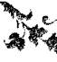
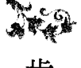

## IMPROVE YOUR VISION
### 没有改善不了的視力
### YOUR INNER GUIDE TO CLEARER VISION

馬汀 · 布洛夫曼 著
林瑞堂 譯
Martin Brofman

開啟身體、情緒、心理及形而上的眼力，看清自己的道路。

- 隨書附贈：中英文引導
- 改善視力的放鬆冥想MP3
- I. 白光放鬆冥想
- II. 眼睛運動的放鬆冥想

## St. Royal College 天使神秘学院

- 专业占卜预测机构
- 神秘学培训机构
- 水晶能量研究中心
- 神秘学资料库
- 官方微信：strcdts
- 微信公众平台：strc2011
- 读书交流QQ群：
    - 占星塔罗占卜师交流群：814594478（加入密码：PDF）
    - 神秘学其他综合群：659338717（加入密码：PDF）

微信号：strcdts
天使神秘学院
天使神秘学院 院长QQ：715104687
微信公众平台：strc2011

## 制作说明

本书由《天使神秘学院》出重金从台湾购入的原版书籍扫描制作完成。为达到最好阅读效果，特地把原版书全部切开后，再经由专业扫描设备高精度扫描完成，并经过一张张的PS后期处理最终成书，其间花费大量的人力、物力以及时间，只为能给大家提供经济并优质的神秘学学习资料而努力。

本学院强力谴责某些机构和个人，把本学院花心血制作完成的电子书籍，包装后直接放在自家淘宝网上低价倾销的行为，以谋取不劳而获的经济利益。如果长此以往最终将无人愿意再为大家花心思制作电子书，那以后可能大家再无新书可读。

为让大家以后能够读到更多的好书，也为了本学院的良性发展。本学院恳请大家尽量做到如下几点：

- 一、尽量在本学院的网站购买电子书籍。
- 二、请勿用技术手段把电子书内的水印及加密去掉。
- 三、在收到电子书后小范围传阅即可，千万不要公开传播，更别挂到淘宝网上低价销售。

同时为答谢广大支持者，学院电子书将做如下调整：

- 一、学院会把一些早已收回制作成本的电子书折价销售。
- 二、最新制作的电子书籍会开放打印功能，大家购买后有条件的可自行打印成书。

天使神秘学院
2019 年 1 月

## 目錄

- 自序 005
- 引言 011
- 如何使用本書 023

## 第一部 存在與觀看 025
- 第 1 章 視覺之喻 027
- 第 2 章 回歸清晰 043
- 第 3 章 改變的過程 053

## 第二部 用你的心當作工具 063
- 第 4 章 創造新的實相 065
- 第 5 章 正向思考 071
- 第 6 章 肯定語 079
- 第 7 章 觀想 097
- 第 8 章 心智程式編寫 103
- 第 9 章 對自己說話 109

## 第三部 另一種觀看方式 117
- 第 10 章 擁抱自己的力量 119
- 第 11 章 你和你自己的關係 131
- 第 12 章 活在當下 141
- 第 13 章 泡泡實相 149
- 第 14 章 人類導航系統 159
- 第 15 章 問與答 167
- 第 16 章 結語 179

## 第四部 練習 183
- 練習 1 愛你的眼睛 185
- 練習 2 無為 188
- 練習 3 逐步放鬆 192
- 練習 4 哈達瑜伽眼部鍛鍊 197
- 練習 5 視力平衡 201
- 改善視力肯定語 204
- 推薦兩個月計畫 207
- 如何使用視力檢查表 212

## 第五部 成功案例分享 215

## 隨書附贈：改善視力的放鬆冥想 MP3 236
- 中文MP3 - 劉瓊玉 引導
    - I. 白光放鬆冥想 (38:28)
    - II. 眼睛運動的放鬆冥想 (55:51)
- 英文MP3 - 馬丁·布洛夫曼引導
    - I. White Light Relaxation (31:53)
    - II. Eye Exercise Relaxation (39:20)

## 自序

貝茲醫師 (Dr. Bates) 是第一位提出「視力可以被矯正」這個觀念的人。由於長久以來驗光配鏡團體 (optometric community) 的官方立場一直都認為人的視力無法矯正 (甚至到現在，許多地方的人依然抱持著這個想法)，因此貝茲醫師的說法被認為相當具有爭議性。儘管這個說法的爭議性相當高，但卻無法否認一個事實 —— 在貝茲醫師的某些案例中，人們的視力的確得到了改善！而這樣成功的案例又該如何否認呢？貝茲醫師的成功案例甚至包括了青光眼、白內障、視網膜色素病變等眼科疾病！

貝茲醫師的基本論述之一就是：所有受損的視力，其實是伴隨著某種特定的心理狀態而來的。雷迪斯根源學院 (Radix Institute) 的創辦人查爾斯‧凱利 (Charles Kelley) 更進一步研究發現，每一種不同的眼疾，都對應著某種特殊的心理狀態。

根據我個人經驗，一個人的視力狀況確實隱喻著自身的意識狀態；也就是說，一個人的生命存在方式，直接和他們觀看世界的方式息息相關。

長久以來人們如此相信：眼睛的功能就像一個盒式照相機，眼睛內部的作用會自動執行對焦調節的功能，例如，藉由眼睛內部環形睫狀肌的收縮動作來改變水晶體的（外型）厚度。這就是著名的「亥姆霍茲理論」（Helmholtz Theory）。然而，根據貝茲醫師的說法，眼睛的功能其實更接近一台風箱式照相機。他認為，是眼部外圍的肌肉控制著眼球的伸縮對焦長度，而眼部肌肉的張力可以因為獲得釋放，使視力得到改善。他同時指出，眼部外圍肌肉的緊繃和壓力其實是對應著某種心理上的緊張壓力，這個說法也支持了受損視力在意識層次之隱喻的重要性。

貝茲醫師發現，眼睛出問題的人，並僅僅是有心理上的緊繃壓力，他們連在肢體上都是緊繃的。因此，他所發展出的許多治療技術，都是透過想像身體的舒緩平靜和肢體放鬆技巧，去創造出一個放鬆的心理狀態。

曾在貝茲醫師手下接受治療訓練、後來也曾為英國作家奧爾道斯·赫胥黎（Aldous Huxley）進行視力治療的瑪格麗特·柯貝特女士（Margaret Darst Corbett），在貝茲醫師一九三一年離世之後繼承了他的衣缽。柯貝特女士曾提到，視力障礙往往是伴隨著呼吸障礙而來（呼吸障礙也是身體緊繃的另一種表現），她發現，一旦學生的呼吸障礙獲得改善，視力也跟著改善了。

鑽研過威爾海姆·睿克 (Wilhelm Reich) 和亞力山德·羅文 (Alexander Lowen) 的學說理念之後，凱利博士覺得，視力障礙真正的原因是來自個人沒有能力表達內心深處的情感所致。

前述每種方法彼此間都有某種關連，而這些方法在某個程度上均證實有效。許多人的心中都想問：「那麼，為什麼這些方式並未更加成功呢？」因為，即使許多成功案例都廣受報導，但同樣也有許多人勤奮實踐卻收效不佳。

本書作者認為，若要真正成功，人必須願意做必要的改變，無論是在他們的意識、在他們的存在方式、以及在他們賦予生活意義的方式。我見證的所有成功案例，全都伴隨著個人生活方式的戲劇化轉變；這些改變如此劇烈，視力的改善因而讓許多人以為，這只是他們經歷的種種過程的邊際效益而已。在我自己身上，正常視力可以說是毫不費力就到來，而我只是專心做讓自己快樂所需要做的一切。畢竟，和不快樂的人相比，快樂的人肩上的壓力更少，而壓力對視覺會產生負面的影響。

許多人認為貝茲醫師的方法太過技術性與機械化。儘管他著作中的概念展現出他對伴隨視力受損而來的意識程序有深刻的洞見，但是許多運用這個方法的人卻忽視這些概念，對自己所做的只專注其外在形式，而不深究自己在操作方法同時的內在經驗。因此，他們的成果相當有限。

我知道一個案例：一位男士只靠身體放鬆技術，就在三個月內將自己的度數由 16 屈光度（diopter）降到 12 屈光度。不過他不願意探索造成自己視力受損的更深原因，因此之後再也沒有改善。即使如此，他仍然能生平第一次看見鳥兒！

本書最主要的重點就是「內在程序」，也就是在你的意識之內所發生的一切。這是深度個人轉變的過程。書中的方法或多或少都是心理技術。《沒有改善不了的視力》（Improve Your Vision）這本書能提供轉變程序所需的動機、啟發以及工具，讓你有機會改變自己存在（Being）的方式以及觀看的方式。身為讀者的你，必須親自運用這些工具，才能讓它們發揮功效。

讀到這裡你可能有些顧慮，因為我們經常會為自己的存在方式辯護，更有許多人不願改變或是「變成了其他人」。其實真正會發生的是：你變得更像自己——成為真正的你。你剝除一層層的外衣，重新發現真正的自己。

如果你視力不佳，那麼你就是沒當好自己；你隱藏或壓抑真正的自我，或者依循某個你覺得自己「應當」成為的形象而活。如果你發現自己不需要這麼做，如果你發現你能當真正的「你」，那樣一來你能想像自己的生命會如何嗎？你不會感到更加自由？

你能搭乘這本書前往你一直想要的生活，讓你身在其中能感到快樂、放鬆，能清楚地觀看。當你快樂又放鬆，你所經驗的壓力和緊張會減少。一旦壓力和緊張離開你的意識，它們也將離開你的身體，帶走所有視力受損的症狀，讓你在各個層次回到平衡。

這本書能教你如何快樂嗎？不能。你已經知道該怎麼快樂了。你只需要做能讓你快樂的事，別再做會讓你不快樂的事。不過，你一直讓自己無法快樂——甚至讓自己無法看見那些能為你帶來快樂的事物——同時你也懷疑自己是否真正能夠擁有快樂。本書能提醒你，那些你在內心深處一直都知道的事都是真的。

現在你願意看到了嗎？
你是否願意做出改變好翻轉自己？
這本書能幫你達成這點嗎？
可以的。

> **譯注**
> 1. 赫胥黎由於受到柯貝特女士之啟發而採用貝茲醫師的視力改善方法，並依據他自己的親身經驗寫成了《看的藝術》(The Art of Seeing, 1942) 一書。
> 2. 屈光度乘以100，就是俗稱的近視度數。

### 本書聲明：
療癒（Healing）與醫療（Medicine）是兩個完全不同的方法原則，需要在此做些聲明。本書內容所涉非屬醫療範圍，而是屬於療癒，並且不提供用藥建議。讀者若有相關疾患，請詢問專業醫療人員。

## 引言

這是一本關於改善視力的書，但是這本書卻不只是關於視力，更是關於找到內在清晰 (inner clarity)。內在清晰將會帶來清楚的洞見。我能這麼說，是因為我有親身經歷，更見證許多人獲得同樣的體驗。我自己之所以踏上通往清晰的旅程，起於一聲劇烈的「起床號」，而透過接下來的引言，我想和你分享我的故事。

一九七五年，我癌症末期，得知自己只能再活一、兩個月。腫瘤長在我的脊髓——在頸部——而且隨著腫瘤變大，脊髓便被往脊徑內側壓迫。我的右手臂麻痺，雙腿抽筋。切除腫瘤的手術並不成功，醫師告訴我說，由於種種原因，化療與放射治療也無法見效。

醫生們警告我，生命終點有可能轉瞬來到，可能是任何一刻，或許在我咳嗽或打個噴嚏的時候。我面對這樣的現實：每天都可能是我的最後一天，每個片刻都可能是終點。我確定一件事——不管我剩下的時間有多少，我要快快樂樂，單純作自己。因此，我不想接受令人倒盡胃口的特殊飲食，儘管人們宣稱它們有效。每一餐都可能是我的最後一餐，所以我想吃自己真正喜歡的食物。我必須真誠對待自己，不管做什麼都要實實在在。

我的價值觀轉變了。我活在當下，做每件事都是為做而做，因為我真的想做。過去看似重要的許多事情突然間都不再重要。唯一重要的就是要快樂；對我而言，那代表去做任何我高興去做的事，並且不做任何會讓自己不快樂的事。

兩個月之後，我仍然活著。雖然時間用光了，但是我還活著！我在想這還能持續多久。五個月後就是新年了，我心想如果真有奇蹟發生而我也還活著，我就要去熱帶樂園度假慶祝。當時我並不知道那次度假會救我一命。

五個月之後，我到馬丁尼克（Martinique，位於加勒比海，為法國一個海外省）過新年假期，並且和一位在那裡教授禪宗靜坐的人有一次擴展心靈的交談。他對我說：
> 「癌症由你的心靈開始，而你也能由那裡將它除去。」

這真的好像有人旋亮了電燈泡——事情變得如此清晰明白。我知道他的意思，也能了解為何癌細胞成為一個隱喻，象徵所有壓抑而未曾表達的事物。我看到自己過去的生活及存在方式如何讓我以許多方式傷害自己。當下我便領悟，如果我改變自己的存在方式，我便能以某種方式釋放自己的症狀。我能運用心靈這個工具來促成自己的存在方式與身體改變。

自從確診為癌症後，這是第一次，我能夠想像我有可能翻轉自己的病情並將癌症除去。我可以拯救自己的生命！

幾週之後，我聽到一場演講介紹「西瓦心靈控制」（Silva Mind Control）——現已更名為「西瓦心靈術」（Silva Method）——教導人們如何將心靈當成工具來使用。此方法的概念為：我們的感知創造我們的實相，而既然我們能選擇自己的感知，那麼我們便能選擇改變自己實相的任何一面。我的意識乃是程式運作的結果，正如同一部電腦會依據程式的設定來產生結果一樣。「我」能夠重新設定「我的」意識。

我的感知一直是我是「疾病末期病人」，所以我得重新設定自己的意識，以創造出「我很健康」的感知。如此突然的轉換，我還沒能準備好。有長一段時間，我覺得自己處在衰敗的狀態中，愈來愈接近死亡。我的思維需要針對這一點進行重大改變。我領悟到我能更容易地創造「我愈來愈健康」這樣的感知，直到自己終於「好了」。

我知道轉折可能在任何時刻發生，只要我轉動自己心中的旋鈕，並且堅定地認知到旋鈕已經轉開。我心想，如果隨時都可能是改變的時刻，那麼，就讓它在此刻改變。

我的意識轉變幾乎是立刻發生。我能感覺，當下就知道自己的狀態已經改善。我也知道維持自己的抉擇而不動搖非常重要。從那一刻起，我知道自己的感知必須能讓「我現在已經愈來愈好」的概念更加強化，這樣我才能達成最終的痊癒。

我吃任何自己想吃的食物，同時告訴自己：我的身體此刻需要這種食物，也想吃這種食物好加速療癒過程。我的身體經常有類似電擊的生理感受，過去這類感受讓我更堅信腫瘤正在長大。這類感受仍會出現，不過現在我選擇將它們感知為腫瘤正在縮小的證據。

我的心尋找著更多不同的方式來體認進步正在發生。

我知道自己得遠離那些堅持將我視為末期病人的人，這不是因為我缺乏愛，而是為了維持我自己對療癒過程的正向態度。我身邊的人必須願意鼓勵我接受這個我為自己所設下的、看似不可能的任務。只要有人問我過得如何，我必定回答：「我愈來愈好了，謝謝。」這是真的。

我研究心理編程（mental programming）技術，了解到如果我讓自己進入放鬆狀態，正向地對自己說話十五分鐘，如此每天三次，那麼在六十六天之內我可以讓自己相信任何事物。而且，不管我相信什麼是真的，都會真實不虛。

我知道維持正向的心理編程非常重要，我知道保持自己處於放鬆的心態、並正向地對自己說話十五分鐘、每天三次，這些都是編程的步驟且我絕不該干涉。有時我會受到誘惑不想去進行放鬆步驟，但我會提醒自己這是生死交關的事。因此，任何這類的誘惑都是我與自己生命之間的阻礙，必須清除，我才能活下去。

這聽來也許簡單，但實情並不總是如此。有時——特別是剛開始——這非常困難。有時，我的想法或用詞所肯定的根本不是我想改進的概念。在這些時候，我必須對自己誠實，知道自己「搞砸了」。我會重新開始，告訴自己剛剛只是暖身，「現在」才是真正改變的時刻。

後來確實簡單多了。我能夠保持正向及一致的時間最初只有幾小時，後來是一天，然後兩天，然後就堅定不移。這個方式有效。

懷疑的聲音偶爾仍會響起，但是我知道那不代表真理。內在鼓勵的聲音成為我的指引，引領我回到穩定的健康狀態，讓我能維持專一的心態去體認正向改變正在發生。如果我沒感覺到某個症狀，我會告訴自己，或許我再也不會感受到那個症狀了。如果後來我又再次經驗到那個症狀，我會告訴自己過程還沒完全走完，但是我會確認自己感受症狀的頻率變低了，嚴重程度也大不如前。一切都在變好。

我必須知道正向的改變此刻正在發生，即使它們不見得總是明顯。我會告訴自己，這些變化或許就在我感知的門檻附近，好讓自己迫不及待有證據能證實這點。我總是能找到正向的事物，讓自己放心一切不全然是我的想像。

我的女兒潔琪與希瑟給我許多鼓勵。當時希瑟才四歲，但她知道愛能療癒，所以她給我療癒之吻——每個白天與每個夜晚。我也能感覺到六歲的潔琪對我的信心，以及她相信我能以某種方式度過此一危機。她不接受其他可能。從她的眼中，我總能看見我倆之間的連結。

在放鬆的過程中，我會觀想腫瘤，想像一層腫瘤細胞死去，並經由身體自然的新陳代謝釋放。我知道改變正在發生，即使它並不明顯，也難以注意到。每次身體進行排泄時，我知道死去的癌細胞正被消除。我堅定知道這是真的。

我知道癌細胞代表被壓抑而未能表達的事物。由於腫瘤就位在我的喉輪（throat chakra，能量中心），因此我也知道，這意味著我一直沒有讓自己的存在得以表達。因為我不太確定這代表什麼，所以我認為當務之急就是表達一切：每個想法，每個感覺。無論我的意識內有什麼要出來的，我都會表達，也知道這對我的健康非常重要。在那之前，我心中的認知是：表達會導致不和諧，但現在我知道自己所表達、所溝通的種種能夠為身旁的人所理解，這會帶來和諧。

以前，我相信如果我說真心話，壞事將會降臨。我必須重寫程式，將那個信念改成：如果我說的是自己真正想說的話，那麼美好的事物將會來到。我做了決定，事情就這樣成了。

我發現自己和老朋友共同點愈來愈少。這就好像過去我們擁有同樣的波動頻率，假設是547轉（先不管這是什麼意思），可是突然間我發現自己來到872轉，和547轉的人開始話不投機。我必須尋找新朋友，尋找同樣在872轉的朋友，好讓我有人能一起說話。

我發現自己受到872轉的人群所吸引，而他們也是如此，彷彿我散發出選擇性的磁場。我的實相中有某些元素正在被釋放，因為對我正在轉變的新生命而言，它們不再能彼此搭配。在內心深處，我知道這個過程無法避免，也不該干涉。我培養出一種慈悲與理解的感受，也知道自己的生命取決於放下和我新的波動不協調的所有元素。這個過程很單純，但並不總是簡單。

每天都像開始一段自我探索的過程，不對自己懷抱任何成見，而是願意發現正在形成的我。每一個新發現都會讓我心情非常愉快。

通常，在做完給自己的功課後，我會想像在醫師診間的場景。我可以看到他正在幫我檢查，臉上露出疑惑的表情，因為他找不到腫瘤。我想像他滿臉狐疑，對我說：「說不定我們搞錯了。」每天，在進行放鬆的步驟時，我都會在自己心中搬演這個場景。

大約兩個月後，我回去複診，替我檢查的是當初宣判我癌症末期的那位醫師。他替我檢查，結果什麼也沒找到。猜猜他怎麼說？「說不定我們搞錯了。」一回一路上我都難忍笑意。

我轉變了自己的存在方式。我的生活有了戲劇化的改變。過去我在華爾街上班，設計電腦程式，也涉入電腦詐欺。儘管一切都很有趣，我不覺得這對我的「遠景」非常重要。每天我從住所到公司得通勤九十分鐘，過著「美國夢」（the American Dream）一般的生活——郊區宅邸、有妻子跟兩個孩子、車庫裡有兩輛車子、還養了一隻大狗……但是我並不快樂。

與意識一同工作，這感覺起來彷彿我使用更高級的電腦。現在，身為醫者及教師的我所做的工作對我有意義，對他人很重要，並且能服務全人類。每當我療癒及教導他人、每當我知道我正從事自己人生的使命，我都能有「快感」。

轉變和療癒的過程密不可分，無論你想療癒自己的視力、釋放某些嚴重疾病，或者心理或情緒層面的不平衡，但尚未發展成生理疾病。

我的療癒過程有個意想不到卻十分美妙的副作用，就是我不再需要那副戴了二十多年的眼鏡了。我以前有近視和散光，但是現在我的視力已經改善，經過檢驗證實，我的視力已經「正常」。

在我療癒之後，我以相當不同的方式觀看這個世界，不管是生理上或心態上。我的外在視力與內在洞見一起轉變了。我因為對這個「副作用」相當有興趣，因此決心研究其他人在視力改善這個領域中正在做些什麼。

我閱讀這個領域所能找到的所有書籍，不是因為想知道「我該怎麼做」而是想發現「我是如何做到的」。我找到八本書，其中七本都參照了第八本，也就是貝茲醫師的《完美視力，摘掉眼鏡》（*Better Eyesight without Glasses*）。他是這個領域的先行者，而他的觀念在一九二〇年代讓傳統醫學界大感震驚。

貝茲醫師提出許多重要的概念，但是他著作的風格對多數人而言太著重技術層面，因此其他人——例如瑪格麗特・柯貝特女士以及奧爾道斯・赫胥黎——都另外寫作書籍，並將他的觀念簡化以饗一般大眾。

加州雷迪斯根源學院的查爾斯・凱利醫師是第一位加入了新觀念的人，因為他為不同的性格類型與不同的視力受損建立連結。近年來，行為驗光師（behavioral optometrist）理查・卡夫納醫師（Dr. Richard Kavner）針對大腦與心智的連結提供許多新的資訊，並且在兒童視力改善的工作上相當成功。

這些視力改善領域的共通之處就是觸及個人轉變的過程——就和我自己的經驗一樣。

## 引言

透過閱讀前述著作所獲得的經驗，我能夠以他們的概念為基礎進行延伸，運用我的個人經驗來尋找其他洞見。

我開始和他人討論這些概念，幫助他們探索自己的視力問題與個人存在方式之間的連結。一段時間之後，聽過我說明的人都把他們的眼鏡拿給我，告訴我他們再也不用戴眼鏡了。

從一九七五年起，我曾與數萬人一同工作，看著其中許多人藉由重新訓練自己的意識、改變自己的生命，進而改善自己的視力。事實上，他們生命改變的幅度是如此巨大，以致讓他們認為，視力的改善相形之下真是微不足道。

本書內容來自我所進行的研究，以及我指導他人轉變自我視力的經驗。本書所提供的並非「外在」程序（飲食、生理運作、運動、維他命等）——儘管它們通常是其他視力改善方法的重點；相反的，本書把重點放在「內在」程序。這本書會介紹意識之中會發生什麼，因為意識是我們所有經驗的起點。當我們釋放自己意識中的壓力並且接受新的觀念，那麼壓力也會由生理身體中釋放，讓我們在各個層面回到平衡。

貝茲醫師認為，所有視力損害都是源於壓力。在探討視力損害時，我們所思考的不僅是視覺的器官力學原理，更包括視覺功能以及視覺經驗。根據貝茲醫師的看法，如果我們忘掉視覺的力學原理，僅專注於視覺的功能——亦即我們意識中的經驗——那麼等到視覺的功能復原，視力受損的器官性「成因」也會逆轉。

本書所針對的是屈光不正（例如近視、遠視和散光）。不過，有些罹患「器官性」視力障礙的人（例如白內障、青光眼等）的人，在有意識地運用本書觀念以及其他自我療癒概念之後，也表示他們的視力有了進步。他們運用的其他概念包括：人該為自己的處境負起完全的責任，體認到視力問題乃是他們選擇接受的特定感知所造成，也因此人能夠藉由改變自己的態度來改變自己的處境。

讀者諸君，願你們覺得本書的內容有益且珍貴。我希望本書能協助你們回歸此一存在狀態，能夠全然體驗自己的完整，並且獲得你本然的清明狀態。

## 如何使用本書

首先，從頭讀過一遍，了解書中描述的步驟。在本書最後，你會找到我們推薦的兩個月計畫及三種投入程度：良好、絕佳、最大。

先決定自己能夠接受什麼程度的投入，並且確認自己能夠完全投入這個計畫。通常最好先選擇較為簡易的程度，讓自己能輕鬆進行，而非選擇較深的程度使得自己無法維持下去。無論你選擇什麼程度，要全心投入。讓這成為你日常生活的一部分，將它當成高優先計畫，無論面臨什麼狀況都要進行。畢竟這很重要——不僅關係你的視力，更關係到其他更多更多！

針對此計畫來建構成功模式。你愈能深入，所見到的成果也愈豐富。

我建議，將本書從頭讀過一遍之後，你可以每天重讀一個章節。書中的資訊包含了許多不同的層次。同樣的內容在你重讀時將會有不同的意義，此外，你的經驗將會開始和你的閱讀產生連結。

當你讀到和你的視力受損類型相符的描述時，請注意這些字句如何描述你，並且辨認出你所經歷的存在方式如何影響你的觀看方式。

每一章最後都有和該章節內容有關的肯定語。在一天之中，請思索這些肯定語，思索它們對你的意義。在一天之中，經常向你自己複誦這些肯定語——或許每一到兩小時一次。這些肯定語能幫助你重新導正自己的意識，讓你再次回歸自己自然的清晰狀態。

或許有時你進步神速，或許有時感覺一切既緩慢又困難，但是請堅持下去。長遠來說，兩個月的時間在你整個生命中並不算長，而且這段時間將是用在刀口上。要願意去正視所有你過去逃避不敢面對的課題，並且看到要怎樣你才會快樂。

相信這個過程。
這是有用的。
你會看得見。

## 第一部
### 存在與觀看

## IMPROVE YOUR VISION
没有改善不了的视力

### 近視 (斜肌群)
影像落於視網膜之前

### 遠視 (直肌群)
影像落於視網膜之後

## 第1章 視覺之喻

凝視某人的眼睛，你將看見他們真正的模樣。我們或許能勉強自己微笑、說些他人想聽的話，但真相永遠就在我們的雙眼之內。眼睛無法說謊。我們身體的眼睛不僅是外在感知的器官，也和我們的內在感知有關。我們的語言中充滿了各式各樣關於視覺的比喻：

- 「他真是短視」
- 「她真有遠見」
- 「他拒絕看清楚正在發生的事」
- 「我了解了」（原文為 I see，字面意義為「我看見了」）
- 「他們無視於他的所作所為」
- 「他不願直視這個問題」

諸如此類——但是這些表達方式都不是關於生理視覺。所以，我們的視力和存在方式之間有什麼關係呢？

視力不僅是和視覺敏銳度有關的生理程序，更是一種多層次的功能，會影響我們這個生命體存在的情緒與心理狀態。視力同時與人格連結，每種視力受損亦和特定人格類型有關（請注意：如果你跳過了本書的引言，那麼我建議在這個階段回頭去讀那個部分——你會看到一個清楚的案例，說明外在的視力如何反映出內在的運作程序）。

所有近視的人都有共同點，遠視的人也都有一個特定的人格特質，而所有罹患散光的人生命中都得處理一個類似的問題。每一類視力受損都代表人在與環境互動時承受壓力的一種方式，一種不「輕鬆」(not 'at ease') 的方式。

某些人說壓力造成了所有的情緒與生理失衡——確實，壓力造成龐大工時的損耗，醫界也承認它確實關係到疾病（或說 dis-ease，「不輕鬆」）的產生。壓力以許多型態儲存於身體，包括特定肌肉的緊繃或收縮。壓力型頭痛和緊繃的肩膀是兩個常見的例子。

因此，我們可以說，生理的緊張是儲存在身體肌肉内部的情緒或心理緊張。特定肌肉群的緊張關係到特定的情緒與心理狀態。換句話說，你在「哪裡」感覺到緊張乃是關係到你「為何」感到緊張。就視力而言，和不同的視覺失常有關的是特定眼外肌群（extra-ocular muscles，圍繞著眼球的肌肉）的過度緊張，以及特定的情緒模式。

每顆眼球外圍繞有六條眼外肌（參見26頁插圖）。我們用這些肌肉來推動眼球朝向不同方向移動，有段時期人們認為這是這些肌肉的唯一功能。不過，後來發現，這些肌肉的力量比起完成這些動作所需的力氣，強大超過百倍。既然人體的結構與功能有密切關係，這些肌肉顯然必定有其他功能。確實如此。

眼外肌的另一功能就是配合水晶體（lens）組成眼球的對焦機制。這些肌肉讓眼球能根據我們所觀看的事物、以及我們的想法和感受來伸長或縮短。如此一來，眼睛的運作就像可變焦的風箱式照相機，而不是固定焦距的盒式照相機。

四條直肌群（Rectus Muscles）將眼球直直地向眼窩拉，使眼球縮短（請見26頁圖）。這些肌肉的過度拉緊會造成遠視。這類緊張出現在情緒上則是隱約而持續的憤怒或是罪惡感（亦即針對個人自我的憤怒）。這種經驗也可能是感覺自己脫離了自我、並聚焦於某個外在的形象或角色，而非聚焦於自己真正的樣貌。在遠視的人身上，能量會往外擴展，好讓事物無法進入，甚至把東西向外推離。遠視的人可能感覺自己在某些地方不如他人那麼重要。

兩個眼球分別被兩條肌肉像腰帶一樣束著，這組肌肉稱為斜肌（Oblique muscles）。這些肌肉拉緊時，便會擠壓眼球使之伸長。這些肌肉若過度緊張，便會造成近視，而這樣的壓力表現在情緒上的經驗為：躲藏在自己的自我之內，向內退縮。這樣的經驗包括憂慮、恐懼、不信任、感覺受到威脅、或者不敢做自己。有可能這類經驗全都會出現。

不同肌肉壓力不均會使得眼球受到不均的擠壓，被此力道拉扯的眼球不再呈現圓形，因而造成散光並扭曲所見的影像。這樣的人可能感覺迷失、不確定、或者對自我價值觀（到底自己真正想要什麼、真正的感覺如何）感到混淆。來自「外在」的價值被納入「內在」，以個人感到不自然或不真實的方式。這種狀態產生的壓力不僅出現在個人的意識中，也會出現在眼睛的肌肉上。

視力受損之所以出現在人的生活，是因為人們面對環境感到壓力，因為他們無法看清楚環境——眼睛或心靈均是如此。如果狀況持續，承受這類壓力的眼睛肌肉便會暫時「凍僵」，讓眼球呈現失焦的狀態。由於這些肌肉承受的壓力呼應了個人意識內的壓力，因此個人也受困於特定的意識狀態中。幸好，透過哈達瑜伽 (Hatha Yoga) 的眼睛運動——類似驗光師所謂的運動力訓練——這些眼睛肌肉能夠得到放鬆，並因此恢復清楚的視力。

等到眼睛肌肉恢復彈性，眼球就能恢復到自然的形狀，視力也能恢復。壓力也能從身體與意識釋放，讓人回歸到輕鬆、清晰、更為自然的存在形式。我們的視力天生就是清晰的，因此回歸清晰就是回歸我們自然而然的平衡狀態，也就是真正做自己。

就算不去專門處理我們眼睛的肌肉，只要處理自己的生活方式，我們也可以回歸清晰與平衡。視力隱喻人們觀看世界的方式，也和人格有關。只要我們辨認出個人經驗內與視力損害有關的元素並將之釋放，那麼視力便能回復清晰。只要我們釋放意識中過多的壓力，我們便能釋放眼睛肌肉中的壓力，眼球便能回復自然的形式，因而帶來清晰的視覺。

由於每種視力損害都對應特定的人格類型，因此外在視力的改變理應伴隨著性格的改變。新舊將會有同樣的存在本質，但是「新」會用不同的方式與環境互動——那是一支不同的舞。

這樣的改變就像去除一層感知的濾鏡（filter）——過去這層濾鏡決定各種價值觀。我們無需受制於種種我們自知是扭曲的觀點，而是去控制它們的顯現。我們可以有意識地決定依循並選擇我們確知為真的認知，讓我們與環境的互動更為成功、並且更符合我們真正的樣貌。放下舊有的濾鏡，新的價值觀將更為明顯，其後續效應也將有更深的影響。改變可以很簡單——新的、不同的食物、服裝、音樂品味——這是來自你的忠於自我並願意改變。改變或許相當劇烈，關係到事業與人際關係。這類改變聽來或許極端，不過它們總是為了你好，最終會導向更大的快樂與自我實現。

視覺改善的方法如未能考量人格改變的層面則其成效也將有限。在視力獲得回復的案例中，相關的人都經歷轉變的過程，也確實放下某些角色期許。他們變成另一種存在，個性不同，更加真實且以不同的方式觀看世界。改善的程度與速度取決於個人有多願意接受改變、接受新的性格、去成為新的存在，或者應該說，取決於他們是否願意成為並活出真實的自己。

如果我們想像每個人都被一個能量泡泡（我們各自的認知濾鏡）圍繞著，那麼我們便能了解某些譬喻。

## 近視

近視的人看離自己近的東西比看離自己遠的東西容易。他們更加專注於自己泡泡裡面的東西，較不關心外面的人事物。能量——也就是注意力的方向——朝向內部，遠離外部，向內移動並且收縮，因此事物必須靠近才能清楚且輕易地被看見。人的傾向朝向自我，此傾向相當過度，因此「我」比「你」更加重要，而「我們」中的「你」似乎未能獲得等量齊觀的注意。他們感覺自己的渴望與感受比起他人的渴望與感受更為重要。近視的人通常極度需要隱私，可能會由四周的世界退縮。他們對所處的環境感到心驚，有種想躲入內在的感覺。

對近視的人來說，他們思考的焦點在前方，而這種觀點的情感經驗是恐懼或不確定感。對未來過度著迷讓這樣的人無法完全生活在當下——活在此時此地——而這種經驗的程度與近視的度數成正比。這樣的人格可能會有些補償作用，例如以敵意來掩飾並縮減自己的恐懼，或者勉強做出外向的姿態來掩飾自己躲藏於內在，不過我們在此討論的是這類外在行動背後的內在動機。

## 遠視

遠視的人看離自己遠的事物比看離自己近的事物清楚。遠視的人更關心泡泡外面的事物，較不關心泡泡裡面。能量——注意力的方向——向外擴展，推開或頂撞著外在的事物。東西必須拿遠點才能清楚且舒服地看見。他們感覺其他人的渴望與感受，比起自己的渴望與感受更為重要。他們極度傾向於他人並遠離自我。「你」比「我」更加重要，而「我們」中的「我」似乎未能獲得等量齊觀的注意。

近視的人能夠輕而易舉退縮到自己的內心，但是遠視的人很難這麼做，因為他們的注意力會持續導向外在。遠視的人對他人的生活感興趣卻逃避面對自己的生活。他們的外在形象（他們在別人眼中的樣子）被過度強調、被過度認同，其重要性遠超過他們的本質——亦即真正的自己。任何的憤怒都可能被壓抑，以避免冒犯其他人。思維聚焦於過去，通常帶有憤怒與自我辯解，或是一種沒做「正確的事」的感覺。他們沈溺於過去，無法活在當下。當然，這種狀態的程度取決於個人的平衡以及個人的遠視程度。當然可能會有補償性的行為，例如過度強調自己的聖潔以掩飾罪惡感，或者以超乎常理的仁慈來掩飾憤怒。

## 散光

眼睛散光的人對自己的渴望或感覺不甚確定，這點取決於散光出現於左眼、右眼或雙眼。他們的「泡泡」是扭曲的。

以形而上來說，右眼（意志之眼）代表清楚看到自己的渴望，左眼（靈性之眼）則代表清楚看見自己的感覺（對左撇子而言，上述的特性是左右相反）。有散光的人渴望或感覺到自己確切為真的事物，但他們會認為這樣不妥，因此將之改變。他們進而相信假裝而成的改變，不再能清楚看見自己一開始真正的渴望或感覺。他們的焦點在於那些渴望或感覺是「應該的」，而不是它們是否為真。因此他們混淆了何者是真正的自己. 如果他們不再假裝成自己不是的模樣，那麼他們又是誰呢？

各種視覺失常的組合和前述特質的結合有關。散光可能會和近視或遠視結合。當然，具有前述的人格特質不見得會伴隨視覺失常，不過對視力受損的人而言，這些特質會特別顯著。

近視代表看近的事物特別清楚。遠視代表看遠的事物特別清楚。儘管極少數人可能一眼近視、一眼遠視，但是同一眼不會同時出現兩種症狀。如果人看遠看近都不清楚，這種狀況是眼睛調節機制過於僵化，反映出意識的僵化。放鬆技巧與眼睛運動可以恢復彈性。如此一來，個人也會發現自己的心理程序更有彈性。

我們是能量的存在，能量則是由我們的意識所引導。究極而言，我們能夠選擇能量在某種情況下該朝什麼方向流動。我們可以選擇不受過往模式的引導。我們可以改變那些自己知道較不正確、較不理想的感知，並且願意看見事物的真相，而非透過扭曲的濾鏡來看。

泡泡內外的能量流可以改變，泡泡自身本質也可以改變。要記得，這是我們藉以感知環境的感知「濾鏡」。「阻塞」的濾鏡會讓我們只以特定的模式來互動及感知。這就像有選擇性的鏡頭，只接受讓符合我們選擇或接受的基本信念通過，卻忽略或拒絕其他的信念。由於我們的行動乃是根據自己所能接收的資訊，因此前述情形會讓我們傾向以固定方式回應自己的環境。儘管如此，真正的問題並不在選擇性的濾鏡，而是我們必須釋放情緒濾鏡中的扭曲特性。

如果我们保持清晰且站稳中道，泡泡会变得清澈，我们的互动也是如此。当我们处于强烈情绪之中，我们无法保持中道，泡泡也不再清澈，会因情绪之流而扭曲。因为情绪之流让泡泡扭曲，状况会有不同的外貌，而我们也会以不同的方式应对。我们通常能体认到自己的观点受到扭曲，有时甚至就在经验展开的同时便能知道。如果愤怒、恐惧、混乱等强烈情绪被「压抑」——就如同视力受损的人所经验到的——那么泡泡当然受到扭曲，不过人们无法体认这样的扭曲。人会认同于扭曲的观点，相信它代表真相，相信它代表真实的自己。然而事实并非如此；那不是他们真实的自我，而是他们在扭曲作用时所显现出的样子。他们可以释放滤镜与自我感知中的扭曲层面，回归真实且清晰的自我。

### 做出改變 —— 從靠近到清晰

近視的人要更加願意讓人見，要相信讓人看見真正的自己是安全的，這樣便能將能量導向外在。他們可以學習從別人的眼睛觀看自己，去了解別人如何看待自己，這樣他們不僅會有由內向外的觀點，也能有由外向內的觀點。這會讓他們有機會走出自我，用不同的觀點看事物，並且運用如此得來的額外資訊來擴大自己的互動。

同樣重要的是以同理心對待他人。你不一定要認同其他人對你的看法，但是你要願意去了解他人如何看待你，也要知道其他人對你的觀點和你對自己的觀點同樣重要。事實上，知道他人的觀點或許非常有用。

培養自信心並且選擇不再基於恐懼來做決定，這對近視者相當有益。重點是，不要對自己所處的環境感到恐懼或威脅，而是逐漸專注於讓自己做自己，讓自己愈來愈真。重點是要相信，相信當你做自己「真正想做的事」，那麼奇妙的事一定會發生。由於這個過程對我們的「自我」如此重要，因此近視的人也要學習去了解，同樣的過程對其他人也很重要，去了解每個人都愈來愈擅長做自己。

### 做出改變——從遙遠到清晰

遠視的人可以用關心他人的方式來關心自己，藉此重新將能量導向內在。重點不是停止考慮他人，而是以同樣的方式來考慮自己——願意為他人做什麼，也要願意為自己做什麼。這可能需要有意識地允許自己不帶罪惡感地接受——不是取得，而是接受（請注意兩者之間的差異）。同樣重要的是，你要能表達渴望和感覺——允許自己擁有。在接受時，你無需回饋或拒絕，只要說聲「謝謝」並且無條件地接受。這樣的接受也包括觀念，而且你應該注意自己用什麼方式來與事物、觀念甚至人保持距離。焦點應轉向真正的你，而非你的形象。形象很重要，但是不該因此忽略本質。外在模樣並不比真正的感受更加重要，而且人們確實會感激你誠實表達感覺。

你也必須體諒自己。表達愛，不見得需要犧牲。你不一定得走出自己的空間才能獲得愛與尊重。這個角色可能很有趣，但是請記得裡面的那個人，那個扮演這個角色的存在。從遠視者的角度來看，「我們」可以將「我」和「你」等量齊觀，「我」也可以被視為另一個「你」，可以彼此分開而且本身就很重要。

## 做出改變 —— 散光

有散光的人每天都要經常問自己：「此刻我真正想要的是什麼？我真正的感覺是什麼？我覺得什麼是真的、是對的？如果我不再想成為我不是的那個人，那麼我又是什麼人呢？如果我不再根據他人的標準來活，那我又是什麼人呢？」

「如果我不再假裝成我一直扮演的那個人，什麼是我會以不同的方式來做的？」

你可能覺得你真正的樣貌是你所處的環境無法接受的。如果這樣，重點在於發現這個感覺是真是假：你可以做自己，停止角色扮演。你要不就發現這個感覺是誤會，因為你無需角色扮演，要不就發現這個感覺是真的，這麼一來你就能選擇轉換到另一個你能做自己，同時讓人接受的環境。無論如何，其結果就是能更加輕易地做真正的自己。

在社會中，我們每個人都能適得其所。如果我們讓自己真實不虛，我們就會找到自己的定位，能夠以真正的自己為人接受、欣賞。我們不用再假裝看不見什麼對自己是真實的。我們全都可以允許自己成為真正的自己，可以愈來愈真實。

只要有決心及意志力來改變感知與其相應的實相，任何人都可以改變自己的世界觀——心理的觀點與身體的視覺——並且回歸視力清晰的自然狀態。

## 肯定語

- 我愈來愈自在可以做自己，並且看得更清楚。
- 我知道自己可以不用眼鏡就看得很清楚。
- 當我清理自己的生命，我的視力也清晰了。

### 第 2 章 回歸清晰

如果你已下定決心要改變自己的視力，首先要考慮幾件事情。

你必須發自內心深處想要改變發生，你必須願意做必要的事——可以說，你要將這當成第一優先，甚至視之為生命中最重要的事，至少暫時如此。為了改善視力付出這兩個月的時間並不為過。在這段時間內，如果能建立例行模式會很有幫助。本書最後附有一個為期兩個月的改善計畫。同時你必須願意在這兩個月全心投入，並且在最後願意看到清楚且足堪衡量的進展。

在轉變階段，你要堅持體認自己的視力和眼睛正在改善。你必須無視於內在任何質疑的聲音，同時認同那些鼓勵的聲音。在內心深處，你要知道這些改變正在發生，即使任何所謂的「證據」指出並非如此。

確實持續進步，必須成為你意識的必要元素。如果你視力模糊，要知道這不是因為這個過程無效，而是因為過程尚未完成。如果你尚未體驗到清晰視力，那麼你要知道這仍正在進行。

## IMPROVE YOUR VISION —— 没有改善不了的視力

永遠要鼓勵自己感知到改變正在進行，或許即將能讓你觀察到。要充滿希望地期待改變，要注意任何證據說明改變「此刻」就在發生。要注意自己如何比過去看得更清楚——即使這感覺起來好像是自己的想像！你很快就會知道這不是你想像出來的，是真的，而你個人的一再肯定將會賦予這個過程額外的力量。

壓力是視力受損的成因之一，對視力的憂慮會增加壓力，所以本身就會成為自我實現的預言。我們可以說，如果你對整個過程不要投入太多情緒，這也會有幫助。要當個旁觀者，耐心且樂觀地觀察改變逐漸變得明顯。如果你對視力模糊感到有壓力，那麼意識中的這些壓力將會進入眼外肌，讓它們更用力擠壓眼球，並使它們變形更為嚴重。

正視你此刻的視力——是怎麼樣就怎麼樣。這就像觀看用柔焦鏡頭拍的電影，就算你細節看不太清楚，還是可以享受色彩、型態與動作。只要你放鬆，壓力就能從意識與眼球肌肉釋放，你的視力就會變得清晰。這有點像在一旁看著電視機自動微調，你本人無需參與，只要看著一切發生。

另外一點也很有幫助：只有在絕對需要時才戴眼鏡——如此說當你要從事不戴眼鏡做不到或有危險的活動時。例如，開車也許需要戴眼鏡，但是與人交談或聽音樂就不必。如果你要做的事不需要眼鏡，請將眼鏡取下並讓意識獲得自由，無需依賴眼鏡。

當你檢查眼睛，你的意識會感受某些壓力，這會反映為眼球肌肉的壓力。這些壓力會讓眼球成為某種形狀，創造出和當時狀況有關的特定視力經驗。驗光師給你配的鏡片，是針對當時你的視力狀況提供補強。當你將這些鏡片放在眼睛前，它們提供的補強乃是針對你的眼球處在那個形狀時所帶來的視覺經驗，而那個形狀來自你的眼球肌肉與意識所承受的特定壓力。

幾天後，你戴上新眼鏡，感覺不太舒服，卻被告知你的眼睛必須去習慣鏡片。為什麼會這樣？他們不是才根據你的眼睛來調整鏡片嗎？

應該這麼解釋更有道理：在你眼睛檢查過後幾天，你的意識有了不同的壓力，對你的眼睛肌肉造成不同的壓力，因此眼球和當初檢查的時候形狀已經不同。此時，為了能用這付鏡片看清楚，你必須讓眼球成為和當初檢查時同樣的形狀，亦即你的眼睛肌肉必須承受同樣的壓力，亦即你必須在自己的意識中創造同樣的壓力。

你的眼鏡讓你的眼睛固定在單一焦距，同時眼鏡也讓你的意識固定在單一焦距。眼鏡將你的意識固定在眼睛接受檢查時的狀態——亦即在你經歷極大壓力的生命時刻（不然你就不需要附眼鏡了）。

所以說，你的意識戴著這些壓力。你習慣了壓力，認為壓力就是你，即使你已離開最初造成那些壓力的情境。無論如何，這些壓力不是你，而只是你正在經驗的事物。

當你拿下眼鏡，你允許自己的意識在當下經驗中「單純地成為」真正的自己。如此一來，緊張便能由你的意識與眼睛肌肉中釋放，讓你的眼球回歸自然的形狀。正向的改變將會在你的存在感以及觀看的方式中出現。

你將注意到，有些時候你的視力比起其他時候更清楚。你也能夠在視力清晰和模糊的時候分辨自己處在什麼意識狀態。一段時間之後，你會發現自己的眼睛其實沒問題，只是你有些心事，而等到清理完成，你的視力也將會回到自然的清晰狀態。

要讓視力清晰必得重建生命秩序，這樣你可以再次體驗平靜。

當你不戴眼鏡的時間愈來愈久，你的意識便能愈來愈放鬆，你的視力也會因此愈來愈清晰。當你真的需要眼鏡來做些事，儘管戴上眼鏡，但等事情完成，請你再次將眼鏡脫下。如果戴眼鏡的時候會感覺壓力，這代表這付眼鏡度數已經太重，那麼更換眼鏡度數會比強迫眼睛去適應眼鏡更好。持續這個過程，直到你發現視力回復正常，甚至達到完美。

要注意你的驗光師是將你的視力矯正到正常度數，還是略低於正常度數。許多認真的驗光師喜歡將視力矯正到比正常視力更清楚的度數。這代表即使你視力正常也會被告知需要戴眼鏡。戴了眼鏡，你會看得更清楚，但是這是過度矯正，而且你會因此依賴那副其實不需要的眼鏡。

正常視力不是完美視力。視力正常的人多數時候可以看得清楚（但並非總是如此），也能清楚看見多數事物（但並非每件事物）。

你想要的是回到正常且不用戴眼鏡的視力。如果之後你還想繼續下去，直到你獲得完美視力，這很好，不過重點是要先釋放自己，不再對眼鏡有所依賴，儘管這些輔助器材已經和拐杖一樣成為時尚的一部分。你不需要眼鏡。

在進步時期，會有片段的清晰視力出現，而且會有另一種足以讓你認同的意識狀態。在這些片段中，過去看起來不明顯的事物會變得清晰。這些清晰的片段領悟都是參考點，讓你提醒自己需要什麼才能有意識地創造過去會自動出現的意識狀態。這些領悟的真實性將反映在伴隨領悟而來的清晰視覺上。

你的領悟可能是「這真是友善的世界」，或「我的四周都是愛與美」，或「一切真的都很完美」，或「我可以安心做自己」。這取決於你過去決定不要看見，以及你過去決定如何看待世界（「這世界真不公平」或「沒有人站在我這邊」等等）。你會發現，過去的決定其實並未反映真實，而只是事物透過扭曲的情緒濾鏡看起來的樣子。決定遵循個人自己實相的道路，不再依循防禦性的扭曲觀點或他人的實相，這會促進和加速轉變，並回復清晰的過程。

這些清晰片段代表你視力的真正狀態，它們讓你知道，清晰的視力早就存在你的意識之內。這代表你真的可以看見，但是你卻未認同於視力清晰的經驗。剩下該做的就是認同於視力清晰的狀態，讓伴隨清晰視力而來的意識狀態成為你新的、日常的意識狀態，讓清晰的意識帶來清晰的視力。當你確實再次體驗清晰，你便會領悟，這畢竟不是一個新的意識狀態，而是你原有的本然狀態——在你變得模糊不清之前。這個過程是再度想起，而不是發現過去沒有的事物。

這些視力清晰的片段會讓你知道自己何時穿越了門檻。視力改善通常不會一直線的方式前進，而是以波浪的形式，所以有時清晰有時模糊。重點是，無論當下的經驗狀態為何，都要堅持相信你的方向是正確的。

那時你可以提醒自己，方向永遠朝上！

清晰視力的片段可能伴隨某種領悟出現，讓你了解什麼對自己是真實的，知道過去自己在某種程度上是自欺欺人。舉例來說，「我從未真正喜歡這份工作，而且我知道自己以前就該離開了」，或者「我知道他不適合我」，或者「她真的愛我」。如此一來，更加的清晰能刺激你做出能改變生命的決定。

這就是真正的你正在出現。在每天的一開始，不要對自己有成見，要願意成為真實。你的意識會自動向外伸展，並且將任何符合你獨特信仰與價值體系、有助於改善視力所需的資訊帶到你的覺知中。包括心理上的改變、飲食或見解的改變、也許還包括對過往經驗的新認知。請遵循你的內在指引。

在一天結束時，你會看到過去不同情境中的自己，看到自己如何回應周遭的情況，並且檢視這些互動方式是否有效，將它們與過去你對自己的看法做比較，看看自己的改變。有些人發現用個人日記記錄轉變過程相當有助益。

一些已經歷此過程的人告訴我們，每個人都在創造自己的實相。儘管我們或許相信他們，感覺他們說的是正確的，但是我們的思維模式與言語習慣經常否定這個事實。例如，你會說是其他人「造成」你的憤怒，不會說自己在某個情境中變得憤怒。有人會說自己「不得不」做某件事，而不是說他們允許他人操控自己。這類陳述自己經驗的方式並未反映出人的實相乃是自己所造的觀念。

許多視力受損的人都說自己「沒辦法看見」，這樣的說法並未反映出「人創造自己的實相」。要能如實反映，他們就必須說是他們讓自己無法看到，是自己不想去看、轉頭不看某物，事實上在更深的層面確實如此。這是很明顯的：要逃避某件事物或避免看到某件事物，人必須先意識到那件事物的存在。不然你怎麼逃避呢？你也許會意外地看到它。

事實是，你能夠看見，你也知道自己一直逃避不想看到的事物是什麼。那就是你，真正的你，是那些對你來說真實不虛的一切。如果你選擇正視自己過去不想看到的事物，你將能夠看見，而這個真相會讓你自由。

你看出我的意思了嗎？

## 肯定語

- 我接受新的思想與觀看方式，它們對我而言更加清晰了。
- 我接受自己看到的一切，而且我看得更加清楚了。
- 我看見清晰正在來臨。

### 第 3 章 改變的過程

對某些人來說，只要他們向內觀照真正的自己，確認自己需要做什麼才能快樂，那麼清晰的視力很快就會來到。例如，有個驚人的案例：一位女士總是視他人的感受優先於自己的感受，也因而多年來飽受遠視之苦。她明瞭自己生命中最大的不快樂泉源就是自己的婚姻，因此決定離開她的先生。她努力去做，確實實踐。一星期後，她的視力就清晰了。

對另一些人來說，帶來清晰的是觀念而非外在行動——那幾乎就像從夢中甦醒一般。有位近視的女士向來覺得受限於自己的生活與境遇，但突然間她領悟到真正阻礙她前進的只有她自己——是她的想法。她領悟到她不需要獲得自由，她本就自由——她只需要成為自由。她說：「喔，這是當然的！」然後她就能清楚看見了。

對多數人而言，改變是緩慢的過程，並且與生命中需要做出的改變相連。有位遠視的女士只用了兩個小時便達成清晰，不過這只持續了一個小時。在這段時間中，她了解自己需要什麼改變，但是她還沒準備好。為了沒有壓力地完成，她需要緩慢且和諧地進行改變。她又恢復成遠視，在她二十六年的歲月中有二十三年一直是遠視，但是她記得自己那一個小時的經驗。她不再針對視力做些什麼，但是接下來四年她改變了自己的人際關係、家庭和工作。隨著每次改變，她的視力都有所進步。隨著每次衝突或緊張的源頭被釋放，她的視力改善了，直到她再次獲得了清晰視力——這次是永久的！

增進清晰的過程通常會有三個視覺轉變的階段，但並非一定如此。這些階段可能在數小時、數週、數月、或甚至數年間發生，時間長短取決於個人的敏感度。許多人需要數週或數月的時間。多數人在走向清晰的道路上都表示他們經歷了第一與第三階段，而第二階段較不常見。

### 第一階段——色彩

第一階段通常顯現為對色彩的感知有所改變；色彩變得更明亮，彷彿有片灰色的薄膜從眼前移開。在這個階段，細節還沒更加清楚，但是色彩更為明亮。這代表已經釋放至少一個感知濾鏡、釋放一個誤解、或者放下某個讓人無法完全體驗生命的觀念。此時，事物已經開始有了不一樣的意義。

在我的經驗中，這個階段發生在我接受手術前，也就是我被告知可能無法存活的時候。我經歷的情緒，任何曾經有過臨終經驗的人都會感到熟悉。最初感覺不像真的，好像不是發生在我身上。我的意識尋找著出路，但找不到。終於，我得考慮這個可能性：這真的是發生在我自己身上，我得接受這件無法接受的事。

當我終於接受發生的一切是真的，我的身體顫抖。能量釋放，灰色薄膜消失——儘管我以前不知道它的存在。不僅顏色更加明亮，我的感知也都更加強烈。我了解到，對死亡的恐懼讓我無法體驗自己活著。這是多麼諷刺。當我接受死亡，我便能完整地活。

我經歷的過程，比起多數要改變自己視力經驗的人都更強烈。人們通常會發生我經歷過的劇烈顫抖。相反的，人們會領會到顏色變得更亮，甚至不知道改變是何時發生的。然而，如果真的發生這麼難得且劇烈的釋放，你可以放心，這是通往重生的正向過程，也是令人更加充實的存在方式。如此你便能更有信心地接受這個過程。記得這個字「接受」，了解這對自己的意義，這很有幫助。等你體驗到更明亮的顏色，你應將這當成指標，告訴你視力改善的過程已經開始，儘管你眼中的細節仍未更清晰。

### 第二階段——選擇性視力

色彩的清晰度增加後，下個階段可能是選擇性視力。選擇性視力的細節因人而異，不過整體的過程是一樣的。

注意：這裡一定要注意，某些人會經歷這個階段，但某些人可能不會。事實上，這個階段相形之下較不尋常，但是如果這個階段發生了，那麼人應該要能在視力改善的脈絡中瞭解到底發生了什麼事。如果你沒有經歷這個階段，這並不代表過程無用，而是情形因人而異。

某些人會發現，如果他們在同樣距離觀看人與物件，他們看物件比看人更清楚。這是人意識內的選擇程序在作用，不是眼睛的問題。他們會發現自己對人有些地方看不清楚。並不是他們不願看到壞的部分，而是好的部分。

舉例來說，我曾幫助一位近視的女士，她在學校有個尷尬的經歷，那時她年紀尚輕而且非常敏感。她想像每個看到她的人都在評斷她這個人以及她的存在方式，這讓她對人產生恐懼，擔心人們若是認識她會有什麼想法。她一直不讓自己去看到的是，別人其實都站在她那邊，不會批判真正的她，反而喜歡並欣賞她的存在方式。

選擇性視覺可以扮演內在指引。這有點像看一齣特殊的電視節目，大部分的畫面都很模糊，只有少數細節是清晰的。你可以專注在較清楚的部分。如果你走進擁擠的房間，你可能注意到，雖然多數人看來都很模糊，但或許有個人或一群人看來比較清楚。這會讓你知道當下你與何處有所「連結」。向那個人或那群人走過去，看看那是什麽樣的連結。清晰的點或許沒多久就會改變，那麼你可以轉移到內在指引為你挑選的清晰點上。

你的意識，亦即你的更高自我，為你標示出通往和諧與清晰的道路。畢竟，又會是誰讓某些部分比其他部分更清楚呢？你的靈將你的注意力吸引到那些對你清晰的事物。你有機會能與另一層次的意識互動。突然間，這不再只是改善視力的過程，而是與你更深層次的自我培養關係。

巴黎有位藝術家，她向來有近視，一生多半時間都在尋求他人接受，她沒有感知到自己其實是被人接受的。隨著她視力開始改善，她發覺自己只要到了巴黎的某個地區，視力就變得清楚，其他地區則不然。這是個讓她有歸屬感的地方，這裡她能融入，不需要尋求他人接受。她也改變自己的穿著打扮，不再為了讓他人認真看待而穿著，而是根據舒適度以及自己的美感品味來穿著。當她接受自己的樣子，她的視力便開始改善。她的藝術作品也變了。過去她主要畫的是大眼睛的女孩。現在，新的特徵正在出現，最後她也開始畫身體了。

選擇性視力的過程顯示，視力模糊不代表你的眼睛出了問題，而是反映出心中有些狀況。等到狀況解除，你的視力和你的意識都會重新回復清晰。

### 第三階段——認識清晰

第三階段是認識清晰，那時你就知道可以穩固自己的存在方式。改變已經完成，你的視力也確認你確實忠於自我。當然你自己知道，不過視覺的反饋會讓你更加確定。

隨著視力改善，剛開始你可能只能看清楚你所觀看的事物的外圍；你所專注的那個點可能還不是很清晰，但是四周區域卻很清楚。這種現象稱為「偏心固視」(Eccentric fixation)。當你的視力更加清晰，你會注意到清晰的範圍逐漸向你所注視的點擴散——最後這成為你視力範圍最清楚的一點。這稱為「中心固視」(Central Fixation)，也是視力正常的徵兆。在外部視覺過程進行的同時，你也會注意到意識中有個相應的程序發生；你的思考也會更加清晰且聚焦。

到了這個階段，你已經探索過自己的意識，釋放干擾你感知的扭曲濾鏡，並且讓自己的生活過得更好。你也會知道你已經對自己的意識有某種程度的掌握。因此，你要開始探索一個新的生活層面。如果你未來再次經歷到視力不清晰的狀態，要知道這是因為你心中有事需要解決，等到完成以後，你將再次回到自然的清晰狀態。

等妳體驗伴隨視力改變而來的生命改變，妳會發現事物對你有完全不同的意義。過去你堅持、甚至為之辯護的觀念與態度，將不再有意義。它們是防禦性扭曲而非清晰所造成的。釋放舊有的觀念與態度，接受帶來更加和諧與視力改善的態度與觀念。要知道這些改變都讓一切更好。過去的觀念與態度反映出過去你心中的狀態。

## 已不是此刻的你

隨著你走入新的生命模式，你的波動也會改變。你可以釋放的或許不只是舊的觀點和態度，還包括人和經驗。這會創造空間給其他更符合你此刻波動的人。你會用新的眼睛看待自己的生命。

其他人也會注意到你的改變。某些人也許無法了解，會很擔心，因為他們仍執著於你過去的形象，沒能看出真正的你。如果發生這種事，你可以向他們說明自己正在經歷個人轉變的過程，而他們所見到的轉變，對你是好的。告訴他們，你更加清楚自己是誰了，而你也讓自己在生命中更有所發揮。

任何願意鼓勵這些改變的人，都能在這段過程給你幫助。你可以和他們談談正在發生的事，討論什麼對你才是真實的。任何阻攔你、不想要你改變的人——寧願繼續堅持過去的你的形象的人——或許會企圖否定你正在經歷的過程。要知道：你不需要說服他們。只要去做你感覺正確的事就好。等到過程完成，他們就會以不同方式看待整件事。

儘管有許多人已經改善了視力，儘管有許多組織投入視力改善的過程，但是仍有人認為視力改善的程序沒有用。這樣的人甚至想要說服你這麼想：「這是為了你好」，來作為他們表現愛的方式。這會讓你陷入左右為難的處境，感覺自己需要為剛剛開始培養出的新實相來辯護。不要這麼做，只要向他們說明你正在整理自己的生命，這是為了內在的清晰。以後，你會讓他們看見成果，如果他們有興趣的話。

信賴你通往清晰的這條道路，相信真正的你。

## 肯定語

> 清晰是自由，以及活出真實。

當我清理自己的生命，視力也隨之清晰。

我是自由的。

## IMPROVE YOUR VISION
### 没有改善不了的視力

# 第二部 用你的心當作工具

### 第 4 章 創造新的實相

如果你眼中的自己是成功的，你便是成功的。如果你眼中的自己是一事無成的，那麼你也會真的一事無成。你總是成功地根據自己的感知來創造自己的實相。

無論你相信什麼是真的，對你而言那就會是真的。你的感知創造你的實相。關於人，無論你相信什麼，你都會持續地強化並肯定自己的觀點，直到你在身邊所見到的盡是如此。在你眼中，這似乎放諸四海皆準，但實際上，這僅存乎你一心，僅存在你的感知領域之中，亦即你置身其中的泡泡內。在其他地方，其他事情是真的，但是你無法經驗到——那只有其他人才能體會。

例如，你或許相信世界不安全，或者你相信自己不能完全信任愛，或者你確定身邊的人都在玩弄感情。如果某件事情發生並讓你受傷的回應，那麼你會記起自己的基礎信仰。「看吧！我就知道！」你似乎像個磁鐵，專門吸引那類的經驗。

不過，其他地方的其他人吸引著不同的經驗。所以，差別在哪裡？他們肯定一個不同的實相，因此他們經驗那樣的實相。你的感知讓你傾向於以特定方式回應自己的環境，因此你可以確定環境也會以特定方式來回應你。

此刻，你感知自己不戴眼鏡就無法看得清楚。無論你是怎麼到達這樣的狀態，這就是你相信自己為真的事。所以當然會如同你感知的那樣。

當你改變自己的感知——所以在內心深處你知道自己不戴眼鏡也能看得清楚——你的感知將會創造那樣的實相，一切當然也隨之不同。此刻，這看起來像是太大的一步。或許你還不太容易相信自己此刻便能清楚看見。不過，你能做的就是允許你相信自己正在變得愈來愈好，看得愈來愈清楚，直到你看到對你而言確實如此。

我們可以說，你想離開一個實相，進入另一個實相，在那裡，事情完全不一樣，運作方式也不同。

你正致力於改善自己的視力，要離開一個你無法經驗清晰視力的實相，前往一個你擁有清晰視力的實相。你知道當你來到這個新的實相，事物會以不同的方式產生意義。你也會體驗不同的存在方式。

因為你的感知創造你的實相，所以你的感知必須同步改變，才能由一個實相前往另一個實相。

從一個實相轉移到另一個實相的運動過程，包括三個步驟：

1. 確認在新的實相中何者為真。
2. 鼓勵自己去感知改變正在發生。
3. 知道自己「此刻」便已處在新的實相。要決定現在確實如此。

無論你是由不清晰的視力前往清晰視力、由疾病前往健康、由貧窮意識前往富足意識、或是由低自我價值感前往高自我價值感；同樣的過程都一體適用。

這本書會提供第一步，同時提供工具來進行第二、第三步。不過，要運用工具並使之發揮作用的是你。你的意識必須戴著健康的期待向外伸展，期許這個過程為你發揮作用。

## 步驟 1

在新的實相中，什麼是真實的？過去你未能看清楚的，你將看得更加清楚。

## 步驟 2

運用本書的工具來幫助你轉變感知，鼓勵自己感知到轉變此刻就在發生。持續運用這些工具，直到你抵達步驟三，並且不再需要它們。單獨使用這些工具的任何一項，便可能綽綽有餘。搭配使用工具將會強化這個過程。

向自己保證：視力改善的過程不是「將會」發生，而是「正在」發生——哪怕你還沒有注意到有何改善。「現在」正在發生。力量發揮的點永遠都是「現在」。你生命中發生的所有改變，都是發生在這稱為「現在」的一刻。

等你經驗到哪怕是很短暫的視力清晰的片刻，請別認為那只是特殊情況、且會在下一刻消失的狀態，而要以它當作證據，說明這個程序現在真的有效。當你有正向的期待，你就會注意成功的證據。如果視力改善被當成「特殊狀態」，那麼在你的心理上，它就是被拒絕的，結果就是它很可能會回到「一般的」意識狀態。

認同於清晰，以及相關的心理與情緒狀態。這是你意識的「新的一般狀態」。一段時間後，視力不清晰就會成為特殊狀態，你也會愈來愈容易回歸到新的一般意識狀態，讓你能清楚地看見。

你用來描述自身經驗的語言將會創造你的實相。在此之前，當你經驗到視力不清，你都告訴自己是眼睛出了什麼問題。一段時間後，你會知道，當自己處在某個特定的心理狀態或者說心的狀態，你會比起在另外不同的心理狀態看得更清楚，同時你會培養不同的聯想。如此一來，如果你在某個時刻視力無法清晰，你就知道那是因為心中有了狀況，等到狀況處理完畢，你的視力將再度清晰，而你也會回到本然的清晰狀態。

而且那對你會是真實的。

持續鼓舞自己繼續改善程序，直到清晰視力達成穩定。有意識地去注意自己哪些事物看得比以前更清楚，擁抱自己的進展。要堅持注意自己視力逐漸清晰，無論幅度多麼輕微，如此才能強化自己感知到這個過程在此刻確實有效。

## 步驟 3

等到你視力清晰，你也認為自己經歷的意識狀態是真正的自我，那麼你就知道工作已經完成。當你認同清晰乃是自己本然的存在狀態，也是你正置身其中的經驗，那麼你可以想著，自己不會再度視力模糊，而是已經可以由一個清晰的空間來正常地行動。

你會覺知到要保持平衡與清晰所需的動力。將你的感知保持在當下並導向未來，將過去的存在方式視為過去的自己——是回歸清晰以前的你——和現在的你完全不同。

你將能帶著慈悲來看過去的自己，了解自己的行為乃是出於當時自己感知的結果。你不需要為那個已經不再的存在去道歉或辯護，而是要清晰地在當下行動，享受自己新的生命，去體驗：自我實現乃是你自然與生俱來的天賦。

### 肯定語

- 我的視力持續清晰，同時我已調適到自己新的意識狀態。
- 我的視力現在正在改善。
- 我注意到自己每天都看得更加清楚了。

### 第 5 章 正向思考

在改變的過程中，你一定得保持正向態度。正向的想法是成功導向的。尋找任何不是成功導向的想法，改變這想法，讓它能支持你正在享受的成功。將「不能」這個字從你的字典中除去。當你使用這個字，在某個層次上，你的意思是有些事情是你不能做的。我們每個人都是不受限的存在體，能夠做任何我們決定真正想做的事，但「不能」這個字卻否認了這樣的事實。

> 如果你能想像得到，你就能做到！

如果你發現自己用了「不能」這個字，那麼請改變你的說法，讓自己以不同方式表達自己的實相。你的想法會變得更加精確，更加正向。

## 範例

| 原本說法（非成功導向） | 調整後的說法（正向導向） |
| :--- | :--- |
| 我不能忍受那個 | 我對那個感到抗拒 |
| 我不能做 | 我還沒學會該怎麼做 |
| 我不了解 / 我還不能清楚看出來 | 我看不出來 / 我還不能清楚看出來 |
| 我不能處理那個 | 那對我而言一直都很困難，直到現在 |
| 我不能記得住 | 現在我想不起來，不過等一下就會記起來的 |
| 我不能理解 | 我不了解 |
| 這沒有用 | 這還沒發揮作用 / 我還沒看到結果 |
| 我不知道該如何 | 我還沒學會該如何 |
| 這很可怕 | 這一定會變得更好 |
| 這真是失敗 | 成功暫時延遲了，不過，不管如何，我學到了東西 |

建立成功模式。從小處開始——如果必須這樣——然後獲得成功。恭喜、鼓勵自己的成功。只對成功提供獎勵。

樂趣也是正向的。取悅自己，給自己樂趣。走在街上陽光燦爛的一邊。享受花朵的香味和美麗。享受你看到的一切。享受色彩與型態，即使你還不能看清楚細節。等你培養愈來愈正向的習慣，你將會看到愈來愈多的益處與優勢，程序也會加速。

如果你心中的自我形象不完全是正向的，那麼你其實沒看到自己，你看到的只是你所認為的自己。你只是感受到過去你心目中的自己。在重整自我意識時，放下過去任何限制著你、或是你未來不希望帶到未來的性格或習慣。你可以承認這些性格曾經屬於你，但你決定你不再需要擁有它們了。你不再需要做這些事了。你可以看到一種新的存在方式更加適合你。

要注意自己的未來圖像是不是正向的，而且永遠要記得為正向改變開啟大門。

舉例來說，說出「每次我看到那個人都會頭痛」這樣的話，其實就是說以前每次看到那個人你都會頭痛，而且下次你預期也會是這樣。你並未開啟大門迎接正向改變。如果你遇到那個人時並未感覺頭痛，你也會有這樣的期待，會去尋找頭痛，然後頭痛當然就會來臨。更有道理的說法是這樣的：「以前每次我看到那個人，我都會頭痛，不過下次或許不一樣。說不定那個人會改變，知道自己有錯。這甚至可能會是正向的經驗。我願意獲得愉快的驚喜。」這樣，你就會期待正向的經驗。以正向的角度看對方，會讓「他們」更容易用不同方式回應。你的感知創造你的實相。

對自己的性格也是這麼做。不要斷定自己就是不能閱讀報紙的細小字體，要說你以前看不到，但是現在可以看看。或許現在你「將能」讀報紙，穿針線，或看清楚電視螢幕，或者不戴眼鏡或隱形眼鏡來寫信。

事實上，或許你可以不戴眼鏡或隱形眼鏡繼續讀這本書，並且注意到自己讀得愈來愈輕鬆。對吧？

有人說心就像喝醉的猴子，如果沒事做就會調皮搗蛋。如果心有事做，有功課要忙，它就會認真投入。所以要讓心有事做，讓它去想自己的視力正在改善，讓心設法時時這麼提醒你。它會找到許多方法。對自己說：「我看得愈來愈清楚，我注意到以前看不到的事物現在看得清楚了。」你的心就有了功課，「必須」去證明你是對的。事實上，如此一來你將會注意到這些陳述確實無誤。

有時你會花時間對自己說一些沒有建設性的話，在正向觀念（成功導向）與負向觀念（失敗導向）之間來回擺盪，心中想著不特別重要或有創意的事。時間可以不這麼用。你可以提醒自己在那些方面你愈來愈好，可以注意那些事情是過去看不到但現在卻看得清清楚楚的，你可以對改善過程保持正向積極的態度。批判性思考可以用創造性思考取代。

告訴自己你多麼感激自己的視力與雙眼。它們不是「壞掉的眼睛」，而是神奇的眼睛。儘管它們曾經變得虛弱，但如今卻愈加堅強。

愛你的眼睛。愛能療癒。

注意自己從大老遠就能看清楚遠方建築上的個別磁磚、或是樹上的樹葉，注意這樣的視力仍然在進步。不要整天想著以前自己的視力多麼不好，而是要將心的焦距向前調整，專注在改善的過程，專注在自己愈來愈容易察覺到進步。

享受你的視覺。如果視力模糊，就去享受色彩。如果視力清晰，就去享受細節。假如你曾經完全失明，然後突然你擁有現在的視力，你看到的一切會帶來什麼感受？你會深愛並感激自己能看見。

注意自己對他人的想法，問問自己這些是正向或批判性的想法。「一定」可以注意到正向的事物——所以仔細尋找。等到你愈來愈熟悉這個新的習慣，你會有更加放鬆的存在狀態，也愈來愈容易在生命中體會到更多的愛。

你可以想一個人，這個人愛你，想看你健康又快樂。注意自己想到這個人時出現的美好感覺。在你感覺這美好感覺、這樣的愛的時候，提醒自己愛能療癒。要知道，只要你有這個感覺，療癒能量便能在各個層次讓你重新平衡。在一天中，你能如此想到愈來愈多人，並且知道這些人讓你感覺的愛，會對你的視力發揮正向的療癒作用。除此之外，僅僅只是在一整天內感受那樣的愛，就會感覺很好。

讓你人格中的正向改變得以發生，清楚辨認並支持它們。你過去所認同的人格特質屬於過去的你——正在浮現的新的人格才是真正的你。讓過去留在過去。只去認同你愈來愈注意到的正向特質。隨著真正的你逐漸清晰，你的生活品質也將愈來愈快樂。

如果你只和支持你、希望看到你成功的人討論你的視力計畫，你會輕鬆許多。其他不完全了解這個程序的人可能會阻礙你，用他們以為的善意。耐心等待，直到你獲得清楚、可測量的進步成果，然後再和那些人討論。成功將讓他們無法辯駁。

在心中經常告訴自己：你的視力正在持續改善，而且此刻正在發生。在改善過程中，每天至少閱讀本書一個章節，注意書中的文字愈來愈有道理，觀念也逐漸清晰。

你正進行一趟重大且雄偉的內之旅，要穿越你意識的領域。你逐步發現自己視力的多重本質，發現身體與心靈之間的關係。你正探索自我存在的本質，要發現真正的你，發現心與想像的力量，發現它們能做什麼。

你的發現引領你如此體會：沒有什麼你辦不到的，只是有些事你還沒學會該怎麼做。

現在你正學習如何改善視力與視覺，並且愈加注意到成效。你發現愈來愈多東西你其實是看得見的，那樣的清晰正是你自然的存在狀態。

## 肯定語

- 每天，在各個層面，我都愈來愈好。
- 我看見的不是問題，是解決方法。我看見事情可以怎麼運作。
- 讓視力清晰比我想的更加容易！

### 第 6 章 肯定語

### 什麼是肯定語？

肯定語是正向的陳述，能支持改變或描述新的實相。你可以被動地使用肯定語，例如經常傾聽、反覆閱讀、或者三不五時思索這些肯定語。如果你這麼使用肯定語，它們會產生細微但確實的影響。經過一段時間，你的意識會逐漸習慣於這些話語的意義。最終，你將會看到這些話語化為真實，這些陳述——肯定語——也將成為你新的意識中的基本信念。

如果你要加速這個過程，你也可以採取更加主動的方式來使用這些肯定語，在心中認同它們，尋找證據證明它們的真實。

例如，有個肯定語是「我愈來愈容易看得清楚」。如何主動使用呢？當你聽到或讀到這句話，或者當你對自己說這句話，請將注意力集中在你的視野範圍，以正向的期待感注意自己的視力狀態。注意到你「確實」感覺容易多了。提醒自己，即便看清楚仍有點困難，但是等你重複這句肯定語一段時間，你就不會覺得那麼困難，也會期待下一次的經驗，因為將會輕鬆許多。很快，你就會發現確實愈來愈容易看得清楚。

用肯定語來取代任何無建設性的想法。每次你胡思亂想，要提醒自己用肯定語，尋找能支持它的證據。如果你陷入批判性想法並且感到不舒服，請趕快轉換頻道，想個肯定語來提醒自己整個改善程序，這會讓你覺得好很多。

如果視力改善是發生在你身上最重要的事，那麼你的想法會經常縈繞在這個程序上。

描述新實相的肯定語，如果主動使用並且全心認同，那麼它會讓你立刻跳到新的實相。從那刻起，那就是事實。接著，你便可將新的實相當成你全新的、常態性的存在狀態，並且去發現這個新的存在狀態有哪些其他層面同時改善了。

以下列出肯定語及其深度解釋。每天挑選一則肯定語，當天經常使用。你將會看到效果。第二天選用另一則。持續這麼做，直到你能清楚看見，不再需要肯定進展過程。你將不僅知道自己能看得清楚，你會確實看得清楚。

## 促進改變程序的肯定語

### 一、現在我的視力正在改善。

這代表你視力的改善不是什麼你認為會在未來發生的事，而是「此刻」正在你意識內發生的事——這點和改善程序有關。你或許有注意到，或許沒有，但是改善此刻正在發生。如果你還沒注意到，這只是時間問題，改善一定會跨過可觀察的門檻，並且讓你發現。

### 二、我選擇清晰。

視力不清晰反映著其他層面的不清晰。你體認這一點，肯定自己決心要在所有層面以清晰取代不清晰。你願意在各種情況中有意識地選擇清晰。無論任何狀況，如果你需要在清晰與不清晰之間作個選擇，你會選擇清晰以及對你為真的一切。你選擇正視自己過去不願看見事物。在選擇的那一刻——亦即真實的那一刻——你選擇清晰以及真實的一切。

### 三、我知道什麼是清晰，我也每天看得愈來愈清晰。

能夠認出不清晰代表你對清晰有所了解。如果你不知道清晰是什麼，又怎麼能認出什麼東西不清楚呢？你肯定這個知識與對清晰的體認逐漸在你意識中浮現，同時你也一天天更加認同於它，今天更是如此。

### 四、我記得清晰，我也正在回復清晰。

你的視力變得模糊之前是清晰的。關於清晰的記憶存在於你的意識之內。這不是發現清晰的過程，而是回憶起它、允許它回來，並且在這個過程發生的同時去承認它。

### 五、我注意到自己每天都看得更加清楚了。

藉由這個肯定語，你表示你不僅知道自己的視力更加清晰，你還要去發現今天什麼事物比昨天更加清楚，藉此持續提醒自己這一點。你有意識地將自己的注意力集中在改善的過程。

### 六、我知道我現在就能看得清楚。

你肯定你知道清楚看見的能力就存在你的內在。你肯定你有能力看得清楚。即使有時候你沒能夠擁有絕對清晰的視力，你知道你自己可以——你有能力——清楚看見。當你體驗到清晰視力，同樣的話就有了不同的意義。那時，你知道視力清晰的經驗屬於你。你不僅有能力清楚看見，也知道這時它存在於你的內在。在你「體驗」清晰視力的時候，你也會這麼說（「我現在看得清楚」）。這樣的雙重意義會加速清晰的體驗，讓你此時此刻便滿心期待讓這句話成真的證據。

### 七、我知道我的經驗會引導我獲得清晰視力。

你知道自己未來某個時刻會持續體驗清晰視力。你也知道自己從此刻到那一刻所經歷的每件事都會提供你資訊，讓你抵達清晰視力。即使非清晰的體驗，也會提醒你清晰是什麼。你也會了解，你的生命經驗與你的視力經驗兩者間的關係，這也會引領你抵達清晰視力與完全的清晰。

### 八、我接受新的思考與觀看方式，它們對我而言是更加清晰的。

你承認自己一直以來的思考與觀看方式對你而言並不清楚，要肯定自己願意釋放舊有的方式，轉而擁抱清晰並認同於新的思考與觀看方式。防禦性的扭曲不再有意義，有意義的是接受清晰。

### 九、接受與愛會導向清晰。

在情感上要接受自己，接受什麼對自己才是真實的，這是清晰的面向之一。這是改變過程必須的第一步。正視真實的自己，正視真實的他人，這開啟了接受之門，而接受就是愛。釋放批判、期待、誤解的緊張，這樣清晰就能回復。

### 十、我接受自己看見的，而我也看得更加清晰。

對自己視力好壞感到焦慮會讓緊張惡化，這會創造並維持視力不清晰的狀態，無法接受自己的視覺場域，也會有同樣的結果。在情感上接受自己看見的一切，這會釋放緊張、讓你更加放鬆、進而對視力有正向的影響。除此之外，你願意看真實的事物，並且在情感上接受真實的事物，不去否認或拒絕，這也會讓你釋放緊張並促進視力清晰。

## 十一、看得清楚愈來愈容易

你愈了解自己，就愈能運用這樣的知識。練習運用技巧與概念也會讓你更加嫻熟，同時你也會更加熟悉改變的過程。你肯定自己已經發現這愈來愈容易。你將看到回歸清晰比你以前認為的更加容易。

## 十二、我正讓自己變得更真，我看著自己的視力逐漸清晰

你一直不讓自己真實——你不允許自己真實。現在你可以了——事實上你要堅持讓自己真——你也會發現自己的視力因此變得清晰。你只需要專心變得更真，就可以在自己的視力上看到效果。

## 十三、做自己、看得清楚愈來愈舒服

以前你不覺得做自己很自在，或許你不相信這樣沒關係。如果你允許自己愈來愈立足在中心點，並且發現這樣真的可以，那麼你會覺得愈來愈自在。你也會對清晰視力感到更加自在，哪怕清晰對你仍是新的經驗。

## 十四、我的心向外伸展，將視力清晰所需的資訊捕捉到我的意識中

你派了一項功課給你的心，也願意看看它的成效如何。你肯定自己信任這個過程，因此你知道無論你的心傳達什麼資訊給你，都是關係到你視力的改善。

## 十五、今天我就能看得清楚

你有能力「現在」就看得清楚，你知道就在今天，你或許就可以體驗並辨認出完全清晰的視力，並且認同這是你自然的狀態。覺得事情一定得花時間，這是個自我局限的概念，和其他自我局限的概念一樣無法成立。沒有理由一定得花那麼久的時間。領悟可以今天就到來。覺醒可以今天發生。今天你就能擁有清晰視力。

## 十六、每天，在各方面，我都愈來愈好

這句話要肯定的是你的健康與清晰持續進步、你正回歸自然的平衡與完整狀態，以及你致力於正視自我生命的正向面。你愈來愈認識自己，解決自己的問題，朝著積極方向努力，並且看到正向的結果。除此之外，你的視力與視覺都愈來愈好了。

## 描述新實相觀點的肯定語

### 十七、放鬆且歸於中心時，我能看得更清楚

你會注意到自己心理狀態與清晰視力之間的關係。你會發現清晰視力的層面之一，或者說清晰的症狀之一，就是放鬆且歸於中心 (centered) 的狀態。不僅是在有意識放鬆的時候，更是一種普遍放鬆的存在狀態，同時你也能認同這個狀態。

### 十八、活在當下的我看得更清楚

你了解你逐步體驗到的清晰，是如何連結到將注意力聚焦於經驗的當下，而非聚焦於自己的想法、感知或對過去與未來的執著。你清楚看見的時候，你也經驗到完全地活在當下。

### 十九、清晰存在於此時此刻

你知道，過去與未來的感知可能會阻礙你清晰看見當下所發生的一切。你也了解，你無需等待清晰——清晰總是此刻便垂手可得，而你會提醒自己這一點。

### 二十、清晰是我自然的狀態

清晰不是不尋常的狀態，而是你新的尋常狀態。不清晰不是你。你體驗清晰時，也正是體驗著真正的自己。以前你不清晰的時候，你並沒有做自己。現在你可以認同於清晰，而且隨著你在各方面達到平衡、並且做真正的自己，你也會回歸清晰。

### 二十一、對我為真的一切就是清晰

如果你思索某個概念，並因而體驗到清晰——即使很短暫——那麼你便知道，自己的清晰視力正在向你展現你的個人實相：什麼對你是真實的，什麼是真正的你。在此你同時肯定的是，承認什麼對你是真實的，這就是清晰；出於清晰的作為就是：由你的自然狀態來行動並且做真正的自己。

## 二十二、我享受清晰視力

當你經驗到清晰視力，你肯定自己與它的關係是喜悅的。你肯定自己清楚看見時經驗到快樂，而你會花愈來愈多時間做你喜歡的事。你以這個成就為榮：一個讓你快樂的自然天賦回來了。

## 二十三、我看見每一件事情都運作得很完美

你肯定自己所見到的完美。在生命中看到完美，讓你知道自己的視力也是完美的。你在精神上與身體上均能見到完美，因為這個完美能釋放你意識中的緊張。你肯定自己相信一個正向的實相。當你逐步且頻繁地提醒自己這一點，你將會見到愈來愈多完美。

## 二十四、我愛自己能清楚看見

你肯定你的喜悅不僅是因為能看得清楚，更體認到自己能清楚看見的時候，經常也都是處在愛的存在狀態中。你肯定自己感受的愛與體驗到的清晰是有關連的。

## 二十五、清晰是自由及真實

你肯定追求真實便是清晰，而且過去你因為逃避真實而無法自由。由於真，由於自由，你體驗到清晰。你也肯定自我及他人的自由與清晰是有關連的。

## 二十六、我現在看得更清楚了

你了解自己這時候的視力好壞，而且注意到各個清晰層面乃是連結到你對此時此刻的關注程度。你也肯定自己的視力改善了，同時你擁抱自己的進步。你也肯定，自己比過去想法更加清晰、理解力更為敏銳。

## 二十七、我比以前看得更加清楚

你有意識地提醒自己，哪些東西現在看得比以前更清楚，藉此注意到自己的視力更加清晰。你擁抱自己的進展，也能從許多例子上看到自己的視力更加清晰。

## 二十八、今天我選擇要看到愛

藉由這句肯定語，你選擇看見向來就圍繞著你的愛，儘管過去你或許未曾注意到愛的存在。如此一來，你也釋放了舊有的觀點，親自看到這對你的意識與視力有何作用。你有意識地將注意力導向愛——以及愛表現的方式——無論自己處在什麼情境之中。你時時都在自己四周看見愛。

## 二十九、做自己真正想做的事，這時總會有神奇的事發生

你不僅肯定追求真實的正向效應，你也提醒自己這並非不尋常——這就是事物本來的模樣。你愈來愈信任它，支持這個過程在內在發生。你了解你可以信任自己，更了解這麼做每個人都會喜歡且受益。用一次次的成功來提醒自己這一點。

## 三十、我信任對真實的追求，而且我看得清清楚楚

這裡你不僅肯定對自己的信任以及追求真實所帶來的正向效果，同時你也肯定做真正的自己對你的視力清晰有正向的效果。你願意看到什麼對自己是真實的，你也會注意到如此所帶來的清晰。清楚看見的時候，你會注意到自己對追求真實完全信任。

## 其他肯定語

（將你自己對於以下這些肯定語的想法和理解寫下來）

- 我看見清晰正在來到。
- 我今天就可以發現自己的視力清晰。

### 第 6 章 肯定語

- 當我清理自己的生命，我的視力就變得清晰。
- 我的視力現在正變得清晰。
- 我是自由的！
- 在我適應自己新的意識狀態時，我的視力持續清晰。
- 我可以看到事情是怎麼運作成功的。
- 清理自己的視力比我想的還要簡單。
- 我知道我不戴眼鏡就能看得清楚。

## 肯定語增強詞

以下介紹肯定語增強詞 (Affirmation Intensifiers)，這是一類特殊的肯定語，能強化前述所有肯定語的功效：

- 我同意那個陳述
- 或
- 我同意那些陳述

除了每天使用一句肯定語外，一天當中要經常想到它，要提醒自己這句話是真的、真實的，同時每天一開始要將整份肯定語清單讀過一遍，每天結束睡覺之前還要再讀一遍。本書第四部後面附有一份濃縮版、沒有擴充解釋的肯定語清單，提供讀者迅速且方便查詢。

每天一開始，起床的時候，讓你的第一個念頭就是肯定語——任何一句都行。你可以肯定自己今天就會注意到視力更加清晰，或者肯定自己今天就可以看得清楚。如此一來，你一整天就會有正面的進展。

另外一個肯定語增強詞，可以在每個肯定語的前面或後面使用：
「肯定語永遠有效。」

### 肯定語

- 我愈來愈容易看得清楚。
- 我同意那個陳述。
- 肯定語永遠有效。

### 第 7 章 觀想

### 什麼是觀想

觀想（Visualization）是在心中想像或創造圖像。我們時時都在這麼做。觀想的概念為：當你觀想某件事，你會增進它發生的可能。我們可以有意識地運用這個機制來促成療癒——事實上，我們可以用它來創造任何自己希望的未來。

觀想和肯定語一樣，有兩種主要運用方式：其一是有關於結果，其二是有關於達成結果的方法。

## 看見最後的結果

在改善視力的過程中，觀想（或想像）視力清晰會是什麼樣子。挑選一個在未來視力清晰時會成真的場景。如果你是認真想改善自己的視力，那麼你必須知道未來在某個時候你的視力將會清晰——所以那會是什麼樣子？

想像一個場景，你正以自己喜歡的方式運用視力，或許欣賞夕陽的美好，或許可清楚地看著電影、清楚地發現細節或輕鬆地閱讀書籍或報紙。注意自己不用戴眼鏡或隱形眼鏡就能看得清楚，而且你樂在其中。

不要只是看著這個場景在你身外發生，而是要從身在其中的角色的眼光來看整個場景。在場景中，你的心態必須是這一切都已經完成。這已經發生——在未來。這就像欣賞一部你已經知道結局的電影。事實上，結局已經錄在底片中，儘管你還沒看到那個部分。

**範例：**
想像自己在未來，你在眼科診所，視力已經清晰，外頭陽光燦爛，你也心情愉悅。你看得清清楚楚，會心一笑，因為你能想像眼科醫師發現你視力正常時臉上的驚訝表情。

叫到你的號碼，你也迫不及待走進診間。你知道你可以看見，因為你正看得清清楚楚。

在檢查過程中，你從未如此清楚地看見視力檢查表。然後你注意到醫師的表情。正如你的想像一模一樣。你聽見他說：「我不明白為什麼，但是你的視力比起上次檢查好太多了。或許我們弄錯了你的視力度數，這個度數現在對你絕對太高了。」

你向醫師致謝，心裡很清楚你正經歷自己所創造出來的場景。

注意：隨著你未來更加經常想像此一場景，你將更加接近此一場景的實現。

### 看見改善的方法

你可以針對生理以及感知層面（或挑選其一）進行。問問自己，有什麼生理方式能改善你的視力呢？生理層面（例如眼睛肌肉）會發生什麼事呢？在改善的過程中，你的感知又會產生什麼變化呢？

### 生理方式：

你知道某些眼睛肌肉和你的視力受損類型有關。本書前面提供了眼睛及收縮異常相關的特定肌肉群圖表。每天花點時間觀想這些眼球肌肉，去感覺它們，想像它們又放鬆了一點，想像眼球隨著壓力釋放而形狀有點改變，並且愈來愈恢復自然的狀態——恰好讓視力正常。想像你做完以後，眼球和眼睛肌肉比起你開始做之前更接近原來的自然形狀，而下一次你就從這個新的、改善後的狀態開始觀想。從你能讓自己相信是可能的程度開始進行，一定要堅持認知到改善就在那裡，或許才剛可以注意到，或許還不及能注意到的程度，但它確實存在。姑且讓自己相信一次。要知道改善確實存在。你會更加看到證據確鑿。

### 感知層面：

最終，你所要處理的只是感知——是你意識經驗的主觀層次。最終，你仍能想像自己確實能看清楚你所感知到的模糊圖像。這就好像在和你所注視的物體之間有個擴散式的螢幕，讓你透過它隱約看到另一邊有什麼。你確實清楚地看見那模糊的影像——所以你能認同自己看得清楚，即使你尚未經驗到清晰視力。每天花點時間打磨這個擴散式的螢幕，或者從上頭剝除薄薄的一層——換句話說，讓它更清晰一點。再說一次，從你能讓自己相信是可能的程度開始進行，並且姑且相信自己一次。要知道改善確實存在，或許才剛剛發現，或許還沒觸及門檻，但確實存在。下次你就從這個新的改善狀態開始進行觀想。

持續下去，直到你獲得完整的清晰。

### 肯定語

- 我看得比以前更加清楚。
- 我的心向外伸展，將改善視力所需的任何資訊帶到我的意識中。
- 我知道此刻我就能看得清楚。

### 第 8 章 心智程式編寫

心智程式編寫（Metaprogramming）意指重新編寫你的心靈程式，以創造出新的感知與信念系統，藉此創造新的實相：一個新的典範。這是肯定語的特殊應用方式，運用深度放鬆當成媒介，以在意識深處種下概念。

有一種相當有效的方式，可以來進入特別深度心理放鬆的狀態（這對視力相當有益），也就是透過身體放鬆。身體放鬆了，心就會進入愈來愈深的放鬆狀態。

身體放鬆了，心放鬆了，眼睛放鬆了，你的腦波就會由平常的範圍（稱為貝塔波Beta，每秒 14 至 21 赫茲）改變成更為放鬆的範圍（稱為阿法波Alpha，每秒 7 至 14 赫茲）。在阿法波中，你處在更有創造力的心靈狀態，觀想更容易，效果也更為深刻，而且在這個狀態中，你能選擇讓自己更容易接受有益於你、能支持你的目標的各種觀念。學習速度加快，觀想能力也更為強化。觀想的效益——以及你所使用的肯定語的效益——也會大大強化。

（譯註：1. 原為電腦資訊用語，意指編寫有能力將程式本身當作資料的電腦程式。）

在這個意識層次中，你的心對身體有更高的控制力（請看瑜伽士的神奇肢體能力，他們能正常地在阿法波中行動），你的身體也更容易呼應你的心所創造的實相。你對這種狀態的體驗——這並非出神（trance）狀態——或許只是非常放鬆，或者比你以前更加放鬆，或者你可能略微體驗到眼皮或眼球的移動（REM—Rapid Eye Movement，快速動眼期）。

### 心智程式編寫可以採取主動或被動型態

「被動心智程式編寫」意指允許自己接受引導，而進入深度放鬆並聽見肯定語，或許甚至不用有傾聽肯定語的經驗。換句話說，你可能以為自己睡著了，但是你意識的某部分仍將聽見這些語句，而且它們也將發揮功效。在就寢時聆聽引導放鬆的錄音就是被動心智程式編寫最佳的範例。你也可以透過催眠來進行更深的心智程式編寫，在過程中你允許自己接受引導並進入比阿法波更深的狀態，亦即賽塔波（Theta，每秒 4 至 7 赫茲），藉此獲得更強的效果。

「主動心智程式編寫」，意指你有意識地引導自己進入意識更深的層面，接著在這些層面提醒自己你所使用的肯定語。這麼做的時候，要去尋找並發現各種符合肯定語的方式，要看到這些陳述事實上都是真實的。你或許也可以允許自己接受引導，但同時你仍保持覺知，這樣你就能有意識地認同這些肯定語。這就構成了一種半主動心智程式編寫。

本書後面有提供部分心智程式編寫的練習，供讀者使用（參見第四部的「逐步放鬆」）。你可以朗讀並且錄音，以放鬆音樂或自然聲音當成背景，進行被動或半主動心智程式編寫。等你非常嫻熟這些練習，你便可不用錄音來引導自己——那是說，如果那時你還沒有完成改善過程的話！

正向思考可運用在意識的各個層次與狀態，但肯定語及觀想在放鬆的意識狀態下特別有效——這可以是任何和你心目中「正常」的狀態相比，更加放鬆的狀態。

## 放鬆的場所

你可以按照自己的意願，選擇該如何放鬆。我會建議採取坐姿——這樣你較不容易睡著。有時候，只是簡單地坐著，並且由 10 倒數至 1，並且感覺自己隨著數字逐漸放鬆，這樣就已足夠。這有點像搭乘電梯下降到愈來愈深的意識狀態，減少的數字告訴你自己達成什麼程度的放鬆。這會帶你到特定的層次，到達你覺得進行這類練習最完美的意識「場所」。你或許會發現，做三次緩慢的深呼吸、並且感覺自己隨著每次吐氣愈來愈放鬆，也會有同樣的效果，可以帶你到達同樣的「場所」。無論如何，你曾知道，現在這些練習，從你的「場所」開始進行，將會特別有效。

你或許也還記得自己去過最放鬆的地方，或者你能想像這樣的地方。那麼你可以想像自己就在那裡，感覺在那裡所帶給你的放鬆心情。你也可以將這裡當成你的「場所」。最好總是前往同樣的「場所」，這樣你才能愈來愈認同於那個意識狀態，體認到這對你感覺愈來愈真實。

若要引導自己進入更深的意識狀態，也就是更放鬆的狀態，以便進行心智程式編寫，你可以運用身體的放鬆來達成心靈放鬆的狀態。首先你可以閉上眼睛，接著放鬆你的腳趾，然後放鬆腳掌，然後是膝蓋，如此逐步向上放鬆，直到你放鬆了全身各個部位，包括頭皮。

等到你頭皮也放鬆了，你將會進入前所未有的放鬆狀態。這時，告訴自己，你正處在更加放鬆的心靈狀態，最適合重新編寫意識的程式，並能獲得最大成效。由於你用以描述自身經驗的話語會創造你的實相，因此結果將會如此。

接著，你可以運用自己覺得最適合的肯定語及觀想。

完成後，提醒自己等到再次張開眼睛，你將會發現自己的視力比以前清晰。期待這樣的進步，去發現它，哪怕它只持續片刻或幾乎難以察覺。對你來說，這樣的改變將可能是明確且持久的。

張開眼睛，注意自己看得有多清晰。

隨著你持續每天花點時間進入放鬆的心態，一段時間後，你會發現正向效果逐漸累積。你會注意到自己存在與互動的方式更加放鬆，會覺得自己更加充滿朝氣。你會感覺自己的心更加凝聚，也能釋放長期累積的壓力。你或許會發現，隨著你在各個層面回復平衡，一些和視力沒有直接關係的症狀也開始減少與消失了。

你使用心，將心當成改變它自己的工具，用它敦促自己在許多層面改變自己的感知觀點。注意這些改變，期待改變發生。給自己所有機會去體驗改變、歡迎改變。

當你了解某件事，你會說：「我知道了」（ I See，我看到了 ）。如果某件事更有道理，說：「這更清楚了」。注意到自己的心更加清晰，注意自己的生命觀更加正向。你會看得愈來愈清楚，在所有層面皆然，而且你會愛上自己的改變以及周遭世界在自己眼中的改變。

### 肯定語

- 我在放鬆及專注時能看得更清楚。
- 我要讓自己真實，我要看著自己的視力清晰。
- 我享受這清晰視力。

### 第 9 章 對自己說話

改善過程最重要的部分，就是要持續告訴自己，你的視力正在改善，直到你確實知道為止。這需要你經常對自己說話——畢竟，有時候這是進行有意義對話的唯一方式。

針對創造新實現來說，你已經設定意圖，並且確認在新實相中何者為真——也就是你的視力將變得清晰。這是第四章所提及的三步驟中的第一步。現在你必須持續支持這個觀點：改變此刻就在發生（步驟 2），直到你「知道」是真的，讓整個過程對你來說已告完成（步驟 3）。

知道，是一種心靈狀態，是一種確定感，無需外在證據支持其存在，只需要個人在意識中做出決定。

有兩種不同的「知道」是我們可以理解的。第一種是知道這個過程有效而且正在進行，知道其結果是確定的。

第二種知道是知道這個過程何時完成，並且不再需要任何強化工作。外在世界的證據——例如視力檢查的結果——可以用來啟動這種知道。

若要引發並維繫第一種知道，你必須持續支持「改變此刻正在發生」的感知，不只是在自己的想法（因為只活在自己的想法會讓你無法體驗當下），更要從你與四周一切發生的關係上著手。

你必須正向地審視自己的想法，尋找理由來一再讓自己肯定你的作法一定成功。你可以這麼說：

- 别人做得到，我也做得到。
- 我們全都擁有同樣的裝備——也就是意識——它會根據我們編寫的程式做任何事。
- 如果這曾經成功過，那麼它便能再次成功。
- 一個人能做到的，其他人也能做到。
- 重點不是我能不能做到，而是我該怎麼去做。
- 我擁有工具，而且我正在進行。

你愈常這麼做，你的確定感將逐漸增強。不過，同樣重要的是，去觀察此刻你身邊發生了什麼——持續的在每天生活中注意當下——運用你在此刻所做的一切，為你的心做正向規畫。

舉例說，用餐也能成為正向規畫的工具。你可以向自己保證：「我的身體透過胃口要我攝取這種食物，所以這種食物必定是身體要改善視覺所需要的營養。這或許包含改善過程所需的維他命與礦物質，不然我的身體不會想吃它。這種食物幫助我看得更清楚。我的身體總是要我攝取必需的一切。我傾聽身體，同時也讓療癒過程加速。每個人的需要都不一樣，而我的身體此刻需要這種食物。享用這種食物的同時，我的身體能輕易獲得並使用它所需要的一切。每個飲食的行為都讓我更健康，讓我能看得更清楚。」

排除身體廢物時，你可以告訴自己：「不必要的廢物與毒素此刻由我身體排出，我的身體正在回歸自然的平衡狀態。我的自然排泄系統作用完美，因此每個排除的動作都讓我更加健康，並增進視力清晰。」

無論一天中你在做什麼，你都可以提醒自己：「這是能幫我看得更清楚的事。」如果你只是在放鬆，也可以提醒自己：「這樣的放鬆是我需要的。放鬆時，我的思慮更加清晰，各種壓力都從我的身體與意識釋放，也從蓄積許多壓力的眼球肌肉釋放。所以，每次放鬆都讓我更健康，看得更清楚。我能從更放鬆、更正向的角度來看事情。事實上，我此刻就已經在從更放鬆、更正向的角度來看事情了。」

因為你喜歡你所看到的一切，所以你會欣賞而非討厭你的視覺所見。你可以說：「我現在看到的這幅畫真漂亮」，或者「我喜歡她的樣子，頭髮真美」。將注意力放在喜歡看到的事物上，而非聚焦於你不喜歡的事物。你可以說：「我喜歡看孩子們玩」，或「這棟建築真讓我著迷」，或「那座牆的顏色真美」，或「我今天看起來太讚了」。欣賞你的視覺所見。

對自己說話，好讓自己更加活在當下，在每一個此時此刻。你可以說：「我在這裡很自由。我能自由地做自己，做想做的事」，或者「跟這群朋友在一起感覺真好」，或者「我在這裡。現在我真正想做的是什麼？什麼對我來說是真實的？這一刻提供我什麼？」接著完全投入當下，活在當下。

面對棘手的情境，你可以說：「我不會受到過去成見或批判的掌控。我願意用全新的眼光來看，看看現在什麼是真實的。我畢竟還是需要新的觀點。我會對新的感知與新的觀看方式敞開心胸。我願意看見什麼對現在的我原是真實的，不會盲從他人的說法，而是由自己直接的經驗出發。」記得，他人告訴你什麼的時候，你事實上不會知道那是不是真的——只知道他人說那是真的。只有你的直接經驗才能告訴你什麼是真的。

你所有的想法以及說出的話，都應該要支持你正在經歷的過程。你有一個目標，而且在這段時間它就是你生命中最重要的事，那麼這樣一來在你四周發生的所有事件都和那個目標的實現有某種關連。剩下來的就是你要如此提醒自己，要讓自己覺知到這個過程。有意識地注意四周發生什麼，這是當你在意識內做出某種要求之後會有的自然反應。

這有點像「清明夢」(lucid dreaming) ——亦即在穿越夢境的過程中，你意識到自己正在做夢。最初是夢中人物（你自己）的意識，夢中角色的意識。你似乎正在看一個由另一意識所創造出來的夢境故事，不過那當然是你自己意識（作夢者的意識）的某個部分。身為夢中人物的你，若是想與夢溝通，可以說：「好吧，我正在觀看的夢啊，我知道你是我的意識的產物。我想要看到你改變，好讓『這』能夠發生。」夢會回應你，依據你允許自己去相信可能變成的樣貌去改變，直到你看著夢的展開，實現了自己的希望。

有時候，夢似乎要提供你某些你未曾有過要求的事物，但是你知道那些事物會讓你非常快樂。夢其實就在問你：「你想要這個嗎？」那麼你可以這麼回答你的夢：「要，謝謝你。」這時夢所採取的立場，屬於另一個你能與之溝通的存在，屬於另一層次的心智。和這個他者心智對話，會讓你永遠不再覺得孤獨，讓你感覺自己內在永遠有某個存在能與你溝通——那是個良善的存在，永遠站在你這邊，永遠對你的快樂、幸福、與實現高度在意。由於你正在觀察的夢是你意識的產物，因此這個存在是你的另一面，是你的更高意識，不過有許多人會將這個意識稱為宇宙意識（Universal Consciousness）、神、或是聖靈（Holy Spirit），藉此將它外在化、人格化。這其實就是你自我存在的更深層次——當你持續與之溝通，你將愈來愈能體認到這一點。

隨著你愈努力觀察自己內在想法與渴望，以及外在夢境之間的關係，你曾對夢的方向以及自己在夢中的行動培養出信任感。恐懼與罪惡感都將成為失效的程序，不再有意義，同時你的存在所具備的靈性本質，將更加彰顯。這時你將看見自己真正的意圖，知道自己生命中發生的種種都是一個完美過程的一部分，這是展現你真正渴望的過程。完美將變得顯而易見。

那時，你將能以另一角度看待夢中人物（你自己），以夢的角度。那時你將能帶著慈悲、帶著對過往情感更深的了解，來看待自己的人格以及過往種種局限的看法。那時你也能用同樣角度看待其他存在，看到每個存在都在自己的夢中穿行，以生命實現自己的意識深處所做的各個決定。你可以更慈悲、更善解地看待他們，彼此以非常繁複但完美的機制互動。透過這樣的新觀點，因為無法理解所造成的舊有壓力，將會由你的意識與身體消失，讓各個層面回歸平衡。

你將會看得見。

### 肯定語

- 我看到一切的運作都完美。
- 我知道我的經驗將引導我到清晰視力。
- 隨著我適應自己新的意識狀態，我的視力持續清晰。

## 第三部
### 另一種觀看方式

### 第 10 章 擁抱自己的力量

擁抱自己的力量——做自己、活出自我真實的力量——這也是擁抱你做自己的自由。從許多方面來看，你一直用自己的說話、思考、存在方式拋開自己的力量與自由，通常是為了讓自己感覺被愛、被認同。透過你的話語、行為甚至思想，你一直讓自己受到他人控制。

例如，如果你這麼說或這麼想：「那個人讓我生氣」，那麼你便給與那個人讓你決定你是否生氣的力量與自由。這就好比你說自己沒有力量，而那個人有力量來決定你何時會生氣。你可以選擇不再這麼做。比較好的說法應該是：「那個人做那件事的時候，我會生氣。」這麼一來，你會看到是你自己決定要生氣的，而你也會知道自己可以選擇是否要感到生氣，或其他情緒。

除了你自己，沒有別人能「讓你」生氣、悲傷、沮喪、快樂、性感、無聊或其他情緒。既然你現在正要開始決定自己的生命 —— 你的選擇、行動、感受、以及你會看到什麼 —— 因此何不擁抱自己在各個層面做決定的力量呢？

覺知你使用的字眼，因為它們確實構成你思想模式的基礎。傾聽你的話語（包括內在與外在），注意它們是否反映出此一實相，亦即你擁有決定自己如何感受與行動的自由。

### 你是否將自己的力量送給別人？

你是否一直說「讓我做這個」來請求他人同意，或者你表達渴望的方式是說「我想要做這個」，或甚至是「我將要做這個」？你是否一直說「那個人在操控我」，或者「我讓自己受到操控」？

你是否不讓自己表達自己真正想要什麼，只因為你擔憂他人的想法？這代表你將自己言語的力量給與了他人。

你是否不讓自己凝視某件事物或某個人，只因為你擔憂他人的想法？這代表你把選擇自己想看什麼事物的力量 —— 視力的力量 —— 給與了他人。

你是否不讓自己做想做的事，只因為你擔憂他人的想法？這代表你將自己行動的力量給與了他人。

如果以上陳述讓你有所感，這代表你自己不去訴說、從事、觀看對你是真實的一切。不管你做什麼，如果對你行不通，你都可以選擇不再繼續做下去。清晰的視力關係到你讓自己真實、並相信自己的真實 —— 事實上，你要堅持自己的真。

你知道，你是自由的。

要擁抱自己的自由，你也必須願意承認他人的自由。沒有人能將你的自由給你 —— 它已經屬於你。你只需要自己成為自由。同樣的，你不會將別人的自由給與他人。你只能承認他人擁有自由。

不管你說什麼或做什麼，別人都能自由選擇自己要有什麼感覺。不過，對你而言，你只是做真正的自己，以愛和自由當成自己的動機。如果他人誤解了你，那麼你可以選擇透過溝通來釐清事情。你不需要因為他人的感受而改變自己存在的方式。如果你確實選擇改變，這必須是因為你想要以其他方式行事。

同樣的， if 別人做了什麼而你選擇感到不快，那也是你的選擇 —— 他們也是自由的。如果不好的感覺是出於誤解，你可以透過溝通來釐清。不要假設任何事。開口，你將知道。如果不好的感覺是出於你在通往清晰與自由的道路上需要釋放的執著，那麼你可以尋找其他讓你感覺好過一點的思考與感覺的方式。你採用這些方式不是要去決定別人有哪些事應該用不同的方式做，而是要去決定你哪些事該用不同的方式做。如果你期望他人因為你的感覺而需要改變，那麼你便是想控制對方。你想被控制嗎？你願意停止控制他人嗎？

不管你怎麼說、怎麼做，總是有人認同、有人反對。你可以自由選擇跟什麼樣的人在一起。如果你選擇跟批判你的人在一起，那麼你或許感覺自己像花園裡的雜草，時時感覺你彷彿得為自己與自己存在的方式辯護。不過，你也可以選擇被批判，因為你知道你只是做自己，其他人也有決定自己如何感受的自由。或許他們根據自己的標準來批判你，但是你要根據自己的標準來過活。當然你也可以選擇跟不曾批判你的人在一起，跟那些欣賞你本來樣貌的人在一起。那樣你會感覺比較自由，能更放鬆地保持真實、做真正的你。你會看到自己並不是雜草，而是一朵長錯了花園的花。

或許過去你習慣改變自己，為了愛人或被愛，而成為不是真正的你。如果你想知道你是因為真正的自己而被愛，那麼你必須成為真正的你，讓那個形象——你真正的自我——為人所愛。

愛無法強求，必須自然流動，自然被給與。只有這樣你才知道愛是真實的。如果你得創造某個形象才能被愛，而且人們愛那個形象，那麼你仍然無法因為真正的自己而感覺被愛。如果愛的表達是強求所致，那麼你不知道假如自己不去要求，愛會不會還在。你仍然無法確定那樣的愛。當你做真正的自己時，注意他人何時自由地表達愛。那時你便知道，愛的出現是因為他人決定要表達自己的愛，而且你知道這樣的愛是真實的。當你知道愛確實存在，向愛開放自己，去感覺愛。

你也要知道，愛的表達有時會受到誤解，因為我們學到表達愛的方式全都不同。某些人表達愛的方式，有時會被誤解為愛正在被剝奪。這類誤解可以透過溝通來解決，好讓以後的愛的表達能強化接受者的經驗，讓接受者對這類表達有好的感覺。

同時你也要記得自己要以哪種方式表達你的愛。你希望別人如何向你表達他們的愛，你就以那種方式去表達愛；你的表達方式必須讓他們感覺良好，同時你自己也必須樂於接受這類的表達方式。

你擁有做真正的自己、前往你真正想去之處、陪伴你真正想陪伴的人（如果他們願意陪伴你）、做你真正想做的事所需的力量與自由。其他人也擁有同樣的力量與自由。

如果你發現自己無法誠實地說：「我愛我所在之處，我愛陪伴我的人，我愛自己正在做的事」，那麼表示有些事情必須改變。你有改變所需的力量與自由。

如果你對某個情境感到不開心，你有三個選擇：

- 改變情境。重新安排。
- 改變你對這個情境的看法。
- 離開這個情境，尋找另一個。

例如，如果這個情境是你的工作，你可以改變工作，好讓你能做些對自己更有意義的事。或者，你能從另一個角度來看它，讓自己好過，讓自己可能樂在其中（不過這對你來說必須是真實而非假裝）。如果你兩者都不要，那麼或許你該做不同的事，換個工作，好讓你能每天期待為它付出時間與精力。

如果是關於你的家，問問自己它是否感覺像你的家。如果不像，請重新規劃好讓它有家的感覺。不然，請選擇將它視為對此刻的你最完美的家。再不然，搬家吧。

如果你覺得這些改變對你太大或太極端，或是認為自己「不能」改變，你就是交出了自己的力量與自由。你並不是不能做這些改變，而是你選擇不去改變，無論你自認其原因多麼實在。你仍有力量依據自己希望的方式來創造自己的生命，你有力量改變對你沒用的一切、改變無法讓你如自己所希望的那樣快樂的一切事物。

你是否發現自己總是跟自己沒那麼喜歡的人作伴？如果這樣，你便是將自己快樂的力量交給他們。你再也不用這麼做了。

如果你交出自己的力量，你可以再要回來。力量仍是你的。擁抱它吧。

個人力量與自由也適用於你的思考與行為模式。請辨認那些無法讓你發揮全力的想法、辨認那些造成誤解與眼光狹隘的想法。

你的執著與習性讓你與自由分隔兩地。等到你自由了，你便能夠在每一刻決定自己想做什麼。你不會讓自己受到過去的程式所控制。

儘管我們可能認為成癮是針對某些物質，執著則是在不同脈絡（例如對事物或情緒等）出現，但是兩者在概念上其實是相同的。如果你對某物成癮卻無法得到，你不會好過。你不好過的程度反映出你執著或成癮的程度。你可以選擇不要將力量交付給執著、或交付給你執著的事物。不執著就是自由。

不執著不是疏離。疏離是去除所有感覺。不執著則允許你對自己擁有的一切感到喜悅。就算有些是你「沒有」的，但你仍能將注意力放在你「擁有」的事物上。例如，如果你執著於要吃一頓龍蝦大餐，但是你沒有，你便不能自由享受自己確實擁有的事物。如果你不執著，你可享受沙拉、牛排、或者三明治。如果你真的能吃龍蝦，你也才能真正去享用。

對人執著或成癮也會讓你無法享受當下。跟對方在一起時，你的時間都用來擔心什麼時候你會和他們分開，錯失了當下的快樂。跟對方分開的時候，你的時間都用來想念他們，沒有活在當下陪伴這時候在你身邊的人。這根本不是自由！

無論你在哪裡，你有完全活在當下的力量與自由，無論發生什麼都能樂在其中。不管是龍蝦晚餐或是三明治；一人吃或是有人作伴都行。

別人不需要因為你的執著而改變他們的存在方式，你也無需因為他人的成癮而改變自己的存在方式。你要為自己負起完全的責任，不管是你的想法、行為或言語——你也要肯定別人要對自己所選的想法、行為或言語負責。

要抗拒誘惑，別想決定他人在任何情境該怎麼想或怎麼做，因為你其實不真的知道——那是他們的責任。你只需要檢視自己的意識，看看其中發生了什麼。

別人能自由追求他們想要什麼，你有接受或拒絕的自由。他們想要什麼是自然的，你不想要什麼也同樣沒問題。同理可證，你有想要什麼的自由，他人也有想要或不要那同樣事務的自由。如果你們倆都要同一個東西，那是出於自由的同意，然後某些事可能發生。否則，你們可以同意彼此所求不同，接著你們可以各自的方式找到自己的快樂和滿足。

每個人都有權擁有自己的意見，也有權擁有自己的想法與希望——你是自由的。

回顧你的人生電影，片中你不僅是主角也是導演。現在你也要當觀眾。你過去的行為和言語有何影響？你是否能為自己寫出更好的劇本？如果可以，什麼是你會以不同的方式去做的？你是否能以更多的愛與體諒來採取行動？在心中重播這部電影的片段，以不同的方式行動，看看不同的結果。如果你喜歡這個新的結果，那麼下次類似的情境出現時，你可以用新的方式行動。認真下這個決定，如此一來，你已讓自己變得更好，因為這是你的決定，你也學到自己該怎麼做。

接受過去。體認事物之所以藉由相關人等彼此的化學作用以它們的方式發生，是為了獲得需要發生的結果。不過，下次你就能以和諧的方式達成同樣的效果。

反覆審視你的電影，直到你能誠實地給與它及其主角高分評價。如果你是在電影院看這部電影，你會認為這部很讚的電影，主角——也就是你！能夠啟發人心。你會向朋友推薦這部電影，也樂於一看再看。

注意自己為什麼理由做事情。你的動機為何？在既定的情境下，你做的決定是基於恐懼或是基於自由？你採取行動是因為你真的想做，或者你是因為恐懼才做某些事（或不做某些事）？信任自己的直覺，決定什麼對你才是真實的，然後做你真正想做的事。

你不去做真正的你，是不是因為你覺得自己不可以，然後你後來才發現自己大大可以去做自己？如果這曾發生，這代表你的決定與行動是基於恐懼與錯覺。要決心讓你自己別再這樣了。你可以做真正的自己，人們會因此更喜歡和你在一起。只要你做自己真正想做的事，神奇的事一定會發生。

你的動機是愛還是罪惡感？你是否為了避免罪惡感才做某些事，只因為不做會讓你有罪惡感？或者你以清晰感行動，做自己真正想做的事，並以之作為愛的表現？

如果你一直以恐懼與罪惡感當作動機，你還想繼續這樣下去嗎？你知道你不需要的。

你可以有意識地決定——發自內心深處的決定——不再讓恐懼、罪惡感或憤怒控制你的生命，而是以身為自由的、有意識的存在來行動。只要你這麼做，從那一刻起，如果你發現自己的決定或者做（或不做）某些事乃是基於恐懼、罪惡感或憤怒，那麼你會致力於做出不同的決定。這樣一來，你就不會讓自己受到過去存在或行動的模式所控制，而是真正活出自己的自由。

你真的是自由的。你只需要擁抱自己的自由，然後自由自在。你不僅會覺得好過多了，也會更享受自己的生活，此外你還會釋放那些和你過去視力受損有關的模式。你會真正回歸清晰。

你能自由地以你選擇的方式去思考、去愛、去行動。

愛你的人喜歡看你以自己真正快樂的方式快樂、看到你完整表達自己的存在、看到你做真正且完全的自己。愛你的人真的想要看到你成功。

不過，你要自己決定。

你擁有成為真實、快樂、成功、充實的力量與自由。清晰地看見什麼對你是真實的，然後活出真實。

儘管我們被教導做自己很好——事實上是必須的——但是我們也由許多方面學習到我們必須不做自己才能取悅他人，學到取悅他人、讓別人快樂是好事。因此，我們似乎面臨一個選擇，一方是讓其他人快樂，另一方則是做自己、讓自己快樂。如果你過去一直選擇不做自己好讓他人快樂，這代表你決定取悅他人比做真正的自己更加重要。這或許是你愛意的美好表現，不過你得付出高昂代價，犧牲自己的健康與存在的輕鬆感。存在的輕鬆與健康關係密切。不做自己需要耗費能量，這也是所謂的壓力，從任何人的觀點都是不健康的元素。

更有意義的是調整自己的優先順序，讓做真正的自己更加重要。這也是任何療癒過程的必要部分。你還是可以用你的方式來表達自己的愛，但是你知道保持真實的重要。任何時刻都要做自己——以你的清晰與愛。

### 肯定語

- 我做自己想做的事的時候，奇妙的事總會發生。
- 我相信做真正的自己，而且我能清晰看見。
- 清晰對我是真實的。

### 第 11 章 你和你自己的關係

關係和諧時，一切感覺都好。關係如果不好，結果就是壓力。壓力創造病徵。和諧能釋放壓力，並且讓各個層面回歸平衡。

假設你的自我是另一個人，想想你會如何描述你和自我的關係。若要過無壓力的生活，你和自我的關係必須和諧。某些人會和自己爭吵。某些人害怕和自己相處、以自己為恥或怨恨自己。某些人會批判自己、責備自己、逃離自己。某些人會懲罰自己，對自己太過嚴苛。

某些人樂於和自我相處。他們欣賞自己，以正向的方式對自己說話，想方設法取悅自己。他們讓自己遊戲，喜歡讓自己感到有趣。他們接受自己。如果他們受傷，他們會決定要療癒自己。

讓自己生病是一種自我敵意、自我懲罰的行為，儘管這通常披上偽裝，假裝是要保護自己。這時，保護機制已經不再有益於生命組織；事實上，從我們每個人都創造自我實相的觀點來說，這樣的人正在為自己創造痛苦與不適。如果某種生理症狀出現，身體其實是對裡面的意識說：『這就是你正在對自己做的事。』

我們對自己的身體做了什麼，就是我們對自己的心做了什麼。

你會怎麼描述你和自我的關係？這段關係是什麼樣子？

如果你的視力向來就不清晰，這代表你一直不讓自己看清某件事。你向自己隱藏了什麼，或者不肯向自己承認某件事是真的、對的。你一直不讓自己成為自己。你還未能接受自己。你和自己的關係並不太好。

現在你已開始改變這點，因為你決定要療癒自己。如果你下定決心投入這個過程，你和自己的關係將會持續改善並活躍。

你正投入自我療癒的過程，表達對自己的愛。你與自己的關係愈好，就愈容易回歸和諧。如果你和自己的關係不好，你可能會以某種方式傷害或懲罰自己，或造成自己的痛苦與不適。你的行動基礎會是自我否定而非對自己表達愛。

如果你和自己建立和諧的關係，你會設法取悅自己、讓自己好過、做些會為你帶來成功與快樂的事。結果就是健康與和諧。

如果你和自己的關係並不和睦，請不要為此責備自己。這麼做只會讓不和諧的自我關係持續下去。相反的，你要去辨認種種無法反映出和諧的事物，並且改變它們。現在就做。

下決心、向自己承諾要肯定正向的關係，要改變存在方式中任何造成痛苦與不適的部分。在你能看到它們時就去解決它們，要肯定從此刻起你的行動將反映出你決定要和自我和諧相處。

等你和自我和諧相處，你會做讓自己快樂的事，不做讓自己不快樂的事。你做會讓你開心的事，停止種種讓自己痛苦的事。結果是，你會對自己、對本來的自己有良好的感覺，而你的每一天也將愈來愈充滿美好愉快的經驗。你「可以」時時感到美好。這是可能也可以達到的。你只需朝著它努力，看看自己能達成多少。這可能需要一些時間，不過既然你都來到這個世上，重點是你如何度過這段時間。用這種方式投資時間，你的分紅就是愉悅。我們可以讓這成為「和諧經濟學」。

首先，問自己這個問題：你每天有多少時間感覺很好？又有多少時間感覺不好？對於那些感覺不好的事物，你得做些改變。

你生命中不快樂的最大來源是什麼？你花多少時間想那件事？如果你想快樂，你就得對它做點改變。你得做點什麼。愈快開始，愈快快樂。你可以先處理大事，然後問自己同一個問題——現在你生命中不快樂最大的來源是什麼？接著處理那一件事。

你也可以決定先從小事開始，從簡單的事出發，建立一個成功模式，蓄積動力來處理大事。

不管你從不快樂最大或最小的泉源開始，結果就是你存在的方式更放鬆、更快樂——也更健康！你也會讓你自己成為真正的自己。

將你一整天的經驗分割成一個個片段，注意自己在每個經驗之後有什麼感覺？和這個經驗之前相比如何？兩種感覺是一樣的，或是有好壞的分別？

如果你注意到，針對某類經驗，你事後總是覺得比事前更糟，那麼你就知道，如果你想快樂，就得停止進入那類經驗。那類經驗阻礙你獲得快樂，不值得你付出健康的代價。最好你將它由自己的生命中釋放。舉例來說，注意自己閱讀報紙之前與之後的感覺。如果你發現每次讀完報紙都會覺得更糟，請停止閱讀。你會釋出一些時間，讓你自己投資在其他能帶來更多愉悅紅利的活動。

針對一整天的活動都要這麼做。

### 第 11 章 你和你自己的關係

除了覺察活動前後的感覺外，還要覺察活動過程中的感覺。有些活動完成後會帶來美好感覺，但是過程中感覺不佳。一定有另外的方式來達成同樣的結果，並且在過程中讓你有更多時間感覺美好。舉例來說，有些按摩會相當疼痛不適，但是我們會讓自己經歷這類經驗，如果我們相信痛苦會帶來好處。從另一方面來看，某些其他類型的按摩感覺非常美妙，也有同樣的益處。

不要再將時間投資在帶來負面報酬的事物上，要重新投資在愉悅上。

讓你的選擇成為有意識的自我關愛的行動。在決定該做任何事之前要說：「我愛我自己，因此……」然後做出能反映你愛自己的選擇。

一開始，在決定該做什麼時，你的選擇或許是「兩害相權取其輕」，或者是選擇沒那麼嚴重的不好的感覺。之後，你會逐漸在什麼讓你感覺良好、跟什麼讓你感覺不好之間選擇。最後，你會在什麼感覺很好、跟什麼感覺更好之間選擇。

你會愈發清楚了解自己耗費的時間是否有效，了解那段時間的經驗品質。你會時時都感到快樂。

當然還是有「高潮」跟「低潮」，不過隨著時間過去，你會愈來愈注意到自己的「低潮」其實是以前的「高潮」。再過一段時間，即使是最糟的時候，你的感覺都比起過去最好的時候更好。你不會將低潮當成由高空墜下，而是將低潮當成下次高潮的準備。如果真的感覺低落，想想下次你會多麼高興。

無論做什麼都要善待自己。讓自己在所有情境中都看到愛。把時間用在感覺美好的情境。讓自己擁有會讓你快樂的事物。要誠實對待自己。

至於什麼讓你感覺良好，不要只注意自己物質生活的環境，也要注意自己內在的思維過程。要決定選擇讓你感覺良好的想法與感知，這些會為你帶來好的感覺。要記得總是肯定什麼是真的，什麼對你是真的。這麼做，你就可以看清自己覺得什麼是好的，什麼不是。你可以不再做那些讓你感覺不好的事，將一天留多點時間給愉快的事。

持續這麼做，你的生命會變得愈來愈愉快，壓力也會愈來愈少。這會成為新的習慣。你的生命會愈來愈意識地以愉悅為動機，你也會有機會檢視自己和愉悅的關係。如果你過去一直拒絕讓自己快樂，現在你將有機會讓自己享受。你會愈來愈樂於擁有美好的感覺，體認到這是有機的、支持生命的過程。

你將能體認到宇宙的自然秩序是和諧與快樂。當你經驗到與之不同的事物，這代表有事情出錯了——失常了。這樣的體悟會讓你重整自我方向，讓你以正向方式繼續自我的生命。當你經驗到更多的和諧，你的意識將更加清晰，視力也將如此。

- 你愈能不帶批判地接受自己，你也將愈能接受其他人，剝除更多感知濾鏡。你將愈能信任自己，愈能讓自己活在經驗當下——此時此刻——你的視力存在於此且無比清晰。
- 隨著你意識回歸平衡，你物質層面的組織也將回到自然的平衡狀態。你將能在各個層面體驗自己自然的清晰狀態。

### 快樂不僅沒關係——你本來就該快樂——更是健康不可或缺的一環。

當你在自己內在創造和諧感，這就像你存在於一透明的泡泡之內，其他一切人事物都在泡泡之外。在此清晰的空間之內，你可以清楚地將思維導向任何人事事物，或者你也可再次將它向內引導，回到泡泡以及你在其中經驗的清晰空間。

當你將思緒導向某一主題，此時請覺察自己的感覺，看看你感覺是否徹底清晰，或者你的本能告訴你某個感覺並非全然清晰。將這個主題由你的思緒與意識釋放，並且知道自己已由更高心智（Higher Intelligence）獲得關於這個主題的資訊。

當你將思緒導向某個人，請覺察此時升起的感覺。如果升起抗拒的情緒，這代表對方有某些不清晰之處。現在先保留這種不清晰，回收你的注意力，回到自己的清晰空間與個人的清晰，回到對你為真的一切。

對自己誠實，辨認出你和對方之間任何不清晰之處。如果不清晰來自你片面決定對方該做什麼，而對方無法滿足你的要求，那麼請你釋放那樣的決定，並肯定對方的自由。如果抗拒來自對方對你的要求，你要決定不去接受並肯定自己的自由。如果抗拒只是因為雙方頻率彼此碰撞、且本質即不相容，也請肯定這點，並允許彼此朝各自的方向移動，藉此讓一切和諧。

如果你的意識清晰，而抗拒乃是發生在對方意識之內，要知道你無需要為了對方選擇如何思考與感受負責。將愛傳送給他們，要知道他們能處理自己的問題，等到或只要他們如此選擇便辦得到。如果你能藉由某些溝通來幫助他們釋放某些誤解，如果你也願意，那麼就這麼做。要是不然，請以慈悲凝視他們，理解他們的觀點，知道自己在他們打開心以接受你的幫助之前，其實什麼都不能做。你傳送的愛是無條件的，只是祝福他們能以自己的方式找到快樂。

做了這一切，你可以釋放自己意識中的抗拒 —— 它們是你該負責的額外包袱，而一直以來你也帶著它們。同時你也認清其他人也要為自己的包袱負責，也同樣擁有自由，能選擇釋放它們。

等到你和自我的關係更加清晰與輕盈，你和他人的關係也會如此。關係會有新的基礎，包含彼此肯定，有更大的自由與更多的愛。你的生命所有層面會有更多正向經驗——也會更加清晰。

## 肯定語

- 我選擇清晰。
- 接受與愛，會導向清晰。
- 今天我選擇看見愛。

### 第 12 章 活在當下

在經驗發生的時刻，在此時此地，你要做真正的自己。不管什麼都要有意識地、帶著覺知地做。例如，只在你真正飢餓時進食，不要只是因為用餐時間到了。現在要吃你真正想吃的食物，不是你習慣吃、或是某人認為你應該吃的食物。如果你要陪伴正在用餐的人，但是你還不餓，那麼就純粹陪伴他們，別吃東西。如果身體要求，就去睡覺，不要只是因為「就寢時間」到了。重點是要傾聽你的身體，活在直接經驗的當下，而非只聽你的頭腦告訴你的。

「你是誰」會反映在持續的「現在」，反映在持續的、當下的經驗時刻。在的一整天中，有意識地回到「現在」，這會相當有用。問問自己：

- 現在正在發生什麼？我有什麼感覺？
- 我現在想做什麼？
- 我的生命現在怎麼樣？
- 我是不是在拖延自己的夢想，或者我正在活出夢想？
- 這個生命時刻很重要。現在這個經驗我經驗了幾分？
- 此刻這就是我的生命 —— 我到底真正想拿它做什麼？

現在就看著書上這一頁。注意文字和它們的形狀，書頁的大小，文字間與行列間的距離。注意自己看得清晰與否，無論你是否有戴眼鏡。接著，繼續凝視文字與書頁，想想昨晚你晚餐吃什麼、味道如何、在哪裡吃、跟誰吃。現在就花點時間這麼做，同時繼續看著這一頁。開始吧，在心中重現你的昨天晚上。

好了，現在把自己帶回當下，將全部注意力導向這一頁的文字。或許你會發現，在你的頭腦回到昨晚晚餐時，今天這一頁文字變得模糊，不過等你的思緒回到現在，視力又恢復銳利。

視力只存在於此時此刻經驗的當下。現在觀看事物的此刻的樣子。活在這一刻，這裡恐懼與罪惡感無法立足。恐懼只活在未來，是相信負面的未來。因為想著恐懼、談論恐懼都會使之強化，因此你會為你不想要的未來提供能量；當你聚焦於負面的未來，你會讓自己無法活在當下、並享受自己確實擁有的事物。

相反的，你可以決定只去想著正向的未來藉此提供它能量，然後你將它釋放，並且將注意力轉回當下，聚焦於自己身邊正在發生的一切。

罪惡感只存在於過去。這是相信負面的過去，相信自己以前做錯什麼，讓相關的憂慮使你無法體驗現在。由過去學習，決定自己以後會有不同的做法，然後釋放過去。你已經在靈魂進化的過程中、在走向清晰的道路上學習到你應該學習的一切。將注意力導向現在，活出現在——就是現在。

信任會療癒恐懼。
寬恕會療癒罪惡感。

有些時候，我們所經驗的對我們是如此重要，讓我們知道自己正在對的地方、陪著正確的人、做正確的事。這些時刻會有一種完美感，我們也知道所有導向這些時刻的事件都是完美的，知道它們本應如此發生。

或許你正在購物，不知道為什麼，你買了某件東西，只因為當下覺得這很對，儘管毫無理由。當天稍後，你意料之外地遇見某人，而你的衝動購物就變成理所當然了。顯然你是為了他們而買下那些東西——儘管在意識層面你不知道你們會相遇！你的直覺運作相當完美。

或許你錯過一次約會，但也因為這樣你遇到某人，跟他們談到某件事對你很重要的事。這次交談為你解決了某件事。所以，你得錯過這次約會才能遇見那個人，好讓你得知某一本書或某一場會議等等。接著，你發現錯過這次約會根本沒關係。你看到完美，你知道，至少對於導向那完美時刻的事件而言，你已經做了一切你該做的，即使當時看來似乎不是這樣。

等到這樣的時刻你經驗多次，你便能看到宇宙運行的兩種模式。根據其中一個模式，世上有著意外與巧合，也有些你做錯的事。根據另一個模式，一切都完美運作，而且你確實做了每一件你確實該做的事，為了快樂。最後結果就是你行動的真實意圖，是為了每個人的快樂。

你想相信哪個模式是真實的，哪個模式是幻覺呢？你無法理解的事件發生了，你無需感覺很糟，可以提醒自己一切都完美地運作，而未來總有一天你會知道為何一切都是完美。那時你便可以將自己釋放到此時此地的當下，活出當下，愈來愈覺察到完美。

隨著這變成新的習慣，恐懼與罪惡感將不再合理。你信任宇宙，活在此刻，更快樂，視力更清晰。那時你將能體驗更多的愛。你注意到世界畢竟還是充滿著由愛所推動的人，也注意到世界有時會對「愛不存在」的觀點做出反應。這樣的誤解可以藉由溝通來清除，當然，你也學會愈來愈信任當下這一刻。

透過這一切過程，緊張獲得釋放，你的視力也愈來愈清晰。

注意你的決策過程如何運作。例如，假設你下週得做某個決定，那麼從現在到下週，你曾花多少時間想著這個決定？如果你這麼做，你將無法活在此時此刻。

你一下子或許決定「我要做」。接著你接到另外的資訊，然後決定「不，我還是別做」。然後又發生別的事件，你又改變心意。你浪費了多少自己的「當下」來預先決定自己的決定，或許你可以這麼告訴自己：「我決定先不做決定，直到決定的時機來到。那時，我會擁有所有做決定所需的資訊。」如此一來，你將釋放當下的經驗時刻，能夠活在當下之中。

當你活在當下，你或許會領悟到為了未來而犧牲當下是不必要的。有多少次，在你很快樂時，你突然決定要停下來，只因為你隔天有些事得做？今天你做了多少事是你其實並不喜歡，而只是為了它們未來可能產生的效應而做的？

當你活在當下，你從事某些行動只因為那就是你真正想做的。那樣，你便可以完全活在你正在從事的行動之中。你可以是真正的你，無需假裝享受某些你其實並不享受的事物。

當你活在當下，你不會受制於過去與未來的幻覺。你不會因為事物未來可能會多麼好的承諾，而被引導到某種處境之中。你能將注意力聚焦於此時此刻，覺察事物此刻給你的感覺，並且發現你的直覺對當下正在發生的事有何看法。

你的直覺會告訴你此刻你需要知道的事，讓你知道自己現在做的如何。說到底，你的生命不過是一連串當下的經驗時刻，是一個接一個的「現在」。你可以學習更加信任當下，更加活在此刻，同時在這裡你的視力也最清晰。

檢視自己日常的一天，看看有多少經驗是將時間投資於未來。有多少人真的能活出那樣的未來，又有多少人持續為了自己可能無法經歷的明天而否決自己的今天？有多少人將自己的生命當成彩排，總在為「有一天 一切都會是完美的」做準備？電影已經開始播放。就是現在。

現在就開始活出自己的生命，否則等到一切結束，你最後的念頭會是許多「早知道我就……」。第一次面對死亡時，我就是這樣。我感到震驚！如此結束一生多麼可悲，心中想著所有我可以做但沒去做的事。我可以向你保證，如果能說「我很高興自己……」就真的好太多了。

在我有過幾次面臨死亡的經驗後，我也認識了其他曾與死神拔河的人，並且與他們交談及分享彼此的經驗。我曾和一位女士交談，她確定有一個存在，會在她死後用一本大大的生命之書來為她的生命打分數，打勾或打叉。我問她當她真正置身死亡時怎麼樣了，她說確實像那樣。她說有一本大書，有打勾跟打叉，但是被打叉的就是那些她沒能去做的事情。對她以及對許多人來說，唯一的罪過就是犧牲自我。

「接受」可以作為活在當下的關鍵。接受你自己，接受你的獨特，接受對你為真的一切。這也可以是在情緒上接受既有的一切。接受他人的獨特性，也讓你能看見當下的他們——他們現在的樣子——而非你希望看見的、有點不同的他們。釋放舊有的觀點是個有意為之的過程，讓你能看見現在什麼是真實的。

當你愈來愈存在於當下，你的意識會更加清晰，視力也會如此。

如果你真的發現你的感知不在當下——想著過去與未來因而感覺不太好——你也可以利用視力將自己帶回此時此地的經驗時刻。挑選某件東西來注視——什麼東西都可以。可以是桌子、地毯、一朵花、或是你的手……都無所謂。對這個東西全神貫注。注意其顏色、肌理，並且逐漸將注意力愈來愈放在視覺領域上。不要擔心清晰，純粹注意自己確實看到什麼，直到你發現自己全部的意識都投入於你當下的視覺經驗。

接著你可以在當下這一刻四處看看，注意身邊正在發生什麼。也許你感覺顏色更明亮、更清晰，也許視力真的更清晰了一點。你也將過去與未來不好的感覺由你的意識中釋放，現在可以將注意力放在當下感覺不錯的事物上了。

讓自己活在當下。經過練習，這會成為新的習慣，你也會持續發現自己的視力愈來愈清晰。

## 肯定語

- 當我活在此時此地，我看得很清楚。
- 清晰存在於此時此地。
- 現在我看得很清晰。

### 第 13 章 泡泡實相

有個故事是這樣的：有位禪師在路上走，遇見一個路人從對面走來。路人向禪師打招呼，詢問他即將抵達而禪師正要離開的那個城鎮人情風土如何。禪師詢問旅人，他剛剛離開的那個城鎮又是如何。旅人回答，當地人易怒又惡毒，也不太誠實。禪師告訴旅人，他可能會發現自己即將抵達的城鎮也有相同的人事物。

又走了一段路之後，禪師又遇見一個路人從對面走來，那人跟前一個旅人問了同樣的問題。禪師也問這個旅人，他剛剛離開的城鎮怎麼樣，旅人回答，當地人都開朗友善，總是願意助人且行為正直。禪師於是告訴這個旅人，他即將抵達的城鎮也是一樣。

兩個旅人朝著同一個城鎮前進，不過兩人身上圍繞的能量場大不相同——兩人有不同的感知濾鏡。每個人都會吸引特定性質的經驗；他們的經驗是由自己特定的能量場所決定。

我們每個人都被一個泡泡圍繞，這是我們感知的濾鏡。我們所有的感知都必須通過這個泡泡，由它過濾、並挑選出當時我們決定與自己相關的資訊。泡泡是必須的，因為我四周有這麼多的資訊想要進來：大家穿著什麼、每個人的臉、我們環境的諸般細節、樹上有多少片樹葉、氣溫、天空上雲朵的大小、我們聽到的所有聲音等等。如果不進行挑選，我們會經驗混亂，像是看著各個頻道同時播放的電視機。

這就像電腦儲存的許多資訊。在一段時間內，不是所有資訊都是必要或有用的，但只要它們仍儲存於電腦內，需要時我們便能存取。所以，不是所有進入的資訊都需要記錄在我們的意識覺知中。它會不受注意地穿過泡泡，但是需要時我們可以存取，透過有意識地回憶、或者像催眠與回溯 (regression) 等技術。

例如，如果我們想像每個泡泡都有特定顏色，那麼我們可以說有人從紅色泡泡看著這世界，有人從藍色泡泡等等。

當然啦，從紅色泡泡看，世界是紅色的，從藍色泡泡看，世界是藍色的。實際上，世界可能不是紅色也不是藍色，或許是黑白的。想像某人在藍色泡泡、而某人在紅色泡泡，他們討論著世界的顏色。每個人都確定自己是對的 —— 事實上，他們

### 第 13 章 泡泡實相

從自己的觀點來說、從自己的泡泡來看，確實是對的。每個人都能準確地訴說自己的感知。我們可以說兩個人都是對的。當然，從絕對實相來說，他們都是由自己的濾鏡來看世界，因此也可以說兩個人都是錯的。不過，我們可以說兩個人都精確地回報自己的經驗，那麼我們便能稍稍了解，他們是用什麼濾鏡來看。

我們也可以說，每個泡泡都是個人意識的產物，每個泡泡裡面都是鏡子，這樣人們不一定會看到世界真正的樣子，而是根據自己的樣子看到世界。個人若是自我感知的產物，他們便會將自己的意圖與價值觀投射到他們眼中的世界。

評斷他人時，人們其實在說：如果他們是那個人，他們就做了某件錯誤的事。他們會用自己的標準來衡量其他人，說不定也會用其他人的標準來衡量自己。等到對方的意圖、價值觀和理由為人所知後，這樣的觀點可能會相當不同。

舉例來說，如果他人用自己的標準來衡量你，因而說你對某件事的想法是錯的，他們其實是將自己的意圖投射到你身上。如果你能與他們溝通自己的意圖，通常他們的批判就會消失。他們得知了從你的泡泡出發的觀點。

在任何互動中，獲得雙方觀點都相當有用——包括由內向外的觀點以及由外向內的觀點。近視的人較能察覺由內向外的觀點，不太能獲得由外向內的觀點。相對於的，遠視的人較習慣由外向內的觀點，對由內向外的觀點較為陌生。兩種觀點都很重要，擁有兩種觀點也能提供較為全面的藍圖，以進行較為理智的決策。

或許你認識某些人，對於他們，你的評語是：「如果他們肯聽自己給別人的建議就好了。」也就是說，我們看得出來他們將自我的反映投射到身邊的人。或許，你也曾注意到自己給了不少人同樣的建議。那麼，這麼好的建議是不是也適合你自己去採納呢？

我們可以說，我們吸引到自己身邊的人，會由我們的內在引發出我們需要聽到的、關於我們自己的資訊。也可以說，世界上充滿四處走動、對自己說話的人——但只有少數人真的在傾聽。理解這點以後，你會繼續對自己說話，不過現在你也會傾聽。你可以捫心自問：這個出自於你的資訊是否對你也同樣有用——然後奉行自己的建議。你也可以看到其他給你建議的人其實也是在對自己說話，並且給了自己絕佳的建議。不過，只有他們自己才知道他們是否也在傾聽自己。

如果提供建議的你熱誠遠勝偵聽建議的對方，你就知道你的建議是針對自己。這些話語想要出現，好讓你聽見。從另一角度來說也是如此：如果某人熱衷於給你建議，但身為聽眾的你卻興趣缺缺，那麼這樣的建議應該是針對某人自己。如果雙方對溝通都保持高度熱誠，那麼一切都水到渠成。若是不然，你只需覺察自己的感知，而如果你要提供建議，請覺察該建議什麼。你要在內心感謝對方在你看往通往清晰的道路上對你施恩。那時，你也許會發覺你對對方的觀點改變了，因為你對過去的觀點已經達成目的並因此消失，所以此刻你能看到當下的對方。

覺察自己的泡泡讓你能認識自己，認識自己在生命中所經驗的一切。如果你注意到你正在將自己的想法和感覺投射到其他人，你便能決定採取新的觀點。那時你就能「穿越魔鏡」，並看清他人的實相。

在多數人經驗的感知層次中，鏡像反射不是有意識的過程，因此人們深受自我感知的影響。不過，有一個感知層次，在此這些過程會變成有意識的直接經驗，這就是心的層次，透過無條件的愛與接受這樣的泡泡來觀看。當你能直接視人如己，慈悲、理解、智慧都會出現，你也會發現自己彷彿將他人當成自己一般對他們說話，用你希望他人對你說話的方式對他們說話。

當你發現自己在批判他人，你可以保持覺知，運用覺知來提升自己的感知層次來到接受的層次。這樣的效果就是：你會將壓力由自己的意識中釋放。

當你想到某人、並且感覺你對對方產生抗拒感，請想想你所抗拒的那人有何特質。問問自己，那些話語是否也可以用來描述你，問問自己，是否那些話語曾經用來描述你，或許，會這麼說你的人，並不瞭解你的言行舉止背後的動機。

你若知道，這個人的動機可能和你完全相同，這麼一來你就會對他們感到體諒與慈悲。在你眼中，他們就是你。這是新的觀點，你可以用這當成溝通的基礎。雖然之前你們之間有一道牆，但是現在牆上開啟了一扇門，溝通的管道出現了。你可以提供他們你自己希望獲得的建議。你可以用你希望他人跟你說話的方式來跟他們說話。

你也可以不帶抗拒地辨認一個人的特質。抗拒感會讓你知道自己的某個部分。如果你不帶抗拒地看到對方的特質，而且不去評斷對方該以不同方式做些什麼，那麼你也可決定自己需要做什麼。例如，如果某人是小偷，你會看出這一點，做該做的事，好讓自己的東西別被偷。不過，你不需要因為那人是小偷而生氣。事實上，他們可能是可愛的小偷，或許雙方保持距離你會更容易愛他們。

當你持續將抗拒由你的感知中去除，你也將改變你的泡泡的性質。你會愈來愈了解你的意識有辦法回答你所有的問題，並且給與你所需的所有指引。

你愈來愈了解你可以成為自己的權威、自己的指引、自己的上師、自己的導師。你會愈來愈信任自己的感知，愈來愈能擁抱自己的清晰。

在轉變的過程中，你會改變自己泡泡的本質。這可以是一段時間的漸進過程，也可以是剎那間就完成的改變。如果過程是漸進的，在某一點你會領悟，自己的視力比以前更清晰，而這個漸進過程會持續下去，直到成為穩定的清晰。

如果改變的程序在某一個時刻發生，這可以是兩種方式。你可能會經驗到過去的泡泡突然「破掉」，有時候會感覺能量灌注，並且讓新的泡泡出現。這樣的經驗有點像從夢中甦醒，突然間，在清醒的實相中看見何者為真。

改變時刻會被經驗的第二種方式就是，像從一個泡泡進入另一個，彷彿兩個泡泡——就像肥皂泡泡一樣——彼此接觸，因此共享一個薄膜。那時，意識的點（也就是你）由一個泡泡的中心穿越薄膜，並進入第二個泡泡。每個泡泡都是一個模型——是所有被感知的事物的組合，是一種實相，是事物形成意義的方式。

對意識點來說，這種運動的最初經驗可能是，事情不再像過去那樣有道理了。當然，事物要以新的方式有意義，那麼它們就不能再以舊的方式那樣有道理。在這個瓣膜所代表的短暫時間中，你可能會感覺到自己的感知呈現混亂與無意義的狀態。這時你絕不可以回頭用舊有的方式來賦予事物意義，而要包容這無意義，讓意識點穿越兩個泡泡間的瓣膜。如果你有這種經驗，那麼你就知道，這只是中場、只是過渡，其存在暗示你將重生於新的典範、新的泡泡、新的實相。

那時新的意義將會浮現。隨著意識點持續移入新的泡泡，意義會從混亂中浮現。最好持續將注意力放在當下，眼光朝向未來，觀看這個浮現、重生的過程。隨著新典範的出現，這會成為發現與愉悅的過程，你會看到事物真的不一樣了，這是你認為更好的不一樣。

還有其他事會發生。你會發現自己的泡泡不只是感知的濾鏡，也是一種選擇性的磁鐵，會讓你吸引某類經驗以及某類人格特質。

當你的泡泡開始改變，磁鐵的選擇也開始改變。你會注意自己開始吸引不同的經驗、吸引不同個性的人。這是你感知轉變的直接結果。記得這點：你的感知創造你的實相。你的感知改變了，你的基本信念也會改變；你的基本信念改變了，你的感知也會隨之改變。

外在世界的事件也會隨著這些改變而改變。這就像你走入完全不同的電影，扮演完全不同的角色。不僅是從泡泡裡面向外觀看的景象不同了，由泡泡外面向裡面看的樣子也不同了，事實上，泡泡所處的環境也不再相同。如果以前泡泡是在一杯啤酒裡面，現在它就在一杯香檳裡，或者說，以前的調味汽水變成氣泡礦泉水。

對於身為讀者的你來說，這類描述剛開始或許有點抽象，但是當你開始進入這個過程，你會辨認出它正在發生。當你稍後重讀這一章，這些話語會和你的經驗有更緊密的連結，你也會知道正在發生的就是你所等待、所想要的。那時你可以帶著穩定感與清晰，來看著自己重生的過程。

### 肯定語
- 我知道什麼是清晰，而且我每天都感到更加清晰。
- 清晰是我自然的狀態。
- 我的視力正在清晰。

### 第 14 章 人類導航系統

我們每個人都是意識，在個人的旅程朝著完美前進。我們同時存在於不同的經驗層次，我們稱之為「魂」（soul）、「靈」（spirit）、「人格」（personality）等。不過，對多數人而言，他們只會意識到人格層次。其他的意識層次有不同的理解或感知方式，例如「更高智慧」、「聖靈」或「神」等。

無論用什麼名字稱呼這另外的意識層次，它都能成為嚮導，引領我們走向自我實現。儘管許多人認為這種指導能量是自身之外的他者，它其實是我們自我深層存在的一個面向。

如果你有深刻的欲望或目標，你的存在的所有面向——或者說所有層次——都會針對該目標進行調整。同樣的，我們可以說，當你做出決定並全心投入該決定，你的存在的一切都會開始移動，朝向實現而去。流動會逐漸明確。外在世界的事件也會根據該決定而移動。更高智慧似乎也會配合那個決定，幫助你達成。

如果你在每一刻都活在當下，傾聽自己的內在聲音、直覺、或本能（這其實就是你和更高智慧的溝通連結），那麼你在這些事件中的行動會有最大效益。換句話說，你的導航系統就在內在。在每一刻，你可以問問自己：「現在我想做什麼？」

當你擁抱自己在當下想做的，這時要注意兩件事：你的感覺以及你所接受的引導是否流動。換句話說，是流動或抵抗？感覺美好的情緒會流動。感覺不好的情緒，我們稱之為抵抗。傾向會發生的事件就會流動。傾向於不會發生的事件代表另一種抵抗——我們可以說，它們的發生遭到抵抗。

感覺的流動與抵抗和事件的流動與抵抗相連。我們在此討論的流動，乃是朝向實現那種種可能定義為深刻欲望的一切。重點是要去除抵抗，或者不要去抗拒它，並且隨之流動。

這就像你走在夢中，意識到自己是這場夢的一個角色。似乎你正在觀看的夢並不是由你編出的故事——但當然，除了你的意識外，又有什麼能創造出你正在觀看的夢？

這個似乎創造出夢境的意識，我們給予另一個名字，然後和這個「另外」的意識建立關係。不過，那「另外」的意義其實只是你自己意識更深的部分，這個部分我們稱為你的靈，或者你也可以說是聖靈或神或更高智慧。無論你選擇稱之為什麼，你和它乃是同一存在的不同部分。

當你以存在的全部來做一個深刻的決定，你意識的所有層次都因此而調整。這就像你決定這個夢該改變，然後在決定以後，你看著這個夢開始改變，開始根據你允許自己相信是可能的方式改變。或者，我們可以說，你要要求夢幫助你實現自己的目標。兩者的效果是相同的。

我們可以從靈的層次這麼說：靈注視著人格置身於自己的感知泡泡中。靈知道那個泡泡中的存在有哪些深層欲望，也知道什麼會讓那個存在靠近或遠離事物。接著，靈會將念頭、影像等放入泡泡中，讓人格去體驗，接著人格便會選擇要走向或遠離那些事物。

打個比方，我們可以說，更高智慧看到，如果我四分鐘後準時離開公寓並且向東走，我會跟某人有一次重要的會面。如果那一天我相當注意，我會有離開的衝動，而且想向東走。或許我不知道為什麼自己會向那個方向走，但是我會觀察等待某事發生。當我在散步時遇見那個人，我會辨認出那就是我那個時候會有衝動要離開公寓的原因。這會是我一直期待要遇見的人。如此一來，我可以完全與對方向在，心中很清楚這是「注定」要發生的會面。

如果當天我心不在焉，或許我不會因衝動而離開公寓，那麼更高智慧就得另尋他法來敦促我朝向那個會面而去。由於更高智慧知道我的一切（例如我多麼愛吃比薩）因此它會將「比薩」的念頭放入我的泡泡。我想到比薩，想起自己住的地方東邊有間比薩店，所以我會在恰當時刻朝向那邊走去（更高智慧也知道我需要多久時間才能回應某些事物）。

在走向比薩店的路上，我或許會注意到我一點也不餓，但是我的雙腿仍有目的地帶我向東走，顯然是朝向比薩店而去。不過，到達之前，我遇見自己一直期待遇見的人，因此我就知道自己離開公寓真正的原因——是會面而不是比薩。比薩是起初的動機，不過結果——會面本身——才是真正的原始意圖。

我們可以說，既然一切的運行都很完美，而且事物正是以我們真正想要的方式發生（無論我們是否意識到），那麼最後結果永遠是真正的原始意圖。我們可以辨認出自己存在的深層真實意圖。

我們可以用另一種方式來描述這個過程。我們可以說，如果你設定一個目標，那麼該目標的實現便已存在，而你正朝著實現前進。這個運動可以說是一條穿越時空、通往目標實現的隧道，會與他人的時空隧道（通往他人目標實現）互動。如果目的一致，便會產生能服務所有相關存在的互動。

要以最大效率穿越隧道，就必須通過隧道的中心，這代表存在必須保持中心穩定，要活在當下，要做自己此刻想做的事，因為這麼做感覺最好。如果行動碰觸到此能量隧道的兩側，流動就會受到抵抗：事物會有「現在先別發生」的傾向，情緒也會呈現感覺不好的型態，例如情緒抵抗。和抵抗硬碰硬，只會造成更多的抵抗，直到你決定要重新穩定自我的中心，選擇一個讓事物傾向於發生的方向。

儘管你經驗中的硬碰硬推擠可能是因為你希望那件事不要發生，但那其實是該經驗時刻的功能之一，讓實現在此刻暫不實現。你要傾聽自己的直覺，因為它會引導你在此刻穿越永恆的當下。

執著會妨礙流動，讓人對流動的感知開始模糊。如果人產生執著，意識就不在此時此地，不在流動發生之處。你擁有欲望、希望等等，但別對它們執著，而是帶著覺知去看它們是傾向於現在發生或不是現在發生。依循著那些現在就想發生的，遠離那些現在不想發生的。

自始至終都要對自己真誠。做你真正想做的，不要做你其實不想做的。表達你真的想要的，也要表達你感到抵抗的。信任流動，要知道它會引領你實現。這是一個友善的宇宙。

如果你能誠實地說：「我愛自己所在的地方。我愛陪著我的人。我愛我正在做的事」，那麼你便走在正確的航道上，只需要活在當下，與你的經驗時刻共處。

如果你覺得自己不愛自己所在的地方，如果你感到抵抗，那麼你的導航系統正在告訴你：你應該去別的地方。等到了那裡，你就會發現為什麼。

如果你沒辦法說你愛現在陪著你的人，如果此刻在他身邊你會感到抗拒，你的導航系統正在告訴你：你和這個人（或這些人）頻率不同，所以你需要跟其他相同頻率的人在一起，或暫時獨處。要記得，我們所討論的都是只針對當下時刻的指引。

如果你不愛自己現在正在做的事，你應該要做其他事。那麼，就去做吧，要信任自己的道路。

一段時間後，一個模式就會顯現在你面前，這是事件展開以及人們動作的模式，你也會明瞭為何事情會如此發生。你會看到一切是為了所有人的利益而以完美的方式發生，以應該發生的方式發生，儘管其原因不見得都很明顯，直到發生之後。

每個人都遵循自己個人的導航系統，穿越自己的時空隧道，並且和其他正在穿越自己時空隧道的人互動。每個人都走在通往完美的道路上，正在實現自己最深的欲望及目標。每個人都盡其所能在這世界上找到自己和諧的定位。

### 肯定語
- 我今天就能注意到自己視力的清晰。
- 我今天就能擁有清晰視力。我今天就能看得清楚。
- 我真的愛自己看得清楚的時候。

### 第 15 章 問與答

### 問：什麼食物有益於視力改善？

答：你的身體會時時告訴你它需要什麼、想要什麼，它也知道什麼對你最好。信任身體，而不是相信某些「專家」會更清楚你的身體需要什麼。有的人說吃飯時不可以喝水，別的人說吃飯時你必須喝很多水。有的人說要計算卡路里，別的人說重要的是碳水化合物而不是卡路里。有的人說你需要維他命，有的人說維他命毫無幫助。有的人說你必須只吃生食，有的人說我們必須吃點肉。你該聽誰的？

有些人說吃肉對眼睛不好，說如果吃素的話視力就會改善。嗯，你相信什麼是真的，那就是真的。如果你的身體想吃蔬菜，那就給身體蔬菜。不過，有趣的是，素食者也有些人戴眼鏡，而主食是鯨魚和北極熊而且沒有蔬菜可吃的愛斯基摩族人，過去視力都相當完美，直到他們接觸有高度競爭力的西方社會與其「現代」觀點，之後，某些族人就開始需要眼鏡了。

研究顯示，有多樣食物選擇的孩童，會自然受到身體需要的食物所吸引。我們擁有的機制——我們的胃口——會讓我們受到自己需要的食物吸引。我們所需要做的就只是傾聽自己的胃口，不要過度用自己該吃什麼的想法來干預，也不要定型於無法反映自己真實胃口的飲食習慣。

你什麼時候吃飯？是在你餓的時候還是在「用餐時間」？你吃東西是不是為了社交、為了陪伴剛好在那個時候吃飯的人？其實你可以只是陪伴他們而無需進食。

### 聽身體的話。

不要讓你的頭腦決定自己的身體需要什麼，而是傾聽你身體的溝通機制，也就是你的胃口。信任它，相信它告訴你的，不只是關於你該吃什麼，也是關於你該吃多少。如果你的胃口說身體已經吃夠了，就不要再吃，然後注意自己這麼做的時候感覺有多麼好。

在進食的時候，你要注意你怎麼向自己描述你正在吃的食物。你用來描述自我經驗的話語，會創造你的實現。提醒自己：你在吃的正是這個時候你的身體需要且要求的，因此你會獲得自己需要的養分來改善視力。提醒自己，每次進食都會改善你的健康、幸福感與視力的清晰。你如何向自己敘述你所吃的食物，至少和你放進口中的食物同樣重要。這是你的心靈糧食，因此要學習更加信任自己的感知與自給自足的能力。

你是你自己最好的專家。你最知道自己需要什麼。在需要時要經常提醒自己這一點。

### 問：性生活習慣會影響視力嗎？

答：不會，不過以任何形式來隱藏、壓抑、或者無法安於自己的性慾都會有不好的影響。傾聽你的身體，聽聽它告訴你什麼。讓自己真實，不要覺得自己得活出某種形象，無論這形象是你給自己定出的，或者你讓他人為你定出的。只要做真正的自己，感覺你真正的感覺。

如果你性致高昂，你就性致高昂。如果你沒性趣，就是沒性趣。和其他有同樣喜好的人一同享受而且樂在其中，不要用他人的標準來衡量自己或自己的性慾偏好。定義自己活的方式。自己定義什麼樣的道德與倫理觀是你可接受、而且會為你帶來快樂與和諧的。事實上，你會發現，擁有同樣價值觀的其他存在如恆河沙數一樣眾多。

信任自己，好好享受自己的生命。

### 問：為什麼我們社會上的人到了一定年紀就會有遠視呢？

答：我們的社會之所以有這麼多人中年後就得了遠視，是因為我們的社會促成和遠視相關的人格。社會引導我們相信，人年老以後的自然傾向就是崩解並變得沒有用。我們對這個想法相信到什麼程度，允許它在我們身上實現到什麼程度，它就會在我們身上發生到那個程度。很多人年老以後並沒有遠視。沒有人非得遠視不可。

我們接受的教育說，施比受更有福，說想著自己的需要是自私或自我中心。這樣的想法推到極端，就會造成遠視型人格。

年過五十仍不需要戴眼鏡的人往往比較活躍，他們的意識也比較清楚什麼對自己是真實的。

人不一定要接受那些限制性的想法，以為上了年紀就得戴眼鏡。如果你已經接受這個想法，你可以再次將它放掉，體認到這種想法的真實程度取決於人們對它的接受程度，以及人們是否將它當成自己的實相。不過對你而言，你能領悟自己是有選擇的，然後你要堅持讓自己的視力再度清晰。

### 問：什麼是「飛蚊症」？該如何處理？

答：所謂飛蚊症（floaters）指的是：人的視野似乎有細小的漂浮物。和這種眼前看到陰影的狀況相關的人格，是有控制衝動的人。這樣的人或許有控制他人、控制自己、或是控制自身環境的衝動。如果能放掉控制欲，這些陰影或漂浮物很快就會消失，通常都在受影響者在意識中做出決定後的幾分鐘內。

### 問：「器官型」的視力問題代表什麼？

答：如果視力問題的效應是眼盲，我們可以說這個人不讓自己看到自己想要的（如果盲的是意志之眼）以及／或是自己感覺到的（如果盲的是靈性之眼）。他們創造一種和世界分開的感覺——疏離感——沒有什麼可期待的。如果我們檢視這個人在症狀出現時生命中發生了什麼事，我們會發現曾經發生重大震撼，而這個人回應衝擊的方式是質疑自己的善良。

在那以後，這個人不讓自己看到自己真正想要什麼或有何感覺，而是去編輯自己的想法和感覺，或許認為自己想要些什麼、或有什麼感覺是不好的。因為欲望和感受都是人類導航系統的一部分，負責指引我們到達實現，因此這個人沒什麼可以期待的。他們不奢望自我實現。對白內障（cataract）而言，這是個緩慢的過程，需要一段時間發生。

## 器官問題的本質，讓我們詳細得知曾經體驗什麼危機。

舉例來說，青光眼（Glaucoma）代表眼球壓力未能獲得釋放。眼睛內有細小的管，通常負責為眼球洩壓，但是這些管線受到阻塞，人因而感到壓力，並且帶著很大的壓力觀看這個世界。放鬆技巧會相當有助於慢慢釋放壓力，讓人對自己的世界有更放鬆的觀點。對認真想消除這個症狀的人，可以試試這個觀想：想像眼內的小管緩慢地打開，一次一點點，直到功能失常的狀況復原。這個觀想應該搭配深度放鬆技巧來練習。

視網膜剝離通常是在人經歷分離時發生。視神經斷裂也是如此，會發生在人經歷分離所帶來的衝擊時。

如果發生在意識內的某件事很明顯和器官型的問題出現有關，而且這個器官問題「造成」眼盲的結果，那麼同樣合理的推論是，會有另一個帶來內在清晰的意識程序可以引發某些內在程序，來扭轉眼盲的症狀。這也符合貝茲醫師的看法，亦即所有的視力受損都是肇因於壓力，而等到視覺功能（作為個人的意識程序之一）恢復，器官因素將會自行扭轉。

色素性視網膜炎（Retinitis Pigmentosa）是指：眼睛因視網膜色素沈澱而出現盲點。黑色素（melanin）這種物質與色素沈澱有關，也和松果體及頂輪有關，後者在東方傳統中代表對合一或分離的感知。如果這個脈輪或說能量中心關閉，人會感到疏離。和所有療癒程序一樣，重要的是檢視症狀出現當時，個人生命中發生了什麼事，同時在這類和頂輪有關的問題上，要檢視父親、權威人物、以及／或者分離或疏離感。

### 第 15 章 問與答

### 問：脈輪是什麼？和視力有什麼關係？

答：脈輪是體內的能量中心。此概念為，意識充滿你的身體，如果意識某個部分出現緊張，你會在和那個部分的意識有關的特定身體部位感覺到。這就好像你在意識中經驗的一切都會分成七個部分，每個部分都由特定脈輪控管。每個脈輪都藉由特定的內分泌腺體、以及特定一組神經或神經叢（plexus）來與身體互動。

每一個五官感覺也都和某個特定脈輪有關。視力和太陽神經叢（solar plexus）脈輪有關，同時這個脈輪也掌管我們的情緒以及對權力、控制、自由的感知。因此，我們可以說，對任何視力受損的人而言，他們的意識與這些生活領域有關的部分都經驗到緊張。如果太陽神經叢脈輪能夠淨化，人就會體驗到存在很輕鬆、視力很清晰。

這個脈輪有關的顏色是黃色。一個有趣的事實：一般說來，人類在陽光下看得更清楚。如果你正在鍛鍊並改善自己的視力，有個絕佳的冥想可以練習，也就是將太陽放到太陽神經叢，並且將它佩戴在那裡。想想，當太陽是什麼感覺——總是在閃耀著，無需費力，更不需要防禦或主張自己的價值。太陽是能量泉源，就某種程度來說，太陽也是這顆星球所有能量的泉源。想像自己就是太陽。

以近視而言，除了太陽神經叢的緊張外，位在會陰的海底脈輪也有壓力。這個脈輪關係到我們對安全、生存與信任的感知。近視的人在意識的這個區域感到壓力，也可以說他們不覺得安全。他們的反應會是向內退縮，因而造成收縮感。這個脈輪透過薦神經叢（sacral plexus）所控制的身體部位是雙腿與排泄系統，同時此脈輪亦主掌嗅覺。和這個脈輪有關的顏色是紅色。

同樣的，遠視的人會另外在喉輪感到壓力。喉輪與表達及接受有關。在生理層面，喉輪不僅關係到喉嚨，更關係到肩膀、手臂、手掌、以及聽覺。遠視的人對於充滿威脅的世界所採取的反應是擴張，並且不讓事物進來。這樣的人可能難以不帶罪惡感地接受。和這個脈輪有關的顏色是天藍色。

散光者可能在不同的脈輪感到壓力，這取決於什麼觀念或意識的什麼區域產生扭曲。其他種類的視力損害可能牽涉到不同的脈輪。不過，對所有視力問題而言，太陽神經叢脈輪總是有關。

如果對脈輪——也就是意識的不同層面——進行清理，意識就會產生改變，那麼人便能期待生命也有所不同。療癒的過程本就是轉變的過程。

以下是脈輪與相關意識部位的概述。如果你特定脈輪的意識產生壓力，並且出現相關症狀，你可以清理自己生命的那個部分，然後注意這對症狀產生的正向效果。

| 顏色 | 脈輪 | 位置 | 意識 | 感官 |
| :--- | :--- | :--- | :--- | :--- |
| 紫羅蘭色 | 頂輪 | 頭頂 | 合一／分離 | 同理心 |
| 靛藍色 | 眉心輪 | 兩眉之間 | 靈性覺知 | 超感官能力 |
| 藍色 | 喉輪 | 喉嚨底部 | 表達／接受 | 聽覺 |
| 綠色 | 心輪 | 胸口正中 | 人際關係、愛 | 觸覺 |
| 黃色 | 太陽神經叢脈輪 | 太陽神經叢（胃部） | 力量、控制、自由 | 視覺 |
| 橘色 | 臍輪 | 腹部 | 食物、性、情緒 | 味覺 |
| 紅色 | 海底輪 | 會陰 | 安全、信任、家 | 嗅覺 |

脈輪是個廣博的主題，想要仔細討論至少需要整本書的篇幅。現在已經有許多相關書籍，本書作者亦出版了《沒有治不好的病》（Anything Can Be Healed），同樣由Findhorn Press出版社出版（中文版已由生命潛能出版）。對已經熟悉脈輪的讀者，前述的資訊便足以提供相當有益的見解。

**問：針對遺傳性視覺障礙——例如色盲——你有什麼看法？**

答：色盲的種類能讓我們了解經驗此類障礙者的人格，可以藉由分析脈輪與相關顏色的關係來探索這一點。舉例來說，對紅綠色盲者而言，他們無法區分紅色與綠色，從脈輪系統來說這代表兩者分別代表安全感與人際關係。

當我在丹麥對一位色盲者這麼說， he 問道：「兩者有差別嗎？」他參與我所帶領的視力改善課程，而且他從其他參與學員的反應得知其他人認為兩者確實有些差異。他體認到自己在人際關係中「迷失自己」，也知道自己不再需要這樣了。這是體認到某種相當深刻的事物，很快的，他就能分辨出教室內天竺葵花朵和葉片的紅色和綠色。

等我們了解人格類型和不同生理症狀之間的關係，我們也必須了解孩子喜歡模仿父母親。如果父母親的存在方式讓自己傾向產生特定的生理問題，而孩子模仿著那樣的存在方式或那樣的哲學，那麼孩子也可能會有同樣的生理問題。正由於某些生理問題能夠獲得釋放，因此讓我們知道，自己並不會受到自己的基因傾向所限制。而改變自己的意識，就是在釋放疾病症狀。

我不相信有任何症狀，是有史以來在任何地方從沒有人找到任何方式可以加以釋放的。我相信最終一切都能療癒。

### 第 16 章 結語

我在這本書所做的紀錄我自一九七五年以來所付諸實行的觀念。這些觀念一旦分享給希望改善自己視力的人，往往讓許多人都能改善視力。

由於在此我們面對著一個變因——包括身為讀者的你的意識，以及你對這個過程的成見——因此無法保證一定會有效果。我們只能說，過去其他人曾成功地運用這些觀念，而且有人能做到，其他人也絕對做得到。因此，我們能說確實有可能讓你擁有和其他人一樣的結果，只要你以同樣的方式投入，以同樣的認真程度投入。

這本書的觀念是工具，因此只有去使用才會有效。

如果你決定自己要勤奮認真，立志投入，你會自己發現自我存在的深層本質，發現其中包含的無限潛能。你會愈來愈能由自我存在的深層面向來生活，最終在自我內在找到一個超越任何症狀的所在。

在這本書中，視力改善這個主題是用來當成載具，所要傳達的觀念，可以運用在你生命中許多其他的領域。等到你發現你在改善自己視力這個領域能做什麼，你就會看到你能改變自己身體與生活的任何狀況。你曾能夠用新的自由感與活潑感來生活。

如同你已經看到的，這個過程不僅是改善你從眼中所看到的影像的精細程度，也同時是重整自己生活秩序的過程，要讓生命成為你真正想要的樣子，讓你在接下來的生命能快樂地活出自己。你有資格這麼活，只是你得自己去爭取，要願意看到什麼事物確實存在。

剛開始，你能夠創造並維繫一種比以前更清晰的意識狀態。你會知道，當你堅持由那個空間來行動，只要時機成熟，身體也會趕上內在的意識，並且反映出內在的清晰。

在這個過程中，相當有幫助的就是與具有正向思考、能鼓勵你、強化你的人保持聯繫。這些人可能是在視力改善的領域工作的人、醫者、治療師、西瓦心靈術的導師、或是其他參與人類潛能運動的人。有些心胸開放的驗光師，不會感到自己受到改善視力的觀念所威脅，反而真誠投入幫助人改善與自己眼睛及視力的關係。他們願意考慮採用某些非典型、但是過去證實有效的觀念，這些觀念對視力改善可能相當有用、有幫助。

和其他對這些觀念保持正向態度的人討論你的成功，這樣可以讓你的成功鼓勵他人，正如同其他他人的成功曾經鼓勵你一樣。等到你獲得可以專業方式測量出的改善，請透過本書出版社寫信讓我知道。我最愛成功故事了。

盡情享受這段通往清晰的奇妙旅程，盡情探索你所認識最使人著迷的存在意識——就是你自己！把這麼做當成是給自己的禮物，藉此表達你對自己的愛。

以下是一張「憂愁藍調合唱團」(The Moody Blues) 的老專輯《平衡問題》(A Question of Balance) 其中一首歌的歌詞。這些話語似乎相當適合作為本書總結，並且在你的意識中留下最後一個可以低迴不已的觀念：

> 張開你的眼
> 去領悟
> 萬物向來的樣子
> 
> 放開理智
> 你將找到
> 萬物向來的樣子
> 
> 打開你的心
> 起點就在眼前

## 第四部 練習

### 練習 1 愛你的眼睛

和本書所有練習一樣，不要戴眼鏡或隱形眼鏡。
進行這個練習的最佳時間就是在每天的一開始。這個練習可以很快完成，對你和自己眼睛的關係相當重要。雖然這一開始好像有點難——甚至有點呆——但是它的好處很快就會變得明顯。

#### 基礎練習

對鏡子凝視自己的眼睛。
保持注視眼睛，同時大聲對眼睛說：

我愛你，
我永遠愛你，
永遠永遠！

如果在整個過程你的眼神沒有維持在你的眼睛上，你必須反覆進行，直到能正確地做到。

如果你更有冒險精神，或許你會想嘗試進階版練習，這個練習稱為「愛你自己」。

#### 進階版練習

對鏡子凝視自己的眼睛，並且凝視擁有這雙眼睛的那個人。

直接凝視你所看見的那個人的眼睛，大聲對那個人說：

我愛你，
我永遠愛你，
永遠永遠！

如果在整個過程中你沒有直接凝視眼睛，那麼必須再次進行練習。

過了一段時間，你會覺察到那個人正在對你說這些話，你也會經驗到新層次的
存在。

注意：這兩個練習的重點在於：能夠在看著自己眼睛時坦然且大聲說出這些話語。在說出「我愛你」的同時，你可能會有很多感覺，或許和眼睛有關，或許和你的自我有關。允許自己去感覺這些感覺。

繼續做這些練習，那麼你和你的眼睛以及和你的自我的關係，會變得更加有愛。你會看到練習成效反映在你的生活及你的清晰上。

### 練習 2 無為

如果你能掌控自己的意志，那麼在決定要做什麼之後，你能維持「在目標上」，能堅持做那件事，維持心智專一的目标意識。

舉例來說，假設你決定每天要靜坐十五分鐘——當作心智紀律與放鬆的鍛鍊——並且在這段時間什麼也不做，那麼你應該要能做到。也許這感覺起來像浪費時間，可是你可以放心這絕不是。這可能是你天中最有價值的一段時間之一。坐在蘋果樹下時，牛頓可能以為自己不事生產，不過他卻因此而發現了萬有引力！

壓力對視力有負面的影響。當我們承受壓力，我們會看不清楚，不管是肉眼或心靈的眼睛。放鬆會改善視力，也是許多視力改善技巧的根本。無為會鼓勵你放鬆自己。如果你覺得自己太忙了，抽不出十五分鐘來坐著並什麼也不做，那麼你可能比你以為的更需要這個練習。

我們建議這個練習應該採取舒服的坐姿進行，不要移動。

- 閉上眼睛。
- 靜靜坐著十五分鐘，什麼也不做。
- 如果你感覺有什麼事得馬上做，請讓它再等等。
- 如果你感覺有什麼事自己得想一想，請等練習完成再去想。
- 在這十五分鐘內，沒有需要做的決定，沒有需要想的念頭，沒有需要讀的文字，沒有需要聽的聲音，沒有需要做的事情。

念頭若是出現，請忽略它們。如果念頭「抓住」了你，請認清這個狀態，並且以肯定語來取代，例如：「我愈來愈容易看得清楚」。覆誦這個肯定語，直到你的心再次平靜，然後回歸到無為狀態。

要堅持什麼事也不做。放鬆地進入純粹存在的狀態。讓你自己只是存在。你的心會放鬆，內在的雜音會離開，內在的拉扯會平息。每次你這麼做，你都會讓意識更清晰一點，累積而成的效果將會在意識中逐漸顯著，反映在練習過程以及日常生活中。

你將能夠體驗自己成為意識的一點，純粹的存在。

十五分鐘之後，張開眼睛，花點時間看看自己的意識處在什麼狀態。意識感覺起來跟開始練習之前一樣嗎？或者有點不同？如果感覺更放鬆（當然會更放鬆），那麼請用新的、更放鬆的眼睛重新看看你的四周。

完成以後，如果你想要分析自己做這個練習的經驗，你可以問自己下列問題：

- 那些想做其他事情的誘惑是什麼？
- 每次進行練習時都受到同樣的誘惑嗎？
- 為什麼你會受到引誘、要打斷練習並「走出自己的空間」呢？
- 是什麼似乎在阻礙你，不讓你做自己覺得很重要的事？隨著你掌握自己的意識，你就能決定什麼才是優先事項。

這個練習會愈做愈容易，益處也會愈來愈明顯。不說別的，這個練習能鍛鍊頭腦心智的專一，建立一套運用心靈的成功模式，強化思慮的清晰，讓你掌控自己的優先事物，亦即事物對你的重要性順序。你的「無為」練習將成為綠洲，讓你的意識能够休養生息，讓你提醒自己「純粹存在」是什麼樣子，你也將發現由那樣的空間來生活所能獲得的喜悅與益處——你能清晰地面對一切！

### 練習 3 逐步放鬆

這個練習可以採取坐姿或臥姿進行。許多人發現，如果採取坐姿，會更容易進入更放鬆的心靈層次而不會睡著。

這個練習的大意是透過有意識地專注在身體的不同部位，一次一個部位，藉此逐步放鬆身體。練習由腳趾開始，慢慢往上，心中要邀請每個部位放下並放鬆，最後要感覺那個部位放鬆。接著是觀想並運用某些肯定語。

讓自己舒服。
閉上眼睛。
和腳趾打招呼（「腳趾，你們好！」）。
告訴腳趾他們可以放鬆了，請腳趾現在就放鬆。（例如：「腳趾，你可以放鬆了。現在放鬆好不好呢?」)
感覺你的腳趾放鬆了，並且向腳趾致謝。

和你的腳掌打招呼，告訴他們現在可以放鬆了，並請他們現在就放鬆。
感覺腳掌放鬆，並且向腳掌致謝。
和腳踝打招呼，以同樣的方式請腳踝放鬆。
感覺腳踝放鬆，並且向腳踝致謝。

接下來針對小腿、脛骨、膝蓋、大腿、臀部、下背部、腹部、中背部、胃、上背部、胸部、手指、手掌、手腕、小臂、大臂、肩膀、頸部、下巴、臉、眼睛、額頭及頭皮都重複上述程序。等到你做到眼睛，你會很容易感覺那裡的緊張，並且將之釋放。

當你來到頭皮的位置，在心中想像你能再次清楚看見時的圖像，然後把自己放入圖像之中。想像自己的視力已然清晰，以你視力清晰後你樂於使用眼睛的方式來使用你的眼睛，輕鬆且自然地並且看得清楚，無需眼鏡或隱形眼鏡。

想著這個圖像十秒鐘。

然後想像自己坐在眼科醫師的診間內，眼睛看得清楚，期待著他臉上的表情，當他發現你已經知道的事情——發現你能看得清清楚楚！

接著想像自己接受檢查，並且能清楚看見檢查表。注意眼科醫師的表情——和你想像得一模一樣！

想像你聽見眼科醫師說：「我不能理解。或許上次配鏡檢查出了什麼問題，因為這個度數對現在的你來說太過頭了。」

向充滿驚訝的眼科醫師致謝，走入世界去享受新的視力為你揭露的新視野。

你愈常觀想並記得這個場景，所創造出的實相就越強。

對自己說：
> 「我的眼睛現在放鬆了。」
> 「我的視力現在改善了。」
> 「每次我像這樣放鬆，我的視力都會變得更好。」
> 「我選擇要清楚地看見，而且我的視力現在正在清晰。剩下來的就是我要去注意到的清晰，而我也愈來愈注意到清晰。」

在你說肯定語——觀想之後的正向陳述——的時候，你要在內心同意這些陳述，說的時候也要真心誠意。心中要決定，等你起身並張開眼睛，你會看得更清楚。你可以如以下或類似的方式這麼說：

> 「數到五的時候我會彈指並張開眼睛，會比以前看得更清楚，感覺更好。」
> 「一、二、慢慢地、輕鬆地回來。」
> 「三。數到五的時候我會彈指並張開眼睛，會比以前看得更清楚，感覺更好。」
> 「四、五！（彈指！）眼睛張開，看得更清楚，感覺更好。」

你也許注意到，等到練習完成，你的視力就清楚了一點，那怕只是一下子。

整個練習，如果做得恰當，至少需要十到十五分鐘，所以你可以藉此安排自己的練習。你愈常做這個練習，就會注意到更多改善。對於視力已經改善的感受你要多加支持，儘管剛開始你可能會覺得那是自己編的。一段時間之後，你會注意到自己確實看得見以前看不到的事物，那時你將知道這個過程確實有效。

#### 變化型

這個練習有一個變化型：在想像每個部位放鬆時，該部位散發出白色光芒。想像你可以看到這個白光，可以感覺到它，同時隨著身體每個部位更加放鬆，白光更加明亮。完成這個練習之後，你會感覺自己更加穩定，充滿著白光，四周也圍繞著白光。很快你就會發現，充滿著白光、四周有白光圍繞，並且感覺穩定地置身其中，這不是只要靜坐過程才能體會，而是一種讓你整天在其中行住坐臥的狀態，讓你做什麼都更有效率。

請記得：放鬆會增強視力。我們不僅是在介紹每次十五分鐘的放鬆技巧。這些只是讓你活得更放鬆的媒介，讓你有個更放鬆的存在方式，讓你更放鬆地看待自己的生命，對自己、對自己的價值觀與真實的感覺（無論是什麼感覺），都能夠感覺更好，讓你能最完整地表達真實的自己。等到你的內在和外在存在達成一致，你會更健康、更快樂、也會看得更加清晰。

### 練習 4 哈達瑜伽眼部鍛鍊

這個改善視力的方式相當經典而且有效。如果能在放鬆的心態下來進行（例如透過「練習 3：逐步放鬆」所達成的狀態），那麼這個方式會相當有用，也非常有益。這些鍛鍊能溫和運動眼睛肌肉，藉由讓眼球（以舒服的程度）朝向不同方向移動。

每個動作之間，要以雙手手掌敷眼來讓眼睛跟心靈休息。雙手手掌略微弓起，並且蓋住雙眼——不要對眼球施加任何壓力——同時要觀想眼前愈來愈黑。目前我們發現，視力正常的人更容易能夠觀想黑色，所以其目的就是要創造出視力正常的特徵。若是人們具備視力正常的各項特徵，那麼這個人當然能正常地看見！

我們必須強調——當然不是「強迫」——在眼睛運動的過程中，重點不是眼睛在每個方向能動得多遠，而是眼睛能「舒服地」動得多遠。經過一些時間，隨著眼球以舒服的程度朝向不同方向移動...

## 眼睛肌肉壓力釋放

眼睛肌肉壓力釋放，運動的幅度將會增加。

一開始先進行「練習3：逐步放鬆」，創造一種最適合以下鍛鍊的放鬆心態。等你可以放鬆到頭皮之後，在倒數讓自己回到現實之前，閉上雙眼，先以手掌敷眼一分鐘，想像眼前愈來愈黑。

- 手掌由眼睛移開，並張開眼睛。
- 不移動頭部，眼睛上下運動5次。
- 以手掌敷眼一分鐘，想像眼前愈來愈黑。
- 手掌由眼睛移開並張開眼睛，不要試著讓眼睛對焦。
- 保持頭部不動，眼睛左右運動5次。
- 以手掌敷眼一分鐘，想像眼前愈來愈黑。
- 手掌由眼睛移開並張開眼睛。
- 眼睛由左上到右下來回做對角線運動5次。
- 以手掌敷眼一分鐘，想像眼前愈來愈黑。
- 手掌由眼睛移開並張開眼睛，不要試著讓眼睛對焦。

## 練習 4 哈達瑜伽眼部鍛鍊

- 眼睛由右上到左下來回做對角線運動5次。
- 以手掌敷眼一分鐘，想像眼前愈來愈黑。
- 手掌由眼睛移開並張開眼睛。
- 眼睛由左至右向上做弧線運動5次。
- 以手掌敷眼一分鐘，想像眼前愈來愈黑。
- 手掌由眼睛移開並張開眼睛。
- 眼睛做轉圈運動5次。
- 以手掌敷眼一分鐘，想像眼前愈來愈黑。
- 手掌由眼睛移開並張開眼睛。
- 眼睛以反方向做轉圈運動5次。
- 以手掌敷眼一分鐘，想像眼前愈來愈黑。

可以採取「練習3：逐步放鬆」的倒數方式來回到現實，或者在這個練習4之中，也可以用正向編程將注意力帶回房間內。每天進行一次這個練習，直到視力清晰為止。

哈達瑜伽的練習會溫和釋放眼睛與意識的壓力。經過一段時間，眼球會自然地傾向回復其自然的型態，視力也將回復清晰。這些放鬆技巧也會讓你的生活更輕鬆、更享受，也會在許多層面增進你的視力清晰。

### 變化型

有些人喜歡做眼睛鍛鍊的變化型，亦即將視線聚焦於牆面固定的一點，頭部向不同的方向移動，如上下、左右等。如果這麼進行，你也會同時運動到頸部的肌肉，讓肌肉恢復彈性，釋放其中累積的所有壓力。

無論你做什麼形式的眼部運動，永遠要在放鬆的心態下進行。

## 練習 5 視力平衡

這個非必要的選修練習就像讓眼睛走鋼索，不過別擔心會掉下來！這個練習相當有益於讓雙眼能夠密切合作，對兩眼視差較高的人非常有幫助。這個練習可以加入任何等級的改善方案，請聽從靈的指導。

找一條約兩公尺長的繩索，三條有顏色的絲帶（其中一條絲帶一個顏色，另外兩條顏色相同但和前一條不同）。將一條有顏色的絲帶綁在繩索中央，另外兩條顏色相同的絲帶分別綁在前一條絲帶和繩索兩端的中點。

將繩索一端綁在門把或是衣櫃手把上，讓自己舒服地坐在椅子上，距離和繩索的長度相當。你需能將繩索放在鼻尖上，讓繩索由鼻尖到另一端呈現拉緊的狀態。

當你閉上右眼，你左眼中的影像將會是繩索由你視野的左上半部向右下半部延伸的影像。當你閉上左眼，你右眼中的影像將會是繩索由你視野的右上半部向左下半部延伸的影像。當你張開雙眼，這兩個形象將會重合：你會看到一條繩索由右上半部向左下半部延伸，另一條繩索則由左上半部向右下半部延伸。這兩條繩索將會看起來在某一點處相交。

如果一個影像較另一個影像更強，讓一條繩索看來比另一條繩索更明顯，那麼你就能夠將注意力移到另一隻眼睛，直到你能同樣清楚地看到兩條繩索。如果剛開始有點困難，這是因為你還不習慣讓大腦的左右半部達成同樣的平衡。這個練習會激發大腦左右半邊的溝通，同時讓雙眼平衡。這需要一點時間摸索，不過你可以辦得到！

### 移動十字交會的練習

注意這兩條繩索看似交會的位置。運用你的意識，你將能決定這兩條繩索在何處交會，讓你同時運動自己的眼睛與意識。

1. 讓影像在中央的絲帶交會。將影像維持在那個位置一分鐘。
2. 讓影像在靠近你的絲帶交會。將影像維持在那個位置一分鐘。
3. 再次讓影像在中央的絲帶交會。將影像維持在那個位置一分鐘。
4. 讓影像在較遠處的絲帶交會。將影像維持在那個位置一分鐘。
5. 再次讓影像在中央的絲帶交會。將影像維持在那個位置一分鐘。

這個練習不花什麼時間，所以將它納入你的行程並不難。這個練習會愈做愈容易，也會讓你很快獲得關於自己視力改善的肯定回饋。

## 改善視力肯定語

1. 現在我的視力正在改善。
2. 我選擇清晰。
3. 我知道什麼是清晰，我也每天看得愈來愈清晰。
4. 我記得清晰，我也正在回復清晰。
5. 我注意到自己每天都看得更加清楚。
6. 我知道我現在就能看得清楚。
7. 我知道我的經驗會引導我獲得清晰視力。
8. 我接受新的思考與觀看方式，它們對我而言更加清晰。
9. 接受與愛會導向清晰。
10. 我接受自己看見的，而我也看得更加清晰。
11. 看得清楚愈來愈容易了。
12. 我正讓自己變得更真，我看著自己的視力逐漸清晰。
13. 做自己、看得清楚愈來愈舒服。
14. 我的心向外伸展，將視力清晰所需的資訊捕捉到我的意識中。
15. 我今天就能擁有清晰視力。今天我就能看得清楚。
16. 每天，在各方面，我都愈來愈好。
17. 放鬆且聚焦時，我能看得更清楚。
18. 活在當下的我看得更清楚。
19. 清晰存在於此時此刻。
20. 清晰是我自然的狀態。
21. 對我為真的一切就是清晰。
22. 我享受清晰視力。
23. 我所見的一切都恰到好處。
24. 我愛自己能清楚看見。
25. 清晰是自由及真實。
26. 我現在看得更清楚了。
27. 我比以前看得更加清楚。
28. 今天我選擇要看到愛。
29. 做自己真正想做的事，這時總會有神奇的事發生。
30. 我信任對真實的追求，而且我看得清清楚楚。
31. 我看到清晰正在來到。
32. 今天我就能注意到清晰的視力。
33. 當我清理自己的生活，我的視力就會清晰。
34. 我的視力此刻正在清晰。
35. 我自由了！
36. 我調適自己新的意識狀態，視力也會持續變得清晰。
37. 我看到的不是問題，而是解答。我看到事情能夠成功運作的方式。
38. 清理自己的視力比我想的更加容易。
39. 我知道自己不戴眼鏡就能看的清楚。
40. 我同意以上的陳述。
41. 肯定語永遠有效！

## 推薦兩個月計畫

每天都以「練習 1：愛你的眼睛」開始。

每天花點時間閱讀本書的一個章節以及所有的肯定語。練習「和自己說話」（第九章）。你可以隨意選擇練習的時間，不過最理想的時間依序是清晨、傍晚或中午。

- 每天有一段練習時間很好。
- 每天有兩段練習時間更好。
- 每天有三段練習時間效果最大。

要進行效果最大的計畫，每天最好都能在「進展日記」內記錄結果。日記可以在每天練習結束後寫，要記下和視力改善相關的正面經驗。你可以運用以下的計畫行程表當做參考。兩個月以後，審視自己的改善程度。

如果過程尚未完成，先配一副合適且度數較輕的眼鏡，然後重複第三週以後的過程。持續進行，直到度數的清晰讓你滿意，也不再需要戴眼鏡。

雖然「逐步放鬆」和「哈達瑜伽眼睛鍛鍊」都很簡單且容易記得，但是你或許會想用自己的聲音去朗讀並且錄音，同時在背景搭配悅耳的音樂或自然聲音。或者你也許會比較喜歡專門準備的視力改善 CD，可以聆聽本書所附之「改善視力的放鬆冥想MP3」。

## 兩個月視力改善計畫

### 第一週

| 項目 | 很好 | 更好 | 效果最大 |
| :--- | :--- | :--- | :--- |
| 一天開始 | 愛你的眼睛（練習 1） | 愛你的眼睛（練習 1） | 愛你的眼睛（練習 1） |
| 練習時段 | 閱讀肯定語 1. 無為（練習 2） | 閱讀肯定語 1. 無為（練習 2） 2. 逐步放鬆（練習 3） | 閱讀肯定語 1. 無為（練習 2） 2. 逐步放鬆（練習 3） 3. 哈達瑜伽眼部運動（練習 4） |

### 第二週

| 練習時段 | 很好（一天開始） | 更好（一天開始） | 效果最大（一天開始） | 一天結束 | 一天之中 |
| :--- | :--- | :--- | :--- | :--- | :--- |
| 1. 無為（練習 2） | 愛你的眼睛（練習 1） | 愛你的眼睛（練習 1） | 愛你的眼睛（練習 1） | 閱讀本書一章 | 和自己說話 |
| 2. 逐步放鬆（練習 3） | 閱讀肯定語 | 閱讀肯定語 | 閱讀肯定語 | 閱讀肯定語 | |
| 3. 眼睛運動（練習 4） | 1. 逐步放鬆（練習 3） | 1. 逐步放鬆（練習 3） | 1. 逐步放鬆（練習 3） | 進展日記 | |
| | 2. 眼睛運動（練習 4） | 2. 眼睛運動（練習 4） | 2. 眼睛運動（練習 4） | | |
| | | | 3. 哈達瑜伽眼睛運動（練習 4） | | |

### 第三週至第八週

| 一天之中 | 一天結束 | 練習內容 | 練習時段 |
| :--- | :--- | :--- | :--- |
| 和自己說話 | 閱讀本書一章 | 和自己說話 閱讀本書一章 閱讀肯定語 進展日記 | 一天開始：  很好：愛你的眼睛（練習 1）、閱讀肯定語、1. 眼睛運動（練習 4）  更好：愛你的眼睛（練習 1）、閱讀肯定語、1. 逐步放鬆（練習 3）、2. 正向編程（練習 3）  效果最大：愛你的眼睛（練習 1）、閱讀肯定語、1. 無為（練習 2）、2. 逐步放鬆（練習 3）、3. 哈達瑜伽眼睛運動（練習 4） |

### 第九週

| 一天之中 | 一天結束 | 每日必修 |
| :--- | :--- | :--- |
| 和自己說話 閱讀本書一章 | 和自己說話 閱讀本書一章 | 和自己說話 閱讀本書一章 閱讀肯定語 進展日記 |

檢查眼睛。如果完美就慶祝。如果不然就恭喜自己已經有如此的進步，並且重複第三至八週的日課表。

注意：視力平衡（練習 5）是非必要的選修練習，可以加入任何等級計畫的任何時段之中。

## 如何使用視力檢查表

視力表不是測驗，是為了讓你衡量自己的進步程度，看看自己目前的視力比以前好多少。你可以將視力表貼在牆面或門板，讓你可以從 3.5 公尺的距離來看。

三不五時看看視力表，了解一下自己至今有多少進步。你或許會將視力表背起來，這也很好。當你將視力表記起來，你就能記得字母的樣子，也愈來愈能想像自己可以看到視力表的更下方。當你想像自己能看到這幅視力表的更下方處，你也將能看到其他視力表的更下方處。視力的運作牽涉到記憶與想像力；正由於你正在運用這些能力，因此你將能改善自己的視力。三不五時，你可以請朋友為你慢慢朗讀這幅視力表，在你觀看的同時，這會相當有幫助。你會驚訝地發現，這些字母被朗讀時突然變得清晰，讓你知道實際上你畢竟是看得到的。

※編按：視力表隨書贈送。如果您的書並未包含視力表，請逕洽出版社，我們將為您奉寄一份。

## 第五部 成功案例分享

### 蘇珊·尼森——丹麥哥本哈根

剛開始運用視力改善技巧的時候，我認為那不僅會幫助我讓視力清晰，運用以後也會導向更令人滿足的生命。我確定一件事：我知道自己想再次看得清楚。進行搭配白光冥想的逐步放鬆，以及手掌敷眼的時候，我感覺更輕鬆自在。我的視力確實改善了，有時緩慢溫和，有時我會體驗到幾分鐘、幾小時、甚至整天完整的清晰視力。

我的生活方式逐漸改變。以前，我的生活幾乎都是做其他人要我做的事，好讓我獲得他人的肯定或許還有愛。現在我知道這對我並不太好。外在的欣賞就像不定的風來來去去。再怎麼試，我也無法取悅每個人。相反的，我慢慢學會向內尋找自己渴望的愛。「愛你的眼睛／愛你自己」練習幫助我做的這一點。

我看到自己其實一直都有好的起心動念，這也釋放了我的罪惡感。接著我發現做自己真正想做的，並因此感覺美好容易多了，不管他人有何意見。事實上，我發現人們通常都會肯定我，而就算沒有，我也不再需要他人的肯定。有了這個新的、清晰的良知，別人不再能操縱我，因為 I 不再允許這種事發生。我做我想做的，因此感覺更自由、更輕盈。在別人和我自己之間，愛能更自由、更輕易的流動。

在轉變過程中浮現的另一種感覺是恐懼。我一生中，大多數時間我感覺恐懼時都會盡力將它壓抑。這樣的壓抑沒有用；恐懼並未消失。剛開始我試過不同方式來處理，只有些許成效。接著某一天我決定乾脆徹底去感覺恐懼算了，或許這樣它就會釋放了。我正視那種種看似不同的恐懼，發現它們或多或少都和死亡及分離有關。我必須接受它們正是生命的一部分。

多年來，我一直在自己之外尋找安全感，卻不常找到。真實、持續的安全感不在於我的金錢、工作、教育、家庭或我和他人的關係。我曾經投資能量於其中的一切事物，只能給我有限或暫時的安全感。我看到世界上沒有任何事物能提供我持續的安全感，所以只剩一個地方可以去找——就是內在！

我仍在努力向那內在的安全感打開自己，但是我已經比很久以來所感覺到得更加安心了。我發現其實一切本已盡善盡美，我也愈來愈讓自己感覺到這一點。我的世界愈來愈能反映出我逐漸增長的安全感。過去一團混亂的事物，如今均很輕易便能妥善安排，秩序井然。我買下自己感到舒適自在的公寓，住在那裡面我感到自由、想待多久就待多久。過去我和別人合租公寓，並沒有真的感覺自由。

現在我在一所很美好的學校，總是期待著與熱情的老師及學生相處。以前我待的大學並不符合我個人的需求。我也換了工作，新的工作比起過去給我更多自由、獨立和滿足。我跟朋友交情愈來愈深，更彼此尊重。我比以前更容易信任別人，同時不會依賴他們。這些正向的改變都在視力改善的過程中發生。

今天我能用我的意識創造自己想要的任何感知，世界也會以各種方式反映這個感知。我的內在感覺愈安全，世界愈能反映出這樣的安全。內在感覺自由，世界看起來也沒那麼多限制。我的心充滿愛，四周的人也會反映這點，甚至連植物、動物、天空、海洋都變成愛。

有時我很好奇，我過去的視力受損有什麼深刻的意義。我發現顯然我無意識地選擇了這個經驗好認識這個療癒體系，進而打開自己的眼睛，並看到另一層面的實相——這裡事物的發生不是意外，而有因果關係。生平第一次，我看到靈性層面不單純是哲學，而能讓人感受並經驗到它。

我不再常去感受到恐懼與罪惡，所以能更常活在每一刻當下。在每個情況中，我愈能保持在當下，就愈能看得清楚並感覺更多喜悅。我仍在轉變的過程中，尚未完成，目前眼鏡度數相形之下不算有太大的改變：

| 眼睛 | 視力改善計畫剛開始 | 現在 |
| :--- | :--- | :--- |
| 左眼 | -1.5 | -1 |
| 右眼 | -1 | -0.75 |

這樣的改變就讓我看得比以前更清楚，我也能不戴眼鏡和隱形眼鏡。我感覺自己的身體更放鬆，而且——算是視力改善計畫的「副作用」吧——從七歲開始，每年夏天眼睛就會出現的花粉過敏症狀已經療癒了。多虧了視力改善計畫，十四年來第一次我能完全地享受自然和夏日陽光。

### 積奇·墨勒——丹麥哥本哈根

我在一九八七年十月參加馬汀·布洛夫曼的療癒密集課程，也第一次認識這個人。在課程中，馬汀對我說的第一句話就是：「我看到你戴眼鏡。你不用戴的，你知道。」

那時候我有點近視（左眼-0.75，右眼-1.00）。不過，這樣的視力扭曲就足以讓我不戴眼鏡就看不到電視、電影的字幕。我也不可能在正常的距離閱讀街道路標、公車號碼等等。

我能不戴眼鏡就清楚看見，這個可能性對我來說可真新鮮，但是我決定要以開放的心面對。先前我已經決定不再一直戴著眼鏡，只有在需要清楚閱讀時才將眼鏡戴上。不過，能夠完全不戴眼鏡過生活真的很吸引人。

經過馬汀這初次的療癒課程，我更清楚近視和我的感受、想法、意識有關。療癒程序已經開始。顏色和型態已經變得明確清晰。這就好像我的視力已經打掃乾淨。我買下馬汀第一本視力改善的書並仔細閱讀──事實上我讀了好幾次。我將視力表掛在牆上，每天用它檢視自己的視力改善程序。我也每天用它來檢視自己的內在是否平衡，三不五時會發現有明顯的差異，這也告訴我要向內看。

不再戴眼鏡以後，我領悟到戴眼鏡不僅關係到能否看得清楚，眼鏡更有另一個功能，就是讓我與周遭世界保持距離。我不讓自己接近世界，也不和世界與人群建立開放的接觸。我記得自己會在不同的處境、根據自己是否感到安全來戴上或脫下眼鏡。我的眼鏡已經成為門面的一部分，成為我的面具。

前一年我接受了心理治療，那是個困難且令人心碎的過程，我也沒有深入處理自己的問題。現在我正處在個人轉變的過程，這個過程如此深刻、簡單、密集、充滿喜悅。我的問題現在正透過自我療癒的過程來處理，如此輕盈、活潑、明確。對我來說最主要的是，要開始看到自己值得被愛，能看到自己的心中有多少愛，讓我能開始讓流動自由。

我清楚地記得一個重大的轉換點。我站在起居室的窗戶旁，眺望世界，突然間我的意識有了轉換：我眼中的世界不再是危險而充滿敵意，而是友善的世界。我的實相改變了，從那一刻起人們確實對我很友善。我的過程也是關於讓人看見，所以我買了一件亮橘色的冬裝外套。這不是那種可以穿著隱匿自己、希望別人看不見的服裝。緩慢但確實地，我開始覺得穿著它很自在。

從我和馬汀上了第一堂課之後，我改變了很多。在那時之前，我的工作是心理醫生。現在我說自己是心理醫生及醫者。這就是我所成為的人，因此我想要讓自己新的角色讓人看見。我甚至展示並售出我閒來自娛所創作的畫作！我在視力上的功課，其結果已經擴展到我生命的全面。以前我不了解愛與自由如何能並行不悖。現在我擁有兩者。為了實現我許給自己的承諾，就是我要用出售畫作所得的收益來送給自己一顆鑽石銀戒，所以我竟然認識並愛上一位金匠。

### 詹特·特蘭伯格——丹麥霍休姆

二十二歲時，我的視力開始模糊。我做的工作是針線活跟刺繡，非常依賴視力清晰。一位眼科醫師告訴我說我有遠視，需要戴十一度數以上的眼鏡才能繼續我的工作。他告訴我那個年紀戴眼鏡算是很早，因為「通常」人不會在四十到四十五歲之前得到遠視。

不到一年之後，我的視力普遍變得黯淡，所以我就回去找驗光師，並哀號自己的苦難。他搖搖頭告訴我，他配給我的眼鏡應該至少能讓我支持五年沒有問題。經過不斷說服，他終於同意再做一次視力檢驗——我想主要是想讓我閉嘴。這次檢驗不僅證實我需要度數更重的眼鏡，也證實我得時時戴著眼鏡。突然間，我的鼻子上得永遠支撐著眼鏡，那真的很不舒服。我遠視了，隔著一段距離也有複視（double vision）的問題。

那個時候，最初那種微小的硬式隱形眼鏡剛剛出現在丹麥，所以我想試試。當然還是需要相當的說服工作。我被告知我或許會哭至少一個月，直到我的眼睛習慣某個異物直接接觸角膜。這是真的。我流著勇敢的淚水，撐過七種不同種類的隱形眼鏡，直到我們終於找到適合的眼鏡。這些年，我鏡片的度數愈來愈深。四十歲時，我的隱形眼鏡度數已經來到 +2.75，而且我還有額外矯正 +1.5 度數的「老年眼鏡」用於工作跟閱讀。五十歲時，我需要的鏡片矯正度數是 +3.25，針對細緻工作的度數是 +3。我全部的矯正度數落在 +6 到 +6.5 之間。

在這個時候，我開始對形上學感興趣。我讀了許多書，總是從玄學書店買一疊疊書來讀。在這些書中有一本馬汀·布洛夫曼的小書，內容是關於恢復正常視力，但是過了半年多我才開始讀這本書，而且是我去見驗光師回來後才開始讀。他告訴我情況正在惡化，或許有一天我得戴很厚的眼鏡——甚至這樣我也不能確定自己會有完全清醒的視力。這讓我震驚又無奈。想到不能做我喜歡的工作，而且得活在永久的黯淡真讓我害怕。我領悟到自己得做些什麼，最後我非常感謝驗光師告訴我這個壞消息——因為這讓我覺醒了！

我翻出馬汀·布洛夫曼的第一本小書，忠實地根據書中的說明（如本書所介紹的）來練習。整整三個星期，我每天鍛鍊自己的眼睛三十分鐘。然後我回去找驗光師，告訴他我做了什麼練習以及吃了多少紅蘿蔔，然後請他再幫我做視力檢驗。他低頭看我，好心地笑了笑，對我說：「我親愛的朋友，我知道紅蘿蔔很棒，但不幸的是我們真的沒什麼能做的。你無法改善自己的視力。不要給自己任何幻覺。你要高興至少視力在過去這三個月穩定下來了。」

因為才剛剛報名馬汀·布洛夫曼的四日密集課程，因此我看著他，充滿自信地回答說：「我們一個月以後就知道了。」

我知道只要還戴隱形眼鏡，我的眼睛就沒有機會改變。戴著眼鏡，眼睛不能放鬆，更別提找到它正常的、健康的型態了。所以，課程開始後我的第一件事就是脫下眼鏡。接下來的四天，我無需做針線活，不必開車、烹飪或閱讀——我可以不戴眼鏡或隱形眼鏡。我決定我要全新的清晰視力，也願意做任何必須的事來達成這一點。晚餐時間其他人得告訴我餐盤上有什麼，我也常常不確定衣服有沒有穿反，最後我甚至放棄畫眼線——這些都是微不足道的代價。

隨著課程進行，時間過去，我的視力愈來愈清晰，色彩變得明亮，我的內在有美麗的光正在點燃。我開始了解為什麼自己看不清楚了——在生命中，我到底不想看到什麼：就是「我」。我愈敢於看到自己，視力就變得愈好。在密集課程的最後一天，我可以清楚看到自己四周的事物。二十七年來第一次，我能夠不戴眼鏡開車回家。這真是難以置信。

我的視力不僅更加清晰，腳下更開啟了全新的世界。我立刻了解到，行動時依循而非違背自己的感覺，將會讓我的心靈體與肉體共同達成平衡。我開始了解接受自己本來的樣子有多重要，不要試著想成為別人心目中我該是的樣子。這種永恆的恐懼——擔心自己夠不夠好、夠不夠聰明、夠不夠強壯、夠不夠美麗、獲得愛夠不夠——會阻礙快樂。我也開始接受他人本來的樣子。

從密集課程回家以後，我試著想戴隱形眼鏡看看有什麼差別。我辦不到——這就像把剃刀放入眼睛一樣。我的眼睛已經完全轉變。然後我就將自己那兩副眼鏡丟掉。這真是偉大的一刻。接下來一個月，我用 +2 度數的舊眼鏡來工作及閱讀，然後我又降到 +1.5 度數。那時，我又回去找驗光師，告訴他我的眼鏡丟了。他的表情就像一個巨大的問號。「不可能的，」他說，「這根本不可能！」

驗光師檢查了我的眼睛，結果是雙眼都是 +0.75 度數。他沈默了好長一段時間，然後他告訴我這有可能發生，但不會持續太久。接著他仔細地畫了一張圖，說明眼球內的液體與壓力。我單純聆聽。突然間他放棄了，告訴我說：「我投降。這真是奇蹟，因為這不可能辦到。你怎麼讓它發生的？」我回答說，我改變了自己的意識，所以在生命中我的感覺和感知開始和我的行動達成協調。他也為自己報名了下一堂課程。

一年半過去了，我仍然擁有相當不錯、清晰、正常的視力。我確實需要 +1 和 +1.5 度數的眼鏡來閱讀及進行更加精細的工作，不過那和以前的 +6 度數可真是天差地別！我已經決定要檢視自己生命中重大的問題，那些還沒解決的問題。兩個月以後，我將會丟掉自己最後一副眼鏡。然後我會開始提供神奇的療癒服務，幫助別人走上通往清晰的道路。

## 第五部 成功案例分享

### 莉絲·施若德——丹麥哥本哈根

我幾年前還戴隱形眼鏡。我戴眼鏡和隱形眼鏡快 26 年了。我是近視。

| 當年 | 現在 |
| --- | --- |
| 右眼 -4.00 | 右眼 -2.00 |
| 左眼 -4.25 | 左眼 -2.50 |

我在一九八六年聽說人的視力有可能改善。我幾乎難以想像這是可能的，不過我還是感到好奇。當時我已經進行治療好些年了，我是個案也是治療師，所以我請一位知道一些眼睛運動的治療師朋友帶我進行療程。

不過，我們沒機會進行練習。我花了些時間為療程做好準備，聽了點音樂，但突然間我的意識有了巨大的轉移。我發現自己坐在金字塔頂端，神的意識陪伴著我。我能依照自己想要的方式移動，有三百六十度的視野。我正經驗著深刻的平靜與安詳。我從金字塔頂端看著日出，這時有個聲音由我內在深處發出。我感覺自己如水晶般透明，我知道自己也是神，能夠觸及宇宙間所有智慧。接著我再次轉移，體驗到全然的光。我就是光。我就是無限。

等到我的意識回到房間，很快我就發現壓力已經離開我的左眼肌肉。張開眼睛後，事物變得如此清晰。不過，我並未停用隱形眼鏡。我很高興有眼鏡，戴眼鏡也從沒有問題。因為懶惰，我想如果不用每天晚上清潔眼鏡該有多好。

到了一九八六年底，我參加了馬汀的四日密集療癒課程。等到第一天結束，我就決定剩下的課程我都不要再戴隱形眼鏡。我覺得不安全，覺得自己像鼴鼠那樣什麼都看不見，只有別人走到身邊我才能認出他們，更別提完全看不到黑板上的字。

到了第四天，我們交換療癒，而我所要求的是清晰視力。在療癒之後，我可以清楚看見黑板上寫了什麼。我立刻進入狂喜狀態。不過，有部分的我試著抗拒我能看得清楚的事實。一切看似太過奇蹟，讓視力模糊了二十六年的我難以接受。由於我內在的否定與懷疑，因此我只能短暫地停留在那個清晰的意識狀態與清晰的視力，不久就再度回到那舊有而熟悉的模糊實相。我的意識與生活有很多東西需要解決。

從那天開始，我再也沒辦法戴隱形眼鏡。每次試著要戴，我立刻就感覺緊張和壓力很大，得要馬上脫下來。因此我又回去戴更久以前度數較淺的眼鏡，而且只要在需要時才戴。

沒多久以後，我被搶了，這是我生平第二次被搶。第一次是好多年前，有人偷走我的手提袋還有裡面的眼鏡。這次是我的皮包被搶，裡面有我所有的身份證件。我看到其中的關聯——有人如此仁慈地幫我拋棄所有陳舊身份的顯現，這是源自於我內在所發生的事。在物質層面，我的周遭有好多東西壞掉、撞爛、或者純粹無法運作。舊的實相與身份在所有層面開始崩解。

一九八七年，我參加馬汀的視力工作坊，之後這個過程更為加劇。我該檢視什麼？我一直不讓自己看到什麼？我該使用什麼技巧讓自己停留在清晰的意識狀態，進而讓我具有穩定的清晰視力？我開始運用馬汀在這本書中所介紹的所有技巧，決心要追根究底。我下定決心要願意做必要的一切來實現這個過程，要誠實不欺地面對自己，為了自己的幸福。

關於自己，關於我的恐懼，我有很多要瞭解的。我是如何因為恐懼而盡力讓自己不讓人看見。我要瞭解我是如何沒有對自己真實，如何從未真正接受自己。我要瞭解我是如何充滿控制欲，如何相信只有妥協才可能在這世界生存。

我回到過去，尋找恐懼的根源。小時候，我覺得世界以及我的家都是很危險的地方。當我發現自己的身體並不完美，我非常震驚——我的左半邊比右半邊纖細，因此我從來無法想像自己長得這樣會有人愛！這時我開始躲避。更有甚者，我的家人（儘管立意良善）堅稱我能看到的事物幾乎難以發覺。他們否認我自己就能看得很清楚，而這點讓我迷惑。我怎麼能信任他們？

不信任感開始蔓延。我有意地開始不把事情做好，那怕以前我很多事情都很擅長。如果我成功，別人就會注意到我，但我正是想將注意力由我身上引開，這樣就沒有人會注意到我的「缺失」。我的恐懼是我不能獲得接受。無論何時，只要我確實表示自己能清楚看見，別人就會告訴我：「你不要提到這些事。你必須假裝沒看見。」所以，我就這麼做了。

我感覺失去自由，和其他人脫節。這讓你感到疏離與不快樂，更造成內在巨大的壓力。我是如此想感覺我和自己合而為一。我真的想要方向與指引，但是我無法接受我被給與的對自己是真實的。那感覺起來並不好。

過去我所做的其實是切斷自己和「更高自我」的連結，讓我無法接受自己的直覺引導。這是我最深的恐懼。那是感覺自己不真實，感覺自己並不存在。我必須學習到我可以時時在我內在感受合一，而且我之外沒有任何事物需要造成我像以前那樣切斷連結。我可以和我最深的存在保持聯繫。我已學會信任自己的直覺，接受並相信我就是自己的權威，無論什麼。我學到傾聽自己內在的指引就是最安全、最完美的事。

我也進行生理層面的鍛鍊，做眼睛練習，但是最好的結果是在我鍛鍊意識時出現。每次我改變什麼，釋放一點舊的實相，我都會體驗更清晰的視力。我也體驗更大的快樂。我覺得愈來愈好，這也正向地加速了整個過程。我經驗到成功。

這些內在改變的效應之一就是我的生活開始有好的改變。我的家和工作都改變了。現在我謀生的方式就是做自己——成為醫者。我也和雙親有著平靜、和諧、關愛的關係。

我吸引到的經驗全都比以前更加正向、更愉悅。我一次又一次確認這個世界確實充滿了愛，人們也愛真正的我。我的自由感增加了，不再需要感覺自己「受制於」各種情境、狀況、關係。我能自由改變任何我希望改變的事，不再感覺自己是受害者。我創造發生在我身上的一切，也為自己負責。

最重要的是我決定——在非常深的層次——走過整個過程，無論如何，無論需要多久，無論會出現什麼，我都全然投入要朝最好的結果努力。

我深度的投入讓我能容易進行視力改善。我需要看到的事物會完美地自己出現，在正確的時間，依照正確的順序，只要我準備好處理並努力。現在仍是如此。

我的視力仍在改變。有時候，我體驗正常視力，有時視力如水晶般清澈，也有時候也會模糊不清。如果是後者，我會看著內在。今天，我的外在視力對我而言沒那麼重要了，充其量是讓我知道自己好不好。我知道最終我的視力會保持清晰，這是我逐漸增加的內在清晰的自然效應。

### 羅伯·柯勞德——瑞士莫爾日

我接受、我愛真正的我。我愛我所在之處。我愛我所做的事。我愛我陪伴的人。僅僅只是完全活出馬汀·布洛夫曼著作所提出的基本原則，我就療癒了自己的沮喪，近視的療癒則是「紅利」。

我說「僅僅只是」，因為這不需任何努力、治療、或特殊的技能；我就只是讓自己做自己。我消除所有陳舊的模式與制約，而它們正是我讓教育、宗教、生活經驗加諸在自己身上的。

我在一九八七年參加馬汀·布洛夫曼的工作坊，當時我近視。有六年的時間，我得戴眼鏡才能開車。那個時候，我的近視更明顯，但鏡片度數太低；我正在考慮配新眼鏡，因為我不再能看清楚路標。不過，近視其實是我各種憂慮中最不嚴重的。從青春期以來，我一直活在沮喪的狀態下，也非常擅於發展出所謂的身心症疾病，一次比一次嚴重。

醫師、精神科醫師、鎮定劑一直幫助我容忍自己。參加工作坊前一年，我陷入非常嚴重的沮喪，得用靜脈注射將抗抑鬱劑注入身體。在那之後，由於我無法忍受自己得依賴抗抑鬱劑和安眠藥才能生活，因此我又開始接受心理治療，儘管我很清楚那只是另一種形式的依賴。

我老早就領悟到沒有其他人或藥物能夠療癒我。我知道我會處在這種狀態和我的家人、朋友以及外在環境無關。我知道只有我自己才能找到解答，但在哪裡呢？

過去十年來，我在不同宗教與哲學間尋覓，也透過意識學（Sophrology）、啟發訓練（Alpha Training）、西瓦心靈術學習到放鬆技巧。這些方法確實幫助我活了下來，也讓我在再度深陷沮喪時重新浮上水面。不過，我仍然持續感覺自己內在有病，感覺靈魂有病，感覺虛無，找不到平靜。有一些必要元素不見了。

然後我參加了馬汀·布洛夫曼的工作坊。我從未聽過別人這麼說話，可是他說的一切彷彿都不陌生，彷彿每句話都呼應著埋藏於我內在的知識。我感覺自己好像一直知道所有的力量和解答都在我裡面，知道沒有人需要為我負責，而我也不為任何人負責，知道我如此迫切想要找到的神其實就在我們每個人的內在。

最後我找到那個必要元素了，就是無條件的愛。我瞭解到每個人都是獨特而完美的，每個人唯一的任務就是承認並活出這樣的完美。人若不愛自己，那個付出與犧牲就不會是愛的表現，而只是一種尋求他人肯定的方式。此外，更重要的是，我了解可以無條件地對任何存在感受並表達這樣的愛。

我不再需要藥物或眼鏡了。

我終於接受了自己，了解到與人不同、有不同的理想並非缺陷，更了解到不一定非得要服膺社會標準與他人的希望才能被愛。

療癒很快就延伸到我生活的各個領域。我接受自己的夢想與幻想，它們因而開始實現。因為我肯定一切都有可能，因此一切真的有可能。我一直渴望在資料處理的領域工作，但是過去我不覺得自己有能力。半年以後，我的夢想成真，在一年半的時間內，我的事業企圖一一實現。我的私生活也是一樣，重要的改變發生了。我離開家，離開傳統的夫妻生活。剛開始這並不容易，因為我仍然害怕傷害家人和朋友，因此讓這樣的恐懼限制了自己。不過一點一滴，我了解到做自己並且活在內在和諧的狀態會讓我實質上促進我自己以及我愛的人達成自我實現。

我也領悟我想消滅的那種敏感度，其實是我最深存在的必要部分。現在，正是透過這樣的敏感，我能以醫者與教師的身分來表現我的存在。

從參加馬汀的工作坊以後，我就不再戴眼鏡了。一九八九年十一月，我決定接受視力檢驗，希望能為以上的陳述提供佐證：

| 項目 | 年份 | 結果 |
| :--- | :--- | :--- |
| 近視程度 | 1981年 | 左眼 0.5，右眼 0.5 |
| 近視程度 | 1987年 | 惡化但未經檢驗 |
| 視力檢驗 | 1989年 | 左右眼視力正常 |

今日，我將沮喪視為「一種想要進化的渴望，但因受到對未知的恐懼而壓抑的結果」。恐懼正是所有近視的人共有的特徵。我看到自己過去的樣子，我也看到自己現在的狀態，全都一清二楚。

## 隨書附贈——改善視力的放鬆冥想MP3

- 中文引導：劉瓊玉 Deeksha
    - I 白光放鬆冥想（38：28）
    - II 眼睛運動的放鬆冥想（55：51）
- 英文引導：馬汀·布洛夫曼
    - I White Light Relaxation（31：53）
    - II Eye Exercise Relaxation（39：20）

這些冥想會幫助你和真正的你連結，讓你回復各層面的清晰。

第 I 段冥想是讓身體逐步進行白光放鬆。壓力對視力有不良影響，而放鬆已公認相當有益。一開始進行的肯定語和觀想，是針對視力與視覺的改善所設計。

第 II 段冥想內容和第一段冥想相同，但額外加上眼睛運動。這些運動是設計來讓眼球肌肉重新恢復彈性，因為這些肌肉不僅控制眼球運動，更控制了眼球的聚焦功能。

你反覆觀想什麼，你就會增加那件事物發生的可能。因此，你可以想像自己視力再度清晰後會是怎樣。要持續將這個未來的影像放在你的意識內，因為記得未來的樣貌就是創造未來的一种方式。

## 健康種子系列 50
### 沒有改善不了的視力
#### Improve Your Vision: Your Inner Guide to Clearer Vision

- 作　　者：馬汀·布洛夫曼（Martin Brofman）
- 譯　　者：林瑞堂
- 編　　輯：黃春華
- 主　　編：王芳屏
- 經　　理：陳伯文
- 發 行 人：許宜銘
- 出版發行：生命潛能文化事業有限公司
- 聯絡地址：台北市信義區 (110) 和平東路 3 段 509 巷 7 弄 3 號 B1
- 聯絡電話：(02)2378-3399
- 傳　　真：(02)2378-0011
- 郵政劃撥：17073315 (戶名：生命潛能文化事業有限公司)
- E-MAIL：tgblife@ms27.hinet.net
- 網　　址：www.tgblife.com.tw
- 備註：郵購單本九折，五本以上八五折，未滿 1000 元郵資 60 元，購書滿 1000 元以上免郵資

- 總 經 銷：吳氏圖書有限公司 · 電話：(02) 3234-0036
- 內文編排：菩薩蠻電腦科技有限公司 · 電話：(02) 2917-0054
- 印　　刷：承峰美術印刷 · 電話：(02) 2225-7055
- 出版日期：2015 年 5 月 1 日初版
- 定　　價：320 元

ISBN：978-986-5739-35-5（平裝附光碟片）
Improve Your Vision: Your Inner Guide to Clearer Vision
Copyright © Martin Brofman 2004
First published by Findhorn Press 2004, Scotland
Complex Chinese Translation copyright ©2015 Life Potential Publications
All Rights Reserved.

行政院新聞局局版台業字第 5435 號
如有缺頁、破損，請寄回更換
版權所有·翻印必究

| 國家圖書館出版品預行編目(CIP)資料 |
| --- |
| 沒有改善不了的視力 / 馬汀·布洛夫曼(Martin Brofman)著；林瑞堂譯. -- 初版. -- 臺北市：生命潛能文化，2015.5 |
| 面；公分. -- (健康種子系列；50) |
| 譯自：Improve your vision : your inner guide to clearer vision |
| ISBN 978-986-5739-35-5 (平裝附光碟片) |
| 1.眼科 2.視力保健 |
| 416.7 104004867 |

> 「我們的肉眼是外在感知的器官，但是眼睛也和我們的內在感知有關；視力不僅是一種分辨事物的生理過程，也會影響我們存在的心理狀態。視力也和人格特質有關，每一類視力問題都對應不同的人格類型。」
>
> ——馬汀·布洛夫曼，哲學博士

全世界已有數以千計的人透過本書介紹的方法改善了自己的視力。這是一本關於改善視力的書，但不只是關於視力，更是關於找到你自己內在的清晰與洞見的書。作者要和你一同探索真正的自己，帶你了解如何透過忠於自我來讓生命更快樂、更充實。

在這本書中，馬汀·布洛夫曼為每個想要尋找全方位清晰的人，提供了實用的計畫。他探討了每一種視力問題背後存在的人格特質與身心壓力型態，並提供完整的改善建議與冥想練習。藉由本書提供的觀念，你可以學會如何改變自己的意識，以不同方式觀看這個世界和自己，進而改善視力。

改變自己的意識，就是在釋放你身體的疾病症狀。希望本書能協助你全然體驗自己的完整，獲得你本身的清明狀態。相信這個過程，這是有用的，你會看得見！

### 隨書附贈 改善視力的放鬆冥想MP3

- 中文冥想引導 | 劉瓊玉 Deeksha
    - I. 白光放鬆冥想 (38:28)
    - II. 眼睛運動的放鬆冥想 (55:51)
- 英文冥想引導 | 馬汀·布洛夫曼
    - I. White Light Relaxation (31:53)
    - II. Eye Exercise Relaxation (39:20)