This version of Antigravity is no longer supported. Please upgrade to receive the latest features.

This version of Antigravity is no longer supported. Please upgrade to receive the latest features.

This version of Antigravity is no longer supported. Please upgrade to receive the latest features.

This version of Antigravity is no longer supported. Please upgrade to receive the latest features.

This version of Antigravity is no longer supported. Please upgrade to receive the latest features.

This version of Antigravity is no longer supported. Please upgrade to receive the latest features.

This version of Antigravity is no longer supported. Please upgrade to receive the latest features.

到身體某個部位裡的燈管，這個部位就發亮了。

假如把手放在案主的肩膀上時，你就感覺到他的肌肉緊繃，你就知道當你看的時候，你會看到陰影。陰影就是緊張。你不需要按摩案主的肩膀，只要從雙手散發白光，看著白光化解陰影，一如加熱燈管融化冰塊一樣。如此，你會感覺到案主的肩膀在你的掌心裡放鬆下來，而且是自然的，不是因為你施以壓力。

當案主在充滿白光的時候，如果你看到了陰影，就去想像你用光化解了它，並記得這些陰影是在哪裡感知到的。做完療癒以後，你可以用回饋的方式（見上一章）告訴案主這個訊息，他就會知道，在哪裡感知到的緊張已經紓解了。

當你看到案主全身上下都充滿並散發著白光，你就可以創造出「療癒已經發生」的感知。這時候，療癒已經完成了，你要告訴案主你做完了，「等你覺得差不多了，就可以張開眼睛。」然後等待案主的反應。

你已經創造出「療癒已經發生」的感知，現在你需要知道案主認同這個感知到什麼程度。你可以透過詢問案主來找出答案：「感覺如何？有什麼不一樣嗎？」他要回答這個問題，就得檢視當下的感受、和以前的相比較。你要讓他把到目前為止的正面感知第一時間說出來。

如果案主不是這麼回答你，就把他的注意力引導到當下一刻的感受，鼓勵他說出到目前為止的正面感知。目前為止他所察覺到的任何正面療效，事實上那就是真實。

那之後，如果還有某種程度的症狀存在，案主可以說出來，你可以再請他像之前那樣，敞開心胸，迎接療癒完成，把白光傳送到他的身體裡還沒有完全覺得順的地方。

將白光充滿這個地方，化解這裡覺得不舒服的陰影。完成後，你可以再請案主張開眼睛，再問感覺如何？有什麼不一樣？

可以用這種方式做到症狀完全解除，或是已經花了充分的時間為止，確定這次能量療癒做到這裡，已經儘量發揮了最大的效果。

也可以試試其他的技巧，例如用脈輪或思想形式來處理，是否有助完全解除症狀。如果單一技巧遇到瓶頸，結合上述技巧通常可以成功。

要深信正面的效果會持續一段時間，而且事實上，全面性的效果還可能旋即出現。就算抗拒全面且即時地解除症狀，但我們認為療癒一定會發生，所以說出這個抗拒並承認它，亦有助於朝著全面的療效更進一步。

當你用白光來做急救，案主的姿勢就無所謂了，最迫切緊急的是讓案主充滿白光，減少或消除必須處理的症狀。可能的話，可以在觸碰案主的情況下進行，因為觸覺確實能提供對方某種程度的安心感，這份安心感在緊急情況下是需要的、也是被渴望的，它也提供了一種管道取得白光所提供的健康感。

假如你無法直接碰觸案主，你還是可以透過想像讓案主盈滿白光，在你心中創造出「案主正感覺愈來愈好」的觀感；之前覺得是問題的，現在不要是已經完全解決，就是正穩穩朝這個方向前進，而且一直在變好當中。當你能維持這個認知，這個「已經痊癒」的思想形式就會進入乙太，幫助共同創造所謂的物質外在實效，那它也就可以實際在身體層面上幫助療癒。認知創造實相。

> ——保持這個認知：在這個世界上，一切都可以療癒！——

## 18 用脈輪和（或）思想形式來療癒

在典型療癒裡，能量治療師可以用脈輪的顏色來創造出一個「健康」的模型。若你看見脈輪的顏色和它原本該有的不一樣，你可以移除這個不同的顏色，用它自然該有的顏色取代。當每種顏色各歸其所（紅色脈輪是紅的，橙色脈輪是橙的，以此類推），你就創造出案主現在覺得健全的感知了（如果你還尚未讀過附錄1到4介紹的脈輪詳細資訊，現在不妨翻閱一下）。

用脈輪的顏色當成健康模型時，要不要結合思想形式（thought forms）都無妨。不使用思想形式來做也是可以的，因為脈輪已經呈現出發生在案主意識裡的一切，所以其他的都非屬必要。

喜歡用思想形式與脈輪一起做療癒的能量治療師，他是認為如此一來可以詳細知道案主的意識發生什麼事，便能更好地回應對方所描述的症狀。

結合思想形式與脈輪時，仍然要從每個脈輪是否有它該有的顏色來判斷它是否健康；只要有思想形式出現，都要移除——不管你認爲它是好是壞，因為如果把它留在那裡，最終的樣貌都會和我們用的健康模型有所不同。

有時思想形式會自己出現，它想要我們在療癒之後告訴案主一些事，作為療癒的一部分（例如：「剛才你的靛藍脈輪裡有天使陪著你」，或：「一個你深愛的人剛才在綠色脈輪這裡陪你」）。當你用的是以上敘述式的典型脈輪療癒，如果思想形式是自己出現，每出現一個，你就處理一個，然後再前進到下一個脈輪。

若無法執行典型的療癒形式，例如遇到情況危急或是需要用能量療癒做急救處理，那你在絕大多數的情況下，都可以用白光來進行，如前一章所述；當然也可以用思想形式，因為這樣做可以讓症狀迅速、舒服地緩解。需要馬上舒緩疼痛或頭痛的時候，思想形式特別有效，例如用壓力閥；做脈輪的話，則是可以讓你詳細得知案主的意識裡特定部分的壓力情況，不過所需要的時間會略長些。

雖然處理急救通常會用思想形式來做，但偶爾也會從脈輪著手。比方說，如果案主離開了身體（像是癲癇發作或昏倒的情況），那你可以建構紅色脈輪，把根傳送到大地裡，汲取養分往上帶到紅色脈輪，如此可以迅速地把他帶回身體。因為紅色脈輪與案主及身體的關係有關，所以這通常可以讓他迅速返回。

在做典型脈輪療癒時，開始的方法和做典型白光療癒一樣，確定案主坐著、雙腳平放在地，雙手張開、放鬆地置於大腿上、掌心朝上，眼睛閉著，心中懷抱敞開和接受的態度。

從療癒的起始姿勢做起，讓雙手去感覺到能量，覺得療癒可以發生了。接著告訴自己，你感覺到的能量是白光，正從你的雙手散發出去。

把手溫柔地放在案主的肩膀上，輕觸即可，想像你正迅速地讓案主充滿白光。做白光療癒的時候，你的計畫是當你看到案主全身都盈滿白光，你就看到療癒完成了，這大約會花五到十五分鐘的時間，視你看到什麼、做了什麼而定。到這個時候，意義就不一樣了，你是決定用從脈輪做療癒時得到的細節，做更進一步的療癒。

沒有哪一種形式的能量療癒比較有效，每種都可以用來療癒所有的症狀。這裡，讓案主充滿白光，會讓你覺得你正走入案主意識最深層的部分；你在療癒的過程中看到的，會是從這個最深層的部分所看到的。充滿白光或許只需要一、兩分鐘，你也許會有一些畫面，讓你知道你已經來到這個最深層——案主的意識中心。也許案主中心有一根管子，或是那裡有案主的影像。當案主正充滿著白光，或許就有一些東西正在得到療癒，例如盔甲卸下了，或是殼打開了（見圖 8-1）。

等案主充滿白光，就依次觸碰他身上各脈輪所在的部位，進行的時候不用說話，只要看進那裡有些什麼，並做該做的事來創造出療癒已經發生的感知。要再次強調，不管你是否碰觸案主，他都可以獲得療癒，只不過這裡拿出來說明的是透過身體接觸來做療癒，它會增強交流，讓案主安心。

很多人會覺得紅色脈輪很敏感、不想被碰觸（它位於會陰，肛門和性器官之間），是以大多數的能量治療師是從脊椎底端來做，比較方便。假如紅色脈輪有嚴重的問題，可以考慮接觸案主需要療癒的地方，不然也可以從脊椎底端來做，或是把手放在椅子下需要治療的區域正下方來做。手放上去以後，想像有一股能量流從你的雙手或手指湧出，在你知道是紅色脈輪之處創造出一個澄淨的紅色能量球。若你在那裡看到其他的顏色，就記住是什麼顏色，接著移除它，用正紅色取代它，並移除所有的思想形式（見圖 18-2）。

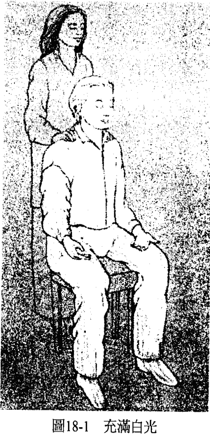

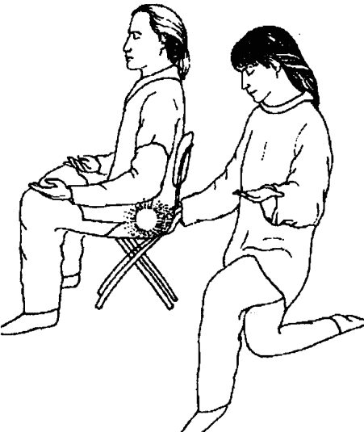
**圖18-2 建構紅色脈輪**

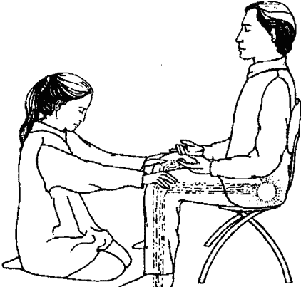
**圖18-3 把根傳送到腳掌**

當紅色脈輪處於澄淨的狀態了，就請紅色脈輪沿著案主的雙腿往下把根傳送到腳掌（見圖 18-3），看看會怎麼樣，如果有需要的話可以幫助它往下。然後你可以換姿勢，把雙手放在案主的雙膝上，接著再放至腳掌上，並想像案主腳掌下的畫面，若有需要就加以改變它。見圖 18-4。

當根部觸及地心的能量球，應該會馬上有所反應。養分應會立即開始沿著根部往上，進入案主的雙腳還有紅色脈輪。如果沒有，你要幫忙它，用各種方法讓養分能夠往上（見圖 18-5）。

一種有用的做法是和案主保持內心的對話，問他問題，想像他回答，用這樣的方法和根部說話。當能量往上流進根部，你可以再把手放在紅色脈輪處，檢查這裡的情況，確認案主是否已經接收了這股能量。

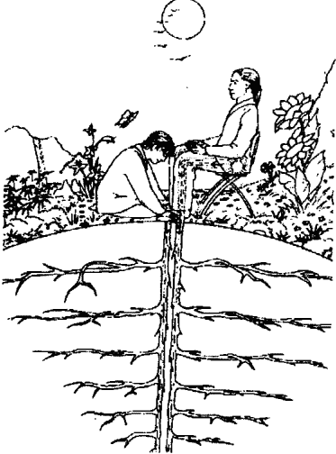
**圖18-4 扎根到大地裡**

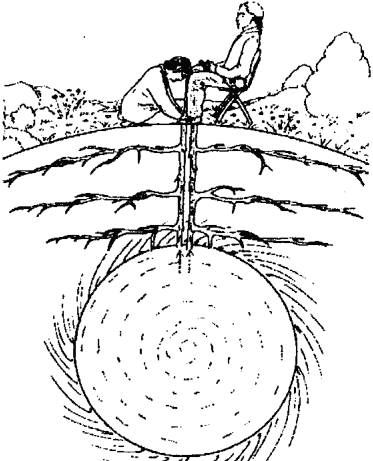
**圖18-5 根部吸取養分**

接下來的幾個脈輪，你可以從案主的左邊或右邊來做，一隻手接觸他的正面，一隻手接觸其背面。若中間隔著椅背也無妨，因為意識可以穿透一切。

在橙色脈輪的地方，想像有一股能量分別從兩隻手湧出，在你知道的橙色脈輪處，創造出它該有的顏色。若出現任何思想形式，就加以處理（見圖 18-6）。

等橙色脈輪變成它該有的狀態以後，用同樣的步驟去做黃色脈輪。

在進行綠色脈輪之前，當你一隻手還放在黃色脈輪上，就先把另一隻手移到綠色脈輪上，以確保兩個脈輪之間有一條暢通的管道能夠穿越阻膜（第8章提過）。

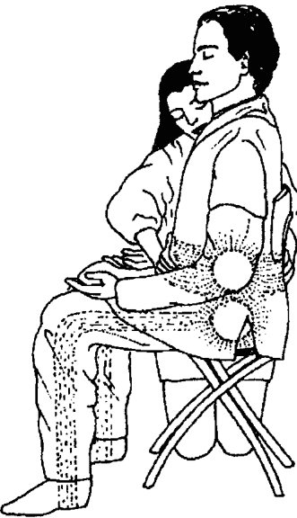
**圖18-6 療癒橙色脈輪**

想像每個脈輪都好比在一個房間裡，然後請黃色脈輪房間的屋頂打開，請綠色脈輪的地板也打開。最好的情況是兩個都打開了，類似相機的兩個虹膜式光圈一般，而兩個脈輪可以看到彼此，中間是清空的。假如案主還有心防，就可能會打不開，那你就必須用鑰匙來開（見圖 18-7）。

當有任何畫面無法呈現出兩個脈輪之間有開闊的空間，那就一定要改變這個畫面，直到能量能在兩個脈輪之間順暢流動為止。如果這裡遭薄膜阻礙，那案主的意識要在黃色脈輪和綠色脈輪（和力量、控制、自由有關的認知，以及和愛、連結有關的認知）之間移動的時候，就會感覺到以憤怒、哀傷等形式存在的阻抗，或是其他被理解為阻抗、感覺不好的情緒。只要這個屏障尚未移除以前，案主每次要讓注意力遊走於這兩處脈輪的時候，都會感覺到這層阻抗的薄膜。

任兩個脈輪之間有屏障，都代表案主的意識在這兩種觀點之間有障礙。在此可能表示在自由與連結，或控制與接納之間，心中有所衝突。疏通通道，會讓案主的注意力在這兩個脈輪間遊走變得容易，解除存在於意識中的衝突。然後，案主就可以看到這兩種認知其實是可以相容的。

兩個脈輪之間有了通道之後，就用和做橙色、黃色脈輪同樣的方式療癒綠色脈輪：一手觸摸前方，一手觸摸後方，讓能量流動於雙手之間，在交會處形成一個能量球，發出它該有的顏色。有的能量治療師喜歡想像自己的綠色脈輪裡有一種翠綠的顏色，沿著雙手往下傳送到案主的綠色脈輪，並看看傳送的時候會發生什麼事。它會讓能量治療師與案主之間有著良好的連結感（見圖 18-8）。

當做到藍色脈輪的時候，你的手必須放在案主的雙肩上，不要放在前、後方，這樣他才不會有被勒住的感覺。一手放一邊的肩膀上，想像各有一股能量從雙手湧出，在你所知的藍色脈輪處形成一種天空藍的顏色。遇有任何鎖鏈、重物或其他思想形式出現，都該加以移除（見圖 18-9）。

等藍色脈輪變成它該有的樣子以後，你就站到案主旁邊，一隻手放在案主的藍色脈輪後面，另一隻手觸摸其同邊的那隻手的掌心，並請藍色脈輪沿著他的雙臂往下伸出枝幹。然後，你應該會看到藍色的能量延伸到他手掌前方，來到一定的距離，大多數的能量治療師會覺得八到十公尺的距離最佳（見圖 18-10）。

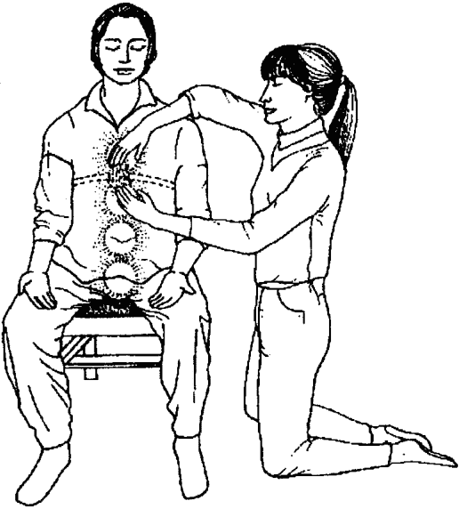
**圖18-7 打開通道**

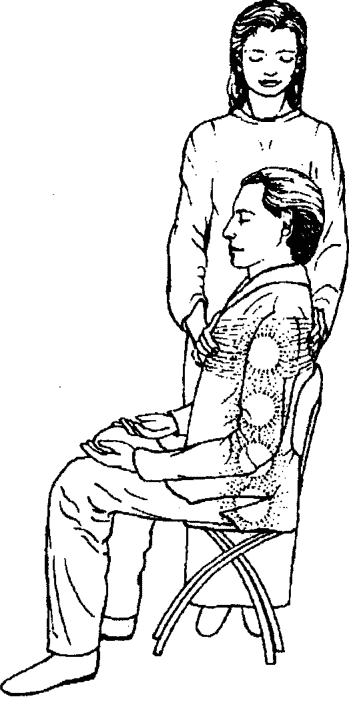
**圖18-8 療癒綠色脈輪**

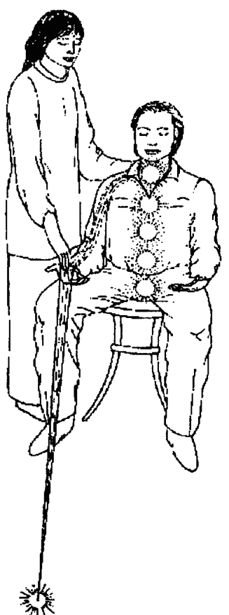
**圖18-10 形成藍色的雷射光**

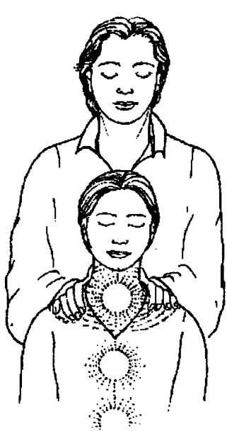
**圖18-9 形成藍色能量球**

另一邊也重複上述的過程去做，接著，這兩股能量流會匯集於一點上。如果沒有的話，就一定要「導引」它們直到匯集為止。有時候，這兩股能量匯集的地方會出現一些景象，假如出現了，這個畫面代表的是案主意識裡的目標。如果在這裡有看到任何東西，讓案主知道，他可能會覺得很重要，而且這也是療癒過程中的一部分。

當做到靛藍脈輪的時候，你的手又可以放在案主的頭的前方與後方了（見圖 18-11）。在他額頭的位置，用在做橙色、黃色、綠色脈輪同樣的方式進行療癒。

有些能量治療師喜歡把靛藍脈輪想像成一扇窗戶。他們看入窗內、看看房間裡的景致，房裡的一切應該要是靛藍、午夜藍的。若你這麼做了，你應該會看到案主坐在房間的中央，從窗戶往外看。

你在房裡看到的事物，有時候顯示了案主與他房子、載具、身體之間的關係，以及他與靈性的關係。你要從這個角度去理解你在這裡看見的景物。記住，靛藍脈輪代表了案主對於自己身為駐於身體裡的心靈，雖然穿戴著一個生物結構，但同時又是內在的心靈所懷抱的觀感。

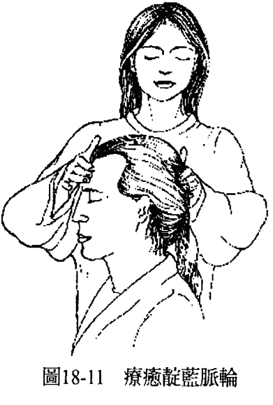
**圖18-11 療癒靛藍脈輪**

往外看的景色應該像是透過敞開的窗戶，看到清澈的夜空。除此之外其他的景象都要加以改變，直到回復它該有的樣子。透過窗戶向內看到的景觀，顯示的是就案主與載具的關係而言，他的自我觀感為何；往外所看到的景物則顯示了案主是否有能力把他的靈性觀點引導到外在，應用在周遭發生的事情上。

當做到紫色脈輪的時候，一隻手放在案主的頭頂，接觸它，然後一股紫色的能量球就形成了。接下來，請紫色脈輪打開。理想的情況是它很容易就打開了，看起來像一朵蓮花盛然綻放。如果沒有的話，就需要移除類似遮罩或屏障的東西，重新請求它打開（見圖 18-12）。

最後，在脈輪以它該有的樣子展開之後，就請求白光從上方透過紫色脈輪充滿案主，從腳到頭，讓每個脈輪（由紅色到紫色）依序煥發出比以前更明亮、澄淨的光芒。

等案主充滿白光、全身白光滿溢，每個脈輪都以該有的顏色煥發明亮、乾淨的光芒，也沒有思想形式出現，這時候，你就創造出已經痊癒的感知了（見圖 18-13）。

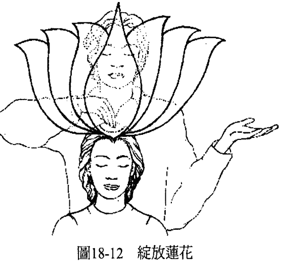
**圖18-12 開啟紫色脈輪**

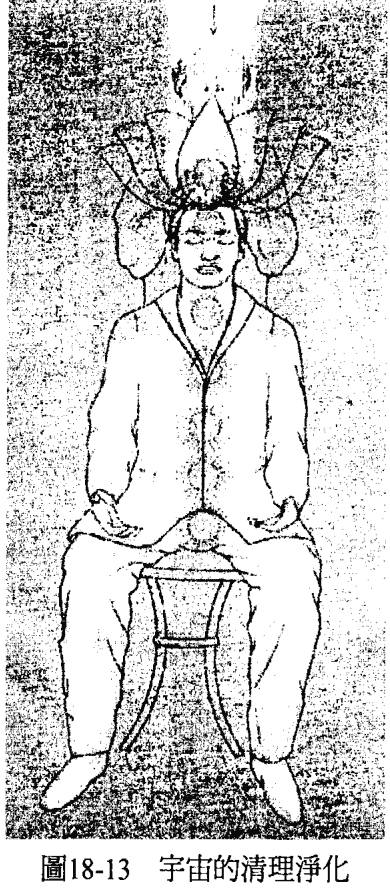
**圖18-13 完成脈輪療癒**

接著，告訴案主，等他覺得差不多了，就可以張開眼睛，問問他有沒有覺得哪裡不同了。要鼓勵案主去留意在他所感知到的意識和身體裡，有哪些不一樣的地方，儘量鼓勵他把截至目前為止任何的正面感知在第一時間說出來。

如果有症狀還沒有完全紓解，依然存在，那麼你可以選擇馬上處理這個症狀，或是等案主也聽完你給他的反饋後，再做處理。

你可以擁抱案主，歡迎他、他的新意識來到世界上。如此一來，案主將有機會與你心貼著心、表達他的感謝，或就只是感受這個接觸；而你也有機會感激案主讓你有機會成為讓愛與能量流過的載具，為他進行療癒。

給完回應，症狀也紓解之後，再來一次擁抱，讓身為能量治療師的你和案主雙方意識裡的療癒劃下句點。案主好了以後，就沒有回家作業了，沒什麼特別要做的了，不需要進一步的治療。他們可以好好過日子。你也可以放下任何想要保護案主或掛念的心，堅持你知道案主已經痊癒的這個認知，他不再需要你這邊做出任何進一步的協助。

這麼做，你和案主兩人都會覺得自由。

> ————在這個世界上，一切都可以療癒！————

## 19 遠距離能量療癒

凡是可以透過親身接觸來做的療癒，也都可以用遠距的方式來進行。距離多遠不重要，從幾公尺到幾千公里都有可能。畢竟，你的對象並不是身體而是意識，意識是不受時空限制的。

無論你是用白光、脈輪還是思想形式來治療，你看見並療癒的都是這個意識。你的對象是接受療癒的人在意識中經驗到的東西，你的方向是要讓他的意識重新經驗到健全或健康。然後，透過這次療癒創造出來的新形態或能量，身體就可以跟著回復平衡狀態。

若有不能觸碰案主的理由，例如有思想或宗教上的因素，你還是可以用接觸療癒同樣的方式進行，只是手沒有真的接觸到身體，而是從幾公分或幾公尺以外來做。雖然你知道肢體接觸會增添更多層次的交流，有讓案主感到安心的好處，但你也得承認，有的時候肢體接觸就是會讓案主有種受侵犯、界線被破壞的感受。這個時候，你就必須在心中認定：換一種方式來進行也能達到最大的效益，而且你會有你需要的一切手法和面向，創造出完美的療癒。如此，這次療癒也會是完美的。

即便案主親身坐在椅子上，你從幾公釐或幾公分以外的距離來進行，你都會有接觸著案主一般，看見你會看見的，只是接觸感有所不同，如此而已。

既然你的對象是意識而非身體，所以就算案主並沒有親身坐在椅子上，你還是可以做一樣的事。你可以對著一張空的椅子來做，想像案主就坐在那裡，你會看到、感覺到案主彷彿就坐在那兒，但你是從幾公分以外的距離來做，沒有真的碰觸到案主。

開始時，你還是要從能量療癒的起始姿勢做起，感受手裡的能量，認定它是白光，然後將手放在案主肩膀會在的地方，想像你用白光充滿了他（見圖 19-1）。

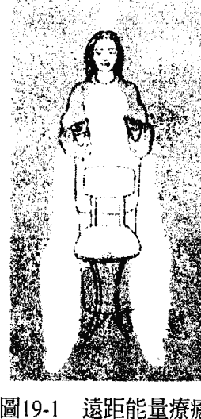
**圖19-1 遠距離白光療癒**

你還是一樣會看到案主意識裡的畫面，因為你療癒的對象依然是他的意識。如果想有最好的互動，你可以讓案主知道療癒要在幾點進行，這樣案主就可以有意識地在這段時間裡保持敞開，接受療癒。

若案主沒有這麼做，療癒依然會發生在乙太層面上，直到他們敞開心胸去接受良效，那通常是在他們去睡覺以後，療效就會顯現。

當然，告訴案主你看到了什麼、做了什麼、它對你的意義為何，總是很有用、大有幫助，這樣他們比較容易去了解新的意識，感受自身的健全。

你可以用從遠距做白光一樣的方法，來處理思想形式或脈輪，想像案主就坐在你面前的空椅上。起初，你可能會覺得怪怪的，但只要你一開始感覺到能量在流動，體驗到你看見案主的能量系統，也印證了你的反饋，你就會知道，距離並不會削弱效益。你也會知道，你可以用同樣的方式療癒世界上的任何人，無論何時、無論他身處何地。

然而，有些能量治療師可能會覺得：如果有替身幫忙坐在椅子上進行遠距療癒，會令他們比較自在。也就是有其他的人同意坐在椅子上，代替真正被療癒的對象，然後，治療師看見的會是案主本人的能量系統而非替身的。這麼做，縱使替身本身並不知道案主本人是哪裡需要療癒，但他們仍舊可以告訴你，在這次療癒中經歷了什麼。

替身可能會在自己身上感受到和正在被療癒的症狀有關的東西，或是看到一些你能夠理解的畫面，因為這些畫面與遠方案主身上正在被療癒的東西有關。雖然請他人擔任替身，通常都會在有意識的情況下進行，但有的時候，也可能是在你不知覺中自然發生的。你可能會突然發現你看到並處理的能量系統，根本和你意圖療癒的人——那個坐在椅子上的人毫無相關。你所看到的一切都是對的，但坐在椅子上的人完全無法了解你說的反饋，坐在椅子上的這個人彷彿是同意為別人的療癒而存在，不過他也曾從過程中獲益。

需要療癒的甚或是此人人生中，令他焦慮的某人的意識，例如父母或其他親人。那麼

This version of Antigravity is no longer supported. Please upgrade to receive the latest features.

This version of Antigravity is no longer supported. Please upgrade to receive the latest features.

This version of Antigravity is no longer supported. Please upgrade to receive the latest features.

This version of Antigravity is no longer supported. Please upgrade to receive the latest features.

This version of Antigravity is no longer supported. Please upgrade to receive the latest features.

This version of Antigravity is no longer supported. Please upgrade to receive the latest features.

This version of Antigravity is no longer supported. Please upgrade to receive the latest features.

This version of Antigravity is no longer supported. Please upgrade to receive the latest features.