我們體內都住著這九種人，只是童年的制約強化了其中一種，便成為現在的你。該如何覺察、改變、鬆綁制約，將性格的弱點轉化成前進的優勢？

- ★一本最完整的九型人格心理分析
- ★史丹佛大學商學院、美國CIA中情局必修識人課程
- ★全球500大企業人資部門必備指南

美國九型人格祖師級權威
海倫·帕瑪 Helen Palmer 著 張佳棻 譯

## 海倫帕瑪·九型人格聖經
## 認識自己，理解他人，找到轉化的力量
## 全球暢銷30年經典
## THE ENNEAGRAM
## UNDERSTANDING YOURSELF AND THE OTHERS IN YOUR LIFE

# 天使神秘学院

- 专业占卜预测机构
- 神秘学培训机构
- 水晶能量研究中心
- 神秘学资料库
- 微信号：strcdts
- 微信公众平台：strc2011
- 官方店铺网址：http://strc.cr.cx
- 读书交流QQ群：
  占星塔罗占卜师交流群：814594478（加入密码：PDF）
  神秘学其他综合群：659338717（加入密码：PDF）

# 制作说明：

本书由《天使神秘学院》出重金从台湾购入的原版书籍扫描制作完成。为达到最好阅读效果，特地把原版书全部切开后，再经由专业扫描设备高精度扫描完成，并经过一张张的PS后期处理最终成书，其间花费大量的人力、物力以及时间，只为能给大家提供经济并优质的神秘学学习资料而努力。

本学院强力谴责某些机构和个人，把本学院花心血制作完成的电子书籍，包装后直接放在自家淘宝网上低价倾销的行为，以谋取不劳而获的经济利益。如果长此以往最终将无人愿意再为大家花心思制作电子书，那以后可能大家再无新书可读。

为让大家以后能够读到更多的好书，也为了本学院的良性发展。本学院恳请大家尽量做到如下几点：

1. 尽量在本学院的网站购买电子书籍。
2. 请勿用技术手段把电子书内的水印及加密去掉。
3. 在收到电子书后小范围传阅即可，千万不要公开传播，更别挂到淘宝网上低价销售。

同时为答谢广大支持者，学院电子书将做如下调整：

1. 学院会把一些早已收回制作成本的电子书折价销售。
2. 最新制作的电子书籍会开放打印功能，大家购买后有条件的可自行打印成书。

天使神秘学院
2020年1月

獻給本書中的幾百位個案，他們觀察自己的內心戲，並把自己的故事貢獻出來。

還要獻給約翰・潘特蘭爵士（Lord John Pentland），

謝謝他為我提供的諮詢及友誼。

# 前言
對於實相的覺醒 查爾斯·塔特（加州大學戴維斯分校心理學教授）

# 第一部 九型人格理論基礎
# 第1章 人人都在九角星圖之內
蘇菲教派的口述傳統／分類的局限／發展歷史／內在觀察者／心理緩衝器／後天養成的人格／性格的主要特徵／強烈情感（陰影）

18

## 第2章 九型人格的注意力、直覺以及類型
不同的注意力／直覺與類型／注意力練習／直覺和本質

43

## 第3章 九型人格圖的結構
三的法則與七的法則／九種類型／側翼性格／人格類型的動態／安全狀態和壓力狀態下的表現

55

## 第4章 本體系的貢獻者
九型人格的建立／子類型／九型人格和當代心理學／注意力的焦點／在關係中注意力的焦點／心理診斷的九型人格圖／診斷補充說明

67

# 第二部 九型人格類型釋義
# 第5章 1型人：完美主義型
困境：內在批評者／家庭背景：高壓／強烈情感／找尋釋放活門／完美主義／唯一的正確作法／

95

## 第6章 2型人：給予型 130
拖延和煩惱／親密關係：尋求完美關係／權威關係：仰賴正確權威／注意力模式：批評的頭腦／直覺風格：體會「做對」的身體感受／有吸引力的職場：時常變動的工作／知名的1型人／高等心智：完美／高等情感：寧靜／優勢：致力共創美好的信念／子類型：嫉妒、適應不良及焦慮／成功之道／注意力模式：批評的頭腦

## 第7章 3型人：表現型 171
困境：執迷於成就／家庭背景：討好大人／多重自我／雨傘效應／充滿誘惑力的自我呈現／欺騙人和自我欺騙／親密關係：分裂的角色扮演／權威關係：期待成為掌權者／優勢：熟忱／注意力模式：多相思考／防衛機制的認同作用／認同練習／直覺風格：對特定訊息具有敏感度／高等心智：希望／高等情感：誠實／子類型：性感形象、聲望及安全感／成功之道／注意力模式：多相思考

## 第8章 4型人：浪漫多感型 211
困境：失落感／家庭背景：被遺棄感／被剝奪的憤怒／囚禁在黑井的抑鬱／痛苦和創作／兩極情緒的擺盪／戲劇化的感情生活／親密關係：保持安全距離／權威關係：尊敬大權威／菁英標準／菁英叛逆／強力的嫉妒動機／優勢：毅力非凡／有吸引力的職場：需要紀律完成的工作／知名的4型人／注意力模式：執著於遠方的事物

# 第9章 5型人：觀察型
困境：建構內心的高牆／家庭背景：受侵擾的童年／情緒距離／反芻感覺／分門別類的生活／隱私的喜悅／在公眾場合隱藏自己的方法／親密關係：恐懼情感／權威關係：反抗權威／注意力模式：抽離感覺／注意力練習／直覺風格：分開注意力／物欲極低的貧瘠／高等情感：不執著／高等心智：全知／優勢：情感疏離更易抗壓／有吸引力的職場：學術領域／沒有吸引力的職場：第一線的衝突處理／成功之道／注意事項

## 第10章 6型人：忠誠懷疑型
困境：猶豫不決寸步難行／恐懼型和非恐懼型／家庭背景：缺乏信任和穩定感／權威關係：偏頗的評價領導者／習慣作最壞的打算／投射作用／注意力模式：無意識的注意力／拖延行動／害怕成功／親密關係：建立長久的信賴關係／優勢：堅持不懈的奉獻／有吸引力的職場：明確位階的工作／沒有吸引力的職場：高壓工作／知名的6型人／直覺風格：辨識潛在意圖／高等情感：勇氣／高等心智：信心／子類型：力量、溫暖及負責／成功之道／注意事項

# 第11章 7型人：享樂主義型
困境：自戀性格／3型人和7型人的相似點／家庭背景：選擇性的美好記憶／行程表和計畫／選擇性思考／魅力和吹牛／優越及自卑／權威關係：追求平起平坐／理想主義和未來主義／親密關係：美好的分享／注意力模式：開枝散葉／直覺風格：如說故事的技巧／高等心智：工作／暴食習性／高等情感：清醒／優勢：樂於嘗試、冒險／有吸引力的職場：創新與活力的工作／沒有吸引力的職場：封閉型的工作／知名的7型人／子類型：易受暗示、懶性及家庭守護者／成功之道／注意事項

## 第12章 8型人：保護型 376
困境：控制欲／家庭背景：以強硬的立場對抗逆境／否認局限／控制性／復仇想法／正義的執著／高等心智：真理／注意力模式：放大自身力量／直覺風格：關注能量品質／公然憤怒／高等情感：天真／色怒／優遊於放縱／親密關係：獨行俠風格／權威關係：拿回主導權／優勢：堅定的領導者／有吸引力的職場：操盤型的工作／沒有吸引力的職場：循規矩無實權的工作／知名的8型人／子類型：占有、尋求友誼及令人滿意的生存／成功之道／注意事項

## 第13章 9型人：中立調解型 421
困境：麻木自己／家庭背景：備受忽略／我是同意還是反對？／定型的習慣／認清必要及非必要的差異／耽溺於累積／封鎖能量／惰性和憂鬱／沉睡的憤怒／親密關係：融入他人的關係／權威關係：對於掌權者的態度矛盾／優勢：傾聽的能力／有吸引力的職場：依循慣例的工作／沒有吸引力的職場：不斷更新的工作／知名的9型人／注意力模式：切換為自動化處理／直覺風格：與人產生聯結的方式／高等情感：行動／高等心智：愛／子類型：結合、參與及嗜好／成功之道／注意事項

## 分章註釋 474

## 附錄 九型人格的實證研究 462

# 前言——對於實相的覺醒

我這輩子還沒遇過有人對「人格」一點都不感興趣——特別是進一步了解自己的人格或類型。這樣的興趣可以追溯到我念研究所的時候，我專攻「人格」這個領域，因此做了任何我找得到的心理測驗，期待它們可以告訴我更多關於自己的事情，我身邊大部分的同學也像我一樣。

為什麼我們對於認識自己那麼感興趣？第一個動機是單純的好奇：理智和情感的運作方式非常有趣。為什麼我會以某種特定的方式看待這樣的狀況？為什麼我的感覺是這個樣子但其他人卻有不同的感受？當我和朋友面對某個共同的情況，對這件事也有相同的了解，為什麼在我感到沮喪的時候，他卻覺得生氣？思考這些事情非常有趣，和其他人聊聊這些事情也很好玩。

第二個動機相當實際：我們的生活充滿了許多痛苦。身體的疼痛、沒有達成的期望、各種瑣碎的煩惱和延誤、其他人對我們不好，諸如此類，這些問題都為我們帶來了許多痛苦。受苦的時候，我們通常都會責怪外在的境遇：如果我沒有背痛就好了、如果承包商即時出現、如果通勤沒有花掉那麼多時間、如果其他人可以賞識我的才氣和魅力，我才能真的快樂起來。不過，如果我們對自己有一些認識，就會發現，雖然外在有許多讓人煩心的事情，我們也不必要為自己製造許多痛苦：如果我沒有彎腰搬重物；如果我沒有不必要地給自己安排那麼緊張的截止日期；如果我提早十分鐘出門上班，就不會有時間壓力；如果我沒有那麼渴望其他人的認同，生活就不會那麼難過。我之所以在這個自願自運轉的世界裡覺得不耐煩，而且經常感到痛苦，是不是因為自身人格的關係？

為什麼我的類型讓我那麼在意其他人的認同？雖然在理智上我知道這件事一點也不重要。

為何我們會以特定的方式行動和感受？傳統心理學的人格理論可以為我們提供一些洞見。這些理論很少能真正改變我們的內在，然而正是內在的某些部分讓我們不必要地受苦。這些理論的實際效果不如它們所提供的洞見，之所以會如此有很多原因。比如說，在了解一種人格理論之後，我們獲得的見解可能是錯誤的；因為我們對於其中某些想法產生了誤解。此外，所有的人格理論都只有部分的真實性，某個系統或許富於啟發性、而且於情於理都相當有說服力，卻不一定能夠運用在實際的生活中，反成了自我改變的障礙。同樣地，我們的人格之中還有一些對於真正的自我了解並不那麼感興趣的面向（比如說，自大），這些面向可能會妨礙我們，讓我們無法有效地利用這些人格系統。有時候光是理性的見解遠遠不夠：我們還需要情感上的理解，這通常必須透過有技巧的諮商心理師或是治療師的幫助；這種情感上的理解，也可能來自某個強烈的生活事件對我們造成的驚嚇。

許多人都在理智上都覺得人格理論很有趣，但是對於它們的實際效用通常都會感到失望。

關於這一點還有另外一個重要的原因，那就是幾乎所有廣為人知、被普羅大眾接受的人格系統，都無法超越日常生活。

大部分的人會去找諮商師或是治療師，都是因為他們覺得自己無法「正常」表現而感到苦惱。他們覺得和別人交往很困難、覺得自己很糟或是習慣性地自我防衛，這造成了很大的痛苦。他們希望自己就像正常人一樣，他們覺得正常人可以輕易地和別人交往、有著良好的自我感覺、而且不會把自己的生活搞得一團糟。正常的生活當然會有高低起伏，而心理諮商和心理治療，有時候（很少每次都有效）的確能幫助人們活出更好的、「正常的」日常生活。一九五〇年代，心理治療師發現了一種新型的患者，我在我的著作《覺醒》（Waking Up）中，把這種患者稱為「成功的不滿者」（successful malcontent）。這種類型的人就當代的社會標準來看，通常都是成功人士，他們有體面的工作、還算不錯的收入、過得去的家庭生活，在社群中也受到眾人的認可和尊重：在我們的社會裡，這些條件都是獎賞，理應為我們帶來快樂。然而成功並不代表人生從此再也沒有痛苦和困難：有些痛苦和困難是日常生活的一部分，而且也以這樣的態度被概括承受。這些「成功的不滿者」，知道自己就一般的標準來說相當「快樂」，但是他們仍然轉向心理治療，因為他們覺得這樣的生活依然有些「空虛」。生活中除了金錢、工作、消費產品、社交生活，難道就沒有別的了嗎？這一切到底有什麼意義？基於人性和個性等傳統理論的舊有治療方法，對於這些人來說沒有什麼幫助（現在還是一樣）。傳統的治療方法可能會梳理患者的人格結構，找出一些在過去沒有被注意到的細節，就人格的起源提出一些有趣的看法，但是對於最重要的問題，即生活的深層意義，卻在相當大的程度上略而不談。就像我之前說的，幾乎所有廣為人知、被普羅大眾接受的人格系統，都無法超越日常生活的範疇，但是對於「成功的不滿者」來說，他們的治療必須要進入比日常生活的範疇還要深的地方。

「成功的不滿者」的出現，促成了「人本心理學」（humanistic psychology）和「超個人心理學」（transpersonal psychology）的發展。對於這兩個心理學派來說，就日常生活以及為了因應日常生活所必要的人格而言，過去的心理學知識有其功用；但是他們還發現，人性之中還存在性的、靈性的重要面向。當一個人成功地發展出日常生活所需的各種技巧，如果他想要保持健康快樂，就必須在存在性、靈性的面向繼續成長。處理普通生活的人格理論，在某個限度之內都還算有幫助，但是一旦我們的成長必須超過那個限度，這些理論的局限性就變得顯而易見。我們開始對它們感到失望，但是沒有辦法確切地知道為什麼事情會變成這樣。

當我在研究所學習人格理論的時候，就對生活中的靈性與超個人向度有著強烈的興趣，因此也發現傳統心理學對於認識人類有其作用，但是仍然有許多局限。

唯一的例外是榮格「集體潛意識」（collective unconscious）這個概念，它開了一扇門，讓我們通往存在的靈性面向。不過，心理學或心理治療這個行業，對於榮格的接受度並不是很高，因此，他的想法並沒有一套能夠被普遍應用的工作體系。我後來發現，世界上各個靈性體系都隱含了一套自己的人格理論和心理學（請參閱拙作《超個人心理學》（Transpersonal Psychologies）），這些靈性體系對於超越日常生活的個人成長提供了很大的可能性。其中一個特別的體系，「九型人格」（Enneagram），在實際的應用上有著很高的價值，但是當《超個人心理學》在一九七五年首次出版的時候，我只能在書裡介紹一些梗概。

「九型人格」這個詞彙來自於葛吉夫（G. I. Gurdjieff），他開創性地修正了東方的靈性教導，讓它們能夠為西方人所用。他的教導使用了九型人格的基本形式，並且透過他最知名的學生奧斯賓斯基（P. D. Ouspensky）所寫的《探索奇蹟》（In Search of the Miraculous）一書廣泛地流傳開來。葛吉夫說得相當明白，正是人格裡的缺陷為我們帶來了不必要的痛苦。他說每個人都有一個「主要特徵」（chief feature），它是我們人格的軸心，我們人格裡許多虛妄不實的面向便是圍繞著它發展出來。如果我們能夠找到這個「主要特徵」，便能更有效地了解並且超越這些虛假的面向——葛吉夫稱之為「虛假人格」（false personality），因為這些人格特質大多是小時候被強加在我們身上的，而不是出於我們自由意志的選擇。葛吉夫顯然將九型人格運用在他和自己學生的工作上，不過據我所知，他沒有對自己的學生透露和這個系統相關的任何細節。

一九七二年，我第一次聽說九型人格這個理論，那時候我在研究所開了一堂以「轉化的意識狀態」（altered states of consciousness）為主題的課程。我的一位學生——喬恩·考文（Jon Cowan），跟我說了一些九型人格的事情，還說他已經「找到我的類型」（typed me）。接著我和考文共進了幾次午餐，他為我解釋九型人格的基本原則，把九型人格圖畫在餐巾紙的背面給我看（在餐巾紙的背後交換令人興奮的點子，是科學界一個源遠流長的傳統）。那個時候我對成長的渴望非常強烈，於是加入了柏克萊大學的一個研究小組，主持人是智利的精神病學家克勞迪歐·納蘭雍（Claudio Naranjo），我的學生就是在這裡接觸到九型人格理論。納蘭雍將九型人格的基本系統和現代的心理學知識，以一種非常巧妙的方式結合起來。

我後來得知，納蘭雍過去在智利就學的時候，從奧斯卡·伊察佐（Oscar Ichazo）那裡學到九型人格的基本理論，伊察佐本人則是宣稱他從一個名為「薩爾蒙尼兄弟會」（Sarmouni Brotherhood）的神秘學校習得九型人格，據說葛吉夫本人也在那裡學習過。這聽起來既迷人又浪漫，但是卻讓我這樣一個年輕科學家感到有些坐立不安，我狂熱地想要將理性和非理性區別開來，如果科學真的可以用來解釋靈性的話。秘密兄弟會可能存在，可能不存在，但是在科學界裡談論這些事情，無異於在一頭狂牛面前揮舞紅色的旗幟！我那時候研究了許多不見容於心理學界的主題，像是靜心、意識轉化狀態以及超心理學（parapsychology），要再去接觸一個顯然超越日常生活範疇的神秘主義體系似乎不太明智。不過，九型人格理論之所以吸引我，正是因為它超越了日常生活的範疇，它討論了存在性和靈性的美德，如果我們可以重新找回基本的生命能量，不再讓它流向病態的自我防禦、對抗我們的真實本性，我們就可以進一步發展這些美德。

所以我試著從九型人格系統抽離開來，但是我有一個感覺，或許我可以把它當成一套觀念體系，以這種態度對它進行評價，不去理會它的「神秘學」起源，或是傳統心理學界可能會有的成見。如果我們把它當成一種和人格理論相關的心理學知識、一個觀念體系或是一套人格理論，九型人格理論非常令人驚豔。毫無疑問，它是我見過最複雜、最細緻的人格理論系統。我的意思不是說它會讓我們的腦袋打結，而是說它非常實用，而且在背後有著相當複雜的思想架構。傳統的人格理論系統大多是以比較為主要方法，如此一來人格經常被過度簡化。

雖然科學家大大地強調「客觀」這件事情，但我自己和許多人的研究讓我相信，我們在進行研究工作的時候，大部分的時候其實都帶著偏見和主觀。不過正是因為試圖保持客觀，科學才沒有變成某種枯燥乏味的學院派哲學。如前所述，我對九型人格抱持著正面的態度，就是為了盡我所能，以當代的心理學知識來評價這一套系統。當然，我個人對於九型人格的反應也是重點所在。當我知道九型人格對於我這個類型的解釋，那真是我這輩子最具啟發性的時刻。回顧生命中各種讓我困惑的事件和我對它們的反應，在九型人格的解說之下，一切都變得言之成理了。更重要的是，我發現我對待生命的態度有其缺陷，但是現在我有一套方法可以改變它。在了解朋友們的人格類型之後，我開始能夠理解他們的行為，我們的互動變得更順暢，我也成了一個更體貼的朋友。從第一次知道我的人格類型以來，我獲得了一系列的洞見，之後幾年，在我個人成長的途徑上，這套系統持續地為我提供了許多幫助，證明了它的效用。

過去曾經有許多年，只有克勞歐·納蘭雅和奧斯卡·伊察佐的學生能夠接觸到九型人格理論，作為密集、小型的心靈成長工作的部分課程。這或許也是介紹這個理論的最佳方式，因為在團體中，學生更有可能去試著應用它。然而現今有許多人，特別是「成功的不滿者」，他們試著要了解自己、超越自己，於是做為一種傳播媒介，小團體的局限就變得相當明顯。因此，海倫·帕瑪寫的這本書是一份天大的禮物，她分享了她對於九型人格的了解，並且將她自己的研究成果——她針對「直覺的發展和應用」這個題目所進行的大量工作和生產的特殊知識——加進了九型人格的基本架構。她認為九型人格的每一種類型，都是建立在某種感知／錯誤感知上，這一點對我們尤其有幫助。

我相信這本書的內容可以為人們帶來極大的幫助，不僅僅只是讓人們認識自己的類型，還能幫助他們超越這些類型。

九型人格理論並非個人成長的唯一方法，但它確實是非常有用的一個。作為一個體系，它遠遠稱不上完美，就像帕瑪在書中指出的，如果要繼續發展，它還需要更多的實證和科學研究——就算是這樣，它依然是一個相當實用的系統。

當初發現這個系統的那種興奮感受已經淡去，走過十五個年頭，我仍然覺得九型人格理論能夠幫助我們了解其他人，對他們感同身受，並且與他們建立良好的關係。然而要記住的是，書本、課程還有基於九型人格的個人諮商，只能傳達和現實有關的概念，而非現實本身。就像古老的禪宗寓言提醒我們的，指向月亮的手指頭並不是月亮本身。

## 前言——對於實相的覺醒

九型人格理論內含的認知／情緒架構，能夠幫助我們了解、轉化我們的人格，但它不是絕對的真理，無法完全反映我們時時刻刻都在變動的存在狀態。它是一種人格類型理論，和傳統的心理學方法相較，九型人格更能能夠提醒我們：即使我們已經不再需要自我防衛，大多數時候依然住在一個假想的世界裡，並且將關於現實的想法和感覺當成現實本身。

以這種態度來運用九型人格理論，這個系統對於所有的人來說都會是一個很棒的工具。如果我們把它當成絕對的真理，或者從此不再留意觀察自己或其他人，九型人格理論就會像其他觀念體系一樣，墮落成一種我們看待自己和其他人的新型刻板印象，這麼一來我們就像是醒時做夢，繼續活在生活的幻覺中。這本書提供了一個強大的工具：但願你可以利用它來達成個人對於實相的覺醒，喚醒我們內在深處的本性。

> 加州大學戴維斯分校 (University of California at Davis) 心理學教授 查爾斯·塔特 (Charles T. Tart)

编按：艾瑞卡学院出版社（Arica Institute Press）出版了许多由奥斯卡·伊察佐（Oscar Ichazo）撰写的书籍和文章，它们记述了伊察佐先生的「九型人格」理论。而本书的作者海伦·帕玛，就九型人格的实际应用发展出了自己的理论，用来了解人格及其和「高度觉知状态」之间的关系，这和伊察佐先生所阐述的九型人格相当不同。海伦·帕玛，以及哈波柯林斯出版社（Harper Collins），和艾瑞卡学院并无合作关系，这本书也没有经过艾瑞卡学院或是伊察佐先生本人的背书或是授权。

## 第一部

## 九型人格理論基礎

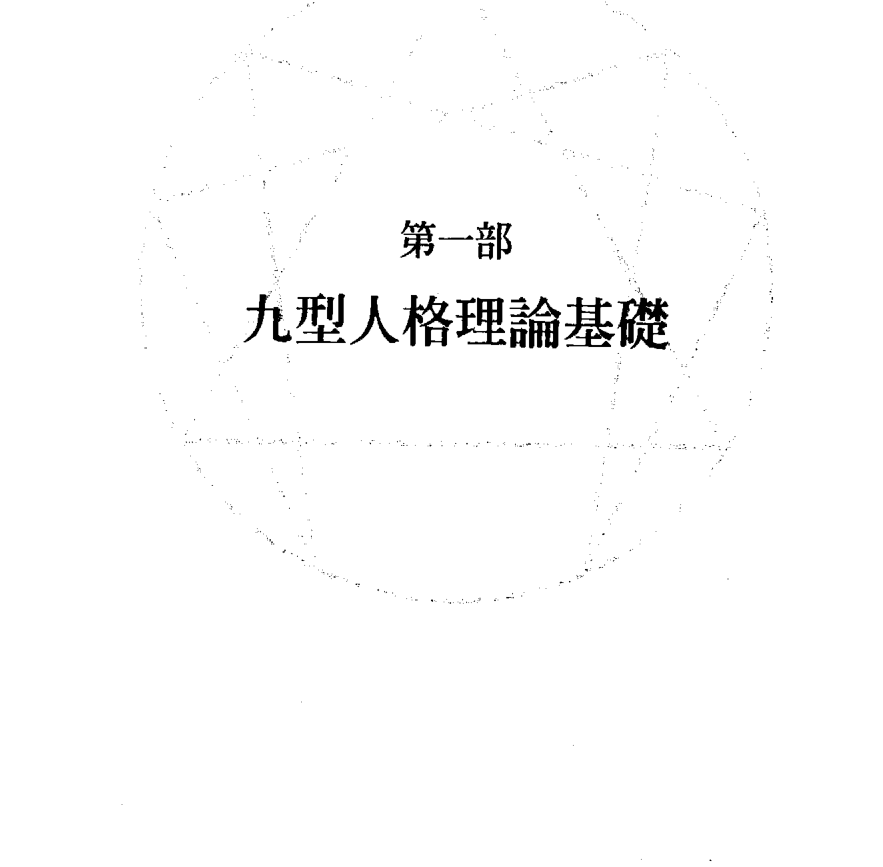

# The Enneagram

# 01
人人都在九角星圖之內

九型人格理論起源於古老的蘇菲教派，它描述了九種不同的人格類型，以及它們之間的相互關係。這個教導能夠幫助我們辨認自己的類型，讓我們知道如何處理自己的問題；了解我們的同事、戀人、家人和朋友；並且學著欣賞每個類型的潛能，像是移情、全知與愛。這本書可以促進你的自我了解，為你打造更美好的人際關係，並且讓你熟悉專屬於你這個心智類型的特殊能力。

九型人格理論是一種教學傳統，它將人格特質視為導師或是潛能的指標。在我們發展高等意識狀態的時候，這些能力便會顯露出來。這個模型描述了人類可能的進化層級，以人格為起點，進化到一系列不尋常的人類潛能，如移情、全知與愛，不過這本書的圖表僅僅就完整的理論模型提供了部分的視野。當我們把焦點放在九種類型的時候，絕對不能忽略這個大的脈絡，這點非常重要，因為完整的九型人格理論，是少數幾個處理人格和其他層次人類潛能的意識模型。這個系統的力量仰賴一個事實：一些看似尋常的人格模式，一些被我們視為神經質的情感和思考的習性，在這個系統中都被當成通往高等覺知狀態的潛在途徑。

因為我們把大部分的注意力聚集在思想和情感上面，認為我們就是這些思想和情感，所以九型人格對於人格類型的描繪，對我們來說有著明確的價值。然而，假設我們的人格或是每個人心目中的「自己」，事實上只是人類發展過程中的一個面向，那麼我們的思想和情感就某個層面上來說，一定是某種預備站，讓我們可以了解自己下一階段的演化。從這個擴充的心理學觀點來看，我們可以把自己的神經質傾向視為老師和好朋友，它能帶領我們光榮地進入下一個發展階段。就像九型人格理論指出的，如果我們的人格是帶領我們邁向更高意識狀態的墊腳石，那麼去學習和自己人格特質相關的應用性知識，可以讓我們成為更有效率、更快樂的人；有了這樣的知識，我們就能學習將人格擺到一邊，讓下一階段的意識狀態得以開展。

## 蘇菲教派的口述傳統

九型人格理論是口述教學傳統的一部分，要傳述九型人格，最好的方法，依然是親自去看、去聆聽一群同類型的人談論自己的生活。如果你看到、聽到一群口條清晰而又樂於表達的人提出類似的觀點，這個場景所傳達出來的關於這個系統的力量，是這些話語的文字稿遠遠比不上的。一個小時之後，一群在最初看起來體態各有不同的人漸漸趨於一致。旁觀者可以感覺到他們的相似之處：身體姿態、情緒的調性、臉上緊繃的部位，還有散發出來的個人氣質（這是更細微的類型指標）。當某個類型的人物在揭露自己的時候，觀眾席會瀰漫著一股明確的存在品質。每一種類型都會為現場帶來一種獨特的感受，一種和其他類型完全不一樣的品質，或者我們可以把它稱為該類型的存在感。同類型的一群人可能在一開始看起來毫無共同點，這是因為觀眾通常都會先注意他們的性別、年齡、種族、職業以及個人風格。然而，不到一個小時，他們就會出現某種一致性：他們過去的生活、他們所做的人生抉擇、他們的喜好、他們的生活目標；他們試圖逃避什麼又夢想著什麼。如果你可以把注意力從表面的穿著特色和迷人的笑容移開，你會發現他們甚至連長相都變得有點類似。當你不再注意表面的線索，你就能夠開始體會這個類型的成員共有的渴望和困境，進而辨識出他們的類型。

九型人格之中的每一個都以相當不同的方式看待世界，如果你可以學會跟隨他人的內在感受，你便能跳出自己的視角，真正去了解你周遭親朋好友的本質，而不是盲目地相信他們就是你所認為的那個樣子。如果你可以順著他人的行事作風來看，你就能夠對他們的處境感同身受。當你從其他類型頭腦的觀點來看這個世界，你立刻就會明白，每個類型都受制於一種系統性的偏見。

每次當我聆聽同類型團體的生命故事，並且在其中發現自己生活的主要特徵，總是會為九型人格的力量感到動容。這些都是現代的故事，傳述的地點在廣告代理商、超級市場、大學課堂以及靜心的會館。講述這些故事的人有著和我一樣的思考模式，他們的生活方式就像我的生活方式一樣。我知道我可以信任他們所提供的訊息、諮商，以及他們對於自己的新發現。

讓這樣的個人歷史傳述更加驚人的是，當他們在進行深入又個人的自我揭露時，都帶著一種暫時將自己擺到一邊的意圖。當你訴說自己的故事，當然是想要釐清某些驅動你生命的模式如何運作。但是在這些例子當中，自我了解的目的，是要學習觀察自己內在的這些模式，然後把注意力從中抽離開來，讓自己最後可以把人格放到一邊。對於一個探究不同意識狀態的系統來說，把人格「放到一邊」，不僅僅意味著去處理一個問題，讓痛苦消失就好。

# 第1章 人人都在九角星圖之內

### 分類的局限

如果說九型人格有什麼問題，那就是它看起來太棒了。它是少數幾個關注正常行為以及高功能行為（high-functioning behavior）的系統，而不是把焦點放在病理學上。它將許多心理學的智慧濃縮成一個堅實的體系，而且淺顯易懂。如果你能夠找到自己以及生命中重要人物的類型，立刻就能針對你們之間可能會有的相處模式找到許多訊息。因此，自然而然地，你會想要把對方放到九個盒子的其中一個，這樣你就可以知道對方在想些什麼，也能預測對方的行為模式。

我們想要將其他人歸類，因為這能夠減少未知的奧秘帶來的緊張。此外，在西方國家，我們相當熱衷於把龐大的資訊縮減成固定的類別，這樣我們才能就事情的原因和結果進行預測。

然而，九型人格理論不是一套固定不變的系統。在這個模型裡，九個類型彼此互相連結，這意味著人格也處於某種變動的態勢當中。在這樣的動態中，我們每個人都具備這九種人格類型的潛力，只是我們對於和自己有關的議題有著最為強烈的認同。九角星的連線結構也指出，每個類型都擁有轉變成其他類型的可能性。九個類型呼應了目前心理學的類型學，九角星的連線則是指出不同人格類型之間特定的關係，目前的心理學才開始研究這個現象。

九角星的連線也能預測當特定人格類型處於壓力之下或處於安穩的生活狀態，可能會以哪種方式改變他們慣常的行事作風；所以每個類型事實上都有三個主要面向——主導的面向表現出這個類型的世界觀，其他兩個面向則是描述了——當這個類型處於安全狀態或是在面對壓力的時候，會表現出什麼樣子的反應。

當我們在面對壓力或是感到安逸的時候，我們的行為會產生顯著的變化。此外，我們也會因為認同自己的人格特徵而產生改變。有時候我們會過度沉溺在自己類型當中的某些特徵，導致我們無法注意任何其他事情。一旦注意力固著在某些人格特徵，我們就真的把自己困在盒子裡了，我們失去了自由。如果無法把注意力從反覆出現的人格傾向抽離開來，或是不能冷靜地觀察自己的行為，我們便受制於自己的習慣，因而失去了選擇的自由。不過，我們並非無時無刻都受到人格的奴役，我們通常都可以轉移自己的注意力，換個方式看待自己的處境。就九型人格理論來說，我們正在進化的光譜中攀升，在這個過程中，我們可以讓自己從慣性和個人的視角當中解放出來，擴大我們的覺知，讓它超越那些定義我們人格類型的特質。

將人分門別類可能會造成不幸的自我實現的預言。我們或許會試著將別人歸類，然後把他們變成清單上幾個特徵加總起來的扭曲綜合體，這大大地強化了刻板印象。我們全都因為過去遭受的對待而被塑造成今日的樣子，而且相信別人對我們的看法都是真的。我們開始以別人看待我們的方式來看待自己，我們所呈現出來的特質也是別人教我們的。這就是為什麼我會說九型人格的問題就是它太棒了。如果你知道自己要找什麼，尤其是如果你可以對另一個類型的觀點感同身受，要把人分類相當容易。因為這個系統太棒了，有好幾次，我看到人們假裝自己是靈媒：面對不太熟悉的人，他們能夠快速而正確地找到他們的類型，接著再說出許多和這個人有關的細節。在分類的時候，這個系統很棒，但是如果我們抱持著錯誤的態度，會忘了認識人格類型的目的，是希望將來有一天可以把人格擺到一邊，這樣才能展開真正的工作——也就是活出高等意識狀態。眼光狹小的分類貶低了這個系統的價值以及目標，人格類型只是邁向高級人類潛能的墊腳石。幸好分類在現實世界中不一定有用。舉例來說，如果一個雇主針對某個特定工作擬一張「錄用」和「不予錄用」的名單，類型在這裡就沒什麼作用。「藝廊如果缺人一定要雇用4型人（浪漫多感型），如果這個4型人對於繪畫一點眼光都沒有，這件事情不可能行得通，即便4型人通常都具備深厚的藝術潛能。不要雇用5型人（觀察型）做一個高能見度的工作，也會鑄成大錯，因為5型人可能正忙著培養一些外向的特質。說不定已經準備好要為這個工作貢獻自己的才能。對於希望獲得配對公式的媒婆來說，貼標籤也是行不通的，比如說：3型人的理想伴侶是7型人；2型人和4型人不是速配的戀人，但是可以當好朋友。

2型人和4型人或許會發展出不符合數字公式的浪漫愛情，這種事情是他們自己或是媒婆都無法了解的。同樣地，因為5型人擅長擬定策略、3型人是很糟的推銷員、8型人相當地精於商周的週轉機制，單憑這樣的看法，就想要把他們組成一個「最佳工作團隊」也不一定行得通。貼標籤和分類沒有什麼好處，因為和清單上所描繪的類型特徵相比，真實的人類更加多變、更加複雜。

既然這樣，那我們為什麼要在意類型呢？如果一組正確的標籤，不會降低尋找僱員或是選擇伴侶的風險，那我們何必費心去研究人格類型？原因在於，如果你找出自己的人格類型，你就能夠開始工作。你可以信賴同類人的經驗談，讓它們引導你，你會開始了解哪些情況能夠讓你變得朝氣蓬勃，而不是表現得神經兮兮。學習類型最重要的理由，並不是為了讓你去找到別人的人格特徵，而是為了減少你自己身為人類所感受到的痛苦。

學習類型的第二個理由，就是你可以了解其他人，就像他們了解自己一樣，而不是以你自己的觀點來看待他們。以這種方式來了解其他人，可以讓工作團隊運作得更有效率，讓戀情充滿魔力，讓家人團圓在一起。雖然我們無法指定某個人格類型的人出任某個特定職務，並且期待他們以某種特定的樣子表現自己，然而我們卻能學著從同事的觀點來看待某個工作計劃。同樣地，我們不能以清單上一些你喜歡的人格特質去挑選伴侶，然後希望他們不會表現出這個類型不討喜的一面。我們甚至無法假設，當伴侶在面對生活壓力或是感到困惑的時候，是不是反而會對親密關係感到抗拒。我們只能說，藉著仔細觀察，注意每個人格類型的人會以什麼方式對愛情敞開，我們便能了解他們的觀點，並且據此改變我們的態度。

### 發展歷史

「九型人格」(Enneagram)這個詞彙來自希臘文的「ennea」，意思是「九」，以及「grammos」，意思是「點」。它是一個有著九個點的星形圖，可以用來測繪任何事件在物質世界裡發展的進程：事件的發端，以及事件發展的各個階段。九型人格理論模型是回教神秘主義蘇菲教派固有的一部分，它被用來度量宇宙的進程，以及人類意識狀態的發展。就整體而言，這個系統的教導非常明確，就像是猶太神秘主義卡巴拉教派的「生命之樹」(Tree of Life)一樣，事實上，它們有許多共同點。這樣的類比很有趣，因為九型人格理論和古代的卡巴拉教諭所敘述的是同樣的主題，只是它的發展似乎沒有留下任何文字紀錄。我們無法找到任何回教神秘主義對於九型人格的英文評論，不過這個系統就是建立在神秘主義的前提之下，亦即人性是一個進化的過程，朝著更高的意識狀態演進。

西方世界開始知道九型人格理論，是因為喬治·伊凡諾維奇·葛吉夫，一個極富於個人魅力的靈性導師，他曾經提到九型人格是蘇菲教派的口頭教學工具，他用這個工具，來了解學生是不是具備足夠進行特定內在工作的特質。關於葛吉夫的工作有許多文獻可供參考，這些文獻經常提到這個系統，但是對於葛吉夫如何運用九角星圖來看出人們的潛力，或是這個圖表能夠為他提供哪些訊息，這些書裡都沒有提到相關的細節。

葛吉夫的學生會研究九角星圖的數學性質，但是他們對於九型人格知識，大部分都是透過非口語的身體律動練習而獲得。這些律動練習，讓他的學生能夠對於物質世界中某個事件的進程——從一開始到各個不同的發展階段——培養出一種身體上的覺知。葛吉夫律動是一系列令人印象深刻的舞蹈動作，必須要有一大群人才能進行。這些動作在設計上的用意，是為了教導學生去認識事件在發展過程當中某些不明顯的特徵，也就是說，我們可以透過肉體來感覺事件發展的韻律，這麼一來，我們就能夠辨認出某些關鍵時刻，在這些關鍵時刻帶入巧妙的「衝擊」或是新的動能，將這個事件維持在某個特定的軌道上，讓它繼續前進。

葛吉夫對他的學生循循善誘，希望他們能夠用自己的身體去感知九角星模型所揭露的「永恆運動」(perpetual motion)。在葛吉夫「人類和諧發展機構」(The Institute for the Harmonious Development of Man)的大廳，地板上就有一個九角星。他的學生就站在這些標示著數字1到數字9的端點上，練習精心編排的動作模式，這些動作能夠展現出點與點之間、以及1－4－2－8－5－7這些內在連線之間的關係。文獻裡可以看到，葛吉夫的學生討論他們對於內在節奏以及自然律動的身體感受，以及當他們在舞出點與點以及線與線的關係時，身體會發展出一種特別的覺知，這個時候，舞者會全然地融入舞蹈的身體動作之中。

葛吉夫還在世的時候，沒有任何書寫的紀錄提到九型人格理論，而延續其教誨的學校，也傾向於將人格視為某種在邁向高等意識狀態時，必須放到一邊的東西，而不是被當成一種有用的訊息來源，告訴我們如何達到特定的心智狀態。就人類完整的潛力來看，這些學校把我們獨特的人格，當成演化之中比較低的進化部分，所以它們把教學的重點，放在非口語的律動還有葛吉夫的注意力練習（「自我觀察」或是「記得自己」），以之做為進入內在生活的正確途徑。藉著堅持老師這個角色的重要性，這些學校或許私底下有某些共識，亦即，只有那些「知道的人」（one who knows）才有辦法成功地運用蘇菲教派的人格系統。

在過去有很長的一段時間，九型人格被當成一個秘密。如果說現在它變得唾手可得，那也只是不完整的理論架構，如果沒有一個知道的人來教授它，沒有人可以把它應用在實際的生活之中。

當然還有別的可能性——或許這些學校不知道九種人格要如何對應九角星圖，或是在那個時候，心理診斷的藝術和九型人格的知識還有落差。然而，葛吉夫提到這個系統的方式、以及他對「九型人格與個性」這個問題的直接回答，都指出他對這樣的訊息有所保留，認為他的學生可能沒有辦法接受這一套訊息。

葛吉夫顯然認為，他那個時代的人還沒準備好要正確地認識自己的內在模式。雖然這些學生進行了自我觀察練習，在葛吉夫那個時代的歐洲，連佛洛伊德的潛意識理論都還不盛行，他的學生也不知道任何複雜的心理學知識——像我們今日習以為常的那樣。我們通常都看不見自己的動機、還有我們的感知到心理防禦機制的扭曲——這樣的概念對於那個時代的人而言，是個極大的洞見。雖然他們努力地藉著練習來工作，他們所憑藉的是盲目的信心，相信老師可以給他們一些東西，因為他們自己並不具備任何心理學知識。

## 內在觀察者

自我觀察是一種基礎的內在工作，各個傳統的修行戒律都包括這一項。這個練習的重點在於，將注意力往內收攝，學著去覺察自己的思想，以及其他從內在生起的「注意力對象」(objects of attention)。要進入這個練習有許多方法，不過一開始的體驗都是和辨認自己的機械性(或是慣性)和模式有關，並且看看自己頭腦中某些反覆出現的心理傾向多麼頑強。

如果你能夠抽離開來，以一個旁觀者的角度觀察，同時談論自己思考和感覺的習慣，就能減少這些習慣對你的制約，且降低它們自行發作的機會。透過練習，思想會漸漸地變成某種「身外之物」(separate from myself)，而不是「真正的我」(who I really am)。如果持續練習，觀察自己的思想和情感，你將會開始對自己的人格傾向感到疏離，並且覺得它們有些擾人。當你把注意力轉移到內在觀察者的立場，思想會變得像是「我思考的東西」(what I think)，而不是「真正的自我」(my real self)，因為你的覺知中有個部分繼續保持抽離，觀看著思想的浪潮經過。一旦注意力受到規範，成了分開的「觀察者自我」(observing self)，你就能夠以一種更客觀的立場來認識真實的自己；透過練習，你會發現你的真實本性比較像是這個觀察者，而不是那些你可能持有的思想和感覺。當然，如果你的注意力又回到思想上面，分開的、抽離的覺知將會消失，你很可能會再一次失去客觀性，又落入「自動化反應」(on automatic)的窠臼。

從某種程度上來看，所有成功的心理治療，都仰賴一種把注意力從習慣分離出來的能力。

# 第1章 人人都在九角星圖之內

力，讓患者可以用中立旁觀者的角度描述這些習慣。正確的自我觀察，對於辨識自己的人格類型來說非常重要，因為你必須知道自己情感和頭腦的慣性，這樣你才有辦法從同類的故事當中看見自己。

雖然葛吉夫不認為他的學生可以了解其人格類型的重要性，但他做了許多嘗試，就是為了喚醒學生對於自己性格的覺察。他最常使用的方法有兩個：「戳別人敏感處」（stepping on people’s favorite cons），還有「向傻瓜敬酒」（the toasting of idiots）。葛吉夫屬於九型人格中的8型人，即保護型，他人如其型，因為他教學的方法便是去找出學生性格之中最敏感的部分，對它狠狠施壓，直到學生開始表現出防衛性的反應。

去刺激某個人最敏感的地方，這個方法對我來說有著奇蹟般的效果。它對每個來找我的人都能產生很大的效果，我不需要特別做些什麼，這個人就會帶著極大的滿足和迫不及待，把那張父母為他們戴上的嚴肅面具給摘下來；這給了我前所未見的機會，讓我可以從容而又安靜地欣賞他們內在世界的風景。

敬酒是另一個葛吉夫向他的學生介紹類型的方法。要和葛吉夫共進晚餐，每個賓客都得喝下大量的酒，因為他們必須對各種類型的人輪流敬酒。葛吉夫會要求一個新來的賓客選擇一個最適合自己的類型，接著其他賓客就把這個新人當成那一類型的傻瓜來敬酒。他使用了這樣的眼（傻瓜），不過他用的是這個字的原始意義，而不是我們所知道的那個意思——這個字真的是用來指稱「類型」的另一個字。在用餐的過程中會有好幾輪敬酒，慣例是每三次敬酒就要喝完一杯白蘭地或是伏特加。女性的話則是每六次敬酒要喝完一杯；單單一個晚上，敬酒的次數可以達到二十五次之多。

你知道，他是俄國人，俄國人真的很會喝伏特加。但是葛吉夫的賓客之所以都得喝酒，還有另外一個更重要的原因……因為他一次必須會見許多人，所以要盡快把他們看清楚。嗯，你知道酒精如何能使一個人敞開，所以這個人之前極力隱藏的秘密都會被洩露出來。

> 這就是阿拉伯人說的：『酒精讓一個人更像人。』

在敬酒的時候，葛吉夫通常會指出他在其中一個傻瓜身上看到的人格特質，有時候他會把這個特質說出來，有時候則是表演出來。

> 『你就像隻愛擺架子的公火雞，』在第一個晚上他對某人這麼說，『明明是一隻火雞，還想假裝自己是真正的孔雀。』

葛吉夫熱練地搖頭晃腦，發出一兩個刺耳的聲音，餐桌上看起來真的好像有一隻公火雞朝著母火雞在炫耀些什麼。過沒多久，我們看著他又變成一隻更大的動物：

> 『為什麼你看著我的樣子，好像是一頭公牛看著另一頭公牛？』他問另一個人。接著他稍稍改變了眼神，配合著頭部的姿態和嘴唇的弧度，一頭受挑釁的公牛就這樣呈現在我們的眼前。

即便葛吉夫用各種挑釁和露骨的羞辱來表現這些類型，但是這些段落中對於人格類型的定義依然模糊不清。是因為葛吉夫沒有心理學專門知識，所以無法成功地處理人格議題嗎？或者他就像許多現代的靈性導師一樣，對於門徒的過去沒有那麼大的興趣，而比較喜歡把人格擺到一邊這樣的工作方式？

## 心理緩衝器

要認識自己的人格類型，最主要的障礙就是葛吉夫稱為「緩衝器」（buffers）的東西。他相信我們透過一個精密的內在緩衝器系統，或是心理防衛機制（psychological defense mechanisms），隱藏了自己的負面人格特質，讓我們無法看見在人格內部運作的力量。當葛吉夫的學生正在練習自我觀察的時候，大致的時間點正是佛洛伊德率先發展出無意識的防衛機制理論的時候。葛吉夫試著教導他的學生觀察自己的緩衝器，而不是透過一個心理分析師來探索潛意識，就探索內在生活而言，這是一個相當激烈的途徑。今天我們對於這個事實有著更深入的了解：心理防衛是我們維持「自我感」（sense of self）的一個重要方式。九型人格，從第一型至第九型，其主要的防衛機制分別是：反向作用（reaction formation）、壓抑作用（repression）、認同作用（identification）、內射作用（introjection）、疏離作用（isolation）、投射作用（projection）、合理化作用（rationlization）、否認作用（denial）及麻醉作用（narcotization）。葛吉夫的學生不了解心理學，對於這些詞彙也不太熟悉，不過他們的功課就是要深入自己的內心去探索他們無意識的防衛系統：

| 類型 | 防衛機制 |
| :--- | :--- |
| 第一型 | 反向作用 |
| 第二型 | 壓抑作用 |
| 第三型 | 認同作用 |
| 第四型 | 內射作用 |
| 第五型 | 疏離作用 |
| 第六型 | 投射作用 |
| 第七型 | 合理化作用 |
| 第八型 | 否認作用 |
| 第九型 | 麻醉作用 |

## The Enneagram

我們知道火車上的緩衝器是怎麼回事，它們是車廂或貨車車廂相撞時減少衝擊力的裝置。如果沒有緩衝器，車廂間的碰撞會讓人覺得非常不舒服，而且可能造成危險，緩衝器能緩和這種衝擊，使它們不被察覺或注意。我們也可以在人類身上找到相同的裝置，它們不是天然的，而是人造的，雖然我們並非刻意為之。它們出現的原因是因為人類身上有許多矛盾：在有了「緩衝器」，他就可以免於這些矛盾觀點、情感、語言所帶來的衝擊。

如果一個人在有生之年察覺到內在的各種矛盾，他將會不斷感到內心的衝突和不安。在意見、情感、同情、語言以及行動之間的各種矛盾。

葛吉夫接著說，雖然緩衝器會讓生活好過一點，它們卻會減少內心的摩擦，對葛吉夫的教學系統來說，這樣的摩擦是人類成長不可或缺的一個要素。透過緩衝器的幫助，我們被引誘到某種沉睡中；在沉睡之中，我們的一舉一動都充滿了機械性。因為我們安裝了緩衝器而且昏昏欲睡，所以無法觀察自己的真實本性，而我們對於真實世界的感知，就這樣被從屬於我們人格類型的特殊觀點所扭曲。

鄔斯賓斯基以葛吉夫的觀點寫了很多和內在發展有關的東西，他也說緩衝器是用來減少我們內在矛盾所造成的衝突。他建議自己的學生在尋找緩衝器的時候，可以把注意力放在那些會讓他們想要進行自我防衛的生命問題，那裡往往就是緩衝器的所在之處。

一個有著強力緩衝器的人，不會覺得有任何自我改善的必要，因為他對於自己內心的矛盾一無所知：他接受自己，對於自己全然感到滿意。不過，當我們的自我工作開始揭露某些內在矛盾，我們便知道緩衝器就安裝在這些矛盾附近。透過自我觀察，我們慢慢會發現緩衝器的兩邊究竟有些什麼東西。所以好好地看看你內在的矛盾，這會引導你找到自己的緩衝器，特別要去留意有哪些話題會讓你變得暴躁易怒。或許你認為自己有一些優點——這樣的想法就建立在緩衝器的一側——但是你還到有些不安，這就意味著它附近就有一個緩衝器。

在我們這個時代，大多數人都承認我們對於自己基本的人格特質並不了解。揭開我們的人格結構內部這些盲點、防衛機制，以及認知上的矛盾，對於創造一個心理健全的生活是非常重要的。如果一個人試著成為葛吉夫所說的「真正的人類」（a real human being），這個任務更是加倍重要。尋道者之所以要留意緩衝器，是因為無意識的防衛機制會以一種非常特定的方式轉移注意力，讓我們所見所聞盡是扭曲的現實。

我們之所以必須先觀察人格、然後再降低它的驕傲和活力，還有另一個原因——因為透過人格扭曲的透鏡，我們無法看到事情的本來面目，而是看到它呈現出來的樣子。我們看見的東西沒有一樣是清楚的或是客觀的，我們的視線與所見對象之間總是有一陣擾亂的煙霧，像是喜歡和不喜歡、愛好與偏見、執著與個人特色。除非我們能夠先去除這種個人歧見，不然怎麼能夠以人們或是事物本然的樣子來看待他們？除非我們能夠先把人格的障礙去除，不然怎麼能獲得知識，尤其是透過直覺或是直接感知而不是透過理性而來的知識。被人類稱之為直覺的東西，如果是由人格所掌控，事實上只不過是人類偏見和特定習性的顯現，除此之外就沒有別的了。

## 後天養成的人格

在日常用語當中，「人格」(personality) 和「自己」(self) 這兩個詞彙是同義詞。以靈性的術語來說，人格又被稱為「自我」(ego)，偶爾也被稱為「虛假人格」(false personality)，這些詞彙的主要功能，僅僅是用以區分葛吉夫所說的「本質」(essential nature)，以及我們在成長過程裡養成的「人格」。

我們每個人都擁有某種「本質」，它的性質異於我們後天養成的人格，這是靈性心理學中一個相當基本的概念。本質被描述成「一個人固有的東西」(one's own)，是我們出生時便具備的潛力，而不是從教育、概念和信仰所獲得的東西。

在本質的狀態中，我們就像孩子一樣：我們的思想、情緒或是直覺中沒有任何衝突存在；我們自然而然地以正確的方式行動，毫不遲疑地維護自己的身心健康，這是因為我們對環境還有對其他人有著毫無防備的信任。身為成人，我們知道自己擁有一些良好的無意識潛能，因為我們偶爾會有一種和周圍環境協調一致的感覺，在這種狀況下，我們突然有了某種直覺式的洞見，或是以一種非常有效率的方式行動。在那些片刻當中，我們知道某些事情，但是不知道為什麼會知道；在我們還不知道怎麼做的時候，身體就自己行動了；或是在我們還不知道要說什麼的時候，便聽見自己把意料外的真相給說出口。

我們都帶著某種本性出生，所以有能力與這個世界維持一種直覺式的關係，然而這種假設本身是無法證明的。不過，許多靈性傳統所流傳下來、教導我們達成更高人類潛能的方法，似乎都以這種概念為前提；而且在人類發展的光譜上，它們通常都將人格作為本質的對立面。¹⁵

這些代代相傳的方法指出，我們可以透過特定的方式，來穩定身體的能量和內在的注意力，這兩者都能引導我們去感受自己與環境、與其他人在本質上的聯繫。和本質相關的經驗是全然的，因為它會取代「我自己」這種感知。在本質性的體驗當中，「我個人的思想」或是「我個人的感覺」，這樣的覺知不復存在。就這種狀態來說，我們的確是將成人的人格擺到了一邊，重新進入孩童的心智狀態——那是在我們人格尚未養成之前的心智狀態。

九型人格的九角星指出，本質性的存在狀態總共有九個主要的面向。我們或許能夠觸及這九個面向，但是用來接近每個面向的方法略有不同。我們之所以必須尋找本質的特定面向，是因為它的「不在」（absence）會讓人感到痛苦。舉例來說，如果你長期以來都有恐懼的議題，這意味著你失去了孩童本質性的信任——對環境、對他人的信任——並且為這種失落而受苦；因此尋找勇氣將會成為你生命的重要驅力。

當我們明白自己的行為乃是出於慣性，這樣的了解指出一個事實，那就是內在觀察者確實存在。想想看下列陳述的差異：

- 「生活很無聊」
- 「我對自己感到很無聊」

在第二種說法當中，我們可以看到注意力的位置有什麼不同：「我太生氣了，根本就搞不清楚自己在做什麼。」以及「我看著自己生她的氣。」就前者而言，這個人生氣的感覺取代了觀察的能力；後者則是指出，有一股覺知的力量是超脫於事件之外的。

「我跳出自身之外來感覺」這種疏離感，通常伴隨著一種想要「找到自己」、「發現真實的自己」的願望，這也可以說是一種想要重新喚醒本性的願望。以這種追尋的品質來說，它和想要退回安穩的童年時期的欲望，或是想要被伴侶珍惜的欲望不太一樣。這種追尋出自於一種飢渴，一種對於日常生活的不滿，這種渴望在表達上通常會指出人類本質的特定面向：「我想要學著愛人」、「我想要減少我對別人的依賴」，或是「我想要找到行動的勇氣」。彷彿我們內在有些地方在童年時期受到傷害，然而這種失落感可以幫助我們把注意力集中在追尋上頭：我們覺得有些神經緊張，所以尋求療癒；我們覺得痛苦，所以開始靜心。

人格之所以會發展出來，是因為我們必須在這個物質世界活下來。對於一個孩子來說，就算他們對於環境有著出於本質的信任，還是得配合家庭生活的現實做出調整，因此就產生了衝突。從一個包含了本質這個概念的心理學觀點來看，人格發展出來是為了要保護本質，不讓它被這個物質世界所傷害。意思就是，孩子和環境的某些連結、某些沒有防禦的面向受到了威脅，因此孩子必須開始保護自己，避免受到更多傷害。當他們開始就本質受到威脅的部分形成防禦，就被稱為「失去與本質的連結」，或是「從恩典中墮落」。

從發展心理學的觀點來看，我們可以說這種本質性的連結，存在於生命中的某個特殊時期，在這期間，幼童用一種高度以感覺為中心、尚未分化的方式，來和母親以及環境連結在一起。幼童還無法分辨自己和他人的不同，也沒有自己的界線或是防衛機制。他們成長的時候必須發展出一個分離的自我感，以之來適應早期家庭生活的壓力；然而，西方心理學對於生命早期這種未分化的連結，沒有特別的研究，也沒有強調重新和這些原初感受連結的重要性。

不管從哪個觀點來看，天賦、興趣以及防衛機制的奇特組合，造就了我們的成長，讓每一個人都有著全然的獨特性。最後我們的注意力會開始窄化，範圍局限於我們獲得的特性上頭；由於這種注意力的轉變，我們忘了自己與環境、與其他人在本質上的連結，而把它驅逐到無意識的範疇中。

取代這種本質性連結的替代品，就是靈性傳統所說的「虛假人格」，它是一套想法或是信念——我們模仿父母，學到了這一套東西，用它來減少傷害、偽裝自己。不過，即便是身為成人，我們仍然保留著某些和本質有關的記憶，這種記憶表現為「當我感到快樂」、「當我毫無畏懼」以及「當我對愛敞開」的感受。此外，我們之所以會知道，這種本質性的感受仍然存在於我們的無意識之中，因為成年之後我們偶爾還是會在某些時候觸碰到它們，像是當我們「超越自己」，或是在某些有著不凡需求的時刻。

當我們的注意力離開了它與本質的內在連結，我們就失去了真正的自己，只能往外看著這個物質世界，一下子感到滿足、一下子感到匱乏，我們很少感受到全然的安心、全然的寧靜。要存活下去必須仰賴一套成功的界線和防禦機制——這種機制從根本上來說，它和本質那種具備高度感受性、對環境和他人不設防的生活方式相較，一點也不相容。

不過，如果我們後天人格中的恐懼和欲望開始減弱，並且開始覺察「我成了我的作為」、而非「真正的我」，那麼「發現真我」的願望就覺醒了，就像是一聲回家的呼喚。重新學習我們和環境以及其他人的原始連結，可以被想成是一條回家的道路，這條道路意味著把養成的人格與體驗本質的能力整合在一起。我們希望，成人的天賦和技巧可以變成一種工具，讓本質的能力得以發揮，應用在公眾的利益上。有句古老的蘇菲諺語，說明了人格和本質的親戚關係：

> 「記得並且了解你長成了什麼模樣，成為在現在的你之前的那個你。」

## 性格的主要特徵

發現自己的人格類型，可能會讓人非常驚訝，因為在這個發現的同時，我們會知道我們的類型是怎麼窄化了我們的選擇、將我們局限在特定的觀點裡面。我們可能會獲得一種讓人相當震驚的了解——雖然實相有著三百六十度的視野，然而我們卻只能看到其中的一小部分。我們大部分的選擇和興趣都是基於相當微妙的習性，而不是基於真正的自由抉擇。葛吉夫在談論類型的時候，說人格類型便是圍繞在某個性格上的主要特徵而建立起來的。和葛吉夫一起工作的人都能夠辨識一個人的主要特徵，不管這個特徵有多麼隱蔽。當然，他們無法百分之百地界定這個特徵，但是他們的定義通常都相當好、而且非常接近實際的狀況。舉例來說，「某某人」(So-and-So)（葛吉夫指出我們團體裡的某個成員）：「他的特徵就是他總是不在家……」

當他對我們團體裡另外一位成員談到類型問題的時候，說他的特徵就是他根本不存在。『你知道，我沒有看到你，』葛吉夫說道，『這不是說你一直都處於這種狀態，可是當你像現在這個樣子，你根本就不存在。』

他對另一個人說他的主要特徵就是凡事總要與人爭辯。『可是我才不會爭辯呢！』這個人立刻急切地回答，我們都忍不住笑了。

在神秘學校裡，類型這個問題通常以一種緩慢而且小心翼翼的方法被揭露出來，為的是要介紹一個概念：那就是我們並不自由；還有，在重新尋找本質的過程當中，我們人格類型的特徵可能會是我們潛在的盟友。舉例來說，如果你發現自己在性格上有種傾向，讓你經常為各種事情忙得喘不過氣來，因此無法執行對你的生命而言最重要的任務（9型人——懶惰），那麼「把注意力集中在最重要的任務」，並且要自己「採取正確的行動」，這兩件事就會成為最順應你天性的好幫手。對9型人來說，懶惰一直都是一位好朋友，保護他們免於必須因為個人職位變動而造成的痛苦，因為9型人覺得自己的職位總有一天會被裁撤。

如果你是9型人，總是被次要的工作計畫壓得喘不過氣來，而且很難對別人說『不』，這兩個事實對你而言就是持續而且忠誠的提醒，說明你忽略了自己的真正的需求。如果你可以適時地觀察到自己在什麼時候陷入了某種慣性，就會清楚知道什麼時候該將你的注意力從比較不重要的追尋當中抽離出來，然後回到你的主要任務上頭。

同樣地，如果你是九型人格之中的7型人，總是可以對各種選項保持開放，以免錯過任何刺激的冒險（7型人——暴食），那麼去練習一次把焦點放在一個對象上面，可能會為你帶來很大的解脫。如果你是7型人，對各種選項保持開放的這種生活方式，可能會讓你覺得自己沒有極限，而且相信自己每天都在行使選擇的自由。這樣一個幻覺不會停止，除非哪天時機成熟，讓你想要許下某個永久的承諾，或者開始靜心，把注意力集中在單一的焦點之上。

如果你能這麼做，你內在的引導就會前來助你一臂之力，你的腦海會突然湧現許多可靠而又明智的計畫。你越是讓你的注意力保持穩定，你的想法和計畫就會變得越有吸引力。你會把高等意識狀態當成一種迷人的選項，直到你發現自己根本就無法控制頭腦。不過，如果你是 7 型人，像猴子一樣的頭腦將會成為你個人的內在引導。當注意力從一極跳到另外一極，就是要提醒你輕輕地把它帶回來。

對於西方人來說，在面對「我們的人格限制了我們的自由」這樣一個概念的時候，特別難以接受。在西方，我們可以自由地旅行、自由地學習、自由地攀爬成功的階梯。然而，當我們的注意力被那些主導我們人格類型的特定議題所支配，即便在這種狀況下，我們依然可以選擇自己的工作或是穿衣風格，但我們的注意力就會被這些議題附帶的狹隘觀點所佔據。

在自我研究的某個特定階段，找到自己的「主要特徵」是相當重要的一件事，主要特徵指的是主要的弱點，像是一個軸心，每件事都圍繞著它轉動。我們可以把這個特徵從某個人身上揪出來，但是這個人會說：「荒謬，我絕對不是這樣的人！」有時候這個主要特徵實在是明顯到無法反駁，但是藉著心理緩衝器的幫助，我們沒兩下就會忘了這件事。我就認識一些人，他們幫自己的主要特徵命名過好幾次，也把這件事情記在心裡好一段時間。後來我再見到他們的時候，他們已經把這件事忘得精光。或者當他們記得的時候表現出某個樣子，忘記的時候又表現出另一種樣子，要談論的時候彷彿自己之前從來沒有談過這件事。你必須自己試著認識它，當你感覺到它，你才會知道。如果是別人告訴你的，你可能會一直忘掉。¹⁸

當我們的人格正在運作，我們很難觀察它的細微差異，通常我們的朋友比較能夠看見我們的習性特徵，比我們自己看自己還要容易。綽號通常會指出這個特徵，它就像是一個密碼，是通往一個人內在生活的鑰匙。

## 強烈情感（陰影）

> 「主要特徵」總是會被同樣的動機所驅動，它扮演著決定性的角色，就像是保齡球的偏重，讓球無法直線前進。「主要特徵」總是讓我們偏離主要路線，它來自於七大罪（seven deadly sins）之中的一宗罪或是多宗罪，但主要是來自自戀和虛榮。如果我們變得更加有意識，我們就可以發現它；發現它又會進而增進我們的意識。¹⁹

九型人格理論指出我們情感生活的九種主要特徵，它們和基督教的七大罪可以相提並論，此外還在3型人和6型人的部分加上了「欺騙」和「恐懼」。這些情感的習慣，是我們從天堂落入人間、墮落進入物質生活的時候發展出來的，它們是兒童為了適應早期的家庭生活所造成的一些強烈情緒陰影。

如果一個兒童發展得很好，那麼這些強烈情感就會被輕輕帶過，僅僅表現為某種傾向。

但是如果有严重的心理症状，那么其中一项情绪阴影就会变成强迫性的心理特质；它会削弱自我观察的能力，同时占据了我们大部分的注意力，让我们无法去做其他事情。 借着为自己的「主要特征」命名，我们就能学着观察这样的习惯，是怎么掌控着我们的生活。接着我们便能把神经质的、偏斜的注意力变成盟友，虽然它让我们受苦，也让我们记得自己究竟失去了什么。「主要特征」是一种在儿时发展出来的神经质习惯，它也是我们个人的导师，常驻于我们隐密的内心，时时刻刻提醒着我们，为我们指出通往本质的方向。

## 情感

> 出处：John Lilly and Joseph Hart. The Arica Training; Transpersonal Psychologies, ed. Charles Tart, Harper & Row, 1975, reprinted by Psychological Processes, Inc. 1983.

获取更多好书，请加微信号：strcdts        店铺：http://strc.cr.cx

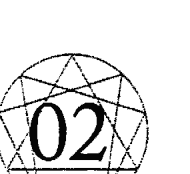

## 九型人格的注意力、直觉以及类型

### 不同的注意力

一旦人格形成，注意力就被那些定义我们人格特征的心理倾向给抓住。我们失去了以一种本质的、天真的能力，无法以这个世界本然的样子来回应它，并且对于我们可以支持我们人格类型世界观的讯息，有一种选择性的敏感度。为了存活，我们只看见我们必须看见的东西，对于其他的一切视若无睹。举例来说，如果你和我走进一个充满陌生人的地方，或许你的习惯是寻求别人的认同；然而如果我的心理倾向是恐惧，那么我就会开始找理由告退。对你的安全感而言重要的东西，对我来说可能一点意义也没有，因为我执着的可能是别的东西。就实际的情况而言，我们都没有活在自己的本质当中，我们的内在充满了那些塑造我们人格类型的思想和情感，我们也没有活在当下，或是当某些重要的生命事件发生的时候，我们也不在那里。我们两个都无法客观地看待这个房间中发生的事件，因为我们的注意力会画地自限，只会注意那些和

# The Enneagram

我们的观点相容的讯息。

让我们继续就这个例子讨论下去：如果我们一起去参加派对，你去寻求人们的注意力和认同，而我则是必须克服自己的恐惧，这就好像我们去了不同的星球参加派对。在这个夜晚快结束的时候，我们可能各自和不同的陌生人聊天，聊的是完全不一样的话题，以不一样的方式来表现自己，然后在离去之前搜集不同的电话号码。

如果事后讨论自己的心得，就会发现我们对同样的一段对话有不同的结论，并且认为自己从同一个陌生人的脸上看到了不同的意图。

我可能讲得稍微有些夸张，就是为了说明这样的论点：在同样的场景当中，你和我很有可能把注意力放在完全不同的地方。我要借此重申一个事实：我们都没有看到最完整的、全视角的可能性。你看到的现实和我看到的现实并不一样，因为我们不太会记得那些对我们而言缺乏吸引力的东西，经常会把注意力放在那些对我们的类型而言重要的事情上。

要指出某个类型的特征并不难。这本书有许多敏锐的自我观察者所做的自我陈述，他们大方地描绘了他们情感的习性以及头脑的倾向。他们指出了自己的注意力会被哪些议题吸引，更重要的是，他们试着把自己的注意力从习性中分离出来，说明自己是如何注意那些驱动他们生命的议题。

一点都不让人惊讶的是，有经验的自我观察者之中不乏静心多年的修行者，他们都能够说明自己是如何地以尊重的态度，将注意力集中在那些占据他们脑袋的议题上面。观察和注意力是静心者的语言：你觉知到什么？你是否保持临在，或者心不在焉？留意你正在注意的对象，看看你的注意力去了哪里。一旦你培养出稳定的内在观察者，你便能够轻易认出在内心世界中流动的念头和情绪。不过，最让我感兴趣的是这样的现象：我们太过在意那些吸

引了我们注意力的东西，因此忘了去观察，当我们在接收自己类型感到有趣的讯息时，我们的注意力是如何被组织起来的。我们对于自己的议题相当警觉，但是并没有留意自己——

是以哪种方式来搜集那些可以支持我们心理倾向的讯息。

让我们继续扩大刚刚的类型比较，比较寻求感情和认同的人（2型人——骄傲）以及害怕的人（6型人——恐惧）。我们可以问问2型人，当他们想要别人认同的时候，会发生什么事，然后问6型人，当他们感到害怕时，会有什么反应。刚起步的自我观察者通常会这样回答：「我被某个人迷住了，想要与他调情。」或者是：「我觉得有点不舒服，想要逃走。」如果2型人和6型人没办法观察自己内在的注意力转变，那么他们就不知道自己是怎么选择了某些信号，也无法描述他们内心细微的变化。这些2型人或6型人对于辨认某些微小的信号可能相当在行，比如说对方喜欢他们，或是接近对方可能会为自己带来潜在的危险，但是他们可能无法解释自己的这种敏感度，或者告诉我们，我们该怎么调整自己的注意力，以便了解他们的世界观。

借着有经验的自我观察者的帮助，我们对于决定各个类型观点的注意力位置获得了更好的描述。以下的自我观察来自一个典型的6型人，如果你不是恐惧型的人，但是曾经开车经过加州一号公路，你会对她头脑的状态深感同情：

> 我之前在洛杉矶工作，我的丈夫则是在加州理工州立大学（Cal Poly）念书，当时我每个礼拜都要在加州一号公路来回往返好几次。这没什么大不了的，算不上什么问题，除非我因为什么事情心情不好，这样我就得好好注意路况。那时候如果我是开车的人，情况可能会好一点。因为如果我的周末过得很糟，而开车的人又是我先生，我不得不看窗外，

但是窗外的陡坡简直教我无法忍受。看到这样的景象，我就想到轮胎可能会打滑，或者我们没有适时转弯而发生意外。这些想法相当强烈，我觉得自己都要吐了。

有个礼拜天我真的不想回去洛杉矶，觉得自己得休息一下，好好振作起来，因为我的脑袋一直想到那些海岸边的悬崖和下面的岩石。最后我因为太过焦虑进了医院，不是因为我撞上峭壁，而是因为我在脑海里看见自己把车子往峭壁开，就在我要撞上岩壁的时候，我反射性地转弯，穿越了对向的车道，冲到山边去。

我以前非常怕我妈，她是个酒鬼，可以在短短的十五分钟之内从她本来的样子变成一个十分可怕的人，开口没任何好话。只要她一喝酒，我就会想：她这次会发酒疯吗？如果会，情况会有多糟？
过去我曾经一天到晚盯着她，看看她是不是在哪里藏了一瓶酒；她喝酒的时候，我就会看着她的脸，猜想这张脸在晚上会变成什么样子。我会看着她，试着想象：这张脸看起来还镇定吗？它会不会开始对我大吼大叫？它会变得很恐怖吗？还是睡着了？当我看到她开始喝酒，就会开始想象她的各种脸，然后根据她脸上的样子来做打算，看看我是要留下

当这个6型人试着将自己从头脑里的一场车祸解救出来的时候，她显然被自己的心理投射给抓住了。她说这个坠崖事件看起来非常真实：她可以感觉到自己把车开过去，她看见许多岩石，而且觉得自己在转弯的时候已经没救了。同时，她很清楚这件事就发生在短短的几秒钟之间，后来当她复原了，鼓起勇气再次开车上路，让自己的注意力保持安稳，远离想象，在他先生就学期间持续在加州一号公路往返。

### 直觉与类型

由她这辈子的生活经验所养成的这种想象力，对这个 6 型人来说是一大幸运，也是一大负担。说她幸运，是因为她拥有一条潜力无穷的管道，可以深入内在经验世界，体验其中的丰富和各种细节；说这是一大负担，是因为她的想象力是如此强大，强大到可以暂时取代客观的现实。当她紧急转弯的时候，显然在投射某些东西。在那个情况下，毫无疑问地，她把内在的想象投射到了外在的环境，导致她误判了自己的状况。她也会同意，当她试着去解读母亲的酒瘾时，这样的投射一样也在运作。在她的观察中，有很大一部分讯息来源，无疑是基于她母亲熟悉的身体信号，以及她对于被羞辱或是被虐待的恐惧。不过她的确采取了童年时期的想象力模式，对于一个孩子来说，那样子的环境令人绝望；她所看到的这些意象变得如此强大，甚至取代了她的想法。她学会用这些视觉上的意象寻找问题的答案，把「其他的脸」作为一种讯息来源，借此为自己提供情绪上的支持，同时也根据她所看到的意象来采取行动。

同一位 6 型人也报告了一桩相当明确的通灵经验。这件事情发生的时候，她的心智状态就像车子「坠崖」，以及她看见母亲「其他的脸」的时候一样。

我一个很要好的朋友，努力了好几年终于怀孕了。她打电话给我，听起来状况很好，我们打算见个面庆祝一下。见面的时候，她容光焕发；然后她的「其他的脸」开始出现，并不是我刻意召唤它们、想要从中获得什么讯息。

这件事真的有点奇怪。当时我们正在一家墨西哥餐厅吃晚饭，她很高兴，但是当她在讲话的时候，有某种东西笼罩在她的脸上，我可以看见失落的眼泪和悲伤的印记。我想我最好什么都不要说，因为我知道她会失去那个孩子。她真正的脸继续在讲话，但是她另外的脸变得相当可怕，整张脸看起来相当冷酷，我知道事情就这样定了下来。有一下子那张脸变得平和，接着又消失。只是几秒钟的时间，我就知道这整件事情会如何发生：她会流产，然后继续尝试，非常冷酷的下巴说明了这一点，不过下一次就会一切顺利了。

当中，她朋友另一张脸所指出的后续事件都一一应验了。

这个 6 型人接着描述当她看见某个未来事件的时候，自己产生的情绪反应；她说在那个时候，这种情况感觉起来相当自然，而且不知怎么地有点熟悉。她补充说，在接下来的一年

### 注意力练习

直觉可以说是当我们把注意力从惯性的思考和感觉抽离出来时，所产生的一种副作用。

如果我们没有进行基本的注意力练习，通常都会过度集中在思考的状态，所以我们无法以一种可靠的方式来接收各种同时存在的印象。如果刚刚提到的那位 6 型人女士可以试着去了

解，看看自己老爱往坏处想的这个习惯什么时候会出现，还有学着在想象变得太过真实之前，把注意力转移到别的地方。这样的话，她将会受益无穷。不是任由自己的想象变得强大无比。前，如果她可以保持临在，无论是开车还是走路，这实际上就是一种转移注意力的方法，而但是这位6型人女士能不能清楚地分辨幻想（fantasy）和正确的灵视（vision），特别是当这两种印象那么紧密地交缠在一起？她能不能学会任意地创造出正确的直觉式意象呢？如果她想要好好利用这种心智习惯，她就得学着去分辨思想、由个人思想投射而出的幻想、以及她在朋友脸上所见到的那种正确的直觉式印象。这种进阶的辨别练习，早已存在于各种灵性技术之中；而且，一如既往，初步的工作就在于强化内在的观察者。就算是最基本的内在练习，也不在本书的讨论范围之内。要进行这些练习，最好是在一个充满支持性的环境之中，向一位有经验的老师学习，而不是从一本书去学。在书里，就算是最精确的措辞，也会因为读者变动的大脑状态的解读，而受到贬损。这本书是关于每个不同类型的人所表现出来的人格特征，就这个目的来说，本书的重点仅仅在于，指出每个类型的人把注意力投入其人格特征的方式，可能是一个重担，也有可能是伪装的祝福。重担在于，因为我们自身注意力的惯性，使得我们对于那些藏在神经质顾虑背后的重要事件，浑然不觉。6型人习惯想象事情最坏的一面，却不知道忘了想象最好的一面。就她童年时期对于安全感的需要来说，这样一个习惯是适当的，但是说来奇怪，对她而言，这反而让想象事情最美好的一面看起来像是一种假装。去想象事情最糟的可能性，成了她现实的标准；想象最好的可能性被斥为一种幼稚的幻想。这个6型人对于这件事情已经相当熟练，如果她可以

学着任凭自己的意愿，施展出这种基于防卫机制的注意力转移，她可能会发现自己具备某一种特定直觉风格的专门技术。

我对于九型人格特别感兴趣的一点，就是那些拥有直觉式和本质性体验的叙事者，他们故事中夹带着某些特殊的讯息。借着他们的故事，我们便能够假设：我们神经质的顾虑，究竟是以哪种方式将我们带领到其他的头脑状态。身为一个老师，这真的是一个很棒的机遇。我的学生知道怎么调节自己的注意力，所以能够以一种详细的方式对我说明自己的内在过程。我见识到直觉这件事是如何同时成为他们的生活的负担以及支持。我也得以把一些学生无意中采取的、非常独特的注意力转换方式，记录下来，他们直觉性地这么做，因为这和形成他们人格特征的某些议题有关。

我一次又一次地听见某个熟悉的故事，这个故事大概是这样：「我父母说的话相当不清楚，我必须找出真相。」或是：「我可以感觉到自己正在进行调整，让自己变成其他人喜欢的那个样子。」这些都是反复出现的儿时回忆，孩子们必须想办法解读大人的讯息，才能在家庭生活的压力之中存活下来。

身为成人，我的学生认为自己对于童年的各种问题有一些直觉性的洞见。让我们继续进行类型的比较，6型人（恐惧）一致地认为他们拥有校准精良的「鬼扯侦测器」（bullshit detector），可以看见人们藏在表面之下的真实意图。2型人（骄傲）则是认为自己能够依靠直觉来改变自我形象，借此获得人们的接纳和喜爱。

让我们考量这个事实：如果6型人（妄想）认为自己可以预测，因此能避开某些潜在的伤害，他们就会觉得比较安全；如果2型人（虚伪）觉得自己可以表现出有魅力的样子，他们就会觉得自己比较可爱——对此我仍然感到相当震撼，每个类型的心理倾向，使得这个类

型的人发展出直觉性的讯息感受方式，并且永久地改变神经质的顾虑。注意力练习的重要性相当清楚，就是要超越神经官能症。
借着进行这些基本的练习，我的学生获得了两次重大胜利。首先，他们将自己从偏狭的世界观解脱出来。其次，对于他们很可能在无意中一直运用的直觉风格，他们获得了一个机会，可以更有意识地觉察这一点。

当熟练的自我观察者，谈论自己是如何把注意力放在许多个人议题上，他们会使用相当具有启发性的语言。关于「其他的脸」还有很多不同的说法，注意力要转移到内在的视像也有许多方式。还有一些陈述，像是「我与别人融合在一起」，或是「我的某个部分被往前拉」，或是「我接收了他们的感觉」，或是「我变成他们」，或是「我抽离出来看」。这些陈述单纯是基于心理投射的扭曲吗？它们真的只是从一种信念——相信我们可以从生活中各种议题获得某些特别讯息——衍生出来的吗？它们是根据最低限的身体信号，或者是在某个程度上，是由构成我们类型、对于某些议题具备的真实敏感度所衍生出来？

举例来说，和恐惧的6型人相较，想要取悦他人的2型人，就很有可能以「与人融合」这样的感受来运用他的注意力。2型人要学会「看见其他的脸」可能相当容易，不过2型人诉说的故事通常都和「与人融合」有关，而不是去想象事情最坏的可能性。

一个边缘性人格的精神病患，可能也会告诉你一个「与人融合」的故事，这类型的人从未发展出明确的人格界线。「和某人融合」也是爱人会拥有的深刻体验，爱人的觉知转移并且超越了自我的界线。但是当一个熟练的自我观察者，被要求为「与人融合」这样的陈述提供更多细节，这听起来就像是在描绘特定静心练习的注意力状态。

那些「与人融合」或是「我变成……」的叙述，听起来就像是我可敬的武术老师所说的话，他是一个活生生的范例，拥有一种将其他人包含到他自己感受中的能力。
我的老师会下这样的口令：『往下掉到丹田（把注意力带到肚子），打开你的感觉场
域，然后融合。』当他进入『打开感觉』的注意力状态，就可以精确地模仿某个练习伙伴的随机动作，这个伙伴可能在好几公尺之外，站在某个屏风后面。经典的柔道『乱取』（Rondori）练习，或称为『多人自由对打』（multiple-person attack），这是和远距离的感觉能力有关、另一个让人印象深刻的例子。『乱取』练习也可以蒙着眼进行，在过程当中，攻击会从四面八方向你袭来，这会迫使练习者对于身体周围的空间产生连续而又清晰的感受，特别是背部。
同样地，像是『我看到内在的脸』这样的陈述，听起来就像是『内视练习』（inner eye visualization practice）的结果。这样的练习可以发展一种分辨能力，将由个人思想所投射的幻想，以及不是由思想或感觉所主导的准确直觉式的灵视，区分开来。为什么这种感知总是出现在我们人格类型受伤的地方呢？事实是，我们的注意力会持续

返回的那个心理倾向，就是我们可以开始观察注意力位置的地方，特定的注意力的位置，让我们以一种无意识的方式与他人和环境保持连接。当我们产生了某种神经质的愿望，我们就
开始发展注意力的力量。我们想要好东西，所以让自己的感官向外延伸，善加运用我们的注意力。
举例来说，极度渴望爱的孩子，可能会学着将注意力转向内在，在那里和双亲之一融合在一起，或者无意识地在他们的身体之内感受他人的期望，并且改变自己来取悦别人。同样地，在面对比他们年长、比他们强壮而又能够掌控他们生活的人，担心受怕的孩子可能无意而又准确地感受别人的恶意。这些真实的敏感度可能会伴随着我们到成年时期，但是成年以

## 直觉和本质

后，我们只能指出这些人格倾向，却忘了造成这些倾向的神经质的顾虑。
对于生活里某些重要议题，你注意事情的方式很可能会超越一般的感知，转而进入直觉的领域，而且不会觉得有什么不寻常的事情发生。
这和学会去看细微的身体信号无关，像是身体语言或是脸部的讯息。直觉是一种「知道」（knowing），来自于无念的头脑状态（non-thinking state of mind）。这种状态和日常的思考状态密切相关，如果你对于稍微改变自己的感知没有太多犹豫，你就能训练自己的直觉。
会在无意中将直觉作为一种讯息来源。这可能会让你在做决定的的时候有某些优势，并且为你的个人生活带来一些和敏感度相关的特别品质。
如果在你小时候直觉对你没有什么帮助，如果你必须对于那些情感上难以忍受的事情保持觉知，那么你可能已经将自己的注意力从内在的感知移开，而且可能会抗拒去穿透神秘家所说的「知觉的面纱」（perceptual veil）。
直觉让我们可以触及范围广大的讯息，因此也是一项令人高度渴望的人类资源。然而直觉并不是本质，它只是一种洞见的来源以及创造力的载具。在本质的状态之中，我们没有进行任何灵性练习的必要，或产生什么洞见，或是听从直觉引导，因为在本质当中没有人的自我感受：没有一个作为的人，或拥有什么的人，或者是受引导的人。注意力必须要有一个

与之关联的环境或他人才能存在；然而在本质当中，我们自发并且准确地行动，并未觉察到个人的思想或是感受。
偶尔我们会处于自己的本质之中，比如说当我们还不知道要做什么的时候，身体就做出了正确的反应，或是当我们还不知道说什么之前，便开口一语道出了真相。我们偶尔会相当自然地进入某种属于本质的特性，在那些高峰时刻，我们瞥见了人类可能成为的样子。

## 九型人格图的结构

## 三的法则与七的法则

九型人格的九角星图描绘了神秘主义两个重要法则的关系：「三的法则」(law of Three)（三位一体，trinity）代表着一个事件在发轫时会出现的三种力量；当这个事件在物质世界显化时，再由「七的法则」(law of Seven)（八度音阶，octaves）掌管着它发展的各个阶段。三的法则呈现为九角星图内部的三角形。这个三角形传达一个理念，那就是对于任何创造来说，「三力」(three forces)都是必须的，而不只是我们看得见的两个力，即因跟果。这个概念被基督教保留下来，表现为圣父、圣子、圣灵的三位一体；在印度教里则显现为造物的三个神圣之力，称为梵天（Brahma）、毗湿奴（Vishnu）以及湿婆（Siva）。这三位一体的力量也可以称为创造、毁灭以及维持之力，或者是主动、被动以及调和之力。葛吉夫是九型人格系统的主要来源，他简单地将这些力称之为「第一力」(force One)、「第二力」(force Two)以及「第三力」(force Three)，他发现人类对于「第三力」一无所知。

## The Enneagram

具体地了解这三力如何一起运作，可以让事件在时间的长河当中一直持续下去，而不是绝望地四分五裂；因为在一个事件持续发展的过程当中，这三力在不同的阶段会显示出不同的讯息。举例来说，当一个事件开始的时候，如果运作的力量是调和之力，那么到了这个事件发展的下一个阶段，这个力就会转变成主动之力。如果我们对九角星图的象征有更完整的了解，就会知道它是一个不断在变化的模型。

这个图形能够为我们指出，某个事件在进展的过程中比较不显著的面向，比如说在某个时刻，我们可能需要新的能量流才能让这个事件继续维持下去。

就数学而言，九角星图中间3－6－9这个三角形，可以被描述为，创造之初的三力想要重新成为一个整体的企图。以算术来表示，我们可以用一或是整体，来除以三，这么一来，我们会得到一个分数，它的后面几位数会无限循环，写成1÷3＝0.3333……

一旦某个事件有了开端，“七的法则”或是“八度律”便开始运作。我们可以在音阶里看见八度律，呈现为七个音阶再加上一个重复的Do，它掌管着事件的进程，让它得以在这个物质世界开展。至于七和整体的关系，可以用一除以七来表示，这也会产生一个循环的小数，即0.142857142857……其中没有任何三的倍数。完整的九型人格图是一个被分成九等分的图形，代表“三的法则”和“七的法则”的融合，在九角星图内部的线条以特定的方式相互关连。

当我们将九型人格模型实际应用到人类身上，中间的三角形指出头脑有三种主要的倾向：形象（魅力，3型人）、恐惧（6型人）以及忘记自己（9型人）。主要的头脑议题和最强烈的情感议题互相对应，接下来的图形会指出三种核心人格类型的头脑和情感倾向。

## 九种类型

### 一、完美主义型 (The Perfectionist)

对自己和别人充满批判性。相信凡事总有一个正确的作法。觉得自己在道德上比别人优越。会因为害怕犯错而拖延行动。讲话的时候使用很多“应该”（should）和“必须”（must）。进化的1型人可以成为相当睿智的道德英雄。

### 二、给予型 (The Giver)

需要别人的喜爱与认同。藉着成为对方不可或缺的一部分，来获得爱与赞赏。全心全意地想要满足别人的需求；有控制欲；有许多不同的自我——对每个朋友展现出不同的自我；致命的吸引力。

九型人格图

进化的2型人会发自内心地关怀和支持别人。希望藉着表现和成就来获得爱；充满竞争意识；对于赢家的形象还有和别人比较这件事非常执着；精通自我形象的大师；A型人格；混淆真实的自我和职业角色；看起来可能比实际上还有生产力。

### 三、表现型（The Performer）

进化的3型人，可以成为非常有效率的领导者、良好的承包商、称职的发起人以及带领球队获胜的队长。

### 四、浪漫多感型（The Tragic Romantic）

容易被得不到的东西所吸引；理想永远不在此时、此地；悲情、忧伤、充满艺术气息、敏感；总是会想着不在场的恋人或是失去的朋友。进化的4型人在生活上充满创意，而且有帮助他人渡过难关的能力；他们致力于创造出充满美感以及热情的生活；迷恋特别的主题，像是出生、性爱、激烈的思想与情感以及死亡。

### 核心理智问题

### 核心情感问题

### 五、观察型（The Observer）

在情感上与其他人保持距离。注重隐私，不轻易涉入任何事情。减少个人需求是一种防御机制，藉此避开与他人的牵连。认为承诺或是他人的需求会榨干自己的精力。将各种责任和义务分开来看；不愿依附任何人、任何情感、任何事物。进化的5型人，可以成为一流的决策者、象牙塔里的知识分子以及俭朴的修行人。

### 六、忠诚怀疑型（The Loyal Skeptic）

充满恐惧、富于责任感、因为猜疑而饱受折磨。做事拖拖拉拉——想的比做的多——害怕采取行动，担心暴露自己会遭受别人攻击。认同被压迫者的诉求、反独裁主义、愿意自我牺牲、忠于奋斗的目标。被逼到绝境的时候，恐惧型的6型人会显得摇摆不定，觉得自己受到迫害，然后屈服。反恐惧型的6型人觉得自己总是遭受迫害，倾向于采取激烈的手段对抗恐惧。进化的6型人可以成为很棒的团队成员、忠诚的士兵、好朋友，他们能够为公益事务奉献自己的心力，态度就像是一般人为个人利益打拼一样。

### 七、享乐主义型（The Epicure）

彼得潘，不老男孩——永远年轻、半吊子、靠不住的恋人、肤浅、喜欢冒险、热爱美食、享受生活、无法对爱情承诺，希望可以对所有的选项保持开放，让情绪保持激昂；通常都很开心，人来疯；习惯带头发起某些事情，但是无法贯彻始终。

### 八、保护型（The Protector）

极度有保护欲。会维护自己和朋友的权益；充满斗志、喜欢主导、爱找人吵架，一定要确定事情都在自己的控制之下；公开表现自己的愤怒和力量；尊敬那些勇敢接受挑战的对手；透过性爱和近距离的对峙与他人连结；放纵的生活方式；做什么事情都太超过、太晚睡、嗓门太大。

进化的8型人会是绝佳的领导者，特别是如果他处于反对者的立场，他们可以成为相当有力的支持者，总是希望可以保障朋友的安全。

### 九、中立调解型（The Mediator）

异常矛盾；可以看见所有的观点；随时都准备好要用别人的希望来取代自己的希望，用不必要的活动来取代真正的目标。以食物、电视、酒精来麻痹自己的倾向；对别人的需要比对自己的需要更了解；经常会恍神，不确定自己是不是想要待在现场或是加入某一群人；很好相处，会以间接的方式表达愤怒。

进化的9型人可以成为很棒的和事佬、顾问、谈判专家，只要他们坚持目标，就能够获得良好的成就。

进化的7型人非常善于综合各家意见，他们会成为优秀的理论家，像是文艺复兴时代的人物。

## 第3章 九型人格图的结构

### 侧翼性格

出现在3－6－9这个三角形两边的人格类型就是主要人格类型的变异。意思就是，3型人的两个侧翼，即2型人和4型人，他们在面对形象这个议题时有着类似的倾向，在生活中对于“我有什么感觉？”这个问题也有不同程度的体会。6型人的侧翼（5型人和7型人），都有潜在的偏执倾向以及感到恐惧的情感惯性。9型人的侧翼（8型人和1型人），都有一种藉着沉睡来忘记对于自己而言最重要的需求是什么，同时也具有愤怒的倾向，他忘了对于自己而言最重要的。

这个3－6－9三角形的侧翼，代表着核心人格倾向“外显”和“内化”的版本，在心理治疗的过程中，当疗愈发生，核心人格倾向便会浮现出来。这可能意味着一个7型人（外显的恐惧类型），可能在一开始看起来什么都不怕，但是当他的心理防卫机制减弱的时候，却可能变得鬼鬼崇崇和偏执（6型人的核心）。只有3－6－9这个三角形的侧翼，能够显示核心人格外显和内化的变形版本。举例来说，8型人的侧翼，即7型人和9型人，并不代表8型人外显和内化的变异。不过，每个人格类型的侧翼都有其影响力，因为它们为这个人格类型增添了不同的色彩。比如说，在九型人格图顶端的愤怒群组中，其中的9型人也可能会倾向以间接和被动的方式表达愤怒：他们可能会靠向8型人（保护型），倾向于以一种粗鲁而又倔强的“别逼我”态度，被动地表达愤怒；或者也会靠向1型人（完美主义型），变得极度吹毛求疵，不过这仍然是一种间接的表达方式。同样地，如果一个不是三种核心的人格类型，比如说4型人，他会以一种戏剧化的方式表达自己的情感：他们可能会偏向5型人（观察型），进入一种内化的抑郁状态；或者会偏向3型人（表现型），极度亢奋地想要把忧郁控制住。这些侧翼的特色让每个人都具备高度的独特性，就算是两个同属于某个人格类型的人，即便他们有着同样的人格倾向和忧虑，也不会完全一模一样。在九型人格的课堂上，我们特别喜欢去辨别同一人格类型群组成员不同的色彩，为这些不同的色彩命名。举例来说，如果一个4型人向5型人靠拢，他可能会变得比较孤僻、比较注重隐私；如果4型人向3型人靠拢，他就会变成一个比较俏皮、比较戏剧化的4型人——他们有着忙碌的行程表，不过仍然有着4型人忧郁、哀伤，以及感到失落的心理状态。

每个人都格类型都受到它的两个侧翼影响，虽然其中一个侧翼的色彩，会在这个人格占主要的优势，但是我们也不能低估另外一个侧翼以一种潜存在于这样一个事实。

### 人格类型的动态

“三的法则”也能说明每个人格类型都是由三种面向所构成：主导的面向会在一般的情况下运作，它被称为你的人格类型；第二种人格面向会你进入行动（或者处于压力之下的时候）开始产生作用；当你感到安全的时候（没有压力），第三种人格面向就会开始运作。在接下来的图表，行动点（压力点）的位置以箭头的方向来表示，而无压力点的位置则是和箭头的方向相反。因此每个人格类型都是三种面向的结合，每个面向会在特定的生活情境下被触发。举例来说，当观察型的人（通常表现得安静而又孤僻）处于压力之下，他就会移动到享乐主义者的位置（自相矛盾地变得外向而友善，试着和人群接触来减轻压力）。当观察型的人感到安全，他就会变成一个保护型的人（对其他人下指令，控制个人空间）。

### 安全状态和压力状态下的表现

当我们从安全的生活情境移向行动，进入了压力状态，我们头脑和情感的倾向就会改变。

这样一个事实，在九型人格的爱好者当中，制造出了某种对于安全感的狂热崇拜。一个人在安稳时会有的反应，听起来就比在行动／压力下的反应还要吸引人。因此安全感狂热者会采取一种寻求安全感的策略，他们认为通往健康的道路就在于培养出更好的安全感。对于他们来说，对于沿着箭头移动，意即移向行动以及随之而来的压力，会进一步强化人格类型对自己的强制性。这种看法显然是基于一种简单的逻辑推演——把安全感当成能格的积极面，把压力当成能格的消极面。根据我在研讨会与参与者的对谈，并没有任何证据可以显示，如果一个人明确地抓住任何一个能够朝向安全感移动的机会——比如说和一个合适而又合意的对象谈恋爱——会必然地引导出安全感积极的品质。因为缺乏经验，或者。

### 朝向行动，远离安全（朝向压力，远离无压力）

一个好机会可能反而会造成压力。我访问过好几个人，他们在面对充满许诺的生活情境时，反而直接一头栽入了安全点的消极面向；我也记录了许多故事，这些案主藉着发展他们人格类型之中最佳的行动／压力面向，因而成就了自己的事业地位。

我们可以训练自己发脾气，而不是试着保持超脱。或者老师会把一个学生安置在一个设计好的情境里面，让他的焦虑达到最高点。骄傲的人格类型会被安排去刷很多地板，而恐惧类型的人，会在满月之夜被安排到当地的墓园静心。葛吉夫所使用的方法——去挑拨某个人最敏感的地方——说明了一个概念，那就是刻意地引导由压力所产生出来的能量，并且使用这样的能量来工作，这除了能为我们带来成长，也会让我们培养出从所谓负面情感把注意力抽离出来的能力。

策略性地培养某些情感，与此同时学着保持超然，这样的相互关系也表现在德尔菲神庙的仪式中。这座神庙里同时膜拜着太阳神阿波罗（Apollo）和酒神戴欧尼修斯（Dionysus）：戴欧尼修斯代表着“鲜血与大地之力的生命奥秘”这种阴性力量，他和阿波罗会在历法上的同一年受到信徒轮流膜拜，阿波罗所显现的是阳性的品质，包括清晰、距离感以及超然的态度。酒神信仰要求信徒全然地将注意力奉献给身体和心理的感受，如果这些感受可以获得完整的表达，信徒便会对客观性以及从感觉抽离出来感到渴望。同样地，阿波罗式的理想——距离和清晰——“拒斥任何靠近之物”，也只有在我们体验过那些由于激烈的情感所带来的问题，才能获得清晰。此外，一个信徒也必须过着全然的情感生活，只有这样，在最后超然才会阿波罗是光之神、理性之神、平衡之神、和谐之神、数字之神——阿波罗会让那些在膜拜时靠得太近的信徒眼盲。不要直视太阳，偶尔到某个阴暗的酒吧歇息一下，和戴欧尼修斯乾一杯。

## 本体系的贡献者

### 九型人格的建立

当我们手上有张像这样的九角星图，最重要的任务，就是将不同的人格类型摆在正确的位置上，因为它们之间有着特定的关连。将这些情感摆放在正确的位置上，是奥斯卡·伊察佐想出来的。再加上葛吉夫称之为“主要特征”，看似简单实际却不然的分类，我们便获得了九型人格的密码。

苏菲教派认为人格倾向所指出的是我们失落本质的特征，伊察佐根据这样的想法，进一步指出九型人格之中每一型所具备的高等理智和情感特质。我们本质的特征，正好就和人格受伤最严重的部分完全相反。举例来说，一个发展良好的恐惧型人物，很可能表现得很勇敢，而发展良好的骄傲型人物可能会发展出真正的谦虚。伊察佐将高等的理智特质称为“神圣意念”(Holy Idea)，将高等的情感特质称为“美德”(Virtue)。

要正确地了解高等理智能力和高等情感美德，我们会遭遇许多非常实际的问题。它们和我们日常的思考和情感一点关系都没有；实际上，它们并非由思考的自我或是感觉的自我来主导。诸多的高等能力，是我们与本质失去连结之后所遗失的特质，获得其中一种能力，就代表我们成功地消解了某个导致我们痛苦的神经质倾向。高等理智会让我们自发性地进入某种特定的认知品质，它不是以思想做为媒介；美德则是一种自动的身体反应，和个人的喜好或厌恶没有关系。

因为高等理智不同于我们人格所展现的理智，我们很容易就会产生这样的想法或是概念：当我们有谦虚的想法或是强迫自己勇敢的时候，就会认为自己处于本质当中。然而我们所抱持的这些和自己有关的想法，和本质那种对环境、对他人既不设防而又敞开的和谐体验相较，只不过是一种表面功夫而已。

一直到一九七〇年，伊察佐的工作才开始为世人所知，那时候他公开宣布自己要在智利的艾瑞卡举办某种心灵训练。参加的美国人大约有五十个，其中包括了约翰·利里、克劳迪欧·纳兰雍以及乔瑟夫·哈特。他们回到美国之后，报告伊察佐使用了许多苏菲的概念，因为葛吉夫的工作，许多人对于这些概念相当熟悉。他运用许多练习来发展“三个头脑”（three brains），或者称为三种人类智能，葛吉夫称之为“理智”（mental）、“情感”（emotional）以及“本能”（instinctual）……他也运用动物的特质作为教学方法，并且就九种人格类型做了简短的记录，后来发表在《超个人心理学》这本书中谈论艾瑞卡学院训练的那一章。

最重要的是，伊察佐将各个人格类型正确地摆放在九角星上头，因此我们可以透过访谈来核对这些人个类型之间的关系。

在一份难得的公开声明当中，伊察佐说他在十九岁的时候被某个上师收为门徒，透过这位上师所属的团体，他接触了禅宗，并且学习了苏菲以及卡巴拉（Cabala）这两个神秘主义的基本教诲。这个团体还使用了某些技巧，后来他才知道那是葛吉夫的工作技巧。伊察佐最后创立了艾瑞卡学院，目前它的中心在纽约市。被问及在这样的传播过程中他扮演着什么样的角色，他说：“与其说艾瑞卡学院是我的发明，不如说它是这个时代的产物。我贡献给这个学校的知识有许多来源，那是我在进行个人追寻的时候碰到的。”以下的九型人格图表来自约翰·利里和乔瑟夫·哈特所著关于艾瑞卡学院相关训练的文章，被收录在《超个人心理学》中。接下来的图表列出了和九型人格倾向有关的一些用语，教导九型人格的老师把它们视为一种基本原则。

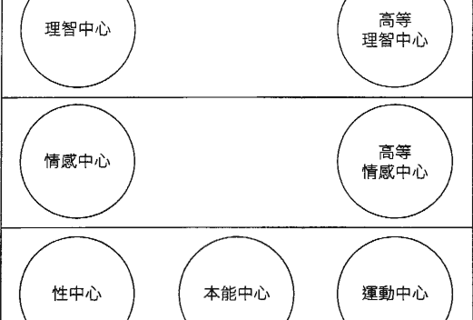

> 出处：Michael Waldberg, Gurdjieff, An Approach to His Ideas (Routledge and Kegan Paul, 1973), 112.

多年来，他们在研讨会上谈论过特定人格类型的与会人士，并且汇集他们的特征和举止。和理智中心相关的这个图表，包括了各个人格类型最原始的名字，我刻意地改动了这些名字，希望能让这个系统脱离葛吉夫“为魔鬼命名，把他揪出来”（naming the devil in order to route him out）这样的理念。原本的名字和问句，刻意强调了某个人格类型的负面倾向，因为负面的习性比较露骨，让人们可以比较容易辨认出九种类型的差异之处。举例来说，如果我们没有做出“有压力的时候我就会制造冲突”（8型人——保护型）和“有压力的时候我就会变得孤僻”（5型人——观察型）这样的区别，我们就没有办法分辨这两种人格类型的差异，因此也就无法采取某些策略来帮助这些人个类型进化。如果我们只看诸佛和超凡觉悟者的陈述，我们所听见的话语都是来自高等理智中心，像是：“我似乎没有感受过任何压力，我就是知道一个问题会如何结束。”（5型人——全知），或是：“我顺着流遍全身的那股力量。”（8型人——天真）。意思就是，我们无法以这些话语辨别出不同的人格类型。虽然透过各个人格类型的负面差异，可以让我们比较容易辨别它们，不过我认为过度注意这些类型的特质，会降低它们作为导师和引导者的重要性，因为它们可以引导我们到高等意识状态。

## 第4章 本体系的贡献者

### 子类型

腹部中心（Belly Center）的运作大部分是无意识的，不过我们每个人对于和生存（自保本能）、性爱以及社交生活相关的议题，都有着迫切的担心，我们可以藉由这个事实来辨认出这个中心。

以下是一个和子类型有关的寓言：一个牧牛人坐在三脚凳上挤牛奶，牛奶指的可能是教诲的养分或者是生命的养分。这张板凳的一只脚坏了，所以当他在挤牛奶的时候，他的觉知便朝着坏掉的那只脚倾斜。故事在这里指出，我们有三个主要的关系场域，其中一个比另外两个还要破损。当其中一个关系领域受到伤害，我们便发展出一种特定的心智倾向，用来减少那个受损的部位为生活所带来的焦虑。这三个关系场域便是性爱（亲密关系）以及其他一对一的关系）、社交（群体关系）以及自保（我们和个人生存这件事的关系）。身为我们成人，我们对于自己人格之中的这三种心理倾向，都有一定的敏感度，但是我们会对其中一个产生特别严重的关注。举例来说，这三种关系，在很大的程度上都和安全感、声望以及男性及女性的形象有关，不过在三个当中会有一个成为我们主要的顾虑。

如果这三种关系在自保的部分受损得最为严重，那我们就可以假设，这个个体主要的生存议题会与安全感有关，同时也会受到虚荣这个主要特征以及欺骗这个情感的影响。

## 九型人格简介

> 改写自: Transpersonal Psychologies, Edit. Charles Tart, Harper & Row, 1975, reprinted by Psychological Processes, Inc. 1983, Charles Tart.

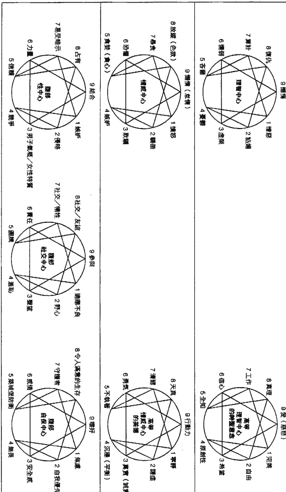

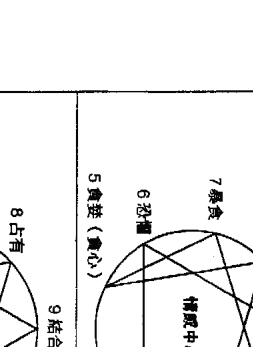

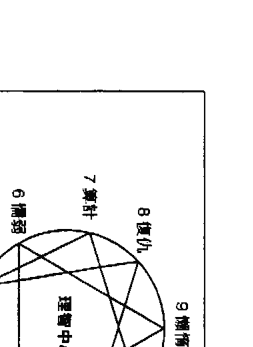

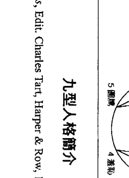

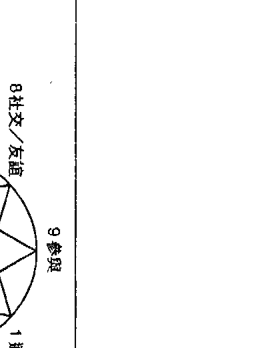

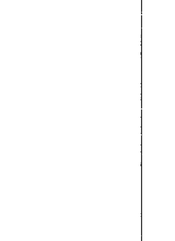## 九型人格和當代心理學

伊察佐的九型人格理論帶給我們某些困難，因為他在介紹各個類型的時候，對於和該類型有相關的各種重要議題，只描述了其中一個；此外，他的用字遣詞也無法被直接轉譯成心理學用語。在九型人格傳播的過程當中，克勞迪歐·納蘭雍是智利的精神病學家，他參與了艾瑞卡學院部分的訓練，並且以他的能力將九型人格理論放到心理學的脈絡當中。藉著《真正的追尋》（The One Quest）這本書，納蘭雍早就建立起自己綜合東西方意識研究的名聲。他對於九型人格理論的貢獻，在於成功地將神秘主義轉化道路的洞見和方法，與西方心理學的理性力量結合在一起。這也促使「那些知道的人」開始談論類型問題，讓後來的人得以設計出一系列的問題，這樣一來，人們就能夠藉著觀看和聆聽同類型的人的故事來辨認自己的類型。

藉著和那些熟悉心理學、並且能夠描述自己理智和情感傾向的人們進行訪談，納蘭雍獲得許多洞見。他有一張九型人格圖表，測繪出支撐各個人格類型的重要心理防衛機制。對我來說，這讓葛吉夫在他的工作中所暗示的以及伊察佐接著發展的九型人格理論，得到了實現。如果九型人格理論沒有這麼精確地被放到西方類型學的範疇裡來談，它可能到現在依然被視為某種神秘主義。

我從納蘭雍那裡學到九型人格理論，他以口語的方式傳授這個材料。他訪談了許多高功能人士的團體，這些人都在從事特定的靈性修持。去聆聽那些人為什麼想要尋求高等意識，還有他們是如何一路走來，追尋那超越個人自我的某種東西，總是為我帶來很多啟發。

這個系統被發展成一套神秘教導的心理學工具。我個人的興趣主要是在靈性修持以及直覺訓練，而不是心理學，不過我想要知道同樣類型的人，是否會遭遇某些特定的問題。真裡在5型人（觀察型）之夜首度向我顯露，那時候納蘭雍正在對一群5型人就他們早年的家庭生活進行訪談。其中一個高度緊縮的觀察型個案，整個晚上都坐在沙發的扶手上，在一個安全的距離之外看著這一切，他說：「我知道我的家人想要從我身上得到什麼，在他們知道之前我就知道了。」

我記得自己突然感到一陣解脫，並且充滿了感激。這個5型人漫不經心的說詞，卻觸碰到我內心某個發展已久的覺知，他人就坐在那裡，加上他所說的話，引發了我對九型人格的興趣。我立刻就知道他對某些事情有一種特別的直覺；他的敏感度在孩提時代發展出來，作為其生存策略的一部分；他可能會活靈活現地描述，他是如何將自己的注意力用於「了解其他人的期望」；如果他可以釐清自己在童年時期是如何進行自我防衛，他將很有機會發展出任意進入直覺式心智狀態的能力。

在那個早期的教室中還有許多其他人，後來也以相當不同的方式各自為九型人格理論做出了貢獻。其中一位包伯·歐奇斯（Bob Ochs）是我的好朋友，他是耶穌會的教士以及九型人格狂熱者，他寫下了對於每一種人格類型的想法，還有九型人格和天主教的理念在哪些方面有契合之處。歐奇斯寫下的幾頁東西，在耶穌會的社群中意外地大受歡迎。這些宗教社群的成員一起生活、一起工作，事務通常相當繁忙，然而他們真心地接納了這個系統；具體來說，是因為他們有這樣的需求，必須了解和自己一起生活、一起工作的夥伴內心的想法。

凱琳·史畢思（Kathleen Speeth）是納蘭雍另一位最早的學生之一，她將自己擅長的心理學知識加進了這個系統，讓九型人格理論在納蘭雍臥病在床、呈現半退休狀態的時候，還能繼續發展下去。

一九七六年，我開始以討論小組的形式對自己的學生進行訪談，把它當成某個擴大直覺訓練課程的一部分。這個在我家客廳聚會的小組，剛開始總共有四十個人，隨著時間過去，增加到好幾千人。他們因為親眼看見、聽見這些與會者談論自己的生活，也找到了自己的人格類型。這本書裡摘錄的談話都是從這些課堂而來，我立刻想到要設計一套問卷，以之來凸顯某些直覺式和本質性的體驗；而這本書裡和注意力以及直覺風格相關的素材，則是我對於九型人格理論的貢獻，希望藉此可以讓九型人格繼續流傳下去。我有一個原則，在我將某個議題作為特定人格類型的特徵之前，我都會將這個議題一次又一次的帶到討論會進行驗證。

透過艾瑞卡學院，伊察佐也持續地將自己的洞見納入這一個系統。他是我們這個時代九型人格訊息的主要來源，並且持續地探索這一種人類意識轉化的模型。

### 注意力的焦點

- 1型人：評估在當前的情況下，什麼是對、什麼是錯。
- 2型人：渴望獲得別人的認同。
- 3型人：希望工作和表現獲得正面的肯定。
- 4型人：注意力的轉換和選擇性的焦點，認為得不到的東西最好，對手上的東西棄如敝屣。

心理防衛機制的九角星圖，或葛吉夫所說的「緩衝器」

> 出處：克勞迪歐·納蘭霍的研究結果。

## 第4章 本體系的貢獻者

5型人：希望保有隱蔽。對於他人的期望相當敏感。6型人：從環境中尋找線索，希望找到別人隱藏的意圖。7型人：注意力會轉向快樂的心理聯想，以及樂觀的未來計畫。8型人：注意任何可能讓自己失去控制的徵兆。9型人：試圖界定別人的行動和觀點。我們擁有三種智能這樣的概念——理智、情感和以腹部為基礎的本能——也說明了我們實際上有三種不同的直覺連結形式——透過思考、感覺，以及根植於肉體並且以腹部為中心的智能。九角星圖的頂端，也就是8型人、9型人、1型人，通常自然地以腹部為基礎，他們能夠輕易地透過肉體來接收直覺的印象。感覺類型的人位於九角星圖的右側，即2型人、3型人、4型人，他們大多透過情感反應來接收直覺。理智類型的人集中在左側，亦即5型人、6型人、7型人，他們主要是透過理智的方式來接收直覺。

有個重點必須記得，我們可以發展出許多直覺能力，並不限於以我們人格類型特有的模式來接收直覺。但是因為每個類型的注意力都放在完整實相的特殊面向，所以每個類型都會發展出一種——就他們所關注的事情而言最適當的注意力模式。9型人通常會透過身體來接收直覺，彷彿是在回答這樣一個內在問題：「在這個環境中，我的位置在哪裡？」以感覺為中心的3型人，會透過情感來接收直覺，以此回答「我和誰在一起？」以頭腦為中心的6型人，則是以理智的印象來接收直覺，以此回答「現在的情勢如何？」因此，每個類型的人都會慣性地把注意力放在頭中心、心中心或是腹部中心；雖然他們也可以學習其他類型的注意力位置，不過更有可能的是，他們會找到屬於自己特定類型的直覺風格。

每種直覺風格都建立在特定的、自動化的注意力轉換之上，它是各個人格類型日常感知的一部分。如果我們仔細地進行自我觀察，就會發現這種注意力轉換，就像是基本靜心練習的基礎，它能夠幫助我們培養出——以特定的方式抽離注意力，和把注意力聚集在某處（集中焦點）的能力。

### 根植於身體的直覺：1型人—9型人—8型人

1型人：在日常事務當中去感受達到完美的可能性，會特別注意不正確的事情，因為被感官接受到的任何明顯錯誤，都會傷害持續不斷的「事情能有多完美」這樣的感知。

9型人：將其他人攝入自己的內在，就像一面鏡子一樣，吸收所有出現在面前之人的印像，並且將摹本返還給觀者。在和人交往的時候，9型人會覺得自己融入了他人的觀點，請見下文「2型人和9型人看起來很像」。

8型人：感覺自己身體變大而「充滿了整個空間」。可以在人們身上或在環境之中感覺到臨在（presence）以及力量（power）的特質。透過訓練，便能大幅度地感受到各種特質。

### 根植於情感的直覺：2型人—3型人—4型人

2型人：透過移情作用改變自己來迎合別人的需求，感覺自己變成別人想要的樣子，在頭腦尚未涉入之前便改變了自己的情感。請見下文「2型人和9型人看起來很像」。

3型人：像變色龍一樣改變自己的角色和個人形象，藉此引導出來完成某個工作所需要的特質。注意力的焦點集中在任務上，或是其他人對於這個任務的反應。在3型人還沒想到要怎麼做之前，很有可能已經自動而又適當地改變了角色。

4型人：呼應其他人的情感，擔任別人的痛苦，在情感上與他們共鳴。4型人說他們可以感知一位不在場的家人、愛人或友人的情緒狀態。

### 根植於理智的直覺：5型人—6型人—7型人

5型人：為了不帶偏見地觀察，將注意力從思想和情感當中抽離出來。理性地觀照，沒有偏頗。

6型人：看見表象背後沒有被說出來的意圖。使用想像力做為工具，將隱藏的觀點揭露出來。

7型人：積極尋求多樣化的體驗，透過想像力拓展可能性，以避免單一視角的限制。洞悉看似毫不相干的聯想之間的關係。把問題擱在一邊去做別的事；在做不重要的事情時，反而靈光一現，獲得解決原來問題的點子。

認識自己和親朋好友的類型有一個很大的好處，那就是你可以在九角星圖上看看你們會在哪些端點交會，還有哪些端點，你們必須多試著了解對方。一般來說，如果兩個人屬於同一類型，他們的觀點很有可能會沆瀣一氣。舉例來說，我認識很多雙方都是1型人（完美主義型）的夫妻，他們通常都會就事物的品味和正確性，協調出最完美的生活方式，也會因為經常看到對方反映出自己內在的批判性而感到困擾。以「感應性精神病（folie a deux）」的關係來說，這種狀況就像是某個人格類型的世界觀，被同類型的伴侶所確認了。一對3型人（表現型）伴侶，會同意生活是一連串的挑戰，而一對4型人伴侶，則是會認為生活的重點在於感受的強度和被拋棄的恐懼。如果你和你的伴侶在某個點交會，當你們面對一件事情，那個點會為你們帶來一種與其性質有關的自發性的了解。不過，如果你移動到九角星圖上某個位置，而那是你伴侶的自然傾向無法了解的，那麼你們可能會發現彼此老是在誤解對方的意思。舉例來說，一對6型人——8型人伴侶，會在九角星的第七點、第五點以及第九點交會，當6型人因為壓力向3型人靠攏，或者8型人在覺得安全的時候向2型人靠攏（2型人和3型人就在隔壁，但是就側翼來講，它們之間並無特殊的關係意義）。我們可以根據和這幾個端點有關的議題，大膽地就他們的關係做出一些預測。

### 在第七點交會

愉快地談論一整天發生的事情，和彼此分享未來的計畫、旅行和朋友的聚會以及要做的事情。計畫一起做某些事情，支持彼此的目標。他們之間的性愛充滿遊戲性質，相當輕鬆。

### 在第五點交會

躲在家裡；待在同一個房間裡閱讀，不然就是找個可以耍自閉的個人空間。喜歡伴侶待在同一個空間裡，但是各自做自己的事情。大量閱讀，可能會一起討論書籍或電影，分享一些想法。

### 在第九點交會

積極地融入對方。6型人會將表現的焦慮先放到一邊去，但是可能會被困在一些瑣事或是要收尾的一些細節（9型人的缺點）中。在家裡東摸西摸，看著湯鍋，做一些家務事。充滿色慾（8型人的側翼，6型人的安全點）。如果6型人的性慾沒有因為在過程中變得害怕而中斷，8型人會是很匹配的對手，讓6型人在其中放鬆下來，確實實地感受到對方的愛。矛盾的是，對6型人來說，發現伴侶對自己而言變得很重要，可能會導致憤怒。憤怒一開始可能會以投射的方式表現出來，認為這個伴侶有什麼意圖。如果6型人往安全點移動，便能接受自己的情感，因為自己對8型人的愛而受到感動。在自己周圍，但是不要太靠近。在這個交會點上（6型人的側翼，8型人的壓力點），他們可能對彼此沒什麼性慾。8型人在面對壓力的時候會想要一點隱私，所以6型人在對方想要自己一個人的時候，最好不要過度投射，認為這段關係已經結束了。當8型人想通的時候就會來找你。

### 8型人向自己的安全點（2型人）靠攏

8型人的行為會從高度的控制狂變得揮霍無度，莫名其妙的大方，渴望生命中一切美好的事物，一切都能被原諒。8型人希望受對方照顧，而不是負責打點一切事情。享受平安夜對方的小動作。8型人是根植於身體的感覺主義者，所以當他們移到第二點，就會開始享受美食、娛樂、敬酒和奉承式的友情。如果這個6型人伴侶夠聰明，就會一起參加派對。

### 6型人向自己的壓力點（3型人）靠攏

在這個位置上，6型人很可能把注意力都放在某個任務上，在偏執的邊緣游移不定。一旦6型人投入某個任務，其注意力便會擺在興奮以及一種和任務成敗有關的偏執狂之間。如果8型人試圖取得控制權，逼迫6型人採取行動，或是針對6型人行動上的問題大發議論，6型人可能會一刀兩斷，同時離開這個任務和8型人。不過，8型人可以藉著承擔這個計畫當中某些6型人可能會拖延的部分，來支持他的伴侶。如果這個計畫持續下去，恐懼型的6型人便能以一種更適當的觀點，重新審視一些在之前似乎是不可克服的障礙，8型人則是會成為本日的英雄。8型人必須了解粗暴地接手和適當的支持之間的差異，6型人則是要在放手不做和把部分責任委託給別人這兩件事情之間取得平衡。

### 心理诊断的九型人格图

以下的九角星图纳入了《精神疾病与诊断手册》第三版修订版（Diagnostic and Statistical Manual III, Revised）的主要精神疾病项目。为了医疗保险的缘故，这本手册（缩写为DSM III R）通行全美国。关于这一项研究——九型人格与心理诊断——相关的论述基础请见本书的附录。

只有透过最严谨的研究，我们才能为九型人格理论在西方心理学的思潮当中找到一席之地。举例来说，目前市面上很多心理测验和自我评量都和这个系统有若干「雷同」之处，但是它们没有任何研究上的根据，或者是采用现象学的方法来访问各种类型的个案。这些所谓的雷同之处，看起来很有希望而且相当吸引人，但是它们对于九型人格理论并无任何助益，因为它们并非以任何研究结果为基础。九型人格理论的工作持续在进展，目标是要建构出一套实证的工作架构，并且发展出一套纸笔评量的题库，我把相关的摘要放在本书的附录中。

根据纳兰雍对于主要心理防卫机制的见解，以及这些年来我在讨论会上听过的许多故事，我们可以说，下一个九角星图所呈现出的精神疾病诊断排列，和目前的心理学知识相当吻合。关于这样的排列，要验证它的可靠性，其中一个测试就是它是否能被自行验证。意思就是，有能力的自我观察者，应该要从某个对其人格类型的描述找到自己的位置，并且就他们在压力点和安全点时会产生的行为变化，做出正确的回应。DSM的诊断项目描绘的是严重的心理疾病。从注意力练习的观点来看，这意谓着患者丧失了往后退一步来观察的能力。如果一个人没有办法将注意力转移到内观察者中立的制高点，我们就没有办法把「我做了什么」与「我是什么」分开来看。就病理学而言，注意力会沉浸在我们人格类型特有的思想和感觉之中，让我们无法采取其他的观点。现在的心理学研究才开始注意，九角星图内部各个类型的连线关系。举例来说，光是内部的三角形就指出了某些令人惊奇的关联性——它指出强迫症（9型人）、偏执狂（6型人）以及工作狂（3型人）的倾向，会存在同一个个体当中，并且能够依此预测特定的生活情境（正常、压力、安全），可能会造成什么样的行为。

9型人：被动式的攻击。DSM强迫症；强迫思考占主导地位。米隆所说的「主动矛盾型」。

病理學的九角星圖

### 診斷補充說明

#### 以身體為中心的類型：9型人為核心，8型人和1型人為側翼

##### 9型人

DSM所謂的強迫症（obsessive compulsive），強迫思考（obsessive side）占主導地位，米隆所說的「主動矛盾型」（active ambivalent type）。在做決定的時候會感到猶豫不決，陷在想要反對和想要服從的欲望之間。以九型人格的術語來說，9型人想要成為一個好人（1型人），也想要成為一個不服從的人（8型人），在這之間進退兩難。9型人通常會停留在內心衝突當中，而不是採取某個立場來改變現狀。其內在的問題比較像是「我想要待在這裡嗎？」而不是1型人的「我在做正確的事情嗎？」無法真正投入任何立場。如果他們必須服從或反抗這個議題採取行動，就會啟動防衛機制，把注意力分散到不重要或是次要的任務。自我麻醉和恍惚是主要的防衛機制。他們可能會主動地表現出矛盾，但是又會消極而間接地表達憤怒。

有些 9 型人說他們會採取被動式的攻擊，他們相當頑固而且愛抱怨，就九型人格的術語來說，他們這麼做是因為向側翼的 8 型人（積極反對）靠攏。被動式攻擊的 9 型人的矛盾，在於雖然他們和比較具有強迫傾向的 9 型人一樣，對於個人的立場都抱持著矛盾的態度，但是他們不會照著別人的規定走。他們會讓自己融入其他人的願望，表面上看起來好像很合群，但是同時挑三揀四、拖拖拉拉，並且表現出許多其他反對傾向。

##### 1 型人

DSM 中由強迫行為主導的強迫症，內心可能像 9 型人一樣矛盾，但是不會表現出來，是米隆所說的被動矛盾型。在服從或反對的衝突當中偏向「對」的那一邊。反向作用（reaction formation）這一防禦機制，讓他們無法覺知自己的憤怒和真實的願望。堅持以正確和錯誤為評量的道德準則，有做正確的事情的強迫心理。相信凡事總有個唯一正確的作法。

##### 8型人

DSM所指稱的反社會型人格（sociopathic type），我的作法就是正確的作法。

#### 以情感為中心的類型：3型人為核心，2型人和4型人為側翼

##### 3型人

在DSM當中沒有相應的診斷項目，近來才受西方的心理學界認可為一種類型。當事情做得正起勁的時候，會先把感覺放到一邊。注意力放在任務本身，而不是在自己身上。雖然有些3型人說自己有自戀的特質，比如說認為自己在成就上和從優點來看都比其他人還要優越，不過這樣的優點是因為努力工作而獲得，而不是一種天生就有的東西。3型人會犧牲自己真實的需要來維持一種贏家的形象，而不是採取一種比較自戀的態度，也就是說，他們不會以對未來成功的想像來取代當下的勤奮工作。

##### 3型人和7型人看起來很像

這兩者都是能量高昂的外向者，兩者都非常樂觀、善於自我行銷、而且想要別人的認同。兩者都會投射出贏家的形象。3型人會工作到自己不支倒地為止，但是7型人只會在自己還感興趣的時候工作。3型人想要可以凌駕他人的權力，成為萬眾矚目的領導者，願意投入到最棒、責任最重的工作上。他們是循規蹈矩的人，尋求他人的認同；他們辛勤工作，希望可以得到立即的回饋。

# The Enneagram

7型人想要尝遍天下一切美好的事物。他们喜欢冒险甚至获得权力。他们不需要守规矩来寻求认同，因为他们认为自己凌驾于社会规范之上。他们不在乎责任的问题，只要自己认同自己，为光明的未来感到激动不已，而不是为了立即的目标工作。

## 2型人

DSM的表演型（histrionic）和依附型（dependent）人格。两者都需要有人给他们持续不断的认可和赞同。在关系中才会有自我的感受。两者都会适应另一半的需求，以此确认爱情的存在：“我变成爱人想要的样子。”依附型人格藉着温和的顺从来适应对方，通常会紧抓住某一段关系。表演型人格会采取具有侵略性以及操控性的姿态，来取得对另一半的控制权。

## 4型人

DSM所说的忧郁症（depression）和躁郁症（bipolar）。以九型人格的术语来说，当他们因为压力而向2型人（表演型忧郁）靠拢，或者是为了对抗忧郁因此变得过度活跃，即向3型人的侧翼靠拢，都会表现得相当激动。

## 6型人

以理智为中心的类型：6型人为核心，5型人和7型人为侧翼。DSM所说的偏执型（paranoid）。

5型人
DSM所说的类人格分裂型（schizoid）和回避型（avoidant）。这两种类型的个案在表现上以社会疏离为主要特征。有些个案说他们自给自足，对于和其他人亲密的个人接触一点兴趣都没有（类分裂型，被动脱离），另一些个案则是说他们对于社交孤立（回避，主动脱离）感到相当挫折。

7型人
DSM的自恋型（Narcissist）。认为自己天赋异禀；认为自己的优势是天生的而不是后天取得。请见前文“3型人和7型人看起来很像”。注意力投射到想像的、乐观的未来，因此没有立即做出承诺或工作的需要。“最重要的是，我必须忠于自己。”

获取更多好书，请加微信号：strcdts
店铺：http://strc.cr.cx

## 第二部

# 九型人格类型释义

## 了解核心人格的变化

- 1－4－2－8－5－7

要了解这些人格类型会如何互动，最好的方式就是先阅读九型人格图内部的三角形，即6－3－9三个核心人格的介绍，接着再以如下顺序来了解这些核心人格的变化，即1－4－2－8－5－7。在课堂上，我们会让发言的人以这样的顺序就坐，因为照着这样的安排，观者会更容易看出当每个类型的人进入行动或压力状态的时候会怎样行动，我依照阿拉伯数字的顺序从一到九安排章节，只是为了便于读者参考。

每一章的开头都包括了和这个类型相关的心理困境描述、典型的家庭背景，以及该类型所纠结的基本议题。对于每个类型在亲密关系和权威关系之中常见的表现，本书也做了简要的介绍。

关于九型人格理论，最令我感兴趣的部分，是每一类型的人如何施展出注意力，以及每一类型的人共有的直觉风格。对我来说，注意力练习似乎是连结理性与直觉的桥樑，对西方人来说也是一项重要的工具，让我们可以重新连结灵性传统所说的“本质”。我访问过许多个案，他们都有过直觉式或是本质性的体验。我也仰赖我的直觉，以它作为一个工具，来深入研究人类心灵之中这一个隐密的私人领域。我在这本书里加入了和注意力以及直觉有关的小节；为了要对我们本性的特质有更完整的了解，我认为它们是必要的初步工作。

虽然每个人格类型都有特定的倾向来施展特定的直觉能力，不过重要的是，我们必须记，每个人都有机会可以展现所有类型的直觉风格。

# 第二部 九型人格类型释义

举例来说，你可能会发现自己的直觉风格，就是你的安全点或是行动点（压力）的人格类型常见的直觉风格。每个人都是独一无二的，因为我们都得学着应付生活，不过藉着检验我们如何使用注意力，并且培养内在观察者，我们就会知道自己经常与直觉碰头，它以一种我们不知道的方式影响了我们所做的决定以及我们的关系。

在“高等心智能力和情感美德”的小节中，我会——如果一种人格类型发展良好会有哪些特质，进行讨论。在描述本质有哪些面向的时候，我们很容易会产生“要如何培养或展现这些特质”这样的概念，仿佛本质只是个人自我的延伸。事实上，只有当我们处于一种转化的觉知状态，在这个状态下不受思考及感觉的自我所主导，我们才能触及本质的某些特性。这些特性和我们日常的意识状态无关。不幸的是，这些特性可能会被窄化成一种平庸的观念，认为一个进化的人就是要有这样的表现。

要真正引导出本质的某个特性，第一步就是要培养内在观察者；其次，要精通静心、身体工作以及能量练习的各个层次：第三，将这些本质的特性纳入圆融的人格中。

我在这本书里加入了一些材料，像是每个类型的成功之道、特别的注意事项，以及由每个类型所变化出来的次要类型。

所有这些材料都是过去十二年间在课堂上的访谈发展出来的，所以这本书确实可以说是综合了几千名参与学生的故事才得以完成。

## 每一型人的主述重点

- 这个类型所面临的困境
- 典型的家庭背景
- 这个类型的主要问题
- 亲密关系模式
- 亲密关系范例：两个特定类型的伴侣关系
- 这个类型和权威的关系
- 权威关系范例：两个特定类型的权威关系
- 注意力模式
- 直觉风格
- 对于这个类型而言有吸引力的职场
- 对于这个类型而言没有吸引力的职场
- 这个类型的名人
- 高等心智特质
- 高等情感特质
- 优势
- 子类型
- 这个类型的成功之道
- 这个类型的注意事项

# 第5章 1型人：完美主义型

| 自保：焦虑（烦恼） | 社交：适应不良 | 性爱：嫉妒 | 子类型的表现 | 心——高等情感：宁静 | 头脑——高等心智：完美 | 本质 | 心——强烈情感：愤怒 | 头脑——主要特征：憎恶 | 后天养成的人格 |
| :--- | :--- | :--- | :--- | :--- | :--- | :--- | :--- | :--- | :--- |

1型人：完美主义型

## 困境：内在批评者

1型人小时候是优秀的小女孩和小男孩。他们学着表现得恰如其分、做好自己份内的事，最重要的是，学会在他人的注视之下表现出正确的样子。他们记得自己在小时候因为受到大人责备而陷入痛苦，所以学会严厉地监督自己，藉此避免犯下可能会吸引别人目光的错误。他们自然而然地认为别人也有这种自我改善的欲望，经常会因为看见别人的道德瑕疵而感到失望。

完美主义型的人看起来就像清教徒的老祖宗。他们工作勤奋、品行端正、自立自强，相信正直的思想和善良的行为，可以胜过人性的阴暗面。1型人认为生活艰辛，一个人必须勤奋不懈才有好日子过，他们认为善有善报，还认为一个人必须先把该做的事情做完，才能开始享受人生。

完美主义型的人，通常不知道自己把欢乐拒于门外。满脑子想着自己“应该”要做些什么，还有一“一定”得完成什么，因此很少问自己对生活有什么期望。

当他们还小的时候，许多发自本性的渴望受到大人的禁止，所以把注意力从本质移开，转而关注正确的行为，并且学着封锁自己的欲望。

有严重强迫性格的1型人，可能会把大部分的休闲时间用在个人的进修和成长上面，因为他们觉得无论如何总是还有进步的空间。他们会在坐公车通勤的路上做一些简单的体操，吃午餐要练习一口嚼十下，自由时间则是用来做一些具有建设性和教育性的事情。

# 第5章 1型人：完美主义型

1型人

1型人说他们内心住着一个严厉的批判者，对于大部分的人来说，只有在犯下滔天大罪的时候，才会有这种体验。他们觉得自己的思考总是伴随着一个批评的声音，知道这个声音来自内在，但是它可能相当具有侵略性，就像是从外面来的一样。这个内在批评者最常做的事情，就是批判1型人的想法或是作为，比如说，如果某个1型人正在演讲，这个内在批评者，便会就他的表现不停地提供意见：『你应该把那个观点讲得更清楚一点。你的声音有点鼻音。不要离题。』儿时对于批评的恐惧，让1型人发展出一套内在监视系统，自动自发地监视1型人的思想、谈话以及作为。

> 『你应该把那个观点讲得更清楚一点。你的声音有点鼻音。不要离题。』

在提到这个内在批评者的时候，1型人经常有个联想，觉得自己内在有个比较高等、超越日常思考的部分。虽然他们知道这个内在评论者出在于他们的脑袋，他们还是会倾听这样一种发自内心的正当评论，彷彿它来自某种更高的存在领域。

1型人经常说，他们会批判自己愤怒的情绪或是涌现的性欲，当这样的内在声音变得太过强烈的时候，他们就会开始对那些破坏规则而又没有表现出一丝悔意的人感到憎恶。当完美主义型的人试着满足内在批评者对于完美的要求，他们会觉得自已必须成为好榜样，同时在心里暗自譴責那些不遵守规定的人。

对于完美主义型的人来说，内在批评者已经成了他们思考内建的一部分，他们只能假设其他人也带着一连串的批判念头在过活。当其他人选择享乐而不是先把事情做好，1型人会认为那是一种欺世盗名的行为。

『一定得把什么事情做好』这样的焦点上，所以他们的注意力大大地集中在——『应该做些什么』或者『究竟想要什么』。他们因此变得愤世嫉俗，这个字眼描述了一种长期以来对他人的愤怒感。

这样的愤世嫉俗可以被定义为一种落差——为了满足内在批评者的要求，他们逼迫自己努力工作，让失落已久的真实欲望越离越远。

延迟享乐会给于1型人一种道德正确的感觉。只有当生活走在正确的轨道上，而且责任义务已尽，他们才愿意开始考虑放松和享乐。时间都被安排好，分成许多区块，其中放满了各种必要的材料，可以用来创造出一个完美又均衡的生活：音乐时间、运动时间、探访生病友人的时间，还有用功的时间。时间被记事本中的小方格控制，就像是监狱的行程表，记录了所有该做的事，这样就能有效地消灭自由时间，让真正的需要没有空浮出水面。

我实在是太想得到它了，以至于花了整整两年的时间来做准备。我希望每个步骤都要很完美，结果搞得自己迟迟无法入学。首先我得调合自己的政治信念与艺术理念之间的冲突，因为从政治的观点来看，我的表现主义的绘画倾向（expressionist leanings），就社会的角度而言是相当自溺的。接着我必须衡量自己的喜好，我热爱大自然和户外活动，然而艺术工作是一个必须久坐的职业。我还要重新检视我的信仰，它让我偏爱特定的艺术主题。在我填完入学资料之前，我得把自己的整个世界观重新整理一下。

这个念艺术的学生如果没有先对她的内在批评者交代清楚，就无法感觉自己的兴奋、期望，以及画画带给她的快乐。

在清教徒的历史当中，跳舞和游戏都在禁止之列，因为它们会带来肉体的欢愉和热烈的情感，这些情感或许会逃过内在批评者的审查。

完美主义型的世界观来自于这样的假设：他们认为就所有的情况而言，都有一个终极正确的解决之道。无论其他道路看来有多么吸引人，他们依然会致力于行走在这条唯一正确的道路上，这便是1型人的性格陈述。正确的道路可能有好几条，或是对于某个人来说正确的道路，对另一个人来说可能是错误的——对于1型人来说，这样的想法简直就是唯恐天下不乱。如果你们可以随心所欲地自行其是，那要怎样才能防止邪恶势力毁灭一切美好的事物呢？

1型人的批判通常都以愤怒和性欲为核心，主要是因为这些冲动在儿时受到大人的惩罚。他们通常不知道自己正在生气，即便已经明显地咬牙切齿——就像要是把批评的话语关在嘴巴里进行审查——他们也没有发现已经被惹怒了，因为他们把“坏”情绪排除在自己的觉知之外。一个满脸通红而且炮火四射的1型人，可能不知道——自己的愤怒在整个对话的过程当中已经向周围炸开，在离开现场之后，他们还会觉得这场对话一点重点也没有。

1型人把愤怒当成一种坏情绪，所以无法承认自己的气愤，除非可以完全确定自己是对的。不过，如果1型人对于自己的立场感到相当笃定，他们的身体就会释放出极大的能量流。当1型人确定自己是对的，头脑里的批判者就会暂时退下，他们也会因为把这股内在压抑的愤怒释放出去而松了一口气。在发展良好的1型人身上，这股能量可以被运用在具有高度建设性的目标上。他们通常会现身在人道主义运动的最前线，无私地奉献自己，态度就像其他人为了薪水或是为了个人名誉而工作那样认真。如果1型人发展不良，当他们在受到同样一个有价值的目标所吸引时，便会把注意力投入创建一个正义的平台，以之声讨那些做错事的人。

1型人住在一所分裂的房子里。批评者住在房子的上层，对于地下室经常遭受情感洪流的侵袭浑然不觉。如果某个强烈的情感浪潮突然剧烈地升起，1型人很有可能会藉着把注意力放在他人的错误行为，来释出某些不被接受的情绪，或者让自己喝个烂醉、嗑药嗑到茫然，藉此让内在的批评者昏迷过去。藉着豪饮、偶发的暴怒或是在短时间内进行许多强烈的性行为，1型人可以释放那些由潜意识的需求所累积而成的压力。

“分裂的房子”这样的意象，也能用来描述某些完美主义型的人，他们在内在批评者和受困于潜意识地窖之中的情感洪流中间，建造了一道“活门”。建造活门的1型人对于住在一所分裂的房子里可能会产生的各种问题，创造出一种双重生活的解决方法。他们发展出两种极端的性情，一种适用于“有人认识我的地方”，一种则是用在“遥远的地方”。他们在那些有人认识他们的地方，通常是被大家委以重任而又尊敬的人物，但是一旦到了某个远离家人和朋友的环境，可能会变得既放松又性感。他们会在无意中展现出这种“活门释放”的解决之道，比如说，在选择度假地点的时候，他们可能会选择某个没有熟人也没有责任的地方。这种倾向可能会以一种令人困惑的方式表现出来，比如说，他们可能会有着“图书馆员—妓女”，或者是“传教士—小偷”这样的双重身分。

对于住在分裂房子里的1型人来说，要释放紧张还有另外一个方法，那就是透过宽恕。如果1型人可以接受错误，那么内在批评者就会退下，他们便能以一种更宽容的眼光来看待自己小小的罪过。宽恕的转折点就在于承认错误，但是同时了解，错误并不一定如他们受到制约的想法所认为的，总是伴随着羞辱和惩罚。一旦他们接受错误已成事实，在弥补错误的时候，1型人是九型人格之中最有耐心也是最有建设性的人。当一件工作圆满完成，他们也能最体会这种快乐的人，浑身上下充满感激，就像是心里有天使在飞一样。一些简单的小事就能让他们有完美的感受：干净整洁的房子、一个写得很好的句子，或是在和人对话的时候每个细节都完美得恰如其分。

## 以下是1型人常见的心理倾向：

- 像清教徒一样，有着严苛的内在标准，不断地自我批判。
- 依照社会标准正确行事的强迫性需求。
- 做对的事。
- 相信自己在伦理上和道德上比别人优越。认为自己是优秀的人，是最佳人类的前百分之一十，因为自己会做正确的事。
- 无法辨认自己真正的需求，特别是如果这些需求不符合正确的标准。
- 总是在脑袋里拿自己和其他人较量：『我比他们好，还是比他们差？』很在意别人对自己的批评：『他们是不是在批评我？』
- 做决定的时候经常拖拖拉拉，害怕犯错。
- 不切实际的社会改革者。把自己因为需求没有获得满足所产生的怒气，发泄到外在世界某些看似合理的目标。
- 两个自我：忧虑的自己，住在家里；比较爱玩的自己，只有在离家的时候才会出现。
- 1型人的注意力奠基在想要矫正错误的念头之上，这可能会导致：
    - 强烈的批判力道。
    - 对于任何事情的觉知当中，背后都蕴含了『变得更完美的可能性』，与之相较，错误则是作为一种觉知的前景被凸显出来：『想想看这件事情原本会有多完美。』

## 家庭背景：高压

1型人经常提到，自己在年幼的时候受到长辈严厉的苛责或是惩罚，导致他们对于良好的表现变得相当执著，藉此避开麻烦。这听起来似乎是一种会制造出乖孩子的家庭环境，但也逼得孩子必须把父母批评的声音内化，藉此控制自己的行为。

许多1型人在还没成年的时候就被父母寄予厚望，希望他们承担大人的责任。他们还会扮演父母的角色，安抚这个家里不成熟的大人。

我父亲想要成为作家，结果他结了婚，必须养家，因此恨透了自己的生活。我觉得他把气出在我们身上，因为他没有忠于自己的梦想，总是觉得自己被困在安定的生活里。我们的母亲大部分的时间都在生病，所以我必须照顾弟弟妹妹。家里的气氛非常紧绷，每个小孩都得小心翼翼，才不会惹爸妈生气。我老是觉得事情怎么做也做不完。

我记得有一年夏天，爸妈要我把家里所有的墙壁清洗一遍。我从某一扇窗户开始，弟弟妹妹正在那附近玩耍，我看见自己把一条窗帘布抓在手里，突然觉得好生气，为什么我得照顾每一个人。我把一大块窗帘从钩子上扯下来，从来不知道我的心里藏着那么多愤怒。

这个家庭有着高压的气氛，却没有任何回馈。把事情做好是应该的，所以完美主义型的人如果做错事会被责骂，却不会因为牺牲自己去成全别人而获得嘉奖。成为一个完美的人，除了必须大量剥夺自己的喜好，还要对自己进行严格的内在控制。到了最后，获得奖赏的快乐反而不如控制的快感那么强烈。以下的陈述来自于一个非常成功然而习惯性焦虑的会计师，他描述自己是如何控制自己的享乐：

还在念书的时候，我都会告诉自己：如果这个礼拜好好用功，那礼拜六早上就可以去打篮球。这样我才会有念书的动力，在礼拜六之前把该做的事情都做完。不过最后没有去打篮球，我会这样想：好吧，该做的事情做完了，给自己某些承诺不就是为了这个目的吗。我没有去打篮球，倒是做了两件我一直在逃避的杂务，现在就要做，不然我永远都不会做。我告诉自己要努力才能玩乐，不过即使我真的完成任务，我也不会出去玩。

当1型人剥夺了自己的乐趣，他们的内在就会产生高度的压力，逼得他们不得不释放自己愤世嫉俗的感受，儘管他们仍然无法看见自己的愤怒。

下文的建筑师叙述了他是怎样抒发被压抑的攻击性：

我在家里是个循规蹈矩的小男孩，我不知道自己为什么会对我的父母还有对学校感到那么愤怒。我有个发展迟缓的弟弟，我觉得有点丢脸，但我还是试着保护他。别人认为我的母亲有点不稳定，最后她真的崩溃了。我就是比较强壮、比较健康，在这样的环境中，如果我感到快乐，我就会觉得对不起他们。

我一生气就会开始破坏东西，但是我不知道自己之所以这么做是因为我生气了。我的内心会产生一种冲动，就是想要把什么东西砸烂，最后我会开始想像自己砸烂窗户，我真的会在半夜带着一把大铁锤到某个废弃大楼搞破坏，这么做的感觉实在是太棒了。

## 强烈情感

许多1型人对于自己正在生气这件事浑然不觉。他们的头脑充满了批判性的想法，这表现在他们紧绷的肢体语言，还有他们忙着纠正别人的事实的行为上。不过除非他们已经到达忍耐的极限，1型人会觉得自己“充满能量”、“只是有点小小的不爽”，或是“今天完成了很多事”。

对1型人来说，透过正确的原因表达自己的愤怒是一大吸引力。如果有正确的理由，他们就能够发泄愤怒，又不必责怪自己纵容负面情绪。正是因为这样，1型人会受到纯粹的理念吸引，这些有社会价值的理念，为1型人正义的愤怒提供了安全的发射台。

事实上，如果其他人对于你的牺牲和奉献一点感觉都没有，却还要强迫自己好好表现，那真是一件很辛酸的事情。对于正直而又努力的1型人来说，这实在是不太公平，他们得到的奖励实在是太少了。因为他们的欲望在儿时遭到否定，1型人再也也不知道自己真正想要的究竟是什么，但是对于什么事情必须完成，则是有着相当高的敏锐度。1型人可能会因此对那些不遵守规则的人感到相当愤怒，但是除非肯定自己完全正确，不然他们不会表现出来。

这种没有获得承认的愤怒会被放在心里，当某个合理的不满最后终于爆发的时候，会连带地扯出许多被压抑的狂怒。以下的陈述来自于一个外表看起来相当温和的美容师，她谈到自己## 1型人

### 對交通狀況的抱怨：

我覺得交通狀況實在是糟糕。如果每個人都可以遵守交通規則，我還可以稍微忍耐一下。有好幾次我真的氣到不行，只好採取行動。我覺得既然我們都陷在車陣裡，如果有人想要利用這種情況占便宜，我們全部的人都很倒楣。我會爆炸，是因為有個駕駛偷偷地把車開在匝道出口的邊緣上，想要插隊先下交流道。我立刻把車子開出線外，在眾目睽睽之下把他的車子逼到路肩去。

### 找尋釋放活門

對於完美主義型的人來說，他們的憤怒和痛苦都是因為個人的需要沒有獲得滿足。他們真正的願望受到壓抑，被一張「必須完成的事情」的清單所取代。這種情況造成的剝奪效應導致了長期的焦躁，他們客氣的表面之下經常是怒火中燒。1型人特別容易被那些展現出人性陰暗面的行為所激怒，因為1型人無法接受他們的內心也有著同樣的慾望。我們必須記得1型人住在一個分裂的房子裡。他們的注意力被頭腦裡的批評者所主導，讓他們無法感覺到各種受到否定的情感。如果他們真正的需求快要從潛意識湧現上來，他們腦袋裡的批評者就會對自己開始大加撻伐，希望阻止這種反應繼續擴大的情勢。突然間，任何小失誤都變得十分嚴重，他們的注意力強迫性轉移到需要改正的錯誤上。「你得這麼做，他得那麼做。」每一張漂亮的臉孔都有瑕疵；每個房間的角落都有灰塵；每個美麗的夕陽，偶爾1型人會找到某些方法來抒壓，在真實的需求和內在批評者的需求之間找到一個平衡，過著一種雙重生活。他們會有個體面的公眾生活，1型人在其中會遵守各種規定和程序，此外還有一個所有禁忌的幻想都被付諸行動的私人生活。

我小時候住在紐約市，那時候我經常會到各個不同的街區閒晃，看看我能不能偽裝成義大利人或猶太人，或是假裝自己是一個藝術家——如果我去格林威治村的話。我喜歡假裝成別人，這樣我就不用擔心其他人對我的看法，還可以說一些平常在家裡根本想都不敢想的話。

我這輩子第一次的歐洲行大大地解放了我。在那裡沒人認識我，我的父母遠在天邊，所有的建築物都像小小的石頭宮殿，當地的貨幣對我來說就像是「大富翁」裡的假錢一樣。

我開始會在旅行的過程中扮演各種角色，就像我以前在紐約那樣。我會踏上一輛不知終點在哪兒的火車，讓自己被我創造出來的某個角色附身，一直到我覺得自己完全進入那個角色為止。接著我會在某個小鎮下車，用好幾天的時間假裝自己是另一個人。其中最棒的兩個角色，一個是搭飛機到處旅行的有錢人，另一個是妓女。身為一個有錢又到處旅行的人，我和很多人見面，用三種語言告訴他們我在各地的見聞，這真是太好玩了。假裝成妓女的時候，我到處為了錢去勾搭別人，穿著細高跟鞋以及我所能找到的最輕薄的衣服。這件事情最刺激的地方，就是我變成一個透明人，大搖大擺地坐在酒吧裡，讓自己被妓女的角色佔據，但是沒有人會知道我是誰。

### 完美主義

1型人說被別人批評是很痛苦的事情，因為他們已經背負著自我批評的重擔。對1型人來說，要讚美別人同樣困難，因為這樣的比較會讓他們覺得自己不夠好。這種追求正確的傾向是在孩童時期發展出來，孩子被迫遵照大人的行為標準行事，讓他們開始學會關注適當的儀容、談吐與各種細節，並且養成追根究柢、還有在其他人自認為做得不錯的工作上挑毛病的傾向。從1型人的觀點來看，要獲得稱讚只能藉由強烈的自我審查、並且完美地執行每個步驟來完成目標。

我靠著當油漆師傅好不容易才讀完大學，一整天被分割成各種時段，用來處理各種必要的事。我總是逼自己要把所有的事情都做完，而且還要做好，只要那天的工作進行得不夠完美，我就不會離開工作崗位。那時候我正在重新粉刷一道牆，已經是第三次了，我對自己犯下的錯誤感到痛恨不已：因為隔壁房間的天花板有個瑕疵，所以我不能準時回家，因此還浪費了自己的讀書時間。每件事情都很重要，如果粉刷牆壁的時候沒有出問題，問題就會變成失去的家庭時間和用功時間，到底哪個比較重要了。

如果1型人總是以遙不可及的完美標準來衡量自己的努力，他們怎麼可能對自己感到滿意呢？這個年輕的油漆師傅，把一件做得很好的工作拿來和其他沒有時間做的工作進行比較。

1型人經常說他們的內在批評者變得十分真實，幾乎成了他們思考過程的一部分，所以他們會不斷地監視自己的思想，看看其中是不是有什麼不可見人的錯誤想法。

有好幾年的時間，我和一個想要成為「基督教科學會行醫者」（Christian Science practitioner）的女性交往，這個信仰體系對我來說有某種特別的吸引力。我覺得自己找到一個方式——藉著控制自己的思想——讓我們的愛變得更加靈性。我有一種想讓思想變得純潔的驅力，所以我積極地監督自己的思想，在其中尋找隱藏的動機，就像是一個老師在發「好學生獎章」一樣——「這個想法很好，那個想法很糟」。在我對自己的思想還有思想背後的動機做完檢查之前，我幾乎沒辦法做任何事情。我對於這個女孩的回應一定要正直，而且回應的時機一定要正確。只要我跟她在一起，我就必須監督自己的想法，讓自己的意念保持純潔。

對於善良的著迷，暗示著一種想要逃避邪惡的執著。這個年輕求愛者以「更好的」念頭代替本來的念頭，這種習慣對他的生活產生了很大的影響，讓他沒有辦法了解自己對這段關係有什麼期待。

當他試圖以一種正確的方法與對方交往，他便壓縮了自己頭腦裡的空間，讓真正的感受沒有機會浮出水面。

# 第5章 1型人：完美主義型

### 唯一的正確作法

對於那些兒時必須仰賴嚴格的自我控制，才能獲得安全感的人來說，要允許真正的需求浮現在意識當中，可能是很嚇人的一件事。完美主義基於一個假設——對於每個特定的情況來說，一定會有一個正確的作法；一旦人們發現了這個唯一正確的作法，抱持著不同意見的人，自然而然地就會看見理性的光輝，然後同意這樣的作法。當1型人發現，並不是每個人都同意生活只有一種正確方式，他們會感到很震驚，因為對完美主義型的人來說，正確的方法有很多種，這種概念看起來就像是在助長混亂的情勢。對於1型人來說，這樣的洞見相當重要：如果人們沒有受到內在批評者的審查，依然會以一種合理的道德標準來行動；打開通往情感和性需求的大門，不一定意味著人們會就此執著於欲望，或者是透過放縱走向墮落。

有好幾年的時間，我把自己的批判性隱藏起來，害怕我所重視的人會因此離我而去。我覺得指出別人的行為錯誤一點建設性也沒有；我想要保護他們不被別人的批評所傷害。有天我終於醒悟，對於每個人來說都是一樣，沒有什麼事情是絕對正確或絕對錯誤的。當我領悟到這種「相對正確」的概念，突然間我明白，每個人或許都是根據他們自己對於情況的理解，盡一己之力把事情完成；這種想法讓我大大地鬆了一口氣，不再以一種批判性的觀點去看他們。

### 拖延和煩惱

當我開始能夠用另一個人的觀點來描述某個情況，我就能夠盡情施展我的批評能力，同時也相當具有建設性。因為他們知道我能夠站在他們的立場思考，我的發言相當具有批判性，同時也相當具有建設性。

沒有覺察到的欲望和想要正確的需求之間的衝突，在1型人要做決定的時候就變成尖銳的焦點。做決定是種兩難的困境：選擇做正確的事可能會讓1型人的內心升起怒火，因為他們沒有得到自己想要的東西；但選擇了他們想要的東西，他們又會擔心這是個錯誤的決定。

當他們的目標和享樂有關，1型人的焦慮感就會直線上升。他們擔心別人認為自己違背了原則，像是失去了工作倫理或是降低自己的標準。對於1型人來說，違背原則的人雖然獲得了獎勵，但是他們並不夠格也沒有付出應有的努力。如果1型人必須按照自己的欲望行事，但是受到別人發出反對的聲音，這種矛盾的煩惱就會變得非常強烈。

當焦慮升高，1型人在聽別人閒聊的時候就會變得很敏感，無關痛癢的對話聽起來好像帶有負面的弦外之音。他們會因為錯誤的想法而受苦，覺得別人都在偷偷地批評他們。當1型人認為別人瞧不起自己，如果他們可以做個查證，看看別人究竟有什麼想法，會對他們有莫大的幫助。

### 親密關係：尋求完美關係

對於完美主義型的人來說，內在最深層的需要就是感覺到即使自己不完美，也會有人愛他。孩童時期，愛和良好的表現被劃上等號，這讓1型人覺得如果他們身上有瑕疵，就不值得被愛。他們也很難相信自己的伴侶可以就他們本然的樣子來愛他們，同時接受他們性格之中好的一面和壞的一面。

當親密關係加深的時候，小小的罪惡可能會不成比例地放大。萬一我生氣了怎麼辦？萬一她覺得我的藝術品味很糟怎麼辦？完美主義型的人內心的假設不斷運作，覺得自己的怪癖或是習慣一定會把對方嚇跑。因此他們在進入親密關係的時候，總是帶著一種緊張，這樣的緊張還混合著一種信念，那就是他們必須要努力獲得、要有資格才能享受快樂。

當這樣的緊張變得很嚴重，1型人對於被拒絕這件事會變得相當敏感，很有可能會因為想要自我保護，所以開始責備對方。雙方陷入爭吵，1型人認定對方最後一定會被自己嚇跑這樣的信念，變得越演越烈：「何不現在就分手，免得以後越陷越深？」

1型人通常不會覺察到自己的憤怒所造成的張力，或者他們沒有說出口的批評是怎麼藉著非口語的方式明白地傳達給別人。此外，他們在批評的時候，那種強烈的情緒就像不好聽的話一樣傷人。

1型人積極尋求完美的關係，所以很難接受好品質、壞品質必然會存在於同一個人身上。他們把注意力放在關係中伴侶的完美之處，因此，他們經常把對方當成典範，原諒他們性格上的軟弱，無法看清楚正面和負面特質總是糾纏在一起。一旦他們在某個人身上看見優點，完美主義型的人可以一輩子堅持在那裡，希望可以改正對方不太討喜的特質。完美主義型的人說當他們在戀愛的時候，內在批判的防禦圍牆會消失好一陣子。

如果1型人不知道他們想要從一段關係獲得什麼，或者開始感到威脅、嫉妒，他們就會開始對伴侶的性格缺陷，進行猛烈的抨擊。當1型人必須釋放被壓抑的挫折，他們就會開始監視對方的行動，以憤怒的態度壓制對方、迫使對方按照他們的規矩行事。

就親密關係較低層次的面向來看，當1型人覺得伴侶讓自己感到難堪，或是顯然破壞了某些行為準則，他們就會主動表現憤怒，再也無法認為自己的伴侶是個好人。過去的不滿也會一併爆發，讓他們不斷地陷入爭執。只要1型人的焦躁沒有完全發洩出去，這樣的狀況就會一直持續下去。

就親密關係較高層次的面向來看，1型人對於願意承認自己錯誤的人相當有共鳴。如果對方可以承認錯誤，1型人就會放下批判別人頭腦的習性，如果他們可以在伴侶身上感受到掙扎、努力以及善良的意圖，他們也會對伴侶表現出特別的忠誠。

我最煩惱的就是別人對我的看法。每次我認識新朋友，通常都會注意他們獨特的氣質。有的人相當機智、有的人見多識廣、有的人相當有風度，諸如此類。只要我喜歡他們，那麼他們的優點對我來說都不是問題。但是我覺得我必須採取防衛姿態，或是因為我在比較之中讓他們占了上風而覺得不舒服，那麼我就會開始對他們百般挑剔，讓我們之間稍微扯平一點。

### 親密關係範例：1型人和1型人，完美主義型伴侶

1型人經常會共結連理，因為他們可以共同策劃完美的生活方式。他們仰慕彼此的工作態度和工作能力；他們不相信小聰明，認為誠實和努力才是重要的人性基本特質。這對伴侶可以享受務實而又獨立的生活所帶來的滿足感，健康的生活、正確的謀生之道，以及憑藉著自己的努力獲得成就，就是他們生活之中最重要的價值。他們能夠欣賞這些基本的生存品質，這種能力是他們穩固關係的基石。

如果其中一個人對於自己真正的渴望開始感到不確定，就會開始產生一種難以察覺的挫敗感。1型人不太會衡量自己的心理需求，特別是如果這些需求和他們超高的道德行為標準不一致的話。在親密關係中，這種情形可能會表現為壓抑自己的憤怒，因為憤怒是一種壞情緒；他們無法把嫉妒的感覺說出口，因為嫉妒不對；或是對於一些需要改變的事情避而不談。如果他們不處理這些感受，即便是善於自我觀察的1型人，都會覺得自己快要爆炸，想要向對方扔盤子——但是他們可能搞不清楚究竟是為了什麼事情發怒。

不善於自我觀察的1型人可能已經明顯地發怒，卻不知道自己的話語已經變得尖銳而且帶有指控性。如果伴侶其中一個人能夠看到訊號，知道憤怒已經在另一個人身上累積起來，立刻採取手段找出對方覺得挫折的原因，對兩個人的關係會有很大的幫助。如果1型人願意接受對方的幫助來找出自己被遺忘的需求，就代表他們之間的親密關係有所成長。去聆聽1型人述說他們想要什麼，而不是該做些什麼，對於那些在孩提時期因為順從個人的需求而慘遭處罰的人來說，可以獲取他們極大的信任。

度展開冷戰，或者其中一個人可能會開始怪罪對方某個長期的壞習慣，並且對此大做文章。1型人的怒火可能會很嚇人，就像火山爆發一樣，而且發怒的程度和實際狀況的嚴重性不成比例。即使在爭執過後，憤怒還是會在他們的心裡面沸騰，就像過去的某個怨恨從來沒有消失過一樣。之所以會這樣，是因為合理的憤怒同時也為其他受挫的需求提供了一個必要的發洩管道。除非他們的需求被滿足，不然他們總是會因為這個世界上的罪惡而發怒。在關係中，新仇舊恨加在一起，直到兩個人都確定對方不會因為自己沒有符合對方的期望而受到拋棄。

一旦他們接受了憤怒，1型人就會開始看見自己的怒氣正要開始發作。能夠自我覺察的1型人知道憤怒之所以存在，是因為他們忽略了自己的需求，他們現在能夠把憤怒當成一個提醒，藉此把真正的願望找出來，並且滿足它們。當這些真正的願望都被滿足了，怒氣的發作就不會那麼嚴重，漸漸符合其實際上的嚴重程度，也不會強迫性地佔據他們的注意力。

在關係之中，如果1型人能夠直接表達憤怒，就意謂著他們在這段關係中感到安全，因為他們視憤怒為一種壞情緒，經常會把憤怒壓抑下來。1型人說他們生氣的時候會覺得很失敗，這表示他們無法控制某個負面情緒。他們也說，如果伴侶可以讓他們把憤怒的情緒完整發洩出來，而且不離不棄，他們就會感受到對方的愛意。當他們接受了憤怒，其他一些在過去遭受禁止的衝動也會開始變得流動，像是創意或是性慾。對於完美主義型的人來說，如果他們可以坦然接受性慾，就表示他們也能開始進行一些創造性表達。

當情緒生活之中的某些禁區獲得釋放，內在批評者就會退下，完整的潛意識力量便能為他們所用。

## 1型人

### 權威關係：仰賴正確權威

1型人尋求終極正確的權威，如果他們可以找到某個有能力的權威人士，他們會很樂意地把決定權交付給對方。然而，他們對於正確的執著，會讓他們對於掌權者的錯誤或是不公正特別敏感。1型人希望掌權的人可以建立原則，讓他們能夠清楚地知道自己該做什麼，明確的責任分工也會讓他們比較有安全感。如果他們認為領導者很有才能、而且處事公正，1型人便會願意承擔責任。如果不是這樣的話，1型人會傾向打安全牌，把過錯推給別人，不讓自己陷入錯誤的窘境。

1型人會透過一系列的批評來建立對某個組織的信任，特別是和細節及程序相關的事宜。這些小小的批判觀點通常是為了讓情況變得明確，並且建立清楚的責任分工，但是可能會成為不愉快的細節控制。一直要到所有的錯誤都消失，他們才會願意稱讚別人或投入工作中。

對於1型人而言，不要任意更改規則這件事相當重要。1型人按表操課，如果程序被改動，他們就會覺得自己被陷害找碴。他們必須尊重其他人的職權才能運作良好，如果他們覺得自己必須妥協，或者是必須在某個冒險的決定當中第一個採取行動，他們就會往後退一步。如果覺得別人全力以赴，或者是受到正確的理念感召，他們也會工作得很認真。

1型人累積起來的無名怒火，對於一起工作的人而言可能相當明顯，但是他們自己卻渾然不覺。如果主管沒有注意到他們優秀的表現，1型人很可能會把焦點放在某些合理但是不相關的錯誤上，以此發洩自己的不滿。

### The Enneagram

就較高的層次來說，1型人有良好的組織能力，而且在發展他們的工作技能時，能夠真正地享受這個過程。如果他們確定自己的觀點是對的，他們能夠堅守自己的立場來對抗所有反對的聲音。一旦認定自己是對的，1型人就會變得所向無敵，因為他們內在的批評者會退下去，他們便能停止擔心自己可能會犯錯，或是煩惱別人怎麼想。完美主義型的人堅定地認為，只有一條正確的道路，他們會不知疲倦地工作，直到工作完成為止。

就較低的層次來說，1型人會害怕公開地質疑權威，除了擔心被報復，也怕自己可能在評斷上有錯。他們通常不信任權威，不過希望主管會注意他們優秀的表現，並且提供他們應得的獎賞。他們會批評某個計畫中的許多部分，卻沒辦法提出解決之道，因為害怕錯誤會帶來的風險。對於那些必須對不同意見要求高容忍度的互動，他們會感到不自在。他們喜歡如他們所預期的工作結構和規則。

### 權威關係範例：1型人和5型人，完美主義型和觀察型

如果5型人是老闆，他可能會從幕後監督，做了決策之後再把接下來的程序交付給其他人。5型人有能力進行高風險的決策，因為他們不會感情用事，但是對於實踐這些決策所必須的會議和與人面對面溝通卻很困難。

對於那些讓事情在這個世界上運作的人，5型人相當看重與他們的連結，如果1型人可以執行他們的決策，5型人會為他們制訂策略。

這兩種人格類型都有內在批判的傾向，這個特色可以被好好用來改善一個組織。他們兩者都厭惡被不公正的階級關係所掌控，並且會給予這個組織最大的自由，讓它免於不公正的控制。

# 第5章 1型人：完美主義型

## 1型人

### 注意力模式：批評的頭腦

完美主義是基於頭腦進行比較的習慣。在這種注意力模式當中，頭腦以「這件事能有多完美」這樣的標準，自動地對思想和行動進行批判。

1型人決策過程的內在世界，攜帶著一幅法庭的圖像。一個意見被放在頭腦的法庭裡，在那裡受到質問、受到辯護，最後被判斷是否正確。

如果1型人是老闆，可能會經常延遲重要的決策，特別是如果涉及了很高的風險。他們的注意力會分散到次要的任務，時間會被過度繁複的程序給占滿，當最後期限快到的時候，壓力就會直線上升。5型人員工會識破一切不必要的細節，因為要處理過多的細節而感到疲憊，並且抗拒1型人想要監督或是控制的意圖，5型人對於那些利用憤怒來推動某個情況的人相當戒慎恐懼。如果焦慮的1型人進一步施壓來控制情況，可能就會造成危機。1型人想要規則和進度報告，這麼一來5型人就會退縮、儘量少說話、並且變得很難找到人。兩者都會試著設定界線來控制情況——5型人會將聯絡和產能減到最低，1型人則是加強控制並且歸咎責任。

如果1型人可以放鬆控制並且尋求幫助，情況可以變得輕鬆很多。如果將5型人當成給予建議的角色，而不是強迫他們生產，5型人就會敞開心胸。一個局外人可以幫助1型人辨識、並且為無名的焦慮找出理由。如果1型人可以承認自己的焦慮，而又不覺得自己錯了，那麼憤怒就會消失，過度繁複的程序就會減少，那麼突然間最重要的任務就變得很清楚了。

### The Enneagram

我坐著靜心，突然間意識到腦海裡隆隆作響的批評聲。處在某個深度寧靜的小空間，我聽見：「還不夠深。」或是：「上次打坐的時候比較好。」接著是一連串的爭執：「身體坐直一點。」「你根本就沒有在努力。」「不，我在努力了。」我的頭腦在這樣的攻防戰裡，彷彿我在這個情況裡沒資格說話，只能聽著腦海裡的聲音，直到其中一方勝出。在靜心中每個安靜的空間都會被頭腦的意見所干擾，直到我可以快樂地從我的思想抽離開來。1型人也會因為自己對達成度比較的這種習慣而受苦。「這樣靜心有效嗎？」「我進步了，還是退步了？」他們有一種痛苦的需求，一定要檢查進度，對於自己持續地在朝著自我改進而感到安心，這也會為他們帶來一種從來都沒有達標的感覺。在靜心中，這種注意力模式稱為「批評的頭腦」（judging mind）。在某種程度上來講，我們都會以完美為標準來判斷自己的進度，但是1型人攜帶著內在的測量桿生活，它也會長期地把自己拿去和其他人比較。這就像是內在兒童遊樂園裡的一個蹺蹺板：一個孩子往上升，另一個孩子往下降。她往上是因為她比較會賺錢，她往下因為我的地位比較好。我在這個方面往上，但是在那個方面會往下。他的臉比較帥，但是我的身材比較好。1型人這種頭腦裡的較量，是他們對於日常生活的感知中一個自動而又沒有覺知的一個要素，也是他們會感到痛苦的主要原因。1型人會在任何情況下都注意到什麼是對的、什麼是錯的，而且因為他們執著於「唯一正確的方式」這樣的觀點，其他人的勝利會讓1型人覺得自己像個失敗者。當1型人開始練習自我觀察，他們會開始了解——或許是這輩子第一次，在頭腦裡做比較。

# 第5章 Ⅰ型人：完美主義型

對於完美主義型的人來說，他們的直覺來自於注意力模式的某些特色。他們習慣性地會在任何情況之中發現錯誤和不正確的事，這意味著他們也有覺知到「這個情況能有多完美」這樣的一種背景感知。在任何情況當中，他們都會找到完美的可能性，因為批判性的念頭消失了，而他們的身體會覺得很輕鬆。如果要用文字來描述這種感覺，大概會是：「這不知道會有多完美！」對於那些有價值性的身體緊繃和批判頭腦的人來說，釋放的感受是很明顯的。

### 直覺風格：體會「做對」的身體感受

藉著注意頭腦的黑板什麼時候出現，1型人可以開始改變完美主義風格的注意力模式。每一次當注意力轉移到某個人的優點和缺點的詳細報告，並且感覺那個人處於優勢，而完美主義型的人居於劣勢，這就是學著把注意力轉移到中立地帶的一個機會。比較這種習慣，是如何地滲透了他們生活的各個層面。因為批判的頭腦是痛苦的來源，1型人可能會產生很大的動機想要學習靜心，希望批判性的思想可以退卻。

感受是那麼明確，透過比較，這個情境中的錯誤是那麼明顯。1型人說當他們感覺到某個情況可以有多完美，他們會不顧一切地想要清除所有的錯誤。他們說，當他們和處於背景的正確感受失去連結，而且變得相當焦慮，滿腦子都是前景的錯誤時，周遭的人就會覺得他們變得過度批判。

### 有吸引力的職場：遵守紀律的工作

1型人喜歡要求規劃和必須精打細算的工作：教學、會計、組織規劃，以及需要進行長期計畫的工作。1型人喜歡基於成規、協議、正式社交程序的工作情境。他們是研究者、法學家以及布道者，在嚴格要求遵守紀律的宗教派系和信念系統中，常常可以見到他們的身影：各宗教的基本教義派分子、左派政治分子、道德多數團體的極端分子。那些需要制訂程序的工作，對他們來說有著特別的吸引力：倫理委員會、仲裁人員、道德聯盟（Legion of Decency）等。

一整天下來，我有過幾個驚奇的片刻，我稱之為短暫的靈感。在這些時候，每件事都「合在一起」，頭腦裡的判斷不見了。這些靈感可能很簡單，就像是帳單上面準確的餘額、對於某些詞彙恰到好處的解釋，或是突然間對於大自然的一瞥，這些停止了我的思考，讓我感到快樂。沒有什麼錯誤，每件事都各得其所，有一種美好的感覺湧現出來，可以持續好幾個小時。如果某個決定是正確的，我還可以在我的身體裡感覺到。我可能有好幾個禮拜都在試著就某件事情下定決心，最後我終於知道怎麼做，因為我的身體覺得這樣做是對的，雖然我的頭腦仍然感到相當困惑。

他們不喜歡的工作，包括那些在決策的過程中隱含了高度的錯誤風險、或是在決策之後必須負起責任來面對各種爭議的工作。他們也不喜歡必須接受各種不同觀點，或者對於不同意見必須具備高容忍度的工作狀況。他們不擅長依靠變動的或是不完整的訊息來進行決策，比較適合有著明確指導原則的工作。

### 沒有吸引力的職場：時時變動的工作

### 知名的1型人

知名的1型人包括了艾蜜莉·波思特（Emily Post），她是禮儀專家，將所有合宜的行為編纂成書。她的讀者是那些想要培養社交吸引力的人：他們可以把內心的波濤洶湧放到一邊，把注意力放在自己的儀態上，在晚宴的時候以快樂的臉孔示人。
愛默生、瑪麗·包萍（Mary Poppins）、喬治·伯納·蕭（George Bernard Shaw）、狄更斯、傑瑞·法威爾（Jerry Falwell）、馬丁·路德等人皆是。

### 高等心智：完美

1型人經常覺得痛苦，因為他們習慣性地將事情本來的樣子與「事情最完美的樣子」進行比較。他們經常覺知到事情真正的樣子和事情應該要有的樣子之間的斷裂。他們帶著一種絕望的驅力過日子，想要讓日常的現實向完美靠齊。世界看起來非黑即白，如果不是完美的，就意味著它有著致命的缺陷。1型人想要一種穩固又永恆的完美；最可愛的孩子可能突然變得頑劣無比，只因為他們跑到外面玩泥巴，這種落差讓他們相當痛苦。

真正的完美是正面元素和負面元素之間的平衡，這些元素無時無刻都在交融。對於完美主義型的人來說，完美的狀況隨時隨地都在改變，這樣的事實是一種激進的洞見，因為他們以「唯一正確的作法」這種態度過生活。任何一個完美的產品都需要經過一系列看似壞風險和壞時機的測試，因此，如果1型人可以了解看起來可怕的錯誤和最終正確的結果之間的關聯，以及他們的責任僅僅在於把當下的任務做到最好，這樣的洞見對於他們會有莫大的幫助。

實驗和錯誤是通往完美的必要途徑，這樣的想法會動搖完美主義世界觀的基礎。給錯誤一點空間，如果這樣還不算糟的話，再給各種觀點一點空間，雖然這看起來就像是在邀請混亂進駐。從孩童時期開始，1型人就抱持著一種莫名的假設來努力，他們認為正確的思維和辛勤的工作會帶給他們公正的獎賞，邪惡的人則是會被發現、被處罰。

辛勤的工作會導致更多辛苦的工作這樣的事實，不只看起來不公平，而且還指出其他人

### 高等情感：寧靜

努力是為了生活的享受，而不是要應付嚴厲的內在批評者的壓迫。如果1型人可以說出這樣的話：「對你而言正確的事情，對我來說可能是錯的。」那將會是他們個人成長的一個量子跳躍。

1型人經常說，美德和善行不一定會帶來獎勵和賞識，這樣的發現帶給他們很大的震撼。然而，他們也很害怕放棄「唯一正確的作法」這種生活態度，就像是在與無意識的慾望和憎恨對抗的時候，失去了最後一道防線一樣。

對於1型人來說，靜心和心理治療的方向顯然就是去了解這樣的事實：當所謂的負面能量被接受，它們就不會有那麼誇張的重要性。1型人說批判性的想法是一個完美的指標，說明了當下有某些真實的衝動被摒除在覺知之外。另外一個指標就是身體各處憤怒的浪潮，但是頭腦對於究竟是什麼造成這種緊張一點頭緒也沒有。

1型人形容自己的內心充滿了無路可出的能量。他們說憎恨感覺起來就像是火焰般的浪潮在他們的體內移動，最後卡在喉嚨。他們使用一些意象來描述自己，像是一瓶被搖晃過的酒，想要衝破軟木塞，或是一內在充滿了我無法釋放的尖叫。內在的批評者越是批判他們真實的感受，就有越多的能量在體內累積，伺機尋求一個可以突破的管道。爆破的、瓶裝的憤怒是形容這種困境的一種方式，當1型人強行壓制喉嚨和下巴——無法說話、無法求助或是發出憤怒的尖叫，他們的身體會因為攜帶著這樣的能量而變得很僵硬。

如果1型人允許所有的情感衝動進入覺知的範疇，不去逃避那些不被接受的感覺，寧靜事實上是隨之而來的副作用。寧靜意味著每個時刻都處於平衡之中，因為所有正面感受和負面感受的交互作用得以在體內移動，沒有被思考的自我所妨礙。

當1型人允許自己憤怒，他們會接觸到存在體內的巨大憤怒。緊張的釋放會讓他們暫時感到活力十足，於是便能自由自在、不帶批評地體驗任何來到腦袋裡的想法。憤怒被表達出來而且被接受，接著會有一段充滿寧靜的時間，各種暢行無阻的感受可以再一次升起又離開，而不用任何感覺排除在外。

### 優勢：致力共創美好的信念

1型人會把自己奉獻給有價值的理念。一旦他們認為某個理念是正確的，或是相信獻身於其中的人有著良善的意圖，他們就會努力地完成工作，藉此獲得滿足感。他們工作的態度，就像是一般人為了安全感或權力而努力工作一樣。他們有一種神經質的需求，想要做好事，雖然他們可能會表現出「我比你好」這種讓人討厭又不切實際的社會改革主義（do-goodism）態度，但是這種態度也可以成為求進步的持續動力。

因為他們致力於將這個世界變成一個更美好的地方，1型人會成為很敬業的老師。他們一心一意地追求進步，而且會教導別人如何欣賞最好的東西。他們急切地想要釐清和研究各種訊息，然後把最精確的訊息傳遞給別人。他們深信人們可以透過正確的訊息改變自己的生命。

如果因為某些原因，使得他們必須在標準上做出某些讓步，他們就會拒絕合作。這種狀況在激進的左派或是極端的右派團體中特別明顯，端看他們所採用的「唯一完美作法」是哪一套標準。
要完美主義型的人解除批判，其他人必須承認自己的錯誤，或是明白表示自己實力不足。他們對於那些表現得很努力但是卻因為別人的錯誤而無法把事情做好的人，相當有耐心。對於那些努力克服困難的人，也會展現出極大的包容。如果其他人願意承認錯誤、努力自救，他們也會對這些人展現出即刻的善意。

### 子類型：嫉妒、適應不良及焦慮

就像1—9核心的9型人，1型人也會陷入「忘記自己」的沉睡。9型人有一種強迫性的顧慮，總是在思考要不要同意別人，因此忘了自己真正的渴望。1型人忘記自己的方式，則是強迫性地注意正確的事情，以此取代真正的渴望。為了要把事情做對的嚴格自我審查，創造出一種分裂：他們一方面否定了個人的欲望，另一方面又把做正確的事情當成自己個人價值的展現。
從遺忘的欲望和正確行動的需求之間所產生的緊張，創造出嫉妒、不適應以及煩惱。這些字眼描述了1型人痛苦的心理慣性，由於這些感覺相當不舒服，相當容易被發現，因此可以被當成一種集中注意力的工具。當這些不舒服的感覺升起，1型人可以利用它們來認清事實——那就是他們真正的渴望可能和他們認為正確的事情有所衝突。

#### 一对一关系：嫉妒（激情）

嫉妒表现为监视伴侣的一举一动，对于任何介入自己和伴侣之间的人、事、物都要严苛地批评一番。

我的身体里仿佛有某种东西快要爆炸了，那是一种疯狂的渴望，我必须跟对方把事情讲清楚。她到底想要怎么样？她到底想要跟谁在一起？我简直是要疯了。他有哪些东西是我没有的？我就这样一直胡思乱想——他得一分，我难过；我得一分，我开心。我气得都想要杀人了，同时又因为自己暴怒而批判自己。我知道把气发在他身上是不对的，我也不真的对他做些什么。我觉得自己的内心正在枯萎。

#### 社交关系：适应不良

1型人将「个人的需求」和「严格遵守正确社会角色的需要」混为一谈，因此造成了适应不良，比如说：

在我的这个修会里，我觉得自己仿佛遭到遗弃。五年过去，在面临终身誓愿的许诺时，我仍然感到有些不安。倒不是说我对于这个修会的信仰观点有意见，只是在某些事情上我有自己的看法，像是修会内部的阶级问题以及某些全球的政治观点。其他人似乎都能接受这些矛盾，也不会质疑自己和修会的关系，但是对我来说，如果我不认同某些小小的程序问题，却还要继续留在这里，感觉就好像活在一个谎言之中。

#### 自保本能：焦虑（烦恼）

1型人担心自己不完美，担心自己没有活在这个世界上的价值，特别是害怕自己会犯下某些危害自己生存的错误。

我的心里有个唠叨的声音，老是在担心事情可能会出错、或是其他人会怎么看待我。这个声音管辖的范围，从生活里的小事，到真正需要担心的大事都有。我有很多金钱和生存上的烦恼；我已经当承包商超过二十年的时间，有时候背后有金主，有时候只能见机行事。当我有足够的资本可以进行自己的计划时，这个声音依然隆隆作响，一直提醒我和财务有关的问题。

### 成功之道

要1型人去寻求心理治疗通常有些困难，因为他们必须在这个过程中承认有些事情出错了。他们有时候也会逃避静心，因为害怕自己会在觉知状态改变的时候失去控制。1型人之所以会寻求外来的帮助，通常有几个典型的原因：焦虑症发作、滥用酒精或药物（逃避内在的批评者），或是因为心理紧张而产生的各种生理失调。他们表现出来的问题，通常都掩饰了某些真实的情感。1型人可以透过以下的方法帮助自己：

- 不要陷入强迫性的行为；不要把行程排得太满，以至于没有时间去考虑真正重要的事情。
- 必须把内在严格的标准放宽。必须质疑规则。

### 注意事项

- 不要用自己的洞见来攻击自己：『我怎么会看不见自己的错误？』
- 对实际的状况进行检查。当你认为别人在评断你的时候，直接找他们问个明白。当你对某件事情感到烦恼，去寻找有事实根据的讯息来降低不必要的疑虑。
- 看看「唯一正确作法」这样的看法，是不是限制了与别人达成共识的机会，也限制了其他选择。
- 看看别人的信念系统是不是也有它们自己的重要性和一致性。
- 学着去寻找快乐、接受快乐。
- 学着去分辨「应该做的事」，以及「真正想做的事」之间的差别。
- 当你对那些「侥幸成功」的人感到愤怒的时候，使用这个觉知做为一个线索，因为它指出了一个事实：那些人获得的东西，就是你最想要的东西。
- 去感受无名的怒火：生气的时候却「装出快乐的样子」；客气的用语背后有着尖锐的语调；脸上带着微笑，身体却十分僵硬。
- 学着想像自己的阴暗面会有的情绪。
- 使用想像来释放愤怒。想像某个敌人身上发生了糟糕透顶的事，一直到愤怒消失为止。

1型人对自己和对别人的愤怒，都是因为他们个人的需求没有获得满足。1型人必须努力找出自己真正的需要，把真正的需要当成行动的依据，此外他们也要留意，在改变的过程中，可能会遭遇以下的问题：

- 双重自我的感觉，其中一个很风趣，另外一个很严厉。
- 完全不知道自己到底有什么欲望。
- 试着去觉知自己的愤怒时，会感到特别焦虑：「我不希望自己的怒火伤害到任何人。」
- 行程排得满满的，以至于没有时间吃喝玩乐。
- �事拖拖拉拉。将简单的程序搞得太过复杂，于是延迟了必须完成的事。
- 无意识的愿望受到压抑，于是内在的紧张持续升高，将愤怒发泄在别人身上。
- 对于环境变得特别挑剔。
- 「焦土政策」（Scorched earth policy）：只是因为一个错误，整个计划要重新来过。不肯妥协，会因为楼梯的位置不合意，就把整栋房子拆掉。
- 必须把过错怪罪在他人身上的倾向越来越明显，藉此平衡对自己的强烈内在批评。
- 僵化的注意力。把注意力强烈地集中在生活中需要改进的某个面向，完全不顾其他面向，任由这些部分自生自灭。这是一种隔离冲突、忘记冲突的方法。
- 无法容忍多重观点：「对我来说，事情不是对的就是错的。」

# 第6章 2型人：給予型

| 類別 | 內容 |
|------|------|
| 後天養成的人格 | 頭腦——主要特徵：諂媚 |
| 後天養成的人格 | 心——情感：驕傲 |
| 本質 | 頭腦——高等心智：自由 |
| 本質 | 心——高等情感：謙虛 |
| 子類型的表現 | 性愛：誘惑／侵略 |
| 子類型的表現 | 社交：野心 |
| 子類型的表現 | 自保：我先（特權） |

## 困境：討好的習性

2型人喜歡走向人群，就像是在為內心的「大家會喜歡我嗎？」這個問題尋找解答。他們對於感情和認同的需求相當明顯；希望有人愛他們、保護他們，希望自己成為別人生命裡重要的一部分。當這些人還是孩子的時候，他們必須藉著滿足別人的需求才能獲得愛和安全感。在尋求認同的情境下長大，2型人發展出相當敏銳的雷達，用來偵測別人的情緒和喜好。

給予型的人說他們會調整自己的感覺來配合其他人的願望。藉著調整自己，他們就能夠保障自己受歡迎的程度。他們還說，如果沒有獲得自己需要的認同，這樣「調整自己適應別人」的習慣可能會變成一種強迫行為。在這樣的衝動之下，奉承別人變成獲得愛的方式，讓他們反而忘記自己本身的需要。

因為給予型的人在長大的過程中，發現生存必須依靠別人的認同，因此「關係」變成生存中最重要的領域。2型人說他們發現自己會在無意中改變自己來迎合別人喜歡的樣子。

他們說自己知道要怎麼表現才會惹人喜歡，然而這種作法卻漸漸變成一種負擔，因為他們必須不斷給出人們想要的東西，才能降低自己被拒絕的可能性。改變自己來討好別人的習慣，通常會讓他們覺得自己好像是騙子，因為他們只把別人想看的那一面表現出來。

2型人可以感覺到很多個「自己」，他們可以改變自己來迎合生活中重要人物的需求。這些自我可能會讓2型人產生相當大的困惑——「哪個才是真的我？」以及「如果我只有對你顯示其中一個自我，你還認為你了解我嗎？」他們特別會沈溺在和知名人士或權威人士的關係之中。他們經常會描述這樣一種感覺：失去了自己的身分認同，讓自己變成最能討好對方的那個人格。當2型人把注意力轉移到和眼前的這個人最相配的自己，他們過去的整個生活和興趣可能就此煙消雲散。

當一段關係還在早期階段，通常是由2型人所主導，他們會表現出可以用來討好伴侶的自我面向。到了關係的後期，2型人會有一種被伴侶的意志所控制的感覺，伴隨著一種排山倒海而來的、想要自由的欲望。當一段關係發展到成熟階段，2型人通常會爆發出歇斯底里的憤怒，那是在求愛期間某些被遺忘的自我面向開始浮上水面的信號。2型人的矛盾在於，他們一方面為了要塑造自我表現，所以難以拒絕伴侶的任何請求，另一方面卻又渴望為所欲為的自由。

因為給予型的人為了討好別人而壓抑自己的需要，他們通常會變成伴侶或是掌權者不可或缺的一部分，藉此滿足自己被遺忘的真實需求。和權力結盟確保了個人的生存，同時也維持了給予者的姿態。面對有權勢的人，2型人會贏得他們的愛，藉此實現自己的欲望。對2型人來說，要成功地掌握一段合作關係，並不是依靠暴力或是顯而易見的高壓手段；而是要讓對方少不了自己的幫助，讓自己變成對方不可或缺的一部分，以這種方式達到控制的效果。如果結果不如預期，2型人就會開始抱怨，因為付出與獲得之間的平衡被打亂了。抱怨是給予者要讓對方知道，他們對自己已有許多虧欠的一種企圖。

2型人相信其他人依賴自己特別的了解能力，而且認為親朋好友都要依賴他們的幫助。如果人們沒有注意到他們的努力，或是對於他們的認同有所保留，2型人就會覺得相當受傷，彷彿他們的價值是奠基於自己在別人眼裡的定位。別人的認同會讓他們的自我重要感膨脹。

這就是「猶太母親」(Jewish mother)的類型，助人者，給建議的人。但是如果他們提供了完美的協助，卻沒有獲得特別的關注，就會變成特權的操弄者、幕後黑手或是幕後的掌權者。

以下是2型人常見的心理傾向：

- 努力獲得認同並且逃避拒絕。
- 對於自己在關係裡的重要性感到驕傲：「他們沒有我不行。」
- 對於自己可以滿足別人的需求感到很驕傲：「我不需要任何人，但是他們全都需要我。」
- 為了迎合別人的需要發展出許多自我，因而感到困惑：「每個朋友都誘導出自己不同的面向」、「究竟哪個才是真實的我」。
- 對於自己的真正需求感到很困惑：「我可以變成你想要的樣子，但是我到底喜歡你什麼？」
- 性注意力是被認同的保證：「我不想和你發生性關係，但是我想知道你想要這麼做。」
- 對於「偉大的男人」、「帶來靈感的女人」，有浪漫的執著。
- 為個人自由而奮鬥，覺得自己被其他人的需要所控制。
- 當真實的需求和為了討好別人所衍生出來的許多自我，發生摩擦，就會變得歇斯底里和憤怒。
- 注意力模式奠基於改變自己來滿足別人的需要，這會導致：
  - 對別人的感覺產生移情作用。
  - 為了確定別人會愛他們，世故地調整自己來適應別人的願望。

The request was rejected because it was considered high risk## 第6章 2型人：給予型

侶很難得到，2型人就會想要更靠近一些，沒有發現已經忘了自己真正的感覺，取而代之的是浮出水面、參與這個挑戰的某一個自我面向。

對我來說，去追一個很難到手的人，能讓這種詐騙遊戲繼續下去。他們還不知道我的心裡根本就沒人在家，我的內在有個空洞、沒有一個固定的中心。不過透過追求，這齣戲就能繼續演下去。

「讓我給你嘗嘗愛情的甜頭，讓你開心。」一開始我什麼都不要，我只要他們的愛，所以我要做的，就是成為某個人的夢幻女孩。

不過只要輕輕戳一下，這個夢幻女孩就爆炸了。在一起的時候，對方只要有一分鐘看起來很無聊，「完美的我」就會變成「可憐的我，沒人愛」，就只是因為對方看起來有點不感興趣。我可以因為白天發生的某件事情變得瘋狂興奮，只要他表現出在乎我的樣子，我就可以一直嗨下去，不過只要他看起來有點興味索然，我對於這一天的感受就會從高峰跌到谷底。

當一段關係裡的這種挑戰結束的時候，2型人的注意力就會從如何取悅伴侶轉移開來，開始思考和這個伴侶在一起有什麼感覺。2型人經常壓抑自己的需求，所以他們不太知道自己要什麼，同時覺得被伴侶的要事給限制住了。他們想要爭取個人的自由，覺得自己只有一部分奉獻給這段關係，這時候才突然想到自己的其他部分都被拒於門外，此時此刻，他們的關係也走到了尾聲。

我有過三段婚姻，為了婚姻，我真的變身成不同的人。我現在選擇獨自生活，這是自我十四歲以來的頭一遭，在我冒險進入另一段關係之前，我一定要先找到自己，不然我很可能會全然地融入新丈夫的生活之中。

我第一次婚姻是和一個搖滾樂手在一起：在舊金山嬉皮區有三個小孩、一個公社，以及一棟舒適的維多利亞式建築。第二次結婚的對象是一個民運人士，他討厭「戴花嬉皮」（flower child）的意象，我們在南方一個三房小木屋居住和工作，要自己汲水砍柴，這讓我完全忘了舊金山和搖滾樂。

最後一段婚姻是跟一個生意人。全新的生活，我有了全新的風格。來自南方的人不會發現我是來自聖路易斯的一個婦人，而我必須說，我對那裡最好的回憶是來自我的孩子，他們對於我們住在一起的日子有比較連貫的回憶。

2型人總是藉著別人對他們的回應，來塑造自己的個人認同，他們一直都知道自己在這一點上必須依賴別人。

在關係的早期階段之中，他們會融入伴侶的願望；一旦關係穩定下來，依賴性的融入者便會開始覺得被伴侶的需求所囚禁。不管伴侶要的是什麼，他們通常會產生坦率的反叛，因為他們開始懷疑自己為了贏得伴侶的好感而出賣了真實的自己，以致這樣的反叛越演越烈。

2型人說當他們覺得在關係中嚴重受限，開始爭取自由的時候，他們會有一種非常獨立的感覺。在這段時期，他們開始向對方提出很多要求，而且容易發怒，不願意和伴侶合作，不願意配合對方的需要。他們有一種欲望，想要重新激發真實自我的興趣，去從事那些可能會伴侶覺得沮喪的活動，或是偷偷地和別人談戀愛。

### 親密關係範例：2型人和7型人，給予型和享樂型

2型人會支持7型人高度的自尊心，只要他們的個人目標協調一致，這對伴侶會擁有相當精采的生活。2型人會把自己奉獻給7型人的計畫，並且融入7型人帶進工作的刺激和樂觀。2型人會想要幫忙實現7型人的天分，並且向7型人的理想靠齊，相信他們正在朝著光明的未來前進，只要時機成熟，他們一起制訂的計畫就會獲得大豐收。這對伴侶很可能常常一起出門，表現出富於品味的公眾形象，並且開開心心地一起享受各種娛樂活動和事件的美妙之處。

伴侶雙方都能夠給對方發展個人興趣的空間。7型人基本上是沉溺在自己的世界裡，腦子裡想到的只有自己的計畫。不管身邊有沒有人，他們都會做些讓自己高興的事。這讓2型人可以把所有的時間都用來和7型人做一些有趣的事情，從而追求不同自我面向的興趣。2型人可能會覺得7型人的獨立相當具有威脅性，但是如果7型人可以在公開場合給他們注意力，並且保證自己在離開的期間不會到處拈花惹草，他們都會給對方自由。雙方都不會覺得

就較低的層面來說，如果2型人有強烈的控制欲，他們就會成為伴侶的看守人：「他會透過我的愛而達成。」過度給予有點像是給對方去勢、並且宣稱自己的控制權的意思。分手對於他們來說相當困難，因為2型人必須透過伴侶，才能展現出能幹的賢內助、好幫手和愛妻及愛夫這樣的形象。

就較高的層面來說，2型人能夠奉獻自己，幫助別人實現他們的最佳潛能：「如果對方有好的發展，他們也會激勵我表現出最好的一面。」他們能夠付出時間和精力制訂目標和策略，幫助伴侶獲得成功。

自己受限於對方，他們都能享受原本並非自己的興趣然而對方覺得有趣的事情。兩者都具備天生的誘惑力，2型人尤其明顯，但是他們比較不會堅持到底。7型人比較沒有那麼高調，但是會隨性地開始和結束一段戀愛關係。兩者都很享受注意力和性暗示，對於對方有潛在的追求者亦會感到驕傲。一旦這對伴侶決定對方可以與其他人適度地調情，他們會允許彼此在私底下、在關係之外各取所需。這對伴侶可以持續進行親密接觸的時間有一定的限度。7型人會藉著找其他的事情來做，讓自己不會在某些深刻的情感中停留太久，2型人則是會開始覺得自己被控制了。如果7型人在親密行為當中退縮，2型人反而會想要更進一步，這樣的話，這段關係就會維持下去；如果2型人想離開這段關係，7型人也會選擇消失。這一對伴侶不太會因為缺少浪漫或是共同興趣而分手；真的要分手，最根本的原因可能會是彼此的態度之間的歧異——2型人想要成為伴侶生活的重心，開始變得易怒又吹毛求疵，7型人則是一種淡然的態度堅持下去，等待2型人恢復理智。2型人會認為7型人沒有感情，7型人則是會覺得2型人太過情緒化。7型人很享受有人傾聽自己說話，只要2型人和7型人的目標保持一致，他們會非常享受有人給自己充滿關愛的注意力。如果2型人過度融入伴侶的觀點，並且試圖操控7型人，逼迫他們進入某些行動，7型人就會退縮，開始想要私人空間，或是以一些聲東擊西的戰術讓2型人轉移目標。如果2型人開始向對方施壓來爭取注意力，或是要求某個計畫立刻就要有結果，或是要他們花更多時間在2型人喜歡的事情上，7型人會再一次退縮、尋求隱私，並且用轉移注意力的手段來讓2型人分心。如果7型人覺得自己受到限制，他們可能會開始閃躲，不然就是展現出不符合2型人期

### 權威關係：追求有權勢的人

口的伴侶形象，這麼一來，他們之間可能就會產生另一波嚴重的危機。當給予型的人感到失望，他們很可能會開始想要操縱對方，如果這些手段被7型人看穿了，他們之間的信任就會破裂。給予型的人說，當他們感到自己在一段關係裡沒有被好好珍惜時，就會使用下面這些常用的控制手段：雙重標準——「我一直對你很好，你應該要對我不離不棄；但是你嚴重地忽略我，我只好到別的地方去尋找愛情。」證明——「做我想做的事情來證明你在乎我。接受這個任務，完成這個追尋。」情緒控制——「你自己想一想我到底怎麼了，我不會告訴你，但是你不准走，你得好好地想一想。」爆發的憤怒——因為被忽略而發脾氣。

2型人會被權力吸引，想要被有權勢的人寵愛。他們非常善於辨認潛在的贏家，接著當領導者在運籌帷幄的時候，把自己安插在對方的戰術之中，成為一名協助者。他們對於這個團體之中人與人之間的親近程度，以及各人受尊敬的程度瞭然於心，也會試著融入該團體的流行之中。2型人不會承認自己想要從掌權者的手上獲得任何東西，但是同時又強烈地希望自己可以待在掌權者的身邊、聽取對方的建議。隨著時間過去，他們會獲得地位上的好處，但是他們所獲得最主要的優勢，便是和權力菁英維持親近的內部關係。

2型人會調整自己的身分認同，融入某個權威人士，變成任何對方需要的樣子。雖然2型人自己就有成為領袖的必要能力，一般來說他們比較喜歡成為權力背後的推手，成為首相而不是國王。從這樣一個策略性的位置，2型人會認為自己的安全感和這個權威人士能不能

### 典型的跨类型权威关系：2型人和8型人，给予型和保护型

如果2型人是领导者，从表面上看来，他们好像是独立的决策者，不过实际上他们非常仰赖该领域重要人士的意见和帮助。2型人会为了特定人士看见自己而努力工作，态度就像是为了物质的报酬而工作一样。

就较高的层次而言，2型人可以看见人们的潜能。如果人与人之间有良好的接触品质，他们愿意为了少量的物质报酬而工作。他们能够走入人群，让人们感到舒服，并且敞开心房。对于引荐新人这件事相当敏感。他们可以适应任何场景，是很棒的交际家和社交人物。

就较低的层次而言，2型人倾向于以奉承来操纵别人。他们把身边的人分成值得培养关系的人或是不值得花时间的人。愿意为了那些『值得』的人与同僚竞争。对于那些地位比较低的人会表现出诱惑的姿态，对于地位比较低的人则是表现出优越感。

# 第6章 2型人：給予型

尊敬的權威人士，可能會讓他們不知道該怎麼指揮大局。

即使是在最佳的工作狀況之中，當2型人的注意力融入了任何主要決策中重要性不一的任務當中，他們可能會表現出目標的變動。2型人的老闆也會在性格特質上產生變化，有時候希望讓員工喜歡自己，有時候又覺得員工是一大負擔。2型人的脾氣不太穩定，他們可能發完脾氣很快就忘了，但是員工卻無法這樣就忘掉。2型人的領導者也很喜歡和「那些懂我的員工」，建立一種內部關係的小圈子。

8型人的員工可能會視——2型人老闆對於重要人士的執迷，是一種軟弱以及屈服於別的人權力的表現。8型人想要知道自己在一個組織中的地位，必須要有不可侵犯的規則和罰則，公平而一致地執行。任何對於「老闆」或「內情人士」的特權，或是老闆最喜歡的小圈子，都會遭受8型人火力全開的公開指責，特別是如果8型人不知道內幕消息，或是覺得被排擠在老闆的小圈圈之外。

8型人會想要進入核心集團，經常察覺自己已被那些在社交上比較優雅、有手段的人占便宜。8型人經常想要藉著公然的攻擊來進入核心集團，他們會將這個圈子的人分成兩半，一邊是同意8型人的，一邊是和他們持不同意見的人。如果8型人遭到拒絕，他們就會發出簡短的憤怒聲明，指責不公平待遇，接著8型人會退縮，進入石頭般的沉默，也因為選擇了立場而感到比較安全，而且總算知道哪些人是朋友、哪些人是對手。

8型人不喜歡自己已被排除在特別的團體之外，喜歡採取主導的位置。在面對一個善於使用奉承來讓8型人覺得自己是核心集團顧問的老闆，8型人的地位相當不穩定。如果8型人覺得自己受到接納，而且有一定的重要性，他們很容易被引誘去做自己職責之外的工作。

8型人對於細微的社交訊號相當盲目，「不知道」別人利用他打自己的戰爭，或者是在

2型人

組織裡被當成不肯妥協的頑固分子，是老闆隨時都可以丟掉的。
如果2型人老闆夠明智的話，他們會在組織內部給8型人一塊封地。只要8型人可以管理好私人領地，而且自由地執行計畫，不受領導者的干預或監督，那麼2型人也可以保持名義上的控制權，並且負責整體的策略運作。8型人對於可以落實自己的運作感到相當驕傲，如果權力界線制訂得相當分明，他們對於其他人的程序也會有更高的容忍度。
如果2型人可以和8型人開誠布公，他們就可以建立互相尊重的關係。這兩個類型的人都喜歡好好吵一架，可以了解對方想要控制和權力的欲望。只要彼此之間不一致的地方可以化為公平的爭執，公開討論雙方的立場，那麼開誠布公和開放的競爭，可以帶來有生產力的解決之道。從另一方面來說，如果2型人覺得受到威脅，或是開始操作別人的意見，8型人就會覺得受到背叛，公開拒絕合作，引爆辦公室革命，或是乾脆辭職走人。在公開的爭論中，要疏離8型人最好的方式就是優雅的貶損他。當8型人專注於表達一個觀點的時候，他們會非常遲鈍，並且對於表達的細節相當盲目。如果可以讓他們覺得丟臉或是必須屈服，他們就會變得狂怒而且不肯妥協。如果知道這點，2型人可以故意挑撥這個員工，讓他難堪，強迫他離開或是遞出辭呈。
如果2型人是員工，他會了解老闆對於下屬有控制以及充分表露的需要。如果他們認為8型人老闆是個可以保護他們的權力來源，2型人就會成為他的左右手，承擔許多責任，讓組織順利運作，並且私下對老闆報告。
如果8型人發現，自己必須依靠別人的表現，就會變得特別有控制欲，他們可能會進行突襲檢查，並且藉著過度干預某些細則的實行，來宣稱自己的控制權。他們會堅決地提出規則，然後故意以老闆的身分打破規則，用來表明老闆的身分比規則還高。員工之間彼此競爭

### 有吸引力的职场：可接触上位的工作

相当激烈，因为老板很少赞美，经常公开指责。如果2型人员工聪明的话，他会把老板的注意力转移到其他需要处理的事情，一来可以满足8型人的控制需求，同时也可以让老板不要一直干涉员工。如果老板获得充分告知，并且在运作有确实危机的时候收到警告，他们的战线就会变得相当明确，老板会相当乐意负起领导者的责任，并且重新升起想要保护职员的欲望。

2型人可以利用他们高超的社交礼仪来获取特别的讯息，成为老板的好帮手。没有想像力的老闆会觉得这是一大优点，如果老板也很聪明，他就会为这个员工提供保护和地位。如果这个老板还是执意地怀疑自己落入别人的掌控，并且不时藉著声明控制权来压制2型人，2型人可能会转而支持组织中其他有权力的人，想辦法把老板拉下来。

2型人喜欢那些可以协助或是接触上位者的工作。他们可以成为严厉的灵性导师的门徒、摇滚明星的粉丝、领导人的左右手，或是让企业运作的总裁秘书。他们也能为弱势族群发声，自发性地参加社会运动，从事助人的职业。

他们很容易陷入三角恋情，成为别人关系当中的另一个男人或女人。也能从事具有性涵义的工作，像是化妆师、歌舞女郎、个人风格顾问。

### 沒有吸引力的職場：無法得到認同的工作

他們不喜歡無法得到認同的工作。比如說，你不太可能在討債公司看到2型人的身影，除非他成了老闆的戀人。

### 知名的2型人

瑪丹娜，以超級性感的女性形象出現在《宛如處女》(Like A Virgin)這張專輯的封面。艾維斯·普里斯萊、依麗莎白·泰勒、抹大拉的瑪利 (Mary Magdalene)、傑利·路易斯 (Jerry Lewis)、桃莉·芭頓等人。

### 注意力模式：聚焦在其他人身上

2型人習慣把注意力聚焦在對他們重要的人物的情緒起伏上面，被想要成為他們的愛人這樣的願望所驅使。就具體的信號來說，這可能意謂著看看伴侶把注意力放在哪個人身上，或是當提起特定的話題時，伴侶是以微笑回應或是皺起眉頭，然後他們再以一種討喜的方式

# 第6章 2型人：給予型

2型人

參與伴侶的興趣。

就覺知的另一個層次來說，2型人發現自己會變成其他人想要的樣子，但是沒有察覺究竟是什麼表情或是行為的訊號，讓他們改變了自己的表現。他們說當他們的注意力附著在某個人身上，發現自己變成在他們的想像中那個人最想要的樣子，而他們填滿另一個人的希望的習慣，意謂著他們可以變成另一個人覺得想要的典型。

一開始我只是討厭被拒絕而已。為了不要被拒絕，你得學著和另外一個人一樣。你學著去看一個陌生人，感覺你們彼此之間的相似之處，接著陷入那樣的感覺裡。這可以在路上練習，我發現自己走向某個人，突然間覺得我們是那麼相像。

就親密的層次來說，這是更強烈的。感覺起來就像是不管你要什麼，我也要。不管你渴望什麼，我也感覺到同樣的渴望。不管你在性上面有什麼樣子的期待，都可以透過我來實現。當這樣的化學作用開始運作，那真是親密關係最美好的樣子了。但是如果我覺得自己站在街角，只是因為那天我不太有安全感，就移入某個人的生活，那這種融入的想法對我來說就像是一種負擔。

因為2型人的注意力是向外聚焦在其他人想要的東西，他們對於個人的需求一貫地缺乏注意力。從心理學的角度來看，這些壓抑的需求，透過其他人活出自己的生命而獲得了滿足，這樣的生活是2型人會想要分享的。在療癒的過程中，2型人可以學著辨認自己的需求，並且學著去維持一種連貫的自我感受，不要為了滿足別人的需要而改變自己。

從注意力練習的觀點來看，2型人可以學著打破自己的習慣，亦即當他們在感覺其他人

### 高等心智：自由

給予的肯定信號時，可以把注意力從別人身上移開，把注意力帶回到自己身體內部的一個參照點。透過練習，2型人就會知道，對於自己的感受保持臨在和把注意力的焦點放在別人身上，有什麼不同。

把注意力往內移動，通常會給2型人帶來很大的焦慮。只要他們能夠把一些注意力放到自己身上，他們有很大的機會可以確認自己的需求，不過把注意力從其他人身上撤回來，會打斷2型人過去的習慣，他們依賴這樣的習慣來獲得情緒上的安全感。

2型人通常會說他們害怕自己內在可能沒人在家，可能他們的肚子裡只有一個黑洞存在，而黑洞裡一個人都沒有。當他們的注意力開始從其他人身上轉向自己，浮現出來的真實感受，對於那些藉著討好別人來獲得安全感的人來說，不必然都是好消息。

2型人可能已經太習慣注意其他人想要什麼，因此沒有覺察到自己因為給了幫助而獲得報酬。在一些他們必須獨自行動的時候，他們會發現自己對於別人的依賴。獨立行動可能為他們帶來嚴重的焦慮，特別是如果這個行動可能會冒犯某個2型人想要討好的人。如果不去默許喜歡的人的需求，2型人會覺得自己可能冒著永遠失去對方的愛的風險。

許多2型人都說當他們獨處時，比較容易知道自己想要什麼或是有什麼感覺，和某個他們依戀的人在一起，事情就變得比較不容易。他們認為自己的任務在於，學著記得自己的需求，同時也要能夠感覺別人想要什麼。

當我的第二段婚姻幻滅了，我搬家搬得遠遠的，住到山中，心想我一定要找出自己在這個生命中真正想要的是什麼。我覺得自己彷彿不存在，因為我的先生再也不會在我身邊了。要自己一個人待著讓我感到既沮喪又害怕，我得決定每天要做些什麼來讓自己不會無聊，當我試著靜心的時候，還必須面對肚子裡那個空虛的洞。我很害怕那會是個無底洞，當我繼續深入自己的時候，卻發現那裡一個人都沒有。

最後我發現了她，我發現了自己的步調，知道要怎麼給自己想要的東西。我在那裡住了超過三年，接著搬回鎮上，重回我的舊日生活。回到人群之中最令我驚訝的一個經驗，就是當我獨自一人的時候，我很清楚自己想要什麼，不過如果我完整地望進另一個人的眼睛，我會發現自己和他們的感覺合而為一，因而忘了自己。

給予型的人相信，他們了解別人內心深處的想法。在孩提時代，他們因為討人喜歡而被愛，這讓他們在長大成人以後產生了一個信念，認為他們對於別人想要的東西特別敏感。直覺風格會形成，是孩子為了在情緒上存活下去而發展出來的注意力形式，對於九種人格來說都是這樣。2型人在孩提時代發展出了對於認同的痴迷，以對愛的需求為動機，開始相信他們有感受別人內心願望的特殊能力。

### 直覺風格：能感受他人內心願望

一個2型人是客觀地對於別人的需要敏銳，或者只是在幻想，其中的差異可以被描述為想像自己為人著想是什麼樣子，或是有些2型人真的能夠分享另一個人的內在生活。

接下來的陳述描述了這樣的差別：某些人相信自己對別人很敏感，而有些人真的能夠對其他人產生共感。

我二十幾歲的時候，「我愛人人、人人愛我」這樣的想法引導著我的生活。我很確定自己是大家最愛的孩子，我只想要把自己最迷人的地方表現出來，當成給他們的回報。長大一點以後，經歷過幾次被一些我真正愛的人破壞性的拒絕，為了活下去，我發現我可以藉著讓人们很喜歡我來操縱他們。我的作法就是想像他們想要什麼，然後以這種方式接近他們；或者我會想，站在他們的立場是什麼樣子，然後我會想像自己生活中類似的經驗。

舉例來說，如果某個朋友對我坦白他對某個男孩子的感覺，可能像是「當我和他在一起的時候，就像是坐雲霄飛車，我的情緒上上下下。」我會想像自己坐在雲霄飛車上，試著想像這種戀愛的感覺。

許多年以後，我成了一個心理學家，有了我稱之為「投射性認同」(projective identification)的經驗，我感受到我的病患正在經歷什麼，這和我自己生活裡任何類似的經驗都不一樣。我開始重視這些直覺性的融合經驗，它們是我了解病患狀況時最直接的一種方式。

關於我所體驗到的真實的移情作用，有一個很棒的例子，它發生在我的一個個案試著要處理兒時一段遺忘的時光，那時候他被送到寄養家庭待了好幾個禮拜。他坐在我的診療室裡，說他沒有辦法回想起那個時期所經歷的任何事件或是感受，與此同時我開始覺得激動起來，彷彿我快要昏倒了，雖然我知道我不是真的要昏倒。

當我對他描述我對他的反應，他才明白自己的身體也激動起來，最後他身體的感受引發了被壓抑的回憶，他想起自己在寄養家庭和另外一個寄養孩子同住的房間裡流著汗醒來高等情感：謙虛

所有高等情感的基礎都在於自發性的身體行動，不受思想的制約。就具體表現來說，謙虛是一種付出不求報答的反應。一個自以為是的給予者所表現出來的假謙虛可能是這樣：『我把右手給了你，這真的沒有什麼。』謙虛和任何善良的想法或是自我犧牲一點關係都沒有，這些概念可能會掩蓋2型人想要透過別人對自己的依賴，來獲得控制權的無意識需求。

那些真正活出謙虛的人，可能一點也不知道自己擁有一種能力，可以給予別人恰到好處的幫助，他們對自己所擁有的東西心滿意足，不覺得這件事有什麼了不起，把東西給了別人以後，也沒有在心裡偷偷指望別人能夠回報。

謙虛是了解個人的需求，在獲取東西的時候，自然而然地拿取自己所需要的分量，不多不少。一個了解自己需求的人，在幫助別人的時候也會給得剛剛好，他給予的品質也會是別人所需要的正確分量。謙虛就像是光著身體站在鏡子前面，對於鏡子所映照出來的一切充滿感謝，不去想像這個身體比原來的樣子更好、驕傲地自我膨脹、或是不接受映照出來的真實面目而自我貶抑。同樣地，他們還能優雅地接受自己與其他人客觀的關係，而不是慣性地去操弄，讓自己對別人而言變得重要。

2型人有個自我觀察的練習對於培養謙虛相當有幫助。學著辨別以下兩者的差異：當你給予別人幫助以後，身體升起的客觀感覺；在你思考「施與受」這一概念的時候，身體有什麼感覺。

2型人和9型人的相似點

和9型人一樣，給予型的人對於別人的需求很清楚，卻不知道該怎麼辨認自己的需求。不過，2型人和9型人表現得不太一樣，因為他們會改變自己的個人呈現，想要藉著討好別人來控制別人。9型人不會改變自己，也不會透過給予來取得控制權。9型人說他們融入別的人的方式是「成為對方的鏡像」，吸收並且反映任何來到鏡子上面的觀點。9型人說他們取得控制權的方法，是放慢速度或是放空，而不是試圖操縱別人。2型人和9型人還有另外一個差異，2型人會積極地靠近那些他們想要成為的人，9型人則是慢慢地往前走。

這兩個類型的人都描述了自己和別人融合的感受。2型人會融入另一個人身上某個和自己很像的特質，或是融入另一個人讓他覺得受到啟發的面向。

2型人對於融入的對象相當挑剔，這個人必須要值得他這麼做才行。9型人會說他們融入的品質像是「成為另一個人，吸收任何我可以在那裡找到的東西」。2型人會藉著感覺別人想要什麼來融入，改變自己去討好對方，完全地融入對方。

2型人和3型人的相似點

就像其核心類型（3型人）一樣，2型人失去了和自己真實感受的連結。這三個點集中在九角星圖的右側，2型人、3型人、4型人，它們代表著我們在童年時期為了調和父母的願望和自己的願望之間的衝突，而犧牲了真實的感受。2型人的感受問題，來自於早年就學著調整自己適應別人的需要，並且養成習慣，總是把注意力放在別人的情緒和喜好的波動。當他們成功地調整自己適應別人，就能確保自己的安全。

如果2型人在事業上有很高的成就，2型人可能會和3型人看起來很像。3型人之所以在成功的階梯上攀爬，是因為他們需要藉著表現而不是藉著情感來獲得獎勵。2型人可能會充滿精力，並且在專業上表現出野心勃勃的樣子，但是2型人的內在動機，是期待自己被愛，而不是期待成就。一個3型人和高成就2型人之間的差異，就像是一個為了完美演出而在觀眾面前表現的表演者，和一個為了同一群觀眾演出，但是想要讓坐在前排的男朋友印象深刻的奉獻者之間的差異。

優勢：誘導出別人最好的一面

2型人能讓別人看到自身的優點。他們的才能就是誘導出別人最好的一面，透過他們的熱情，這種蛻變的過程就算再困難，受他們幫助的人也願意承受。最讓2型人感到快樂的事情，就是能夠幫助那些追求權力的人達成他們的目標。對於那些力爭上游的人來說，2型人能夠成為非常強力的朋友和同事。對於給予者來說，關係是他們生活中最重要的一個面向。他們致力於讓關係保持鮮活，不管是透過抗爭、誘惑、融入伴侶的需求，或者是製造別人的麻煩。他們會生氣，但是不會記恨。他們願意花很多時間來籌備慶祝會，讓親朋好友共聚一堂。他們會記得生日和節日，費盡心思來準備特別的禮物。

子類型：誘惑、野心及特權

以下的子類型，描繪了2型人在童年時期因為必須透過別人來滿足個人需求，所以發展出來的一些心理傾向。

一對一關係：誘惑／侵略

誘惑是基於「被需要就是獲得認同」這種心態，而且意謂著要把別人吸引過來。侵略是以正面的衝突來突破關係中的障礙，強迫別人與之交流。

我會把注意力投射到人群之中的某個陌生人身上，接著我就會知道他對我有有興趣。就彷彿我的身體想要變成他們喜歡的樣子，如果這整個連結建立起來，我的身體就會產生一種特別的感覺。如果這樣的連結感覺起來很安全，我就會走向他們，我知道他們一定會喜歡我。

社交關係：野心

2型人表現野心的方式，就是攏絡那些有權勢的人，把他們當成自己的保護者，藉此鞏固自己在團體裡的地位。

自保本能：我先（特權）

下面是「我先」（me-first）這個態度的一個例子：

「不要擋路！」是關鍵句。在銀行排隊或者在人群中排隊等餐廳開門，總是讓我很生氣。如果別人把想要的東西拿走了，我就只能拿剩下的，這讓人覺得很沒有尊嚴。這種事令人生氣，所以我一定要想辦法擠到隊伍最前面。

成功之道

2型人剛開始接觸心理治療或是靜心練習的時候，通常都是因為想要找到真實的自己，這意謂著他們要學著找出自己真正想做的事，看看這些事情和為了滿足或是抗拒別人所做的事情，有什麼樣的差異。他們典型的表現包括了關係議題和一些特定的身體不適，像是偏頭痛或是氣喘，這些狀況可能是被壓抑的心理需求在身體上的表現。2型人必須辨認出，在哪些時候真實的感覺開始屈從於別人的感受。他們可以藉由以下的方式自我幫助：

- 檢查自己想要控制別人的渴望。
- 找出自己對於別人而言有什麼價值。看看自己是不是在驕傲的自我膨脹和過分的謙虛之間來回擺盪。
- 奉承別人就意謂著內心感到焦慮。看看把權力交給別人這件事，對你來說是不是一種誘惑。
- 如果有什麼情緒反應，幫助它更進一步發展。一開始的反應可能只是虛有其表，它掩蓋了某些真正的感覺。
- 在一整個小時的個案療程中，獲得治療師完全的注意力，看看這件事對你來說是不是很有吸引力。想要談論自己的事。
- 看看自己有沒有這樣的欲望：想要在治療師面前表現出無助的樣子、想要讓療程舒服一點、不願意提起任何可能會損害自尊或是形象的話題。

注意事項

- 相信獲得別人的認同就是獲得他們的愛，認為自己一旦獨立，就再也得不到愛。
- 認為自己是用某些手段來得到一段關係，或是以欺騙的方式交到朋友，因此感到擔心不已。
- 如果沒有人提供保護，就會對生活沒有安全感。
- 害怕真實的自己並不存在，害怕自己是衍生物，或是成為別人的模仿者。靜心的時候，害怕自己內在的空洞。
- 選擇和『第二喜歡』的人在一起。想要和最喜歡的那個人在一起，但是因為害怕被拒絕，所以就和『比較需要我的那個人』在一起。
- 對於多個自我感到困惑——『究竟哪個才是真正的我？』
- 喜歡扮演別人的遊戲，想像各種獲得別人喜愛的方式。
- 在改變的過程中對下面這些問題保持覺察，對2型人很有幫助：
- 挖掘憤怒，把它當成真實感覺的指標，探索其下潛藏的身心症候群其中心理感受與身體徵兆之間的關係。
- 不要透過奉承來交朋友，並且看清楚自己如果想要報復別人，通常都是因為自尊受傷。
- 當尋求認同的習慣和真正的需求有所抵觸，就會出現戲劇性的感情爆發，認為別人試圖限制他們的自由。
- 爭取自由。如果關係會限制多重自我的表現，就會拒絕承諾。要求沒有限制的自由。
- 困難的關係對於他們來說特別有吸引力，像三角戀情，他們會藉著追求不易到手的對象來取得關係的控制權，也因此妨礙了真正的親密。
- 不了解什麼是真正的親密，也不熟悉自己真正的性需求或是情緒需求。需要花一點時間才能辨認出那些沒有受到別人影響的真實感受，並且停留在這些感受之中。必須要了解——「假裝喜歡」、「不喜歡」和比較認真的「承諾」之間的差異。

第7章 3型人：表現型

| 後天養成的人格 | 頭腦—主要特徵：虛樂 | 心—激烈情感：欺騙 | 本質 | 頭腦—高等心智：希望 | 心—高等情感：誠實 | 子類型的表現 | 性愛：性感形象 | 社交：聲望 | 自保：安全感 |
|----------------|----------------------|---------------------|------|----------------------|---------------------|--------------|----------------|------------|--------------|
|                |                      |                     |      |                      |                     |              |                |            |              |

困境：執迷於成就

3 型人在兒時是因為他們出色的表現而獲得獎勵的孩子。他們記得自己從學校回家，父母總是問「你今天表現得好嗎」，而不是問「你今天過得如何」。他們會因為良好的表現和形象獲得獎勵，而不是因為與其他人的友誼或是深入地參與了他人的生活，而獲得讚賞。由於他們是因為表現而被愛，他們學會把情緒先擺在一邊，把注意力轉移到和成功有關的事情上，藉此確保有人愛他們。他們的想法就是要努力工作才會被看見，要擔任領導者的角色，要贏。避免失敗是非常重要的，因為只有勝利的人才值得被愛。

就神秘教導的脈絡來看，有趣的是，3 型人看起來相當現代。他們是高成就者，認同美國主流文化的年輕人形象、活力和充滿競爭的生活。他們會表現出各種團體中的典型形象：穿著三件式西裝的總裁、完成所有工作的超級媽媽、電視廣告中精力充沛的孩子、頭髮快要長到腳跟的嬉皮。3 型人就像是變色龍一樣，不管在什麼團體，只要他們在其中找到歸屬感，就能成為之中的傑出人士，並且不經意地表現出他們所尊重的大人物會認同的樣子。

因為 3 型人符合美國主流文化的特質，他們展現出了樂觀和幸福的外在形象，看起來一點都不痛苦，但是終其一生可能都不知道自己的內在生活失去了最重要的聯繫。3 型人會為了外在的獎勵而工作，通常不會檢視自己對這份工作究竟有什麼樣子的感覺。他們會認同公司響亮的名聲，用他們年薪後面的幾個零來定義自己的價值；工作本身可能無聊得要命，但是如果他們的頭銜夠響亮就可以彌補這一點。有個 3 型人這樣說：「不要想太多，把工作做完就是了。」活動對他們來說是天然的抗憂鬱劑；3型人就是要保持忙碌，所以沒有時間因為生活而憂鬱。

他們喜歡工作，因為3型人的自我價值就仰賴美好的工作成果，所以他們能夠全心全意地投入一個任務。他們可以從想法直接進入行動，在思考和行動之間幾乎沒有空隙。他們過著能量高昂而且開心的生活，從事許多有趣的事，不過這種專注於個人表現的生活，必然會犧牲和親密關係以及和情感問題相關的內心生活。

大部分的3型人沒有察覺到，他們對於作為的執迷阻礙了某種創造力，這種創造力只有當他們願意花上一段時間感覺自己的存在和自己的情感之後才會出現。3型人總是把行程排得滿滿的，一整天下來各種活動持續不斷。他們會把自己的休閒時間規劃成學習之旅或是用五國觀光馬拉松來填滿，確保他們在假期的時候不會無事可做。如果沒有辦法確定下一檔行程是什麼，他們就會感到很恐慌。他們受到某種制約，相信價值是來自於個人作為，而不是來自於個人本身。

如果可以，他們也會避開自由時間，因為個人的感覺可能會跑出來，而感覺會擾亂他們的工作效率。3型人很少會讓疾病或是個人因素妨礙工作進度，他們對於沒有成就或是因為情緒問題而無法好好工作的人，相當沒有耐心。

「表現型」這樣的眼會讓我們想到一個喜歡做表面功夫的人，事實上，3型人對於自己的作為感到相當自負。他們的自尊建立在其工作成果獲得認同的程度，而非別人對他們的仰慕。3型人說他們一旦開始行動，就會全心全意投入任務，把感覺晾在一邊，如果有人稱讚他們，他們會把它當成對工作成果而非對他們個人的稱讚。

在親密關係中，3型人會發現自己表現出一個親密愛人應該要有的樣子，說一個親密愛人應該要說的話；不過與此同時，他們也會發現自己刻意表現出一個富於同感的人應該有的形象，而不是如「親密」這個字所代表的，在情感上與別人連結在一起。在情緒化的時刻，3型人可能會把注意力轉移到別的事情上。當情感就要浮出水面時，他們會突然想起九點鐘有個約會、或是要與高層共進午餐。為了讓工作更有效率，多年來，他們一直把情感擺在一邊，直到因為情感因素而無法把工作完成的那一刻為止。

他們透過行動來表達愛情，他們的家庭生活就像是一系列完美的影像。「我們一起旅行，花很多時間一起打網球，聊我們的孩子。」他們的注意力總放在活動和行程上，就算有空，也不會想要漫無目的地四處隨便晃或是隨意地在一起。3型人的關係也很有效率；他們會有「行得通」的婚姻，他們對於自己的工作和薪水也相當有責任感。對他們而言，最重要的是讓工作計畫和工作願景保持鮮活；此外還要避免失敗，並且獲得最大的成功。

他們內在有一種樂觀感受，通常是因為他們選擇性地把注意力放在正面的成就上，因而受到增強。他們會重新定義自己的失敗，說它是比較不完全的成功；他們為了工作截止日期和競爭而活，寧可工作也不願意休息。

隨著時間過去，3型人發展出適應工作角色的能力，他們能夠展現適合其職業表現所需要的形象和特質。就像變色龍一樣，他們可以表現出該領域成功典範人物的行事作風，讓別人印象深刻，因此看重他們的能力。但是對於3型人自己來說，這可能是一種自我欺騙，他們用那些成功人士可能會有的感覺，取代了自己真實的情緒。如果3型人開始認同一個有效率的領導者或是「成為伴侶的理想愛人」的行為舉止，這種不自覺的自我欺騙就會加深，最後他們採取的形象可能掩蓋自己真實的需要。

3型人會因為表現出令人尊敬的形象這種習慣，而遭受自欺欺人的痛苦。舉例來說，「工作狂」這個字眼會讓人想到一個充滿幹勁的成功人士，他們停不下來，無法休息；如果這種病態繼續發展下去，我們就會在其中看見 3 型人的樣貌。在這一章中我們所提到的 3 型人，都覺得自己已被某種神經質的需要所驅使，當他們沉浸在手頭上的任務時，似乎就變成這份工作的理想典範，再也分不清楚這個工作形象和他們自己之間的差異。當這些 3 型人處於一種平靜狀態，沒有迫切的事情要做的時候，也能觀察自己並且描述自己的頭腦如何運轉。如果他們可以轉移自己的注意力，觀察頭腦的狀態並且反思內在習慣的運作方式，他們就能夠慢慢地去除他們特有的神經質表現。

3 型人常見的心理慣性包括：

- 認同成就和表現。
- 實力。
- 競爭，避免失敗。
- 相信愛來自於行動的成果，和你是誰一點關係也沒有。
- 選擇性地注意任何正面的事情，對負面的事情視若無睹。
- 和個人的情感缺乏連結，工作的時候會把感覺擱在一旁。
- 表現出經過調整可以用來獲得讚賞的形象。高調的公眾形象。
- 搞不清楚真實的自我和社會角色或工作角色之間的差別。
- 被稱之為「聚斂性思考」（convergent thinking）的注意力模式，頭腦的各種思考軌道都聚焦在單一的目標上。
- 直覺性地調整自我表現，以至於相信這個形象就是真實的自我。

家庭背景：追求表現以獲取愛

3型人因為他們的創造和成就獲得獎勵，而不是因為自身的關係而受到讚揚。他們最後學會，要獲得愛和賞識就得透過成功的表現，所以變得很擅長自我推銷，並且呈現出某個充滿理想化特質的社會角色形象。我無時無刻都在以某些別人可以看見的、具體的東西，來衡量自己的價值。我母親對大人物的成功故事非常感興趣。我有四個兄弟姊妹，年紀都很相近。我以一種傳統中產階級的教養方式，被扶養長大。家裡對於愛講得很多，但是實際上彼此的交流很少。在家裡面，要獲得父母的認同就像是和其他孩子賽馬一樣，我很少會有特別的表現，或是和其他孩子不一樣。想要他們的讚賞，我就得在鋼琴演奏會脫穎而出，或是畫一張可以被貼在教室公布欄的壁報，或者做一些可以引人注意的事。當我有所表現的時候，人們才會注意我，我才能從那口小小的井汲取一點愛來餵飽自己。這變成一種循環，每一次的成績都是下一次成功的比較基準。因為成功不會自己累積，所以必須做更多的事。我的自我價值指的就是那一天我的作為，我考試的成績或是我與人互動的表現。人格類型的特質，會在一個人十幾歲後期和二十幾歲的時候，表現得特別誇張。下面的敘述來自一位十七歲的高三生，他是很典型的年輕3型人，滿腦子想的都是讓其他人看見自己在競爭當中獲得勝利、避免失敗。

除了每一科的成績都要拿到A，在即將舉辦的大型舞蹈表演擔任主要角色，我還非常努力地維持成功的社交生活。我八點到十二點之間要上學，每天下午一點到五點還要打工，回家以後則是做功課、編舞，一直到凌晨兩點才睡。基本上，我之所以這麼做，是因為如果不這樣的話，就沒人會喜歡我。我希望自己可以有很好的課業表現，不過我必須說，我對上課並沒有那麼大的熱情。我最想要有亮眼的成績單，這樣大家就會覺得我在每個方面都很棒。所以上學是為了被別人看見，而不是為了什麼將來的目標。

我練體操練了六年，一天四小時，一個禮拜六天，從每個晚上的六點練習到十點。在最後三年，我覺得體操真是討厭。那時候我不知道自己討厭這件事，一直到我退出了才發現討厭它。我就只是去做那些事而已，回家，做功課，練體操，做更多功課，睡覺，上學，就只是一直出席而已。你沒有時間停下來思考：我真的喜歡我正在做的事嗎？我會去參加競賽，不過我真的一點也不喜歡這種事，但是誰有優勢光是坐著抱怨這、抱怨那？贏的話，我爸媽就會覺得我很棒，我則是會想要更多、更多、我還要獲得更多。

這種狀況一直持續下去，直到有一天我連在電視上看奧運轉播都覺得壓力好大。事情嚴重到要麼就是退出，不然就是精神崩潰的地步。最後讓我退出的原因是另外一個朋友退出了，退隊看起來好像沒什麼關係，也沒有人因此而討厭她。所以有一天我就放棄了，接著我就沒事情可以做了，所以我得把什麼新東西加到我的行程表裡。我出門去找了一份工作，開始跳舞，變成學生會會長，整件事就是這樣，現在我得想辦法申請到史丹佛大學。

我沒有跟任何人說我要申請史丹佛大學，如果我到時候沒申請上，至少不會有人知道。當你去追求某件事情，但是不確定自己會不會贏，我無法形容這種感覺到底有多糟。所以如果結果不如預期，就算是我最好的朋友也不會知道我失敗了，而我會盡我所能來忘了這件事。我得走了，我還有事情要做。

3型人可以在任何他們認為重要的團體裡面，變成其中的理想人物。如果他們在一個高度重視公開表現的家庭，他們就會在這方面努力表現。如果這個家庭重視其他的成就，那麼3型人的孩子便會努力地讓自己符合那種形象。

一個在鄉下長大的女性描述了她的家庭狀況：

從我小時候開始，我的母親就告訴我，我將會做一些很特別的事。不是我很特別，而是我要去做一些特別的事。她是單親媽媽，在情緒上相當不穩定，所以為了讓她高興，基本上我就負起了照顧弟弟妹妹的責任。她沒有鼓勵我在學業上多表現，比較希望我可以幫忙家裡的事，要我照顧大家。後來我成立了自己的時裝店，六個月以後就把它賣了，因此賺了一筆錢。從我們一開張它生意就好得不得了，我的生意總是來得很容易，因為我知道人們想要什麼，所以我就把他們想要的給他們。關於做生意，我可以去進修幾門商業課程，讓自己成為可以開班授課的老師。只要我知道基本要素，我的心裡就會生出一種挑戰，讓我想要繼續鑽研，成為這方面的權威，讓你所仰慕的那些人來敬佩你。還是孩子的時候，我沒有因為自己的本質而被愛，只有在工作做好的時候大人才會走過來拍拍我。我必須要小心，這是我的弱點——只要有人拍拍我。

# 第7章 3型人：表現型

### 不斷的多相活動

3型人因為愛和作為的成果連在一起，而不是和真實的自己連在一起，所以活動和成果最後變成一種控制的形式，用以獲取別人的愛。保持忙碌可以確保自己持續製造工作成果，也可以有效地消化自由時間，讓自己不會因為失敗的可能性而感到焦慮。3型人習慣一次做好幾件事情，並且主張盡可能同時做好幾件事，才算是有效率的時間運用。然而，對旁觀者而言，3型人之所以會需要接連不斷的多相活動，就像是一種逃避情感生活的方式。

我可以同時講電話、餵女兒、和別人的時間還有聽別人講話，而且每件事情都做得有條不紊。這是我工作習慣的一種延伸，我會同時處理兩到三個工作，所以在還沒完成手邊的工作時，就要開始做下一件事情了。把時間填得滿滿的、沒有任何空隙，可以給我一種真正的安全感。

放鬆的目的是為了準備面對下一個回合，所以泡熱水澡這件事也列在行程表裡面，因為它可以拯救我的身體。泡澡的時候，我會把錄音機放在浴缸旁邊的架子上以備萬一，我的頭腦想的是隔天、下一場會議、下一筆交易的事情。如果沒有人跟我說我表現得如何，沒有人給我正面的回饋，我就會想要上健身房發洩一下，或是跑到某個別人會給我一點讚美的地方。

### 高調形象

因為別人的讚賞有賴於成功的表現，3型人會在工作的機制上施加這樣的注意力，因此忘了自己的感覺，並且開始投射適合手邊這份工作的形象。3型人能夠輕易地調整自己外在的表現，通常會發現，自己會直覺地調整好，藉以表現出一種可以讓自己的訊息傳達出去的形象，或是可以在他們的領域增加職業能見度的形象。一直要到3型人知道自己投射出來的形象，不一定代表著他們情緒上的觀點，他們才有可能改變自己的形象，而不會因為認同某些可以吸引別人目光、有聲望的虛偽外表，所造成的危險。能夠自我覺察的3型人，知道當他們工作的時候會把情感擱在一旁，而且可以藉著成為別人想要的樣子來拋棄自己。他們還說必須要很小心自己騙人的能力，因為他們可以藉著投射出一個會讓別人相信自己講的話的形象。如果3型人不知道自己在完成工作時，有把個人感覺擱置在一旁的習慣，他們會很容易相信他們和自己投射出去的那個形象是一樣的。對3型人來說，了解自己有些需求，和他們用來增強角色效能的高調形象不同，是很痛苦的一件事。這會隨著我和什麼團體在一起而改變，就像是一個快速變裝的藝術家，我可以感覺到自己變成這個團體希望我成為的樣子。就表面上來說，你有三個或四個衣櫃可以變換，所以不管你去哪裡，你都可以融入那個地方。大約有十年的時間，就在一天之內我會從三件式西裝換成全套的機車皮衣、再換成傍晚的禮服；而且在同一段時間我還會依據我和什麼樣子的團體在一起而進行多次換裝。

3型人生生地與別人進行連結。如果我沒有連結上其他人，如果因為某種原因沒有成功，我會知道那是一種不對的能量，彷彿那裡什麼都沒有。當人們接受我的時候我會知道，我的身體會感覺到，我在滿足別人的期望並且讓他們對我留下印象。我立刻就會知道別人對我有什麼感覺。我可以在身體中感覺到一陣激動，就像是我活著。

廣告業務體現了3型人的典型特質。廣告從業人員對於人們所重視的形象相當了解，並且可以一種吸引人的手法來包裝、推銷這些形象。然而，3型人相當擅長吸收並且成為其特定社群最重視的形象，能幹的專業人士、有理想的民運領袖、完美的工作夥伴。工作是他們的興趣，不過如果一般人接受的是比較安逸的生活形式，那麼3型人就會採取這種生活風格，他們可以花好幾年的時間活出某種形象，而不是探索自己在情感上真正的偏好。

我和我的兩個兒子住在郊區，還有兼職的治療師工作，這種理想的生活狀況是我一直以來都想要的。然而，要說清楚自己大部分的時間裡有什麼感覺相當困難。我能察覺到的大多是事情的樣貌：我的孩子乾不乾淨、看起來是否開心？我很難只是跟他們在一起度過時間，我必須把每件事變成一種活動。我知道自己正在培養一個——和兩個兒子住在郊區、完美的新時代女性另類治療師的形象。

一個表現型的人會順應任何文化規範所重視的典型樣貌。一個衝浪手會有熱帶氣候專用的衝浪板和完美的黝黑色皮膚，而一個經理則是會展現出充滿個人魅力的領導風格。他們的注意力聚焦於外在世界，注意任何可以引發別人正面看法的線索，以至於3型人將覺知從個人情感中撤出，並且為了可以展現出令人印象深刻的個人風格而努力工作。當自我欺騙完成，真實的感覺沉入水中，取而代之的是一個虛假的自己，他會藉著採取一個能取信於人的自我表現風格而坐上領導位置。

我生命裡的重要決定，都是在考量形象的情況下做出來的。我之所以選擇進入某一段特定的關係，是因為那個女人投射出某種形象。我選擇大學、選擇工作、選擇兄弟會，也是根據這些團體的聲譽來做考量。這些選擇都是基於我對於形象的反應，我希望自己不要被當成一個局外人，或是反文化的人，我不想要以那種形象活著。所以在舞會和最迷人的女孩子在一起，或是在某個團體裡獲得最多榮譽，這幾乎成了一種強迫症。

對3型人來說，當他們發現自己其實可以對親密的朋友許下誠實而又持久的承諾，然而自己卻用社會接受的自我形象取代自己真實的感覺，空有適當的神韻以及迷人的表現風格，卻沒有真正連結到自己所敘述的那些情緒——這樣的發現會讓他們感到相當痛苦。如果3型人有朝一日發現真實的感覺，以及他們藉著投射出一種吸引人的外表，來愚弄別人這之間的斷裂，他們可能會陷入一種個人危機。3型人會覺得自己很假，像是一個藉著騙人來開脫而沒有被發現的人。去了解真實的感覺，不必然是和其他人看重的角色相符合，這樣的領悟可能會伴隨著一股真實的怒氣。3型人會覺得生氣，因為人們那麼輕易地相信好看的門面，而且並沒有因為自己的本質而被重視。如果某個情況讓你感到不舒服，你可以把情緒表現出來。就像如果有個人說他在乎你，於是你回了同樣的話，因為你的朋友都會這麼做，這就像是正確而有效的回應方式，不管你是不是真的這樣覺得。你可以表現出情緒上來的樣子，不過事實上你的心思可能遠在天邊，想著別的事情。你可能在死亡邊緣，但是仍然看起來很冷靜。如果我正在挨餓，而你擺出了一碗食物，假使你正在看，我要不要伸手去拿對我來講是有點冒險的。你很清楚如果你在自己尊敬之人的眼裡看起來不怎麼樣，立刻就會受到拒絕。

3型人會認同自己投射出去的形象：和青春、聰明才智、生產力相關的美麗形象。如果3型人發現——別人可以辨別3型人的本質，和他們認為可以用來獲得別人喜愛的虛假自我之間的差異，他們會震驚的明瞭。從兒時起，他們看見只有成功的人會被好好看重，成年以後的3型人，產生了想要跑在最前面的強迫性衝動，他們想要成為值得被愛的贏家。從旁觀者的角度來看，3型人感覺起來像是有點壓抑，因為他們掙扎著、為了個人的獲得而出賣了自己。

表現型的人把注意力放在比較的狀態上，努力地想要獲得可以具體表現成功的地位象徵。他們對於自己的成就、榮譽還有贏過對手感到相當自負，他們努力想要爬上可以掌握別人生死大權的位置。他們相當自戀，對於自己的能力和優越感相當有信心，而且自願地把注意力都放在那些可以為他們帶來自我價值感的工作上。不過，他們的自大建立在表現和獲得的能力上，而不是建立在一種內建的天性價值的虛幻感受上。3型人為了獲得的東西而努力，他們的力量在於可以度過整場競爭，並且完成任務。和真正的自戀者不一樣，3型人相當清楚這個世界不欠他們什麼，如果他們沒有辦法獲得地位或是別人的尊敬，就會產生嚴重的焦慮。他們帶著有能力的自信來生活，但是同時也知道自己必須努力開拓自己的道路。

他們在成功上投資太多，如果客觀的失敗真的發生了，3型人會將失敗重新定義為部分的成功，或是把過錯歸咎給其他人。他們的內在有逃避不可靠的案子、不穩定感情的衝動，想要趕快往一些比較好的事情移動。如果另一個充滿願景的機會很快就开始進行，他們也不會有失敗的感覺。3型人可以在不停下腳步的情況下換工作或是改變身分認同，只要新的東西可以給他們足夠的活動和更好的未來的希望，他們可以把負面情緒擺到一邊去。他們極度的適應力是一種祝福也是一種負擔，祝福在於他們可以在壓力之下依然快速而有效率地移動，負擔在於他們為了完成工作而擱置了真正的感覺。此外，因為他們有能力可以抓住機會，並且打造出新工作角色所需要的形象，其他人會覺得他們是換了位置就換了腦袋的人。

### 欺騙人和自我欺騙

只要看看政治圈，我們就會知道適當的形象如何帶來權力。比如說，整個國家都相信前美國總統隆納·雷根的個人魅力和他所帶來的安慰，願意被這個表現出誠懇、善意的人所領導。在電影中，有技巧的表演者可以呈現出一個角色的特質，成為他們選擇扮演的那個人物。《健美之路》（Pumping Iron）中，曾獲得多次世界健美先生冠軍的阿諾·史瓦辛格，很有可能是一位3型人。他曾說自己的競爭優勢是一種「出神」的技巧：在他上台和其他的參賽者一起擺出健美的姿勢以前，他會在腦海裡先塑造一種「無敵贏家」這種自我意象，再把它投射給現場的觀眾。

3型人常說，他們知道自己刻意投射出一個可以取信他人的形象，也知道這是一種潛在的操弄手段。他們說自己太過沉溺在自己所扮演的角色中，他們也會欺騙自己，選擇性地注意那些支持他們的人，將所有的負面評價視為可憐失敗者的酸葡萄心理。只要他們的形象獲得別人正面的回應，3型人就會奮力一戰、追求勝利。

我會想要表現出——在我感興趣的領域中，重要人物的樣子。我喜歡的東西很多，從拉丁美洲的政治到學術題目、美術的題材。高度知名人士看起來都很像。成功人士把外部一切問題都解決了。金錢、地位、權力都相當吸引人。可以朝著自己理想的形象前進，是一件很美好的事，但是也非常痛苦，如果你看穿這些形象的虛偽、看見自己那麼努力就是為了保持一個形象，而且到頭來不一定會找到可以符合這種理想的工作，或者不見得每個人都會喜歡一個贏家。你為了得到它所付出的手段，讓一個看起來很美味的餅乾變得味如嚼蠟。

有一天你突然醒悟，你把注意力都拿去創造出一種自我背叛的形象。你背叛自己，透過一些手段讓自己在團體裡面顯得特別。一旦你知道——在什麼程度上把自己變成對某人而言最完美的女人，或是成為眾人仰賴的領導者，這會帶來極大的痛苦。現在對我來說比較重要的事情，反而是和舊情人成為朋友。當我們在一起的時候，我知道他們是因為我原來的樣子而喜歡我，我也不會再用一種自以為是的夢幻形象和對方在一起，試著從他們身上得到某些東西。

### 親密關係：分裂的角色扮演

在兒時發展出來的真實自我和表演自我的分裂，在親密關係中特別明顯。

完成工作這件事一直以來都比感覺還要重要。與其無所事事而又情緒化，倒不如好好工作。很多人認為我對他們太刻薄，因為我只在乎他們的工作成果，而不是他們的感覺。這麼說倒也是真的，就某方面來說，因為我對他們的標準就是我對自己的標準。舉例來說，我實在是搞不太清楚某些人是因為壓力，所以把工作速度放慢，還是因為私生活不順所以分心。

當我試著停留在自己的感覺裡，我會產生一種相當混亂的感覺。這樣的感覺對嗎？我怎麼分得清楚這是我的感覺，或者是我形象應該要有的感覺？當你一輩子都在迎合別人的期望，突然間，你被自己的感覺擊中，這讓人相當手足無措。真實的喜好和厭惡浮出水面，你試著想要找出和以往不同的標準，想知道事情感覺起來如何，而不是看起來如何。你開始把注意力放在自己身上，而不是放在其他人身上，這件事把你嚇壞了，因為你不知道你會在自己身上找到什麼東西，或者是你裡面可能什麼東西也沒有。

3型人可以表現出親密愛人的形象，但是同時知道自己正在扮演一個角色。如果伴侶要求敏感度，他們就會呈現出敏感度，但是不一定真的有那種感覺。當他們在「表現」親密關係的時候，或者試著擺出他們想像中有能力的伴侶應該要有的樣子，或是「做」完美的性愛——他們在這種時刻會變得特別脆弱。當真正的情感湧現，他們會感到慌亂：「如果我任由情緒把自己淹沒，我會變得六神無主、失去行動能力。」那些第一次打開心房、擁抱情感的工作狂常常說：「這對的情緒嗎？」還有「我會不會陷在情緒裡面，因此無法工作？」

對我來說，處理憤怒是最困難的一件事。我讓自己消失了好幾個月，一直到後來，我才發現那是因為我覺得非常憤怒，之後我又花了很多時間才搞清楚自己在氣什麼。情緒會讓形象破滅，把每個人都嚇跑，與其處理它，還不如換個工作，改變形象，或是創造一個新環境，讓我不必再一次經歷那種狀況。

在我為自己工作的這個節骨眼上，我很感激那些幫助我觸碰自己情緒的人。回顧過去，如果那時候我可以面對某些感覺的話，或許可以用不同的方式來處理問題。我似乎沒有辦法碰觸當下的感受，我需要多一點空間和時間把事情想清楚。如果我真的有空間，我會花時間編一個甚至連自己聽起來都像是真的的故事。最安全的做法就是，給自己一點時間想想自己的感覺，然後再找個時間與別人討論一下。

就關係較高的層次來說，3型人會全力支持家人的目標和願望。他們努力工作養家，如果他們認同的人成功了，他們也會感到與有榮焉。他們很擅長將別人從自我孤立的處境，或是從負面情緒之中引導出來，帶他們進行一些對情緒有幫助的活動。就較低的層次來說，他們很容易會因為工作而無暇注意自己的感受。3型人以一種為家庭奉獻的精神工作，但是對於別人來說，這可能看起來像是在追逐個人的成就。他們相當重視伴侶的外貌和外在表現，甚於他們對伴侶的感覺。

如果他們認同家庭生活，他們會為家庭付出他們的時間和精力。如果他們認同親密這樣的概念，他們也會努力成為一個親密伴侶。然而，如果他們認同工作，他們就不會有太多時間可以分給家庭或是愛情。

我覺得自己的第一次出擊很棒，那是很棒的約會，我們彼此愛慕。當對方把注意力放在我身上，我就會表現出自己最棒的樣子。我們的關係進展得很順利，因此我想多花點心思在工作上，結果對方卻覺得自己被冷落。其中一個大問題就是我想要晚點回家，我工作賺錢還不是為了美好的將來，但是我回家的時候，對方卻表現出一副受傷的樣子。

如果感覺出現，而且對我來說太多的時候，我總是有辦法把它們隔離開來，這讓對方相當抓狂。當情感在我的心裡翻騰，我就藉著工作開脫，或是在嚴肅的對話進行到一半時，在我的腦海裡重新模擬一項工作，再不然我就會覺得是離開的時候了。當我說「走開」，我是說真的，我無法忍受有人逼我。我必須要有一些個人時間，私底下消化別人對我負面的意見或是失敗的感受。當我知道自己能夠克服這個問題，好好活下去，而且還能坦然面對自己的時候，我就會想要再次回到關係中。

### 親密關係範例：3型人和5型人，表現型和觀察型

情緒化的親密關係，對於3型人和5型人來說都是一大議題：對於3型人來說，重要的是對伴侶展現出真實的自己，而不是端出自己的成就；對於5型人來說，他們害怕在親密關係之中暴露自己或是遭受羞辱。他們在交往之初情感上的接觸是相當有限的，3型人會說自己有許多事要做，把這當成暫緩親密的藉口，5型人則是藉著退縮緩衝自己的感覺。他們之間經常會有這樣的互動：3型人是追求者，5型人是被追求者；3型人主導關係中的事件，5型人則是被動地接受。

如果形象的需求被滿足，表現型的人就會進入親密關係；但是如果在關係中自尊受到傷害，他們就會離開。觀察型的人會有短暫的親密關係，這樣就不會深入太深。這兩者對於對方什麼時候會有空都要很敏感才行，3型人必須尊重對方的隱私，不要越權接管對方的事務。5型人必須能夠容忍和對方自發性地接觸，不要退縮。3型人會不斷地找事做，想讓關係運作，就這一點而言5型人不會阻礙他們。在這種狀況之下，他們不會因為控制權的議題而爭吵，3型人通常會深受吸引，想要與對方建立一種模範生活的圖像，接著就會開始著手進行。如果他們發展出某種家庭常規，3型人和5型人通常會同意彼此過著一種互不干擾的生活。觀察型的人會把事情分得很清楚：他們會把工作和朋友分開來，把親密關係放在另一個地方，該做的事情一做完立刻退回自己的小天地裡。

如果家庭生活變得緊張，5型人的退縮可能會演變為長期的緊閉房門和最少的交談。如果3型人的工作影響了家裡的例行事務和三餐，5型人很忙，他可能不會發現這件事。如果3型人的工作影響了家裡的例行事務和三餐，5型人會表現出不高興的樣子，如果他們在這段關係中擁有足夠的安全感，也會像8型人（安全點）一樣大發雷霆。對於3型人來說，來自親密夥伴的憤怒是很致命的，會讓他們想要即刻撤退。

就社交生活來說，3型人想要投射出一種迷人的形象，他們喜歡到處走動，在表現自己的時候會覺得很有安全感、受到大家的喜愛。5型人比較內斂，喜歡獨處，不會陪著3型人進入無法預測的公開情境中。5型人想要事先知道音樂會的內容，還有誰會對誰說些什麼話。3型人會在社交場合做球和接球，經常會在公開場合裡照顧5型人的需求。

如果他們是工作夥伴，5型人就像是隱形的智囊，以遠端遙控的方式透過3型人運作。表現型的人會進行各種公開接觸，與人協商、進行決策，並且將工作進度透過電話回報給足不出戶的觀察型的人。

### 權威關係：期待成為掌權者

3型人想要成為掌權者，他們能夠明列事情的優先順序、和別人競爭，並且享受因為成功而出名的滋味。他們通常是為了贏得個人的勝利而參與競爭，比如說擬定策略取得某個團體的領導權。不過，如果他們認同團隊努力，也能夠發揮自己的力量、讓大家團結在一起，並且擔任不公開的領導角色。團隊裡有3型人可以確保計畫向前邁進。

就較高的層面而言，他們是願意付出的領導者，相當具有群眾號召力。他們可以無條件的投入任務當中，並且為將來的成功提出美好的願景。他們會直接從思考進入行動，並且願意承擔責任。

## 第7章 3型人：表现型

注意到6型人的顾虑。一旦3型人专注于一个目标，他们的感觉就会被搁到一边，因此对于工作伙伴的感觉没有什么敏感度。3型人是如此认同成功人士的形象以及特质，因而没有注意到其他人变得筋疲力尽。3型人对于负面的评价视而不见，把6型人的疑问视为干扰，且试图取得控制：「我要过去了，别挡路。」

如果计划陷入困难，3型人会加倍努力工作，6型人则是会想要聊一聊。如果一个计划看起来仍然岌岌可危，3型人会想要改变方向，去做另一个比较有愿景的工作。6型人会视为这种举动为背叛，自己一个人坚持下去，想办法扭转局势。如果工作一切顺利，3型人会想要趁机扩大规模，6型人在成功的时候则会变得比较谨慎和守旧。6型人会顾虑潜在的威胁，比如说其他人的嫉妒，他们会藉着坚守成功的价值和伦理来应付威胁。

如果3型人可以分享决策的权力，且在行动前做出完整的告知，6型人的猜疑就会大幅度地降低。如果3型人在6型人陷入拖延和怀疑的时候，可以提供远见，对整个状况会很有帮助。

如果6型人学会公开表达自己的疑点，而不是让可能基于错误讯息的猜疑滋长，也可以大幅度地改善他们之间的权威关系。

### 优势：热忱

3型人对于手上的工作和未来目标，有着极具感染性的热忱。加上他们很能吃苦耐劳，所以可以鼓舞别人达到更高的个人成就。他们想要活到老、学到老，而且拥有某种抗忧郁的

有能力，永远可以找到有趣的事情来做。3型人天生就知道怎么有效地表现自己和自己的计划。他们愿意支持社会改革计划，让人们透过自身的努力获得更好的生活。对于培育未来的领袖，他们也很有兴趣。

### 有吸引力的职场：能往高处爬的工作

对3型人而言，理想的环境，包括靠着努力和冗长工时打造出来的小型企业、经纪公司、销售业、媒体、广告业和个人风格设计。还有那些将已知的概念拿来应用的工作，像是包装、广告、行销、贩售。

3型人是社群的模范：典型的左派激进分子，或典型的右派保守分子。他们会往自己有机会获胜的环境移动，像是具有发展空间的高层职位，同时避开那些无法取得成就的环境。他们想要往高处爬，成为人上人。也能成为因为媒体形象和个人风格而获得选票的政客。

### 没有吸引力的职场：缺乏前景的工作

前景有限的工作，对3型人来说没什么吸引力，比如不能带来名声的工作；和3型人的社交形象有冲突的工作；需要反省，或是一段时间尝试错误才能制造出产品的创意性工作。

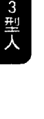

### 知名的3型人

有名的3型人包括了华纳·爱哈德（Warner Erhard），他是藉着「意识」大发利市的超级销售员，将个人成长运动纳入「爱哈德训练」（est works）这个大旗之下。 其他如隆纳·雷根、华特·迪士尼、法拉·佛西、约翰·甘迺迪等人。

### 注意力模式：多相思考

对于一个旁观者来说，3型人相当致力于获得成就；不过，3型人认为自己只是保持不要落后罢了。如果有人很厉害，3型人就要比他更厉害，因为3型人的自尊就是建立在赢过别人上。活动是获得控制权的一种形式，个人的价值和安全感依靠一个人的成就。3型人习惯一次做很多事情，这种注意力模式被称为「多相思考」（polyphasic thinking）。

我坐在车子里，已经遇到了一会。我一边开车，一边和后座的人聊天，注意后照镜里有没有警察出现，有时超速、有时减速，吃三明治，看看每个电台在播放些什么。一次做

这么多事情让我有一种快乐的感觉；彷佛我是这一切的主宰。多相活动所对应的内在习惯，就是把注意力同时放在好几个任务上。3型人的注意力很少放在手边的任务，而是快速地移动到下一件事情上。在两个念头中间几乎没有留下任何空隙让自己可以反省、重新思考任务的轻重缓急，或是关照对于这一份工作的感受。

你一定要成为最棒的，不然就没有存在感。彷佛你是永远的第二名，一直努力就是为了爬到第一名的位置。我总是同时进行三件到四件工作，当你的身体正在进行某件工作的时候，头脑已经转换到执行下一件任务的模式。当第一个任务快要完成的时候，我已经一头栽入第二件工作之中，几乎没有发现第一件工作已经做完了。当下这个片刻仿佛不存在，因为我总是超前进度，冲到下一件事。

要了解这种注意力模式，你可以想像自己总是以高速运转，朝着压力和竞争前进，并且以这种生活方式为乐。你对于环境之中有利于当前目标的事物相当敏感，你看待其他人的方式，是看他们拥有些什么，或是能够做些什么来帮助你实现计划。

当计划变得比较具体，你就会兴致大增，工作速度也会加快。你的注意力范围会逐渐缩小，最后只看到环境中有助于你朝着目标前进的事情。人们看起来就像是某种自动机械装置，他们不是阻碍你前进，就是拥有某些可以帮助你的东西。如果他们妨碍了你，你会选择忽略他们，或是绕过他们。如果你们对你的计划有帮助，你会去找出他们能够为你提供什么帮助。

困难只会让你的注意力变得更加集中，面对压力的时候你的注意力反而会增加，因为如果没有达成目标，或是让别人先你一步到达，你就会因为自己成为没人爱的失败者而感到焦虑。第二名是没人爱的，你只能成为第一名，不然就一点地位也没有。如果事情还是很困难，你就会进入自己的内在，努力回想每一种你记得的类似情况，从过去的处境搜索可能有助于目前状况的解决方法。这种把注意力缩小到特定范围的方式，仅去注意和当前目标相关的环境线索、回忆、过去的解决之道，就称为「聚敛性思考」。这是一种特别适合3型人的头脑状态，在例行的解决方法都不管用的时候，可以帮助他们找到创新解决之道。

### 防卫机制的认同作用

当一个计划成功到可以让3型人把注意力维系在上面，他也会开始表现出适合这项任务的特质。调整自己的形象和注意力来适应工作需求，这就称之为「认同作用（identification）」，这是一种防卫机制，在我们还年轻的时候，认同作用用让我们变得像是周围的人或我们崇拜的人物。对大多数人来说，心理学上的认同通常表现

我让好几个企业起死回生，它们现在获利都相当不错。几次最成功的救援，都是在最后期限快到的时候，我开始加速运转，把所有曾经在其他案子里行得通的办法拿出来考虑。我之所以救援成功，就是透过组合这些办法——虽然乍看之下可能有些奇怪。

为「我像我母亲」，或者是「我是×国人」。对于3型人来说，认同可以意谓着「我是这一行的典范」。当认同开始运作，3型人便很难把自己的价值和工作的成果分开，如果这个成果受到质疑，3型人就会觉得自己受到攻击。

3型人有个长期的习惯，他们会为了工作效率以及为了「制造」工作所需的形象，把注意力从真实的情感抽离出来。他们特别容易受「认同」所影响，因为他们希望寻求他人的认同，因此会动员许多能量，把自己变成其他人想要的样子。他们通常没有发现自己根本就没有获得足够的休息，也没有足够的时间问自己对于手头上的工作有什么感觉，或者自问想不想做点不一样的事情。

一旦认同作用开始运作，3型人就会觉得自己一直以来都是个很棒的执行者。如果自我欺骗不够完全，3型人就会觉得自己在骗人，仿佛一直躲在面具后面，演出一个角色，为的就是想要给别人留下良好的印象。

不过，这样的认同所涵盖的范围可能相当广，使得3型人必须以同一个角色生活好几年；也许一直要到他们生病或者遇上了中年危机，使得工作必须暂停，他们内心的情感才会有机会浮现。如果3型人执著于自己的名声、迷人的形象或是庞大的金钱，他们可能会一直工作下去，直到「为了公司」鞠躬尽瘁、死而后已。不管他们所认同的是什么角色，都不会停下来问这样的生活是否让人满意。

### 认同练习

这个练习可以帮助你了解，当3型人的注意力和某个形象融合在一起的时候，他们会有什麽感觉。

坐下来，面向你的伙伴。其中一个人扮演观察者，另一个扮演3型人。如果你扮演3型人，你就是在这个练习之中采取主动的人。眼睛闭上，这样才不会因为观察者的反应而分心。眼睛不要打开，选择一个你想要认同的特质，一个你觉得和自己根本搭不上边的特质。

比如说，你可以选择认同「美丽」这个特质，或是「英俊」、「聪明」、「富有同情心」或「喜悦」；不过记得，重点在于选择一个你不太熟悉的特质。

想像你在自己的内在感觉到这个特质，如果你曾经在过去体验过这个感受，回想那个经验可以帮助你辨认这个特质给你的感觉。看看当你「制造这个特质」的时候，注意力有什么变化。留意这个现象：这个特质会来来去去。当这个特质出现，你的感觉就是3型人的感觉，他们开始认同这样的特质。当你努力地想要维系这个特质，这就像是3型人抓住某个形象不放的感觉。

你的眼睛依然闭着，把注意力全然地放在这个想像的特质，并且让它渗透你的身体。一旦你可以把注意力稳稳地固定在——这个特质为你的身体带来的感受，松开注意力，将你的伙伴包括进来，想像他是你生命中的重要人物；像是可以对你产生影响的老板或是伴侣，假装他们对你所呈现出来的特质没有任何抗拒能力。

### 直觉风格：对特定讯息具有敏感度

现在打开你的眼睛，让内在的注意力保持在这个特质上，一边和观察者进行简单的对话。当你试着在自己的心里认同这个令对方难以抗拒的特质时，你的注意力会有什么样的转变。3型人说这种内在注意力的转变之所以会发生，通常有两种情况：一种是他们刻意表现出一种吸引人的形象；一种是过于沈溺在这种形象，所以变成了对方所看重的那种特质。3型人会惯性地改变自己的注意力，认同那些在文化上受到重视的形象，并且开始投射出这种形象，把这种形象当成自己，却忘了自问他们采取的形象和内在的感觉有什么不一样。当3型人成功地创造出了一种人格形象，他们对于别人的反应会变得特别敏感。如果其他人不认同这样的形象，他们就会无意识地调整自己的自我表现。

当3型人成功地创造出了一种人格形象，他们对于别人的反应会变得特别敏感。如果其他人不认同这样的形象，他们就会无意识地调整自己的自我表现。

小时候，3型人必须在各种重要活动当中获得最优异的表现，才能获得安全感。身为一个孩子，他们的幸福和自己的形象及表现连在一起，他们也会发展出对于特定讯息的敏感度，用以支持这些情绪上的需求：

当我来到一个新的环境中，我会立刻觉察到别人是怎么看我的。不管我对这个团体有什么感觉，我还是会努力地融入。并不是说我想这么做，只是我可以感觉到这个团体不会接受什么，所以我开始以这种方式表现。

### 高等心智：希望

我在进行促销工作的时候，这样的能力对我来说很重要。我带着同样的产品拜访一个又一个厂商，每一次过程都不太一样。我会站起来发表谈话，有时候会听见自己在讲到一半的时候调整语调，但是我没有确切意识到我正在这么做。或者我会感觉到身体开始自行表演，那不是我原本的计划。

当这个推销员进入了推销商品的表演状态，他真正的位置就被推销员这个角色所取代了，如果他没有意识到这一点，可能会对于这两个身分感到相当困惑。如果他能够学会辨别的感觉，还有了解自己为了推销产品做了哪些调整，就会产生一些很有趣的结果；第一个结果很有可能是情绪性的，他可能会因为欺骗自己的听众而感到焦虑；或者他可能会想办法利用自己的直觉，更有效地欺骗他的听众，让这些人为产品买单。

另一个结果可能会引导他去找出自己想要的东西，看看这和他必须做但是并不符合他个人需求的东西有什么差异。还有一个结果，他可能会训练自己主动地进入这种心智状态，在其中可以直觉地调整自己的表现来适应团体的需求，并且以这样的心智状态去看看事件是不是夹带着其他讯息。

表现型的人以让别人印象深刻的东西来衡量自己的价值，对于自己的成就感到相当自豪，但是认为自己在成就之外没有什么价值。当3型人陷入强迫性的工作，用尽力气想要推

强迫性行为也有它的积极面，3型人会在活动的过程中感到充满活力，变得非常善于感应不同工作所需的能量要求。我们的个案当然记得，在某些时候因为这种急急忙忙的习惯而感到精疲力竭，像是被榨干一样，但是有些时候他们在工作当中感觉到——自己和特定工作所需要的步调和节奏运作得无比和谐。

3型人觉得自己就像是漂浮在某种永不枯竭的能量中间，你知道工作会进展下去，而不是由你主导的。他们说虽然你以一种极快的速度工作，但是时间却慢了下来；忧虑不复存在，你进入一种心智状态，自然而然知道该做什么，不用多想，也不用怀疑。在那种心智状态当中，计划的成功仿佛是意料中的事。你不再对计划感到忧虑，因为这个工作的每个阶段无可避免地会导向正确的结果。

### 3型人

以下陈述来自旧金山的一位餐厅老板，他觉得自己是一个根深蒂固的工作狂，描述了自己所体验到的希望：

我通常都是和年纪小我一半的人一起工作，对我来说，去工作，然后把工作做好，仍然是我快乐的泉源。好几次在厨房裡，一切疯狂又忙乱，所有的人挤在一不小心就会受伤的狭小空间裡，以一种仿佛仪式性的动作肩并著肩。你一出错，可能会搞砸了那整个晚上的菜色。这时候我只能想：「我的老天爷，希望一切顺利。」

有些时候我也会抗拒这样的工作。但是有时候又顺利得不得了，我的头脑会很安静地

### 高等情感：诚实

以高速运转，这时候要我在厨房站几个小时都行。这种感觉真的很棒，因为我知道一切都会很顺利。

3型人在美国文化中获得许多认可。实际上，因为他们获得太多认可，让他们将一种神经质的存在方式，误认为真正健康的生活方式。如果你可以欺骗自己——社会的目标就是你真正的目标，那么设定个人的目标有什么必要呢？如果你可以投射出一种令人尊敬的形象，让身边的人接纳你，那何苦冒着被拒绝的风险呢？

如果自我会受苦，那么何苦去寻找自我呢？最明哲保身的作法，或许是认同这个文化给你的标准，把情感放到一边，然后把自己丢掉。

3型人通常认为自己的心理很健康。情绪上的低潮是失败者、游手好闲的人、跟不上的人才会有的感觉。神经质的3型人可能一点都不知道，他们获得高度成就的虚假自我和他们的真实自我，可能有着不同的情感需求。他们或许知道自己不喜欢太深沉的情绪，或是不喜欢觉得有某些情感上的需求；不过事实上，他们感觉的幅度很小，这点经常会被忽略，因为

3型人总是充满精力，必须表现出乐观和成功的形象。

表现型的人，通常只有在被迫慢下来的时候，才会面对自己真实的感受。他们之所以停下脚步，经常是因为裁员、生病、被伴侶干扰，而不是自愿地决定停止工作。强制性的无为对于一个认为工作有益身心健康的人来说，或是相当恐怖的，而且通常会引发和自我价值

有关的恐惧。当他们把注意力从活动撤回的那一刻起，他们便会无可避免地感觉到自己的情绪。

除非你行动，不然会有一种确确实实的存在感。除非我知道接下来要做什么，不然我就会开始因为没人在家而感到焦虑。去年我因为明显过劳而生了一场重病；我才四十岁，就做了冠状动脉的手术，躺在医院的病床上盯着天花板，整天都在数日子，直到我可以站起来离开那里。

被强迫要保持安静比心脏病还可怕。我觉得我在床上躺到都快疯了，我真的很害怕自己的身体就这样坏掉。当这些感觉来袭，我有点搞不清楚自己身上究竟发生了什么事。有时候什么感觉都没有，有时候又因为情绪爆炸把我吓坏了，接着我又会再度感到麻痹。

表现型的人习惯作为，而不是感觉。当某个活动正在进行，他们会惯性地把情绪晾在一边。对于他们来说，感觉必须以一种缓慢的方式被带入觉知，对于像是机器一样制造产品的生活方式而言，情感被视为一大威胁。

如果3型人想要表现出真实的感受，他们必须学着辨认身体真正的感觉，看看这种感觉和为了胜利而改变自我表现这种习惯，带来的感觉有什么不一样。这么一来，他们存在的问题就变成：「我要顺着自己的感觉，还是依照过去的习惯，一件事接着一件事来做？」顺着感觉会产生某种危险，3型人过去相信「成就即一切」的这种信念难免会受到动摇；不顺从感觉的风险则是，3型人这辈子会过得像个骗子一样。

对3型人来说，学着区分真实的感受和因为别人的眼光而行动的感受，就能够为他们带

来觉知的转变，让他们从欺骗走向诚实（真实）。在转变的过程中，3型人可能会有一段时间感到相当痛苦，不过为了获得心理上的自由，儿时所发展出来的保护机制必须被丢到一边。

下面的叙述来自一个事业非常成功的女性：

在心理治疗刚开始的时候，我觉得自己感觉还可以，因为有问题的是我丈夫：当我在事业上一帆风顺的时候，他一点也不关心。我最早的冲动就是想逃，我不想要有任何感觉，因为只要我有很多自由时间，我唯一能够感觉到的就是恐惧。礼拜天最惨，因为没事做。顶多就是烫衣服、打打电话、为接着的一个礼拜做准备，但是在这中间的空档，我都会觉得恐惧。

我必须把自己的「情感功课」写在行程表上，提醒自己在工作的半途停下来，问问自己喜欢什么、不喜欢什么；我得去看看自己是不是有什么感觉。这个练习最困难的一点，就是当我回到工作的时候，还必须带着一个感受。以前只要我开始工作，我的感觉就完全消失了。

一段时间过去，我找到很多属于自己的真实情感，我觉得很骄傲。开始会为了别人而感动，我自己的反应对我来说很重要。我可以知道自己是不是快乐，是不是喜欢正在做的事，我过着一种以前的自己完全不了解的生活。

### 子类型：性感形象、声望及安全感

以下的子类型，是3型人在童年时期为了减少焦虑所形成的心理倾向。对于年轻的3型人来说，任何可以为他们带来金钱、财产（安全感）、名声，或是有助于自己女性或性形象的情境，都可以帮助他们减少焦虑感，让他们觉得在别人眼中并非一无是处。藉着培养经验和自我观察，他们就会发现这些心理倾向只是一种帮助他们建立某种形象的工具，而不是他们真实的自我感受。

当3型人开始发现，他们真正的感受和社会所推崇的价值可能不太一样，就会产生一种抉择的危机：到底要走哪一条路？要成功，还是要忠于自己？这是3型人在退休的时候经常会碰到的困境，在这个时间点上，他们可能因为某些疾病而变得不良于行，或是突然多出了大量的自由时间而不知道该如何是好。有意识地让自己抛弃形象、社会声望或是安全的经济基础，对3型人来说就像是生命受到威胁，因为他们的自我与这些外在的价值紧紧地连在一起。

#### 一对一关系：性感形象

3型人通常会表现出一种性感的形象，也会意识到自己正在扮演某个角色。让别人觉得自己的外貌很有吸引力，或是性能力很强，这也是一种个人价值的展现，所以3型人会为了成为他人眼中最有魅力的人而努力。有些3型人说，他们之所以会想要展现出成功的性感形...## 社交關係：聲望

象，事實上是在掩飾他們內心對於性別——對於自己的男性面向和女性面向——的深度困惑。這個困惑通常表現為「男性導向的自我」，以及「另一個」比較女性化的自我」之間的分裂。誇大的女性形象或許也是一種面具，掩飾了自己因為「表現得和其他男人一樣有競爭力」所衍生而出的困惑。認為自己對性別問題感到困惑的3型人中，沒有一個是同性戀者，他們也不認為自己想要表現性感是為了掩飾某種性別矛盾。

我最大的自我欺騙發生在親密關係中。在我長達十年的婚姻要結束的時候，我發現自己表現出了一個完美女人應該要有的特質，但是卻不知道這些特質是不是我真正的特質。如果我的丈夫喜歡某個模特兒，我就會打扮成她的模樣、模仿她的舉動、還有找她習慣風格的衣服來穿。

3型人執著於表現出良好的社會形象。他們個人的表現會依據各個團體所看重的價值而跟著改變，想要成為團體的領導者。

在以前，關於高中的畢業紀念冊，最重要的事情就是你照片下面的紀錄，看看你究竟參加了多少社團。後來我成了臨床醫師以後，每次有人要來我們這個地區舉辦工作坊，我就會多加留意，看看這些人受人尊敬的程度，雖然我對這些工作坊的內容一點概念也沒有。

#### 自保本能：安全感

3型人沉溺在金錢和物質享受中，藉此減輕個人的存在焦慮。他們會努力工作，賺取可以提供安全感的金錢和地位。即使你盡可能地工作賺錢，這樣的恐懼依然不會消失。或許你在銀行有五萬美元存款，你還是會擔心錢不夠，或是想要再找一個薪水更高的工作。或是你會有許多工作備案，以免哪天出了什麼差錯。如果有人批評你的工作表現，你就會覺得自己的生存受到了威脅。

### 成功之道

3型人之所以會尋求治療或是開始靜心練習，通常是因為身體受創，或是由於某種個人損失，使得他們無法再維持過去的步調，或是繼續將感覺拒於千里之外。因為被迫停止活動，當情緒開始浮現，他們可能會被嚇到。真實的感受通常會對工作能力造成打擾，對於一個從來不知道自己內在有那麼多情緒的人來說，這會造成很大的困擾。3型人的親朋友好應該多多鼓勵他們接觸自己的身體和情緒的反應，特別是那些他們否定的反應，像是疲倦、恐懼還有不知道接下來要做什麼的困惑。表現型的人必須注意，當承諾和任務開始壓制情緒，他們最好先等一下，讓自己真實的反應可以浮出水面。

3 型人可以藉著以下這些方法幫助自己：

- 學著停下來，給自己多一些時間，讓情緒和真正的想法可以現身。面對恐懼的感受，就是這樣的感受在驅使自己，讓自己不斷地投入各種活動當中。
- 看看自己的行動在什麼時候開始變得機械化，就像一個生產線的機器人，把自己的情感擱在一邊。
- 看看自己是不是用對於成功的幻想取代了實際的能力。
- 不要藉著展開新的計畫來逃避問題，或是將失敗重新定義為比較不完全的成功，或是貶低那些批評你的人。
- 看看你是怎樣延遲自己的快樂：「再賣一件產品我就會變得快樂。」
- 當私底下真實的自我逐漸浮現，看看它和那個在公眾面前表演的自我，在本質上有什麼樣的差異。感覺自己和自己的形象是分開的。
- 注意自己是不是有一種騙人的感覺，彷彿正在演出一場好戲：「沒有人會看透這個面具，他們看不到我，只看得到我做的事情。」
- 你是不是覺得總是要做那麼多事情；因為身邊都是無能而又懶惰的人。
- 注意自己想要成為最佳心理病患的欲望，對心理醫師產生佛洛伊德式的幻想，在完形治療師（Gestalt therapist）面前拍打枕頭，對上師（guru）報告你的能量體驗。把療程變成了必須精通的工作，把靜心變成一項任務：「我如如不動地坐了幾分鐘？今天持咒持了幾遍？」

# 第7章 3型人：表現型

### 注意事項

當3型人的注意力從自我形象以及工作狂生活形態的心理慣性轉移開來，他們必須注意自己可能會產生下列反應：

- 感覺錯亂：「這個感覺是對的嗎？」「什麼才是真正的感覺？」
- 把對於某個情緒的想法當成真正的情緒。
- 要發現自己的情感，首先要找到並且命名隱藏在情感之下的身體感受。比如說，如果覺得辨認情感有困難，那就試著用語言來描述任何出現在身體上的具體感受：「我的臉很熱」或是「我的肚子很緊繃」。用文字表達身體的感覺可以幫助你找出自己的感受。
- 學著辨別作為和感覺的差異，把注意力從工作本身轉移到對這份工作的感受。
- 一開始進行靜心和注意力練習的時候，把它們排進你的行程表，設定好確切的時間長度，比如坐下來練習四十五分鐘，然後回去工作。你可能會抗拒靜心時「無所事事」的感覺，不過這些都可以在心理治療的時候處理。靜心能夠為你帶來健康上的好處，但是不要給自己一定要在靜心中達成什麼目標的壓力。
- 看看有沒有把靜心變成一項活動，比如說數息的時候一定要完美。如果你控制靜心練習，就無法感覺到在靜心中可能被喚醒的頭腦狀態以及它的作用。讓自己被觸碰、被影響、被作用。
- 支持自己去選擇感覺，而不是選擇地位。
- 過度活躍的幻想生活。當直接的行動受阻，或是負面的事物出現，就會開始幻想成功的情景。
- 幻想已經開悟，或是「成為一個進化3型人的典範」。藉著相信自己已經達成某些特質來逃避感覺：「我已經達成了。」
- 想要快速獲得結果。覺得和心理治療相比，用工作取代情感的時候覺得比較舒服。在真正的改變發生之前，就想要結束心理治療。
- 需要成功的證明，想要變成靜心老師，讓自己感覺起來像個修行人。
- 在治療的過程當中談到個人問題時，或是當這些問題出現在靜心的過程中，會習慣性地從情緒當中抽離開來。他們相信這些問題只要說出來或討論一下，就不再成為問題，因此不需要去感覺自己的情緒。
- 傾向於挑選全能的治療師或是靈性導師，因為他們呈現了一些可以吸引3型人的外在特質。他們認同治療師的價值，卻沒有去尋找自己的價值。
- 靜心的時候很害怕自己內心的空洞；擔心真正的自我並不存在。
- 受到批評的時候，覺得自己像個聖人：「我已經那麼棒了，不必聽那些話。」

# 第8章 4型人：浪漫多感型

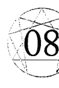

## 4型人：浪漫多感型

| 特質 | 本質 | 特點 |
| :--- | :--- | :--- |
| 頭腦 | 主要特徵：憂鬱 | |
| 心 | 強烈情感：嫉妒 | |
| 頭腦 | 高等心智：原創性 | |
| 心 | 高等情感：沉穩 | |
| 子類型的表現 | | |
| | 性愛：競爭／仇恨 | |
| | 社交：羞愧 | |
| | 自保：無畏／魯莽 | |

- 性愛：競爭／仇恨
- 社交：羞愧
- 自保：無畏／魯莽

## 困境：失落感

4型人記得在小時候遭受遺棄，因此深受剝奪與失落之苦。他們內心的狀況，可以由文學裡悲劇性的浪漫典型角色所反映出來，他們已經獲得了眾人的認可和物質上的成功，但是卻堅守著逝去的愛情、得不到的愛情、未來的愛情，以及只有愛情才能帶來的快樂景象。要了解這樣的世界觀，你必須進入一種特定的心智狀態，你做的任何決定除了基於你對現實的認知，還基於各種情緒化學變化；你會記得對話中實際被說出來的語句，也記得這些對話中情緒的調性以及其中隱藏的意涵。

抑鬱是一種慣常的情緒，它會讓生活陷入停頓，讓人在床上打發日子，腦子則是充滿悔意地執著在過去一些已經無法挽回的錯誤。

「如果可以這樣就好了，如果可以那樣就好了。」注意力被鎖住了，就像是唱機頭的針陷在深深的腦溝裡。「如果我可以換一種方式來做，如果可以再給我一次機會。」

4型人對於自己黑色情緒的了解是毫無異議的。有些4型人認命地接受這樣的情緒，任由自己進入長期的自我隔離。另外有一些4型人會利用深度的藝術爆發來調節自己的情緒，表現出人類經驗中的陰暗面。還有一些4型人會透過讓自己極度活躍來對抗抑鬱，讓自己忙得不可開交。在這本書中發表的4型人都有確診的抑鬱症，但是他們還描述了一種叫做「憂鬱」的情緒，他們深受這樣的情緒所吸引，就像是一種來自失落與痛苦的扭曲情緒避難處。憂鬱創造出一種甜蜜後悔的氛圍，就像抑鬱症一樣，憂鬱來自失落感，不過在這裡悲傷被轉化為一種像是位於荒涼海岸邊的模糊情緒。4型人在情緒迷霧的轉換之中感到強烈的存在感；沒有什麼事情是永恆的，到了明天，一個人的心情就會變得不一樣。4型人的核心議題就是失落，以及隨之而來的自尊下降。「如果我變得更有價值，我還會被拋棄嗎？」4型人確信有某種最初的愛被奪走了：「我曾經被愛，現在愛去了哪裡？」他們在過去曾經被拋棄，對於早期的失落感到悲哀；然而，這種被拋棄的感覺在成年以後痛苦地再度被創造出來，因為他們會強迫性地受到那些不可獲得的人事物的吸引，並且（通常他們沒有意識到）習慣性地拒絕那些容易獲得的東西。4型人無意識地把注意力集中在失去之物的細節上，相較起來，他們可以到手的東西看起來就不那麼有吸引力。他們特別渴望充滿熱情而又令人滿足的關係；他們就像是等待著真愛來臨的愛人。憂鬱的其中一個最甜美陰影，就是伴隨著失落的憂傷而來的，是對於一個理想的未來伴侶的浪漫期盼。感覺就像是當下這個片刻只是對於未來的一個預演，到時候「我的真實自我將會透過愛情而重新覺醒」。當真實生活的成果開始變得具體，雖然這些可能是多年以來的期待和努力所累積起來的成果，4型人的注意力又會轉移到生命之中所缺乏的東西。如果找到工作，你就會想要找一個伴。如果有了伴侶，你又會想自己一個人。如果你孤單一人，又會想要找個工作、找個伴侶。4型人的注意力運轉得最好的時候，就是聚焦在生活中所缺乏的事物上，透過比較，他們手邊擁有的東西便顯得既沉悶而又沒有價值。多愁善感的人很容易就會破壞真實的收穫。當他們的注意力放在日復一日、真實生活的戀愛事件上，4型人會因為必須收拾對方的襪子、或是必須容忍對方的特質，而變得氣憤又失望。因為愛而產生的光明未來景象被現實所威脅，因為真實的關係包含了一些索然無味的片刻。對方表現出來的一些小癖好變成了嚴重的干擾：「她根本就是政治白痴。」他對於音樂一點感受性也沒有。「把牙刷留在玻璃杯裡真是不貼心！」除了要適應另一個人的糟糕品味，4型人還有強烈的需要，想要藉著愛在未來重新覺醒，他們會升起強烈的憤怒。當4型人發現親密關係可能會讓他們犧牲自己的菁英標準，他們就會想要把伴侶趕跑，錯都出在伴侶身上。當他們感到苦澀的失望，4型人會說出最惡毒的話，要清楚地表達出對方是怎樣地辜負了自己。一旦關係退回安全地帶，多愁善感的他們又會開始懷念這一切。他們關係的模式就是這樣推推拉拉的：把手上的東西推開，把難以得手的東西拉進來。別人家的草坪看起來總是比較綠——因為他們的注意力會在面對一段不存在的關係時達到最佳狀態。4型人會和生活保持一個安全距離。他們不會離得太遠，以免慣有的渴望變成純然的絕望；但是想當然耳也不會靠得太近。雖然他們對於和別人的親密關係有著很大的渴望，真正的親密關係卻會引發他們害怕被發現有缺陷、而且可能被再次拋棄的恐懼。如果4型人的伴侶厭倦了保持安全距離，並且威脅要離開，他們就會突然生病，或是發生嚴重的爭吵，因為這時候他們又開始想要將對方拉近一點。當他們有被拋棄的跡象，4型人就會把所有的情緒都拋出來。最初的失落會重新以一種高度誇張化的方式被創造出來，可預見的是戲劇性的場景和瘋狂的指責、自殺式的姿態以及深深的絕望。4型人說他們情緒生活的起伏，為他們打開了極具張力的存在向度，它超越了尋常的快樂，比一般人習以為常的快樂還要更豐富。感覺起來彷彿他們是日常現實之中的局外人，他們獨特而且奇怪地與眾不同，像是一個穿越自己生命場景的演員。要放棄這種高度集中的情感生活所帶來的折磨，意思就是要犧牲戲劇通常會帶出來的特別自我感受。對於4型人來說，變得快樂這樣的願景，也會威脅到就近地接觸強烈的情感世界。最糟的是，他們可能必須冒著安頓在平凡無奇的願景以及普通生活的危險中。

以下是4型人常見的心理慣性：

- 覺得生活中少了些什麼，其他人擁有我缺乏的東西。
- 受到遠方不可得之物的吸引，將不在場的戀人理想化。
- 情緒、態度、奢侈品、良好的品味，都是用來支持自尊的外在物品。
- 執著於憂鬱的情緒。將感覺的深度視為目標，而不只是快樂而已。
- 對於「日常感受的平庸」感到不耐，必須透過個人的損失、強化的想像以及戲劇化的行動，來強化個人的感受。
- 尋找真實性。4型人覺得當下這個片刻並不真實，真正的自我會在將來藉由深深地被愛這樣的經驗而顯現。
- 會受到生命中真實而且強烈的東西所吸引，像是出生、性愛、遺棄、死亡以及各種重大變故。
- 「推—拉」的注意力慣性。注意力會在一個人擁有的負面特質——以及離一個人很遠、很難獲得的正面特質之間擺盪。這樣的注意力風格會強化以下特質：
  - 被拋棄和失落的感覺，但同時也會影響4型人。
  - 對於別人情緒和痛苦的敏感度，支持別人度過難關的能力。

## 家庭背景：被遺棄感

背後隱藏的主題是兒時的失落感。4型人描述了許多早年生活被某個重要的人遺棄的各種狀況，他們通常會敘述某件真實的遺棄事件，最常見的例子就是離婚，他們摯愛的雙親之一就這樣離開了。另外一個主要的場景就是他們出生於一個悲慘的家庭，因此這個孩子的價值就和家裡某個大人的悲慘事蹟連結在一起。以下陳述來自一個有才華的舞者，她在成年之後幾乎沒有談過戀愛，把自己全然地奉獻給藝術：

我是一個早產兒，非常脆弱，醫生跟我的父母說我不太可能活下去。我想他們因此對我感到退縮，藉此來保護自己的感情，所以雖然我沒有真的被拋棄，這樣的意象對我來說是相當真實的。接著，當我還是嬰兒的時候，我的父親開始步向死亡。我總是想像自己是這樣一個處在起居室裡有棺材、家裡擺著香花的人。我覺得那些處於危機和死亡之中的人，對我來說特別有吸引力，因為他們可以觸及深層的自我，並且願意以某種靈魂的方式來坦承自己。

4型人還描述了另外一個兒時情境，因為父親或母親經常來了又去、或者對他們忽冷忽熱，因而讓他們有被遺棄的感覺。這樣的孩子對於感情和愛的許諾變得依戀，一旦這些東西被剝奪，就會變得憤怒：

我出生的時候，父親帶著我母親去環遊世界，慶祝我成功地誕生在這個世界，然後把我留給保母。我仰慕我的父親，用盡各種方法來討好他。他相當會打扮、受歡迎，而且難以靠近—— 母親也在那裡的時候除外。他會離開進行長期的旅行，在他回來之前，我會發狂似地想要他留下來，我覺得這似乎是我唯一可以留住他的機會。他會帶禮物回來，講故事，然後再度離開，這樣還不夠糟的話，他還會帶著我媽一起去，我又再一次被丟下來，等著下一輪重新開始。

關於抑鬱症，有許多理論都認為童年時期的憤怒被轉向內朝著自己。浪漫多感型的人通常會說，幼年時期失落的感覺，就是導致成年時期反覆地感到抑鬱的原因。

以下的陳述來自一位男士，他周遊世界十年就是為了找到一個完美的伴侶。在他旅途上幾個不同時間點，將幾個不同類型的女人大幅度地理想化，認為她們除了肉體上的吸引力，還有某些屬於那個文化的特別品質。可想而知，當他與其中一個理想的女性陷入愛河，他也會開始想念其他類型女性的特質。在他做出以下陳述的時候，他已經是一個賺了幾百萬美元的進口商，而且滿腦子都想著要找到一個合適的妻子：

我問我母親是否有餵我喝母乳，她說，有啊，她餵了一陣子。我在想，當我還是嬰兒的時候有獲得滿足，然而有一天，這樣的滿足就消逝了；意思就是，偶然地，就像是我覺得受到她的照顧：她在那裡照顧我，然後突然就停了。這變得像是某種生活立場：「我曾經很快樂，現在快樂到哪兒去了？」我的整個人生都在追尋這個——快樂究竟到哪兒去了？

## 被剝奪的憤怒

「那個東西、那個人或是那一筆錢」。我尋找的是「它」，我覺得自己和某種很棒的東西連結在一起，這個東西總是看不見而且摸不著。不過當有人問我生命裡缺少了什麼，或是我認為自己在尋找什麼，我不會說我在尋找

4 型人通常有一股被剝奪的怒氣，氣那個拋棄他們的父親或母親，因為他們帶來了憂傷，不像其他孩子可以獲得比較多的關愛。

這樣的憤怒可能表現為尖銳的嘲諷，一種想要在口頭上駁倒別人，來平衡自己所受到嚴重的傷害。通常他們不會有實際的機會，可以對著某個消失的人或是在怒火中退縮的人發脾氣。因此，浪漫多感型的人通常會把怒氣導向自己，變成激烈的自我批評，認為自己不值得被愛。

這個內化的批評讓 4 型人覺得無助，並且導致他們長期無所事事，在這段時間似乎做什麼都無法讓他們快樂。他們的抑鬱是基於失去了某些基本而又有價值的人際關係，因而產生的悲傷。他們就像是分開的戀人，渴望有方法重逢。

## 囚禁在黑井的抑鬱

4型人說抑鬱症好像是被囚禁在黑色的井裡。他們退到自己的內心，移動到房子裡可以獨處的地方，然後漸漸地斷絕對外的聯繫。在這種狀況下，他們覺得生命從來沒有像現在這麼糟，而且確信這樣的情況不會有所改變。如果抑鬱症變嚴重，在面對這種困境的時候，他們會覺得別人的幫助看起來很荒謬。他們會拒絕別人伸出援手，同時又無法依靠自己的力量行動。他們會停止活動，最後失去希望，認為沒有人會了解他們內心的狀況。

浪漫多感型的人並非唯一會經歷到悲傷的人。我們都會因為自己的失敗而哀嘆，或是因為失去某種珍貴的東西而憂傷。抑鬱症和因為失去某些東西而憂傷不一樣，在憂傷之中我們會一步步接受現實，最後痛苦會減輕，注意力便能回歸到重建一個可行的生活。在嚴重的抑鬱症中，生活中每一件值得做的事情都蒙上了悲傷的色彩，而且一步一步接受現實這個動作通常都很慢。

十八年前的離婚對我來說陰影依然揮之不去，我的腦子一直想著，我犯了一個無法逆轉的錯誤，它改變了我人生的方向。感覺就像是你搞砸了讓自己幸福的唯一機會，你絕望地想要釐清狀況，讓自己重新回到過去的幸福。所以你一次又一次地回想，試著了解你經歷過那些時期所發生的錯綜複雜的事。這讓我沉溺在過去的某些錯誤，讓我無法注意到某些相當有希望的戀愛關係。

憂鬱的情緒同樣來自失落的感覺，這種失落感造成了不幸的抑鬱感。 這種感覺將被剝奪的感受，轉化成一種對於不可能的事物、不可能的狀態一種既痛苦又甜蜜的渴望。 4 型人說，和其他人所敘述的幸福比起來，他們更喜歡憂鬱這種情感之中豐富的層次。 這種悲傷的感受可以喚醒意象和象徵以及一種和遙遠的事物連結的感覺。憂鬱是一種情緒，它將一個被遺棄的局外人的生活，提升到一種特殊的、變化無常的感性姿態。

我像是故事裡的角色，被安排面對許多逆境。我在這個世界就像個局外人，沒人知道我是誰，這讓我覺得自己和別人不一樣，受到誤解。這也帶來了一種在我控制之下的憂鬱症。沒人了解我，我是個局外人，因此被沒有歸屬的感覺所折磨。但是我的內在也很緊張，因為我承受著痛苦。我就待在人類可以承受感覺的邊緣上，我對於自己來講仍然是個謎，我知道自己和別人都不一樣。

要發現 4 型人陷入抑鬱中非常容易，他們會持續地哀悼生活中缺乏的東西，這樣的哀悼變得相當自溺，讓他們無法把注意力轉向更有創造力的事情。然而，雖然憂鬱也是基於於渴望，但是它會將普通的事件帶入美感的範疇。渴望帶有尋找的品質，抑鬱就被轉化為一種對於人類的境況一種詩意的鑑賞。

憂鬱喚起了一種年輕的感覺，像是把一件隱形的戲劇斗篷穿戴在自己身上。這讓走路不只是走路而已，你一邊走一邊可以聽見斗篷的颯颯聲。你也不是為了好玩而走路，而是為了去感覺這件戲服以及空氣中的電流而走，也為了那個向你走來的陌生人而走，因為他4型人

## 痛苦和创作

可能会是那个改变你一生的人。
在家里我就像个受害人，但是我把受虐的感觉变得高贵，我变成一个虚构的、戏剧的人物。她必须穿上她的斗篷，施展她的魔法，对于享乐和幸福她一点也不在意，因为她所追寻的是超凡脱俗的东西。
我记得在某一些走路的时刻，飞翔小鸟的意象在我内心陪我走了近两公里路，或是一朵沾着露水的花可以成为让我再多活一天的充分理由。忧郁是我选择的居所，它能让你的生活变成艺术的体验，虽然它聚焦在某种尚未到来的东西，这样的追寻让我觉得很快乐。

将生活作为一种艺术的表达，或是执著于痛苦，并且以这种痛苦为自己创造出一种美学的自我形象，其间的界限相当暧昧。在剥夺和艺术表达之间的关连，就像是某种源远流长的艺术家刻板形象，宁愿在小房子里挨饿，也不愿意为了多赚一点钱而妥协自己的创作生活。
生活即艺术，生活即痛苦，这两件事经常纠缠不清，因为受苦才能让人知道生活里什么才是最值得珍惜的，并且创造出一种氛围，让内在张力得以透过艺术创作来变得有意义。
下面的叙述来自于一个有抱负的年轻画家，她发现自己是4型人，因为当她的画廊要开幕的时候，她却因为爱情受挫而无法前往参加：
当忧郁来袭的时候，它让我什么事情也不能做。生活就这样停下来了，没有意义、没有目的、没有希望。我能抓住的只有时间的轨迹，每件事都会随着时间消逝，到时候我就解脱了，看起来我唯一能做的就是等待时间过去。如果你像我一样被哀伤囚禁，你的整个身体就会有一种感觉，仿佛它是你爱慕对象的玩物。

你真的把自己交出去，让另一个人玩弄。在这种事情过去以后，你会觉得自己好像大病初愈，开始珍惜一些小事情，像是天气、或是今天想穿什么颜色的衣服。可以这样活出生命，你觉得相当幸运。悲剧会让你四分五裂，就某个意义来说，它也会让你看见自己，因为你注视着死亡，但是却活下来了。

失落让一个人觉得格格不入，让人暂时变得悲惨而且不同，然而也变得特别，因为他在那段时间的感受度比任何人还来得深刻。当一个人对于自我的感受变得特别敏感，也容易展开出对于这种个人的闷闷不乐紧抓不放——特别是如果他们的爱人会被强烈的情绪表达所吸引，或是真正的创造性表达会在强烈情感的敏感度当中爆发出来。

这种困境，亦即要有痛苦才能被激发的创造性，其中一个代表人物就是诗人里尔克（Rilke），他深受心理困扰的折磨，却不愿意接受心理治疗。他深信如果自己内心的恶魔被驱逐出去，其中的天使也会受到震撼。

4型人是九型人格中的艺术家，这是就实际意义来说的，因为许多艺术家的确都是4型人，这也意味着在他们的天性当中，有一种想要唤醒感觉的心理倾向。渴望和绝望的反复发作，会为日常的情绪创造出更强的张力。这样的张力，以及这种状况唤起的特殊意义感受，会让不断变化的忧郁比日常情绪的向度还要吸引人。

# 第8章 4型人：浪漫多感型

## 两极情绪的摆荡

浪漫多感型的人活在极端的情绪中，他们会在极度的忧郁和极度的过度亢奋之间摆荡。4型人说自己被这种极端情绪之中的一极所吸引，或是过着一种在两极之间摆荡的生活。以这种方式来看，总共有三种4型人：忧郁的4型人、亢奋的4型人，以及在两个极端之间摆荡的4型人。这三种4型人都觉得生命中最重要的东西被夺走了，他们试图找回失去的东西，但是这三种4型人寻找的方式相当不同。忧郁的4型人在寻找意义的时候，通常会退缩到自己的内在。亢奋的4型人从表面上完全看不出有任何忧郁，但是会在各种活动和无数的恋情当中快速变换，试图从这些似乎可以让其他人感到快乐的外在东西上找到意义。那些在忧郁和亢奋两个极端之中游移的4型人，则是对浪漫多感型的人所说的内在张力，呈现出一幅清楚的图像。他们的情绪变化相当剧烈，爱可以一下就变成恨，热情一转眼就成了冷漠。他们很可能会被得不到的或是具有毁灭性的爱人所吸引，伴随着戏剧性的情感爆炸，释放出来的强烈情绪，变成自杀式的幻想。典型的4型人会说，当生活变得令人难以忍受的时候，自杀会成为他们脑海中的一个「选项」。4型人倾向以一种尖锐而又挖苦人的黑色幽默来待人处事，这泄露了他们内心的愤怒。他们说自杀是「如果生活太艰难的时候，你可以依赖的一个小作为」，之所以这样说，是因为他们把「摆脱一切」视为一个选项，这很像2型人把诱惑当成一个选项一样，或是8型人想像把某一个人赶走，但是他们并不是真的想要这么做。

### 戏剧化的感情生活

4型人说其他人觉得他们太紧绷，所以他们必须克制自己的感觉，因为这些感觉太过强烈。如果在社交上受到忽略，他们会感到非常受伤：生日被忘记会带来强烈的失望，朋友随口说的话就让他们想要逃走。

一通没有兑现的电话，会以一种非常戏剧化的方式让人觉得被遗弃，我的反应就是跳过、疏离那些其实我心里很想要跟他们在一起的人。感觉就像这个痛苦和所有过去的痛苦连在一起，于是它变得无比巨大。一通迟到的电话可以带来深沉的被遗弃感，当电话终于打来，我会变得讨厌那个朋友，因为我觉得受到严重的伤害。

当4型人讲到「强烈」这个字，意谓着自己过着一种情感上非常极端的生活。其中一个极端就是受苦，另外一个极端就是幻想自己的失落获得完全的满足，他们很少体验介于这两极之间的情感。

一个像是「我是否爱他？」这样的念头，很快就会转化为一种想像，想像自己完全被对方爱上会有什么感觉，完全不留一点时间来考虑他们对这个问题真正的回答。当4型人独处的时候，可能会陷入幻想之中，比如说「如果他伤害我，我会有什么感觉」，或者是「如果他爱我，那会是什么样子」，这样一来，她很可能会错过在当下这个时刻，她对他究竟有什么感觉。
在倾向于把感觉放大这件事情上，4型人并不孤单。举例来说，当我们觉得痛苦的时侯，通常都会想像最坏的情况。

在自然分娩或是疼痛控制的训练当中，患者学着把注意力往外引导，把焦点放在他们经验到的实际身体感受上，而不是让自己陷入想像：想像接下来的疼痛会有多糟，或者是在最糟糕的情况下会有多痛。任何身体所感受到的真实疼痛——不幸的是，如果受到记忆或是想像的覆盖——可能会变得令人难以忍受。

以下的陈述来自一位男士，他描述了自己经历一场糟糕意外时的内心状态。他对于危机的反应不全然能够指出他是个4型人。然而，浪漫多感型的人在日常生活之中的确对于他所描述的无意识的注意力转换特别敏感。

从十几岁开始，我就是个职业滑雪选手，直到有一天，我在一个熟悉的坡道发生了严重的意外，我不小心滑倒，结果跌断了一条腿。

我被送到医院的时候，我的脑袋简直疯了，完全不知道发生了什么事。我觉得很痛，但是认为自己还能忍受，但是当有人试着碰我的脚，我简直痛不欲生，必须把他们赶开。

我还真的咬了一个护士，因为她要帮我打镇定剂。我的眼里就只有她手上的针，我想着，如果她把这根针打进来，一定会很痛。这时候我的老板来了，我和急诊室正在对峙当中。我的脚得动手术，他们已经准备好要开刀，但是我不让他们碰我。我的老板帮了我一个大忙，他抓住我的头发，威胁说要揍我，除非我把药吃了。

我想就是那一拳打在脸上让我恢复神智，我的脑袋无法分辨他举起手，但是没打我，还有那一支要扎进我屁股的针很显然在房间的另一边。我没有被打到，但是觉得脸上中了一拳，我感觉到针扎进来，但护士根本没碰到我。事实上，这些感受强烈到我忘了自己的腿还在痛，我以为他们真的对我做了什么。当我神智恢复过来，感觉就像是从某个世界突然走出来，任何碰触对我来说都是全然的痛楚，我回到我自己，脑袋清醒过来，我的脑袋简直让我痛不欲生。

就像是这个年轻的滑雪选手放大了自己肉体的疼痛一样，4型人也倾向于以这种方式来强化自己的情绪。这种无意识地把真实的感觉夸张化的习惯，非常有效地让他们把真实的感觉生活抛掉，进而拥抱强烈的情绪。真实感觉被阻挡在外，以至于4型人会认同这些来自兴奋情绪的夸张感受。

我们可以在4型人变得情绪化的时候，从他们脸上变化的表情得知，他们和真实的情绪失去了连接。如果你问4型人一个问题，像是「你好吗？」他们的第一个反应，或许也是最真实的反应，会被绕过去，因为4型人的心里会产生一连串看来像是内在考量的过程，思考自己真实的感受究竟是什么。他们给出的答案覆盖了真实的反应，成为一连串记忆中对于某些感受的记忆和想像。这个习惯把一个简单的反应，像是「我还可以」，变成「嗯……我最近经历了一些困难的改变」。

### 亲密关系：保持安全距离

4型人把大量的注意力投入等待爱人来临的准备，仿佛当下这个时刻的存在，只是为了将来有一天要在爱里浴火重生。如果他们目前没有真的对象，他们就会带着伟大的情怀来幻想与爱人在将来的相会。如果他们已经有正在交往的对象，那么他们就不得不从恋情退缩，这样才能好好品味和爱人重逢的想象。以下的陈述来自纽约市一名学校老师：

我最棒的关系都来自远距离的恋情，像是纽约——波士顿、纽约——洛杉矶，另外还有几段也是要从城市开车好几个小时才能到的地方。最棒的就是见面中间的时光，你有自己的生活，对于下次见面充满期待，觉得最后终于见面的时候一定会很特别。在见面之前那一段期待逐渐累积的日子，就仿佛是在为婚礼做准备一样。在接到电话之前，就像是你会因为这些浪漫的时光而破碎一样。最后你们终于见面，听听对方的生活，一起准备一顿美好的晚餐，住在一起共度几天的时光。

最奇怪的事情就是，我一直在梦想这样的相见，但是当它真的发生了，我的人没有全然地在那里。当我们在一起的时候，我的心却飘走了，因为我想要再一次地想象他会有的模样；所以我可能和他一起待在床上，脑袋却跑到别的地方。

过没多久我又会觉得有点累，和他有关的一些小事情开始对我造成困扰。如果他没有关上某个衣橱的抽屉，我就会觉得他随便。在我的心里，打开的抽屉成了他在各个地方漫不经心的象征。我在心里想，我怎么能和一个漫不经心的人一起过日子呢？要重新爱上他，我必须做的就是想像他走了，去想我们就要分别了，这样我又和他在一起了。

4型人的亲密关系，会因为他们总是把焦点放在眼前的缺点而饱受折磨。当注意力被放在当下这个时刻，预期之外的缺点就跑出来了，恋人性格中那些比较不美妙的特质，是当恋人浪漫地远在天边的时候根本就不存在的。

我知道她是我的灵魂伴侣，透过她，有些终极的事情会发生在我身上。同时我知道，每当她靠近我的时候，一些在以前不起眼的小事开始变得明显。她讲话的一些小习惯开始让我觉得很烦躁，她的特色也开始变得不那麼吸引人。就某个方面来说，一切都开始失去意义，变得不有趣。我有冲动想要让一切回到正轨，不要让这段感情被破坏；所以我们吵架了，她离开我，接着我又痛苦地了解到，我是多麼想她，想要她再度回到我身边。

我和我的老婆结婚已经好几年，她看起来有一点难以靠近，而且总是不太能履行承诺。和她在一起，就像是看着灿烂的落日，我心里知道，当它消失，我会有多麼想念它。

4型人真的相信如果有人爱他们，他们真正的自我就会破壳而出，他们的内心戏会减少，而一个非常单纯、心满意足的自己就会出现，这个自己会觉得很全然、很完整，不必再渴求任何东西。然而，要发展出这种完整的感觉，他们的注意力首先得稳稳地回到当下这个片刻。4型人必须知道处于当下的益处，并且接受它的限度。

# 第8章 4型人：浪漫多感型

上个礼拜，一位迷人的业务小姐来过几次办公室。我的幻想情节立刻启动，我们之间的感觉很好，我觉得自己充满活力，不过感谢老天爷，我做这行已经很久，我知道那是我自己创造出来的幻想，我并不是真的想与她共度未来。十年前我可能还会相信来电这种事，我会相信这种感觉是互相看对眼，这就是我的命中注定的那个人。她的销售话术听起来就像是一种有着双重意义的承诺，这让我感到疯狂，只有得到她才能消解。这成了一种生或死的问题，比其他任何事情都来得重要。我现在有足够的了解，可以准确地预测一旦我得到她，事情会变成什么样子。她会有很多缺点，她的穿着品味可能不是很好，她可能不够聪明。看着自己犯了这个错，我可能会感到非常吃惊。如果我对她做出承诺，这样的幻想就会烟消云散，而我会在那里想念其他女人的优点，因为我再也没办法享受与她们的关系了。在这个时候，我相当清楚地发现，当我开始看见恋人的错误时，其实我害怕的是两件事：我当然害怕自己被一个不如想像中美好的女人所困住，而且她可能会成为我生命中的唯一，我讨厌这样的可能性。我也知道我不想再靠得更近，因为她可能会开始看到我的毛病，然后先把我给甩了。所以我吓坏了，立刻把距离拉开。我破坏了这整件事，后来我们就继续保持距离，于是她看起来又变得那么美，我又想要她回到我身边。这整件事就像橡皮筋一样，她退后，我才想要往前。这种橡皮筋的关系模式，让浪漫多感型的人一次又一次地经历了再度被抛弃的感受，只不过是一种在控制下的方式。如果亲密关系变得太吓人，那么伴侣就会看起来有点不对头，这会成为争吵的正当理由，让他们往后退到自己熟悉的分离状态。在一段距离之外，伴侣的优点又被凸显出来，4型人又会重新受到这段关系的吸引。获得爱的可能性和被抛弃的可能性，如此紧紧相连，所以与其冒着再一次失落的危险，倒不如先拒绝对方比较安全。对于4型人来说，让亲密关系保持安全距离是一种艺术，不能太远也不能太近。要维持一定的距离，才能选择性地注意伴侣的优点，又要离得够近，让他们可以有更多的希望。安全的中间距离，让他们可以保持兴趣，又可以保持希望，希望随着时间过去，这段关系会为他们带来某些真实的东西，但是对于当下的这个片刻，又没有必要做出承诺的压力。就好的一面来看，他们会希望维持关系的张力。他们非常适合去看顾那些经历危机的人，不会因为极度的情绪化或是因为某人的哀伤而被击垮。他们了解关系的美学；充满了美感、暗示、设计、表达的爱情。他们知道人会随着时间改变，也容许感情可以在各个阶段里成长。如果有必要，他们可以重头开始，把令人不愉快的过去都埋藏起来。从他们自身的一面来看，他们会比较自己和别人在关系里的所得，因此感到嫉妒。他们会等待时机，为自己所受到的伤害进行报复。

### 亲密关系范例：4型人和3型人，浪漫多感型和表现型

这两个类型的人对于形象都相当执着，所以这对伴侣在公开的场合里会表现出良好的形象；4型人是充满戏剧性的角色，3型人则是成功的角色。如果3型人相当仰赖循规蹈矩的形象，那么4型人很有可能会损害这个形象，公开地表现出某个具有争议或者是无耻的立场，或是在3型人需要一个圆滑的公众形象时表现出阴沉的情绪。3型人通常都会尊重4型人不想被公众意见控制的倾向，3型人也会比较容忍4型人情绪化的表现——如果旁人对这样的表现印象深刻的话。

4型人希望自己成为配偶和孩子情感生活的重心。他们想要谈论经验和感觉，希望在家务事上成为被寻求、咨询的对象。3型人的伴侣通常比较任务导向，希望自己成为计划的重心，而不是被某种情绪上的要求弄得绑手绑脚。

3型人想要在这个世界上出人头地的倾向，可能会让4型人在支持伴侣之余产生了被遗弃的感受，或者因为3型人对成就的追求而制造出适当的距离，让4型人的情感可以继续保温。如果3型人可以偶尔从工作中抽离出来，和4型人花点时间独处一下，那么情感和作为也是可以兼容并蓄的。这样的话，3型人就可以尽情工作，4型人则是可以期待亲密相聚时刻的到来，珍惜和对方在一起的短暂片刻，因为短暂，所以不会让4型人兴起想要逃走的念头。

如果工作狂的3型人太忙，或者是在情感上变得太平淡，4型人可能会坚持在那里，但是就长期而言将变得忧郁，或者是因为有被抛弃的感受而出现戏剧性的愤怒。

如果4型人可以在3型人认为有价值的领域有生产力，那就能轻易获得3型人的注意力，特别是如果3型人具备建议和保护的专长。如果3型人有「抛弃」4型人的嫌疑，使用工作当成一个借口，那么4型人为了重新挽回伴侣，就会变得具有竞争性。竞争的意思可能包含了戏剧化的场面、威胁对方，以及表现出自杀的姿态。如果这样的策略失败了，4型人可能会在接下来许多年变得忧郁而且怨恨，3型人则是会很快地展开另一段恋情。

这对伴侣的孩子可能会将3型人的父亲或母亲视为一个充满干劲的人，他们对于孩子的成就会感到非常骄傲，但是他们没有太多时间，也没有太多耐心可以分给家庭生活。如果4型人在情感上和孩子有良好的关系，孩子会认为这样的父母在情感上对家庭相当投入，也愿意花时间陪伴家人。如果4型人以一种神经质的方式和孩子相处，孩子对于4型人父母的要求，亦即要求孩子了解他们的情感，会感到筋疲力竭，而且很有可能会说4型人的父亲或母亲把他们当成竞争对手，希望可以获得难以靠近的3型人的注意力。

### 权威关系：尊敬大权威

4型人通常会忽略小官僚（petty authority），然而给予「大」权威（grand authority）巨大的尊敬。小官僚——比如说警察，或是让你排队结帐的店主——通常会被他们视而不见并且避开；但是对于大权威，像是首领、政要或是具有高知名度的人士，4型人会带着尊敬的眼神来看待他们。4型人通常认为一般的法则和规范并不适用于他们，就某种意义而言，他们相当叛逆，他们不遵守规则，不过这么做并不是想要让权威垮台，而是带着一种轻蔑的态度，忘了要认真对待这些法则和规范。如果某个权威人士表现出苛刻或是限制的态度，4型人可能会打破所有行为举止的规范，尽可能地让自己可以从中「开脱」。

大权威，就另一方面看，被4型人大大地尊敬——特别是如果当时的情境可以支持4型人所展现出来的独树一格的菁英分子形象。4型人会希望自己因为某些独特的能力被看上，并且被最棒的人指导和提供养分。他们会成为世界级心理分析师的病患以及桀傲不驯天才的心腹。他们希望被杰出人士看见，被那些他们认为知道某些有深度的东西的人所爱。

## 4型人

### 典型的权威关系范例：4型人和2型人，浪漫多感型和给予型

如果4型人是老板，他可能会是一个相当具有个人风格的范例，除了在外表上拥有令人耳目一新的形象，工作的地方也会有特别的外观和气象。这种作风会获得2型人员工的支持，2型人员工对于老板在形象上的需求相当能够适应。一方面，4型人会感谢拥有这样的支持，另一方面，当这个企业的运作相当顺利的时候，4型人可能会产生一种微妙的破坏心态。2型人会被留在店里照顾生意，而老板的注意力则是从成功转移开来，开始把焦点放在生命中缺少的东西。老板可能在情感上完全被某种和公司运作无关的东西给包围，没有留下私人联络方式，让2型人没办法好好工作。

如果2型员工喜欢这个老板，或是相信老板的规划，他就会把决策的空隙当成自己在幕后掌权的好机会。只要2型人愿意在这种情况下付出，不管是因为个人感情因素，或是因为相信这份工作很重要，他会把工作做好、保护老板。作为一个第二把手，会比在同一个职位担任领导者，还要更能分配任务、组织工作。

如果2型人员工联络不上老板，或者是老板开始批评员工，那么2型人就会觉得自己的努力没有被珍惜，这很有可能引发一场严重的权力大战。举例来说，2型人可能会想要取代老板的职位，或是协助另外一个人成为这个企业的新领导，4型人就会觉得遭受背叛。如果其中一个人可以在情感上坦白，承认自己伤害了对方，情况就会有很大的改善。如果2型人和4型人都可以了解，在彼此防卫性的态度之下有某些情绪性的伤口，那么他们就能够对彼此打开心房。

如果4型人是员工，只要2型人的老板持续给他特别的关注，工作就会相当顺利。老板不应该仰赖4型人员工的好意，因为4型人生来就觉得有某些东西被剥夺了。如果浪漫多感型的人被安排在一个比较低的职位，或是发现其他员工的福利比自己好，他们可能会试着去「抓别人的毛病」来获得胜利、密谋在公开场合让别人出糗，或是拉拢某个对于这个情况有潜在权力的局外人。

如果他们双方都可以好好地认可对方，那么这种竞争性的僵局就可望获得纾解。2型人与4型人的权力斗争，可能会表现为对于商业程序的争论，从源头来看，原因可能是他们都觉得在感情上受到伤害。这两者都需要感受到彼此的尊敬，都会因为成为别人心中的重要人物而大展鸿图，如果他们能获得特殊的职责和特别的关注，他们就更有可能以各自的专长来支持对方。

## 菁英标准

因为失落的被害感造成了4型人的低自尊。他们感觉像是被遗弃的小孩子一样，觉得自己只要成为赢家或是变得更有价值，就不会再被别人抛弃。这种感觉就像自己是人生的失败者，由于某种致命的人格缺陷，让4型人比那些被爱的孩子还不如。这种儿时的立场，相信自己是家里不爱的那个局外人，逐渐发展成了一种成为局外人、与众不同、充满个人风格的神秘气息。

4型人通常会发展出戏剧化的个人形象，作为缺乏自尊的补偿。他们的举手投足之间有一种独特的优雅，表现出他们在打扮上与众不同而且大大地超越了当前的流行风格。

当我去一个朋友家拜访，我在脑海里帮这个地方重新装潢，也帮这里的人重新设计他们的发型和服装，让他们看起来更有个人特色。在我搬到一个新地方的前两周或前三周之内，除了帮所有的东西在新的空间里找到合适的位置，我几乎什么都不做。花瓶摆在这里好还是那里好？为整个空间进行这样的仪式对我来说相当重要，这感觉起来就像是为了某些将面临的事做好准备，就像是我在为了将来而建构、纳入自己的力量，这么做可以为某个将来的重要事件提供具体的支持和适当的感情。这整件事就像魔术表演前的准备，等待某些特别的会面在这里发生，这一些就由某些重要的摆设作为象征，比如说灯具、沙发和座椅的位置。

4型人

## 菁英叛逆

高级时尚杂志中随处可见戏剧性、时尚的4型人。他们看起来优雅而又纤细，穿着不适用于一般民众的特殊创意设计服饰，并且依据这些衣物摆出特别的角度。他们所呈现的外在形象，正好和内心的羞耻感相反，这些羞耻的感受来自于没有被爱、被遗弃的过去。他们很迫切地想要找到一种独特的风格，可以在情感上把被拒绝的局外人，变成一个不受制于日常规则的名人。

品味的问题可能变成生存的关键因素。如果要被其他人看到自己穿着粉红色的聚酯纤维裤子，那还不如去自杀。如果你只有一件丝制衬衫，那么它就会变成你的制服，直到你有钱再买另一件为止。人工纤维的触感是不可接受的，你也不会去买特价的衣服来穿。想要特别的冲动，可能会被误认为品味很好或是对于美相当敏感，藉着贬低那些品味不好的人，被遗弃的恐惧就可以暂时被放到一边。和执迷于美丽形象这种心理倾向有关，一个极端的例子就是心因性厌食症（anorexia nervosa）还有一些其他的心理失调，驱使他们无情地强迫自己的身体去遵守菁英的标准。

我有避开普通事物的本领，就某个方面来说，这就是我这辈子的任务。我这辈子没做过什么无聊的工作，主要是因为我会想办法来美化它们，让它们变得不再平凡。举例来说，如果我的工作是卖书，我会尽可能拿一些吸引我的书，这样我就不再是一个卖书的店员了，我成了一个罪犯，这个角色有趣得多。店里总是有许多艺术书籍，它们没什么用，但是却很值得我冒险。我发展出这样一种简单明了的方法，当我要离职的时候，我很高兴大伙还为我准备了一个欢送会，他们送了我一本书，不过我早就从店里拿了一本回家。 当4型人的自我形象从一个被拒绝的局外人，变成某个保持距离而且比其他人稍微高等的人，他们可能会有些不道德的行为。破坏社会规则有一定的吸引力，再加上4型人的菁英标准，可能会演变为某种高雅犯罪，像是只偷白色的安哥拉羊毛衫。 4型人对于“没有被抓到”感到相当愉快。他们喜欢秘密恶作剧所带来的震颤感受，喜欢游移在丑闻的边缘。招致灾难、变得古怪或是难搞，因此可以得到某些特殊待遇，这点可以让他们非常兴奋。变得难搞也满足了一种受虐狂的需求，要证明那个有缺陷的、卑鄙的孩子，还是一样不值得被爱。 这些没有价值的感觉伴随着某种愤怒，希望可以和那些似乎过得比较好的人扯平。被虐待加上愤怒，可能会呈现为社交名媛的形象，她精心准备了预定的晚餐，就等待一个完美的时机来发表她对于某个有争议的运动的支持，然而在场宾客都瞧不起这样一个运动。 以下的陈述来自旧金山的一位社交名媛，她说她沉浸在一个任务中，要让最棒的人都去参加她的派对，但是当这些人的回函卡写着“接受”，她的热情立刻就消失无踪。 我没有办法忍受自己被忽视，这会带来一种被排挤的糟糕感觉，很快就会变成怨恨。 在公开场合被羞辱，会让你想要找个方法报复，抹灭那种丢脸的感觉。我会忽略那些人的重要性，然后离开，或者是我会发现自己已变得尖酸刻薄，我知道我的心里很生气，因为注意力从我身上被移开了。

如果一个情况变得太容易预测，或是太安静，对我来说也是同样危险。我想要藉着说些令人惊吓的话来逃离这种情绪，当我觉得对话很无聊的时候，这会把我的讯息传出去。我也想利用这个方式吸引一些特别的陌生人，他们能够直觉地知道我在试着拯救这一场糟糕的谈话。

## 强力的嫉妒动机

4型人认为其他人都享受着情感上的满足，自己却没有，因而让他们的嫉妒火上加油。
没有觉知的4型人，会试着透过改变场景、装饰或是身边充满了可爱的东西，来消除被剥夺的感觉。4型人也会争取受欢迎的人的关注，希望如果拥有一些看似可以让别人快乐的东西，自己就会觉得有价值一点。

这个感觉无时无刻都在：“我少了某些东西。”这就是全部了吗？一开始问题是这样的：“如果我拥有那个爱人，或是如果有那个地方可以住，或是那个艺术作品……”接着你就会花很多时间追逐这些东西。但是当你得到它们，你又会开始想要别的东西。
当你年纪越来越大，你往外看着事实，令人难过的是，它有所不足。但是究竟少了什么东西？而且为什么其他人都可以手牵着手，有许多笑容？“他们彼此拥有了什么，是我所没有的？”所以你就开始寻找圣杯，去找那个你没有的东西；急切地抓住那个可以让我朋友满足，但是却没有发生在我身上的东西。我可以感觉到其他人对彼此拥有的美好感觉，他们的拥有让我感到自己内在的不足。
我忧郁的底线在于，我失去了想要获得那个东西的希望。但是要丢掉对于这个东西的渴望，并且满足于“这样就够了”，实在是太困难了。

嫉妒也是个强力的动机。当4型人描述他们因为缺乏了某种似乎掌握了幸福的东西，而因此感到绝望时，他们说这样的感觉，就像是在“我不能拥有它”和“我一定要拥有它”之间挣扎。来自于嫉妒的压力，可以把绝望转化为一种可以克服任何障碍、获得幸福的行动。
有很多能量可以前进，直到成功到来。矛盾的是，当结果出现，4型人的注意力通常又会转移到别的兴趣上面。

我待在一个红了好几年的乐团中。一开始的时候，我们那时还没发行第一张唱片，我会因为听见其他乐团上电台宣传打歌，但我们的乐团没人知道而感到很生气。我使尽了九牛二虎之力制作了第一张专辑，但是当录音一完成，音乐似乎开始变得无关紧要。我开始失去兴趣，回到一段以前的关系中。我们分开又复合，一次又一次，直到乐团开始崩溃，接着我又想办法录制了另一张专辑。这些行动似乎都是我不在的时候才发生，当乐团好好的，我就开始想念我的男朋友。但是当他在我身边，我又开始觉得自己是不是犯了一个错。

## 优势：毅力非凡

浪漫多感型的人一辈子和痛苦打交道，这让他们特别适合和那些正在面对苦难或是哀伤的人一起工作。他们拥有不寻常的毅力，可以帮助别人度过强烈的情绪起伏，也很愿意陪着朋友在心理治疗的路上长期抗战。4型人经常说，藉着把焦点放在其他人的需求，他们比较能够把焦点从自己身上移开。

我生命的基调就是悲伤和受到遗弃的感觉，不过对我来说，这些感受算不上是什么令人忧郁的经验。我对于黑暗的情绪相当感兴趣，这些情绪赋予我一种天赋，让我可以了解别人心里的阴暗之处。如果有某种戏剧性、危险或是令人困扰的事情发生，我就会发现自己会立刻回到当下。

我的丈夫有个助理，跟他一起工作了好几年。我对她相当友善，但是从来没有想过要进一步了解她。当她怀孕五个月的时候，婚姻突然结束，知道这件事以后，她成了我脑海中一个重要的角色。当生活中的一切都可以预测的时候，我反而会觉得很困扰，当某些令人烦恼的事情出现，我还觉得比较好一点。

为了追寻深度的意义，4型人产生了一个误解：他们认为轻松愉快的恋情没什么价值，因此不值得考虑。那些必须和最具张力的人类经验打交道的人，对他们来说反而有很大的吸引力，像是工作上必须面对出生、死亡或是研究幽暗潜意识的人。在生死交关的时候，4型人才会觉得自己活着，因为在这些时刻——强烈地要求他们把全部的注意力集中在当下这个片刻。以下的陈述来自于一个自杀热线的创办人：

快乐都是偶然的。飞蛾会因为火焰而感到快乐吗？我自己本身是个有多年经验的咨询师和心理分析师，我认真地想要以心理分析的方式来了解自己，但是我对于自己的见解也有些怀疑，同时我的内心有一股冲动，想要拒绝别人眼里看到的自己。我觉得在强烈的情感之中有很多的可能性，只有在最深刻的情感体验之中，我才是真正存在的。

身为咨询师，我深深受到危机的吸引，那些憔悴的女人、神智游走在清醒边缘的人，他们对我而言有种特别的吸引力。我为这个国家建立了热线系统，在电话里很快就和陌生人变得亲近，在电话的那一头，他们手里可能正拿着一把左轮手枪或是一瓶药丸。

## 有吸引力的职场：需要纪律完成的工作

4型人通常会有两份工作：“用来赚钱的工作和真正的艺术家工作。”那些需要身体纪律来达成某种特别标准的工作，特别能够吸引他们，像是舞者、女歌手或是杂志的模特儿。他们是画廊老板、室内设计师、古董收藏家、还有很棒的二手商店的老板。

他们是玄学家和深层心理学家；他们追求更高心灵层次。他们能安慰忧伤的人，也是

## 没有吸引力的职场：世俗化的工作

世俗的工作、一般的工作场域对他们来讲比较没有吸引力：“我在办公室上班，但这并不适合我。「那些必须和赚得比较多或是拥有比较多的人近距离的工作也不适合他们。服务性质的工作、匿名的工作或是没有办法发挥他们特别天赋的工作，也不太会看见4型人的职场身影。

## 知名的4型人

玛莎·葛兰姆，现代舞蹈运动最响亮的名字，就是一个4型人。她致力于以大规模的舞蹈演出来表现神话的主题和人类的潜意识。她创立了一个舞蹈流派，以身体的收缩作为一种表现方法，将人类的内心戏呈现为视觉上的意象。

- 济慈、雪莱、艾伦·沃兹（Alan Watts）、琼妮·蜜雪儿（Joni Mitchell）、奥森·威尔斯、贝蒂·戴维斯、琼·拜雅、马龙·白兰度等人皆是。

## 4型人

## 注意力模式：执著于远方的事物

4型人很少活在当下，他们的注意力总是落在别的地方：到过去、到未来、到不在场的事物、到得不到的东西。他们的内在对于看似缺乏的东西相当执著，像是晚餐上一个没有出现的朋友、在一次亲密的对谈中缺少的连结。

对于不在场事物的执著，是对于那些失去的东西的好处，一种高度选择性的记忆。一如如果约翰在这，这个傍晚就很完美了。当约翰在别的地方，他的优点就被想起来了，当这种渴望的薄弱连结建立起来，4型人的注意力就从当下的事件中溜走。如果约翰在现场，而且被提到，他不那么好的一面就会开始浮现，4型人的注意力就会飘到其他生命中看似缺乏的东西上。

浪漫多感型的人说，他们可以感觉到和不在场朋友的亲密连结，事实上，他们的感情会因为强迫的分离而变得更强烈。他们说，在任何关系中，他们一定得离开一下，这样才能重新唤醒真实的连结感受，这只有在保持距离和分离当中才会发生的。

当4型人被迫要把注意力集中在眼前真实的事件，他们会感到失望，只会看见这个情况的消极面，这对他们来说可能是生平头一遭。就像是一巴掌打在脸上，因为有那么多的失望，全部一拥而上。就像是恋人的脸突然变得黯淡，只剩下一些毫不匹配的特征。

4型人无意地以这种方式运用自己的想像力，无可救药地渴望失去的好处，也是透过同样的注意力转换，他们在想像中放大了当下的缺点，让事情看起来没有实际上那么吸引人。

这样的注意力转换可以用虚假的自我形象作为说明：人们在照镜子的时候，根据他们对自己的感觉，可以在镜子里制造出一张自己想看的脸。如果我们选择性地注意脸部特征的优点和缺点，并且想像优点比实际上更多或更少，同样的一张脸看起来就会变得不一样。一张普通的脸看起来充满光彩，如果我们以想像来加强眼部的色彩，并且让皮肤的质感变得柔和，而如果我们以想像把焦点集中在它比较无趣的特色，并且放大这些特色，同样的一张脸也可以变得相当古怪。

从一些有厌食倾向的4型人的报告当中，我们可以看到负面加强的不幸案例。相当令人惊讶的是，绝大多数的4型人，都说自己有着可以被称之为厌食的自我形象。当他们照镜子，他们的身体看起来相当不匀称而且肥胖，不过实际上他们相当纤瘦。有些4型人说他们和自己的身体发展出了某种距离，这样一来，他们自己客观的有吸引力的体型，便占据了他们的头脑，并且变得具有强迫性。

除了能够以想像改变自己的外貌，同样的无意识注意力转换，也会放大各种情绪反应。这样的注意力转换，会让4型人真实的情绪反应变得夸张，就像是视觉化的想像可以覆盖并且强化镜子里的影像一样。

举例来说，想到一个远方的朋友可以立刻召唤美好的感受，这种情绪是再次相聚这个想法的对应物。如果注意力从因为想到一位朋友而产生的真实反应移开，进而想像人类所拥有的极大温暖，那么真实的反应就在想像和虚假情感的不真实覆盖之中失落。同样地，被同一位朋友不小心疏忽，可能会激起4型人强烈的被拒绝感和愤恨，这会很快掩盖因为这样的忽视而激起的微小真实反应。

为了让真实的感觉得以浮现，4型人首先必须将注意力维持在一个中立的参照点，学着把注意力放在身体此时此刻真实的感受上。

## 直觉风格：拥有准确无误的敏感度

就神经质的一面来说，4型人喜欢夸大自己的情绪变化，不过，喜欢把注意力放在远方的人，并且渴望连结这种习惯，也会造成一些显著的副作用。4型人说，他们对于某个人感到亲近，不管这个人在场或是远在他方都一样。他们也相信自己可以调整情绪，来和不在场的朋友的感觉产生共鸣。

4型人说他们会承受其他人的情绪，他们转换情绪的许多经验，可以让他们呼应其他人的情绪基调，和他们保持连结。4型人提到许多回忆，他们想和双亲之中的一个在一起，并且相信他们可以在一段距离之外感觉父亲或母亲对他们的感受。害怕被抛弃而且讨厌被忽略，4型人在孩童时期学著将和所爱对象的连结感受内化，因为害怕这个人可能会离开。

这彷佛是一种感受机制，它在成长的孩子内心建立起来，透过它，这个孩子就可以呼应重要人物的情绪，以此和对方保持连结，永远不会被对方抛弃。对于相信自己可以准确地进入他人感觉的4型人来说，直觉的任务就是学著分辨投射、因为害怕被抛弃的神经质恐惧，以及真正的连结他人情绪这种可能性，这之间的差别。

直觉运作良好的4型人，通常会觉得介入别人的情绪是一种很大的负担。他们说自己很容易在不知不觉中抬起了别人的痛苦和忧郁，这可以持续一整天，直到他们发现自己身上带著的情绪可能不是自己的。他们说一旦这样的感觉连结建立起来，他们就无法分辨这个情绪是来自他人或是自己的内在。

这种注意力模式，就较高的层面来看，4型人拥有准确无误的敏感度，可以适应客户、家人和朋友的情感基调。

这不只是一个和朋友可能感觉到什么的念头或是假设，而是在实际上以自己的身体来跟随、感受另一个人的情绪波动。具有高度直觉的4型人，可以和其他人的情绪状态产生共感，以至于他们会知道另外一个人是不是准备好可以讲理或是被爱，或者在某个时间点是不是表达负面意见和把事情讲开的好时机。下面的陈述来自一个将自身直觉的天赋运用在精神医学的4型人。

在我的一生当中，我都受到其他人内心的张力所吸引。这就像是，当某个人受到感动或是遭受严重的打击、在某一方面变得相当绝望，我自己的情绪就会被点燃。我称之为“心的跳跃”，并且学着欢迎这样的现象，虽然在刚开始的时候，它以一种非理性的方式来到我身上。比如说当我走进一个房间，感觉到某种情绪，突然发现我的感受有所变化，但是对于这个情绪从何而来，脑子里一点想法也没有。我也会被我自认为是属于自己的情绪所抓住，后来才发现诊所或是家庭治疗工作的某个人也经历了同样的情绪变化。

我最后发现，我收到的讯号有时候是我自己的投射，有时候是直接命中。每次只要“心的跳跃”出现，我的直觉通常是对的。有些时候我则是错得离谱，因为我只是用感觉去确认——某些我用理智猜测某个人可能会有的感受。

# 第8章 4型人：浪漫多感型

## 高等心智：原创性

每个类型最主要的神经质心理倾向可以被视为一个指标，指出本质当中特定的面向。从纯粹的心理学观点来说，忧郁症的个体内回归到本质这样一个概念，就是完成哀悼的过程，并且成熟而得以开始过著快乐的生活。从像是九型人格这样一个心理学或灵性的系统来看，4型人回归本质这件事，意谓著某种和情绪上的满足相当不一样的事情。 4型人孩童时期的失落感受，一直延伸到成年以后，成为一种背景的觉知，认为某种要达成幸福的关键要素不见了。原本的母奶不见了，取而代之的是一种劣质的替代品。从物质生活得到的奖赏，并不能为4型人创造出这种原始的连结，浪漫多感型的人可能拥有一切，但是仍然觉得有所匮乏。 因为客观的生活没办法带来满足，4型人通常会感觉到两种不同的现实：客观世界和一个秘密的世界。客观的现实无法保证满足，但是对于4型人来说，有些指示说明了其他经验的世界偶尔会和客观世界共存。他们可以感觉到日常的现实之外有另外的存在向度，尤其是当他们与强烈的情感和谐一致时能够感觉到，在这些时刻，悲剧让无意识的感发爆发，或者是失去爱或是得到爱。4型人说，在这些时刻，他们可以感觉到与某个永恒的支持源头的连结； 就神经质的一面来说，4型人极度坚定地要紧紧抓住情感的黑暗面。他们想要保持独特，拒绝被重新塑造成一个普通的快乐人类。就成熟的一面来说，他们的感觉相当正确，意即他们本性不仅仅是心理学的，由于他们坚持拒绝适应普通生活，同时提醒我们，在我们和更高的觉知之间有一条可以感觉得到的连结。

一个长期感到某种匮乏的人，可能在一开始会把和本质的连结感觉成一种全然归属的时刻、一种被母亲拥在怀里的安全时刻，或是为了让爱情更长久，而把自己的存在交出去。

这种4型人称之为“真实的我”的连结，通常会在一些非语言的时刻被感觉到，像是艺术的幻想、静心或是恋爱的时候，4型人觉得自己会习惯性地受到这些事情所吸引。

嫉妒说明了得不到的东西对4型人来说，有著强迫性的吸引力。4型人会付出极大的时间和精力，试著取得某个有吸引力的东西，但是当这个东西唾手可得的时候，他们就会开始挑剔。对于严重执迷不悟的4型人来说，想要拥有的欲望跟拒绝的需要可以同时出现。他们说自己受到得不到的人的吸引，立刻就知道这些人不适合自己，或是受到那些不愿意给承诺的人所吸引。这么一来这支舞就可以继续跳下去：“你往后，我就往前。如果你往前，我就往后。

因为被那些你所不能拥有的东西吸引，或是对得手的东西又感到排斥，对于这其间产生的痛苦，平衡是一种解决之道。平衡是一种认知，知道自己真正的需求已经获得满足。就像所有的高等情感，平衡是一种具体的经验，而不只是一个和完全满足是什么感觉有关的思想或是念头。平衡有赖于将觉知稳稳地固定在当下，对于自己所拥有的一切心满意足。

要體現沉穩這一項高等情感，首先必須加強自我觀察的能力，從而知道什麼時候注意力游移到過去、未來、遙遠的人事物或是得不到的東西。如果4型人可以溫和地將覺知帶回當下，注意此時此刻身體的滿足感，那麼他們就能夠獲得沉穩的體驗。

### 子類型一：競爭、羞愧及無畏

#### 一對一關係：競爭

4型人喜歡競爭，因為他們希望藉著競爭讓喜歡的對象看見他們的價值。在異性戀一對一的關係之中，這通常表現為兩個女人爭奪一個男人；或是兩個男人為了追求一個女人而競爭。

在一般的關係之中，競爭通常會表現為「想要獲得重要人物的關注」。

在我的事業有所起色之前，我當了六年的辯護律師。有天我在法庭裡無意聽見別人在背後批評我，這為我的事業帶來了很大的激勵作用。這個傢伙說我是一個二流的辯護律師，我憤怒到了極點，於是從我的事業開始起飛。在以前，案子就是案子，現在案子變成證明我男性本色的考驗。我等了好幾個月，最後我終於在法庭上讓他知道我的厲害。

#### 社交關係：羞愧

4型人會因為沒有達成群體的標準而感到羞愧：

當你走進一個地方，所有的眼睛都盯著你瞧，那不是愛慕的眼光，也不是因為你做了什麼不適當的事，而是它們彷彿能夠看穿你的骨子裡就是有些不對勁的地方。

#### 自保本能：無畏（魯莽）

4型人透過魯莽的行為，想要讓自己再度陷入失落的情境，他們對於遊走在災難邊緣感到興奮。

我跟我的先生一起做房地產已經好多年了。我的做法就是把我們所擁有的一切都抵押出去，然後找機會擴大我們的事業版圖。但是他為人相當謹慎，每次他在工作的時候要我以安全為考量，我就會想要把所有的文件弄亂，然後按照我自己的意思去做，因為我覺得好機會稍縱即逝，如果真的出了什麼差錯，那也值得，等問題真的發生了再來處理就好。

### 成功之道

4型人通常是因為想要中斷憂鬱的狀態，或是想要穩定強烈的情緒波動，才會進入心理治療或是靜心，他們眼前的問題通常都和重要的感情關係有關。浪漫多感型的人，必須試著了解自己的注意力，看看它什麼時候從實際的感受移開，反而把得不到的東西理想化，或是挑剔容易到手的东西。

- 4型人可以透過以下方式來幫助自己：
- 接受早年的失落，不要否定它；哀悼它，然後放下它。
- 當強烈的情緒轉換發生的時候，看看自己是不是會沉溺在自己的內心世界中。這時候可以藉著走向別人，或是把注意力放在對別人重要的事情上，來中斷這種自我沉溺。
- 培養把任務好好完成的習慣。注意自己是不是以某些方式破壞了一些很棒的計劃，或是半途而廢。
- 看看自己是怎麼拒絕容易到手的東西，讓自己一直無法擺脫受害的感覺。
- 看看自己內在有哪些特質會讓別人羨慕。
- 對於自己想要把別人拖到戲劇性的情緒爆發這樣的習慣，保持覺察。看看那些不會被你拖下水的人，是不是對你有一種特別的吸引力。
- 接受哀傷，而不是努力製造快樂。要知道情緒本來就不間斷地在變動。
- 告訴伴侶，親密關係可能會引發你的憤怒和攻擊性，也會讓你控訴對方不了解你。請對方在你發動攻擊的時候保持鎮定。對方如果沒有離開，你就會知道其他人不一定会在你發動攻擊的時候拋棄你。
- 為自己能夠對他人感同身受的能力感到驕傲，不過要練習可以隨時隨地把注意力從別人的情感中抽離開來。
- 把注意力帶到當下，留心注意力轉換的片刻，看看自己是不是選擇性地把注意力放在當前狀況的負面觀點中。
- 培養各種興趣和友誼，作為憂鬱時的自救手段。
- 養成運動的習慣，用運動來轉換心情。
- 注意真實的感覺在什麼時候被戲劇化的情感所掩蓋。最重要的是，看看自己什麼時候又開始覺得「事情一定又會開始變糟」。

### 注意事項

通往快樂的進程或許很慢。4型人認為，如果他們滿足於眼前一段真實的關係，就意謂著要放棄與過去戀人的連結。4型人藉著失落感，讓過去的戀人繼續活在自己的心裡，或是在心裡重新塑造他們的樣子。4型人必須試著對現有的生活感到滿足，並且特別留意真實的情感和戲劇化的情緒之間的差異。當注意力模式開始改變，4型人就會發現，可能會有以下反應：

- 想要從各個角度、各種方法來審視一個問題，作為一種不要採取行動的方法。
- 不想要被歸類，不想要別人覺得自己的問題很平凡。認為其他人對於自己心理狀況的獨特性和嚴重性都不了解。覺得自己有可能因為心理治療，而被以一種錯誤的方式改變。
- 想要神奇的解藥，希望可以透過藥物「被帶到其他地方」。
- 對於日常感覺的平庸感到不耐。想要透過失落、幻想和戲劇化的行動來強化情感。
- 後悔的感受：「現在要改變已經來不及了。」或是：「如果我那時候沒有那樣做就好了。」
- 自毀的念頭和表達，是一種求助的吶喊：「如果他們知道我在想什麼就好了。」或是：「當我死了，他們就會知道我有多痛苦。」仔細注意這種反應，看看其中有沒有想要實際採取行動的徵兆。
- 想過一種奢華的生活：「洗衣服不是我的事。」
- 拿自己和別人比較，感覺嫉妒：「她比較漂亮」、「他的衣服不錯」。
- 誘惑和拒絕。在別人拒絕自己之前先對他們百般挑剔。
- 強烈的自我批評。對於自己的身體有錯誤的感知，在某個程度上討厭自己的身體。有時候會產生厭食症患者的自我意象，覺得自己很胖，實際上並非如此。有厭食症或暴食症的症狀。
- 先是尋求別人的建議，然後又否定它們。沒有辦法捨棄痛苦所帶來的強烈感受。
- 尖酸刻薄的諷刺、想要贏過別人。自己會受苦都是別人的錯。

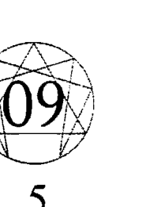

## 5型人：觀察型

| 類別 | 內容 |
|------|------|
| 後天養成的人格 | 頭腦——主要特徵：吝嗇 心——強烈情感：貪婪 |
| 本質 | 頭腦——高等心智：全知 心——高等情感：不執著 |
| 子類型的表現 | 性愛：分享心事（秘密） 社交：尋找圖騰 自保：尋找城堡（家） |

## 困境：建構內心的高牆

對於觀察型的人來說，他們的自我就像是城堡一樣，那是一座高聳、難以穿透的建築物，在頂端有著一扇小小的窗戶。這座城堡的主人鮮少離開它的高牆，偷偷地注意有誰登門拜訪，躲著不讓人發現。觀察型的人非常注重隱私，他們喜歡在遠離塵囂的地方住下來，避開情感上的負累。他們在家的時候通常會把電話線拔掉，在外面的時候則是從人群的外圍看著活動進行，他們總是要猶豫一番，才能決定自己要不要加入。

童年時期的5型人覺得自己受到侵犯；城堡的牆壁出現裂痕，他們的隱私也被奪走。他們的防衛策略就是撤退、減少和別人的交流、簡化自己的需求、盡全力保護個人空間。5型人說他們發明了許多複雜的方法與人保持安全距離，因為如果有人靠得太近，他們就會失去防衛的力量。

觀察型的人覺得外面的世界充滿威脅和危險，所以他們寧只拿取觸手可及的東西，也不願意冒著危險離開家裡安全的城牆。

他們可以成為隱士，在某個小小的房子裡過著一種離群索居而且通常是以心智活動為主的生活；他們在戶外的冒險，最遠大概只到圖書館和商店。他們也會參與社會生活，不過主要是在幕後擔任操作的角色，把前線的交際應酬交給別人處理，自己則是透過電話聽取這些人的簡報。當5型人現身在公開場合，他們通常會擺出某種姿態，把真正的自己隱藏起來；也就是說，當他們在融入某個情境的時候，也盡量地收起了自己的情感。

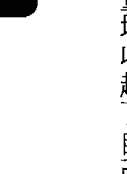

5型人希望可以不要涉入任何事情。他們覺得任何和財務有牽連的人際互動都非常危險，責任義務對他們而言是一種壓迫，憤怒和競爭必須受到控制，情感上的依戀則是一大負擔，別人正面的期望也會讓5型人感到莫大的壓力。「安全距離」的意思就是不要參與其中，除非5型人覺得一段親密關係或情感上的聯繫，可以讓他們保有獨立狀態，不然他們就會躲起來，或者將親密接觸隔離開來，讓它成為生活中一個可控制的片段。

5型人對於提升自己能見度的人際互動尤其敏感。自我推銷、競爭、公開示愛或表現恨意，都會讓5型人覺得被別人玩弄於股掌之中。5型人對於可能招致批評的人際互動表現得相當冷漠；這是一種自我保護的習慣，背後隱藏著一種優越感——他們覺得自己比那些追求認同和成功的人還要高明。他們相信欲望和強烈的情緒意味著失去控制，當情緒變得痛苦，就得把它們放掉。面對那些主宰著眾人生命的需求，5型人卻能夠從中輕易地抽離開來，這也為他們帶來一種特別的成就感。

說5型人是獨立的人一點也沒錯。他們自己一個人可以很快樂，沒有太多需求，對於自己的心智生活感到怡然自得，而且不太會因為分心而把金錢和精力花在瑣碎的小事上頭。

然而，他們之所以能夠獨立，是因為他們能夠把注意力從情感和直覺抽離開來，這種能力所帶來的昂貴副作用，就是讓他們只能住在自己的腦袋裡。

如果5型人變得孤立又沒有人可以依靠，對於隱私的愛好就變成了孤獨。當5型人想要和別人有更多的連結，這才知道要走向人群有多麼困難，發現自己總是眼睜睜地看著生命流逝，卻只能站在原地不動。他們生活在一種貧瘠的氣氛當中，喜歡「獨立」勝過滿足，擔心自己的欲望可能會讓他們必須依附別人。他們的內心有些空虛，卻又無法對外要求更多，因此對於自己擁有的幾樣東西變得極度執著：用一些紀念品來填充空白的空間，用一些珍貴的想法餵養飢餓的頭腦。「想要與人建立連結的感覺，就像是一個宴會上挨餓。我渴望體驗別人擁有的那種感覺，所以我把手伸出去，卻搆不到食物，又沒辦法把手收回來；我的手就這樣懸在餐桌和膝蓋之間。」當他們從感覺抽離開來，卻又急切地渴望與人接觸，便會花上許多時間和精力，希望可以在頭腦裡找到一種與人連結的方式，讓自己回歸人性。5型人的存在以頭腦為中心，他們藉著特別的知識來尋求連結。

觀察型的人，對於可以用來解釋人際互動共通原則的理論模式和系統相當感興趣，特別是人類的行為。藉著精通某個系統，像是數學、心理分析或九型人格，他們就可以建構一套關於人際互動是怎麼發生的概念，於是他就可以一種抽離的方式，在這個系統中找到自己的位置。他們的興趣很少和財物或是物質有關，錢只有在買得到隱私，或是可以讓他們獨立、擁有可以讓他們自己自由、學習和追求其他興趣的時候，才稱得上有價值。5型人不會把有限的精力拿來累積世俗的財物，如果他們繼承了一筆遺產，他們很可能會把它存起來，因為它可以為獨立提供保證，但是他們仍然會繼續過著儉樸的生活。如果他們不是含著金湯匙出生，也不會願意為別人工作來累積財富。

然而，他們會把大部分的精力和時間投入學習，或是進行其他智性的追求。

5型人說當附近沒人在看的時候，他們的情感比較能夠浮上檯面。他們說如果房間裡有其他人，自己就很難流露真情，孤獨是他們幻想生活的舞台。他們說自己在一天中，大部分的時間都和自己的感覺很疏離。他們需要自己一個人「把事情想清楚，看看真正的感覺是什麼」。他們說和一場真實世界的談話比起來，自己在獨處的時候反而能夠和別人有比較好的連結，比如說回想彼此之間的對話。當他們獨自一人，可以自在地回味在一整天當中還沒有好好感覺的事物，以這種方式輕易地享受人生。

一場短短的會面，對5型人來說可能意義重大，他們會在回家以後，一個人回味這一場互動。5型人喜歡和不同的朋友分享不同的興趣或是不同的理解，他們可能不會介紹這些朋友互相認識，這些朋友也不知道，觀察型的人在其他的生活場景之中有著什麼樣的表現，但是5型人會因為彼此的信任，珍惜這些朋友的存在。5型人覺得非口語的交流方式更能讓人感到親近，只要最低限度的接觸，就足以讓一段關係持續下去。5型人會允許和友誼相關的小儀式，如果他們的朋友夠聰明，就會讓5型人成為關係中的「觀察者兼顧問」，而不是期待他們要表露自己的感情，或是希望5型人在關係中採取主動。

## 5型人常見的心理慣性包括：

- 注重隱私。
- 保持疏離，把注意力從情感當中抽離出來：「次等人才需要戲劇化的情感。」
- 以撤退和節儉作為第一道防線。
- 恐懼的人格類型，害怕去感覺。
- 過度強調自我控制的價值。
- 延遲的情感。如果身邊有人，他們就會收斂自己的感情。當自己在家獨自一人並且感到安全的時候，情緒才會湧現。
- 把事情分門別類。將生活裡的責任一件一件分開來看，一個任務放在一個盒子中，每件事情都有特定的時間限制。
- 希望能夠預知一切。想要在事情發生之前，就先知道會發生什麼事情。
- 對於特殊的知識和分析系統特別感興趣，尤其是那些可以用來說明人類運作方式的知識。
- 想要擁有可以解釋情緒的地圖，像是心理分析或是九型人格。

# 第9章 5型人：觀察型

### 家庭背景：受侵擾的童年

- 將「靈性上的不執著」和「為了避開痛苦，不成熟地把情緒關機」混為一談，就像一個未開悟的佛陀。
- 注意力風格表現為以外在觀察者的角色來看待生活和自己，這可能會導致：
  - 對於生活中的情感和事件感到疏離。
  - 讓觀點保持穩定、不受情緒左右的能力。

有兩種特定的家庭情境經常會讓孩子想逃。在第一種情境中，孩子覺得完全受到遺棄，但是接受了自己的命運，為了生存下去，只好試著從情緒抽離出來。第二種，也是5型人最常報告的家庭背景，就是那些在精神上具有一定侵略性的家庭，逼得孩子把情緒關機，藉此逃離不舒服的情境。

以下的陳述來自一個典型的5型人，他是某個冷僻商業領域唯一的專家，並且靠著這個專長賺了不少錢，但是他決定住在舊金山一個老舊的街區，因為那裡的房租很便宜，而且他最喜歡的中國餐廳就在半條街之外。

我所記得的就是沉默，還有我喜歡獨處。我們家的五個人各自待在不同的房間，在自己的軌道上運行。我們很少說話，身體接觸就更不用說了。我們的父母出生的時候耳朵就聾了，而且就像所有的聾人一樣，沒辦法控制自己的聲音。

所以，如果你和他們一起去某個公開場合，他們偶爾會發出奇怪的大吼，接著就會引來許多路人注目的眼光，這會讓人恨不得趕快找個地洞鑽下去。

我在童年時期最強烈的一個感受，就是希望自己不要被別人看見，所以我變得擅長假裝自己是一盆棕櫚樹植栽，或是藉著融入牆上的圖畫來讓自己分心。和他們一起出門的時候，就盡可能假裝我不在那裡。

以下的敘述來自於一位電腦工程師，他的說法為我們提供了上述第二種童年情境的模樣。他喜歡在晚上工作，這個時候辦公室沒有半個人，除了偶爾有清潔人員來打掃，還有超過一百台安靜的電腦陪著他。

在我成長的過程中，我和七個人共用三個房間。在這種情況下，根本沒有辦法獨處，除非出門或是上廁所。所以我在某棵樹上找了一個比較平坦的地方，在那裡打造了屬於我自己的小天地，我會到那裡去放空、閱讀、往下監視所有人的動靜。

後來這個基地被我的兄弟們發現了，我只好再去找別的樹。我極度渴望獨處，因為這是我唯一能夠做自己的時候，才不用一直想辦法逃離那些要我為他們做這個、做那個人們。

隨著我逐漸長大，恐怖的事情變成派對、和別人約會，還有穿衣打扮。我就是不會準時到場，去和別人閒聊，講一些不用想也知道的事情。在進去某個派對之前，我第一件要做的事，就是找出口的位置，然後規劃自己行進的動線，從大門一路慢慢移向某個出口。

最慘的就是陷在某個對話裡動彈不得，特別是和某個想要從我身上得到什麼的人說話。

### 情緒距離

那些覺得自己必須逃走的孩子，會找到一些方法把自己隔離開來。其中一個做法就是待在房間裡，關上門。另外一個方法就是築起一道高牆，拉開情緒的距離，讓自己不要去感覺。最後，當你和某個試圖想要探聽隱私的人面對面，你就可以直接承受他的目光，並且對他的侵犯不起任何反應。

有個5型人這麼說：「他們可以試著支配我外在的行為，但是永遠都不會動到真正的我。」

那時候我們在一家餐廳裡，我的母親開始對著我大聲朗讀菜單：「他們有賣雪豆牛、辣茄子……等等。」她老是這麼做，每次都讓我很痛苦。我自己的點菜方法，就是唸出每一道菜的名字，然後看看內在有什麼反應，比如說味道或是感覺；但是當我媽用這些菜名轟炸我，她說話的速度和我內在的速度不一樣，讓我根本沒有時間想清楚。

我耗費了極大的專注力才創造出距離，一道牆，讓我可以看著菜單、想想自己要點什麼。同時，我覺得自己被侵犯了，一點用也沒有。後來我們去了動物園和玫瑰園，我媽又試著開始描述、解釋她看到的所有東西：「一看那個，噢，真是美麗。看，那個玫瑰的品種是『約瑟夫的彩衣』，另外那一個叫做『粉色寧靜』。」又來了，在被指導的狀況下，我根本沒有空間可以好好地感覺這些玫瑰花。

5型人

我發現自己的行為，就像我以前在唸語法學校的時候一樣：我會故意落在她後面或是走到她前面，就是試著把距離拉開。然而，我還是無法如願以償，因為我同時也在看著她會作何反應，等著自己的注意力再一次被她打斷。我是在胡鬧嗎？她會覺得我這麼做很無禮嗎？和她在一起實在是讓我非常焦慮，我的心思根本無法留在花園裡，我覺得我一定得自己一個人，才有辦法好好地欣賞這些玫瑰。

要在高壓的影響之下保持自主的權力，最好的方法就是切斷自己與強烈情感的連結。5型人控制情況的方法就是停止回應，而不是試著控制問題，或是控制其他相關人士。要控制個人的反應，通常意謂著要在交流發生的時候，先把感覺擱在一邊，等之後回到家一個人的時候再來整理它們。

年輕的時候，我是一個獨來獨往的人。如果我必須和人群在一起，我就會模仿別人的臉部表情和各種習性，讓自己適應他們的場合。我喜歡自己一個人，在心裡並不需要任何陪伴。到目前為止，如果我一定得和別人在一起，我就會用自己發展出來的一套系統觀察他們怎麼行動，並且試著表現出那個樣子。偶爾我會看到有人在路上親熱，這讓我覺得很孤單，他們的內在究竟發生了什麼事總是讓我感到好奇。

後來，我們開始討厭離開人群。我想要和人們分享一些我在獨處的時候發現的事情，但我只有在晚一點、當我自己一個人的時候，才能夠感受和別人在一起的快樂。回憶那次見面的感覺，比真的和那個人在一起還要強烈。我試著捕捉回憶帶來的感覺，看看哪些是對的。

我花了好幾年的時間，才有辦法在當場感覺某個強烈的事件，而不是進入牆上某個有趣、令人驚奇的污漬，然後讓自己消失。

5型人經常說，他們會藉著某種知覺的轉換來和別人拉出距離。他們覺得看著別人，就彷彿他們和別人之間有著一片廣大的虛空；或者就好像他們在和別人講話的時候，是站在一個單面鏡看不到的那一頭，從那一頭來觀看。在隱形的狀態下，他們就能夠不帶感情地看，不用插話，也不會有不適當的行為。5型人有時候會說，如果逼不得已要講話，他們會覺得聽眾彷彿離自己很遙遠，而且還變成了「漫畫人物」，就像是來自另一個世界的外星人。

當我不想被人看到的時候，我就會這麼做：如果不能離開，或是無法用咖啡桌上的藝術書籍讓自己分心，我就會試著變成背景的一部分，把自己的存在隱藏起來，這樣就沒人知道我在這裡。我非常擅長讓自己消失在牆壁裡面，連前來找我的朋友都會從我身邊筆直地走過去，卻沒有看到我在那裡。

如果你手裡拿著飲料或餅乾，消失在牆壁裡面這個技巧就能發揮最大的功效，它們可以幫助你融入整體的氣氛當中。不過最重要的是，要把注意力從你自己身上抽離開來，直到你發現自己消失了為止。

從那樣的角度來看，事情反而變得有趣得多。你會看到整個房間都是派對怪人，他們走來走去，就像是《星際大戰》（Star Wars）中的酒吧，或是其他外星人電影中的場景。

這樣一種避免陷入情感糾葛的防禦策略，不僅適用於負面情緒，也被應用在正面情緒。

## 反刍感觉

5型人经常说他们会在某个事件发生之前，试图先取得完整的讯息，这样他们就可以先做准备，先在脑海里预习一切可能会发生的状况。他们希望可以就任何不可预测的事情或是可能让人丢脸的事情，先获得警报。任何不在预期之内的事，或是其他人到时对他们发出的强烈要求，都可能会让5型人痛苦万分，因为这样他们就得在一个不熟悉的地方被迫联系自己的感觉。

先为人际互动做预习，让5型人可以在事件进行时保持一定程度的抽离。他们的策略是在私底下先审视一个事件，想象自己最佳的表现方式，接着在实际互动的时候将感觉抽离开来，心里还会带着一种“我早就知道会这样”的感觉。

当他们返家回到安全的个人空间，5型人才会把这个事件和所有的感觉拼凑在一起，慢慢弄清楚对这件事有什么情绪。

什么都没有准备感觉起来很吓人。我一定得把晚宴的细节先搞清楚，像是谁会到场。接着我会把流程跑一遍，像是菜单上有哪些东西、还有受邀者的背景。我经常都准备得很好，结果在事情进行的时候，我的心思反而会飘到别的地方去。

我在我们当地的大学教授一门和古代语言相关的课程。一开始，教学让人很兴奋，同时也很吓人，不过只要我开始熟悉的教学的材料和课堂的状况，我发现自己的头脑就会开始从课堂上抽离开来，我甚至会飘到自己上方或是后方看着自己正在讲课。

除非有某种真的出乎意料的事情发生，比如说某个学生突然大叫：“失火了！”我才会回过神来，发现教室里的二十个学生正在看着我。当我出神的时候，我觉得真正的自己会跑到身体的外面或上面，看着举止合宜、专业的自己表现出风趣、聪明的样子，或是任…

如果一切都按照脚本进行，我也会觉得相当困扰。我希望或许有人会注意到我并不在我所在的地方，或是希望某个聪明绝顶的学生可以问我某个问题、打断我单调的自我观察。我就像一个旁观者看着自己的生活。

如果人际互动的界限很清楚，观察型的人会比较能够表现自己的情感。如果他们知道某个议程的主题，还有会议的时间长度，他们便能在限定的时间之内，自由而又热情地发表对这个主题的想法。他们可能会事先演练，不过只要他们了解主题，就比较能够在当下感受自己的情绪，也能在意意外状况发生的时候把注意力抽离开来，摇身一变成为观察者。当会议结束、大家开始闲聊的时候，他们就会想要快点回家。

许多5型人说他们在旅行的时候相当外向，可以轻易地和别人打成一片。旅行的情境相当适合他们主动与人打交道，因为他们成了异文化的观察者，而且可以掌控自己停留的时间。这么一来，他们就能够全心全意地享受各个独特的情境，希望能够在短短的时间之内获得大量精华的体验，把记忆储存起来，留待日后再来回味。

我是个植物学家，在这个领域已经有好几年的教学经验。有天我决定辞职，之后就一直在世界各地旅行。我有个冲动，想要以最简单的方式活着。探访新的地方总是会让我很兴奋，我只会最简单的对话，身上全部的钱只有二十美元。我一次又一次这么做，强迫命运给我一些东西。我得对别人伸手求助才有办法度过一天。每当我建立了朋友圈，交了女朋友，有了愿意支持我的基地，我就开始计划离开。在短短的时间里，我和共处的人产生了极大的亲密，然后我就会再度离开。只要我明确地知道自己的位置在哪里，我就会开始感到不满，因为我知道他们对我有那些期望。当我撤退，这些东西就不复存在了。离开的时候我会有些怀念，怀念在那里发生的一切。我把这些都记在脑子里，这些回忆会跟着我一辈子。

## 第9章 5型人：观察型

在5型人精心策划的保持距离方案当中，防御的第一个动作就是转身离开、拔掉电话线、变成一个离群索居的人。比较内化的保持距离的方法，包括了把注意力断开，这么一来可能相当具有张力的经验就会被隔离开来。5型人会把生活分成各种不同的区块，每个区块有不同的朋友，这些朋友彼此不认识，也不会从5型人那里听见和其他人有关的事。在特定的时间和空间里，5型人会培养出某些强烈的兴趣，他们平常不太会提起这些兴趣，一直到“做这件事的那个时刻”来临。把生活的各个区块分门别类，对于观察型的人来说，只是一种注重个人隐私的表现，而不是不愿意被别人完全了解。我们或许可以说，5型人在公开的沟通或是争执之中没有什么抵抗能力，所以他们偏好的防御方式，就是希望自己最好完全不被注意到。

如果某个人进了门，我就会觉得他们可能会脱掉我的衬衫。这是一种无害的防御：你必须离开，关上门，把一切阻隔在外，因为你没有和别人斗争的资源。与其和别人争些什么，还不如就这样走开。这意谓着他们可以得到一切，而我又要再一次过着什么都没有的生活。关于衬衫被脱掉这件事，我只能说我拥有的东西那么少，那可能是我唯一一件衬衫了。即便如此，如果我得和某个人争论这件衬衫到底属于谁，我宁可不要这件衬衫。

另外一种制造安全距离的方法，就是把回忆一个一个分开来看，这样一来，你上午做的事情和下午做的事情仿佛就失去了连贯性。不连贯的意思，并不是说你真的不记得早上说过的话，而是意谓着你生活里的事件似乎是以一个片段、一个片段的方式发生，事件和事件之间没有一个连贯的情绪可以把它们绑在一起。

我有一件斗篷，上面都是纪念品。我之所以迷恋这些小东西，是因为这些小东西中装满了许多记忆，可以让我完整地回想起生命中的某个片段。我有个盒子，里面装的是一些毛线，它们来自一件我在研究所时期穿了四年的毛衣。我还留着某支撞球杆的顶端的零件，它让我在学生时期赢得许多胜利。我也留着两个儿子出生时剪下的脐带。还有一些旅行时留下来的各国货币，看到它们我就会回想起那些美好的时光。

我也收集事实，我称之为“捕蝇纸般的头脑”（Flypaper Mind）：关于我感兴趣的事情，我找到许多惊人的、自相矛盾的事实，它们叠起来就像是这件事的瑕疵一样。我渴望可以收集更多这样的东西，但是对于这些事实究竟要怎么拼凑在一起，我一点头绪也没有。

## 隐私的喜悦

5型人会在独处的时候活过来。他们常常必须远离人群来为自己补充能量，并且释放那些与其他人相处时暂时被搁置在一旁的感觉。

5型人在私人时间脑袋不停运转，总是在思考一些有趣的事情。他们喜欢与自己的头脑为伴，除非隐私加深变成孤立的感觉，他们很少会因为没事做而感到忧郁或无聊。

虽然对比较外向的类型来说，观察型的人看起来很寂寞而且在社交上相当孤立，5型人倒是宁愿独处。事实上，他们非常独立。不寻求别人的认同，希望可以在经济上自力更生，坚持来去都要随自己的意愿，而且不希望因为与其他人的依附关系而产生情绪上的负担。

因为5型人不寻求别人的认可，他们能够在家里过着全然自发性的生活，开开心心地和拥有的物品和头脑里的想法为伴。下列的陈述来自于一个年轻的电影导演，他最初从摄影起家，因为他觉得待在镜头后面会让他在公开场合里觉得比较舒服。

大家都觉得我是个外向、喜欢社交的人，但是这和我自己的认知相当不一样。我会外向，是因为当我在拍片的时候，我热爱我的剧本，而且我已经想得很清楚，我知道片场的工作人员应该要做些什么，才能捕捉到我想要的影像。因为我早就计划好每一件事，而且尽我所能严格地控制整个过程，所以演员在现场偶尔的即兴演出，或是当胶卷在剪接的时候出现一些意料之外的视觉效果，对我而言相当珍贵。我这辈子最快乐的时光就是自己待在放映室里，看着我的想象在屏幕上有了自己的生命。

## 在公众场合隐藏自己的方法

5型人喜欢独处，却又觉得偶尔还是有必要在公众场合现身，于是发展出一些巧妙的方法让别人把注意力从自己身上移开，比如说，把焦点带到某个双方都感兴趣的话题，或者是把焦点转移到对方身上，让对方讲述自己的生命故事，这些都是相当明显的作法。

5型人能够成为可靠的朋友，他们能够扮演顾问的角色，为那些在生命的路途上踯躅独行的人指点迷津；但是如果他们的朋友够明智，就不会刻意地在5型人身上寻求情感的连结。

5型人还有一个转移注意力的方法，那就是将人类复杂的行为浓缩成一个可以理解的心智系统。5型人可以和别人进行深度的交流，透过研究诸如心理学或占星术等体系，用纯粹的理性来了解情绪的动荡。借着了解人类在情感上如何运作，他们可以轻易地谈论感觉的模式，而不必涉入其中。对于旁观者而言，5型人对于抽象的系统和原理的着迷，是一种逃避与人产生连结的做法，以一个人“应该会有什么感觉”这样的想法来取代真实的感觉。

5型人还相当精于另一种形式的公开躲藏：让自己消失在一个合宜的身体姿势中。他们会调整身体的姿态来适应周围的情境，举例来说，有个5型人是个出色的摇滚乐手，当他和许多知名乐团合作的时候，会把注意力从身体稍微抽离开来，然后按照既定的流程排演。他在鸡尾酒会上或许会摆出特定的姿态，需要一套特定的服装和一杯饮料，还有当他双腿交叉的时候，膝盖要摆在正确的地方。他希望自己尽可能从身体里抽离开来，这样就不用在派对的过程中一直待在身体中。

## 亲密关系：恐惧情感

5型人的主要议题就是对于情感的恐惧。就他们的基本防御机制来说——把注意力从强烈的情感中抽离开来——亲密关系是一种负担；意思就是，一旦观察型的人进入一段感情，就会陷入进退两难的困境：一方面他们已经习惯不要去感觉，一方面又强烈地受到正面情感所影响。5型人会抗拒这样一个事实：和对方就在面前相比较，他们一个人的时候对于其他人比较有感情，而且能够享受彼此的会面。他们说自己经常在面对面的交流中感到不知所措，必须等到一个人的时候，才能搞清楚自己究竟有什么感觉。5型人在事后回顾的时候，当身边没有任何打扰，反而会有比较多的感觉浮现出来。这个情况特别明显，就是当他们在一次深入、亲密的会面之后，就会直接隐遁进入孤独状态。观察型的人很容易因为强烈或持续的人际交流而感到疲累不堪，他们会撤退，想一想自己的定位在哪里。

从亲密关系即刻撤退一定会对伴侣造成影响，他们的伴侣可能无法像他们一样暂时放下依恋。因为5型人很少谈论这件事，他们的朋友通常都不会知道，当5型人在独处的时候是如何地想念他们生命中的重要人物，或是5型人究竟花了多少时间来预习和温习与生命中重要友人的会面。对于5型人来说，他们可能在心里与对方建立了强烈的连结，但是对方并不知道自己对于5型人来说竟然有那么重要。

当5型人把一段关系变成脑袋里的思想，他们就能够以一种抽象的方式，一点一滴的享受它。观察型的人在独处的时候，会试着为自己的情感和思想进行配对，这样他们就可以和自己真实的感受重逢。因为他们将注意力从强烈的情绪中抽离出来，将自己的情感化为脑袋里的思想，对于他们的伴侣来说，5型人似乎总是在逃避，而且在情感上相当冷淡。

就较好的一面来说，5型人确实会以一种抽象的方式与对方连结，并且以这种方式珍惜对方。他们的承诺会先来自头脑，接着才是来自情感。一旦做出了承诺，就会非常持久，虽然他们的承诺总是有着明确的界线，必须在他们的时间和精力可以承受的范围之内。

就较低的层次来说，5型人在“想要感觉”和“想要抽身”之间的分裂，在亲密关系中变得更加极端。他们会强烈地避开可能会引发自发性感觉的状况，特别是面对面的冲突。最终，他们的伴侣会发现自己成了这段关系的活性剂：他们必须担任采取主动的那一方，主动地走向5型人。

## 亲密关系范例：5型人和9型人，观察型和中立调解型

这两个类型的人，对非语言的交流有一定的程度的共识。在无数的傍晚中，他们会一起窝在家里，双方都觉得很安全，两个人互相了解，这些事情也不需要明白地说出来。自然而然会让对方拥有自己的私人空间，让彼此可以在其中做决定、寻找自己真实的立场。

对这对伴侣来说，性爱可能会成为另一种重要的非语言交流模式：9型人会无意识地融入5型人的性爱模式。9型人会主动地走向5型人，希望可以和伴侣的愿望合而为一，这样一来（在这种充满乐趣的能量交融当中），会让退缩的5型人从未说出口的愿望，成了这个行动的主要焦点。家事也是非语言交流的重点区域，两个人都会珍惜每天在厨房共处的晚餐时光，对他们来说是一种既安全而又熟悉的交流方式。他们不太会干涉对方的兴趣。如果9型人想要把能量运用在各种不同的活动上，5型人不会感到困扰，除非这些事情对家务产生负面影响。如果5型人想要把活动分门别类，9型人也不会有意见，除非5型人变得偷偷摸摸的，或是不再对彼此开诚布公。只要他们能够以自己的观点告诉对方目前事情进行的状况，这对伴侣可以给予彼此最大的空间和最少的干预。然而，这两个类型的人都倾向于保留某些讯息来作为自我防御的手段，而且他们可能会产生强烈的嫉妒。如果其中一方藉着拒绝性行为或是保留某些个人讯息，来和对方拉出距离，就会让这段关系陷入危机。

如果9型人把能量都投入个人的计划，5型人就会担任他的顾问，并且把这个计划当成和外在世界联系的一个充满趣味的连结方式。不过，如果9型人变得太仰赖5型人的支持，或是试图让5型人加入他的活动，他们之间可能会产生严重的嫌隙：5型人会觉得受到9型人的压迫，9型人则是因为5型人的撤退而觉得惨遭遗弃。9型人或许会变得过于依赖对方的认同，并且希望对方主动表达爱意；5型人则是会冷冷地坚持，就算没有把话说出口，对方应该要知道自己在这段关系中的重要性。此外，如果伴侣在情绪上对他们产生了高度的需求，5型人就会刻意减少与对方相处的时间。如果9型人开始回避性行为，或是不愿意向对方保证自己的爱意，9型人就会觉得自己受到二度抛弃。对于9型人来说，他们必须把注意力转移到外在的兴趣，藉此为这段关系重新带来活力。只要他们不要把注意力直接放在观察型的人身上，5型人就不会觉得有压力，才能再一次把焦点放在彼此共同的兴趣。

对于这对伴侣来说，无聊或许是另一个陷阱。这两种类型的人都要依靠对方提供乐趣。双方都担心自己没什么好玩的事情可以分享。如果他们感到无聊，就会开始批评对方：9型人之所以批评，是因为他们融入了对方的期望，却发现对方的期望一点也不能激励他们；5型人之所以批评，是因为他们对家里的环境有了足够的安全感，因此能够表达自己的负面情绪，于是强烈的愤怒便浮出水面。5型人的愤怒通常以一张臭脸来表现，或是冷淡的负面沉默，这会让9型人觉得非常不安。

如果其中一个人威胁要结束关系，或是有了外遇对象，就会引发让人意想不到的嫉妒情绪。如果5型人很依恋自己的伴侣，虽然他在理性上可能会否认，但是失去这段关系就像是失去自己的生命一样。同样地，9型人会觉得自己的某个部分已经和对方融合在一起，分手就意味着要切除并且从此失去这一部分的自己。他们之间还有另一种有趣的情绪互动，不管是吵架或是嫉妒，都会让这对伴侣不再无聊，让他们重新领悟这段关系有多重要。

当关系持续下去，到了要做出承诺的时候，不管是对于9型人或是5型人来说，都是一件让人痛苦的事。一旦9型人下定决心要给对方承诺，而5型人也对另一个人产生了持续的情感，如果他们可以为彼此制造一些爱意或是记得彼此的示好，就会让他们的关系变得更加坚定。9型人需要融入对方的情绪和爱欲，5型人则是希望对方在自己感觉涌现的时候，可以给予爱的保证。

## 权威关系：反抗权威

5型人很讨厌时间和精力被别人左右。他们天生觉得自己的能量有限，而且很容易因为人际关系而耗损。当他们搞不清楚别人究竟对他们有什么期待的时候，或者是他们的工作职务可能会因为一个上级的命令就遭受波及，他们特别容易会觉得筋疲力竭。因为不愿意把有限的精力分给别人使用，观察型的人会借着退缩来反抗权威的控制。他们偏好最小化的管理，讨厌突击检查，或是要求持续工作回报的老板。如果他们必须和不认识的人接触，最好可以在事前为即将讨论的事情设定明确的界限，不然5型人难免会觉得受到侵犯。他们经常会把奖励当成陷阱，像是头衔或是薪水，认为那是有权力的人用来引诱劳工然后榨干他们的时间和能量的计策。5型人宁可不要这些认同，这么一来，他们就必须对自己的工作状况做好规划。

不过，如果一份工作允许5型人订定自己的时间表，同时允许他们自行决定与其他人互动的方式，就算这是一个权威式的工作系统，5型人也会乐意在其中工作。

如果其他人可以事先说明对5型人的期望，5型人也会表现出外向和友善的一面。举例来说，5型人通常都会想要事先知道某个聚会有哪些人受邀参加，或是聚会有什么主题，这样他们才能预做准备。

观察型的人通常都会避开小官僚，把它们当成各种权威控制的延伸。面对这些小官僚，5型人会担心自己的隐私可能受到侵犯。比较轻微的逃避会表现为一种神经质的抗拒，像是不接电话；比较复杂和耗时的做法，就是避免和邻居、房东和政府单位交流，比如说国税局。

5型人之所以必须避开这些交流，是因为他们对于面对面的冲突毫无抵抗能力。只要上级直接寄信给他们，或是更糟的要求见面开会，5型人就会觉得受到很大的压迫，因为这样他们就得根据上级提出来的要求进行协商。他们偏好的防御就是直接从上级的影响力范围撤退，放弃那些会让他们和社会系统纠缠不清的东西，像是薪资、房贷和负债。

就权威关系较高的层面来看，5型人在面临困难的抉择时，通常都可以保持专注，因为他们可以从令人困扰的恐惧和欲望抽离出来。他们通常是各种事情幕后的主脑，当大家乱成一团，他们还是老神在在的。他们天生就喜欢从事冷静、长期、需要广泛理论视野的计划。他们相当乐意去开创重要但冷门的计划，担任基本上不会获得公众注意力的幕后推手。如果可以让他们免于面对面对面的冲突，又不用负责后续的执行或是收拾残局，他们会工作得比想象中还有效率。

就权威关系较低的层面来说，如果他们觉得被工作压得喘不过气，可能就会开始逃避，让你找不到人。他们可能会在案子正如火如荼地进行时，突然宣布自己要去度假，或是在自己和工作之间，划出明确的工作时间和会客时间的界限。

## 权威关系范例：5型人和4型人，观察型和浪漫多感型

如果5型人是老板，最舒服的工作环境就是一个私人的空间，并且对所有人际互动设立明确的时间限制：一小时的会面就是五十分钟，和约定好的客户开会、进行一通已经安排好的电话会议。这个老板会要求4型人的员工过滤一切不必要的干扰，并且在有必要的时候直接处理客户的需求。只要这个员工能够设好完成期限，并且担任有效率的中间人，老板就不会想要监督他的工作。如果4型人愿意承担责任，而且只在有必要的时候才找老板商量，那么这个公司就能顺利运作。如果这么做没有发生什么冲突，老板会很乐意和这样的员工一直工作下去。

如果工作出现问题，老板也注意到了，5型人的老板会选择退后，而不是上前去质问。

# 第9章 5型人：觀察型

4型人可能會將這個舉動錯誤地解釋為老闆沒有注意到，特別是如果老闆平常都用備忘錄或是中間人來和員工交流，而不是親自處理問題。如果4型人覺得受到忽略，或是5型人選擇退後，就會造成嚴重的問題：員工可能會變得憂鬱或是漫不經心，要不然就是表現出令人困擾的行為，強迫上級給他一個回應。這樣一來，老闆可能會直接開除這個員工，而不是與他協商，這可能會讓4型人堅持要為這種不公平的遣散討個公道。

如果其中一方可以對另一方表示關心，就可以避免這樣的僵局。4型人想要上級的關注，5型人則是想要擔任成功企業背後的大腦，但是希望可以不要拋頭露面。如果老闆可以表現出在意這種狀況，去調查衝突的起因，4型人就會更願意配合。如果員工可以就問題提出可行的解決方案，又能避開衝突或引發情緒上的對立，會讓5型人覺得相當感激。

員工會從原本比較情緒化的立場，轉向較為理性的立場，老闆則是會從一開始理性的狀態，轉而注意員工對於這份工作的感覺。

如果5型人是員工，在工作上不會有什麼問題，但是和同事相處則是有點困難。對於某些5型人來說，要在沒有隔間的辦公室裡和其他人一起工作相當不容易；在沒有隱私的情況下，幾乎所有的5型人都沒有辦法連結自己的情感。許多5型人說他們會把自己藏在某個姿態後面，表現出好員工的樣子，但是內在已經從情緒抽離開來。如果可以和老闆直接用電話溝通最好不過，這樣老闆的指示就不會受到別的干擾。

因為5型人可以表現出某種合適的姿態，所以他們可以成為必須和一般人打交道的櫃檯人員或是娛樂從業人員。關於5型人在工作場合擺出來的特別姿態，都有經過練習，這些姿態可以成為5型人在公共場合合理的避風港。不過只有在5型人可以準確預測其他人會對這樣的姿態有什麼反應的時候，這個姿態才算得上是安全。那些必須直接面對人群的行業——像是推銷員或是政治人物——亦即那些需要主動與人會面並且不斷改變個人姿態的工作，對於5型人來說沒什麼吸引力，因為他們喜歡待在某個固定的姿態裡，從中獲得安全感，以這種方式來面對新的情況。

如果4型老闆信賴5型人員工的能力，他可以和5型人建立一種私底下的聯繫，讓5型人為他提供建議。如果5型人尊重某個人的專業能力，他會很享受與這個人建立一對一的關係，而且如果注意力被放在工作上，而不是聚焦在他們身上，他們也能夠很自在地貢獻自己的能力。如果浪漫多感型的老闆夠聰明，他們就會負責對外發聲並且承擔執行的責任，讓觀察型的人為他提供建議並且擬定策略。如果老闆可以讓5型人免於直接與人面對面，那麼5型人員工在案子最困難的時候就能夠好好思考，幫助這個老闆度過他個人情緒上憂鬱、亢奮以及低潮的變化時期。

### 注意力模式：抽離感覺

5型人的孤立不只是撤退到隱私中，或是在情感上築起高牆而已；他們在精神上的孤立可以被視為一種習慣——藉著把感覺抽離，得以冷靜地觀察發生的事情。當他們面對壓力、處於一段親密關係，或是發生了意料之外的事，讓他們不得不以自發性的反應來面對的時候，這種注意力的模式會變得特別明顯。在極端疏離的情況下，5型人可能藉著把注意力凍結在身體之外的某個點，讓自己消失。

二十幾歲的時候，我就過著像隱士一樣的生活：沒電話、沒什麼朋友，出入都要開很久的車穿越一條破舊的鄉村道路。後來當我決定要成為一名攝影師的時候，我真的不知道要怎麼跟別人說話。上課的第一年我去做了心理治療，他們建議我針對身體做些工作。我在呼吸練習的時候整個人完全當機了，我對自己的身體完全沒有感覺。

在某次療程中，我的整個身體開始抽搐，發現自己抽離開來，看著自己經歷這件事，但卻完全感受不到自己的身體。從那之後，我三不五時就會發現自己站在自己的身體外面看著。每當我必須「上台」，就會出現這種狀況，即使只是在排練，我也會覺得突然解離了，看著自己的身體做著那些我必須完成的工作。

從感覺中游離出來觀看這樣一種習慣，除了為當下的強烈情緒提供一個緩衝，也能製造出戲劇性的體驗，靜心者視之為「注意力之物」（object of attention）與「內在觀察者」的分離。

我有一些老舊的紙娃娃，有時候我會覺得自己是它們的一員，正面掛著一件漂亮的洋裝，用兩個小小的紙片固定在肩膀上。沒有任何人看到我，他們只看到正面的洋裝還有我紙娃娃般的臉孔。

同時，我站在自己背後，就像是雙人對話中的第三個參與者，我看著對方的臉和站在那裡的我自己，被包裹在一件洋裝裡。

我十七歲的時候有了第一次性經驗，我的腦袋突然當機，跑到身體外面看著自己。做愛是一個明白的例子，很能說明當我覺得壓力很大的時候，我會有什麼反應。基本上，我想要避開壓力，但是當我不得不面對壓力，我就會發現自己和情緒切割開來。生活越困難，從外面看著自己就變得越好玩。我總是想著，接下來我會做什麼呢？我結婚了，因為我想看看自己會做什麼。我把一匹狼放在門邊，因為我想看看自己要怎麼走出那扇門。

5型人在小時候發展出這種注意力模式，讓自己在充滿威脅性的環境中獲得安全感。5型人把注意力從讓自己害怕的事物中抽離出來的習慣，和靜心者的覺知，亦即區分觀察自己和觀察的對象，有點不一樣。其中一個主要的差別在於，5型人在抽離開來的時候整個人便凍結在原地，受到習慣的制約看著可怕的事情發生，並且強制注意力和相關的情感分離開來。如果觀察型的人和恐怖事件所引發的情感連結在一起，他們將頭腦和情感分離這樣的防衛機制就會失效。5型人會變得非常脆弱，容易受到其他人的影響，並且被自己的慾望所困擾。

和5型人逃避感覺、凍結的觀看相反，靜心者的內在觀察者，能夠融入內在注意力之物，與之合而為一，比如說身體的覺受、唱頌的振動、意象以及純粹的情緒。

想像你站在某人前面，而這個人試圖要干預你的人生。就像是當你不在家的時候，你的母親偷偷地檢查你衣櫃的抽屜，或是你的哥哥偷看你的日記，好幾個月以後你才發現。感覺看看這種狀況，無法控制地受到侵犯，你的身體會有什麼反應，並且想像一下，每天都要和這樣的人生活在一起。

### 注意力練習

現在，找個方法把自己隔離開來，不要讓那個人做的事影響到你。這個練習的重點在於，藉著把自己和侵犯者分離開來，保護你自己不受感覺的侵擾，而不是透過強力的壓制來阻斷情感。5型人說當他們藉著抽離來避免外在的影響時，會有一種獲得控制，甚至是愉快的感覺。

有些5型人說他們會深深地進入自己的內在，那裡有個沒有情緒的地方。另一些5型人則說，他們藉著隱藏在某個牆壁或是單面鏡之後，或是把注意力轉移到別的地方，藉此把自己和侵犯者分開。從這個占上風的位置，他們可以觀察究竟發生了什麼事，並且讓情緒保持在不涉入的狀態。

當5型人被靜心吸引，他們幾乎不約而同地對「分開注意力」(detachment)這一項練習，有著發自天性的喜好。內觀（Vipassana）和禪就是這樣的練習，這兩者都強調放掉頭腦裡的思想和其他干擾，藉此培養內在觀察者。不幸的是，對5型人來說，這類練習的吸引力可能是來自這樣的欲望：他們想成為超然世外的大師，希望用靜心保護自己，讓自己永遠不受日常生活的恐懼和欲望所侵襲。因為這種大腦想要逃開的不成熟欲望，5型人又稱為「沒有開悟的佛陀」 (unenlightened Buddha)。

以下是一個5型人的報告，他總是利用抽離頭腦的技巧，來更加覺察自己的感受，看看這種作法和不成熟的抽離，亦即靜心只是為了能夠對感情更加免疫，這兩者有什麼不同：

一直以來我都有固定跑步的習慣。多年來，我覺得跑步是一個象徵，代表著我想離家的渴望，看看兩隻腳想帶我到哪裡都可以。不管家裡發生什麼事，只要我出去跑個八十公里，一切都會煙消雲散。我的思緒會消失，我就從所有的事情釋放出來，只剩下眼前大自然的景色，還有我移動的身體，這些看起來是那麼自然，和我的作為並無關係。距離是我的主題，出門去跑個八十公里，年年如此，這是我生命中最美好的一件事。

跑步也是我用來連結感覺的方法。我可以利用跑步來釐清一切腦袋裡的混亂，當我頭腦變得比較清楚，我就會試著覺察我的問題，讓感覺自行來去。我稱之為「帶著問題奔跑」，透過這種方式，我對自己有了更深的了解。

有好幾次，當我帶著某個問題在跑步時，腦海中閃過一些直覺幫我做出了決定。比如說有一次，我朝著某個公司裡潛在的合作夥伴全速衝下一個峽谷，離另外兩個有力的人選遠遠的，當然了，峽谷裡只有我一個人。另外一次，我覺得膝蓋有點不太舒服，但是我知道剛剛提到的那個人會帶我回家，對於後來我在進行的一個協商，這是個相當正確的描述。

當這個跑者處於某種抽離的頭腦狀態，他找到一個方法讓自己的感覺和印象浮出水面。被自己的情緒「抓住」並不會帶來什麼危險，除非他不想放掉這些情緒。對於5型人來說，這個例子不太尋常的地方是他允許自己去感覺、讓自己的反應自發性地浮現，而沒有預先進行準備。

當他跑步的時候，他的注意力和內在觀察者達成一致，而且因為他願意面對自己的問題，而不是把它們放到一邊，他可以把注意力放在問題上，而不是在跑步的過程中從中抽離開來。

## 物質欲極低的貧瘠

在生活有困難的時候，5型人寧願過得貧苦一點，也不願意伸手跟別人要東西。他們傾向以撤退做為反應，調整自己的經濟規劃，把個人需求降到最基本的程度，並且儘量不要依賴其他人。

當他們在腦袋裡想到「我不需要那個，沒有也沒關係」的時候，他們就會有一種獨立的感覺：

過一種極簡的生活，這比囤積一些根本用不到的垃圾還要快樂。我有一間小屋、一隻貓、幾本重要的書，還有幾套可以替換的衣服，隨時都可以帶著走。早餐每天都一樣：一根穀麥條和一杯茶。這些小東西給我大大的快樂，我衷心感謝有足夠的空氣、足夠的食物和足夠的時間可以獨處。

靠著這麼少的東西過活我並不覺得少了什麼。我的朋友們的生活就是一場競賽，我一點都不想加入戰局。賺越多錢只是表示你要繳越多稅，一棟大房子就代表要被房貸綁得死死的。對我來說，奢侈品就像是晚餐飯後的甜點，如果每晚都吃，我就會覺得甜點控制了我，我寧願把它丟掉，然後節食。

生活富裕的5型人也喜歡簡單的物質生活。他們的內在有種貧瘠的感覺；一種空虛的內在氣氛，彷彿任何得到的東西都不夠營養，沒有也沒關係。有錢的5型人和貧窮的5型人一樣，都過著一種物欲極低的生活，深受內心貧瘠的感覺所苦，但是不像那個擁有一間小屋和幾本寶貴書籍的5型人，他們比較不介意別人利用他們的能量，或是努力地多賺一點錢。霍華·休斯，一個擁有億萬身價的5型人，過著儉樸的生活，最後斷絕了大部分的人際關係，他表現出5型人類精神分裂的特色。他透過遠端遙控、靠著中間人和電話來操控自己的帝國。他試著避開所有的接觸和衝突，但是並不分享自己獲得的豪華生活。他習慣坐在餐桌前，但不伸手去拿食物吃。那麽，觀察型的人究竟為什麼會和貪婪扯上關係呢？如果極簡的生活給他們愉快的感覺，甚至是一種優越感，比那些辛辛苦苦才能獲得物質財富的人還優越，那麼這些物欲極低的人為什麼會受貪婪折磨呢？事實上，5型人的抽離是一種強迫性的症狀，而不是一種選擇。那是基於一種恐懼，害怕失去僅有的一點東西，害怕因為與那些提供物資的人交往，會讓他們失去自主性，害怕像過去一樣被別人侵犯。5型人的獨立彷彿是建立在一種頭腦的想法——「沒有那個我也可以過活」。當5型人被某一種他無法不需要的東西所吸引，情況就變得很困難。當某件事物變得如此有價值，以至於滲透了5型人的私人空間，或者是當5型人產生了想要擁有某個人或某個東西的願望，那麼這樣的內在貧瘠就會因為欲望的入侵而越演越烈。因為5型人相當依賴事前的知識來自我保護，他們主要的執著是對於知識，而不是對於人類的行為，他們內心的孤立感或者是事情。他們說，當覺得知道宇宙如何運作，或是了解人類的行為，他們內心的孤立感就會獲得抒解。彷彿他們成了這個世界機器的一分子，但是不需要在情感上有所涉入，此外，藉著獲得這個機器的鑰匙，他們就可以看著其他人冒險地去愛、去恨，而不會有被排除在外的感覺。

二十幾歲的時候，我一直跟著一位上師，完全投入瑜伽的練習。這樣的苦行對我產生了很大的吸引力，我在凌晨四點就起床，吃素，經常性地斷食，而且我還禁欲了整整七年。當我在那個道場的期間，我只看過一部電影。我喜歡這樣的生活作息，而且發現了自己的力量，我可以快樂地活著，過著與世隔絕的生活。

後來我的老師要我離開，重新回到俗世，接著兩年都不可以回來。我離開道場的時候身上只有五百美元，我去找了份工作，開始獨自生活。我得說，我的老師相當正確：洗衣店、帳單、為了找工作和陌生人面試，這些都會讓我激動起來，就是為了遠離這些東西，我之前才會一頭栽進瑜伽中。

## 高等情感：不執著

不執著就是執著的相反，執著則是來自於欲望遭受挫折。如果我們可以獲得一切需要的東西，我們就能夠放手，並且知道如果有必要，我們還可以再擁有這些東西。

5型人錯誤的抽離，是基於一種對於感受欲望的反感，而不是一種擁有的已經足夠的圓滿感受。5型人能夠相當正確地指出，大多數人都執迷於要擁有更多東西——就算我們的日常日子已經過得很舒服，還有我們花費了巨大的能量去追求地位和物質財富——因為我們被困在自己的渴求和欲望中無法脫身。

但是 5 型人不要涉入、不要連結、不要受到壓迫的強迫性需求，會讓他們認為自己比較優越，因為他們可以過著極為簡單的生活，然而他們卻不會因為得到想要的東西而感到滿足。真正的抽離，當然，意謂著在你把感受放掉之前，你必須先擁有它們，而且能夠接受各種浮現腦海的印象。佛陀在打坐之前，也經歷了各式各樣的生活，最後才了悟頭腦的空性。他擁有過許多歡樂、受過折磨、滿足了一些不可思議的欲望之後，才開始教導人們進行不執著的修持。

## 高等心智：全知

對於一個害怕去感覺的人來說，要怎麼才能安撫他內心的恐懼呢？要什麼才能滿足想要預先知道一切的需求，拯救自己免於這個世界潛在的侵略呢？對於一個從身體撤退到大腦的人格類型來說，最佳的防禦就是知識。

就像九型人格的教導所指出的各種高等能力，要到達全知的路徑，仰賴一種無念的心智狀態（nothinking state of mind）。這不是了解和某個主題相關的一切事實，或是發展某種聰明的觀念體系，來為各種事實找到它們的位置。這比較像是讓內在觀察者運作，將個人的覺知融入過去、現在以及未來各種事件的印象。

## 優勢：情感疏離更易抗壓

觀察型的人可以做自己感興趣的事，就算沒人支持也無所謂。他們能夠將自己與情感的連結，縮減到最低程度，這種能力讓他們可以為那些面臨壓力的人提供幫助。因為這種在情感上保持疏離的能力，會讓他們成為很棒的決策制定者，就算面對重大的壓力，頭腦依然保持冷靜。如果一段友誼給予5型人足夠的獨立和自由，讓他們可以在覺得有必要的時候離開一下，5型人可以成為一輩子的朋友。他們可以透過非語言的方式表達出極大量的情感，並且以抽象和非語言交流方式珍惜彼此的情誼。

## 有吸引力的職場：學術領域

5型人通常會成為學者，在晦澀難懂但是重要的學術領域中打滾；那是一個屬於內行人的圈子。他們是為心理學家提供諮詢的心理學家，教導薩滿學徒的薩滿長老。他們手上的資料筆記可能薄薄一本，其中卻有著他們畢生的心血。他們是偏僻部落語言的活字典，適合待在學術界的小辦公室，或是圖書館的書堆裡。他們是喜歡上夜班的電腦工程師，是那些在股市背後呼風喚雨的人。

> > 5型人

## 没有吸引力的职场：第一线的冲突处理

没有吸引力的环境，包括那些需要公开竞争或是面对面冲突的工作：业务员、公共事务讨论者、面带微笑的政治候选人。

## 知名的 5 型人

亿万富翁 J·保罗·盖蒂 (J. Paul Getty) 之所以世界闻名，与其说是因为他不断扩张自己的财富，倒不如说是他并没有将财富用于享乐的各种事迹。盖蒂家里有支投币式的电话；大家都知道他为了搭朋友的便车，宁愿枯等一个小时，也不愿意叫计程车。有人叫他午餐之后总是要把手放在口袋里，除非有人先付帐，他才愿意把手拿出来。
其他还有艾蜜莉·狄金森、杰瑞米·艾恩斯 (Jeremy Irons)、佛陀、梅莉·史翠普、卡夫卡等人。

### 子類型：分享心事、尋找圖騰及城堡

以下的子類型，描繪了5型人因為需要保護自己的隱私免於外來影響的侵犯，所以發展出了以下的心理傾向。

#### 一對一關係：分享心事

在一對一的關係中，5型人會透過交換心事來感受彼此親密的連結。和比較公開的交流方式比起來，他們在非語言的性愛過程中，更能感受到彼此的信賴和親密連結的強度。性生活是我的生活中最自由的一個部分。你不必講話，其他人也不用知道，兩個人之間立刻就會產生一種親密感，而且臥室是唯一一個我媽不會進來的地方。

#### 社交領域：尋找圖騰

5型人希望可以和特定圈子的訊息來源保持聯繫，他們想要為圈子裡的人提供建議，或是從中獲得建議。圖騰也可以引申為一種對知識的追尋，特別是那些包含在權威象徵裡的知識，像是科學配方或是祕傳的學問。

5型人

我在一所工程學校教數學，幾年前我就應該要離職了，但是這份工作讓我能夠做自己真正感興趣的事——編輯學術期刊。我們在全世界的讀者不超過一百個，但他們全部都是數學理論家。我們大部分的人沒有見過面，但是因為我們共同的愛好，我願意為他們貢獻一己之所能。

#### 自保本能：尋找城堡（家）

家是5型人的避風港，可以抵禦一切外來侵略。他們習慣為自己維持一個私密的個人空間。自己的家是『一個可以看到外面風景的子宮』。

如果有朋友在旁邊，我就沒有辦法做自己。我無法不去注意他們正在做什麼，就算他們安安靜靜地看書，在我看來，就像一個正在演奏波卡舞曲（polka）的樂隊一樣。只有請他們離開我才能專心，不然就是我自己換個地方，到一個沒有熟人的咖啡店，這樣我就不會受到干擾。

### 成功之道

5型人會尋求心理治療或是開始靜心練習，通常是因為感到疏離和寂寞。他們隔離自己的情感，然而他們也知道別人不像他們一樣，所以觀察型的人會把自己放在某些適當的情境，希望有人可以把他 們從孤獨裡拉出來。他們典型的表現是社交困難，因為失去自己依戀的人事物而感到痛苦，或是害怕失去行動的自由。5型人必須學著承受自己的感情，不要逃避。5型人可以透過以下的方式幫助自己：

- 注意當別人在期待你的回應時，你是不是反而有了保留的欲望。不要把控制性的退場和策略性的給予當成一種手段。「我想做的時候就會做，但是不會按照你期望的時間點來做。」
- 注意你在什麼時候用分析取代了情感，或是用頭腦的想法替換了真實經驗。
- 要知道去觸碰自己的感覺，並不是總意味著受傷害。
- 注意自己想要獲得認同、但是不想付出努力的欲望。
- 看看自已有多容易放棄：「我試過一次，但是沒有用。」
- 對你的三個S下功夫：秘密（secrecy）、優越感（superiority）和分離（separateness）。
- 學著接受各種自行發生的事件。去冒險、交朋友、讓秘密的夢想成真。
- 當旁人在場，你能感受到什麼；當自己在獨處所帶來的安全感之中，你又能感覺到什麼，比較兩者的差異。
- 認識自己想要控制個人空間、控制和親朋好友會面時間的強烈需求。
- 學著完成重要的計畫，把它們公諸於世，讓別人看見你。
- 了解表達感情和自我需求可能會真的帶來改變。
- 看看自已可以為了多少的事情而滿足。
- 質疑最低限度的生活方式。
- 看看自已用什麼方式讓別人採取主：用不行動來逼迫別人先行動。
- 學著把你對特殊知識和象徵性思考的探詢，變成你的資產。

## 第9章 5型人：观察型

- 对别人的情绪和需求保持宽容。
- 利用一些技巧让自己在当下流露情感，像是完形心理学、身体工作或艺术工作。与此同时，不要在情绪尚未成熟的时候发泄出来。给延迟的情绪反应多一点时间，让它可以连接上你的内在洞见。

### 注意事项

在改变的过程中，5型人要注意以下行为：

- 离开身体，退缩到头脑里面。
- 想要保留时间和能量，节省而不使用。
- 自我表达困难。审查那些可能会暴露自我的对话，保留讯息。
- 不愿给予；认为别人的需求是一种压迫。
- 自给自足的需求变得更强烈。对治疗师、朋友或家人这么说：“没有你，我也行。”
- 觉得自己会被承诺榨干，不愿意给别人太多承诺。
- 藉着把经验化为思想来逃避。强化独行侠的立场。在幻想里和亲朋好友在一起，而不是在真实生活中和他们相处。
- 幻想自己是被特别选上的那个人，想象自己不用做什么就会被别人认出来：“如果上帝需要我，祂就会来找我。”

- 把自己隐藏在特定的姿态里。在心理治疗师的诊间会表现出适当的态度，以之做为一种面具来防止注意力会流入当下的感觉。
- 相信自己超越了各种感觉：“笨蛋才会生气”、“为什么他们就是不能控制自己？”
- 当欲望浮现，行动却陷入瘫痪。无法走出去，也无法撤退。
- 把情感生活分裂成许多片段。有许多秘密，但是没有人知道全部的秘密。
- 把“灵性上的不执著”和“逃避情感上的痛苦”这两件事混为一谈。

# 第10章 6型人：忠诚怀疑型

| 后天养成的人格 | 本质 | 子类型的表现 |
|----------------|------|--------------|
| 头脑——主要特征：懦弱 | 头脑——高等心智：信心 | 性爱：力量／美丽 |
| 心——强烈情感：恐惧／怀疑 | 心——高等情感：勇气 | 社交：负责 |
| | | 自保：温暖 |

### 困境：犹豫不决寸步难行

6型人在童年时期就失去了对于权威的信任。他们记得自己害怕那些拥有权力可以控制他们的人，害怕没有办法依照自己的意愿行动。他们一直带着这样的记忆，在成年之后，总是对别人的动机感到怀疑；6型人试着缓和这种不安全感，他们会为自己寻找一个强力的保护者，不然就是和权威对抗，成为一个魔鬼代言人。他们希望找到一个领导者，对于可以保护自己的组织提供忠诚，像是教堂、公司或是大学；与此同时，他们又无法信任和权威有关的阶级关系。充满忠诚的姿态和魔鬼代言人的立场，同样都是来自于对权威的怀疑。

因为6型人害怕以自己的名义去行动，他们在执行上会遭遇许多困难。思考代替了行动：他们本来想要依据某个好点子来行动，但是因为担心或许有人会反对，于是注意力转移到反对者的立场，对同一个想法产生了强烈的质疑。这种无所不在的怀疑在童年时期发展出来，主要是为了想要阻止那些有权力的大人对自己的干涉。怀疑导致拖延，这又重现了6型人儿时的恐惧，因为不服从权威而必须遭受处罚。

6型人对自己的想法采取一种“没错，但是……”的态度，以致他们在成功的路上总是跌跌撞撞。他们可能经常换工作，导致身后留下许多未完成的案子。当成功快要来临，他们的焦虑通常也来到最高点，意思就是，当忠诚怀疑型的人走向曝光和成功，自我怀疑和拖延的症状便开始加剧。他们开始变得犹豫不决，不是因为对自己的工作有所疑惑，而是因为开始质疑自己的能力，并且认为公开的成就就会吸引敌对权威的注意力，招惹这些人来妨碍他们。

反权威的立场，让6型人对于弱势族群的运动特别感兴趣。当情况对弱势族群不利时，他们会冲到最前线。他们也可以为了某个运动或是某个有需要的朋友，英雄般地自我牺牲。他们对于“我们对抗他们”（us-against-them）这种立场异常忠贞，因为这样的责任会要求他们采取明确的行动，一旦立场确定，他们就能够把权威的意图看清楚。

忠诚怀疑型的人，相信自己可以看透华而不实的形象和虚假的表现。他们害怕被别人占便宜，担心被别人的奉承阿谀所欺骗，或是受到花言巧语的诱惑。如果有人充满温情地对待他们，他们会变得更加警觉，因为在过去他们曾经因为信任、放下自我防御而受伤。他们的注意力模式就是每到一个地方，先扫描周围的环境，看看环境中是否有会伤害人的东西，并且仔细地观察人们，寻找线索，看看别人的脑子究竟在想些什么。6型人希望预先知道状况，做好准备，这样的需求让他们想要知道，表象下面或者是一个迷人的微笑背后，是不是藏着什么东西。6型人通常会在争论当中找到对方的弱点，从而辨识出隐藏的权力运作。

当6型人变得警觉，或是觉得受到威胁，他们向外看的习惯就会变得更加强烈。压力越大，他们就越往外寻找线索，结果就是6型人常常搞错警报的来源。

外面的世界总是有让人害怕的事情，那些倾向于认为自己的不安都是由于别人的恶意所造成的人，经常会在一段无害的对话当中觉得别人含沙射影，或是认为自己知道别人的真正意图，不管那个人究竟说了些什么。下面的陈述来自于一个怀着极大恐惧的6型人，说明了她的注意力惯性是怎么强化了偏执狂的忧虑。

我很难和我不认识的人一起工作。我从高中开始就是一个服务生，到现在还是会因为别人在背后看我的眼光而感到烦恼。最糟的情况，就是我在柜台倒啤酒，而客人一个一个从我面前经过的时候，我心里会想，他们到底是怎么看我的。如果我抬头去看那些脸，就会觉得仿佛被他们拉走了。每个人都看起来都若有所思，或是对于自己真正想说的话有所保留。我必须告诉自己这没有关系，这些人没有对我生气，他们并没有觉得我哪里不好。但是我被我在他们身上看到的东西牵着鼻子走，让我忘了自己在做什么，结果啤酒洒到外面，或是我会忘了把酒杯放在啤酒龙头的正下方。这个女服务生显然把某些不太正确的动机，投射到顾客身上。她的兴趣不在于这个餐厅实际的状况，比如说，人们的对话或是啤酒。她比较关心其他人在想些什么、心里有什么意图，并且相信只要看着客人的脸，就可以知道他们内在的事实。由于她恐惧的心态，这个6型人对于别人的想法可能产生错误的解读，不过，她对于某些可以支持她神经质顾虑的小讯息，很可能具有一定的敏感度。她这一辈子都在寻找别人隐藏的动机，在属于她的那个现实里，她可能真的发现，某些方法可以用来辨认某个人所投射出来的形象，和他们内心真实想法之间的差异。不幸的是，她可能会过于执著地想要找到这种差异，让这件事情占据了她的感知，仿佛这是某种千真万确的事实。

鬼鬼祟祟的，对生活充满恐惧。就像是伍迪．艾伦在电影中的自我描绘，他们总是犹豫不决，用分析取代行动，内在充满了矛盾和自我怀疑。这个女服务生就是恐惧型的6型人，因为她悬在恐惧的边缘，但是没有真正去挑战自己的恐惧。如果她是反恐惧型的6型人，她可能会主动和顾客交手，与他们谈话、试探他们、试着让他们喜欢自己来降低焦虑。
当反恐惧型的6型人试着刺探客人真正的意图，顾客也会感到不安。如果有人以一种带着偏执的目光看着你，你通常会觉得或许遭到误会。如果这些客人表现出不安的样子，6型人就会“知道”这些人不值得信任。

当这个女服务生把注意力分成两半，一半放在工作上，一半放在恐惧上，她就会出错。身为恐惧型的6型人，她很可能会一直纠结于顾客对她的想法，但是没有勇气和客人确认。对于反恐惧的6型人来说，他们的心里有着同样的恐惧，不过他们会直捣虎穴；如果他们有惧高症，就会努力成为高空跳伞的冠军。不管一个6型人是恐惧型还是非恐惧型，他们的心理倾向来自于同样的心理原因。

- 6型人常见的心理惯性包括：
  - 拖延行动，用思考取代作为。
  - 工作虎头蛇尾。
  - 忘记对成功和享乐的追求。
  - 有权威议题：臣服于权威或是反抗权威。
  - 怀疑别人的动机，特别是在上位人士的动机。
  - 认同弱势族群的诉求。
  - 对于公义的诉求，以及强力的领导者有忠诚心和责任感。

### 家庭背景：缺乏信任和稳定感

- 害怕直接发怒，把自己的愤怒怪罪到别人头上。
- 怀疑论者。
- 把注意力拿去观察环境，寻找线索、解释自己受到威胁的感觉。
- 他们的直觉相当依赖强烈的想象和集中的注意力，这两者都是恐惧心态的自然倾向。

6型人说将他们扶养长大的大人不值得信赖，在这种缺乏信任的家庭情境，家长经常会处罚孩子、羞辱孩子；特别是如果家长在对待孩子的时候，行为缺乏准则，而且态度忽不定。偶尔会有些6型人说他们的家里有个秘密，家庭成员心照不宣地闭口不谈。6型人小时候必须预测大人的行为，这些大人常常会突然发怒，但是孩子并不清楚究竟做错了什么。

比较机灵的6型人说，他们经常因为大人心情不好而受到处罚，而不是因为他们真的犯了什么错。他们说必须好好注意别人的脸色，因为在过去他们曾经受到忽冷忽热的对待，如果他们没办法事先感觉到威胁，到时候是怎么死的都不知道。6型人学会犹豫，侦测危险信号，在行动之前先搞清楚掌权者的立场。因为害怕受到伤害或是丢脸，年轻的6型人必须在采取立场之前，先知道别人想要做什么。就是这种向外走的注意力，加上儿时那种没有能力自保的感觉，造就了忠诚怀疑型的神经质倾向。

我的父亲是那种你不知道该要取笑他还是要逃避他的人。如果你在应该逃走的时候笑了，你就再也不会有机会这么做了。从小开始，我就学会看他脸色；一只眼睛看着学校的功课，一只眼睛还要留意门外的他心情如何。如果他在门的那一边情绪很糟，我就要赶快躲到我的秘密基地。我会从窗户溜出去，穿过防火梯，溜到隔壁公寓的顶楼。最后我都变成在屋顶写功课，不知道待会我回去的时候，他是不是已经睡了。

对于6型人来说，小时候觉得不受保护、没有安全的地方可以去，是一个常见的主题。6型人长大以后，对于世界的基本理解，就是来自于这种处于弱势、没有强壮的人可以保护他们的感觉。我的父母都是酒鬼，也是生活的输家。他们经常在喝酒的时候偷偷摸摸的，把酒瓶藏起来，编一些关于这件事的谎话。所以从小我就知道，就算发生了什么不好的事情也不要跟他们说，这徒然增加他们的负担。而且说实话，他们也帮不上忙。我们住在一个靠近国界的地方，我应该算是附近最新来的孩子，因为我们一直搬家。有时候我出门，半路会突然冒出其他的小孩，把我买牛奶的钱抢走，或是某个比我强壮的家伙会把我的午餐抢走。每次我离开家里，总是得睁大眼睛，看看有没有人埋伏在旁边等我。不管是在路上或是在学校里我都没办法放松，因为我时时刻刻都要留意身边的那些人。

这个6型人的孩子变得无法信任有权威的人，这让6型人变得依赖权威，“照顾我，因为我感到既脆弱又害怕”，或者是开始反抗权威，权威成了“那个吓唬我，利用我的弱点占我便宜的人”。我有三个姊妹，我是我们家里第一个男孩子。我的父母都是非常有竞争力、强壮的人，对自己的长子有很多期望。我也是最亲近我妈的小孩，所以只要有人没有按照她去做、让她大发雷霆，最后倒霉的都是我。后来上大学我进了一家长春藤盟校，不用说，我在美国政府身上看到和我父母一模一样的处罚性格。我的家庭相当保守，就像（大多数）第二代犹太移民一样，所以当我妈发现我参加了校园中的性解放联盟，她简直是吓坏了。如果有人说我这么做是为了激怒我的父母，当然，我不会同意。但是这些年来我成熟很多，我知道这种说法的确有几分道理。我最近回去学校上一些经济学的课程，我必须说，我仍然抱持着某些激进的看法，但愿

### 权威关系：偏颇的评价领导者

因为6型人在孩童时期感到无助，导致他们在成年以后无法有效地采取行动。因为害怕自己被强壮的人占便宜，对于那些采取行动而获得成功、在生活中勇往直前的人，他们会给出过度的评价。这种过度评价会让他们想要投靠强力的领导者，或是对于那些处于领导地位的人表现出怀疑的态度。他们对于滥权的可能性特别敏锐。6型人会寻找领导者隐藏的意图，并且注意他们有没有操弄别人的计划。所以他们的注意力会围绕着必须“知道最坏的情况”这个需求，就此发展出一种不寻常的敏锐度。不过，他们通常会以一种偏颇的态度来运用这样的敏锐度：去发现有权势者的缺陷，还有去寻找弱势族群的价值。换句话说，他们会严密地监视那些有权力的人，但是对于那些他们认同的弱势族群，6型人会认为社会害了他们，因而无法对他们进行严格的检视。

6型人怀疑自己的行动力，所以会把自己的能力投射到领导者身上。对他们来说，所有的掌权者看起来都相当具有主见，而且不成比例地强壮。因为他们很害怕有人公然发怒，所以那些可以轻易发怒的人看起来比他们实际的样子还可怕。

6型人会过度地把权力交给掌权者，他们通常会以这种方式表现：一、将一个强力的领导者理想化，并且追随他：如我的上师、我的导师、我的元首；二、加入具有类似意识形态的组织：我们对抗他们；三、反叛：质疑领导者。

要他们跟随一个可以提供保护的领导者有个前提：必须相信这个领导者是一个公正的领导者，而且有着正确的目标。如果这个领导者的职权开始摇摇欲坠，6型人追随者就会重新陷入无法信任的焦虑。6型人追随者可能会过度反应，开始采取反权威的立场，转而攻击这个领导者。

加入有着类似理念的团体，可以减少6型人因为猜疑所造成的压力。一群不会在理念上互相较量的朋友，可以缓解6型人头脑里的猜疑，因为知道这些人有着相同的立场。如果你不是6型人，你可能也会感受到“我们对抗他们”这种群体带来的安全感，只要想象你自己和其他人一起努力工作，为一个你热烈信仰的理念提供支持。反叛者的立场显然和被压迫的感觉有关。如果这样的立场变成一种强迫症，意思就是他们习惯性地想要为自己出于恐惧的行动，找到一个外在的借口，那么他们内心的无助感只会不断增加。不过，许多6型人相信，他们能够藉由策略性地对抗逆境、体系、反对便行事的作法，来获得某种个人力量。

对于6型人来说，如果真的被逼到走投无路，反而会获得某种力量，因为在这种情况下他们不得不采取行动。因为这样，6型人通常都会被危险或是具有高度竞争性的运动所吸引，因为这些情境会迫使他们立刻反应。在危机的时刻，行动只好取代思考。那些注定要失败的社会运动或是正在改组的企业，对他们来说也有很大的吸引力，因为藉着参与其中的事物，他们反对压迫的倾向能够获得自然而有建设性的抒解。

我很怕我的父亲，为了减少他给我的恐惧，我会挑衅他，让他失控，这样他会看起来很糟，事情就结束了。接着有一阵子我会感到无比安全。

我真的记不起来他什么时候和我站在同一阵线。我对于学校的记忆，就是翘课、签自己的成绩单、过着秘密的生活，我想怎么样就怎么样。我从来不认为社会体系是公平的，所以在我二、三十岁的时候，一点也不想和别人一起淌浑水，去争取那些我觉得很虚伪、我一点也不屑的地位。

与其那样，我最后决定以赛车谋生。我在年轻的时候就迷上赛车，我和赛车恋爱了，真的可以这么说。从笔直的赛道冲出去，六辆车子全部涌入某个角落，彼此的距离只有一、二十公分，时速两百七十公里，全世界没什么比得上这个。你可能会死在那里，很棒的是，我可以在身上感觉到那个极限，我的生命就掌握在自己的手中；这么靠近死亡，反而让我觉得整个人都活了起来。在比赛的时候或是有几次我做了犯法的事，我的心里都没有恐惧。在以前，我是一个只要事情变得很安静我就会害怕的人。

作为一个反权威者，6型人对于法律的两面都很感兴趣。以下6型人的陈述来自一个警探，他说自己在芝加哥长大，他住的地方被青少年黑帮控制，他经常收到来自“黑石游侠”（Blackstone Rangers）这个黑帮的威胁，要他加入。带着“把霸凌者绳之以法”这样的理念，他建立了自己的事业，和许多反抗法律的6型人有着一样的心理动机。

一直以来我都痛恨有人滥用权力。凭着我自己和那些非法之徒打交道的经验，我知道人类在想要羞辱对方的时候，会愿意做到什么地步。每次我逮捕犯人或是出庭作证的时候，都很害怕自己会遭受报复。就算被告没有报复我的意思，我还是必须以证人的身份出庭作证，面对一些邪恶律师的交叉质询，他们都试着想要污蔑我的公信力。我在出庭之前都会相当害怕，仿佛要被审判的是我，但是当我宣示过后，我的脑袋就变得异常清晰，所有的颤抖都消失了，我准备好了。

在职务分明的工作体系中，6型人可以把工作做得很好；如果他们被赋予适当的责任和职务，可以有效地降低他们猜疑的心态。作为忠诚的反对者，他们能够成为出色的领导人，但是如果他们受到多数上级的支持，反而会做出自我破坏的事情。他们对于处于困境的团体相当忠诚，可以为了理念而牺牲自己。不过，一旦危机过去，当他们失去了反对的动力，反而会造成另一种紧张，让他们开始对身边的人感到猜疑。要称赞6型人很不容易。他们用尽一切努力让弱势族群的声音被听见，但是一旦事情成功了，他们又无法接受别人的认可，对他们正面的注意力可能会点燃他们的疑心病。这是陷阱吗？他们想要从我这里得到什么？他们能够很快地揪出领导人愚昧的言行或是玩弄权力的做法，因此相信如果自己成了一个高能见度的人物，也会受到同样严厉的检视。就权威关系较高的层面来说，阻碍6型人的行为——怀疑、拖延、寻找隐藏动机——也能成为有用的工具。对于权威的质疑可以发展成有建设性的批评；拖延可以给他们多一点时间重新思考、评估某些想法；当他们变得偏执，事情最坏的可能性可能会掩盖真实的状况，但是这样的想像也可以用来激发原创新的解决方法。

### 权威关系范例：6型人和1型人，忠诚怀疑型和完美主义型

如果1型人是老板，只要指导原则清楚、犯错风险不高，他就能好好地监督员工，分配职责，进行各种规划。6型人员工会尊重1型人老板的公正性，而且对于既定的程序感到很安心；但是如果1型人太吹毛求疵，6型人会私底下反叛，开始走捷径、破坏规则、并且鼓动其他人也这么做。如果1型人的老板必须进行一个风险很大的决策，他会因为责任重大而被压得有些喘不过气，并且认为其他人对于他的管理能力有意见。

完美主义型的人会开始收回权力，把注意力转移到比较不重要的任务，并且藉着和员工的争执来发泄自己的怒气，然而争执的主题和手边必须做的决定一点关系都没有。这样的决定通常都有个紧迫的期限，因为1型人花了太多的时间在琐碎的细节上，因此拖延了时程。

让他们压力最大的状况是，如果忠诚怀疑型员工相信完美主义型老板的怒火，是针对他，但是因为他们不知道老板正在面临什么问题，所以误以为自己完蛋了。6型人会开始寻找同盟，反对1型人的操控。为了迫使1型人表现出隐藏的意图，6型人很可能会在工作上故意犯错，激怒1型人，藉此证实6型人的怀疑。在这种互信严重不足的时期，如果双方可以好好地做个“现实检验”，对于彼此的关系会有莫大的帮助。通过现实检验，如果完美主义型老板有足够的自我觉知，就能坦然地承认自己可能犯了某些错误；同样地，忠诚怀疑型员工也必须接受事实，那就是老板的内心并没有潜藏着他所认为的恶意。

如果6型人是老板，这个决策也会出现延宕的状况，但是出于不同的原因。当6型人面对困难抉择的时候，他们会放慢速度，把事情搁在那边。对于1型人员工来说，这种作法看起来相当愚昧，他们不太会帮老板解决问题，同时也会因为没人监督而开始怠工。1型人员工会批判6型人老板的工作表现，或许还会觉得自己会做得比这个破绽百出的老板还好。

当6型人发现自己受到批判，注意力就会从手边的决策移开，转移到1型人的威胁性。如果6型人够成熟，就会开始进行现实检验，引导1型人表达自己的意见，而不是让1型人爱批判的习惯，变成自己疑心病的主要来源，亦即认为1型人暗中计划要干掉老板。

不管是1型人还是6型人，他们都不太相信对方的善意：1型人害怕被批评，6型人则是害怕被别人围攻或是伤害。如果潜在的批评可以化解开来，1型人就会开诚布公；如果6型人害怕被攻击的恐惧可以缓解，6型人一样也会敞开心房。

# 第10章 6型人：忠诚怀疑型

6型人

### 习惯作最坏的打算

正面的互动最好从6型人先承认自己犯了某些错误开始，因为6型人不太有形象的包袱，他们在坦承错误的时候相当放得开。只要6型人承认错误，1型人就不会那么具有防卫性，也能够承认自己的缺点。如果1型人可以承认自己感到焦虑和烦恼，这也能让6型人开始好好工作，并且完成后续的执行。对于6型人来说，他们愿意为某个感到恐惧的人承担工作。保护另一个人，对于6型人来说，比帮助自己成功还要容易得多。一旦任务开始进行，1型人就会提供完美的施行细则和时间表，帮助6型人完成任务。

强大的想象力是6型人的幸运，也是6型人的诅咒。想象是偏执狂世界观的一部分，因为在童年时期，6型人必须靠着预测别人的行为、并且想象未来的结果来抵挡伤害。6型人对于事情最坏的结果相当敏感，没有发现自己并未以同样的态度来想象最好的结果。他们太过于习惯审视环境，从环境中寻找线索来解释自己内受到威胁的感觉，因此，有许多6型人把想象事情最美好的结果这件事，看成是基于幼稚愿望的天真幻想。

和反恐惧型的6型人相比，恐惧型的6型人对于恐惧想象的反应比较容易了解。恐惧型的6型人会把想象危险找出来。反恐惧型的6型人则是会把危险找出来。反恐惧型的6型人主动寻求危险，看起来就像8型人（保护型）一样，就某个意义而言，当这两个类型的人觉得被逼到墙角，必须主动迎战时，就会变得相当具有侵略性。反恐惧型的人说他们必须走向他们所害怕的东西，不然就会一次又一次地在脑海里想象这样的危险。这种注意力的习惯来自于一种信念，也就是“懦夫有一千种死法”(coward dies a thousand times)这句话的含意。举例来说，如果一头可怕的老虎出现在路上，一个聪明的恐惧型6型人就会逃跑，爬到树上。反恐惧型的6型人则是直接走向老虎的血盆大口，而不是坐在一棵树上，整晚都要在可怕的想象中担心受怕。

我记得那时候我在越南，在一整个月的战斗之后，我写信回家给老婆，告诉她我最害怕的事情，就是上级派我晚上出去执行任务。我就是怕黑，如果有人突然冲出来开枪射击，那我还会觉得好一点。我的想象简直让我快要发疯，我看到怪物，看到根本就不存在的人；我越是看到他们，我就会不断地寻找他们，直到我弯下身子、就开火位置，但是我根本不知道是不是真的有人在看我。

这是一个开枪射影子的士兵，恐惧型的6型人。他知道自己是6型人，但是很难得的是，他看到自己的头脑在压力之下是怎么运作的。他朝着黑暗开火，因为这些影子吓到了他。他必须知道最坏的状况才知道怎么做，这样一种习惯，让他想象某些东西在黑暗里等待着他，他在脑海看见的东西是那么具有说服力，以至于它们覆盖了大石头和树木，与它们合为一体。

这场战争让我的偏执狂浮上台面。在参战之前，我不是很确定自己心里害怕。我没有因为战火而退缩，因为我想其他人多多少少跟我有类似的感觉。但是退役以后我开始有了焦虑症，除非我带着我的军刀一起进淋浴间，否则我没有办法洗澡。因为水声，我没有办法听见房子里面的动静。我会站在那里，脸上涂满肥皂，仔细聆听外头的动静。偶尔我会觉得浴室有人，于是赶紧打开淋浴间的门，往外察看。我甚至在全身湿答答的时候离开浴室，跑到前面看看是不是有状况。我并不害怕什么特定的东西，我也没有敌人，而且门锁着，不过有时候我还是会带着一把匕首进浴室，用来保护自己。这个退伍的越战军人想象最糟情况的习惯，已经成了他对这个世界感知的一部分。当他想要好好洗个澡，发现自己的注意力转移到了热水和肥皂，接着又发现他扫描环境以求自保的习惯被打破了，所以他很快又回到老习惯，想象自己在不注意的时候可能会有什么坏事发生在他身上。他可能没有注意到自己这种想象力的习惯，也不知道自己从来没有去想象过最美好的状况。如果我们指出这种偏颇的注意力，他可能会认为幻想美好的事物是一种不切实际的作法。6型人相当烦躁不安，就像是那些害怕的孩子无法把视线从比他们强壮的人身上移开，他们担心自己稍不留神，那些强壮的孩子可能就会扑上来。这种想象常强大，有如真实一般。他们沉迷于想象可能的结果，因为对他们而言，这些讯息有一定的合理性。如果他们停止想象各种可能性和后果，6型人就会担心自己一不小心就落入别人的圈套之中。想象是6型人的一种注意力防御，放弃想象就是放弃防御，等同于毫无准备地面对生命。

### 投射作用

就较高的层面来说，这种在普通的状况中寻找隐藏可能性的习惯，可以让6型人成为完美的疑难排解者以及有效率的魔鬼代言人。

6型人的注意力模式有个盲点，那就是某个观点必须先出现在他的脑袋里，他才能获得警告并且开始寻找证据和线索。对于6型人来说，借着扫描环境让自己感觉安全的惯性，和借着扫描环境来寻找某些可以确认自己观点的线索，这两者很难区别。

举例来说，如果某个6型人相信约翰喜欢自己，那么她会在约翰的一举一动里寻找可以证明这件事的征兆。约翰可能会觉得那是6型人的投射，因为6型人会认为约翰有某些想法，但是约翰并没有这么觉得。她可能会告诉约翰：谢谢你的仰慕，不过实际上，约翰并没有特别的意思。或者她可能会说约翰正在生气，不过事实上约翰觉得很快乐。

我已经结婚超过十年，每隔一段时间我就会认为我的先生有外遇，觉得他想要找个理由离开。我就这么相信，并且开始责怪他，但是后来发现这件事并没有根据。我觉得自己那么言之有理，但是同时又错得离谱，这让我觉得相当错乱。

后来有一段时间我展开了自己的外遇，我被别的男人所吸引。我之所以知道自己被某个人吸引，是因为我又产生了那种威胁感，觉得我的丈夫要离开我，所以我开始在脑海里编故事，想着或许他离开对我们两个都好。到今天我们结婚已经十五年，现在我心里明白，每次当我觉得自己要被抛弃的时候，就是我被别人吸引的时候。

> 以下是和投射作用有关的另一个陈述，这段陈述来自于一位商业主管，他发现自己把隐藏的、不被接受的愤怒，发泄在其他人身上。

我的母亲会虐待小孩，有四年的时间，她几乎每天都打我，这些恐怖的回忆到现在还忘不掉。所以当我离家念大学的时候，我对于所有的女性都有一种严重的愤怒，我并没有意识到这一点，但是它就在我的潜意识沸腾。我进了柏克萊大学，那时候是70年代早期，也是女性解放运动的时期。这一整段时间我都非常愤怒，那些女人谈论着自己如何受到压迫，但是我觉得自己才是受到女人压迫的人。

我无法避开70年代这些集体的生活情境，而且该来的总是要来，我老是陷入和女人有关的麻烦。一开始只有一个，不过后来我认识的所有女人都开始讨厌我，叫我沙文主义者。我觉得很受伤，不过这也给了我一个正当的理由可以对她们发怒。一直以来我都陷在这种模式当中，不过那时候我没有发现。我很害怕去感觉自己的愤怒，所以把它投射到别人身上，这说明了一切——我会做一些小事故意惹女人气，像是同时交好几个女朋友，我得说，这真的很有效果。后来我回家，去看我母亲，我想她以前打我、要我服从的时候，根本就没有意识到她自己究竟在做什么。

### 注意力模式：无意识的注意力

如果你不是6型人，这个练习可以帮助你了解——定义6型人世界观的无意识注意力转换模式。要完成这个练习，首先要先准备一本书来阅读。找到以后，坐下来，把书本阖起来放在你的膝盖上。

现在，想想某个你小时候害怕的人，想象这个人就坐在你对面，想象他的脸、身体的姿态、服装，特别是去回想，当你觉得害怕时，他是用什么样的眼光看着你。想象你天天和这个人一起生活，就住在一个小小的房子里。这个让你害怕的人掌控了这个房子里所有的东西，而且他可能会随时出现在你旁边。

现在，打开书，开始阅读，同时记得对房子里的另一个人保持警觉。把你的注意力分成两个部分：一部分读书，一部分注意潜在的入侵者的动静。或许你可以同时注意这两件事情，或者你的注意力会一下子放在书本上，一下子又跑去注意另一个人的动静，在这两者之间来回摆荡。不管是哪一个，你已经进入一个担心受怕的人会有的头脑状态。在下一个练习中，你要和一位朋友面对面，他必须是个友善的人，可以让你一边盯着他的脸看，一边练习转换自己的注意力。现在，在脑海里制造一个念头，这个朋友对你的看法，是他以前从来没有表现出来的。可以是正面的看法，或是负面的看法，但是你要相信对方很有可能真的这么想，你的任务就是要从对方的脸上寻找征兆来确定这一点。

### 拖延行动

现在，和你的朋友开始进行正常对话，同时注意他的表情，寻找和这个隐藏意见有关的蛛丝马迹。这样所有偏执型人格的要素全都到齐了：某种内在的猜测，以及分成两半的注意力，一半放在你们之间的对话上，一半放在需要证明对方隐藏意见的需求上。对于真正的偏执狂来说，内在的猜测就是一种确信。他们知道这种痛苦的意见是真的，并且要在一般的对话中，从对方的行为和表情寻找相对的证据。

6型人迟迟无法采取行动，因为和成功的愿景比起来，涉入行动带来的危险反而显得更加真实。“或许事情会出错”看起来是个有凭有据的事实，而“胜利”的时候我们会有多么骄傲，则会带来恐惧，因为胜利就意味着为别人的嫉妒和恶意大开方便之门。在恐惧型的人身上，这种小心翼翼翼翼的习惯特别明显，任何行动总是伴随着内在的质疑声浪：“我怀疑那会有用！”“没错，但是……”“听起来有点冒险，我们最好等手上有证据再说。”即使是看起来比较进取的反恐惧型6型人，也会紧抓住和最坏情况有关的想象，他们会持续地拖延行动，直到自己的妄想逼得他们不得不采取行动来面对恐惧，而不是任由脑里的恐惧小剧场继续肆虐。

为他们的拖延背书的，就是他们几乎没有意识到的强烈内在怀疑。他们的注意力一方面投入好点子和想要行动的冲动，一方面又放在强烈的反对念头上，怀疑行动的正确性。对行动的思考巧妙地避开了可能会带来的后果，也就是让6型人陷入公开、暴露的处境，给那些有权力的人机会对他们发起攻击。

他们通常会留下许多未完成的事情：没有完成的学位或是半途而废的重要计划。他们就是无法直接从思考进入行动，对6型人来说，与其说这是一种拖延，倒不如说是一种合理的策略，因为他们想要好好准备。

我花了十年才写完硕士论文。我退学又复学，中间改过好几次题目，每个题目都和我还没找到答案的问题有关，我可以从各个不同的角度来讨论这个题目。

在某个晚上我陷入了绝境。我坐在打字机前，开始为我的论文破题。我至少写下半打不同的观点，但是每写一个我就得整个重来一次，因为我开始用我们这个领域某些权威的立场来反驳自己的论点。

对于6型人来说，这些削弱自己力量的注意力转换，看起来就像是在搜集资料的过程中相当合理的一部分。他们必须仔细考虑，每个权威人士的观点还有可能的反对意见，接着论文才能继续写下去。这意谓着6型人到了最后，对自己论文的质疑可能比辩护还要多，这无疑会拖累他们的写作进度。在这种蔓延的怀疑背后，动机还是他们儿时那种对于安全感的需求，他们必须先消除一些潜在的障碍，藉此避免伤害。

矛盾的是，如果这篇论文有机会大获成功，因此消解了各种于法有据的反对声音，这个作者可能会感觉到更尖锐的表现焦虑，比论文还没完成的时候还要严重。成功和曝光带来恐惧，因为他们害怕成为没来由的攻击的受害者；当他们带着怀疑、缓慢地行动，反而可以缓和这些恐惧。

### 害怕成功

我首次尝到成功的滋味，是因为我写了一本畅销书，并且成了大家注目的焦点。这个故事很快就结束了，我已经完成了我的抱负。以我自己的观点来看，我已经成功了，而且我的父母希望我成为一名科学家，就像我父亲一样，所以我梦想着成为一名化学家，然而事情出现了一些转折。我决定加入一个环保联盟，因为在那里我可以为了有价值的理念而工作，同时我也变得相当反骨，对于那些大企业和大政府的所作所为大加挞伐。

对于6型人来说，为了活命而奋斗和为了胜利而竞争，感觉起来相当不同。面对压力的时候他们通常都会表现得比较亮眼，然而在工作状况不错的时候，他们的工作效率反而变得比较差。

当责任的界限分明，或者是当6型人被放在忠诚怀疑者的位置，有势均力敌的对手可以让他们表达反对的立场，那么6型人会有很好的表现。当一个真正的对手出现，他们凡事往坏处想的心理惯性就中断了。矛盾的是，恐惧的人在居于弱势或是处于不可思议的困境时，头脑反而会变得清明，而且充满勇气，因为在他们对抗的过程中，注意力反而能够清楚地聚焦在任务上。

6型人的拖延，在别人眼里看來可能像是懒惰或是无能，特别是案子正在进行或是必须做决定的时候，因为他们看似把大部分的时间都拿来逃避，可能会引发旁人的不耐或是愤怒。我也没有遭遇任何反对的声浪让我可以还击。我的反骨和我的工作一直绑在一起，当我一路晋升，我觉得很高兴，同时也觉得我失去了自己，我已经失去动力了。人们争相邀请我去演讲，但是我一点兴趣也没有。我把成功抛在脑后，搬到另一个国家。我感觉自己就像是个英雄，我要让朋友知道：嘿，这就是你对待名声的方法——把它丢了！他们没有人可以做到这一点。结果我后悔了。我不后悔离开，因为我又找到一个让我觉得充满活力的理念。我后悔的是，我永远不知道如果当初我留在那里，会为我带来什么样子的际遇。

“逆流而上”说明了一种认同模式。如果你不适应美国主流理想之中表现自我和成为社交赢家这种理念，那么你就有了一种认同：你的任务就是为对抗多数人而反对，藉此让自己被看到。如果你处于弱势，这种方法会让你更有胜算。你逆流而上，对抗一个强力的对手，让你的能量释放，进入奋斗、争取胜利。

> “现在我成为领导者，我要相信谁？”

当令人愉快的目标就在眼前，他们就会开始质疑他人的善意；当欲望产生，又会开始陷入拖延工作和自我怀疑的旧习惯。我这一辈子教过许多科目：舞蹈、英文、心理学，还有最近在一所国外的大学教英文。

6型人相当擅长找方法来回避成功。他们经常说失去兴趣，把成功让给另一个看起来更需要的人，突然间发现程序上有重大瑕疵，生病，或是突然间对之前做一半的东西又开始感兴趣。他们会想出各种非常有创意的方法，来逃避面对成功可能会带来的困扰，像是继续以反对者的立场提供深具创意的贡献，或是在成功的同时仍然表现得像个失败者一样。

对于6型人来说，最困难的心理任务就是让自己先达到一定程度、可见的成功，然后学着对自己的成就生出安全感。

我是个刑事律师，当公设辩护人已经好几年。我很享受这份工作的压力，我喜欢帮助我的客户对抗整个体系，对此我一直感到很兴奋。但是后来因为经济压力，我只好开始接洽可以赚钱的法律案件。服装、社交、环境，我还必须拒绝比较没有钱的客户，这些实在是非常讨厌。我想别人一定觉得我很讨厌，这教我无法忍受，我觉得自己看起来就像是个叛徒，并且认为有些人会想要对我不利。最后，我因为焦虑而崩溃，得了胃溃疡。为了救自己，我开始做心理治疗，治疗师建议我，向我重视的朋友做个检测，于是我发现了真理。事实是，他们根本就不知道我的感觉，或者对于我这样的改变抱着相当肯定的态度。

6型人不想承认自己成功的方法还有最后一招，就是把超人的责任强加在自己身上。因为对自己要求太高，要获得合理的报酬就变得很困难，而且借着要求自己做出可以改变历史潮流的贡献，他们便无法合理地评估自己的能力。6型人的自大狂，是来自于想要做出重大贡献的欲望，想要掌握宇宙法则的力量，想要破解让世界运转的密码；他们借着这种对于权力和力量的执迷，掩盖自己内心的脆弱。因为想要达成无比重要而又令人震惊的贡献，让他们很难真诚地去珍惜目前的成功。

### 亲密关系：建立长久的信赖关系

6型人通常有着相当长久的婚姻关系，因为他们愿意承担“婚姻里的问题”，并且觉得自己有责任要“坚持到底”。他们的忠诚表现为在困境时对另一半不离不弃：“我会继续下去，直到我的先生／太太完成学业”，或是“我会留在婚姻里直到小孩长大成人”。

一段有承诺的婚姻，也会让信任随着时间而增加，让6型人不会害怕自己因为表现得太容易亲近，或是表现出性需求的时候会被占便宜。因为6型人很难抵抗怀疑，所以要获得他们的信任需要很长的时间。一个小小的问题，就能让他们对整段关系产生怀疑，他们会质疑对方的承诺，以至于每次争执过后，双方都必须重新建立承诺。6型人会一次又一次地质疑最基本的承诺，因为他们不认为有什么事情是永远的。“我真的信任对方吗？”这样的问题一直在他们的脑海里挥之不去。如果伴侣被视为一起抵御外在威胁的伙伴，那么忠诚怀疑型的人，会比较能够接受快乐和性愉悦。如果这对伴侣团结起来，一起以“我们对抗他们”这种立场来对抗外在压力，6型人会是很忠诚的伴侣。对于6型人来说，为幸福的未来作打算感觉相当美好，但是当他们有幸福的机会，他们却无法轻易接受休闲和娱乐。快乐生活的定义，就是对于家庭的责任义务已了，房贷都付清的时候。信任是6型人关系里的重要关键，他们在给予的时候更能感到自己被爱。因为恐惧，6型人通常会在关系中找到一个位置，协助对方朝向自己的目标前进，或是以性来影响对方。6型人会觉得伴侣看起来值得信任，是因为他们知道该给伴侣什么帮助，而且知道怎么让对方快乐。在6型人的给予之中，没有想要操纵对方的成分；6型人的给予不是为了得到什么，他们借着对对方施加影响，自己才能感到安全，而且6型人可以忍受对方极度的神经质行为，在这种状况下也不会想要改变对方。但是如果6型人发现对方会影响自己，那么他们就会产生不同的反应。6型人会因为自己可能受伤而生气，他们伴侣的行为可能会严重影响他们，当他们的性欲被挑起，伴侣便有权力可以决定要不要让他们的欲望获得满足。他们会有冲动想要压抑性欲，屈服在被抛弃的恐惧里，离开这段关系，或是自我分裂，将理智、情感和本能分开来看。6型人得花上很长一段时间才能信任别人。他们通常都很清楚伴侣有什么缺点，这会让他们受到拒绝的陷阱，或是害怕伴侣对自己有太多的期望。自我怀疑很可能会投射到别人身上，因此6型人会认为伴侣在怀疑他们。举例来说：

> 赞美很难。你永远无法真的信任他们，因为你对于没有说出口的缺点总是保持警觉。看着一张极为聪明的脸变得有些愚蠢，这真的是一种奇怪的经验，因为他们给了你一个赞美，然而你却不相信。真的让我相信自己做的还不错的，是我称之为“最小的理性反对”（minimal intelligent opposition）的东西。意思就是，赞美中必须有些建议，让我可以改进，这样我才能真心相信那个人说的东西是完整的。

要6型人朝着快乐的目标前进，需要很大的勇气，因为当6型人开始相信别人，他们内心的恐惧和害怕就会开始增加。当他们觉得被爱，反而会很容易就质疑伴侣的承诺，怀疑伴侣是在头脑不清楚的状况下做出承诺，因此搞不清楚为什么要做出承诺。6型人可能会自己建构一套复杂的假设，解释伴侣的无意识究竟发生了什么事情，并且发展出各种复杂的信念，却没有针对这些信念的事实进行检验。只要这样的假设开始出现，对于6型人来说，就是正在作用的事实；那么争执就会产生，6型人会开始指责伴侣，有些是基于事实，但很大的一部分是从6型人没有意识到的——那是由于他们对于亲密的恐惧所制造出来的莫须有的罪名。

如果6型人的伴侣可以反复地提出简单的忠诚和爱意的声明，并且不断告诉对方自己坚定的立场，会对这段感情有很大的帮助。如果可能，这个伴侣可以试着指出6型人在哪里偏离了事实，让内在的假设取代实际的状况。这么做可能有点危险，除非伴侣能够以一种迂回的方式来进行。

# 第10章 6型人：忠诚怀疑型

而又象征性的办法来思考。6型人的想法很抽象，很容易忽略对方诚实的说法，因为对方「不知道自己真正的动机是什么」。当亲密关系建立起来，6型人习惯以一套复杂的假设来推论对方的真实意图，此外6型人也会因为性欲被挑动而产生被威胁的感受。

6型人对于成功和享乐有些健忘，并且因为惯性地对承诺或是计划感到质疑而深觉负担。他们做了承诺，但是又开始对它感到怀疑。老是怀疑其他人的意图：「我相信他吗？」「她是哪里有问题？」「他有爱人的能力吗？」这些问题没有答案，承诺一直以一种附带条件的方式表现出来：「等孩子们都离家，我们再来看看会怎么样。」

和6型人在一起，自我揭露总是非常具有疗愈性。6型人对于人类的困境和弱势族群的诉求相当有同感，因此能够理解犯错。6型人通常相信自己可以看出别人隐藏的意图，如果他们看到尚未被发现的盲点，6型人就会觉得很安全，可以好好地把问题讲开，不然伴侣的每个行为都会被看成是某种性格缺陷。

伴侣的优秀表现，特别是和「作为」有关，像是专业和具有创造力的提案，都会获得他们的尊敬。重要的是伴侣的承诺要符合他实际的作为。

就关系较高的一面来说，6型人的情感有许多面向，他们很容易被深深地感动。他们的心理相当复杂，可以深度地回应别人的需求。他们没有操纵伴侣的意图，或是想要从伴侣身上得到什么，当伴侣遇到困难的时候，他们会是非常忠实的另一半。他们可以把别人的福利放在前面，而且把别人的成功当作是自己的成功。

就亲密关系较低的一面来看，6型人倾向于把自己的感觉投射到对方身上。如果6型人爱上对方，他们会相信对方也爱他。如果6型人生气，而且受到另一个人的吸引，那么他们很有可能控诉对方下意识地生气，或是出轨。

### 親密關係範例：6型人和8型人，忠誠懷疑型和保護型

6型人和8型人都有反权威倾向，他们很容易可以找到一个共同的信念来拉近彼此的距离。在关系一开始，6型人很容易成为较弱势的角色，而8型人则是保护者。

6型人仰赖8型人的领导能力，不过真正的状况是：因为我害怕，所以由你来行动。如果8型人不同意6型人对事情的看法，6型人就会反抗他。如果6型人对自己的不满开诚布公，也禁得起严重的面对面冲突，8型人就会尊重6型人的立场，而且很可能会向6型人寻求建议。如果6型人对8型人有意见，但是藏着不说，8型人会觉得受到背叛，因此生起去意。

这两种类型的人都有信任问题。6型人害怕伴侣会反对自己，8型人则是担心遭受背叛。如果6型人因为彼此之间的冲突而变得太过焦躁，很有可能会开始「操纵」情况，让8型人没有发怒的理由。只有坦白的争执才真实，任何逃避愤怒的尝试都被视为一种软弱、鬼鬼祟祟、意图破坏信任的做法。对于这对伴侣来说有件事情很重要：6型人得试着在争吵当中稳住立场，诚实地说明自己的感受，即使这样做会让8型人暂时暴跳如雷。如果6型人可以鼓起勇气吐露全然的真话，并且努力保持立场，8型人会变得信任而敞开。如果保护型的人可以听听忠诚怀疑型的人怎么说，不要还没听完就贬低它，6型人也会打开心房去信任对方。

对于6型人来说，这件事相当重要：他们必须了解8型人伴侣相对来说是性格简单的人。6型人想要深入探究对方的无意识，保护自己免于可能的伤害；然而，8型人相较之下非常简单，他们就是喜欢简单的享乐。当双方变得亲密，6型人便想要就对方的意图进行复杂的假设。6型人可能会压抑身体的欲望，直到他们搞清楚这段关系的大致状况。不过，8型人想要火速前进，一点也不想要讨论复杂的心理学问题。8型人对于自己的真实意图不太会说谎或是伪装。这对于6型人来说相当难以置信，因为这实在是太简单了。

6型人和8型人对于精心打造的公众形象比较没有那么感兴趣，意思就是，他们对彼此的表现，在公开场合和在私底下大致相同。8型人对于性爱相当自在，这可能会威胁到6型人和性有关的权力议题。对于8型人来说，要从一而终可能有点困难，但是6型人对于延迟享乐非常在行，也能够和同一个对象长相厮守。如果6型人觉得在性爱方面受到威胁，不太会公开地与别人竞争，把伴侣赢回来。6型人很有可能会离开，或是也去找一个可以让他在性方面感到优越的外遇对象。

如果他们之间的交往可以预测，8型人就比较不会想要控制这段关系。不过，容忍的界限相当微妙，端看这样的模式是舒服的或是无聊的。当8型人建立了行为准则，而6型人试着去配合，但8型人接着又打破所有的规则，他们的关系便会面临严峻的考验。如果8型人在关系里觉得无聊，或者有多余的精力需要发泄，他可能就会开始惹麻烦。他们惹的麻烦通常表现为破坏规则、主动挑起争端、想要控制细节或是去管别人的闲事。6型人害怕不友善的朋友，所以会反对8型人去疏远或是侮辱那些6型人想试着建立友好关系的人。如果6型人对于8型人的无聊举动感到警戒，并且把8型人随便拿来吵架的一些问题看得太认真，6型人就会觉得受到委屈，开始担心8型人会对他采取某些惩罚性的行为，所以决定离开。分手通常都是6型人先主动，他们会有意无意地制造一些意外，让8型人大发雷霆。因为6型人无法对8型人找人吵架的动机进行事实检验，因为无聊的8型人什么都可以吵，这会让情况变得更是雪上加霜。

### 优势：坚持不懈的奉献

忠诚怀疑型的人，相当认同和弱势族群有关的活动，而且愿意为某个信念或是有创意的理想忠诚、无私地奉献自己。他们也能为了职责或是为了对其他人的责任，慷慨地自我牺牲。相对来说，他们比较不执着于立即的成功，所以可以从事那些不太需要获得公众认同的工作。他们可以为了有价值的冒险去挑战逆境、突破现状，特别是如果有志同道合的伙伴一起行动。

6型人让我们对深层的心理过程有了更多了解。他们愿意受苦受难、自我牺牲，并且为了自己的信念坚持不懈。

这对伴侣可以藉着找一些有趣的事情来做，或是推动个人的计划，彼此提供建议和支持，这能够转移因为8型人的无聊举动所造成的愤怒。虽然8型人超有自信，但是对于他们来说，朝着目标前进的第一步相当困难。8型人会奋力保持兴趣不要冷却，不过如果外界可以满足他们的兴趣，那么他们会很乐意进入控制模式来实现这些目标。

6型人和8型人的合作关系之中最好的一面在于，6型人策划有创意的选择，而8型人负责提供适当的压力让这些选项可以顺利执行。

### 有吸引力的职场：明确位阶的工作

6型人喜欢阶级关系清楚的工作环境，在其中权力归属和问题领域都有着明确的界定，像是警察单位或是大学的研究所。当6型人在面对某个权威人士的时候，他可能会严格地按照规则行事，不然就是抱着反权威的立场，想办法动员其他人一起反对这些规则。他们喜欢当自己的老板，这样就不用面对其他权威人士或是老板。

对于恐惧型的6型人来说，他们适合没有什么竞争性的工作，或是可以跟随某个强力领袖的工作。对于反恐惧的6型人来说，他们很适合从事有生命危险或是能够为弱势族群发声的工作，像是筑桥铺路的人或是聪明的商业战略家，他们能够扭转企业的危机，然后潇洒地离开。

### 没有吸引力的职场：高压工作

6型人不适合高压的工作环境，或是那些要他们当场做决定、无法事先做准备的工作。他们也不适合高调、竞争性，附带许多潜规则和暗中操纵的工作。

### 知名的 6 型人

伍迪·艾伦在演戏的时候，表现得像是一个典型的恐惧型 6 型人，是忠诚怀疑型的典型个案。另外一个例子是戈登·李迪（Gordon Liddy），他是反恐惧型的 6 型人，在尼克森政府的水门事件当中担任防止泄密专员，据说他为了克服自己对老鼠的恐惧而鼓起勇气吃了一只老鼠。入狱期间，他还因为教唆其他防止泄密人员不要在其他犯人面前示弱，因此必须服满整个刑期，他认为如果不这么做，就会成为其他犯人霸凌的对象。克里希那穆提、珍·芳达、吉米·琼斯神父（Rev. Jim Jones）、福尔摩斯、希特勒（反恐惧型）、哈姆雷特（恐惧型）等人皆是。

## 直觉风格：辨识潜在意图

担心受怕的孩子会发展出一套策略，让自己可以在害怕的情绪下生存下去，而这样的生存系统有赖于辨识出潜在的伤害来源。6 型人描述了一种注意力模式，让自己对于其他人没有表达出来的意图，保持着一定的敏感度。他们相信自己遭受其他人没有公开承认的感觉威胁，而且相信自己的见解是很准确的。能够自我觉察的 6 型人也知道，他们很有可能把自己的敌意投射到他人身上。要知道这样的直觉是否准确，他们必须能够分辨那究竟是一种投射，或者是某种并不仰赖对方身体信号而获得的、客观、准确的印象。

以下的陈述来自一位男士，他成年以后一直是一个工会干部，他学着在进行决策的时候，相信自己的直觉风格。

我有很棒的天线，可以侦测别人的恶意。我之前的一些老闆，因为受到个人需求的驱使，做事不甚光明磊落，而且对下属相当刻薄，我可以在他们身上感觉到这些特质。
当我在工会上班，必须和他们打交道的时候，我内心的恐惧和愤怒经常会跳出来，或许是相当不成比例的，或许是我对于他们的实际作为所产生的某种错误看法。虽然我不在事发现场，但是以某种方式我清楚地知道他们的行为不怀好意。
另外一些其他人，也是权威人士，就不会让我有这种感觉。所以我开始问自己：当我有这种反应的时候，是因为我自己的缘故吗？当某些感觉被启动，是不是因为我的内在有些旧伤口被碰触到了？或者这是另一个人的问题？

这个个案发展出了良好的自我观察能力。如果他没有觉察到自己必须分辨投射以及更为直觉式的印象，他们很有可能在和心理咨询师咨询的时候，抱怨自己受到老板和其他有权力的人迫害。这些偏执的观点通常也有一部分的真实性，6型人的确可能会感受到某些较为客观、准确的洞见，但这些洞见经常被错误的诠释给冲刷掉。虽然6型人可能真的感觉到老板有些负面的意图，但是他们会接着把这种负面性夸张地放大。接着6型人会开始对老板的恶意进行防备，当老板被惹怒了，他们就会认为自己证实了老板一直以来都对他们怀有恶意。

6型人还提出了另一种直觉风格：当他们还小的时候，必须注意观察大人，进而预测大人会有什么样的行动。这是恐惧的孩子会采用的一种相当有效的生存策略，这种策略延续到成年时期，成了6型人注意力模式之中一个没有被察觉出来的要素。以下的陈述来自一位临床心理学家，她描述她儿时的警觉性。

我的专长就是去了解其他人在想什么。如果我要研究班上的某个同学，我会在有个人和他讲话的时候，仔细地看着他的脸。当有人走过去、说了某些话，他的眼睛会出现某些闪光，或者我会相信自己看见他脸上有某些情绪，虽然我也知道他的脸没有什么动作。

我觉得我只要看着某个人的脸一段时间，就可以知道他对班上每一个人有什么想法。如果我想知道他们在想什么，我就会看着他们的脸，让自己想象，在特定的情况下，他们的脸会变成什么样子呢？如果我对他们说我喜欢他们，他们的脸会变得僵硬还是柔和呢？如果我出来竞选班长，他们会开心或是变得郁闷呢？

我相信自己完全正确，因为我研究得很努力，而且我会依照自己在他们脸上看到的讯息来行动，虽然在那个时候我没有就这些讯息进行查证。不过我偶尔会和一些特别的朋友比对我们的看法，从他们那里获得一些二手的信息。

现在，因为心理治疗工作的关系，我会和许多家庭一起工作，我在其中看见一个家庭的成员在相处的时候有许多不同的层次。我看见我称之为「内在的脸」的现象，它会对我展现自己的情绪。有时候我会想象，在这些家庭成员之间、在空气中有各种色彩正在流动，我会试着感受这些不同的颜色和能量的连结，让它告诉我这些人平常有着什么样子的相处模式。

## 高等情感：勇气

和所有的人一样，6型人通常都不知道掌控自己生命的主要问题是什么。6型人不认为自己比其他人更害怕，并且忘记个人思考和情感的惯性，会导致一个人长期感到恐惧。就像一个人一直待在战区，当和平突然到来，忠诚恐惧型的人通常都是在恐惧解除以后，才开始意识到自己之前有多害怕。

这个临床心理师对于自己的能力掌握得相当好，她能够将注意力从对于病人的思考转移到对他们内心状况的想象。她也有着一定程度的觉知，知道她可能会错误地把某些特质归到病患身上，然而实际上，那只是她的投射。不过她处于合适的地位，可以和病患直接确认某些事实究竟正不正确。

如果这位临床医师的见解纯粹基于投射，也就是基于她对于病患无意识的感受，这样一来，直觉便没有作用。她在直觉上的任务，就是区分哪些是心里浮现的意象，哪些是来自头脑的投射。

学着辨认其中的差异，可能会为她带来两个重要的影响。首先，她会从投射造成的错误讯息迴圈当中解放出来。再来，她可以发展出一种特别的能力，用来分辨不同的影像：一种是她自己引导出来的影像；一种是自发性地从明晰的头脑状态浮现的正确视觉印象。她的工作是发展内在观察者，让她可以知道，当她藉着空气中象征性的颜色和图案，正确地看见这个家庭成员的相互关系时，自己实际上就是在进行某种内在注意力的转换。

如果 6 型人开始心理治疗或是静心，同时结合特定的身体工作，他们的高等能力通常都会发展得很快。恐惧的人以头部为中心，他们会扫描环境，试着想一条出路，而事实上他们应该采取行动。最重要的是，一个恐惧的人想要在理性上找到一个正确的位置，藉此抵御一切反对的声浪；彷佛聪明的分析可以取代行动一样。许多 6 型人会进入专为发展身体直觉式移动能力的灵性修持，像是谭崔瑜伽（Tantra Yoga）或是武术练习。

勇气仰赖身体在一种无念的状况下适时代行动的能力，那是一种思考之前的行动，在后天的人格还来不及介入、身体就采取行动的时候。

大概在一年前，我决定开始每天跑步，我很享受它，跑步的时候我可以把自己的头脑放空。和别人一起跑也很棒，我们可以边跑边聊。或是自己一个人跑，我也会一边跑一边想事情。我跑步的地方有一座小山丘，上头有个跑道，我都会到那边去。我发现只要我不是跑得很喘、还有力气在经过别人时打量一下他们，我就会跑得很好。
靠近山丘顶端的路有些陡，如果我还有力气，我就会瞧瞧经过的人，看看有哪些人在那里；不然就专心跑步。
我发现如果没有同伴的话，我就得停下来重新调整呼吸，这样我才有力气可以在接着跑步的时候一边注意附近有哪些人。
对于一个仍然习惯思考先于行动的 6 型人来说，即使是跑步的时候没有能力打量身边的人，都会为他们带来压力。这个 6 型人跑者不会因为有着某些勇敢的想法，或是蒙着眼睛跑，而变得勇敢。对她来说，把注意力的焦点从头部转移到身体可能会很有帮助，然后进一步去辨认这样的差别：什么时候头脑在主导跑步，什么时候可以把思考放掉，因为她相信自己的身体可以保护她。以下是来自一位纽约地铁乘客的叙述，看看她的经验和刚刚那位藉着观看环境来自我保护的跑者有什么不同。

我在曼哈顿的市立大学（City University）念书，而且都坐地铁通勤。白天搭车的时候我从来不会觉得紧张，因为车上人很多，我可以一边念书，一路就从地兰西街（Delancey Street）坐到学校去。当我上比较晚的课，必须在空无一人的月台独自候车时，我就会有点焦虑。我会和男朋友约好在地兰西街的地铁站见面，接着再走回家。

有天一个疯子上了车，他一直做怪表情，双手紧紧握着，在车厢的另一边就可以听见他在骂脏话。那时候车上只有几个人，没人敢直视他的脸。

他锁定了一个坐我后面的人，指着他、咒骂他，接着就朝着他的方向走过来——我就挡在他们之间。我的身体站起来，我看见自己对他讲话，但我根本就不知道自己应该要说什么。我不记得自己说了什么，但是我记得，当我看到他手上拿着一把枪的时候，我并不害怕。

整个过程感觉起来就像我在经历一桩我早就经历过的事：我看见有两只手从他身后架住了他，让他的头动弹不得；当他把枪举起来指着我的脸，我把枪从他的手里打掉，丝毫没有感到一丝惊讶。我在地兰西街和男友会面，告诉他事发的经过，因为我太淡定，他几乎不相信我说的是真的。

## 高等心智：信心

怀疑是决策过程的一半。我们想到一个主意，然后接着会用「没错，但是……」这样的限定性条件，来更适当地塑造这个想法，藉此摆脱任何错误的假设。决策的第一步就是提出一个想法，接着用另一个势均力敌的想法来反对它。在理性的范畴当中，健康的怀疑为我们带来了美好的科学、可验证的程序，以及可以清楚界定的基本原理。然而，那些过于执着于怀疑论的人，当真正的内在经验发生的时候，可能会将注意力转回到思考，质疑这些经验根本就不存在，因此忘了这样的经验。

基督的门徒——怀疑的多马（Thomas the doubter）就是6型人这种心智状态的一个范例。当耶稣基督与多马在一起，还有许多同道中人互相支持的时候，多马就相信耶稣基督。但是当耶稣基督死了，多马就失去信心，甚至怀疑他之前与耶稣同在的时候所发生的一些体验，或许不是真的。

在耶稣受难之后，他死而复活并且出现在好几个门徒面前。他来到怀疑的多马面前，发现多马正在因为失去信心而悲伤，基督只好让多马触碰他受十字架刑的手，让多马对他的死而复返有更多信心。在十二个门徒当中，对于耶稣基督的神秘，多马看到了最多的具体证据，然而他的头脑无法相信他自己的感官所感受到的证据。

对6型人来说，小小的怀疑就能够动摇一整个信念体系。在计划中的一个挫折、关系中的一次争吵，都会抹灭之前花了好几个月慢慢建立起来的信任。就像是因为在屋顶发现了一处漏水的地方，就要怀疑一栋坚固大楼的地基，要把它拆除重建。他们必须一再获得承诺和保证：「我爱他吗？」「是的，我想是这样。」他们必须在头脑里找一些理由才能让事情继续下去：「等我拿到学位」、「等孩子都长大」。他们觉得没有一件事情是永远的，所以小小的猜疑和怀疑就会开始萌芽。

在佛教的修持中，这个习惯叫做「疑心（doubting mind）」。就某个程度而言，所有初级的静心者，都会因为开始思考自己是否真的有任何进展，因此抵销了自己的经验。不过，如果脑海里的「没错，但是……」变得太过强烈，那么当静心者的注意力转换、经验到「无念」的意识状态时，心里又会升起更具说服力的怀疑念头，让静心者又回到思考状态。

惯性怀疑的6型人需要强大的信心才能在静心的道路上，或是亲密关系，或是一个让他们感到希望的计划上面走下去，因为他们很容易用强力的信念来抹杀正面的经验，让自己看不见成功的信号。不过，从注意力练习的观点来看，信心和相信某些错误的假设无关，也无法用意志力来维系。信心可以被视为一种简单的能力，亦即把注意力固定在真实可信的正面经验上，而不是陷入一种偏颇的注意力习惯，让对于正面经验的怀疑取代了正面经验本身。

在童年时期，6型人的生活受到不可信赖的权威所支配，为了保障自己的安全，他们展现以下的心理倾向：

#### 一對一關係：力量／美

6型人之所以对力量感到执着，是因为他们对生活感到恐惧，所以必须发展出个人力量做为补偿。在反恐惧的6型人男性身上，这种需求可能表现为一种虚假的男子汉形象，对于反恐惧的6型人女性而言，她们则是会沉迷于自己性感的力量，用它来魅惑男性。

美丽是一种美学上的追求，特别是对于物质环境和个人外貌。当6型人把注意力集中在外表的美丽，可以缓和他们扫描环境、寻找危险信号的习惯。6型人不分男女，对于外表的美丽都相当着迷。

我真的不太相信别人。所以只要和对方走得太近、形影不离，就开始害怕伴侣可能会对你做些什么。一方面，你害怕被抛弃。另一方面，当你和恋人太靠近，你就会开始变得挑剔，所以你会藉着变得「强壮」和表现出有些冷淡的样子来保护自己。

#### 自保本能：溫暖

和别人维持温暖的情谊，是解除潜在敌意的方法。如果他们喜欢你，你就不必害怕他们了。

当我从事心理治疗的时候，我总是有一个强烈的冲动，想要和病患联合起来，一起对付他们的问题。我们的关系就是「我们对抗它们」，这会一直持续下去，直到发现病患在思考上的盲点，因此我必须换个方式才能对他们指出这个盲点。在这个阶段我必须小心翼翼。

社交领域：负责

6型人藉著在社交行為上遵守規定、克盡職責，來保證自己的忠誠度。

念大學的時候，我積極地參與了猶太復國青年團體（Zionist youth group）的各種事務。我們努力學習，利用我們的各種技術，在以色列的吉布茨（kibbutz）集體農場生活。後來當我的興趣轉向移民這件事，帶著幾分震驚，我突然獲得了一個領悟：在過去三年間，我和許多人一起工作，但是因為我把注意力都放在我們共同的理念上，我發現自己其實不太了解他們。

成功之道

6型人會開始心理治療或是靜心，通常都是因為他們留下太多爛攤子沒有完成。他們的延遲心理表現為各種不同的形式，但是大部分都和工作的進度有關。他們典型的症狀是不斷換工作、沒辦法信任上級或同事，或者是在案子快要大功告成的時候找理由開溜。

6型人通常是因為某些恐懼或是性愛方面的困擾，而開始尋求幫助，他們認為這和自己一直以來對於權力的恐懼有關。

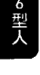

6型人必須好好看待他們主觀上的恐懼，就算某些恐懼只是假警報。因為 6 型人不確定哪些恐懼是基於想像、哪些又是基於事實，所以如果他們可以仔細地檢查這些恐懼，對自己會相當有幫助。當他們仔細、中立地檢查這些和恐懼相關的議題，許多腦海裡的疑慮就會煙消雲散。忠誠懷疑型的人需要幫助，好讓他們把注意力持續地放在積極的目標上，而不是放在懷疑上。要 6 型人繼續往前走，就像要 3 型人停下來一樣困難。忠誠懷疑型的人需要一步一步地朝著實際的目標前進，而不是用虛假的英雄氣概來掩飾恐懼。他們也要注意，不要用過去失敗的經驗來誤導自己。6 型人可以藉著以下的方式來幫助自己：

-   學著用實際的狀況來檢驗恐懼，檢查所有的事實，看看自己是不是把困難想像成比實際的狀況還嚴重。對一個你信任的朋友大聲說出自己的恐懼，讓他給你回饋，從對方中立的立場來檢查你的結論。
-   注意自己想要在別人的行為當中找到潛在意圖的習慣。當你覺得別人有敵意，先檢查看看自己是不是想要攻擊對方。
-   看看自己是怎樣用懷疑將別人的幫助拒於門外。認清自己在關係中搖擺不定的信任感：
    「我真的能夠信任別人嗎？」看看自己是不是在心裡質疑別人的能力或是弱點。
-   要求共事的人一起把職務界定清楚，問問其他人自己的位置在哪裡，並且就指導原則達成共識。
-   注意看看自己在什麼時候用思考取代了感覺和衝動。
-   看看和那些沒有能力、不值得信賴的人一起共事，會如何阻礙工作的進展。

第10章 6型人：忠誠懷疑型

注意事項

-   學著和自己的情感保持聯繫。不要從恐懼中退縮，然後把恐懼投射到別人身上，認為別人拋棄了自己。
-   不要為了想要保持緊張和警覺，就讓身體變得緊縮、或是刻意減少行動。注意看看自己的身體，是不是就像是要被攻擊一樣緊繃。
-   注意自己對於別人的示好或是稱讚總是感到有些懷疑，特別是當自己沒有防備的時候。
-   注意自己的直覺反應。看看自己在行動之前，是不是都必須先獲得權威人士的認可。
-   看看自己是不是比較容易想起糟糕的事情，而不是美好的經歷。提醒自己多回顧美麗的回憶。6型人總是走在負面回憶的軌道上。
-   利用自己豐富的想像力，想像並且表達事情正面的結果，把恐懼和正面的結果分離開來。
-   如果注意力還是集中在事情最糟糕的結果，那就用想像力儘量把負面結果誇張地放大，看看結果如何。
-   對於潛在的幫助來源感到懷疑，寧願獨自進行。
-   對成功感到恐懼，害怕自己比父母還要有成就。

當注意力從過去的心理慣性釋放出來，6型人要注意自己可能會產生下列反應：

-   當恐懼出現，在行為上就變得被動。覺得自己失去優勢。想要學習靜心，希望永遠都不要和別人競爭。
-   習慣在事情進展順利的時候，把注意力放到事情負面的細節。
-   想要勝過那些幫助自己的人。一下認為治療師很聰明，一下又認為他們不勝任。
-   喋喋不休，讓頭腦取代情感的工作。用講話和分析來取代出於直覺和情感的行動。
-   開始自我懷疑，很容易把懷疑投射到別人身上，認為其他人都在懷疑他們的能力。
-   妄想自大症（megalomania）。把改變這件事越搞越複雜。幻想自己可以達成令人刮目相看的成果，以至於無法按部就班地完成實際的目標。

第11章 7型人：享樂主義型

### 🌐 11
### 7型人：享樂主義型

| 後天養成的人格 | 本質 | 子類型的表現 | 自保：家庭守護者 |
| :--- | :--- | :--- | :--- |
| 頭腦——主要特徵：算計 心——強烈情感：暴食 | 頭腦——高等心智：工作 心——高等情感：清醒 | 性愛：易受暗示 社交：犧牲 | |

困境：自戀性格

5型人、6型人、7型人這三種人格類型聚集在九型人格圖的左側，代表著三種類型的人在兒時面對恐懼時不同的處理策略。6型人位於恐懼人格的核心，他們為恐懼過度準備，警戒地掃描環境。5型人則是從任何會讓他們害怕的事情當中撤退。至於7型人，他們看起來一點也不害怕，主動地走向人群，想要以自己的風趣來魅惑人群、讓人們解除武裝。面對令人恐懼的兒時生活，7型人的孩子遁入想像力無限的可能性之中，藉此分散他們的恐懼。

7型人不會對外傳播他們的恐懼，看起來也不害怕。他們看起來總是無憂無慮的，個性開朗，經常沉迷於做計畫和玩耍。只要他們可以想像自己有一天會成功，偏執的核心（6型人）就不會表現出來。

這是彼得潘，即永恆少年（和少女）的人格類型。這也是納西瑟斯（Narcissus），那個愛上池塘裡自己倒影的年輕人的類型。一位名為愛可（Echo）的精靈愛著納西瑟斯，但是因為他太沉迷於鏡中的自我光輝，所以沒有聽見精靈的呼喚。因為太過沉溺於自己，他失去了回應的能力，讓愛可的聲音成了一個回聲（echo）。

每個人都需要一點點健康的自戀，我們都必須認識自己的長處和價值。但是當我們太沉浸在我們的特質當中，以至於沒有辦法聽取別人對我們的客觀建議，這樣我們就有麻煩了。

享樂主義型的人相信自己的完美，並且尋找可以支持他們價值的環境和朋友。他們有著敏銳的品味，想要品嘗生命中一切美好的事物。7型人希望自己常保活力，他們想要冒險，對任何事情都有很高的期待。他們的身上有著「高峰經驗」（peak experience）的化學作用，仿佛在他們血管中流淌的不是血液，而是香檳。

7型人的世界觀在一九六〇年代反文化革命（countercultural revolution）的社會中特別顯著。在「花孩」（flower child）的世代，7型人的理想以一種純粹的型態不斷擴張。花孩們面臨著戰爭和沒有任何願景的工作，他們輟學、過著簡單的生活、回歸自我，創造出一種新社會的理想。

當革命繼續，7型人世界觀的陰暗面開始浮現。他們堅持一種理想化的現實，然而無法實現它，於是他們的態度從劇烈的主觀——尊重每個人獨特的個體性——變成極度的自戀。

情況惡化成一種浴缸哲學家的洞見（hot-tub insight）：「哦，哇！」或是：「我真高興可以做自己。」嗑藥帶來的內心世界讓他們失去改變外在世界的渴望。內心的喃喃自語和誘人的逃避方式，取代了腳踏實地的努力和工作。

7型人因為相信生活充滿無限的可能性，總是朝氣蓬勃，總是有那麼多好玩的事情可以做，如果生命沒有充滿冒險，人為什麼而活呢？為什麼要在可以前進的時候躊躇不前？因為他們喜歡同時保有好幾個開放選項、習慣承諾的時候帶著備案，這讓他們這種相信生活充滿機會的樂觀性格，不斷地獲得強化。

他們的承諾總是因為附帶許多備案而打了折扣，因為他們必須看看「到時候感覺對不對」。如果計畫A因故取消，他們就會開始備案的計畫B。如果計畫B感覺起來有點棘手，還有計畫C。如果計畫A無法繼續、計畫C又太無聊，總是還有計畫B可以先墊著，計畫B說不定還會生出計畫D。一九六〇年代的口號「順著流走」（go with the flow）變成一種調節注意力的方式，鼓勵人們遺忘負面的選項。

做為一種防衛性的策略，為將來作計畫，附帶許多應變選項，就是要藉著消除無聊和痛苦來增加生活的樂趣。舉例來說，7 型人可能在一家鞋店工作，並且在腦袋裡計畫，或許有一天可以在對街競爭的鞋店做同樣的工作。這樣的計畫對 7 型人來說相當自然，他們想到的這兩份工作有著類似的工作目標和性質，而不是這兩家鞋店有什麼競爭問題。

就好的一面來看，這種注意力模式可以引發某種具有創造力的問題解決方式，他們可以在看似對立的看法當中找到正確的關連。在所有的類型之中，7 型人是對這個世界最樂觀的，因為對他們來說，偉大的計畫總有一天會實現，到時候一切美好的可能性都會體現在最終極的、令人滿意的生活之中。

7 型人常見的心理慣性包括：

-   必須維持高度興奮的需求，參與各種活動，有太多好玩的事可以做。想要在情緒上保持亢奮。
-   同時對好幾個選項保持開放，藉此降低對某個特定活動的投入程度。
-   用愉快的理性選項，像是聊天、計畫、把事情合理化，來取代深層的接觸。
-   魅力是防禦的第一個手段。主動走向人群的恐懼類型，藉著不被注意到來避免直接的衝突，運用口才讓自己脫離麻煩。

注意力模式會導致：

-   在理智上逃避困難或是限制性的任務。
-   有能力在看似彼此對立或是毫無關連的觀點之中，發現不尋常的關連或是相似性。

3型人和7型人的相似點

7型人有很強的能量，如果興趣維持不墜，他們也會努力工作。他們和3型人在表面上很像，樂意去競爭、喜歡當贏家，當然也很在乎要讓別人看見自己的長處。對於旁觀者來說，這兩個類型可能看起來很像，但是就他們內心的世界觀來說，他們的運作相當不一樣。3型人想要可以駕馭別人的權力，因為他們以別人的尊敬和關注來衡量自己。他們會選擇一條自己可以在競爭的階梯上爬到頂端的職業道路，而能夠用來證明自己成功的，就是形象、安全感、頭銜和特權。7型人，坐在同樣的競爭席位上，他們在意的是「有趣的事；我做的許多好玩事其中一個」。他們也希望獲得別人的好評，不過並不是想要以這樣的權力來駕馭別人。他們不希望自己因為職業而被貼標籤：「叫我醫生太狹隘，我不只是那個職稱而已。」他們希望自己可以在各種有價值的活動當中保持卓越：「我跑步，我烹飪，我寫詩，我什麼都能做。」7型人比較沒有那麼想要爬到頂端，也沒有興趣和那些不認同他們的人對質，特別是因為時間那麼少，有趣的事情那麼多。他們想要知道自己有參加最棒的比賽的競賽資格，但是他們可能不願意為了要往上爬到最頂端而限制其他興趣：「我想知道自己的能力，但是我不用對別人證明自己。」他們很可能會一連工作好幾天來賺取用來旅遊的經費，而不是買一輛名車。證明自己的成就，就是要在這一生當中做許多美好的事，可以爬到最頂端，但是不能被一輩子的承諾給限制得動彈不得。

家庭背景：選擇性的美好記憶

工作狂的 3 型人和真正自戀的 7 型人之間的心理狀態，最大的差異在於，3 型人的價值仰賴於工作的成就。真正的自我可能不存在，但是一個人的資歷卻是相當實在的。3 型人會把注意力的焦點放在把事情做好，因為 3 型人的價值在他人的眼中就仰賴於出色地完成任務。他們通常都比自己希望的還要努力，因為他們的獎賞不在於自己覺得很好，而在於擁有支配別人尊敬的權力。

7 型人也會希望獲得其他人的好評，不過他們把其他人的關注看成個人內在價值的一面準確的鏡子。他們不需要太努力，因為「生活很棒，我很高興我就是我」。如果其他人不認同他們這種內在價值，7 型人會轉向自己尋找慰藉，為這樣的拒絕尋找合理化的藉口，認為這不是自己的錯。他們的自我有很多面向，有許多玩樂的可能性。心情不好可以藉著在鄉村健行、一本好書、燦爛的陽光或是一杯熱茶而緩解。就某個方面來說，和 3 型人比起來，自戀的人在面對別人的不尊重時比較沒有那麼痛苦，因為他們很享受自己的陪伴，而且相信未來一片光明。

7 型人對於童年時光有著美好的記憶。他們的故事就像是一本充滿快樂回憶的相簿：盪鞦韆上的男孩、穿著圍裙的女孩。

> 這些故事中沒有苦澀的成分：『我爸把我們從我爸那裡帶走，那時候我八歲。九歲的時候，我已經忘了她。』即便有這種在客觀上說不上快樂的事件，他們的言談之中很少帶著恨意或責備。在這樣包含著客觀負面回憶的情節當中，他們透露出一種感覺：「我決定不要以那種方式回應。」以及「我有自己的事情可以做，所以那件事沒有讓我很沮喪。」

我一直在想自己是7型人這件事，還有為什麼這個類型和我呼應。當我第一次參與7型人的討論會，聽見他們說自己的故事，對於他們所說的一切我都很有共鳴，除了內心的恐懼這件事——我並不覺得有這個問題。

但是後來我想起來，有一次我從一個新的學校要回家，結果迷了路。我知道我媽一定會因為我晚回家而大發雷霆，我不知道回去以後她會怎麼懲罰我，我真的很害怕。我在路上碰到一些踢足球的孩子，我就跟他們一起玩，一直玩到天黑。

晚餐時間我還沒回家，我媽就報警了，後來他們來接我回去。我記得自己坐警車回家，因為太害怕所以大便在褲子上。我看著後車窗上有燈光閃爍，我想起了剛剛的足球賽，我的腦子就回到那裡。

我知道不管她對我做什麼，我都可以停留在自己的腦袋中，在腦袋裡繼續踢剛剛那場足球賽，直到事情結束，我會沒事的。

7型人的注意力是朝著美好的記憶傾斜。說自己學空手道來拯救自己的男孩，把談話的焦點放在他拿綬帶最好的成績，十五歲就逃家的女孩不太說自己逃家的原因，而是描述逃家的路上多麼令人興奮。我們可以看到，7型人的注意力偏斜和6型人的注意力偏斜剛好相反：忠誠懷疑型的人通常會記得最糟糕的事情，但是享樂主義型的人則是會記住最棒的事情，讓自己朝向快樂並遠離痛苦。

對7型人來說，童年還是有很多美好而且就客觀而言是真實的回憶。他們通常愛母親比愛父親多，不過他們對於男性權威的偏執性反叛，通常也帶著一點浪漫的反權威調性。我愛我的父母，我們過著一種典型的鄉村生活。沒有人傷害我，我有許多來自他們的愛和支持，唯一可以抱怨的，就是我得騎腳踏車騎上五公里路才能找朋友一起玩。當我自己獨自一人的時候，我經常講故事給自己聽，而且我不喜歡別人告訴我我應該要怎麼做。六年級的時候，我就知道自己在思考上已經勝過我父親。我愛他，但是我知道我的思路比他更敏捷。我有辦法讓他同意任何我想要的事情，我會先把一些他可能會反對的選項刪掉，接著逼著他同意某個他同意但是充滿了許多破綻的版本。

行程表和計畫

每一天都充滿了各種可能性。他們腦海裡有張清單，列滿了可以做的好玩事情。7型人是抗憂鬱的人，對他們來說工作是一種想像和心智的遊戲。工作中有許多點綴，比如說你可以因為某個女孩子頭髮在陽光之下舞動而感到心怡，或是因為牆壁上的陰影而目眩神迷。重點在於保持心情昂揚，一直工作，直到你開始覺得有點累，這時候再接著去做某些其他事情，直到無聊降臨。7型人可以不眠不休地工作，他們習慣一次處理三件或四件案子。但是這些案子很少會被一心一意地推進，7型人會看哪件事情現在看起來比較有趣，在不同的任務之間不斷轉換。

我真的很期待禮拜天報紙的粉紅色專欄，其中列滿了接下來一整個禮拜可以做的事。整個禮拜的活動都列出來了：四星評價的電影、十星評價的餐點。這就像我的餅乾盒一樣重要，你就是想要知道哪裡有好玩的事情可以做。我的餅乾盒就藏在辦公桌最下面的抽屜，報紙的粉紅色專欄也放在同一個地方。

一九六〇年代的「順著流走」（go with the flow）口號，描繪了7型人行程表和計畫背後的意圖，他們從來沒有憂鬱或是緊張的理由；唯一要做的，就是搭上那股讓人充滿活力的能量流，做些值得做的事情。

重點就在於讓各個選項保持開放。你可以去打排球，可以好好打扮去看場電影，你可以騎車到鄉下在那裡待上一天。最棒的就是，這些事情都在同一個時段，你就能夠選擇對你最有吸引力的那個，在那裡待著，直到下一件事情開始呼喚你。我曾經去電影院，買了票，連爆米花都買好了，然後決定離開去做別的事情，因為我突然感受到某種無聊的刺痛，待在那裡的感覺不太好。

他們有一種充滿活力的信念，認為只要有很多選擇，生命是沒有極限的。他們不想錯過任何事情，所以任何選項在頭腦裡都有一定的價值，雖然這些選項根本沒辦法塞進一天的行程表中。隨口說說的承諾很容易，但是永久的承諾很困難，因為永久這樣的概念抹滅了無限未來的感受。7型人對於各種經驗異常著迷，每一件最棒的事情都想要試試看，而不是全然投入到某個個別的活動或觀點。

選擇性思考

我有個不可思議的內在行程表，其中包含了各種時間規劃：給工作的時間，給家人的時間，給興趣的時間——音樂、慢跑、開船沿岸航行。不管我是不是正在做這些事，它們都在我的腦袋裡，我全部都想做。如果突然有個和朋友一起練團玩樂器的機會，我就會重新調整腦袋裡的走向和規劃，調整待會兒要吃的東西，這樣如果我待會兒還想跑步，肚子就不會太飽。這些都以一種飛快的速度重新規劃，這樣每個部分都會被照顧到。

如果要做的事情因故取消，我就會開始跑第二套行程，看看要不要去試試看哪個新餐廳、問哪個家人有空可以一起去，或是要怎麼在和朋友玩樂團和吃飯的中間，擠出一個時段來工作。

各種選項放在一起，意謂著7型人永遠無法真的定下來。他們的腦袋裡總是有好幾條軌道在跑，因為對他們來說這些都是相關的，雖然乍看之下有點奇怪，但是這些非常不同的活動可以表現得很類似。

就實際的層面來看，我總是有許多選擇，雖然這些選擇看起來有點任性。你必須尊重協議，準時到場，雖然你可能會改變心意，突然不想過去。情緒的狀態有些棘手，我已經和一個男人結婚好幾年，他看起來總是相當創新，讓我隨時都得保持警戒。

即便如此，在剛開始的時候，當我試著做出承諾時，我得把自己的問題拆開，分配給三個或四個不同的心理醫師。這些問題看起來都和我有關，因為它們是我的問題，但是我想要獲得各種不一樣的建議。接著我發現自己認真地在考慮和另外一個男人在一起，用來解決某個我在和我未婚夫交往時出現的模式。不知為何，我不覺得這偏離了我們一對一的共識，畢竟，我這麼做是為了解決我們問題裡的關係，而且我是嚴肅以對。從旁觀者的觀點來看，這個7型人似乎是把自己分散給太多心理醫師還有太多選擇的方向。但是從7型人的觀點來看，每個洞見和每個方法都有它們的內在關聯。最後，她終於可以全然地和某一位心理醫師獲得共識，與此同時，依照另外一位心理醫師的建議來行動。不用說，這種注意力習慣就像是同時朝著好幾個方向開一輛車。你可以告訴我你正在學什麼新東西，比如說，禪宗。所以，當你開始進入這套哲學的一些細節，你說的某些東西就提醒了我另外一些你不知道的系統中類似的概念。我對於禪宗的興趣就會是，這麼說吧，它如何和馬拉松、九型人格或是高爾夫球可以連結起來。你說的和禪宗有關的事情，點亮了我另外其他六個或七個興趣，所以，當然我同意你說的，但是我沒有辦法把注意力單單放在它上面。我感興趣的是，你對於禪宗的敘述當中，和其他我感興趣的事情吻合的點，而且我會把你說的禪宗納入我自己的綜合系統中。這樣我就能夠同意你，同時讓我的其他選項保持開放。

## 魅力和吹牛

雖然和5型人與6型人一樣擁有偏執核心，7型人看起來一點都不害怕。他們相當合群而且很愛說話，他們喜歡參與、喜歡玩樂，喜歡談話和推理，以言語代替行動；事實上，7型人承認，與其被單調沉悶的苦差事綁住，寧願做一些腦力激盪的事。5型人和6型人都有輸出產能和完成工作的問題，這兩種類型的人都害怕自己的工作被批評，7型人在行動上也有同樣的困擾，但是他們用一種談話風趣、令人愉快的風格，把害怕被看見的恐懼給藏了起來。

他們害怕在單一件事情上涉入太深，於是用對各種事物廣泛的興趣來掩蓋這個事實。享受對他們的吸引力可以被視為一種正面的流動，事實上，這是一種對於痛苦的逃避。7型人沒有辦法把自己局限在單一的計畫或是追求，因為當他們的注意力窄化，客觀的能力問題就浮現了。在仔細的檢視下，任何關於天賦的膨脹想法都會消失無蹤。因此自戀的7型人會藉著強調自己的潛能，說得跟真的一樣，來逃避自我發現。

即便只是數學愛好者也可以變成數學家，他們藉著充分優雅的自我表現以及唬爛，連學位都不需要，就可以成為有特殊洞見的數學大師。

7型人也被視為愛情騙子，因為他們非常迷人，而且希望被人崇拜。他們會讓別人對他們充滿渴望，這些人可能沒有能力抵抗鮮花、魅力還有一「共度最美好的時光」。7型人希望被有趣的人仰慕，但是很容易會因為事情重複而覺得無聊，特別是當他們頭腦冷靜下來的時候。 當昨夜的插曲被遺忘， 這位才認識的新朋友打電話來， 7型人早已經想不起來對方的名字， 這都可以顯示出他們的自我中心。

很難找到不讓我覺得無聊的人。 我會用一些小伎倆來吸引像我一樣的人， 我愛我的生活， 我愛我做的事， 我只想要找個人一起出來玩。 於是我找到她， 但是讓我苦惱的是， 我想她也是7型人。 她很會打網球、 床上功夫一流、 她的心思放在各種事情上， 就是沒有放在我身上。

我沒有辦法忍受她是那麼成功， 在各個方面都是， 於是我向她求婚， 因為我們兩個都想要一個家庭。 現在我們有了孩子， 生活也過得很好， 她就像是一面活動的心理學之鏡， 讓我知道我可以多麼地以自我為中心。

## 優越及自卑

追求高度刺激可以幫助7型人逃避現實， 不過也可以激發他們理智上的好奇心， 讓他們進行創意性的研究。 一個病態的自戀狂認為自己在理智上高人一等， 因此覺得理應擁有別人的認可或是支持。 當7型人開始產生這種神經質的信念， 認為自己擁有某些特殊資格的時侯， 我們會看見他們急著奔赴享樂， 不過事實上他們是在逃離痛苦。

自戀狂的痛苦在於他們可能會被揭露， 發現自己並沒有自己相信的那麼好。 他們心裡總是帶著這個問題：我的定位究竟在哪？ 我比朋友好， 還是比朋友差？ 在這點上誰比較優秀？

是我還是我朋友？就病理學而言，答案總是我比較優秀。對於那些進行自我工作的 7 型人來說，比較而來的價值這個問題仍然在他們的內心作用，但是可以用來做為一種提醒，讓自己去注意自己客觀的能力。

我會發現自己開始自戀，是因為發現這樣一條線索：我開始在心裡瞧不起某個朋友。我的自戀表現的形式相當狡猾：我會原諒他們的愚笨，或是暗自責備他們的錯誤。當這樣的想一成形，我就會覺得自己正在和一個笨蛋相處，我會有衝動想要離開那裡。他們要說的話實在是太無聊了，我完全可以知道他們接下來要做什麼，這讓我想要大叫。接著我就會想，我的心眼真小，真是沒有氣量。或是我會從一個對立的觀點，用兩個或三個論點來幫他們的缺點找台階下。

當他們顯得特別愚蠢或是看起來沒救了的時候，我就會知道自己得再重新觀察一下。一個好朋友怎麼可能突然看起來那麼爛？我怎麼可以如此輕視一個昨天看起來還那麼聰明的人？我想到的是，如果我的看法不完全正確，那麼我就是錯了；接著我離開的時候，我會覺得他們真的很棒，而我在自己的眼中則是一文不值。

自我價值可能會因為慣性地沉溺在「最棒的事情」而膨脹，這是 7 型人陷入麻煩的一個診斷指標，說明他們的腦袋開始在賽跑。當 7 型人用活動把行程塞得滿滿的，讓「快樂生活的成分」之間一點空隙都沒有。當注意力強迫性地掠過各種有趣的選擇，7 型人只好忙個不停。

## 權威關係：追求平起平坐

呢？我頂多只能想到典型的文藝復興藝術家，他們在每個方面來說都是完美的，我嘗試的每件事都對我指出了其他更大的可能性、一個還沒有被嘗試過的方法、一個更聰明的點子。

我讓自己從宗教教學一路走到中東研究，做為我的主修科目，最後畢業的時候，我完成的學分比學程要求我的還要多出五十幾個。我的博士論文橫跨三個領域，如果我的指導老師沒有要求我把題目縮小一點的話，它還會無限地延伸下去。

到了必須交初稿的時候，我幾乎要退學了。打下來的草稿和我認為應該要有的樣子比起來，實在是差太多了。我一點也不在乎自己拿到榮譽成績：大家都知道我得拜託口試委員才能過關，我的論文無法撼動學術世界，我是一個黑箱博士，而不是我自己認為的天才。

7型人想要與權威平起平坐，他們喜歡沒有人在他們之上、也沒人在他們之下的安排。因為從一開始，權威也是人，7型人的內心覺得自己比權威還要優越，而且通常權威也會受到他們口才的吸引。然而，就實際而言，享樂主義型的人是恐懼類型的人，他們會藉著愉快的交流來解除權威人士對他們的控制。

如果他們自由受到限制，就會變成激烈的反權威人士。不過對於那些小官僚，7型人會自動忽視他們的權力，他們相信自己可以憑著三寸不爛之舌讓阻礙他們的人讓開。

就權威關係互動較高的層面來說，7型人相當擅長提升團隊的士氣。他們擁有令人愉快的天性，對於每件事情都略有所知，所以可以假裝他們知道的事情很多，而且講得頭頭是道。他們可以停留在正面的選擇之中，不會有所懷疑，特別是當一個案子還在發想的階段，或是要開始進行的時期。他們可以讓一個案子的目標和其他的理論定位協調一致，與其他人進行團隊合作，並且推銷他們的想法。他們在計劃的創始階段最有效率，而且在案子遭遇困難的時候依然能夠保持信心。

就權威關係較低的層面來看，7型人會在創意發想、計劃的階段過後，就失去熱忱。當他們失去興趣，在計劃的中間或是結尾的時候，當各種選項不再開放，就會讓7型人陷入困難。一旦某個想法固定下來成了模式，7型人在面對例行公事和受限的可能性時，會變得相當不開心。如果重新分配任務，要他們去研究新的點子、幫整個案子找到大一點的願景、進行群組交流，或是重新將他們聘為兼職的計劃顧問，他們就會變得比較有生產力。

7型人可能會對於一些有趣但實行上有困難的想法相當堅持，他們會用想法和理論代替實際上的苦差事，而且傾向於看不起那些「比較沒有遠見的人」。

## 典型的權威關係範例：7型人和3型人，享樂主義型和表現型

這兩種人格類型都會以高度的能量來工作，3型人會將公司的成功當成是自己的成功，7型人則是受到興趣和可以探索新領域的機會所驅使。如果3型人願意擔任拋頭露面的領導者，而7型人可以擔任顧問和合夥人，不用承擔令人矚目的責任、處理別人對這個案子的期待，或是困在重複性的工作之中，這兩者的結合會形成一個卓越的工作團隊。不管工作有沒有趣，3型人都會全力以赴，7型人也會努力工作，不過前提是這份工作要可以為他帶來樂趣。這兩個類型的人都相當有社交技巧，都能夠在公開場合展現自己的案子；他們都確定自己的立場是對的，想要把其他人拉進他們的觀點。如果3型人是老闆，他可能會假設員工也會認同這份工作的成功，並且期待他們能夠有極大量的工作輸出。7型人員工會迴避老闆對員工顯而易見的抱怨態度，只要事情沒有出差錯。只要案子持續有進展，對於3型人或7型人來說，品質管控都不是問題，除非有人抱怨，使得這個問題浮上檯面。

如果7型人是員工，他會很樂意承擔公關工作以及全然投入的老闆想要別人的認同，以及銀行裡的錢，不過7型人覺得這些目標會限制自己，於是開始破壞老闆的規則，藉此維持自己對工作的興趣。當3型人想要機器般的生產力，7型人就會想要別人的認同。7型人最有用的時候就是工作的開展階段，他們可以將自己的能力用在創意性的計劃、創新，並且聯合其他工作夥伴一起為這個案子付出。只要7型人遵守工作原則，而且他的創新不是太放肆，3型人老闆會很樂意把這個員工留在團隊裡。

如果7型人是老闆，他不會想要監督員工，特別是下達直接的命令、並且強迫員工執行這些命令。於是，指導原則可能變得大一般、太理性，因為7型人想讓每個員工覺得平起平坐，藉此消除可能的衝突。如果 3 型員工夠明智，他就會將老闆給的一般性指導原則釐固起來，變成一套可行的程序，並且會在壞消息傳到老闆的耳朵之前先行處理一下。如果 3 型人可以讓 7 型人的想法付諸實現，特別是如果這個老闆可以給員工額外的薪水和賞識，那麼這個工作團隊就會欣欣向榮。 3 型人願意承擔額外的責任，只要他們的努力獲得尊重，而且這麼做可以明確地保證自己會獲得晉升的機會。

如果 7 型人老闆提出了非常吸引人但是又矛盾的選擇，因此領導的方向變得模糊， 3 型人員工可能會一馬當先去向老闆表達不滿，並且會利用各種工作機制讓老闆與他們達成共識。如果失敗了， 3 型人員工就會想要換個職權比較清楚又比較有前景的工作。

7 型人就像任何真正的偏執狂患者一樣反對權威，但是他們不是捲入直接的衝突，而是甜美地試著化解權威對他們的掌控。「你做你的事，我做我的事。」真的意味著 7 型人是自由工作者，只為自己負責。這同時也意味著：「不要在我背後指指點點；不要跟我說要怎麼做。」

> 「真的意味著 7 型人是自由工作者，只為自己負責。」

關於主體性的理想， 7 型人有一種奇怪的矛盾：他們一方面認為每個個體都是獨一無二的，都必須受到尊重，但是實際上覺得自己比其他人優越。 7 型人或許會認為，雖然每個人都有獨特的才能，但是大多數人都被限制在單一的才能之中，然而 7 型人相信自己擁有各種才能。

> 「不要在我背後指指點點；不要跟我說要怎麼做。」

才能。他們看見數學和音樂之間的關聯性，所以他們不需要在任何一個下苦工就能同時達成這兩者。理想化的自我形象讓他們認為，只要一點工作，加上他們的天賦異稟，他們可以在幾個月之內就成為音樂和數學的大師。7型人慣性的正面想像，以幻想和概念填補了真實訊息的空缺。這些美化的想法形成了理想化的自我，從而取代了對於真正的內涵與深度的要求。7型人的樂趣，很大一部分來自於對於事情的計畫以及期望。他們在腦海裡細細品嘗未來事件，把它們當成甜美的意象，最後這些意象變得具體而可信，就像桌椅一樣。舉例來說，一頓大餐最棒的部分就是在食物送上來之前，因為他們可以在腦海裡品嘗各種美味的組合。同樣地，如果享樂主義型的人正在享用美味的一餐，用餐的經驗也會被無限地擴大，藉著在想像中加入其他享樂最棒的部分。一次魔幻的日出可能會被簡短地重新創造出來，像是和特別的朋友一起看日出的感覺。過去和未來的選擇，最棒的面向可以和一頓飯真實的滋味一起品嚐。7型人可能為自己的想像而陶醉，因為在想像之中，每個選項中最棒的一面，都能夠以一種可信的方式被拼湊在一起。計畫不一定是一種逃避。7型人說他們從理智和創意的追求獲得極大的快樂，他們天生敏銳的注意力，讓他們可以為一般的問題想出高明的解決之道，也能讓他們旅行到——對於擁有一般注意力的人而言，看起來相當令人驚奇的想像領域。以下的陳述來自一個7型人，他是職業的未來主義者。他將自己的腦袋形容成自己最好的朋友，腦袋裡的想法就是每天的朋友。他的工作包括分析歷史潮流，然後預測這些潮流中最好的部分可以如何被重新帶入生活。

我最棒的戀人就是我的想法。認識它們為我帶來極大的喜悅，就像是把生命灌注到沒有呼吸的軀殼裡面。就像是和女人談戀愛一樣。每個想法都很可愛，我以自己的方法來珍視它。

我也愛飛機和其他競賽的機器，他們把我帶到一個地方，在那裡現實消逝了，我獨自一人，有無數的方向以及我可能會需要的一切。

## 親密關係：美好的分享

7型人進入關係的方式，是分享彼此身上美好的地方，同時帶著對於承諾的特別覺知。

當所有的選項保持開放，是他們最快樂的時候。「談戀愛會有什麼問題？」和彼此分享最棒的東西會有什麼問題？」他們有很明確的喜好，對於最棒的冒險都要嘗試一點，而不是完全投入其中某一個。投入一段冒險，不管多麼吸引人，都會帶來無聊和厭膩的感覺，而且會限制下一段可能的浪漫愛情。

他們的關係是透過雙方一起從事某些行為，談論什麼有趣、什麼最棒。這種交往風格富於冒險性，而且可以讓他們避談生命中比較不愉快的事情。

如果出現問題，這個問題會夾在其他迫近的活動之中，讓他們沒時間可以好好討論問題。「重要的事」會被安排得很近，讓7型人只有「十分鐘可以討論一下分手的事，接著我就要去趕飛機」。面對面的衝突和互相指責對於自戀狂來說非常難受，因為這暗示了他們的失敗。他們希望可以把嚴肅的討論都排進程表中，這樣就可以臨時取消換別的計畫。

## 親密關係範例：7型人和6型人，享樂主義型和忠誠懷疑型

就某個方面來說，7型人並沒有活在真實生活的關係裡，因為他們的頭腦太容易充滿了關係中所帶出的聯想和想像的念頭。從另一方面來說，他們擁有美好的才能，可以提振一段下滑的關係，讓它朝著更光明的方向前進。7型人總能夠輕易地以快樂的選項來取代負面情緒，這麼做的副作用，就是讓他們在面對情緒上比較依賴或是需求比較高的伴侶時，會陷入困難。他們的伴侶可能無法將注意力從痛苦的模式轉移開來，或是放下情緒上的委屈，對樂觀的7型人來說是種嚴重的限制。他們經常說，自己會藉著一些必須離家做的待辦事項來躲開伴侶的低潮。

雖然對他們來說，做最後的承諾很困難，如果他們和對方分手，還是會懷念彼此美好的關係。他們對愛情最美的想像，就是伴侶可以加入7型人本來就喜歡的活動中。伴侶像是一面鏡子，可以反映出生活的美好，沒有被人強加的界限或是限制。如果對方無法完全反映出這種狀況，次好的選擇就是建立一段讓7型人可以保持興趣的友誼，但是不要太多，多到讓7型人感到無聊或是覺得必須留下來。

就親密關係較高的層次來看，7型人致力於透過活動、心智的追求、性愛和玩樂，讓感覺保持鮮活。他們可以為關係帶進新的興趣，埋葬過去的委屈，並且重新開始。

就親密關係較低的層面來看，如果伴侶在情緒上變得要求太高或是憂鬱，他們就會想要離開。他們離開的方式很有可能是藉著理性地討論原本的承諾，因為情況有變，所以原本的計畫也必須要有所改變。

這兩種類型的人都有潛伏的偏執狂。6型人的恐懼是公開的，7型人則是藉著採取各種備胎的行動來逃避恐懼。7型人可以對6型人帶來很大的幫助，如果他可以正視伴侶的恐懼，並且帶他們出門參加活動。一旦開始行動，6型人的恐懼就會消散，7型人可以推6型人一把，讓他們整裝待發。6型人可以為這段關係提供一種無意識的服務，藉著表現出許多7型人潛伏的偏執，讓7型人有機會提供幫助，同時也藉著把這些恐懼歸給伴侶，讓他們和恐懼的感覺保持距離。

6型人覺得被責任和辛苦的工作困在生活裡，而7型人的立場卻是生活充滿了無限的機會。如果他們各自都能夠讓自己融入對方的生活觀，6型人就可以學著繞過令人癱瘓的恐懼、進入行動，7型人則是可以學著一次把焦點放在一件事情，而不用因此變得害怕。

這兩個類型的人都傾向於活在未來，6型人這麼做是為了要避開對於關係潛在的威脅，7型人則是為了要進行一些特別的計畫，可以和伴侶一起體驗。在這裡也是一樣，這對伴侶可以透過採用對方的生活觀來互相支持。7型人可以朝著有趣的地方前進，6型人則是可以透過對於障礙做出現實的評估來讓計畫變得穩定可行。這兩種類型的人都願意為了將來的目標而努力工作。7型人的熱忱可以跨越6型人懷疑的傾向，讓未來願景保持鮮活；而6型人可以在堅定的日常勞動當中感覺到深刻的美麗，這種能力可以讓這對伴侶長長久久地走下去，讓計畫實現。

如果他們的交往出現問題，通常都是來自於對於一對一關係和承諾的不同需求所致。6型人想要在做出承諾之前，先確定對方的承諾；7型人則是需要自己的空間。6型人比較無法抗拒嫉妒的感受，而且在面對7型人經常表現得模稜兩可的承諾，很可能會把自己對結果最壞的設想投射於其上。6型人可能會認為，7型人對於生活的多重選項是一種自我沉溺或是不忠實的行為，而且面對7型人輕率的言行和耗時的外在興趣，會覺得受到威脅。如果6型人對這段關係的未來感到憂鬱或是十分沉重，很有可能會發展出一種使自身長久存在的循環，6型人對於將來可能會被拋棄的心理慣性，製造出一種抑鬱的氛圍，讓7型人想要離開。6型人可能變得生氣，因為「當你出去玩的時候，所有的事情都是我做的」，然而7型人的反應則是「沒有人叫你去做任何事」。

如果7型人願意協調，並且同意對關係做出明確的承諾，讓6型人知道自己的位置，那麽就可以避免這種嚴重的對立。

在意清楚的承諾之下，6型人許多不必要的恐懼就會消失無蹤，這也能讓他們不需要去想7型人在閒暇的時候究竟跟誰在一起。如果7型人認可把速度放慢的價值，還有把注意力放在只有透過持續以及反省才能獲得的關係品質，他們就能從6型人對承諾的忠誠學習到很多東西。如果6型人可以試著記得這段關係的美好之處，而7型人則是要花足夠的時間注意同一段關係的負面議題，試著解決他們，對於這段關係會有很大的幫助。

## 注意力模式：開枝散葉

- 7型人

從旁觀者的觀點來看，7型人看起來就像是擁有許多不同興趣的業餘人士：同時間有好多個計畫在進行，在地上擺了三本或是四本看了一半的書。他們的注意力流向經驗，以及更多的經驗，急急忙忙地想要前進到下一個誘人的計畫。

從7型人的觀點來看，他們所有的興趣都互有關連。所有的興趣都帶著他們往某個方向前進，在將來的某個時刻就會被拼湊在一起。可以發現完美的匹配是多麼美好的事！就逃避者的感受而言，他們的注意力會在甜蜜的回憶、迷人的想法以及有趣的未來計劃之間游移。下面的陳述來自一個年輕的7型人，他沒有辦法把自己跨領域的工作坊資料歸類在加州的成長中心現有的分類項目之下。我領導意識成長工作坊以及人類發展團體。我知道至少有十個系統是我可以利用的；我採用了一種兼容並蓄的方法。我喜歡不預設立場，不做準備，直接和前來的人一起工作。我們的課程大綱可以涵蓋人們帶來的任何需求，我的簡介寫道：「我們會靜心、練武術、學習神經語言學（Neuro Linguistics）以及靈氣呼吸法（Reichi an breathing）。」我總是要來參加的人帶著一個夢來工作。這個工作坊的領導人沒有發展出認真對待單一問題領域的能力，他想做的是藉著轉換系統或是改變計畫的範疇，來解釋問題而不是解決問題。如果他能讓自己投入真正的問題，而不是不成熟地丟進某個新的技巧，那麼他的注意力模式之中較有建設性的一面就能發揮作用。如果他可以面對真正的困難，陪伴他的病人度過真正的痛苦，可以承擔這麼做的後果，那麼他這輩子的習慣，將新的資訊納入各種系統，可能為他帶來一些洞見，並且幫助他的學生成長。下一個陳述來自一個7型人，他把自己的注意力模式組織起來，變成一種有用的解決問題的方法。他的方法和那位年輕的工作坊帶領者不同，因為他可以將他所有的方法集中成一個單一一個問題，而不是藉著不斷轉換方法來讓一個問題變得分散。

> 「我們會靜心、練武術、學習神經語言學（Neuro Linguistics）以及靈氣呼吸法（Reichi an breathing）。」

我的工作是組織發展顧問，我們的客戶是一些處於危機或是快要倒閉的企業。我們提供建議的企業通常都是層級很多的公司，在各個部門之間有著嚴重的分歧。每個部門想做的事，可能都要讓其他部分付出代價。我會拿到一些完全互相矛盾的報告，我處理這些東西，就像是手上的一副牌。

我會在腦袋裡把這些部門一字排開，直到我發現一些症結點。如果我持續地、透徹地翻看這些不同的系統，我就會發現一些他們都同意的點。我視我的工作為一種腦力激盪，把這些共識納入掌控之下，所以這些不同的部門就可以為了生存而一起合作。

這種洗牌通常會造成麻煩，因為你可能必須更動某些程序和職權階級。在這些會議上，我必須告訴人們和這些改變有關的事，為我帶來了許多悲傷。不過，就是因為我這種玩牌的技術，才能完成這樣的工作。

## 直覺風格：如說故事的技巧

7型人的習慣，把新的訊息納入各種相互依賴的背景，和說故事有很大的相似性，都是一種發現直覺的方法。

在說故事的技巧當中，首先你會把一個棘手的問題保留在注意力中，接著開始講故事，內容和你試著著手的問題毫不相關。到了故事線的一半，你開始從注意力當中把這個問題拉出來，編入故事的行動中。根據需要，你介紹有用的角色，透過不同的場景和不同的角色，你推動這個問題，並且對於要怎麼處理這個情況有了自己的洞見。

## 高等心智：工作

我在一個矩陣管理的工作（matrix career）做了好幾年，它有一部分涉入科學，一部分涉入哲學，還有一些部分涉入數據和歷史。把我在某個地方讀到的資料拿去和別的工作領域對照一下，是這個工作的常態。我沒有辦法依靠邏輯來處理資料，像是把一些我所知道的某個領域的機制、應用在另一個領域上。這比較像是，如果我遇上瓶頸，我就想要咖啡和熱可頌。我必須把心思轉移到別的地方去，像是慢跑或是和朋友聊天。大多數的時候，休息就只是放鬆而已，之後回到工作我就會比較有效率。不過有時候，和我的問題完全不相關的次要活動，反而會為我帶來問題的解答。其中一個非常了不起的靈感，是我聽到我的太太向我們的小兒子解釋縫紉機的原理時出現的。她語調裡有些東西抓住了我，而當她在解釋縫衣針怎麼勾起縫衣線的時候，我突然領悟，我正在寫的那篇文章中，我忽略了其中潛伏的某種歷史張力，就像是看不見的捲線軸造成了縫衣線的張力一樣。

7型人認為你同意這個承諾的基本前提，而不是只同意其中一些比較令人愉快的點。第二種逃避比較微妙，7型人忽略了一個事實，當你做了一個承諾，就意味著其他相關人士認為你同意這個承諾的基本前提，而不是只同意其中一些比較令人愉快的點。怎麼做呢？和計畫有關的逃避有雙重面向。其一，如果做計畫的過程充滿想像力而且有趣，那麼它就成了一個比實際進入辛苦的工作還要偏好的活動。為何不住在夢想之中，讓其他人接著去做呢？

## 第 11 章 7 型人：享樂主義型

舉例來說，如果你同意一夫一妻制——假設一夫一妻制的前提是兩個相愛的人在一起，同時你和另一個人陷入愛河，而且想要同居，但是並不能因為你兩個都愛，就說你自己仍然遵循著一對一的關係。

當然，大部分的7型人都了解這種爭辯，但是他們還是會想要縮小破壞的承諾這樣的事，並且強調：『但是愛有什麼錯？愛是平等的；難道不是所有的愛都一樣嗎？』這種說法的效果，就是將那些比較負責任的人當成是比較頭腦簡單的人，因為他們無法順著流走。

工作意謂著完全承諾投入某個單一的行動，而不是因為不想錯過任何有趣的事情，而周旋在許多行動之中。工作的確包含了一定程度的自願受限。你必須限制自己其他的選項，讓自己投入單一的計畫。當這個計畫受到挫折，你也不能去改變它，或是如果你受到批評，或是如果你對於你的想法沒有那麼熱情，你也不能就這樣辭職不幹。

從注意力練習的觀點來看，工作意謂著承諾把自己的注意力穩定在當下的這個片刻，並且接受一切發生的事，不管那是令人欣喜或難過，不管那讓你覺得很好或是很糟。當你工作時，你一次只把焦點放在一件事，直到這個工作完成為止。

對於有著自戀特質的靜心者來說，把注意力專一地維系在一個內在冥想之物是相當無聊的事情。他們的注意力受到迷人的念頭和夢想所吸引，而且他們的頭腦很難慢下來集中在某個點上。

讓靜心更困難的是，浮現的東西透露了——我們的進化程度不如我們的自我讓我們相信的那樣。對於有著自戀傾向的靜心者來說，他們可能真的相信自己已經超越了任何個人的缺點，因此他們會需要很大的堅忍和勇氣，才能注意到自己有些地方真的不是很好。

我之前是個住院實習醫師，後來我在醫學上遇到了瓶頸，發現無法繼續走下去。在過去，我無意識地被醫學可以戰勝死亡這樣的信念所推動，不知為何，我總是可以做些什麼事情。後來輪到我去腫瘤科，每天都得告知重症病人的家屬，告訴他們我無能為力。

一開始，我的理智根本無法接受這個事實。我總是可以想想辦法來幫助我的病人，像是一些不同的治療策略、某種多元治療方案。最後我必須接受和死亡有關的事實，並且領悟到我太輕忽事實了。我不相信自己會死，所以我以一種非常認真的方法進入癌症研究。

我真的仔細地去探索，它也變得對我來說充滿吸引力。我獲得了一次我會稱之為靈性經驗的體驗，和顯微鏡有關。我一邊透過顯微鏡往下看，一邊試圖讓腦袋保持專注。我把注意力放在癌細胞的玻片，讓呼吸變得低沉，我的腦子想到的是一本我喜歡的書，還有晚一點和女伴有個約會。感覺就像是處在生與死的邊緣，在載玻片上頭的細胞有著死亡，而生活也在召喚著我。

這時候事情發生了，這些細胞開始打開。它們被染色放在玻片上，卻開始脈動，就像小小的太陽。我能做的就是看著它們脈動、打開，知道它們活生生的。當我回過神來，我相信自己進入了某種轉化狀態；藉著讓我自己保持穩定，我瞥見了某些介於生命和死亡之間的實相。這個經驗沒有改變癌症是可怕殺手的這個事實，但是它讓我對於自己的必死和局限更加敞開。

# 第11章 7型人：享樂主義型

### 暴食習性

7型人的暴食是由一種身體對於刺激和經驗的飢渴來定義。7型人說他們對自己的腎上腺素成癮，他們喜歡身體能量的湧現、冒險的刺激、心智的刺激。他們通常也會受到可以讓他們興奮的迷幻藥和其他成癮物質的吸引。

暴食是身體對於刺激和經驗的飢渴，而不是對於滿桌食物的食慾。事實上，他們會在自己感到飽足之前，就離開某個經驗，這是為了讓自己的興趣保持鮮活。7型人對於經驗有著美食家的味覺，最棒的食物每一道都淺嚐輒止，而不是過度地享用單一的一道菜、一種經驗。

在靈性的修持中，頭腦的暴食被比喻為「猴子腦」(monkey mind)，這個教導使用了猴子敏捷地在森林裡的樹木跳來跳去的意象。

猴子腦的問題在於，注意力的焦點一直在聯想、幻想和頭腦的計畫之間劇烈變換，這樣的敏捷，讓靜心者沒有辦法深入內省的狀態。靜心者的任務是，當注意力慣性地去歡迎幻想和計畫的誘惑時，讓注意力好好地安住於冥想之中的某一點。

猴子腦顯現在身體上，就是7型人什麼經驗都想要的慾望。他們說，當自己游移在各種幻想的活動之中的時候，是最能感到自己活著的時候，而且只要他們對事情的興趣還在，身體就會充滿了無限的活力。他們的秘密在於，當自己感到有點累、或是開始覺得無聊的時候，就離開一個活動。他們也說，寧願不睡覺，也不能不去做一件有趣的事情。

## 高等情感：清醒

清醒僅僅意味著可以持續某個行動，而不需要分散注意力或是刺激的次要計畫。7型人說他們害怕慢下來，並且投入某個單一的行動之中，因為承諾通常附帶的就是無聊和痛苦。

就頭腦的層次來說，7型人的注意力會朝著積極的想像傾斜，這和6型人想像最壞的情況預作準備的習慣正好相反。

享樂主義型的人沉醉於自己想像的力量，當他們可以完全沉浸在自己的欲望之中，盡情地擁抱興奮，他們也會在身體上感覺到近似於狂喜的興奮。

7型人會因為對於未來的偉大計畫而感到生氣勃勃，通常包含了一種整合的生活方式的願景，在其中他們主要的興趣和特別的慰藉，都被整合在一起；沒有問題，每件事情都運作順利，有許多的刺激，不需要回應任何困難的問題。

就實際的層面來看，清醒意味著每個時刻都要被接受，不管它實際上帶來什麼樣子的經驗。好的、壞的都要平等地對待，而不是選擇性地只看正面的經驗。一個清醒的7型人可以一次只注意一件事情，欣賞它的益處和價值，而不是藉著想像幫它錦上添花，讓它多過本來的樣子。

## 優勢：樂於嘗試、冒險

7型人對於各種創意性的工作很有熱忱，他們喜歡和別人一起工作，並且提出各種新的想法。他們是優秀的社群工作者以及智囊團人選，特別是在一項工作剛開始或是發軔的時期。他們很願意去實驗，願意把新觀念帶入自己的原則當中，願意在各種對立的事物之間尋找共同點；他們能夠看到一切事物當中最美好的一面。他們能夠在一個案子或是一段關係最低潮的時刻，想辦法讓大家振作起來。他們對於冒險性的計畫充滿興趣和能量。他們願意為了美好的時光、有趣的提案、有價值的信念努力工作，認真的態度就是像一般人為了薪水或是一個人的利益工作一樣。

## 有吸引力的職場：創新與活力的工作

7型人通常是編輯、作家或是說故事的人。他們是創造新型的理論家，是計畫者、集大成者和概念的蒐集者。他們尋找天然的方式讓自己的精神常保高昂。他們永遠年輕，為了保持健康與活力，經常出現在健身房和健康食品商店。他們會出現在新時代刊物的內頁中。他們是理想主義者、未來主義者、世界級的旅行家：「我待會就要去趕飛機，所以今天不會一直待在這裡。」他們是美食家和品酒家，總是在尋找最好的食物和酒——他們想要品嚐最極致的一口酒、最精華的觀點。如果任教於大學，他們就是那些推動跨學科研究的研究者。

## 沒有吸引力的職場：封閉型的工作

7型人通常不會從事沒有冒險精神的例行工作，像是實驗室的技術人員、會計師、流程固定的封閉式工作。他們也不願意為一個愛挑剔的老闆工作。

## 知名的7型人

漫畫《度恩斯伯里》（Doonesbury）的角色「宗克」（Zonker）就是一個7型人。他利用自己的好運與魅力，在耶魯大學的醫學院以及英國的貴族圈子進進出出，認為做自己比辛苦工作更重要。

- 拉姆·達斯、梭羅、彼得潘、寇特·馮內果、格魯喬·馬克思（Groucho Marx）、湯姆·羅賓斯（Tom Robbins）等人皆是。

# 第11章 7型人：享樂主義型

### 子類型：易受暗示、犧牲及家庭守護者

以下的子類型，表現出享樂主義型的人為了維持理想的自我形象所發展出來的心理傾向。以下三個指出了和自戀有關的三個重要議題——「鏡像投射」（mirroring）、「未來主義」（futurism）和「理想化」（idealization）。

#### 一對一關係：易受暗示（迷戀）

對於7型人來說，新的經驗和想法會因為正面的想像力而增強，以至於它們彷彿成為某種既成事實。

> 我覺得自己在愛情中就像是個女情聖。對方會被我的魅力馬上抓住、並且深深感到著迷；我想要和對方分享我所發現的一切美好事物，而且希望他可以陪在我身邊，繼續探索生命的驚奇。

#### 社交領域：犧牲（殉難者）

出於對別人的責任，7型人可以接受自己的選擇遭受限制，這是因為他們相信限制都是暫時的，所以能夠繼續朝著光明的未來前進。

### 成功之道

7型人會走入心理治療或是靜心，通常都是因為他們想要「從生活中得到更多東西」。

#### 自保本能：家庭守護者（同類保衛者）

7型人喜歡加入和自己有著類似理念的群體，這能為他們帶來安全感，這些人就像鏡子，可以讓7型人看見自己的信念。

我以前覺得自己就像是個巡迴牧師，有一種強迫性的衝動，三不五時就要去看看朋友們過得好不好，我不想錯過任何他們做的好玩事情。我一直有種想像，如果可以把大家的一天都集合起來，我們就可以找到一種完美的生活方式。我就這樣巡迴了好幾年，最後才發現，我們根本就沒有辦法在狹窄的居住空間裡好好相處。我仍然認為我們在頭腦上有所聯繫，雖然住在一起的夢想已經不復存在了。

就某個程度上來說，我知道我的家人永遠無法跨越語言的隔閡，但是從另一方面來說，我知道我們正在朝向某種完全蛻變的生活前進。

犧牲是如此理所當然，所以我從來沒有想過我在犧牲。我們是一個移民家庭，定居在一個不入流、貧窮的義大利移民區。因為我從本地一個教會學校轉到另一個學區就學，所以我相當清楚我家和其他同學的家庭有什麼差別。

# 第11章 7型人：享樂主義型

另外一個常見的原因是中年危機，在這段特別的時期，對於成就的想像和期待，與實際達成的目標產生了顯著的落差。以下是他們典型的症狀：相信有問題的是家裡的其他人、無法就一段關係做出承諾、沒辦法忍受無聊的工作，或是進展得不順利的計畫。他們或許會開始逃避，啟動享樂這個心理防衛機制，因此影響了工作、開始對藥物成癮，或是在經濟上陷入困境。

享樂主義型的人必須多加注意，看看自己的注意力什麼時候從真實的痛苦抽離出來，轉移到美好的幻想，或是用來取代負面感受的享樂活動。7型人可以藉著以下方式來幫助自己：

- 認清自己對青春和能量的依戀，同時了解成熟和年老的價值。
- 學會面對痛苦，從中發現自己的問題：「如果我需要別人幫忙，一定是哪裡出了問題。」
- 看看在什麼樣的狀況下會產生逃避的心態：行程排得太滿、同時進行好幾個案子、面對許多新的選項、計畫未來。當7型人的想法和活動高速運轉，實際上是在逃避某些東西。
- 認清這樣的習慣：喜歡想像痛苦的感覺，而不是真正去感受痛苦帶來的緊張。
- 要知道表面的快樂和缺乏深度的承諾，會導致強迫性的欲望，讓人想要追求更多的愉悅和樂趣。
- 如果一直停留在事情的表面，就無法體會到各種經驗和快樂的深度。
- 要知道膚淺或是尚未成熟的情緒宣洩，會讓你無法連結自己深層的情緒，害怕許下真正的承諾。
- 看清楚自己的想法：認為必須獲得某些特殊待遇。
- 看清楚真正的責任範圍，這通常比7型人願意承擔的還多。

改變發生的時候，享樂主義型的人要注意可能會開始面臨下列的問題：

### 注意事項

- 放下那些食之無味、棄之可惜的選項。看看自己在放掉一個選項的時候，心裡是不是會覺得受到局限、並且感到恐懼。
- 看看自己是不是用幻想來逃避現實、心情上下起伏、感官超載。要培養停留在當下的能力，而不是逃到別的地方去。
- 看看自己是不是會藉著杜撰故事來逃避痛苦。這些故事或許好玩，但是和實際的情況可能沒有多大關聯。使用類比的方式，將痛苦的情緒理性化。把注意力轉移到頭腦的意象，藉此隔離痛苦的感受。
- 看看自己是不是做了許多努力，就為了想要美化各種情況。想要讓事情看起來比較有趣，讓事情看起來很棒，因為自己必須覺得一切都沒有問題才能安心。
- 當膨脹的自我價值受到質疑的時候，即使感到憤怒，也要繼續工作。覺得受傷的時候，注意會對戀人產生兩極化的感受，比如說戀人總是對的或者都是戀人的錯。當事情的進展不如預期樂觀，記得仍然要保持扎根。
- 試著釐清別人的批評和實際的自我評價之間的差異。當自我價值受到挑戰的時候，注意自己恐懼的感覺；還有為了重新感到優越是不是有想要自我推銷的欲望。

# 第11章 7型人：享樂主義型

- 藉著調侃問題來表達憤怒，覺得自己遇到的問題很荒謬，認為別人的煩惱微不足道而且可笑。
- 對於過去的負面經驗有著不可靠的記憶。
- 想要進入轉化的狀態，為自己的問題找到更高的意義，想像自己沐浴在光明之中。
- 只要現有的問題獲得改善，就想要停止心理治療，覺得自己很健康。
- 因為個人魅力而獲致成功的時候，會認為自己只是僥倖而感到愧疚。
- 因為別人的指揮而感到痛苦。
- 權威問題。不想當老闆，也不想屈居於老闆之下。試著和權威人士保持對等的關係，以免對於隱性的階級感到擔憂：「我的立足點在哪裡？我有什麼地位？其他人對我有什麼想法？」
- 認為承諾會綁手綁腳，而且讓人感到無聊：「我希望再一次擁有各種選擇。」
- 在面對承諾的時候，會讓自己變得更加忙碌。失去某些選擇的時候，則是會感到焦慮。
- 面對困難的時候，會想起其他困難的情況，讓真實的事件相形失色。
- 自我感覺良好。瞧不起那些看來有些可笑的治療師，瞧不起一般人。
- 對於心理治療感到無聊，這種無聊可能表現在送小禮物給治療師、對治療師施展個人魅力，或把注意力轉向有趣的哲學問題。

## 8型人：保護型

| 子類型的表現 | 本質 | 後天養成的人格 |
|--------------|------|----------------|
| 自保：令人滿意的生存 | 頭腦——高等心智：真理 心——高等情感：天真 | 頭腦——主要特徵：復仇 心——強烈情感：色欲 |
| 社交：尋求友誼 |  |  |
| 性愛：占有／臣服 |  |  |

## 第12章 8型人：保護型

### 困境：控制欲

8型人描述了一個充滿鬥志的童年，強壯的人會得到尊敬，弱者不會。因為有預期自己可能會居於弱勢，8型人學會保護自己，對於別人的負面意圖變得十分敏感。8型人視自己為保護者，當持續地對抗某些不公平的逆境時，8型人會用自己的身體為朋友或是無辜的人提供庇護。

8型人不怕衝突，相反地，他們覺得自己是正義的使者，對於自己願意保護弱小感到很驕傲。他們的愛通常是透過保護來表達，而不是透過展現自己溫柔的情感。他們的承諾就意謂著將戀人置於自己的保護傘下，他們會負責讓道路順行無阻。

他們的重點題是控制。誰擁有權力，而擁有權力的那個人會公平嗎？他們喜歡處於領導的地位，用自己的力量控制場面，控制其他強大的競爭者。他們有一種想要測試權威人士的公平性和能力的需求：「我會不會被那些思想不正確的人所掌控？他們是一群蠢蛋嗎？當壓力來了他們會怎麼反應？讓我們來試探一下。」

如果8型人是屬下，對於上位者有實際的權力可以掌控他們的行為這個事實，他們會刻意地輕視，而且會去試探規則的底線、自行詮釋規則，直到上級將違規的罰則訂定清楚。如果他們處於領導地位，8型人會想要保衛個人帝國的疆域。他們的策略是完整的控制權，而他們最常使用的權力測試，就是去戳別人的敏感處，然後看這些人會如何反應。他們會報復嗎？他們會讓步、示弱，或是無論付出什麼代價都要堅持自己的原則？他們會不會說謊、會不會開始用心機、會不會說實話呢？當保護型的人和朋友吵架，他們會試著在過程中找出他們的動機。這是一種對於更深入的親密的需求，因為8型人相信只有鬥爭才能讓真理顯現出來。不過，對於那些害怕公然憤怒的人，或是那些不認為親密和憤怒有密切關連的人來說，以鬥爭做為一種達成親密的手段是相當嚇人的。

8型人粗野的外表保護了小時候自己依賴的內心，他們還沒成熟就被暴露在充滿敵意的環境之中。許多8型人終其一生都不會審視自己的內心，去重新發現——那些自從失去童年的純真之後就隱藏起來的柔軟感情。這種不幸的後果，讓他們一輩子總是習慣向外尋找可以責怪的人，因為如果注意力最終向內轉移，他們就會明白我們都要為自己的失敗負責，這可能會對8型人造成毀滅性的衝擊。8型人說不管他們如何責怪對方，從來都不會有直接朝著自己的、自責的懲罰性力量。責備和懲罰錯誤行為的欲望，是他們主要的心理慣性，因為藉著界定責任的歸屬，他們就可以合法地掌握控制權，成為弱小的保護者和正義的執行者。憤怒和行動會因為要抵抗外在的威脅而驅動，憤怒讓8型人覺得充滿了力量，立刻取代害怕被其他人支配或是被某個信任的人背叛的恐懼。

出自於強者生存、弱者淘汰的世界觀，8型人對於曖昧的表現、含混的訊息或是不清楚的指揮系統，都會有深深的懷疑。安全感意味著知道你在和誰對抗，還有誰會在背後挺你。面對壓力的時候，他們的注意力會窄化，以對手的強弱來衡量自己的力量。對手是無辜抑或是有罪、是朋友還是敵人、是戰士還是懦夫？保護型的人很少質疑自己的意見，對於一個意見的好處猶豫不決、或是去衡量自己心理的動機，只會損害強烈的個人立場。

# 第12章 8型人：保护型

8型人希望生命中的一切都可以预测、可以掌握，但是如果没有一个可以防卫的立场作为挑战，他们没多久就会变得烦躁而无聊。一旦有人发布行为守则，8型人就会着手进行破坏这些原则，即便那是他们可能也会坚持的原则。如果8型人觉得无聊，或是有太多精力必须发泄，他们就会开始惹麻烦。这通常表现为挑起争端、管朋友闲事，或是将大量的能量发泄到一些小事上——诸如“谁偷了我的马铃薯削皮刀？是谁？”

放纵是另一个打发过多能量的方式，而且是典型的8型人面对无聊的排解方法。不管是做什么，很多就让人觉得很棒，像是性爱或是毒品、一整夜的狂欢、重度的娱乐，卖命工作直至不支倒地，因为太喜欢晚餐的味道，一下子扫光了三大盘。一旦注意力锁定在享乐上，就很难使它转向。一件美好的事物会带来一件又一件美好的事物，直到派对只剩下8型人自己一个。

就像九型人格之中的其他类型一样，成熟和自我观察，会让保护型的人认清自己狭窄观点的局限。九型人格能够引导每个类型，藉着自己的心理倾向，重新收复自己本质之中一些珍贵的面向，对于8型人来说，他们的重点就是重拾最初的纯真——在儿童时期，他们为了生存而放弃的纯真。

8型人常见的心理惯性包括：
- 控制个人财产和空间，控制对8型人的生活具有影响力的人。
- 侵略性，公开表达愤怒。
- 关注正义，成为众人的保护者。
- 藉着吵架和性爱与人交流，信任那些在吵架的时候可以坚持自己立场的人。
- 把放纵当成无聊的解药，如重度娱乐、狂欢，夜生活太过分、太吵、太频繁。
- 没有办法看到自己依赖的一面。会藉着撤退、表示无聊或是在内心责怪自己过去错误的行为，来否定别人对自己的影响。
- “全部都要或全部都不要”(all-or-nothing)的注意力模式，以极端的方法来看待事物。其他人不是强壮就是脆弱、不是公平就是不公平，没有中间地带。这样的注意力模式可能导致：
- 没有自己的弱点，或是因为自己偏好唯一的“合理”观点而自动否定其他观点，藉此让自己有安全感。
- 练习以合适的力道来服务他人。

### 家庭背景：以强硬的立场对抗逆境

8型人藉着采取强硬的个人立场来度过童年。他们的世界，感觉被比他们大、比他们强壮而想要控制他们生命的人所支配。8型人的孩子对抗感觉起来一点都不公平的逆境，而且透过击退敌人的冲突活了下来。8型人的报告，从说他们小时候因为被打而还击，到住在城市里的孩子，他们因为不哭、不显示软弱或是在打架中获胜而赢得同侪的尊敬。在那些没有家庭暴力的8型人家庭里，他们说自己会因为坚强而获得尊重、因为显得软弱而受到拒绝。

在我年轻的时候，打架是一种生活方式。学校不好过、我们住的社区也不好过。你必须爬到上面，稳稳坚持住。如果你大喊，大家就会听你的。如果你把他们往后推，他们就会让你自己一个人。我最近回家过节的时候又重温了这种感觉，对话中有一种你必须选边站的语调。政治、意见、每件事感觉起来都蒙上了对立的阴影。

每次我都会试着离开对我直接的挑战，我的母亲看起来相当反感。她最后离开对话，说我是个弱者，一点自己的意见都没有。我了解到，她喜欢我成为一个斗士，但是我开始显得软弱，她就会抛下我。成年以后，当我试着卸下武装，或是试着对其他人敞开，我会有一种“不要打击我”的感觉，因为一直以来我都因为看起来软弱而被羞辱。

8型人通常都会说，自己在年轻的时候曾经试著成为好人。他们说自己一开始想要讨好别人，但是别人却因为他们天真而占他们便宜，此外他们也在展现自己脆弱的一面时受了伤。他们认为自己就自那个时候开始以自我防御阻挡别人，而且很快发现，破坏规则比试著去维系它们还要好玩。

我的双亲都是浸礼会的基本教义派信徒（fundamentalist Baptist）；我们以这样的信念被扶养长大——每件以孩童的救赎为名义的作为都是公正的。我的父亲对我们暴力相向，大约有四年的时间，每隔二到三个礼拜，他就会用一条皮带打我。有一次，在我大约十五岁的时候，我知道我已经长得够大，我把皮带走，告诉他如果下次他要打我，他得用自己的拳头。

母亲对我灵魂状态的关怀，不知怎么地看起来比父亲的手段更加残暴。大约十一岁的时候，她带著我到教堂去赎罪，连著好几个月我都要假意地吟诵那些誓言。这根本就没救了，犯了一个小小的罪过就得被烈焰焚烧；你不是上天堂就是下地狱，在中间根本没有救赎的可能性。我的父母为我呈现出来的现实，我根本就无法接受。如果这就是生命，那么何不早早把它结束？所以我起身反抗，而且总是被警告：“如果你做的事情越线了，你就得不到救赎，你就没办法回头了。”所以我就一直越线，一直试探究竟底线在哪里？

高中的时候，我到我们的教会去偷东西。我的父亲是这个教会的执事，所以我们必须带着羞耻离开教会。在那之前我老是被强迫要到教会去——礼拜天早上、礼拜天晚上、礼拜三晚上、祈祷会——对我来说实在是痛苦至极。回顾过去，我想这件事让他们突然醒过来，看看我到底怎么了，不过在那个时候，我只是觉得自己缺钱而已。

### 否认局限

年轻的8型人会在公开竞争的气氛中而鸿图大展，他们会利用自己天生的才能做为获胜的手段。个头小、聪明的孩子会操弄别人，或是给他们侮辱性的意见；个头比较大的孩子，可能会以身体攻击对方、或是用大嗓门压倒对方。战斗中的小斗士，没有本钱思考他们的脆弱；他们必须靠自己，学着往前推倒敌人的防御。

这些孩子为了表现出强壮的样子，必须学着否认他们个人的局限。一旦8型人的注意力被固定在一个好争辩的立场，他们的感知能力就会缩小到一个固定的焦点，也就是对手防御上的弱点。8型人不太会了解对手用来反驳的论点，因为他们内在的注意力已经固定，无法重新考虑这个问题。一旦8型人的注意力进入战斗状态，大部分矛盾的证据都会被他们否定，因为8型人无法把注意力转移、停留，去仔细地思考这些证据。

在求学时期，我就是那个为了朋友去挑战老师的人。我认为我在寻找真理，这种追寻就表现为质疑权威。他们真的知道自己宣称知道的事吗？他们的讯息是从哪里来的？我从来不觉得有人会喜欢“好”孩子，我觉得他们比较喜欢我。我并不是因为想要孤立任何人才去挑战权威，而是想要透过挑战、透过斗争来获得其他学生的注意力，而且我以为这么做会让老师尊重我的精神还有我心智的力量，我从来没有想过我的意见可能是错的。就某个方面来说，这也不是那么重要，因为让我兴奋、觉得充满活力的是主动的冲突。

成年以后，我接下了一些案子，没有想过我没有类似的背景，而且也无法执行。最近我接下了一篇全国性杂志的文章，主题是新的基因科技，在之前我连基本的生物课都没上过。我只是觉得我可以做到，工作使我着迷，我可以整天工作、毫无玩乐，接着我会尽情玩乐，什么工作都不做。不管什么话，要的话就要全部，不然就什么都不要。

他们喜欢的存在方式是高度充满能量、充满干劲向前的行动。保护型的人学会去遵循自己的冲动，朝着那些会带给他们快乐的事情前进，而不会过度去烦恼自己的动机。因此，他们相对而言比较不受约束，有很大的能量可供他们支配，不然这些能量通常都被局限在内省和对于自己的怀疑当中。一旦他们被欲望抓住，就会在挫折还没出现之前赶快行动。冲动和行动之间的时差很短；一旦他们脑子里出现某个欲望的目标，保护型的人就会进入一种带有战斗立场的坚定注意力。

我总会创造出关于自己战无不胜的神话。我记得有天深夜我想要吃一点派，再过几分钟那家点心店就要关门了。那家店在小镇的另一端，所以我骑上摩托车，以全速穿越电报大道（Telegraph Avenue）。我的摩托车撞到路上一个坑洞，那是个建筑工地，警示灯没有打开。我爬起来，裤子上血迹斑斑，我脑子里想到的只有重新发动车子。

我记得自己挡掉一些想要帮忙的人，只想快点去买派，不然店就要关了。这和英雄气概或是派都没有关系，这和巨大的内在冲动有关，我就是得坚持到底。

对我来说，当这种力量不再，去感觉自己的脆弱是相当痛苦的事。所以我让我的神话保持活生生的，高速就是一个象征，我在快车道上豁了出去，因为如果不这样，就好像什么事情都没发生一样。

否认个人的局限，通常也会导致另一个类似的习惯，就是是否认自己生理和心理上的痛苦。8型人通常会说一些故事，关于他们如何完成了一场重要的高中足球比赛，受伤的膝盖包着绷带，一回到家就因为痛苦而昏倒过去。他们也会讲一些发人深省的故事，关于他们否认情绪的痛苦，像是年轻的8型人如何失去了纯真，因为发现他们被恋人或是挚友当成傻子玩弄，于是立刻找到方法隔离自己的感觉。

对于一个优秀的斗士来说，为了否定痛苦的经验，必要的觉知改变是他们重要的本钱，但是当这个斗士开始被其他人的想法影响或是陷入爱河，这种觉知的改变也会变成可怕痛苦的来源。在爱情刚开始的时候，8型人发现自己被撕裂成两半，一边要重新打开心房之中某些柔软的感觉，一边是否定柔软情绪的习惯。

在《我们内心的冲突》(Our Inner Conflicts) 这本书中，凯伦·霍妮 (Karen Horney) 为九型人格8—2这条连线提供了动人的叙述。书中描绘了一种个人困境，他们主要的防御习惯是与别人作对，但是在心里面依然执着于他们的认同和爱。作者用其中一章专门来讨论，某种主要的防卫机制就是与其他人作对的人（8型人），还有一章专门讲为了保护自己而走向他人的人（2型人），另一章是远离他人的人（5型人）。根据九型人格对于人類性格三重性的看法，这三种看似互异的行为类别，就显示了8型人的主要人格、安全人格和压力人格。

### 控制性

保护型的人，试图要对于任何可以影响他们生命的人进行领土控制。他们发展出剧烈的敏锐度，来判断其他人的行动是否公义，并且习惯性地认为，其他人想要掌控权力或是主张他们的控制权。内在的倾向可以被描述为：“谁是这里的老大？”以及“那个人会公平吗？”

就某个意义来说，我的生命就是在追寻正义，不管规则究竟是什么。不只是某个人脑袋里如何霸凌我的想法，而是真正的行为规则。我对于世界的感受，就是哪里有真正的邪恶，那些想要压制我的人，就是牺牲我让他们自己可以出人头地。我和他们拥有一样的需要，为了获得权力，我必须侵犯那些想要削弱我的人，同时试着以我自己的方法带着荣誉来行动。

如果8型人在控制某个情况时可以说了就算，让其他人遵命，他们就会获得安全感。当他们违反其他人都要遵守的行为规则时，也会觉得自己充满力量。他们对于任何控制他们行为的企图相当敏感，他们会变得暴躁而且叛逆，直到干扰解除。因为他们想要可以同时制订规则又打破规则的权力，他们的行为通常会显得有些摇摆，一方面为自己和他人强加清教徒式正当行为的要求，另一方面又会恣意行事，不顾他们为自己设下的禁令。

8型人控制事情的例子就是，他们可能会设下一个非常困难的要求清单，然后接着一个礼拜跑去钓鱼。在这个礼拜，他们一点也不会感到内疚，反而还能享受为别人制造麻烦的乐趣。另一个例子，就是这个老板可能会亲自骚扰员工，要他们为了效率早点上班，然后要这些员工开一个例行会议，结果他却一个小时以后才来。

8型人在意的是可以限制，或是至少也可以预测，其他人对于他们生活的影响程度。信任建立在完全的自我揭露，以及尽量消除未知的因素，这可能表现为强迫别人接受某个职位，或是采取某个有争议的立场，就是为了看看其他人作何反应。品味很差的种族歧视笑话、同性恋的讽刺言语，还有前世回溯的故事，都是这一类有争议性的手法，可以在任何的社会情境下把人们分成两边，朋友或是敌人，并且逼迫人们表现出某种下意识的回应，这会满足8型人喜欢控制的心理倾向。

一旦我开始对一段友谊感兴趣，我就会想要快点知道我们要怎么和对方相处。我希望我们都可以照规则来行事，结果这就变成监视我的朋友，寻找征兆，看看他们有没有破坏规则。一旦我卸下防备，如果我被某个相信的人攻其不备，我就会觉得被完全背叛。如果他们是在不知情的状况下伤害我，或是因为愚蠢，我会确保这种事情不会再发生。但如果他们是故意的，我就得和他们扯平。我要他们承认，我要他们受到惩罚。让我自己被占便宜，会大大地削弱我觉得自己从根本上是正确的想法，让我觉得我一定完全错了，而必须向他们屈服。

对于保护型的人来说，他们的感知建立在一种特定的世界观，在其中，小小的疏忽或是没有处理好的细节，都有逐步升级以至于失控的潜在危险。小小的错误会让8型人感到沮丧，让他们反应很大，因为他们曾经被毫无预期地攻击。大规模的错误对他们来说反而有种矛盾的吸引力，特别是如果他们有足够的灾难性倾向，会要求全然的面对面冲突。

在任何预期之外的情况下，8型人把焦点放在事情最弱的环节的习惯就会上场。8型人会想要在某些问题变得更严重之前先解决掉它们。如果某种令人吃惊或是失序的状况真的发生，他们的注意力就会窄化到某个小错误上，因此对其他人的反应视而不见，也看不见解决这个错误的简单方式。这可能会带来令人不好意思的社交后果，因为保护型的人会因为想要重新建立控制而变得武断又固执己见。

我对于掌控一切付出了很多，所以我确定一切都会顺利进行。我习惯对细节进行掌控，关于每件事情应该如何进行。上礼拜我们和另一对夫妻到外面吃晚饭，从厨房里送上来的汤是凉的。对我来说，看起来像是我试着要处理服务生和冷汤的情况，不过一直到后来我才了解，其他人都因为我这样觉得很不好意思。

我要的只是桌上有热汤，要他们把热汤送上桌的想法在我的脑袋里一直放大，因为如果就这样算了，那主菜可能会很糟糕。你必须立刻进行干预来拯救自己，不然就会开始焦虑，担心每件事情都要失去控制。

### 复仇想法

当一个孩子觉得无助时，复仇的想法可以阻止焦虑升起。计划如何还击可以隔绝被羞辱的感觉、或是输给对手所造成的危险感受。怀着怨恨可以让游戏继续下去，我们还没输，我们只是在等，直到下一回合胜负才能见分晓。8型人把问题都归咎给别人，认为不同的意见都很愚蠢，但是不会仔细去想清楚的习惯，是他们的另一道防线，这样他们才不会觉得自己被外在的影响所控制。

坐在这里承受伤害真是教人生气。自己上当受骗的这个事实就在脑袋里，必须等待适当时机才能采取行动。复仇不是一种战斗，你比较希望它是一个教育工具，完全正确、完全合乎这个罪过的程度。我想象着要如何才能以适当的方式执行，这样当那个时刻来临，我的敌人就可以明白他们之前是什么样的混蛋。

8型人都会混淆——他们想要以眼还眼的欲望和正义这个概念。他们受了伤，以一种令他们觉得不公平的方式，所以后续的报复，感觉起来就像是在平衡正义的天平，而不只是报复而已。

上礼拜我和某个朋友共进早餐。点餐的时候，餐厅的老板很没有礼貌，在接下来用餐的过程中我无法忘记这件事。等一下要走的时候我要把小费留在桌上吗？我要和这个家伙理论一下吗？我要怎么做，才不会觉得今天被过分地羞辱，才能让自己觉得好一点？我没办法停止思考要对他做些什么才好。

所以我也什么都没做就离开了，但是这件事给了我一些刺激。当我开车经过这家餐厅，我想着：『我能不能就砸烂一扇窗户呢？』除非你做些什么，不然这个想法不会从你的脑袋离开。

### 正义的执着

8型人对于正义相当执着，维持控制的需求，在其中扮演了重要的角色。『我可以相信其他人吗？他们的行为公平吗？』这样的心理倾向是因为他们小时候没有获得满足的欲望，他们希望找到值得信任的权威，他们的控制不会让人害怕自己被欺骗或是被支配。对于正义的敏感，让保护型的人特别注意别人是否有任何不公正的意图。

我习惯去找寻无意识或是恶意行为的征兆；试着了解一个人可以有多恶劣，或是如果他们受到压迫，会怎么表现出自己的劣根性。他们是不是会开始操弄一切？他们喜欢这样吗？他们享受这么做吗？

我就是想知道一个人可以有多么卑劣，所以我就会因为人们做的龌龊事而吃惊。不要对某个人带着太梦幻的观点，就不会因为他们某些比较恶劣的动机而吓一跳。寻找底线。这个人想要什么，有什么是我能相信他们可以做到的？看人们互动可以看出许多玄机。他们的盲点在哪里？他们的弱点在哪里？寻找他们被击中要害的反应。我了解到，只要有人达到我“不可信任”的标准，就很难再改变我对他的看法。一旦我下定决心，我就希望一切都可以预测，可以这么说。如果我想要测试某个人在平顺的外表之下藏着什么，我就会对他们施压，激怒他们，看看他们被逼迫的时候会有什么反应。

保护型的人以施压做为工具，来察看人们真实的动机，特别是他们的公正性。8型人的自我观念就是弱者的保卫者，他们会自然地介入，并且主导一个不公平的情况。但是身为保卫者，不幸的自作自受的副作用就是，8型人通常会在护卫某个有价值的理念时，表现得太咄咄逼人，因此被当成麻烦制造者，而不是有用的同盟。

8型人很容易受到操弄去帮别人打仗。在护卫正义时，或是在与压迫者对抗时，他们是坚定领导者的绝佳例证，因此也是非常受欢迎的重量级盟友。8型人经常提到某种典型的情节，8型人的孩子遇到了一些不公平的事，会自己挺身而出为其他孩子的利益发声。其中一个例子发生在课堂上，学生们觉得老师给了太多家庭作业。这种情况下站出来发言的人通常是某个8型人的孩子，他们的安全感来自采取直接行动对抗不公正的事情，而且他们很容易被操纵，为别的孩子承担过错。

在问题家庭中，通常也是8型人的孩子会感觉到大人莫名的愤怒，并且加以对抗。在这种状况中，其他的家人可能会指责8型人在制造麻烦，而不了解他们自己内在的侵略性是怎样清楚地表现在这个孩子身上。

### 高等心智：真理

因为执着于公平竞争，8型人的注意力集中在人们隐藏的意图。保护型的人想要测试人们说的事情究竟有几分真实性，并且主动地与人就一些敏感的议题对质，看看他们受到压力的时候，他们所所说的真话会不会有所改变。对于8型人来说，寻找真理一点也没有好战的意味；这比较像是当你发现某个不完整的意见，或是当某个讯息被保留起来，去感觉它，并且随着他们的冲动，去震撼每个有关的人，直到他们的真心话脱口而出。吵架是友谊的基础，因为人们就是会在压力之下表达出隐藏的意图。

8型人尊重公平的斗争。他们理想中强而有力的自我往外投射，让他们仰慕那些可以为某个强力的意见背书的人。他们认同那些在困境之中仍然坚持自己立场的人，轻蔑那些试图避免冲突的人。

从旁观者的角度来看，保护型的人所谓的“公平斗争”，看起来就像是两个互不妥协的对手在拳击场中摆好架式。如果我们之中一些人对于自己的侵略性毫无感觉，通常会试着不要挡到8型人的路、把某些坏消息藏起来、或是稍微修改一下讯息，避免激怒那个很有可能会爆炸的人。从8型人的角度来说，斗争是兴奋的来源，而且对抗一个势均力敌的对手比轻松获胜还要有趣得多。

如果对手值得，当8型人动起来要去满足某个快要失控的强大力量时，就会出现持续的情绪冲动。为了应付当时的情况，所升起的愤怒被体验为一种奔驰、集中的力量，他感觉起来像是被一种要采取行动的冲动所占有，而且是无法抗拒的。这种强大的冲动会淹没任何的反对意见，直到目标被达成。

## The Enneagram

这相当令人激动，而不是一种负面情绪。愤怒的8型人可以感觉到情绪就像是一种能量，可以带领他们直捣事情的真相，是一种可以让他们完成工作的工具，是一种兴奋、无聊和自我遗忘的解药。事实上，公平斗争，对于8型人来说是一种双赢的局面。赢过对手可以为8型人带来获得控制的满足感，然后败给一个值得的对手——他们在这场争斗之中被测试、证明为公平——也会减轻那些可以控制别人生命的人的不信任感。

# 第12章 8型人：保护型

藉著成熟，以及與一些公正的權威和安全友誼的生活經驗，8型人的感知防禦就會軟化，而且當他們沒有受到要被取代的威脅，他們就能開始覺察到一些比較折衷的解決辦法。

就成熟的8型人來說，他們想要藉著製造衝突找出隱藏真相這種神經質的需求，是屬於過去的習慣；從這種神經質的痛苦所衍生出來的是一種稀有的能力，讓他們可以看清楚屬於每個不同個體的真理。不再害怕被其他人不公平的控制，8型人會自然而然地朝向一種對於每個人真正欲望的認知。只要知道事情的真相，8型人可以學著辨認注意力的微小波動，它們傳達了圍繞著某些陳述出來的意見中的誠懇度。

### 注意力模式：放大自身力量

8型人有好幾個方式，讓自己不要感知具有威脅性的訊息。他們的心理防衛機制圍繞著自己比任何對手都還要強這樣的念頭，因此他們的感知傾向於放大自己的力量，並且縮小對手的實際優點。

一個8型人個案描述自己：「不是很真的很勇敢，因為我很少看到令人害怕的東西。當我覺得害怕的時候，我會相信自己很勇敢，不管恐懼繼續前進。就像這樣，當我與人爭論，在我看來，人們看起來就像是能夠輕易被打敗的對手。不要覺察恐懼的一種典型作法，就是藉著把注意力轉移到其他的事情來埋葬它。對8型人來說，放縱的行為，像是狂歡或是過度消費，都可以阻擋正在浮現的痛苦洞見、或是可能會威脅個人權力感的覺知。一個自我覺知的保護型人物，事實上可以利用這種立刻就要獲得滿足的迫切欲望當成一個提醒，提醒自己

8型人阻擋不想要的來覺察的洞見的第二種方式，就是強烈地否認一個痛苦的問題，對他們來說這麼做問題就不存在了。這種作法並不是藉著把你的注意力轉移到快樂的放縱，來埋葬你不想要思考的東西，而是讓你可以直視某個東西，但是卻不會覺察到它在那裡。這種支持否定的注意力模式有個極端的例子，由一個正在復元的酗酒者所報告，她說那時候她正在喝酒，在地下室堆積如山的威士忌空瓶後面和她的丈夫衝突。她認為自己成功地讓丈夫相信她沒有喝酒，因為在她的腦袋裡，那些酒瓶並不存在。關於我們否定那些無法接受的事情的能力，另一個例子可以由內科醫生常見的請求來說當嚴重的診斷必須出示時。這個要求就是病人必須由一位親人或是朋友陪同，因為人們可能會否認具有威脅性的消息，或是把它合理化。8型人特別容易進入這種注意力轉換，只看好消息，對於其他的消息視若無睹。他們會有這種注意力傾向，是因為他們在小時候必須和更高的力量作對。一個有技巧的對手必然會忽視大量的訊息——看起來像是為打敗他而言的偶然訊息。在戰鬥中，覺知有一種非黑即白的色調，只有少許含糊的灰色地帶。在這種改變的心智狀態可能會產生憤怒，於是覺知變得窄化用以衡量對手：「我要怎麼樣才能讓他屈服？」「內在的假設，假設一個人的立場在根本上是正確的，是必要的；它能保證立即、堅定的行動。豁出去的衝突有個不幸的副作用，那就是他們會失去接納新訊息的能力。

8型人

我還是不想知道其他人的觀點。我對於那些「無法控制」而且持續把事情搞砸的成年人非常生氣，我只想確切知道會發生什麼事，並且確定這些事情一定會再發生。對於不同的人來說有很多都能說是正確的立場，這個想法我可以接受，不過這樣的的想法變成實際的狀況，大大地削弱了我確信自己在根本上完全正確的想法，讓我覺得我一定錯得很離譜。對我來說，你不是完全正確，就是完全錯誤。

旁觀者可能會認為8型人在面對理性的另類爭執的時候相當固執。8型人的感知傾向於採取「不是這個，就是那個」(either/or) 的參照觀點：「你是朋友或是敵人？是領導者或是追隨者？強壯或是軟弱？反對我或支持我？」妥協的中間地帶確實存在這種洞見，通常伴隨著一種極度的脆弱感，妥協會讓8型人在心理上敞開，使得任何人都可以攻擊，因為這種不再是非黑即白的狀況，讓8型人再也無法預測接下來會發生什麼事。

下面的陳述來自一個十八歲的保護型個案，他敘述自己因為開始覺察到之前否認的威脅性訊息，因此陷入了某種尷尬的處境。他說出了我們都會面臨的注意力困境，當我們的偏見出現、當我們的種族偏見被測試、當我們的政治立場受到質疑的時候。在任何一種人們被分裂成「我對抗你」的情境，我們的注意力很快就會集中在對手的弱點，進而否認了敵人的優點、或是自己的缺點。對方開始變得不像人，他們的優點不復存在，因為我們沒有本錢把這些事情記在腦子裡。

我在高中二年級的時候身體已經完全發育，所以當足球季來臨的時候，我的身高已經有一九〇公分，體重則是一一〇公斤，因此成了球隊的主力。在球季剛開始沒多久的一場比賽當中，另一隊有個人對我挑釁，所以我就把他打倒了。我氣瘋了，失去理智，拼了命打他，我打斷了他的肋骨和三節脊椎。他在醫院裡躺了很久，才慢慢恢復行動能力。我聽說這件事情的時候，沒有覺得事情有這麼嚴重，而且也不覺得我有把他打成那樣。這樣的想法來到我的腦袋，這件事並不是真的，所以我就忘了。我獲得一個新綽號叫「殺手」，這沒什麼，因為這個綽號可以讓球場上的人不敢靠近我，而且我也不是真的殺手。

到了球賽季中的時候，事情又發生了。同樣的場景、重重的打擊、受傷，這個傢伙就這樣昏過去了。這很嚇人，當我躺在地上的時候，我突然想起了之前那件事的整個經過。

這就像是被打了一記，他的痛苦、幾個禮拜臥病在床，而且我想我感覺到那些叫我「殺手」的人對我的恨意。這些感受一擁而上，而且在接下來幾天不斷浮現。最後，被我打的第二個傢伙就只有骨折，沒有很嚴重；我退出比賽。隊上的人說了我很多壞話，他們喜歡隊上有個綠巨人浩克，但是我不知道下次如果我又氣瘋了會發生什麼事情。

從靜心修持的角度來看，否定可以用「不要讓自己思考」這樣一個概念來說明。這是一種錯誤的練習方式，一個初階的靜心者很容易犯的錯誤，當他們一開始試著清除腦袋裡的思想時。在這種錯誤的練習方式中，靜心者並非真的把注意力從來來去去的念頭裡撤出來，而是強迫地把注意力放在內在的空白當中，藉此隔絕思想。這種在內在空白的、刻板的注意力有個副作用，它也會阻隔對思想的正常覺知和其他心智印象。一旦靜心者固定在心理空白空間的注意力放鬆，思想就會再次湧現，事情這樣看起來就很清楚了，他們的覺知從來沒有真正的從思想轉移開來。

# 第12章 8型人：保护型

8型人

保护型的人会发现自己需要思考的时候就会这么做。8型人会盯着墙壁或是空白的桌子，天知道有多久，然后突然醒过来，发现自己思考有困难。8型人的感知突然一片空白，如果这种头脑的空白会说话，它就会说：“任何痛苦的事情都无法通过这张桌子的封锁。”

有个8型人说，当否定解除，“就像是拉开舞台的帘幕，你所对抗的每一件事，就带着全然真实的力量盯着你。你完全错了，你是个傻子，你犯了不可原谅的错误，而且你想要因为自己做的事情惩罚自己。”和被否定的东西相关的问题就是，它会突然出现在感知当中，带着极为强大的力量，考虑到保护型的人有着执着于正义的心理倾向，就引发了自我怨恨和自我责备的猛烈攻击。就这个年轻运动员的例子来说，他不是英雄、就是杀手，在这两个极端之间很显然没有中间地带。

8型人也说解除对于某个事件的否定，可能会变成一条导火线，让其他类似的事件发生，就像是一种记忆的连锁反应。8型人说只要他们发现自己的缺点，他们也会开始想起自己以前做过的许多坏事。

8型人说这种洞见，可能会给他们仿佛“惊奇盒”（jack-in-the-box）那种惊吓一击。他们打开一个意见的盒子，相信自己完全正确，但是他们一直以来都错了，这样的事实实在是太吓人了，于是他们的注意力进入战斗状态，没有办法想到任何折衷的方案，来缓和这一洞见带来的冲击。全然正确的东西变得全然错误；想要惩罚错误行为的需求，立刻就转向自己。

### 直觉风格：关注能量品质

对于每个人格类型最为常见的直觉风格，来自于儿时的关切所造成的对于讯息的注意力方式。8型人关注的议题是权力和控制，所以他们在儿童时期学会去记录和力量等级有关的印象，那是别人在他们身体里制造出来的。8型人说他们会被能量所吸引；他们可以感觉人们身上以及各种情况的能量品质，因为8型人的自我感遍及室内的空间。他们会说：“当我生气的时候，我会觉得自己变大。”以及“人们觉得我有一八〇公分高，不过实际上我的个子很小。”以下的陈述来自于一个加州大学的学生，可以说明当8型人把观察自己变成一个习惯的时候，他们典型的注意力位置。

> “当我生气的时候，我会觉得自己变大。”

> “人们觉得我有一八〇公分高，不过实际上我的个子很小。”

我的伴侣说他可以在我一进门就感受到我的临在。他说他觉得必须考虑我，即使他是单独待在关上门的书房。我的感觉是，我自己以及其他我认识的8型人，占据了相当大的空间，我把自己扩大，进入我所在的空间，并且用我自己填满了整个房子。

这个学生对于她注意力位置的了解，是她存在于放大的自我感，这个自我感扩散到具体的空间之中。这是8型人典型的说法。他们不约而同地叙述了一种基于身体的空间印象，而不是说他们被其他人的感觉淹没，或是他们习惯把注意力转移到头脑的想象之中。以下的陈述来自于同一个大学的物理学者，看看他的直觉印象和刚刚的那个学生所叙述的是否有相似之处。他认为自己是一个8型人。

我从非常精细、非常容易坏掉的机器中，取出我的测量数据。这个实验里的每一件事都仰赖一系列探针的微调，只要一个不小心就会出差错。整个操作最让我头痛的就是，万一机器故障，可能要花上三天才能找到仪器坏掉的地方。

去年我要交给补助单位一篇报告，结果机器坏掉了。我快疯了，但是在整夜没睡之后，我知道我报告是交不出来了。绝望中，我记得自己开始咒骂整个计划，而且必须阻止自己想要把机器砸烂的冲动。我实在是太痛恨这台机器了，某部分的自己冲出去撞到桌子，上面是一些我用来进行电路检测的零件，当我出去的时候，我就感觉到这台机器坏掉的地方在哪里。

### 公然愤怒

公开、不受控制的表达愤怒，对于8型人的心灵来说相当重要，也是让他们感到既骄傲又十分痛苦的点。他们感到骄傲，如果有些事情必须被说出来，那么8型人就会把它说出来，但是他们也会产生强烈的自责，因为同样的一些话，以愤怒的语调说出来，就会让他们失去友谊。8型人在儿时因为成为强壮的人而被奖励，但是当他们发现，赢得争论可能会带来拒绝而不是尊敬，他们就会感到相当震惊。

8型人说当他们与人争辩，他们变得如此专注地想赢，因此没有注意到对方因为他们这种权力的展现而开始疏远他们。对于一个有价值的理念尽力争辩所造成的身体亢奋感，对于8型人来说并不全是坏事；事实上，他们觉得公然的愤怒对于建立信任关系相当重要。看见朋友发怒，是我感到最放心的时候。对我来说，愤怒是通往深层感觉的道路，像是深深的悲伤或是压抑的欲望。一个人能够保持愤怒并且继续下去，对我来说是很刺激的事。如果他们开始哭，那就糟了。我会觉得很糟，并且认为他们想要用受害者的角色控制我，让我变成侵略者，这样他们就不用告诉我实话，说出他们对我的意见。有很长一段时间，愤怒都是一种我可以选择的感觉。你学着快速移动，当有需要的时候，任何恐惧都会在愤怒涌现之前变小。最近我到夏威夷度假，我让自己陷入了某种恐惧的情境，那是我记得自己会害怕的其中一种情境。我走到一条废弃的小径，可以通往一处由陡峭断崖环绕的天然水池，我想我可以爬上峭壁来跳水。我想办法让自己变成了惊人的巅峰战士，岩壁就在我身后往上延伸，我受困在一处岩壁凹陷处，离可以跃入水面的地方还有一段距离。我的身体产生了一连串我几乎无法辨识的感觉：腹部紧缩、膝盖无力。感觉起来相当神奇：“原来这就是恐惧。”当我慢慢往下爬出去，我知道我并不是真的很勇敢。我太小看危险的可能性，让我几乎没有办法反应。从另一方面来说，愤怒倒是很即时，而且反应在身体上。它可以用來阻挡最可怕的恐惧，那就是落入恶劣之人的手中。愤怒是一种释放；让你觉得自己很强壮，拥有对付恐惧的能量，那样子令人快乐。对我来说，如果其他人公开表达愤怒是再好不过的事。如果他们不发作出来，那就很可怕，而且似乎大部分的人都是这么做。表面上说着：“嗨，你好。”内在却在沸腾。这会让我感觉很糟，你会想要把它带出来，看看它到底是什么，不过这挺吓人的。公然愤怒好多了，只要愤怒可以在公开、文明的场合表达，而且让我知道没有人会跳到我身上，那我就知道要怎么面对这种状况。

面对一屋子的人，我觉得像是个空手道冠军。如果我的争论是对的，我就不会屈服。我想大部分的时间，大家都认为我是一个爱争论的人，这没有错，一旦我开始说我说必须说的事，我就不会给他们一点协商的空间。这是因为我经常听见人们对我讲话有失公允。在问题背后有些东西没有被承认——一些不爽，他们对我有一些没有承认的敌意——所以我不会听他们说话。我不会让他们有说话的机会，这样的对话就被污染了。这不只是对话而已，这也不是真理。要我把这些隐藏的额外东西找出来、处理它们并不容易，比较诚恳的做法似乎是停止一整段受污染的对话，就到此为止。

事实上，我对于那些不屈服于我的人有很高的敬意。如果他们屈服了，这很可能表示他们隐瞒了某些事情。如果他们不同意我说的话，并且公开表示，那没有问题。不过如果他们对我表示同意，但是眼神无法跟我对视，或是无法承受我的强烈表达，那我就知道自己在应付一个胆小鬼。

### 色欲

情境带来的东西敞开，让他们自然地采取了正确的行动。当8型人选择性地为了控制或是把某个观点强加在别人身上而集中注意力，他们的天真就蒙上阴影。看看没有觉察的8型人和比较自我觉察的8型人之间的差别：前者自动地想要控制一个情况，后者则是有信心可以顺着情势的发展而采取行动。

就像所有的高等冲动，天真被感觉为一种身体的能量，它会适当地推动一个个体，不由思考来指挥。这种特定的身体觉知，对于一个完全发展的人类来说是很自然的，它仰赖我们在各种情境中，去正确感觉能量的程度和特质的能力。没有觉知的8型人，因为习惯的缘故，会期待对立，而且无意识地为了取得控制而使出必要的能量。这种行为可以说是一种意见的僵固、对于片面真理的执着、以及没有办法把注意力转移到其他的观点。用来取得控制的能量是身体的力量以及愤怒。

一个超越了自动反应的8型人，将能调节自己能量的程度和品质，让他们可以准确地感受任何情况中能量高低起伏的波动。

8型人习惯追随自己的冲动。在童年时期，他们从冲动快速进入行动的能力，是他们生存系统的一部分，这个系统就在于行动先于思考。8型人倾向于相信，只要是你觉得很好而且充满力量的行动，一定就是正确的行动。而且因为他们相对来说不受罪恶感和自我质疑的束缚，大多数人都把身体的兴奋与这两者联想在一起，对他们来说跟着性吸引力走是再自然不过的事。他们不会因为表达自己的愤怒、或是依据性冲动行事而感到不好意思。

我想要亲密关系中的那种强烈感受，某个人把我内在的生命力拉出来，那里就会有兴奋。我已经在一段关系中七年半，有些时候真的非常无聊。我得学习不要因为想要找到兴奋的感觉去跟对方吵架，这种张力对我来说就是吸引力之所在。让我们想一件事，一起去做。

性爱对我来说是最重要的吸引力。这就是我所追寻的东西。在我关于爱情的一切思考当中，我要知道自己是不是被对方爱着，就是要看对方是不是会为我感到兴奋。我真的不相信其他征兆。关于爱有很多心理学术语，人们只是想要满足自己的期待并且壮大自己的自我；在我看来，如果你太注意那种东西，你这辈子就会活在困惑之中。

8型人的挫折忍耐度很低，他们很难忍住愤怒，很难克制自己不要因为性冲动而行事，或是在周日的早餐很难不去吃第三大盘。没有获得满足的愿望，会一再地出现在他们的脑海。同样地，没有解决的争执也会抓住他们的注意力，让他们暴躁易怒，直到他们能够采取行动、解决问题为止。“我得和对方面对面把这件事情解决，不然我就得连着几个礼拜在脑袋里写信给他。”

保护型的人说，对别人生气对他们来说，通常都是一种正面的交流。一场良好的吵架会让他们信任对方的真正意图，让他们对于这段关系比较有信心。他们也说吵架能够为双方带来某种亲密，像是愤怒会变成性欲，也就是床头吵床尾合。

### 優遊於放縱

我和一个8型人结婚，在一起快二十个年头，一直以来都必须学着对于浮现在脑袋的东西直言不讳，不然他就會想要看我隐瞒了什么事情。刚结婚的时候，我认为愤怒是他最后的手段。你就得把包包准备好，并且先知会律师一声。我把愤怒视为一种动物性的情绪，文明人应该要凌驾于其上。如果他开始大吼大叫，过了三年以后，我被逼到墙角。我不知道他这种讨厌的行为是为了寻找亲密。我所知道的，就是他在公开场合侮辱我。我变得大生气，只好还击，对我来说这段关系已经走不下去了。如果我没有完全确定他不会打我，我真的不知道自己还会不会那样做。我记得我往楼梯上头多走两步，所以我可以看着他的眼睛，当着他的面跟他说开够了。我把他的立场一点一点重复给他听，然后告诉他我不认同这些想法。我可以从他脸上看到，他的脑袋无法运作。如果我可以对他说明他的立场，那我应该要同意才对。当我对他大喊我的想法，情况很神奇，他突然兴奋起来。他笑颜逐开、变得充满温情、对我的愤怒也消失了。我从来没有看过有人改变如此之快；我往楼梯上走两步加上对他大吼大叫，竟然让他对我产生了爱意。感觉起来很棒的东西都要更多，是8型人解决对于真正的目标优柔寡断这个重要问题（9型人为核心）的解决方法。过度刺激有让其他感觉的觉知迟钝的效果，并且会取代检验真正情感目标的需要。虽然8型人可以利用能量来满足自己的需求，而且看似不被他们想要满足的欲望所束缚，事实上，他们也会像自我遗忘的9型人一样远离了自己真正的愿望。

8型人的行动能力，来自于强烈地将注意力放在享乐以及冲突的兴奋上，做为一种唤醒精力的方法，而不是从深层的心理优先目标或是柔软感情的觉知所动员的能量。藉着追寻刺激，8型人消灭了无聊，也藉此否认他们个人的弱点。

不断试探享乐放纵的极限，给他们一种生命的魔力。一旦他们的注意力被吸引，就不会有太多的犹豫或是自我质疑。

目标变成欲求的对象，是不是真正的心理需求也就不是那么重要了。派对开始，派对继续，8型人就优游在其间享受任何发生的事。

自从我开始看着自己，我就觉得很糟。觉知到我自己的行为，让我自己感到有些不好意思，我总是笑得最多的那个人、吵架吵得最大声、死也要做某件事。靠着直觉而且无意识地过活很棒，它带着某种想要远离贫瘠生活的意味，藉着以一种扩张的方式来生活。

因为必须稍微克制自己，总是有种微妙的不满足感。就像是我必须证明自己合格，因为其他人都不想跟上。比如说我想要高峰经验，很多的高峰经验，一个接一个，让中间没有失望。一旦你尝到某个东西的滋味，它就像野火一样蔓延开来。就像是一顿好吃的饭，你还想要另一顿；如果你买了一件洋装，意谓着你下次很有可能把整个货架的洋装都扫回家。

只要你参与了某一件事，它就变得像是吸盘一样，你必须要很努力才能从中抽离开。

8型人The request was rejected because it was considered high risk## 第13章 9型人：中立調解型

-   ● 喜欢控制细节，但是常常在时机尚未成熟的时候，就已经对某些人际互动表现出过度的控制：“除非我能找到我最喜欢的那个小炖锅，不然整个派对就不要办了。”

-   ● 把可能的助力拒于门外。为了别人好而说出极度伤人的话。天性鲁莽。对别人的痛处施压，得罪别人还不知道。

-   ● 忘记自己的目标。放纵在享乐、食物、性爱、毒品中。什么东西都是越多越好。嘴里的还没吞下去就想着下一口。对于那些显露缺点的人发动攻击。保护型的人身上往往也有类似的缺点，但是受到他们无意识的否认，于是转而攻击表现出这些缺点的人。

-   ● 没有办法妥协。不是想控制，就是想撤退，看不到中间地带。

-   ● 自觉地不要表现出对别人的依赖。把别人小小的疏忽当成是对信任的背叛。

-   ● 封闭自己的情感。有时候会停止一切活动，表现出对一切毫不在乎的样子。

-   ● 对抗脆弱的方法，就是责怪别人和找碴。

-   ● 制订规则，想要展现对别人的控制权。

-   ● 想要破坏自己的规则的强烈欲望，用这种方式展现自己的权力和自由。

-   ● 突然想起过去所做的一切错事，因此感到绝望，无法自拔。

| 自保：嗜好 | 社交：参与 | 性爱：结合 | 子类型的表现 | 心——高等情感：行动 | 头脑——高等心智：爱 | 本质 | 头脑——主要特征：懒惰 | 心——强烈情感：怠惰 | 后天养成的人格 |
| --- | --- | --- | --- | --- | --- | --- | --- | --- | --- |
| | | | | | | | | | |

## 9型人：中立调解型

### 困境：麻木自己

9型人是那些在小时候觉得被大人忽略的孩子。他们记得自己的看法很少被大人听进去，别人的需要看起来都比自己的需要还重要。最后9型人就陷入沉睡，他们的注意力从自己真正的愿望转移开来，开始执迷于一些小小的舒适和爱的替代品。他们知道自己最重视的东西可能会被打折扣，所以学会让自己变得麻木，把他们的能量从重要的事情撤离来，忘记自己。

当某件对于个人而言重要的事情开始发展，9型人会很容易为其他事情分心。一些杂务可能变得和重大的截止日期一样迫切；似乎在缴清一张过期帐单之前，他们一定得先把桌子清干净。当9型人有越多的时间和精力来进行重要工作，他们的注意力就会转移到一些次要的追求。时间越多，完成的事情反而越少，因为9型人无法分辨重要事务和次要事务之间的差别。有个正在研究九型人格的学生，当她正在赶一篇学期报告的时候，突然一醒过来，发现自己把一整个早上的宝贵时间都花在厨房里，就为了帮储物罐找一个可以相配的盖子，她这才明白自己是个9型人。

9型人说，他们会藉着融入别人的愿望，把能量投入次要的事情、看电视放空、做一些计划好的例行公事、吃很多东西或是喝很多酒，来忘记自己真正想要的是什么。

9型人习惯按照别人的章程来行事，他们认为自己的地位不是很稳固，但是仍然想要和别人保持关连，所以学会了把别人的热情当成自己的热情。在一段关系或是一个新计划开始的阶段，9型人常常觉得被其他人的兴奋感受牵着走，而不是因为自己有明确的兴趣才决定加入。9型人会在承诺进行到一半的时候突然清醒过来，觉得自己被别人的愿望左右，在心里纳闷为什么会走到这一步，但是也没有对别人说不的勇气。对于那些习惯承担别人情绪的人而言，“说不”这件事特别困难。对别人说不，就像是自己的事情被别人否定了一样，会让9型人觉得难过。看起来“说是”比较不那么有威胁性；他们不会对别人说不，藉此表现出同意的样子；他们会顺着情势走，而不是冒着危险引发别人公开的愤怒，因为这可能会导致人与人之间的分裂。9型人的孩子和别人保持连结的方法，就是维持和谐，感觉别人的愿望，并且顺着这些愿望走。然而，中立调解型的人所表现出来的同意，不应该被误解为真正的承诺。9型人可以在某个情况中待上很长的时间，然而迟迟无法决定要不要真的投入。对他们来说，认同别人的观点很容易，因为他们能够在一个问题的各种看法中找到其中正确的地方。如果每种看法都有自己的优点，为什么要采取特定的立场呢？既然与会各方都有自己独到的见解，设定个人的优先事项有什么必要呢？9型人说，去了别人在内的状况，比找到自己的观点还要容易得多。在面临抉择的时候，9型人看起来相当随和而且或许也会顺势而行，但是他们外在的温和掩饰了内心的波涛汹涌：“对于朋友说的话，我究竟是同意还是反对？我到底是要留在这个团体中，还是离开？我要不要买下这间房子，还是再看看其他的？“这种无法摆脱的念头一个接着一个，他们的注意力就在问题的两边来回摆荡。与其做了选择、但是要冒着自己的努力不被看重的风险，或是藉着和别人对抗来保卫自己的观点，沉溺在和决定有关的思考当中似乎是比较无害的。不知道自己要些什么，没有要保卫的立场，停留在一个没有承诺的中间地带，让所有的决定都悬在半空中——9型人就栖息在这些作法所带来的安全感中。矛盾的是，在九型人格之中，9型人是最固执己见的一个人格类型。虽然9型人可能会执着于某个决定，但这并不代表他们会赶快把事情搞定。那些想要协助9型人做决定，或是逼迫他们选择立场的人，会发现9型人不愿意改变想法，也不愿意行动。9型人不一定会直接说“不要”，他们比较像是因为心意未定、拒绝被逼迫，而做出尚未成熟的承诺。因为自己的声音没有被听见，9型人的心里有着深深的愤怒，这种愤怒就表现为不做决定的习惯。他们气自己必须顺从其他人，也气如果不顺从就会遭到忽略。所以9型人下定决心不做任何决定，他们继续生气，但是生的是闷气。他们看起来相当随和，但是内在有着许多分裂。如果9型人确立了自己的立场，他们可能就像之前坚持不选择一样，现在又顽固地坚持这个立场。对于他们来说，最自然的头脑状态就是保持中立，承诺了但是又不完全肯定，一旦他们采取了某个立场，9型人又会因为自己放弃了折衷方案而感到不安全，唯恐自己又回到围栏上。9型人被称为“调解者”(Mediator) 以及“秩序守护者”(Keepers of the peace)，就是因为他们天生的矛盾心理，他们可以一边表示同意但是又无法完全投入某个观点。9型人做决定的过程很慢，因为他们的脑袋已经塞满了过去悬而未决的问题。当他们回想几年前发生的事情，这些事情所带来的冲击，就像这件事上礼拜才发生一样，因此他们必须再把这些事情想一遍。做决定就意味着要了结、放手、改变、往下一站前进，这些都会重新激起他们对于分离的恐惧。9型人习惯承担很多，但是不太喜欢放手，他们想要继续从事熟悉的行动，而不是突然转移到别的事情上。因为其他人的愿望看起来比自己的更为迫切，9型人于是面临这样的抉择：是要融入他人的计划，还是要对他们视而不见来免除他人的影响。如果受到逼迫，他们就会试着控制情况，像是采取消极的手段、放慢行动脚步、在冲突之中隔岸观火，等待结果自行出现，或是不回应，希望问题可以就此消失。

9型人之所以会在做决定、愤怒、寻找个人立场产生困难，是因为他们已经忘了自己，让别人成了自己生命的代理人。他们不知道究竟要同意还是反对别人的看法，这种神经质的执念，对于他们来说是一大负担，同时也是一种祝福。说是负担，是因为他们不知道自己要的是什么；说是祝福，则是因为他们没有一个人的立场，因此通常都能够直觉地吸收别人的内在经验。如果你对于九型人格的每个类型都心有戚戚焉，你很可能就是一个9型人。

以下是9型人常见的心理惯性：

- 用不必要的替代物取代真实的需求，把最重要的事情留到一天快要结束的时候才做。
- 很难做决定：“我是同意还是不同意？”“我想留在这里还是想离开？”
- 仪式主义（ritualism）—— 透过习惯来行动，重复熟悉的解决方法。
- 无法对别人说“不”。
- 压抑身体的能量和愤怒。
- 以固执和被动式的攻击来实行控制。

反映别人立场的注意力模式，可能导致：

- 很难维持个人立场，但也因此发展出显著的能力，可以感应别人的内在经验，这点和2型人“给予者”相当类似。

### 家庭背景：备受忽略

9型人觉得在童年时期受到忽略，因此形成了漠视自己重要需求的习惯。在他们描述的家庭情境当中，他们被大人疏忽，或是活在手足的阴影之下，或是当他们站出来为自己的意见发声的时候，受到旁人的无视或是打击。

这些典型的童年情境有个共同点：就算他们发表意见，也没有人愿意倾听。他们因此产生一种领悟，认为就算自己生气，大人也不会听取他们的想法。

> 我的父母非常爱我们，但是我必须盯着我哥，他是这个家里的逆子，因为自己的行为吃了不少苦头。对我来说有件事相当清楚：如果我照着他们的意思，我就会得到爱，但是这样话我就必须妥协，才能给出他们想要的东西。我记得有一次，大概是我三、四岁的时候，我的母亲把我搂得紧紧的，我差点没被她的外套给闷死。
>
> 我想，或许我可以挣扎、让她放开我，或是直接昏倒在她的手臂上。但是我屏住了呼吸，让自己屈服，最后变成了我父母想要的样子。如果我对他们说“不”，我可以在自己的内心感受到他们的失望。

对于中立调解型的人来说，维护秩序的愿望，通常是在两派势力之间挣扎的结果。如果你可以在别人的想法中看见价值，那么何必必要选边站呢？为什么要无谓地加上你自己的意见，反正也没人会听？

> 你做也不是，不做也不是。我是家里四个男孩子之中最小的，如果我照着父母说的做，那么我的哥哥们就会找我麻烦，如果我和哥哥们同一阵线，我的父母又会觉得我没用。
>
> 最简单的做法就是不要被看到，不要选边站，就站在那里放空，等其他人自己走掉。
>
> 我记得有一次被我妈处罚，她要我坐在墙角的一张椅子上面壁思过。当她突然想起这件事，我已经在那里坐了好几个小时。那时候我沉浸在自己的内心世界中，要我在那里坐上一整天也没问题。

9型人的孩子屈服于现实，认定自己无法改变家庭的状况。他们学着把脑袋放空，用一些小确幸的身体舒适来缓冲自己的感觉，顺便消磨时间，等待其他人先采取行动。

> 我的父亲精力充沛又聪明，当有人仰慕他的时候，他很好相处。我妈则是有很多自己的问题，对小孩没什么耐心。我们以一种战战兢兢的方式来维持安全感，试着不要激起连漪或是和别人碰撞，让每个人都保持舒服，这样我就不会被排挤。我一直以来都觉得自己和别人相处得还不错，不是因为我真的想这么做，而是因为他们的看法似乎比我自己的还要有力。

### 我是同意还是反对？

中立调解型位于九角星图内部三角形的顶点，用这个位置来解释 9 型人的观点再好不过。它的其中一边固定在形像和服从（3 型人），另一边则是扎根在反独裁主义（6 型人），所以 9 型人就陷在矛盾之中，一边想要别人的认同，一边又想要反叛。其侧翼的 1 型人是九型人格中的好女孩／好男孩，另外一个侧翼 8 型人代表的则是坏女孩／坏男孩，这更加说明了他们想要正确、同时也想要违反规则的心态。我们说 9 型人陷入一种忘记自己的沉睡，因为他们老是把注意力放在“要不要同意别人的观点”这个问题，而不是去关切自己的立场。如果 9 型人选择了某个立场，就会变得十分忧虑，他们会担心自己会因为疏远别人而遭到遗弃，或者是因为屈服于别人而受他们控制。

9 型人在童年时期试图藉着不选择，来解决究竟是要顺从还是要反叛的困境。9 型人倾向于在面临选择的时候留在原地，而不是奋斗、退缩，或是采取直接的手段来影响决定。他们貌似同意，因为他们没有直接说“不”，但是在心里面，他们依然犹豫不决。直接说“不”意谓选择某个特定的立场，但是 9 型人致力于了解一个问题的各个面向，藉此逃避选择。他们可能表面上同意，实际上只是在等着看其他人怎么解决这个状况：“我在想，他们到底会采取什么样子的立场？”这时候，9 型人就在那儿等着瞧，有的是时间，总可以等明天再看看。因为他们没有强烈的动机，所以也没有按照某个立场作决定的动力。没有坚定的立场，他们总是觉得还可以再看看，让问题自行找到出路。9 型人到了讨论要结束的时候依然气定神闲，不过事实上他们只是在放空，心思根本不在那里。藉着这种方式，中立调解型的人会对每个人的看法表示同意，不会冒险地选边站。9型人的选择焦虑可以藉着设定常规来抒解：一旦有了行程表，9型人在早上起床以后，就知道接着要做什么，因此不用面对选择的问题。他们可以一个任务接着一个任务，分出足够的注意力把工作完成，而不用想太多。当9型人依照自己的习惯来行动，他们说自己会变得“自动化”，就像是梦游症患者一样，他们可以就这样过一辈子，但是不用做什么选择。这时候就没有选择的问题了，因为下一件要做的事情已经排进行程，而且必须仰赖他们。但是当他们在遵从这个任务的规定时，9型人的心理可能执著于其他想法，让他们对于周遭的环境浑然不觉。他们的注意力有些涣散，当他们在工作的时候，他们不是放空，就是极度地执著于某个尚未解决的个人问题，因此他们投入了许多注意力到别的事情上，而不是眼前的日常工作。

### 定型的习惯

七大罪的“懒惰”（sloth）被归到9型人身上，因为他们的习惯被设计来——把能量和注意力从生命中最重要的事情中耗尽。要让9型人忘记自己，最简单的办法就是把注意力投入某个上瘾的习惯，范围可大可小，从吸毒到酗酒，到以电视、八卦和生活中的小舒适来麻痹自己。如果9型人的存在由某种习惯来定义，当这个习惯变得十分强大，他们就无法想到它之外的东西，因此会忘了对他们的生命而言最宝贵的东西是什么。大部分的9型人都有许多巧妙的方式，用来忘记自己的真正的优先事项，如果要他们放弃清醒过来——也就是付出全然的注意力。要 9 型人放弃某个非必要的替代物，像是饮食习惯或是电视成瘾，意思就是要放弃一种可以预测而又舒服的方式，以之转移自己的注意力，让自己忘记真正想从生活中得到的是什么。

许多 9 型人发展出了高级替代物，用来取代最重要的事情。举例来说，一位 9 型人儿科医师，多年来都想着要为病童照护创办一个现场挂号看诊的诊所。他说他年复一年，藉着在现存的医院体系进行儿科的病房照护，让自己从这个梦想转移注意力。他的分心有时候会拯救人命，但是那些年来，一日将尽的时候，他就会记起自己的梦想，发现自己不知道有多少次，从桌上那一叠和这个梦想有关的资料移开注意力。

具有创造力的歧路要花许多年才会表现出来，而且本身可能具有某种奖赏的价值。9 型人在可以让他们感觉安全的结构里相当具有能量和生产力，但是如果某项活动对他而言并非必要，亦即对于某种深刻的需求而言是比较不那么重要，那么它就不可避免地会让 9 型人觉得失去了生命中最重要的东西。

9 型人说他们会开始“自动化”，学习某一项例行公事，并且把多余的能量转移到琐碎的消遣上面。第二兴趣通常会和情感上或职业上最重要的事情获得同等的注意力，最重要的事情不是被略过，就是挤在忙碌的一天要结束的时候才做。

一旦某个习惯成形，9 型人会看起来充满活力，而且头脑会聚焦在当下，不过实际上，也有可能只是分割出可以完成工作的足够注意力。对于 9 型人来说，似乎把工作完成是习惯，而且只有当某件惊人的事打扰了他们，或是当他们发现自己做错某些事，他们才有必要……

> 好几年来我都在印刷厂工作，我可以操作极快速的印刷作业，但是实际上只要用到一小部分脑袋。当巨大的工作在运转的时候，我还要检查彩色印刷作业那边文件的细节。我有个内在独白，它相当真实，就像是和某个在我脑袋里讲话的人面对面谈天一样。我在内对话所唤起的回忆里进进出出，同时注意经过店里的人的动静，并且想起那一天我必须要做的另外十五件事。最后，好像是这些文件自己印好了，而不是我有自觉地做了什么。我的心里会变得很拥挤；一种快要满出来、有太多事要做的感觉，你卡住了，不知道要从哪件事开始。我可能在买东西，同时脑袋里想起某件重要的事，我忘了拿我需要的番茄罐头，而它就在眼前的架子上。接着是结帐排队，当我在把东西装袋、付钱、离开的时候，我会放空，脑袋里还有很多念头嗡嗡作响。接着我会发现自己已经开车在路上，要开很长一段路回家，因为我以前经常从这家店开车到我的旧公寓。这样我必须多开十五分钟，但是我会绕路到旧的高速公路入口，然后让脑袋自行运转。对于9型人来说，他们陷在必须做重要决定的矛盾中，计划可能是他们的救星。如果有完整考量而产生的计划，9型人就可以继续进行，因为选择是从外面来的。一个良好的研究所课程或是朋友的需求，会把9型人从强迫性的思考中拉出来，帮助9型人重新找到注意力的焦点，因为解除了他们必须持续选择的压力。

### 认清必要及非必要的差异

如果9型人有足够的时间和能量，事情真正的优先顺序就会浮现。因此，当9型人想要忘记自己，他们就会承担更多的承诺，但是原本的承诺很少会被完成，从外在来看显得懒惰。从9型人的观点来看，因为要做的事情太多，所以优先顺序会被搞乱，因为还有其他要做的事情半路会插进来。事情的优先顺序通常都会被丢到一边，因为9型人分不清楚必要任务和非必要任务之间的差异。一般称之为“懒惰9型人”，就是因为9型人总是一直过度负担任务，却又因此无法完成对自己而言最重要的事情。

> 中午的时候，我正在切萝卜，准备午餐，人们走过来，我早就想好要做哪些菜。我不太确定自己是不是想要有人陪，不过我开始切萝卜。没多久我的脑子就飘到别的地方，在那一刻，好几个思绪出现，每个都同样真实也同样相关。明天以前我要把脏衣服洗好，还要打一通电话预约下礼拜的。我的头脑进入一段和某个打电话的人未了结的对话。我也看见窗帘随着房间的气流在飘，这让我的脑海浮现另一段回忆。我还在切菜，但是头脑已经飘去把要洗的衣服分类。这就像是个梦，真实的房间有着砧板、一堆衣服、要打的电话才打了一半、还有我的幻想，这些都和客人快要到了这个事实一样重要。

她没有忘记重要的中午期限，但是它的确被各种其他要做的事推到一边。个人的决定，在这个例子里，一开始是要不要邀请客人共进午餐，后来就被淹没了，她的注意力转移到其他比较不重要的事。最后她终于做了决定，因为想了太久，已经来不及把午餐的邀请取消了。

### 耽溺于累积

9型人不断地在取得，但是从来不把任何东西放掉。多出来的空间堆满了杂物，多出来的时间填满了各种差事。头脑里都是还没有解决的事情，因此9型人不断回转的思想有效地隔绝了最重要和正确的事。只要问题还在，就没有最终的决定。只要柜子没有完全装满，就不用把任何东西丢掉。

中立调解型的人固执地紧抓住回忆不放，这给他们一种强烈的存在感。藉着把过去抓紧，9型人对自己当前的片刻就无法那么投入。记忆不会轻易逝去，你可以转向记忆，重新活过记忆，带着一种活力，就好像他们上个礼拜才发生一样。

9型人的累积可以是字面上的，像是一个耽溺于某种嗜好的人，他们多出来的空间堆满了各种东西，收好、储存好，以备不时之需。累积也包括了搜集任何东西，像是茶杯或是古董、漫画。特殊物品的搜集为累积提供了一个有趣的框架，让9型人可以用一种有用的方式填满休闲时间。就累积这件事比较有建设性的一面来看，中立调解型的人有一种能力，可以从各个可以想到的面向，来搜集关于某个喜爱物品的讯息，并且调和它们之间的不同。下面的陈述来自一个积习已深的收藏家，他专门收藏初版的书籍和蝴蝶标本。我就是对搜集有兴趣，就像在很晚的时候会很想吃零食一样，我会想要开车在城里绕一圈，就是要买到你所渴望的东西。
你被一种感觉所占据，一定得买到那种特定的饼干，或是特定品牌的花生酱，而且你愿意开上三十公里路就为了买到它。每当我对生命感到严重困惑的时候，我就会确切知道自己想吃什么，还有我想要把哪本书加到我的收藏中。我也有一种购物的兴趣，就是在那个当下每一件你看到的东西似乎都相当有用。
我最近把柜子清空，把东西装了好几袋拿去跳蚤市场卖，就为了赚点钱让我的女儿可以参加童军团。

## 封锁能量

愤怒的作用是厘清个人的立场。我们知道得很清楚，我们不喜欢自己生气时的某些东西，这反而让我们对于自己想要什么有更多的觉知。同样地，如果我们的身体有很多能量，就很难阻挡我们想要以这股精力做些什么的觉知。如果中立调解型的人因为有太多能量而变得愤怒，那么他们势必会表现出某种立场，至少会把一些不要的选项删掉。并不是说9型人最后一定要把一切去掉，重要的是第一个选择。事实上，9型人如果获得许多选择，他们反而比较容易做决定。没有被删去的那个就是最偏好的选项。9型人通常会试着在自己到达愤怒或是必须做选择的临界点之前，把自己的能量抽出来。

## 9型人

我这辈子一直都有体重过重的问题，体重的变化会在二十公斤上下波动。我最后开始了严格的运动计划，这样我才有办法写论文，后来论文相当成功。我开始睡比较少，然后在白天尽量多动。对我来说困难的是，我觉得越清醒，就有越多的计划开始实现。
我最后以帮房子装潢告终，因为有人开出了我没办法拒绝的价钱要我转售，我开始两段新的感情，也是棒到无法错过。我对于我的身体能量有种具体的感觉，我觉得它仿佛被论文吸走，并且分散到我做的其他事情中。
9型人是三种愤怒型人格的核心类型，8－9－1，位于九型人格图的顶端，也是被动型攻击的位置，他们的愤怒睡着了。藉着把可用的能量抽取到不必要的任务上，就造成了某一种「阻碍作用」，让9型人自己的系统永远没有足够的能量，可以面对围绕着个人欲望所产生的冲突。
9型人经常说，这些对于感觉的反应会让身体能量过剩：他们就会把过剩的能量分散到次要的兴趣。他们会藉着大吃大喝或是过度沉溺于某些事情，来消化多余的能量。他们产生一种矛盾的感觉，觉得筋疲力竭、想睡，但是身体并不累。或者他们也可以把这样的能量用于了解自己究竟想要些什么。
在我第一年学习武术的时候，我会真的昏睡在垫子上。我会期待上课，在暖身的时候一切都很好，到了我们要练习跌倒和摔人的时候，我简直是精力满点。有几次，我记得自己在和教室宽度一样的练习镜子中看着自己的后滚翻。我的表情很兴奋，我觉得很棒，我记得的下一件事，就是坐着看老师示范，坐我隔壁的那个家伙必须一直推我，让我清醒，因为我一坐下立刻就开始放空，接着就昏睡过去。在真实世界用全部的精力来行动是很吓人的，一开始相当令人振奋，后来我就怕了，所以我重拾过往的兴趣，这让我大大地松了一口气。

### 惰性和忧郁

封锁能量保证了一种平衡状态，让9型人总是有足够的能量可以进行非必要的活动，然后把必要的活动留在一天快结束的时候再来解决。这样的话，他们就没时间忧郁（忧郁可能会在没事做的时候悄悄潜入），当然也没时间可以期待什么，或是为自己找到真正重要的事。藉着继续从事那些熟悉、已知的活动，9型人试图保持现状，避免自己陷入困境，或是被迫为新的局势调整自己的行动顺序。
我觉得如果停下来，我就不会再做一次了。我一度把两年最好的时间花在沙发、冰箱和电视之间。我不用对任何人负责，在两次小睡中间我还会一个人散个长长的步，觉得自己完全自由。当我最后发现原来自己得了忧郁症，我觉得自己可能会死掉，而且永远不会知道到底该拿生命怎么办。我愿意做任何事来避免那种没有能量又没有希望的处境。
惰性是一种物理法则。它说一个处于休息状态的物体倾向于留在休息状态，而处于运动状态的物体就会倾向于停留在运动状态。这个法则的「休息状态」可以用来说明9型人「不切实际的」忧郁特质，没有什么东西被以文字表达出来，但是生活陷入了停顿，表现为客厅里一张无精打采、不快乐但是舒服的椅子上。当9型人陷入死胡同，经常需要外力的帮助，像是新的关系、新的机会或是清楚制订的行程表，都可以帮助9型人振作起来。如果9型人可以让自己依附在另一个人的兴趣，或是回应另一个人的需求，他们就能轻易地振作起来。
我会发现自己从事某件事已经有十年，但是并不觉得是我选择了它。这从来就不像是一个选择或是某种志向。我上了法学院，并且加入了一个法律事务所，感觉起来就像是我只是靠在那里，事情就发生了。如果要我说这是我自己的决定，那么我可能不会成为一个律师，这让我一直好奇，到底是谁在当律师呢？因为我并没有对这个职业产生认同。我似乎是在冥冥之中被引导到某个位置，或是因为某些私人关系，或是一连串并不是由我开始的事件。当然，我可以描述我这辈子从事的行动，但是我无法说是我自己决定要到这里。
一旦能量被运用在某个活动上，9型人就不再忧郁，但是可能仍然对于真正的需求一无所知。惯性法则的第二个阶段说，移动的物体会持续移动，意思就是一个活跃的9型人会面临一个选择：用旧的习惯，分出一部分的注意力来机械性地进行某个活动，或是仔细地注意自己，直到真正重要的事情可以浮现。

## 沉睡的愤怒

9型人以间接的方式表达愤怒，他们希望可以透过间接的行动来释出愤怒，藉此避免似乎会被遗弃，或是必须以自己的立场对抗别人的公开冲突。
一定要做决定，对于9型人来说相当痛苦，因此他们做决定的方式，就是让情况恶化到这件事情崩盘为止。因为9型人知道自己不想要什么，而不是他们想要什么，他们也会倾向于把抱怨藏在心里，直到超过临界点，火山终于爆发。因为当前的情况已经走投无路，他们才会做决定。
我在一家音乐学校当老师已经有很长一段时间，老师的待遇实在很糟，但是我就是无法鼓起勇气，走到办公室对他们说：

> 这一切应该都要重新规划，状况实在是太糟了。

我就是放手不管，直到我在学生面前失控，我气冲冲地离开，写了一封信，用我认识他们这么久以来所知道的负面事情打击他们，接着把信收起来，因为我还想站在他们的立场想一想。
这是一封崩溃的信，里面有许多让人不愉快的回击，我本不会写出来的，如果他们没有成为我无法容忍的坏人，让我必须和他们对抗的话。
9型人通常都会把愤怒放在心里面，直到愤怒达到临界点，逼得9型人只好采取行动。

把憎恶的感觉保留在心里是一种内在不要顺从别人的方法，外表看似同意，但是这样的憎恶，为他们被动式的攻击策略提供了许多燃料。
9型人说他们会以各种间接的方式表达愤怒。第一种方式就是固执，意思就是在讨论到一半的时候把自己关机，拒绝移动一步。另外一个方法就是不理其他人，自己去做别的事情；或是藉着这种举动，逼迫其他人先把愤怒表现出来。
中立调解型的人总是知道别人想要什么，所以他们可以简单藉着不要去做别人期待他们做的事，让别人生气。
举例来说，他们可以在一件重要的工作上对于细节表现得马马虎虎，或是当其他人正在努力冲刺，他们却慢了下来，或是因为知道其他人对于某个行动已经付出了很多，他们却表现成什么都不知道的样子。不管是哪种方式，9型人会让对方得不到他们想要的东西。
对于9型人来说，如果可以把愤怒直接表达出来会是一种莫大的抒解。争执是一个顶点，代表有很多压抑以及把各方面的立场内化，如果可以好好争论一场，就能让9型人获得抒发。
他们的愤怒要花很多时间才会浮出水面，因为一开始，其他人的观点对于9型人来说都是正确的。接着会有一段时期的延迟，这件事情会从各个方面受到检验，最后他们才会确信生气是对的。末了当所有的怒气都被表现出来，通常像是火山爆发一样，就会吓坏那些习惯9型人随和模样的人。在爆炸之前，9型人会有一段时间表现出沉闷而缓慢的样子，但是当沉睡的9型人苏醒过来，发现自己真的很生气，他们就像是冬眠的熊一样：他们狂怒，因为等了那么久才能满足最重要的需求。

## 亲密关系：融入他人的关系

我搞不清楚自己的立场，但是对于别人做的事，我常常感到很生气，不过我不会表现出来。每年我都会有几次大爆发，感觉起来真的很糟糕，也让人精神为之一振，仿佛我的整个身体都活了过来，心脏噗通噗通地跳。身体上的兴奋感受就像是一个奖励，因为我找到了自己的立场，而且把它表达出来。
现在我的难题在于，我要怎么继续走下去，而不会跟别人产生过节，要怎么做才能不用藉着跟别人对抗来找到自己？对我来说这也是一种启发，这个世界不会因为我表达了自己的立场就照着我的意思走。我花了很大的力气才有办法说出我要什么，更糟的是，说完之后我还得走出去、用尽一切努力才能让我想要的事情发生。
中立调解型的人会把伴侣的兴趣和优先事项当成是自己的。伴侣成了他们做决定的参考点，9型人可能会因为对方的期望而变得活力十足，或是泰然地抵抗对方的意志。9型人将这种以对方为注意力中心的情形称为融入他人。他们说这种融合在一段充满爱的关系中是毫无保留的，因为这样的融合，人与人之间的分离便不复存在。9型人通常比较能够描述别人的感觉，但是却不太会辨认自己的情绪。他们也说如果做了决定以后产生了不好的后果，他们就会有一种不舒服的占有感，以及想要责怪的需求，确切地来说，这是因为他们让别人主动地帮自己决定了个人的观点。
当9型人爱上一个人，他们通常会希望可以完全地和伴侣结合在一起，把伴侣的生活当成自己的生活，而没有想要控制、从中得到什么或是主导这段关系的欲望。中立调解型的人，通常有很大的能力可以为伴侣的需求产生极大的能量，甚至为自己的需求而产生精力，所以关系是9型人动起来的关键方法。他们是那么强烈地认同别人的欲望，从积极的方面来看，他们拥有一种真实的能力可以深度地认识另一个人，就消极的一面来看，他们很可能会失去个人的观点。
我可以很清楚地觉察到我的丈夫想要些什么，但是当他问我，我想要什么的时候，我却陷入了挣扎。我会完全地在我们的连接之中失去自己，所以问题变成：哪些脸是谁的？哪些想法是谁的？感觉就像是混合在一起，我们两个之间有个混合的人，这可能会突然发生，所以当我站在房间的另一边，我会觉得我离开自己，变成了他。如果他刺激我要说出一个自己的立场，特别是当我觉得自己处于融合状态的时候，感觉就像是他要我说出一些可以把我从他里面分离开来的东西，但是我不想要打破这种连接。
因为9型人可以把伴侣感觉成他们的一部分，他们有一种想要和理想伴侣结合的欲望，让伴侣成为自己生命里的动力。他们很难对一段关系放手，因为感觉起来就像是把自己存在的一个部分切割开来。
因此，他们的关系通常在精力耗尽之后，还会持续一段很长的时间，伴侣双方都是因为习惯而不是出自真正的选择，而和对方在一起。如果没有伴侣，9型人就会体验到自己内在的麻木，以及一种「生命有什么用」的感受。这样的麻木可以藉着受到许多人无分别的吸引来掩饰，或是把能量分散到不必要的活动当中，巧妙地遮掩被自己忽视的真正需求。

## 亲密关系：融入他人的关系（续）

9型人想要有人找他们商量，让自己的意见被引导出来，让别人帮助自己找到自己的立场。他们想要与人融合，然而，他们也有同样强大的愿望想要自主，对他人可能有的要求。外在的顺从通常和内在的反抗成比例，表现为迟迟不肯做最后的决定、不肯完全做出承诺，或是仅抓住内心的问题不放：「这样的决定是否正确？」
我可以和某个女人如此地融合在一起，让我觉得受到控制。如果我产生了什么期望，接着对方却抽身了，我真的会怀恨十年，当我想起这件事，感觉就像是当初的嫉妒感一样。
如果想离开的是我，我就会卡在中间，不想离开，但是也不想留下来。这对我来说是相当熟悉的感觉，我觉得自己卡在某种矛盾中，真的会持续好几年的矛盾。同时，我很少会向对方表明这件事。
我可能会找到某种间接的方式来和她应对，像是去支持别人，或是冷淡地告诉她关于我的感觉。如果我过度地陷在要走还是要留这件事中，我就会开始建立很多的新关系，没办法决定我喜欢的究竟是哪一个。
就关系较高的层面来说，9型人可以对别人付出无条件的关注。他们很少有形象或是立场的包袱，9型人可以不带批判地倾听他人的心声。9型人能够认同其他人的情感需求，经常能够对别人的困境感同身受。就算是在情绪不好的时候，他们也能够维持坚定而且有生产力的行程表。
就较低的一面来说，9型人可能对于自己真正的动机浑然不觉，他们会因为习惯而去爱一个人，而不是为爱而爱。他们宁愿停留在安全的中间地带，也就是可以预测的关## 第13章 9型人：中立调解型

客户上相当有天分，也不会过度地想要成为领导。7型人可以努力晋升，但不会让9型人觉得受到员工的野心颠覆威胁。9型人必须愿意指导7型人，并且清楚说明项目该如何呈现，因为9型人想要保守一点的形象，7型人就会倾向于朝着更加创新的表现前进。反过来说，7型人也要接受9型人对于责任报告的需求，并且把所有的后续影响都记录下来。

如果7型人是老板，程序可能会变得混乱，甚至是自相矛盾。7型人的思考过程改变的速度，就像是听起来像是确切的承诺变成了许多选项之一。这种领导风格在9型人的眼中看来相当善变，会让他们不确定自己的位置究竟在哪。如果9型人觉得没有受到重视，就会展开消极的破坏。9型人会失去兴趣，开始减慢速度到项目所需的最低要求，留下一些未了结的问题，用来吸引老板的注意力。他们会顽固地抗拒任何监督，坚持照着自己的步调和时程来工作，疏远的沉默透露出没有表达出来的愤怒。

这种尴尬的处境可望被避免，如果9型人员工的意见被听到，而且让他们有个可以抒发抱怨的地方，9型人觉得自己被听见，那就可以避免他们被动式的攻击态度。如果9型人的意见没有被看到，他们就会淡然地接受现实情况，但心里怀着怨恨，然后在掌控大局的时候睡着。如果7型人老板够聪明，9型人的员工就会被安排在进行日程规划、指导原则以及和细节有关的工作，这些都是7型人不喜欢做的事。如果计划有了问题，9型人可以长时间对员工提供坚定的支持。如果计划可以被挽救，9型人会动员巨大的能量库来进行重要关头的紧急救援。

### 优势：倾听的能力

9型人可以为别人提供坚定的支持。他们的支持有着相当特别的品质，因为9型人并不在乎这件事情可以为自己带来什么个人利益，他们只是想要居中调解，维持秩序。9型人很容易受到身边的人影响。他们能够倾听与接纳对方，不会想要以权力控制关系，或是干涉别人的问题。他们有倾听和了解的能力，更重要的是，他们有一种特别的感觉能力，知道对于别人的生命而言，最重要的东西是什么。准确地说，他们因为想要反映别人的愿望，所以让自己逐渐消失。他们的天分就是发现什么东西可以为别人带来幸福。

### 有吸引力的职场：依循惯例的工作

9型人喜欢的环境，是那些可以按照惯例、规章以及公认程序来办事的工作，像是官僚体系，也就是必须掌握细节的工作。

### 没有吸引力的职场：不断更新的工作

在高度要求自我形象、必须持续自我推销的工作中，我们通常都不会看到9型人的身影。他们也不喜欢工作程序随时会更新的工作，或是为了理论而牺牲结构和细节的工作。

### 知名的9型人

美国邮局就是典型的9型人格，它在组织和细节方面相当完善。当它必须加快速度的时候，工作人员就会慢条斯理地工作，当你匆匆忙忙带着包裹要上楼的时候，他们就会在刚好两点五十九分，有礼貌地挂上‘营业时间结束’的告示牌。
茱莉亚·柴尔德（Julia Child）、帕华洛帝、巴克敏斯特·富勒（Buckminster Fuller）、奥伯洛莫夫（Oblamov）、艾森豪、希区考克、林哥·史达（Ringo Starr）等人皆是。

### 注意力模式：切换为自动化处理

当9型人变得「自动化」，他们不用注意自己的双手和身体在做些什么，也能完成复杂的工作。

的工作。我们都有学习技巧的能力，并且以一种机械化的方式来运用这些技巧。举例来说，我们都会有一种在回家的时候「突然醒过来」的感觉，不记得自己开车的经过。另外一个例子是快速作业的打字员，他们说自己可以一边做白日梦或是想着某个问题，一边可以产生每分钟九十字的打字量。打字员的窍门就是只要打，不要读。他们分出足够的注意力来执行这个工作需要的技术，同时还可以思考别的事情。这种注意力模式可以称之为「共同处理」（coprocessing），让头脑同时进行一个以上的工作。9型人说他们会在对话里进进出出。他们注意力的一部分机械性地放在说出去的话，但是他们可以同时处理另一部思想列车，或是觉得自己融入了别人会有的感觉。大部分的9型人说，共同处理就像是一个注意力的项目滑到另一个。举例来说，对话中的某个文字，可能引发了某个记忆——一段对于这个记忆的独白以及眼前的这个对话和过去的记忆，有何关连。这些内在的分心进行的时候，9型人仍然在留意对话的发展。就像是摩托车骑士，不记得怎么骑车回家，9型人会突然醒过来，听见自己在给对方还过得去的回答，但是其实早就忘了对话的主题是什么。9型人说他们头脑里的收音机调频到两个或三个电台，在古典乐、乡村音乐和摇滚乐之间游移不定。共同处理这个能力比较深刻的一种版本，被中立调解型的人描述为快速转动的脑袋。在这种说法中，注意力一次同时放在好几件事情上，或许是地毯的纹路、袖子的钮扣、某种深刻的感觉，或是好几个不同的念头。看起来像是在放空或是没有在注意的9型人，他们的内心可能因为有太多的事情要做而忙个不停。

### 直觉风格：与人产生连接的方式

因为9型人对于自己的立场保持昏睡，他们并不习惯寻找一些会支持某个策略性行动的讯息。世界各地都会产生的情势，我们会看见各种状况以及对它们的描绘，但是没有一件事情特别重要或是值得一提。这种感知方式和3型人完全相反，3型人会注意新情况中可以支持特定任务的元素。这也和6型人的感知方式不同，6型人倾向找出人与人之间隐藏的互动。9型人能够觉察所有表面的元素以及各种表面下的互动，但是他们很难从非必要的细节当中，找出何者重要或是特别值得注意。9型人察觉到每一件事，但是对他们来说，要辨认出正确的起始点或是要分辨重要议题和背景杂音之间的差异，是相当困难的一件事。他们的注意力自由地在某个情况之中——最重要的事和对于重点任务无关的事情之间流转。就是这种注意力的习惯，让个人立场的匮乏持续下去。如果每件事情看起来都一样重要，一个人该怎么决定哪个立场比较有意义呢？他们并没有在其中感受到冲突，因为没有一件事情是比另一件事情更重要的。

在童年的时候，9型人觉得自己被大人忽略，最后他们学会藉着在自己的身体里感觉别人的特质，和他们产生连接。当他们总体的注意力模式聚焦于别人，9型人可能会发现自己「成为」那个对他们有着强烈影响的人。9型人有时候会觉得被别人接管，举个例子，他们可能会在一段对话中完全失去自己的立场，于是开始拾起吸引他们目光的人的习性、能量特质甚至是意见。9型人似乎以一个整体来感知对方，摄入任何他们感觉到在某个朋友内心发生的事情。

当我亲近某个人，我会觉得仿佛房间中只坐着一个人，而不是两个人。我们之间没有分别：我忘了我自己，但是我的身体感受到各种印象，我会感受到这些，或许是因为我这段时间以来变成了我朋友。一旦感觉到这种连接，我就不会想与他分开或是退却。

我所知道最深的亲密，就是深深地融入朋友正在经历的事，去感受他正在感受的事。

9型人了解「结合」（merger）这个字。他们说自己可以描述别人的观点，甚于描述自己的观点。他们说结合就是变成另一个人，他们对如何融合的自我叙述，听起来和武术基本原则之中的感觉练习，有着明显的相似性。武术练习的融入，确切来说就是用来达成分离的感受，那是9型人的孩子觉得受到驱力要去完成的。

那时候我正在开车穿越金门大桥，我的注意力被隔壁车道一辆车中的人所吸引。突然之间，我开始感觉到这个人如何坐在驾驶座、他又是怎么开车。接着我开车的样子就像是他在开车一样，而且我开始摄入他身体的样子，并且开始像他一样开车，虽然在那个时候他离我有十五公尺之远。

想想看这个9型人融合的驾驶经验，和下面这一段来自合气道三级黑带练习者的陈述，他是个6型人。

融合从肚子开始发生。你学着去扩展你的感知，扩大到可以将你身体周围的空间包括进来，并且感觉任何进入这个场域的东西，仿佛这个场域在你身体里面一样。你可以感觉到人们在移动时的力量和特质，你也能学着去加入，把它变成你自己的。

中立调解型的人，说他们有时候可以感觉到别人身体中的东西，当他们「成为」另一个人，他们可能会在身体感受到对方的疾病或健康状态，也能觉知到感觉和思想之间，或是不同意愿之间的不一致。9型人似乎可以以整体的方式将别人摄入，而当他们在某个对他们有强烈影响的人面前，通常对于区分自己的讯息来源会有所困难。这是你的反应，还是我的？

我真的想去看电影吗，或是我融入了你想做的事？我对于自己做的事情感觉很好吗，或只是感觉到你想要去做？当另外一个人离开，9型人的注意力就会回到自己，这时候他会记起自己的立场。9型人在一天中可以和许多人融合，但是令他们特别想要融合的时候，是当他们陷入爱河，或是想要与某个人的需求结合在一起的时候。

直觉倾向的9型人，也可以和许多不同成分的决定融合，下面的陈述来自旧金山的一位商业人士。

我担任经理已经超过二十年，我做决定的方式，除了透过完整地分析问题，还透过实际的身体解读，看看组织内部的各种因素在我的身体里感觉起来如何。我会把组织的某个单位的感觉放到身体里，接着开始感觉其他会反对这个单位的因素，经由感觉这些不同的元素如何在我体内互动。有时候会有合意之感，而通常也会获得非常有关联性的解读。

9型人

### 高等情感：行动

对于9型人来说，懒惰不一定是身体懒散，像是没有办法保住工作或是早上起不来。9型人通常除了正职还有兼职，而且会很骄傲自己有很多能量。他们会做很多事，但是没有办法觉察到正确的行动是什么，然后停留在正确的行动上，不要因为非必要的事情而分心。

在我和我真正想做的事情中间，总是卡着许多东西。我的脑袋像是个堆满杂物的房间，里面都是装满了备忘录的盒子。我在这堆积如山的东西之间急急忙忙地奔跑，试着要在它们淹没我之前把每件事都稍微做好一点。从外在来看，好像没什么事情被完成，不过那是因为我在里面奔波于这成堆的许多东西上面。

我一直都知道自己有很大的能量库，因为在不久的未来某天，在知道我必须做什么和直接去做之间将没有阻碍。

我有过一个很惊人的体验，直接和某个事件融合，那是在高速公路上一桩奇怪的意外，有个大石头掉下来砸到路上，我们前一秒钟才开过那里。我知道后面会有一辆车在一个转弯后撞上那块大石，我的脑袋里没有任何什么犹豫，我下了车，全速地跑回高速公路，把石头推开。

我根本没办法移动那么重的东西，然而我做到了。这个事件是我生命中的一个基准点，因为在我的绝望之中，我和这块大石头合而为一，我所必须做的就是移动我自己。

### 高等心智：爱

9型人倾向于融入团体的认同，环境的认同，或是和他们有关的特别人物的认同。就心理学的层面来说，和他人的愿望认同的需求，是一种被含括的方式，也是一种忘了注意自己损失的补偿。如果没有团体或别人让9型人可以关联，9型人就会感觉到自己内心的麻木，然后感觉到「这有什么用？如果只是为了我自己，孤单一人，那么生活一点意义也没有。」 如果9型人因为想要和某个理想伴侣融合的欲望，而建立一段关系，希望伴侣可以变成自己存在的理由，那么爱这种高等心智的特质就不存在于这段关系里。9型人可以融入对方，把对方的生活当成自己的生活，但是他们真正想要的是「拜托不要和我分离，那么我就不会压迫你。」因为9型人可以如此完全地融入爱里，他们对于可怕的感觉，像是嫉妒和绝望，非常没有抵抗能力，就仿佛他们的存在受到威胁，要失去某个被视为自己一部分的人。
就较高的层面来看，与其说爱是一种情绪反应，倒不如说爱是一种特别的注意力位置，需要在自己的内在找一个参照点，把所爱之人包含在里面。
这个任务在于学着去分辨其中的差异：失去个人的参照点被对方欲望和感情牵着鼻子走，或是有能力去感受对方的状况，同时依然能够对自己保持觉察。9型人有能力付出无条件的爱，因为他们一辈子都习惯以自己的身体去觉察其他人。他们的习惯是在自己之内感觉别人，而没有想要控制或是改变他们的欲望。

### 子类型：结合、参与及嗜好

以下这些心理学的子类型，表现出中立调解型的人在童年时期所发展出来的心理倾向：他们的真实愿望受到阻碍，转而寻求补偿性的替代品。因为大人在别的地方有自己重要的事情得做，所以忽略了孩子的个人愿望，替代品可以缓冲这种受到忽略的焦虑感。

#### 一对一关系：结合

对于9型人来说，结合是一种想要完全和伴侣融合的欲望。这种心理倾向可以延伸为一种想要消融的愿望，也就是和神性合而为一。
当我遇见一个人，我会感觉到来自对方的各种讯息同时进入了我。他们谈话的各种风貌、他们全身上下表现出来的反应，这一切都让我深深地感到着迷，于是他们实际上究竟说了什么反而显得无关紧要了。
在亲密关系中，我和丈夫的连接是如此强烈，我必须透过他，才能享受自己的成就。
如果只有我自己一个人，我不会对自己做的事情感到那么喜悦，不过我还是可以在我的心里察觉他的反应，如果他觉得我很棒，我就可以透过他来感觉我自己的快乐。

#### 社交关系：参与

面对团体活动，9型人不是完全避开，就是积极参与某些社会团体，像是特殊活动的社团或是和朋友一起出去玩。他们喜欢大家一起做某件事所产生的能量，这让他们可以以一种快乐的方式忘记自己的需要，同时也提供了一个稳定的能量情境，让9型人可以在其中进进出出。以下的陈述来自于一个乐在参与的9型人。我年轻的时候是个保龄球冠军。几乎每天晚上我都会为朋友组队，安排联盟竞赛，一直以来，我都相当积极地参与其中。有趣的是，虽然每个礼拜我会练习好几个小时，让自己的风格变得更圆熟，不过我对赢球反而没那么大的兴趣，我对于浸淫在同伴、队伍的热情之中，反而比较有兴趣。

#### 自保本能：嗜好

9型人习惯以非必要的替代品来取代真正重要的愿望，像是太多食物、太多电视、太多小说或是特别的兴趣。为了不重要的事情搜集大量的信息，也是这种爱好的一种衍生行为。

那时候我正在写一篇准备要发表的文章，这件事对我来说很重要。打字机后面就是我家的院子，因为这样，开始了一连串失控的事件。当我坐下来准备开始工作，我突然觉得自己需要某个景色，好让我在工作的时候视觉上有个焦点。所以我买了园艺的书，还画了

### 成功之道

一张详细的花期地图，这样的话，我一年四季都能看到色彩的变换。我们在我们这个街区组织了一个园艺群组，这样我就可以找人合购植栽和矮树。我在整个后院开挖、种植，结果三个月过去，我的文章一点进度也没有。

中立调解型的人必须搞清楚自己何时开始陷入沉睡。这里的「沉睡」，意思是他们把注意力从真正重要的个人需求撤出，将之转移到强迫性的思考或是不重要的活动中。9型人会开始心理治疗或是静心，通常都是因为某个重要的承诺出现问题，或是陷入了周期性的酒精或是药物滥用。他们典型的表现是忧郁、非必要的活动停滞不前，或是愤怒涌现。9型人必须觉知，当自己开始沉睡就会透过习惯来行动。沉睡的9型人会分出刚好足够的注意力，让自己可以在某个对话或是疗程中，看起来完美地临在，但是同时却在抵抗自己所听到的话。

做为受习惯驱使的生物，9型人倾向于用环境的特色来定义自己。如果希望改变的过程变得容易一点，可以先从改变环境开始，并且利用有步骤、有方法的努力来养成新的习惯。因为他们急切地想要认同感，9型人对于有规划的支持反应最好，像是一个根据成功案例制订出来的行程表，或是朋友们的热忱。对他们的支持必须是无条件的，以免他们会觉得我必须顺从别人或是反抗别人。

- 试着从别人的正面评价找到自己的立场，并且做一些规划来达成这个立场。
- 看看是不是让别人变成做决定的参照点：『我同意他、还是反对他？』

### 注意事项

当注意力从不必要的事情解放出来时，9型人说他们会产生下列清单中的一些反应。这些反应不全然是一种神经质的反应，它们是9型人在改变的过程中获得进步的征兆。当9型人开始发现自己的重要需求，那些过去以被动式攻击（比如说变得固执或是刻意降低工作进度）来表达的愤怒就会浮出水面。愤怒是改变的能量，它可以被刻意培养，为9型人厘清个人的立场。

- 看看什么时候陷入举棋不定的思考当中，以之取代了真正的感觉和实际的欲望。
- 策略性的运用截止日期，或是对工作进行规划，帮助自己把注意力放在目标上。
- 看看什么时候有所压抑、没有把自己的意见表达出来。
- 大声说出自己的想法。
- 学着完成计划，不要因为其他事情而分心。
- 在注意力转移到不必要的替代物之前，比如说食物或电视，留意自己的感觉。观察自己的感觉，而不是寻找代替品。
- 给自己多一点选项。9型人比较知道自己不想要什么，藉着消除不想要的东西来找到自己的喜好。
- 进行以下练习：先表达其他人的立场，接着再表达自己的立场，就好像自己是别人一样。
- 当注意力跑到不重要的事情，学着限制自己花费在上面的时间和投入的程度。
- 学着把注意力放在眼前的下一步，而不是放在最终的目标上。最终的目标或许对目前而言，显得太庞大而难以掌握。
- 看看是不是在受到逼迫的时候会开始变得固执。
- 用想像力表达愤怒：想像说出或是做出糟糕透顶的事情，直到愤怒的力量开始减弱。

- 变得依赖某些帮助或是提供帮助的人，不想与之分离。
- 责怪别人。因为他们过度融入别人的愿望，一旦事情出错，就认为「都是他们的错」。
- 变得固执，觉得受到其他人压迫。不愿意把累积在心里面的问题讲开来。不屈服，强迫别人先采取行动。
- 渴望新的承诺，可以用来打发时间和能量。
- 恍惚。在对话里经常分心，同时想着好几件其他的事。
- 必须学着找出真正想要做的事，把这些事和强迫性地占据注意力的琐事做比较，看看它们之间有什么不一样。
- 在从事真正重要的事情时，和「设定例行公事，并且机械性地行事」这样的习惯做比较，看看自己有什么不一样。
- 麻木。等待其他人做完事情，然后走开。面对让自己感到不自在的对话，宁愿忍耐，等它结束，也不愿意开口表达自己的立场，把负面意见继续藏在心里。
- 不想把所有的线索都拼起来，这样可能会迫使他们表现出某个明确的立场。需要更多信息，等待别人做解释，希望可以不要行动，希望事情都可以自己解决。
- 只要在心里列出了事情的优先顺序，就觉得把工作完成了。批评自己的时候，认为还有进步空间；批评别人的时候，则是依照他们实际的工作结果来论断。

- 在工作上留下没有收拾好的残局。觉得暴躁、不想认真工作。用最少的力气去工作。

- 简单的任务都会让他们觉得喘不过气，因为踏出第一步对他们来说很困难。有太多的事情要做，不知道自己的能量要从哪里来。如果一项工作需要他们付出很多努力，他们就会：
    - 对于努力被忽视、被人批评或是受到轻视这些事情，感到极度敏感。
    - 害怕风险、害怕改变。相信改变会为自己带来痛苦。
    - 在对话中，藉着岔题、谈论自己一连串的丰功伟业、重复一些老掉牙的话题，希望注意力能够从自己的感受转移到别的地方。

## 附录
九型人格的实证研究

### 九型人格的初步研究

九型人格的实证研究最近才刚开始，它奠基于九型人格理论现有的一些论述1-3。这一项研究的用处，在于整合九型人格理论和西方对于人格的概念。当前的主要研究问题在于，探索九型人格类型是否会随着时间而改变，还有九型人格和其他人格理论之间的关联。同时，研究者也正在发展九型人格的评量工具，希望能够可靠地预测受试者的九型人格类型。

最早的研究计划由瓦格纳（Wagner）和沃克（Walker）执行，他们以三百九十位对九型人格系统略有所知的成年人为研究对象，其中大部分是美国中西部罗马天主教会的信众4,5。为了了解九型人格类型是不是会随着时间而改变，研究者联络了受试者，要求他们报告自己第一次进行九型人格测验和现在进行九型人格测验所得到的结果。从第一次得知自己九型人格结果到接受调查的时间点，其间的时间差距从三个月到九年都有。平均有百分之八十## 附錄——九型人格的實證研究

有五的受訪者表示，他們的類型在過去和在受訪的片刻是一樣的。

這些受試者也在認識九型人格之前、之中、之後完成許多測試，像是「邁爾斯-布里格斯類型指標」（Myers-Briggs Type Indicator，簡稱 MBTI）、「米隆—伊利諾斯自我量表」（Millon-Illinois Self-Report Scale）和九型人格的實驗題庫。邁爾斯類型指標以榮格的人格類型為基礎，是被設計來評量各個人格面向的態度、假設和行為模式，這些人格面向包括了「內向型—外向型」（introversion-extraversion），「思考型—情感型」（thought-feeling），「實感型—直覺型」（sensing-intuition），「判斷型—理解型」（judgment-perception）。

米隆自我量表，則是制訂了八種人格，用以了解我們的人格模式。瓦格納指出，米隆所建構的人格模式發展，和九型人格的「自我發展概念頗有類似之處」。

瓦格納對照了九型人格、邁爾斯類型指標和米隆自我量表，發現了一些主要的差異，他在下方表格（表一）對這此人格模式做了簡要的說明：

| 九型人格 | 米隆自我量表 | 邁爾斯類型指標 |
| :--- | :--- | :--- |
| 1型人 | 紀律型 | 批判型 |
| 2型人 | 合作型、交際型 | 外向型、情感型 |
| 3型人 | 自信型、紀律型、交際型、主觀型 | 外向型、實感型、批判型 |
| 4型人 | 合作型、敏感型 | 直覺型、情感型、理解型 |
| 5型人 | 冷淡型、敏感型 | 內向型、思考型 |
| 6型人 | 合作型、敏感型、冷淡型 | 內向型 |
| 7型人 | 交際型、自信型、主觀型 | 外向型、直覺型 |
| 8型人 | 自信型、交際型、主觀型 | 外向型、直覺型、思考型、理解型 |
| 9型人 | 冷淡型、敏感型、合作型 | 直覺型、理解型 |

同樣以受試者為基礎的，還有瓦格納設計的九型人格題庫，包括了一百三十五道題目（每個人格類型十五題），受試者必須回答同意或是不同意某個題目的敘述。經過兩次測試，包括調查前和調查後，瓦格納發現，九型人格類型和測驗的分數有重大的關聯性。瓦格納的發現指出，這一項客觀的測驗可以用來預測受試者的九型人格類型，具有一定程度的準確性，此外學習九型人格理論也可以增加這個測驗在預測上的有效性。

瓦格納的研究對於九型人格理論的貢獻，在於它藉著許多案例以及其他兩個人格類型研究，來對九型人格進行評估，刻畫出它的輪廓。此外，他努力地發展九型人格的客觀評量，這對於其他和類型相關的研究也有助益，讓我們能夠以一種更簡單、更有效的方式，來斷定類型的準確性，並且制訂類型的普遍原則，描述和區別不同的類型，以及預測類型。

我們也對一百七十二名自願的受試者進行了研究，他們都是「直覺研究和訓練中心」（Center for the Investigation and Training of Institution）的成年學生。在進行評量的時候，所有的受試者，已經在一個月前或是在數年前就知道自己的九型人格類型，其中百分之四十七

### 我們當前的研究計畫

## 實驗結果：明尼蘇達多相人格測驗

為了評估九型人格的類別差異，我們選擇了邁爾斯類型指標（就像瓦格納一樣），以及「明尼蘇達多相人格測驗」（Minnesota Multiphasic Personality Inventory，簡稱MMPI）。明尼蘇達多相人格測驗，是目前最多人研究的人格指標，但是還沒有有人研究它和九型人格之間的關係。明尼蘇達多相人格測驗的十個臨床量表的作用在於，評估一些重大的行為失常，包括臆想症（hypochondriasis）、憂鬱症、強迫症、精神分裂症、輕躁症（hypomania）以及社交型內向（social introversion）。此外，明尼蘇達多相人格測驗，還提供了受試者態度的評量，包括了回答的一致性、社會期望以及偽裝疾病（faking pathology）等項目。

為了這個研究計畫，我們也發展出一套九型人格題庫，也就是「柯漢—帕瑪九型人格測驗」（Cohen-Palmer Enneagram Inventory，簡稱CPEI）。柯漢—帕瑪九型人格測驗，匯集了各個九型人格小組的陳述，總共有一百零八道題，嵌入的九個量表各有十二題，要求受試者對於描述性的語句做出二分性的應答，比如說「像我」或是「不像我」。我們假設得分最高的量表，就能指出受試者的九型人格類型（受試者在做這個測驗之前，就已經知道自己的九型人格類型）。

使用單因子變異數分析（one-way analysis of variance）以及事後比較（post hoc comparison）兩個研究方法，我們發現九型人格小組在以下四個明尼蘇達多相人格測驗的臨床量表上，表現出顯著的差異：憂鬱症、反社會傾向、精神衰弱（強迫症）以及社交型內向。

各個小組的平均分數請參見圖一。

在憂鬱症量表中，我們發現4型人小組和3型人小組相較高上許多（p<.002）。3型人的平均分數最低，4型人、5型人、6型人、9型人、2型人、1型人、8型人這幾個小組的分數，比3型人小組還要高很多。這樣的發現相當合理，因為3型人有否定情緒反應的傾向，4型人則是傾向於表現出其名號，也就是「浪漫多感」的行為舉止。

## 圖一 各個九型人格小組在明尼蘇達多相人格測驗所獲得的平均T分數

在反社會傾向量表中（p<.006），和其他組別差異最大的是8型人小組，有著最高的平均分數，其次是7型人、9型人和1型人小組。7型人小組的平均分數最低，大大低於2型人、6型人和4型人小組。這個量表的基本評估標準是這樣的陳述：「充滿活力、富於進取、喜歡冒險、愛交際」為正面的對應行為，以「不友善、耍心機、衝動和反社會」為負面的對應行為¹⁰。這個發現看起來相當合理，因為8型人有著高度主觀的心理傾向，而7型人則是傾向於維持社會接受度。

在意想症（強迫症）的量表中，各個組別也表現出明顯的差異（p<.03）。這個量表應該反映出受試者是否患有焦慮症，特別是長期的焦慮症¹¹，而且必須要可以評量出「一個人是不是無力抗拒特定的行為或思想，不管他們是不是天生適應不良……有著反常的恐懼、自我批判、無法專注以及罪惡感。」¹² 4型人在這個量表獲得最高的平均分數，而且和3型人與8型人小組有著極大的差異。3型人小組的平均分數最低，而且和4型人、5型人、6型人小組有明顯差異。這些發現可能指出了4型人小組相對性地傾向與儀剳性行為，3型人小組則是在行為上有比較大的彈性。這兩個概念都吻合九型人格的主要特徵。

在社交型內向量表，各個小組有著高度明顯的差異（p<.000）。5型人小組的分數最低，和3型人、8型人、7型人、2型人、6型人小組有很大的差異。3型人小組的平均分數量低，而且明顯地比2型人、6型人、4型人、1型人、9型人和5型人小組還低。這個量表的問題和受試者，是否會在社交場合感到不安、沒有安全感、覺得煩惱和缺乏社交參與有關。量表分數越高，就代表這個人越喜歡獨處；分數越低，就代表這個人越喜歡社交。

在社交型內向的量表中，「自主性」是我們進行評估的基本要素。

## 實驗結果：邁爾斯類型指標

使用單因變異數分析，我們也發現九型人格各個小組在「外向—內向」、「實感—直覺」和「情感—思考」這幾個量表上有著顯著的差異。圖二是九型人格各個小組的平均分數，要注意的是，對於個別受試者來說，在某個項目拿到一百分的意思是，他在這個方面「沒有明確的喜好」。在「外向—內向」量表中，九型人格的各個類型也有著相當明顯的不同。從我們對九型人格的知識來預測，3型人、7型人、8型人和2型人最為外向，5型人、9型人、1型人和6型人則是歸為內向型人格。就統計來說，5型人和其他的類型有著很大的不同；9型人和3型人、7型人、8型人、4型人不同；1型人、3型人、7型人不同；6型人、3型人、7型人不同；4型人和1型人不同。根據邁爾斯類型指標設計者的臨床解釋，外向型的人「比較容易和外在世界的人事物建立關係，比較無法和內在世界的理念產生關連」。

相反地，內向型的人「比較容易和內在世界的理念建立關係，不容易和外在世界的人事物建立關係」13。「外向型—內向型」這一量表的測量結果，和明尼蘇達多相人格測驗社交型內向量表的發現趨於一致：5型人的平均分數最高，3型人的分數最低。

在「實感型—直覺型」量表，九型人格各個小組之間的分數都很接近，其分布都靠近量表的直覺型這一側。整個樣本都向直覺靠攏相當合理，這或許是這個樣本的特色，因為受試者在之前就已經參與了「直覺探索與訓練中心」的活動，顯示出他們對於直覺這個題目有特別的興趣。7型人、8型人、6型人是最靠近這個量表直覺一側的類型。邁爾斯類型指標的設計者，對於受試者人格傾向的臨床解釋指出，「實感型」這一側的分數，表示受試者「寧願從已知的事實下手，也不願意尋求新的可能性或關係」，「直覺型」的分數則是代表，受試者「寧願從新的可能性或關係下手，也不願意處理已知的事實」14。在「思考型—情感型」量表，8型人、5型人、1型人、6型人、7型人最趨於量表的「思考」這一側，4型人則是趨向「情感」這一側。這樣的發現相當合理，因為九型人格對4型人的描述，就是認為他們有一種具備深度與美學性質的情緒化傾向。邁爾斯類型指標的設計者認為，這個部分的「情感」趨向相當具有指標性，因為這些判斷「更基於個人價值，而不是非個人的分析和邏輯判斷」15。在這個研究當中，九型人格各個類型在「理解型—判斷型」這個量表，並沒有表現出明顯的差異。

## 柯漢——帕瑪九型人格題庫

我們希望可以藉由受試者在柯漢——帕瑪九型人格題庫的測量結果，來預測他們屬於九型人格的哪一種類型：計算受試者九組嵌入量表的分數、選擇得分最高的量表、然後進行預測。在我們的預測和受試者真正的人格類型之間，有著顯著的關聯性。預測的成功率從2型人的百分之二十六到8型人的百分之七十二不等。雖然這樣的關聯性比純粹的機率（p<.0000）還要好很多，我們依然希望尋找更好的分析方式，來增加我們對九型人格的預測能力。

藉著區別分析（discriminate analysis），我們評量柯漢——帕瑪九型人格題庫的測試題目對於分類的貢獻。區別分析是一種將差異放到最大的技巧，所有的題目都受到評估、接著被排在一起，讓所有的小組在統計學上儘量做出區分。每個題目的重要性或是標準化判別係數都被計算，表示這些題目有足夠的強度可以用來區別不同的群體。使用這些經過評估的題目，我們便能重新將百分之九十七的受試者重新分配到他們正確的九型人格小組中。柯漢——帕瑪九型人格題庫還需要進一步的研究，來評估這種區別分析中題目的重要性程度。藉著柯漢——帕瑪九型人格題庫來評估新的樣本，並且用經過評量的分數來為他們的測驗打分數，我們便能確定柯漢——帕瑪九型人格題庫的題目，用來分別九型人格類型、預測類型的能力。我們計劃要在这个評量過程當中，對多個團體進行測試。

# 附录——九型人格的实证研究

### 讨论

我们的研究部分肯定了瓦格纳的发现，亦即九型人格和迈尔斯类型指标所评估的几个人格面向，有着显著的差异。我们的发现和瓦格纳的发现有四个相似点，但也有一些重大的例外。首先，虽然我们藉着变异数分析这个方法，发现了两者的类似之处，然而在‘判断型—理解型’这个量表，九种人格类型彼此之间并没有表现出明显的差异。

## 图三 基于变异数分析的九型人格预测

| 实际组别 | 个案编号 | 1 | 2 | 3 | 4 | 5 | 6 | 7 | 8 | 9 |
| :--- | :--- | :--- | :--- | :--- | :--- | :--- | :--- | :--- | :--- | :--- |
| 1 | 16 | 16 100% | 0 | 0 | 0 | 0 | 0 | 0 | 0 | 0 |
| 2 | 15 | 0 | 15 100% | 0 | 0 | 0 | 0 | 0 | 0 | 0 |
| 3 | 9 | 0 | 0 | 9 100% | 0 | 0 | 0 | 0 | 0 | 0 |
| 4 | 11 | 1 9% | 0 | 0 | 10 91% | 0 | 0 | 0 | 0 | 0 |
| 5 | 15 | 0 | 0 | 0 | 0 | 15 100% | 0 | 0 | 0 | 0 |
| 6 | 24 | 0 | 0 | 0 | 0 | 0 | 22 92% | 0 | 1 4% | 0 |
| 7 | 10 | 1 10% | 0 | 0 | 0 | 0 | 0 | 9 90% | 0 | 0 |
| 8 | 11 | 0 | 0 | 0 | 0 | 0 | 0 | 0 | 11 100% | 0 |
| 9 | 27 | 0 | 0 | 0 | 0 | 0 | 0 | 0 | 0 | 27 100% |

在这个研究当中，不具价值的研究个案并未列入计算。

瓦格納使用相關研究法（correlational approach），發現1型人和3型人近似於「判斷型」，8型人和9型人則是像「理解型」。此外，瓦格納的受試者當中的2型人和8型人，表現出「外向」的傾向，然而在我們的樣本當中，2型人和8型人則是較為「內向」。最後，在瓦格納的研究當中，5型人小組的成員明顯地偏於「思考型」，但是在我們的樣本中，5型人並沒有特別傾向於「思考型」或是「情感型」。

這些矛盾的發現，說明2型人和8型人可能是內向型，也可能是外向型；5型人可能傾向於思考型，也可能傾向於情感型。對於瓦格納的樣本或是我們的樣本來說，這些發現都有其獨特性，這也有可能是受到該實驗統計分析方法的影響。因此，我們還需要更進一步的研究來複製實驗結果，並且釐清這些差異。

我們對於明尼蘇達多相人格測驗的檢視帶來了相當合理的新發現，考慮到對於九型人格特質現有的描述。在憂鬱症量表，4型人分數最高，3型人分數最低；在強迫症量表，4型人分數最高；在社交型內向量表，5型人分數最高，3型人分數最低。

最後，我們的題庫發展活動相當令人振奮，如果把它和瓦格納的量表放在一起看的話。發展一份可靠有效的九型人格評量工具，看起來相當有可能而且有用。將來的研究，我們將會在新的樣本當中，將柯漢—帕瑪九型人格題庫的預測力也包含進來。

## 附錄註釋

+   1. J. Lilly, “The Arica Training,” in C. Tart, ed., *Transpersonal Psychologies* (New York: Harper & Row, 1975).
2. J. G. Bennett, *Enneagram Studies* (York Beach, Maine: Samuel Weiser, Inc., 1983).
3. J. P. Wagner, “A Descriptive, Reliability and Validity Study of the Enneagram Personality Typology” (Ph.D. diss., Loyola University of Chicago, 1981). *Dissertation Abstracts International*, 41, 1981, 4664A. University Microfilms no. 8109973.
4. J. P. Wagner and R. E. Walker, “Reliability and Validity Study of a Sufi Personality Typology: The Enneagram,” *Journal of Clinical Psychology* 39 (5) (Sept. 1983).
5. I. Myers and K. Briggs, *Manuel: A Guide to the Development and Use of the Myers-Briggs Type Indicator* (Palo Alto, Calif.: Consulting Psychologists Press, 1985).
6. T. Millon, *The Millon Self-Report Inventory* (Philadelphia: Saunders, 1974).
7. Marlene Cresci Cohen, Helen Palmer, and Martin Stuart Cohen, *Empirical Comparison of the Enneagram Personality Types*. In preparation, 1987.
8. Wagner, “Enneagram Personality Typology,” 145.
9. J. Kunce and W. Anderson, “Normalizing the MMPI,” *Journal of Clinical Psychology* 32 (1976): 776-80.
10. R. L. Greene, *The MMPI: An Interpretive Manuel* (New York: Grune and Stratton, 1980).
11. J. Duckworth and W. Anderson, *MMPI Interpretation Manuel for Counselors and Clinicians* (3rd ed.) (Muncie, Ind.: Accelerated Development Press, 1986), 189.
12. Greene, *The MMPI: An Interpretive Manuel*, 99.
13. Meyers and Briggs, *Manuel: A Guide to the Development and Use of the Myers-Briggs Type Indicator* (Palo Alto, Calif.: Consulting Psychologists Press, 1985).
14. 同上，54。
15. 同上，54。

### 第1章

我們認為自己是一個整體，結合了思想、感情、身體記憶以及其他早年認同，這所有的認同形成了我們的「自我觀念」（self-concept），在靈性的教導裡，有時候會把它稱之為「虛假人格」，更常聽到的說法則是「自我」（ego）。一旦自我形成，它就變成我們所認為的「自己」（self），因為我們無法觸及其他、非自我的意識狀態。

當代一位蘇菲導師，A·H·阿瑪斯（A. H. Almass），將佛洛伊德所談論的自我和靈性傳統所說的自我做了區分：
「佛洛伊德所說的自我可以行使覺察、行動、現實檢驗等功能。這些功能並沒有被包括在靈性傳統以及（葛吉夫）相關的工作文獻之中。後者的「自我」主要指的是給予個體一種「自我感」或是「身分感」的認同作用（identification）。
心理分析的「自我心理學」（ego psychology），特別是它的「客體關係理論」（object relations theory），形構了一套非常有用的方法，讓我們了解這個「自我感」或是「自我認同」究竟是如何形成的。從根本上來說，我們所說的「自我呈現」（self-representation）是由個人早期的經驗所組成，包含了或大或小或片斷或全面的經驗。自我呈現和「客體表徵」（object representation）的發展是同步進行的。」
A.H. Almaas, Essence, The Diamond Approach to Inner Realization (York Beach, ME: Samuel Weiser, 1986), 43.

2 Diagnostic and Statistical Manuel (Third Edition-Revised), (Washington, DC: American Psychiatric Association, 1987). 這本書詳細地列出了各種心理功能失調的項目，是健康專業人士的標準參考書，也因為和健康保險給付的項目有關，在全美各地受到廣泛地使用。

3 九型人格和卡巴拉「生命之樹」的關聯性，請見 James Webb, “Sources of the System,” *The Harmonious Circle* (New York: G. P. Putnam’s Sons, 1980).

4 韋伯斯特 (Webster) 將「意識」 (consciousness) 定義為對於某種曾經或正在發生或存在之事物的「覺知」 (awareness)。九型人格系統暗示了有某種不同的意識狀態存在，在其中我們可以覺知到非歷史和非當下的事件。定義意識狀態的經典作品是 Charles Tart, *State of Consciousness* (El Cerrito, CA: Psychological Processes, 1983), 1975 初版。另外一本從葛吉夫的觀點來討論意識狀態的經典著作是 Charles Tart, *Waking Up* (Boston: Shambhala, 1986)。

5 「觀察自己」和「記得自己」的練習，請見 Charles Tart, *Waking Up* (Boston: Shambhala, 1986)。

6 P. D. Ouspensky, *In Search of the Miraculous* (New York: Harcourt, Brace & World, Inc., 1949), 294.

7 在意識狀態當中，注意力最常流向的目標是身體感受、情緒、思想、記憶、計畫以及幻想 (又稱為「受到引導的意象」或「白日夢」)。

8 G. I. Gurdjieff, *Life is Real Only Then, When “I Am”* (New York: E. P. Dutton, 1975), 51.

9 Kenneth Walker, *Venture with Ideas* (New York: Pellegrini and Cudahy, 1952), 152.

10 Walker, *Venture with Ideas: Meetings with Gurdjieff and Ouspensky* (New York: Pellegrini & Cudahy, 1952), 183.

11 Ouspensky, *In Search of the Miraculous*, 155.

12 Kenneth Walker, *Gurdjieff, A Study of His Teaching* (London: Unwin Paperbacks, 1979), 96.

13 Walker, *Venture with Ideas*, 114.

14 請見第1章的註釋1。我們可以進一步說，記起自己的本質可能會讓人格解體，因此有件事情相當重要，在人格開始瓦解之後，我們必須好好注意某些殘留的人格特徵，讓它繼續帶領我們朝著本質前進。這種整合性的工作最好透過適當的心理治療來進行。

15 要尋找人格和本質之間的關連有許多方法，阿瑪斯 (A. H. Almaas) 就這些方法做出了很棒的區別，請見其著作 *Essence, The Diamond Approach to Inner Realization* (York Beach, ME: Samuel Weiser, Inc., 1986), 78。他說：
「有些系統的方法是以本質和人格之間的對立為基礎，這類工作的目標就是要將完整的本質從完整的人格之中解放出來……有些系統一點也不在意本質；它們關注的是人格，把人格視為通往自由的障礙以及造成我們痛苦最根本的原因，因此這類工作的目標就是要消解人格的狹隘性……有些系統單純地建立在對本質的關注之上，它們強調本質，把它視為真理或是唯一的實相，對於其他的面向則是略過不談。

- 16 Jan Cox, Dialogues of Gurdjieff: Vol. 1 (Stone Mountain, GA: Chan Shal Imi Society Press, 1976), 169.
- 17 Ouspensky, In Search of the Miraculous, 267.
- 18 P. D. Ouspensky, A Further Record: Extracts from Meetings, 1928-1945 (London: Arkana Paperbacks, 1986), 246.
- 19 C. S. Nott, Journey Through This World: The Second Journal of a Pupil (New York: Samuel Weiser, Inc., 1969), 87.

## 第2章

- 1 請見第1章的註釋7。
- 2 注意力同時被容納在意識的層次和無意識的層次之中。可以按照我們的意願來轉移和聚焦的注意力，就是由意識掌控；注意力也會在無意識的層面上運作，將安全的訊息接納進來、將不安全的訊息排除出去。
- 3 Hara 是一個日本字，用來指稱位於肚臍和恥骨之間的腹部能量中心。各種神秘主義修行，無論其文化起源為何，都有提到這個中心。根據奧斯卡·伊察佐的說法，在蘇菲教派裡頭這個中心稱為 Kath。
- 4 「開放感覺訓練」（open sensing training）和特定的注意力轉移方式有關：藉著讓 Hara 的感覺向外擴張，將周遭環境與他人的能量特質都容納到自己的覺察範圍。
- 5 這種注意力轉移方式，會讓內在觀察者與非當前事件的視覺化象徵融合在一起。
- 6 兒童的注意力原本處於一種與環境、與他人合一的狀態，這一層面紗之所以形成，是因為這樣的注意力受到轉移，讓他們開始認同自己人格之中的心理傾向。因此，揭開這一層面紗，就意味著回想起注意力的移動方式，運用注意力來重新連結失落的本質。

## 第3章

- 1 關於「三律」和「七律」如何互相作用，更多詳盡的介紹請見 John Bennett, The Enneagram (Gloucestershire, England: Coombe Springs Press, 1974); Kathleen Riordan Speeth, chapter 7 in *Transpersonal Psychologies*, ed. Charles Tart (New York: Harper & Row, 1975), reprinted by Psychological Processes, Inc., 1983; Kathleen Riordan Speeth, *The Gurdjieff Work* (Berkeley, CA: And/Or Pres, 1976), reprinted by Simon & Schuster (New York: 1978); and Michael Waldberg, *Gurdjieff, An Approach to His Ideas* (London: Routledge and Kegan Paul, 1981) (reprinted from the 1973 French edition)。
此外還有兩本書，它們將主動之力、被動之力、調和之力，在改變時所出現的徵兆，應用到商業經營程序的分析過程。由這兩本書來看，人們似乎對神秘主義產生了一些新的興趣，特別是應用到一些和心理過程無關的領域，像是物質世界某個事件的發展進程。這兩本書是 Saul Kuchinsky, *Systematics* (Charles Town, WV: Claymont Communications, 1985) 以及 Robert Campbell, *Fisherman's Guide* (Boston: Shambhala, 1985)。

- 2 能量可以由一個內在系統轉移到另一個內在系統，這樣的概念對於所有的靈性系統而言都是相當基本的。要轉化意識，一個人必須有持續的能量補給，並且在某個程度上克制能量經常的流出。提升能量的方法有許多種，包括靜心、呼吸練習、身體練習，以及控制地喚起激烈的情感。要克制能量隨意流出的方法，則是一些注意力轉移的方法，防止能量流入慣性的思考、情感以及身體活動。
- 3 Walter Otto, *The Homeric Gods: The Spiritual Significance of Greek Religion* (New York: Octagon Books, 1978)
- 4 Walter Otto, *Dionysus: Myth and Cult* (Dallas: Spring Publications, 1981).
- 5 Ursula LeGuin, *The Left Hand of Darkness* (New York: Ace Books, 1969), Introduction.

## 第4章

- 1 John Lilly and Joseph Hart, “The Arica Training,” *Transpersonal Psychologies*, ed. Charles Tart (New York: Harper & Row, 1975), reprinted by Psychological Processes, Inc., 1983.
- 2 Sam Keen, “A Conversation about Ego Destruction with Oscar Ichazo,” *Psychology Today* (July 1973), p. 64.
- 3 Claudio Naranjo, *The One Quest* (London: Wildwood House, 1974).

九型人格是口述教學傳統的一部分。藉由各個人格類型的成員來傳述，亦即由他們訴說自己的故事，最能夠顯現這個題材的力量。和海倫·帕瑪以及敘事傳統中的九型人格研究（Enneagram Studies in the Narrative Tradition）相關的全球課程訊息，請見以下網站：遠距教學課程 www.Enneagram.com；美國以及國際訓練課程 www.EnneagramWorldwide.com。

# 海倫帕瑪·九型人格聖經：認識自己，理解他人，找到轉化的力量

# The Enneagram: Understanding Yourself and the Others in Your Life

- 作者：海倫·帕瑪（Helen Palmer）
- 譯者：張佳棻
- 責任編輯：田哲榮
- 協力編輯：朗慧
- 封面設計：黃聖文
- 內頁排版：李秀菊
- 校對：蔡昊恩

- 發行人：蘇拾平
- 總編輯：蘇拾平
- 副總編輯：于芝峰
- 主編：田哲榮
- 業務：郭其彬、王綬晨
- 行銷：陳雅雯、汪佳穎、張瓊瑜、余一霞
- 出版：橡實文化 ACORN Publishing
  - 地址：10544 臺北市松山區復興北路333號11樓之4
  - 電話：02-2718-2001 傳真：02-2718-1258
  - 網址：www.acornbooks.com.tw
  - E-mail：acorn@acornbooks.com.tw
- 發行：大雁出版基地
  - 地址：10544 臺北市松山區復興北路333號11樓之4
  - 電話：02-2718-2001 傳真：02-2718-1258
  - 讀者傳真服務：02-2718-1258
  - 讀者服務信箱：andbooks@andbooks.com.tw
  - 劃撥帳號：19983379 戶名：大雁文化事業股份有限公司

- 印刷：中原造像股份有限公司
- 初版一刷：2017年11月
- 定價：580元
- ISBN：978-957-9001-18-2

版權所有・翻印必究 (Printed in Taiwan) 如有缺頁、破損或裝訂錯誤，請寄回本公司更換。

國家圖書館出版品預行編目資料
海倫帕瑪・九型人格聖經：認識自己，理解他人，找到轉化的力量／海倫・帕瑪（Helen Palmer）著；張佳棻譯.--初版.--臺北市：橡實文化出版：大雁出版基地發行，2017.11
面：公分
譯自：The enneagram : understanding yourself and the others in your life
ISBN 978-957-9001-18-2（平裝）
1.人格心理學 2.性格 3.人格特質
173.75
106017478

# 全球28種語文譯本, Amazon讀者評價4.5顆星

# 【1型人】完美主義型
他們曾是非常乖巧的小男孩和小女孩，知道「必須」循規蹈矩，「應該」承擔責任。他們清楚記得因為做錯事而遭懲罰的痛苦，因而自律甚嚴，一板一眼。他們嚴以律己，也嚴以待人。

# 【2型人】給予型
他們喜歡與人交際，樂於助人。他們需要知道自己是受歡迎的，渴望得到他人的認可和好感。他們付出是為了換取被愛、被需要、被重視，他們想成為他人生命中最重要的部分。

# 【3型人】表現型
他們從小成績出色，屋裡堆滿了獎狀、獎盃、獎牌。放學回家後，父母只想知道他們在學校表現多麼優異，從來不會關心他們今天過得好嗎？他們習慣靠自己的表現，掙得一切。

# 【4型人】浪漫多感型
他們記得小時候被別人拋棄的痛楚。雙眼時常閃爍著憂鬱，內心敏感纖細，畢生追尋著一個真正懂他的伴侶。他們情感豐沛，過著戲劇般的人生，總在遙不可及的夢想中掙扎。

# 【5型人】觀察型
他們非常注重個人隱私，喜歡宅在家裡，或把手機關機。他們享受與世隔絕，自得其樂，不想被他人的情緒打擾。當別人積極投入情感時，他們卻像旁觀者一樣無動於衷。

# 【6型人】忠誠懷疑型
他們從小就失去對權威的信任，深知掌握權力的人有多可怕。他們忘不了自己在強權壓迫下，如何違背了真實心聲。長大後，對別人的動機總是充滿懷疑，卻又渴望投靠有力權威。

# 【7型人】享樂主義型
他們是長不大的小飛俠彼得潘，嚮往無憂無慮、每天派對般的歡樂生活。總是能為周遭的人帶來歡笑與活力。看似樂觀開朗，其實是承受不住悲傷，想把現實中的苦難隔離在外。

# 【8型人】保護型
他們的童年充滿殘酷鬥爭，因此學會要壯大自己，先發制人。他們是憤怒的鬥牛，卻願意為弱小的人提供安全庇護。可以為了權力和地位不擇手段，以正義的執行者自居。

# 【9型人】中立調解型
他們從小就是被忽視的孩子，學會了忘記自己、知足常樂。他們是和平的擁護者，也是最害怕衝突的人。可以站在中立的立場傾聽各方意見，卻不敢為自己的觀點發聲。