源场调查

万物背后的神秘推手与即将到来的黄金时代

[美] 大卫·威尔库克 著
觉醒字幕组 译

江苏人民出版社

### The Source Field Investigations
The Hidden Science and Lost Civilizations Behind the 2012 Prophecies

-   DNA镜像
-   星门旅行
-   神圣几何
-   多维时间
-   银河之墙

这些惊人的秘密正编织出一幅全新文明的灵性蓝图，人类将由此步入下一个伟大的纪元。


## 什么是源场？

源场是一个创造出宇宙中所有空间、时间、能量、物质和生命体的（终极）能量场。源场是一把解开宇宙谜团的万能钥匙，并能回答人类的终极哲学问题：我们是谁？我们来自哪里？我们为何存在？我们将去向何方？

种种迹象显示，我们生活在一个处于巨变中的时代，而这些变化不可避免地给人类这个种族的生存带来了众多不同的挑战与威胁。但是，如果所有这些事件只是一个更加宏伟的计划的一部分，而这个伟大计划的指挥者是一种创造出宇宙中所有空间、时间、能量、物质和生物体的超级智能——一个我们可以称之为“源场”的能量场，我们将如何面对未来呢？

在逼近玛雅历法第十三个巴克顿周期的完结日——2012年冬至日这一关键时刻之际，这个星球上最具影响力的灵性探索者大卫·威尔库克将其30年以来的持续研究——包涵了大量令人震惊的神奇发现与深入思考——通过本书总结性地呈现给世人。读者将从这一广泛而精准的调研中感受到一种极富刺激性的阅读乐趣，并且，很可能会首次真正打通传统神秘文化与现代科学技术之间的阻隔，以一种合一且完整的全新视角来无畏地看待人类存在及其文明的过去、现在与未来。

作者认为，根据一个古已有之的宇宙神圣几何原则，2012预言并非象征毁灭性的全球灾难，而是预示着一个全新纪元的到来，人类将经历意识层面的伟大觉醒及转变。这次转变会在一个具有生命力的“源场”引导下进行，许多自然天文现象的变动将会影响人类的直觉能力，我们所有人都将参与其中。一个伟大的循环正在将一个我们曾经在历史上见证过的黄金时代带回人类之中。届时，所有秘密将会被完全公开，真相将使我们重获自由！

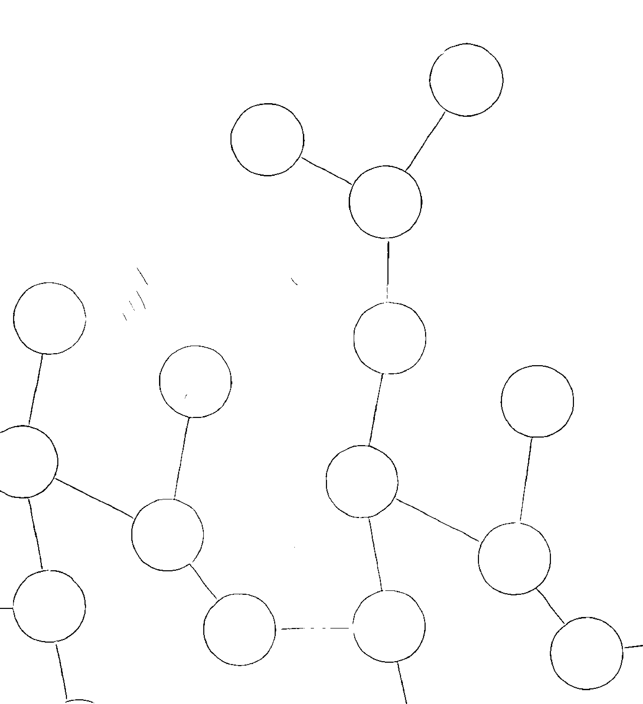

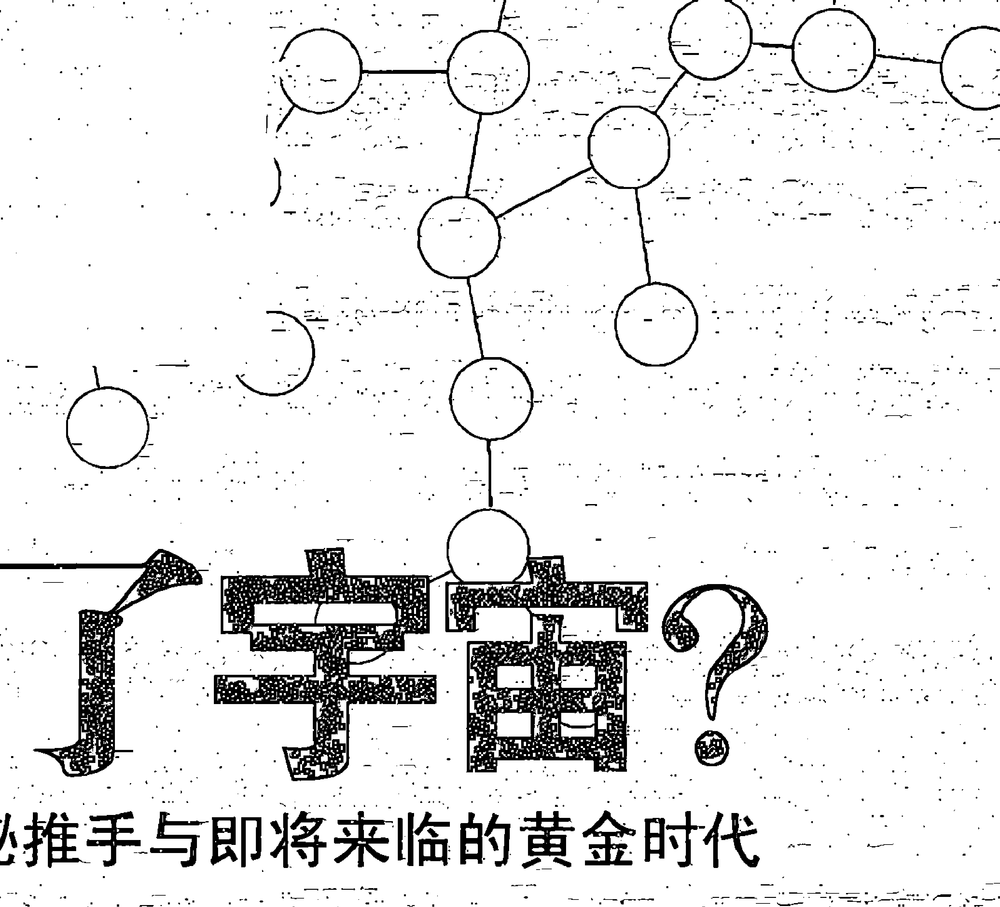

## 谁设计了宇宙？

源场调查，万物背后的神秘推手与即将来临的黄金时代

### The Source Field Investigations

The Hidden Science and Lost Civilizations Behind the 2012 Prophecies

[美] 大卫·威尔库克◎著 觉醒字幕组◎译

江苏人民出版社

# 图书在版编目（CIP）数据

谁设计了宇宙？：源场调查，万物背后的神秘推手与即将来临的黄金时代 /（美）威尔库克（Wilcock, D.）著；觉醒字幕组译. -- 南京：江苏人民出版社，2012.7
ISBN 978-7-214-07970-1

Ⅰ. ①谁… Ⅱ. ①威… ②觉… Ⅲ. ①科学知识－普及读物 Ⅳ. ① Z228

# 中国版本图书馆CIP数据核字（2012）第024985号

THE SOURCE FIELD INVESTIGATIONS
by David Wilcock
Copyright © 2011 by David Wilcock
This edition arrangement with Dutton, a member of Penguin Group (USA) Inc.
Through Bardon-Chinese Media Agency.
Simplified Chinese edition copyright:
2012 © The Shang Shu Culture Media Co., Ltd.
c/o JIANGSU PEOPLE'S PUBLISHING HOUSE
All rights reserved.

# 江苏省版权局著作权合同登记：图字 10-2012-97

| 书 名 | 谁设计了宇宙？：源场调查，万物背后的神秘推手与即将来临的黄金时代 |
| 著 者 | [美] 大卫・威尔库克 |
| 译 者 | 觉醒字幕组 |
| 责任编辑 | 刘 焱 |
| 特约编辑 | 黄浩填 |
| 出版发行 | 凤凰出版传媒集团<br>凤凰出版传媒股份有限公司<br>江苏人民出版社 |
| 集团地址 | 南京市湖南路1号A楼，邮编：210009 |
| 集团网址 | http://www.ppm.cn |
| 出版社地址 | 南京市湖南路1号A楼，邮编：210009 |
| 出版社网址 | http://www.book-wind.com<br>http://jsrmcbs.tmall.com |
| 经 销 | 凤凰出版传媒股份有限公司 |
| 印 刷 | 三河市杨庄双菱印刷厂 |
| 开 本 | 700毫米 × 1000毫米 1/16 |
| 印 张 | 22 |
| 字 数 | 277千字 |
| 版 次 | 2012年7月第1版 2012年7月第1次印刷 |
| 标准书号 | ISBN 978-7-214-07970-1 |
| 定 价 | 48.00元 |

（江苏人民出版社图书凡印装错误可向本社调换）

# 关于作者

大卫·威尔库克(David Wilcock)是一位专业的作家、演说家、电影制片人、音乐家，也是一名致力于探究古代文明、意识科学、物质与能量新范式的出色研究者。从1993年9月开始，他每个早晨都记录并分析了他所做的梦。1995年，大卫毕业于纽约州立大学新帕尔兹分校（State University of New York at New Paltz English）心理学专业。毕业后他在与心理健康相关的领域做了2年的研究性工作。他从1996年起开始在网上发布研究文章，并在1999年开办了自己的网站（www.DivineCosmos.com）。自1998年起，大卫作为全职的心理学顾问，大约服务了500名付费病人。他于2005年结束这一工作并搬到洛杉矶，在2009年开始与编剧詹姆斯·V·哈特（James V.Hart）搭档，担任（目前正在拍摄制作中的）电影《收敛》（Convergence）的执行制片人与合作编剧。

大卫也是国际畅销书《我是埃德加·凯西的转世》（The Reincarnation of Edgar Cayce）的发起人和合著者，这本书探索了他与“沉睡的预言家”埃德加·凯西（Edgar Cayce）之间在脸部特征、占星学和性格等方面的显著相似点，也检验了大卫的研究、系列作品的特点和凯西的信息之间的联系。大卫也是“觉醒的流浪者”（Wanderer Awakening）的主唱，这是一个基于所有灵性传统中的永恒智慧的“玄学音乐”团体，与9次赢得了格莱美奖的作曲者拉瑞·索亚（Larry Seyer）共同创作了部分作品。大卫共出现在历史频道《远古外星人》（Ancient Aliens）系列的7个章节里，这个节目是国家地理关于亚特兰蒂斯的特辑，已于2011年5月和6月播出。大卫的纪录片《2012之谜》（The 2012 Enigma）在2008年11月1日成为谷歌网站上收看率最高的视频，此片令人震惊的流行度和内容，为大卫提供了创作这本书的最初灵感。

请允许我将本书献给您——
那个暂时以人类形态存在，
正在阅读这些文字的无限造物者——
那个空间、时间、物质、能量、生物和意识的创造者

# 目录
Contents

译者序 /001
觉醒字幕组

前言 /003
詹姆斯•V. 哈特

英文版序 /005
葛瑞姆•汉卡克

导读：真相使我们重获自由/009

第一部分 精神与身体 /013

引语：超越最狂野梦想的未来 /014

第一章 巴克斯特效应，自由能源及其影响 /017

第二章 意识、永恒和宇宙心智 /032

第三章 松果体与第三只眼 /041

第四章 通过源场进行思考——在伟大的生命循环中 /060

第五章 我们活在一场清明梦中？ /072

第六章 岁差的预言 /083

第七章 探究大金字塔的真正意义 /096

第八章 “金字塔能”是开启黄金时代的钥匙？ /110

第九章 源场之源 /122

第十章 能量驱动式进化 /138

# 第二部分 时间与空间 /163

## 第十一章 关于时间 /164

## 第十二章 源场的重力 /181

## 第十三章 物质是什么？非物质化、心灵传送和时间旅行 /198

## 第十四章 重力和轻力 /211

## 第十五章 几何课变得更有趣了 /232

## 第十六章 玛雅历法与通往无尽智慧的入口 /251

## 第十七章 时间穿越、时间扭曲和漩涡现象 /268

## 第十八章 银河的钟声敲响 /288

## 第十九章 不只是一个黄金时代 /308

## 第二十章 大揭露 /325

## 致谢 /344

# 译者序
觉醒字幕组

遇到未知事物我们该如何看待？难道现有科学架构无法解释的就是“不科学”？如果用科学的方法研究宗教现象或玄学就是“伪科学”？实际上，大多数人（包括主流科学界）总是习惯于用固有的认知框架和思维模式去看待和理解新事物，害怕固有观点和理论受到挑战冲击，因此当我们在引进这些研究时，难免也会和大卫·威尔库克一样受到“正统”科学卫道士的攻击。纵观科学发展史，从当时的属于“正统科学”的地心说到“非正统”的日心说，科学就是这样一步一步发展并扩大自己的疆土，如今我们正在面对越来越多的新的“非正统”的“日心说”，那么你该如何看待这些新兴研究呢？

在翻译大卫的《谁设计了宇宙？——源场调查，万物背后的神秘推手与即将来临的黄金时代》（The Source Field Investigations:The Hidden Science and Lost Civilizations Behind the 2012 Prophecies）时，我总能想到台湾大学校长李嗣涔教授的“信息场”的研究。李教授以我国传统的气功作为切入点，进一步研究“手指识字”等特异功能（人体潜能），在与大陆同行的合作下发现了“信息场”现象，发现了一个智慧的新的世界，或是我们传统所说的“灵界”，一个更高的维度。

大卫·威尔库克的“源场”（Source Field）概念可以说与李教授的“信息场”异曲同工、殊途同归。在本书中，大卫总结了他30年来的研究成果，其中涉及集体意识、意念力、心灵感应、金字塔能、DNA转换、银河能量、时间维度新概念、传统密教与松果体、2012、玛雅历法、自由能源以及大揭露等重要议题。

科学应该能够包容异见，因为我们目前掌握的科学不一定是正确和完整的，当代科学无法解释的现象不一定是不正确或不存在的。如今我们会嘲笑鲜花广场上烧死布鲁诺的愚民，竟然认为太阳绕着地球转。那么我们的子孙会不会也将嘲笑自以为无所不知的我们呢？

由于时间紧张、水平有限，本书在翻译过程中难免有错误，欢迎读者到觉醒字幕组网站、论坛专区和微博批评指正¹。感谢尚书文化传媒富有前瞻性地引进本书的中文版权，以及其它相关书籍。感谢支持和鼓励我们的粉丝们。本书还有大卫的讲解视频《源场调查》，由觉醒字幕组组长米死干净带队翻译，可以在我们官方网站上观看。

觉醒字幕组，为了更多人的觉醒！

觉醒字幕组成员 W9

¹ 觉醒字幕组的官方网站地址：http://www.awaker.net；新浪微博地址：http://weibo.com/awaker

# 前言
詹姆斯·V·哈特

在大卫·威尔库克带你迎接未来之前，请允许我将时间带回到过去。那是2009年9月28日的凌晨1点，更准确地说，是所谓的世界终结日2012年12月21日的前3年84天10小时11分钟11秒。当时我正在位于纽约州庞德岭（Pound Ridge）的家中撰写一部剧本——我有幸和一位伟大的学者卡尔·萨根（Carl Sagan）一起参与《超时空接触》（Contact）的原始剧本创作，这是参与过的最好的剧本。随后我收到了一封来自我的创作伙伴阿曼达·威尔斯（Amanda Welles）的电子邮件。邮件中的链接将我带到了YouTube网站，并在那里邂逅了这位先知、科学家、哲学家以及解梦人：大卫·威尔库克。他引用和例证了我曾经写过的两个电影剧本《超时空接触》和《魔力玩具盒》（The Last Mimzy）的内容，并从这两部电影中挖掘出了众多令人惊叹、深思的内涵。在他的演讲视频中，这位年轻瘦长的智者，既像是一位先知，又像一个在为我们讲解宇宙知识的喜剧演员。

在和大卫联系接触后，我和搭档阿曼达·威尔斯一起，经历了从关于2012的种种阴霾中走向透彻清明的奇妙之旅。

我并不认识你，但是我知道2013年1月1日我会身处何方。那里将不会被火山灰掩埋，也不会被海啸或10英里高的巨浪所淹没。我不相信那些。我会和大卫·威尔库克一样庆祝新的黄金时代（Golden Age）的到来，并享受它珍贵的每一秒。如果你想要毁灭和黑暗，如果你想要一遍又一遍地看到人类灭亡，你可以选择去电影院。如果你感到绝望，如果你不相信意识的力量，如果你觉得人类对未来可能发生的事件无能为力，那么请不要再读下去了。如果你完全相信我们在宇宙中是孤独的，那么也请就此停住。关于宇宙中是否遍布智能生命的问题，我想引用《超时空接触》剧本中的一句话，这句话源于卡尔·萨根的同名原著小说：“如果宇宙中只有我们，岂不是太浪费空间了。”

但是我要告诉你：“我们在宇宙中并不孤独，大卫·威尔库克向我们证明了这一点，并指引我们走向预言中的黄金时代。”

自从凌晨1点在YouTube上观看了《2012之谜》并在后来和大卫·威尔库克接触后，我清楚地意识到，在这里，有一颗头脑一直在致力于将人类这个种族和宇宙的其它部分完全连接统合起来，并引导我们为最终成为银河公民做好准备。

这也是卡尔·萨根的夙愿。与卡尔·萨根这位视野开阔的科学绅士共事的时光，为我在后来与大卫·威尔库克共同经历这趟探索宇宙的冒险之旅做好了准备。卡尔·萨根并不相信UFO和小绿人，但是他确实相信，宇宙中存在多种多样的生命形式，并且只要我们愿意接受这种可能性，同时停止因为一些充斥着战争、对抗、分裂等负面意识形态的宗教和政治信念而自我毁灭的行为，我们就有机会和宇宙中的众多智慧生命共聚一堂。大卫·威尔库克把卡尔·萨根对于人类的愿望融入到自己关于宇宙以及人类在其中的定位的思想理论之中。

大卫所做的是极具开创性的工作，他为我们阐述了人类和地球当下正在经历的伟大转变和进化，并描述了后2012时代的美好蓝图，我对未来将要发生的事情充满了敬畏之心和孩子般的好奇。作为一个种族，我们要积极地拥抱即将发生的事。如果我们干坐空等，将不会发生任何事情。我们现在必须明白，在这次始于2012年冬至的伟大机遇中，我们所扮演的角色。

一句话闪过我的脑海，这句话是我十年前写给一部史诗动画片的，这部动画片将于2013年由福克斯公司制作发行。我深深相信这句话总结了大卫·威尔库克从宇宙万物中带给人类种族的真理：
“一心化万有，万有合一心。”

谢谢你，大卫·威尔库克，谢谢你重新带回希望。人类同胞们，保持精神的专注，保持业力的清净。

J.V. 哈特
纽约州庞德岭
2009

## 英文版序
葛瑞姆·汉卡克

20世纪90年代早期，我正在为《上帝的指纹》（*Fingerprints of the Gods*）一书做研究时，第一次听说了所谓的玛雅预言，也就是世界将于2012年12月21日终结。

谢天谢地，这个“预言”显然还有其他的解读方式。

虽然一些人仍然带有末日情绪，但是已经有越来越多的人将2012年看作一个新纪元的开端，而这个新纪元的周期也许是30年，50年，甚至上百年或更久。期间尽管会伴随一些考验和磨难，但一个全新的、光明的未来将会降临，我们将会经历意识上的伟大转化，我们就会实现一直隐藏在我们之内的全部潜能。

大卫·威尔库克是持后者观点之人的思想领袖。随后的章节所作的精彩介绍将告诉我们：开启一个黄金时代的钥匙已经掌握在我们手中，只要我们愿意为此努力，它就会显现。但凡有人提出非正统的观点或理论，必然会遭到怀疑论者的猛烈攻击，所以大卫·威尔库克应该也能预料到了那些批评的浪潮以及这本书将引发的影响。按照“权威人士”的惯例，他们一定会派“智囊团”处心积虑地彻底搜查本书中的错误和漏洞——实际上，没有一个作者在写一本书时能做到毫无错误或漏洞。而一旦他们发现一点小错误，这些人就会全盘否定书中的内容。

不过不要气馁。这里有大量的前沿科学，其中很多内容都是大部分读者从未听闻的，因为它们来自前苏联科学家的科研成果。大卫已经为大家奉献良多，他首次将众多的信息收集整编成册。但在某些情况下，前苏联的一些研究因为过于超前和激进，所以已被主流学术界否定或孤立。

保持开放的思想，尤其是在权威界说“不”的时候，接受大卫的邀请去深入探究真相。不久你就会发现，所有的事物都通过一个你可能在之前从未发现的新模式联系统一起来了。

我的目的不是对本书中提到的所有这些非凡观点进行评论，但是在这里，我想展示大卫在书中提出的3个非常重要并且互相关联的观点：

-   1.  这个可见的物质世界——一种我们称之为“现实世界”的集体性体验，是一个不可见的平行宇宙在三维空间的投射。如果不去认识和理解那个投射出这个“现实世界”的隐藏国度，我们就无法完全理解我们这个“现实世界”。
-   2.  恰恰因为“现实世界”是一种投射，所以在某种意义上，它更像是一种幻象或全息图，而并非一种稳定的、永恒不变的、只能通过直接的物理或机械作用对其进行改变的结构。有时它表现得更像是一场清明梦（Lucid Dream），通过思想和想象的力量就能让其发生改变。
-   3.  因此，“思想”也是一种“物体”（thing），我们应该意识到，思想也可以在“现实世界”中显现出清晰可测的影响。

从某种意义上说，大卫所探索的概念和观点非常前沿，其中涉及了量子物理和意识研究等领域。之所以这些前沿理论这么吸引我，是因为它与我们从祖先那儿传承的智慧产生了深深的共鸣，这一点提醒我们，无论何时、何地、用何种方式表达，真理永远是真理，并且无法被抹灭。

比如说，“现实世界”是一个隐藏国度的投射或者显形，这个概念就与古埃及人在《金字塔文本》（Pyramid Texts，约公元前2200年）中描述实相本质的理论有异曲同工之妙。同样的思想也贯穿于重新修订过的《棺椁文本》（The Coffin Text），《阴间真相之书》（The Book of What is in the Duat）以及《埃及亡灵书》（The Egyptian Book of the Dead）之中，这种思想也流传到诺斯替教和赫耳墨斯神智学中，并在基督时期被人们用希腊语和拉丁语编撰成册，对基督教的一些神秘派系产生了深远的影响。

这个远古观点的本质可以用赫耳墨斯神智学的一句箴言概括：“上行之，下效之（As Above So Below）”。意思是说，要想正确地理解“现实世界”（也就是赫耳墨斯神智学中的“可感知宇宙”）中地球上的万事万物，就必须意识到这一切只是一个更高等的不可见国度的映射：

如果纵观全局，你将明白，那包罗万象的“可感知宇宙”，实际上是更高等的宇宙所编织的华丽外装。

或者换一种说法：

> 存在一种不可感知的宇宙；以它的镜像创造了“可感知宇宙”（即“现实世界”），并以此复制出“永恒”的一个副本。

在我看来，赫耳墨斯神智学讲到的编织出可见宇宙的那个“不可感知宇宙”和大卫提出的塑造界定了我们现实的“源场”是完全一致的，尽管我们目前的常规科学仪器还无法对其进行探测。

赫耳墨斯神智学关于时间的周期性以及时间与物质互相渗透的理论，与大卫在本书中列举的很多最新的科学发现高度相符。当你阅读完本书后，再翻回到这里看看下面的赫耳墨斯神智学概念，我敢保证你会明白我的意思：

> “宇宙，其中包含着时间；通过时间的推进和发展，生命得以存在于宇宙中。时间的发展受控于一套固定的秩序；通过在其规律进程中的改变，时间不断更新宇宙万物。

> “宇宙做着永恒的旋转运动。这种运动无始无终，在宇宙中的一些地方，它不断地显现和消失，在时间不断变化的发展进程中，它不断地在同一地方显现和消失。这就是环绕运动的本质；圆环中的所有点都连在一起，因此你无法找到运动的起始之处；很显然，在运动的进程中，所有的点永远都是处于彼此之前和之后，而时间就是如此旋转的。

> “如果你想把现在与过去分开，把未来与现在也分开，你将会发现你将身处困境。因为如果那样的话，现在就不存在，除非有过去的存在（同理，必须有现在的存在，才存在未来）。所以现在是过去的延续，未来是现在的延续。正因为过去连接着现在，现在连接着未来，所以它们三者通过其连续性合为一因此，你无法将它们彼此分离。”

大卫关于“现实世界”可能是“清明梦”，并且事物可以受意念和想象而改变这个非常有价值和有趣的想法，也和赫耳墨斯神智学所说的“幻象是一种被真实锻造出来的东西”互相呼应。

甚至连我们居住其中的身躯，以赫耳墨斯神智学的观点来说也是不真实的：

> 你必须意识到只有永恒存在的，才是真实的。而人不是永存的，所以人不是真实的，而仅仅是一种显像……

在这个显像的国度（我们这个世界），思想确实可能会显化，我们必须对自己的思想保持警觉。如果仍然有许多人太过担忧末日和毁灭；如果仍然有许多人太过专注于负面情绪，比如仇恨和嫉妒；如果仍然有许多人不愿意表达爱和感恩，仍然不愿宽恕自我和他人，那我们迟早会让我们的清明梦变成人间地狱。

我们不必落到那样的境地。

这本书和众多远古教诲带给我们的重要信息是：我们是我们的现实的创造者，而黄金时代即将降临。为了迎接拥抱这一被预言已久的黄金时代，我们必须摆脱那些不再使我们受益的旧有思维方式和行为习惯，我们即将迎来世界观和宇宙观的彻底变革。

这告诉我们，要做到这些是多么困难，黄金时代过了如此久才最终到来。如果大卫是对的，那么，那个制造出这场清明梦（我们称之为现实世界）的隐秘源场将会在接下来的几年中开始显现其伟大的存在及影响，使我们经历一次意识上的大转化。

也许2012年是“人类进化剧本”中一个重大的转折点。也许现在正是我们更用心去关注宇宙的时机，无论是可见还是不可见的。它不会毫无理由地为我们创造奇迹或通过梦境和洞见与我们对话，它一直在慷慨地带给我们福祉，让人类走上正途。

> > 葛瑞姆·汉卡克（Graham Hancock）《上帝的指纹》作者

## 导读：真相使我们重获自由

显而易见，我们生活在一个处于巨变中的时代，而这些变化无可避免地给人类这个种族的生存带来了众多不同的挑战与威胁。但是，如果所有这些事件只是一个更加宏伟的计划的一部分，而这个伟大计划的指挥者是一种创造出宇宙中所有空间、时间、能量、物质和生物体的超级智能——一个我们可以称之为“源场”的能量场，我们将如何面对未来呢？

传统科学仍然声称：没有证据表明这个宇宙中存在一种更加高级的智能；生命出现于地球只是一次幸运的偶然事件——一个发生概率为千万亿分之一的银河掷骰游戏。这是一种信仰，并且无法经受科学性的严谨检验。严格意义上来说，意识并非一种生物性的功能，除非我们把“生物”的定义延展到这整个由时间、空间、物质和能量构成的可知宇宙。

截至1922年，历史记录显示共有148项重要的科学发现都不是单独出现的，而是几乎同时发生在全球各地一些不同的实验室中，并且这些发现者在之前对彼此的研究都不知情。美国心理学家威廉·布劳德博士（Dr.William Braud）证明了一个人可以通过将自己的意念集中在其他人身上来提高他们的专注力，尽管他们对自己被施加的影响毫无意识。令人惊讶的是，排除天气、假期和政治事件等其他因素的影响，七千个人仅仅通过一起冥想就能让全球范围内的恐怖袭击事件数量减少了72%。

经过训练的“远程观察者”能在脱离身体的状态下到访一些遥远的地方，并且准确地描述了其所见，甚至那些最具怀疑精神的独立分析者也承认这些测试结果的真实性。在那些他们参观过的被完全隔绝光线的地方，有超过一万五千个光子被探测到——但是这只有在他们能准确无误地描述其所见的情况下才会发生。

德国马尔堡大学（University of Marburg）的理论生物学家弗里茨-阿尔伯特·波普博士（Dr.Fritz-Albert Popp）证明了每个 DNA 分子都储存了高达一千个光子——基本上其紫外线波长都在 380 纳米（稍微超出可见光范围）。在 1913 年，俄罗斯科学家亚历山大·古维奇博士（Dr. Alexander Gurwitsch）发现处于成长期的洋葱的头部（尖端）会发射出紫外光，当他将这些光线对准另外一颗洋葱的侧面时，那颗洋葱的侧面长出了新的突起。而当这种光线被能阻挡紫外线的玻璃隔断时，这种效应就停止了。

在 1970 年代，弗里茨-阿尔伯特·波普博士证实了所有致癌化学物质都对波长为 380 纳米的光线有明显的嗜好，这是所有致癌物质唯一共有的特性，它们都喜欢吸收 380 纳米波长的光。这表明我们的 DNA 可能借助光将基因信息传送到细胞的特定部位——当一个 DNA 分子处于贫光状态时，细胞就无法接收到阻止其生长的信号。

著名的俄罗斯生物科学博士、波动遗传学创立者彼得·伽利耶夫（Peter Gariaev）是几个演示证明了可以只借助光就能把一个物种完全转变为另外一个物种的科学家之一。仅仅让一束绿色的镭射光照射蝶螈的卵，然后再将这束光射入青蛙卵内，这些青蛙卵最后就能孵化出完全健康的蝶螈。这种现象或许能解释为什么生命进化没有一直重复长达数百万年的循环周期，而是会在某一个很短的时间内进化速度呈指数性提升。

由此，是否存在这种可能性——人类生命并非只出现于地球上，而是一种遍布银河系甚至整个宇宙的生命模板？在太空中是否还有其他人，对于他们来说，《谁设计了宇宙？》这本书中的前沿科学发现只是常识？他们的科技水平是否已经足够先进，允许他们利用源场的运作原理和规律来改善植物、动物、人类和地球的生存状态，甚至穿越时间与空间？

因为一些未知的原因，几乎世界各地每一个远古文明都有自己的种族与形象极似人类的“诸神”接触的记载，并因此衍生了无数神话传说。两位卓越的历史学家发现，其中有数量惊人的传说都包含着一些关于一个 25,000 年的地球循环周期（结束于 2012 年或 2012 年左右）的加密信息。

几乎所有这些传说都预言我们会经历一段充斥着混乱与剧变的时期，包括政治阴谋、社会衰退和地球灾难——但是所有这些剧变只是通往一个黄金时代的必要前奏。古拜火教的经文清楚地表明：地球不会在这次转变中走向毁灭。这是所有印度教、佛教、伊斯兰教和基督教预言的原始来源。

人类目前发现共有 3300 座金字塔和巨石建筑遍布全球各地，即使利用今天的技术也很难重建这些建筑。俄罗斯科学家发现这 3300 座建筑都建在一个全球性的几何“网格”上。为了寻找这个网格，研究者伊万·T. 桑德森 (Ivan T. Sanderson) 在地图上标注出全球各地频繁出现船只和飞机消失事件的地点，这些地点集中在12个主要的区域——其中一个就是著名的百慕大三角，这些区域一起形成了一个优雅的几何网格，世界上最大的山脉线、海底火山山脉线和洋/气流都精确地嵌合到这个网格中。

在90年代初期，俄国的科学家们用PVC管和玻璃纤维建造了一些现代的金字塔，并且发现在这些金字塔被建造后地震次数有所减少，臭氧洞缩小，极端气候减缓，石油和水的纯净度开始提升，并且生命体变得更加健康——一些农作物的产量提高了3倍。一些已被宣判注定死亡的早产儿被1毫升存放在这些金字塔里的水治愈。在用取自金字塔的花岗岩石建造的监狱里时，囚犯明显变得更加友善和快乐，暴力事件的数量显著下滑，囚犯对酒精和毒品的依赖性也大幅降低。

那些远古传说同时也暗示了松果体是我们心智与源场连接的中心点，它的功能就像头脑中的“第三只眼”——并且当它被完全“激活”时，可以制造出一个足够大的类似星门的通道，借此我们可穿越空间与时间。银河系中的其他人或许早已实现这样的壮举，并且一直在帮助我们为一次伟大的“家庭重聚”做好准备，届时，所有这些秘密将会被完全公开，借此我们可以顺利完成一次伟大的自发性进化跃升和转变。

上述内容只是关于本书的介绍性讨论，在后面的章节中，我们将更加广泛深入地探索更多当代前沿科学研究与古老预言之间的惊人联系。

## 示例文档标题

这是一个示例段落，包含文档的正文内容。文档编辑助手需要准确提取文本并保持其原有格式。

- 列表项一
- 列表项二
- 列表项三

| 表头一 | 表头二 |
| --- | --- |
| 单元格一 | 单元格二 |
| 单元格三 | 单元格四 |

> > 这是一个引用块的内容，通常用于引用其他来源的文字。

```
python
def hello_world():
    print("Hello, World!")
```

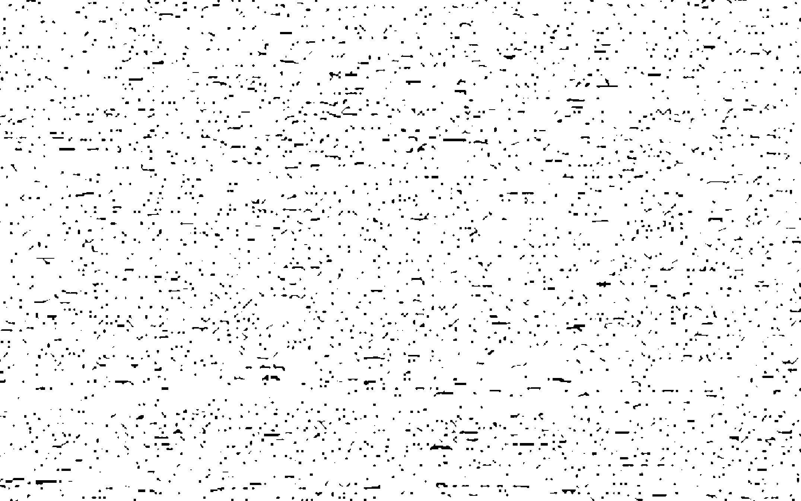

## 第一部分

### 精神与身体

## 引语：超越最狂野梦想的未来

自从人类有了自我意识以来，就被无情地驱使着去问一些“大问题”：我是谁？我从哪里来？我是怎样来的？我将去向何处？许多导师曾站出来，声称找到了这个无比深邃的问题的答案，然而，我们在这些重大问题上充满分歧的观点，却在历史上引发了惨烈的暴行和悲剧。尽管如此，几乎所有的灵性传承中都有一个始终如一的主题，即宇宙不是由“死亡”和惰性物质组成，而是一个“活的”、有意识的存在。我们被告知，这个超级智能，将空间、时间、能量、物质、生物以及意识编织一体。不管宇宙有多广阔，显然，我们每个人都与这个伟大的本体连接一体，即便在身体死亡后我们仍将长存。

大部分灵性导师也说，我们最终将会团聚在“合一”中，即使我们对这更高的实相全然不知，一种隐秘的灵性教诲已经在改变我们的生命，最终它将引导我们回归本源。我们经常听说那些仁慈的圣人，比如耶稣（Jesus）、佛陀（Buddha）、克利须那（Krishna）等等，他们直接干预和影响人类的历史，并为我们指明通往伟大真理的途径。正如葛瑞姆·汉卡克、撒迦利亚·西琴（Zecharia Sitchin）以及其他学者的研究所指出的，许多古老文明的“众神”都曾给予他们直接的帮助，比如授予他们书写、数学、天文学、农业、畜牧、伦理、法律以及建筑学（包括某些特殊用途的巨石建筑）等方面的知识。这些建筑分布在世界各地，就算用现代技术，想要复制这些建筑也绝非易事。

如今的“现代”社会，通常将主流宗教和灵性传统那令人敬畏的起源，看作是神话和迷信。由于不同的哲学体系之间存在着看似无法解决的分歧，再加上我们对信息的无限渴望，在许多人的思想中，科学已经取代宗教作为真理的终极仲裁者，而以往对于这个神圣宇宙的敬畏之情已经消失殆尽了。在大部分人眼中，现在的宇宙只是无数死气沉沉的“东西”的集合体。如今，我们的心智、思想和情感，以及地球上如此丰富多样的物种，都被认为是一些发生在一个无意识、无感觉、极度严寒的虚空宇宙中的巧合和偶然事件引发的结果。我们没有活着的理由，也没有死后的期盼，甚至也不需要追求伦理和道德，而这些竟然都成了健康的哲学辩论课题。如果我们知道我们无法逃脱死亡，而且只有这一次存在的机会，何不把生命都投入到追求享乐中呢？何不把自己投入到对金钱、权力、地位的无尽追求中，然后把获得的物质财富留给我们的后代呢？

我们知道得越多，似乎我们的生命就越孤独。魔术已揭去神秘的面纱，我们并没有什么超能力。我们死后毫无眷顾。宇宙中再没有其他人。在我们制造出可承载大量人类的母舰飞往外太空探索之前，我们也许已经被全球性的灾难所灭绝，而造成这种灾难的恰恰是我们自己制造的大规模杀伤性武器，或者无法控制和阻止的自然灾害。而地球和人类的灭亡，也是电影大片用来愉悦观众的乐此不疲的题材。现在，也许你会更仔细地去听“末日效益”（profits of doom）这首歌，然后可能会想事实是不是真如歌中所描述那样。

如果你看过我在 Youtube 上的视频——也就是这本书的创作源泉——《2012之谜》（2012 Enigma），或你访问过我的网站“神圣的宇宙”（www. divinecosmos. com），或看过一些我在电视节目中的访谈，你就会知道，我根本不相信我们的未来是黯淡的、恐怖的或灾难性的。相反，我感到地球上人类的命运正在被一个隐藏的智慧小心监护和指引着，那智慧就是筑造整个宇宙的富有生命力的能量场。许多伟大的研究者都独立发现了这个看不见的宇宙之力，并且各自给它取了名字，但没有统一的标准。由于这个力可能是宇宙所有空间、时间、物质、能量、生物和意识的起源，所以我在本书用简单而概括的词来命名它，称之为：源场。

这本书和哲学、猜测或者痴心妄想无关，它是对源场深入调查的总结。我站在巨人的肩膀上完成本书的创作。来自正规大学的无数研究者完成了绝大部分的发现，但最终这些研究成果使得他们经常与同事、投资人以及主流科学界产生分歧和争论。还有很多其他的例子，比如一些科学家或研究机构将他们特定的突破性发现发布给主流媒体后，他们不是视而不见就是完全不理解这些发现的相关性。然而在俄罗斯，从上世纪50年代便开始了对源场长久的研究，一直到1991年苏联解体，而绝大部分这些重大发现都被以国家安全为由列为机密档案。仅仅在1996年，就有超过一万份关于源场的研究报告被发表公布，其中超过一半都是俄罗斯的研究成果。如果你知道他们目前对这一创造了宇宙万物的不可见力量的了解程度，你肯定会感到无比震惊。

我已经花了30多年的时间致力于研究和收集大量的数据，尤其是在1993年的时候，我几乎花费了除睡觉外所有的时间来重新审视科学。在1998年夏天我成为自由职业者之后，我几乎每天花14个小时的时间来研究和调查源场。在杜登出版社（Dutton Books）的总裁布莱恩·塔特（Brian Tart）联系我，想出版我的研究后，我花了几乎两年的时间专注于这本书的创作。当我最终开始用统一的视角来综合之前研究的精华时，无数令人惊叹的关联系开始不断地在我的脑海中涌现。如果这个突破性的发现有一天成为了常识并且应用到生产实践中，或者有一天，基于这些原理的秘密科技能向公众公布的话，我们的世界最终可能会比科幻电影或小说所描绘的还要更为美好。

我将带领和指引你们经历一趟探索神秘的空间、时间、能量、物质、生物和意识的奇妙之旅，我们还会对无数令人着迷的研究领域进行深入探索，比如反重力、非物质化、心灵传输、时间为三维的平行现实、量子几何学、地球上使得船只和飞机消失的自然“漩涡点”、真实的时间旅行案例等等。我们还将探究为何玛雅历法是一种计算这些“时空入口”（漩涡点）何时开启的工具，研究银河系是如何驱动我们一直在经历的所有时间周期，让我们在物理、生物和灵性层面实现进化。这些科学研究在技术上的应用前景绝对超乎我们的想象。并且，我们将会意识到，当我们完全进入银河系中这个全新的能量区域时，我们会看到空间和时间的本质将发生根本性的改变。

源场是一把解开所有这些谜团的钥匙，并能最终回答这些根本问题：我们是谁，我们来自哪里，我们为何存在，我们将去向何方？我们的源场调查旅程将在下一章展开，并首先向大家介绍克利夫·巴克斯特博士（Dr. Cleve Backster）的研究。他是帮助我们理解心智（mind）本性的先驱。我们将开始真正地认识了意识的结构、特征和意图。意识不仅仅是一种生物学现象，它存在于宇宙本身的能量中。

大卫·威尔库克
2011年1月

## 第一章
巴克斯特效应，自由能源及其影响

宇宙中所有的空间、时间、能量、物质、生命和意识是由源场创造的吗？远古精神导师和哲学家所说的“上行之，下效之” (As Above, So Below)¹是正确的吗？

如果我们在可见宇宙中看到的一切最终都是一个有着非凡特性和觉知意识的伟大心智的具体化，结果会怎样？

我们是否活在“失忆状态”，要经历一个完整的觉醒过程，最终才能进入这个浩瀚无垠的意识体中？

《谁设计了宇宙？》将以令人信服的证据作为开篇，去证明意识并不是被强制性“困”在我们的大脑和神经系统中。我们将会看到确凿的证据，证明我们的思想一直在与我们身处的环境产生互动，并且能影响我们周围的事物。

如果我们关于源场的理论是正确的话，那么心智就不是被限制于（生物学上的）生命形式之内的东西，而是一种能量现象，能穿越不同生命形式之间（我们所谓的）的“虚空”。

在西方多个学科的学者或科学家都已经发现和揭露了源场的存在，其中也包括一些富有争议的人物，比如威廉·赖希 (Wilhelm Reich)，他是心理学之父西格蒙德·弗洛伊德博士 (Sigmund Freud) 的门徒。在此，我们的源场调查之旅将从克利夫·巴克斯特博士开始，他以自身的传奇经历创作了一本名为《原始感应》 (Primary Perception) 的书。

> 1. 译者注: 此句出自公元前3000年左右的“翡翠石板” (The Emerald Tablets) 戒言，完整句段为 “as above, so below. as within, so without.” 因较难用既精确又简洁的文字进行翻译，故采用常见译法 “上行之，下效之；存乎中，形于外。” 原意应该是指在我们所处的现实之上，还存在一个更高的绝对现实，而我们的现实只是这个高等现实的映像或投影。

## 催眠的惊人力量

当巴克斯特在美国格罗斯大学读预科时，非常着迷于他朋友描述的刚从教授那里学来的催眠技巧。巴克斯特决定用这个技巧催眠他的室友，没过多久，他的室友便进入了出神状态。巴克斯特说：“现在，我要你睁开眼睛，但是你不会醒来。我要你到宿舍下面去申请晚点熄灯。”在预科学校，如果没有特殊理由，晚上10点以后必须要熄灯。在催眠状态下，巴克斯特的室友睁开眼睛，走下宿舍，向值班的教授申请晚点熄灯，在记录本上登记后便回到了房间。当巴克斯特将他的室友从催眠状态下唤醒后，他的室友根本没有意识到刚才所发生的一切，还说：“看吧，我说这一点效果都没有。这个所谓的催眠根本就是瞎扯淡。”然后他们一起下楼向值班的教授确认，巴克斯特的室友几分钟前确实申请晚熄灯还填写了记录。在看到自己的签名后，巴克斯特的室友震惊了，几乎不敢相信这些都是真的。

巴克斯特从此开始研究催眠，他尽可能多地阅读相关的书籍，并进行了许多实验，但是，在上世纪30年代，这个学科的书确实很少。在1941年的珍珠港事件之后，巴克斯特加入了德州农工大学的后备军官训练队（ROTC）军事项目，就在那时，他开始频繁向大众演示催眠术。大约有三分之一的观众可以进入某种出神的状态，然后他再从中挑选观众做进一步的深度催眠。

其中有一次，巴克斯特告诉一个被催眠的观众，说在他醒来后的30分钟内将看不见巴克斯特。果然，当这位观众从催眠中醒来后，根本看不见巴克斯特。为了测试他在催眠下的状况究竟如何，尽管巴克斯特从不抽烟，他还是点了一根烟并吐了一口。这位观众看到一根烟和烟雾在空中悬浮着而根本看不见巴克斯特，因此惊声尖叫起来。他想要逃出房间，但是其他观众让他再等等。过了30分钟后，巴克斯特出现在了他面前。这位观众完美地遵从了巴克斯特的催眠指令，而且从催眠状态恢复后，对巴克斯特的催眠指令完全没有自觉的记忆。

我对催眠力量的初次认识是从一次戏剧性出体体验开始的。那时我只有5岁，有一天晚上我在睡觉时忽然醒来，发现自己漂浮在空中，而下面3英尺的地方竟然是我自己的身体。如果下面这个安详沉睡着的小男孩是“我”的话，那空中的这个我又是谁？

当意识到这点时，我着实被吓了一跳，接着便感到不知所措，就在此时，我突然又回到了自己的身体中。

最终，我就此事求教于母亲，她带我到地下室向我展示了一些关于ESP（extrasensory perception的缩写，意为“超感官知觉”）方面的书。我开始读的第一本相关著作是哈罗德·谢尔曼（Harold Sherman）的《如何让 ESP 为你所用》（How to make ESP work for you）。谢尔曼说，当你给某人做催眠时，你能让催眠对象有出体的体验，就像我曾经历过的那样。同时，还会产生惊人的效果：

> 被催眠个体的出神状态越深，超感官能力就越活跃。在这种情况下，个体可以在催眠师的引导下离开自己的身体，并且拜访某人或某地，然后报告他的所见所闻。

### 催眠与星体投射

托马斯·加勒特医生（Thomas Garrett）是一名催眠治疗师，在一战时期，他倡导了对患有战斗疲劳症的士兵的治疗。加勒特医生对我讲述了他和一个私人病人的奇妙经历。那个年轻的病人是百老汇一个剧作家的儿子，正在为感情问题而焦虑担忧，因此来向加勒特医生求助。他要求催眠治疗，并告诉了加勒特医生他和他未婚妻之间的事。他的未婚妻还是卫斯理学院的学生，他们经常因为一些琐碎的小事而吵架，所以她将订婚戒指退还给了这位年轻人。

加勒特医生听后，灵光一现，告诉这位被催眠的年轻人，他可以去看看他所爱的未婚妻现在是否还在乎他。加勒特医生解释说，你有能力离开自己的身体，并处于星光体（astral）形态，直接拜访你未婚妻的宿舍。经过一段时间的沉寂，被催眠的年轻人说他已经站在了他未婚妻的门外了。

> “别让门挡住了你的去路，” 加勒特医生说。“你可以直接穿过那扇门，告诉我，此时此刻她在做什么。”

> 又过了一段时间，年轻人说：“她坐在桌旁，正在写信。”

> “很好”加勒特医生说，“从她的肩上看看她写的什么，念给我听听。”

年轻人睡着的脸突然显得很惊讶然后又变得愉悦起来，他解释道：“为什么，这封信可是写给我的哦。”

> “她写了什么？”加勒特医生要求他说出来，并拿起了一支铅笔。

然后年轻人逐字逐句地给加勒特医生念了几段。事实上，她正在为争吵而感到抱歉，并且请求年轻人的原谅，还表达了期望和好的意愿。年轻人变得很兴奋，并试图去拥抱那个女孩，而现实中他的身体也做出了同样的反应，加勒特医生立刻将他叫醒，把他从星光体状态中拉了回来，通过引导，他仍能记住刚才所经历的一切。

没过几天，年轻人收到了一封来自他未婚妻的信——一封他早已通过星光体或心灵感应提前看过的信。加勒特医生将两封信标记后存档，作为被催眠个体的报告。而这两封信仅有少数几个词是不一样的。

更令人不可思议的催眠故事可以在迈克尔·塔尔伯特（Michael Talbot）的伟大著作《全息宇宙：宇宙是一个幻象》（The Holographic Universe）中找到，这本书也是我极力推荐的著作之一。塔伯特目击了他父亲的朋友汤姆在上世纪70年代早期被一位专家催眠的经历。催眠师告诉汤姆，当他在出神状态睁开眼睛后，他将看不见他的女儿劳拉。之后，催眠师让劳拉站在他父亲面前。汤姆睁开眼后环顾房间，视线完全穿透他的女儿，甚至听不见劳拉咯咯的笑声。催眠师从大衣中掏出一块手表并迅速放在劳拉的腰后，屋子里其他人都不知道催眠师手里拿的是什么。然后催眠师问汤姆是否能看见他手里拿的是什么。

汤姆向前一步凝视着劳拉的肚子，仿佛可以看透劳拉的身体，随即说那是一块手表。催眠师点了点头，又问汤姆是否可以读一下上面刻着的铭文。汤姆眯着眼奋力读出上面所写的字，是表主人（未在场）的名字以及其它字句。催眠师接着向大家揭示了谜底，确实，他手里拿着的是一块手表，并向屋里的人一一展示，汤姆所念的铭文也是正确的。后来，我在与汤姆聊天时，他说劳拉在他眼里看来绝对是隐形的，他只看到催眠师站在那里，手里拿着一块手表。如果催眠师不告诉汤姆真相而就这么让他离开的话，汤姆可能永远也不会知道，自己并不是在正常的现实中。

我在1995年时阅读了这个案例，它对我产生了巨大的影响。被催眠的汤姆连眼前的女儿都看不见，就好像她不存在一样，而且还能读出手表上的铭文。如果一切都是真的，这将会挑战我们对物质世界的固有认知，并启发我们，去探索人类在精神层面上还未被发现的更惊人的能力。我们所看到的一切不过是我们集体意识决定要看到的样子。换句话说，现实世界可能是集体意识在催眠下形成的产物。

记住，我们可以在催眠状态下行走、交谈并与人互动，甚至脱离身体进行精确的观察，醒后可以对催眠时的所作所为有一个清晰的记忆，或者完全不记得。在催眠状态，我们睁着眼也可以被引导扮演某种角色，做出指定的行为或被植入思想。这些引导显然具有强大的力量，足以在某人自认为的“正常”意识状态下，让另一个人隐形！当我们发现普通人能够这样被催眠时，我们通常把这些当做是“潜意识”在发挥作用，但是我们仍然无法理解它的实质是什么，是怎样运作的。潜意识似乎毫无疑问地自动遵从催眠指令，好像它习惯于听从并执行指令。

读完大学后，克利夫·巴克斯特加入了美国反情报总队，讲授关于在海外工作的政府人员被国外势力用催眠来套取保密信息的潜在威胁。巴克斯特冒着很大的风险向一名高级别的军官揭示了这一潜在威胁的严重性。在得到允许后，巴克斯特催眠了反情报总队总指挥官的秘书。在催眠状态下，这位秘书被要求从总指挥官锁住的档案柜中调动一份机密文件，她心甘情愿地接受了。巴克斯特告诉她，她在醒来后将不记得她所做的一切。确实，当她清醒后对泄漏敏感信息一事毫无印象。

那天晚上，我将这份机密文件锁在柜子中保存好，第二天将它呈交给指挥官。我向指挥官解释道，为了促进我更深入的研究，我宁可冒着被送上军事法庭的危险。在 1947 年 12 月 17 日我没有收到军事法庭的传票，反而是一封来自指挥官的推荐信，信中写道，我的研究“对军事情报至关重要”。然后一切向着积极正面的方向发展着。

### 测谎仪的开创者

1948 年 4 月 27 日，在华盛顿特区沃尔特·里德医院做了 10 天的催眠和硫喷妥钠“吐真剂”的演示后，巴克斯特开始为中央情报局（CIA）工作。在加入 CIA 后不久，巴克斯特开始师从心理测谎方面的先驱伦纳德·凯勒（Leonard Keeler）。

除了其他的秘密行动外，我作为 CIA 一支团队的关键成员，时刻准备着前往世界各地，评估是否需要非常规的审问手段，包括我的老本行催眠审讯和麻醉审讯……回到华盛顿特区后，我所建立的测谎操作流程，已经被广泛用于对申请加入 CIA 关键岗位人员进行的测谎筛选中。而越来越多的常规性测谎实验，已经开始妨碍我更感兴趣的研究。

大约在 1951 年，伦纳德·凯勒去世后不久，巴克斯特离开了 CIA 并前往芝加哥的凯勒测谎研究室担任主管，同时也在这间教室大小的研究室教授测谎的应用。巴克斯特继续为华盛顿特区的多个政府部门提供测谎顾问，随后业务拓展到马里兰的巴尔的摩，并在那里开设了第二间工作室。直到 1958 年，巴克斯特才开始专心研究心理测谎，并制定了多个沿用至今的测谎图表评估标准。1959 年，巴克斯特搬去了纽约市继续从事他的商业测谎业务。7 年后，巴克斯特“挖到了金子”。

1966 年 2 月，一件突如其来的事情转变了我的认识，并扩展了我所研究和关注的焦点。此事发生时，我已经在人类心理测谎领域研究了 18 年。

巴克斯特的秘书从一家停业的商店购买了一株橡胶植物和一株龙舌兰。这是巴克斯特第一次养花草。1966 年 2 月 2 日，巴克斯特在实验室熬了一个通宵，凌晨 7 点时他喝了杯咖啡想要休息一会，突然间灵光一现：如果把测谎仪连接到植物上会怎样？使他大吃一惊的是，植物并不是原本想象的应该有平滑的电活动波形图，而是呈锯齿状、活跃的、随时变化的图形。接着，巴克斯特惊讶地观察着，事情也变得越来越有趣。

> 在大约一分钟的电活动波形图记录中，折线显示仅有小幅的波动，这种图形样式与人类样本接受检测时的短暂恐惧经历极为相似。

简单地说，就是这个植物的电活动图看上去和一个开始说谎的人在做测谎检验时的电活动图一样。巴克斯特知道，如果你要抓住某人的谎言，你必须首先要确认他们试图要隐藏的事情是什么。如果你的问题能导致他们惶恐和不安，皮肤上的电活动就会表现得很强烈。巴克斯特想要看看他的新植物在遭受到某些威胁它们安宁的举动时，它们是否也会有和人类类似的反应。

> 针对人的测谎的例子通常是这样问的：“你是否对约翰·史密斯开枪，并对他造成致命伤害？”如果测谎者真的犯了罪的话，这个问题会威胁到他的安宁，他将做出反应并体现在图表上。

巴克斯特将一片叶子泡在热咖啡中，没有变化。他又用笔敲打了一片叶子，突然有了剧烈的反应。

然后，经过大约14分钟的制图时间，我有种想法：为了让植物体验到终极恐惧，我想用火柴去烧连接着电极的叶子。此时，那株植物正在离我大约15英尺（约4.5米）远的地方……

接下来发生的事对科学史是一次强有力的冲击，然而这个冲击至今仍未被大众意识所接受，也未曾被深入研究。

（插图1）克利夫·巴克斯特博士想用火去烧龙舌兰的叶子时，龙舌兰的感应变化折线。

就在我在脑中想象烧叶子的画面时，测谎仪的记录笔迅速地移动到图纸的顶端！我没有说话，没有触碰叶子，也没有点着火柴，我仅仅是在脑中幻想着燃烧的叶子而已。连接植物的测谎仪记录显示了戏剧性的突变折线。对我来说，这是一次非常高质量的观测……我必须指出，1966年2月2日所记录的13分55秒图表，彻底改变了我的意识。我想：天哪，好像植物能读出我的想法！

为了看看对植物来说什么是巨大的恐惧，巴克斯特从秘书的桌子上拿来了火柴。

当我回来后，测谎仪仍然显示植物的剧烈反应……我拿着点着的火柴。

### 巴克斯特效应的亲身经历

2006 年，我打电话给巴克斯特位于圣迭戈的实验室，询问他是否愿意在一部电影里的课堂场景中展示这个惊人的实验。直到与他通话时，我才意识到，打电话的日子刚好是 2006 年 2 月 2 日，而 1966 年的 2 月 2 日，巴克斯特第一次发现了这一重大的现象，这已经整整过去了 40 年。巴克斯特同意了在我的电影中出镜。几个月之后，我们邀请他来到洛杉矶，并且花了一笔可观的投资，制作了一部好莱坞专业水准的影片。

一个关键场景是这样安排的：巴克斯特被邀请到一间大学的教室来讨论他的原始实验，与此同时，一株植物已经被安排好连接在巴克斯特测谎仪上。观众中一个不安分的学生感到异常的兴奋和急躁，想要亲自重现巴克斯特的试验。他拿着打火机从自己的座位直冲向那株植物要去烧它，我所扮演的角色要向前阻止他。然后测谎仪呈现植物被“吓到”的图样，以便向教室的人证明巴克斯特效应确实是真的。

以上是我预先设计好的场景。我已经花了投资人大把大把的美元，并且巴克斯特也答应根据脚本去演。令我吃惊的是，他并不想在我拦住那位冲动的观众时，让植物“假装”受到惊吓。

我们重复了一遍又一遍，巴克斯特很不情愿扮演他的戏份，除非他看到图纸上的折线真的有所变化，就像 40 年前他第一次看到时一样，显然他不想在影片中用人为的方式“重现”这一现象。最终我意识到，只有真正的重现巴克斯特效应才能拯救我的影片。

到目前为止，我们仅仅是在演戏。场面并不是很严肃。那个冲动的小伙子也并非真的要去烧叶子，他也不是真的要挣脱我的阻拦。植物也“知道”我们只是在演戏，所以测试图样是很平滑的折线。我知道我必须马上做些事情了。当下一次拍摄，我拦住那个小伙子时，我要向那株植物“发送”一个我所能“召唤”的最黑暗和恶毒的想法。我发自内心地这样想着，我真的很恨它，我真想把它撕成碎片，我要把它烧得灰飞烟灭。就在此时，测谎仪的针尖狂动起来，就像一个人受到惊吓而嚎叫。摄像机正在拍摄，巴克斯特说“哇哦，我们得到了真实的反应了！”我保存了这段录像，同时也作为自己的证据，来证明巴克斯特效应是真的。

后来，我向那片叶子道歉，并致以诚挚的爱，希望它能听到或感受到。测谎仪的指针随即便平缓了下来。巴克斯特让我留着这张记录图纸，并且和其它在摄制期间的“战利品”一起保存在我的小箱子里。脚本在拍摄过程中经过了多次修改，我们也发布专业的预告片来宣传影片，但是最令我欣喜的是，我有机会亲身体验了巴克斯特效应，而且我深深地相信它是真的。另一件令我难忘的事情是，我跟我的房东和她10岁大的女儿谈论巴克斯塔效应后，她的女儿忽然开心地跑到院子里，忘形地在草地上打滚，并对地上的草说：“你能听见我！你能听见我！”

### 它们一直在聆听

1966 年的那次试验后，巴克斯特发现，一旦你开始种花养草，它们似乎会追踪你的想法和感觉。

在植物监测过程中，我发现每当我在外面办事，决定要回实验室时，植物经常会出现明显的反应，尤其是当我下意识地做出回去的决定时。

巴克斯特用同步的图表来证明，植物确实在他做出决定的一瞬间会有所反应。在一次案例中，巴克斯特将植物放在纽约，自己和助手鲍勃·汉森一起去新泽西州克利夫顿，他不知道妻子准备了一个结婚纪念日惊喜派对。当他们到达港务局时，当他们登上驶往克利夫顿的巴士时，当巴士进入林肯隧道时，当他们在到达克利夫顿的最后一段路时，巴克斯特在行程的各个阶段都对植物发送强烈的意念。就在他们进到屋里，每个人都高呼“惊喜吧！”的时候，植物确确实实也感受到了这份惊喜。巴克斯特说：“就在这个确切的时间点上，植物产生了剧烈的反应。”

巴克斯特开始不再刻意刺激植物，而是暗中观察什么现象会引起它们的反应。有一天，他把热水灌进实验室的洗涤槽，此时他观察到植物有剧烈的反应。我曾经去过巴克斯特的实验室，那个洗涤槽确实令人作呕，后面的测试说明，里面充满了各种微生物，这场景就像电影星球大战的酒吧中各种各样的外星人一样。当这些微生物突然被滚烫的开水烫死时，植物从自身的安宁中领会到了这种死亡的恐惧，并且“惊声尖叫”。

然后巴克斯特设计了一个实验试图标准化这一现象。他想找一种又多又方便获得活物的实验品，最终他选择了经常被用来做食物的海虾。巴克斯特发明了一个机器，能够随机地把虾扔进开水中。在虾被烫死的时间点，植物确实产生了强烈的反应，但是这种反应只出现在夜晚实验室没人的时候。有人时，人的能量场会更强烈些，植物表现得好像对虾“不感兴趣”。怀疑论者之后也尝试重复这个实验，但是没有按照巴克斯特的规范执行。

目前我们所能确定的是，想要复制这个实验的人其实并不知道人的意识对实验的主动作用。他们到另一个房间，通过闭路电视观察实验。之所以用墙隔开，是为了让人和植物之间没有“干扰”，然而他们并不知道，只要有人在观察，植物就能感觉到。

这项研究被节选刊登在《电子技术》（Electro-Technology）杂志后，先后有4950名科学家对此表示很惊讶并给巴克斯特写信，要求他提供更详实的资料。

在接下来的1969年12月3日，巴克斯特在耶鲁大学语言学校演示了这一现象。一个常青藤的叶子被连到了测谎仪上，然后巴克斯特让一个男生把蜘蛛放在植物边的桌子上，并用手捂着不让它跑掉。常青藤似乎没有任何反应。

但是，当他把手拿开，蜘蛛意识到可以逃跑时，就在它试图逃跑前的一瞬间，你可以发现测谎仪的自动笔记录下了一个巨大的曲线反应。这种现象重复了多次。

接下来的日子里，巴克斯特经常出现在著名主持人的节目中演示巴克斯特效应。其中一个主持人大卫·福斯特（David Frost）在节目中问巴克斯特他的植物是公的还是母的，巴克斯特和他的植物对这个私密问题的反应出奇地一致，都觉得这个问题很搞笑。

我建议巴克斯特试试把植物的叶子抬起来检查检查，看看它有什么反应。就在他接近植物的时候，它的反应很剧烈，这引起了现场观众的阵阵笑声。

1972年，前苏联科学家V.N. 普什金（V.N.Pushkin）用脑电图记录仪（EEG）复制了巴克斯特的试验。实验对象在催眠状态下进入了强烈的情感亢奋状态，就连附近的天竺葵每次也会和被催眠者有同样的反应。尽管这些发现很有趣且令人着迷，但是仍然遭到科学界的猛烈抨击。哈佛大学生物系的奥托·苏尔伯格（Otto Solbrig）博士显然就很不高兴。

> （这是在）浪费时间。这些工作根本不会促进科学的发展。我们对植物的了解已经足够多了，如果还有人继续站出来像那样说的话，我们只能说他是学术骗子。你可能会说我们有偏见，是的，我们就是有偏见。

耶鲁大学教授亚瑟·加尔逊（Arthur Galtson）相对客气些，但也不支持巴克斯特效应。

> 我并不是说巴克斯特效应是不可能的。我只是说还有其它更有价值的事等着我们去做……植物能聆听、诉说并作出反应，这听上去似乎很吸引人，但实际上并没有这种事。植物没有神经系统。这就意味着植物是无法传递感知的。

另一方面，包括斯坦福研究学院的哈尔·普索夫（Hal Puthoff）博士在内的一些学者则支持巴克斯特。

> 我不认为巴克斯特的研究是学术骗局。他的实验管理做得很优秀。他的研究工作也并不像大部分人所误解的那样草率。

### 大自然在进行一场永恒的“对话”

巴克斯特还把乳酸菌、鸡蛋、甚至活的人体细胞也连在测谎仪上，也得到了惊人的结果。结果具有一致性，即所有的生物都和它周围的环境有紧密的联系。当任何压力、痛苦或死亡发生时，在周围的所有生命形式都会立即产生令人震惊的反应，好像它们都能够感受到那份痛苦。

巴克斯特之所以想给鸡蛋测谎，是因为有一天巴克斯特准备做早餐，他打碎了一枚鸡蛋，就在此时，一株喜林芋产生了强烈的反应。当巴克斯特使用那种能在副食品店买到的未受精鸡蛋时，也出现了意料之外的现象，测谎仪图像很像用电波记录仪下的心电图。当巴克斯特的暹罗猫山姆突然从睡梦中被惊醒时，一个被连着电极的鸡蛋突然也被“吓”了一跳。

更令人印象深刻的是：一个连在测谎仪上的鸡蛋，每当它邻近的鸡蛋被一个一个地丢进热水中，它便表现得很“惊恐”。这些鸡蛋被放在镀铅的盒子里，这种盒子可以屏蔽电磁场。这意味着这个现象和无线电波、微波或其他频率的电磁波的传播没有关系。

巴克斯特清楚地知道在试验中屏蔽电磁场的重要性。

在许多科学家（尤其是物理学家）的建议下，我将小型植物放在铜屏蔽笼（也叫法拉第笼）中来隔绝与电磁场的接触……植物的行为表现好像这个笼子根本不存在一样。后来，我有机会使用最先进的屏蔽室来确认这一现象。我确定，植物、微生物、昆虫、动物和人类之间并不是通过我们已知的电磁波频率、调幅、调频或者其它任何可以被屏蔽的普通信号来传递信息。距离似乎不受限制。我曾做过观测，这种信号可以穿越数十（甚至数百）英里。这种信号可能根本不在电磁波频谱的范围之内。如果是这样的话，其中的含义将具有深远的影响。

以上只是众多研究中的一个，这些都证明了源场并不是以电磁场的形式存在。每个科学家都清楚地知道电磁波不能穿透镀铅屏蔽罩，也不能穿透法拉第笼或者屏蔽室。

巴克斯特还进行一些关于人体细胞的实验，并且也有惊人发现。在这些实验中，巴克斯特让实验者漱口并从漱口水中提取活细胞。盛着漱口水的试管放在离心机上旋转，分离出的白细胞浮到上层，再用滴管吸取出来。活细胞被放进一毫升的试管中并用极细的金电极连接。这些活细胞在这种环境下可以存活10到12小时，并且还有“高质量”的反应。

我最喜欢的一个巴克斯特实验案例是美国航空航天局（NASA）宇航员布莱恩·奥列里博士（Brian O’Leary）参与的一次实验。奥列里博士曾受聘于康奈尔大学、加州理工学院、加州大学以及普林斯顿大学。有一天，奥列里博士把自己的细胞独自留在实验室，最终的实验结果使他们得到了强有力的证据。奥列里博士离开实验室去往圣迭戈机场，飞到了三百英里外的亚利桑那州凤凰城。城，并与巴克斯特互相校准时间，与此同时，奥列里博士的细胞则在实验室里被监控着。

奥列里博士事先约定了当他在旅途中遇到令他感到焦虑的时刻，要精确地记录在日志中。于是当他去机场还车，在高速上却错过一个出口，又因为在票务处排长队差点错过航班，飞机到达凤凰城后他的儿子没能准时到机场接他，这些令人烦躁的事件都被博士精确地记录在日志中。将奥列里的日志与实验相关部分的记录图表作对比后，发现了记录图表与所有的焦虑事件之间有紧密的关联性。当奥列里回到家休息后，记录图表变得非常平稳。

在瑞士的苏黎世，我和奥列里博士在一次私人宴会上对这次实验进行了讨论。当时我们一起出席一个会议并做了演讲，他告诉我，那个实验令他感到很震惊。他的大脑所“广播”的信息，被三百英里外实验室中的细胞所“接收”。实验室中的细胞处于屏蔽室中，这再一次证明了这个“信号”并不是通过电磁能传播的。肯定有一个不为人知的“东西”，可能是某种能量场，即使是很远的距离，它也能传导我们的思想。当你开始意识到自然界中的所有生物似乎都能“听到”彼此的想法时，你确实会感到诧异。对于人类，这种现象同样存在。

在过去的演讲中，我曾多次讲到过这一事件：蔬菜、水果、奶酪、鸡蛋或者生肉里的细胞在被烹饪或吃掉时都会感到很“惊恐”。每次观众听到这都会小声议论。即便是铁杆素食主义者现在也要面对这个现实，就是虽然吃的是“人道的”素食，但它们也会经历适度的“痛苦”，至少从人的角度上看是这样的。就算你不烹调蔬菜，你的消化系统也会把它们“烧”死。巴克斯特确实还告诉我，如果对食物“祈祷”，向它们发送积极的、爱的意识，它们似乎愿意接受食物链法则，为你的生存而“牺牲”，并且不会在记录图上出现“恐惧的”强烈反应。在许多文化传统中都会鼓励人们去感谢食物。现在通过巴克斯特的研究，我们可以看到饭前祷告这个看似不重要的行为，已经被赋予了科学的观点。

### 自由能源和影响

同样在那次苏黎世会议上，布莱恩·奥列里博士透露了一个有价值的信息，暗示了自由能源装置已经再一次地被发明出来，再一次！但是每次都被“某些财团”给毁掉或掩盖。根据新能源协会的数据，“1997年美国专利局有超过3000个保密专利设备或应用技术。标题35，美国编号（1952）181-188节。”美国科学家联合会透露，截止2010财政年，这一数字已经增长至5135，其中包含对效能转换率在20%的太阳能电池，或其它任何效能转换率在70%-80%的能源系统进行“审查和必要限制”。据奥列里博士所说，由于受到威胁，很多研究者已经将他们的研究搁置，否则会有各种千奇百怪的“意外”。奥列里博士让我上台与他一起进行专题讨论，他提到了“奥地利格拉兹大学十大怪谈”之一的“欧洲自由能源运动的领袖”斯蒂芬·马利诺博士（Stefan Marinov）跳楼事件，马利诺博士似乎是被人从第十层楼推出窗外。奥利里博士说：“他没有留下任何形式的遗嘱，而且他是我认识的人中最积极乐观的人之一。”

与此同时，奥利里博士还提到了另一个人，尤金·马尔罗夫博士（Eugene Mallove），他是世界公认的可替换能源方面的关键人物。

当谈到我和马尔罗夫博士的私交时，一时间过于激动，当着400名观众的面黯然落泪。当这一切发生时，我想你一定可以在我周围的植物上测量到强烈的反应。马尔罗夫博士的科学作家生涯是从麻省理工学院的期刊开始的。当时，冷聚变的研究工作对自由能源产生了积极的成果，马尔罗夫博士称他曾受命压制这一研究。从那以后，他便辞去工作并创办了《无限能源》（Infinite Energy）杂志，这使得马尔罗夫博士成为了公认的顶级项目协调员、出版商以及全球可替代能源发明家之间的联络人。

2004年5月15日，我和阿特·贝尔（Art Bell）以及理查德·霍格兰（Richard Hoagland）作为特邀嘉宾一起参加了著名节目“横贯美国”，这是全美最大的晚间谈话广播节目。节目开播前几天我才知道，马尔罗夫博士是这次节目的神秘嘉宾。我们将发表一个令人惊讶的公告：霍格兰和马尔罗夫博士在接下来的一周将会前往华盛顿特区，并且带去一个可以运作的桌面式自由能源设备。从外表上看，这个设备开始转动时并不需要什么能量转换源。我不知道它是如何运作的，但听起来似乎很有趣，我认为这些设备的技术可能源自我一直在研究的源场。霍格兰还安排了多位参议员和国会议员，将向他们展示这一设备，并打算把这一突破性的技术公布于众。

就在节目播出前不到24小时，马尔罗夫博士在他父母家门外遭到攻击性武器袭击身亡。这事确实有很多可疑之处，就在马尔罗夫博士的秘密设备发布之前，就在他要前往国会山和那些政客们见面之前，竟然发生这种事情！

一些组织似乎有特权对源场研究工作进行压制。我感觉只要你谈论这种话题，便会被贴上“偏执的疯子”的标签，但是马尔罗夫博士的死对我产生了深远的影响。

我发现很多被压制的自由能源技术和我所说的源场概念有重要的关联。这也更加坚定了我对源场进行全面深入研究的决心。无论是遭到怀疑、讽刺、嘲笑、羞辱，甚至威胁，我们都不应停止探索真理的脚步。

## 第二章 意识、永恒和宇宙心智

我们一直在探索源场是否真的存在，并且我们的调查将揭露令人震惊的信息。克利夫·巴克斯特博士的研究极具说服力，微生物、植物、昆虫、动物、鸟类、鱼类以及人类等等所有的生物，都能以某种形式持续不断地与彼此沟通交流。这种交流方式被笼罩在一个似乎不存在的场中，因为我们无法在可见光谱、无线电波、红外线、微波、X射线等等电磁波中找到这个场。此外，巴克斯特仅仅是众多催眠研究者之一，他们之中很多人也发现，人在催眠状态下会无意识地接受指令信号，甚至可以看不见、听不到东西。如果所有的生物之间都能在精神层面上不断地分享和协调信息，那么，为了不至于让我们神志崩溃，大脑可能会自动屏蔽大量的信息。

在墨西哥有一名卓越的女治疗师叫帕持塔 (Pachita)，她出生在格雷罗洲的芭芭拉市 (Barbara Guerrero)，同时也是精神疗法的开创者。帕持塔在儿时就发现自己拥有强大的治愈能力，当时她在马戏团表演高空走钢丝，因此能经常在动物身上练习治愈能力。十几岁时，帕持塔一直跟随潘图·维拉 (Pancho Villa)¹，随后便靠餐厅卖唱和销售彩票为生。在她30多岁时，已经是家庭主妇的帕持塔又恢复了这一能力。之后的47年里，帕持塔一直闭关修炼，期间治愈了不少看似无法医治的奇难杂症。直到1977年末，帕持塔才愿意让科学家系统研究她的这一天赋，并邀请来自美国的安德瑞克·普哈瑞克 (Andrija Puharich)博士及其团队，研究精神疗法能力。

卡拉·鲁科特将帕持塔康复疗法的第一手资料写进了《一的法则》(The Law of One)第一卷中。

1977年晚期到1978年早期，我们伴随安德瑞克·普哈瑞克 (Andrija Puharich)博士与他的研究伙伴，前往墨西哥市调查一个墨西哥人，一位78岁的叫做帕持塔的女人，她从事心灵工作已经许多年了……帕持塔使用一把很钝的小刀，大约有五英时长的刀刃。她将小刀传递给我们研究小组，观察我们的反应，特别是我的反应，因为我是实验的“小白鼠”。因为我躺在床上，“手术”又是在我的肚子上进行，我无法得到第一手消息。但唐(Don)告诉我，那小刀插入我的背部，然后沿着脊椎快速移动。这个过程重复了数次。帕持塔说，她在操作我的肾脏。再次，我们不做任何保留“证据”的尝试，因为我们知道不会有任何结果。许多人曾经尝试分析超心灵手术，最后找到的不是非决定性的结果，就是没有价值的结果，于是指控超心灵手术只是小把戏而已。

我对此非常好奇，所以当采访卡拉的时候，首先就问她这件事。卡拉说治疗的过程还是相当痛苦。她还说到，确实伤口上有血流出，但是，当帕持塔收起刀后，伤口很快便愈合了。我知道这听起来太疯狂了，但当时满屋子的目击者，可都是有高度专业素养的科学家呀。

普哈瑞克博士患有阶段性失聪，是由于骨质增生引起的耳硬化，因此他也接受了帕持塔的治疗。帕持塔用她的刀尖去刺普哈瑞克博士的双耳膜，这一过程中每只耳朵都持续了大约40秒，据博士说非常痛，但是随后伤口马上愈合了，只有微不足道的出血，并且也没有了疼痛感。众所周知，如果按照传统医学常识，要是有人对着耳膜这样做，无疑会永久性失聪，然而普哈瑞克博士对治疗的效果表示非常吃惊，并记录了下来：

> 我的脑中回荡着噪音……(这些噪音)就像是纽约的地铁，我估计都超过了90分贝的听觉阈值。噪音太大了，以至于我根本听不清周围的人在说什么，但是我却一点也不担心治疗过程会让我完全失聪。帕持塔给了我一瓶药剂(我不知道是什么成分)，她要求我每天向每只耳朵里滴一滴。随后的日子里，那种噪音每天都降低10分贝。在术后第8天，噪音完全消失了。然而我的听觉变得异常灵敏，以至于打电话都很痛苦，我不得不离听筒远点。这种听力过敏大约持续了2周，在术后一个月时，我的听力已经完全恢复到正常人的水平。

难道帕持塔仅仅是个催眠师，设法制造出了许多幻觉？不管如何，她的治疗似乎很有效。卡拉·鲁科特也只是见过帕持塔一两个治疗案例。第二次治疗手术的情景，安德瑞克·普哈瑞克博士在《H. G. M. 赫尔曼之书》(H. G. M. Herman's Book) 中有详尽的描述。

在之前所说的手术12天后，帕持塔已经开始为第二个手术做准备。她已经从尸体解剖中获得了一个人体肾脏。这个肾脏被取出后放在一个未消过毒的罐子里，帕持塔随后把它浸泡在普通的盐水里，放在一个厨房的冰箱中冷藏着。手术当天，帕持塔用她沾满血的手把肾脏从罐子里取出来。她纵向将它切开，说明这个肾脏将会被分别移植。接下来，帕持塔用刀从患者背部深深地切入，来回转了几下，她让我把其中一半的肾脏放进患者体内。我彻底崩溃了，当把那个肾脏放进去的时候，我感到我的手简直被患者的身体“吸住”一样。当我触碰肾脏被“吸”进去的地方时，我发现那里的组织立刻闭合了起来，皮肤上的切口都没了。太不可思议了！用相同的方式，另一半肾脏也被移植了。整个手术过程只持续了92秒。术后一小时，病患已经能独自站立。她睡了一会，14小时后像平常一样地去小解。3天后，便启程飞回美国的家中。

> 该书作者说：“安德瑞克确信，帕持塔的‘瞬间治愈’能力完全是天生的，在他团队的观察和科学记录下，整个过程不可能作弊。”

### 墨西哥神经系统学家的研究

无论是否符合现代外科医学规范，帕持塔的能力还是对贾库伯·格林伯格(Jacobo Grinberg)博士产生了深刻的影响，而格林伯格则是墨西哥公认的最受争议的神经系统学家。1977年，格林伯格在墨西哥国家自治大学(National Autonomous University of Mexico)任教，在此期间从事生理学学习与记忆、视觉感知以及生理心理学的研究，并积累了大量的科学数据。同一年，格林伯格认识了帕持塔，她改变了格林伯格对生物学、生理学以及医药学的所有看法。山姆·奎诺尼斯(Sam Quiñones)在1997年的一篇文章中，描述了帕持塔对格林伯格的影响。

帕持塔用非常钝的刀，而且在不使用麻醉的情况下，完美地做完了外科手术。她替换掉有疾病的器官，就好像这一切都是无中生有一样……格林伯格花了数月的时间和帕持塔一起奔波并观察她做手术。他承认，帕持塔手术听起来就像是在胡诌，但他坚持说这是亲眼所见。

这篇文章还提到，格林伯格在20世纪80年代中期做了相关的深入研究，最终写成了7册关于墨西哥巫医的书。由于被这一神奇现象所吸引，格林伯格通过观测帕持塔的行为，建立了自己的一套理论，他认为大脑会产生一个场叫做“神经元场”（neuronal field），当然这是他自己取的名字。这个场会与所谓的“准空间结构”（pre-space structure）相互作用。而这个“准空间结构”似乎就是一个创造出空间、时间、物质、能量、生命以及意识的场——源场。以下是格林伯格对自己理论的专业阐述。

准空间结构是全息的、非局部的……具有意识的特质。神经元场（由大脑产生）会扭曲这种结构，刺激局部转译功能，就像在看图像一样。只有当大脑-精神系统从转译中空闲下来，神经元场和准空间结构才能统一起来。在这种情况下，感觉和现实是统一的，没有自我意识并且缺少二元性。在这种情况下，能够觉察到纯粹的意识，万物合一的感觉以及光。灵性导师们早已熟知这些系统……早就能接收并直接感知准空间结构……我希望能推广意识科学，并且我一直在竭力理解、不断学习和研究的这套理论。

显然，如果帕持塔的特异功能是真的，那么肯定只有极少数人具有这种能力。为了唤起人类本应具有的潜能，格林伯格知道必须要找到简单有效并且可复制的方法。1987年他开始着手这方面的实验。实验对象为2个人，通常来说是一对夫妇，他们先被安排坐在一起冥想20分钟。随后他们被各自安排在一个屏蔽了电磁波的房间里。格林伯格使用脑电图扫描仪（EEG）来读取他们的脑电波，即使是在分开的房间，参与对象的脑电波也会逐渐同步。他还发现，实验对象的双脑半球扫描图案都是一样的，这种现象只有在深度冥想的情况下才会发生。此外，一个人的脑电波图像越连贯、越有序，就越有可能“战胜”对方，对其脑电波施加更强的影响。

1994年，格林伯格想到了一个更能够吸引人的方法来演示这一现象。以往大多数的实验，都是两个人一起冥想20分钟，再被分到独立的屏蔽室里。现在格林伯格用强光照射其中一个实验者的眼睛，以让其产生突发性震惊体验。每次实验，他会随机地用100种不同的闪光照射其中一个实验者的眼睛。在这个实验过程中，有25%的几率，另一名实验者会在同一时间出现“吓一跳”的脑电波图样。格林伯格的另一组对照组实验对象之间，则没有表现出这种关联性。这项惊人的发现，被发表在著名的同行评审期刊《物理论证》（Physics Essays）上。一场科学界的革命似乎正在酝酿着，源场理论必将成为主流的、严谨的、经得起临床检验的理论，并把巴克斯特富有突破性的想法提升到一个新的层次。
1994年文章发表后，悲剧就发生了，格林伯格突然失踪了。至今仍难寻其踪迹，甚至多年来在Facebook网站上一直都有人专注于寻找他的下落。在格林伯格失踪后，他的妻子也很少露面，最后一次出现是在1995年年中时。从她的反应也能看出，无论格林伯格如今是死是活对她来说都是痛苦的煎熬。有些人说，从格林伯格妻子的行为看来，很可能是她谋杀了自己的丈夫，不过也有可能她也受到了威胁，如果不隐居的话，同样也会“被失踪”。也许我们永远都不会知道真相，但是我们可以将格林伯格的名字载入那些因研究源场而受到死亡威胁，甚至为此献身的伟大研究者名单中。即便如此，这绝对不会阻止我们探求真理的脚步！

### 意识传输的严谨实验证据

幸运的是，另外一些科学家也做了类似的实验，并成功地验证了巴克斯特的原始结论，而且没有受到威胁或“被失踪”。伯克利市（Berkeley）的查尔斯·塔特（Charles Tart）博士设计了一个怪异的实验，他对自己进行有一定疼痛感的电击，然后“发送”这一疼痛感给另一个“接收者”。这个“接收者”连接着电极感应器，用来监测他的心率、血容量和其他一些生理信号。塔特发现“接收者”确实能对疼痛意识做出反应，主要表现在心率上升和血容量下降等。但当塔特“发送”疼痛意念时，“接收者”实际上并不知道自己在参与什么实验。
在以上这些类似的小实验中，威廉·布劳德（William Braud）博士可以说是先驱。琳内·麦克塔格特（Lynne McTaggart）在她的书《场》¹（The Field）中提到，布劳德博士在20世纪60年代后期做了一个实验，他将一名学生催眠，试图向他传输自己的想法。当布劳德博士刺痛自己的手时，那个学生也能感觉到疼痛。当他凝视一幅船的照片时，那个学生也开始评论起船来。当他走在阳光下时，学生说看到了光。距离似乎对意识传输没有影响，布劳德博士甚至走开了数英里，但这种传输现象仍然有效。这当然表明了巴克斯特效应应仅仅只是个开始，我们还能接受更多彼此的信息，而不仅仅是自身神经系统的信号。布劳德博士的实验一直是在被监视的情况下完成的，他也在寻求研究这一现象的新途径。至今为止，布劳德博士已经在心理学专业刊物上发表了超过 250 篇文章，还出版了多部书籍。

布劳德以刀鱼为实验对象，做了第一次严谨的实验。这种鱼能随着自身位置的改变发射微弱的电信号。这种电信号用来帮助刀鱼定位，同时水槽壁上的电极也能接收到这种微弱的信号。布劳德的实验内容是让参与者利用意识使刀鱼移动位置。在另一个类似实验中，布劳德还发现，参与者能用意识让转轮中的蒙古沙土鼠跑得更快，当然，这是在排除其他干扰因素的前提下进行的。布劳德还设计了一个实验，他把人体血红细胞放在试管中，试管里则是浓度足以杀死细胞的盐溶液。实验者集中意念去保护试管中的细胞不爆裂。如何判断细胞的生死？可以通过测量溶液的透光性来确定：如果细胞都爆裂了，则溶液会变得很透明，同时透过的光越多；反之，透光性越差，则说明细胞都还活着。

在那之后，布劳德开始对人做实验。你是否有过这样的经历：感觉有人在背后注视你，于是你回头查看，结果确实如此？布劳德想尝试能否在实验室里研究这一现象，并确定这一现象是否真的有效。他让一个人连接上测谎仪后单独在一个房间里，让其尽可能地放松自己。而他则通过一个很小的监控摄像头在隔壁房间观察着。第二个实验对象对着监控屏幕，在电脑随机产生数字的时候，他就注视着显示器里的人并试图引起他的注意。可以肯定的是，每当第一个实验对象被凝视时，他的皮肤就会产生有效的电子尖峰脉冲信号。在第一个人被凝视的时候，平均有 59% 的概率会有这种现象，其中大约有 50% 是随机产生的。虽然 59% 似乎并不是很多，但是要知道，比随机事件高出 9% 已经是很高的概率了。

布劳德博士随后修改了试验方法。他让两位实验对象先彼此见面，在交谈时注视着彼此的双眼。然后，布劳德让他们彼此间发送放轻松的意念。结果，当实验对象在被新朋友凝视时，他们显然放松了很多，测谎仪的电极信号也回到了平稳的、可测量的水平。这就是说，人们可以通过专注来传输疼痛信号，以及彼此的意念。甚至在物理层面上，我们的身体也会对这些信号做出反应，只是我们以前从来没有意识到这些。同样的事情也许发生在电话铃响起时，我们感觉到可能是某人打来的，接通后果然是那个人。当电话那头的人在想象我们的样子时，如果我们的心智能保持平静，我们也能够在脑海里看得到他的样子。另一位当代著名的源场研究者鲁伯特·谢德瑞克（Rupert Sheldrake），同样也通过多样的、公开的实验，证明了“被凝视的感觉”确实是真实存在的。

### 共享意识的外界极限

布劳德发现，我们拥有使另外一个人的焦虑症（如神经过敏或无法集中注意力）得到明显改善的能力。从1983年起，布劳德博士与人类学家玛丽琳·斯切里茨（Marilyn Schlitz）对两组人进行了研究，一组人较神经过敏，另一组人则心态平和。两组人的神经反应都是可以通过皮肤的电流活动直接监测到的。有时，两组人被指导使用一些放松技巧让内心平静下来。有时，布劳德和斯切里茨在另一间房内，集中精力对实验对象施加意念让他们平静下来。心态平和组的人，在技巧放松实验和意念放松实验中的表现都仅有细微的变化，而神经敏感组则表现出很明显的平和状态。出人意料的是，布劳德和斯切里茨对神经敏感组的远程意念放松的实验结果，比用技巧放松的效果好很多。布劳德和斯切里茨运用远程意念作用于某人，来帮助他集中注意力，都能获得明显的效果。那些精神容易恍惚、迷离的人，在这一过程中受益极大。

幸好布劳德还发现我们对这种远程影响并非无能为力，我们可以主动屏蔽这种控制。在头脑里想象一个防护罩、保险箱、屏风或其他障碍物（任何你感到有安全感和舒适的东西）在保护你，就可以阻止这种影响作用在你身上。因为远程控制的人并不知道是谁在试图阻碍他的意识传播，因此，可以成功地屏蔽掉这个影响。其他证据表明，保持积极的人生态度是最好的保护方式，正如我们将会看见的，最高的“合一性”总是所向披靡。

斯佩里·安德鲁斯（Sperry Andrews）策划了一个向世界展示“集体意识”的90秒的电视台系列广告，初步预算在71万美元。

人类关系项目主张人们通过媒体的告示和宣讲来一起分享这种归属感。当这种归属感提升到全人类的高度时，将预示着人类提升到了新的层次，成为一个整体，共享智慧、爱心和创造力。

这一项目在执行时，安德鲁斯遇到了一些令人惊讶的事。有超过500个不同的科研成果，证明了人类的意识不但会对生理产生作用，还会影响电子系统，稍后我将会介绍一些电子方面的实验。斯切里茨和荷诺顿（Honorton）公布了39份关于人与人在物理隔绝的条件下，成功传送意识和生理感觉的研究成果。从总体概率上来看，这种现象是偶然产生的可能性仅有万亿分之一。在一些研究中，一些人还检测到了过去从未发现的现象。罗伯特·肯尼（RobertKenny在2004年发表的关于源场理论的论文中，介绍了心脏数理研究院（the Institute of Heart Math）对格林伯格关于脑对脑传送发现的进一步发展。

即使把实验者分在独立的房间里，他们的脑电波和心电波也会慢慢同步。如果他们在生活和工作上有亲密的关系，或者对彼此都有欣赏、关怀、爱、心有灵犀的感觉的话……当一个人能在自身内部传送心脑电波时，再通过冥想或其它技巧，便能够向其他人传送电波。这种传输机制似乎可以提高注意力，产生安详平和的感觉和内心深层次的交流，还能够远程体会彼此的感觉、情绪、视觉所见、想法和直觉。

我们找不到其他可能的解释了。人可以通过心灵与心灵的联系传递思想和感受，这似乎早已经被证实了。但是怀疑者仍在为发生概率为万亿分之一的偶然事件争论着，仍然无理取闹地喊着：“根本没有证据。”也许这样说可能会比较好点，“根本没有公布那些证据。”没有人愿意制作和播出斯佩里·安德鲁斯开创性的广告。在报纸、杂志、电视节目或电影中，也几乎没有此类信息。2006年，英国高端科学论坛精选了鲁伯特·谢德瑞克的研究：如果一个人打电话给你，在你接电话之前你可以感知到是谁。这一理论引起了与会科学家怒不可遏的反应。皮特·芬威克（Peter Fenwick）博士也递交了他的研究成果：意识在临床死亡后仍然存在。黛博拉·德兰尼（Deborah Delanoy）所讨论的研究与威廉·布劳德博士类似，人可以通过意念影响其他人的身体。牛津大学化学系教授皮特·阿金斯（Peter Atkins）说：“在这些领域的研究完全是在浪费时间……绝对没有任何理由能让我支持心灵感应这种东西，它只不过是江湖骗子的幻想罢了。”

就在2011年1月本书最终修订时，学术界再一次掀起了这种争论的热潮，起因是《人格与社会心理学》（The Journal of Personality and Social Psychology）这份倍受尊敬的科学期刊，决定出版康奈尔大学名誉退休教授达里尔·J. 贝姆（Daryl J. Bem）博士的研究成果。他的研究会引来如此大的争议的原因是，他提供了一些最令人震惊的“证据”，证明了人类的意识能够直接探知未来的事件。

在一个案例中，贝姆博士向学生们展示了一长串单词，让他们尽可能多地记住，之后再要求学生拼出其中随机选出的一系列单词。令人惊讶的是，对于之后将被要求拼写的那些单词，学生们能够更容易记住。这显示他们似乎能预感到哪些单词将被要求拼写。在另一个实验中，电脑显示器上显示出两扇窗帘，实验者被告知其中一扇窗帘后面有照片，让他们猜猜是哪一扇窗帘。电脑会在实验者挑选好窗帘后，从一系列照片中随机选出一张，随机显示在其中一扇窗帘背后。贝姆博士发现，当电脑选择了性爱主题的照片时，实验者猜对的概率更高——平均概率为53%（因为图片的位置是由电脑随机决定的，所以正常情况下，猜对概率应该是50%或极其接近50%）。如果电脑选择一些中性或负面的照片则不会有这种效果。

这些发现将改变我们对已知的物理学和科学的看法，当然也会有很多科学家去诋毁它，认为这都是“纯粹的疯狂”。科学需要的是发现事实，而这需要开放的思维。贝姆博士的研究是非常可靠的，他正好向我们揭示了一些我们大多数人并不知道的有关我们自身的新东西，关于现实的一些新东西。数据就摆在那里，然而直到现在，还是缺乏宣传和普及。希望贝姆博士发表的论文能开启新的研究趋势。

显然，现在的问题是我们正在遭受信息的轰炸，并且将信息整理归类越来越难。然而这项研究显然比名流醉酒、暴怒、裸露、被捕这些八卦新闻重要得多。不过我们现在知道了，这些名流之所以沉迷于被万众瞩目的状态，是因为他们一直在从所有聚焦于他们身上的关注中获得大量真实存在的能量。

每一个细胞，比如我们之前所提到的实验者嘴里的白细胞，都能再现巴克斯特效应。然而，许多古老的传说都强调，人体中有一个腺体负责从源场接收思想和图像，再把我们的思想发送回去。在下一章，我们将会继续奇妙的调查之旅，看看现代科学是否能与远古之谜擦出新的火花。

## 第三章 松果体与第三只眼

许多不同的远古传说中都提到过，大脑中间有一个能接收心灵感应意念和视觉信息的腺体。这个只有豌豆大小的松果状腺体，被称为脑上腺或松果体。实际上，“松果体”（pineal）这个词源自拉丁语“pinea”，意思是“松果”。可以说古文明对松果和松果形状情有独钟，它经常出现在各个文明的重要灵性艺术作品中。毕达哥拉斯、柏拉图、杨布利柯、笛卡尔等都写下了对松果体的崇敬之情，它被称为灵魂的宝座。显然，如果这个“第三只眼”能直接从源场接收信息，即便我们对其中的机制并不了解，那也不能说明古人是错的。

严格地说，松果体并不是大脑的一部分，它也不受血脑障壁的保护。它靠近脑组织的中央区域，这片区域是一个充满液体的空腔，能获得仅次于肾脏的血流量。由于没有血脑障壁的保护，经过一段时间后，液体中的矿物质会聚集成结石，也就是“脑砂”，它具有光学和化学特征，类似于牙釉质。这种钙化现象在X光或核磁共振成像（MRI）下看上去和人骨类似。医生凭借这一坚硬的白色钙化物来判断是否患有脑肿瘤。如果这个白点出现在脑的一侧，则可能是脑肿瘤已经扩散了。

正如我发布在网上的《2012之谜》中所描述的，松果体常常（以一种明显备受崇敬的姿态）出现于世界各地的宗教艺术和建筑中。一直没有人对这一奇怪的现象做过细致研究。一篇名为《异教徒钟爱松果的艺术创作》(Pagans Love Pine Cones and Use Them in their Art)的基督教文章列举了很多例子：

（插图2）图中如同松果形状的松果体，是大脑中央仅豌豆大小的内分泌腺，许多古文明对它情有独钟。

（插图3）X光照片显示左脑室中有个肿瘤。右上方图片中的白点是松果体钙化影，边上的白色区域就是肿瘤的影像。

一个罗马帝国晚期的青铜雕塑中，希腊酒神狄俄尼索斯（Dionysus）手中拿着一个松果，周围则是一些奇怪的符号。一个墨西哥神像手上拿着松果和杉树枝。在意大利都灵博物馆，一件埃及太阳神奥西里斯的权仗上有两条相互缠绕的“昆达利尼蛇”，蛇头面对着权杖顶部的一个松果。亚述/巴比伦带翼的神像塔模斯（Tammuz）手里也拿着一个松果。古希腊神狄俄尼索斯（Dionysus）握着的权杖顶部有一个松果，象征着丰收。罗马酒神巴克斯（Bacchus）也拿着一个带有松果的权杖。天主教教宗的权杖在手握的地方就是一个松果，从松果中延伸出一个仿树枝的十字架。许多罗马天主教烛台、教堂用品、神圣饰品和建筑，都有明显的松果元素特征。世界上最大的松果雕塑显眼地矗立在梵蒂冈广场的松果庭院前。稍后我们再来讨论这些天主教的例子。在《2012之谜》中，我也指出图坦卡蒙法老的木乃伊金面具上有明显的蛇形标记，或叫做“昆达利尼（kundalini serpent）”，从头前方大约松果体的位置延伸出来。一些佛祖雕像的眉毛之间经常有一个象征着“第三只眼”的凸起圆形标记。佛祖的头发也是类似松果的形状。几乎所有印度神灵的画像眉间都有朱砂印记，或叫第三只眼。许多印度教徒至今还坚持这样的装扮。印度教神灵湿婆神的发型也是松果形状，并且有条“昆达利尼蛇”缠绕在脖子上。

在我发布《2012之谜》后，我发现了一个中美洲魁札尔科亚特尔（Quetzlcoatl）神的雕像，他从蛇的嘴里伸出来，蛇的身子盘绕着，形状像极了松果体。同样，雕像上的魁札尔科亚特尔神的脖子上带着一条项链，这条项链由许多松果体组成。并且，似乎有波状的能量从（松果体）底部流进松果体。魁札尔科亚特尔神的脸在蛇嘴里的样子，看上去就像是戴着头盔的现代宇航员。同样，如果你见过特奥蒂瓦坎（Teotihuacan）的魁札尔科亚特尔神庙照片的话，你可以轻易地发现“羽蛇神”的头边上，雕刻着很多松果。

### 神圣之石

古文明也用神圣之石来象征松果体。苏美尔人把这个叫做“原始山”（Primitive Mountain），他们相信这是创世之初原始海洋中的第一片陆地。这也许多意味着松果体是人体最接近灵魂的地方，能接触到来生后的非物质世界。在巴比伦文明中，这一同样的“山”被用来象征“创世之轴”（axis mundi），也就是世界的转动之轴，并且也是地球的中心“肚脐”。这是神灵来去必经之地，也解释了为什么国王总是要站在山顶上。山上矗立起一座石头用来标记这个最神圣的地方，同时，此地限定了所有的经度、纬度，和罗盘的基本方位。

（插图4）教皇本笃十六世拿着刻着松果的教宗权杖——象征着他能通过松果体与更高智慧交流。

在埃及，也有一个相同的神话圣石，代表着世界的中心，埃及人把这个石头称做“奔奔”(Benben)，阿图姆王(the King of Atum)站在上面创造了世界。一些奔奔石的造型与松果体极其相似。金字塔的压顶石，以及金字塔本身的造型，也被看作是奔奔石。

这显然赋予了美国国玺一种全新的、不可思议的解释。美国国玺上有一个三角形，中间是一只眼睛，位于金字塔的上方。金字塔、奔奔石与第三只眼之间的联系，无可争辩地说明了国玺与松果体之间存在某种象征连接，在第7章中我们将详细讨论这一点。在早期国玺的文献说明中，正面的鸟并不是鹰，而是一只凤凰。

埃及人在画奔奔石的时候，将一只鸟画在奔奔石侧面，这只鸟就是贝努鸟(Bennu bird)。这只鸟有时也被画成隼、鹰、鹭或者黄鹡鸰，这取决于你研究的是哪个学派的埃及文明，然而在希腊传说中贝努鸟就是凤凰。这个神话中的动物经历烈火的煎熬和痛苦的考验，并从灰烬中获得重生。凤凰涅槃无疑将贝努鸟与彻底的精神觉醒和转变联系在了一起。

奔奔(Benben)和贝努(Bennu)都是由埃及语的“Bn”音节派生而来，意思是“升天”或“扬升”。在同一历史时期，奔奔石上还画有两条蛇，这似乎与印度教的“昆达利尼蛇”具有同样的意义，表明了能量体盘旋着流入松果体。

另一个让人着迷的埃及传说是，人们相信贝努鸟的叫声能开启一个新的时间周期。据说，这是由智慧之神制定的周期，何露斯(Horus)和贝努鸟也因此成了埃及神话中象征时间分隔的神。由贝努鸟的叫声唤起的这个时间周期单位，很有可能就是天文学上的分点岁差：一个约25920年的地轴摆动周期。贝努鸟和25920年的周期之间的联系，很可能暗示了一个古老预言：人类在这个周期末，将会经历如同凤凰涅槃般的大转变（我将在第六章介绍这个转变过程的详细内容）。《埃及亡灵书》介绍了灵性探寻者如何让自己变成一只贝努鸟或凤凰的方法，如果成功的话，结果将会很有意思。

> 我像远古的神一样飞了起来……我沐浴在众神的荣耀下……一个理解这次纯粹咒语的人，可以在死后回到人间并且能随意转换形态……任何邪恶的事物都无法支配他。

在印度教中，湿婆林伽（the Shiva lingam）的石像也被雕刻成松果体的形状，这和世界中心的传说有关，湿婆用第三只眼喷出神火。我们曾说过松果体位于大脑的中央，是交换心灵感应信息的场所，这个和与神交流没什么不同。别忘了湿婆具有睁开的“第三只眼”，昆达利尼蛇缠绕在他脖子上，他的发型也酷似松果体。

在希腊古都特尔斐(Delphi)的神谕处内有一块形状极似松果体、被称为“翁法洛斯石”（Omphalos stone）的石头。据说这块石头是神阿波罗（Apollo）所立，祭司们通过它与神交流并获得预言的能力。一些翁法洛斯石清晰地刻着缠绕的“昆达利尼蛇”。在希腊语中，翁法洛斯（Omphalos）这个词的意思是“世界的中心”或“世界的肚脐”，并且在整个希腊帝国时期，这个区域都被作为主要的地理参照点。

罗马帝国时期也有同样的石头，叫做伯特利（baetyl），腓尼基语叫做Beth-el，这个词显然是Bethlehem（伯利恒）的衍生词，而伯利恒就是基督教的“中流砥柱”——耶稣的出生地。伯特利石是祭祀和与神灵交流的工具。大量的希腊和罗马硬币上都有翁法洛斯石或伯特利石的图案，有时周围还有守护的鹰（类似古文明的贝努鸟）或者蛇。一些硬币还刻有“生命之树”（代表着地球之轴心）从石头上或石头边生长出来的图案。

另外一些古罗马硬币上有三角形的伯特利石，这个等腰三角形底边狭窄，两腰很长。看上去像是金字塔和方尖碑的合体，也有点像一美元背后的金字塔，只是更加陡峭。更有意思的是，一些硬币上的三角形被一条水平线隔断，类似金字塔的压顶石。古罗马硬币上一面刻有伯特利石，一面刻有鹰。美国国玺也是同样的设计，一面是金字塔一面是鹰，很显然，这并非巧合。

还有许多古罗马伯利特硬币的反面刻有带翼天使。这种天使的外形很像古巴比伦一位带翼之神塔模斯（Tammuz），他手里捏着一个松果指向前方，仿佛这个松果具有某种神秘的能量。一枚来自叙利亚的古硬币，年代大约在公元前246年 - 公元前227年，硬币上是阿波罗神坐在形状酷似松果的翁法洛斯石上。另外两枚古希腊硬币上，阿波罗神也是坐在形似松果的翁法洛斯石上。

从这段历史来看，古希腊和古罗马硬币上都广泛使用了翁法洛斯石和伯特利石的造型，那么在梵蒂冈圣彼得广场建造一个大型的青铜松果雕塑，以及在教皇的权杖上雕刻一个松果也就不足为奇了。根据传统的说法，教皇被认为是接受了上帝受膏的信使，必须是松果体“已觉醒”的人才可以担当此职。在《2012之谜》中我所展示的照片来自谷歌的图片搜索结果，你在网上可以搜索到很多教皇拿着松果权杖的照片。

梵蒂冈的大型青铜松果雕像比人还高，四周被很多埃及符号所环绕。这个雕塑确立了梵蒂冈作为罗马天主教世界的中心（甚至是世界轴心）的地位，这也与古老的传统相一致。雕像的基座上有两只雄狮守卫者，而雄狮所坐的地方则刻有奇特的埃及象形文字。雕像两侧各有一只鸟，几乎可以肯定这就是埃及的贝努鸟或凤凰，然而官方一直没有解释为什么会有两只鸟。在松果雕像的后方，隐约可见一个打开的古埃及风格石棺，与大金字塔中的法老石棺很类似。在梵蒂冈的其他地方，我们还可以看到埃及的方尖碑，其顶部刻有基督教符号。

在梵蒂冈文艺复兴观景庭院的北部是松果庭院，这个巨大的青铜松果雕塑就立在松果庭院上。观景庭院南部是教皇庇护七世（Pope Pius VII）的新翼陈列室（Braccio Nuovo）。向东，我们可以看见基亚拉蒙蒂雕塑陈列馆（Chiaromoni Gallery）。北面是教皇英诺森八世观景台，教皇希克图斯五世宫廷图书馆位于西面。这个松果雕像由普布利乌斯·秦奇乌斯·萨尔维乌斯（Publius Cincius Salvius）在公元1世纪或2世纪所铸造，他将自己的名字刻在雕塑的底座上。大约在8世纪时，雕塑直接被迁移到古圣彼得大教堂的前庭中央。直到1608年才迁移到目前这个位置。显然，早期的神父认为松果是极其重要的象征，所以要将它放置在梵蒂冈最显著的地方。我们也许能在《圣经》（Bible）中找到进一步的线索：耶稣说：“眼睛就是身上的灯。你的眼睛若亮了，全身就光明。”（The light of the body is the eye: if therefore thine eye be single thy whole body shall be filled with light.）。在松果庭院的中央，还有一个寓意深刻的雕塑“破碎的地球”或者叫做“球中球”。

这个雕塑的主题是两个星球碰撞在一起，从表面下暴露出齿轮和机械装置，看上去像是一个破裂的蛋绽放出绚丽的图像。两个球呈90度嵌套在一起，许多物理模型都暗示过我们要做这样的角旋转——即“正交转轴”（orthogonal rotation），才能进入更高的维度。有趣的是，这个雕塑的造型看上去也像是一只眼睛，与松果表达的含义不谋而合，即松果体或“第三只眼”。

在伊斯兰传统中也有类似的圣石，安置于穆斯林朝觐圣地麦加（Mecca）禁寺中央的天房（Ka’aba）中。而天房被看作伊斯兰世界的中心，是世界上每一个穆斯林礼拜的地方。这块圣石被银质框架包裹，它的每一寸都被朝圣者所亲吻，从外观上看就像一个竖着的“第三只眼”。天房也许是古代文明对松果体的另一种表达。在爱尔兰也有类似特征的一个可以追溯到公元前200年的“崇拜之石”托咯艾石（Turoe Stone），它看上去和翁法洛斯石、奔奔石、湿婆林伽以及伯特利石一样，表面都刻有象征能量波动的类似火焰的图样。

### 被记载的传说

从毕达哥拉斯和柏拉图开始，历史上对通向源场之门的松果体的文献记载，可以说毫无隐晦。如神秘学家海伦娜·布拉瓦茨基（Helena Blavatsky）所说：

> 毕达哥拉斯哲学体系的关键是一个通用方程，且不论它是否适用于特定的学科，这个方程是用来统一学科的多样性，可以触类旁通……毕达哥拉斯称之为《数学玄学》（The Science of Numbers）。毕达哥拉斯认为这个理论是神秘学的要素，是“天上的神灵”透露给凡人的信息，那些通晓神力的人则是第三种族的神圣导师。几个世纪以来，人们认为这一理论只是神从奥秘中“挑选的一部分”，由俄耳甫斯（Orpheus）传授给希腊人。

在杨布利柯的著作《毕达哥拉斯的生平》（Life of Pythagoras）一书中，作者反复提到柏拉图认为学习《数学玄学》有益于唤醒脑中的一个被古人描述成“智慧之眼”的部位，这个部位就是当今生理学所称的松果体。柏拉图在《理想国》（The Republic）卷7中写道，“那些经过这些训练的人，他的一个器官将会得到净化、受到启迪，这个器官比一万只眼睛还更重要，因为只有借助它，我们才能看见真理。”

根据多产并富有争议的共济会学者曼利·帕尔默·豪尔（Manly Palmer Hall）的观点，共济会可以追溯到同时期的埃及神秘教。共济会最大的秘密就是通过唤醒松果体，让人获得“重生”，达到神明状态。共济会的33度等级就像是人的33个脊椎，将“昆达里尼之火（拙火）”从底部汇聚到松果体。

> 人类重生的精密科学是石匠（共济会）遗失的密钥，当灵火通过33度或33段脊椎流入颅腔内，最终进入脑垂体（伊西斯），在那里呼喊神圣之名，唤醒“拉”（Ra）——松果体。“执行工匠”（Operative Masonry），这个术语的真实意义其实是指打开荷鲁斯之眼（the Eye of Horus）的过程。

E. A. 沃利斯·巴基（E. A. Wallis Budge）注意到，一些古文献手抄本阐释了人死后灵魂进入奥西里斯的审判大厅的过程，所有往生的人头顶都有一个松果。希腊神秘主义者的象征性权杖——酒神巴克斯权杖的顶端也有一个松果……在人的脑中有一个微小的腺体叫做松果体，它被看作是远古的神圣之眼，就像库克罗普斯独眼巨人（Cyclops）的第三只眼。松果体的功能依然鲜为人知，笛卡尔曾说过（真相比他知道的更深奥），松果体也许是人类灵魂的居所。就像它的名字一样，松果体是人体内神圣的松果，唯一的神圣之眼，要想开启这个第三只眼，唯有让“灵火”（CHiram）从脉轮（在亚洲也叫七轮）中升起。

豪尔在另一本书中更深入地介绍了共济会的这个秘密，那本书叫《超自然人体剖析》（The Occult Anatomy of Man）。

**译者注：**
1.  Kundalini是梵文，也译作“灵量”，即灵性能量之意，本义是卷曲，在印度的古籍中，这个字指在人体脊柱底部，卷曲成三圈半的能量。随着佛经传入，有关灵量的知识也传入中国，当时按音译为“军茶利”、后亦有译作“昆达利尼”、“灵蛇”、“拙火”、“灵能”等。
2.  贝努鸟即太阳鸟、不死鸟，当贝努鸟被译成希腊语后，意思变成了凤凰。
3.  受膏，宗教术语，以油或香油抹在受膏者的头上，使他接受某个职位的意思。就好像旧约里的君王、祭司及先知，都是用橄榄油来抹在他们的头上，使他们受膏接受神所给他们的职位。

## 谁设计了宇宙/原场调查，万物背后的神秘推手与即将来临的黄金时代

印度教告诫人们松果体是第三只眼，也叫做邓玛之眼（the Eye of Dangma）。佛教称之为全视之眼（the all-seeing eye），基督教的说法是专注之眼（the eye single）¹。松果体被认为会分泌一种被称为松脂的油脂，松脂是松树的生命之物，这个词“松脂”认为和玫瑰十字会²的起源有莫大的关系，玫瑰十字会一直在研究松果体的分泌物，寻找打开第三只眼的方法。圣经中这样写道：“眼睛就是身上的灯。你的眼睛若亮了，全身就光明……”

松果体是个灵性器官，最终将发挥它原有的作用——连接人类和神灵的桥梁。松果体末端上振动的指状物就是耶西（圣经人物，大卫王的父亲）之根和大祭司的权杖。东西方神秘学和玄学都有一些教导人们让这个小小的指状物产生振动的实践方法，这种练习会在大脑中产生嗡嗡的蜂鸣声，这通常会让人非常难受，特别是对于那些不了解这种体验的人来说。

貌似共济会和其他秘密社团也会把“觉醒”的松果体比作为哲人之石（Philosopher‘s Stone）。曼利·帕尔默·豪尔的描述只是众多明显迹象中的一个，看看以下的文章片段。

哲人之石象征着完美与长生不老的人，圣贤之人已发出神性之光……就像钻石在除碳加工前也是暗淡无光、毫无生机一样，当人类的灵性本质处于“堕落”状态时，其内在之光也是黯淡隐晦的。掌控哲人之石的人，也就拥有了真理。他将拥有难以计数的财富，他将永生不朽，同时，他也治愈了最难医治的疾病：无知。

秘传神秘教会学者鲁道夫·史代纳（Rudolf Steiner），证实了装有“生命之水”或“长生不老之水”的圣杯传说，其实是另一种关于松果体的传说。在历史上众多的插画中，圣杯的形象看上去都是一个倒置的松果体。最近一本划时代的著作《圣杯之谜》（The Mysteries of the Holy Grail）详细介绍了圣杯传说与松果体之间的关系。

我们每个人身上都有圣杯，它就在我们城堡般的头中，它能提升我们的微妙感知，并最大程度消除物质的影响。圣杯在这里就是指脑中的松果体……

关于“宇宙蛋”、“世界蛋”，特别是“俄耳甫斯神秘蛋”（Orphic Egg）¹的传说，似乎也在暗指松果体。俄耳甫斯神秘蛋被描绘成被蛇盘绕着的银蛋，而蛋的造型类似于松果体。曼利·帕尔默·豪尔再一次洞察到这个远古标志的含义，暗示俄耳甫斯神秘蛋与松果体之间的关联，你在他的另一篇文章中也可以看出这种暗示。

俄耳甫斯神秘主义的远古标志是一个被蛇盘绕的蛋，象征着宇宙被炽焰般的创造之灵所环绕。这个蛋也同样象征着哲人之魂，而蛇象征着神秘。在创世之时，蛋壳破裂后，通过哲人之魂重生的萌芽时期，人开始显现出物理存在的雏形。

豪尔还认为独角兽也是一个与“觉醒的”松果体有关的神秘象征。

独角兽的独角也许象征松果体，或第三只眼，是大脑心灵认知的中心。独角兽被看作是神秘的符号，是受到启示的初始灵性的象征……

根据《斯坦福哲学百科全书》（Stanford Encyclopedia of Philosophy），笛卡尔相信人是由两个部分组成：肉体和灵魂，而松果体则是这两部分的连接点。笛卡尔认为，松果体“涉及到感知、想象力、记忆以及身体律动。”尽管笛卡尔对大脑的理解和现代医学不一致，但他的这些想法都是直接源自远古密教。

灵魂控制身体作用的部位根本不是心，也不是整个大脑。而是大脑中最深层的部位，它是大脑正中央的一个很小的腺体……松果体的表面能呈现（来自灵魂的）感官刺激的低压图像。

笛卡尔关于可视图像出现在松果体表面的观点，其准确性可能远超我们大部分人的想象，我们即将将会发现这一点。这也表明，这个概念极有可能不是他自创的，而是受到某种委托将这一远古秘密（结合自己的观点和理解）“泄露”出来。
《凯西解读》（The Edgar Cayce Readings）中也多处提到了松果体，并且也认为松果体确实是大脑脑干中的一只真正的“眼”，也是灵魂与肉体相连接的定位点。

### 医学上关于“第三只眼”的研究

根据理查德·考克斯（Richard Cox）在《南加州大学医学与健康杂志》（USC’ s Health & Medicine journal）上的说法，“笛卡尔认为出体体验和松果体之间存在紧密联系。”考克斯列举了多个关于松果体的有趣例子。

实际上，在蜥蜴头骨中有个具有感光功能的“第三只眼”，在演化过程中，这个第三只眼同被头骨掩盖、分泌荷尔蒙的人类松果体很相似。人类的松果体虽然已经不能直接感受光源，但像蜥蜴的“第三只眼”一样，在夜晚会更多地分泌荷尔蒙和褪黑激素……通过解剖爬行动物的松果体，可以看到它确实像一只眼睛，形状和组织结构都很类似。松果体是褪黑激素循环的主要来源，这告诉我们，当你晚上睡觉时，当你早上起床时……光线的存在会降低褪黑激素的分泌，黑暗则能刺激分泌。由于光亮和黑暗能够影响腺体分泌荷尔蒙，所以松果体可以被看作是人体内的一个生物钟。

爬行动物的松果体和一般眼睛的形状和组织都很类似，恰巧古人又确切地相信松果体是人体的“第三只眼”，也具有类似的生理功能，这种巧合着实很令人费解。我越深入研究这个课题，就发现越多证明古人很可能早已知道某些遗失秘密的线索和证据。一篇由茱莉·安·米勒（Julie Ann Miller）发表在《科学通讯》（Science News）的文章，透露了松果体与眼睛视网膜之间的生物学联系。

视网膜和松果体都是能识别和精密处理外部光源的重要器官。直到最近，这两个对于哺乳动物而言毫无共同之处的器官，一直都是被不同的科学家们独立分开研究。但是一个新的联合研究者团队发现了这两个领域惊人的相似性，并加快了这两个领域的研究进展……一旦这两个领域的科学家们开始并肩研究，必将会发现这两个器官之间那令人惊讶的共同点。

大卫·克莱因（David Klein）博士在《科学日报》（Science Daily）上的一篇专题文章令人感到很吃惊。大卫·克莱因是美国儿童健康与人类发展研究所（National Institute of Child Health and Human Development）神经内分泌科首席科学家。他认为，许多次哺乳动物的“第三只眼”松果体也能感受到光照。

克莱因博士指出，视网膜的感光细胞与松果体细胞很相似，许多次哺乳动物（例如鱼、青蛙和鸟等）的松果体细胞也能感受光照。

更惊奇的猜想刊登在1986年《实验眼研究》（Experimental Eye Research）专业杂志上，出自AF·魏克曼（AF Weichmann）的一篇文章。

很显然，松果体和视网膜之间有着千丝万缕的联系。多年来两者在发育和形态上的相似点已经很明显了。这也重新掀起了人们对这个领域的兴趣，并加深了对这两个器官功能相似点的新认识……虽然哺乳动物的松果体被认为只具有间接感光性，但松果体中的蛋白质在视网膜中是负责传导光感的，这极大地增加了哺乳动物松果体也具有感光功能的可能性。这种可能性还有待进一步研究。

魏克曼公开大胆地猜测：在松果体中存在“直接感光效应”。根据松果体和眼睛中视网膜的相似性，松果体细胞可能也能直接感测到光子并把这种信号发送回大脑，这个过程叫做光传导。

R.N. 罗莱（R.N. Lolley）和他的同事也指出了视网膜与松果体之间光感活动的相似性，并发表在同行评审杂志《神经化学研究》（Neurochemical Research）上。近期在视网膜如何工作的研究上取得了突破性的进展，同时也让视网膜与松果体之间的关系变得越加明显。

随着我们越来越了解视网膜感光细胞的光传导机制，我们可以看到，显然松果体细胞也具有相同的机制……一组特定的视网膜蛋白质承担着级联光传导的功能。我们还不清楚松果体细胞如何利用这些蛋白质，以及这些蛋白质在松果体中是否参与传导信号……松果体细胞和视网膜感光器似乎具有相似的工作内容……

没有人能证明松果体内部是完全的漆黑一片。微量的光子可能通过某种未知的机制显现，正如笛卡尔之前所猜想的。松果体仿佛是被专门设计用来“传导信号”，就像视网膜一样，它能接收视觉影像并传送给大脑。另一组科学家针对鸡的松果体进行了研究，同样也推测“松果体可能含有一个级联的柱状光传导机制”。

### 压电发光

为什么人体要这么麻烦再去制造一个“第三只眼”？我们已经有了一个具有感光机制的视网膜，况且用“第三只眼”我们也没“看”到什么。当我们做梦时、当我们有出体体验时或者某个想法一闪而过时，我们“看到”的到底是什么？为什么远古文明都对这个腺体如此着迷，还把它看作是超自然视觉的聚集点。2002年，《生物电磁学》（Bioelectromagnetics）杂志发表了 S. S. 巴科尼耶（S. S. Baconnier）及其同事的一篇研究文章，该文章也许为我们找到了答案，但作者似乎没有意识到这点。巴科尼耶他们解剖了来自 20 个不同人的松果体，发现样本中每立方毫米分布了 100 至 300 个“微晶体”，这种“微晶体”主要由一种叫做方解石的矿物质组成。每个结晶体约 2 至 20 微米长，多呈六边形，与另一种在内耳发现的结晶体“耳砂”很类似。耳砂也叫做“压电晶体”，当你对它挤压或拉伸时，它的两端就会产生不同的电荷，形成电磁场。当耳膜接收到周围的振动时会产生共鸣，此时耳砂也会碰撞内耳绒毛细胞，从而感觉到声音。

压电晶体可以用来在没有供电的情况下调谐无线电台。环绕在我们周围的电磁波振动能够使压电晶体扩张或收缩。而这种伸缩运动可以用来检测和放大声音。麦克风内也有压电晶体，用来接收声音振动继而转换成电流。压电晶体还会发出一些强弱不等的光，这一作用被称作“压电发光”。这就是便携式打火机的工作原理，只要你按按钮，内部的压电晶体受到了挤压，就会闪出一道光。通过“压电变色”的效应，一些压电晶体在接收到信号后还会释放出不同颜色的光子。目前为止，这些压电变色现象还只能在高压下的晶体上出现。根据英国皇家化学学会的说法，“压电变色早在一些系统上就被观测到，但至今仍未做任何形式的商业开发。”

巴科尼耶的方解石晶体可能并不是松果体中唯一的潜在光源。一些科学家，比如里克·斯特拉斯曼（Rick Strassman）博士认为，松果体还会分泌一种精神类化学物质，叫做 DMT¹——尽管还没有被完全证实，因为它分解得太快了。正如我们将会看到的，DMT 也能通过压电发光效应来发光。劳伦斯·约翰斯顿（Laurance Johnston）博士在文章中也表达了松果体能产生 DMT 这个富有争议的想法。DMT 类似于褪黑激素和血清素，这两种化学物都是在松果体中自然合成的。

DMT 在结构上与褪黑激素很类似。在生物化学上这两种分子的前体物质都是血清素，它是控制情绪的关键神经递质，专门用于治疗精神疾病。DMT 在结构上还与其他迷幻药类似，例如 LSD²和裸头草碱，以及从发酵后的死藤水中提取出来的活性剂，亚马逊巫医常用它来诱发出体体验。

在人体中也发现了 DMT，尤其是在肺部，大脑中也有。斯特拉斯曼强调松果体在理论上比其它组织更适合制造 DMT，因为其处理生化前体物质和转化酶这些先决条件上的优势。但是我们并不能确定 DMT 是由松果体制造的。

DMT 极有可能就是曼利·帕尔默·豪尔所说的密教一直苦苦寻找的“树脂”。不管怎样，我可不是在倡导服用迷幻类药物，那样做很危险并令人感到不适。我早已经掌握了更加自然、安全、且积极有效的方法来达到和服用药物类似的精神体验。不过，我很惊讶地了解到尼克·桑（Nick Sand）（曼哈顿工程中一位德高望重的科学家的儿子）发现 DMT 不仅具有强烈的压电发光特性，还具有显著的压电变色效应，能够“发射颜色”。

桑是记载中第一个合成 DMT 的地下化学家。桑和他的一个同僚是第一个宣布 DMT 能表现出压电发光现象的人：当硬化的 DMT 放在托盘里，再用锤子或螺丝刀把它们敲碎时，会发散出大量色彩斑斓的光。

由于松果体不受血脑障壁的保护，所以含有DMT的血流让松果体装载了压电晶体。这可能进而导致“第三只眼”吸入更多的光子，这些光子很可能通过某种我们尚未发现的机制直接从源场中产生。巴科尼耶富有开创性的松果体研究，为“第三只眼”确实可以“看到”光子这一推测，打下了坚实的基础。

如果松果体的微晶体中确实存在压电现象，那么能与外部电磁场发生作用的机电耦合机制也许是可能存在的。

由于这些晶体的结构和压电属性，它们可能是导致松果体内具有机电生物传导机制的原因。

正是因为这个原因，巴科尼耶表达了对使用手机和其他微波辐射设备的担忧，这些设备可能会与松果体内的压电晶体产生耦合，并改变它们原本的功能。这将扰乱合成褪黑激素，导致对健康的负面影响。

### 松果体钙化对健康的影响

对松果体的研究越深入，我们越能理解它对人体健康的重要性。

直到最近，松果体还被看作是大脑的附属物，被看作是一个已经退化的无功用的器官。然而，科学家发现松果体能产生一种对我们影响巨大的荷尔蒙——褪黑激素。松果体能将叫做色氨酸的氨基酸转化成血清素（一种神经递质），反过来则把血清素转换成褪黑激素。褪黑激素随着血液和脑脊髓液一起输送到全身。褪黑激素的分泌可以调节我们的昼夜节律……研究人员竟然发现，在靠近松果体的部位存在着磁铁簇。就像是信鸽一样，人类也具有地磁定向能力，但这一能力随着松果体的功能出现障碍已经退化……

由于腺体会积累氟化物，它包含了人体内最高浓度的氟化物。研究表明，氟化物积聚会抑制褪黑激素的合成，并引起不良的后果，如加速青春期发育提前完成……

因为松果体功能障碍转而影响褪黑激素的分泌，褪黑激素的降低与多发性硬化症状有关，所以松果体衰弱是多发性硬化的先兆。正如纽约的鲁文·珊蒂克（Reuven Sandyk）博士阐述的，“松果体功能障碍可以解释与多发性硬化相关的一系列生物现象，因此可以推测松果体和这种疾病之前应该存在关键联系……”珊蒂克建议，应该在多发性硬化症状的程度与松果体衰弱程度之间建立对比……

显然，多发性硬化与松果体钙化有关。例如，一项研究表明，在连续入院的多样性硬化患者中，100%同时也患有松果体硬化，其他同年龄段患有脑神经失调疾病的对照组中，仅有43%的个体出现松果体硬化。此外，在多样性硬化发生率较低的人群（美国黑人、日本人等）中，松果体硬化的发生率也同样较低。

自来水和市场上出售的牙膏中通常含有氟化物，它对你的松果体健康很不利。氟化物随着血液直接流入松果体，并附着在松果体内的微晶体表面，久而久之会使松果体钙化，在X光照片中看就是一个白色的、类似骨头的块状物。这会破坏松果体合成人们所需化合物的能力。

氟化物会影响色氨酸合成褪黑激素的酶转化过程……氟化物还会影响褪黑激素前体（如血清素）的合成，或者其它松果体合成物（如5-甲氧色胺）……综上所述，松果体内含有人体中最高浓度的氟化物……氟化物是否妨碍松果体功能还需要进一步研究。

由于松果体内充斥着“脑砂”或（比如由氟化物造成的）钙化物，你可能会失去分泌褪黑激素的能力，这可不是好现象。《松果体研究杂志》（Journal of Pineal Research）的一项研究显示了松果体钙化和功能障碍带来的影响，包括抑郁症、焦虑症、饮食失调、精神分裂症以及其它精神类疾病。

总体来说，这些研究表明褪黑激素显然和记忆、认识调节，以及情绪处理有关……这些调查结果强调了褪黑激素在意识、记忆、应激机制上的具体作用。并且褪黑激素的变化与精神病理学的研究结果相一致，主要表现在抑郁症、精神分裂症、焦虑症、饮食失调以及其它精神疾病上……

例如，一些研究报告指出，抑郁症患者的褪黑激素水平有所下降……在精神分裂症患者中，褪黑激素也有显著的改变，这表明一部分精神分裂症患者的病理是由于褪黑激素的分泌减少……在已知的各种精神疾病中都发现了褪黑激素分泌有明显的改变……

1995年，我发现像快乐这种情绪并不是自动发生的，而是可控的，受到脑内化学物质的控制。如果你大脑内没有足够多的血清素，即使在生活中有很多让你感到愉悦的事情，你也没有化学能力去“合成”快乐的感受。在我为写这本书着手研究之前，我对松果体合成血清素的重要性以及如何产生快乐的感觉也是一无所知。

药理学教授尼古拉斯·迦敏（Nicholas Giarmin）和精神病学教授丹尼尔·弗里德曼（Daniel Freedman），确认了人体会在大脑的多个部位制造血清素。例如，他们发现在丘脑部位，每克组织内含有61毫微克的血清素；海马体部位为56毫微克；中脑中央灰质区域为482毫微克。但是在松果体内，他们发现每克组织内的血清素含量高达3140毫微克。很明显，松果体是大脑中血清素最丰富的部位！这一发现说明了松果体是血清素产生和活动的最重要的部位。

同样地，这批科学家还发现，松果体血清素浓度与精神疾病之间有更多的关联性。

我们发现了松果体内高血清素浓度与某些精神疾病之间令人惊讶的关联性！……一个正常人松果体内每克组织中平均含有3.14至3.52微克的血清素。而一个精神分裂症患者的松果体内则含有10微克的血清素，约是正常人的3倍。而另一个震颤性谵妄症患者的松果体内更是含有高达22.82微克的血清素，几乎是正常人的近10倍！

这项研究证明了松果体血清素浓度与一些震颤症（例如迟发性运动障碍、帕金森综合症以及癫痫症）之间的直接关系。他们发现，一些研究表明“没有松果体钙化的病人与松果体钙化严重的病人之间，肌张力运动障碍（震颤）的严重度有着显著的差异。”

许多健康专家也开始讨论人体钙化所带来的问题。最糟糕的情况可能就是引起痛风，你的脚可能会钙化，而当钙化晶体“破碎”时你会感到异常疼痛。清除钙化最关键的是注意饮食习惯。如果经常饮用大量的纯净水，就能让肝脏和肾脏冲刷掉这些毒素。尽量吃新鲜的有机天然食品，不要吃含农药或防腐剂的食品，那些食品会让你的身体变成一个大矿场。

普莱斯（Price）博士发现许多传统的、未受现代文明干扰的文明，由于当地的饮食习惯，他们的骨密度都很高。他们虽然不刷牙，但是牙齿仍然整齐

- 1. 译者注：single eye这个短语出自马太福音6：22，国内中文圣经大概是翻译自修订版本的英文圣经，没有把single的含义解释出来，仅翻译成眼睛，可以查看其它版本的英文圣经。single eye表达的意思有：1. 对上帝至高的爱；2. 对他无私的爱；3. 一种完全献身于神圣的状态。很明显，大卫要表达的是第3种意思，借助松果体达到出神状态。
- 2. 译者注：玫瑰十字会，十七世纪初在德国创立的一个秘密会社。自称拥有自古代传下的神秘宇宙知识；折衷采纳神秘主义、哲学和科学的观点，提出借“神秘智能”改造世界的主张；普遍认为神弥漫于宇宙万物之中，人只要一旦意识到神就存在于自己之内，而他作为一个宇宙的缩影，就能够主宰宇宙的力量。
- 1. 译者注：也有一些神秘学书籍译作奥普斯蛋。
- 1. 译者注：DMT(dimethyltryptamine, 二甲基色胺)是第一类精神药品，色胺类致幻剂，药性强。结构上与神经递质血清素和其他色胺类致幻剂5-甲氧基二甲基色胺、蟾毒色胺、脱磷酸裸盖菇素类似。
- 2. 译者注：LSD（lysergic acid diethylamide，麦角酸二乙基酰胺）是一种麻醉药，是已知药力最强的迷幻剂，极易为人体所吸收。

漂亮，并且不需要做矫正，甚至都少有蛀牙。一旦将西方的加工食品（例如白砂糖、精白面粉、非有机乳制品以及饲养肉类）引入到他们的饮食体系中后，他们的牙齿会变得不整齐并且头脑也开始萎缩。幸运的是，只要再回到过去纯净和自然的饮食习惯，继续食用传统食物（包括有机畜牧食品）的话，就能缓解和反转这一问题，并且还能令松果体反钙化。

普莱斯博士发现，在那些传统食品中含有一种关键元素，叫做“活化剂X”的化合物，它更为令人熟知的名字叫维生素K2。如果你是素食主义者，你可以食用有机乳脂肪（butter oil），这种乳脂肪只能从用新鲜有机的自然草料饲养的牛身上得到。肉食者可以食用发酵过的鳕鱼鱼肝油或银鲛鱼肝油，效果更好。普莱斯还推荐海陆结合——同时摄取乳脂肪和发酵过的鱼肝油，这样会有更好的效果。“活化剂X”还可以在有机饲养的鸡蛋和肉类产品中找到。普莱斯博士在他的《营养与身体衰老》（Nutrition and Physical Degeneration）一书中展现了一些富有争议的照片：人们在饮食中增加摄入“活化剂X”后，他们的蛀牙开始好转并重新长出了牙釉质。动脉斑块，这个心脏病发作和中风的主要杀手，也可以被清除，而松果体钙化程度降低后，其功能也会有明显的提升。

纵观本章之前的信息，我们发现有一条更能激发研究兴趣的途径。我要清楚地说明，我不是要把源场变成一个抽象的、形而上学的概念。我同意很多俄罗斯科学家的推断，即源场是可以被直接测量的，如同重力内的旋转能流。很明显，你越是屏蔽电磁能量场，你对来自源场的信息就越敏感——这些信息很可能正是通过松果体被我们接收，就像远古传统所暗示的。

鉴于前三章我们调查的所有信息，现在我们必须要问一个显而易见的问题：什么是意识？心智从哪里接收到指令？这种指令来自自我的另外一种层面，并通过一隐藏的、持续的、被催眠暗示的形式被接收吗？思想是在大脑中产生，然后制造了能在源场中传播的能量波？或者，我们一直在利用源场进行思考，甚至还和其他所有人共享一个集体心智？

## 第四章 与源场共同思考——在伟大的生命循环中

世界各地的古文明都对松果体这一符号情有独钟。包括密教传统在内，很多不同种类的灵性教导都认为，松果体是大脑的“第三只眼”。最近的科学发现并确认了视网膜与松果体之间存在着大量生物学上的相似之处。压电晶体可以传输光子，并被松果体中的类视网膜组织所接收，光子再被传送到大脑，并被解码生成视觉图像。这也许就是我们所说的“心灵之眼”的出处，就像是你的朋友打电话给你的瞬间，我们能在心里突然感应到对方一样。

很显然，要想全面了解松果体的工作机制，还需要进行大量的研究，但是我们已经掌握了一些重要的线索。不管怎样，在第一章和第二章，我们发现了有力的科学证据，证明整个自然界一直在通过某种场进行“心灵感应”式的交流，而这个场明显不是电磁场。当我们将威廉·布劳德博士的详尽调查与巴克斯特的突破性研究综合在一起之后，我们对自身的固有看法将会被彻底打破。人类与环境互相独立这种观点需要被彻底抛弃了，基本上，我们和周围的一切是互相缠绕在一起的，我们想什么，它们都知道，我们感受到什么，它们也能感受到。这种心智共享的效应到底能延伸多远？这只发生在人与人之间吗？这些知识有没有实用价值？或者说它仅仅是又一种“怪异科学”？

到这来，我们也许需要转换一下视角了。让我们先扪心自问：心智到底是什么？即使是在讨论松果体的时候，我们仍然倾向于把心智看作是存在于每个个体之内的东西，认为心智之间通过类似双向无线电的方式进行沟通。然而，我们是否在某种程度上共享同一个心智，并且从本质来说，这个心智的能量属性远超我们的想象？

让我们回到巴克斯特的理论，仔细想想他的发现。如果心智是一个能量场，那么细菌就可能与植物共享同一个心智，植物也可能与鸡蛋共享同一个心智，鸡蛋也可能与动物共享同一个心智。那么一切的生物就都可能与我们人类共享同一个心智。当巴克斯特想烧一片叶子时，植物就作出了反应。当巴克斯特开始给一株植物浇水时，这株植物就记录下了他的动作行为。有一次，巴克斯特告诉我，每当一个男人走进实验室的时候，他的植物总会“尖叫起来”，后来发现这个男人原来是割草工。当两个人一同进行冥想，然后各自独立参与实验，有25%的概率会出现以下情况：如果其中一个人的眼睛被闪光刺激，那么在另一个人的脑中则会产生完全相同的脑波冲击。美国心脏数理研究所发现，与我们一同生活、工作、或者彼此之间关系亲密的人的脑电波、心电图谱以及其他生命体征就会逐渐变得同步。威廉·布劳德博士发现，我们可以通过“远程影响”来安抚一个人的紧张情绪。仅仅让另一个人在遥远的距离通过冥想施加意念，便可令一个难以集中注意力的人变得更加专注。

### 思想直接在源场中产生

《连线》（Wired）杂志在2010年9月发表了凯文·凯利（Kevin Kelly）与史蒂文·约翰森（Steven Johnson）一篇讨论“蜂群思维”的专题文章。不同的人可以同时想出大量的新观点，就好像在使用相同的能量场来思考一样。而当新的观点被引入那个能量场时，很快又能为所有人所用。

> 史蒂文·约翰森：……微积分、电池、电话、蒸汽机、收音机等等，都被多个发明家同时发明，而他们却对彼此的研究却毫不知情……
> 凯文·凯利：孤单天才的传说能流传这么久真是令人惊讶，因为同步发明基本上已经司空见惯了，并非特例。人类学家已经指出，史前时代的许多相同发明几乎都以相同的时间、相同的顺序突然出现在不同大陆的不同文化中，而他们彼此之间几乎不可能进行联系……就拿格里哥·孟德尔（Gregor Mendel）的基因理论来说，他在1865年开始构想并提出这个理论，但由于过于前卫，以至于被忽视了35年。没人能理解他的观点。然而，当集体思维已经准备好，并且他的构想接近完成的时候，三位独立的科学家在前后相差大约一年的时间内，重新发现了他的理论。

马尔科姆·格拉德威尔（Malcolm Gladwell）在《纽约客》（The New Yorker）的一篇文章揭示了这种现象惊人的普遍性。截至1922年，记录显示，足足有148项不同的重大科学发现几乎是同时发生的。

这种被科学历史学家称为“多发性”（multiples）同步发明的现象其实非常普遍。威廉·奥格本（William Ogburn）与桃乐茜·托马斯（Dorothy Thomas）在1922年，罗列了第一份全面的多发现象名单。他们发现，有148项主要科学发现符合多发现象的规律。

-   牛顿和莱布尼兹都发现了微积分。
-   查尔斯·达尔文和阿尔弗雷德·拉塞尔·华莱士（Alfred Russel Wallace）都发现了进化现象。
-   有三位数学家“发明”了十进制小数。
-   1774年，在威尔特郡，约瑟夫·普里斯特利（Joseph Priestley）发现了氧气，而在一年之前，卡尔·威廉·舍勒（Carl Wilhelm Scheele）在乌普塞拉就已经发现了。
-   查理·克罗斯（Charle Cros）和路易斯·杜科·德·洛朗（Louis Ducos Du Hauron）同时在法国发明了彩色摄影。
-   约翰·纳皮尔（John Napier）与英国的亨利·布里格斯（Henry Briggs）还有瑞士的约斯特·比尔吉（Joost Bürgi）都发明了对数。
-   同样，在1611年，有四个人独自发现了太阳黑子。他们是意大利的伽利略，德国的沙奈尔（Scheiner），荷兰的法布里修斯（Fabricius）以及英格兰的哈里奥特（Harriott）。

奥格伯恩和托马斯继续写道：

> 能量守恒定律，这个在科学界与自然哲学界具有里程碑意义的定律，在1847年分别被发现了四次，这四个人是焦耳，汤姆森（Thomson），戈尔丁（Colding）以及亥姆霍兹（Helmholz）。而罗伯特·梅尔（Robert Mayer）在1842年就已预测了这一定律。
>
> 至少有六个人都发明了温度计，至少九个人声称发明了望远镜。
>
> 在英国和美国，一些人同时发明了打字机。富尔顿（Fulton）、儒弗瓦（Jouffroy）、拉姆齐（Rumsey）、史蒂文斯（Stevens），还有西明顿（Symmington）都各自声称，蒸汽轮船是他们的“独家”发明。

欧文·拉兹洛（Erwin Laszlo）博士对这一在历史上频繁出现的现象发表了自己的看法。

古希伯来、古希腊、古中国、古印度等文明几乎都在同一时间（公元前750-前399年）取得突破性进展……并且这些种族不太可能进行实际交流。

在鲁伯特·谢德瑞克博士的经典书籍《历史重现》（The Presence of the Past）中，各种各样不同的试验证明了一个概念，那就是，当我们试图思考某件事情的时候，比如那些发明家在试图解决某一特定的问题时，会从一个公用的信息数据库中获取信息。比如其中一个例子，谢德瑞克随机挑选出几组人让他们做一个难度很大的拼图游戏，同时开始计时，看看实验对象在多长时间内能完成这个游戏。随后在英国，他将答案通过电视播放给200万名观众。此时观众看到了一张有着八字胡的哥萨克人脸从画面背景中隐约浮现。随后，当谢德瑞克让来自欧洲、非洲以及美洲的一些新的实验小组做同样的游戏时，他们能更快认出图片中隐藏的那张哥萨克人脸，而这些人事先都没有见到过原图，也没有看过英国揭露谜底的节目。

保尔·皮尔梭（Paul Pearsall）博士在器官移植方面的出色研究，为我们展示了又一个共享思想现象，虽然这其中包含了明显的生物因素。皮尔梭博士发表了200多篇专业文章以及18本畅销书来讨论这一令人着迷的课题，大家可以在皮尔梭的网站上免费阅读所有的文章。

> 通过对这些接受器官移植的病人的研究，尤其是接受过心脏移植的病人，与捐赠者有关的记忆、行为、爱好和习惯出现在受捐者身上的情况并不少见……一共有74位受捐者（其中23位为心脏移植）……在性格特征方面（不同程度地）变得愈像捐赠者。

很显然，在捐赠者的思想出现于受捐者的大脑之前，它们就已经被存贮在个体器官中。源场再次现身了。

集体智慧研究所（Co-Intelligence Institute）对实验进行了详细总结，这些实验或是谢德瑞克自己进行的，或是从他有关共享思想的著作中收集得来的。所有这些突破性研究都表明，我们在通过源场进行思考，至少在某种程度上是这样的。

在一项实验中，英国生物学家鲁伯特·谢德瑞克使用了日语中三个相似的押韵短句，第一个是胡乱拼接没有任何意义的日语词语；第二个是新组成的韵文；第三个是日本人所熟知的传统韵文。谢德瑞克和参加实验的英国小学生都无法区分这三句的区别，并且他们对日语也一无所知。但是他最后发现，那个日本人熟知的短句是三者中最容易掌握的。

试验1：20世纪20年代，哈佛心理学家威廉·麦杜格尔（William McDougall）进行了15年的试验，研究老鼠如何学习从水槽中逃生。第一代老鼠平均要犯200个错误才能顺利逃生；最后一代老鼠平均只犯20个错误就能顺利逃生……

试验2：后来，澳大利亚的科学家对麦格杜尔的试验进行了复制，相似的老鼠从一开始就犯更少的错误，后面几代老鼠即使不是先前几代老鼠的后代，也同样较少犯错……

试验3：20世纪20年代，英格兰南安普顿的一只蓝冠山雀，发现可以把门前牛奶瓶上的瓶盖掀开来喝里面的奶油。顷刻之间，100英里之外的蓝冠山雀也掌握了这种技能，但是这个现象很奇怪，因为这种鸟类的飞行路程很少超过15英里……这一习惯的传播越来越快，到1947年已经遍布整个英国、荷兰、瑞典以及丹麦等国。在被德国占领期间，荷兰中断牛奶供给长达8年之久，这比蓝冠山雀的寿命还要长5年。随后，从1948年恢复供应牛奶。但在几个月之内，荷兰所有的蓝冠山雀又开始喝奶油了……

试验4：在20世纪60年代早期，布拉格的精神病学家米兰·里兹尔（Milan Ryzl）博士以及莫斯科的弗拉基米尔·L. 拉科夫（Vladimir L. Raikov）博士对研究对象进行催眠，让他们相信自己是著名历史人物的转世。这些研究对象就会展现出与第二自我相似的才华。一个被告知自己是艺术家拉斐尔的转世研究对象，在一个月的时间里就达到了平面设计师的绘画水平。

试验5：（即为谢德瑞克的拼图游戏，之前已讨论。）
试验6：美国威斯康星州麦迪逊的心理学家奥尔登·马尔伯格（Arden Mahlberg）博士发明出摩尔斯电码的一种变体，并且此变种并不会比标准莫尔斯电码难学。但是研究对象在不知道两者哪个是真正的摩尔斯电码的情况下，却能更快地学会摩尔斯电码，而非新发明的新变体。

试验7：耶鲁的一位心理学家，盖瑞·施瓦茨（Gary Schwartz）在希伯来语中选取了24个不同的由3个字母组成的常用单词以及24个生僻词（这些词都出自希伯来语版旧约，并且参与实验者都完全不懂希伯来语），然后再为每个单词创造一个字母乱序版本（就像在英语中，将“dog”写出“odg”），接着让实验者区分正确单词和乱序单词。实验结果显示，参与者对识别出正确单词更有把握（对于他们猜测准确度而言，无论是哪些参与者、单词以及实验，均是如此），而且，参与者对常用词比生僻词更有把握……

科姆斯（Combs）、霍兰德（Holland）以及罗伯森（Robertson）在2000年的《科学、神话和魔术师眼中的同时性原理》（*Synchronicity: Through the Eyes of Science, Myth and the Trickster*）一书中，也提到了施瓦茨的试验。

施瓦茨发现，正如谢德瑞克的理论所预计的那样，相对那些经过乱序排列的单词，学生们更容易猜出真正的单词（虽然他们没有正确猜出单词的意思）。此外，对于旧约中出现的那些单词的置信度评定，频繁出现的单词要比那些很少出现的单词的置信度评定要高出两倍。这里的观点就是，那些频繁出现的单词事实上已经在历史上被数以亿计的人学习过了，形成了一个巨大的语态学场；当然，那些出现频率最高的词语被看到或者阅读的次数也是最多的……同样，他们也使用波斯语甚至摩尔斯电码进行了一些相似的实验。

在理查德·林柯莱特（Richard Linklater）执导、2001年上映的一部名叫《梦醒人生》（*Waking Life*）的电影中有这样一个场景，两名角色在谈论着一个现象，其中一个人提到了一项研究，那就是填字游戏在被发布并且被很多人做过之后，会变得更容易填写了。诺丁汉大学的一位名叫莫妮卡·英格兰（Monica England）的本科生，就将这项研究作为她的毕业论文主题，她的总结被发表在1991年8月份的《思维科学报告》（*Noetic Sciences Bulletin*）中，不过，这篇论文从未在传统学术杂志上发表过。谢德瑞克对其进行了评论，最初在《模因论杂志》（*Journal of Memetics*）的讨论版块出版过（如今在网站上已经找不到了），那是个令人印象深刻的日子：2001年9月11日。

她在论文中使用的填字游戏来自伦敦《旗帜晚报》（*Evening Standard*），而非《纽约时报》，在试验中，她分两次对实验小组进行测试，一次是在1990年2月15日《旗帜晚报》中的填字游戏出版前，一次是在其之后。每组成员还做了十天前刊登在《旗帜晚报》上的一个填字游戏……她发现，同出版前的相比，研究对象在填字游戏出版之后答得更好。通过单边检验，实验结果有5%的显著差距……莫妮卡·英格兰最初做这个实验的原因，是因为在做填字游戏的人之间流传着一个传说，尤其是在喜欢填《泰晤士报》以及《每日电讯报》上难度较高的字谜的人们之间：如果他们在出版后第一天晚上或第二天填，而不是出版当天早晨填字谜的话，能更容易填出来，这很有可能表明了，那些已经做过字谜的人对后做字谜的人产生了影响。

### 遥视：亲临源场

如果我们真能在某种程度上运用源场来思考，那么，我们为什么不能直接进入源场探索，而是让我们的意识束缚在这个躯体当中呢？《如何让 ESP 为你所用》一书的作者哈罗德·谢尔曼，作为军方的承包商，他是早期被军方雇佣参与遥视方面的实验者之一，并对遥视（从理论上讲，我们能探访源场中的任意一点）进行科学研究。他们的研究成果表明，宇宙中的一切事物归根结底都是合一心智（One Mind），所以观察者的意识可以投射到任何遥远的角落，并在其知觉之内体验它。在我看来，在遥视方面的著名书籍有大卫·莫尔豪斯（David Morehouse）的《通灵战士：美国中情局超自然精神间谍及超绝密星门计划的真实故事》（Psychic Warrior: The True Story of America's Foremost Psychic Spy and the Cover-Up of the CIA's Top-Secret Stargate Program），而且你最好能找到1996年第一版，以及乔·麦莫尼格尔（Joe McMoneagle）的作品。一位出色的遥视者可以近乎完整、详细地画出偏远地区的情境图，而遥视者之前仅知道一些被称作“坐标”的随机数字。作为他们的向导的人也不知道这些“坐标”代表了什么。在为日本电视台录制的节目中，乔·麦莫尼格尔定位了三名失踪人员。事实上，他仅坐在自己弗吉尼亚的家中，就带领救援队伍到了这些失踪人员的家门前。随后的摄像记录了他们与家人重逢的感人瞬间。

雅恩（Jahn）和邓恩（Dunne）用早期的遥视模式对48名普通人进行了训练，他们让一个人随意前往五千到六千英里外的一个地方，然后遥视者试图获取这个人所看到的信息。在336次严格的试验中，有三分之二的遥视者的描述显示出了惊人的准确性，这种巧合出现的概率是十亿分之一。如果将家庭成员或关系亲密的两个人分为一组，分别作为发出者与接收者时，遥视结果就会更加准确。一个由持怀疑态度的科学家以及两位诺贝尔奖得主组成的出色的政府研究小组，对23年来的遥视实验数据进行了研究分析。最终他们得出结论，这项研究结果几乎无懈可击。另一个由著名怀疑论者雷·海曼（Ray Hyman）博士带领的团队也做了总结：研究结果的说服力太强了，很难将它看作是随机现象或者巧合。他们用屏蔽室来屏蔽电磁波，以此来证明信息不可能是通过电磁波传播到遥视者的意识大脑中。同样，遥视者还可以预见线性时间中尚未发生的事情，实际上，这些事件在被遥视者看见后会随机发生。这说明，从更深层次讲，心智根本不会被“线性时间”所限制。关于这一点，我们会在第二部分详细讨论。

当我们对某个特定地点进行遥视的时候，我们是否会产生可测量的能量痕迹？在1980年，卡尔利斯·奥西斯（Karlis Osis）和唐娜·麦考密克（Donna McCormick）博士共同进行了一项著名的实验，试图找出能量痕迹。他们找来一位天赋异禀的灵媒艾利克斯·达弩斯（Alex Tanous），让他对一个特殊目标进行遥视。他们把一幅图片分成数片，每次遥视者只能看到其中的一片。达弩斯不知道自己看到的到底是什么，并且图片还会不时地转换。在已拼合成完整图片的地方，奥西斯跟麦考密克在“张力测量器”两侧悬挂了两个金属片，用来探测最轻微的运动。当达弩斯准确表述出图片的样子时，金属片比平常摆动得更厉害。就在达弩斯开始遥视后的那一瞬间，金属片出现了最大幅度的摆动。达弩斯进行遥视时，被遥视的区域内没有出现明显的可见光，只有金属片出现微小但可测量的摆动。

两年之后，中国对这项研究进行了扩展。中国的科学家让拥有“超常视觉”的遥视者去遥视中文字库里面的汉字。这些文字被放置在一个不透光的房间内，并且在其中安置了极其敏感的光感测器。当遥视者开始遥视目标时，屋子内的光子数量激增——这些“虚光子”（Virtual Photons）的数量比正常背景噪声值高出100到1000倍。每次实验都可以释放出相当于15,000个的独立光子。1986年，一批由G. 史考特·哈伯德（G. Scott Hubbard）博士领导的美国科学家试图复制这项实验。他们使用了一个高灵敏度的电子倍增管来探测光，然后用一个35毫米的幻灯片作为目标。实验结果非常令人满意。在遥视者正确描述出目标的那段时间，多束光子脉冲持续出现，数量远比随机事件出现的光子要高很多。然而，与中国人实验中超出正常水平的100到1000倍不同，这次实验中最强的脉冲仅是背景噪声电平的20到40倍。这也许是因为中国的实验对象是在全国范围内公开、系统地挑选出来的最出色的异能人士。

1907年，在《美国医学》（American Medicine）杂志的一篇报道中，邓肯·麦克杜格尔（Duncan MacDougall）发现他的病人在肉体死亡后，体重会瞬间减少一盎司多。在这些研究中，他们让病人躺在一张嵌在金属盆中的床上，以便接着任何体液。死亡时从肺中呼出的气体的重量根本不到一盎司。然而，在每次试验中体重减少量始终不变。1975 年，赫里沃德·卡林顿（Hereward Carrington）博士以及他的合作伙伴发现，人们在进行出体体验时，体重平均会减少 2.25 盎司。当他们回到身体中后，减少的重量又马上恢复了。

这表明，我们身体中似乎存在某种“能量”成分，它能从每个细胞中分离出来，然后投射到其他地点，或是在死亡时，或是在遥视时，或是在出体时。当我们坐在一间电磁屏蔽室内，我们能通过遥视在一个距离遥远的地方创造出光子（即使这个地方是完全不透光的），就像我们在中国人做的实验中看到的那样。这就让我们得到一个激动人心的启示：我们或许能了解光子是如何出现在松果体中的。很多拥有出体体验或者濒死体验的人，都能看到一条银色的纽带着他们的星光体以及物质身体。在大部分案例中，这条纽带似乎就精确地附着在松果体的位置，并且从头的前方或者后方伸出。这很可能是因为：我们每个人都有一个与物质身体相对应的能量复制体（energetic duplicate），并且能时常出体活动，就像遥视那样，然后通过“纽带”向松果体报告所看到的东西。《传道书》（Ecclesiastes）的12章第6节似乎就是在讲这条能量纽带：“记住他，在那银链折断、金罐破碎之前。”

### 死后体验

有相当数量的人在临床死亡之后还会经历一种持续的意识体验，这再一次证明了我们的部分思想绝对是能量态，并且根本不需要依附于物质身体。当一个人的心脏停止跳动，肺部停止呼吸，并且由于缺氧，无法检测出其脑电波活动时，他就会被认定为临床死亡。如果用传统医学来解释，那么思想在此刻根本不可能继续运作，甚至不可能存在。然而，许多人却报告说在那时经历了生动的濒死体验。根据南安普顿大学的山姆·巴尔尼亚（Sam Parnia）博士以及他同事的说法，很多研究和案例都证明了临床死亡并不会中断思维的延续。

近期很多由独立研究人员进行的科学研究证明，10%-20%有过心跳停止和临床死亡经历的人，都称自己在面临死亡时，会出现清晰明了的思维过程，同时仍然具备理解和记忆能力，并且有时会记得其在经历死亡期间的大量细节。

来自荷兰的心脏病学家皮姆·范·拉曼尔（Pim Van Lommel）博士正在带领一项以医院为基础的最大型的濒死体验研究。拉曼尔博士第一次听说濒死体验是在 1969 年，当时有位病人称，看到一条充满光芒和绚丽色彩的隧道，还听到美妙的音乐。7 年之后的 1976 年，雷蒙·穆迪（Raymond Moody）博士对濒死体验进行了开创性阐述，而拉曼尔博士则一直到 1986 年才读到这些详细描述濒死体验的报告，这也再度激发了他的兴趣。

在我读完这本书后，我开始询问那些经历过心跳停止的幸存者。令我惊奇的是，在两年之内有大约 50 人向我描述了他们的濒死体验……所以，我们于 1988 年在十家荷兰医院对 344 名心跳停搏幸存者进行了前瞻性研究，想找出濒死体验发生的频率、原因以及内容……结果 62 名病人（占 18%）称在临床死亡的时候会回忆起一些经历过的事情……在核心小组中，23 名病人（占 7%）称经历过深刻的或非常深刻的濒死体验……在我们的研究中，50%有过濒死经验的病人称能意识到自己已经死亡，或者出现积极的情绪。有 30% 的人称自己进入一条隧道，看到天堂的景象，或者与已故亲友重逢。大约 25%有过濒死体验的病人也有过出体经历，并且与“光”进行过交流，或者看到不同的颜色。13% 的人会进行全景式人生回顾，8% 的人会感到身处某种边缘……有过濒死经验的病人不再对死亡有任何恐惧，他们坚信有来生，并且他们对世界和人生的看法也发生了变化：要对自己、他人以及自然施与爱和怜悯。值得一提的是，这些人通常在这次经历之后拥有更强的精神能力。

您可以在 www.Near-Death.com 这个网站中找到更多的相关信息，网站里详细地列出了 51 个不同的证据，证明濒死体验的真实性。在网页最上方提到了肯尼斯·瑞（Kenneth Ring）博士的突破性研究，他对那些已经临床死亡的人所看到的情景进行了调查研究。有时，这些观察距离死者的身体很远。死者旁观了正在发生的一些时间，并且会无意间听到人们的对话，在某些案例中，他们所描述的事件随后被证明是真实无误的。在其他案例中，临床死亡的病人会以鬼魂的形象出现在爱人面前，并且在病人复活之后，双方都称发生过这样的情况。

我们将去往何方？我们死后又会发生什么？迈克尔·牛顿（Michael Newton）博士在他的杰作《灵魂的旅程》（Journey of Souls）以及《灵魂的命运》（Destiny of Souls）中，对他在濒死体验方面的研究进行了详细的阐述。牛顿博士进行了数千例的深度催眠回溯实验，带领人们回溯这一生的事件，最终回到母亲的子宫内。

## 谁设计了宇宙/源场调查，万物背后的神秘推手与即将来临的黄金时代

在《灵魂的旅程》一书中，我介绍了自己的背景：一个传统催眠治疗师，并且表达了对通过催眠来进行形而上学的超自然回溯的怀疑。在1974年，十五岁的时候，我选的第一门课就是催眠学，所以说我曾经是个绝对的保守派，而不是新纪元运动分子。就这样，当我无意间在一位病人那里打开了灵性世界的大门时，我惊讶极了……在进行了几年的潜心研究之后，我建立起一个阐释灵性世界结构的实用模型……同时我还发现，不论一个人是否为无神论者，或者对宗教深信不疑，又或者信仰这两者之间的某种哲学信仰，一旦他们被置于一种催眠的超意识状态中时，所有人的回答几乎都一致……我总结了大量的案例……随着这几年对灵性世界研究的深入，我实际上一直独自隐居工作……我甚至远离形而上学的书店，因为我想绝对脱离外界的影响和偏见，从而更好地进行研究。

迈克尔·牛顿的第一本书《灵魂的旅程》，是按照时间和地点的顺序编排的，为的是让我们能走遍从初始诞生开始的各个阶段：死亡与离去，通向精神世界的大门，归家，定向，转变，定位……我极力推荐这些书籍，因为牛顿博士所指出的病人之间的共同点，以及这些描述所带来的极其震撼的启示，具有深远的意义。牛顿博士还发现，灵魂展示出来的可视颜色与他们进化的程度有关，这与我们看到的彩虹光谱是一样的。

我发现，白色通常代表更年轻的灵魂，并且随着进化程度的提升，灵魂能量就会变得更浓厚，会逐渐进入橘黄色、黄色、绿色，最终达到蓝色系。除了这些核心灵光，每组颜色里面也会由于灵魂各自的性格特点掺杂一些其它颜色的光晕。为了建立一个更好的层级系统，我将灵魂的发展进程分为第一级，即初学者，然后经历一系列的学习阶段到达第六级，也就是大师。这些进化程度极高的灵魂显示出一种深靛蓝的颜色。我不怀疑高层级是否存在，但我对他们的了解有限，因为我只收到了一些正处于准备“投胎”阶段的报告……我的研究对象都会用“级别”来形容他们处在学习的何种阶段……当这些人处在催眠的超意识状态时，他们就会告诉我，在灵性世界，没有任何一个灵魂会因为级别低而被其他灵魂看不起。我们都处在转变中，转变到比当前觉知程度更高的状态……

在灵性世界中，肯定存在某种结构，不过它是存在一种由怜悯、和谐、秩序和美德编织而成的宏大矩阵中……这里的价值系统彰显着无尽的仁慈、容忍、耐心以及绝对之爱……研究对象中那些高级灵魂提到了结合的时刻，也就是当他们融入“最神圣的灵魂”中的时候。在那道紫霞中，蕴藏着一个全知的存在。

琳达·贝克曼（Linda Backman）博士参与了牛顿博士的训练，并从1993年开始进行自己的研究。她为研究提供了独立的、专业的数据库，并且证明了牛顿的研究成果，但她更关注那些高级灵魂。她得到的主要结论之一，就是这些人通常会经历艰难的生活，从而极大程度地促进他们的灵性成长。

## 第五章 我们活在一场清明梦中？

在一个非电磁能量场的作用下，细菌、植物、昆虫、卵类、动物以及人类仿佛都在共享同一个心智。我们已经知道，如果你无法集中注意力，只要有人在另一处对你施加意念，便可帮助你集中精力。每次科技获得突破性发展，似乎都是同一时期在全世界并行发生。器官移植的接受者可以继承捐赠者的思想、行为和习惯。人类和动物似乎可以从一个公用的数据库中提取信息，比如我们之前列举过的外文字、摩尔斯电码和填字游戏的实验。具有遥视能力的人可以详细地描述遥远距离之外的事物细节，并且在被观察地点产生大量的包括可见光子在内的信号。人在死亡之后或者经历出体体验时，体重会略微减轻。

在我们的星光体和物质身体间似乎存在着一条充满能量的管道，它被称为“脐带”或“银线”，能像光纤电缆一样，直接将视觉图像远程传送到松果体。松果体内悬浮的压电晶体随后便以三维光阵的形式释放出这些图像，然后视网膜组织会捕捉到这些光子，再将光信号传给大脑，如果光信号足够稳定，大脑则会将它重新解码为视觉图像。古代密教似乎对松果体符号异常着迷，并且相信松果体的觉醒是精神提升的关键。许多人在临床死亡，不再显示任何脑电波活动后，还能继续观察周围的环境和像往常一样地思考。有些人曾在濒死体验中以类似鬼魂或幽灵的形式出现在他们的亲人或朋友面前，那些有这种体验的人所述的过程都惊人地相似。迈克尔·牛顿博士发现数千名有过濒死体验的人在被催眠进入“超意识”状态时，对往生后的情景的报告具有显著的一致性。伊恩·斯蒂文森博士对超过3000名儿童进行了鉴定，这些儿童都能精确并详细地回忆起他们的前生，并且在长相方面也与他们声称的前世相似。

如此看来，似乎存在一个平行的现实，并且我们在某种程度上能进去其中。有没有一种方法能让我们不必通过死亡也能去访问那个平行现实，并感受前所未有的“无束缚”的意识？你是否在晚上做梦时能体验这种感觉？是否有一种方法可以让你虽身处梦境，却拥有清醒的意识和感觉，从而完全控制梦的内容？

我相信有这种方法，因为我就曾经体验过。某些技巧的确可以让你意识到自己在做梦，并从梦中“醒来”，然后用意识控制梦的内容。由于我们和源场之间互相连接，使得我在多次经历这种体验后，不禁产生这样的疑问：我们的“现实世界”会不会是一场完全超出我们想象的清明梦？

我是从高中时开始这趟冒险之旅的，那时我读了斯坦福大学睡梦研究中心的史蒂芬·拉柏吉（Stephen LaBerge）博士的著作《清明梦》（Lucid Dreaming）和《清明梦世界探索》（Exploring the World of Lucid Dreaming）。史蒂芬·拉柏吉博士从科学上证明了人可以在生理睡眠和做梦的同时保持意识完全清醒。另一位与他共事的威廉·布劳德博士也做了许多实验，证明人与人之间的心灵沟通现象，这一点在第二章已介绍过。

尤金·阿瑟林斯基（Eugene Aserinsky）博士在1952年发现，我们处于浅层睡眠状态时都会有快速眼动体验，简称REM（Rapid Eyes Movement）。如果我们从这个阶段的睡眠中醒来，我们一般都能清楚地记得梦的内容。经过十年的研究，蒙塔古·乌尔曼（Montague Ullman）博士和斯坦利·克里普纳（Stanley Krippner）博士在1973年发表了他们的实验成果，这是一项超前的实验，超过100人参与了在纽约市迈蒙尼德医疗中心进行的“睡梦心灵感应”实验。这些开创性的研究显示，一个清醒的普通人在全神贯注地观察某个特定的图像后，可以将画面发送给正在做梦的人。睡梦中的人可以接收到发送者的信息，并在梦中体验到与信息明显相似的图像或事件。

在总结了超过900多次清明梦经历后，拉柏吉博士开发了一套练习方法，可以让你在他的实验室中做梦时进入清明梦状态。因为在那里的你的身体处于睡眠性麻痹状态，所以当你进入清明梦状态时，你可以通过重复地来回转动你的眼球来告知拉柏吉博士你已经进入清明梦状态。通过反复转动眼球来提示拉柏吉博士，然后数到十，再来回转动眼球进行提示，他就能确认你在梦里的时间和实际的时间是同步的。拉柏吉博士还报告了人与人之间做同一个梦的案例，但是这个案例并没有像睡梦心灵感应那样经过严谨的研究。

许多“共有梦境”（mutual dreaming，由两个或多个人做同一个梦）的案例，也许说明了梦中的世界在某些情况下和我们的物理世界一样客观真实。这是因为对于“客观性”的主要定义标准就是有一个以上的人体验到同一种经历，而这同样适用于共享梦境的情况。如果是这样，那么现实和梦境的传统二分法会发生怎样的改变？

罗伯特·瓦格纳（Robert Waggoner）在他的《清明梦：通向内心自我之门》（Lucid Dreaming:Gateway to the Inner Self）一书中列举了多个极具说服力的关于人与人共享梦境的案例，这些人在不同的地方醒来却报告了相同的梦境体验。这暗示了梦不仅仅是心理作用的产物，而且还会出现在一个平行现实中——并且能让多人同时进入这个平行现实进行体验和互动。这个观点同时也在克里斯托弗·诺兰的2010年卖座电影《盗梦空间》中得以体现。

拉柏吉博士的技巧最关键的部分被称作“清明梦记忆归纳法”（Mnemonic Induction of Lucid Dreaming），简称MILD。大致是这样的，当你在从睡梦中自然醒来时，也许是半夜的时候，你在心里默默地说，“下次我再做梦的话，一定记住要识别出我正在做梦！”然后再躺下睡个回笼觉。同时在脑海中回顾梦境，但要改变梦的结局，通过想象使自己变得清醒，能意识到自己是在梦中活着、行走着、呼吸着。拉柏吉还说，想要知道自己是不是在梦中，很简单，只要去看一些东西，然后转过头，再回头看看。如果是在梦中的话，起初看到的东西，会和再次看到的明显不一致。

一开始我按照拉柏吉博士的技巧去练习，但没有取得成功，不过我一直没有放弃努力……终于让我捡到宝了！在清明梦中你可以飞翔、令物体漂浮、穿墙，只要你想，你还可以看到和体验任何事，甚至只需一个响指便能改变周围的环境。我记得有一次我在一个百货商店，我把很多灰色的塑料垃圾桶悬浮起来，并让它们互相环绕着，就像太阳系那样。商店里每个人都站着惊讶地看着，有些还掉下了热泪。这种体验简直太神奇、太令人惊讶了，如果你没有亲身体验过，那我真的很难用语言向你描述。拉柏吉博士引用了休·卡洛维（Hugh Calloway）的一篇报告。这篇是关于卡洛维在1902年16岁时体验清明梦的报告，从那以后他便开始了对意识的研究工作。

虽然这个灿烂夏日的清晨看上去真实得无法再真实，但我忽然意识到了什么：原来我是在做梦！当我意识到这点时，梦的质量发生了变化，对于没有类似体验的人来说，实在很难形容。顷刻间，生命的光辉增加了百倍。大海、天空、树木从未有过如此艳光四射的美丽。就连司空见惯的房子看上去也充满了生机和神秘的美感。我自己也感到前所未有的舒适，头脑无比清醒，有一种无法表达的自由感。这种无比美妙的感觉无法用言语表达，但仅持续了几分钟我便醒了。

的确，拉柏吉博士的许多实验参与者在结束后都表达了“从未如此清醒过”。如果你的意识和自我第一次直接体验源场意识，可能就会如此。当然，依靠药物或密教仪式是不能达到这种效果的，只能通过练习拉柏吉博士的技巧来到达。

# 第一部分 精神与身体

在一次奇妙的清明梦中，我翱翔在树梢之上，滑翔在充满绚丽色彩的天空中。我拼命想要记录下所发生的事情，因为我知道我很可能会忘记。所以我休息了一下，降落在坚实的地面上，想象出一支笔在我的右手上，左边显现出一个笔记本。在梦中，我莫名地希望和相信，我可以把这个笔记本带出梦境，它会出现在我的床边。我疯狂地在本子上乱写起来。最后我再翻看笔记本，竟然发现我写的都是法语。我曾在高中的时候学过法语，但还没到能写出这些字的程度。但是，我绝对相信我写的都是正确的。我还能大声地读出来，而且清楚地知道是什么意思。我的思想也有同样的感觉，并且可以用法语来思考。我能对任何人以任何语速说法语，而且还很流利。这实在是太奇怪了。当我醒来后，笔记本不见了，当然，我的法语水平也变得和平常一样。但是我在想，假如能通过某种方式把那种能力“穿越时空”从梦里带回来，会怎样？

2007年，捷克摩托车手马捷·库斯(Matej Kus)在一次事故中昏迷过去了。在撞车前他只会几句英语，但是当他醒来后却能用流利的英语和护理人员进行交流。库斯所属的“贝里克强盗”(Berwick Bandits)车队的工作人员对此表示十分惊讶，车队组织者皮特·韦特(Peter Waite)讲述了一这惊人的事件。

我简直不能相信我所听到的。那的确是纯正英国口音的英语，没有任何方言。车祸一定让他脑子里东西的顺序掉了个儿。马捷先前的英语水平让人不敢恭维，“说好听点，就会些皮毛”。看看现在，我们就站在救护车的门口，听他用完美的英语与医护人员交谈。马捷醒来后对自己身处何方毫不知情，他甚至连自己是谁也不知道，也忘记了自己是捷克人。

可惜的是，马捷的“英语天赋”未能持续多久，车祸后2天内的记忆已经完全从他脑海中被抹去，就像刚从催眠状态中醒来的人一样。然而，这并不是唯一的案例。2010年4月12日的英国《每日电讯报》，报道了一个克罗地亚女孩从昏迷中苏醒后能讲一口流利的德语。她在学校里刚刚开始学习德语，而现在却完全忘记了自己的母语克罗地亚语。精神病医生米和·米拉斯(Mijo Milas)博士对这个有趣的现象进行了解释：

## 谁设计了宇宙/源场调查，万物背后的神秘推手与即将到来的黄金时代

当处于清明梦、出体体验、遥视、催眠出神、昏迷或濒死体验状态时，我们的思想和意识似乎更容易与源场连接。这似乎可以让我们更好地访问源场的信息库，比如让我们能掌握多种语言。许多人没有注意到埃德加·凯西（Edgar Cayce）¹在催眠出神状态时，可以对人们用他们自己的语言说一些简单的词，甚至完整的对话，而在清醒的时候他却只能说英语。估计他在出神状态下说过超过24种不同的语言。

拉柏吉博士相信梦中的每个风景、每个物体、每个人物以及每种情况，都反映出做梦者本身的状态。梦是潜意识和（或）“星光体自我”的信息，而“象征”则是梦的语言。在梦中会表现出日常生活中所遇到的问题，但往往比较隐晦。例如，如果有人平时伤害过你，在梦中他可能就是一个怪物。梦中的一切都是象征，每个象征都代表着一部分真实的自我，或者你在现实生活中的处境。睡梦研究者一般都能解读这种“象征性语言”的基础含义。但令人沮丧的是，一些人把地球毁灭的梦境当作是现实世界的预言，而没有意识到这可能是他们在现实生活中一些正在发生或即将发生的重大转变在梦中的反映。

所以如果你在梦中看到吓人的、危险的、富有侵略性的角色时，不要把这个看作是恶梦。你要训练自己意识到这些令人恐惧的东西都只是梦，你在梦中，然后利用它们作为触发器来引导你进入清明梦状态。最重要的是，拉柏吉博士说那些“邪恶”的角色其实是你内心的表现，可能是你无法忘记或无法接受的事物。如果你学会了进入清明梦的技巧，你便可以立刻将最坏的恶梦变成最大的欢喜。拉柏吉博士是这样和我们分享他的经验的。

我梦到我正处于教室里的暴乱之中。周围都是狂怒的暴徒，互相扔着椅子，彼此挥舞着拳头。有一个令人作呕的、长着一张麻子脸的巨大野人，这个有如哥利亚般的巨人，用铁链将我紧紧锁住……忽然，我意识到自己在做梦，并且记得曾经学过如何处理这种情况，于是我立刻镇静下来……我绝对有把握找到合适的解决方法。我知道只有爱才能真正地消除我内心的抵触，所以当我面对心魔时，我试着让内心充满爱。最初我彻底失败了，只能感觉到憎恨和厌恶。出于本能，我实在无法去爱这个心魔，也就是梦中的野人。但是后来我试着忽略他的形象，从自我的内心去寻找爱。我看着眼中的恶魔，相信自己的直觉能够找到恰当的言语。此时包容的辞藻从我口中脱口而出，而心魔

1. 译者注：埃德加·凯西是19世纪美国著名的预言家。

则融入了我的身体。骚乱也突然消失得无声无息。梦至此结束了，醒来后我感到异常平静。

如同拉柏吉和其他人说的，做梦的人在与心魔融合后会体验到一道炫目的白光，醒来后眼角还伴着泪水。我也多次体验过类似的梦境，确实令人深受触动。

几乎每一天，我都能听到人们正在逐渐意识到这个世界的整体意识并开始与之调谐并因此受益的故事。我相信这并不是意外：这似乎说明了我们的思想正在被一种具有能量的外力所转变，而这种外力甚至作用于整个太阳系，这些我们将在后面几章详细介绍。这引出了一个有趣的问题：梦境世界的法则是否也能适用于现实的物质世界呢？如果我们能共享一个集体意识，我们是否可以用集体意识的能量来改变这个世界？我们是否可以通过改进自身来改进其他人？我们能否靠自我意识改变梦境？有确凿的证据表明，我们远超我们想象的能力，我们能借助这些能力去极大地改善地球上和人类的健康状况。

### 疗愈自我就是疗愈世界

在 2 年多时间内，有 7000 人在 3 个不同的时期聚集在一起，在他们聚集的这段时间里，全球范围内的恐怖袭击事件数量减少了惊人的 72%。显然，对于国家安全来说，这群人所做的事极具战略价值。这些人是外交官、政客或者正在计划下一次进攻的军事策划者吗？他们是和平运动者，正在拯救战火中的民众？他们是在政府门前抗议表达诉求的示威者吗？这群人在干什么？

答案也许会改变你对宇宙运作规律的固有观念。这些人聚集在一起，带着爱和和平的心，一起冥想。请记住，这是科学研究，并且已经被《罪犯改造》（Offender Rehabilitation）杂志认可并发表。他们排除掉周期、趋势、天气、周末、假期以及其它因素的影响，统计结果显示：七千个人仅仅通过一起冥想就让全球范围内的恐怖袭击事件数量减少了 72%。这里还有另一个案例，1993 年夏天的 2 个月内，在华盛顿特区，参与集体冥想的人数从 800 增加到了 4000，结果该地区的暴力犯罪率降低了 23.6%，要知道，在这些人聚集之前，犯罪率还处于上升趋势。集体冥想结束后，犯罪率又开始回升。这种效应是由“犯罪率的偶然变化”所引起的概率不到五亿分之一，我们排除了其他所有因素的影响，包括温度、降水、周末、警察以及社区预防犯罪活动等。

截止到 1993 年的 30 年间，已经有 50 位不同的科学家严格地证明了这种效应确实是真实存在的。相关文章被发表在同行评审的主流期刊上，证实了通过冥想可以有效改善健康和生命质量，同时也能减少意外事故、犯罪、战争等。

我认为，在某种程度上，这种效应能够发挥作用，是因为我们都在共享一个集体意识。在我们的个人想法和直接从源场获取的公有信息之间似乎有种平衡。别忘了美国心脏数理研究所的那个实验，那些在各方面很大程度上具备“一致性”的人（比如共同生活、工作或关系亲密的人），可以影响彼此的脑电波和生物节律。如果 7000 人就可以使世界范围内的恐怖活动数量减少 72%，这意味着相对于负面情绪，源场更偏爱正面情绪。

因此，只要有人对你说他很绝望，“我快要活不下去了”，或者说我们无法控制地球的命运和结局之类的梦和预言的话，在这里我要告诉你，不要掉进这样的陷阱，沉迷于这种不切实际的恐惧中。我们已经系统地证明了，只要简单地集中注意力并保持积极乐观的生活态度，就可能有助于减少战争、恐怖活动、受难和死亡。

拉柏吉博士认为，在梦中攻击他的心魔实际上是一种象征：是恶人、敌人或是那个“另一面”。然而，一旦他进入清明梦状态，他就能意识到心魔只是自己本身的镜像，而爱是解决问题的关键。现在我们知道，只要简单地冥想爱与和平，就可以改善人们的行为方式。这些人我们也许永远不会看见，永远不会相遇，永远不认识。即使为数不多的人能够进入被称作“纯粹意识”的冥想状态，也有可能减少死亡、恐怖活动和战争。根据 16 世纪西班牙对十字架上的圣约翰的描述，“对于上帝和灵魂来说，这种纯洁的爱即使只有一点点也是珍宝，对于教会来说也是福祉。即使看上去好像什么事情都没做，但是它所带来的效果胜过所有的其它工作。”这里的“工作”是指我们平时对改善世界所做的努力。在一本名为《未知之云》（The Cloud of Unknowing）的书中，一位 14 世纪备受尊敬的英国牧师也提到了类似的“纯粹专注”状态，是这样描写的：“你所做的可以奇妙地帮助整个人类，然而你并不理解你所做的是怎么回事……这对你的朋友，对大自然、对灵魂，对生者和亡者都是有益的……如果没有这些，一切都毫无价值。”

现在我看到了一小群人的能量强大到可以影响大众的行为，那么“现实世界”是一场清明梦或全息图这个想法听上去也不至于那么疯狂了。如果梦中世界的规则和现实物理世界是一样的会怎样？如果真的这样的话，那么全球的这些灾难可能就是我们内心负面情绪的显现：我们的恐惧、痛苦、悲伤和愤怒。经过多年的冥想练习后，我最终得出了更深层次的结论，即我们的悲伤来自于一个足以乱真的幻觉，一个看似无法逃避的“真相”，就是我们都感到孤独。

我之前所列举的证据说明了，我们每个人都有一个灵魂，它一直在照看着我们，同时还有自己的经历、思想和历程。我相信任何人都可以接触到本性更高的另一面，在可靠的精神指导下获得和发展自我能力，去理解一个更大的计划和目的，那就是在来到这个世界之前，我们已经选择了今生要履行的义务。在这个过程中，我们也许能避免一些没必要的痛苦。然而，只要我们抵触原有的目的，就只会遭受更多的痛苦、困难和坏运气。根据19世纪初著名的灵性解读者埃德加·凯西的说法，在伟大的灵性法则（如因果法则）面前，“无知者无罪”的说法并不成立。如果我们完全侵犯别人的自由意志，那么可能需要另一生的时间来经历相同的磨难，以便平衡自己的业力。凯西还说我们可以通过真诚的宽恕、接受自己和他人来消除业力的因果报应。最终，这也许就是我们所有人都要达成的核心目标。如果这个目标很容易达成的话，我们也不用通过不断的转世来寻找答案。

我意识到“上帝”这个字眼对于一些人来说是充满情感的，在读完前几章的内容后，你对这个所谓“愚蠢的概念”会有不同的看法吗？不管怎样，《凯西解读》一直用这个字眼来讨论宇宙智慧，也是本书一直在探寻的。凯西解读的绝大部分内容来源于凯西在催眠状态下他的高我（自我存在中更伟大的一部分）所讲诉的信息，他说当今世界的不稳定状态，如战争、恐怖主义、政府腐败、自然灾害、地震等等，都是一个早已传诵的“大故事”的一部分。这个故事说的是关于我们自身以及我们与宇宙的关系。

> 因为，你对别人做了什么，你就对造物主做了什么。当那些行为……侮辱了你的同胞，你也就侮辱了你的上帝，这将会给现实世界带来各种形式的动乱……当地球上有了那些极其渴望和寻求和平的团体时，和平就会降临。这必须是每个人内心的渴求。

《凯西解读》中的“上帝”是作为一种大爱的智慧，在其眼中，人人平等。“种族和宗教分歧所制造的战争与杀戮，比其它任何问题制造的都要多。这必须停止了。人类必须理解……不管他们自己认同于哪种宗教、派别、主义，只有一个造物主。”据《凯西解读》所说，你不需要把7000个人聚集在一起来达到某种效果。实际上，我们强烈的共享心智已足够强大，甚至只要10个人，就能为这个星球带来不可思议的积极影响。

人类总是无止境地渴望获得权力、金钱、地位等等。这从来不是神的道路，也将永远不会是神的道路。而是日积月累，积少成多，这里一点点，那里一点点，每一个人为他人着想……（这就是）许许多多的城市、民族免于毁灭，让世界保持多姿多彩的完整性。

### 谁设计了宇宙/原场调查，万物背后的神秘推手与即将来临的黄金时代

一位夏威夷精神病学家休·伦恩（Hew Len）博士，发现了一个类似的方法可以让他的精神病在健康状况和快乐程度上获得显著提升。“一开始情况并不是很好，那个病房里都是危险的精神病刑事犯。心理医生几乎是每月一换。其他工作人员经常请病假或者干脆辞职。人们因害怕受到病人的攻击，因此在经过这个病房的时候都背靠着墙根走。”伦恩博士在完全与病房隔离的办公室阅读病人的病历，给病人开处方，或者与职员一起制定治疗计划。他只拿着病人的病历并使用“和和波罗波罗”（Ho’oponopono）的方法就治愈那些病人。

几个月过去之后，那些曾经必须带脚镣的精神病人可以自由活动了……那些曾经需要大剂量的药物控制病情的病人，现在也不再依赖药物了。那些曾经几乎是没有机会获得任何自由的人，现在被释放了……不仅如此……那些曾经经常装病请假的员工开始喜欢回来工作了，没有人再辞职以及找各种理由请假了。以至于后来我们有多余的员工，因为病人已被治愈并全部释放了，所有的员工都积极地表现并努力工作。如今这个病房已经关闭了。

伦恩博士在翻阅病人病历的时候究竟在做什么？他似乎把病人的痛苦和病症看作是发生在自己身上一样，然后通过自我解决这些问题：“我只是在一遍又一遍不停地说‘对不起’和‘我爱你’而已。”伦恩博士使用了他自己创造的夏威夷精神疗法“和和波罗波罗”。伦恩博士建议我们进入自己的内心，找到你因为某个人或事所受的伤痛之处，然后尽可能带着感觉说这：“我爱你；对不起；请原谅我；谢谢你。”同时真诚地想着你为什么要说这些话。就是这么简单。你通过治愈自己来治愈他人，这确实有效，因为我们都在共享同一个意识。

### 证据、信仰以及希望

我遇到过许多喜欢冷嘲热讽的人。他们既听不进关于灵性的东西，也不关心宗教。他们视高层次的灵性意义为无知的妄说。他们把科学当作武器，反对任何相信宇宙中存在一层爱的含义的人。这层爱的含义就是，我们不仅仅是一部“人肉电脑”，在地球上挣扎那么一小会儿过后，我们的意识就进入了无尽虚空的黑暗。

与之相对的另一个极端则是宗教原教旨主义者，他们包括基督徒和神秘学家。这些人也同样咄咄逼人，认定自己就是对的。只要他们听到“上帝”，或是其它类似的词语时，他们就会觉得自己自然而然地就完全理解了其中的意义，根本没必要再去争论和辩解。这就好比我们都在赛马，每个人都希望自己手里的幸运马儿能把大奖赢回家。有宗教信仰的人甚至可能把本书中那些突破性的科学发现作为证据，来证明他们是那一小群“被选中的”或“上帝的选民”，相信自己能进入天堂，而其他人则会被永恒的地狱之火烧成灰烬。大卫·B.巴雷特（Davi B.Barrett）博士花了40年的时间，并得到444位专家的帮助，发现了世界上一共有一万多种不同的宗教，其中有150种宗教拥有至少一百万的信徒。巴雷特博士亲自访问了其中238个宗教所在国家和地区。他发现，仅仅基督教就拥有多达38,830个教派。因此，38,830个基督教教派与其它10,000多个宗教，加在一起有近50,000个宗教团体。这些宗教互相竞争，但他们当中又有多少人真正相信，如果不遵守他们的宗教教义，就真的会玩完？

> > “像爱你自己一样爱你的邻居……只要他是个基督徒。否则，上去杀了他。这将对你我都有好处，相信我。”

我有强烈的预感，源场的研究工作将日趋成为主流，不再会遭受忽视和压制，并将很快带来更多积极的影响。我们没有必要期盼我们的“领导人”或政治人物，去遵守他们在我们投票时许下的竞选承诺。我们也不必坐等救世主或神的干预，希望自己能被神从无法控制的厄运中拯救出来。凯西对《启示录》的解读确认了地球的变更并非随机事件，它们讲述了一个“真实世界”，讲述了一个我们努力关爱与尊重彼此的故事。在《凯西解读》的第281卷16章中说道，“幻象、阅历、名望、教会、地点、龙、城市，这些在启示录中不过是那些力量的象征，这些力量在每个人穿越物质世界的旅程中，在我们的内心激起种种斗争。”

然而，众多基督徒与阴谋论者公开宣布的那些可怕的“反基督”又是怎么回事？

> > 问：在《启示录》中谈及的反基督都是何种形式？答：它们都是真理之灵的反方面。基督之灵结出的果实是爱、欢乐、忠顺、坚韧、手足之情和仁慈。若与此相反，法则将不复存在。而仇恨之灵，也就是反基督，是冲突、争吵、挑剔、自私与自大。这就是反基督，它占据了很多团体与群众的内心，甚至在人类的生活中也会显现。

如许多人（基督徒等等）所愿，《凯西解读》同时也对那些毁灭性的苦难提供了全新见解。我们现在正在经历的大灾难：地震、火山爆发、海啸、飓风、龙卷风等等，被形容为一种对我们内心活动的集体映射。这再一次显示了共享意识原理。

这些巨大的苦难，以及经历苦难的时期，被作为一种经验来赠与每一个灵魂，每一个个体。人们在任何一场生命旅途中的行为活动产生的影响，造就了这一切。

拥有希望是美好的，因为通过心存希望，我们可以直接体验到一切都好。如果我们感到一切都有问题的话，我们也可以去通过做点什么来改变它。本书中的信息让48,830种宗教派别开始联结在一起，同时也显示了每一种宗教派别其实都或多或少地以某种方式揭示了真理……包括那个有关即将到来的黄金时代的伟大预言。

## 第六章 岁差的预言

地球上是否存在过超出我们想象的远古先进文明？人类的祖先们是否特意创作了众多关于松果体的神话和灵性教导？玛雅和埃及这两个独立的文明，如何巧夺天工般用笨重的石头来建造巨大的金字塔？这些古人一直在与“众神”——极有可能是更加古老、进化程度远超我们的、具有人类形态的外星人——接触交流吗？这些“远古宇航员”¹是否知道源场的存在，并且知道我们都是源场的一部分，也一直在利用源场进行思考？最后，目前是否有足够多的考古遗迹可以让我们揭开那些远古文明的谜团，去理解他们是谁，更重要的是他们都知道些什么？

几乎可以肯定，在上一个冰河时代，地球曾经历过一次大灾难，那是大约1.2万至1.3万年前。如果真如远古宇航员理论的支持者所述，当时地球上确实存在史前先进文明，那么他们极有可能是被一次大洪水所毁灭。兰德（Rand）和罗丝·佛列姆亚斯（Rose Flem-Ath）将全球大量分散的文献搜集起来，进行完善的研究，从而得出了这个结论：

> 全世界的每个角落都有这么一个故事。太阳没从它应有的位置升起，天塌地裂，最终一个巨浪吞没了整个地球。幸存者们尽一切可能防止这种灾难的再次发生。他们生活在一个崇尚神灵的时代，认为很有必要建造或设计精密的设施来安抚太阳神（或众神），或者用来记录太阳的轨迹。

多亏了葛瑞姆·汉卡克的畅销书《上帝的指纹》，如今乔治·桑蒂拉纳（Giorgio de Santillana）和赫塔·冯·戴程德（Hertha von Dechend）的学术著作已经成了调查这些古老预言的关键文献。为什么？因为他们的代表作《哈姆雷特的石磨》（Hamlet’s Mill）探讨了全球范围内大量的远古神话，并且发现这些神话都有着相同的起源。作家科林·威尔逊（Colin Wilson）明确地指出：

> 实际上，桑蒂拉纳为我们呈现了一个个丰富多彩的民俗传说，这些传说来自爱斯基摩人、冰岛人、古代挪威人、美洲印第安人、芬兰人、夏威夷人、日本人、中国人、印度人、波斯人、罗马人、古希腊人、古印度人、古埃及人以及其它数十种民族，请问：这些奇怪的相似点是如何发展的，除非它们有着相同的起源？他相信这个起源就藏在天文学中。

是什么导致这些不同的文化最终得到一个相同的、精确的天文学信息？更重要的是，世界各地不同文化的传说要告诉我们什么？答案其实很简单：它们暗示了地球轨道的一个长周期，一个耗时大约 25000 年的长周期。预言还告诉我们，这个周期的终结将开启一个黄金时代。一个经典的北欧神话“诸神的黄昏”就是很好的例子。正如布尔芬奇（Bulfinch）在 1855 年所描述的，这个听上去富有末日色彩的故事，最终却有个美满的结局。

> 北欧民族都有一个坚定的信仰，那一天将会到来。所有的一切，瓦尔哈拉殿堂（Valhalla）和死亡之城（Niffleheim）的神灵，巨人国的臣民，爱尔夫海姆（Alfheim）的精灵，米德加德（Midgard）的人类，以及他们的城池将被全部摧毁……大地也会恐惧并为之颤抖，海水肆虐，天堂都被撕开了一道口子，人们更是死伤无数……整个世界都在燃烧。太阳变得暗淡，陆地没入大海，星星从天空中陨落，时间也似乎停止了。这些过后，奥丁神（Alfadur）会创造新的天堂并从海中升起新的陆地。新的陆地物产富饶，水果会自己生长无需劳作和看护。罪恶和穷苦将会被遗忘，众神和人们幸福地生活在一起。

让我们审视一下目前为止所有的调查。我并不相信这些传说是很精确的预言，但是它们（可能通过类似梦的象征形式）告诉我们一个关于未来的故事。我们有强有力的证据来证明，在某种程度上宇宙的基础能量是意识，并且我们都能“与源场共同思考”。源场是否存在某种长的周期，能够改变地球上每个人的性格、品质甚至智力？这种周期是否在驱使我们的整个星球经历一次巨大的转变，我们不必经历上千年的不断轮回去学习同样的课程？许多学者也认为这个伟大的2.5万年的长周期将在2012年或2012年左右结束，这在当代社会中引起了热烈的讨论。

### 理解岁差

理解这个2.5万年周期最好的方法就是把地球想象成一个旋转的陀螺。假如我们有个顺时针快速旋转的陀螺，起先陀螺直立着旋转，当它慢下来时，陀螺的轴不再垂直，陀螺就会沿着反方向（逆时针）移动。现在想象地球就是一个陀螺。想象你可以看到地球的地轴，它是一根结实的长条，连接着南北两极。在25920年的历程中，地球的地轴轨迹始终细微地、缓慢地沿着地球行进的相反方向运动，就像陀螺减速时的运动轨迹。一些古代神话把地轴比作是碗里的汤勺，地轴沿着圆轨道减速就像是在搅拌碗里的汤（类似于汤勺的底端不动而顶端转动）。地轴的这种缓慢运动会引起星星的位置变化，每隔72年，在春分或秋分的夜晚就会偏差1度。如果在春分时依据某一特定的星星位置来修建教堂或神庙，比如英国德鲁伊教的巨石阵和亚利桑那州的阿纳萨斯（Anasazis）巨石阵就是以此而建，那么在多年后，原来星星的位置将会偏移。当时光流逝，子孙们长大后就会发现，原先的建筑已经有了明显的偏差。

在西方天文学中，这个“主周期”被分为12等份，称之为“黄道十二星座时代”（Ages of the Zodiac）。当地球经历缓慢的减速时，也在穿越这个周期，占星家以一个圆来描述这个周期，而每50弧秒为一年。这就是黄道十二星座的12个时代，每个时代2160年，加起来一共25920年。如果你用每年50.3弧秒的速度来计算，结果则是25675年，由于波动的影响，许多当代天文学家将这个周期计算为25800年。这个周期的学名就叫做岁差（the precession of the equinoxes）。而“precession”这个词的本意就是“运动”（movement）。

还记得桑蒂拉纳和冯·戴程德的那本书——《哈姆雷特的石磨》么？哈姆雷特的故事是关于世界之轴崩溃的众多古代神话之一。地轴在文学或神话中经常被暗喻为研磨玉米粒的石磨轴。想要做一个石磨，要准备一根木棒，水平从一个石盘的中央穿过。这根木棒再连接到石磨中央的垂直轴。只要由壮汉推着木棒绕着石磨转动，石盘就可以研磨谷物。

许多神话都有关于石磨的情节，并且石磨的转轴会断裂。这被认为是象征着地球的地轴在转移。神话往往还会对地轴转移所带来的灾难情景进行描写。旧金山州立大学物理与天文系主任苏珊·李（Susan Lea）博士解释了比威廉·莎士比亚的作品还要早得多的神话故事背后所隐藏的深层次寓意。

> ……哈姆雷特的神话实际是一种宇宙哲学，它描述了岁差的概念。当莎士比亚把他的观念改编成故事后，原有的含义就不那么明显了……石磨在《薄伽梵往世书》（Bhagavata Purana）中的解释是这样的，“毗瑟挐（Vishnu，守护神，印度教主神之一）的尊贵宝座，周围环绕着星光闪闪的亮球，看上去就像是一个中轴竖直的玉米石磨。”据桑蒂拉纳和冯·戴程德所述，所有这些神话都为了暗示一个主题：岁差，石磨的转轴象征着极轴，转轴的断裂意味着地轴的转移……每个时代都是以灾难收场，通常是与洪水或水有关的灾难。这也正符合哈姆雷特的悲剧色彩。

岁差这个主题用整整一本书也写不完，而且已经有很多这方面的著作。这些神话有一个共同的象征，就是地轴或世界的轴心。还记得在第三章时，提到世界轴心也常常用圣石来代替，如原始山、湿婆林伽、奔奔石、翁法洛斯石和伯特利石，并且这些圣石也与松果体有着紧密的联系。别忘了古罗马人也经常使用金字塔形状来象征伯特利石，并把它刻在硬币上。在第三章我没有说到的是，在许多刻有伯特利石的古罗马硬币上，有一条纵轴线贯穿于伯特利石中央。

¹ 译者注：远古宇航员理论也被称为远古外星人理论。该理论认为，在远古时代，一些来自外太空的高等智能外星种族曾拜访地球，并与人类进行了接触，并且这些接触和交流极大地推动了人类古代的文化、科技和宗教的发展。由于处于原始文明水平的古人的误解，这些拥有先进科技的外星种族被他们当做是“神”。支持远古宇航员理论的两位知名研究者冯·丹尼肯和撒迦利亚·西琴在其各自的代表作《众神的战车》和《地球编年史》系列中展示大量的相关证据。

尽管这些圣石看上去很坚硬……但是其内部拥有更多的秘密。它的一些外表似乎已经褪去，暴露出部分内部结构。有四五个硬币可以看到里面的支架……一般来说，这些会被解释为支柱，但极有可能是世界轴心的意思。这些硬币也许在用更神秘的方式来讲述与伯特利石相关的故事……而且所有的这些硬币上还刻有天使。

这表明古罗马帝国的精英们对地轴的运动、金字塔和松果体有着强烈的求知欲，并对此非常迷恋。如果古罗马人继承了这个伟大的25920年的大周期秘密，那么，他们也许也会相信，在周期即将结束时，会对人类意识产生直接的影响。我们别忘了在埃及神话中，奔奔石边上有两只贝努鸟。贝努鸟其实就是涅槃重生的凤凰。埃及人认为，智慧之神以贝努鸟的叫声来开启一段伟大漫长的周期。我们还可以从埃及关于死亡的书上看到这样的说法，探索者自己也可以像凤凰一样历经转变，一旦如此，他们便可以漂浮，展示奇迹，甚至还会发出明亮的光。密教和主流宗教似乎也认同松果体在灵性觉醒过程中的重要性。许多作者认为这次周期的终结时间是2012年，并且那时会出现灾难性事件，所以他们一直在极力向人们施以警告。我曾经和一些在各种机密项目中工作的人谈过，他们也认为会发生一些重大的变化，但不一定是灾难性的。有绝对让人信服的证据表明，地球在每次周期结束时都会经历重大的转变，并且，我们已经正在见证这些转变了。

### 最终毁灭

按照桑蒂拉娜的说法，世界各地的远古神话都有对地球生存环境越来越差的描述，而我们正在迎接的周期末期不正如浴火重生前的凤凰一样吗？预言预测了关于政府和社会的各种问题，战争、饥荒、疾病和腐败，更不必说灾难性的地球转变，但神话说最终我们会迎来一个崭新的黄金时代。再一次，看看关于清明梦的比喻，似乎这些事件是我们自身行为的集体性映像，让我们看到自己究竟沉睡得何种程度，因此我们受到启发要让生活变得更加积极。如果宇宙中遍布智慧生命，并且这些早已深知源场秘密的智慧存在曾经拜访过我们，那很难想象和理解他们给我们这些预言只是为了告诉我们，我们将在某一天彻底灭亡，并且我们对此完全无能为力。这听起来太荒谬了。

下一个预言来自印度教的神圣史诗《摩诃婆罗多》（Mahabharata），尽管它可能创作于五千年前，但其中很多描述非常贴近人类的近代历史，比如关于地球的转变、普遍的腐败和道德的沦丧。这个传说中的一些数字和象征与桑蒂拉娜的理论也很匹配，作者似乎也了解 2.5 万年的岁差周期。《摩诃婆罗多》描述了人类文明进入了人间炼狱的最后阶段，或称作“卡利年代”（Kali Yuga，斗争时代），随后，我们会再次进入黄金时代。还记得《凯西解读》中所说的大灾难的预言么，在下面的古印度经文中也有所暗喻：

> 在这个斗争时代，婆罗门（精神领袖）……不祈祷也不冥想……世界颠倒混乱，这是宇宙毁灭的前兆。
> 在这大地上，许多弥戾车（蛮族）国王鼓励欺诈，热衷说谎……人们出售商品，大多弄虚作假。守法的人减少，作恶的人增多，法的力量失去，非法的力量猖獗……
> 女孩子七岁、八岁就已怀孕，君主啊！男孩子十岁、十二岁就已做父亲……妇女品行不端，瞒过自己的丈夫，偷偷与男仆甚至畜生交媾……
> 数千年的时代结束时，出现连年干旱。于是，众生精力衰竭，忍饥挨饿，纷纷倒在大地之上，大地之主啊！
> 然后，七个燃烧的太阳，人中之主啊！吸干大海和河流中的水……毁灭之火，借助狂风，婆罗多子孙啊！席卷已被太阳烤干的世界。这火烧裂大地，也窜入地下世界。它给天神也造成巨大威胁……这火瞬间焚烧毁灭了阴间和地上的一切，大地之主啊！

我不认为这些“最终毁灭”的预言是很精确的。当地球上的一切被大火“刹那间毁灭”时，故事仍未结束，神奇的是，人们仍然活着。这时救世主的角色出现了，他拥有超自然能力，与邪恶势力作斗争，并协助世界完成了转化。在这里我们又看到一个象征性的说法。这种梦幻般的神话可以说在全世界的文化中俯拾皆是，而这个印度预言所描述的情景与我们的当今世界是多么的相似啊。刚才史诗中描述的大灾难可能是某种隐喻，象征着我们的社会在全球范围内会经历一场快如闪电般的巨变，那就是改变旧的看待事物的方法，推翻由愚昧无知建立起来的毫无根基的沙堡。这个观点与凯西在解读《启示录》中的描述颇为类似。

### 即将到来的黄金时代

你可以说世间的一切事务向来都是极具挑战性的，并且无数著作家一直为了一种从未被触及的灵性理想而日渐憔悴。然而，印度神话却是以人间天堂般的黄金时代作为故事的开端，然后历经数千年逐步走向卡利时代。所有的桑蒂拉娜神话都描述了这个世界每况愈下，然后会经历地球的转变，并且我们已经开始看到这一转变正在发生着。一些神话终结于大洪水。印度神话则终结于巨火。按照逻辑来说，如果在2.5万年的周期末“所有的一切刹那间就被摧毁”，就不会有任何生命能存活下来，所以显然不能把这些预言当真。同样地，《圣经》的《创世记》是以亚当和夏娃（据说是地球上第一批人类）的故事开始，以《启示录》的大灾难收尾。但那也不是《圣经》的结尾，而是“苦难”直接带来了新天堂和新世界，一个璀璨和荣耀的黄金时代。

正如《圣经》，印度预言也没有以灾难结尾。“毁灭之火”通向了新纪元：圆满（Krita）时代或称作“黄金时代”：

> > 当那些喧嚣和混乱结束时，一个新时代将到来……圆满时代（黄金时代）开始降临。雨神按时下雨，星星明亮，星宿循序运行。人类安乐富足，健康平安。

在印度教预言中，黄金时代开始恢复自然和宇宙的平衡，安乐富足和充满健康平安，之前的困难终将结束。然后印度教版本的弥赛亚（救世主）出场了，叫做迦尔基（Kalki），他完成剩下的任务。迦尔基明显具有“至高”的超能力，就像可以控制清明梦的场景一样。他仅凭想象就可以变出战车、武器和士兵。

> > 在时间之神的催促下，诞生了一位名叫迦尔基的婆罗门。他受到毗湿奴的荣耀，大智大勇……他只要转念一想，所有的战车、武器、士兵和盔甲都会供他使用。

据《凯西解读》关于大转变的说法（被称为“第二次基督降临”）我们将经历如此过程：“对他，对她忠贞，应该给予光之冕……汝将光亮如河、认知如泉、力量如山，汝将如饥饿者的牧场、疲倦者的栖息地、虚弱者的力量。”因此，你即将读到的关于战争和暴力的行为，腐败的人被谋杀，这些很有可能是部分“梦”的象征意义。这个象征不仅仅是有人被杀害这个表象，而可能是我们每个人都必须经历的过程，那就是净化自我，净化每个早已沉迷于欺骗、权力和控制的自我：

> > 他将以法取胜，成为转轮王。他将一个混乱的世界引向稳定……

## 谁设计了宇宙/源场调查，万物背后的神秘推手与即将来临的黄金时代

这位婆罗门将铲除任何地方的卑劣弥戾车（蛮族）……在消灭了盗贼后，他把大地交给再生族……于是，非法灭亡，正法昌盛，婆罗多子孙啊！圆满时代来到，人们奉行礼仪……

婆罗门是善人，牟尼修苦行，净修林曾经信奉邪教，现在奉行真理，人人都是顺民。

播下的一切种子，都会生长，因陀罗啊！任何季节都有谷物……国王将会保护富饶的大地。

如果你读过海伦娜·布拉瓦茨基那本富有争议的著作《秘密教义》（The Secret Doctrine），从书中对这个印度预言原文的完整摘录中，我们可以发现更多的信息。我们发现迦尔基显现出与预言有关的“八种超能力”，显然远远超出我们凡人的能耐：

“萨提亚时代”（Satya-yuga，圆满时代）是印度教4个时代的第一个时代，而“卡利时代”则是最终的时代。如今在印度正处于卡利时代，这似乎也符合西方的时代。总之，令人好奇的是《毗瑟奴往世书》（Vishnu Purana）的作者如何向弥勒佛（Maitreya）预言卡利时代的黑暗影响和罪恶。在那之后，“蛮族”便统治了印度河流域……他说：

> “……因此，在卡利时代堕落会越来越深，直到人类遭到毁灭……在卡利时代即将结束时，那个神圣的人和他的灵性应该出现了……必须降生在大地……（天神下凡的迦尔基）与生俱来八种超人的能力……他将在大地上重建正义，那些在卡利时代存活下来的人，均是觉醒之人，他们的思想变得如水晶般透彻明了。”

“因此而改变的人……应是人类的火种，应让人类在这个圆满时代，纯净的时代下，遵照新的法则继续繁衍生息。”

《凯西解读》对“第五人类”（fifth root race）做了深度解释。约翰·范·奥肯（John Van Auken）在2009年3-4月出版的《A.R.E内心探索》（A.R.E Venture Inward）杂志上详细探讨了这一预言。

（《凯西解读》预测）新纪元和新身体形态的转变将会出现“第五人类”，也就是说在这之前还有四个时代和四种身体形态。有时身体的变化通过物种进化的方式，但是也许有时会发生突变，突变后的新身体形态可以更好地适应心灵意识。也许我们满足于当前的身体形态，但想象一下投生于一个拥有更强宇宙意识的身体会怎样。听上去还不错，很符合“撒旦已被束缚”、“没有恶灵与诱惑”的新纪元。

### 黄金时代何时到来？

当回顾《秘密教义》中《摩诃婆罗多》的节选时，我们会发现一个诱人的线索：古印度经文给出了一个黄金时代何时到来的确切时间。他们把这个黄金时代与太阳系行星之间的对齐点联系起来，这样，我们便可从天文学上推算出黄金时代的确切日期。

> 正如它所说，“当太阳、月亮、Tishya星群和木星聚集在一起时，圆满时代就会到来。”

布拉瓦茨基在书中并没有说明如何计算这个时间，但是杰夫·斯瑞（Geoff Stray）在他的《超越2012》（Beyond 2012）一书中发表了自己的看法。

埃德温·伯恩鲍姆在《通往香巴拉之路》（The Way to Shambhala）中说道，当太阳、月球和木星聚集在Tishya星群的同一象限中（巨蟹座的一部分），黄金时代就会到来。根据天文学软件CyberSky，下一次发生这种天象是在2014年的7月26日。

在距玛雅历法终结日2012年12月21日还有一年半的时候，当葛瑞姆·汉卡克为本书的早期草稿做评审时，我的印象还停留在许多西方天文学家所相信的，在2011年或2012年将从双鱼座时代转变进入水瓶座时代。彼得·乐麦舒里尔（Peter Lemesurier）在《解码大金字塔》（Great Pyramid Decoded）中说，法国国家地理研究所确定，水瓶座时代的到来是在2011年。

显然，如果对水瓶座开始时间存在争议的话，我们确实需要卷起衣袖好好深挖一下答案了。许多天文学家认为，在春分的时候，太阳升起的位置移动到水瓶宫范围内才算进入水瓶座时代，但没有就具体时间取得一致意见。当你在NASA“有问直答”（Get a Straight Answer）的网页，向大卫·P. 斯特恩（David P. Stern）询问水瓶座时代何时开始时，他的答案倒挺直接，“我不知道”。

古人们定义星座主要靠最亮的几颗星星，并且星座的边缘画得也未必精确。而现代星座图则有明确的星座边界，一般用实线画出星座的范围，这有点类似于西部的美国地图，但是，我并不知道春分何时会穿越现代双鱼座和水瓶座的边界。

在近代，岁差被希帕克斯（Hipparchus）重新发现，公元前146年3月24日春分时，他开始了相关的研究，稍后你便会知道，这真是值得纪念的一天。天文历史学家雪莉·伯奇尔（Shirley Burchill）称，希帕克斯一直从事对古代记录的研究。

希帕克斯的多数工作只能靠查阅已逝的天文学家所留下的记载来完成。古巴比伦将他们的天文学观测记录、观测方法和设备流传了下来。有大量的证据表明，希帕克斯利用古巴比伦人的方法进行类比。实际上，希帕克斯对春分的计算是基于对古巴比伦人的数学知识的总结。

大卫·安德鲁·达姆拉（David Andrew D’Zmura）利用局部追溯原始数据，创造了一种计算何时会转换到水瓶座时代的方法。这种方法很受欢迎，最终还获得了美国专利（编号676618），这样一来，他便有了这种计算方法的版权。在他的专利中，达姆拉暗示，公元前146年希帕克斯是受到了某种启发才开始了他开创性的天文学研究。正如之前所说，希帕克斯已经研究了古巴比伦的记录。而我们知道，古巴比伦人在他们的神圣艺术品上都描绘了松果体、松果、世界之轴和带翼天使的形象。这些记录可能完好地记载了我们进入双鱼座的时代大约在公元前146年。如果无数传统文化都对这方面的知识一直秘而不宣，那么他们对下一个时代的到来也一定抱有极大的兴趣。没有人知道那个时刻到来时具体会发生什么。如今每个人在仰望星空时，仍然看着当年希帕克斯法所定义的星座，同时我们要去理解一个伟大的周期，正在驱使着这些黄道时代。

达姆拉依据地球在这段时间的摆动速度进行的估算，计算出在公元前150年至公元2000年之间岁差的平均周期，并得到了与传统的2160年（一个黄道时代）相近的平均周期：2158.1914年。如果我们从希帕克斯开始研究的那一年——公元前146年算起，那么这个时间就是2012年开始后的第70天。

公元2012年对于唯心论者、神秘主义者和信徒们是个重要的日期，他们预言，这一年救世主弥赛亚将会再现人间。

古印度、玛雅、古埃及、古希腊、古罗马的占星传统都将关注焦点对准2012年至2014年这个时间段，这个周期是预言中开启巨变的时间之窗。很少有人意识到其实世界各地的古老文化都有关于2012年的预言。越来越多的神话和预言都暗示了在这个时间窗口，地球上的每个人可能都要经历凤凰涅槃般的转变，从而进化到“第五人类”。这听起来似乎是个完全不可能发生在我们身上的梦，但是最后我们要做就是“等着瞧”。我觉得最糟糕的情况就是：我们只“相信预言”，而不去做进一步的研究来弄清楚这些预言的含义。

### 阿斯克勒庇俄斯悲歌

另一个关于我们未来的预言出自公元400年的古埃及文献。这个文献叫做《阿斯克勒庇俄斯悲歌》（Asclepius' Lament），内容是阿斯克勒庇俄斯与赫耳墨斯之间的对话，这份文献也被赫尔墨斯主义者奉为经典。

早期的基督徒显然也知道这本经典，并且也引用了其部分内容。G.R.S.米德（G.R.S Mead）在1906年对赫耳墨斯主义文本做编年时，也提到了这个问题。

> ……想要在宗教史上去确定原著的具体创作时间和实际价值，这有点不可能。然而，古老的拉丁语翻译版被证明是由奥古斯汀（Augustine）从引文中口述的……因此，这至少在公元400年时就已经存在了。所以，它的历史应该更古老……

《凯西解读》反复提到了赫耳墨斯的时代应该是在大约12000年前，还声称赫耳墨斯是大金字塔的主建筑师，也是耶稣的前世。

米德创作这本书的时间已经比较久远，所以我们很难读懂他对阿斯克勒庇俄斯悲歌的翻译。葛瑞姆·汉卡克综合了科彭哈弗和斯科特（Copenhaver and Scott）的当代翻译，给我们带来了一个全新的、更加通俗易懂的版本，他删减了其中的赞美诗。你可以在线阅读这些译文。

那一刻将会到来，埃及人发自内心的对神的虔诚和服务变成徒劳……神将从人间返回天堂……哦，埃及啊，埃及！你的宗教将不复存在，剩下的仅有传说……只有石头能告诉你们什么叫虔诚。

那时人们会厌倦生活，他们不再虔诚地认为宇宙值得惊叹和崇拜。因此，宗教，这个最大的祝福……将会遭到被摧毁的威胁。人们会认为宗教是负担并开始藐视它……
至于灵魂和信念，本质上是不朽的，或者希望成为不朽，正如我以前所传授于你的，而如今人们竟然嘲笑这些，甚至劝说自己不要再信这些……众神将离开人间：这是多么悲哀啊！只有恶天使会留下，他们混迹于人群中，驱使那些可怜的人鲁莽地去犯罪，把他们带入战争、抢劫，去做一切违背灵魂本性的事。
然后大地会颤动，海洋不能负载船只；天空不能支持星星运行的轨道，所有众神的声音会被迫进入寂静，大地的果实会腐烂；土壤会变成荒地，空气因变得阴沉而让人恶心，所有事物都变得无序和歪曲，所有的美好都消失。
而当这一切降临的时候，万物的创世之神会停止这种无序。他会呼叫那些迷途的人走入正确的道路；他会净化世界的邪恶，用大洪水来清洗，用猛烈的火来燃烧，用战争和瘟疫去驱除它。
随后他会把世界带回应有的样貌，人们将会再一次认为宇宙值得尊敬和崇拜……这犹如宇宙的重生。万物将重新受到敬畏，恢复圣洁。
并且这一切都是造物者的永恒意志在时间的进程内创造出来的。

再一次，预言中的洪水、大火、战争和瘟疫已经成真，并且，我们将会看到如今地球的状况是最近任何一个时代所未曾企及的。注意，这个预言再一次告诉我们并不是所有生命都将被毁灭。它指的是一个“众神”已离开地球的世界——如果他们曾经在此的话。同时预言也讲到我们要经历一场巨变并为“宇宙的重生”做好准备，那时“万物将再次受到敬畏”。假如把所有其他的预言与2012至2014这个时间窗口的情况联系起来，似乎也很匹配。另一个令人好奇的线索是，在这篇文章中，赫耳墨斯说到“在时间进程之内的创造”。这句话很特别。他说的“时间的进程”到底是什么意思？是否与这个伟大的周期有关？当我们在第二部分开始探索新的科学概念时，你会发现“时间”变得越来越有趣了。

在进行深入的研究后，我总会一次又一次遇到关于黄金时代的预言。在我看来，很显然，古人非常敬重这个预言。我意识到，如果这些远古预言实际上是在预示一些真实的事件的话，那就会牵涉到一个物理性的变化过程。而这个过程无疑是切实可见的，是可测的，而且是可以被系统地进行研究的。

很显然，这些世界各地的传说给我们留下的最重要的线索，就是“学习什么是岁差，岁差的真正意义是什么，它是如何发挥作用的。”在这些年中，我已经花费了大量的时间和精力对这些研究领域进行深入的探索。最初的重要线索之一显然已被砌在了吉萨大金字塔里，这可能预测了当我们进入水瓶座时代时发生的弥撒亚事件。

当我理解了印在一美元背后的符号所代表的意义后，一切变得更加有趣了。美国的开国元勋们似乎早已知道远古预言所暗藏的意义，因此给了我们一个全新的、改进后的预言版本，就像之前提到过的苏美尔、巴比伦、印度、埃及、希腊和罗马的预言一样。美国之鹰就是新版本的埃及贝努鸟，金字塔则是象征着松果体觉醒的伯特利石。甚至有可能，那些开国元勋创建了美国来帮助揭开这些预言的序幕。一旦你理解了大金字塔那奇迹般的结构后，你就会轻易地看到那些终极的、活生生的证据，是如何证明“众神”曾在地球上帮助过人类的。

## 第七章 探究大金字塔的真正意义

我们是否一直处于催眠的出神状态中？我们是否直接与周遭事物有着精神层面的连接？我们大脑中央是否有“第三只眼”？有没有一种技术，通过它我们可以直接进入源场，并且在其中创造看似不可能的奇迹？其他人能不能与我们一同进入源场，一同体验其中的神奇？25920年的周期仅仅是地轴的摆动周期吗？金字塔是不是古人留给我们的源场技术，并且通过其揭示了一个事实，那就是我们确实可以通过驾驭和操控源场来造福万物生灵？大金字塔会不会是证明我们的祖先曾经拥有高度先进的科技的最有力的现存证据之一？它是否也是我们用来重塑遗失的古代科技的工具？

大金字塔是地球上最大的石料建筑，底层总面积大约13英亩（52611平方米），相当于曼哈顿市中心七个城区的大小，其高度相当于一座40层高楼的高度。建造大金字塔大约用掉了230万块石灰岩及花岗岩，每块石块重2.5至70吨不等，金字塔总重量约为630万吨。现代社会的起重机根本不可能有足够的牵引力举起如此沉重的巨石，因为起重机会直接翻倒。大金字塔下方的基岩被精准地平铺开来，使得金字塔底层四角之间的高度差不会超过半英寸！这种精确的技术远远超过了当今最好的建筑标准。

奇怪的是，大金字塔位于地球大陆的正中央，那个唯一的、真正的世界之轴。金字塔的东西轴的水平线，精确地坐落于地球上最大面积的陆地以及最小面积的海洋，沿途经过亚洲、非洲、欧洲以及美洲。而碰巧发现这一“精确坐标”的可能性是三十亿分之一。直到许多年后，我才理解了这一坐标的重要含义（我们会在下面讲到这点）。它跟地球的自然能量场的流动与定位有关，而当代的主流科学家们并不知晓这一点。

金字塔的四面与罗盘的四个基本方位整齐相对，并且在任意一方向上仅仅偏离3弧分（1/20度，小于6%度）。另一处“巧合”就是，如果以迈阿密为低点，喜马拉雅山为高点，来计算一下陆地高度的平均海拔的话，你会得到这## 谁设计了宇宙/源场调查，万物背后的神秘推手与即将来临的黄金时代

个数字：5449 英寸。而这一数字正是大金字塔的高度！

对我来说，最令人惊讶的一点是，在最初建造大金字塔时，它的表面其实覆盖了 21 英亩打磨得闪闪发光的纯白石灰岩，这些石块平均厚 100 英寸（8.3 英尺），足足约有 115000 块。如果你在白天看到阳光反射在这些石块上，那将看起来异常明亮。即使在几百英里外的以色列山脉，也能清楚地看到反光。虽然某些石块重达 16 吨，但是金字塔的表面都被整齐地拼接在一起，六个面（底部、四个侧面以及缺了压顶石的顶面）之间的缝隙也只有 0.02 英寸，比指甲的厚度还要薄！弗林德斯·皮特里爵士（Sir Flinders Petrie）在 19 世纪末将其描述为“英亩级别的光学巨作”，他将建造金字塔的精确度与制造望远镜镜片的精确度相媲美。理查德·C·霍格兰也指出，即使航天飞机的拼接也不会如此紧密。更令人惊奇的是，这些缝隙之间并不是空的，里面填满了一种强度极高的“粘合剂”。没有任何一种已知的方法可以将“灰浆”填入 1/50 英寸的缝隙，并且平滑地铺满一个有 5×7 英尺的垂直竖面。如果你野蛮地用大锤猛击表面覆盖的石块，你会发现最先破裂的不是“灰浆”，而是石灰岩。

我很清楚这点听起来是多么不可思议。如果把如今的金字塔看作是一堆被时间和沙粒风蚀的石块，那确实没什么好看的。但是如果能欣赏它的本来面貌，那就是另一回事了。它在沙漠中看起来犹如一座闪烁着光芒的巨大白色雕塑，完全不同于地球上任何时期的科技成果。可喜的是，很多人都曾经目睹了这些外表石块的原貌，并且在几个世纪以来将他们的观察记录在案。相关历史可查阅彼得·汤普金斯（Peter Tompkins）的《大金字塔的秘密》（Secrets of the Great Pyramid）。

汤普金斯写到，石灰岩与大理石不同，它会随着时间流逝与天气变幻变得愈加坚实、有光泽。想想那些地下洞穴中由石灰岩形成的钟乳石与石笋，就像那样。因此，金字塔不会在建成之后随着时间流逝而失却光彩。大约公元前 440 年，希罗多德（Herodotus，希腊历史学家）写到，金字塔的表层石块都经过高度抛光，并且接缝相当严密，用肉眼几乎看不出来。十三世纪的阿拉伯历史学家阿伯德·拉蒂夫（Abd-al-Latif）说到，除抛光的表面之外，这些石块表面还雕刻了许多神秘的难以理解的文字，这些文字能填满足足一万多页纸张。他的同事猜测，这些文字可能是古代游客的信手涂鸦。布劳德赛尔的威廉（William of Baldensal）在 14 世纪早期拜访了金字塔，据他描述，这些奇怪的铭文全都被精心地排列成一串串长长的怪异符号。当表层石块完全遗失后，对这些神秘铭文的归档分析及破解的希望也就彻底破灭了。

生活在耶稣那个时代之后不久的狄奥多鲁斯·西克鲁斯（Diodorus Siclus）写到，这些表层石块“非常完整，没有任何磨损”。罗马博物学家普林尼（Pliny）曾看到当地的男孩们为了取悦游客，在抛光面的石块上跑来跑去。在大约公元 24 年，斯特拉博（Strabo，古希腊地理学家）拜访了埃及，称金字塔的北面有一个入口，由带铰链的石块组成，可以从下方拉升起来。但是当放下石块使其与周围持平的时候，则丝毫分辨不出这里是一个出入口。

在大金字塔内部有三处不同的密室。其中最大的被称为国王墓室，这是金字塔当中唯一用红色花岗岩砌成的部分，做到这点其实相当困难。在 20 世纪，伯纳德·皮茨（Bernard Pietsch）对由 20 种不同岩石组合而成的国王墓室地板进行了分析，并且取得了惊人的发现。不过奇怪的是，虽然这些石块都是正方体或长方体，但几乎没有两块是相同的尺寸（除了有的互相挨着的一对是相同大小）。这些石块被分别排成六排，每一排都与其它几排的石块宽度不同。在《国王墓室解析》（*Anatomy of the King’s Chamber*）一书中，皮茨指出了有关石块尺寸极其复杂的有力证据。那就是，有关水星、金星、地球、月球、火星、木星以及土星的一系列数据，包括它们的轨道周期，都隐藏在这些石块的尺寸当中。

在国王墓室内部，存放有一具并不太严实的石棺，它由一块硬度极高的巧克力褐色花岗岩雕刻出来，估计有 3 吨重。石棺外部的体积刚好是内部体积的两倍。还好，在石棺内部发现了圆形钻孔，工程师克里斯多夫·邓恩（Christopher Dunn）由此计算出，石棺是用管状钻头雕磨而成，这种钻头可以以现有技术 500 倍的速度对花岗岩进行切割（我在十三章中提出，这实际上运用了一种技术，可以在极大程度上软化石块）。怀疑者认为这也可能是用埃及的金刚石钻头雕磨而成，尽管通过现代技术可能达不到需要的速度。邓恩指出，那个时代最坚硬的金属就是铜。并且，金刚石钻头能像切黄油一样轻松地切断铜，甚至不在花岗岩的垫座上留下压痕。

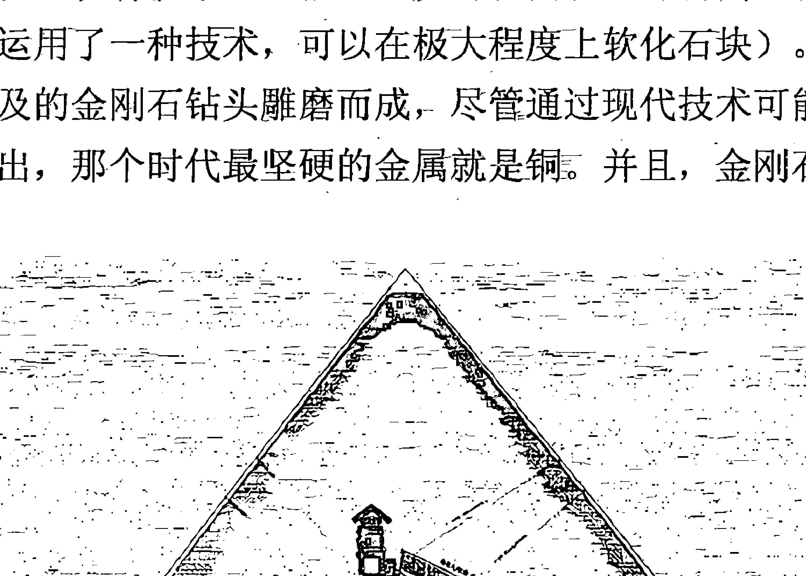

这具精美的石棺刻有可以放置顶盖的凹槽，但是顶盖从未被发现，就好像它从未想被发现似的。很多金字塔研究者，包括彼得·勒梅热勒（Peter Lemesurier），认为这具“敞口石棺”代表了一个不再有死亡的时代，也就是即将到来的黄金时代。石棺里面是空的，没有证据表明里面曾经放置过木乃伊。并且，这具花岗岩石棺不可能通过前厅放进去，这就意味着它一开始就要在金字塔内部建成，而这与任何已知的埃及入葬方式都完全不同。

不过这件事情过了很久之后才被发现，国王墓室和皇后墓室的南面与北面的墙壁立面都置有通风竖井，成上升型角度一直通到金字塔表面之外。这就为里面每个房间的通风提供了足够的氧气。在20世纪中期，鲁道夫·冈特布林克（Rudolph Gantenbrink）将一个迷你机器人送入了通风竖井上方大概65米的地方，并确认了南面的竖井指向尼塔克星（Al Nitak），也就是参宿一（Zeta Orionis）。北面的竖井指向天龙座α（Alpha Draconis），也就是公元前三千年时的北极星。皇后密室北面的竖井指向了北极二（Beta Ursae Minoris），南面的指向了天狼星（Sirius）。所有的这些对齐排列可以追溯到公元前2500年左右。那是距离现在最近的一次对齐时间。据古文明学家约瑟夫·约施曼（Joseph Jochmans）称，“鲍瓦尔（Bauval）跟吉尔伯特（Gilbert）通过电脑计算得出，由于岁差的原因，公元前2450年印在通风管道内壁上的星象分布图案，在公元前10500年左右也被描绘过。”埃德加·凯西1932年6月30日的一篇文章称，大金字塔与斯芬尼克斯的建造也始于这一年！

在13世纪，一位阿拉伯历史学家将金字塔比作一个巨型的女性胸部，并注解说，除了卡利夫·阿尔玛木（Caliph Al-Mamoun）雕出的原始入口外，表层石块仍然看起来光鲜亮丽。但是在1356年，一场灾难袭来，第一波地震袭击了埃及北部大片地区，整座城市化为废墟。金字塔受到了严重的震动，导致很多表层石块掉落下来，堆积成山。人们急切地进行重建，于是就用这些掉落的石灰岩当做原材料来建造他们的新首都：“胜利之城”卡海勒（El Kaherah），以及开罗。很显然，那些没有脱落的石块后来被强行卸下来了，因为这些石灰岩纯度很高，成为了绝佳的建筑材料。法国公爵安顾尔（Baron d’Anlgure）在1396年参观了埃及的这一地区，并描述道：“一些石匠毁坏了金字塔表面的大块表层石块，并将它们扔到了山谷内。”他们在尼罗河两侧架起了两座桥，就是为了帮助骆驼队将石块运过来，然后在开罗及卡海勒建造清真寺和宫殿。

随着时间的推移，曾经有关表层石块的伟大传说渐渐地演变成了一则迷信神话。然而，霍华德·维斯（Howard-Vyse）上校自1836年以来在金字塔内部及周围进行的挖掘工作，彻底地否定了怀疑者的论断。维斯发现，金字塔周围堆放着大块石灰岩碎片，在底层周围堆起有50英尺高。他在北面的中间部分清出了一片空地，希望能挖到金字塔的底层及基岩部分。在那里，他发现了两块原始的表层岩石，这就彻底结束了有关金字塔的外面是否有过一层相当平坦、抛光良好的白色表面的学术争论。时至今日，这些原始石块仍显示出精良的雕工，使我们能精确地计算出金字塔斜角的大小。据维斯称，这些雕刻相当完美：“这些斜平面的雕琢就同现代光学仪器的制造一样精确。接缝处几乎无法辨认，其宽度比银箔纸还要薄。”

维斯在1840年发表了他的详细测量数据及笔记，他的助手约翰·佩林（John Perring）也在同年出版了自己的书籍。这为“金字塔学”开创了一个全新的局面。约翰·泰勒（John Taylor）是19世纪《伦敦观察家报》（London Observer）的一名编辑，他同时也是一位才华横溢的数学家及业余天文爱好者。在他年过半百的时候，维斯的研究数据才从埃及传来。随后，泰勒就开始了30年的严谨调查，研究并分析了所有金字塔内部及周围的报道数据，试图找出其中隐藏的数学和几何公式。泰勒发现，如果以英寸测量底部的周长，得到的数据大概为366的100倍，如果以25英寸来切分底座边长的话，又会得到366这个数字。为什么是366？这个数字与一年的时间异常相近，那就是365.2422天。泰勒发现，如果略微改动一下英国英寸的大小，这些数字可以完全精确地与地球年相对应。这到底是一则牵强附会的数学谎言，还是一个背后隐藏着重要科学理论的惊天证据？当一场极其幸运的“巧合”在几乎同一时间出现的时候，这则谜题马上就被解开了。

赫歇尔爵士（Sir John Herschel）是19世纪之交英国备受尊敬的天文学家之一，他最近在尝试发明一种全新的计量单位，来代替现存的英国计量系统。他想严格根据地球的尺寸来建立这一计算单位。在对泰勒的研究毫不知情的情况下，赫歇尔使用了当时最精确的地球尺寸，并指出，我们应该使用一个比正常英寸长度稍长的英寸，也就是人类头发宽度的一半，或1.00106英寸。赫歇尔批评了法国人用地球的弧度（会变动）来确定米制，而不是用从一极到另一极的直穿地心的直线。英国测量局最近确定了地球两极之间的距离为7898.78英里，或500500000英寸。如果将英国英尺长度略微增长一些的话，这一数值将会是50000万英寸整！赫歇尔认为，官方应该将现有的英国英尺增长，以达到这一真正的科学测量单位。更改后英寸的50倍刚好是地轴长度的一千万分之一，它的25倍将是非常实用的腕尺长度，即上文所说将金字塔边长以25英寸作为1“金字塔腕尺”（cubit），并且可以替代现有的码和英尺。赫歇尔不知道的是，泰勒早已通过金字塔尺寸发现了完全相同的单位数据！当泰勒发现这些时，他彻底被震惊了。他现在掌握的强有力的证据，证明金字塔的建造者一定是知道此星球确切的球体尺寸，从而在其之上建立了他们的测量体系！这再一次暗示了古埃及人拥有我们通常不承认的先进技术。勒梅热勒曾说，在1957年的国际地球物理年，科学家们精确地通过卫星测量了两极间的地球直径，比赫歇尔时期的测量要精确得多。这时，我们知道了“金字塔英寸”确实是地球两极之间直径的 1/50000，两者之间的联系如此紧密，精确度达到了小数点后多个位数！这一数学上精确的数据表示，大金字塔的底座周长设置确实是为了反映地球上一年的时间长度。这些地球层面的精确数据，在金字塔的内部及外围反复出现，并且非常明显。

然而，当测量大金字塔的对角线时，我们发现了更大的秘密。这里的对角线指的是从金字塔的一角，越过顶端，达到另一角的长度。这一长度为 25826.4 金字塔英寸，与现代计算的岁差长度（大约 25771.5 年）极其相近！

很显然，大金字塔的建造者想让我们使用“埃及英寸”。运用埃及英寸，我们将金字塔的对角线相加得到了岁差，这显然是要我们对这一伟大的周期加以注意。这些建筑师们很显然知道地球的确切尺寸，因此很可能游历四方，在世界各地的古文化中播下各种各样的神秘古代神话之种。就像桑蒂拉纳和冯·戴程德在《哈姆雷特的石磨》一书中一遍又一遍地揭示的那样，每一则古代神话中的隐含讯息都指向了岁差，也就是许多古文化所称的大年（Great Year）。原始山、奔奔石、湿婆琳伽、翁法洛斯石、伯特利石及天房中的圣石，还有玛雅、古埃及、印度教、佛教、古希腊以及古罗马这些世界各地的象征符号，都指出了一个曾有的全球性的共识：大年结束之际会出现松果体的“觉醒”。

这样看来，大金字塔又成为了祖先们试图永久保留信息，以便传达给后代的途径。梵蒂冈似乎知道了这一事实，所以他们在他们巨大的松果塑像旁边，放置了一具敞口的、埃及风格的精美石棺，并且两侧还有贝努鸟（凤凰）的形象。

如果大金字塔的确想传达某种符号讯息，那么这则讯息中另一处明显的地方就是，建筑师似乎刻意没有完成外部的建造。在金字塔上方有一处平坦的正方形区域，刚好能放置一块金字塔形状的压顶石（伯特利石的另一种形式），从而完成整个外形。我们再来想想大金字塔是如何完好地保存地球的确切尺寸的，这样我们就能很容易理解《解码大金字塔》的作者彼特·勒梅热勒的话了，即大金字塔被压平的顶部，意味着地球跟它一样在某种程度上没有完成建造。

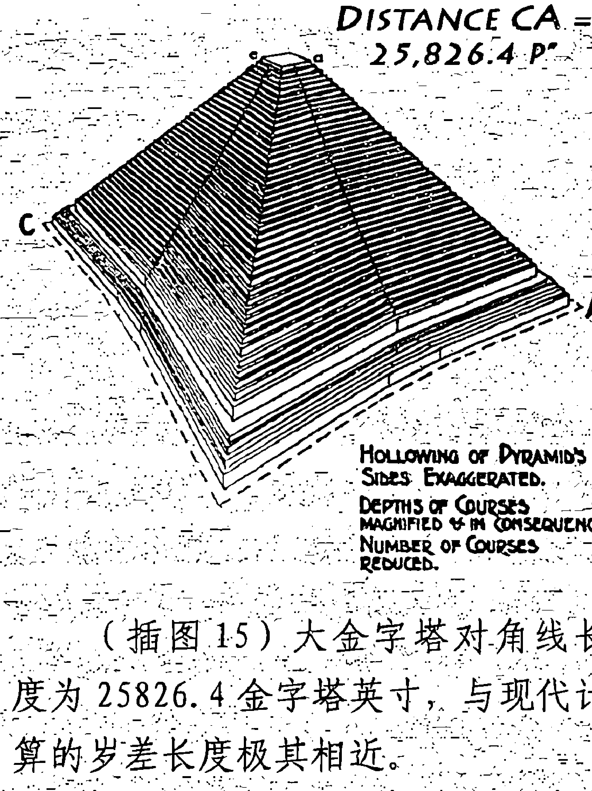

一种可能是，金字塔的建造者们可能有意在某个时间回归，也许是大年结束之日，来完成剩下的建造工作。压顶石的回归同时也将金字塔从一个六面体转变成一个五面体。据勒梅热勒介绍，在埃及数字命理学中，六代表“缺陷”，五代表“神圣启蒙”。我们已经知道，底部周长代表了一年的长度，对角线长度代表了岁差周期，这就表明，岁差周期将会通过使我们获得某种“神圣启蒙”，而最终移除人类的“缺陷”。

### 美国国玺

可以理解，一些人会认为金字塔的“数字命理”不靠谱，没有确凿的科学依据。然而，没人能否认这一符号讯息被永久地铭刻在美国国玺背面的事实。一个内部画有奇怪眼睛的三角形，放出的白色光芒向下投射到一个13级的金字塔上。自20世纪30年代以来，你可以在任何一张流通的美元上发现这一图案。国玺的创造首次被提出的时间，就是在美国《独立宣言》的签署之日：1776年7月4日。托马斯·杰斐逊当时委托了一名法属西印度群岛的肖像画家厄让·皮埃尔·德·拉稀米切尔（Eugène Pierre Du Simitiere）设计了最初的国玺图案，这一设计随后被杰斐逊、本杰明·富兰克林以及约翰·亚当斯（John Adams）所认同。

即使在这些早期的版本中，也有一只光芒万丈的独眼“上帝之眼”，出现在金字塔的上方。最初写在金字塔四周的文字是“Deo Favente Perennis”。“Deo”的意思是“上帝”、“广阔的天空”或“充满日光”。“Favente”的意思是“恩赐、友善、支持与帮助”，“Perennis”是的意思“连续、持久、永恒和不朽”。那么，这句话大致的翻译就是“上帝永远赐予（我们）恩惠”。在拉丁语中，“Perennial”的意思是“每年的”，也就是一年又一年的意思。所以，这可能是岁差周期的另一参照，即：“上帝支持大年周期”。

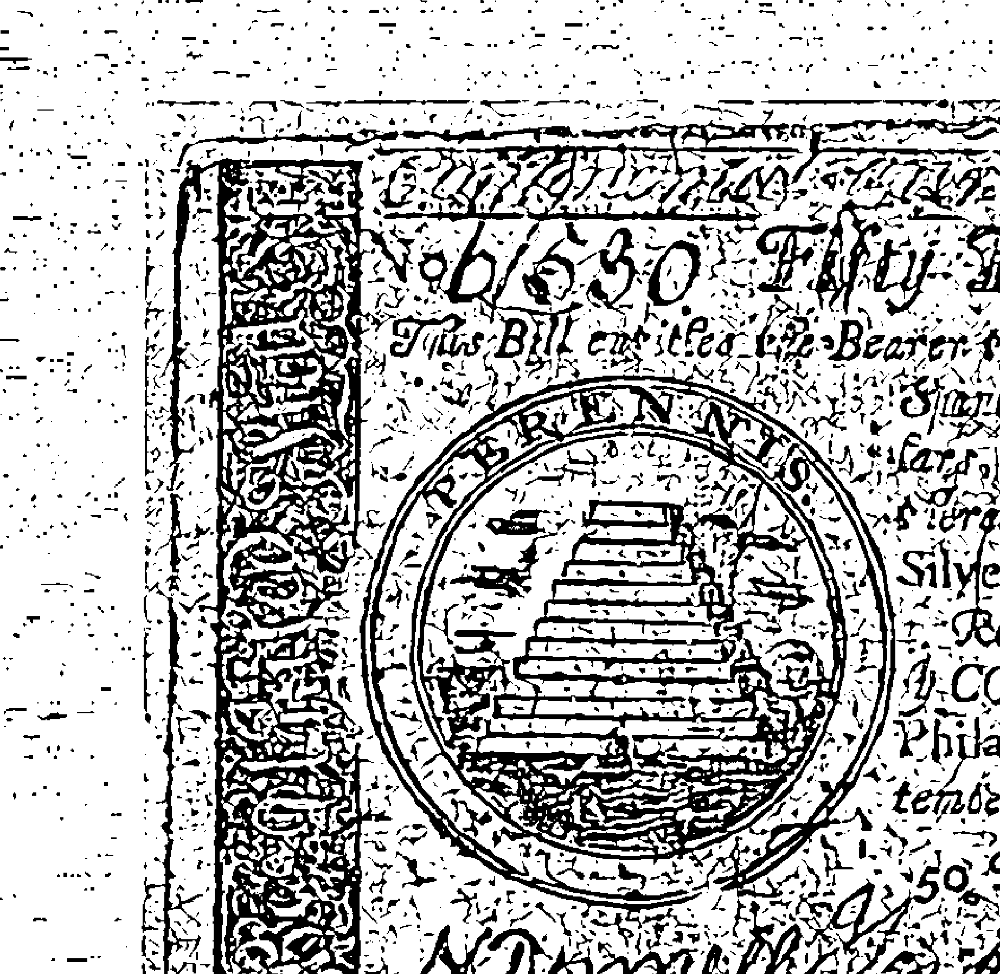

一些早期的美国货币将这个未完成的金字塔当做主要符号印在正面，不过最上方没有上帝之眼。我们现在知道，金字塔也是一块圣石，它是许多古文化中松果体的象征。也许美国的国父们觉得这个明显的“共济会”符号，三角形内有一个觉醒的松果体或者“第三只眼”，对早期的美国殖民者来说争议性太强了。所以，他们就在上方写下了这个词“PERENNIS”。

到1782年，对国玺的后续修订将文字改成了我们今天看到的样子：上方写有“Annuit Coeptis”，下方写有“Novus Ordo Seclorum”字样。这些文字将讯息内容阐述得更加清楚明了。“Annuit”的意思是“恩赐或赞许”，通常表示点头同意；“Coeptis”的意思是“许诺”，以及“起始、开头和开始”。当我们把上帝之眼也算作代表上帝的标志的话，这句话就会翻译成：上帝自初始就施泽于人类。然而，这句话还有更深的符号意义。“Annuit”这个词与另一个意思为“每年”的拉丁语单词有关，这就是“年度的”（annual）这个词的来历。对“annuit”的一种译法是“年度报偿”。所以，Annuit Coeptis也可以表示“大年开始”。我们期望从大年得到的“报偿”似乎被写入了符号之中，也就是地球的转换，新岁差周期的开始。

1782年，查尔斯·汤姆逊（Charles Thomson）将“Novus Ordo Seclorum”这句话印在了美国国玺之上，当我们细细研究这句话的根源时，讯息就逾加清晰了。官方记录公开表明，汤姆逊当时是受到了维吉尔（Virgil，古罗马诗人）《牧歌集》（Eclogue）中第四首诗的启发，我们将马上谈到这点。这句话的原始拉丁文是“Magnus ab integro seclorum nascitur ordo”，并被理解为：神圣的千年循环即将重新开始。这听起来很像在形容大年的岁差周期，也就是“神圣的千年循环”现在“重新开始”，这其中的一段过程就是黄金时代。

### 伟大的罗马先知

在我潜心研究的最初几年，在大约1994年的时候，我找到了出自美国第四炮兵中尉C.A.L.陶恩（C.A.L. Totten）的话，他解释了国玺更深层次的意义。这是他写给财政部长查尔斯·J. 富尔杰（Charles J. Folger）的一封信，并于1882年2月10号发表：

> 全视之眼是描述造物主的众多象形文字之一。同样，三角形是上古时代的神秘符号……在这个三角形里面有一个神秘眼睛的图案，以压顶石的形式传承下来，直到这个震撼世界的神秘遗迹（大金字塔），这对我们人类种族来说具有重大意义。这句铭文：Novus Ordo Seclorum，是来自《牧歌集》第四首诗的一句引言，同时这句话也是维吉尔从神秘的《西比尔预言书》（Sybylline records）中借来的。

陶恩继续给出了确切的引言，内容非常令人震惊。不过在那之前，我们先来仔细分析一下“神秘的西比尔预言书”，好对相关的背景知识有所了解。在罗马形成初期，“Sibyl”（西比尔）这个名字是从希腊语“sibylla”演变而来的，意思是提供预言的女人，也就是神使。德尔斐（Delphi，希腊古都）的神使掌管着翁法洛斯石，它象征了松果体，人们相信可以通过它直接跟阿波罗神进行心电感应。古代世界一共出现了十位著名西比尔，他们出现在波斯（Persia）、利比亚（Libya）、德尔斐、萨摩斯（Samos）、西米里（Cimmeria）、厄里斯拉（Erythraea）、泰伯（Tibur）、玛尔珀索斯（Marpessus）以及弗里吉亚（Phrygia），不过最受尊敬的还是西比尔（Sibyl），她曾经居住在那不勒斯附近的一处洞穴中。库迈处在维苏威火山附近的一处火山区域，是希腊在意大利建立的第一个殖民地。1932年，人们发现了西比尔的洞穴，洞穴顶部高60英尺，由一条长375英尺的道路通入其中。这一发现从此消除了她只是一个神话人物的传说。这位西比尔会将她的预言写在橡树叶上，随后便从数百个入口中的一个走出洞穴。如果有人前来洞穴，但是没有捡起橡树叶的话，这些树叶就会直接被风吹走。

2001年，《国家地理》杂志上的一篇文章提出，神使的神秘能力也许是因为洞穴里自然散出的乙烯一类的迷幻气体的作用。德尔菲的神庙附近的温泉水中被检测出含有乙烯，乙烯味道发甜，可以起到麻醉作用。显然，西比尔常常坐在青铜三角祭坛之上，而祭坛下方刚好是山洞内的一处洞穴，火山气体可以沿着它上升进入其中。在她进入恍惚状态接受预言之前，她还会吞下几滴月桂汤。维吉尔在《埃涅伊德》（Aeneid）中对处于施与预言状态的西比尔进行了详细的描写。她的行为举止很明显地表明，她处在强烈的催眠状态下。

> 她的面色变化无常，头发向上竖起；她胸部起伏，气喘吁吁，那狂野的心激烈地跳动，嘴中吐出白沫，发出骇人的声音……她在洞穴中来回走动，不停地挥舞手臂，仿佛能将上帝从胸口赶出。

在第50届一年一度的奥林匹克运动会和建造罗马城期间，西比尔带着她的九本预言书来到塔尔坎国王（King Tarquin，于公元前534～510年间执政）面前，声称书中记录着罗马未来发生的所有事件。这位消瘦的老妇人向国王索要九袋黄金作为报酬，但国王拒绝了这一无理天价。于是她当着他的面，当场烧掉了九本书中的三本。随后，她又以同样的价格向国王出售剩下的六本预言书。国王再次拒绝，于是她又烧掉了三本。看到这一点，国王终于做出了反应，以九袋黄金的价格买下了仅存的三本预言书。这些书被保存在朱庇特神殿中，成为了罗马历史上著名的《西比尔预言书》。在罗马共和国和罗马帝国期间，这些书被祭司们保管并解读。据说，在公元前83至81年的条顿森林战役之前，罗马独裁官卢修斯·科尔内利苏拉（Lucius Cornelius Sulla）曾命令他的军队在卡比托利欧山（Capitoline Hill）上为朱庇特神殿奠基时，发现了一具被埋葬的尸体，尸体的头完好无损。当祭司们解读了西比尔的预言后，他们声称，这具尸体是属于一位名叫马库斯·瓦莱里乌斯·科拉索（Marcus Valerius Corassus）的英雄。根据预言，如果他的尸体得到妥善安葬，罗马就会繁荣昌盛。但不幸的是，尸体随后在一次火灾中被烧毁了，而这也预示了罗马的衰落。

烧掉了九本书中的前三本，但塔尔坎国王却不把这当回事。然而，这位预言家的名望越来越响，当她再次回来时，她以相同的价格向塔尔坎提供剩下的六本书。塔尔坎再次拒绝了。于是她又当着他的面烧掉了后面三本书，她显得越来越疯狂了。尽管如此，当她带着最后三本书回来时，她已经因为其准确的预言变身为一个真正的传奇。尽管她仍旧索要九袋黄金，但国王的顾问催促他赶快同意。于是国王最终接受了她的要求。

不管现代的怀疑论者对预言术持有何种态度，西比尔预言却迅速成为了全罗马最有价值的财宝，其价值超越了任何政府资产。它们以其极高的准确度而闻名，其中包括一则在事发 700 年前预言的有关汉尼拔（Hannibal）入侵古罗马及最终战败的事件，以及在康斯坦丁（Constantine）出生前 800 年准确预言他的名字。在国家发生重大突然事件，诸如地震、洪水、飓风、疾病及贫困时，这些预言就会被人们当成重要的参考指南。米开朗基罗甚至还在西斯廷大教堂天花板著名壁画中，加入了西比尔这个角色。

如同西比尔向塔尔坎描述的那样，这些书中的确记录了罗马的未来。但问题是，预言都是用神秘语言写成，所以有时难以理解其含义。有好几次，当罗马皇帝想通过书中的神秘文字来避免重大灾难时，他通常只是见证了预言成为现实，而无法如愿阻止其发生。于是这些书籍被认为藏有潜在的危险；如果试图通过它们来阻止灾难，也许会适得其反。于是这些书籍就被藏在罗马卡皮托尔山上的朱庇特神庙的地下密室中，并且把守森严，只有大祭司得以进入。朱庇特神庙及其中的密室于公元前 500 年建成，特地用来存放这一宝物，而且在万不得已的情况下，大祭司才会来查阅此书。

罗马元老院认为这些记录非常珍贵，以至于最后整个的祭司团都被任命去寻找或重新预言前六本书的内容。但是他们再也没能成功修复这位西比尔的原作。当马尔库斯·阿蒂利乌斯（Marcus Atilius）不顾官方保密要求，授权某人去复制那三本原版书籍时，他被处以了死刑。他们将他缝进一个袋子里，抛进了台伯河（the Tiber River）。在公元 82 年，维吉尔终于被允许将一些内容收入到他的《牧歌集》中。随后他们在公元 83 年将朱庇特神庙烧毁，销毁了大部分原版内容。斯提里科（Flavius Stilicho）将军认为这些预言属于异教，“充满邪恶”，于是在公元 405 年烧毁了剩下的部分。五年后，当西哥特人进军罗马时，有人就认为这是他们销毁预言书而受到的惩罚。

于是《牧歌集》的第四首诗就成了录有西比尔预言的最后一部文本。而美国国父们直接从这些神秘文字中引用 “Novus Ordo Seclorum” 这句话，而且还在 1872 年将其与大金字塔结合起来，设计为美国国玺图案，这着实让美国国父们的故事显得更加有趣了。彼得·汤普金斯在其著作《大金字塔的秘密》中对此有所描述。

一位名叫曼利·P.豪尔（Manly P. Hall）的共济会专家称，不仅许多美国政府的创始人是共济会成员，他们还得到来自欧洲的一个令人敬畏的神秘组织的帮助，协助他们基于一个只有少数初始成员才知道的特殊目的创建美利坚合众国。豪尔说，国玺就相当于这个崇高组织的署名，而它背面那个未完成的金字塔，“是象征性地摆在这个任务前的一个脚手架，而这个要完成的任务是美国政府从建国之始就献身其中的”。他们显然想用鹰来表示凤凰，或者一个象征人类灵魂不朽的标志。将金字塔和凤凰的标志印在一美元的纸币上，使得这两个象征符号广泛流通。

想想美国的建立从一开始就是基于一个秘密目的，这的确令人震撼。而且这一目的看起来与大年岁差的结束，以及有关即将到来的黄金时代的预言有着直接的关系。基于我们在第三章的调查证据，国玺现在似乎成为了这一古代符号最现代的版本，而这一符号曾经在希腊及罗马钱币上有明显的印铸。这个“令人敬畏的神秘组织”似乎起源于苏美尔、巴比伦以及埃及，并且拥有神秘技术，可以“打开”松果体。

现在让我们回到陶恩中尉的那封信，信中描述了写有“Novus Ordo Seclorum”（时代新秩序）这句话的西比尔预言原文。当我在1994年第一次读到此信息时，我完全被震惊了！令我更惊讶的是，几乎没人知道这件事。西比尔将历史分为了一系列的“时代”，她在这篇文章中提到了她所述故事中的最后一个“时代”，也就是那首“库迈之歌”。下面是陶恩在1882年所写的西比尔神秘预言原文的翻译，请谨记，这些是原封不动地摘抄，并简写在美元背面的文字。

> 库迈之歌的最后时代来临了。Novus Ordo Seclorum（由 Magnus Soeclorum ordo 改写而来），一个强大的新时代秩序诞生了。预言中的处女座王国及土星王国都将回归。全新的上帝之子从天而降。恩赐予纯洁的鲁西娜，男婴即将诞生，来结束这黑铁时代，随后，一个黄金种族将在整个地球重新崛起。

让我们来回顾一下这段文字中的惊人部分：“……最后的时代来临了。一个强大的时代新秩序诞生了……全新的上帝之子从天而降。”“子”的意思是子女、后代，这很明显是在描述某种伟大时代结束之时的人类物种转变。这一全新的上帝之子是什么样子？下面的文字揭示了答案：“男婴即将诞生，来结束这黑铁时代，随后，一个黄金种族将在整个地球重新崛起。”这暗示了关于人类种族发生转变的预言，并不仅仅指救世主耶稣。而这句话，“预言中的处女座王国和土星王国都将回归”，则表明其他种族将会协助我们完成这次转变。

当我们继续阅读维吉尔《牧歌集》第四首诗余下部分的其他翻译版本时，更多的细节浮现了。

> 在您的指导下，不论还残留什么旧有的恶习，一旦清除殆尽，将使地球从永无止境的恐惧中解脱。他将得到天神般的生命，并且看到诸神化身成的英雄，而他也将是其中之一，随着天父的出现，平静安宁地统治世界……显现您的伟大吧，一切即将来临，亲爱的上帝之子，伟大的朱庇特（Jupiter）之子！看，万物都在摇晃——世界那全能的力量，土地、广阔的海洋以及深邃的苍穹。看呐，这一切，都沉浸在新时代来临的喜悦当中！

从这段文字来看，的确预言了“诸神”的回归，并且地球上的人类将“得到天神般的生命”。而这就是美国国玺，印在美元背后的美国国玺！很显然，这些预言显示，一旦转变完成，我们将变为“神”。这些西比尔预言大胆地呈现了一个有关黄金时代到来的预言，在这黄金时代，“黄金种族将重新出现在整个地球”，也就是指现在地球上的所有人。国父们很显然意识到了西比尔预言、大金字塔的象征意义以及被“打开”的松果体之间的关系。再来看一下，当我们检测大金字塔的外部结构时，对角线之间的距离是25826.4金字塔英寸，刚好是岁差周期的长度。压顶石刚好坐落在那些对角线之上。当我们把这些点连在一起，就会发现，国父们显然相信金字塔压顶石的回归象征着大年周期结束时，人类历史将会迎接一个全新时代的诞生。这就会带来那个经常被预言的、并且古代神话中也谈到的黄金时代，而且会伴随着人类向神的转变，以及原始创造者的回归。再看看压顶石与圣石之间的关系，我们可以清楚地看出，他们坚定地相信，这一预言与松果体的“觉醒”之间存在联系。

### 光明会

在本书之外，有大量证据证明那个“来自欧洲的令人敬畏的神秘组织”至今仍在活动。我们已经分析过松果体的符号象征是怎样贯穿于共济会、玫瑰十字会以及其他团体（包括罗马教廷）当中，越来越多的人开始怀疑，世界政治正在上演种种黑幕，并且我们选举的领导人或许并不是幕后操纵者。我之前已经谈到过，一些研究源场的人可能会遭到威胁、曝光、伤害甚至谋杀。现在网络上已经布满了有关此事的文章及书刊，其中不乏充满恐惧与末日审判情节等负面信息的文章。有关黄金时代最初的正面预言似乎被曲解了，在数千年的时间中逐渐变成了一个“世界新秩序”的扭曲概念，也就是，一个多种族的世界精英权力团体，想通过大幅度削减地球人口，从而达到世界性独裁。在我看来，有关此主题最全面的描述应该是威廉·T·斯蒂尔（William T.Still）的《世界新秩序：神秘社团的古老计划》（New World Order:The Ancient Plan of Secret Societies）。网络上自1990年以来，很多有关“世界新秩序”的最好引言，都出自斯蒂尔的这本书。

让我说明一点，我不以任何方式支持这些世界精英的政治、政策、教育、欺骗与谎言，包括斯蒂尔在内，很多人将他们称为“光明会”（Illuminati），意思就是“受到启发的人”。这种“启发”很显然是在比喻被“打开”的松果体，这群人认为，他们因为修炼密教，因而高人一等，并且拥有控制整个世界的权力。尽管大家常常认为是这些团体在制造恐惧，但我并不认为我们应该急着谴责那些与这些团体密切相关的人。因为如果我们这样做，我们就又回到老路，仍然停留在二战中希特勒对待犹太人的荒谬态度上。仇恨产生仇恨。每一个人都有生存的权利，种族屠杀是一项反人类的罪行，只能导致我们的下一代变得和他们抵制的人那样可憎。据我认识的一些内部人员称，很多无辜的人都被困在这些组织中，如果可以逃脱出来，将会是一次“大逃亡”。然而，在网络上激起的种种仇恨现在异常高涨，即使这些人有能力脱离组织，也会为自己的人身安全担心，他们也在尽力为世界做点好事。

很显然，国父们很清楚这些有关黄金时代到来以及人类将经历大转变的预言。那些伟大的宗教，以及很多神秘传统，似乎都来自一个世界性的共同源头。他们也许是在生物及灵性进化层面远远高于我们的种族，所以我们会将他们称为“神”。在不同的权力组织中，黑暗、秘密以及金钱的束缚很可能已经扭曲了这些讯息的初衷。我相信这些组织里的很多人一直在为人类服务，但是由于他们被强迫保守秘密，那些少数人的恶毒与欺骗，致使其他很多人受到惩罚，这是非常可耻的事。由于早些年的好运，以及我的网站与视频近几年的广泛传播，我有幸见到了几位还健在的秘密继承者。我确信改变将会发生，这些组织现在也意识到，他们并不需要崇尚那些负面的、自恋以及自私的成员，他们自己也可以获得对这一古老使命的全面理解。我相信，这其中的秘密就是“凝聚”，让这颗星球重新回到它起源时的爱的本质。这不是什么古老迷信教导，这是一次积极的、发展中的科学调查成果。把这当成负面的迷信习俗是对事实的严重曲解。

尽管国父们将金字塔融入了他们的设计，我们却无从知晓他们到底对事实了解多少。这一传统已经相当古老，并也曾风靡全球，但在这之前，一场可怕的洪水差点摧毁了他们的整个文明。自从最初的教导开始，随着时间的流逝，我们被逐渐牵涉到一场传话游戏中，讯息越传越扭曲，越令人迷惑。不管怎样，大金字塔是一座宏伟的建筑奇迹，并且远远超出了我们现有的建筑技术。不管修建它的是高度发达的古老类文明还是外星人“上帝”，或者二者皆是，大金字塔都包含了理解即将到来的黄金时代所需的一切信息，这些信息或许还能帮助创造那个“新地球”。

当我们进入下一章，我们会发现亚历山大·戈洛德（Alexander Golod）博士自1990年开始，是怎样在俄罗斯和乌克兰建造大量的金字塔。许多俄罗斯顶级科学家的确对它们进行过研究，他们也证实了先前很多对“金字塔能”及其神秘功效的猜想。这些发现可能会在很多方面彻底改变我们的社会。这就好像给予了我们一笔巨大的遗产，有真实意义的遗产，比世界上全部的金钱还要有价值的遗产，而且它一直就在那里，等待我们准备好，去重新发现。金字塔的建造技术确实要比我们想的还要先进，并且可以彻底改变世界，以及人类的生活。唯一阻碍我们前进的是，我们的科技尚未先进到足以让我们确认和理解这一高级技术。

## 第八章 “金字塔能”是开启黄金时代的钥匙？

古代的预言并不是说一次全球范围内的物种大灭绝，而是预示着即将到来的黄金时代。我们已经发现许多大金字塔的测量值细节，包括地球的大小、一年的精确天数、地球与太阳之间的距离、各行星的分布、星星的对齐、岁差，这意味着金字塔的建造者们也许还有传播远古世界的传说与传授宗教预言的职责。是不是金字塔本身的结构就是我们本应传承的信息的一部分？它会不会是一种我们主流科学尚未发现的技术？

金字塔能研究热潮曾经在20世纪70年代被怀疑论者嘲笑为大众的短暂轻信行为。关于金字塔能的那些令人兴奋的故事，大多来自一个叫做安东尼·鲍维斯（Antoine Boviš）的法国人在20世纪早期研究金字塔的经历。上世纪70年代关于金字塔传说的书都提到，鲍维斯在国王的墓室中发现了一个垃圾桶，里面是猫和其他动物的尸体。奇怪的是，它们并没有恶臭也没有腐烂，而是保持完好，并脱水木乃伊化了。如果大金字塔真的是座坟墓的话，那么埃及人就不需要精心地把法老的尸体做成木乃伊，只要把法老放进金字塔的石棺里，然后等着“见证奇迹的时刻”，再拿出来就变成木乃伊了。

然而这些传说并未得到历史的尊重。1999年，前埃及自然博物馆馆长对一个丹麦怀疑论者说，在国王墓室里根本没有发现过什么装有动物尸体的垃圾桶。还有，尽管那些作者们把鲍维斯的感受描述得有声有色，仿佛他们当时就在观察那个垃圾桶一样，但是事实是鲍维斯从未离开过法国，关于他游历埃及金字塔的故事，是因为那些作者们误解了他的工作。真实的故事是这样的，鲍维斯在法国的家中做了一个结构和大金字塔一样、三十英寸高的模型，他实际是在说，在金字塔模型的国王墓室位置放置的猫的尸体，最后变成了木乃伊。这位丹麦怀疑论者延斯·兰枷德（Jens Laigaard）说，鲍维斯也不完全是在忽悠人。

许多人试过将各种食品放在金字塔里，他们很多人都断言金字塔能可以保鲜鱼、肉、蛋、蔬菜、水果和牛奶。金字塔能可以让各种鲜花保持颜色和芳香。此外，咖啡、酒、液体和烟草从金字塔中拿出来后，散发出一种令人胃口大开的香味。

怀疑论者的网站转载了这位丹麦作者的文章，并在结尾处表达了他们真实的想法：“鲍维斯是通过理论推理和神秘学实验得出他的观点的。”

尽管那些怀疑论者依旧拒绝承认，但进一步的研究表明，在上世纪50年代，捷克无线电工程师卡雷尔·德巴尔（Karel Drbal）用数只不同的动物，成功地复制了鲍维斯的“理论推理和神秘学实验”，那些动物尸体保鲜得非常好。

德巴尔是这样总结的：“金字塔的形状和内部空间存在着某种关联，并且在内部空间中产生了物理学、化学和生物学过程。”尽管他还不确定为什么会出现这种现象。据称，1959年，德巴尔首次发现把钝的剃须刀片放在由硬纸板做成的金字塔中，刀片会变得锋利。在那个时期的东欧很难找到锋利的剃须刀片，因此人们对金字塔剃刀伎俩真的奏效显得兴致盎然。然而布拉格专利局拒绝了德巴尔的专利申请，除非有主流科学家能够获得相同的实验效果。但是最终德巴尔成功了，他获得了捷克斯洛伐克第91304号专利，专利名为胡夫金字塔剃须刀研磨器。直到1973年莱尔·沃森（Lyall Watson）出版他的著作《超自然》（Supernatural）时，这种产品还在用塑料泡沫进行生产。

不只如此。2001年俄罗斯科学家沃洛·克拉斯诺霍洛维茨（Volodymyr Krasnoholovets）发现金字塔结构可以改变剃刀刀刃的分子结构。他复制了德巴尔的传奇剃刀实验，并且通过电子扫描显微镜摄像技术证实金字塔结构可以改变剃刀刀刃的分子结构。与德巴尔之前发现不同的是，按南北方向放置刀片，刀片不会变得锋利。而按东西方向放置刀片，则刀片会出现明显的、可测量的钝化现象——在显微镜下，可观测到刀片原本平直的表面变得崎岖不平，呈现类似波浪状的形态。对于传统科学来说，这种现象显然无法解释。

《超自然》一书的作者莱尔·沃森同样也用鸡蛋、牛排、死老鼠复制了鲍维斯的原始实验，最终发现“放在金字塔里的保存得很好，同时那些放在鞋盒子里的已经发出令人作呕的味道了”。我不得不得出这么一个结论，用纸板做的胡夫金字塔模型并不仅仅是一堆随机拼凑的卡片，而是具有特殊的属性。下面沃森会举例分享更多有趣的信息。

- 一个法国公司曾经发明了一个用来制作酸奶的特殊容器，因为这个容器的特殊造型提升了制造过程中微生物所发挥的功效。
- 捷克斯洛伐克的一家酿酒厂试图将它们储存啤酒的容器从圆形改成带角的桶，但是发现这一改变导致了啤酒质量的下降，然而酿造过程没有做过任何改变。
- 一个德国的研究者发现受同样伤的老鼠，被放在圆形笼子里的那些恢复得更快。
- 一个加拿大的建筑师在报告中说，生活在梯形病房的精神分裂症患者病情得到了突然的改善。

这种听上去令人瞠目结舌的发现有可能是真的么？ 关于这点，我可以理解怀疑论者的反应。在美国，这种类似的研究很少，而且这看上去也违背我们挚爱的物理定律。在西方几乎没有人意识到俄罗斯也在研究源场，并对这些奇异现象做出了崭新的、极佳的解释，关于这个我们将在后面几章里讨论。在这一章，我希望各位耐心地听我解释金字塔可以做各种不同的事，因为除非你现在所知道的所有这些发现，否则任何初步的解释对你来说都是不完整和难以理解的。我们祖先非常清楚这种技术的价值，他们从历史中总结出最完美的结构，那就是金字塔结构，而不是大方块之类的。从埃及到南非还有许多其他宏伟的金字塔，而且新的研究表明，在波西尼亚、意大利、希腊、斯洛文尼亚、俄罗斯以及中国也可能存在金字塔，只是这些金字塔大部分被泥土、树木或者其他植被所覆盖，所以很难辨认出那就是金字塔。其中的几座很像是把自然形成的山“雕刻”成金字塔形状。波西尼亚太阳金字塔是吉萨大金字塔的两倍大，这片山区在几何对称上与附近的其他山丘比起来很不寻常，非常引人注目。

为什么古人钟爱于这些笨重的巨石建筑，甚至把山都削成金字塔型，或者把金字塔建筑用泥土或植被再覆盖住？这一直都没有一个合理的解释。为什么世界各地不同的文明都会不约而同地用高超的技术去建造相同的结构？

### 重启金字塔能

不管事实如何，金字塔能的概念在2001年以前就如同一个个零散的都市传说一般，直到约翰·狄沙夫（John DeSalvo）博士建立了吉萨金字塔研究协会网站，首次对西方世界发表了一份关于俄罗斯金字塔的最新研究成果。这个故事还要从 1990 年说起，那时，莫斯科科学家兼国防工程师亚历山大·戈洛德（Alexander Golod）博士开始在俄罗斯和乌克兰境内修建大型金字塔。2001 年时已经在 8 个地方建好了 17 座，截止 2010 年夏天，在全球范围内已经建造了超过 50 座这种金字塔，但大部分仍然在俄罗斯和乌克兰境内。

戈洛德博士的金字塔内部框架由 PVC 管搭建，再覆盖一层玻璃纤维的膜使其表面看上去更加光滑整洁。这些金字塔都是按照 1:1.618 的黄金比例制作的，这个比例是一种很普遍的生物生长模式，比如海螺壳的旋转图案。这种比例导致戈洛德的金字塔比吉萨大金字塔看上去更加陡峭，斜坡的角度达到了 70 度。在基座周长相等的情况下，戈洛德的金字塔向上伸展达到了大金字塔的 2 倍，这使得戈洛德金字塔看上去更加像方尖碑、教堂的尖顶或者古希腊或古罗马硬币上的巴特利石。

戈洛德最大的金字塔高 114 英尺（约 44 米），重量超过 55 吨，花费了超过一百万美元，历时 5 年才建造完成。这个金字塔采用了无金属元素的非导电材料，并在 1999 年完工。戈洛德发现，任何金属出现在金字塔结构中都会导致“魔法”的效果明显下降，如果金属没有完全被去除，似乎会对金字塔的神秘能量场产生一种吸收效应。这是金字塔设计的一个关键因素之一，如果不重视的话就会被怀疑论者抓住把柄。在美国首都的华盛顿纪念碑被建成一个方尖塔的形状，或许是另一个试图利用（被美国政府隐瞒的）这种技术的尝试，但是这个金字塔形状的碑含有大量的金属材料，因此不会像戈洛德的金字塔那样有效。

约翰·狄沙夫博士的吉萨金字塔研究协会网站总结了戈洛德博士以及他同事们的研究成果。

> 我们在这些金字塔中完成了医学、生理学、农业、物理和其他领域的许多不同的实验。这项工作的意义在于，俄罗斯和乌克兰的顶尖科学家们，对金字塔内部发生的变化做了详细的记录。

正如你所见，这根本不是超自然或不切实际的科学，这是一项严肃的、高水平的、并且花费了大量人力物力的实验。当我在 2001 年读到沃洛·克拉斯诺霍洛维茨的摘要时感到很吃惊。尽管英文翻译版本很难理解，但我的确理解了书中的内容，并且这是一个来自前苏联军工许多顶尖高手的跨学科的研究成果。苏联解体后，他们仍然可以使用实验室和经费，但不再用于战争目的。

# 谁设计了宇宙/原场调查，万物背后的神秘推手与即将来临的黄金时代

戈洛德博士的金字塔为科学探索提供了极好的机会。但这个故事悲剧的一面，则是没有主流的学术期刊愿意发表他们的研究成果，尽管他们的研究是严格按照科学方法进行的。这种情况的主要原因，也许是这些发现将会颠覆传统逻辑。

生命的金字塔网站说，这些金字塔受到了全世界的关注。

成百上千的人，包括著名演员、歌手、雕刻家、领导人都曾经参观过这个最大的俄罗斯金字塔。这座金字塔在亚历山大·戈洛德的监管下完成建造并进行研究。日本、韩国和西藏的僧人对这个金字塔也很感兴趣。他们把这个金字塔作为理想之地，意思是宇宙就在其内。俄罗斯科学研究院（Russian Academy of Sciences）的科学研究印证了僧人们的说法。所有的研究表明，金字塔会对人的生理产生正面的影响，摆在里面的水晶等物品也会如此。

终于，戈洛德博士的金字塔研究受到了足够的重视，从他的金字塔中拿出的水晶在俄罗斯和平号空间站中飞行了一年，并且俄罗斯宇航局随后在国际空间站中复制了他的实验。生命的金字塔网站说，这些研究如今终于被“CNN、BBC、ABC、AP、《波士顿环球报》、《纽约时报》”等多家大型媒体广泛报道。

当我在2001年读到这份研究时，我被它深深吸引住了，并意识到金字塔的建造技术确实是地球上最先进的。它们已经屹立千年，一直在等待其技术被传承发展，然而由于我们的无知，竟然对这种先进技术视而不见。幸运的是，有一群可信的专业的俄罗斯科学家曾经研究过它们。他们的研究成果证明了金字塔技术及其衍生技术能够拯救我们的世界，同时还能够大幅度改善我们的身体、心理和精神健康。此外，这些研究成果颠覆了以往我们对自身和一般传统科学的认知。当你越是深入地研究，越会被其美妙神奇所吸引。

想象一下，如果你用一颗小小的药丸就能帮助人们战胜病毒，并且药效瞬间暴增3000%。而这一切就发生在俄罗斯医学科学院（Russian academy of medical science）的伊万诺夫斯基病毒研发中心（Ivanovskii R&D Institute of Virology）。克利门科（Klimenko）教授和诺西克（Nosik）博士共同研究了一种人体产生的抗病毒合成物，叫做免疫球蛋白。当这种药物被稀释成每毫升50微克的浓度，并储存在金字塔中一段时间，仅仅几天的时间，它的抗病毒效果大约提升了三倍。奇怪的是，即使药物被稀释的浓度越来越低，但疗效一样很好。通常情况下这种超低浓度，如每毫升0.00005毫克，在抗病毒方面几乎没有任何效果。

如果你认为上面的发现还不够惊人，那么俄罗斯儿科及妇产科研发中心的A. G. 安东诺夫（A. G. Antonov）教授和他的团队所发现的康复能力，看上去就像是奇迹。他们的病房经常收治那些仅能存活数天并患有严重疾病的早产儿。由于他们的一些同事知道金字塔在医疗上具有显著的强化效果，而在药物治疗对于那些早产儿已经没有意义的情况下，他们决定尝试一下非常规方法。他们没有使用任何已知的药物，而仅仅使用了简单的安慰剂样品，即含有40%葡萄糖的蒸馏水，并把它放置在金字塔中，然后给12个几乎快死的早产儿每人注射1毫升这种药水，这些早产儿竟然完全康复了。以前婴儿注射的是普通葡萄糖溶液，但基本没有任何作用。

他们猜想金字塔是否能激活葡萄糖溶液中某种能令人体自我康复的化学成分？唯一能确认是否真的如此的方法，就是换成普通的水，再来做一次这个实验。确实，普通的“金字塔水”的疗效也还不错。

如果把患病的动物直接放在金字塔中会怎样？这同样也是俄罗斯医学科学院研究小组负责人N. B. 叶戈洛娃（N. B. Egorova）博士想要知道的。研究小组让两组实验用小白鼠在相同条件下，同时感染上一种名为鼠伤寒病毒菌株415的感冒病毒。这个实验的唯一区别就是，其中一组小白鼠被关在金字塔内，另一组则没有。神奇的是，在感染少量病毒的实验中，金字塔中的老鼠有60%存活下来，而对照组仅有7%。即使是在感染了足以致命的病毒试验中，金字塔小组的存活率也有30%，而另一组仅有可怜的3%。

叶戈洛娃博士让两组老鼠摄入足以产生恶性肿瘤的致癌物质，然后让其中一组喝“金字塔水”，另一组喝普通水。喝金字塔水的老鼠肿瘤扩散量比另一组明显要少很多。

这种治疗尚未发现有什么危险或副作用。戈洛德小组的金字塔建得越高这种效应越明显，然而就算是最高的戈洛德金字塔也不及吉萨大金字塔的四分之一。但是建造金字塔需要经费，然而对比我们花在养生和补品上的大把钞票，努力寻找一种廉价的治疗方法岂不是更加有意义。如果一毫升的水都能救活一个婴儿，想想看，一个金字塔可以创造多少这种水啊。

### 量子效应

奇迹般的自我康复功效只是众多谜团的一部分。还记得金字塔对剃须刀刀片分子结构的影响吗？我们还发现了其它奇特的量子效应。例如，每次实验都在戈洛德最高的金字塔的地面上铺满了大块大块的花岗岩和水晶，并放置数月。我们可以从发布在网上的视频片段中大致看到，本应是红棕色的石块，顶端开始出现比较模糊但仍然可见的变白现象。并不是所有石块的顶部都变白了，那些发白的石块以金字塔的中轴为圆心，形成了一个完美的环。从1997年末到1999年初，这一奇妙的现象在这个金字塔中出现了40次，并且每次都使用了不同的石块。每个环上有50至200块石块，所有石块总重量从20到200千克不等。戈洛德搜集的很多证据表明，在圆环最清晰的时候，附近区域的传染性疾病也明显减少。

戈洛德博士还带队研究了金字塔上空的大气，他们使用了一台类似于雷达的俄罗斯式仪器，名为“军事探测器”。通过这个设备，他们探测到了金字塔周围的“未知能量”，这一能量柱有500米宽，2000米高。不幸的是，戈洛德博士并没有解释这是何种能量，因为用于探测的整套科技手段是必须保密的。之后他们惊讶地发现，金字塔周围有更大的能量圈，这一能量圈覆盖宽度达到了300公里。经戈洛德小组计算，如果想要通过电能在大气层中达到相同规模的效应，那么必须让全俄罗斯的所有电厂全马力运行。此外，在金字塔建成仅仅2个月后，金字塔正上空的一个臭氧空洞就完全闭合了。

戈洛德在一处油田上建造了一系列的金字塔，然后与附近的油田进行比较。得出的结论是金字塔下方的石油变稀了30%，但产量却提高了30%，因为金字塔地下的石油变得非常容易抽取。而没有金字塔的油田就没发生任何变化。戈洛德还发现，金字塔下方的石油变得更加纯净了。石油里的树脂、焦沥青、石蜡等杂质明显减少。莫斯科古普金石油与天然气学院证实了这些数据的真实性。

此外，戈洛德小组把种子放在金字塔内一至五天，再拿去播种。他们用到了20余种不同类别的种子，并播种在近万顷土地上。每一个单独的案例中，在金字塔内放过的种子都有20%至100%的增产量。并且这些作物都不会得病，也不受干旱的影响。此外，把金字塔内存储过的石块摆放在农作物周围，也有同样的功效。

戈洛德和他的助手发现，任何对生命有害的东西，只要放在金字塔内，都可以转型，变得更加有益。毒药和其它具有毒性的物质即使只放在金字塔里一小会儿，毒性也奇迹般地变弱了很多。放射性物质的衰变也要比预期的快很多。经过金字塔的洗礼，病毒和细菌对生物的影响也降低了。甚至当人们服用了如LSD一类的迷幻药后，再身处金字塔内或者附近，效果也不明显了。如果我们还记得，我们的部分思想产生于源场，那么这种迷幻药失效现象就更容易理解了。

普通的安慰剂如葡萄糖水，如今成为了治疗酗酒和毒瘾的有效方法。你要做的仅仅是，先把它们放在金字塔数日，然后将其注射入静脉或者直接饮下。

### 远古科技

接下来，再让我们来看看戈洛德博士在俄罗斯和乌克兰建造的其它更小的金字塔，这些金字塔有更多的发现。这个案例来自科学与技术学院负责基因转录、翻译与复制研究的尤里·博格达洛夫（Yuri Bogdanov）博士。

在莫斯科罗曼斯科耶（Ramenskoye），一个12米的金字塔能使小麦增产400%；放射性碳的半衰期长度也有所减少；盐奇妙地改变了它们的基本结晶形态；混凝土变得更加结实；在金字塔内制作的人造金刚石，变得比平常更加坚硬、纯净；水晶也发生了明显的改变，它们变得更加通透。我知道目前为止你很难相信这些，但随着我们的深入研究，你会发现这些匪夷所思的谜题将迎刃而解。博格达洛夫和他的同事发现，兔子和小白鼠的耐力在试验中增强了200%，它们的白细胞含量也有所增加。这一发现对职业运动员来说意义重大。这种体能的提升并不会像非法使用兴奋剂那样对身体造成伤害，反而运动员会因此变得更加健康。如果这种金字塔能可以发扬光大，那么在涉及国家威望和数百万美元资金的紧要关头，哪个国家会不想让他们的运动员享受这些能量带来的好处呢？更别说在世界范围内，相互间竞争激烈的其他职业运动员了。

在俄罗斯的阿尔汉格尔斯克（Arkhangelsk）地区，有着非常严重的水污染问题，污染源是锶和其它重金属，当地政府向戈洛德博士寻找解决方案。当地官员下令，在这一区域建造一系列的金字塔，一段时间后，他们抽上来的已经是纯净水了，就好像这些水一直都保持纯净一样。同样的情况还发生在莫斯科附近的卡拉斯诺格斯科伊（Krasnogorskoe），一个金字塔便能清洁他们水中的盐污染。

我一直都没能完全弄明白远古科技的力量，直到我读到俄罗斯国家科学学院一些其他团队的发现，里面提到了金字塔是如何在地球发生灾难性变化时给我们提供明显的保护。我们绝对有必要进行全球性、大规模的探索来寻求对抗如飓风、海啸，地震、火山等灾难的方法。如果有一个怀疑论者跑来跟你说，我们根本没必要尝试金字塔能，因为那是“边缘伪科学”，我绝对会这样回应，“为什么连试都不试一下呢？”为什么我们要在造价如此便宜、建造方法如此简单并能保护地球的金字塔科技面前，表现得如此傲慢、如此过于自信呢？

这里有一个如何运用金字塔科技的有力案例。俄罗斯科学家在当地建造了一些金字塔，并比较了建造前后当地地震发生的频率。令人惊讶的是，那里并没有发生大规模强震，取而代之的是数百次小地震，并且没有造成任何破坏。显然，金字塔释放掉了地表下引发强震的地质结构间的摩擦与压力，而主流科学界显然对此一无所知。

来自莫斯科全俄电工学会的一支小队发现，如果他们用在金字塔内储存过的7块100克的花岗岩，摆成一个一米直径的圆圈，这一区域被电击中的几率小于五千分之一。为了确认，他们把花岗岩放在平坦的金属平面上，平面上方安装了电极，并且连接着1400千伏的高压电。通常在开启电流的状态下，会形成闪电般的电弧，击中下方的金属平面。经过100次不同的电击后，可以看到，金字塔花岗岩明显地保护着圈内的区域不受电击，其中仅有5次小电击，电击概率降低了20倍。

还记得金字塔周围环绕着500米宽能量柱，以及等效于全俄罗斯电厂的、能覆盖300公里的能量环么？显然，那些能量柱不仅仅只是“站”在那里而已，它使风暴和极端天气远离金字塔所在的区域。不可思议的是，风暴来袭时会从金字塔区域绕道而过，而不会直接穿过。想象一下这一科技对时常遭受飓风侵害的区域意味着什么，而且修建金字塔费用比灾后重建的经费少得多！

然而另外一系列的发现更加为金字塔能的谜团添加了神秘与阴谋色彩。刚刚我们提到，建造在塞里格湖边一座22米高的金字塔周围具有能覆盖300公里的能量环。几个月过后，区域上方的臭氧空洞明显好转。随着时间的推移，周围的乡间也出现新的降水，鹤也前来筑巢。最令人惊讶的是，这一区域竟然长出了不应出现的花朵，而这些花应该早已灭绝了。简而言之，这块土地被翻新、疗愈和转变了，金字塔给周围所有的一切都带来了非常显著的生命能量变化。

事实是，所有这些数据都被忽视了，这么多年金字塔能（即使作为一种可能性）都没被提及，让大众知晓。想想在这期间我们能拯救多少生命，对这些信息和技术的隐瞒简直等同于犯罪。我们不禁要问，在其它文明里，古人修筑金字塔是不是出于某种特别的原因呢？有可能他们要对抗一次气候的变化，或者要面对一次足以毁灭他们文明的大灾难。这也就解释了为什么古人们有如此强烈的动机，来修筑大型金字塔。

一些新发现的金字塔或者金字塔型的山，并不是传统考古学的一部分。在俄罗斯远东地区的大型港口之一纳霍德卡（Nakhodka），屹立着一对金字塔，或者说是在一片平原上的两座明显形似金字塔的山。这两座巨大的金字塔形山被人们称为布拉特（Brat）和塞斯卡（Seska），也就是“兄弟”和“姐妹”的意思。

在20世纪初期，俄罗斯著名的旅行家、历史学家及人类学家阿斯涅夫（Arseniev），称这些山在远古时期是神圣地带，有很多来自中国和韩国的游人都前去拜访与祈祷。最初的韩国移民者称，这些金字塔形山并不是自然形成的，而是在很久很久以前被建造的，不过他们也不知道建造者是谁。研究人员马卡西姆·雅科文科（Maxim Yakovenko）称，“从古到今，人们都描述说，在这些山上时会感到内心愉悦、身体健康，而我也是这样认为的。并且就像埃及的金字塔那样，这些山的侧面也分别指向了东南西北四个方向。”然而不幸的是，在20世纪60年代，人们爆破了布拉特的山顶，并将爆破的石块用于建筑工程，从而致使它的高度减少了78.5米。令人惊讶的是：“在布拉特（距城区5000或6000米）的山顶被破坏之后，纳霍德卡的天气有好几个星期一直变幻无常。居民们称，在爆破后的几天里一直劲风凛冽，阴雨连绵。”很显然，在这之前天气一直非常平静。这一变化完全印证了戈洛德博士与其同事发现的有关金字塔对天气模式的影响。就算布拉特和塞斯卡只是自然产物，在布拉特的结构被破坏之后能造成这么大的天气改变，也是很值得我们深思的。

我们将要看到一篇来自俄罗斯国家科学院的文章。这篇文章让我非常震惊，里面描述了我们的意识与周遭世界的联系有多么紧密。如果金字塔能够减少地震的发生或缓和恶劣的天气，那么它们也可能会对龙卷风、海啸及火山喷发起到减缓作用。不要忘了，仅仅靠7000人一起冥想就能使世界恐怖活动数量减少72%，仅仅是冥想而已。如果那些俄罗斯金字塔能够类似地减少犯罪行为的发生而无需任何人类活动的介入，比如冥想等等，那我们就有了一个值得探索的新思路了。

### 意识的力量

我们的意识会产生或加剧地震、飓风、极端天气、火山爆发和海啸吗？那是不是意味着我们有一种既经济又简单的方法，来帮助地球顺利度过这一决定性的转变时刻，因此我们根本就没有必要祈祷某人的出现，或者某事的发生来拯救我们？这是否也表明，地球对我们的意识有种反馈机制呢？是不是我们聚集了太多的“负面能量”以至于地球无法承受？我们看到的是不是一面世界性的镜子，映射出我们内在爱的缺失呢？即将到来的黄金年代，是不是意味着我们将不再受到深层次问题的困扰，并且很多人都能进入一个积极、仁爱的新时代？

俄罗斯国家科学学院确认金字塔能量能够减少犯罪行为，并能提升爱与平静的感觉。他们做的仅仅是把花岗岩和其他“类似水晶”的建筑物存放在金字塔内一段时间，然后再把它们放置在俄罗斯一所关押着5000名囚犯的监狱里面的周围。根据吉萨金字塔研究协会网站的结论，“几个月后，监狱内的犯罪行为几乎消失，囚犯行为举止都有很大改进。”“我们仅仅把被金字塔效应作用过的花岗岩放在了监狱内外，监狱内部没有做过任何变动。”

同前五章我们讨论有关源场的信息来看，最后这一项有关犯罪分子的研究也属于那些强有力的证据之一。通常，爱和平静在本质上被认为是一种严格的心理情感，是一种抽象的情感现象，并且可以对我们周围的环境产生直接影响。金字塔能还能显著减少犯罪行为，就像我们之前讨论过的，7000人的冥想就能够使全球恐怖活动数量降低72%。掌握了这一知识，我们就能治愈地球。这就好像生命体能通过一种尚未发现的能量场来维持自身的存在，而这种能量从地球发射出来，并被这些特别的金字塔接收。辐射迅速减少、臭氧空洞闭合、地震或极端天气减少甚至消失、水资源被净化、农作物增产、疾病大幅度减少、建筑物变得更加坚固安全，甚至犯罪、恐怖活动和心理疾病也显著减少。这些我们通常认为毫无关联的问题，这些以个人力量远远不能应付的问题，现在可以被看成是一个互相联系的整体。

当我深思并且理解了这门新科学的真正含义后，我的思绪变得非常明朗透彻，明白了为什么全世界的远古文明都要用巨石去建造金字塔、山丘、立石阵或其他样式的巨石建筑。似乎天然的晶体材料中，如石灰石和花岗岩，是我们能找到的最好的建筑材料，用它们可以建造出最强大的源场发生器，能实现金字塔能的物理定律，对于任何存在智慧生命的星球来说都有效，不管过去、现在，还是将来。所以，金字塔在宇宙中很可能是非常普遍的。可是现在，对于这门科学，我们才刚刚入门。

### 能源革命

我们所谈论的这些如何与2012和黄金时代相关联？显然，在这个新学科里，我们还有很多谜团没有涉及。我们必须一步一步地去了解这个似乎已经开始呈现的黄金时代蓝图。其中一个我们最应深入研究的领域，就是我们本身的生物构造。这些疗愈效果是如此奇妙与不可思议，以至于看起来我们好像忽略了物理定律和对于有机生命体的定义中一些非常基本的层面。所有的证据都指向一个我们无法逃避的结论，那就是我们最基本的营养形式之一肯定是某种能量。此外，我们似乎只要身处金字塔中，或者生活在被金字塔充能后的物体旁，或者摄取看似普通的物质，如曾储存在金字塔内的纯净水，就能轻松地吸收这种“营养”能量。

随着研究的不断深入，我发现了一个非常有意思的证据，能证明金字塔能与生物之间的联系。首先，这一隐藏的能量是生命的本质与创造的源泉，并能够自发地重组DNA，让物种变得与原来截然不同。想想那些曾经灭绝的植物，又突然出现在塞里格湖边的金字塔周围。它们是从哪里来的？它们的遗传物质又从何而来？退回到更加古老的物种？那进化又是什么？有没有可能遗传代码早已写入了银河系本身的基本能量中，以保证我们的DNA能被激活，并将人类带入到进化的新层次？

这很可能就是很多远古预言所描述的将在2012年之后来临的黄金时代会出现的事情——一次规模宏大、能量驱动式的人类种族大进化。很显然，你不会在传统科学领域听到这些信息。你也许已经形成一种固化的思维模式，一想到这些观念就会程序化地认为它们是荒谬的。在你一笑而过之前，我邀请你加入我的调查，让确凿的科学证据告诉你，这种进化确实正在发生，而且已开始良久了。

## 第九章 源场之源

远古人类文明的先进程度或许远远超过了我们通常的看法。我们祖先竭其所能让我们的以认识周期为25920年、并被划分为12个2160年的“黄道年”的岁差。吉萨大金字塔似乎也在暗示我们应该关注25920年这个岁差周期，这可从其对角线精准的“金字塔英尺”长度看出。大金字塔的鬼斧神工远远超出当今的技术能力，特别是金字塔表面原先那层打磨得如镜子一般的白石灰石。我们现已了解，美国国父们将压顶石的回归象征与《西比尔预言书》中预言黄金时代即将到来的神秘篇章相结合。这些预言强烈地表明，大年结束之际，我们将再次与“神”结合，并获得如此惊人的能力以至于“黄金时代将再次在全球升起”。

若严肃看待俄罗斯人的发现，我们会自然而然做此推测，即便没有借助金字塔，那些在物质、能量、生物与意识上的惊人效应也同样能实现。已经了解到，源场是一种有生命的、会思考的意识——这意味着我们必须大大拓展何为“生命”的观念了。我们与所有生命体共享思想；即便处于临床意义上的脑死亡状态，我们或许依然保有觉知。本章将开始更详细地探讨源场的生物学层面。第二部分将进一步深入金字塔效应背后的时空奥秘，及其对实体物质的影响。

大量鲜为人知的科学数据揭示了源场的独特生物学性质。德国科学家汉斯·杜里舒（Hans Driesch）在1891年所做的实验是个好开头。那时杜里舒在研究海胆，这种独特的有机体同时具有外观、行为与植物别无二致的“植物”细胞和“动物”细胞。在成长的最初阶段，海胆胚胎只是个空心球体。植物细胞大致位于胚胎的下半部，动物细胞则位于上半部。一旦胚胎成长了些许，植物细胞就会向里转动，形成一个袋子，在后来变成腹腔内脏，而动物细胞则留在胚胎外部。1891年杜里舒发现，若将海胆胚胎最初的两个细胞分裂，每个细胞会各自生出全新的胚胎，而不是成长为畸形的半体生物。这在当时被视为出乎意料，非常令人震惊的发现。杜里舒还发现，将早期的球状胚胎切成八块，每块都会成长为全新完整的胚胎，即便切块是100%的植物细胞、不带任何动物特性，情况也是如此。

今天的大多数人认为这些发现算不上什么。我们自然而然地以为，因为每个DNA分子都包含有机体的所有建构密码，所以单个细胞可以成长为全新的生物。要记住这确实是一种解释，但并非唯一的解释……而且这个解释甚至可能是错的。杜里舒相信，存在一个总揽全局的统领力量，以掌管胚胎内部所有细胞的生长。此力量拥有根据每个细胞的所处位置对其下达行为指令的信息。此力量告知细胞是成为植物细胞还是动物细胞——就海胆的例子来说。

1912年，杜里舒发表了他的关键论文，激励了俄罗斯科学家亚历山大·古维奇（Alexander Gurwitsch）继续此项研究。古维奇相信，这些能量场不只存在于胚胎中，它们还掌管和规范成年生命体的生长。他还认为，所有有机体的存活都依赖于这个“有丝分裂能量场”（mitogenetic energy field），并在其生命周期中吸收与释放这些能量场。古维奇利用生长中的洋葱来研究这些能量场的辐射。他假设大部分生命能量会从发芽的洋葱顶端射出，因为那儿是所有新叶子长出的地方。然后他将一个发芽的洋葱的头部对准另一个洋葱的侧面，但并未让它们碰到。毫无疑问，第二个洋葱那个部位的细胞比其它地方的成长得更快，第一个洋葱对准的部位生出了一个明显的突块。古维奇还发现，把一块玻璃挡在两个洋葱之间，可以完全阻断这种效应（某些特殊材料制成的玻璃可以阻挡红外线与紫外线）。然而，石英却不能阻断此效应（红外线和紫外线可以穿过石英）。因此，无需“金字塔能量”就可实现生长突增。一个洋葱自身的力量，就可对其它洋葱的细胞产生作用。

古维奇于1926年发表了他的重要论文。那时，他已完成了其它一些实验。这些实验证明，洋葱根尖放出的微弱但可测的紫外辐射可造成“有丝分裂效应”。该紫外线似乎是源场的记号，但并非源场本身。就如石子掷入湖中后，湖面泛起的是涟漪，而非石子。尽管DNA携带构建生物体的所有遗传密码并决定生物种类的猜想大行其道，淹没了这项有趣的研究，但这些年来，许多俄罗斯科学家在复制杜里舒的经典实验后都得到了确证结果。

另一位必须提到的早期先驱是耶鲁大学神经解剖学家哈罗德·伯尔（Harold S. Burr）。他发现未受精蝾螈卵的电能量场形状已经与成熟蝾螈的很相似了，卵内的电流线路表明这个卵正在往一只成年蝾螈的方向生长。他还发现，植物幼苗的电场与成熟植物的相似。最后，他发现这种幼期与成熟期电场的相似性存在于所有生命体中。他注意到，这些电场的电荷会随成长、睡眠、日晒量、组织再生、水资源、风暴、癌变，甚至是月亮周期而产生变化。此外，整形外科医生罗伯特·贝克尔（Robert Becker）研究人体自然电场后发现，中国针灸穴位点是人体电荷最强的地方。古代科学蕴含着许多不为人知的真相。

### DNA 幻影效应

现在跳至1984年，因为这一年，我们对DNA的“疯狂膜拜”受到了来自彼得·伽利耶夫（Peter Gariaev）博士的严峻挑战。伽利耶夫也给出了引人注目的提示，即古维奇的“有丝分裂辐射”——源场——很有可能是通过DNA运作。古维奇的发现还表明，DNA分子中或许根本不存在有机体完整遗传密码，至少那儿不是它们的最终据点。

伽利耶夫将一个DNA样本放入小石英容器中，将一束温和激光对准它，然后用单个光子都难逃其法眼的敏感设备对它进行观测。不知怎的，DNA分子吸尽了那个区域的光子，并将它们存储于一个螺旋中。这非常非常奇怪。DNA显然创造了一个吸引光的漩涡，就像一个微型黑洞。少数科学家指出光可以出现在松果腺内，但伽利耶夫证明了DNA分子能经由某种不为人知的途径，从某处吸收光子。由于研究活人大脑很困难，所以还没有在松果腺内做过此种实验，至少是没有包含在已公之于众的所有实验中。目前类似DNA分子能将光留在螺旋中的技术只有一个，即光纤电缆。但即便是光缆也不能将它周围的所有光一吸而尽。

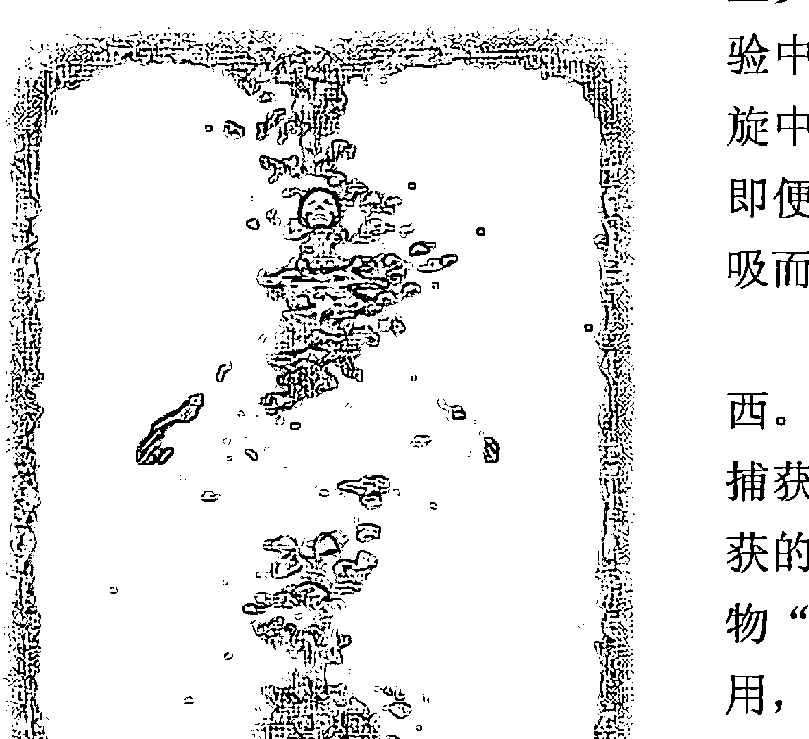

我们还不习惯认为光是可存储的东西。通常它在空中一闪而过。如果将光捕获于一点，我们可能会这样想，被捕获的光将消耗殆尽、丧失能量。就连植物“存储”光的唯一途径，即光合作用，也是将光能迅速转化为叶绿素。现在我们看到，如同粮食储备，光可储存于DNA中……就像松鼠将坚果藏在空树内过冬。这引发了一连串的新问题。究竟是什么储存光？光是如何被储存？光为何被储存？为了回答这些问题，我们需要更深入伽利耶夫的实际发现，因为这还只是个开始。

伽利耶夫博士结束实验时，真的发生了奇迹。他拿起装有 DNA 的石英容器，将其移离它原来所在的位置。原想不会发生别的了，然而，让他惊叹不已的是，即使所有东西都不在了，如容器、DNA 和其它你能想到的东西，光仍在原处呈螺旋转动，好像 DNA 仍在那。

不管是什么让光留在那个地方，总之根本无需 DNA 分子。应是另有其物。它不可见，强大到能将可见光存储、控制在 DNA 分子形状中。惟一合理的科学解释是，应该有个与 DNA 分子相配对的能量场，DNA 好像有个能量复制体。这个“复制体”具有与物质分子相同的形状。不过移动 DNA 后，“复制体”依然会留在分子之前所在的地方。用不着 DNA 分子在那，它仍能继续它的使命——存储可见光。

这背后的含义让人难以置信。人体中显然远不止一个 DNA 分子，而是有几万亿个，井然有序地排列着，如骨 DNA、器官 DNA、血液 DNA、肌肉 DNA、腱 DNA、皮肤 DNA、神经系统 DNA、大脑 DNA。所以，只要对伽利耶夫的实验稍作拓展，就会得出这样的结论，我们的整个身体很可能有一个能量状态的复制体。这完全符合杜里舒、古维奇、伯尔和贝克尔四人的理论与观测，即有个信息场告知细胞在何地该做什么。一旦加入伽利耶夫的发现，我们会发现，或许 DNA 分子最重要的作用即是将光存储于我们的物质身体与我们的能量复制体中。显然，传统科学急需一次彻底检修。大量有关生命的信息不为主流思想知晓或认可。

DNA 幻影效应可称得上是现代历史最重要的科学发现之一。它告诉我们 DNA 分子与量子力学有着奇特的联系，而这尚未被主流科学家发现。现有证据表明，DNA 连接着一个不可见、尚未被发现的能量场。该能量场不是电磁能量，但显然它能通过存储光子控制电磁能量；即便没有物质分子在场，它也能将光子留在一处。

不只如此。当伽利耶夫试图用液态氨冲毁这个“幻影”时，一阵酷寒会突然生成，螺旋光随后消失；但五到八分钟后，螺旋光又会神秘归来。面对类似的破坏，DNA 幻影，即能量复制，依然顽强不灭。即使破坏了 DNA 幻影所在区域的相干性，像用寒流突袭，DNA 幻影仍会再次修复其相干性。周围的光会不断形成原来 DNA 的独特螺旋形状。传统科学无法解释为何会出现此种现象，但它确实发生了。

你觉得这个“幻影”能持续多久呢？惊人的是，“DNA 幻影”自它出现后能持续可见达三十天。这段期间，伽利耶夫反复用液态氨冲毁它，但它却一再失而归来。我相信你们会明白，这完全冲击了传统生物学，更别提物理学，但这确实是真的。

## 谁设计了宇宙/源场调查，万物背后的神秘推手与即将到来的黄金时代

此信息已有25年的历史了，佩科拉（R.Pecora）于1990年在美国重做了这项试验，但没人听说过。显然，DNA幻影并非电磁能量。各种奇怪的现象牵涉其中，违反了我们所知的电磁能量的所有知识。然而，DNA幻影与我们所说的源场高度契合。在微生物层面，我们好像有个能量复制体。我们的DNA以某种方式连接着一个能量场。此能量场不为大多数西方科学家所知，它留下的“幻影”很容易被测量。这意味着即便你不在某地，你的能量复制体仍会继续它的使命，为你捕获光。如果你此刻正坐在椅子上读这本书，然后起身去另一处，而就在你刚才坐的地方，你的能量复制体依然会让光旋转于小小的螺旋形中，你体内数万亿个DNA分子都如此，这将在你离开座位后至少持续三十天。由于这是微观现象，所以你的肉眼看不到，但是伽利耶夫能在实验室中对其测量。能量复制体就如你身体完美的全息投影，准确到连最小的细胞都毫无差别。

### 全息脑

如果源场中存在你的能量复制体，这岂不意味着也存在你大脑的复制体？或许真是如此。这带来一个愈发有争议的问题。如果你大脑中的所有DNA都有一个复制体，那么是否这个“全息脑”（holographic brain）也掌管了你的部分思考活动和行为方式？是否在你读本书时，你的部分思维正在一个隐蔽、不可见的平行现实中运作着？是否存在一个完全相同的全息脑，它把每个神经元中的DNA当成天线与你的物质大脑互动？这些都是十分有趣的问题。在本书前五章中，我们已经给出了支持能量脑存在的震撼新证据，不过接下来要看看其它一些生物学研究。

1997年，《纽约时报》报道了脑损伤儿童的损伤大脑半球完全坏死后，或者应该说破损的天线被完全移除后，他们的智力与身体协调性却提高了。失去一半大脑，会随之丧失一半记忆和一半机能吗？显然不会。这一发现“甚至震惊了专家”。约翰·霍普金斯大学的艾琳·维宁（Eileen P.G.Vining）博士调查了54名做过此种手术的儿童。她说，“很明显，这些孩子的记忆、人格和幽默感的基本没受到任何影响，这非常让人震惊。”不过，让心疼孩子的父母接受这种极端的手术并非易事，但它确实奏效。约翰·霍普金斯大学在2003年出版了相同调查的更新版本。调查对象为111名在1975至2001年间接受此种手术的儿童。他们中的86%要么完全不再发病，要么至少不再需要药物治疗。埃里克·科索夫（Eric Kossoff）博士称此手术结果近乎奇迹。

患有慢性严重惊厥的儿童（术后）的生活质量显著提高了……几乎所有案例中的儿童不再依赖多重药物治疗。手术过后，大多数儿童能走能跑，过上了正常生活。

1980年，罗杰·卢因（Roger Lewin）在颇负声誉的《科学》杂志上发表了《真的需要大脑吗？》（Is Your Brain Really Necessary?）一文，讨论了约翰·洛伯（John Lorber）博士的文章，他可以说是脑积水领域研究的世界顶级专家。脑积水是指脑脊液倒灌入颅内，产生压力，无法排除。极端的病例中，颅内被脑脊液完全充满，无任何可见脑组织。许多患者因此死亡或患有严重残疾。现在，医生使用脑脊液分流术可对其进行治疗，而在洛伯的年代，此种方法尚未出现。

洛伯调查了伦敦谢菲尔德大学（University of Sheffield）253名脑积水患者。这些病例中，9名患者的大脑仅剩5%的常规脑组织，这是彻底的悲剧。然而，这9名患者中的4人智商超过100，还有2人的智商大于126。9名患者中6人智力完好，而他们几乎都完全丧失了一半大脑。

以下直接引自卢因论文中对这一惊人现象的描述。

> 洛伯说：“这所大学的一名年轻学生智商为126，获得了数学领域的一级荣誉，其社交关系也完全正常。然而，这个男孩几乎没有大脑。”这名学生的大学医生注意到，这个年轻人的头比正常人的稍大。只是出于好奇，医生把这名学生介绍给了洛伯。洛伯回忆道，“对他进行脑部扫描时，我们看见的不是位于脑室与脑皮层表面之间正常4.5厘米厚的脑组织，而是薄薄1毫米的覆盖物。他的颅骨主要被脑脊液充满。”

你可能还未理解，洛伯说的是，只剩1毫米厚的脑组织覆盖在其颅骨内侧边缘。伦敦大学学院解剖学教授帕特里克·沃尔（Patrick Wall）说这并不新奇。

> 类似的记述散布于医学文献中，很久以前就有了……但洛伯研究的重要之处在于，他进行了长期系统的扫描，而不是凑巧发现。他搜集了大量的数据，以此提出挑战，“对此我们做何解释？”

这个争议性的研究发表后，自然会迎来批评的浪潮。洛伯博士承认，很难解析脑部扫描，他在1984年发表了一份更加全面的研究。他发现那个智商为126的数学系学生丧失了44%的脑容量，剩余的脑组织被压缩成一层超级薄的颅内膜。然而，他的智商却大大超出常人，思考和记忆信息都毫无问题。这显示出“用源场思考”到底有多强大。

幸运的是，人们无需再受此病症折磨，因为手术安装分流管可排出脑脊液。然而动物的情况却非如此。中欧许多实验仓鼠最终患上了遗传脑积水。2006年，发表于《兽医病理学》（Veterinary Pathology）杂志上的一份研究表明，即使仓鼠患有最严重的脑积水，大脑几乎完全不存在，它们依然十分健康。它们没有任何的异常行为或遇到任何困难，行动、思考、记忆、身体移动、繁殖都很正常。

探索伽利耶夫的DNA幻影与“全息脑”之间的联系，实际也是在探究我们自身，这很有趣。如果伽利耶夫没有错，即DNA分子确实能捕捉并存储光，那我们必定可以假设，其他科学家也有独立的相同发现。

### DNA 存储、转化及释放相干光

在琳内·麦克塔格特的书《场》中我最喜欢的一个部分，就是她对弗里茨-阿尔伯特·波普（Fritz-Albert Popp）文章的讨论。波普是德国马尔堡大学（University of Marburg）的理论生物学家，他从1970年开始发现了十分类似DNA幻影效应的现象。尽管他没有发现DNA幻影，但他的研究成果与伽利耶夫的发现可以说是殊途同归，并增加了其它突破性发现。波普检验了人类所知最致命的致癌物质，学名为苯并（a）芘。他用紫外线射向苯并（a）芘后发现，这种物质会将光吸收，但之后又会射回频率完全不同的光。与之十分相似的化学物质苯并(e)芘却不会产生此种“光扰乱”效应，不像它致命的亲戚，苯并(e)芘对生命体完全无害。

这个“光扰乱”效应是否是引发癌症的未知关键？波普研究了37种其它化学物质，其中一些是致癌物质。他发现，每种致癌物质都会以同样的方式重组紫外线。实际上，波普发现这些致癌化学物质间惟一的共同点就是，它们都会吸入380纳米波长的光，然后将其转换为其它波长的光。显然，这意味着380纳米波长的光对于我们的幸福健康来说意义重大，但如果不抹防晒霜就晒太阳显然会接触到更多的这种光，因为防晒霜会完全阻隔紫外线。

波普还发现，许多生物实验已经证明了紫外线可以摧毁细胞结构99%的物质。但如果给它一阵相同波长但十分微弱的脉冲，细胞一天之内能几乎完全恢复。这被称为“照片修复”（photo-repair），没人了解其作用原理。让波普震惊的是，一些科学家已经知道380纳米波长的光能制造出最好的照片修复效应，尽管这些科学家中没有一人知道波普的发现。

因此，源场流入可观测的“现实”中时，它的电磁“记号”似乎在380纳米波长最强。源场也有类似液体的属性，这点非常重要，稍后会详述。这意味着可以在场内创造节律性搏动或大多数人说的振动，并获得更强的效果。想想罗马士兵过桥时必须改变不同组的行进速度。假使他们都以同样的速度前行，整座桥会开始摇晃，甚至会垮塌。所有小振动持续共振，很快它们会形成大得多的效应。这也适用于源场，不同的是在此是件好事。

因此，在“照片修复”实验中，380纳米光的微弱脉冲在源场中形成振动，使得更多具有修复功能的380纳米的光能量开始流入。这反过来让“死亡”细胞在短时间内浸泡在补给、复苏生命的能量之中，获得惊人的疗愈效果。

波普想要找出人体是否真的在吸收与释放光。他要求学生伯纳德·鲁斯（Bernard Ruth）设计一个能证明人体释放光的实验，作为他的博士论文。鲁斯是个怀疑论者，认为整个想法都是无稽之谈，波普因此要求他证明这个观念是错的。鲁斯花了很大力气设计出能够一次计算一个光子的设备。他的装置仍被认为是最好的一种光探测器。1976年，鲁斯带着他的设备准备进行第一次测试，他们决定从黄瓜种子开始。让他们惊奇的是，黄瓜幼苗放出光子，光脉冲大大强于波普的预期。鲁斯对此持怀疑态度，认为这是叶绿素造成的，所以他们又对没有叶绿素、不存在光合作用的土豆进行测试。然而，土豆释放出比黄瓜种子还要多的光。此外，它们的发光相干性强，意味着光的结构紧凑，就如激光束。

接着，他们试着用溴化乙锭撞击DNA，这导致分子解体、“死亡”。不出意料，波普使用越多这种化学物质冲击DNA，DNA放出的光就越多。波普由此得出结论，存储与释放光是DNA运作的关键，就如伽利耶夫之后发现的那样。主流科学界仍未跟上这些突破性发现的脚步，他们还未了解伽利耶夫如何证明存储光的能量场不是电磁场，并且无需DNA在场也能照样运作。

波普继续此项研究发现，所有生物都在持续释放少数至成百的光子。有趣的是，动植物显然比人类释放的光要多，一些能在每平方厘米每秒释放上百个光子，而人类在同样大小的区域每秒只释放十个光子。释放的光为高频光，波长为200至800纳米，大于可见光频。这也是相干光，就像激光束。

波普也发现活细胞被光照射后，首先会吸收光，小段时间过后会放出一阵强烈的新光。他将这称为“延迟发光”（delayed luminescence），这正如伽利耶夫的DNA分子存储光的发现。显然，DNA和光之间有某种关系，而不只是DNA在随意地存储光。这也完全符合古维奇对洋葱根尖生成能量的观测。还包括这个事实，即阻隔紫外线后，此效应会被阻断。简而言之，DNA显然能存储光，仿佛这些光就是能量与生命力的直接来源。如果DNA吸收了过多的光，它会将光射回，或许像有机体排泄不再需要的废物一样。不过，波普相信，这些发射出来的光不是真的废物，它们十分有用，即保存信息。具体说来，这些光脉冲携带着重组全身秩序与平衡的密码。

波普还发现，我们承受压力时明显会释放出更多的光子，尽管我们没有吸收额外的光。我认为这点非常重要。我们知道许多疾病是由压力所致或因之恶化。筋疲力尽或承受负面情绪时，我们在泄露生命力、流失存储于 DNA 及全身细胞的光。为何我们的身体会出现此结果？似乎是这些额外的光，包含了细胞需要从负面情绪导致的损害中进行自我修复的信息。

因此，想要重获健康，我们需将 DNA 重新充电，让其获得更多的光。这引发了另一个有趣的问题。显然，我们身上的大部分细胞没有暴露在任何外界光下，除了我们皮肤最上层。那我们如何获取更多的光呢？光如何能进入我们身体最里、最深处呢？这些光都来自我们周围的可见光吗？显然，呆在完全漆黑的室内，我们不会死亡，但我们的 DNA 却一直在使用光。这些光子实际上是从源场直接放出的吗？如果源场及其能量在最根本的层面与意识相互连接，如俄罗斯人的金字塔实验揭示的那样，那我们的思维与情感会影响光的吸收量和吸收部位吗？我们需向源场“开放”，以使源场修复效应进入身体吗？简单说来，我们的生活态度能否决定 DNA 与细胞吸收光的效果？

### DNA 对人类意识的可测回应

生物化学家格伦·瑞恩（Glen Rein）博士毕业于伦敦大学。他的惊人发现揭示了 DNA 如何对人类意识做出直接回应。首先，细胞即将分裂或已被损毁（即“死亡”）时，DNA 会展开；而进行修复或自我愈疗时，DNA 会盘绕。根据其吸收 260 纳米光的程度，可对展开或盘绕的 DNA 数量进行直接测量。在这些卓越的实验中，瑞恩博士从混合人类胎盘中提取活的 DNA，将其放入去离子水，然后把整个混合物存放于一个烧杯中。随后，不同人试着通过高度专注的意念，令 DNA 展开或盘绕。未对其做任何事的对照样品只发生了 1.1% 的改变，但处理样品发生了 2% 到 10% 之间的变化。这意味着我们的思想至少能对人类 DNA 旋转产生双重作用。

更有趣的是，脑波模式最连贯的发送者拥有最强的改变 DNA 结构的能力。相反，焦虑不安的人（脑波模式非常不连贯）会使紫外线或 DNA 吸收的紫外线产生异变。发生改变的波长为 310 纳米，接近波普测到的 380 纳米奇迹值，这个频率被扰乱时会引发癌症。而愤怒的人也会使 DNA 盘绕得更紧。这两个结果都很不寻常。瑞恩认为，310 纳米光中的改变只意味着“DNA 分子基础中一个## 谁设计了宇宙/源场调查，万物背后的神秘推手与即将来临的黄金时代

或多个物理/化学结构发生了改变”。这表示我们的意念实际上能使DNA分子结构产生物理与化学上的改变，这是我们一直翘首以盼的愤怒意念与癌组织生长有关联的微观生物学证据，其中的含义对于治疗效果而言同样深刻。不要忘了第四章中谈到的，对电磁屏蔽区进行精准透视时，我们能将大量光子射入其中。那些光子很可能携带着能够重组其它DNA、恢复健康的遗传信息，例如380纳米的光。

另一个案例中，DNA被放置在脑波模式连贯的人面前，他们没有试着改变DNA，DNA样品的展开与盘绕未发生改变。只有当那些人想它改变，它才会改变。这有力地表明，是这些人有意识的念头让这些发生。卢·奇尔德（Lew Childre）博士能从半英里外让实验室中的DNA展开或盘绕。瓦莱里·萨德林（Valerie Sadyrin）在他墨西哥的家中，能在30分钟内让瑞恩博士加利福尼亚实验室中的DNA展开。瑞恩认为，令脑波产生相干性并直接影响DNA的“能量”的关键要素就是爱：“尽管不同治疗者使用的技术各不相同，但都要求心的专注。”

这其中的意味非凡。源场似乎创造了DNA幻影并将光保存在DNA分子中。我们的意念好像先改变了瑞恩博士实验室中的DNA幻影，然后物质DNA分子也发生了改变。最棒的是，我们现在知道了源场中最重要的情感为爱。瑞恩证明了，很有可能是经由创造DNA幻影的相同能量过程，爱可对DNA产生直接、可测的作用。

更佳的相干性、更佳的组织性、更佳的结构性及更佳的晶体化，这些效应表明，我们的能量场、体内的分子和原子正以更加和谐统一的状态运作。实际上，这首次为我们提供了爱的科学定义。这不完全是个抽象的情感、生物学概念，诸如我们吃巧克力时脑中释放的化学物质，或繁殖遗传催促之类的。爱可被视为宇宙能量的基本法则。更多的相干性、更多的结构、更多的和谐，就会产生更多的爱。就如俄罗斯人金字塔研究所显示的，爱也会对地球上的行为产生直接的影响。这再次表明，我们或许都在某种程度上活在集体的清明梦中。

现在回到弗里茨-阿尔伯特·波普博士的实验，因为他的一些实验结果已被其他人重新证明。波普发现人体具有多种周期，周期中的光强会随着时间增强或减弱，包括7天、14天、32天、80天和270天的生理节律，甚至一年之后仍有效。他还发现类似的昼、夜、周、月生理节律，这意味着我们的节律与地球活动有关联。日本科学家在2009年的一项研究中也发现了此现象的基本因素。他们使用能在暗室中探测单个光子的极高敏感度摄像机，类似于鲁斯为波普实验设计的装置。令日本科学家吃惊的是，他们发现人体确实在发光。最低的光强出现在上午10点，最高光强出现在下午4点，之后光强逐渐减弱。

这些日本科学家坚信，这种光可以帮助了解个人的健康状况，但他们似乎未意识到，其他研究者早已在这个领域中获得的众多突破性进展。

弗里茨-阿尔伯特·波普博士发现，癌症患者失去了人体自然循环的生理节律。此外，他们释放的光的相干性远不及健康人。其体内存储光的总水平好像大大降低了。不过，多发性硬化是此种健康损害规则的例外。波普发现此种病患者会吸入过多的光，似乎搅乱了细胞的自然机能。

为查明体内光的存储水平是否真的能体现有机体的健康状况，波普进行了更多的实验。在一项实验中，他发现自由放养鸡产的蛋比工厂饲养鸡下的蛋有多得多的相干光。他检验多种类型食物后发现，最健康的食物的光强都最低，而相干性则是最强的。这点很有趣，表明此生物能量体系中重要的是质量，而非数量。

波普在研究一种常见水蚤时有了另一项重大发现。令他惊叹的是，当一只水蚤放出光，其它水蚤会将光重新吸收。它们互相间直接吸取生命力。这显然表明，吸收过多光时，我们释放的光子并非废物，它们仍含有我们身体所需的所有生命力。波普还发现小鱼也会互相吸取光，向日葵将自己置于可吸收光子最多的位置，细菌从其周围吸取光。惊人的是，这种自然生物系统长久以来都不为主流科学知晓。然而，这些知识一旦传播开来，定会产生巨大的积极影响。

波普之后测试了多种植物提取物，看它们是否真的能改变人体释放的光质，由此发现治疗癌症光扰乱效应潜在方法。他试过的每种物质似乎只会让问题变得更糟，但一种物质除外：槲寄生。波普治疗的一名妇女使用槲寄生提取物后，癌症完全好了。

早期先驱弗里茨-阿尔伯特·波普博士的文章值得反复阅读。另一个经典重大发现为1975年阿达门科（Adamenkō）的“幻影叶效应”。阿达门科在此实验中研究了基尔里安摄影术。将树叶或其它生物放在通电的基尔里安感光片上，会看到模糊电流形式的美丽“辉光”随之出现在其周围。让阿达门科吃惊的是，当他切下活叶的顶端，将它放在基尔里安感光片上时，叶片缺失部分的幻影形象会出现10到15秒。其它小组重复了这项实验，也被写进许多上世纪70年代金字塔能方面的书中。正常的电磁能不能实现此效应，但它却完全符合源场的概念。每个生命体的DNA中都存有并释放光。移除DNA后，光子仍会神秘地留在原处，持续螺旋转动至少30天。近乎肯定的是，源场造就了幻影叶效应。因此，切下叶片前，将叶片在基尔里安感光片上放上更长时间，“幻影”有可能会持续更久，因为整个区域在源场内形成了更大的螺旋流。

### 基因重组与愈合

就在幻影叶效应发现的之后一年，弗莱尔·卡兹纳切耶夫（Vlail Kaznacheyev）博士也有了一项重要发现。卡兹纳切耶夫让两个密封的细胞培养中的一个染上疾病。他先用光照射带病细胞培养，然后再将光射入健康细胞培养，健康细胞神秘地染上了此种病。记住，任何已知的遗传过程都不可能造成此种结果。其发生的唯一途径是，健康细胞内的DNA重组，生成病毒DNA。像其它病毒一样，这种病毒会吃掉周围的细胞物质，生成更多病毒。我们看到的是，相干光中的遗传密码重组了DNA与活组织。

更有趣的是，卡兹纳切耶夫把一块玻璃挡在中间，健康细胞就不会得病。又是因为玻璃阻挡了红外线和紫外线，所以病毒的遗传密码不能传到健康细胞内。古维奇就是用同样的方法阻断了生长中的洋葱的根尖释放的能量。古维奇或卡兹纳切耶夫的试验中，若将一片石英挡在中间，则会是原来的结果，因为红外线与紫外线能穿过石英。

一束相干光如何能完全转化DNA分子，并将其从一种生命形式重组为另一种呢？别忘了我们常被充满信息的电磁波包围。手机、卫星电视和计算机遍布我们的生活空间，每时每刻都有流量巨大的信息穿梭其中。激光相干性很高，这意味着其内部存在大量的结构。这使得它成为携带信息的理想载体，就像我们已提过的其它电磁波那样，但激光的效率要高得多。卡兹纳切耶夫具有里程碑意义的发现说明，DNA收到合适信息代码后，好像会准备并等待着被从一种有机组织转化为另一种。接下来的多重例证会让这点更清晰明了。

彼得·伽利耶夫博士1984年发现了DNA幻影效应之后，又在2000年有了另外的发现，这些发现对于人类的健康意义深远。实验中，伽利耶夫收集了在一切尔诺贝利核泄露灾难中被辐射中毒致死的种子。令人惊奇的是，伽利耶夫只是先将非燃烧激光射向同种类的健康种子，再把光射向“死”种子，那些受过辐射的种子竟奇迹般复活并完全愈合了。它们能够生长成完全健康的成年植物。

这令伽利耶夫相当激动，因此他决定用实验用鼠做个类似实验。实验中，他让老鼠吃下一剂名为四氧嘧啶的致命毒素。这种毒素通常会毁坏胰腺，即在体内生成胰岛素以调节血糖的器官。老鼠在4到6天内会死于1型糖尿病。伽利耶夫摘下健康鼠的胰腺和脾脏，用激光射穿它们，然后将这光射向吃了四氧嘧啶的小鼠。令人惊讶的是，即便这个实验被重复了很多次，实验中受此治疗的近90%的小鼠都完全康复了。它们真的重新长出胰脏，血糖也很正常。只在12天里，它们就完好如初。

更令人称奇的是，利用“非定域性”原理（无需电缆、电线），伽利耶夫让照射过健康胰腺的光发送到二十公里外的目标，而治疗效果依然很好。我肯定你会开始明白，这些治疗结果就如之前俄罗斯金字塔一样神奇，但无需使用金字塔技术。2005年，伽利耶夫对外宣布，“使用相同方法，我们大大控制了人类细胞的老化过程，有些牙齿被磕掉的成年人甚至长出了新牙。”我联系了伽利耶夫博士，获得了更多信息。但这些资料全是俄文的，其中一些专业论文显示，他在治疗一名患有糖尿病的老年妇女时，发生了“意外”。具体情况是，通过激活她10岁孙子的血液、射入合适的治疗频率，伽利耶夫试着让她长出健康的新胰腺。在伽利耶夫的模型理论中，孩子的DNA仍带有父母和祖父母的能量记号，但其构造更年轻健康。这个过程中使用了特别改进的宽光谱红激光。大部分详细资料仍是俄文的，但可在伽利耶夫的官网上找到（www.avegenetic.ru）。

这名妇女嘴的前部只剩一颗牙。经过两周治疗过后，她开始感到疼痛，下巴肿胀。她的嘴里发出碰撞声，三颗新牙破皮而出，都是后端的智齿。这使得她的牙医得完全重做了她的上下假牙板，以适应新牙的生长。伽利耶夫还发给我一份新牙的X射线图，不过没有可用来对比的“之前的”照片。不幸的是，在伽利耶夫对其他患者重复这项实验之前，莫斯科鲍曼州立大学（Bauman’s State University in Moscow）宣布此实验为“伪科学”，终止了这项实验，并解雇了伽利耶夫。有人可能认为这是对伽利耶夫身为科学家的信誉的致命控诉，但这种情况并不罕见，而是很多。大部分有此类发现的科学家最后都受到鄙视、嘲笑和攻击。许多不同科学家各自获得共同发现，这不大可能是恶作剧或伪科学。事实上，证据清楚地表明，这是行将发生的医学变革。根据胰腺研究结果，一位器官捐赠者可为其他人培养成百个器官……而对于小鼠，整个过程只用了12天。

另一位俄罗斯科学家波德科夫斯基（Budakovski）证明了器官捐赠或许完全没有必要。波德科夫斯基用红激光照下一盆健康覆盆子的全息图像，然后将全息图射入叫“愈伤组织”（callus）的覆盆子肿瘤。我们一般认为肿瘤是无用组织，应动手术将其移除，可是全息光能将肿瘤完全转化为健康的覆盆子。这证明了，一旦获得所需的能量记号，即信息，就可以获得上述结果。无需活组织提供原信息代码，只需能在相干光中显现的信息代码本身。这个实验中，全息图捕捉了告知肿瘤组织如何重生为健康植物的波信息。

另一名俄罗斯科学家布尔拉科夫（A. B. Burlakov）博士获得了一项极其重要、极具启发性的发现。还记得波普发现了蚤、鱼和其它有机体能吸取同类发出的光吗？布尔拉科夫将成长中的鱼卵紧挨，尽管它们都被密封着，光仍能穿过它们之间。让人惊讶的是：若将更大、更成熟的卵放在刚开始发育的年轻卵前面，成熟卵会明显地从年轻卵中吸取生命力。成熟卵生长得更强更快，而年轻卵却萎缩、畸形、死亡率大大提高。布尔拉科夫注意到，母鱼产卵时总是很小心，尽量把卵产在没有其他鱼卵的地方，或许这就是其中的原因。另一方面，布尔拉科夫若将稍年轻的卵放在稍成熟的卵旁边，年轻点的卵会吸取成熟些的卵释放的生命能量，加速成长直至与其它卵达成同一生长水平。

我花了好几年的时间试图找到类似于布尔拉科夫发现的科学研究，因为如此多的突破性发现似乎正将我们引往这个方向。每个人可能都遇到过一些感觉就像“能量吸食者”的人，有人甚至称这些人为“精神能量吸血鬼”，尽管这词十分刻薄无礼。

一听到这方面的知识，你可能很容易反应过度，指控他人“偷取你的能量”。然而，从精神方面上说，这种反应实际对你不利，因为这肯定了你的能量是有限的，可从你身上被吸走。我相信事实是：源场中有无限的能量。如果感觉能量消耗了，你可以通过进入相干状态补充能量。找到一处充满爱和积极能量的空间，发自内心地面对一切，让头脑保持安静平和，就能在短时间内让你恢复“电量”。对我行之有效的简单视觉化方法就是，把我们的能量复制体或气场想象成充满水的气球。气球尺寸的大小取决于你自己存储多少能量在你之内。现有工具无法直接测量这个“气球”的大小或形状，但从布尔拉科夫的鱼卵研究中，我们可得知其反面，即“强者”可直接从“弱者”吸收源场能量。

驮兽聚集在雄性领袖周围以获得能量、引导和保护也是同样的道理。波普发现，我们承受压力时会释放大量存储于DNA中的光。其中一些能治疗我们的细胞，但或许不尽是这样。巴克斯特的实验中，受压与死亡时放出的宽广信号，可被所在区域内的植物、细菌、卵及其它生命体吸收。因此自然或许存在一个内置系统。物群感到压力或恐惧时会自动释放能量；然后，它们把能量直接发送给它们的领袖，即其雄性领袖。这正如格伦·瑞恩博士的研究发现，除非我们想要它们活跃起来，否则DNA样本无法被激活。这很有可能是一种自然存活机制。物群将集体聚合的源场能量发送给它们的领袖，而领袖因此在战场上变得更强、更快、效率更高，从而保护其物群。这或许也解释了为何运动队似乎在主场比在客场表现得更好。的确，部分原因是因为他们知道自己的场地更好，并且他们会被观众的加油声鼓舞，但或许还存在一个我们尚未认识到的能量组成部分。

布尔拉科夫的发现是证实这种能量交换始终存在的确凿证据。同样有趣的是，如果两个卵的发展阶段十分相近，强卵会帮助弱卵，由此产生复原效应。母鱼产下卵，如果一些卵有小小的先天缺陷（会稍稍减缓其成长速率），自然就会通过一个纠正机制，利用其它卵的能量加速自身生长。然而，若相比周围的其他鱼卵，如果一个卵的生长速度明显大幅滞后，它可能会被视为难以挽救，然后它的生命力会被更大、更强的卵吸收。因为布尔拉科夫也知道古维奇的研究，所以他试着将一片（可屏蔽红、紫外线的）玻璃挡在两组卵之间。再次，由于玻璃阻挡了红外线与紫外线，相关效应完全停止了。我们也可以料到，如果他放的是石英，那结果也是如此。布尔拉科夫还发现，不同波长的光和偏光镜会导致畸变现象，如出现多个头、多个心脏等等。然后他重新引入“正常”波长的光，这些畸形物又会消失，仔鱼会变回常态，并且无任何曾出现过突变的迹象。这可给基于突变的达尔文进化模型造成很大麻烦。

俄罗斯研究者亚历克斯·科万勒宁（Alex Kaivarainen）博士发现，细菌与昆虫只是挨着其健康同类就能获得惊人的治愈效果。2002年，帕森斯（Parsons）与希尔（Heal）用抗生素毒死细菌后发现，被毒死的细菌被放置在健康细菌附近就能够复原。阿加达尼安（Agadjianian）在2003年所做的昆虫实验中也得到了同样结果。这些都归功于健康同类。想想人们是如何迫切想要伸出双手去触碰前来与他们说话的人。很有可能双手接触会促进对源场的吸收。

人可以发送能量给细菌、植物、动物和其他人来帮助他们改善健康状态吗？这正是丹尼尔·贝诺尔（Daniel Benor）博士分析了191项“精神愈疗”对照研究后的发现。令人惊奇的是，其中64%的研究结果显示出非常明显的有效性，其中包括远距的愈疗实验。但是36%的研究未出现愈疗效果，所以主流媒体的一篇文章将此报导为失败的实验，并总结说，有“科学证据”表明，这些效果不会也不能产生。然而事实没这么简单。

亚历山德拉·大卫·尼尔（Alexandra David Neel）在上世纪二十年代去了西藏。1931年，她将她的惊人观察写成《与密师和法师在西藏》（With Mystics and Magicians in Tibet）一书。其中许多引人入胜的事情都是她亲眼目睹的，一些我们稍后会讨论。西藏僧人向她解释道，他们的神秘能力都源于通过冥想控制能量波的能力。

精神训练的秘密……在于极大地发展精神集中的能力，让这种能力远远超过在这方面最具天赋的人。密教大师肯定，精神集中产生的能量波有许多用处……他们相信身体或思想活动都会产生这种能量。

因此，当我们思想相干性变强后，我们接入源场的能力也会提高，并能决定它流动的方式与地点。这点十分重要，因为它解释了为何如此多的古代灵性教义都极其注重冥想。想想前面所说的七千人共同冥想就能减少了全球72%的恐怖活动的实验，看来这是因为他们通过冥想在源场内创造了相干性，这反过来直接影响了其它人的思想，因为在很大程度上，我们彼此共享意识。这真是个看待我们自身与这个世界的有趣的新方式。

在卡兹纳切耶夫惊人的发现中，仅仅通过传送给它们的疾病信息结构，健康细胞就从生病细胞中获取了病毒的遗传密码。这强烈地表明，虽然DNA不会固定于单个构造，但在能量层面，遗传密码确实能从一种生命形态中被转移到另一种生命形态中。这个奇妙发现为研究最伟大的科学奥秘之一（即物种进化）打开了一扇全新的大门。进化真的是基于大多数“达尔文主义”科学家所坚称的“随机”过程，还是另有解释？我完全不是那些认为《圣经》里的每字每句都是真理的神创论者，我不相信地球文明只有7000年。然而，主流媒体将“科学”（此模型已超过100年，问题重重，我们很快会讨论到）与“宗教”两极化是十分可笑的。我们已看过的证据暗示，生命密码也许存在于源场之中。此信息借由紫外线流入我们的现实，就像视觉信息可能通过一个类似星门的、连接着我们的能量复制体的“银线”流入松果腺中的过程。下一章，我们将探索物种进化方面的新资料，并找出是否有支持这些激进新观点的证据。

## 第十章 能量驱动式进化

大金字塔似乎是我们的远古先祖留下的各种预言之一，它预示着即将来临的黄金时代，并且将在2012年左右到达一个关键的转折点。金字塔本身的结构似乎就是这个信息的一部分。当俄罗斯科学家没有使用任何金属材料，仅仅用PVC管和玻璃纤维模拟重建出金字塔时，他们发现了多种显著的功效。这些发现十分惊人，它迫使我们彻底地重新审视那些我们自以为了解的一切科学和物理学。癌症并不是什么神秘可怖的问题，其成因现在可以追溯到储存在我们体内的光的连贯性缺失——因为所有致癌物都会争夺波长为380纳米的光。在金字塔中，致癌的化学物质迅速转为无毒状态，似乎它们的分子结构通过某种方式进行了重新排列，从破坏生命转变为支持生命。同样地，任何威胁到人类生命的地质和气候问题，也可以通过简单地建立金字塔而显著减少。

一旦我们开始（从科学层面）在生物系统内来寻找金字塔能量效应，我们就会获得奇妙的新发现。事实上，这包括我们的的确拥有仅仅用思想就能疗愈他人的能力，也许只需用我们的能量复制体直接探访他们，向他们释放出包含治愈代码的光子，而远古文明显然对此非常了解。我们还发现DNA分子会留下一个“幻影”，用来吸收它周围环境里的光，它就像是一个微型黑洞，最长能够保持30天时间，即使DNA分子本身已经被移走。这就引出了一个非常重要的问题：到底是哪个最先出现？是DNA还是幻影？有没有一种可能，是幻影先存在呢？

伽利耶夫已经证明了DNA幻影能够吸收光子并把它们保持在原地。那么，DNA幻影有没有强大到足以对原子和分子做出同样改变呢？我们确实有一些关于这方面的有趣线索。2008年，谢尔盖·雷金（Sergey Leikin）博士将各种类型的DNA放入普通盐水，其中没有蛋白质或任何能够使它们互相产生联系的物质。每一种DNA都用不同的荧光化合物进行了标记。令人吃惊的是，这些彼此迥异的DNA分子神秘地结合到了一起，显示出一种类似“心灵感应”的特质。

具体来说，互相匹配的DNA分子聚集起来的可能性大约是有不同编码序列的DNA分子的两倍。雷金认为这仅仅是由电荷所造成的，但重要的是它成功了。进一步的实验或许能够很好地证明这一切都是源场所为——在微小的原子和分子都尚未形成基本氨基酸的情况下，它就完成了DNA的汇编。

2007年，一群来自俄罗斯、德国、澳大利亚的科学家由V.N.泰托维奇（V.N. Tsytovich）博士带队，他们在实验中发现，当普通的灰尘悬浮在带电“等离子体”中时，会形成一种类似DNA的结构，这与我们所发现的外太空的状况相似。为了重现这种环境，他们建立了一个计算机模型来重现这种环境，虽然事先并不期待任何序列和结构的出现，但是这些灰尘却自然形成了“螺旋结构”。这些类DNA结构之间互相吸引聚集到了一起。它们会分裂并形成两个相同的副本，这一过程与复制相似。它们只需简单地经过其附近，就能改变其周边物质的结构。随着模拟的继续，它们也逐渐演变为更加复杂的结构。根据泰托维奇所述，“这些复杂的自行合成的等离子体结构，体现出它们作为无机生命形式所必备的一切属性……它们是自主的，它们自行复制和演变。”此外，在2006年，加州大学洛杉矶分校的天文学教授马克·莫里斯（Mark Morris）博士宣布，在我们的银河系中心附近发现了一个“惊人”的DNA双螺旋型星云：“我们看到两股相互交织的旋臂，像DNA分子那样缠绕包裹在一起……之前从未有人在宇宙领域发现过这样的事……这一发现似乎暗示了存在一种更高的宇宙秩序。”

2011年1月，正当本书在进行最后编辑的时候，一位得过诺贝尔奖的生物学家宣布，他将一段细菌DNA转移到了一个只装有水的密封试管内。该试管中的水重新组合，在试管中精确复制了它旁边另一个密封试管内漂浮着的DNA。为了实现这一结果，原始的DNA样本被大大弱化，并在周围施加了一个7赫兹的弱电磁场。经过18个小时后，密封试管内的水分子的确转变为一个完美的DNA分子。约翰·顿恩（John Dunn）在网站 www.Techworld.com 上写## 谁设计了宇宙/源场调查，万物背后的神秘推手与即将来临的黄金时代

写了一篇文章，来讨论吕克·蒙泰尼尔（Luc Montagnier）博士的这一发现所带来的影响。

这一切意味着什么？它说明生命的传播能够借助现实的量子性，以微妙的方式投射出自己，就像先前的实验已经暗示过的那样。另外，生命本身也有可能就是一个复杂的量子现象的投射，并完全取决于那些尚未理解的运作方式，因为它们实在令人难以置信也难以探查……水也许是一个很好的媒介，使DNA在水中能够用隐藏在量子纠缠和（我们所说的）“心灵传输”中的进程来复制自身。

DNA或许能够被一个我们无法看见或直接测量出的“量子”模板创造出来，但它却作为一个结构真实存在于源场之中，并且被写进了掌管物质和能量的基本规律中。这种能量结构是否能把光子、原子和分子聚合到一起，拧成我们所知的螺旋形的生命形式？答案很可能就在眼前，正如蒙泰尼尔所发现的那样。但是大多数科学家却不愿去正视它。

> “交易”——“你们负责灵魂，我们负责真相，生命当然只是一个意外，宇宙间不存在更高的目标和智慧。”

尽管如此，这就像其它盲目的宗教信仰一样。我个人则相信要以证据说话。因此让我们来看看能找到什么证据。

### 地球上的生命进化

无论身在地球何处，我们总是能找到细菌。根据《科学美国人》（Scientific American）的报道，在萨凡纳河下500米处取出的岩芯样本中发现了多种微生物。即使是在地球表面1.7英里以下（2.8公里）的岩芯样本中，仍然能够找到活着的细菌。在正常的表层土壤里，每克泥土中能够找到10多亿个细菌，在400多米的地壳深处，你仍然能够从岩石样本里发现成百上千万的细菌。在这些“地表下”区域内已发现超过9000多种不同类型的微生物，其中有一些生活在华氏167度（75摄氏度）的高温环境之下。

你也许还认为达尔文的进化论是“科学的”，但是请你思考一下：当你获得了细菌，这就意味着绝大部分创造生命所必需的“魔法”反应已经发生了。你有了DNA，有了蛋白质的合成，还有呼吸、运动和意识，以及我们一直在探索的那些捕获光子的神奇属性。我们的地球只有40亿年历史，它很有可能在一开始只是一块熔岩。直到38亿年前温度才逐渐冷却下来而形成了海洋，即便是在这个时候，岩石样本中也包含所有的因光合作用而形成的基本同位素植物。更妙的是，一种原始酵母状的生物体也同样于38亿年前在古老岩石中被发现。这意味着地球上一出现水，生命就在瞬间同时出现了。

当我们把目光投向35亿年前，我们就会在岩石中发现许多微生物化石，它们并没有因为火山活动被熔化。根据约翰乔·麦克伐登（Johnjoe McFadden）博士所说，仅仅是为了证明这种随机性的发生概率小得有多么荒唐，一位麻省理工学院的生物学家计算出，仅仅使一百个氨基酸进行“随机突变”来形成一个蛋白质的可能性，那就是1后面跟65个零次当中只能发生一次。

> “如果生命的发展完全依赖偶然性，那这个地球显然还不够大……这些微生物化石今天看来就像还活着的生物体，有可能与现今生物一样复杂。要出现生命或许不大可能，但是这却发生得很快。”

2008年《连线》杂志上发表的文章中透露了新的发现，细菌能够在地球上最荒芜的地区存活，包括在火山和核反应堆内的极度高温条件下，以及南极冰层深处的严酷极寒中。事实上，南极地区1000万年前的细菌在解冻之后仍然能恢复活力。这篇文章内同样提到了微生物经过剧烈震动发射到太空之后还能继续存活。而氨基酸——所有生物生命的基础——在81P / Wild 2 彗星的彗尾尘埃中被发现。来自伦敦帝国学院的另一项研究发现，在澳大利亚1969年的陨石碎片中，含有构成DNA的尿嘧啶和黄嘌呤。2011年1月，美国地质学会宣布，他们在结晶盐内的液体里发现了漂浮在其中的活细菌，它们已经存活了34000年之久。它们极度萎缩，体积很小，看上去似乎处于休眠状态。他们花费了大约两个半月时间才将它们“唤醒”，之后它们便开始正常的繁衍。

> “我们不确定发生了什么，”提姆·劳恩斯坦（Tim Lowenstein）博士说道，“它们需要有能力修复DNA，因为DNA会随着时间不断退化。”

英国天文学家弗雷德·霍伊尔爵士（Sir Fred Hoyle）和纳林·钱德拉·维克拉马辛（Nalin Chandra Wickramasinghe）博士的发现更为令人震惊，他们在20世纪60年代对星尘的成分进行了探索研究。越来越多的证据显示，整个星系中的绝大多数尘埃（大约99.9%）实际上是冻干的细菌。一开始，霍伊尔和维克拉马辛研究了我们银河系尘埃的红外光，并得出结论，认为这些尘埃颗粒里面应该70%是空心的。细菌拥有一个坚固的细胞外壁和柔软的内核。当他们发现这些冻干的细菌内部同样有70%的空腔时，他们震惊了。当他们做出这些宇宙尘埃颗粒就是冻干的细菌的推测时，他们发现，这个推测恰好与观察到的数据完全吻合。

这使得他们得出了一个非常惊人的结论：

> “星际尘埃必定是细菌，尽管它们已经被冻干了，或许多数已经死亡。但是这至少是一个值得探索的假设。”

## 谁设计了宇宙/源场调查，万物背后的神秘推手与即将来临的黄金时代

在1980年4月15日的一个演讲会上，霍伊尔将这些发现一五一十地说了出来。

微生物学可以说是在20世纪40年代开始出现的，然后一个全新的世界以其惊人的复杂性展现于世人面前。现在回想起来，我觉得很明显的一点是，微生物学家们并没有立即认识到，他们所投身的那个世界不可避免地在遵循着一种宇宙秩序。我猜想，对后人来说，宇宙间遍布微生物会成为一个常识，就像现在所有人都知道太阳是太阳系的中心。

在这之后大约三十年，正当我写这本书的时候，很显然，被预测的科学思想变革尚未发生。大多数科学家都懒于讨论星际细菌的问题，他们仍然固守那种令他们感到舒适的观点：它们经由达尔文式的突变获得进化，在太空中被冻干，然后碎裂成小块坠落地球，最后播撒所有生命。认识到细菌其实无所不在是一步巨大的飞越，因为这正是宇宙所做的——创造生命。如果这是真的，我们怎么会错过科学史上如此令人震撼的发现呢？

哈佛大学教授詹姆斯·斯特里克（James Strick）在他的重要著作《生命的火花》（Sparks of Life）中透露，在19世纪有一个广泛散布的阴谋用来打压那些科学发现，它们证明了微生物是从非生命物质中自发诞生的，而非通过所谓“达尔文的随机突变”形成。2003年，斯特里克博士在威廉赫许研究所举办的一个会议上明确了自己的观点，杰克·弗兰戎（Jack Flannel）将此整理成文并发表在了网上。在19世纪，法国科学院奖励那些能最终证明有关生命起源的科学家，也就是证明生命或是“自发诞生”，或是“随机诞生”。最后路易·巴斯德（Louis Pasteur）赢得了这次比赛¹当你看到一罐标有“巴氏消毒”的牛奶时，这意味着里面的牛奶已经经过蒸煮处理，消灭了所有细菌，而这个消毒过程就是因为路易·巴斯德而得名。但问题是，巴斯德的竞争对手的确从非生物环境中（例如使用由在水中彻底杀菌过的干草制成的配制剂）获得了生命形式。巴斯德干脆拒绝重复这些实验。更加令人失望的是，巴斯德在他自己的实验中也发现一小部分的生命自发出现现象，但是他从来没有写到这些，因为他认为它们一定是失误所致，根本不值一提。

支持“生源论”一方的所有证据都可以回溯到1837年，始于安德鲁·克罗斯（Andrew Crosse）鲜为人知的工作。当时电力是个令人兴奋的新现象。克罗斯想尝试利用弱电流轰击化学品从而获得人造晶体。具体来说，他混合了

+   1. 译者注：巴斯德反对自然发生说。

硅酸钾肥和盐酸，然后将一个拳头大的三氧化二铁石块丢了进去。然后，他把一块小电池释放的电流接通到酸液中，希望借此能够让石块上长出人工硅晶体。可是他却得到了非常怪异的结果。14天之后，一些发白的斑点开始在电气化石块的中央形成。又过了四天，每个斑点都比之前增大了两倍，并且从斑点上长出六个或八个微小的分支。每一股分支都要比斑点本身更长。

克罗斯在1837年一份写给伦敦电气学会的文章中阐述了这一发现。

在实验的第26天，这些物体呈现出完美的昆虫外形，并直立在刚毛上。尽管我认为这个现象极端反常，但是仍然不觉得这有什么神奇的，直到两天后，也就是实验的第28天，放大镜下显示这些东西的腿正在动。现在我必须承认我是真的被震撼了。数天之后，它们将自己从石头上脱离开来，从苛性碱溶液中穿过。在几周时间内，有上百个这样的东西从氧化铁上自行出现。

这种生物似乎和一种螨虫类的昆虫相似：

> 我在显微镜下进行观察，发现它们当中较小的有六条腿，较大的则有八条腿。其他对此进行检查的人声称，它们就是蜱螨虫的一种，但是也有人说它们是一种全新的物种。

克罗斯知道这一发现将遭致同事们的攻击，因此他小心翼翼地重做了实验，这次他将所有实验器材都放在一个密闭容器中经过高温灭菌处理——但是这种小生物仍然以同样的方式出现了。

其他科学家重复了克罗斯的实验也得到了相同结果，但是根据我们以上所引用的弗兰克·爱德华（Frank Edwards）在1959年写的文章所述，这些科学家都对此感到惊恐而不敢谈论此事。最终，这件事由于传奇人物迈克尔·法拉第（Michael Faraday）而发生了转折，他向皇家学会报告称，他在同等实验环境下同样获得了这些小生物。他不确定它们究竟是在无菌条件下自发生生成的，还是被电流带回了生命活力。但是无论是哪种结果，这对于我们现在已知的主流科学和生物学来说都是一个巨大挑战。

我们曾在第一章中提到过另一位先驱威廉·赫许。他关于“生命力”的研究被视作笑谈。然而从我们在本次调查中所发现的一切来看，他似乎早已找对了路子。赫许总结说“生命力”遍布宇宙各处，它没有质量，具有穿透力，它会释放出一种可测量的脉动波，对水具有强烈的吸引力，并且能够通过进食、呼吸和皮肤的接触自然积累在生物体中。目前为止，以上这些听起来都很熟悉。赫许发明了一种“蓄能器”，将这种生命力能量集中收集起来，并且发现它能够显著提高实验室小白鼠身上的创伤和烧伤的愈合速度。这些治疗同样降低了

（插图 20）伊格纳西奥·帕切科博士在显微镜下拍摄的照片。图为在仅含有沙子及蒸馏水的无菌溶液中形成的叶状物体。

（插图 21）帕切科拍摄的照片。图中显示了一个看似贝壳的物体，在仅含有沙子及蒸馏水的无菌溶液中开始成形。

“休克”的出现概率。—当赫许用他的生命蓄能器照射植物种子后，它们长成了更大、更健康的植物。

赫许同样在无菌环境中发现了（生命）自发产生的证据。他通过显微镜发现，在生命形式本身被创造出来之前会产生一些浅蓝色的光点。他把这些光点称作“生命单元”。赫许的这一理论广受嘲笑，至今仍然在互联网上遭到怀疑论者攻击，被批评是科学歪理。尽管如此，伊格纳西奥·帕切科（Ignacio Pacheco）教授还是在2000年成功再现了赫许的研究结果，他的试管中生成物的照片也令人大为震惊。帕切科将取自未污染海滩的普通沙粒进行白热化处理，即加热到1400℃。这种方式能够破坏所有已知生物的生命形式，除了我们之前提到的生活在火山和核反应堆里的“嗜极菌”。然后这些沙粒放入无菌环境中冷却，与蒸馏水混合后倒入一个无菌试管并加盖密封。每支试管再经过高压灭菌器连续两次消毒，每次杀菌消毒间隔时间为24小时。这个过程可以用来摧毁一切已知的孢子和营养细胞。随后，帕切科在每隔24小时的杀菌处理之后，用显微镜对漂浮在试管水面上的颗粒进行了研究，奇迹发生了。

令人惊讶的是，看似复杂生物体一样的各种不同结构开始出现在水里，并且能够生长和分裂。它们在溶液中四处游动，帕切科将这些结果都拍摄录制了下来。尽管帕切科尚不能确定这些“结构”中到底有没有DNA，他认为“这些生命单元从各个方面来看，几乎都能被认作是生命体结构。”

其中一些看上去像简单的微生物，但另外一些则要复杂得多。

这包括了在显微镜下看起来与柳珊瑚

相似的海带。帕切科最引人注目的照片是那些单独的叶片，它们是在把这些植物放上载玻片时，从上面掉下来的。他还发现那些软软的小黏团，在其周围慢慢地形成一个由钙组成的亮白色的螺旋外壳，看起来像是微小级别下一只普通贝壳的形成过程。外壳上面的起始螺纹很明显，并且与我们期望的样子一模一样，虽然仍有部分的内部柔软躯体暴露在外面，但这一结果已经很成功了。

右边是我最喜欢的一张照片，它看起来像动物一样，有明显的头部，身体大致呈圆形，表面覆盖有尖状突起，以起到防御作用。帕切科相信，这些是“从无机组织阶段到有机生存进化阶段的过渡形态。”有趣的是，如果他不首先对沙子进行消毒，这些小东西就不可能出现。这似乎表明，纯净分子对于生命的形成来说是一个重要因素。让我们再来看看这个小家伙。我给你的问题是：它的 DNA 来自哪里？

对于在地球上最恶劣的不毛之地以及遍布银河系的尘埃中发现的所有细菌，我们都会提出这个问题。巴斯德也许把在 19 世纪获得的诺贝尔奖金全都拿来支持达尔文的进化论模型，但在这个过程中，我们也与更大的真相失之交臂：生命的确是智能设计所为。要理解这一点，你不用非得成为一个狂热的基督徒，你需要的只是在这些证据面前保持一个理性的头脑。

### 达尔文理论的问题

现在我们来谈谈进化论。虽然官方观点认为，达尔文进化论是一个已证明的事实，但是很多学者认为这一理论根本不可能实现，这些学者并不是创造论拥护者，他们是一些权威的科学研究人员。例如，来自法国国家科学研究中心的研究主任路易·波努尔（Louis Bonoure）教授曾说道：“进化论是讲给成人听的童话故事。这一理论在科学进程中没有起到任何帮助。它完全没有用

（插图22）帕切科拍摄的照片。图中显示了一个在含有沙子及蒸馏水的无菌溶液中，形成的一个看似复杂的多细胞生物体。它有一个头部，周身布满防御性突起。

处。”来自俄勒冈州立大学，以及麻省理工学院的数学教授沃尔夫冈·史密斯（Wolfgang Smith），很明确地表明了态度：

> 现今……达尔文的进化论遭到了前所未有的攻击……越来越多的可敬的科学家们在渐渐脱离进化论支持者阵营……重要的是，这些“专家”放弃达尔文理论的原因，不是因为宗教信仰或者圣经传教，而是基于严格的科学基础。

来自美国自然历史博物馆的古生物学家奈尔斯·艾尔德里奇（Niles Eldredge），阐述了生命在地球上突然出现的速度。

这始于大约6亿年前……在全球范围内，几乎在同一时间，在容易探测出含有化石的大量岩石与荒地上方，覆盖了含有众多带壳无脊椎动物的沉淀物：三叶虫、腕足动物、软体动物等等。创造论者极为重视化石记录中的这种丰富多样的化石大进发现象，因为记录显示，在这之前什么都没有。这的确对科学家们发起了一项巨大的挑战。

> 英国自然历史博物馆的动物学家J.R. 诺曼（J.R.Norman），在1975年说道：“地质编录至今没有任何证据能说明鱼类的起源。”同样来自此博物馆的W.E. 斯温顿（W.E.Swinton）在1960年说道：“鸟类的进化起源在很大程度上是一种推论。没有化石证据能显示，从爬虫类到鸟类这一显著转变的各个阶段。”来自伦敦大学帝国学院地质系的德里克·艾哲（Derek Ager）教授在1976年写道：“我在学生时代学到的所有进化理论现在都被推翻了，这一点意义重大。”

达尔文理论支持者自然对此表示强烈反对，并声称他们的理论有了新的进展。但是鉴于我们所罗列的所有证据，以及其他一些数据，他们的理论基本无法自圆其说。从地质学角度讲，化石记录一直在表明，某一种类的生物会进行改善，在很短的时间内转变为一种全新的、更加完善、进化了的生物。只有很少量的“过渡化石”能支持达尔文进化论。没有任何鱼类化石中的鱼骨是一半在体内，一半在体外的。我们只有贝壳类水生物及硬骨鱼类化石，而没有处于它们之间的化石。这只是很多有趣的例子之一。即使在人类进化这方面，也存在着悬而未决的重要问题。如果你还记得曾经听说的对所谓“缺失的一环”的寻找，也就是用来解释为何人脑大小会在短时间内突然增加一倍的过渡物种，那么你要谨记，这一过渡物种迄今尚未被发现。据英国首席科学顾问、伯明翰

大学解剖学教授索利·祖克曼（Lord Solly Zuckerman）称：

> ……如果人类真的是从类人猿进化而来，那么他进化到了人类，却没有在化石记录中留下任何他曾经是类人猿的痕迹。这确实令人感到惊奇。

如果导致这些生物改变的不是达尔文式的“随机突变”的话，那会是什么？两位来自芝加哥大学的古生物学家大卫·罗普（David Raup）以及詹姆斯·赛普科斯基（James Sepkoski）或许已经找到了答案。他们一同精心收集了迄今为止最大的海洋化石集，其中包括了足足 3600 种海洋生物种类。他们于 1982 年首先在《科学》杂志上发表了一篇文章，文中介绍了他们在这些化石记录中发现的四次大规模生物灭绝，以及规模较小的第五次生物灭绝。随着数据处理进程的推进，一个复杂的问题出现在他们面前：化石记录中持续出现一些规律，而它们并不应该出现。然而，他们越是想通过更多的研究来推翻这些事实，这一模式就出现得更多。在 1984 年，也就是他们发表第一篇论文的两年后，他们坦白地说出了真相。他们发表了惊人的研究结果，但这一结果尚未在科学界产生应有的影响。对这篇文章内容的简单概括就是，化石记录显示了新物种在短暂的物种爆发过程中，以大约 2600 万年的重复周期中自发地出现。根据他们所归类的总共 54,200 万年的化石记录来看，这一规律可以往前推到大约 25,000 万年前。

当 2005 年来自加州大学伯克利分校的物理学教授罗伯特·穆勒（Robert Muller）博士和他的研究生罗伯特·罗德（Robert Rohde），从罗普和赛普科斯基的数据中发现了另一个进化周期时，这件事就变得更加有意思了。这一周期一直向前推到了海洋化石记录最初出现的时期，也就是大约 54,200 万年前。穆勒与罗德发现，大约每 6200 万年，地球上的所有生命都会经历一次相对自发性的“升级”，也就是使现有的物种转变为一种更新的、更加进化的形态。同年刊登在《国家地理》杂志的一篇文章中，穆勒说道：

> 我希望我知道这一切意味着什么……我打赌说会跟天文学有关，但是他（罗德）却打赌说，这将会跟地球内部有关。

一篇来自 2009 年《每日银河》（Daily galaxy）的文章似乎显示了穆勒更能取得胜算。天文学家们发现，我们的太阳系在以一种长长的、摇摆不定的波状形式运动，在运动过程中不断地在银道面上下摆动。一个完整的上下摆动周期大约是 6400 万年，与穆勒和罗德发现的 6200 年的周期异常地相近。当然，这种长周期的天文计算会稍微出点错误，所以这一银河间摇摆运动周期的真正数据可能就是 6200 年。美国堪萨斯大学教授安德里安·梅洛特（Adrian Mellott）和米克黑尔·梅德维夫（Mikhail Medeved）相信，这一银河周期将是解开谜团的钥匙。我们银河系的上半部分朝向室女座（Virgo）星系团，梅（插图 23）此图为大卫·威尔库克对罗普与赛普科斯基，以及罗德与穆勒的图表进行改编后的图表。

洛特和梅德维夫相信，这一区域应该会充满越来越多的带电粒子以及宇宙射线，就像我们从银河星尘中看到的太阳系的最前端一样。他们的理论是，每次我们向上运动脱离银道面的磁场，向北部区域前进时，我们就会受到来自宇宙射线的推动。而这一辐射会导致更多的基因突变，可能就会因此产生新的物种。

毫无疑问，这是一种可能的解释，不过既然我们已经在源场调查方面取得了突破性进展，也很可能会有其他的答案将我们推向真相。另外，这一银河摇摆运动理论，并不能解释罗普与赛普科斯基发现的那个大约2600万年周期形成的原因。肯定有其他东西在起作用。银河能量场极有可能是最主要的因素，我会在第二部分展示一个新模型，简明地解释一切，并且提供一个科学、可靠的方法来标示出这些改变。

我们已经看到，拥有完整DNA的活体细菌以及其他物种，可以从看似无生命的物质中自发地出现。如果DNA可以被“凭空制造”，再加上波普和伽利耶夫的研究证明了DNA可以对光进行储存及释放，那么，我们为什么不能通过适当的光频对DNA进行重新编码、重新写入呢？不要忘记，伽利耶夫曾经用一个健康胰腺的波频信息，对一只中毒的老鼠进行辐射，老鼠被毁坏的胰腺在仅仅十二天内就重新生长了。布达科夫斯基发现，要想将植物上看起来“死去”的肿瘤组织恢复健康，转变成一株全新的正常植物，仅仅需要一个健康的悬钩子植物的全息图就够了。我们可以看到，连贯的紫外线光可以携带复杂的“编码”，直接影响DNA的结构与行为，也就是使病体组织完全恢复健康。有没有任何迹象显示，在提供了正确信息的前提下，DNA的“源代码”确实可以像七巧板那样，拥有不只一种“正确的”解决办法？令人惊讶的是，答案是肯定的。

### DNA是一种可以重组的波形结构

许多富有灵性的人往往与海豚之间有种很强烈的亲和感，这其中的故事大部分人都难以想象。在2000年，NOAA（美国国家海洋和大气管理局）的大卫·布斯比（David Busbee）博士的发现着实令人很惊讶。

> ……很显然，每个人类的染色体在海豚中也有个对应的染色体……我们已经发现海豚的基因组与人类的基因组基本一致。只有几个染色体因重组而改变了遗传物质的组合方式。

这确实很令人惊讶，因为人类与海豚看上去可是完全不一样的。随后在2004年，BBC新闻发表了来自加州大学圣克鲁斯分校（University of California, Santa Cruz）的大卫·豪斯勒（David Haussler）博士及其团队的研究成果。豪斯勒团队对比了人类、大老鼠与小白鼠的DNA编码，“他们发现（他们自己也很吃惊），这三个物种许多主要的DNA片段完全相同。”尽管海鞘与果蝇的DNA与人类的相似度小些，但鸡、狗，甚至鱼与人类却具有几乎相同的DNA编码。豪斯勒博士说，“这着实让我非常震惊……想到这个就令人非常兴奋……这些序列还未曾被科学界注意到。”

如果人类的DNA与海豚、老鼠、小白鼠、鸡、狗以及鱼都如此相似，并且DNA分子可以吸收和释放相干光的话，那么我们就更加接近这一观点，那就是所有的DNA根本上都是一个单波的产物，只需进行细微的改动，便可产生不同的物种。

如果这是真的，我们是否可以通过对波添加新的信息，从而直接从DNA层面将一个物种重组为另一个物种？我们回头想想亚历山大·哥罗德博士在谢利格尔湖的金字塔，这种事似乎确实早已发生过。各种早已灭绝的植物开始在金字塔周围的土地上生长。我们是否还有其他的证据来验证这一令人着迷的效应？答案在1989年被揭晓。当时一个著名的大型化学公司汽巴-嘉基（Ciba-Geigy）获得了一项专利，这项专利允许他们培育原始的以及新的动植物物种。这个过程看上去似乎很简单，只要把孢子放在两个金属板上，然后在其复制过程中通上三天的直流电。当他们用同样的过程作用在一个普通的蕨类孢子上时，却惊讶地发现，这个孢子转变成了一种早已灭绝了的种类，而这个物种仅在煤层的化石中发现过。这个“灭绝的”蕨类拥有41个染色体而不是预期的36个。

此外，4年内，这些原先的植物变异成了各种各样的不同种类的蕨类植物，有些品种甚至只有在南非才会出现。

当汽巴-嘉基公司将同样的技术应用在小麦上时，小麦退回到了更古老、繁殖力更强的品种，这个品种在古代曾过度繁殖过。这些小麦只需4至8周即可完全成熟，而正常的标准时间应该为7个月。这对于那些贫苦地区正饱受饥饿的人们来说无疑具有特殊的意义。当他们对郁金香做实验时，郁金香的茎上竟然长出了刺，而园丁们早已通过人工繁殖使这一特征消失。这种效应不仅仅对植物的种子起作用。当他们对鲑鱼卵做实验时，发现孵化出的鲑鱼更强壮，免疫力更好。最惊人的是，他们从地下140米深处的盐矿床中挖出已经有两千万年之久的孢子，尽管没有其他方法能使它们被重新激活，但是当他们用电磁场快速电击这些孢子时，竟然使它们复活了，似乎两千万年的时间根本没造成任何影响。

不幸的是，汽巴-嘉基毕竟是一个化学公司，他们的运营主要靠的就是农业植物能处于脆弱不佳的状态，这样农民们才会需要使用化工肥料。汽巴-嘉基一旦认识到这些植物会对他们的业务不利，便立刻终止了这种新技术。所幸的是，原始文件还是保留了下来，因此相关的信息未曾丢失。

另一项不可思议的发现发表在2009年的《国家地理新闻》(National Geographic News)。来自法国雷恩大学(University of Rennes)的科学家们，将来自三个不同品种的120只不同的蜘蛛用水淹死。他们每隔2个小时检测一下蜘蛛，直到确定蜘蛛真的已经死了。森林种类的蜘蛛完全死亡用了24小时，而另外两种沼泽类蜘蛛则分别花了28和36个小时。在确定蜘蛛死后，科学家们将它们捞出来晒干，并开始称量。奇怪的是，蜘蛛的腿开始抽搐并且起死回生了，最长的死亡-复活时间间隔也就是2个小时——纪录创造者为花了36个小时才死掉的沼泽蜘蛛。当然，科学家们认为这只是“昏迷”而非真的死亡，但这也提出了一个有趣的问题。生命也许比我们通常所认为的更具有适应性。正如我们提到过的34000年的细菌在两个半月后重获生机，或者伽利耶夫的切尔诺贝利“死种子”。如果你有接近活体状态的基因物质，即使它已经被宣布医学死亡，只要一点点驱动因素就能够让它重新获得生机。很显然，对于源场来说，实现这一过程比用其它无生命的分子要快速有效得多。

### 能够自我改写基因编码的生命形态

如果我们想进一步理解这个新的观点，我们必须意识到，一些物种不依靠任何外加电磁场就可以自我重组DNA，正如我们之前所说的汽巴-嘉基实验。

自2009年4月起，洛克菲勒大学（Rockefeller University）的学者称，一种能引起非洲昏睡病的名为布氏锥虫（Trypanosoma brucei）的寄生虫，能够自发重组自身的DNA，从而不会被人体的免疫系统击败。令人惊讶的是，这种寄生虫还能分解和重组自己的两股DNA，改变它的外膜从而继续避免被人体察觉。虽然参与这项研究的科学家早在2007年就怀疑这种寄生虫具有这种独特的本领，但直到2009年才发现相关的证据。他们发表在《每日科学》（Science Daily）的文章是这样说的，“这意味着寄生虫和人体有一套通用的机制，可以重组各自的DNA。”“这简直太不可思议了，”奥利弗·戴森（Oliver Dreesen）博士说，“一个又一个的实验证明，确实如此！”

这些科学家们并没有意识到一个类似的效应，这个效应是由美国普渡大学（Purdue University）基因学家罗伯特·普鲁伊特（Robert Pruitt）博士在2005年发现的。普鲁伊特和他的助手们正在研究一种实验室常用的芥类植物，名为阿拉伯芥。具体地说，他们是在研究造成阿拉伯芥的花朵以奇怪的、畸形的方式拥簇在一起这一现象的一个基因变异。他们发现，即使植物从上一代遗传了这个变异，经过三代后，有10%的植物会退化到变异前的正常状态。它们重写了本身的DNA，并修复了变异。科学家对此表示很惊讶，并确认植物的DNA已经自我转变回最初的健康状态。这是通过自发的DNA重组来修复变异，同时也给达尔文模式带来重重的一击。如果DNA具有一套潜在的“波”的成分并且能够纠正变异的话，那达尔文主义可以退休了。来自加州理工学院（California Institute of Technology）的植物基因学家艾略特·迈耶罗维茨（Elliott Meyerowitz）博士说，普鲁伊特的研究成果“看上去确实是个非凡的发现”。我本人也很喜欢这项研究，因为它证明了没有哪个庞大的公司，能够创造出经过一代繁殖后便会灭绝的“终结者种子”。因为大自然总会找到自我修复的方法。

另一个非凡的基因修复例子来自弗朗西斯·希钦（Francis Hitching）1982年出版的书《长颈鹿的脖子：达尔文哪里错了？》（The Neck of the Giraffe: Where Darwin Went Wrong?）。希钦在书中介绍了他对生物实验室最常见的实验对象果蝇的研究结果：即使很多科学家都通过放射来试图加快变异发生的几率，但是“果蝇在任何情况下仍然没有变异”。更有意思的是，当希钦把双亲体中用来建构眼睛的基因代码去掉后，在大约第五代时，它们又重新长出了眼睛。希钦是这么说的，“不知为什么，遗传密码中有一个内置的修复机制，用来重新建立那些丢失的基因。”自然，我们要问一个深层次的问题：什么是“基因代码”？

一次又一次，我们看到了有一个富有指导性的智慧，以某种有利于生命体的方式来修改基因代码。还有没有其它的生命体重组自我DNA，以便适应环境改变的例子呢？约翰·凯恩斯（John Cairns）博士是1988年第一个发现这种效应的人之一。凯恩斯研究了一种无法分解乳糖的细菌，把它们放在充满乳糖的环境中。很自然地，大部分细菌被“饿死”了，并进入了假死状态。然而，一两天后，大部分细菌自发地进化了，重组了它们的DNA来分解乳糖。并且这不是“随机”事件，因为如果没有任何乳糖的话，“适应性变异”就不会发生。巴里·霍尔（Barry Hall）博士继续了这一研究，并在1990年发表了研究成果，他发现，如果除去了细菌的主要营养素的话，如氨基酸色氨酸和半胱氨酸，其中的一些细菌后代最终会自我合成那些营养素。无论细菌生存需要什么，总有一套隐藏的自然法则能够为它们提供所需。霍尔还猜测，正是这种效应，解释了为何那些高危细菌能够如此快地适应新的抗生素环境。¹

2008年，另一项研究表明生命体可以迅速重组自我DNA，以便适应环境改变所带来的挑战。回到1971年，生物学家从南亚得里亚海贫瘠的荒岛上找了五对可以配种的意大利壁蜥（这种壁蜥以岛上的昆虫为生），然后将它们带到了温暖而又茂盛的岛屿上。直到那时，新的岛屿上还没有这种蜥蜴。当生物学家在2004年返回那个茂盛的岛屿时，他们惊讶地发现，当初那些壁蜥的后代在这极短的时间内已经有了大幅度的进化。

在《每日银河》的一篇文章中，来自麻省阿默斯特大学（University of Massachusetts Amherst）的生物学教授邓肯·伊尔斯切科（Duncan Irschick）评论说：“它们的头的大小和尺寸有了明显的变化，颌部更加有力，而且还生长出了新的消化系统结构，而这一切仅仅是在36年内发生的，而36年对于进化来说简直是极短的时间。”每一种变化似乎都是为了帮助蜥蜴适应素食而量身定制的。由于DNA的重组，它们的消化系统进化出了这种蜥蜴物种没有的盲肠瓣，这是少于1%的蜥蜴品种才有的特殊结构，可以进行发酵从而分解植物。它们头部更宽、更长、更厚，使得颌部更加有力，从而能更容易地咀嚼植物中的纤维。有趣的是，它们不再保卫自己的领地，并且开始吃草，而不是捕猎。伊尔斯切科博士说：“我们的数据显示，生物异常结构的进化可以在极短的时间尺度内发生。”

另一个经典的研究是由露丝玛丽（Rosemary）和皮特·格兰特（Peter Grant）共同完成的，他们在厄瓜多尔的加拉帕戈斯群岛上花了20年的时间，来研究和识别岛上的每一只鸟，当他们刚到达时岛上仅有400只鸟，而在他们研究的这段时间内猛增到1000多只。在这二十多年里，他们持续观察了大约20代雀类。令他们惊讶的是，个别物种在极短时间内发生了显著的基因变化。大多数的变异体现在它们嘴部的大小和形状变化。举一个例子来说，当岛的旱季延长时，种子变得小而且很难衔起，因此鸟的嘴就变得细而长以便能吃到食物。格兰特还发现，这些鸟实际上是重组了它们的DNA从而产生了变异。《雀之喙：当代的进化故事》（The Beak of the Finch: A Story of Evolution in Our Time）一书的作者乔纳森·温纳（Jonathan Weiner）在书中说，“达尔文……远远低估了自然选择的能力。自然选择的作用既不缓慢也不罕见。我们可以看到它每小时、每一天都在发生，而且就发生在我们身边。”2009年，鸟类学家宣布了另一个关于森林鸟类“快速进化”的发现。在森林被砍伐后，鸟类的翅膀会变得更尖，而当森林覆盖恢复后，它们的翅膀又会变得圆一点。

2009年的《国家地理》上报道，在穿越非洲大陆数个国家的刚果河，发现了之前从未见过的神秘大鱼。美国自然历史博物馆的鱼类生物学家梅兰妮·斯提亚尼（Melanie Stiassny）说：“我们所见的是一种类固醇导致的进化结果。”

让我们再到海洋里看看，有一种“灯塔水母”，它能够在饥饿、受伤或其他危险情况下重写自己的DNA。宾夕法尼亚州立大学（Pennsylvania State University）研究员玛利亚·皮亚·米列塔（Maria Pia Miglietta）认为，“为了保命，灯塔水母将所有的细胞转变成一种年轻状态。”水母把它的组织和遗传物质都退回到其最初的生长状态，并且“水母的细胞在这一过程中经常会完全改变。肌肉细胞可以变成神经细胞，甚至精子或卵子。”他们发现的另一个有趣的事实是，全球范围内的此种水母基因都是相同的，尽管热带水母只有8只触角，但在较凉水域的水母却有多达24只触角。洋流的说法并不能解释，为什么这种水母能相同地出现在世界上这么多不同的地方。米列塔博士推测，水母肯定是挂在远洋轮船上传播至各地的。

### 能量进化和物种演变

1997年，另一个相似的“不可思议的”遗传神话也在海洋中被发现。在这个例子中，陈良标博士（Dr. Lingbao Chen，音译）和他的同事发现，南极州的鱼和北方的一些鳕鱼物种进化出了完全相同的抗冻蛋白，尽管有大量来自古生物学、古气候学以及物种的物理表征的证据，证明它们应该是各自独立进化而来的。结论是这些蛋白质经历了“趋同进化”（convergent evolution），对于达尔文式突变来说这应该是随机的，可是却在两个完全独立的环境下发生了同样的事。

当我看到2009年2月15日的《国家地理》杂志时，着实吃了一惊。国际海洋生命普查项目正在试图对海洋中所有的物种进行鉴定识别，包括已灭绝的、现存的以及潜在的物种。在数据分析的过程中，科学家们惊讶地发现南极和北极有至少235种相同的物种，而这些物种在世界其它地方是没有的。这其中包括游泳蜗牛、鲸鱼、蠕虫以及甲壳类动物。这些物种是不可能通过迁徙的方式在南北极之间传播的，在南北极之间也没有航线，而且这些物种有些甚至都不能在温水中存活。科学家们承认，这确实是一个“未解之谜”。

2002年，理查德·帕西奇尼克（Richard Pasichnyk）出版了两卷本的《蓬勃生机》（The Vital Vastness），而我则被书中描述的生物在灭绝亿万年后又重新出现的“拉撒路效应”（Lazarus Effect）¹所震撼。

一个显著的例子就是，在大部分的白垩纪时期很难发现昆虫化石。在白垩纪恐龙灭绝的晚期，昆虫化石随着开花植物的化石一起被大量发现……那时是否有条件让遗传物质重拾丢失的代码？

最近在老挝的肉类市场发现一只在售的死掉的啮齿类动物，它有一条长而蓬松的尾巴，被人叫做“老挝岩鼠”。但问题在于这个生物在1100万年前就已经灭绝了。这一发现被发表在2006年的《科学》杂志上。卡内基自然历史博物馆的玛丽·唐森（Mary Dawson）对此感到十分惊讶。

这是一个意外的发现……这是哺乳动物学界第一次发现“活化石”，之前人们认为它早已灭绝了大约1100万年了。这一时间间隔真够长的了，之前的哺乳动物进化存在一个数千年至百万年的间隔。

另一个例子与一种奇特的大象有关，这种大象被称作“gompothere”。它的象鼻和象牙直指前方，而且它的下颚还长出两个长牙。这种大象被认为在178.8万年前就已经灭绝了，然而最近却在早期北美原住民克洛维斯人（the Clovis people）的废墟里，发现了它们的化石。这再一次印证了“拉撒路效应”，休斯顿自然历史博物馆网站称“这项发现具有重大的意义。”

我还发现MSNBC（微软全国广播公司）的一篇文章，是关于讨论法国科学家在南太平洋的新喀里多尼亚400米深的珊瑚海下，所发现的一种属于侏罗纪虾属的甲壳类动物的。海洋生物学家菲利普·布薛特（Phillipe Bouchet）描述它为“一半是小虾一般是海蛄虾”。问题再一次出现了，根据化石记载，这个物种在6000万年前就已经灭绝了。2005年UPI（合众国际社）发表了一份报告，指出在澳大利亚的一小片树林中发现了一种瓦勒迈松树。这种树可以长到36.5米高，树干达1米宽。问题是，这种树在2亿年前的侏罗纪时代就已经灭绝了。这片树林的安全级别非常高，即便是在那里工作的科学家在乘机降落到这片区域前也被要求蒙住眼睛。这个秘密地点的植被被采集样本后，用以拍卖从而保护这一物种。正如我们在其他案例中所见的一样，除了在2亿年前的化石中见过这种树之外，到目前为止，世界各地再也没有这种树了。根据UPI的报道，“悉尼皇家植物园告诉报社，这项发现的价值等同于发现了一只活着的小恐龙”。

拉撒路效应可能是现有物种在DNA层面上按照早期版本进行“重新编排”的结果，与我们之前说的汽巴-嘉基公司的专利类似。1993年，俄籍华人科学家姜堪政博士（Dr. Dzang Kangeng）公布了一项出色的发现，来证明这一切是如何发生的。在这个案例中，姜堪政发现，他只要用能量波改变遗传代码就能将一个物种变成另一个物种。他把一只鸭子放在一个形似五角大楼的容器中，顶部是一个球面镜子。容器的五个面各有一个漏斗型的洞，每个洞都有一根管子通向临近的房间，在那个房间里有一只怀孕的母鸡。五天里，鸭子一直接受着高频电磁场发生器的轰击，当母鸡下好蛋后，这些蛋孵出的不是小鸡，它们是半鸭半鸡的杂交品种。尽管它们是母鸡生出来的，却具有显著的鸭的特征，扁平嘴、长脖子以及更大的内脏，如心脏、肝脏、胃以及肠子。一年之后，这些杂交禽类比正常的鸡要重70%。

这个实验被重复进行，使用了共计500个鸡蛋，其中480只孵化并长大。这480只小鸡中，80%的头扁平类似鸭子。90%的眼睛位置与鸭相似而不像鸡。并且25%还长出了鸡不会有的脚蹼。这些杂交禽类可以互相繁殖，而且后代依然遗传了半鸭半鸡的特征，而不是恢复到鸡或者鸭的形态。姜堪政为他的设备成功地申请了专利，并被授予“生物信息传输设备”的名称，显然这个设备并不能做常规用途。他还将花生的“波信息”传送给葵花籽，并由此产生了杂交葵花籽，看上去吃起来都很像花生。并且杂交种子的产量提高了180%，杂交特征也一代一代遗传下去。

在这个研究领域另一位鲜为人知的先驱是意大利科学家皮尔·路易吉·伊吉纳（Pier Luigi Ighina），他是著名的无线电通信创始人马可尼（Marconi）的学生。根据莱昂纳多·维提尼（Leonardo Vintini）所说，“伊吉纳利用地

¹ 译者注：拉撒路效应来源于圣经中的一个故事，耶稣将已死的拉撒路救活。这段故事用来形容生物在已经灭绝了以后在现代又出现的现象，这种古生物死而复生的现象实在很不可思议，科学目前还无法解释。

¹ 译者注：如今的超级细菌恰好验证了霍尔的这一猜测，超级细菌已产生很强的抗药性。

球与太阳之间的能源”，使患病的细胞重获新生。另一个他称之为“小飞人”的装置，据说能够净化任何受过“轰击”的食物。这听起来和我们先前提到过的俄罗斯金字塔研究有点类似。此外，伊吉纳显然创造了一项实际可用的技术，与俄罗斯的金字塔具有相同的效果。其中一部仪器可以明显抵消地震。另一个被称作“磁频闪观测仪”，看上去像是一个奇怪的螺旋桨，当他在阴天启动设备后，他家上空的乌云便会散去一个洞，露出蔚蓝的天空。这场面一定很壮观，

> “伊吉纳说他对这个不可思议的发明最满意的地方，就是看到围观孩子们的笑容，因为孩子们觉得像是在看魔术一般。”

以下摘录包含了伊吉纳的研究中最有趣的部分，同时也与我们正在探讨的内容有关。

经过多年艰苦的实验室研究，伊吉纳发现物质最深奥的秘密，原子不是无序的振荡而是有序的振动。这一启示激发了他的好奇心，并引领他创造了一个杰出的发明：磁场振荡器。科学家发现，如果能设法改变一组粒子的振动状态，就可以改变材料本身。接着，这一领域的科学家们开始了一系列奇妙的实验，此时这个振荡器就发挥了重要的作用。有一次，伊吉纳把他的仪器放置在一颗杏树前。然后他开启了仪器，使杏树的原子振荡状态逐步调到与苹果树一致……16年后，他发现那棵树上结出的杏子发生了突变，几乎完全变成苹果的样子。

这与伽利耶夫和姜堪政的研究遥相呼应，我们看到的这类发现越多，那么这一现象就越有可能是真实的。接下来，伊吉纳的故事更有意思。

在这次经历后，伊吉纳开始尝试在动物身上做这个实验。他将老鼠尾巴的振荡状态调节到与猫的尾巴一致，4天后，老鼠的尾巴变成了猫尾巴的样子。尽管这只老鼠在试验后便死了（也许它的身体无法适应这种快速的突变），但这给了伊吉纳一个启发，并做了另一个实验：通过研究健康兔子骨骼的相应振荡状态，他激发了另一只兔子骨折的脚中的原子，用健康兔子的振荡状态在最短的时间内治愈了那只骨折的兔子。通过这种方式，伊吉纳认为，任何个人的生病细胞（包括癌细胞），只要能计算出正确的振荡指数，都是可以通过简单的方法治愈的。

这正是伽利耶夫和其他科学家在各自独立研究的情况下得出的相同结果，更不用提前面说的俄罗斯金字塔研究了。这种遗传信息传递可能任何时候都在发生，只要两个生物体长时间彼此紧密靠近，而不需要借助科技来实现。著名的心理学家罗伯特·扎荣茨 (Robert Zajonc) 对此提供了科学的证明：当人们彼此长期在一起，比如25年，他们的面部特征看上去会有点相似。在这项研究中，110名夫妻提供了他们结婚第一年和25年后的个人照片。实验参与者要从照片中匹配哪一对是夫妻，显然25年后的照片匹配成功率，比结婚第一年的匹配成功率高得多。这种夫妻脸现象无法用人们变老后会看起来相似或其它常规因素来解释。

让我们回到DNA的实验室研究中来，既然可以创造出一个混合杂交生物，那么有没有可能把一个物种变成另一个物种呢？皮特·伽利耶夫博士将一种绿色、无热的激光照射蝾螈的卵，从蝾螈卵射出的光线再摄入青蛙的卵中。神奇的事发生了，青蛙卵完全变成了蝾螈卵。尽管这些蝾螈是从青蛙的遗传物质中孵化出来的，但它们仍能正常地存活下来，还能与其它蝾螈繁衍后代。

我在2000年的时候听到这个重大发现，这对我个人来说意义极其重大并且影响深远。这就是我一直在寻求的证明进化完全是自发进行的直接证据，它只需要对现有物种的DNA分子进行重新排列即可。在接下来的数年中，我仔细地收集了关于这种现象的各种案例，现在能把它们写入本书，我感到非常荣幸。这自然令我感到，伽利耶夫的发现对2012年左右即将开启的黄金时代，同样也具有深远的影响。

我们能够确定人类已经到进化的巅峰了吗？我们怎么知道人类是地球独有的设计呢？如果我们的太阳系要经历6400万年的时间在银河系平面上下浮动，化石记录也在6200万年变化一次，那么事实上，也许银河系里包含了所有生命“源代码”。在穿越银河系的运动周期中，地球也许正在发生生命的转变。遍布银河的所有尘埃也许都是冷冻状态下的细菌。这意味着生命也许非常非常普遍。人类也许是银河系的设计品，在任何一个环境适合的星球都能自然进化。可能这个星球与另一个星球的人类在外观上有些差异，但不至于像被操控的、传播恐惧的好莱坞电影中所宣扬的外星人那样，差别如此巨大。最重要的是，我们可能在不久的将来就会面临另一次宇宙大升级。化石已经记录下这种生物大爆发的证据，而且我们也有伽利耶夫的青蛙实验，以及其它类似的直接证据来证明这一点。

### 戏剧性的进化大提速

如果这真的就是2012预言所指的话，那在一个人的一生时间里就会出现彻底的遗传变异的可能性似乎不大。它应该是一个逐渐转变的、可追踪的过程。因此，我们可以在自己的遗传基因中寻找线索，看看是否有加快人类进化速度加快的DNA证据。而这恰巧被麦迪逊-威斯康星大学（University of Madison-Wisconsin）研究院的约翰·霍克斯（John Hawks）博士所发现，并被BBC和《每日银河》等主流媒体报道。通过研究人类DNA的各种分子量标准，霍克斯博士得出结论：人类在过去4万年里经历了“超级加速”的进化过程。更妙的是，在过去的5000年里，人类的进化速度是有史以来任何时期的100倍。这个时间表仅仅展现了100至200个世代。从可观测的DNA层面上说，这发现的另一个特殊意义是，比起当代人，尼安德特人（Neanderthal）与公元前3000年前的人更加相似。大约有1800个基因经历了进化，这占人类基因的7%。

另一个迹象表明，我们正在经历快速进化，这被称作弗林效应（Flynn Effect）。在20世纪80年代，新西兰政治科学家詹姆斯·弗林（James Flynn）认为人的IQ（智商）正在提高。人的平均智商应为100分，但人们的测试分值呈升高趋势，这也迫使心理学家去重新修订评分系统。从那时起，无数的研究证实，每十年IQ测试的平均分会提升3分。这一增长体现在20个不同国家对几乎每一种群体的所有智商测试中，甚至包括对文盲的测试。也有证据显示，这一增长还在加快。弗林对使用近一个世纪的瑞文推理测验（Raven's Progressive Matrices）进行调查。令人震惊的是，某人的测试分数在一百年前还能排到最佳的前10%，但如今相同的分数已经排在最差的后5%了。另外，如今能达到“天才”级别的人的数量是当时的20倍。在侧重文化和传统课本知识的测试中，这种增长并不明显。相反，那些衡量我们对抽象的认识、非语言模式的测试中，增长却显而易见。弗林是这样描述的，这应该引起“一个不能被忽视的伟大的文化复兴”。

人类并不是唯一在提升智慧的物种。2008年，英国《泰晤士报》报道了自然学家对猩猩开始游泳感到非常惊讶的报道，这种现象以往从未被观察到过，同时它们还会把鱼打晕后再去抓鱼，甚至有时候还会用树枝去叉鱼。对这一领域的调查和进一步研究的时机已经成熟。2009年，《连线》杂志的文章揭示，“安慰剂效应（placebo effect）”的有效性也同样在短时间内大幅度提高。这对各大制药厂商制造了不少麻烦。

> - 译者注：安慰剂效应，又名伪药效应、假药效应、代设剂效应（源自拉丁文 placebo，“我将安慰”），指病人虽然获得无效的治疗，但却“预料”或“相信”治疗有效，而让病患症状得到舒缓的现象。

因为他们要让自己的药物通过临床检验。他们的药必须比安慰剂好才行。从2001年至2006年，有超过20%的药物无法通过二期临床试验，另外还有11%在更广泛的三期临床试验中被淘汰。举个例子，一家名为奥西里斯疗法的干细胞创业公司，在2009年3月不得不暂停一个克罗恩病的药物试验，原因是他们的参与者对安慰剂的反应“异常地高”。仅仅两天后，礼来制药厂不得不放弃一种新型的治疗精神分裂症的药物，因为他们的志愿者对安慰剂的反应增长了200%。

已经上市的药物，例如百忧解（Prozac），与安慰剂相比效果显得越来越差。由于这点，他们想要申请发行一种新版的药都可能不会获得批准。两份针对抗抑郁药的专业综合调查发现，自20世纪80年代以来，我们对安慰剂的反应有了显著的提高。其中一项研究的结论是，在这段时期内，不同的临床试验表明，安慰剂的有效性提高了一倍。这造成了医药行业的严重财政负担，这一行业比起石油业更是有利可图，这全归功于那些既贵销量又高的例如百忧解一类的药物。大型制药商说，并不是他们药物的疗效越来越差，相反是安慰剂效应越来越强，并且没人能解释其中的原因。这完全符合我们之前所提出的观点，源场正在改变并把我们推向更高的相干性，而且还在以有利的方式重组我们的遗传代码。我们的思想与涌入身体的源场之间的联系，现在看来似乎在较短的时间内显著地增强了。源场似乎以“虚光子”的形式，在我们的DNA中储存可用的能源。

另一种迹象也可能反映出人类的进化，那就是全球范围内的整体幸福水平指数，在1981年至2007年间，52个国家中有45个在这一指数上有了显著提升，这其中包括许多发展中国家，不仅仅是西方国家。密歇根大学社会研究学院对此进行了调查，他们认为，幸福感的上升是由于经济增长、更广泛的民主和社会宽容度。此外，2008年《幸福研究杂志》（Journal of Happiness Studies）指出，快乐可以让我们远离病魔的打扰，因为持续地缺乏幸福感就如同吸烟般具有毒性。这是把30个不同的研究成果结合在一起，分析总结所得到的总体结论。

另一个有趣的研究来自两位宾夕法尼亚大学（University of Pennsylvania）的经济学家，贝特西·史蒂文森（Betsey Stvenson）和贾斯汀·沃尔福斯（Justin Wolfers）。他们与芝加哥大学综合社会调查中心一起，从1972年开始至2006年每年收集数据，发现美国的整体幸福感并没有增加，但是有少数人报告了非常高的分数，也有少数人报告了非常低的分数。仿佛社会中有一个标准化因子在发挥作用。史蒂文森说：“这是一个有趣的发现，因为其他的研究表明，收入、消费和闲暇时间的差距在日益拉大。”

### 25920年的岁差是一个遗传计划周期么？

许多古老的传说都提到了25920年的岁差周期将会迎来一个黄金时代。针对这个观点，如果我们认真审视人类的历史记录会发现什么？是否有任何证据能证明人类的进化在以某种可测量的形式遵循着这个25920年的周期呢？如果是这样的话，我们怎么知道自己在寻找什么？又在哪里才能找到呢？能帮助我们找到答案的一个明显的起始点，就是尼安德特人灭亡的时候。在这期间，人类开始快速进化，而早期的物种因无法适应而灭亡。可以确定的是，这个时间段大约在28000年至24000年前，就是尼安德特人灭绝的时间。
除非这一切都发生在24000年前（许多科学家并不认同），否则，没有发生在地球上的气候变化事件可以合理解释这种变化。马克斯·普朗克人类进化研究所（Max Planck Institute for Evolutionary Anthropology）的卡捷琳娜·哈瓦蒂（Katerina Harvati）这样解释道：

> > 我们的研究结果表明，没有任何单一的气候事件造成尼安德特人的灭绝。只有在24000年前恰逢一次重大的环境改变，他们消失的时间一直富有争议性，只能通过碳元素测定来证明。就算是在这种环境下，气候也只起到间接作用——通过加剧他们与其他人类种族之间的竞争。

BBC的一篇文章也介绍了这次24000年前的“环境大转变”。在那段时间里，海洋表面温度达到过去25万年中最低，并因此形成了一个冰川时代。
如果追溯到上一次25920年的大周期，我们就回到了大约50000年前。这显然也符合人类进化的又一次重大飞跃的时间。

50000年前，人类还没有开始使用精良的工具，依然在用粗糙的石器刀片。突然就在那个时候，人类开始制作乐器、针头以及其他复杂的工具，甚至开始绘画。人类学家约翰·弗利格尔（John Fleagle）认为，我们所看到的洞穴里的骨头都是有宗教原因的。鱼叉、箭簇、串在一起的饰品以及其他一些纹饰，可以说是“50000年前的整套装备”。

此外，“第一个在50000年至40000年前走出非洲大陆的人类，似乎也带了这套装备。”50000年前已经明显地出现了与宗教有关的艺术，但是人类学家却“完全不知道其突然出现的原因”。人类的坟墓被用赭红色标记，并且在夜晚指向天空中的一颗星星。

詹姆士·刘易斯（James Lewis）继续就这一主题，在2007年的《美国思想家》（American Thinker）中发表了自己的文章。

在各地的史前世界中，力量和奉献的符号被刻在死者的边上以示荣耀；巨大的新石器时代遗迹遍布于旧世界中，就像英国巨石阵一样，广为流传；甚至实用的手斧，千百年来也未曾改变，突然间被精磨成了仪式上用的样子，毫无实际用途。70000或50000年前发生了一件对于人类而言意义深远的事件，它具有我们（不适当地）称作为“宗教”的所有特征。

有趣的是，与此同时，地球的生物圈环境也变得越来越适应人类的生存。正如2004年皮特·沃德（Peter Ward）教授所说，除了非洲大陆外，其余大陆的大型哺乳动物在50000年前经历了一次大规模灭绝。这些大型哺乳动物中的许多对人类都很危险，所以，这似乎是地球为了帮助人类进化的又一种智能改变。

我们再深入地追溯时间，在非洲发现了两个大约20万年前的人类头骨，而且他们并不是穴居人。犹他州大学（University of Utah）的地质学家法兰克·布朗（Frank Brown）说：“这将解剖学意义上的现代人的出现时间推向了更久远的时代。”既然直到50000年前一直没有出土过关于文化、宗教艺术和复杂的工具，布朗认为，“这意味着当我们在15万年前还是智人的时候，基本没什么文化生活。”罗伯特·罗伊布利特（Robert Roy Britt）在写给《生活科学》（LiveScience）的文章中说，“这一发现说明，我们的祖先花了很长一段时间沉溺在没有文化、没有音乐、没有艺术和珠宝的时代里。”

现在我们看到了一个不可思议的大规模的、能量驱动性的进化。约翰·霍克斯博士用遗传学证明了大规模的人类进化，在过去的40000年里一直在加速，并且在过去的5000年中加快了100倍。我们有令人信服的证据证明，岁差对进化大爆发现象是有影响的，正如我们所看到的25000年前尼安德特人濒临灭绝，以及在50000年前人类智力的突然提升。

大金字塔的奇迹留下的零星面包屑一样的踪迹，让我们一路找到了疗愈技术的聚宝盆，这完全可以把我们从威胁人类的全球灾难中拯救出来。那个“技术”（如果你想这样描述的话），它具有联结合一的特性，它就是爱的“能量”。这不再是那些能被怀疑论者当成虚幻的、宗教性的“痴心妄想”并加以忽视和抨击的东西了，它是一种积极的、一直在运作的、我们可以称之为“源场”的存在。
在我们调查的下一站，将公布令人惊讶的证据，来证明时间也是一种源场现象，同样，它也可以通过各种能量过程被重新改变。

## 第二部分

## 时间与空间

## 第十一章
### 关于时间

关于源场的研究给了我们有力的证据，证明非电磁能的“宇宙能量”会影响我们的思想、我们疗愈速度，甚至包括我们DNA的结构和功能。严格来说，现存物种借由能量作用就能转变为不同的生物。这些现象看上去已经切实发生在人类的进化进程中，从而使得描述即将到来的黄金时代的远古预言变得更加有趣了。25920年的周期不仅仅是写进古代神话和大金字塔中的一个数字，这也是地球自身一个物理的、可测量的摆动周期。这意味着地球以及其他星球的运动可能会直接影响我们的思维方式和行为方式。

为了查明时间能否被测量、被感知乃至被我们所处环境中的能量所驱动——即使不能为肉眼所见——我们不得不抛弃最根深蒂固和最基本的关于时间是什么的假设。一旦这么做，我们将会在物理上、数学上和逻辑层面得到更加合理的解释和结论。

俄国物理学家赛蒙·施诺尔（Simon Shnoll）教授，通过长达20年关于“物理学、化学和生物进程的广泛研究，从放射性衰变到生化反应速率”的专研，得出了文明进化的真实发现。这也许听上去很繁琐，但这意味着施诺尔研究了地球上每个单一原子和能量波的运动机制，以确定它们是如何运作以及在何时运作。当你加热水并使之转化成蒸汽的时候，水分子发生了什么变化？当水结成冰的时候又发生了什么？当你混合两种化学物质的时候发生了什么？当你身体的细胞之间交换信息和养分的时候发生了什么？当放射性同位素缓慢释放能量的时候发生了什么？当电流通过导体的时候发生了什么？这些都是基本的问题，都是关于“物质如何运作的”问题。

大多数科学家都希望所有物理的、化学的、生物的和放射性过程会一点点稳定地积累到一个峰值，然后又平滑恢复到原点——顺着它原来增长的路径下降。当图表一旦不满足这个平滑的曲线时，科学家们就会剔除这部分数据——他们称之为归一化。

施诺尔教授打算不剔除这部分数据。这也很容易理解，因为他发现图表并不普通。事实上它们十分不寻常。有时候这些反应会迅速提升到最大强度，然后马上跌落到零点。接着，又以同样的速度迅速返回到极值。这种情况也许会在短期内连续发生3次，这根本不是平滑的曲线。如果物质和能量一直在发生这样的变化，那它们又怎么能保持稳定状态呢？

试着去散下步，思考一下你周围存在着多少种物理、化学和生化反应。电能会沿着传输线传送并发出嗡嗡的声音。阳光照射在你身边所有的染料上并逐渐漂白它们。树木的枝叶将阳光转化成养分。流动的水溶解土壤中的盐分。鸟类消化它们从土中掘得的种子。当你去邮箱投递信件的时候，邮票背面的胶水会在你的舌头上产生有着奇怪味道的粘性。通过眼睛就能观察到，有无数种反应时刻发生在你的身边。施诺尔发现，身边的每一个原子和能量波一直在做着同样怪异的事情——依着特有的模式做着前向或者后向运动，这些模式几乎和指纹一样独一无二。你们马上就会知道为什么我这么说。

你知道为什么那些围绕在我们身边未被提起的无数原子和能量脉冲，在最底层一直做着开-关、开-关的动作吗？难道这些并不是稳定的、普通的反应；而是在初始和终止状态之间来回跳动？你并不是唯一有此想法的人，几乎所有人都知道这些。施诺尔的研究无论在科学范畴还是精神范畴都是相当晦涩的，他从1985年起就开始在俄国的科学杂志上发表这些发现。这个故事的最迷人之处在于，我们身边的事物都运转得非常完美，虽然这些反应一直在做着开-关、开-关的状态变换。也许这看上去像逻辑上的过度跳跃，能量波和分子反应就像组成一部电影长片中每一个独立的帧那样运作着迅速在我们的"现实"中闪进闪出。

也许现实就像是一部电影，看起来似乎在无间断地播放，创造着我们看到的这个世界，但实际上这只是无数帧静态画面的集合。不管怎样，如果我们在某种程度上确实活在一场"清明梦"中，那它也是一个非常"真实"的幻觉。无论在量子层面的行为有多么古怪，物质和能量都在和谐地运作着，我们从来不必担心，当我们坐在椅子上阅读这本书时椅子会突然消失。

这只是为后面更精彩的内容做铺垫。假设你混合两种化学物质，然后根据它们的反应进程画出一个独一无二的曲线图。而在数千公里外某个实验室中的朋友，同时在制作描绘放射性能衰变过程的曲线图。然后他把图表发送给你。自然地，我们会认为你在比较两张图表的时候不会发现任何共同之处。如果它们看上去一样，那将彻底否定了我们在主流科学领域的所有定论……但在此过程中，我们或许恰好对源场的研究有了更深层次的发现。

在1985年，施诺尔发现任何物理的、化学的、生物的和放射性反应确实看上去都非常相像，如果你同时通过曲线图描绘这些反应，即使它们在相隔数千公里外的地方被分别测量，你也能看到这种明显的相似性。距离不是阻碍此效应出现的障碍，这是一个全球性的现象。这意味着每一个原子、每一个分子和能量脉冲在同一时刻穿过同样的间隔（在非常微观的或者所谓的“量子”层面上）。这显然不是我们在学校里所被教授的科学。这些反应被认为彼此之间是独立的和缺乏联系的，但事实上它们不是。西方的量子物理学家似乎还未获知施诺尔的发现，虽然他们自己的某些发现已经将我们引导至相同的方向。

物质和能量发生了什么样的波动？我们又如何解释这样的现象？施诺尔教授并不确定，但他相信“时空框架的全球性改变”是主要的诱因。

用最简单的话来说，这意味着时间自身在量子层面上存在着加速和减速现象。显然，这在全球范围内同时以同样的方式发生着。时间和空间在整个地球范围内跳着古怪的舞蹈，而我们都受此影响。这产生了清晰的可测量的量子效应，但我们仍然在经历着线性的时间体验。

记住无论图表有多么古怪，所有事物都在正常运转着。这种“闪变”对于能量的流动和化学物质的反应并不具有决定性的影响。事实上，阿尔伯特·爱因斯坦的突破性发现让我们知道，当你能把自己转化成量子形态，乘坐一艘小型太空船在太空中旅行时，你会发现：无论你周围的时间前进或者后退了多少，你的生物钟还在正常运作。其中的奥秘就是发生在你身上的变化会同样作用于你的生物钟，因此，在你自身的“参考系”之内，你不会察觉到发生了什么。时间的“平滑”流动可能是一种为了防止我们出现精神失常的心理体验。如果在更宏观的层面上，这些量子效应也发生在我们身上，而我们却没有意识到。那从我们自身时间流以外的参照点来观察，我们看上去似乎被原地冻结了一分钟，然后下一分钟又突然在快速移动。

### 时间流的宏观变动

也许这听上去很古怪，但是有些人在（比量子世界）更宏观的层面利用这些原理发明了惊人的技术。据《温哥华太阳报》（Vancouver Sun Times）1977 年某期的报道，多伦多发明家西德·哈里奇（Sid Hurwich）显然发现了一种能改变特定区域内的时间流动的方法（通过一个技术工程实现）。当他使用这个设备时会产生非常古怪的效应，在一次发生于 1969 年的抢劫事件后，哈里奇意识到他的发明将会具有实用价值。

哈里奇与警察们关系不错，一天晚上他叫了一群银行的安全官员到他家来参观他的新发明。《太阳时报》(The sun times)的编辑引用了现场目击者比尔·博尔顿（Bill Bolton）的证言。

“我记得，”博尔顿说，“在桌子底下有一个设备，不知道是个什么东西。桌子上盖着一张床罩。哈里奇拿了我的左轮手枪做演示，手枪一下就被吸附到桌子上并被‘锁定’了。你无法扣动扳机，你也无法把它从桌子上拿起来。接着，哈里奇说：‘看看你们的手表。’我们惊讶地发现，所有人的手表上的时间一直停留在我们进门那一刻，而事实上，已经过去 25 分钟了。当安全官员走出他家门的时候，哈里奇的妻子听到他们中的有一人建议，应当让军队知道这个设备。‘这是我第一次想到这一设备可以用于战争和军事目的。’哈里奇说。然后他到地下室中继续工作。当他觉得设备已经能稳定运作时，他联系了一个居住在以色列的兄弟……后来哈里奇接受了 2 个以色列高级军官的简短访问。在哈里奇做了简单的演示后，他们带走了原型机和所有的设计资料。”

试想一下，如果国防部宣称拥有了一项类似的技术会发生什么。1977 年 11 月的一篇报道宣称，在 7 月上旬，哈里奇因 7 年前给予了以色列一个秘密军事设备，而获得了位于加拿大的犹太复国运动组织颁发的以色列国家保护者奖。对我来说，文章中最有趣的部分是：哈里奇坚称他的设备不是真正意义上的发明。他说自己只是利用了最古老的电能基本原理并把它运用在一个不同的领域。警察不能扣动扳机或者从桌子上拿起左轮手枪，这怎么可能呢？这迫使我们用一种全新的方式去思考和理解这一现象，而这在大多数人看来这种新思路只是纯粹的科学幻想。或许听上去很疯狂，一种解释是在他们周围时间流动得非常缓慢，以至于任何尝试从桌子上拿起武器所消耗的时间仅仅相当于“普通”时间的几微秒。他们的手给予手枪的压力在他们看来很正常，但是其（在常规时间中的）持续时间仍不足以抵消手枪在桌面上保持静态的惯性。在他们自身的参照体系中，一切都显得很正常，但是当他们查看了手表后，他们感到非常奇怪。如果想移动这把枪，那他们施加在枪上的作用力也许得持续好一段时间，因为虽然他们看到已经过了 25 分钟，但事实上，在这段时间内，常规时间几乎没有变化。

### 一切都是相关的

很显然，这与我们的理性思维相冲突。我们理所当然地认为，“线性时间”非常稳定。我们习惯于相信没有证据可以证明时间的流逝会突然加速或减慢。我们认为时间的流逝速度恒定已是科学事实。如果你仍然相信这是正确的，也许你要找阿尔伯特·爱因斯坦核实一下。根据《探索》（Discover）杂志的说法，“关于时间的争论源于一个世纪之前，当时爱因斯坦的广义相对论和狭义相对论推翻了时间作为一个宇宙常数的论断”。

这究竟意味着什么？爱因斯坦预测当你在空间中移动时，你不仅仅是穿过一个“空旷”的、对你不产生任何影响的某物。与之相反，当你通过空间时，你同时穿越时间。最终，这意味着时间并不像魔法般自发流逝。时间是由某种形式的能量所驱动，或者称之为一种织物，存在于所有空间中。我们穿过空间的速度越快，时间的流逝也就越快，这现象被海福勒(Hafele)和基汀(Keating)于1971年10月所证实。他们在向东和向西做环球飞行的商用喷气式飞机上放置了4台原子钟，用位于华盛顿的美国海军气象天文台的原子钟做对照。预计东向飞行的原子钟将损失40毫微秒的时间，西向飞行的将多获得275毫微秒的时间。不管相信与否，这确实发生了——与预计数据相比，有90%的准确度。1976年进行的更进一步的实验，证实了爱因斯坦的原始预测具有99%的准确度。

如果地球停止了运动那我们还能感知到时间吗？也许不会。我们需要去考虑无数同时发生的运动。地球在绕地轴自转的同时还绕太阳公转。地球还有更长的循环周期，包括25920年的岁差。太阳沿着星系中心以250万年为周期转动，而星系同样朝着所谓的巨引源（Great Attractor）——一个位于室女座的巨大的重力区运动。所有这些运动驱使我们穿越爱因斯坦所说的“时间-空间”，我更愿意称之为源场——组成宇宙的基本材料。正因为我们一直在以几乎恒定的速度移动，所以我们关于时间的体验仍然是稳定不变的。

然而，在爱因斯坦得出的结论中，一旦你开始以接近光速的速度旅行，你的时间将比地球上的人流逝得更慢。你可以以接近光速的速度进行为期两周的旅行，回来后你会发现地球的时间已过去500年。如果你能从乘坐的飞船上向地球发射电视信号，一旦你以接近光速的速度飞行，观看你的人只会看到你的静止图像。

这不是一种推测、不切实际的科学猜想或愚蠢的观点，这是被现代物理学广泛接受的事实。哈里奇似乎发现了可以加快特定区域内时间流速的方法。当然，主流科学会强烈反对我现在与你们分享的令人惊异的新观念。追溯到1910年，那时爱因斯坦反对真空环境中存在任何“能量”（与他同时代的科学家称之为“以太”）的想法。爱因斯坦的空间-时间论在当时是一个比较抽象的数学概念，他不认为空间中存在任何真实的能量。几乎所有的西方科学家都认为：爱因斯坦完全排除了“真空”中存在“以太”能量的可能性。罗伯特·杨森（Robert Youngson）在《科学的谬误》（Scientific Blunders）中描述了一种典型的看法：“直到 1930 年，年轻的物理学家们会目空一切地嘲笑任何关于以太的说法。现在所有的科学家都认为不存在这样的东西。” 所有的科学家都认为空间中不存在以太吗？如此的话，爱因斯坦就不算是一个科学家了。实际上，到了 1918 年，爱因斯坦又推翻了他之前的看法。

任何不存在物质或电磁场的空间看似完全真空……（但是）根据广义相对论，即使（从这种角度来看）真空的空间也具有物理属性。这可以简单地通过以太（状态处于持续的变动中）的说法来理解。

在 1920 年，爱因斯坦更加确切地表达了这种观点。

根据广义相对论，不存在以太的空间是不可想象的；因为在此的空间中，不仅仅没有光的传播，在物理意义上也没有了时空间隔。

爱因斯坦在这里所说的是，假如在空间中不存在某种以太，就不会存在我们所知的“时间间隔”。我们的时钟将会全部停滞（如果它们的原子还能结合在一起的话）。因此，用爱因斯坦自己的话来说，时间是被空间中的能量所驱动的。而且，这些能量的状态并不是总是平稳的，无论你走到哪里，它都一直在变化。我们穿过的空间越多，我们穿过的这种时间能量就越多。根据我们自身的移动速度，时间的速度也会随着加快或减缓。如果我们能加速特定区域内的能量流动，我们也许能够创造出类似于西德·哈里奇所发现的效应。不幸的是，我们已经找不到任何哈里奇的其他研究成果和资料了。最可能的情况是，他被人重金收买了，或者被命令封口，抑或永远地闭嘴了。

### 重复的时间周期

如果时间是一种存在于（我们穿过的）空间中的能量，那我们怎么确定它只会向前移动，通往我们所谓的未来？爱因斯坦假设时间是一维的，意味着它只能沿着一条直线向前移动。这也许是他所犯的最大的错误。是否存在这种可能性：当地球回到同样的绕日轨道位置时，它也会返回到一个（在过去也）具有相似特性和影响的时间（源场内一种结构化的界域）区域？这正是施诺尔教授所发现的。绘制任何物理的、化学的生物的和放射性的反应的曲线图，然后研究你所得到的“指纹”特征。在地球自转一周（24小时）后回来查看图表，你会发现你的图表和你24小时前看到的几乎一致。一年后再此检查，你会发现一种非常相似的“指纹”特征再次出现了。

这意味着施诺尔所发现的时间前向或者后向的运动并不是随机或偶然的。虽然我们不能准确地知道，为什么图表以如此的方式显现出前向和后向运动，但是我们知道这模式在依照地球的基本周期重复着。简而言之，从量子层面来说，地球的空间运动一直在以重复的模式直接影响地球上的每个分子。如果这是正确的，那我们将不得不重写几乎每一项已被认可的科学定律。多亏我们的远古遗产，我们已经在着手在进行这一工程了，让我们继续前进吧。

施诺尔教授发现不断重复的模式出现在如下的时间间隔中，“大约24小时，27.28天（与月球有关，我们将在后面看到这种关联性）……3个接近1年的时间间隔：364.4，365.2和366.6天。”地球需要365.2422天来完成一次公转，施诺尔的一个周期值是365.2天，所以这两者高度契合。

施诺尔显然没有足够的数据来对那些时间极度漫长的周期演变作出证实，比如25920年的岁差周期。他所做的是研究物质和能量的运作方式，发现它们在做奇怪的运动，而这些运作模式不断地按周期重复着。我们有必要进行进一步的研究，来观察是否其他行星的运动会产生施诺尔发现的同样的效应，如果你觉得这理论只适用于地球和月球，那将是非常愚蠢的想法。时间的流动可能受到地球、月球和其它行星运动的平稳的、持续不断的推拉，完好熟练地进行着从一个轨道周期到下一个轨道周期的重复。

一旦引入第十章中的证据，我们就会意识到时间明显具有循环效应。时间似乎具有内在构造，而这一构造轮流影响我们的意识思想，正如我们在即将走向25920年的循环尾声时所看到的弗林效应和人类进化现象一样。更重要的是，这些时间的循环不是随机的，它们与地球的空间运动有直接的联系。现在，通过施诺尔教授的研究，我们看到时间结构事实上影响了物质的基本运作机制。

### 空间和时间

怀疑论者也许会说施诺尔的发现只是“统计学上的噪声”，和宏观世界并不具有相关性。或者，他们也许会把它看作某些有趣的、鲜有听闻的量子物理“新”效应。也许再过20年，将有足够多的科学家相信施诺尔的研究，因此学校也将开始教授他的发现。不管怎样，任何声望显赫的科学家都认为，如果地球上的原子、分子和能量波正在进行加速和减速运动，那么我们也应该会看到这种现象发生在普通尺寸的物体上——在空间移动时出现加速或减速现象。

大家都知道，我们送到深层空间的探测卫星正是如此运转——虽然不符合我们的预判，但它确实在慢慢减速。当我们朝太阳系外进发的时候，重力会不断变弱而不是变强。在2011年，英国广播公司新闻频道的大卫·威特豪斯(David Whitehouse)报道，4个空间探测器在不断减速，包括位于太阳系相反两端的先锋者10号 (Pioneer 10) 和先锋者11号 (Pioneer 11)。这同样包括飞向木星的伽利略号(Galileo)和围绕太阳轨道飞行的尤利西斯太阳探测器(Ulysses)。来自NASA喷气动力实验室（JPL）的约翰·安德森（John Anderson）博士说，“这些探测器并不是完全按照我们已知的重力定律运转……多年来，我们一直在力图解决这个问题，我们已经考虑了所有能想到的一切因素。”

2008年，对这个问题的困惑再一次加深，同一位NASA的科学家发现了3个空间探测器也出现同样的现象，由此出现此现象的探测器总数达到了7个。伽利略号被再次提到，但是我们也得知了飞向爱神星的尼尔使命号（NEAR mission），飞向土星的卡西尼使命号（Cassini mission）和飞向彗星交汇点的罗塞塔使命号（Rosetta mission）都在它们前进的途中遭遇到了难以解释的速度改变问题。在它们（为了获得加速）掠过地球时，基于它们各自不同的运行方向，它们会出现加速或减速现象。现在作为退休人员的安德森博士说，“对于此，我同时感到困惑和谦卑，空间飞行器在运动过程中发生了一些很奇怪的事。而对于先锋者号和弗莱堡号（Flyby）的异常，我们却没有找出令人信服的解释。”

举个例子，尼尔使命号以南纬20°角飞向地球，然后以南纬72°角飞离。这个路径使它获取了额外每秒13毫米的速度，比预计的要多。也许看上去数值不大，但这是绝对真实的，这效应可以被高度精确地记录和研究。NASA获取探测器的反射波后可以精确地测量它的速度——达到每秒0.1毫米的量级，因此，每秒13毫米的变化可以很容易地被识别。

这是否意味着空间探测器在经过地球时总是会加速或者减速？不，信使号（MESSENGER）空间探测器做了一个对称的飞越——从北纬31°角飞入，南纬32°角飞出。在这个过程中，它的速度根本没有发生任何改变。安德森博士发现，空间探测器经过地球时飞离的角度越大，它的速度也改变得越大，像信使号一样，越过地球赤道的路径越对称，速度的改变也就越小。这使得安德森博士得出结论，空间探测器飞行速度的改变和地球自身运动有必然的联系。但是，似乎没人知道为什么会造成这种现象。这不是你用爱因斯坦的相对论所能解释得通的。

即使这只是一个神秘的重力效应（虽然NASA认为这无法用任何传统方法来解释），它仍然迫使我们去重写物理学定律，并不得不问，如果这和重力无关呢？这会不会只是时间自身流动速度的减缓或者加快？在爱因斯坦的模型中，时间在特定的真空区域内不会加快也不会减慢（至少变量不会太多），不管你到哪里（除黑洞之外），本质上它的速度都是恒定的。只有穿越空间时的速度决定着时间的速率。先锋者号和弗莱堡号的反常不同于此——因为它们确实让时间流动的速率在特定的区域内发生了改变。当我们引入施诺尔的发现时，我们拥有了令人惊讶的新证据，证明这是一直就存在的现象，只是我们之前不知道罢了。当我们的卫星经过地球时无论运行速度是加快了还是减慢了，我们看到的只是每秒 13 毫米的差异——只占它们运行速度的一百万分之一，这导致我们这么多年来一直忽视了这个微小的效应。

地球的自转似乎在时间之流上创造了一个微妙的涟漪，就像一个草坪撒水器在地球转动过程中播撒时间流，这是由于源场的运动所造成的。但太阳能量是否同样会对时间流动产生推动作用呢？——可能能量值不大，类似我们观察到的空间飞行器每秒 13 毫米的速度差异。如果真是这样，当太阳能量喷发达到顶峰时，这一现象就很可能会被观测到。基于施诺尔所观察到的遍及全球的变化，我们发现地球上的每个原子和能量波，都会被太阳能量的运动所影响。此外，由于我们的大脑是一个电气系统，也许在某个瞬间，不可预测的时间流波动会引起我们脑电波模式的紊乱——会使我们感到不适、压抑和情绪过度波动。如果真是这样的话，可能会引发战争、暴力行为和经济崩溃。

### 太阳周期和意识效应

因特·A.L. 柴可夫斯基（A.L. Tchijevsky）是 20 世纪早期的俄国科学家。柴可夫斯基创造了“群体性人类兴奋度索引”（Index of Mass Human Excitability）来研究 72 个不同国家的混乱和骚动事件，研究的时间跨度达到 2500 年，从公元前 500 年到公元 1922 年。他寻找人类不开心时那些显著的标志，比如战争、革命、骚乱、经济低迷、远征和移民。同时依据牵涉人群的数量来对事件的严重程度进行分级。出乎他的意料，柴可夫斯基发现 80% 的重大事件都发生在太阳黑子活动最活跃的 5 年中。太阳黑子的活动并不严格遵循 11 年的活动周期，有时候来得早些，有时候晚些。然而，最负面事件中的 80% 都是在太阳活动达到最大强度期间发生的。

可悲的是，柴可夫斯基由于指出 1917 年的俄国革命发生在太阳黑子活动周期的高点，而被关押在苏维埃监狱中长达 30 年。

现在回到我们在第五章所学到的知识。7000 人仅仅通过冥想就能降低全球范围内 72% 的恐怖活动数量。他们还同时减少了暴力事件的数量、死亡人数，让不同国家间的敌对状态出现缓和。通过施诺尔的研究成果，我们发现我们星球的绕日运动，会以可观测的形式影响地球上的每个原子。而根据柴可夫斯基的研究，我们可以知道太阳活动对我们的感知会产生直接影响。当太阳活动加剧时，我们的心理压力也会增加，世界上也会发生更多暴力行为。当太阳活动减弱时，我们会从压力中恢复，负面事件的发生率降低到20%。这种效应贯穿于柴可夫斯基所研究的2500年历史当中。

（插图24）情绪管理研究机构（Heartmath）重新构造了柴可夫斯基发现的太阳活动和人类不安情绪之间的清晰联系。

如果我们的模型是正确的，我们就能假设，太阳活动频率的改变同样会影响时间的流动，进而扰乱我们大脑正常的工作模式，让我们感受到莫名的不适。运用地球上的时钟来测量时间流动的改变，是一件非常困难的事。因为它们的速度会随着时间流动的改变而改变。然而，我们可以检测地球转动的速度，因为太阳一直处于一个固定的位置——我们就有地球以外一个可以对比的参照物。

### 时间洪流中的星际性变化

在1959年，发生了一场巨大的太阳风暴，地球的转动速度同时减慢了。这使得一个自然日的长度突然变长了。在1972年8月又发生了一场更大的太阳风暴，约翰·格里宾（John Gribbin）和NASA科学家斯蒂芬·普拉格曼（Stephen Plagemann）在知名期刊《自然》中描述：“我们确实在自然日的谁设计了宇宙/源场调查，万物背后的神秘推手与即将来临的黄金时代

长度中发现了一个不连续的变化……在风暴发生之后的那一刻。”说明地球在发生太阳风暴的轨道上运行时“打了下嗝”。确实，很多科学家都发现了太阳运动和自然日的长度存在某种联系。事实上，太阳运动的强度与地球转动的速度存在着完美的联系，贯穿于“从1960年起的20世纪最后的40年。记住，从1950年开始，我们才拥有了计算一个自然日长度的理想数据。太阳运动同时改变了大气层环绕地球运动的速度——虽然在太阳活动和其引起的大气层运行速度的改变之间仍存在一些延迟。久罗维奇（Djurovic）在1990年说，“产生这种现象的物理机制还不明确。”

另一个可能是时间流动发生改变的例子，发生在水星开始向后运行或逆向运行的时候。在它划过我们夜空的轨迹中。几乎每个占星家都会告诉你，从他个人或者专家的角度来说，在此期间，机械装置更容易发生故障——也许是因为电流的波动——并且人们似乎更容易产生争论，爆发冲突。即使像《连线杂志》和Cnet网这样的主流媒体都有关于此奇特现象的评论，这要归结于勇敢的新闻编辑丹尼尔·特迪曼（Daniel Terdiman）的功劳。既然我们知道了施诺尔的发现，我们就可以预测，时间流动本身是否同样会受到行星逆向运行的影响。

2010年8月，来自斯坦福大学和普度大学的研究者们引入了一些新的数据。就像施诺尔所做的那样，这些科学家们在研究放射性物质的衰变速率。据他们所知，衰变率是一个不会改变的常数（但是事实上并非如此）。相反，他们发现了一些施诺尔数年来一直在探寻的变化。

衰变率在夏天会产生轻微的下降而在冬天则有轻微的提升。实验性错误或者环境因素已经被排除在外……这看上去只有一个唯一的答案。地球上的北半球在冬季时更加接近太阳（我们行星的轨道有轻微的偏移、拉长），太阳会影响衰变率吗？另一个古怪的地方是，普度大学的核物理工程师杰里·詹金斯（Jere Jenkins）注意到，当他在2006年的一个晚上测试锰54元素的时候，衰变率发生了无法解释的下降。这恰好发生在一次大型太阳耀斑喷发的一天之后。斯坦福大学已退休的应用物理教授皮特·斯特罗克（Peter Sturrock）让这种现象与太阳活动之间的联系变得更加显化，他建议普度大学的科学家们寻找衰变率中其它重复出现的现象。作为一个研究太阳内在机理的专家，斯特罗克有种预感，中微子是揭开这个秘密的关键所在。当然，研究者们注意到衰变速度每33天发生一次改变——与太阳内核的转动周期相匹配。

太阳活动的这些变化似乎不仅改变了时间的流动，同时也增加了负面事件的发生数量（柴可夫斯基称这些事件为“人类过激反应”）。它对我们的直觉和精神能力是否也有类似的影响呢？詹姆斯·斯波蒂斯伍德（James Spottiswoode）博士对于“超常认知”（anomalous cognition）进行了长达20年的研究，这些研究的主要目的是测试人们的精神能力。1976至1996年期间，在进行51组不同研究，完成2879次独立个体测试后，他发现太阳活动对我们的精神能力有清晰可测的影响。总的来说，太阳活动越强烈，人们在“超常认知”测试中的表现也就越差。

现在我们有足够的理由认为太阳的能量喷发会减缓时间的流逝，地球的自转也越慢（尽管似乎没人知道原因）。而通过扰乱我们的神经突触的电子活动，这也会对我们大脑造成压力。对大脑的这些冲击会大大提高暴力事件、战争和骚乱的发生率。在过去的2500年中，当地球保持稳定状态，这些“人类过激反应”事件的发生率就会降低到20%。当时间的流动更为平滑，和谐度也会提升。我们的大脑会保持放松，所有人之间也相处得更好。脑波的平滑运作模式也帮助我们进入更深层次的意识状态——提高我们在“超常认知”测试中的表现。

### 人类意识正在改变时间的流动

如果这些周期会对我们造成影响，改变我们的行为方式，那（反过来）我们能否也对它施加影响呢？如果高强度太阳活动能使时间流动变得更加起伏不定（制造出一些扰乱使得时间流动减慢），低强度的太阳活动能使时间的流动更加平滑，那我们是否也能对时间的流动产生影响？如果地球上的每个人突然同时被一个负面事件所震惊，这是否会对时间的流逝造成瞬间的“闪断”——在全球范围内扰乱时间的连贯性？如果有足够的人同时冥想，我们能（通过一种施诺尔可以在他的实验室中具体测量到的方式）缓和时间的流逝吗？

让我们来看看罗根·尼尔森（Roger Nelson）博士在全球意识项目（Global Consciousness Project）中的发现。在1979年，罗伯特·海恩（Robert Hahn）博士开设了普林斯顿工程异常（Princetion Engineering Anomalies）研究实验室，来研究“电流敏感设备……是否会被特殊的意识状态所影响，包括强烈的情感和直接的意图。”罗根·尼尔森博士在1980年加入了他们，最终变成了这项研究的主要推动者。早前，杨（Jahn）和尼尔森决定看看人类的意识是否可以对“一个成熟的商业电子白噪声器源”造成任何可测量的影响。施诺尔也在研究电子的流动。现在我们有2组不同的人在从事同样的研究。

杨和尼尔森希望把“电流噪声”转变成数字，以便于他们绘制图表和测量。如果用某种方法可以切实改变电流的流动，他们可以通过数学手段来证实它。他们觉得最好的方法是制作一个随机数发生器。这可以衡量电流通过线圈时的平滑度：任何电流出现的“打嗝”现象都会在数据上体现出规律的模式。一旦我们看到了规律的模式，这一数据便不再是随机的了。当然在传统的科学观念中，时间并不像电流一样具有加速和减速的特性。然而，如果时间在一个“随机”的电流线圈中开始加快或者减慢了，那产生的数字又将出现规律的模式，你可以对其进行测量并绘制出图表。斯诺尔也在物理学，化学，生物学和放射性反应上寻找相应的模式，但是他从未考虑过人类思维对此产生的效应。

多年来，尼尔森博士使用过三种不同的随机数发生器，它们不是基于“热噪声”（电路中温度的自然升高和降低）的原理就是基于“电子隧道效应”（电流通过细小的路径流动，例如电脑芯片中的电流情况）的原理。这些线圈都被严密地屏蔽起来，以阻隔外部电磁场或温度改变的影响，他同时确保了元件的老化度不会成为一个影响因素。据尼尔森说，“经过10多年，这个基础实验生成了一个巨大的数据库——就最低限度来说，证明了人类意图能对随机数据序列造成微小但重要的影响。”

简单来讲，尼尔森发现如你我一样的普通人，特别是当我们组成人数众多的群体时，确实可以改变电脑所生成的数据，并制造出“混乱中的模式”。尼尔森在2008 年的一篇论文中写道：

> > 举个例子，我们把 REG（随机事件发生器）连接到笔记本电脑或者掌上电脑，带到音乐会、典礼、宗教仪式、体育比赛、董事会和其他能产生“群体意识”的场合中去……几年后我们从诸多“共鸣”环境中积累了超过100 个资料组，以及一个较小数量的关于“普通”场所的资料组（比如商业中心，忙碌的街角和学术会议厅）……简而言之……最显著的效应似乎来源于仪式或者一些致力于把人们引向一种共同心智状态的活动。

#### 全球性意识

在1995 年，当数百万人在电视上收看奥斯卡金像奖时，2 个相隔12 英里的随机数生成器同时显示了一个可测量的变化。1997 年，在电视历史上最受人瞩目的事件之一的 O. J. 辛普森（O. J. Simpson）案的最关键时刻，迪恩·瑞丁（Dean Radin）博士在5 个位于不同地点的 REG 上发现了强烈的数据波动。

在 1998 年戴安娜王妃的葬礼期间，位于美国和欧洲的 12 个 REG，“在最关键或令人伤心至极的时刻”，都同样显示出从普通水平上突然“抽离”的显著数据特征。

在 1997 年晚期，他们开始建立一个 7×24 小时运作的全球性网络，来寻找这样的模式。所有数据都通过互联网传输到普林斯顿大学的一个核心位置进行分析。到了 2001 年，全球意识项目已经扩展到运用位于世界各地的 37 台电脑来全天候收集数据的规模。当 9·11 事件刚发生并且新闻报道开始传播到全世界时，他们获得了实验结果。

我们发现在一个长达 3 个月的时期中，一个日期存在统计学上的异常：2001 年 9 月 11 日。在这一天，根据这 37 台计算机的显示数据，异常特征出现最频繁的时间范围是 6am-10am 之间，峰值出现在 9am-10am。而（异常最明显的计算机）大多位于美国西海岸。

事实上，越靠近纽约的计算机受到的影响越强烈。一个如此高的分值（在随机情况下）在一百万秒的时间内（相当于 2 周的时间）才会出现一次。迪恩·瑞丁在 2001 年说，“这是我见到的最有说服力的证据，证明了大规模的群体意识 / 意图会影响我们所处的物理世界——也许因为这是最耸人听闻的事件。”

预测是科学研究中的重要组成部分。你不能只是坐着等待事情发生，然后再来进行分析。为此，当世界上即将发生一个重大事件时，你事先写下你所做的预测，然后在事后看看你的预测是否准确。

在 2008 年，尼尔森报告他们提前识别出了 250 个经过“严格审查、提前确认”的将会发生的事件，因此他们能预测是否会发生什么事情，而不是一味地“寻找数据中的特异值（比如 9·11 事件），然后再进行分析。这 250 个事件包括“悲剧性事件、庆祝活动、人为或自然造成的灾难，有计划的或者自发性的大规模人群聚集活动”。在这每一个事件中，都出现了一种明显的世界性效应——创造了我们所说的“全球性意识的转折点”。所有这250个事件的引发因素不是我们的集体意识而是其他事物的可能性（经过计算）为一千万分之一。

让我们回到2001年9月11日，他们在这一天观测到最惊人的效应。如果位于世界各地的37台电脑都记录到一次显著的变化，并且在上午9点到10点之间达到峰值。这意味着全世界的每条电线、每个线圈在这个时段内出现了同样的“打嗝”现象——这是由全球性的不安情绪通过我们尚未了解的方法引发的。我们再次看到施诺尔发现的现象，不过不同的是，这次是由我们的集体意识引发的。

如果我们思想的能量汇聚起来可以世界各地的随机数生成器造成可测量的影响，导致电流发生闪变，那是否也能影响地球的磁场呢？地质学家格雷格·布雷登（Gregg Braden）在他的书《分形时间》（Fractal Time）中揭示了这种效应。

2001年9月11日，2个地球同步轨道环境卫星（GOES）在绕地球轨道飞行时，侦测到地球磁场强度出现显著升高，这个现象完全改变了科学家看待这个世界和我们自身的方式。GOES8和GOES10都显示出了地球磁场强度存在一个显著的突起……超出了相同时期的典型值50个单位（毫微特斯拉）。这次记录出现的时间是东部标准时间早上9点；在第一架飞机撞击世贸中心的15分钟之后，在第二架飞机撞击世贸中心的15分钟之前。这次事件和这个记录之间的相关性确凿无疑。

2001年9月14日，有一个世界性的和平祈福活动，很多深受爱戴的公众人物也参与其中，并在全世界的主流电视台播出。数百万人参与了此次默想。令人惊奇的是，在同一刻，图表上显示了一个巨大的曲线变动，与9•11事件发生时的曲线方向正好相反。

在9月14日，出现了众多的群体性精神活动，包括在欧洲和美国进行的有组织的静默……图表的记录非常有说服力……相对于（平常）的方向……曲线趋势出现了一个（往相反方向）几乎超出图表边缘的显著下降。

这清晰地说明，我们可以从两个方向（类似在巨大惨剧中出现的更为混乱和“闪烁”的方向或在全球性和平祈祷活动中出现的更加连贯稳定的方向）来改变曲线图的“流动”。当我们处于平静状态时，计算机的电路线圈的“随机性”变得更为完美，因为电流要比平时更加平滑和连贯。这些效应和我们在之前章节中发现的关于源场的研究证据显示出高度的一致性，包括俄国的金字塔研究。

当奥巴马在2008年总统选举中获胜时，电流效应至少和9•11时同样强烈：“图表自身已经说明……这次选举显现出了和恐怖袭击时同样强烈的效应。”当奥巴马举行就职典礼时，数百万人的心愿聚焦于和平，再一次，图表上的波形大幅度地下降了，就像在9月14号的世界和平祈福中表现出来的一样。

图表中显示出来的结果相当明显，前4小时内并没有体现出来，随后网络变动的程度逐渐降低，一直持续了12小时……网络变动的减少经常和有举办冥想性或庆祝性活动的日期相关联。

尼尔森博士对17个全球性冥想事件做了正式的预测，发现了一种“强烈的正面效应”，他说道：“总的来说，背离期望可能性是三百分之一。”布莱恩•威廉斯（Brian Williams）把另外39此全球冥想活动也加入到他们的原始数据模型中（进行研究），虽然这些的效应相对小一些，但仍旧存在：“结果依然符合关于一种强烈正面效应的假设。”

我的朋友克劳德•斯温森（Claude Swanson）博士毕业于麻省理工学院（MIT），曾是政府、军队及各种私人公司的前“应用物理学”顾问，在他的书《同步的宇宙》（The Synchronized Universe）中做了精彩的归纳。

我们的西方文化一直告诉我们，思想对现实世界基本没有影响。根据西方的观念，即使我们所有人每天都心怀愤怒和怨恨地生活，那也不会对这个世界造成直接的影响。只要我们克制自己，不做出公开的暴力行为，就无害于他人。但是就目前的证据来看，这种观点显然站不住脚。我们彼此之间是相互关联的，甚至我们的思想也会影响他人。詹姆士•特怀曼（Jams Twyman）发起了多个世界同步进行的祈求和平活动。（全球意识项目发现）这些祈祷者能制造出可测量的效应，甚至一度改变了量子范畴的物理学和世界范围内的混乱程度……他说道：“外部世界的冲突是我们内在冲突的映射。我们总是把问题归咎于外部世界，因为我们还没准备好接受我们自身是导致这些冲突的原因，同时也是解决这些问题的答案这个事实。因此，从一开始，这个世界就战争肆虐，因为我们一直没有准备好去面对和解决这些问题的根源——我们内在的冲突。

# 第十二章
## 源场的重力

无论是在世、“来世”（afterlife）和转世，我们都具备一种与这个宇宙中更伟大的心智相统一的连续意识。金字塔的建造目的似乎是为了聚集这种智能的源场能量来进行生理、心理甚至灵性层面的疗愈。由于全球意识项目，我们拥有了极具说服力的证据，证明了我们的心智能对（世界范围内）电流流过电线、金属部件和电脑芯片的方式造成直接、可测量的影响。似乎在重大灾难发生时，或者当数量众多的人同时在关注同一事件时，我们的心智会让世界范围内的能量流出现“打嗝”现象。我们的思想似乎真的会创造出一种能直接影响他人行为方式的能量。

爱因斯坦一直在寻找一个能涵盖宇宙万物（包括所有空间、所有物质、所有能量、所有生命、当然还有所有的意识）的统一场。在著名的“E=mc²”的方程中，一边是能量，另一边是物质，这意味着物质最终是由能量构成的。爱因斯坦希望能证明电磁场就是这个统一场，这意味着时间的流动、重力（gravity）都是一种电磁效应。但他未能证明这是正确的，也从没有人成功过。但是，爱因斯坦确实认为在真空中一定存在一种能够使时间流动加快或者减慢（取决于你在空间中的移动速度）的能量。事实上，许多科学家都在寻找这个统一场，他们为它创造了各种各样的名称：零点能量、虚粒子、量子泡沫、暗物质、暗能量等等。如果有人能解决这个难题，回报将是非常巨大的，因为一旦你掌握进入统一场的方法，理论上你就可以控制重力和时间。我们所讨论的源场似乎和这些概念完全切合——我们只是需要学会从一种全新和超乎意料的角度来思考这些问题。

如果真的存在一个统一场（大部分科学家确信它的存在），那我们就找到宇宙万物的创造者了。我们正在探讨的不仅仅是一种驱动时间流动的能量，而是宇宙中所有空间、时间、物质、能量和生命的起源。源场似乎并不是通过一次自发的“大爆炸”创造了宇宙（自此，在没有新能量输入的情况下，所有原子都一直保持永不停歇的运动状态），而是一直在有意、积极地维持物质的持续运动。

科学家们通常认为原子和分子会一直保持旋转状态，永远不会耗尽能量。哈尔•普索夫博士提出，它们必须从一个能量场中抽取能量来维持其运动，就像烛火必须靠燃烧氧气和蜡来保持不灭。由于大部分的单个原子都是完美的球体，因此，源场能量会从各个方向均衡地流入原子。而流入地球的能量也依照着同样的方式。我们可以看到一种球状的源场能量一直在源源不断地流入地球，以保证构成地球的无数原子和分子的运转。源场同样会流入地球上的所有生物。很多有力的证据证明了，地球上的所有生命形态都需要通过持续不断地获取光子并将其储存在DNA中来维持生存。很显然，当其内部出现旋转或涡流运动时，源场就会创造出这些“可见光子”。对于生物体来说，最重要的（光）波长是380纳米。如果这种波长的光扰乱了，我们的DNA就不能获取并储存其所需的光——我们就会得癌症。

似乎重力是由于大规模的能量流入地球而引起的。地球显然是由原子组成的，我的朋友兼同事纳西姆•哈拉美茵（Nassim Haramein）博士认为原子是由重力驱动的。哈拉美茵研究了黑洞周围的能量场和运作机制，发现它们和原子的原子核周围的情况看起来完全一致。在哈拉美茵的模型中，一个原子就是“一个迷你黑洞，质子被重力（而不是某种神秘未知的‘强力’）拉在一起。”另一篇认定原子由重力驱动的论文是《中央振荡器和空间量子媒介》（Central Oscillator and Space-Quanta Medium）。哈拉美茵也得出了空间-时间结构呈流体状的结论，这一点非常重要。2010年7月，一位备受尊敬的物理学家得出结论，重力是“现实深处正在发生的某些事件的副作用”，并且“重力来源于某些更加根本的东西”——这也许可以用来解释某些神秘现象，比如暗能量、暗物质。

显然，如果原子是由重力驱动的，那么肯定会有相同的“能流”（能量流）流向每个物体，就像地球一样——只不过规模小得多。地球表面的物体会被涌入地球的更强大的能量流“抓住”。重力一直在把我们往下推，就像蚊子被一股强风推向纱窗一样。大多数人仍在讨论重力形成的“拉”力，仿佛一股力量从地面升起，把我们往下拉。但是看上去，假设“重力是在起推的作用”更加说得通——就像沃尔特•莱特在他1979年出版的书《重力在起推作用》（Gravity is a Push）中所认为的那样。莱特的模型细节也许并不完全正确，但是他似乎找对了方向。再一次，这将意味着重力就是源场。源场就是重力。这也许是同一事物的两个不同名称——只是我们过去并不清楚重力究竟是什么。

### 金字塔技术解密

当我们有了一个完美的球状物体，那么流入该物体的源场能流显然也是呈球状的。这就有了一个非常重要的问题：源场能量又是如何流入金字塔形状的物体呢？它会是完全对称的吗？显而易见，当物体本身不是对称的话，能流也不会是对称的。金字塔的形状就像一个漏斗，当源场的能量流入时形成了一个漩涡，就像水打着旋流入下水道一样。这可能是我们一直忽视的最重要的物理原理之一，但是古人似乎对此很了解。有些人也许会觉得，的行为都是相互独立——能流从来不会溢向它的邻居。事实却相反，源场的能量会穿过整个物体中所有的原子，形成一个巨大的漩涡。物体的形状决定了流状能量的流动方式。有些形状保持不动就能创造出强大的能流——这让它们的行为看上去就像是没有活动部件的机器。

1995年，哈罗德·阿斯普登（Harold Aspden）博士在一个磁性转子（引擎的核心转动部件）中发现了一种不寻常的“漩涡效应”。阿斯普登的实验需要让一个800克的转子从完全静止状态加速到每分钟3250转的运转状态。一般来说，这需要消耗300焦耳的能量。然而，如果你让这个转子持续旋转5分钟或者更久，然后让其完全停下来，在（接下来的）60秒内，你就只需要30焦耳的能量来让它再次旋转起来。现在只需要十分之一的能量就能让它达到这个速度。这个效应需要数分钟才会完全消失，这意味着当转子完全停止转动之后，它的内部还有某种形式的能量在流转——阿斯普登博士称之为“虚惯性”（virtual inertia）。

实验证据显示，有一种无形的东西一直在随着机械转子的转动而转动……在马达停止转动后，它还会继续独立旋转，数分钟后才逐渐减缓停止。两台有着不同转子大小和构造的机器都揭示了这个现象——测试显示了随时间和方向的改变引发的差异……人们没有料到会在测试和“真空旋转”（vacuum spin）完全无关的马达原理的项目中取得这样的发现……这发生得如此蹊跷，以至于我一下子还不能接受它的存在，这可能会提升机械设备的性能或者引发负面作用。

我倾向于认为，重力是导致仅用十分之一的能量就能使得转子再次转动起来的原因。当你造成了源场的能量流动，这个效应会持续一小会，它并不会立即消失。金字塔的结构运用了同样的基本原理——一个没有活动部件的一体化机器，在源场中造成了一个稳定的持续的漩涡，这些都归因于它的形状。金字塔……## 谁设计了宇宙/源场调查，万物背后的神秘推手与即将来临的黄金时代

塔的能流似乎不会对重力的向下作用（一种穿越整个区域的更强的能量流）造成明显的影响，但是，通过产生一个可测量的重力能流旋转，金字塔的形状确实会显著改善周围物质的内部结构和提升其相干性。这也会相应地在物质内部创造出更好的结晶（质量）和组织性，同时显著提升生物体的健康度。

当然，其他形状也会产生源场能流，比如圆锥体和柱体，让我们回到之前提到过的莱尔·沃森的《超自然》书中引用过的某些事例。一家法国公司为一个特殊形状的容器申请了专利，因为它能制造出更好的奶酪，他们声称这个容器提升了微生物的活性。捷克斯洛伐克的啤酒制造者们在使用桶装容器取代了有棱角的容器后，取得了更好的发酵效果。一个德国研究者发现，老鼠在球形容器内伤口会愈合得更快。加拿大的建筑师们发现，精神分裂患者在被转移到梯形的病房后，并且会出现突然性的改善。就像我们会研究水和电一样，我们现在正在致力于研究精神能量，而研究结果绝对让所有人惊叹不已。

维克多·格列别尼科夫（Viktor Grebennikov）博士运用这些相同的原理获得了很多新的突破，他一直在研究他所称的“空穴结构效应”（Cavity Structural Effect）。他最初在蜂巢中发现了这个效应。接触某些类型的蜂巢时，他的手会明显感到麻木和灼痛。他同时发现，当蜜蜂在夜间回巢的途中迷路时，它们会尝试钻入建筑物的砖墙当中，仿佛它们能感受到位于砖墙另一侧的蜂巢的能量。格列别尼科夫预测，蜜蜂被花的形状所吸引的原因也在于此。通过简单的用蜂巢制作一个简易的坐凳或在一把普通的椅子上方悬挂起一堆包装蛋品的纸板盒，他创造出了显著的治疗效果，他还为这个发明申请了俄国专利（专利号 2061509）。

爱因斯坦发现空间和时间是完全不可分割的，它们是同一根本能量的两种显像。这表明当源场（重力）流入原子时，它同时也驱动了原子内部的时间流动。时间的速度将被原子内部的运动速度所决定。原子内部的流动越连贯，原子内部的时间流动也会越快。这是一个极其重要的概念，意味着从一个“局部”区域到另一个“局部”区域的时间流动的变化，比我们曾经想象的要大得多。西德·哈里奇独立发现了阿斯普登效应（即我们在磁铁中发现的旋转能量），以及驱动这股旋转能量持续流动的方法，就像螺旋桨在水中制造出一个巨大漩涡一样。这似乎就是他能够让“局部”区域内的时间流动出现巨大变化的方法。皮尔·路易吉·伊吉纳用它的磁性频闪观察仪（magnetic stroboscope）观察到了同样的现象，形状就像一个奇怪的螺旋桨，并且可以立即在他实验室上空的云层里打开一个洞。

我们已经在寻找一个能解释宇宙万物运行规律的运作模型的道路上迈出了漂亮的第一步，但是为了证明这就是事物运作的方式，我们必须寻找更多的证据。我们需要找到一些办法，以便于在实验室里从非常敏感的力学层面上观察时间的流动。精确数字时钟的在元件层面已具备某种屏蔽功能，因此防止它们轻易探测到这些波动——我们会在后面讨论这一点。一旦我们找到了一个合适的系统来探测能流，我们就有可能在时间出现加速或减速时捕捉到它。我们自己也许可以找到改变时间速度的方法，就像西德·哈里奇所发现的那样。这显然需要一种大部分科学家都从未想过的创新方法。我们有什么选择呢？

让我们回想下地球的自转运动。当太阳释放出能量冲击时，地球的转动减慢了。太阳内核的转动改变了放射性衰变的速率。这也许是时间流动的改变所引起的。假设我们在实验室中用一个转动的陀螺仪，作为地球自转的一个微缩模型，那会发生什么情况呢？如果我们能改变一个较小的“局部”区域内的时间流动，那同一区域内的陀螺仪的转动速度不会发生改变吗？

这正是尼古拉·科济列夫（Nikolai Kozyrev）博士在 1950 年的发现。

#### 科济列夫的突破性发现

科济列夫当初作为一个聪明的、极具天赋的俄国科学家本该有着美好的未来。他是第一个提出月球上存在着人类可用于获取水源的冰的人（目前已被证实），这将使人类在月球上建立基地居住下来成为可能。可悲的是，由于斯大林的政策，他和其他科学家被宣判有罪并被关押在集中营长达数年。虽然在集中营中忍受着各种威胁和折磨，但科济列夫创造出了改变时间流动的概念。他在 1950 年出狱后，马上开始着手进行实验来验证他的想法。

一项不可思议的科学变革正在悄悄孕育着——仅仅 1996 年就有超过一万篇相关论文被发表。虽然其他人也探索了这个领域，但超过一半的论文都是俄国科学家写的。这些研究有了不少惊人的发现，包括大量可用的新技术。由于时间的流动最终能对重力、天气、电磁设备和人类思维产生影响，任何掌握了控制时间流动的方法的国家将拥有明显的战略优势。因此，苏维埃政府把很多相关研究列为“国家机密”。直到 1991 年前苏联解体，得益于互联网，许多开创性的信息才被公众所知晓，但是大多数科学组织对此仍然所知甚少。如果不是这样的历史和科学背景，亚历山大·戈洛德博士或许永远不会花钱来建造他的金字塔。

所有这些信息会被保密的原因在于，这一科学研究包含了很多关于黄金时代的蓝图信息。我们已经见识到这种科学是如何展现出奇迹般的治疗效果——包括让人类牙齿和病变器官重新再生；让濒临死亡的病人完全康复。寻常的水变成了可以治愈已被宣判注定死亡的早产儿的良药；任何对人体有害的东西都会转变成无毒的物质；放射性伤害被缓解；地震、大气层的扰动和其他潜在的灾害都大幅度减缓了；我们的智力水平和领悟力普遍提高了——也许是因为我们的全息大脑中的能量运转速度加快了。全息大脑中“振动速度”的加快使得我们思考得更快了，这让我们的智商开始稳定增长。由于 DNA 就像一种有着多种拼凑方式的拼版玩具（七巧板），因此，我们确实能够转变成更高级（进化程度更高）的人类。现在，我们甚至发现自己或许可以控制时间。

假设实验室中有一个陀螺仪，如果我们能改变那个“局部”区域内的时间流动，那么陀螺仪的速度也许会加快或变慢。问题在于：实验室其他区域的时间流动肯定不会发生改变。否则，实验室中的时钟、器件、能量场甚至我们自身的速度都会和陀螺仪一样同时发生改变，这样我们就没有办法知道究竟发生了什么。爱因斯坦认为，“局部”区域内（比如实验室）的时间流动不会出现改变——它是局域性静止的。然而，科济列夫和其他人的发现，使得我们可以把这个想法抛到九霄云外了。

一个旋转的陀螺仪会出现缓慢的环绕颤动——被称作进动（precession），就像地球一样。当时间的流动加快或者减慢时，陀螺仪的进动速度会发生微小的改变（如果你按照科济列夫的指导来操作的话）。这些陀螺仪是被电力驱动的，因此它们能保持长时间的旋转。这意味着我们在其旋转过程中观测到的任何波动，并不是由于陀螺仪能量耗尽自然减速所引起的。

安德森博士发现 NASA 的各种探测器穿梭于太空时速度的改变都非常小，只有每秒 13 毫米。科济列夫效应也非常微弱。A. P. 列维奇（A. P. Levich）写了一篇介绍科济列夫研究工作的完美概述（我会在这章中多次引用），根据他的观点，科济列夫的陀螺仪或者其他机械探测器所发生的平均改变幅度，大概在 10 毫米/秒到 -6 或 -7 毫米/秒（正数表示速度增加，负数表示速度减慢）之间。这与 NASA 所发现的空间探测器的速度变化幅度基本一致。因此，科济列夫需要创造出极其灵敏的方法，才能探测到时间流动速度的改变。

现明显的转动。

科济列夫发现各种事件都会影响时间流动的变化，我们之后会讨论这一点。不过，他人生中最让他感到惊奇的事情发生在他读歌德的经典作品《浮士德》时，书中讲到，英雄遇到了恶魔诱惑者（Mephistopheles），于是恶魔诱惑者向英雄提出了交易协议：用世上最多的财富交换他不朽的灵魂。不要忘记，科济列夫在集中营中经历过无尽的饥饿、贫困和艰苦劳作。很容易想象他曾经多少次面对去偷窃食物、鞋子、衣服、毯子和肥皂、或者寻找避免劳作的办法的内心诱惑。因此，这个故事引起他强烈的思想共鸣。他坐在实验室里（靠近杠杆天平的地方）阅读着这本书。当故事发展到高潮的时候，他的情绪突然喷涌而出。在同一时刻，平衡探测器突然开始转动并指向了他。

这是他第一次意识到他不仅仅发现了时间的流动。这不只是一种在物质中流进流出的能量，它也是一种心智能量，就是源场。通过这个发现，科济列夫现在可以证明：我们的思想并不是被锁在我们的大脑之内——它们释放出了能被他的探测器探测到的信号。更多的测试证实了这个现象是真实存在的。在全球意识项目中，我们发现，当足够多的人同时处于相同或相似的思维状态时，会产生一种能被电子仪器探测到的全球性效应。科济列夫的发现和我们在之前章节中讨论的其他研究者（如巴克斯特、布拉德等）的发现完美地契合在一起。我们似乎真的在共享同一个心智——至少在某些程度上。我们周围充斥着能量，而且它们确实具有流体模式。

也许有些人会攻击科济列夫的论文，说这一定是由于磁场或静止的电场引起的。为了避免这些非议，他把探测器放到了法拉第笼里，屏蔽所有的电磁场。同时把它放置在真空的玻璃罩中，隔离空气的影响。在这种情况下，如果他的探测器确实开始转动了，那就说明他直接观察到时间的流动了——源场中的一阵涟漪。

科济列夫发明的另一个有效的探测器是一个钟摆，像陀螺仪一样用电力驱动。再一次，如果他振动了挂着它的钩子，钟摆也会对时间的流动做出明显的回应，就像我们看到的杠杆天平和陀螺仪一样。在这个情况下，钟摆晃动的方向会发生改变。当然，钟摆也是一直被放置在隔绝空气和电磁场的环境中。

### 创造和吸收时间

现在我们有 3 种不同的探测器可以选择，但我们必须弄明白我们可以如何加快或减慢时间的流动。科济列夫发现冰的融化，液体的蒸发，物质在水中的溶解甚至植物的枯萎会加速时间的流动，或（如科济列夫所称）创造时间。此外，相反的过程，比如身体的冷却和水的结冻则会吸收时间，这会导致时间流动出现微弱但可测的减慢。这为“构建和维持物质（状态）的力量是时间的流动”这个观点提供了更多证据。当物质开始崩溃时（如冰块开始融化、液体蒸发、晶体在水中溶解或植物死亡等），它会释放出它们所存储的一些能量。我们已经看到，在弗里茨·阿尔伯特·波普用一种化学物质撞击活性DNA使其解开并“死亡”的过程中，DNA会释放出大量的光子。我认为光子并不是我们应该关注的唯一能量，（因为）源场的能流也在同一刻被释放出来，制造出科济列夫能在实验室中测量出来的相关效应。

这一点极其重要，我们需要更深入地探讨和理解它。当物质崩溃的时候，在量子层面一直环绕运转的（牢固）能流圈会瞬间爆发开来，在源场中泛起一阵涟漪——能量和运动（状态）的突然释放。就像科济列夫所发现的，当那些能量流出时，那个域的时间流动加速了。另一方面，当源场能量旋转流入一个区域时，该区域的物质内部的组织程度会得到提升，而周围和外部区域的时间流动会变慢。外部区域的能流情况和一个漩涡的边缘位置差不多——在那个位置，如果没有漩涡的话，水的流动速度比平常慢。在布尔拉科夫的鱼卵实验中较成熟的鱼卵似乎会一直吸取年幼鱼卵的生命能量，其实自然并没有施加任何残酷的行为。成熟的鱼卵就是会比年幼的鱼卵吸收更多的源场能量——它们会制造一个更强更快的漩涡，这会自然地从流入年幼鱼卵内的更弱更慢的能流漩涡中抽取能量。

就如科济列夫所发现的，当物体冷却时（使其量子运动的混乱程度降低，相干性增强，从而吸收了更多源场能量）、水结冰时（形成了更多相干结晶）、一种生命形态在成长时（新细胞的形成增加了相干性）、或者当晶体从溶液中析出时时间的流动会开始出现暂时性的减慢。我们再次看到，在结晶化和生命成长的过程中，物体（物质）都会从源场中吸取能量，而其周围区域的时间流动也会因此减慢。显然，这是一种全新的看待事物的方式。认为物体在降温时从源场吸收能量是一个很奇怪的想法，因为我们习惯于认为，是能量的增加导致温度的升高。在这个事例中，温度的高低和源场能流量的大小呈反比关系（至少是和我们在源场中发现的相干性成反比关系）。热量通过增加量子层面的随机性和（运动）混乱程度，破坏了相干性。

这里有一些科济列夫在实验室发现的可以改变时间流动的情况，不管是哪一种情况，它们都在能量场中制造出了可测量的“涟漪”，就像水中扩散开来的波浪。

- 物体的弯曲、破碎或变形
- 对物体喷射气流
- 摆弄一个装满沙子的沙漏
- 摩擦
- 燃烧
- 任何的物体或界面吸收光能
- 物体的加热或冷却
- 物质的形态变化（如固化，液化等等）
- 物质的溶解和混合
- 电流通过导线
- 观察者的活动，比如一次头部的转动
- 植物枯萎
- 人类意识的突然变化

举个例子，就是简单地举起和放下一个10千克的物体也会在时间流中制造一波“涟漪”（可以在2～3米外测量到）。这如同我们在水中提起和放下一个重物（我们在某个距离外能检测到水面上的涟漪）。当我在1999年第一次读到这些内容时，我意识到源场（存在于所有空间和时间中）肯定会像流体一样运动——这成了解决神圣几何（更不用说金字塔）奥秘的关键所在，我们将很快看到这一点。

科济列夫发现，这些“涟漪”可以穿越坚固的砖墙（仿佛它们并不存在）。大多数俄国科学家因此得出了结论，时间的流动与重力（而不是电磁）存在着更加紧密的联系——就像我之前说的那样。电磁能是可以被屏蔽的，但是无论你站在一栋砖建筑（或一个衬铅笼子）里面还是外面，重力施加在你身上的向下作用力都完全一致。

#### 非机械性探测器

到目前为止，我们只研究了科济列夫发明的机械性探测器。实际上，他也发现同样可以研究时间流动的非机械性方法——意味着这些方法不涉及我们通常认为的“活动部件”。最简单的探测就是热能。每个原子内部都充斥狂乱的涡旋运动，科学家称为“旋转”。当一个物体被加热时，原子内部的运动会变得更加混乱和不可预测——最终会导致其放射出红、黄或白光。在量子层面，热能引发了随机、不可预测的运动，扰乱了源场能量的自由流动——降低了相干性。另一方面，当一个物体冷却下来时，量子流（quantum flow）所受到的阻力会更小，它会运动得更快更平稳。这解释了为什么超导体必须被保存在超低温的环境中。低温会减少一些扰乱电流流动的运动。科济列夫因此意识到，在一个温度恒定的环境中，他用一个普通的水银温度计就能测量时间的变化。

科济列夫同时发现，他的实验在冬天的前半部进行得更加成功。在夏天，周围环境的热量会对总体的时间流动产生一种不规律的影响，这使得他在这种情况下进行实验变得几乎不可能。增加的热量降低了源场的相干性。

科济列夫也发现，时间流动的改变同样会影响电流的流动，这和全球意识项目所检测到的是同一种效应。赛蒙·施诺尔教授也使用过电流作为他检测时间流动变化的工具。科济列夫发现钨这种金属，对时间流动的改变非常敏感。当你用足够强的时间流冲击它时，它的导电性会发生永久性的改变。另一种时间流动探测器是石英晶体。如果你看到表上有“石英”这个词语，说明表内有一个通电的石英晶体。电流使得石英晶体产生足够稳定的匀速共振来记录时间。表内的晶体通过特殊的元件制作工艺屏蔽了源场效应，我们将会在后面提到。由于这个原因，我们通常不会看到一个石英钟在记录时间的方式上的变化——而且那些（按照那种方式）制造出石英钟的科学家们很可能并不清楚它们真正的运作机制。然而，如果你用强烈的时间流能冲击石英晶体，它的震动速度就会发生改变——科济列夫可以在实验室中检测到这种变化。此外，这些变化也可能是永久性的——表明分子的构造发生确实的改变。

另一个有趣的非机械时间流动探测器是水的粘稠度。当水中的时间流动减慢时，相干性也降低了。随机运动破坏了水的流动能力。结果，水变得更厚更稠，它的运动能力因此减弱了。当水中的时间流动加快时，相干性增强了，水的流动也更快了。我们可以很容易地检测到这种现象。就像我们在施诺尔的实验中看到的，化学反应的速度也相应加快或者减慢了。最后，科济列夫发现，生物体（比如细菌和植物）的生长速度，取决于穿过它们和它们所处的局部区域的时间流的速度。到现在，这听上去应该很熟悉了。科济列夫是另一个发现了我们的健康状况直接受到穿过我们身体细胞的时间流动的影响的（早期的）前驱。

#### 时间涡流

科济列夫发现时间流并不会沿着一条直线穿过空间——在这个过程中，它会旋转、扭曲。科济列夫在其1967年发表的论文中讲述了这一发现：“时间不仅具有能量而且还有旋转的特性……（这种特性）可以传递到一个系统中去。”

这意味着时间流会以一种旋转运动的形式来影响陀螺仪、杠杆天平、钟摆或其它系统，就像我们在阿斯普登博士的磁性转子实验中所看到的那样。“旋转”和“扭曲”的科学术语是“扭转”（torsion）。由于这个原因，很多俄国科学家称这些“时间波”（wave of time）为“挠场”（torsion fields）。我更愿意称之为源场，因为这个词语听上去更能表达这种能量是如何创造了宇宙万物。不管怎样，在我们的模型中，重力中的这种“扭曲”正是我们发现源场的所有奇妙效应之处。

某些分子，比如糖，被认为是右撇子，意思是它们的分子主要是以顺时针的螺旋运动形式聚集在一起。其他的，比如松脂或者盐，是左撇子，它们的分子螺旋几乎都是逆时针的。科济列夫发现，右撇子分子吸收时间流并使之减速。类似地，左撇子分子则增强时间的流动并使之加速。就像科济列夫和其他人所发现的，越多的源场能量流向你的身体，你就越健康。如果你吃了太多的糖，源场就会被糖分而不是被你的DNA（需要存储光来维持自身的活动）所吸收。测试你健康与否的最好方法是测试你身体的酸碱值（PH），你只需把试纸放在嘴里几分钟就能做到。糖类、饱和脂肪、瘦肉、牛奶、高糖份水果、白面粉、预包装食品、酒精和药物会让你身体偏酸性，健康食物比如新鲜的蔬菜、坚果、植物种子、低糖水果会让你的身体更接近碱性。在某种程度上，你不能让身体太偏酸性或太偏碱性。虽然科济列夫发现盐能增强时间的流动，但是太多了也不好，因为它对你血压的负面作用——加重了身体把它从血液中排出的负担。在某些极端的例子里，人体会变得过于碱性，但是通常来说，食用过量蔬菜的现象是比较罕见的。不管怎样，关键在于平衡。

那么，在左撇子分子中时间的流动会加快，而在右撇子分子中时间的流动会减慢。同样的原理，使得科济列夫发现普通的聚乙烯胶片，比如PVC塑料，可以有效屏蔽源场的旋转能量。这使得居住在铝制住宅式拖车（aluminum trailer）里成为了一个非常糟糕的选择，因为你屏蔽了可以使你变得健康的能量场。它们仍然会流入，但是旋转被扰乱了。这些空间中的能量相干性会变得更低。重力仍然会把你推向地面，但是其中的“旋转”或“扭曲”程度会被降低。在我们的模型中，源场的遗传信息就隐藏在这些螺旋运动的能量中。铝被用为电器设备的原件，是因为它具有极轻的重量（很多原件也因此涂上塑料层）。因此，电子表和高精度的实验室时钟对于时间流动的改变并不会产生明显的反应。然而，在1993年，布鲁斯·德帕尔马（Bruce Depalma）博士发现，基于金属音叉进行运转的电子表在面对这些能量场时，其显示的时间会出现加快和减慢的现象。

2001年，哈特穆特·穆勒（Hartmut Müller）通过重力中的自旋场打通了一个从德国慕尼黑托泽尔媒体大楼（Toezler Mediengage-building）到俄国圣彼得堡的电话。他并未利用电磁场来拨打这个电话——就像（巴克斯特发现的）分别处于屏蔽室中的植物、微生物、昆虫、动物和人类细胞都能（通过某种方式）彼此“交谈”一样。即使从一个地下混凝土车库、海底或者星系间打出电话，你总会得到一个完美的实时信号。穆勒的发现并不会制造出会导致肿瘤、头痛或者其他毛病的“电磁烟雾”，这项技术可以轻易地被改造来用于无线互联网接入——这将使生物体受益匪浅。

### 天体物理的发现

一些研究过科济列夫的资料的科学家们觉得确实存在一些很重要的现象，但“这些效应是由时间的流动所引起的”这个观点让他们感到不舒服。这把我们带到了科济列夫的研究中最让人着迷的领域——天文学。科济列夫相信“星球都是机器”，它们从时间流动中获取能量——他发现了非常有说服力的证据来证明这一点。列维奇在1996年写道，科济列夫晚年的大部分实验都“专注于直接探测来自行星、恒星、星系、星团和星云的非电磁能量流。”

这究竟意味着什么呢？从19世纪50年代中期开始，科济列夫设计了一个焦点处安装了时间流动探测器的特殊望远镜。这也许听上去很奇怪，他在望远镜前方放置了一块金属板——阻挡了所有的可见光和电磁辐射——但是当他把望远镜朝向一颗恒星或其他天体时，时间流检测器还是捕捉到了一个可测量的信号。一般来说这是不可能发生的，除非他捕捉到了一种非电磁能量，当然也不会是可见光。

恒星发出的光线需要经过数百万年才能到达我们这里——当我们看见时，恒星的真实位置已经发生了漂移。因此，当我们仰望夜空的时候，我们看到的是过去。科济列夫发现，如果他把望远镜朝向某个恒星的真实位置时（可以通过多种方式进行估计），收到的信号会强很多。这可以推断出场源的传播速度要比光速快多了——实际上是瞬时的。

如果这个还不够令人困惑的话，科济列夫又把目光转向了未来恒星可能终结的地方，他同样探测到了来自那个位置的能量。我知道，这听上去很疯狂，但是当得到了奇怪的数据时，我们并不能直接把它抛到一边。相反，我们应该尝试去了解究竟发生了什么，并解释这些数据。显然，我确信你会看到，如果科济列夫是正确的话，那么根据这些新的证据，那种令人感到舒适的、守旧的关于“线性时间”的观念将完全站不住脚。

事实上从恒星和其他天体的真实位置探测到来自它们的最强能量（这个证据）否决了爱因斯坦所认为的任何能量场的传播速度都不可能超过光速的观点。当你朝着把望远镜朝向一颗恒星在过去的位置时，来自它的能量会逐渐变弱，当你把望远镜朝向它未来的位置时，能量还会变得更弱。两个方向的强度变化的趋势是一致的。恒星仿佛同时扩散开来，就像波浪一样——你只需要通过观察源场而不是（电磁）光波就可以同时探测到它在过去、现在和未来的位置。你离恒星当前的位置越近，你所能探测到的能量也越多。

### 时间一定是三维的

这是非常重要的发现，因为它显示出源场并不局限于线性时间。这听起来一定令人难以置信：一切都是同时发生（存在）的。恒星过去、现在和未来的位置都在释放着可检测到的能量，只是在时间上，能量的强度有一些差异。这就解释了哈特穆特·穆勒的手机技术是如何瞬间打通电话而不需要考虑通讯双方之间的距离。我们曾确信，过去已在我们身后而未来是不可预知的，但是在科济列夫的科学中，未来向过去投射了一个阴影——我们可以看到并可以用相对简单的技术来测量到。如果时间是一维的话它就不可能做到这些。从某种非常真实的角度来讲，时间必须是三维的，这些效应才可能发生——我们会在下一章探究这个观点。

这些听上去难道不是很熟悉吗？遥视者严密地证明了他们能在某些事件发生前就准确观测到这些事件。达里尔·J·本（Daryl J. Bem）博士，一位科内尔（Cornell）大学的退休教授，在《个性与社会心理学杂志》（Journal of Personality and Social Psychology）上刊登了一篇论文，严密地证明了普通人具有预测未来的能力。很多人在生活中都经历过先知事件，但是经常把它们当作巧合。还记得我们关于你每次从椅子上起来后都会在椅子上留下能量复制体的讨论吗？还记得你身体的某些部分是如何留存在椅子上，捕获光形成微小螺旋，并且至少持续30天的吗？科济列夫的惊人观测资料，最终帮助我们解释了DNA的幻影效应。一旦DNA被保存在特定区域内达到一定时间，它在那个区域内的能量不会随着物理分子的移位而消失。重力在量子层面提供了光子保持固定位置的力量。虽然伽利耶夫过去没有在DNA的未来位置上检测到任何效应（这很可能仅仅需要在了解这些概念后重新设计新的实验），但通过科济列夫的工作，我们确实看到了发生在星体上的幻影效应。

科济列夫并没有能够活着看到他观测到的星体的“非局部性”行为也发生在我们自身的DNA中。但是（如我们所记）他确实发现他的思想能够生成可以被探测器检测到的时间流动。从科济列夫发现的波型效应来看，显然，我们的DNA幻影和能量复制体的能量一直在以波动的形式扩散到周围环境中去——它不会局限在我们体内，即使在我们坐定时它也是在无时无刻地向外波动扩散。实际上，我们的思想很可能在一瞬间就通过某种方式波动扩散到整个源场中。脑波也许不仅仅是电信号，它们显然生成了某种我们持续释放到周围环境的能量流。这在前5章中已经被严密证实过了，并且在大脑发送和接收这些信号时，其最重要作用的很可能是我们的松果体。很显然，我们越接近思想的源头，信号也就越强烈。在全球意识项目中，在9·11期间越接近纽约的电脑，接收到的效应也就越强烈。我们的思想不仅仅局限在我们的大脑和身体内，它们也同样在对我们周围的环境产生可测量的影响。

科济列夫意识到天体在瞬间就把能量传播到宇宙中。由此他有了一个非凡的洞见——瞬间的能量交换可以用来解释在传统天文学中经常被忽视的双子星问题。我们在夜空中看到的大量的星星都是以成对的形式出现的。两颗在大小、亮度和发光度上都非常相似的星星挨在一起，就像在相互聊天——它们之间存在着某种能量联系以使其同步反应。从我们所处的角度来看，它们是如此的接近以至于寻常的电磁场就能解释这个效应。然而，按照科济列夫的观点，光的速度实在太慢了，根本无法解释这种通信——因为实际距离实在太过巨大了。1966年，在国际天文学联盟（International Astronomical Union）的会议上，科济列夫提出，双子星的形成是由于两颗行星通过时间的流动（以比光速快得多的速度）在能量上与彼此协调。

又一次，科济列夫发现在天体过去、现在和未来的位置上有能量出现。我们已经看到我们自身的DNA会在曾经的位置上留下可测量的能量指纹。即使DNA已经不在那里，我们的DNA幻影仍然可以捕捉和存储光线中的光子——它具有非常真实并且可测量的能量效应。既然我们已经拥有了这些知识，我们就有一个可以用来描述和解释太阳周期、行星周期和其它天文周期（或许包括25920年的岁差周期）如何在影响我们的可用模型了。由于地球围绕着太阳公转，它会在过去的位置上留下可测量的能量。当我们在一年之后再次回到原来的位置，那能量仍然在那里。这意味着，如果能量会对我们的感知和思考产生可测量的影响，那么那些影响我们意识的效应也会再次归来。当地轴（在摆动进程中）改变其位置时，很可能也会发生这种现象。

根据科济列夫的发现，我们现在获得了明确的、可被证明的（爱因斯坦所说的）超距作用的迹象。每个行星、月球、小行星和彗星在我们太阳系中所处的位置，都可能通过某种可测量的方式对彼此施加影响，就像施诺尔的发现中强烈暗示的那样。

在天体运转的过程中——推拉时间流，能量似乎被瞬时交换了。我们的太阳系似乎向着一个具有更强相干性的区域运动，使得人类的 DNA 和意识产生了一个短期的快速进化，就像我们讨论过的那样。玛雅历法的完结日、宝瓶时代的预期到来日期、印度教经文中提到的黄金年代来临时间，都聚焦于这同一个小小的时间窗口——大约在 2012 年——一个揭示这些转变何时会发生的关键分水岭。人类在五万年前出现一次大规模的智力跃升，而尼安德特人早在两万五千年前就逐渐灭绝——这个时间正好是每个大年的结束之时。在过去五千年中，我们的 DNA 进化速度比在整个人类历史中的速度快了 100 倍。越来越多的证据表明，我们的远古祖先确实对他们的预言和相关的惊人知识有足够的理解。

### 我们能在多大程度上改变时间的流动？

科济列夫的发现中最奇怪也最迷人之处在于，我们的思想可以改变时间的流动。这也是全球意识项目所发现的。如果人类的思想真的可以加快或减慢时间的流动，那么有特殊天赋的人呢？他们能够做出比科济列夫发现的更加非凡、更加惊人的事情吗？

保罗·东（Paul Dong）在其著作《中国的超心灵现象》（China’s Super Psychics）提到了“超能力”（“Extra High Functioning”， or EHF）儿童。1992 年，中国在天津人体科学研究所为美国石油官员举办了一场官方会议。这对于参观的贵宾来说是一项极高的荣誉，因为只有极少的西方客人被允许观看这些惊人的事情。一个叫姚珍（YaoZheng，音译）的女孩坐在一片需要经过几天甚至几周才能开放的花苞前。官员们在明亮的光线照射下，从不同角度打量着她。她在祈祷了 15 分钟之后，加快了面前花苞的时间流动速度，其时，它们纷纷在人们的眼前次第开放。坐在她旁边的另一个孩子可以从一个封闭的玻璃瓶中瞬间移动药丸，而她的身体离这个玻璃瓶大约有 1 到 2 米的距离。

保罗·东揭示了这种现象可以达到何种程度。

在中国有很多人具有使花苞盛开的能力，姚珍只是其中的一个。当然，还有能力更强的人。1994 年 4 月的一个晚上，在北京信号公司（Beijing Signal Corps）的大厅中，付松山（Fu Songshan，音译）上校能够在 30 分钟内让超过 1000 名的观众手中的花苞盛开……然而，付松山并不是最强的人。还有一个神秘的女人，能够面对着成千上万的花苞，通过挥动手臂并说“我想要你们全都开放”，就可以让它们瞬间绽放。

在《同步性宇宙》一书中，克劳德·斯文森博士讨论了在中国进行的实验，一个微型的、电池驱动的无线电广播发射器通过心灵传送从一个人的口袋中穿过墙转移到另一个人手里的一个密闭容器内。这个发射器广播了一个恒定频率的电磁信号，可以用来进行精确的时间测量和计算。哈特维希·豪斯多夫（Hartwig Husdorf）亲眼目睹了这些令人惊叹的事件并在他的书《中国的罗斯维尔事件》（The Chinseese Roswell）中进行了讨论。

当心灵传送开始进行时，发射器的频率在传输过程中逐渐变慢并产生了短暂的停顿，然后逐渐回到了原来的频率。这暗示着时间被传输过程所影响了，因为频率是一种测量时间的工具。这让人回想起量子力学中所发生的现象。如果一种基本粒子（比如电子），在空间中停止，它的频率会变得非常慢，它的位置会延伸到一个很大的区域。这是测不准原理的结果。如果这就是中国的实验中所发生的现象，那这就暗示了心灵传送的过程涉及（类似量子现象的）物体的非定域化（delocalization）现象。

斯文森同时提到了塔拉·贝（Tara Bey），一个印度的瑜伽行者。塔拉·贝可以减慢他体内的时间流动直至几乎静止。他的助手们用蜡封住了他的眼睛、鼻子和嘴巴，以防止昆虫进入他的体内——如果他打算保持一周或者更久，他会要求他的助手们用蜡包裹他的整个身体。是的，他甚至不用呼吸。他向保罗·布鲁顿（Paul Brunton）解释了这是如何运作的。

> 人们在看到了我所制造的现象后，会觉得这只是某种戏法，或者是某种超自然的能力。但他们都想错了。他们似乎不能理解这些现象其实都是科学的、符合自然法则的。我确实利用了一些极少人理解的心灵法则，但是不管怎样，它们也是（自然）法则。我所做的这些事情没有一件都是随机的（arbitrary）、超自然的或违反这些法则的。

关于黄金年代的古老预言暗示着，这些惊人的能力将不会仅仅掌握在少数天赋异禀的人手里，它们会变得很寻常。如果人类能够如此显著地改变时间的流动，那我们应该最终能利用科技获得同样伟大的成就——就像西德·哈里奇所发现的那样。事实上，科济列夫的成果很可能仅仅是我们将触手可及的一个全新的世界的开端。

## 第十三章 物质是什么？非物质化、心灵传送和时间旅行

尼古拉·科济列夫博士最惊人发现天体会从它过去、现在和将来的位置释放出可测量的能量。天体在当前位置上释放的能量最强，而在过去或将来位置上的能量释放呈现平滑的曲线形下降。我们同样知道类似的效应也发生在量子物理领域中——虽然只有极少数科学家理解这种现象。每个量子物理学家都知道，你可以观察一个亚原子“粒子”并进行测量，仿佛它是完全“坚固”并且稳定的——但是当你用其他的测量技术时，这个粒子变成了一种波，并且开始变得“非局部化”（non-local）。这似乎完全颠覆了我们的直觉知识，并且引向了所谓的“测不准原理”——这是一种奇特的说法：“我们就是不知道在量子层面究竟在发生着什么。没有东西是以稳定的、理性的、符合逻辑的方式存在着。它不是一个粒子，也不是一种波，它是我们永远不能理解的东西。它同时具有双重特性。”

由于爱因斯坦证明了空间和时间是彼此紧密相连的，因此，粒子在转变成波时并非只在空间延展开来——它们在时间中也会“非局部化”。这意味着粒子的一部分出现在过去，一部分存在于当前，还有一部分则已经移动到未来。这听上去一定难以置信，“波粒二象性”效应被观察到出现在质子、中子、电子甚至整个原子中。这意味着量子国度中的一切东西都一直在上演突然出现和突然消失的“好戏”。我们已经有了充分的证据来理解这些现象，但是我们还不习惯于如此思考。传统科学家们并不能解释发生了什么，因此，他们认为这些神秘谜团永远无法被解开。我们简直生活在一个不确定的宇宙当中。可喜的是，这不是事实。我们会看到，存在着一个答案——只是目前还未被广泛认可罢了。

如果觉得关于整个原子非物质化的概念还不够奇怪的话，那么在1999年的惊人发现绝对会让你感到匪夷所思，这要归功于奥拉夫·奈尔（Olaf Nairz）博士和他同事。奈尔和他的研究人员能够将60个碳原子组成的足球型的聚合物——俗称富勒烯（fullerene）或巴克球（buckyball）——直接转变成波的形态。这个碳原子组成的中空的几何形球体最早被巴克敏斯特·富勒（Buckminster Fuller）所构建，因此以他的名字命名。记住，巴克球是一个有形的物体。它可以被用来储存其他材料。每个巴克球都有720个原子单元，通过60个不同碳原子紧密结合在一起。通过向一面具有一系列微小缝隙的墙上发射巴克球，奈尔能够将其转化成波的形态——它可以同时穿过了多个缝隙。

如果你我具有了这个能力，那一扇锁住的门将无法阻止我们。我们所需要做的就是以最高速度跑向它并撞击它。当发生撞击的那一刻，我们并不会感到疼痛，而是转变成了波的形态。然后，我们可以以波的形态穿过门四周的缝隙，然后在门的另一侧立即恢复到我们普通的物理形态。这就是这些小几何形物体的运作机制。

这个实验相当简单，但它的全部含义肯定还没成为我们日常知识的一部分，即使它曾经发表在著名的《自然》杂志上。2001年，同一组实验人员发现，他们不需要用巴克球撞击墙，他们只需要利用激光（相干光）就能将这种有形物体转变成波。这刊登在著名的科学期刊《物理评论快报》（Physics Review Letter）上。

面对着这些看似矛盾的现象，一些科学家已经开始思考难以想象之事了。如果这些粒子实际上并没有在做一些看似“不可能”的事情呢？如果他们只是在跳进-跳出到一个（有些空间让它们能舒展放松下的）“现实”中呢，因为（毕竟）时间并不是线性的？蒂姆·福尔杰（Tim Folger）在2007年的《探索》杂志中，讨论了一个类似的概念。

40多年前，普林斯顿大学的著名物理学家约翰·韦勒（John Wheeler），和北卡罗莱纳大学（University of North Carolina）的布莱斯·德维特（Bryce Dewitt），创造了一个特别的公式以提供一个可行的框架来统一相对论和量子理论。但是韦勒-德维特方程总是引起争议……“有人发现时间从韦勒-德维特方程中消失了，”来自法国马赛（Marseilles）地中海大学（Mediterranean）的物理学家卡洛·罗韦利（Carlo Rovelli）说，“或许最好的思考量子现实的方法是放弃时间的概念——关于宇宙的基础描述一定是和时间无关的。”

自从相对论和量子理论出现并分别应用于宏观世界和微观世界以来，科学家们就一直试图统一它们。爱因斯坦的梦想是最终万物都起源于统一的场——意味着不存在质子、中子和电子——只有场的自身旋转运动。当然，问题是，量子力学中的这些奇怪的时间扭曲特性似乎并不允许我们建立一个类似那样的运作模型。然而，根据《探索》杂志，我们或许能够通过改变我们对于时间的认知方式来解决这个问题。

有相当一部分的物理学家们，比如罗韦利（Rovelli），相信任何对20世纪的两个最伟大的物理学说的成功融合都会不可避免地描述一个最终不存在时间的宇宙……甚至，如果时间出现倒退的话，所有的定律，无论是牛顿的、爱因斯坦的、还是怪异的量子规则都会运行得很好。

因此，这些关于时间本质的重要的新概念，不可能会被把科学当做武器的怀疑论者否决掉——它们已经逐渐被接纳为科学事实了。我们不需要用“时间是线性的”这个前提来解释物理定律。不幸的是，科济列夫的研究未被俄国科学界以外的人所熟知，它提供了激动人心的新证据，帮助我们理解为何粒子在转变成波的形态时，它仍然是一个粒子。只是现在，它是一个处于时间中的粒子（a particle in time）。

### 杜威·拉森（Dewey Larson）和三维时间

在我们自己的现实中，除了出现少量的小停顿和小差错以外，时间一直在以稳定的速率向前流动。爱因斯坦因此假设时间只是一维的。然而，如果我们想解决最大的科学奥秘，我们所需要做的只是允许时间具有三个维度。认为自然中任何事物都是一维的想法仅仅是一种数学观念——就如同认为地球是平的。杜威·拉森博士在1995年通过假设时间是三维的（但是主流科学家并不接受这个观点），为我们的宇宙建立了一个非常成功的模型——但主流科学家们并不接受它。不管怎样，拉森通过他的模型，成功解决了很多著名的量子物理学难题，以及天文学的困惑和争议。拉森得出结论，存在着一个三维的时间区域（Time Region），我和其他人更喜欢称之为时间-空间（结构），它一直在与我们自身的三维空间-时间交互。拉森提出的另一个重要概念是，整个宇宙仅仅是由“运动”形成的——在我看来，在运动的，是源场。重力、电磁能量和其他与量子力学相关的作用力，只是同一事物的不同说法而已。整个宇宙仅仅是由源场中的流体状的、一直旋转的漩涡构建而成。爱因斯坦的最伟大的梦想——关于存在着一个统一场的理论——是正确的。一个叫做K. 尼赫鲁（K.Nehru）的科学家拓展了拉森的理论，并以更科学的方式进行了表达。

拉森声称原子是不可分的，它是一个混合运动的单位（运动是物理宇宙的基本组成要素）。这意味着原子核和围绕其运转的电子都是不存在的。其次，他认为在原子结构中，电性力是不存在的。因此，在时间区域内，只剩下重力和时空进动这两种运动（力）。

基于所有可用的证据，重力和“时空进动”是同一事物——这就是拉森得出的结论“一切都是运动”最终所指的。这是一个需要极度扩展思维来考虑的概念：重力一直在为物质提供动力。只有重力，没有别的。就只有一种神秘的力（我们通常称之为重力）中的流动漩涡。没有重力流的作用，就不会存在物质，至少在我们的时空中将没有任何可见的东西。

根据尼赫鲁的说法，这个相同的理论，即拉森所称的互反系统（Reciprocal System），同样有助于澄清天体物理学所观察到的现象。

不说别的的作用，在互反系统中（三维）调和时间的概念，解释并推导出了超新星、白矮星、脉冲星、类星体、X射线源和宇宙射线的特性——而不需要借助类似物质衰变、空间曲率等概念……在互反系统中，所有（爱因斯坦所说的）相对论性效应都从这额外的时间元件（additional time component）的存在中产生了。

更妙的是，拉森在1959年就成功预测了类星体的存在，而马尔滕·施密特（Maarten Schmidt）在1963年才正式发现这种星体。

一个计算机程序员戴夫·艾什利（Dave Ashley）在知道我曾在视频演讲中谈论拉森的研究后阅读了拉森的书，并开始勇敢地在詹姆斯·兰迪怀疑论者论坛中开始了关于这些问题的讨论。

（拉森的物理学）淘汰了过去100多年关于物理学的传统观念。因此它并不被主流科学圈所接受。而且它也不能被同行评审期刊所接受，因为它本质上推翻了所有当前的理论……（拉森的模型）作出了大量关于原子、化学制品、混合物中原子间距和类似事物的精确预测。这数量还会继续上升……如果（拉森）是正确的话，大量的教授和毕业生将会失业。而他们一直在花费大量的政府资助。如果基础物理学的本质确实比我们想象的简单得多，那么我们就不需要花费那么多年

### 时间和空间是彼此的反面

拉森把他的理论命名为互反系统，是因为他觉得时间和空间是纯粹的对立关系——互反关系。虽然大多数人认为时间和空间是截然不同的事物，但拉森说这可能只是因为我们习惯于这么思考。相反，拉森邀请我们设想一个平行现实，在我们的周围，（从任何角度来说）就像我们现在看到的这个空间。这个平行现实存在有形的物体并具有像我们的环境一样适合生命体生存的区域——由我们看到的遍布我们四周的相同的原子和分子构成，不过我们的科学家通常会认为，在这个阶段，它们是波。但是请记住，在我们这里的波在那边就是一个固体粒子（solid particle）了。

我们甚至可以通过某些方式进入这个平行现实并在其中活动，我们将在后面提到这一点。唯一的区别是从我们的视角来看，这个平行现实存在于一个更高的维度，或者更正确的说法是，3个平行维度。理论上说，我们现在就被这平行现实——被时间-空间——所包围着。我们身体和大脑的能量复制体就存在这个平行世界中。这就像我们在梦中、经历出体体验时、进行遥视时或处于“死后”状态时所探访的地方。我们衡量这个平行现实的主要方法，是追踪其对时间流动造成的影响。

拉森提出的最挑战思维的概念是，我们在周围看到的这个空间，这个已知的宇宙，严格来说，一点都不“真实”。时间-空间的平行现实实际上也是不真实的。唯一真实存在的是那三个真实的维度，而我们的现实和平行现实都属于其中的一部分。在这三个真实存在的维度中，能量（拉森称之为“运动”，而不是能量，但是我相信这仅仅是不同的叫法而已）频繁地在这2个“现实”中流动，因此它们能持续存在。

简单地说，在我们的现实中制造出空间的所有这些能量同时为平行现实中的时间提供动力。而在平行现实中制造出空间的所有这些能量同时为我们现实中的时间提供动力。虽然这一开始看上去似乎完全不可想象，但确实如此运转的原因是空间和时间之间的能流交换，一直发生在我们可见宇宙中的每个原子和分子内部。这意味着这两个现实都足够稳定，以至于我们都能进行探访，并且它们彼此是互相连接的。这2个现实中的任一个都不能单独存在。它们的存在完全依赖于彼此。不可能把它们分开。我们可以观察到原子和分子一直在这个平行现实中穿梭进出，但是直到现在我们仍无法解释我们所观察到的现象。

这同样意味着，我们所看到的空间其实只是一个幻象，并且每一个点最终都是宇宙的中心。

#### 时间中的平行现实

理论上说，这意味着你所看到的周围的一切都具有一个能量复制体，并非只有你的身体才具有。在这个平行现实中，你的房间和你在当前现实中的一模一样。更准确地说，你的房间至少会成为你看到的最显眼的区域，因为你的房间是当你进入这个平行现实在时间上最接近的那个点。你也许会在你的房子还未存在（因为在那个位置还有另外一个建筑物）的地方，看到一个昏暗的幽灵般的景象。或者这儿根本不存在建筑物，只是一个开阔区域。在恰当的环境下，你甚至能看到史前的景象，能看到恐龙在活动。抑或你可以看到未来的水晶城市。不管怎样，在大部分情况下你看到的这些就像是影子或幻像，并且它们可能太过微弱以至于你根本无法看到。

这个理论的另一个奇怪结论是，当你在平行现实中走动的时候，从你的视觉角度来说，会产生类似快进或慢放录像磁带一样的效应。你怎么能确定你是在走向未来还是回到过去？你必须扩展你的想象力来探寻答案，但这似乎真是宇宙真正的运作方式。

如果你在进入这个平行现实后保持绝对的静止，你不会穿越时间。只有当你开始运动时你才可能进入过去或未来。即使你在其中四处走动进行探索，我们现实世界中的人也不可能看见你。拉森说，从我们在地球上的“普通”视角来看，你就像被困在空间中。从量子物理的视角来看，你似乎转变成波的形态。如果有人能看见你的话，你可能看上去就像典型的“幽灵”。虽然你能够自由地在这个平行宇宙中活动（当然你一定可以），但事实上你所做的就是在时间中穿越。在时间区域中只会发生时间的运动。这意味着在平行现实内，从一点到另一点的运动就是时间旅行。

#### 时间旅行的解释

然而，严格来说，说你被困在空间中也是不正确的。我们即将在后面章节提到的证据告诉我们，如果从一个点进入，走到另一个位置，然后再返回（原先的点）并出去，你事实上在地球上的这两个点之间进行了心灵传送。更奇妙的是，如果你在平行现实中走了足够长的路，在你回来之后，你会发现你已经明显经历时间旅行了，这被称为穿越时间现象。我们将回顾那些能确切证明地球上自然出现的漩涡可能引发这一现象的确凿证据。这些漩涡事件经常被误解为是伴随着“时间丢失”现象的“外星人绑架事件”。就如我们将看到的，即使是在时间-空间中一次悠闲的散步通常也不会让你获得超过5天的时间旅行效应，至少在典型的环境中会是如此。实际上，你在那里步行所通过的距离算起来并不会等于很多时间。

在时间中，如果你在散步的话，你怎么知道你在走向何方？这秘密在于：当你到达那里时，如果你走在地球所在位置之前，你就进入未来。如果你走在地球所在位置之后，你就回到过去。这个戏法的秘诀，当然是因为，地球在绕着地轴自转并绕着太阳公转。太阳围绕着星系旋转，星系朝着室女座星云飘移。值得庆幸的是，宇宙的法则使得我们在进入时间-空间的时候，并没有离开空间中的绝对位置。即使我们在时间中前进或者后退，我们还是在地球上。地球自西向东转，这意味着如果你向东走，你会开始看见未来，如果你向西走你会看到过去。如果你想作出学术性的结论，你可以说你会看到更多的未来，或更多的过去，因为时间是发散的。

重力在把你向下推，而那也是在给时间提供动力。重力的流动就是时间的流动——就如同重力就是制造出物质的能量流。因此，如果你在时间-空间中往上走，你会来到过去——在时间重力（time gravity）将你推向哪里之前。如果你往下走，你会进入未来——在时间重力将你推向那里之后。在这些情况中，你穿越的时间也许并不多，但是在某些环境中，这些效应可以被精确地测量到。

### 美国国家航空公司 727 客机经历“时间穿越”

如果一架飞机准备下降着陆的时候，正好撞上一个相对较小的漩涡，进入到时间-空间中，那会发生什么事情呢？在1974年，查尔斯·贝利茨（Charles Berlitz）在他的一本经典著作《百慕大魔鬼三角》（Bermuda Triangle）中用3个段落的篇幅描写了一个类似的事件。在这些记录里，贝利茨写到，飞机从东北方向往西南方向飞去——但是马汀·卡丹（Martin Caidin）采访了很多的目击者，他们都说这架飞机在向迈阿密国际机场以西的地方迫近，说明它是向东飞行的——这样的话，飞机更有可能穿越到未来（如果它撞上这样一个漩涡的话）。

5年前在迈阿密国际机场发生了一次涉及“时间滞后”现象的事件，至今仍没有得到令人满意的解释。一架从东北方向飞往迈阿密国际机场的美国国家航空公司727客机在快要降落时，突然从飞行控制中心的雷达屏幕上消失了10分钟，然后又突然出现了。飞机成功降落后，飞行员和机组人员对地面空勤人员的关切感到奇怪，因为在他们看来，他们并没有遇到什么异常的情况。让我具体说明一下吧，其中一个飞行控制人员对其飞行员说，“兄弟，你们刚刚消失了10分钟。”这时机组人员才开始检查自己的手表和飞机上的各种时间指示设备，发现它们都一致地比现实时间慢了10分钟。这是不同寻常的，因为这架飞机在异常发生前20分钟做了例行时间检测，在那时还没有发现任何时间上的偏差。

如果这是真实的话，看上去，这个故事似乎丢失了很多情节。一整架坐满人的飞机自发地穿越到未来并持续了10分钟。如果他们进入的时候是晚上8点50分，那当他们回来时他们手表现实的时间仍然是晚上8点50分。值得庆幸的是，一个飞行员和一个叫做马汀·卡丹的研究者深入地调查了这起事件，并在其1991年出版的书《空中的幽灵》（Ghost of the Air）中报告了研究的结果。卡丹不只是阅读了相关书籍，他确实做了全面深入的研究。

我和一些牵涉其中的人员做了交谈，他们是：航班机长、一些帮助研究的朋友们、联邦航空管理委员会的官员们、一些独立研究者。在把这些写下来之前，我充分整合了他们所知的信息。

卡丹写道，在727客机准备在迈阿密国际机场降落时，飞机上的所有设备都工作正常，飞行员按照空中交通管制员的指示，在需要时调整飞机的方向，向着他们被分配的不可见航道飞行。突然，在没有任何预兆的情况下，他们在雷达上的标记消失了。当然，这也许是由于电气故障、雷达差错或某个员工关闭了雷达系统，但这也可能意味着727航班在“迈阿密国际机场西边的沼泽中”坠毁了。

现在，不可避免地，出现了真正的恐慌。

警报声立即响起了。应急机制很快启动。迈阿密机场调度台和指挥塔传递给所有区域内的飞行器的消息是：“寻找一架在空域内失去踪影的727客机。”飞行员们尽力搜索任何迹象：金属反射的太阳光、频频闪动的闪光灯、亮光火焰、升起的烟雾——任何事物。什么也没发现，它就这样消失了。

## 谁设计了宇宙/源场调查，万物背后的神秘推手与即将来临的黄金时代

迈阿密机场调度台向海岸巡逻队和其他救援机构求救。直升机从地面起飞奔赴 727 客机最后出现的位置。
什么也没发现，727 客机完全失踪了。
在从迈阿密机场调度台的区域雷达上消失 10 分钟后，周围挤满人的雷达屏幕上又再次出现了这架飞机的标记。
再次出现已经够奇怪了。但这是在 727 客机消失 10 分钟以后，它又在当时消失的同一个位置出现了。也许它进行了少量的移动，但是已足以引发一次 10 分钟的“时间穿越”了。

727 客机的飞行员持续呼叫迈阿密机场调度台，声音非常冷静。从他的语言语调中听不出任何反常的迹象。仍然惊魂未定的雷达操作员再一次确认了 727 客机的位置，然后安排塔台给班机做最后的着陆指示。727 客机滑入跑道，开始减速并最终停下来，完成了一次正常的着陆。

班机被安排停靠在一个独立区域。当它停下来并打开舱门后，联邦调查局探员和国土安全部官员迫不及待地涌入机舱。机组人员对这种恐慌行为非常惊讶并充满疑问。然后他们被告知发生了什么。“你们从我们的视野中消失了。你们的标志在雷达屏幕上消失了持续 10 分钟。当你们重新出现的时候，位置并没有变化。不仅仅是这样，数架班机穿过了你们在其中消失了 10 分钟的那个空间。到底发生了什么？”

> 机组人员和那些被询问的乘客经历了与地面人员看到的明显不同的境况。他们身上发生了不可思议的事情，但是他们一无所知。“什么也没发生，”机长坚持说，“没什么不寻常的事，我们正在接近机场，我们进来了，我们收到了塔台的指示，我们着陆了。就这么回事。”
“通讯没有中断？”
“没有。”

卡丹继续说，其中一个机组人员检查了自己的手表，与其他机组成员进行了对比，又拿它和飞机上的其他时钟进行了对比。他们所有的手表都显示了相同的时间——但是它们都比实际时间晚了 10 分钟。

《百慕大魔鬼三角》是我在研究初期阅读的一本经典著作。我花费了数年时间来理解并解释书中讲到的内容。因为这是一个技术性很强的讨论，所以我现在还没有把关于拉森如何解决量子力学和天体物理学难题的全部证据展示出来。如果你想得到一些细节，有巨量的文字材料可供你阅读，网上也有免费的

资源。我的同事布鲁斯·彼得（Bruce Peret）博士，开设了一个致力于研究杜威·拉森互反系统理论的网站（http://rstheory.org），他的助手K.尼赫鲁博士和国际科学界中研究统一科学的人，发明了一个以拉森提出的基础模型。艾瑞克·朱利恩（Eric Julien）独立发现了一些类似的概念，和拉森模型中不曾出现的其他概念，发表在《星际科学》（the Science of Extraterrestrials），这是一本学术性很强的期刊，并受到很多备受尊敬的俄国科学家的推崇。

### 当我们达到光速时质量会减轻

一个急待解决问题此刻突然地闯入我的大脑：“如果时间–空间真的存在，我们怎么进入其中的？”一旦我们有了这个问题的答案，我们就很可能拥有使物质形态消失、心灵传送和时间旅行的能量，从而帮助我们步入一个充满乐趣的黄金时代。我发现第一个关于如何直接进入时间–空间的灵感来自于弗拉基米尔·金兹伯格（Vladimir Ginzburg）博士。

在他的书和技术论文中，金兹伯格揭示了爱因斯坦在相对论中犯的另一个错误（依我来看，爱因斯坦取得了一项伟大的成就，我们只是需要修正一小部分内容即可）。也许你已经知道，传统的相对论认为，没有物体的运动速度能超过光速。爱因斯坦的方程认为，当你达到光速时，你就获得了质量。你永远无法达到光速，因为理论上说，你达到光速时你的质量和整个宇宙一样大。然而，金兹伯格做出了一项革命性的发现：你可以把这个相对论方程颠倒过来。在此过程中，它同样可以正常工作，而你并没有违背任何物理定律，但是有一个主要的区别：当你达到光速时，你失去质量而不是获得质量。这意味着你一旦达到光速，你就不再具有质量，至少在空间–时间中是如此。爱因斯坦方程的这一简单改变，对于人类文明具有不可估量的影响。

这是金兹伯格在他网站上对此所做的解释。

> 你也许还没准备好立即抛弃百年之久的相对论方程。但是一旦当你准备好这么做，你会发现很多令人惊奇的事：只有当一个粒子静止时，它才能被认为是纯粹的物质。当粒子开始运动的那一刻起，它的重力质量（gravitational mass）和电荷量（electrical charge）会开始降低……因此，一部分物质会被转换成一个场。当粒子的速度V变得和螺旋场的最终速度C（光速）一致时，它的重力质量和电荷量变成了0。这时，物质会被完全转化成一个“纯粹”的场。

## 谁设计了宇宙/原场调查，万物背后的神秘推手与即将来临的黄金时代

现在让我们来看一些事物。如果我们能让原子内部的螺旋运动速度超过光速，我们就能把那个原子抛进了时间-空间中。直到最近我才意识到，这背后隐藏着一个更加重要的概念：在原子内部的运动速度已经达到了光速，或者非常接近，因此完成这项研究工作并不需要花费太多。就在那一刻，我脑海中累积了无数年的各种怪异的科学现象一下子汇集整合起来了——我经历了我一生中最棒的“我发现了！有了！”时刻。

### 只是小小的推动

物质总是正好处于这两个现实之间的边缘处。我们所需要做的就是给它一点小小的推动，来跨过这个边界——然后把它抛入到（flip it into）时间-空间之中。我们的巴克球就是通过撞击一个障碍墙来转变成波的形态。在量子国度中的质子、中子、原子核、电子和原子一直在做着来回震荡运动（flip-flopping）。你也许不能看到有形物体中的原子在转变成波后就消失不见了，但是当我意识到它们一直在这样做时，我就想到其他人一定观察并测量到了这种现象的发生。

举个例子，尼古拉·科济列夫博士发现，通过简单的让一个物体撞击硬质的界面就能使之重量降低。在一个实验中，他将一个滚珠撞向一个铅制的盘子，并在撞击前后分别测量了重量。在另一个实验中，他把一块铅扔向地下室的石头地板。在撞击过程中，一部分原子进入了时间-空间——物体的质量变轻了。更妙的是，“这些实验显示出丢失的质量并没有在撞击后马上消失，而是在逐渐地恢复，大约有15-20分钟的缓和时间。”这意味着失去的质量在原子稳定下来并返回后开始慢慢恢复。这些原子并不是马上回到光速或者次光速的速度而是存在着15-20分钟的延迟。这再一次提醒我们，我们面对的是在我们的空间-时间和时间-空间两个“平行现实”之间流动的流体状能流。

暴力撞击物体也并非必要。在另一个实验中，科济列夫发现用手上下晃动物体30次，足以使它的质量下降。最奇怪的地方是，质量的恢复过程并不都是呈平滑的曲线形式，它会在某段时间出现突然的“量子化”跳跃。每次质量发生突然的改变时，其质量的最新增长值与之前的增长值是成比例的。每次质量的改变同样和最初质量消失的总量成比例关系。

如果这让人困惑的话，我的最简单的解释方式，是通过使用一个假想的例子。如果你撞击了一个物体而且它失去了100毫克，试想，它最初会恢复10毫克。然后你等着……但是什么也没发生。然后，突然，它又变重了10毫克。然后又是一段什么也没发生的时间。接着它又增加了 10 毫克。这种现象大概持续15-20分钟。按照科济列夫的说法，“我们成功地获得了5倍甚至10倍的效应。”他同时发现，这些所谓的“效应量子化”（effect quantization）现象几乎发生在所有实验当中。再一次，我们面对的是物质的一种基本属性。在原子从时间－空间中跳回来的过程中，它们并不是通过一种良好的、平滑的、平稳的形式——仿佛每个原子的内部都有不同的层次。每一层只有在减速到足以跨过光速界限时才会进入到我们的现实中。这意味着一个原子可以同时“存在”和“不存在”我们的现实中，取决于你看的是哪一层。当我们在后面开始讨论每个原子中存在的几何层次时，这些内容就更好理解了。

再一次，基本的观点是通过撞击、重击或只是摇晃一个物体，它的原子会进入时间，它的重量会减轻。这也解释了布鲁斯·德帕尔马（Bruce Depalma）的神秘旋转球实验。德帕尔马为宝丽来（Polarid）的摄影科学实验室工作，偶尔也在麻省理工大学讲课。他的一个学生想要知道，重力对一个旋转物体和一个非旋转物体施加的影响是否有区别。德帕尔马设计了一个试验来探寻。2个1英寸直径的滚珠被同时施予一个精确测量的推力，通常来说，会使得它们同时上升和下降，途径一个相同的抛物线。它们之间唯一的区别是，德帕尔马用了一个手控刨机（hand router），使得开始时其中一个进行每分钟18000转（每秒300转）的转动显然这是一个非常快速的转动。然后把它们发射到黑暗的环境中，同时用一个60赫兹的闪光灯照射它们、拍摄照片。试验的结果被发表在布鲁斯·德帕尔马的官方网站上。

在重复了很多次后，通过存档的照片来分析滚珠的对应轨道……那个旋转的滚珠……在它的轨道中达到了一个更高的点，下落速度也更快，并先于不旋转的滚珠撞击轨道底部。

由于旋转的球运动得更高，这显然意味着它变得更轻了。跌落的速度超过重力通常的允许值，这也暗示着它在时间中移动得稍快。德帕尔马并不知道是什么导致了滚珠运动得更高。但是当我弄明白了这一点，其它的很多碎片开始拼接起来了。当奈尔用一个巴克球撞击墙时看到了同样的现象，科济列夫通过撞击一个滚珠和频繁晃动重物也看到了这一现象。当我们再引入金兹伯格的实验后，我们有了一个理论框架：只要一个粒子开始运动，它的一部分就会转变成纯粹的场。

德帕尔马发现甚至不需要向空中射出滚珠，只需要简单地将2个滚珠从6英尺的高度抛向地面，如果它们中的一个在做着高速旋转，就会“重复显## 谁设计了宇宙源场调查，万物背后的神秘推手与即将来临的黄金时代

示了一个微小但是却非常重要的明显可感知的效应”。德帕尔马在1976年的《不列颠科学研究协会期刊》（British Scientific Research Association Journal）上发表了他的结论。他也向哈佛大学的顶级应用物理学家爱德华·伯赛尔（Edward Purcell）博士解释了这个现象。伯赛尔博士切实意识到了这个试验的真正意义：

> 根据德帕尔马的说法，经过了数分钟的实验观察，我们注意到，这会改变一切。

在1977年关于旋转球的实验论文中，德帕尔马透露他和科济列夫具有同样的基本观点。

> “时间作为一种更加深层、更加根本的表现形式，这引起我们的关注。在这里我想说的连接点是物体的惯性和流过它们的时间能量之间存在关联。”

这听上去很熟悉吧。

到目前为止，我们所做的就是创造一个你甚至需要一些特殊的实验室设备来检测的微弱效应。这并不是很让人激动。我们如何能在更大的层面上真正获益？为了找到答案，我们需要回头重新看重力。记住，在拉森的模型中，重力就是一切。原子和分子仅仅是（我们称之为重力的）能量场中的漩涡。

### 第十四章 重力和轻力

我们发现，质子、中子、电子、整个原子，甚至由 60 个或更多原子组成的被称作巴克球的原子团，都会以波的形态突然出现和突然消失。通过拉森的新物理模型，我们现在知道，这些粒子进入了一个被称作时间-空间的平行现实，在那里时间是三维的。弗拉基米尔·金兹伯格博士反转了爱因斯坦的经典方程后，发现原子和分子的速度达到光速或超过光速时它们会失去质量。我们发现，通过简单地撞击或是晃动物体，就像在科济列夫的实验中所做的那样，或者快速转动一个物体，德帕尔马的旋转球实验，我们显然能够加速原子的内部运动使之超过光速，并且让其重量值出现可测的减少。科济列夫同时发现，大概 15-20 分钟后，失去的质量才会恢复，并且是以跳跃形态，而不是我们预想的平滑的渐进变化。在这种科学中，重力和时间是互相联系的。归根结底，所有原子都是一种能量（大多数人称之为重力，而我们称之为源场）中的涡旋运动。

让我们花点时间来看看水流中的漩涡。当水流进漩涡的时候它们真的消失了吗？当水穿过了漩涡后究竟发生了什么？它进入了某些平行现实，并且再也不回来了吗？当然不。水显然还是在那，它还是随着水流流动。这个原理怎么运用到地球上呢？简单地说，流入地球的能量一定也会流出地球。重力，作为一种向下的力，一定也具有向上的作用力，我喜欢将重力的对应力称之为轻力（levity）。源场，或者说重力，涌入了我们的行星来同时地创造地球上所有的原子和分子——但它仍然得继续流动。一旦这一股能量流离开了我们的行星，它就会失去一部分动量，因此它接下来会以比流入时更慢的速度继续前行。一旦你理解了这一点，你就会看到，一股来自地球的向上的推力一直在和向下的推力相互较量——而向下的力仅仅是“险胜”了。如果没有向上的推力来进行平衡，我们也许会立刻被重力压扁。

原子和分子仅仅是重力内部的“漩涡”。在拉森的模型中，只有三个真实维度——并且在这个绝对的现实中，空间和时间完全相同的东西。因此，你就有了两个平行现实，其中一个现实中的空间创造了另一个现实中的时间，反之亦然。这两个现实之间的能流交换一直发生在每个原子的内部。当一个原子进入时间 - 空间后，它的旋转动能在平行现实中转变成流状的能量，并且它不再被我们自身的空间 - 时间中的重力所影响。重力流过那个区域时不再向原子施加压力。然而，如果原子（或称为时间 - 空间中的漩涡）开始失去它的速度和动能，重力就会又把它拉回空间 - 时间中。这整个转变过程在包含较多原子的较大物体上，大概要花费 15-20 分钟，就像我们在科济列夫的实验中看到的那样。有趣的是，著名的数学家和物理学家罗根·彭罗斯（Roger Penrose）在 1997 年的《科学美国人》中说，重力导致了“粒子”和“波”之间在量子层面上的转变。哈尔·普索夫博士计算出，在重力和所有粒子内部的“抖动”（德国人称之为“狄喇克颤动”）之间存在直接的关系。

回到 1982 年，普林斯顿大学的科学家们发现，电子在超冷的温度和世界上最强的磁铁作用下会变成流体状态。这和我们的模型相当吻合。

> 电子……似乎“相互合作”并一起来形成科学家们所称的“量子流体”(quantum fluid)，这是一种极度罕见的现象——电子统一运作，步伐一致，更像汤液而不是独立的旋转单元。

### 轻力创造推力

这是我最感兴趣的部分。理论上说，空间 - 时间中的原子会受到重力产生的推力作用，但是一旦原子进入到时间 - 空间，它就会受到轻力的推动作用。这意味着在我们的现实世界中，这个原子现在有了推力……只要它仍然和其他尚未进入时间 - 空间中原子“绑”在一起。因此，如果你想要让一个物体漂浮起来，你只需要让它的分子一半处于我们的三维的空间 - 时间“现实”之内，一半处于这个“现实”之外即可。那样的话，轻力就可以抵消重力，就像你可以通过控制你肺中的空气体积来悬浮在水中一样。如果你把物体推入到时间 - 空间之中，它就会丧失物质形态。导致它在我们的现实世界中上升的力量，现在会使之在平行现实中下降。重力接管了——但是在一个完全平行的世界中。当你在两个世界中穿梭时，这也许会以类似莫比乌斯环的方式运作。大自然一直在按这样的原理来运作。DNA 分子会存储光子，并且，似乎在光速边界上同样的震荡，使得 DNA 可以在空间时间和时间-空间之间（我们的物质身体和我们的能量复制体之间）轻易地交换能量和信息。在这章剩下的内容中，我们将探索出现在空气漩涡中（龙卷风反重力效应）、水漩涡中（鳟鱼

### 龙卷风反常现象的解释

让我们先从龙卷风开始吧。传统的解释认为，龙卷风内部的反重力效应是由空气的吸力造成的，这当然能解释我们看到的某些现象。然而，一旦你结合其他被记录下来的奇特效应后（你甚至可以在政府的 NOAA 网站上找到相关资料），我们就不再能够确定这是产生反重力现象的唯一原因或主要原因了。有很多关于人类、动物、物体或者整个房子被卷入龙卷风，并被完好无损地传送到了距离很远的地方的案例——强烈的空气旋转本该将它们撕成碎片。很多物质扭曲效应也都被记录在案。在阿列克谢·德米特里耶夫（Alexei Dmitriev）博士的科技论文中，我第一次了解到这些现象。最早跳出我脑海的案例是在一场龙卷风中，一片三叶草的叶子被嵌入了一堵灰泥墙中，仿佛那堵墙变得和海绵一样柔软。在那时，这对我来说简直不可思议，但是现在这都说得通了。另一个精彩的例子是，1942 年发生于俄克拉荷马市的龙卷风，卸下了一辆汽车的所有轮子，但是汽车的其他部位却完好无损。我意识到，如果轮子上的螺母变得柔软并呈流体状，轻力就可以非常轻易地卸下汽车的轮胎并将其提到空中。

德米特里耶夫的论文也提供了一些完整的非物质化案例的证据。比如，当物体回到空间-时间（我们的“现实”世界）时和其他的物体混合在了一起。一块古老的烧焦的木板本来就易碎而且多孔，但是它在穿越了木头屋子的墙壁后却毫无损坏——一个 1.5 英寸厚的门框居然被一块木板刺穿了。我意识到如果这些故事是真实的话，应该还有更多的案例。之后我发现了一个官方的 NOAA 网站，收集了 1956 年 4 月发生在密歇根激流市（Grand Rapids）的龙卷风的目击者报告。NOAA 报道说，“为了保证历史准确性，这些陈述都没被人为编辑过，仍然保持着当初目击者向国家气象局陈述时的原样。”报告提到一个起居室的窗子里嵌入了沙子，但并没有破碎；一家农用机械的油箱上发现了很多被麦秆击穿的小孔；麦秆被发现嵌入了砖墙内部；一个 3 英尺长的细枝混入了一堵墙，但是枝条和墙都完好无损；草的叶片嵌入了树干中，一头牛嵌入了一棵树中。

在斯蒂芬妮·伯劳茨（Stephanie Blozy）的气象虫（weatherbug）博客中，她讲到了一个关于一个衣架插入到了一块木板中和木头碎片插入到一块砖头里面的故事。在其评论区域，拉塞尔·L. 迪嘉莫 (Russell L. DeGarmo) 声称，他看见一块 2×4 英尺的木板穿过了一幢 2 层的砖石结构建筑物的前后 2 堵墙，但是木板穿过的洞比木板的尺寸还小。另一个评论者声称，他看到一根香蕉的一半嵌入了电杆当中。吉姆·米姆斯 (Jim Mims) 声称，位于阿拉巴马州 (Alabama) 汉茨维尔市 (Huntsville) 的 NASA 马歇尔空间飞行中心 (NASA Marshall Space Flight Center) 有一张照片显示了一个饮料吸管嵌入了一个电杆当中。斯蒂芬妮大胆地提出了一种关于这些现象的假设性解释，现在看上去相当精确。

一个基于量子物理学的理论讲到，麦秆在龙卷风中心旋转时会被极速地补充电能，使之可以存在于一个“较高的能量密度”。当它飞离龙卷风并与具有较低能量密度的物体发生接触时，就像一个鬼魂一样穿越了它，直到能量等级达到一致程度后，麦秆就被冻结在了这个物体中。

当然，在她发表了这个可能性解释后，大量的评论者抨击了她。在《风暴怪相》 (Freaks of Storm) 这本书中，气候学家兰迪·切尔韦尼 (Randy Cerveny) 博士分享了另外一些例子。1919 年，一场发生在明尼苏达州的龙卷风“撕开了一棵树，塞入了一辆汽车，然后，树又闭合上了”。1838 年，一场发生于印度的龙卷风使得一根长竹竿完全嵌入了一堵 5 英尺厚的砖墙中并穿透了它。在 1896 年，密苏里州圣路易斯市的一场龙卷风将一块（插图 26）1986 年的圣路易斯龙卷风，让这根树枝穿透了高密度材质的金属大桥。

## 第二部分 时间与空间

2×4英尺的松木板穿入了伊兹桥（Eads Bridge）的一块5/8英寸厚的铁板中——NOAA保留了一张关于该事件的照片。

1877年，在伊利诺伊州蒙特·卡梅尔市（Mount Carmel）的一场龙卷风，使得一个砖块穿透了一幢房屋的外墙、内部的木墙、灰泥墙和两个房间之间27英尺的距离，最终停在了房后的墙当中，而在此过程中，砖块的4个角都没有破损。在1951年，在内布拉斯加州斯科茨布拉夫市（Scottsbluff），一颗豆子卡在了一个新鲜鸡蛋上，而蛋壳并没有破损。切尔韦尼发现了一张关于这个奇异事件的照片，但是清晰度不高，看不到鸡蛋上有什么。

沃什伯恩（Washburn）大学有一个讨论1966年7月8日发生在堪萨·托皮卡（Kansa Topeka）的龙卷风事件的网站。其中包括一个来自简·格里芬（Jan Griffin）的报告，描述了他的车2天后从残骸中挖出来时，他浴室中的用品出现在了他的车箱里，显然他之前并没有把它们放在那里，而且也看不到车箱被打开过的任何迹象。另一个网站登出了一幅特写照片，显示玻璃碎片被嵌入到了铝管中——1985年6月19日发生在维特岛的龙卷风制造了该事件。在2004年，布恩索芙特博物馆（Boonshoft Museum of Discovery）在俄亥俄州的代顿市（Dayton）展出了“很多被历史研究团体不愿公布的奇怪人工制品”（美联社这样描述道）。这个展览包括在1974年齐尼亚（Xenia）的一场龙卷风中，被一个木棒刺穿的煤气表。

在某些案例中，可以看到奇怪的球体。NOAA网站报告了黄色的可怕“巨型马博菌”（giant puffballs）出现在某次龙卷风中。弗雷德·施密特（Fred Schmidt）报告，看见了绿色的“玻璃般的小球粘附在玻璃窗上”，并“穿过天空”。在他看见这些的时候，并没有下雨打雷或者闪电。他同时报告了一个现在来说非常典型地证明他进入了时间-空间，从而引发了空间-时间里所有正常声响消失的案例。这种寂静很古怪，听不到原本存在的鸟儿的叫声，事实上根本听不到任何动物的声音……我（之后）也看见了一个麦秆的一半完美地嵌入到了（插图27）1925年声名狼藉的三州龙卷风，将一片木头垂直穿过了一块木板。

一根电线杆中。

### 出现在水、树木和昆虫中的自然反重力现象

旋转的空气就能够制造出符合我们模型的效应。那旋转的水呢？不要忘记，在我们的新模型中，重力中有旋转的能流（因为它是由流体状的能量引起的）。如果这些旋转能流达到了足够的强度（通过源场中的漩涡运动），它们就能产生自己的重力。它们似乎总在侧方向上运作，制造旋转能流，如龙卷风、地震、洋流、大陆板块下面的地幔流动等等，但是在一些案例中这些力量可以直接抵消重力的（普通的）向下推力。就像奥洛夫·亚历山大松（Olof Alexandersson）在其经典作品《活水》（Living Water）中描述的那样，维克多·绍伯格（Viktor Schauberger）通过研究在很高的瀑布中，鳟鱼是如何利用很小的力量就完成了垂直跳跃的现象，发现了自然中的一个重力屏蔽效应。在数十年的研究中，他观察到这些鱼会首先“做强烈的旋转运动”，然后在瀑布中“静止漂浮起来”，即使（通常情况下）这些瀑布都有相当的高度。更奇怪的是，在一个月光皎洁的晚冬的晚上，他看到鸡蛋型的岩石发生了同样的效应。他那时正望向山间一个流水汩汩的水池，这时一个像人头大小的蛋型石头开始了像鳟鱼一样的旋转运动，然后它浮起在了水面上，在它周围立即形成了冰圈。（如此古怪和突然的温度变化，和物体穿越进入时间空间中的情况相一致。记住，我们也许会认为时间-空间的入口处温度会上升，但是科济列夫证明了它实际上会使物体降温。）最终，绍伯格看见数个蛋型石头依次做着同样的事。他分析了它们的成分后，发现除了它们的外形像鸡蛋外，它们的内部都含有金属成分。

大树是如何把树液自下而上传送到树干里的？物理学家奥文·E·瓦格纳（Orvin E. Wagner）博士，这位在橡树岭（Oak Ridge）国家实验室工作，在加利福尼亚理工大学教授物理，并在加利福尼亚帕罗奥多（Palo Alto）的洛克希德实验室（Lockheed Research Laboratory）主导了高分子物理学研究的科学家研究了这个课题。他从1966年开始研究的生物物理学，1988年，他在植物中发现了波效应。从那时起，他开始全职研究这个神秘的现象。在1992年和1994年，他在主流期刊上概述了他的发现，即植物和树木通过重力屏蔽效应产生树液流。虽然一些液流是由树叶的水分蒸发所形成的拉力抽取上来的，但这不足以解释瓦格纳所观察到的现象。看上去，似乎树木的树干创造了漩涡效应，就像我们在金字塔中所看到的那样。它们也许会制造一个足以使树液向上流到树干中的旋转的重力流。

瓦格纳在树木的木质部组织上切开了些小孔，并使用微型加速度计进行探测，发现这些区域中的重力相对较弱。微型的悬挂砝码记录了在略微倾斜的树木的垂直孔中重力减弱了22%。他同时在水平根部的洞中发现了类似的力——在根所指的方向上产生了推力。瓦格纳相信“在植物的木质部组织中，这种力应该会更强”。他同时发现了，植物的枝干倾向于以5度或5度的倍数的倾角生长，暗示着它们在利用一个螺旋形的、具有几何特征并且自然存在于重力之中的波成分。

瓦格纳同时声称，通过旋转装满沙粒的玻璃管就能证实这种波的存在。这种波在粒子进行自我排列的时候出现。瓦格纳有一个有趣理论来解释这是如何工作的。

> 一个成长中的植茎就像一个调谐波导器一样运作……一个以某个特定的角度向重力区域生长的植茎会根据与这个特定角度相关联的（几何）波长来调整它的细胞尺寸、联合运输间距（intermodal spacings）和其他结构。

维克多·格列别尼科夫博士是一个昆虫学家，他发现了空穴结构效应，虽然我们之前已经讨论过，但是这其实也让我们认识到，某些昆虫也在自然地使用重力屏蔽技术。

1988年的夏天，当时我正在显微镜下检查昆虫的角质外壳、它们的羽状触角、蝴蝶翅膀上的鱼形显微结构、会随着观察角度的改变而变化的颜色和其它的自然杰作。我突然对一些昆虫身上的一种迷人的有节律特性的微观结构（位于鞘翅的底部）产生了兴趣……这是一个极度精美的自然作品，仿佛是通过特殊的设计规划，运用工厂精密设备印制出来的。在我看来，无论为了获得强度还是增加装饰效果，都不需要如此错综复杂的海绵质结构。我从未在自然界、科技领域或者艺术形式中，见过如此不寻常的微小装饰。由于它的结构是三维的，所以到目前为止，我还不能把它画出来或通过拍照展示出来……这有可能是一个运用了“我的”多重空穴结构效应的波发射器吗？在那个幸运的夏天，有非常多的此类昆虫，我会在晚上捕捉它们……

我把小块凹陷角质放在显微镜下，以便再一次在强磁场下检查它们奇怪的星形细胞。我再一次被大自然的鬼斧神工所折服。我打算把一块具有同样不寻常构造的角质放在它的下侧，但一不小心放在了它

## 谁设计了宇宙/源场调查，万物背后的神秘推手与即将来临的黄金时代

的上面。这时，这小块角质从我的镊子上松脱了，在另一块角质上空悬浮了数秒钟，然后顺时针旋转几度后滑向了右边，然后又向逆时针旋转，然后突然掉在了桌面上。

你可以想象我当时有什么感觉。当我从惊讶中恢复过来后，我用一根线把几片角质绑在了一起（这并不容易）。当我把它们垂直放置后才得以成功。我得到了一个多层角质块，并把它放在了桌上。即使是一个相对较大的物体（比如图钉）也不会掉在它上面。某些东西把它推到了一边。当我把图钉拴在它顶部后，我看到了让人无法相信、不可思议的现象。图钉从视野中消失了一小段时间。那时我意识到，这并不是“信标”（beacon），而是完全不同的东西。

我再次变得非常激动，以至于周围的物体在我眼里都变得模糊不清了。在花费了数小时的巨大努力后我才冷静下来，继续工作。事情就是这样发生的。当然，其中很多东西还需要我们去理解、证实和试验。

这些结果对于我们传统的认知模式来说是很大的冲击，大多数人都认为维克多·格列别尼科夫博士是在说谎，但是现在我们已经看到了和我们的模型一致的效应。当他把图钉放在昆虫翅膀创造出来的漩涡中心时，图钉的原子都进入到时间 - 空间去了，看上去完全消失了。在2005年的《新能源技术》（New Energy Technologies）杂志中，我们发现，虽然维克多·格列别尼科夫从未明确透露具备这些惊人结构的昆虫的详细属类，但他在他的书中多次提到了一些鞘翅具有此种惊人特性的昆虫，如圣甲虫、青铜杨树蛀虫和（重点提到的）金龟子。有5个不同种类的青铜杨树蛀虫在它们的翅鞘内侧都具有蜂窝状的图案，和他的描述很相似。

如果你真的喜欢大自然，你就应该学一些东西。地球上的某些人显然在数千年前就知道这些互相对抗的重力（dueling gravitational forces），并掌握了通过加速源场内的旋转运动以制造出推往不同方向的能流来克服普通的向下重力流的技术。这似乎就是建造金字塔的伟大秘诀。然而，我们并没有解答更深层的问题：我们怎样通过让足够的原子进入时间 - 空间来使物体漂浮起来？再一次，有一个老朋友解答了这个难题——关键在于相干性。我们需要使原子内的频率达到比光速还快的状态，这样原子才能进入时间 - 空间。这可以通过在源场（重力）中创造一个谐波脉动（harmonic pulsation）来实现。因此，如果我们想要“魔法”出现，我们所需要做的就是以恰当的频率振动一个物体，或一个有区域……然后，当我们在那个区域内创造出相干性，一部分原子的运动速度就会达到或超出光速的边界，那时，它们就会被我们所称的“轻力”所推动。

### 西藏的声悬浮事件

这也许听上去很复杂，但是一旦你理解你在做的事情后，实际的操作方法就很简单了——几乎不需要任何“技术”来创造相干性。我所发现的最令人感兴趣的的例子，是西藏的声悬浮事件。这是另一个我花费了数年来理解的“奇异科学”。这一事件的相关信息来源于亨利·谢尔松（Henry Kjellson），一个瑞典的飞行器设计师，他向记者描述了故事的来龙去脉，然后记者把这篇报道发表在一本德国杂志上。一位来自新西兰的真正具有开创性精神的研究者布鲁斯·凯西（Bruce Cathie）在大卫·海切·奇尔德雷斯（David Hatcher Childress）的《反重力和世界坐标》（Anti-Gravity and the World Grid）一书中，写下了关于此事件的细节分析。

亨利·谢尔松与另一个同样来自瑞典的医学博士是好朋友兼同事，那位博士不想透露真实姓名，只愿意被称为贾尔（Jarl）博士。根据谢尔松的说法，贾尔博士在牛津大学学习时，和一个来自西藏的年轻学生成了好朋友。当贾尔博士受英国的科学团体之邀去埃及参观时，他的西藏朋友得知后派了一个信使来找他。捎去的是一个好消息：贾尔博士的朋友已经是一所寺院的受信任成员。当时，一个西藏高僧说想见贾尔博士，并且非常紧急。显然，贾尔博士被允许待在西藏很长一段时间，做记录，并汇报他的发现。他在那里看到了很多之前西方人不被允许看到的东西。其中最大的秘密，根据瑞典工程师奥洛夫·亚历山大松的描述，是“一个震动的、浓缩的可以抵消重力作用的声音场”。研究西藏的其他专家，包括利奈尔（Linaver）、斯波尔丁（Spalding）和修（Hue），都曾经听说过西藏人利用声音来使巨型石块漂浮起来，贾尔博士也曾听说过这些传奇，但他是第一个亲眼见证的西方人。

贾尔博士被带到一块被悬崖环抱的有坡度的低洼地。其中一个悬崖上有一处突出的平台（距离地面约250米），平台后面有一个自然形成的洞穴。西藏人正在用巨石在这个平台上建造一堵墙——但是根本没有路通往这个平台，除非攀绳爬上去。在悬崖250米开外处，有一块中间区域有碗型凹陷的光滑石板。石板有一米宽，中间碗型区域有15厘米深。一队公牦牛把一块巨型的石块拉到那个碗型区域。这石块大得不可思议，它有1米高，1.5米长。

接下来，奇怪的事情上演了。13个鼓和6个小号朝着石头完美地排成了四分之一个圆（90度）。所有的鼓都是用3毫米厚的铁皮制成的，而不是其它的动物皮革，在其末端是一块金属，僧侣们用皮革制成的棒状物击打它。另一个末端是敞开的。6个小号都相当长，准确来说是3.12米（包括0.3米的开口）。僧侣们小心地测量了石头到这些乐器的距离——有63米长。其中的8个鼓和石头同样大小——1米宽，1.5米长。4个鼓较小些，是大鼓三分之一的体积，0.7米宽，1米长。还有一个鼓是最小的，0.2米宽，0.3米长——高度一致的数学比例。体积上来说，你可以在中等鼓中放入41个小鼓，在大鼓中放入125个小鼓。

所有的乐器都固定在支架上，便于你精确稳定地操作。最终，你还需要另一个关键的步骤——接近200个僧侣排成数行，大概8-10米长度，（数人一列）分别站在19个乐器的每一个之后。绝大多数人不相信僧侣可以为这整个乐器系统添加任何可测量的“能量”，但是根据我们目前学到的关于源场的知识，这其实改变了一切。看上去，这些乐器是用来聚集由僧侣所产生的能量的工具——如果这些排列在每个乐器后面的人没有受过训练，能通过冥想在自身之内产生相干性的话，这个实验就不会成功。

现在让我们直接来听布鲁斯·凯西的描述吧。

石头就位后，在小鼓后面的僧侣发出了一个开始启动这场音乐会的信号。小鼓的声音非常尖锐，即使在其他乐器发出嘈杂声音时也能被听到。所有僧侣吟唱着祷祝词，慢慢地提高这让人难以忍受的声音的节奏。在前4分钟什么也没发生，但是，当鼓声和噪音的频率加快时，这块大石头开始摇摆起来了，突然，它开始腾空并逐渐加速往洞穴前面（离地高度达200米的）台的方向飞去。在腾空飞行了3分钟后，这块巨石降落在了平台上面。

太不可思议了。我们看到1块尺寸和那些用来建造金字塔的石块差不多的巨石在腾空沿着一道长达500米的弧线缓慢笨重地飞行了3分钟。很显然，鼓、小号和吟诵的力量，不足以通过任何传统的方法让一个物体漂浮起来，但是如果这些力量在石头内创造了合适的相干性，它们就能够使原子内部产生超过光速界限的共振，让这些原子进入到时间－空间，在这些原子受到轻力的推动作用时也就同时产生了推起整个石头的（推）力。如果你在此期间接触这块石头，它几乎变得和海绵一样柔软，因为超过一半的分子已经不存在于我们的现实中了。这似乎就是秘鲁的萨克赛瓦曼（Sacsayhuaman）巨石能被极其紧密地拼接在一起，以至于石块之间的缝隙连刀片都插不进去的原因。当建造者们让越来越多的原子进入到时间－空间时，这些岩石就会变得柔软而且有韧性，就像粘土一样。我们已经在龙卷风的反常现象中，看到了很多固体物质在处于相干状态时会变得像海绵一样柔软的例子。

当一些石头因无法承受如此高强度的振动而裂开时，僧侣们就把它们移走。尽管如此，他们还是能够让生产线持续运作，运用这种方法每小时可以传输5-6块石头。接下来是不可思议的部分。贾尔博士觉得他可能被催眠了或者陷入了某种错乱的精神状态，因为他重复把这整个过程（传送一次石头的过程）拍摄了两次。当他回去播放两卷录像带时，才发现它们都记录了相同的过程。在亲眼目击西藏僧侣用声波腾空传送巨石这一事件后，贾尔博士震惊了，他强烈地感觉到这个发现会动摇我们对这个世界的认知基础。当赞助贾尔博士的科学界知道他拍摄了这些录像后，灾难发生了。他们直接没收了录像的原始拷贝，声称它们是机密——贾尔博士认为这无法理解。他们试图安抚他说，录像会在1990年被公开，但这显然并未实现。

#### 建造一个你的个人飞行器

这种形式的漂浮看上去仍然是一个非常麻烦的过程，而且可能需要目前我们大多数人仍无法达到的意识状态。我们能够制造出一种推进系统在飞行器之内的个人飞行器吗？让我们重新看下维克多·绍伯格博士的研究，他发现了悬浮效应出现于水中的鳟鱼和石头身上。他建造了一个外形和他看到的那些蛋形岩石相同的结构，并且在这个蛋形结构里面，设置了能让水高速旋转的特殊涡轮机——复制出他在自然界中观察到的的那种漩涡形态。目前已有大量介绍他如何成功建造一个能正常运作的重力屏蔽飞行器的资料可供查阅。一些研究员，比如尼克·库克（Nick Cook）和约瑟夫·法雷尔（Joseph Farrell），著书讲述了这些技术是如何落入纳粹德国的手中——有清晰的证据表明，绍伯格一直拒绝与他们的合作，但是最终，由于对他本人和他的家庭的恐怖威胁而不得不屈服。尼克·库克在他的书《寻找零点》（The Hunt for Zero Point）中提到，纳粹关于这个重力屏蔽效应研究项目的代号是Chronos，意指“时间”。正如我们的模型所预测的，很显然，纳粹也发现空间中的运动会同时创造出时间中的运动。

如果你创造了一个具有足够强的挠场，根据这个理论，你就可以扭曲（绍伯格的）发生器四周的空间。你制造的扭曲（torsion）越多，你扰乱的空间也就越多……当你扭曲空间时，你也扭曲了时间。

库克继续解释道。

当一个旋转的挠场（无论是否具有电磁成分）和重力缠在一起时，并不会在我们这个四维世界产生悬浮效应（反重力效应），而是在别的地方。这解释了为什么德国人尝试使用一个挠场，来对时间的第四维度产生作用。理论家说，时间，就像重力，只是另一个来自多维空间的易变堵塞物（variable stemming）。

在昆虫翅膀中发现了重力屏蔽效应的维克多·格列别尼科夫博士成功地运用这些发现建造了一个大到他能够乘坐驾驶的飞行器。他把许多翅鞘层叠组合在一起，像活动百叶窗一样可以打开闭合，并且打开的时候就像一把东方的扇子。当你把它们的顶端彼此交叉在一起时，翅膀的升力会得到极大的增强，并且这个力学系统能允许他控制整个过程。当它们彼此堆积在一起时，他得到了很多“垂直提升器”。他把这个机械系统做成了一个小型的矩形的木质盒子：“我选择了矩形的设计，是因为它更容易折叠起来，而且一旦折叠后，看起来就像一个手提箱或者画具箱，很容易伪装，并且不会引起任何怀疑。所以我把它做成了一个画箱的外形。”整个装置打开后，就像一辆小型的滑板车（参照插图29），格列别尼科夫博士站上去后就能操作它悬浮起来。整个装置通过一个自行车刹车钳来开闭像扇形的翅鞘层以控制垂直推力，通过第二个刹车钳来改变翅鞘层的倾角以控制前进速度。他通过倾斜身体来进行驾驶，并把自己固定在支撑自行车手柄的金属柱子上。维克多·格列别尼科夫对其在使用这个装置时所发生的现象的解释非常符合我们的模型，这意味着他的发明应该是非常真实可信的。

首先，当他进入到时间 - 空间并在空中达到某一高度时，对于地面上的人来说，他看上去更像一道波。

（在飞行时）地面上的人看不到我，但这并不是因为距离的原因。即使我在低空飞行时，地面上也不会出现任何影子。我之后发现，人们有时候会在我在空中的位置上看到些什么。在他们眼中，我就像一个光球、一个光盘、或者一篇边缘清晰的倾斜的云——对他们来说，它的运动方式非常奇怪，不像真正的云。

他同时也经历了时间的扭曲现象，比如无法关闭照相机的快门，“我可以看到一件东西，但是无法拍照……我无法关闭照相机的快门，我所带的两卷胶卷（一卷在照相机里，另外一卷在我口袋里）都曝光了。”这也让我想起了西德·哈里奇的设备。由于格列别尼科夫自身所经历的时间流动比他的相机中的时间流动快很多，因此他施于按钮的压力的持续时间仍不够长，以至无法关闭快门。如果他有足够的耐心，也许可以成功，但是他很可能需要等相当一段时间。最精彩的是，他发现运用重力屏蔽技术穿越空间的时候，他也自动地穿越时间。

顺便提一下，除了照相机，我遇到过几次手表和日历出问题的状况。当下降到一片熟悉的林中空地时，我偶然发现它稍微有些“过时”，大概偏离了2周……因此，或许不仅可以在空间中飞行，似乎在时间中也可以。我发现，在飞行中，尤其在刚开始的时候，经常出现手表工作不规律（一会快一会慢）的情况。但是，在飞行结束时，手表显示的时间却非常准确。不管怎样，这是我在飞行过程中尽量远离人群的原因之一。如果操控时间会同时牵涉到对重力的操控的话，我也许，可能会意外扰乱了因果关系，而有些人可能会因此受到意外伤害。这就是我所担心的事情。

维克多·格列别尼科夫也曾尝试把昆虫从时间-空间中带回到我们的现实中，但最终它们从试管里消失了。然而，在某次实验中，一只被捕获的成年昆虫在被带回来时返回到了蛹的状态，显现了一个无法否定的时间穿梭效应。

在“那里”捕获的昆虫从我的试管、盒子和其他容器中消失了，它们通常消失的无踪无迹。有一次，一根试管在我的口袋中碎成了很多小片，另一次，一根试管玻璃上出现了一个椭圆形的洞，边缘是棕色的。就像甲壳质的颜色……有时我感觉到口袋中好像有东西在燃烧或者有电击现象，也许就是在我的实验品消失的那一刻。我只在我的试管中发现过一次被捕获的昆虫，但这并不是在触角上有白环的成年姬蜂，而是它的蛹——它的早期状态。它还活着而且当被接触后腹部还会蠕动。不过让我失望的是，它在一周后死了。

在他驾驶装置起飞之前，他处于我们的空间时间中。当他降落时，他再一次回到了我们的空间-时间——只是，他刚刚在时间中旅行了。但当他试着把昆虫带回我们的空间-时间现实时，它们常常不能存活下来，但是在姬蜂的例子中，他确实在试管中看到了它从成虫状态返回到了幼虫期。

根据《新能源科技》（New Energy Technologies）杂志的文章，维克多·格列别尼科夫博士和佐洛塔廖夫（V. Zolotarev）教授一起为这项了不起的发明向俄国申请了一个专利。但结果他除了受到科学界的抵制外什么也没得到。一家俄国的报纸出版了维克多·格列别尼科夫书中的预览内容，关于他在1992年的发明，并刊登了一幅照片，显示他站在其发明的装置上腾空2到3英尺的情形。

目前已有大量关于这个装置的特写照片。一家俄国杂志，《青年技术》（Tehnika Molodezhi），同样刊登了这些照片，并且提到他曾在西伯利亚农业和农业化学研究所公开展示这个装置。他的书最初有500页，其中有400页彩色图片，最初的报纸文章说他给出了制造该设备的所有细节。后来，他被出版商和编辑告知，他们被禁止出版这些信息——显然，俄国政府警告了他们不要泄露关于这些“国家机密”的任何数据。有2幅维克多·格列别尼科夫在飞行中的照片被保留了下来，因为它们之前就已经泄露了。但是书的总页数减少到了 300 页，于是他不得不重新改写所有手稿。

戈登·诺梅尔（Gordon Novel）声称，他已经接触到了这些“绝密”的科技，同时在来自卡米洛工程（Project Camelot，一个美国揭秘组织）创办人凯瑞·卡西迪（kerry Cassidy）对他的采访中，他讲到了重力屏蔽效应和时间旅行之间的联系。

UFO也许就像电影《回到未来》中的车，一种飞行的时间机器。它们能够回到过去或者进入未来……要使重力失效，你必须让时间失效。所以时间就是鸟类一直在利用的动力。我们不认为这些动力是来自空间或零点能。我们认为来它纯粹来自于时间，而且，时间和能量就是同一个东西。

### 特斯拉科技

尼古拉·特斯拉（Nikola Tesla）同样声称，他发明出了一种可行的重力屏蔽技术——他可能获得了一些帮助。西德尼·柯克帕特里克（Sidney Kirkpatrick）是第一个被允许完全访问凯西档案（the Cayce archives）的人，他能看到档案中提及的所有人的原始名字。这就是为什么我们现在能够知道了尼古拉·特斯拉和托马斯·爱迪生两人都和埃德加·凯西在 1905-1907 年间有过专业性的合作。这意味着特斯拉曾经得到一些（解读后）凯西信息。后来，凯西信息的一系列解读工作完成后，发现其中详细讲到一个在致力制造一种被称为“无燃料发动机”的重力屏蔽原型机的发明者的故事，其中涉及到的技术细节之多令人惊叹。在凯西解读 195-54 的第 13 个问题中，原文说道，重力是 2 种力（一种向下，一种向上）的作用结果。这其实是一种相当直白简单的解释方法。实际上，在 2 个方向上还同时存在着圆形的螺旋形漩涡运动。不幸的是，两场发生在凯西摄像工作室中的大火烧毁了很多凯西早年的记录，包括他为特斯拉做的解读资料。而特斯拉、托马斯·爱迪生和凯西其他的直接交流记录也在大火中付之一炬。

+   1. 译者注: 卡米洛特工程是美国一个致力于为众多研究者和内部揭秘者提供一个信息传递平台，以助他们揭露种种事实真相（包括 UFO / 外星文明、星际政治、远古文明、人类历史、自由能源、政府机密研究、世界阴谋、2012学说等等）的非盈利揭秘组织。觉醒字幕组和卡米洛特工程中文翻译小组已翻译了不少卡米洛特工程的访谈视频，推荐有兴趣的读者在网络上搜索观看。

不管特斯拉是否得到过凯西的任何帮助，在他们开始通信4年后，特斯拉在《纽约先驱报》（*The New York Herald*）的访问中，作出了一些具有煽动性的陈述。

> 未来的飞行机器——我的飞行机器，会比空气重，但是它完全不像飞机。它没有机翼……它可以在空中朝任意方向飞行并且非常安全，飞行速度超过目前的任何飞行器……它可以在空中保持静止，即使是在有风的环境中，也能持续相当长的时间……它的升力将不依赖任何精密设备，而是依赖主动机械行为。

当先驱报的记者问及他所说的“机械行为”是什么时，特斯拉说：

> 通过我的引擎的陀螺效应（gyroscopic action）——在某些目前我不想谈及的设备的辅助下……我的空气船（airship）将不需要油箱、机翼或者螺旋桨。

在《失落的科技》（*Lost Science*）中，格里·瓦西拉托斯（Gerry Vassilatos）给出了证词，声称他亲眼看到特斯拉确实在使用这项技术。

特斯拉被看到站在一个平台上，被紫色的日冕所环绕，大概在空中30英尺处。这个发明在顶部有一个小线圈，整个装置表面被一层光滑的铜片所覆盖。这个平台大概有2英尺深，布满了元件。特斯拉跨上了平台，站在一个控制板前面，接着，（在一阵白色的火花中）快速地向空中飞去随着飞行器逐渐远离地面，很多火花星子开始从平台上掉落下来，在金属护栏上放出电光。所以特斯拉通常会避开他下面的金属农场护栏……据说特斯拉经常每晚花数小时在夜空中翱翔取乐。

#### 拉尔夫·瑞恩、奥的斯·凯尔和特斯拉的 Utron 引擎

在2006年8月，卡米洛特工程采访了拉尔夫·瑞恩（Ralph Ring），一个71岁的技术专家，在1950年代末到1960年代初，他曾经和奥的斯（Otis）电梯系统的发明者奥的斯·T.凯尔（Otis T. Carr）一起工作过。凯尔曾经在尼古拉·特斯拉手下学习过，有人声称他获得了特斯拉的重力屏蔽技术的秘密。凯尔在1947年制造出碟形飞行器，并量产了一些，但是起初它并没有获得官方的兴趣。在2006年，拉尔夫·瑞恩最终主动提供了一些来自凯尔的OTC公司的令人印象深刻的技术文档，包括设计图纸的细节。

维恩·阿霍（Wayne Aho）上校，在二战时是一名陆军参谋官员，声称他曾在1959年11月7日，驾驶这个飞行器飞到月球上，历时大概5小时。在返回之前，他还在轨道上飞行了7天。他所驾驶的这个飞行器直径45米，重达30吨，由“Utron引擎”（Utron Engine）所驱动”。

这个Utron引擎显然是特斯拉的发明。关键之处在于，自上而下看它是圆形的，从侧边看它是一个完美的正方形。这使它看上去就像一个陀螺或2个圆锥体底部连接在了一起。瑞恩并没有因为公开这些信息而获得任何经济收益，他拥有大量重要的档案资料，包括凯尔和他的装置的照片，和技术方案。一旦你听了瑞恩所说的内容，你会发现这个事情非常令人信服。

首先，我们看到坚固的金属变得柔韧，甚至变成了类似果冻的形态。

当回想起在1950年代不分昼夜和凯尔一起工作的日子中一些最令人兴奋的事情时，瑞恩反复强调，成功的关键是与大自然协同工作，与大自然“共鸣”。“你要和自然协同工作，而不是站在其对立面。”他描述了碟状模型机启动并达到一个特定的旋转速度时出现的奇怪现象……金属转变成了果冻状的形态，你甚至可以把手指插进去。它停下来后又会恢复到初始的坚固状态。它转变成了另一种物质形态，看起来就像液体，但仍然保持着它的形状。

上去就好像不是真实地存在于这个现实中……这非常不寻常，这是我见过的最奇怪的事情之一了。

飞行器在穿越空间的过程中也穿越了时间。

这个飞行器真的飞起来了吗？其实“飞”并不是一个合适的词汇，实际上，它瞬间就跨越了极远的距离，看上去并不消耗时间。当我和另外2个工程师驾驶这个45’的飞行器飞行了10英里时，我觉得它并没有移动，我以为它出故障了。但是当我们意识到我们带回了目的地的岩石和植物样本时，我完全被震惊了。这是一项激动人心的成就。它的运作机制更像是某种形式的远距传送。而且，由于某种原因，时间被扭曲了。我们觉得自己在飞行器中待了15-20分钟，但是我们后来才知道，我们在飞行器中所待的时间实际上不到4分钟。

也许更有趣的是，在这个过程中我们和源场进行了直接、并且有意识的互动。

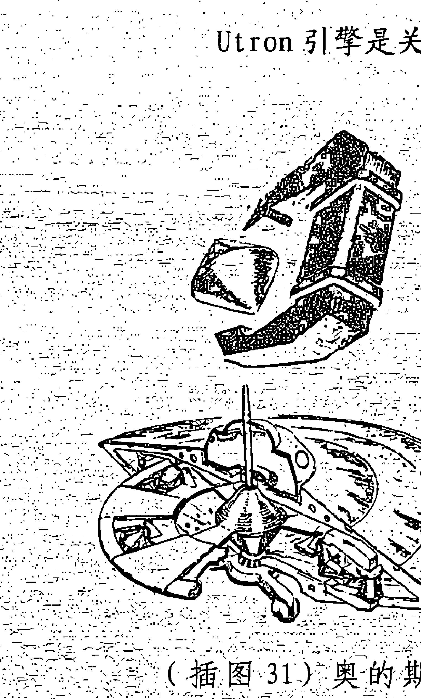

（插图31）奥的斯·凯尔的图示，展示了他如何把特斯拉的涡轮机运用在他发明的碟形反重力飞行器上。

Utron引擎是关键所在。凯尔说，由于它独特的形状，它能积累并集中能量，而且能对我们的意图作出回应。当我们操作这个机器时，我们并不需要做任何控制性的工作。我们进入了某种冥想状态，然后我们三个都把意念集中在我们想要获得的效应上。我知道这听上去很荒唐，但我们确实这样做了，并且这非常有效。凯尔利用某种未知的原理，让意识和引擎交织在一起，创造了某种效应。你无法用方程式来表达这一过程。我不知道他是怎么知道可以实现这一效应的，但他确实做到了。

凯尔让每个人在口袋中装上目的地的岩石、泥土块和草。否则，当他们回来时，就不会记起刚刚去了哪里，而会认为整件事都失败了，就像巴克斯特的室友从催眠状态中清醒过来时，觉得什么事都没有发生一样。当然，当瑞恩从旅行中回来时，他什么也不记得了，但是他的口袋里塞满了草。他彻底晕了，后来才记起这次旅行，仿佛从梦中苏醒过来一样。于是，他问凯尔这是如何发生的，凯尔说了下面这些话。

你的大脑在操控着你的身体。你处于一个容器（身体）中。但大部分人并没有意识到，这只是一个虚幻的容器，包括我们看到的这个现实世界。我们一直在转瞬之间（几微秒的时间）创造着这个现实。从1秒到另1秒，这些快门在不断开合，创造了你所见到周围的一切现实，但这不是真实存在的。这都是灵性存在（spirit），这都是能量，但是我们在创造它……人们并没有意识到，在某种意义上，人类创造了时间。本质上，时间并不存在。只有在我们创造了它时它才存在，于是，事情就有了开端和结尾，我们称之为时间。但是在更宏大的现实中，时间并不存在。

“快门开合”听上去就像物理学、化学、生物和放射性反应中的波动效应，施诺尔发现它无处不在。

不幸的是，从事绝密项目的特工在1961年突然找到了凯尔。

他们说，“你必须马上停下来”。我们问他们为什么。“因为你们威胁到了美国的金融系统”，这就是他们的策略……“我们要没收这一切”。他们进入办公室和实验室，他们开始没收所有东西。他们对我们说，大致意思是“你们这些人犯了罪，你们在试图推翻金融系统。”

当局对这项技术以及相关信息的压制和掩盖持续了相当长的时间，斯坦顿·弗里德曼（Stanton Friedman）博士在一篇被主流媒体广泛转载的文章中，称之为“宇宙水门事件”。这一事件很可能是开国者们对美国国玺含义的保密行为的衍生结果。对于国玺的含义，他们显然放出了一些信息，为有意探究的人提供某些线索，但是从来不给出直接、公开的解释。我们现在已经可以清楚地看到，在这些技术的背后隐藏着一套清晰统一的（自然）法则体系。一旦我们修正我们在科学上所犯的错误，我们就能解释我们所观察到的一切现象，并意识到这些早已出现在自然界中的相同的力量是如何运作的。直到现在，那些在这项技术研究上取得明确突破的研究者中没有一个得以被社会大众所知晓。虽然托马斯·汤森得·布朗（Thomas Townsend Brown）（别费尔德-布朗效应 [The Briefield Brown Effect]）、约翰·瑟尔（John Searl）教授（瑟尔悬浮盘 [The Searl Levity Disc]）和其他人也取得过类似的发现，但是，布朗决定与安全机构合作，他的工作因此变成了机密，而瑟尔因为反对与他们合作导致其全部设备及资料被没收、销毁。尽管如此，我们还是能看到，这些研究结果和我们一直在探讨的知识高度吻合。2个俄国科学家，罗斯基尼（Roschin）和戈丁（Godin），独立重建了瑟尔的技术，虽然他们的设备必须固定在实验室的桌子上来保证，但他们显然倍受鼓舞。瑟尔和他的助手最近在网上放出了一段视频，展示了其发明的奇特涡轮机正在运转的场景，而在此之前，怀疑论者攻击了他的发明构想并声称这是无法实现的。瑟尔的研究团队声称，他们正在制造一个完全可控的设备原型，非常类似拉尔夫·瑞恩的发明。

### 实践“神行”

在我写这本书的时候，我们都没有接触过这些科技，但或许对于这个我们即将转变进入的黄金时代来说，这些并非必要。不借助任何科技，仅仅通过产生足够的相干性就能使你自己的身体漂浮起来吗？西藏人似乎也继承了这一神奇的技艺。这项技能被称作“神行”（Lung-Gom），亚历山德拉·大卫·尼尔曾目睹这一过程并写入了她 1931 年出版的《与密师和法师在西藏》一书中。作者在书中讲到，僧侣们可以进入一种深度的出神状态，在这种状态下，他们可以通过某种完全违背我们目前所知的重力学的方式来操控身体，以极快的速度和极大的步幅飞跃前行。

神行最初也许是一种比步行和骑牦牛快得多的远途旅行方式。每当他们的脚接触地面时，他们又开始了另一次巨大的跳步。尽管电影可能有所夸大，但实际上，他们每一跳步的高度都至少有 10 米，跨度至少有 33 米。大卫·尼尔曾经听说过相关的故事，但有一天，她终于在远处通过望远镜目击了一个僧侣的神行过程。她在西藏旅行的同伴通过裸眼看到了那个僧侣的模样，并确认了他正是传说中的“神行者”（lung-gom-pa）。

亚历山德拉想要接近那个僧侣，近距离进行观察并询问他一些问题，但是她被严厉警告了。

> > 请不要试图阻止他们或和他们说话，这极有可能导致他们丧命。
> 这些喇嘛在神行时不能其中断其冥想过程。如果他们停止重复诵念咒语，他们体内的神就会离开，如果恰好不是合适的时候，就会使他们丧命。

对我来说，这就像是被创作出来神秘传说，用来解释我们目前可以通过科学来理解的现象。基于我们现在重新发现的这些新的物理规则，我们可以假设，僧侣们为了实现神行，于是，他必须把他体内一半以上的原子和分子传送到时间 - 空间中去。他就处于一半在我们的空间 - 时间现实内，一半在这个现实外的状态。他们是如何掌握这项能力的呢？这需要某种“松果体苏醒”的过程吗？这也是其中的一部分。大卫·尼尔解释道，为了练习这项技术，你必须先花费数年时间来练习各种呼吸技能。最终，你的老师会给你一个咒语，你需要按照某种节奏来重复诵读。当你进行实践时，你的呼吸和步伐必须和咒语的音节保持同步。

对我来说，这报告中的大量信息与我们一直在探讨学习的这些知识非常吻合，而对于这一点，大卫·尼尔对于这一点。热能扰乱了源场中的相干性，因此在一天中最热的时候，神行过程通常不会很顺利。同时，地形决定了源场（能量）的结构，就像金字塔效应一样，因此不平坦的地面、狭窄的溪谷和树木都能产生扰乱“神行者”路径的影响。而平坦的地面和宽阔的沙漠地带使之进行得更加容易顺畅。最后，你从普通的意识状态进入到了深度的出神状态，你的大部分意识都不再存在于这个空间 - 时间现实中。你的松果体处于激活状态，你大部分的意识都传输到了你在时间 - 空间中的星光体（astral body）或能量复制体内去了，就像加拉夫和其他人揭示的那样。有趣的是，大卫·尼尔同样也报告了，如果僧侣们太频繁地神行，他们会被“困在”半路上，那时他们不得不用锁链连接重物，把他们拉到地面上来。

到目前为止，已有很多被妥善记录、难以伪造的关于人类悬空漂浮的案例，包括基督教徒、瑜伽修行者和19世纪一个名为丹尼尔·杜格拉斯·休姆（Daniel Dunglas Hume）的人都曾显现过这种非凡能力，科学家、学者、政府要员和其他社会名人曾共同目击了丹尼尔的惊人表演。在克劳德·斯文森博士的《同步的宇宙》中，一个关于人体漂浮的例子引起了我的注意。1980年代，有一个叫做彼得·修格列斯（Peter Sugleris）的年轻希腊人，他不需要接触就能移动物体、弯曲汤勺和其他金属器具——曾被很多人目击到。对于这些弯曲汤勺的技术，我们现在可以通过原子进入时间 - 空间导致物质变得可弯曲的原理来解释。是的，修格列斯自身也能够漂浮起来。在1986年，他的妻子拍下了他悬浮在离厨房地面18英尺以上的空中并持续了47秒的照片。在这个过程中，他看起来很费力，脸部表情出现扭曲，并且在落地后出了一身冷汗，精疲力尽。他花了10到15秒的时间来恢复到正常的意识状态。为了实现这一表演，他必须高度集中注意力，并且在事前数周完全素食。

## 第十五章 几何课变得更有趣了

我们找回古代失落秘密的目标已经接近完成了。到目前为止，我们最大的发现是我们在自身周围看到的这个三维空间——我们的现实世界，其实只是全景的一半。另一部分是一个平行现实，在那里，所有的规则都基本和我们的现实是相同，但是那里的空间就是我们这里的时间，反之亦然。这2个现实联系紧密，并且完全依赖彼此而存在，它们的漩涡运动在每个原子内部协调运作。大自然从未告诉过我们：重力屏蔽效应是不可能实现的。这种现象似乎一直在自然界中上演，在龙卷风里、雨滴中、植物和树木的枝干中，以及某种昆虫的翅鞘中。重力内部似乎有更多的结构，不仅仅只有向下的力和向上的力的较量。在重力内部也存在着螺旋运动，产生（除竖直向下方向之外的）向着其他方向的力。为了抵消重力，达到相干状态并进入时间—空间，我们需要知道如何在源场中创造合适的漩涡流，如此我们才能获得腾空漂浮、心灵传输和时间旅行的能力；这也许是被预言的黄金时代中，一个关键的篇章。而几何学也许是创造这些漩涡流以让我们达成目标的关键。

### 几何漩涡点

由于地球上某些区域的相干性比其他的地方强，因此在这些区域实现腾空漂浮、心灵传输和时间旅行会比其他地方容易得多。重力在这些区域会呈现为一个旋转的侧向推力，在空气中、水中、磁场中或者地幔中创造出圆形的或者椭圆形的能流模式。1960年代，伊万·T. 桑德森（Ivan T. Sanderson）和他创立的“未解之谜研究协会”（Society for Investigation of the Unexplained）一直在寻找这些“漩涡点”。查尔斯·贝利茨在1974年写作《百慕大魔鬼三角》时充分利用了桑德森的资料库。从1945年到1975年期间，有67艘船舶和192架飞行器消失于百慕大魔鬼三角。在这些事件中，有1700人失踪了。这些数字还不包括那些已有常规解释的失踪事件。在 2004 年，吉安·夸萨（Gian Quasar）披露，在之前的 25 年中，75 架飞行器和数千艘游艇无声无息地消失在了百慕大魔鬼三角，在他的书的封面上，他指出，有超过 1075 人在这些事件中失踪了。

桑德森发现，在地球上有不少区域经常出现难以解释的奇怪事件，而百慕大魔鬼三角只是其中一个。在 1960 年代晚期，桑德森确定了地球上有 10 个这样的区域，并且相邻之间基本等距。在这些区域，人们有时会看到空中或海面出现奇怪现象，飞机和船舶经常无故消失，设备常常出现故障。

其中 5 个区域位于北半球同一纬度，相邻之间的经度差都是 72 度。其他 5 个位于南半球，并且布局模式也一致，但是它们相对北半球的区域都向东偏移了 20 度。1970 年代初期，桑德森出现在无数的广播和电视节目中，谈论了这些出现大量神秘事件的漩涡点，激发了公众巨大的好奇心。有超过 1000 人在百慕大魔鬼三角失踪了，但是桑德森认为这些事件和这片区域的三角形状并无关系。由于他的广泛知名度，军队和商业飞行员开始向他提供一些更加有趣的数据。飞行员说在这 10 个地点中，或者附近的地方，他们经历了时间异常现象——在他们到达目的地时不是太早就是太迟。他们自身携带的测量工具和地面记录都证实了这一现象。

ABC 的节目《迪克·卡维特秀》（*The Dick Cavett Show*）在 1960 年至 1970 年间非常流行。阿瑟·戈弗雷（Arthur Godfrey），一个经验丰富的飞行员，经常作为该节目的特邀嘉宾出现在节目中。1971 年 3 月 16 日，戈弗雷和桑德森在节目上就这 10 个漩涡的问题展开了一场激烈的辩论。虽然他们是老朋友了，但在前二次辩论中戈弗雷毫不客气地说，桑德森的观点“纯属瞎扯”。

然而，当桑德森拿出了标记出这些地点的地球仪，并展示了所有的证据时，戈弗雷被震惊了。他在这些地区的三次不同经历，直接证实了桑德森的说法。

其中有 一次，当戈弗雷在穿越南日本的魔鬼海（Devil's Sea）区域的过程中，有长达 1 个半小时的时间他完全失去了所有的通信联系，飞行仪表也失灵了，而那时剩下的燃料只能维持 4 小时，他当时感到非常害怕。他说当飞行员跨越海面直接飞向美国东海岸时，速度会比在陆地上空飞行的速度更快，他们不得不小心地盯着他们的仪表。其他的飞行员也描述了同样的情况，包括巴里·法博（Barry Farber）的广播秀中的鲍勃·杜兰特（Bob Durant）。当迪克·卡维特最终直接问戈弗雷“这些现象是否值得我们对其进行合适的科学调查”时，他直视镜头，无比严肃地说“绝对是！”。

这也在科学家和工程师当中引起了一波新的研究兴趣。其中有一个专家指出，南极点和北极点也该被包括进去，因为这两个点也符合同样的几何关系，1971年，桑德森在他创办的期刊《追求》（Persuit）中公布了一幅关于这 12 个被他称为“可恶漩涡”（vile vortices）的图解。他在 1972 年的《萨迦》（Saga）杂志上发表了他的经典文章“世界上的 12 个恶魔墓地”（The Twelve Devil’s Graveyards Around the World），并再次引发了公众的关注热潮。并且也激发了 3 位名字分别为尼古拉·冈察洛夫（Nikolai Goncharov）、维亚切斯拉夫·莫罗佐夫（Vyacheslav Morozov）和瓦莱里·马卡罗夫（Valery Makarov）的苏联科学家的研究兴趣，他们于 1973 年在俄罗斯科学院的主流学术期刊《化学与生命》上发表了一篇标题为“地球是一块巨大的水晶吗？”的论文。这个三人的研究团队是不同（领域的）才能的有趣结合——冈察洛夫是一个历史学家，莫罗佐夫是一个结构工程师，马卡罗夫是一个电气专家。他们发现，当你在三维空间中连接桑德森的 12 个漩涡点时，可以创造出一个 20 面体。这大致上是一个拥有 20 条边，并且每一个面都是等边三角形的类球状几何体。他们觉得，这是某种存在于地球内部的能量晶体结构。他们称之为“宇宙能量矩阵”（matrix of cosmic energy）。

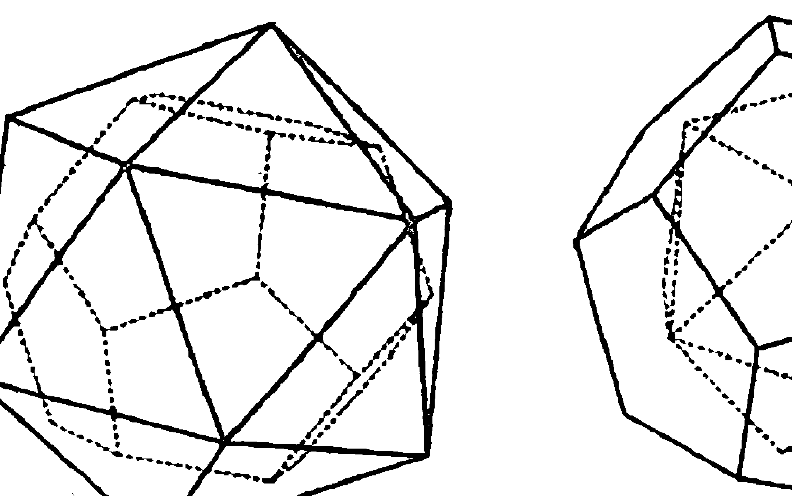

（插图 33）桑德森发现的由地球表面的漩涡点构成的 20 面体，可以通过几何反转构建出一个 12 面体，如图中所示。

全部连接起来时，他们获得了大量隐秘的科学珍宝。 很多易发生地震的地震带都位于这个网格中，海底火山带也完美地嵌合其中，包括大西洋中央海岭，以及陆地上的部分山脊。所有这些效应可能是地幔中的自然旋转能流（重力的侧向力推动着熔岩物质进行循环环绕流动）所导致的结果。最高气压区和最低气压正好位于某些在3线交叉的位置，这样的交叉点总共有62个。这也许又是重力通过（主流科学界尚未正式承认的）某种螺旋能流方式影响大气而造成的结果。这些漩涡区域也形成了主要洋流和涡流的中心点，显示了重力效应对水的流动模式的影响。地磁强度最高和最低的地区也整齐地嵌合到这个几何样式中。矿产和石油最集中的地区也位于这些区域中。动物在迁徙时也自然地遵循这些路径。独特的野生动物以及重力场中的反常现象也经常出现在这些区域。

最妙的是，先进的史前文化和古代文明也出现在这些地点上。事实上，总共有3300个由大型石块建成的宗教性建筑和古代遗迹也出现在这个网格中。这包括埃及的大金字塔、中非的大津巴布韦（Great Zimbabwe）遗址、英国的巨石阵和埃夫伯里石圈、中国西安的金字塔、澳大利亚的昆诺安达（Kunoonda）石圈、波纳佩岛（Pohnpei）的南玛多（Nan Madol）遗址、复活节岛的神秘巨石头像、秘鲁的马丘比丘（Machu Picchu）遗址、墨西哥特奥蒂瓦坎的太阳金字塔和月亮金字塔、美国西南部霍皮族的聚居地（包括赛多纳、亚利桑那）等等。这些极具说服力的证据证明了古人总是选择在建造成功率最高、相干性最强的地区建造这些巨石建筑，因为在这些地方更容易屏蔽重力的影响，并且对人体有非常显著的疗愈功效。如果能够掌握行星的对齐规律，你甚至可以借助这些漩涡点来进行时间旅行。

> 威廉姆·贝克（William Becker）和贝蒂·哈根斯（Bethe Hagens）所写的《星球网格：一个新的综合理论》（The Planetary Grid: A New Synthesis）中，进一步精炼和提升了俄国科学家的工作，他们连接起更多的几何点，创造了目前最先进的可视化地球网格。书中提到了2次与该网格联系紧密的飞行事件——飞机在飞行过程中出现了突然性的、不可预测的航向改变，而改变后的航向正好和网格上的网线完全匹配。牵涉到这两次事件中的两个航班分别是：1983年9月1日从阿拉斯加州的安克雷奇（Anchorage）出发的KAL 007航班和1978年4月20日从巴黎飞往安克雷奇的KAL 902航班。这2个航班刚好分别在两个不同文化的重大节日期间启程：KAL 007出发时正值佛教的毗瑟挐节（Vishnu），KAL 902出发时正值基督教的耶稣受难节（逾越节）。这些古代节日的日期选择很可能是有特定原因的——在我们经历季节变换时，地球和其他天体的位置对齐也许会对地球上的原子和分子产生一个额外的力，使其（内部）运转速度能在这些特殊的日子里超越光速的界限。并且，有些节日的日期并不固定，而是几乎每年都有所变动。但是对于我们上诉的推测，显然还需要更多的研究来证实，不过这确实是一种非常有趣的可能性。

### 地脉

在20世纪，阿尔弗烈德·沃特金斯（Alfred Watkins）发现，大量属于不同历史时期的建筑遗址形成了若干条直线贯穿整个英国，他把这些线称为地脉（Ley Lines）。其中有一条几乎水平地穿过整个英格兰南部。我很高兴了发现了BBC2005年的一篇报道，它严肃地讨论了这些神秘事件。

> > 在经典的《哈伯超自然现象和神秘事件百科全书》（Harper's Encyclopaedia of Mystical and Paranormal Experience）一书中写到，“地脉被认为是连接了各种神圣遗迹（比如教堂、庙宇、石阵、巨型石碑、圣井、墓地和其他具有重要的灵性和魔法意义的地点）的强大的、不可见的地球能量连线和样式。”……（调查者）已经证实了，出现在这些区域的“超自然”事件（包括闹鬼）明显比其他地方多……接触到这种能量时，你会有类似接触静电的感觉，比如会感到皮肤有“麻刺”感，头发会立起来……在调查者经常被提到的现象是，科学仪器会变得很不稳定……具有较高重要性的史前建筑，经常被发现正好位于2条或更多地脉的交汇处。

虽然，在这篇报道的末尾，有一个否认性的声明：以上内容并不代表格洛斯特郡（Gloucestershire）的BBC电视台的观点。他们所提到的所有效应和我们之前学到的关于源场的知识非常吻合。

约瑟夫·乔马斯（Joseph Jochmans）的于1996年发表在《崛起的亚特兰蒂斯》（Atlantis Rising）杂志上的一篇文章中，总结了这些地脉的许多有趣特征。

蒂斯》（Atlantis Rising）杂志上的一篇标题为“地球：一个水晶星球？”（Earth: A Crystal Planet?）的文章极大地鼓舞了我，它着重介绍了一些之前我就已经提到过的观点。乔曼斯透露，世界上很多不同的古老文化都对这些远古直线高度重视。伊朗人称它们为精灵之路（fairy paths）；德国人称它们为圣线（holy lines）；希腊人称之为赫尔墨斯的神圣之路（Sacred Roads of Hermes）；古埃及人称它们为冥之路（Pathways of Min）；中国人称它们为龙脉，并且相信将石头、树木、庙宇、房屋和宝塔安置在这些线上，可以对地球起到直接的帮助作用，这也是一种古老的风水习俗。古人就像通过针灸线疗愈人体一样利用地脉帮助地球平衡能量。这与“世界之轴”的概念也非常吻合。如果某个地方有一个强大的能量漩涡，并且有足够的人知晓其存在并且能利用其获得益处，那这个地方显然会成为大家的关注点。

澳大利亚的土著居民称之为梦径（dream paths），并且他们会沿着这些线进行季节性的徒步旅行，以重新激发这些地区的生命能量。他们会在一种他们称为“Turingas”的木板上标示出这些梦径，并且在这些线上通过冥想就能够定位想捕猎的动物和预测暴风雨。古波利尼西亚人（Polynesians）称它们为“te lapa”（lines of light，光之线），并且他们在海上航行时可以在海中看到其发出光芒，并利用它们来导航。复活节岛和夏威夷的原住民称它们为“阿卡线”，并建造了巨石头像和“阿胡巨石平台”（Ahu platforms）来掌控利用这些线上的“生命能量”。印加人沿着被称作“ceque”的线创立了他们的整个文明，并沿着这些线建造了瓦卡斯建筑（wacas）或宗教中心，并且最终汇聚于库斯科（Cuzco）的太阳金字塔。

玛雅人建造了他们称为萨比斯（Sacbes）的凸起的白色小路，这些路笔直地沿着这些线，贯穿了沼泽，把他们的金字塔遗迹连接在一起。在北美西部地区发现的药轮（Medicine wheels）和基瓦圈（kiva circles）也是以直线的方式排列，中西部和东海岸区域（就是现在的美国）发现了原始印第安人（Mound Builders）留下的以直线排列的非常奇特的构造，似乎是用来利用这些网格的能量和它产生的相干性。乔曼斯说，美国土著的巫师们经常提到来自地球的治愈能量，他们称之为奥伦达（Orenda）、大神（Manitou）或者其他的名字。有趣的是，乔曼斯也声称，霍皮族的长者们说，地球就像是小鹿那布满斑点的背部。当小鹿变老时，这些斑点就改变了位置，并且又会出现了新的斑点。

### 地球的几何扩张

一个叫做阿瑟尔斯坦·斯皮尔豪斯（Athelstan Spilhaus）的NOAA科学家，在 1976 年发表了一篇论文，证实霍皮族是完全正确的。斯皮尔豪斯于 1998 年过世，他是一个有声望的科学家、一个天才发明家和辛迪加连环漫画的作者。他研制了“海水深度温度自动记录仪”（bathythermograph），一种重要的潜艇侦测设备，为在二战中战胜希特勒做出了很大贡献。斯皮尔豪斯也是顶级机密 MOGUL 工程气象探测球项目的发明者和推动者，官方的说法是，在罗斯维尔坠毁的东西就是这个机密项目的气象探测球。由此，斯皮尔豪斯的公信力对于官方掩盖 UFO 真相起到了非常重要的作用。

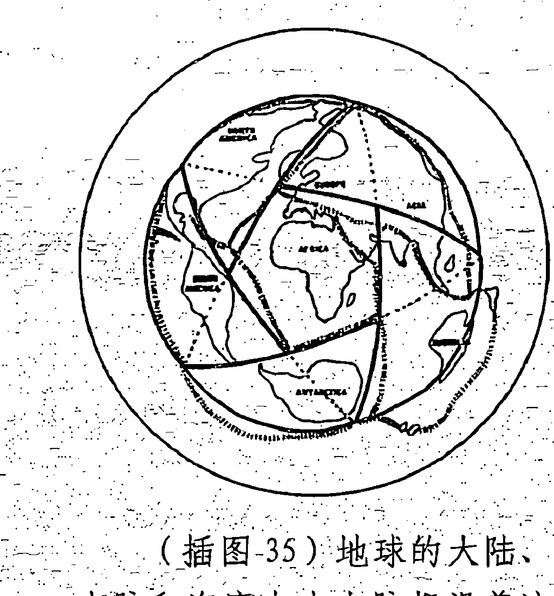

这个故事开始于 NASA 戈达德飞行控制中心（Goddard Space Flight Center）的刘汉松博士（Hanshou Liu，音译），他是第一个发现了 220 万年前原始超大陆盘古大陆（Pangaea）沿着（构成了一个我们称为四面体的金字塔状几何体的边缘线）的等距线分裂开来的科学家。这个金字塔状的四面体的四个面都是等边三角形。

斯皮尔豪斯在制作地图投影（map projections）上天赋极高。在一场和刘汉松博士的讨论中，他们意识到，大陆板块、火山带和地震带形成了一个立方体和八面体的组合结构。一个八面体就像 2 个埃及金字塔底部连接在一起，每个面都是等边三角形。

桑德森在 1971 年（重新）发现了，从（上文提到的）那个时期起，地球的表层地质结构再次转变成一个新的样式，俄国研究者在 1973 年也（重新）发现了这个相同的样式。斯皮尔豪斯于是创造了一个特殊的地图投影。他在太平洋上选了一个点并以之为中心画了一个圆，这样地球上的一切都在圆内了。从那个视角看，这个几何结构变得非常明显，它以非常惊人的准确度覆盖了主要的地震带和火山带。

我在 2004 年 6 月联系了刘汉松博士，以确认这个不寻常的科学故事是否真实，他最终允许我刊登如下的陈述内容。

> 亲爱的威尔•库克先生：阿瑟尔斯坦•斯皮尔豪斯博士于 1976 年在 NASA 戈达德飞行控制中心拜访了我，并希望重新发表我的 3 篇论文：“俯冲断层岩石圈板块的形变与不稳定性”（*Deformation and Instability of Underthrusting Lithospheric Plates*），“下降分裂岩石圈的动力学模型”（Dynamical Model for the Detachment of Descending Lithosphere）和“关于极线偏移导致构造板块破裂的讨论”（On the Breakup of Tectonic Plates by Polar Wandering）……在1976年，我在我的办公室中向斯皮尔豪斯博士指出了这样的一个（几何）样式。当他看到地球板块的破裂位置精确地发生在被称作四面体的集合体的点与线上时非常兴奋……我们也讨论了地球岩层扩展时经历的八面体和二十面体时期的可能性。在斯皮尔豪斯博士离开我的办公室之前，他在我的论文上评论到，“现在，你关于地质板块突变的想法可以不通过数学就能陈述出来，即使没有科学基础的人也能理解。你的勇气、胆量和直觉，使得你能够产生颠覆我们对地球力学传统理解的观点。”作为一个经过训练的理论物理学家，我觉得这对我来说是令人鼓舞的赞誉。

显然，几何学看上去似乎会在地球的成长和发展中，扮演着超乎我们想象的重要角色。已有100年历史的传统的“板块构造模型”，或者过去被称作大陆漂移学说，可以追溯到1912年阿尔弗烈德·韦格纳（Alfred Wegener）博士的发现。然而，不论是南明尼苏达大学（Southern Minnesota）已退休的卡尔·W. 拉克特（Karl W. Luckert）教授，还是詹姆士·马科斯洛（James Maxlow），都用科学证据证明了：地球从220百万年前（当超大陆盘古大陆首次裂开时）就开始自内而外地扩张。马科斯洛从地球总表面积中，简单地减去了世界范围内的海床在各个时期的扩张面积。计算出来的结果令人震撼，马科斯洛发现，如果你把地球的尺寸缩小到目前的55%左右，地球上所有的大洲都能完美地结合在一起，一些科学团体开始认真对待马科斯洛的研究。举个例子，在 2007 年的《地球构造新概念》（New Concepts in Global Tectonics）简报中科学家们便对此进行了讨论。马科斯洛和拉克特（Luckert）仅仅是众多正在试图改进这个模型的科学家中的其中 2 个。

极少科学家愿意碰地球扩张理论（Earth Expansion Theory），因为这意味着地球内部在生成着新的物质。同时，他们中的大多数都支持大爆炸理论——即宇宙中的所有物质都来自于一场巨大的爆炸……从无到有。马科斯洛、拉克特（Luckert）和其他人得出结论，板块构造模型存在巨大缺陷。如果我们接受“地球通过一个连续的物质创造过程从内部进行扩张”的观点，我们就会看到，我们得到的实际观测数据和这个全新的理论完全吻合。当然，这就意味着物质可以从源场中自发形成。最妙的是，我们看到地球一直在按照几何阶段逐渐扩张。

### 地球的晶体内核

现在看来，这种几何结构似乎显现为一种隐藏的能量模式或者地球的表面轮廓。我们可以通过对（可能是由重力产生的压力流造成的）地震带、山脉和海底火山脊的位置进行测量来证实这一点。地球内部会不会存在一个类似形状的晶体呢？在匹兹堡大学的一个分支机构匹兹堡超级计算中心（Pittsburgh Supercomputing Center）的网站上，我发现了下面的摘引。

在地球的深处埋藏着一个巨型晶体，在非常中心的位置，地表 3000 英里以下的地方。这听上去也许就像最新的梦幻冒险游戏或者一部新的印第安纳琼斯电影（即《夺宝奇兵》系列）。但是，1995 年，当科学家们利用尖端计算机模拟地球内核的模型时，却发现了这个现象。

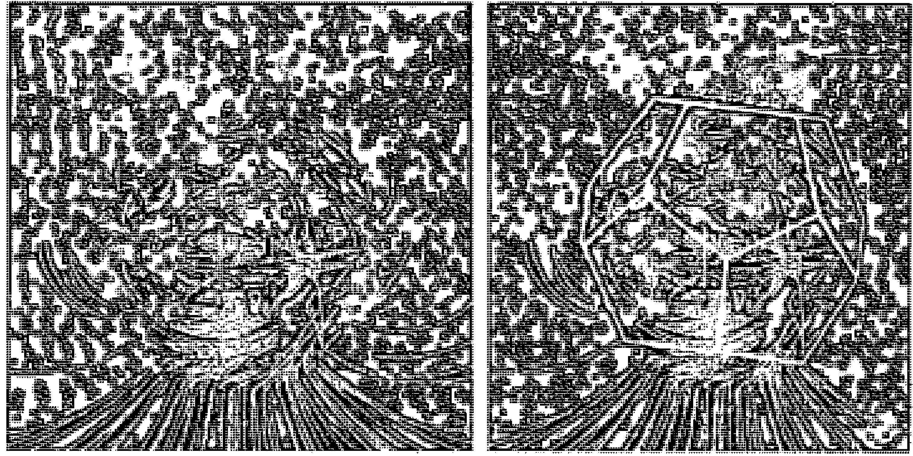

（插图 37）NASA 的盖尔茨梅尔 - 罗伯特模型揭示了地球核心存在一个极像十二面体的几何“晶体”样式，如右图所示。

这个发现确实让我感到兴奋，盖尔茨梅尔-罗伯特（Glatzmaier-Roberts）的地球内核模型具有一个非常清晰的几何形状，某些科学家称之为“六边形”样式。然而，如果你套上一个十二面体并略微倾斜它（大概10度左右），你会发现其惊人的匹配度。我们之前讨论到的所有其他几何体都不能与之匹配吻合。我们可以清晰地看到，一个螺旋的流体状的漩涡穿过几何体的中心。一项研究指出，地球的一部分内核极有可能是流体……我们也许会猜想，这就像源场所产生的流状特性。美国地球物理学联盟（Geophysical Union）曾公开指出，几何内核的角度倾斜和地球的自转运动并不相符。另一篇主流研究文章说，“更加奇怪的是，（内核）的旋转速度要比地球更快。”我们会在之后提到这一点。科学家们承认，流模型不能完全解释这个位于地球中心的“晶体”。《今日物理在线》（Physics Today Online）的报道说，“这种（地球内核的几何）一致性并不完全是单一力的作用结果（比如电磁场压力），而是由多种出现在内核中的力的合力所造成的。”
我花费了数年来理解，是什么导致了这些几何学特征如此明显地出现在地球的实际结构和运作模式中，更不用说理查德·C. 霍格兰所指出的存在于太阳（太阳黑子出现区域基本在北纬19.5度到南纬19.5度之间）、火星（比珠穆朗玛峰高3倍的奥林匹斯盾状火山处于19.5纬度）、金星（两座主要的活火山大都处于接近19.5纬度的位置）、木星（“大红斑”处于19.5纬度）和海王星（“大黑斑”处于19.5纬度）中的“四面几何体”。在我们的传统思维模式中，我们认为自然界中不应该出现直线。我花了不少时间才弄明白：实际上，重力引发了大气中的这些气旋和地幔中的火山岩上涌活动。

### 震动流体中的自发几何现象

当我发现了汉斯•詹妮（Hans Jenny）的工作成果后我松了一口气，她发现这种几何现象也自然地发生在流体中（通过简单的振动）。几乎在同时，我意识到这是我在研究中遗漏的最大的部分，我非常兴奋。

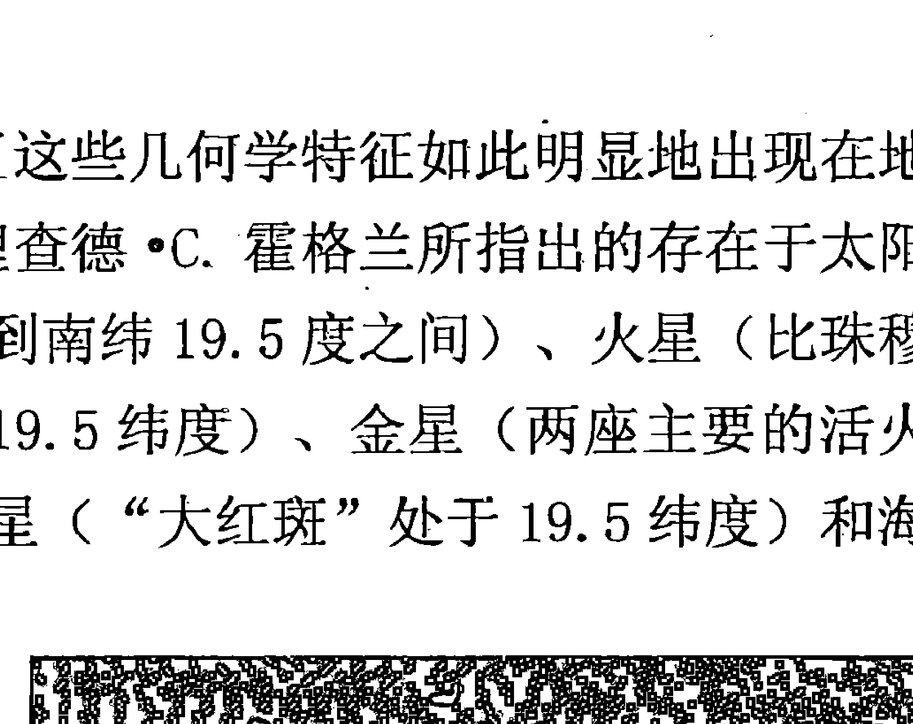

（插图38）木星的大红斑旋风似乎是被一种沿着四面体结构自然循环流动的引力所驱动的。在固体行星表面，地幔会上涌到这些漩涡点，形成一座座火山。

在她的音流学（Cymatics）研究中，詹妮博士取了普通的水并放入了自由漂浮的胶质颗粒。这些颗粒由于太小而不会沉下去，而是呈现悬浮状态。当詹妮博士以不同的频率振动水时，这些颗粒立即形成了清晰漂亮的三维几何体。每种样式都很稳定，保持着相同的样式，但同时在几何体内部进行着无数的旋转运动。这些颗粒一直在移动。在几何体的每一点上都能看到长的弯曲环路（loops），显示了一个粒子从一个区域流动到另一个区域的情形，它的弯曲路径和几何体自身的直线形成了鲜明对比。只要它不改变液体的种类，她每次以特定频率振动时，同样的几何体就会再次出现。因此，你可以用同一种液体，相同的粒子，形成不同的几何样式。每一次你以一定的频率振动它，同样的几何体会再次出现，简直就像魔法一样。

较高频率的声音创造了更复杂的几何体，反之亦然。此外，当詹妮博士振动一个较大区域内的水时，不仅仅只出现了一个几何形状，而是出现了多个同样的几何形状，并且都呈一条直线整齐地排列着。这些样式看上去就像一组原子形成了一个较大的结构。这是物质如何形成的最大奥秘吗？看上去当然是这样。这显示出，当流入地球的能量的频率增高时，构成大洲、地震带和火山带的几何体的复杂度也增加了——从四面体转变成立方八面体，直到现在的样式。

到了 1996 年，我已经意识到几何现象是理解能量、物质和生物体以及意识运作机制的奥秘所在，虽然直到后来我才在詹妮的成果中发现了证据。如果我们想要发现在液体中相干性是怎么样的，我们只需要研究 5 个基本柏拉图立方体——四面体、立方体、八面体、十二面体和二十面体。数学家们已经知道这些形状比其他形状更具有对称性。简单来说，它们中的每个都能完美地塞入一个球体，相邻 2 点间距离都相等。几何体的每个面都有同样的形状，每个内角都是一样的。

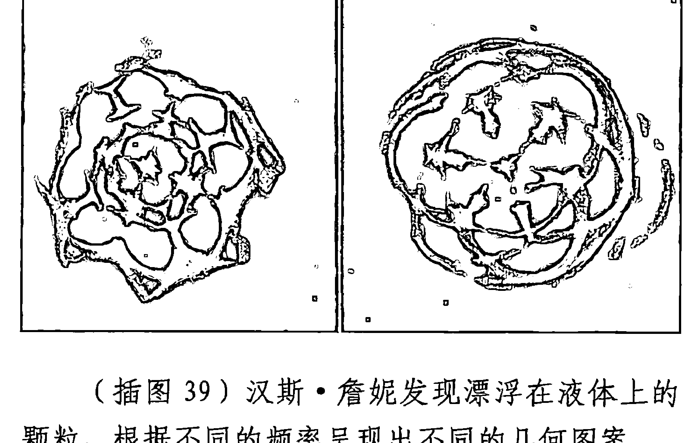

### 量子几何学：奥秘所在

物理学家们一直在寻找可以将宏观事物和微观事物统一起来的纽带。由于地球上存在着清晰且明显的几何样式，所以我们正在讨论的很可能是一个统一场模型，我们在宏观世界看到的样式同样也会出现在量子世界。原子，不仅可以被看作一簇围绕着原子核高速旋转的固态粒子，现在也可以被重新设想为（在源场的流体能量内部的）具有几何模式的能量流。当你提高了振动频率后，几何形状会变得更加复杂。一旦我们理解了这个运作原理，我们或许就能转变元素，实现炼金术士的将铅变为金子的经典梦想。

那我们从哪里开始呢？在拉森的模型中，如果我们寻找原子内部的几何形状，我们所需要做的就是研究原子核，因为他觉得原子核就是原子的全部，“在《含核原子的反常案例》（The Case against the Nuclear Atom）一书中，拉森指出，事实上，原子核的‘尺寸’就是原子自身的尺寸。”拉森的模型中并不包含几何形状，但是尼赫鲁（Nehru）也承认，他们还没有找出症结所在。

……现在已经确定，我们需要做大量的工作来扩大互反系统的应用范围，达到原子的内在构造层面。也许是时候在研究时间区域运作机制的探索中开辟新的道路了……开拓疆土需要引入新的思想，而不是固守成规。

我发现的第一个完全基于几何学创造出可行的量子物理模型的科学家是罗德·约翰逊（Rod Johnson），他曾于1996年在理查德·C. 霍格兰的论坛上提出了一些引发讨论的概念。在接下来的几年，我采访了他并在我的网站上发表了访谈内容。不幸的是，他在2010年过世了。当我发现他用几何学解释了如此多的量子力学秘密（其中包括普朗克常数、精细结构常数（Fine Structure Constant）等）时，我被震惊了。在根本不知道拉森模型的情况下，约翰逊独自演绎出了一个类似的概念。在约翰逊的模型中，存在着一个与我们的现实世界在最微观的层面不断进行交互的平行现实。每个原子在我们的世界中有一个几何形状，在平行世界中有一个与之对应的反向几何形状。2个几何形状在彼此内部反向旋转。这个过程的每个阶段都会出现不同元素。显然，约翰逊拥有一个伟大的模型，虽然他还没有足够的细节来解析整个元素周期表，但是他觉得，所有的答案都可以在詹姆斯·卡特（James Carter）的“圈克隆”（circlons）理论中找到。

之后我发现罗伯特·蒙（Robert Moon）博士运用几何现象，解释了元素周期表中的一切。他是参与曼哈顿计划的一个关键科学家，实现了世界上第一次可控核裂变，他是1930年第二个建造回旋加速器（cyclotron）的科学家，并且第二个在第一个的基础上做了极大提升（第一个由E. O. 劳伦斯[E. O. Lawrence]建造）。在曼哈顿计划中，穆博士解决了建造第一个原子反应炉时遇到的关键难题，并在2战后制造了第一台X光扫描显微镜。从1974年到他去世的1989年，他一直是林顿·H. 拉鲁什（Lyndon H.LaRouche）的重要合作伙伴。在拉鲁什的21世纪科学和技术网站上，可以看到大量关于他的新量子物理模型的论文。

1986年，穆博士最终意识到几何学是理解量子物理的关键所在，确切来说，是一种存在于时间和空间中的几何体系。这意味着当你穿越时间，或者空间时，你必须穿越某种几何结构。你不能以平滑路径甚至曲线移动，‘在你去下一个地方之前，你必须要跳越过（pop through）一定量的空间，或者一定量的时间。’这种运动的科学术语是“量子化”。在1987年的一次演讲中，穆博士把他的概念描述为时间和空间的量子化过程。

*一种解释是我们拥有2种类型的时间，秘密在于我们应该有量子化的时间，来使得这种量子潜能得以运作……换句话说，你拥有量子化的空间和时间……那个想法就像一道闪电一样突然出现在我的脑海中。第二个突然涌现的想法是：如果空间将被量子化，那它应该会以高度对称的形式被量子化。所以我立即想到，那些是柏拉图立体（Platonic solids）。直到太阳出来时我还在思考这些问题……这些立方体是如何匹配的？似乎答案已经非常明显了。*

柏拉图立体，就是我们在所讨论的几何体——四面体、立方体、八面体、十二面体和二十面体。穆博士发现的要点在于：我们在地球扩张中看到的同样的几何体，也出现在原子核内部。此外，在穆博士的模型中，有超过一个的几何形状可以同时“藏”在原子核的内部——一个嵌套一个。这个几何体决定了科学家们在任何原子中能发现的质子数量，方法就是计算某个我们称为柏拉图立体的点的数量。一个立方体有8个点，八面体有6个，十二面体有12个点，二十面体有20个点，总共46个点。在穆博士的模型中，这是元素周期表中自然形成的元素的数量的一半。穆博士知道自然界中总共有92（46乘以2）种元素，因此他相信每个相对原子质量在47或更高的原子是2个连接在一起（会增加原子的不稳定性）的几何体的组合。

你也许已经注意到，穆博士并没有把四面体归入到这群组中去。他觉得因为四面体的对立面还是四面体，因此它扮演着一个不同的角色。事实上，在罗德·约翰逊（Rod Johnson）的模型和巴克敏斯特·富勒（Buckminster Fuller）的早期模型中，一个质子呈现为2个底部连接在一起的四面体组合——我们拥有确切的数据，能通过普朗克常数证明这一点。

不管怎么说，当你使用穆博士的模型时会出现很多有趣的事情。在原子核中第一个完整的框架是立方体，由8个质子组成。这与占据了地壳中原子总量的62.55%的氧元素一致，状态相当稳定。有趣的是，氧也是维持生命形式最重要的元素。第二个完整的框架是八面体，由14个质子组成。这构成了硅元素（占地壳中原子总量的21.22%）。虽然我们人类被认为是碳基生命体，但硅元素对于生物体来说也是非常重要的。并且碳元素似乎是“自然生成生命实验”（伊格纳西奥·帕切科的惊人沙子实验）的关键成分。

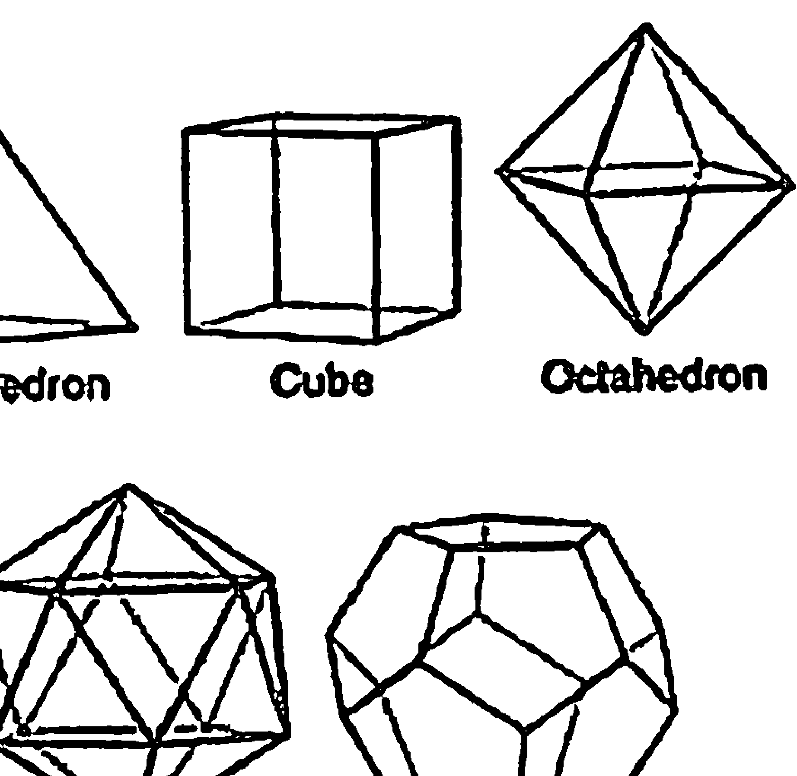

（插图40）罗伯特·穆博士发现，原子中的质子会自然地组合成正多面体，每个几何顶点代表一个质子。

氧元素（质子数为8）具有一个立方体（8个顶点）的原子核，硅元素（质子数为14）有一个八面体（6个顶点）形状的原子核，这两种元素占了地壳中原子总量的84%。而铁元素（质子数为26）具有一个二十面体（12个顶点）形状的原子核。你看到其中的数学关系了吗？当你将立方体和八面体的顶点数相加，你就得到了硅元素的质子数——14；当你将立方体、八面体和二十面体的顶点数相加，你就得到了铁元素的质子数——26。（根据穆博士的模型）这意味着硅元素的原子核内可能同时包含立方体和八面体；铁元素的原子核内同时包含立方体、八面体和二十面体。铁原子是我们用来制造自然磁场的最好金属。通过做为源场的传导通道（我们将在后面探讨这一点），这个隐藏的几何对称性也许导致了铁具有的磁特性。在所有组成地壳的原子中，含有1.2%的铁，但是它们却占到了地壳总质量的5%。钯元素有一个包含46个质子的十二面体原子核。钯元素是一种不寻常的对称原子，它被应用于所有的冷聚变实验中。你觉得谈论冷聚变只是在浪费时间吗？或许你不知道，麻省理工学院的技术简报主编尤金·马尔罗夫博士（Dr. Eugene Mallove）（据他所称）因为发现了实验小组故意篡改了冷聚变实验的数据以隐瞒该实验已成功产生效应的真相而被无情辞退。根据劳伦斯·赫克特（Laurence Hecht）的论文，穆博士的模型可以解决所有的量子难题，包括聚变和裂变反应的过程、地球稀有元素14的神秘周期、元素周期表内每列元素的准确数量和玛利亚·格佩特·梅耶（Maria Goeppert Mayer）的“魔法数字”（当奇怪地重复出现某些特定的质子数、中子数或原子序数时）。

### 微簇和准晶

更让我惊讶的是，我发现当原子被“松绑”时，它们会自发地聚拢在一起（在特定的区域中，一次一个地）形成同样的几何形状。这些被称作微簇（Microcluster），它们令主流科学家感到非常困惑。这和漂浮于松果体中的微晶体（microcrystals）也许相类似，尽管微晶体稍微大些。在1989年的《科学美国人》杂志上的一篇文章揭示了，微簇并不具有液体或者气体的特性。

它们属于一种新的物质状态——微簇态……它们让我们不得不去重新思考固态物理和化学的本质问题……原子是如何在脱离周围物质的影响后重新组装起来的呢？

我发现日本科学家菅悟野（Satoru Sugano）和广安小泉（Hiroyasu Koizumi）写的大学教科书，展示了更多的发现，包括一系列令人惊叹的几何学图像。

微簇无处不在，从（包含）10个原子到（包含）1000个原子的粒子团。最奇怪的事情是电子似乎是绕着微簇的中心运转，而不是每个独立原子的中心。当然，这个古怪的现象暗示了这里并没有独立的电子。相反，科学家们实际看到的是呈几何形排列的电子云，似乎源场的流状能量就是从这里进入到原子中。一旦原子中存储的一部分能量被释放出来，它就变成了一个光子——看上去就像一个微粒。微簇也被称为“单原子元素”或者“奥尔穆斯（ORMUS）元素”——劳伦斯·加德纳（Lawrence Gardner）在《神圣方舟的失落秘密》（Lost Secret of the Sacred Ark）中总结到。微簇似乎显示了一些异常的重力现象，包括悬浮和超导（在某些情况下出现）。古人相信通过吞下微簇可以唤醒他们的松果体，埃及人甚至把他们存放在圆锥形的糕饼里面。

另一个暗示了原子是（流体状）能量流中的几何样式（geometric patterns）的线索是准晶（quasi-crystals）现象。在这个例子中，有一些晶体看起来就像是我们一直在讨论的柏拉图立方，包括十二面体、二十面体等。这些晶体是通过高速超低温冷却某些处于熔融状态的金属化合物而形成的——当那些分子在空间-时间和时间-空间两个现实之间来回穿梭时快速地捕获它们，把凝结为一半在这个现实之内一半在这个现实之外的晶体模式。问题是，这些晶体摧毁了我们已知的晶体形成的所有规则，按理说它们是不应该存在的，因为你不可能用由粒子组成的原子来构造出它们。

埃德加·福凯（Edgar Fouche）声称他曾经在传说中的51区工作过，并且了解到美国军方在罗斯维尔事件和其它8次类似事件中回收了大量坠毁的飞碟残骸，并在其中发现了准晶。它们非常坚固，并极其耐热，虽然内部含有金属，却完全不导电。福凯发现这些准晶非常有用。

我了解到，一些机密研究显示，准晶是一种极具应用前景的材料，可用于制造：
- 高能存储材料
- 金属模型原件
- 阻热栅
- 特殊涂层
- 红外传感器
- 高能激光设备
- 电磁铁

一些高强度的合金和外科手术工具已经在市场上出售。

在这里，很显然他说的是芳纶（Kevlar）和特氟纶（Teflon），某些内部人声称它们来自于对坠毁的外星飞行器进行的“逆向（复原）工程”。福凯同时说道，这些晶体让参与这些工程的科学家感到非常困惑。

氢准基的构造，和其他未命名的材料，形成了罗斯维尔飞行器的等离子防护罩推进器（plasma shield propulsion）的基础，并且也是生化引擎交通工具的必备部分。当科学家们通过评估分析后，试图用逆向工程解密罗斯维尔飞行器的技术时，发现了意想不到的先进结晶学科技。之后又有8架类似的飞行器坠毁了。在对罗斯维尔飞碟残骸进行长达35年的秘密研究后，他们发现，仍然有数以千计的问题尚未有答案。他们认为，低调地向对这些发现所知尚少的科学界介绍这些准晶是比较“安全”的做法。

显然，运用我们的新量子力学模型，对于这些晶体是如何形成这个问题，我们显然更加接近答案了。并且，那些造访者对这种科学的了解似乎远远超过了我们。

### 含有自然准晶的岩石

在格里·瓦西拉托斯的《失落的科技》中，我发现了一个有趣的观点，某种岩石内部存在着自然形成的准晶。显然，一个维多利亚时代的研究重力的美国物理化学家查尔斯·布鲁斯（Charles Brush），发现了某种称为林茨玄武岩（Lintz Basalts）的岩石，比其他的材料坠落得更慢——一个微小但是仍可测量的差别。当他更深入地研究它们后，他发现它们存在量度异常的“余热”。对于大多数人来说，这听上去很疯狂。但是当我们记起，如果你获得了正确的相干性（我们现在知道，这意味着正确的几何结构），你就能获得重力屏蔽效应，并且也许能够直接从时间－空间吸取能量，这一切就说得通了。

汤姆斯·汤森·布朗博士获得了这些岩石的样本，并发现它们能够自发地释放出惊人的高电压。在这些岩石上放些导线就能产生毫伏电流，如果你把它们切成多块，当你把它们放在一起时你就能获得 1 伏特的能量。布朗也发现，岩石电池在晚上 6 点时电力变得更强，在早上 7 点变得较弱，这显示了太阳的光和热对于它们所吸取的能量具有相干-去相干作用（de-cohering effect）。处于较高的海拔时它们运作得更好。其他发明者，比如豪德温克（Hodowanec），独立重复了这个实验并证实了同样的结果。

根据瓦西拉托斯的说法，某些研究者来到了安第斯山脉，并在单一的岩石中获得了 1.8 伏特的电流。岩石中的石墨含量越高，它们输出的电压也就越高。最妙的是，布朗发现它们释放出 2 种不同的电信号。一种比较稳定，另一种则会受到太阳活动和太阳与月球之间位置与角度关系的影响而发生波动。他同时还发现，万有引力在空间中的远距脉冲会在岩石内部产生小量的电涌。其他富含硅的岩石也能产生这些电能。即使这些岩石被完全屏蔽了辐射能、热和光，布朗还是能够（借此）早在射电天文学家观测到之前就发现脉冲星的活动、超新星和太阳耀斑。

在同一本书中，瓦西拉托斯透露了汤姆斯·亨利·莫里（Thomas Henry Moray）的工作成果，作为另一个被打压的科学家，他发现了一种更强力的具有同样特性的岩石。莫里只是一笔带过，把它称为“瑞典石”（swedish stone），没有说明它确切的出处。他在 2 个不同的地方发现了这种柔软的银白色的材料，一个是来自一个以晶体形式露出地表的岩石，另一个是来自他从有轨电车上刮下来的白色粉末。当他试图使用这种晶体，作为压电探测器来检测无线电波时，由于出现的信号能量过强而直接导致他的耳机损坏了。即使是一个非常大的扩音器，在他调到一个特定的电台时，也会发出极高的音量。莫里能够用这些材料制造出一个非常强大的自由能源设备，即使是他的第一台原型机只使用了一块腕表大小的“瑞典石”，也能够同时点亮一个 100 瓦特的灯泡和一台 655 瓦特的电加热器。他把接地棒插入地面越深，灯泡的亮度也更高。在 1925 年，他向盐湖城通用电气公司（Salt Lake City General Electric Company）以及数个来自布里格姆·扬（Brigham Young）大学的目击者演示了这些技术。他们尝试了所有方法来验证这是否是一个骗局，并被允许拆卸了整个装置，但是他们找不到任何破绽。之后，莫里制造了能够产生50千瓦电能的原型机，足够支撑一家小型工厂每天的运转，不会耗尽电能，也不用支付任何电费。

1931年，莫里开始试图申请一项专利，但是一直被拒绝。在1939年，农村电气化协会（Rural Electrification Association）派遣了一个“科学专家”和一些人与莫里进行了“商谈”。结果是他们拿出枪想要杀了他，还好莫里举枪进行还击，最终击退了他们。于是，莫里把他的车窗都换成了防弹玻璃，并决定随时携带一把左轮手枪。他后来再也没受到骚扰了，并且他的突破性科技也从公开过。

之后，他在瑞典石上发现了其他奇怪的现象。举个例子，他发现使用一个标准的无线电接收器，他可以接收到很远距离外人们之间的交谈和其他日常活动的声音，即使那些地方没有麦克风。他能够找到声音的准确来源以确认他接收到了这些声音。他同时发现这些石头具有惊人的治愈效果。到了1961年，莫里发现他能够引导他的能源设备生成“宇宙射线”，来使得其他富含这些元素的不值钱的土壤产生出金、银和铂金的“微晶体”（听上去很熟悉？）。原来每吨只含0.18盎司金元素的泥土，可以生产出100盎司的金和225盎司的银。

他真正实现了炼金术士们点石成金的梦想——从土壤中微量的金、银和铂金晶体开始，逐渐使它们变得更多更大，就像“播种”一样。通过类似的技术，他能够制造出在华氏2000度以下不会熔化的铅元素，和非常坚固、耐热的铜元素，他用这些铜元素来制造高速马达的转子。他所制造的另一种合金可以加热到华氏12000度而不熔化。根据瓦西拉托斯的说法，莫里试图自己合成更多的“瑞典石”，并制作一份相关的概要分析资料。从这些结果中，我们现在知道了主要的配方是极纯的锗元素，它包含了能被轻松屏蔽掉的相对无害的辐射能。

在1950年代，一个名为阿瑟·L.亚当斯（Arthur L. Adams）的退休电气工程师在威尔士（Wales）发现了一种平滑的银灰色的材料，它同样可以产生大量的能量。当一个用这些石片制成的特殊电池被浸泡在水中时，这种能量变得更加可观：当石头被拿出来后，这些水可以持续数小时产生电能，就像DNA的幻影效应。英国当局没收了亚当斯所有的研究资料和材料，声称这是为了在未来分发给社会大众。很显然，那个时间从未到来。

### 遗传几何学

氨基酸结合在一起形成蛋白质，其中的规则很复杂，科学家们完全不理解为什么某种氨基酸会结合在一起而其他的却不会。马克·怀特（Mark White）博士分析了这些关系并发现，当你把氨基酸在十二面体的表面上铺开时，一切都变得合理了。

DNA 分子理想的形状是怎样的呢？一个双螺旋结构。双螺旋的理想形状是怎样的呢？一个十二面体。遗传密码的理想形状是怎样的呢？也是一个十二面体。如同双螺旋结构对于我们理解 DNA 非常重要一样，十二面体对于我们理解遗传密码也具有相同的重要性，甚至更重要。

（插图 41）马克·怀特博士发现，通过把这些核苷酸绘制映射到十二面体上，我们就能很好地理解它们在遗传代码中是如何组合在一起这个令人费解的难题了。

同样的几何法则似乎也出现在量子力学、行星地质学（planetary geodynamics）和生命体自身中——这是因为源场具有流体状特性，并且当流体受到规律性振动时会自然地出现几何特征。金字塔和其他漏斗型结构会利用这些能流，在特定的区域引发相干性，创造出越来越精炼的几何模式，由此来疗愈生命体；提高我们的精神健康水平；使得地幔、海洋、大气和电离层的流动更加规律，以保护我们免受宇宙射线的伤害；提高结晶体构造的硬度和纯度。这种科学为或许为大量的自由能源技术铺平了道路，让我们得以彻底终结对石油的严重依赖，开创一个我们未曾梦想过的和平、自由和繁荣的新时代。

## 第十六章

### 玛雅历法与通往无尽智慧的入口

所有天文学家都应该感谢约翰尼斯·开普勒（Johannes Kepler），因为他发现了行星运动的基本规律。可悲的是，他们都抛弃了他最伟大的设想：即我们可以通过柏拉图立体精确地测定太阳系中不同行星轨道的间距。他的这个想法来自何处呢？这完全是他的原创设想，还是来源于一些神秘教诲的“暗示”呢？记载我即将完成这本书的时候，我从一个几何学大师那里找到了可靠的证据，证实开普勒的设想是正确的。行星的运行轨道确实具有我们在地球网格和量子力学中看到的相同的三维几何关系——即柏拉图立体。

我在学校中被告知：开普勒关于行星间存在几何关系的观点是一个滑稽的科学错误，并且从未被证实。但后来，我感觉这个观点也许是正确的，但那时我还没找到证据。然而，由于一个看上去“很偶然的机遇”，我“碰巧”发现了我正在寻找的东西。一个朋友给了我一本书并说，“你也许会想读读这个。”首先吸引我的是书名：《巧合事件简录》（A Little Book of Coincidence）。在翻看了数分钟后，我就意识到，我得到了可以解开远古奥秘的最终钥匙。

### 行星轨道中的几何力学

我已经知道了行星的轨道之间存在着令人惊叹的和谐关系。我在我之前的三本书中详尽讨论了这一点，你可以在我的网站上阅读到所有的内容细节。我也在基斯·克里奇洛（Keith Critchlow）所写的《时间保持不变》（*Time Stands Still*）中，看到了一些关于行星轨道之间存在一种隐藏的几何关系的极具说服力的观点。这本书现在已经很罕见了，我花了150美元才买到手头的这个版本。克里奇洛在书中展示了一些令人震惊的照片，我们可以在照片中看到数百个从苏格兰挖出的、被刻成很类似柏拉图立体的新石器时代的石球。我在约翰·马蒂诺（John Martineau）的《巧合事件简录》中找到我一直在寻找的最后一块拼图：几何学是解开太阳系奥秘的关键。促使行星位于合适的位置并且在轨道上运行的几何力量（geometric forces），也许正是创造了原子和分子还有地球能量网格的的同一种力——当我们绘制行星对齐图表时，事情变得更有趣了。我们现在可以把这种对齐想象成一个巨大不可见的时钟中的齿轮以惊人的几何精度对齐时的样子。然而，这里的“齿轮”并非真的有锯齿的、扁平的圆形轮子，而是柏拉图立体。当它们排成直线时，我们或许就有了进行星门旅行、到达远远超出我们太阳系的地方的钥匙，并且也可能进行时间旅行。

在2010年11月，英国查尔斯王子出版了他的新书《和谐：认知我们世界的新方式》（*Harmony: A New Way of Looking at Our World*），在书中，他根据他利用马蒂诺的突破性研究论证了宇宙中存在一种“和谐语法”（Grammar of Harmony）。

当我数年前偶然发现一个曾经在查尔斯传统艺术学校学习的名为约翰·马蒂诺的年轻几何学者的研究时，我被迷住了。他深入研究了为何不同行星的轨道彼此关联并且它们的关系样式和地球上的事物运作模式会如此精确地契合在一起，发现了其间很多美妙的关系。这些都是相当显著的证据，证实在所有的造物中发现的样式存在着一种神秘的统一性。从最小的分子到围绕太阳转动的最大的行星“粒子”，所有事物的稳定运作都依赖于一个简单的、不可思议的、简洁的几何样式——和谐语法。

马蒂诺在书中第12页讨论了开普勒的行星观点。

在为轨道寻找一个几何学或者音乐学的解答时，开普勒观察到，6个以太阳为中心的行星意味着存在5个间隔。他所尝试的最著名的几何解答，是在这些行星之间嵌入5个柏拉图立方体。

在第 14 页中，事情变得更加有趣了：

> 开普勒……特别注意到行星之间的角速度极值的比率都是音程关系。

接着，马蒂诺开始介绍他的研究成果。

2 个互相嵌套的五边型界定了水星的轨道框架(99.4%的精确度)、水星和金星之间的空隙(99.2%的精确度)、地球和火星的相对平均轨道(99.7%的精确度)、火星和谷神星之间的空间(99.8%的精确度)；3个相互嵌套的五边形界定了金星和火星间的空间(99.6%的精确度)和谷神星与木星间的平均轨道(99.6%的精确度)。存在一个隐藏的样式吗？

绝对如此。我们可以看到，十二面体的每个面都是五边形，而二十面体也有由五个三角形组合形成的五边形。因此，我们确实有所发现。

在第 20 页，马蒂诺提出了一种令人好奇的暗示：即使行星的轨道是椭圆形的，但当我们把它们当成圆形轨道进行研究时，我们就能发现行星之间令人惊讶的位置关系。行星的轨道呈椭圆形也许是因为行星在穿过银河系中的气团和星尘时所产生的压力和冲力挤压了行星的自然球形能量场。当我看到，如果画一个圆圈代表水星的平均轨道，把3个圆圈放在一起形成一个三角形，然后在外部画一个圆，就得到了金星的轨道（精确度达到99.9%）时，我被震惊了。当然，因为这些都是球体，所以根本不是三角形，而是经典的三边四面体——最简单的柏拉图立体。

（插图 43）马蒂诺图解了金星和水星轨的完美三角关系，这个三角形在三维空间上形成了一个四面体。

在第 24 页，马蒂诺制作了一个关于地球、金星和太阳三者之间关系的几何图表。每8个地球年，或13个金星年，它们就会依次形成一个完美五边形其中一个角——99.9% 的精确度。更妙的是，当我们加入了金星在这 8 年中到达的最近和最远的点时，我们得到了一个更大的五边形，并且与其它（行星几何关系中）的五边形具有完美的比例。这很可能是由于行星球形能量场内的柏拉图立体一直在精确的引导行星的运行方向而造成的结果。并且在这个例子中，我们又可以看到十二面体和二十面体的五边对称性所起的关键作用。

在第 32 页，我们发现在地球和月球之间存在着精确的几何关系——这要归功于罗宾·赫茨（Robin Heath）的研究。在 1 年中有 12-13 个满月。如果我们画一个直径为 13 个单位的圆（一个球体），并在里面嵌入一个完美的五角星，这个星形的每个臂都具有 12.364 个单位长度，这个数字就是每年出现满月的准确次数——达到 99.95% 的精确度。这再一次暗示着地球和月球之间存在着一个时间球（a sphere of time）——月球的运动被十二面体（具有五边对称性）中重力的旋转涡流所精确驱动。

当我看到第 34 和 35 页时我被震惊了，马蒂诺揭示，十二面体和二十面体完美的界定了金星、地球和火星之的间距关系。书中附带了这 2 种几何形状的插图。火星在这 3 个行星中显然是最远的，如果你把它的轨道想象成完美的球体，你可以把金星轨道的球体放入其中。金星和火星之间的距离可以被十二面体精确地界定——99.98% 的精确度。如果你通过几何规则把这个十二面体翻转成二十面体，你可以将一个更大的球体塞入其中，而这个球体就恰恰是地球的轨道球体，并且精确度达到 99.9%。如果你觉得这些细节让人迷惑，你可以在马蒂诺的这本书找到更详尽的信息。在这些行星间存在着非常清晰的几何关系，就像我们在量子力学中和全球能量网格中看到的一样。

还有更加奇妙的现象。当我们画一个圆代表火星的轨道时，我们可以在它的四周放置 4 个较大的彼此完美相切的圆。这 4 个圆中的任一个恰好就是木星平均轨道，精确度达到 99.98%。这 4 个圆显然形成了一个正方形，通过三维转换就是一个立方体，所以这两个行星之间似乎存在一个隐蔽的立方能量场，决定着它们轨道之间的位置和周期关系。马蒂诺也揭示了木星的 2 颗较大的卫星——木卫 3 加尼米德和木卫 4 卡利斯特间的奇妙立方体关系。同时通过对比地球和火星的轨道，他也发现了它们之间存在着完美的立方体关系（99.9% 的精确度）。

其中一个让我们知道了太阳系具有几何关系的“泄密者”，是与木星共用轨道的特洛伊小行星群——一个星群总是在木星前面 60 度的位置，另一个总是在木星后面 60 度的位置。显然，当你把木星轨道当成一个完美的球体的话，你就依此画出几何样式了。当看到在木星轨道的球体中一个套一个地塞入 3 个立方体或 3 个八面体或这两种几何体的其他数量组合就，会在中心得到一个和地球轨道一模一样的球体（99.8% 的精确度）时，我被震惊了。

木星和土星的轨道周期之间存在一个非常接近 5 比 2 的关系。它们每 20 年就会出现一次交汇，但是每次交汇都出现了它们共享轨道的大圆（great circle）中不同的点。如果你画出了 6 个交汇点并把它们连接在一起，你会得到一个完美的六芒星，这就是星形四面体的平面几何形状。星形四面体由两个四面体组成：一个四面体朝上一个四面体朝下，互相结合在一起。柏拉图立体再一次展现了它的魔力。

最后，在第 48 和 49 页，我们在天王星和土星的轨道关系中发现了另一个三角形。我同时很好奇，土星的轨道半径与火星轨道的周长相等（精确度达到 99.9%），土星轨道的周长和海王星轨道的直径长度也相等（精度也达到 99.9%），这让我感到非常好奇。冥王星也未被漏下，我们在第 50 页发现“海王星的轨道周期是天王星周期的两倍，天王星周期是冥王星周期的三分之二。”这意味着我们的整个太阳系都被一系列完美的几何学关系所掌握着，其中很多都与柏拉图立体相关联。就像查尔斯王子所说，“这也许，当然，可能是一个巧合，但是它们的精确性已经开始对‘我们生活在一个充满偶然性的宇宙中’这个流行观点发起挑战了。”

> “这也许，当然，可能是一个巧合，但是它们的精确性已经开始对‘我们生活在一个充满偶然性的宇宙中’这个流行观点发起挑战了。”

我彻底被震惊了。在这 15 年里，我一直觉得这可能就是正确的答案，但是我所阅读的其他关于神圣几何学的书籍，似乎都在暗示开普勒的梦想完全是无稽之谈。现在我意识到这些作者并没有去认真探究真相。不过值得庆幸的是，约翰·马蒂诺做了大量的功课，解决了这些谜题。我过去已经知道星系会聚集在一起形成大规模超星系团，而这些星系团会不可思议地排列成巨大的钻石形的八面体。这些八面体形成了一个矩阵，并在广阔的空间中不断重现。宇宙边缘的气体和星尘同样可以组成二十面体的形状。更进一步的分析揭示了，在星尘中同样会聚集在一起形成八面体。

或许你正在费力思考上述内容并疑惑我为什么会提到这些信息，让我澄清一下吧。我们现在已经看到证据，表明桑德森的 12 个主要漩涡点创造出了进入时间-空间的大门。有大量的船员和飞行员曾在海里或者空中看到奇怪的光线；设备出现怪异的故障；自发地在时间中前后移动；在空间中从一个点突然跳跃到另一个；或者出现完全非物质化现象，彻底进入了时间-空间中。对于这一切，古人显然已经知道，奥秘在于几何学。

### 交汇点变成了星际之门

我现在有了证据可以证明，在行星轨道中同样存在着三维几何关系。这意味着行星交汇点并不仅仅代表日历上的某个日期，而是具有更加有趣的含义。当这些行星对齐现象发生时，行星间巨大的几何结构也开始对齐——能量加倍放大，在地球上创造出更强的相干性。太阳系中的隐藏几何能量模式的对齐程度越高，制造的相干性就越强，你在时间 - 空间中进行旅行的可能性就越高。

古人们也许已经清楚地意识到在某个时刻，地球上的一个特殊几何节点会和太阳系中的其他几何结构对齐，而这就是魔法显现的时刻。如果你建造了一个金字塔，或者一个巨石阵，你就能够制造出更多的相干性，就像我们看到的俄国金字塔实验一样。不要忘记，当俄国人在金字塔中为岩石充满能量后，将这些岩石围在一片处于生长期的农作物区域的四周，就能使这些农作物获得了更多的相干性。因此，当你为史前巨石柱的石头充能时，你也会得到同样的效应。即使你之前未曾给它们充能，只是将它们简单地排列成一个圆，也足以聚集和利用地球的能量——通过创造一个圆形漩涡。我也听一些知情的内部人士透露过，这些对齐现象就是炼金术的奥秘所在。铅会变成金子，但你必须知道实现的正确时机。只有当地球和太阳系生成了合适的相干性，这些古代的炼金术（alchemy，由“Al-Kemit”一词演变而成，原意是“埃及人的科技”）才会成功实现。

### 玛雅历法的新解读

玛雅显然是一个具有金字塔建造技术的文明，或者是玛雅人从其他具有金字塔建造能力的文化中继承了这一传统。我不相信人体献祭和玛雅文明的起源有任何关系，我认为这是一个与其文明起源长期逐渐背离的衰退过程导致的结果。也许玛雅文明最初的创始者们，事实上已经意识到了当地球的几何结构与太阳系中其它几何结构对齐，他们就可以使大型石块漂浮起来，进行远距心灵传输，或者进行时间旅行。他们建造金字塔的主要原因，很可能是为了获得一个相干性生成器，因此，当这些特殊的对齐现象出现时，他们就可以进行利用。很明显，如果这是真实的，那他们肯定会非常热衷于对行星的运行轨道进行精确追踪。

我见到过很多怀疑论者强烈地抨击玛雅历法，仿佛这完全是无稽之谈。并且即使是一些推崇玛雅历法，认为 2012 年冬至确实具有重大意义的作者，他们也几乎不会去考究历法中的数字，来看看这究竟意味着什么。更确切地说，为什么玛雅人要计算这些不同的、彼此完美交织在一起的周期？为什么不仅仅用地球日、月球月和地球年来衡量，而是以这样的形式？我觉得如果我的准备工作做得足够完善的话，也许就能够找出玛雅人计算这些周期的原因——我确实找到了。玛雅人，和许多其他本土的中美洲文化，给每天都取了名字——总共 20 天。这个 20 天的周期，被很多哥伦布发现美洲大陆以前的中美洲文化称作“文特纳”（veintena，字面意思是“二十来个”），在玛雅历法中也被称作“乌内尔”（winal），就像在萨巴特克人（Zapotec）和米斯特克人（Mixtec）文化中的称谓那样，这些称谓和我们文化中的“月”含义相似。18 个乌内尔累加起来就得到了 360 天，或者称作 1 盾（tun）。附加的 5 个“无名日”，在很多文化中被称作“nemontemi”（无用的日子），在玛雅历法中被称作“华吉”（wayeb），加在一起得到了一个 365 天的地球年——因此一年中有 18 个 20 天的“月”，再加上 5 个无名日。计算地球年的整个系统被称作“哈布”（Haab）。有趣的是，“无名日”被认为是危险的日子，现实世界和地下世界的边界会在这段时间中消融。据传说，狂暴的“灵体”会在这时期穿过边界并制造灾难。从一个相对超自然的角度来解释，这很可能是空间-时间和时间空间之间的“帷幕”变薄的结果。另外，有趣的是，如果这 360 天代表了一个完美的球体——一个和谐的几何体——也许在那 5 天里我们失去了对称性……相干性被损坏了。

20 天的周期被认为是一个占星系统，每一天都拥有一个特殊的角色和品质属性。他们的计算系统也是二十进制的，而不像我们使用的十进制。虽然他们精确地定义并使用哈布，或者称为太阳年，他们也同时遵循其他的周期。即使他们把 20 天作为月或者乌内尔，他们也给了每一天一个数字，称作“区西纳”（trecena，意思是“13 天”）。奇怪的是，这些数字只计算到 13，第 14 天又重新从 1 开始算起。这意味着 20 天和 13 天的周期并不会重合，直到第 260（13 乘以 20）天。这个 260 天的周期被称作“卓尔金历”（Tzolkin），它被认为是遍布中美洲区域最古老和最重要的计时系统，比第一个记载着玛雅历法的碑文的出行时间还要早。

#### 解密 260 天的卓尔金历周期

我花费了数年时间来寻找，古人对这些周期如此感兴趣的原因。直到 2009 年，当我为了写这本书而把所有研究结合在一起的时候，我才发现了答案。来自澳大利亚迪金（Deakin）大学科学院的罗伯特·佩登（Robert Peden）博士，分析了这些数字并在 1981 年写下了他的发现，但是从未发表他获得的结果。直到 2004 年这些信息才出现在网上，它们完美地回答了我所有的问题。简短地说，卓尔金历就是一种基于所有行星（至少包括金星、地球、月球、火星和木星）的轨道和几何结构的共同特征而把它们联系起来的终极周期。此外，这是唯一一个在长达 100 年的时间跨度下仍能做到这一点的周期，并且精确度达到 100 年仅相差 1 天。

这听上去会让你感到很迷惑吗？让我来解释这种历法的运作原理吧。把 59 个卓尔金历周期加在一起，其时间长度相当于 42 个地球年（精确度达到 99.6%）。46 个卓尔金历周期等同于 405 个月（99.7% 的精确度）。137 个卓尔金历周期等于 61 个金星年（99.2% 的精确度）。3 个卓尔金历周期等于 1 个火星年（97.2% 的精确度）。最后，135 个卓尔金历周期加起来等于 88 个木星年（99.7% 的精确度）。当看到这些数据时，我彻底被震撼了，所有写过或者演算过玛雅历法的人中几乎没有人知道这些。关于这个计数系统，佩登在 1966 年引用了迈克尔·D. 库依博士（Michael D. Coe）的说法。

> 为什么会存在这一个时间段仍然是一个难解的谜题，但是它的用途已经非常明确了。每一天都有它自己的前兆和关联，这个 20 天周期就像在扮演着一个占卜机器的角色，指引着玛雅人和所有墨西哥人的命运。

佩登用他自己的话做了进一步解释。

> 260 天比 360 天在描述月球运转周期时要更加精确。它能够描述金星和火星的周期。它是描述木星周期的最好选择，并且是唯一一个能够同时描述 5 个周期的数值……这些确凿的天文学发现，足以证明中美洲历法系统的天文学基础。

### 长达 20 年的卡盾周期

玛雅人追踪的下一个周期被称为卡盾（katun），由 20 个 360 天组成，总共 7200 天，在时间长度上比 20 年略短，并且只比木星和土星的交汇周期少 54 天。我所看的第一本关于古代奥秘的书是莫里斯·查特雷恩（Maurice Chatelain）所写的《我们的祖先来自外太空》（Our Ancestors Came From Outer Space），他发现木星和土星的交汇周期与太阳系的各种周期绑定在一起。他觉得正确的卡盾周期应该是 7254天，以完美地匹配木星与土星的交汇周期，但我不认为这是正确的，不过如此高的匹配度似乎并非巧合。这里肯定存在着一种明确的“共鸣”。当考虑到地球每年的轨道周期仅仅比完美的 360 天多出 5 天，昼夜平分点的岁差比理想值 25920 年稍小一些，而木星与土星的交汇周期只和完美的 7200 个地球日相差 54 天时，我们可能会想到，或许这些非常细微的差距是由一次灾难性的行星爆炸（形成了现在的小行星带）而导致的——汤姆·凡·弗朗德仁（Tom Van Flandren）已经对这个假设进行了极具说服力的论证。太阳系在经历了如此事件后仍能保持稳定，但是可能不像它之前那样完美。也许所有的周期循环都是被银河能量场所驱动着，我们将会看到这一点，并且太阳系也许与银河系在同步性上出现了一点小偏差……至少目前如此。下面是查特雷恩关于周期的阐述。

> 对于玛雅人来说，7254 天的卡盾并不仅仅是一个时间的量度，同时也是表达行星公转周期的天文学单位——或者是每个行星与太阳和地球的位置重新对齐所需要的天数。举个例子，5 个卡盾周期等同于水星 313 次自转消耗的时间，13 个卡盾周期等同于火星 121 次自转消耗的时间，27 个卡盾周期等同于哈雷（Halley）彗星 7 次回归的时间。

注意，水星并没有出现在佩登的分析中，而火星是周期联系中最薄弱的部分，但是在这儿，查特雷恩发现了美妙的排列组合。在这儿有必要说明一下，查特雷恩是 NASA 的阿波罗计划的通信系统负责人，对于复杂的计算非常熟悉。我必须指出，我与 3 个都参与过顶级机密工程研究的内部人士交谈过，他们告诉我，地球每 20 年就会自然地在不同的时间段形成一个直接的管道。

### 长达 400 年的白克顿周期

接下来，我们将 20 个 7200 天的卡盾相加就得到一个白克顿（Baktun）周期，总共是 144,000 天，或者 394.3 年。杰夫·斯却（Geoff Stray）在他的著作《超越 2012》（Beyond 2012）中指出，这非常接近于地球内核完成 1 次旋转所需要的时间。不要忘记，基于我们手头可用的最精确的模型，地球的内核是一个十二面体。在现代，直到 1996 年，我们才发现地球的内核比其他部分旋转得更快——一个周期约为 400 年。来自哥伦比亚大学地球科学系的宋晓东（Xiaodong Song，音译）博士和保罗·G. 理查兹（Paul G.Richards），发现了在地球内核中有一根接近垂直的线，在那里地震波的传播速度要比其他地方更快。这根线偏离地轴 10 度，这使得他们总结出地球内核的位置和地轴存在微小偏离。在研究了 1967-1995 年间的 38 次地震以及其他地震数据后，哥伦比亚大学发表了官方观点。

> 宋博士和理查兹博士计算出，在 1 年内，地球内核要比地壳多转动 1 度。地球内核在地球内部完成 1 次完整的旋转需要 400 年。

这就是玛雅历法一直在追踪的周期吗？想一想，地核是一个十二面体，是月球大小的 3/4，密度比水大 13 倍，这意味着它比月球的质量大 30%。当我们想象月球对我们的海洋所造成的潮汐效应时，很明显，地核也在产生着巨大的牵引力。因为地核是一个完美的十二面体，这意味着它可能也在创造它自己的时间入口。当地球表面的几何漩涡点和内核中的几何结构对齐时，出现“天然星际之门”的可能性也就变大了。如果这个几何结构需要花费 400 年来在地球内部完成一次完整的周期运动，400 年中的每一天从对齐的角度上来说都是不同的。这也许是玛雅人使用白克顿而不是整个历法作为他们最大的计数周期的原因。这是一个很有说服力的观点，但是如果这是正确的，我同时会期待，在这个长达 400 年的周期里，一定还会出现其他可供观测的现象。这样我们就能够获得更好的例子，来说明为什么古人对于追踪这个周期运动如此感兴趣。我发现行武毅（Takesi Yukūtake）始于 1971 年的研究清晰地阐明了这个问题。

> 地球周期性地变暖和变冷。这很好理解，就像一个 40 年的小周期嵌套在一个 400 年的大周期里那样，而 400 年的周期仍然可以包含在一个 20000 年的周期里。

较小的 40 年的周期，当然，是 2 个卡盾的长度——再一次完美匹配了玛雅历法的周期。即使在 1971 年，行武毅就意识到，地球上不只存在着 400 年的冷热周期，同时地球内核的旋转周期也是 400 年，并且其旋转速度也在出现微小的变化。这一点在 1996 年就得到充分的证明，就像我们说的那样，但是显然现在比那时有了更多确切的证据。总的来说，中世纪温暖时期是从 1000 年到 1400 年，小冰河时期是从 1400 年到 1900 年，但是在 1800 年开始了上升趋势——这与周期运转非常匹配。这同时意味着我们现在就恰恰处于半程点。从地球开始变暖到现在已经有 200 年了。由于我们即将要越过波峰，这也就意味着温度会再次开始下降——我们也许已经看到了这些现象的发生。

在阅读了芬兰科学家蒂莫·尼罗马（Timo Niroma）的论文后，我发现了更多支持这个观点的证据。在其中，他探索了太阳活动在某种层面上直接和行星周期相关这个观点。举个例子，木星具有 1.86 年的运转周期，而被广泛接受的太阳黑子平均活动周期是 11.1 年，尼罗马经常使用“埃利特那（elatina）”“数据”——即他一直在追踪的在 1982 年出土于南澳大利亚埃利特那（Elatina）的具有 680 万年历史的岩石样本放射量的逐年变化值。9.4 米的“叠片结构”时间跨度达到 19000 年。他在其分析报告中多次提到一个在埃利特那和其他地方发现的 200 年的太阳黑子周期。太阳活动被认为是造成地球温度周期性改变的主要因素。

> 历史上的数据似乎显示，这个 200 年的振荡周期在公元 200 年就被发现了。这些世纪中似乎有时寒冷有时又出奇的温暖——虽然无法精确到年，但是从平均值上来看确实如此。

尼罗马至少引用了 5 篇不同的科学论文，表明太阳射线到达地球的数量变化存在着一个 200 年的周期。我们必须记住的是，这也许并不是一个太阳周期。而可能是地球几何形内核的转动，决定了能够穿透地球大气层的太阳射线的数量。也许是地核的几何关系，导致了地球上的太阳辐射水平和平均温度水平存在着一个周期为 200 年的升降变化模式。

玛雅人似乎在数千年前就已经掌握这个准确的时间周期。我不认为他们只是对于这个长久的冷热周期感兴趣。如果这个系统同样控制了时间通道的开启，那这个周期就变得更加有趣了。不要忘记在这个新的物理模型中，我们有多个几何形体需要研究，并且它们都互相嵌套在一起。因此地球内核只是我们所需要研究的其中一个。还有其他出现在地球的不同球层中的几何结构，在目前来说研究难度也更大。它们中的每个都可能有不同的旋转周期。然而，也许有一种方法来定位它们——通过研究它们产生的效应。

### “临时性局部风险”

还有其他证据可以证明玛雅历法可能被用来进行时间通道的追踪吗？当然。2 个德国科学家，格朗兹尼·弗萨（Graznya Fosar）和弗朗茨·波尔多夫（Franz Bludorf）在 1998 年有了一个惊人的发现。他们发现地球能量中有一根垂直的线，每天旋转 1.86 经度——总共持续 194 天，2 个周期加起来有 388 天。这根线如此重要的原因是，因为当你恰好在它穿过你时位于错误的位置（或者正确的位置，取决于你打算做什么），一个通向时间 - 空间的通道就会开启。

弗萨和波尔多夫第一次发现这个周期，是在研究发生在同一区域的 4 次不同飞行事故时。环球航空公司的 TWA800 航班于 1996 年 7 月 17 日坠毁在长岛东面的海域上。一些目击者，包括一个国民警卫队的直升机驾驶员，声称看到了一个发光体撞向了这架飞机，并在空中发生了爆炸，使所有人丧命。阴谋论认为，这是一个导弹或者其他炮弹，但这实际上也许是一个地球释放出来的球形能量通道，我们将会在后面提到这一点。1997 年 8 月 9 日，瑞士航空公司 127 航班在同一区域和另一个发光体发生了碰撞，2 起事故之间相隔了 388 天。

弗萨和波尔多夫已经追踪了发生在加拿大东海岸接近佩吉湾（Peggy's Cove）的 2 起飞行事故。1998 年 9 月 2 日，瑞士航空公司航班在机舱里检测到了烟，尝试紧急着陆但是失败了，机上的 229 人全部遇难。在 5 天之后，巴莱尔 188 号在机舱厨房中也发现了烟，不得不进行紧急迫降——这起事故发生在瑞士航空公司 111 航班事故一星期之前，并且在同一区域。这 2 起事故，在很短的时间间隔中发生在同样的区域内，这使得弗萨和波尔多夫确信一定发生了什么。他们注意到 TWA800 航班和瑞士航空公司 127 航班之间存在 388 天的时间间隔。更奇怪的是，他们发现瑞士航空公司 111 航班和 127 航班之间存在 389 天的间隔。

开始的时候，他们能够计算出有一根连续的、垂直不可见的能量线，每天以经度 1.86 度的速度穿过北半球，以 194 天为一个周期。通过追踪这根线，可以准确地知道它任意时刻的位置，他们发现 9 次不同的飞机坠毁事件与这根线的位置直接相关。他们称之为临时性局部风险因素（Temporary Local Risk factor），或者 TLR。他们承认，他们并不知道是什么导致了这个现象的发生。

让我不解的是，弗萨和波尔多夫并没有更进一步分析这些数字。但同时我也很高兴，因为它给了我机会来重新发现这些长久以来未被解决的谜题。我相信通过进一步分析，我们会在地球内部发现一个球层以 194 天的轨道缓慢旋转，并且它具有一个几何结构，比如十二面体，以此我们就能够追踪这些“通道”开启的时间。这也许是使得这些源场能流变得可见的方法，而古人似乎已经掌握了这种能力。

如果我们的模型是正确的，那么 TLR 周期将会是地球自身运行轨道的一个完美的子分支。当我分析这些数字时，我发现在 17 个地球年（365.2422 天）中，有 18 个 388 天的周期和 32 个 194 天的周期。17 与 18 的比值，看上去就像 TLR 周期轨道和地球自转间的一个长期几何学关系。但是玛雅历法又是怎么一回事呢？我没花多久就发现了一个更大的疑点。玛雅历法中的白克顿周期是 144000 天，和 742 个 TLR 周期的长度相等。如果把 TLR 周期算成 194.07 天将会非常准确，这也许是该周期一个更加精确的量度。这同时也意味着，每个 20 年的卡盾周期中存在着 37.1 个 TLR 周期，10 个卡盾（相当于 200 年）中有 371 个。

更深刻的含义在于，这是一系列几何形能量模式中的一种，它们嵌套在地球内部，不同的时间组合在一起并创造出强力的效应，包括形成了通向时间-空间的通道。这个周期对于物质有直接的影响，并且在 17 年后精确地和地球的轨道对齐，与玛雅历法形成完美的匹配。这通过研究设备故障和奇特的空中现象来进行识别。鉴于每当玛雅历法达到白克顿的终点时地球内部巨大的十二面体就完成了一次旋转周期这个事实，这也暗示着玛雅人利用他们的历法来追踪时间通道，至少在早期是这样。

我觉得当我们开始进行深入研究时，我们就会意识到，我们目前的发现只是所有等待我们去发现的一切的冰山一角。我们还不知道导致这些效应发生的准确几何形状，但这显然是一个需要解答的重要问题。鉴于随机事件中潜在危险，我们必须尽力保证这些知识不被掩盖或压制。通过追踪 TLE 周期，我们可以拯救无辜的生命，学到更多知识，重新设定飞行航线来规避危险区域，尤其是当网格中出现漩涡点的时候。

### 研究 5125 年的玛雅历法

我们最后所需要研究的玛雅历法周期就是历法本身的时间长度。为了获得这个数字，你需要 13 个白克顿周期，总共 187.2 万天，大约 5125 年。5 个玛雅历法周期加起来大约是 25627 年，非常接近分点岁差或大年。截止 2000 年，国际天文学联盟把岁差修正为 25771.5 年，只比 5 个玛雅历法周期略多 144 年。这当然很有趣，但这是否意味着什么？我相信这绝对是很重要的——我们将会明白这一点。是否存在着什么有趣并可测量的因素，和 5125 年的周期直接相关呢？

朗尼·汤普逊（Lonnie Thompson），一个来自俄亥俄州立大学的冰河学家，发现在地球在 5200 年前曾出现一次显著的气候变迁，就像我们现在正在经历的一样。他通过分析了无数冰核后得出的数据，并细致地重新回顾了历史记录来得到这些数字。新闻稿进行了详细的概述。

来自俄亥俄州立大学的地质学教授、伯德极地研究中心（Byrd Polar Research Center）的研究者汤普逊，通过分析无数的现存记录后得出结论，在 5200 年前，气候发生了突然的改变，并产生了严重的影响。

新闻稿通篇强烈暗示这是一个周期循环，“证据表明，历史会重现”。我们现在正在面对的气候变化，显然和5200年前发生的那次很相似。汤普逊相信，这是由于太阳活动造成的。

证据显示大约5200年前，太阳的能量先是大幅降低然后又出现了一次短期的喷发。汤普逊相信，这次太阳能量的大变动，是导致产生这些记录在案的气候变化的原因……“任何严谨的人都会同意，我们目前并没有完全理解气候系统的复杂特性，因此，当我们‘微调’这个系统时必须格外小心，”汤普逊说，“有充分的证据表明，我们正在经历一次气候变迁。”

我觉得这非常有趣。太阳射线量先是大幅降低然后又出现了一次短期的喷发。如果玛雅历法在追踪一个自然的、长期的地球周期，那么也许真正发生改变的是地球自身能量场的渗透性，比如范艾伦带（Van Allen Belts），而不是太阳本身。我曾提出过同样的观点，对于为什么我们在地球上观察到一个400年周期的太阳射线变化，看上去和玛雅历法中的白克顿周期和地球内核的转动存在着密切的关联。现在汤普逊博士发现一个大规模的、世界范围内的气候变化，发生于玛雅历法／长计历周期开始的75年后。这整个周期和玛雅历法的长度非常吻合！这是非常有趣的，但是主流科学家可能甚至无法想象到这种联系。如果哪个科学家敢于提出这样的理论，他会遭到无尽的嘲笑，职业生涯也会毁于一旦。我从未见过任何其他学者在写作或者做关于玛雅历法的演讲时提出过这种关联性，但这是一个非常有力的论点，即这个古代系统并不仅仅是“一派胡言”，它确实在追踪我们太阳系中的真实变化。此外，如果汤普逊的计算是正确的，现实的值确实接近于5200年，那么他所发现的5次气候变迁加起来就是26000年，这只比理想值25920年周期多80年。我们也许会重新发现，古人对地轴的摆动现象背后所隐藏的机制有多么感兴趣。太阳活动的突然减弱，以及接着出现的喷发，会对我们的意识甚至生物进化造成直接的能量影响，就像我们先前认为的那样。这完全是地球内部的周期造成的结果吗？还是存在另一个与太阳密切相关的模式呢？莫里斯·科特雷尔（Maurice Cotterell）也许发现了这个答案。

### 莫里斯·科特雷尔的太阳黑子周期

莫里斯·科特雷尔注意到，太阳在其赤道上的旋转速度更快，周期大概是26天，而在极点上则需要37天。他用超级计算机分析了这些数字后发现，我们需要 18139 年来使得那 2 个周期发生重合。他因此发现了一个现代科学从未注意到的长久的太阳周期。他将这些写在了与艾德里安·吉尔伯托（Adrian Gilbert）合作的《玛雅预言》（The Mayan Prophecies）中，有一个确凿的证据，表明玛雅人确实意识到了太阳存在着这么一个长周期，并对其进行精确地追踪。我将这些细节写在了我的第一本在线电子书《纪元的转变》（The Shift of the Ages）中。因为 18139 年是一段相当长的时间，我立即开始研究这些数字，看看它是否和分点岁差存在任何联系。如果是的话，它可以揭示出岁差是一个存在于整个太阳系中的更大的周期的一部分，这个周期也许是被太阳自身所驱动的，或是受到银河系通过太阳而对其产生的驱动作用。

岁差和科特雷尔的太阳周期之间存在着某种联系吗？我在不断出现于玛雅历法中的数字 52 身上找到了答案。它是数字 26 的 2 倍，当然，一个卓尔金历周期有 260 天。此外，需要花费 52 年才能使卓尔金历周期和 365 天的哈布周期同步。这个 52 年的周期被称作历法循环，玛雅人把它看作是一段混乱不安的时期。每当这个时期来临时，他们就会期盼着看上帝是否会给另外 52 年的寿命。当你研究这些周期时，你就会发现和声学特征。举一个例子，你可以在一个特殊的周期后面加上几个“0”，而它仍然具备初始的效应，因此 52 年的历法循环可以变成 5200 年。这是朗尼·汤普逊发现的地球发生大规模气候变化的准确周期，同时这也非常接近于玛雅长历法 5125 年的时间长度。

这和科特雷尔的周期存在着什么关系？把 4 个周期（每个周期为 18139 年）加起来，你就得到了 72556 年。然后，如果你再加上 5200 年，你就得到了 77756 年，这正是 3 个 25920 年周期之和（3 个周期加起来是 25918.6 年，只比准确值差 1.4 年）。5200 年的周期是玛雅历法的大致长度，并且也是地球大范围气候变化的发生周期。数字 52 重复出现在玛雅人的计算系统内，并且玛雅系统和太阳系内的和声学模式具有非常高的同步性。5200 年的时间单元也许是一个更大系统的转变周期，只有经历了更长时间后才会达到同步。如此大数量级的周期也许是由银河系自身所驱动。地轴进动完全不是地球轨道的“随机摆动”，也许是一个存在于整个太阳系的大时钟的一部分——由几何能量场提供能量。

### 追踪通道

玛雅人似乎非常热衷于追踪这些周期循环。TLE 周期导致了奇怪的电气问题，使得飞机不是爆炸，就是坠毁或者主要设备出现故障。在至少 2 起不同事件中，有人看到了明亮的发光点，这也许是空间-时间和时间空间这2个平行现实之间漩涡的首个视觉印象。玛雅人也许通过创造相干性来使得石头悬空，以便建造不计其数的金字塔，就像我们在西藏声漂浮时间中所看到的惊人现象一样。也许玛雅人也需要等待太阳、行星和地球自身内部能量模式的几何结构形成正确的排列，以便让他们取得事半功倍的效果。

如果 TLE 效应每天以 1.86 经度的速度转动，每24小时会漂移128.4英里，也就是每小时5.3英里，如果我们把地球极点之间的周长作为参照物的话。如果我们假设漩涡本身大概有20英里宽（这是完全主观的假设，在目前我还没找出真实的尺寸），这意味着你在通往时间-空间的大门打开后只能进行4小时的时间旅行。如果你打算实践这个科学理论，你必须精确地计时。如果你没有在时限内及时返回，就可能会被困在那里。

如果你准确地回到了你出发的地点，那时间将不会流逝。只有当你回到了不同的地点，你才有可能穿越到未来或者是回到过去——基于你去的地方。此外，如果你聚集了一大群人在金字塔周围举行仪式，来贡献他们自身的能量，那效应将会变得更强，你使得通道开启的可能性也将变得更大。记住，这是关于相干性的科学。相干性会导致源场中出现更多的结晶和旋转，而我们自身的思想能对这个过程制造出直接的影响。

## 谁设计了宇宙源场调查，万物背后的神秘推手与即将到来的黄金时代

### “空间中存在天然星际之门”的证据

2008 年，NASA 宣称每8分钟，在太阳和地球之间就会形成一个“通道”，让太阳粒子可以流经其中。每个磁性入口（或“能流转移事件”）就像地球一样宽大，并且科学家们直到最近才相信了它们的存在。来自戈达德空间飞行中心的大卫·西贝克（David Sibuck）博士，解释了这个神秘的新发现。

我们过去认为（地球和太阳之间的）连接是永久的，而且当太阳风暴被激活后，会在任意时刻吹向近地环境……我们错了。这个连接根本不稳定。它们通常很短暂，具有突变特性并且不断变动……10年前我非常确信它们并不存在，但是现在，这些证据是不容置疑的。

在2008年，来自橡树岭国家实验室的科学家们，通过运行计算机模拟程序，发现“银河系的光环内部存在大量的暗物质流，每个子光环中出现了很多基础结构……每个基础结构又有它自己的子基础结构，依此重复”。这些“暗物质流”也许代表了星球间的天然星际之门的可见的能量特征。同样是2008年，来自瑞士、法国、美国的科学家通过使用 X 光卫星成像技术，在银河系中的相邻星体间发现了未曾意料到的等离子流。美国物理学家组织网解释到，他们发现这些现象纯属偶然。

……研究者们最近发现了漏斗形热等离子现象。等离子流可能会穿过真空从一个区域流向另一个区域，将银河系中孤立的星云和星团连接在一起……（科学家们发现）有一个一百万度的等离子流从（猎户座）星云流向相邻的星际媒介，然后又流向相邻的波江座超级气泡。

我们现在有了非常好的证据来证明这个系统确实在运转。并且目前已有非凡的证据支持存在一个“全球能量网格”的观点。同样的几何模式也出现在量子力学、基因编码、太阳系、银河系和宇宙边缘的星尘中。在下一章中，我们将探索一些最具吸引力的信息，我们将与自然漩涡事件面对面，看看会发生什么。

# 第十七章 时间穿越、时间扭曲和漩涡现象

源场是一把万能钥匙——一种最终创造了空间、时间、物质、能量、生物和意识的流状能量。古人关于源场的认识远超我们的想象。他们会建造出巨石结构，来创造出足够的相干性，在地球内部的几何结构与太阳系中的几何结构出现对齐而使地球上出现“天然星门”时，对其进行掌控利用。当我发现 TLE 周期和白克顿周期完美地相嵌在一起时，我知道这非同小可。玛雅人也许一直在追踪用于开启通道的周期循环，来进行时空旅行。汉斯·詹妮发现的一直处于流动状态的几何能流普遍存在于整个银河系中，并且制造出可以穿越的虫洞，或者星际之门。你所需要做的就是从一边进去，接着能流会将你带到另一边，然后你就有可能出现在距离非常遥远的地点。

如果这些都是正确的，这个系统确实在起作用，那就必定存在大量可以证明这些通向时间-空间的通道自发出现在地球上，并引发了神秘的失踪事件、时间位移和其他异常事件的事例。这些通道看上去是怎么样的呢？因为源场是流体状的，我们可以预想到源场内的漩涡会以球形气泡的形式出现。源场周围的压力会从各个方向均匀地推挤它，就像空气会从各个方向均衡地推挤肥皂泡一样。此外，因为物质在这种漩涡中（包括在大气层中）转变成了一种波函数，我们将不会看到有形的物体，我们会在一个雾气朦胧的球体中见到一些光点。目击者的报告确认，这个雾气朦胧的球体可能是灰色的、白色的、黄色的、绿色的、红色的甚至其他颜色。它也会屏蔽了重力，就像龙卷风或者绍贝热在水中发现的能引发悬浮效应的漩涡一样。任何进入到这样一种漩涡中的人或物体，都会进入到时间-空间中，如果你不知道到底发生了什么事，你也许就回不来了。有生命的或者无生命的物质一旦陷入到这种漩涡中，就可能会暂时性或永久性地从我们的现实中消失并进入一个平行现实。这些漩涡理论上可以任意移动，我们找不到理由认为它们会保持静止，因为任何时候，都有能流穿过这些几何体。

一些漩涡开始时可能会出现在地球的表面，将物质或者生物体吸入其中，然后逐渐升高。一旦它们达到了某个高度，也许会失去保持内部漩涡以超光速移动的动量。然后，它们内部的物质会回到空间-时间中来，它们内部的一切物质会突然凭空出现并坠落。比方说其中的一个漩涡最早出现在一个有很多鱼的湖里面，这些鱼就会暂时性地进入到时间-空间中，被这个能量区域内产生的引力所捕获，漂浮到空中，然后再回到空间-时间中，但可能是从完全不同的时间点回来，并从空中坠下。

### 从时间中掉落

在谈论坠鱼事件之前，我们将讲到的第一个例子是关于岩石的。尽管被认为是典型的“吵闹鬼”（poltergeist，制造噪音乱扔东西闹恶作剧的鬼）案例，但这个事件包含很多时间-空间的效应存在的明显迹象。1903年9月，W. G. 高登·迪克曼（W. G. Grotten Dieck）在半夜里看到一些黑色石头而被惊醒了，它们大概3/4英尺大小，以一条平滑的曲线缓慢地跃过他的屋顶和天花板，最后降落在他枕头边的地板上。在1906年寄给英国社会心理研究所（British Society for Psychical Research）的一封信中，他解释了当时发生的一些奇怪现象。

> 当它们朝我飞过来的时候，我试图接住这些石头，但是我永远无法做到……它们似乎在我准备抓住它们的时候立即改变了方向。

这暗示着这些石头具有漂浮效应，并被空间-时间中的物质所排斥，比如迪克曼的身体。同时，它们很可能还没有完全物质化，这就解释了为什么他永远无法抓住其中一个。它们从他的手中穿过，仿佛他的手并不存在。

对我来说，最有趣的地方是，似乎这些石头比我想象的掉得更慢，但是根据迪克曼的说法，“它们掉落到地板上时发出的声音也不寻常，因为考虑到它们的缓慢运动，撞击的声音明显过大了。似乎石头内部以及所处的区域中的时间流逝得更慢。而这个区域外的时间仍然是以正常速度流逝，而石头仍然具有相同的惯性。因此，一旦石头撞击地面的声音离开那个时间低速流逝的区域后，它的传播速度就会恢复，而迪克曼并没有站在低速时间区域之内，所以他听到的石头撞击声就和常规情况一样，但参照石头的坠落速度，迪克曼就会觉得声音过大了。他在捡起这些石头后，同时也发现它们比寻常的石头更加暖和——这也是另一个经常被报告的“吵闹鬼”案例中的常见现象。

## 谁设计了宇宙/源场调查，万物背后的神秘推手与即将来临的黄金时代

这个效应看上去应该是由于它们在回到空间－时间时受到压力，使得它们失去相干性而造成的。

1997年10月16日，一枚内战时期样式的加农炮穿过了伦纳德（Leonard）和凯西·米克尔森（Kathy Mickelson）位于科罗拉多州斯普林斯市的移动房屋（包括一扇窗户和2面墙）。警察在调查后认为，是某人在试射一门内战时期的加农炮，这也许就是事情的全部，但如此的话，这看上去就像是一起相当怪异的犯罪——不计成本，并且可以轻易地被追踪到。你能够想象某个人设置了一门内战时期的加农炮并向位于拖车公园的某人的房子开火吗？好吧，也许足够的酒精促使了他这么干，但这看上去显然不像。至少存在的一种可能性是，这是由一个在内战战场上开启的时间－空间通道所导致的，它允许一个较长时期的穿越。这就像“闹鬼”现象一样，如果有人在某个房子里被谋杀了，那些后来住在这间房子的人经常会在房子里看到一些当时的画面在不断重播，这有可能是因为在剧烈争斗过程中出现的死亡和创伤会在源场中产生足够强的扰乱，进而制造出一个时间通道——准确的说，一个时间裂缝被打开了。

### 坠鱼事件

最经典的关于漩涡吸附各种物体，并使之漂浮起来，最终落下的案例是空中掉落活鱼的事件。尽管没有得到合理的解释，但这个现象是真实存在的，甚至于1921年被正式地记录在著名的《自然历史》（Natural History）杂志上，其中包括了很多类似的案例，但是最让我感兴趣的是1839年发生在印度加尔各答市附近的事件。在这个案例中，有一种鱼，大概3英尺长，在一场阵雨中从空中笔直掉落下来了。坠落到地面的范围“宽度不到44厘米”，这显然可以证明这些鱼是直接从空中的某个漩涡中掉落下来的。文章作者指出，全世界存在着大量有记录类似的事件，被许多不了解这个现象的人目击到。作者在文章末尾大胆地讲道。

> 那些宣称对坠鱼现象的怀疑、对这些遍布世界各地和不同历史时期的无数确凿证据视而不见的人，在笔者眼中，可能是不敢正视事实的懦夫。

这是报道是出自著名的《自然历史》杂志，而不是某些类似《国家询问者》之类的超市小报。

> “我不相信这套，”怀疑论者说，“这些现象现在都没有发生了。那时候的人们很疯狂，仅此而已。”然而，2010年3月，美国合众国际社（UPI）发表了一篇文章，描述了数百条被称为“河鲈”的周身闪亮的小白鱼连续两天从空中降落到澳大利亚一个偏远的沙漠小镇的奇怪事件。而在当地，最近的河流也在326英里以外，并且在1974年和2004年，这个小镇也发生了类似的事件。

### 欧帕兹现象

坠鱼事件和其他超自然现象事件也许正是由漩涡导致的，它们吸附物质，带到空中，可能移动到了另一个时间点，然后又重新返回到空间–时间——由此抛落它的内容物。如果一个漩涡吸引了地球表面的东西，在时间空间中穿过地壳（仿佛地壳并不存在）然后沉入地球内部，那会出现什么情况呢？这或许并非不可能，我们目前已有大量关于“欧帕兹”（OOPARTS，Out of Place Artifacts，不该存在的史前古器物）在古老地层中被发现，并且其历史比我们已知的智能人种的历史要久远得多。迈克尔·克莱默（Micheal Cremona）和理查德·汤普逊合著的《考古学禁区》（Forbidden Archeology）记录了大量被高度科学、严谨地收集起来的证据资料。

泰德·推特梅尔（Ted Twietmeyer）也记录收集了不少类似的案例证据，包括一些照片。虽然并不是所有案例都被严谨记录了，但它们全是恶作剧的可能性极小，并且其中的一些案例也同样出现在《考古学禁区》中，并且细节详尽。这些案例包括：

- 一个出土于大约有10万年历史的岩层中的华丽烛台
- 一个在有15万年历史的沙层中发现的雕刻了人物形象和奇特文字的金属奖牌
- 一个在有50万年历史的岩层中发现的类似于火花塞的机械装置
- 一个在有数百万年历史的石英中发现的现代钉子
- 一个于1572年在秘鲁发现的位于大概有75000到10万年历史的岩石中的钉子
- 一个在英国的大概有4000万年历史的砂岩中发现的钉子
- 一个在内华达州煤矿中有6000万年历史的长石中发现的2英尺长的螺丝钉
- 一个被发现于有6000万年历史的灰煤矿中的铸铁立方体，并被1886年的科学期刊所研究
- 一条出土于宾夕法尼亚州的具有3亿年历史的煤矿的金链子
- 一个出土于有3-3.25亿年历史的煤矿中的铁壶
- 一个在西弗吉尼亚州古老的煤矿中发现的装饰精美的黄铜铃
- 一些在加利福尼亚的有超过10亿年历史的远古岩层中发现的石球

### 石头中的蟾蜍

还有一些更加有趣的现象，即活着的青蛙或蟾蜍被发现嵌在岩石中、煤块中或者大树干内。欧洲、美国、加拿大、新西兰和西印度总共出现过 210 起记载在册的类似事件，时间跨度从 1980 年代一直到 15 世纪。在很多案例中，都是数名目击者独立报告了相同的现象。著名的外科医生安布鲁瓦兹派尔（Ambroise Pare）在 1575 年让工人破开他葡萄园中的 2 块大石头时，在其中一块石头里发现了一只大蟾蜍，它完全被封闭在石头里。工人说，这不是他第一次在石头里发现蟾蜍或其他动物了。

在 1686 年，罗伯特·珀劳特（Robert Plot）教授描述了 3 个类似的案例。其中有一个案例是，人们听到一块被用做穿过溪流时的踏脚石的大石灰岩里一直有呱呱的叫声，经过了漫长的争论，他们破开石头，结果跳出了一只活的蟾蜍。珀劳特也报告了一个案例，一座教堂塔楼顶部的一块岩石掉了下来并摔碎了，结果人们在石头里发现了一只活的蟾蜍，但是暴露在空气中不久后它就死了。珀劳特说，这些不幸的动物暴露在空气后很快就死亡是很常见的现象。1770 年 9 月，人们在法国的勒兰西（Le Raincy）城堡的石墙中发现了另一只活的蟾蜍，由此产生了关于这些现象的一波新的研究浪潮。来自法国科学院的 M. 简·盖塔尔（M. Jean Guettard）说，这是自然科学中最让人困惑的神秘事件之一，并鼓励他的同事们不惜代价地去解决这一已有超过 200 年历史的谜题。为什么这类事件似乎不太可能发生在现今世界？那是因为我们在采矿的时候就把岩石打碎了。由于我们发明并逐渐应用了轻量化坚固建筑材料，相比过去，我们现在已经很少去采掘石块了。

在 1851 年 6 月，法国矿工在布卢瓦（Blois）附近挖一口井，用镐劈开了一大块打火石，一只巨大的蟾蜍从石头里跳了出来。石头内部有一个和蟾蜍体型完美嵌合的空间，一队来自法国科学院的专家为这个空间和蟾蜍体型之间的精确匹配度感到困惑。他们找不到任何造假的证据，这只蟾蜍显然已经在岩石中生活了有段时间。关于这些事例的另一个奇怪细节是，蟾蜍的嘴巴似乎总是被一层粘稠的薄膜所覆盖，它们的皮肤呈不寻常的暗色，眼睛闪烁着神秘的光亮。1865 年 4 月 7 日，在英格兰哈特尔普尔（Hartlepool）的一块镁石灰岩中发现了一只活的蟾蜍。再一次，内部空间和蟾蜍的体型完美嵌合，当地报纸《哈特尔普尔自由新闻》（Hartlepool Free Press）报道说，“蟾蜍的眼睛闪烁着不寻常的光亮。”蟾蜍在最初被发现时看起来皮肤非常苍白，非常类似于周围的石头，但是很快又转变成正常的黄褐色了。它的嘴巴被密封着，迫使它只能通过鼻孔进行呼吸并发出一种类似吠叫的声音，并且它看上去更像是史前生物。根据《哈特尔普尔自由新闻》的报道，它前肢的爪子变成了朝内相对，后肢极长，并不像现代的英国蟾蜍。

在另一个案例中，一只 1.25 英尺长的蜥蜴被一个叫做大卫·凡却（David Virture）的石匠所发现。它是褐黄色的并具有“一双突出的闪着亮光的眼睛”，不过在被发现 5 分钟之后就死了。石匠在地下 22 英尺的一块岩石中发现了这只蜥蜴，而岩石内部的空间和蜥蜴的体型又是惊人地嵌合在一起。即使这块石头非常坚硬，这只蜥蜴周围半英寸的区域却很柔软并呈沙化状，并且颜色和蜥蜴的颜色一样。这块岩石表面并不存在使它可以从外面钻进去的裂缝。这个事件被记录在 1821 年的《蒂洛赫哲学》（Tilloch Philosophical）杂志中。一个英国士兵发现一只活着的大蟾蜍和一只活着的 9 英尺长的蜥蜴并排出现在一块从阿尔及利亚开采出来的石头里面。1890 年的《科学美国人》报道，“很多关于在岩石中发现蟾蜍或青蛙的故事都被证明是真实存在的，并被记录在案。”就像我们在龙卷风的例子中看到的那样，它们身体的部分物质和岩石混合在了一起，导致了身体颜色发生了改变，但这种变化并不会直接导致死亡。眼睛闪光是由于它们的身体还没有完全返回到空间 - 时间所造成的——它们的部分身体仍以波的形式存在着。这光亮也许其身体中基本由水构成的部分（比如眼睛）发出的。

为什么我们没有在岩石中发现其他活着的动物？我的猜想是：因为两栖动物和一些爬行类可以进入一种冬眠状态——可以长时间内在一个没有食物、水、空气中的空间中生存。当“石头中的蟾蜍”现象在 1700 年开始普遍出现时，很多英国业余自然爱好者尝试将蟾蜍用灰泥或砂浆密封在花瓶中，结果当它们被释放时仍然活着。动物学家爱德华·杰西（Edward Jesse）将一只蟾蜍密封在花瓶中达 20 年之久，当瓶子打开时它依然精力旺盛。在 1825 年，牛津一个名为威廉姆·巴克兰（William Buckland）的地质学教授，设置了一系列严密的实验来验证蟾蜍是否可以在岩石中存活。在被密闭一年后，固体砂岩和石灰岩中的蟾蜍都死了。然而，被密闭在有气孔的石灰岩中的蟾蜍仍然活着，其中有 2 只甚至变重了。于是他将它们重新封闭在同样的岩石当中，周期性地检查它们的状态。他每次往里面看的时候它们都醒着，但是日渐瘦弱，最终都死了。这使得巴克兰和其他科学家得出结论，蟾蜍不能在岩石中存活较长的时间，因此，这整个事件都是编造出来的恶作剧。

一旦这些两栖动物进入到漩涡中，它们就会处于一种“假死状态”，只要它们一直保持不动，它们就会存在于我们通常理解的时间之外。然后，一旦岩石被扰乱，比如被开采出来，它会“使波函数坍塌”——就像量子物理学家所说的。然后这些不幸的生物就完全回到空间－时间中了。这时，大多数动物会立即死于窒息，但蟾蜍和蜥蜴似乎能维持稍长的时间。

### 俄罗斯对“真空域”的研究

阿列克谢·德米特里耶夫博士对于自然发生的漩涡效应进行了细致的研究，其中的很多特性我们都已经讨论过了，包括重力屏蔽效应。他相信龙卷风是众多漩涡类型中的一种，他称之为“真空域”（Vacuum Domains）。其他的例子包括球状闪电、天然自发光物体、吵闹鬼现象、一种被称作“小彗星”或者“大气层空洞”的奇特现象、伴随着地震和火山喷发所出现的闪光现象、上层大气中的“鬼怪”和“精灵”和地壳中的金伯利岩（Kimberlite）管道（我稍后会解释这一现象）。德米特里耶夫引用了 20 世纪不断增多的龙卷风现象和其他相关活动作为证据，证明了进入到我们的太阳系（尤其是地球）的漩涡总量正在急剧增加。

在德米特里耶夫的模型中——部分基于捷尔列茨基（Terletskiy）的物理研究成果，这些漩涡直接将“重力旋转”（Gravi-Spin）能量（重力及其内部的旋转力）转变成以光（子）形式出现在这些球状区域的电磁能。显然，如果我们能持续稳定地创造出这些事件，我们就能永远免费地使用能源，彻底终结通过破坏地球环境来获取能源的历史。重力将会提供远超我们所需的能量。我们很可能已经在一些自然物质上看到这一点了，比如 T. 亨利·莫里发现的“瑞典石”——归功于它的准晶特性。

这些漩涡的特性包括穿透物质、散发或者吸收光能和其他电磁辐射、扰乱电气系统的运转、制造出强磁场、显著降低或者提高物体的重量，内部的空气与尘土旋转、内部有旋转的空气和尘土、爆炸通常不会改变它们的大小或形状一个球体外形在太阳活动高峰期出现的频率显著增多。德米特里耶夫同时声称，“几乎所有”地震和火山喷发发生前后以及发生时都会出现这些发光形态。

历史上或者现代的吵闹鬼现象通常出现在地磁活动突然增加的时期。这些数据指出，吵闹鬼现象并不是随机发生的，而是很明显可以归因于地球能量漩涡的增多。地球磁场强度的突然增加，很可能是由于太阳活动所引发的，并且在这过程中会出现“真空域”，在其中心会出现通往时间-空间的入口，这个入口会穿过某些区域而上升到表层来。1992年，《超自然现象研究协会期刊》（Society for Psychical Research Journal）上的一篇文章透露了朗伯（Lambert）发现吵闹鬼现象的出现范围集中在一条河的航线周围，当下雨时会出现更多的目击报告。安妮·阿诺德·丝（Anne Arnold Silk）标绘了“大量目击到鬼影、光球和类似事件报告的发生地”，发现它们都围绕着地质断层线。并且，被目击到的反常光线事件都发生在这些线的末端。

当物体内部出现坍塌时会发生爆炸现象。并且，因为德米特里耶夫相信这些漩涡都是由太阳创造出来并流入地球，他觉得这些坍塌释放了“被捕获的太阳能量”。这些爆炸会发生在大气层中、水中或者地壳中。这些发生在地球中的爆炸也许是火山喷发和地震的真实原因。在我们的源场模型中，地球表面相干性的缺乏会导致源场中出现失衡现象，因此会制造出一个低压力区。我们自身的意识状态是造成缺乏这些相干性的直接因素。一旦我们获得了一个低压区，它会从地核中吸出一个大的漩涡，这个漩涡会上升，并且随着其坍塌返回降落到空间-时间中，它会在地球内部爆炸，引发一场地震或者一次火山喷发。在其他的例子中，这些漩涡会上升到大气层中，产生飓风、龙卷风极端天气现象或者“吵闹鬼”现象。德米特里耶夫也获得了确凿的证据，证明龙卷风很可能是在地质断层线（比如地震活跃区域）上形成的。

### 金伯利岩管道

德米特里耶夫同时相信，这些地壳中的爆炸创造了金伯利岩管道。这些细长的管状结构，我们通常以它们最早被发现的地方命名——南非的金伯利市。有趣的现象是，当我们在地震活动中探测到的地球内部出现这种爆炸时，通常也会发生火山活动，接着一个狭窄圆顶状的圆环会出现在地球表面虽然很难探测到，但是当你向下挖到管道时，会发现它里面充满了钻石。传统的地质学家相信，钻石只在地表 150 千米以下的深处形成，并且需要花费数百万年才能结晶。他们的理论是强烈的火山活动将钻石从它们形成的地方提升到地表，并将它们置于岩浆和岩石混合物中的金伯利岩管道中。这个理论同时认为，地球深处的爆炸力量使得溶解气、岩浆、岩石和钻石以非常快的速度（可以达到每小时数百公里）穿透地幔，快速扩张的气体冷却了整个区域，因此钻石（的结构）不会受到扰乱。典型的金伯利岩管道会在一些区域中自发形成，彼此之间可能相隔数十公里。

这是目前普遍被接受的模型，它很可能是正确的。但是德米特里耶夫相信，这些菱边管道是“地壳中一个真空域的扰乱、运动和爆炸”所引发的结果。德米特里耶夫指出，奇怪的事实是，邻近的岩石似乎并不被这些“自局限”（Self Localized）的爆炸所影响。德米特里耶夫也许没有考虑过的另一个有趣的可性是，也许在爆炸时时间流动陡然加快了，导致原本需要数百万年才能形成的晶体在较短（相对我们的标准来说）的时间内就形成了。德米特里耶夫同时声称，这些漩涡的起源、存在和消失与以及“岩石圈和电离层中的能量中断”现象之间存在“有力的关联”。

### 意识联系

有趣的是，德米特里耶夫同时认为，在特定的区域内，这些漩涡的出现和人类的意识存在着直接的联系。当我在 2000 年读到他 1997 年的一篇经典论文《地球和生命的行星物理学状态》（Planetophysical State of the Earth and Life）时，我深受影响。他其中的一个中心论点成为了本书的主题。

> 有证据表明，人类道德水平或者精神品质的提升，会降低大型灾难出现的频率和强度。

我完全同意这一观点，并且俄国人对金字塔的研究给出了珍贵的证据，证实了确实如此。德米特里耶夫非常清晰地阐明他的观点，但主流科学界却一直充耳不闻。

非常有必要准备一张世界地图，然后根据地质－地球物理学环境的品质、宇宙射线影响的强度和种类、以及这些区域中人们的真实精神－道德发展水平来标示出地球上的优质区域和灾难性区域。

参照我们古老的 2012 预言，来自德米特里耶夫的其他引用显得更加有趣了。

这些漩涡现象具有丰富的特性和种类，并且数量正在快速上升。无数的这些天然自发光结构对地球的地质区域和生物圈的影响力越来越大。我们认为这些地层结构的出现是地球转变的征兆。地球正在经历一个转变性的物理过程，它将会存在于物理真空（即时间 - 空间）和我们的物质世界的之间的边界。

### 时间风暴

德米特里耶夫的模型基本具备了我们寻找的所有要素——只是，在他的所有论文中我还没有找到一篇将这些发光的、球状漩涡和任何时间异常现象联系起来的论文。然而，在如百科全书般精彩的《时间风暴》（Time Storm）一书中，退休的超自然科学研究者詹妮·兰德尔斯（Jenny Randles）独立证实了德米特里耶夫模型中的一切要素。主要的区别是，她报告了进入这些漩涡的人会遭遇的事，并列举了大量真实的、记录在册的不同案例，其中比较典型的是有人穿越了5天的时间。

当我发现这本书时非常兴奋，因为这是一个令人叹为观止的研究成果，它将很多事例都联系起来了，包括一些被误以为是“UFO绑架”的事件。我们无法在这里一一列举她在书中讲到的案例，但是她确实在识别“时间流逝”事件中的共同元素上做出了新突破，而其他研究者一直没注意到这些共同点。这包括发光的薄雾、运动的球状漩涡、附近人们感受到的强烈麻木感、以及（在一些事例中）关节疼痛和皮肤出现刺痛的疹子、长期反胃、肌肉疼痛和运动协调能力的丧失。在一些地方，人们甚至无法自如地抓住门把手开门。一些人经历了这些后全身都湿透了，但是在他们离开的地方并没有可见的水源。是的，也许在时间 - 空间中刚好下了一场雨，就像我们这个现实世界一样。

其他的现象包括，正在行驶中的汽车突然熄火并且电池失灵、温度异常升高（类似之前提到的坠石事件）和一系列奇妙的意识变化——兰德尔斯称之为“奥兹因素”（The Oz Factor）。经历者通常会有阴森可怕的寂静感，仿佛整个世界突然静止了。一个经历者说，她感觉就像是思想被突然“抽离”了，还有的人感到麻木、压抑、有一种陷入慢动作模式的感觉和非常真实的时间扭曲感。

#### 时间扭曲

在 1966 年发生于英国肯特（Kent. U. K.）的事件中，一个叫做大卫的经历者报告说，多种效应同时出现在同一案例中。当他到达她女朋友家附近的一座小桥时，看到一群孩子正在恐慌地逃窜，仿佛什么东西在追逐他们。大卫突然觉得一切都变得非常安静，仿佛他的耳朵被什么东西塞住了，并且感到麻木和异常的沮丧，同时有昏沉的感觉并且开始以慢动作的模式转动头部。他的女朋友觉得头晕，那些孩子的声音这时听上去就像是回声。一阵白雾在他们周围旋转，时间的流逝似乎慢了下来。当大卫试着移动他的身体时，似乎需要“花很长时间”。他的香烟产生的烟雾也升腾得非常慢，声音传播得很慢并且很空洞。他的女朋友歇斯底里地抱着他，一些骑摩托车的青少年看上去移动得很慢。昏沉感终于消失了，使得他们感觉到耳鸣，就像在一架将要降落的飞机里的感觉一样。即使这整个过程看上去经历了数小时，但当一切恢复正常时，他的香烟并没有燃烧多少。显然，古人似乎知道如何来掌控这些经历，因此没有如此不舒服的感觉。然而，如果无法在你的心智、身体和能量复制体内创造相干性，这个过程对你来说就会比较难受痛苦。

#### 重力屏蔽 / 漂浮效应

在《时间风暴》的第七章中，兰德尔斯报告了很多这些案例都牵涉到重力屏蔽效应，就如我们已经讨论过的西藏漂浮现象、龙卷风异常现象、坠鱼事件、被压制的技术发现以及德米特里耶夫关于真空域的科学模型一样。在第 51-52 页，有一个关于干草从牧场漂浮起来的案例。它凝聚成一个透镜的样子，然后在 150 英尺高的空中盘旋，慢慢穿过空中——在那时被误认为是“飞碟”。当它飞过人群的头顶时，目击者报告说，他的肩膀感受到了轻微的压力，一些孩子产生了麻木感。最终云层变淡了并分开形成很多小片，看起来就像一个螺旋星云。大部分干草都在那时候开始下坠并掉落在一个高尔夫球场，而其他部分则以“奇特云彩”的形式飘走了。这发生在 1988 年 6 月 15 日的英国皮克山区的马普尔岭（Marple Ridge, Peak District U. K.），有很多关于这个区域发生各种奇怪事件的报告，包括 1968 年的汽车熄火事件，以及很多当地关于闪烁亮光的传说——包括令人产生麻刺感的蓝色光亮。
发生在 1971 年法国奎尔斯（Cuers, France）的一次事件中，一个人的汽车在引擎和收音机停止工作后漂浮到离地面 15 英尺高的橙色光亮中。当他发现自己漂浮起来后感到非常惊讶，当光亮消失后他的车立即坠向了地面，造成了严重的损坏。他同时发现自己不知怎么来到了穿越了3小时的时间。这事件发生在凌晨1点半，而拖车将他带回到家应该不会晚于3点，但是事实上他回到家时已经是6点了。从第70页开始，兰德尔斯描述了一个发生在1987年英国马尔岛（Isle of Mull）的事件，一团薄雾“凭空出现了”，并粘附在一辆车上。它制造了巨大的下压感以及振动感，就像车正在斜向上移动。虽然它的内部有某种旋转运动，但是由于雾气太厚而无法看到。当雾气消失后，他们发现原本锁着的车厢被打开了，所有的东西都散落在路边。兰德尔斯说这是在很多案例中经常出现的现象。就像我在之前关于龙卷风异常现象的讨论中说过的，这可能是由于锁芯中的金属发生了暂时性的软化而导致车门被自动打开了，随后出现的重力屏蔽效应则将其中的东西都清空出来了。

在另一个案例中，皮特·威廉森（Peter Williamson）在1974年7月28日的萨莫塞郡（Somerset）经历了一次类似的事件。他的狗被一场强烈的电磁风暴吓得畏缩在一棵大树下。当皮特去救那条狗的时候，突然出现了一道巨大的闪光，据其他人说，皮特就此消失了。警察解释说，这起失踪事件中的闪光只是普通的闪电。3天后的早上8点，皮特被发现身处附近一个锁着的花园里——他不可能是从外面进入的，因为只有园丁才有唯一的钥匙。他在医院里待了数天才恢复过来，并开始做“梦”。他记得站在一个陌生的花园里，全身被水湿透。在“梦”中，他以一种恍惚状态在周围游荡，最后被发现并被送入医院。他能够记得医生、一个修女和其他护士的名字，还有病房号——而他在醒着的时候并不知道这些细节。他开始怀疑这些梦也许是真实的，因为它们都很持续很久并且梦境都是日常生活场景。

但在这些记忆中，他注意到医院的房间有时候会“闪闪发光”，家具会在原来没有的地方凭空出现，然后很快又恢复到平常的状态。所有这些特征都显示这是发生在时间 - 空间现实中而不我们的空间 - 时间现实。他同时也注意到当他试着说话时，声音听上去就像在“慢放”。当他有所好转后，被允许自由行走，当顺着外面的小路漫步时，他开始觉得一切又恢复正常了。这是他在花园中醒来前最后的记忆。一个叫做科林·帕尔森（Colin Parsons）的研究者和皮特·威廉森家庭一起生活了3天，并确定附近的一家乡村医院，以及医生和护工们的名字和他描述的一致。然而，那医生并没有认出皮特，而且找不到他曾经在那待过的记录。

#### 3个惊人的案例

这本书中有3个案例让我印象极其深刻。在第一个案例中，有一卷来自## 麦田圈和神秘的存在

至少从公元815年起就已经有关于神秘麦田圈的目击报告。当时，阿哥巴德（Agobard），一个法国里昂的大主教，不得不出台一个命令，禁止当地人从有麦田圈的田地里收获庄稼。当地人想要利用这些麦田圈来进行某种祈求土壤肥沃、作物丰收的仪式——很可能是因为他们在麦田圈中感受到的强烈的能量效应。农夫们显然对这个禁令感到非常不满。这个故事有趣的地方是，阿哥巴德从未否认过麦田圈的存在。贾可·瓦利（Jacques Vallee）在他的书《维度》（Dimensions）中，展示了一篇9世纪的法语文献，描述了这些故事背后更详尽的细节。

据称，有3个男人和1个女人被其他人目击到从一艘“太空船”中走出来并被叫做塞洛斯（sylphs）的生物，让他们感到非常惊讶。他们被告知这些类人生物来自“玛格尼亚”（magonia）。充满恐惧的当地人觉得这4个人是邪恶的魔法师，所以强烈要求消灭他们。然而他们最终幸免于难——阿哥巴德否认了“气精”和“魔法师”的存在。我们可以从阿哥巴德对此事件的手写记录中看到他和现今的怀疑论者都持有相同的讽刺态度。

> 我们已经看到和听到很多人陷入了如此愚蠢的境地，而且是如此之深，他们相信存在一个特别的地区，他们称之为玛格尼亚。在那里，船在云间航行，以把地球上被冰雹和暴风雪所摧毁的水果运回到那个地区……

在理查德·汤普逊（Richard Thompson）史诗级著作《外星识别：现代UFO事件的远古联系》（Alien Identities: Ancient Insights into Modern UFO Phenomena）中，我们听到的传统欧洲神话关于仙女环（fairy ring）的传说，似乎就是指麦田圈。在这些传说中，那不仅仅是一些出现在麦田中的有趣图案，它们还是通往时间-空间的直接入口。在一个凯尔特传说中，一个叫做奥西恩（Ossian）的英雄被一个美丽的“精灵”公主诱惑，进入了一片神秘的土地。他娶了她并在这块叫做“Tír na nog”的土地上生活了300年。当他最后想要回到爱尔兰的时候，他骑上原先骑着进入这片土地的那匹马出发了——他的妻子告诫他不要踏足大地。当他回去时，所有的好朋友都已经过世已久，国家看上去也已经面目全非了。他最终遇到了一起事件，不得不下马接触地面，于是，他立刻变成了一个又瞎又虚弱的老人。

- 气精：Sylphs，出自15至16世纪德国医学家帕拉塞尔苏斯（Paracelsus）的学说，被认为是一种生存在空气里没有灵魂但有生死的神秘生物。
- 仙女环：fairy ring，又称仙人环。由于地面上长有蘑菇而在草地上形成的暗绿色环圈，民间传说是小神仙跳舞的遗迹。

在19世纪早期的另一个事例中，在威尔士的尼斯山谷（Vale of Neath），2个分别叫做里斯（Rhys）和勒威利（llwellyn）的农场工人正走在回家的路上。里斯沿路听到了奇怪的音乐声（但勒威利却完全没有听到），于是他决定去探个究竟。后来，里斯离开之后再也没有回来了，在一次审问后，勒威利由于涉嫌谋杀而被送进监狱。一个熟悉“精灵”传说的人觉得事有蹊跷。他建议大家回到里斯失踪的地方，并看看那里是否有“仙女环”。结果，勒威利真的在草地上发现了一个圆圈，当他的踏入这个圆圈时，能够听到竖琴的声音。当队伍中的每个人踏着勒威利的脚步进入圆圈时，他们都能够听到乐声，并且看到各种和人类样子相似但很矮小的人正在圈中跳舞。他们看到里斯正在和这些小人一起跳舞，勒威利将他拉了出来。里斯说他只在那待了5分钟，但是当他发现他真正的失踪时间后，他变得非常沮丧，并患上了疾病，不久就去世了。

汤普逊讲述了凯尔特传统文化中关于这个平行现实的概念和观点。

凯尔特人（Celts）对于“冥世”有不同的称谓，比如阿瓦隆（Avalon）、青春之地（Tir na nog）和喜悦平原（Plain of Delight）。对于这些故事的调查结果清晰地指出：这个国度很可能存在于更高的维度。想要到达这个国度，人们必须在三维世界中找到正确的地点，并且必须通过某种神秘的、我们目前尚未理解的方式前行进入。

> “遍及印欧语系文化。对于精灵掌管的田地，人们会在收获时把谷物和牛奶作为税收赠予它们。”

汤普逊也注意到谷物的收获活动经常和精灵存在联系，引用罗伯特·里卡德（Robert Rickard）的说法，“遍及印欧语系文化。对于精灵掌管的田地，人们会在收获时把谷物和牛奶作为税收赠予它们。”这提出了一种可能性，即一些人确实生活在时间-空间的平行现实中，而不是我们的空间-时间现实，并且他们也许同样有自己的传统和风俗。随着时间的推移，这些报告变得神秘化了，故事变得越来越离奇，但是它们最初很可能是起源于一些真实的事件。

### 恐龙的时间旅行

这些时间通道可能偶然创造一座跨越数百万年时间的桥梁——并允许活着的生物在其中穿越吗？也许可以。我们已经谈论了拉撒路效应——有些已经灭绝数百万年的物种突然自发地重新出现了。这也可能是DNA-波效应制造的结果——重新排列了现存生物的结构，使之变成早先的生命形式，或者通过无生命物质创造生命。但也可能是时间通道制造的结果——使得这些生物可以从一个时间点之间穿越到另一个时间点。

有很多关于“湖怪”的报道，它们拥有长脖子和长尾巴，而且用脚蹼游泳。对比目击者描述的细节和化石记录，几乎可以认定其是蛇颈龙。最著名的例子是尼斯湖水怪，一个最早可以追溯到公元6世纪，来源于爱尔兰传教士圣科伦巴（Saint Columba）的传说。仅仅在20世纪就有超过7000例关于尼斯湖水怪的目击报告。最近，英国的《泰晤士报》发表了一篇文章，声称威廉·菲沙（William Fraser），一个苏格兰的资深警察官员，在1930年确认了“尼斯湖水怪”是真实存在的。乔治·斯派塞（George Spicer）和他的妻子在1933年7月22日见到一只像恐龙一样的生物穿过他车前的马路。它大概有25英尺长，有一个比象鼻略粗的脖子。他们没有见到其四肢。它朝着20米以外的海湾蹒跚前行。

在1993年，英属哥伦比亚大学的P.勒伯朗（P. Leblond）教授报告了很多关于人们在英属哥伦比亚海岸至美国俄勒冈州之间海域目击到传说中的卡布罗龙（一种疑似大海蛇的神秘生物，简称“卡迪”）。人们在一头鲸鱼的肚子里发现了一条3米长的幼年“卡迪”的遗骸。这个故事被《科学前沿》（Science Frontiers）杂志和《新科学家》杂志（New Scientist）所报道。在2010年，俄国一些渔夫要求当局调查一种经常出现一个西伯利亚的湖中，看上去和传说中的尼斯湖水怪很相似的神秘生物。这个饥饿的怪物似乎应该为从2007到2010年间的19起人类死亡事件负责。

有很多存档的目击资料和当地的目击报告称在刚果发现了河霸龙（Mokele-Mbembe）——一种四足的类恐龙生物，类似于雷龙但是体型略小，被认为是蜥脚类动物。大多数目击事件发生在利夸拉沼泽（Likouala Swamp），官方称这片沼泽80%的区域未被探索过，居住着土生土长的俾格米人。刚果附近的其他地方也有类似的目击报告。包括赤道几内亚、中非共和国、加蓬和喀麦隆。类似或者同样的生物也被报告出现在巴布亚新几内亚和澳大利亚。9个人在巴布亚新几内亚的西新不列颠省南岸的的阿邦吉岛（Umbungi Island）看到了类似恐龙的生物。全球能量网格的一个主要的漩涡点正好位于这片区域。在1993年，《今日中国》报道了超过1000人在新疆的赛里木湖见到了一只类似恐龙的生物。在加拿大，一个跟随来自纽芬兰纪念大学（Memorial University）的科学家一起在纽芬兰工作的年轻因纽特爱斯基摩人，在拜罗特（bylot）岛发现了一块新鲜的骨头，被认为是属于一只鸭嘴兽的下颚的一部分。美国的地质学会和《古生物学报》（Journal of Paleontology）都对一些在阿拉斯加被发现的、后来被确认是属于角龙（一种食草性恐龙）、鸭嘴兽和小型食肉恐龙的新鲜骨头。

马可波罗在其关于13世纪后叶的中国探险记录中，透露了一些活着的“龙”被囚禁在皇宫中，以用于某种特殊的仪式。在卡拉赞（Karazan）省，龙被捕猎用来食用或者当做药材。马可波罗报告自己亲眼看见了这些吓人的生物。希罗多德（Herodotus），一个希腊的历史学家；约瑟夫斯（Josephus），一个犹太历史学家，都描述了出现在古埃及和阿拉伯的飞行的爬行动物。很多古代传说，包括欧洲、希腊、罗马和埃及神话，都描述了英雄杀死这些生物的事迹。

恐龙般的生物出现在巴比伦的纪念碑上、罗马的镶嵌画、亚洲陶瓷和皇室的礼袍上、埃及人的裹尸布和政府的印章上、秘鲁人的葬礼石和挂毯、玛雅雕塑、美洲土著的岩画，以及其它很多遍布全球古文化的仪式性人造器物中。

龙最早出现在英格兰、爱尔兰、丹麦、挪威、斯堪的纳维亚、德国、希腊、罗马、埃及和巴比伦的文学作品中，以及美洲印第安传说中，包括克里族（Cree）、阿耳冈昆人（Algonquin）、奥内达加人（Onandaga）、欧及布威族印第安人（Ojibway）、休伦人（Huron）、奇努克人（Chinook）、肖松尼族印第安人（Shoshone）和阿拉斯加爱斯基摩人（Alaskan Eskimoes）。另一个有趣的线索，是一些17世纪前后的神秘地图——在某些未知地区画有龙形怪物。

有大量可靠的关于在现代目击到翼龙和翼龙目动物的事件。传统的美洲土著关于“雷鸟”的传说和现代的翼龙目击事件非常相符。法医电视制作人乔纳森·惠特科姆（Jonathan Whitcomb）得出结论，至少有1400个美国人在1980 年到 2008 年间看到过活着的翼龙。惠特科姆采访了美国19个州的目击者。统计学上关于翼龙的尺寸估计是 8-10 英尺，但是 27%的人认为其超过 18 英尺——现今任何已知鸟类都不具备如此大的体型。惠特科姆同时在巴布亚新几内亚进行对翼龙目击事件进行广泛的调查，当地人称这些神秘动物为“魔鬼飞翔者”（Ropen）。他在许多网站和他的书《寻找魔鬼飞翔者》（Searching for Ropens）中，发布了他的调查结果。一个叫做大卫·韦策尔（David Woetzel）的目击者报告，看到一只魔鬼飞翔者最开始出现时伴随着橘红色的光亮，其他人也确认看到了“生物性的光亮”。在2007年，惠特科姆发表了一篇报道，声称保罗·内森（Paul Nation）在2006年用拍摄到了2只翼龙，它们的出现时间持续了12秒。录像带显示了有2个小区域正在发光并慢慢地闪烁。克利夫·派瓦（Cliff Paiva），一个在南加利福尼亚工作的导弹防卫专家，对于录像带所显示的内容，他无法找到任何常规的解释。一些古老文化会轻易地把这些缓慢移动的橘红色光亮误当成火焰，这也许这就是“喷火龙”传说的来源。很显然，当这些生物开始从时间一空间现实中进入到我们的现实中时，它们还没有完成固态化，它们的身体出现光亮是因为它们身体的一部分还是以波的形式存在着。

埃及人也许也见到了翼龙，并根据这些事件创造了贝努鸟（凤凰）的传说。在古埃及文化中，用众神持有掌管的沃斯权杖（Was staff）象征着力量与权威，并经常出现在无数的古埃及艺术作品中。每根沃斯权杖的顶部都极像翼龙的头部，你无法将它与任何已知的活着的生物联系起来，因为它脑后有一个突出的独一无二的尖状物。

1993年，俄国科学家在西伯利亚海岸附近的弗兰格尔岛（Wrangel Island）上发现了只生活在3700年前的矮猛犸象的遗骨。同一年，英国探险家约翰·布拉福德·涅尔（John Blashford Snell）上校在尼泊尔一个与世隔绝的山谷拍到了极似（被认为）已经灭绝了的猛犸象或者剑齿象的照片，并被英国的《星期日邮报》所报道。威廉·伯德（William Byrd）上将报告了他在1930年飞越南极点的时候，看到了绿色牧场和被认为灭绝已久的乳齿象，这为“地球中空理论”提供了支持——但鉴于南极点是桑德森发现的12个主要漩涡之一，所以伯德上将也有可能是看到了过去的景象。

柬埔寨的塔普伦寺建成于1186年。很多人相信寺庙外墙刻着一只完美的剑龙的图案。寺庙外墙的圆圈浮雕结构中刻有不同种类的动物，除了上述的疑似剑龙图案，其它都是很常见的普通动物图案。对于这个神秘的雕刻图案，一个神创论者写下了非常全面的分析。尽管如此，一些有趣的事实还是令人感到困惑，比如虽然外墙近年来已被轻微擦亮过，但是从浮雕的缝隙还是非常明显地显示出建造时期的初始色泽和形态。

最后，在1922年3月，《波士顿文抄报》（Boston Transcript）揭露，“在最近发生于阿尔卑斯山脉的一场巨大雪暴中，数以千计的外来昆虫，包括蜘蛛、毛毛虫和巨大的蚂蚁散落在山坡上并迅速死亡。当地的自然学家无法解释这个现象。”

## 第十八章 银河的钟声敲响

我们已经在量子世界、生物体、地球、太阳系、超星系团、甚至宇宙边缘的背景尘埃和气体中都看到几何特性。银河系中是否也存在这种特性呢？通过简单的逻辑推理，发生在太阳系中的事情应该会延展到更大的层面。很多科学家估算，银河系自转一周大概需要花2.5亿年。如果生命大概是在35亿年前出现于地球上（根据细菌微化石记录估算），那地球上的生命历史实际上就等于最近的14个银河系自转周期。看起来生命的发展进化速度比我们通常认为的要快很多。地球在45.4亿年前出现，所以其历史也只是约等于最近的18个银河系转动周期。甚至宇宙的年龄（据估算）也不超过139亿年，大概等于55个银河系转动周期。如果地球上的所有生命只有14“银河年”的历史，那就很容易想象所有这些转动如何能在时间-空间中协调运作，形成一个巨大的循环周期。当你处于银河系中一个你曾经所在的位置时，其能量环境基本还是保持一致的。

让我们回想下穆勒和罗德发现的进化周期。每6200万年，我们就会看到地球上出现大规模的进化爆发现象发生在地球上，这种现象和太阳系在穿越银河系过程中的上下运动有直接的联系，这种运动的周期是6400万年。理查德•C.霍格兰向我指出，银河系的自转周期大概为2.5亿年，所以在一个银河自转周期中，刚好包含4个这种6200万年的周期。周期中的4个等距点形成了一个正方形，所以银河系中很可能存在一个八面体（或立方体）结构，驱动着地球上的物种进化过程。这是一个惊人的发现。我们的太阳系上下穿越银道面的运动可能是几何体每个角周围的引力流引发的直接结果。因为汉斯•詹妮向我们展示了，当这些几何漩涡出现于流体中时，它们的周围、内部存在一种持续不断的能流运动。因此，当我们朝向一个角运动时，我们就处在上升阶段；当我们经过那个角时，我们就转移到另一股能流中，并被拉到一个下降阶段。银河系中还存在其它的几何结构吗？请记住，我们之前提到，桑德森的二十面体结构模型在地球表面创造了 10 个（不包括南北两极）位于南北回归线附近的等距漩涡点。同时，如果你把银河系的 2.5 亿年自转周期划分成 10 等分，每一等分就是 2500 万年——非常接近于罗普和赛普科斯基最初发现的 2600 万年的物种进化爆发周期。所以银河系很有可能也存在二十面体结构。事实上，如果这个几何结构开始发挥作用后，太阳的辐射水平就会出现可测量的增长，那就会导致储存在化石记录中的辐射量增多，因此会使得化石记录中的周期模式看起来更像是 2600 万年——真实周期其实非常接近于 2500 万年。

后来，我意识到双四面体有 6 个沿着赤道的等距点，就像二维的六芒星，不过在双四面体的内部同样还有 6 个等距点。这意味着在这一个球状能量体内，总共有 12 个等距点。这可能解释了月球每年绕转地球 12 次的基本原理和黄道 12 宫的深层含义。此外，我们需要花 25920 年的时间才能穿越的黄道 12 纪元可能代表了一个更大的双四面体。因此，对于 “12” 这个数字为何会如此频繁的出现在这些周期中这个问题，我们现在或许找到了几何学上的解释。

基于这些不可见的能量场的运作机制，我们知道银河八面体和银河二十面体的周围都环绕着球状能量，并且这些球状能量会跟随它们同步移动。我们同时也知道一个更加复杂的几何体可能在以高频振动，就像刘汉松博士和斯皮尔豪斯在地球的成长中所观察到的。因此，似乎在这个 6200 万年的周期中，一个低频的球状银河能量体正在穿过太阳系。这个球体最后会形成八面体或立方体的几何形状。每个球体似乎在缓慢、等速地从银河系中心向外扩散开去。在银河八面体经过我们之后，我们就会受到银河二十面体的影响，不过就像穆勒和罗德发现的那样，八面体的遗留阴影也还会对我们施加一定的影响。

于是，一个更高频的球状能量体（能量球）会涌入我们的太阳系，这可能导致太阳辐射水平出现大幅增长，使得化石记录显现出一个 2600 万年而不是 2500 万年的循环周期。而碳 14 年代测定法必须基于平滑、稳定的太阳辐射水平来产生出我们看到的结果。在大约 2.5 亿年前，新的 2500 万年循环周期开始出现于化石记录中，这意味着从那时到现在，已经过了 10 个周期的时间，相当于一个银河自转周期。因为我们现在已经完成一个完整的循环，这就很可能意味着我们现在要经历下一个具备更强相干性的巨大能量气泡。同时，我们别忘了，地球最初的坚硬地壳在大约 2.2 亿年前开始沿着（形成一个四面体的）4 个等距点破裂开来，这可能意味着当这个新的能量球到达时，渐进、长期的地球效应就开始起作用了。这时，地球能量网格可能会转变为另一种构造，这或许解释了为什么现在有越来越多的蜜蜂和迁徙性动物出现迷路和行为紊乱的现象。

### 银河外的星系能量球

如果我们正在讨论的是一个在宇宙中普遍存在的谐振（harmonic）系统，那我们应该可以在别的星系探测到这些不断扩张的能量球。我们还记得，源场经常通过不可见的电磁频率（紫外线）流入我们的空间-时间现实。因此，我们可以在星系的电磁波频谱中寻找出现变动的地方。而我们确实找到了。1993年的《探索》杂志报道了这一令人惊讶的发现。

威廉姆·提夫特（William Tifft）博士一直在研究天体的红移现象——一种来自太空的、超出了微波范围内的可见光谱的电磁辐射。通常来说，天文学家假定这些频率表明了一个物体距离我们有多远。而提夫特的发现对这个备受珍视的模型发起了严重的挑战，因为他发现红移在一个星系里并不是完全不变的，它会分离成不同的同心层。当你接近中心时，频率会变得越来越高，并且变化值总是保持恒定。再一次，他用“量子化”这个词来描述这些分离层。《探索》杂志把这种星系现象比作“原子的能量状态”，不要忘记尼古拉·科济列夫也在使物体的一部分原子进入时间-空间后，发现了物体质量出现“量子化”变化。这些原子似乎会在15-20分钟的时间内、一次一个地透过几何体的层次穿越回来，重新出现在我们的空间-时间现实中。

最妙的是，提夫特发现这些能量球一直在移动，正如我们在观察化石记录之后所预料的那样。

> > 提夫特最近声称，经过对于一些星系超过10年的观察，他获得了能证明它们的红移现象随时间改变的证据。他说，我们可能正在见证某种形式的星系性进化。

尽管这被认为是流氓天文学——因为它彻底冒犯了主流天文学界关于红移的“神圣”观点，但许多可靠的研究得出结论，量子化红移效应是真实存在的。2006年一项研究确认了提夫特的红移值具有95%的准确度。2007年一项研究回顾了从1970年开始到该研究结果发表时的所有相关研究历史，并得出结论，这些效应是确实存在的。2003年，贝尔（Bell）和康穆（Comeau）在91个不同星系中发现了同样的量子化能量层，就像洋葱内的同心层。1997年，《天文学和天体物理学期刊》（Journal of Astrophysics and Astronomy）上的一项研究观测研究了超过250个不同的星系，并在每一个星系中都发现了这些相同的能量层。这个效应是如此明显，以至于我们可以在频谱图上被“轻易地看到”，并且研究者说这种准确度“极高”。

### 来自哈罗德·斯普登博士的独立证据

哈罗德·阿斯普登（Harold Aspden）博士在他的“能量科学”网站（energyscience.org.uk）上，发表了大量不可思议的、百科全书般的科研成果。自从1960年起，他就开始研究“所有物质都起源于以太”的观点，他推断这种以太具有不同的密度或者厚度。这些发现来自于对麦克斯韦方程的一次重组，直到现在，麦克斯韦方程仍被用于设计和制造电气设备的前期计算过程。麦克斯韦的方程默认存在以太，而由于它一直没有出错，所以没有人质疑它。阿斯普登是第一个发现能够以合乎逻辑的方式重新组织这些方程的人，并总结出这种以太具有不同级别的密度。这些方程同样揭示了，当以太层流入我们的现实中时其确切的电磁频率。当看到自己通过理论在这些方程中生成的数字时，阿斯普登博士惊呆了。这些数字和提夫特在超过250个不同的星系中的球形同心能量层或者说“空间域”（space domains）中测量到的实际频率完全相同。

根据这个非凡的研究结果可以得出一个推论，只要星系的初级辐射源的不同空间域起源被考虑进去，我们就能把这些星系锁定于几组差别微小的基本物理常数……作者在他1972年写的书中承认，我们需要接受在星系中（甚至在我们的银河系中）存在这些“空间域”这个事实……这些域和地质事件之间存在联系，比如在太阳系穿过相邻空间域之间的边界时发生的地磁逆转现象。

这直接确认了我的预测——我们可以证明，在银河系中存在着能量层，当这些能量层掠过时，它们能完全改变我们的太阳系和地球，制造出可测量的变化。地磁逆转并非我们在寻找的效应，引发我们注意的是对生命体的效应，因为在很多进化事件发生时，都没有牵涉到任何自然剧变活动。

### T空间

对于造成这些奇怪效应的原因，提夫特提出一套理论进行解释。鉴于一切我们讨论过的内容，这个解释结果非常令人震惊。提夫特显然从未了解过杜威·拉森的物理学模型，但他却提出了和拉森完全相同的观点来解释他观察到的现象：“总的来说，我们看到的是一个基于两种共存的三维‘空间’的模型，一种‘空间’是三维时间，另一种是三维空间。”当我知道了提夫特自己独立发现了这一点时，我非常惊讶。让我们看下他的论述吧。

量子物理学存在于 T空间（Tau¹-space），而常规动力学则运行于 S空间（sigma²-space）。虽然仍未存在能将这些“空间”联系起来的正式数学框架（至少在当时，提夫特知道还不存在任何这样的框架），但是我们的经验却和观察到的数据高度一致。这包括从基础粒子层面的质量和力的特性，到红移的量子化现象，再到最宏观层面的一些宇宙学效应。“三维时间”似乎是一个前景广阔的研究主题。

单词“TAU”的意义是时间，因此提夫特几乎正在使用和“时间 - 空间”这个词完全相同的说法，他只是用希腊单词代替了“时间”一词。在同一篇论文中，他说，“在T空间中一个特定的宇宙‘半径’范围内，一个星系会处于一种特定的暂时性状态。它必须通过分离的阶段（即不连续）来改变这个暂时性状态。”我对这一切的高度相符性感到吃惊。这个模型极其简练。当我们将提夫特和阿斯普登的结论相结合，我们知道至少在某一点上，我们可以进入 “T空间”中一个新的“空间域”。在那里，我们所知道的物质和能量会被“锁定于几组差别微小的基本物理常数”，通过“分离的阶段”来改变它的暂时性状态。这些伟大的科学家中没有一个意识到，他们的模型能被扩展，来很好地解释我们在化石记录中发现的2600万年周期和6200万年周期，显示了这些时间流动中的变化不仅会对生物体造成影响，同时也影响了物质和能量的“基础物理常数”。

### 太阳系中的变化

我们现在几乎得到了完美的模型。我们最后要做的就是找出，我们的太阳

1.  译注：Tau为希腊字母表中第十九个字母，通常译写为T。
2.  译注：Sigma为希腊字母表中第十八个字母，通常译写为S。

的暂时性状态是否已经正在改变，使得我们进入到了一个会被锁定于一组差别微小的基本物理常数的新的空间域中。简单来说，如果我们现在正处于这些“域”其中一个的边界上，并在这个过程中经历相干性的增强和DNA的进化，那我们应该会在太阳和行星中看到可测量的改变。德米特里耶夫已经提出过，这些改变源于通过太阳系的时间流的增加。或者以他的说法：因为流入太阳系的真空域正在增加。拭目以待吧，一旦我们开始寻找行星间的气候变化，我们会得到更多确凿的数据点。

### 太阳

- 从1970年开始，太阳的总体放射量每10年增加0.5%。
- 从1901年到2000年，太阳的磁场在大小和强度上增加了230%。
- 在1999年，天文学界观察到来自太阳的氦和较重的带电粒子的数量急剧增加。
- 一位来自NASA的科学家说，在2003年“太阳的活动比记忆中的任何时期都要活跃。”
- 一个主流的地球物理学研究小组最近证明，太阳在1940年后的活动强度要比之前1150年的总和还要高。新的“发亮”都开始于最近的150年。
- 在2004年11月，同一个小组证明，太阳的能量比过去8000年中的任何时期都要强。

在2006年，NASA宣布，太阳的“大型传送带”——一个大规模的热等离子环流开始减速，北面从原来的每秒1米降低到每秒0.75米，南面只有每秒0.25米。而在这之前，自从19世纪开始其流动速度就一直保持不变，它完成一次循环的时间大概是40年（等于2个卡盾）。这也许是太阳内部的“时间流”正在改变的一个信号，就像我们之前曾讨论过的。

在2008年，NASA说这是一个“实质性的……历史性的和重大改变——太阳表面的能流速度正在急剧减慢。”

在2009年，NASA报告说，由于太阳黑子和耀斑的减少，“这是我们一个世纪以来见到的最安静的太阳。”BBC新闻承认天文学家被这个现象“难住了”，特别是因为，迈克·洛克伍德（Mike Lockwood）解释说，太阳的总体活跃峰值是在1985年，从那以后开始出现了显著的下降，不过那时全球的温度却在上升：“如果太阳的变暗具有一个冷却效应，我们现在就应该能看到了。”

同时，科学家们也惧怕，太阳活动也许将会出现达到一个新的峰值，可能会在地球上形成电子风暴，并且给出了一个听上去很熟悉的预测日期：2012年9月初。

2007年，著名科学网站“生活科学”（livescience.com）上的一篇文章严肃考虑了社会人类学家本尼·佩西（Benny Peiser）博士的建议，他认为太阳很可能对于火星、木星、海王星的卫星特赖登（Triton）和冥王星以及地球的“全球变暖”现象有直接的影响。出人意料的是，这是在主流媒体的报道中，少数几篇明确提出这种相关性的文章之一，但是佩西的分析数据只是整个故事的很小一部分。

### 水星

- 尽管被认为表面温度非常高，但水星的南北极似乎存在着冰。
- 它也具有一个超乎人们预料的稠密内核和强磁场。
- 科学家们想要知道这些反常现象是怎么发生的。
- 在2008年，天文学家发现“有迹象表明在水星的磁气圈内存在大量压力”，这在1970年时还没有出现。
- 到了2009年，它变得越来越剧烈，信使号探测器探测到了“磁旋转”现象，科学家们非常惊讶它居然发生了如此巨大的改变。这里的龙卷风要比地球上强10倍。

### 金星

- 金星大气层中的含硫量在1978-1983年间有显著的降低。
- 金星的阴面总体亮度在1975-2001年间增加了高达2500%。科学家们无法解释这种亮度上的突然变化，虽然这可能暗示着金星大气中的含氧量有了本质性的提升。
- 金星后面的带电等离子彗尾在1997年的长度是1970年代末期时的600倍。
- 金星南北半球都在2007年1月显著增亮。
- 一个奇怪的、不寻常的和神秘的亮点出现在2009年7月。关于这个突然出现的新亮点，桑贾伊·雷蒙（Sanjay Lamaye）博士说，“我们可以直接说，在金星上发生了不寻常的事情。不幸的是，我们不知道发生了什么。”

### 火星

- 在1970年和1995年之间，火星上出现了云，大气的总体含尘量出现下降，并显示了大气中存在着“奇怪的……充足的”臭氧。
- 由于火星大气密度突然增长了200%，火星探测者探测器在1997年时受到损坏。
- 1999年，火星20年来第一次出现飓风，并且规模比以前观测到的还要大300%。
- “几十年中”最大的全球性沙尘暴在2001年快速吞没了整个行星，天文学家说，“在以前从未听说过。”

有趣的是，这场沙尘暴正好发生在911之前——这也提出了某种可能性，即不论距离多么遥远，在那次事件中地球上所有人产生的压抑情绪反射到了时间–空间，并在离我们最近的行星上产生了巨大的能量效应。

- 2001年，主流媒体报道了火星上的“全球变暖”情况，包括南极点上逐年较少的降雪和快速消失的冰川。
- NASA在2003年把这描述成“火星最近的全球性气候变化”。
- 2005年，欧洲天文学家第一次发现火星的阴面出现亮光。

### 木星和它的卫星

- 1979年，天文学家在木星的磁场中观察到了热等离子体，而它在1974年仍处于不可见状态。
- NASA的科学家们发现，木星的大气层温度要比预期的高数百度。
- 木星大气中重元素（比如氧）的含量在1979到1995年间降低了惊人的10%，相当于20倍地球质量的氧在16年中“令人尴尬地”消失了。
- 木星的辐射水平在1973年到1995年间增长了25%。
- 在2004年4月，一项新研究报告了木星大气中三个椭圆形的结构出现了奇怪的合并，其中2个尺寸极大。这些漩涡（上述的“椭圆形结构”）没有处于合适的位置，热量就不能得到有效的释放，因此木星在接下来的10年也许会经历“全球变暖”，温度大概会增加华氏18度或者摄氏10度。
- 那些科学家也注意到，大红斑从它传统的红色变成了“像大马哈鱼一样的颜色”，而这种颜色的改变可能要归因于木星整体的温度变化。这些改变从理论上说是70年循环周期的一部分，这个循环周期开始于1939年这三个大型椭圆结构首次出现之时。
- 在2006年，这3个在2004年合并在一起的椭圆结构变成了可以与规模大红斑相匹敌的巨大沙尘暴，进一步表明了木星气候出现“全球性变化”。
- 2008年，在木星大气层中出现了2场温度创历史新高的沙尘暴。NASA宣称，这是“戏剧性的，木星正在经历全球性的扰乱。而发生这种现象的原因还未被发现”。
- 为了真实地在计算机上模拟这种“全球性的巨变”，NASA科学家们不得不将木星大气中的水蒸气含量增加到“一个非常高的程度——大概是伽利略号飞船在1995年检测到的300倍”。

1995年，木星的第一卫星——木卫一在16个月内，出现了一次猛烈的、宽度达到200英里的大规模沙尘暴，“这种改变比之前15年中观测到的都要剧烈”。

- 木卫一的大气层在 1973 年到 1996 年间升高了 1000%。
- 而整个地表温度在 1979 到 1998 年间升高了 200%。
- 1998 年在它的北极光中观察到了新的颜色。在 2001 年又发现了多种新颜色。
- 一股圆环管道般的辉光等离子能量填充了木卫一围绕木星的整个轨道路经。科学家们认为，这个管道是由木卫一的火山中释放出来的带电粒子引起的。这个管道中的带电粒子的密度在 1979 到 1995 年间上升了 200%。
- 在 1999 到 2000 年间，从中分离出来的“冷”带状部分发出了惊人的亮光。

另一个“密度高得出奇”的等离子管道于 2003 年被发现，这一次它共享了木卫二的轨道，这次发现推翻了主流的模型。在这个事例中，无法将这些带电粒子的出现归因于火山。

- 大概在 2003 年，木卫二极光的亮度比起 1998 年的模型有了本质上的提高。
- 木星的第三个卫星——木卫三的极光亮度在 1979 到 1990 年间提高了 200%。亮度的增加被认为是，由于从 1979 年开始木卫三大气密度增加了 1000% 而导致的。
- 木卫三也拥有自身的磁场，这违背了所有的传统推测。
- 木星的第四个大型卫星，木卫四，最近被观察到它的极光强度是木星同样磁场区域极光强度的 1000 倍。
- 发现于 1998 年的第三个等离子管道，要比木卫一和木卫二轨道上的都要强，其极光强度是木星的 1000 倍。它违背了所有相关的主流观点——与木星的自转方向完全相反。反旋区域是空间 - 时间和时间 - 空间的旋转场之间进行能流交互的基本特征，我在我的其他书和我的网站上阐述过这一点。
- 类似地，在 2007 年，意大利科学家发现我们的整个银河系有 2 个不同的光环，由不同种类的星体组成，这些星体的内部都进行着反向旋转。我们的太阳是一个以每秒 20 千米的速度运动着的平坦星体光环中的一部分。一个由不同化学成分构成的球状星体光环一直在，以每秒 70 千米的速度做着反向旋转。

### 土星

- 土星自身的管道状等离子能量云的密度在 1981 到 1993 年间比增加了 1000%。
- 1995 年，我们首次观测到了位于土星极点的明亮极光。
- 2008 年，NASA 宣布在土星的北极点存在着“明亮的极光”，覆盖了极大的区域……因为根据我们目前的推测……这个区域应该是空的，所以在这个地方发现明亮的极光非常令人惊讶。
- 土星赤道上的云团的旋转速度在 1980 到 1996 年间减慢了 58.2%——又一个“时间流动”减缓的例子，类似于我们在太阳上看到的。
- 在 2004 年，我们首次在土星的赤道区域观测到了“大规模”的 X 射线。这样的改变暗示着土星内部发生了基础性的转变。
- 被命名为“辐条”（spoke）结构的奇特黑暗区域于 1980 年首次在土星环中被观测到，并且发现了它比土星环转动得更快。
- 在 2003 年 12 月，卡西尼探测器项目的科学家们为再次在土星环上看到这种辐条结构感到非常兴奋。然而，在 2004 年 2 月，科学家们宣称“辐条”已经变得不可见了。
- 2006 年，科学家宣称在土星上观察到一场夹杂着闪电的大型风暴，其闪电强度比地球上任何一次闪电都要高 1000 倍以上。

土星的卫星泰坦，在 1980 到 2004 年间，其大气层的尺寸增加了 10-15%。然而，如果 NASA 对于土星大气层尺寸早期的保守估计（250 千米）是正确的话，泰坦的大气层事实上整体扩张了 200%。

- 我们在泰坦的南半球观测到了移动速度很快的明亮云层，而主流模型对此却无法给出解释。
- 臭氧原子——电离等离子体的一个标志信号，于 1997 年在土卫四狄俄涅（Dione）和土卫五瑞亚（Rhea）上被检测到。
- 2008 年 4 月，我们在接近泰坦赤道的区域第一次观测到“剧烈的风暴”，这个发现与 NASA 的模型完全背离，科学家们因此感到非常困惑。

### 天王星

- 虽然天王星在 1986 年“看上去并没有什么显著特征”，但是在 1996 年开始出现明显的明亮云层。
- 到了 1998 年，哈勃望远镜发现，在短期内形成的云层和天王星在其整个历史中形成的总和差不多。
- 到了 1999 年，NASA 的一篇报道提及天王星正被“巨大的风暴”所“袭击”，使得它“成为了在外层太阳系中具有最明亮云层的一个充满活力的世界”。
- NASA 首席科学家把这些亮度和活性不断增加的云层称作是天王星上发生的“相当相当大的变化”。
- 2000 年 10 月，一份 NASA 简报承认，“根据对天王星的长期观测，其表面出现季节性的亮度变化，而其原因我们目前仍不得而知。”
- 2004 年 11 月，天王星再次登上了头条：现在可以观察到 30 个清晰的巨大的云层，这比 2000 年之前形成的云层总量还要多，而且这些云层要比之前的更亮。
- 根据一个来自美国加州伯克利市的 NASA 科学家的说法，“我们之前从未在天王星的南半球见过如此惊人的活动……以前从未发现这些云层会渗入到高海拔地区”。
- 另外，2003 年科学家第一次在天王星大气中检测到了一氧化碳气体，他们觉得这些气体来自在太阳系中流动的尘埃。
- 天王星环中“引人注目的改变”于 2007 年被证实，包括亮度的增加，一个潜在的新环和弥漫在整个天王星光环系统中的星尘粒子云。

### 海王星

- 1994 年 6 月，海王星的大暗斑，一个位于南半球的类似于木星上的大红斑的环形物消失了。
- 1995 年的 3-4 月间，它再次出现在北半球。NASA 说这个新斑点是一个“接近之前被旅行者 2 号所拍摄到的斑点的类似镜像”。这也使……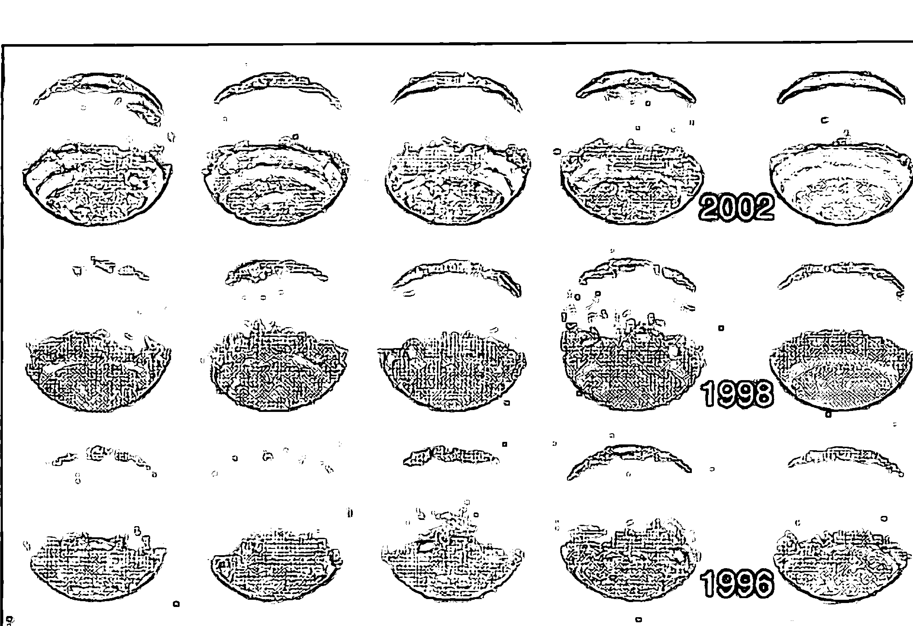

（插图 50）1996 年到 2002 年间，海王星的亮度在近红外范围内增强了惊人的 40%，最右边的图像是叠加后的结果。

据 NASA 的科学家们得出“海王星从 1989 年起发生了本质性的变化”的结论。2 年后，NASA 的文章中写到，“一个隐现的奥秘：‘新迁移点’似乎被困在一个特定的纬度，位于北半球的一个新位置”。这似乎是由网格中一次完美的几何转变所导致的，因为北半球的新纬度与南半球的纬度实际上是相同的。1996 年，在发生了“多维磁极转换”后 1 年不到的时间里，劳伦斯·斯罗莫夫斯基（Lawrence Sromovsky）博士注意到，海王星的整体亮度出现了提高——直到 2002 年还在继续增加。蓝光亮度增加了 3.2%，红光增加了 5.6%，近红外线增加了 40%；一些纬度区域亮度提高了 100%。用来解释这种亮度改变的物理学原理恰好和传统模型并不相符，因为海王星“似乎不需要能量来支持其运动”。2007 年发现海王星的南极点，其温度比其他地区要高 18 度。

海王星的卫星，海卫一特里同（Triton），在 1989 到 1998 年间温度惊人地升高了 5%。相当于地球大气温度在相同时间内提升了华氏 22 度。海王星的大气压力被认为“自从旅行者号探测器于 1989 年对其进行探测后，有了 2 倍的提升”。

### 冥王星

冥王星自从 1989 年起就开始偏离太阳，它的大气压在 1989 到 2002 年间增加了 300%，导致了地表温度的显著提升。再一次，这也出现了“季节性的变化”。根据NASA一位重要科学家的说法，“在冥王星大气中观察到的改变（比海卫一特里同）要更加剧烈……我们只是不知道是什么导致了这些效应”。“这并非一些微弱的改变。”事实上，“季节性改变”的概念对于如此“剧烈”的增加幅度来说是“违背直觉的”。NASA研究团队承认冥王星突如其来的“全球性变暖”现象的存在，但是说“这和地球并不存在关联”，因为“太阳的输出是非常稳定的”。科学家们觉得“一些长期的改变，类似于地球上长期的气候变化”，对于冥王星上大规模的“全球性变暖”有一定影响。美联社于2010年2月透露，冥王星的颜色在1954到2000年间并没有改变，但是从2002年起，红色等级变强了20%到30%。另外，“氮冰的体积和密度正在以奇怪的方式发生改变”。

### 地球的改变和工业污染无关

一些地球的变化并不能归咎于人类的工业污染。根据NASA科学家们的说法，“1998年5月，2个已知的范艾伦（Van-Allen）辐射带的活动变得非常强烈，并且又形成了一个新的辐射带……给科学界带来了惊喜和不安”。这个新辐射带包含了大量电离态的氮、氖和氧气粒子，这是未曾被预料到的新现象，因为一般来说范艾伦辐射带内部基本由质子组成。这些原子被认为来源于局域的星际介质，即星体之间的气体、灰尘和能量。1996年2月，NASA的“绳系卫星”实验希望能利用来自空间的3500伏特的电能，通过一个超强的电缆来把一颗卫星放置在一个远离航天飞机的地方。然而，卫星似乎遭遇了比NASA所预想的要大得多的能量。首先，它遇到了各种神秘的问题，它的“计算机和2个陀螺仪停止了工作。另外，2个推进器无故自动开启并释放氮气”。这些问题导致了实验的推迟。实际上，这些奇怪的现象和一个漩涡进入到时间-空间时出现的电场效应完全相符。当卫星最终展开时，据推测，那个被认为十分结实的铰链已经损坏了，导致卫星一下脱离束缚飞向了遥远的空间，不过NASA并不愿意推测导致这次脱离事件的原因和之前出现的计算机、陀螺仪和推进器问题是否与这次脱离行为有关联。天文学家们写到，铰链的“外层尼龙覆盖物和特氟纶看上去被烧焦并熔化了”。因此，在地球的上层大气中似乎有比之前预测的多得多的能量。

20世纪90年代中后期，我们在地球的中层大气中检测到比预想要多5060%的臭氧含量，而一般来说，污染被认为会降低臭氧含量，而不是增加。这个区域就在“臭氧层空洞”的上方。地球的上层大气中所含的羟氢氧基（OH）分子也比那些传统科学家认为的要多得多。此外，在2001年，我们第一次在地球的极光中看到了“大量释放出来的氦氩和氚原子。”总的来说，地球从 1950 年起每 10 年损失 3% 的阳光。在过去 30 年中，到达地表的阳光量降低了 10%，在过去 50 年中的降幅是 15%，这显示了这个效应正在加速。同时暗示了大气层自身在变得更稠密。大多数科学家预计，地球会由于变厚的大气层而开始降温，而不是变暖，因此这个“骇人”的发现“违背了所有的科学猜想”并由此被“忽略”了。“几乎所有科学家的第一反应都是：这个效应大得有点离谱了，我不认为这是真的，再说如果它确实存在的话，那为什么之前没有人报告过。”

NASA 在 2009 年宣布，在过去的 25 年中，“夜光云”在地球的上层大气中出现得越来越频繁，从极点开始往下迁移，并且比之前要更加闪亮。这不能被认为是温度的作用，并且大气科学家文森特·维克威尔（Vincent Wickwar）博士说，“我怀疑，就像我们大多数人感受到的那样，这是一个全球性的变化，但是恐怕我们还不能理解这种变化的原因……这不仅仅是温度的变化这么简单。”

自从 1940 年起，地球的海洋就开始出现显著的变暖迹象，有趣的是，一半以下的温度增高发生在海平面 300 米以下的位置。这些快速的不可预测的温度改变之前被认为是不可能的，因为阳光无法渗透到如此的深度。这些底层的温度变化可以用来预测数月后地表的天气情况。太平洋最深处的温度异常展现了一种缓慢的、顺时针的旋转运动，这些深层的温度异常恰好和太阳能量的输出量变化有关联。这可以用来创造出有效的模型，提前预测厄尔尼诺和拉尼娜现象。

地震活动的次数似乎也开始呈上升趋势。1973 年 1 月 1 日，美国地质调查局（简称 USGS）建立了一个全球范围内的地震事件数据库系统。根据 USGS 的数据，98% 的地震都小于 3 级，高于 3 级的地震（里克特震级）经常会被接近震源的人所感知到，因此很容易被发觉。由于同样的原因，科技的进步或者地震监测站数量的增加并不会导致高于 3 级的地震活动报告的数量出现显著提高。然而，在 1973 年，在世界范围内发生了 4517 起超过里氏 3 级的地震，到 2003 年总共有 17443 起。这表明在 1973 到 2003 年间地震活动数量增加了 386%。

无视地震活动显著、稳定的增长趋势，USGS 网站上的文章试图将这归咎于地震监测站的数量增加。然而，在仔细地阅读后，我们发现这份“否认性声明”文档只讨论了高于 7 级的地震，基于这种每年少于 20 起的地震活动，他们制造出了更容易被操控篡改的数据集。如果你对一些政治策略有所了解，你就能看到 USGS 并没有明确承认，也没有明确否认地震活动次数的总体上升趋势，他们真正的说法是“里氏7级或者更强的地震活动的次数基本保持稳定”（这确实是好消息，因为这意味着最具毁灭性的地震活动频率并没有增长）而且，文章中讲到，公众会感觉到地震活动的频率一直增长的“部分原因”是由于人类探测地震活动能力的提高。在1998年之前，地球的赤道在逐渐变窄而两极逐渐变长。然而，在1998年之后，这种趋势颠倒了——地球的赤道正在膨胀而两极正在收缩。冰盖和冰川融化导致的重量减少远远不足以解释如此宏大的效应。（还记得土星和海王星的内部转变现象吗？）地球的磁场异常显示磁极的偏移已经开始了，而现有的模型还不能准确地预测这个过程的完成时间。有趣的是，在2004年3月，我们首次在地球的南半球观测到了一场飓风。

### 全球变暖

“气候变化”的效应已经变得如此明显，以至于联合国世界气象组织觉得必须马上让世界知晓这种变化，“在过去的1000年里，20世纪的温度升高幅度是最大的。”另外，20世纪90年代似乎是过去1000年中最暖的10年。北半球大气中的水蒸气含量在过去25年来一直在增加。夏季北极地区海冰的平均厚度在过去30年里减少了40%。北半球的湖和河的冰层覆盖时间相比100年前最近平均每年减少了2周。自从1966年起，北半球的总体冰层覆盖面积降低了10%。阿根廷和智利的冰川区域2003年的融化速度比1975年快200%。甚至NASA也承认“在过去的50年里，（南极）半岛温度升高了2-3摄氏度（3.6-5.4华氏），导致冰层迅速变薄，加快了冰架融化和瓦解的速度。”最后，“自从1950年以来，按照估测，60万个植物和动物物种消失了，而另外有接近40000个处于濒危状态。这是自恐龙消失以来地球上出现的最快的物种灭绝速度。”地球上已知的物种中有40%面临灭绝。在某些地方每天有2.7到270个物种灭绝。最保守的估计是，当前的灭绝速度比自然灭绝速度还要快100倍，但是哈弗大学的生物学家爱德华·O.威尔逊（Edward O.Wilson）计算出，真正的速度要比自然速度快10万倍。威尔逊预测，到2100年，地球上一半的动物和植物物种会灭绝。

### 局域的星际介质

现在，根据我们对于化石记录的研究，并结合了提夫特和阿斯普登的模型，我们列出的所有这些变化，也许是由于太阳系正在移动到银河系中一个高能区域所导致的。这似乎直接影响了我们的行星及其的卫星的行为，显示出总体性的能量增长，因为物质自身的状态也在转变，并且时间的流动速度在量子层面出现的增长。如果我们确实正在移动到银河系中这样一个新的区域，那我们应该会在我们的局域星际介质（银河系中直接围绕在我们的太阳磁场周围的区域）中看到星尘和高能粒子数量增长。NASA 的一个科学家唐·沙曼斯基（Don Shemansky）博士，透露，NASA 对于任何试图研究局域星际介质可能存在的改变的人都持有“持续的、恶意的偏见”。NASA 发现了什么他们不希望被公众知晓的秘密吗？他们已经悄悄地记录了这些星际介质的变化，并获得了重要的结论吗？他们觉得人类还不够成熟，还不能应对“大场面”？这当然是可能的。

无论如何，这些研究中的一部分已经泄漏出来了。1993 年，NASA 的一个探测器首次在局域星际介质中检测到了电离化的氦和极端紫外辐射。这让天文学家们意识到，“局域星际介质中高温的、电离化的气体，要比之前想象的扩张得更远。”2000 年，欧洲航天局和美国宇航局都报告了太阳磁场的外层区域中氦元素密度和温度的增加。一个科学家说，“还不清楚氦元素是否来自局域星际介质，但是我们做了所有能够做的事来移除（太阳磁场）内部的可能性源头，然而，密度仍在在升高……”他继续说道，“密度的持续提升引出了一个有趣的问题，在太阳的影响范围之外正在发生着什么？”那是 2000 年的事情。

到了 2003 年，尤利西斯（Ulysses）探测器在星际介质中探测到了比基于地表的观测数据还要多 4 到 5 倍的尘埃。这使得美国宇航局和美国喷气推进实验所做出暗示，也许“在局域星际介质中的星际尘埃增加了”。2003 年 8 月，欧洲航天局和美国宇航局联合进行的一项被称为“尘埃”的始于 1990 年的实验，发现了在 2000 到 2003 年间流向太阳系的银河尘埃要比 1990 年代对的总量还多出 300%。2009 年，NASA 宣布，这些太阳系之外的“局域尘团”正在发生惊人的变化。

> 太阳系正在穿过一个物理学上认为不应该存在的星际云团……根据旅行者号的探测数据，我们发现在太阳系外存在着一个强磁场……——它比任何人预料的还要强很多——介于 4 到 5 个微高斯（microgauss）之间。

NASA 科学家理查德·梅尔瓦特（Richard Mewaldt）声称，“2009 年，（银河的）宇宙射线强度（来自太阳系外）在过去 50 年内增长了 19%……这个增长幅度是非常显著的。”2008 年，NASA 宣称范围远远超出冥王星轨道的太阳磁场，在过去 10 年收缩了 25%，这是自从 50 年前美俄开始太空竞赛以来最小的范围。

NASA 科学家们已经被这些数据“弄蒙了”，但是我们如果确实正在移动到局域星际介质中的一个高压区，那很显然太阳的磁场会受到挤压。最后，虽然科学家们认为这“纯属巧合”，不符合任何自然规律。但是，局域星际介质中的所有能量和尘埃云团都在远离银河中心，向外扩张——假设从太阳上来观察，星际风（interstellar wind）似乎在从银河系的中心区域（人马座区域）向外流动。

这些正在到来的能量似乎具有激活生物体的特性。2007 年，来自亚利桑那州州立大学的科学家们宣称，沙门氏菌随着 NASA 的航天飞机亚特兰蒂斯号飞行后，活性比原来增加了 300%，有 167 个基因发生了改变——使得它造成疾病的能力提高了 3 倍。2008 年，据称中国人正在培育巨型蔬菜和水果，比如 21 磅的番茄——只是简单地通过将种子放在太空中照射一段时间。

达尔文的生物进化模型总是被证明是不正确的。化石记录所显示的生物体从一种形态变为另一种形态的突然性的自发转变，比如具有外骨骼的简单甲壳类动物直接转变为具有内骨骼的多骨鱼类（bony fish）。并没有发现过“过渡时期的化石”和其他类似的样本，比如鳝类生物转变为肢类生物的化石证据。此外，罗普博士和赛普科斯基发现，这些重大的进化事件就像在按计划上演，在化石记录中每 2600 万年出现一次。这似乎是银河系中每个连续性的“球体”能量扩张到我们的太阳系所要花费的时间。这些“高频”银河能量的出现是如何影响 DNA 的？就像我们之前说过的，彼得·伽利耶夫博士能够将一个青蛙胚胎完全转变成一个蜥蜴胚胎，制造了一次完整的、快速的突变，不需要借助传统的基因嫁接技术——仅仅借助了镭射光。在伽利耶夫的实验中，转变 DNA 所需要的东西就是充足的能量源——在这个例子中是镭射光。现在，一个类似的巨大能量源，似乎正从银河系自身的自然能量场中流进入到我们的太阳系中。它也许会使地球、太阳、行星以及它们的卫星发生重大的转变。由于我们居住在地球上，我们也许会通过发生在意识、生物体和自然物质上的变化来感受到这种转变的影响。约翰·霍克斯博士揭示了，基因证据表明人类现在的进化速度是 5000 年前的 100 倍，在这个过程中，我们体内 7% 的遗传物质发生了转变，并且这种转变还在持续加速。

### 尼尼微常数

我把最精彩的留在了最后。莫里斯·查特雷恩是 NASA 阿波罗计划的通讯指挥官，同时是一家大型的国防和航空航天承包商的雇员，他在其著作《我们的祖先来自外太空》中，发表了一些不可思议的关于时间周期的研究结果。当你把 240 个 25920 年的岁差周期相加后会得到什么？而谁又会知道这些知识呢？查特雷恩研究了苏美尔人的泥板，这些泥板记载了发生在公元前 3700 年之前的事件。1872 年，一个年轻的英国亚述学家乔治·史密斯（George Smith）首次对苏美尔人的泥板进行了翻译。查特雷恩解释了他如何在这些泥板中发现了一个庞大的、全新的时间周期。

史密斯翻译的一些泥板仅仅记录了一系列天文级别的数字，很显然是来自于非常复杂的计算……几年前，我们终于得到了这些数字的十进制翻译结果，其中一组数字非常特别，它包含了 15 位数字：195,955,200,000,000……来自不同国家的很多专家都试图找出这个奇怪的数字对于 3000 年前的亚述人来说到底有何意义，因为亚述人并不被认为是伟大的数学家或者天文学家。亚述国王亚述巴尼拔（Assurbanipal）应该是在其它的文明中发现了这个数字，很可能是埃及或者卡尔迪亚王国，甚至可能是波斯。

我在 1955 年知道了这组数字的存在，当时我刚回到加利福尼亚……1963 年时我正身处巴黎，当我了解到玛雅人的历法也涉及到庞大的数值计算时，我又想起了那组来自亚述古都尼尼微的奇特数字，并开始怀疑它也许能证明亚述文明和玛雅文明之间存在着某种联系。于是我进行了一些计算，结果显示，尼尼微常数 195,955,200,000,000 等于 70 连续 7 次乘以 60 的积。有一天，我突然记起生活在 5、6 千年前的苏美人也使用 60 进制进行计算。我们迄今仍无法确定苏美尔人到底是谁以及他们来自哪里，但是我们发现，他们是真正的伟大的天文学家，他们知道太阳系所有行星的公转周期，甚至包括天王星和海王星，而现代人在 19 世纪才首次发现海王星。他们将每天划分为 24 小时，每小时为 60 分钟，每分钟为 60 秒。

突然间，我意识到尼尼微常数可能是某种基于秒的、时间跨度极长的时间周期。我把这个 15 位的尼尼微常数除以 1 天的秒数（86400 秒），精确地得到 2,268,000,000 天——约等 620 万年。这是一个好的开始，但是它并没有回答主要的问题——这个时间跨度达到 600 万年（准确地说是大约 620 万年）的数字究竟代表了什么？

看出端倪了吗？这个苏美尔周期是 620 万年，10 个周期相加就是 6200 年——恰恰和穆勒、罗德在化石记录中发现的 6200 万年的进化周期完全一致。现在我们看到，大量信息表明古人知道这些周期——甚至达到银河系的层面。当我首次意识到苏美尔人的周期和化石记录的进化周期完美匹配时，我彻底被震惊了。这也证实了我们的古人掌握了多么渊博的知识，和2012预言的背后确实隐藏着无比宏大的故事。

让我们继续跟随查特雷恩的探索脚步，这些信息甚至还不及他全部发现的一半。

（这个620万年的周期）当然要比地球上人类的寿命要长。我的脑海中闪过一个念头：除了其他的天文知识，这些聪明的苏美尔人一定对岁差周期非常熟悉。

当我在1993年阅读到这些内容时，我还不理解“岁差”是什么，因此觉得这些信息非常令人沮丧。但是现在我知道了，这绝对是令人兴奋的知识。

地轴进动周期为26000年，或者9，450，000天（每天86400秒）。当我把尼尼微常数除以岁差周期（也被称为“大年”）时，我遇到了一生中最让我惊讶的事情。这个神圣的数字——尼尼微常数被除后精确地等于240个由9，450，000天组成的大年。

苏美尔人——一个远古文明——一直在追踪化石记录中6200万年的进化周期的一个直接细分单元。这个6200万年的周期也显示为一个银河八面体，或者立方体，我们的太阳系会上下摇摆着穿越其中。更妙的是，这一个苏美尔周期——6200万年的化石记录进化周期的10分之1——除以一个因数240就能直接得到地轴的进动周期。而去掉“0”你就得到了24，等于12的2倍——而我们已经看见12面几何体有多么普遍了。我们现在有了一个能直接将岁差周期和6200万年的进化周期联系起来的统一模型了。

苏美尔人是如何计算出这个数字的呢？并且，不要忘记，这个数字并不是以年、月、周、日、小时、分钟做单位，而是以秒做单位。这样的复杂度是非常惊人的，并且一切都完美地结合起来。而这只是所有隐藏在这个周期背后的美妙故事的开端。

### 太阳系的伟大常数

查特雷恩通过足够的研究得知了古人在追逐着他们自己的“圣杯”——# 谁设计了宇宙/源场调查，万物背后的神秘推手与即将来临的黄金时代

一个驱动着其它的所有周期，包括每个行星的轨道周期的伟大数字。

我的研究结论是，这个庞大的尼尼微常数很可能是那个失落已久的、被称为“太阳系的伟大常数”的神奇数字，炼金术士、占星家和天文学家已经花了很长时间在寻找这个数字，而他们的祖先早在3000年前就已经熟悉。

查特雷恩推测了这个伟大常数的运作规律。

如果这个尼尼微常数确实是那个“伟大的太阳系常数”，它必定是任何行星、彗星或者太阳系中的卫星的公转周期或者交汇周期的精确倍数。这需要花费一定时间来进行计算，同时也会涉及到大量的数字。但是就像我所预期的，通过尼尼微常数计算得出的太阳系中所有天体的公转周期或交汇周期都和美国天文学家给出的数值精确相符（精确度达到小数点后几位），和法国天文学界给出的数值也非常接近，除了天王星、海王星和冥王星的数值有微弱差别外，其它天体的数值基本一致。

在太阳系所有行星或卫星的公转周期或交汇周期中，我甚至找不到一个不是“伟大的太阳系常数”的精确分数（计算到小数点后4位）。对我来说，这足以证明尼尼微常数是一个真正的太阳系常数，并且从几千年前被计算出来到现在，它一直都极其有效。

即使是处于太阳系边缘的、移动缓慢的冥王星，也基本和这个周期完美相符（只存在极其微小的差异）。

美国天文学家估计，冥王星的恒星年为 90727 个太阳日。但是天文学家有时也会计算错误，比如在 1975 年科胡特克彗星的计算上他们就犯过错。从被发现到现在，冥王星只完成了其绕太阳公转的 15 分之 1 轨道，因此在观测中出现小错误是可能的。在计算冥王星的较长的恒星年过程中，出现像 7 天左右这样可忽略的误差完全可以理解的。因此，让我们假定冥王星真正的恒星年是 90720 个太阳日。现在尼尼微常数精确地等于 25000 个冥王星公转周期——鉴于尼尼微常数等于 240 个岁差周期这个事实，这看起来并非一个巧合。

### 将一切结合在一起

这个 620 万年的尼尼微常数相当于 25000 个冥王星公转周期。而 4 个尼尼微常数（周期）相加就等于 2480 万年，这个时间和罗普与赛普科斯基在化石记录中发现的 2500-2600 万年的进化周期非常接近。40 个尼尼微常数（周期）相加的结果和银河系 2 亿 5 千万年（或许准确值就是 2.48 亿年）的自转周期十分相符。这一切看上去确实都非常匹配相符。玛雅历法也许使用 260 天的卓尔金历作为这个庞大周期的微缩版本来实现类似的功能。在其书中，查特雷恩展示了惊人的证据，证明了玛雅文明同样拥有一个能让我们计算出“太阳系的伟大常数”的数字。玛雅历法周期和从量子层面——延伸到地球的行为及其十二面体状内核的旋转——再到太阳系中的行星轨道周期关系——甚至到整个银河系的所有这些层面中的几何现象之间存在着清晰的联系。这些几何结构创造了相干性，并且因为它们是时间中的结构（structures in time），所以它们或许可以让巨大的时间段被瞬间穿越，使得恐龙可以出现在现代的地球上。这也暗示了，当我们最终进入到一个新的球状银河能量区域时，会有更多的时间通道向我们开启。太阳系中发生的转变，以及人类进化的神秘加速现象，暗示了重大的变化正在进行中。

当美国的开国者提到并暗示我们注意古罗马诗人维吉尔（Virgil）的《牧歌集》（Eclogue）第四卷（摘自西比尔 [Sybilline] 神秘文本）时，他们是否在引用一个精确的预言——预示了一个“英雄与众神共同生活”，并且我们所有人都会获得这些超自然能力，因此“一个黄金种族将再次在全球崛起？”

我们正在被引导着经历一场银河进化，并且转变结果将远超我们目前的想象？接下来我将再和你分享一些古老的传统知识，让你自己来进行判断。

## 第十九章 不只是一个黄金时代

在本书中，我们一直试图弄清楚，“2012年预示着一个黄金时代的来临”这个古老预言是否真实，并且我们现在已经清晰地看到DNA和意识进化的证据，和某种维度性转变可能正在发生的明显迹象。所以，让我们继续深入探索和理解那些关于黄金时代的古老传说吧。如果我们想要了解西方文化中的传统是如何起源的，我们需要追溯到西方世界最古老的文学，希腊和古罗马时代的经典文学——去寻找那些揭示了这些关于黄金时代的传说的更古老根源的线索。

1952年，H. C. 鲍德里（H. C. Baldry）为在学术界具有相当分量的《古典季刊》（Classical Quarterly）杂志写了“谁发明了黄金年代？”一文，他在文中流畅地使用多种语言进行阐述，甚至经常不提供任何翻译。除非你是一名知识渊博的学者，并且精通希腊字母表和希腊语，否则，在没有翻译者的帮助下，你很难读懂这篇文章。在大部分学者只会夸夸其谈的学术氛围下，鲍德里对“黄金时代”这个概念的起源，进行了非常透彻的分析。

在古代文献中，有许多章节描绘了一个与残酷艰辛的现实世界完全不同的想象中的世界，其中充满自然的馈赠，不存在纷争或匮乏。当然，它总是存在于人类寻常经验之外的某个时间或地点，不论在世界地图的偏远角落，或死后的极乐世界，还是过去或未来。类似这种存在于过去或未来的想象中的极乐时代被人们称为“黄金时代”。

这个描述了一种快乐的生活状态的图景可以追溯到一个比任何现存经典文献还要古老的源头；这个传统图景通常被认为存在于古罗马帝国之前的克洛诺斯（Kronos）¹时代；在这个传统图景中并没有提到后来的文献资料的引述中，甚至出现了各种各样的关于在某个时代或某个地方存在一种更加快乐的生活的信仰。虽然这些说法不能追溯到赫西奥德或其它单一的源头，但它们暗示了不同作者通过不同方式进行描述的、存在于不同的时代和地方的一种古老并普遍的传统……进一步的证据可以在东方文献经典中找到。最明显的例子是印度伊朗语系的神话，其中（琐罗亚斯德教的经典）《阿维斯陀》中关于依玛（Yima）和（印度教经典）《吠陀》中关于阎摩（Yama）的故事应该具有相同的来源——关于一个统治者成为了一个居住着有福的人们的天堂的君主的故事¹。

黄金时代象征着“有福的人们所居住的天堂”。最重要的是，鲍德里提到了所有关于黄金时代预言的共同来源——即在后来衍生出琐罗亚斯德教（Zoroastrianism）和印度教的印度伊朗语系神话。这两种宗教似乎谈论到同一个英雄王，不过其在这两种宗教中的称谓有微小的差别。在琐罗亚斯德教中他的名字是依玛（Yima），在印度教中是阎摩（Yama）。

当生活在公元前8世纪的古希腊诗人赫西奥德（Hesiod）在他的《工作与生活》（*works and days*）（42-46）中首次提及这一点时，他并没有给予解释，但是简要地暗示了一种人类现在本该享受的生存状态——如果众神从那时起没有对人类隐瞒生命之道的话。

这是一个相当吸引人的引述。这意味着我们作为人类，曾经的生存状态要远远好于我们现在的状况。鲍德里的研究暗示了，在黄金时代，我们体验了一种现在已被“众神”所“藏匿”的存在状态。请记住，因为这是根据远古信息进行的神话性复述，在这个例子中，“众神”可能仅仅是象征着影响我们存在状态和进化水平的地球、太阳和银河周期。

¹ 译者注：克洛诺斯为希腊神话中第一代泰坦十二神的领袖，也是第一代泰坦神中最年轻的一位。他是天空之神乌拉诺斯和大地之神盖娅的儿子。他推翻了他父亲乌拉诺斯的残暴统治并且领导了希腊神话中的黄金时代直到他被他自己的儿子宙斯推翻。

### 琐罗亚斯德教

在本书的第一部分中我们已经对印度文化中关于黄金时代的传说有了相当的了解，但对于琐罗亚斯德教，我们显然未进行相关的探索。一个传统的琐罗亚斯德教网站（zoroastrianism.com）收集了一系列通俗易懂的关于琐罗亚斯德教的研究文章，并且在普鲁斯·霍米·哈弗维尔(Porus Homi Havewala)的“古代雅利安人的历史”(History of the Ancient Aryans)一文中，我们发现了更多关于这个初始的印度伊朗语系文明，在随后（甚至更晚的时间）是如何分裂为琐罗亚斯德教和印度教的信息。

所有古老的波斯教经书都谈到人类来自一个更早的家园，比如失落的雅利安人起源地——Airyane Vaejahi。雅利安人（印欧人）从这个地方开始迁移到印度北部、伊朗、俄罗斯和欧洲国家，如希腊、意大利、德国、法国、斯堪的纳维亚、英格兰和苏格兰……《阿维斯陀》中的重要篇章《祛邪典》（Vendidad）的第一节讲到，古雅利安人的黄金时代中一个非常重要的人物，就是他们最伟大的君王——依玛·克什达(Yima Kshaeta)，在印度的《吠陀》中，他被称为亚玛·拉杰（Yam Raj），他使得衰老和死亡不再存在。

接着，冰河世纪打破了古老家园的宁静，雅利安人被迫往南迁移，向东南和西南方向前进。巴尔·甘格达尔·提拉克（Bal Gangadhar Tilak），上世纪一位伟大的印度婆罗门（印度雅利安）学者，通过研究《吠陀》和《祛邪典》来寻找古雅利安人的原始家园。《吠陀》是雅利安人（印欧人）在迁徙到印度后所撰写的经书。根据《吠陀》中描述的气候模式，提拉克推测雅利安人的古老家园一定在北极地区，即现在的俄罗斯以北的区域。古雅利安人从其古老的家园迁徙到伊朗，又从伊朗迁到印度、希腊和欧洲。提拉克还表示，最古老的历史经文是伊朗的《祛邪典》，它实际上描述了雅利安人的古老家园。

19世纪伟大的印度学者巴尔·甘格达尔·提拉克认为，琐罗亚斯德教的《祛邪典》是世上现存的最古老的历史经文。“Zoroaster”（琐罗亚斯德）这个词实际上是由古希腊语“Zarathustra”的发音演变而成的，因此这两个名字实际上指的是同一人。琐罗亚斯德教创始者琐罗亚斯德声称和琐罗亚斯德教中的善神阿胡拉·马兹达（Ahura Mazda）有过接触，但根据《祛邪典》的说法，这只是一次近代的“再接触”。

琐罗亚斯德问阿胡拉·马兹达：“哦，阿胡拉·马兹达，物质世界的正直创造者，谁是接受你教导的第一个人？”阿胡拉·马兹达说道：“他是杰出的依玛，他看守着他的臣民。最初，在你之前，我就已把雅利安的教义传授于他。”

作者接着描述了早前的黄金时代，“在那里没有凛冽的寒风也没有炎炎的赤日（没有极端的夏季和冬季），（并且）那里没有疾病和死亡，人们无欲无求，非常幸福。”接着我们看到了一段关于时间的非常有趣的陈述：“在他统治的1000年间，伟大的依玛维护着雅利安王国的秩序。他控制着无形的时间，使得它（时间）的尺寸变得如此之大，以让正义的律法得到颂扬和传播。”去推测“控制无形的时间自身”意味着什么显然非常有趣。鉴于我们现在所知道的，这其中的潜在含义和影响可能超乎大多数人的想象。葛瑞姆·汉卡克在为本书所写的介绍序中提到一段出自古埃及文本的类似陈述——生命的是由“时间的运动和发展”所维持的，这些说法现在听起来仍非常前沿。

《祛邪典》接着描述了看上去非常像是上一次大冰河时代即将到来的情景。

辉煌的雅利安时代并没有持续很久，哦，琐罗亚斯德。这是恶魔开始攻击的时刻。阿胡拉对依玛·克什达说：“哦，伟大的依玛，神圣的雅利安土地将要遭遇邪恶（力量）的袭击，将会出现严寒的冬天，满眼尽是厚重的积雪。野兽将会从各个方向袭来，一切都非常糟糕。在今年入冬前，任何下落的雪都将融化，带走水源。现在，雪花将不再融化（但是将形成两极冰盖）……现在，在将要形成的坚硬冰盖上，不会有任何可识别的足迹。”

因此，古雅利安文明似乎起源于现今俄罗斯北部冰冻的荒地——在上一个大冰河时代到来前。根据葛瑞姆·汉卡克和其他人的研究成果，我们可以有把握地把这个时间和传说中亚特兰蒂斯文明存在的时间联系起来。

¹ 译者注：在印度神话中，阎摩是掌管死亡的神明，最早出现在吠陀经之中。他相当于是希腊神话中的黑帝斯，在传入中国之后，形成中国传说的阎罗王。

### 博伊斯和格勒内的开创性研究

当我读到这些时，我非常渴望能尽可能多地了解琐罗亚斯德继承下来的古老预言。这也许是我们在历史记录中能找到的最接近2012和黄金时代预言真实含义的文献资料来源了。于是这将把我们的关注点引到玛丽·博伊斯（Mary Boyce）和弗朗茨·格勒内（Frantz Grenet）在1991年出版的史诗级系列巨著之一《琐罗亚斯德教的历史，第三卷：马其顿帝国和古罗马帝国统治下的琐罗亚斯德教》（A History of Zoroastrianism, Volume Three: Zoroastrianism Under Macedonian and Roman Rule），该书中的内容被学者认为是研究琐罗亚斯德教的参考标准。我们发现，书中一些描绘琐罗亚斯德教概貌的文学、考古、钱币证据在最近才为众人所知。我发现本书中有趣的地方是，琐罗亚斯德教中关于时代终结的原始概念并不像其它的预言一样具体灾难性的意味。

琐罗亚斯德教并不信奉人类会进入天堂并且消失的观点。

> >（琐罗亚斯德）关于未来的期望是修复这个可爱和熟悉的地球，恢复到它最初的完美状态。让阿胡拉·马兹达的王国会重新回归，让有福的人们在他的庇佑下，永恒地生活于此，不必舍弃身躯，不必向往别处……琐罗亚斯德预言的是一段历史的终结而不是这个世界的末日。

在第 382 页，我们获得了更多关于进入黄金时代的这个转变过程会如何发生的信息。即由于很多人在揭露世界真相上的不懈努力，我们看到了邪恶力量的“不断衰弱”。

> >在过去的时代，关于灾难和邪恶的预言对正统的琐罗亚斯德教来说是外来信息，琐罗亚斯德教的根本主旨是，邪恶力量在正义力量的努力下被不断削弱……人类的美德，如公正、信任、宽容、快乐在全世界范围内不断提升；不道德的现象，诸如暴政、仇恨、异端邪说和不公正将逐渐减少消失……

琐罗亚斯德“意识到对世界的拯救不仅需要依赖宇宙力量，同时也取决于人类的集体选择。他教义中的这两个互相结合的方面强调了个人责任和关注宇宙整体的重要性，这使得他的教义和希腊化时期¹所出现的状况和问题明显地联系在一起。

当然，和其他宗教一样，希腊化时期的文明也继承了这些教义。这是博伊斯和格勒内研究得出的重要结论之一。我们需要追溯这些信息和洞见的起源。在时间上，琐罗亚斯德似乎是最久远的源头，因此也是最接近原始本质的信息来源。

¹ 译者注：希腊化时期，一般指马其顿亚历山大征服后的北非、西亚、中亚和希腊世界，包括他去世后建立的三个王朝，即公元前 334 年至公元前 1 世纪。这一时期最显著的特点，是古代希腊的文明与古代东方各国的文明交流融合而孕育出更为普遍和发展的文明成果。

在第 443 页，有一段非常有趣的陈述解释了邪恶力量的真实本质，

> 琐罗亚斯德教提到，阿胡拉·马兹达在开始统治地球的时候故意缩短其统治时间，因为他希望他的敌手邪恶之灵来入侵地球，然后自己再将其打败和消灭。

这很显然暗示了负面力量存在的真实目的仅仅是为了帮助我们在意识上实现进化。它们本来就不会获得胜利，并且永远不会。它们只能顺应宇宙自身的基本特质，那就是慈爱。

## 弗拉索 - 科利尔提 (Fraso-Kereti)¹

在第 427-428 页，我们发现，一旦黄金时代来临，（据预计）时间就会随着改变——不再以我们所熟知的形式存在。在这些段落中同样提到“大审判”的概念，这很显然会让很多人感到不安，同时这很有可能也是原始的教义开始被淡化和被改变的转折点。根据我对其他众多预言源头的研究，我认为所有这种审判的真实含义是我们将被给予一个选择，选择继续转世并且学习这些同样的课程；或是进入另外一种存在状态——允许我们以一种“扬升”(Ascended)的形态在空间-时间现实和时间-空间现实之间自由穿梭的状态。如果我们觉得不接收这场“盛大的邀请”，我们也不会收到惩罚，我们还是会继续过我们的生活，当某个时间到来时经历死亡，并继续在未来以物质身躯体验生活，获得成长、进化。

这段文字来自旧琐罗亚斯德教经文中的《以诺二书》（2 Enoch）。

在万物出现之前，在万物被创造之前，上帝创立了“造物的时间之框”（Aion of Creation）²。接着，他创造了有形、无形的宇宙万物。在那之后，他根据自己的形象创造了人类……接着，上帝为了人类，让时间之框（Aion）显现，并将它划分成时间和小时（times and hours）……当上帝创造的万物都走向尽头，每一个人都将面对上帝的大审判时，时间将会消亡：不再会有年、月、日，不再会记时，因为时间之框将会合一。所有能免受上帝的大审判的正义的人，将会和伟大的时间之框相联结，同时时间之框也会与之联结，而他们将获得永恒……

这听起来非常像在描述空间-时间现实和时间-空间现实融合在一起的情形——因此我们可以同时存在于两个世界之中。而博伊斯和格勒内在第444-445页也展示了其他文献资料中对这一点的描述。

在另一段中（《哥林多前书》¹第7章29节至31节）中，使徒保罗（Paul）认为“时间变得越来越少了”，他同时宣称“这个世界的形态正在消逝”。几个世纪后，罗马帝国基督教思想家奥古斯丁（Augustine）看到这个世界的“形态”的改变……“宇宙也将离开时间之域，进入永恒，并在永恒中分享那些亘古不变的真理……在万物完结时，时间将不复存在，神、人、世界，一切都将获得永恒。”这条由奥古斯丁在保罗的著作中发现的教义，一直被认为具有非凡的含义，但实际上这是琐罗亚斯德的教诲之一，自古以来一直被其信徒所信仰传诵。

在第365-366页，我们将看到，有关我们将如何获得一个“未来的身体”——“回到完美状态”的内容。

在琐罗亚斯德的末世论²思想中有相当一部分是他关于“未来的身体”的教诲，在最后的审判日，逝者的尸骨将重获新肉，灵魂（根据个体死亡时获得的审判结果的相异，灵魂会存在于天堂或地狱（或地狱边缘）……根据他所说，被创造出来的万物，无论是否有生命，都具有内在力量或内在之灵。阿胡拉·马兹达首先创造了这些灵魂，再为其披上物质形态……在时间完结之日，将回归到初始的完美状态，随着有福的人将以正直的灵魂披上完美无瑕的身躯的完美状态进入到

¹ 译者注: FRASO-KERETI，音译为弗拉索 - 科利尔提，琐罗亚斯德教的经文中提到，善神创造出他的对手邪恶之灵（或称为撒旦、魔鬼）并在时间的终结日将其打败，而这一天就被称为 FRASO-KERETI。
² 译者注: Aion (Ai ó n) 一词为希腊语，和英语单词 “aeon” （极漫长的时期）意思接近，属于时间概念，表示一段极长的、接近永恒的时期，一个极久的纪元、周期，或一个极其庞大的时间框架等。 “Aion of Creation” 在文中应该是指上帝为造物而创建的一种时间架构，故译为 “造物的时间之框”。
¹ 译者注：《哥林多前书》是圣经全书第46本书，也是使徒保罗为哥林多人所写的第一封书信，收录在新约圣经的保罗书信集当中。
² 译者注：末世论为神学研究中有关死亡、审判、灵魂和人类的最终命运等的理论。

# 谁设计了宇宙/源场调查，万物背后的神秘推手与即将到来的黄金时代

阿胡拉•马兹达的王国中，他们将永生不朽。

请记住这并不是在说某个救世主式的人物——这是在说“有福的人们”将实现这一壮举。这可能是指许多不同的人。

博伊斯和格勒内仔细探究了罗马帝国和马其顿帝国的统治对琐罗亚斯德教预言的影响——这种影响使得后来的作者产生了具有末日意味的解读，而这种误解直接传播根植到其他所有的西方宗教中。尽管如此，我们所见到的最古老的、最少被扰乱的经文资料描述的是世界的转变——那时，我们所知道的时间将走到尽头，但并不是通过一种灾难性的方式。邪恶力量已经暴露出来并被不断削弱，而地球上的人类似乎也在经历转变，将获得“完美无瑕的身躯，永生不朽。”

### 黄金种族

对于古罗马著作中关于黄金时代的内容，鲍德里进行了深入广泛地研究，他得出结论，罗马诗人错误地将“Saecula”和“Aetas”都翻译成了“时代”，但实际上，Saecula 可能意味着“种族”或“时代”，并且 Aetas 应该被翻译为“种族”。

现在一切都联系起来了。所有人都认为经典的预言谈论的就是黄金时代——它绝对是预言中的一部分——但这同样是一个错译。琐罗亚斯德教中关于人们获得完美不朽之身的预言传播到古希腊，并被古希腊人称为“黄金种族”，但后来罗马人将其错译成了“黄金时代”——没有提到我们到达那个境地时会发生在我们身上的转变。“时代新秩序”（Novus Ordo Seclorum¹）中的最后一个词“Seclorum”同样来源于“Saecula”——这（包括我们在美国国玺背面看到的内容）就和西比尔的预言直接联系起来了，并展示了更多的内容。

尤其重要的是，黄金种族并不是指古怪病态的希特勒所幻想的一群金发碧眼的“神童”（wunderkind）或是尼采哲学中的“超人”（Overmen）——其他所有人必须死亡来为这些“神童”或“超人”腾出空间。就像凯西解读中说到的关于“第五人类”（Fifth Root Race）的预言，这个黄金种族很可能就是指地球上的所有人，而并不仅仅是一个特定的民族或某种肤色的人种。而我们刚学到，琐罗亚斯德称之为为“未来的身体”。让我们再次从鲍德里那儿了解更多关于所谓的“黄金种族”的内容吧。

- 1. 译者注：Seclorum，拉丁语，意思是一代人的时间、世纪或年代。

赫西奥德提到的“黄金种族”和黄金并没有任何联系……传递到了现代的文学作品中。

这真的令我感到震惊。在2012年左右到来的水瓶座时代是一个早已发生的周期的重演——在这个周期中，地球上的所有人显然都拥有远超现状的神秘能力，使得他们获得“不存在纷争和匮乏……有福的人们居住在天堂中”般的生活。对于黄金的追求被认为是“导致人类从幸福状态坠落的原因之一”。不幸的是，我们目前的科学模型仍不足以解释为什么这样的事件可能发生，即便如此，这并不意味着它不会发生。

### 2012预言中的神化现象

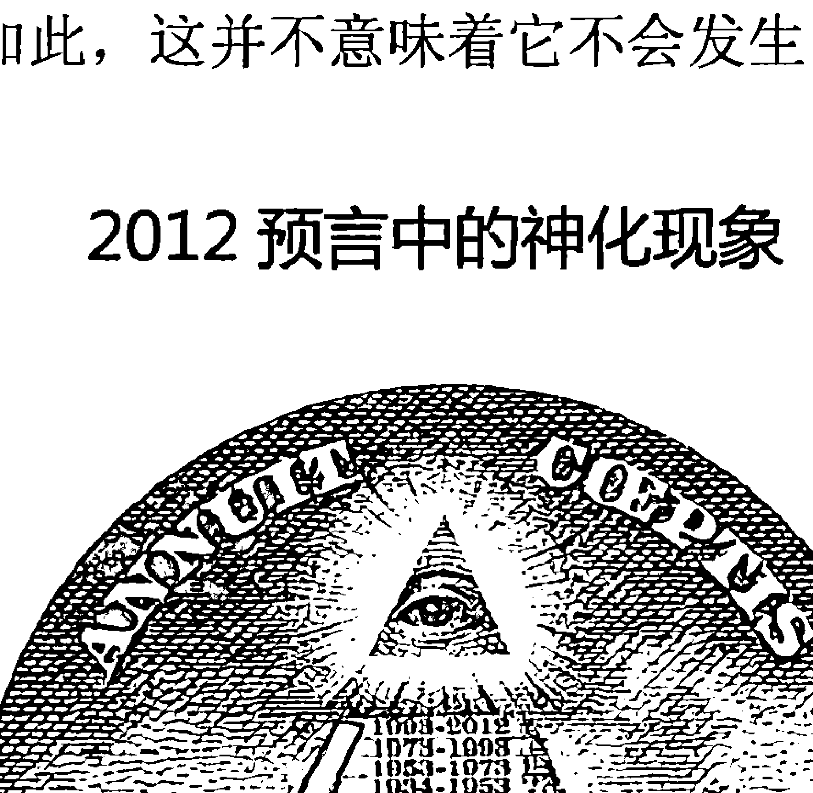

美国国玺背面的金字塔很可能揭示了一个时间编码预言：在首周期为1756年到1776年的13个玛雅卡盾周期（每个周期准确时间长度19.7年）结束之时，就是被认为的黄金时代开端2012年到来之日。

在琐罗亚斯德传统中，西比尔预言讲到一个即将到来的黄金时代，并且清楚地表明，在未来的某一时间，“一个黄金种族将会在全球再次出现”——意味着在地球上的所有人。有趣的是，在美国国玺上的金字塔有13层，并且底部刻着罗马数字“1776（年）”。在西班牙侵略者进入中美洲时，发现当地人在使用一个13卡盾的日历周期，他们称之为卡年计算（U Kahlay Katunob），整个周期为256年。一个卡盾周期是7200天，接近20年。而美国建国的时间1776年刚好是玛雅历法进入一个新的卡盾周期之时。如果在1776的基础上加256年，你得到2032——但是如果你将1756到1776 年作为金字塔的第一层，金字塔顶层就会终结于 2012 年。雷蒙德·马迪克斯（Raymond Mardyks）最先发现了这一点，后来的研究者广泛地引用了这一发现。金字塔顶端的全视之眼出现在 2012 年到 2032 年的最后一个 20 年卡盾周期，同时象征松果体的激活。而美国国玺正面的原始凤凰形象很可能象征着进入时间-空间现实的能力，同时也象征着地球的转变。

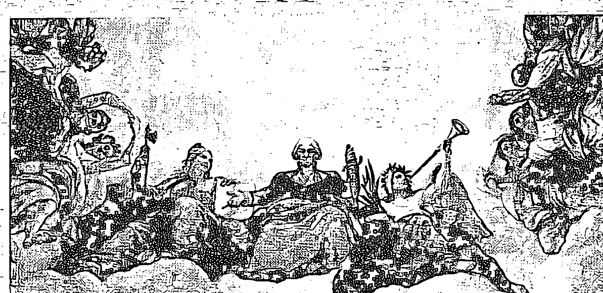

（插图52）华盛顿的神化出现在国会大厦穹顶内。这是国会大厦建筑师将原始图像修饰后的产物。

此外，在华盛顿美国国会大厦穹顶内部，有一幅被称为“华盛顿的神化”（The Apotheosis of Washington），的壁画。在画中，华盛顿坐在一道彩虹之上，意指他已实现自我转化，进入一种神圣的状态——也被称为“神化”（Apotheosis）。这幅图被72颗五角星环所包围。威廉·亨利（William Henry）和马克·格雷（Mark Gray）博士指出，这些加起来共有360个点，如果乘上星星的数量，我们会得到25920——这再次表明美国的开国者已经清楚地知道岁差周期的存在，以及关于这个周期会对人类造成什么影响的预言。每隔一个星星，就有一个圈外的松果指向它。

国会大厦的穹顶结构也许是被有意地建成类似松果体的形状，同时也很类似共济会的一种象征符号“蜂窝”——意味着只有在蜂窝里面的蜜蜂才知道蜂窝里的活动。

在国会大厦穹顶内墙略下方位置有一圈讲述美国历史重大事件的环形全景画。其中一幅画描述了殖民者科尔特斯和阿兹特克国王蒙特祖玛见面的场景。在蒙特祖玛的后面，清晰地描绘了一个阿兹特克历法圆盘，而我们知道阿兹特克历法终结于2012年。同时，在画面上我们也能清楚地看到一条蛇盘缠在一个火坛上，这可能也是松果体的象征。

（插图 53）神化意味着“人变成了神”。画中描绘了华盛顿处于古老的神和女神中间，坐在一道彩虹之上——可能意味着他已到达一种被称为虹光身（Rainbow Body）的“扬升”状态。

- 1. 译者注：虹光身，也被称为光蕴身，藏传佛教术语，源自于宁玛派的大圆满法门，在苯教之中也有类似的理论。他们认为这是一种由明光所构成的身体形态，一种细微身，是生命的本来状态。通过修行大圆满法，可以将由血肉所构成的身体，转换为虹光身，并回归到法身之中。

## 谁设计了宇宙/源场调查，万物背后的神秘推手与即将来临的黄金时代

不论各国政府现在所展现出来的谎言和腐败多么明显，我觉得他们很可能继承了一个潜在的积极的传统。它的内涵可能失落已久，或者已经与其它更近的时代的学说观点混淆起来了。但是看起来，美国似乎真的是一个被秘密创建以帮助人类实现这些远古预言的国家。我从不相信全球精英们能够创造一个“世界新秩序”（New World Order）式的全球统一极权政府，我不相信人们会忍受世界独裁政权。在这本书中，我们一直在详细探讨的现代科学发现和古老预言的真实含义共同揭示了，这些转变实际上是直接编入我们的DNA的。没有任何一个政府能操控这个进程。美国被创立的原因也许是为这个进程铺平道路，比如通过创造一套鼓励新闻自由、宗教自由、反对独裁的法律体系。但是最终，是银河系、太阳、地球和我们（似乎拥有）的各种星际亲戚在主导这个转变进程。

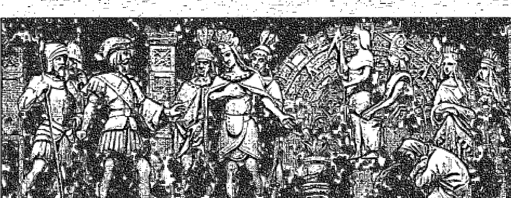

（插图54）国会大厦穹顶内部的这幅画描绘了殖民者科尔特斯和阿兹特克国王蒙特祖玛首次见面的场景。阿兹特克人的历法圆盘显著地出现在蒙特祖玛的后面。而阿兹特克历法终结于2012年。

- 1. 译者注：New World Order，意为新世界秩序。一些研究者认为，某些秘密组织，如光明会或共济会，一直在试图建立一个全球性的极权统一政府，统一货币、法律、军队等，意图操控世界和人类。但也有人认为这只是子虚乌有的说法。

### 虹光身

美国的开国者、琐罗亚斯德的一些神秘预言和其他一些古老传统似乎都在暗示，人类将会经历某种转化过程，并且获得一种“光之身”或者类似的身躯。威廉·亨利和马克·格雷博士向我们揭示了，实际上关于光之身或类似概念的记载和传说在世界各地的很多古老文化中非常普遍，它们都讲述了关于人的身体转变为另外一种形态的神奇事例。

在苏菲派¹中，这种身体形态被称作“最神圣的身体”（the most sacred body）或“天堂之身”（supracelestial body）。道家将其称作“金刚身”，获得此身者被称为“不朽者”或“神仙”。瑜伽学派和坦陀罗教派²（Tantrics）称之为“神圣的身体”。在克里亚瑜伽（Kriya yoga）文化中它被称作“极乐身体”（the body of bliss）。在吠檀多³哲学（Vedanta）中它被称作“超导身体”（the superconductive body）。古埃及人把它称作“发光的身体或存在”（akh or the karast）。这个概念也出现到诺斯替教中，它被称作“发光的身体”（the radiant body）。在密特拉教（Mithraic）中它被称作“完美的身体”（the perfect body）……在赫姆提卡文集（Hermetic Corpus）中，它被称作“不朽的身体”（the immortal body）。在炼金术传统和翡翠石板（Emerald Tablet）教诲称之为“金色的身体”（the golden body）。

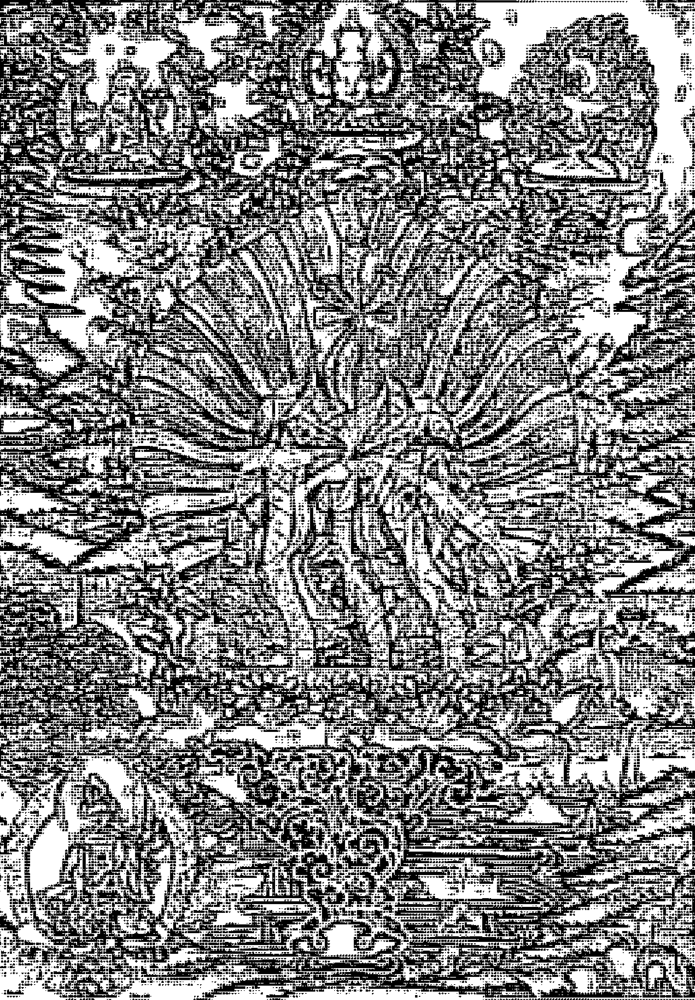

藏传佛教直到今天都有关于“虹光身”的报告——人们在数年的修炼后将他们的物质身体转变成了新的、具有彩虹的能量形态。在许多情况下，他们会通过在山洞中长期打坐的方式来实现这种转变。当他们修炼成功走出山洞，准备好进入到他们自己的下一进化层次时，他们经常会把手或脚直接压入坚硬的石头中——他们能轻易地将石头的分子推送到时间－空间现实中，而在石头上留下清晰的模印。一些如此的手印和脚印已被上传到互联网中。仅仅在印度和西藏，就有 16 万例关于虹光身的记录。

（插图55）这是来自西藏的众多关于虹光身的图画中的一幅。在西藏和印度有超过 16 万例关于虹光身的记录。

有记录表明，在中国四川省康藏东部的噶陀寺自 12 世纪建寺以来，就有超过 10 万人在这里实现这种状态。而附近的佐钦大圆满寺自 17 世纪建立之后，就有超过 6 万名法主实现此状态。这两座寺庙都属于宁玛派系。

我在南开诺布仁波切的著作《梦瑜伽和自然光的修习》中首次看到这些内容。下面的文字很好地描述了这种转化过程。

> “光之身”也被称为“虹光身”，藏语的叫法是“ja-lus”。一些觉悟者……实现了将普通躯体转变成光之身的过程……随着身体的元素被净化，他们把自己粗糙的化身（躯体、肉、骨等）转变为最纯粹的本质：蓝、绿、白、红、金黄五种颜色。随着身体融化为这五种颜色，一道彩虹光显现了，而这副物质身躯最后只留下了指甲和头发，其余部分都转变成彩虹光并消逝了。在 20 世纪，佐钦大圆满寺的一些修行者获得了光之身，其中包括南开诺布仁波切的上师和亲属——比如他的叔父多当乌金丹增和他的两位上师蒋杨钦哲秋吉罗卓和阿育空行母，还有蒋杨钦哲秋吉罗卓的上师。

## 第二部分/时间与空间

2002年,媒体报道了,一位基督教本笃会僧侣戴维·史坦德·拉斯特(David Steindl-Rast)提议和思维科学研究院(Institute of Noetic Sciences)联手对虹光身现象进行科学调查并受到热烈支持的故事。史坦德·拉斯特解释了如果这个现象被正式研究并被广泛证实的话,会对人类社会造成什么影响。

如果我们能确证关于耶稣复活的故事不仅发生在其他人类身上，甚至也发生在现代社会的话,这将会使我们开始以一种完全不同的眼光来看待人类的潜能。

史坦德·拉斯特接着联系了一位经常访问西藏的天主教神父佛朗西斯·提斯欧(Francis Tiso),并鼓励他去探索近代发生的虹光身事件并做记录。提斯欧探索了堪布阿琼的虹光身事件。堪布阿琼是一位出生于康藏地区的格鲁派僧人,在1998年去世。提斯欧来到他过世前居住的村子,并且记录了许多他曾目击堪布阿琼离世过程的目击者的访谈资料。目击者说堪布阿琼热心高尚的人格打动了所有和他接触的人。

这是一个非常有趣的人,除了他死亡的方式。除了他奇特的离世过程,每个人都提到他忠于誓言、生活简朴并且经常谈论培养怜悯之心的重要性。他能够教化最粗鲁和最蛮横的人,使他们变得温和善良。他一直在以身作则地感化周围的人们。

目击者称,在堪布阿琼去世前几天,他的小屋上方出现了一道彩虹。而在他离世后,人们在天空中看到许多美妙的彩虹。在圆寂前,堪布阿琼的身体并无任何疾痛或不适,他手持念珠,口诵咒语,安详而逝。

根据目击者的描述,在他呼吸停止后,他全身上下的皮肤变得白里透红,非常有光泽,简直就和孩童的肤质一样。堪布阿琼生前的朋友喇嘛阿秋建议,用格鲁派僧人日常穿着的黄色长袍把堪布阿琼的身体包裹起来。在接下来的几天里,堪布阿琼的弟子们通过包裹在外的长袍看到堪布阿琼的身体正在不断缩小。他们还听到天空传来美妙神秘的音乐,并且闻到了香味。七天后,他们揭开床榻上的长袍一看,床上空空如也,连头发指甲都没有留下。喇嘛诺塔和其他一些人声称,堪布阿琼死后曾出现在他们的梦中……喇嘛阿秋告诉提斯欧,需要持续六十年的修炼才能获得虹光身。“是否真的需要那么长的时间,我不知道。”提斯欧承认,“但是我们希望能以一种恭敬的方式,将这些修行实践纳入到我们自己的西方哲学和宗教传统中”……提斯欧说,就我们目前所知,大多数基督教圣徒在他们离世后,身体并没有消失或发光……然而,他补充道,在《圣经》和其它传统文献中提到以诺、玛丽、以利亚、甚至可能包括摩西身体扬升的故事。有无数关于圣徒在死后显化的故事,类似于广为人知的“光之身”现象。

### 神圣的融合

根据我们所学到的所有这些知识,我们如何能科学地分析和理解这一系列不可思议的预言呢?很显然,有大量的证据表明,古人确信我们在经历转变进入水瓶时代的过程中,重大事件将接踵而至。我们已经看到证据,证实了玛雅历法和太阳系中真实存在的周期互相吻合,这些周期很可能受到银河系的驱动,并且在我们走向水瓶时代的这段时期,这些周期正在引发星际气候变化现象。我们看到很多古老预言都讲述了一个黄金时代正在到来,那时,人们将再次转变成类似”神”的存在状态。这清晰地表明,在很多研究2012现象的学者得出的”这些预言预示着大灾难“结论背后,有大量他们并未注意到的事情正在发生着。事实上,我坚信这些灾难性预言只是一种误解,并且我们现在就已经在目睹最差的地球变化态势了——这很可能是转变前必经的暂时性混乱阶段。似乎有一种超乎我们大多数人的理解的伟大力量正在引导我们安全地经历一次进化过程。

所有这些古老的传统都表明,人类正在经历某种进化事件。西藏的虹光身现象有力地支持了《圣经》中关于我们将经历转化获得某种能量之身——完美之身（Perfect Body）的暗示,美国的国父和其他某些人经常自称为“完美者”（Perfectibilists）。

显然,我们目前仍无法确定我们是否会转变获得某种光之身体。但我们现在知道,在生物层面,我们正在经历一个快速的进化阶段。我们的文明在过去几百年间飞速发展,并且大量的证据表明,有一种更加伟大的力量一直在背后运作着,而古人显然比我们更加了解这一力量。有一件事是肯定的:“人类身体的出现仅仅是源于某种随机的遗传学意外,经由达尔文式的突变过程才得以出现在地球上,并且仅仅出现于地球。”这种旧模型应该被抛弃了。事实上,种种关于我们是谁和我们是什么的错误观念已让我们饱受磨难,这些观念让我们一直深受唯物主义思想的束缚。一个能量场创造并培育了我们的身体,但对于这个能量场,西方主流科学界目前仍所知甚少。通过某种我们可以直接探测证实的方式,这个能量场将我们所有的思想最终联结一体。有了这些知识,我们就拥有了能帮助我们实现意识进化的强大的新工具。我们获得了能疗愈我们自身的非凡方法,并且在非常短的时间内实现了显著的进化。我们已经清晰地展示了,源自一个失落的黄金时代的远古巨石建筑遗迹如何向我们指明了运用掌控这些能量场的方法。2012年可能寓意一个我们开始重新发现这些失落的科学并开始运用这些知识来疗愈我们自身和地球的时间点。

有些非常有趣的圣经引语我想与你们一起分享,现在看来这些内容非常有意思。这些引语的可能来源于琐罗亚斯德教圣典中有关弗拉索-科利尔提教义的启迪,并且被普遍认为是一种准确地预言。

> 第一个人亚当成了有生命的人,末后的亚当成了使人活的灵。
> —— 《新约·哥林多前书》第15章45节

> 头一个人是出于地,乃属土。第二个人是出于天。
> —— 《新约·哥林多前书》第15章47节

> 我们既然有了属土的形象,将来也必有属天的形象……我如今把一件奥秘的事告诉你们,我们不是都要长眠,但我们众人却全要在顷刻眨眼间改变……这必朽坏的必须穿上不朽坏的,这必死的必须穿上不死的。
> —— 《新约·哥林多前书》第15章49至53节

> 我们所期待的乃是新的天新的地,在那里,正义常存。
> —— 《新约·彼得后书》第3章13节

> 看哪!我造新天新地;从前的事不再被记念,也不再追想。
> —— 《旧约·以赛亚书》第65章17节

> 我所要造的新天新地,怎样在我面前留存,你们的后裔和你们的名字也必将怎样长存。
> —— 《旧约·以赛亚书》第66章22节

在日月星辰上,将有异兆出现;在地上,万国要因海洋波涛的怒号而惊惶失措。众人要因恐惧,等待即将临于天下的事而昏绝,因为诸天的万象将要动摇。那时,他们要看见人子,带着威能及莫大光荣乘云降来。这些事开始发生时,你们应当挺起身来,抬起你们的头,因为你们的救援近了。
> —— 《新约•路加福音》第21章25至28节

## 第二十章 大揭露

我确信,一个关于地外文明与UFO现象的正式、公开的大揭露是我们进入黄金时代的转变过程中必不可少的组成部分。在这本书里,我在尽量避免依赖有关UFO的事件进行阐述和解释,但是我的确认为,类人外星人曾在远古时代拜访过地球,并且一直持续至今。只有对UFO现象及其对科技、远古人类以及2012预言的影响进行一次全面分析,才能为源场的论述划上一个圆满的句号。

2009年,来自卡内基科学研究所（Carnegie Institution of Science）的艾伦·博斯（Alan Boss）博士推断,仅仅在我们的银河系,就可能有1000亿个类地行星。他根据我们在太阳系外发现的环境与地球类似、质量比地球大1-10倍的超级类地行星（也称“超级地球”）的数量得出这个估算结果,并且推测银河系中每个类似太阳的恒星可能平均拥有一颗类地行星。同时,他也相信这些行星上至少存在着微生物形态的生命体。在这期间,来自爱丁堡大学的科学家们进行了一项电脑模拟,用电脑模拟了一个拥有数以亿计恒星与行星的人造星系。通过这项模拟数据（其中包括生物灭绝事件因素）,他们得出结论:“银河系自诞生开始,至少有361颗行星存在智能文明,最理想的情况可能有将近38000颗。”

在2009年12月,美国科普杂志《发现》发表了一项“富有争议的研究”,报告了1913年秋季出自一个名为博斯科普（Boskop）的南非小镇的一系列考古发现。两名农民从地下挖出了一些“不寻常”的原始人类头骨碎片。最终,一位的古生物学家S.H.霍顿（S.H. Haughton）总结道,这个博斯科普头骨的脑容量,可能比我们的要大25%,或者更多。

博斯科普头骨的面部面积只是完整头骨面积的1/5,与儿童的面部所占比例相近。对单独头骨碎片的检验证明,这具头骨的鼻子、脸

- 1. 译者注：苏菲派是伊斯兰教中一个神秘主义派别,是对伊斯兰教信仰赋予隐秘奥义、奉行苦行禁欲功修方式的诸多兄弟会组织的统称。
- 2. 译者注：坦陀罗是一个重要的印度教哲学体系,它秘密地声称吠陀仅是外表。坦陀罗经文包括提到了吠陀的起源。
- 3. 译者注：吠檀多派是印度婆罗门教六派哲学之一。印度哲学史上占统治地位的唯心主义哲学派别。吠檀多的意思是“吠陀的终极”,原指奥义书。

颊以及下颚结构都符合儿童期的特征……博斯科普头骨的脑容量比我们的大约要大30%，也就是说，如果与我们约1350毫升的脑容量相比，这头骨的脑容量将是1750cc。这也就意味着它的前额皮质要比我们多了将近惊人的53%。

前额皮质控制着我们的最高知功能，科学家猜测，这种功能可能就是我们的直觉。

具备了这种令人惊讶的洞察力，他们或许成为了一个预知能力的种族，拥有超乎我们想象的内在精神生活……想象一下，在一间教室里，有35个长着大头，还有一副娃娃脸的博斯科普儿童，你很可能会碰到那么五六个高智商儿童，并且其智商在整个人类历史中都算是高层水平。他们死亡了，我们却活了下来，但我们无法解释其中的原因。为什么他们没有再生存能力等方面超越我们这些小脑原始人并在地球上繁衍生息呢？也许这不是他们的选择……尽管如此，人类学家说，在现在的布希曼人（Bushmen）¹中，也会偶尔出现博斯科普特征，这也就增加了博斯科普种族的最后一批人，曾在不太遥远的过去出现于德兰士瓦（Transvaal）地区的可能性。

你可以不屑地把那些认为自己在太空飞船中遇到这类生物的人当做“疯子”。但当我们发现了有关这类物种曾经在此生活并死亡的考古证据时，那就是另一回事了。《发现》杂志认为这个信息很重要，应该发表出来。对人类来说，这些博斯科普人是危险的坏蛋吗？根据一些考古证据来看，事实正好相反。

弗雷德里克·菲茨西蒙斯（Frederick FitzSimons）曾经在距发现博斯科普头骨的地方大约100英里处，进行了更深入的挖掘工作。他明白这些发现的意义，并且急切地想发现更多这样的头骨。在他新建的挖掘基地，菲茨西蒙斯无意中发现了一座奇特的建筑物。挖掘基地所处的地方在数千年前可能是一个公共社区中心。那里有许多集中起来的石块、残余的骨头以及一些随意埋葬的看似属于正常人类的骨骼。但是在基地一侧的一处空地上，有一个单独的、精心构造的陵墓，并且仅属于一个人。陵墓的主人可能是一名领袖，或是一位备受尊敬的智者。他的遗体被安放在面向太阳升起的方向。除了其巨大的头骨，这具骸骨并没有显示出其它任何特别之处。

- 1. 译者注：布希曼人是生活于南非、博茨瓦纳、纳米比亚与安哥拉的一个原住民族，其语言是科伊桑语系的一支，是科伊科伊人的相近种族。遗传学研究显示，此民族可能是世界上最古老的民族之一。

史蒂芬·格里尔 (Steven Greer)^1 博士通过不懈的努力，收集了超过560位亲自参加了与UFO及地外文明直接相关的“机密”项目的证人的证词资料。“大揭露” (Disclosure) 是格里尔和其他人用来描述一个假想性事件的词语，这个假想性事件就是全球政府公开揭露有关UFO/外星文明现象的机密档案，包括任何UFO逆向工程科技，甚至包括对外星文明的直接介绍。我们正在逐步接近真正的信息透明化的阶段，并且政府也在越来越多地分享曾经是机密资料的接触记录。他们对这些资料隐瞒多年，显然是害怕民众会对大揭露产生恐慌。但是随着黄金时代的到来，我相信公众的反应将不会是混乱和恐慌，而是接受与敬畏。我们需要的仅仅是一张国会传票，格里尔博士的证人已经准备好在政府公开的国会听证会上证明他们所知道的一切。我很幸运能参加格里尔在2001年5月10日举办的概要报告秘密讨论会，与会者为国会议员和一些重要人物，会场气氛令人激动。发言最多的证人是一位自称参与坠毁飞碟逆向工程的前美国陆军一级士官长克利福德·斯通 (Clifford Stone)。工作期间的见闻给他造成了严重的精神创伤，以至他在演讲过程中不禁落泪，差点没能完成演讲。在众多引人注目的资料中，斯通披露说他有一本工作记录手册，里面描述了目前拜访地球的57个不同的外星智能种族。这57个外星种族与地球人长相基本相同，即使有所不同，也不过和地球人种之间的外表差异相当。

其他与格里尔博士一同前来的人员报道了地外文明的直接干涉事件：使核导弹发射台电力中断或者使飞行中的导弹失灵，使它们在坠地时不再具有放射性。这些来自军方机构的高级退役军官于2010年9月27日在美国国家新闻俱乐部召开了一次重要的新闻发布会，全球各国的主流媒体对此次会议进行了广泛的报道^1。

军工复合体被迫认为这些电力中断事故属于有敌意的行为，但另一种同样合理、值得考虑的重要观点是，我们一些失散已久的星际亲属正在保护我们免受核毁灭的威胁。这些拜访者很可能就是众多古老文化中所指的“天使”及“众神”，并且我们现在可能正处于一次真正的星际家庭重聚的前夕。

## 第二部分/时间与空间

### 麦田圈制造者

2009年10月20日，英国《每日电讯报》报道了一则目击事件，一位警官看到三名金发、超过六英尺高的男子在一个麦田圈附近读取仪表数据。这名警官同时还听到一种类似静电的嘶嘶声，这种声音似乎响彻整片麦田，并且使得农作物轻轻拂动。他冲这三名男子大喊，但是他们似乎听不到警官的声音。然而当警官进入麦田时，三个人开始逃跑。

> > 他们跑得比我所见到的任何人都要快。我跑得不算慢，但是他们的速度实在太快了。当我往旁边瞥了一眼再回头看时，他们已经不见了。

在英国政府官方解密许多UFO档案后，又一例类似案件于2009年5月22日被公开了。1989年11月22日，英国萨福克郡的一位匿名女子给渥提夏姆英国皇家空军（RAF）打电话，报告了她在遛狗时的一次奇怪遭遇。她看到一个穿着一件类似飞行服的浅棕色连体衣，操着一口“斯堪的纳维亚式口音”^2的男子问她，是否听说过有关麦田出现大型平面圆圈的事情。在10分钟的交谈过程中，这个男人告诉她，自己来自一个与地球类似的星球，而且有很多跟他一样的人来到地球制造这些图案。他们是带着友善的目的前来的，但是他们被叮嘱不要与人类接触，以免被人类当作威胁。很明显，他没有说是谁告诉他们不要与我们接触。这位女士完全被吓坏了，当她往家跑时，她听到背后响起洪亮的嗡嗡声，并且看到一个闪着橘黄色和白色亮光的庞大圆型物体，从树木后面竖直升了起来。渥提夏姆英国皇家空军的接线员称，这位女士说了一个小时，并且确信她报道的是真实经历。

- 1. 译者注: 国内各大媒体也对该事件进行了报道。觉醒字幕组翻译了该新闻发布会的完整视频，感兴趣的读者可通过在网上搜索“美前军官揭露UFO新闻发布会”找到该视频。
- 2. 译者注: 斯堪的纳维亚在地理上是指斯堪的纳维亚半岛，包括挪威和瑞典，文化与政治上也包括丹麦，这些国家彼此视对方属于斯堪的纳维亚。虽然他们政治互相独立，共同的称谓显示了他们的文化和历史有深厚的渊源。

麦田圈连接器网站（www.cropcircleconnector.com）存有自 1978 年以来出现在英国以及世界各地的所有麦田圈档案。交付一些象征性费用后，你就可以在无尽的资源中畅游，并且你会惊讶地发现，有数量众多的麦田圈向我们展示了与我们在前几章谈到的很相似的三维空间几何图形。我确信这些麦田圈制造者在通过这些图形向我们传递其中隐含的不同的象征性信息，以帮助我们顺利过渡到黄金时代。最让我感到震撼的是一个于 2008 年 7 月 15 日出现在威尔特郡的埃夫伯里庄园的麦田圈。这一图案就出现在一群精心排列的“石阵”（不是那个最著名的巨石阵）的西北部。我们看到的是关于太阳系的一个清晰明了的图解：中间那个平坦、巨大的圆圈代表太阳，周围环绕着一圈圈圆环，表示行星的轨道。在每个圆环上还有一个更小的圆圈，它们精确地显示了每颗行星的位置。安德列亚斯·穆勒（Andreas Müller）和里德·克里（Red Collie）都独自用天文观察软件对此图案进行了分析，并且总结说，图案中的对齐方式描述了未来的一个日期——2012 年 12 月 21 日太阳系的行星排列位置。当然，我们永远无法确认某个定图案的真实性，因为高质量的伪造麦田圈总是时不时出现。不过，大约 1200 年前阿哥巴德所描述的麦田圈也不大可能也是一场恶作剧。

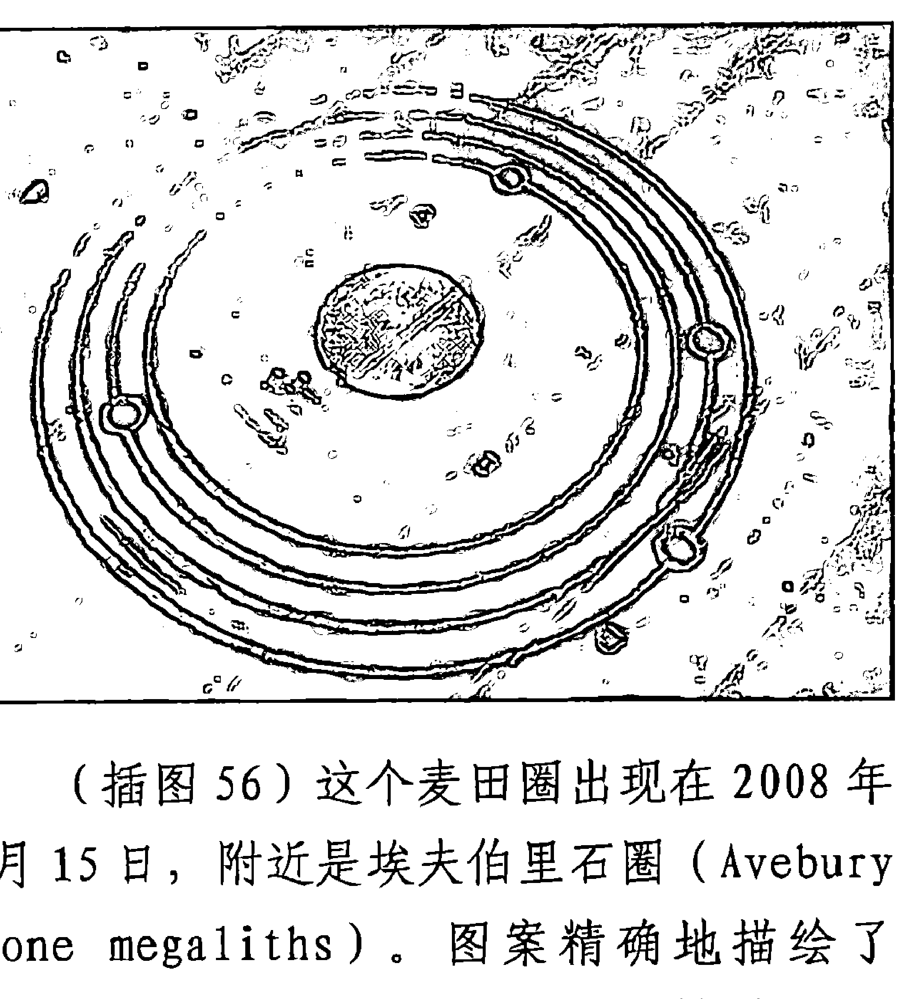

（插图 56）这个麦田圈出现在 2008 年 7 月 15 日，附近是埃夫伯里石圈（Avebury stone megaliths）。图案精确地描绘了 2012 年 12 月 21 日太阳系的行星排列。

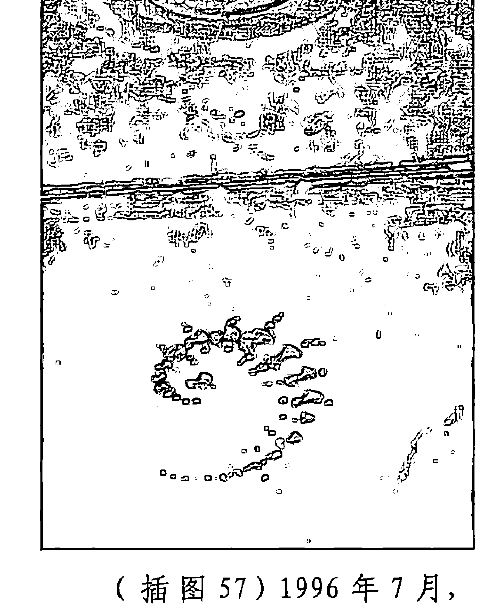

（插图 57）1996 年 7 月，这个“朱利亚集合”图案的麦田圈就在光天化日之下出现在著名的古迹英国巨石阵附近。目击者称，整个图案在不到 15 分钟的时间内就形成了。

我也不相信 16 世纪罗伯特·布拉特（Robert Plot）费尽心思记录下来的麦田圈也是造假者所为。2010 年 8 月份我前往英格兰并观察了这一现象，我当时在四个圈中行走漫步。最有趣的部分是，每一个图形都出现在山的坡面。事实上，由于地形原因，你无法在地面上的任何一个位置看到整个图形的全貌。它被设计成一个俯瞰图形，这个地面上的几何图形似乎被略微拉伸，使它在空中某些位置看起来完美无瑕。在地面上时，你很难能说出这些图案到底像什么，并且那些真正的麦田圈几乎是在一夜之间出现的。

1996 年 7 月，一个复杂的“朱利亚集合”图案在光天化日之下凭空出现。这个图案由 151 个圆圈组成，大约在下午 5 点 30 分到 6 点 15 分之间出现。一些苍蝇的翅膀好像被融化了粘在作物上。检测发现，这个麦田圈中的辐射量比正常值高出 76%，并且在不久后又神奇地降到正常水平。我们发现秸秆的茎节处常常被拉伸，这与微波所产生的效果相同，并且在显微镜下可以观察到细胞出现小洞，这表明麦秆在一微秒的瞬间被加热了。一些植物上面还附着了一层薄薄的碳。90% 的麦田圈出现在蓄水层之上，暗示了制造者可能在使用一种将水从地下抽出的技术，以使作物不被燃烧。电子设备在圈之内时通常会失灵，磁罗盘则指示异常。有两组不同的实验还发现，在麦田圈中，时间流逝的速度会发生微小变化。

我高度推荐休·曼尼斯特（Hugh Manistre）的《麦田圈：入门指南》（Crop Circles:A Beginner’s Guide）以及大卫·普拉特（David Pratt）的《麦田圈及其中的讯息》（Crop Circles and their Message）这两本书，后者除了讲述很多奇特的麦田圈案例外，还附上大量照片。在普拉特文章的第一部分中，讲到麦田圈下面的土壤要比平常更加松软干燥，结晶化程度增高，并且可在显微镜下发现不寻常的纯铁微球体。在尚未成熟的麦子中，它们的种子会发生畸变，并且不能正常发芽。但是成熟作物的种子通常显示出旺盛的生命力，并且生长速度比对照组的种子要快 5 倍。普拉特在第二部分中揭示道，很多人报告说，在麦田圈出现之前看到那片区域有球状、盘状或柱状光团出现。有几十个人称，在麦田圈出现前听到尖声刺耳的噪音。大约有 70 人亲眼看到麦田圈在眼前出现。他们称整个过程非常迅速，大约在 10 到 20 秒之间，并且在某些案例中，麦田圈出现时似乎伴随着一股旋风。

1981 年 7 月的一天晚上，威尔特郡的雷·巴尔内斯（Ray Barnes）目击到一道“波浪”或者“线条”从一片谷物上方掠过。在线条以一道弧线划过麦田后，就降到地面，并且在大约 4 秒钟的时间内，以顺时针方向放射性地勾勒出一个直径约为 75 英尺的圆圈，并且伴有嘶嘶声。作物整齐地倒下，就像被一把巨型切饼刀切过一样，并且作物完全没有显示出会反弹恢复的迹象。

让我们回到那个显示 2012 年日期的麦田圈，埃夫伯里的农夫对此可不太高兴，并且开着拖拉机在其上轧出三条痕迹试图破坏它。但随后，麦田圈制造者又回来了，并且进行了一系列的修复工作，包括在紧挨原图的地方添加了一个与先前太阳系图解一样大的圆圈。第二个圆形内部是空的，但其周围围绕了一系列怪异的小型图案。

在 2009 年的一次会议上，贝弗利·鲁比克（Beverly Rubik）博士指出，这些小图案看起来像是不同种类的细胞器。虽然没人能肯定其中的含意，但这些图案可能暗示了 2012年12月21日之后，生物体可能会发生某种根本性的改变。让我觉得更有趣的是，麦田圈制造者在太阳系图解中还将太阳的直径扩大了，延伸到金星的轨道。这暗示 2012 年 12 月 21 日，可能代表了这场已经在太阳系中上演的大规模能量转变的临界点。

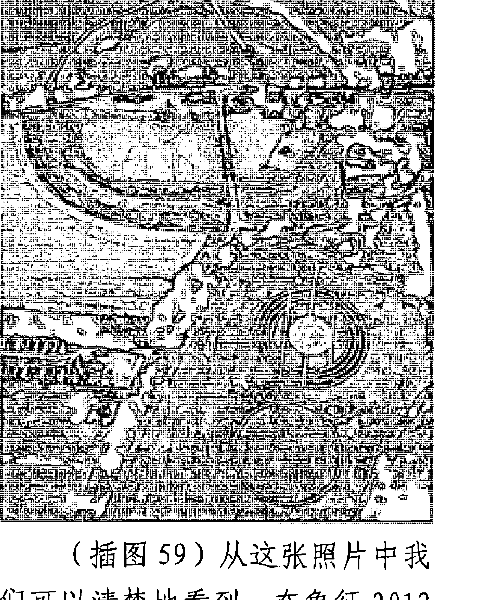

麦田怪圈也可以被作为在源场中进行时间旅行的参考点。它们常常就出现在古代能量漩涡点与巨石遗迹旁，这些漩涡点和遗迹到现在可能仍然是一种通往时间 - 空间现实的入口。通过长期地把每个麦田圈的图案及其出现的时间记录下来并整理归档，你就拥有了一个用不同图案记录不同的时间点的庞大的数据库。

### 松果体的逆向工程

据称，窥镜工程（Project Looking Glass）这个机密项目涉及我们的远古祖先如何逆向操控松果体的知识，并且将其发展成了一项实用技术。其中的理念就是，你要站在一个大型意识扩大器前，然后将你的思想投射进一个巨大的周边有鱼眼光学扭曲效果的黄色气泡中。这将使你能探知潜在的未来事件。我跟一些自称参与机密研究项目的内部人员有过交流，并且窥镜工程是他们所谈到的最平常的事情之一。鲁伯特·吕西安·豪（Robert Lucien Howe）声称，他在为英国政府工作期间获得了机密文件的查询权，并且给出了对这部仪器的描述，你可以在网上搜到。我并不同意他所说的一切，但是他的一些话的确与别人告诉我的信息互相吻合。为了理解他告诉我们的信息，值得注意的一点是，内部知情者显然把我们的能量复制体称为“瞬态身体”（transient body），把探访源场称之为“瞬变现象”。在其他的文章里，豪称，在这些项目中，松果体被称为“示现器”。

每个人都具备一种“示现探测器”¹，它具有某种预知功能，能探知到可能会对我们造成威胁的事件并对我们发出警告……我们就是通过这个来保护自己免受宇宙熵的影响从而活得更长。一个完全没有示现探测器的人可能只有5到10年的寿命。这种情况大多发生在过去，因为人类的示现探测器所具备的能量不能超过5-10瓦（并且常常只有几毫瓦），而一些机器却达到了几千瓦。但是我们有时也会获胜，由于瞬态所遵循的复杂规则，5毫瓦也可以胜过5000瓦。

这台机器事实上是一台时间加速器。它的工作原理是改变一个薛定谔盒子中物质的动量或能量。这种薛定谔盒子很容易制作。它的核心元件是一个强力电磁屏蔽装置。在这个装置里面，有一个装满水的特制盒子，水温与人体体温相近，为35摄氏度。这台机器是由非金属、不导电物质制造而成的，并且需要处于零磁场或磁场极其微弱的环境中。此外，也应保证其不受声波振动的影响，而且整台机器在通常情况下都不应被移动。

- 1. 译者注：示现探测器可能是指人类大脑或意识中某种预备一定预知能力，能帮助我们避开不利事件和提高我们生存能力的某种自我保护机制。

任何外部的脉冲都可能导致机器停止运转。就像普通机器的形状决定了自身的作用一样，这台机器也是如此。这台机器的运作要素在于，必须保证它在未来也会存在。如果在有人在未来干扰或损坏了这台机器，它现在就会停止工作。并且，这台机器运行越久效果越好。

被豪称作是特制“盒子”的东西常常被其他人描述为桶，形状如同松果体，并且其中装满水。这个桶被 3 个圆环包围着，它们环绕着桶旋绕，制造出磁屏蔽效应。当一些内部人员私下告诉我这些事情时，我很惊讶地发现，电影《超时空接触》中就有一组类似的旋转圆环。很可能有人透露给卡尔·萨根（《超时空接触》的编剧）有关窥镜的事情。但是，就像我之前说的那样，卡尔·萨根从未告诉其合作者詹姆斯·哈特这个故事的真实性。根据这些内部人士的描述，一旦启动电磁屏蔽装置，桶内的水就会制造一个直通时间 - 空间现实的入口。这项技术的应用之一就是“窥镜”，就像我们一直在描述的那样，你只能站在远处观看其显现的影像。这项技术另一种应用的代号为“方舟”，它实际上制造出了一个真正的“星门”，你可以直接穿越不同的时空或者从不同的时空中远距传物。重申一遍，整个技术的秘密在于中间处于屏蔽场内的、带电的那桶水。松果体也许真能创造出一个强大的“星门”，让我们的身体在时空之中穿越，这简直太吸引人了。

豪对这一技术进行了进一步阐释，他所谈到的许多物理概念都与本书中提及的内容很相似。

显然，原子的光速频率被称作“顶峰点”（Crescendo point）。这里，普通物质被称为“缓慢物质”，因为它被“减慢”以防止超过光速。根据内部人士的理论，物质是处于

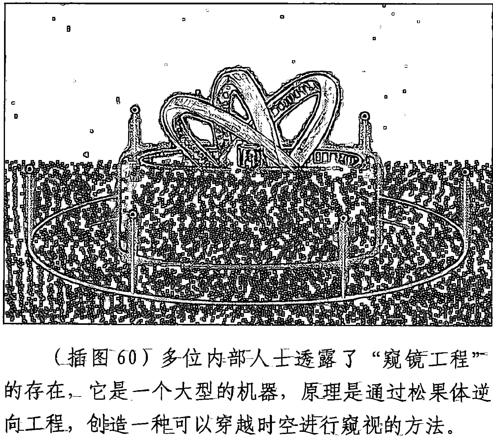

## 谁设计了宇宙/原场调查，万物背后的神秘推手与即将来临的黄金时代

一种量子叠加态，它总是会超出光速的界限，或者说顶峰点。豪将超出那个临界点的状态称之为处于“叠加态的超光速部分”。

这样的机器会很危险，因为它会在毫无预兆的情况下放射出巨大的辐射及能量。这是因为机器内部的空间已经接近90%的顶峰临界点。“顶峰理论”（Crescendo theory）称，当处于一种特殊的叠加状态时，所有的缓慢物质都会不停地、自发地试图加速到光速状态。当物质具有足够的能量来达到光速时，它就处在“顶峰”状态，而且这种叠加状态的超光速部分的能量，小于等于缓慢状态时的能量。

物质可以通过两种途径到达顶峰点：零能量或全能量。零能量状态的工作机制是利用已经处在光速的能量。顶峰理论中很难理解的一点是，物质在静止状态下也处于瞬态，这并不矛盾，因为顶峰物质在原子层面会使空间完全变形。

这一理论只是一个更宏大的理论的一部分，这个理论被称为“共同原子”（common atom）理论，该理论认为，存在一种有限的力量在阻止空间被弯曲。在更小的层面，空间体积更小一些，所以具备更少的能量。在原子层面，空间就完全变形了。每一颗原子都是一个具有微小质量的奇点，并且自身具有独立的内部空间和时间。一颗原子中的宇宙（An atom’s universe）只能持续存在几秒钟。但是这没有关系，因为时空曲率的关系，它的时间相对我们的时间来说是可以视作不变。

这一理论支持了光子的波粒二象性，并且通过融合所有不同的理论，高度简化了量子力学以及相对论。引力子将被证明就是物质本身。

如果你能理解以上内容的话，你基本就掌握了军方秘密掌握的物理知识的80%-90%。

引力子将被证明就是物质本身；光子具有波粒二象性；空间可以通过自身的“卷曲”来形成一颗原子，并且原子的内部的运动的时间速率和外部区域非常不同；当你使一颗原子加速到超过光速时，这颗原子就达到了“顶峰”状态，进入到一个平行现实中。虽然在措辞方面略有差异，但这些概念对我们来说，现在听起来已经很熟悉了。其中的含义令人震惊，因为根据这些原理，当松果体处于完全激活状态时，它很可能就成了一个真正的星门，并且当这个星门扩大到和人体一样的尺寸时，我们的身体可能就会发出光。这也很可能是古人创造出众多相关的神话、符号以及隐喻以促使我们对这一领域进行研究的原因。

这种松果体技术被安置于我们每个人体内，而那些曾经造访全球各地众多不同文化的远古众神似乎一直在非常热切地教导我们开启这一技术，帮助我们创造出黄金时代。尽管某些负面的团体篡改了这些概念，但是绝大部分的灵性传统都强调了宇宙的本质就是爱，而我们对于源场的调查结果也有力地证实了这一点。

### 现代印度的地外文明接触事件

《印度日报》（India Daily）的网站有一个叫“科技”的版块，其中有超过50%的文章似乎都是政府自己“泄露”出来的。与我在世界其他国家看到的情况不同，这些报道中透露出一种对大揭露的强烈呼声。当然，因为大部分作者都是匿名的，并且他们也不能证实消息来源，所以大部分人就会很轻易地忽视了这些资讯。然而，这些文章中提到的技术细节程度，以及这些细节与本书所描述的内容的相符度，都让人目瞪口呆。

2006年4月29日的一篇文章，披露了印度在20世纪70年代初期进行第一次核试验之后，外星文明就和印度政府进行了接触。当印度在1998年5月11日和13日进行新的试验时，他们再次出现了。印度的“NASA”叫ISRO——印度空间研究组织（Indian Space Research Organization）。2008年，《印度日报》透露，ISRO主席G. 马达范·奈尔（G.Madhavan Nair）在“负责一项为ISRO的UFO文件保密的机密任务，并且受联合国内部秘密力量的协助”。文章还指出，联合国官员非常担心印度会将这些秘密公之于众。ISRO内的一些区域被列为机密区域，但是据《印度日报》称，并不是每个人都缄默不言。

一名在这些封闭区域内部工作的科学家称，印度正在获得一些来自外星飞船逆向工程的科技，不过这些技术大部分都被联合国安理会所控制。作为交换，印度必须对其在空间任务中得知的UFO相关信息只字不提。

文章还写道，印度人民党的决策经常会使联合国不知所措，他们对于大揭露的观点就是一个典型的例子。

曾经，印度人民党带领的印度政府在面对来自美国与国际社会的重重围困和威胁的情况下，毫不犹豫地进行了多次核导弹试验。而这一次，印度政府将向我们揭露，在过去的一个世纪里面，一个组织有序的国际机构怎样在全球范围内掩盖关于UFO的真相。不过印度在这里碰到一个难题。如果他们继续披露有关UFO的信息的话，可能会失去成为联合国安理会第六个常任理事国的机会。但是印度人民党很有可能会借披露真相来要求在安理会取得一席之地。

《印度日报》在2004年称，在印度最重要的航空和国防研究城市普纳工作的国防研究工程师及科学家们，被禁止告诉外界他们从这些秘密项目中所得的信息，直到2012年。

如果你留心这些传闻和相关信息，你就会发现，印度在进行某些没人愿意谈及的机密试验。这些试验对于传统物理学、传统机械工程学和航空工程学来说是一次重大进展。如果传闻属实，印度可能将永远改变世界。但为什么是2012年呢？这些秘密要到2012年才允许被公开呢？

印度已经加入了太空竞赛。《印度日报》在2008年报道，他们已经知道了月球表面存在外星人基地的事情。

印度可能会震惊世界。这一惊喜任何时候都可能到来。印度一定会披露地下存在UFO基地的事实。

一则2005年7月4日的报道，披露了这些外星人都告诉了印度政府及军队什么事情。不过现在看来，我们对这些信息应该很熟悉了。

一旦我们处在其中一个平行宇宙中，我们就可以像审视长宽高那样审视时间与空间。那些外星文明以及拥有时间旅行能力的未来人类，乘坐UFO通过虫洞网络来拜访我们……虫洞旅行非常令人着迷。你可以独立地规划和操控时间与空间，然后将虫洞的入口与出口和时间与空间的参考点对应起来。要演算时间与空间的参考点，你必须利用平行宇宙中的更高维度……如果你从一个平行宇宙中的一个更高的维度进行演算，那调整虫洞的入口点更容易进行。如果在我们的物质中进行操作的话，那将是一项难度极高的庞大运算工程。

我们可以“像审视长、宽、高一样”审视时间，实际就是本书第二部分中一直在谈论的内容。《印度日报》很多文章中所披露的技术细节令人震惊，大大超出了本书的探讨范围。其中一篇文章称，我们可以通过用高强度能量轰击电离层来产生传送门。

除非虫洞被特殊处理和控制，否则物理实体会在虫洞中心失去一切物理特征……然而，通过平行宇宙，个体可以瞬时穿越时间和空间。接下来的问题是，外星人的科技水平确实远远超出我们，他们知道怎样在另一个虫洞中转变恢复物质身体，回到我们的物质宇宙……某些研究人员称，如果虫洞被设置为将实体带入平行宇宙，那该实体从物质宇宙实体状态到平行宇宙实体状态的转换过程将会自动进行。

操作虫洞并不容易。在平行宇宙中可以很容易进行操作，但是如果在这个物质宇宙，这将是一次在数据运算方面的巨大挑战。不过，我们在计算机算法及处理能力方面取得的进步，使我们有能力解决这些复杂的方程式，从而操纵虫洞。

2006年10月7日的一篇文章称，时间可以从空间中被分离出来，从而在多维空间中制造出一个“等候区”，随后，这个“等候区”会被连接到另一个时间点上。“时间与空间的分离是通过操控引力辐射来实现的。”另一篇文章指出，在时间-空间中存在很多平行现实。并且（虽然这听起来很矛盾）我们可以同时处于不同的位置。“当我们做梦时，我们是不是以一个分离实体的状态存在着？专家的回答是否定的，实际上是同一个实体同时存在于多重时间维度。”

#### 如何进入平行宇宙？

2005年7月9日，《印度日报》技术团队称，实现星门旅行的关键，在于创造出“负质量”。这似乎与我们一直在讨论的概念完全相符：即当物质的内部运动速度超过光速时，其质量就会转变为“负质量”。

一旦负质量形成，一切有关时间旅行、时空弯曲以及进出平行宇宙的谜团，就可以被瞬间解开。当你进入一个黑洞时，如果你可以加速使你的质量变成负质量的过程，你就可以轻易地穿过……如同飞机在起飞、飞行以及降落时控制重量平衡那样，宇宙飞船上的计算机能对质量系数进行正负转换。一旦实体的质量能被操控，穿越虫洞将变得很容易。这不但能让不同时间维度之间的旅行成为可能，并且还可以让我们进入平行宇宙，甚至实现更超越的壮举。

通过这项技术，我们显然可以预知任何潜在的负面事件，这样就可以提前预防，从而改变结果。

并且，如果一个文明可以预知未来，并能通过重置时轴改变未来的话，他们就可以达到我们所说的永生状态。高度进化的外星人就做到了这点。这也是我们将在未来几百年内实现的“奇迹”。

2005年7月22日，《印度日报》又给出了有关三维时间的更进一步信息。

在平行宇宙中，时间并不以一种维度的形式存在……这就造成了平行宇宙的生活与物理宇宙的生活之间的天壤之别……比如在物理宇宙中，我们可以从A点走到B点，而在平行宇宙中，我们就可以从一个时间点走到另一个时间点。

他们又在2005年7月23日的文章中，进一步阐释了平行宇宙的特性。

在高维度的超空间中，所有物质宇宙中的物理定律将不再适用。在这样的宇宙中，时间并不以一个维度的形式存在，并且你可以在其中创造出平行的时间维度。物质实体将坍塌为多实体(multi-entity)状态……我们此时其实就处在多重平行宇宙中……虽然我们的物质身体处于物质宇宙中……但我们一直在从平行宇宙中与我们自己交谈，知道我们大脑的工作和我们的生活。当我们死去时，我们会继续存在，但不同的是，因为身体已经失效，我们会离开物质宇宙，继续在平行宇宙中生活。

2005年7月26日，《印度日报》的技术团队发表了一篇文章，其中的观点和一些我独立研究得出的科学推论可以说完全一致。当我发现这一点时我完全被震惊了。

……如果时间维度移动的速度不仅等于光速，甚至有时还超过光速，那光子会发生什么变化？……最终结果就是，一个实体会从物理宇宙中脱离出来，然后出现在平行宇宙中。这一点非常令人着迷。因为这就是发生在高度进化外星文明身上的事情，他们知晓在平行宇宙中永生不朽地生活的秘诀，他们会时不时地来物质宇宙转悠几圈。现在，一些科学家相信，人们死后，电磁空间能量源（electromagnetic spatial source of energy），或者说灵魂，会通过一条时间不断减速的通道到达一片白光，那片白光就代表着平行宇宙的入口。

此领域的研究者称，高度进化的文明因为可以随时在物质宇宙与平行宇宙中来回穿梭，因此可以实现永生。这一点很可能就是我们出生和死亡时所经历的状况——出生就是进入了物质宇宙，死亡就是离开物质宇宙进入平行宇宙。不过，通过某种可以加速和减速时间的技术，在这个物质宇宙中，我们就能直接探访、进出平行宇宙。

7 月 27 日，《印度日报》技术团队又从生物角度讨论了这种科学，而这又和我们先前的论述如出一辙。

我们大脑的 2/3 并不受我们的控制，而是受到平行宇宙中的实体的指导。我们通过大脑信号（心电感应）与很多其他的实体进行交流，甚至与处在平行宇宙更高维度空间中的自己进行交流……在身体不离开物质宇宙的情况下，我们确实在一直用我们的心智探访平行宇宙。而那个部分的大脑甚至不受我们所控。由此来看，我们似乎与某些可以随时在物质宇宙和平行宇宙间来回穿梭的高度进化的生命体有遗传学上的联系。

其他一些文章称，很多来自 M15 星团的外星人在拜访地球，而 M15 星团处在我们近域宇宙中密度最大的位置，并且这个区域有很多黑洞，这也为这些外星文明提供了一个庞大的转运站。这些外星文明很显然准备在 2012 年表明身份。2005 年 8 月 10 日的一篇文章称，“很多报道中的 UFO，其实是我们几百年后的后代在穿越时空时所造成的时间逆反现象。他们可以回来拜访、观察我们，但是不能改变任何事件”。

#### 准备“星际家庭大团圆”

2006 年的一则报道称，全球政府将在 2012 年 12 月向人类公布 UFO 及外星文明的存在，“共识就是要让世界逐渐对此做好准备。” 2006 年 12 月 29 日的一篇文章称，世界各国政府对 UFO 以及地外文明真相的隐瞒已经持续了几十年，但是秘密准备工作正在进行，最终在 2012 年揭露真相。文章还指出，“巴西、印度和中国在这件事情上处在领头位置”，并且我们的世界将会秘密接受来自外星人的帮助，以防止在这次转变过程中可能出现的任何灾难。2005 年 5 月 12 日，《今日印度》（India Today）称，在 2012 年 12 月的夜晚，来自我们所知的 88 个星座的代表将拜访地球。届时，我们将“最终理解进化的真实过程，时空弯曲的方法，以及重力是一种波而非一种力的事实等等。” 2007 年 1 月 4 日的一篇文章阐述了当“银河对齐”现象在 2012 年达到高峰时会发生什么。

#### 银河对齐现象会改变世界，文明得以重生，地球也将重获新生。

这一切都是重力波的作用。高维度的重力波被设定来创造出此次银河对齐现象，从而使地球重获新生。

大型的银河对齐现象在以前也出现过。一些人相信，恐龙在几百万年前的灭绝就发生在一次大型的银河对齐发生期间。吠陀文献中讲到了银河对齐现象。在一次银河对齐现象出现期间，亚特兰蒂斯沉没消失了。有趣的是，古代文献资料同样暗示了，外星文明会在银河对齐现象发生期间和之后正式造访地球。在银河对齐现象出现之前大约一百年，高度进化的外星文明开始拜访地球。有趣的是，现代有记载的首次 UFO 目击事件发生于 1911 年，地点是德国。外星人为他们的正式拜访创造合适的环境。这一次也将如此。我们可能在 2012 年或之后正式接触外星文明——那些制造了宇宙大爆炸的第四类高度进化种族。我们将震惊地发现，人类文明的各个方面，包括科学、历史、哲学等等，将从那一天起被彻底改变。

这些来自《印度日报》“科技”版块的揭秘文章内容庞杂精细，并且在不断更新，我觉得他们很有可能在揭露真相。并且这些信息也与某些在美国军工复合体系中工作的内部证人的证词也高度相符。

#### “X先生”的证词

现在我们来看“X先生”的一些陈述，“X先生”是卡米洛特工程采访的第一人。但是，后来正当他准备站出来表明身份，披露更多他在机密项目里的所见所闻时，突然死于严重中风。尽管如此，我们还是能从卡米洛特工程的网站上获得那次采访的视频和完整笔录。“X先生”声称曾经是负责管理机密文件的档案管理员，并看过一些高度机密的文件，其中披露了地外文明在20世纪50年代传达给我们世界的领导人的信息。美国著名的互联网电台主持人和UFO研究者杰瑞·皮平（Jerry Pippin）亲自采访了这名证人，并且做了笔录。

地外文明说他们会在2012年12月21日或22日大规模地登陆地球，不管我们的领导人同不同意。很显然，他们会通过我们的媒体，或者某些类似的全球性传播方式（很可能会是心电感应），来向全世界宣布这则消息，届时人人都会知道这些信息。并且他们会让人类自己做出选择，选择是否愿意在灵性层面实现进化并同他们共同遨游太空、探索宇宙。

> X先生：我们届时需要做出选择。
问：是什么样的选择？
X先生：我们是否愿意了解他们来自哪里，学习怎样在灵性层面实现进化，以使我们也可以和他们一样遨游宇宙，播种生命。

当“X先生”讲到我们将自己决定是否愿意“在灵性层面实现进化”这点时，我们会很容易忽视其中真正的含义。这次采访的笔录揭示了更多的细节。我不知道这是否真的会发生，但是这些信息的确值得我们思考研究。

届时将有大量信息被揭露，这些信息会打破我们一直受困其中的大部分核心信仰和理念。一些人会因为信仰系统被颠覆而感到惊恐。一些人会因为发现自己一直被欺骗而感到愤怒。一些人会觉得世界末日到了。但大部分人感到最困惑的是关于宗教的问题，因为真相将被告知，而这些真相将会推翻一切宗教信仰。我们将在地外文明的帮助下，了解人类的真正历史，发现和揭露那些一直在幕后操控整个人类社会的黑暗集团。这一切必然发生。如果世界继续遵循现有的道路前进，我不认为会出现什么转变。我们需要知道真相。如果那些掌控世界的人这些真相的话，地外文明会这样做的。

就像古语所说，“真相使你重获自由”。因为这个原因，我精选了三十年来倾心研究所获得的最有用的信息来写成本书。有了这些知识，我们就拥有了创造黄金时代的工具。我们可以制造出清洁无污染的无限自由能源；我们可以创造出惊人的全新治愈技术；我们可以克服重力、时间以及空间的羁绊，毫不费力地在星系间遨游；我们还会经历一场全球性的松果体“觉醒”，这将是我们获得更强的精神能力，甚至可能使我们的身体转变成光之身。如果琐罗亚斯德教中关于弗拉索 - 科利尔提的传说是真实存在的，那么我们对于时间的理解将会发生根本性的变化。这将是我们能更容易地进入到非局域、非线性的时间中——时间 - 空间现实的美妙国度。

我感到我们一直在被鼓励去利用本书所讨论的知识以及其它一些积极的、令人振奋的、具有启发意义的信息来源来重新理解宇宙万物，包括我们自身。黄金时代是一个需要所有人共同参与创造的事件，而不是我们可以闲坐空等的事情。我在书中讲到的这些科学技术都是真实的，我们可以开发应用这些技术。并且，这些科技将把我们的文明提升到一个全新的水平，使我们进入到一个我们通常认为只可能存在于科幻小说中的人类新文明。在应对地球变动和揭露、推翻那些在幕后操控全球社会的黑暗集团的道路上我们并不孤独。我们所有人的思想和意识通过某种我们目前尚未完全理解的方式互相联结在一起，并且我们和地球也联结一体。我们的星际亲属具备人类形态，他们很可能在遥远的过去造访地球，创造了所有主要的世界性宗教。虽然大部分宗教的原始教义和思想在后来都遭到不同程度的篡改，但它们关于关爱和尊重他人的重要教诲还是影响了地球上的每一个人。我们可以证明，宇宙能量的本质就是爱（尽管这个词已经被滥用以至于大部分人看不到它的原始和真实含义），所以尽管现在所有这些正发生地球上和整个太阳系的事件看起来像是不祥的预兆，但实际上这一切都具备一个积极正面的意图，那就是帮助人类实现一次大规模的、集体性的进化和觉醒。我们在日常生活中所创造和分享的爱会一直扩散延展，甚至最终会帮助我们在人性层面实现彻底的转变。我们似乎偏爱具有复杂性和智力挑战性的事物，但现在我们正在面对的真相或许非常简单：地球就是一所为我们提供灵性教导的学校，而我们所有人都是学生。我们的毕业典礼即将来临，我们即将获得我们的毕业证书，因为我们已经在从更高的层面向我们自己和其他所有人证明——我们不再需要一世又一世地重复学习这些相同的课程以及给自己创造了一场庞大的集体性噩梦。我们正处于一场关于意识和现实的伟大转变的临界点。这场转变肯定会发生，并且即将发生，对我们来说，那将是一次无比真实生动的美妙体验。我们将很可能会认识到，这个世界实际上就像是一个巨大的幻象——一场清明梦，在其中我们的一切创造都会映射到我们自己身上。并且我们最后也会意识到，我们之前从未真正的觉醒过。

事实就摆在面前。源场是真实存在的。我们都想创造一个更好的世界，而我们现在已经获得能帮助我们实现梦想的新知识和新工具。我们并不无助，更非孤独。宇宙本身很可能是一种具有意识的超级存在，在我们探索和理解我们本质的道路上，宇宙一直在推动和帮助我们实现一次量子性的跳跃，在整个银河系和太阳系为我们创造出实现这一转变所需的能量条件。来自全球各地所有古老文化的、具有几千年历史的远古预言为我们揭示了正在发生的伟大事件，帮助我们重建科学体系，以使我们能成功实现这一转变。我们将亲手创造出黄金时代——从我们的日常生活开始，我们将收获的奖赏绝对超乎想象。通过消除自我憎恨和恐惧，接纳和宽恕自我及他人，我们将疗愈这个世界：

> 我爱你。对不起。请原谅我。谢谢你。

## 致谢

在 1996 年 1 月，我开始阅读《一的法则》。这一系列共有 5 本书，据称是与高度进化的外星文明的心电沟通记录。这些外星种族声称他们帮助人类建造了大金字塔，本是出于好意，但后来金字塔被作负面之用，他们被迫撤离了地球。他们也解释道，他们在现代进行这次接触（指传送《一的法则》系列信息给我们）的主要原因为是为他们在过去所做的事情向我们道歉，赠予我们这一新礼物，希望能帮助我们改善和转变因他们过去的无心之过而造成的当下的危急形势。惊人的是，我在这些年所做的大量研究都印证了《一的法则》提到的很多观点。他们揭示道，心智确实是无限的，但是尽管如此，在宏大的宇宙层面它还是有一个唯一的本体（singular identity）——他们称之为“那个无限的造物者”（One Infinite Creator）。他们说，我们全都是“那个无限的造物者”的完美全息映像；我们化身于此是为了学习灵性课程，并且最终将返回到我们的原始本体；“25000 年周期”会引发生物层面和灵性层面的突发性、飞跃性进化，而该周期约于 2011 年至 2013 年间完成，这将促成空间、时间、物质、能量、生物与意识发生量子跳跃性的转变，而这一转变现在正在发生。《一的法则》系列还讲述了全球能量网格；详细阐释了空间 - 时间现实与时间 - 空间现实的物理特性；讲述了基于五彩光谱的灵性进化层级；暗示了银河系是一种智能的超级存在，并设计出了人类形态，并使其出现在数百万颗可居住的星球上；还讲到，在经历这次转变之后，我们确实会进化到一种全新的存在状态。他们自称属于一个被称为“为无限造物者服务的星际联邦”（The Confederation of Planets in the Service of the Infinite Creator）的善意星际组织。在地球的整个进化过程中，这个组织一直在为地球提供援助，并且现在正在全力帮助我们平稳、安全地完成这次转变。这些资料构成我很多研究工作的基础，并且后来对其中很多特定细节所进行的科学性探究和验证都证实了这些资料的真实性。我所接触的每一个可信的内部人员提供给我的资讯都独立地证实了《一的法则》系列中提到的很多观点，尽管这些人并未阅读过这些资料。并且许多奇妙的亲身经历也让我相信，这份资料是准确真实的。我也因此认为《一的法则》不同于其他大多数所谓的“通灵”教导，后者似乎总是相互矛盾，并与我在这本书中揭露的很多科学证据相冲突。

另一份我觉得比较可信的资料是由简·罗伯茨（Jane Roberts）和罗伯特·布茨（Robert Butts）传导的“赛斯书”系列，尤其是早期的卷集。其中一卷《赛斯资料》的结尾章节详尽地阐述了赛斯所说的“意识单元”（consciousness units）的概念，这一内容和我在这本书中展示的信息高度吻合。

正如我在写这本书时的感受，我也希望你们觉得这趟对源场的调查之旅引人入胜、信息充足。本书是我迄今为大揭露进程所做的最重要的努力。尽管其中提到的前沿科学技术看起来似乎不可思议，但实际上它们都是真实存在的，并且我们很快会意识到这一点。我认为没有理由去惧怕当下所发生的改变。我们正经历的或许是某个极其出色的剧本的安排——推动我们的进化。通过学习去更好地关爱、接纳和宽恕他人，我们能够增强自我的相干性——因为宽恕他人即是宽恕自己。

我真心地感谢许多为这本书的写就奠定基础的英雄和先驱，也非常感谢其他许多在这些领域不懈耕耘的研究者。若没有你们极其艰辛而伟大的奉献，我们将无从得知自身蕴藏的真正潜力。我想感谢我的母亲、我的父亲、我的兄弟和我的美丽的生命伴侣，还有那些和我一起分享生活、给予我关爱和指导的人们。我也想感谢葛瑞姆·汉卡克、詹姆斯·哈特、杜登（Dutton）出版公司的总裁布莱恩·塔特（Brian Tart）及所有工作人员和无数帮助我最终完成这些研究的人。我还想谢谢那些存在于时间之外的人（或者说存在），在我研究发展这些概念及理论和创作这本书的过程中，他们为我提供了广泛的支持——通过持续不断地给予我梦境反馈信息，并激发我发展新的突破性观点，更不用说我获得的数量惊人的关于我个人和地球的预言，这些预言一直被证明具有极高的准确性。我希望我们将在不久后和我们的星际亲属正式重聚——一次真正的“星际家庭大团圆”，那将是一个无与伦比的美妙时刻！