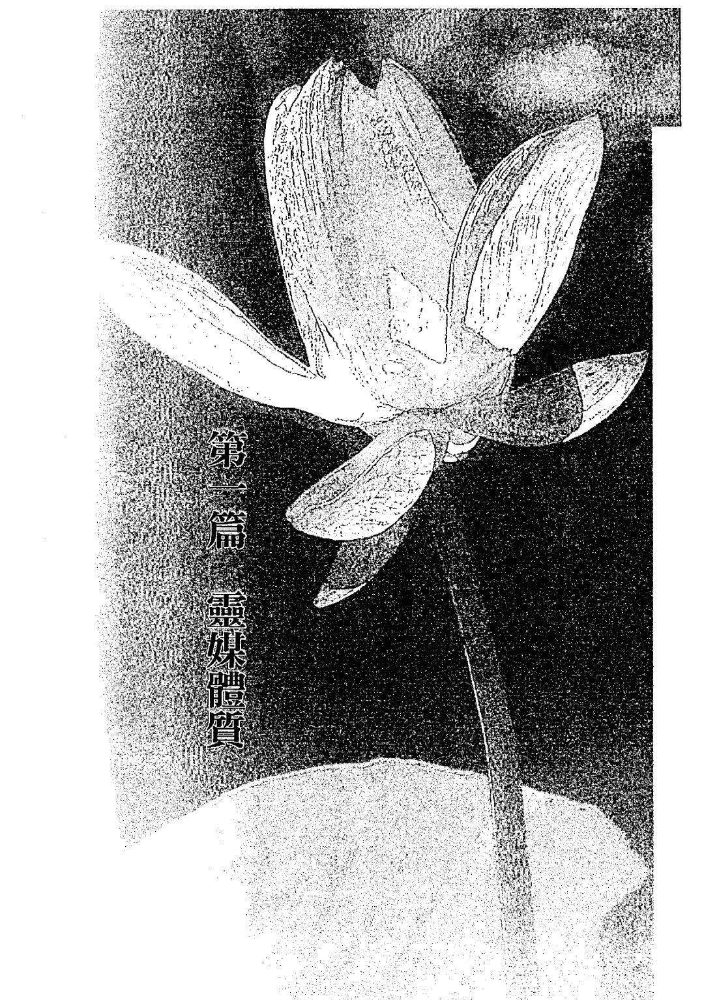
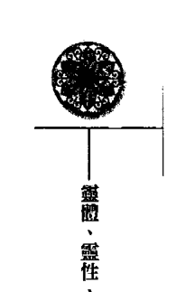
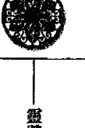
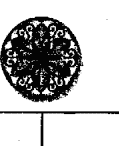
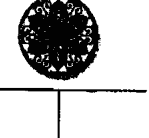
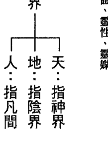
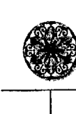

# 般若達摩

# 活靈活現 第三部

# 靈體・靈性・靈媒

在這二十一世紀的亂世、亂象裡，全世界均處於其中，國際大環境不好，天災人禍不斷，鬱卒又失去方向的眾生，要如何自救自處？本書替你找出自己的屬性、定位、找到無形的助力，讓你從亂中脫困，破繭而出！

向立綱◎著

# St. Royal College
天使神秘學院

-   ※ 專業占卜預測機構
-   ※ 神秘學培訓機構
-   ※ 水晶能量研究中心
-   ※ 神秘學資料庫
-   ※ 官方淘寶：http://strc.taobao.com
-   ※ 讀書交流QQ群：
    -   占星塔羅占卜師交流群：814594478（加入密碼：PDF）
    -   神秘學其他綜合群：659338717（加入密碼：PDF）

使用手機淘寶掃一掃，獲取更多好書

淘寶按店鋪名搜索：天使神秘學院

微信公众平台：strc2011

## # 製作說明：

本書由《天使神秘學院》出重金從台灣購入的原版書籍掃描製作完成。為達到最好閱讀效果，特地把原版書全部切開後，再經由專業掃描設備高精度掃描完成，並經過一張張的PS後期處理最終成書，其間花費大量的人力、物力以及時間，只為能給大家提供經濟並優質的神秘學學習資料而努力。

本學院強力譴責某些機構和個人，把本學院花心血製作完成的電子書籍，包裝後直接放在自家淘寶網上低價傾銷的行為，以謀取不勞而獲的經濟利益。如果長此以往最終將無人願意再為大家花心思製作電子書，那以後可能大家再無新書可讀。

-   為讓大家以後能夠讀到更多的好書，也為了本學院的良性發展。本學院懇請大家儘量做到如下幾點：
    -   一、儘量在本學院的網站購買電子書籍。
    -   二、請勿用技術手段把電子書內的水印及加密去掉。
    -   三、在收到電子書後小範圍傳閱即可，千萬不要公開傳播，更別掛到淘寶網上低價銷售。

-   同時為答謝廣大支持者，學院電子書將做如下調整：
    -   一、學院會把一些早已收回製作成本的電子書折價銷售。
    -   二、最新製作的電子書籍會開放打印功能，大家購買後有條件的可自行打印成書。

# 靈體・靈性・靈媒

# 活靈活現 第三部

在這二十一世紀的亂世、亂象裡，全世界均處於其中，國際大環境不好，天災人禍不斷，鬱卒又失去方向的眾生，要如何自救自處？本書替你找出自己的屬性、定位、找到無形的助力，讓你從亂中脫困，破繭而出！

向立綱◎著

## 目錄

## 序一

## 序二

## 前言

## 第一篇

## 靈媒體質

### 第一章

### 靈媒體質的認識

-   壹、靈媒體質的定義
-   貳、靈媒體質的種類與內涵
-   參、靈媒體質的特質

### 第二章

### 靈媒體質的人生際遇

-   壹、不順與波折
-   貳、原因探討
-   參、人生的轉機

### 第三章

### 靈媒體質的禁忌

-   壹、氣功
-   貳、催眠
-   參、法會與廟會活動
-   肆、靈媒與乩童
-   伍、許願問題

18

21

82

105

## 目录

### 第四章

### 靈媒體質的修行與教育

-   壹、修行的迷失
-   貳、自我提升
-   參、調適與教育

### 第五章

### 其他同屬性靈體

-   壹、乾淨靈體
-   貳、敏感靈體

## 第二篇

## 進化靈

-   壹、進化靈的概念
-   貳、進化靈的特質
-   參、進化靈的健康與疾病
-   肆、進化靈的禁忌
-   伍、天下父母心
-   陸、實例說明

## 第三篇

## 禽獸靈

-   壹、禽獸靈的特質
-   貳、禽獸靈的內涵
-   參、禽獸靈的社會價值與意義
-   肆、典型案例
-   伍、人與動物的雙向輪迴
-   陸、結語—宗教與靈格

284

180

# 第四篇 其他靈體

## 第一章 後天的先天靈

-   壹、考試項目
-   貳、考過了嗎？
-   參、怎樣安渡考試？

### 第一章 普通靈

-   壹、輪迴的過程
-   貳、靈格的擢升
-   參、拜師的程序
-   肆、拜師的管道

# 序言

## 序一

### 靈體、靈性、靈媒

宇宙的生成與歷史，有億兆年，人類的文明與歷史，卻僅有數千年，因此，人類無法瞭解宇宙，也無法瞭解大自然與人類之間環環相扣、互為影響的許多奧秘。千百年來，對於許多人類智慧所不能瞭解的問題，人類習慣將之交給宗教。

宗教是形而上的，它收納了所有人類智慧所不及的問題。但是，隨著文明科技的發展，隨著知識的普及擴散，人們逐漸發現，人類世界，充滿著太多太多的奧秘；人類對自己，也有著越來越多的不解，宗教不是一切，宗教不能終結所有的未知，宗教也已不足以滿足人類對未知的好奇。

常有人這樣問：「為什麼我一生樂於助人，一生致力修行，念經吃素，我卻沒有比別人更好？」

「為什麼我一生兢兢業業，辛辛苦苦，腳踏實地，死拚活拚，我卻總是兩袖清風，一無所成？」

「為什麼我一生坦坦蕩蕩，正正當當，到了中晚年，卻突然一蹶不振，家運崩跌？」

太多太多的人認為，自己不是惡人、壞人，不愧天、不愧地，也盡心盡力，但人生的境遇得到的卻是不合理的對待。

於是，許多人驚覺發現，宗教不能解決所有的問題，宗教也不是所有問題的答案，這便是文明科學以來，持無神論觀點的人越來越多的原因之一。然而，問題的原因究竟又在那裡呢？為什麼人世間有這麼多的「不公義」與疑惑？其實，所有的問題與迷惑，從靈界都能找到抽絲剝繭的答案。靈界包含了神界（天）、陰界（地）、凡間（人）三大區塊，宗教只是連結這三大區塊裡的一個環扣，靈界是總公司，神界、陰界、凡間、宗教等等，都只是分公司，分公司無法解決的問題，唯有回到總公司才能尋得答案。但是，靈界是無形的，是看不到的，在有形界與無形界的互動過程中，有著太多的令人不解，這便是作者撰寫本書的目的，希望能夠引導大家，從靈界探討靈體、靈媒、靈性，為所有心中存著疑惑的人，找到人生的答案，解開心中的纏結。人人均有靈，但是因為靈體來源的不同，使得人均生而具有不同的特質特性，也有著不同的人生運途。一旦知道了自己靈體的屬性，許多人終生追求的真理，便豁然呈現。原來，所有的答案，都在自己身上。對靈媒靈體的人而言，他們與生俱來便有能與鬼神溝通、能感應陰陽、能預知預言的潛力，他們的靈體本是靈界的優等生，但卻因為對靈界的一無所知，使他們的潛力在尚未得及發揮顯現的時候，便陷入了病痛、消極、不順、坎坷、憂鬱等等的困境。太多太多的人，一生潦倒坎坷，只因為他們是靈媒體質；太多太多的孩子，變成憂鬱、躁鬱症的病患，也只因為他們是靈媒體質。然而，他們本應是替靈界服務，替眾生解惑的高人或佼佼者。

科學承認，有人能預知天災地震，有人能先期感應或預見死亡，科學也承認，預知家、通靈者、靈媒等等，均有著與常人不同的腦波與能力，只是科學無法解開謎底，無法告訴大家「為什麼」？這些問題，都必須跳脫到宗教之上，回到靈界的高點，再從靈格、靈體著手，便能一切柳暗花明。

除了靈媒體質之外，還有進化靈體與禽獸靈體，他們均是由動物界轉世進化而成人類，所以都會殘存著或多或少的動物特質與習性，有些是形體上的不全，有些是身心上的殘缺或障礙；有些則是思惟、舉止或潛意識的與眾不同等等。

新世紀裡，許多青少年有著身心的殘障或疾病，難為天下父母心，心焦力瘁的付出之餘，仍是不知如何自處、面對與跳脫，但是當他們透徹了自然界輪迴與進化的道理，都能再現人生的海闊天空。

同樣的，在芸芸眾生萬象裡，從人性的黑暗面，我們看到許多殘暴、陰狠的負面人性，都可能與他們的禽獸靈體有關，凡間本是靈界的考場，既有聖賢之士，也有江洋大盜之流。有惡人，才能襯托善行，因此，惡行惡狀之徒，正是凡間凡人的考題。

析解了靈體與靈性，當科學力有未逮的時候，只有從靈學的角度，才能解析所有人生的迷惑與真相。概念，靈界與靈學不再是遙不可及、高不可攀的神秘世界，但卻需要眾生以智慧去面對與接受，尤其在當前的亂世亂象裡，回到靈界找尋靈學的真知真相，眾生才能更加認識自己，找回自我，並找到自己人生的方向與目標。

過去，宗教的被誤解、被批判，靈學的被質疑，信仰的被誤導、濫用，以及許許多多的問題與迷惑，現在都已找出了真正的問題所在，全都在於靈格與靈體的屬性上，當我們解析了靈格、靈體的屬性，人生便有了更明確、清晰的定位，終於，我們又更深一層的認識了自己！

當我們「來此人間走一回」，不論這一世「富貴榮華」或亦「窮途潦倒」，不論這一生是「輝煌騰達」或「辛苦辛酸」，更不論這一輩子是充滿歡欣喜悅或是貧困交迫，當我們洞悉了自己生命的由來與奧秘；瞭解了自己的過去、現在與未來；更瞭解了宇宙天地與自然輪迴的道理後，回首來時路，無論過去走過多少酸甜苦辣，面對未來，相信你必能有著一步一腳印的紮實。即使生命可能已至盡頭，亦將是了無遺憾。

認識靈，認識自己，將給你一個再生的生命與嶄新的人生。

### 靈體、靈性、靈媒

## # 序二

近十餘年來，靈界一再不斷的傳達「二十一世紀是個亂世」這樣的訊息。因此，作者在「活靈活現」、「人鬼之間」等書中及更早前的所有文章裡，也一再據實傳達這種「亂世亂象」的概念。

在亂世裡，無論國內或國際，無論團體或個人，在所有的層面上——包括政治、經濟、宗教、社會等等，都很動輒陷在一個「亂」字之中。

二十一世紀從何時開始？從二十世紀的舊磁場，要進入到二十一世紀的新磁場，需要一個過渡的轉換時期，也就是所謂的「接氣」時期，這個接氣時期是從一九九五年到二〇〇七年，共計十二年（一輪）的時間。到二〇〇八年，才是完全正式走入二十一世紀磁場的第一年。

在這過去的十二年裡，宇宙磁場由二十世紀的宿命時期，走入了二十一世紀的因果靈格時期。許多中年族群或中小企業、社會精英人士，也都在這十二年期間遇到了挫折、不順與挫敗。但他們大都茫然而不知緣由，不知道自己跌倒失敗的原因何在！

在過去接氣的十二年中，我們也看到了在全世界的各個角落，一直不斷冒出各種亂世亂象的徵兆。到了二〇〇八年，正好陷入亂世的暴風圈裡，亂象於是更加明顯，除了大自然的天災地變，如地震、雪災、風災之外，全世界經濟的突然崩跌、油價的暴漲暴跌、西藏的暴亂、韓國的牛肉危機、印度的恐怖攻擊、泰國的政治傾軋……等等，都來得令人措手不及，不知所以，這些都是亂世亂象的寫照。處在這樣的亂世磁場，每個人都很容易因為一個細微末節的疏忽與閃失，使小事變成了風波大事，甚至付出極大代價。這樣的亂世、亂象，將是個怎樣的趨勢與發展呢？尤其，在全世界經濟崩跌的亂象中，何時可以見到穩定與復甦？根據靈界的訊息，過了二〇〇八年後，二〇〇九至二〇一一年，是個亂世的調整適應期，二〇一二年始可見到亂中的回穩，只是亂世中的起步是緩慢與艱辛的，二〇二〇年，始能見到亂世中的「稍好」，二〇二五年，才能得見具體的「更好」。從崩跌到更好的漫長過程中，則將是時好時壞、起伏不定的波折不斷。前述的時間表，不是祂們刻意的預言或預告，只是祂們說明這個亂世趨勢的走向原則，僅供參考，這樣可以讓眾生在亂中整理出智慧應對的思緒。事實上，凡間世局的實際走向，靈界隨時會視大環境的變化與需要，而做緊急適時的調整！面對這樣的亂世、亂象，眾生要如何自處？如何平舟穩渡？首先，要找出問題的癥結。大家應由小看大，先看看在這二十一世紀的自己是怎麼了？再看我們的家庭、社會怎麼了？續看我們的國家怎麼了？進而再看這個世界怎麼了？地球怎麼了？宇宙怎麼了？當我們知道了所有亂象，都是源起於東、西方靈界的聯合對抗魔界，便赫然發覺，原來亂世亂象都是靈界運作的結果，所以也只有靈界才能解套。

歸結起來，要在亂世中解套脫困、破繭而出，不外幾個概念：

-   一、知自己，知道自己的靈體與靈性，找到自己的主神，找到無形的支持力量。
-   二、知環境，知道當前亂世的特質特性，知道這是一個適合重新開始，從無到有的新磁場。
-   三、知方法，要以智慧轉心念，才能創新局；要將過去放下與歸零，結束過去，重新開始；並且兼持「簡單、自然」的原則，才能走出新天地與人生。

為了協助眾生面對亂世、走出困境，值得一提的是，在二〇〇八年，靈界已另指派八卦祖師與盤古祖師二位神尊降臨凡間。八卦祖師就是中國遠古史的神話傳說中，協助人類生存進化的「伏羲氏」，祂能以「八卦轉型」幫人轉三卦—即轉天卦、轉心卦、轉地卦。天卦讓人開智慧、心卦使人轉心念、地卦可以令人走出困境，換言之，就是使人運用智慧，轉變心念，開創新局。更簡單的說，就是用八卦來扭轉乾坤，使所有身陷險境困局的人，都能脫困。

盤古祖師，即是傳說中家喻戶曉的「開天闢地」的盤古大帝。當宇宙仍在混沌之初，天地不明，是盤古大帝鑿出了天地，萬物因此孕育。

在亂世中，眾生想要走出困境，需要將過去一切歸零，放下看開，重新起步，這便是人生戰場上的「開天闢地」之始。二十一世紀是個亂世的磁場，也是個毀滅後再生創始的磁場，凡是願意重新再起的人，盤古大帝均願意協助他們開天闢地，再創人生，只要他們能夠吃苦耐勞。

千百年來，人神之間無論如何互動，正神總是希望所有凡人信眾都能平順、健康、富足。面對當前這個既是亂世，又是新世紀、新開始的新磁場，並且適逢宇宙自然界的輪迴，到了千年轉折的時候，靈界也一再傳達一些新的理念，希望眾生能有新的體悟與認知，走出新的人生。這些新的理念，筆者在拙作活靈活現、人鬼之間兩本書中也都有許多的轉述說明，眾生若是一直固守過去的思維與舊世紀的傳統，很容易困陷在自設的籬中，走不出來。靈界一再強調，過去許多的宗教方法與方式，都各有著它們的時代意義與價值，也都是靈界過去的政策，因此，靈界都絕對予以肯定。靈界也一再強調，為靈界做事的人，都很辛苦，只要不是詐財騙色，也都要予以肯定。從舊世紀到新世紀，不是過去的方法不對，而是過去的方法已經不敷使用。

例如，常有人問：「新世紀要如何修行，才能更好？」靈界說：「當一個人能擁有一份穩定的工作，固定的事業，穩定的收入，事業能順利成功，不負債，家庭能美滿，身體能健康，不帶給社會任何負面與負擔，就是修得好。」

這是二十一世紀對修行的新理念，與過去著重在形式的傳統觀念是不同的。再以念經為例，靈界告知我們，二十一世紀的陰陽嚴重失衡，外陰多而強悍，因此，念經應該回歸到「自我修心」與「修正行為」目的。由於凡人沒有保護層，所以不要迴向，迴向的工作，是屬於出家師父的，否則常人的迴向行為，容易招惹陰界爭搶，造成卡陰與不順。

念經沒有錯，迴向也沒有錯，但卻因為世紀的變遷而須有新的體認與調整。然而，大家能否接受新的理念？這要由大家本著個人的智慧去做取捨。若是選擇堅持傳統，日後自己可能就要有所承受與承擔，而不應再動輒將自己的不順，歸咎到什麼「天地之不仁」，或是怨嘆「老天不公」。

亂世裡，生存是個大學問。新世紀的磁場與過去大不相同，在這樣的大環境下，眾生要順應這種新磁場，才能「適者生存」。常有人問：「我素來本份，不做壞事，不做虧心事，規規矩矩，為什麼得不到賞識器重？為什麼在職場上無法生存？但是那些偷雞摸狗的、阿諛奉承的、見風轉舵的，反而無往而不利。難道巧言令色的做人比腳踏實地的做事更來得重要嗎？」

> > 達摩祖師說：「二十一世紀，好人難生存，所以要做有用的人，而不是做一味的好人。」

怎樣才能做「有用的人」呢？就是必須先天與後天的共同配合，有形與無形的一起努力，才能成為「有用的人」。也就是肉體先要具有能力、實力、競爭力，再加上靈體與主神的協助幫忙，這樣子，才能在這個世紀裡掌握成功的契機。

在本書中，從「靈體、靈性、靈媒」探討「天人之間」的許多問題，靈界也釋出了許多二十一世紀的新思維與新概念，說明了二十一世紀與二十世紀有著怎樣不同的區隔，目的只有一個，就是要告诉大家，如何能夠更好！

### 二十一世紀的新思維與新概念

時間的巨輪永遠是向前滾動的，世紀的傳遞總是一代一代，當新思潮走上幕前，舊思維就必須慢慢隱到幕後，這是宇宙間新陳代謝不變的真理，因此，今日的傳統，曾經也是昨日的創新；今日的創新，明日也會成為傳統，當傳統有所不足的時候，就必須創新，所以，傳統正是創新的基礎，傳統與創新應是相輔相成、互為輪動的，而不應該是相互對立的。

當環境有了變遷，舊方法不足以面對困境的時候，人們可以從過去的反省與探討中，去尋找創新。人類的文明與進步，不就是這樣得來的嗎？因此，傳統是瑰寶，是進步的動力，傳統絕對不應該成為阻礙進步創新的包袱，這也是靈界一再肯定過去、認同傳統的原因。

然而，傳統與創新要在何時交替？舊方法與新方法要在何時作最適當的取捨？這確實是個較大的難題，所以，祂們也一再要大家應用智慧來判斷。

黃老師的工作，是忠實的傳達祂們的訊息，傳達二十一世紀的新理念，告知大家二十一世紀是個什麼樣的世紀？二十一世紀到底怎麼了？在二十一世紀裡，要怎樣找到無形的助力，如何可以過得更好！黃老師陳述事實，希望藉著這些事實，可以有助大家做出智慧的決定。

靈界希望的是大家都能夠更好，而本書也希望藉著傳達新世紀的新理念，使大家能突破困境，過得更好，能在當前的亂世亂象裡，走出一條自己的康莊大道！

## 前言

人是靈體與肉體的結合。這個世紀又是靈的世紀，探討靈的書籍在近一、二十年來，也突然大增起來。到底靈體有什麼不同，不同的靈體會對肉體有如何的影響？會對人的一生有如何的左右？對於凡人的命運，又會有如何的引導作用？這是所有探討靈學的人，都急想知道的答案。

然而，靈體是多樣性的，有靈格的不同，也有靈性的不同，如果未能加以作類別的區隔，再分別予以說明，實在很難深入了解，一窺靈體的全貌。

而靈體又是「人」的一部分，不瞭解靈體，又如何能夠瞭解自己？所謂「知己知彼、百戰百勝」，人若是不知道自己，在人生的戰場上，又要如何得勝？

從靈格來分，靈有先天靈（含後天先天靈），普通靈和動物靈三大類。

從靈的性質來分，又有靈媒靈體、乾淨靈體、敏感靈體之分。

此外依據靈的特質來看，動物靈又有「進化靈」與「禽獸靈」兩種截然不同的類型。

不同的靈格，靈性與特質，對肉體所產生的影響，是先天即已存在的，凡人若是不能透析這種先天的侷限，只想靠後天人為的努力，去創造或改變命運，結局必然是悲慘淒涼與徒勞無功。

## 前言

從不同靈體的不同特質、特性與靈格，找出自己天生的優點與障礙，也找出了自己調適的方法與前進的方向，人生將得豁然的開朗，不必再與天意作抗衡，也不必再與未知作纏鬥，更不必再陷於無謂而盲目的掙扎。

## 第一篇 靈性物質

在有形的世界裡，能夠看到或隱約感應到無形世界存在，或是感應到鬼神存在的這種能力與現象，一直是長久以來，人類好奇的論題。

到了現在這個新的二十一世紀，這種能「看到」、「感應到」，能夠「預知」、「預見」的人，已有越來越多的趨勢。對於這些人而言，他們對自己何以能夠如此，有著太多的迷惑，未來該如何面對自己，也充滿彷徨。甚至他們對自己也滿是恐懼與害怕。

對周遭的旁人而言，他們也有太多的不解。為什麼別人可以看到、感應到？為什麼我卻不能？面對他人的感應，到底什麼是事實真相，什麼是虛構虛幻？是裝神弄鬼嗎？亦或是真知灼見？而有形世界與無形世界之間，到底又存在著怎樣的互動？

還有更多的人，為了追求這種「感應」，希望能夠探觸到神界、靈界、或陰界，他們耗盡一生的努力與金錢，靜坐、練功、灌氣、灌頂……，到處求名師、訪「高人」，到頭來，幸運一些的，果真自己跨越到了另一個境界；不幸的，則有人被騙、失財，甚至有人變得歇斯底里或是精神錯亂，更多的人，則是渾渾沌沌，一無所獲。

有人修行練功，三兩下便見到了異象，手舞足蹈的訓體起來……；也有人練功三、五十年，依然「不知不覺」。

這其間的原因，究竟又在哪裡？

太多的為什麼，長期以來一直挑戰著人類的智慧，也一直是無解的習題，時至今日，儘管科學發展一日千里，但是這些圍繞在有形與無形間的問號，仍然是科學的盲點，於是，許多原本應是未來「高人」的人，變成了憂鬱症、分裂症，甚至被送進了精神病院。這些困惑大家千百年的迷惑，在進入二十一世紀的現在，均能從靈學層面的解析，找到抽絲剝繭的答案。

### 靈體、靈性、靈媒

## 第一章 靈媒體質的認識

### 壹、靈媒體質的定義

在有形世界與無形世界互動溝通的過程中，西方國家盛行的是「預言」或「預知」、「預感」，凡是從事與無形界鬼神溝通的人，西方人稱之為靈媒，東方人則稱之為通靈人，這些人具有特殊感應或預知能力，一般人稱他們是靈媒體質或通靈體質。在本書中，一律統一稱為「靈媒」、「靈媒體質」。

許多人知道自己有某種程度精準的靈感或第六感。諸如偶而會在睡夢中，夢到即將發生的事；或是考完試便已預知成績；未放榜即已知道結果；或是尚未出門即已預感路況不好……，凡在事前即能有所預感或第六感的，就是所謂的「靈媒體質」。

只是絕大多數靈媒體質的人，並不知道什麼是靈媒體質，也不知道自己就是靈媒體質，而且，也並不是所有靈媒體質的人，都具有預感、第六感的能力，這也正是必須對靈媒體質明確定義的原因。

靈媒在西方與東方，所扮演的角色與功能截然不同，所以在東方，對靈媒與靈媒體質的認定也與西方並不完全相同，也複雜許多。

西方的靈媒，只是單純的能具有感應的能力，受惠的是自己。東方的靈媒則大都賦有「天職」或「天命」，必須為無形界服務，必須濟世救人，服務眾生。

然而，二十一世紀的靈界已不再東西方壁壘分明，宗教也已是一家，也就是一般俗稱的「萬教歸宗」。在凡間，也因為國際化的結果，東方靈媒在西方與西方靈媒在東方的情況也比比皆是。

靈媒的特質，已難再以東方、西方去做區分與認定，再加上靈媒的感應有強有弱，人人不同，沒有一定的原則可循，因此，靈媒的定義到底是什麼，一直很難有個統一的界定標準。

時序進入二十一世紀以來，全世界從事靈學相關工作的人與宗教界人士均赫然發現到，具靈媒體質的人越來越多，不但初生的嬰幼兒、青少年如此，在成年人口中，「突然」發現自身感應能力增強的人也越來越多。

人類怎麼了嗎？

這個宇宙又是怎麼了呢？

大家有了質疑，卻又不知答案在哪裡！

靈媒體質它不單只是一種特殊的感應與感受而已，就個體而言，它對每個人都造成不明的、不可抗拒的終生的影響，就宇宙自然界而言，它也必隱含著某些特殊的意義與真理。

因此，在深入探討「靈媒」與「靈媒體質」之前，一定要對靈媒體質有個明確而精準的定義。

從科學面而言，靈媒現象迄今仍是科學界不斷研究的題材。科學界承認靈媒現象的存在，但卻無法再進一步的更深入說明，靈媒的緣由為何？為什麼會有靈媒的產生？靈媒的社會意義為何？靈媒又要如何自處？靈媒有沒有時代的意義？……太多的疑問，太多的為什麼，科學迄今仍是一片空白。

這樣的問題，只有從靈學的角度找出答案。

什麼是靈媒？什麼是靈媒體質？唯有從靈學的角度才能定出一個舉世皆準的定義，也唯有進一步從這樣的定義裡深入，層層剖析，才能解開前述所有的問題。

人是肉體與靈體的結合，人均有靈。這是靈學入門的第一課，也是對人、神、鬼認知的基本入門。靈不在的人，便是俗稱的「植物人」，這也是靈學揭橥的基本概念。靈從哪裡來？在活靈活現（第一部）一書中，已有清楚的闡述說明，靈有先天靈、普通靈、動物靈之分，來源各不相同。因為靈的存在，才有因果與輪迴，才有前世與今生。肉體是會死亡的，靈體卻是永恆的。先天靈的人，靈體來自於天界神尊，所以每一位先天靈的人，都有一位主神，或稱守護神。

靈從哪裡來，就要回到那裡去，因此，肉體死亡後，靈體就要回到來處與原點，這就是東方宗教所說的「靈歸圓」、「靈收圓」，西方宗教所說的「永生」。從靈學的角度而言，所謂「靈媒」是指靈體上的特殊「註記」。當一個靈體在投胎時，靈界與神尊決定賦予這個靈體靈媒體質時，便會在這個靈體上插上一面「旗幟」，旗幟會清楚的以天文書寫上「靈媒體質」的字樣，有了這面「旗幟」的標示，這個靈體，便是靈媒體質。換言之，靈媒的形成，是由靈界與神尊決定的，不是由父母決定，也不是由遺傳或基因決定，更不是後天修來的！當靈體要投胎時，靈界及主神可以決定是否要賦予這個靈體具有靈媒體質，若確定要賦予靈媒體質，便須在靈體上插上一面特定的旗幟。在無形界，這面旗幟便清清楚楚的宣示：「我是靈媒體質」，這也是供所有的鬼、神及無形界辨識用的。靈體是無形的，旗幟當然也是無形的。所以，旗幟的目的，是供無形界做識別的。但具有特定天眼的通靈人，也可以清清楚楚的看到標示的旗幟及其上所書寫的天文，所有負有一點「靈」天命的通靈人，也都具有這種「看到旗幟」的能力。因此，所謂的「靈媒」一詞，在科學角度的定義上，雖然存有爭議，莫衷一是，但在靈學角度的定義上，卻是極為單純與明確：「凡是插有特定旗幟標示的靈體，便是靈媒與靈媒體質。」這樣的界定，沒有任何爭議。唯一遺憾的是，這樣的旗幟，在有形的世界裡，卻是凡人的肉眼所看不到的，而必須藉助特殊的天眼或天命的通靈人。在實務工作上，曾遇到許多對「靈媒體質」認識不清而蹉跎終生的人，很是令人遺憾。有一些人覺得自己的體質較為特殊，與人不同，他們可以對無形界有些微感應，或是常受到無形界的一些干擾，經過一些自稱所謂的靈學「老師」胡亂指點一番後，便以為自己身負重任，必須「救世濟世」，於是他們獻身宗教工作，尋尋覓覓的不斷追求自以為是的「真理」，結果蹉跎數十年，還是無法「突破」，或是仍然陷於迷迷惘惘，當告知他們不是靈媒體質時，這些人大都不能接受事實，因為他們會固執自己能夠有所「感應」的事實，又常會沉醉在旁人的吹捧、鼓勵中。遇到這樣的例子，最是令人感慨！

事實上，是否具有靈媒的體質，或是否帶有濟世的天命，不是從有無感應或感應的強弱去認定，而是從靈體有無標示特定的旗幟去認定，有感應的人，不一定都是靈媒體質，靈媒體質的人也有少數因受到外力的影響而不具感應的能力。而靈媒體質又能感應的人，又未必都負有天命必須濟世。這其間的錯綜複雜，若加以條理分類說明，就會非常清楚，後文將一一闡明。

二〇〇四年五月，二位女士連袂來訪黃老師。

第一位張小姐，在宮廟裡擔任義工，因為自己可以感應到無形界的不斷干擾，許多「師姐」、「師兄」，均稱她帶有天命，於是她亦立志「效命」靈界，並以集資興建宮廟作為自己終生職志與目標。

黃老師告訴張小姐，她不是靈媒體質，也不帶有任何天命，她只是敏感體質的普通靈（所謂「敏感體質」詳見後章）而已，所以也沒有主神，除此之外，她還有著嚴重的卡陰現象。

另一位伴隨張小姐而來的葉小姐，靈體上卻插有旗幟，標示著她是靈媒體質，而且帶有「大天命」，雖然她的感應並不強烈，但那只是「時間未到」，黃老師也均具實以告。

然而，張小姐不能接受這樣的結果，多年來她吃素、念佛，全心投入獻身於宗教，立志濟世救人，到頭來說她沒有天命，而且連主神都沒有。對於自己的嚴重卡陰，她更是拒絕接受。張小姐怏怏離去後，約有一年左右的時間，偶會陸續聽到一些她的不滿與質疑。二〇〇七年春，葉小姐二度來找黃老師諮詢，她說，張小姐因為卡陰太嚴重，經常歇斯底里，已被家人帶往鄉下療養。醫生說，張小姐已經精神分裂，她已成了精神病患。從靈學的角度看，她是嚴重卡陰後，成為陰陽同體。

### 貳、靈媒體質的種類與內涵

從第一部「活靈活現」開始，作者就一再強調「二十一世紀是個靈的世紀」這樣的理念。靈體在二十一世紀扮演著有形界與無形界之間溝通、互動的最重要角色，因此，進入二十一世紀以來，可以明顯發現，靈媒體質的人越來越多的趨勢。

#### 一、靈性的分類

從靈體的性質來探討，當前十人之中，有六人屬於先天靈。六人之中，有四人是屬靈媒體質。四人之中，有二人帶有天命，另一人則不帶天命。

##### （一）帶天命：

1.  直接天命：必須以濟世救人，辦事問事為唯一工作，所以帶直接天命的人，一定都具有較好的感應能力。
2.  大天命：可以專職從事濟世工作，也可以兼職，或是從事輔助性的工作，因此，大天命者雖亦屬於靈媒體質，但並非人均可「感應」，有些人只是具有較好的靈感、直覺或較精準的第六感，也有少數人沒有什麼特別的感覺。

帶直接天命的人，將來勢必要走上問事、濟世之途，帶大天命的人，未來也都與問事濟世的工作有或多或少的關連，他們的人生與未來，大都安排好了，也都掌握在主神手裡，知道了主神是誰，交給祂，順著命格走，人生就平順了，否則，就是坎坷與乖桀。

新世紀強調點靈與主神，強調認主報到，就是這個道理。帶天命者的一生，尤其掌握在主神手裡。

二〇〇八年三月，一位李小姐來看老師。她能說天語，寫天文，也能敏銳的感應到無形界的干擾。她說觀音菩薩常來附她的身，要她辦事濟世，她認為她的主神就是觀音。

黃老師告訴她，在東方，觀音菩薩的特質是慈悲慈祥，但是觀音菩薩是不附身辦事的，若有通靈人自稱觀音附身，來協助驅陰驅邪，幫人指點迷津、趨吉避凶，甚至助人解符解咒等，那麼就一定是「假的」。不是冒牌、詐騙，就是其他陰神或陰邪化成觀音假象，過來附身。

難怪這位李小姐，工作、婚姻、家庭、健康，均是一片混亂，原來是認錯了主，又不斷受著陰神陰邪的干擾。

##### （三）不帶天命：

靈媒體質不帶天命的人，均是靈界的「預備人選」。所謂的預備人選，是指不帶天命的人，在必要的情況下，靈界也可能將他們提升成「帶天命」，另行賦予他們「天職、天命」，去行使「濟世救人」的工作，所以他們是靈界的預備胎。

為什麼需要設定「預備胎」呢？靈界雖設定許多帶天命的人，從事為靈界服務的工作，但是凡間的環境複雜，許多原被設定帶有天命的人，在投胎後的成長過程中，因為後天的影響，使他們失去了從事濟世救人工作的條件，或不再適合從事這樣的工作，這個時候，預備人選便可以遞補。

預備人選何時從「候補」成為「正取」，完全由他們的主神決定，當主神認為候補預備胎者的條件，符合靈界的要求，時機也已漸臻成熟時，便會逐漸引導他們，帶他們走上天命的工作。

此外，預備人選都是被靈界「監管」的對象。靈界要隨時掌握瞭解這些人，知道他們的品德操守，知道他們感應的進度，更要知道他們是否可以勝任升格為帶天命的人，並好好從事問事濟世的工作，一旦時機成熟，靈界便會立即將他們升格調整。

二〇〇七年六月，一位周小姐來諮詢，她第一句話就問：「我想知道我是不是有帶天命」。

> 老師也直接了當的說：「妳本來只是靈界的預備人選，不帶天命。但是因為妳的膽子大，不怕鬼，所以妳的主神決定把妳提升起來，要妳辦事。祂說祂訓練妳已經有好一段時間了。」

> 周小姐說：「是呀，我可以看到那些飄來飄去的鬼兄弟，但是我從來不怕他們，最近我搬新家，家裡也有好多，天天在我屋裡走來走去，我也無所謂，沒什麼感覺。」

> 老師說：「妳以後就是要專門辦「驅陰」之類的工作。」

> 周小姐說：「我也有這種感覺，但是我不敢很肯定，所以我今天來，就是要確認這件事，到底我是不是真帶有天命？或者只是我自己胡亂的感覺，比較神經質而已？我怕自己誤判。」

> 老師說：「不是誤判，妳的感覺是對的。」

> 老師說：「妳很快的就會被訓練講鬼語、天語等等，到該領旨辦事的時候，他們會告訴妳。」

類似像周小姐這樣，從不帶天命的靈媒體質，被提升成為帶天命的例子很多，尤其二十一世紀，靈界對通靈人的要求很高，帶天命的人，一旦走偏或行為不當不檢，就會被靈界放棄或立刻註銷資格，這時，便必須從候補的名單裡去提升一些人選來做填補。

#### 二、天命的內涵

靈媒體質的人，是否帶有天命，以及帶有怎樣的天命，是他們一生中最重要的課題，過去，一提到「帶天命」，絕大多數的人，都會心生恐懼、害怕及排斥，為什麼呢：第一、過去提到帶天命，均令人直接想到乩童。許多乩童起乩後的坦胸露乳舞弄、失態、鮮血淋漓，令人印象深刻，許多的知識份子對乩童的社會觀感有意見，因此，一想到帶天命就以為是要當乩童，心中自然拒絕。第二、許多人認為帶天命就是要濟世救人，要服務眾生，所以常將帶天命與吃素、出家、蓋寺廟、念經修行及虔誠的宗教信仰、膜拜等連結在一起。然而在時尚科技文明的社會，宗教活動不是人人可以接受的，何況又可能必須獻身一生。第三、在過去的二十世紀，許多帶天命的濟世者，一生都是勞勞碌碌、辛苦辛酸，有人家運不興，有人婚姻失敗，有人家庭不和，有人子女不孝不順，尤其看到許多在宮廟奉獻的人，常是辛苦一生，這樣的情形，當然令人質疑：帶天命、行天道、侍奉神佛，為什麼還是這麼辛苦？所以，一提到天命，就使人想到必須辛苦奉獻一輩子，不但一生勞碌，還一生庸碌，家人親人不但不比別人平順，甚至還要更糟。由於過去前述的一些認知，所以許多人對「帶天命」抱持著抗拒的心態，事實上，二十一世紀的帶天命，與過去二十世紀以前的帶天命，已有截然不同的內容與方式。過去數百年來，由於宗教推動的方式，在凡間的運作下，被部份人士曲解、利用，造成了許多的迷信與怪力亂神、詐騙，甚至因此使釋迦牟尼佛幾乎遜位，而靈界的「執政」體系，也從二十一世紀起，全面調整更動，原「玉皇大帝」已另換一位神祇擔任，並由「玄天上帝」掌天盤，由「五老祖，五老母」總攬執行（詳見「人鬼之間」第八章宇宙脈絡）。在靈界全面更換執政的情況下，加上大自然磁場的調整與轉換，人與神鬼之間的互動規範，也有了相當的改變，許多新的觀念與認知，也與過去大不相同。二十世紀以前，是以乩童方式問世濟世，但從二十一世紀起，靈界將改以靈通方式問世濟世。乩童是肉體借神使用，乩童不需帶天命，也不必具有靈媒體質。乩童不須帶天命，只要肉體願意借給神明使用，便可以學習當乩童，只是帶天命的人，大都體質比較敏感，比較能夠感應到無形界的存在，所以過去寺廟或神明，比較喜歡找有天命的人來當乩童。

# 第一篇 靈媒體質

### (一) 靈通取代乩童

帶天命而必須濟世間事的人，與他是否吃素、是否念經修行、是否蓋寺廟、是否出家，毫無關係。基本上，凡是先天靈的人，都已具有感應的潛力，所以只要是先天靈的人，都可以成為乩童。

然而，二十一世紀的靈通者，一定是先天靈，並且具有靈媒體質，帶有靈界賦予的天命，到了時機成熟的時候，再經過領旨的程序，才能從事問事濟世的工作。有些普通靈和動物靈的人，體質敏感，經過後天的努力修行，也可以達到某種感應的境界，但是這種修行而來的感應，只能達到有限的層次，無法超越提升，而且，他們若要進一步的問事濟世，還是要得到靈界與某位特定神尊的許可，經過領旨的程序，才能濟世間事。而乩童的問事，則沒有這許多的過程與限制，也不需要領旨。

總而言之，靈通與乩童的背景條件是截然不同的，而在二十一世紀裡，靈界改以靈通的方式來問事濟世，並將靈通問事納入統一的規範與嚴格的管理，由「三清道祖」統一頒授問事的「執照」（一般稱為「領旨」），再由每個人的主神教導、引導問事辦事。

##### （二）天命與宗教行為無關

帶天命與宗教信仰，是毫不相干的兩回事，而通靈與宗教、修行也是毫無關連。這是在新世紀裡，極其重要的觀念與認知。許多人為了追求通靈，陷在宗教修行裡數十年，依然混沌而無法感應；也有許多能感應的人，陷在宗教裡數十年，想要尋求答案，得到的卻是一片茫然。

吃素與出家，在二十一世紀，都必須要有特殊的命格。而帶天命的人，以通靈方式濟世，既無須吃素，也不必寄身在寺廟之中，不一定要念經修行，與宗教信仰、修行行為無一點關係。

因此，靈媒體質是與生俱來的，許多人從小便具有感應鬼神的能力，這種能力是靈界賦予的，天生的，與修行、宗教沒有任何關連。黃老師常對一些來諮詢的靈媒體質者反問：「你唸經嗎？吃素嗎？沒有；你知道什麼是修行嗎？不知道；但是，你卻可以感應得到，可以聽到、看到，所以通靈是天生而來的，不是靠修行得來的」。

新世紀的開始，許多的青少年或兒童，因為本身是靈媒體質，卻又對靈媒體質毫無概念，而陷於極端的困惑與困境之中。他們由於年幼，根本不懂什麼叫做唸經、修行，也沒有任何的宗教認知，但是卻能很清晰的感應到無形界的存在與活動。由此，也明確證明了靈媒、通靈、天命，與任何的宗教、修行沒有任何牽連。

黃老師常以自己為例，向靈媒體質者說明這些道理。她說：「我五歲時便能與鬼神對話，雙向溝通：那時候，我有什麼修行嗎？有什麼信仰嗎？」求學時，黃老師也曾為自己的特殊能力所苦，她希望能當個普通人，於是天天大吃「牛肉」，希望能因此而「破功」，然而她的感應能力仍是與日俱增。

時至今日，黃老師工作量龐大，還須遠赴世界各地，她說：「我哪有時間靜坐？那有時間唸經修行？那有時間參加宗教活動？但我就是能通，祂們就是要我辦事。」由此，可以說明天命、靈通與宗教、修行毫無關係的道理。

### 靈體、靈性、靈媒

然而許多人會說，他們藉由靜坐、念經修行等等，而看到或「感應」到了鬼神；也有許多人在從事宗教的活動中，啟動了自己的感應能力。事實上，那是因為他們本身便是靈媒或敏感的體質，即使不經過靜坐、修行等外力活動，他們還是遲早能夠看到或感應到，外力只是湊巧、偶然，或是協助他們啟動感應的工具；重點在於他們本身即已具有這種特殊的條件。若是他們不具有靈媒或敏感的基本條件，或許靜坐、修行、吃素念佛一輩子，也還是渾渾沌沌，感應不到什麼。

〈例〉

一位五十餘歲的吳先生，帶著「活靈活現」一書來諮詢。他翻開活靈活現，全是密密麻麻的寫滿眉批與註記，可以看出他耗費的努力與精心的研讀研究，絕不亞於要準備考大學的苦讀生。

> 他說：「我從三十歲開始，便渴望能夠感應到另一個無形的世界，二十多年來，我每個月一半的薪水，花費在這個努力上，修行、念經、吃素、禪修、靜坐、氣功，還有定期的找大師幫我灌氣、灌頂，但是，到現在為止，我還是看不到、感應不到。」

> 黃老師告訴他：「你是普通靈。你的靈體又比較鈍，要想能夠通靈，這輩子，你可能沒有希望了。」

##### （三）不再坎坷不順

過去，問事濟世的人，大都辛苦、勞碌，他們也都把不順與挫折，解讀為靈界給他們的考試與課題。但是，在二十一世紀，靈界也體會到，帶天命的人，若是沒有和樂的家庭、沒有穩定的收入，成日為兒女、為三餐操煩，豈能安心投入濟世工作，從事濟世工作的人，若是自己坎坷不順，又如何能夠說服眾生來相信神能助人？

因此，祂們知道，通靈人一定要有安穩的家庭與環境，才能把問事工作作好，也才能對外產生「公信力」。所以帶天命者，如能坦然接受天命，走上靈界設定的道路，一定也同時走上人生的平順，這也就是所謂的「順命格」，則「一帆風順」。

當然，從事天命工作的人，靈界為了逐步提升他的層次與境界，或是測試他的品格操守，也常會給他一些「考試」與「課題」，但絕不是令人一生都在坎坷與挫折之中。

更詳細的說，帶天命的人，若是不知自己天命或是拒絕接受天命、行使天命，便是「逆命格」，必然是辛辛苦酸，挫折坎坷不斷。但是一旦他能知天命、行天命，當然就會走出平順的人生。

##### （四）散佈在各行業

帶大天命的人，均分佈在各行各業，他們的職場或工作場所，也就是他們執行天命的地方，換言之，靈界將帶大天命者，行使天命的地點，設定在他們工作的場所，使他們可以在自己的工作崗位上，從事助人、幫人的工作。

在自己的工作場所，行有餘力的去助人，既不影響自己的工作本業，又可幫助周遭的人。改善周遭的人際關係後，還可以回饋有助於自己本業工作的發展與肯定，使自己的本業與助人的天命工作，能夠互為輝映，相得益彰。

這樣的大天命工作，不須另挪特定的時間，也不須另尋「適當的」地點，更不會影響到家庭生活，這是新世紀濟世問事工作與過去最大不同的地方。

當然，帶大天命的人，若要選擇「專業」，想全心投入濟世工作，將此工作當作自己的專業與唯一工作，靈界也不會反對，只要他的條件與能力，能夠達到專業的水準，又能符合靈界的需求與標準。

簡單的說，他們可以自己選擇專職或兼職。

〈例一〉

一位高小姐，從事美容事業，經營一家美容工作坊，她在替顧客從事美容的「療程」時，常常都會有突來的念頭或靈感，臨時改變手法或推拿的方式，都能得到顧客的極度讚賞。

高小姐說，她的美容療程常常令客戶覺得身體的不適減輕了、變好了，所以她的生意特別好。但是她不瞭解，為什麼無論她怎麼教導，她的下屬們就是教不來、學不會，客人都指定要找高小姐，而且寧願等上幾個小時，也不願意由其他的美容師服務。

原來高小姐是帶天命的靈媒體質，她從事的服務工作，便是所謂的「靈療」的工作，只是她自己並不十分清楚。她來諮詢時，她的主神來表示，高小姐真是選對了行業，靈界就是要她在她的工作崗位上，發揮她大天命的職責。因為高小姐是靈媒體質，帶天命，又具有靈療的能力，因此，在她從事美容工作的實務過程裡，便自然的發揮了靈療的效果。難怪客人的身體不適，經過她的手法，都能大幅改善，這種靈療能力，是她所獨有的，別的美容師想學也學不來。

# 《例二》

一位施小姐，在公營的金融機構裡擔任襄理的職務。她是靈媒體質，也常常可以感應到無形界的干擾。二〇〇五年，她來諮詢時，老師即明白的告訴她，她帶大天命，要從事「心理諮商」的助人工作。她的另一項任務則是要替人「驅陰邪」。

施小姐說：「很奇怪，客人都喜歡跟我聊天，常常欲罷不能，還得在下班後，繼續與客人互動往來！」

現在，她終於瞭解，原來聊天助人、渡人，引導人們正確的信仰觀念，正是她的天職天命，難怪客人都要找她。經過聊天來從事她的心理諮商，幫人驅陰邪，就是她在她工作職場上的另一份工作。

靈界將大天命的人，分佈在各個階層、各個行業與各個角落，大家只要在自己的工作區塊，推動自己大天命的職責，自己平順了，周圍的人也平順了，由點到線，由線到面，整個社會便也平順和諧起來，進而國家、世界人類都能穩定、健全。這便是靈界的最終希望與理想。

##### （五）主神就是無形的師父與父母

帶天命而必須濟世的人，當然不可能立即能通鬼神、通天意。從略具感應開始，到開始入門、不斷自我提升，到成為一個能夠獨立作業、濟世間事的合格通靈人，甚至不斷再自我精進、提升層次，這期間是一段相當長的時間歷程，許多在這段時間歷程裡，感到無助與徬徨，便去四處尋求協助，或是求教「專家」，請教「師父」，或是跑宮問廟，尋找答案，希望能夠找到一位高人，可供自己追隨，隨時接受點化與輔導。

這些都是過去二十世紀的概念與方式了。過去因為迷信高人與師父，所以宗教詐騙的例子層出不窮，二十一世紀通靈濟世的方式與過去全然不同，自己的主神，便是自己唯一全能的「師父」。因為自己的天命如何？要偏向那一區塊？要從事怎樣的濟世方式與內容，唯有主神最清楚，也唯有主神才能決定。而每個帶天命者的前世如何？今生的個性、特質、性向如何，也唯有主神最為清楚，適合從事任何一層面的工作，也唯有主神能全然掌握，因此，要如何提升自己的濟世能力，如何按部就班的接受調教與學習，也均是由主神來決定。

所以，只有主神是自己唯一且最好的師父。

# 〈例〉

二〇〇八年二月，一位王小姐來諮詢。王小姐是靈媒體質，又帶天命。她告訴黃老師，大家都說她要辦事，但她不知道要怎麼著手。她問過許多寺廟，找過許多師父或通靈人，但是每個人告訴她的方法，都不一樣，她也覺得「好像都不對」，她不知道下一步該怎麼走。

她說：「像這一、二年以來，我就有種很想拿毛筆來塗鴉、畫畫的感覺，我也買了一堆的毛筆，但又不知該怎麼做。」

老師說：「想拿筆就拿，想畫就畫，不必猶豫自己會不會，屆時妳的主神自然會來教妳怎麼畫，正確的說，並不是妳在畫，而是祂們在畫。」

老師說：「有些通靈人辦事，是用畫圖解說的方式，國內有位略具名氣的復健科醫生，便是如此，畫圖後，再依畫圖內容解說，來問事者所有的問題與答案，都在圖畫裡了。妳以後就是要走類似這樣的問事方式，這些過程，妳的主神都會來教妳，這不是任何一位凡間師父或老師，可以教妳、幫妳的。」

她說：「我常覺得有人跟我講話，但又不是從耳朵聽到的。」

老師說：「那是妳的靈，她也一直要出來講靈語，但妳的肉體不肯，所以妳常會有喉嚨癢癢的感覺。」

她說：「我又常常夢到一位戴著『官帽』的女性，那又是誰呢？」

老師說：「那是妳的主神金母娘娘，母系的神尊裡只有祂戴官帽。」

她說：「最近我一直有種感覺，想要出來做生意，但我又不懂生意，而且，我知道做生意不是我的最終目的。」

老師說：「沒錯。妳本是個簡單的家庭主婦，毫無掛礙的，但是現在金母要妳準備辦事，所以要妳開始先接觸人群，雖然妳根本不懂怎麼做生意，但是祂們會安排。妳根本不必擔心。這些過程，也不是凡間任何一位師父或高人可以教妳的，只有妳的主神能夠引導妳。」

她說：「我的想法與別人不太一樣，我也不隨便接受別人的宗教觀念與方式。看到乩童起乩，如果是作假，我可以看得出來，所以我雖然問遍許多寺廟，但我卻一直仍有自己的看法。但是，很奇怪，老師今天說的，我全都能接受，我知道這就是我要的。」

老師說：「因為妳要接的是二十一世紀的旨，過去的接觸，妳的靈會告訴妳，那是不對的，今天我所說的每一句話，都是妳的主神說的，妳的靈當然會告訴妳這就是妳要的答案！」

#### 三、感應的部份

一般大眾，對「靈媒體質」一詞的認知，都認為那就是可以「感應」到一些東西的人。但「感應」又是個什麼樣的「感覺」呢？許多來諮詢的人，當黃老師告訴他們：「你是靈媒體質」的時候，他們常會有的第一個直覺回答是說：「但是我看不到呀！」

換言之，絕大多數人的印象認知裡，都以為靈媒體質的人，就是可以看到活生生的神鬼，站在他的眼前。

這樣的認知，是完全錯誤的。

靈媒體質的人，基本上都具有與無形界或鬼、神等互為溝通或互動的能力，但呈現的方式與時間，卻人人不同。

##### （一）呈現的方式

靈媒體質的人，基本上均有能夠接收來自無形界訊息的能力。無形界（神、鬼）先將訊息傳達給靈體，靈體再將訊息傳達給魂魄，魂魄再將訊息傳達給有形的肉體，但肉體所呈現出來的反應，卻可分兩種；

1.  靜態反應：第六感、靈感、意通、夢境。
2.  動態反應：靈動、看到、感覺到、聽到、訓體、寫天文、說天語等等。

因此，許多人有精準的第六感，或在夢中能預知禍福、吉凶等等；

許多人在靜坐時，會前後或左右晃動；

許多人偶而能感覺的到身邊就是有些「東西」存在；

許多人偶而可以聽到一些聲音；

許多人不自覺的、自發性的就會手舞足蹈或自我拍打……；

前述的各種現象，總括的說，都是屬於靈媒體質感應的現象，只要是靈媒體質，隨時隨地都可能會有上述的反應或能力。

這些感應都是來自無形界的訊息，所以，有些人常常可以感覺到旁人會有車禍意外，會失財、會如何如何，也常有人會聽到一些聲音或看到一些影像等等，這些感應包羅萬象，曾有一位剛退休的公務員，來問事時，老師告訴她是靈媒體質，她知道，她還得意洋洋的說，三十年前，她參加國家乙等高等考試，在考前兩天，夢到了題目，所以獲得了那組的『榜首』……有類似如此幸運經驗的人，常常大有人在！其實這些都是來自鬼神、無形界與他人靈體互動的結果。

然而無形界何時會給肉體傳達訊息？傳來的訊息是靜態的或動態的？全是由每個人的主神與他自己的靈體所決定。

# 〈例一〉

一位國中二年級的男孩，常向他爸媽說，學校裡面有很多看不見的「人」，到處飄來飄去；班導師覺得這位男孩不聽話、叛逆，常打電話跟家長抱怨，但男孩卻跟媽媽說，班導師身後跟著一個「人」，所以老師常常脾氣不好，後來，男孩甚至說家裡客廳坐個人；餐桌上也坐個人；神像旁邊也有人……，把家人搞得不知如何是好，幾乎都要崩潰，並且決定要去看精神科醫生。後來經友人轉介找上黃老師。老師向家長證明了孩子看到都是真的，也詳細說明了原因。如前所言，陰邪的干擾造成孩子磁場的不穩定，才有頭痛、暈眩、噁心、打嗝等等現象。若是不明究理，不知自己靈體特性，而以病痛的方式去處理，後續情形一定更加複雜。

# 〈例二〉

一位大學三年級的男孩，常常可以感覺到同學就要發生意外或小車禍、跌倒、摔跤等什麼，有時那種第六感極為精準，有時卻又完全不準。他很困惑，不知道是不是應該預告同學，後來他又常常可以聽到另一個聲音在跟他說話。家人認為是幻聽幻覺，把他送去看了精神科，冤枉吃了一年的藥；直到找到黃老師才真相大白——只不過是靈媒體質另一個未來的「高人」而已。

##### （二）呈現的時間

靈媒體質的人，什麼時候可以感應到或看到？這個時間點完全是由靈界或自己的主神決定的。有人從小便能感應，也有人到了五、六十歲才開始能夠感應。因此，並非所有靈媒體質的人，都能感應得到。不能感應只是時間未到。他們在本質上，都具有能夠感應的條件與能力，只是尚未被靈界啟動而已。但是仍有幾種特殊情況應予說明：

1.  小孩子（幼兒）時期，因靈體較為純淨，幾乎都能夠感應到或看到無形界的鬼神，即使不是靈媒體質的小孩，也都有此能力。隨著年紀的增長，這種感應會漸漸消失，這種感應或看到不同於靈媒體質的感應或看到，兩者應加以區分。靈媒體質的孩子，到了十二歲至十五歲，感應或身體的不適會加強、嚴重，反之，一般孩子則不會有這些現象，感應也會消失。
2.  許多國內外的實例及文獻報導：許多人是在重大車禍、腦部撞擊、重病以後，突然具有感應通靈的能力，醫界也一直想從此一層面去解開靈通的神秘。因車禍與撞擊而造成通靈的原因很多，有的是在撞擊時，本靈脫離了，另一個遊離的靈體進入了這個肉體；有的是在急救過程中，靈界或主神決定給予這個靈體新的天職天命，然後在靈體上插上「旗幟」而形成；但最常見的原因還是靈界主神與靈體，選擇以「車禍、撞擊」等方式，做為啟動通靈的時機，因為通靈人濟世、服務社會或對他本人而言，都是一個新的開始、新的人生，所以靈體或主神常會選擇以車禍的方式，做為通靈者人生另一個新的轉折開始。
3.  先天靈的人，基本上都已具有能夠「感應」的潛在能力。但是這種「基本功」，只是侷限在一定的層次，並不會提升，這種基礎的基本感應能力，與靈媒體質的感應能力，在層次上是有差距不同的。
4.  二十一世紀開始，是個靈的世紀，從一九九五年起，自然界開始接上了新世紀的「氣」，因此，一九九五年以來，靈媒體質的人越來越多，幾乎是數倍的成長，許多具有靈媒體質的人，在一九九五年以前，感應並不明顯，自己並未察覺，但進入一九九五年以後，感應漸漸強烈，才驚覺自己是靈媒體質。
5.  也有極少數的靈媒體質者，自始至終，均無任何的感應。這類人，大都屬於不帶天命的靈媒體質。事實上更正確的說法，應該是這類人的感應很弱，沒有靈媒體質者應有的敏銳；然而正如前段所說，是否是靈媒體質，並非根據有無感應來決定，而是根據靈體上有無標示來決定。

##### （三）另類的感應與呈現

絕大多數的靈媒體質，他們的特質都是呈現在對鬼神、對無形界的感應上，本篇(書)中所述之「靈媒體質」，也是屬於此類。

但另有一類不像靈媒體質的靈媒體質者，他們的天賦被設定在做事上，這類人，對無形界或鬼神幾乎沒有感應，但是在工作上、職場上，他們卻有極強烈敏銳的「另類感應」。這會使他們在工作或職場上表現的極為優秀與突出，以達到他們為國家或社會做事的目的。

靈媒體質一定都會用「靈逼體」的方式，來使肉體警覺，但是肉體的感應又很遲鈍，即使被靈逼體也未必相信。

這類人，大都一定要走到人生最低點，走到潦倒落魄，無處可去的時候，才會覺悟，接受事實。

除此之外，靈媒體質的人，若是長期的卡陰，也會造成感應的遲鈍。

由是可知，靈媒體質的人，他們的感應有強、有弱，甚至有的毫無感應，而且感應的方式也各不相同。對那些不帶天命，又沒什麼感應的靈媒體質者而言，最容易疏忽自己的問題，這種人很容易被廟裡找去當乩童，但因為自己沒有感覺，被神鬼或陰神找上，長期干擾，自己又不知道，也無法察覺異樣，其次，這種人的靈體為了保護肉體，為了要肉體趕快知道自己是靈媒體質，一定都會用「靈逼體」的方式，來使肉體警覺，但是肉體的感應又很遲鈍，即使被靈逼體也未必相信。

正如前段所說，是否是靈媒體質，並非根據有無感應來決定，而是根據靈體上有無標示來決定。

### 參、靈媒體質的特質

這類的靈媒體質，他們的特質不在感應鬼神，所以他們在肉體的感受上，人生的際遇上等等，都與一般的靈媒體質不同，也單純許多，他們並非本書撰寫「靈媒體質」的重點，但在此一併提出說明，讓大家瞭解靈媒體質的多樣性。

他來見黃老師時，黃老師就挑明了說他是一「天縱英明」的靈媒體質，他的天賦，便是來為社會做事的。他對工作有強烈的第六感，但對於無形界、對鬼神，卻毫無感應。

類似這種另類的靈媒體質者，分佈在社會的各行各業與各階層，他們在工作崗位上，表現都是極為優秀。一位汽車修理廠的老闆，一聽車子起動引擎的聲音，就可判斷那裡出了毛病；一位眼科醫生，聽病人自訴，就可以斷出病因，開刀也是精準無比，完全憑藉靈感與直覺；一位年輕的中階警官，辦案的第六感極為精準，旁人都能感受到他的未來，潛力無窮……

有位先生，念大學期間，便考取律師證照，年紀輕輕，便成為律師界中的名人與佼佼者，任何訴訟案件到他手中，他都能輕易的找到重點切入，而且勝敗的分析判斷，他幾乎都能十拿九穩。同行都說他是天生的法律天才。

靈媒體質者的特質，可以用最簡單的一句話來說明，那就是「不正常」。概括的說，他們「帶著一面旗子」四處行動，又隨時可能看得到別人看不到的東西，還可能必須與鬼神打交道，神愛找他們替靈界做事，鬼要找他們替陰界做事，這樣的人，能正常嗎？遺憾的是，太多的人，不知道自己是這樣的體質，太多的父母，不知道自己的兒女，有這樣的天賦。於是，便陷入了不解的疑慮與自我矛盾、人我衝突之中。

若是能夠完全瞭解靈媒體質的特質，許多的困惑與困境，便自然迎刃而解。

#### 一、肉體的不適

靈媒體質者，幾乎找不到幾個身體健康，一如常人的。最常見的毛病與原因有：

##### （一）睡眠品質不佳
靈媒體質者，在入夜後，靈體常會受到無形界的干擾，或是與其他神鬼交流互動，因此，睡眠的品質一定不好。失眠、嗜睡、多夢，是正常現象。也有的人在入眠後，他的靈體常會「出遊」，或是回去靈界主神處，所以常常飽睡一頓起床後，仍然覺得疲憊不堪，而且終其一生都是如此，幾乎無法改變。

##### （二）身體病痛、毛病不斷
頭痛、頭暈、心跳加速（心律不整）、嘔心嘔吐、打嗝、胸悶、煩燥等等是靈媒體質者普遍存在的症狀。

通常有的毛病。

尤其頭暈、頭痛幾乎是靈媒體質者共同的毛病。靈媒體質的人，當他們到了不好的磁場，或外陰聚集較多的地方，他的靈體為了擔心陰邪會從頭部的天靈蓋侵入，便會壓著頭頂，所以便常會有頭痛的毛病。

此外，靈媒體質者，容易卡陰，卡陰後，外陰也都容易聚集在天卦（天靈蓋）的地方，容易造成頭痛，同時還會併發眼壓不穩，視力受到影響等現象。

當無形界的鬼神或陰邪靠近時，因為磁場不同的干擾，會使靈媒體質者心跳加速，體內也會產生廢氣，所以又會有心律不整、胸悶、煩悶，以及打嗝——將體內廢氣排出等等情況，這些現象也是靈媒體質者終其一生都存在且無法避免的。當靈體穩定後，這些現象會減輕，但不可能消失。

〈例〉

一位留美的工科博士爸爸，帶著國中二年級的女兒來求助。女兒的身體不好，在學校常莫名其妙的嘔吐、暈眩，無法上課，看遍醫生，也都找不出具體明確的病因，學科學的父親已經準備帶女兒去看精神科。

原來，女兒只不過是標準的靈媒體質，因為學校曾是早期的軍營，陰魂太多，所以孩子不斷受到干擾，常常就會莫名其妙的不舒服，這樣的情況，若是看過精神科，都被列為精神病。

#### 二、精神不適

靈媒體質者，最常見的精神症狀有兩種：

### (一)憂鬱症

靈媒體質的人，容易情緒化、情緒莫名的低潮，而且很難回復；悲觀、對人生感到負面、常常胡思亂想、天馬行空；情緒來的快、翻臉像翻書，再加上長期的身體不適，如胸悶、頭暈、頭痛、頭脹等等，以致產生對環境的適應不良，自我要求的無法實現，壓力、挫折感、沮喪，自陷於消沉、消極以及長期的情緒不穩定與低落，這樣的情況，若去求治醫生，均被判定為憂鬱症。

事實上，前述的現象，均是靈媒體質者最常見到的現象。如從靈學上來看，根本就是「沒有病」。為什麼靈媒體質者會有前述那些情緒反應與現象呢？主要原因在於他們所想的與所做的常無法達到一致的標準。換言之，他們常常無法掌控自己，以為自己所做的總是無法達到自己所想要的理想。至於何以自己做不好？何以無法掌控自己？何以總是力不從心，他們找不到答案。

# 〈例〉

一位在國內知名大學畢業的朱先生，二十八歲（編號：〇七〇八一五），由姊姊陪同來諮詢。他已服憂鬱症藥物四年，他是帶直接天命，又有天眼的靈媒體質，卻因為靈媒體質的長期精神耗弱、失眠，以及靈逼體、卡陰所造成的恐懼、害怕，而被判定為憂鬱症。他的父母均是高知識份子，他們選擇相信醫學與醫生。

朱先生說：「我有一次在路邊等公車，突然發覺四周淨空，那個地方很奇怪，看到的人、物均而無表情，呆呆板板的，後來我被帶到馬路中央，醒來時，人已在公車上。」

老師說：「那就是另一個空間的陰界，能夠像你這樣直接走進陰界的人很少，你已是『高人』了。」

朱先生說：「但是我不敢對家人或醫生說，他們已經把我當病人了，如我再告訴他們，他們一定會認為我的病情更嚴重了，不知道會怎樣對我。」

「其實我直知道自己就是沒有病，只是我沒有辦法說服他們，也沒有辦法克服自己肉體與精神上的不適與病痛。」

朱先生還有一隻耳朵有重聽現象，老師告訴他，那是因為靈逼體，他的靈不要他聽一些不該聽的意見，也因為他聽了太多不該聽的意見，所以把他的聽覺『封』了起來。老師說：「雖然該聽的意見，但該聽到的時候，又偶然的突然可以聽到一些；所以又常常可以聽到一些很重要的...話。朱先生說：「就是這樣！」然而，好好的一個未來的高人，卻被當成了病患與殘障，醫生甚至建議他日後走「喜憨兒」的路子，認為他只有這樣才能謀生。

## 說明：

靈媒體質的人，極度容易卡陰，長期卡陰後，一旦再加上靈逼體，很容易會變成所謂的「憂鬱症」。這種模式的憂鬱症，一旦形成，可說是「無藥可解」。藥物只能壓制症狀，沒有治療或實質改善的效果，長期服藥後，會使他們的感應變得遲鈍，神經系統也受到傷害，唯一的辦法，就是「自我解套」，當認清了自己的體質與特質，認同了自己的主神與命格，把一切的不適視為正常，正面面對，在化解卡陰與靈逼體後，慢慢的克服藥物依賴，才能走出自己的一片天空。

##### （三）精神分裂症

幻聽或幻像，是靈媒體質者常見的兩種感應現象。幻聽是來自無形界的鬼、神所傳來的聲音與訊息，幻像也是無形界的鬼、神所顯現的形像或有意識化出的假像。

許多靈媒體質者不知道自己體質的特性，對幻聽幻像感到困擾與無所適從，當他們無法解讀幻聽幻像的原因，又無法求證其真偽時，求助醫生的結果，幾乎全被歸屬為精神分裂症。

除了來自外來的聲音或影像的干擾外，靈媒體質者還會有一個來自自己內心深處的聲音，彷彿是另一個自己在對自己說話，其實這是自己的靈體在與自己溝通。但不明原委究理的人，也常會被這種現象所困擾。

> 〈例〉

一位三十二歲加拿大籍的華僑男性，在加拿大擔任講師工作，因為對自己的工作表現不滿意、挫折感；並與直屬長官經常意見不合，造成嚴重失眠，並對自己失去信心，對工作感到壓力，求醫後被診斷為憂鬱症，並住院療養了三個月。

當黃老師告訴他：「你沒病，只是靈媒體質」時，他說：「我也一直知道我沒有病，只是我找不出說服自己與旁人的理由。」

一位從小學退休的女職員，因為長年的聽到有人在她耳邊說話，而被判定為精神分裂；二〇〇四年，台灣大選結束不久，她來諮詢，她對黃老師說：「在選舉前，好多陰魂與『兄弟』都來告訴我，某個人會當選，某個人沒有希望……」，黃老師告訴她：「我相信妳說的話，因為他們也會來告訴我這些，但是妳不可以隨意告訴別人，別人不相信妳，會把妳當神經病。」

這位女士，長期服藥已超過十年。孩子更多，他們閱世不深，不知道自己怎麼了，父母又一味依賴「科學」，但是，長期服藥的結果，自律神經系統受到了干擾、破壞，肉體也產生了依賴，變得難以復原，原本應是個未來的通靈高人，卻被當成了神經病，成了社會的邊緣人、廢人，真是令人不勝唏噓感慨。

#### 三、容易卡陰

絕大多數的靈媒體質者，均同時擁有容易卡陰的體質，若是不知預防，在這個陰多於陽的環境裡，靈媒體質者與卡陰幾乎可以畫上等號。

為什麼靈媒體質的人，容易卡陰呢？如前所述，靈媒體質的人，在靈體上均插有一面辨識的「旗幟」，這面旗幟即意謂著旗幟的主人有溝通陰陽的能力，意謂著他們的體質，跨越在陰陽兩界的磁場之間。因此，在外遊離的陰魂陰邪，見到這面旗幟時，都會誤以為找到了可以溝通的人，可以藉此得到幫助，於是便紛紛聚集過來。

換句話說，靈媒體質的人，本身就是個吸盤或磁鐵，會吸引陰魂靠近過來。所以卡陰便成為常事。當陰魂靠近後，發現旗幟的主人不能提供協助後，多數可能離開，但必定會有少數留下不走。

靈媒體質的人，插著一面旗幟，無論走到那裡，似是對外在陰魂散發著一個「錯誤的訊息——『我可以幫助你們』」，於是陰邪不斷聚集，又不斷離開，如此周而復始，當陰邪聚集多了，旗幟的主人便會覺得不適與不順的感覺強烈些；陰邪離開多些，便又覺得舒適與平順一些。這種在肉體、健康及工作上，所呈現的「時好時壞」現象，便是所謂的「波浪式磁場」。

經常卡陰的人，都會有卡陰後的不適現象，例如，在精神層面上的無法集中、悅神、情緒低落、易倦、睡眠不佳、脾氣不穩；在運勢層面上的工作、家庭、感情的不順以及健康層面上的肩背酸重、腸胃不良等等（詳見第二冊人鬼之間一章二節）。

卡陰久了，因為靈體的緊張、擔心、不斷要將警訊傳給肉體，於是肉體便會產生莫明的擔心、害怕、恐懼，覺得沒有安全感。但是究竟在擔心什麼，害怕什麼，又都說不出一個具體的內容。

容易卡陰，是靈媒體質的人，終其一生無法避免的現象，唯一能做的，就是「認命」，充分瞭解自己體質的特質特性，然後積極、正面的面對，用適當的方法，自我保護與預防卡陰，如經常使用鹽米清洗便是。

另外值得一提的是，靈媒體質的人，不但容易卡陰，也容易卡魔，因為他們的靈體是靈界中的佼佼者，所以這種靈體也是魔界的最愛。在黃老師的實務工作上，所有卡魔的人，約有七八成均是靈媒體質，而且靈媒體質又卡陰的人，同時被魔侵犯的機會也會比常人高出許多。

〈例〉

二〇〇六年七月，一對陳姓中年夫婦，帶著年近三十歲的兒子的相片來諮詢。老師說：「他這個樣子至少已十幾年以上，時間太久了，已經超過了能處理化解的期限，所以神尊在掙扎，是否要幫你們，或是否要告訴你們真相。」

陳爸爸說：「在他十五、六歲的時候，我們帶他去海水浴場玩，回來後就不對勁了。」

老師說：「他從小就先被祖先干擾。後來又卡了流水屍，最後又卡了魔，現在他的本靈已經完全被魔靈換掉了，神尊不太想講的原因是你們知道你們已經累了。為了他，你們已經想盡辦法，找盡天下高人，你們已經找到厭煩了，也已經對宗教、對靈界都失去了信心。」

陳爸爸說：「祖先、外陰、魔，都找上他，為什麼他這麼倒楣呢？」

老師說：「因為他是靈媒體質，他又帶天命。」

陳爸爸說：「祖先問題與卡陰問題，我以前也處理過很多次，為什麼都沒有效果呢？」

老師說：「不是別的老師處理無效，真正的問題在於他是靈媒體質。處理好後，如果沒有後續很好的預防措施，還是會再卡陰，如果你們不明究理的埋怨，又會再把祖先給引回來。這樣長期卡陰，又給了魔靈機會，卡了魔之後，魔靈也會把已化解過的祖先與外陰再找回來，這樣子惡性循環，就變成了今天這種無解的局面。」

#### 四、與眾不同

有些孩子，表現得極為出色、優異，父母沾沾自傲之餘，卻不知背後真相的危機，這種情形，在這個新世紀裡發生的案例很多。以前述卡陰的現象為例，在新世紀出生的靈媒體質的孩子，父母如果對陰陽界沒有正確的認識，卡陰久了，幾乎都會毀了孩子的一生，實例中，有許多長期卡陰，幾乎已成「陰陽同體」的孩子，還被父母當成天才，沾沾自傲自喜。

一位國中二年級的男孩，他的父母在二〇〇八年九月從新加坡專程回來請黃老師處理祖先問題，才發覺男孩不太對勁。起先父母還洋洋自得的說，孩子很少念書，但數理能力非常好，父母認為他有天份；孩子也喜歡繪畫，畫的也不錯，十五歲的孩子，對藝術鑑賞力，有時表現得像個專家。

但是，老師說：「這孩子情緒不穩、脾氣暴躁，而且身體不好！病痛不斷！」老師還說：「有時說話像大人，而且食量極大，像吃不飽似的，最近性向也會有些問題。」

父親說：「老師說的現象他都有！」

最後老師說：「你們不覺得他不太對勁嗎？」

父親說：「最近，是覺得他不太對勁了，尤其是他常常全身酸痛、毛病不斷……」

原來孩子是靈媒體質，從小就有祖先干擾，卡了內陰，另外還卡了二個特殊的外陰，一個是數理博士的男靈魂，一個是藝術碩士的女靈魂，所以，他的數理很好，在家也不必念書，又喜歡繪畫，對藝術也有很高的鑑賞力，但是吃飯卻不止他一個人吃；還有二位陰界朋友也要吃，所以食量奇大。至於性向的問題，則是受了女陰魂的影響，使他喜歡在臉上塗塗抹抹，有時畫到了興起時，說話還會有些嗲聲嗲氣。

若是不知道這個孩子的特殊體質，長期的卡陰，使得孩子的數理或藝術「天份」，還沒能發揮，身體就已先要「報廢」了。

另有一位小學六年級的女生，學琴學得不錯，媽媽來看黃老師時說；「我這個女兒有鋼琴的天份，有時一投入，彈個三、四個小時不歇，更神奇的是，她根本不要樂譜。」

老師對媽媽說：「但是彈完後，她什麼都不記得了，是不是？」

媽媽一臉的疑惑說：「是呀！」

原來天才橫溢的女兒，也是卡了陰，卡了一位生前是位女鋼琴家的陰靈，媽媽卻誤以為孩子前世一定是位優秀的鋼琴家。

與眾不同，可能是好事，但也可能另有危機。若是靈媒體質的孩子，一定要找出他的原因—為什麼他這麼突出？優秀？有沒有外力的介入？

#### 五、個性特點

靈媒體質的人，日後可能必須肩負替靈界工作、濟世救人的工作，在這種情形下，靈界大都會選擇具有某些個性的特質的人，給予他們靈媒體質，或是一開始便設定他們，具有某些的個性特點，以便日後適合從事替靈界服務的工作。

- （一）能說、能做、能操、能扛、孤僻
替靈界做事或濟世救人的工作，須有很好的口才與說服力；也要有很好的體力、耐力，能吃苦、能承受。許多靈媒體質的人，一生辛苦，均能默默承受，耐力驚人，許多二十世紀靈媒體質的女性，尤其如此，一生挫折困境不斷，均能咬牙苦撐，許多人獨撐家計生計，不輸男性。

- （二）固執、主見、不輕信他人
二十一世紀是個亂世，是個清算的世紀，各種宗教派別邪說橫行氾濫，令人無所適從，若是人云亦云，動輒隨波逐流的人，必定無法明辨是非事理。因此有自我、有主見、固執頑固、不輕信他人的人，才不易在宗教的選擇上盲目無從、輕入邪教。具有這些特質的人，雖令人覺得不好相處，但他們卻是靈界的最愛。

##### （三）充滿愛心熱心、悲天憫人

幾乎所有靈媒體質的人，均有此種個性的特點，他們都有潛在的助人、幫人的心，強烈的同情心、悲天憫人，而且充滿愛心與熱心。此外他們尤其心軟。這些特質均是濟世救人者所必須具備的基本條件，要有人溺己溺、人饑己饑之心，才能真正感受到別人的困苦，也才能在助人幫人的時候，無私無我的付出，並且在付出的同時得到其中的快樂。

##### （四）脾氣不好、暴烈、兇悍

部份靈媒體質的人，靈界賦予他們處理陰陽之間事務的體質，這類工作，包含與陰界的溝通、談判以及處理卡陰、驅陰的工作。由於陰陽之間的思惟不同、立場不同，陰界也會有仗勢欺人或不好溝通的時候，因此，帶此類天命的人，就必須擁有兇悍、暴烈的個性。若是溫文儒雅，是陰就怕，如何處理卡陰、驅陰？這種兇悍與暴烈，是驅陰者最佳的條件，這與前項的愛心、熱心是毫不衝突的。

##### （五）其他

除了前述常見的個性特點外，靈媒體質者還常擁有的特點有：

- 1. 有原則、有責任、獨立性強
- 2. 反應好、機靈、敏銳度高
- 3. 是非分明、有精神潔癖（對不順眼的人，懶得理睬）
- 4. 個性剛硬、堅持、有個性、有毅力
- 5. 刻苦耐勞、遇困境都默默承受，一肩扛起

前述的個性特點，是靈媒體質者常見的個性，也是靈界及神尊希望靈媒者應有的個性。因此，有前述特點的靈媒體質者，也正是靈界的最愛。

但是，並不是說所有靈媒體質者，一定都具有前述的特點。靈媒體質是與生俱來的，有些靈媒體質者在後天的環境或背景影響下，可能變得懦弱、軟弱、沒有主見、是非不分等等，在這種情況下，靈界或主神當然會另有考量。或者不賦予他重責大任，或者讓他的層次無法提升等等。這也就是為什麼不帶天命的靈媒體質者，是候補人選、預備胎的道理了。

易言之，當帶天命的靈媒體質者，若是無法勝任工作時，靈界就會從靈媒體質但不帶天命的人中去尋找遞補，另予他們天命，這也就是為什麼靈媒體質的人在二十一世紀有越來越多的原因之一。

〈例〉

一位五十八歲的蔡媽媽，剛從公職退休，十餘年來她不斷為著特殊的感應而苦惱，頭痛、胸悶、莫名的恐懼、害怕等等。看完「活靈活現」一書後，她很清楚的確定自己就是靈媒體質，她來找老師諮詢，老師告訴她，她帶天命，要替靈界做事。

她問老師：「為什麼他們要找上我？」

老師說：「妳做事有條有理，自我要求又高，個性固執、堅持，十幾年來也一直未曾放棄想要探究靈學的真理，妳的口才又好，充滿熱心愛心，樂於助人，而且妳是個是非分明，又有精神潔癖的人，像妳這樣的條件，正是靈界最喜歡的，不找妳，找誰？」

## 第二章 靈媒體質的人生際遇

靈媒體質的人，當他還不清楚自己的靈體特質、靈格以及天職、天命之前，他的一生只有用「一波折多變、坎坷不順」八個字可以形容。說得好聽一些，也可以說是「精彩豐富」，但精彩豐富的背後，卻是汗水、血淚與辛酸的交織。

概括來說，靈媒體質者，十人當中，有七人是常處在坎坷與不順之中；有二人則是搖搖欲墜；能夠正常順利如常人的，只有一人！

### 〈例一〉

一位四十餘歲的女性翁小姐，於二〇〇七年一月從歐洲回來看老師。十餘年前，她在一次旅遊途中，昏倒休克，全身癱軟，但住進醫院後，卻檢查不出病因。醫院拒絕對她進行醫療，但她知道自己不對勁，無法入眠、莫名恐懼、心悸、胸悶、頭痛、噁心、食慾不振，她甚至在病榻上要人攙扶達半年之久。醫院也知道她有病，但卻無法檢查出任何異狀，也無法投藥。

她靠著中藥調理前後五、六年，雖然外形恢復了正常，但她知道自己的問題並沒有找到答案，十年來，她常覺一股燥熱的無名火，在她胸口與體內燃燒，燒得她無法呼吸喘息。連續好幾年，她常在冬天零下的氣候裡，穿著薄衫在冰天雪地裡一站一、二個小時，這樣才能勉強壓制住在體內發作起燃的無名火。鄰人認為她不正常，但她又不是精神病患，無人能夠理解她的感覺與行為。

更不可思議的，她在住院期間，滿頭黑髮，竟然在短短幾天之內全部變白。面對滿頭銀絲，無人可以解釋。

她是個灑脫開朗的人，雖然無法正常外出工作，無法有個很正常的家庭居家生活，卻能怡然自得，也全都默默承受，只是她心中一直有個問號，她想找答案，想知道自己的人生究竟是怎麼了，為什麼這麼混亂。

老師告訴她，她的問題出在她是靈媒體質，帶天命，又遇到了靈媒體質的常態。身體的不適，如睡眠不好、心悸、害怕、恐懼、噁心、胸悶等等，都是靈媒體質的常態。但她的靈為了要她知道自己的特殊體質，知道自己的天職天命，所以製造出來所有查不出病因的怪異症狀。這是靈逼迫肉體的方法，只有這樣，肉體才會去尋找答案。

> > 她的靈透過黃老師說：「若要逼妳工作金錢，使妳工作不順、財務拮据，妳不會在乎，因為妳有個有錢的老爸和他的龐大事業；若要逼妳的婚姻家庭，妳也無所謂，因為妳沒有小孩，而且有無婚姻，妳根本無所謂。」

> > 翁小姐哈哈大笑說：「沒錯，是我老公不放我走，不然，我也還真喜歡單身一個人，這樣更簡單。」

> > 老師說：「所以妳的靈選擇了逼妳健康。這是唯一能令妳在乎的項目。」

翁小姐說：「是呀，把我搞得全身病痛不堪、毛病一堆，這樣搞了我好多年，也不讓我死，要不然，死了倒也痛快。」

終于知道了答案與真相。只是遺憾，人生已過半，過去的日子，真是不堪回首。那麼樣的坎坷艱辛，那麼樣的怪異離奇。所有的辛苦與挫折，只在於人神之間的溝通不良。

### 〈例二〉

羅先生，廣州人，自小便功課優異，大學畢業後，到銀行上班，十多年前，因一件違法貸款案，莫名其妙的被判處死刑。

他的母親於二〇〇八年三月來諮詢時說：「我這個兒子從小正直、老實，就是從小能作夢，夢的又很準，而且身子骨不好，病病痛痛的不好帶，又沒啥膽子。一個銀行小職員，他能作啥主？莫名其妙就給抓了去，他一個子兒也沒拿到，就給判個死刑，拿了錢的人，把錢退了回去，竟給判了個無罪，這是什麼道理？沒人看得懂。但我就是知道他是冤枉的。」

老太太說，十多年前，她兒子初審被判死刑時，她到牢裡探視他。他說：「昨晚我下去到地獄了。他們說我時候未到，不讓我死，把我踢了回來，我就醒了。」

當天晚上，老太太說：「我在茶館喝茶，遇到一位舊識，我跟他提起兒子冤枉的事，他說他認識法官，可以幫忙。」老太太說：「我一毛錢也沒花，我兒子就被改判了無期徒刑，再經過幾次減刑，現在只剩五、六年就可以出來了。」

黃老師看了兒子的相片說：「這孩子從小不好帶，而且毛病不斷，常常莫名其妙的出差錯，你們都沒想過為什麼這個孩子問題這麼多呢？」

老太太說：「他從小就是過得不順暢，問題特多，常自己跌跤，跌得青一塊、紅一塊的；走在路上莫名其妙給挨打；考完試，找不著考卷；考學校，漏了他的名字；別人曠課，記成了他的操行；他就是這麼傻呼呼的，莫名其妙的事，都到他身上來了，只是坐牢這件事，犯得太冤、太離奇了。」

這又是一個靈媒體質帶天命的例子，因為不知道自己靈體的特質，所以一生都陷在莫名其不順與坎坷的遭遇之中。

前兩個例子，還算是幸運的，畢竟總算在人生的有生之年弄懂了怎麼回事，知道自己為什麼與眾不同，至少，還有重新來過的机会。然而還有許多人，在他們還沒弄清楚自己以前，就已經進了精神病院。

在他們被家人放弃而被送到精神病院之前的這數十年或數年裡，要歷經多少的辛苦辛酸與血淚，要歷經多少的內心掙扎、煎熬與折磨！這又豈能是旁人所能想象！

### 〈例三〉

一位五十餘歲，屬較高層級的政府官員，持著他姊姊的相片來問老師，老師看後說：「她本是帶天命的靈媒體質，但是現在已經精神失常了，可惜。」

這位官員眼角泛光。他說：「我姊姊從小品學兼優。北一女畢業，念台大時開始幻聽幻覺，醫生說是精神分裂，大學畢業後，間歇性的工作了幾年，後來一直被關在家裡養病。我父親過世前二年，將她送到精神療養院，現在已經十五年了。」

老師說：「她本來應該是『高人』的，其實到現在，她有時無意間說出來的一些話，還是會很『精準』，很『有意義的』。」

官員說：「是呀，偶而她會莫名其妙的做些舉動或蹦出一兩句話來，事後才發現都有意義在內，前年過年，我帶小兒子去療養院看她，她一直要看我兒子的小腿，一直翻他的褲管，三天後，我兒子就在游泳池裡摔斷了小腿。」

可惜一位靈媒高人。

像這樣被當成精神病患的靈媒高人，在實務上看過太多太多。過去，大家迷信科學，也太依賴科學，許多類似的高人與靈媒體質，都被當成了精神病患者，真是令人不勝唏噓！

前述的幾個例子，就是一般靈媒體質者人生的實際際遇與寫照。說得好聽些，叫做「精彩豐富」，說得實際些，則叫做一生變幻難測、波折不斷、坎坷不順。

靈媒體質的人，介於陰陽之間，介於有形與無形之間，終其一生，均要受著神鬼的無形影響與干擾。這樣的人生，當然不是自己所能掌握，也當然要與一般人完全迥異。遺憾的是，過去千百年來，未曾有人正視此一區塊。靈媒體質的人，不瞭解自己，也不被人瞭解，也任由他們自行摸索、自生自滅。若是能將他們析解開來，當能挽救多少個可能破滅的人生際遇！

### 壹、不順與波折

當靈媒體質者還不能充分認識自己、充分瞭解天地宇宙間的奧妙與有形、無形界之間的互動規範之前，他的人生，真是只有用「不順與波折」、「莫名其妙」來形容。許多的坎坷困境，真的是來的毫無道理，去的無法解釋。為了完全析解靈媒體質者一生的異於常態，將從三個年齡層來加以說明。

#### 一、青少年期

幾乎所有的靈媒體質者，從出生開始，就會顯現「與眾不同」。在嬰幼兒時期，他們的特點就是「不好帶」，幾乎整夜的哭鬧不休，因為他們的靈體敏感，常會受到外來的干擾，尤其在目前陰陽呈現為七比三的環境裡，他們很容易受到無形界的驚嚇。嬰幼兒的靈體本就敏銳，再加上靈媒體質的活躍與敏感，有時過世的祖先過來玩玩，逗弄一番；有時不相干的外陰也來好奇看看；還有靈界的守護主神也會過來關心瞧瞧，這樣的情況下，孩子怎能安穩？！

# 第一篇 靈媒體質

## 〈例一〉

一對高學歷的父母郭姓夫婦，五十歲，郭爸爸的事業極為有成。二〇〇八年八月，郭姓夫婦在一位心理醫師同學的推薦引導下，來看黃老師。這位心理醫師本身也是靈媒體質，帶大天命，在過去二年，他自己的家庭、子女，也是在黃老師的協助下，免於破碎。所以他親自引薦他的同學郭先生來找黃老師。郭先生雖然事業有成，但是過去幾年也被神棍騙怕了，他看完了許多年輕的父母，被這樣體質的孩子，搞得「快要瘋掉」、「活不下去」或是「只好辭職，專門在家伺候他！」若是知道真相，面對未來家中可能的「高人」，心中也都能坦然釋懷。再年長些，有些孩子會容易跌跤摔倒。常常莫名其妙的又跌跤了，或是莫名其妙的身上又多了一塊瘀青、紫斑。不明就裡的父母難免心疼或生氣，說穿了，那是因為無形界的朋友或兄弟，喜歡過來跟他玩耍。然而真正困難的第一階段，是在他們的青春期。進入二〇〇〇年的二十一世紀以後，由於「靈的世紀」來臨，靈媒體質的孩子，他們的靈體相對的活躍起來。十三到十五歲，是一般孩子走入自己命格（上命格）的年齡。這段時間又適逢他們的青春期，因此，這段期間，靈媒體質的孩子，常會成為父母心中的「夢魘」。用「夢魘」來形容這段期間父母的難為與挫折並不為過。

### 靈體、靈性、靈媒

「活靈活現」與「人鬼之間」兩本書後，才在醫師同學的陪伴下，來找黃老師。

郭先生家裡有個念國二的兒子。

> 郭媽媽說：「我們全家都快被他搞瘋了。」

他們已經帶兒子去看過精神科醫師，也已準備吃藥，但卻被自己的醫師同學擋下，來找黃老師。

> 郭媽媽說：「他說班導師卡陰，身後跟個女鬼，所以不想去上課，」他說全校到處都是鬼，所以不想去上課，」他說爸爸是奸商，所以沒有資格管教他」，「他說家裡神像後頭有個『人』，家裡也常有些看不到的不相干的人，走來走去，所以不想待在家裡，」他在校看所有同學、老師都不順眼，與同學打架，又去飆車。」

> 「他去書店偷書、偷文具，說是為了好玩，找刺激；我去跟警察求情，他說我沒骨氣，讓他丟人，回來翻我桌子。」

> 「他晚上不睡覺，早上上學，天天遲到，國中已經換了二個學校，現在他又要轉學。」

> 郭媽媽說：「他說每天晚上都有很多『人』來找他，所以他都睡不好，我只好帶他去看精神科，醫生說他有幻聽幻覺，給了一些鎮定劑。」

> 黃老師告訴這對驚惶失措的父母：「沒什麼，他是靈媒體質，是你們家以後的『高人』。」

黃老師詳細的對他們說明了靈媒體質的特質特性，隔了幾天，再把孩子找了來，肯定他所見到的一切『異象』都是事實。讓他先肯定自己，再告訴他許多正確的觀念。

> 老師也告訴父母：「孩子常受到外來無形的干擾，心性會不定，睡眠會不好，身體也常會不適，不要以為孩子裝病，也無需大驚小怪，把孩子的不正常視為常態，才能相互共處。」

### 靈體、靈性、靈媒

## 〈例二〉

這個孩子沒被當成精神病患，也已順利念上高中。

二〇〇七年十一月，一位擔任政府高級文官的父親鄭先生，帶著國中二年級的女兒來求助。女兒上了國中後，身體常常不舒服，喘氣、呼吸急促、噁心、嘔吐、頭暈、頭痛，已經到了無法正常學習的地步，有時在學校發作，就必須返家休息；有時在家裡發作，就無法準時上學或是必須請假休息。

> 鄭爸爸問老師，孩子經常身體不適，到底是什麼病？

> 老師說：「大病沒有，只是心臟上有個小洞、小缺損，應該是瓣膜閉鎖不全。」

鄭爸爸聽了當場駭然。他說，檢查的結果確實是這樣。

> 老師說：「但是這個小缺損，對她幾乎沒有什麼影響。她的真正問題，是在她的『靈媒體質』。」

原來孩子所有的身體不適現象，都是靈媒體質的標準症候。

> 老師說：「從靈學上講，這些症候其實叫做『沒有病』，但怕你們將這些症候連結到心臟的小缺損，認為是心臟問題造成的現象，那就太離譜了。」

> 鄭爸爸說：「醫生也說這個瓣膜不全影響不大，不應該影響到她的正常學習與生活起居，」

所以我們已經準備帶她去看心理醫師或精神科醫師。」

老師說：「問題在她的學校太陰，再加上她的特殊體質，所以她會被干擾的很嚴重。她的學校是不是以前跟日本軍人有關？我看到許多跟來的日本軍魂。」

鄭爸爸恍然大悟的說：「沒錯沒錯，她們學校以前曾是日軍紫營駐地，難怪她上了這所國中後，就開始身體天天不舒服。」

老師說：「但是真正的問題，還是在她的靈媒體質。即使換個學校或環境，這些症狀只會減輕，不會消失，而且，這些症狀的特質，會一輩子跟著她，或輕或重而已，她必須認同這個事實與現象，與這樣的體質共存，更重要的是要灌輸她靈媒體質的正確觀念。未來的某一天，她可能會突然「看到」什麼，或是突然「聽到」什麼，甚或走到另一個空間或磁場，要告訴她，不必害怕，正常面對，不要又被當成精神病患了。」

後來，鄭爸爸幫女兒轉了一個學校，並陸續帶孩子與黃老師聊過幾次，初始一、二個月，偶而還聽到孩子會不舒服，請病假，爾後就都趨正常了。

後來，鄭爸爸幫女兒轉了一個學校，並陸續帶孩子與黃老師聊過幾次，初始一、二個月，偶而還聽到孩子會不舒服，請病假，爾後就都趨正常了。

靈媒體質的孩子，在青少年的青春期，每一個人都過得很辛苦，父母也教導的很辛苦，孩子不知道該如何表述自己身體的不適，父母也無法理解孩子的感受。在這個階段的孩子，一則因為正要走上自己的因果與命格，再則體內荷爾蒙的作祟，三則受到無形界神鬼的影響與干擾。真的是過得「莫名其妙」又「痛苦不堪」，因此青春期加上靈媒體質，便是倍數的不快樂，所以他們容易負面、消極、消沉、不說話。若是父母不瞭解這種靈媒體質的特質，引導他們走入了錯誤的方向，或是被當成精神病症看待，一個未來的「高人」，可就這麼給毀了。

靈媒體質的孩子不好帶，父母也要付出更多的關心與愛心。在二十一世紀這個靈的世紀裡，靈媒體質者的身體、生理反應，都比過去來的更激烈，因此，在他們的成長過程就必須有一個較好的家庭，才能給他們較好的成長空間與環境，所以大多數的靈媒體質者，靈界都會替他們選擇一個中上的家庭，父母有較好的學歷，較穩定的工作，較不錯的家世，這樣子的家庭背景，父母比較可以理解或探究孩子發生的問題，也才能有較好的條件來照顧這種不好照顧的孩子。

但是，實務上也遺憾的發現，一些較高學歷的父母，反而會非常固執的依賴「科學」。事實上，許多自命的科學人「幼稚」、「膚淺」、「固執」的令人覺得可憐復可笑。他們常以自己的正常做為判斷的標準，孩子一旦「看到」、「聽到」什麼，他們直覺的反應便是求助心理科、精神科，他們迷信西方醫學的「科學」，結果反而因此斷送了孩子的一生。

台中有位有名的皮膚科西醫，他的患者每天都是大排長龍。二〇〇五年某日，黃老師陪朋友去看診，當場看他對前一位患者咆哮：「隨便地上拔幾根草，就可以治病，那你們何必來找我？」他對中醫的鄙夷與歧視，溢於言表。但是，聽說他有個住在療養院精神分裂的女兒。

老師從他背後書櫃裡的一張全家福合照中，即已看出其中的女兒是「靈媒體質」。有這麼樣鄙視中醫的爸爸，當可想見他是多麼「崇尚科學」，多麼固執與鐵齒。靈媒體質

許多靈媒體質的孩子，在青春期以前，並沒有很明顯的感應、感受或身體異樣，結果被父母忽略，可是一旦進入青春期，所有靈媒體質的特質都顯現出來，搞得父母措手不及，在判斷上，也都造成了誤判。靈媒體質的孩子，在青少年青春期時期，普遍的具有幾種現象：

### (一) 叛逆

叛逆是所有青少年在青春期的共同現象，極多數的家長遇到叛逆的子女，都會認為是青春期的正常現象而忽略或加以合理化。到底要如何區分「一般的青春期叛逆」與「靈媒體質的叛逆」呢？一般而言，靈媒體質的叛逆較為激烈，而且情緒不穩定、容易暴怒，常常有無法「自控」的感覺，事發後，常會覺得有些難過、後悔，覺得不知道自己為什麼會「控制不住」。更重要的判斷依據是，靈媒體質的叛逆一定都伴有其他的症狀：如肉體的不適，精神的不舒適等等。

### (二) 功課不穩定

基本上，靈媒體質孩子的智商與學習能力，都在一般的平均值之上，但到了青春期，他們的功課常常會顯現出時好時壞的不穩定，學習能力與效果也常不如預期，原因是他們常會受到一些無法預期的或突來的外力干擾，即使他們盡心努力，也常常很難掌握學習的成效。

如果孩子以往的成績一直很好，但到了青春期或國中二、三年級的階段，突然的成績變得起伏很大或退步很多，但又沒有其他學習的障礙，就要探查是否他有類似靈媒體質的特質。

### (三) 健康問題

靈媒體質的孩子，到了青春期，一定都會有身體上的不舒適反應。有的嚴重，有的輕微。若是親子關係有些隔閡，他們常常都默默承受，有些父母則無法體會孩子的不適感，反而增加孩子的壓力與負擔，乾脆不顧多說。

此外，靈體的不舒適，會使他們產生莫名的擔心、害怕、與恐懼。那種感覺，又無法說得清楚，問他怕什麼，他也說不出具體內容，這些反應現象，均會造成困擾與阻礙。

#### 二、社會奮鬥期

靈媒體質的人，從離開學校，踏入社會開始，都會經歷謀職、就業（或創業）、戀愛、結婚等等人生奮鬥的歷程，這個階段約從二十歲到五十歲左右，姑稱之為「社會奮鬥期」。在這段人生輝煌的黃金時期，靈媒體質者歷經的卻是另一場充滿坎坷不順的戰爭。最常見的不順都在事業工作、金錢財務或家庭、婚姻、感情等等方面。這些問題，正是人生的主要階段，也是人生奮鬥的全部內容。為什麼常常波折不順？當事人總是自己也說不出個道理。心中總是不不解：「不應該是這樣！」

就工作事業而言，常見的感嘆是：我付出的比旁人多，也盡心盡力，但真的不知道為什麼會是這樣的結果！

就感情層面而言：常常總是吵吵鬧鬧、分分合合，要不就是波波折折，蹉跎拖延。

就家庭、婚姻而言：婚變的、外遇的、以離婚收場的比率總是很高。

## 〈例一〉

林小姐，四十歲左右，二○○八年五月來諮詢。

林小姐說：我的先生外遇，我與我弟弟到女方家裡去「捉姦」。破門而入時，我們取走他們的一些內、外衣褲，認為可以從衣褲上面找到一些證據。沒想到，事情演變到後來，不但他們通姦無罪，他們還告我「侵入民宅」、「搶劫」，而初審我竟然還被判處徒刑……。

林小姐幽幽的訴說著離奇而不合理的整個過程，口氣平緩、輕聲細語，看不出她心中的激動與憤念。但是在旁的人聽的都搖頭，都可感覺到那種「哀莫大於心死」的灰心與無奈。

為什麼這麼不合理？原因是她是靈媒體質，挫折是她人生未來的教材。若非這樣的不順，她怎會知道自己的特異體質？怎會知道她與靈界有約——她還帶有天命與天職！

## 〈例二〉

趙先生，四十八歲，二○○七年十二月，由他女兒陪著來諮詢。

黃老師問他想要瞭解什麼。他先是一陣苦笑，接著一聲長嘆，然後說：「我想知道因果與前世。」

老師說：「一輩子不順，辛苦辛酸，家庭、事業、家運，統統不好，但是問題不在因果與前世，是你自己的體質與靈格問題。」

趙先生在他女兒面前掉下清淚，一串淚，正說明這半輩子的苦與怨。

趙先生是大學工科畢業，是個擁有專業的工程技術人員。他是個苦幹實幹、安份守己的典型。一生只知道為家人、為工作事業，但家人與工作卻不順利。

二個小孩身體都不好，一個脊椎側彎，一個從小意外而造成肢體的輕微傷殘。為了兩個孩子，趙先生夫婦付出的心血可想而知。

趙先生略有積蓄後，與人合夥，但卻被合夥人拐騙，留給他一身債務。他辛苦了十年，還清債務後，獨立投資事業，眼見略有小成，又被同業惡性倒閉拖累，又是滿身債累。

趙先生說，唯一支撐他的是家人的支持與不棄不離。趙太太也從無怨言，只是趙先生不了解，他說：「一輩子我只知道實實在在的做人做事，而且虔誠禮佛，不做一件虧心事，但人生已過半輩子，我不應該是這樣的現況與下場。」

趙先生滿臉風霜，他不時搓揉的雙手，隱約可以看到厚厚的粗繭。

老師告訴他：「所有的問題，都在你內心深處的那股聲音！」老師說：「他一直要讓你知道，你是怎麼了。」

趙先生也是靈媒體質。

#### 三、更年期

人生走到五十歲，一生的好壞，成就大致底定。但是對靈媒體質的人而言，卻絕非如此，他們面臨的問題有二大方向：

##### （一）身體健康方面

靈媒體質者在身體的變化方面，一生有兩大階段，一是青春期，二是更年期。他們受到體內荷爾蒙的影響，遠遠超過一般人。

##### （二）體內荷爾蒙的影響

在這段期間內，他們身體的不適反應更激烈，所以病痛毛病更多，失眠、嗜睡、情緒不穩、脾氣不定、煩躁難安、坐立不是、疑神疑鬼、神經兮兮等等的現象，更較一般常人來得嚴重。簡單的說，他們所有個性上、肉體上、精神上的毛病、弱點與特質，到了更年期都會更加激烈的顯現與凸顯出來。於是他們變得更加怪異，更加「不可理喻」，變得與親人更難互動溝通。當然他個人也更加覺得什麼都不太對勁，但自己也說不出個所以然，甚或自以為是。

### 靈體、靈性、靈媒

## 〈例〉

顧女士，五十六歲，剛從服務單位退休，退休時，是某國營事業的副主管。二〇〇八年元月來諮詢。

她見到黃老師的第一個反應是「放聲大哭」，黃老師靜靜的等她哭了約三、五分鐘才開始諮詢。

> > 她說：「我常覺得身體不舒服，但找不出原因，又檢查不出毛病，睡眠不好、恍恍惚惚，精神不集中，心裡覺得有個苦，有個難受，但又說不出來。醫生說我是憂鬱症、強迫症、分裂症……，但我知道都不是。」

> > 她說：「我一跟家人訴說，他們就都反駁我，先生、小孩都罵我，說我神經質，旁人都不理解我的苦，到底，誰能來救救我？」

> > 老師說：「妳先不要急著希望家人趕快接受妳，因為他們不懂。妳要先自己認同接受自己，搞清自己是怎麼回事，妳這是典型的靈媒體質加上更年期。」

> > 她說：「為什麼會這麼苦呢？我現在不敢上商場，去了心裡就會很急、很煩。腦子像漿糊一樣，就急著想趕快逃離開。」

> > 老師說：「商場太「陰」了，妳的靈受不了。」

> > 她說：「經常莫名其妙的心情會不好、會糾結。」

> > 老師說：「我知道那種感覺。」

> 她說：「有客人到家裡來的時候，有時我滔滔不絕，有說不完的話，句句都能說到他們的心坎裡；有時候我就又語無倫次，不知道自己怎麼的了，甚至有時候我根本不想搭理人家，一句話也不想說，我完全不能控制自己。」

> 老師說：「那是妳的靈在作祟，她可以分辨來的客人裡，那些有卡陰，那些動機不良，那些客人不太好的，她便會選擇滔滔不絕或不理他，妳的靈可與對方的靈互動溝通，所以都能說到他們心裡。可是，妳的靈雖然很活躍敏感，但又很不穩定，所以妳控制不了自己。」

> 老師說：「妳的情況已經到了靈體與肉體互通的『靈通』階段，當靈想『表現』的時候，妳得完全聽她的。」

> 她說：「我這輩子真辛苦，頭痛幾十年了，所有最好的儀器都檢查過了，都查不出毛病，這兩年更是嚴重，有時候一痛就一個星期，痛到沒法子思考，不吃藥就不能生活，我想我大概快死了。」

> 老師：「這個頭痛不是病，如果是病，妳也活不到現在了。那只是一種現象。」

> 她說：「給自己的身子折騰了一輩子，希望退了休，沒壓力了，身子會輕鬆一些，沒想到反而變本加厲。」

> 老師：「妳雖然被自己的身子折磨了一輩子，但妳還是一直沒搞懂自己是怎麼回事，現在年紀大了，妳的靈更急了，再加上更年期的荷爾蒙作怪，所以妳的情況就更嚴重了。」

> 她說：「老師，我還有得救嗎？」

### 靈體、靈性、靈媒

> 老師：「所有的不適與不舒服，都是為了要逼妳找答案，今天知道了答案，就知道往後該怎麼走，她也就不会再硬逼妳了。但是妳要知道，凡間肉體的工作，已經結束，但靈界要妳服務眾生的工作，才正要開始。」

靈媒體質的身體不適，是一輩子的事，終其一生無法改變，也無法「正常」，只是到了更年期的年齡，這種不適會變本加厲。若是不了解自己的靈體特質、靈格、是否帶有天職天命以及人生未來的方向等等，身體健康方面可能出現的異狀與壓迫就更劇烈了。健康的警訊是靈體逼迫肉體最後的手段與方法，換言之，靈媒體質的人，到這個年齡階段，健康方面承受的混亂與辛苦，就比平常人來得更深刻激烈，如果還不了解自己的靈格命格，那就更有苦頭吃了。

知道自己在這個階段將會面臨的一些困境，再以正面坦然的態度去面對，甚至配合醫學的協助，才是正確的。

##### （二）工作事業方面

2000年以前是二十世紀，二十世紀的人生運途，是以生辰八字為導向。在二十世紀，一個人一生的榮華富貴或潦倒落魄，從生辰八字裡就可看出端倪。

許多人，生辰八字好，大富大貴的命，所以，在過去數十年事業蒸蒸日上，也因此志得意滿。

# 第一篇 靈媒體質

然而二〇〇〇年以後，是二十一世紀，二十一世紀的人生運途，是以靈格、因果為導向。不知道自己的靈格、命格、天職、天命，又再受到自己因果的無形干擾，致使工作事業無法平順，就變成理所當然的事了。二十一世紀的正確起算，不是從二〇〇〇年開始，而是從一九九五年宇宙自然界的開始「接氣」起算，也就是說，從一九九五年開始，自然界便已進入了二十一世紀的磁場，所以許多人工作事業的不順，是從一九九五年起就已出現「停滯」。對現在已是更年期的人而言，他們人生最輝煌的戰鬥期，都是在二十世紀。只要是生辰八字好，又沒有其他的外力干擾，大都能有一番作為與成就。但是，進入二十一世紀，他們便會逐漸感到不順與壓力，有些力不從心。對靈媒體質的人而言，這種不順、壓力與力不從心，就會來的更加強烈，有時一夕之間，便全盤翻轉。許多中年人，一九九五年以後，事業漸現危機或工作總是重重阻礙，波波折折的不順，當他們覺得找不出真正合理的原因，或覺得「不應該是這樣的結果」時，若是他又有敏感的感應體質，這時就應考慮是否是他靈媒體質所惹的禍。

> > 〈例〉 一位經營電子業的張姓老闆，來諮詢時說：「我經營這個行業二十多年了，一直平平順順...

### 靈體、靈性、靈媒

順，但是這幾年來開始頻出狀況，同業都還維持著榮景，但我的情況卻一直下滑。」這位張老闆還算警覺，當他覺得不對勁了，找不出合理的原因了，事業可能面臨生存危機了，便趕快想要找出根源。

他說：「我不嫖不賭，幾十年來也都兢兢業業，我知道一定有原因……」
老師問他：「其實，你的直覺很敏銳，第六感也很精準的。」他點點頭。
老師說：「你會發現，很多事都少了『臨門一腳』。」
他說：「是呀，訂單還是一樣接，但許多生意，明明就要簽約了，不知道為什麼就突然變卦了，到底缺的臨門那一腳是什麼，我說不上來。」
老師說：「全部的問題，出在你的靈媒體質。」
老師說：「你的靈要讓你知道他的存在，知道你的與眾不同，他要你趕快找到人生的答案。」

許多政治高官，突然下台；許多企業人物，突然事業危機；許多升斗小民，突然出事。表面上看來，都有原因，但是，對方具有靈媒體質，看到的表面原因，只是引爆點，真正的原因，卻是在表象的下面。

一位名藝人，發生非禮被人勒索案件，表面上看他是被人設計陷害，但真正原因是他特殊天命的靈體。若是別的藝人發生這類事情，必然更加大紅大紫，但是，對方卻一蹶不振，而且，設計...## 第一篇 靈媒體質

「有因」。
在二〇〇〇年二十世紀以前，平平順順，到二十一世紀以後，才漸陷窘境的靈媒體質者，還算是幸運的，許多人則是一生都在坎坷困境之中，許多中年人來問事時，埋怨「我這輩子到底是怎麼了？」「是不是我上輩子做盡壞事，這輩子要來接受懲罰？」「他們困苦一生，而答案只在「他們是靈媒體質」時，黃老師也是充滿憐惜與無奈，畢竟，黃老師也是靈媒體質，所有他們的苦，黃老師都能感受，也都走過。
然而，靈媒體質的一生波折不順，在實務上，也曾遇到過例外的例子，只是這種例外並不多見，十例之中不足一例。

〈例〉
陳太太，六十歲左右，她的意通能力不錯，感應、靈感也都很精準。她知道有神鬼的存在，而且常常就在她身邊，可是，她不知道她的人生旅程結束後，她要到那裡去，她想找出生命起始與終止的答案。
她來諮詢時，老師說：「妳這一生真是無憂無慮，一輩子沒有擔心煩惱過！」她也回報老師一個燦爛的微笑，笑中蘊顯出她一生的滿足。
她的特質是：

### 靈體、靈性、靈媒

### 貳、原因探討

靈媒體質者一生不變的定律，就是波折、坎坷、多病、不順。無論是健康、家庭、婚姻、事業、工作，均要比旁人走得更辛苦、更挫折。尤其是在二十世紀末以來才出生的靈媒體質者，情況更為明顯、嚴重。然而，為什麼呢？主要的原因，可以從下面三個層面來探討。

- 1. 靈很穩，所以不太會卡陰。
- 2. 第六感精準，能意通，所以常常能幫自己或家人趨吉避凶，對夫婿的工作、事業，也都能提供正面的意見。先生的集團事業，也非常穩固。
- 3. 她有大天命，職責是「心理諮商」，所以她極愛說話，天天嘰嘰喳喳不停。她的親朋好友，姊妹淘很多，她天天串門子，她是「越多說話，運勢越好」的命格，她的生活模式，也正好如此。
- 4. 更重要的是，她這一生的「天職」，便是「來玩的」，所以她天天都能快快樂樂過日子，她又有幫夫運，旺夫運，所以先生的事業越做越順暢。

此外，陳太太的婚姻，也是靈界所先設定，所以，先生正是她的正緣，這樣的人生組合與條件，當然結果必是幸福美滿，只是這樣的案例，極其少見。

#### 一、終其一生的卡陰

如前文所說，靈媒體質的人，在靈體上有一面旗幟標示，所以陰界的朋友便會聚集趨近過來，希望能得到協助幫忙。靈媒體質的人，因此容易動輒卡陰。這面「旗幟標示」，一生跟著靈體，不斷的容易卡陰，也就變成一輩子的事。這種卡陰，不但泛指不相干的外陰，也含括了內陰，如自己的祖先，過往的親人等等。

過往的親人或祖先，有事不滿或要陽間相助時，如果親人中有靈媒體質者，當然會更容易感應察覺到，所以一定優先被找。卡陰後，會造成精神、運勢、工作、家庭、健康等各個層面的不順。例如，在精神層面上，會精神無法集中、悅神、情緒低落、負面、易疲倦、提不起精神、睡眠品質差、情緒不穩定、少數受亂發脾氣、罵人。西醫都將這種狀況歸結為憂鬱症或躁鬱症等。在運勢層面上，家庭、工作易出狀況。家庭包括了感情、配偶、子女、父母，工作包括了金錢、負債、異動、官司；學生的話，學業感情也都受到影響。在健康層面上，久而久之，就容易有不明或突發的病症，再嚴重的就會成腫瘤、癌症等等，這些影響已在前文及第二冊「人鬼之間」均有詳細說明，此處不再贅言。

一九九五年以來，陰陽之間七比三的嚴重失衡，靈媒體質的人更容易處在長期不斷的卡陰之中，人生的坎坷、不順、波折，此為最主要的原因之一。靈媒體質的人，因為陰邪與神尊的靠近，影響了他的磁場，容易有心跳加快、胸悶的現象，加上磁場的改變，體內容易產生廢氣，而須以打嗝的方式排出體內廢氣。

天靈蓋是靈媒體質者身體的重要部位，是神靈附身時可以進出的地方，為了避免外陰的侵入，他們的靈體都會經常壓覆著天靈蓋，造成了靈媒體質者容易頭痛、頭暈的現象，一旦略有卡陰，這種情形會更加劇。

靈體擔擔心肉體卡陰，擔心卡了陰的肉體不知道，擔心肉體不知道還有靈體，還有天職天命……，過多的擔心造成肉體的心慌意亂、恐懼害怕，但肉體又說不出自己到底在怕什麼。

靈體干擾造成身體的不適，加上卡陰後造成身體、工作、家庭、事業的不順，人生的坎坷與波折，當然是理所當然的結果。

卡陰久了，靈媒體質的人比一般人更容易變成陰陽同體。變成陰陽同體後，便常受陰邪左右，變得前後反覆、顛三倒四，最後都變成了精神病患。

因為靈媒體質而卡陰，但是自己或家人並不知道，而使自己一生受害，造成不可逆轉的人生結局的案例，在黃老師的問事工作上，經常可以遇到。

### <例一>

一位洪先生，三十四歲，未婚，二〇〇七年二月由母親與大姊陪同來諮詢，母親說，洪先生自小便聰明過人，成績也很優異，高中念台北一流頂尖名校，也以優秀成績進入北部某一流大學的工學院就讀，但是念到大三就念不下去了，變得恍恍惚惚，精神不能集中，然後休學在家，也成了憂鬱症病患。十幾年來，就是如此待在家裡，變成了一個廢人，消極、負面、提不起勁，成日懶懶散散。

> > 黃老師看過後說：「原因很簡單，靈媒體質的長期卡陰，有外陰還有內陰，內陰來自祖先的干擾。」經過黃老師替他驅陰後，連續三個月，幫他去除靈體所受的長期干擾與損傷，再用「八卦轉型」幫他轉天卦、心卦、地卦。一年後的二〇〇八年七月，洪媽媽再來看老師，開心的對老師說：「洪先生交往了一位女朋友，已經準備找人去提親。」

這麼一個本是優秀的青年，差點就毀了一生。但是，也有許多人就沒有那麼幸運了。

### <例二>

二〇〇七年十二月，一位八十歲的老媽媽帶著五十歲的兒子來看黃老師。兒子是留美的電機博士，二十年前學成返台後，曾在某科學園區任職，沒幾年，便因為精神狀態不穩定回家休養。近十年來老媽媽就靠著低收入戶的補助及出嫁長女的定期接濟，陪著這個精神恍惚的兒子，兒子常常判若兩人，也常常整天不說話。

> > 老媽媽佝僂著身子，說：「我也沒幾年好活了，我只擔心我死後，他怎麼辦。」

這個兒子，也是靈媒體質的長期卡陰，而且他早已是陰陽同體，再加上長期服用藥物，神經已受到相當的傷害，精神分裂的病灶已經定型，無法逆轉與補救。

一個電機博士，本該為社會貢獻他的才華，但卻成了社會的負擔。問題出在他的特殊體質與卡陰，但卻誤導了解決的方向。發現真相時，已經是終身的遺憾。

#### 二、靈通體

先天靈的人，在轉世投胎之際，靈界與主神都會賦予他的靈體一項特定的天職或天命。

二十一世紀是個靈的世紀，先天靈的人都要知道自己的靈格與命格，這樣才能在主神的引導協調下，開創自己的人生，完成自己的天職與天命。

若是不知道自己從何而來，不知自己死將何往，不知自己的靈格、主神，不知自己的天職天命，自己的靈體就會擔心，害怕不能完成靈界與主神賦予他的天職。害怕肉體死亡後，靈體無法順利回到靈界，無法向主神交差覆命，這個時候，靈體便來逼迫肉體，製造許多的不順來干擾肉體，當肉體不斷遇到困境、挫折，卻又找不出合理的原因時，便會去求神問卜，尋求高人，探詢答案，這時候，靈格、命格、天命等的真相便得以揭露。這就是整個「靈通體」的緣由與過程（詳見拙作「活靈活現」）。

因此，只有先天靈的人，才有靈通體的問題，普通靈或動物靈的人，是沒有這種問題的。

一九五○年代出生的人，他們的前半段人生還是在二十世紀的宿命世紀，所以這些一般的先天靈，靈界設定他們靈通體的年齡是在五十五歲。換言之，過去一般先天靈的人，若是到了五十五歲還不知道自己的天職天命與靈格，便會開始遇到各種不順與挫折。

但是先天靈中的靈媒體質者，靈逼體的時間來得更早。幾乎所有的人，從一九九五年宇宙進入二十一世紀的磁場起，便開始遭遇到靈逼體的各種不順，有些帶有特定天職天命的人，靈逼體的現象則是來得還要再早。有的定在二十歲，有的定在十五歲，甚至有的一出生便開始遇到靈逼體。這些孩子，都在一九九五年以後出生，從小哭鬧、折騰、病痛、意外、挫折，從不間斷。

靈逼體造成的不順，也可分為四個方面：第一是家庭，第二是工作，第三是金錢，第四是健康。換句話說，靈逼體的時候，靈會在家庭、工作、金錢、健康四個方面，選擇一項或數項，令肉體不順、出狀況。至於會先選定那一項出狀況，或是順序如何，是由靈體與主神決定的。一般而言，最後一項都是健康。

許多人面臨家庭破碎、工作不順、財務危機時，都還能硬撐、苦撐，但是遇到健康發生狀況時，就一籌莫展了，因為健康出問題，是會危及生命的。病痛也是無法苦撐的，所以說：「好漢最怕病來磨」，因此，靈逼體的最後一項便是健康。

凡人無不怕死，當對生、死都還不瞭解時，面臨死亡的威脅，都會充滿恐懼，在這樣的情況下，再鐵齒的人，都可能改變，想要尋求生命的真道理，而且，當藥石均已罔效的時候，凡人能做的，也只有求神問卜了。所以，健康擺在靈逼體的最後一項，不是沒有道理的。

一般成年人的靈逼體，靈可以選擇在家庭、工作、事業、金錢等各方面製造狀況，但是若是小孩子或就學中的孩子，遇到靈逼體時，靈沒太多的選擇，便都選擇「身體健康」這一項，於是造成學童的嘔吐、暈眩，無法好好上學等等的問題。

由上述敘述可以發現，靈逼體造成的不順與卡陰造成的不順，有許多重疊相似的地方。例如，卡陰也會造成事業（涵蓋工作、金錢）、家運（涵蓋家庭）、健康等等的不順，因此靈媒體質的人，如果遇到卡陰又被靈逼體，那麼他所遭遇的坎坷與挫折，就是常人的二倍以上，那種困境的艱熬，也就可想而知了。

實務工作上，看到許多十幾歲的靈媒體質的孩子，卡了陰不知道，再又加上靈逼體，這還不說，十五歲起上命格，又要走入自己的命格與因果，承受自己因果帶來的清算。這樣的辛苦與壓力，真的是他們難以承受的重。父母若是不能體會瞭解，予以輔導協助，孩子的辛苦，可以想像。現在的孩子，為什麼問題這麼多，這麼複雜，答案便在這裡，這不是一句「叛逆期」就可以合理解釋說明的。

張小姐，二十餘歲，二〇〇八年元月由父母陪同來諮詢。她從小品學兼優，大一時離家住校，在校舍內突然發作歇斯底里的毛病，一發病就亂罵人，亂寫資料張貼、情緒浮躁、激動、行為舉止也失態異常，但事後自己常不完全瞭解事發的全部過程，甚至「完全沒有印象」。她一直靠著服用藥物穩定自己，服藥已經七八年，雖然畢業多年，卻無法就業。
其實她正是卡陰加上靈逼體的情況。卡陰來的急又猛，靈體又極度擔心，在這樣雙重的衝擊與壓力下，才有了第一次的「歇斯底里」。
經過黃老師的說明，她與家人也都瞭解了靈媒體質的特質，她花了半年的時間，完全停止了服藥，也更加自信健康起來，並且找到了工作。

誠懇的呼籲所有父母，都能幫陷於困境的孩子，找出原因。不要自以為是的一味推託給「青春期的叛逆」，或是一味的以為是醫學上的問題。

另有一位高小弟，在美國念高中二年級，由父母專程帶回台灣找黃老師諮詢。
高小弟有嚴重的幻聽現象，耳邊不斷的有聲音告訴他，不可以這樣，不可以那樣。例如，打電腦時，常會突然有個聲音告訴他：這個鍵不可以按，按下去，你就會遭到不測；走在路上時，到了十字路口，當他準備要右轉時，可能突然有個聲音告訴他，不可以右轉，你一右轉，家人就會有意外……，他在這樣的情況下，簡直無法正常生活。他在美國看了許多精神科與心理醫生，也吃了好幾年的抗憂鬱症藥物。

他也是靈逼體加卡陰的例證。不同的是他的靈是新靈體，也是第一次投胎，好奇又沒有經驗，所以在製造靈逼體的現象時，就會有「荒腔走板」的情況出現，老師一再告訴他，知道了事實真相，就不必再擔心害怕，也不必再疑神疑鬼，而且最重要的重點是「你沒有病！」老師很肯定的告訴他。

高小弟的父母都很了不起，為高小弟所投入的耐心、關心、愛心，真是令人感佩。知道了靈體的特質與真相後，輔導這個孩子的路途雖長，但已有了明確的方向。全家人也不必再處在恐懼不安、擔心、受怕的日子裡。

#### 三、經歷都是日後的教材

靈媒體質的人，日後都可能成為替靈界服務的人，必須濟世救人、服務眾生。若是沒有人生的閱歷，將來如何能夠助人？不能深刻體會別人的苦，又如何能夠成為一個優秀的濟世救人的人？

基於這樣的道理，靈界認為，自己從苦中走過的人，對於別人相同的遭遇與困苦，才能「感同身受」，才能知道如何提供最切實的助力。

此外，靈逼體的呈現方式，有的是漸進的，有的則是來得急又猛，例如，就事業而言，有的是漸入困境，有的則是突然陷入困境，每個人的情況，都未必相同。畢竟，每個人的靈格不同、命格不同、天職天命不同，環境背景與主神也都不相同，因此靈逼體呈現的方式，當然也都不相同。

青壯年人的靈逼體，大多數偏重在感情的不順、家庭婚姻的不順與工作的不順。

五十歲以上的人的靈逼體，則多數會偏重在事業與健康。

### 參、人生的轉機

因此，所有帶天命的靈媒體質者，他們身體健康所受的折磨，他們自己家庭、婚姻、工作、金錢所遇到的挫折、阻力與感受到的痛苦，未來當他領旨辦事時，都成了他珍貴的有形教材。在人生閱歷的過程中，自己嘗盡人間冷暖、受盡人間磨難，不但越悟出生命的道理，也越能「苦人之苦，憂人之憂」，自己若走過破碎的婚姻，才能知道婚變有多苦，遇到婚姻陷入困境的人，自己才能「感同身受」，悉心的協助對方走出困境。

工作曾遇挫折、財務曾陷危機的人，日後遇到工作無著、捉襟見肘、生活拮据的人前來求助，自己也才能「感同身受」，提供最具體與最懇切的建議與協助。因此靈媒體質的人，愈是精彩豐富、起落多變、歷盡困頓、折磨的人生閱歷，愈是他的一「人生精華」，所有的不順，都是他自己日後助人的活教材。

「我走過，所以我知道。」

因此，帶天命的靈媒體質者，一生不順、坎坷辛苦，也就是理所當然的事了。即使未帶天命的靈媒體質的人，因為他是「預備胎」的人選，經歷一些困境與辛苦，也是順理成章的。

但願所有靈媒體質的人，看到了這裡，都能有個徹底的覺悟與恍然大悟：「為什麼自己一生波折，現在總算一切了然。」既是知道了道理真相，一切就要坦然。

從靈媒體質的特質特性，到他的人生際遇，這樣一路走來，發現他們還真是辛苦，好像人都是來到凡間受苦受罪的，其實這樣的看法並不正確，事實也並非如此。
宇宙之始，就是先從無形到有形。因此，靈體主導肉體，靈體先於肉體，也是理所當然。
生命之初，也是無形靈體與有形肉體的結合，靈媒體質的人，在投胎之際，靈界就已賦予了他應行的天職與任務。他的生命，是銜著天職天命而來。受苦只是一個可能或必要的過程，
因此，他是先有天職天命的賦予，才有生命的開始，繼之才是可能的辛苦過程，若是因为受苦而否定他們的靈體，這便是本末倒置，因果不分、是非不明了。
更何況，凡間本是靈界考場，先天靈的人，他的一生都有著一個既定的軌道，天命早已安排了百分之六十。靈媒體質者，來到陽間行他該行的路，受他該考的考。肉體的生命是有限的，靈體的生命才是永久永恆的。人們應著眼在靈體的永恆，而不是狹窄的只看到肉體有限的這一世與一時。
許多宗教人士或大師，若是無法了解肉體與靈體的區分，將永遠無法參透天人之間的道理。
除此之外，更重要的是，靈媒體質的坎坷與辛苦，不是不可改變的絕對定數與必然。它是可以改變的，可以有所轉機的，而且當你接受自己、接受天命後，你將可得到一般人所沒有的無形助力，只要你依循著祂們的意旨去做，坎坷不順將成為一帆風順。
怎樣才是靈媒體質者的人生轉機呢？怎樣才能走出靈媒體質者的一帆風順呢？

一切的癥結與秘訣竅門，就在於「知命、認命與行命」。

知命，就是知道自己的靈格、命格、主神，知道自己在人世間的目的，知道自己生由何來，死將何往。

認命，就是接受自己的靈格、命格、主神，也接受自己今生到人世間的天職天命。（是先天天命，或是後天天命、大天命等等）

行命，就是照著自己的天職天命去做，依循著主神安排的人生方向去走。

對一般人而言，「知命、認命與行命」，指的是在現在這個因果世紀，要知因果，然後從因果中趨吉避凶，去做改變命運的事。但對靈媒體質的人而言，命格與主神的影響，遠遠大於因果的影響，知因果已經變得次要，行使自己的天命才是最重要的事。

因此，簡單的說，靈媒體質的人，只要完全認識自己，認同自己，接受自己，肯定自己，並依循著主神賦予他的天職天命去做，就是他人人生的轉機。在這個過程中，「認主與報到」，是每一個靈體的重要步驟。所有遭遇「靈逼體」的現象，在認主與報到後，會全部停止結束。

當靈體知道肉體完成了認主與報到，表示肉體已經認同、接受、肯定了自己的主神與天職天命，他的任務便已經完成。今生的肉體結束後，靈體便可以順利回到靈界，所以靈體當然無需再去逼迫肉體，靈逼體的問題，到此自然告一終結。

靈逼體結束後，第二步即是「靈護體」。也就是自己的靈體便會開始保護自己的肉體，使肉體在人世間的人生旅程中，能夠平安順利，尤其是不會受到來自天災、地變等的自然界的無形傷害。

##### 靈護體後的下一步，則是「靈助體」。

所有先天靈的人，當他能夠做到一切歸零與脫胎換骨之後，自己的靈體便會來幫助自己的肉體，使肉體撥開所有的人生困境，走出新的人生。

歸零，即是放下過去的一切，放下過去二十世紀傳承的人生與宗教理念。脫胎換骨則是重新的人生開始。接受並面對二十一世紀的人生與宗教理念。這樣才能有重新的生命和新的人生，進而創造所謂的「奇蹟」。

在靈助體的情形下，奇蹟是自己的靈體，加上主神的協助，創造出來的，奇蹟能夠逐一化解肉體所有的困難與困境，讓肉體走出一條坦途大道。

然而要說明的是，從靈逼體到靈助體，到創造自己的奇蹟，是一個漸進的過程，不是說你今天相信、認同了，認主報導到了，明天祂就來助你，讓你遇貴人，中樂透、發個財、升個官，甚或覺得良緣等等。若是這樣的想法，未免太過迷信與不切實際，這種想法，是神棍唬弄詐騙的把式。

認主報導後，你對祂的信心有多少？你的歸零與脫胎換骨有多少？你的決心與努力又有多少？這些是他們決定給你多少協助與奇蹟的依據。對靈體體質又尤其帶有天命的人而言，他們更是時時刻刻在觀察、在考察。

> 神常說：『神不會騙人，但是人會騙神。』這真是一句人神間的千古至理與名言，人會在得到奇蹟的神助之後，就忘了自己先前的承諾，會認為奇蹟是自己的「運氣」好，是「偶然」，是自己「天縱英明」。所以，在二十一世紀，神助大不會一次全都給你，神助也要觀察凡人的後續表現。人神之間的互信，也是要經過考驗的。對靈媒體質又帶天命的人而言，這種考驗與過程尤其來的重要。

儘管從靈逼體到靈助體的過程，要經過一些互動、磨合與考驗，神尊的協助與人生的轉機，也是漸進而逐步達成的，但是，對靈媒體質的人而言，「認同、接受、相信」，「知命、認命、行命」，「認主與報導」將是他們終結坎坷不順、一生波折的唯一機會與途徑。

更重要的，還有兩點：

- 1. 靈媒體質、帶天命、要替靈界做事的人，一定要有安穩的家，聽話不學壞的子女，穩定的收入……，一定要在無後顧之憂的情況下，才能做好天命的工作，因此，當你開始知命、行命、奉獻與投入之際，祂們自然會來予你全方位的協助。只要你決心走入天命，就會越來越好。更何況，若是替靈界工作，衷心信神的人，仍是潦倒不堪、坎坷波折，要如何說服信徒來相信祂們？
- 2. 二十一世紀，是個因果清算的世紀。全世界的天災人禍不斷，地震、海嘯、雪災、旱澇、風災，無日間斷，加上大環境的不好，全世界的亂世，凡間眾生，都陷在苦海之中，在這樣一個亂世裡，靈媒體質或先天靈的人，有位守護主神可以倚靠，有來自無形界、無形力量## 靈體、靈性、靈媒的協助，比起一般常人而言，這是何等幸運。因此，靈媒體質者的不順、坎坷、與波折的人生，不是無解的、不是終其一生的，那隻是個發現真理、發掘自我的過程。當你決定相信祂，決定改變自己，就是你人生的轉機。走下去，明天會更好；也會比別人更好，因為你所擁有的，是別人所沒有的。

## 《例一》知命與行命

一位婦科女醫師，人緣很好，許多來看病的病患，都喜歡跟她談心、聊家務事。她的門診時間，常被病患聊天所占用。她來諮詢時，老師告訴她帶有大天命，也要負責從事「心理諮詢」的工作，難怪病人都喜歡找她訴苦、聊天，說一些心中的八卦與鬱悶。而她也承認，還蠻喜歡聽病人訴苦的。有時她會覺得病患可能卡陰，可能有外力干擾，她也都會對病患明說，也確實因此幫了不少人。

由於這位女醫師認同自己的靈媒體質與天命工作，所以後來她又去學習精神科的專業知識，兼起心理醫師的工作，義務的替人心理輔導。這位女醫師在二○○四年來找黃老師時，婚姻正瀕臨破碎，小孩也都正值青春叛逆期，弄得她心憔力瘁。但是，由於她對自己天命的認同，並且願意主動的投入，所謂「順命格，一帆風順」。所以神尊也願意幫她。後來二個兒子都先後順利進了大學，夫妻關係也日趨穩定。近兩年來，這位女醫師每在替人心理輔導的時候，都以自己為例，她常感慨，四、五年，若非她智慧的選擇了「知命、認命、行命」，將自己交給了主神，今天，她必早已家破人亡。她常說：「一步一腳印，真的是他們帶我一步一步走出新人生」，她說：「我自己心裡最是清楚不過」。

# 第一篇 靈媒體質

## 〈例二〉先有智慧、才有轉機

二〇〇八年四月上旬，一位由歐洲回國，林姓婦女來找老師諮詢（編號：〇七〇四一）

老師問她：「妳想了解什麼？」

她說：「家庭、婚姻、事業……等等，以及因果的一些問題。」

老師說：「妳是靈媒體質，而且帶有天命，妳的所有問題都來自卡陰與靈逼體。」

老師很詳細的告訴她：

- 一、她是靈媒體質，所以陰界的「朋友」看到她，便主動靠近求助，使她卡陰的機會增加，卡陰會影響到她的家庭、婚姻、事業、感情等等。
- 二、她是帶有天命的，因為她不知道自己的靈格與天命，所以從一九九五年起，便開始受到「靈逼體」的干擾。靈逼體也會造成家庭、婚姻、事業等的不順，因此，她的不順當然是常人的兩倍以上。

老師還稱：「其實妳的第六感很精準。妳可以感應到一些陰陽之間的互動。」

林小姐未置可否，但是她說：「我想知道我與我先生、父母、家人等的因果。我前世與他們究竟有什麼瓜葛？」

老師說：「現在是因果清算世紀，不是因果報應世紀，所以妳的家人與妳都沒有因果，只是這一世的緣分而已。」

林小姐：「那麼我自己的前世與因果呢？是怎麼樣的原因，會造成我這一世如此的不順利呢？」

老師說：「妳的主神不想告訴妳的前世。他說：第一，妳是靈媒體質，妳以後有能力可以自己去看妳的前世與因果，所以不需要現在告訴妳。第二，影響妳最大的是妳自己的靈格、特殊的靈體，以及不知天命所造成的靈逼體。這些才是妳今日所有問題的癥結與來源。」

然而，林小姐顯然並不滿意這樣的說明，她說：「我過去也問過一些師父與高人，也找過催眠大師，而且我自己也可以隱隱約約感應或看到一些景象。所以我對因果輪迴深信不疑。我先生是我這輩子對我影響最大的人，我的家人都讓我付出極大，困擾我一生，為什麼會這樣呢？他們前世與我都沒有關係嗎？」

老師：「妳的主神已經說了，妳所有的問題都是來自於卡陰與靈逼體。」

林小姐：「我曾經看到過，我以前好像有一世是在法國，而且身著軍裝。有嗎？」

老師：「妳的前世大都在西方，妳的主神說著軍裝的那一世是在德國，還有一世在英國，是伯爵，另有一世你在法國當法官，當法官這一世對妳今生影響大些，所以妳今生做事，極重原則，一切都要清楚明白，便是來自法國這一世的影響。

林小姐：「我是否還有一世當過藝人，而且知名度很高？」

老師：「有的，那一世是在美國東部，所以妳與美國也有淵源。」

林小姐：「我一直相信因果的存在，我也一直認為從因果中我可以找到我要的答案，解答出我這一生所有的不順與挫折的困惑。」

老師：「靈媒體質又帶天命的人，在徹底認識自己、了解自己以前，是不可能順利的。在此之前，一定是歷經精彩、豐富而不順的人生，這些所有的不順與挫折，都將成為靈媒體質者自己日後助人的經驗與教材。自己苦過、走過才能體會他人可能遭遇到的苦，這樣才能真正的幫人助人。」

林小姐：「這樣說來，靈媒體質的人都很倒楣了。每個都會很慘？」

老師：「當還不知道自己的靈體特質以前，確實如此，但是當知道了自己的靈格與天命後，便可以得到一份別人所沒有的、來自無形的助力。妳只要相信祂，祂們就會助妳，讓妳一切平順起來，這樣子，妳才能為祂們、為靈界盡心、做事。」

林小姐只想知道自己詳細的前世，以及她與家人在前世的因果，但她的主神卻認為那些不是重點，與她今世的不順、坎坷無關。但她卻不想進一步知道這些，於是諮詢進行的並不順利，而草草結束。

## 說明：

這位林小姐雖然知道了自己是靈媒體質，但是她的固執與自以為是，使她的人生失去了轉機的機會。所謂因果報應，是指前世與自己有關的親人或友人，今世再度相遇，並相互糾纏、報復。這種因果報應是十三世紀到十六世紀間，輪迴的主要模式。但是在現在的二十一世紀，因果呈現的模式是「因果清算」。什麼是因果清算呢？這是指與自己前世有瓜葛或糾纏的人，今世並未投胎在陽間。但他們可以到「生死判官」處登記，為前世的「愛、怨、情、仇」來清算今世有投胎的另一方當事人。因此，前世的牽扯，會在這一世形成一股無形的阻力與干擾，來影響自己這一世的工作、金錢、親情、家庭等，這便是所謂的「清算」。案例中的林姓婦女，便是如此，她一直深陷在過去「因果報應」的窠臼思維裡，根本無法體會她的靈體、靈格的重要性，也無法體會她的一切問題重點，均是在於卡陰與靈逼體，而不是來自於因果。她大老遠從歐洲回來一趟，得到一個不是她想要的答案，只因為她能感應到一點點，能看到過去的一些些，便固執於自己自以為是的堅持。以為只有自己看到的才是真理，最後，卡陰依然，靈逼體依然，不順也還是依然無解。靈媒體質的人，歷經了人生的坎坷，要想扭轉人生的頹勢，也需要有些智慧。

## 結語：

靈媒體質的人，他們的靈體在靈界是優等生，是最優秀的靈體。但是到了凡間，他們卻成了劣等生。坎坷、不順、易卡陰、身體的毛病、病痛不斷，動輒成為精神病患。但是，靈媒體質的人，若是能夠真正的認識自己，瞭解了宇宙天地間的基本道理，相信了自己的守護主神，那麼靈媒體質的人，將另有一個嶄新而又輝煌燦爛的人生。靈媒體質的人，可以成為凡間的高人，也可以成為精神病人，其間的選擇，也任由自己決定。

二十一世紀，是全世界的亂世，天災人禍不斷，所有國家的外在大環境也都不好，這樣的混亂，是來自於靈界的運作。因為魔界的擴張，靈界為了對抗魔界，而形成了當前這個世紀的脫序與混亂。既然這是靈界造成的亂世亂象，當然靈界也有解套之道，那就是每個人都可以經由自己的守護主神，為自己開闢一條人生的康莊大道。先天靈的人，經過認主，普通靈、動物靈的人經過拜師，有了靈界無形的協助，才是在亂世中突破困境的唯一方法。

對靈媒體質的人而言，因為自己特殊的靈體與感應，經過認主後，他們能與無形界更緊密的互動契合，也能得到無形界的直接協助。因此，在這個亂世裡，他們會比一般人有更多成功的機會。

許多年過五十的人，走到了人生的低潮，前無未來，後無退路。若從自然界的運行常態而言，人過五十，運勢減半；過了五十五，運勢再半；過了六十，便已無運勢可言。但是，靈媒體質者不然。何時可以退出人生的競技場，是由他的主神決定。亂世裡，靈界需要更多的生力軍，對靈媒體質的人而言，只要你接受祂，相信祂，並能滿懷虔敬，你就比旁人更多了一份重新再起的機會。但是，靈媒體質者也必須覺悟，肉體的些微不適與症候，是永遠存在的，若能習為常態，與症狀共存共處，也就釋懷與坦然了。

## 第三章 靈媒體質的禁忌

靈媒體質的人，因為靈體的特殊性，在宇宙自然界裡，隱含著與靈界、陰界相通的能力，還能與有形的肉體互動相通。這樣的特質、特性，在當前陰高陽弱及邪魔猖盛的大環境下，實在有著許多的禁忌，若是疏忽觸犯不但極易招惹陰邪，而且極易使自身靈體受到損傷，甚至延及肉體，造成不可補救的終生遺憾。前文再一再提及，靈媒體質者易卡陰，以及一生的波折坎坷，事實上，若是能夠充分瞭解靈媒體質者的特質，及一些應予避免的禁忌，再加以適度的規避，確實還可以減少許多的不順與挫折。

### 壹、氣功

氣功，是中國道家傳承下來的養生方法，在中國已有數千年以上的歷史。它的特點，是用氣的引導，配合觀想與冥想，使「氣」在體內循環，如「小周天」、「大周天」等，以氣的運行來通經脈，安撫內臟器官，達到健身、養生的效果。它的最高境界，還可以達到「神魂出竅」與「神通」等等的感應。近數十年來傳統的中國氣功，在全世界各地流行起來，因為它確實可以達到養生的目的，改善病痛，有助健康。但是進入二十一世紀這個靈的世紀以後，因為靈的活躍與敏感、靈媒體質的人，是不適合練氣功的。不是氣功不好，而是他們的靈體與一般人不同。

靈體在正常情況下，是圍繞在肉體的外部四周，西方科學界稱之為「氣場」或「磁場」。所以，靈體也就是凝聚成形而無體的一股氣。肉體有魂魄（三魂七魄），也是另一種「氣」，所以肉體本身也有運行的氣。肉體的氣，在體內的循環，就如同血液運行全身的道理一樣，差別在於氣是無形，血液是有形。血液循環，提供肉體養分，氣的循環，則是提供肉體能量。血液循環不適，便形成阻塞、中風，氣的循環不通，則造成酸、麻、疼痛或器官功能的退化。

中國流傳千年的針灸治病，便是用針刺之法，以外力刺激的方式，使阻塞不適或運行不順的氣，通暢起來，以達到治病保健的功效。簡單的說，一般稱人均有靈魂，事實上，靈與魂（魄）是不同的。靈是在身體外部的氣場、磁場，魂魄則是肉體內部的氣場、磁場。

當體外的氣與體內的氣，磁場一致了，便形成了「炁」，「炁」的字面意義，即是「自然之氣」，也就是與宇宙自然合而為一的氣，就是能夠「天人相通」的氣，更進一步的說，炁就是肉體、靈體能與自然相通的氣，也就是「靈通」、「通靈」的氣場與境界，在這樣的氣場下，肉體便能與靈體、與宇宙自然界的另一個氣場或磁場相通。換言之，便是能感應到靈界或陰界。

練氣功者特別注重體內之氣的運行，他們引導體內的氣，使肉體形成的氣場與靈體的氣場一致相通，然後啟動靈氣打通肉體的任督脈、中脈，練功者便產生了「通靈」、「神魂出竅」的所謂「最高境界」。由於練功者，常須藉助觀想、冥想的方式來引導體內的氣，這些人為導氣的方式，在運用不當或遭到外力干擾時，便會產生幻覺或偏差，變成「走火入魔」。

因此，練氣功可以說是人為的方式，用肉體的氣場強迫啟動靈體的氣場，以達到天人合一的感應，去感應陰界與靈界。然而，對靈媒體質者而言，天生便已具有能通陰界與靈界的感應能力，這種能力何時啟動，是掌握在靈體與主神的手中，當主神認為肉體已經準備妥當，時機已經成熟，便會逐步開啟肉體的感應能力，因此，與生俱來的先天的高層次通靈者及帶先天命的通靈者，從沒有一個是靠著靜坐或練氣功而得來的。

對靈媒體質者而言，何時能感應、靈通，本是由主神決定，由靈體主導。如果靈媒體質的人，不知道這個道理，去勤練氣功，用肉體的氣，強行要提前獲得感應、去通鬼神，這樣子強制靈體啟動配合，不但會使靈體在抵制下消耗更多能量，更會使靈體在無法抵制時，乾脆放手不管了，變成了「消極怠工」，任由肉體去「運作」，而不願再擔任保護肉體的工作。

正常情況下，靈體在肉體外圍，是肉體的對外第一道防線，靈體穩定時，形成密實的磁場，外陰外邪無法靠近侵犯，肉體也不易卡附陰邪。一旦靈體無法主導而放手不管，肉體便成了「開放磁場」或「開放空間」，此時陰邪便隨時可以進出肉體，如同入無人之境。

練氣功造成靈體的消極怠工，還有一種原因：氣功能夠啟動靈氣，打通任督二脈，達到「感應」的效果，但是靈媒體質的人，不須打通任督二脈，便能有感應的能力。當時機未到，肉體、靈體均仍未準備好去感應的時候，肉體強行打通二脈，突然能夠感應了，反而使得靈體不知該如何處理或掌控後續，結果便使肉體成了「開放空間」。

因此，靈媒體質者練氣功，常會發生歇斯底里，亂吼亂叫或明顯的被陰邪附身的現象，這些都是因為卡陰造成的。有人練氣功時，發生暈倒、休克，也是因為靈體不耐、抗拒而乾脆離開肉體而造成。也有人練氣功時，發生起乩現象、訓体现象、手舞足蹈現象，結果造成驚惶失措，也是靈媒體質者常發生的問題。

此外，靈媒體質的人，如果已有卡陰現象，或是靈體已經受到傷害，如靈已受損或已有符法之害、已卡魔等等，一旦再加練氣功，會使氣功啟動體內的陰魂、符法或魔靈等等，形成幫助陰邪修煉的情況，使得體內陰邪更加強大，更能主控傷害當事人。所以卡了陰邪的人，勤練氣功，不但收不到成效，反而會使身體更虛更弱。

然而，作者要特別強調的是，不是氣功不好或不對，而是練氣功的人自己的體質不對。有人練氣功，練到精神錯亂，病痛更嚴重、卡陰、附身、歇斯底里、幻覺幻聽等等，不是氣功的錯，而是對自己的體質認識不清，對氣功的氣場與靈體的氣場認識不夠深入。靈媒體質者不宜練氣功，但是普通靈或動物靈的人，就無此限制或顧慮。他們用勤練氣功的方法，慢慢啟動靈體，也可以逐步感受到氣體在體內的運轉運行，然後逐漸達到感應能通境界，這種過程是值得肯定的。普通靈或動物靈的人，練氣功時，可以感受到按步就班、循序精進的過程，因此也就不會發生那種突然強烈感應與激烈反應的現象，差別完全在於靈體與靈體，因為普通靈、動物靈的人，靈體不像靈媒體質者那樣的敏感與活躍。

此外，靈媒體質的孩子，尤其不可練氣功。因為孩子對自己的狀況一無所知，完全無法掌握自己，一旦練功，很容易啟動自己的天眼與天（靈）蓋。天眼一開，看到一些奇怪景象或鬼神等等，他們完全不知該如何面對，天蓋一開，則時時刻刻均處在卡陰的危機與狀態下，這樣的孩子很難順利健康成長，最後都落得精神分裂、妄想症、精神病等等的下場。實務上也見過一些類似的例子，一個小學四年級的孩子，隨著父母每天早上練氣功、練甩手功，結果天眼、天蓋均開，天天看到家裡有「人」，學校有「人」，加上不斷卡陰，身體狀況層出不窮，父母不知如何是好，也吃了一段時間的精神科藥物，直到找到黃老師，知道了靈媒體質與練氣功等等的一切真相與概念，才終於讓孩子穩定下來，已開的天蓋再被封上，才讓孩子能過個正常生活。

但是，不是每個孩子都能如此幸運。另有一位七、八歲的孩子，隨著大人練功，結果開啟了天蓋，孩子的靈不滿被「強迫啟動」，在暫時離開肉體時，卻被另一遊離的動物靈入侵。此後孩子便癱瘓在床上，無法言語。家人無法瞭解，為什麼一個原本正常的孩子，突然成了癱軟的低能兒。可是，孩子的父母聽了黃老師的解析後，還是半信半疑，他們要的是「給我方法」，「讓我看到神蹟、奇蹟」。面對這樣的案例，真是令人心酸。

靈媒體質者，不宜練氣功，也是一九九五年以後，才逐漸明顯的禁忌，因為二十一世紀是靈的世紀，靈居於肉體的主導，而且更加活躍，再加上陰陽的嚴重失衡，才有如此的禁忌，在二十世紀以前是沒有這些問題的，在此要提出說明。

此外，要特別強調的是，氣功是中國的國粹，千百年來，氣功均是助人強健體魄、去病養生的，這種特性迄今仍然不變，靈界也絕對肯定認同！所以不是氣功不好，實在是個人靈體的問題。有些人練氣功而至出偏、氣岔或是身體不適，甚至造成更嚴重的問題，都應該先從自己的靈體去探討與補救，而不是去責怪氣功，氣功本身並沒有錯！

### 貳、催眠

近半個世紀以來，催眠在全世界各地流行，催眠的主要目的，大都在於探討前世、探討過去、探討潛意識或用於深層治療等等。但是進入二十一世紀以來，在這個「靈體主導肉體」的世紀，靈媒體質的人不可以有催眠的動作。催眠會使靈媒體質者的身體磁場，變成一個「開放空間」。換言之，所有外陰外邪，都可以隨時進出靈媒體質者的肉體，如入無人之境。這樣一來，靈媒體質者的肉體就處於隨時可以卡陰的狀態。

為什麼呢？

靈體是肉體的操控者，有保護肉體的功能。人的腦部有一個類似飛機「黑盒子」的隱藏裝置，儲存著每個人的所有前世、過去。並由靈體掌控著這個「黑盒子」的可否開啟。靈體為了保護肉體，會將前世與過去一些不好的記憶隱藏在「黑盒子」裡，不讓肉體知道，以免對肉體造成不好的干擾或傷害，如果需要，靈體會在適當的時機，適度的逐步的釋放一些內容給肉體。

然而，催眠的方式，是用外力強迫的手法，啟動靈體，將黑盒子裡的內容呈現給肉體看見。靈體失去了操控主導的能力，換言之，靈被「架空」了，靈的保護功能被跨越而失去作用。於是，靈體就會乾脆「撤防」了，放手不管了。時候，肉體便成了「公共場所」，成了「開放空間」，不再有任何設防機制，所有不相干的閒雜人等，都可以自由進出，沒有限制。在這樣的情況下，所有外陰外邪，都可以隨時隨地進出這個肉體，這個肉體也成了隨時會被卡陰或陰附的肉體。天蓋（又稱天靈蓋），位於頭部上方頂端，是靈媒體質者的一個極度重要部位，通靈人在神尊附身辦事時，自己的靈體便是從天蓋出去，神靈再由天蓋進入。因此，天蓋平時都是由靈體把關，緊緊閉合，以免陰邪由此侵入。靈體若是「撤防」，不再管控天蓋，天蓋便會處於開啟狀態。此時外陰外邪便可輕易侵入肉體，也可輕易離開。這種情況，會是靈媒體質者一輩子的困擾與夢魘！

此外，在催眠的過程中，靈媒體質的靈體知道這是不可以的，所以會全力抗拒，並不斷釋放靈氣與能量去阻擋。因此，靈媒體質的人，大多數都不太容易被成功催眠——即不容易進入催眠狀態，但是若一旦被催眠了，靈體在大量釋出靈氣仍抗拒無效的情況下，靈體就會像是個「洩氣」的皮球，靈氣與能量一洩而空。所以，靈媒體質者，在被催眠後的短短數週或數月裡，皮膚會盡失光澤，讓人覺得突然蒼老好幾年。這就是因為靈氣盡失的原因，而且，這種蒼老與光澤的散失，是無法回復的。也有有些靈媒體質的靈體，因為不高興被用催眠的方式強迫出來說話，便會亂說一通，提供一些錯誤的訊息，所以靈媒體質者被催眠後所說的話，也常會未必可靠！

總結的說，在二十一世紀（二〇〇〇年）以前，催眠對身體不會有什麼傷害，但在進入二〇〇〇年以後，靈的世紀來臨，靈居於主導肉體的位置，靈媒體質者的靈又非常活躍，所以靈媒體質者不可以被催眠，催眠容易會使他們陷入長期的卡陰，這個問題的癥結，是出在個人靈體的原因，並非催眠的錯。

靈媒體質的人，煉氣功或被人催眠，都可能發生天蓋（天靈蓋）被打開的情形。對通靈者而言，天蓋是他們全身最重要的器官，如前所述，神靈或主要附身的時候，便是由天蓋進入肉體。而他們自己的本靈也是由天蓋暫時離開肉體，以便神靈能進來。因此，通靈人在「附身辦事」的時候，因為自己的靈體不在，所以說什麼、做了什麼，事後全是一無所知。乩童在借身時，因為本靈還在，知道所有的感覺與過程，所以當神靈不來借身時，一部分人也可以「作假」，憑感覺依樣畫葫蘆，這便是乩童可以作假的原因。

因此，天蓋的開啟與否，是由主神決定的，也是由主神開啟的，開啟後，它的後續運作則是由靈體與肉體共同操控。雖然二十一世紀，靈界的通靈問事辦事，不再使用附身的方法（因為一般人分不清楚附身與借身的不同，附身方式，也常被人誤為過去的乩童方式）。但是在必要的時候，在主神的同意下，還是有用附身溝通的機會。過去，天蓋經外力被動開啟後，大多是常人一生靈夢的開始，因為外陰外靈隨時可以自由進出肉體（天蓋被開），也有輕重之分，有的「全開」，有的「半開」，所以每個人感受不適的程度，也都不一樣。

### 參、法會與廟會活動

程度，也是不一樣的）。許多靈媒體質的人，對此認識不清，弄得一生痛苦不堪，甚至生不如死。以往，遇到這種情況，均是無法可解，天蓋一旦被打開，也都無法再閉鎖，回到原狀。

然而，由於受害的人太多，到了二〇〇八年中，靈界才同意可以化解已被開啟的天蓋，可由特定的神尊予以重新封閉，回到原點，但是並非人人均可化解；必須當事人了解、接受事實，並且經過神尊的評估、同意，才能進行。而這位特定的神尊，就是「八卦祖師」。

由是可知，催眠造成天蓋開啟，不是催眠師的錯，而是被催眠者的靈體與人不同，所以被催眠者身體的傷害，與催眠師的行為或功力無關，因此，大家要先認識自己的靈格靈體。

此外，進行催眠之時，有些人會發生「大吼大叫」或「歇斯底里」的情形，這也與催眠師無關，也不是催眠師的錯。問題也是出在被催眠者本身的靈體！靈媒體質或敏感體質的人，當要被人催眠的時候，他的靈體會緊張恐懼，於是陷於慌亂抗拒，所以會有「大吼大叫」或「歇斯底里」的狀態，事後也常有人會覺得恍神、精神恍惚、不集中等。這些現象與催眠師的技巧、能力均毫無關係，而是被催眠者本身的靈體問題。因此靈媒體質的人，自己一定要有此警惕與警覺。

> （在催眠時，發生「大吼大叫」或「歇斯底里」的狀態，除了靈體的問題外，一些卡到特定外陰的人，也可能會發生這種現象，這是因為外陰被引了出來的原因。）

# 第一篇 靈媒體質

法會與廟會活動，都是過去（二十世紀）人與鬼神互動的主要方法之一部份。法會等活動並沒有錯，但是到了二十一世紀，由於陰陽之間的嚴重失衡，在法會活動或酬謝神鬼的祭祀、祭拜過程中，必會引來極為眾多的孤魂野鬼，而靈媒體質的人，本身即插有標示旗幟，到了這種場合，當然就極易卡陰。此外，千百年以來，廟宇一直是東方民族信仰活動的一個極為重要的場所。廟宇中念經，梵音終日繚繞不斷，許多遊靈、亡魂、孤魂野鬼等，喜歡聚集在寺廟四周，等待被超渡的機會，因此，靈媒體質的人，若常跑寺廟，也會給自己增加卡陰的機會。當他們還未進到寺廟之前，在寺廟外，可能就已被陰邪卡附。近幾年來，越來越多的人，自己也發現，到寺廟活動或參加法會後，會覺得身體不適。頭痛、噁心、疲倦等等，原來他們都是靈媒體質，因此，這也是個很好的自我檢測的方法，若是到寺廟或參加法會活動便有不適的人，就可以幾乎確定，自己的靈體與人不同，靈媒體質、敏感靈體、乾淨靈體的人，都會有這種現象。許多靈媒體質的人，從小在廟寺裡進進出出，嬉戲玩耍，從來也不會怎樣，但這幾年來，便會開始覺得有些異樣不適。這便是從二十一世紀開始，陰陽失衡急遽嚴重的另一個明證。這不是法會或寺廟的錯，而是大自然磁場轉變以及靈媒體質者與眾不同的問題。這是作者一再要提醒大家的。

同樣的道理，念經迴向，對靈媒體質的人而言，當然也就不適宜了。由於外陰太多，念經迴向容易招來陰邪的爭搶（形成「倒蓋經」），念經的人，當然便容易遭到池魚之殃而卡陰，尤其是當念經的人已經卡陰，但卻自己不知道時，不斷念經的結果，只是會使卡在自己身上的陰邪更加強大強壯，使他們更有能力來傷害干擾肉體。 來找黃老師諮詢的靈媒體質的人，卡陰的比例，在五年前（二十一世紀初始），約是百分之三十，但到了現在，已是百分之七、八十。由此可見二十一世紀以來，陰陽失衡的嚴重。對於這些靈媒體質又卡了陰的人，黃老師在幫他們驅離清除了所有陰邪之後，一定都會苦口婆心的勸告說明，請他們不要再到處亂跑、亂拜、或亂念（經）迴向等等。但是總有些人深陷在過去傳統的宗教情結裡，一旦出了差錯，便又回來向黃老師求救，令人無奈與遺憾。

## 〈例一〉

二〇〇八年十一月，一位在中央政府任公職近三十年的葛先生，由太太陪同來諮詢（編號：○八一一二六）。從外觀上看來，葛先生就給人一種不太對勁的感覺。

> 老師第一句話就很驚嘆：「你怎麼把自己搞成這個樣子？你卡了一大堆的陰，已到了陰陽同體的地步了，你知道嗎？」

葛先生自己說不出個所以然來。

葛太太則在一旁焦急的說：「我們全家都知道他不對勁，但是我們一說他，他就不高興，後來是看了向先生的兩本書後，我們都確定他一定是卡了陰，有問題，他才認為自己可能卡陰，才在我們半強迫下，把他逼過來。」

老師說：「你接觸過什麼師父？喝過什麼符水？」

葛太太在旁急著幫忙回答，說了幾位她也認為不對勁的師父，她說：「後來是我堅持不讓他去，他現在才稍穩定一點，但是他已經喝了不少符水。」

老師說：「你被下了幾種符法，又有陰神找，還被養小鬼，你的天靈蓋已被開啟，身體已成開放空間，所以你自己的靈體已經虛弱到萎縮在一旁，無法提供任何訊息。」

老師問：「你的日子怎麼過的？」

葛先生說：「我也不知道，得過且過吧！過不下去就死掉吧，我也無所謂了。」

原來，葛先生被人下了病符、亂魂符、倒符，他拜的陰神已經取走了他的二魂六魄，他只剩下一魂一魄，他的靈體已經癱軟，所以他的所有意識與意志，全是豢養在他體內的小鬼，替他支撐著，換言之，葛先生完全是由「小鬼當家」，他自己已經幾乎不存在了，也作不了主了，他因為靈氣不足，靈的活動完全停擺，連想跑掉的力量都沒了。

因為時間已久，即使化解，也無法見到立即的效果，並且需要較長的恢復期，所以神尊也傾向放棄，不予處理。

然而真正的重點是：為什麼葛先生會走到今天這樣的地步？是什麼樣的深仇大恨，使人要如此傷害他？

真正的緣由，其實很簡單，葛先生是靈媒體質。十多年前，他因為卡陰的不適與靈媒體質所帶來的不順與身體上的不適，使他想要探究原因，找出答案，他便四處跑廟，到處拜拜、求神問卜。

因為他的工作特殊，當他四處探尋的時候，遇到了一些旁門左道的不正派人士，便開始對他下符法，希望能夠掌控他，從他身上得到好處。結果，只因為不瞭解自己靈體的特殊性，四處求助的結果，又遇到了邪魔歪道的江湖術士與敗類，弄得自己這般的下場。

黃老師問事，從不替人倒茶送水，從不問人姓名八字，原因也是由此而來。

## 〈例二〉不聽話的代價（編號：080719）

二〇〇八年七月中旬，一位一年前找黃老師諮詢過的王小姐，透過電子郵件的方式找黃老師，她說在兩三個月前，開刀切除肌瘤後，便無法安眠，並覺得心慌害怕，精神快要崩潰等等，請求黃老師幫忙。

然而，黃老師一直沒接到神尊的任何訊息，但王小姐卻一再催促，表示「痛苦萬分」。工作人員於是安排了一個緊急時段給她。

七月二十五日，王小姐由母親陪同前來，因為她的精神與健康狀態都不是很好，所以由親人陪著。

老師說：「妳怎麼會卡陰卡得這麼嚴重呢？這段時間妳又跑去拜過什麼廟了？」

原來，她不但卡了一大群的外陰，也還有陰神跟著，陰神也明確的表示，王小姐因為許願而和他們糾葛，他們不希望黃老師介入處理。

> 老師說：「妳是敏感的靈媒體質，容易卡陰，去年幫妳全都處理好了，妳怎麼又把自己搞成這個樣子？」

> 她說：「因為心裡苦、悶、煩躁、害怕、恐慌，所以跑了几家廟宇靜坐、拜拜。」

> 老師說：「我先前就一再告訴妳，妳的體質與別人不同，要越自然越好，把生活重心放在家庭與事業，當個普通人就好，為什麼妳非要跑廟宇、非要念經、打坐不可呢？妳告訴我，妳這樣到處亂跑亂拜，有比較好嗎？」

> 王小姐說：「○○經可以唸嗎？○○廟裡的住持師父說，我應該要念○○經，而且最好要每天靜坐。」

> 老師說：「去年妳沒念經的時候不是好好的嗎？今年念經後，有更平順嗎？」

> 王小姐說：「寺廟師父說我要多放生……村里也有位我認識的人，本來有癌症的，因為持放生，癌症都好了，我的身子不好，所以師父要我也放生。」

> 黃老師：「對動物靈的人而言，放生對她們是正面的，那個癌症病人，也許是動物靈，妳的靈格與人不同，不能一概而論！」

> 王小姐：「師父又說我不可以吃牛肉，不可以殺生，又放了一些殺龜的影片給我們看，我很害怕，所以就開始吃素了。」

> 黃老師：「妳開完刀，正是需要補充營養的時候，妳反而去吃素，那妳身體怎麼會好呢！」

> 王小姐：「他們師父都那麼說，我也不知道對不對。」

> 黃老師：「這段時間以來，四處亂拜又念經、吃素、放生等等，如果這些方法有效，妳今天會坐在我這裡嗎？」

> 王小姐：「可是我朋友都說那些寺廟的師父德行很深。」

> 黃老師：「妳既然相信他們的德行，也聽從了他們的建議去做，今天妳渾身病痛不適，妳為什麼不去找他們？還要千里迢迢的來找我呢？」

> 王小姐：「我想向我的主神求助，只有老師能與我的主神溝通。」

> 黃老師：「妳的主神根本不想理妳，難怪前一陣子，我都收不到訊息。祂說，妳這樣到處亂拜、亂信，祂也幫不了妳。這就像是不聽話的孩子一樣，到處亂跑，交壞朋友，加入幫派，父母又能怎樣呢？」

> 王小姐：「去年認主報到後，我以為主神會隨時保佑我，所以我才會四處亂跑。」

> 黃老師：「主神不可能每分每秒，全天候的守護妳一個人，何況就算是全職的母親，天天盯著孩子看，也難保孩子不會跌跤、撞碰……，所以妳要有智慧，不是全都賴給主神。」

> 王小姐：「那我現在該怎麼辦呢？」

> 黃老師：「妳的主神不想再表示任何意見，也沒給我訊息，所以我也沒有辦法，現在只能要妳當個普通人，不要再有任何宗教活動，越簡單越好，等一段時間再說吧！」

這又是一個不聽教訓、自以為是的例子。王小姐一年前來求助諮詢時，也有卡陰現象，經處理及認主報到後，一切極為平順，老師也一再告誡，她是靈媒體質，要平淡，要避免過度的宗教迷信。

可是，當她四處亂跑、亂拜，出了狀況後，卻又埋怨她的主神不來幫她。去年，老師就已經一再告訴她有關二十一世紀的新理念，她雖然也認了主，卻不相信主神，所以她的主神對她愛莫能助，也不願再出手相助。

感覺上，王小姐是在開刀後，才開始出現狀況，事實上，在開刀前她就已經嚴重卡陰，開刀只是個引爆點，因為開刀，使她的身體更加虛弱，所以先前卡陰的不適，便爆發開來，再加上她又自以為是的吃素，術後虛弱的身體更因營養不良而更虛弱。

王小姐一再認為「不該殺生」，所以她要吃素，也要做一些「放生」的善舉，其實這些宗教觀念，早已有了修正。

神尊來訊表示：以前佛教為了渡化普通靈或動物靈的人，才有所謂「不殺生」或「放生」的行為，因為動物轉世為人後，仍都帶有獸性與野性，因此佛教以「不殺生」的理念，去陶冶他們、教化他們，來降低他們的獸性。而「放生」的最初目的，也是在教育這些由動物轉世為人的「進化靈」，教他們要有慈悲心，幫助曾是他們自己的同類，而這樣的行為對動物靈與進化靈的人而言，也確實是有助他們的修行，但這樣的概念也都是二十世紀以前淨化人心的宗教方式。在二十一世紀這個靈的世紀，這些行為都已不宜，都有可能反而招致動物陰靈的干擾。

老師一再強調，靈媒體質的人，精神、睡眠、健康都不可能很好，並且容易恐慌害怕，終其一生都是如此，在當前這個靈的世紀，對靈媒體質的人而言，這些特質是不可能改變的，所以以靈媒體質的人一定要認清這樣的事實，然後以平常心對待自己，若是到處亂跑亂拜，在目前這個陰陽失衡成七比三的大環境下，反而會使自己受到更大傷害。

許多人都有一種錯誤的觀念，認為經過化解與認主報到後，自己就可以百毒不侵，自此百無禁忌，像是加了「金鐘罩」一般。這種想法是很糟糕的。化解是將我們一般無形的阻力或外力去除，讓我們後天人為的努力可以極致的發揮，若再加上主神的無形協助，當然成功的機會就更大。化解之後，若是再到處亂跑亂拜，或是四處許願，一樣還是會再卡陰。

### 肆、靈媒與乩童

二十一世紀開始，靈界改以「通靈辦事」取代過去「乩童問事」的方式，其中的道理，在活靈活現與人鬼之間兩部書中，都有深入說明。

但是，二十一世紀以來，還是有許多寺廟，不論是正神或陰神，早已習於過去數百年以來以乩童作為人神、人鬼之間的溝通方式，也無法立即調整或找到通靈辦事的人選，加以他們領的都是二十世紀的旨，所以許許多多的寺廟，還是不斷需要乩童的加入。

靈界明白的表示，傳統沒有錯，傳統也是靈界在過去所訂的方法。因此二十一世紀新觀念的改變，是需要循序漸進的，希望信眾與宗教人士，都能以智慧及眼見為憑的事實，來修正舊思惟，接受新觀念。這種調整與改變，至少需要五十年甚至至一百年，才能普及社會大眾，為大家所全面接受。所以乩童的持續存在與逐漸式微，也是需要相當的時日，儘管近年來，已有一些敏銳及智慧的乩童，感覺到了外在大環境那種「時不我予」的轉變，但不可否認的，轉變需要時間，在凡間的人如此，在寺廟裡的一些神祇或陰神也是如此。

因此，靈媒體質的人，避免到處跑廟的另一個重要原因，就是可能會被寺廟選上，成為乩童乩身。靈媒體質的人，如果自己心甘情願成為乩童，當然無可厚非，但是還有更多的人，尤其是新新人類的這一世代青年人、少男少女及知識份子，心中排斥那樣的場景，但自己到了廟裡，卻被莫名其妙的附身干擾，弄得自己怪言怪行，無法自持，並且造成自己及家人的極大困擾。

靈媒體質的人，如果必須到廟裡，最好可以在「一進寺廟的時候，便小聲的說：「我只是過來參觀，我不想當乩童，請不要找我。」或是說：「我的肉體不借人！」這樣子明確、肯定的表明自己的立場，大都可以避開不必要的困擾。這種作法非常有效，可以一試。

## 〈例一〉誤入乩童之一

劉先生，四十歲，是中央政府二級單位某南部地區的工程師。家中有兄姊共四人，劉先生最小，排居四。兄姊嫂等也都受過良好教育，都為公職。劉先生自己也有碩士學位，但因最年幼，在家中說話並無份量。

劉先生第一次來諮詢，是在二〇〇六年。當時他有嚴重的符法干擾，又有卡外陰、祖先問題等等，因為他本身是靈媒體質，也有相當程度的感應能力，所以受陰邪影響極大，由於他的態度誠懇，接受意願也高，除了祖先問題以外，黃老師全部替他做了化解。

劉先生的祖先問題複雜難解。因為劉先生的父母都健在，可是都鐵齒而不信這些，所以無法處理。但黃老師居中妥協，祖先也同意暫不干擾劉先生。

老師特別告誡劉先生，他是靈媒體質，又帶有大天命，很容易被陰界干擾，一定不可隨便到處亂跑宮廟寺壇，不要參與太多宗教活動，生活簡單單純，把自己當個普通人。

半年後（二〇〇六年底），劉先生母親重病，劉先生不忍，又來找黃老師。劉媽媽吃齋念佛數十年，如今病痛纏身，心中非常不能平衡。黃老師坦白的對劉先生說，劉媽媽撞到了沉重的「祖先因果債」，再加上嚴重卡陰，病情不樂觀，但她又不相信這些，因此無法化解，所以老師建議順其自然。劉先生的主神也來說，會幫她好走，不會讓她受苦，而且劉氏祖先也來準備「帶人」。

劉媽媽信佛、禮佛極為虔誠，她一直說自己一生沒做過虧心事，實在心有未甘，仍然天天佛號不斷，也天天說自己不想死。於是劉爸爸、劉先生及他的三位兄姊，便天天祈求，希望媽媽恢復痊癒。三個月後，劉媽媽身體逐漸康復，但家裡的其他成員卻開始一個一個出事。先是劉爸爸開始住院，腎功能衰退，必須洗腎；接著劉先生的姐姐也檢查出了癌症，劉先生的哥哥也出了車禍。

劉先生來找黃老師，黃老師坦白的說：「先前你們全家人都祈求劉媽媽能痊癒，你們劉氏祖先決定不再找劉媽媽的麻煩，但原先應由劉媽媽承擔的「祖先因果債」，只好改由其他家人分擔。」劉先生因為有主神作主，所以並未受到傷害波及。但是劉爸爸、姊姊哥哥就沒有那麼幸運了，才會一個一個出事。

然而，隨後幾個月，劉先生開始常覺得身體不適。他有幾次打電話來詢問，老師告訴他，有卡陰現象。而且一再囑咐他，不可以亂跑宮廟，不可以再念經迴向，要停止靜坐等等。

二〇〇七年底，劉先生來電，說自己「痛苦萬分」，常覺得體內有東西要跑出來，壓抑不住，希望立即求見老師，工作人員也替他緊急挪出時間。

他來見到黃老師後，才一坐定，便開始「起乩」，比手劃腳，以「天語」劈里啪啦說了足足十分鐘才停下來。以下便是當時對話記錄：

老師：「我一再告訴你，不要再去精舍打坐，你又一直要去。我一再告訴你，不要走乩童的路，但你卻一直在接觸。」

劉先生很靦腆的說：「是我長官帶我去的……」

老師：「你的主神現在來了，他說他也沒辦法了，你的肉體已經被借用了，要回復很難。」

劉先生：「我叫『他』不要出來講話，但我控制不了。」

老師：「你一直在二十世紀與二十一世紀中間徘徊，現在肉體已經被借，但是來借的是誰，你自己卻還不知道！二年前我就已告訴過你，不可以走二十世紀的道路，但你卻仍然一直跑道場，認為不跑不習慣，不念經又覺心裡不安，你丟不開二十世紀的傳統，但自己卻是活在二十一世紀，又是靈媒體質，接的又是二十一世紀的大天命。」

劉先生：「附我身的又是誰呢？」

老師：「你前些時日，又跑去練『自發功』，把自己搞成了開放磁場，變得天天卡陰不斷。你是先卡了一個流水屍，這個流水屍認為你的肉體可以利用，便引導你去找到陰廟、陰神，現在附在你身上的便是一位陰神。」

劉先生：「那我該怎麼辦呢？」

老師：「兩年來，我一直告訴你，靈媒體質就是要越單純、越簡單，但你又一直說要更『精進』，一直說要找個人來『靠』，來引導，覺得『道場』可以依靠，有師兄可以引導。這些都是你自找的。」

劉先生：「我體內的『他』，常常一直要衝出來，有時在辦公室，有時在路上開車，我不知道該怎麼辦！

老師：「是呀！你的家人、小孩也都給你嚇到了。你剛剛起乩時，「他」來說，你曾在三、四年前與「他」有接觸過，他覺得你的「意願」很強，後來流水屍又去找到他，他才跟上你。」

劉先生：「「他」是從北部的張大哥那裡來的嗎？」

老師：「對！「他」說是的。「他」說，你這幾年還有去「求助」過他，所以「他」很明確的說：是你去找他的，他來附你身，也是你的肉體同意的。」

劉先生：「我的肉體並沒有同意呀！而且三、四年前，我對這種事情也還都不瞭解！」

老師：「這就是人神之間的不同認知與看法觀點的落差。「他」認為，你知道自己的主神後，還陸續的有去過「他」，跟「他」請安問好，也求「他」幫過忙，當然這就是認同「他」，「他」才會找上你。」

劉先生：「但我沒有求他幫過什麼忙！」

老師：「他說你求他保祐媽媽健康，趕快痊癒！（一般人進宮廟拜神，常會不經意的隨口說說，類似這種祈求全家健康平安的話，說的人不以為意，說過也都忘了。但是他們不會忘記，這便是人神之間常有的落差。）所以，他一再強調，是你去求他的，他也幫你媽了。」

劉先生：「我的主神呢？他不能幫我嗎？」

老師：「正神碰到陰神時，都會禮貌的要當事人自己「選擇」，正神也會幫你驅離陰神，但若是你自己認同或選擇了求助陰神，正神便會很乾脆的離開。你在認主報到以後，又去找過一些陰神並求助，所以你的主神就離開了。」

老師：「現在你只能用意志力去抗拒，不要讓他來附身，但你要先有心理準備，在這段抗拒的過渡期中，會很辛苦，很多人會熬不過。」

劉先生：「可是我不想當乩童，難道就沒有補救的方法了嗎？」

劉先生：「會有多難熬呢？」

老師：「在經濟上、健康上、家庭上、工作事業上，都可能會發生狀況，每一個乩童都可能會經過這些折磨，本來不想當乩童的，但是被逼得受不了了，只好跟他們妥協，去當乩童，這段抗拒的過渡期會令人有「求救無門」的感覺。」

劉先生：「這陣子以來，他也一直逼著要我來找黃老師。」

老師：「因為我可以當你們的翻譯！問出他的始末與要求，現在，我把他的問題通通告訴你了，剛剛他附身說的話也都轉達給你了，現在你一定完全正常、舒服了。你起乩也是這樣，全身不舒服的時候，便趕快到廟裡去起乩，發作一番！雖不想做，也不得不做。許多乩童都是這樣，身不由己！」

劉先生：「是呀，上班或在辦公室的時候，我就儘量壓抑自己，不要發作起乩，不要讓他出來附身。實在壓抑不住、受不了的時候，就趕快跑到一個沒有人的地方或公司後面的空地，讓他出來發作一下。」

[content]
倉庫裡，讓他出來講個過癮】。
老師：『無形界的東西，無法預料，他又是陰神，所以以後他要怎樣對付你、修理你，誰也無法預料。』
劉先生：『我現在很痛苦，家人都不諒解我，太太也對我反感，孩子也討厭我，也被我的模樣嚇到過……』
老師：『你覺得冤枉，他也覺得冤枉。你認為沒有找他，不認識他，他卻堅持是你主動去找他，認為你在賴帳！我今天把所有的問題緣由，通通幫你們搞清楚了，以後該怎麼辦，看你自己了。』

## 說明：

這個例子非常經典，值得給所有靈媒體質的人做為借鏡。

因為劉先生是個高知識份子。他本身自始至終就很排斥乩童。但自己最後竟然還是變成了乩童，為什麼他會身不由己？主要原因是他拋不開過去二十世紀的舊思惟與舊方式。

他不是不相信新世紀的新觀念，但是他認為他過去也是這麼做，跑廟、練氣功、到道場打坐等等，過去也沒有怎樣，許多人也是這麼做！一旦現在不做了，他覺得失去了重心，便不慣了，他忽略黃老師一再強調的兩點：第一、二十一世紀起，陰陽失衡嚴重加劇，卡陰、陰邪、陰神的傷害影響越來越大。靈媒體質的人天天都會備受干擾。第二、現在是靈的世紀，靈體主導肉體，靈體若被外力左右了，肉體是無力阻擋的。

此外，筆者仍要再度特別強調的是，宮廟寺、道場、氣功都沒有不好，也都沒有問題，出問題的是靈體，靈媒體質在這個世紀，就是有各種的不便與限制，若是不能透澈這一點，便會陷在泥沼與困境之中。

## 〈例二〉誤入乩童之二

二〇〇八年二月，一位李小姐來諮詢（編號：〇七〇二〇四），她的精神與健康狀態，均相當不好。二個月前才動過一個大手術。

老師說：「過去妳霸氣、夠狠、敢做敢當、機靈敏銳、殺氣騰騰、胸懷大志，但是妳現在卻是失志消沉，求助無門，不知道自己下一步該怎麼走，也不知道明天在那裡！」

李小姐一陣苦笑，沒什麼表示。

老師說：「妳是靈媒體質，帶天命，因為不知道，遇到靈逼體又卡陰，把妳搞成今天這樣。」

老師說：「妳去過那些廟？拜過些什麼？」

李小姐說：「我去拜過三清宮、玉皇大帝、女媧娘娘，他們都有給我兵器、法器，要我辦事。」李小姐還約略的說了這些寺廟的地點。

老師說：「不對了，現在三清道祖來說，祂沒有給妳什麼法器；」老師說：「三清道祖是二十一世紀主管頒旨給合格通靈人辦事的神尊，妳尚未領旨，祂又不是妳的主神，豈有可能給妳法器？我可以肯定的告訴妳，給妳法器的，全是陰神或陰邪，這些都是二十世紀的作法與觀念，妳走的是乩童的老路，妳接觸的，全是二十世紀邊緣的東西，所以，妳的主神現在想要放棄妳了。」

老師說：「妳還給靈界呈過一些文。」

李小姐說沒有。

老師說：「可是上面（靈界）有妳呈的文，妳再想想看！」

李小姐說：「好像有呈過什麼疏文，但那不是我寫的。」

老師說：「上面寫說妳願意當乩童，妳也在三清道祖面前親自同意承諾，要去女媧娘娘那裡當乩童。」

李小姐說：「我只有答應要去報恩，因為女媧娘娘幫過我，我沒有說要去當乩童！」

老師說：「妳答應要去當乩童，妳自己也接到了這樣的訊息，妳又沒有拒絕。妳和我都是先天命的人，我們的嘴巴就像疏文一樣，每一句話，都是被記錄的，不可以反悔，也不可以亂說，一句話可以救人，也可以殺人！」

李小姐說：「但是乩童不是我要走的人生方向！我也不知道會變成這樣！」

老師說：「問題全在於妳自始至終不知道自己是靈媒體質，更不知道靈媒體質的規範與禁忌，只知道到處求神拜佛，結果完全失去主控權，自己完全成了被動，被無形界、陰神、陰邪。」

李小姐：「那我的主神是誰呢？祂能幫我嗎？」

老師：「妳的主神現在並不想讓妳知道祂是誰，祂說妳的舊包袱太多，全是過去二十世紀的傳統，妳已陷入太深，也未必能接受新世紀的理念，祂也面臨兩難，是否要放棄妳，將妳打入普通靈。」

## 說明：

李小姐真的是傳統無辜、無奈的靈媒體質受害，她自始至終排斥乩童，但一路走來，全走的是乩童的路線。過去，被選上要當乩童的人，若是表明不願意，都會被整的無處可去、無家可歸、家人放棄背棄，最後無處棲身，只好投身廟裡當乩童。這是二十世紀以前的標準模式。但是二十一世紀已經不同，只要自己堅持表明不要當乩童，無形界是會尊重的，但是若是不了解情況，自己走上這條路，許了承諾，當然也是自己要負責的。

### 伍、許願的問題

全世界的民族，不論東方或西方，在宗教的行為上，都有「許願」的活動。許願，是人對神的要求與承諾，是件嚴肅的事情，尤其在東方的信仰與宗教習俗上，許願是要負責任的，不是隨便說說就算了的。許願若得以實現，一定要依事前自己的承諾來還願——也就是向協助的神尊答謝，否則極易招來紛擾。

凡是正式的許願，在陰界的生死判官處，均會列入記錄，記載在「許願簿」上。若是許願得以實現，卻未依約還願，靈界或神尊是可以給予懲處的。若是向正神許願未還，神尊會透過告知靈體的方式，常常會形成某種靈逼體的現象，若是向陰神許願未還，陰神大都會前來索討，形成卡陰現象。

基本上，許願並不表示一定要還願。但是許願的人在許願時，如果主動向神尊表示「如果事成，要做如何答謝」的承諾之時，就必須依照自己的承諾去做，否則，就形成了許願未還，叫做「宿願」。

當然，許願的內容有大有小，神尊協助幫忙的付出也有大有小，每位神尊的個性又各不相同，因此，許願未還，並不表示神尊一定就會來懲處，但是通常若是向陰神許願，被陰神追索的機會就很高。實務上遇到的案例，約百分之九十都是陰神索討而造成卡陰。

許願未還，最大的爭議是在「許願」的內容是否已經「實現」。由於人神之間的認知不同，神尊認為：「我已經幫了你忙，你卻沒依約回報我。」但是當事人卻常認為：「我許的願望並未實現，當然不須要還願回報。」這種認知上的落差，是爭議的主要原因。

以下兩個案例，會是最好的說明。

一位陳先生，身體長年為痛風所苦，每次發作，都要拖延半個月以上，才能逐漸痊癒。有次痛風發病初起，他到一間陰廟相求：『如果能讓我的痛風好起來，我一定來擺桌答謝。』那次的痛風，因為陰神幫忙，才一個星期就痊癒了，但陳先生根本不以為意，他以為只是『湊巧』，何況他許願的本意是『若是痛風毛病從此根除，我一定來答謝。』但是陰神的認知卻是：『我已經幫你忙了，以前你每次發病，都要半個月才會好，這次我已經讓你提前痊癒，一個星期就好了，痛苦也減輕了許多。』

這便是人神之間的認知落差。

另有一位三十八歲未婚的小姐，她來諮詢時，老師直截了當的說：『妳去年有去○○陰廟求過姻緣，現在有陰神跟來追討抗議了，說妳沒有還願。』

這位小姐說：『陰神說，去年妳去求祂後的二個月，祂連續幫妳製造了三次機會。』

老師說：『確實是有人連續幫我介紹過好幾次對象，但卻沒有成功呀！』

老師說：『沒有成功是妳的事，祂說祂有幫妳忙了。』

因此，許願的方式、內容與認知的不同，常常都會形成許願已還未還的爭議。

# 第一篇 靈媒體質

對靈媒體質者而言，四處許願尤其容易造成許願未還的情形。為什麼呢？因為靈媒體質的人，橫跨陰陽兩界，是神、鬼的最愛，神鬼都想借用他們的肉體來辦事或代言，或是傳達訊息。許多靈媒體質的人到寺廟去許願時，神尊都會認為自己已經得到當事人的認同。所以事後去找這些許願的人來為寺廟或神尊辦事、代言，是理所當然的事。尤其陰神更是如此，因此，許願是件必須謹慎的事，靈媒體質者的許願，更要小心謹慎。

從另一個角度來說，靈媒體質的人在許願時，神尊會認為：『你是靈媒體質，你可以感應得到，你來找我，當然是認同我，我幫你，你當然也要來幫我。』在二十世紀以前，靈媒體質者身上的旗幟記號，表示『神鬼都可以來找我』，因此，神若要找你當乩童或代言，當然也是理所當然。

實務上，我們看過太多太多的靈媒體質者，因為許願未還，而承擔了『宿願』，或被陰神追索而卡陰的情形。藉此，希給信眾與眾生一個正確的觀念。

〈例〉請神容易送神難（編號：○七○四○八）

林小姐，三十三歲，未婚，二〇〇八年四月來諮詢自己的工作與運勢。

老師：『妳是靈媒體質，又遇到了靈通體。所有靈媒體質可能遇到的不順，妳大概都遇到了。』

林：『但是我一直很虔誠，也相信神的存在。』

老師：「妳有天眼，有時妳自己可以感應到一些異象。」

林：「是呀！我自己知道一些，所以我相信神。」

老師：「信神也有信神的正確方法，如果不得法，反而可能給自己造成麻煩。妳現在卡陰的情形很嚴重，有一般的外陰，也有許多動物陰靈，所以妳身體不舒服的情況會很明顯，情緒也不穩定，身體會有拉扯、撕裂的感覺，還有說不出來的恐懼感。」

林：「是的，老師說的現象我都有。」

老師：「更嚴重的是，現在有許多的陰神都跟著來了，大家都要找妳去當乩童。」

林：「我從來沒有想過要當乩童，為什麼他們會跟來，要找我？」

老師：「妳這幾年來，都在四處跑廟，四處拜拜，還到處許願，是嗎？」

林：「三、四年前，我因為感情不順，工作也不順，才開始跑廟求神。」

老師：「妳還跑過許多在山區裡的寺廟。」

林：「是的。」

老師：「因為跟著妳的，有許多是動物的陰靈，她們說是從山上的寺廟外跟上妳的。而且，妳還去許多廟裡求過符，是嗎？」

林：「求符保平安，不是很正常的事嗎？」

老師：「符的性質與種類有很多，不懂符的作用性質就隨便來用，是很危險的。妳因為跑到一些陰廟去求符，陰神認為妳是靈媒體質，所以給了妳一些特殊而又有功能性的符，但妳又不會使用，所以妳現在有一魂一魄被符「鎮住」。」

林：「這樣會傷害我嗎？」

老師：「一般人一魂一魄散離，只會容易受到驚嚇，但妳是靈媒體質，魂魄被鎖，會使妳靈氣不能流動，靈也不再能有效保護肉體，所以妳會有氣虛、氣寒、氣弱的情形，還會常常心神不寧、情緒不穩。」

林：「那我該怎麼辦？」

老師：「妳這樣的情形，工作怎麼可能順利，而且妳還會有心裡很「悶」的感覺，不快樂，但又說不出原因。」

林：「那我到底該怎麼辦呢？」

老師：「現在來了許許多多的陰廟陰神與正神，他們說妳許願未還，他們強調，是妳主動去找他們、求他們，但事後又對他們置之不理。所以他們都說這是妳與他們之間的「私人恩怨」，請我們不要過問，所以，達摩祖師也無法幫妳。」

林：「過去我是因為不知道，現在知道了還能補救嗎？」

老師：「比較困難的是，妳是靈媒體質，妳去求他們，表示認同他們，他們要找妳當乩童，也是理所當然。妳能做的，就是好好想想，去過哪些廟，許過哪些願，一個一個去跟他們道歉賠禮，說明自己過去無知，請他們放妳一條生路，這樣子能改善多少是多少。但是天蓋已開的事，就無法補救了，誰也幫不上忙。」

## 說明：

靈媒體質的人，靈體與一般人不同，有許多的禁忌，如念經迴向、過度的法會，都可能使自己卡陰，更重要的是不可以四處許願。

四處許願，也一定會使自己陷在「許願未還」的困境中，因為人、神之間的認知不同，人認為自己許的願並未實現，但神卻認為：「我已幫妳。」

靈媒體質的人，如果到廟裡許願，即使是說：「請妳幫幫我，「我會謝謝妳」或「我會很感恩」、「我會有空到這裡幫忙」……等等，都會被神尊認為可以找妳當乩童。因此靈媒體質的人，到廟裡許願一定要謹言慎行。

## 結語：

氣功、催眠、法會、寺廟、宮、壇，都沒有錯，它們每一項活動，也都有著它們的意義與功能。它們也確實幫助了許多陷於困境的人，解決了許多的問題。然而，到了二十一世紀，因為宇宙磁場的改變，陰陽的嚴重失衡與靈體的活躍，靈媒體質的人，並不適合這些活動。

筆者一再重申與強調，氣功、催眠、法會以及寺廟宮壇等等，只要沒有從事詐財騙色，就都沒有問題，都應予以肯定，問題是出在靈媒體質者本身的靈體。過去不探討靈，大家對這一區塊較為陌生，許多問題也找不到答案，現在從靈體著手，許多宇宙間的奧秘與人世間的困惑，便都找到了合理的解釋。美中不足的是，畢竟靈體是無形的，是人類科學迄今仍舊不及的，必須大家以智慧去思索面對。

所有的問題，都出在靈媒體質者自己本身的靈體，在這個亂世亂象的二十一世紀裡，靈媒體質者常常顯現出二種極端，不是大好，便是大壞；不是高人，便是精神病，其間的差異，完全取決於他們是否能夠知己知彼。知己是徹底瞭解什麼是靈媒體質，知彼則是瞭解外在的環境，掌控屬於自己的契機。

知己知彼之餘，靈媒體質者就要覺悟，在這個混亂的世紀裡，要保護自己最簡單的方法，就是「簡單」、「單純」、「自然」六字。不但要當個普通人，而且要比普通人更普通。氣功、催眠、法會、寺廟、宮壇等等，可以幫人化解某些困境，但是卻幫不了靈媒體質的人。唯一能給靈媒體質者幫助的，是他自己的主神，以及他對自己的認同與肯定。

許多靈媒體質者，在歷經了人生的波折困頓後，才終能體會「靠山，山會倒；靠人，人會跑」這句話的深刻。最後，唯有主神與自己的靈體，是不倒與不跑的終極依靠。

## 第四章 靈媒體質的修行與教育

修行，一直是宗教活動裡很重要的一環。東、西方均是如此，只是內容不盡相同，西方宗教的修行偏向教會的活動，東方宗教一談到修行，就令人想到吃素、念經、跑靈山、跑道場等所有的修行方式與內容，也都與傳承而來的宗教活動相結合。對靈媒體質的人而言，因為普遍的不順、坎坷，加上身體長年的不適，再加上本身或強或弱的感應能力，所以求神、問卜、自我修行，就變成他們生活裡重要的一部分。然而，由於靈體的敏感及與眾不同，靈媒體質的修行若是稍有偏差，不但會造成自己身心的更大苦楚，還會引來更激烈的「靈逼體」。實務上，幾乎所有的靈媒體質者，面對剛剛跨入的二十一世紀，都沒有深入的體會與認識，對自己的體質特質，也是「茫茫然」，在沒有充分體會這個世紀「陰陽嚴重失衡」以及「靈體主導肉體」的情況下，每一個人都走得跌跌撞撞，走得真是千辛萬苦。本來，他們都抱持著一個傳統而簡單的想法，希望藉著修行，能找到生命的答案，找到自己人生的方向，找到自己坎坷不順的原因，讓自己能夠得到神助，改善或突破自己所遭遇的人生困境。他們用心誠意虔敬，努力的奉獻自己，但是，許多人修了幾十年，甚至耗盡大半人生，仍然陷在一個「苦」字裡，甚至更苦、更迷惑、更找不到方向、找不到自己。問他們到底修到了什麼？他們也答不上來，只是一臉茫然。

對靈媒體質的人而言，因為可以感應的到，所以，他們會更在意自己的修行，更在意想要提昇自己。畢竟，在漫漫的人生旅途上，他們更需要學習、教育，才能走出更平順的人生，但是，在這個新舊世紀交替的關卡，有許多修行的迷思，令人無所適從。到底，修行的正確觀念是什麼？要如何提昇自己？又要如何輔導、教育可能是靈媒體質的下一代？這是本章所要探討的。

### 壹、修行的迷失

為什麼靈媒體質的人，在「修行」的路上，總是覺得更苦、更迷失、更挫折？不外乎下列幾個原因：

#### （一）找錯方向

靈媒體質的人，在宗教裡是找不到答案的。換言之，為什麼會苦？為什麼不順坎坷？為什麼能「感應」？要不要辦事？有沒有「天命」？以後路子怎麼走？人生又要如何定位？靈媒體質的人，一股腦子的問題，林林總總的迷惑，在宗教層面上，是永遠找不到答案的。

| 層次 | 說明 | 備註 |
| :--- | :--- | :--- |
| 天 | 神界 | 不可直通陰界 |
| 地 | 陰界 | 不可達神界 |
| 人 | 凡間 | 靈媒體質者介於神、鬼之間 |
| 宗教 | 三者之間的一個環節 | 神、鬼不直接相往來，由靈媒傳遞訊息 |

在不同的世紀，不同的年代，靈界需要多少的靈媒扮演著天地與神鬼之間的溝通，靈界會將其要求與指令，傳達給神界各種神尊。各種神尊便依循靈界的指示，放下靈媒體質的靈體到陽間投胎。

因此，靈界是總公司。神界、陰界與凡間，都是分公司。宗教只是分公司之間的一個環節。

靈媒體質的人，他的靈體特質，是從總公司—靈界設定來的，所以，靈媒體質者的所有問題，要回到靈界去找，回到總公司去找，宗教只是分公司之間的一個環節，在宗教裡是找不到答案，所以一定要跳脫宗教，使自己立於宗教之上。

換言之，宗教對靈媒體質者而言，意義不大。

過去千百年以來，宗教一直偏重在信仰，扮演著淨化人心與社會的功能，也是人與神鬼溝通的管道。但是在宗教的層面，幾乎從不探討「靈體」、「靈格」。而靈媒體質的人，他們所有的問題，都出在他們的靈體與靈格與人不同。因此，靈媒體質的人，在宗教裡是找不到答案的。寺廟、教會等，即是代表了宗教，是宗教活動的場所，也是人神之間溝通的管道，而靈媒體質者也是人，更是敏感的人，因此，他們到了寺廟或教會，常能得到更大、更強烈的人神互動的感應。於是，他們便容易一頭栽入，希望能從宗教中找到答案，結果，相反的，無論他們如何浸潤在宗教裡，如何虔誠信仰，在這裡，他們找不到答案。簡單的說：宗教（如廟宇等）能給靈媒體質者感應，等到他們一頭栽進宗教裡，卻又找不到方向。生由何來？死將何往？一千四百年前的一代禪學宗師達摩祖師，就無法在宗教寺廟與經典裡找到答案。為什麼能感應？為什麼要行天命？為什麼一生坎坷不順？在宗教裡，也找不到具體確切的答案。怎麼樣的感應不出偏？怎麼樣行天命才正道？人生依循究竟在哪裡？太多太多的不解，太多的為什麼，在宗教裡，是沒有答案的，所有的答案，在靈界。從靈界知道了自己靈體、靈格的來由、特質，知道了自己的主神、天職與天命，靈媒體質者的一生，便豁然開朗。

靈媒體質的人，所有人生的迷惑，要回到總公司——靈界，從靈體著手探討，而不是在宗教、寺廟裡一味的修行。靈媒體質的人，自己要立身在宗教之上，而不是陷身在宗教之中，這樣才能看清問題的所在與癥結。

〈例〉

二〇〇七年四月，一位熊太太帶著念大學的女兒（編號：〇七〇四三〇）來諮詢。熊太太夫婦都受過高等教育。熊太太的爸爸並擔任○○宗教的行政領導高層，有極高深的宗教背景，宗教理論也自成一派。

熊太太說，女兒有「天眼」，可以看到一些陰界的景象，並且經常噁心、嘔吐、打嗝、睡眠不好，還有恐懼害怕等等的現象，嚴重的影響到她的課業與生活。

老師告訴她們，這是靈媒體質的常態，而且她女兒還帶天命。熊太太說：「黃老師的說法，我完全能接受，我父親在宗教團體裡服務，這種事他也常聽到遇到，他也曾想盡辦法要幫他的外孫女，但只能一部分有效。我女兒如果卡陰嚴重了，他會請人幫忙處理，都能化解。但是其他問題，他就幫不上忙了。例如我女兒天眼的問題，他找人蓋過，卻蓋不了；不舒服時，叫她到廟裡打禪七、念法號、做法事……，通通沒有效。」

老師說：「不但沒效，反而更嚴重了。」

熊太太說：「是的，現在長期服用精神科的藥物已經三、四年了，不知道該怎麼辦才好。」

然而熊太太的女兒卻說自己沒病，她說：「上課時，我看到老師卡陰；看心理醫生時，我發現心理醫生有問題，但是卻要我聽他們的，我做不到，叫我參加法會、禪七，我就覺得不舒服，但是，大家都不聽我的。」

老師說：「妳的問題，在宗教裡是找不到答案的，而且妳本身就是很好的見證。妳的問題，要回到靈界，從靈體的層面去探討，往後的日子，才能走出妳的人生來。」

#### （三）問錯「對象」

對一般人而言，能夠有些感應或通靈、神通等等，均被認為是所謂的「特異功能」，這是一般人夢寐以求的。為了能夠達到「能通」的境界，大家莫不想盡各種修習的方法，或是四處尋求名師，於是有人打坐，有人練功，有人冥想、觀想，更有人花費大筆金錢求教高人，去「打通任督二脈」、「打通奇經八脈」，甚至「開天蓋」、「開天眼」等等，希望一夜之間便能擁有「特異能力」。

然而，現在可以明確的知道，真正的能通者，全是與生俱來，只要他的靈體上，插有標示的旗幟，註明了他是靈媒體質，就表示他具有了「能通」的條件，至於何時能通？或何時能通到如何的境界，則全是由他的主神決定，而不是由第三人或任何一位老師所能決定，若是用強[/content]## 靈體、靈性、靈媒

行的方法去提前促成「能通」，反而是揠苗助长，可能造成不可弥补的伤害。許多人不能通，想要瞭解或研究能通的感受與真相，於是蒐集各種資料，從各個層面與角度，去探究「通靈」，有的研究人體科學，有的研究自然科學，有的研究宇宙現象、能量、空間、磁場等等，他們廣泛蒐集資料，深入精研的結果，人人都能理出一套說法，反正在「能通者」或「特異功能者」的無形世界裡，沒有任何標準的科學論述，沒有人能證明自己的論述就是正確的，也沒有人能證明別人的說法或理論是錯的。於是，在「通靈現象」的領域裡，就有了許多的「老師」，許多的「專家」，甚至各派的「理論大師」出現。他們均能從各自的領域裡，說出一番似是而非—既無法印證，又無法推翻的大道理。許多靈媒體質的人，自己雖能感應，卻不明白其中道理，遇到挫折、不適，又求助無門，不知如何是好，於是他們便到處探詢「專家」、「老師」，而每位專家與老師，都能說出一番長篇道理，也就理所當然的開始指導、引導他們。於是乎，就產生了一個畸形怪異的現象：能通者常求教於不通者；不能通者，都成了能通者的老師與指導人。靈媒體質的人，說不出自己能夠感應的道理與原因，也不知該如何面對自己，他們向不能通的「專家」、「老師」求助，難怪這麼多靈媒體質的人，最後都走進了精神病院，面對這樣的反常與亂象，靈界也只能惋惜慨嘆不已！靈媒體質的人，在靈學的程度與境界上，他們已是「大學生」的層級，而卻去求教求助於不能通的「小學生」，或是一個真正的「高人」，反去求助一個虛有門面的「俗人」，這是當前在「通靈界」領域裡的第一個變態現象。

其次，許多靈媒體質的人，因為無法瞭解自身體質的特質，找不到正確的指引，又常被家人認為幻聽幻覺，最後都成了憂鬱症、分裂症等等的精神病患，但是一般不能感應、不能通的平常人，又耗盡金錢與精神，天天修習修煉，求助高人，希望能修得能通的境界。簡單的說，真正的高人，都被當成了神經病，但一般的常人又想盡辦法想要修成高人，這是當前在「通靈界」領域裡的第二個變態現象。

第三，不能通的人，不能感應，也看不到，但有的人卻能夠引經據典，批評能通都是迷信，也有的人則是拼命研究，想要搞懂為什麼別人能看到，看到又是些什麼；他們想為能通找到科學的依據；但是真正能通、能感應的人，卻常常被人認為不正常，被人當成「瘋子」、「神經病」，於是他們拼命吃藥，排斥自己的能力。是當前第三個變態現象。

黃老師因此常對一些靈媒體質的人勉勵說：

> 「以前小時候，家人也都認為我『不正常』，但是今天全世界正常與不正常的人，卻都要來找我。」

說這句話時，黃老師也有許多的辛酸與感觸，今天，大家只看到她光鮮與權威的一面，但是，她的成長也與所有其他的靈媒體質者一樣，歷經坎坷與辛苦！

# 第一篇 靈媒體質

### 〈例〉

一位在廟裡辦事，替人指點收驚近二十年的陳老先生，多年來均以跑「靈山」，及向「師父」學習為樂。他一遇問題或挫折，便去請教幾位老師。陳老先生本身念書不多，對於幾位老師非常佩服。

二○○八年五月陳老先生因為罹患癌症，面臨開刀與否的抉擇而經人介紹來找黃老師諮詢。

陳老先生廟裡供奉的是媽祖娘娘，他問黃老師：「我供奉的神像裡，還有神尊在嗎？」

黃老師說：「你拜的神像，有沒有神尊在，你怎麼會不知道呢？」

陳說：「我覺得怪怪的，先前我也去問過○○老師。」

黃老師問：「他怎麼說呢？」

陳說：「他反問我說：『你認為呢？』我告訴他，我認為『應該還在！』他說『那就是還在』，但我一直還是覺得不放心。」

黃老師說：「你天天問老師，問師父，你從他們那裡，到底學到什麼東西呢？」

陳說：「我學會了『手印』，也學會了『掐指算法』，若有人來問我問題，我只要『掐指一算』，就會有靈感進來。」

黃老師長嘆一聲，說：「你的主神要我告訴你，你供奉的神像裡，已經沒有神尊在了，而且正神正道教人辦事，是不用『手印』與『掐指算法』的，所以來教你辦事的，是陰神，你長期被陰神所辦事，難怪罹患癌症。」

#### （三）觀念不清

類似陳老先生這種能請教不能通，高人請教俗人，被帶著亂跑、亂拜的例子，多得不勝枚舉。見到許多被人引入歧途，以致身心均受傷害的人，真是令人辛酸。

靈媒體質者，一定要認清一個道理，在通靈的過程裡，沒有任何專家可以幫助你進階或層次的提升，靈媒體質者，唯一的老師，就是自己的主神，只有祂能決定你的一切。

然而，不能通的人是否終其一生都無法達到或擁有感應的能力呢？

事實上，可以說所有的靈媒體質者，均是與生俱來的。而且絕大多數均是先天靈。但是也有少數的普通靈或動物靈體的人，他們具有敏感的體質，或是他們借助著長期努力的修習與修煉——如勤練氣功、吐納、靜坐等等，也可能使他們開發出感應的能力。只是這種感應能力的層次與未來的進階都是有限的，不容易達到較高的境界。

由於世紀的變遷以及宇宙磁場的轉換，所謂「修行」一詞的概念，到了二十一世紀，靈界已有新的界定，對於靈媒體質的人而言，修行一詞的新意義與新內涵更是特別重要。

所謂「修行」，在新世紀的第一層意義，便是要修正自己的行為，與修正過去舊的思惟。

### 靈體、靈性、靈媒

##### 1·不靠肉體的有形師，靠主神

靈媒體質的人，常有心慌、心亂、負面、恐懼害怕等等心裡層面的障礙與挫折，因為沒有方向，不知所以，所以更易產生不安全感，在這些情緒的作用下，他們更急迫需要有人可以依靠，可以給予指導。因此，大多數的靈媒體質者，有到處尋求名師的經驗，希望得到老師的帶引。但是他們又大都會發現，很難找到一個真正能瞭解自己的老師。

事實上，如前所言，對靈媒體質的人而言，老師與專家都是不可盡信，不能依靠的。唯一能依靠的，便是自己的守護主神。

靈媒體質的人，幾乎都是先天靈，但凡間的老師、師父、專家卻未必都是先天靈，這種情況下，靈媒體質者的體會、感受、領悟，都會比師父來得更深入，又怎能靠師父或老師來解決自己的問題呢？

對靈媒體質者而言，自己的靈體與主神靈脈相通，只有祂知道你想什麼、要什麼，也知道要給你什麼。而且靈媒體質者一生命運與人生目的，都完全由主神一手掌握，是否帶天命，如何行天命，何時行天命……，全由主神決定。因此，修行不是靠老師，而是靠自己的主神，靠老師修行而被騙的例子，亦是時有所聞。

黃老師在中國問事，曾遇到幾批台灣來的虔誠信眾，他們被一些不肖的「仁○○」或「喇○」師父的慫恿，在台灣賣光家產，到「中原」或西藏等地尋求真道並閉關修行，但出關後，才發現所有財產、金錢與師父們均已憑空「消失」。這些虔誠的信眾，為什麼如此虔誠？原來他們大都是靈媒體質，因為可以感應，所以他們更迫切的希望能夠找到答案與人生方向。

##### 2、不靠方法，靠心誠

過去談到修行，不外乎念經迴向、吃素、辦法會、做義工、上道場、禁食牛肉等等。然而，這些都已是二十世紀的方法。

靈媒體質者的修行課題，非常簡單，不靠方法靠心誠。靈界也常透過黃老師，向諮詢的當事人一再表示，靈界要的，只是你們一顆虔誠的心，就是這麼簡單。

許多人一輩子致力在傳統的修行的努力上，到頭來，他們還是覺得迷惘，覺得虛空與找不到方向。

一位從小學退休的女老師，退休十餘年來均在醫院、機關、慈善團體擔任義工，她是靈媒體質，所以她有強烈的「使命感」與「助人」的善心。未退休時，她只能把愛心放在孩子身上，退休後，她更把全部的時間與精力，致力於「修行」，她甚至覺得「修行」才是她唯一的工作與志業。

但是，她來找黃老師諮詢時，卻涕淚縱橫。她說三個兒子與媳婦都不理她，搬出去自立門戶後，連地址都不讓她知道。她說她只想幫助更多的人，只想讓自己與神尊更接近，也心甘情願的唸經、禮佛、吃素、做義工，而且精研佛理與經典，但是到頭來，她不但沒有更好，反而家人都棄她而去，更糟糕的是，她發現長年致力修行後，她的人生智慧並沒有增長，問她到底修到了什麼，她也說不上來。老師告訴她，會有想要幫人、奉獻的心，是因為她是靈媒體質，但傳統的修行對帶天命的人沒有加分作用。只要心誠，把自己交給主神，主神自然會來引導，主神要的，只是一個人一顆虔誠的心。

# 第一篇 靈媒體質

##### 3 · 修行與是否能通無關

百分之九十五以上的通靈人，都是來自於先天的靈媒體質，換言之，能通與否，是自始便決定的，不是自己可以選擇的，通靈，也不是靠著修行可以提升或得來的。這是一個極為重要的觀念，有了這種正確的觀念，自然可以破除許多的迷信與避開許多的詐騙。

黃老師常說：『我不曾念經，也從不曾打坐閉關，更是從來不曾接觸經典與佛法，但我就從小就能看到祂們，與祂們溝通互動。』

對來諮詢的靈媒體質者，黃老師幾乎都會以自己為例，來引導他們，老師常說：『我從小就知道自己與別人不太一樣，為了想讓自己能像『正常人』，我天天吃牛肉，希望能把自己『破功』，但是顯然無法如願。』

遇到能夠感應的靈媒體質者來諮詢時，黃老師總會輕鬆的反問他：『你的能通是『修』來的嗎？』當對方答說『不是』時，黃老師就會說：『是呀，你們的感應能力都是與生俱來的，幾乎都是從未接觸過宗教與鬼神，但卻突然就能看到、感應到了。但是，能夠感應之後，為了更瞭解真相，或使自己更上一層樓，大家就又都回到宗教的修行層面，希望藉著修行來自我提升，然而，作這種選擇的人，沒有一個能夠達到目的，也沒有一個人能從傳統的修行方式裡，找到能通者想要的答案。』

### 〈例〉

一位六十歲左右的老先生，帶著「活靈活現」與「人鬼之間」兩本書來諮詢。他當著黃老師的面，翻了翻這兩本書，只見書中每頁都寫滿了密密麻麻的註記，而且用紅筆、黑筆標滿了眉批，從書上註記心得的情況看來，他花費的精神與努力，不亞於用心準備大學聯考的學生。

他說，他這輩子最大的願望就是要「能通」，能「感應」，二十年來，他每個月至少有一半的收入，花費在這一方面，勤練各種氣功功法、吐納呼吸、靜坐，而且花了不少錢，請許多大師幫忙「灌頂」、「通氣」、「開天靈蓋」、「打通經脈」等等。但是迄今他仍然是看不到，也感應不到。他覺得很懊惱，但仍然不想放棄，不死心，看到「活靈活現」二本書後，他更是細心琢磨，也希望找出答案。老師告訴他，他是普通靈，而且他的靈體屬於比較「鈍」的一族，想要練成「通天」本領，這輩子的機會可能不大了。

### 靈體、靈性、靈媒

##### 4・靜坐的目的在「穩定靈體」

靜坐在二十一世紀，是個普遍又流行的時髦活動，有人藉此紓解壓力與緊張，有人為了自我提升，但是更多更多的人把靜坐視為修行的手段與方法，認為靜坐就是修行，希望透過靜坐的方法，讓自己可以得到感應或是提升自己。於是靜坐的各種巧門與方法便又被各門各派加以推展渲染。

新世紀的修行觀，強調的是在家庭與工作場所的自然修法（見活靈活現一、二部）。什麼叫做修得好？他們說，只要自己的工作、家庭、健康，均平安、平穩、順利，不要給社會帶來負面的負擔與問題，就是修得好，當大家都能修得好，從點到線，從線到面，整個社會國家，便也都會跟著好起來。

靜坐的目的，不在於「能通」，不在於「神魂出殼」，而在於「修靈」。修靈，是為了讓靈體更穩定，靈體更穩定後，便能再進一步的達到「靈護體」、「靈助體」的境界，尤其靈穩定後，靈體便能很順利的與主神互動，達到「靈脈相通」，如此一來，主神若要來相助或是提供訊息，便能更直接，更順暢，這一切的最終目的，也就是要使大家都能過的好，都能平安順利，不要給社會帶來負擔與負面，所以靜坐也就是修自己，使自己得到最好的昇華。

### 〈例〉靜坐的挫折

二〇〇七年二月，一位某宗教團體的傳道師級的陳先生（編號：〇七〇二一一）來諮詢。

> 他問老師：「為什麼我每到一個新的道場，一段時間後，便會覺得遇到瓶頸，無法再上一步？是朝拜的神像有問題嗎？」

> 老師說：『會晃動與又叫又跳的，是因為他們的靈體不穩定，才會產生的現象，你的靈體很穩定，所以不會晃動等的現象！』

> 他說：『在靜坐的時候，有些人會晃動，會又哭又叫又笑，但是我從來毫無感覺，為什麼？』

> 老師說：『你已是靈媒體質，感應與第六感均很強烈，但是有的道場，主事者或一同靜坐的同好，靈格層級低，你的靈便會發訊告訴你，你早已有了很好的能力，你已是博士班，但這個道場只是幼稚園班、基礎班，你的靈便會產生排斥，你便會覺得挫折與不喜歡了。』

> 他說：『有些道場我去靜坐時，會覺得毫無感應，心裡也會有挫折感，為什麼呢？』

> 老師說：『是團體的靜坐容易產生不安！團體中，如果有一個人卡了很多外靈，甚至卡了魔，靜坐的磁場便會受到污染與干擾，在這樣的磁場下靜坐，當然會有瓶頸，無法突破！』

靜坐的目的，是「穩定靈體」，也就是「修靈」，不是「修行」。這是自然修法，所以靜坐修靈非常簡單，不需任何花俏巧門，不限任何姿勢，只要學習放空、淨空思慮。由於環境、學習與外力的污染與干擾，使得常人在成長過程中，靈體與肉體越距越遠，也越無溝通。修靈則是用肉體的氣貫通靈體，形成炁體，這樣子，靈體與肉體便能互動溝通了。

有些人在靜坐的過程中，會有身體晃動的反應，稱為靈動。從靈學的角度看，這是靈體不穩的原因。這種靈動與氣功界所說的「自發動功」是不相同，應予區分。

但是，許多人把靜坐的目的混淆了，認為靜坐就是修行，靜坐可以「通靈」，可以打通二脈。於是，便在靜坐中加入了冥想、觀想，加入了呼吸吐納與氣的導引等等，這樣的靜坐，偏向了「氣功」的領域，但對靈媒體質者而言，氣功又是不適合的（已如前文所述），因此，靈媒體質者的靜坐，必須簡單而單純。

##### 5. 新世紀的修行就是「認主報到」

二十一世紀的修行，到底是怎樣的作法與內容呢？對靈媒體質的人而言，新世紀的修行就是「認主報到」。

二十一世紀是亂世，所以已經顯現了到處都有天災人禍，而所有的天災人禍與亂世亂象，也都是靈界運作的結果。因此，在面對亂世亂象時，凡人唯一的解套方法，便是從靈界著手，那也就是「認主報到」。認主報到後的人，能得到主神的無形助力，在當前的亂世裡，就比旁人多了一份保障，多了一個邁向成功的機會。

千百年來，凡人致力於修行，修行的目的是什麼？修行的目的不外乎二大方面：

-   1. 活著的時候，希望自己或親人能夠平安、平順、事業發達、身體健康等等。
-   2. 死的時候，可以成佛成道，回到一般人所謂的「天堂」、「極樂世界」，不要回到「地獄」。

同樣的道理，在二十一世紀，靈界也希望凡間每一個人都能平安、順利、快樂、發達，靈界並不要大家陷在困苦與折磨中。此外，靈界也希望所有的先天靈，死後都能原靈歸圓，回到無極天界，而無極天界正是西方宗教所稱的「天堂」，也是東方宗教在十七、十八世紀所稱的「極樂世界」。過去說希望修行能夠成佛成道，而先天靈的人，靈體來自靈界的特定主神，死後返回靈界主神處，就是成佛成道。（請參閱第一八五頁「註釋」說明）

然而要如何才能達到「平安、順利、快樂、發達」與回到「無極天界」呢？二十一世紀的作法，就是「認主與報到」，認主之後，自己的靈體與主神靈脈相通之後，在主神的協助下，才能從亂世亂象中，得到解套，走出自己的康莊大道。報到之後，死後靈體便能直接回到靈界。

因此，簡單的說，二十世紀以前，凡人致力於修行所希望達到的目的，在二十一世紀，只要用「認主與報到」的方式，便能達成。所以，新世紀的修行，沒有繁文褥節，只要知道了自己靈的來源，認同了自己的主神，相信了因果輪迴的道理，經過了「認主與報到」的程序，這一個世修行者夢寐以求的得道與成果，便全部獲得與完成。

對靈媒體質的人而言，這樣的認知更是重要，如果不能有這種體悟，仍然行的是二十世紀的修行老路，只是徒然，給自己增加了更多的框限。在陰陽失衡的大環境下，也增加了更多的危機。

### 貳、自我的提升

靈媒體質的人，在新世紀扮演著人神之間與人鬼之間的極為重要角色。宇宙天地之間，有形世界與無形世界的互動，能否使自然界依然生生不息，迎向朝陽與積極正面，靈媒體質的人都有著重大的責任，也是靈界希望之所寄託。

在這個新的千年與新世紀的開始，靈界以新的思惟、新的政策、方式，來引導著凡間蒼生，而靈媒體質者，正是第一線上的尖兵。除了要有新的修行觀念與認知外，還要有更積極的自我提升，才能使自己立於不敗，使自己走上新的人生。

#### （一）認識靈界

認識靈界，才能修正過去，創造未來，成就自己。

萬物均有靈，萬靈均源出於靈界，所以，靈界包含了天、地、人三大區塊，天指神尊，地指陰間，人指凡間，而宗教則是這三者之間的一環。

過去千百年來，凡人遇到困難與迷惑，都是求神、問鬼，或尋求宗教上的解惑，也就是在天、地、人等區塊中，去尋找協助與答案。凡人與神、鬼、宗教之間的互動，在過去千年來，一直都是如此。

然而從二十世紀到二十一世紀的過程中，凡間外在環境有了許多危機的變化。第一、宗教傳承的失真。過去千年以來，宗教傳承的過程中，為了爭求「大師」名號，爭求更多的信眾追隨，傳承者不斷加入個人的心得與領悟，造成了宗教的原味失真與派別林立、莫衷一是的結果。第二則是陰陽的失衡；第三則為魔界的侵入。

靈界原本設定第三次世界大戰，以毀滅創造新生。但預定的戰爭毀滅又被人類避開。為了因應這些變局，在靈界的運作下，乃將二十一世紀定為因果清算的世紀，以靈格、靈體為命格的主要導向。這樣的運作，也造成了新的亂世亂象與天災人禍（詳見拙作活靈活現一、二部）。

新世紀的新亂象，源由是起於靈界的運作所造成。因此，許多凡人的困境，不再能夠如過去那樣從神、鬼與宗教中找到答案，凡人若執著於過去舊有的傳統與方式，不但不能解決新世紀的問題，反而容易陷入迷失、迷信與宗教的文字中。

從一九九五開始，宇宙逐漸進入二十一世紀的磁場，眾生亦開始發現，過去的方法，無法解決現在的問題。於是大家開始迷惑，開始想要尋找每個人內心深處想要的答案。靈媒體質的人，這種感受尤其強烈！

答案在那裡？如何可以找到答案？答案在靈界。解開眾人心中疑惑的鑰匙，也在靈界。

從靈界，可以知道千餘年來，宇宙的脈絡。從宇宙的脈絡，可以知道世紀的演進與變遷，從世紀演進變遷可以知道，在二十一世紀，人生的所有困惑與答案，都在靈格與靈體。

而靈格、靈體的問題，要從靈界探討，而不是從神、鬼、宗教中去探討。從神、鬼、宗教中，也永遠找不到答案。

然而，靈界又是什麼呢？靈界是天（神）、地（鬼）、人（宗教）的上層主管單位，也是天、地、人的總管理處。用最通俗簡單的說法，靈界是天、地、人的總公司，而天、地、人只是分公司。

總公司，當然是所有問題的中心，所以，從靈界可以找到每個人心中所要的答案。

靈媒體質的人，靈格的特質，源出於靈界，要從靈界著手、認識靈界，才能認識自己。

新世紀的劇變與亂象，也源起於靈界的運作，要瞭解靈界，才能知道這個宇宙、世界怎麼了。

要瞭解自己，到底自己怎麼了？就先要瞭解這個社會、國家怎麼了，要瞭解這個社會、國家怎麼了，就必須先瞭解靈界怎麼了。

#### （二）認識新的自己

走入新的世紀，宇宙的磁場變了，靈界的政策也變了，但人卻沒有改變，靈媒體質的人也都懵懵懂懂的跨入新世紀。要先瞭解這個世界怎麼了，並進一步先瞭解地球怎麼了，整個宇宙又怎麼了。因此，全部所有的答案，都在靈界。
瞭解了靈界，才能超越神、鬼與宗教，超然的面對天、地、人，也才能超然的瞭解人與鬼、神間的正確互動，瞭解宗教在二十一世紀的作用，進而跳脫宗教的侷限與束縛，知道自己人生最終的目的！
在這個新世紀，為什麼個人會挫折不順？家運不興？社會亂象頻仍？國家動亂不堪？世局紛擾不定？為什麼天災人禍不斷？氣候反常？海水上升？極地冰解？黑洞擴張？從小的自我到大的寰宇天地，所有的問題與答案，都在靈界。
這就是所謂「二十一世紀，所有問題的重心均在靈界」的真正涵義所在。
因此，在二十一世紀，要走出自己，成就自己，任何人都要瞭解靈界，對靈媒體質的人而言，尤其更是如此。唯有充分認識新世紀的特質，接受新世紀的新理念，知道了靈體、靈格、天職、天命，知道了宇宙運行的跨世紀改變，知道了新世紀亂世亂象的本質與原由，然後以超然的智慧面對新紀元，脫下過去的舊包袱，重新塑造自己，終必能使自己成為「新世紀的新新人類」，得到平安、順利、快樂、發達。

### 靈體、靈性、靈媒

都懵懵懂懂的跨入新世紀。無形界已經調整，有形界卻仍不明所以，靈體屬無形界，他們知道要變，但肉體是有形界，卻不知道要如何變。於是，靈體與肉體便產生了矛盾與扞格。
過去二十世紀以前的靈媒體質者，師父總是千篇一律的告誡他們：「要修啦！」但是，要修什麼呢？很模糊，也說不出具體明確的內容。
過去的靈媒體質者，常被看做是「出家命」或「孤鸞命」，遇到的所有挫折與不順，都被統稱為「魔考」，師父只是一再說：「考過就是你的」。因此，大家都是咬牙苦撐，走的辛苦。
過去千百年，由於不談靈體與靈格，使得靈媒體質的人，常陷在模糊與摸索之中，咬牙苦撐，走的辛苦。
進入新世紀以後，靈媒體質者的屬性特質依然存在，但從靈體切入探討，一切困惑與模糊，便都有了肯定明確的答案。
過去講「走靈山」、「會靈」、「與神佛有緣」，便都是探尋主神的一環，過去的「魔考」，便是「靈逼體」，過去的修行，也就是現在的靈界新政策一認主報到。
從二十世紀到二十一世紀，對靈媒體質者而言，有些較明顯的不同概念，第一，在肉體的感受上，過去由於陰陽失衡的情形並不嚴重，所以靈媒體質者，在肉體上所承受的不適與辛苦較不明顯，但二十一世紀的靈媒體質者，都很容易走向西醫所謂的「憂鬱症」與「分裂症」。

# 第一篇 靈媒體質

## 〈例〉

一位七十歲的高老太太，二〇〇八年元月，專程從南非回來找黃老師。高老太太是靈媒體質，過去靈媒體質的人，也是不順與坎坷，但他們尋求的方式，不外乎求名師、跑靈山。結果陷入宗教與經典的文字障裡，終身無法找到答案與出口，於是許多「辦事」的人，憑著「直覺」辦事，自己卡了一堆陰邪，或是陰邪附身協助辦事，自己也都無法分辨。
第三，過去靈媒體質的人遇到挫折與不順，總是認為自己功德不夠，所以不斷付出與捐獻。他們認為要付出越多，才能得到越多。因此，當義工、捐款、供養、供奉成為他們心中尋求慰藉的途徑。但是，在新世紀裡，靈界強調的是：「先自己都好了，再去付出」，也就是要先自己平順了，衣食無虞了，行有餘力了，再去考慮幫人，助人，這才叫做功德！換言之，過去的想法用到現在，本末已有倒置。
從靈格、靈體著手，靈媒體質者所有的困惑，在二十一世紀都能找到具體的答案，如何走出憂鬱症的夢魘，如何走出自己的方向與人生，一切都在自己的靈體與主神的手中。
因此，在所謂的「修行」層面上，靈媒體質者要奉行的最高圭臬原則便是「簡單」兩字，一切簡單化單純化，拋開過去傳統的宗教思惟。所有的宗教活動，只有簡單兩字，念經迴向、過渡的法會、廟會，四處求神拜佛、氣功催眠等等，不一定能得到正面意義，不如全部交由自己的守護主神。

### 靈體、靈性、靈媒

質，感應得到鬼神的存在，因此，她是個極為虔誠的佛教徒，信奉○宗，可以說一生均在「修行中」。從台灣到美國，再到南非，她每年定期參加或與人共同舉辦各種法會，十餘年來，每天早課、晚課，固定的誦經數十遍。因為宗教的活動，她也常常探訪全世界各地的宗教名師、大師，聽他們開示人生的道理與佛學的經義。
高老太太對黃老師說：「五、六年前，我爸爸、媽媽相繼過世。接著我先生也過世。我開始疑問，他們都去了那裡？他們都過得好嗎？——但是，高老太太說：「我不知道，我修了一輩子，不知道他們去了那裡。我也不知道，過了幾年，等我死了，我要到那裡去。
高老太太說：「這幾年來，我問過所有我見到的大師、師父，他們開示我許多大道理，但是，我仍然找不到自己想要的答案。
高老太太說：「我的五個兒子，都成年成婚了，我也當奶奶了。但孩子的家庭、事業，都仍令我操心，他們有的夫妻不和，有的貌合神離，有的另有外遇，我都看在眼裡，心知肚明。」她說：「我每天早、晚課，不斷念經迴向給他們，希望他們更好，但是顯然沒有一點效果。
高老太太說：「不斷的法會、講座、弘道，永不止盡的早晚課與念經，我找不到想要的答案，想要停掉，又覺得不安。有時忙不過來，念經的遍數不夠，又覺得心裡罪過。
黃老師告訴她二十一世紀的修行要旨與觀念，她的主神也將她過往先生與父母的靈找來，與她對話。她的父母、先生，也都能說出他們生前的一些家中瑣事。

# 第一篇 靈媒體質

至於她的五個兒子，她的主神也一一指出了他們的特質與家庭、事業的個別盲點與癥結。
> > 主神說：「他們每一個人，都有自己的因果與命格、靈格，不是妳的責任，也不是妳的擔心就能改變的。」
難為這位七十歲的高老太太，她智慧的完全接受了她所看到、聽到的，
> > 她說：「我知道我的下一站是那裡了。」
她選擇了放下與看開，不再早晚課，不再一遍一遍的念經與迴向，不再奔波辦法會，講道弘法。她變成了一個沒有心鎖，沒有禁錮，完全解脫的自由人。
半個月後，所有的親人朋友，都說她「完全變了一個人」，不但紅光滿面，而且滿臉光澤、亮麗。沒有了壓力與負擔，她終於活出了她自己。
> > 她說：「我的主神告訴我，我要的就是健康快樂。」
隨後半年，她要她的五個兒子，陸續都從南非回來找黃老師，知道自己的靈格、命格與因果。
> > 高老太太說：「我這輩子能給兒子最好的遺產，就是讓他們都能認識自己。他們的家庭、事業，都是他們自己的事，由他們的主神去照顧，不是我能管的。」
高老太太的例子，令所有工作人員佩服。因為她能毅的拋開過去幾十年的宗教包袱與習慣，接受新的理念，確實很不容易。
> > 她都對朋友說：「我只是就我看到的、聽到的，做最簡單的選擇。」
> > 她說：「當我的主神找來我的先生與父母，與我對話時，我很清楚的感受到他們就在我身邊。我的主神能透悉我內心深處的疑惑，知道我這一生的歷程。祂解答了我所有...

### 靈體、靈性、靈媒

「的疑問，我為什麼不相信祂呢？」
許多人看完「活靈活現」、「人鬼之間」這兩本書時，都能接受所謂的「新世紀的理念」。但是若要他們拋開過去數十年的宗教習慣與包袱，他們卻做不到。一位六十餘歲退了休的公務員，自己嚴重卡陰，又天天要念經。她說，念了四十年的經，若不准她念，她寧可「去死」。可是她又說她能認同新理念，只是自己做不到。
這些有著宗教包袱的人，他們來問事時，神尊都不會給任何訊息。祂們說：「既然你們有丟不開的舊包袱，若是再給你們新東西，只是徒然增加了你們更沈重的壓力與負擔。」神尊都是慈悲的，既然改不了、做不到，又何必另增困擾呢？在這種情況下，祂們乾脆不給訊息！
因此，作者在此也要呼籲，若是堅持過去的傳統，無法擺脫舊思惟，無法完全接受新理念的人，請暫時不要來預約諮詢，以免浪費了自己與老師雙方的寶貴時間。

### 參、調適與教育

當完全瞭解了靈媒體質的特質與與眾不同後，許多長年以來深陷困境的靈媒體質者，終於柳暗花明的見到一線曙光，接續更重要的，便是要如何自我調適，走上成功。

#### （二）自我調適，走上成功

##### （1）自我認同與肯定

第一、我沒有病：靈媒體質的人，要自我適應身體上的所有不適，如睡眠不好、頭量頭痛、心律不整……等等，自己要明確的告訴自己：「我沒有病」，而所有的這些不適，也絕不是醫藥可以「治癒」的。換言之，肉體的不適，是終其一生都存在的，不可能消失，所以要認同接受，否則會永遠陷於恐懼、害怕、無信心、沒有安全感之中！醫藥的方式，只能舒緩與減輕症狀，不能治療。但長期的使用藥物，又會使肉體受到不可逆轉的傷害。
第二、視不正常為正常：靈媒體質的人，常被認為「與眾不同」。無論在言行舉止、思維模式、行為反應、身體狀態以及人生境遇等等各方面，都會讓旁人覺得奇怪、異常。例如，經常不由自主的打嗝、哈欠連連，突然的陷入情緒低潮，天馬行空的不切實際，強烈的情緒反應……等等，這些被認為異常，不正常的現象，對靈媒體質的人而言，是正常的，無須使自己陷於「與眾不同」的困擾或尷尬中。
第三、靈界的優等生，卻是凡間的劣等生：靈媒體質的人，在靈界，他們是優等生，他們的靈體是靈界中最優秀的，所以靈界才賦予他們這樣的特質，使他們能與無形界的鬼神互動。
明確的告訴自己：「我的不正常就是正常。我如果都正常了，我就不叫靈媒體質了。」

然而，這樣的體質，到了陽間後，卻必須承受不同磁場互斥所帶來的所有不適與困擾。他們要適應自己的環境，還要適應神、鬼的環境，他們受著無形界的干擾，無法完全掌控自我，也無法完全展現想要表現的自我。所以在凡間，他們是劣等生。
因此，不必想要當一個優秀的佼佼者。許多靈媒體質的人──尤其是在學中的孩子，因為責任心、好勝心的趨使，想要有更好的成績或表現，不斷自我要求與鞭策，但是卻覺得力不從心，於是陷入了自責與挫折，這都是毫無必要的。

##### （2）接受天命天職，認主報到

靈媒體質是靈界所予，有天命的人，要濟世，沒天命的人，也都是候補的人選。因為這樣特殊的任務設定，使得靈媒體質者的靈通體，都比一般人來得更早，有些甚至在十歲以前就已開始。
因此，靈媒體質的人，人生的正常起步，要從知命、認命、行命與認主報到開始。靈界給他這樣的體質，設定了他的天職天命，他沒有第二個選擇，也沒有第二條路可走，唯有接受而己。認主報到後，不再靈通體了，人生的未來，交給主神安排，越早接受，人生越早平順。

##### （3）人神配合，邁向成功

過去在二十世紀，是宿命論的世紀，生辰八字，便斷定了一個人一生的榮華富貴或落魄潦倒。命中註定的事，也都難以改變。但是二十一世紀是因果世紀，是一個以靈格為導向的世紀。命格是可以改變、調整的，如何改變或調整，則是掌握在主神的手中。
過去八字論命的年代，人生的路子是固定不變的。富貴若在東方，便要東向而行；告之相沖相剋，就要避開；告之合適相宜，便要把握。命運的選擇，是肯定的，好或不好，可或不可，是吉是凶，都可以「鐵口直斷」。
現在，這個世紀是亂世，社會也是一片亂象。面對混亂而變幻莫測的環境，人與神，均不能「一成不變」。人是活的，神也是活的，又面對活的外在環境，人與神之間除了相互配合外，還要靈活的面對變化，適時的調整與改變，這樣才能掌握永遠的成功。
因此，對靈媒體質的人而言，認主報到之後，人與主神之間的互動與靈脈相通就變得格外重要。
靈媒體質的人，設定他們為靈界服務是他們最終的目的，行天命的路怎麼走？怎麼定？濟世的內容是什麼？看健康？解卡陰？何時能看到？聽到？何時要領旨辦事？要辦什麼事？這是一段漫長的學習與歷練的過程。在這個過程中，主神會視每個人的特質與性向，決定他們天命的內容。

##### （4）不斷受考、不斷精進

天命的方向與內容，是可以溝通調整的，不是一成不變的，因此，靈媒體質的人，在他一路走來的人生歷程中，必須不斷與主神溝通與互動，他一路走，主神一路教，並且一路調整他的天命與方向，同樣的，雖然主神曾給他一些設定，或設定他該從事什麼工作，但絕不表示這些設定不能改變或是必須沒有彈性的走下去。

#### （二）輔導與教育

要培養一個為靈界辦事的通靈人，靈界也是要費盡苦心。他們常說「神不會騙人，但是人會騙神！」在有形的世界裏，四處均時時充滿著對人性的挑戰與誘惑，因此，靈媒體質者在認主報到後，靈界便會時時觀察他們，看他們是否適宜賦予天命。領旨辦事的人，更是常常要接受靈界的考試考核，最常見的考試項目便是考情、考財、考他們對神尊是否絕對虔誠與信心！考過的，辦事的層次與能力便會有所提升，考不過的，他的進階便會停滯，更嚴重的，還可能被靈界處分或撤銷資格。
新世紀，在靈界的大幅調整與改變下，靈媒體質的人口數會大幅比率的增加。實務工作上，已看到許許多多的孩子與父母，因為不知道這種靈媒體質的特質，而被弄得焦頭爛額，無所適從，極高的比例都被當成了憂鬱症或精神病患。
有些幸運的父母，確知自己孩子並沒有病，只是靈媒體質以後，他們又碰到了後續的難題：「如何輔導他們！」尤其新世紀又是一個「靈的世紀」，靈的活動力很強，靈體並且主導肉體，使得靈媒體質者的不適與各種反應都比以前更加劇烈。過去的父母，不懂這些，而且過去的靈媒體質者，肉體的不適與反應也微弱多了（因為二十世紀以前不是靈的世紀，是肉體主導靈體），因此，面對這些二十一世紀的靈媒體質的子女，父母也都無所適從，不知如何引導他們。

# 第一篇 靈媒體質

##### 1 · 嬰幼兒的照護

靈媒體質是與生俱來的，所以靈媒體質的嬰幼兒，當然是自始便具有這樣的體質。他們的最大特徵就是「吵鬧不休」、「哭鬧不斷」。

###### 主要原因是：

-   嬰幼兒的靈體，特別靈活、敏感，他們喜歡跟肉體玩耍，逗弄肉體。
-   嬰幼兒的靈體，對鬼神的感應很強，又很喜歡跟鬼神互動，一旦有鬼神靠近，靈體便會反應，而鬼神也很喜歡來與他們互動。

因此，這些嬰幼兒，從小難帶，一到晚上陰邪活動的時間，他們就更不安穩，徹夜不睡是常有的事。父母的辛苦，可想而知。

###### 在這段期間，父母唯一能做的，便是：

-   常替嬰幼兒洗「鹽米水」（詳見拙作人鬼之間第四章卡陰的驅離與化解），這樣可以減少外陰的騷擾，緩和孩子的情緒。
-   偶而，父母應該和嬰幼兒的「靈體」對話，例如，當他們半夜仍然精神旺盛，不肯睡覺的時候，父母可以小聲對他們「自言自語」式的說：「不要鬧了，我知道你的存在。」有時候，他們也都會聽話的安靜下來。

牙牙學語或學步以後的孩子，他們常常會看到一些「飛來飛去」的鬼神，但是他們無法表

### 靈體、靈性、靈媒

達，也說不清楚，身體覺得不適時，也無法明確陳述，這個時候，父母應該用心體會。要認同、接受他們。當他們看到什麼飛進飛出的東西時，父母只需淡然的以平常心看待，無須大驚小怪的去否定他們。機靈的父母，甚至還可以因此得到一些預警或收穫。
二〇〇七年五月，黃老師赴新加坡時，有一對陳姓夫婦來問事，他們表示家中三歲的女兒常說家裡有人走來走去，有人從窗戶飛進飛出。老師覺得事不單純，經前往查看後，才發覺他們家中被人置放了符法，使得家裡變成了「開放空間」，各路陰邪好漢，隨時都可以到家裡來歇腳坐坐。
後來甚至查出對方將陰邪養在花瓶內，送給陳姓夫婦放在家中當擺飾。而陷害陳姓夫婦的對方，竟是他們事業的合夥投資人，目的就是想要侵吞陳姓夫婦的事業。
二〇〇八年三月，一位年輕媽媽張太太來諮詢，她順便問起十一歲的兒子。她說，兒子已讀小學四年級了，但有時蹲或趴在地上玩兒童玩具時，常常自言自語，一玩就是一兩個小時。她總是覺得「說不出那裡不對勁」。後來黃老師看出了那個地方是「陰宅」，前屋主是一對過往的年輕母女。
前述二例的孩子，都是靈媒體質，因為父母對他們的關心與認同，竟替家人避開了一些災難。因此，若是家中有個靈媒體質的孩子，父母應該警覺些，不要以為孩子都是童言童語。

##### 2、成長中的輔導教育

靈媒體質的人，終其一生都處在與眾不同的狀態下，知道事實後，只有自我的調整與適應。一般而言，成年人有較成熟的思想與心智，較能自我調適，但是對於未成年的孩子，在成長的過程中，應要如何輔導、教育他們，就變成一件非常重要的事，此處僅提供一些主要的原因與概念。
-   充份認識自己
靈媒體質的孩子，父母一定要在他們能理解的年齡與範圍內，讓他們完全瞭解什麼是靈媒體質，靈媒體質會有那些現象與症候，以後又會如何，應該如何面對適應等等。
-   父母的再教育
有許多父母，一味的「迷信」科學，只信「醫學」，不信「靈學」，把明明屬於「高人」的好孩子，弄到萬劫不復，不可收拾的下場，最後都成了精神病患。真是令人不勝唏噓，感慨萬千。

實務工作上，我們經常遇到這樣的場景：憂戚的父母帶著青少年的子女來找黃老師，當黃老師告知這是靈媒體質，這是「沒有病」，並詳細說明一切後，當事人的孩子一定喜形於色，甚至當場向父母嗆聲：「我就說我沒有病，你看吧，現在老師也是這麼說。」
儘管如此，還是有許多父母，會露出半信半疑，一臉質疑的神色。
這樣的父母，都成了孩子的殺手。其中還不乏許多是受過高等教育的高知識份子。
因此，父母的再教育與認同，關係著孩子未來的一生成敗，許多父母，一見子女身體上有些微不適或病痛，便心急如焚，一定要「看醫生、吃藥」才能放心。現在這些父母一定要認知到，身體的不適與特定病痛症狀，是會終生陪伴孩子，永遠不可能改變。但是：「一生大病？沒有；會死掉？不至於；要健康？沒有；睡好覺？不可能。」
當孩子找到了自己的主神，學會了自我調適後，身體的不適症狀會舒緩，但是不會消失，終其一生，靈媒體質的人都必須與症狀共存。

## 〈例〉

二〇〇八年四月，一位自國內一流學府大學畢業的孫小姐，由她的阿姨陪同來看老師。孫小姐外型姣好亮麗，但是在大學要畢業那年，因為幻聽幻覺、情緒不穩定而被判定是憂鬱症，已連續服藥五年。醫生認為她的病情嚴重，不可能再恢復正常，所以需要長期，甚至終身以藥物控制病情，並建議她日後應走類似「喜憨兒」的模式，謀得一技之長來養活自己。

# 第一篇 靈媒體質

老師明確的告訴她，她是靈媒體質，是未來的高人，本是沒病，卻被父母給「糟蹋了」。孫小姐說，她知道自己沒病，但她只要略感不適，父母就緊張起來，一定要逼她看醫生。因為自己的「病」，孫小姐畢業五年，均無法上班或就業。孫小姐很高興知道自己沒病。也了解了靈媒體質的概念。但是回去的第三天，她打電話來說，父母均不認同所謂「沒有病」、「靈媒體質」的說法。她的父親甚至動怒，認為她們「不問科學，問鬼神」，陪她同來的阿姨，也被責怪。孫小姐說，她不知道該怎麼辦，但她仍堅持
此後，不再有孫小姐的訊息。
很明確的，因為父母的固執與自以為是，又扼殺了一個優秀的孩子，也毀了一個「未來的高人」。

##### (3) 求助心理醫生要三思

在成長中或青春期的靈媒體質的孩子，要看心理醫師一定要格外謹慎。基本上，靈媒體質就不是病，若從心理疾病的角度切入處理，當然會有荒腔走板、離題太遠的結果。精神科的藥物，常常壓抑了肉體症狀的反應，抑制了交感神經、副交感神經的運作，阻擾了神經系統的傳導。但是卻不能達到治療的效果。長期的使用後，當然會造成對中樞神經系統的傷害。

### 靈體、靈性、靈媒

〈例〉

二〇〇七年七月，一對在大學任教的張姓教授夫婦，為了獨子的問題來找老師。他們的孩子在某「貴族學校」念國三，醫生已判定是幻聽幻覺的精神分裂症。

黃老師看過孩子的相片後，就猛搖頭，並且另擇時間，單獨約見了孩子。

孩子是靈媒體質，睡眠不好，國三的功課又壓力極大，他偶然的有一次，看到一些「飄動的影子」，告訴父母後，未料「科學掛帥」的父母太敏感，便約見了心理醫生。經過診斷後，孩子發現：全家人都開始對他「客氣」起來，父母也不再要求他的功課，總是要他「多休息」、「考不好沒關係」。

孩子得到一個「啟示」：「只要我常常可以看到一些東西，聽到一些聲音什麼的，就可以不必念書，大家也都必須對我輕言細語、客客氣氣的。」於是，他就常常編故事，每隔一陣子就是又看到、聽到了什麼……。

醫生開給孩子的藥，偶而當著父母的面前，他會服用，但在私底下，他就全部丟棄。因為他自己知道沒有病。

黃老師見到孩子時，單刀直入的就說：「你沒有病，但是我要公開拆穿你，所以私下約見你。」

孩子很靦腆：「我就知道騙不過妳。」

老師問：「為什麼要這樣呢？」

孩子說：「這樣子他們才不會一直管我、逼我，這樣子，我考不好，他們才不會罵我。」

後來，黃老師花了很長的時間，與這對父母溝通，教育他們該如何與靈媒體質的孩子相處，才使得他們的家庭，慢慢走入正軌。

這樣的例子，真是令人啼笑皆非。

##### （4）接受「問題」學生

青春期本就是孩子的叛逆期，但對靈媒體質的孩子而言，他們「內外交迫」，更容易變得狀況不斷，或是成為「問題」學生。

「問題」的意思有二，第一，他們經常生病、不適、跌倒、摔跤；第二，他們經常惹事生非。

### 靈體、靈性、靈媒

靈媒體質的孩子，他們的肉體與靈體常存在一種矛盾。肉體上，他們是孩子、是學生，他必須循規蹈矩，聽老師的話，但是在靈體上，他們的靈是活躍的，是有特殊的能力，可以知道更多事情，可以擔任指導的。

換句話說，在師生的互動上，孩子的肉體是學生，要聽命於老師的肉體。但孩子的靈體卻能力更強，可以指導老師的靈體，老師的靈體反而要聽孩子的靈體（靈體與靈體間，也可以用靈語對話溝通）。在這樣的情境下，師生之間當然就易生衝突，老師也管不動孩子。

因此靈媒體質的孩子在校內大都與老師的關係不好，容易陷於對立、緊張。

舉例而言：老師如果「卡了陰」，當孩子犯了錯，老師在責備或糾正孩子時，孩子的靈便會告訴孩子的肉體：「他卡陰了，不要理他。」這時候，孩子便會顯露出不屑的神色，老師便會認為這是「傲慢」、「不服管教」。

孩子為什麼會態度傲慢，他自己也不知道，但他就是會「看不起」老師，儘管做錯的是孩子自己。

同樣的道理，靈媒體質的孩子，對父母的「傲慢」，也是如此來的。

這些現象的反應，不是孩子的錯，但是叛逆與難以管教卻也是事實。其實，析解了「靈」與「肉體」之間的關係與互動，「問題」學生的問題，不真的全在於學生，而是在他們靈肉之間的互動！

# 第一篇 靈媒體質

### 結語：

靈媒體質的孩子，會在什麼時候發生狀況，是無法預測的，若等問題發生了，產生了恐慌、恐懼、害怕等情緒，父母親才要來尋找解決方法、教育疏導，就都太慢了。因此，父母親一定要在孩子尚未發生狀況前，慢慢引導、教育他們，使他們先有個健康的心態，最基本的，如：

- 1. 要讓孩子知道，什麼是靈媒體質。
- 2. 靈媒體質會有那些的現象與症候。
- 3. 以後、未來會如何。
- 4. 自己應該如何面對、適應。
- 5. 所有的不平順、挫折，都會是自己日後助人的教材。
- 6. 把握「簡單、自然」的人生原則。

靈媒體質的孩子，不一定懂得人生的大道理，也無法深刻體會宇宙自然間有形與無形互動的奧秘，但是父母必須體會，並且要不斷的教育他們，灌輸他們，唯有這樣，孩子才能平順的成長。

此外，靈媒體質的孩子，在青春期的成長階段，在學校裡大都是問題不斷、狀況不斷，或是顯得與人格格不入，不太正常。父母一定要以更大的耐心、更多的包容，去面對他們。

## 第五章 其他同屬性靈體（與靈媒體質同屬性的其他靈體）

除了靈媒體質外，還有一些靈體，具有與靈媒體質大致相同的一些感應與現象，但是卻又不是靈媒體質。這種靈體與靈媒體質為同屬性，靈媒體質所具有的特質，他們大都同時擁有，但最大的差別是在靈體上未插有「標示說明」的「旗幟」。當然，這些靈體的天職天命也就與靈媒者大不相同，若是未加以明白的區分，常會造成混淆。

- 這種與靈媒體質同一屬性的其他特殊靈體有兩種，一是乾淨靈體，一是敏感靈體。

### 壹、乾淨靈體

比較薄或比較透明、清澈的靈體，即是所謂的乾淨靈體。

如將靈體比喻為紙張，則乾淨靈體就像是涷紙一樣，脆弱而容易受到傷害，一滴水珠便足以使它受到暈染。而一般的靈體，則像牛皮紙、壁報紙，滴上的水珠，還會滑落，紙張不會受到影響。換言之，乾淨的靈體，比較薄，容易受到外在的干擾或影響，因為乾淨、薄，所以較為透明與清澈，而靈體的「亮度」也比較高，這樣的靈體較為醒目。

#### （二）特質

透明而發亮的靈體，自然容易吸引鬼神或陰邪的注意，所以乾淨的靈體也是極易卡陰。

#### （一）形成

為什麼會有「乾淨靈體」呢？他們又是如何形成的呢？

靈體如同人體一樣，人有高矮胖瘦等不同的外型特質，靈體也有各種厚薄度不同、亮度不同的區別，這只是一個簡單的道理，沒有特殊的意義。一般來說，新的靈體，投胎轉世少，在陽間經歷較單純的靈體，易偏向「乾淨靈體」。但這只是一個傾向，不是絕對的標準。
而且，乾淨靈體與靈格無關，先天靈、普通靈、動物靈都有乾淨靈體。

在二十一世紀，大多數的「乾淨靈體」，都是因為在轉世投胎之時，被主神加以「清洗」、「整理」過而造成的。所以，大多數的乾淨靈體，都是先天靈。
有些靈體在投胎後，主神擔心他們在陽間迷失了方向，以後無法順利回去靈界，便在他們要投胎前，將他的靈體「清理一番」，給他一個乾淨靈體。乾淨靈體大都有較強的感應，可以感應到鬼神的存在，這樣會使他們更有機會察覺自己的靈格、靈體與人不同，靈體也較容易影響肉體，與肉體互動，進而提高他們探尋無形界真相的興趣，當然也就提高了他們順利返回靈界的機會。

#### (三) 乾淨靈體與靈媒體質的不同

這兩種靈體雖是同一屬性，但仍有著極大差異：

乾淨靈體與靈媒體質為同一屬性，所以，所有靈媒體質所具有的特質，乾淨靈體也大都同時具有。其中最大的影響，就是他們容易卡陰，容易感覺到鬼神的靠近，所以他們也常有一波浪式磁場，運勢時好時壞，常會有莫明的恐懼、害怕、擔心。

就「感應」的能力而言，多數的乾淨靈體有較強的感應能力。但也有的感應遲鈍，毫無感覺，正如同靈媒體質一樣，也有少數「沒有感覺」的靈媒體質。換言之，乾淨靈體不一定就是敏感靈體。只能說乾淨靈體的人，大多數比較敏感，會有預感、第六感，或某些感應等等，但卻不是必然的，然而長期陷於卡陰或不好磁場的乾淨靈體，容易在習以為常後，失去了感覺，在這種情況下，一旦體內陰氣累積到了一定的飽和量，就容易引發突發的意外或健康的惡化，如車禍、官司或外表氣色很好，卻已至癌症末期等等。

因為容易卡陰，所以多數乾淨靈體的人免疫力較差，中醫的診斷上，他們也容易偏向氣虛、氣弱、氣寒、氣血不足的體質。

在自我的「禁忌」與「保護措施」上，所有靈媒體質應注意的措施，也都同時適用在乾淨靈體者的身上。如：避免氣功、催眠、過度的法會、念經迴向，避免常去一些容易卡陰的地點如山邊、海邊、陰暗處、地下室、醫院、葬場等等。

# 第一篇 靈媒體質

##### 1. 天命的不同

靈媒體質者，即使不帶天命，也是候補生。但乾淨靈體是不帶任何天命的。所以前者一定在靈體上插有辨識的「旗幟」，而後者則沒有。極多這種乾淨靈體的人，因為可以感應到鬼神，而被誤認為帶有「天命」，必須「修行」、「奉獻」，以致誤了一生，遇到這樣的情形，令人既是同情不捨，又是無奈。

##### 2. 靈格的不同

靈媒體質的人，幾乎一定是先天靈，但乾淨靈體的人，則不一定是先天靈。如前所言，靈體的不同，就如同人體也有高矮胖瘦的不同一樣。因此，「乾淨靈體」與「敏感靈體」（詳見後文），都是屬於靈體中的一種類型，與靈格無關。先天靈、普通靈、動物靈中，都可能有乾淨的靈體。

##### 3. 对喜、丧事的避讳不同

乾淨靈體的人，容易沖到喜事與喪事，所以對別人拜過祖先的食物，應該避免食用，喜餅、喜糖，常常可能拜過祖先，寧可乾脆不要吃，否則，容易影響到個人的健康與運勢。其次，參加喪事、喜事，都要注意避免對沖。為什麼呢？如前所說，乾淨的靈體較薄、較脆弱，如同「漬紙」一般，他們的磁場也較弱。一旦遇到喜事、喪事的強大或混濁磁場，「漬紙」當然容易受損受傷。

然而，靈媒體質的人，則無這樣的避諱。

### 貳、敏感靈體

什麼又是敏感靈體呢？所謂敏感靈體，有二個意義：

- 第一、它是一種形容與說法，說明某個靈體很敏感。常見的說法如：「先天靈的人，即使不是靈媒體質，也可能靈體很敏感」、「靈媒體質的人，有些靈體並不敏感」；「乾淨靈體的人，多數都有敏感的體質」，換言之，靈媒體質或乾淨靈體的人，大多數都是敏感的靈體。但這不是絕對的，也有的靈體很鈍、敏感度很差。
- 第二、敏感靈體，也可以被歸類成靈體的另一種類型。如同前文所說，靈體有許多種類，就如同人有高矮胖瘦不同的類型一樣。

這種敏感靈體的人，最常見的特質就是容易感應到不同的磁場，容易被鬼神干擾。所以，他們也常容易有身體的不適感，如頭暈、頭痛、頭脹等等。所有靈媒體質、乾淨體質者，在肉體上呈現的不舒適感覺，他們也都同時具有。

這種敏感靈體，也與靈格無關，先天靈、普通靈或動物靈，都可能有敏感的靈體。

# 第一篇 靈媒體質

> 『註釋』：

十一到十八世紀這段期間，靈界是在「三十六重天」，所謂的「西方極樂世界」是在三十六重天的天界裡。所以十八世紀以前的先天靈，過往後，要回到三十六重天的西方極樂世界。但是到了二十一世紀，靈界已經來到了「無極天」，所以現在的先天靈，過往後，都應回到無極天界。換句話說，在十一世紀至十八世紀期間，三十六重天裡的「極樂世界」，是供先天靈者歸靈（靈收圓）的地方，但是現在二十一世紀，在無極天界中沒有設立「極樂世界」，先天靈者歸靈就都回到主神處。先天靈死後回到無極天，向主神報到後，是否要再投胎轉世，繼續輪迴，是由他的主神決定的。靈歸圓、靈收圓、靈歸位，意義都是相同的，只是用詞不同，也就是靈體來自靈界的無極天界，就要回到無極天界。而二十一世紀是屬無極天界，當然來自靈界無極天界的先天靈就要回無極天界。這是從靈學的角度看事實；至於經典所載，則是從宗教的角度出發。宗教不等於靈學，宗教只是靈學的一部份，所以，靈學的說法與宗教的說法會有所出入。

## 第一篇 进化论

## 壹、进化灵的概念

人皆有灵，灵的来源有三种：先天灵、普通灵与动物灵。这是「活灵活现」一书一开始就揭橥的理念。本单元所要探讨的，便是动物灵。动物灵依其在自然界、凡间所扮演角色的不同，可以区分为两大类。就是进化灵与禽兽灵。

从科学或人类学的角度来看，人类都是由人猿、猴等经过数百万年以上的进化而来的。但从灵学的层面来说，科学的「进化论」只说对了一部分。我们并不想挑战或推翻科学，我们只想从灵学角度，传达另外一些事实的讯息，解答千千万万人在实质生活中所遭遇的困境与迷惑。

### (一) 进化灵的意义

从灵学的事实来说，第一，任何动物均可能进化成为人。第二，任何动物进化为人，都需要经过五十世的投胎转世，才能成为完全、完整的正常人。五十世的时间是多久呢？约是数百年或一、二千余年不等。

从动物灵而来的人，由外形而言，他们已是完整的人，不再是动物，所以说，他们的灵体已从动物灵升格到了「普通灵」或「先天灵」，但他们的原始灵体却仍是动物灵。较高层次专业看「灵」的通灵老师，可以看得出来。

进化灵的目的，在使动物演进与进化，使牠们从动物成功的进化成普通人、一般人；再继续进化成优秀的人。从灵格上来说，就是要使动物灵的先进化升格为普通灵，再升格为后天的先天灵、先天灵等。

为什么要让动物灵不断的进化升格呢？这是宇宙自然界运作及轮回运转初始便设定的一项机制。为什么会设定这样的机制？牠们并没有说，但是笔者以为这是一种激励、奖赏与惩处。

笔者常常有这样的感概：造物者真是神奇伟大。牠们在自然界里创造了万物；万物之间存着相辅相生或相剋互沖的机理，还存着许许多多食物链的生存纠葛。然而，大家都想当食物链的最上层最顶端，大家都想当万物之灵、万物之最高等。这便是一种激励与奖赏。然而，做不好的，为恶的，也会被贬或降格，这就是惩处。

有了轮回的机制，万物均有机会可以升格为人，万物均可能成为万物之灵，成为万物之最高等。这便是一种激励与奖赏。然而，做不好的，为恶的，也会被贬或降格，这就是惩处。

因此，进化灵代表的是一个进化的过程，代表着「我会更好」，代表着一个榜样、标竿与样板。牠可以昭示万物：「我可以做得跟人一样好；甚至比人更好；我还可以成为人中的佼佼者。」

所以，进化灵的人应该是一世比一世更好，他们也是灵界与神尊所极力「保护」的弱势群体。

至于禽兽灵，则是在自然界中轮回的一个层级，尽管这个层级在社会上扮演着负面多于正面的角色，但却是多样化社会里不可或缺的一部分，有关禽兽灵的部分将于后篇详述。本章则探讨进化灵。

### （二）进化的程序

近百年来的医学发展与进步，几乎一日千里。尽管如此，却可以发现怪病越来越多，医不好的病症也越来越多，而医学的盲点更是越来越多。
许多女性，虽然在怀孕的过程，经过科学的详细产检，一切正常，但仍是生下不正常的子女，也有许多罕见疾病的孩子，在医学的专业词汇里，无法对他们的病症找到合理完整的说明。
例如，对基因医学稍有认识的医生（西医）都知道，大部分智障的成因不明，即使是正常人，生出智障者机率约有百分之三至五；而且，智障形成原因很复杂，目前医界可找出的原因者不过百分之二十，大部分智障原因不明，很难全数透过检测、诊断发现。
除了智障以外，自闭症、过动儿、妥瑞症……等等，还有太多太多的病症，目前医界都还找不出的原因，也很难全数透过检测、诊断，在事前发现、早期预防。
为什么会有这些医学的盲点与困境？其中一部分原因即是来自于进化灵。当进化的过程还未完全成熟时，肉体就会呈现一些「异常」，而且这些异常并非医药可以治癒的。
从动物进化到人类，在科学的「进化论」里，只看到有形的—即肉体的、外观的演变与进化。但科学却看不到无形的—即灵体的、内在的演变与进化。

### 靈體、靈性、靈媒

在科学的进化论里，从「猿、猴」进化到人类，要经过数百万年，而且，对过去进化的过程，是无法目睹的。但在灵学的进化论里，从任何动物（包括人猿、猩猩、猫、狗等万物）进化到人类，则只要经过数十世的轮回，即可完全达成。其间的时间约数百年至数千年。更重要的是，灵学的进化过程，是可以目睹的。 科学的进化论有他们的立论看法，我们无意去挑战他们，他们是从形体外观看进化。这就如同在宗教的立论里，极多数的理论都认为人类是造物者「创造」出来的一样。因为大家的理论基础不同，也各有自己的说法。科学的「进化论」与宗教的「创造论」无需彼此批判，当，灵学的「进化论」也无需批判别人或被人批判，毕竟，只是立论的基础不同，希望科学、宗教、灵学彼此之间都能用敞开的心胸，相互包容与相互尊重。

- 从灵学的角度看进化，任何动物要进化至人类，都必须经过两个步骤：
    1. 第一步骤，是某一特定神尊的接纳认可。任何动物要进化为人类，一定要有特定的神尊同意，其间的过程有两个可能：（1）是由动物界自行遴选、推荐特殊优秀的动物灵，交由灵界，再由灵界特定神尊接纳作主同意，（2）也可能由神尊自行选定某些优秀的动物灵，同意牠们转世为人。
    2. 第二步骤，便是经过漫长的一世一世的转世投胎与一世一世的逐渐进步、进化。进化灵的转世投胎是一世比一世好，一世比一世进步。所以说，转世是牠们进步与进化的方法。从一个动物的形体进化到一个完全正常人的形体，需要五十世的历程，每一世都是一个进步与阶段。所以，每一世的时间长短不是重点，重点在于过程。

从转世的第一世到第五十世，他们进化的步骤大致如下：

- 第一世到第五世：无法站立、无法爬行、不会说话、无智慧。动物特征明显，全瘫。
- 第六世到第十世：能够爬行或站立，不能正常说话、智慧低或低能、智障，动物特征明显，半瘫。
- 第十一世到第二十世：动物特征渐渐消失。至二十世时，外形已有「人」的完整外观，但智商仍不正常，属低能或智障，常有自闭现象。
- （从第一世到二十世，每一世的寿命均不长，尤其在前几世，肢体常有严重的残缺或不完整，极易夭折。所以说每一世的寿命长短不是重点，重点在于转世的过程，每一世的转世，都是一次的改进、进步。）
- 第二十一世至第三十世：智商逐渐逐世增加，至三十世时，智商可达正常人，常见的一些自闭症过动儿、强迫症等等，部分即属于在此一阶段的进化灵。
- 第三十一世至第四十世：为一般中等普通人。
- 第四十一世至第五十世：为完全普通人。
- 第三十一世以后，可以升格为普通灵。第五十一世以后，可以升格为「后天的先天灵」。

但可以升格并不表示一定可以升格。

在第三十世至五十世的过程中，虽然智力与外观均已与一般正常人完全没有差别，但身体...

### （三）灵的进化与受损

曾有一对科技新贵的父母，为了念小学儿子的视力弱视，耗尽心血的努力、针灸治疗、西医点药、穴道按摩、眼睛体操、视力矫正……几乎能努力的都努力了，能尝试的都尝试了，从科学治疗到民俗治疗，每天持续不休，一大早做眼睛体操，每天晚上看医生做矫正，白天还要定时做穴道按摩。大人小孩都已精疲力竭，视力却是依然毫无改善。他们来看黄老师时，才知道儿子是进化灵的第五十一世。

动物灵在进化的过程中，在三十世以前，几乎都有各种肉体、肢体或精神上的不全或缺陷。转世的次数越少，缺陷不全越严重。三十世以后，虽然已是一般普通的正常人，但也常会有一些隐藏性的疾病或局部某器官功能的偏弱。这是进化过程的必然现象。

但是，如果有灵体受损的情形，也会造成身体的各种缺陷不全或疾病等等。而这种灵的受损与进化，又是截然不同的二件事，必须加以区分。

# 灵体为什么会受损呢？

灵体是在肉体的外围，在未受到严重冲击或正常死亡的情况下，灵体均能很正常的脱离肉体，不会受到伤害。但是若是在意外、车祸等的冲击下过往，或是在病危、肉体虚弱的情况下，有开刀、气切、电击等紧急抢救的动作，或是经过化疗等无效的救治，都会使灵体受到伤害。一般而言，肉体在病危时，只要经过开刀等侵入性的治疗，都可能使灵体受伤。但若是在年轻力壮的年龄，即使灵体受了伤，当肉体痊愈后，肉体还可以有充裕的时间，慢慢的协助修复灵体。但若是在高龄或身体虚弱的时候，灵体受了伤，当肉体死亡的时候，灵体都是带伤过往的。受了伤的灵体，在下一次转世投胎时，因为灵体有缺损，所以一定也会造成肉体的缺损不全或某些先天性疾病。这种因为灵体受伤而造成肉体天生的病痛或缺损，与灵在进化过程中的自然缺陷，通常很难区分。实务上，我们会见到转世二十次的进化灵已经肢体健全，但却有转世三十次的进化灵，肢体还有缺损。不明究理的人，会以为这样不合进化的逻辑，其实真正的原因，是出在那位三十世的进化灵，另有灵体受损的情形，才会造成他肢体的缺损，与进化的过程无关。任何灵格，都可能有灵体受损的机会。不分先天灵、普通灵或进化灵。至于灵体的受损，会造成下一世怎样的伤害，则要看灵体受损的程度而定。严重的，会造成肢障或严重先天性疾病。更重要的是，这种前世的灵体受损而造成今世的疾病，是无法治愈的。而且，在怀孕期间的产检也是完全正常，无法查出异状。

### 靈體、靈性、靈媒

进化灵的不全、疾病与灵受损造成的缺损与疾病，均是“先天性”的，也就是“与生俱来”的。有的一出生就发觉异常，有的则是要好几年以后，才发现病征或异常。而且这些先天的病征或异常，有两大特点：

-   在怀孕期间，所有的产检，几乎都无法查出异状。换言之，几乎无法在事前查出任何异常现象。
-   所有父母的染色体、基因检查，均是完全正常。换言之，进化或受损的灵，造成的缺损或疾病与父母的染色体、基因、遗传均无任何关系。

许多病例都找不到“病因”，甚至许多找不出病名或根本就是文献也找不到记载的怪病。

因此，为什么会生出进化灵或灵受损的孩子，一定有其原因，也一定是灵界的刻意安排。

后文会另作阐述说明。

此外，在实务上看到前世灵体受损而造成今世肉体缺损与疾病的案例，有越来越多的趋势，为什么呢？近五十年来，医学科技进步，为了抢救生命，动辄气切、插管、电击、化疗的情况太过普遍。这些抢救的过程，都会造成灵的受损。这正是医学与灵学之间不能配合的矛盾。

因此，也要在此呼吁：对于年长又病危的长者，若是没有相当治愈的希望，只是让他们徒然承受肉体的痛苦，不如让他们安详又有尊严的离开，否则一旦造成灵体的受损，对他们而言，实在是莫大的伤害与损失。

# 〈例〉

一位三十余岁的谢小姐，从瑞典专程回台湾看黄老师，她除了问因果、工作外，另有一件最重要的事，便是黄老师看她的“手”。
她的左手不能垂直太久。一旦垂直放下，整只左手臂的血液便会下流到手背，造成手背的“青筋暴露”，手臂的血管也肿胀起来，觉得酸麻不适。如果将手臂平伸或高举，便会恢复正常。因此，她必须经常习惯性的在胸口抱个东西，好让手臂打平，不要下垂。
谢小姐的本身条件很好，外貌出众，学历、能力也均属一流，但却因为这个缺陷，不敢结婚，她也求助过无数医生与“高人”，均无法得到答案。
黄老师很明确清楚的告诉她：是灵体的受损。所以，不必再乱花钱了，花再多钱都不可能有所改善。
像谢小姐这样的情况，算是轻微的灵受损。如果严重的灵受损，造成的肢体或精神伤害，就不止于此了。

### （四）进化的生死观

进化灵在二十世以前，身体疾病及畸型、肢障的情况普遍较为严重。第一至第五世必然是“全瘫”，六至十世则为“半瘫”。但是，天下父母心，再怎么样，都是自己的子女骨肉。面对残障的子女，付出的心血代价均可想而知。

然而，面对二十世以内的进化灵的父母，应该有更正确、健全的生死观，来看待这些“进化灵”的子女。如前文所说，进化灵的转世投胎，是一世比一世好，一世比一世进步。转世是它们进化的方法。每一世的阳寿多少，也是由阴界的生死判官早已预定安排妥当。

就进化灵而言，由于前二十余世身体的畸形与残障，使它们都必须承受身心的极大病苦，但这是进化的必经过程，也是自然界设定的规则。所以，阳寿的长短，不是重点，重点在每一世都是一个改善与进步的过程。因此，对它们而言，每一世的下一站，都会“更好”。每一世，都是它们的一个“经过”与“步骤”。

但是，许多父母不舍自己的子女，当他们病危的时候，父母总是全力救治、抢救。虽然延长了子女的生命，但也延长了子女的痛苦。助他，其实反而害他，因为延迟了他走向更好的下一站。

更糟糕的是，因为医疗的紧急抢救，虽然勉强的延续了生命，但却伤了灵体，使得他们的下一世，不但没有更进步，反而更退步。爱之适以害之，实在是得不偿失，这就是为什么有时候已至三十世的进化灵看来还不如二十世的原因了。

因此，进化灵的父母，对于肢障、残障、重症的子女，一定要有个健全正确的生死观。对他们而言，生只是一个阶段与过程，死则是另一个更好与希望。父母的不舍反而阻碍了它们的进化。

# 第二篇 靈媒體質

进化与进步。生死自有他的定数与安排，若是时候到了，该走就让他走。强留反而违背了自然，造成了伤害。

> 〈例〉
一对年轻的父母用推车推着重度瘫痪的八岁儿子来咨询。爸爸说：“我们用尽一切方法帮他；念经、办法会、做善事，每周四次复健，每天一小时全身按摩。请问老师，神尊还能帮他什么，让他过的更好一些？”

老师说：“没有用的，对他而言，那些都是残忍的虐待，不可能有任何实质的进步。”

老师说：“他的生命寿期不该是由你们决定的，他的灵说他曾有好几次可以‘走’的机会，但都被你们挡住了。”

爸爸说：“是的，原来签好了放弃急救同意书，但临时又都救了回来。”

老师说：“他的灵说，很幸运能当你们的小孩，但是，你们的挽留对他未必是好，他早点结束这一世，可以赶快进入下一世，会更进步、更好。”

老师说：“他是进化灵，这世是他的第五世。对于这样的灵体，你们一定要有新的生死观。他的下一世会更好，却被你们阻挡了；他也知道他的‘走’，对你们双方都是正面的，两益的，但是你们的不舍与挽留，也令他犹豫了。”

爸爸说：“有几次，我们最后同意放弃急救时，他的生命迹象反而又渐渐稳定了。”

### （五）进化灵与新世纪

> 老师说：“是呀，因为他的灵也在迟疑、犹豫、矛盾；结果错过了时间，所以又趋稳定，走不成了。”

> 老师说：“进化灵的前几世寿命都不长，你们用心对待他未必是好的！”

在二十世纪以前，是宿命世纪，而且，过去一、二千年，人类的行为均是以肉体为主导，少有人深入探讨灵体与灵学的问题。所以对进化灵的现象，大家认识不多，而进化灵的肉体所呈现的行为与现象，也变化不大。但进入二十一世纪以来，这是个灵的世纪。灵体开始活跃起来，灵界允许灵体与肉体互动，于是，灵体一方面会要主导肉体，影响肉体；二方面又受到外界环境急剧变化的影响，这使得肉体受到的“干扰”变多，所呈现出来的行为便会变得混乱而无法掌握。简单的说，在这个世纪，进化灵的人，受到环境的影响太大，他们的精神肉体都备受无形外界在、内在的干扰，使得他们的行为更加混乱。例如，进化灵的人，因为他们的原始灵体是动物，所以他们常会受到动物阴灵、阴魂的干扰。在与动物的互动上，他们也常会有异常的行为。在精神层面上，他们也因这种无形的干扰而变得恐惧、害怕、畏缩、行为失常，在科学的“鉴定”下，他们都成了精神病患。因此，许多进化灵的人，在进入二〇〇〇年开始，便突然的变得精神压力增大，思绪混乱。

# 壹、进化灵的特质

### （一）特殊性质

进化灵的人，既是由于动物进化而来，当然都一定有一些动物的特质，这些特质，可分两部分来说明。一个是特殊性质的特质，一个是一般性特质。

灵体与新世纪的互动，将在此后文逐一说明。

实际工作上，有许多进化灵体的人，精神状态与行为举止，均已出现异常，四处求医也都无法找出问题的症结，最后都只落得一个“忧郁症”、“分裂症”、“幻想症”、“强迫症”等等的下场。但是，当他们知道事实的原委与真相后，知道一切是来自灵体的作祟后，他们反而欣然接受，豁然开朗。因为他们所有的困惑都找到了合理的解释。

当然，进入二十一世纪，许多人都会受到磁场的改变，而受到影响。不是只有进化灵的人会如此，先天灵、灵媒体质、干净体体质等的人，也都会受到强烈的干扰，这也是我们要详细说明，阐述道理的原因。如此才能使遭遇挫折、陷于困境的每一个人，都能找出自己何以如此的真正原因。

所谓特殊性特质，是指进化灵的人，与他原始灵的动物有某些相同的特质。如以实例的方式来说明，大家便能一目了然。

# 〈例一〉进化四十六世的骆驼（编号：九六〇四〇一）

一位五十余岁的妇女来咨询健康。她的困扰是她爱喝水，一天至少要喝十几公升的水，不喝她就难过，浑身不适，而且口干舌燥。但是每天大量的喝水，已经使她产生了肾水肿等的水毒现象。她四处求医，都检查不出来任何毛病。

当黄老师告诉她，她是进化灵，而且是由“骆驼”进化而来时，她的家人在旁边都哄堂大笑起来。他们说她这辈子就像骆驼的性子一样，吃苦耐劳，任劳任怨，什么苦差事、累差事，她都一肩扛起，努力吃苦的工作，对她而言，轻而易举，像吃补一样，而且她还力大无穷，耐走耐操。

年轻时在建筑工地挑砖石水泥，比男人还厉害。

她说，以前她就爱喝水，但情形没这么严重，这几年来越来越严重，现在已经到了“危及生命”的地步。原来进入二十一世纪这几年以来，这是个灵的世纪，她的原始灵——骆驼的本性便日益显现。尤其是前几年，她在后院又养了许多放山鸡，在动物灵的牵动影响下，她原始的骆驼本性就更强烈了。

所以她就更加嗜水如命起来。她是骆驼进化的第四十六世。这种潜意识里深层的“水需求”感觉，是科学与医学的盲点，无法解释，但若从灵学的角度来看，却是这么清楚明白。连当事人本人和她的家人也都能接受，尽管科学无法证实什么，但是他们看到的却是事实与现象的活生生印证。
后来，黄老师建议她，与家中的所有动物、宠物、禽畜等分开隔离，并且不断告诉自己的灵，“我已经不是骆驼了，不要再想要喝水”。
三个月后，她来电话说，她的“需水量”只剩下当初的三分之一，肾脏也不会坏掉了。

# 〈例二〉进化九十六世的老鼠（编号：九七〇二二〇）

二〇〇八年的八月，一位妈妈带着十二岁的女儿来一起咨询。女儿身体非常瘦小，像是有点发育不良的样子。
黄老师委婉的告诉妈妈，她的女儿是进化灵，是由老鼠进化而来，这一世是她（它）的第九十六世。因为是进化灵，所以她会有许多进化灵的习性，如比较暴躁、脾气不好，个性较无情等等。
妈妈能够了解进化灵的概念，但是，不太能接受这样的事实，她有一点孤疑。
黄老师接着说：虽然是第九十六世了，但还是会有一些老鼠的习性与特质。老师说：例如第一、她吃东西会喜欢挑挑拣拣，会习惯性的先“闻一闻”；因为她怕被“毒死”。所以，对任何吃到肚子里去的东西，她都会怕怕，都会特别小心谨慎。
第二、她会像老鼠一样，不想动，不喜欢到处乱跑，喜欢成天“躲”在自己的房间，就像老鼠常躲在“老鼠洞”的感觉一样。

第三、她会喜欢安静，因为安静就是安全，她需要安全感！黄老师说到这里，这位妈妈终于长吸了一口气，说：“她的情况，跟老师说的完全一样，尤其是吃个东西一定要先闻一闻。经老师这样说明解释，我发现，她真的就像是只小老鼠。那个调调跟习性简直像极了。”这位妈妈终于相信了这个进化的事实。也相信了自己的女儿，就是老鼠进化来的。

类似这样的案例很多。因为进化灵的人，都是从动物进化而来，所以即使已经进化升格到了普通灵或先天灵，但还是很可能具有某些动物的特殊特质。

一位十二岁的男童，常常脚痛，而且常常不能弯曲。叫他屈膝蹲下或“交互蹲跳”、“青蛙跳”，他一定倒在地上爬不起来。但是经过所有的检查，他的脚、膝又完全正常，没有任何病症，然而，无法顺利屈膝，又是事实。家人、医生都说不出个所以然来。经黄老师看过后，才知这位男童是由兔子转世而来。那是他的第二十一世。兔子的后脚不好弯曲，因为才到第二十一世，所以兔子的残存特质，还未能完全消除。而且，他的智商与理解能力也不是非常的理想。

还有一位十一岁的女童，学习能力不好，父母带着孩童的相片来咨询。当老师说这孩子是进化灵，是由猪转世而来的时候，父母也都觉得好笑与不可思议的相似！他们说，女童吃东西时，一定发出“喔～喔～”的满足感的声音。而且臃肿、懒散，好吃懒做的习性，真的就像一只猪仔，甚至孩童肥嘟嘟，圆滚滚的外表体型，都像活了猪仔。这个孩子，转了第十九世，略有些智商不足，常受同学欺侮嘲弄。

# 第二篇 进化灵

### （二）一般性特质

所谓一般性特质，概指进化灵者的一般性人格特质，也就是指进化灵的人，容易共同具有的特质。 这些特质与他的原始灵是那一种动物并无关系。 而是所有的进化灵都可能具有这些共同的特质。

要特别说明的是，下述这些一般性特质，是进化灵的人常常显现具有的特质。但每个人的情况不同，有的人可能只是具有其中的一两项，有的人则可能具备全部；有的人可能只是轻微的具有某种特质的倾向，有的人却是强烈的呈现某种特质，这其中的差异，完全在于进化灵者转世的次数多寡而定。在五十世以前，这些特质的呈现较为强烈明显，到了一百世以后，这些特质大都变得比较稳定，要在某种特殊的情境下，遇到了刺激，才会呈现出来。

#### 1. 无情与暴躁

动物的本性，即是自卫性强，因此容易显现无情与暴躁的特质。尤其是当进化灵的人，他们的原始灵体被其他动物灵找上时，更容易如此。

此外，他们的脾气来的快、去的快，可能一点微不足道的小事，便会激怒他，使他不高兴，此时他原始灵的动物性便被激化。

因此，他们也容易会有暴力与自残的倾向。进化灵者的无情，是不分对象的。对自己的亲人或至亲也是如此，他们眼中只有自己，这种特质常会令家人感到寒心。

进化灵者的暴力倾向常会使自己陷于矛盾。一方面他们对暴力有快感。这是源于动物的世界里，本来就是弱肉强食，优胜劣败。强者倚赖的，便是实力与暴力。所以，暴力的呈现会让他们潜意识的压力释放出来。但是另一方面，他们已经进化为人，学习与经验又告诉他们，不可以使用暴力。
于是，明知道不可以使用暴力，但是又喜欢施展暴力时的那种快感，使得他们在施暴后，常又会产生严重的自我冲突与矛盾。所以，当他们在对家人动怒动粗后，很快又会感到后悔与难过。

由动物进化转世为人的，一定是动物界中的最优秀者，最佼佼者，才可能有人选的机会，因此，他们转世为人后，也必然都带着这种原始的“优越感”。

#### 2. 有较重的优越感

然而，相对的，优越感重的人，挫折感也必重。一般人遇到挫折，可以轻易带过。但进化灵的人，遇到相同的挫折，可能会受到更大的伤害，也须要更多的时间与鼓励，才能回到原点。

因此，多数的进化灵者，不喜欢别人批评，也不太能承受外来的言语刺激。他们容易看人“不顺眼”，也容易情绪失控。

拥有优越感的人，会有较高的自我要求，平日与人相处互动上，也会自然而然的显露出较高的“姿态”。为何会如此，自己也说不出个道理来，在这样的情况下，他们会给人一种较“苛”的感觉，令人觉得他们不好相处，觉得他们似乎要求太多。

优越感，是进化灵者普遍都具有的重要特质之一。

#### 3. 青春期的障碍

对进化灵者而言，青春期的问题会较一般人更为复杂。一则，受到了荷尔蒙的干扰与影响，再则，在动物性与人性的切换调整中，容易发生偏差与异常。

常见的异常情况有：

-   1. 性向容易发生问题。此处泛指的是“同性恋”或“双性恋”的问题。
-   2. 生理的需求变大，但又不能压抑，因此，男性的进化灵者，容易发生“精门不锁”的毛病。

此外，进化灵的人，在性的问题上，比一般人有较多的顾虑与较高的复杂性：

-   1. 在十几至二十世的进化阶段，他们肉体的性征已经成熟，但智力却仍在发展之中，以至于无法有效的控制自己的冲动与行为，男性容易发生性侵，女生则易发生淫乱。
-   2. 进化超过五十世以上的进化灵，即使身心均大致正常成熟，也还是会有高比例的性别混淆或性取向混乱的问题。
-   3. 成年的进化灵者，性需求与性能力通常也较一般人为高，有些人已至八、九十岁高龄，仍然乐此不疲。

#### 4. 磁场适应差

由于动物均在地面、地表或地洞下活动，所以动物的灵体或磁场均是偏阴的。进化灵的人，也是如此，都会有灵体磁场偏阴的情况。这种偏阴的磁场与正常人属阳的磁场不同，会造成肉体的一些不适应。常见的影响有：

##### （1）身体的不适

身体感到不舒服，但又无法明确的说出不舒服的感受，也就是有一种“说不出来的不舒服”的感觉。这种感觉会令人懒散、不想动以及无法专心做事。

许多进化灵的孩子，学习能力不好，成日懒懒散散、懒洋洋、不明究理的父母，常觉得他们不够积极、振作，而不断指责、纠正他们，但是都不可能有所改善或收到效果。因为灵体的不适应，是看不到的，又难以改正的。

##### （2）肉体的病痛

磁场与灵体的不适应，也容易造成肉体的一些病痛，这些病痛必是反反复复，大都很难治愈。药物只能使病痛舒缓或症状减轻而已。

这种肉体的病痛，基本上是“后天的”，并不是“与生俱来”的，与进化灵在进化过程中，天生缺陷所造成的疾病是不太一样的；这种“后天的”疾病，也可能随着年龄的增长，内分泌的调整而改善或痊愈。例如：皮肤不好、青春痘、肠胃消化不良等等。

### （3）偏阴的场所進化靈的孩子或青少年，常有的習性之一是家裡待不住，喜歡跑「網咖」或迷戀「電動遊戲」。在電動遊戲裡，交叉四射的「流彈」，飛來飛去的特異超能，那種場景，與無形界裡來去自如的特性，有極大的相似雷同。進化靈的青少年，在這種「飛來飛去」的情境裡，他們的原始靈體找到了「相知」的感覺，所以他們非常容易就會流連在這種網咖或電動遊戲電腦的虛擬情境裡，深陷其中，也樂在其中。因此，許多智能不足或肢障的進化靈者，雖然他們的學習能力不好，畏縮退怯，但在虛擬的電腦遊戲機裡，他們的反應又極其敏銳，主動而積極；同一個人，但在現實與虛擬的環境裡，卻有極為鮮明強烈的不同對照，究其原因，就是因為靈體分處在肉體的有形世界與靈體的無形世界裡，扮演著不同的角色所造成的。

#### 5. 學習的特質

對進化靈而言，從動物到人，是一個全新的不同，所以他們必須努力的「學習」。能從動物進化到人，靠的也是努力學習。因此，進化的過程，也就是一部學習的過程。所有的進化靈，幾乎都有一個普遍的共同特質，就是喜歡學習。但是，學習對他們而言，有兩個特點：第一，很容易有挫折，一旦學習有了阻力或學不好，他們的挫折感就會特別重。因為他們的原始靈在動物界都是最優秀的，所以一旦遇到阻力，就會特別感到挫折，需要特別付出更多的關心，第二，學習大都是「三分鐘熱度」。任何一項事務，當他們學得了大概的皮毛後，他們就沒有興趣了，就又會轉移另一個新的學習目標。這樣子，很容易什麼都懂，但什麼都不精，都是「半調子」，最後變得一事無成。

用簡單的方式來描述他們的學習態度，那就是好奇、好學、變換快。他們知道進化之後要努力吸收知識，學習當人，所以對於周遭一切，均充滿新奇與好奇，也很願意學習，但卻無法持續專精深入，而會常常變換項目與興趣。

在黃老師的問事過程中，許多進化靈的父母，都有這種相類似的困擾與埋怨。許多進化靈的孩子，今天要學這個，明天要學那個，一下子報名學吉他，一下子又要學跳舞，隔兩週又想要學游泳、學唱歌，或是學電腦等等。一旦學習遇到一點阻力或瓶頸，他們便又想另換項目，弄得父母疲於應付。

知道了真相後，多數的父母都能釋懷：由他去吧！想學什麼就學什麼，反正不必指望他們學得多好，只當他們的學習是種娛樂。畢竟，學習是他們進化的原動力。一世要比一世好，靠的也就是他們這種喜歡學習、不斷學習的執著。而學習的目的，本來就在於「凡事要會」，而不在於「凡事都精」。

在喜歡「學習」的背後，他們還有一項相關的特質，值得一提，那便是「是非不分」。
對進化靈的人而言，因為不懂、不知道當「人」的概念，不知道「人世間」的種種，所以要不斷學習；然而人類的價值觀與動物的價值觀是完全不同的。動物甚至沒有什麼價值觀。動物為了生存，為了爭食，同類可以相殘；但是人類卻不可以。所以，人類的價值觀、道德觀，都是他們所不懂的，必須學習的。因此，進化靈的人，常會有一種「是非不分」、「善惡不明」的毛病。這種現象，尤其是轉世未滿五十世以前的人，比較明顯，二十至三十餘世的人更會嚴重些。

常有進化靈孩子的父母會抱怨，孩子常常「搞不清楚狀況」，好人壞人不會分辨，事情的對錯分不清楚，全家人傷透腦筋。

「是與非」、「善與惡」、「對與錯」，類似此種人類行為的準則與規範，對進化靈而言，這些都是他們原始靈的世界所沒有的。這些也都是他們在進化過程中要學習的。

## 〈例〉編號：九六一一三〇

二〇〇七年十一月，一位三十六歲的男士朱先生，由他的父親陪同來諮詢。朱先生是英國劍橋大學碩士班的高材生，但是卻因為憂鬱症、幻想症而無法正常工作謀職，並長期服藥中。
一開始，黃老師就指出他個性上與人不同的一些特質，老師說：「你的想法、做法都很偏執。在你的觀念裡，凡事不是對就是錯，沒有中間地帶，太固執僵化，所以你會與人際社會格格不入，也無法與人相處。

幾乎沒有朋友。

#### 6．扮演「教導」的角色

進化靈的人，常有一種喜歡「教人」、「指導別人」的特質。他們常常喜歡告訴別人：「如何可以更好」、「你要這樣做才對」、「你要那樣做才可以」……。

這位朱先生是第四十六世的進化靈。

這是一個「學習偏執」的特殊案例。太專一在正常課業知識的學習，而不知道學習的範圍涵蓋的更廣。

> 他說：「我好像不管多麼努力學習，都還是會遇到一些不好的人與事，所以我的工作、感情都不順利。」

> 老師說：「你太主觀、太自以為是，自己的想法與人不同，又無法接受別人的意見，所以你會與人際社會格格不入，也無法與人相處。」

> 老師告訴他：「你是個很優秀的人，你是來學習的，所以你滿腦子就是要努力學習，你的學習能力也確實很強，所以你從小到大的功課也都一直很好，但是，人生的學習是多面的，你卻誤以為只有讀書才是學習，你固然可以念到這麼好的學識與學位，但學識不能讓你面對社會、面對人群、面對挫折。所以當你不念書後，你不知道要怎麼辦。」

為什麼會有這種喜歡「指導別人」的習性呢？這是源起於他們進化加學習而來的特質。他們的進化是不斷進步的。進步又仰賴學習，每一件他「懂的」事情，都是經由他的學習而來，所以，他們會急於將他所懂的每一件事情，都教給別人，讓別人學習，他把別人看做與自己一樣，都要學習才懂；因此，自己知道的、會的、懂的，應要教人、指導別人，否則別人不會懂。

這種特質，對進化靈的人而言，常在他們很小的時候便會顯現出來。小朋友之間在嬉戲時，他們便會常常扮演主導或教人的角色：「這個我教你」；「那個要這樣做才好」，只要他會的，他都急於教人，急於告訴別人要怎麼做才正確，好像別人都不懂、都不會、都做不好一樣。

因為喜歡主動教人、指導旁人，讓人覺得好像只有他對、只有他懂，大家都要聽他的，因此，在人與人的相處互動上，他們便會顯得霸道、不講理。尤其是在他們成長的過程中，他們不會修飾這種表達，常常造成負面的人際關係，同齡的孩子也不願親近他們。這對他們而言，也常會變成一種傷害與挫折。事實上，他們這種行為舉動，只是潛意識下的直覺反應，他們並沒有任何惡意，也沒有想到別人的感受；那只是他們另類的自我表現。

一位媽媽諮詢時，問到她那好動又固執的七歲兒子，黃老師告訴她，她的兒子是進化靈。老師也詳盡的說明了進化靈的一些特質。媽媽後來說：「我每次做什麼事情，他都要來「教我」，教我如何穿針線，如何拖洗牆角，如何倒洗衣粉……，其實他自己也不懂，但是他看你做，便會來指導你，好像他什麼都會，其實他自己也還是個孩子，很多東西都不懂，但是他的直覺反應就是要去指導、教導別人。」做過以後，他就想要來教妳……，現在，我都懂了！原來是這麼回事。」這種喜歡指導旁人的特質，從小到大，都是如此。成年之後，這種「救人」的特質，更會表現在各種不同的層面，也會以各種不同的方式呈現出來。

## 〈例〉編號：○七○二二○

趙小姐，三十五歲，未婚，由她的父親陪同來諮商。她大學畢業後，便賦閒在家，沉浸在電腦的網路世界中。她告訴黃老師，她有個理想，她對「人類的來源」、「人類的進化過程」很有興趣。她想研究人類的起源，然後將心得與真相「告訴大家」。

> 就是這麼固執，怎麼說也沒有用；現在又說想出國再念考古學。

老師告訴她，要務實一些。她的問題，全世界的科學家已經研究上百年了。

> 我現在比較務實了，我最近有個計劃，要教導大家如何過生活，如何過得更好，我要將『如何生活』做成動畫，然後透過網路的方式，告訴全世界的人。所以我現在正在致力做『動畫創造』。

> 妳要小心，妳過度的使用腦力，會使妳的腦力不勝負荷，擔心會有腦部的病變，或是腦瘤的產生。

> 醫生說她的腦部似有萎縮的跡象，但是她就是不聽指擇。」 後來，老師告訴她有關她的靈體真相，說明她是一百六十世的進化靈。但她已升格到了先天靈。她的主神此世給她的使命、天職，便是要她來渡化、引導、改變凡間的進化靈，使他們能夠更正面的面對自己的弱點，面對自己的缺陷或肢障。使他們能夠脫離自卑、不滿與疑惑。 趙小姐本身也有顏面神經麻痺的障礙，面容有些扭曲，但是她卻非常坦然，她的家人、朋友都無法了解，何以她能如此釋懷，毫無在乎！原來這與她「協助進化靈脫離自卑」的天職有關。所以她的靈告訴她：「自己不自卑，才能說服別人不自卑。」所以她能處之泰然。

趙小姐很能接受自己是進化靈，其實，超過二十歲以上的成年人，當他們知道自己是進化靈的時候，絕大多數都能接受事實。因為以前他們都有太多的迷惑、不解，困擾著他們，使他們找不到自己的價值與人生方向，沒有著力點，而且肉體上還有更多的不適，令他們無所適從，但是當他們知道了靈體、靈格後，一切的問題、疑惑，全都迎刃而解。所以他們都能非常坦然、正面、甚至欣然的面對自己是進化靈的事實，這一點，是我們旁觀者都始料未及的。

#### 7．第一世的感覺

進化靈的人，目的即在進化，一世要比一世更好，為了讓他們能夠順利進化，靈界會盡量減少他們在陽世間的阻力。因此，靈界給了他們一個很重要的設定，即是「不受前世因果的影響與干擾」。換言之，他們沒有因果，因此，也沒有隨著因果而來的冤親債主與業障。在這個因果世紀裡，沒有因果，不受前世影響的人，人生的阻力，當然減少許多。這種沒有因果的特殊性，與第一世投胎的人完全一樣，因此，進化靈的人，他們的每一世，都像第一世。

### 第一世投胎的人，會有那些特質特性呢？

- （1）常有孤單的感覺。會覺得凡事都是自己在孤軍奮鬥，不知道能找誰求助。因為第一世，所以對「人」陌生，對親人也陌生，也不太敢信任。
- （2）對家人親緣淡薄。因為對親人陌生，不太敢信任他們，當然與家人、親人易顯得淡薄無情。
- （3）跳躍式的思想。因為沒有人生的經驗，所以凡事容易陷入思考與幻想，常會有天馬行空的不著邊際，於是會有跳躍式的思惟方式。與人互動溝通時，常會想到那說到那、忽而東、忽而西。
- （4）無法掌握重點。沒有從因果中得來的歷練，對過去又無人生的經驗，再加上思想的跳躍、天馬行空，當然，在人與人的交往、互動上，就會顯現出「抓不到重點」的感覺。
- （5）好奇、好學而無耐心。第一次投胎陽間，凡事均覺得新鮮好奇，什麼都想學習，但又沒有耐心，三分鐘熱度。
- （6）人際關係差。不知如何與人相處互動，於是人際關係差，對複雜的人際交往與社會關係均會覺得壓力與負擔。

前述第一世投胎者的特質，同時也是進化靈者的相同感受。不同的是進化靈的人對自己的人生過程與生活，常會有種「很累」的感覺。累什麼，他們也說不上來。從動物進化為人，生活中要不斷的學習與適應。從全癱到半癱，從爬行到直立，一路走來，起碼也要數百、甚至千年。現在還在孤軍奮戰。這樣艱辛的歷程，當然會給人很累的感覺。一種說不出來的疲憊，不是肉體的累，也不是心的累，是人生閱歷、經驗與轉世投胎、不斷學習的累。這種感覺是第一次投胎的人無法感受、不能體會的。

#### 8・恐懼與不安全感

進化靈的人，到了二十一世紀，因為外在環境與磁場的改變，常常會產生恐懼、害怕與不安的感覺。二十一世紀是靈的世紀，靈的活躍度比過去高了許多，不但一般人的靈體活躍，動物的靈體也一樣跟著活躍。過去動物死亡後，動物的靈與魂魄都直接回到動物界，但是近數十年來，人類的寵物，或人為的不當處置（詳見後章），使得動物的靈與魂魄在死後不願回去定點，而在陽間遊離。這種現象，是過去數千年來所未有的。遊離的動物陰靈與陰魂，除了會干擾一般陽間的人，造成所謂「卡陰」以外，他們最喜歡干擾、尾隨或卡附的對象，還是那些與他們曾是同類的進化靈的人。換言之，進化靈的人很容易卡到動物的陰靈或陰魂。進化靈的人，每一個都是經過數百年或千年以上的輪迴轉世以及數十世以上艱苦奮鬥的歷程，才得轉化成健康的常人。因此，一旦有動物陰靈或陰魂來干擾，他們很怕又會回到動物的世界，也很怕自己數百數千年的努力成為泡影，於是，他們的靈體便會陷於極度的恐懼、害怕，這種恐懼、害怕傳達給肉體，使肉體也跟著恐懼、害怕起來。但是肉體卻不明白原因，問他怕什麼，他也說不出個所以然來。只知道心中有股莫名的、無法說明清楚的恐懼感。

進化靈體的人，如果家中飼養太多寵物或禽鳥動物，都會對他們的靈體造成威脅。一方面，進化靈的人絕大多數都喜歡養寵物動物，因為他的原始靈體與動物同類，令他們覺得親切，敏感體質的進化靈者，甚至還可以與動物「心靈感應」，另一方面，當他們與動物過於親近後，又會受到動物靈的牽引，顯現出一些動物的本性——諸如疑心、暴力、自衛性強、凶狠、鬥性等等。

許多進化靈體的人，在過去一直表現如同常人，心性也正常，但是在進入二十一世紀二○○○年以來，便開始出現情緒上的不穩定與恐懼感，而且日益嚴重，原因就是這樣來的。

換個角度說：進化靈的人，在過去，他原始靈體的特質（即動物性）是隱（藏）性的。但是在進入靈的世紀以後，這種動物性被外在環境激發而逐漸顯現出來。而且他的靈體會感覺到威脅而陷入不安、心性不定、覺得不安全。

莫名的恐懼與不安全感，會令他們對周遭產生疑心、不信任，同時，會開始產生自衛性與較強的自我保護感。再加上原始靈體的顯現呈現，他又會變得容易暴躁、無情、鬥性、心胸狹窄、強烈的報復心，以及翻臉無情等等。於是，在他們周邊的人，當然就極易受到傷害，尤其是他們的親人或至親，如父母等等。因此，很多父母發現，孩子漸漸變了，變得焦躁、多疑、暴力、無禮。以前還算正常的孩子，開始變得難以溝通管教；以前就已不好管教的孩子，更是變得不可理喻，令人束手無策。許多人更是因此變成了憂鬱症、分裂症，變成了精神病患。真是難為了父母，也難為了孩子。其實，一切問題的癥結，都在靈體。

#### 9．其他

除了前述各種特質外，進化靈者還有幾項常見的個性與人格特質，在此僅加以略述。

- （1）人際關係不好：人緣差的主因，是他們個性的自私、脾氣的暴躁等等，均已在前文中分別詳述。常見到一些進化靈的孩子喜歡動輒出手打人，甚至對自己的父母、親人，也是如此。這樣的情況下，當然無法有好的人際關係。
- （2）孝順的特質：儘管他們常對至親或父母動粗、責罵、口不擇言，但是，在內心的本質與深處，他們是非常孝順的，只是他們常常不會表達。常見到一些進化靈的孩子與父母衝突之後，私下又都後悔、懊惱，甚至暗自流淚的。

曾有一位媽媽，帶著進化靈（三十四世）的兒子來諮詢，這位念國二的孩子坐在等待區，覺得無聊，不斷的對媽媽吼叫：「我要先回家了啦，妳自己去死啦！」「妳這個不要臉的東西，趕快帶我回家啦！」
老師對媽媽安慰說：「其實他們內心是很孝順的，只是不會表達。」媽媽則是噙著淚水點頭說：「我知道，我可以感覺得到。」

##### （3）醫學的盲點

進化靈的孩子，尤其是在二十世紀至三十餘世之間的孩子，所呈現出來的異常，常會使醫學的判讀，陷於模稜兩可的兩難。

說他們智能不足，有時他們又比常人更清楚精明；說過動兒，又不太像，但又覺得他們智力確實有些不足，行為也是有些失常。因此，較中肯的說明應該是：他們在進化的過程中，無法正常，並非不正常。在正常中，他們屬於不正常；在不正常中，他們又屬於正常。他們與典型的智障或過動兒，又有很大的不同，這也正是筆者一再強調，醫學必須與靈學結合的原因了。

有關進化靈的特質，要特別再強調的是：每一個進化靈體，因為轉世進化的次數不同，原始靈體的來源也不相同，當然不可能呈現完全相同的特質。從老虎轉世與從兔子轉世的進化靈，當然不可能表現相同的特質與暴力傾向。同時，轉世次數越多的，進化靈的特質就越少、越輕微，或是成為隱性。通常在受到刺激或打擊時，才會顯現。轉世次數越少的，所呈現的特質就越多、越嚴重。

敘述這些特質的目的，是為了解開許多人心中的迷惑與不解。從這裡，許多陷於困境的人，知道事實真相後，可以找到重新開始出發的動力。

## 叁、進化靈的健康與疾病

一位媽媽帶著念小學三年級的十歲兒子（編號：九六一二一一）來找老師。孩子有大小便失禁的問題，多年來，都必須包著尿片上學。她說：「醫生說他失禁，是腦部控制的能力失調」，但是她說：「腦部控制協調出了狀況，孩子的智商應該也會有問題才是；但是，他又智力完全正常。」而且，「若說腦部的控制失調，那麼腦部的問題或病因到底又在那裡呢？」她找不到一個合理的解釋。醫生也無法給個合理的交代。老師告訴她，孩子是進化靈，這是他的第二十一世。失禁的真正原因，是來自靈體的尚未完全進化。進化靈的人，絕大多數都帶有一些隱性或顯性的疾病，嚴重的，用肉眼看外表就可以知道，輕微的，病因藏在他的內心深處，有時他自己也未必能夠察覺，但是一旦遇到刺激，可能就會爆發出來。

- 進化靈者的疾病，可以分為三個層級來看：
1. 第一個層級：明顯的肢體障礙或身殘。嚴重的，無法站立或行走；輕微的，身體某部分輕微殘缺或畸型。這種情況，大都發生在十五世以內。
2. 第二個層級：三十世以上，外型已全如一般常人，但在潛意識裡或內心的最深處，隱含著自閉的傾向。

### 〈例一〉自闭与过动：七十二世与十九世

宋先生带着高二儿子宋小弟（编号○七一一一一）的相片来咨询，他觉得儿子不对劲，有某些疾病——尤其是精神性疾病的因子。一旦遇到外来压力或刺激，便引发出精神性或官能性的疾病。

第一个、第二个层级的疾病，若是源于进化的原因，当然是他们进化的“年资”不足所造成，这类疾病，均是属于先天性的不良，也是医药无法治愈的。若是单纯属于肉体的疾病，与进化的灵格无关，医药治疗的效果，通常便会好些。至于要如何判断区分是否为进化不足的缺陷，唯有请看灵的专业老师，才能知道真相，别无他法。

第二个层级的疾病是隐性的，它常在不知不觉中被激发出来，使一个平时完全正常的人，突然变得异常。它本是轻易可以预防或治疗的，但是却因不知灵格灵性，最后弄得家庭破碎、崩解，这类与进化灵格有关的疾病，也正是本文探讨的重点。

影响这类隐性疾病的因素太多。有心理的问题、生理的问题；有肉体面的障碍，也有精神面的障碍；有些源于进化不足，有些则是灵体受损或是磁场适应不良。病症的形成，常常是许多因素混合、交叉所造成，而不是单一的因素，很难做一个系统的归纳。

为了呈现病症的多样性与真实面貌，所以采用案例的方式来说明，藉由不同案例的对话与分析，读者可以很清楚地找到自己所需要的答案。

宋小弟是轉世第七十二次的進化靈。老師詳細的說明了進化靈的由來始末與特質。然後說：「他本身是優秀的，一切的問題出在他的恐懼感。」

> > 老師問：「你家附近有很多動物嗎？」

> > 宋先生說：「我家一樓是個動（寵）物診所。」

> > 老師說：「難怪！他的靈說天天都有許多動物陰靈陰魂來找他，所以他很害怕，怕又被抓回到動物界去。」

> > 宋先生說：「自從那家動物診所搬來以後，他就漸漸開始不正常，現在天天自己關著房門，也不太跟家人說話。醫生說，他已經有自閉症的傾向了。」

> > 老師說：「他因為莫名的害怕恐懼，所以把自己關起來，不想與人交往，這樣長期處於膽怯的狀態，會造成他的嚴重依賴。再加上他原本具有的「優越感」，一旦再遇上學業或感情上的挫折，很可能會造成他歇斯底里的情緒崩潰。如果現在不能趕快掌握自我的情緒管理，他精神出現異常的機會至少會有百分之八十以上。」

> > 宋先生說：「他是很膽小，有時候晚上還會跑來跟我們大人一起睡，但是他的功課一直很好，在班上也都是頂尖幾名。」

> > 老師說：「他們原來就有優秀的本質，極多數的進化靈都會固執的認為，只有維持優秀與品質，才是他們唯一可走的道路。這樣會造成他們過大的壓力，恐懼加上壓力就是造成他自閉傾向的主要原因，他必須針對自己的問題，坦然面對，才能掙脫出來。

隔了一週，宋先生帶著他的兒子來看老師，黃老師告訴他「動物進化而來」的事實。也指出了他內心深處那股無名恐懼的來由。宋小弟接受的能力很好。他說他相信自己是進化靈，因為他與牠們有種「心有靈犀」的相通。沒多久，宋小弟搬出去與爺爺同住，避開了樓下動物醫院的干擾。半年後，他考上了全國屈一指的大學。

## 另有一個過動兒的案例，可與宋小弟的例子互相比對。

二〇〇七年六月，一位楊太太帶著十歲的兒子來諮詢。

> > 楊太太說：「孩子被醫生斷定是過動兒。他有希望改善或變好嗎？」

黃老師告訴她，進化靈要到二十世才能體形完全正常，並開始增長智慧，而楊小弟是第十九世。所以他的「不太對勁」是與生俱來的。

> > 楊太太說：「教不會、說不聽、很難管教，不知該怎麼辦是好。」

> > 老師說：「他的不穩定與難以駕馭，是因為他的原始獸性依然殘存。動物世界沒有「講理」這兩字，所以他從小就不講理。」

> > 楊太太問：「長大以後會變好嗎？」

### 靈體、靈性、靈媒

老師說：「他的狀況，是靈體進化不足所造成的先天症狀，不可能變好。但因為與正常的二十世只差一世，所以用教育的方式可以彌補。人家教一遍，他要教五十遍，一百遍，一樣可以教會。所以教育與耐心可以相當的改變他。」

楊太太問：「將來可以結婚嗎？」

老師說：「不可以。他有潛在的暴力與獸性，不能激怒他，所以不可以結婚。更重要的是要趕快不斷教育他正確的兩性觀念，例如，不可以去碰女生、不可以去掀女生的裙子等等。否則十五歲以後，很容易發生性暴力，造成對別人的性傷害。」

## 說明：

自閉症、過動兒、身心障礙等，約有三分之一是屬於進化靈。但第一例宋小弟的自閉症，卻是後天形成的，雖然也與靈體有關，但卻不是與生俱來的。實務上有許多很成功的進化靈，原本正常，但到進入二〇〇〇年以後，因為環境或外力的影響，開始發生狀況，若是未能找出癥結，最後也都成了精神病患，就像宋小弟一樣。

第二例的楊小弟，則是靈體本身進化尚未成熟而帶病。若是再遇到環境的障礙或是卡到動物陰靈而恐懼害怕，情況的惡化就會更加一發不可收拾。教育這種孩子，會極備辛苦。十九世的進化靈，如果家人加倍耐心反覆的教導善誘，他們的正常機率是百分之六十。

此外，由於進化靈在他們的原始靈界，都是極度聰明的佼佼者，所以在二十世前後到三十世這段期間，有些靈體可能具有某些潛在隱藏的「天才因子」，一旦這些因子被挖掘出來，都會成為爆發型的天才。有些自閉兒擅長電腦或鋼琴等等，就是這麼來的。

另要說明的是，並非每一個第十九世的進化靈，都不能結婚，都要提防有性侵行為。因為在進化過程中，每一個人的弱點都不一樣，所以病徵也不可能一樣，加上原始靈體的來源也不同，從牛、馬、獅、虎進化來的，暴力強，「性侵」機會大，從兔、鹿進化來的，在性的問題上，就易偏向雙性戀、同性戀或性冷感等等。

## 〈例二〉脫毛症（編號：七○二一四）—八十四世

李小姐，二十一歲，念大三，二〇〇七年二月來諮詢。李小姐有脫毛症。已經看了許多知名的皮膚科醫生，但是效果不彰。

她的問題，出在靈體，她是已轉了第八十四世的進化靈，也卡了許多的動物靈。但並不能單純的用卡陰的方式處理。

> 老師問她：「在開始脫毛之前，就已經不太對勁了，自己發現了嗎？」

李小姐說：「不太清楚耶！」

老師說：「在精神上，開始擔心、害怕、變得沒有自信心，行為上，也開始改變，開始不喜歡出門，變得消極負面。學業、健康都開始出問題。」

李小姐聽著聽著歪著頭，想一想說：「好像是這樣！」

> >老師說：「妳不但會掉頭髮，妳還會自己拔頭髮。」
> 李小姐睜大眼睛，說：「妳怎麼知道？」
> 老師說：「妳一直有很強烈的優越感，但是遇到了瓶頸，又加上卡了許多動物陰靈、陰魂，妳的靈體非常擔心害怕，但是妳又極力隱藏。妳這樣子躲避，不是好現象。」
> 李小姐已經眼眶泛出淚水，開始拭淚。
> 老師說：「只有家人與家裡才安全？對不對？所以喜歡待在家裡不出門了，對不對？」
> 李小姐只是點點點頭。
> 老師說：「妳一直靠自制力對抗壓力，但是當壓不住的時候，便會在一夕之間完全轉變，如乾脆不唸書了，或是乾脆離家出走，或是可能從此不再開口說話了。」
> 最後，老師告訴她，除了化解動物陰靈，還要了解自己所有的問題重心，是出在「進化靈體」，所以要避開所有會干擾自己靈體的環境，然後再配合醫藥治療，才能階段性的逐漸康復，因此，一定要認同自己的靈體，去除壓力的來源，知道自己行為異常的原因，才有可能康癒。如果只是當「脫毛症」治療，就算再高明的皮膚科醫師，也是沒有用的。

## 說明：

李小姐的問題，乍看之下，只是單純的掉髮，但是如果不能對症處理，便會從表象的皮膚問題再演變成新陳代謝問題，繼之內分泌也會發生問題，再繼續下去，就會變成血液問題，最後成了腫瘤癌症。這些可以預見的未來結果，從靈學上是可以解讀的，但醫學卻無法檢查出來，也無法預知，一定要等到病症形成了、症狀產生了，才能判讀出病名，但也仍無法查知病因。

進化靈的人，都有優秀、優越感的本質，一點小事，都有可能令他們覺得挫折、覺得「心痛不已」，遇到壓力，無法訴說出來時，就會成為一種無形的「心痛」，這種「無形的痛」，只有用「有形的痛感」，才能分解、舒解。所以就必須用肉體的「更痛」，來舒解心中的痛。咬指甲、拔頭髮就是這種「更痛」的表現方式。這種不自主的行為，就是來自於靈體的恐懼與害怕。這個時候，家人就應以聊天的方式，來舒放鬆他的壓力與害怕。

在這個新世紀，許多疑難雜症、怪病或久治不癒的疾病，都有必要另從靈學的角度去思考探究，再以靈學配合醫學的方式去處理，這樣，常常可以收到事半功倍的效果。

## 〈例三〉被害妄想症（編號：○七一二○一）—六十八世

廖小姐三十五歲未婚，是經濟學碩士，二○○七年十二月來諮詢時表示，她有害怕「與人接觸」的困擾，怕不小心被人碰到，就會得愛滋病，而且這種感覺與害怕，已經越來越嚴重，在生活中已造成困擾與壓力。

> 老師告訴她：「她的問題在醫學上是無解的，既不是病也不是心理不正常，這是靈體的問題，她是已轉世六十八次的進化靈體，已經升格為先天靈，並且具有靈媒體質，就靈格而言，已是到了最高點。」
>
> 老師說：「妳不但有肉體上的潔癖，妳還有思想上的潔癖、精神上的潔癖。妳怕一切妳不喜歡、不順眼的人、事，甚至包括言論與宗教等等。怕會被傷害。這種恐懼、害怕，西醫會稱為『被害妄想症』。」
>
> 廖小姐說，她去看過心理醫師，是這麼說的。她不知道該如何是好！
>
> 老師說：「本質上，妳根本沒病。妳是靈媒體質、卡陰、靈通體再加上進化靈體的被干擾，這四個因素糾結起來所造成的問題。但引爆點還是在於妳是進化靈體的恐懼感所造成的。 妳怕遇到動物靈，怕卡到動物陰，怕回到動物界去。」
>
> 廖小姐問：「那麼我要怎麼樣，才能不怕呢？」
>
> 老師說：「今天既然知道了真相與原委，就要自我心理建設，只要靈體不害怕了，就能慢慢釋懷，妄想症也就會漸漸緩和和痊癒，但尤其要避開一些可能卡陰的環境與活動，靈媒體質者該注意的忌諱，與動物有關的事，都要注意避開。」

## 說明：

類似的被害妄想症、恐慌症等許多精神性疾病，很多都與靈體有關，若未從靈體去探討，常常會找不出原因，或找不到重點而被誤導方向。一位女童有被害妄想症，依照家人的說法，是因為數年前被一隻狗追逐後形成的；另前例提及的十歲男童，大小便不自覺的失禁，必須包著尿片上學，家人稱是在四、五歲時，一次被鵝追逐後造成的。其實這二位兒童的父母均未找到問題的核心。受到狗、鵝追逐而受到驚吓，只是表面引爆點的原因，真正背後的真相還是在於兩位幼童的「進化靈體」。

進化靈體，使他們在不良的環境與磁場下，已經陷於恐懼與害怕之中，再遇到狗、鵝追逐，使他們的恐懼感突然激增，超過了他們肉體所能負擔的承受度，於是病症就產生了。即使他們不被狗、鵝追逐，他們的病症還是會發生，只是延後幾年發生而已。因此，若是不瞭解靈的本質、不探討問題的真正核心，問題永遠無法徹底解決。

# 第二篇 进化灵

## 〈例四〉恐慌症（编号○七○一○六）—三十八世

王小姐，三十岁，二〇〇七年元月来咨询，她说她有「恐慌症」，已经长期、间歇性的服药。

她说：「我常常莫名其妙的感到恐慌、害怕，在家一个人看电视时，觉得好像有东西靠近或是电视里的人物会跑出来，就不自主的害怕起来；有时自己念经，念着念着就觉得旁边好像有人，全身就会颤抖、恐惧起来。」

老师说：「但是妳的健康也很不好，毛病一堆。」

王小姐：「是啊，不知道我应该要特别注意哪些疾病呢？」

老师说：「妳的内分泌系统、循环系统，都已开始出状况，甲状腺、皮肤也都一直很不好。」

王小姐说：「这些毛病都是先天的吗？或是跟遗传有关系呢？」

老师说：「妳的问题是三方面造成的。第一、妳是进化灵。第二、妳有灵逼体的现象。第三、妳是长期不断的卡到阴，受到动物阴灵的严重干扰造成的。」

老师详细的对王小姐说明进化灵的概念，告诉她，她是第三十八世，身体各器官原本都已正常，但会较为「脆弱」。但是却因为长期的卡阴，使得身体许多器官的功能都逐一发生问题。

老师说：「现在阴阳失衡太严重，游离的动物外阴又多，妳不断卡阴，灵体害怕恐惧，怕被动物带回去动物界，所以造成妳的『恐慌症』。为了让妳知道真相，妳的灵开始『灵逼体』，所以妳的健康开始出问题。」

> （注：一般的灵逼体都是在五十世以后，灵格升格到先天灵时，才会发生，王小姐只是普通灵，但是因为她的灵太聪明、机灵。也会发生灵逼体，详见后例。）

王小姐：「我要怎么办才能补救呢？」

老师：「不要卡阴，不要养宠物。妳的灵说妳养了好几只。」

王小姐：「透过运动、气功、练气等等方法，能够改善吗？」

老师：「不能！妳的灵说，妳都在晚上跑到户外公园去练气功。所以卡阴更严重。妳的健康会这么糟，看病看不好，就是因为不断这样卡阴造成的。」

王小姐：「不卡阴、不养宠物，我的恐慌症跟健康就会好起来了吗？」

老师：「妳本来就是正常的、没有病，是妳不知道自己灵体的特殊性，才把自己搞成这样。而且，妳自己太胆小，又神经质、挑剔、龟毛，结果自己吓自己，毛病就更严重了，今天知道了所有的答案，就要开朗起来。」

王小姐：「我的睡眠都一直很不好、不稳定，一点小声音就会惊醒，能够改善吗？」

老师：「不可能改善，这与妳的原始灵体有关。」

王小姐：「我可以知道我的原始灵体是什么吗？」

老师：「是鸡。所以，妳的胆小、神经质，都是这样来的。」

王小姐哈哈大笑的说：「难怪我从小不敢吃鸡，不敢碰鸡，看到鸡都躲得远远的。现在还是这样，问我原因，我也说不出来。」

王小姐：「我这辈子有婚姻吗？」

老师：「妳的灵格是由妈祖娘娘做主提升的。所以，妳的婚姻、工作全操控在妈祖娘娘手中。祂说：妳要先把自己整理好，等妳的条件及格了，可以承受一个家庭，承受先生、小孩的时候，祂会考虑给妳一个婚姻。」

## 说明：

从二十世到五十世的进化灵者，基本上身体的健康与外型都是正常的，但仍常会有某部分的器官功能较差或是有些病变，或是隐藏着某些疾病的隐性因子，一旦长期处在不好的磁场，或是卡了阴，隐性的疾病就被激发出来。本例中王小姐的内分泌、循环系统、皮肤、甲状腺等等的问题，以及她的恐慌症，都是这样来的。此外进化灵的人，许多潜在疾病或个性的特质，都与他的原始灵有关。本例中王小姐的神经质、睡眠品质差、易惊醒、胆小等都来自于他原始灵「鸡」的特质。

曾见过一位第二十六世，原始灵是「老鼠」的进化灵，她的嘴型尖凸，无法完全闭合，并且伴有僵直性脊椎炎；另有一位已七十世，原始灵为「鱼类」的进化灵，他的眼睛「骨碌碌」的转来转去，大家都感觉到他的「大眼睛」与一般人不同，但说出他的原始灵后，大家都赫然发觉，他的眼睛像极了「鱼眼」。而且他的视力也不好。

## 〈例五〉灵逼体（编号：○六一一二三）—二十二世

张先生，三十岁，是轻度的安瑞症患者，二〇〇六年十一月来咨询。张先生想知道为什么自己会患安瑞症；能否再治疗改善。除此之外，张先生强调：

> > 「这几年来，我心中一直有个恐惧，害怕自己会瘫痪，这种感觉越来越强烈，像个阴影笼罩我。医生说我是强迫症、幻想症，但我认为如此，这其中一定有某些原因。」

老师先告诉他，安瑞症是前一世他的灵体有受到伤害受损所造成的。既是灵体受损造成，当然也就无解了，医药只能舒缓症状而已。另外，老师也告诉他，他是第二十二世的进化灵。 但是他的妥瑞症与他的进化灵体没有关系。 另外，为什么张先生会成日担心自己会瘫痪呢？

老师说：「你是否经常莫名的跌倒、撞伤或是出些小意外呢？？」

张先生说：「是呀，我经常身上都是青一块、紫一块的，家人都以为我是漫不经心，其实不是这样。但是为什么老是撞来撞去或跌倒摔跤，我也说不上来。」

老师说：「前世你的灵体受伤，造成你这一世的妥瑞症；但是你的肉体并不知道原因，所以以你的灵体一直给你『会瘫痪、会重病在床』的讯息，让你担心害怕，然后逼你去寻找原因真相。同样的道理，你的灵不断给肉体出状况，令你小伤不断，就是逼你的肉体去寻找答案。」

换句话说，你的情况就是『灵逼体』。」

老师说：「事实都已经造成了，知道答案又能怎么样呢？妥瑞症也还是治不好啊！」

张先生说：「这是个灵的世纪，知道后，你可以『修灵』，下一世，你的灵再转世，就是个正常的人了。他逼你的目的，就是要你把握机会。」

张先生说：「我平时常常不断的会有莫名的危机感和危机意识，是不是也跟这个有关呢？也是灵逼体吗？？」

老师说：「是的，过去从进化灵升格到先天灵，至少要五十世的时间，但这个世纪是灵的世纪，进化灵体可以经过认主的程序，节省很多时间直接升格为先天灵，你的灵很积极，也很紧张，怕你错过了这个机会，所以一直给你危机感。」

老师说：「你的灵很不喜欢他的『过去』与『经历』，一直想要赶快脱离过去，所以你应该会有一种历经沧桑的感觉。」

张先生说：「是的，我常有一种不堪回首的感觉。我以为自己是多愁善感，无病呻吟，所以有些讨厌自己。」

老师说：「你的灵很怕又回到过去，所以他很讨厌其他的身心障碍者。因为身心障碍者有三分之一是不到二十世以内的进化灵。你的灵已经脱离了那个阶段，不想再回到原始灵界。」

张先生说：「我是很不喜欢遇到身心障碍者，尤其是跟他们在一起或同车同座的时候，我会觉得全身不自在，现在我都知道答案了。」

## 说明：

灵逼体，会造成工作、金钱、家庭、健康等的不顺，一般的灵逼体都是发生在先天灵的身上，先天灵的人有主神，有任务，因为不知道，才会有灵逼体的情况。

但是对进化灵的人而言，不一定要升格到先天灵，即使在普通灵的阶段，也可能发生灵逼体，因为由进化灵升格来的普通灵，也可能有主神。

由动物界升格而来的进化灵，可能由动物界遴选，再送到阴界阎王处，循序由普通灵先转世；也可能由灵界的神尊个别挑选再转世。不管是怎样的程序，所有的进化灵一定都要有一位神尊当「保人」，才能逐步的提升灵格。而只要当保人的神尊同意，进化而来的普通灵，也可以认主报到，也一样会遇到灵通体的问题。

简单的说，进化灵的人，虽然也有普通灵、先天灵的灵格升级问题，但是，只要神尊同意，随时可以认主报到，也随时可能遇到灵通体。

为什么进化灵会有这样特殊的「礼遇」呢？因为对灵界而言，进化灵的进化是件大事，在宇宙自然界的轮迴运转里，他们象征着艰苦奋斗与希望、成功。所以灵界愿意给他们更多的协助，让他们每一个都能顺利。

## 肆、进化灵禁忌

二十一世纪是乱世，大环境的磁场不好，阴阳又严重失衡，进化灵的人在这样的环境下，要如何使自己更平安稳渡？

### （一）不可养宠物

动物活动在地表或地下，牠们的磁场均是偏阴的。而正常人则应该都是偏阳的。磁场偏阴的人，容易招惹阴邪，容易卡阴，身体也会偏向阴、虚、元气不足而虚弱多病。

进化灵体的人，由于来自动物界，所以他们的体质也都偏阴。如果再豢养宠物，甚至成日抱在怀里，会使他们受到更大的伤害：

1. 他们本身的灵体，会被宠物的灵体牵引，使他们容易被引发出原始灵的动物本性。例如变得无情、兇狠、暴怒、暴燥等等。
2. 由于阴上加阴的磁场，会使他们更容易卡阴，也使他们的身体偏向阴虚多病、阳气下陷、元气不足。
3. 偏阴的磁场，会招来更多的动物阴灵、阴魂。这会使他们的灵体感到恐惧、害怕，怕又被拉回到动物界，于是又会牵扯出许许多多的症状与病态（如前文疾病、健康篇所逑。）

所以，进化灵者的第一大禁忌，便是豢养宠物。但是，很奇妙的，几乎所有的进化灵都很喜欢养宠物。他们对动物有着一种特别亲切的感受，体质敏感的人，甚至还可以感应到自己宠物在想些什么。

一位由兔子转世的进化灵的孩子，自己也养了一隻宠物兔子。他的兔子右脚受伤不能行走，他的右脚便也酸痛不适，走路一拐一拐。这是因为孩子的灵体与兔子的灵体互相影响、认同，彼此互动、牵引所造成的。孩子自己也说：「兔子在想什么，我知道。」

无论如何，养宠物对进化灵的人带来负面的影响与伤害太大，一定要避免禁绝。

### （二） 避免上传统市场

传统市场里，一定有贩售鲜活的鸡、鸭、鱼等家禽或动物、海产，并且当场宰杀。所以传统市场里充斥着许许多刚过往的动物阴灵与阴魂。进化灵体的人来到市场，会被那些刚过往的动物阴灵、阴魂视为同类，而全部群聚靠近过来。进化灵体的人，到了传统市场，很容易感身体不适或卡了动物阴，就是这个道理。

一位高三的男生，长年被反覆发作的皮肤病所困扰。后来他自己发现，每到寒暑假他搬回家居住，皮肤病便会发作而且变得严重，开学后，他搬到学校宿舍去住，皮肤病便会舒缓或痊癒。他来咨询时，才发觉一切真相：原来他是进化灵，家里就住在传统市场的门口。每次回家，他就备受动物外阴的干扰。

### （三） 不可沾染毒品

任何人都不应该沾染毒品，但是进化灵的人，尤其更要禁绝。因为进化灵的人（尤其是三十、四十世以内的人）一旦沾染毒品，就几乎注定了终身无法戒毒的命运。四十世以内的进化灵者对磁场的适应极差。从动物界属阴的磁场，转换为阳间属人的磁场，所以会常常感到不舒服。会有懒散、不想动、无法专心专注做事等等的不舒适感，他们一旦接触沾染毒品，便会从其中得到短暂的、终生未曾有过的快感、舒服与无忧无虑的快乐。會使他們終生陷入其中，無法自拔。

家中有進化靈子女的父母，對子女這方面的傾向或行為要格外注意。他們在身心的行為發展上，本來就比其他人更辛苦、更艱難，若是疏於注意或輔導而讓他們走入偏差，要再挽救就很困難了。

### （四）忌酒氣

進化靈的人，相對而言，情緒較不穩定，較易暴怒、暴躁，對情緒的控制力較弱。因此，應該避開能夠刺激情緒的因子。酒氣即是應該避免之物。

酒能亂性，氣則指怒氣、怨氣、火氣。常在媒體上可以看到酒後殺人越禍的新聞或憤怒而尋仇殺人、好友反目的新聞。常人無法體會：「酒後失性雖乃常情，但何至於如此喪失人性？凶殘至此？」其實，部分原因即係出於靈體靈格。進化靈的人遇酒、氣，均會激發他的原始動物本性，使他進入到另一個磁場的情境，所以常會有激烈的動作與反應。

## 伍、天下父母心—真相、補償與教育

輪迴投胎陽間未滿二十世以前的進化靈，都是明顯的身心障礙者。三十世或四十世以前的進化靈，也可能帶有輕重不等的先天性疾病，對所有這些進化靈的父母來說，這些孩子都是父母一生的痛，也是父母一生的苦難與付出。本節所討論的，便是針對這些身心障礙者的家庭與父母。那些投胎已百世以上，一如常人的進化靈，則不是本節所探討的目標。

天下父母心，這是人類的天性，面對身心障礙或先天性殘疾的子女，所有的父母均仍然默默承受，咬牙苦撐，付出一生的淚水與心血。但是，所有的父母也都有一些共同的迷惑與不解：為什麼給我這樣一個孩子？

### （一）真相：為什麼給我這樣的孩子？

二十世紀以前，大家不瞭解「靈體」，也不知道有什麼動物靈、進化靈或普通靈等等。但是，當為人父母者發現了初生的子女是身心障礙者或帶有先天性殘疾時，他們都將面對終生的內心折磨，幾乎所有的父母都會自問：「為什麼給我這樣一個孩子？」、「為什麼是我？」

幾乎所有的父母也都會陷入一陣子迷惑與自責之中，他們常會自問：「是不是我前世做了什麼壞事？」、「是不是我的報應？」、「是我造了什麼孽嗎？」

一位媽媽，因為孩子有點智能不足，又有點聽障，她一直認為是自己在生產過程拖延太久，讓孩子腦部缺氧或受到傷害而造成的，十餘年來，她都不能原諒自己，不斷的自責，幾乎到了憂鬱症的地步。當她知道真相，知道孩子是進化靈，知道一切都與她無關後，她一夜之間「活了過來」。完全變了一個人。類似這樣的例子，實在看到太多太多。

### 靈體、靈性、靈媒

如前文所言，進化靈的進化是件大事，在宇宙自然界的輪迴運轉裡，有著特殊的意義與象徵。所以靈界神尊也都全力予以呵護，希望每一個進化靈都能順利進化成長。而每一個進化靈要順利轉世成為一個正常人，都要歷經數十世，花費數百以至於上千年的時間。若是進化的過程中，遇到了一對不適當的父母，很可能使即將進化成功的進化靈體，受到嚴重傷害而退回到原點，或造成無法彌補的後果而使進化功虧一簣。

因此，為了保護進化靈能夠順利進化，每一個進化靈投胎的家庭，都是經過靈界精心的選擇考慮才做決定，而不是隨隨便便的任由他們投胎，在陽間自生自滅。換句話說，每一個生下進化靈的家庭，都是經過靈界選定的，而且，一定都有某種特定的原因。絕不是隨機選樣或運氣不好的巧合。

最常見的原因，大致如下：

- 1. 修行的課題：要撫育一個身心障礙或天生殘疾的孩子，真是需要無比的耐心與愛心。這樣的工作，也是絕好的修行。面對這樣的孩子，父母必須不厭其煩的，用盡心思的教導他、養育他，因此，這樣的孩子，正是父母最好的修行課題。

### 〈例一〉

一位在司法界服務的林先生，帶著十四歲的兒子（編號：○六○一二二）來諮詢。林先生的兒子被醫生診斷為「過動兒」。但林先生說：

> 「我知道他不是單純的『過動兒』。他除了過度的活動以外，他無情、暴躁，經常一點小事就暴跳如雷。而且還有暴力、自殘的傾向。」

當林先生在與黃老師對談時，手機突然鈴響，林先生毫不遲疑的將手機關閉，他的兒子立即驚跳起來，不斷吆喝責罵：

> 「你是豬喔！你為什麼要把它關掉。」

這句粗話，足足重覆了五十遍以上。

林先生眼眶泛淚的問老師：

> 「為什麼給我這個孩子？」

老師說：

> 「是給你修行的。」

老師說：

> 「前好幾世，你都是修行很好的得道高僧，給你這個孩子，才是你真正的修行。對你而言，一般的『修行』根本就是小兒科，不值得一提。所以才會給你這樣的修行課題。」

林先生聽完後，也只是平淡的苦笑一下，沒有再多說什麼。好像一切都是應該的，真是一個好修養的爸爸。

引導林先生來的朋友，事後曾經說：

> 「林先生的脾氣極好，在辦公室也從來都客客氣氣，一看就知道是個有深度有涵養的人，所有的同事沒人知道他家有個過動兒，他一向也都是默默承受。」

林先生的兒子，是第三十二世的進化靈。

### 〈例二〉

一位吳太太帶著十六歲的女兒（編號：○七一二○四）來諮詢。吳小妹是輕度智障，但是外表看不出來。吳小妹是第十九世的進化靈，因為靈體在前世又受過傷，所以外表雖然看來還算正常，但實際情況並不好。吳太太說：『有一次我到學校去接她，遲到了五分鐘，她便在路邊當場滿地打滾，又哭又鬧。』吳太太也問：『為什麼給我這樣的的孩子？』老師說：『妳是自願來修行的，妳前兩世都是出家人，修得很好，此世是妳自願表示要到紅塵修行的。而且，妳的本命格中是沒有婚姻的，但是因為設定好了要來修行，所以妳會結婚，可是婚姻對妳而言必然極為辛苦，離婚的機會也高達九成。』吳太太說：『我離婚五年了，現在這孩子歸我撫養。』老師說：『是呀，孩子是妳修行的教材，也是妳修行的課題。由於妳是自願來投胎，又是自願來修行，所以妳非常認命。也不怨天尤人，只是默默承受一切。』吳太太說：『我是很認命，只是我想知道答案。我知道這其中一定有原因。』老師說：『要注意這個孩子以後在性問題上的混亂，她沒有辦法分別是非或道德，加以生理上旺盛的需求，這會是妳以後的一大難題。』

> > 吳太太說：「我知道，我已經感覺到了。」

### 說明：

什麼是修行？一般人常把修行認為只是唸經拜佛。其實，好好撫育一個身心障礙的孩子，也正是一項崇高而務實的真正修行。

在這個世紀，若是從前世因果中帶來今生的修行課題，或是靈界主神賦予修行這樣的職責（或使命）時，修行的方式幾乎都是呈現在「日常生活」之中，所以說：家庭與工作場所就是最好的道場，日常生活也就是最好的修行。

### 2、贖罪的方式：

凡間是靈界的考場。因此，在靈界犯錯的靈，即可能被處罰到陽間以「贖罪」的方式作為懲戒。贖罪的方式很多，目的即是要來受苦。靈界選定一個身心殘障的進化靈，來懲戒贖罪的父母，是常見的贖罪方式之一。

宇宙天地之間，先有無形，再有有形。人是肉體與靈體的結合，也是有形與無形的結合，肉體要聽靈體的，靈體也決定著百分之六十的先天命運。

由於靈體是無形的，無形無法感受到真正的「感覺世界」，例如，酸、甜、苦、辣的感覺，是有形世界的具體感覺，但對無形界而言，卻只是一種形容與認知。因此，在靈界，當靈體犯了嚴重的錯誤，最好的懲戒方式之一就是讓他承受有形的苦。（因為無形的苦，只是一種認知，無法有具體深刻的感覺）。這種有形的苦，就是到凡間用有形的肉體去承受的苦。這也就是所謂的「靈體的贖罪」。
在靈界，靈體犯錯的項目及原因很多。如同凡間肉體的犯錯一樣。只要當事人相信，通常靈界會告知大概與原委。

### 〈例〉

楊先生的兒子楊小弟（編號：六一一〇七），十五歲，輕度智障。楊先生帶兒子來諮詢時，他向黃老師表示：孩子的嘴巴，一年到頭都是處於發炎糜爛狀態，不知要如何能讓他好些。尤其楊小弟已經是個智障的孩子，還要承受這種苦。
楊小弟是第十七世的進化靈，嘴破，是進化過程常見的現象，也是無法治癒的。
楊先生不懂，為什麼會給他這樣的孩子？他想知道孩子與他是否有什麼因果。
黃老師告訴他：「沒有任何因果，這只是一個考題。」
老師說：「你原係靈界金母娘娘化下的靈，是位武將，因為在靈界犯錯，因此今生是到凡間來認錯與贖罪的，所以你的一生都是在硬撐。要是換了旁人，是很難撐得過來的，但是你認命，心甘情願，總是逆來順受。」

### 说明：
本例中，当事人并不想知道他在灵界到底犯了什么错，神尊与老师也没有主动告知。一般说来，在灵界犯错的类型很多，杨先生的灵曾是灵界的武将，应大都与违犯军令有关。然而，无形界的事，既看不到，又无法查证，大家要如何采信呢？
老师说，杨先生个性耿直，对于公私是非分得清清楚楚，而且固执己见、不易妥协。老师说，这是杨先生个性的特质，这种个性与他曾是武将的特质极为接近。也与他在前世因果中的个性完全相同。神尊不须要来谘询者的任何生辰、姓名等基本资料，也能掌握当事人的个性特点与因果（并用因果来证明无形界与主神的存在），这就是无形界用来取信大众的方法方式。

### 3. 强行求来：

传宗接代与子嗣继承的问题，在东方社会是很重要的，所以，中国有句谚语：『不孝有三，无后为大』。婚後不孕的夫妻，到处求神问卜的情形，也是四处可见。科学文明後，人工受孕的方式，更是极为普遍。
然而，强求而来的孩子，总是问题特别多。有的身心障碍，有的怪病，有的忤逆不孝、不成材。而且这样的比例蛮高。其中之一的主要原因是求来的子女，许多是进化未及完成的进化灵。
為什麼强求的子女，有较高的机率会求到进化灵的子女呢？主要有两个原因：

### 靈體、靈性、靈媒

第一、有些父母，因為求子若渴，變得四處亂求，逢廟就拜，若是拜到陰神、邪神，他們給的胎兒必然不是好胎或正常胎。換言之，他們給的靈不是由「註生娘娘」處依正常程序而來投胎的靈。而是在外遊離的靈。這種遊離的靈，可能是進化靈、禽獸靈、受損受傷的靈，或是其他不好靈體的機會就會比較高。

第二、有些正神，見到渴求子女的父母非常虔誠，對得來不易的子女，也一定會有特別的愛心與耐心。而進化靈又身心不全的孩子，正須要有高度愛心、耐心的父母，才能幫助他們順利平安的走過進化的過程，於是神尊便可能將進化不全的靈體，送給這些渴求子女的父母。

一些高齡又沒有子女的父母，四處許願祈求，好不容易求到了，產前檢查也都正常，但是結果卻不能盡如人意。怪病的、早夭的、身心不全的、真是令人不忍與辛酸。許多人不知天地之間的道理，不知宇宙間運行的規矩，希望藉此也能增長一些智慧。凡人總是以為虔誠就好，但是虔誠也要有些智慧，不能愚昧無知，否則都有可能要付出極高又慘痛的代價。

### 〈例一〉

許太太，從事印刷事業，二○○六年十二月，她帶著八歲兒子來諮詢，兒子有輕微的智能不足，雖然外觀上是個正常人，但是學習能力較差，有些思惟反應與常人不同，而且還有過動兒的傾向。

> 許太太說：「這個孩子難管教，說不聽，從小就不講理。」

而且，许太太是到四十四岁才生这个儿子。

> 老师说：「这个孩子是妳们硬求来的。」

> 许太太说：「没有哇，我是自然受孕的。」

> 老师说：「妳在未怀孕前，即有接触到佛教，现在观音菩萨来说，说这个儿子是妳一直祈求，虔诚求来的。」

> 许太太说：「是的，我家有供奉观音菩萨，我先生很虔诚，我知道他一直有在求。」

> 老师说：「妳自己也有求。」

> 许太太说：「在我四十二岁那年，我公公过世，他在过世前还说，要我们快生孩子，在那之后，我才有求。」

> 老师说：「这个儿子是进化灵，现在是他的第十九世。观音菩萨说，这样的灵体，一定须要一个非常有爱心，非常渴望小孩的家庭，才能将他照顾好，让他顺利成长，完成进化的目的。妳与妳先生都有菩萨心肠，也都有修行的心，所以祂决定给你们这个孩子。」

> 老师说：「修行是什么？修行不是形式，不是光只念经办法会。像妳们夫妻对这个孩子的照顾、扶持，以及不断的辅导与付出，就是最好的修行。但是，观音菩萨说，妳不可以吃素，祂说妳想吃素。」

> 许太太说：「我希望吃素能对我儿子好一些。」

> 老师说：「错了，这是二十世纪的想法，妳的情况刚好相反。孩子是你们求来的，你们又有心要修行，所以神尊也將「輔導教育這個孩子」，設定為你們日常生活的修行目標，如果你吃素，等於是轉移了修行的目標，對妳及對孩子都不好。」

### 〈例二〉

孫小姐，二〇〇八年四月，帶著六歲兒子的相片來諮詢。她想瞭解兒子的情況。

老師看了兒子的相片，說：「這個孩子不太正常，行動也不太便利，不但有肢體的殘缺障礙，而且有自閉症的現象，成日關在自己世界裡，不與人說話溝通，有時又會情緒暴躁，歇斯底里的大吼大叫，完全無法操控。」

老師告訴孫小姐，這個孩子是轉世第十六世的進化靈。自閉症與肢體殘障都是進化不全的現象，不可能改善，而且，孩子還有靈體受損的問題。

孫小姐不解為什麼會有這樣的孩子。她問：「是我前世作惡多端的報應嗎？還是我與這個孩子有瓜葛，我欠了他？」

老師說：「這是妳自己求來的。」

孫小姐遲疑了一陣，默默的沒有說話。

老師說：「這個孩子，不是一般正神給的孩子，妳是去求了什麼陰神？」

孫小姐說：「沒有哇，我去的都是大廟啊，像媽祖娘娘、註生娘娘……」

老師說：「不對，是陰神。而且還與動物有關。妳去求的還不止一次，至少三次以上，陰神有來說，說妳兒子是他們給的。」

> > 孫小姐說：「是狐○廟嗎？」
> 老師說：「是的。所以他們會給妳這樣一個進化靈體，妳兒子的原始靈體，正是狐狸。」

### ## 4. 神尊選定：

正常情況下，進化靈的孩子，要投胎到怎樣的家庭，都是由神尊選定的。尤其是進化次數越少，或是在三、四十世以內的進化靈，都是由神尊特別替他們挑選投胎的家庭。目的是要這些進化靈都能順利的度過他們進化的過程。

什麼樣的家庭，會是靈界選定的目標呢？

能讓身心障礙或殘缺不全的孩子，順利成長的家庭，就是靈界唯一的考量。在這樣的考量下，家庭健全、經濟狀況穩定，父母的中上教育程度，能夠有良好條件輔導、教育殘障子女等，都是靈界參考選擇的目標。

### ## 5. 錯誤的愛心：

因此，務實中可以很明顯的發現，貧困、低收入、低教育程度的家庭，都不太可能有進化靈又殘障不全的子女，相反的，這些進化靈幾乎都投胎在中上程度或父母條件均相對不錯的家庭。

### 靈體、靈性、靈媒

愛心是只有類獨有的一種特殊「情操」。所以愛心在人類社會的認知裡，被視為一種善行與美德，在東方文化裡，愛心甚至被視為是修行者所必備的條件之一。

但是，二十一世紀是個獨特的世紀。一方面，靈體可以非常活躍，再方面，動物靈、人靈相互混雜，充斥在陽間的每一個角落，此外，還另有許多四處遊離的動物與人類的陰魂（魂魄）。這些無形的靈與魂，他們與有形的人類，在「相同的空間，不同的磁場裡」，扮演著各自不同的角色。

宇宙自然界裡的萬事萬物，無論有形或無形，均有其既有的規矩與規範，大家若能各安其份，萬事萬物之間，始能相行不悖，各得其所，各居其處，各行其職。有形的人類肉體與無形界的所有遊魂、遊靈之間的互動也是一樣，本就各有規矩規範，不得逾越。

然而，在新的二十一世紀裡，有形與無形的世界，均處在亂世亂象之中，陰陽之間，先已失衡，再加上人類行為的迷信、迷失，使得有形界與無形界之間的互動，變得紊亂而毫無章法，自然界裡，不同物種之間的相行不悖與各得其所，也因為人類的自以為是，恣意而行而受到嚴重的干擾與破壞。

愛心，是人類所獨有，若能適度合宜的用於人與人之間的互助與互動，它絕對是一種美德與情操，然而，若將「愛心」的範圍無限上綱的擴充，極有可能抵觸到自然界中既定的原則與規範。

在黃老師問事實務裡，確實遇到一些相關的案例，人類的善念與愛心，因為不明白有形與無形間互動的道理，反而使自己受到了傷害，對於這樣的實例，令人感到極度的唏噓、不忍與不平。作者僅忠實的舉一代表性案例，將詳實過程，陳述於後。

### 〈例〉

### 一、前段

二〇〇七年十一月二十六日，一對郭姓年輕夫婦，用推車推著癱軟的女兒來諮詢。女兒已七歲，無法直立，無法行走，連在地上爬行的能力都沒有。

黃老師委婉的告訴他們，這個女兒是才轉了第五世的進化靈。

郭先生問：『面對這樣的孩予，我要如何自修？如何修行才會自己好過？也對孩子有所幫助。』

老師：『你這一世不是來受苦的，也不是來贖罪的，所以不管如何修行，對你或對孩子，都不會有任何正面的幫助。』

郭先生：『我用孩子的名義捐款、行善、辦法會，也每天念經迴向給孩子，這樣做，對孩子會有幫助嗎？』

老師：『意義不是很大，不斷的念經迴向給她，反而會形成「倒蓋經」，你們夫婦這麼做了多年，對她有沒有幫助，你們自己應該知道。』

郭先生：『這個孩子，跟我們夫婦有因果嗎？是不是我們有「欠」她，或是在懷孕期間，我們有所疏忽？

> 老師：「過去千年來，大家都不看『靈體』，許多的現象，無法找到解讀，只能從宗教中去找尋答案。遇到這樣的狀況，絕大多數的父母都會問：『是否我們欠他？』『是否他有外力卡陰？』『是否在懷孕期間，受到什麼傷害？』其實，並不是這樣。而且，你們夫妻倆完全正常，這與你們的染色體、基因、遺傳等等，都沒有任何的關係。

郭先生：「是的，我們夫妻都去做過檢查，也都正常。」

老師：「都沒有關係，只是很單純的，她是一個進化靈，如此而已。」

郭先生：「我們每天都幫她做按摩、復健，這樣對她會有幫助嗎？」

老師：「沒有用的，對她而言，反而是殘忍與虐待，不必再做了，不會有任何更具體的進步的。」

郭先生：「雖然她不能行動，我們還是盡可能利用假日，用推車帶她到郊外、各地風景區去遊玩，希望她能更開心快樂、更充實。」

老師：「你們這樣做，對她反而是折磨與辛苦。外面的陰邪、動物靈等等這麼多，她出去反而倍受干擾。其實，最好的地方還是家裡，在自己家裡最安全，最舒適，最自然，最不會受到傷害。」

郭先生：「為什麼會給我們這樣一個孩子呢？

> 老師：「靈界會給你們這樣一個孩子，是要你們更早認識靈界。」

老師：「你們照顧流浪狗多少年了？」

郭先生：「有十年以上，後來因為照顧女兒要花太多的時間精神，現在才漸漸停掉。」

老師：「這也是靈界將這個孩子給你們的原因，因為你們夫婦都很有愛心，知道她投胎到你們家中，一定可以順利渡過這一世。」

郭先生：「我可以問我的工作嗎？要怎樣才能更平順、更發展呢？」

老師：「你的工作，現在靈界還不能給你明確的指明。要在這個孩子結束以後，你的一切才會有全新的轉機。靈界說，照顧這個進化靈，是你目前的使命任務，等這一項任務完成後，靈界才會給你另做安排。但是在這之前，靈界也不會讓你過不下去，所以你也不必擔心會沒有收入。」

老師：「對靈界而言，一個進化靈可以順利從第五世到第六世，是件盛事、大事。目前，這個孩子就是你們最大的任務，等這個任務完全結束後，再說你們的下一段與下一步吧！」

未了，郭先生想問郭太太的事，郭太太在溝通的過程中，一直跟在旁邊，很少說話，但是，黃老師說：「下次再排時間吧！希望你們能把今天所說的全部消化吸收以後再說。」

### 說明：

郭先生是位難得的爸爸，雖然有位嚴重殘障的女兒，他仍然是很正面、樂觀、積極，因為## 靈體、靈性、靈媒

他們愛動物，有愛心，收容流浪狗，所以被靈界選定來照顧一個進化靈。而他們對孩子的不棄不遺，抱著到處遊山玩水，實在令人感佩。只是他們並不瞭解當前混亂的磁場與嚴重的陰陽失衡，結果反而造成他們女兒嚴重的卡陰。

## 二、後段

郭先生來諮詢過後約二個月，黃老師再挪出了一個時段通知郭太太前來諮詢。

郭太太表示，希望知道自己身體健康的狀況。郭太太得的是一種免疫系統的疾病，必須每隔二天，到醫院作一次注射治療，醫生說，這樣的治療可能要維持終生。

老師說：「妳的病因，直接了當的說，是收容流浪狗造成的，但是如果妳第一次來諮詢的時候，就告訴妳這樣的答案，妳一定不能接受。所以上次神尊選擇了不說，要妳們完全接受孩子是進化靈的事實後，對人與動物間的互動關係，有了重新的體認與認知後，才要告訴妳全部的真相。」

郭太太說：「為什麼我的病因，會與收容流浪狗有關呢？」

老師說：「妳的問題，不是單純的生病，而是因為有太多的動物靈、陰魂，為了感恩而跟著妳，不肯離開，妳的肉體無法承受這麼多動物外靈的干擾而產生的病變。簡單的說，妳的問題，出在空有一片好心、愛心卻不知道要如何保護自己。」

郭太太說：「我的病，能有治癒的希望嗎？」

老師說：「目前看來，是沒有希望，只能暫時維持著不要太快惡化。」

郭太太說：「能有任何補救的辦法嗎？」

老師說：「如果你們在收容流浪狗之前，能夠先得到動物靈界的指令或同意，算是合法的，得到授權的在替動物靈界服務工作，遇到動物死亡時，妳便可以告訴牠們：『該走就走，不要眷戀』；如果牠們要對妳感恩或跟隨，妳便可以很明白清楚的拒絕牠們。因為妳是在替動物靈界『工作』，牠們不可以干擾妳。」

郭太太說：「那我這樣算是卡陰嗎？」

老師說：「算是嚴重的卡陰，但卡的都是動物外靈。」

郭太太說：「可以將牠們驅離化解嗎？」

老師說：「因為你們夫妻均已被鎖定，認為妳們可以接受動物靈、進化靈，動物靈界也會四處傳達訊息，所以死亡的動物外靈便會不斷的找來。所以驅離化解的意義不大。現在起，妳可以不斷的口頭告訴牠們：『不要跟我，我幫不了你們』，一段時間後，跟妳的動物外靈慢慢減少，自動離去，再來處理。」

郭太太說：「我的病，會有轉變的奇蹟嗎？」

老師說：「像妳這樣的情況，真的叫做無妄之災的冤枉，先前也曾遇到與妳類似的幾個例子，對你們而言，真是太不公平。雖然靈界很同情你們的際遇，也將實情訊息轉達給動物靈界的最高至尊，但她們一直還沒有明確的回覆訊息。以後會怎樣，我也不知道。也許，動物靈界也有他們的無奈與無力感。但是，也不排除或許某一天，動物靈界也會給妳們一個化解或補償的方法。」

郭太太：「那我女兒呢？我可以做些什麼呢？」

老師：「不必了，一切順其自然。」

郭太太：「但是我覺得她的情緒很多變，有時候反應又很敏銳，好像能聽懂我說的話。」

老師：「妳的女兒長期的處在許多動物靈、陰魂的干擾下，現在已經是『人鬼共體』了。不同的動物靈，會常跑來借用她的肉體，每次來表達的，都可能是不同的動物靈，所以她常常會有不同的反應與表達。」

而且，有許多動物靈是由先天靈的人類貶下去的。如果這一類的動物靈來借用她的肉體，妳便會覺得她的反應很敏銳，像是能聽得懂妳說的話，甚至像要跟妳對話一樣，但是，有的時候，她又像木頭一樣，一點反應也沒有。

## 說明

這個案例的陳述，是希望大家對靈界靈體以及人與動物間的互動、自然界的法則，有個全新的認知。愛心，絕對是個普世的價值，但是不應反使自己受到傷害，而且，這些傷害，是可以避免的。從這個案例，可以提出幾點說明：

- （1）類似的案例，黃老師已曾遇到好幾起。有兩位退休的醫護人員，因為常替動物念經、超渡，一位患惡性腫瘤，一位則是精神分裂；另有一位獸醫，常替客戶死亡的寵物念經，也造成許多動物亡靈跟著，不願離開，結果家裡諸事不順，自己的精神狀態也已出了問題。

- （2）這種收容流浪動物，愛心反而受害的情形，在二十世紀（一九九五年）以前，是不太會發生的。一九九五年起逐漸進入二十一世紀的磁場開始，這是個靈的世紀與探討靈格問題的世紀，所以各個靈界與靈體都顯現活潑起來。不但自己的靈開始活躍，遊離的靈、動物靈等，也都跟著活躍起來。再加上陰陽界的失衡，陰盛陽衰，這些都是動物靈會干擾陽間凡人的主要原因。新世紀、新天界，也有許多新的概念與認知，靈學的知識固然浩瀚，但若以智慧面對探討，是可以避開許多無謂的困擾。

- （3）人有輪迴，動物界也有他們的輪迴。動物的輪迴也有他們各自扮演的不同角色！有的動物是來享受的，所以成為寵物，有的動物是要來受罪受苦的，所以成為流浪狗，但是凡人如果恣意的收容牠們，給牠們吃喝或是將牠們「放生」等等，都會擾亂了動物界原本設定好的運作。動物界原本設定好的規則與規範被打亂了，當然，動物靈界的最高至尊也會生氣。凡人自己認為收容流浪動物是善心、善念、善舉，但是動物靈界卻可能認為這是一種攪局與冒犯。所以郭太太的愛心，造成動物亡靈的感恩跟隨，以及自身肉體的病痛，陽間凡人認為是冤枉，希望動物靈界能夠協助化解或補救，但動物靈界也覺得受了傷害，又要向誰找回公道呢？可喜的是，近年來動物靈界也一直在尋找並培養一些能與動物相通的人，來協助人與動物之間的溝通，因此，近年來，能夠擔任人與動物之間溝通的靈媒，在全世界各地均有不斷的報導，這是一個好的開始。

- （4）動物死亡後，牠們的靈與魂魄是同在一處的，陰界的「牛頭、馬面」出巡時，會將牠們的靈與魂魄一起帶走，經過「奈何橋」下時，動物的魂魄被消滅，靈則回到動物界。但是二十世紀末以來，寵物風氣盛行，人與動物之間有了感情，動物死亡後，常被人燒成骨灰，立上牌位，或是誦經給牠。這樣一來，牠們的靈與魂魄就會眷念凡間，不想返回動物界；於是，死亡的動物靈與魂魄，便四處充斥，到處遊走，卡到動物靈的機會當然也就大增。

為什麼會生出一個進化靈的小孩，前述五個原因，是最普遍常見的，但並沒有涵蓋所有的問題，有些個案必須在看到實例後，才能確知真相。例如，靈體在投胎轉世時，都有固定的程序規矩，並由「註生娘娘」總掌其事。靈體的投胎，有一些是依照順序，排隊輪流的，在排隊輪流名單中，便參雜著一些進化靈，因此，有些父母，受孕懷胎時，便湊巧分配輪到了一個進化靈的小孩，遇到這樣的情況，也是莫可奈何的事。有一對年輕又高學歷的夫婦，帶著十歲兒子的相片來諮詢，黃老師看了相片後，只能搖頭苦笑，原來這是個轉了二百餘世的進化靈，習鑽、精明、搗怪、暴力、又自行其是，無法管教，令父母疲於奔命。他們說：「從裡看到外，無論心性或外表，怎麼看都不像我們的小孩！」但是當他們了解了這個孩子原來是輪流分配到的進化靈，而不是因果相欠的糾纏時，心裡也就落實舒坦的接受了。

### （三）補償

過去不談靈體，生下一個身心不全或殘障的子女，都會使父母陷在終生的自責之中。他們不斷的懷疑，是否自己做錯了什麼。這種內心的煎熬是非常辛苦的折磨。所以當他們知道了「靈」的概念，知道了真相之後，真是一個完全的釋放與解脫。

幾乎所有知道真相答案後的父母，都能掃除長期積壓在心中的抑鬱與陰霾，重新露出笑容，展開一個新的開始與人生，許多父母的憂鬱症因此不藥而癒，這樣的結果，也正是從事靈事工作者的欣慰。

要撫育一個進化靈的成長，父母所要付出的心血是難以言喻的。靈界也瞭解這點，由於每一個擁有進化靈家庭的背景與原因，都不一樣，所以當靈界在選定一個進化靈的家庭時，也可能會給他們一些補償，算是給他們為進化靈辛苦付出的回報，這樣的例子雖然不是很普遍，但是到處都可以遇到。

## 〈例一〉編號：○六一二二八

廖先生，是位在東南亞略具知名的藝術工作者。二〇〇六年十一月他帶著十四歲的兒子來諮詢。兒子的外型一如常人，言語也都正常，但是黃老師一眼就看出孩子智力略不如人，黃老師告訴廖爸爸，廖小弟是第二十五世的進化靈，而且他的靈格是由財神「彌勒佛祖」提升的。

> 老師說：「你很辛苦，但是你的人生一切都很平順，意外之財也很多。」

> 廖先生說：「是的。我一切都還好，唯一的牽掛就是這個孩子。」

> 老師說：「現在彌勒佛祖來說，你的意外之財都是祂給你的，是為了要謝謝你對這個進化靈的付出與照顧。」

> 廖先生說：「是啊，我自己也很奇怪，為什麼我的工作會這麼平順。每次作品參選，都會得獎。有時隨便弄的作品，自己也知道並不怎麼樣，卻還是莫名其妙的得獎。」

> 老師說：「這個孩子，雖然給你帶來很大的負擔與辛苦，但是也給你帶來許多正面的收穫。」

> 廖先生說：「經老師這麼一提，好像也確實如此，有了這個孩子後，我的工作事業開始平順。」

> 老師說：「除此之外，你心中常會有種『罪惡感』，認為自己前世一定『作惡多端』。」

> 廖先生說：「是的，我確實常有這種想法。」

> 老師說：「你前世是個彪悍的武將，戰無不勝，也造成太多太多的死傷。所以在你內心深處，會隱藏著那種罪惡感。」

> 老師說：「所以你的今生這一世，本來是肩負著『國家因果債』的，但是因為你對這個孩子的付出，他不但給你帶來了財富，也分擔了你前世的債，使你的國家因果債降低為『個人因果債』。」

> 廖先生說：「這會對我造成什麼影響嗎？」

> 老師說：「要小心健康問題，你的健康已經出現警訊，會有腫瘤的趨勢。」

## 說明

1. 凡間是靈界考場。凡人一生的運途運勢，落魄潦倒或輝煌騰達，常在祂們的掌握之中，只是我們並不知道。許多人走完人生這一遭，卻是絲毫不知自己在人生棋盤中扮演的角色。其實，人生何以如此？順遂也罷，坎坷也罷，每一個過程與階段，都可能有它的原因，廖先生便是一個例子。若是他不能解開他人生的謎底，面對兒子，他懊惱、自責；面對工作，他自負自滿；等到惡疾纏身時，他必又怨天尤人，忿忿不平。但是，當他透澈了全部的真相，他就坦然釋懷了。

2. 什麼是國家因果債與個人因果債呢？

二十一世紀是因果世紀，當一個人的前世結束後，如果他生前的工作或行為，造成對他人的傷害，這些被傷害的人可以到靈界的「生死判官」處去登記，索討「公道」，當登記的受害者，到達某一個數量時，便形成了「個人因果債」，再達更高的數量時，便成為「國家因果債」。

這種因果債在二十世紀（宿命世紀）以前，對個人不會有什麼傷害，但在因果世紀則不然。因果債的傷害，都在健康與事業上，當因果債的傷害呈現時，便會事業、工作突然崩垮，健康也會突然出現惡訊，或是精神方面出現異常。

若是不從因果的角度去析解，面對事業與健康的突然陷於困境，是找不到答案的，也是無解的。面對因果帶來的困境，只有從因果中才能找到解藥。

## 〈例二〉

蔡先生，學歷不高，在中部某鄉村國民小學擔任工友一職。二〇〇六年九月，他帶著十五歲的殘障兒子來諮詢。兒子無法正常行走，也無法正常言語，因此也無法就學，只能跟在父母身邊。

蔡先生說，他已有四個女兒，所以一直希望能求個兒子，沒有想到求來的兒子竟然如此。

老師告訴他，兒子是第十四世的進化靈，是神尊給的。因為他們夫妻都是慈祥的人，是好人，有愛心。

> 老師說：「神尊說，祂給你這個孩子，並沒有虧待你，因為他給你帶來了穩定的工作與相當的財富。」

蔡先生想了一下，靜默了幾秒鐘，才說：「好像確實是這樣，生了這個兒子以後，好像一切都越來越好，越來越順，只是我從來沒想過這些跟我兒子有關。」

> 蔡先生原來只是一個工地的泥水工人。他說，這個兒子出生第二年，他在一所國民小學做水泥砌磚的臨時小工，不知為什麼，當時校長看上了他，就請他擔任學校工友。

> 蔡先生說：「工友的職務雖然不高，但是工作穩定，還有退休金，是不需要經過國家考試的正式公務員，這種工作大家都要拼命爭搶，像我這樣沒有背景的人，想都不敢想，可是卻莫名其妙的給我碰上了。」

> 老師說：「這個孩子給你帶來的還不止這些。」

> 蔡先生說：「是的，我也莫名其妙的賺了一些錢，還中過二次愛國獎券，所以家裡也蓋了兩棟小洋房，一棟還可以出租，這一輩子應該是可以食衣無虞了。」

## 說明

1. 類似的案例，偶而總是可以遇到。撫育到進化靈的家庭，大都本身就有不錯的財力與能力。若是較差的，靈界也都會給他們一些補償。讓他們能有較好條件與財力，來協助這些進化靈，但是如果當事人今生就是來贖罪受苦的，可能就不太容易得到靈界的額外協助了。人神的互動之間，其實也是充滿許多溫情與溫暖，只是因為不能直接溝通，所以凡人無法體會靈界的用心之苦。

2. 許多進化靈的父母，當他們知道真相後，都會深深的感慨：「如果早幾年聽老師解釋，就不會辛苦這麼多年了。」這其中，隱含著太多的辛酸。幾乎所有進化靈的父母，在未知真相之前，都只懷疑是否自己前世為惡，或是什麼還債、清算、報應之類，然後想從宗教層面去尋找答案，結果又誤入了宗教的陷阱，大家不斷捐款、行善、法會，想要多積功德，到頭來，不但對孩子無幫助，反而成了負面的影響。

## 〈例三〉

劉太太（編號：〇七〇一〇一），由菲傭扶著十七歲的女兒來看老師。女兒智障，肢體也殘障，無法正常行走。黃老師告訴劉太太，她的女兒是第十八世的進化靈。

劉太太說：「女兒不能言語，不能行動，也不能溝通。情緒不穩，常要半夜起來抱著，才不會害怕的驚叫，但是後來我發現，如果播放觀世音菩薩的『普門品』經文，她就會變得比較容易安靜。」

老師說：「替妳女兒“作保”的神尊，就是觀音菩薩。而且妳的主神正好也是觀音菩薩。」

劉太太說：「這樣的巧合，有什麼特殊的意義嗎？」

老師說：「觀音菩薩選上妳，給妳這個進化靈，這是妳的絕大福份與功德。觀音菩薩說，這種功德比妳捐款數千萬還得來得更高，雖然妳這一世得不到這項福報與功德的嘉惠，但在妳的下一世必然得到回報與福祐。」

劉太太說：「為什麼觀音菩薩會選上我，給我一個進化靈呢？」

老師說：「妳這一世本來是“來玩”的，但是妳的靈在投胎前曾經表示：“光只是去人間玩一遍，太單調了，如果也能知道凡間的修行，應該比較有趣。”所以觀音菩薩決定給妳這個進化靈，讓妳也體驗一下凡間修行的真正涵義。」

劉太太說：「所以我愛玩，玩心重，就是這麼來的？」

老師說：「是的，不但如此，妳對什麼事都不在乎，對這個殘障的女兒，妳也都能以很輕鬆的心情去面對，照顧她雖然辛苦，但妳甘之如飴，從來不覺厭煩，也不以為意，完完全全的心甘情願。」

劉太太說：「我確實是這樣的心境！」

## 說明

這個案例的重點，是在說明靈界補償的另一種方式。靈界也知道照顧殘障的進化靈是很辛苦的工作，儘管有人因為靈格、命格、天職等等原因，把「吃苦」當作「吃補」，完全的甘之如飴，不以為忤，但靈界還是會為這樣的父母，記上一筆功德與福報。

### （三）教育

中國人談教育，強調因材施教，而進化靈的人格特質、特性與一般人不同，當然就必須格外用心。

進化靈在五十世以內的人，他們的穩定性還不是很好，此處所談的教育，也是針對這些人。尤其是十餘世到三十餘世這個階段的人，心性更是極不穩定，若是不能掌握他們的特質特性，實在很難引導。至於超過百世以上的人，基本上，他們的穩定度都已經很好，但總是或多或少仍保留有一些動物或進化過程的特質，若是稍加用心或技巧的輔導與教育，也都會有事半功倍的效果。

進化靈要如何教育？最重要的就是要瞭解他們與一般人不同的特質，然後再針對性的去引導、輔導他們。

#### 1、優秀性

進化靈的人，在他們的原始動物界，都是最優秀的，也只有最優秀的動物，才會有機會轉世進化為人類。由於他們的本質都極為優秀，所以他們的自尊心、好勝心都比一般人更強。也比一般人更容易受到挫折的打擊。因此，鼓勵便是對他們最好的教育。

自尊心、好勝心強的人，對於旁人的指責，大都不太能接受。對一般人常態的指責，用在進化靈者的身上，他們都會覺得那是嚴重的打擊與挫折。他們的承受度與一般人不同，輕微的指責，就可能使他們嚴重的失去信心，或感到極度的挫折，使他們陷入害怕、恐慌、恐懼、膽怯的情境中。因此，唯有「鼓勵、再鼓勵、不斷鼓勵」，是促使他們向上、進步的最好方法。

優秀的人，都會有優越感，對周遭的人、事、物，他們很容易「看不順眼」、「看不習慣」，對旁人的行為，也常常不能苟同，因此，他們容易顯得與社會「格格不入」。

優越感，使他們凡事想做好，做不好，他們便會有壓力，而進化靈的人，對壓力的承受力不高，有些人便因此產生自虐行為。

所以，對他們一定要用疏導、開導的方式去溝通，去教育，絕不可用壓制或權威式的方式。他們大都有著較強烈的不安全感，父母或親人，以愛的方式來給予關心是最重要的。

#### 2、學習性

從動物進化為人，需要的便是不斷的學習。動物與人類，是兩個完全不同的角色，完全不同的層次與層級。所以靈界也賦予進化靈這種「愛學習」、「不斷學習」的本性與特質。學習是他們進化的動力，學習是進化靈唯一能夠提升自己的方法，所以，進化靈的人都極愛學習。

許多進化靈的人，他們苦讀、苦學、埋頭苦幹的精神，令人敬佩。在實務工作上，曾經遇到過一位苦讀出身的醫生，不會用藥，不敢行醫，也曾遇到過一位苦讀出身的律師，會寫訴狀，卻拙於言詞表達而不敢接案，原因是你們都只是才進化三十餘世的進化靈。

愛學習固然是進化靈的特質，但是他們又常常缺乏耐心，對所有事物都很好奇，想學習，但才學得一門與皮毛，就沒了興趣，想要再學它項。

其次，學習過程中，一遇小挫折，他們便易生放棄之心，這與前項所言的「優秀性、好勝心」有關。

此外，他們愛學習，但學習能力並不一定很好。

由於前述這樣的學習特質，做父母的就要格外認同、肯定他們，以「教導」的方法，取代「糾正」的方法。在學習過程中，他們容易犯錯、挫折、沒有耐心，若是動輒「糾正」他們，會打擊他們的自信心，所以要以教導的方式，諄諄善誘的不斷教育與引導、說明，來啟發他們，即使他們做得實在不好，也要一再表現出認同他們，肯定他們的態度，令他們仍能持續不斷的學習。

#### 3、有獸性

進化靈都是從動物界轉世而來，一定都帶有獸性。獸性的強弱，要看他進化投胎的次數而定。一般而言，二、三十世以內的人，獸性較為明顯。但超過百世的進化靈，也都具有或多或少的獸性。

只是這些獸性平時都隱藏在比較深層的潛意識裡，當遇到刺激時，才會顯現出來。

此外，在二十世紀以前的宿命世紀，進化靈者的獸性都極為隱性，但是在二十一世紀這個靈的世紀，進化靈者的原始靈都很容易被激化，而呈現出他們原始動物的獸性，有進化靈子女的父母，一定要有這樣清楚的認知。

進化靈者常見的獸性是情緒陰晴不定，翻臉就無情，凶起來時橫眉豎眼，但是凶過之後，一轉眼，又像完全沒事一般，而且容易被激怒、暴躁。這樣的個性，對朋友親人都一樣，因此，他們不易與人相處，青春期期間的孩子，尤其容易動手打人、罵人，常為一點小事或幾句話，便與人怒目相向，大打出手，所以他們人際關係大都不好，不會與人相處，交不到朋友。

曾有一位第二十四世的進化靈的十六歲孩子，在無意間看到了黃老師的相关網站，硬拉著媽媽從香港來找黃老師，他問黃老師：「為什麼我在學校沒有朋友？」老師說：「因為你喜歡動手打人。」他立刻啞口無言。

他媽媽說：「他自己也知道不該如此，但就是控制不來，一生氣就什麼都忘了，在家裡也是這樣。」

這一類的孩子，在青春叛逆期的時候，父母最是辛苦難熬。過了二十歲以後，他們會有較大的轉變，會漸漸平穩下來，但是，這個時候，他們又會發現自己的能力與學習，均不如人。

#### 4、應讓他們知道真相嗎？

為人父母的，當他們知道了自己的孩子是進化靈後，大都會面臨一個共同的問題：是否要讓孩子們知道事實的真相？

這是一個兩難的困境，知道了，擔心孩子可能無法面對；不知道，不能徹底解決孩子面臨的許多問題與困境。許多孩子，見到別人都能正常，自己卻不能像旁人一樣，過著正常人的生活，甚至還要長年、終生的吃藥，因此而憤世嫉俗的，也所在多有！

此外，靈界或神尊的態度呢？他們是否同意讓孩子知道真相呢？

這個問題，通常只有在「還不知道真相」，或是「還在質疑中」的父母中才會存在。在黃老師的問事實務裡，類似的問題基本上是不存在的。

此外，在家中播放經文，以聽經的方式，可以「養磁場」，使家中磁場變好，使陰邪不願停留，可以使進化靈的孩子趨向穩定、心平氣和。有許多父母用念經迴向給孩子，或用子女名義捐款、行善、辦法會等等，對進化靈的孩子是沒有什麼實質幫助的。

面對孩子的獸性、野性，父母親或家人，唯一能做的，就是容忍他，耐心的、不厭其煩的教導他們，一般正常孩子說一遍就會的事，進化靈的孩子可能要說上百遍。家人一定要以超人的耐心，超強的容忍度來面對他們。

便又會產生畏縮、逃避，或是轉變成另一種暴力的方式。

## 第二篇 進化靈

黃老師問事，完全是依據靈界提供的訊息。靈界神尊會先與來問事者的靈體溝通，瞭解當事者的心態是否成熟，是否能接受自己是進化靈這樣的事實，然後再決定要不要說明真相或如何說明真相。換言之，神尊會評估後，再決定要提供怎樣的訊息。

如果是進化靈者的父母個別的來，神尊大都會告知真相，並建議先試探孩子的反應，再決定是否讓孩子知道，有時也會要父母自行斟酌。如果是孩子、父母一同前來，若是不宜讓孩子知道，神尊會要父母支開孩子，或告知父母另擇他日再單獨前來。

真相能不能說？怎樣說？完全是神尊決定的，因此，「是否讓他們知道真相」這樣的問題，在問事時是不存在的。神尊自有祂的斟酌。

實務上，教育程度越高的，社會層級越高的，轉世次數越多的，都越能接受事實。因為他們對自己內心深層的感受，非常清楚，他們的智慧與判斷也都較旁人更為正確。更奇妙的是許多來問事的人，當黃老師告訴他們是進化靈時，他們反而鬆了一口氣，說：「當我看過活靈活現一書後，我就已經懷疑自己就是動物靈了。」知道了靈格的不同與區分後，許多動物靈或進化靈的人，自己心中都已有定數。所以面對真相，他們的接受度反而出奇的高，後續的調整適應，也都出奇的好，他們知道怎麼樣去避開一些對自己不利的場所或禁忌。效果都相當正面。

前文中，曾提到一位苦讀出身的醫生，當他們知道自己是「進化靈」後，都相當的正面，也知道該如何面對調整自己的弱點，他們尤其興奮的是：「終於找到了答案，也知道了如何會讓自己更好！」

還有一位大學三年級的女生，因為逃避「解剖學」與飼養寵物，幾乎到了精神分裂、被退學的地步；一位大學教授，常覺得自己就是動物，每每都有想要毆打學生的暴力衝動；當他們知道真相後，幾乎都立刻「重生」，改頭換面，完全不須要旁人的協助或家人的輔導。因為他們長年以來，肉體、精神上的不適與心中的迷惑，一下子全都找到了答案與宣洩的出口。類似這樣的案例，多得不勝枚舉。

知識份子或是層次較高的人，他們有智慧與思考的能力，對於自己的感受，他們最能心知肚明，所以對於是與非、對與錯，他們立刻便能做出判斷與選擇。他們的收穫也就最大。素質較低、學識能力低淺的人，他們的吸收能力及接受程度均較低，通常沒有必要讓他們知道自己是「進化靈」，以免他們反而自暴自棄，認為自己理所當然的天生就要差人一等。

依舊經驗，「是否讓他們知道真相？」有一個簡單的參考原則：年齡已經成熟的—通常是十八歲以上，身心沒有明顯殘障或不全的，學識能力足夠的，通常給予真相都較正面。青春期、青少年以下的，心智還未成熟定性；身心明顯殘障、容易自暴自棄與自卑、學識基礎不足的、無法體會與吸收的，通常不告知他們真相。

十七、十八歲以上進化靈體的年輕人，如果自己覺得對人生充滿不解，覺得悲觀，而又自己想要探究原因，想要尋找答案的人，在這個時候，告知他們真相，效果都可以非常正面。當他們知道真正原因後，反而心情豁然開朗，不再莫名其妙的感到害怕，也能夠很快調適，知道如何自處面對。

#### 5、心態的調整

對進化靈子女的教育，除了施教者要瞭解受教者的特質特性，然後採取適當的方法、技巧，去輔導、教育對方外，施教的父母本身，也需要相當健全的自我調整與心理建設。當為人父母者，知道了進化靈的事實真相以後，最重要的自我調整，便是心態要轉換。如何轉換呢？即是要告訴自己：「我是在做一件超越修行更高境界的事。」照顧一個身心障礙或身心不甚健全的子女，所要付出的心血與精神何等龐大，這也不是一般人所能輕易做到的，那真的是修行中的修行；也是修行中的最高境界。

在實務的工作上，難免會遇到一些父母在長期、永無休止的付出與折磨後，變得灰色與消沉，過度的操煩與憂愁，使他們陷入消極與永遠的低潮，走不出來；甚至因此憤世嫉俗，走入偏差與偏向。然而，若是能夠透澈輪迴與轉世的道理，知道事情的真相後，只要心念一轉：「這是一件超越修行更高境界的工作」，一切自然柳暗花明，人生自然呈現一條康莊大道。

進化靈的人，由於進化的次數不同，原始靈體的種類不同，因此，所遭遇的問題亦是五花八門。即使進化次數與原始靈體都一樣，每個人所呈現的問題依然不同——因為累世的經歷與學習經驗不可能一致。因此無法將所有的問題歸納統一，也不可能將面對的方式與教育輔導的細節一臚陳說明。此處只能舉其梗概，說明一個原則與概念，但文後將以實際案例的方式，逐一個案條例式的說明與分析。由於個案的不同，大家可由個別案例的特殊性，得到更深層的了解。

## 陸・實例說明

### 〈例一〉生存之道（編號：060202）

二〇〇七年二月，一位張太太帶著念大學二年級的兒子來諮詢。兒子個性非常內向，沈默寡言，在人際關係的相處上非常糟糕。張太太擔憂兒子有自閉症的傾向。

黃老師看過後，告訴張太太，她兒子是第二十九世的進化靈。他的智力已接近幾乎正常，是在開發的最後階段。但還是會有與一般正常孩子「不太一樣」的感覺。

黃老師詳細的解釋了進化靈的概念，並說明在這個階段的孩子，常被醫生認為是自閉症或過動兒、強迫症等等。但這種來自於靈體進化不全的問題，與單純的疾病又不相同，常會介於「像是有病」又「不像有病」的模糊地帶。所以即使醫生做了宣判，卻常有家長仍會質疑。

而且，用藥物治療的結果，只能壓抑病情，無法改善病情。

比較特殊的是，這個孩子的靈體，是經過陰界的正神地藏王菩薩作保提升的。

進化靈的人，靈體本就「偏陰」，他又與地藏王有特殊關係，更是陰上加陰，所以他的肉體是七分屬陰界，三分屬陽界。老師說，這樣的情況，會有幾種現象：

- 一、容易招惹外陰；容易卡陰，但卡陰對他的傷害並不大，因為他本身就偏陰。
- 二、不擅長人際溝通與表達，因為他不太會與陽間的人相處。但一定會特別喜歡電腦遊戲裡飛來飛去，不斷穿梭的動感。陰界陰魂的來去自如，就是這種類似的感覺，這會令他感到親切與熟悉。
- 三、因為陰陽之間的磁場適應不好，所以健康上常會小毛病不斷，尤其是皮膚代謝與淋巴系統方面，特別容易有問題。

張媽媽說沒錯，她的兒子不會與人互動相處，成天只想玩電腦遊戲，而且健康狀態不是很好，小毛病多，皮膚病長年治不好。

老師說：「進化靈的人沒有冤親債主，沒有業障，但是你們有幫他處理過。現在有一些不相干的冤親債主跟著他。他們說是你們把他們請來的。」

張媽媽也承認幫兒子處理過冤親債主，未料弄巧成拙。張媽媽說，兒子在國中以前，都很好，完全正常也很貼心，但是上了高中以後全變了樣。

老師說：「他國中以前還是二十世紀，從二〇〇〇年起進入二十一世紀，靈格的表現開始突顯，便漸漸開始失常走樣，許多人都跟他一樣。」

張媽媽問：「他的智力是不是有些問題呢？」

老師說：「他的智力算中下程度，並沒有很大的問題，可是他的靈體有一股莫名恐懼，害怕外界充斥的動物靈，怕又回到動物界，再加上他的磁場偏陰，使他在外幾乎無法與人互動相處。」

老師說：「偏陰或卡陰的情形嚴重些時，他的智商就會下降些，平時則會好些，所以他的學校功課一定時好時壞，很不穩定。」

張媽媽說：「是這樣沒錯。」

老師說：「體質偏陰，所以又快樂不起來，天天都像鬱鬱寡歡的樣子。因此，家長的態度很重要，本來他是沒病的，但若你們當他有病，情況就會更糟。」

張媽媽問：「他的運勢怎麼樣呢？」

老師說：「他還在進化的歷程，所以沒有運勢。這一世，他只要平安順利渡過就好。」

張媽媽問：「那他的未來怎麼辦呢？」

老師說：「教他技術性的工作，學習一個專長，你們要教他如何當人，如何生存。例如做麵包，修電腦，都可以，不必學與人互動交談，一樣可以把事做好！」

張媽媽問：「那麼他的卡陰呢？要怎麼樣處理呢？」

老師說：「他偏陰，所以外陰對他傷害不大。基本上不須處理。他要學會如何與外陰共處。也許，有一天遇到個更聰明的、能幫忙他的鬼，他的運勢就來了。但要注意，不可以讓他吃太多，吃多大都是外陰在幫忙他吃，他也不會分辨或拒絕，所以家人要幫他禁止。」

說明：

- 1. 有些人來問事時，老師會直接了當的說：「你沒有冤親債主，但是你處理過。」這些被一語說中的人都會很詫異，為什麼老師會知道他處理過冤親債主？不是每個人都有冤親債主。第一世投胎的、進化靈的、交流靈的（西方靈到東方來投胎或東方靈到西方投胎），都沒有冤親債主，沒有業障，也沒有清算。但是若是沒有，又去處理化解的話，就有可能把別人的冤親債主引了過來。陰魂（或鬼）不會說假話，來問事的人，如果有跟著這類不是自己的冤親債主，黃老師一看便知，他們自己也會「從實招供」，向神尊說明自己的由來。
- 2. 從靈體看問題，每個人的情況都不可能完全一樣，一般人卡陰，一定要驅離，但張媽媽的兒子卻例外，有些人卡陰還能得外陰的相助，在「人鬼之間」一書中，寫過一些鬼來助人的例子，像本例中張媽媽的兒子，便是這種最容易得鬼協助，而受到傷害又最小的人。

### 〈例二〉來考試的進化靈（編號：〇七〇二二〇）

施太太，帶著念小學六年級的女兒，一起來諮詢。施小妹非常瘦小，看來有些營養不良。老師說：「施小妹是已經進化到九十六世的進化靈，基本上一切都算正常，但最大的問題全在身體的健康上，會毛病不斷，以後還會更嚴重些。」

施太太說：「她雖然瘦小些，看來也有點單薄，但也都還好，而且醫生說長大後就會改善，為什麼老師的說法不太一樣呢？」

老師說：「進化到九十六世的人，基本上，身體的健康本應與常人完全一樣，但是她有些與人不同。她的前一世就已經升格到了『後天的先天靈』，幫她作保的是媽祖娘，所以她這一世是來考核的，如果考試順利，下一世她就可以升格成為『先天靈』了。」

老師說：「來考核的『後天的先天靈』，一定有一個考核的項目，一般大都是考家庭，或考財富、金錢，或感情事業等等。被考到的項目，當然這一世就會特別辛苦不順。媽祖娘說，不敢考她其他的項目，怕她考不過，太辛苦，所以設定她來考健康。現在她只是瘦小些，健康上還不會有大問題，但是等到十五歲，上了命格之後，問題就會漸漸呈現出來。她就是屬於那種小時候健康寶寶，大了卻毛病不斷的人。而且，她現在有輕微的心臟「中膈缺損」的現象，這會使她更顯得瘦小與營養不良，最好可以去檢查一下。」

施太太說：「她從小開始，我就給她看中醫，不斷的調理、進補，但是效果卻不好，從沒醫生說她的心臟有問題。」

老師說：「另外，她的膽子特別小，因為這個世紀，使她容易卡陰，所以靈體會畏怯、害怕，也造成她沒有安全感、依賴心重。」

施太太說：「她確實膽子很小。」

老師說：「憂鬱、低潮、不開心，是她的常態，也是靈的害怕造成的，妳可以常說『不要害怕、不會讓妳回到以前』，這樣類似的雙關語，這會有助於她靈體的更加穩定。」

說明：

- 1. 進化靈是從動物靈先升格到普通靈，過了五十世以後，便有機會升格為先天靈，但在升格到先天靈之前，一定要先經過「後天的先天靈」及再考核一世的必經階段。過程與一般普通靈的升格完全一樣。已是先天靈的進化靈，再經過十世以上，也都會有機會成為靈媒體質。
- 2. 進化靈在本質上都是優秀的。一般而言，過了八十世以後，他們的未來成就大都很不錯，但在二十一世紀，要避免外陰與卡陰的干擾，是他們平順的最基本要求。

八十世以後的進化靈，在念書的學業成績上，大都非常不錯，但要特別注意身心的發展與輔導。許多這樣的靈體，在上了大學以後，都開始產生「精神障礙」而去看精神科醫生。在這個階段，告訴他們是進化靈的真相，他們的接受度都很高，後續情況也都非常正面。

### 〈例三〉好命格的進化靈（編號：〇六〇八一六）

二〇〇六年八月，一位李先生帶著十四歲的女兒來諮商。

李先生說，他的女兒學習情況不是很好，時好時壞，也教不來，他覺得她的智商好像還沒完全「開竅」，又有點像過動兒的跡象。

黃老師告訴李爸爸，李小妹是第二十五世的進化靈，因為外陰的干擾，使她擔心害怕，學習受到干擾，所以功課容易時好時壞，此外，她也並不完全是過動兒，介在是與不是之間。

李爸爸好奇的問她的原始靈格。

老師說：「是豬。」

李爸爸的第一個反應是：「還真像。」李爸爸說，她從小就好吃懶做，又胖嘟嘟的，家人也都暱稱叫她「小豬豬」。

李爸爸擔心的是孩子現在的學業與學習，以及以後未來的工作與終生。

老師說：「在靈學上來說，二十五世是可以完全獨立、正常了，雖然好吃懶做，但是完全可以照顧自己了，不要把她當病人，也不可以把她當正常小孩一般的去為她規劃設計未來，或把她放在正軌上去期望。她就是你們父母這一世的修行教材。」

李爸爸說：「能替她找出一項適宜學習的一技之長嗎？」

老師說：「從她的原始靈格及進化次數來看，不太可能。」

李爸爸說：「將來會有惹大禍的可能嗎？」

老師說：「不會，而且她的命格也好，將來會嫁得很好。主要原因是幫她提升靈格的神尊幫她做的『設定』有關。」

老師說：「提升她的神尊，為了要使她安度進化這一世，設定她這一世的主要工作就是『享受生活』與『學習生活』。所以她日後會嫁個好好先生，也不必做事、上班。」

李爸爸說：「我們很擔心她的健康。一個暑假就胖了十公斤，說也說不聽。」

老師說：「她是來『學習生活』的，所以要教她，而且要注意，她有卡陰現象，吃不飽、愛吃，其實是『卡的陰』在吃。有時候不一定是她自己要吃。」

李爸爸說：「要怎麼教她才好呢？」

老師說：「把她當一般正常人教，但要有多一倍的耐心，可是當她出了狀況以後，父母就要立刻轉化心境—因為她不是正常人，所以要特別包容」。此外，「要教她的，是如何『生活』，而不是要生活的『專業技能』。」

老師說：「你們不可以用固定的模式面對她，不可以用固定的方式要求她，因為她的靈與魂魄，何時會穩定，何時能相互配合，誰也不知道，所以她常會處在『迷迷糊糊』的狀態，你們只能用耐心、愛心，不厭其煩的教她，不要讓她卡陰或感到害怕恐懼最重要。」此外，「要注意不要有『觸發情境』的發生，也就是不要讓她看到屠宰、殺豬的情境，這會使她的靈體陷入極端的害怕與恐懼之中，使她靈體的動物類性被激發出來，屆時就要耗費更大的精神去安撫、引導，才能回覆。」

說明：

- 1. 本案例的李小妹，是幸運的，被設定了一個好命格。實例中，也曾遇過一位二十七世的進化靈，是由彌勒佛祖提升的，他的智力雖不如人，但是神尊卻給他一個「傻人傻福」的命格，常常莫名其妙的賺錢。神尊這麼做的目的，就是要他們在最後重要的進化關卡，都能順利進化。

然而，卻不是所有進化靈的人，都能如此幸運。這樣的案例並不多，要看主神，也要看是第幾世的進化。

- 2. 進化靈要避免「觸發情境」的情況發生，什麼是觸發情境呢？就是不要讓他們親眼目睹與他們原始靈體相同的動物，發生慘狀。如原始靈是狗的人，不要看到殺狗，車禍傷狗的血淋淋、慘不忍睹的場景情境；原始靈是貓的人，不要看到貓的血淋淋情境。觸發情境會使他們陷入莫名其妙的深度恐懼，變得更暴力、更野蠻，甚至引發自傷、自殘等等衝動。超過十八歲的進化靈者，適度的告知他們的靈格，是可以緩和這種「觸發情境」的嚴重性。

# 第三篇 禽獸靈

### 壹、特質

二〇〇七年十二月，一位崔媽媽，帶著念大二的兒子崔小弟來求見黃老師。兒子因為感情的事，困擾著全家。崔小弟交了一位不同大學的女友趙小姐，但是崔媽媽發現趙小姐曾到家裡來偷錢，於是在並未予以揭穿的情況下，崔小弟也決定與趙小姐分手。未料，趙小姐卻謊稱已經懷孕，要求崔家「賠償」，趙小姐還將曾與崔小弟合照過的極私密照片，公佈到網頁上，誣讒崔小弟「始亂終棄」，並稱自己「痛不欲生」。崔媽媽為了息事寧人，很快的給了她一筆錢，但她食髓知味，仍不罷手，反而更變本加厲，她將崔小弟的相片合成剪貼為男性全裸照的主角，公佈在網頁，又將女性愛圖片，當做她「捉姦」的證據，到處張貼。最後，她又偽稱自己「流產」住院，崔媽媽趕到醫院時，卻是「查無此人」。才念大一，她的所有行為舉止，均令崔家人跌破眼鏡，她公佈在網頁上的私密照片，還有她本人的鏡頭在內，但她毫不在乎。她的一再需要、騷擾，動輒說要自殺，已經令崔家一家人都不知該如何處理是好。黃老師看了趙小姐的相片後，搖搖頭說：「她是禽獸靈」。

### 〈例一〉

禽獸靈的人，他們的原始靈當然是來自動物界。基本上他們的轉世均已超過五十世，但是，他們當人的目的，並不在於繼續的進化，而是只在於輪迴。禽獸靈的人，最大的特質在於他們的「獸性」。雖然他們外觀上一如常人，但是由於原始的動物本性仍在，所以常會做出一般常人做出來的事情！

他們最常見的獸性是什麼呢？是「沒有人性」、「不知羞恥」、「不擇手段」、「心狠手辣」，此外，絕大多數禽獸靈的人，還有一個共同的特性，便是「慾望無窮」，換言之，他（她）們的性慾望較一般人強烈許多。在日常生活裡，常會遇到一些匪夷所思的事件或社會現象。當大家大嘆人心不古或道德淪喪之餘，若能從靈格探討，許多不可理喻的事情，也就見怪不怪了。

多年前，有一則發生在台灣的社會新聞。一位殘障的女性，先與情夫合謀，殺害親夫，後來為怕消息走露，又與新男友合謀，殺了情夫。一個殘障又行動不便的弱女子，何以能夠如此狠毒無情？當嫌犯的相片刊登在媒體報導上時，黃老師一眼便看出了癥結，說穿了，「禽獸靈而已矣！」社會新聞的版面上，常可見到子女殺父母，父母殘虐子女，或是僅為一點小事或一點小錢，便將至親密友殺害或毀屍滅跡的。其中不乏許多是由於他們禽獸靈原始的殘暴本性使然，常大家對一些社會現象，百思不得其解的時候，從靈格思考探究，也都可以找到答案。

曾有一位來諮詢的先生，談到了自己的升遷時，咬牙切齒，憤憤不平地說：「本來有個職缺，應該是由我遞升的，沒想到被另一個同事搶走了。」他說：「那個同事為了爭搶新職缺，竟然叫他的太太去陪好幾個長官睡覺，我本來還不敢相信謠傳，後來才發現確有其事」，「而且，他升職以後，竟也毫不諱言，洋洋自得地對朋友說，他的升遷，是自己太太犧牲色相，色誘長官得來的，向人誇讚自己太太的能幹。」這樣的情境與事件，令常人無法想像。但是，當老師看了對方的姓名與相片後，慨然地說：「他們夫妻二人，都是禽獸靈。」

## 〈例二〉

一位四十餘歲從事房屋仲介工作的未婚女性陳小姐，來諮商自己的事業。她說：「我工作的『業績』很好，是全公司的第一名，每年的收入至少上千萬，但是我卻存不到錢，到現在還是租房子過日子。為什麼會這樣呢？」

老師說：「妳賺的錢，全都是用妳的『身體』賺來的，妳花出去的錢，也全都是別人用『身體』賺走的，所以，一來一往的，怎麼來，怎麼去。如果妳不能改變這樣的模式，誰也沒有辦法。」

原來，這位仲介小姐，到處陪人上床，後來甚至得知，她們仲介公司裡的所有男性同仁，從上到下，不下十餘位，也全部都與她有過關係。連比她年紀小二十歲的毛頭小伙子，她也不放過。這樣的複雜關係，她在公司裡毫不避諱，大家也都彼此知道。除此之外，她還包養小白臉，一個換一個，難怪自己只能租房過日子。

真相答案在哪裡呢？因為她也是禽獸靈。

# 第三篇 禽獸靈

### 貳、內涵

總而言之，禽獸靈的人，他們有與人不同的道德觀、是非觀。教育、倫理對他們的陶冶作用，是相當有限的，只能改變他們的表面，不能作用到他們的內心與本質。尤其是當前二十一世紀這個靈的世紀，他們原始靈的動物本性，很容易被一點小事激發出來，然後變得狠毒、殘暴。

禽獸靈的人，因為他們與動物的關係特殊，所以在與動物的互動上，也會與常人不太相同，他們對動物的好惡，呈現兩種極端：

- **(一)、寵溺：** 絕大多數禽獸靈的人，會寵溺動物或寵物。他們甚至會把自己化身為寵物的同類，覺得可以聽到寵物的心聲。

- **(二)、排拒：** 能夠從動物成功的轉世為人，每一個禽獸靈的人，都是歷盡了千辛萬苦，所以他們的本靈，會很怕再回到原始的動物界，在這種情境下，他們反而會極端地排拒動物或寵物。

# 第三篇 禽獸靈

### 〈例一〉

許多人認為禽獸靈的人，一定是智慧、智商、能力，低於常人。其實這種想法完全錯誤，甚至剛好相反。

禽獸靈的人，與進化靈的人相同，他既能從動物演進超過五十世以上而為人，他必是動物界中的佼佼者。他能在人間社會生存，必有他的過人之處與條件，更有甚者，在當前競爭而又亂象頻生的社會，他們具有「不知羞恥」、「不擇手段」、「心狠手辣」等等的特質，正是他們成功與生存的條件。

從外型看來，禽獸靈的人，可能衣冠楚楚，文質彬彬，也可能敏銳慧黠、幽默風趣，智商、能力、社會成就或地位，也絕對與一般人毫無兩樣，甚至比一般人更優秀。但是他們的思想、價值觀、道德觀，絕對與一般人不太相同，他們私下的行為常會令人覺得難以置信與不可思議。所以，絕對不可以用外在表象的看法去判斷一個人是否為禽獸靈。

一位六十餘歲的私立學校副校長王先生，於二〇〇八年五月來訪老師，他的困境是：同是六十餘歲，結褵四十載，並也在大學任教的妻子，要與他離婚。

王太太在學術的專業領域，頗有心得，在大學裡也很得人緣，學生對她的風評也極好，都說她是專業又用心，而且親切和藹的老師。

王先生說：「她堅持要離婚，我雖然並不惋惜，但是以我的社會風評與形象，我很難同

老師說：「這是禽獸靈的特質之一。他（她）們不知道什麼是羞恥。」

知羞恥呢？」

王先生說：「但都已是當祖母的人了，兒女也都成家立業，事業有成，她怎麼可以如此不

滿足她。」

老師說：「她是禽獸靈，她對性的需求，超越常人，這是她不斷外遇的原因，因為你無法

是妳生的。」

王先生瞪著大眼睛，面無表情。

老師說：「年輕時，她是否也亂七八糟，你只是心中質疑，你現在甚至懷疑你的小兒子不

道，但是現在這把年紀了，她還搞外遇，真是令人情何以堪！」

王先生無助地看著老師，說：「年輕時，我常在國內外到處跑，所以，以前如何，我不知

老師說：「她的外遇，不是現在才開始，她幾乎從與你結婚後，就沒有停過。」

王先生點點頭，表示承認與同意。

老師說：「神尊是不拆人姻緣的，但是神尊心疼你，祂們說，如果不告訴你真相，你會無

法跳脫出來，你已經有憂鬱症了，如果還陷在這個婚姻家庭的挫折裡，你終會發瘋的。」

王先生眼眶頓時泛紅。

老師說：「很煎熬，很辛苦，一言難盡，是嗎？」

意，何況子女都大了，他們也丟不起這個臉……」

王先生說：「她外表上是這麼的和藹可親，工作上是這麼專業，也都得到學生很高的評價……」

老師說：「但是在內心深處，她沒有道德觀，這是她最大的弱點。」

老師告訴王先生，在禽獸靈的案例中，他太太還不算嚴重，至少，她還不至於心狠手辣、毒如蛇蠍。但老師詳細跟他解說了禽獸靈的特質特性，至少讓他心中多年的疑惑不解，找到答案。至於最後要如何決定，老師說：「神尊的目的，是要你完全知道真相，才能自我跳脫，畢竟人世間的許多事情，不是用常情常理與科學可以解釋的，至於如何決定，則是要由你自己以智慧來做抉擇。」

### 說明：

這個案例說明一個事實，禽獸靈的人與他的學歷、智商、能力、社會地位均無任何關係。案例中的王太太，據知她在求學的過程中，從小學到大學，都是名列前茅，非常優秀。她與王先生是在國外留學時相識結婚的。一路走來，他們夫妻均是令人稱羨的拍檔，誰能想到私下竟如此不堪！禽獸靈的人，有許多特質，性的需求只是其中之一。在社會新聞的版面上，經常可以看到一些性犯罪的例子，有人一犯再犯，坐牢出來還是再犯；有些性犯罪的例子令人覺得不可思議，簡直是難以置信，其中的當事人，不乏許多是來自禽獸靈。進入到二十一世紀這個靈的世界，

### 靈體、靈性、靈媒

紀之後，他們的獸性更加突顯，禮教對他們的約束力也就更加薄弱。

### 〈例二〉

一位年近六十歲，準備退休的公營機構工友黃先生，來找老師諮詢。

他交了一位三十餘歲的女友，他說：「我無財、無貌又無德，但她並不嫌棄我。跟她在一起，我的人生全活了起來，我想要離婚，跟她在一起，不知道可不可以。」

他拿出了女友的相片。相片中的女人，真是氣質又貌美，老師看了看，說：「你認為可能嗎？」

他說：「本來她同意我離婚，但是後來她就又不同意了，而且開始疏遠我，我現在六神無主，不知道該怎麼辦？」

老師說：「再下去，你會家破人亡。」

黃先生表示他的女友李小姐，也在公家機關任職，她有碩士高學歷，加上容貌極其姣美，個性活潑逗趣，口才伶俐、風趣，氣質也還高雅，真是人見人愛。

黃老師說：「可是，現在神尊來說，不全是妳說的這樣！」神尊說：「她任公職才十年左右，便已升任簡任高職，但卻已換了五、六個單位，平均每單位任職不到兩年。為什麼這樣，你知道嗎？」

黃先生說：「我不知道。」

老師說：「你去打聽打聽就知道，她每一個停留的單位，都鬧緋聞。有的是跟單位主管、首長，有的是跟單位小弟、司機；她是一個沒有男人就活不下去的女人。」老師不客氣地對黃先生說：「你只是她的工具跟玩偶，你們同一個單位，跟她在一起過的，就不止你一位，你自己心知肚明，又何必自欺欺人呢？」最後，這位黃先生垂頭喪氣地悻悻然離去。這位機關裡的高級女職員，還被稱為「單位之花」，竟然連司機、工友，她都有興趣，而且「老少咸宜」，主動對人投懷送抱，實在令人難以想像理解。等到鬧出緋聞，紙包不住火了，她就趕快調單位。為什麼要這麼作賤自己呢？禽獸靈的本性而已！她是典型的禽獸靈。

### 參、社會價值與意義

禽獸靈的人，在人間社會裡，他們扮演的是一個負面的角色，凡人，每個人都隱含著人性的部分醜惡面、醜陋面。但是一般人會將這些醜惡的負面隱藏，道德、教育與人類文明，也都會將這些負面壓制。然而禽獸靈的人卻是常會在一個小小的刺激下，突顯這些負面的特質到極大的地步。筆者有個覺悟與感慨，孟子認為人性本善，荀子認為人性本惡。數千年來，人性到底應是

本善或本惡，爭論至今，仍無定論。理論家、道德家、心理家、宗教家都可以引經據典，剖析再剖析，夸夸而談，但是，迄今為止，「人性本善或本惡」，仍是個辯論的最佳題材，迄無定論。
若從靈學、靈格的角度來看人性本善或本惡，這個問題的真相便揭開了。可惜孟子、荀子的年代，無人探究靈格，他們地下有知，一定遺憾！
析解開來，禽獸靈的人，本身便是隱含著人性常態中的負面因子，而且這些負面因子極易被激發引爆。主張「人性本惡」之說的人，可以從禽獸靈的人身上，找到例證與答案。然而，更絕大多數的一般人，正常人，是可以很容易的將這些人性的負面因子或醜陋面隱藏起來，甚或消失不見。
禽獸靈的人，在社會各階層角落，所呈現出來的許多負面的社會形象，常被大家所指責、不齒。但是，若從宇宙自然的整體與輪迴來看，他們的存在與所扮演的角色，也有著積極與正當的意義。
凡間本是靈界的考場。凡間不能全是好人，全是好人就無法考試；凡間若是沒有壞人，相對的，就無法彰顯什麼叫做好人。所以老子說：「聖人不死，大盜不止」，便是這個道理。因此，如果從這樣的角度來看，有是非善惡的區別，才有公理正義的存在。禽獸靈的存在，當然有它的意義。社會本是多樣的，有負面的存在，其實也是另一種突顯正面的教材。所以，對於禽獸靈，常人不應只是批評，而是應予更多的認識與更深的瞭解。

### 肆、典型案例

在一個正常而規範的社會裡，禽獸靈的人所表現出來的行為是變相、淫亂與異常。但社會所以「多元」，人間所以「百態」，禽獸靈所扮演的角色與成為其中之一環，當然有其社會價值。從另一個角度來看，他們還可以稱得上是凡間考場的「考題」。凡間動輒「考情」、「考色」、「考修行」，考題那裡來呢？他們不正扮演著考題的一部分嗎？這正是禽獸靈者對這個社會的正面「貢獻」。 因此，不應將重點置於禽獸靈者的不人性、不道德，而應檢視常人如何面對這些不人性與不道德，是否自己陷入其中，隨波逐流？或是自己能夠穩如泰山、坐懷不亂？ 許多高官名流，因為沾惹異性，弄得身敗名裂，黯然下台。許多人會指責爆料的女方，認為她們貪得無厭、不知羞恥，認為男方「倒霉」，甚至還可將部份責任推給女方的「禽獸不如」。但是，更持平公正的看法，應該同時也要檢視男方，他們何以要生起色念異心？這不也正是他們的考題嗎？ 由於禽獸靈在社會百態中，也有他的「考核」作用，所以在因果輪迴的過程中，禽獸靈便也常能發揮「功能性的」角色。從淺層的角度來看，也許會認為他們是社會的負面與殘渣，但若提高宏觀的眼光來看，他們也有正面的價值。

### 〈例一〉

蔡先生，五十四歲，服公職三十年。蔡先生有很好的學歷與能力。所有他的同事與長官，都給他很高的評價。但是他的仕途並不順利。二○○四年，他在服務單位的長官力保下，從南部調職到北部。

二○○四年，他來諮詢，他對黃老師說：「我覺得我的人生不該是這樣，而且，我老覺得不太對勁，但我说不出問題在哪裡。」

老師說：「你被人下符了，而且，你有嚴重的「靈逼體」現象。」

蔡先生不太能瞭解靈逼體，但他知道符法是個不正當的東西，所以他追問：「是誰下的符？什麼符？」

老師靜思了幾秒鐘說：「一般而言，是什麼人下的符，看不出來，即使看得出來，神尊也不會說。但是你的情況特殊，神尊決定告訴你，你被下的是「倒陽符」，對你下符的人是你太太。」

蔡先生覺得不可思議。

老師說：「你的情況，連神尊都看不下去了。加上你的靈格、命格特殊，又帶大天命，神尊今天才會告訴你這些。否則，你這輩子怎麼死的都不知道。」

蔡先生還想再多問，但黃老師表示，神尊要他回去消化、思考一番再說。

二週以後，蔡先生二度來諮詢。

他說：「我已確信我太太已有外遇，而且我已蒐集到相當的證據，現在我該怎麼辦呢？」

黃老師說：「你得到什麼證據呢？」

他說：「她與客戶、長官、同事均有姦情。」

黃老師說：「神尊現在在說，你所得到的證據只是九牛一毛。她的淫亂狠毒是你想像的一百倍以上，第一，她在二十年前就已在外包養牛郎，當你還在省吃儉用，將薪水全交給她的時候，她已經買轎車送給牛郎了。

第二，她的外遇是從你們結婚前一天就開始，三十年來，從未停過。你結婚的前兩天，她還與前男友共宿飯店。而且你的「岳母」也都知道。

第三，她與別人珠胎暗結，拿過二次胎，也得過性病，你的岳母全幫她隱瞞。

第四，你所以會被老長官力保，調職到北部，也是她的傑作，因為你的老長官也與她有姦情，你調往外地後，她當然就更快活、自由了。

第五，她現在已有新歡，她有意思與對方結婚，所以對你下符，等到你符法發作，她便有理由藉口，與你離婚，而且過去十年來，你有好幾次升遷的機會，但都被她給阻擋了。她對你的長官投訴，說你外遇、家暴等等，並強調這樣的人，如果升遷，一定無法勝任工作。她的目的，是要令你消沉，讓孩子看不起你，她才有理由跟你離婚。」

蔡先生聽得毛骨悚然。尤其其他的「岳母」，看來雍容華貴，他也對她尊敬有加，沒想到她們母女連心，他的長官幫他調職，未料卻是姦夫！

蔡先生問：「我該要離婚嗎？」

黃老師說：「神尊不拆人姻緣，不會給你建議，但是你若是相信他們，等你做完決定後，你的主神會來幫你。」

三個月後，蔡先生辦妥了離婚，當他發現他一生的辛苦積蓄，全都已經「消失不見」後，他完全接受了神尊給他的建議：「放下、看開、歸零。」他放棄一切，一無所有，也一文不名地辦妥了離婚，也隱瞞了所有他蒐得的證據，他的心歷路程，可以想像是何等艱辛。
然而事情並未結束。蔡先生再來看黃老師時，神尊發現，他的前妻竟然還有後續：
第一、勾結她以前的黑道男友，欲對蔡先生不利。
第二、對蔡先生繼續施符作法。她不斷的請法師作法，所有能做的符法幾乎都用盡了。
第三、她為了不讓小孩偏向蔡先生，她也對自己的小孩作法。她甚至作法，一旦蔡先生再結婚，二個小孩就會暴斃，她認為這樣會使蔡先生後悔一輩子，她根本不在乎孩子也是她自己的骨肉。
施符作法，都必須牽動陰邪。換言之，是用陰邪的力量去傷害陽人的肉體。由於蔡先生帶有大天命的靈格，加上他的虔誠信心，他的主神商請陰界鬼王全力幫他防堵。鬼王當時也感慨：「凡間的人到底是怎麼了？有這麼大的深仇大恨嗎？須要用到這麼陰狠毒辣的手法，非要置對方於死地不可？」
半年後，原欲與她結婚的男友，倉惶移民國外。因為她的男友悚然驚覺，這個女人太可

怕，竟然可以如此陰狠的陷害她的前夫！他不想成為下一個對象。

繼之，替她作法施符的法師（道士）突然暴斃。因為法師違逆了天理。

儘管如此，蔡先生的前妻仍不斷假藉蔡先生名義，在外招搖、或不斷詆讕、暗中騷擾等。蔡先生數度感慨的說：「我一生努力全給她了，我已一文不名，今生只想圖個清靜也不行

嗎？她到底還要怎樣？」

由於蔡先生的虔誠與信心，三年之後，問題才逐漸平復。

案例中蔡先生的前妻，也是高級知識份子，並服務公職，為中上層級。她的狠毒、淫亂特質，只有一個原因：她是禽獸靈。

### 說明：

這是一個典型的案例，這個案例可以說明許多人、神、鬼之間的互動，說明靈格、命格的特性，及自然界輪迴的道理：

- 一、人在做，天在看，當人的行為，太過於違逆天理天道，神尊也會看不下去。案例中的蔡先生，一則因為他的靈格與天命較為特殊，再則他前妻的行為已經到了人神共憤的地步，所以神尊才會出手相助。

- 二、信心與誠心，以及主神的協助，是在二十一世紀的亂世亂象裡，唯一能殺出重圍，走

出人生成莊大道的方法。

# 第三篇 禽獸靈

案例中的蔡先生，在最茫然無助的時候，選擇相信了他的主神。他雖然已一無所有，但至少他留得了青山，他不致於身敗名裂，不致於「怎麼死的都不知道」。而且，離婚後，他的仕途逐漸顯現，已經數度升遷。

- 三、符法的危害為惡，已有日益嚴重的趨勢。案例中的符法師父，法力高強，但是，當蔡先生與前妻離婚後，他前妻卻仍以「蔡太太」名義，對蔡先生施法，法師未查詳情，有錢就辦，這也是違逆天理的，這便是法師突然暴斃的原因。

法師暴斃後，蔡先生的前妻，還曾另找了其他的法師，繼續作法。好在因為一直無效，所以也就放棄了，否則，不知道又要害死多少法師。

- 四、蔡太太是禽獸靈，她的所有行為，均是禽獸靈的典型樣板：

  1. 她具有高學歷，她參與多項公職與證照考試，均能順利過關，可見她也有高智商，所以能夠數十年來外遇不斷，卻能隱藏很好，不被發覺，還能巧計設陷謀害親夫。可見禽獸靈與自己的智商、成就，沒有必然關係。

  2. 禽獸靈沒有人性、不知羞恥、不擇手段、心狠手辣等等特質，在蔡太太身上，顯現無疑，只是她掩飾得很好，她的至親密友也都未必看得出來。她的子女，也絕不可能想像，自己的母親會對自己施法下符。

  3. 禽獸靈雖然是社會的負面，但是他們有他們存在的社會價值。所以禽獸靈雖然是社會亂象亂源的一部分，但他們在扮演他們角色的同時，也盡了他們的社會「責任」。因此禽獸靈

# 第三篇 禽獸靈

### 〈例二〉

在輪迴時，靈界給他們較寬鬆的標準。除非他們在陽世間的手段太狠毒，才會被再打回禽獸界。然而，像蔡太太這樣用符用法傷人害人，是靈界絕不允許的。禽獸靈的人，今世若沾惹符法，下一世都會被「打回禽獸界」，而且永世不得超生。

陳先生，六十五歲，二〇〇六年自澳洲返台來找黃老師。他想瞭解自己的家庭與婚姻。但黃老師告訴他，他有嚴重的符法問題，被人下了病符與亂魂符。所以他的精神恍惚，不能集中，記憶力衰退，身體也常覺得虛軟無力。

下符的，正是他的太太。

陳先生說，陳太太是他在五十餘歲時離婚後的再娶夫人。結婚後沒有幾年，她就開始為了金錢、財產、不動產的登記等等問題，常常吵吵鬧鬧。移民澳洲以後，更是沒有寧日，她像個花蝴蝶，再多的錢都不夠她花。

黃老師說：「她要的是你全部的財產，所以你不管給她多少都沒有用，她永遠不會滿足。」

陳先生說：「我的感覺也是這樣，她一直逼我離婚，還要我付大筆贍養費。」

黃老師說：「但你真要簽字離婚時，她又不肯了。她認為一旦你死了，錢也全是她的了，」

所以乾脆對你施用符法，只要你搞死了，一切就解決了。她現在天天跟你吵鬧，也就是要讓你受不了精神壓迫，看看能否把你逼瘋、逼死！

陳先生說：「是呀！我真要跟她離婚，她又不肯了。她有外遇嗎？」

黃老師說：「那還用問嗎？」

### 伍、人與動物的雙向輪迴

在東方宗教的輪迴觀念裡，人若為惡，便會在輪迴時，墮入為動物，同樣的，凡是優秀而又表現良好的動物，動物界也會將牠們推薦給靈界，讓牠們轉世為人，如同前文所言的進化靈、禽獸靈等等，均是動物轉世為人的實證。

簡單的說，人與動物的相互輪迴，是雙向的，人可能轉世為動物，動物也可以轉世為人。

然而，人與動物之間，又要如何互為轉換呢？其中的癥結，便是靈體、靈格的轉換或升降。換言之，先天靈或普通靈的人，若將他的靈格降貶為禽獸靈，他便會轉世為動物禽獸。同樣的，動物靈的動物，也會因靈格提升為普通靈而轉世為人。

由動物靈轉世為人，從前文的進化靈、禽獸靈中，我們可看到實例，儘管，我們無法用科學證實，但是從事實特質、特性與實際的案例中，稍有智慧的人，就應可以很清楚的知道那就事實與真相。但是，從人被降格轉世為禽獸與動物的例子，雖然自始以來，一直就存在著，但## （一）靈與靈的溝通

卻很難用更具體一些的事實來加以印證。因為動物不會講話，也無法表達，牠們無法證實自己前世曾經為人。

東方的宗教觀，為了勸人為善與警世，常會說，人若為惡，會墮入六道輪迴，或輪迴轉世為動物，但並說不出更具體實際的內容。到了二十一世紀，靈界開始談靈、談靈格，人與動物之間的雙向輪迴，才開始有更明確合理的理論做依據，也才有更進一步的事實例證做說明。

在活靈活現第一冊裡，作者已揭櫫了「萬物皆有靈」以及靈與靈之間以靈語溝通的觀念，因為萬物皆有靈，所以凡是有生命的東西，都有靈的存在。甚至山有山神，水有水神，樹有樹神，石頭還有石頭公的存在。這些統稱自然神，自然神也就是一種「靈」。

不是只有東方人會膜拜自然神靈，全世界各個民族都有崇拜自然神的傳統，也都流傳著類似有關山神、水神等等的童話故事或民間傳說。可見萬物皆有靈的概念，在全世界的所有不同民族或文化間，都是一個共同的流傳與認知，只是過去不談靈體，所以大家都無法將靈的概念說得更深入與具體。

宇宙自然之間，除了人類的語言外，另外還有「天語」、「陰語」、「靈語」三種溝通語言。「天語」是靈界神尊之間使用的語言，「陰語」是陰界與鬼魂之間使用的語言，「靈語」則是靈與靈之間使用的語言。而通靈人與無形界的溝通，也就是靠這三種語言，其中尤其以天語最為常見。（詳見活靈活現第一冊第二章第二節靈的真相。）這三種語言，因為是「無形界」的溝通工具，所以在溝通的實務上，它可以是「有聲」的溝通，也可以是「無聲」的溝通，通常低層或初學天語的人，他們常會講有聲的天語，但卻不懂其中涵義，不知道自己在說些什麼，而真正高層的通靈人，他們可以用天語、陰語或靈語，與無形界做「無聲」的溝通。換言之，他們與無形界的溝通，是隨時可以進行，並且無聲無息的。

因為萬物皆有靈，靈與靈之間又有靈語可以溝通，因此不同的物種之間，當然也就可以用靈語互動溝通了。

什麼是不同的「物種」呢？人與動物、植物甚或自然物（如山、水、石頭等）之間，就是不同的「物種」，他（她）們之間，藉著靈語，一樣是可以溝通互動的。

黃老師於二十餘歲時，家中庭院四周種植的竹子，斜斜生長越過了矮圍牆，家中長輩有意要將竹子全部剷除。黃老師後來透過神尊與竹子的靈溝通，將它們全部扶正後，請它們不要再「越區」長過來，以免被剷除。事後，那些竹子也不曾再有「越界」生長過。

此外，黃老師也曾多次透過山神、水神，幫助尋找山難者或水難者的位置。只是旁人只知道她能提供正確的訊息，卻不知她是如何做到的。

此外，民間鄉野常有什麼「樹王公」、「石頭公」托夢的傳說，而且相當靈驗。其實托夢也正是靈與靈之間溝通的另一種方式。

#### （二）降格為動物的先天靈

如前所言，人與動物的輪迴是雙向的，動物可進化轉世為人，在前章中，已有詳細的說明。但人也可能因為「為惡」或某些原因，而被打入動物界。這些被降格為動物的人，是否有機會再回復為人呢？又要經過怎樣的程序呢？

在過去，動物死亡後，牠的靈會回到動物靈界，經過動物靈界的檢視後，再行發落或繼續轉世輪迴。動物靈界也有牠們的法則與規範。

人為惡，被打入為動物的情況，數千年以來便一直存在，過去，靈格被降為動物後，想要再返回為人，必須要經過動物靈界的輪迴轉世，也要經過牠們的檢視考核，其間的過程較為繁複，正如如同陽間的輪迴轉世，在二十世紀以前，要經過六道輪迴的繁複程序，道理完全一樣。

但進入二十一世紀以後，這是一個以靈為主的世紀，凡間先天靈的人可以經過「認主、報到」的程序，在過世後不須經過六道輪迴或到「枉死城」，直接便能回到靈界的主神之處。同樣的，被降格為禽獸的先天靈，在二十一世紀如果能經過適當的管道，知道了自己的主神是誰，再經過「認主、報到」的程序，一樣在死後，可以直接回到靈界祂的主神處，不必再像過去那樣，回到動物靈界去輪迴。這是二十一世紀先天靈者，得天獨厚的條件。

為什麼被降格為動物的先天靈，還要給牠這樣的機會呢？「認主、報到」的最主要原因之一，是為了防止魔界的侵犯先天靈。魔界侵犯的對象，不是只有人類，動物界也是牠們侵犯的對象，尤其是這些從先天靈被降格而來的動物，更是牠們的目標。因此，才會給他們有這樣的直接管道，可以回到靈界。有關魔界的侵犯，在活靈現第二部——人鬼之間一書中有詳細說明。

#### （三）靈格被降的現世報

人的一生結束後，原靈要回到來處。先天靈回到主神處，普通靈回到閻王處。看過「因果鏡」後，再由主神或閻王決定他的下一世去留，作惡多端的，再被降為動物靈打入動物界。

然而，在實務的工作上，可以發現，有些人作惡多端或犯了大錯，這一世還沒有結束，他的靈格就已被降為動物靈，或由先天靈被降為普通靈。這種現象，筆者勉強將其稱之為靈格被降的現世報。遇到這種現世報，有時神尊會直接透過通靈者，告訴當事人，說明靈格被降的原因。

凡人作惡犯罪的情況很多，每個人作惡也都有不同的原因背景，但在問事的實務中可以發現，養小鬼、玩弄符法、宗教詐財騙色等等，均是靈界神尊所最痛恨。這些人不必等到今生結束的審判，就已經預知自己下一世的結局。

有些來問事的人，本身即心術不正。這種人，如果為惡超過了一個限度，神尊就會拒絕提供訊息，更嚴重的，神尊甚至會明白告訴對方：「下一世，你會被打入動物界。」至於信與不信，也就全看當事人自己了。

二〇〇八年八月，一位女性來問事，黃老師接到的訊息是：「這個人是宗教騙徒，從事宗教詐騙。」於是黃老師依著神尊的指示，告訴她：「妳已經入了偏門，走入邪教，而且還有詐騙的行為，所以，妳這樣的人，是靈界與神尊的『拒絕往來戶』，因此，我沒有辦法提供任何訊息給妳。」
自始至終，這位女士都低著頭，不敢正眼看黃老師。由於她還知道『羞恥』與『是非』，所以靈界還要她後半生的表現，並沒有立即將她打入動物界。
黃老師曾遇過幾位玩弄符法的人，神尊並且早已預判下一世要將他們打入禽獸界，有的神尊甚至還會明白告知對方：『再不回頭，來世將墮入禽獸，永世不得超生。』

#### （四）動物的「靈歸圓」

被降格為動物的先天靈，在二十一世紀都可以藉著飼主與通靈人的協助，經過認主報到的程序，使牠們也能夠「靈歸圓」—在牠們死亡後，直接回到靈界。為了讓大家更瞭解這個新世紀的新方式與新理念，將以實例的方式來做不同的說明。

### 〈例一〉

一位三十餘歲的大陸台商賴小姐，本身是靈媒體質，她於二〇〇八年三月找黃老師諮詢，諮詢結束後，她突然問說：「老師，我有一隻狗，妳能幫我看看嗎？我有帶牠的相片來吶。」這是一隻棕色的鬃毛狗。看了看相片後，老師說：「這隻狗很特別，牠還會哭吶！

> 賴小姐說：「是呀！牠常會沒事自己流眼淚，有時候我大聲罵牠，也會這樣！」

老師說：「她說她在...」老師說：「對！對！他就是那副德行，那個調調。」老師說：「他的前世是個英國老婦，婚姻失敗，晚年時，跟幾隻愛犬相依為命。後來因為久病厭世，服毒自盡，但怕狗狗無人照顧，所以把幾隻狗一起毒死。狗狗不甘心，所以狗狗的靈便將她的靈一起帶到禽獸界。」老師說：「她自己今世為狗，所以常會心裡難過，才會掉眼淚，會哭！」老師說：「是呀，他尤其在早上起來時，常常看著我就流眼淚了。」老師說：「因為她前世服毒自盡，所以這一世他吃藥的機會會很多。」老師說：「沒錯，每次他不舒服或不對勁，我都會拿我的藥給他吃，他都不會拒絕，而且效果很好。」賴小姐說：「他真的是一隻很特別的狗。他的毛色不像狗的毛色，反而更像外國人的棕髮色，而且他還特別有靈性，只要是對我不友善的人，一靠近我，他一定咬他們，害我常常賠人家錢，他的分辨能力超強，全社區的人都認識他！」老師說：「他的主神是基督，他也是先天靈。」賴小姐說：「我今天早上想到下午要來看老師，不知道為什麼，突然就想幫他照張相，想請老師幫他看看，我不曉得今天早上為什麼會突然興起這樣的念頭。」老師說：「妳是靈媒體質，妳的靈跟他的靈可以互動，是他的靈拜託妳的靈，所以妳會突然興起這樣的念頭靈感。」

由於這隻狗是先天靈，牠是在死時，冤枉的被幾隻狗的靈帶到了動物界，所以這一世也投胎成了狗。好在牠遇到了現在這個靈的世紀，所以老師也幫牠辦了一個「認主報到」的手續。這一世牠結束後，便可以回到牠的主神那裡了。

這件事的後續還有一件趣事。三個月後，賴小姐又寄來了狗狗的照片，她說：「狗狗近期胃口不好，只肯吃一點點狗食，連新鮮的肉都不肯吃了。吃藥好像也沒效了。不知道是什麼原因。」老師看了相片，哈哈大笑起來，給賴小姐回了一個電話：「妳為什麼把牠的毛給剪了，牠說妳把牠剪得好醜，牠心情不好，所以什麼也不想吃了。」賴小姐說：「現在天氣熱了，是夏天吶，牠有皮膚病，所以我才把牠的長鬚毛剪一些掉，我是為牠好呀！」老師說：「可是她說妳把她搞得好醜，根本不像狗了。」賴小姐說：「那要怎麼辦呢？剪都剪了，又不能給牠戴假髮！」老師說：「跟牠道個歉，好好跟牠說，也是為了牠的好！」一週後，賴小姐又捎來電話說：「狗狗好多了，已經開始肯吃肉了。」

1. 賴小姐是靈媒體質，所以她的靈可與狗狗的靈互動，她雖然自己沒有感覺，可是她的靈卻可以在無意間影響她的行為，所以她會突然的替狗狗拍了照，突然想要瞭解狗狗的事。這就是突發的靈感或第六感。不但說明了不同物種間的靈可以溝通，也說明了靈體是如何的影響肉體。

2. 一般先天靈都是因為惡行犯罪，才被打入動物界，但本例卻是因為被毒死的狗，不滿飼主，而將飼主的靈帶往動物界。這樣的事實例證，有幾點值得說明的特殊意義：

    - （1）宇宙間的因果輪迴，是一個龐大的機制體系。人界有人界的規範，動物界有動物界的規範，人與動物之間，又有一套規則與規範。我們知道的，只是其中的一小部分原則。
    因此，靈學的領域是浩瀚無窮的，人外有人，天外有天，這也是黃老師一再強調：「我們對別人的立論、說法，一向不予置評」的原因了。

    - （2）前世與今生的因果影響與牽制，縱然是在不同的物種之間，仍然是可以連結的，狗前世為人時，因為服毒而已，今世為狗，對牠造成的影響竟然是「常常吃藥」，換句話說，狗的某些果。因此，從宇宙大自然的整體來看，人與動物，都只是自然界裡的一小部分，而且還會雙向輪迴，互為因果。
    科學家總把人當高等動物，習慣把人與其他動物嚴格區分開來，認為人是高高在上的，是萬物及所有動植物的主宰，其實，人類也不必太自傲，從輪迴的角度來看，人與萬獸、萬物，## 靈體、靈性、靈媒
也只不過是一線之隔。

## 〈例二〉
二〇〇八年八月，一位王小姐來諮詢，黃老師說她是乾淨敏感的體質，能有些感應，也容易卡陰，而且，黃老師告訴她：「妳的磁場不好，妳有卡陰的現象。」
王小姐說：「很多能通的老師，都說我有卡陰，是一個男生跟著我。但跟著我的這個男生到底是誰呢？有的說是我前世的先生，有的說是我的冤親債主，我也都處理過，但一直沒什麼效果。」
黃老師說：「妳卡到的是個嬰靈。他是妳媽媽流產掉的小孩，與妳同輩。」
王小姐遲疑了一下說：「我很想確定跟著我的男陰到底是什麼人。」顯然王小姐不知道到底該相信誰，每一位老師說的都不一樣，可是誰也無法提出證明。
就在她還在質疑的時候，黃老師又說了：「可是妳還有卡到別的動物靈！有一隻白色的狗的靈也跟著妳，她說，妳曾經養過她。」
王小姐顫了一下，有些吃驚。她說：「是呀，我有養過一隻白色犬，去年底死的，我把他埋在老家的後院裡，但是我有感覺，她好像一直跟著我。」
黃老師說：「妳天天念經迴向給她，她當然跟著你。」
王小姐：「我有一陣子常常夢到她，在夢裡，她一直說要來當我的孩子，為什麼會這樣？」
黃老師：「要牠來當妳的兒子，是妳自己先開口說的，以前妳常對牠說，要牠下一輩子來給妳當兒子。」
王小姐當場駭然，有好一陣子張著嘴，說不出話來。隨後，她才問：「老師怎麼知道我說過那樣的話？」
黃老師說：「是狗狗的陰靈現在來跟我說的。牠說妳常說要牠給妳當兒子，所以死後，牠的靈不肯走，牠是先天靈，前一世被打入動物界。如果要給妳當兒子，必須牠在這一世結束後，先回到她的主神那裡，下一世才有可能投胎給妳當兒子。現在是靈的世紀，她們可以直接回到靈界主神那裡，但是必須由妳幫忙，引渡她回去，這就是牠一直跟著妳的原因。」
因為黃老師直接點出了王小姐與她的寵物狗在生前互動的情形。黃老師與王小姐素不相識，也沒有王小姐的生辰與姓名，但卻能說出問題的重心，使王小姐不得不信，也因為這樣，王小姐也相信了跟在她身邊的嬰靈，就是她的同輩了。
後來黃老師幫王小姐的狗辦了安靈與超渡，將牠遊離、跟隨的亡靈，送回靈界牠的主神之處。

## 〈例三〉
許先生，國中老師，於台北某名校任職。二〇〇七年十一月來諮詢。黃老師第一句話就說：「你卡陰、磁場不對，而且卡的都是一群動物陰魂與陰靈。」
許先生遲疑思考了一下，然後說：「我養了一隻流浪貓，去年底，不知道怎麼的，我把他摔死了，此後，我就開始覺得自己不太對勁，睡眠不好，情緒也不穩定，覺得好像有東西跟著我，干擾我。」
老師說：「這隻貓很兇，脾氣不好，是那種『暴躁型』的貓。」
許先生說：「是的，牠常常為一點點小事或莫名其妙的就咬我、抓我，把我弄得全身是傷。」
老師說：「牠前世是法官，脾氣本來就不好。動不動就罵人、暴跳如雷。因為貪財、亂判刑，所以被打入到禽獸界。因為知道這個世紀比較特殊，如果找到管道可以得到『特赦』，直返回到靈界，因此，牠為了讓你知道牠是先天靈，希望你知道真相後幫牠，所以不斷咬你，希望你去找出原因。」
許先生說：「去年底，牠又咬傷我，我不知怎麼的，一氣之下就把他摔死了。」
老師說：「你現在正好也遇到靈逼體，你的靈一直要你知道自己的靈格與天職；貓的靈又說寧願早些死，可以趕快回去靈界，結果你自己的靈便與貓的靈共謀，陷害你的肉體，令你一時衝動摔死牠。因此，你也是『受害人』。」
老師說：「這些都是你的靈來告訴我的。他還說，去年底以來，他還不斷令你夢到這隻貓，讓你覺得不安，你才會去找答案。」
許先生說：「因為心裡不安，所以我將貓埋在後院裡，也開始天天念經迴向給牠。」
老師說：「結果這樣，反而招來更多的動物陰靈、陰魂跟著你，讓你卡了一大堆的動物陰。」
許先生說：「自從看了向先生的那本『活靈活現』之後，我就有一種感覺，越來越覺得自己就是動物，知道自己一定是動物靈。」
黃老師說：「是的，你的原始靈就是動物，是從貓進化來的。所以你的靈才會同情那隻貓，還與牠來共同合謀。但是你已轉世一百二十世，早已是先天靈，而且，你的主神還預定在下一世要給你靈媒體質，讓你升格到先天靈的最高階。」
後來，在黃老師的協助下，將許先生的外陰驅離，並將那隻自己設計「殺身成仁」的貓，引渡回到靈界，整個事情圓滿落幕。

## 說明：
- 1. 許先生已是轉了一百二十世的先天靈，本來一切都很平穩正常，但是進入二十一世紀的靈的世紀後，他的卡到動物陰，激活了他的原始動物本靈，所以心性開始有了極大的轉變，變得脾氣極不穩定、暴躁易怒，而且對動物特別敏感關愛，甚至把自己想成動物一族。後來老師用「蓮花轉體」與「八卦轉型」的方法，才將他的磁場與心性轉正過來。讓他漸漸導正，有了比較正確的想法與心念，不會再老把自己當成動物。
- 2. 靈逼體的方法很多，大都是令人工作、事業、金錢、健康等等發生問題不順。為了讓肉體不順，靈體會去製造許多狀況。本案例裡，本靈與貓靈合謀的過程，看來有些「不可思議」，其實並不為過。靈體逼迫肉體的方法，本就五花八門，什麼都可能發生，只是大家很少詳細去解析這一區塊。
- 3. 一般的靈逼體大都是靈體造成肉體錯誤的決定，然後生意失敗、家庭不合、破產、官司，甚至生病、腫瘤等等，若要詳細的抽絲剝繭，把每一個靈逼體的過程與細節都詳查清楚，也都是一樣精彩萬分。
- 4. 由動物進化而來的人，神尊都會告知他是進化靈或禽獸靈，但神尊不一定會說明他的原始靈是那一種動物，通常必須當事人自己想知道，先開口問，神尊會再審視當事人的成熟度，再決定是否要告訴他。如果知道自己的原始靈，對當事人並沒有正面的意義，神尊大都會選擇不說。

#### （五）人與動物的正確互動
在學理上，人雖然也是動物的一種，但在人的實際觀念裡，總把自己與動物區隔開來，認為人不是動物，人是高高在上的。
在茹毛飲血的遠古年代，人與動物的差距並不明顯，但是進入文明與科技後，其間的差距越來越大，而人與動物的互動也隨著科技文明的發展而有所變化。在二十世紀中期以前，人與動物之間，大致還能各安其份。但是隨後人類社會的繁榮、進步與浮誇等等，使得人與動物之間的關係逐漸錯亂，人與動物之間的界線也逐漸無法區隔。有形界如此，無形界也是如此。
簡單的說，在自然界裡，過去人與動物各自扮演自己的角色，不會混亂。但是現在不同，由於人的過度溺寵動物，使得人與動物之間的互動關係發生改變。許多動物不再能夠扮演自然界為他們設定的角色，宇宙自然界裡的一些天道規則與規範，也就受到了破壞。
例如，就狗而言，牠的天職與角色，便是看門、打獵等，就貓而言，牠的角色便是撲殺老鼠。動物界也有牠們的輪迴與法則。有些動物是來受苦的，有些則是來受寵的。牠們也是各有命格與分際。
但是，社會過度進步、競爭、浮誇以後，人與動物、寵物之間的互動關係發生改變，許多人溺寵動物，使得寵物享受的豪華奢靡，遠遠超過一般普通人的待遇。
就輪迴的角度來看，一些動物是要為人類服務的，另有一些從先天靈、普通靈格而為動物的靈，則是要來受苦與受懲戒的，但是，人類的過度溺寵，卻破壞了這樣的規則。動物變成了主體，享受人的服侍。牠不再扮演動物本職的角色，不必替人看門、警戒，不須工作，只是供人撫弄、取悅。這樣一來，自然界的規範與輪迴的法則，就受到了破壞。
人與動物，在有形界的互動上，違背了天道與自然，連帶的當然也使無形界的互動變得更加紊亂。於是陰陽界就更加失衡。動物陰靈、陰魂也更加四處流竄，卡動物陰的人也越來越多。許多動物死後，動物的陰靈陰魂不願回到該去的地方，反而跟著人四處亂跑。為什麼會形成這樣的局面？有兩大主因：
- 1. 動物死後，不想回去。
人死後，心中懸念親人，靈體便會徘徊流連在親人身邊，不想離去。動物也是一樣，生前，人對寵物太好，寵物對飼主有了感情與感恩之心，死後，寵物的靈也會不想離開，不捨離開。
- 2. 動物死後，不敢回去。
動物有動物的角色與職責。例如：狗是要看門的，但是寵物狗卻過著比人更優渥的生活，牠們違反了動物界的天規，因此，當狗死亡後，牠的靈體不敢回去動物界，怕被清算責罰，於是乾脆就跟著飼主。
越來越多的動物，在過往後，牠們的靈體與魂魄在陽間四處游離，或是跟著飼主，或是卡到一些不相干的人，於是人與動物之間的關係，就變得更加複雜。許多人的不順或病痛，竟然是與飼養的動物有關。

### 陸、結語——宗教與靈格
對進化靈與禽獸靈的人而言，他們難脫動物的野性與獸性；對普通靈的人而言，他們急切希望靈格得以提升（詳見第四篇第二章普通靈），因此，佛教創始之初，對於動物靈與普通靈的人，便具有更大的意義。
動物靈的人，藉著佛教的薰陶，可以降低他們的動物性，使他們的心性更加淨化、和善，佛教的經典，可以達到陶冶、教化他們的目的。
普通靈的人，藉著佛教，可以使他們達到「成佛成道」的目的，當普通靈的人，靈格得到提升為先天靈，便是「成佛」；死後靈體可以收圓，回到天界，便是「成道」。
因此，佛教成立的最初主要目的之一，便是針對普通靈與動物靈的人，使他們得以潛心修行，並達到實質的自我改變與提升，而佛教裡的一些修行方式，對不同的靈格，也有不同的意義，如過去民間盛行的「放生」、「不吃牛肉」等修行行為，也與靈格有著密切關連。
動物靈體的人，用「放生」、「不吃牛肉」作為自我修行的方式，可以得到加分的作用，但對於其他靈體的而言，就沒有特殊的實質意義了。
先天靈的人，靈體來自於靈界，死後也要回到靈界，佛教的修行方式與經典教義，固然可以撫慰他們的心靈，使他們心緒平靜，平穩祥和，但對他們的靈格，並沒有任何實質的加分作用。
然而，過去千百年以來，宗教的活動從不探討靈體、靈格，再加上人為傳承的偏差，衍生出了許多的問題，如將吃齋、唸經迴向等修行方式，當成了修行的不二法門，以為如此可以治病、積功德，可以得道升天等等，反而使釋迦牟尼佛為此背上黑鍋。今天，我們可以看到，在佛教或佛門中，有人修身修己，廣受社會尊崇愛戴；但也有人陷入修行之中，迷惘迷惑，找不到自我與方向；甚至有人過於堅持修行而成了精神疾病—靈媒體質的人，尤其容易如此！為什麼同是佛教佛門的宗教理念，會有如此迥然不同的差異與結果呢？其唯一的答案便是在於靈格與靈體屬性的不同所造成。靈界自始至終便一再強調，對於過去以及二十世紀以前的所有宗教方法方式，祂們均予絕對的認同與肯定，畢竟，那些也都是靈界在不同的時空背景下所設定的。身為凡人，都會單純的想要尋求一個傳統的精神依託，但當人們理性智慧的面對這個社會之時，卻赫然發現，這個社會裡充滿太多人為傳承的失誤與偏頗，也使大家因此受到傷害，所以，許多科學文明人總將靈學、靈界或宗教，定位在迷信的層面，實在令人慨嘆！過去，宗教的被誤解、被批判，靈學的被質疑，信仰的被誤導、濫用，以及許許多多的問題與迷惑，現在都已找出了真正的問題所在，全都在於靈格與靈體的屬性上，這也正是靈界一再強調的「二十一世紀新人類的問題重心」，當我們解析了靈格、靈體的屬性，人生的方向與未來，便有了更明確、清晰的定位，終於，我們又更深一層的認識了自己！

# 第三篇 禽獸靈

# 第四篇 其他靈體

## 第一章 後天的先天靈
後天的先天靈，是個介於普通靈與先天靈之間的靈體。普通靈的人，要升格為先天靈時，不可以直接的升格，必須先經過一個考核觀察期。在這個考核觀察期，已經不是普通的時期，但又還未晉升到先天靈，便是所謂的「後天的先天靈」時期。
簡單的說，普通靈的人，當靈格獲得提升時，須先經過「後天的先天靈」的考核階段。考核及格的，再下一世便成為先天靈；考核不及格的，則再下一世便又退回為普通靈。因此，後天的先天靈，只是一個過程，是短暫的，臨時的，只有一世而已。
普通靈與先天靈最大的差別之一，在於先天靈有（守護）主神，而普通靈則沒有。一個普通靈的人，在陽間的表現不錯，獲得某位神尊的肯定與青睞時，這位神尊便可將他的靈格提升。提升後的靈格，必須再投胎陽間，經過一世的考核，在這一世的考核階段，便稱為後天的先天靈。因此，後天的先天靈者，已有了主神。他們在陽間的考試題目，由主神決定，考試及格與否，也由主神定奪。
- 後天的先天靈者，不可以直接的升格，必須先經過一個考核觀察期。
- 在這個考核觀察期，已經不是普通的時期，但又還未晉升到先天靈。
- 普通靈的人，當靈格獲得提升時，須先經過「後天的先天靈」的考核階段。
- 考核及格的，再下一世便成為先天靈；考核不及格的，則再下一世便又退回為普通靈。
因此，後天的先天靈者，他們這世的唯一天職就是「考核」兩字。他們的人生即是來接受考試的，既然是要來考試、考核，這樣的人生當然並不好過。

### 壹、考試項目：
考試的範圍很廣，但一般而言，可以分為幾個大方向：

#### （一）考情
情字包括親情、友情、愛情。來陽間考情的人，在「情」的壓力上會特別沉重。對情字放不下、看不開，在感情的遭遇上，也一定特別複雜，終生為情所困所苦。
就親情而言，親情包含父母、子女、兄弟姐妹等家人，考親情的人，一定是親情的負擔沉重，對親人付出多，得到回報少。有人一生都在為家人付出，到頭來自己一無所得，就是標準的考到親情。
一位單身的未婚女性，有兄弟姊妹共六人，年輕時她為了資助兄弟姊妹念書，自己半工半讀；後來父親過往，她又陪著老母親，母親晚年失智，行動不便，也全是她侍。其他兄弟姊妹都各有家庭，像是與此無關。她的一生青春，也全擲在家人與親情，想丟開，丟不下。她也想丟開一切，只顧自己，但是做不到。
這位單身女性，來諮詢時，老師告訴她，她是後天的先天靈，「今生是來考親情的」。一句話，一生都已了然。她也恍然大悟，一生的無奈、遺憾與哀怨，只那一句話，道盡一切，也解開一切。

#### （二）考家庭
就友情而言，考到友情的人，一生放不下朋友，但也一生均被朋友拖累、牽絆、糾纏。
就愛情而言，考到愛情的人，更是一生為愛情所苦，拿不起、放不下，這種人，愛情路上一定不會順遂，天天都在為了愛情銘心刻骨、嘔心瀝血。婚前如此，婚後還是如此，所以絕大數都會介入三角關係，即使兒女成群，已至花白之年，還是可能為著男女關係而糾纏不清。
考家庭的人，家庭中的大小瑣事與一切問題，家庭成員的大小遭遇，必然是他（她）一生精力的投入中心，這樣的人，一定重家庭，傾其全心的要維護家庭，照顧家庭，但家庭問題必又層出不窮。
考家庭的人，都會無怨無悔的，傾其一生的為家庭奉獻與付出，家是他（她）的戰場，是他（她）的避風港，是他（她）的一切。他們想要的，只是一個完整、健全、健康的家，但是，他們的付出與收獲常不成比例，他們愛家，為家付出一切，但家的問題又特多。
考家庭的人，最容易遇到的狀況是，夫妻間一方的外遇，子女的不好管教，或是子女可能身心殘缺而須付出更多的精神精力去輔導教養。

#### （三）考財
考財，即是考「金錢」。這樣的人，終其一生，金錢是不會夠用或有太多結餘的，永遠陷在捉襟見肘窘境裡，他（她）們即使兢兢業業，辛苦付出，但也僅是勉強夠個溫飽。
許多人說：「不知道為什麼，只要我稍微略有一點積蓄，就一定會莫名其妙的發生一些事情，讓我的一點積蓄一下子花光。」凡是考財的人，就很容易發生類似的情況。

#### （四）考工作事業
也就是在工作事業上的不順、顛沛、流離、沉沉浮浮。考工作的人，工作不可能長期安定，一生都在不斷換工作、找工作，人浮於事。即使工作穩定，也一定工作不能順心。工作是壓力、辛苦、負擔，但又非做不可，不做不行。考事業的人，為事業辛苦付出，一生打拼，但是必然常是危機重重，即使一關過了一關，甚至已是略有成就，也必是永遠不停喘息，戰戰兢兢，似是成日處在戰場，忙碌一生。

#### （五）考健康
考健康的人，就是天生的體弱多病。這樣的人，一定從小就體質偏弱，或是病痛不斷，到了十五歲上命格之後，他（她）們孱弱多病的體質，就會更加明顯的逐漸呈現出來。
考健康的人，雖然病痛不斷，但所有的病痛，均不致於令人「致命」。換言之，常常生病，但又死不了，即使偶有大病，也能夠化險為夷。後天的先天靈是一個短暫的、過渡時間的靈格，只有這一世。而且每個這樣靈格的人，這一世都是來考試的，前述的五項名目，是最主要的考試項目，多數的人只考其中一項，但也少數人被考好幾項。至於要考那些項，考得重或輕，全由自己的主神決定。

### 贰、考过了吗？
後天先天靈的考試，只有一世，今生結束後，回到主神處，由主神從「因果鏡」中檢視被考者的一生，因果鏡就像錄像帶一般，記載著人的一生。檢視的過程中，該加分處加分，該扣分處扣分，最後的總結，及格的，升格為先天靈，不及格的，再回去成為普通靈。
由是，後天的先天靈者，最掛心的事便是：我這一世考得過嗎？及格的標準又是什麼呢？
靈界透過考試的方式，要使從普通靈升格為先天靈的人與靈，都能夠從生活的「苦」字中，鍛鍊培養他（她）們的耐心、恆心、信心、毅力，測試他們是否會遇苦而亂，會失去了人性，失去了人生的原則與道德標準。
因為是「考試」，靈體也都知道，所以後天的先天靈者，大多數的人，都會有比較「認命」的心態去面對所有的挫折與困境，所以，多數的人都能夠通過考試。只是他（她）們常常不解：「為什麼我總是這麼辛苦！」
什麼樣的情況會考不過呢？例如，考情的人，為情殺人、傷人、自殺、或設計毒陷於人；考財的人，熬不過艱困而劫財、貪圖不義之財；考健康的人，受不了病痛之苦而自殺自盡，類似這樣情形的人，違背了「考試」的精神與宗旨，當然一定是考不過的。簡單的說，通過考試並不難。善與惡，是與非，道德的標準與尺度，都是可以公評公斷的。許多後天的先天靈者，擔心自己「考試不過」，變得舉步維艱、步步為營，做什麼事都要再三琢磨思量，這樣也實在是矯枉過正。

### 參、怎樣安渡考核？
人生既是考試，當然一定不會一帆風順，一定是困境、挫折不斷，面對這種受苦、受挫的考試人生，又要怎樣才能讓考試順利過關呢？

#### 第一、放下與看開
人遇困境，總會怨天尤人，「為什麼我這麼倒楣？」「為什麼老天待我如此不公平？」「為什麼總是要我吃虧？」就是因为不知道原因，所以會有怨、有恨、有不平。然而一旦知道了原因，真相已經大白——「我就是來受考試的！」既然透澈了人生的來由、目的，知道了自己苦、受挫的原因，若是還要斤斤計較，不但不能改變什麼，反而使自己更深陷不拔。
放下與看開，就是唯一也是最好的方法，既是來受考的，就要知道，人力不能改變天意。坦然面對考試，這一世，只是輪迴的一小步，一個過程，但是跨越後，卻是輪迴的一個大躍進，是自然界裡的一個大升格。
如何放下與看開？就是「凡事不在乎了」。受考既是這一世的命格，不順便便是「想當然耳」的「必然」。更多的付出與更大的努力，只是自我的挑戰，但未必能改變命格與不順，有了這樣的認知，就要放下與看開。
放下與看開不是消極，是坦然與釋懷。而消極卻是一種退縮與麻木不仁，是失去鬥志。兩者是截然不同的。

#### 第二、請主神賜助
基本上，後天的先天靈者，他們這一生「受考」的命格是不會改變的，但考試有難有易，受考的人，可以稟告他們的主神：「我知道我是來受考的。但是凡人與肉身總是脆弱，懇請主神賜我助力，助我渡過考試與困境。」換句話說，就是請主神出考題時，能夠出得簡單一些，或是請自己的主神手下留情，讓自己能夠平安考過。
後天的先天靈者，也有守護主神，他們受考的人生與項目，也全是由主神決定的。當知道了自己的靈格與主神，也完成了「認主」程序後，當事人當然可以與自己的主神互動，懇請自己的主神給予協助與幫忙。

### 靈體、靈性、靈媒

人神之間的互動，是建立在信任的基礎上，當事者只要接受自己的靈格、命格，相信自己的守護主神，誠懇的求助，相信祂，都會得到相當的回應，許多後天的先天靈者，經過認主後，自己都能得到相當深刻的體會與感受。

## 第二章 普通靈

無論東方或西方的宗教觀，都有類似普通靈的描述，只是過去的宗教與學說，均不談靈格，使得此一方面的描述相當的模糊。

東方的民間傳統思潮與觀念，一方面認為人死後，會被「牛頭」、「馬面」，帶往陰曹地府，一方面又希望被渡往「西方極樂世界」。認為善行、善念、善舉的人，都有功德，得到好報。

西方的傳統民間思惟則是認為好人死後上天堂，壞人死後則下地獄。而且「信主者，得永生」。

顯然，東、西方的宗教，對人死後的去處，都有相類似的說法，有人可往天界，有人則往地（陰）界。由於過去不談靈格，所以民間的宗教思惟很難把天地之間的關聯與人死後的去處做一合理又能令人信服接受的說明，到了新的二十一世紀，談靈格與輪迴，談靈與魂魄，天地之間與人的互動，才變得清晰連貫起來。

靈學是個「道理可通」，但卻「求證困難」的「事實問題」。

如從靈格的角度去說明東、西方民間的傳統宗教觀、生死觀，許多過去的盲點與模糊，便得以清晰起來，其中的道理非常簡單：先天靈的人，死後要回到靈界（天界）去，普通靈的人，死後則是回到陰界去。但是普通靈的人，如果得到神尊的認可，一樣可以升格，死後回到靈界；因此，東方宗教勸人行善、修行，希望大家死後回天界，西方宗教則勸人信主，信主的人得永生，也是回到天界，換言之，為什麼有人死後可以回天界、上天堂，有人死後則是回陰界、下地獄，其實就是因為靈格不同，所以各有去處；但是靈格是可以擢升，也可以貶降的，先天靈的人，如果為惡，也會被貶降為普通靈（甚至動物靈），而普通靈如果得到認同獎勵，也會被提升為先天靈。

經過這樣從靈格去探討的方式，過去一些民間宗教思惟的模糊區塊，便通通可以明白了。綜上所述，可以發現，如何獲得靈格的提升為先天靈，是過去千百年來，宗教所追求的目標，只是過去大家不瞭解靈格的問題，只是一味的希望死後能夠回去天界（堂）！

簡單的一言以蔽之，東方宗教要人行善、修行，西方宗教要人信主、得永生，其實就是希望人人都能升格為先天靈，死後回到靈界。只是過去不談靈格，於是省掉了靈格探討的這一區塊，但最終的結果，都是一樣的，就是回到靈界。

東方宗教強調的修行，終極目標便是「成佛成道」。為什麼可以「成佛」？當靈格晉升為先天靈時，先天靈來自靈界，這便是「成佛」。何謂「成道」？當先天靈的人過往後，靈體返回天界，這種「靈收圓」便是「成道」！因此，普通靈與動物靈的人，他們修行的最終目的，就是成為先天靈，並且成佛成道。

### 壹、輪迴的過程

靈體是永恆不滅的，人死後，靈回到來的地方，然後再換另一個新的肉體，轉世投胎，這便是第二世，也就是輪迴。

靈從那裡來，便回那裡去。普通靈的人，靈體來自於陰界，死後他們的靈體便要回到陰界，向閻王報到，由閻王、生死判官等從因果鏡中檢視他一生所作所為與功過，再決定他下一世的去處，然後，經由六道輪迴，再去轉世投胎。這也正是自然界裡，因果輪迴的循環與生生不息。所謂六道輪迴，乃指天道、人道、餓鬼道、阿修羅道、畜牲道、地獄道。

在二十世紀以前，不論何種靈格的人，死後靈體都要先回陰界閻王處報到。先天靈的人，閻王會直接將他們送往天道，讓他們經由天道返回靈界，找到自己的主神，由主神從因果鏡中檢視他的一生作為，再決定他的下一站。但是二十一世紀有了「認主報到」的方法後，凡是經過認主報到的人，死後靈體便直接由主神接回靈界，不須再經過陰界與天道轉換的程序。

這樣做的目的，是因為先天靈的人，過去在死後經由陰界、天道返回靈界的過程中，可能不捨陽間的瑣事與親人，在拖延反覆的猶豫中，很可能給予魔界可趁之機，將先天靈攔截搜走。

至於動物靈的人，死後也是回到陰界，向閻王報到，由閻王決定他們的下一站。

### 贰、靈格的擢升

普通靈的人，一旦靈格獲得提升，就表示他死後，即可成佛成道，靈體便可回到靈界，因此，靈格的獲得提升，是普通靈者人生的最終目的，也是他們過去苦修苦行、行善、積德的終極理想。過去不談靈格，普通靈的人只知一味修行，希望來日得道升天。所以普通靈的靈格提升，都是『被動的』，當他們得到某一神尊的青睞或賞識、認可時，那位神尊便會作主，將他的靈格提升為『後天的先天靈』，但是在提升的過程中，肉體並不知道，因為過去不談靈格，肉體也不知道靈格的升格問題。所以說，他們處在被動，沒有什麼爭取與否的問題，在肉體的認知裡，修行與積德的目的在求善終，求得道升天，求子孝孫賢……，不在什麼升格不升格。然而，到了二十一世紀就不一樣了，當通靈問事的方式普及以後，當靈格問題被廣泛探討以後，普通靈者靈格的提升，便成為最重要的一件事了。新世紀是靈的世紀，所以這個世紀普通靈靈格提升的程序與過去不同。這個程序直接而明白公開，就是『拜師及報到』。普通靈的人，透過通靈人的居中引導，可以很明確、公開的拜某一神尊為師。經過拜師之後，被拜為師的神尊，就如同這位普通靈的『主神』一般。你既然相信祂，尊崇祂，願意追隨祂，祂當然也願意幫你、助你、輔導你，替你開路，成為你的守護神。

人神之間的互動就是如此，神尊要的，是追隨者的信心與誠意。既然你選擇了相信祂、追隨祂，再經過一個靈界認定的拜師程序，祂當然就會接納你，成為你這一生的守護主神。

經過『拜師與報到』的人，就如同先天靈者的「認主與報到」一樣，當他們這一生到了人生的末端，終止結束生命之後，他們的靈體便會直接被送往靈界，回到他拜的師父主神之處，由祂來檢視審核他的一生所為與功過，可以擢升的，便要再投胎凡間一世，接受實質的考核，這一世便是所謂的「後天的先天靈」。不可以擢升的，當然直接退回，仍舊回復他原本的普通靈格。一般而言，只要經過拜師程序的，都可以擢升為「後天的先天靈」，為什麼呢？一則有心拜師者，他們都已心中虔敬並且相信輪迴與因果的道理，光就這一點，他們便都已經及格。再則如果心念心術不正，行為偏頗的，要拜時，即會被神尊婉拒。

這種拜師的作法，就如同過去民間盛行的「給神明當小孩」的習俗一樣，所以拜師並不是什麼新創或特立獨行的東西。只是過去不談靈格，許多孩子被認為與某一神尊有緣，希望能得到這位神尊的特別照顧與恩典，或是許多年孩子年幼多病不順，希望藉助特定神尊的恩賜，保佑孩子平安長成，才有這種「給神明當小孩」的儀式風俗，事實上這種風俗的意義與道理，到了二十一世紀更具體化，從靈格的角度去說明，就是『拜師與報到』了。

### 參、拜師的程序

拜師是普通靈者靈格獲得升級最直接的方法。但拜師不是隨便方式可以進行的，靈界也規範著一定的程序。這個程序與認主報導的程序基本上是一樣的。

- 首先，要先確定自己的靈格，如果自己是先天靈，卻要來拜師，那就太荒唐無理了；若是進化靈，則要看他的進化次數是否已經到了可提升他的主神相認的地步，這是由提升他的主神決定的。因此，一定要先確定自己的靈格是普通靈，才有是否拜師的問題。
- 其次，要選定拜師的神尊，要拜那一位神尊為師，這是由當事人自己決定的，一經決定，就應堅持到底，切不可三心兩意。而且拜師的對象只有一位。若是今天拜這位神尊為師，明天又拜那位為師，隔了幾天，又覺得某某神尊更好、更靈、更適合，這樣子的拜師，到頭來，沒有一個神尊會接納你。
- 第三，要獲得神尊的首肯同意。一般而言，有心拜師的人，都有佛緣、佛性，所以一旦他們提出拜師之請，神尊都會同意，但是，也有的人，拜師的目的是因為已經遭到了重大的人生困境與阻力，想藉著拜師的方式，找到一個神尊來解決他的困難，這種懷著特定目的或只為解決眼前困難而來拜師的，都會受到神尊的拒絕。
- 第四，以疏文的方式處理。二十一世紀的辦事，都要以疏文為憑，這樣有憑有據，才不會淪為各說各話，就算時光流轉數十年或數百年，還是「有案可稽」。所以，拜師報導與認主報導到一樣，都要用疏文的方式處理。而且，撰寫疏文的人，一定是帶有天命，經過領旨—撰寫疏文的旨，這樣的人，撰寫的疏文，才會被靈界所接受認可。
- 第五、透過專職領旨的通靈老師辦理。拜師，先要知道自己的靈格，次要選定拜師的對象，三要知道神尊是否首肯同意。這些過程，當然要經過通靈老師的居間溝通說明，才能萬無一失。然而不是所有的通靈老師，都能處理這一部分的工作。通靈人辦事，有不同的專長分工，不是人人都能看靈格，或是人人都能辦卡陰（詳見拙作第一冊活靈活現），問事的人一定要知道通靈老師的專職與專長。

在黃老師的工作實務裡，常會遇到一些來問事的人反問：「為什麼○○老師所說的我的主神與妳說的不同？」「為什麼我聽說的靈格與妳說的不同？」類似這樣的疑問，黃老師素來只有「不予置評」四字，但憑大家的智慧了。

### 肆、拜師的管道

在新世紀，普通靈的靈格提升，有三種模式：

#### (一) 被動的決定

二十一世紀是因果世紀，在觸及因果問題時，有些普通靈的人，他們的前世可能與某位神尊特別有緣，或是曾經結緣，或是有某些特殊淵源，這個時候，神尊便會透過老師直接表態：

#### (二) 主動的決定

許多人在探詢自己的前世今生與因果時，發現自己前世或者出家，終身服侍某位神尊；或者曾經苦修，在佛堂中供奉某神尊；或者曾與某位神尊結緣巧遇，像這樣的人，在這一世一旦遇上這位特定的神尊，祂們都會願意主動伸手，幫他們作主。

這種情況的拜師，當事人是被動告知的，至於當事人願否相信，或願否掌握這樣的良機，也是全由當事人自己決定了。」你有這樣的機會，可以拜師，可以再與神尊結緣。

當知道了自己是普通靈，也瞭解相信了因果輪迴與靈格命格的道理後，許多人會虔誠而主動的表明想要拜師。這樣的人，只要他選定要拜師的神尊，就可以進行拜師的程序。

基本上，被選定的神尊，都不會拒絕當事人要拜師的要求，為什麼呢？第一、有心主動要拜師的人，幾乎絕大多數都是虔誠而又有佛緣、有佛性的。第二、二十一世紀是亂世，在這個亂世裡，許多先天靈的人，為非為惡，而被降貶靈格，所以也需要一些普通靈的人，升格上來，以為彌補。

靈體、靈性、靈媒：活靈活現第三部／向立綱著．
-- 初版．-- 臺北市：萬世紀身心靈顧問，2009.03
面；公分
ISBN 978-986-84835-2-1 (平裝)
1. 通靈術 2. 靈魂
296 98001902

003

### 靈體、靈性、靈媒

作者／向立綱　　客服專線：02-23618861
發行人／向立綱
出版者／萬世紀身心靈顧問有限公司
電話／02-23618861
傳真／02-23618831
網址／http://www.books.darmo-cc.net
電子郵件／go250813@gmail.com
郵撥帳號／50088882　戶名／萬世紀身心靈顧問有限公司
門市部／台北市博愛路25號8樓之13

編輯總監／向立綱
責任編輯／蔡玲文
協力編輯／林玉惠·林育楓
協力校對／林育琳
封面設計／唐家瑞·李林
內頁編排／唐家瑞
印刷／普林特斯資訊股份有限公司
總經銷／聯合發行股份有限公司
總經銷地址：新北市新店區寶橋路235巷6弄6號2樓

出版日期／2009年03月　初版一刷
2015年08月　初版二十六刷
定價280元
Printed in Taiwan

版權所有·翻印必究
本書如有缺頁、破損、倒裝，請寄回更換

人是肉體與靈體的結合。
不同的靈體會對肉體造成怎樣的影響？
對人的一生會有如何的左右？
對於凡人的命運，又會有如何的引導作用？
瞭解了「靈體、靈性、靈媒」的奧秘與真相，
人生將是一步一腳印的紮實！
不必再與未知作纏鬥，也不必再與天意作抗衡！
當宗教被人誤解、批判；靈學被人質疑；
信仰被人誤導、濫用的時候，
所有問題的癥結，都將在這裡找到答案！