杨安 ◎ 著

### 潜意识下的心灵财富秘密

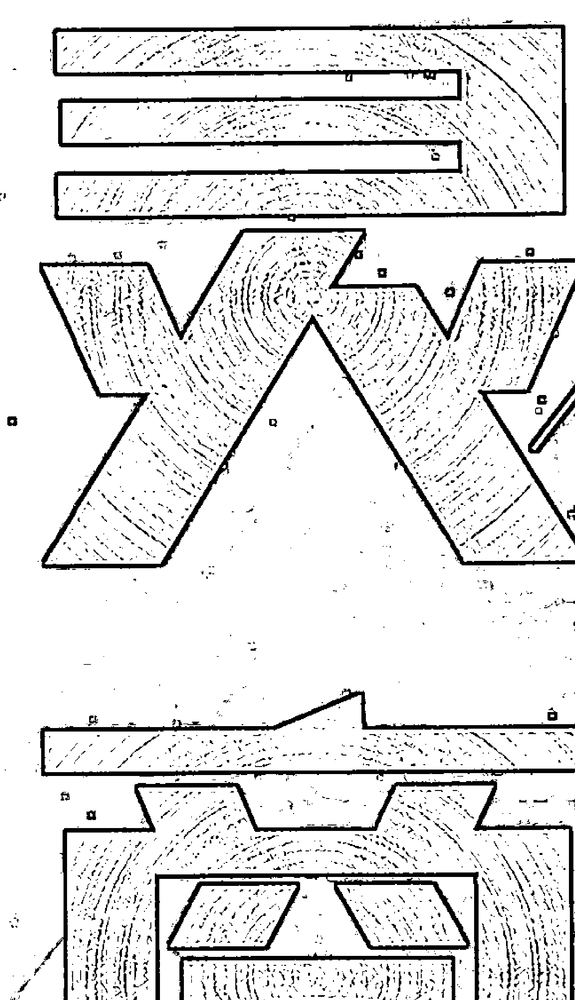

-   为什么乔布斯取得了别人难以企及的成就？
-   为什么有的人生活富足但是不幸福？
-   为什么有的人并不富足却依然非常幸福？
-   为什么有的人能那么快就顿悟到人生的真谛，并活在喜悦里？

### 潜意识下的心灵财富秘密

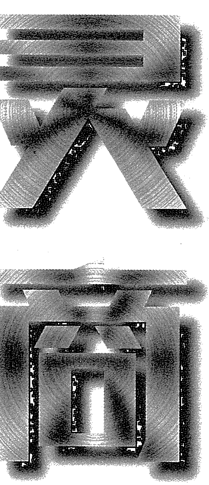

杨安◎著

中国财富出版社

## 图书在版编目（CIP）数据

灵商：潜意识下的心灵财富秘密 / 杨安著. —北京：中国财富出版社，2018.7

ISBN 978-7-5047-6702-8

Ⅰ. ①灵… Ⅱ. ①杨… Ⅲ. ①灵感—通俗读物 Ⅳ. ①B804.3-49

中国版本图书馆 CIP 数据核字（2018）第 148977 号

策划编辑 谢晓绚 责任编辑 张冬梅 王 君
责任印制 梁 凡 责任校对 孙会香 卓闪闪 责任发行 董 倩

出版发行 中国财富出版社

社 址 北京市丰台区南四环西路188号5区20楼 邮政编码 100070

电 话 010-52227588 转2048/2028（发行部） 010-52227588 转321（总编室）
010-68589540（读者服务部） 010-52227588 转305（质检部）

网 址 http://www.cfpress.com.cn

经 销 新华书店

印 刷 北京京都六环印刷厂

书 号 ISBN 978-7-5047-6702-8/B·0544

开 本 710mm×1000mm 1/16 版 次 2018年8月第1版

印 张 10.5 印 次 2018年8月第1次印刷

字 数 150千字 定 价 35.00元

版权所有·侵权必究·印装差错·负责调换

## 前言

乔布斯拥有了别人根本无法企及的成就，他为什么能成功？
为什么有的人生活富足但就是不幸福？
为什么有的人并不富足却依然感觉非常幸福？
为什么有的人能那么快就顿悟到人生的真谛，活在喜悦里？
……

这一切都是灵商在发挥着神奇的作用。
什么是灵商？灵商是心灵智力，即灵感智商。
灵商对于我们每个人来说，都相当重要，因为它影响了一个人的一生。
很多人或许会说：“不是这样，是情商影响了一个人的一生。”是否真如他们所说？我们身边有很多情商很高的人，他们的人际关系应该更和谐、更稳定。可在这些人当中，不是有很多人根本无法体悟到生命的价值和意义吗？
那么，到底应该是什么影响了我们的一生呢？是灵商。

灵商是一个人内在的驱动力、内在的能量、内在创造力的源泉。灵商高的人，通常能够快速洞悉事物的本质，发挥灵性的创造力；灵商高的人对心灵、灵魂等的感应程度很高，更容易获得人生的高峰体验，获得内在的平和和喜乐；灵商高的人，能对自己有更深刻的觉知，能够体悟到自己的内在追求，进而让自己的脚步跟随心灵的需要；灵商高的人，其人际关系不仅会更加和谐，还会感受到自己生命与整个世界的相关性，更容易达到“天人合一”的和谐状态。

灵商是一种心灵资本，能让我们的内心变得强大起来，能让我们获得更持久的幸福感。无数事实证明，一个人快乐不快乐、成功不成功、健康不健康，都和灵商有着最直接的关系，灵商高，生命就会达到快乐、成功、健康的状态。

> 成功学大师拿破仑·希尔写道：“任何人的心灵都是一部精巧灵敏的电台，随时可以接收上天所发射给我们充满智慧和无限价值的信息，这就是被我们称为‘灵感’的东西，它往往灵光一现，不太引人注意。但是，依然会有人死死地拽住它的衣裙不让它离去，直到它把人生的智慧和无限的价值赋予拽住它的人。任何一个人的创造力和想象力，都必须有灵感的火花将其点燃才能发挥到极致，才能使自身巨大的潜能变成人生的价值。”

可见灵商的重要性！灵商的先天特性非常重要，但先天特性并不能决定全部，后天的修炼也非常重要。本书介绍了大量的后天修炼灵商的方法，旨在把最实用、最好用的方法都教给你。

作者

2018年6月

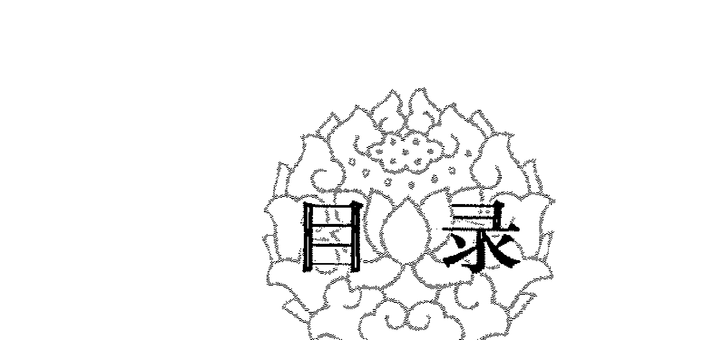

## 目录

# 序章1 什么是“灵商”

-   人是万物之灵 … 3
-   认识人的大脑 … 5
-   显意识与潜意识 … 7
-   灵感、顿悟及直觉能力 … 10
-   潜意识的能量 … 12
-   灵商是一种智力潜能 … 14
-   人的灵性 … 16
-   灵商与灵感 … 18

# 序章2 灵商为何很重要

-   明心见性，顿悟成佛 … 23
-   名师开悟不如自己醒悟 … 26
-   急中生智的能力 … 28
-   随机应变的能力 … 31
-   直觉思维 … 33
-   逻辑思维的局限性 … 36
-   跳跃性的思维方式 … 38
-   意念突然闪现 … 40

### 灵商修炼法 1 自我催眠 … 43

-   催眠为何能提升灵商 … 45
-   积极的自我暗示 … 47
-   意念的自我强化 … 49
-   反思内省和自我矫正 … 52
-   调动积极的情感 … 55
-   找到良好的感觉 … 57
-   自我催眠技法 … 60
-   主动催眠与被动催眠 … 62

### 灵商修炼法 2 顿悟思维 … 65

-   提出可能性的答案 … 67
-   尝试多种理解 … 70
-   大胆猜想 … 72
-   进行符合规律的推测 … 75
-   顿悟是一种预见 … 78
-   知识的重组 … 80
-   多样性假设 … 83
-   大胆假设，小心求证 … 86

### 灵商修炼法 3 引爆灵感 … 89

-   突破传统，捕获灵感 … 91
-   观念和技法的突破 … 94
-   打破成规，求变创新 … 97
-   换个角度看世界 … 99
-   头脑风暴法 … 102
-   观察为灵感积累材料 … 105
-   思考点燃灵感火花 … 108
-   灵感的激发 … 110

# 灵商修炼法4 激发潜能

-   显能仅仅是“冰山一角” … 117
-   激发潜能是关键 … 119
-   压力检验人的潜能 … 122
-   挑战极限和“不可能” … 124
-   有方向性地开发潜能 … 127
-   自信的巨大力量 … 129
-   潜能的强化 … 132
-   不要怕失败 … 134

# 灵商修炼法5 身心健康

-   身心健康与能量聚集 … 139
-   身体是思想的载体 … 142
-   减压：找回灵感 … 144
-   心理状态：积极与消极 … 146
-   压力自我管理 … 149
-   做一个简单主义者 … 151
-   调节生活和工作节奏 … 154
-   改善生存立世方式 … 156

# 序章1 什么是“灵商”

灵商是心灵智力，即灵感智商，是对事物本质的灵感、顿悟能力和直觉思维能力。灵商是20世纪90年代末期，继智商和情商后出现的一个相对较新的概念。与灵商相关的主要是右脑。人具有灵性是高灵商的表现，又因人懂得去追寻生命的意义，因此，人被称为主宰地球的“万物之灵”。

## 人是万物之灵

人类是万物之灵长，在地球上生活着、繁衍着，已有几十万年。在漫长的历史演变中，人类用自己的“心”追逐着自己的梦想和目标，用“灵”适应着变幻莫测的环境。

灵商是人类在创造活动中的心理现象，是人脑的机能。西方戏剧家莎士比亚在剧本《哈姆雷特》中写道：“人是宇宙的精华，万物的灵长。”中国的古代典籍中也表达出了“人为万物之最灵、最贵者”的美好思想。

那么，人为什么被称为“万物之灵”呢？

人之所以被称为“万物之灵”，是因为人有思维，可以想象出各种美好的事物：想象着你可以买一幢漂亮的房子给父母住；想象着你可以成为作家；想象着你事业有成……这都是你灵性的表现，或许你现在还没有条件实现这些美好的事情，但你只要先有了想法，才能计划去做，坚持不懈，总有一天你的这些想法都会实现。一个人想象自己将要成为什么样的人，他就会通过努力使自己成为那样的人。每个人都有“心理蓝图”或“自我心像”。如果你想象你是最好的，那么，你就会在你内心的“荧光屏”上看到自信的、不断进取的自己。

人之所以被称为万物之灵，还因为人有智慧，有可以影响后人的思想。翻开历史，伟大的精神领袖老子、孔子、孟子等，他们之所以永远活在我们心中，就是因为其思想智慧有着强大的影响力，并且这些智慧还会继续影响下去。

人之所以被称为万物之灵，是因为人能够挖掘出事物的本质，拥有充满灵性的创造力。

人具有的灵动性和创造力主要表现在：遇到问题时，懂得随机应变，能够主动地适应周围的环境；能够发现不同事物之间的联系，并将这种联系充分利用起来，为自己所用；敢于同困难斗争，甚至还能抓住机会，将苦难变成财富；不会受到世俗的制约，善于思考，善于创新；善于提出问题和解答问题，喜欢询问“为什么这样……”“如果……将会怎样”等问题，且总能找到最本质的答案。

> 达纳·佐哈与伊恩·马歇尔曾使用生动的比喻正确地阐述了人与物、人与动物的区别：“电脑具有高智商，知道什么是规则，能够遵循规则不犯错误；动物具有高情商，能够根据环境做出适当反应；但是，电脑和动物都不会询问‘为什么’，只有人掌握着这些规则、能够体验到这类情景，只有人懂得询问‘为什么’。”

人之所以被称为万物之灵，是因为人有高度的自我意识。人对自己内在的价值追求非常敏感，而且更加倾向于追求生命本身的价值。他们能够体悟到自己的内在价值和内在追求。因此，他们有足够的信念支撑自己渡过任何困境，坚定地朝着自己的梦想前进。

人之所以被称为万物之灵，是因为与其他的“物”相比，人对自然的依赖性稍小。人拥有一种强大的心灵能量，这种能量不仅能减少一个人对外界的不适应性，还能让一个人与外界建立起紧密的关系，让人感受到人际的情感，也让人与整个世界建立起和谐的关系。

> 唐朝名僧玄奘曾经说过：“人身难得，中土难生，正法难遇。全此三者，幸莫大焉。”从修炼的角度来说，人能拥有珍贵的人身，就是天地间无与伦比的幸运。所以，我们每一个人都应该珍惜自己的生命。

跟世间万物比起来，人是最幸运的。因为，人可以通过更多的磨难与历练，让自己在有生之年得到心灵的修炼，继而返璞归真、得道圆满。其他生物，都没有这种福分。而对真我的追求正是一场对心灵的修炼。

> 美国诗人惠特曼在诗中说：“我，我要比我想象的更大、更美，在我的体内我竟不知道包含这么多美丽动人之处……”人是万物的灵长，是宇宙的精华，每个人都可以创造人间奇迹，都能创造最好的自己。

## 认识人的大脑

人类力大不如牛、奔跑不如鹿、灵敏不如猫、嗅觉不如狗，但为什么人能成为主宰地球的“万物之灵”？有一个很重要的原因就是——人拥有发达的大脑。

人脑是人体中和宇宙中已知的最为复杂的组织结构。人的大脑的信息储存量相当于藏书1000万册的美国国会图书馆的50倍，可容纳5亿多本书的信息。人脑是由大脑、小脑和脑干等部分构成的。大脑包括端脑和间脑。端脑包括左脑和右脑两部分。左脑与右脑的功能大不一样。

左脑主要负责分析、抽象、计算、语言等内容，会将进入脑中如人看到、听到、触到、嗅到和尝到的信息转换成语言，花费时间较长。左脑侧重于抽象思维的表达模式，被称为“科学脑”。

右脑主要负责想象、虚构、感受、创造等工作，主要工作是处理随意的、想象的、直觉的和多感观的影像，是典型的“艺术脑”；能够对图像进行思考，能将语言变成图像。此外，右脑还能把数字和气味用图像的形式呈现出来，就像数码相机一样，能将看到、闻到、听到的内容在大脑中生成一幅图。如果需要使用，脑海中的图像就会自然而然地呈现出来，因此用右脑进行图像记忆非常快，只要几秒。

同样，右脑思维还有着较强的自由度，直觉思维能力、顿悟思维能力、对空间的判断能力、对复杂关系的理解能力、形象识别能力和情绪表达能力等都远远超过左脑，而这也正是“灵商”概念确立的基础。

据现代科学手段测试得知，在思维能量上，灵感、顿悟和直觉是抽象逻辑的一百倍，这就再一次证实，创造性思维的产生确实依赖于灵感、顿悟和直觉的激发。即使是抽象思维能力极强的哲学家，要想在自己涉足的领域有所突破，也要将直觉、顿悟与逻辑语言有效融合在一起。右脑的重要性可见一斑。

> 爱因斯坦曾说过：“我思考问题时，不是用语言进行思考，而是用活动的跳跃的形象进行思考。当这种思考完成以后，我要花很大力气把它们转换成语言。” 由此可见，右脑的跳跃性形象思维方式是创新能力的源泉。

很多科学家预言，“左脑人”将被计算机取代。因此，要想在竞争激烈的市场中有所突破，要想做到独辟蹊径，创造性地开辟新的发展道路，要想在人才济济中脱颖而出，我们就必须充分激发、开发和使用自己的右脑，就必须把右脑变成突破困境、出奇制胜的犀利武器。

## 那么，我们可以通过哪些途径开发自己的右脑呢？

1.  运用图片训练大脑

    右脑是形象脑，为了激发右脑，可以运用形象直观的图片进行重复练习。看到图片后，在最短的时间内记住图片上的所有内容，就能充分发挥右脑的作用，收到意想不到的效果。各种类型的图片都可以。

2.  多进行左侧运动

    要开发右脑，我们就要常做左侧运动。比如，我们可以经常用左手洗脸、刷牙、拿筷子、扫地等。在熟练了这些简单的动作之后，我们可以试着用左手画画，可以先画一些简单的，如横线、竖线、斜线、曲线等，然后慢慢增加难度。

3.  试着用左手写字

    我们可以从比较简单的字写起，比如先从数字写起，逐渐过渡到可以写自己的名字，写家里人的姓名等。慢慢地，我们可以不断增加难度，写一句话、一篇短文等。需要注意的是，左右手画出的图形，方向必须对应。

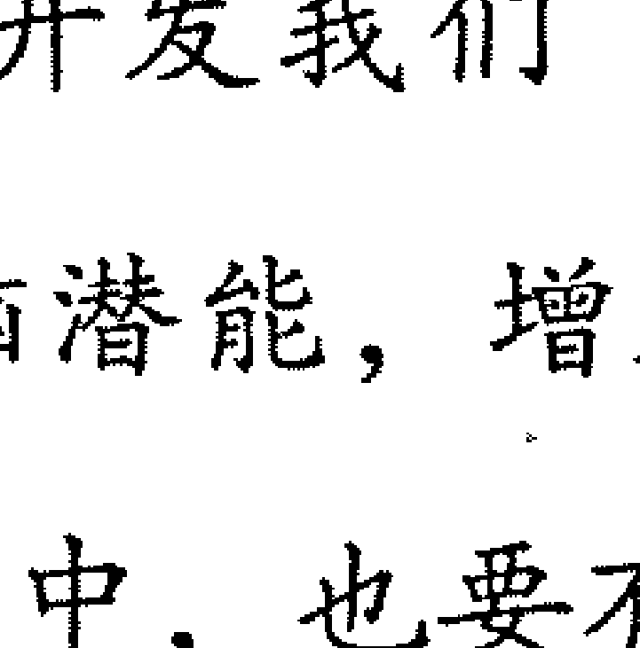

“灵商”概念的提出，正是开发我们“双脑”潜能机制的时代福音，为我们探索左脑的奥秘，开发右脑潜能，增加了很大的可能性。当然，为了做创新型人才，我们在日常的生活中，也要有意识地去开发自己的右脑。

## 显意识与潜意识

究竟什么是潜意识？为了说明这个问题，弗洛伊德使用了一个比喻句。他以心灵为本体，以冰山为喻体，认为心灵只是浮出水面的一部分，代表了一个人的意识；深埋在水面之下的大部分，就是潜意识。他认为，人类的言行举止，只有少部分会受到意识的控制，大部分要受到潜意识的摆布。

超个人心理学的先驱阿沙吉欧力把潜意识分为七个层次：
- 低层潜意识
- 中层潜意识
- 高层潜意识
- 意识界
- 自我
- 真我
- 集体潜意识

所谓低层潜意识就是本能、冲动、生理机械反应的世界。比如，人体的生理机能是不需要意识来管理的，它们会自行运行，由低层潜意识包办。低层潜意识的运作是非常高级而复杂的。此外，低层潜意识是人的记忆库，人一生大大小小的记忆全部储存于此，甚至几生几世的记忆也安然保存于此。

所谓中层潜意识，是指需要我们进行回忆、思考、表达才能调动出来的材料，这些材料平常没有存放在意识里，而位于中层潜意识中。例如，你的高一数学老师叫什么名字？这个问题在没被提问之前，资料并不在你的意识里，而储存在中层潜意识里。

高层潜意识层是我们平常状态下无法涉足的，做创意工作的人总会说自己有了灵感，其实在灵感闪现的时候，也就是跟高层潜意识连通了，难怪阿米埃会在自己的秘密日记里写道：“有一回夜里，在北海荦确的岸上，我仰卧沙滩，游目于天河——那时我像是能手扪星辰，拥有无限！在神圣的瞬间、出神的片刻，思想飞越世界，以海洋般广大、安静、深沉的气息呼吸，与苍穹一样澄清无垠——这是不可抗拒的直觉当下。我觉得自己与宇宙一样大，与神一般宁静……”其实，阿米埃就是跟高层潜意识有了亲密接触。

“大法眼禅师”清凉文益年轻时，有一次去参访著名的禅宗大师桂琛禅师，觉得没有收获。临行前，桂琛禅师问清凉文益：“你常说三界唯心，那我问你，院子里那块石头是在心里面，还是心外面？”清凉文益当时并没开悟，就说：“既然三界唯心，那块石头肯定在心内。”桂琛禅师说：“你把那么大的石头放在心上不累啊！怎么修行呢？”清凉文益不知如何回答，愣在那儿很久。他决定留下来跟随桂琛禅师继续参禅。一个多月后，他把领悟的道理讲给桂琛禅师，桂琛禅师还是否定了他。清凉文益说：“我撞到铜墙铁壁，理绝辞穷了。”这时，桂琛禅师说：“若论佛法，一切现成。”清凉文益当下顿悟。

在清凉文益顿悟的一刹那，他便接通了高层潜意识。由此可见，高层潜意识是灵感、顿悟、直觉的世界。一旦我们接通了高层潜意识，我们的智慧就会源源不断。

意识界就是我们设身处地直接意识到的东西，例如：情绪、欲望、冲动等，一旦我们的觉知焦点发生变化，其内涵也会跟着改变。

自我，用最简单的话来说，就是平时我们所认为的我，有人用“小我”来描述，也是可以的。

相对于自我来说，真我就是灵性觉悟下的“我”，是真正的“我”。古今中外无数宗教、灵性文明都探讨过真我，佛教将其称为佛性、真人、本来面目。

集体潜意识是指超越个体存在，进入宇宙性存在，仿佛所有生命全部汇集于此，动物、植物，以及人们所说的佛、神、鬼、精灵、上帝等都是集体潜意识的一部分。

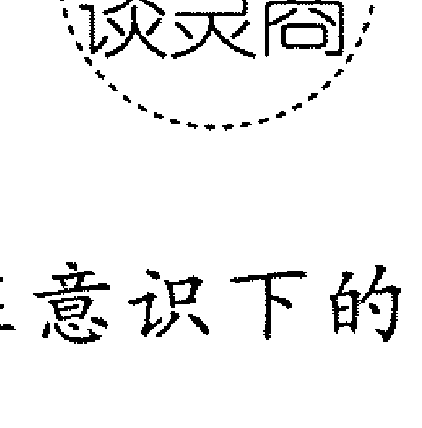

人类的潜意识，是一种藏在意识下的深层心理活动，其汇集的能量宛如金矿，储量巨大，价值连城，等待着我们去开发。这样的金矿，每个人都有，要想将其挖掘出来，就要主动开发自己的潜意识，让自己的身心保持一致，达到心、身、灵三者合一。

# 灵感、顿悟及直觉能力

灵商是心灵智力、灵魂智力，是认识事物本质的灵感、顿悟能力和直觉思维能力。现在我们来分别了解一下灵感、顿悟和直觉能力。

现代科学研究表明，灵感是大脑具备的一种特殊能力，是感知能力的最高级别，能够促使人们由自己经历的事情而产生无限联想。

著名科学家钱学森认为，现在不能以为思维仅有逻辑思维和形象思维这两类，还有一类就是灵感。在科学和文艺创作的高潮中，人们突然出现的、瞬息即逝的短暂思维过程就是灵感。灵感闪现的时间非常短，但灵感也是一种人们可以控制的大脑活动，也是有规律的。概括起来，灵感具有这样一系列特征。

第一，灵感的产生具有随机性、偶然性。灵感通常是可遇不可求的，至今人们还没有找到随意控制灵感产生的办法。所谓“有心栽花花不开，无意插柳柳成荫”，正是对灵感的真实写照。

第二，灵感的产生最公平、不偏私。任何能正常思维的人无论是贫民还是权贵，无论是知识渊博的科学家还是文盲都可能产生各种各样的灵感。

第三，灵感本身可能具有很大的价值，其产生几乎不需要投入经济成本。无论你是贫穷还是富有，都能拥有灵感，因为灵感的产生几乎不需要投入经济成本。灵感本身可能具有较大价值，当其转化为创新时，它可能给人们带来无限财富。

第四，灵感具有“取之不尽，用之不竭”的特点——这是灵感最为特殊的特点。一个人越是经常开发自己的大脑，所产生的灵感就越多。

第五，灵感稍纵即逝，如果在它出现的时候不能抓住，那么它可能永远都不会再出现了。

尽管灵感随时可能产生，但人们并不是每次都能抓住灵感，致使很多灵感永不再来。古今中外，无不如此，只有少数人能及时抓住灵感，并实现它。

顿悟是一种突然的领悟。格式塔派心理学家指出，人类解决问题的过程就是顿悟。它是人们借助直觉启示所猝然迸发的一种领悟或理解的思维形式。人们本来对问题百思不得其解，但突然看出问题情境中的各种关系就可能会产生顿悟。诗人、文学家的“神来之笔”，军事指挥家的“出奇制胜”，思想战略家的“豁然贯通”，科学家、发明家的“茅塞顿开”等，都是顿悟的结果。当我们顿悟时，就会产生“踏破铁鞋无觅处，得来全不费工夫”的感觉。但需要说明的是，顿悟不是一种简单逻辑或非逻辑的单向思维运动，而是逻辑性与非逻辑性相统一的理性思维整体运动。顿悟具有突发性、独特性、不稳定性、情绪性等特点。

直觉，指直观感觉，简言之，直觉就是一种人类的本能知觉。有人对直觉的理解是人类的第六感觉，是基于人类的职业、阅历、知识和本能存在的一种思维形式。直觉类似大自然中的空气，当你不在意时，它会像神来之笔给予你意想不到的意外和惊喜；当你想捉到它的时候它会消失得无影无踪。我们平时所说的不相信一个结论或深信另一个结论，往往是凭借直觉而不是基于逻辑判断。

直觉具有迅捷性、直接性、跳跃性、猜测性、本能意识等特征，作为一种心理现象，贯穿于日常生活、事业和科学研究等领域。爱因斯坦相信直觉，他的创造性思维中，充分利用了直觉的力量。例如，凭借大胆的探索，提出了广义相对论的假设。

直觉与灵感是一对孪生子，如果说直觉是对问题的一种意外收获，是一种顿悟，那么灵感就是伴随着直觉而来的解决问题的有效构思。正如丁荣源在《论爱因斯坦的创造性思维体系》中所说：“灵感与直觉往往在心理过程上发生连续。直觉的不可靠性有赖于灵感去消除；直觉的可靠性又通过灵感而发挥特别作用。”

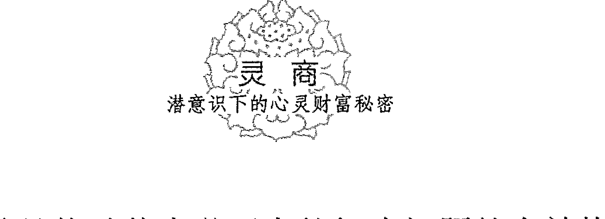

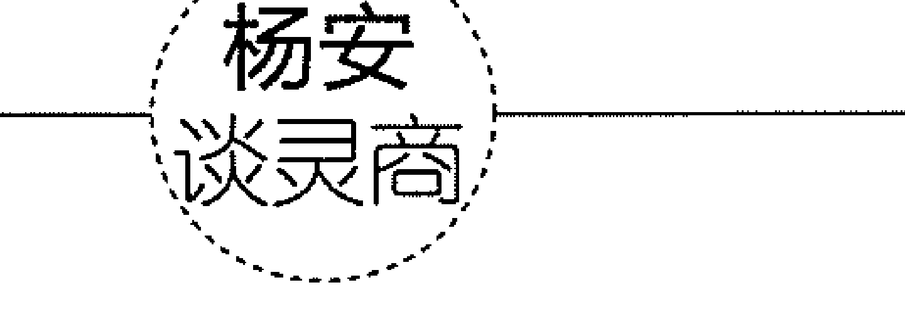

在日常的工作和生活中，要及时发现灵感、顿悟等现象的出现；只有提前做好准备，才能抓住稍纵即逝的意念精华，让这些灵感为我们解决问题提供便利。同时，还要有意识地在思维中吸纳直觉和灵感的元素，不断提高自己的灵商。

# 序章1 什么是“灵商”

## 潜意识的能量

乔瑟夫·摩菲博士是当代美国著名的心理学家，更是世界闻名的精神法权威。他认为，要想实现人生的辉煌，就要按照自己的所思所绘来造就真实的自己。他还给这种法则起名为“成功法则”。他指出：“人类的心有两种境界：一为意识，即理性境界；另一为潜意识，也就是非理性境界。人类的活动以意识性的心理思考为主，凡事又存在于潜意识之中，进行习惯性思考。潜意识是一个有感觉、能创造的心，输入善因，产生的结果必定是好的；反之，输入恶因，得到的必然是恶果。这便是心理的作用。”

为什么改变了潜意识，我们的命运能彻底改变？这是因为潜意识具有极大的力量！自古以来，那些成功的人之所以能成功，是因为他们充分激发了潜意识的巨大能量，并通过努力取得了非凡的成就。

美国前世界拳击冠军乔·弗列勒之所以能够每战必胜，关键就在于，每次参加比赛的前一天，他都会在卧室的天花板上贴上一张座右铭——“我必胜！”鼓励自己。

美国前总统罗斯福，当他还是参议员时，才华横溢，深受人们爱戴。有一天，罗斯福在游泳时突然感到腿部麻痹，动弹不得，后经医生诊断，他患上了“腿部麻痹症”，可能会丧失行走的能力。罗斯福并没有被吓倒，反而笑着对医生说他还要走路，而且还要走进白宫。正是在积极潜意识的激发下，罗斯福后来真的走进了白宫。

一个人是否成功，他的心态是否积极很关键。成功者在做事前，就相信自己能够取得成功，结果真的成功了——这正是人的潜意识在起作用。

我们经常感叹一个人能创造出令人难以置信的“奇迹”或者称赞一个人有“超能力”，其实，超能力是对于智慧及其能力范围共同的潜在能力而言的，只要全心相信，并付出努力，潜意识就会使人美梦成真。

美国心理学家之父威廉·詹姆斯说过：“19世纪人类最伟大的发现不在自然科学领域，而是人们的潜意识在信仰的触动下所产生的力量。”每一个人都蕴藏着无穷的潜力，可以战胜世上任何困难。

既然潜意识具有如此巨大的能量，那么我们应该如何激发自己的潜意识，以使潜意识爆发出巨大的能量，来帮助我们成功呢？要激发潜意识，最有效的方法就是不断重复。

要让潜意识发挥作用，最重要的一点就是要不断地重复、重复、再重复。很多运用了吸引力法则的人之所以没有产生理想的效果，就是因为重复的次数太少。吸引力法则之所以能产生效应，就在于人的脑电波会产生一个巨大的磁场，在这个磁场中，不断地重复就能让自己的想法更坚定，就能让磁场产生更大的吸引力，继而让心中的想法变成现实。

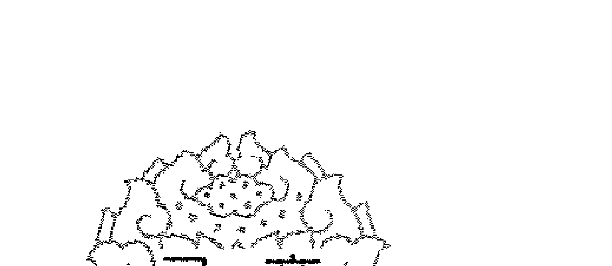

假设你想要成功，就在心中反复默念“我会成功”；假如你想变得富有，你就反复默念“我很有钱”；假如你想不断提升，就反复告诉自己“我会不断提升”。经过你不断重复之后，你的潜意识就会慢慢接受这样的指令，当这个指令不断加强时，你的思想和行为都会配合这个想法，这时，吸引力就会发挥作用，促使你朝着目标努力前进，直到达成目标为止。

潜意识的能量能激发人体内惊人的潜能。要想让潜意识发挥作用，就需要对大脑进行重复刺激，把记忆牢牢地“写入”潜意识，这样才能够有目的地发挥潜意识的吸引力，创造出奇迹。

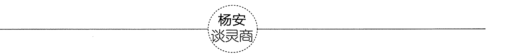

潜意识具有巨大力量已经成为人们的共识。只要灵活运用，潜意识就能为自己所用，我们就能实现自己的理想和目标。某些神奇力量的出现并不是超能力的作用，而是潜意识在发挥作用。值得一提的是，潜意识并不需要我们特意学习，更不需要其他能力的辅助，它是一种天生的禀赋。

## 灵商是一种智力潜能

关于人的智力的探索一直是人类永恒的课题，在 20 世纪早期，心理学家提出了智商这个概念，用以测量个体的一般智力，其包括注意力、观察力、记忆力、思维能力和操作能力等。智商这个概念并不能解释由动机、意志、性格等构成的影响个体成就的个性意识性倾向。为了弥补智商概念之不足，1990年，美国心理学家萨洛维提出了情商概念，进一步涵盖了动机、意志、性格等构成的影响个体成就的个性意识性倾向因素。为了超越人的理性发展模式，真正做到尊重人的发展的完整性。2000年，发展心理学家达纳·佐哈与伊恩·马歇尔正式提出了灵商理论。

灵商理论认为，灵商是一种心灵智力和灵魂智力，能够让我们依赖敏锐的直觉，顿悟到事物的本质。其实，灵商是一种智力潜能，能够让我们治愈自己和创造自己，有利于我们创造性地发现新价值。

灵商所包含的灵感、顿悟、直觉都是人类潜在智慧的突然迸发。直觉和灵感是人们对复杂的事物做出的压缩，做出的一种迅速的认知，它们是人们在从事长期且艰辛的智力活动时思维处于极其活跃、灵敏、亢奋的状态，是人的潜能的外在体现。

不难看出，灵感、顿悟发生在潜智力的范围。它们要想发挥作用，必须借助潜智力的推动，并常有显智力的参与。当到达成熟的阶段，即突然与我们的潜意识进行了有效沟通后，它们便显现为显智力，成为灵感思维或者顿悟思维。

直觉说白了是一种潜智力的功能，它是一种省略了许多心理活动步骤、无须分析和推论而直接到达结论的心理现象。直觉的高速性特点决定了它的突然性、偶然性和非逻辑性，这些特点也反映了潜智力内部的非逻辑性特点。总之，灵感、顿悟、直觉都是人类智力潜能的具体体现。

虽然在过去的时间里灵商被很多人忽视，但可以肯定的是，智商和情商的有效运转都得益于灵商，灵商是人类智力的最高级别。灵商追求的是意义、价值和评价，能够提出和解决有意义、有价值的问题，使用的范围更广阔，内容更丰富。与智商和情商相比，灵商更能对人类智力的复杂性做出诠释。

### 杨安 谈灵商

灵商理论认为，灵商即心灵智力、灵魂智力，它是一种能够治愈我们自己和创造我们自己的整体的智力，是一种能创造性地发现人类自身新价值的智力。较之智商和情商，灵商能更好地解释人类智力的复杂性。

## 人的灵性

什么是人的灵性？中国红学会理事王正康先生说：

> 时至今日，对灵性尚无贴切的定义。何为灵性，竟莫可名状，无法言说。灵性在心理学上找不到定位，在人类学上摸不着边，逻辑推演进不到灵性的领域，用现代科学去探究，必然南辕北辙。

四川大学宗教学研究所、四川大学伦理学研究中心副教授成穷先生曾从人性角度阐释灵性，他认为人与世界具有多重关系，

> 但基本关系只有三种：人与物的关系、人与人的关系、人与神的关系。人是在这三种关系中相应地形成自己人性的三个组成部分：感性、理性和灵性。

从这里，我们不难看出，灵性源于人与世界形成的基本关系，是人性的重要组成部分。

一般来说，感性、理性对应的都是现实，而灵性对应的则是有别于现实的另一个维度。正如王正康先生所说的：

> 为了生存，人用感性与世界进行物质交换，用理性与世界进行信息交换，但人不仅要生存，还要寻求生存的意义，灵性就是人寻求生存意义的秉性。

爱默生说：

> 人借以安身立命的不是物质，而是精神。精神的要素是永恒。”当人们对自己生存意义有所“思”、有所“悟”时，我们的生命便会以一种有意义的方式敞开，我们的生命便会保持一种超越与提升。在这样的态势下，人的灵性就悄然露面了。

通过爱默生所说的我们可以得知，一味地追求物质并不能让我们衣食无忧，只有生命融入灵性、灵魂得到释放后，才能得生命的永恒。也就是说，对物质的过分追求会让我们失去灵性。如果我们心中只有对物质与功利的追求，心中满满地都是逻辑思考与利害计较时，灵性就会自动隐遁。

当下，为什么越来越多的人关注修灵？原因就是天性自由的灵魂被人类的物质身体所囚禁了。这让我们的灵魂深陷在物质世界的困境中，无法得以超越，无法被释放。要释放我们的灵魂，唯一的办法就是让身、心、灵完全提升。

人是身、心、灵三位一体的复合体。三者各自独立，又紧密联系。如果想让灵性真正地实现进化，就要同时从身、心、灵三个方面下功夫。道理很简单，即将时间花在某一部分上是无法实现身、心、灵复合体的进化的，无法真正实现整体进化的目的。

修身可以促进心、灵层面的提升。如果你身体的经络管道保持畅通，身体健康、充满生命活力，将有助于你思想的净化，也有助于你灵性神秘体验的产生。

修心可以促进身、灵两方面的提升。一个人如果能不断净化自己的思想，就能减少身体能量的消耗，有助于身体能量的更新和再生，也有助于灵性神秘体验的产生。

修灵可以促进身、心两方面的提升。具备一定的灵通能力，更容易得到内在心灵的引导；对身体需求多一些认识，就可以更好地解决问题，继而产生扩展自身的能量场，实现思想形态的净化。

实际上，从根本上来说，修身、修心其实也是在修灵。为什么这么说呢？因为万法唯心，一切物质都是潜意识的显化，同样，物质的身体也是灵魂的显化。所以从根本上来说，修身、修心其实也都是在修灵。

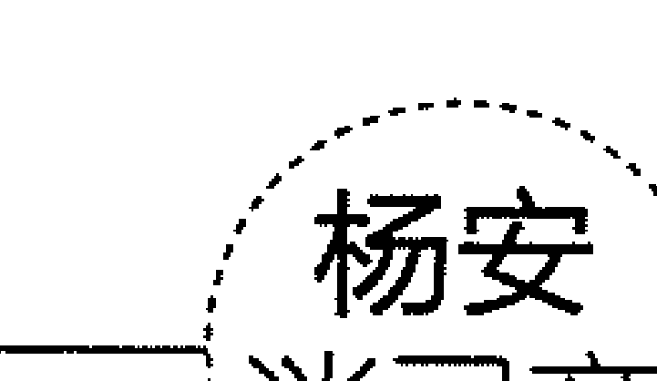

## 灵商与灵感

灵商，存在于我们的多元智力论的框架内，能够对人类的认识能力进行全面的概括，继而做出综合判断。如果说智商只能片面地认识人类的理性认识能力，情商是人类的情感、情绪智力的综合反映，那么灵商则能从智慧存在的角度，更全面、更高级地反映人类的认知能力。

灵商包括了除智力、情感、情绪之外的人的全部认识能力当中的其他因素，包括意志、悟性、直觉、想象、体验、信念等多方面的非理性因素。而灵感是人在神奇的创新活动中的心理现象，它是人脑的机能，是对客观现实的反映。许多科学家、发明家和艺术家将其称为“紧张工作与思索之后的暂时松弛状态”。

> 著名的科学家钱学森说：“灵感是潜意识，当酝酿成熟时突然涌现于意识即成为灵感。”“灵感这种思维往往表现为灵感或意念的突然闪现过程或悟性的涌现过程”，它是“智力劳动的产物，具有突发性、飞跃性、瞬时性的显著特征”。

由灵感引发的思维，我们称为灵感思维。灵感思维往往表现为一种潜意识的过程。由于灵感的思维过程不是连续的，也非一致的，在很大程度上我们只能顺其自然，因此，人们很难对它进行控制与引导，很难寻找出思维对象的来龙去脉。

虽然说灵感思维是很难控制和引导的，但在科学研究中，灵感思维依然发挥着重要的作用。英国著名历史学家吉本年轻时立志编史，思考了很长时间都无法确定下主题。一天他到罗马凭吊古迹，脑中灵光闪现，于是他决定写一部罗马史。

他在文中写道：“1764年10月15日，我伫立在罗马古都的废墟里，在夕阳残照中缅怀往事，陷入沉思，看到赤着脚的修道士在朱庇特神庙里唱晚祷诗，我的脑海里闪过一个念头：写一部罗马帝国衰亡史。”明确了这一点后，吉本认真收集资料，笔耕不辍，终于历经20年的努力完成了《罗马帝国衰亡史》巨著。

英国哲学家罗素说：“逻辑思维只能用新的说法叙述一些在某些程度上早已为人们所知的东西，而灵感思维却恰恰相反，它常常导致智力上的跃进，放射出无限创造性的火花。”灵商与灵感存在着密切的关系。“灵商”也被称为灵感智力。所以，为实现创新，必须开发灵商。

开发灵商的主要意义之一就在于：运用灵感思维、顿悟思维，提出和解决具有重大意义和创新价值的新课题，为人类创造更多的价值。

当然，需要强调的一点是，并不是只有伟人和成功者才有灵感。灵感是公平的，每个人都能遇到。只要抓住灵感出现的良机，突破固有思维，就能轻松捕获灵感。

现代科学的发展已经证实，不仅优秀者、天才拥有灵感，普通人也有灵感。在日常生活中，我们总会称赞别人有灵气、悟性高，大赞某篇文章是神来之笔，其实这些说的都是灵感问题，只是没人注意到而已。

# 序章2 灵商为何很重要

为什么有的人在紧急关头能急中生智、随机应变？为什么有的人能靠头脑中忽然闪现的念头解决百思不得其解的问题？为什么有的人心眼活、悟性高？东方智者素有“明心见性，顿悟成佛”的至理名言，其指的就是灵商的作用。

## **明心见性，顿悟成佛**

“灵！”“很灵！”“非常灵！”这是现实生活中人们对一个聪明人的最高评价。灵是说一个人有灵性、悟性，通常指的是脑子灵、心眼活、悟性高。东方智者素有“明心见性，顿悟成佛”的至理名言，指的就是“灵商”所包含的能力之一——悟性的作用。

悟性是一种超乎寻常的直觉，与规律巧妙融合在一起，能够发现问题的本质，能够感受到事物的本源。每个人都有悟性，不用述之于文字，不用以理性为依托，只可意会，不可言传。科学家的发明创造、文学家的吟诗作赋、艺术家的匠心独运，都是开悟的结果。

悟性是一个人聪慧的体现。聪明之人只要稍加点拨就能脑子转三转，愚蠢之人即使棍棒加身也不会觉醒，区别在于悟性。智慧有大小，悟性有高低。悟性低的人容易受到表象的迷惑；悟性高的人，不仅会在迷象中保持清醒，还能在最短的时间里抓住机会，一步步走向成功。

被称为“中国私人包机第一人”的均瑶集团创始人王均瑶，是一个悟性极高的人。有一次，他从报纸上看到一条消息：中国是目前世界上唯一一个白酒年消费量超过牛奶的国家。面对这一奇怪的现象，王均瑶凭着直觉预感到随着人们生活水平的提高，随着中国人对健康食品的要求越来越高，牛奶必然会成为越来越多人重视和喜爱的极佳天然营养品。尽管牛奶制品市场的竞争非常激烈，但只要自己的产品质量好，仍然可以占据一席之地。想到这里，王均瑶决定进军牛奶制品业。而今，均瑶牛奶已遍布全国，市场占有率和品牌知名度一直在同行业中遥遥领先。

成功其实没有所谓的定式，很多时候，我们需要稳扎稳打，但更多时候还需要有悟性。

管理界有句名言：“智力比知识更重要，素质比智力更重要，觉悟比素质更重要。”所谓的觉悟就是对意义和价值的深刻体会和准确把握，而这也是灵商的重要内容。

成功的管理者都异常重视悟性的作用。在总结成功经验时李嘉诚特别提到了灵商的作用，他说：“灵商的作用是超越问题。”张瑞敏则说：“人生最重要的是悟性和韧性。”“中关村第一村民”纪世瀛更是直言不讳：“人的智力有差别，但并非智力高的人就比智力低的人成功。智力不是决定因素，人最重要的是悟性。有悟性才能做出正确的判断和抉择，而这是第一步。所有成功人士都是悟性很高的人。”

悟性是个极好的东西，是高智商者不可或缺的因素。其实，动物也有一定的智商和情商，它们能够感知所在的情境，并且能够做出适当的反应；甚至电脑也具有“智商”，它能够遵循规则。然而，它们并不像人类一样具有灵商。灵商最杰出的品质，在于它的思维转换能力。这种转换能力集中体现在悟性上，即举一反三、触类旁通的能力。

一位营销员正面临着市场上众多竞争对手的打压，他不断采取保守策略。有一天他看到两只小猫在嬉戏。忽然一只猫开始进攻另一只。被进攻者一再退让，而进攻者并未停止进攻。后来，被进攻者奋起反抗，进攻者落荒而逃。他明白了，只有保持进攻才不至于失败。于是他立即调整营销战略为“以攻为守，步步紧逼”。结果，他不但夺回了市场，还一举奠定了自己在当地的营销权威地位。

悟性的作用如此之大，以至于每个人都希望自己具备很高的悟性。但是，许多人感觉到自己缺乏悟性，那么，我们该如何培养自己的悟性呢？

- **持续学习**。深厚的知识底蕴是提高领悟力的前提。我们要坚持读书，积累相关知识，增强自己的洞察力和思辨力；要不断向别人学习，找出差距，取长补短。这样，领悟力自然就会提高。
- **执着思考**。牛顿因苹果落地而得出万有引力定律。这归功于他对某一事物的执着追求，他全身投入思考，才终有所悟。如果没有思考，就无悟可谈了。
- **大胆怀疑**。事有千千疑结，情有种种疑窦。所谓“大疑大悟，小疑小悟，不疑不悟”，解决了疑问，我们就会大彻大悟。因此，要开悟，我们就要敢于质疑一切。
- **用心观察**。只有注重在观察上下功夫，才能掌握事物的发展规律。所谓“一叶落而知天下秋”，就是通过观察才得到的自然规律。

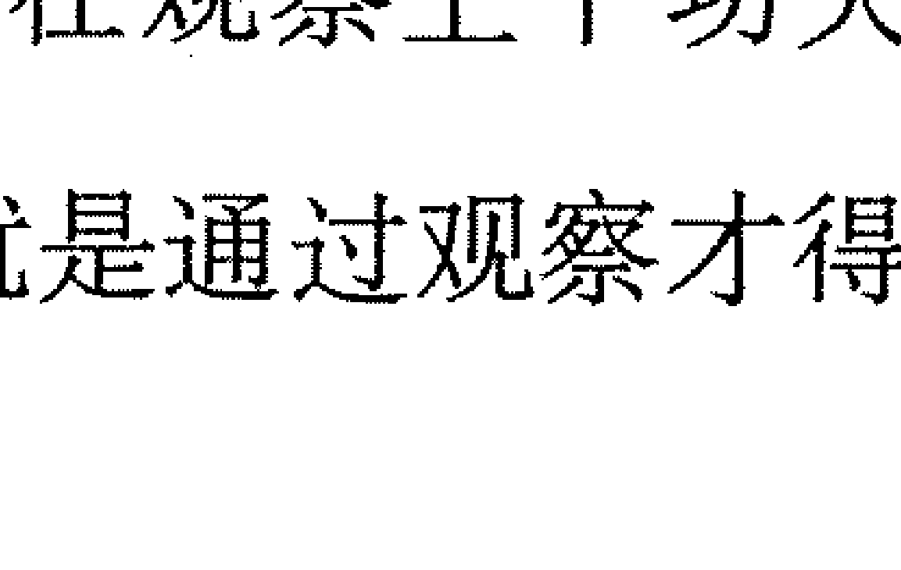

悟性高的人，其素质会不断提高。悟性的出现也是快乐的开始。顿悟和渐悟虽然都是“悟”，但顿悟是当下明白，直指人心，渐悟则要经过很多过程，才能使人看到真相。当然，无论是顿悟，还是渐悟，都是身心的完善。

# 名师开悟不如自己醒悟

俗话说：“读万卷书，不如行万里路；行万里路，不如阅人无数；阅人无数，不如名师开悟；名师开悟，不如自己醒悟。”因而，在对智商、情商强化的同时，我们必须要站在灵商这个制高点上，发挥高度的觉悟性，以促使自己不断成功。

“世界”是同一个世界，人们对待世界的态度不同，便产生了不同的世界。为什么对于同一件事，每个人的态度会大不同呢？这和人们的悟性息息相关。人的悟性有高低，悟性高的人和悟性低的人，在对许多事情的感悟上会有极大的差异，其最终结果表现为人的行为准则上的不同。

古人云：“草色花香，游人赏其真趣；桃开梅谢，达士悟其无常。”这里的达士就是豁达而有悟性的人。这句话的意思是：很多人糊里糊涂地度过一生，唯有豁达而悟性高的人，才会感悟出“顺应天理”的行为准则。

人由于对物质的需求产生了贪、嗔、痴，当贪、嗔、痴在人的心中占据了统治地位时，人便迷失了真正的“自我”。禅宗的那些棒喝、机锋、公案……就是让人醒悟——开悟，达到明心见性的目的，从而认识真正的“自我”，然后在日常生活中自觉做到修持，使得贪、嗔、痴减少，或“空”了。因此，开悟仅仅是提高悟性的第一步，而自觉做到修持——自我觉悟才是一个人生命中最重要的一课。

什么是自我觉悟？将“悟”字拆开来看，左边是竖心旁，右边是“吾”，悟即吾心也，也就是认识自我。法国著名思想家蒙田认为，世界上最重要的事情就是认识自我。是啊！不能认识自我的人，无论他的身体多么健康，无论他的地位多么显赫，无论他的资产多么丰厚，无论他的事业多么成功，无论他的人生多么幸福，他依然是一个可怜的人，因为他只不过是一个被“物质”牵引的躯壳。清朝顺治皇帝也说过同样的话：“来时糊涂去时迷，空在人间走一回。”

人的痛苦与挣扎来自内心的浮躁，内心的浮躁来自人的自我迷失。迷失自我的人，无法享受到内在的逍遥与安宁。这些人因为不知道那个“真我”到底想要什么，只好靠外在的物质和虚名来填补内在的空虚。由于不认识自己，他们自身并不和谐。他们完全是活给别人看的，为了证明“我”存在的价值，他们身不由己、欲罢不能地追求名利，他们的心永远不能平静，也永远无法安宁。

那么，一个觉悟了的人，一个认识自我的人，会是一个怎样的人，会有一个怎样的人生呢？

认识了自我，就能对生活多一些体验，就能对宇宙的本源多一些认识，也就是所谓的明心见性。只有明白了、觉悟了，才能舍得放下，才能放弃对“小我”的执着，用宽广的胸怀接纳别人、包容别人。懂得包容的人，才能以平常心生活。

觉悟了的人会很自信，因为他找到了生命的根。所谓自信，就是一个人对自我生命本体的认识与毫无疑问的确信。觉悟了的人知道自信不是给别人看的，自信不需要被证明，自信与外在无关。因此，他的生活状态总是平静的。

觉悟了的人看上去和普通人一样，但他的内心是宁静而且宽广的。在千变万化的事情面前，他也能做到不以物喜、不以己悲，宠辱不惊，得意不忘形，失意不悲观。

无论什么时候，无论在什么环境下，觉悟了的人的思想都是正面的、积极的，他有勇气面对一切，他真实地活在当下。而只有全身心地生活在当下，我们才会体会到生活的喜悦。

> > 杨安 谈灵商

对于我们来说，自我觉悟是一生中最重要的事之一。一个不能认识自我的人，很容易欺骗自己，只能活在自我欺骗里；过分自信的人，更容易自我欺骗。自我觉悟后，人就能感知到生命的真相。解脱是觉悟的结果，人因此而自由。

# 急中生智的能力

为什么有的人在紧要关头能急中生智、随机应变？这与一个人的较高灵商是密不可分的。一般来说，灵商高的人，其灵感思维也就相对活跃，而急中生智的本质恰恰是一个人在面临紧急情况时，大脑处于高度的积极思维状态下所闪现出的灵感。

“急中生智”又叫作“情急智生”，意思是在万分紧急的情况下猛然想出了好主意、好办法。我国古代急中生智的事例很多，比如诸葛亮的“空城计”、曹植的“七步诗”、刘备的“闻雷失箸”，以及司马光砸缸等，都是急中生智的典型例子。

在现代生活中，急中生智的例子也不少。比如，有些司机或机械操作员在遇险情时，采取了合理的措施，而事后连他们自己都觉得吃惊；有些运动员或考生，越是在紧急时刻，越能发挥出超高的水准。

急中生智是一种应激现象，而应激则是对紧急情况的反应。人在遇到出乎意料的紧急情况时能急中生智就能化险为夷。

一次，天才幽默大师卓别林被歹徒劫持了。歹徒拿着手枪顶着他的头，让他将钱交出来。卓别林知道自己当时的处境危险，没做无谓的抵抗，乖乖地将钱包掏出来。可是，就在他正要将钱包交给歹徒的时候，他的脑中突然闪现出一条妙计。他装作害怕的样子对歹徒说：“这些钱不是我的，是我们公司老板的。你将这些钱拿走了，老板一定会认为是我私吞公款。兄弟，麻烦你在我帽子上开两枪，证明我确实被打劫了。”

歹徒高兴地想，有了这笔钱，这个小小的要求当然可以满足，于是便对着卓别林的帽子开了两枪。

卓别林再次恳求：“好兄弟，可否在我上衣和裤子上各补两枪，让我老板深信不疑。”

“没问题！”劫匪统统照做了。结果六发子弹就这样全被打光了。正当歹徒想低头数钱时，卓别林一拳挥去，打昏了劫匪，取回钱包开心地走了。

努尔哈赤的例子也说明了急中生智的重要性。

在清朝的宫廷宴上有一种惯例：第一道菜必须是黄金肉。这是怎么回事呢？原来，黄金肉是由努尔哈赤始创的一道菜，而这道菜就是急中生智的产物。清王朝的奠基者努尔哈赤曾是一位伙夫。他的首领是一位对饮食非常考究的美食家。据说，这位首领的餐饭至少得有“八菜一汤”。

有一次，这位首领宴请宾客，当时努尔哈赤是主厨的助手。到上第七道菜的时候，主厨突然昏倒了，外面又不停催促让赶紧上菜，这可急坏了努尔哈赤。要是耽误了首领的事，那可是重罪。在这紧急情况下，努尔哈赤急中生智，抓了一把鲜瘦肉，裹上蛋黄就丢进了锅里，然后三炒两炒，做成了一道菜送到宴席上。

首领品尝后非常满意，宾客们也觉得味道不错。宴会结束后，首领询问这道菜的名字，仆人们不知道，只得如实禀报，说：“这道菜是伙夫努尔哈赤做的。”

努尔哈赤听后以为自己闯下了大祸。当首领问他菜名时，他脱口答到：“回大人，这道菜叫黄金肉。”首领赞不绝口，努尔哈赤得到了提升，他的人生也因此发生了巨变。

在应激状态下，人一般有两种表现。一种表现是急中生智——因紧张而使神经系统进入高度的激活状态，这时，一个人的思路就会变得明晰，动作也会变得敏捷，能迅速做出大胆且合理的举动，甚至能创造出奇迹。另一种表现就是茫然无计——因过度紧张抑制了智能活动，使认识、判断、决策能力大大降低，以致惊慌失措或者呆若木鸡。

那些急中生智的人，一般来说灵商很高，他们思维的变通性和灵活程度都很高。他们才思敏捷，敢于打破思维定式，所以，在危急时头脑里能立即产生出许多应激办法，当机立断、付诸行动。而那些不知变通、不肯改变自己思维方式的人，自然不可能急中生智。

要想做到急中生智，首先要有“智”。这个“智”就是知识、经验和运用知识、经验进行创造活动的能力。所以，我们要想具有急中生智的潜质，平时就要努力学习各种科学文化知识，不断积累社会生活经验，并将这些知识和经验不断运用于实践。此外，急中生智还需要有健康的体魄和坚强的意志，需要善于应变的能力。

面对紧急情况，我们的大脑若处于积极思维状态，就很容易想出平时没有想到的办法，很容易找到解决问题的办法。遇到紧急情况，我们要巧动脑筋、急中生智，不能慌乱。

# 随机应变的能力

人具有灵动性，主要表现为灵活变通的能力——积极的和自发的适应性。这种积极的和自发的适应性能够让人做到随机应变。

什么是随机应变？随机应变就是随着情况的变化灵活、机动地应对。在生活中，我们难免会遭遇一些突发状况，这正是对我们应变能力和适应能力的考验。这时候，一个人如果没有灵活的应变能力，就会不知所措，甚至鲁莽地采取一些很不合适的做法，结果很容易把事情搞砸，让自己遭受挫折或损失；相反，如果一个人的应变能力足够强、足够高，那么，他就能理智地分析客观存在的情况，然后找出巧妙的方法去应对，最终使自己克服困难和摆脱窘境。

20世纪20年代，举世闻名的希腊船王奥纳西斯曾经经营烟草生意。正当他的事业上升之际，一场经济大危机无情地席卷了世界，他和许多人一样被“吞噬”一空。当时，很多人都认为世界末日来了，大混乱即将爆发。奥纳西斯却没有这样想，他看到了危机后的复苏。他断定：谁要是在混乱的现在买进便宜货，将来一定会大赚一笔。但是，他购买的既不是其他公司的股票，也不是破产企业的不动产，更不是人们争着抢购的黄金，而是被人们视为最不景气的航海业的工具——轮船。结果，第二次世界大战的爆发，赐给了他神奇的机会，他的船只一夜之间变成了“黄金”，他成了一个富人。

谁都会遇到突发的危机、事故，因此，我们必须学会随机应变。这样，我们才能在极短的时间里想出应对之策。如若面对复杂多变的环境，我们做不到随机应变，我们的人生就会走向被动，走向平庸，甚至遭遇重创与失败。

一次，人们结伴去寻找宝石矿山。一开始，人们沿着平坦的大路前进，不久，前方出现了一条大河，可矿山就在河的对岸。怎么办呢？人们一直都是靠双脚在陆路上行走的，但陆路已尽，再按在陆路上行走的方法走是过不了这条大河的。

这时，要想到达矿山，人们要做的只有应变。有些人不会应变，他们望着汹涌的河水，茫然不知所措；有些人仍按照在陆地上行走的方式在大河里走，结果被淹死了；有些人改变了在陆地上行走的习惯，他们学会了游泳，最终渡过了这条河，到达了矿山；还有一些人临河沉思，用圆木制成了船，结果，同样到达了矿山。

显然，那些渡过大河到达矿山的人，都是懂得随机应变的人。在这个快速变化的时代，应变意味着你必须具备从多种角度看世界的能力。你应该以全方位的视角来分析所要解决的问题，做到灵活应对。

> 正如美国著名人士罗兹所说：“生活的最大成就是不断地做出改变，以使自己更快悟出生活之道。”

一个人具备卓越的应变能力，就会突破障碍，将不利因素化为有利因素，将原本糟糕的局面引向好的方向发展。你如果想逐步提高自己的应变能力，就要多花时间，平时可以从以下几方面入手。

- 多参加富有挑战性的活动。在参加具有挑战性的活动中，我们必然会遇到各种各样的问题和困难，努力解决问题和克服困难的过程，就是增强我们应变能力的过程。
- 逐渐扩大自己的交际圈。只有学会应对各类人的方法，才能在各种复杂的环境中应对自如；只有具备了应对小事情的能力，才能成功应对更加复杂的问题。
- 增强心灵能量。灵商高的人往往能够在复杂的环境中沉着应战。在生活中，遇事冷静，学会自我检查、自我监督、自我鼓励，有助于培养良好的应变能力。

> 天地万物无事不变，无时不变。只有让自己的内心变得更丰富，让自己成为一个多元的生命体，你的人生才会衍生出更多的生命频道，让所有影响生命发展的束缚都在多元的生命频道的切换中消失。

# 直觉思维

直觉思维是对思维对象从整体上考察，通过丰富的想象，调动自己的全部知识经验做出敏锐而迅速的假设、猜想或判断。这个过程，不需要一步步地分析，不用一层层地推理，可以直接从想象跳跃到结果。通常，灵商高的人直觉意识较强，能够发现事物的本质，具有充满灵性的创造力。

直觉思维属于一种心理现象，是长期积累的升华，是一瞬间的思维火花，是思维过程的高度简化，是思维者的灵感和顿悟；但是它触及了事物的本质。它在创造性的思维活动的阶段起着极为重要的作用。

人类的许多重大发现和问题的解决都离不开直觉思维。爱因斯坦就有着天才般的洞察力，法国物理学家德布罗意曾这样评价爱因斯坦：“能够一眼看穿疑难重重、错综复杂的迷宫，给被黑暗笼罩的领域突然带来光明。”爱因斯坦更多次指出：“我相信直觉和灵感。”英国数学家伊恩·斯图尔特也说过：“直觉是真正的数学家赖以生存的东西。”

历史上，很多重大的发现都是基于直觉思维的，比如：欧几里得几何学的五个公式就是建立在直觉思维的基础上的，德国有机化学家凯库勒发现了苯分子环状结构更是直觉思维的典范。

> 1972 年，我感到很可能存在许多有光的特性而又有比较重的质量的粒子，然而，理论上并没有预言这些粒子的存在。我直观上感到没有任何理由认为重光子一定要比质子的质量轻。

美籍华裔物理学家丁肇中在谈到“J”粒子的发现时写道：“1972 年，我感到很可能存在许多有光的特性而又有比较重的质量的粒子，然而，理论上并没有预言这些粒子的存在。我直观上感到没有任何理由认为重光子一定要比质子的质量轻。”这，就是直觉。正是在直觉的驱使下，丁肇中才投身于重光子的研究，才发现了“J”粒子，并因此获得诺贝尔物理学奖。

一个人凭借直觉判断力能够深入事物内部或细微处，并对其进行直观认识，从而达到揭示事物的本质的目的。直觉能力强的人，一般都具有敏锐的洞察力，能够从细微处观察、分析问题。但不能否认，直觉思维的洞察性是建立在直觉判断的基础之上的，它是在对事物某一方面性质的判断的基础上形成的对事物的整体感知。

> 计算机之父图灵有着杰出的开创性和惊人的直觉力，他的很多思想都超出了当时人们的理解能力，一度默默无闻，结果让二三十年后有些人的独立研究成果似乎不过是在证明他的思想的超时代程度。

关于直觉思维的洞察功能，丁肇中深有体会。他说：“计算机之父图灵有着杰出的开创性和惊人的直觉力，他的很多思想都超出了当时人们的理解能力，一度默默无闻，结果让二三十年后有些人的独立研究成果似乎不过是在证明他的思想的超时代程度。”所有的这些告诉我们，直觉思维的洞察性在科学发现中发挥着重要作用。

直觉能力强的人，一般都能较快地抓住机遇，触类旁通，发现并解决问题。我国生物学家朱洗就是这样一个人。一次，朱洗在实验室研究蓖麻蚕越冬问题时，对飞蛾扑窗的现象产生了兴趣，于是就让飞蛾与蓖麻蚕杂交，最终培育出了茧质较好、又以蛹越冬的新品种。

飞蛾扑窗本来是一件很平常的事情，而朱洗却从中得到了启发，触类旁通，将面临的困难迎刃而解，这就是直觉的启发作用。

直觉在创造活动中有着非常积极的作用。爱因斯坦曾说：“真正可贵的因素是直觉。”在创造发明等活动中，我们要学会利用直觉，凭直觉抓住思维的“闪光点”，以达到直接了解事物本质和规律的目的。

直觉，虽然无法用言语来描述，但它就像我们的肌肉一样，只要加强锻炼，就可以发达起来。要想强化直觉思维能力，可以从以下几点入手。

- 获取广博的知识和丰富的生活经验
- 培养敏锐的观察力和洞察力
- 真诚、客观地对待自己的直觉

直觉的产生不是无缘无故、毫无根基的。直觉往往比较偏爱知识渊博、经验丰富的人，因为它是凭借人们已有的知识和经验才出现的。所以，获取广博的知识和丰富的生活经验是强化直觉思维能力的基础。

直觉与人们的观察力及视角有着密切的关系，观察力敏锐的人更容易出现直觉。因此为了强化直觉思维能力，就要有意识地培养自己的观察力和洞察力。

直觉虽然是凭“直接的感觉”在人们已有的知识及经验的基础上产生的，但常常会受个人情感的干扰。特别是当一个人处在忌妒、埋怨、愤怒等情绪中时，直觉往往会受到扭曲。因此，为了强化直觉思维能力，就要真诚、客观地对待自己的直觉，注意克服个人情感对直觉的干扰。

在创造发明过程中，直觉思维发挥着重要的作用。人在解决问题时，有时会不按常规思路思考而突发奇想，从而得到令人意想不到的答案和结果，有时还会做出种种猜想和假设，找到解决问题的捷径。这些都是直觉思维在发挥作用。

# 逻辑思维的局限性

逻辑思维是人们在感性认识的基础上借助概念、判断、推理等思维形式间接或直接反映客观现实的理性认识过程，又称理论思维。逻辑思维是人的认识的高级阶段，是人类认识世界最基本的思维工具。只有通过逻辑思维，人们才能把握具体对象的本质规律和事物间的因果关系，进而认识客观世界。

逻辑思维是长期以来人们在日常生活中积累形成的思维习惯。不管是自觉地还是不自觉地，在遇到问题时，人们最先应用的是逻辑思维。可以说，逻辑思维无处不在，尤其是在解决日常生活中的常规问题时。

尽管逻辑思维具有普遍性，还是人类基本的思维方式。可是，逻辑思维并不能解决所有问题，其存在一定的局限性。

一方面，逻辑思维具有程式化的特点，容易把人们的思维纳入一定的轨道，妨碍人们自由思维，是创新思维的禁锢。例如，在现代科学中，仅凭逻辑思维是无法推出新概念、新范畴的，更别说新假说了。尤其是当前提材料不充分时，人们更无法在逻辑思维的圈定下去尝试提出新观点。

另一方面，逻辑思维的运作过程是一步一步导出结论，是循序渐进的。当推理的前提很多，且有多种选择时，按部就班地运用逻辑思维常常效率并不会很高，甚至会让我们无从下手。这时我们就必须将逻辑思维与其他思维方式，如灵感思维、直觉思维结合起来，才能解决我们所面临的问题。

因此，从这两方面我们可以看出，逻辑思维本身存在着局限性，我们不能过分依赖逻辑思维。霍夫斯塔德尔说：“逻辑思维在把握世界方面的能力是有限的，很多思想可能不得不借助‘禅宗’这样一些东方哲学家的非形式化、非理性的方法来把握。”这里的“禅宗”式的非形式化、非理性的方法主要指的就是我们所说的灵商所包含的顿悟、直觉、灵感等思维方式。

爱因斯坦也说过：“逻辑思维固然重要，但它不是万能的，在逻辑方法起不到作用的地方，直觉或许能解决问题。”在回忆狭义相对论的创立过程时，他对直觉思维的作用进行了这样的描述：“在我看来，洛伦兹关于静止以太的基本假定是不能令人完全信服的，因为它所得出的对于迈克尔逊-莫雷实验的解释，我觉得是不自然的。直接引导我提出狭义相对论的是由于我深信：物体在磁场中运动所感生的电动力只不过是一种电场罢了。但是，我也受到了斐索实验结果以及光行差现象的指引。”爱因斯坦的思维中融合了大量的直觉和灵感因素，这也是他调动和运用非逻辑思维的生动表证。

事实证明，善于培养并运用直觉和灵感，善于利用心理能量，更有利于一个人获得成功。

从创造性思维的要求来看，非逻辑的、非理性的、非必然的思维能力与逻辑的、理性的、必然的思维能力是互为补充的。将逻辑思维与非逻辑思维结合起来，应该成为我们创造性思维训练的一项基本要求。

逻辑思维能够帮助我们解决很多问题，但我们要提升生命品质，发展内在的心灵力量，就要超越逻辑思维这一层次。一个拥有高灵商的人，通过内省，将有能力看到各种思维的局限性，将有能力从各种思维的限制中超越出来，使生命得以成长。

# 跳跃性的思维方式

爱因斯坦曾经说过：“我思考问题时，不是用语言进行思考，而是用活动的跳跃的形象进行思考。当完成这种思考以后，我要花很大力气把它们转换成语言。”由此可见，右脑的跳跃性形象思维方式是创新能力的源泉。

跳跃性形象思维能力是“灵商”概念所包含的丰富的内涵之一。什么是跳跃性思维？跳跃性思维是指一种不依靠逻辑步骤，直接就从命题跳到答案，并进一步推广到其他事物的一种思维方式。拥有跳跃性思维能力的人一般都不受限于逻辑步骤，他们喜欢天马行空地思考。通常，他们可以从对一种事物的想象突然跳到与此不相干的另一事物上，而且可以不停地跳跃想象。

与逻辑思维相比，跳跃性思维方式有着不可比拟的优势，它具有灵活、新颖、变通等发散性思维的特点。一般来说，拥有跳跃性思维的人在认识事物时切入点很多，他们会从多方面进行思考，也善于换位思考；拥有跳跃性思维的人，不会对事物钻牛角尖，他们善于对事物提出多方面的疑问。即便有些疑问自相矛盾，他们也能有效调节，最终找到问题的答案。因此拥有跳跃性思维的人，他们的思维常常是发散的、多维的，而不是线性的、单向的。这种思维方式对于创新和解决复杂问题至关重要。

# 序章2 灵商为何很重要

跳跃性思维的人考虑问题较全面，具有很强的预见性，其想象力非常丰富，对事物的认识能触类旁通，并善于找出事物的规律。

拥有跳跃性思维的人思考问题时不仅具有灵活、新颖、变通等发散性思维的特点，还具有超越常规思维程序、省略某些中间环节的特征。拥有跳跃性思维的人，能从一个概念一下子跳到另一个和此概念看起来风马牛不相及的概念，并能把它们巧妙地联系在一起，创造出具有突破性的东西。

当你被脚下的电源线绊倒时，你会有什么样的感受？如果你的脚被电源线绊住，电源线把你的电脑从桌子上拽了下来，重重地砸在地上时，你是不是担心电脑里的重要文件被损坏？为了解除你的担心，乔布斯巧妙地设计了“MagSafe”，它配备一个带磁性的直流电接口，如果有人绊住电源线，它能干净利落地与电脑断开，确保你的电脑安然无恙。从此以后，以上那些令人担心的问题再也不存在了。

可你知道吗？乔布斯的这个创意源于日本人生产的电饭煲。对，电饭煲、计算机这两个风马牛不相及的物品，就这样被乔布斯联想在了一起。多年以来，日本人生产的电饭煲一直采用的是磁铁门闩锁，目的是防止人们被电源线绊住时，电饭煲掉在地上。当带有“MagSafe”的MacBook（笔记本电脑）被生产出来后，苹果的粉丝很疯狂，他们的留言占领了大大小小的论坛。他们觉得这是有史以来最酷、最有创意的设计。即使我们知道，这确实不是一个新发明，苹果的竞争对手们却无一联想到。所以，最终苹果成了最大赢家。

> 美国传记作家艾萨克森写道：“乔布斯的跳跃性想象力总是出人意料，有时显得异常神奇。”

生活中处处有灵感，关键是你能不能运用跳跃性思维寻找到不同事物之间的联系，然后将它们巧妙地结合起来。你如果也想成为乔布斯那样的人，就必须要转变思维模式。只有思维没有界限，创新才能永无止境。

创新者和头脑僵化者之间最重要的差别就是整合能力——将看似不相关的问题或物体或想法或做法等联系在一起的能力。当然，能不能做到整合，和我们的阅历、知识密切相关。我们的阅历、知识越丰富，头脑中产生的跳跃性关联就越多，创意也就越多。所以若想真正发挥跳跃性思维的作用，我们就不能局限于自己的领域，而应该多去观察、接触不同行业的运作。这样，我们才能开阔眼界，做到不断推陈出新。

### 杨安谈灵商

跳跃性思维代表了自由的思想。思想的自由、思维的灵动，就是创意的眼睛、创新的灵魂。思想自由了，我们的目光才能更敏锐；思维灵动了，我们的创意才能源源不断。而要想达到自由、灵动之境，我们必须先突破思维的界限。

## 意念突然闪现

所谓意念突然闪现，就是我们所说的“一闪念”。在我们的生活、工作中，有许许多多的“一闪念”。如果没有李嘉诚“一闪念”发现了塑料花的潜力，就不会有今天的长江实业；如果不是霍英东“一闪念”看到了军事物资的航运市场，就不会有今天的英东集团；如果不是杨致远“一闪念”看到了网络市场的巨大潜力，便不会有今天的雅虎……

人之所以会产生“一念之间”的灵感，主要是因为人思维中的联想发挥着巨大作用。什么是联想？所谓联想，是指由一个事物想到另一个相关事物的思维活动，是智慧、观念、知识、阅历的集合体。

联想是一种有效的思维活动，是一个人具有创造性思维的具体体现。在生活中，一个人只有善于联想，才能调动精神“储备”，去激发“灵感”。不管你的想法多么稀奇，有多古怪，只要你把联想与经验、阅历、智慧等有效地结合起来，你的人生就可能大放异彩，你就可能心想事成。

克里休居住在富兰克林地区，在波士顿的一所学校上班。由于距离较远，每个工作日他都要搭乘火车上下班，仅路上就要花掉2个小时的时间。克里休不舍得浪费时间，坐在火车上感到度日如年。

一天，克里休像往常一样走进了车厢，看到坐得整整齐齐的乘客，其中不乏自己的学生，他头脑中突然出现了一个场景——乘客都是学生，他正在给这些学生讲课，车厢就是个大课堂。于是他决定在火车上开办一所学校。

说干就干，克里休多方联系，终于如愿以偿。每个工作日的一早一晚，只要火车一开动，他就开始给“学生”上课；火车到站时，一节课正好结束。简直就是一举两得！人们将这所奇特的大学称为“火车大学”。“学生”在火车上就能获取知识，完成学业，着实神奇。

鸿池善右卫门发明清酒也是“一闪之念”的典型例子。

日本清酒被誉为“日本国酒”，一直以来都是日本人的最爱。无论是举办大型宴会，还是平民的结婚庆典，都有清酒的身影。可是，在明治维新之前，日本并没有清酒。为了将浊酒变清，当时的人们想了很多办法，却总是不得要领。

当时，有一个名叫鸿池善右卫门的小商人，以制作和经营米酒为生。一天，他与仆人发生了口角。仆人对他怀恨在心，决定报复他。晚上仆人就把炉灰倒入了米酒桶内，他想让这批米酒变成废品。

但是，令人惊奇的事情发生了。第二天早晨，鸿池善右卫门发现原来浑浊的米酒全都变得清亮了。仔细观察，他发现，原来是桶底有一层炉灰。他马上意识到：炉灰有过滤浊酒的作用。于是他立即着手进行试验、研究，经过数次的改进后，终于找到了使浊酒变清酒的办法，制成了畅销日本的清酒。

“一闪念”带来的灵感能激发我们的创造性，因此，对于那些突然闯入脑中的新思想、新概念、新形象，我们必须要积极捕捉、随时记录。如何做好捕捉准备呢？我们每个人都要为自己准备一个思想记录本，这个小本子最好方便随身携带。当新的思想、新的灵感在头脑中突然闪现时，我们要及时把它们记下来，长期坚持，养成习惯，那么，我们就能慢慢培养出敏捷的思维品质和出众的创造才能来。

“一闪之念”灵感的产生，需要具备丰富的实践经验，需要进行反复的酝酿与思考，如此，有关的事物一诱发便会产生一种具有指向性、创造性的瞬间联想。“一闪之念”的灵感并不是运气好的人的专利，而是思想的累积，不是神灵的恩赐。

## 灵商修炼法1

## 自我催眠

心理学家将人脑的意识分为显意识和潜意识两种。潜意识的巨大力量大部分人并没有意识到，但事实上它一直发挥着巨大的作用。世界潜能大师博恩·崔西曾说：“潜意识的力量比显意识大三万倍以上。”那些能够经常进行积极的自我催眠、开发潜意识的人，很明显拥有较高的灵商。

## 催眠为何能提升灵商

催眠是指用特殊技巧、特殊言语指令直接进入人的潜意识，与潜意识进行沟通并说服潜意识，让潜意识与显意识更加和谐，从而达到预设目的的方法。

催眠的实质就是运用心理诱导、心理放松和心理暗示的方法使人进入一种特殊的无反对的状态。在这种所谓的无反对状态下，让那些愿意接受指令的人跟随着指令思考、行动。看起来，催眠像是对当事人的控制，其实是经过当事人无意识或有意识同意并被接纳的。

心理诱导和心理暗示的实质是什么？其实质就是和潜意识交谈，让潜意识完全信任和接纳所暗示的内容。可见，催眠的本质就是利用潜意识来激发人的能量。

人类天生就具有较强的潜意识能力，只不过生生世世都被情、名、利等牵绊，心灵从来都没有真正地清静下来，而催眠却能够让我们的心灵得到彻底放松与休息。一个人只要对物质世界的一切不去想、不牵挂，其潜意识能力就会充分发挥出来，进而看到普通人无法看到的真实世界，感悟到常人无法领会的道理，继而提高自己的灵商。

催眠是一种通往潜意识和心灵的奇妙工具。在催眠状态下，人们接受某一指令，继而让自己的行为立刻发生改变。催眠，不仅能使我们迅速开发出我们的无穷智慧、潜能和动力，还可能让我们在最短的时间里走向成功，使我们即使是在最困难的境遇中，也能时刻对自己有信心。

在一般意识状态下，人很难进入潜意识世界，但是在催眠状态下，人一旦处于 α 脑波状态，其注意力就会高度集中起来，就会接受引导继而打开潜意识的记忆库，给潜意识输入正面的、积极的信念。

我们的命运多数由潜意识中的想法所引导，因此悲观的人、认为自己穷困的人、认为自己不会出人头地的人、对自己没信心的人、觉得自己不会有所成就的人，将来就会真正成为那种“差劲”的人。

不要觉得潜意识离自己很远。大多数人在成长的过程中，都会不知不觉地接收到许多负面的信息，而在这些负面的信息当中，你能察觉到的却只有一小部分，其余的大部分都被储存在你的潜意识里。而潜意识有着不可估量的力量。因此，即便是你被许多负面信息深深地影响着，而你可能毫无感觉。

反过来说，如果你的潜意识里任何负面信息都没有了，或许你早就成了自信、成功、健康、充满魅力的人了。因此，如果你想以最快且最有效率的方式创造美好的人生，让自己成为成功者，你就要将潜意识中的所有负面信息清除掉，然后输入正面的、积极的信息。而催眠是一种有效的、直接与潜意识沟通的方法，能将负面信息清除掉并输入正面信息，从而提升个体的灵商。

> 杨安 谈灵商

潜意识的力量比显意识的大三万倍以上，改变自己的最快方法就是改变潜意识，而改变潜意识最快速、最有效的方法就是催眠。我们的潜意识有着惊人的能力，控制着我们身体的所有自动运作，储藏了人类的智慧。催眠恰好可以调动潜意识，让潜意识发挥最好的功效。一个善用潜意识力量的人，将会很快获得成就。

# 积极的自我暗示

自我暗示是催眠的一个重要手段，简而言之就是：跟自己的心进行交流和沟通，跟自己的潜意识交谈，让潜意识完全信任和接纳自我暗示的内容。自我暗示分为两种：一种是消极的自我暗示，另一种是积极的自我暗示。不同的心理暗示会引发不同的选择与行为，同时产生不同的结果。

积极的自我暗示又叫自我肯定，不仅能让我们正在想象的事物持久地保持某种状态，还能让我们用更积极的思维模式来替代过去的那种旧的思维模式。我们掌握了这种技巧，就能在短时间内改变自己的人生态度，继而在内心里认同自己，且觉得自己会越来越好，最终激发出潜能，提高灵商。

有个女孩的右额头上有一块伤疤，她因此很自卑，对自己的形象一点儿都没有信心。她不愿意跟别人打招呼，不愿意抬头走路，不愿意跟他人玩耍，一回到家就将自己关在屋里，她的情绪非常低落。

有一天，她的妈妈送了她一个发卡，她把这个发卡戴在头发上，恰好挡住了那块伤疤，女孩高兴极了。戴上发卡，她立刻觉得自己变漂亮了，于是她决定整天戴着发卡。刚出家门，女孩和迎面走来的一个人撞上了，女孩大方地说了声“对不起”，就去上学了。

一整天，女孩都觉得心情好极了。这一天，她过得特别开心，好像每个人对她都比平时亲切、友好，她开始主动和别人打招呼，就连上课，她都觉得那么轻松、开心，因为她觉得每一个老师都开始注意她了。就连几个平时不怎么和她说话的同学，放学后居然也来找她一起回家。

回到家里，这个女孩兴奋极了，她迫不及待地和妈妈说：“妈妈，你送给我的发卡简直太神奇了！今天戴着它，我感觉特别棒，特别自信，我从没有感觉这么开心过。”接着，女孩就把在学校发生的一切告诉了妈妈。妈妈听后，纳闷地说：“孩子，可是你今天并没有戴发卡啊，你看，你早晨出门后不久，我就在门口不远的地方捡到了它。”

故事中，女孩之所以会发生神奇的变化，就是因为受到了积极的自我暗示。无数事实证明，积极的自我暗示确实能让一个人获得正向能力，从而改变现状。

> 詹姆士·艾伦在《人的思想》一书中说：“一个人会发现，当他改变对事物和其他人的看法时，事物和其他的人对他来说就会发生改变……要是一个人把他的思想望向光明，他就会很吃惊地发现，他的生活受到很大的影响。人不能吸引他们所要的，却可能吸引他们所有的……能变化气质的神性就在于我们自己的心思，也就是我们自己……一个人所能得到的，正是他们自己思想的直接结果……有了奋发向上的思想之后，一个人才能兴起，征服，而能有所成就。如果他不能奋起他的思想，他就永远只能衰弱而愁苦。”

因此，我们要学会给自己积极的暗示。只有积极的暗示，才会带来积极的想法，才会让我们的人生光明无限。无数事实证明，积极的暗示能使人产生强大的力量，能有效促使一个人采取行动。即便是在糟糕的环境中，积极的暗示也能使人产生斗志。所以，我们要学会积极、正向地暗示自己，告诉自己：“每一天，在每一方面，我都会越来越好！”

当然，为了使积极的暗示更有效，我们需要掌握积极暗示的要点。

- 第一，始终要用现在时态而不是将来时态暗示自己。比如，我们应该说“我现在非常快乐”，而不要说“我将来会非常快乐”。要知道，每件事都是首先被人想到，然后才能在客观现实中得以实现。
- 第二，无论做任何事，都要用最积极的方式。潜意识不会被否定词暗示，因此要对自己多一些肯定。例如，不要说“我再也不偷懒了”，而是改为“我越来越勤奋，越来越能干”，如此，就能获得积极的暗示。减肥时，不能说“我不要胖”，而要改为“我要瘦”，如此，潜意识得到的暗示才是“要瘦”，而不是“不要胖”。
- 第三，使用简短的语句最有效。使用简短的肯定语言可以将强烈的情感清晰地陈述出来，情感传达得越多，自己的印象就越深。冗长、理论性强的肯定语言，少了一些情感上的冲击力。
- 第四，选择对自己合适的肯定。对一个人有效的肯定，对其他人可能根本无效。因此，对自己的肯定要能让自己变得更积极、更自在、更有支撑性。如果不是这样，就要改动语言，直到自己感到合适为止。
- 第五，尽可能地创造出一种令人信服的感觉。进行肯定时，要尽可能地创造出一种令人信服的感觉，犹如它们确实存在一般，如此才能让肯定更有效。

人与人之间的差异其实很小，但这种小的差异却能造成差别很大的结果。最明显的差异就表现为成功、幸福与失败、不幸，有的差异是心理暗示的不同。要想转变意识、保持积极的心态，就要从肯定的自我暗示做起。

## 意念的自我强化

一位哲人曾说过：“意念比任何形式的语言更深刻！”人类的意念有着巨大的魔力，不仅可以支配自己的身体，还可以对其他人或事产生影响。坚信自己是一座宝藏，你就是一座珍宝充盈的宝藏，因此要想创造自己的心灵财富，就要不断地发现和挖掘自己还没有感知到的潜力宝石。

积极的意念是一把所向披靡的宝剑。积极的意念是一块散发巨大磁场的磁铁。积极的意念有着巨大的魅力，积极的意念有着无穷的创造力，积极的意念有着强大的生命力！当然，积极的意念要发挥持久的效用，离不开强化。只有不断重复、经常强化一种意念，才会使人产生某种信念，进而变得坚信不疑。

有一个人，把积极意念的自我强化作用发挥得淋漓尽致。

- 23 岁时，竞选州议员，但落选了。
- 24 岁时，做生意，以失败告终。
- 25 岁时，再次竞选州议员，赢了。
- 29 岁时，积极争取州议员发言人，落选了。
- 31 岁时，积极争取州议员发言人，再次落选。
- 34 岁时，积极竞选联邦众议员，落选了。
- 37 岁时，再次竞选联邦众议员，赢了。
- 39 岁时，角逐联邦参议员，落选了。
- 45 岁时，又一次竞选联邦参议员，再次落选了。
- 47 岁时，终于争取到了联邦副总统提名，可结果落选了。
- 49 岁时，再度竞选联邦参议员，又落选。
- 52 岁时，成功当选为美国第 16 任总统。

这个人就是——亚伯拉罕·林肯。一次次落选，一次次重来。因为他坚信自己一定会成为影响力不凡的人，结果他真成功了。

在生活中，我们只知道潜意识工作的原理和思考方法是远远不够的，还必须坚持在实践中加以应用。因为每次实践、重复都将带来意念的改变。只有将意念变成真正的驱动力，我们才能受到其正面的激励。

每个人都是自己的造就者，可以通过操控自己的意念使自己变得强大、富有。但你必须给自己树立坚定的信念和正确的想法，必须投入足够的时间和拥有足够的耐心来持续地关注信念。只有持续地关注信念，才能爆发积极的能量。

罗斯福当参议员时，英姿飒爽、英俊潇洒、学富五车，在百姓中有着极高的声望。一次，他到坎波贝洛岛度假，游泳时突然发现自己的腿部麻痹、无法动弹，幸亏得到他人的及时救助，才免除了一场悲剧。

医生诊断后认为，罗斯福患上的是“小儿麻痹症”，可能会丧失行走能力。罗斯福回答说：“我还要走路，我要走进白宫里。”竞选总统时罗斯福对助选员说：“布置一个大讲台，我要让所有的选民都看到患有小儿麻痹症的人可以走到前面演讲，不需要借助任何外力。”

竞选当天，罗斯福穿着笔挺的西装，充满信心地从后台走上讲台。看着他的每次迈步，人们都能感受到一种力量，继而感到他信心十足。罗斯福不断地努力，最后果然成为美国历史上唯一一位连任四届的伟大总统。

一个积极的意念被反复强化就能成为一种坚定的信念。当一个人有了坚定的信念后，他就会勇往直前。积极的意念具有强大的作用，但只有我们相信它并时时关注它，意念才会把实现这个奇迹的条件吸引到我们周围，我们才会创造奇迹。

重复就是将积极的意念反反复复地通过感官输入大脑里。某个信息一旦被成功地输入潜意识里，就会直接对我们的行为造成影响。亚里士多德说：“每个人都是由自己一再重复的行为所造就的，因此，优秀不是一种行为，而是一种习惯。”生活中，只有锋利的尖刀才能刺得更深；在灵商修炼的过程中，只有集中和坚持积极的意念，才会让事情发生改变。

### 杨安谈灵商

意念具有强大的能量。当我们长时间地把注意力集中于某个意念时，即使显意识暂时没法给出我们答案，潜意识也会开始工作，帮我们解决问题，助我们成功。

# 反思内省和自我矫正

亚里士多德说：“未经反省的人生是没有价值的。”儒家的反省文化也十分丰富。作为孔子的学生，曾子主张“吾日三省吾身”，主张从天子到底人都要修身。在生活中，没有一贯正确的人，所以人要随时内省。佛教中用“觉照”来形容智慧的打开，内省即类似于“觉照”。

人们为何需要内省？内省是自我清洁，也是自我提升，可以像灯光一样照亮黑暗，能够像清水一样涤净积尘。在内省的过程中，你就会从困顿中跳出来，看到转机；在内省的过程中，你会突然认识到自己的问题，让僵持的人际关系变得顺畅。此外，内省还能让我们不断改进自己，提升内在的明晰度，让自己越来越简单，越来越平和自在，少一些庸人自扰。

有效的内省，能带来神奇的改变。内省能够让你看到自己外在与内在的真实活动。当这些活动全部暴露在你的意识之中时，其中那些虚幻不实的思维就会自动被消除，你就能活出真我。不内省，那些虚幻不实的思维会一直操纵你，你就不能依照心灵真正活出自我。

文学大师巴尔扎克说：“自省和博爱是两种美德。”一个人如果学会了自省，也就发现了美好而光明的东西。一个人若能不断自省，就会让心灵越来越接近光明。

有一名事业正处在上升期的年轻经理，身边的同事都很羡慕他，可这位经理却厌烦这枯燥的生活和高压的工作。大家都认为他应该很有安全感，殊不知他一点安全感都没有。

他从小生活在农村，崇尚自由。儿时生活的空气清新、田野纵横的小村庄让他觉得大城市的生活非常憋闷，自己异常疲惫。

一天，这位经理觉得浑身不舒服，于是到医院看医生。医生问他有什么问题，他就开始抱怨同事的不理解和下属的不配合，抱怨生活的无聊和工作的繁重。他怀疑自己得了心脏病、胃溃疡，怀疑自己染上了肺病，因为他身体的这些部位都难受极了。医生一听，赶紧给他做全身检查。奇怪的是，他各个部位都很健康。于是，医生得出了结论：他需要转到精神科去接受心理治疗。

来到精神科，年迈的医生问了他很多问题，比如“你最喜欢什么地方？”“小时候最喜欢做什么事？”经理的回答都是：“不知道，我的脑子里一片混乱！”

“你的童年是在哪里度过的？”老医生耐心地继续问。

“我的家乡啊！在农村，那里有麦田，有小树，有小溪，有小鸟飞过。那里舒服极了！”

老医生微笑着开始低声哼唱：“在那遥远的小山村，小呀小山村，我那亲爱的妈妈已白发鬓鬓。”“过去的时光难忘怀……”经理也接上了。

接着，老医生花费2分钟给年轻经理写了三个处方，微笑着说：“郊区有个度假山庄，明天是星期天，你可以去那里接受治疗。我这三个红包里各装了一个处方，你在上午9点打开第一个，下午3点打开第二个，晚上9点打开第三个。你如果治疗成功了，记得给我报喜啊。

第二天，经理一大早就去了度假山庄。

上午9点，他打开第一个处方，上面写着“观察”。他开始观察周围的一切：锦花绣草、老人散步、孩子嬉戏。他的内心慢慢平静下来，他开始放松，开始欣赏周围的美景。

下午3点，他打开第二个处方，上面写着“回忆”。他开始回忆童年：儿时的小玩伴、邻家可爱的小妹、金色的麦浪……一幕一幕涌进他的脑海，温暖、感动、轻松、喜悦开始充满他的内心。

晚上9点，他打开第三个处方，上面写着“内省”。他开始反省，他突然痛苦起来，因为他发现自己原来是这样的自私自利、心胸狭隘！为什么要把苦苦哀求的小孙开除了，她只是一时疏忽犯了一个小错而已；为什么说小李一无是处，他只不过是一次没完成任务罢了；为什么不能把晋升的机会让给自己多年的搭档小张，小张的家庭负担那么重……

经过几天的思索，他做出决定：从今以后，时时内省，善待身边的所有人。他决定，从下周一开始，自己将以崭新的面貌出现在公司。一个月后，他给老医生打了报喜电话。

我们的生活中有太多形形色色的虚幻的东西，这些虚幻的东西让我们痛苦、迷茫。内省就是一个不断认识这形形色色的虚幻的东西，看清事物本质的过程。当我们平静下来内省时，我们就能看清所有虚幻的东西，摆脱困惑，我们的心灵就会变得有活力、单纯、平和、美好。因此，无论何时，无论于谁来说，内省绝对是一件值得去做的事情。

### 杨安谈灵商

恢复你的本真，顺从你自己的心灵，真诚地省察，省察你的每一个表现和行为是出于真心，还是出于被欲望所控制的虚假？勇敢地抛弃那些虚假的欲望，慢慢地，一点点剥离那些不是你的东西，如此，我们方可找回自己。

# 调动积极的情感

有这样一个故事，一位书生拿着书睡着了，一个人说：“这书生真勤奋，看书累得都睡着了。”另一个人说：“这人太懒，一看书就睡着了。”很显然，前者以赞赏的态度发出了感叹，而后者用否定的态度提出了批评。同一个书生、同一种状态，就因人们的态度不同得出了完全不同的结论。其实，这其中存在着一种差别——看待问题的情感是积极的还是消极的，但就是这一差别造成了人的感受的天壤之别——前者带给人的是满足，后者带给人的却是烦恼。因此，要使自己活在愉悦与满足中，我们就必须不断调动自己的积极情感。

什么是积极的情感？积极的情感是人对正向价值的增加或负向价值的减少所产生的情感，包括愉快、信任、感激、庆幸等。积极的情感能鼓励人们上进，激励人们为自己的愿望奋斗，是人们不断向前发展、不断进步的动力之源。

拥有积极的情感是幸福的标志。这种情感不仅令我们感觉愉悦，也会给我们生活的各个方面带来良好效果，比如更多的物质满足感、更好的创造性及良好的工作表现等。拥有积极情感的人，总能看到事情好的方面，并能收到良好的效果。

有一天，比克走出办公室，拦了一辆出租车，一上车就感觉到司机是个很快乐的人。比克便搭腔：“看来你今天心情不错啊。”

“当然！为何要心情不好呢？我最近悟出了一个道理，情绪消沉根本没好处，因为事情随时都会发生转机。”接着，司机便给比克讲起了自己的故事：“那天早上，我开车出去，想趁上班高峰期多赚点儿钱。结果，我刚出去没多久，车胎就爆了。我拿出工具准备换备胎，可是天气太冷，我感到异常烦躁。这时，一辆大卡车在我身边停了下来，司机跳下来动手帮我。很快就换好了备胎，我一再道谢，但卡车司机却挥挥手，满不在乎地走了。因为这件事，我的心情整天都非常好。心情变好了，好运似乎也跟着来了。那天早上，我忙得不亦乐乎，乘客一个接一个，挣得钱也比平时多。从那之后，我几乎再没有被不愉快的心情困扰过。”

上述故事中，司机几乎再没有被不愉快的心情困扰过，就是因为调动了积极的情感。每个人都会面对难题，当我们面对难题时如果期待拨云见日，并能用积极的态度看待一切，那么，事情终将如你所愿。因为好运总站在积极者这边。

每个人都会遇到无数挫折、困难及烦恼，但这并不意味着自己一定会被打倒。只要秉持真诚的信念，勇敢地面对人生，坚信好运必来，就能突破重围、解决难题。这一点，适用于每一个人。

我们要摆脱消极情感，做出积极反应。当我们遭遇堵车时仍心沉气稳，当上司大发雷霆时，我们还能保持从容不迫和心平气和，结果会如何？

高尔基说：“每一次的克制自己，就意味着自己比以前更强大了。”对于任何人来说，要使积极情感发挥作用，就必须要学会克制自己，以此来排除外界的种种干扰，抵御来自外界的种种诱惑，如此我们才能保持内心的平静。

# 灵商修炼法1 自我催眠

善于调动积极情感的人都不会否认消极因素的存在，但他们会克制自己，不让自己沉溺于消极的情感中。要想调动积极的情感，在做事的过程中就要学会积极地思考。掌握了这种正向思维模式，面对恶劣的情形时，我们依然能得到最好的、最有利的结果。

> 杨安谈灵商

对一个生活幸福、事业成功的人来说，积极的心态非常重要。如果我们时时保持积极的心态，并引导它为我们明确的生活目标服务，我们就能享受到好的结果：生理和心理的健康，经济上的独立，内心的平静，自信的增强……

## 找到良好的感觉

在催眠中，积极的自我暗示有助于我们找到良好的自我感觉，确立正确的人生观，获得成功。通过吸引力法则，我们可以知道，假如我们始终保持“我是最好的”感觉，我们就会觉得自己就是快乐的，就是自信的。让自己保持良好的感觉，就是时刻保持健康的心态。

什么才是健康的心态？健康心态 = 阳光心态 + 积极心态。什么是阳光心态？阳光心态就是指把别人的批评、责骂等，看成是善意的，是帮助自己成长的动力，并以感恩的心态虚心听取、思考、分析、反省，从中吸收有利于自己成长和进步的营养元素，促进自己不断成长、不断进步。

什么是积极心态？积极心态就是指面对问题、困难、挫折、挑战和责任时，能从正面去想，从积极的一面去想，从而积极地采取行动，并拼尽全力去做。

积极的心态是一种主动的生活态度，反映了一个人的胸襟和魄力。积极的心态会使一个人变得阳光、开朗。当一个人能以积极的心态对待生活时，那么，他便拥有了持久快乐的力量。

《肖申克的救赎》是一部打动人心的影片，在影片中有这样一句话：“永远不要忘了，这个世界穿透一切高墙的东西就在我们自己的内心深处。”可见，一个人的心是束缚不住的。只要心灯还亮着，一个人就没有战胜不了的痛苦。这正如一位哲人所说：“世界上没有跨越不了的事，只有无法逾越的心。”倘若一个人的心中有了“牢笼”，便会抑制人的一切良好感觉。所以，我们要想找到良好的感觉，关键要冲出自己的“心狱”。

> 一位哲人说过：“说服了自己，是一种理智的胜利；感动了自己，是一种心灵的升华；征服了自己，是一种人生的成熟。只要说服了、感动了、征服了自己，你就能凭借潜能的力量征服一切挫折、痛苦和不幸。”

事实确实如此！一个人内心感到悲哀，并不是因为自己的运气不好，而是因为自己给了自己太多的消极暗示，比如，“我不行”“我真做不到”“上天对我不公平”“我不富有”“我一点儿都不快乐”……阻碍我们幸福的不是别人，而是我们自己，我们关闭了心门、陷入了自己圈定的“心狱”。我们只要多给自己一点儿积极的暗示，就能收获不一样的人生。

积极的自我暗示是催眠的一种有效手段。积极的自我暗示意味着自我激发、自我激励，是一种内在的火种、一种自我肯定。它可以使我们心情欢畅，找到快乐，建立自信，走向成功。实践证明，如果你相信自己会成功、会快乐，并为此努力，那么，你真会达成目标并快乐起来。正如林肯所说：“大部分的人，在决心要变得幸福的时候，就会有那种幸福的感觉。”

那么，在实际生活中，我们怎样通过催眠找到自我良好的感觉呢？

下面介绍一个自我催眠的练习方法。

首先，坐下来，确保自己有一个独立的空间。然后，慢慢闭上眼睛，慢慢放松自己，做几次深呼吸，将自己的注意力放在呼吸上，并随着自己的呼吸，让身体完全放松下来。接下来，按以下步骤开始练习。

- 第一步，找出关键图像。回想一下在过去的生活经历中，什么时候你觉得特别艰难，特别不高兴。然后全身心地去体会这种经历，并细心留意你看到的关键图像。
- 第二步，分散注意力。暂时把这种不愉快的情绪放在一边。为了抛开这种不愉快的体验，你可以做点别的，比如听一些自己喜欢的歌曲、背一些电话号码等。
- 第三步，创造一个完美的自我形象。用一两分钟的时间在脑海里创造出一个将来的“自己”。你对这个“自己”非常满意，仅仅看他一眼，就非常想成为那个人。既然现在你已经深深地被这个将来的“自己”吸引了，那么现在注意，这个出色的“自己”正在用真诚的声音对你说：“我自我感觉非常好！”不断重复这句话，让这些良好的感觉刺激你的大脑。
- 第四步，利用这个完美的自我形象。让这个出色的“自己”一遍遍出现在你的眼前，并让他重复对你说：“我自我感觉非常好！”直到它成为你的潜意识。
- 第五步，把这个完美的自我形象放到第一步的关键图像中。
- 第六步，形象取代。用这个完美的自我形象代替第一步中那个感觉不好的自我形象，并让这个完美的形象一遍遍对你说：“我自我感觉非常好！”
- 第七步，重复。重复第四步至第六步，直到这个出色的“自己”取代那个不愉快的图像，直到你不再受到不良情绪的影响。
- 第八步，检验成功与否。现在，回想一下最初那个让你感觉不好的经历，看看自己有什么感觉。如果你已经找不到那种不好的感觉了，那就证明你成功了。如果你还会感觉到不愉快，那就再重复几遍这个方法，直到那种不好的感觉消失。

一个灵商很高的人之所以与众不同，就在于他能有意识地追求和表现人格的魅力和令人折服的良好感觉；就在于他能够在复杂的处境之中和胜负未卜之前，有积极的自我意识和良好的自我感觉。

## 自我催眠技法

在我们急需催眠师时，催眠师不一定能够马上出现在我们的身边。这个时候，我们如果学会了自我催眠，就可以马上自行催眠。同时，我们也可以用自我催眠来开发自己的潜能。此外，自我催眠还可以节省金钱和时间，同时免去路途的奔波。当然，想让自我催眠有效，就必须掌握自我催眠的技法。

第一步，自我催眠准备。在做自我催眠前，可做一些准备工作以提高成功率。为了保证自己进入催眠状态后不被干扰，我们必须确保切断干扰源。最好先上个厕所，避免内急；然后换上宽松无束缚的衣服；准备好催眠音乐，它可以帮助你更快进入状态。在做自我催眠前，还可以做一些伸展肢体的运动，这样可以确保你身体的舒适性。

第二步，自我诱导。把你的身体调整到最舒服的姿势，做四五次深呼吸，然后自我诱导：闭上眼睛，放松全身。放松自己的脸部肌肉，放松自己的眼皮，让眼皮感觉到要睁也睁不开。放松自己下巴周围的肌肉。放松颈肩，放松手臂、手肘，放松手掌和每一根手指头。放松胸部，让自己的呼吸更缓慢，让自己的心脏更舒服。让身体的每一部位都放松。让自己舒舒服服地躺在床上或坐在椅子上。要让膝盖、小腿、脚掌、脚后跟等都体会到这种放松的感觉。要让这种放松的感觉从头顶一直到脚底。等自己的身体从头到脚彻底放松后，暗示自己进入催眠状态。进入催眠状态的方法有很多，比如音乐法、凝视法等，你可根据自己的喜好选择。

第三步，自我深化。进入催眠状态后，要不断深化，不断地对潜意识施加暗示。催眠状态越深，暗示效果越好。因此，在做自我催眠时，千万不要忽视了自我深化的过程。

通过自我诱导进入深化状态时我们的内心变得很平静，外界的其他噪声都不会干扰到我们。就算我们突然听到噪声，也不会被干扰。

随即开始进行自我深化催眠，每数一个数字，我们就会进入更深的催眠状态。

开始数数：100—99—98……彻底进入深度催眠状态，潜意识接收指令。

第四步，唤醒—再唤醒。唤醒—再唤醒就是退出催眠。唤醒、再唤醒是催眠中常用的词汇。唤醒—再唤醒是一个比较简单的步骤。我们可以用一个定时器，告诉自己定时器响起时就慢慢睁开眼，慢慢苏醒。当不设定时器的时候，我们也可以用数数法暗示自己数到某个数时醒来，并且让自己的头脑十分清醒，恢复到精神抖擞的状态。

自我催眠对我们的大脑神经系统和情绪起着一定的保护和调节作用，能开发潜在能力和情绪智力。进行自我催眠时，如果能够掌握成功催眠的三大要领——专注、轻松与尊重意愿，就已经成功了一半。

## 主动催眠与被动催眠

主动催眠以自我催眠为主，自己输入催眠指令，自己催眠自己，自己影响自己。事实上，在生活中，每个人都在不断进行着这种主动式的自我催眠。比如，我们常用的自我暗示就是主动催眠。

所谓被动催眠，就是在被催眠者没有觉察到或意识不清醒的时候，接收到催眠者的指令或外界的暗示，潜意识开始运作，继而造成影响。被动催眠分为两种：

- 一种是催眠师催眠
- 另一种是非催眠师催眠

催眠师催眠很容易理解，而非催眠师催眠是指外界对我们的催眠，比如：我们经常会受到广告的影响，广告就是一种无形的被动催眠。

不管是主动催眠还是被动催眠，积极的、正向的催眠都会产生良好的效果。神奇的催眠能让一个人的内心重现阳光，从而使人找到良好的自我感觉。

下面是笔者给别人催眠的真实例子：

> 一位中专学生Z，因屡次违纪被扣分而遭同学排斥，遭老师停课罚站，导致烦躁郁闷，头脑昏沉，内心感到委屈不平，甚至想退学。她主动找我求助。针对其情况，我决定创造环境促其充分倾诉宣泄，并利用催眠术放松其身心、平衡其心理、强化其正能量。
>
> 了解了催眠的原理和要求后，她虽然还有些不明白，但依然答应接受催眠。正式催眠开始后，我采用渐进式放松诱导法，先让她的身心放松下来，进入合适的深度催眠状态；然后，我引导她在她的眼前浮现出最近几天印象深刻的画面。她说一共有两幅，我便引导她重现了每幅画面的细节并做了处理。

第一幅画面是学生会学生检查扣分的场景，她说自己感到很生气，想揍他们，想骂他们。之后，她便在我的引导下骂了出来，声音逐渐提高，语气不断增强。同时我暗示她，这件事已经被你的骂声驱赶得烟消云散了。第二幅画面是几位女同学安慰她的场景，她说自己感到很温暖。我便引导她向同学表达谢意，最后引导她把此时的温暖融入身心，成为内在的巨大力量。

她带着微笑醒来，说除胳膊有些酸外，感觉到身体很舒服，心情很舒畅、很宁静，好像心里很光明、很辽阔，并说自己知道该怎么做了，她还表示相信自己一定能做好。

生活中，我们时刻都在接收着催眠。比如，你身边有人“打哈欠”，你觉得自己好像也很困；到超市购买东西，回到家一清点，发现有一些东西可有可无，连你自己都不是很清楚为什么会购买这些东西；看到别人准备赛跑的时候，你也会不知不觉地动起脚来；等等。对于此类行为，你自己或许会感到莫名其妙，但这就是真实存在于你生活中的催眠。尤其是电视上的那些广告，更是对我们催眠的最好体现。我们对购买哪个牌子的东西拿不定主意时，多半会选择那个已经进入我们潜意识的品牌。很多时候，我们对自己的这种不自觉地被催眠的行为无所察觉。但是，我们确实无时无刻不在受着催眠的影响。

科学实验证明，我们的潜意识在同一时刻内只能接受一种思想的主导。如果我们用一种积极的、正面的思想给他人或者自己催眠，头脑中原先不积极的思想就会慢慢地萎缩、衰弱，积极的思想就会在头脑中占上风。一旦积极的思想占了上风，那么，我们就可以不断走向成功。

一个年轻的移民在32岁生日那天站在河边发呆，他不知道自己是否还有活下去的必要。因为他觉得自己太失败了。在生死之间徘徊之际，他的一个好友兴冲冲地跑过来对他说：“我刚从收音机里听到一则消息，戴高乐曾丢失了一个孙子，播音员描述的相貌特征，简直和你丝毫不差。”15年后，这个当年想自杀的移民成了一家大公司的总裁。经过查证后，他发现自己并不是戴高乐的孙子。

你或许觉得很神奇，可这就是催眠的作用。负面的催眠阻碍我们的成功，积极的催眠加速我们的成功。所以，作为一个渴望成功的人，我们必须要懂得利用积极的催眠来改变消极的思想，从而进行心理重建。这样，成功将指日可待。

### 杨安谈灵商

被动催眠的结果是把显意识催睡，把潜意识催醒，将潜意识化为显意识。这种催眠的本质是用另一个意识体来掌控我们的大脑。自我催眠则是自己对自己的催眠，其实质是显意识对潜意识的请求或命令。

# 灵商修炼法2

## 顿悟思维

平常，我们讲某人的脑子很“灵光”，指的就是他的顿悟思维能力强。顿悟思维是灵商的重要组成部分。在日常生活中，一个人的顿悟思维起着重要的作用，我们有意识地锻炼顿悟思维的过程实际上就是一个提升灵商的过程。

## 提出可能性的答案

有位大学教授曾说：“一个读完大学的普通学生，一共要经历250多次测验、考试，那些‘标准答案’就会在他心中根深蒂固。所以很多人都坚信，问题仅有一个标准答案，而这种观念也一直在支配他们的学习。”同样，遇到问题的时候，很多人都会为了追求唯一的正确答案而局限了自己的思维，甚至还觉得解决问题是件非常辛苦的事。答案是唯一的，稍不留神就会徒劳无功。抱有这种想法，就会产生一种内在压力，解决起问题来自然不会快速有效。

但事实是，生活中的大部分问题并不是只有一个答案。任何一个问题都不止一种解决办法，我们需要做到灵活。这样，生活才有趣味可言。可遗憾的是，大多数人长期受“唯一标准答案”的影响，不仅破坏了轻松解决问题的主动性，还束缚了思维。如果说生活的目标只是追求唯一的正确答案，那必将是一件可悲的事情，同时我们所积极提倡的灵活应变也将化为乌有。甚至，我们还会给自己蒙上一层惧怕问题的阴影，因为在我们的脑海里，正确的答案只有一个，对此我们是不会质疑的。

实际上，答案是错的未必就一定是坏事，至少它让我们知道，正确之外还存在错误的可能。这就是我们最大的收获。甚至有些人把追求“唯一的标准答案”等同于追求完美。实际上，追求“唯一的标准答案”不等于追求完美，它不代表完美，也不会给我们带来快乐。相信答案不是唯一的，敢于并善于提出可能性的答案，我们才能生活得更轻松。变则通，通则灵，我们只有突破思维局限，提出更多可能性的答案，解决起问题来才会更加灵活有效。

著名的思维大师爱德华·德·博诺在《水平思考法》一书中，介绍了一种克服阻碍顿悟产生因素的方法——转移看待问题的焦点，就是不要把看待事物的方式固定在一个焦点上，而是从不同角度、不同方向去思考。其实，爱德华·德·博诺所说的“转移看待问题的焦点”的思维就是我们平常所说的发散思维。

发散思维又叫辐射思维、求异思维，是一种根据已有的信息，从不同方向、不同角度思考问题，从多方面寻求多样性答案的开放性思维方式。这种思维方式与聚合思维方式相对应。它的特点是“多端”，即对一个问题可以从多个端点思考，从而产生许多联想，获得多种结论。

要想创造性地解决某一问题，首先，要通过发散思维，设想种种可能的方案；然后，通过比较分析确定最佳方案。发散思维可以突破思维定式的局限，将已有的经验和知识重新组合起来，找出新的解决方案。这是一种标新立异的思维方式，可以打破传统的条条框框，提出全新的方案。在创造性思维中，发散思维很重要。

要培养发散思维，就要不被概念所束缚。很多人之所以缺乏思维的发散性，很重要的一个原因就是常常会不自觉地用概念来束缚自己，致使顿悟思维远离自己。

美国航天员飞上太空后，发现圆珠笔根本无法使用。因为在失重状态下，圆珠笔的油墨根本无法流到笔珠。为了解决这个问题，美国花了一亿美元加2年时间，终于制造出了一支能够在宇宙飞船中使用的圆珠笔。后来美苏宇宙飞船会合，美国航天员发现，苏联航天员居然也有笔写字，不禁大为惊奇。难不成苏联的科学也像美国的一样先进？于是走近一看究竟。一看，才知道，原来苏联航天员用的是铅笔。当时美国人的概念就是——要有一支能够在太空使用的圆珠笔，于是“圆珠笔”这个概念就成了限制他们思维的障碍，顿悟也与他们擦肩而过。苏联人的概念只是：要有一支能在太空使用的笔，只要适合于在太空使用，任何笔都可以。“笔”的概念并没成为他们的思维障碍，因此，他们的思维也就未受到局限。就这样，简简单单的一支现成的铅笔就被随手带上了太空舱。

要更好地顿悟，就要培养自己的发散思维，不能被一个概念束缚。相反，我们可以自由地进行概念的变通或组合，这样，我们才不会走进思维的“死胡同”。那么，在现实生活中，我们可运用哪些有效的发散思维方法，使自己更快达到顿悟的境界呢？

- 功能发散法：以事物的功能为出发点，构想出能获得该功能的各种可能性。
- 形态发散法：以事物的形态为出发点，设想出利用该形态的各种可能性。
- 结构发散法：从事物的结构出发，设想出利用该结构的各种可能性。
- 因果发散法：以事物发展的结果为出发点，推测出造成该结果的各种原因；或者由某个原因推测出可能出现的各种结果。

总之，在遇到问题时，我们要大胆敞开思路，不要仅仅局限于考虑可行不可行、实际不实际。正如美国数学家马丁·加德纳所说：“你考虑的可能性（无论多么异于寻常）越多，就越容易找到真正的诀窍，这是所有具备创造能力的数学家的奥秘之一。”

注意力得到提升和跳跃，冲破了思想上的制约，也就冲破了自认为的不可能，就可以进入一个更加广阔的天地，各种崭新的可能性也会悄然来到你的面前，于是你的自由度也就扩展了。当自由度扩展到一定程度时，问题的解决方案就会多出很多选择，甚至多达无数种。

## 尝试多种理解

著名的思维大师爱德华·德·波诺在《水平思考法》一书中，介绍了另外一种克服阻碍顿悟产生的某些因素的方法——采用多种方式或从多角度看待问题，指的是每遇到一个问题，我们都应有意识地用一定数量的方式或从多个角度加以分析，尝试从各个维度加以理解。

历史上那些艺术天才和科学巨匠以及现代市场上的商业巨子，他们的思维方式与常人最大的不同就在于他们能从多个角度去思考问题、研究问题、解决问题。常人遇到问题，或许只从一个角度去理解去阐释，但是像爱因斯坦、达·芬奇等杰出人物却不会局限于一个视角。他们会不停地从一个角度转向另一个角度，伴随着视角的每一次转换，他们对问题的理解会不断加深，直到最终抓住问题的实质。比如爱因斯坦的相对论就是从一个与众不同的视角对物体之间关系所做的一种全新解释。又如弗洛伊德的精神分析法旨在发现一个全新的视角，以找到与传统方法不同的细节。再如戴尔公司、沃尔玛公司这些著名的企业，都是以全新的视角开发出了全新的、前所未有的商业模式。

为什么这些天才在面对问题的时候，能够提出各种不同的见解，进而获得常人无法捕获的灵感？有人指出，天才之所以能够提出各种不同的见解，是因为他们可以把不同的观点，甚至互不相容的观点结合在一起。著名的学者艾伯特·罗滕伯格说：

许多天才，诸如爱因斯坦、爱迪生、巴斯德、莫扎特、康拉德、毕加索等，都有这种能力。

丹麦物理学家尼尔斯·玻尔认为，如果你把两种对立的思想结合到一起，你的思想就会暂时处于一个不确定的状态，然后会发展到一个新的水平。这种思想的“悬念”，会使一个人的智力活跃起来并开创出一种新的思维方式，这种新的思维方式正好为灵感的奔涌而出创造了有利条件。

托马斯·爱迪生发明的实用照明装置就是在灯泡中把高电阻细金属丝与并联线路相结合。而在一些持传统观点的人眼中，这两种完全不相关的东西是根本不可能结合到一起的。爱迪生却能够让两种不相关的东西结合到了一起。正因为他看到了别人根本看不到的事物之间的联系，所以，他才有所突破。

塞缪尔·莫尔斯在设法制造出足以越过大洲大洋的强大的电报信号时，曾对信号的衰减现象一筹莫展。有一天，他看到拉车的马匹每到一个驿站就会被换下来，这一现象让他立刻领悟到了建设电报信号中继站的办法——间隔一段距离便放大一次电报信号，这就如同中途换上新的马匹一样。

很多人认为，天才具有一种特殊的思想风格。其实，天才身上的这种特殊思想风格就是他们能把不同的对象放在一起进行比较、组合，在无关联的事物之间建立起一定的关系，看到其他人根本看不到的东西。

亚里士多德把能够从多角度理解问题看作天才的一个标志。他认为，那些能够从不同角度理解问题，善于尝试在不同类事物之间发现相似之处并把它们联系起来的才能，是一个人成功的关键，更是伟大创造产生的关键。

谁都想成为天才，谁都想拥有这种从多种角度理解事物的能力。要拥有这种从多种角度理解事物的能力并非不可能，需要掌握一个十分有效的技巧——在看待任何事物之前，我们先规定自己要用几种不同的方式或者从不同的角度进行对比分析。这个数目可以是5、8或者更多。当遇到问题时，我们要有意识地用一定数量的方式来加以分析。在试着用多种方式或从多个角度理解问题的过程中，不论某种最显而易见的方式是多么具有说服力，我们都要坚持用自己规定的一定数量的方式来理解问题。只要持之以恒地练习，我们将会发现解决问题的方法和手段越来越丰富了。

### 杨安  
谈灵商

在尝试用多种方式或者从多个角度理解事物时，我们要最大限度地争取成功，但也要允许失败。当我们评价自己的尝试结果时，不要因受别人的影响而轻易放弃自己的看法，即便自己的理解不正确。我们可以再尝试其他的办法，直到成功。

## 大胆猜想

猜想，顾名思义就是猜测想象，是直觉思维的一种表现形式，是创新的先导。历史上许多重大的科学发现，都是经过合理的猜测想象和大胆尝试得到的。

猜想力是人在头脑中创造思想或画面的能力。在创造性猜想中，我们可以运用自己的猜想力去创造自己希望实现的一件事物的清晰形象；接着，我们要继续把注意力集中在这个思想或画面上，在实践中不断给予它肯定性的能量，直到它成为客观存在的现实。

拥有猜想力是人类比其他物种具有灵性的根本原因。因为有猜想力，人类才能不断发明创造，发现新的事物、定理。如果没有猜想力，人类将不会有发展与进步。猜想的力量是巨大的，它往往能超越现实，解决许多看似不可能解决的问题。

美国的一个南极探险队准备在南极过冬时遇到了一个难题：队员打算把船上的汽油输送到基地，但是输油管长度不够，且没有备用的管子，无法输送汽油。大家一筹莫展。这时，队长帕瑞格突发奇想：这里到处都是冰，能不能用冰做些冰管？当他将自己的想法告诉队友的时候，一个队友赞叹道：“对啊！南极气温很低，确实能点水成冰。”最后，大家一致同意使用这个方法。可是，如何才能使冰成为管状又不致破裂呢？

队长帕瑞格检查出发时准备的东西，以便可以受到启发。最后，他将目光盯在了医疗绷带上。出发时他们带了很多这样的绷带以防万一。

大家齐心协力将绷带缠在铁管上，然后在上面浇水，水结成冰后，拔出铁管，果然做成了冰管，再把冰管一截一截地连接起来。最后他们依靠这些冰管，解决了输油管长度不够的难题。

在案例中，队长正是凭借合理的猜想解决了难题。在实际生活中，只要我们可以从表面上毫无联系的事物之间进行猜想。比起解决难题的其他方法，合理的猜想可以在更广阔的思考范围内进行，其思考的跨度也可以更大，自由度也可以更高。尤其是在科技方面，许多发明创造都是合理猜想的产物。

顿悟从来是与猜想能力密切相关的。猜想力是人的思维在已知材料的基础上创造出新形象的能力。丰富的猜想能力常常会诱发人的发明创造灵感，使思想得到升华和飞跃。

1486年，画家达·芬奇从鸟类的飞行现象中“猜想”到了人类的飞行问题，并设计了很多种由人操纵的飞行器械图案，包括今天的直升机、降落伞、滑翔机等。1903年，美国莱特兄弟又从这些“猜想”出发，从解决飞机螺旋桨和发动机问题入手，最终发明了世界上第一架飞机，从此人类进入了飞行时代。难怪著名的科学家牛顿说：

“没有大胆的猜想就没有伟大的发现和发明。”

纵观我们的思维过程，概括起来包括以下环节：发现问题—大胆猜想—设计方案—小心求证—解释结论—质疑反思—评价交流—发现新问题。可见，大胆猜想是解决问题的一个重要环节。那么，我们该如何更好地培养自己的猜想力，以便自己更好地顿悟呢？

- 第一，积累丰富的知识和经验。没有丰富的知识和经验，猜想只能是毫无根据的空想，或者是漫无边际的胡思乱想。只有扎根在知识和经验上的猜想，才能迸发出思想的火花。经验越丰富，知识越渊博，猜想的驰骋面就越广阔。因此，我们必须不断地增加自己的知识量，不断丰富自己的生活经验。在增加知识量的时候，我们尤其要多阅读文学书籍，因为在阅读文学作品时，一般会要求我们展开想象的翅膀。想象力提高了，我们在猜想问题时，自然会更深入。
- 第二，多参加创造性的活动。创造性的活动尤其需要猜想，猜想能力的培养也离不开创造性的活动。因此，积极参加多种创造性的活动，是培养猜想能力最有效的途径之一。
- 第三，在看到或听到故事或事件的过程中，我们要不断练习自己的猜想能力，要尽力多为下一步、下几步想想，养成预测事情结果的习惯。这有益于猜想能力的开发与培养。
- 第四，养成好奇的习惯，凡事都要问个为什么。这是激发一个人猜想能力的源泉，也是推动猜想能力发展的动力。

生活中，许多东西的发明得益于别的东西的启发。因此要想有所成就，就要逐渐提高由此到彼的猜想能力。要想成为一个有创造力的人，就要不断拓宽自己的创造范围，有意识地培养自己的猜想能力。

## 进行符合规律的推测

推测即根据已经知道的事物来想象不知道的事物。在解决问题的过程中，让自己学会从已知的概念出发，根据现有的经验，进行科学的、符合规律的推测与验证，不失为一种好的方法。

符合规律的推测不是漫无目的、漫无边际的猜想，它是在一定事实基础上进行的严密思考活动。因此，符合规律的推测在实践中发挥着重要的作用。日本的汽车为什么能够占领美国市场？其原因是日本人的合理推测。日本人在20世纪60年代根据一系列事实推测到，将来总有一天人们会喜欢小型汽车，而不喜欢美国制造的大型汽车。他们还推测到了能源危机。到了20世纪七八十年代，许多美国人果然卖掉美国造的大型汽车，换上了日本造的小型汽车，因为日本的车便宜而且省油。

以上是关于推测思维的典型事例。它说明符合规律的推测思维是一种超前性思维，而超前性思维是人的灵性的集中表现。推测思维是由已知推断未知，能够预见事物的发展趋势，这就促使人们依照预见的发展趋势和导向及时进行调整，采取必要的、有针对性的措施和政策。可以说，符合规律的推测思维具有很重要的现实性。那么，我们应该如何更好地发挥推测思维的作用呢？

要发挥推测思维的作用，首先要收集信息。因为推测的准确度在很大程度上取决于信息的准确性与完整性。在收集信息的过程中，我们既要收集丰富的历史材料，又要收集准确的现实材料，收集的材料越充分，我们的证据就越充足，推测的结果就越详尽，就越有利于正确结论的获得。

在收集到足够的信息之后，要发挥推测思维的作用，接下来就要做好信息处理的工作。信息处理是整个推测思维过程的核心。在这一阶段，要经过整理加工筛选出对推测有用的历史和现实信息，并且应用一定的逻辑推理和科学方法，对这些信息进行处理，把有逻辑关系的内容集中在一起，碰撞出认识的火花，达到顿悟的境界，实现推测思维目标。

从科学的角度来看，未来发生的某些事情完全是可以通过理性思维推测出来的。要训练这种推测技能，我们可以运用以下几种方法。

### 1. 过程推测法

过程推测法就是从事物发展过程轨迹的必然性来推测未来趋势的一种思维方法。老子曰：“飘风不终朝，骤雨不终日。”任何事物都有其生命周期，在达到顶端后自然会衰落。因此，我们可以通过对发展规律的认知来推算事物的未来发展。

### 2. 结果推测法

结果推测法就是从事物未来可能出现的结果入手，倒推事物发展轨迹的一种思维方法。比如，很多操盘手在对股票的未来波动无法做出准确判断时，大多会从结果切入，通过对结果的可能性做一番过程推演后，往往就能推测到未来股市的发展行情。

### 3. 环境推测法

环境推测法就是从环境的角度去推测事物发展轨迹的思维方法。任何事物都要受到环境的制约，就像小河沟里长不出大鱼一样。环境的制约、空间的限制、边界的局限等决定了其中的事物无论如何变化都是有迹可循的。

### 4. 灵觉推测法

灵觉推测法是靠冥想、催眠等比较特殊的手段来激发灵觉潜能以推测未来发展趋势的思维方法。一般来说，通过此种方法来推测未来发展趋势，需要借助一些工具或理论。

### 5. 信息推测法

信息推测法就是通过历史数据、现实数据来推测未来趋势的一种思维方法。该思维方法是建立在信息学、数学、系统学基础之上的。在使用该方法推测之前一般需要先收集信息，然后根据信息推测可能发生的结果。

推测思维具有模糊性，是对未来事物或者事物发展变化趋势的一种推断。它属于超前性思维，具有不确定性，不可能 100% 成功，不可能精确地推测到事物发展的每一个细节。正因为如此，人们对于自己的推测结果，都要不断地进行修正。

## 顿悟是一种预见

比尔·盖茨说：“只有看到别人看不见的事物，才能做到别人做不到的事情。”看到别人看不见的事物，就是预见力。科学的预见力能够使创新灵感更符合发展规律和时代精神，能够使创新灵感的指向性更强。通过科学的预见，我们的创新成果会更具针对性和现实性。

顿悟与科学的预见力形影相随。科学的预见力是一种确立崭新思维、进行前无古人的探索的重要力量，它使创新灵感始终具有旺盛的活力。丹麦著名的物理学家奥斯特发现了电流的磁场，英国物理学家法拉第从中受到了启发，凭借自己的直觉预见到，既然电流能够产生磁场，就一定可以从磁场中获得电流。结果，法拉第经过数年的不懈努力，发现了磁生电这种现象，并发明了发电机，推动了人类的电力革命。

法拉第能够顿悟，和他具有的预见力是分不开的。如果没有预见力，他不可能发现伟大的物理现象，更不会推动人类社会的发展。可见，预见力之于顿悟思维的重要性。

顿悟思维很重要，这是不用多说的事实。顿悟的第一表现形式就是个人通过对细节的分析、研究，最终预测出未来的发展趋势，并提前采取应对措施。预见力也叫未卜先知的能力，可以说是具备悟性的人所必备的基本素质和能力之一。因此，一个人要想成功，除了要观念正确外，还要有预见思维，即超前思维，想别人所未想，做别人所未做。

敢想别人所未想，敢做别人所未做，这样的人往往能成为时代的引领者，他们的成功也是一个“从无到有”的创造过程。“无中生有”在这里绝不是人们理解的那种诽谤别人的卑鄙做法，而是一个褒义词。这种“无中生有”源于思维的无边无界。当然，这种“无中生有”更是敏锐的眼光与超前的观念的集合体。

重复别人的老路，我们永远无法胜出，要敢于走一条“无中生有”的路，我们才能胜人一筹。当然，要走好“无中生有”的路，前提是我们要完善自己的顿悟思维。为什么有人敢于走一条“无中生有”的路？因为，这些人通过对现实的观察，总能“嗅到”关于未来的一些信息，这正是他们的预见力发挥的巨大作用。那么，有什么好的方法可以提高我们的预见力，以增强我们的顿悟思维呢？

### 1. 打坐冥想

外界变动时，我们要让自己的内心平静下来，通过冷静的观察来预见未来。如今，很多人开始打坐冥想。光宝科技股份有限公司董事长宋恭源说：“普通人都过分追求得，结果在心里累积了太多垃圾；而打坐是一种舍，能将心里的垃圾清理掉。人们从打坐中学习平静。在平静的状态下，人会更加专注地思考问题，能够更认真地分析问题，如此更能获取对未来的客观预知。”

### 2. 相信你的直觉

苹果的产品拥有大批“果粉”，可你是否知道苹果的产品设计很多都来自乔布斯的直觉。乔布斯说：“在我看来，直觉是非常有用的，比智力强大得多，对我的工作产生了巨大影响。”正是凭着这样的直觉，乔布斯才有了对未来更准确的判断，悟出了手机市场的发展趋势，进而成功地做到了用iPhone（苹果手机）牢牢控制手机市场。

乔布斯的这种直觉感知力，就是我们所说的预见力。预见在某种层面上来说可以等同于直觉，因此在思维领域，有一种思考方法叫直觉预见法，足以见得预见与直觉在思维领域的重要作用。

有时，我们的头脑中会产生一种“灵感”，进而会发展成一种颇具预见性的幻想或者幻觉。有的时候，这种“灵感”也可能会变成对某些特殊事物或方面的出色领悟能力——预见力。

### 杨安  
谈灵商

直觉有着重要的作用。美国心理学家阿诺德·伯兴说：“瞬间的顿悟总是直觉的一种证明。”丹麦物理学家尼尔斯·波尔总结说：“实验物理的全部伟大发现都来源于一些人的直觉。”著名的科学家彭加勒也说过：“直觉是发现的工具。”因此，要提高我们的预见力，我们就必须有勇气相信自己的直觉，更要有勇气追随自己的直觉。

## 知识的重组

有人指出，天才之所以能够提出各种各样的见解，之所以能在很多问题上顿悟，进而做到创新，很重要的一点是因为他们能做到创新组合。面对一个问题，他们总会在意识和潜意识中不断地把想法进行独创性的组合，进而以不同的形式将其呈现出来。构成现代遗传学基础的遗传学法则就是奥地利修道士格雷戈尔·孟德尔在综合了生物学和数学的相关知识之后提出来的。爱因斯坦的方程式也是如此。爱因斯坦并没有提出光的能量、质量和速度等概念，但是他以一种新颖的方式把这些知识进行了重新组合，从而诞生了爱因斯坦方程式。

如果说在以前，类似奥地利修道士格雷戈尔·孟德尔和爱因斯坦所进行的“独创性组合”还只能算是“个例”的话，那么，到了 21 世纪，此类“独创性组合”思维方式业已进入“日常应用”阶段。当前，不管是在科学技术领域，还是在文化经济领域，都正发生着日新月异的变化，而这正是各类学科、各种学说互相渗透、互相作用的结果。

组合创新是一种重要的创新方法。有些创造学研究者认为，所谓创新就是把不能组合在一起的东西设法组合到一起。日本创造学家菊池诚博士认为，搞发明一共有两条路：一条是全新的发现，另一条是把已知的知识进行组合。如今，越来越多的人都预言，组合是技术发展的大趋势。

“创造性组合”是一个应用极为广泛的思维方式，我们甚至可以把它看成改变世界的“魔杖”。而在创新组合中，知识的重组是一种比较常见的方法。很多新观点、新发明都是对已知知识的重新组合。

比如，日常生活中所使用的焊锡技术利用的就是已知的低共熔现象。将金属 A 和金属 B 混合在一起，达到某一比例时，混合物的熔点比 A 与 B 各自的熔点都低。

知识重组创新不是对已知知识的简单叠加，而是重组知识后提出自己的新观点，从而培养自己的自主思维。为什么很多人做不到知识重组创新？原因就在于他们不敢提出自己的新观点。面对已存在的知识时，他们只是随波逐流、盲从权威，致使自己错失灵感，错失顿悟的机会。因此，要做到知识重组创新，我们就不能随波逐流，不能盲目地跟在别人的后面走，不能盲从权威，要独立思考每一个问题，敢于提出自己的观点。

1921 年，印度科学家拉曼在英国皇家学会上做完声学与光学的研究报告后，经地中海乘船回国。轮船在海上漂浮，他喜欢上了海水的深蓝色，一心要探究海水颜色的来源。其实，关于这个问题，人们早已习惯了著名物理学家瑞利对蔚蓝色天空做出的解释。

拉曼从小就喜欢对自然奥秘刨根问底。为了研究光的散射问题，他查阅了大量的文献资料，不断地思考，对瑞利定律充满了疑惑。为了找到海水颜色的成因，他从光的散射与水分子相互作用的知识入手，合理使用爱因斯坦等人的涨落理论，结合从康普顿的发现中得到的重要启示，经过多次实地考察，得出了完全不同于瑞利定律的结论，也就是所谓的“拉曼效应”。

“拉曼效应”为20世纪初科学界最终接受光的粒子性学说提供了有力的证据。凭此发现，拉曼成功获得诺贝尔物理学奖，成为印度乃至亚洲历史上第一个获得此项殊荣的科学家。

与其说顿悟是刹那间想象力的飞跃，不如说顿悟是思维工作的结果。案例中，拉曼组合运用大量的已有知识，进行有效的重组，才悟到了正确的结论。当然，这更得益于他不迷信权威，善于独立思考问题。正是凭着这种不偏信、不盲从的态度，拉曼才看到了常人看不到的东西。

当然，要做到知识重组创新，除了不盲从权威、不随波逐流外，很重要的一点就是要不断积累知识，增加知识的储备量。众所周知，一个人要做到知识升级，他的知识体系应该是开放的。一般来说，一个人具有的跨学科知识越多，就越容易接受新的知识，越有利于进行知识的重组，从而形成新的知识结构。

爱因斯坦认为，科学研究的一种重要途径是“概念游戏”，即对不同的概念进行自由组合。概念游戏可以激发灵感，可能产生创新思想。但组合只是提供一种创新的可能性，并不是一组合，事物就能自动产生新信息，形成创新结果。把不同事物组合起来后，还需要深入分析思考，才能发现新信息、获得新认识。

## 多样性假设

心理学家曾经发现了这样一个现象：牵一头大象，使用一根细绳即可；而牵一头小象，却需要使用粗绳。

为什么会出现这种现象？心理学家经过分析得出：大象长期受到约束，已经形成了思维定式，它们觉得仅凭自己的力量根本就不可能摆脱绳子的控制；而小象还没有形成被约束的惯性思维，为了摆脱束缚，它们就会努力挣扎。因此虽然小象的力量比大象的小，但它们比大象更难控制。

这个例子告诉我们：大象作为陆地上最大的哺乳动物，因为臣服于固有的观念，仅被一根细细的绳子束缚住，就失去了自由；而小象因为“无知者无畏”，尚未陷入绳索束缚的观念中，结果为自身的自由赢得了更大的可能。引申开来，生活中，有哪些东西会成为我们思想的束缚呢？我们已有的知识或者过往的经验在很多时候都会成为我们了解真相的束缚。要解决这一问题，获得思维的自由，我们就必须摆脱那些固有观念和思维方式的束缚，敢于跳出条条框框，多一些自由的猜想，多一些理性的假设，这样，往往会取得意想不到的好结果。

所谓假设，是指人们在已有知识的基础上，对在实践、研究和观察中遇到的一些现象提出的一种假设性的说明或解释，或者提出的解决问题的途径和方法等。例如，工人在排除机器故障时，必须先对机器发生故障的各种可能原因提出种种假设，问题才能得以解决。

在解决问题的过程中，假设起着重要的作用。许多问题的解决都离不开假设的应用，没有假设，人们解决问题的方式就会是盲目的、被动的。

> 美国学者卡尔·比尔德在其名作《战略规划进程中的军队》中就“假设”有过这样一段精彩的描述：“一个好的假设可以极大地缩小研究范围，虽然假设会伴随着风险，但假设可以使研究突破思维定式，从而让人找到一条新路。”大胆、科学的多样性假设，对于探索和发现有着巨大的推动作用。

1910年的一天，德国年轻的气象学家魏格纳站在世界地图前面，惊异地发现，南美洲巴西有一块突出的部分，非洲喀麦隆海岸有一块凹进去的部分，二者非常相似，将它们拼合起来，完美吻合。众多问题在魏格纳的头脑中一一闪现：难道这仅仅是巧合？太古时期这两块大陆会不会本来就是一个整体，只是后来裂开了，漂移了，才形成了现在的样子？

1年后的秋天，魏格纳在一本论文集中看到这样一句话：“古生物提供的证据显示，巴西与非洲间曾经有过陆地相连接。”这是魏格纳过去所不知道的。看到这段文字记载后，魏格纳便着手研究。他在大地测量学与古生物学的范围内围绕上述目标进行了研究，并得出了重要的肯定结论，深信自己的想法基本正确。

1912年，魏格纳初步提出了“大陆漂移”假说。他认为，在距今2亿年的中生代之前，只有一块巨大的原始陆地——“泛大陆”，其周围是一片汪洋。后来，由于地球自转离心力和天体引力的作用，“泛大陆”开始分裂，不断漂移，越漂越远。如此，美洲脱离了亚洲和欧洲，中间留下的空隙就成了大西洋；非洲的一部分和亚洲分裂开来。在漂移的过程中，亚洲的南端有所偏转，渐渐与印巴次大陆脱离开，于是就有了印度洋。

# 灵商修炼法2 顿悟思维

为了使上述的假设成立，魏格纳通过地球物理学、地质学、生物学、古气候学和大地测量学等方面进行全面验证，最后才真正确立了“大陆漂移”的学说。在这里，魏格纳提出“大陆漂移”的理论，运用的就是假设方法。

在日常生活中，我们总是积极地提倡发现、分析问题，发现、分析问题是为了解决问题，而解决问题的关键是找出正确的方法和途径。但方法和途径，常常不是简单地、立刻就能被找出和确定下来的。它们总是会先以假设的形式出现，即需要我们先在头脑中做出假设，然后通过对假设的验证，去伪存真，才会找到解决问题的方法和途径。

当然，我们必须承认，提出假设并不是一件容易的事情。首先，这与遇到问题的人已获得的知识和经验的多少有密切关系；其次，其还与对问题的认识程度密切相关，即与遇到问题的人对问题是否明确和彻底地理解有关；最后，提出假设通常还需要经过多次“尝试错误”，才能找到正确的假设。

尽管提出假设并不是一件容易的事情，但我们在平时依然要有意识地培养自己的假设思维。因为只有在思考问题时，尽可能多地做一些假设，我们才能从全新的角度想问题，才能获得顿悟和灵感。

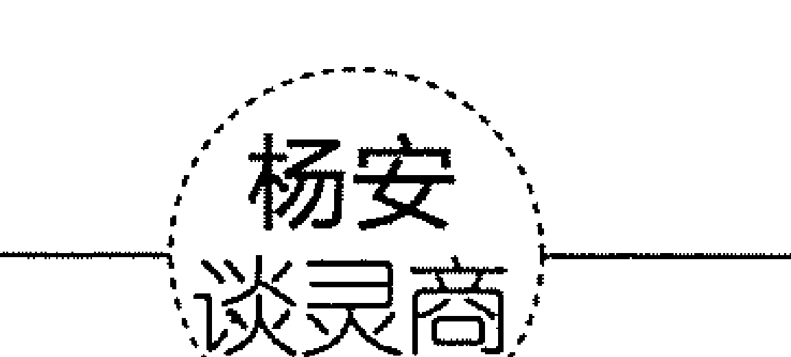

假设的对象，不论是任意选取的，还是有所限定的，都应当是暂时不可能实现的或不存在的。由假设推测法得出的结论，可能多数都不切实际、荒谬、不可行，但这并不重要，重要的是，有些观念经过转换可以成为合理、有用的思想。

## 大胆假设，小心求证

“大胆假设，小心求证”这个观点是胡适先生提出来的。虽然一直以来，人们对这个观点众说纷纭，但我们不得不承认，这个观点确实为人们提供了一种研究问题、解决问题的全新的思路。

所谓的“大胆假设”指的是，从现实出发提出无限定的、具有创新性和不确定性的猜想；而“小心求证”则是指，用科学的、严谨的态度对猜想进行论证。“大胆假设”要求人们敢于打破旧有观念的束缚，努力挣脱旧思想的牢笼，大胆创新，对未解决的问题提出多种假设或解决的可能性；“小心求证”要求人们不能只停留在假设的层面上，而要积极、快速地加以证明。

“大胆假设，小心求证”这样的观点从理论上来说或许存在着弊端和缺陷，但不能否认，它在现实生活中，却有着很重要的作用。而且我们都有意识或无意识地采用着这种观点。况且，无数个事实都证明，任何一个正确的顿悟要转化成实实在在的创新都是实验、实验、再实验的结果。任何一种创新都不是单纯的假设，而是同求证紧紧联系在一起的。

例如，魏格纳在提出了“大陆漂移”假说后，为了使假设成立，他快速地进行了一系列求证：通过地球物理学、地质学、生物学、古气候学和大地测量学等方面进行了全方位的验证。在验证之后，他才最终确立了“大陆漂移”学说。

任何创新或创造发明在顿悟的初始阶段都只是一种假设。只有被实践证实了的思想或观点，才能最终成立，才能发挥出它的作用。所以说，“大胆假设”给予“小心求证”以方向，而“小心求证”则是对“大胆假设”的论证，两者循环往复。在这个循环中，“大胆假设”在人类文明史上的重要性有目共睹，“小心求证”也功不可没。甚至很多时候，“小心求证”比“大胆假设”更重要。

中世纪的欧洲被神学牢牢统治，《旧约圣经·约伯记》大肆宣扬“神将大地悬在虚空”。当时，“地球是圆的”这一学说是一种大胆的假设，打破了神学统治，将人们从宗教的束缚中解脱出来。为了让这种假设站稳脚跟，1519年麦哲伦带领船队开始了一段求证的旅程。花费了几年时间，他们完成了环球航行。

惊世之作《共产党宣言》的发表惊醒了无数工人阶级，打破了资产阶级的无数美梦。书中充溢着社会主义社会必将代替资本主义社会的大胆假设。马克思、恩格斯是如何得出这一结论的？是无数次的小心求证！他们多年跟工人阶级同吃同住，看清了工人阶级的理想和力量的强大；翻阅了无数充满智慧的典籍——英国的“空想社会主义”学说、黑格尔的“辩证法”、费尔巴哈的“唯物论”；经过无数次的辩论；等等。正是这一系列小心求证的过程，孕育出了举世巨典。

大胆假设必然会带给我们创新。重视求证的过程，才能让“正确的假想”真正落地。为什么强调“正确的假想”这个概念？这是因为在我们大胆地提出的很多假设中，有些想法并不是正确的。既然有的设想是错误的，那么，我们该如何减少这些错误的假设给我们造成的损失呢？我们必须用到“求证”。所以，“大胆假设，小心求证”是绝对不可分割的。

恩格斯说过，假设的建立有五个步骤，依次是：观察事物—提出假说—做出判断—检验推断—确定或推翻假说。可见，在假设的建立过程中，验证是必不可少的环节。只有通过验证，我们才会发现这些大胆的假设中存在的漏洞，才能对其进行修正、完善。可以说，只有“小心求证”才能对“大胆假设”去粗取精、去伪存真，起到完善的作用。

有人说“大胆假设，小心求证”是个风险高的“游戏”。因为我们总是很容易陷入自己的假设中，下意识地认为自己的假设是成立的。这样一来，在分析信息时，我们就难以做到客观，往往会有意或者无意地忽视与假设相矛盾的信息，并过分强调那些支持自己假设的信息。如何避免这种“风险”？这就要求我们在“大胆假设”后，注重“小心求证”，真正将思维的开拓性和论证的严谨性有机结合起来。

杨安
谈灵商

解决问题就如开车，遇到意外情况不刹车就会有风险。因此，在不清楚周围情况的时候就要随时准备刹车！解决问题亦如此，随时刹车，可以让我们知道自己在哪里，让我们知道自己所做的事情是对的还是错的，让我们不过于情绪化进而能客观地分析问题，随时调整思路。而求证的过程实际上是一个随时准备刹车的过程。

## 灵商修炼法3

## 引爆灵感

灵商是以与生俱来的心灵感应原理为依据的灵感智力。灵感是智力劳动的产物，具有突发性、飞跃性、瞬时性的显著特征，是人在创新活动中的心理现象，是人脑对客观现实的反映。当我们引爆了灵感，便意味着修炼了灵商。

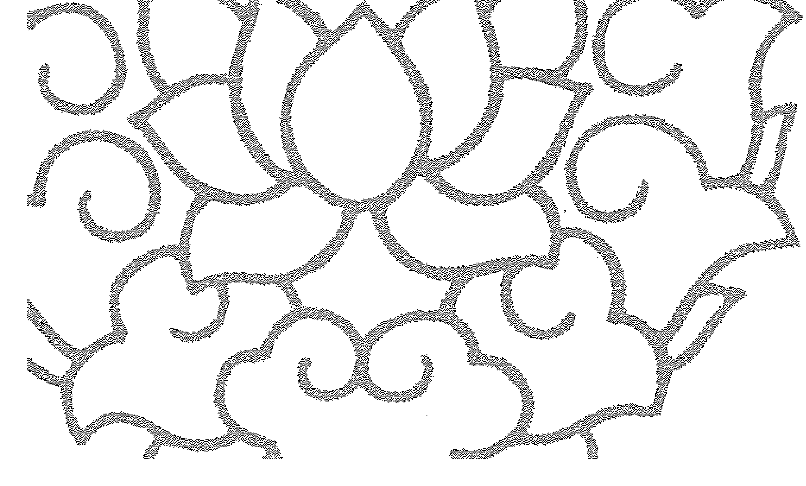

## 突破传统，捕获灵感

爱迪生说：“天才是百分之一的灵感加百分之九十九的汗水。但那百分之一的灵感是最重要的，甚至比那百分之九十九的汗水都要重要。”由此可见爱迪生对灵感的崇尚。

其实，不只是爱迪生，善于创新的人，无论属于哪个领域，都知道灵感的重要性。因为对于创造性思维来说，灵感就是其在思维过程中出现的一种功能达到高潮的心理状态，能直接产生艺术、科学、技术等的新构思。换句话说，灵感能够加速人们在创新思维中出现的质变，使创新迅速实现。

人人都想成为一个解决问题的高手。很多问题的解决，依靠传统的办法根本行不通。这就需要我们创新思维，需要我们用全新的方法去解决问题。要做到创新，我们就必须敢于打破传统思维的束缚，以全新的视角看待问题，如此，我们才能捕获解决问题的灵感，找到解决问题的有效方法。

多年前，英国牛津郡有一群淘气的孩子偷车，但他们很快得到保释，然后，他们故伎重演，又被警察逮住，之后，又被保释出去……这样的循环似乎没完没了。

警察局局长无可奈何，打电话向自己的朋友约翰求助。约翰提出，想派两名年轻的工程师去找这群孩子好好谈谈，弄清楚他们究竟想干什么。警察局局长爽快地答应了。于是，约翰派了两名最年轻、最聪明的工程师去跟刚刚被保释出来的孩子见面。

工程师见到这群孩子，先是对这群孩子的聪明才智大大夸赞了一番，然后，工程师请教道：“既然你们能进入任何一辆车里，那现在就让我看看你们是怎么进到那些车里面的，好吗？”有个骄傲的孩子说：“街上任何一辆你喜欢的车，我都可以钻进里面。你就告诉我你想要哪辆吧。”于是工程师说：“那辆奔驰，还有那辆福特。”这群孩子不费工夫就进去了。

工程师回到实验室，进行了大胆假设，结果他们想出了一个创新性的想法。有位工程师灵光一闪，冒出一个念头：“传统的汽车警报器的制造方法有误！”“不可能。自汽车诞生以来的这么长时间里，所有的汽车警报器的制造方法一直都是这样的，怎么可能有误？”“一定有误！因为每个人都知道这些警报器在哪儿。例如，在福特汽车里，警报器总是在左边的座椅下面。”这位工程师的话点醒了所有人。于是大家一反传统，开始思考解决问题的新办法。最终，他们发明了密码转发器防盗锁。这项发明解决了牛津郡的偷车问题，也为其所在的公司带来了可观的收入。

这些工程师之所以能想出这个创意，是因为他们突破了传统汽车警报器制造方法的思维局限，他们以全新的视角去研究汽车警报器的制造方法，从而催生了灵感，带来了有价值的创意。

要实现创新，就离不开灵感。但灵感的产生绝对不是对现实经验的照搬，它是对过去的颠覆，是在现实的基础上迸发出的一种全新的观点或想法。一个灵感带来的创新，其最低形式是一个人的小小创意，而最高形式则是一场革命。一个小小的创意可以彻底改变人们过去的某些习惯，而一场伟大的革命则足以改变人们现有的生活方式。

### 灵商修炼法3 引爆灵感

正是因为由灵感带来的创新是对现实的改变，所以很多富有创新心态的人遭到了迫害，比如布鲁诺因为坚持“地球绕着太阳转”的新学说而被烧死在罗马的鲜花广场。打破了传统，就意味着对社会的稳定生活产生了一定的影响。但是，从长远历史来看，创新无论是对个人的影响还是对社会的影响都是积极的，所以我们一直在大力提倡创新。不断创新，更是新时代对每个人提出的要求。

要捕获到灵感以加速创新，我们就必须敢于突破传统思维的束缚。如果我们的思维总是拘泥于某些常规、传统、偏见或者是书本上的某些理论，那么，我们根本就没有大胆思考、大胆提出自己新观点的胆量。这样，我们就只能成为一个被固有思维所束缚的人，我们的人生也就只能像契诃夫小说中“装在套子里的人”那样，因循守旧、不敢变化、思想僵化，最终被时代抛弃。

为什么很多人不敢突破传统思维的束缚？因为他们觉得传统的东西代表了权威，他们认为权威的东西不会有错。实际上，并不是所有的权威都是正确的。许多权威，包括爱因斯坦、爱迪生在内，都在某些问题上犯过错误。权威，仅仅说明某个人在某一领域有深入研究，比别人看得深、看得透，但权威的认知也会有局限性，并不是绝对真理。所以，一旦发现固有的认知错误，我们就应敢于坚持自己的新观点，不断地求证、探寻，这样我们才不会让自己来之不易的灵感化为乌有。

### 杨安谈灵商

每个由灵感造就的创新，不论大小，都是对惯例的打破，或可能是对常规的违背，都可能与现实相背。另外，创新又是现实所允许的，是一种不同于惯例和常规的特例。从这个意义上来说，创新并不是对惯例和常规的彻底

## 观念和技法的突破

灵感来源于哪里？灵感来源于突破，其中最重要的突破就是观念的突破。为什么？因为观念作为一种意识直接决定我们的行动。因此，要改变我们的行动，必须先改变我们的观念。

在日常生活中，太多人们习以为常、耳熟能详的观念成了我们判断事物的“金科玉律”。这些“金科玉律”似的观念几乎限制着我们每一个人，使我们越来越循规蹈矩，越来越老成持重，创意被不断抹杀，我们无法获得突破性的进展，无法不断开拓进取。我们如果能尽快从这些“金科玉律”似的观念中走出来，突破旧有观念的束缚，对生活保持一种开放的心态，还思维以自由，就能激发灵感，找到解决问题的新路子。

有个公务员叫比尔，他最大的爱好就是溜冰。但溜冰的费用很高，这让收入微薄的比尔感到烦恼。对比尔而言，冬天是最好的，因为冬天可以免费溜冰。可是春天一来，天然溜冰场便会消失。酷爱溜冰的比尔，不得不深陷极高的溜冰费烦恼中。

有什么好的解决办法吗？比尔苦思冥想。一天，比尔的头脑中突然闪过一个念头：我为什么老在冰场上兜圈子呢？难道除了冰场，我就再无法用别的办法找到溜冰带来的快乐感吗？溜冰、溜冰不就是一个溜字吗？只要能让我溜来溜去，不就是快乐有趣的吗？

于是，比尔走出了“只有冰场能溜冰”的观念圈定，开始集中注意力思考怎样让人“溜”起来。他在观察了会“溜”的玩具汽车后，脑中突然涌出一个灵感：“要是能在鞋底装上轮子，不就能溜起来了吗？要是真能如此，那人们岂不是一年四季都可以‘溜冰’了。”

经过几个月的努力，比尔终于把这种装有轮子的鞋做了出来。不久，他便与别人合作开了一家小型工厂，专门生产这种被称为“旱冰鞋”的产品。他做梦也没想到，产品一问世就受到了人们的青睐，1年后，这种旱冰鞋竟然成了世界性的商品。短短6年的时间，比尔就赚了百万美元。

一个观念的突破，带来了制作旱冰鞋的灵感。比尔不仅实现了天天溜冰的梦想，也得到了丰厚的回报，改变了自己的命运。由此可见，突破观念的束缚，我们才能遇见灵感。不可否认，很多既有观念确实对我们的创新起到了促进作用，但是，我们如果太拘泥于既有的观念，就难以捕获灵感，更不要奢谈成为一个高灵商的人了。因为灵感思维的核心就是要突破既有的观念。只有突破旧有思维的重重障碍，对传统观念提出质疑，我们才能得出新结论，才能在新结论的指导下催生新成果。

DELL（戴尔）公司的成功，离不开其创始人观念的改变。

初中时，年轻的迈克尔·戴尔就拥有了第一台电脑，并迅速看到了电脑背后的商机：他用卖报纸赚的钱购买电脑零部件，对电脑进行改装，然后将其销售给同学和老师，并取得利益，继续改装。

这种直接出售电脑的行为，激发迈克尔·戴尔不断思考。通过分析，他又有了新的想法：只要销售量再多一些，没有中间商，自己改装的电脑就会同时具备价格优势、品质优势和服务优势，之后自己就能跟其他商家竞争。这就是戴尔直销模式的雏形。直到今天，靠着直销模式，戴尔电脑还保持着独特的竞争优势。

DELL 公司的辉煌，正是源于其创始人当时偶发的灵感。而这种灵感源于迈克尔·戴尔想法的改变。一种观念、一个想法的改变能为我们带来无限灵感，同样，技法上的突破也能让我们遇见灵感。

杰克是一家制瓶厂的设计师。他的女友，身材健美且爱好打扮。一天，女友穿了一套膝盖处较窄、腰部显得很有魅力的裙子来厂里看他。杰克注意到这条裙子，越看越觉得线条优美。忽然，他的脑袋里闪出了一道灵感之光：要是能制成跟这条裙子形状一样的瓶子，岂不是很好看？想到这里，他马上转身跑回设计室，连声“再见”也没跟女友说。

回到设计室后，杰克就在图纸上画了起来。这种形状的瓶子被制造出来后，不仅外形美观，而且里面的液体看起来也比实际分量多。很快，美国可口可乐公司就相中了这种瓶子，以高价购买了这项发明的专利权。

案例中，杰克之所以能激发出灵感，是因为他敢于打破传统的制瓶技法，把瓶子制成了裙子形状。这也让我们看到，除了观念的突破能给我们带来灵感外，技法上的大胆突破也能激发灵感。

> 林肯曾经说过：“我从来都不会为自己确定永远适用的政策，只会在每一具体时刻争取做最合乎情况的事情。”

任何事物都不是绝对的，我们已经习惯了的观念和技法不一定适合各种场合、各种环境，所以，我们只有灵活变化，敢于打破传统观念和技法的限制，才能迸发出无限灵感。

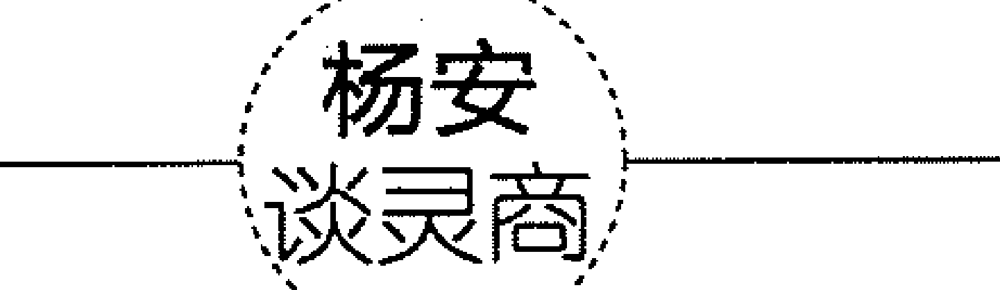

我们生活在一个充满各种观念的世界里，很多观念充满着智慧，对我们来说有很大的指导意义。但我们不能完全依靠固有的观念，因为一旦我们过于依赖固有观念，我们就会形成思维定式。那么，固有的观念就会变成一种枷锁，妨碍我们打开新思路，长此以往，就会削弱我们的创新力。相反，我们如果能突破固有观念，就能寻找到灵感，开创出一片新的天地。

### 打破成规，求变创新

人人都想成为创新人才，要创新，我们就必须先获得灵感。因为灵感是创新产生的源泉。一个人只有产生了灵感，才有可能收获创新的成果。换句话说，创新是灵感能落地的具体体现。

我们要突破习惯的思维局限，把目光投向新领域。正如一位名人所说：

> “任何人都能在商店里看时装，在博物馆里看历史。但是，具有创造性的开拓者会在五金店里看历史、在飞机场上看时装。”

世间万物都存在着联系。当面对一个思维对象时，我们要激发出自己的灵感，就不能局限于传统习惯，不能死守一个点。打破成规，学会反转大脑，灵感会来得更快，我们的创新之路也会越走越宽。

为了解决“不粘油”的问题，生产抽油烟机的厂家想了很多办法。但是大家都知道，绝对不粘油是做不到的，用户大约每隔半年就得清洗一次抽油烟机。如何解决用户的这一烦恼呢？

当其他生产抽油烟机的厂家还在如何能“不粘油”上下功夫时，美国的一位发明家却打破成规，从别的方向去考虑问题，结果他发明了一种专门用来吸附油污的纸。将这种纸贴在抽油烟机的内壁上，油污就会被纸吸收，用户只需定期更换吸油纸，就能保证抽油烟机干净。

因为打破了成规，这位发明家才有了突发的灵感，解决了别人无法解决的问题。诺贝尔奖获得者、日本著名的半导体专家江崎和助手亦是打破了成规，获得了灵感，从而取得了成功。

20世纪50年代，世界各国都在研究制造晶体管的原料——锗。其关键技术是将锗提炼得非常纯。但是，无论人们怎样提炼，总免不了混入一些杂质，这严重影响了晶体管参数的一致性。当人们都把眼光放在锗的提炼上时，江崎却突发奇想：假如采用相反的操作过程，有意添加少量杂质，结果会怎样呢？他把想法付诸于试验。结果证明，当锗的纯度降低到某一值时，竟然产生了一种性能更优良的半导体材料。于是晶体管制造原料的问题就被这样解决了。

卓别林说：“对于艺术家来说，打破成规，完全自由地创作，就会取得惊人的成绩。”其实，不仅是艺术家，对于任何人来说，打破成规有助于抓住灵感，进而在灵感的促使下独辟蹊径，走出一条创新之路，取得惊人的成绩。

美国朗讯公司的贝尔实验室是诺贝尔奖获得者的摇篮！那里培养出了11位诺贝尔奖获得者，更产生了改变世界的十大发明。几乎所有理工科毕业生都把进入美国朗讯公司的贝尔实验室工作看作至高无上的光荣。为什么这个神奇的实验室能培养出如此多的诺贝尔奖获得者？在贝尔实验室创办人的塑像下镌刻着一段话：“离开常走的大道，潜入森林，你肯定会发现前所未有的东西。”在这里，离开常走的大道即要求人们打破成规、独辟蹊径，去走一条前人从未走过的路。如此，我们才能发现、领略前人从未见过的绮丽风光。

当然，需要指出的是，创新之路并不平坦。不敢打破成规、胆小怯懦，根本实现不了创新。天文学家勒莫尼亚在1750—1769年一共观察到了12次天王星，完全有条件获得重大发现。可是由于受到“太阳系的范围只到土星”观念的束缚，他担心自己的观点会招来他人的质疑、嘲讽和打击，便没敢将自己的见解提出来，致使这颗行星多次“被看见而未被认定”。直到1781年，这颗行星才被赫歇尔加以认定。

所以，要让自己的灵感变成实实在在的创新，我们就不应该被成规所束缚。如果我们的思维一味拘泥于成规，我们就没有质疑的勇气，没有提出自己观点的胆量，更谈不上创新。

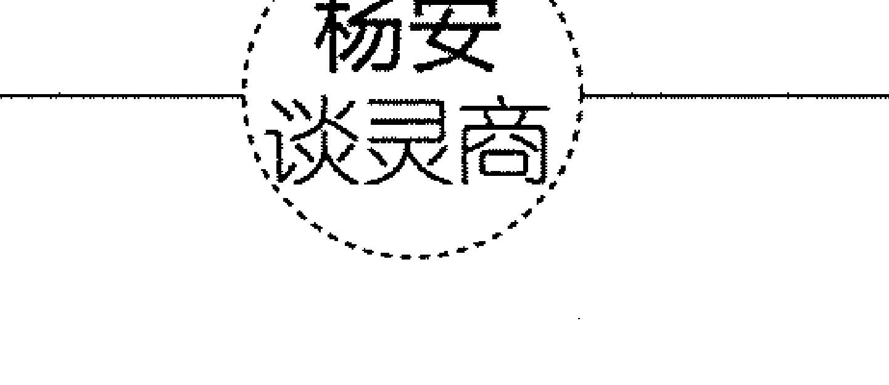

灵感常常来自敢于打破成规的勇气。人最可贵的地方是具有灵性。一个有灵性的人不会盲目地跟随前人，更不会依赖现成的结论，因为那意味着永远处于落后的地位；相反，他会不断突破传统，不断想别人没有想到的方法，让自己永远走在别人的前面。

## 换个角度看世界

解决问题就像是平常做题，或许从某一角度切入问题无法得到正确的结果，若换一种思路、换一种角度去解这道题，会解得又快又好。凡事都有正反两面，当从正面无法解决问题时，我们不妨从反面去考虑问题，也许会惊奇地发现解决问题的关键之所在。

在美国的一个城市里，小偷将目标盯在地铁里的灯泡上。灯泡被盗，引发了很多安全问题，工程师找不到解决问题的办法，感到很头疼。

一位年轻的工程师接手了此事。既不能改变灯泡的位置，又没多少预算，为了解决这个问题，他想了很多办法，最后终于找到了一个解决方案——把灯泡的螺纹改为左手方向或逆时针方向，不再用传统的右手方向或顺时针方向。如此，当小偷认为他们正在拧下灯泡时，其实将灯泡拧得更紧了。思路一变，长期困扰工程师的问题就被解决了。

换个角度看问题，可以使你获得全新的思路，让灵光闪现，从而让你做出不同寻常的行为决策。常规思维会限制我们的灵感，尤其当我们遇到挫折和困难的时候，常规思维常常会使我们无法摆脱困扰。它除了会造成我们心理上的困扰外，还会导致我们行为上的偏差。因此，我们要学会变通，学会换一种立场或角度看问题、看世界，不断从挫折中总结经验，激发自己做出创造性的变革。

人们听说有位大师几十年来练就了移山大法，于是很多人找到这位大师，央求他当众表演。这位大师在一座山的一面坐了一会儿，然后就起身跑到了山的另一面，之后告诉人们自己表演完了。众人疑惑不解。大师微微一笑：“在这个世界上，根本就不存在什么移山大法，能够移山的唯一方法就是——山不过来，我就过去。”

对于生活中的一些东西，我们可能无法改变，但是我们可以改变自己的思路。有时，只要我们换个角度思考问题，我们可能会看到完全不同的景象。毕加索说：“每个孩子都是艺术家，问题在于他长大成人之后是否能够继续保持艺术家的灵性。”我们也可以这样说，每个人都能成为解决问题的高手，问题在于你是否能保持变通的灵性。

有一个摄影师，每次给别人拍集体照时总是拍不好，总有人闭眼。那些闭眼的人看见照片会非常生气，都会要求摄影师重新拍照。这让摄影师十分苦恼。为什么自己总是拍不好集体照呢？难道是自己的技术有问题？

后来这位摄影师去请教自己的老师。老师说：“在摄影的时候，摄影师们总是会喊‘一！二！三！’但坚持了半天后，有的人恰巧在‘三’字上坚持不住了，就会做闭目状。”老师一语点醒了这位摄影师。后来，摄影师换了一种思路，在照相的时候，他请所有照相者全闭上眼，听他喊“一！二！三！”，在“三”字上一起睁开眼。果然，闭眼的问题解决了，一个闭眼的人都没有了，每个人都显得神采奕奕、精神饱满。

遇到问题的时候，很多人都会鼓励自己：“坚持到底就是胜利。”可是很多时候，坚持使用一种方法只会导致失败。其实，当你使用一种方式尝试了很多遍依然失败时，完全可以改变一下思路和解决问题的方向，促使新的创意产生出来，这样就能轻松摆脱困境。

不断改变思路是一种智慧。解决问题就像打井，如果在一个地方总打不出水来，我们不妨换个地方。条条大路通罗马，当一条路实在走不通时，我们不要一味坚持，而要变换思路，改变角度，所谓“山不过来，我就过去”。只有勇于改变思路，善于改变角度，我们才能获得解决问题的灵感，才能走出创新的路子。

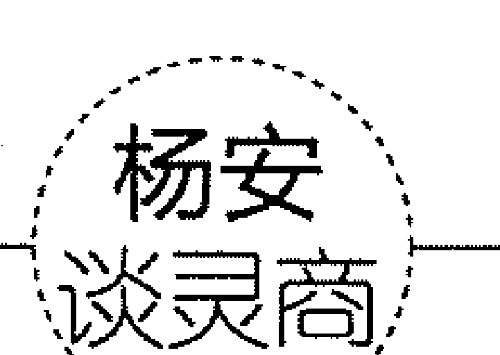

“横看成岭侧成峰，远近高低各不同。”在浩渺的思维空间里，我们如果能从不同角度，用不同的视角观察和思考每一个问题，就能从“山穷水尽”的绝境中走出来，欣赏到“柳暗花明”的美景。

## 头脑风暴法

什么是头脑风暴法？头脑风暴法就是利用集体的智慧，通过互相交流、启发和激励而产生新思想的方法。头脑风暴能带来无限的智慧和灵感。所谓石击产生火花，水击产生涟漪。智慧与智慧的碰撞，会引发新的智慧；思想与思想的碰撞，会激发新的思想。一粒种子的萌芽，会收获硕果；一个灵感火花的点燃，会燃起熊熊的智慧烈火。

俗话说，三个臭皮匠，顶个诸葛亮。一个人的智慧不够用，多个人的智慧用不完。头脑风暴所带来的集体智慧是无穷尽的，集体的大脑是思想库、智慧库。在生活中，我们难免会遇到难题，陷入困境，不妨用集体的智慧来点燃创造的火焰，让诸多聪明的头脑在智慧的碰撞中迸发灵感的火花。

有一年，美国的北方大雪纷飞，格外寒冷，电线因积满冰雪而被压断了，严重影响了通信。很多人都试图解决这一难题，但最终都未能如愿以偿。

后来，一家电信公司的经理想到了解决办法，他使用的正是头脑风暴法。他召开了一次能让头脑卷起风暴的座谈会，鼓励大家积极发言。会上大家提出了很多建议，比如：用电热来化解冰雪；用振荡技术来清除积雪；设计一种专用的电线清雪机；带上几把大扫帚，乘直升机去扫电线上的积雪……

当这个人提出“坐飞机扫雪”的想法时，其他人心里觉得可笑极了，但并没有人对此提出什么批评意见。因为大家知道这就是一个畅所欲言的会议，大家想说什么就说什么。可是，一位工程师在听到坐飞机扫雪的想法后，大脑突然受到冲击，灵感立马闪现在他的脑中：每当大雪过后，驾驶直升机沿积雪严重的电线飞行，不断调整螺旋桨就可以轻松地将电线上的积雪迅速扇落。

有了这个“一闪念”的想法，工程师马上提出了“用干扰机扇雪”的新想法。这个想法一出，顿时又引起其他人的众多联想，有关用飞机除雪的主意一下子又多了将近10条。不到1小时的时间，大家竟然提出了近100条新设想。

会后，公司组织专家对各类设想进行了分类论证，最后大家都认为由“坐飞机扫雪”激发出来的设想极具创新意义。如果可行，这一设想将是一种既简单又高效的好方法。经过现场试验，他们发现用直升机来扫雪确实有效，而且速度还很快。就这样，一个久悬未决的难题，终于在头脑风暴会中得以解决了。

在思维的领域中，一加一大于二。集体智慧的碰撞好比播种，它能萌发出无数新的灵感。所以，在平时的生活中，我们要学会充分利用头脑风暴来解决问题。不仅因为头脑风暴极易操作执行，而且它具有很强的实用价值和好处：参与头脑风暴，每一个人的思维都能得到最大限度的开拓；头脑风暴能有效使人开阔思路，激发灵感；头脑风暴能在最短的时间内批量生产灵感，对于熟练掌握“头脑风暴法”的人来说，再也不必一个人苦思冥想、孤军作战了；头脑风暴可以使参加者更加自信，因为，每个人都会发现自己居然能如此有“创意”；头脑风暴能创造良好的平台，给大家提供一个能激发灵感、开阔思路的环境，可以提高效率，能够更高效地解决问题。

总之，头脑风暴能扫除影响思维推陈出新的种种障碍，展现“柳暗花明”的新希望。当然，头脑风暴法的执行并不是无原则无要求的，要确保头脑风暴法取得成功，就要抓住要点，具体而言，可归纳为以下几点。

- 1. 自由畅谈

参加者不应受任何条条框框的限制，要放松思想，让思维自由发散。允许参与者从不同角度、不同层次展开全面想象，尽可能与众不同、标新立异，尽可能提出独创性的想法。

- 2. 延迟评判

成功的头脑风暴会议必须要坚持当场不对任何设想做评价的原则：既不能否定某个设想，又不能肯定某个设想，也不能对某个设想发表意见。一切评价和判断都要延迟到会议结束以后才能进行。原因有二：一是设想需要集中精力，把应该在后续阶段做的工作提前进行，会影响创造性设想的大量产生；二是评判会约束参加者的积极思维，破坏利于自由畅谈的良好气氛。

- 3. 禁止批评

头脑风暴法应该遵循的另一个重要原则是绝对禁止批评。因为，批评对创造性思维无疑会产生抑制作用。所以，参加头脑风暴会议的每个人都不得对别人的设想提出批评意见。同时，也禁止发言人自我批评。为了不破坏会场气氛，影响自由畅想，一些自谦式的自我批评也不允许。

- 4. 追求数量

追求设想数量是头脑风暴会议的首要任务，头脑风暴会议的目的就是获得尽可能多的设想。要鼓励参加者抓紧时间多思考、多提设想，不要一味关注质量问题。从一定意义上来说，设想越多，创造性设想就越多。至于设想的质量问题，完全可以留到会后去解决。

- 5. 改善组合

要鼓励参加者思考别人的创意，在他人的创意的基础上提出新的创意，即从别人的创意中得到启发而想出更好的创意。

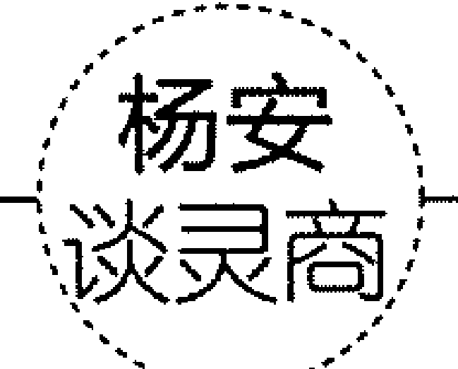

每一个想法，都是一个激发灵感的温床；每一个想法，都是激发灵感的火种。思想火花的迸发，越多越好，思想泉水的喷涌，越多就越有希望成功。随着发明创造活动的复杂化和涉及技术的多元化，单枪匹马式的苦思冥想将变得软弱无力，而人多势众的发明创造战术则显示出攻无不克的威力。

## 观察为灵感积累材料

相信读过《福尔摩斯探案全集》的朋友都不会忘记，福尔摩斯第一次见华生的时候，就立刻辨认出华生是一名去过阿富汗的军医的描述。福尔摩斯为什么能够如此快地辨认出眼前的这个人就是一名军医呢？是观察。敏锐的观察力使福尔摩斯能够非常快地辨认出一个人的职业、阅历。

什么是观察？观察是有目的、有计划、有耐力的知觉。它主要依靠视觉，并且把其他感觉融为一体，形成综合感知，是高级的知觉形式。观察中包含着积极的思维活动，因此，人们也把它称为思维的知觉。

观察是人们认识世界、获取知识的重要方法，也是科学研究的重要方法。所有的科学实验及新发现、新规律，都建立在细致、准确、系统的观察基础上。很多人之所以能够有所成就，就是因为他们认识到了观察的作用。比如：居里夫人的女儿曾把观察誉为“学者的第一美德”；巴甫洛夫一直把“观察、观察、再观察”作为座右铭，并告诫学生，没有敏锐的观察力，就永远成不了科学家。

观察是认识的基础、思维的触角。敏锐的观察力，对各行各业的人而言都是不可或缺的。很多人可能认为，自己不想当科学家，没必要刻意训练自己的观察力。可是，即使你不想当科学家，你也要具备良好的观察力。因为认识事物的第一项本领就是观察，其次才是注意、记忆、想象和思维等。如果将观察比作蜜蜂采花粉，那么思维等心理活动就是将花粉酿成蜜。没有花粉，就酿不出蜂蜜；观察能力不卓越，思维也就得不到良好的发展。

创新的过程，始终都离不开观察与分析。这里的观察，并不是一般的观看，而是有目的、有计划、有步骤、有选择地去观看和考察所要了解的事物，从普遍现象中发现特殊东西，从表面上看似不相关的东西中发现相似点。只有在观察的基础上进行分析，才能引发灵感，形成创造性的认识。

纵观中外，很多伟大的发明家都具备敏锐的观察力。比如，英国发明家瓦特从小就善于观察事物。一次，瓦特和姨妈坐在炉子旁，壶里的水开了，壶盖在蒸汽的推动下发出声响。瓦特从这一现象中受到启发，最终发明了蒸汽机，并以其强大的动力和能量推动了社会的进步与发展。

意大利著名科学家伽利略善于探索宇宙的奥秘，是世界上第一个用望远镜观察天体的人，揭开了人类探索宇宙奥秘的崭新一页，还通过科学观察实验论证了自由落体定律。

敏锐的观察力是科技创新的前提，也是产生灵感的重要途径；同思考有机结合起来，在正确的科学理论的指导下，还能产生巨大的创造力。

观察，是有心人的特征。细心观察、周密观察，是每一个具有独立创新能力者的基本功。要成为一个能够不断创新的人，就必须学会观察——观察生活中事物发生的点点滴滴变化，只有细心了解并熟悉生活的方方面面的细节，才能启发我们的灵感。当然，要有效地进行观察，更好地锻炼观察力，必须要掌握良好的观察方法。

- （1）确立观察目的。对事物进行观察时，首先，要明确观察什么、怎样观察、达到什么目的。将这些问题搞清楚了，才能把注意力集中到事物的主要方面，抓住其本质特征。其次，目的性是观察最显著的特点。提高观察的目的性，观察才能达得一定深度和广度。东张西望、左顾右盼，对事物熟视无睹，观察力就得不到锻炼。例如，你想开一家新商店，就要到其他商店学习商品陈列方法。
- （2）制订观察计划。要想获得好的观察效果，就要在观察前对观察的内容做出详细安排，制订出周密的计划；毫无计划，漫无目的，收获就不会很大。因此，观察前就要计划好先观察什么，后观察什么，按部就班，系统进行。当然，观察的计划，可以被写成书面文字，也可以被记在脑子里。
- （3）培养浓厚的观察兴趣。每个人的观察敏锐性都是有差异的，人们对同一事物的观察会出现不同的兴趣，会注意到不同事物或同一事物的不同特点。兴趣是最好的老师，培养浓厚的观察兴趣是锻炼观察能力的重要前提。为了锻炼观察能力，就要培养广泛的兴趣爱好，进行多样观察；同时，还要有中心兴趣，有了中心兴趣，就会全神贯注地对某一领域进行深入观察。
- （4）养成持久观察的习惯。剑桥大学教授、科学家贝弗里奇说：“培养那种以积极的探究态度关注事物的习惯，有助于观察力的发展。在研究工作中养成良好的观察习惯比拥有大量的学术知识更重要，这种说法并不过分。”一个人有了持久观察的习惯，就能形成克服观察过程中所遇到的各种障碍和困难的动力，把观察进行到底。而观察力正是在这种“锲而不舍”的过程中得到发展的。

### 杨安谈灵商

灵感不会凭空产生，需要以一种全新而有创造力的方式去思考才会产生。花时间去观察一些事物是积累经验、激发灵感、改变思维方式的有效方法。你可以找到你感兴趣的事物仔细观察，在这个过程中，灵感就会在不经意间出现。

## 思考点燃灵感火花

灵感能够给人带来一种豁然开朗、奇想突发的体验，让百思不得其解的问题得到解决。许多科学家在发明创造的过程中都出现过灵感。

其实，灵感并不是什么神秘之物，而是思考者长期积累知识经验、勤于思考的结果。灵感的出现是对某一问题进行深入考虑后达到的水到渠成、瓜熟蒂落的境界。

研究表明，灵感的出现有一定的规律性。灵感出现的一个条件是个体将注意力高度集中在所要解决的问题上，甚至达到痴迷的程度。对于要研究的问题，个体会全身心地投入思考，使要解决的问题时时萦绕在心。灵感出现的另一个条件是个体对所要研究的问题花费很长的时间思考，反复考虑所要解决问题的一切角度、一切可能。这种苦思冥想是灵感产生的重要条件。

总之，灵感的瞬间爆发是以长期的艰苦探索、长期的思考酝酿为基础的。换句话说，灵感来自苦思冥想。最典型的例子就是牛顿在苹果树下的沉思。

### 灵商修炼法3 引爆灵感

一个落地的苹果成就了伟大的万有引力定律。有人曾问牛顿是如何发现万有引力定律的，他的回答是：“一直不断地思考。”也就是说，如果没有牛顿全身心、不分昼夜地思考，就是落下一千个、一万个苹果，也只会砸疼他的脑袋，根本不可能有万有引力定律的发现。除了牛顿，其他的科学家也是如此。曾有一个记者问门捷列夫：“您是怎么发现元素周期律的？”他回答说：“这个问题我大约考虑了20年，而你却认为，我坐着不动，突然就成功了！事情并不是这样的！”

2005年度国家最高科学技术奖获得者吴孟超，从事肝脏外科领域研究50余年，在国际肝胆外科界享有很高威望，他的几次灵感的获得也都充分证明了灵感是思考的结果。

为了解决手术中的肝出血问题，吴孟超思索了很长时间，却始终没找到好的办法。一个星期天，他在家休息，拿着医学书翻来覆去地看，却怎么也看不进去。脑子里萦绕的全是肝出血用什么办法解决。

保姆在厨房里洗菜做饭。其间，自来水管的水一会儿开，一会儿关，不停地传来哗哗的流水声。处于思索状态的吴孟超突然被水声打断了，血管—水管，水管—血管，水管上有水龙头控制，血管能由什么控制呢？他突然想到了一个好点子，给血管按一个“水龙头”。就这样，新的临床技术“常温下间歇肝门阻断切肝法”诞生了。吴孟超将两个不相干的东西联系起来，巧妙解决了医学难题。“水龙头”这一崭新的止血方法，至今依然是世界上最为简单有效的方法，在肝胆手术上的应用越来越广泛。

还有一次，吴孟超与两个同事成立了一个肝胆外科攻关小组，要做肝脏血管模型，在肝的血管中灌入塑料。可是，在攻关过程中他们遇到了难题——使用什么塑料。为了解决这个难题，三个人连续奋战了3个月，但毫无进展。三个人异常着急，觉都睡不安稳。

此时，恰逢我国运动员容国团在第25届世界乒乓球锦标赛上夺得冠军，这让吴孟超十分振奋。看着电视上那小小的乒乓球跳来跳去，吴孟超的脑海中突然闪现出了一个想法：何不利用乒乓球做材料！之后，他们从乒乓球厂买来赛璐珞，加入不同的颜色，成功灌注出了人体肝脏血管模型——我国第一具结构完整的人体肝脏血管模型。后来，面对记者的采访，吴孟超说道：“灵感这种东西非常奇怪，什么问题想得久了，思考得时间长了，只要有一点诱因，也能使人产生联想。”

由此可见，灵感的瞬间爆发是以长期的艰苦探索、思考酝酿为基础的。明末清初学者陆世仪说：“悟处皆出于思，不思无由得悟。”这也非常准确地道出了灵感产生的主要原因是观察后的勤奋思考。尽管人人渴望获取灵感，但是灵感的到来却相当不易，需要经过大量的、艰苦的观察和思索。对此，周恩来总理也有八个字的概括——“长期积累，偶尔得之”。灵感到来的那一瞬间，恰恰是对创新者长期艰辛而大量思考的回报和奖赏。

与直觉的即时性特点相比，潜伏型灵感是延时产生的。对潜伏期较长的灵感，我们需要做好随时捕获的准备。潜伏期较短的灵感，即创新灵感在短期内出现的可能性较大，因此我们更要做好重点捕获的准备。

## 灵感的激发

灵感思维是人类极其重要、极其宝贵的思维形式之一。通过灵感思维，我们容易看见画中画、山外山和天外天，看见千百万人所熟视无睹的问题背后的实质与规律，看见被表象遮蔽的现实，看见被惯性认识阻碍的真理……

灵感思维是公平的，它不是某些人与生俱来的禀赋，而是大脑中的自动思维，并且是人人都具有的潜能。只要经过努力和积极的训练，人人都可以进入灵感思维状态。那么，为捕获灵感，我们在平时应该怎么做呢？

第一，要有强烈的求知欲和丰厚的知识经验积累。灵感具有突发性，但在其突发前，都要经历一个积累、孕育的过程，而这一过程必须以大量的知识、经验为前提。清代诗人袁守定曾说：“得之在俄顷，积之在平日。”只有从平时的阅读和生活中不断地获取信息，让之转化为深层的潜意识，遇到时机，灵感才会出现。平时积累的知识经验越多，灵感出现的机会也就越多，正如柴可夫斯基所说：“灵感不会拜访懒惰者和无知者。”

蒲松龄为什么能写出名著《聊斋志异》？这跟他平时的积累分不开。蒲松龄在道路两边摆放茶缸，只要有路人经过，他就会跟路人闲聊，收集奇闻趣事。靠着积累的大量创作素材，他产生了无数灵感，最终写出了名著《聊斋志异》。

鲁迅之所以能写出《狂人日记》，得益于他的广泛阅读。其他读物上的知识激发了他，让他有所“领悟”，他才写出了《狂人日记》。

名言“读万卷书、行万里路”强调了读书和实践的重要性。我们不仅要从书本中积累大量的知识，还要积极投入生活，关心周围的一切。因为，生活是一部取之不尽的活教材，是灵感产生的源头活水。

第二，要有苦思冥想的劲头。灵感是人脑进行创造活动的产物，所以长期思考是基本条件。一个善于思考、用心思考、有强烈创新欲望的人，哪里都是他产生创新火花和灵感的宝地。从某种意义上说，无论创作、创新还是创造，都永远属于那些用心思考、积极思考的人。

第三，保持情绪的镇静与愉悦。一个人，越是在轻松的状态下，越容易遇到灵感。所以，偶尔出去散步，或洗个热水澡，或听首喜欢的音乐，可以更好地释放我们的灵感。因为当你的头脑沉浸在这些看似毫无目的的活动中，往往可以灵光乍现。所以，当你觉得累了，可以发呆、散步、泡澡，说不定灵感就来了。

那么，我们可以通过哪些具体的方法来激发自己的灵感呢？

### 1. 思想点化法

思想点化法是指灵感是在阅读或交流中产生的。如达尔文从马尔萨斯的《人口论》中读到“繁殖过剩而引起竞争生存”一句话时，大脑里突然闪现出这样的观点：在生存竞争的条件下，有利的变异会得到保存，不利的变异就会被淘汰。由此促成了生物进化论的诞生。

### 2. 原型启发法

原型启发法就是从我们要研究的问题或对象中受到启发，从而产生了灵感。例如，英国工人哈格里沃斯在发明纺纱机的过程中，偶然将水平放置的纺车踢翻，其变成了垂直状，正是受了这样的启发，纺纱机才被研制成功。

### 3. 形象发现法

形象发现法就是受到相似形象的启发，获得灵感。如意大利文艺复兴时期的著名画家拉斐尔，一直想画一幅新的圣母像，但很久都难以成形。一次偶然的散步，他看到一位淳朴、温柔的姑娘正在花丛中剪花，这一富有魅力的形象一下子吸引了拉斐尔，他立刻拿起画笔创作了《花园中的圣母》。

### 4. 情景激发法

情景激发法就是利用一定的情景激发灵感。当代著名小说家柳青想改写自己最初的小说《创业史》时却找不到感觉。当他又回到长安县（今长安区）后，农民的语言、感情及对农村生活的冲动一起被激活了，他产生了源源不断的创作灵感。

许多有创造性精神的人，都曾体验过获得灵感的滋味。但因为事先没有准备，而没有及时记下这些灵感，事后再也记不起来了。所以，要抓住灵感，必须在灵感出现前，做好捕获灵感的准备。

## 灵商修炼法4

## 激发潜能

新世纪伊始，发展心理学家提出了灵商理论，认为心灵智力是人类的最高智力。通过灵商探究人类灵魂的深度，是激发人的潜能的核心聚变力。也就是说，打开意识与潜意识沟通的阀门，能够激发一个人的潜在能力，开启智慧之门，提升人的灵商。

## 显能仅仅是“冰山一角”

著名的心理学家奥托指出，一个人所发挥出来的能力，只占了他全部能力的4%。也就是说，每个人还有96%的能力尚未发挥出来。世界赫赫有名的控制论奠基人之一 N. 维纳说：“我可以完全有把握地说，每个人，即便是做出了辉煌成就的人，在他的一生中利用他自己的大脑潜能还不到百亿分之一。”美国学者詹姆斯通过研究也发现，普通人只开发了其蕴藏能力的10%，与应当取得的成就相比较，每个人不过是半醒着的。也就是说，我们每个人仅仅利用了我们能力的很小一部分。

不管是奥托的说法还是詹姆斯的说法或许都有点夸张，但每个人都具有很大的潜能是不可否认的。这种潜能可用“冰山理论”来形容，即假设在海面上漂浮着一座冰山，在阳光之下，冰山皑皑，颇为壮观。其实，真正壮观的景色不在海面之上，而在海面之下。与浮出海面的那部分景色比起来，沉浸在海面下的冰山的壮观程度是它的十倍，甚至是上百倍。

我们也可以这样比喻，浮在海面上的部分，就是人的显能——我们已经知道的能力；而沉浸在海面下的部分，是人的潜能——我们还不知道的能力。可见，人的潜能的数量上大大超过显能。不仅如此，人的潜能的能量也大得惊人！研究发现，人的潜能的能量是显能的3万倍以上。

任何人，不管他多平凡，都存在巨大的潜能，只要他的潜能得到充分发挥，他就能做出一番大事业。因为所有的研究都表明，所谓的天才，所谓的为人类做出突出贡献的人，都是因为开发了自己的潜能。

科学研究表明，20 世纪的伟大科学家爱因斯坦，其大脑无论是体积、重量、构造还是细胞组织，与同龄的一般人的并没有什么区别。这也表明，像爱因斯坦之类的科学巨匠之所以取得成功，并不是他们的大脑与众不同，而是他们开发了自己的潜能。所以，千万不要瞧不起自己，只要你全力开发自己的潜能，你也能创造出奇迹，你也能获得连自己都觉得惊诧的成就。

潜能是人类蕴藏量最大而又开发得最少的宝藏。科学家们发现，人类贮存在脑内的能力大得惊人，而普通人只发挥了其中极少部分的功能。有科学家对人的潜能做了一项实验，结果证明：如果人类能够发挥一大半的大脑潜能，那么一个人可以轻易地学会至少 40 种语言，可以获得 12 个博士学位，可以背诵整本百科全书。

爱迪生小时候，老师认为他很傻、很愚笨，便将他从学校劝退。可是，他在母亲的帮助下，经过独特的大脑潜能的开发，在留声机、电灯、电话、有声电影等方面进行了开创性的发明，从根本上改善了人类生活的质量，最终成为世界上著名的发明大王，一生完成了 2000 多种发明。

显能仅仅是冰山的一角，而潜能却是冰山的大部分。要想取得巨大成绩，就要不断开发潜能。任何成功都不是天生的，很多人之所以会成功，其根本原因就在于他们开发出了自己的潜能。

所以，你只要抱着积极的心态去开发自己的潜能，就会拥有巨大的能量，你的个人能力就会越用越强；相反，你若抱着消极的心态，不去开发自己的潜能，只是哀叹命运不公，那么你就越消极、越无能。

### 杨安谈灵商

我们的身上拥有“钻石宝藏”！我们身上的“钻石宝藏”就是潜能。这些“钻石”足以使我们任何一个人的理想变成现实。只要我们不懈地挖掘自己的“钻石宝藏”，积极地运用自己的潜能，我们就能够做好自己想做的一切，就能够成为自己生活的主宰者。

## 激发潜能是关键

人们常常自问：为什么我的潜能没有得到发挥？为什么我没有意识到自己潜能的存在？难道我没有潜能？其实，主要原因是你没有对自己的潜能进行激发，致使你的潜能没有得到发挥，并不是你没有潜能。

潜能，平常并不外露，隐藏得很深，深到连我们自己也不清楚，所以称其为潜能实在是名副其实。而潜能的显现常常需借助一定媒介的激发。

在45岁以前，美国的笛福森是个默默无闻的银行小职员，他周围的人都认为他是一个毫无创造才能的庸人，连他自己也看不起自己。

在45岁生日那天，笛福森阅读报纸时受到报上刊载故事的刺激，立下大志，决心成为大企业家。从此，他前后判若两人。在之后的生活中，笛福森彻底消除了自己无所作为的想法，以前所未有的顽强毅力和自信，潜心研究企业管理，终于成为一位世人敬仰的大企业家。

很明显，笛福森的潜能得到了极大的开发，是因为报上刊载的故事激发了他。如果不是受报上刊载的故事的激发，笛福森不可能成为一个大企业家。

每一个人都有相当大的潜能，但由于没有恰当地激发，潜能也就从没有得到淋漓尽致的发挥。并不是大多数人注定不能成为“爱迪生”，实际上，只要发挥了足够的潜能，任何一个平凡的人都可以成为“爱迪生”。

那么，激发潜能的媒介有哪些呢？一方面是来自外部的压力、困难、危机；另一方面也是最重要的方面，是我们自己要有积极的心态——不为自己设限。

无数事实证明，人类的潜能是非常巨大的，甚至可以说是无限的。既然如此，为什么有那么多人依然会不识自己潜能的真面目，甚至还到了“妄自菲薄”的地步呢？这里面固然有外在因素的原因，比如压力等对人们无比强大的震慑力，但是人类自身不断强化的对外在困难的畏惧和无能为力的自我暗示才是人们的潜能得不到充分激发的关键。

那些成功人士之所以成功，很大程度上是因为他们从不给自己的心设限，他们常给自己积极的自我暗示。因此，他们不畏惧困难，不害怕失败，不断地开发自己的潜能，不断磨砺自己的生存利器，不断力争上游，最终使自己的潜能得到前所未有的开发。

一家天线公司的总裁来到公司的营销部，让大家针对天线在偏远地区销售不好的原因各抒己见、畅所欲言。当营销部的经理以及其他人都抱怨卖不出去产品是因为产品没有知名度时，一位年轻人却直言不讳地提出了自己的不同意见。年轻人说：“我觉得不是知名度问题，我们公司的天线是老牌子，之所以销售业绩今不如昔，是因为我们的销售定位和市场策略不对。”营销部的经理马上反驳道：“你说得轻松，要不你到那些偏远地区试试！我就不信你能把产品销售出去！”

年轻人没有反驳，但会后他向总部申请去偏远的地区销售产品。他相信，只要不怕困难，一定能将这些产品销售出去。不久，年轻人风尘仆仆地赶到了新疆的一个百货大厦。大厦老总一见面就向他大倒苦水，说还积压着5000多套产品，并建议年轻人去其他商场推销。

年轻人接受了这个建议，跑遍了新疆所有的大商场，可是，几天下来却业绩平平。正当他困顿时，报纸上的一封读者来信引起了他的关注，信上说：有个农场处于偏远地区，买的电视都成了摆设。看到这则消息，年轻人高兴极了，立刻带上几十套天线，几经周折赶到了农场。

在了解了问题后，年轻人想办法做了实验，最后，他终于找到了电视成为摆设的原因。找到了问题的症结，一切问题都迎刃而解。此后，仅这个农场就订了800套天线。不仅如此，这个农场的人还把年轻人的天线推荐给存在同样问题的附近的8个农场，结果，又帮他销出了3000多套天线。

一石激起千层浪，仅用了短短1个月的时间，年轻人就销售了约4000套产品。很多商场的老总闻讯赶来，主动向年轻人要货，连一些偏远县的商场也闻风而动，那积压的5000多套天线在半个月内被销售殆尽。

3个月后，年轻人自信地返回公司，公司正式下令任命年轻人为营销部的经理。

俗话说：“自己的水自己挑，自己的木材自己砍。”同样，自己的潜能也要自己开发。不是社会埋没了人才，而是个人缺乏信心和勇气。过于自卑和懒惰，安于现状、不思进取，自然就会自我埋没。多给自己一些刺激、信心、期望，就能让自身处于休眠状态的潜能苏醒过来，创造出连自己也感到吃惊的成绩。

### 杨安谈灵商

每个人的身上都蕴藏着巨大的潜能，而潜能就像是一个熟睡的巨人，等着我们去唤醒。我们只要将潜能发挥得当，也能成为“爱迪生”和“爱因斯坦”。无论别人对你的评价如何，无论你面前有多大的阻力，无论你的年龄有多大，只要你主动激发自己的潜能，你就能有所成就。

## 压力检验人的潜能

人们都说需要是发明之母，同样的道理，压力可以称为潜能之母。压力有时会促使一个人把自己的潜能发挥到极致，促使一个人找到更好更聪明的处事方式。所以，我们应该感谢压力，最起码它能赐予我们激发潜能的能量。古语有“置之死地而后生”“破釜沉舟”等说法，讲的就是事情往往因为受到了阻力，在危急关头才有转机。因为在危急关头当事者不得不冷静下来，绞尽脑汁地去思考转危为安的方法。可见，压力能检验人的潜能。

一个人能搬动一辆汽车，你相信吗？但这确实是事实。

一家农场有一辆轻型卡车。农夫14岁的儿子非常想开车，只要有机会，就会到车上学一会儿，没过多久，就初步掌握了驾车技能。

有一天，儿子将车开出了农场大院。突然间，农夫看到车子翻到水沟里去了，大为惊慌，急忙跑到出事地点。他看到沟里有水，而他儿子被压在车子下面，只有头的一部分露出水面。

农夫长得不高大，也不强壮，但依然毫不犹豫地跳进了水沟。他将双手伸到车下，把车子抬高，让援助者将儿子从车下救了出来。事后，农夫感到很奇怪，一个人怎么能把汽车抬起来呢？在好奇心的驱使下，他又试了几次，结果自己根本抬不动车子。

这是关于压力催生巨大潜能的一个例子。如果不是在危急情况下，农夫不可能产生一种超常的力量。后来，医务人员解释说：“身体机能对紧急状况产生反应时，肾上腺就分泌出大量的肾上腺素，为身体活动提供更多能量，使反应更加迅速。大量肾上腺素分泌的前提条件是人的体内能够产生多腺体。如果没有任何危机，根本不能使其分泌出来。”由此可见，危机或者压力会使一个人产生超常的力量，而这种力量，又使一个人的潜能得到发挥。当人没有退路时，就会产生一股爆发力，这种爆发力就是潜能。

一个养尊处优的人是很难爆发出潜能的。因为他没压力感，根本不会去积极发挥自己全部的潜能。而一旦人们调动起自己的潜能，其力量则会是惊人的。

可一说到压力，大多数人又会害怕。其实压力并不可怕，可怕的是我们甘愿受压力的摆布。命运都是自己创造的，面对压力时，我们如果能拿出挑战的勇气，往往能更快挖掘出自己的潜能。看看那些有作为的人，他们都是经过无数次挑战才成功的。书云：文王拘而演周易；仲尼厄而作春秋；屈原放逐，乃赋离骚。这些人不都是在压力中激发出自己潜能的吗？所以，我们不应该畏惧压力，而应该变压力为动力，不断激发自己的潜能。

俗语说得好，顶级的爆发力来自顶级的压力。为了最大限度地激发出自己的潜能，你可以给自己制造一个压力环境。

有位名不见经传的青年，第一次参加马拉松比赛就获得冠军，还打破了世界纪录。当他冲过终点时，记者们蜂拥而上，不断提问：“你怎么会取得这样好的成绩？”年轻的选手上气不接下气地回答：“因为，我身后有一匹狼！”可人们都知道其实他身后并没有狼。为了让自己发挥出更大的潜力，他想象身后有一只狼正在追赶自己。

现实中，很多人都跟这位名不见经传的青年一样，为了发挥潜能，随时调整自己的思考习惯，让自己面对更多的挑战和更多的压力，并在挑战中与压力下不断突破自己。更有很多人甚至把“吃苦”当作“吃补”，用坚强的毅力发挥着惊人的潜能。

> 杨安 谈灵商

的确，在巨大的压力下，人们的体力和忍耐力都会远远超过平时的水准。只要我们相信，自己在面对压力时能爆发出巨大的潜能，我们就会产生超凡的智慧和强大的精神动力，我们就能成为潜能无限的人。

## 挑战极限和“不可能”

著名作家柯林·威尔森曾用富有激情的笔调写道：“在我们的潜意识中，在靠近日常生活意识的表层的地方，有一种存放着待使用的能量的‘过剩能量储藏箱’，这些能量就好像存放在银行里个人账户中的钱一样，在我们需要使用的时候，就可以被派上用场。”现代心理学所提供的客观数据也让我们惊奇地发现，多数人只运用了自身潜藏能力的10%，剩下的90%的“潜能金矿”急需开发。

在挖掘潜能的过程中，有超过 90% 的人做得相当不到位，因此没把自己的潜能挖掘出来。为什么这些人挖掘不出自己的潜能？因为他们的潜能被限制了，而限制自己潜能的不是别人，正是他们自己。为什么说是他们自己限制了自己的潜能？因为面对潜能这一巨大宝藏，他们总是习惯给自己贴上“不可能”的标签，习惯用自我否定淹没自己的潜能，让它伏于海面之下。

《赫雷萧·亚尔嘉成功谈》中的主角 W.克勒蒙特·史东是个著名的成功人士。早年，他的生活非常贫困，他靠卖报维持生活，有了积累后，开始创业，最终成了亿万富翁。

W.克勒蒙特·史东创办了自己的杂志《成功》，曾不止一次刊登过自己的文章。关于成功，他有过这样的论述：“不必理睬向你说‘不可能’这些悲观字眼的人。有数百万人在他们的人生中拥有能力却不能实现更高的目标，这是为什么呢？听到别人对他说‘那种事是不可能的’，他自己也就相信了，并且未曾学习和应用‘积极思考法’来激发自己的潜能。如果他们能有意识地树立积极的态度，周围纵然满是荆棘，他们也能在不侵犯他人权益的情况下，达到所有目标。”人生没有绝对的“不可能”，只要破除消极的思维习惯，勇敢挑战那些看似“不可能”完成的事情，就能超越理想的高度。

音乐系的一位学生走进练习室，看到钢琴上摆着一份全新的乐谱。他翻着乐谱，乐谱的难度简直到了惊人的地步。他喃喃自语：“超高难度，不可能弹好……”他感觉自己对弹奏好钢琴的信心跌到了谷底。已经是第三个月了！自从自己跟了这位新的老师后，不知道为什么，这位老师总是以这种方式整人。学生勉强打起精神，开始奋战。老师是极其有名的音乐大师，但他的授课方式很独特。第一天他就给了这位学生一份难度超高的乐谱。当时学生弹得错误百出。

学生勤奋练习了一周，第二周正准备让老师验收时，没想到老师又给了他一份难度更高的乐谱。没办法，学生只能在难度更高的作业上再次挣扎。

第三周、第四周、第五周……乐谱的难度一次比一次高。学生感到越来越不安、沮丧甚至想放弃。终于，学生再也忍不住了。他必须要问老师，这三个月以来为什么以这种方式不断折磨自己。

老师听完学生的质问后并没开口，反而抽出最早的那份乐谱，交给了学生，说：“弹吧！”不可思议的事情发生了！连学生自己都万分惊讶！他居然可以将这首高难度的曲子弹奏得如此精湛、如此美妙！老师又让学生试弹第二次给他的乐谱，学生依然弹得很有水准。学生惊讶得简直说不出话来。

> “如果我任由你表现你认为自己最擅长的部分，可能你现在的水平依然停留在原地。” 老师缓缓地说。

在日常生活中，人们总是习惯于在自己最擅长最熟悉的领域内活动。因为害怕失败，害怕自己被碰得头破血流，人们不敢去挑战自我，不敢去挑战极限，不敢去挑战“不可能”，人们只愿做谨小慎微的“安全专家”。正是这种惯性思维限制了人自身潜能的发挥，阻碍了一个人的人生发展。

我们身边有很多平庸者，也有很多卓越者。卓越者总是对任何事情都充满信心，在他们的世界里，没有“不可能”，他们总能用自信心打开潜能宝藏，赋予自己实现梦想的动力。

长久以来，人们都认为4分钟跑完1英里（1英里≈1.61千米）是不可能实现的“梦”。但罗杰·班尼斯特却不相信。他相信自己可以实现这个“梦”。为此，他积极训练自己的精神和身体，他让潜意识相信，这是可以实现的。终于，1954年5月6日，班尼斯特实现了自己的梦想，成绩为3分59秒4。

积极向“不可能完成”的事情发起挑战是成功的基础。不敢挑战难度高的事情，就会画地为牢，自己即使拥有无限的潜能，也只能获得有限的成就。

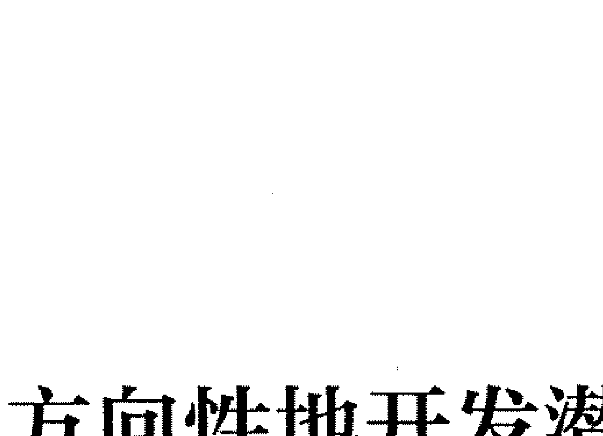

> 西方有句名言：“一个人的思想决定一个人的命运。”在我们的意识中，总有一个“怕”字时不时地跳出来阻碍我们更大潜能的发挥。很多事情看起来好像不可能实现，但是只要我们坚定信念，不怕“不可能”，敢于去挑战极限，我们就有获取成功的希望。

# 有方向性地开发潜能

人人都有潜能，但潜能并不是随意就能得到开发的，潜能的开发具有很强的针对性。这就要求我们在开发自己的潜能时，要有方向性。潜能开发讲究方向性主要表现在两个方面：一是要开发自身的特殊潜能；二是要确定远大的潜能开发目标。

- 第一，开发自己的特殊潜能。每个人都有特长，要最大限度地发挥自身的潜能，我们就必须全神贯注于自己有优势的地方。当我们不停地在自己的优势方面努力时，这些优势会进一步增强，我们的能量就能像火山爆发一样快速、猛烈地释放出来。如此，我们才会获得更多的回报。
- 第二，确定远大的潜能开发目标。有些人之所以会取得成功，就是因为他们能聚集全身的能量，专注地朝着目标努力。最大限度地开发潜能时，也就拥有了无尽的能量。

这里所说的讲求方向性，即有明确的远大目标。如何激发自己的潜能，让生命潜能爆发出来，让你体内的睡狮醒来？如果一个人连自己的目标都不清楚，那么，他就会失去人生方向，盲目地虚度一生。有了明确的目标，我们做每件事就会感觉有意义，就会竭尽全力地找出更好的方法去解决问题，就会调动自己的潜能做好每一件事。

> 英国教育家赫胥黎说：“人生的伟业，不在于能知，而在于能行。”

当你确定了你的目标后，你就愿意付出努力促其实现，不管多大的努力都愿意付出。相反，如果你没有明确的目标，就算你整天忙忙碌碌也永远达不到你所追求的高度，因为你根本就不能做到专一持久。

有明确的行动目标，我们才会有为之奋斗的不竭动力。目标就是希望，目标就是挖掘潜能的动力。我们每个人在自己的一生中，都会遇到许多困难，但真正的困难却在我们自己的心中。如果我们有明确的目标，我们就不会将自己的注意力放在实现目标的困难上，而是将注意力放在自己的目标上。这样，我们便会获得战胜困难的勇气，也会获得实现目标的新途径和新机遇。要知道，当我们眼里只有目标时，我们就不会再去关注困难，我们会只看着目标，只想着目标，只做有助于达成目标的事情。这样，我们的潜能就能得到最快最大的开发。

世界上那些取得巨大成功的人，那些不畏艰难险阻把自己的潜能发挥到最大限度的人，都是对奋斗目标拥有绝对信心的人。他们的注意力从来都不离开目标，即使面对无数困难，他们也会将注意力一直放在目标上，直至成功。

当然，除了要目标明确外，设置的目标还要远大。真正能激励一个人奋发向上的是：确立一个既宏伟又具体的远大目标。许多人惊奇地发现，自己之所以不能像别人一样成功，是因为自己的主要目标太小，使自己失去了奋斗的动力。主要目标不能激发个人的想象力，潜能的挖掘就不会彻底，所以，为了最大限度地激发自己的潜能，就要大胆地调高自己的目标。

鲸遇到身体极为瘦小的沙丁鱼时，便会张大嘴巴穷追不舍。离海滩越来越近了，鲸却全然失去了警觉。等鲸以极快的速度冲向海滩时，要避开险境为时已晚。这时候，鲸的巨大身体因为惯性冲上了海滩，陷在海沙中无法动弹；而沙丁鱼只要很少的水就能逃生。

在鲸与沙丁鱼的故事中，鲸因为追逐小利而死，为了那微不足道的目标而葬送了自己的生命。人也一样，没有远大的目标，就会像故事中的鲸一样，虽有巨大的能力，但当把精力只放在小事情上时，会使自己忘记了自己应该做什么。

没有远大的目标，人就很容易陷入跟理想无关或者是关系很小的现实琐事之中。当一个人忘记自己最重要的事情时，他就会成为琐事的奴隶。记住，人类具有灵性就在于他懂得“该忽视什么东西”的艺术，这种艺术能够刺激一个人迸发出巨大的潜能。

> 杨安 谈灵商

每个人在自己的一生中，都会遇到困难或者重大的挑战并接受困难和挑战的考验。我们如果有明确且远大的目标，就能顶住一切压力，接受挑战，我们的潜能就能得到最大限度的发挥。

## 自信的巨大力量

> 美国思想家、哲学家、诗人爱默生曾说过：“自信是成功的第一秘诀。”

## 灵商
### 潜意识下的心灵财富秘密

信心，虽然看不见摸不着，但它对一个人的心理影响却是巨大的。自信可以激发出人体超乎寻常的潜能。这种潜能一旦被激发出来，将使人得到意外的收获，甚至创造出奇迹。

美国著名女作家、教育家海伦·凯勒，不仅看不见，还听不见，而且不能说话，她依靠自己的触觉读完了大学，成为世界名人。海伦·凯勒之所以能够获得成功，是因为她不仅付出了极大的努力，而且有着坚定的信念，而后者是最主要的。在这种精神的支持下，所有的厄运、病魔、险阻也就不足挂齿了。

心理学家通过无数实验发现，自信可以长期在人的潜意识中支配人的行为。如果一个人常对自己说“我能行”“我一定可以”“这个困难我一定能克服”“我一定会成功”，这些话语就真的会让一个人信心大增、干劲十足，能让一个人更快地发掘出自己的潜能。

卡耐基说：“你的行动取决于你愿望的强度，如果你的愿望苍白无力，那么，你的人生将永远不会有起色。” 相反，如果你充满信心，持之以恒地为你的目标奋斗，那么，在这个世界上，就再也没有什么能够阻碍你奔跑，你就会成为一个成功的人。

有两位年届70岁的老太太，一位认为，自己的人生已经到了尽头，开始着手料理后事；另一位却认为，一个人能做什么事不在于年龄的大小，而在于怎么想、如何努力。于是，第二位老太太开始学习登山。95岁高龄时，她登上了日本富士山，打破了攀登此山的最高年龄纪录。她就是著名的胡达·克鲁斯老太太。

70岁开始学登山，乃是人生一大奇迹。成功人士的首要标志就是，有强烈的愿望和信心。

很多事情看起来非常困难，困难到几乎不可能完成，但是一旦你下定决心，相信你自己一定能完成的时候，它们就立刻变得简单起来。当我们自信能完成一件事情的时候，我们的内心就不会再有恐惧；当我们的内心不再害怕时，我们便有了勇往直前的力量，我们的潜能便会得到最大限度的发挥。

一位著名的成功学家说：“高度的自信是一切成功的基础。如果你对自己非常自信，以致你的激情被彻底唤起的时候，你就会进入一种特殊的状态。这时你的思维和精神力量都会大大增强。”在这样的精神状态下，你会真正感觉到灵感四溢、潜能无限。可以说，信心是成功的根本。所以，无论在学习中还是在工作中，我们都要保持自信，最好是必胜的高度自信。因为自信是潜意识能量的灵魂，没有自信，你的潜能便得不到最好的开发。

那么，我们该如何科学、有效地培养自己的自信心呢？以下的合理化建议可供你参考。

- 第一，经常关注自己的优点和成就。实践证明，经常关注自己的优点和成就，你会越来越有信心。拿出一张纸，写出至少五个自己的优点和五项成就，然后，经常看这张纸，这有利于增强你的自信心。
- 第二，多与自信的人交往。想成为什么样的人，就要多跟什么样的人交往。和自信心强的人接触，你也会自信起来；跟消极的人接触，你也会一蹶不振。
- 第三，学会微笑。微笑会使你增加幸福感，进而增强自信心。
- 第四，多展现自己的优势、特长。这会让你在不断进步的同时提高成功概率，也会让你因赢得更多的赞扬而增强自信心。

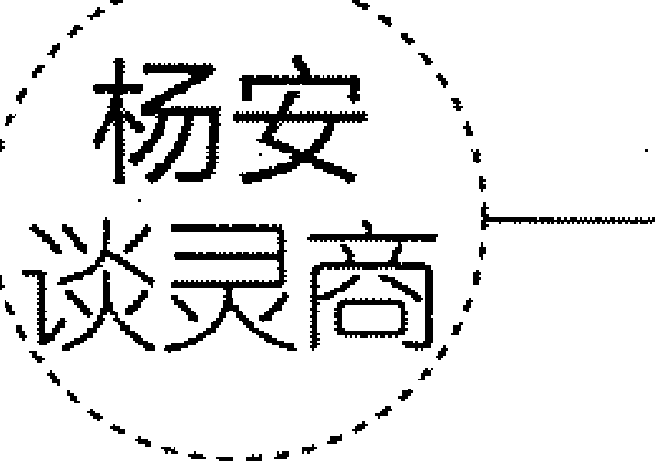

如果你对此时的自己不满意，想力求改变，那么你应该改变自己的思想。即如果你认为你行，你就真行，你就能发挥潜能，就能成功。换句话说，只要改变思想，就能改变人生。

# 潜能的强化

在爱情的路上，“潜力股”男人越来越成为女性百说不厌的话题。何为“潜力股”男人？顾名思义，“潜力股”男人就是具备潜在的能力和力量的男人，一旦抓住机会，他们就能发挥出自己的潜力来。

近年来，社会上出现了“潜能人”和“希望生”的说法。这些说法都从本质上来肯定一个人具备的潜能。每个人都能成才，每个人都能成为自己所渴望的成功者。

当然，需要指出的是，潜能的开发绝不是简简单单说几句话就能达到的，它需要一次又一次地不断强化。在潜能开发的过程中，我们自身或许还会存在不良的行为习惯，要在短期内改掉这些不良习惯是不可能的，所以说，潜能的开发是一项长期而艰巨的任务。在潜能的开发过程中，我们很可能会故态复萌，这就要求我们在开发潜能时要有耐心，反复抓、抓反复，不要因为自己某次的错误或失败就丧失信心、选择放弃。如果这样，那我们之前的努力就白费了。

因此，在开发潜能的过程中，要对错误保持一定的宽容态度。但宽容不是纵容，一旦发现错误，就要积极改正，促使自己一点点进步，直到错误被完全改正，直到潜能成为自己的某项稳定的能力。也就是说，要开发自己的潜能，就要具备恒心和信心。

潜能需要不断强化。一般来说，不断给予一个人一定的压力，可以不断强化一个人的潜能。

联想集团董事长兼CEO（首席执行官）杨元庆，毕业后应聘来到联想集团。作为硕士研究生，他从推销员干起，并且一干就是2年。这份工作，并不是他感兴趣的，然而，正是这份工作极好地锻炼了他的管理才能。

1993年，国内计算机界遇到了有史以来最严重的危机。联想集团也第一次没有完成既定目标。有人撰文：“联想还能撑多久？”为了应对这一危机，杨元庆出任了PC（个人计算机）部总经理。那时的杨元庆还不到30岁，没有PC从业经验，突然接手一个急待起死回生的部门，压力之大可想而知。

正是这巨大的工作压力转变成了强化杨元庆潜能的一种有效方法。面对重重困难和巨大压力，杨元庆的种种潜能逐步被开发出来。杨元庆的管理天赋彻底被激活了。

杨元庆敏锐地发现了PC部管理方面存在的一系列问题。针对问题，杨元庆想了很多办法，最后在杨元庆潜能得到大开发的同时，PC部起死回生了。1996年，PC部一举打破了国内PC市场多年来被国外品牌霸居第一的局面，树立了中国品牌主导中国PC市场的信心。

一个人潜能的强化，有主动强化与被动强化之分。不管采用哪一种强化方式，只要能利用它，迅速地开发、强化个人潜能，人的能量就能奇迹般地释放出来。几年后，杨元庆成了联想集团的副总裁，还先后获得了中国科学院“杰出青年奖”、第二届“中国杰出（优秀）青年科技创业奖”等。

要想不断强化潜能，除了施加一定的压力外，还要不断地重复。重复是开发潜能的金钥匙，可以让艰难的事情变得容易。经常重复一种思想会使一个人产生信念，进而变得坚信不疑；经常重复做一件未完成的事情，事情最终会被完成；经常有意识地重复锻炼一种潜在的能力，该能力就会变成一种稳定的能力。潜意识的改变能够带来潜能的开发。把目标写下来，让自己随时都能看到它，只要重复多次，就能形成能够影响你的巨大能量。

很多失败者比成功者聪明，但他们不愿意坚持到底，不愿意不断地重复正面信念，主动放弃了开发自身潜能的机会。如果你能坚持到底，愿意重复一个信念，并在重复的过程中克服困难，最终把自身的潜能彻底挖掘出来，那么你就会成为成功的、富有的人。

激发潜能，不断强化，就有可能出现奇迹！潜能的开发并非一朝一夕之事，我们可以把潜能开发的大目标分解成若干个小目标，这样更容易达成目标。并且通过小目标的不断实现，我们能不断体验到成功的喜悦，从而增强信心。

## 不要怕失败

每个人都会有失败的痛苦。失败并不可怕，它不仅可以让人清醒，还可以更好地促使一个人开发潜能。一个人的潜能是无限的，成功激发潜能的人可以做成自己想做的任何一件事情。当然，这有一个很重要的前提——不怕失败。

一个人如果惧怕失败，他就不敢为自己的追求放手一搏；一个人如果惧怕失败，他就不敢挑战高难度的目标；一个人如果惧怕失败，他就不敢去不断创新……所有的“不敢”带来的结果只有一个——自己无限的潜能被葬送了，这一生，他只能是个平庸的人。

实际上，失败并不可怕。只要我们善于正视失败，正确对待失败，那么，失败就会变成我们成功的垫脚石，就会变成我们开发潜能的催化剂。因为当我们正视失败时，失败常常会让我们的意志更加坚强，会促使我们拿出越挫越勇的志气去追求目标。

世间上真正伟大的强者都不介意所谓的成败，他们“不以成败论英雄”。无论面对多大的失败，他们都不会轻易放弃目标和追求，因此他们更容易成功，更容易将自己的潜能开发出来。

林肯——美国第十六任总统，其大半生都在奋斗和进取中，其中有九次失败，三次成功，而第三次成功就是当选为美国第十六任总统。正是因为有屡败屡战的意志，所以，在每次失败后，林肯都会爬起来，最终取得了伟大的成功。

成功的路上，谁都不可能一帆风顺。抱着感恩的心态，感谢成功路上的失败，失败就会真正成为“增益其所不能”的考验。懂得感恩，就能在失败时看到差距，在不幸中得到慰藉，极大地激发出自己的勇气和潜能，进而获取前进的力量。

惧怕失败、不冒风险地过一辈子，这样确实可以使人获得平静，也确实可以使人拥有一个“比上不足比下有余”的人生。但那样的人生是一个乏味的人生、一个平庸的人生。最为痛惜之处在于，那样的话，你自己葬送了自己的无限潜能。你本来可以有机会摘取更大的成功之果，你本来可以享受更多的成功喜悦，可你却与它们失之交臂。所以，与其造成这样的悔恨和遗憾，不如勇敢地去探索和进取。

其实，失败并不可怕。相反，每一次失败，都是一次超越自我的机会。

> 林肯竞选伊利诺伊州的参议员失败后说：“如果圣明的百姓用他们的智慧决定我该接受这个磨炼，那么，我便会从失败中学会某些真理，而不致过分愤怒。”可见，每一次的失败，都能磨炼我们的意志，增加我们的勇气，考验我们的耐心，培养我们的能力。

美国成功学专家拿破仑·希尔对自己的七次失败做了总结后说：“它们看起来像是失败，其实却是看不见的慈祥之手，阻拦了我的错误路线，并以伟大的智慧强迫我改变方向，让我向着对我有利的方向前进。”失败，是超越自我的一个坐标。当你失败时，你便发现此路不通，自然就会寻找其他的正确道路。找到了正确的道路，你的潜能便会得到最快速的开发，你才能完成一次次的自我超越。

历史告诉我们，人需要在失败中不断超越自我。当一个人不怕失败，完全调动起自身力量争取超越自我的时候，他就能达到新的高峰。因此，我们必须要抛弃“以成败论英雄”的偏见，着眼于充分发挥自己的潜力，着眼于自我超越。苏联作家佩克利斯指出：“人的伟大和强大正在于——人能调动起自己体力、智力和情感上的潜力，始终不渝和一往无前地战胜一个又一个困难。而且，困难越大越复杂，就越能调动潜力的积极性，人的力量也就能得到最大限度的发挥。”

杨安
谈灵商

原中国女排教练袁伟民说过：“在事业的追求中，不可能出现一步登天、一举成功的幸运儿。没有一个世界冠军不是从失败中走过来的。不会正确对待失败的运动员和教练员，绝不可能登上事业的顶峰。”惧怕失败是人生的真正失败。一帆风顺的人无法到达创造的顶峰，其潜力也不可能真正发挥出来。

## 灵商修炼法5
## 身心健康

心理健康与生理健康有着密切的联系。什么是健康？健康就是平衡。不论是身体上还是心理上，都要实现平衡。因为只有身心健康，我们才能获得来自内心深处的平静安详的力量，才能更快地提高灵商，才能愉悦地享受健康快乐的人生。

## 身心健康与能量聚集

健康高于一切，世人已经认识到了身体健康的重要性。

健康为什么重要？因为完美人生有三大标准：健康、富有、自由。在这三个标准中，健康对我们来说最重要。因为健康是对一个人影响最大的因素。

曾有人用 “10000000000” 来比喻人的一生，这里的 “1” 代表健康，而 “1” 后边的 “0” 分别代表生命中的事业、地位、金钱、权力、房子、车子、家庭、爱情、孩子，一个同时拥有这些东西的人确实非常成功。假如有一天他丢了其中的一个 “0” 或两个 “0”，对这个人来说也不会让他一无所有。可假如没有了健康这个 “1”，后面的 “0” 再多都对这个人没有任何意义。也就是说，失去了健康就失去了一切。所以，对任何人而言，健康都是第一位的。

健康是生命之本，身体健康是一个人实现其他目标的重要前提。中国有句古话：“工欲善其事，必先利其器。” 身体健康才能提供给我们实现目标的能量。然而，许多人不爱惜自己的身体，不注重养生。他们年纪轻轻，却未老先衰，他们的身体总是处于一种亚健康状态。他们全然不顾身体状况，仍然从事繁杂的工作，结果常常是身心俱疲。没有好的身体，一个人就算有再好的天赋，最终只会取得微小的成功。身体不能正常运转，何谈目标？何谈梦想？

身体健康，才会具有实现梦想的能量。如果你整天都在无休无止地工作，抛弃了所有能让生命充满活力的娱乐与享受，那你只会在无形中降低自己的能力，扼杀自己成功的可能性。缺乏娱乐，缺乏适当的享受，都可能使我们生命的能量减少。因此，为了达到生活的平衡，过一种轻松高效的日子，就要养成健康的生活习惯，保证体力和能量，为成功打好基础。

身体健康固然重要，但也不能忽略心理健康的重要性。我们正处在一个竞争激烈的时代，巨大的生存压力、个人对成功的渴求及愉悦的生活，使我们忽略了对健康心态的培养。实际上，健康的心态是一种精神优势，是一种无形的力量，对激发我们的主动性和创造性是非常有利的。

事实证明，当我们的心态消极时，我们的能量就会降低。可以说，健康重要，心态同样重要。没有强健的体魄和积极健康的心态，我们对目标的追求也就失去了基础和保障。

另外，人们之所以重视心理健康，是因为心理健康的人有良好的自我意识，能保持自尊、自信；能坦然面对现实，做到“胜不骄，败不馁”；能保持正常的人际关系，能承认别人、接纳别人；有较强的情绪控制力，对外界的刺激反应适度；能乐观处事、满怀希望；能珍惜生命、热爱生活。

人们一直追求身心健康。早在 1948 年的时候，世界卫生组织就明确规定：健康不仅仅是没有疾病或虚弱，而是在身体上、精神上和社会适应方面的完好状态。

身心健康才能聚集能量，那么我们如何保持身心健康呢？

- 树立明确的生活目标

如果没有生活目标，我们的生活就可能乏味、无聊，也可能滋生各种有害健康的恶习。不仅如此，没有明确的生活目标，我们的内心也会非常空虚，要身心健康，就必须树立明确的生活目标。

## 2. 养成良好的生活习惯

> 《黄帝内经》有言：“上古之人，其知道者，法于阴阳，和于术数，食饮有节，起居有常，不妄作劳，故能形与神俱，而尽终其天年，度百岁乃去。”

这里强调了养成良好生活习惯的重要性。良好的生活习惯会使人终生受益，使人保持身心的健康。

## 3. 增加业余爱好

现代生活紧张而繁忙，在紧张和繁忙之余，找一个安静之地，做一些自己感兴趣的事，可以调节心情、消除疲劳。

## 4. 塑造幽默乐观的性格

幽默不仅能调节人们的心理健康，还能调节人们的身体健康。在“无法治疗的病”的研究中，一位医生说道：“幽默和生理状态有很大关联。幽默引起的大笑会使肌肉乱了步调，与肌肉有关的疼痛就可能在一阵大笑之后随之消失。”

健康的身体是智慧与灵魂的载体，是事业成功之母，是人的第一财富。一个人没有健康的身体将一事无成，而心理健康是所有事业有成者的标志。生活中，我们难免会有痛苦和烦恼，要想减少痛苦和烦恼，就得及时调节身体和心理状态，使其保持健康状态。

# 身体是思想的载体

身体是一切的根本，是灵魂与思想的载体；身体是一个巨大的容器，装载着一个人的所有记忆。当你有某一想法时，你的身体也会产生相应的反应。

梅尔龙是一位已被医生确定为残疾的美国人，靠轮椅代步已有20年。

梅尔龙的身体本来很健康。19岁那年，他赴越南打仗，背部被流弹打伤了。经过积极的治疗，他还是无法行走。

梅尔龙整天坐在轮椅上，觉得自己这辈子完了，有时就借酒消愁。一天，从酒馆出来后，梅尔龙照常坐着轮椅回家，结果遇到了三名劫匪。劫匪要抢他的钱包，他拼命呐喊和抵抗。劫匪恼羞成怒，放火点燃了他的轮椅。

轮椅突然着火了，梅尔龙急忙站起来，拼命往前跑，竟然一口气跑完了一条街。事后，有人问他是如何做到的，他说：“当时不逃，就会被烧伤，甚至被烧死。我忘了一切，拼命逃跑，直到停下脚步，才发觉自己能够走。”之后，梅尔龙成功地找到了一份工作，他能够与常人一样生活了。

案例中，梅尔龙遇到劫匪前接受了医生确定他已残疾的事实，身体也产生了相应的反应，变得无法行走并借酒消愁，他认为此生已完了；遇到劫匪后，突然而来的遭遇让他忘记了自己无法行走，被急于远离遭遇的思想取代，身体上也产生了相应的反应，他一跃而起，拼命逃跑。

# 灵商修炼法5 身心健康

人的身体是思想的载体，当我们感到委屈、伤心、压抑时，就会引起身体上一连串的不良反应，比如心脏病、肝上火、肠胃不适等。俗话说：“德智皆寄于体，无体是无德智也。”也就是说，我们的身体受命于思想，不管思想发出的命令是有意的还是无意的，是积极的还是消极的，我们的身体都会做出反应。积极的思想会使我们的身体青春永驻、美丽长存；消极的思想会使我们的身体沾染重疾，日益衰竭。

疾病与健康根植于人们的思想。健康之身，是积极思想的载体；羸弱多病之躯，是消极思想的载体。比如，焦虑会使人的体质迅速变差，并极易导致疾病；而愉悦的思想会使人的身体充满活力。

人的身体就是一台精密的仪器，随时响应思想的号召，思想的好坏直接决定了身体的好坏。在生活中，我们经常会看到，有的老人虽然已经90多岁的高龄了，但依然鹤发童颜、精神矍铄；有的中年人却面容憔悴。造成这种差异的原因很多，但不可否定的是，前者多半性情温和、天真烂漫；后者则性情暴躁、矫揉造作。

一个人如果思想不健康，其身体里流淌的血液也会不健康。污秽的思想，只会让身体日渐衰弱。所以，要想身体健康，我们必须要有一颗纯真的心，纯真的思想有助于身体的健康。若思想纯洁了，心灵被净化了，那么，疾病就会慢慢远离你。运动、美容确实能让我们拥有强健的体魄和美丽的容颜，但要持久保持强健的体魄和美丽的容颜，我们能依靠的只有充满善意与仁爱的思想。

> 杨安谈灵商
>
> 若论如何强身健体，乐观通达的思想是最好的方法；若论如何远离不愉快，心存善念是最好的良药。愤世嫉俗、常常抱怨，结果只能是作茧自缚；而宽厚待人、无私奉献则是通往天堂的捷径。

## 减压：找回灵感

诱发灵感的办法有很多，在中国古代有人曾提出一种成功诱发灵感的方法——以“养气”使身心进入“虚静”——排除内心的一切杂念，使精神净化，在“虚静”境界里，以求得灵感的到来。在这里，“养气”就是要“清和其心，调畅其气”，使其心情舒畅、思路清晰、虚心静气。实践证明：减压正是达到“养气”目的的必经过程。

一般人都会有这样的感觉，如果毫无压力、心情很好，我们就会浮想联翩、文思泉涌。而当我们压力重重、心情不好甚至极其恼火的时候，我们的大脑就会一片空白。这就是情绪与灵感之间的密切关系。这种关系在艺术家、作家、科学家等的身上表现得特别明显。郭沫若曾经谈到他在大学里创作《地球，我的母亲》这首诗时的情形：我甚至连课都不去上了，我狂奔出去，匍匐在宽广的路面上，好像是聆听到了大地母亲的呼吸声，随之，我的写作灵感扑面而来。在古希腊，很多科学家、哲学家甚至认为只有疯癫的精神状态才会产生巨大的创造力。在这里，所谓的“疯癫的精神状态”就是一种无压力的精神状态。

中国有句古话：“精诚所至，金石为开。”可是为什么我们非常热切、非常诚挚地祈求灵感的降临，它还是迟迟不肯出现呢？调查显示，工作紧张、身心疲劳、身体亚健康、心情欠佳是影响人们灵感发挥的重要因素。而这些因素无不与压力有关。一言以蔽之，压力会阻碍我们激发灵感。因此，要激发灵感，减压势在必行。

有哪些简单有效的减压方法可以帮助我们找回灵感呢？

第一，泡一杯茶是激发灵感的好方法。众所周知，工作日朝九晚五，时常加班加点已经是人们习以为常的事，繁重的压力常常让人们的休息时间越来越少。既然休息时间少得可怜，那么，如何在这短短的休息时间内，让心情得到暂时放松，为灵感的光临做好准备呢？积极的生活态度、良好的作息习惯、轻松愉快的心境有助于我们发挥灵感，而每天在忙碌的工作间歇为自己泡一杯茶，是最能激发灵感的方法。细细品茗，慢慢回味，说不定在你享受舒爽轻松一刻的同时，灵感就“盯”上你了。

第二，美妙的音乐是滋养心灵的最好方法。美妙的音乐总能用动人的旋律演绎至真至纯的原生状态，让你如临大自然，在“大自然”里没有压力，没有喧闹，只有清新与纯净，在这样的状态下，我们的心灵就会归于平静。

第三，定期旅行，与大自然对话。大自然是世界的营养品，人类的身心都需要它的滋补。正如爱默生所说的：“人是一种活动的植物，他们像树一样，从空气中得到大部分的营养。如果他们总是守在家里，他们就憔悴了。”所以，定期旅行，走进自然，我们的身心就能得到滋养，就能远离压力。

第四，疲惫时深呼吸。疲惫的工作之后，我们不妨选择一个安静的环境，舒服地坐下，闭上双眼，缓慢地呼吸。慢慢地体会自己呼吸的节奏，当我们感觉到呼吸非常均匀时，让我们的大脑放松下来，让我们的思绪自由飞翔。片刻后，慢慢睁开自己的眼睛，我们的心情就会慢慢愉快起来，我们就会从中得到力量和快乐。

第五，每天适当地走一段路程。生活中，我们习惯开车抑或是乘坐公共交通工具，但我们忘记了走路。当我们低头匆匆而行的时候，我们不但在心底种下了急躁的种子，还忽略了沿途风光秀美的景色。当我们静下心来，放慢脚步，会发现周围美丽的景色。我们放弃了交通工具，但收获了内心的平静，也能点燃灵感。

### 杨安谈灵商

人们的生活中充满了各种各样的压力，即使是最有智慧的人也无法彻底消除压力。倘若我们不懂得如何给自己减压，终有一天我们会被压力压垮。所以，当压力不可避免时，我们就要不断地给自己减压，这样，我们才能遇见灵感。

## 心理状态：积极与消极

每个人都会随身携带一种看不见的物品：一面写着“积极心态”，一面写着“消极心态”。心态积极的人，面对问题、困难、挫折、挑战时，能够积极采取行动；心态消极的人，受到自身或外在因素的影响时，就会想到不好的、负面的东西，丧失信心。

积极心态是一种主动的生活态度，反映了一个人的胸襟、魄力。积极的心态会给人以力量，会使一个人变得阳光、开朗。拥有积极心态的人并不否认消极因素的存在，他们只是学会了不让自己沉溺其中。怀有积极心态的人常常能心存光明远景，他们总能把“负”的影响变成“正”的能量。即使他们身陷困境，他们也能以愉悦的态度走出困境。

段云球是中国版保尔，他凭借百折不挠的坚强意志为人们所熟知。段云球2岁时，父母离异，7岁那年火车夺走了他的双腿和右手，他的身体只剩下四分之一，从此他开始了“四分之一”的生活。面对如此残酷的打击，段云球并没有动摇对生活的追求。没有右手，他用左手处理生活中的琐事；没有双腿，凳子成了他“行走”的必备工具。然而，厄运并没有终止，四年级时他被迫退学，但是顽强的他通过自学，完成了从小学到中学的全部课程。长大的他开始发奋写作，在5个月的时间内，写出了一部长达20万字的自传体小说《当身体还剩下四分之一时》，引起了社会的广泛关注。

人生路上难免有逆境，对于那些拥有积极心态的人来说，每一种逆境都是隐藏着更大收益的种子。在他们那里，逆境也能变成峰回路转的契机。海伦·凯勒失去了听力和视力，却在文坛上留下了不朽篇章；弥尔顿的眼睛看不见，他却用美好的诗篇描绘了世界；贝多芬耳朵失聪，却谱出了最振奋人心的曲子……他们的人生备注为“负”，但凭借积极的心态，他们在人生的大书上写了大大的“正”字。

心态消极的人却恰恰相反。他们排斥财富、成功、快乐和健康，结果导致贫穷、失败、悲观和痛苦。习惯用消极的态度去丈量生活的土地，美好的事物只会离你越来越远，你的生活也会变得毫无意义。

赵明大学毕业后应聘到某外资公司上班，与同事小琳一见钟情，很快他们就确立了恋爱关系。结果，2个星期后，小琳辞职了，并跟赵明分了手。赵明感到异常惆怅和烦恼。平时喜欢说笑的赵明不见了，他被消沉的气息所笼罩，对事情失去了兴趣，他的工作频频出错。他甚至开始怀疑生活的意义，口口声声说“连累父母，还不如死了”。

赵明由于恋爱遇到挫折而产生了消极心态。消极的心态让他看不到生活的美好，让他觉得生活无趣。

消极的心态无论是对人的身体还是对人的心灵都是一种摧残，因此必须加以改变。以下是几种改变消极心态的方法：

1.  **积极参加锻炼。** 锻炼能使人产生一系列化学变化和心理变化。慢跑、户外散步、跳舞、游泳等活动，就能改变消极心态。
2.  **改善营养。** 多吃富含维生素B的食物，有助于改善消极心态，比如：全麦面包、蔬菜、鸡蛋等。
3.  **向人倾诉。** 向亲朋好友倾吐心里话可以将不良情绪消除掉。
4.  **奋发工作。** 人一旦把精力集中到工作上，便能有效改变消极的情绪，忘记忧伤和愁苦。
5.  **外出旅游。** 心情不好的时候，看看青山绿水，我们的消极情绪就会慢慢消失。
6.  **看电影。** 人在消沉时，看一场喜剧电影，就会暂时忘记不快。这种方法效果非常明显。

总之，心态是我们命运的控制器。消极的心态是失败、疾病、痛苦的根源；积极的心态是成功、健康、快乐的有力保障！心态在一定程度上决定成败！选择了积极心态，你就可能到达成功的彼岸；选择了消极心态，也就意味着选择了失败。所以，无论环境的好坏，我们都要怀着积极的心态去应对，这样，我们方能实现更高的人生目标，我们的灵商也会越来越高。

### 杨安谈灵商

当你选择了积极的心态，你的身体内便有了平和、愉悦的因子。因为具有积极心态，你不需要凭借他物、他人就能在内心建立起安全感和充实感；因为具有积极心态，即便是独处，你也不会感到寂寞，仍能自得其乐。一个人不断构建自己积极心态的过程，也是提高灵商的过程。

## 压力自我管理

现代社会，人们的生活节奏越来越快，各种压力纷至沓来：考试的压力、升学的压力、就业的压力、升职的压力、来自爱人的压力、来自父母的压力……面对压力，控制不住自己的情绪，不仅会让自己失态，还会给周围的人造成不好的影响。

40岁的孙强是位高管，他的脾气非常好，但最近部门的业绩很差，他备感压力，心情压抑到了极点。这天下午，总经理就业绩与他进行了谈话，他的心情更是糟糕透了。

孙强从总经理办公室出来后，助理将一份报告交给他。没想到工作一向认真的助理把报告打错了，孙强顿时暴跳如雷，他拍着桌子，把报告直接扔到助理头上。助理委屈地哭了，孙强依然扯着嗓子不罢休！

冷静下来后，孙强对自己的做法感到很后悔。

快节奏的生活会给人的情绪带来恶劣的影响，你是不是也有这样的体会：莫名烦躁，看什么都不顺眼，动不动就想发火，想跟人大吵一架……其实，这些都是压力大导致的。当你的压力超过了你的心理承受极限时，你还会出现失眠、头痛、焦虑、强迫等精神症状，进而引发身体疾病。

张先生是某公司的一位高管，他的工作压力非常大，基本上月月出差，他说自己都快成“空中飞人”了。最近他经常感到身体不舒服，刚开始没太在意，后来情况越来越严重了，到医院检查后才知道自己患了冠心病。

生活中，像张先生这样的人很多。由于压力过大，许多人的身体在不知不觉中变差了，精神越来越紧张，心理开始扭曲，最终产生严重的心理疾病。在这种情况下，一旦发生弹性疲乏，势必会造成精神上的彻底崩溃，降低人们的灵商。

的确，伴随着生活水平的提高，越来越多的物质财富被人们创造、开发出来，然而，人们的压力也在不断增大，越来越多的人根本感受不到生活的幸福，感受不到内心的平静。因此，如果你想要找到原始的幸福感，找到久违的安定感，不被沉重的心理压力压垮，你就必须要学会管理自己的压力，学会与压力共处。那么，我们该如何学会更好地与压力共处呢？

第一，坚持写压力日记。这是一种简单而有效的理性反思方法。坚持撰写压力日记，可以帮助我们找出压力产生的真正根源。一般来说，人们总习惯于把压力产生的根源归于客观事实，却意识不到自己的思想、情感才是压力产生的真正根源。

当我们感到有压力的时候，把它写下来，然后尝试着去问自己这样一些问题：“是什么原因造成了目前的压力？”“我现在的状态如何？”“我该如何摆脱这种状态？”“什么可以让我重新感到轻松？”在认真回答完这些问题后，相信你一定会有新的收获。

第二，避免不必要的压力源。避免压力过大的有效方式之一就是减少不必要的压力源。我们可以这样做：

- 学会说“不”。喜剧大师卓别林说：“学会说‘不’吧，那样你的生活将会美好得多……”在工作和生活中，你如果觉得某件事情确实超过了自己可承受的范围，那么就勇敢说“不”，要学会拒绝。
- 回避总给你添麻烦的人。
- 避免自寻烦恼。要知道，你担忧的很多事情，根本不可能发生。
- 适当缩减自己的工作清单上的工作内容。把那些并非一定要做的工作直接去掉。
- 尽量避免谈论会让你感到不安的话题，比如裁员。

第三，改变压力情境。我们可以这样做：

1.  表达自己的内心。如果某项任务或某人让你感到不悦，就以一种开放和尊重的方式进行沟通。如果你把情感隐藏于心底，怨恨就会升级，双方的关系会更紧张。
2.  提前准备。提前准备可以让自己变得更加自信，不至于让自己处于被动的局面，以减少压力。
3.  学会管理时间。不会有效地进行时间管理会给我们带来巨大压力，当我们发现自己的工作已经拖延得太久时，就会很难保持冷静，从而会压力重重。所以，我们必须学会分清轻重缓急，按照事情的优先级别来做事情。

人可以承受适当的压力，却不能永久地忍耐，所以，每经过一段时间，就要释放压力、放松自己：或旅游，或听音乐，或睡懒觉，还可以什么也不做，彻底给自己放一天假。减压，才能让心灵得以放松。

## 做一个简单主义者

> 伊索说：“许多人想得到更多的东西，却把现在所拥有的也失去了。”

确，沮丧大多是因为欲望太多。欲望太多，就成了贪婪。贪婪就像一朵妖艳的花朵，美得让你心花怒放，美得让你只注意到它的精美，却忘了怎样提防它的香气——那是一种让你身心疲惫却永远也感受不到幸福的毒气。从此，你的双眼被虚荣所蒙蔽，你的心灵被索求所占据。

慧律法师说：“只要内在的‘贪’不除掉，你就会永远烦恼，只要你不断地向外在的一切现象攀缘贪求，你就永远有挂碍、有恐怖、有烦恼，不得自在、不得解脱。”清代学者金缨在《格言联壁》中说：“人之心事，多欲则忧，寡欲则乐。”意思是说，人的很多烦恼，大都来自贪欲。人如果少一分贪欲，心里就会多一分欢乐，精神就会多一分爽快。

年轻的时候，孙雪很贪心，对什么都追求最好的，在工作中，更是拼了命想抓住每一个机会。有一段时间，她手上竟然同时有9个项目，这让她每天忙得昏天暗地，压力也越来越大。慢慢地，孙雪发觉拥有再多，都不能让她感到快乐；相反，她觉得那是一种沉重的负担。她的内心越来越不安。

后来，“灾难”发生了——她独资经营的公司倒闭了，男友也离她而去……一连串的打击直奔她而来，她沮丧极了，甚至考虑过要结束自己的生命。

在面临崩溃之际，她向一位朋友求助：“我什么都没有了，我都不知道我还能做什么。”朋友沉思片刻说：“你什么都能做啊，别忘了，当初你可是从‘零’开始的！”

她终于明白了：“是啊！我本来就一无所有，既然如此，我有什么好怕的呢？”想法发生了转变，孙雪有了重新奋战的勇气。在接下来的日子里，她浑身充满了活力，一年后又创办了一家新公司。

历经挫折后，孙雪体悟到了人生的真理：费尽了力气去争取，虽然能有所得，最后却也不免有所失；一个人一旦学会了放空，就能带来更大的能量。她真正地学会了“舍”。为了简单生活，她不再痴迷于应酬，也不再迷恋大房子，为了方便工作，她干脆就在公司附近租了一间小房子，淘汰了那些不必要的家当，房子里只留下一张床、一张桌子、一个茶几。现在她的每一天都过得那样踏实和幸福。经历了这些后，她赫然发现：原来一个人真正需要的并不多，那些附加的东西只不过徒增人的负担而已。

每个人都有欲望，都希望过上丰衣足食的生活，这无可厚非。但是，如果把欲望变成无止境的贪婪，人就会成为欲望的奴隶。

> 圣严法师告诫人们：“贪心的人就像一只爬上结满果实的桃树上的猴子，看到满树白里透粉的桃子，每颗都想吃，结果摘了一颗放在手里，又摘两颗夹在腋下，最后，不但一颗桃子都没有吃到，还把自己累得半死。人往往就是这样，被贪心带来的许多烦恼给累死了。”

静下心来想一想，有什么东西值得我们用生命去换取呢？所以，我们要学会适当地“修剪”一下自己的欲望之树，做一个简单主义者。若能如此，我们的心便不会随着物欲而起伏不定，我们也不会错过生命的花期。

有人之所以不愿做简单主义者，是因为他们觉得简单主义者就像和尚，过着“苦行僧”般的生活，完全放弃了自己“世俗”的东西。还有的人对简单主义者抱有的只是一种善意的好奇之心。但人们通常不会想到，简单主义者在这样的生活中所得到的是真正的快乐。而我们当中的许多人接受简单主义生活方式的首要原因就是让自己能变得快乐轻松起来。

### 杨安谈灵商

对于任何人来说，人生无所谓得到，更无所谓失去，那些只不过是物象的一种流动而已。我们确实没有拥有过什么——除了心灵内在的感觉、领悟及生命的成长。

## 调节生活和工作节奏

在快节奏的生活中，“匆忙症”正困扰着越来越多的人。患有“匆忙症”的人经常感到压力重重，他们经常觉得时间不够用。你是否也有同样的经历：走在路上，你会不自觉地加快脚步，但就是不知道自己在赶什么；骑车时，你会不知不觉地加速，却不知道这样做的目的是什么；睡觉之前，仍想着明天第一件事要做什么，想着还有什么事情没有完成，想着想着，不知不觉天就亮了……如果这些问题的答案都是肯定的，那么，很显然，你也成了“匆忙症”患者。

人们这样“匆忙”难道真的能使自己提高效率、给自己带来快乐吗？“匆忙”并不能使人们提高效率，也带不来成就感，更带不来快乐；相反，“匆忙症”患者只会觉得成天忙忙碌碌却劳无所获，只会觉得越忙越乱，觉得越忙越迷茫，长此以往，他们的生活就陷入了“怪圈”。

李小帅在一家食品公司一干就是7年，现在是销售经理。几年来，随着职位的升迁，他的工资、待遇一路水涨船高。刚开始，他对这种状## 灵商修炼法5 身心健康

他非常满意，琢磨着46岁就提前退休，到时去过田园生活。但是近来，他感到自己越来越“不对劲”了：莫名其妙地感到烦躁；动不动就大发雷霆；一有事就狂躁不安；做什么都静不下心来；开车上班时，即使时间充裕，也会不由自主地一路加速……更让李小帅感到惶恐的是，他觉得自己每天都忙个不停，忙碌一天，最后却发现收获不大，自己的心情也变得越来越糟。

越忙越烦——“匆忙症”的典型特征。“匆忙症”的病因是生活和工作节奏过快带来的压力。要远离“匆忙症”，我们就必须学会调节工作和生活节奏，那么，我们该如何调整工作和生活节奏呢？

要调整工作和生活节奏，最主要的是我们不应动不动就拿效率来强迫自己工作。在快节奏的工作和生活中，我们过于重视效率而忽略了自身的价值。在效率的鞭策之下每一个人都像机器一样忙得一刻不停，这样的生活注定毫无幸福可言。因为当我们将高效率奉为生活的最重要的标准时，一旦我们自己达不到既定的要求，我们就会为之生气、为之烦躁。这样，我们的生活就会变得痛苦，变得毫无趣味可言。

事实上，整天强迫自己工作并不会有什么效率。成果和花费的时间并不一定成正比。很多时候，我们强迫自己工作，只会损耗我们的体力和创造力。我们需要暂时停下工作，让自己放慢脚步，让自己静下来。当我们静下来时，我们就可以和内在的力量接触，我们就可以获得更多能量。

此外，要调整工作和生活节奏，我们还可以尝试以下几种方法：试着慢点走路，轻点说话；在不需要守时时干脆丢掉手表，让自己忘掉时间；下班后忘掉工作，参与一些娱乐性的活动；去散步、登山、滑雪、垂钓，或坐在草地或海滩上晒太阳；抽时间和家人一起到公园共度一个美好的下午……要学会放慢工作和生活的节奏，过一种“修养灵魂的生活”。

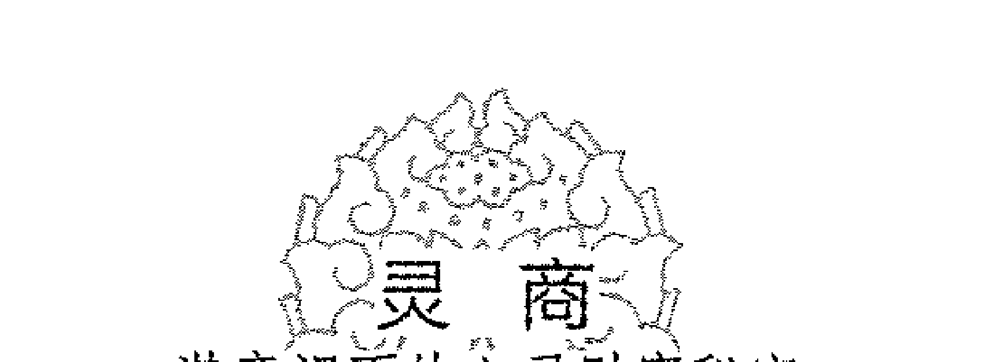

只有懂得放松的人，才会做好工作，因为他们知道如何让这一刻与下一刻完全没有关系。在这一刻，你可以彻底地放松，忘记一切，闲适悠然；在下一刻，你可以果敢地行动起来，全身心地工作。玩就玩得痛快，闲就万事皆休般地闲，做起事来就全身心地去做。不会放松的人，就不会全力以赴地做事。

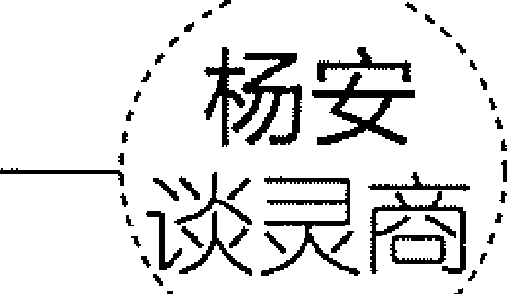

悠闲与工作并不矛盾。要处理好二者的关系，最重要的是能拿得起、放得下。俗话说得好：“磨刀不误砍柴工。”该工作的时候就好好工作，该休息放松的时候就玩个痛快。这样才能更好地工作，更好地生活。

## 改善生存立世方式

在现实生活中，由于每个人所面临的条件——不管是主观条件还是客观条件都有所不同，这就直接导致了每个人生存立世方式的不同。通过无数观察和总结，心理学家及社会学家对人们的生存立世方式进行了分析，并将其分为以下四类。

第一类，被动承受生活。所谓被动承受生活，就是不懂争取、不懂创造，能忍耐、再忍耐。这类人对于自然界和人类社会的恩赐没有多少的概念，只会按部就班地承受大自然或人类社会所给予的。比如，大自然或人类社会赋予了自己快乐，就去享受快乐；大自然或人类社会赋予了自己痛苦，就去承受痛苦。他们根本不会用勇气和毅力来战胜痛苦，更不会努力获得快乐。

对于这类人来说，他们的生命意义多是按照生理的必然性来实现自我本性。他们往往更注重肉体的生存，而不会去花力气寻找更有意义的生活，也就是说，对于心灵或精神的发展和完善，他们并不重视。

第二类，应付、糊弄生活。应付、糊弄生活，这个并不难理解，就是只服从或应付生活所给的安排，没有自己的主见，对生活缺乏目标和方向，缺乏高度的责任感，只满足于现实生活的现有状况，根本不考虑去发现生活中的“新大陆”。

应付、糊弄生活的人缺乏对生活的激情，缺乏责任感。他们不会树立远大的目标，他们一般会毫无斗志地应付生活，不会认真负责而严肃地对待生活中的各种问题。

应付、糊弄生活的人，在生活中往往随大溜、求中庸，只是用“无所谓”的态度对待生活。应付、糊弄生活的人依附性很强，遇到困难和挫折时，他们只会逃避和屈服，不去奋斗。持这种生活方式和生活态度的人，最大的缺点就是缺乏自觉性。这种人虽活着，却是毫无意义的。

第三类，无穷尽占有生活。无穷尽占有生活就是只想从生活中“索取”。无穷尽占有生活的人，一般会被贪欲牢牢地控制住。他们注重的是物质享受；在人际关系方面，他们在乎的是索取——从社会、从他人那里索取，而不在乎对社会、对他人的奉献，不在乎与他人的合作。一般来说，无穷尽占有生活的人“利己”性非常强，在待人接物中，他们的利己思想非常严重。

第四类，不断创造生活。不断创造生活的人，有着积极的思维，他们每天都是迎着太阳生活，对他们而言，生活的每一天都是崭新的；懂得创造生活的人，有着坚定的目标，充满着追求目标的激情，并能在现实面前，做到目标始终如一；不断创造生活的人，有着积极的创造性，他们不是被动接受大自然的赐予，而是去积极地创造新生活，发现新东西，用自己的创造活动丰富大自然和人类社会；不断创造生活的人，不会被贪欲所迷惑，他们不求占有多少，不比索取，而是注重对他人、对社会的奉献；不断创造生活的人，不会应付、糊弄生活，他们会积极发挥自我能动性，积极提高生活质量，做出更大的成绩。

这种生存立世方式重在强调人的创造性本质，突出人的灵性和独立性。因为具备了灵性，所以一个能创造生活的人能很好地去适应社会给人们定下的规则；又因为具备了创造性，所以能创造生活的人又能从社会生活这个大环境中相对独立出来，通过创造性的活动去改善生活和社会，使自己与社会、与生活保持一种和谐关系，并能使生活向更符合自己的心灵需求和生理需要的方向发展。这样，一个人才能真正爱上生活，进而发现生命的意义。很明显，如果我们想要自己的身心更加健康，想提升自己的灵商，我们就必须按这种生存立世方式努力生活。

### 杨安 谈灵商

身心健康的人的生存活动是自觉的、有目的的，而有目的的生活就是有意义的生活。身心健康的人之生存方式具有意向性，具有意向性的本质就是人的生存活动有意义，即人是懂得追求生命意义的，而懂得向内叩问生命意义，恰恰能提高我们的灵商。