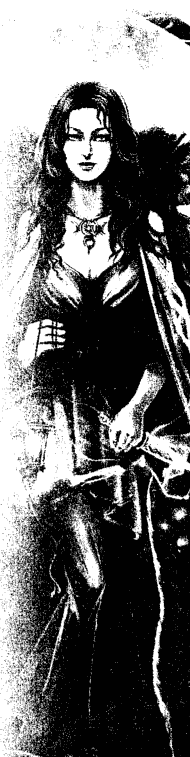
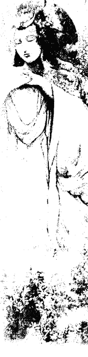
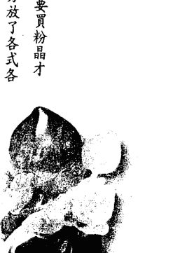

# 灵媒的爱情解药

## 《推薦序》
## 超級女巫的愛情魔法——YoYo！自在！

知名廣告人、廣播主持人 范可欽

我認識 YoYo，是因為她來上我在中廣主持的節目《范可欽的異想世界》，我從來沒見過女巫是長什麼樣子，對她的女巫身分非常好奇，結果走進來的是一個有雙靈活大眼睛的女生。我最喜歡找一些聲稱自己有特異功能的人到節目來踢館，用開放叩應的方式，讓觀衆隨機打電話進來測試他是否真有能力。那天每個人只要提供姓名、生日，YoYo 立刻可以從這些資訊中知道這個人遇到的問題、心裡的疑問，經過將近二十個人的測試，所有問題的回覆都百發百中，讓我覺得：嗯，她真的有一套！

她敘述她小時候會看到奇奇怪怪的東西和靈魂，我還記得那天她坐在我面前，她背後是隔著玻璃的播音工程室，我就請她轉身，透過玻璃看看裡面有多少人，她說有六個，可是事實上只站了五個人，當天所有播音室的人都嚇得花容失色。她說，這種密不透風、沒有窗戶的地方常常會有類似這樣的靈魂出現。這就是我對她的第一印象。

後來我們變成非常談得來的好朋友，我在主持電視節目《和你想得不一樣》時，邀請她和她的先生——Eddie 來當特別來賓，那一集錄影時發生了攝影棚從來沒有過的怪現象，開錄時連續三次發生機器當機、喇叭發出異響、斷電等事件，YoYo 最後忍不住了，拿起她的法器，在攝影棚到處舞弄一番，於是攝影棚就恢復了正常，這是我對 YoYo 的第二個印象。

我發現 YoYo 擁有跟動物溝通的奇特能力，有一次和朋友吃飯時，朋友的女兒拿了張寵物的照片，想知道她把寵物照顧得好不好。我看到照片便大吃一驚，原來這女孩養的是一條白色蟒蛇。我把照片傳給了 YoYo，她表示這寵物說主人把它照顧得非常好，牠也很聰明，但最近心情比較不好，因為很久沒看到主人了。我再回頭問朋友女兒為什麼，她說對啊！這條蟒蛇在美國，我在台灣，已經半年沒看到牠了。

有個媒體圈的好朋友養了一隻非常漂亮的狗，有一天，我將狗的相片傳給 YoYo 看。她說這隻狗很高傲，牠從來不認爲自己是一隻狗，覺得自己是個人，已經具有人格了，牠覺得主人像牠的媽媽一樣，牠很心疼牠媽媽，因爲牠覺得主人生活壓力很大，過得很辛苦、很孤單，需要愛、需要陪伴。朋友聽完後，感觸萬分。

YoYo 除了能看透前世今生以外，還有一種很神奇的能力，她可以讓人的靈魂睡覺以補充能量，這是我的親身體驗，當時我因過度操勞，非常疲憊，她在我身上隨意按幾個穴道，放著音樂和薰香（我深信那是薰香，不是麻醉劑），我就在這種狀態進入了半夢半醒之間。後來有人來叫我，醒來之後，我感覺只過了五分鐘，事實上已經過了一個半小時，我的靈魂很像從另一個地方回到我的身體，那種感覺是非常特殊的，所以我覺得 YoYo 真的是一個很奇特的女子。

YoYo 是很特殊的女巫，她能系統、邏輯化地說明問題，是一個實際、善良的靈媒，她幫助了許許多多的人，從她身邊工作的伙伴就能看出她是一個正直、有能力的人。

她的伴侶 Eddie，和她同年、同月、同日生，是一位專業的驅魔師，給予 YoYo 很大的協助，我很少看到夫妻這麼平和，通常夫妻都會鬥嘴、吵架，但他們都非常恩愛！很高興 YoYo 現在已經是媽媽了，將來小米果會不會繼承媽媽的衣缽，變成小巫師，就讓我們拭目以待了！

## 靈媒的愛情解藥

愛情的魔力，沒幾個人躲得過，即使是能穿梭於前世今生、法力高強的 YoYo，自己也在愛情裡去領略生命！而能看透愛情的魔法，也沒有幾個人，但幸運的是，這個年代，慈悲的大地之母派來了要讓人更幸福的 YoYo，背負這樣使命的她，一步一步透過親身體驗，一個一個個案的扶助，讓越來越多人明白：愛情的副作用，大部分是來自於兩人雙方原生家庭、個性、環境、前世等化學變化，所產生的質變。

《靈媒的愛情解藥》用清晰流暢的筆觸，歸納出看似獨一無二的愛情經驗，其實每個人都能在其中找到相對應的症狀與課題，這說明了愛情的平等性，不分男女、專業能力高下、知識豐富與否，只要愛情來了，生命的課題也就隨之而至。但令人欣慰的是，如書中所示：「生命本來講求的就是環環相扣的道理，既然是環境相扣，也就代表著並不是所有的事情都是命定且不可動搖的，而是一點一滴的累積與改變，你就是在那一點一滴的累積中，做出正確的抉擇，然後修改或者微調道路，讓你能夠更享受幸福的人生。」每個人絕對擁有讓自己幸福的力量，在於你想獲得多少，而不是依附在別人的垂愛指數中，才決定自己有多少幸福。

愛情是人生必經的修行，有了 YoYo，相信大家在愛情裡更能 YOYO 自在！

## 跨越現實與魔幻的先知
## 〔推薦序〕

占星專家 唐立淇

與YoYo相識，已經七八年了，大家也都知道她是少數具有傳承的白女巫，當初就是這個身分，讓我對她感到好奇。

至少她看起來不像女巫，既不搞神秘，也不恐嚇人，什麼都大剌剌、少根筋似的，讓我想到裝傻一流的天才保母麥克菲，是的，YoYo真有麥克菲的魔力，擠個眼睛，東西就掉地上的那種。

這當然是誇張了，但在我心中，具象的YoYo魔力就長這樣。雖然射手座的她私下看來很平常，而且熱情十足，陽光到極點，但當她靜下來多看我一眼，多感覺我一下，就能講出讓人雞皮疙瘩掉滿地的話，心中的秘密、想法全都無所遁形，這不是魔法是什麼？

人生在世，總有迷惘，很需要能跨越現實與魔幻的先知給予指點，對我來說，YoYo就是這樣一個既魔幻又實際的存在。只是到現在還摸不清楚，究竟是魔法厲害，還是射手人本有的通天直覺厲害？……嗯，只能說是YoYo善用天賦，並努力淬鍊，才有今日的得天獨厚了。祝福她，希望她繼續貢獻才能，繼續連接天與地……

## 撥開迷霧，擁抱幸福

我是位靈媒，同時擁有心理諮商師資格，在這麼多年的執業過程中，發現受愛情之苦的人，比例非常高。癡情男女總是在問：「為什麼在現今的社會，想要有一段穩定健康的關係是如此困難？」

雖然科技一直在進步，但什麼都推給文明帶來的人心異動，好像也有欠公允。因此，我將觀察結果匯整出來，告訴大家：為什麼許多人的感情總是那麼不順遂？為什麼就是找不到一個合適的對象，總是愛上那個傷害自己很深的人而無法自拔？或者，總是落入那種明知兩人不會有未來、但卻又無法分開的糾纏情緣裡⋯⋯

沒有人在一段感情的開始，就期待彼此受傷的結果吧？偏偏許多人在一開始跟對方交往時，就非常沒有安全感，而找占卜師詢問兩人是否適合。有些時候，身為占卜師的我們已經看到兩人的黑暗面會產生強大的撞擊，建議先冷靜下來慢慢觀察，不要進展得太快。可是下次再見面時，總是看到對方哭喪著臉，訴說著自己情感的不幸，不被尊重。除了安慰他們之外，我也常常在想，為什麼他們直覺對方不合適，而我占卜後給他們的建議也是，他們的親友也都力勸不宜，而這些人還是視死如歸壯烈地走下去，然後帶著一身傷、痛苦地獨自啜泣——這些戲劇化的過程其實是可以避免的，因為這都只會讓他們離幸福的道路更遠，或說是阻隔他們更快得到幸福的絆腳石。

我的使命就是協助人更幸福，當然，前提是我的個案必須真心相信自己能夠幸福。但有些人真的天生較悲觀，無法相信自己能夠得到幸福。早期我有一個女性個案，她並沒有不愉快的過往或感情受創的經驗，但那種沒來由的悲觀，好像根深柢固地烙印在她腦海之中，無論我怎麼陪伴和鼓勵都沒有用。我總是在想，到底是哪個環節出了錯？

一次偶然中，我試著看她的感情觀是否受到前世的影響，才發現其實前世發生的事，對她今生依然有一些影響——我所說的影響不是冤親債主這一類，而是某些烙印在靈魂的記憶，會讓她自動避開某些暗示危險和失望的事。就像曾被烈火灼傷過的人，即使看到電視在轉播火災現場，或只是開瓦斯爐煮個開水，恐懼都可能讓他們心跳加速、無法呼吸——前世的傷痛，對今生往往也有類似的影響。

## 《自序》 撥開迷霧，擁抱幸福

在這本《靈媒的愛情解藥》中，有很多真實案例改寫的故事。你會發現，這個世界有很多人在感情上受挫，但最終還是找到幸福。也或許，你發現自己從未察覺到的前世傷痕記憶，在看這本書時不知不覺顯現出來。如果你因此而理解，到底是什麼障礙讓你受困，並豁然開朗，那麼幸福之路也將為你展開！

幸福的方法，不只一種。書中我也會告訴大家如何用一些召喚幸福魔法，讓愛情運更好；同時，本書更附有精美的女神占卜卡，當你在愛情之路遇到迷霧時，女神的指引，將會給你很大的力量！

深深祝福大家！

## 第一篇
## 靈媒看見的六大愛情症狀

愛情，讓多少堅強的人軟弱，讓多少懦弱的人勇敢；愛情好像一劑魔藥，可以讓人做出自己完全想像不到的事，也可以讓人品嘗想像不到的歡愉與痛苦；愛情是這世界上最可怕也最可愛的能量，人們一旦品嘗過，往往需要許多時間來戒除這個美妙的滋味，或是想盡辦法忘掉心中的苦澀。

我們可能從來沒想過，最俗世的愛情，與靈性卻有密不可分的關係。很多人終其一生不知道什麼是愛，但也結婚生子，建立完整的家庭；而有些人用一生去追尋真愛，嘗試過各種方法，聽過各種專家建議，用盡心機試探，卻還是一直活在失望之中，最後只好選擇單身一輩子，或是找一個合乎需求的老實人來組成家庭，把自己對真愛的夢想束之高閣。

愛情，多少詩人、畫家、文學創作者都在讚頌著這美妙的情感啊！許多人一生都在追尋愛情，可是往往得到的只有一次又一次的愛情「事故」，久而久之不免自我懷疑，失去動力。這些人往往在夜晚悲傷地想：為什麼我總得不到幸福呢？是不是因為我不夠好？還是我的命運太淒慘，注定要孤老一生嗎？

我的工作主要是在陪伴這些悲傷的靈魂，我能夠看到人身上因靈魂能量共振而產生的光芒，但也能看到一些過去的創傷，因此我成了一位職業占卜師。我覺得人在情感上受到的傷害最多，尤其以愛情傷害更是刻骨銘心。

其實很多人在愛情中遇到的問題，都不是真正發生情感上的問題，真正的問題其實來自於我們對愛情的期待，期待對方如何對待我們，期待他要多貼心、多溫柔、多帥或有錢。這些期待是從哪裡來的？如果是說從文化或媒體而來，那麼大家的期待應該都一樣，但其實很多讓女孩拋頭顱灑熱血投入的愛情，反而都不是如此。

甚至很多人原本有一套嚴苛的標準，結果一遇到對方，所有標準有如骨牌效應應聲而倒。例如許多外遇的第三者，原本是講到小三就會咬牙切齒，或者她本身也是受害者。但遇到那個人之後，所有道德規範都拋諸腦後，有如飛蛾撲火般不可自拔，卻又深受良心譴責，每天以淚洗面，不知道該如何面對兩難的情境。

有這種情況的人，也常覺得自己好像被下了符咒，沒有合理的解釋。有些人愛上年紀比她大好多的男人而無法自拔，若說她有戀父情結，她可能嗤之以鼻，因為除了這個對象之外，她從未喜歡過任何其他老男人。正因為這種個案太多了，我也常在想，是什麼設定了她們與對方的連結呢？就一個靈媒的角度來看，我發現一個簡單的動作，背後其實包含了許多因素，即使是前世的因果，也不是如此。

## 欠債還錢這麼單純

因此，在這本書中，我以多年來的經驗累積，整理出六大愛情症狀和八大愛情課題，搭配個案分析。為了保護當事人的隱私，我會使用化名，也會將故事稍加修改。你不妨邊看邊想：你身邊是不是也有朋友正飽受這種愛情之苦；更甚者，你是不是覺得書中的主角根本就是自己呢？

希望藉由本書的內容，能夠協助你找出自己的愛情盲點，避開感情道路上的暗礁險流，進而達到幸福的彼岸。

## 能量上瘾症：靈芽

### 愛情症狀 1

許多人不了解我怎樣感受別人的能量，或是如何知道他人的情緒和記憶傷口，說來其實也不難，就像人身上有堵塞的地方，能量的共振頻率會變弱，有些根本不共振或是能量通不過的地方，就會顯得很暗沉。除非那人的身體健康有非常嚴重的狀況，如癌症或腫瘤，不然暗沉的光霧不會一直在他身上，而會隨著他說的話、他的心情而改變。

你可以想像，我們每個人的身體外圍都有一個能量磁場，我簡單稱之為靈球，靈球很像是個人的保護罩，內部有很多個人的資訊。讀取能量時，我會將我的靈芽（你可以想像成一隻看不见的手），緩緩地伸向對方的靈球，去讀取他的靈魂資訊。這個動作不能太快或太急，一定要溫柔和緩，不然對方的靈魂會覺得受到干擾，可能會用頭痛、頭暈或其他身體不適來提醒對方現在受到侵襲，反而會影響我的感應。

為什麼我要提到靈芽？其實在愛侶之間更是有靈芽的存在。兩個人剛在一起時，每天都沉溺在甜言蜜語中，但不見得有默契，許多時候我們都會想方設法去感受對方到底真正在想什麼。在這種情況下，你的靈芽就會不自主地伸向對方，讓你更能夠去感受對方的一舉一動和心情，感知對方是否真的在乎你，或是對你有所隱瞞，時間越久，彼此靈芽就會纏繞得越來越多，好像樹根一般，兩個人的能量會越來越相通。有些較敏感的朋友，甚至會出現心靈相通的情況，即使不說話，也能感受彼此的情緒狀態。這聽起來是非常完美的境地，但如果有一天，其中一方想要分手，這時原本兩方纏繞許久和根深柢固的靈芽彷彿被硬生生地斬斷了，被迫接受事實的另一方的痛苦不安及完全的失衡，可能只有真正被背叛過的人才能理解。

事實上，那種剝奪感就像是有人拿著一把利斧，把你的手和腳各砍斷一隻並且拿走。你不知道該如何是好，可能先是震驚，不敢相信這種事怎麼會發生在自己身上；然後看著鮮血汩汩流出，感覺恐慌不已，心想自己會不會這樣就死去了，有沒有人或有什麼方法能夠拯救自己。有些積極的人會想法子先止血，找專業人士來療癒自己的傷口，等不那麼虛弱和痛苦之後，再為將來做打算，該是如何是好？是去向兇手追討自己的手腳（哀求對方復合）呢，還是馬上去訂作新的義肢（放下過去，找尋新的伴侶）？

每當我舉這個例子，都會有人問我，若是自己是想要分手的那一方，不想一次給對方這麼大的驚嚇，而改成慢慢地拉遠距離，會不會比較好？如果對方也對你退燒了，只是不想做壞人，正在等你開口，此時你的動作快慢，就不會有什麼明顯影響；但如果對方還是深深依戀著你，你所謂慢式拖拉法，只是把利斧改成了較鈍的鋸子，把一次砍斷變成慢慢用鋸的，這樣並沒有比較好，而且雙方可能還會受到更大的折磨。

靈芽會去汲取對方的能量，且平衡兩人的身心靈能量，所以一旦被強力切割開來，那種痛苦會讓人很想立刻把對方抓回身邊，冀求重回平衡。但問題是，靈芽的纏繞必須是心甘情願的，你只是把對方的人抓回來，他的心若沒有回來，你還是會有種隔閡感；如果最後又分開，你只是把好不容易結痂的傷口再度扯裂，那種痛苦可能比第一次更強大、更絕望。所以每當有人跟我說他想和分手的情人復合，因為沒有對方，他好痛苦，沒有法子吃飯、睡覺及正常思考。我都會建議他們先不要馬上動作，而要先搞清楚是真的深愛對方而無法放手，還是因爲習慣了身邊有人，如今卻突然消失了才痛苦？因為靈芽被強迫切斷，其實除了會有難以言喻的失落感，還會出現成癮後的戒斷症狀。

以我自己為例，我從十五歲開始，幾乎每天都要喝一杯咖啡，而懷孕時，我強迫自己戒咖啡。這不是開玩笑的，和咖啡相伴十多年，讓我戒咖啡時有了嚴重的戒斷症狀。我能撐過那段時光，是因為我知道戒斷症狀遲早會消退，而且為了我自己和孩子的健康，以及我們之後的幸福人生，我知道我一定能撐過去。戒斷症狀或許影響了我的生活品質一陣子，但並不能影響我一輩子。也因為我能理性分析這狀況，所以只花了一個月就安然度過了這個困境。

所以，一定要理智地分析，你分手後的痛苦是因為靈芽被切斷而產生的戒斷症狀，還是真的深愛對方才痛苦，因為雖然同樣是痛苦，但其中的差別是非常大的，也會影響之後的行動。很多人明知道跟著對方不會幸福，只是一時之間無法接受分手後靈芽被切斷的痛，這時只要給自己一些時間，好好地養傷，等被斬斷或扯裂的靈芽慢慢地收好傷口，回到你的靈球體，你的能量自然又會回到穩定的狀態。

### 愛情症狀 2

### 我不是愛你，而是沒有你，我不知該如何活下去

#### ——前世的慣性

你是否第一次與某人相見或說話，就完全沒有排斥感或不安，彷彿認識很久了一般，他的說話語調、聲音或香味，都讓你覺得熟悉？就我的經驗而言，這顯示你們的靈魂多半是在前世就認識。

但重點是，就算你們在前世認識，他真的就是能讓你幸福的靈魂嗎？其實並不盡然，舉例來說，你可能出社會工作多年，遇到你小學同學，他碰巧成爲你的同事，兩個人當然認識彼此，而且也很熟悉，但這對你現在的工作一定有幫助嗎？你的小學同學與當年一樣純真嗎？你本身在這段時間沒有改變嗎？利益的重疊不會影響你們看似很有緣分、實則很脆弱的友誼嗎？

我覺得前世可以解釋一些現象，但是並不全面。例如我有一位個案，她一直遭受丈夫虐待，但她丈夫每次施暴後都會哭著跪求原諒。她問我，她前世是不是欠她丈夫什麼，所以今生即使被打得很慘，也離不開對方。一開始，我都覺得這是心理學上最基本的施暴者與受虐者的循環，受虐者的懦弱賜予施暴者力量，根本不需要看前世就可以明白吧！就算前世真的還有前債未了，搞不好這個個案就覺得為了避免下輩子再受苦，這一世被打死也就算還了債了。我最怕這種聽起來像是因果、但骨子裡其實消極的說法了。

在她不斷地央求之下，我還是幫她看了前世，結果發現兩人前世真的也做過夫妻，不過她是再嫁，今世的丈夫是前世的第二任丈夫；第一任丈夫很早就去世了，留下一個兒子。她在那一世個性非常軟弱，所以她的第三任丈夫常對她拳打腳踢，也常欺負她的兒子。有一天，她的丈夫發酒瘋，把這個拖油瓶兒子給打死了。她丈夫酒醒之後很後悔，求她原諒，結果她自己也害怕遭到毒手，只能勉強同意偷偷埋葬孩子的屍首，這成為她最深沈的恐懼，一直吃不好睡不好，不到一年也就死了，死前內心有許多怨恨和無奈。她應該保護自己的孩子，卻沒有做到，反而還與殺人兇手妥協，所以她一直受到良心的責罰。

我覺得看前世最困難的就是，如何為那一世的經驗歸納出一個總結？但當我還沒做出結論時，那位個案的眼神整個變了，她的靈魂好像被喚醒了，彷彿下定決心似的。她告訴我：「老師，我很感謝你告訴我前世的故事，因為我常被我先生打，雖然我很認命，但從來沒有想過孩子的問題。我兒子最近常頂撞我先生，最近我先生對他下手也越來越重了。我每次阻止，都只會讓他們越鬥越兇，我先生打起人來，就好像殺紅了眼一樣，我上次為了阻止他拿椅子來掄我兒子，結果自己被打到腦震盪。我被打是沒有關係，但我兒子還這麼小，如果打到他，他豈不是連命都沒有了嗎？為了我的兒子，我這次一定要跟他攤牌，不能讓我的孩子重蹈我前世的悲劇。」後來，她真的跟她的丈夫談，並協議下次再動手就提告離婚，為了自己與年幼的孩子，她不要再忍受任何暴力了。她丈夫彷彿感受到她的決心，並沒有再對她動手。但這到底是因為我的個案態度堅決地拿回屬於自己的權利，讓施暴者心生恐懼而不敢動手；還是真的因為她靈魂的力量被喚醒了，所以對方不敢再重施故技呢？老實說，我也不是很清楚。

你們知道我是如何看到前世的嗎？其實我是讀取人在死亡前會回溯一生的畫面，但問題是，同樣一件事，甲與乙看的角度不同，所以觀感和產生的情緒也完全不同。我的經驗是，當事人不太可能會有客觀的看法，所以誰對誰錯，真的很難說。如果你覺得與某人有似曾相識的感覺時，先不要以浪漫的心情去推測這是生死相許的戀情，很有可能你們是上輩子相處不甚愉快的同學也不一定啊！

### ☆ 愛情症狀 3

### 我值得被愛嗎？——靈魂的迷失

失戀過的人，在經歷過錐心之痛、麻痺的階段後，再來就會自我懷疑，懷疑是否值得被愛。

身為一個靈媒和熱愛旅行的修行者，我常會在某些歷史悠久的戰區或觀光景點看到許多靈魂在現場哭泣徘徊，那些雙眼流著血淚的鬼魂茫然地問我，他們做錯了什麼，為什麼會遭受到如此的酷刑呢？有大量的靈魂還留著過去的傷痕記憶轉世，今生對自己的生存價值有很大的懷疑，雖然渴望愛情，卻又容易出現不安全感、不潔感和沒自信。

我有很多女性個案，明明本身的條件非常好，但一談戀愛馬上從公主變成女奴，而且會一直哀求對方給自己安全感。對失去的恐懼，讓她們沒辦法面對今生的愛情課題。我曾協助過一些個案，就是因為無法拒絕對方的要求，在發生性行為時不使用避孕措施而懷孕，對方又不願意負責，只能自己獨自面對墮胎的問題。這也更印證她們一直都有種「我不夠好」的心態，所以在遇到這些不幸時，甚至也會覺得：「我本來就是會遇到這種事的人。」讓她們把很多原本可以避免的不幸視為理所當然。

這些女人沉溺在受害漩渦中，無法理性處理她們的悲傷怨懟，往往都在問同一件事，那就是：「為什麼我一直覺得我不夠好？為什麼我覺得這個世界都遺棄我？我做錯了什麼，為什麼我總是遇不到良人呢？」

女孩啊女孩，其實並非是你不夠好，而是你的靈魂有些迷失了。你在還沒有完全準備好、傷口還未完全復原的時候，就又接下了來到這個世界的挑戰。你有一顆想要學習的好勝心，但若你沒有面對自己的脆弱，那它就好似一個傷口，慢慢地化膿，越來越嚴重，直到那撕心扯肺的痛提醒你，或是黑暗面像黑霧一般地籠罩你的身心靈，那種窒息感和空洞感真的會讓人不知如何自處。許多有靈魂迷失狀況的個案，她們身上往往有許多自殘傷痕或自殺紀錄。她們往往因為無法接受被拒絕或是分手的打擊，為了逃避心靈分裂的痛苦，會嘗試用肉體的疼痛來轉移心靈的苦痛。其實愛與痛都能讓我們有活著的知覺，尤其是對靈魂迷失的個案而言，一旦感覺不到被愛的充實感或被需求感，就會很需要痛覺來感受自己與這個世界的連結。

曾經有位女性個案分享這一段話：

> 「YoYo，你知道嗎？當對方跟我提分手時，一開始我覺得好痛苦，我的世界就像玻璃球被暴力地砸向地面一樣，我真的聽到震耳的哐啷聲，然後玻璃球成了碎片，這些碎片變成了利刃，全部插向我的心臟，我感覺心臟好像碎了、被刺穿了。好一陣子我無法言語，等到能說話時，我先跪下來求他不要離開我，只要他要我，我什麼都願意放棄，什麼都可以改，但他還是堅持離開。當我看著他，他不像是我的男友，而像是歷任拋棄我的男人，像是一直疏離我的父親，像是監視我工作表現的老闆，就是不像那個我很愛的人。我只知道心一直沉下去，被淹沒了，很多人事物也離我越來越遠，我覺得自己的肉體好像死了，又捏又打都不會痛，所以我拿刀子來割，看到流血時，我反而覺得自己還活著，比較安心。
> （錯誤示範，請勿模仿。）

一個人若連活著的感覺都消逝了，就需要很大的正向力量來帶領她的靈魂找回歸屬感。她看了不少心理醫生，但似乎效果不大，她拒絕服藥，也讓家人束手無策。當我回溯她的前世時，看到很殘忍的畫面，一開始我並不太想說出看到什麼，但我不能欺騙或隱瞞所看到的事，這是我與女神訂定的契約，而且當大地之母讓我看到這個畫面，並且讓對方知道這個畫面時，就代表大地之母認為這個故事是對她有幫助的。

我感應到她曾經是一個善良無知的少女，有一次她要去隔壁村莊找好友，半路上被盜匪輪暴、折磨致死，當作垃圾般丟到山溝裡。這讓她在那一世，對於愛情與男女之間的關係產生相當大的創傷和憤恨，她好不甘心為什麼會是自己遇到這樣的事。當我告知我所看到的畫面，以及她痛苦的前世經驗之後，她突然忍不住大哭，身上的能量產生了劇烈的變化，而且可以感覺到她的心輪與海底輪有一股黑色的能量霧竄出，伴隨著一股酸敗的臭味，隱隱含著尼古丁的焦味。當時我只能用女巫的藥草幫助她冷靜，並請也是能量師的我丈夫為她做淨化。在痛哭兩個鐘頭後，她覺得全身輕鬆很多。後來她寫了一封信，說自從那次治療後，她突然有種很清醒的感覺，覺得自己又能愛了，對於愛情，她不再害怕寂寞，所以更能慎選合適的對象。包括親朋也是一樣，以前總是覺得家人不關心自己，總是想封閉和遠離，可是自從那次儀式之後，她好像睜開了雙眼，不再覺得自己不值得活在這個美麗的世界了。

### ☆ 愛情症狀 4

### 有真命天子（天女）嗎？——靈魂的同學

我喜歡用靈魂伴侶一詞來取代真命天子／天女，因為靈魂在原初就已經幫我們準備了一些課程。如果你今生是要來學習愛的課程，可能就會遇到各種面向的愛情考驗，這些白馬王子／白雪公主、真命天子／天女，或是靈魂伴侶的出現，都只是在教你一件事——如何愛與被愛，也就是如何在感情順利與不順利時都依然看得見自己。奉獻是對的，但如何在付出時想的不是交換條件；忠貞是對的，但如何在這段關係不致於沉溺！靈魂伴侶很像是你的同學，有時也是你的老師。但不要過於崇拜這位老師或同學，因為這整件事，其實是在成就你自己。

有些人可能會問：「那如果我一直沒有伴侶呢？是因為我的靈魂真的覺得自己在愛情方面很圓滿了嗎？」這倒不一定，有些人前世是修行者，因此今生對愛情較無渴望；但我要強調的是，也有不少人因為前世修行禁欲，今生對於愛情會特別瘋狂執著。靈魂的特質很難被歸類的，我只能提出一些可能的解釋。而我協助過的個案中，有些人從小父母離異，她們最大的願望就是擁有一個屬於自己的家庭；但也有為數不少的個案覺得，家庭和婚姻承諾是一文不值的謊言，人生應該努力去追求實質的金錢或物質成就，而非觸碰不到且虛幻的感情生活，他們可能會比一般人更瘋狂、更努力地追求成就，但依然不快樂。我常常提醒我的工作狂或購物狂客戶，心靈的空洞是無法用物質或掌聲來填滿的，也許可以轉移，但無法滿足。你想得到平靜與幸福，就要先看清自己真正的需求是什麼。

所以，有沒有靈魂伴侶或真命天子？當然有，不過他們並不是幸福的保證，真正的幸福來源保證只有你自己。我想我跟我丈夫應該也算是某種靈魂伴侶吧，我們在一起快十五年了，結婚四年，一起工作三年，每天對我們都是一種考驗，他要忍受我的詭異通靈、回家懶散，以及永遠做不完的工作與研究；我則要忍受他熱愛電玩，以及每天必看兩場星海爭霸賽局這種莫名其妙的堅持。我們的個性都很急躁，但我們非常少爭執，因為我們了解彼此，當他情緒波動到某種程度時，我就會遠離現場，閉上自己的嘴；而我快抓狂時，他也會遠離我，讓我自己靜一靜，這就是默契。我們是靈魂的夥伴，在彼此身上學習，我們就像是彼此的鏡子，映照出對方不願意面對的缺點。

所以我總覺得，今生的靈魂伴侶其實是同學。重點是你是否願意向他學習。當對方指出你有什麼問題，你是趁此省思，還是覺得對方在惡意貶低你呢？以我一位個案 A 女為例，她的外表亮麗、家庭背景不錯，硬要說有什麼缺點，應該算是虛榮吧！她跟男友相處時，男方理所當然地要支付所有花費，包括她想要的包包，或者出國旅遊等。男方的財力其實不差，但他總覺得 A 女好像只愛他的錢，而 A 女既不擅言辭也不知道該如何回應，只覺得男方是不是因為小氣而找藉口，兩個人因此大吵了一架，男友控訴 A 女只顧自己而不會替他人著想，愛慕虛榮、不懂得回饋，A 女則在被冤枉的委屈，以及自尊心受傷害的盛怒之下，就草率地決定分手。分手第二天就後悔了，她來找我，希望能幫她挽回局勢。

聽完 A 女哭著抱怨後，我只淡淡地問她：「你覺得你男朋友講得完全不對嗎？都是在污辱你的人格嗎？」

「我當然不是自私的人啊！他送我東西，我都有說謝謝啊！逛街時我也會幫他選適合他的衣服啊！」

「那你有沒有做過什麼比道謝更具體的事呢？」

「什麼意思？什麼叫作具體？」她彷彿聽不太懂我的意思。

「講白一點，你有沒有送過他什麼禮物，是自己出錢的？或者在他生病時，好好照顧他呢？更簡單的，你有沒有親手做過一道菜給他吃？」

她好像有點懂了，但依然有點不甘心，繼續哭著抱怨：

「他自己之前跟我說，他不在乎錢的，怎麼現在又在乎了？而且他說他喜歡外食，我也有幫忙選餐廳耶！他很少生病啊，上次感冒我原本想陪他，結果他說怕傳染給我，叫我不要去了，我可是有意願陪的啊！」

雖然 A 女振振有辭，但音量越來越小，我想，她一定也發現了什麼不對勁的地方。

「我想你一定理解你男友的想法了。我知道你不是自私，但是你真的太不貼心了！我不是要你在感情中逆來順受，但如果你之前能多一點，讓你知道你是真心地關心他，我想今天不至於會如此。而且在爭執中，你這麼快就決定要放棄這段感情，只會讓他更心寒，覺得之前對你的付出其實都不值得。」

很多人可能會猜測我會協助他們復合，然後女方改變自己的個性，男方欣然接受等。我只能說，要讓大家失望了，因為其實我建議 A 女先冷靜一段時間，想清楚自己是不是真的愛這個男的，還是只想要一個願意為她付出的人，其實很弔詭的是，我們被分手時都會覺得自己超愛對方，所以生不如死，但冷靜一陣子之後，很多細節反而都清晰地顯現出來。A 女終於承認自己其實沒有那麼愛男方，不然怎麼可能對方體貼地叫她不用陪伴照顧，她就真的照辦、一點都不擔心呢？我給她的建議就是，如果真的想得到幸福，那麼一定要改掉自我中心的習慣，否則會離幸福越來越遠。這個男朋友其實是來教導她的，他是讓她前往幸福道路的一位天使，只可惜她不夠愛他而已。

### ☆ 愛情症狀 5

### 業力，真的存在嗎？

#### ——你所做的事，會在你的靈魂留下紀錄

對於業力（Karma），很多人都有不同的解釋。我的解釋是：你所做的事，會在你的靈魂留下紀錄。生命就像一條河流，這些紀錄就像是石頭，有些事在你生命中的作用小，就是小石頭；有些事在你生命中的影響大，就會變成大石頭。大的石頭或許一次就可以改變你的命運之流，但也別忽視小石頭，因為它們累積多了，一樣也可以改變你生命之流的航道。

我們可以相信業力確實存在，凡事都有因果，但困難的是，我們確實知道何者為因，何者為果嗎？很多時候，我們都會不自主地倒果為因，或者做一些莫名的歸納，以爲這就是命中的因果，其實若不看清事實，一切都推給因果，或者是更難捉摸和印證的前世因果，反而會讓自己跌入所謂悲觀的宿命論中，那才是造成悲慘命運的因，並不是你命中注定應當去品嘗的果。

許多個案在歷經多次感情不順遂之後，就會問我：「是不是我前世做錯了什麼，今生才會一直遇不到對的人呢？」很多人習於把一切推給命運，而不是思考自己的作爲。但根據我多年的觀察，真正影響我們幸福與否的，其實是自己的思考習性。我們常常一不小心就判斷錯誤，在一段不對等的關係中大量虛擲我們的愛情、尊嚴、時間，甚至是金錢。而當無法挽回時，我們才開始痛苦、追悔，早知道就不應該浪費那麼多青春精力。奇怪的是，我們往往學不到教訓，總是忍不住一而再、再而三地重複犯錯，然後產生了一種莫名的幻覺：「我是不是被詛咒了啊？還是被命運的鎖鍊給套住了，怎麼會一直栽在這種感情裡呢？」

這種案例最常見的就是感情中的小三，可能之前完全不知情，或者早知道對方已有家室，但就是無法離開。他們說，今天是這個人讓他/她無法冷靜自持，在遇到此人之前，他們在感情中是如何瀟灑、如何玩弄他人感情於股掌之間，但在這段感情卻死心塌地、無條件投降。我發現，越是花花公子或被捧得高高在上、公主病很重的人，在感情吃癟時，越容易把情況形容得非常具有戲劇張力，他們往往都會做出這樣的結論：「老師，是不是我之前造的業太多，所以今天才會遇到這個剋星呢？」

## 第一篇 靈媒看見的六大愛情症狀

我一開始就強調，業力的產生，是你種什麼樣的因，就得到什麼樣的果。而根據我的觀察，許多愛情遊戲者的內心其實是非常恐懼的，可能是早期自己在感情上受創之後，才會變得對感情態度扭曲、害怕受傷，或者是看到那些被他們的花言巧語或愛情謊言所傷害的人時，他們更害怕自己有一天成爲受害者，所以往往會變成一個更負面的循環。他們都知道，若不想在感情中受傷，訣竅就是趁早就收，所以戀情越來越短暫，傷害的人越來越多，恐懼越來越增加，業力也因此越來越多。這種業力是什麼？我們也可以用另外一個角度來講，有沒有可能這就是一種心魔呢？

我有一個客戶，他緊黏對方不放的原因，居然是那個女孩子長得很像曾傷他很深的初戀女友，所以他直覺這是一次重新開始的機會。我看過他所謂初戀的照片，兩位女孩子當然都是清秀佳人，但完全沒有其他相同之處啊！我毫不客氣地指出他的盲點，他卻一直強調她們的神韻很像。我也提醒他，沒有人願意當別人的替代品。「而且就算願意，也無法成爲他人的替代品，你一直在她身上找別人的影子，你之後一定會失望的，這段情感也一定會讓彼此都受傷，這不是命運使然，而是你的行爲模式所造成的一種循環。」當然對方往往不會聽勸，他們要我幫忙的是如何讓對方死心塌地愛著他。而且最奇怪的就是，當事人會一直拿出許多不成理由的藉口，來解釋為何他放不下這段感情，彷彿旁人都不能理解這段感情偉大之處。

業力的影響往往在兩個部分最爲明顯，其一是你們第一次見面時，有一種很特別的化學反應，而且這種業力影響圈是很強大的，甚至於你身邊的親友都可以感受到對方可能對你的影響，無論正負面。我們如果真的愛上了一個人，很難擺脫那種想要獨占對方的欲望，或者是想要一起創造未來命運、交織出幸福人生的期待！這並沒錯，這是人性，尤其當你很愛這個人時，一切都是那麼合情合理，只差在對方沒有完全配合而已，而你的首要目標就是讓主角就定位，那麼童話故事中的 Happily ever after forever 就會來臨了——

然而，這就是業力第二部分的作用了，它讓你無法離開，它讓你更看不清，讓你覺得只要堅持，就一定會得到你想要的，而對方也只有跟你在一起才會得到真正的幸福。為了配合對方的喜好，為了讓對方能多一些時間來了解你的好，所以你就讓自己成爲了凡事聽從，沒有自己想法的小男人或小女人。因爲這段感情，你改變了你自己，但悲哀的是，對方也沒有更珍惜你的付出或退讓，反而忽然發現自己的身價如此之高，原來自己是這麼值得被愛，你滿足了他的自信與虛榮，只會讓他更顯高傲。殊不知若不是你們有業力的牽扯，他哪能這麼高高在上呢？

業力或許是一種影響的力量，但它並不是左右你感情幸福的全部，就像是你們喜歡一個人，外貌或許是影響因素之一，一種顯而易見的吸引力；但兩人是否能夠長久相處，關鍵還是在於性格是否能夠彼此容忍。白馬王子和白雪公主在一起後的婚姻生活，誰知道會不會變成壞皇后與藍鬍子公爵的生死擂台賽呢？

許多人在感情受挫時，往往只想找一個理由來證明自己是受害者，讓別人理解我們很努力地在這段關係中付出，是對方不懂珍惜。總歸一句，我們的層次差太多了，像我條件這麼好的人，如痴如狂地愛著這個人，對方居然還不懂得好好珍惜，這一定是我們前世有什麼業障，今生我才會被如此糟蹋。

我們當然都一廂情願地希望惡人有惡報，但感情上的重點並非壞不壞，應該是在愛不愛，因為不愛了，所以會有謊言，會有傷害。網路上很早以前就流傳一句名言：「那個讓你流淚的人一定不愛你，因為愛你的人捨不得讓你流淚。」你可能為這個讓你流淚的人受苦或尋死，但其實這都是徒勞無功的。這是你的考驗，但你已經過關了，可以快樂地去下一個階段領禮物了，不要再捨不得過去，不然你等於要再換一個人，再重修一次同樣的課程，那豈不是很晦氣！

我常常建議人們原諒、放下，最主要也最基本的原因，就是希望大家不要再繼續受苦了。如果恨是一把火，讓火持續燃燒的，就是你的能量與健康，長期活在憤恨中的人是無法快樂的，能量也會很負面且虛弱。你可以想像，為了餵養這股仇恨，要付出多大的代價嗎？

把這個記號消去吧！把小石頭移開吧！重新開始新的旅程，不要一直執著於過去的不快樂，讓你的生命之流能夠順暢地流向下一個美麗的景點吧！

### 愛情症狀6
### 宿命能否改變？
#### ——生命在於抉擇

在前一段，我們試圖釐清一些關於業力的概念，那麼現在我們來看看大家常說的「宿命」是否能夠改變。

「宿命」這個概念在東方國家是比較常提到的，這應是來自於印度的種姓制度所造成的思維模式，因為在種姓制度中，你若是生養在賤民之家，可以說是此生無望了，不會有任何翻身的機會。生命對你而言，就像是坐牢，你只希望能夠表現良好，早日出獄，並且期待下一世能夠手氣好一些，投胎到好人家。也因爲種姓制度的關係，所以人人臣服於命運，因爲你的人生在出生的那一刻就已經決定了。

但在西方的概念裡就不全然如此了，他們認爲每個人來到這個世界，都有屬於自己的課題，人是爲了學習而來的。學習的目的是讓我們成長蛻變，找到真正自身的核心，同時能夠幫助他人。而且只要我們能夠跟萬物的神靈和平共存，他們也會協助我們。在西方的概念中，人的選擇權相對較強，我們選擇了我們的家庭、課題和挑戰等。就像是大學的選修課程，有些人選那種最少要選的幾個學分，準備慢慢修；有些人則是選最多的學分，想要在最短的時間內畢業，然後在期中考時哀嚎，有些人就放棄了，下學期再來修；而有些人則撐住了，一直到最後一關，考了一場漂亮的期末考來做個完美 ENDING，然後心滿意足地提早畢業。

我常跟人說，如果你要成大事，你遇到的事情就會比較有挑戰性，你要做對的事，就會有很多人跳出來反對你，而且往往他們也只能口頭上反對你，而無法提出有建設性的建議。會有很多人來挑戰你，因為他覺得他的資質在你之上，怎麼可能你會成功，而他一敗塗地？他會四處說你只是靠好運、外表和家世，而永遠不會檢討自己一事無成的人生。

而在感情中也是如此，端看你怎麼抉擇。如果你想要擁有俊美的另一半，那麼你就得容忍去哪裡都會有虎視眈眈的眼睛望著他或是挑逗的肢體語言；如果你想要的是高富帥的另一半，你可能就會常常被人打量或比較你夠不夠白富美；如果你想要抉擇的是事業成功的另一半，那你就要面對休假他可能都不會在你身邊，因為他之所以能成功，就是因為他早已將事業當作自己生命的另一半，你和子女都沒有他的事業來得重要。

那我們到底應該怎麼選擇呢？其實重點只有一個，那就是「選你所愛，愛你所選」。你只要誠實的問自己：是否覺得幸福，覺得被愛？

當你知道，你沒有強硬的靠山或背景時，你就只有兩個選擇，一是認真踏實，一步一腳印地努力向前進，白手創造屬於自己的未來；遇到難關也不要輕言放棄，因為你也沒有什麼放棄的本錢。另一個則是選擇隨波逐流，現在這個時代，要大富大貴不太容易，但相對的，要活活餓死也不是那麼簡單，重點就是你看著你今生的課題。

在我們的信仰中，巫師或占卜師就像是指路者，讓來占卜問事的人看到一個機會。而人生就像是一個大森林，有無數樹木、果實、野花、猛獸等會讓你分心的事物。打個比方，就像有一條路是指引你到充滿蜂蜜和牛奶的天堂，另外一條路是帶你到毒蛇猛獸的巢穴，如果你不幸誤闖毒蛇猛獸區，可能成了那些動物的點心，也有可能成為馴伏牠們的泰山；而這兩條路之間又有無數的叉路，可能前一秒钟你還在大啖蜂蜜和牛奶，下一秒鐘你一失神，就跌入的獅子的領地啊，是給他們今晚加菜？或者是跟他們拚了，增加一兩件獅子皮大衣，或獅子牙項鍊？這都是考驗你的意志力和勇氣，你的一個想法，就會大大地影響結局！

我們都是生命的旅人，占卜師的工作就是在這個旅途的岔路口給你一些建議，我們雖然知道道路是通往哪裡，但我們無法控制你會不會忍不住走了其他的小路，或者在某一條路上待太久，而錯失了一些機會，反而讓跟在你身後的猛獸們撲上來。如果真的會被猛獸追上，你要怎麼做才能把猛獸撂倒？也就是說，即使面臨逆境，占卜師也要看出來哪裡是一線生機，而不是只有跟來尋求幫助的朋友說，「哇！如果你不這樣做，你可能就很慘啦，就不會成功啦，就死路一條啦！」我只能說，我們的工作需要正向的智慧以及樂觀的心胸，因為生命本來講求的就是環環相扣的道理，既然是環環相扣，也就代表著並不是所有的事情都是命定且不可動搖的，而是一點一滴的累積與改變，你就是在那一點一滴的累積中，做出正確的抉擇，然後修改或者微調道路，讓你能夠更享受幸福的人生。所以，你的抉擇往往才是真正影響你人生的重點，而非前世的業力啊！

## 第二篇 前世今生的八大愛情課題

相較於之前我們用不同的面向來探討苦海中的愛情，包括所謂的慣性問題，現在我們可以延伸討論這個問題，慣性有沒有可能來自前世，來自於過去的束縛，或者是靈魂的慣性？抑或是還沒有學會前世的功課，今生要完成這個學分呢？

對於重修，我個人很有經驗。我在五專時統計課學得不太好，大學時又上了兩學期，但大概內心有陰影，結果還是學了個不上不下，到了美國念MBA，這個統計又陰魂不散地跟著我，又要再修一次，後來終於畢業了，覺得這輩子都不會跟統計再有關係了吧！結果工作時又要做一大堆數據的統計資料，我那時真的是無語問蒼天，只能臨時抱佛腳，請這方面的專家來幫我，才認真學好了統計。現在回想起來，女神給我這麼多機會讓我好好學習，但我就是這麼不配合，浪費了這麼多年的時間。在我們靈修的世界，有一句話是這麼說的：「越抗拒，越持續。」愛情的課題亦是如此，所以在這個章節，我會就幾個常見的課題，舉出幾個範例來分享，讓大家更能理解前世今生糾纏不斷的爱情課題。

### 愛情課題 1
### 相知相守的前世姻緣

M小姐從小到大在學業上一直都是名列前茅，出了社會也因爲精明幹練又懂人情世故，一直都受到上司的喜愛與重用，工作表現也極度出色。

這樣的人，爲何會不安呢？那種不安應該說是一種憤怒吧！她大概從來沒有想過自己的理性與智慧都無法解決感情問題，金錢與人脈也完全派不上用場，而必須求助於素昧平生的我，她想知道自己與J先生的前世緣分。

我看到M小姐與J先生結緣於清朝，M前世是一個留洋回國的醫生，家境富裕，充滿自信，追求品味，作風洋派。他在當時早已有家室，但他玩心仍重，在外花名遠播。在人生如此美好的時候，他認識了一位女病人，這個女病人氣質極好，長相清秀，穿著保守，與M平日來往的時髦女子大不相同，那位女子就是J先生的前世。M深受這柔弱女子的吸引，多次向她表白，可是這女子總是推拖，但依然定時來給M看病。後來J告訴M，她知道自己身體虛弱，可能無法生育，再加上M已經有了妻子，她不甘心當妾侍，所以她無法跟M有任何發展。但M聽了反而更躍躍欲試，對J照顧得無微不至，甚至也開始收起玩心，更專注於照顧J的病情。

其實J的病就是肺癆，現代人稱之為肺結核，若能好好控制病情，也是能夠復原的，可是J因為從小就體弱，抵抗力較差，M就眼睜睜看著她一天一天衰弱下去，慢慢走向死亡。當J即將離世時，終於告訴M自己是很喜歡他的，希望下輩子能再續前緣，以感謝和報答M的照顧。當J去世之後，M落寞了好一陣子，但也更投入鑽研醫術，變成人人稱讚的仁醫。

M聽完了她與J的前世故事之後，覺得很不可思議，這故事印證了她與J的感覺。M其實有一個交往許久、在金融界工作的男友，兩人已經論及婚嫁，但M就是無法下定決心嫁給對方，因為她遇到了J。J先生在今生是一家小咖啡廳的老闆，雖然說是老闆，但所有雜事都是他一人包辦，經營得很辛苦。

M有一次為了躲雨才進入這家不起眼的小店，沒想到在J先生熱心的招待下，兩個人也聊得很投契，就成了莫逆之交。J教M用品紅酒的方式來品咖啡，M也因此學了不少知識。M很欣賞J對咖啡的堅持，而且每次跟J聊完天，就發現自己的情緒更平靜，心情也更好。在不知不覺中，她發現自己愛上了J，兩人的情愫越來越升溫，但每次M要真正靠近J，J都會輕輕地把她推開，告訴她：「你值得更幸福的人生，我永遠只會是你的避風港，而我也樂意看到你更快樂。」後來M有一次喝醉了酒，半夜打電話約J在他的店裡見面，結果邊哭邊失控地打碎他一堆心愛的杯子，不過也順利地打破了J的沉默，才知道J為了這間咖啡廳已經背負了一大筆債務。J知道除非把債還完，不然他是不可能有能力成家立業的，他也不想浪費別人的青春。這段話把M狠狠地敲醒，讓她意識到這件事的嚴重性。

「我很愛他，但我仔細問清楚之後，才知道他沒車沒房，負債千萬，他的咖啡廳一個月扣掉成本，了不起只能打平。我一聽就馬上退縮了，而對方好像也看出來我的恐懼，只回給我一個苦笑。這讓我更痛苦，沒有想到我一直以爲我很愛他，但卻這麼輕易就放棄了。」

我回答：「M小姐，第一，我覺得負債上千萬這個考驗不算小，不論任何人都會感到恐懼的。第二，我知道你覺得理智讓你很痛苦，但你知道嗎？理性能得到的就是一些資訊，如年紀、薪水、身高這類可以量化的數據，但是若沒有熱情，沒有勾動你靈魂的動機，這些資訊就只不過是數字。我們可能會開出一些擇偶條件，但就算有人完全符合這些條件，也不代表我們一定會愛上他；相反的，我們往往會瘋狂愛上不合我們預期的人。就像你現在愛上了一個完全不符合你條件的人，想找一個合理的理由或藉口，好讓自己接受這個狀況。但我必須說，其實這根本不是解決事情的方式。而我只是占卜師，我只能提供你要求的東西，若你提出疑問，我就回答，我不能回答你沒有提出的問題，因為你沒有提出這個問題，往往是代表你沒有準備好要接受這個答案，我不能破壞你的平衡。」

她緊抿著嘴看著我，我想她一定知道她真正要問的是什麼，但我們都知道，她並沒有準備好。她沒有準備好要放下別人看她的眼光，所以她也無法輕易地放下這些表相，去追尋她內心的真愛，這不是命運，這甚至也不是前世的羈絆，而是最現實的考量。她沒有再多說什麼就離開了，但我看到她的靈魂，從原本暗沉的深藍，慢慢地灑落幾抹嫩嫩的粉紅。我看著她的背影，心想：也許這一生，她會有不同的選擇。

過了好一陣子，她又來找我了，這次她看起來完全不一樣，變得很柔和、很幸福。她告訴我，當初原本想要問我，如果她不顧一切地跟 J 先生在一起，她會幸福嗎？但她忍住不問，因為即使她來占卜，但她還是相信命運是可以操縱在自己手裡的。她後來選擇了跟男友分手，讓她驚訝的是，她男友也並不難過，只是理性地分析她為何想分手，他有什麼需要改進的地方嗎？她那時覺得有點失望又有點好笑，因為過程很像在分析一支基金或股票。她很慶幸自己面對了這個問題，不然自己差點就要跟一個機器人過一生了。然後她逼著 J 去銀行辦債務協商，幫他省了一大筆錢，最重要的是，M 心裡覺得非常踏實。「我不是沒有想過我幫他這麼多，而且放棄了自己的未婚夫，如果有一天分手了，我會損失很大。但就像你說的，理性只是數據，重點是我快不快樂，我只知道，我現在付出和我得到的成正比，我覺得很幸福。」

知名哲學家大衛·休謨有一句名言：「理性是，且應當是熱情的奴隸，除了為熱情服務之外，它無法擔當任何其他的工作。」身高、薪水、學歷等都只是理性能得到的資訊，但若你不愛此人，或者你沒有動機和熱情，這些數據就一點意義也沒有了。

人往往說真愛難尋，但真正的問題可能是我們預先設下許多條件。如果你如此在乎那些條件，可能也不是真愛吧！也許你在前世錯失了機會，在種種無奈的情況下無法爭取幸福，但今生我們擁有自由，那就不要再用莫名的恐懼來困住自己。珍惜今生的機會，擁抱今生的挑戰，不要放棄任何幸福的可能，好好面對我們今生的課題吧！

### ☆ 愛情課題 2
### 善緣，不代表正緣！

芸芸長相甜美，深受家人疼愛，歷任男友也都對她很好，可是她總是覺得無法跟對方交心。出社會工作後，她遇到了一個非常嚴厲的主管，每次她犯錯時，就會當著全公司的人面前檢討她。這位主管能力非常卓越，是很多公司爭相挖角的重要人物，他在指導員工時一絲不苟，但芸芸常常會丟三落四的，也不知道被主管罵了多少遍，她從小到大哪有看過這樣的臉色，回到家常常痛哭流涕，跟家人說一定要換工作，明天就要提辭呈。可是不知道為什麼，隔天上班一看到那位主管，又乖乖地留了下來。

後來芸芸的工作表現越來越穩定，主管也開始讚美她了，也會請她吃飯，耐心教她許多做事的方法與道理。久而久之，芸芸發現自己越來越崇拜主管，當她忍不住向主管告白後，他坦白地告訴芸芸，自己是有家室的，只是妻女都在國外，兩人的關係已冷淡多年了，但因爲孩子還小，短期內還不會離婚。可是被愛情沖昏頭了的芸芸哪裡管得了這麼多，滿腦子只想跟他在一起。一開始兩人當然濃情蜜意，主管還出錢叫芸芸多去進修，芸芸原本哪是這麼勤奮的人呢？但為了讓爱人開心，她還是認真地學習，這才發現自己過去的視野真的太狹窄了。在主管的帶領下，她看事情的角度不同了，思想也更成熟了，也發現自己對主管的感情更深、也更崇拜他了。

不過世界上哪有不透風的牆呢？公司裡的人開始流言蜚語，主管覺得人言可畏，便開始疏遠芸芸。當芸芸抱怨時，他就正色說：「我的情況你是一清二楚的，我從來沒有隱瞞過你什麼。我看我們還是先分開一陣子吧，你並沒有我想的那麼成熟懂事。」芸芸一聽，整個人崩潰了，第二天就離職，在家裡成天哭，也不吃不喝，家人以爲她是沖撞到什麼鬼神，怎麼好好的一個女孩子突然整個都不對勁了？後來芸芸忍不住告訴姊姊事情經過，家人了解狀況後非常生氣，父親氣沖沖地打電話找那主管來家裡談判。

當主管出現在家中時，她家人生氣地問他要怎樣給個交待，主管也很誠懇地說出自己短期內是不可能離婚的，也說明當初並沒有騙過芸芸，自己並不是想玩弄感情，而是雙方都有責任，若是他能做些什麼來彌補，他願意付出最大的誠意來處理。

當主管離開之後，芸芸看到爸爸傷心地癱坐在沙發上，走上前去想安慰老父兩句，沒想到父親突然給了她一個耳光，命令她不能再跟這個人見面，不然就斷絕父女關係。爸爸一直把芸芸當作掌上明珠，別說從沒有打過她，連大聲喝斥都沒有過。這重重的一巴掌，讓芸芸頭昏腦脹又顏面掃地，當晚她就負氣離家了。

芸芸來找我時，一臉憔悴。她說她還是忍不住偷偷地去跟主管幽會，但每次見完面之後又被深深的罪惡感譴責，長期失眠，開始吃抗憂鬱的藥。那天被父親打了一巴掌之後，父女兩人就沒有見面，也沒有說話。她覺得很痛苦，眼前的愛情沒有未來，原有的家庭又被她搞得支離破碎。芸芸覺得自己好像陷入毒癮，怎樣也離不開，反而越陷越深。她來我這裡尋求解答，為什麼她會離不開這個男人呢？她相信一定是前世的緣故，也許之前他們是夫妻，今生只是錯過了時機，所以有緣無分？

我們一起找尋他們緣起的那一世，芸芸曾經有一世是頗富盛名的歌伎，很有文采，長相豔麗，讓許多富家子弟爲之痴狂，而今生她的主管則是其中的一位恩客，家境殷實，但在追求芸芸的一幫富人之中，只算得上條件普通，可是他卻最## 靈媒的愛情解藥 056

讓芸芸傾心，因為他的文學涵養深厚，擅於詩詞與對弈，兩人常常在一起吟詩作詞。芸芸一直都是心高氣傲的，她開出的贖身條件是誰為她贖身，就要娶她為正室，這條件嚇退了許多人，因為花點銀子換個紅粉知己是一回事，娶回家當做女主人就完全不同了。

但所有條件在愛神面前都不成立，她雖然知道傾心的對象已有家室，自己只能委屈做妾，但為了能在良人身邊，她也只能吞忍。她被贖身的消息一傳出，許多恩客都覺得不甘心，因為這與她之前開的條件大大不同，芸芸自知很多人在看她的笑話，但還是咬牙忍著。可是在要出嫁的前一天，男方居然告訴她，因為父親誓死反對，所以她不能入自家大宅，他另覓房子來讓她住，並派幾個婢女來侍候她。芸芸看著對方懦弱的嘴臉，現在到了這個節骨眼也來不及反悔了，第二天就什麼禮俗也沒辦，直接抬個小轎送入新居，冷冷清清的房子毫無喜氣，讓芸芸打從心底冷起來，她深知自己未來的日子一定會很不好過，但倔強的她知道別人在等著看好戲，硬是一滴淚也沒有流。

果不其然，這件事讓許多過去的恩客和同行的姊妹碎嘴了好一陣子。男人的正妻也來宅子羞辱她，而這男人卻什麼也沒有做，久而久之，對方也漸行漸遠，她一個人孤零零地關在這宅子裡，回想自己波折的命運，在一個夜晚，喝了許多酒之後，就上吊自殺了。

她那一世對這個男人有太多恨與愛，但其實更多的是不甘心，覺得自己東挑西揀了這麼久，結果是這樣的結局。今生她的生命藍圖，就是希望能夠平復這個創傷，並扳回一城。我跟芸芸說完她的前世經歷，她有點驚訝，但她也認同現在自己的不甘心，有一大部分是覺得過去的同事都知道這件事，如果自己後來什麼也沒有得到，那不是很丟臉嗎？而且她都與家人斷絕關係了，她下的賭注太大，大到自己都回不了頭，一定要讓對方屈服才行。

我跟她說：「其實真正傷害你的，不是前世的恩客，更不是今生的主管，而是你的自尊。你太在意別人的眼光，所以處處跟自己過不去。你前世從賭氣後來變成賭命，直到現在，你還是無法承認自己已經賭輸了。當初你明知道主管已有家室，但還是一心想要在一起，你認為你的愛情是無可取代的，是非常特別的。但很殘酷的是，當你發現你的愛情與任何一個婚姻第三者的故事無異，無論他對你再好，最終還是選擇了自己的家庭，你就覺得尊嚴掃地，這才是讓你痛苦的原因。

## 靈媒的愛情解藥 058

「其實你今生再與他相見，應該是要學會如何看待愛情中的自己。我們在任何事情上都可能會犯錯，不要太在意別人的評價，但必須誠實面對自己當下的處境是否幸福。作為第三者，先撇除道德與社會觀感的問題不談，你要一直與人分享你深愛的對象，不停地受到撕心扯肺的痛楚，這樣的折磨，足以讓一個原本身心健康的人變得憂鬱負面。你在這種狀況下越久，就離幸福的道路越遠。你今生要學會的課題是，不需要用一生去賭有緣無分的感情，你必須學會如何放手，相信有另一個更好的緣分在等你，而你也值得更好的。」

芸芸回去後，跟主管下最後通牒，要對方明快地做個決定。結果對方只是淡淡地說：「我一直告訴你我無法離婚，我以為我們有共識。」她才突然清醒，原來受折磨的只有她一個人，對方根本從沒左右為難過。於是她離開了他們一同租賃的房子，回到家中跟父親道歉，家人也很溫暖地接受她。

芸芸後來告訴我，她最痛心的就是當她在收拾行李時，對方一點反應也沒有，還讓她自己去招計程車，這時候她才真正清楚自己在對方的心中是如此沒有地位。這一切好像是一場夢，而這場夢醒了之後，她覺得自己不再害怕了，現在她已經有了新的男朋友，對方是真正的尊重也疼愛她。當然，未來的事很難說，但她很確信自己的人生會往幸福的道路前進。

人們常說女人總是傻，容易在感情中被騙，但其實女人很聰明，除非自己想騙自己，不然什麼人也騙不了你的！

## 第二篇 前世今生的八大愛情課題

### ☆ 愛情課題 3
三角習題，怎麼解？

德恩在校時五育皆優，亮麗的外表再加上一口漂亮的英語，大家覺得她出社會後一定大有可為。沒想到她竟然意外懷孕，對象是系上的同學，是彼此的初戀，對方也願意負起責任，兩人在別無選擇的情況下結婚了，因為家人不能接受她未婚生子，尤其她那當老師的母親，更不能容許發生這樣丟人現眼的事，就逼著她馬上嫁人。

婚後生了兩個活潑可愛的兒子，兒子非常頑皮，家中總是吵吵鬧鬧，讓德恩常感到焦慮。她也覺得老公沒用，管不住孩子，賺的薪水又少，兩人常常為了孩子的教育和金錢問題而爭執。她覺得自己受困於這段婚姻和喘不過氣的壓力之中，無法呼吸，也無力走出現況。她與娘家的關係也陷入冰點，除了年初二做樣子吃個飯，平時是連一通電話也不打的。

這樣低氣壓的日子過了好幾年，有一天，她發現丈夫有些不對勁，不但經常晚歸，也常常壓低聲音接電話。一開始她還不太相信自己眼中的窩囊老公會有人要，結果丈夫越來越不知收斂，常常與人聊天到半夜，一點也沒把她放在眼裡。某一天，她終於忍不住直接挑明問他，是不是在外面有女人了？她以為丈夫會懺悔道歉或拚命否認，結果他竟然擺明自己在跟一個社會新鮮人談戀愛，態度高調到像是在炫耀。

「老師，他說他們在談戀愛耶！他怎麼不說他在偷情、出軌、通姦啊？那我算什麼呢？而且他還很得意地告訴我對方是公司裡的工讀生，女孩暗戀他一年，趁喝醉酒時自己送上門來的！」其實我聽過很多外遇的案例，男方被抓到時往往先否認到底，直到證據確鑿時再推諉責任，表示自己是身不由己，反正千錯萬錯，都不是他們的錯。可是像這位男士這麼喜孜孜地分享，倒是不太常見，難怪他太太氣得差點精神衰弱。

「最可惡的就是他還常常鉅細靡遺地描述他們在床上的事。他這樣說的目的是什麼？是要逼我離婚嗎？但我要是出社會，一定找不到工作的，他又這麼小氣，肯定不會給多少贍養費！」就像人家常說的，婚姻當中，若是沒有情，就要開始談錢了。

## 靈媒的愛情解藥 062

「你還愛你的丈夫嗎？」處理這類外遇事件時，我往往會先問最關鍵的事，因為如果沒有感情，那麼她就不用跟我談了，而應該去找專業律師，因為律師才能真正解決接下來的問題。我能處理的，是情緒與靈魂的傷痕。

德恩一時說不出話來，可能她已經很久沒有想過這個問題了。「我想曾經是愛的吧，不然怎麼會有孩子，怎麼會結婚？但我覺得他不曾真正了解我，我也不怎麼理解他。也不知道為什麼我們當初會交往，我們前世一定有什麼牽扯，不然我怎麼會選到他？而他也很奇怪，在我面前就好像不是個男人，很像個小孩，我說什麼他就乖乖聽話，一點意見也沒有。老師，你能幫我看一下我們的前世因緣嗎？」

「其實去理解前世是沒問題啦，但我們應該先看清現在的狀況才對，如果你從來沒有真正愛過他，他找到別的幸福，你就可以重獲自由了，這應該是皆大歡喜的事啊！」我覺得這個推論簡單到不行，而且以目前的狀況看起來，也是唯一可行的選項了。

「可是我不想放下，我知道你們一定都是要我放下的，但我為什麼要放下？這些年我付出這麼多，難道都白費了嗎？我的青春也白費了嗎？我從來沒有做什麼背叛他的事，兩個孩子也健健康康地長大了。一旦離婚，我就什麼也沒有了。雖然我現在不快樂，但我有一個安穩的家庭，我說話他們不敢不聽。如果我出社會，誰會把我當一回事呢？我大學畢業就結婚了，根本沒有工作經驗，怎麼可能找得到工作？」

德恩覺得自己陷入兩難，持續婚姻會讓她很痛苦，失去婚姻則會讓她很恐懼。而且最近的情況更糟了，因為她老公偶爾回家時，就會跟她「分享」自己跟那個女孩是如何甜蜜，讓她更覺得不平衡。與孩子的相處也越來越不對勁，常常白天還跟孩子親熱地玩在一起；可是一到夜晚，她想到丈夫正在跟別人溫存，一切的憤怒無處抒發，就開始對孩子又打又罵。她覺得再這樣下去，自己可能就要發瘋了。

但在我看來，德恩對自己一直都是不滿意的，她覺得自己的人生在懷孕的那一刻起就毀了，結婚後的她總是在怨懟和仇恨下生活，她沒法原諒自己因為疏忽而毀了光明的未來，也不能原諒形同陌路並將她趕出去的家人，更無法真心對待讓她失去自由的丈夫與孩子，她覺得這個世界摧毀了她原本可能得到的幸福。事實上，她的憤世嫉俗與悲觀，才是真正讓她不幸的源頭。當然此時此刻她是聽不進去的，我只能幫她找尋她前世靈魂在這一塊破損受傷的地方。

德恩的前世是一個非常成功的商賈，以海派大方聞名，尋求他幫助的人以及想討好他的人絡繹不絕。而今生她的先生則是她前世的兒子，資質平庸，總是跟一群酒肉朋友尋歡作樂。德恩不是不想讓兒子走上正途，老師也請了，家法也罰了，道理也說破嘴了，但這兒子就像沒魂兒似的總被壞朋友牽著走，讓身為父親的他頭痛不已。而今生的小三就是敗家子在酒樓捧場的歌伎，德恩強迫兒子跟那女人分手，結果兒子對父親恨之入骨，那名女子也不甘示弱，常常纏著兒子不讓他回家。德恩後來決定幫兒子娶個老婆，希望他成了家，心就會定下來。

沒想到媒婆還沒有開始幫他物色親家，就聽說歌伎已經懷上了孩子。德恩想自己的兒子還年輕，要生幾個孩子都不是問題，絕對不能留下這個來路不明的雜種，便買通老鴇給歌伎下藥打胎。歌伎不知情地喝下了湯藥，半夜孩子也就落下了，她發狂地向德恩的兒子哭訴，但他又能怎麼樣？失望至極的她詛咒他們一家斷子絕孫，就當著愛人的面跳樓自殺了。德恩的兒子看到這一幕，大受打擊，沒多久就一命嗚呼了。

德恩聽到這個故事，一開始不太能接受，但後來聽到歌伎自殺的那一段，突然不自覺地流淚，感受到很深沉的悲傷，我告訴她，那就是她靈魂有一個傷痛被喚醒了。她面無表情地流淚了好一會兒，說：「我知道該怎麼做了。」後來她告訴我，她突然覺得腦筋變得好清楚，有種一定要結束目前這種爛日子的心情。

結果她回去就跟老公攤牌，說明如果老公要持續婚外情就離婚，讓他去跟那個小三再續前緣，孩子跟她；而如果要他回歸家庭，她就再給他一次機會，不過她想要出去工作，老公給的家用不能減少。一開始她先生還嬉皮笑臉，後來發現德恩是來真的，便同意離婚。德恩說：「其實我還真怕他說他要回來，我會給他這個選項，是不想因我個人的決定讓孩子沒有父親，但如果連他爸爸都沒有心思要維持這個家，我也沒有什麼好遺憾了！」

她現在在一家貿易公司當助理，薪水雖不多，但她挺滿意的。她也跟母親和好了，才知道她母親只是不擅表達心情，其實也很捨不得她，更捨不得外孫。後來聽說那個男人被小三給甩了，想要回頭，我問德恩有什麼想法，她淡淡地說：「我看那男人沒救了，那個小三如果前世真的是那個歌伎，一定會覺得自己死得很不值得吧！不過我沒興趣接收他了，我沒有另外的十年來犧牲啊！」

德恩此生的課題，應該是愛情既不是占有，也不能分享。不要只將目光放在小三如何破壞你原有的人生計畫，而是要看清：你們原本經營的生活品質到底如何？你是否想要這樣的婚姻？

## 第二篇 前世今生的八大愛情課題

### ☆ 愛情課題 4
愛情逆轉勝？別嚇，這是真的！

俊彬是一位氣質優雅的經濟學教授，雖然年過半百，但因濃眉大眼，說話又帶著北方特有的腔調，總是受到許多女學生們仰慕，其中曼玲特別聰慧且充滿野心，一直都很得到他的賞識。俊彬很清楚女學生們對他的迷戀，但他是一個自制且很有涵養的人，與學生一直都保持著禮貌的距離。但曼玲偏偏不吃他那一套，總是想要突破他的警戒線。

曼玲這麼嬌縱，是因為她是富家小姐，習慣高高在上，人長得又美，從一進學校就引起一陣旋風。但她卻拒絕所有同齡男孩的追求，毫不掩飾地表示她最心儀的對象是教授俊彬。這大膽熱情的告白並沒有讓俊彬覺得開心或驕傲，反而開始躲著她，他覺得這小女孩是個活火山，接近她的人都會被灼傷。

雖然他總是躲避著曼玲，但他一直覺得她的眼神讓他有一種特別的熟悉感，有時在喝茶放空時，曼玲靈活的大眼總是會突然跳到他的思緒之中，讓他嚇了一大跳。而且曼玲的下巴有一顆明顯的紅痣，每每看到這顆痣，都會讓他頭昏腦脹，好像看過這顆痣千百次，既熟悉又讓他害怕，但卻又怎麼都想不出來是在哪裡看到的。

他知道自己身為師長，對於學生不應該有任何遐想，更何況他們之間相差三十多歲，怎麼想都不可能，但曼玲還是常常來找他討教學業，他也是謹守分際，直到曼玲畢業，他終於鬆了一口氣。幾年後的某一天，曼玲突然又出現在他的辦公室，全身上下散發出來的女人味讓俊彬不知道眼睛該放哪裡。她還是一樣主動和大膽示愛，俊彬自嘲自己已是老朽，但曼玲卻說自己一直以來都深愛著他。

俊彬剛開始一直拒絕，但好強的曼玲怎麼可能會輕言放棄？面對如此明豔照人又正值青春年華的美女，俊彬怎麼可能不動心呢？久而久之，就迷迷糊糊地接受了曼玲。

曼玲的個性熱情且強勢，常常一不如意就對俊彬大小聲，等到消氣過後再撒嬌粉飾太平。而且更嚴重的是，曼玲常因害怕俊彬有一天會不告而別，而陷入歇斯底里的情緒。有一次俊彬因為要寫一篇文章，特地起個大早，沒想到曼玲起床後發現他不在身邊，就突然大哭大鬧了起來，哭喊著大家都不要她。這次經驗嚇壞了俊彬，他暗示曼玲去做心理諮商或催眠之類的治療，但曼玲很抗拒，她甚至跟俊彬說：「你就是我的藥，如果有一天你離開了我，我也會死的。」

俊彬在跟我分享這句話時，我可以感受到他的恐懼。他會把曼玲的許多舉動解釋為她很年輕、家裡環境好、從小被寵壞了之類。但問題是，曼玲在外根本不會如此不安或焦慮。那到底是什麼原因，她在兩人相處時卻很容易表現出被拋棄了很久的樣子。但是說真的，除了曼玲突然而來的脾氣之外，他們算是過得挺快樂的。只是，午夜夢迴中，俊彬總是夢到一個女孩子，有著曼玲的紅痣，也在相同的位置，用非常溫柔的聲調對他說話。他不懂自己在何時何地遇過這女子，他覺得自己不是三心二意的人，可是老夢到別人也挺困擾，後來因為有朋友介紹他可以從我這裡聽到前世的事，所以也就好奇來詢問。

在得到俊彬的同意之下，我開始探索他與紅痣女郎的前世，結果這位紅痣女郎真的是俊彬前世的妻子，也是今生的曼玲。俊彬前世成長於官家，從小文采特出，才高八斗。他十五歲的那一年，因為高堂祖母臥病在床許久，父親就自作主張，幫他娶了個妻子，想要幫祖母沖沖喜，沒想到祖母的病況真的好轉，全家都開心了好一陣子。原本俊彬是百般不情願，自恃甚高的他認為這個女子與家中眾多僕婢沒有什麼不同，那一世的曼玲是乖巧、不說是非的好女人，也就默默接受丈夫對她的冷落。這位新媳婦知書達理，進退得宜，無論對家中老人和僕婢都是和顏悅色，所以在家中很得人尊敬。

後來俊彬考上了官職，離鄉背井，拋妻棄子，在京城又另娶了妾侍，就留曼玲在家照顧一家人。俊彬的父親當時也告老還鄉了，老人家雖然脾氣硬、排場大，但也被曼玲治得服服貼貼的。曼玲託人帶信給俊彬，希望他能有空回家看看家人，但他就是不願意，京城的日子每天都新鮮有趣，他才沒有心情回家。幾年後，俊彬得罪了當朝的紅人，連性命都差點不保，後來皇帝看在他年老的父親千辛萬苦上京求情，才免他一死，結果他隨父親返鄉的途中，父親因為太過操勞，身體孱弱不堪，還未到家就已氣絕了。

在感應這一段時，我整個人感受到沉重不已的壓力，就連坐在我對面的俊彬都感受到了，他原本坐得好好的，突然覺得心跳加快，頭昏眼花，而且覺得很想哭。我們休息了一下才又繼續。

俊彬回到家中後，看到曼玲雖然已經年華老去，但依然對他溫柔體貼，很是感動。他自己的身體也因為這段折磨而變差了，曼玲日夜服侍他，還變賣自己的嫁妝來照顧家人。俊彬感慨著自己當年太絕情，他不止一次地跟曼玲道歉：「若有來世，我一定會好好待你，一定償還我欠你的！」曼玲那時也流著淚同意，這就是他們緣起的那一刻。後來曼玲染上傷寒，沒多久就病死了，在死前也一再提醒俊彬這個約定，「我來世一定會留下一個記號，讓你一看到就知道是我。我們一定會再做夫妻的。」

他們前世就已經是夫妻，原本今世也註定再做夫妻，曼玲前世有一顆位置和顏色都跟今生一模一樣的紅痣，這顆痣就是要讓彼此能夠相認。可是曼玲第一次投胎時不到十歲就因意外而夭折了，第二次再投胎時已是二十年後，所以造成了年齡上的差距。

聽完了這一大段故事，俊彬嘆了口氣，「雖然聽起來真的是不可思議，但又好像解釋了一些我妻子的狀態，我回去講給她聽看看，也許她就不會再那麼沒有安全感了。」

後來沒過多久，曼玲真的來找我了，她本人看起來充滿自信與貴氣，完全想像不到她內心是如此缺乏安全感。她說她聽了這個故事很感動，覺得很符合她某些心理狀態，所以她想再來現場感受一下。我幫她感應了那一世，結果發現在她前世的畫面中，曼玲在掀開頭蓋看到俊彬的那一刻，就已經深深地愛上了這位年輕俊朗的新郎倌了，但丈夫的冷落讓她常常以淚洗面。俊彬在京中的那十幾年，她一個弱女子在家中照顧老小，其實是非常害怕的，她請求丈夫回頭，卻只得到冷漠的回應，內心不免有恨。但當俊彬回來，她就放下了一切，她覺得是觀音菩薩聽到她天天唸經祈求的心願，所以她終於得償所願了。

曼玲聽了之後微笑，她告訴我，她不知道前世的事，但她此生見到俊彬時真的就是一見傾心，無論別人怎麼勸，她就是要等到這個人。「可能是我前世的執念還在吧！」但她也知道，如果自己仍有強烈的控制欲和占有欲，只會摧毀她一手搶來的婚姻。我也提醒她，無論前世還是今生，俊彬都是愛她的，請她相信自己能夠得到幸福，婚姻並非是她搶來的，因為俊彬在今生也是深深地愛上她了啊！

幾個月後，俊彬再來找我，他很高興地說曼玲不再那麼強勢和沒有安全感了，更開心的是，曼玲懷孕了，整個人都充滿母愛與穩定感，俊彬也不再夢到那個下巴有紅痣的女人了。而且，因為聽過前世的「故事」，他現在可是每分每秒都把握著幸福時光呢！

此生他們的課題很特別，因為愛情很多時候似乎來得沒有道理，會因對方的一個眼神、一種香味，或一顆痣的顏色、位置讓你莫名悸動不已，很有可能是因為你內心的靈魂還深深地記著對方、等待著對方。但即使前世的緣分是如何的幸福與不幸，今生所有環境條件皆已不同，今生的緣分還是需要重新經營，不能只是一廂情願地期待一切如昨。

## 靈媒的愛情解藥

### 愛情課題 5
真愛與價值觀，難以平衡嗎？

Fiona 是優秀的女企業家，一手創立自己的服裝公司，這種生意人的基因大概是打從娘胎裡帶來的，她的母親也是個很厲害的老闆，年紀很輕時就開了好幾家麵包店。在 Fiona 的印象中，母親就是個大方且聰明的人，有著高亢的大嗓門，鄰里的婦女們沒有一個人不服她的；而父親相對而言則是一個工作能力相當普通、個性較為軟弱的男人。

媽媽因為很認真工作，假日也沒得休息，到了中年身體就很差，也變得很憂鬱，常常怨嘆自己就是因為嫁不好，年輕時才會這麼辛苦，老了又會有這麼多的病痛。因此從小母親就告誡她們三姊妹，一定要找一個能力好又能照顧她們一輩子的老公！最好一嫁過去就不用工作，這樣才能好好享受人生。

Fiona 早在二十出頭就結婚，有一個可愛的小孩。她老公個性老實，不會亂花錢，也不到處玩，常常在大熱天內不開冷氣睡覺，將省下來的錢拿去買房子，每天從早忙到晚，都不喊苦。周圍的人都讚美 Fiona 的先生脾氣好、是個好爸爸兼好先生。她們的婚姻生活一開始還很順利，但有一天，她突然覺醒：這不是她要的生活，她想去旅遊，她想要自由，想要開開心心地享樂。她對身心靈的事物都非常有興趣，也想要讓自己的精神生活更充實，不想一輩子都被關在工廠裡，她不想生活品質這麼差，所有開支都要省省省，只為了買那些看得到卻住不到的房子！

於是有一天她跟先生說：「工廠先讓你管理，我可以負責設計，但我想出去旅遊一段時間。」先生一開始完全不懂她在想什麼，但也拗不過她。先生對於 Fiona 喜歡上身心靈的課程、旅遊，頗有微詞，總認為學這些東西毫無意義，只是在亂花錢而已。Fiona 也試著溝通，但屢次溝通都沒有結論，所以就只好以互不干擾的生活模式來相處。

但工廠自從交給先生管理後，簡直一團糟，眼看客戶幾乎都要跑光，Fiona 只好立即回工廠處理，同時向先生提出換房子的想法。然而先生覺得有房子住就好，Fiona 卻堅持不想要住在破爛的家。兩個人的價值觀與生命觀天差地遠，長久下來，彼此之間產生相當多怨懟，Fiona 覺得好不開心。

Fiona 也想過要離婚，但孩子還小，父母離異會讓小孩受到傷害。於是她開始痛恨自己的生活，痛恨自己的孩子。她覺得自己活得很委屈，可是又找不到出口，覺得人生似乎停擺，心靈很空虛，爲此還去看了心理醫生。她曾經全心期待、全心相信的未來，看起來是遙遙無期了。原本認爲兩人一起賺錢可以過更好的生活，但沒有想到先生會節儉到這個程度，連吹冷氣的錢都捨不得花。她來找我諮詢時也提到，她最滿意也是最不滿意的是同一件事情，就是先生從交往以來一直都沒有改變，但卻也代表著他一直沒有成長。

她來找我時，想要知道該怎麼做，我是不建議她們離婚，我們都同意，這件事情其實沒有嚴重到要離婚的地步。但事實擺在眼前，目前的婚姻生活真的是陷入膠著，那要怎麼去改善呢？只有其中一方的心態能先有所改變，重新找回愛情熱度。今生看來束手無策，那麼我們只好搜尋前世，看看有沒有什麼特別的原因造成今生的狀態吧！

當我在感應他們的前世時，發現 Fiona 的先生前世是個賣胭脂的小販，每天早出晚歸，非常努力工作，賺錢存錢是他首要的目標。而當他沒有在工作時，就會參加許多活動，尤其對於棋藝活動相當投入。而 Fiona 就負責打理家事，照顧小孩，甚至小孩病重時，她央求先生回家幫忙看顧孩子，先生卻不願意，所以當孩子病情拖延至死亡時，她相當怨恨先生，而先生也懊悔不已。也許因爲緣分，今生他們又在一起，爲那一世的憤怒做個和解。在前世，Fiona 的先生工作能力很強，人緣也很好，幫助很多人，除了對自己的家庭較不在乎外，其餘各方面都是表現優秀，受到周遭人讚許。或許因爲如此，他在今生就有彌補心態，改爲對家庭非常照顧，對孩子、父母、妻子總是全心全力，也因此變得生活圈較狹窄。也許是今生想要修好家庭這門功課，但無論如何，Fiona 卻覺得前世和今生好像都不幸福、不快樂，也許那一世她是希望先生以家庭爲重心，今生則是希望先生能照她的期望成長進步，然而一切好像都無法滿足她的期待。

我給 Fiona 的建議是，沒有人說幸福只能是一條道路，你所堅持的是不是真正的幸福？還是自以爲是的固執？也許你母親的經驗讓你產生恐懼，但那畢竟也只是你母親的個人經驗，不代表會是你之後的人生體驗。你認爲你先生一定要成長，但並沒有人規定人都一定要成長，人爲什麼一定要成長呢？而當你覺得你成長時，是不是應該更有愛、更包容地來看身邊的人，而不是以挑剔的眼光去質疑他們不成長。當你學習到更多，就應該更懂得如何愛，而非去改變別人，當你在成長的時候，你應該會更珍惜這些緣分。

Fiona 聽了之後默然不語，她認爲自己很難做到，因爲她覺得兩人的感情好像不在了。其實我常聽到許多人說類似的話，但我都會跟他們說，你到底愛不愛這個人，有時真的是要等分開來才會知道！不要只要求對方配合你的喜好，不如尊重彼此的價值觀，不要橫加干涉；更好的情況，就是你可以從對方的價值觀學習他是如何看待這個世界的，截長補短，讓我們的心胸更開闊，那麼今生你能學到的課題一定也會更多的。

## 第二篇 前世今生的八大愛情課題

### ☆ 愛情課題 6
有一種愛情，跨越性別

啟翔從小就感覺自己與眾不同，一直覺得上帝跟他開了兩個玩笑，第一個玩笑是把女孩子的靈魂放入了男孩子的身體內，他的動作相對陰柔、聲音相對微弱，斯文中還帶著一股女孩的秀氣。

而上帝跟他開的第二個玩笑，則是他的父親是個相當優秀的企業家，而啟翔是獨子，父親對他的期望和要求都非常高，也因此啟翔一直壓抑自己內心的想法，總希望能符合父親的期待。他不敢跟父親說他不想學跆拳道或武術，他真正想學的是古典芭蕾；他也不敢說他不想穿藍色、黑色那種色調沉悶的衣服，他想穿黃色或其他鮮豔顏色的衣服。父親代表著權威、成功，也是他一生中最想得到的肯定。

直到有一天，他發現自己看到帥氣且優秀的家教時會害羞得臉紅心跳，他才意識到自己可能喜歡的是男生。當他發現自己喜歡上這位家教時，馬上就要求父親不要再讓他補習了，因為他怕內心的情感太過澎湃，會把秘密洩露出來，那麼他父親就會知道，他最怕父親接受不了，更害怕父親會因此看不起他。

啟翔遺傳了母親的眉清目秀和父親的高大身材，眉宇間的憂鬱更是吸引不少女生的愛慕，大學時他也交了一個女朋友，應該說是接受了一個女孩的熱情告白。開始進行得相當順利，只是女方總是覺得啟翔「淡淡的」，無論是擁抱或接吻，總是「點到為止」。其實他對異性間的親密接觸完全沒有感覺，所以對女友始終以禮相待。最終啟翔還是選擇分手，分手時女孩哭得肝腸寸斷，他也覺得自己辜負了別人的一片癡心，從此之後不敢再接近女性。

直到啟翔大四時，由於他準備出國念書，為了加強英文口語，於是上網找了個英文家教 Alex，Alex 是個從加拿大回來、感覺有點輕佻的男生，一見到啟翔，他就表明自己同性戀的身分。啟翔覺得 Alex 真的活得好自在，跟自己是完全不同世界的人，Alex 身上有許多穿洞與刺青，身材非常強壯，香水噴得相當重，而啟翔則是乾乾淨淨，身上只聞得到沐浴乳和洗髮精留下來的淡淡清香。

有一天，他們相約去 KTV 唱歌，Alex 在幾杯酒下肚之後，突然吻了啟翔，啟翔一開始推開他，Alex 告訴啟翔：「我知道你是喜歡我的，你不要害怕。」啟翔才慢慢地接受 Alex。當晚，啟翔不斷地大哭，好像心底很深很深的秘密冒出來，掩蓋多年的靈魂傷痛被釋放了。Alex 倒是一反平常輕桃愛玩的態度，像個大哥哥一樣安慰著啟翔。啟翔從來沒有感受過這種溫暖，此時他才知道，他真正想要的感情竟是如此的。

原本啟翔計畫出國念書，但為了跟 Alex 在一起，轉而在國內念研究所，兩個人才有更多相處的時間。但兩人相處的時光也不是完全的平靜幸福，啟翔一直擔心會被 Alex 劈腿玩弄，所以只要發現 Alex 跟別人多說兩句話，他就會大吃乾醋，Alex 覺得啟翔太大驚小怪，兩人常會有很多爭執。其實啟翔心底知道 Alex 並不如外表如此輕佻，每次去 Alex 家，Alex 總會做一桌豐盛的菜，讓他常常感動到流淚！

可是隨著時間過去，Alex 覺得啟翔沒有誠意，遲遲不跟父親坦承他們之間的關係，難道要一輩子偷偷摸摸嗎？啟翔深知自己父親的個性，而且父親年事已高，若是讓他知道獨子是同性戀，他們家要絕後了，不知會發生什麼事！但 Alex 完全不認同啟翔的想法，認爲他是個懦夫，只想要得到他的快樂，卻不願意付出。這著實傷了啟翔的心，因爲他覺得自己絕不是那種自私的人，他對著 Alex 狂吼，認為 Alex 不懂他所身處的家庭、他所承受的壓力，而 Alex 只淡淡地跟啟翔說：「我們的父母都是一樣的，一開始無法接受，但他們若是真的愛你，最終還是會希望你幸福的。你應該有勇氣追尋自己想要的，不然我離開了，你也無法挽回。你覺得要孝順父親，必須犧牲多少人？包含你自己？」當晚他們爭執不休，Alex 決定回加拿大。

後來啟翔來找我諮詢，他覺得太痛苦，不知道該怎麼辦。我告訴他：「在我們的信仰，同性戀是很普通的事情，我們相信人與人相愛是愛對方的靈魂，而不是肉體，靈魂怎麼會分男女呢？」啟翔很想知道自己能不能不要當同性戀，還有他跟 Alex 的前世到底是怎麼樣的關係。

我開始去感應啟翔的前世，他前世是個纖細美麗的女子，而且家世很好，從小精通琴棋書畫，父母精心栽培，希望他嫁給好人家，難怪他今生舉手投足依然秀氣文雅。而 Alex 的前世則是她的表哥，是個青年才俊，啟翔相當喜歡表哥，兩人從小就常在一起，可以說是郎有情，妹有意。然而父親覺得表哥家世不夠好，擔心他未來難成大器，自己的女兒無法有好歸宿。父親只好讓妻子來問女兒的意見，結果當母親將利害分析給啟翔聽了之後，只是讓他更難抉擇，因為若是嫁得不好，那麼下半輩子都沒有指望了。他覺得自己是很愛表哥的，但就是沒有勇氣為自己的選擇負責，所以他不表態，只說隨父母的意見。他母親就去跟他父親回報，表示啟翔並沒有非表哥不嫁，父親也就順水推舟地跟來提親的媒人說，就讓啟翔再覓好人家吧，也別再耽誤表哥的婚姻大事了。

表哥當時深受打擊，他理解姨父是因為自己的出身不夠好，而不讓啟翔嫁他，但沒想到啟翔並沒有強烈表示自己非他不嫁的意願。後來他就專注在拚事業，也娶了別家的姑娘，在賢內助的幫助之下，他的事業一帆風順，而且妻賢子孝，一家幸福。啟翔後來知道了好羨慕，明明他跟表哥是有感情的，卻因為自己是女生而無法追尋自己所要的。後來他父親將他嫁給一個門當戶對的人家，進了家門那天，才知道丈夫喜歡賭博和酗酒，還常常拿錢去青樓捧名妓。丈夫嫌他不識風趣，所以三天兩頭往外跑，根本不顧家庭，他只能很辛苦地維持家計，而婆婆也看他不順眼，嫌他不會主持家務，又嫌他沒有馬上為他們家添丁。

後來終於千辛萬苦地懷上了孩子，可是因為太過操勞、心情鬱悶，不幸難產而死。他在生命終了時，看著身體大出血，感到痛苦又悲涼，覺得這一生都沒有為自己爭取過什麼，他希望下輩子成為一個自由自在的男孩子，像表哥一樣勇於爭取自己要的，而不要只是做個被命運安排的犧牲品。沒想到，即使轉世來到這世，他仍跟前世一樣，總是消極期待著，卻沒有做任何實質的改變。

我們討論他此生的課題：無論什麼性別，都不能影響愛情的本質，不要壓抑自己真正的渴望，也不要期待別人的救贖，應該扭轉這個狀態，扭轉自己的心態。啓翔告訴我，他開始覺得有勇氣，決定跟家人攤牌，他說若他前世犯過這樣的錯誤，他今生真的不要再錯過了。過了幾個月後，他跟我連繫，告訴我他跟家人來了一次大革命，爸爸氣得差點把他趕出家門。不過他這次不再害怕了，他跟父親說：「我雖然知道這件事會讓你失望，但我真的不想欺騙你，我永遠都是你的兒子，但求求你接受我，不要阻止我的愛情。」

他看著他爸爸從一開始的盛怒，到後來嘴脣顫抖說不出話來，他在那一刻真的很怕他爸爸會中風或心臟麻痺，他爸爸後來默默地走回自己的房間。啓翔全程都在哭泣，他很害怕，因為他看到父親好像一下子變老了好多。全家在詭異的低氣壓中過了一個月後，他爸爸突然說了一句話：「下次叫 Alex 來家裡吃飯吧！」說完就離開，只留下淚流滿面的啓翔。他知道這是父愛的最極致表現，他知道他父親沒有開口說出來的話就是：「孩子，我愛你，我願意接受你所愛。」

後來，雖然父親還是無法完全接受 Alex，但有一起吃過飯。啟翔告訴我，他覺得好像在作夢，感覺相當幸福。他很珍惜這一切，因為這是他盡力爭取而得來的幸福，無論未來如何，都沒有任何遺憾了。而且，他更愛他的父親，父子倆的感覺反而更貼近了，他才知道，原來父親一直都沒有看不起他，只是不太理解他而已。

「我現在真的覺得太幸福了。」啟翔很快樂地說。我也感受到他的幸福，真的，很充實又溫暖的感覺。

### ☆ 愛情課題 7
玉石俱焚的愛情，值得嗎？

不知道為什麼，當韻如第一眼見到世邦，就好像魂被牽走了一樣，他叫自己做什麼，自己都會乖乖順從。最可悲的就是，她清楚明白世邦並不只有她一位女朋友。她用盡心機，想要把世邦留在身邊，因為如果世邦不要她，她也活不下去了。

韻如的條件實在不差，外表亮麗不說，工作表現也很優秀，而且她很有理財頭腦，年紀輕輕就已經有了兩棟房子，穿著打扮非常時髦有品味，公關交際的手腕也是一流，沒有人會懷疑她也能在感情上遊刃有餘。

而世邦，說實在的，他的學歷和財力無一可取之處，韻如一開始也看不上他，但他就是很會獻殷勤，上下班接送，還常送花給她，才摘下韻如這高高在上的枝頭花。沒想到沒多久韻如就發現，原來世邦是個好色的痞子，只是有一張能把月亮上的嫦娥騙下凡的嘴。以外人看，實在是不敢相信為什麼像他這種角色也能把她玩弄至此？

其實韻如的脾氣也很大，從小到大什麼都是頂尖的她，自然不甘被玩弄，當她歇斯底里起來，常常是看到什麼摔什麼，家裡能砸的東西都被砸破過了，他們的感情也就在這些激烈的對戰中消耗了不少。最近兩人一言不合就大打出手的機率更高了，常常搞得全身是傷，打完之後驗傷、備案，可是沒多久又會言歸於好，兩個月再來一次以上的循環，搞得她住家附近的派出所警察不勝其煩，建議他們乾脆好聚好散，別再糾纏不休了。

韻如何嘗不知道這樣的感情是孽緣，也覺得如果繼續這樣下去，她一定會做出很可怕的事情。有一天晚上，她一邊聽著美國黑人靈魂樂女歌手 Alicia Keys 以低沉渾厚的嗓音唱著〈IF I AIN'T GOT YOU〉，一邊拿起剪刀把自己的頭髮一綹一綹地剪斷，與剪下的指甲和剃下的毛髮整齊地收集起來，放入包裹寄給世邦。

可想而知，世邦打開這個包裹時，受到多大的驚嚇。她也曾跟蹤世邦，刮壞世邦的車子，這讓他活在恐懼中，但她在做這些事情時，是完全無法控制自己的，她開始懷疑自己是不是瘋了。事情開始越來越失控，她開始半夜打電話給世邦，想要確定他身邊有沒有別的女人；有時世邦在她家過夜，她也會突然把他打醒，像審問犯人一樣地問他到底還有跟誰在來往。有一次，她偷偷打了一副世邦家的鑰匙，然後三更半夜跑到他家、站在他床頭，看著他的睡姿。世邦突然驚醒，看到她站在床邊，以爲看到鬼，還嚇得尖叫，把全家人都吵醒。沒錯，世邦還跟家人一起住，家人以爲家中發生搶案還是命案，隔天全家還相約去行天宮收驚。

她曾經問過世邦願不願意娶她，世邦說：「如果有了孩子，我就會娶你。」但當韻如懷孕、興奮地告訴世邦時，世邦卻問她打算怎麼做。韻如相當生氣，認爲當初不是講好，有了孩子就要生下來一起照顧嗎？世邦告訴韻如：「現在我們的事業不穩定，生了孩子要用什麼養呢？我工作這麼忙，怎麼照顧孩子？我看這孩子不要留好了，以後再說吧！」韻如那時才徹頭徹尾地發現世邦真的完全不在乎她，竟連一條小生命都不顧。韻如因而想要自殺，當她吞下了四十幾顆安眠藥後，世邦居然剛好來找她，才把她從鬼門關救回來。

當韻如在跟朋友訴苦時，朋友介紹她來找我，因爲她朋友從一開始就反對她們的感情，聽了這麼久又不斷重覆的故事，真的煩死了，只好把這燙手山芋交給我。記得那天我看到韻如時，她身上死亡的氣息非常重，一個漂漂亮亮的女孩子，手上卻充滿了鐵軌般的疤痕，是什麼樣的愛、什麼樣的恨，讓她變成如此？

以我們的專業來說，韻如在感情上沒有給對方空間，也沒有給自己空間，彼此會有壓力，對方只會想逃走。當我問韻如：「你知道你給他太大的壓力了嗎？」例如她打電話給世邦，劈頭第一句話就是：「你在哪裡？你在幹嘛？」韻如說，這只是她表達關心的口頭禪，但其實這是給人很大壓力的說話方式。此外，韻如在看世邦時，總是投以炙熱的眼神。她說她沒辦法控制，她看他的第一眼就覺得很熟悉，也曾夢到他們結婚。她覺得她們的前世一定有很深的緣分，她相信今生她與世邦之間一定有什麼特別的功課要一起做，希望今生能夠把這個功課完成，不要再拖到下一世，這輩子她在感情上吃的苦已經夠多，只希望在有生之年不要再受這些苦了。在她的央求之下，我們就一起來探索前世的故事。

韻如在前世是個戰功彪炳的將軍，世邦則是他的妻子，韻如在那一世長得奇醜，臉上有一條很長的刀疤，非常高壯。而世邦則長得相當漂亮，家境也很富裕，從小吃穿佩戴都是一等一的好物，但他的物欲很強，總喜歡特別稀有的東西。韻如很疼愛他，總是會想方設法地搜羅各式各樣的古玩、古董或其他罕見的寶物，家中堆滿了綾羅綢緞、各色奇珍異寶，只為了討世邦的歡心。可是那一世世邦對韻如並沒有感情，總是東嫌西嫌，嫌她是粗人，長得又醜怪。韻如也因此感到自卑，為了滿足妻子的欲望，努力打天下，屢屢建立戰功。

直到有一天，他又打贏了一場勝仗，從塞外風塵僕僕地趕回家中時，竟發現妻子正在跟別的男人偷情，在狂怒之下，他失手殺死兩人，並把妻子和姦夫的屍體剁成碎塊。發狂後冷靜下來的他，看著妻子美麗的首級，不知道該如何面對，就自殺了，死時還緊緊地抱著妻子的首級。當我在感應那一世時，我可以感覺韻如在強悍的外表下，有一顆非常溫柔渴愛的心，他全心全意愛著妻子，為了世邦做了很多事，只求博得他的歡心。卻無法看清一件事：愛情要兩情相悅，不能一廂情願，而且用玉石俱焚的方式，只會產生負面的糾纏。

我們探討到關於韻如此生死的課題，前世和今生有這麼類似的情況，那這課題到底是什麼？這麼強烈的情緒，玉石俱焚到底是你們的真愛還是你自己？你想殺掉的是自己的尊嚴還是自己一生的摯愛？唯有放過自己，也放過別人，才能走出自己的心魔。兩個人在一起若是只想忠貞和擁有，那就是控制，不是感情。如果你真的愛他，會希望他幸福，如果他真的不愛你，你要控制自己不要再去索求下去，不會再越來越看不起自己，這樣繼續下去，遲早會讓人抓狂。

韻如聽了我的一番話，她也同意，從一開始的愛，到現在已經是尊嚴的問題了，她也不知道該如何找台階下。我告訴她，如果此時跟男友分手，周圍的朋友一定拍手叫好，沒有人會取笑她。千萬不要傷害自己，因為當一個人不在乎你，你如何傷害自己都是沒有用的。

她終於同意我的看法，不過她也覺得很有趣，因爲她真的夢過把世邦的頭砍下來放在一個白盤子裡，而且她也覺得自己從小脾氣暴躁，原來前世是個殺人無數的軍人啊！我跟她說，不要爲自己的壞脾氣亂找藉口，此生來這個世界就是學習如何平衡自己，讓自己能夠更好。前世的工作或發生的悲劇，絕對不會是你今生失敗或失控的理由，而更應該是提醒你，今生一定要再做些什麼來改變與學習才是。

## 愛情課題 8：被虐式索求愛情，是誰的問題？

嘉玲長得白皙漂亮，工作能力相當優秀，曾在國外念書，又會多國語言，是一般上班族夢寐以求的女神，就連大老闆都覺得她以後一定是個賢內助，可惜嘉玲就是看不透這一點，她一直在找尋什麼樣的人才能滿足她，才能讓她有活下來的意義。

很多人介紹條件適當的對象，她都覺得那不是她要的，而這次她遇到的對象傑夫，真的可以說是前世冤家，分手分了十幾次了都分不掉。傑夫並沒有對她很好，但他有個特質，他的眼神總是充滿無奈，每當嘉玲想離開傑夫時，傑夫總是雙眼含淚，用深情的眼神看著嘉玲，無論嘉玲如何吵鬧，傑夫總是一副「沒有辦法，我真的很愛你、不能沒有你，但我也無法離開家庭」的樣子。

傑夫的老婆發現他們的關係不尋常，找了徵信社調查。有一晚，嘉玲接到了傑夫老婆的電話，對方大罵嘉玲一頓，嘉玲直接把電話遞給傑夫，而讓嘉玲心碎的是，傑夫根本沒有勇氣接電話。電話的另一頭傳來太太怒吼的聲音，要傑夫跟嘉玲分手，傑夫膽怯地對嘉玲說，我們暫時別連絡了，別再打給我了⋯⋯

嘉玲非常悲傷，她恨自己居然有一絲期待，相信傑夫會為了她挺身而出，至少把太太的電話掛掉，留給她一點餘地都行。她終於看清楚，傑夫其實就是個懦夫！

當嘉玲來找我諮商時，心情沮喪得不得了，她訴說著過去曾經遇到的男人，有打她、借錢不還的、甚至有騙財騙色，劈腿劈到她朋友身上的。她自己都覺得不可思議，那些男人怎麼會爛成這樣，然而當她跟那些爛男人在一起時，她就好像失了魂一樣，借錢、買車等什麼無理要求幾乎都答應。在工作上她是高高在上的主管，然而在感情上她就像是個奴隸，她願意做任何事情，只希望她的另一半對她滿意，願意留在她身邊。

追求嘉玲的人，多半條件都很差，嘉玲訴說她過去感情不愉快的經驗，一一檢視現實中所有理性的因素，卻找不出半點原因，因此她懷疑是否跟前世有關。若是有關，她會覺得比較舒服一點，不然她覺得自己快要精神衰弱了，而且她一心還想生孩子，感情再這樣蹉跎下去，怎麼能夠結婚生子呢？

### 前世解讀

當我開始感應嘉玲的前世時，我感覺到很強烈的不安，好像有好幾雙眼睛在黑暗中瞪著我，讓我幾乎無法呼吸，當我順過氣時，才看清她的前世。她前世是個非常有錢的富商，擁有六個妻妾，但他把女人當作玩物對待，當妻妾不聽話時，會當衆羞辱對方、不給對方食物，甚至叫家丁脫掉她們的衣物，在雪地中鞭打她們。也因此，六個妻妾對他恨之入骨，然而妻妾們雖然恨他，但卻也需要他的金錢，只得忍辱討好他。在那一世，他不懂得尊重任何人，也知道身邊沒有人是愛他的，他的個性越來越暴戾，行為也越來越變態了。他害怕沒有一個人真心在乎他，所以他用金錢豢養身邊的女人，用權力跟金錢來控制身邊的人。他之所以對女人如此憤恨，原因在於他的親生母親是大戶人家的小妾，從小就被人欺負，也因此他相當沒自信，於是長大後，他用金錢來建立自己的自信，用金塊銀磚來建立他的王國，他認為只有金錢、權力甚至暴力，才能控制一切。

而對照嘉玲今生，她的父母很早就離婚，父親在她小時候就會對母親施暴，因此她在年輕時就想找一個能夠依靠的男人，她找的大多是一開始看起來溫和的男人，雖然嘉玲工作能力很強，但在感情上，她非常渴望一個家庭、渴望被照顧的感覺，所以到最後，那些男人就利用嘉玲這個弱點控制了她。

當嘉玲知道她的前世時，她笑著說其實她夢過類似的夢境。我常提醒大家，前世有可能會出現在夢境中，或者到某個地方感覺熟悉，或多或少都會有些印象，然而當今生的你知道問題、知道這些故事後，有沒有勇氣去改變呢？

前世的嘉玲用金錢物質來滿足感情和自尊的黑洞，而今生的嘉玲則藉由不停地付出，來滿足自己內心渴望安全感的黑洞。我給她的建議是，感情是要讓你的生命更美好，而不是補足內心的黑洞，好好面對自己，而非用另一個人的需求來證明自己的價值。每個人都有優點和缺點，不要討厭自己的缺點，有些缺點是可以改進的，如果一開始就討厭自己的缺點，就無法真正面對，那又如何改善呢？愛情讓我們的生命更美好，不要一味地付出給予，把自己壓低，如此一來也就沒有人會尊重你了。

很多女性朋友來找我占卜時，都會問一句話：「為什麼往往我最愛的男友，都是最壞的或最爛的男人呢？」

其實壞男人或壞女人都有一種特別的魅力，因為他們反覆不定，常會讓愛他的人患得患失，而越陷越深。久而久之，你將不自知地成為愛情的階下囚，用盡方法，只求他能看你一眼或多給你一些溫柔。這些血淋淋的悲慘故事每天都在我們的生活周遭發生，如果發生在朋友身上，我們常常怒不可遏地叫他快點清醒，離開那個爛人，但往往好友都會以迷惘的眼神說：「不是我不走出來，是我走不出來！」這句話真的是乍聽很有道理，細想就全是狗屁啊！我以前都會很驚慌地想，是不是我的朋友被下蠱了，為什麼一副鬼上身的樣子啊？後來我讀到了一篇關於斯德哥爾摩症候群的文章，才完全了解這些被壞伴侶控制得心神喪失的人是發生了什麼事。有些人會覺得，有這麼誇張嗎？我的情人對我不忠實或對我拳打腳踢，並不是我離不開他，而是我想要給他一點機會，讓他有重新來過的機會。但我想請問，你的等待有得到回應嗎？這些壞情人真的有因為你的寬厚仁慈而改變自己嗎？

感情上的付出不見得一定要求回報，但有沒有價值是很重要的。可惜，來找我的朋友們往往都已無法自拔。有很多人其實已經知道這段感情不健康也無法圓滿，但他們就是找不到一個逃脫的出口，所以我才會用看前世的方式，來試圖為他們解套。但了解前世今生，對你的幫助是讓你釋然：「啊～原來我不是白痴／瘋子／鬼上身／卡到陰啊！」但不代表你就一定會決心脫離這份感情。我只能說，並不是最壞的而讓你最愛，而是最壞的往往會讓你被控制，失去自己、失去逃離的勇氣。若你真的想要幸福，還是把你的最愛留給真正會疼愛你的人吧！受害者和加害者也許關係堅固，但絕對是離幸福很遠的哦！

## 第三篇：愛情能量不平衡，請這樣調整！

本書前幾個章節討論在感情中容易挫敗的原因，無論是前世因緣或是今生的選擇，或多或少都會有所影響。但請不要忘記，你本身的能量氛圍也會影響別人對你的感覺，更會影響你對感情的態度。我們都應該看過一些很美豔的大美人，可是身邊卻一直沒有良人；或者是有些人長相普通，但很多人都喜歡跟她在一起說話，會有安心的感覺，這類人反而追求者眾，到底為什麼會有這麼大的差別？因為人的身上有七大脈輪，當脈輪不平衡時，所散發的能量就會改變，不再那麼平靜、溫暖與光亮，當然對於愛情也有極大的影響，本篇將以實際的故事，一一說明各脈輪與愛情的關係，並告訴讀者們如何調整。

有些朋友們可能會發現，我並沒有提到眉心輪和頂輪，主要是因為在女巫的世界中，這兩大脈輪著重的是與神的溝通，以及神性之愛，比較不重視三維物質世界裡的愛情能量；這兩大脈輪的能量講求的是一種超越與超脫，在世俗的感情中，比重反而沒有這麼高。

依我個人的觀察，眉心輪與頂輪特別有能量的朋友，往往會特別尋求靈性的平靜，對於愛情世界的風風雨雨是避之唯恐不及的。因此，我就沒有特別提及這兩大脈輪能量對愛情的影響了。

### 海底輪不平衡，超沒安全感

小芸從小就覺得自己長相不差，可惜身高太矮，才會交不到男朋友。每每想到這個，都會覺得對家人有怨，因為她媽媽在懷她時跟爸爸吵得很兇，沒有好好補充營養。小芸覺得就是因為這樣，自己才會營養不足，才會失去談戀愛的機會。其實身邊的人都告訴小芸，她雖然個頭比較嬌小，依然很有魅力，是她自己太沒有自信心了，總是害怕被拒絕，就算有人向她表白，她也不敢接受。就連聯誼活動也不願意參加，擔心若別人都有人要電話，自己卻乏人問津，那不是很丟臉嗎？

海底輪不平衡時：容易沒安全感、沒有自信，不願意與人接觸或接受可能的機會。一旦談戀愛，便容易錯佔情勢，被對方所擺布，而失去自己的地位。

小芸其實是在母體時海底輪就受創了，海底輪的能量在胚胎時就有所影響，她母親因為那時的情緒太過負面以及考慮墮胎，讓小芸的海底輪失去了對這個世界的信任，也失去對自己存在價值的期待。若是她能將海底輪能量平衡，就不會再那麼悲觀看待這個世界了，她才能真正打敗自己最大的心魔，不再孤僻和怨天尤人，得到幸福的機會。

海底輪的位置就在人體的會陰部，可以延伸至雙腳腳底，是七大脈輪中頻率最低的一個脈輪。海底輪表現的是我們人類生存的本能能量與求生意志，也是繁衍下一代的能量，所以對應的需求多半是一些比較非靈性的欲望，如性慾、物慾以及食慾，主要的作用是讓人體更健康、更有活力，簡而言之，就是讓我們的生命力更爲旺盛。

當遇到感情問題時，如果海底輪的能量很虛弱，會覺得沒有活力，感覺生命很脆弱，沒有什麼事是你可以掌握的，內心有一個黑暗的空洞，怎樣都補不滿，無論別人怎麼安撫都沒有用，有種末日來臨的痛苦在啃咬你的心，讓你一直充滿疲倦和痛苦。這同時也是海底輪的心靈課題——安全感，當你的海底輪能量不平衡時，莫名的恐懼就是你的考驗！

除此之外，當海底輪能量失衡時，很容易出現膀胱方面的疾病，很多人一定想像不到，膀胱表現出來的其實是適應力。當一個人陷入沮喪或恐懼改變時，他的肉體就會出現不平衡的狀態，而很多人在感情出現問題，或即將面對巨大改變之際，就會罹患膀胱炎，因為膀胱是我們的泌尿系統之一，也是排解我們負面能量或情緒的器官，膀胱位在我們的骨盤之中，而骨盤同時也代表著我們人際關係的基礎，和發展一切新生能量的部位。

當我們面對重大打擊，可能是被分手或重要的家人離開我們，或者自己獨身一人去異地發展時，也常會出現膀胱的問題，這意味著，我們必須重新站起、不再依賴別人。膀胱炎提醒我們，我們正不當地處理負面情緒。不要只是壓抑，而是要仔細想一想，是不是有應該放下的負面情緒呢？當別人都忘記時，我們依然緊抱著當時的羞辱不放，反而還細細咀嚼這痛苦。

別再自虐了！快些排除自己內在負面情緒和想依賴他人的懶散感，不要再一味地恐懼未知的未來，而緊抓痛苦的現在不放，自然而然地釋放自己的情緒，才能真正解決問題。

### 鍛鍊海底輪，請跟我這樣做

海底輪是與大地連結的脈輪，也是讓你能夠與這個世界產生認同的一個重要脈輪，讓我們有腳踏實地的感覺。平時有空去大自然走走，如果覺得很難有這種機會，只要找到有泥土、有樹的地方也可以，即使是公園也算哦！

找一塊乾淨的地，然後膝蓋微彎，抱著一棵樹，感受你在吸收大地的能量。如果是在靜坐時，也想像自己變成了一棵樹，身體伸出許多觸角，就像樹根一樣，開始吸收大地的能量。此時，你會覺得身體有一種溫熱的感覺，好像有一股能量慢慢從底部升起，接下來，你就會覺得心情輕鬆，不再那麼疲倦哦！

### 臍輪不平衡，最愛懷疑吃醋

Lisa是個美麗熱情的女孩，很喜歡去夜店。她說她很害怕寂寞，每當夜晚來臨時，她都會有一種被孤獨淹沒的感覺，所以她需要酒精，需要微醺的感覺，來讓自己放鬆。比較麻煩的是，她太害怕寂寞了，所以常常會接受陌生男子一夜情的邀約，她說她想要感受體溫，想要得到擁抱。但第二天早上起來，她又覺得很懊悔，覺得作賤了自己，對方也沒有把她當一回事。她想要得到一個永久的懷抱，但又覺得男人是無法信任的，她不知道自己何時才能擁有健全的關係。

臍輪不平衡的時候：易吃醋嫉妒、對情人不信任、懷疑東懷疑西、對性愛容易產生不潔感，往往會覺得自己非常孤獨，沒有人真正愛自己和關心自己。然而良好的愛情關係必定建立在信任的基礎之上，若沒有信任，只靠魅力吸引對方，一旦熱情退卻，感情就容易失守。

臍輪的位置在肚臍下約三指頭寬處（約丹田位置），這個脈輪的原文字義，就是個人的住所，以求生基本需求為主軸，這個脈輪以配合生育和排泄的需求爲主，滿足人類的欲望，可是一旦氾濫，就會變成濫交或是沉淪在膚淺的感官享樂。

臍輪是想像力的來源，藝術家應該都會有很不錯的臍輪能量，因爲臍輪的水能量，就是所謂的靈感泉源。所以很多藝術家的感情都是很精采的，他們的情緒往往大起大落，需要很多愛和欲望來刺激他們的繆思女神；而有些人過度使用臍輪，或能量無法平衡時，豐富的想像力就會變成可怕的妄想。

臍輪與性能量息息相關，很多人會出現性生活失調的問題，如男性的陽萎，女性的性冷感，這往往與過往的傷痛、被凌虐的記憶和自我厭惡有強烈的關連。性行爲是需要信任才能釋放的，很多人會主觀認爲性是一種骯髒污穢的行爲，其實大錯特錯。我們人類在高潮時，不是性器高潮這麼簡單，而是大腦的高潮，身體能量會快速地往上升起，喚醒靈魂能量，向上提升我們的意識。我在此並非鼓勵大家隨便發生性行爲，而是當沒有信任時，性行爲並不能提升你的靈性或者是一種安全感，如果沒有這種深層的意涵，性只是一種征服或權利的擴張，更有可能只是一種交易，這將會加深我們身心的衝突，反而更容易出現身心靈的疾病。

當遇到感情問題時，若臍輪失衡，便會容易疑神疑鬼、產生妒忌，總是無法忘懷舊情人所給的傷害，並且會發現自己逐漸變成一個怨婦或宅男，不但對社交不感興趣，而且在人群中沒有信心和歸屬感，這是因為臍輪的元素是水，所以對你而言，融於其中是非常困難的一件事。

當臍輪能量失衡時，就會出現腎臟疾病。腎臟是分解體內的廢棄物，讓廢棄物進入尿液中再排出體外，所以也可以說，腎臟是我們釋放負面情緒的器官。腎臟出現問題時，往往是因為一直抱著過去的傷痛而不願放手。副腎腺（腎上腺）會在面臨危險情形時加速分泌，讓我們在最短的時間內面對逃跑或決鬥（Fight or flight），但在正常情況下，這些激素都會藉由尿液排出體外，以維持情緒和肉體的平衡。在醫學上看來，腎結石是尿液中的礦物質結晶沉積在腎臟裡；但從心靈方面來詮釋，則表示我們在早期所遭受到的一些悲傷和恐懼，一直牢牢地黏在我們的靈魂深處，像結石一般堅硬，不肯隨著時間釋放出來，因此若一個人習慣一直回憶過去的苦痛和不安，很容易就會有這種問題。

### 鍛鍊臍輪，請你跟我這樣做

臍輪的訓練很簡單，因為臍輪與水的連結很強，所以你可以多從事一些與水有關的運動，如游泳，但不是一股腦地往前游，而是練習漂浮，融入水中，信任水的能量，就像在水中冥想。

將雙手放鬆，專注在你的臍輪，試著仰躺在水面上，如果不會游泳，也可以試著在家裡的浴缸冥想。水溫不要過熱，可以在水中滴幾滴茉莉精油，讓精神更能放鬆。

### 太陽神經叢不平衡，控制欲好強

菲菲與男友交往許久，但兩人的關係一直是劍拔弩張。菲菲自己也知道，兩人中的問題製造者就是她，因為她總是忍不住地想要控制男友，縱然知道對方不是花花公子，對她也是百般忍讓，但她就是無法信任，每天都要檢查對方的手機和 Email。她清楚再這樣下去，兩人其實也只有分手一途了，但她真的想要跟對方結婚，只是一定要想法子調整自己的心態，一定要改變這種負面循環，不然長此以往，沒有人可以忍受她的不安全感，那她此生都很難得到幸福了。

太陽神經叢不平衡時：容易對情人發脾氣、控制欲強；或者是唯命是從，容易產生被遺棄的恐懼。兩人的關係一定要好好經營，而不是用控制和服從來管理兩人的關係。

太陽神經叢的位置約在腹腔胃部的前面，腹部的中央。太陽神經叢的原文字義就是寶石之都，也就是火源的中心，代表我們生命之火，追求成功、夢想、意志的核心。在臍輪產生的想像力，就會在太陽神經叢這個位置去實踐，若說臍輪是作夢的勇氣，那太陽神經叢就應該是落實夢想的實際力量！太陽神經叢能夠影響我們胃腸的消化活動和食物的養分吸收。從這個脈輪開始，我們人類的特質才有所展現，海底輪代表的是求生欲，而臍輪代表的是性欲，這兩個脈輪表現出來的都是相對比較獸性的部分。而太陽神經叢則表現出判斷和控制，當然也開始有所謂的自我認同，有時會顯得較自我中心，因爲在這個脈輪所探索的，就是認知自己的喜好和底限，但如果過了頭，就會顯得自私和自大。

當遇到感情問題，而太陽神經叢失衡時，可能是火焰過強或過小，過強會傾向狂人的狀態，一有念頭就要立即實踐或思慮千頭萬緒，作事沒有章法，和情人相處時特別容易發怒。火焰過小時，就會表現出畏畏縮縮的感覺，好像不知道自己該做什麼，無法負擔任何承諾，覺得對這個世界有很多不滿，卻又無法具體做出什麼反抗或改變現有的模式。

在太陽神經叢失調時，我們最容易感受到的就是胃的毛病，有些人是胃酸過多，有些人則是胃痙攣或胃脹氣，這幾乎是現在都市人必有的文明病，爲為什麼會如此呢？其實食物代表的是母愛、關懷、安全感和獎賞，它是我們生存下來的最重要能量之一，我們人類在痛苦或空虛時，常會用吃東西來宣洩情緒或自我滿足。然而一切負面情緒和渴望，都在我們的胃部反應，胃的作用是吸收養分的，而我們因為每天已經吃了太多的負面情緒，如憤怒、緊張、不安、懷疑，我們對食物的渴求可能因此而變得扭曲，也許是大吃大喝，或者是緊張厭食，胃無法正常分解我們所吃下肚的東西，那是欲望和不正常的壓力，如果我們的胃一直持續地緊繃無法放鬆，那就代表我們過於堅持自己的想法而沒有客觀地面對現實。

你像個暴君一般，隨時想要打垮那些想提出意見相左的臣子，在這種巨大的壓力之下，你的胃焉能不抗議？

### 鍛鍊太陽神經叢，請你跟我這樣做

- 每天花五分鐘練習腹式呼吸，盡量緩慢地把氣吐乾淨，把身體的負面能量給代謝出來。
- 吃東西要細嚼慢嚥，不用急著吞下肚，吞嚥這個動作是占有的意識，記得你是在吃飯，不是在打仗，請慢慢享用食物的美味，接收它的能量。
- 睡眠不足對太陽神經叢的影響很大，晚上盡量早點睡，睡覺前不要看暴力或恐怖電影，會讓你睡得更安穩哦！
- 培養一種興趣，讓你的重心轉移，或讓自己能有小小的成就感，自然對未來會有期待。

### 心輪不平衡，無法真心感受到幸福

Melody 在上一段感情遍體鱗傷，她為對方打掉了四個孩子，對方還要她出錢幫助創業，Melody 傻傻地為他背負了三百萬卡債。她不過是一個小小會計，平時省吃儉用的錢也被對方花得乾乾淨淨。之前她朋友都力勸她快點離開這個騙子，雖然她有試著離開三個月，但其實那三個月是因為她沒有主動打電話給對方，結果對方也不聞不問，著實讓她傷心了好一陣子。沒想到突然有一天，對方突然出現在她家，然後好像一副沒事發生過的樣子，又找她說要彌補她，她真恨自己沒有辦法堅定自己的立場，兩人又在一起，她又開始養這個男朋友。她怕姊妹們生氣自己不聽勸，也漸漸疏遠大家，後來兩人真正分手的原因，是對方找到另一個更有錢的傻女孩，就拍拍屁股離開了。

這次 Melody 學乖了，新的男朋友待她不錯，但她總是怎麼也無法安心，常常還會夢到對方告訴自己愛上別人之類的夢魘；當男友在發呆時，她會突然覺得恐懼襲上心頭，覺得他是不是在打什麼壞主意，還是在想別的情人？而且

## 第三篇 愛情能量不平衡，請這樣調整！

自己曾經墮過胎，對方知道後會不會看不起自己呢？她怎樣都無法相信對方對自己的真心，新男友的耐性都快被磨光了，完全搞不懂為什麼她會這麼忽遠忽近。

心輪不平衡的時候：容易因為同情，或者想要拯救對方而情感糾葛；當心輪的狀態太弱時，無法對另一半交心，會擔心被背叛。總會被過去的傷痛糾纏，把過去失敗的鬼魂套用在現在的對象身上，這樣的你，怎麼能夠感受到愛情的美好？

心輪的位置在胸口中央，胸腺的位置，兩乳之間。心輪的能量是無遠弗屆的，就像它的代表元素——風一樣，它主要訴求的就是「愛」，這個脈輪的原文字義是純潔居住之地。在這個脈輪，我們的意識更提高了一層，而這個意識講求的是表達真愛和增加博愛之心，也就是同理心和慈悲心的部分，這是一種個人體驗和在群體中的展現自我，我們不像在太陽神經叢那樣自我中心，我們會發展出同理心，感受我們與其他人一樣，懂得己所不欲，勿施於人的道理，這股能量的發展，會產生許多世俗所認同的一些美德，如無私、同情和真正的慈悲。

當感情遇到問題，心輪不平衡時，會焦慮、不安。你為了自保而必須變得自私，你覺得自己的問題可能是最重要的，無法去擔心別人的問題，在女性方面，很容易會出現愛情與同情不分，結果把自己搞得很慘的案例。很多女性個案會問我，為什麼她老是遇到怪咖，不是暴力狂、占有欲極強，就是情緒非常陰沉和低潮的人，其實，當你身上的心輪能量很強時，這些破碎的心就會感應到你的力量，會很想要靠近你，聽聽你的聲音，感受到你的溫暖，但就好像嗑藥一樣，他們只要有事就要你在身邊，變成了一種壓力很大的依賴。而心輪能量強的人，往往很容易心軟，即使已經造成很大的不便，還是會讓人予取予求，所以無論是情人或朋友，都很難分手，很難表明自己的立場，好像一直被人壓著走那樣，非常辛苦。

當心輪失衡時，最首當其衝的就是我們的心臟，心臟其實就是我們愛的泉源、情緒的中心點，現在人因為工作量過大，或者是自我要求過高，常出現一種極致命的疾病——心臟麻痺，這是身體對我們下的最後通牒，警告我們不要太忽視內心的真正渴求，而只注重物質的欲求。許多人一天到晚都在工作，完全不顧家中的妻子和小孩，明明知道一家人都在期待能夠一起好好吃個飯，或享受幾天的假期，但老是覺得自己應該要在事業上更上一層樓，或在存款簿的數字多加幾個零，反而忘記了關懷你靈魂深處明知道最重要的事物，如對家人表達愛意、或者多愛自己一些。

高血壓也很容易造成心臟病，很多老師都認爲，高血壓就是因憤怒情緒而讓血液沸騰的一種疾病。所以不要讓自己一直處於敵意之中，因爲這種不安全感所造成的負面效果，對你的真正敵人沒有影響，卻能嚴重傷害你身上的每一個器官和細胞。

### 鍛鍊心輪，請你跟我這樣做

- 耐心傾聽一個人的抱怨，但不給予意見，就只是傾聽。
- 做一些加強心肺的運動，如騎腳踏車，若能接近大自然則更好。
- 試著去擁抱和安撫別人。
- 試著用雙手按摩自己全身每一吋肌膚、關節，認識及感受心輪的力量。

### 喉輪不平衡，說不出甜言蜜語

Linda 是一個很聰明的女人，卻有個讓人無法忍受的缺點，就是她總是說話得理不饒人。

她其實很渴望有人能夠照顧她、理解她，但當別人問起她的感情觀或者對誰有什麼想法時，她總是因為愛面子，都說現代女性不需要婚姻的束縛，或者說自己不是沒有想法的弱女子，不需要靠男人養，如果遇到不負責任的壞男人豈不是很倒楣。就因為她常常說這類的話，沒有人要幫她介紹男朋友，而且她那張嘴真的有夠利，不小心介紹錯了，可能還會惹禍上身。當她在跟男性相處時，也常常會用吐槽的方式來表現自己的幽默，但她常常會因為玩笑開得太過頭，讓大家都沒有台階下，男性與她之間很難有什麼羅曼蒂克的情感，一點愛情的火花也沒有。所以 Linda 雖然內心很寂寞，也很想要有強壯的臂膀，但她那張嘴，真的讓別人對她退避三舍。

喉輪不平衡的時候：無法跟情人自在地說話、情緒過分壓抑；或者忍不住會對別人言語攻擊，總是有一股暴躁的情緒，無從發洩，自信不足，很容易被挑起負面情緒。在與另一半溝通時，容易產生誤解與挫折。

喉輪的位置在我們頸部下段的部分，代表光的力量。什麼是光的力量？就是溫和、卻可以穿透人心，而且在光的拂照之下，我們覺得非常愉悅，心情更平和，而且在感知上更具敏感度。喉輪能量是一個與自我溝通的能量，包括跟你的意識、潛意識或與他人的靈魂溝通，所以喉輪能量強的人，他的聲音多半很具催眠效果或者是說服力，你會容易被他藏在字裡行間的暗示所左右。

喉輪的原文字義就是潔淨，唯有經由這個脈輪的能量昇華，我們的身心靈才會進入另一個層次，不再受到物質和肉欲的誘惑和糾纏，有如受過齋戒和禁欲之後的聖潔能量出現。因此內心清淨，能夠分辨什麼是真理、什麼是謊言、什麼是慈悲，什麼是僞善，這是人類精神上的極高層次，也就是真正的開放心胸和意識。願意讓這股力量流通，願意接收和付出，願意受滋養同時也願意奉獻，這就是有如宗教家的精神和慈善者的關懷，而當這個脈輪開啓之後，我們就懂得如何說出智慧之語，讓人覺得認同和傳達更高層次的意念，藉由你所說的話找出脫離眼前迷惘之途，也因此更懂得該如何正確表達內心的意思。

當感情遇到問題，喉輪處於失衡狀態時，會很容易在人群之中感到口乾舌燥，而且常會覺得肩頸痠痛，無法放鬆，很難表達自己的想法，如果你不用你的聲音排出你的憤怒，這會阻礙你自我探索，因爲你還是在壓抑，壓抑你的憤怒，所以即使你回到家，還是會一直覺得在備戰狀態而無法放鬆，久而久之，就會出現失眠這一類的嚴重問題。

喉嚨是我們吞忍事實的部位，當喉嚨出現疾病時，常常與我們拒絕接受事實相關，或是想要向外宣洩的情緒受到壓抑或表達不暢所造成的障礙。喉嚨因爲肩負著身心溝通的橋樑角色，一旦失去了平衡，就很容易有身心分裂的感覺。如果你明明很想表達自己的不滿，但又害怕之後的效應會無法收拾，一直隱忍下去，久而久之，喉部的壓力日積月累，強迫壓抑的結果，很容易就影響到甲狀腺體，有些更嚴重者還會出現吞嚥困難的嚴重後果，氣管好像有多痰症一般，聲音粗啞難聽，直到你不再說話爲止，截斷了對外的溝通管道，這對我們的人生會有極爲負面的影響，一定要非常注意。

### 鍛鍊喉輪，請你跟我這樣做

- 寫日記，藉由日記每天跟自己對話。
- 有時間去唱歌或到海邊大吼。
- 有空就去按摩一下肩頸。
- 在說話時，永遠記得「堅定且有禮」的表達立場。

## 第四篇 學習愛情智慧，讓你更美好

許多古代神話故事，其實都是充滿寓意的，故事中的主角對於災難或事件的反應與態度，往往都給我們許多啓示。我的信仰是現今世界較少知道的女神信仰，我們信仰繁榮、母愛，以及推己及人的幸福感。很多人可能會覺得我們不是什麼名宗大派，但這就是我們女神信仰的真諦，我們只信仰最單純的事情，那就是愛，我們只用最簡單的方式來實踐信仰，那就是從平常生活中給予他人溫暖。

女神的故事有很多都散布在歐亞大陸，你可以看到每一位女神都有堅強的形像，以及充滿智慧和解決難關的能力，而非只會使用武力打敗敵人，祂們教化人民的方式也都是充滿溫柔與慈悲，永遠給與我們選擇權，你可以擁有自由意志來選擇你是否想要信服祂。

女神卡的概念就是如此，我們有十三位各個國家的女神，以及代表宇宙元靈的大地之母，每一位女神大多代表著豐饒與幸福，這也是我們信仰所追尋的。這些遠古的女神們，因為人心對權力崇拜與欲望無限擴張，而使祂們被毀滅於歷史的遺跡中，祂們的神像被破壞成斷垣殘壁，祂們的故事也被曲解和污名化。所以在這十四張的女神卡內，你將會感受到那來自遠古之流的女神吟唱，告訴你如何面對眼前的挑戰。

### 雅典娜女神：愛情中，不做他人的替代品

希臘神話中有三大處女神，分別是智慧女神雅典娜（Athena）、爐灶女神赫斯提婭，以及狩獵女神阿緹密斯。處女神在東方信仰文化中是很普遍的，但在欲望橫流的希臘奧林帕斯山上，可就非常不尋常了。

在描述雅典娜女神的故事中，很少提及她的愛情，其實有一段有趣的故事。雅典娜女神擅於手工藝，同時她也是一位戰神，常有製作武器的需求，也因此她與火神、也是工匠之神的赫菲斯托斯是好朋友。兩人常常研究器具製作，切磋許多工藝工法，雅典娜也常常向她訂製特別精美的武器。

赫菲斯托斯長相醜怪，又是跛足，祂的妻子卻是奧林帕斯山最美麗的女神阿佛洛狄忒，也就是維納斯女神。但平淡的婚姻怎麼能夠關得住熾熱的愛情呢？虛榮的愛神與高大英武的戰神阿瑞斯偷情，這著實傷了赫菲斯托斯的心。為了報復，赫菲斯托斯不動聲色地在阿佛洛狄忒的床上放置了機關，當兩人在偷情時，機關立現，把兩人抓個正著，讓眾神都看見，成了笑柄。

雖然赫菲斯托斯報了仇，但也讓諸神們都知道祂戴了綠帽子，顏面盡失的雅典娜當然知道祂打的是什麼主意。高貴自愛的女神表明自己不會接受祂的追求，祂告訴赫菲斯托斯，自己是不會愛上祂的，因為祂不可能是任何人的替代品。赫菲斯托斯不甘心又被拒絕，發了狂似的追逐雅典娜，但雅典娜還是技高一籌，將祂打退，也避免自己成為男人掛在腰帶上炫耀愛情戰績的獎盃。

我們在生活中，是不是也曾經遇過這樣的狀況呢？一直默默愛慕的對象，終於恢復單身，可能他前一段愛情剛結束，新的戀情還沒有出現，需要一個填補空檔的對象，傻傻的女孩們就只能奉獻自己去賭一個「可能」，明明知道自己的付出無法得到正向的回報，但依然奮不顧身地向前衝，結果落得遍體鱗傷。

雅典娜女神告訴我們，要珍惜自己、尊重自己，愛情並不是唯一，盲目的付出往往得不到美好的結局。雅典娜是多麼美麗，眼神是多麼清澈，彷彿沒有任何謊言可以逃脫祂的法眼，祂手中美麗的長矛與盾並不僅是攻擊的利器，更清楚地表達了祂的立場：

> 「我就是我自己，不會是任何人的替代品，不要妄想在我身上找尋別人的鬼魂或影子。除非是遇到真正讓我動心的對象，而他也願意給我承諾與尊重，如此我將不吝惜給予我的愛。」

### 努爾女神：愛情中，穩定情緒不傷人

在女巫的世界，我們將月神戴安娜和阿緹密斯合稱月神努爾（Lunar），簡單來說，他們是三位一體的女神，集結月神、狩獵之神和繁衍之神。女巫們大多崇拜月亮，所以這位女神是非常受到重視的，女巫的魔法巫刃也有設計成爲新月狀的，專門淨化場域或進行儀式。

另一個原因是月亮與女人的生理有強烈的關係，月亮的神秘與能量總是讓人深深著迷；為什麼女巫特別崇拜月神？當然，月亮的神秘與能量總是讓人深深著迷；另一個原因是月亮與女人的生理有強烈的關係，月亮的光芒總是讓夜晚平靜且充滿神秘，但在滿月時，海洋會漲潮，而這個時候也容易讓人心產生強烈的波動。

在月圓夜，不只是人類有所感應，無論是動植物或水晶，也都會受到月的能量影響，月圓夜也就是女巫的魔法之夜。

月亮的陰晴圓缺影響世人至深，在愛情的世界中更是如此。月神在希臘和羅馬神話中，是個喜歡狩獵、不近男女之愛的神，祂的個性倔強好勝，認為世間沒有任何男子能匹配祂。祂有一群忠心的侍女，個個貌美如花且身手矯健，都一起許下終身守貞的誓言。

但即使是永恆的處女神，也曾經深深地被愛情傷害過，祂愛過一位名叫俄里翁的年輕人，據傳他是海神波賽頓的私生子，是位俊美且臂力驚人的巨人，尤其擅長打獵。但這段感情卻受到月神的哥哥，也就是太陽神阿波羅的反對，祂認為自己的妹妹居然要嫁給不是神祇的巨人族，這貶損了祂們的地位，所以一直試圖阻撓這姻緣，可是月神已經深深迷戀俄里翁，即使違背自己的守貞誓言也不在乎了。阿波羅完全無法接受，祂終於想到一條妙計，讓妹妹月神親手毀掉自己的愛情。

俄里翁是海神之子，能夠在海面上行走，海邊居民常會遠遠看到海面上有一個黑點，直到靠近海邊，才看清是俊美且強壯的巨人俄里翁。太陽神知道這件事，也知道自己的妹妹個性好勝，便對月神說：「許多人都說你是神射手，我不相信你有這麼厲害，我想你也不過射射森林中行動緩慢的動物，或者是距離很近的巨獸而已，這有什麼難呢？不過是人類太太驚小怪罷了！」

月神一聽當然很不服氣，跟太陽神說：「那我要如何證明給你看呢？」太陽神狡黠地一笑，指著遠方海面上的一個黑點說：「那麼你能射中那麼遠又那麼小的一個黑點嗎？」月神毫不考慮，馬上搭起祂美麗精雕的黃金弓箭，拉滿弓之後，箭就像流星一般飛射過去，一矢中的。當月神驕傲地飛去看自己的戰利品時，沒想到迎接祂的只有愛人冰冷的屍體。此時月神才意識到，祂射中的正是俄里翁，後悔不已的祂，從此不願再見太陽神，無論太陽神如何追趕、想要道歉，月神總是在太陽快抵達前先離開了。後來宙斯同情月神的處境，將俄里翁變成了獵戶座放在天上，永遠陪伴著寂寞的月亮。

女人在愛情中總是不安的，許多情緒起伏會影響我們做的決定，往往是一件小事，再加上別人幾句火上加油的話，讓我們失去了平靜，失去了信任，做出日後後悔莫及的決定，說出有如利刃般傷人的話語，而演變成無法收拾的局面。愛情是兩人的世界，幸福與否只有你自己知道，穩定自身的情緒，遇到問題就兩人一起認真解決，不要到處詢問別人的意見。你的幸福不在別人薄薄的兩片嘴皮子上，很多事情必須先穩定自身，釐清思緒才能真正看清楚。幸福情感的基石就是信任，所有的負面情緒，其實往往都來自於懷疑妒忌。

### 芙莉格女神：愛情中，兩人相處的平衡

芙莉格（Frigg）是守護家庭的女神，在北歐女神中擁有至高的權力，祂的王位在眾神之上，與祂的丈夫奧丁享有同樣的權利與祝福。而祂管轄的範圍也特別多，包括婚姻、分娩、智慧、家庭和編織紡紗等。簡單地說，一個女性的一生，都缺少不了祂的祝福。

芙莉格是編織女神，祂同時編織著彩霞與人的命運。祂充滿著慈悲，我們請求祂的祝福，期待祂能將更多幸福與財富編入我們的命運中，讓苦痛的黑線少一些，而神聖的金線能夠在彩霞的反射下更閃閃發亮。

芙莉格女神充滿經營家庭與婚姻的智慧，可說是夫妻關係的典範，祂很清楚自己與丈夫奧丁有相同的地位與權利，所以祂不會時時刺探彼此的底線，而是會留給彼此空間。祂充滿智慧，用冷靜和溫和的態度來面對婚姻與情感的波折。祂是天后，是眾神之母，沒有人能夠取代。也就是說，現在社會常出現的「婚姻破壞者」或「小三」等，在祂的眼中，都無法影響祂的地位。不但如此，祂還守護著大老婆，讓她的丈夫能夠擔起家中的責任，守護家園，當孩子的榜樣。

情人的眼裡，往往容不下一粒細砂。但處理婚姻問題的方式很多，並不是用吵鬧或威脅就會一輩子有效的。平衡才是一切的重點，很多人在遇到另一半情感出軌時，先是爭個你死我活，計較著誰背叛誰，但在這些對戰之中，家庭每一個成員都受害，也許你爭得了你認爲的公義，但事實上這場仗只會落得全家皆輸。還不如先冷靜想清楚，這樣的婚姻生活是否是你要的。

兩人是否能平衡，端看彼此的價值觀以及對未來的看法是否一致，而不是以社經地位或學歷財富來做比較基準點。一段優質的情感，不能建立在不平等中，更不能因為害怕對方拋棄自己，而處處委屈求全，這樣的感情是無法長久，也無法獲得對方的尊重與愛的。尤其芙莉格女神講求的是家庭經營，家中男女主人的角色平衡也非常重要，並不是在外賺錢或負擔家計的人最大。事實上，一個家庭的經營，最困難的反而是在心力的付出。所以無論你是家庭主婦或家庭煮夫，都要記得，平衡地看待自己的角色，平等地與對方相處，才能經營穩固且幸福的關係哦！

### 達娜恩女神：愛情中，放下過去重新開始

達娜恩（Daman）是達那神族的全能神，是妖精女王，是土地、農作物、河流、泉水之神。

達娜恩女神被視為古老愛爾蘭的母親，是河流、水井的女神，同時有繁榮、生育和智慧的涵義，想想看大自然的豐盛美好，在自然界中所看到的一花一草、及不輕易現身的精靈們，在三月二十號豐盛節這一天，也就是春分慶祝黎明之神，祭祀春之女神，這一天會做復活節蛋，可以準備藍色、金色、銀色等豐富的色彩祈求新的生命和全新的未來。

很多人來找我諮詢，除了對於現在進行式中的愛情感到不安之外，更多是對過去完成式或過去未完成式的舊情／舊傷難以忘懷，而活在苦痛之中。覺得自己因為過去的失敗，心中已留下深深的烙痕，對於未來的人生是否能幸福，覺得茫然或直接完全的否定，好像自己曾經有過失敗的印記，此生就會掛著這羞辱一直到老死。傳統文化認為女性是一塊璧玉，有傷痕就非完璧了。其實這種八股傳統思想還在許多女性的血液之中，勒住我們的頸子，阻止我們走出上一段戀情的陰霾。

不要太小看你自己，你要知道，你所在意的事，往往是別人不曾留意的。你也要知道，兩人要幸福，要看現在和未來，過去再不堪或再美好，其實都是一段經驗、一場回憶，與你的未來早已無關了。想要得到幸福，就必須真心相信幸福，拭去眼淚，抬頭向前，才能重新站起來，並邁開步伐，走向幸福的未來。

### 芙蕾雅女神：愛情中，創造自己的魅力

芙蕾雅（Freya）這位迷人的女神，擁有許多愛人，然而她是神秘的北歐神奧德的妻子。

作為一個領導者的女戰神，祂同時也是代表「美」的女神，祂擁有相當大的權力，有權要求分得一半在戰場上光榮戰死的戰士靈魂。祂會將他們集合起來，並帶至家中，讓他們往後能夠永久休息或享樂。甜美大方的芙蕾雅女神總會邀請他們的情人或妻子來一起住。而剩下的那一半，則奉奧丁之名由女武神邀請至瓦爾哈拉這座英靈神殿中服役，並享受永恆的幸福與榮譽。芙蕾雅女神乘馬奔馳執行任務時，祂的盔甲會帶著閃爍的光芒，在北歐人的詩歌神話中常會提起，這也是我們所熟知的北極光。

沒有人能抗拒一個擁有迷人藍眼睛的美女，如同希臘女神阿佛洛狄忒，她所穿著的服裝，更讓男人無法抗拒！身上配戴著一條由琥珀和紅寶石編織而成的魔法項鍊，稱為閃亮的金項鍊，更讓祂魅力四射，沒有人能夠拒絕祂的要求。祂總是讓自己保持在一種美麗且甜蜜的狀態，因為祂知道，唯有讓自己幸福快樂的女人，才能吸引更多幸福能量。

很多女人得到一段穩定的關係後，就開始疏懶了，我必須羞愧地承認，我也是如此。衣著邋遢，身材臃腫（這不就是在說我本人嗎？）但這對感情是好事嗎？我們在單身時有如孔雀般豔麗，每天不花個小時打扮是出不了門的，反觀現在的我，從起床梳洗到出門，只要二十分鐘就搞定，有時貪快，可能連睡褲都穿出門而不自知啊。久而久之，自己都覺得怎麼可以活得這麼粗糙？但手上總有忙不完的事，就算事情完成了，還是提不起勁來打扮自己。

不過請別誤會，我並不鼓勵任何人為了討好另一半而在身上動刀，因為他一開始喜歡你的時候，你就是原本的樣子，如果他不再愛了，不是因為你需要外表

## 第四篇 學習愛情智慧，讓你更美好

再升級，而是他的心態已經倦了。你可以試著讓兩人感情再升溫，但不是用改變自己外表的方式，因為當你試圖成為另一個人時，他大可以直接找別人來滿足他的新鮮感，不是嗎？

我的工作讓我可以看到各式各樣的美女，而不論再怎麼美麗，也一樣會有感情的困擾。根據多年的觀察，我總結出一個結論，那就是一個女人的性感，來自於她對自己的好感。我們一定都有這樣的經驗：我們女生都覺得太自我感覺良好的女人，無論她的外表如何，往往異性緣都是不錯的。而很多我們覺得很漂亮的美人，卻未必有那麼多追求者。為什麼呢？我認為這跟自信有關，很多人都不相信，其實很多美人是沒有自信的，但自信與微笑真的是最好的美妝品，可以讓別人在第一眼接觸時，就深深被吸引哦！而且在兩人相處時，這更是大加分。所以不要忘記，即使交往許久了，或者覺得彼此都是老夫老妻了，依然要讓彼此感受到吸引力，才能讓熱情源源不絕哦！

## 布莉姬女神：
愛情中，培養熱情的態度

布莉姬（Brigit）深受愛爾蘭人尊崇，祂是光與火的女神，同時也是愛爾蘭的大地之母，帶來春天與生產的豐饒女神，祂的代表物是蠟燭。在布莉姬女神的節日——聖燭節，家家戶戶都會點很多蠟燭來祈福。祈求嚴冬過去，請春之女神布莉姬不要忘記帶來春天的祝福，所以用蠟燭的火光來提醒女神別錯過。

很多人以為保持熱情的態度很簡單，其實錯了，維持熱情是很難的，是無法假裝的，因為它是可以牽動彼此情感的能量，但人生有這麼多事情，而我們又要去追尋好多理想，而且必須要保持許多雜事的穩定性，早已筋疲力竭，哪來的能

## 第四篇 學習愛情智慧，讓你更美好

量去加強熱情呢？其實正好相反，因為擁有熱情才會加強你生命的能量。舉一個最簡單的例子來說，一樣都是早上七點要起床，為了工作而早起，和為了出國旅遊而早起搭飛機，兩者的能量與心境完全不同，這就是因為你對出國旅遊的期待產生了許多能量，甚至讓你原本一成不變的人生重新灌注了大量的活力。有了熱情的灌注之後，那一天，你看什麼都會覺得特別順眼，凡事都特別開心。

生命是如此，感情更是如此，兩人在一起久了，過去打情罵俏的小動作減少了，肌膚相親的機會也減少了，生命中充滿疲倦感。我很多客人會問他們何時才會有小孩，但兩人根本沒有什麼接觸，小孩是要從哪兒來呢？其實這樣的案例是非常多的，不是說兩人完全不相愛了，他們還是彼此關心，但就是對彼此不再渴望。很多人都跟我說，他們的感情早已昇華成家人，所以真的很難重燃熱情，而且可能也跟同一對象交往太久了，就算之前有如岩漿那樣火熱，現在也是一塊扳不動的鐵板啦。反正有各式各樣的藉口和理由，其實真正原因只有一個，就是兩人都懶得對彼此生命提供一些燃料，再次產生火花。

很多太太想要挽救婚姻，逼不得已改變自己，羞赧地穿上過去嗤之以鼻的性感睡衣，想要討好先生，可是另一半早已沒有興致了，反而更顯悲涼。其實熱情必須是平日生活就要有的情趣，早上溫柔的擁抱、上班前的一個親吻、下班後的一杯茶，或是睡覺前的一杯紅酒，和平時出門的牽手，這些溫柔的肌膚相親，其實可能比性生活更能維持住感情中的熱度。如何維繫熱情，其實最簡單來說，即是能否讓彼此感受到在對方的心中，你依然是讓我怦然心動的那個人！

## 伊西斯女神：
愛情中，忠貞專情的力量

伊西斯（Isis）女神信仰是跟隨奧賽利斯（Osiris）神話而來的，奧賽利斯的
神話是這麼描述的：

「根據傳說，奧賽利斯是一位公正而且深受萬眾愛戴的君王，教導人民製造
農具、輪流栽植農作物，以及控制尼羅河河水的方法。祂還教導民眾如何改吃五
穀雜糧，如何做麵包、釀葡萄和啤酒。祂的愛妻伊西斯也同樣受到人民的愛戴。
祂教人民磨麥子、用織布機紡亚麻布。但奧賽利斯有個弟弟叫做塞斯，因為嫉妒
奧賽利斯，便將奧賽利斯騙進一個櫃子裡，然後把櫃子封死，丟進尼羅河裡。傷

心欲絕的伊西斯到處找尋丈夫的屍體，最後終於被祂找到了。但塞斯發現了奧賽利斯的藏屍處，便將屍首剁成十四塊，沿著尼羅河到處亂去。結果愛夫心切的伊西斯千方百計地找到丈夫的屍塊，把屍身收集起來，用繃帶把十四塊屍體組合回去，這也就是木乃伊的來源。」

伊西斯女神代表著肥沃的黑色土地，使埃及人有吃不完、用不盡的糧食蔬菜、雞鴨魚肉、布足紙張。伊西斯女神對於埃及有著母性的慈愛，埃及人對伊西斯女神的信仰是非常虔敬的，他們尊之為聖母，用一切珍珠寶貝裝飾祂的雕像。在埃及史上，伊西斯一直是最偉大的女神。祂是最熱心助人的女神、並有以愛擁抱萬物的母親形象。伊西斯還是一位愛妻慈母的最佳典範，因此埃及人最尊崇祂了。祂受崇拜的地方範圍遍布整個埃及，最遠到達英國。

忠貞，是現代愛情中的最大考驗。我自己做過一個非正式的調查，現在年輕男女分手或離婚的主因，八成以上是因為對方或自己受到誘惑，愛上了別人，一成左右則是因為金錢價值觀的不同，覺得對方太會花錢或不夠有錢，另外一成則是家人反對或生活習慣不合等因素。

這聽起來真的很驚人吧？現代人到底對忠貞兩個字是怎麼想的？之前火紅的電視劇《犀利人妻》中，有一句台詞彷彿讓所有小三都可以脫罪：「在感情世界中，不被愛的那個人才是第三者。」多麼鏗鏘有力啊！但其實再細想一下，就會發現這是多麼荒謬，因為她是否知道，男人與女人的感情世界的定義是多麼天差地遠啊？若你不知道男人對感情真正的想法，怎麼可以替他發言呢？其實在男性的感情世界，以最原始的動物性來說，性與多重選擇往往才是他們的主要核心，目的就是要繁衍自己的血脈。

而女性的感情觀，用最原始的動物性來說，就是與最強的異性配對，這也無關忠貞，其實忠貞一詞是來自於一夫一妻。為什麼會有一夫一妻制？那是因為自從財產私有化之後，為了確認財產是留給自己的血脈，所以才會有婚姻制度，這完全不是什麼感情問題，而是冷血的「血統保障書」，忠貞就變成最基本的配備，所以大家才放棄了原本的天性，進化成了一夫一妻制。

在我們的信仰中，婚姻是神聖的制度，我們在尋找一個生命伴侶，我們彼此尊重，因為我們知道每個伴侶在感情中都是投入很深的。遇到問題或覺得本質不太合時，不要逃避，請給彼此一個機會，先誠實表達自己的想法，清楚明白地溝通，而非指責對方的不是或抒發不滿的情緒。

不要認爲忠貞是過去封建時代的玩意兒，它其實是告訴你：你選擇的對象是對的，你的付出是值得的，你一開始在交往時不是急就章或盲目的，不是怕寂寞的，而是真心覺得對方是可以信賴，並且值得付出的。所謂的忠貞，不見得真的是忠貞於你的對象，更是忠貞於你的選擇，也提醒你在選擇時要更用心。

## ☆ 巴斯泰特女神：
愛情中，能獨立自主

巴斯泰特（Bastet）通常被描繪為一個長著貓頭的女神。是幫助農作物不被老鼠偷吃掉的神。祂同時是掌管愛情和生育的女神，以及音樂、舞蹈、藝術之神，深受世人喜愛。巴斯泰特女神也是火之神和貓之神，保護家園和懷孕的婦女以及豐收的果實。在畫像中，我們常會看到巴斯泰特拿著一個 Sistrum，那是一種在有柄的薄金屬框上安裝數根成一定距離的橫棒，能發出叮噹聲的樂器。巴斯泰特也是布巴底斯地區的女神，喜愛音樂藝術與家庭之神，曾經協助阿努比斯（黑色狗頭的死神）對抗邪靈，衍生為保護之神；祂是太陽神的女兒，性格複雜, 既是溫和的母貓巴斯泰特, 又是兇猛的母獅塞赫美（當她脾氣爆發時）；祂保護豐收的果實不被邪靈竊取, 守護著冥界的大門, 避免死靈來到人間搗亂。巴斯泰特女神的性格具有兩面性, 一方面, 祂溫順賢良, 另一方面又勇敢而好戰。祂溫順的天性展現在祂對家園和懷孕婦女的保護上, 祂好戰的性格在祂屠殺其俘虜時也表現無疑。

大家一定在電影《貓女》中看過巴斯泰特這位女神, 沒錯, 祂就是那位尋求獨立自主的女神。祂認為女人是完美的獨立個體, 祂保護女性不受壓迫, 不被壓制, 但祂也要求女性學會獨立自主, 不要只是期待有人來保護你。祂認為男女都是一樣平等的, 但這不代表祂否定婚姻與愛情的重要性, 因為祂也是守護家園和保護婦女的女神。祂像貓一樣靈巧和具有攻擊性, 所以會對背叛的伴侶進行懲罰, 她反對愛情中的第三者, 因為祂認為每個人都有權利讓自己的愛情在衆人面前接受祝福, 沒有人應該委屈自己去當小三或黑市夫人。如果一個男人無法給你應有的尊重與名份, 那只有說明他並不是能給你幸福的人, 也就是他配不上你。沒錯, 在巴斯泰特這位驕傲的女神眼中, 女性是可以創造幸福家庭和生活的首要條件, 只有幸福快樂且獨立自主的女人, 才能創造出美好的人生。

## 杜爾迦女神：
愛情中，能有勇氣面對問題

杜爾迦（Durga）是為了打敗邪惡勢力下所產生的戰爭女神，黛維一共有四個化身：溫柔面貌的薩蒂與帕爾瓦蒂，以及戰爭面貌的杜爾迦與迦利女神，四位一體。

杜爾迦女神的誕生就是為了解決難題，當時的印度生靈塗炭，瀰漫著死亡的氣息。許多叫阿修羅的惡魔們全都跑到世上来為非作歹，在人間與天界創造災難，神靈想要制止他們，反而還被擊潰。神靈們不知該如何是好，只能眼睜睜看著這個世界漸趨毀滅，最後他們來到梵天、毗濕奴和濕婆面前，向三大神訴苦，請求三大神幫助祂們消滅惡魔。

聽了眾神講述惡魔的暴行，毗濕奴和濕婆十分憤怒，祂們的眉毛豎了起來。憤怒從祂們的口中噴射出來，變成耀眼的神光。眾神靈也一起從口中噴出神光，這許多神光聚集在一起，像一座燃燒的火山，在有如火焰龍捲風中的神光中，緩緩出現了一位面容嚴肅的女神。

天神們看見女神的誕生，都歡呼起來，紛紛將自己的兵器獻給女神。祂的出現伴隨著有如一千個太陽一起發亮的耀眼金光，整個宇宙都籠罩在她那金碧輝煌的奪目光采中。杜爾迦女神騎坐在一頭獅子上，手持著彎月型的戰斧微笑著，祂的十隻手臂各拿著由眾神所賜予的武器。神聖的杜爾迦女神成為了戰爭女神，祂的名字所代表的意義為「堡壘」「無敵」「難以超越」，祂由火焰中升起，力戰大惡魔馬西沙以及所有邪惡勢力，並在奮戰中發出了撼動地球的吼聲。

這位女神是不是充滿了魄力呢？沒錯，這位女神讓我們學會不屈服於暴力，無論是肢體的或言語的，要有勇氣面對問題，而非一味姑息與逃避。若你覺得對方是共度此生的伴侶，那麼，請不要逃避你們的問題，也不要用壓抑自己情緒的方式來解決問題。否則，當有一天你再也忍受不了而爆發時，對方會覺得莫名其妙，反而覺得你太情緒化，兩個人產生齟齬，以致於你覺得為了成全感情而忍耐付出的一切都不值得，這種負面情緒一旦爆發，反而可能會失去這段感情。

坦然面對相處上的歧異，是為了能夠經營更美好的感情生活。請拿出勇氣，並且相信，為了能夠攜手創造更美好的人生，這樣正向的勇氣只會證明你們愛得有多深。而且你也會發現，很多負面狀況都只是你想像出來的。請坦白彼此的恐懼與愛意，不要害怕先表態的人會失去什麼，如果連表達愛都沒有勇氣，那麼怎麼能夠勇敢走向未來呢？

## 拉克蘇米女神：
愛情中，心甘情願地付出

拉克蘇米（Lakshmi）是印度最受歡迎的女神，因為祂給信衆帶來愛、財富與吉運。十月及十一月間是光明節，大街小巷都點起油燈，把光芒獻給這位美麗的女神拉克蘇米。拉克蘇米女神就像伊西斯女神一樣，是位充滿女性與母性的溫柔的神祇。

拉克蘇米的容貌極美，祂的皮膚發出金光，閃耀著珍珠的光采，一雙大眼如同蓮花，黑色長髮捲曲披垂到膝蓋。祂的衣著和珠寶之華麗，非筆墨所能形容。

拉克蘇米是毗濕奴的眷屬。每次毗濕奴降世，拉克蘇米都隨祂來到世上。祂們每一次降世，都在人間留下上天的愛情故事。拉克蘇米女神與丈夫毗濕奴本來就是神仙眷屬，可以在天上過著安逸的日子，但毗濕奴多次下凡來救世，拉克蘇米女神也毫不猶豫地下凡陪伴丈夫一起完成救世的使命。這真的是一種偉大的情操，「夫妻本是同林鳥，大難來時各自飛。」常見一些夫妻面臨考驗時，往往都只想要共享樂而不願共患難，但愛情並不是一種投資，這一生值得你這樣付出的恐怕不會太多，而且無論之後的結果為何，心甘情願的付出就已經是最美的回憶了。

在感情中，女性的付出總是小心翼翼的，因為在這樣的一個世代，愛情充滿了許多爾虞我詐的劇情，信任是多麼困難的課題啊！在這個充滿誘惑的時代，簡單的感情看起來似乎遙不可及。除了信任這種高難度的挑戰之外，我們總是愛比較：Amy 的男友是國外留學回來的，John 的女友又瘦又高。在愛當中，其實我們本身就已經覺得幸福，在付出的當下，我們事實上也在滋養著自己。

很多人認為付出是弱勢者的表現，但其實拉克蘇米女神的法力並不在夫婿之下，只因為夫妻伴侶之間最真摯的愛情，她願意全力配合。應用到我們日常生活中也是如此，不要覺得好像多付出了就是吃虧，真正有自信的人會理解，付出的當下就是一種幸福，也是一種自信，知道自己的價值並不會因為多付出一點關懷就矮人一截，即使最後的結果不盡人意，也不需要否定過程中的美好。

## 阿縛盧極低濕伐羅女神：
愛情中，潛移默化的影響

阿縛盧極低濕伐羅（Avalokīśvara）就是我們常稱的觀世音菩薩，是大乘佛教西方極樂世界教主阿彌陀佛座下的上首菩薩，也是四大菩薩之一。

觀世音菩薩化身成凡人教人為善的故事很多，尤以魚籃婦觀音（或稱馬郎婦觀音）最有名。《佛祖統紀》記載，唐朝憲宗時，陝西一帶人民，善於騎射殺生，從未聽聞三寶之名，殺孽太重，觀世音菩薩為了度化當地居民，便化身成一位美麗的賣魚姑娘。

故事是這麼說的，有一天，一位從外地來的賣魚姑娘來到漁村，手裡挽著一隻魚籃，沿街叫賣魚。她美麗的容顏和溫柔的聲音，引起了許多人好奇，爭相來買魚。但這位姑娘對買魚的人們正色說，這魚是要買來放生，而不是給人吃的，人們聽了都覺得不可思議，於是整個村莊都在議論這位美麗但又奇妙的姑娘。窕窕淑女，君子好逑，村中一些單身男性就展開了追求，姑娘溫婉地說道：『我只有一個人，如何能嫁給你們這麼多人呢？不如這樣吧，我教你們誦《普門品》，有誰能一夜之間把它背熟，我就答應嫁給他。』到了天亮驗收成果時，居然有二十餘人能順利背誦。姑娘又說：『我還是只能嫁一人，今天我改教大家誦《金剛經》好了，若有誰能在夜間背熟的，我就嫁給他。』結果到了隔天早上，還是有不少年輕人很順暢地背誦出來。於是，姑娘只好提高了門檻，教衆人誦《法華經》七卷，約定三日之內，若有人能背熟的，一定嫁給他為妻。當三日期限到了，只有一位年輕人能夠完整背誦，他就是當地馬姓莊園主之子馬郎。

當然，大家背誦了佛經，識得了三寶，整個村莊氣氛變得祥和，也不再將殺生視為消遣。大家也覺得這位美麗的姑娘真是不簡單，更是祝福馬郎娶得一位內外兼具的賢內助。馬郎心花怒放地把姑娘迎娶入門，沒想到這剛過門的妻子，還來不及洞房花燭便暴斃了。馬郎再怎麼不捨，只能速速將愛妻埋葬，而且為了紀念妻子教導村民改過向善，還把愛妻當時賣魚婦的模樣刻成雕像留念。

有一天，一位身著紫色袈裟的老和尚來到馬郎家，告訴他：「你不要悲傷了，那位姑娘其實是觀世音菩薩，特別化為凡人來此度化你們的。若你們不相信，可以打開墳墓一窺究竟。」馬郎聽完，心中半信半疑，馬上找人撬開棺一看，心中大驚，棺本中只剩一副閃亮的金鎖骨，哪裡還見愛妻的屍體？當下才恍然大悟。由於以上的典故，後來陝西一帶的人民都非常虔信佛法。

觀世音菩薩充滿慈悲，佛教有一句話是如此說的：「慈眉善目是慈悲，金剛怒目也是慈悲。」雖然說我們常常說不要試圖改變另一半，但事情有大有小，如果你知道你的另一半正在沉淪，可能正沉溺在酗酒或毒品之中，或因為生活中的打擊而情緒沮喪，或者一直在憂鬱症當中受苦，難道身為另一半的我們，可以視而不見嗎？我們一定會希望對方能夠振作起來，遠離負面或悲情的情緒流沙或某些殘害身體的惡習。其實根據我們的經驗，要幫助人遠離黑暗的深坑，而自己不被反拉下去，那真的是很困難的；而且當你發現對方一直處在犯錯後又自責的迴圈，一而再、再而三的失望，別說對方如何痛苦，作為身邊人的我們，也可能會覺得充滿挫敗，而一起把生活搞得愁雲慘霧。

慈悲為懷救苦救難的觀世音菩薩，大家一定聽過許多祂化作凡人來到世間解救困難的事蹟，祂往往不是高高在上地告訴人們該如何做，而是可能化為婦人或者是販夫走卒來點化人們。

當另一半在低潮時，不要只是告訴他該怎麼做，反而要先認同他的苦痛，體會那種打擊和重量，你才能從他的角度來看這件事，你才有機會看出對方沒有看到的盲點。然後用行為來表示你的關懷吧！也許是一杯茶、一碗湯、一個體恤的微笑、一個溫暖的擁抱，或一張打氣的字條，一切都盡在不言中，但都能讓對方感受到那無微不至的關懷與愛。

## 莉莉絲女神：
愛情中，認清自己要的是什麼

莉莉絲女神（LILITH）源於希伯來經文，根據記載，莉莉絲是亞當的第一個妻子，世界上第一個女人。祂擁有豐沛的生殖力與性能量，代表以農耕為主部族的大母神，抵禦以亞當爲象徵的遊牧民族入侵。

祂的神話故事有幾種說法，其一是上帝最初將亞當與莉莉斯造成連體嬰，背部相連。既然與亞當同爲上帝創造，莉莉絲不甘屈於次等地位，最後憤而出走。亞當後來覺得寂寞難耐，於是祈求神也賜予他一個女人。神就以亞當的肋骨加上了泥土，造了夏娃。

另一個版本則是，當亞當央求神再另賜予他一個女人，神屬意令莉莉絲歸返伊甸，假若她能歸來，神便一切既往不咎。神派天使西諾伊、桑絲諾伊與西曼喬洛夫將祂押回；但莉莉絲的法力和智慧是如此強大，連三位天使都敗在祂的手上。祂下定決心遠離了安樂的伊甸園，而選擇了自己的人生，祂是強大的魔法師，也是無所畏懼的女人。

神用亞當的肋骨創造了夏娃，並告訴夏娃，你必須遵從你的丈夫。頭腦簡單的夏娃就很乖巧地聽從亞當的話，對任何事都沒有自己的想法與聲音。而遠離伊甸園的莉莉絲知道了這件事，祂覺得夏娃太可憐了，所以就變成一條蛇，偷偷溜進伊甸園，想要拯救夏娃，祂告訴夏娃，有自己的想法是多麼好的一件事，有智慧能夠分辨真實或謊言，以及重視自己，是多麼的重要。夏娃心動了，所以吃下了智慧之果：……後來的故事我們都知道了。

莉莉絲很清楚自己要的是什麼，祂不想成爲別人的附屬品，祂想要擁有智慧和權利，想要讓自己活得自由與豐富，祂不甘屈居於人後，而且祂也試著提醒那些被壓抑的靈魂。而在愛情中的我們，是否知道自己要的是什麼呢？如果你想要的是婚姻，你有勇氣讓對方知道你不是只想要玩玩而已嗎？當你的價值觀與對方# 第四篇 學習愛情智慧，讓你更美好

不同，你會有勇氣能夠跟對方溝通嗎？當你覺得兩人無法再走下去時，你有勇氣跟對方坦白嗎？

很多人都在感情中迷失方向，好像對方開心就好，但久而久之又覺得自己的聲音被壓抑，自己的價值被貶低。問題是，你是否能知道你想要的是什麼呢？並且爲了你想要的事情來跟對方好好溝通，若對方告訴你他不想配合，你有沒有勇氣堅持自己要的方向，修正與這個人相處的模式，看兩人是否能找到合適的模式，或者乾脆放下這個人，再找尋另一個伴侶陪伴你走向幸福的道路呢？

所以當我們女巫提到莉莉絲時，都說祂是偉大的魔法師、女先知和女性主義的先驅，但其實無論如何，莉莉絲的魅力與誠實面對自我，在我們女神信仰中都是非常推崇的！我們也藉由崇拜祂而得到力量，得到在愛情中的智慧，和預知未來的靈感。

## 赫卡蒂女神：愛情中，營造出不同的面向

女神赫卡蒂（Hecate），在神祕學的世界赫赫有名，祂同時是月亮女神、冥府女神和魔法女神，守護著夜晚，是夜晚羊群、水手和女巫的保護者。

傳說中地表上有幾個冥府的入口，其中一個較知名的入口是在坎帕尼亞的阿凡那湖；四周有很多丘陵，過去都是被森林樹木所覆蓋的，是赫卡蒂的聖地，也是神聖入口，召喚靈魂與死亡的洞穴。當夜晚來時，貓頭鷹是祂的信使，而紫杉木和柳樹則是祂的聖木。女巫代代相傳的秘法中就提到，魔法掃把必須是用柳條和杉木所製，若不是用此材質，據說則無法擁有赫卡蒂女神的魔力。

祂被描述成三位女性的形象，或是一個同時擁有狗、馬和強壯野豬三個頭的聖獸。這是用合併型的動物圖騰來表示祂的原始型態。尤其是狗與赫卡蒂女神之間的連繫是非常堅定的，也許是因爲狗常會對著月亮嚎叫。有時祂被描繪成母犬，帶領著地獄犬在夜晚狩獵。

祂同時是希臘和羅馬的女神，尤其是十字路口的女神和守護者，當旅者遇到三面的抉擇，會請求祂的指引。

祂代表著黑暗與光明的分界，祂是女巫的主人，祂擁有全知及占卜的力量，就如同祂的三面性：年輕的少女（侍女）、成熟的女性（母親），和老練的智慧（老嫗），但無論祂們的真實年齡為何，都是在一種自信的位置，可能是男性或女性，祂們都是尋求者、思想者與實踐者。

在感情中，我們何嘗不是也必須扮演著這三種角色呢？有時是單純可愛的女，可以讓對方滿足被崇拜的虛榮感；有時是充滿關懷的母親，讓對方能夠感受到被理解的安全感，而人情練達的老嫗，則可以讓另一半遇到工作上或人際關係的難題時，給他一些建議。我常跟我的客戶說，若你能夠做到這三項，基本上沒有男性可以逃離你的魅力。

## 靈媒的愛情解藥

很多男性抱怨女孩子有公主病，先不說公主是怎麼一回事，但很多男性很喜歡充滿浪漫純真且青春的少女，怎麼突然又會抱怨女方不懂事和任性，其實當初剛在一起時，對方就已經很有明顯有這樣的特質了啊！

這就像我一開始所說的，男人也不想一直只當服侍公主的騎士，他也有想要做回孩子的時候。很多男性客戶都會跟我說，每次一回家，女朋友或老婆就一直問今天過得如何，或者強迫分享一整天的事，還不停地要求他回應，可是他們覺得好累，一句話也不想說。雖然他們也知道另一半是出於關心，是想要經營感情的熱度，但他只想要清靜、喝個啤酒放鬆一下。如果今天老媽的角色出現，可能更適合這樣身心疲累的男性。通情達理的老婦，一定會知道現在這個疲憊的孩子需要的只是休息，不說話不是代表不相愛，只是他在外打拚了一天，需要一個洞穴讓自己的腎上腺素平靜一下，做個深沉的放鬆。

像我跟我先生相識十年後結婚，目前邁入第十六個年頭，之前沒有孩子時，我們一起上下班，回到家時兩人都非常疲累了，深刻理解「沉默是金」的道理，所以各自洗完澡後，他就打他的電腦，而我就是看看電視放鬆，然後睡覺前小聊個十分鐘，避免聊到太激動或太興奮的東西，免得影響睡眠品質。後來有了小孩，我就提早上班也提早下班，先回家顧小孩，他會晚我三個小時下班，回到家後就陪小孩，讓孩子能天天感受到爸爸的體溫、氣息以及對他的愛。然後就輪到我來哄小孩睡覺了。

你可能會覺得：「哇，這樣的婚姻也太無趣了吧！」可是真正沉浸在其中的我們並不覺得無聊，還覺得挺浪漫的。我當母親的時間比另外的兩個角色多得多，但我還是會把握時間認真聽我先生談他喜歡的事物，如車子或手錶，以及一些可能很難笑的笑話，或者聽聽他說工作上或與人相處時遇到了哪些盲點，或者是對某些事情的抱怨，那都是必須專心且投入的。我常說，大家都不是傻子，你若是敷衍別人，對方肯定是知道的。

赫卡蒂女神給我們在愛情中的力量，就是充滿信心且彈性地扮演好這三者的角色，這是很困難的，但相信我，如果你能做好這三個角色，不止是在感情中會得心應手，人際關係一定更是八面玲瓏。

## ★大地之母：愛情中，需要包容與尊重

大地之母（Mother Earth），是我們信仰中最重要的母神，祂並不是像希臘神話中的蓋婭，只是指土地或地球的母神，祂真正代表的是宇宙的元靈、一切的初始、萬物的根基和靈性的母親。

我們每個人的靈魂來到這個世界，都有一個想要完成的課題，有些是想要帶來一些新的訊息，有些人則是想要完成對家庭的愛，有些則是對愛欲的控制，有些則是想要學會信任，或者是學會豐盛的心態。無論你想學會什麼樣的課題，你今生就會一直遇到這方面的考驗，一直到你真正學會爲止。

有很多事業相當成功的女客戶告訴我，她今生對金錢和事業毫不眷戀，而最想要的就是有個自己的家庭，因為自己從小父母離異，一直渴望家庭的溫暖，但就是遇不到那個良人，老是遇到一些自私鬼或混球。再這樣耽擱下去，都快過了生孩子時間了，她們又困惑又苦惱，常會問我：「老師，是不是我今生沒有姻緣呢？」

遇到這類型的問題時，我常會給的建議就是：「請你與你的家人和解吧！」

很多人都會覺得很奇怪，因為這兩件事表面上看起來毫無關係，但其實並不是如此。若你對你的原生家庭心存怨懟，其實看很多事情都會比較偏頗，也可能無法原諒你父母當年因為自私任性的因素而讓家庭破碎，讓你從此沒有安全感，可能就會有以下心態：「我一定不要犯下這樣的錯誤」「我一定要創造一個很美好的家庭」「我不要找一個像我父母這樣沒有責任感的人作為伴侶」「因為我不要如此傷害我的孩子，我不要讓他們受到我當年的苦」……

這樣的心態只會造成一個結果，你會尋求完美的對象，用放大鏡來檢視對方有沒有一絲一毫像你的父母。當你以扣分的心情來找尋對象時，怎麼可能找到情投意合的另一半呢？你勢必要先除去你的心魔，也就是摘下有色的放大鏡，才能真正看清楚對方。

而除去心魔的方法就是，以成熟的心態來看這件事，就事論事地討論。若你目前的年紀已經比你父母當年離婚的年紀來得大或差不多，你就會發現，其實那個時候你的父母並不是你想像的那麼成熟。你也應該好好跟你的父母聊聊，理解他們為何當初會選擇離婚這條路，他們可能有不得已的苦衷，不然為什麼要冒如此大的壓力來做這樣的決定呢？第一步驟是先理解狀況，盡量多聽，不要說太多話，不然會引起情緒的波動，到時候可能就是你一直質疑他們，而他們則必須站在自己的立場上辯解，那就只會變成批鬥大會，只會撕開陳年舊傷口，讓關係更對立而已。

第二步驟就更難了，那就是學會諒解。沒錯，他們的自私傷害了你；他們的錯誤讓你不敢相信婚姻與幸福。但是，你要為那受傷的幾年賠上整個人生去受苦嗎？你要用他們的錯誤來懲罰自己得不到幸福嗎？

也有人說，他們很怕重複父母之前所犯的錯誤。我能理解，因為過去的我也是如此，我從小與家人在溝通上總是有困難，讓我對於結婚生子一直都有很大的恐懼，尤其害怕生子，因為我怕我不耐煩的個性會影響對孩子的教育，或者因為情緒化的動手而傷害他。感謝大地之母給我智慧，讓我知道兩個人在一起不是要追求自我，更是創造一個更美好的大我。後來生了孩子，因為我知道自己很容易不耐煩，所以做好了心理準備。當孩子在哭時，我都會告訴我自己，無論我再愛或再討厭這段時光，這段時光是不會回頭的，所以我要珍惜這段時光。

我分享我的個人經驗，只是讓大家知道很多事情都有其他可能性。當然，我在很多年前就已經跟我家人和解了，不和解也不行，因為當時我也要印證這個理論是否真的有效，我個人覺得，從事身心靈工作的人，最常要跟自己的心魔對抗，而且必須接下每一場的挑戰書，這樣才能分享個人的經驗。某方面來說，我的工作也讓我更勇敢、學習更多的事。

另一種情況，則是很多人在找尋完美的另一半，但什麼是完美的人呢？完美真的會讓你幸福嗎？完美是個客觀條件，如高富帥之類的；但幸福偏偏是很主觀的，我們人生在世已經很辛苦了，如果還要說服大多數人你是幸福的，那真的很累人啊，不要用條件來將你的幸福排拒在外吧！也不要用比較心來傷害眼前愛你的人。你要做的，應該是專注地看清你的對象，而且仔細感受你們在一起的氛圍。也許他不是很帥，但總是讓你樂不可支；也許他不是很健談，但你可以感受到他對你無微不至的關懷以及安全感；或者這個人有點幼稚，但你可以感受到他對你是全心全意的愛戀等。去感受那種氛圍吧！然後再問自己，十年、二十年後，這種感覺對你而言是否重要？你是否願意繼續這樣的人生呢？

如果答案是肯定的，那麼請你一併包容他的缺點吧！我們都知道這世界沒有完美的人，即使我們再怎麼欺騙自己，我們也知道我們不完美，但不完美不代表不可以幸福，不代表你不能過人人羨慕的人生，只要你學會在一段關係中，盡量吸收那些幸福的養分，而不要老是耽溺於負面的沼澤裡。

尊重與容忍並不是要你去討好對方，相反的，受惠的往往是自己。因為當你創造了一個很舒適的環境，每天都沉浸在幸福之中，你自然會覺得快樂而滿足，而不是一直挑剔對方的缺失，讓彼此都覺得不痛快。其實每個人都有他的一面，只是我們都在估量著，對方值不值得我們「犧牲」這麼大？但若是你想要讓幸福加溫，其實只要彼此尊重對方的習慣，包容對方的缺失。人生要看的是大方向，而不要一直往小角落裡去鑽！幸福自然就會手到擒來。

## 女神卡占卜法

本書附贈的十四張女神卡，每個細節都經過溝通再溝通，場景也是討論過無數次。畫師沛嫺更是天天熬夜，細細修改才完成，她極力求好，有時候眼看已經快完成了，但對某個細節她不夠滿意，往往會重新再畫，力求完美。希望大家都能夠喜歡，因為這實在是我們「心靈角落」全體夥伴嘔心瀝血之作。

每一張女神卡中，都蘊藏了許多微妙的細節，希望讀者朋友們有所感應，將女神占卜卡做最佳的運用。接下來將會介紹每一個步驟，只要準備好放鬆的心情以及用具，就可以開始這神聖的靈性之旅了。

### 開卡

請準備一種你喜歡的薰香，可以是精油、線香或芳香蠟燭，也可以是可燃的魔法花草，目的就是淨化你周邊的磁場，讓你的心平靜下來，讓你的靈感更清晰，思路更敏銳。請把擾亂你思緒的東西，例如電視機或收音機都關上吧！可以放點輕音樂，讓心情放鬆。太過強求或得失心太重，都會影響你占卜的感應。

請先仔細讀過書中每一位女神的故事，以及給我們的啟發。將每一張卡都平鋪在桌面，用線香在每一張牌上順時針繞三圈，將牌卡的能量開始啓動。然後再細細地看著每一張卡，看著女神臉上的表情、身邊的動物或背景，好好地觀察，將這些圖像給你的感覺印入你的腦海。

### 開始占卜

仔細想著你要問的問題，不要急。占卜最難的部分就是如何提問，不要問太含糊的問題，而是釐清思緒，認清狀況，並且想清楚你想要得到什麼幫助。如果要問與對方的關係發展，請記得要有對方的西元出生年月日和原來的名字，不要用改過的名字，才會更準確哦！

### 洗牌

將牌卡十四張準備好，然後開始洗牌，不用特意做切換牌的動作，只要洗到你覺得對的時候，就可以停下來了，然後將牌重新疊起來。

### 牌陣

洗牌後，抽出三張牌，依下圖擺放。

| 你的狀況 | 解決方式 | 對方的狀況 |
| :--- | :--- | :--- |
| | | |

### 解牌

**雅典娜：愛情中，不做他人的替代品**

★你本人：在這段感情中，你要更理智一點，看清對方是真正的尊重你、喜歡你，還是你其實是某人的代替品呢？讓對方看見真實的你，並且讓他更欣賞你真實的樣貌。

★對方：其實他很欣賞你，但他也還在觀望有沒有更好的對象出現。他可能會一直在做比較，因為他覺得你不錯，但應該依照他的期望成為更棒的狀態。

★解決方式：真實呈現你自己，因為感情的基礎就是建立在信任之上，如果彼此有許多隱瞞，那是無法有未來可言的。

**努爾：愛情中，穩定情緒不傷人**

★你本人：在這段感情中，你要更穩定一點，不要因為某些蛛絲馬跡而大發雷霆，若能沉得住氣，真相就會水落石出。讓自己平靜，才能看清彼此是否真的合適，而非只是用情緒來考驗真愛。

★對方：他受到你的吸引，但你們的情緒是彼此受到影響的，因為他也是個敏感型的人，如果你滿心懷疑和承受壓力，他也會深受困擾。他的母親對他影響很大，你可能會覺得他有一點懦弱或逃避現實的傾向。

★解決方式：你的情緒太容易受到影響，請試著控制你自己的負面情緒與猜忌，愛情並不會因為考驗而更堅定。如果你想要擁有更好的愛情品質，請試著愛惜他並經營兩人的關係，而不是一直想要改造他。

**芙莉格：愛情中，兩人相處的平衡**

★你本人：在這段感情中，你真正想要的感覺是什麼呢？你想要證明什麼？你是真正喜歡這個人，還是只是想要有個伴侶？更實際地說，你是為了結婚才跟他交往的嗎？你覺得在這段關係當中，你們是平等的嗎？

★對方：他的家庭觀念很重，他想要找到的是一個合適做妻子或丈夫的對象，你們與其說是因愛情而結合，不如說是因為條件符合標準而受到吸引。他想要的對象是要能夠照顧家庭的，而在他的感覺中，你就是應該要符合這樣的角色。

★解決方式：好好討論你們要的未來生活是什麼吧！你們的價值觀是否能夠彼此尊重？交往以及婚姻都是一樣的，我們希望能看見彼此戀慕的眼神，以及充滿安全感的胸懷，不是找一個伴侶來伺候我們的家人或自己，更不是去找一個對象來把他供在家中做女神或國王的。

**達娜恩：愛情中，放下過去重新開始**

★你本人：過去的傷痛其實不曾真正離開你，即使你一直告訴自己一切都已經過去了，但無論是聽到或看到兩人過去共同的回憶，你還是會悸動不已，你真的準備好要接受一段新感情了嗎？還是你一直偷偷在比較過去與現在的差別，或者你一直在新對象身上找尋過去的鬼魂呢？

★對方：他在感情上受過很大的創傷，很可能是背叛或離婚，他很難走出自己內心的黑洞。你的陪伴會讓他展開歡顏，但連他自己都不清楚，自己是否真的能夠愛你，即使你是這麼美好，但過去的黑暗總是不放過他。他的掙扎與憂鬱，也可能將你一併往下拉進黑洞之中。

★解決方式：你們要好好談一談對現在感情的想法，請正視目前的狀況，不要比較，也不要懷念或懷恨過去，兩個人之間的相處本來就會有很多磨擦，不要再牽扯過去、弄得更混亂了。放下過去吧！以前你的認知現在可能都不一樣了，好好珍惜眼前願意牽起你的手的對象吧！

**芙蕾雅：愛情中，創造自己的魅力**

★你本人：你喜歡你自己嗎？你相信你的魅力嗎？在這段感情當中，你知道你是值得被愛、被傾慕的人嗎？如果你的答案是否定的，請好好再思考，因為這將會是你這段感情的魔障，讓你不快樂。你或許沒有最修長的腿，但有最甜美的笑靨，請充滿自信地綻放你的魅力吧！

★對方：他比較容易受到外表誘惑，異性緣佳，而且怕寂寞，所以身邊總是容易圍繞對他有好感的異性，而他也不會刻意推拒，很享受被人們圍繞的感覺。他的說法很有可能是「因爲大家都是好朋友」，不過與他交往，你可能會覺得很孤獨。

★解決方式：給自己一點寵愛吧，好好整理一下髮型，換個不同的化妝方式，做一些特別的打扮，讓他驚豔一下吧！我們都知道內在美是很重要的，但多了外在的吸引力，又有什麼不好呢？不要說對方了，我們也都喜歡乾淨美好的事物，不是嗎？

**布莉姬：愛情中，培養熱情的態度**

☆你本人：在這段關係中，沒有感覺到熱情的能量，一切都是這麼理所當然，或許對方從一開始就不是讓你怦然心動的對象，這一切的發展只讓你覺得迷惑，是否自己根本不再愛對方了？是否應該結束這段關係，再開啟另一段新的戀情？

☆對方：他對你已經沒有激情了，兩人的感情沒有什麼溫度，他厭煩一成不變的關係，但也不知道該如何經營下去，想要結束這段關係，但又不想做壞人，他對這段有如雞肋般的感情不知該如何處理。

☆解決方式：兩人應該正視是否還愛對方這個問題，不適合做情人不代表不適合做朋友，也許你們已經情同家人。不妨理性溝通，如果還是覺得想再試一次，可以考慮一起出國，或者相處三天兩夜，看看還有沒熱情可以持續，再試試看重燃激情之火吧！

**伊西斯：愛情中，忠貞專情的力量**

★你本人：你可以試著更專注在兩人的關係中，因為這一次，你終於想要勇敢投入了，這一次，你可能有種直覺，對方也許是可以攜手一輩子的對象。放手去愛吧！在你的愛情世界中，擁有許多追求者，可能還不如一個安全的港灣來得重要哦！

★對方：他其實想要定下來了，他在找尋一個能讓他相信的愛情，過去的一切，他都想要遺忘。我也建議你別窮追猛打地拷問。不願回答不代表是保護真愛，而是他不想要再與過去有所牽扯，更不想讓你以後有機會對他翻舊帳而已。

★解決方式：試著信任彼此，但也可以請對方拿出保證，不用在愛情的世界裡裝大方，大家好好約法三章，與異性友人的相處界線到哪裡，一切都要說明清楚，醜話說在先，反而會讓你們的感情倒吃甘蔗，越來越甜蜜哦！

**巴斯泰特：愛情中，能獨立自主**

★你本人：不要去想掌控對方吧！是你的逃不了，不是你的，大鐵栓也拴不住。你或者覺得每天沉溺在兩人世界會很甜蜜，但別忘記，適時地分開，反而更容易讓對方產生想念與遐思，才會讓愛情更增溫，也更能維持得長久。

★對方：他想要的就是空間。也許已經許久沒有談戀愛了，他對很多事情都是生疏的。他習於自己的舊習慣，他喜歡一個人上館子、看電影，覺得一個人是很放鬆的。若你發現他又一個人不帶上你，先別母老虎發威，來安排一次甜蜜約會吧！讓他徹底了解，有一個愛他的人陪他看電影、吃飯，是多麼幸福的一件事。但也別忘了要給他空間，不要一直遙控掌握他，那只會讓他更想逃走。

★解決方式：好好安排兩人的約會時間，約會時就專心約會，不要常常想要突擊檢查，並且試著找出兩人共同的興趣。雖然擁有個人空間是很重要的一件事，但愛情是必須相處才能培養的，不是老是用電話、電腦來談情說愛，兩人面對面的花前月下，也是不可或缺的感情基礎哦！

## 杜爾迦：愛情中，能有勇氣面對問題

你本人：請勇敢面對問題吧！不要再爲自己或對方找理由了，你值得更好的對待，不要再試圖粉飾太平，不要再騙自己說他很愛你，但只是一時糊塗之類的推托之詞了，拿出勇氣來，相信你自己夠好，值得更好的人來珍惜你的付出。

對方：他是個無法解決問題的人，會用情緒或語言暴力將問題都推給別人。他不願承認自己的軟弱懦弱，用逃避的方式來告訴自己這一切都不是他的錯，但這不應該讓你成爲受害者或犧牲者。

解決方式：離開吧！頭也不回地走吧！你們的能量就是無法好好對頻，也許不是誰對不起誰，就是兩個人相愛容易相處難！這樣的感情再走下去，也只是痛苦的糾纏，快點做個了結，並且祝彼此早日找到真愛吧！

## 拉克蘇米：愛情中，心甘情願地付出

你本人：在愛情的世界裡，你是個願意配合對方的人，但你是否有技巧呢？是否能夠讓對方感謝你的真情，還是只有把你的情分當作理所當然？

## 阿縛盧極低濕伐羅：愛情中，潛移默化的影響

☆你本人：你需要讓自己更寬容一些，無論是對自己還是對另一半，也許你一直以來都是自律甚嚴的人，但在這段關係中，請記得，你們是伴侶，不是老師與學生或上司與下屬，一直指責對方的不是，不會讓你們更成長，反而只會讓兩人的關係更疏遠。

☆對方：對方是個很溫暖的人，也許不是那麼積極，但他有自己的節奏。只愛一個人的感覺真的很美好，但用一些小技巧來讓感情增溫，可以讓兩人的感情更長長久久哦！

☆對方：對方很喜歡你，甚至太以你爲中心了，讓你壓力很大。其實有一個願意對你百依百順的另一半真的很不錯，好好珍惜他的付出，並且給他好的回應吧！不然等到對方失望情冷之後，你再後悔也來不及了。

☆解決方式：好好珍惜現在的感覺，無論你是無怨無悔付出的那個人，還是被珍惜、捧在掌心的那個幸運兒，這種感情都是一閃而逝的，若不好好珍惜當下，你可能以後也很難再有這樣的感覺了。

## 莉莉絲：愛情中，認清自己要的是什麼

### 你本人：你想要的感情生活是如何？你滿意現在的生活嗎？你們的關係夠親密嗎？你有試著去找一些方式來改善你們之間的關係嗎？你不是任何人的附屬品，你是真的喜歡這個人，還是因為不想寂寞而找一個人，即使他不合適你？你是否總是找藉口告訴自己，這樣就好了？如果有一天別人來挑逗你，你內心的火焰真的不會被喚醒嗎？你有定力能夠不受誘惑嗎？

### 對方：他在感情中較沒有定力，他找尋的是一個能夠點燃他內在熱情的世界。要尊重對方的習慣，適應他的生活步調，你就會擁有非常舒服的兩人世界。

### 解決方式：讚美是對你們兩人關係最佳的方案！用不同的眼神、不同的角度來看看彼此，你會發現更多美好的風景！你有多久都把對方的付出視為理所當然了呢？讚美一下他做的菜以及他努力做的事，或讚美他選的餐廳、點的菜，既然對方是用心付出的，當然要好好褒獎一下啊！讚美，是兩人關係中不可或缺的重要成分。

靈媒的愛情解藥 184

人！對他而言，愛情的刺激比什麼都精采，沒有愛情的生活是索然無味的。一成不變的愛情生活或約會模式，只會扼殺他的浪漫因子。

★解決方式：好好討論你們要的愛情模式是什麼吧，不要再逃避了！可能你要的是一生一世，而對方只想要三天兩夜。沒錯，這很殘酷，但真正殘酷的是當你花了許多心力和時間在想與對方編織美好未來時，而對方的未來藍圖裡根本沒有你的位置！但若兩人有共同的目標和感受時，就好好享受吧！放鬆地享受兩人的親密，可是一種難得的美好呢！

## 赫卡蒂：愛情中，營造出不同的面向

★你本人：請你多角度地經營自己吧！有些時候，試著多扮演支持者的角色，說些甜蜜的情話吧！不要老端著一個架子，讓人無法一親芳澤。也許你平時的形象是精明幹練的，偶爾做做小女人，來讓身邊的異性耳目一新。若你平時的形象總是迷糊且柔弱的，試著來安排一個短程旅遊，讓你的另一半感受你細心穩妥的那一面吧！

☆對方：他是個喜新厭舊的人，也不是說他特別花心，而是他希望生活中充滿不一樣的挑戰，而神秘感對他而言是很重要的。以電影來說，他就像《胭脂扣》裡的十二少，喜歡女人各種樣子，你只要花點心思來角色扮演一下，他一定會非常投入其中的。

解決方式：在生活中多加一些調劑吧！可以每週安排去不同的地方，不要總是制式化地在同一個地方，例如總是吃同一家餐廳，或者週末只會逛百貨公司，試著去聽場音樂會，去看個不一樣的舞台劇，讓彼此都能夠有耳目一新的機會。

## 大地之母：愛情中，需要包容與尊重

你本人：包容是你要學習的首要功課，或許對方做了些什麼事讓你覺得不舒服；或者你覺得對方不夠在乎你，其實你更要學習的是尊重，每個人都有自己表達愛的方式，不是像偶像劇或瓊瑤戲那樣，也許就是平平淡淡的，但那都是他表達愛的模式，那是屬於他的層次。你或許覺得不滿意，但你要學會尊重，並表達你希望怎樣的相處模式。

對方：他是個需要被療癒的人，他的心還留在過去，走不出來，不是因為他還愛著別人，很有可能他從小就得不到想要的愛與尊重，而一直想要填補心中的黑洞。與他相處時，你會覺得他特別保護自己，顯得較自我或較自私。

★解決方式：不要試煉你們的感情，試著想像你們在一起的時光在倒數之中，所有的快樂與悲傷、笑聲與淚水，都將隨著時光流逝。也許你好好的思考之後，就會發現，與將要失去他相較之下，眼前的不愉快其實都是小事，而且你其實愛他比自已想像中的深。包容他的不夠成熟，尊重他的信仰或政治觀點，這些生活中的小事，其實對你們的感情會有決定性的影響，因為沒有人會想跟不認同自己的人交往吧？

## 不需要牌陣，也能占卜

洗牌後，將牌組的第一張牌拿起，放在桌面上，再翻開。
細看這張牌，它給你的第一個感覺是什麼？你覺得它是在安慰你，還是給你力量？是叫你持續等待，還是要你立馬切斷？第一眼的感覺非常重要，不要試圖去欺騙自己，占卜不是賭博，不是講手氣的，而是很清晰地感受女神與你的對話。如果你還是不那麼清楚，可以再看一次書本中的故事，再對照牌卡上的圖片。然後閉上雙眼，感受女神給你什麼樣的訊息。很多時候，不見得你會覺得是女神在對你「說話」，而是會覺得，好像有個訊息從你身體底層像個泡泡般慢慢地冒上來，從你靈魂深處緩緩上升，一直到達你的眉心輪，然後你可能會聽到自己的聲音，說出強而有力的答案。

## 保養牌組

占卜完之後，請將牌組放在胸口，感謝它給你力量、給你答案，然後收起來。可以用絨布袋收好，或者放一塊美麗的水晶壓著。在月圓夜將它們攤開放在占卜布上，看看是否能夠增加能量，因為月亮一直都是靈感與靈性的泉源。當然，你也可以在我們女神信仰的八大節日進行占卜，這一天的能量特別強，占卜也會更準確。但我建議占卜以三個月內的現象爲主會較爲準確，也更具參考價值！

## 八大節日分別是：

- 十二月二十一日 冬至節
- 二月一日 聖燭節
- 三月二十一日 春分節
- 五月一日 精靈節
- 六月二十一日 夏至節
- 八月一日 收穫節
- 九月二十一日 秋分節
- 十月三十一日 森慶節

試試看，讓你的靈魂開始與女神對話吧！

## 第五篇

## 召喚幸福魔法

## 靈媒的愛情解藥

看完前面所述，很多人可能覺得自己已經調整好心態，知道過去的感情出錯在什麼地方，確認了想要的幸福方向，也讓自己外表和心態都更吸引人了，但另一半還沒有出現啊！那要怎麼樣快點招來真愛另一半呢？

這一篇我們就會介紹給大家五種女巫常用的招桃花大法，大家可以試試看，配合特定的時間點，效果還會更好呢！大家有沒有躍躍欲試呢？那快點準備以下的材料，我們一起來進行向女神祈求幸福的儀式吧！祝福你們感情路上順順利利！

## 愛情靈藥

珍妮與大明從大學時期就認識了，兩個人好像總是有緣無分，雖然有點曖昧情愫，但總在愛苗剛燃起時就因故被澆熄了，不是有學妹很主動對大明表白，就是學長對珍妮強勢追求，總是身邊有人占位了。畢業五年後再相聚，這次終於兩人都單身了，仍可以感到彼此的情愫依然存在。但可能是因為當朋友太久了，縱使孤男寡女同處於一室，珍妮也常常暗示對方可以有所行動，但大明總是猶豫、不敢太主動，女方當然也有自己的矜持。

在這種僵持不下的氣氛中，不妨調杯魔法愛情飲料給對方喝吧！無論是冷熱飲都會很有效果的，點燃他內心的熱情之火，讓他有自信能成為你未來幸福人生的男主角吧！

## 準備材料：

- 蜂蜜 200ml
- 玫瑰花苞 6朵
- 肉桂粉 1茶匙
- 紫蘿蘭
- 紅辣椒 30粒
- 紅辣椒 5片，切片去籽
- 有蓋的空瓶

## 製作方式：

將 6 朵玫瑰花苞去掉綠色的梗葉，只留花瓣放入空瓶中，再灑下 1 茶匙肉桂粉，搖一搖，確定玫瑰花瓣都有沾到肉桂粉。再將紫蘿蘭和紅胡椒粒一起搗碎、倒入瓶中。再將 200ml 的蜂蜜倒入瓶中，最後將紅辣椒片一片一片放在蜂蜜中。放在陰涼處或暗處約兩週，就可以使用了。

新月時候開始製作這魔法魅藥，對著月亮祈福，也可以在 10 月 31 日的夜晚向赫卡蒂女神祈求。

魔法咒語：「美麗多變的赫卡蒂女神啊？請讓我心儀的對象被這瓊漿玉液引燃熱情吧——HASATA。」

魔法意義：以上的魔法花草都是市面上可以輕鬆買到的，它們代表愛情之火的魔力：蜂蜜代表著愛情的甜美，當然，因為蜜蜂是蜂后所領導的，也有御男之術的意思。玫瑰從古至今都是愛情的見證，無論是美麗的花形和誘惑的香味，花中之火，非它莫屬。肉桂粉也代表幸福，肉桂其實是一種讓人吃了會覺得有幸福感的食物，在印度還是一種催情的食物，它和紅胡椒的意思很像，但胡椒還有讓人刺激過後放鬆的附加功能，用過胡椒精油的人就會理解，雖然味道不是很香，但會讓人覺得比較放鬆。

辣椒是古代就有的催情聖物，無論是顏色或形狀，都代表著烈火。最特別的應該是紫羅蘭了，其實古希臘時代就提過紫羅蘭的神奇妙用。火神當時為了追求雅典娜，還曾經全身塗滿紫羅蘭的精油，希望以它的魔法效果騙倒雅典娜，可惜雅典娜畢竟是智慧女神，沒有上當。但我們也可以從這個故事看出來，在古希臘羅馬時代，人們就已深信紫羅蘭的魅力魔法效果了。

## 魔法效果

魔法效果：可以做成飲料，或者加入花茶中作爲調味。若讓對方喝下，可以讓他對你的好感度增加。若是讓是自己喝下，則可以讓自己的魅力更爲發散。

## 使用時機

使用時機：最好在約會前喝一杯，只要1茶匙配白開水就行了。也可以在兩人約會時，放入對方的調酒或飲料裡，都可以增加兩人感情的溫度。

## 注意事項

注意事項：肉桂含有香豆素，要注意用量，尤其是有些人會對肉桂過敏，要特別小心食用。

## 招愛魔法袋

Judy 是個忙碌的上班族，朝九晚五的人生讓她常常累到對任何事都提不起勁來，雖然很想結婚生子，但社交圈狹窄，所以也遇不到合適對象。身邊的男生多半是已婚或準備結婚的，所以她只能趁著假日去參加相親介紹所或聯誼活動。但參加這類活動的大多是年輕漂亮又很會打扮的女孩。

Judy 其實保養得還不錯，但畢竟也是四十歲邊的人了，沒有那些亮眼女孩這麼惹人注目，雖說等待有緣人，要如何能夠打敗其他競爭者，刺激男性的感官，讓他們注意到自己的魅力呢？

## 準備材料：

- 紅色的絨布袋1個
- 沾玫瑰精油的化妝棉1塊
- 沾茉莉精油的化妝棉1塊
- 沾依蘭精油的化妝棉1塊
- 乾燥的玫瑰花3朵，玫瑰果3顆，薰衣草1匙，番紅花1匙
- 石臼和搗杵
- 粉紅色蠟燭

## 製作方式：

在月圓之夜，晚上九點左右，點燃一根粉紅色的蠟燭，先拿起沾玫瑰精油的化妝棉，唸：「玫瑰的豔麗，請進入這賜福袋中。」並將化妝棉放入絨布袋。
再拿起沾茉莉精油的化妝棉，唸：「茉莉的媚力，請進入這賜福袋中。」並將化妝棉放入絨布袋。
最後拿起沾依蘭精油的化妝棉，唸：「依蘭的熱情，請進入這賜福袋中。」並將化妝棉放入絨布袋。
再用杵臼磨碎玫瑰花、玫瑰果、薰衣草和番紅花，唸：「大地的精華，愛情的妙藥，請進入這賜福袋中。HASATA。」
想著你想要的幸福感，然後輕輕朝袋內吹一口氣，再將束口袋束緊。

魔法意義：玫瑰代表美麗的外表，茉莉則是性感的氣息，依蘭能燃起激情，而玫瑰花與玫瑰果則是除了吸引了愛情到來，還要能開花結果。紫羅蘭除了能夠增加魅力之外，還可以加強魔法效力，而薰衣草則可以帶來平靜的心靈，番紅花則是代表燃燒的愛火。

使用時機：請常常帶在身邊，三個月後再重新做一個招愛魔法袋。

注意事項：三個月後就要再做一個，盡量小心不要讓這魔法袋被雨水淋溼，不然魔法會失效。最合適進行魔法的時間點是月圓時，或週五晚上九點之後都能進行此儀式。

## 真正的愛情魅藥：自信

安安從小就是個很乖巧的女孩子，長得很清秀，皮膚白皙，很容易在陌生環境中感到害羞，在人群中總是不太自在，已經二十六歲了，但看上去彷彿還是大學生。而她的感情與她的外表一樣，單純如白紙，她也有喜歡的人，但總是以暗戀開始與結束，總是沒有勇氣跟對方談天，更不要說是表白了。安安也屆適婚年齡了，可是連戀愛都還沒有談過，家人不停地施加壓力。

這次，在辦公室來了一位新同事，對方很優秀，也長得俊帥，與眾女同事都相處得很好，新同事對安安也很熱情，安安這次下定決心，一定要把握機會，展現更大的魅力。

## 準備材料：

- 乾燥紫羅蘭花、馬鞭草、接骨木、玫瑰花、奧勒岡葉、乾燥水果粒各1小茶匙
- 紫色的蠟燭
- 搗藥的杵臼
- 蜂蜜
- 自己最漂亮、最滿意的照片
- 馬克杯
- 茶罐

## 製作方式：

滿月或週五的晚上九點之後製作。

點燃紫色的蠟燭，關掉電燈靜坐，讓你的身心都能平靜與自在。

將乾燥紫羅蘭花、馬鞭草、接骨木、玫瑰花、奧勒岡葉、乾燥水果粒放在杵臼裡面。一面想像自己最美的樣子，受到別人讚美的狀態，一面搗碎所有的藥草。
在搗碎草藥時，請默默唸著魔法咒語：
「美麗的莉莉絲女神，請讓我能夠自在地說出我的想法，讓我的舌頭有如乳香，讓我的話語有如甜蜜，迷惑聽到我聲音的人，帶我走向幸福之路。HASATA。」

可以直接將完成品用熱水泡成茶湯，或者是放入茶罐中保存，茶罐的蓋子內請貼一張你覺得最美、最滿意的照片，讓你的能量也受到魔法花草的加強，並請於一個月內喝完它。

## 魔法意義：

乾燥紫羅蘭花：增加魔法效果，以及魅力的能量。
馬鞭草：馬鞭草可以用在愛情咒語重燃一個垂死的愛情。它也可以織成新娘花環或攜帶的新娘捧花，以確保夫妻之間的愛。
接骨木：接骨木是保護、治療與豐盛祝福的聖樹。

玫瑰花：美麗的能量。
奧勒岡葉：幸福、安寧、運氣、健康、保護心愛的人不離去的法術。
乾燥水果粒：熱情且充滿生命力的能量。
蜂蜜：御男之蜜。

使用時機：可以在週五夜晚或者是滿月的夜晚製作和食用。以及重要約會或者是面試前飲用，會讓你心情愉快，更有自信。

注意事項：每製作一次，請在一個月內喝完。

## 召喚女性魅力的室內儀式

Annie 在金融界一直都有鐵娘子的稱號，她的人生被工作壓榨得沒有
一點私人空間，更別說認識新朋友。她的條件其實很不錯，但因為長久的
工作訓練之下，變得沒有什麼女人味，與男人很容易成為好朋友。在高傲
的外表下，她其實很想成為一位能撒嬌的小女人。這個儀式就是可以召喚
你的女性魅力，並且讓周遭的男性感受到你自然散發出來的愛情費洛蒙。

時間：晚上九點過後

準備物品：

- 粉紅蠟燭
- 蠟燭碗（可盛裝蠟燭的小碗）
- 水盆
- 玫瑰花瓣
- 依蘭精油
- 玫瑰精油
- 噴霧空瓶

## 儀式方法：

將蠟燭放入蠟燭碗後，將蠟燭碗置入水盆中間，並將水倒入水盆，水盆上面灑滿新鮮的玫瑰花瓣，滴入3到5滴依蘭精油，再滴3到5滴玫瑰精油，將電燈關掉，點燃蠟燭，請靜心唸咒語：

> 「神聖的布莉姬女神，請用您的光，照亮我愛情的道路，讓適合我的真命天子感受到我的魅力，前來與我相聚。HASATA。」

過了兩小時，移開盛裝燭火的蠟燭碗，將當中的水放入噴霧空瓶中，平時可以噴灑在臥房和客廳中，不用太刻意地讓味道太過濃郁。

## 居家風水擺設

Celine 一直在感情中不順，聽聞說要買粉晶才能增加正桃花的緣，於是在家中許多地方放了各各樣的粉晶，可是雖然說自己的男人緣還算不錯，常常有人約會吃飯喝酒，但總是找不到一個可以定下來的結婚對象。因為粉晶雖然可以增加桃花運，但若不是只要桃花，想要的是開花結果、結婚生子的話，你需要的其實是桃子形狀的粉晶。

桃子粉晶：桃花來來去去，花開花謝的，不是長久的幸福；桃子才是真正開花結果，想要結婚的女性可以將桃子粉晶放在房間的窗前。

放在東方：是風的元素，招來的感情會是一個很有智慧的對象

## 第五篇 召喚幸福魔法

放在西方：是水的元素，招來的感情會是一個很有勇氣的對象
放在南方：是火的元素，招來的感情會是一個很有創造力的對象
放在北方：是土的元素，招來的感情會是一個很成熟穩重的對象

水晶喜歡月亮和冷水，冰冷的山泉水最適合加強它們的能量了。在月圓
夜，用一個漂亮的瓷碗裝滿山泉水，將水晶放在裡面，對著月光晾一整
晚，第二天早上六點前把它收起來，擦乾後放在臥房中你直覺最喜歡放的
點，若你放對了，你會發現水晶會更亮。再點燃花香調的薰香，淨化水晶
也同時淨化你的臥房，每週五晚上九點之後都做一次，你的桃花就會快快
到來了。

天使神秘学院官方淘宝：http://strc.taobao.com

获取更多好书，请加微信：13641926204 或 QQ:715104687

The Eurasian Publishing Group
圓神出版事業機構
方智出版社
Fine Press

http://www.booklife.com.tw
inquiries@mail.eurasian.com.tw

## 借助靈媒的愛情解藥，看清此生的情感脈絡與課題，修好愛情學分，擴展你的幸福能量！

許多人在感情上出現困惑時，經常會求助於算命、占卜等未知的力量，除了希望撫慰自己受創的心靈，更祈求能獲得指點迷津。但你可知道在靈媒、占卜師眼中，愛情的真正面貌為何？真能從前世看今生嗎？所謂的真命天子或靈魂伴侶是否存在？宿命是可以改變的嗎？

作者YoYo長期鑽研占卜、身心靈諮商等相關領域，陪伴過無數在愛裡迷惘、受傷的靈魂，也看過癡情男女的難解緣分。她在本書中首次揭露靈媒眼中的六大愛情症狀、八種前世今生的愛情課題，搭配各種個案的剖析，幫助我們找出自己的愛情盲點，躲過感情路上的暗礁險流，達到幸福的彼岸。

此外，還教我們如何從脈輪調整失衡的愛情能量，並介紹十三位女神和大地之母的神話故事，對比現實生活中人們的故事，帶領我們向女神學習愛情智慧。隨書更附贈精美的女神占卜卡，不論在情感上有任何的疑惑，都可運用，尋求女神力量的指引。
