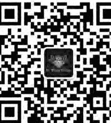
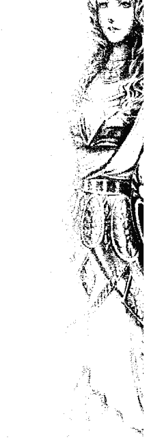
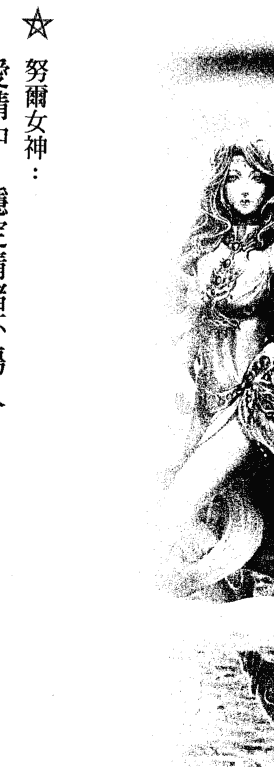
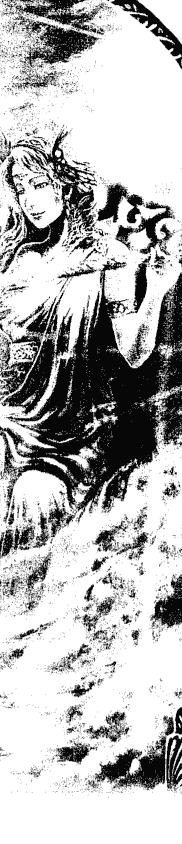
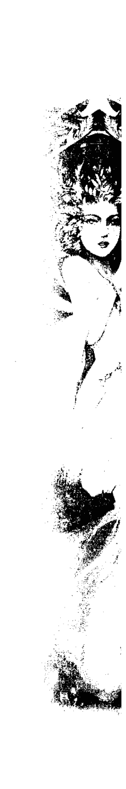
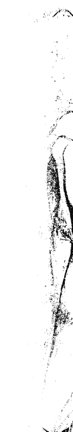
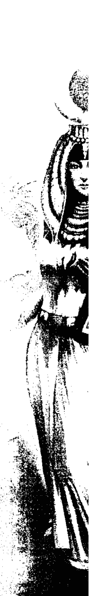
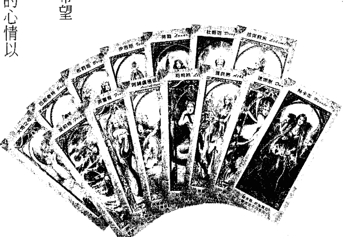
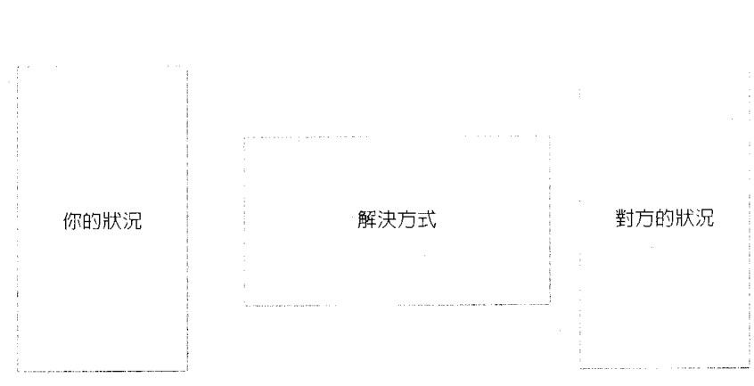

# 靈媒的愛情解藥

YoYo著

讓靈媒YoYo為你揭開愛情的前世印記、今生的課題與緣分，助你勇敢踏上此生的愛之旅！

唐立淇、范可欽、宅女小紅 激賞推薦 隨書超值贈禮！精美女神占卜卡

St. Royal College
天使神秘学院

- 专业占卜预测机构
- 神秘学培训机构
- 水晶能量研究中心
- 官方淘宝：http://strc.taobao.com
- 官方微博：http://weibo.com/715104687
- 新书发布QQ群：659338717
- 购买更多好书请联系院长大天使

大天使
天使神秘学院 院长
QQ：715104687
手机/微信：13641926204

微信公众平台：strc2011

# 制作说明：

本书由《天使神秘学院》出重金从台湾购入的原版书籍扫描制作完成。为达到最好阅读效果，特地把原版书全部切开后，再经由专业扫描设备高精度扫描完成，并经过一张张的PS后期处理最终成书，其间花费大量的人力、物力以及时间，只为能给大家提供经济并优质的神秘学学习资料而努力。

本学院强力谴责某些机构和个人，把本学院花心血制作完成的电子书籍，包装后直接放在自家淘宝网上低价倾销的行为，以谋取不劳而获的经济利益。如果长此以往最终将无人愿意再为大家花心思制作电子书，那以后可能大家再无新书可读。

为让大家以后能够读到更多的好书，也为了本学院的良性发展。本学院恳请大家尽量做到如下几点：

- 一、尽量在本学院的网站购买电子书籍。
- 二、请勿用技术手段把电子书内的水印及加密去掉。
- 三、在收到电子书后小范围传阅即可，千万不要公开传播，更别挂到淘宝网上低价销售。

同时为答谢广大支持者，学院电子书将做如下调整：

- 一、学院会把一些早已收回制作成本的电子书折价销售。
- 二、最新制作的电子书籍会开放打印功能，大家购买后有条件的可自行打印成书。

天使神秘学院

# 靈媒的愛情解藥

YoYo著

此書我要獻給我前世的情人小米果，你從在媽媽肚子裡時，就一直陪伴我寫這本書，也因為你，讓我此生第一次嚐到拖稿的滋味啊。

此書我也獻給我今生的情人 Eddie，若是沒有你一路的支持相挺，以及好好照顧我的前世情人，今天所有事情都只會是發想，永遠沒有成真的一天。

# 《推荐序》

超级女巫的爱情魔法——YoYo！自在！

知名广告人、广播主持人 范可钦

我认识YoYo，是因为她来上我在中广主持的节目《范可钦的异想世界》，我从来没见识过女巫是长什么样子，对她的女巫身分非常好奇，结果走进来的是一个有双灵活大眼睛的女生。我最喜欢找一些声称自己有特异功能的人到节目来踢馆，用开放叩应的方式，让观众随机打电话进来测试他是否真有能力。那天每个人只要提供姓名、生日，YoYo立刻可以从这些资讯中知道这个人遇到的问题、心里的疑问，经过将近二十个人的测试，所有问题的回覆都百发百中，让我觉得：嗯，她真的有一套！

她叙述她小时候会看到奇奇怪怪的东西和灵魂，我还记得那天她坐在我面前，她背后是隔着玻璃的播音工程室，我就请她转身，透过玻璃看看里面有多少人，她说有六个，可是事实上只站了五个人，当天所有播音室的人都吓得花容失色。她说，这种密不透风、没有窗户的地方常常会有类似的灵魂出现。这就好是我对她的第一印象。

后来我们变成非常谈得来的好朋友，我在主持电视节目《和你想得不一样》时，邀请她和她先生——Eddie来当特别来宾，那一集录影时发生了摄影棚从来没有过的怪现象，开录时连续三次发生机器当机、喇叭发出异响、断电等事件，YoYo最后忍不住了，拿起她的法器，在摄影棚到处舞弄一番，于是摄影棚就恢复了正常，这是我对 YoYo 的第二个印象。

我发现 YoYo 拥有跟动物沟通的奇特能力，有一次和朋友吃饭时，朋友的女儿拿了张宠物的照片，想知道她把宠物照顾得好不好。我看到照片便大吃一惊，原来这女孩养的是一条白色蟒蛇。我把照片传给了 YoYo，她表示这宠物说主人把他照顾得非常好，他也很聪明，但最近心情比较不好，因为很久没看到主人了。

我再回头问朋友女儿为什么，她说对啊！这条蟒蛇在美国，我在台湾，已经半年没看到他了。

有个媒体圈的好朋友养了一只非常漂亮的狗，有一天，我将狗的相片传给 YoYo 看。她说这只狗很高傲，牠从来不认为自己是一只狗，觉得自己是个人，已经具有人格了，牠觉得主人像牠的妈妈一样，牠很心疼牠妈妈，因为牠觉得主人生 pressure 很大，过得很辛苦、很孤单，需要爱、需要陪伴。朋友听完后，感触万分。

# 005 〈推薦序〉 超級女巫的愛情魔法 —— YoYo！自在！

YoYo 除了能看透前世今生以外，还有一种很神奇的能力，她可以让人的灵魂睡觉以补充能量，这是我的亲身体验，当时我因过度操劳，非常疲惫，她在我身上随意按几个穴道，放着音乐和薰香（我深信那是薰香，不是麻醉剂），我就在这种状态进入了半梦半醒之间。后来有人来叫我，醒来之后，我感觉只过了五分钟，事实上已经过了一个半小时，我的灵魂很像从另一个地方回到我的身体，那种感觉是非常特殊的，所以我觉得 YoYo 真的是一个很奇特的女子。

YoYo 是很特殊的女巫，她能系统、逻辑化地说明问题，是一个实际、善良的灵媒，她帮助了许许多多的人，从她身边工作的伙伴就能看出她是一个正直、有能力的人。

她的伴侣 Eddie，和她同年、同月、同日生，是一位专业的驱魔师，给予 YoYo 很大的协助，我很少看到夫妻这么平和，通常夫妻都会斗嘴、吵架，但他们都非常恩爱！很高兴 YoYo 现在已经是个妈妈了，将来小米果会不会继承妈妈的衣钵，变成小巫师，就让我们拭目以待了！

爱情的魔力，没几个人躲得过，即使是能穿梭于前世今生、法力高强的YoYo，自己也在爱情里去领略生命！而能看透爱情的魔法，也没有几个人，但幸运的是，这个年代，慈悲的大地之母派来了要让人更幸福的YoYo，背负这样使命的她，一步一步透过亲身体验，一个一个个案的扶助，让越来越多人明白：爱情的副作用，大部分是来自于两人双方原生家庭、个性、环境、前世等化学变化，所产生的质变。

# 《灵媒的爱情解药》

《灵媒的爱情解药》用清晰流畅的笔触，归纳出看似独一无二的爱情经验，其实每个人都能在其中找到相对应的症状与课题，这说明了爱情的平等性，不分男女、专业能力高下、知识丰富与否，只要爱情来了，生命的课题也就随之而至。但令人欣慰的是，如书中所示：『生命本来请求的就是环环相扣的道理，既然是环环相扣，也就代表着并不是所有的事情都是命定且不可动摇的，而是一点一滴的累积与改变，你就是在那一点一滴的累积中，做出正确的抉择，然后修改或者微调道路，让你能够更享受幸福的人生。』每个人绝对拥有让自己幸福的力量，在于你想获得多少，而不是依附在别人的宠爱指数中，才决定自己有多少幸福。

爱情是人生必经的修行，有了YoYo，相信大家在爱情里更能YOYO自在！

# 《推薦序》 跨越現實與魔幻的先知

占星专家 唐立淇

与YoYo相识，已经七八年了，大家也都知道她是少数具有传承的白女巫，至少她看起来不像女巫，既不搞神秘，也不恐吓人，什么都大刺刺、少根筋似的，让我想起装傻一流的天才保姆麦克菲，是的，YoYo真有麦克菲的魔力，挤个眼睛，东西就掉地上的那种。

这当然是夸张了，但在我心中，具象的YoYo魔力就长这样。虽然射手座的她私下看来很平常，而且热情十足，阳光到极点，但当她静下来多看我一眼，多感觉我一下，就能讲出让人鸡皮疙瘩掉满地的话，心中的秘密、想法全都无所遁形，这不是魔法是什么？

人生在世，总有迷惘，很需要能跨越现实与魔幻的先知给予指点，对我来说，YoYo就是这样一个既魔幻又实际的存在。只是到现在还摸不清楚，究竟是魔法厉害，还是射手人本有的通天直觉厉害？……嗯，只能说是YoYo善用天赋，并努力淬炼，才有今日的得天独厚了。祝福她，希望她继续贡献才能，继续连接天与地……

# 〈自 序〉

# 撥開迷霧，擁抱幸福

我是位灵媒，同时拥有心理咨询师资格，在这么多年的执业过程中，发现受爱情之苦的人，比例非常高。痴情男女总是在问：「为什么在现今的社会，想要有一段稳定健康的关系是如此困难？」 虽然科技一直在进步，但什么都推给文明带来的人心异动，好像也有欠公允。因此，我将观察结果汇总出来，告诉大家：为什么许多人的感情总是那么不顺遂？为什么就是找不到一个合适的对象，总是爱上那个伤害自己很深的人而无法自拔？或者，总是落入那种明知两人不会有未来、但却又无法分开的纠缠情缘里…… 没有人在一感情的开始，就期待彼此受伤的结果吧？偏偏许多人在一开始跟对方交往时，就非常没有安全感，而找占卜师询问两人是否适合。有些时候，身为占卜师的我们已经看到两人的黑暗面会产生强大的撞击，建议先冷静下来慢慢观察，不要进展得太快。可是下次再见面时，总是看到对方哭丧着脸，诉说着自己情感的不幸，不被尊重。除了安慰他们之外，我也常常在想，为什么他们直觉对方不合适，而我占卜后给他们的建议也是，他们的亲友也都力劝不适宜，而这些人还是视死如归壮烈地走下去，然后带着一身伤、痛苦地独自啜泣——这些戏剧化的过程其实是可以避免的，因为这都只会让他们离幸福的道路更远，或说是阻隔他们更快得到幸福的绊脚石。

我的使命就是协助人更幸福，当然，前提是我的个案必须真心相信自己能够幸福。但有些人真的天生较悲观，无法相信自己能够得到幸福。早期我有一个女性个案，她并没有不愉快的过往或感情受创的经验，但那种没来由的悲观，好像根深蒂固地烙印在她脑海之中，无论我怎么陪伴和鼓励都没有用。我总是在想，到底是哪个环节出了错？

一次偶然中，我试着看她的感情观是否受到前世的影响，才发现其实前世发生的事，对她今生依然有一些影响——我所说的影响不是冤亲债主这一类，而是某些烙印在灵魂的记忆，会让她自动避开某些暗示危险和失望的事。就像曾被烈火灼伤过的人，即使看到电视在转播火灾现场，或只是开瓦斯炉煮个开水，恐惧都可能让他们心跳加速、无法呼吸——前世的伤痛，对今生往往也有类似的影响。

在这本《灵媒的爱情解药》中，有很多真实案例改写的故事。你会发现，这个世界有很多人在感情上受挫，但最终还是找到幸福。也或许，你发现自己从未察觉到的前世伤痕记忆，在看这本书时不知不觉显现出来。如果你因此而理解，到底是什么障碍让你受困，并豁然开朗，那么幸福之路也将为你展开！幸福的方法，不只一种。书中我也会告诉大家如何用一些召唤幸福魔法，让爱情运更好；同时，本书更附有精美的女神占卜卡，当你在爱情之路遇到迷雾时，女神的指引，将会给你很大的力量！深深祝福大家！

〈推薦序〉超級女巫的愛情魔法——YoYo！自在！范可欽 003
〈推薦序〉跨越現實與魔幻的先知唐立淇 007
〈自序〉撥開迷霧，擁抱幸福 009

# 第一篇 靈媒看見的六大愛情症狀

愛情症狀 1：能量上癮症：靈芽 019
愛情症狀 2：我不是愛你，而是沒有你，我不知該如何活下去——前世的慣性 023
愛情症狀 3：我值得被愛嗎？——靈魂的迷失 026
愛情症狀 4：有真命天子（天女）嗎？——靈魂的同學 030
愛情症狀 5：業力，真的存在嗎？——你所做的事，會在你的靈魂留下紀錄 035
愛情症狀 6：宿命能否改變？——生命在於抉擇 041

# 第二篇 前世今生的八大愛情課題

愛情課題 1：相知相守的前世姻緣 047
愛情課題 2：善緣，不代表正緣！ 053
愛情課題 3：三角習題，怎麼解？ 060
愛情課題 4：愛情逆轉勝？別嚇，這是真的！ 067
愛情課題 5：真愛與價值觀，難以平衡嗎？ 074
愛情課題 6：有一種愛情，跨越性別 079

# 第三篇

## 愛情能量不平衡，請這樣調整！

- 愛情課題7：玉石俱焚的愛情，值得嗎？ 086
- 愛情課題8：被虐式索求愛情，是誰的問題？ 092
- 海底輪不平衡，超沒安全感 101
- ★鍛鍊海底輪，請你跟我這樣做 104
- 臍輪不平衡，最愛懷疑吃醋 105
- ★鍛鍊臍輪，請你跟我這樣做 108
- 太陽神經叢不平衡，控制慾好強 109
- ★鍛鍊太陽神經叢，請你跟我這樣做 112
- 心輪不平衡，無法真心感受到幸福 113
- ★鍛鍊心輪，請你跟我這樣做 117
- 喉輪不平衡，說不出甜言蜜語 118
- ★鍛鍊喉輪，請你跟我這樣做 121

# 第四篇

## 學習愛情智慧，讓你更美好

- 雅典娜女神：愛情中，不做他人的替代品 125
- 勞爾女神：愛情中，穩定情緒不傷人 128
- 芙莉格女神：愛情中，兩人相處的平衡 132

# 第五篇

## 召唤幸福魔法

女神卡占卜法 171

- 達娜恩女神：愛情中，放下過去重新開始 135
- 芙蕾雅女神：愛情中，創造自己的魅力 137
- 布莉姬女神：愛情中，培養熱情的態度 140
- 伊西斯女神：愛情中，忠貞專情的力量 143
- 巴斯泰特女神：愛情中，能獨立自主 147
- 杜爾迦女神：愛情中，能有勇氣面對問題 149
- 拉克蘇米女神：愛情中，心甘情願地付出 152
- 阿縛盧極低濕伐羅女神：愛情中，潛移默化的影響 155
- 莉莉絲女神：愛情中，認清自己要的是什麼 159
- 赫卡蒂女神：愛情中，營造出不同的面向 162
- 大地之母：愛情中，需要包容與尊重 166

第一篇

# 靈媒看見的六大愛情症狀

爱情，让多少坚强的人软弱，让多少懦弱的人勇敢；爱情好像一剂魔药，可以让人做出自己完全想像不到的事，也可以让人品尝想像不到的欢愉与痛苦；爱情是这世界上最可怕也最可爱的能量，人们一旦品尝过，往往需要许多时间来戒除这个美妙的滋味，或是想尽办法忘掉心中的苦涩。

我们可能从来没想过，最俗世的爱情，与灵性却有密不可分的关系。很多人终其一生不知道什么是爱，但也结婚生子，建立完整的家庭；而有些人用一生去追寻真爱，尝试过各种方法，听过各种专家建议，用尽心机试探，却还是一直活在失望之中，最后只好选择单身一辈子，或是找一个合乎需求的老实人来组成家庭，把自己对真爱的梦想束之高阁。

爱情，多少诗人、画家、文学创作者都在赞颂着这美妙的情感啊！许多人一生都在追寻爱情，可是往往得到的只有一次又一次的爱情「事故」，久而久之不免自我怀疑，失去动力。这些人往往在夜晚悲伤地想：为什么我总得不到幸福呢？是不是因为我不够好？还是我的命运太凄惨，注定要孤老一生吗？

我的工作主要是在陪伴这些悲伤的灵魂，我能够看到人身上因灵魂能量共振而产生的光芒，但也能看到一些过去的创伤，因此我成了一位职业占卜师。我觉得人在情感上受到的伤害最多，尤其以爱情伤害更是刻骨铭心。

# 第一篇 靈媒看見的六大愛情症狀

其实很多人在爱情中遇到的问题，都不是真正发生情感上的问题，真正的问题其实来自于我们对爱情的期待，期待对方如何对待我们，期待他要多贴心、多温柔、多帅或多有钱。这些期待是从哪里来的？如果是说从文化或媒体而来，那大家的期待应该都一样，但其实很多让女孩头显洒热血投入的爱情，反而都不是如此。

甚至很多人原本有一套严苛的标准，结果一遇到对方，所有标准有如骨牌效应应声而倒。例如许多外遇的第三者，原本是讲到小三就会咬牙切齿，或者她本身也是受害者。但遇到那个人之后，所有道德规范都抛诸脑后，有如飞蛾扑火般不可自拔，却又深受良心谴责，每天以泪洗面，不知道该如何面对两难的情境。

有这种情况的人，也常觉得自己好像被下了符咒，没有合理的解释。有些人爱上比她年纪大好多的男人而无法自拔，若说她有恋父情结，她可能嗤之以鼻，因为除了这个对象之外，她从未喜欢过任何其他老男人。正因为这种个案太多了，我也常在想，是什么设定了她们与对方的连结呢？就一个灵媒的角度来看，我发现一个简单的动作，背后其实包含了許多因素，即使是前世的因果，也不是欠债还钱这么单纯。因此，在这本书中，我以多年来累积的经验，整理出六大爱情症状和八大爱情课题，搭配个案分析。为了保护当事人的隐私，我会使用化名，也会将故事稍加修改。你不妨边看边想：你身边是不是也有朋友正饱受这种爱情之苦；更甚者，你是不是觉得书中的主角根本就是自己呢？希望藉由本书的内容，能够协助你找出自己的爱情盲点，避开感情道路上的暗礁险流，进而达到幸福的彼岸。

## 愛情症狀1 能量上癮症：靈芽

许多人不了解我怎样感受别人的能量，或是如何知道他人的情绪和记忆伤口，说来其实也不难，就像人身上有堵塞的地方，能量的共振频率会变弱，有些根本不共振或是能量通不过的地方，就会显得很暗沉。除非那人的身体健康有非常严重的状况，如癌症或肿瘤，不然暗沉的光雾不会一直在他身上，而会随着他说的话、他的心情而改变。

你可以想像，我们每个人的身体外圈都有一个能量磁场，我简单称之为灵球，灵球很像是个人的保护罩，内部有很多个人的资讯。读取能量时，我会将我的灵魂资讯。这个动作不能太快或太急，一定要温柔和缓，不然对方的灵魂会觉得受到干扰，可能会用头痛、头晕或其他身体不适来提醒对方现在受到侵袭，反而会影响我的感应。

为什么我要提到灵芽？其实在爱侣之间更是有灵芽的存在。两个人刚在一起时，每天都沉溺在甜言蜜语中，但不见得有默契，许多时候我们都会想方设法去感受对方到底真正在想什么。在这种情况下，你的灵芽就会不由自主地伸向对方，让你更能够去感受对方的一举一动和心情，感知对方是否真的在乎你，或是对你有所隐瞒，时间越久，彼此灵芽就会缠绕得越来越多，好像树根一般，两个人的能量会越来越相通。有些较敏感的朋友，甚至会出现心灵相通的情况，即使不说话，也能感受彼此的情绪状态。这听起来是非常完美的境地，但如果有一天，其中一方想要分手，这时原本两方缠绕许久和根深蒂固的灵芽仿佛被硬生生地斩断了，被迫接受事实的另一方的痛苦不安及完全的失衡，可能只有真正被背叛过的人才能理解。事实上，那种剥夺感就像是有人拿着一把利斧，把你的手和脚各砍断一只并且拿走。你不知道该如何是好，可能先是震惊，不敢相信这种事怎么会发生在自己身上；然后看着鲜血汩汩流出，感觉恐慌不已，心想自己会不会这样就死去了，有没有人或有什么方法能够拯救自己。有些积极的人会想法子先止血，找专业人士来疗愈自己的伤口，等不那么虚弱和痛苦之后，再为将来做打算，该如何是好？是去向凶手追讨自己的手脚（哀求对方复合）呢，还是马上去订作新的义肢（放下过去，找寻新的伴侣）？

每当我举这个例子，都会有人问我，若是自己是想要分手的那一方，不想一次给对方这么大的惊吓，而改成慢慢地拉远距离，会不会比较好？如果对方也对你退烧了，只是不想做坏人，正在等你开口，此时你的动作快慢，就不会有什么明显影响；但如果对方还是深深依恋着你，你所谓慢式拖拉法，只是把利斧改成较钝的锯子，把一次砍断变成慢慢用锯的，这样并没有比较好，而且双方可能还会受到更大的折磨。

灵媒会去汲取对方的能量，且平衡两人的身心灵能量，所以一旦被强力切割开来，那种痛苦会让人很想立刻把对方抓回身边，冀求重回平衡。但问题是，灵芽的缠绕必须是心甘情愿的，你只是把对方的人抓回来，他的心若没有回来，你还是会有种隔阂感；如果最后又分开，你只是把好不容易结痂的伤口再度扯裂，那种痛苦可能比第一次更强大、更绝望。所以每当有人跟我说他想和分手的情人复合，因为没有对方，他好痛苦，没有办法吃饭、睡觉及正常思考，我都会建议他们先不要马上动作，而要先搞清楚是真的深爱对方而无法放手，还是因为习惯。

## 靈媒的愛情解藥 022

了身邊有人，如今卻突然消失了才痛苦？因為靈芽被強迫切斷，其實除了會有難以言喻的失落感，還會出現成癮後的戒斷症狀。

以我自己為例，我從十五歲開始，几乎每天都要喝一杯咖啡，而懷孕時，我強迫自己戒咖啡。這不是開玩笑的，和咖啡相伴十多年，讓我戒咖啡時有了嚴重的戒斷症狀。我能撐過那段時光，是因為我知道戒斷症狀遲早會消退，而且為了我自己和孩子的健康，以及我們之後的幸福人生，我知道我一定能撐過去。戒斷症狀或許影響了我的生活品質一陣子，但並不能影響我一輩子。也因為我能理性分析這狀況，所以只花了一個月就安然度過了這個困境。

所以，一定要理智地分析，你分手後的痛苦是因為靈芽被切斷而產生的戒斷症狀，還是真的深愛對方才痛苦，因為雖然同樣是痛苦，但其中的差別是非常大的，也會影響之後的行動。很多人明知道跟著對方不會幸福，只是一時之間無法接受分手後靈芽被切斷的痛，這時只要給自己一些時間，好好地養傷，等被斬斷或扯裂的靈芽慢慢地收好傷口，回到你的靈球體，你的能量自然又會回到穩定的狀態。

## 愛情症狀2

### 我不是爱你，而是没有你，我不知该如何活下去
——前世的惯性

你是否第一次與某人相見或說話，就完全沒有排斥感或不安，彷彿認識很久一般，他的說話語調、聲音或香味，都讓你覺得熟悉？就我的經驗而言，這顯示你們的靈魂多半是在前世就認識。

但重點是，就算你們在前世認識，他真的就是能讓你幸福的靈魂嗎？其實並不盡然，舉例來說，你可能出社會工作多年，遇到你小學同學，他碰巧成為你的同事，兩個人當然認識彼此，而且也很熟悉，但這對你現在的工作一定有幫助嗎？你的小學同學與當年一樣純真嗎？你本身在這段時間沒有改變嗎？利益的重疊不會影響你們看似很有緣分、實則很脆弱的友誼嗎？

我覺得前世可以解釋一些現象，但是並不全面。例如我有一位個案，她一直遭受丈夫虐待，但她丈夫每次施暴後都會哭著跪求原諒。她問我，她前世是不是欠她丈夫什麼，所以今生即使被打得很慘，也離不開對方。一開始，我都覺得這就是心理學上最基本的施暴者與受虐者的循環，受虐者的懦弱賜予施暴者力量，根本不需要看前世就可以明白吧！就算前世真的還有前債未了，搞不好這位個案就覺得為了避免下輩子再受苦，這一世被打死也就算還了債了。我最怕這種聽起來像是因果、但骨子裡其實消極的說法了。

在她不斷地央求之下，我還是幫她看了前世，結果發現兩人前世真的也做過夫妻，不過她是再嫁，今世的丈夫是前世的第二任丈夫；第一任丈夫很早就去世了，留下一個兒子。她在那一世個性非常軟弱，所以她的第二任丈夫常對她拳打腳踢，也常欺負她的兒子。有一天，她的丈夫發酒瘋，把這個拖油瓶兒子給打死了。她丈夫酒醒之後很後悔，求她原諒，結果她自己也害怕遭到毒手，只能勉強同意偷偷埋葬孩子的屍首，這成為她最深沉的恐懼，一直吃不好睡不好，不到一年也就死了，死前內心有許多怨恨和無奈。她應該保護自己的孩子，卻沒有做到，反而還與殺人兇手妥協，所以她一直受到良心的責罰。

我覺得看前世最困難的就是，如何為那一世的經驗歸納出一個總結？但當我還未做出結論時，那位個案的眼神整個變了，她的靈魂好像被喚醒了，彷彿下定決心似的。她告訴我：「老師，我很感謝你告訴我前世的故事，因為我常被我先生打，雖然我很認命，但從來沒有想過孩子的問題。我兒子最近常頂撞我先生，最近我先生對他下手也越來越重了。我每次阻止，都只會讓他們越鬥越兇，我先生打起人來，就好像殺紅了眼一樣，我上次為了阻止他拿椅子來掄我兒子，結果自己被打到腦震盪。我被打是沒有關係，但我兒子還這麼小，如果打到他，他豈不是連命都沒有了嗎？為了我的兒子，我這次一定要跟他攤牌，不能讓我的孩子重蹈我前世的悲劇。」後來，她真的跟她的丈夫談，並協議下次再動手就提告離婚，為了自己與年幼的孩子，她不要再忍受任何暴力了。她丈夫彷彿感受到她的決心，並沒有再對她動手。但這到底是因為我的個案態度堅決地拿回屬於自己的權利，讓施暴者心生恐懼而不敢動手；還是真的因為她靈魂的力量被喚醒了，所以對方不敢再重施故技呢？老實說，我也不是很清楚。你們知道我是如何看到前世的嗎？其實我是讀取人在死亡前會回溯一生的畫面，但問題是，同樣一件事，甲與乙看的角度不同，所以觀感和產生的情緒也完全不同。我的經驗是，當事人不太可能會有客觀的看法，所以誰對誰錯，真的很難說。如果你覺得與某人有似曾相識的感覺時，先不要以浪漫的心情去推測這是生死相許的戀情，很有可能你們是上輩子相處不甚愉快的同學也不一定啊！

## ☆ 愛情症狀 3

### 我值得被愛嗎？——靈魂的迷失

失戀過的人，在經歷過錐心之痛、麻痺的階段後，再來就會自我懷疑，懷疑是否值得被愛。

身為一個靈媒和熱愛旅行的修行者，我常會在某些歷史悠久的戰區或觀光景點看到許多靈魂在現場哭泣徘徊，那些雙眼流著血淚的鬼魂茫然地問我，他們做錯了什麼，為什麼會遭受到如此的酷刑呢？有大量的靈魂還留著過去的傷痕記憶轉世，今生對自己的生存價值有很大的懷疑，雖然渴望愛情，卻又容易出現不安、不潔感和沒自信。

我有很多女性個案，明明本身的條件非常好，但一談戀愛馬上從公主變成女奴，而且會一直哀求對方給自己安全感。對失去的恐懼，讓她們沒辦法面對今生的愛情課題。我曾協助過一些個案，就是因為無法拒絕對方的要求，在發生性行為時不使用避孕措施而懷孕，對方又不願意負責，只能自己獨自面對墮胎的問題。這也更印證她們一直都有種「我不夠好」的心態，所以在遇到這些不幸時，甚至也會覺得：「我本來就是會遇到這種事的人。」讓她們把很多原本可以避免的不幸視為理所當然。

這些女人沉溺在受害漩渦中，無法理性處理她們的悲傷怨懟，往往都在問同一件事，那就是：「為什麼我一直覺得我不夠好？為什麼我覺得這個世界都遺棄我？我做錯了什麼，為什麼我總是遇不到良人呢？」

女孩啊女孩，其實並不是你不好，而是你的靈魂有些迷失了。你在還沒有完全準備好、傷口還未完全復原的時候，就又接下來到這個世界的挑戰。你有一顆想要學習的好勝心，但若你沒有面對自己的脆弱，那它就好似一個傷口，慢慢地化膿，越來越嚴重，直到那撕心裂肺的痛提醒你，或是黑暗面像黑霧一般地籠罩你的身心靈，那種窒息感和空洞感真的會讓人不知如何自處。許多有靈魂迷失狀況的個案，她們身上往往有許多自殘傷痕或自殺紀錄。她們往往因為無法接受被拒絕或是分手的打擊，為了逃避心靈分裂的痛苦，會嘗試用肉體的疼痛來轉移心靈的苦痛。其實愛與痛都能讓我們有活著的知覺，尤其是對靈魂迷失的個案而言，一旦感覺不到被愛的充實感或被需求感，就會很需要痛覺來感受自己與這個世界的連結。

曾經有位女性個案分享這一段話：

> 「YoYo，你知道嗎？當對方跟我提分手時，一開始我覺得好痛苦，我的世界就像玻璃球被暴力地砸向地面一樣，我真的聽到震耳的哐啷聲，然後玻璃球成了碎片，這些碎片變成了利刃，全部插向我的心臟，我感覺心臟好像碎了、被刺穿了。好一陣子我無法言語，等到能說話時，我先跪下來求他不要離開我，只要他要我，我什麼都願意放棄，什麼都可以改，但他還是堅持離開。當我看著他，他不像是我的男友，而像是歷任拋棄我的男人，像是一直疏離我的父親，像是監視我工作表現的老闆，就是不像那個我很愛的人。我只知道心一直沉下去，被淹沒了，很多人事物也離我越來越遠，我覺得自己的肉體好像死了，又捏又打都不會痛，所以我拿刀子來割，看到流血時，我反而覺得自己還活著，比較安心。」

- （錯誤示範，請勿模仿。）

一個人若連活著的感覺都消逝了，就需要很大的正向力量來帶領她的靈魂找歸屬感。她看了不少心理醫生，但似乎效果不大，她拒絕服藥，也讓家人束手無策。當我回溯她的前世時，看到很殘忍的畫面，一開始我並不太想說出看到什麼，但我不能欺騙或隱瞞所看到的事，這是我與女神訂定的契約，而且當大地之母讓我看到這個畫面，並且讓對方知道這個畫面時，就代表大地之母認為這個故事是對她有幫助的。我感應到她曾經是一個善良無知的少女，有一次她要去隔壁村莊找好友，半路上被盜匪輪暴、折磨致死，當作垃圾般丟到山溝裡。這讓她在那一世，對於愛情與男女之間的關係產生相當大的創傷和憤恨，她好不甘心為什麼會是自己遇到這樣的事。當我告知我所看到的畫面，以及她痛苦的前世經驗之後，她突然忍不住大哭，身上的能量產生了劇烈的變化，而且可以感覺到她的心輪與海底輪有一股黑色的能量竄出，伴隨著一股酸敗的臭味，隱隱含著尼古丁的焦味。當時我只能用女巫的藥草幫助她冷靜，並請也是能量師的我丈夫為她做淨化。在痛哭兩個鐘頭後，她覺得全身輕鬆很多。後來她寫了一封信，說自從那次治療後，她突然有種很清醒的感覺，覺得自己又能愛了，對於愛情，她不再害怕寂寞，所以更能慎選合適的對象。包括親情也是一樣，以前總是覺得家人不關心自己，總是想封閉和遠離，可是自從那次儀式之後，她好像睜開了雙眼，不再覺得自己不值得活在這個美麗的世界了。

## ☆ 愛情症狀 4

### 有真命天子（天女）嗎？—— 靈魂的同學

我喜歡用靈魂伴侶一詞來取代真命天子／天女，因為靈魂在原初就已經幫我們準備了一些課程。如果你今生是要來學習愛的課程，可能就會遇到各種面向的愛情考驗，這些白馬王子／白雪公主、真命天子／天女，或是靈魂伴侶的出現，都只是在教你一件事——如何愛與被愛，也就是如何在感情順利與不順利時都依然看得見自己。奉獻是對的，但如何在付出時想的不是交換條件；忠貞是對的，但如何在這段關係不致於沉溺！靈魂伴侶很像是你的同學，有時也是你的老師。但不要過於崇拜這位老師或同學，因為這整件事，其實是在成就你自己。

有些人可能會問：「那如果我一直沒有伴侶呢？是因為我的靈魂真的覺得自己在愛情方面很圓滿了嗎？」這倒不一定，有些前世是修行者，今生對於愛情會比較無渴望；但我要強調的是，也有不少人因為前世修行禁慾，今生對於愛情會特別瘋狂執著。靈魂的特質很難被歸類的，我只能提出一些可能的解釋。而我協助過的個案中，有些人從小父母離異，她們最大的願望就是擁有一個屬於自己的家庭；但也有為數不少的個案覺得，家庭和婚姻承諾是一文不值的謊言，人生應該努力去追求實質的金錢或物質成就，而非觸碰不到且虛幻的感情生活，他們可能會比一般人更瘋狂、更努力地追求成就，但依然不快樂。我常常提醒我的工作狂或購物狂客戶，心靈的空洞是無法用物質或掌聲來填滿的，也許可以轉移，但無法滿足。你想得到平靜與幸福，就要先看清自己真正的需求是什麼。

所以，有沒有靈魂伴侶或真命天子？當然有，不過他們並不是幸福的保證，真正的幸福來源保證只有你自己。我想我跟我丈夫應該也算是某種靈魂伴侶吧，我們在一起快十五年了，結婚四年，一起工作三年，每天對我們都是一種考驗，他要忍受我的詭異通靈、回家懶散，以及永遠做不完的工作與研究；我則要忍受他熱愛電玩，以及每天必看兩場星海爭霸賽局這種莫名其妙的堅持。我們的個性都很急躁，但我們非常少爭執，因為我們了解彼此，當他情緒波動到某種程度時，我就會遠離現場，閉上自己的嘴；而我快抓狂時，他也會遠離我，讓我自己靜一靜，這就是默契。我們是靈魂的夥伴，在彼此身上學習，我們就像是彼此的鏡子，映照出對方不願意面對的缺點。

所以，我總覺得，今生的靈魂伴侶其實是同學。重點是你是否願意向他學習。當對方指出你有什麼問題，你是趁此省思，還是覺得對方在惡意貶低你呢？以我一位個案A女為例，她的外表亮麗、家庭背景不錯，硬要說有什麼缺點，應該算是虛榮吧！她跟男友相處時，男方理所當然地要支付所有花費，包括她想要的包，或者出國旅遊等。男方的財力其實不差，但他總覺得A女好像只愛他的錢，而A女既不擅言辭也不知道該如何回應，只覺得男方是不是因為小氣而找藉口，不懂得回饋，A女則在被冤枉的委屈，以及自尊心受傷害的盛怒之下，就草率地決定分手。分手第二天就後悔了，她來找我，希望能幫她挽回局勢。聽完A女哭著抱怨後，我只淡淡地問她：「你覺得你男朋友講得完全不對嗎？都是在污辱你的人格嗎？」「我當然不是自私的人啊！他送我東西，我都有說謝謝啊！逛街時我也會幫他選適合他的衣服啊！」「那你有沒有做過什麼比道謝更具體的事呢？」「什麼意思？什麼叫作具體？」她彷彿聽不太懂我的意思。

> > 『講白一點，你有沒有送過他什麼禮物，是自己出錢的？或者在他生病時，好好照顧他呢？更簡單的，你有沒有親手做過一道菜給他吃？』

她好像有點懂了，但依然有點不甘心，繼續哭著抱怨：

> > 『他自己之前跟我說，他不在乎錢的，怎麼現在又在乎了？而且他說他喜歡外食，我也有幫忙選餐廳耶！他很少生病啊，上次感冒我原本想陪他，結果他說怕傳染給我，叫我不要去了，我可是有意願陪的啊！』

雖然A女振振有辭，但音量越來越小，我想，她一定也發現了什麼不對勁的地方。

> > 『我想你一定理解你男友的想法了。我知道你不是自私，但是你真的太不貼心了！我不是要你在感情中逆來順受，但如果你之前能多做一點，讓他知道你是真心地關心他，我想今天不至於會如此。而且在爭執中，你這麼快就決定要放棄這段感情，只會讓他更心寒，覺得之前對你的付出其實都不值得。』

很多人可能會猜測我會協助他們複合，然後女方改變自己的個性，男方欣然接受等。我只能說，要讓大家失望了，因為其實我建議A女先冷靜一段時間，想清楚自己是不是真的愛這個男的，還是只想要一個願意為她付出的人，其實很弔詭的是，我們被分手時都會覺得自己超愛對方，所以生不如死，但冷靜一陣子之後，很多細節反而都清晰地顯現出來。A女終於承認自己其實沒有那麼愛男方，不然怎麼可能對方體貼地叫她不用陪伴照顧，她就真的照辦、一點都不擔心呢？我給她的建議就是，如果真的想得到幸福，那麼一定要改掉自我中心的習慣，否則會離幸福越來越遠。這個男朋友其實是來教導她的，他是讓她前往幸福道路的一位天使，只可惜她不夠愛他而已。

## 愛情症狀 5

### 業力，真的存在嗎？
——你所做的事，會在你的靈魂留下紀錄

對於業力（Karma），很多人都有不同的解釋。我的解釋是：你所做的事，會在你的靈魂留下紀錄。生命就像一條河流，這些紀錄就像是石頭，有些事在你生命中的作用小，就是小石頭；有些事在你生命中的影響大，就會變成大石頭。大的石頭或許一次就可以改變你的命運之流，但也別忽視小石頭，因為它們累積多了，一樣也可以改變你生命之流的軌道。我們可以相信業力確實存在，凡事都有因果，但困難的是，我們確實知道何者為因，何者為果嗎？很多時候，我們都會不自主地倒果為因，或者做一些莫名的歸納，以為這就是命中的因果，其實若不看清事實，一切都推給因果，或者是一更難捉摸和印證的前世因果，反而會讓自己跌入所謂悲觀的宿命論中，那才是造成悲慘命運的因，並不是你命中注定應當去品嘗的果。

許多個案在歷經多次感情不順遂之後，就會問我：「是不是我前世做錯了什麼，今生才會一直遇不到對的人呢？」很多人習於把一切推給命運，而不是思考自己的作為。但根據我多年的觀察，真正影響我們幸福與否的，其實是自己的思考習性。我們常常一不小心就判斷錯誤，在一段不對等的關係中大量虛擲我們的愛情、尊嚴、時間，甚至是金錢。而當無法挽回時，我們才開始痛苦、追悔，早知道就不應該浪費那麼多青春精力。奇怪的是，我們往往學不到教訓，總是忍不住一而再、再而三地重複犯錯，然後產生了一種莫名的幻覺：「我是不是被詛咒了啊？還是被命運的鎖鍊給套住了，怎麼會一直栽在這種感情裡呢？」

這種案例最常見的就是感情中的小三，可能之前完全不知情，或者早知道對方已有家室，但就是無法離開。他們說，今天是這個人讓他／她無法冷靜自持，在遇到此人之前，他們在感情中是如何瀟灑、如何玩弄他人感情於股掌之間，但在這段感情卻死心塌地、無條件投降。我發現，越是花花公子或被捧得高高在上、公主病很重的人，在感情吃癟時，越容易把情況形容得非常具有戲劇張力，他們往往都會做出這樣的結論：「老師，是不是我之前造的業太多，所以天才會遇到這個剋星呢？」

我一開始就強調，業力的產生，是你種什麼樣的因，就得到什麼樣的果。而根據我的觀察，許多愛情遊戲者的內心其實是非常恐懼的，可能是早期自己在感情上受創之後，才會變得對感情態度扭曲、害怕受傷，或者是看到那些被他們的花言巧語或愛情謊言所傷害的人時，他們更害怕自己有一天成為受害者，所以往往會變成一個更負面的循環。他們都知道，若不想在感情中受傷，訣竅就是趁早收手，所以戀情越來越短暫，傷害的人越來越多，恐懼越來越增加，業力也因此越來越多。這種業力是什麼？我們也可以用另外一個角度來講，有沒有可能這就是一種心魔呢？

我有一個客戶，他緊黏對方不放的原因，居然是那個女孩長得很像曾傷他很深的初戀女友，所以他直覺這是一次重新開始的機會。我看過他所謂初戀的照片，兩位女孩當然都是清秀佳人，但完全沒有其他相同之處啊！我毫不客氣地指出他的盲點，他卻一直強調她們的神韻很像。我也提醒他，沒有人願意當別人的替代品。「而且就算願意，也無法成為他人的替代品，你一直在她身上找別人的影子，你之後一定會失望的，這段情感也一定會讓彼此都受傷，這不是命運使然，而是你的行為模式所造成的一種循環。」當然對方往往不會聽勸，他們要我幫忙的是如何讓對方死心塌地愛著他。而且最奇怪的就是，當事人會一直拿出許多不成理由的藉口，來解釋為何他放不下這段感情，彷彿旁人都不能理解這段感情偉大之處。

業力的影響往往在兩個部分最為明顯，其一是你們第一次見面時，有一種很特別的化學反應，而且這種業力影響圈是很強大的，甚至於你身邊的親友都可以感受到對方可能對你的影響，無論正負面。我們如果真的愛上了一個人，很難擺脫那種想要獨佔對方的慾望，或者是想要一起創造未來命運、交織出幸福人生的期待！這並沒錯，這是人性，尤其當你很愛這個人時，一切都是那麼合情合理，只差在對方沒有完全配合而已，而你的首要目標就是讓主角就定位，那麼童話故事中的Happily ever after forever就會來臨了！

然而，這就是業力第二部分的作用了，它讓你無法離開，它讓你更看不清，讓你覺得只要堅持，就一定會得到你想要的，而對方也只有跟你在一起才會得到真正的幸福。為了配合對方的喜好，為了讓對方能多一些時間來了解你的好，所以你就讓自己成為了凡事聽從，沒有自己想法的小男人或小女人。因為這段感情，你改變了你自己，但悲哀的是，對方也沒有更珍惜你的付出或退讓，反而忽然發現自己的身價如此之高，原來自己是這麼值得被愛，你滿足了他的自信與虛榮，只會讓他更顯高傲。殊不知若不是你們有業力的牽扯，他哪能這麼高高在上呢？

業力或許是一種影響的力量，但它並不是左右你感情幸福的全部，就像我們喜歡一個人，外貌或許是影響因素之一，一種顯而易見的吸引力；但兩人是否能夠長久相處，關鍵還是在於性格是否能夠彼此容忍。白馬王子和白雪公主在一起之後的婚姻生活，誰知道會不會變成壞皇后與藍鬍子公爵的生死擂台賽呢？

許多人感情受挫時，往往只想找一個理由來證明自己是受害者，讓別人理解我們很努力地在這段關係中付出，是對方不珍惜。總歸一句，我們的層次差太多了，像我條件這麼好的人，如癡如狂地愛著這個人，對方居然還不懂得好好珍惜，這一定是我前世有什麼業障，今生我才會被他如此糟蹋。

我們當然都一廂情願地希望惡人有惡報，但感情上的重點並非壞不壞，應該是在愛不愛，因為不愛了，所以會有謊言，會有傷害。網路很早以前就流傳一句名言：「那個讓你流淚的人一定不愛你，因為愛你的人捨不得讓你流淚。」

你可能為這個讓你流淚的人受苦或尋死，但其實這都是徒勞無功的。這是你的考驗。驗，但你已經過關了，可以快樂地去下一個階段領禮物了，不要再捨不得過去，不然你等於要再換一個人，再重修一次同樣的課程，那豈不是很晦氣！

我常常建議人們原諒、放下，最主要也最基本的原因，就是希望大家不要再繼續受苦了。如果恨是一把火，讓火持續燃燒的，就是你的能量與健康，長期活在憤恨中的人是無法快樂的，能量也會很負面而且虛弱。你可以想像，為了餵養這股仇恨，要付出多大的代價嗎？

把這個記號消去吧！把小石頭移開吧！重新開始新的旅程，不要一直執著於過去的不快樂，讓你的生命之流能夠順暢地流向 下一個美麗的景點吧！

## 愛情症狀 6

## 宿命能否改變？——生命在於抉擇

在前一段，我們試圖釐清一些關於業力的概念，那麼現在我們來看看大家常說的「宿命」是否能夠改變。「宿命」這個概念在東方國家是比較常提到的，這應該是來自於印度的種姓制度所造成的思維模式，因為在種姓制度中，你若是生養在賤民之家，可以說是此生無望了，不會有任何翻身的機會。生命對你而言，就像是坐牢，你只能夠表現良好，早日出獄，並且期待下一世能夠手氣好一些，投胎到好人家。也因為種姓制度的關係，所以人人臣服於命運，因為你的人生在出生的那一刻就已經決定了。

但在西方的概念裡就不全然如此了，他們認為每個人來到這個世界，都有屬於自己的課題，人是為了學習而來的。學習的目的是讓我們成長蛻變，找到真

正自身的核心，同時能夠幫助他人。而且只要我們能夠跟萬物的神靈和平共存，他們也會協助我們。在西方的概念中，人的選擇權相對較強，我們選擇了我們的家庭、課題和挑戰等。就像是大學的選修課程，有些人選那種最少要選的幾個學分，準備慢慢修；有些人則是選最多的學分，想要在最短的時間內畢業，然後在期中考時哀嚎，有些人就放棄了，下學期再來修；而有些人則撐住了，一直到最後一關，考了一場漂亮的期末考來做個完美ENDING，然後心滿意足地提早畢業。

業。我常跟人說，如果你要成大事，你遇到的事情就會比較有挑戰性，你要做對的事，就會有很多人跳出來反對你，而且往往他們也只能口頭上反對你，而無法提出有建設性的建議。會有很多人來挑戰你，因為他覺得他的資質在你之上，怎麼可能會成功，而他一敗塗地？他會四處說你只是靠好運、外表和家世，而永遠不會檢討自己一事無成的人生。

而在感情中也是如此，端看你怎麼抉擇。如果你想要擁有俊美的另一半，那麼你就得容忍去哪裡都會有虎視眈眈的眼睛望著他或是挑逗的肢體語言；如果你想要的是高富帥的另一半，你可能就會常常被人打量或比較你夠不夠白富美；

### 043 第一篇 靈媒看見的六大愛情症狀

如果你想要抉擇的是事業成功的另一半，那你就要面對休假他可能都不會在你身邊，因為他之所以能成功，就是因為他早已將事業當作自己生命的另一半，你和子女都沒有他的事業來得重要。

那我們到底應該怎麼選擇呢？其實重點只有一個，那就是「選你所愛，愛你所選」。你只要誠實的問自己：是否覺得幸福，覺得被愛？

當你沒有強硬的靠山或背景時，你就只有兩個選擇，一是認真踏實，一步一腳印地努力向前進，白手創造屬於自己的未來；遇到難關也不要輕言放棄，因為你也沒有什麼放棄的本錢。另一個則是選擇隨波逐流，現在這個時代，要大富大貴不太容易，但相對的，要活活餓死也不是那麼簡單，重點就是你怎麼看你今生的課題。

在我們的信仰中，巫師或占卜師就像是指路者，讓來占卜問事的人看到一個機會。而人生就像是一個大森林，有無數樹木、果實、野花、猛獸等會讓你分心的事物。打個比方，就像有一條路是指引你到充滿蜂蜜和牛奶的天堂，另外一條路是帶你到毒蛇猛獸的巢穴，如果你不幸誤闖毒蛇猛獸區，可能成了那些動物的點心，也有可能成為馴伏牠們的泰山；而這兩條路之間又有無數的岔路，可能前

一秒鐘你還在大啖蜂蜜和牛奶，下一秒鐘你一失神，就跌入獅子的領地啊，是給他們今晚加菜？或者是跟他們拼了，增加一兩件獅子皮大衣，或獅子牙項鍊？這都是考驗你的意志力和勇氣，你的一個想法，就會大大地影響結局！

我們都是生命的旅人，占卜師的工作就是在這個旅途的岔路口給你一些建議，我們雖然知道道路是通往哪裡，但我們無法控制你會不會忍不住走了其他的小路，或者在一條路上待太久，而錯失了一些機會，反而讓跟在你身後的猛獸們撲上來。如果真的會被猛獸追上，你要怎麼做才能把猛獸撂倒？也就是說，即使面臨逆境，占卜師也要看出來哪裡是一線生機，而不是只有跟來尋求幫助的朋友說，「哇！如果你不這樣做，你可能就很慘啦，就不會成功啦，就死路一條啦！」我只能說，我們的工作需要正向的智慧以及樂觀的心胸，因為生命本來講求的就是環環相扣的道理，既然是環環相扣，也就代表著並不是所有的事情都是命定且不可動搖的，而是一點一滴的累積與改變，你就是在那一點一滴的累積中，做出正確的抉擇，然後修改或者微調道路，讓你能夠更享受幸福的人生。

所以，你的抉擇往往才是真正影響你人生的重點，而非前世的業力啊！

## 第二篇

## 前世今生的八大愛情課題

相較於之前我們用不同的面向來探討苦海中的愛情，包括所謂的慣性問題，現在我們可以延伸討論這個問題，慣性有沒有可能來自前世，來自於過去的束縛，或者是靈魂的慣性？抑或是還沒有學會前世的功課，今生要完成這個學分呢？

對於重修，我個人很有經驗。我在五專時統計課學得不太好，大學時又上了兩學期，但大概內心有陰影，結果還是學了個不上不下，到了美國念MBA，這個統計又陰魂不散地跟著我，又要再修一次，後來終於畢業了，覺得這輩子都不會跟統計再有關係了吧！結果工作時又要做一大堆數據的統計資料，我那時真的是無語問蒼天，只能臨時抱佛腳，請這方面的專家來幫我，我才認真學好了統計。

現在回想起來，女神給我這麼多機會讓我好好學習，但我就是這麼不配合，浪費了這麼多年的時間。在我們靈修的世界，有一句話是這麼說的：

> 『越抗拒，越持續。』

愛情的課題也是如此，所以在這個章節，我會就幾個常見的課題，舉出幾個範例來分享，讓大家更能理解前世今生糾纏不斷的愛情課題。

## 愛情課題 1
相知相守的前世姻緣

M小姐從小到大在學業上一直都是名列前茅，出了社會也因為精明幹練又懂人情世故，一直都受到上司的喜愛與重用，工作表現也極度出色。這樣的人，為何會不安呢？那種不安應該說是一種憤怒吧！她大概從來沒有想過自己的理性與智慧都無法解決感情問題，金錢與人脈也完全派不上用場，而必須求助於素昧平生的我，她想知道自己與J先生的前世緣分。

我看到M小姐與J先生結緣於清朝，M前世是一個留洋回國的醫生，家境富裕，充滿自信，追求品味，作風洋派。他在當時早已已有家室，但他玩心仍重，在外花名遠播。在人生如此美好的時候，他認識了一位女病人，這個女病人氣質極好，長相清秀，穿著保守，與M平日來往的時髦女子大不相同，那位女子就是J先生的前世。M深受這柔弱女子的吸引，多次向她表白，可是這女子總是推拖，但依然定時來給M看病。後來J告訴M，她知道自己身體虛弱，可能無法生育，

再加上M已經有了妻子，她不甘心當妾侍，所以她無法跟M有任何發展。但M聽了反而更躍躍欲試，對J照顧得無微不至，甚至也開始收起玩心，更專注於照顧J的病情。其實J的病就是肺癆，現代人稱之為肺結核，若能好好控制病情，也是能夠復原的，可是J因為從小就體弱，抵抗力較差，M就眼睜睜看著她一天一天衰弱下去，慢慢走向死亡。

當J即將離世時，終於告訴M自己是很喜歡他的，希望下輩子能再續前緣，以感謝和報答M的照顧。當J去世之後，M落寞了好一陣子，但也更投入鑽研醫術，變成人人稱讚的仁醫。

M聽完了她與J的前世故事之後，覺得很不可思議，這故事印證了她與J的感覺。M其實有一個交往許久、在金融界工作的男友，兩人已經論及婚嫁，但M就是無法下定決心嫁給對方，因為她遇到了J。J先生在今生是一家小咖啡廳的老闆，雖然說是老闆，但所有雜事都是他一人包辦，經營得很辛苦。M有一次為了躲雨才進入這家不起眼的小店，沒想到在J先生熱心的招待下，兩個人也聊得很投契，就成了莫逆之交。J教M用品紅酒的方式來品咖啡，M也因此學了不少知識。M很欣賞J對咖啡的堅持，而且每次跟J聊完天，就發

現自己的情緒更平靜，心情也更好。在不知不覺中，她發現自己愛上了J，兩人的情愫越來越升溫，但每次M要真正靠近J，J都會輕輕地把她推開，告訴她：『你值得更幸福的人生，我永遠只會是你的避風港，而我也樂意看到你更快樂。』

後來M有一次喝醉了酒，半夜打電話約J在她的店裡見面，結果邊哭邊失控地打碎他一堆心愛的杯子，不過也順利地打破了J的沉默，才知道J為了這間咖啡廳已經背負了一大筆債務。J知道除非把債還完，不然他是不可能有能力成家立業的，他也不想浪費別人的青春。這段話把M狠狠地敲醒，讓她意識到這件事的嚴重性。

> 『我很愛他，但我仔細問清楚之後，才知道他沒車沒房，負債千萬，他的咖啡廳一個月扣掉成本，了不起只能打平。我一聽就馬上退縮了，而對方好像也看出來我的恐懼，只回給我一個苦笑。這讓我更痛苦，沒有想到我一直以為我很愛他，但卻這麼輕易就放棄了。』

我回答：『M小姐，第一，我覺得負債上千萬這個考驗不算小，不論任何人都會感到恐懼的。第二，我知道你覺理智讓你很痛苦，但你知道嗎？理性得到的都是一些資訊，如年紀、薪水、身高這類可以量化的數據，但是若沒有熱情，沒有勾動你靈魂的動機，這些資訊只不過是數字。我們可能會開出一些擇偶條件，但就算有人完全符合這些條件，也不代表我們一定會愛上他；相反的，我們往往會瘋狂愛上不合我們預期的人。就像你現在爱上了一個完全不符合你條件的人，想找一個合理的理由或藉口，好讓自己接受這個狀況。但我必須說，其實這根本不是解決事情的方式。而我只是占卜師，我只能提供你要的東西，若你提出疑問，我就回答，我不能回答你沒有提出的問題，因為你沒有提出這個問題，往往是代表你沒有準備好要接受這個答案，我不能破壞你的平衡。」

她緊抿著嘴看著我，我想她一定知道她真正想要問的是什麼，但我們都知道，她並沒有準備好。她沒有準備好要放下別人看她的眼光，所以她也無法輕易地放下這些表相，去追尋她內心的真愛，這不是命運，這甚至也不是前世的羈絆，而是最現實的考量。

她沒有再多說什麼就離開了，但我看到她的靈魂，從原本暗沉的深藍，慢慢地灑落幾抹嫩嫩的粉紅。我看著她的背影，心想：也許這一生，她會有不同的選擇。

過了好一陣子，她又來找我了，這次她看起來完全不一樣，變得很柔和、很幸福。她告訴我，當初原本想要問我，如果她不顧一切地跟J先生在一起，她

會幸福嗎？但她忍住不問，因為即使她來占卜，但她還是相信命運是可以操縱在自己手裡的。

她後來選擇了跟男友分手，讓她驚訝的是，她男友也並不難過，只是理性地分析她為何想分手，他有什麼需要改進的地方嗎？她那時覺得有點失望又有點好笑，因為過程很像在分析一支基金或股票。

她很慶幸自己面對了這個問題，不然自己差點就要跟一個機器人過一生了。然後她逼著J去銀行辦債務協商，幫他省了一大筆錢，她說：「我跟未婚夫分手，如果有一天分手了，我會損失很大。但就像你說的，理性只是數據，重點是我快不快樂，我只知道，我現在付出和我得到的成正比，我覺得很幸福。」

> 知名哲學家·休謨有一句名言：「理性是，且應當是熱情的奴隸，除了為熱情服務之外，它無法擔當任何其他的工作。」

身高、薪水、學歷等都只是理性得到的資訊，但若你不愛此人，或者你沒有動機和熱情，這些數據就一點意義也沒有了。

人往往說真愛難尋，但真正的問題可能是我們預先設下許多條件。如果你如此在乎那些條件，可能也不是真愛吧！也許你在前世錯失了機會，在種種無奈的

情況下無法爭取幸福，但今生我們擁有自由，那就不要再用莫名的恐懼來困住自己。珍惜今生的機會，擁抱今生的挑戰，不要放棄任何幸福的可能，好好面對我們今生的課題吧！

## 愛情課題2 善緣，不代表正緣！

芸芸長相甜美，深受家人疼愛，歷任男友也都對她很好，可是她總是覺得無法跟對方交心。

出社會工作後，她遇到了一個非常嚴厲的主管，每次她犯錯時，就會當著全公司的人面前檢討她。這位主管能力非常卓越，是很多公司爭相挖角的重要人物，他在指導員工時一絲不苟，但芸芸常常會丟三落四的，也不知道被主管罵了多少遍，她從小到大哪有看過這樣的臉色，回到家常常痛哭流淚，跟家人說一定要換工作，明天就要提辭呈。可是不知道為什麼，隔天上班一看到那位主管，又乖乖地留了下來。

後來芸芸的工作表現越來越穩定，主管也開始讚美她了，也會請她吃飯，耐心教她許多做事的方法與道理。久而久之，芸芸發現自己越來越崇拜主管，當她忍不住向主管告白後，他坦白地告訴芸芸，自己是有家室的，只是妻女都在國外，

兩人的關係已冷淡多年了，但因為孩子還小，短期內還不會離婚。可是被愛情沖昏頭了的芸芸哪裡管得了這麼多，滿腦子只想跟他在一起。

一開始兩人當然濃情蜜意，主管還出錢叫芸芸多去進修，芸芸原本哪是這麼勤奮的人呢？但為了讓愛人開心，她還是認真地學習，這才發現自己過去的視野真的太狹窄了。在主管的帶領下，她看事情的角度不同了，思想也更成熟了，也發現自己對主管的感情更深、也更崇拜他了。

不過世界上哪有不透風的牆呢？公司裡的人開始流言蜚語，主管覺得人言可畏，便開始疏遠芸芸。當芸芸抱怨時，他就正色說：

> 「我的情況你是一清二楚的，我從來沒有隱瞞過你什麼。我看我們還是先分開一陣子吧，你並沒有我想的那麼成熟懂事。」

芸芸一聽，整個人崩潰了，第二天就離職，在家裡成天哭，也不吃不喝，家人以為她是沖撞到什麼鬼神，怎麼好好的一個女孩子突然整個都不對勁了？後來芸芸忍不住告訴姊姊事情經過，家人了解狀況後非常生氣，父親氣沖沖地打電話找那主管來家裡談判。當主管出現在家中時，她家人生氣地問他要怎樣給個交待，主管也很誠懇地說出自己短期內是不可能離婚的，也說明當初並沒有騙過芸芸，自己並不是想玩弄感情，而是雙方都有責任，若是他能做些什麼來彌補，他願意付出最大的誠意。

來處理。

當主管離開之後，芸芸看到爸爸傷心地癱坐在沙發上，走上前去想安慰老父兩句，沒想到父親突然給了她一個耳光，命令她不能再跟這個人見面，不然就斷絕父女關係。爸爸一直把芸芸當作掌上明珠，別說從沒有打過她，連大聲喝斥都沒有過。這重重的一巴掌，讓芸芸頭昏腦脹又顏面掃地，當晚她就負氣離家了。

芸芸來找我時，一臉憔悴。她說她還是忍不住偷偷地去跟主管幽會，但每次見完面之後又被深深的罪惡感譴責，長期失眠，開始吃抗憂鬱的藥。那天被父親打了一巴掌之後，父女兩人就沒有見面，也沒有說話。她覺得很痛苦，眼前的愛情沒有未來，原有的家庭又被她搞得支離破碎。芸芸覺得自己好像陷入毒癮，怎麼也離不開，反而越陷越深。她來我這裡尋求解答，為什麼她會離不開這個男人呢？她相信一定是前世的緣故，也許之前他們是夫妻，今生只是錯過了時機，所以有緣無分？

我們一起找尋他們緣起的那一世，芸芸曾經有一世是頗富盛名的歌伎，很有文采，長相艷麗，讓許多富家子弟為之痴狂，而今生她的主管則是其中的一位恩客，家境殷實，但在追求芸芸的一幫富人之中，只算得上條件普通，可是他卻最

讓芸芸傾心，因為他的文學涵養深厚，擅於詩詞與對弈，兩人常常在一起吟詩作詞。芸芸一直都是心高氣傲的，她開出的贖身條件是誰為她贖身，就要娶她為正室，這條件嚇退了許多人，因為花點銀子換個紅粉知己是一回事，娶回家當做女主人就完全不同了。

但所有條件在愛神面前都不成立，她雖然知道傾心的對象已有家室，自己只能委屈做妾，但為了能在良人身邊，她也只能吞忍。她被贖身的消息一傳出，許多恩客都覺得不甘心，因為這與她之前開的條件大大不同，芸芸自知很多人在看她的笑話，但還是咬牙忍著。

可是要出嫁的前一天，男方居然告訴她，因為父親誓死反對，所以她不能入自家大宅，他另覓房子來讓她住，並派幾個婢女來侍候她。芸芸看著對方懦弱的嘴臉，現在到了這個節骨眼也來不及反悔了，第二天就什麼禮俗也沒辦，直接抬個小轎送入新居，冷冷清清的房子毫無喜氣，讓芸芸打從心底冷起來，她深知自己未來的日子一定會很不好過，但倔強的她知道別人在等著看好戲，硬是一滴淚也沒有流。

果不其然，這件事讓許多過去的恩客和同行的姊妹碎嘴了好一陣子。男人的正妻也來宅子羞辱她，而這男人卻什麼也沒有做，久而久之，對方也漸行漸遠，

她那一世對這個男人有太多恨與愛，但其實更多的是不甘心，覺得自己東挑西揀了這麼久，結果是這樣的結局。今生她的生命藍圖，就是希望能能夠平復這個創傷，並扳回一城。

我跟芸芸說完她的前世經歷，她有點驚訝，但她也認同現在自己的不甘心，有一大部分是覺得過去的同事都知道這件事，如果自己後來什麼也沒有得到，那不是很丟臉嗎？而且她都與家人斷絕關係了，她下的賭注太大，大到自己都回不了頭，一定要讓對方屈服才行。

我跟她說：「其實真正傷害你的，不是前世的恩客，更不是今生的主管，而是你的自尊。你太在意別人的眼光，所以處處跟自己過不去。你前世從賭氣後來變成賭命，直到現在，你還是無法承認自己已經賭輸了。當初你明知道主管已有家室，但還是一心想要在一起，你認為你的愛情是無可取代的，是非常特別的。但很殘酷的是，當你發現你的愛情與任何一個婚姻第三者的的故事無異，無論他對你再好，最終還是選擇了自己的家庭，你就覺得尊嚴掃地，這才是讓你痛苦的原因。

「其實你今生再與他相見，應該是要學會如何對待愛情中的自己。我們在任何事情上都有可能會犯錯，不要太在意別人的評價，但必須誠實面對自己當下的處境是否幸福。作為第三者，先撇除道德與社會觀感的問題不談，你要一直與人分享你深愛的對象，不停地受到撕心扯肺的痛楚，這樣的折磨，足以讓一個原本身心健康的人變得憂鬱負面。你在這種狀況下越久，就離幸福的道路越遠。你今生要學會的課題是，不需要用一生去賭有緣無分的感情，你必須學會如何放手，相信有另一個更好的緣分在等你，而你也值得更好的。」

芸芸回去後，跟主管下最後通牒，要對方明快做個決定。結果對方只是淡淡地說：「我一直告訴你我無法離婚，我以為我們有共識。」她才突然清醒，原來受折磨的只有她一個人，對方根本從沒左右為難過。

於是她離開了他們一同租賃的房子，回到家裏跟父親道歉，家人也很溫暖地接受她。芸芸後來告訴我，她最痛心的就是當她在收拾行李時，對方一點反應也沒有，還讓她自己去招計程車，這時候她才真正清楚自己在對方的心中是如此沒有地位。

這一切都好像是一場夢，而這場夢醒了之後，她覺得自己不再害怕了，現在她已經有了新的男朋友，對方是真正的尊重也疼愛她。當然，未來的事很難說。

## 059 第二篇 前世今生的八大愛情課題

但她很確信自己的人生會往幸福的道路前進。人們常說女人總是傻，容易在感情中被騙，但其實女人很聰明，除非自己想騙自己，不然什麼人也騙不了你的！

## ☆ 爱情课题3 三角习题，怎么解？

德恩在校时五育皆优，亮丽的外表再加上一口漂亮的英语，大家觉得她出社会后一定大有可为。没想到她竟然意外怀孕，对象是系上的同学，是彼此的初恋，对方也愿意负起责任，两人在别无选择的情况下结婚了，因为家人不能接受她未婚生子，尤其她那当老师的母亲，更不能容许发生这样丢人现眼的事，就逼着她马上嫁人。

婚后生了两个活泼可爱的儿子，儿子非常顽皮，家中总是吵吵闹闹，让德恩常感到焦虑。她也觉得老公没用，管不住孩子，赚的薪水又少，两人常常为了孩子的教育和金钱问题而争执。她觉得自己受困于这段婚姻和喘不过气的压力之中，无法呼吸，也无力走出现况。她与娘家的关系也陷入冰点，除了年初二做样子吃个饭，平时是连一通电话也不打的。

这样低气压的日子过了好几年，有一天，她发现丈夫有些不对劲，不但经常晚归，也常常压低声音接电话。一开始她还不太相信自己眼中的窝囊老公会有人要，结果丈夫越来越不知收敛，常常与人聊天到半夜，一点也没把她放在眼里。某一天，她终于忍不住直接挑明问他，是不是在外面有女人了？她以为丈夫会忏悔道歉或拼命否认，结果他竟然摆明自己在跟一个社会新鲜人谈恋爱，态度高调到像是在炫耀。“老师，他说他们在谈恋爱耶！”他怎么不说他在偷情、出轨、通奸啊？那我算什么呢？而且他还很得意地告诉我对方是公司里的工读生，女孩暗恋他一年，趁喝醉酒时自己送上门来的！”其实我听过很多外遇的案例，男方被抓到时往往先否认到底，直到证据确凿时再推诿责任，表示自己是身不由己，反正千错万错，都不是他们的错。可是像这位男士这么喜欢孜孜地分享，倒是不太常见，难怪他太太气得差点精神衰弱。“最可恶的就是他还常常巨细靡遗地描述他们在床上的事。他这样说的目的是什么？是要逼我离婚吗？但我要是出社会，一定找不到工作的，他又这么小气，肯定不会给多少赡养费！”就像人家常说的，婚姻当中，若是没有情，就要开始谈钱了。

“你还爱你的丈夫吗？”处理这类外遇事件时，我往往会先问最关键的事，因为如果没有感情，那么她就不用跟我谈了，而应该去找专业律师，因为律师才能真正解决接下来的问题。我能处理的，是情绪与灵魂的伤痕。

德恩一时说不出话来，可能她已经很久没有想过这个问题了。“我想曾经是爱的吧，不然怎么会有孩子，怎么会结婚？但我觉得他不会真正了解我，我也不知道为什么我们当初会交往，我们前世一定有什么牵扯，不然我怎么会选到他？而他也很奇怪，在我面前就好像不是个男人，很像个小孩，我说什么他就乖乖听话，一点意见也没有。老师，你能帮我看一下我们的前世因缘吗？”

“其实去理解前世是没问题啦，但我们应该先看清现在的状况才对，如果你从来没有真正爱过他，他找到别的幸福，你就可以重获自由了，这应该是皆大欢喜的事啊！”

“我觉得这个推论简单到不行，而且以目前的状况看起来，也是唯一可行的选项了。”

“可是我不想放下，我知道你们一定都是要我放下的，但我为什么要放下？这些年我付出这么多，难道都白费了吗？我的青春也白费了吗？我从来没有做什么事啊！”

背叛他的事，两个孩子也健健康康地长大了。一旦离婚，我就什么也没有了。虽然我现在不快乐，但我有一个安稳的家庭，我说话他们不敢不听。如果我出社会，谁会把我当一回事呢？我大学毕业就结婚了，根本没有工作经验，怎么可能找得到工作？

德恩觉得自己陷入两难，持续婚姻会让她很痛苦，失去婚姻则会让她很恐惧。而且最近的情况更糟了，因为她老公偶尔回家时，就会跟她“分享”自己跟那个女孩是如何甜蜜，让她更觉得不平衡。与孩子的相处也越来越不对劲，常常白天还跟孩子亲热地玩在一起；可是一到夜晚，她想到丈夫正在跟别人温存，一切的愤怒无处抒发，就开始对孩子又打又骂。她觉得再这样下去，自己可能就要发疯了。

但在我看來，德恩对自己一直都是不满意的，她觉得自己的人生在怀孕的那一刻起就毁了，结婚后的她总是在怨怼和仇恨下生活，她没法原谅自己因为疏忽而毁了光明的未来，也不能原谅形同陌路并将她赶出去的家人，更无法真心对待让她失去自由的丈夫与孩子，她觉得这个世界摧毁了她原本可能得到的幸福。事实上，她的愤世嫉俗与悲观，才是真正让她不幸的源头。当然此时此刻她是听不进去的，我只能帮她找寻她前世灵魂在这一块破损受伤的地方。

德恩的前世是一个非常成功的商贾，以海派大方闻名，寻求他帮助的人以及想讨好他的人络绎不绝。而今生她的先生则是她前世的儿子，资质平庸，总是跟一群酒肉朋友寻欢作乐。德恩不是不想让儿子走上正途，老师也请了，家法也罚了，道理也说破嘴了，但这儿子就像没魂儿似的总被坏朋友牵着走，让身为父亲的他头痛不已。而今生的小三就是败家子在酒楼捧场的歌伎，德恩强迫儿子跟那女人分手，结果儿子对父亲恨之入骨，那名女子也不甘示弱，常常缠着儿子不让他回家。德恩后来决定帮儿子娶个老婆，希望他成了家，心就会定下来。

没想到媒婆还没有开帮他物色亲家，就听说歌伎已经怀上了孩子。德恩想自己的儿子还年轻，要生几个孩子都不是问题，绝对不能留下这个来路不明的杂种，便买通老妓给歌伎下药打胎。歌伎不知情地喝下了汤药，半夜孩子也就落下了，她发狂地向德恩的儿子哭诉，但他又能怎么样？失望至极的她诅咒他们一家断子绝孙，就当着爱人的面跳楼自杀了。德恩的儿子看到这一幕，大受打击，没多久就一命呜呼了。

德恩听到这个故事，一开始不太能接受，但后来听到歌伎自杀的那一段，突然不自觉地流泪，感受到很深沉的悲伤，我告诉她，那就是她灵魂有一个伤痛被唤醒了。她面无表情地流泪了好一会儿，说：“我知道该怎么做了。”后来她告诉我，她突然觉得脑筋变得好清楚，有种一定要结束目前这种烂日子的心情。结果她回去就跟老公摊牌，说明如果老公要持续婚外情就离婚，让他去跟那个小三再续前缘，孩子跟她；而如果他要回归家庭，她就再给他一次机会，不过她想要出去工作，老公给的家用不能减少。一开始她先生还嬉皮笑脸，后来发现德恩是来真的，便同意离婚。德恩说：“其实我还真怕他说他要回来，我会给他这个选项，是不想因我一个人的决定让孩子没有父亲，但如果连他爸爸都没有心思要维持这个家，我也没有什么好遗憾了！”她现在在一家贸易公司当助理，薪水虽不多，但她挺满意的。她也跟母亲和好了，才知道她母亲只是不擅长表达心情，其实也很舍不得她，更舍不得外孙。后来听说那个男人被小三给甩了，想要回头，我问德恩有什么想法，她淡淡地说：“我看那男人没救了，那个小三如果前世真的是那个歌伎，一定会觉得自己死得很不值得吧！不过我没兴趣接收他了，我没有另外的十年来牺牲啊！”德恩此生的课题，应该是爱情既不是占有，也不能分享。不要只将目光放在小三如何破坏你原有的一切计划，而是要看清：你们原本经营的生活品质到底如何？你是否想要这样的婚姻？

## 愛情課題 4

## 愛情逆轉勝？別嚇，這是真的！

俊彬是一位气质优雅的经济学教授，虽然年过半百，但因浓眉大眼，说话又带着北方特有的腔调，总是受到许多女学生仰慕，其中曼玲特别聪慧且充满野心，一直都很得到他的赏识。俊彬很清楚女学生们对他的迷恋，但他是一个自制且很有涵养的人，与学生一直都保持着礼貌的距离。但曼玲偏偏不吃他那一套，总是想要突破他的警戒线。

曼玲这么娇纵，是因为她是富家小姐，习惯高高在上，人长得又美，从一进学校就引起一阵旋风。但她却拒绝所有同龄男孩的追求，毫不掩饰地表示她最心仪的对象是教授俊彬。这大胆热情的告白并没有让俊彬觉得开心或骄傲，反而开始躲着她，他觉得这小女孩是个活火山，接近她的人都会被灼伤。

虽然他总是躲避着曼玲，但他一直觉得她的眼神让他有一种特别的熟悉感，有时在喝茶放空时，曼玲灵活的大眼总是会突然跳到他的思绪之中，让他吓了一大跳。而且曼玲的下巴有一颗明显的红痣，每每看到这颗痣，都会让他头昏脑胀，好像看过这颗痣千百次，既熟悉又让他害怕，但却又怎么都想不出来是在哪里看到的。

他知道身为师长，对于学生不应该有任何遐想，更何况他们之间相差三十多岁，怎么想都不可能，但曼玲还是常常来找他教学业，他也是谨守分际，直到曼玲毕业，他终于松了一口气。几年后的某一天，曼玲突然又出现在他的办公室，全身上下散发出来的女人味让俊彬不知道眼睛该放哪里。她还是一样主动和大胆示爱，俊彬自嘲自己已是老朽，但曼玲却说自己一直以来都深爱着他。

俊彬刚开始一直拒绝，但好强的曼玲怎么可能会轻言放弃？面对如此明艳照人又正值青春年华的美女，俊彬怎么可能不动心呢？久而久之，就迷迷糊糊地接受了曼玲。

曼玲的个性热情且强势，常常一不如意就对俊彬大小声，等到消气过后再撒娇粉饰太平。而且更严重的是，曼玲常因害怕俊彬有一天会不告而别，而陷入歇斯底里的情绪。有一次俊彬因为要写一篇文章，特地起个大早，没想到曼玲起床后发现他不在身边，就突然大哭大闹了起来，哭喊着大家都不要她。这次经验吓坏了俊彬，他暗示曼玲去做心理咨商或催眠之类的治疗，但曼玲很抗拒，她甚至跟俊彬说。

俊彬在跟我分享这句话时，我可以感受到他的恐惧。他会把曼玲的许多举动解释为她很年轻、家里环境好、从小被宠坏了之类。但问题是，曼玲在外根本不会如此不安或焦虑。那到底是什么原因，她在两人相处时却很容易表现出被抛弃了很久的样子。但是说真的，除了曼玲突如其来的脾气之外，他们算是过得挺快乐的。只是，午夜梦回中，俊彬总是梦到一个女孩子，有着曼玲的红痣，也在相同的位置，用非常温柔的声调对他说话。他不懂自己在何时何地遇过这女子，他觉得自己不是三心二意的人，可是老梦到别人也挺困扰，后来因为有朋友介绍他可以从我这里听到前世的事，所以也就好奇来询问。

在得到俊彬的同意之下，我开始探索他与红痣女郎的前世，结果这位红痣女郎真的是俊彬前世的妻子，也是今生的曼玲。俊彬前世成长于官家，从小文采特出，才高八斗。他十五岁的那一年，因为高堂祖母卧病在床许久，父亲就自作主张，帮他娶了个妻子，想要帮祖母冲冲喜，没想到祖母的病况真的好转，全家都开心了好一阵子。原本俊彬是百般不情愿，自恃甚高的他认为这个女子与家中众多仆婢没有什么不同，那一世的曼玲是乖巧、不说是非的好女人，也就默默接受丈夫对她的冷落。这位新媳妇知书达理，进退得宜，无论对家中老人和仆婢都是和颜悦色，所以在家中很得人尊敬。

后来俊彬考上了官职，离乡背景，抛妻弃子，在京城又另娶了妾侍，就留曼玲在家照顾一家人。俊彬的父亲当时也告老还乡了，老人家虽然脾气硬、排场大，但也被曼玲治得服服贴贴的。曼玲托人带信给俊彬，希望他能有空回家看看家人，但他就是不愿意，京城的日子每天都新鲜有趣，他才没有心情回家。几年后，俊彬得罪了当朝的红人，连性命都差点不保，后来皇帝看他年老的父亲千辛万苦上京求情，才免他一死，结果他随父亲返乡的途中，父亲因为太过操劳，身体孱弱不堪，还未到家就已气绝了。

在感应这一段时，我整个人感受到沉重不已的压力，就连坐在我对面的俊彬都感受到了，他原本坐得好好的，突然觉得心跳加快，头昏眼花，而且觉得很想哭。我们休息了一下才又继续。

俊彬回到家中后，看到曼玲虽然已经年华老去，但依然对他温柔体贴，很是感动。他自己的身体也因为这段折磨而变差了，曼玲日夜服侍他，还变卖自己的嫁妆来照顾家人。俊彬感慨着自己当年太绝情，他不止一次地跟曼玲道歉：“若有来世，我一定会好好待你，一定偿还我欠你的！”曼玲那时也流着泪同意，这就是他们缘起的那一刻。后来曼玲染上伤寒，没多久就病死了，在死前也一再提醒俊彬这个约定，“我来世一定会留下一个记号，让你一看到就知道是我。我们一定会再做夫妻的。”他们前世就已经是夫妻，原本今世也注定再做夫妻，曼玲前世有一颗位置和颜色都跟今生一模一样的红痣，这颗痣就是要让彼此能够相认。可是曼玲第一次投胎时不到十岁就因意外而夭折了，第二次再投胎时已是二十年后，所以造成了年龄上的差距。听完了这一大段故事，俊彬叹了口气，“虽然听起来真的是不可思议，但又好像解释了一些我妻子的状态，我回去讲给她听看看，也许她就不会再那么没有安全感了。”后来没过多久，曼玲真的来找我了，她本人看起来充满自信与贵气，完全想像不到她内心是如此缺乏安全感。她说她听了这个故事很感动，觉得很符合她的某些心理状态，所以她想再来现场感受一下。我帮她感应了那一世，结果发现在她前世的画面中，曼玲在掀开红盖头看到俊彬的那一刻，就已经深深地爱上了这位年轻俊朗的新郎倌了，但丈夫的冷落让她常常以泪洗面。俊彬在京中的那十几年，她一个弱女子在家中照顾老小，其实是非常害怕的，她请求丈夫回头，却只得到冷漠的回应，内心不免有恨。但当俊彬回来，她就放下了一切，她觉得是观音菩萨听到她天天念经祈求的心愿，所以她终于得偿所愿了。

曼玲听了之后微笑，她告诉我，她不知道前世的事，但她此生见到俊彬时真的就是一见倾心，无论别人怎么劝，她就是要等到这个人。“可能是我前世的执念还在吧！”但她也知道，如果自己仍有强烈的控制欲和占有欲，只会摧毁她一手抢来的婚姻。我也提醒她，无论前世还是今生，俊彬都是爱她的，请她相信自己能够得到幸福，婚姻并非是她抢来的，因为俊彬在今生也是深深地爱上她了啊！

几个月后，俊彬再来找我，他很高兴地说曼玲不再那么强势和没有安全感了，更开心的是，曼玲怀孕了，整个人都充满母爱与稳定感，俊彬也不再梦到那个下巴有红痣的女人了。而且，因为听过前世的“故事”，他现在可是每分每秒都把握着幸福时光呢！

此生他们的课题很特别，因为爱情很多时候似乎来得没有道理，会因对方的一个眼神、一种香味，或一颗痣的颜色、位置让你莫名悸动不已，很有可能是因为你内心的灵魂还深深地记着对方、等待着对方。但即使前世的缘分是如何的幸福与不幸，今生所有环境条件皆已不同，今生的缘分还是需要重新经营，不能只是一厢情愿地期待一切如昨。

## ☆ 愛情課題 5
### 真愛與價值觀，難以平衡嗎？

Fiona是优秀的女企业家，一手创立自己的服装公司，这种生意人的基因大概是打从娘胎里带来的，她的母亲也是个很厉害的老板，年纪很轻时就开了好几家面包店。在Fiona的印象中，母亲就是个大方且聪明的人，有着高亢的大嗓门，邻里的妇女们没有一个人不服她的；而父亲相对而言则是一个工作能力相当普通、个性较为软弱的男人。

妈妈因为很认真工作，假日也没得休息，到了中年身体就很差，也变得很忧郁，常常怨叹自己就是因为嫁不好，年轻时才会这么辛苦，老了又会有这么多的病痛。因此从小母亲就告诉她们三姐妹，一定要找一个能力好又能照顾她们一辈子的老公！最好一嫁过去就不用工作，这样才能好好享受人生。

Fiona早在二十出头就结婚，有一个可爱的小孩。她老公个性老实，不会乱花钱，也不到处玩，常常在大热天内不开冷气睡觉，将省下来的钱拿去买房子，每天从早忙到晚，都不喊苦。周围的人都赞美Fiona的先生脾气好、是个好爸爸兼好先生。她们的婚姻生活一开始还很顺利，但有一天，她突然觉醒：这不是她要的生活，她想要去旅游，她想要自由，想要开开心心地享乐。她对身心灵的事物都非常有兴趣，也想要让自己的精神生活更充实，不想一辈子都被关在工厂里，她不想生活品质这么差，所有开支都要省省省，只为了买那些看得到却住不到的房子！

于是有一天她跟先生说：“工厂先让你管理，我可以负责设计，但我想出去旅游一段时间。”先生一开始完全不懂她在想什么，但也拗不过她。先生对于Fiona喜欢上身心灵的课程、旅游，颇有微词，总认为学这些东西毫无意义，只是在乱花钱而已。Fiona也尝试着沟通，但屡次沟通都没有结论，所以就只好以互不干扰的生活模式来相处。

但工厂自从交给先生管理后，简直一团糟，眼看客户几乎都要跑光，Fiona只好立即回工厂处理，同时向先生提出换房子的想法。然而先生觉得有房子住就好，Fiona却坚持不想要住在破烂的家。两个人的价值观与生命观天差地远，长久下来，彼此之间产生相当多怨怼，Fiona觉得好不开心。

Fiona 也想过要离婚，但孩子还小，父母离异会让小孩受到伤害。于是她开始痛恨自己的生活，痛恨自己的孩子。她觉得自己活得很委屈，可是又找不出出口，觉得人生似乎停摆，心灵很空虚，为此还去看了心理医生。她曾经全心期待、全心相信的未来，看起来是遥遥无期了。原本认为两人一起赚钱可以过更好的生活，但没有想到先生会节俭到这个程度，连吹冷气的钱都舍不得花。她来找我咨询时也提到，她最满意也是最不满意的是同一件事情，就是先生从交往以来一直都没有改变，但却也代表着他一直没有成长。

她来找我时，想要知道该怎么做，我是不建议她们离婚，我们都同意，这件事情其实没有严重到要离婚的地步。但事实摆在眼前，目前的婚姻生活真的是陷入胶着，那要怎么去改善呢？只有其中一方的心态能先有所改变，重新找回爱情热度。今生看来束手无策，那么我们只好搜寻前世，看看有没有什么特别的原因造成今生的状态吧！

当我在感应他们的前世时，发现 Fiona 的先生前世是个卖胭脂的小贩，每天早出晚归，非常努力工作，赚钱存钱是他首要的目标。而当他没有在工作时，就会参加许多活动，尤其对于棋艺活动相当投入。而 Fiona 就负责打理家事，照顾小孩，甚至小孩病重时，她央求先生回家帮忙照顾孩子，先生却不愿意，所以当孩子病情拖延至死亡时，她相当怨恨先生，而先生也懊悔不已。也许因为缘分，今生他们又在一起，为那一世的愤怒做个和解。在前世，Fiona 的先生工作能力很强，人缘也很好，帮助很多人，除了对自己的家庭较不在乎外，其余各方面都是表现优秀，受到周遭人赞许。或许因为如此，他在今生就有弥补心态，改为对家庭非常照顾，对孩子、父母、妻子总是全心全力，也因此变得生活圈较狭窄。也许是今生想要修好家庭这门功课，但无论如何，Fiona 却觉得前世和今生好像都不幸福、不快乐，也许那一世她是希望先生以家庭为重心，今生则是希望先生能照她的期望成长进步，然而一切好像都无法满足她的期待。我给 Fiona 的建议是，没有说幸福只能是一条道路，你所坚持的是不是真正的幸福？还是自以为是的固执？也许你母亲的经验让你产生恐惧，但那毕竟也只是你母亲的个人经验，不代表会是你之后的人生体验。你认为你先生一定要成长，但并没有规定人都一定要成长，人为什么一定要成长呢？而当你觉得你成长时，是不是应该更有爱、更包容地来看身边的人，而不是以挑剔的眼光去质疑他们不成长。当你学习到更多，就应该更懂得如何爱，而非去改变别人，当你在成长的时候，你应该会更珍惜这些缘分。

Fiona 听了之后默然不语，她认为自己很难做到，因为她觉得两人的感情好像不在了。其实我常听到许多人说类似的话，但我都会跟他们说，你到底爱不爱这个人，有时真的是要等分开来才会知道！不要只要求对方配合你的喜好，不如尊重彼此的价值观，不要横加干涉；更好的情况，就是你可以从对方的价值观学习他是如何看待这个世界的，截长补短，让我们的心胸更开阔，那么今生你能学到的课题一定也会更多的。

## 愛情課題 6
### 有一種愛情，跨越性別
啟翔從小就感覺自己與眾不同，一直覺得上帝跟他開了兩個玩笑，第一個玩笑是女孩子的靈魂放入了男孩子身體內，他的動作相對陰柔、聲音相對微弱，斯文中還帶著一股女孩的秀氣。

而上帝跟他開的第二個玩笑，則是他的父親是個相當優秀的企業家，而啟翔是獨子，父親對他的期望和要求都非常高，也因此啟翔一直壓抑自己內心的想法，總希望能符合父親的期待。他不敢跟父親說他不想學跆拳道或武術，他真正想學的是古典芭蕾；他也不敢說他不想穿藍色、黑色那種色調沉悶的衣服，他想穿黃色或其他鮮豔顏色的衣服。父親代表著權威、成功，也是他一生中最想得到的肯定。

直到有一天，他發現自己看到帥氣且優秀的家教時會害羞得臉紅心跳，他才意識到自己可能喜歡的是男生。當他發現自己喜歡上這位家教時，馬上要求父親不要再讓他補習了，因為他怕內心的情感太過澎湃，會把秘密洩露出來，那麼他父親就會知道，他最怕父親接受不了，更害怕父親會因此看不起他。

啟翔遺傳了母親的眉清目秀和父親的高大身材，眉宇間的憂鬱更是吸引不少女生的愛慕，大學時他也交了一個女朋友，應該說是接受了一個女孩的熱情告白。開始進行得相當順利，只是女方總是覺得啟翔「淡淡的」，無論是擁抱或接吻，總是「點到為止」。其實他對異性間的親密接觸完全沒有感覺，所以對女友始終以禮相待。最終啟翔還是選擇分手，分手時女孩哭得肝腸寸斷，他也覺得自己辜負了別人的一片痴心，從此之後不敢再接近女性。

直到啟翔大四時，由於他準備出國念書，為了加強英文口語，於是上網找了個英文家教Alex，Alex是個從加拿大回來、感覺有點輕佻的男生，一見到啟翔，他就表明自己同性戀的身分。啟翔覺得Alex真的活得自在，跟自己是完全不同世界的人，Alex身上有許多穿洞與刺青，身材非常強壯，香水噴得相當重，而啟翔則是乾乾淨淨，身上只聞得到沐浴乳和洗髮精留下來的淡淡清香。

有一天，他們相約去KTV唱歌，Alex在幾杯酒下肚之後，突然吻了啟翔，啟翔一開始推開他，Alex告訴啟翔：「我知道你是喜歡我的，你不要害怕。」

啟翔才慢慢地接受Alex。當晚，啟翔不斷地大哭，好像心底很深很深的秘密冒出來，掩蓋多年的靈魂傷痛被釋放了。Alex倒是一反平常輕佻愛玩的態度，像個大哥哥一樣安慰著啟翔。啟翔從來沒有感受過這種溫暖，此時他才知道，他真正想要的感情竟是如此的。原本啟翔計劃出國念書，但為了跟Alex在一起，轉而在國內念研究所，兩個人有更多相處的時間。但兩人相處的時光也不是完全的平靜幸福，啟翔一直擔心會被Alex劈腿玩弄，所以只要發現Alex跟別人多說兩句話，他就會大吃乾醋，Alex覺得啟翔太大驚小怪，兩人常會有很多爭執。其實啟翔心底知道Alex並不外表如此輕佻，每次去Alex家，Alex總會做一桌豐盛的菜，讓他常常感動到流淚！可是隨著時間過去，Alex覺得啟翔沒有誠意，遲遲不跟父親坦承他們之間的關係，難道要一輩子偷偷摸摸嗎？啟翔深知自己父親的個性，而且父親年事已高，若是讓他知道獨子是同性戀，他們家要絕後了，不知會發生什麼事！但Alex完全不認同啟翔的想法，認為他是個懦夫，只想要得到他的快樂，卻不願意付出。這著實傷了啟翔的心，因為他覺得自己絕不是那種自私的人，他對著Alex狂吼，認為Alex不懂他所身處的家庭、他所承受的壓力，而Alex只淡淡地跟啟翔說：

「我們的父母都是一樣的，一開始無法接受，但他們若是真的愛你，最終還是會希望你幸福的。你應該有勇氣追尋自己想要的，不然我離開了，你也無法挽回。你覺得要孝順父親，必須犧牲多少人？包含你自己？」當晚他們爭執不休，Alex決定回加拿大。

後來啟翔來找我諮詢，他覺得太痛苦，不知道該怎麼辦。我告訴他：

「在我們的信仰，同性戀是很普通的事情，我們相信人與人相愛是愛對方的靈魂，而不是肉體，靈魂怎麼會分男女呢？」

啟翔很想知道... 自己的女兒無法有好歸宿。父親只好讓妻子來問女兒的意見，結果當母親將利害分析給啟翔聽了之後，只是讓他更難抉擇，因為若是嫁得不好，那麼下輩子都沒有指望了。他覺得自己是很愛表哥的，但就是沒有勇氣為自己的選擇負責，所以他不表態，只說隨父母的意見。他母親就去跟他父親回報，表示啟翔並沒有非表哥不嫁，父親也就順水推舟地跟來提親的媒人說，就讓啟翔再覓好人家吧，也別再耽誤表哥的婚姻大事了。

表哥當時深受打擊，他理解姨父是因為自己的出身不夠好，而不讓啟翔嫁他，但沒想到啟翔並沒有強烈表示自己非他不嫁的意願。後來他就專注在拼搏事業，也娶了別家的姑娘，在賢內助的幫助之下，他的事業一帆風順，而且妻賢子孝，一家幸福。啟翔後來知道了好羨慕，明明他跟表哥是有感情的，卻因為自己是女生而無法追尋自己所要的。後來他父親將他嫁給一個門當戶對的人家，進了家門那天，才知道丈夫喜歡賭博和酗酒，還常常拿錢去青樓捧名妓。丈夫嫌他不識風趣，所以三天兩頭往外跑，根本不顧家庭，他只能很辛苦的維持家計，而婆婆也看他不順眼，嫌他不會主持家務，又嫌他沒有馬上為他們家添丁。

後來終於千辛萬苦的懷上了孩子，可是因為太過操勞、心情鬱悶，不幸難產而死。他在生命終了時，看著身體大出血，感到痛苦又悲涼，覺得這一生都沒有為自己爭取過什麼，他希望下輩子成為一個自由自在的男孩子，像表哥一樣勇於為自己爭取過什麼，他希望下輩子成為一個自由自在的男孩子，爭取自己要的，而不要只是做個被命運安排的犧牲品。沒想到，即使轉世來到這世，他仍跟前世一樣，總是消極期待著，卻沒有做任何實質的改變。我們討論他此生的課題：無論什麼性別，都不能影響愛情的本質，不要壓抑自己真正的渴望，也不要期待別人的救贖，應該扭轉這個狀態，扭轉自己的心態。啟翔告訴我，他開始覺得有勇氣，決定跟家人攤牌，他說若他前世犯過這樣的錯誤，他今生真的不要再錯過了。過了幾個月，他跟我連繫，告訴我他跟家人來了一次大革命，爸爸氣得差點把他趕出家門。不過他這次不再害怕了，他跟父親說：「我雖然知道這件事會讓你失望，但我真的不想欺騙你，我永遠都是你的兒子，但求求你接受我，不要阻止我的愛情。」他看著他爸爸從一開始的盛怒，到後來嘴唇顫抖說不出話來，他在那一刻真的很怕他爸爸會中風或心臟麻痺，他爸爸後來默默地走回自己的房間。啟翔全程都在哭泣，他很害怕，因為他看到父親好像一下子變老了好多。全家在詭異的低氣壓中過了一個月後，他爸爸突然說了一句話：「下次叫Alex來家裡吃飯吧！」說完就離開，只留下淚流滿面的啟翔。他知道這是父愛的最極致表現，他知道他父親沒有開口說出來的話就是：「孩子，我愛你，我願意接受你所愛。」

後來，雖然父親還是無法完全接受Alex，但有一起吃過飯。啟翔告訴我，他覺得好像在作夢，感覺相當幸福。他很珍惜這一切，因為這是他盡力爭取而得來的幸福，無論未來如何，他都沒有任何遺憾了。而且，他更愛他的父親，父子倆的感覺反而更貼近了，他才知道，原來父親一直都沒有看不起他，只是不太理解他而已。
「我現在真的覺得太幸福了。」啟翔很快樂地說。我也感受到他的幸福，真的很充實又溫暖的感覺。

## ☆ 愛情課題 7
### 玉石俱焚的愛情，值得嗎？
不知道為什麼，當韻如第一眼見到世邦，就好像魂被牽走了一樣，他叫自己做什麼，自己都會乖乖順從。最可悲的就是，她清楚明白世邦並不只有她一位女朋友。她用盡心機，想要把世邦留在身邊，因為如果世邦不要她，她也活不下去了。

韻如的條件實在不差，外表亮麗不說，工作表現也很優秀，而且她很有理財頭腦，年紀輕輕就已經有了兩棟房子，穿著打扮非常時髦有品味，公關交際的手腕也是一流，沒有人會懷疑她也能在感情上遊刃有餘。

而世邦，說實在的，他的學歷和財力無一可取之處，韻如一開始也看不上他，但他就是很會獻殷勤，上下班接送，還常送花給她，才摘下韻如這高高在上的枝頭花。沒想到沒多久韻如就發現，原來世邦是個好色的痞子，只是有一張能把月亮上的嫦娥騙下凡的嘴。以外人看，實在是不敢相信為什麼像他這種角色也能把到韻如，還要確定他身邊有沒有別的女人；有時世邦在她家過夜，她也會突然把他打醒，像審問犯人一樣地問他到底還有跟誰在來往。有一次，她偷偷打了一副世邦家的鑰匙，然後三更半夜跑到他家、站在他床頭，看著他的睡姿。世邦突然驚醒，看到她站在床邊，以為看到鬼，還嚇得尖叫，把全家人都吵醒。沒錯，世邦還跟家人一起住，家人以為家中發生搶案還是命案，隔天全家還相約去行天宮收驚。

她曾經問過世邦願不願意娶她，世邦說：「如果有了孩子，我就會娶你。」但當韻如懷孕、興奮地告訴世邦時，世邦卻問她打算怎麼做。韻如相當生氣，認為當初不是講好，有孩子就要生下來一起照顧嗎？世邦告訴韻如：「現在我們的事業不穩定，生了孩子要用什麼養呢？我工作這麼忙，怎麼照顧孩子？我看這孩子不要留好了，以後再說吧！」韻如那時才徹頭徹尾地發現世邦真的完全不在乎她，竟連一條小生命都不顧。韻如因而想要自殺，當她吞下了四十幾顆安眠藥後，世邦剛好來找她，才把她從鬼門關救回來。

當韻如在跟朋友訴苦時，朋友介紹她來找我，因為她朋友從一開始就反對她們的感情，聽了這麼久又不斷重複的故事，真的煩死了，只好把這燙手山芋交給我。記得那天我看到韻如時，她身上死亡的氣息非常重，一個漂漂亮亮的女孩子，手上卻充滿了鐵軌般的疤痕，是什麼樣的愛、什麼樣的恨，讓她變成如此？

其實韻如的脾氣也很大，從小到大什麼都是頂尖的她，自然不甘被玩弄，當她歇斯底里起來，常常是看到什麼摔什麼，家裡能砸的東西都被砸破過了，他們的感情也就在這些激烈的對戰中消耗了不少。最近兩人一言不合就大打出手的機率更高了，常常搞得全身是傷，打完之後驗傷、備案，可是沒多久又會言歸於好，兩個月再來一次以上的循環，搞得她住家附近的派出所警察不勝其煩，建議他們乾脆好聚好散，別再糾纏不休了。

韻如何嘗不知道這樣的感情是孽緣，也覺得如果繼續這樣下去，她一定會做出很可怕的事情。有一天晚上，她一邊聽著美國黑人靈魂樂女歌手Alicia Keys以低沉渾厚的嗓音唱著〈IF I AIN'T GOT YOU〉，一邊拿起剪刀把自己的頭髮一綹一綹地剪斷，與剪下的指甲和剃下的毛髮整齊地收集起來，放入包裹寄給世邦。可想而知，世邦打開這個包裹時，受到多大的驚嚇。她也曾跟蹤世邦，刮壞世邦的車子，這讓他活在恐懼中，但她做這些事情時，是完全無法控制自己的，她開始懷疑自己是不是瘋了。事情開始越來越失控，她開始半夜打電話給世邦，想確認他身邊有沒有別的女人；有時世邦在她家過夜，她也會突然把他打醒，像審問犯人一樣地問他到底還有跟誰在來往。

以我們的專業來說，韻如在感情上沒有給對方空間，也沒有給自己空間，彼此會有壓力，對方只會想逃走。當我問韻如：「你知道你給他太大的壓力了嗎？」例如她打電話給世邦，劈頭第一句話就是：「你在哪裡？你在幹嘛？」韻如說，這只是她表達關心的口頭禪，但其實這是給人很大壓力的說話方式。此外，韻如在看世邦時，總是投以炙熱的眼神。她說她沒辦法控制，她看他的第一眼就覺得很熟悉，也曾夢到他們結婚。她覺得她們的前世一定有很深的緣分，她相信今生她與世邦之間一定有什麼特別的功課要一起做，希望今生能夠把這個功課完成，不要再拖到下一世，這輩子她在感情上吃的苦已經夠多，只希望在有生之年不要再受這些苦了。在她的央求之下，我們就一起來探索前世的故事。

韻如在前世是個戰功彪炳的將軍，世邦則是他的妻子，韻如在那一世長得奇醜，臉上有一條很長的刀疤，非常高壯。而世邦則長得相當漂亮，家境也很富裕，從吃穿佩戴都是一等一的好物，但他的物欲很強，總喜歡特別稀有的東西。韻如很疼愛他，總是會想方設法地搜羅各式各樣的古玩、古董或其他罕見的寶物，家中堆滿了綾羅綢緞、各色奇珍異寶，只為了討世邦的歡心。可是那一世世邦對韻如並沒有感情，總是東嫌西嫌，嫌她是粗人，長得又醜怪。韻如也因此感到自卑，為了滿足妻子的欲望，努力打天下，屢屢建立戰功。直到有一天，他又打贏了一場勝仗，從塞外風塵僕僕地趕回家中時，竟發現妻子正在跟別的男人偷情，在狂怒之下，他失手殺死兩人，並把妻子和姦夫的屍體剁成碎塊。發狂後冷靜下來的他，看著妻子美麗的首級，不知道該如何面對，就自殺了，死時還緊緊地抱著妻子的首級。當我在感應那一世時，我可以感覺韻如在強悍的外表下，有一顆非常溫柔渴愛的心，他全心全意愛著妻子，為了世邦做了很多事，只求博得他的歡心。卻無法看清一件事：愛情要兩情相悅，不能一廂情願，而且用玉石俱焚的方式，只會產生負面的糾纏。我們探討到關於韻如此生的課題，前世和今生有這麼類似的情況，那這課題到底是什麼？這麼強烈的情緒，玉石俱焚的到底是你的真愛還是你自己？你想殺掉的是自己的尊嚴還是自己一生的摯愛？唯有放過自己，也放過別人，才能走出自己的心魔。兩個人在一起若是只想忠貞和擁有，那就是控制，不是感情。如果你真的愛他，會希望他幸福，如果他真的不愛你，你要控制自己不要再索求下去，不然會越來越看不起自己，這樣繼續下去，遲早會讓人抓狂。韻如聽了我的一番話，她也同意，從一開始的愛，到現在已經是尊嚴的問題了，她也不知道該如何找台階下。我告訴她，如果此時跟男友分手，周圍的朋友一定拍手叫好，沒有人會取笑她。千萬不要傷害自己，因為當一個人不在乎你，你如何傷害自己都是沒有用的。她終於同意我的看法，不過她也覺得很有趣，因為她真的夢過把世邦的頭砍下來放在一個白盤子裡，而且她也覺得自己從小脾氣暴躁，原來前世是個殺人無數的軍人啊！我跟她說，不要為自己的壞脾氣亂找藉口，此生來這個世界就是學習如何平衡自己，讓自己能夠更好。前世的工作或發生的悲劇，絕對不會是你今生失敗或失控的理由，而更應該是提醒你，今生一定要再做些什麼來改變與學習才是。

## 愛情課題 8
### 被虐式索求愛情，是誰的問題？
嘉玲長得白皙漂亮，工作能力相當優秀，曾在國外唸書，又會多國語言，是一般上班族夢寐以求的女神，就連大老闆都覺得她以後一定是個賢內助，可惜嘉玲就是看不透這一點，她一直在找尋什麼樣的人才能滿足她，才能讓她有活下來的意義。

很多人介紹條件適當的對象，她都覺得那不是她要的，而這次她遇到的對象傑夫，真的可以說是前世冤家，分手分了十幾次了都分不掉。傑夫並沒有對她很好，但他有個特質，他的眼神總是充滿無奈，每當嘉玲想離開傑夫時，傑夫總是一雙眼含淚，用深情的眼神看著嘉玲，無論嘉玲如何吵鬧，傑夫總是一副「沒有辦法，我真的很愛你、不能沒有你，但我也無法離開家庭」的樣子。

傑夫的老婆發現他們的關係不尋常，找了徵信社調查。有一晚，嘉玲接到了傑夫老婆的電話，對方大罵嘉玲一頓，嘉玲直接把電話遞給傑夫，而讓嘉玲心碎的是，傑夫根本沒有勇氣接電話。電話的另一頭傳來太太怒吼的聲音，要傑夫跟嘉玲分手，傑夫膽怯地對嘉玲說，我們暫時別聯絡了，別再打給我了……

嘉玲非常悲傷，她恨自己居然有一絲期待，相信傑夫會為了她挺身而出，至少把太太的電話掛掉，留給她一點餘地都行。她終於看清楚，傑夫其實就是個懦夫！

當嘉玲來找我諮詢時，心情沮喪得不得了，她訴說著過去曾經遇到的男人，有打她、借錢不還的、甚至有騙財騙色，劈腿劈到她朋友身上的。她自己都覺得不可思議，那些男人怎麼會爛成這樣，然而當她跟那些爛男人在一起時，她就好像失了魂一樣，借錢、買車等什麼無理要求幾乎都答應。在工作上她是高高在上的主管，然而在感情上她就像是個奴隸，她願意做任何事情，只希望她的另一半對她滿意，願意留在她身邊。

追求嘉玲的人，多半條件都很差，嘉玲訴說她過去感情不愉快的經驗，一一檢視現實中所有理性的因素，卻找不出半點原因，因此她懷疑是否跟前世有關。

若是有關，她會覺得比較舒服一點，不然她覺得自己快要精神衰弱了，而且她一心還想生孩子，感情再這樣蹉跎下去，怎麼能夠結婚生子呢？

當我開始感應嘉玲的前世時，我感覺到很強烈的不安，好像有好幾雙眼睛在黑暗中瞪著我，讓我幾乎無法呼吸，當我順過氣時，才看清她的前世。她前世是個非常有錢的富商，擁有六個妻妾，但他把女人當作玩物對待，當妻妾不聽話時，會當眾羞辱對方、不給對方食物，甚至叫家丁脫掉她們的衣物，在雪地中鞭打她們。也因此，六個妻妾對他恨之入骨，然而妻妾們雖然恨他，但卻也需要他的金錢，只得忍辱討好他。在那一世，他不懂得尊重任何人，也知道身邊沒有人是愛他的，他的個性越來越暴戾，行為也越來越變態了。他害怕沒有一個人真心在乎他，所以他用金錢豢養身邊的女人，用權力跟金錢來控制身邊的人。他之所以對女人如此憤恨，原因在於他的親生母親是大戶人家的小妾，從小就被人欺負，也因此他相當沒自信，於是長大後，他用金錢來建立自己的自信，用金塊銀磚來建立他的王國，他認為只有金錢、權力甚至暴力，才能控制一切。
而對照嘉玲今生，她的父母很早就離婚，父親在她小時候就會對母親施暴，因此她在年輕時就想找一個能夠依靠的男人，她找的大多是一開始看起來溫和的男人，雖然嘉玲工作能力很強，但在感情上，她非常渴望一個家庭、渴望被照顧的感覺，所以到最後，那些男人就利用嘉玲這個弱點控制了她。

當嘉玲知道她的前世時，她笑著說其實她夢過類似的夢境。我常提醒大家，前世有可能會出現在夢境中，或者到某個地方感覺熟悉，或多或少都會有些印象，然而當今生的你知道問題、知道這些故事後，有沒有勇氣去改變呢？前世的嘉玲用金錢物質來滿足感情和自尊的黑洞，而今生的嘉玲則藉由不停地付出，來滿足自己內心渴望安全感的黑洞。我給她的建議是，感情是要讓你的生命更美好，而不是補足內心的黑洞，好好面對自己，而非用另一個人的需求來證明自己的價值。每個人都有優點和缺點，不要討厭自己的缺點，有些缺點是可以改進的，如果一開始就討厭自己的缺點，就無法真正面對，那又如何改善呢？愛情讓我們的生命更美好，不要一味地付出給予，把自己壓低，如此一來也沒有人會尊重你了。很多女性朋友來找我占卜時，都會問一句話：「為什麼往往我最愛的男友，都是最壞的或最爛的男人呢？」其實壞男人或壞女人都有一種特別的魅力，因為他們反覆不定，常會讓愛他的人患得患失，而越陷越深。久而久之，你將不自知地成為愛情的階下囚，用盡方法，只求他能看你一眼或多給你一些溫柔。這些血淋淋的悲慘故事每天都在我們的生活周遭發生，如果發生在朋友身上，我們常常怒不可遏地叫他快點清醒，離開那個爛人，但往往好友都會以迷惘的眼神說：「不是我不走出來，是我走不出來！」這句話真的是乍聽很有道理，細想就全是狗屁啊！我以前都會很驚慌地想，是不是我的朋友被下蠱了，為什麼一副鬼上身的樣子啊？後來我讀到了一篇關於斯德哥爾摩症候群的文章，才完全了解這些被壞伴侶控制得心神喪失的人是發生了什麼事。有些人會覺得，有這麼誇張嗎？我的情人對我不忠實或對我拳打腳踢，並不是我離不開他，而是我想要給他一點機會，讓他有重新來過的機會。但我想請問，你的等待有得到回應嗎？這些壞情人真的有因為你的寬厚仁慈而改變自己嗎？
感情上的付出不見得一定要求回報，但有沒有價值是很重要的。可惜，來找我的朋友們往往都已無法自拔。有很多人其實已經知道這段感情不健康也無法圓滿，但他們就是找不到一個逃脫的出口，所以我才會用看前世的方式，來試圖為他們解套。但了解前世今生，對你的幫助是讓你釋然：「啊～原來我不是白痴／瘋子／鬼上身／卡到陰啊！」但不代表你就一定會有決心脫離這份感情。我只能The request was rejected because it was considered high risk第三篇 愛情能量不平衡，請這樣調整！

鍛鍊喉輪，請你跟我這樣做

+   寫日記，藉由日記每天跟自己對話。
+   有時間去唱歌或到海邊大吼。
+   有空就去按摩一下肩頭。
+   在說話時，永遠記得「堅定且有禮」的表達立場。

第四篇 學習愛情智慧，讓你更美好

許多古代神話故事，其實都是充滿寓意的，故事中的主角對於災難或事件的反應與態度，往往都給我們許多啟示。我的信仰是現今世界較少知道的女神信仰，我們信仰繁榮、母愛，以及推己及人的幸福感。很多人可能會覺得我們不是什麼名宗大派，但這就是我們女神信仰的真諦，我們只信仰最單純的事情，那就是愛，我們只用最簡單的方式來實踐信仰，那就是從平常生活中給予他人溫暖。

女神的故事有很多都散佈在歐亞大陸，你可以看到每一位女神都有堅強的形象，以及充滿智慧和解決難關的能力，而非只會使用武力打敗敵人，祂們教化人民的方式也都是充滿溫柔與慈悲，永遠給予我們選擇權，你可以擁有自由意志來選擇你是否想要信服祂。
女神卡的概念就是如此，我們有十三位各個國家的女神，以及代表宇宙元靈的大地之母，每一位女神大多代表著豐饒與幸福，這也是我們信仰所追尋的。這些遠古的女神們，因為人心對權力崇拜與欲望無限擴張，而使祂們被毀滅於歷史的遺跡中，祂們的神像被破壞成斷垣殘壁，祂們的故事也被曲解和污名化。所以在這十四張的女神卡內，你將會感受到那來自遠古之流的女神吟唱，告訴你如何面對眼前的挑戰。

雅典娜女神：愛情中，不做他人的替代品

希臘神話中有三大處女神，分別是智慧女神雅典娜（Athena）、爐灶女神赫斯提婭，以及狩獵女神阿緹密斯。處女神在東方信仰文化中是很普遍的，但在慾望橫流的希臘奧林帕斯山上，可就非常不尋常了。

在描述雅典娜女神的故事中，很少提及祂的愛情，其實有一段有趣的故事。

雅典娜女神擅於手工藝，同時祂也是一位戰神，常有製作武器的需求，也因此祂與火神、也是工匠之神的赫菲斯托斯是好朋友。兩人常常研究器具製作，切磋許多工藝工法，雅典娜也常常向祂訂製特別精美的武器。

靈媒的愛情解藥

赫菲斯托斯長相醜怪，又是跛足，他的妻子卻是奧林帕斯山最美麗的女神阿佛洛狄忒，也就是維納斯女神。但平淡的婚姻怎麼能夠關得住熾熱的愛情呢？虛榮的愛神與高大英武的戰神阿瑞斯偷情，這著實傷了赫菲斯托斯的心。為了報復，赫菲斯托斯不動聲色地在阿佛洛狄忒的床上放置了機關，當兩人在偷情時，機關立現，把兩人抓個正著，讓眾神都看見，成了笑柄。雖然赫菲斯托斯報了仇，但也讓諸神們都知道他戴了綠帽子，顏面盡失的他就開始向唯一的女性朋友雅典娜取暖，想讓大家知道自己還是有人要的。聰明的雅典娜當然知道他打的是什麼主意。高貴自愛的女神表明自己不會接受他的追求，他告訴赫菲斯托斯，自己是不會愛上他的，因為他不可能是任何人的替代品。赫菲斯托斯不甘心又被拒絕，發了狂似的追逐雅典娜，但雅典娜還是技高一籌，將他打退，也避免自己成為男人掛在腰帶上炫耀愛情戰績的獎盃。

我們在生活中，是不是也曾經遇到過這樣的狀況呢？一直默默愛慕的對象，終於恢復單身，可能他前一段愛情剛結束，新的戀情還沒有出現，需要一個填補空檔的對象，傻傻的女孩們就只能奉獻自己去賭一個「可能」，明明知道自己的付出無法得到正向的回報，但依然奮不顧身地向前衝，結果落得遍體鱗傷。

雅典娜女神告訴我們，要珍惜自己、尊重自己，愛情並不是唯一，盲目的付出往往得不到美好的結局。雅典娜是多麼美麗，眼神是多麼清澈，彷彿沒有任何謊言可以逃脫他的法眼，他手中美麗的長矛與盾不僅是攻擊的利器，更清楚地表達了他的立場：

> > 「我就是我自己，不會是任何人的替代品，不要妄想在我身上找尋別人的鬼魂或影子。除非是遇到真正讓我動心的對象，而他也願意給我承諾與尊重，如此我將不吝惜給予我的愛。」

努爾女神：愛情中，穩定情緒不傷人

在女巫的世界，我們將月神戴安娜和阿緹密斯合稱月神努爾（Lunar），簡單來說，她是三位一體的女神，集結月神、狩獵之神和繁殖之神。女巫們大多崇拜月亮，所以這位女神是非常受到重視的，女巫的魔法巫刀也有設計成新月狀的，專門淨化場域或進行儀式。為什麼女巫特別崇拜月神？當然，月亮的神秘與能量總是讓人深深著迷；另一個原因是月亮與女人的生理有強烈的關係，月亮的光芒總是讓夜晚平靜且充滿神秘，但在滿月時，海洋會漲潮，而這個時候也容易讓人心產生強烈的波動。

第四篇 學習愛情智慧，讓你更美好

在月圓夜，不只是人類有所感應，無論是動植物或水晶，也都會受到月的能量影響，月圓夜也就是女巫的魔法之夜。

月亮的陰晴圓缺影響世人至深，在愛情的世界中更是如此。月神在希臘和羅馬神話中，是個喜歡狩獵、不近男女之愛的神，她的個性倔強好勝，認為世間沒有任何男子能匹配她。她有一群忠心的侍女，個個貌美如花且身手矯健，都一起許下終身守貞的誓言。

但即使是永恆的處女神，也曾經深深地被愛情傷害過，她愛過一位名叫俄里翁的年輕人，據傳他是海神波賽頓的私生子，是位俊美且臂力驚人的巨人，尤其擅長打獵。但這段感情卻受到月神的哥哥，也就是太陽神阿波羅的反對，她認為自己的妹妹居然要嫁給不是神祇的巨人族，這貶損了她們的地位，所以一直試圖阻撓這姻緣，可是月神已經深深迷戀俄里翁，即使違背自己的守貞誓言也不在乎了。阿波羅完全無法接受，她終於想到一條妙計，讓妹妹月神親手毀掉自己的愛情。

俄里翁是海神之子，能夠在海面上行走，海邊居民常會遠遠看到海面上有一個黑點，直到靠近海邊，才看清是俊美且強壯的巨人俄里翁。太陽神知道這件事，也知道自己的妹妹個性好勝，便對月神說：「許多人都說你是神射手，我不相信你有這麼厲害，我想你也不過射射森林中行動緩慢的動物，或者是距離很近的巨獸而已，這有什麼難呢？不過是人類太大驚小怪罷了！」月神一聽當然很不服氣，跟太陽神說：「那我要如何證明給你看呢？」太陽神狡黠地一笑，指著遠方海面上的一個黑點說：「那麼你能射中那麼遠又那麼小的一個黑點嗎？」月神毫不考慮，馬上搭起他美麗精雕的黃金弓箭，拉滿弓之後，箭就像流星一般飛射過去，一矢中的。當月神驕傲地飛去看自己的戰利品時，沒想到迎接他的只有愛人冰冷的屍體。此時月神才意識到，他射中的正是俄里翁，後悔不已的他，從此不願再見太陽神，無論太陽神如何追趕、想要道歉，月神總是在太陽快抵達前先離開了。後來宙斯同情月神的處境，將俄里翁變成了獵戶座放在天上，永遠陪伴著寂寞的月亮。女人在愛情中總是不安的，許多情緒起伏會影響我們做的決定，往往是一件小事，再加上別人幾句火上加油的話，讓我們失去了平靜，失去了信任，做出日後後悔莫及的決定，說出有如利刃般傷人的話語，而演變成無法收拾的局面。愛情是兩人的世界，幸福與否只有你自己知道，穩定自身的情緒，遇到問題就兩人一起認真解決，不要到處詢問別人的意見。你的幸福不在別人薄薄的兩片嘴皮子上，很多的事情必須先穩定自身，釐清思緒才能真正看清楚。幸福情感的基石就是信任，所有的負面情緒，其實往往都來自於懷疑妒忌。

芙莉格女神：愛情中，兩人相處的平衡

芙莉格（Frigg）是守護家庭的女神，在北歐女神中擁有至高的權力，她的王位在眾神之上，與她的丈夫奧丁享有同樣的權利與祝福。而她管轄的範圍也特別多，包括婚姻、分娩、智慧、家庭和編紡紡紗等。簡單地說，一個女性的一生，都缺少不了她的祝福。

芙莉格是編織女神，她同時編織著彩霞與人的命運。她充滿著慈悲，我們請求她的祝福，期待她能將更多幸福與財富編入我們的命運中，讓苦痛的黑線少一些，而神聖的金線能夠在彩霞的反射下更閃閃發亮。

芙莉格女神充滿經營家庭與婚姻的智慧，可說是夫妻關係的典範，她很清楚自己與丈夫奧丁有相同的地位與權利，所以她不會時時刺探彼此的底線，而是會留給彼此空間。她充滿智慧，用冷靜和溫和的態度來面對婚姻與情感的波折。她是天后，是眾神之母，沒有人能夠取代。也就是說，現在社會常出現的「婚姻破壞者」或「小三」等，在她的眼中，都無法影響她的地位。不但如此，她還守護著大老婆，讓她的丈夫能夠擔起家中的責任，守護家園，當孩子的榜樣。情人的眼裡，往往容不下一粒細砂。但處理婚姻問題的方式很多，並不是用吵鬧或威脅就會一輩子有效的。平衡才是一切的重點，很多人在遇到另一半情感出軌時，先是爭個你死我活，計較著誰背叛誰，但在這些對戰之中，家庭每一個成員都受害，也許你爭得了你認為的公義，但事實上這場仗只會落得全家皆輸。還不如先冷靜想清楚，這樣的婚姻生活是不是你要的。兩人是否能平衡，端看彼此的價值觀以及對未來的看法是否一致，而不是以社經地位或學歷財富來做比較基準點。一段優質的情感，不能建立在不平等中，更不能因為害怕對方拋棄自己，而處處委屈求全，這樣的感情是無法長久，也無法獲得對方的尊重與愛的。尤其芙莉格女神講求的是家庭經營，家中男女主人的角色平衡也非常重要，並不是在外賺錢或負擔家計的人最大。事實上，一個家庭的經營，最困難的反而是在心力的付出。所以無論你是家庭主婦或家庭煮夫，都要記得，平衡地看待自己的角色，平等地與對方相處，才能經營穩固且幸福的關係哦！

達娜恩女神：愛情中，放下過去重新開始

達娜恩（Danann）是達那神族的全能神，是妖精女王，是土地、農作物、河流、泉水之神。

達娜恩女神被視為古老愛爾蘭的母親，是河流、水井的女神，同時有繁榮、生育和智慧的涵義，想想看大自然的豐盛美好，在自然界中所看到的一花一草、及不輕易現身的精靈們，在三月二十號豐盛節這一天，也就是春分慶祝黎明之神，祭祀春之女神，這一天會做復活節蛋，可以準備藍色、金色、銀色等豐富的色彩祈求新的生命和全新的未來。

很多人來找我諮詢，除了對於現在進行式中的愛情感到不安之外，更多是對過去完成式或過去未完成式的舊情／舊傷難以忘懷，而活在苦痛之中。覺得自己因為過去的失敗，心中已留下深深的烙痕，對於未來的人生是否能幸福，覺得茫然或直接完全的否定，好像自己曾經有過失敗的印記，此生就會掛著這羞辱一直到老死。傳統文化認為女性是一塊璧玉，有傷痕就非完璧了。其實這種八股傳統思想還在許多女性的血液之中，勒住我們的頸子，阻止我們走出上一段戀情的陰霾。

不要太小看你 yourself，你要知道，你所在意的事，往往是別人不曾留意的。你也要知道，兩人要幸福，要看現在和未來，過去再不堪或再美好，其實都是一段經驗、一場回憶，與你的未來早已無關了。

想要得到幸福，就必須真心相信幸福，拭去眼淚，抬頭向前，才能重新站起來，並邁開步伐，走向幸福的未來。

芙蕾雅女神：愛情中，創造自己的魅力

芙蕾雅（Freya）這位迷人的女神，擁有許多愛人，然而她是神秘的北歐神奧德的妻子。
作為一個領導者的女戰神，她同時也是代表「美」的女神，她擁有相當大的權力，有權要求分得一半在戰場上光榮戰死的戰士靈魂。她會將他們集合起來，並帶至家中，讓他們往後能夠永久休息或享樂。甜美大方的芙蕾雅女神總會邀請他們的情人或妻子來一起住。
而剩下的那一半，則奉奧丁之名由女武神邀請至瓦爾哈拉這座英靈神殿中服侍。

侍，並享受永恆的幸福與榮譽。芙蕾雅女神乘馬奔馳執行任務時，他的盔甲會帶著閃爍的光芒，在北歐人的詩歌神話中常會提起，這也是我們所熟知的北極光。

沒有人能抗拒一個擁有迷人藍眼睛的美女，如同希臘女神阿佛洛狄忒，她所穿著的服裝，更讓男人無法抗拒！身上配戴著一條由琥珀和紅寶石編織而成的魔法項鍊，稱為閃亮的金項鍊，更讓他魅力四射，沒有人能夠拒絕他的要求。他總是要讓自己保持在一種美麗且甜蜜的狀態，因為他知道，唯有讓自己幸福快樂的女人，才能吸引更多幸福能量。

很多女人得到一段穩定的關係後，就開始疏懶了，我必須羞愧地承認，我也是如此。衣著邋遢，身材臃腫（這不就是在說我本人嗎？）但這對感情是好事嗎？我們在單身時有如孔雀般豔麗，每天不花個一小時打扮是出不了門的，反觀現在的我，從起床梳洗到出門，只要二十分鐘就搞定，有時貪快，可能連睡褲都穿出門而不自知啊。久而久之，自己都覺得怎麼可以活得這麼粗糙？但手上總有忙不完的事，就算事情完成了，還是提不起勁來打扮自己。

不過請別誤會，我並不鼓勵任何人為了討好另一半而在身上動刀，因為他一開始喜歡你的時候，你就是原本的樣子，如果他不再愛了，不是因為你需要外表再升級，而是他的心態已經倦了。你可以試著讓兩人感情再升溫，但不是用改變自己外表的方式，因為當你試圖成為另一個人時，他可以直接找別人來滿足他的新鮮感，不是嗎？

我的工作讓我可以看到各式各樣的美女，而不論再怎麼美麗，也一樣會有感情的困擾。根據多年的觀察，我總結出一個結論，那就是一個女人的性感，來自於她對自己的好感。我們一定都有這樣的經驗：我們女生都覺得太自我感覺良好的女人，無論她的外表如何，往往異性緣都是不錯的。而很多我們覺得很漂亮的美人，卻未必有那麼多追求者。為什麼呢？我認為這跟自信有關，很多人都不相信，其實很多美人是沒有自信的，但自信與微笑真的是最好的美妝品，可以讓別人在第一眼接觸時，就深深被吸引哦！而且在兩人相處時，這更是大加分。所以不要忘記，即使交往許久了，或者覺得彼此都是老夫老妻了，依然要讓彼此感受到吸引力，才能讓熱情源源不絕哦！

布莉姬女神：愛情中，培養熱情的態度

布莉姬（Bright）深受愛爾蘭人尊崇，祂是光與火的女神，同時也是愛爾蘭的大地之母，帶來春天與生產的豐饒女神，祂的代表物是蠟燭。在布莉姬女神的節日—聖燭節，家家戶戶都會點很多蠟燭來祈福。祈求嚴冬過去，請春之女神布莉姬不要忘記帶來春天的祝福，所以用蠟燭的火光來提醒女神別錯過。

很多人以為保持熱情的態度很簡單，其實錯了，維持熱情是很難的，是無法假裝的，因為它是可以牽動彼此情感的能量，但人生有這麼多事情，而我們又要去追尋好多理想，而且必須要保持許多雜事的穩定性，早已筋疲力竭，哪來的能量去加強熱情呢？其實正好相反，因為擁有熱情才會加強你生命的能量。舉一個最簡單的例子來說，一樣都是早上七點要起床，為了工作而早起，和為了出國旅遊而早起搭飛機，兩者的能量與心境完全不同，這是因為你對出國旅遊的期待產生了許多能量，甚至讓你原本一成不變的人生重新灌注了大量的活力。有了熱情的灌注之後，那一天，你看什麼都會覺得特別順眼，凡事都特別開心。生命是如此，感情更是如此，兩人在在一起久了，過去打情罵俏的小動作減少了，肌膚相親的機會也減少了，生命中充滿疲倦感。我很多客人都會問他們何時才會有小孩，但兩人根本沒有什麼接觸，小孩是要從哪兒來呢？其實這樣的案例是非常多的，不是說兩人完全不相愛了，他們還是彼此關心，但就是對彼此不再渴望。很多人都跟我說，他們的感情早已昇華成家人，所以真的很難重燃熱情，而且也可能跟同一對象交往太久了，就算之前有如岩漿那樣火熱，現在也是一塊扳不動的鐵板啦。反正有各式各樣的藉口和理由，其實真正原因只有一個，就是兩人都懶得對彼此生命提供一些燃料，再次產生火花。很多太太想要挽救婚姻，逼不得已改變自己，羞赧地穿上過去嗤之以鼻的性感睡衣，想要討好先生，可是另一半早已沒有興致了，反而更顯悲涼。其實熱情必須是平日生活就要有的情趣，早上溫柔的擁抱、上班前的一個親吻、下班後的一杯茶，或是睡覺前的一杯紅酒，和平時出門的牽手，這些溫柔的肌膚相親，其實可能比性生活更能維持住感情中的熱度。如何維繫熱情，其實最簡單來說，即是能否讓彼此感受到在對方的心中，你依然是讓我怦然心動的那個人！

伊西斯女神：愛情中，忠貞專情的力量

伊西斯（Isis）女神信仰是跟隨奧賽利斯（Osiris）神話而來的，奧賽利斯的

> > 『根據傳說，奧賽利斯是一位公正而且深受萬眾愛戴的君王，教導人民製造農具、輪流栽種農作物，以及控制尼羅河河水的方法。他教導民眾如何改吃五穀雜糧，如何做麵包、釀葡萄和啤酒。他的愛妻伊西斯也同樣受到人民的愛戴。他有個弟弟叫做塞斯，因為嫉妒奧賽利斯，便將奧賽利斯騙進一個櫃子裡，然後把櫃子封死，丟進尼羅河裡。傷

心欲絕的伊西斯到處找尋丈夫的屍體，最後終於被她找到了。但塞斯發現了奧西利斯的藏屍處，便將屍首剁成十四塊，沿著尼羅河到處亂丟。結果愛夫心切的伊西斯千方百計地找到丈夫的屍塊，把屍身收集起來，用繃帶把十四塊屍體組合回去，這也就是木乃伊的來源。」

伊西斯女神代表著肥沃的黑色土地，使埃及人有吃不完、用不盡的糧食蔬菜、雞鴨魚肉、布疋紙張。伊西斯女神對於埃及有著母性的慈愛，埃及人對伊西斯女神的信仰是非常虔敬的，他們尊之為聖母，用一切珍珠寶貝裝飾她的雕像。

在埃及史上，伊西斯一直是最偉大的女神。她是最熱心助人的女神、並有以愛擁抱萬物的母親形象。伊西斯還是一位愛妻慈母的最佳典範，因此埃及人最尊崇她了。她受崇拜的地方範圍遍布整個埃及，最遠到達英國。

忠貞，是現代愛情中的最大考驗。我自己做過一個非正式的調查，現在年輕男女分手或離婚的主因，八成以上是因為對方或自己受到誘惑，愛上了別人，一成左右則是因為金錢價值觀的不同，覺得對方太會花錢或不夠有錢，另外一成則是家人反對或生活習慣不合等因素。

這聽起來真的很驚人吧？現代人到底對忠貞兩個字是怎麼想的？之前火紅的電視劇《犀利人妻》中，有一句台詞彷彿讓所有小三都可以脫罪：「在感情世界中，不被愛的那個人才是第三者。」多麼鏗鏘有力啊！但其實再細想一下，就會發現這是多麼荒謬，因為她是否知道，男人與女人的感情世界的定義是多麼天差地遠啊？若你不知道男人對感情真正的想法，怎麼可以替他發言呢？其實在男性的感情世界，以最原始的動物性來說，性與多重選擇往往才是他們的主要核心，目的就是要繁衍自己的血脈。

而女性的感情觀，用最原始的動物性來說，就是與最強的異性配對，這也無關忠貞，其實忠貞一詞是來自於一夫一妻。為什麼會有一夫一妻制？那是因為自從財產私有化之後，為了確認財產是留給自己的血脈，所以才會有婚姻制度，這完全不是什麼感情問題，而是冷血的「血統保障書」，忠貞就變成最基本的配備，所以大家才放棄了原本的天性，進化成了一夫一妻制。

在我們的信仰中，婚姻是神聖的制度，我們在尋找一個生命伴侶，我們彼此尊重，因為我們知道每個伴侶在感情中都是投入很深的。遇到問題或覺得本質不太合時，不要逃避，請給彼此一個機會，先誠實表達自己的想法，清楚明白地溝通，而非指責對方的不是或抒發不滿的情緒。

不要認為忠貞是過去封建時代的玩意兒，它其實是告訴你：你選擇的對象是對的，你的付出是值得的，你一開始在交往時不是急就章或盲目的，不是怕寂寞的，而是真心覺得對方是可以信賴，並且值得付出的。所謂的忠貞，不見得真的是忠貞於你的對象，更是忠貞於你的選擇，也提醒你在選擇時要更用心。

## 巴斯泰特女神：愛情中，能獨立自主

巴斯泰特（Bastet）通常被描繪為一個長著貓頭的女神。是幫助農作物不被老鼠偷吃掉的神。她同時是掌管愛情和生育的女神，以及音樂、舞蹈、藝術之神，深受世人喜愛。巴斯泰特女神也是火之神和貓之神，保護家園和懷孕的婦女以及豐收的果實。在畫像中，我們常會看到巴斯泰特拿著一個Sistrum，那是一種在有柄的薄金屬框上安裝數根成一定距離的橫棒，能發出叮噹聲的樂器。巴斯泰特也是布巴底斯地區的女神，喜愛音樂藝術與家庭之神，曾經協助阿努比斯（黑色狗頭的死神）對抗邪靈，衍生為保護之神；她是太陽神的女兒，性格複雜，既是溫和的母貓巴斯泰特，又是兇猛的母獅塞赫美（當她脾氣爆發時）；祂保護豐收的果實不被邪靈竊取，守護著冥界的大門，避免死靈來到人間搗亂。巴斯泰特女神的性格具有兩面性，一方面，祂溫順賢良，另一方面又勇敢而好戰。祂溫順的天性展現在祂對家園和懷孕婦女的保護上，祂好戰的性格在祂屠殺其俘虜時也表現無疑。

大家一定在電影《貓女》中看過巴斯泰特這位女神，沒錯，祂就是那位尋求獨立自主的女神。祂認為女人是完美的獨立個體，祂保護女性不受壓迫，不被壓制，但祂也要求女性學會獨立自主，不要只是期待有人來保護你。祂認為男女都是一樣平等的，但這不代表祂否定婚姻與愛情的重要性，因為祂也是守護家園和保護婦女的女神。祂像貓一樣靈巧和具有攻擊性，所以會對背叛的伴侶進行懲罰，她反對愛情中的第三者，因為他認為每個人都有權利讓自己的愛情在眾人面前接受祝福，沒有人應該委屈自己去當小三或黑市夫人。如果一個男人無法給你應有的尊重與名份，那只有說明他並不是能給你幸福的人，也就是他配不上你。

沒錯，在巴斯泰特這位驕傲的女神眼中，女性是可以創造幸福家庭和生活的首要條件，只有幸福快樂且獨立自主的女人，才能創造出美好的人生。

## 杜爾迦女神：愛情中，能有勇氣面對問題

杜爾迦（Durga）是為了打敗邪惡勢力下所產生的戰爭女神，黛維一共有四個化身：溫柔面貌的薩蒂與帕爾瓦蒂，以及戰爭面貌的杜爾迦與迦利女神，四位一體。
杜爾迦女神的誕生就是為了解決難題，當時的印度生靈塗炭，彌漫著死亡的氣息。許多叫阿修羅的惡魔們全都跑到世上來為非作歹，在人間與天界創造災難，神靈想要制止他們，反而還被擊潰。神靈們不知該如何是好，只能眼睜睜看著這個世界漸趨毀滅，最後他們來到梵天、毗濕奴和濕婆面前，向三大神訴苦，請求三大神幫助他們消滅惡魔。
聽了眾神講述惡魔的暴行，毗濕奴和濕婆十分憤怒，他們的眉毛豎了起來。
憤怒從他們的口中噴射出來，變成耀眼的神光。眾神靈也一起從口中噴出神光，
這許多神光聚集在一起，像一座燃燒的火山，在有如火焰龍捲風中的神光中，緩
緩出現了一位面容嚴肅的女神。
天神們看見女神的誕生，都歡呼起來，紛紛將自己的兵器獻給女神。她的出
現伴隨著有如一千個太陽一起發亮的耀眼金光，整個宇宙都籠罩在她那金碧輝煌
的奪目光采中。杜爾迦女神騎坐在一頭獅子上，手持著彎月型的戰斧微笑著，她
的十隻手臂各拿著由眾神所賜予的武器。神聖的杜爾迦女神成為了戰爭女神，她
的名字所代表的意義為「堡壘」、「無敵」、「難以超越」，她由火焰中升起，力戰
大惡魔馬西沙以及所有邪惡勢力，並在奮戰中發出了撼動地球的吼聲。
這位女神是不是充滿了魄力呢？沒錯，這位女神讓我們學會不屈服於暴力，
無論是肢體的或言語的，要有勇氣面對問題，而非一味姑息與逃避。若你覺得對
方是共度此生的伴侶，那麼，請不要逃避你們的問題，也不要用壓抑自己情緒的
方式來解決問題。否則，當有一天你再也忍受不了而爆發時，對方會覺得莫名其
妙，反而覺得你太情緒化，兩個人產生齟齬，以至於你覺得為了成全感情而忍耐付出的一切都不值得，這種負面情緒一旦爆發，反而可能會失去這段感情。坦然面對相處上的差異，是為了能夠經營更美好的感情生活。請拿出勇氣，並且相信，為了能夠攜手創造更美好的人生，這樣正向的勇氣只會證明你們愛得有多深。而且你也會發現，很多負面狀況都只是你想像出來的。請坦白彼此的恐懼與愛意，不要害怕先表態的人會失去什麼，如果連表達愛都沒有勇氣，那麼怎麼能夠勇敢走向未來呢？

## 拉克蘇米女神：愛情中，心甘情願地付出

拉克蘇米（Lakshmi）是印度最受歡迎的女神，因為他給信眾帶來愛、財富與好運。十月及十一月間是光明節，大街小巷都點起油燈，把光芒獻給這位美麗的女神拉克蘇米。拉克蘇米女神就像伊西斯女神一樣，是位充滿女性與母性的溫柔的神祇。

拉克蘇米的容貌極美，他的皮膚發出金光，閃耀著珍珠的光采，一雙大眼如同蓮花，黑色長髮捲曲披垂到膝蓋。他的衣著和珠寶之華麗，非筆墨所能形容。

拉克蘇米是毗濕奴的眷屬。每次毗濕奴降世，拉克蘇米都隨他來到世上。他們每一次降世，都在人間留下上天的愛情故事。拉克蘇米女神與丈夫毗濕奴本來就是神仙眷屬，可以在天上過著安逸的日子，但毗濕奴多次下凡來救世，拉克蘇米女神也毫不猶豫地下凡陪伴丈夫一起完成救世的使命。這真的是一種偉大的情操，「夫妻本是同林鳥，大難來時各自飛。」常見一些夫妻面臨考驗時，往往都只想共享樂而不願共患難，但愛情並不是一種投資，這一生值得你這樣付出的恐怕不會太多，而且無論之後的結果為何，心甘情願的付出就已經是最美的回憶了。

在感情中，女性的付出總是小心翼翼的，因為在這樣的一個世代，愛情充滿了許多爾虞我詐的劇情，信任是多麼困難的課題啊！在這個充滿誘惑的時代，簡單的感情看起來似乎遙不可及。除了信任這種高難度的挑戰之外，我們總是愛比較：Amy 的男友是國外留學回來的，John 的女友又瘦又高。在愛當中，其實我們本身就已經覺得幸福，在付出的當下，我們事實上也在滋養著自己。

很多人認為付出是弱勢者的表現，但其實拉克蘇米女神的法力並不在夫婿之下，只因為夫妻伴侶之間最真摯的愛情，她願意全力配合。應用到我們日常生活也是如此，不要覺得好像多付出了就是吃虧，真正有自信的人會理解，付出的當下就是一種幸福，也是一種自信，知道自己的價值並不會因為多付出一點關懷就矮人一截，即使最後的結果不盡人意，也不需要否定過程中的美好。

## 阿縛盧觀世音菩薩：愛情中，潛移默化的影響

阿縛盧觀世音（Avalokiteśvara）就是我們常稱的觀世音菩薩，是大乘佛教西方極樂世界教主阿彌陀佛座下的首菩薩，也是四大菩薩之一。

觀世音菩薩化身成凡人教人為善的故事很多，尤以魚籃觀音（或稱馬郎婦觀音）最有名。《佛祖統紀》記載，唐朝憲宗時，陝西一帶人民，善於騎射殺生，從未聽聞三寶之名，殺孽太重，觀世音菩薩為了度化當地居民，便化身成一位美麗的賣魚姑娘。

故事是這麼說的，有一天，一位從外地來的賣魚姑娘來到漁村，手裡挽著一雙魚籃，沿街叫賣魚。她美麗的容顏和溫柔的聲音，引起了許多人好奇，爭相來買魚。但這位姑娘對買魚的人們正色說，這魚是要買來放生，而不是給人吃的，人們聽了都覺得不可思議，於是整個村莊都在議論這位美麗但又奇妙的姑娘。窈窕淑女，君子好逑，村中一些單身男性就展開了追求，姑娘溫婉地說道：「我只有一個人，如何能嫁給你們這麼多人呢？不如這樣吧，我教你誦《普門品》，有誰能一夜之間把它背熟，我就答應嫁給他。」到了天亮驗收成果時，居然有二十餘人能順利背誦。姑娘又說：「我還是只能嫁一人，今天我改教大家誦《金剛經》好了，若有誰能在一夜間背熟的，我就嫁給他。」結果到了隔天早上，還是有不少年輕人很順暢地背誦出來。於是，姑娘只好提高了門檻，教眾人誦《法華經》七卷，約定三日之內，若有人能背熟的，一定嫁給他為妻。當三日期限到了，只有一位年輕人能夠完整背誦，他就是當地馬姓莊園主之子馬郎。當然，大家背誦了佛經，識得了三寶，整個村莊氣氛變得祥和，也不再將殺生視為消遣。大家也覺得這位美麗的姑娘真是不簡單，更是祝福馬郎娶得一位內外兼具的賢內助。馬郎心花怒放地把姑娘迎娶入門，沒想到這剛過門的妻子，還來不及洞房花燭便暴斃了。馬郎再怎麼不捨，只能速速將愛妻埋葬，而且為了紀念妻子教導村民改過向善，還把愛妻當時賣魚婦的模樣刻成雕像留念。有一天，一位身著紫色袈裟的老和尚來到馬郎家，告訴他：「你不要悲傷了，那位姑娘其實是觀世音菩薩，特別化為凡人來此度化你們的。若你們不相信，可以打開墳墓一窺究竟。」馬郎聽完，心中半信半疑，馬上找人撬開棺材一看，心中大驚，棺材中只剩一副閃亮的金鎖骨，哪裡還見愛妻的屍體？當下才恍然大悟。由於以上的典故，後來陝西一帶的人民都非常虔信佛法。觀世音菩薩充滿慈悲，佛教有一句話是如此說的：「慈眉善目是慈悲，金剛怒目也是慈悲。」雖然說我們常常說不要試圖改變另一半，但事情有大有小，如果你知道你的另一半正在沉淪，可能正沉溺在酗酒或毒品之中，或因為生活中的打擊而情緒沮喪，或者一直在憂鬱症當中受苦，難道身為另一半的我們，可以視而不見嗎？我們一定會希望對方能夠振作起來，遠離負面或悲情的情緒流沙或某些殘害身體的惡習。其實根據我們的經驗，要幫助人遠離黑暗的深坑，而自己不被反拉下去，那真的是很困難的；而且當你發現對方一直處在犯錯後又自責的迴圈，一而再、再而三的失望，別說對方如何痛苦，作為身邊人的我們，也可能會覺得充滿挫敗，而一起把生活搞得愁雲慘霧。

慈悲為懷救苦救難的觀世音菩薩，大家一定聽過許多祂化作凡人來到世間解救困難的事蹟，祂往往不是高高在上地告訴人們該如何做，而是可能化為婦人或販夫走卒來點化人們。當另一半在低潮時，不要只是告訴他該怎麼做，反而要先認同他的苦痛，體會那種打擊和重量，你才能從他的角度來看這件事，你才有機會看出對方沒有看到的盲點。然後用行為來表示你的關懷吧！也許是一杯茶、一碗湯、一個體恤的微笑、一個溫暖的擁抱，或一張打氣的字條，一切都盡在不言中，但都能讓對方感受到那無微不至的關懷與愛。

## 莉莉絲女神：愛情中，認清自己要的是什麼

莉莉絲女神（Lilith）源於希伯來經文，根據記載，莉莉絲是亞當的第一個妻子，世界上第一個女人。她擁有豐沛的生殖力與性能量，代表以農耕為主部族的大母神，抵禦以亞當為象徵的遊牧民族入侵。 她的神話故事有幾種說法，其一是上帝最初將亞當與莉莉絲造成連體嬰，背部相連。既然與亞當同為上帝創造，莉莉絲不甘屈於次等地位，最後憤而出走。 亞當後來覺得寂寞難耐，於是祈求神也賜予他一個女人。神就以亞當的肋骨加上了泥土，造了夏娃。

另一個版本則是，當亞當央求神再另賜予他一個女人，神屬意令莉莉絲歸返伊甸，假若她能歸來，神使一切既往不咎。神派天使西諾伊、桑絲諾伊與西曼喬洛夫將祂押回；但莉莉絲的法力和智慧是如此強大，連三位天使都敗在祂的手上。祂下定決心遠離了安樂的伊甸園，而選擇了自己的人生，祂是強大的魔法師，也是無所畏懼的女人。

神用亞當的肋骨創造了夏娃，並告訴夏娃，你必須遵從你的丈夫。頭腦簡單的夏娃就很乖巧地聽從亞當的話，對任何事都沒有自己的想法與聲音。而遠離伊甸園的莉莉絲知道了這件事，她覺得夏娃太可憐了，所以就變成一條蛇，偷偷溜進伊甸園，想要拯救夏娃，她告訴夏娃，有自己的想法是多麼好的一件事，有智慧能夠分辨真實或謊言，以及重視自己，是多麼的重要。夏娃心動了，所以吃下了智慧之果……後來的故事我們都知道了。

莉莉絲很清楚自己要的是什麼，她不想成為別人的附屬品，她想要擁有智慧和權利，想要讓自己活得自由與豐富，她不甘屈居於人後，而且她也試著提醒那些被壓抑的靈魂。而在愛情中的我們，是否知道自己要的是什麼呢？如果你想要的是婚姻，你有勇氣讓對方知道你不是只想要玩玩而已嗎？當你的價值觀與對方不同，你會有勇氣能夠跟對方溝通嗎？當你覺得兩人無法再走下去時，你有勇氣跟對方坦白嗎？ 很多人都在感情中迷失方向，好像對方開心就好，但久而久之又覺得自己的聲音被壓抑，自己的價值被貶低。問題是，你是否能知道你想要的是什麼呢？ 並且為了你想要的事情來跟對方好好溝通，若對方告訴你他不想配合，你有沒有勇氣堅持自己要的方向，修正與這個人相處的模式，看兩人是否能找到合適的模式，或者乾脆放下這個人，再找尋另一個伴侶陪伴你走向幸福的道路呢？ 所以當我們女巫提到莉莉絲時，都說祂是偉大的魔法師、女先知和女性主義的先驅，但其實無論如何，莉莉絲的魅力與誠實面對自我，在我們女神信仰中都是非常推崇的！我們也藉由崇拜祂而得到力量，得到在愛情中的智慧，和預知未來的靈感。

## 赫卡蒂女神：愛情中，營造出不同的面向

女神赫卡蒂（Hecate），在神秘學的世界赫赫有名，她同時是月亮女神、冥府女神和魔法女神，守護著夜晚，是夜晚羊群、水手和女巫的保護者。傳說中地表上有幾個冥府的入口，其中一個較知名的入口是在坎帕尼亞的阿凡那湖；四周有很多丘陵，過去都是被森林樹木所覆蓋的，是赫卡蒂的聖地，也是神聖入口，召喚靈魂與死亡的洞穴。當夜晚來時，貓頭鷹是她的信使，而紫杉木和柳樹則是她的聖木。女巫代代相傳的秘法中就提到，魔法掃把必須是用柳條和杉木所製，若不是用此材質，據說則無法擁有赫卡蒂女神的魔力。

她被描述成三位女性的形象，或是一個同時擁有狗、馬和強壯野豬三個頭的聖獸。這是用合併型的動物圖騰來表示她的原始形態。尤其是狗與赫卡蒂女神之間的連結是非常堅定的，也許是因為狗常會對著月亮嚎叫。有時她被描繪成母犬，帶領著地獄犬在夜晚狩獵。她同時是希臘和羅馬的女神，尤其是十字路口的女神和守護者，當旅者遇到三面的抉擇，會請求她的指引。她代表著黑暗與光明的分界，她是女巫的主人，她擁有全知及占卜的力量，就如同她的三面性：年輕的少女（侍女）、成熟的女性（母親），和老練的智慧（老婦），但無論她們的真實年齡為何，都是在一種自信的位置，可能是男性或女性，她們都是尋求者、思想者與實踐者。在感情中，我們何嘗不是也必須扮演這三種角色呢？有時是單純的少女，可以讓對方滿足被崇拜的虛榮感；有時是充滿關懷的母親，讓對方能夠感受到被理解的安全感，而人情練達的老婦，則可以讓另一半在遇到工作上或人際關係的難題時，給他一些建議。我常跟我的客戶說，若你能夠做到這三項，基本上沒有男性可以逃離你的魅力。

很多男性抱怨女孩子有公主病，先不說公主是怎麼一回事，但很多男性很喜歡充滿浪漫純真且青春的少女，怎麼突然又會抱怨女方不懂事和任性，其實當初剛在一起時，對方就已經很明顯有這樣的特質了啊！

這就像我一開始所說的，男人也不想一直只當服侍公主的騎士，他也有想要做回孩子的時候。很多男性客戶都會跟我說，每次一回家，女朋友或老婆就一直問今天過得如何，或者強迫分享一整天的事，還不停地要求他回應，可是他們覺得好累，一句話也不想說。雖然他們也知道另一半是出於關心，是想要經營感情的熱度，但他只想要清靜、喝個啤酒放鬆一下。如果今天老婦的角色出現，可能更適合這樣身心疲累的男性。通情達理的老婦，一定會知道現在這個疲憊的孩子需要的只是休息，不說話不是代表不相愛，只是他在外打拚了一天，需要一個洞穴讓自己的腎上腺素平靜一下，做個深沉的放鬆。

像我跟我先生相識十年後結婚，目前邁入第十六個年頭，之前沒有孩子時，我們一起上下班，回到家時兩人都非常疲累了，深刻理解「沉默是金」的道理，所以各自洗完澡後，他就打他的電腦，而我就是看看電視放鬆，然後睡覺前小聊個十分鐘，避免聊到太激動或太興奮的東西，免得影響睡眠品質。後來有了小孩，我就提早上班也提早下班，先回家顧小孩，他會晚我三個小時下班，回到家後就陪小孩，讓孩子能天天感受到爸爸的體溫、氣息以及對他的愛。然後就輪到我來哄小孩睡覺了。

> >「哇，這樣的婚姻也太無趣了吧！」

你可能會覺得：「哇，這樣的婚姻也太無趣了吧！」可是真正沉浸在其中的我們並不覺得無聊，還覺得挺浪漫的。我當母親的時間比另外的兩個角色多得多，但我還是會把握時間認真聽我先生談他喜歡的事物，如車子或手錶，以及一些可能很難笑的笑話，或者聽聽他說工作上或與人相處時遇到了哪些盲點，或者是對某些事情的抱怨，那都是必須專心且投入的。我常說，大家都不傻，你若是敷衍別人，對方肯定是知道的。

赫卡蒂女神給我們在愛情中的力量，就是充滿信心且彈性地扮演好這三者的角色，這是很困難的，但相信我，如果你能做好這三個角色，不只在感情中會得心應手，人際關係一定更是八面玲瓏。

## 大地之母：愛情中，需要包容與尊重

大地之母（Mother Earth），是我們信仰中最重要的母神，祂並不是像希臘神話中的蓋婭，只是指土地或地球的母神，祂真正代表的是宇宙的元靈、一切的初始、萬物的根基和靈性的母親。

我們每個人的靈魂來到這個世界，都有一個想要完成的課題，有些是想要帶來一些新的訊息，有些人則是想要完成對家庭的愛，有些則是對愛欲的控制，有些則是想要學會信任，或者是學會豐盛的心態。無論你想學會什麼樣的課題，你今生就會一直遇到這方面的考驗，一直到你真正學會為止。

有很多事業相當成功的女客戶告訴我，她今生對金錢和事業毫不眷戀，而最想要的就是有個自己的家庭，因為自己從小父母離異，一直渴望家庭的溫暖，但就是遇不到那個良人，老是遇到一些自私鬼或混球。再這樣耽擱下去，都快過了生孩子的時間了，她們又困惑又苦惱，常會問我：「老師，是不是我今生沒有姻緣呢？」

遇到這類型的問題時，我常會給的建議就是：「請你與你的家人和解吧！」

很多人都會覺得很奇怪，因為這兩件事表面上看起來毫無關係，但其實並不是如此。若你對你的原生家庭心存怨懟，其實看很多事情都會比較偏頗，也可能無法原諒你父母當年因為自私任性的因素而讓家庭破碎，讓你從此沒有安全感，可能就會有以下心態：

- 「我一定不要犯下這樣的錯誤」
- 「我一定要創造一個很美好的家庭」
- 「我不要找一個像我父母這樣沒有責任感的人作為伴侶」
- 「因為我不要如此傷害我的孩子，我不要讓他們受到我當年的苦」

這樣的心態只會造成一個結果，你會尋求完美的對象，用放大鏡來檢視對方有沒有一絲一毫像你的父母。當你以扣分的心情來找尋對象時，怎麼可能找到情投意合的另一半呢？你勢必要先除去你的心魔，也就是摘下有色的放大鏡，才能真正看清楚對方。
而除去心魔的方法就是，以成熟的心态来看这件事，就事论事地讨论。若你目前的年纪已经比你父母当年离婚的年纪来得大或差不多，你就会发现，其实那个时候你的父母并不是你想像的那么成熟。你也应该好好跟你的父母聊聊，理解他们为何当初会选择离婚这条路，他们可能有不得已的苦衷，不然为什么要冒如此大的压力来做这样的决定呢？第一步骤是先理解状况，尽量多听，不要说太多话，不然会引起情绪的波动，到时候可能就是你一直质疑他们，而他们则必须站在自己的立场上辩解，那就只会变成批斗大会，只会撕开陈年旧伤口，让关系更对立而已。
第二步骤就更难了，那就是学会谅解。没错，他们的自私伤害了你；他们的错误让你不敢相信婚姻与幸福。但是，你要为那受伤的几年赔上整个人生去受苦吗？你要用他们的错误来惩罚自己得不到幸福吗？
也有人说，他们很怕重复父母之前所犯的错误。我能理解，因为过去的我也是如此，我从小与家人在沟通上总是有困难，让我对于结婚生子一直都有很大的恐惧，尤其害怕生子，因为我怕我不耐烦的个性会影响对孩子的教育，或者因为情绪化的动手而伤害他。感谢大地之母给我智慧，让我知道两个人在一起不是要追求自我，更是创造一个更美好的大我。后来生了孩子，因为我知道自己很容易不耐烦，所以做好了心理准备。当孩子在哭时，我都会告诉自己，无论我再爱或再讨厌这段时光，这段时光是不会回头的，所以我要珍惜这段时光。

我分享我的个人经验，只是让大家知道很多事情也都有其他可能性。当然，我在很多年前就已经跟我家人和解了，不和解也不行，因为当时我也要印证这个理论是否真的有效，我个人觉得，从事身心灵工作的人，最常要跟自己的心魔对抗，而且必须接下一場的挑战书，这样才能分享个人的经验。某方面来说，我的工作也让我更勇敢、学习更多的事。

另一种情况，则是很多人在找寻完美的另一半，但什么是完美的人呢？完美真的会让你幸福吗？完美是个客观条件，如高富帅之类的；但幸福偏偏是很主观的，我们人生在世已经很辛苦了，如果还要说服大多数人你是幸福的，那真的很累人啊，不要用条件来将你的幸福排拒在外吧！也不要用比较心来伤害眼前爱你的人。你要做的，应该是专注地看清你的对象，而且仔细感受你们在一起的氛围。也许他不是很帅，但总是让你乐不可支；也许他不是很健谈，但你可以感受到他对你无微不至的关怀以及安全感；或者这个人有点幼稚，但你可以感受到他对你是全心全意的爱恋等。去感受那种氛围吧！然后再问自己，十年、二十年后，这种感觉对你而言是否重要？你是否愿意继续这样的人生呢？

如果答案是肯定的，那么请你一并包容他的缺点吧！我们都知道这世界没有完美的人，即使我们再怎么欺骗自己，我们也知道我们不完美，但不完美不代表不可以幸福，不代表你不能过人人羡慕的人生，只要你学会在一对关系中，尽量吸收那些幸福的养分，而不要老是沉溺于负面的沼泽里。

尊重与容忍并不是要你去讨好对方，相反的，受惠的往往是自己。因为当你创造了一个很舒适的环境，每天都沉浸在幸福之中，你自然会觉得快乐而满足，而不是一直挑剔对方的缺失，让彼此都觉得不痛快。其实每个人都有他好的一面，只是我们都在估量着，对方值不值得我们“牺牲”这么大？但若是你想要让幸福加温，其实只要彼此尊重对方的习惯，包容对方的缺失。人生要看的是大方向，而不要一直往小角落里去钻！幸福自然就会手到擒来。

## 女神卡占卜法

本书附赠的十四张女神卡，每个细节都经过沟通再沟通，场景也是讨论过无数次。画师沛媚更是天天熬夜，细细修改才完成，她力求好，有些时候眼看已经快完成了，但对某个细部她不够满意，往往会重新再画，力求完美。希望大家都能够喜欢，因为这实在是我们“心灵角落”全体伙伴呕心沥血之作。每一张女神卡中，都蕴藏了许多微妙的细节，希望读者朋友们有所感应，将女神占卜卡做最佳的运用。接下来将会介绍每一个步骤，只要准备好放松的心情以及用具，就可以开始这神圣的灵性之旅了。

## 开卡

请准备一种你喜欢的薰香，可以是精油、线香或芳香蜡烛，也可以是可燃的魔法花草，目的就是净化你周边的磁场，让你的心情平静下来，让你的灵感更清晰，思路更敏锐。请把扰乱你思绪的东西，例如电视机或收音机都关上吧！可以放点轻音乐，让心情放松。太过强求或得失心太重，都会影响你占卜的感应。

请先仔细读过书中每一位女神的故事，以及给我们的启发。将每一张卡都平铺在桌面，用线香在每一张牌上顺时针绕三圈，将牌卡的能量开始启动。然后再仔细地看着每一张卡，看着女神脸上的表情、身边的动物或背景，好好地观察，将这些图像给你的感觉印入你的脑海。

## 开始占卜

仔细想着你要问的问题，不要急。占卜最难的部分就是如何提问，不要问太含糊的问题，而是厘清思绪，认清状况，并且想清楚你想要得到什么帮助。

## 第四篇 学习爱情智慧，让你更美好

如果要问与对方的关系发展，请记得要有对方的西元出生年月日和原来的名字，不要用改过的名字，才会更准确哦！

洗牌，将牌卡十四张准备好，然后开始洗牌，不用特意做切换牌的动作，只要洗到你觉得对的时候，就可以停下来了，然后将牌重新叠起来。

牌阵，洗牌后，抽出三张牌，依下图摆放。

## 解牌

### ★雅典娜：爱情中，不做他人的替代品

你本人：在这段感情中，你要更理智一点，看清对方是真正的尊重你、喜欢你，还是你其实是某人的替代品呢？让对方看见真实的你，并且让他更欣赏你真实的样貌。

★对方：其实他很欣赏你，但他也还在观望有没有更好的对象出现。他可能一直在做比较，因为他觉得你不错，但应该依照他的期望成为更棒的状态。

★解决方式：真实呈现你自己，因为感情的基础就是建立在信任之上，如果彼此有许多隐瞒，那是无法有未来可言的。

### ★努尔：爱情中，稳定情绪不伤人

你本人：在这段感情中，你要更稳定一点，不要因为某些蛛丝马迹而大发雷霆，若能沉得住气，真相就会水落石出。让自己平静，才能看清彼此是真的合适，而非只是用情绪来考验真爱。

对方：他受到你的吸引，但你们的情绪是彼此受到影响的，因为他也是个敏感型的人，如果你满心怀疑和承受压力，他也会深受困扰。他的母亲对他影响很大，你可能会觉得他有一点懦弱或逃避现实的倾向。

解决方式：你的情绪太容易受到影响，请试着控制你自己的负面情绪与猜忌，爱情并不会因为考验而更坚定。如果你想要拥有更好的爱情品质，请试着爱惜他并经营两人的关系，而不是一直想要改造他。

### ☆ 芙莉格：爱情中，两人相处的平衡

☆ 你本人：在这段感情中，你真正想要的感觉是什么？你想要证明什么？你是真正喜欢这个人，还是只是想要有个伴侣？更实际地说，你是为了结婚才跟他交往的吗？你觉得在这段关系当中，你们是平等的吗？

对方：他的家庭观念很重，他想要找到的是一个合适做妻子或丈夫的对象，你们与其说是因爱情而结合，不如说是因为条件符合标准而受到吸引。他想要的对象是要能够照顾家庭的，而在他的感觉中，你就是应该要符合这样的角色。

彼此尊重？交往以及婚姻都是一样的，我们希望能看见彼此爱慕的眼神，以及充满安全感的胸怀，不是找一个伴侣来伺候我们的家人或自己，更不是去找一个对象来把他供在家中做女神或国王的。

### 达娜恩：爱情中，放下过去重新开始

过去了，但无论是听到或看到两人过去共同的回忆，你还是会悸动不已，你真的准备好要接受一段新感情了吗？还是你一直偷偷在比较过去与现在的差别，或者你一直在新对象身上找寻过去的鬼魂呢？

★你本人：过去的伤痛其实不会真正离开你，即使你一直告诉自己一切都已过去。

★对方：他在感情上受过很大的创伤，很可能是背叛或离婚，他很难走出自己内心的黑洞。你的陪伴会让他展开欢颜，但连他自己都不清楚，自己是否真的能够爱你，即使你是这么美好，但过去的黑暗总是不放过他。他的挣扎与忧郁，也可能将你一并往下拉进黑洞之中。

★解决方式：你们要好好谈一谈对现在感情的想法，请正视目前的状况，不要做比较，也不要怀念或怀恨过去，两个人之间的相处本来就会有很多磨擦，不要再牵扯过去、弄得更混乱了。放下过去吧！以前你的认知现在可能都不一样了，好好珍惜眼前愿意牵起你的手的对象吧！

## ## 芙蕾雅：爱情中，创造自己的魅力

你本人：你喜欢你自己吗？你相信你的魅力吗？在这段感情当中，你知道你是值得被爱、被倾慕的人吗？如果你的答案是否定的，请好好再思考，因为这将会是你这段感情的魔障，让你不快乐。你或许没有最修长的腿，但有最甜美的笑靥，请充满自信地绽放你的魅力吧！

对方：他比较容易受到外表诱惑，异性缘佳，而且怕寂寞，所以身边总是容易围绕对他有好感的异性，而他也不会刻意推拒，很享受被人们围绕的感觉。他的说法很有可能是“因为大家都是好朋友”，不过与他交往，你可能会觉得很孤独。

解决方式：给自己一点宠爱吧，好好整理一下发型，换个不同的化妆方式，做一些特别的打扮，让他惊艳一下吧！我们都知道内在美是很重要的，但多了外在的吸引力，又有什么不好呢？不要说对方了，我们也都是喜欢干净美好的事物，不是吗？

### ## 布莉姬：爱情中，培养热情的态度

★你本人：在这段关系中，没有感觉到热情的能量，一切都是这么理所当然，或许对方从一开始就不是让你怦然心动的对象，这一切的发展只让你觉得迷惑，是否自己根本不再爱对方了？是否应该结束这段关系，再开启另一段新的恋情？

★对方：他对你已经没有激情了，两人的感情没有什么温度，他厌烦一成不变的关系，但也不知道该如何经营下去，想要结束这段关系，但又不想做坏人，他对这段有如鸡肋般的感情不知该如何处理。

解决方式：两人应该正视是否还爱对方这个问题，不适合做情人不代表不适合做朋友，也许你们已经情同家人。不妨理性沟通，如果还是觉得想再试一次，可以考虑一起出国，或者相处三天两夜，看看还有没有热情可以持续，再试试看重燃激情之火吧！

## ## 伊西斯：爱情中，忠贞专情的力量

你本人：你可以试着更专注在两人的关系中，因为这一次，你终于想要勇敢投入了，这一次，你可能有种直觉，对方也许是可以携手一辈子的对象。放手去爱吧！在你的爱情世界中，拥有许多追求者，可能还不如一个安全的港湾来得重要哦！

对方：他其实想要定下来了，他在找寻一个能让他相信的爱情，过去的一切，他都想要遗忘。我也建议你别穷追猛打地拷问。不愿回答不代表是保护真爱，而是他不想再与过去有所牵扯，更不想让你以后有机会对他翻旧账而已。

### ## 巴斯泰特：爱情中，能独立自主

你本人：不要去想掌控对方吧！是你的逃不了，不是你的，大铁栓也拴不住，里装大方，大家好好约法三章，与异性友人的相处界线到哪里，一切都要说明清楚，丑话说在先，反而会让你们的感情倒吃甘蔗，越来越甜蜜哦！

★对方：他想要的就是空间。也许已经许久没有谈恋爱了，他对很多事情都是生疏的。他习于自己的旧习惯，他喜欢一个人上馆子、看电影，觉得一个人是很放松的。若你发现他又一个人不带上你，先别母老虎发威，来安排一次甜蜜约会吧！让他彻底了解，有一个爱他的人陪他看电影、吃饭，是多么幸福的一件事。但也别忘了要给他空间，不要一直遥控掌握他，那只会让他更想逃走。

★解决方式：好好安排两人的约会时间，约会时就专心约会，不要常常想要突击检查，并且试着找出两人共同的兴趣。虽然拥有个人空间是很重要的一件事，但爱情是必须相处才能培养的，不是老是用电话、电脑来谈情说爱，两人面对面的花前月下，也是不可或缺的感情基础哦！

### 杜尔迦：爱情中，能有勇气面对问题

你本人：请勇敢面对问题吧！不要再为自己或对方找理由了，你值得更好的对待，不要再试图粉饰太平，不要再骗自己说他很爱你，但只是一时糊涂之类的推托之词了，拿出勇气来，相信你自己够好，值得更好的人来珍惜你的付出。

对方：他是个无法解决问题的人，会用情绪或语言暴力将问题都推给别人。他不愿承认自己的软弱懦弱，用逃避的方式来告诉自己这一切都不是他的错，但这不应该让你成为受害者或牺牲者。

解决方式：离开吧！头也不回地走吧！你们的能量就是无法好好对类，也许不是谁对不起谁，就是两个人相爱容易相处难！这样的感情再走下去，也只是痛苦的纠缠，快点做个了结，并且祝彼此早日找到真爱吧！

### 拉克苏米：爱情中，心甘情愿地付出

你本人：在爱情的世界里，你是个愿意配合对方的人，但你是否有技巧呢？是否能够让对方感谢你的真情，还是只有把你的情分当作理所当然？

爱一个人的感觉真的很美好，但用一些小技巧来让感情增温，可以让两人的感情更长长久久哦！

★对方：对方很喜欢你，甚至太以你为中心了，让你压力很大。其实有一个愿意对你百依百顺的另一半真的很不错，好好珍惜他的付出，并且给他好的回应吧！不然等到对方失望情冷之后，你再后悔也来不及了。

★解决方式：好好珍惜现在的感觉，无论你是无怨无悔付出的那个人，还是被珍惜、捧在掌心的那个幸运儿，这种感情都是一闪而逝的，若不好好珍惜当下，你可能以后也很难再有这样的感觉了。

### 阿缚卢极低湿伐罗：爱情中，潜移默化的影响

你本人：你需要让自己更宽容一些，无论是对自己还是对另一半，也许你一直以来都是自律甚严的人，但在这段关系中，请记得，你们是伴侣，不是老师与学生或上司与下属，一直指责对方的不是，不会让你们更成长，反而只会让两人的关系更疏远。

对方：对方是个很温暖的人，也许不是那么积极，但他有自己的节奏。只要尊重对方的习惯，适应他的生活步调，你就会拥有非常舒服的两人世界。

解决方式：赞美是对你们两人关系最佳的方案！用不同的眼神、不同的角度来看看彼此，你会发现更多美好的风景！你有多久都把对方的付出视为理所当然了呢？赞美一下他做的菜以及他努力做的家事，或赞美他选的餐厅、点的菜，既然对方是用心付出的，当然要好好褒奖一下啊！赞美，是两人关系中不可或缺的重要成分。

### 莉莉丝：爱情中，认清自己要的是什么

你本人：你想要的感情生活是如何？你满意现在的生活吗？你们的关系够亲密吗？你有试着去找一些方式来改善你们之间的关系吗？你不是任何人的附属品，你是真的喜欢这个人，还是因为不想寂寞而找一个人，即使他不合适你？你是否总是找藉口告诉自己，这样就好了？如果有一天别人来挑逗你，你内心的火焰真的不会被唤醒吗？你有定力能够不受诱惑吗？

对方：他在感情中较没有定力，他找寻的是一个能够点燃他内在热情的人！对他而言，爱情的刺激比什么都精采，没有爱情的生活是索然无味的。一成不变的爱情生活或约会模式，只会扼杀他的浪漫因子。

★解决方式：好好讨论你们要的爱情模式是什么吧，不要再逃避了！可能你要的是一生一世，而对方只想要三天两夜。没错，这很残酷，但真正残酷的是当你花了许多心力和时间在想与对方编织美好未来时，而对方的未来蓝图里根本没有你的位置！但若两人有共同的目标和感受时，就好好享受吧！放松地享受两人的亲密，可是一种难得的美好呢！

★你本人：请你多角度地经营自己吧！有些时候，试着多扮演支持者的角色，说些甜蜜的情话吧！不要老端着一个架子，让人无法一亲芳泽。也许你平时的形象是精明干练的，偶尔做做小女人，来让身边的异性耳目一新。若你平时的形象总是迷糊且柔弱的，试着来安排一个短程旅游，让你的另一半感受你细心稳妥的那一面吧！

★对方：他是个喜新厌旧的人，也不是说他特别花心，而是他希望生活中充满不一样的挑战，而神秘感对他而言是很重要的。以电影来说，他就像《胭脂扣》里的十二少，喜欢女人各种样子，你只要花点心思来角色扮演一下，他一定会非常投入其中的。

解决方式：在生活中多加一些调剂吧！可以每周安排去不同的地方，不要总是制式化地在同一个地方，例如总是吃同一家餐厅，或者周末只会逛百货公司，试着去听场音乐会，去看个不一样的舞台剧，让彼此都能够有耳目一新的机会。

### ## 大地之母：爱情中，需要包容与尊重

☆ 你本人：包容是你要学习的首要功课，或许对方做了些什么事让你觉得不舒服，或者你觉得对方不够在乎你，其实你更要学习的是尊重，每个人都有自己表达爱的方式，不是像偶像剧或琼瑶戏那样，也许就是平平淡淡的，但那都是他表达爱的模式，那是属于他的层次。你或许觉得不满意，但你要学会尊重，并表达你希望怎样的相处模式。

☆ 对方：他是个需要被疗愈的人，他的心还留在过去，走不出来，不是因为他还爱着别人，很有可能他从小就得不到想要的爱与尊重，而一直想要填补心中的黑洞。与他相处时，你会觉得他特别保护自己，显得较自我或较自私。

★解决方式：不要试炼你们的感情，试着想象你们在一起的时光在倒数之中，所有的快乐与悲伤、笑声与泪水，都将随着时光流逝。也许你好好的思考之后，就会发现，与将要失去他相较之下，眼前的不愉快其实都是小事，而且你其实爱他比自己想像中的深。包容他的不够成熟，尊重他的信仰或政治观点，这些生活中的小事，其实对你们的感情会有决定性的影响，因为没有人会想跟不认同自己的人交往吧？

### 不需要牌阵，也能占卜

洗牌后，将牌组的第一张牌拿起，放在桌面上，再翻开。细看这张牌，它给你的第一个感觉是什么？你觉得它是在安慰你，还是给你力量？是叫你持续等待，还是要你立马切断？第一眼的感觉非常重要，不要试图去欺骗自己，占卜不是赌博，不是讲手气的，而是很清晰地感受女神与你沟通。如果你还是不够清楚，可以再看一次书本中的故事，再对照牌卡上的图案。然后闭上双眼，感受女神给你什么样的讯息。很多时候，不见得你会觉得是女神在对你“说话”，而是会觉得，好像有个讯息从你身体底层像个泡泡般慢慢地冒上来，从你灵魂深处缓缓上升，一直到达你的眉心轮，然后你可能会听到自己的声音，说出强而有力的答案。

占卜完之后，请将牌组放在胸口，感谢它给你力量、给你答案，然后收起来。可以用绒布袋收好，或者放一块美丽的水晶压着。在月圆夜将它们摊开在占卜布上，看看是否能够增加能量，因为月亮一直都是灵感与灵性的泉源。当然，你也可以在我们女神信仰的八大节日进行占卜，这一天的能量特别强，占卜也会更准确。但我建议占卜以三个月内的现象为主会较为准确，也更具参考价值！

### 八大节日分别是：

- 十二月二十一日 冬至节
- 二月一日 圣烛节
- 三月二十一日 春分节
- 五月一日 精灵节
- 六月二十一日 夏至节
- 八月一日 收获节
- 九月二十一日 秋分节
- 十月三十一日 森庆节

试试看，让你的灵魂开始与女神对话吧！

## 第五篇 召唤幸福魔法

看完前面所述，很多人可能觉得自己已经调整好心态，知道过去的感情出错在什么地方，确认了想要的幸福方向，也让自己的外表和心态都更吸引人了，但另一半还没有出现啊！那要怎么样快点招来真爱另一半呢？这一篇我们就会介绍给大家五种女巫常用的招桃花大法，大家可以试试看，配合特定的时间点，效果还会更好呢！大家有没有跃跃欲试呢？那快点准备以下的材料，我们一起来进行向女神祈求幸福的仪式吧！祝福你们感情路上顺顺利利！

### 爱情灵药

珍妮与大明从大学时期就认识了，两个人好像是总是有缘无分，虽然有暧昧情愫，但总在爱苗刚燃起时就因故被浇熄了，不是有学妹很主动对大明表白，就是学长对珍妮强势追求，总是身边有人占位了。毕业五年后再相聚，这次终于两人都单身了，仍可以感到彼此的情愫依然存在。但可能是因为当朋友太久了，纵使孤男寡女同处于一室，珍妮也常常暗示对方可以有所行动，但大明总是犹豫、不敢太主动，女方当然也有自己的矜持。

在这种僵持不下的气氛中，不妨调杯魔法爱情饮料给对方喝吧！无论是冷热饮都会很有效果的，点燃他内心的热情之火，让他有自信能成为你未来幸福人生的男主角吧！

#### 准备材料：

- 蜂蜜 200 ml
- 玫瑰花苞 6朵
- 肉桂粉 1茶匙
- 紫罗兰
- 红胡椒 30粒
- 红辣椒 5片，切片去籽
- 有盖的空瓶

#### 制作方式：

将6朵玫瑰花苞去掉绿色的梗叶，只留花瓣放入空瓶中，再洒下1茶匙肉桂粉，摇一摇，确定玫瑰花瓣都有沾到肉桂粉。再将紫罗兰和红胡椒粒一起捣碎、倒入瓶中。再将200ml的蜂蜜倒入瓶中，最后将红辣椒一片一片放在蜂蜜中。放在阴凉处或暗处约两周，就可以使用了。

新月时候开始制作这魔法媚药，对着月亮祈福，也可以在10月31日的夜晚向赫卡蒂女神祈求。

> 魔法咒语：「美丽多变的赫卡蒂女神啊，请让我心仪的对象被这琼浆玉液引燃热情吧！-HASATA。」

魔法意义：以上的魔法花草都是市面上可以轻松买到的，它们代表爱情之火的魔力：蜂蜜代表着爱情的甜美，当然，因为蜜蜂是蜂后所领导的，也有御男之术的意思。玫瑰从古至今都是爱情的见证，无论是美丽的花形和诱惑的香味，花中之火，非它莫属。肉桂粉也代表幸福，肉桂其实是一种让人吃了会觉得有幸福感的食物，在印度还是一种催情的食物，它和红胡椒的意思很像，但胡椒还有让人刺激过后放松的附加功能，用过胡椒精油的人就会理解，虽然味道不是很香，但会让人觉得比较放松。辣椒是古代就有的催情圣物，无论是颜色或形状，都代表着烈火。最特别的应该是紫罗兰了，其实古希腊时代就提过紫罗兰的神奇用。火神当时为了追求雅典娜，还曾经全身涂满紫罗兰的精油，希望以它的魔法效果骗倒雅典娜，可惜雅典娜毕竟是智慧女神，没有上当。但我们也可以从这个故事看出来，在古希腊罗马时代，人们就已深信紫罗兰的魅力魔法效果了。

**魔法效果：** 可以做成饮料，或者加入花茶中作为调味。若让对方喝下，可以让你对的好感度增加。若是让自己喝下，则可以让自己的魅力更为发散。

**使用时机：** 最好在约会前喝一杯，只要1茶匙配白开水就行了。也可以在两人约会时，放入对方的调酒或饮料里，都可以增加两人感情的温度。

**注意事项：** 肉桂含有香豆素，要注意用量，尤其是有些人会对肉桂过敏，要特别小心食用。

### 招爱魔法袋

Juli是个忙碌的上班族，朝九晚五的人生让她常常累到对任何事都提不起劲来，虽然很想结婚生子，但社交圈狭窄，所以也遇不到合适对象。身边的男生多半是已婚或准备结婚的，所以她只能趁着假日去参加相亲介绍所或联谊活动。但参加这类活动的大多是年轻漂亮又很会打扮的女孩。Juli其实保养得还不错，但毕竟也是四十靠边的人了，没有那些亮眼女孩这么惹人注目，虽说等待有缘人，要如何能够打败其他竞争者，刺激男性的感官，让他们注意到自己的魅力呢？

#### 准备材料：

- 红色的绒布袋 1个
- 沾玫瑰精油的化妆棉 1块
- 沾茉莉精油的化妆棉 1块
- 沾依兰精油的化妆棉 1块
- 干燥的玫瑰花 3朵，玫瑰果 3颗，薰衣草 1匙，番红花 1匙
- 石臼和捣杵
- 粉红色蜡烛

#### 制作方式：

在月圆之夜，晚上九点左右，点燃一根粉红色的蜡烛，先拿起沾玫瑰精油的化妆棉，唸：「玫瑰的艳丽，请进入这赐福袋中。」并将化妆棉放入绒布袋。
再拿起沾茉莉精油的化妆棉，唸：「茉莉的媚力，请进入这赐福袋中。」
再拿起沾依兰精油的化妆棉，唸：「依兰的热情，请进入这赐福袋中。」
最后拿起沾依兰精油的化妆棉，唸：「依兰的热情，请进入这赐福袋中。」并将化妆棉放入绒布袋中。
再用杵臼磨碎玫瑰花、玫瑰果、薰衣草和番红花，唸：「大地的精华，爱情的妙药，请进入这赐福袋中。HASATA。」想着你想要的幸福感，然后轻轻朝袋内吹一口气，再将束口袋束紧。

魔法意义：玫瑰代表美丽的外表，茉莉则是性感的气息，依兰能燃起激情，而玫瑰花与玫瑰果则是除了吸引了爱情到来，还要能开花结果。紫罗兰除了能够增加魅力之外，还可以加强魔法效力，而薰衣草则可以带来平静的心灵，番红花则是代表燃烧的爱火。

使用时机：请常常带在身边，三个月后再重新做一个招爱魔法袋。

注意事项：三个月后就要再做一个，尽量小心不要让这魔法袋被雨水淋湿，不然魔法会失效。最合适进行魔法的时间点是月圆时，或周五晚上九点之后都能进行此仪式。

### 真正的爱情媚药：自信

安安从小就是个很乖巧的女孩子，长得很清秀，皮肤白皙，很容易在陌生环境中感到害羞，在人群中总是不太自在，已经二十六岁了，但看上去仿佛还是大学生。而她的感情与她的外表一样，单纯如白纸，她也有喜欢的人，但总是以暗恋开始与结束，总是没有勇气跟对方谈天，更不要说是表白了。安安也届适婚年龄了，可是连恋爱都还没有谈过，家人不停地施加压力。

这次，在办公室来了一位新同事，对方很优秀，也长得俊帅，与众女同事都相处得很好，新同事对安安也很热情，安安这次下定决心，一定要把握机会，展现更大的魅力。

#### 准备材料：

- 干燥紫罗兰花、马鞭草、接骨木、玫瑰花、奥勒冈叶、干燥水果粒各1小匙
- 紫色的蜡烛
- 捣药的杵臼
- 蜂蜜
- 自己最漂亮、最满意的照片
- 马克杯
- 茶罐

#### 制作方式：

满月或周五的晚上九点之后制作。点燃紫色的蜡烛，关掉电灯静坐，让你的身心都能平静与自在。将干燥紫罗兰花、马鞭草、接骨木、玫瑰花、奥勒冈叶、干燥水果粒放在杵臼里面。一面想像自己最美的样子，受到别人赞美的状态，一面捣碎所有的药草。在捣碎草药时，请默默唸着魔法咒语：「美丽的莉莉丝女神，请让我能够自由地说出我的想法，让我的舌头有如乳香，让我的话语有如糖蜜，迷惑听到我声音的人，带我走向幸福之路。」

可以直接将完成品用热水泡成茶汤，或者是放入茶罐中保存，茶罐的盖子内请贴一张你觉得最美、最满意的照片，让你的能量也受到魔法花草的加强，并请于一个月内喝完它。

#### 魔法意义：

- 干燥紫罗兰花：增加魔法效果，以及魅力的能量。
- 马鞭草：马鞭草可以用在爱情咒语重燃一个垂死的爱情。它也可以织成新娘花环或携带的新娘捧花，以确保夫妻之间的爱。
- 接骨木：接骨木是保护、治疗与丰盛祝福的圣树。
- 玫瑰花：美丽的能量。
- 奥勒冈叶：幸福、安宁、运气、健康、保护心爱的人不离去的法术。
- 干燥水果粒：热情且充满生命力的能量。
- 蜂蜜：御男之蜜。

使用时机：可以在周五夜晚或者是满月的夜晚制作和食用。以及重要约会或者是面试前饮用，会让你心情愉快，更有自信。

注意事项：每制作一次，请在一个月内喝完。

### 召唤女性魅力的室内仪式

Annie在金融界一直都有铁娘子的称号，她的人生被工作压榨得没有一点私人空间，更别说认识新朋友。她的条件其实很不错，但因为长久的工作训练之下，变得没有什么女人味，与男人很容易成为好朋友。在高傲的外表下，她其实很想成为一位能撒娇的小女人。这个仪式就是可以召唤你的女性魅力，并且让周遭的男性感受到你自然散发出来的爱情费洛蒙。

时间：晚上九点过后

#### 准备物品：

- 粉红蜡烛
- 蜡烛碗（可盛装蜡烛的小碗）
- 水盆
- 玫瑰花瓣
- 依兰精油
- 玫瑰精油
- 喷雾空瓶

#### 仪式方法：

将蜡烛放入蜡烛碗后，将蜡烛碗置入水盆中间，并将水倒入水盆，水盆上面洒满新鲜的玫瑰花瓣，滴入3到5滴依兰精油，再滴3到5滴玫瑰精油，将电灯关掉，点燃蜡烛，请静心念咒语：

> 「神圣的布莉姬女神，请用您的光，照亮我爱情的道路，让适合我的真命天子感受到我的魅力，前来与我相聚。HASATA。」

过了两小时，移开盛装烛火的蜡烛碗，将当中的水放入喷雾空瓶中，平时可以喷洒在卧房和客厅中，不用太刻意地让味道太过于浓郁。

### 居家风水摆设

Celine 一直在感情中不顺，听传闻说要买粉晶才能增加正桃花的缘，于是在家中许多地方放了各式各样的粉晶，可是虽然说自己的男人缘还算不错，常常有人约会吃饭喝酒，但总是找不到一个可以定下来的结婚对象。因为粉晶虽然可以增加桃花运，但若你不是只要桃花，想要的是开花结果、结婚生子的话，你需要的其实是桃子形状的粉晶。

桃子粉晶：桃花来来去去，花开花谢的，不是长久的幸福；桃子才是真正开花结果，想要结婚的女性可以将桃子粉晶放在房间的窗前。

放在东方：是风的元素，招来的感情会是一个很有智慧的对象

- 放在西方：是水的元素，招来的感情会是一个很有勇气的对象
- 放在南方：是火的元素，招来的感情会是一个很有创造力的对象
- 放在北方：是土的元素，招来的感情会是一个很成熟稳重的对象

水晶喜欢月亮和冷水，冰冷的山泉水最适合加强它们的能量了。在月圆夜，用一个漂亮的瓷碗装满山泉水，将水晶放在里面，对着月光晾一整晚，第二天早上六点前把它收起来，擦干后放在卧房中你直觉最喜欢放的点，若你放对了，你会发现水晶会更亮。再点燃花香调的薰香，净化水晶也同时净化你的卧房，每周五晚上九点之后都做一次，你的桃花就会快快到来了。

The Eurasian Publishing Group 圆神出版事业机构 方智出版社 Fine Press

http://www.booklife.com.tw inquiries@mail.eurasian.com.tw

## 新时代系列 168
## 灵媒的爱情解药

- 作 者 / YoYo
- 出版经纪 / 廖翊君
- 绘 图 / 邱沛婵・波斯楚
- 发 行 人 / 简志忠
- 出 版 者 / 方智出版社股份有限公司
- 地 址 / 台北市南京东路四段50号6楼之1
- 电 话 / (02) 2579-6600・2579-8800・2570-3939
- 传 真 / (02) 2579-0338・2577-3220・2570-3636
- 邮拨帐号 / 13633081 方智出版社股份有限公司
- 总 编 辑 / 陈秋月
- 资深主编 / 赖良珠
- 责任编辑 / 柳怡如
- 美术编辑 / 金益健
- 行销企画 / 吴幸芳・涂姿宇
- 印务统筹 / 林永洁
- 监 印 / 高荣祥
- 校 对 / 赖良珠・蔡易伶
- 排 版 / 杜易蓉
- 经 销 商 / 叩应股份有限公司
- 法律顾问 / 圆神出版事业机构法律顾问 萧雄淋律师
- 印 刷 / 祥峰印刷厂

2014年1月 初版

定价 300元 ISBN 978-986-175-335-5 版权所有・翻印必究 ◎本书如有缺页、破损、装订错误，请寄回本公司调换 Printed in Taiwan

> 你就应该得到生命所必须给你的一切美好！
秘密，就是过去、现在和未来的一切解答。
————《The Secret 秘密》

- 想拥有圆神、方智、先觉、究竟、如何、寂寞的阅读魔力：
    - 请至邻近各大书店洽询选购。
    - 圆神书活网，24小时订购服务
      免费加入会员，享有优惠折扣：www.booklife.com.tw
    - 邮政划拨订购：
      服务专线：02-25798800 读者服务部
      邮拨帐号及户名：13633081 方智出版社股份有限公司

| 国家图书馆出版品预行编目资料 |
|---|
| 灵媒的爱情解药 / YoYo 著. -- 初版 -- 台北市 : 方智, 2014.1 |
| 208面 ; 14.8×20.8公分 -- (新时代系列 ; 168) |
| ISBN : 978-986-175-335-5 (平装) |
| 1.超心理学  2.灵修  3.恋爱 |
| 175.9  102023581 |

借助灵媒的爱情解药，看清此生的情感脉络与课题，修好爱情学分，扩展你的幸福能量！

许多人在感情上出现困惑时，经常会求助于算命、占卜等未知的力量，除了希望抚慰自己受创的心灵，更祈求能获得指点迷津。但你可知道在灵媒、占卜师眼中，爱情的真正面貌为何？真能从前世看今生吗？所谓的真命天子或灵魂伴侣是否存在？宿命是可以改变的吗？

作者YoYo长期钻研占卜、身心灵咨商等相关领域，陪伴过无数在爱里迷惘、受伤的灵魂，也看遍痴情男女的难解缘分。她在本书中首次揭露灵媒眼中的六大爱情症状、八种前世今生的爱情课题，搭配各种个案的剖析，帮助我们找出自己的爱情盲点，躲过感情路上的暗礁险流，达到幸福的彼岸。

此外，还教我们如何从脉轮调整失衡的爱情能量，并介绍十三位女神和大地之母的神话故事，对比现实生活中人们的故事，带领我们向女神学习爱情智慧。随书更附赠精美的女神占卜卡，不论在情感上有任何的疑惑，都可运用，寻求女神力量的指引。