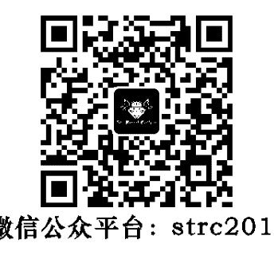
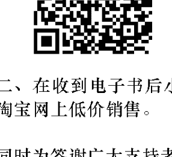
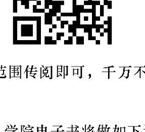
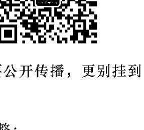

## 靈性伴侶關係

蓋瑞·祖卡夫 Gary Zukav —— 著
蔡孟璇 —— 譯

> ★ 媒體天后歐普拉二十年來始終推崇的心靈導師
「美國科學圖書大獎」(The American Book Award for Science) 得主，另一本撼動時代鉅作

不是普通朋友，也不是靈魂伴侶，
適用於所有關係的療癒新起點

此生，我們不一定能成為靈魂伴侶，卻可以發展靈性伴侶關係，
支持彼此療癒人格中的恐懼部分。

SPIRITUAL
PARTNERSHIP
The Journey to
Authentic Power

## St. Royal College 天使神秘学院

- 神秘学资料库
- 神秘学培训机构
- 水晶能量研究中心
- 专业占卜预测机构
- 官方微信：strcdts
- 微信公众平台：strc2011
- 官方店铺网址：http://strc.cr.cx
- 读书交流QQ群：
  占星塔罗占卜师交流群：814594478（加入密码：PDF）
  神秘学其他综合群：659338717（加入密码：PDF）

## 制作说明：

本书由《天使神秘学院》出重金从台湾购入的原版书籍扫描制作完成。为达到最好阅读效果，特地把书全部切开后，再经由专业扫描设备高精度扫描完成，并经过一张张的PS后期处理最终成书，其间花费大量的人力、物力以及时间，只为能给大家提供经济并优质的神秘学学习资料而努力。

本学院强力谴责某些机构和个人，把本学院花心血制作完成的电子书籍，包装后直接放在自家淘宝网上低价倾销的行为，以谋取不劳而获的经济利益。如果长此以往最终将无人愿意再为大家花心思制作电子书，那以后可能大家再无新书可读。

为大家以后能够读到更多的好书，也为了本学院的良性发展。本学院恳请大家尽量做到如下几点：

- 一、尽量在天使神秘学院的官方网站购买电子书籍。

官网电脑访问地址：http://strc.cr.cx

- 二、在收到电子书后小范围传阅即可，千万不要公开传播，更别挂到淘宝网上低价销售。

同时为答谢广大支持者，学院电子书将做如下调整：

- 一、学院会把一些早已收回制作成本的电子书折价销售。
- 二、最新制作的电子书籍会开放打印功能，大家购买后有条件的可自行打印成书。

天使神秘学院
2020年5月

## 靈性伴侶關係

不是普通朋友，也不是靈魂伴侶，適用於所有關係的療癒新起點

蓋瑞·祖卡夫 Gary Zukav —— 著
蔡孟璇 —— 譯

## SPIRITUAL PARTNERSHIP
*The Journey to Authentic Power*

## 致謝

我衷心感謝琳達·法蘭西絲，她不間斷的愛與靈感滋養了我，她對本書的許多貢獻讓這本書更實用、更有幫助。我對分布在各地的靈性伴侶們致上謝意，特別是「新靈魂觀學院」的「真實力量課程」參與者，他們的全心投入、勇氣、慈悲和有意識的溝通與行動，經常為我帶來啟發。我也要感謝我的編輯基甸·魏爾（Gideon Weil），他的建議讓本書更貼近每一個人，也更加平易近人。

## 目录

# Part 1 為什麼我們需要「靈性伴侶關係」？

- 【自序】一種新的可能性正在發生 9
- 【前言】彼此相伴、向內洞察的親密新體驗 20
- 第 1 章 新人類意識：地球學校的一門嶄新課程 30
- 第 2 章 靈魂視野：愛的三個宇宙法則 44
- 第 3 章 無盡的痛苦：你誤解了什麼是愛 54
- 第 4 章 蝴蝶效應：你的意圖決定你的體驗 63
- 第 5 章 情緒囚籠：從覺察你的情緒反應開始解套 73
- 第 6 章 無意識模式：導致破壞性結果的互動慣性 82
- 第 7 章 幸福的障礙：你人格裡的恐懼面向 92
- 第 8 章 真實的力量：放下對外在事物的操控 101

## Part 2 什麼是「靈性伴侶關係」？ 111

### 第 9 章 非典型友誼：鼓勵你檢視人格裡的恐懼面向 112

### 第 10 章 非典型伴侶：支持你療癒人格裡的恐懼面向 122

### 第 11 章 平等心：不優越也不自卑的互動原則 132

### 第 12 章 靈性伴侶關係動能一：一起追求靈性成長 142

### 第 13 章 靈性伴侶關係動能二：有意識地選擇角色 152

### 第 14 章 靈性伴侶關係動能三：說出最難啟齒的話 162

### 第 15 章 體驗真實無偽的親密感 174

## Part 3 如何創造「靈性伴侶關係」？ 183

### 第 16 章 靈性伴侶關係指南：開啟真實力量的四把鑰匙 184

第17章 靈性伴侶關係指南（一）：承諾 192

第18章 靈性伴侶關係指南（二）：自我療癒永遠是第一優先 200

第19章 靈性伴侶關係指南（二）：勇氣 209

第20章 勇氣實作：去說或去做最困難的事 218

第21章 靈性伴侶關係指南（三）：慈悲 228

第22章 慈悲實作：消弭你與對方的距離感 236

第23章 靈性伴侶關係指南（四）：有意識的溝通與行動 244

第24章 有意識的溝通與行動實作：聆聽直覺的指引 250

第25章 透過練習，讓關係不斷進化 260

第26章 實作範例（一）：對談的步驟與問句 266

第27章 實作範例（二）：如何應對對方人格裡的恐懼面向 276

## Part 4

### 誰是建立「靈性伴侶關係」的對象？

第28章 家人：家庭是你在地球學校的「固定教室」 288

第29章 朋友：只給你安慰劑，或真心為你好？ 297

第30章 同事：一週五天挑戰你人格裡的恐懼面向 307

第31章 伴侶：激發你最大靈性成長潛能的人 317

【後記】蛻變的時刻，你可以重新選擇 331

【附錄】蓋瑞·祖卡夫「新靈魂觀學院」相關資訊 341

## 靈魂療癒摘要索引

- 摘要① 為什麼我們需要「靈性伴侶關係」？ 108
- 摘要② 什麼是「靈性伴侶關係」的內涵？ 172
- 摘要③ 「靈性伴侶關係」能帶來什麼助益？ 181
- 摘要④ 「靈性伴侶關係」如何減少恐懼，培養慈悲？ 227
- 摘要⑤ 如何將「靈性伴侶關係指南」付諸行動？ 264
- 摘要⑥ 什麼是運用「靈性伴侶關係指南」的最佳作法？ 285
- 摘要⑦ 誰是發展「靈性伴侶關係」的重要夥伴？ 329

## [自序] 一种新的可能性正在发生

### 从被感官知觉掌控，到向内观照的灵性成长

这是一本谈论「改变」的书，一场可能发生与想像的最大规模改变——这个改变比火的发现、轮子的发明、文化的起源、宗教的诞生、民族的兴起，以及科学的影响力都更重大。它比过去曾经发生过的任何事都更为重要，以致在它之后或当它发生时会发生什么事，根本难以预料。

这是一本谈论「可能性」的书。短短几年前仍超乎我们能力或想像力的经验、洞见与动机，现在正在吸引我们、召唤我们前往新的目的地，创造更多全新的可能性。这一切是如此新颖与新鲜，好比一张等待着写下字迹的白纸、一张邀请第一道笔刷落下的画布。过去，有一些人曾瞥见过，并偶尔探索过这些全新的可能性；但是现在，每一个人都开始看见或感觉到它们了。我们已经跨越了一道门槛，已经没有回头路绝，也无可能再回头了。

这是一本谈论「力量」的书。旧式的力量，亦即操弄与控制的能力，如今徒然增添了暴力

與毀滅。這真是令人驚訝啊！因為舊式的力量讓我們與我們的祖先得以生存下來，好比一帖良藥突然變成有害的，而它現在已是有毒的了。我們過去必須服用它才能活命，現在我們卻必須避開它才能保持健康。一種新型態的力量，也就是真實的力量，已經變成新的良藥了，我們需要它才能得到健康，獲得滋養，變得健全。我們過去難以想像的改變、可能性與力量，正在重新塑造整個人類經驗。新的價值觀、目標與意圖如雨後春筍在世界各地竄起，它們成長迅速，而且凡它發展之處，美好亦隨之而來。隨之而來的還有成片的花海與廣袤的森林，一個嶄新而不可思議的世界，正在以一種前所未見、令人驚異的方式逐漸成形。我們全都是一所新學校的學生、一個新疆界的探險家、全新人類經驗的先鋒。這個個人類經驗上前所未見的蛻變，包含了兩個部分，我們可以將它們稱為「過程A」與「過程B」。過程A可說是自動發生的，沒有人必須做任何事來促成過程A的發生。過程A正發生在數百萬人身上，而很快地，過程A將會發生在所有人類身上。過程B則是截然不同的一回事了，它有賴於選擇。確切而言，你必須做出選擇以讓過程B發生，否則它便不會發生在你身上。即使他人選擇了讓過程B發生在他們身上，過程B也不會發生在你身上，除非你選擇了讓它發生。簡言之，(1)過程A發生在每一個人身上，或者遲早會如此，你或任何人都對它束手

無策。(2) 過程 B 只會發生在選擇讓它展現在自己身上的人，並且他們也無法讓它展現在其他任何人身上。

讓我們賦予過程 A 與過程 B 一個名稱吧！過程 A 就是人類知覺的擴展，它會擴展至超越我們的視覺、聽覺、味覺、觸覺或嗅覺所能及的範圍。這是非常重要的一件事。過程 A 就是讓你親自去看見，這世界遠比你所認為的更廣大，而且是遠遠超出許多，同時它也和你所能想像的非常不同。在過程 A 發生之前，你對世界的觀感仍局限於你的五官感覺告訴你的一切，而過程 B 發生之後，你的五官感覺仍會持續告訴你關於這世界的一切，但是除此之外，你的經驗將會更豐富。這種「豐富」，有時很難向那些尚未體驗過過程 A 的人形容，但其實已經有數百萬人體驗過過程 A 了，或正在體驗它而不自覺。

過程 A 能讓你知道一些五官感覺無法告訴你的、關於他人的事，例如，在某人打算打電話給你之前就預先知道、知道生活在另一座城市的女兒發生意外、知道祖母過世了、知道你應該先檢查車子的煞車才能上路等等諸如此類的事情。換句話說，過程 A 大量涉及了直覺。過程 A 也能讓你對自己擁有全新的體驗，例如，體驗到自己並非僅止於這副身心，它為你揭示出生命是有意義的，而且如同水召喚一個口渴的人，它則召喚你活出你的意義。過程 A 讓你透過意料之外的方式接觸到意義，例如，擁有萬事萬物皆完美的短暫體驗，或是感覺到與一個陌生人的

連結。過程A讓你能從一個非個人的觀點來觀看，從那樣的視角而言，你的一切經驗，即使是最痛苦的體驗，都有助於你以及周遭人的靈性發展。它們提供了你確切需要的東西供你培養力量、慈悲與智慧，好讓你能夠貢獻與生俱來的天賦。過程A是一種擴大的覺察力，其中不僅包括了五官的知覺系統，也包括了察覺真實而無形之理智、慈悲與智慧的第二個系統。這個系統讓你能夠以許多方式體驗無形界（non-physical reality），包括剛才提到的種種。過程A是一種多官知覺（multisensory perception），這是當前在人類物種之間興起的人類意識的偉大蛻變。不出幾個世代，所有的人都將是「多官人」，他們不但能體驗到空間、時間、物質與二元性的領域，也就是自人類起源以來大多數人的所有體驗，同時也能體驗到影響著我們、也受我們影響的無形領域及其動能。這引領我們來到了過程B。過程B將伴隨過程A而來的新潛能帶入你的生命中。多官知覺（過程A）改變了你的知覺，但是並未改變你。它為你顯示你看不見的事物，但是不會促使你使用這些新知識。它闡明了你過去無法看見的動能，一種能用以改變生命、帶來長久助益的動能，但是它不會要求你運用它。它為你揭示出你的創造力，但卻無法使你以智慧去創造。

## 從內在源頭改變，獲得真實力量

相反地，你將會一如既往地以舊有的方式創造，直到你做出另外的選擇。舉例而言，如果你生氣了，過程 A（多官知覺）並無法讓你變得較不生氣，也不會為你創造出不同的結果，滿懷憤怒地行動所創造的結果將和過去一模一樣。人們依然會遠離你，依然會受到你的威嚇，依然會拒絕被你傷害，你也依然會受到孤立、感到孤獨，渴望一段有意義的關係，而且依舊滿懷憤懣。

過程 B 是在你自己內的內在體驗，並且改變痛苦情緒（例如，憤怒、嫉妒、復仇心態等）、強迫性的行徑（例如，工作狂、完美主義等），以及上癮行為（例如，暴飲暴食、抽菸、飲酒、嗑藥、看色情影片或刊物、賭博等）的內在源頭；它也是在你內在體驗並培養使你愉悅的情緒（例如，感恩、滿足、欣賞、對生命感到敬畏等）的內在因素。簡而言之，過程 B 是創造那正在呼喚你的、充實且充滿喜悅的生活。

這需要努力。但是選擇過程 B，幾乎能立刻在你生活中發揮效果；換句話說，選擇過程

> > 譯註：
> 與物質界（physical reality）相對之非物質、非形體界。

B，能在很短的時間內從根本上改變你的生命。這不代表你第一次或第二次進行過程 B 的時候，就會徹頭徹尾換了一個人，過程 B 並不是那麼簡單或輕鬆。然而，你在進行過程 B 時所做的每一個改變，皆具有根本上的蛻變效果。第一個改變是根本上的蛻變，無論它看似多麼微小皆然；第二個改變也是根本上的轉變，依此類推。過程 B 會漸次增強，隨著你每一次的選擇而發生，而你所做的每一個選擇都將你推進至一個全新的方向，朝一個嶄新且健康的目標邁進，亦即讓你發展出一種人格，這種人格讓你經歷到的是如此煥然一新的非凡體驗，以致你永遠無法預見那是些什麼樣的體驗。 過程 B 要求你在每一刻都審慎選擇一種能創造出喜悅與創造性結果的言行，即使痛苦又狂暴的情緒朝你席捲而來，亦能堅持。過程 B 藉以改變你生命的是你自身的意志力量，加上覺知的引導，以及你有意識選擇的意圖，並由宇宙間的慈悲與智慧提供協助，而且你會切身體會到這份慈悲與智慧的意義。這種蛻變遠不只是那種邁向更美好或更健康生活的轉變，它是一種朝向你內在最高層次、最高貴、健康而且落實的那一部分的蛻變——那就是你的靈魂。 換句話說，過程 B 是去找出並且改變你人格中所有與靈魂的意圖相符的部分，以及找出並且培養你人格中所有與靈魂的意圖不符的所有部分，以及找出並培養你人格中所有與靈魂的意圖相符的部分。你的靈魂想要和諧、合作、分享，並對生命懷抱敬意。每一次，你帶著這其中一種意圖而創造，你就會創造出真實力量，創造一個擁有滿

足、感恩、活力、創造力與喜悅的生活。過程B就是創造真實力量。如果過程A（多官知覺）不是在每一個人身上發生，那麼，過程B（創造真實力量）就不可能在任何一個人身上實現。過程B的目的是讓你的人格與靈魂達成一致，但是你的五官感覺卻無法覺察到你的靈魂。靈魂對一些「五官人」來說是個有趣的概念，但是就經驗上而言，那對他們毫無意義。如今，有數百萬人正在體驗著多官知覺（過程A），他們也因此改變了自己的生命（過程B）。你也正在體驗著多官知覺，否則你便不會覺得這是本有趣或有價值的書。這些概念對那些單從五官感覺獲取資訊的思維來說，是毫無吸引力的，但它們卻呼喚著那些「由多官知覺獲取資訊的內在心靈。對於當前進行中的人類意識蛻變而言，多官知覺與真實力量是這場蛻變裡最具代表性的兩個特徵。第一個特徵會不費力地浮現，影響著所有的知覺，為我們揭露經驗的新面向；第二個特徵則必須等待你做出承諾、發揮勇氣與慈悲，並進行有意識的溝通，才能讓它進入你的生命。第一個特徵是一份來自宇宙的美妙禮物，而你必須自己去創造第二個特徵。多官知覺不會損害你的選擇。多官知覺的人擁有追求外在力量（舊式力量形式）的自由，也有創造真實力量的自由。只不過選擇追求外在力量如今徒然導致暴力與毀滅，亦即（至少）個人之間的情緒暴力與破壞行為，以及各個宗教、文化與國族之間的實質暴力與破壞行為。選

## 踏出去，改變才可能發生

擇追求外在力量，沒有任何彌補改善的助益。事實上，它毫無益處可言。五官人透過求生存而發展，多官人透過靈性成長而進化，這個巨大的差異必須伴隨著極為不同的人我關係。對那些透過創造真實力量而進化的多官人而言，新型態的關係就是「靈性伴侶關係」。靈性伴侶關係是以靈性成長為目的的平等夥伴關係，它會吸引創造真實力量的多官人，如同舊式關係會吸引追求外在力量的五官人。靈性伴侶的目的、本質與功能是不同的。靈性伴侶關係的動能及靈性伴侶所共同創造的經驗是不同的。這種新型態的關係與創造真實力量的新興多官人密不可分，一如舊式關係與追求外在力量的五官人緊密關聯。
創造真實力量有賴於一份具有實質性與深度的關係，除非你有勇氣投入一段深具意義且重要的關係，否則便無法在靈性上獲得成長。換言之，靈性伴侶關係是過程B裡的必要部分。每一次的相遇，都為你提供一個創造真實力量的機會，而當你遇見的對象裡也包括了正在利用一已經驗創造真實力量的人，那麼，一段靈性伴侶關係的潛能便有機會實現。潛在的靈性伴侶關係認知到承諾、勇氣、慈悲、彼此間有意識的溝通，以及行動的重要。他們會自然而然地在創造真實力量上努力支持彼此，並接受彼此的扶持。他們的旅程朝著相同的目標前進，他們認知

到同行旅者的重要，並且能從彼此身上學習。如今，進化要求你創造一個能夠滿足人心的、喜悅的生活，也就是貢獻你與生俱來的天賦，而靈性伴侶關係能帶領你走進一段與志同道合者合力創造的互動關係裡。

在我所有的著作，或與我的靈性伴侶琳達·法蘭西絲（Linda Francis）合著的著作當中，談論的重點都是真實力量，只不過我當時並未意識到這點，而其中的第一本著作是《物理之舞》。這本書談論的是量子物理學、相對論與量子邏輯，目標讀者群是對科學不感興趣的人。

然而，我在著述過程中第一次擁有了一些真實力量的體驗。我不知道要如何確切地指出或解釋這些經驗，但是我認知到，這些經驗是如此不可思議、美妙無比，於是開放心胸盡情體驗。

這部著作連連獲獎，成為一本廣受好評的科普書，但是我相信許多曾閱讀這本書的人與至今仍在讀的人，是被物質界與意識之間的連結所吸引，那對量子理論的某些詮釋來說，包括多數物理學家都會使用的詮釋，是必定會探討的議題。《物理之舞》是我第一次嘗試寫作，也是我對科學的初次探問，但更重要的是，它是我給予生命的第一份禮物，而我至今依然在收割生命回報予我的恩賜。

第二部著作談論的也是真實力量，只是沒有任何媒介，例如之前的科學，它主要是分享我開始撰寫《物理之舞》之後與撰寫該書期間對真實力量的發現。它一開始是以一套三冊的

過程 B。《新靈魂觀》談論的是進化、因果、直覺、意圖、責任、信任等等，但強調的是過程

官知覺與如何創造真實力量的具體範例與概念。

本書就是這樣一本著作。《新靈魂觀》與《靈性伴侶關係》這兩本書，談的都是過程 A 與

深、清楚易懂的方式，解釋如何創造真實力量的著作，在書中詳盡地闡釋它，提供讀者關於多官

知覺與真實力量的小插圖（《靈魂故事》[Soul Stories] 與《靈魂對靈魂：從心溝通》[Soul to

of the Soul: Responsible Choice]）。我也撰寫了兩本較為輕鬆易讀的書，書中搭配了關於多官

之心：從日常覺察情緒，教你找回當下的力量》與《靈魂的心智：負責任的選擇》[The Mind

《物理之舞》之後認識她的）和我合力撰寫了兩本書，談論創造真實力量的兩種工具（《靈魂

況那麼深入，而且理解真實力量與創造真實力量完全是兩碼子事。最後，琳達（我是在撰寫

當時我認為自己已經明白了何謂真實力量，只是尚未了解到自己的理解並不如後來的情

等，我實在不想令他們失望，但我若不分享這部優秀的著作，會覺得未盡完整，它和《物理之

觀》。有些讀者期待我為《物理之舞》撰寫一部談論另一個尖端科學領域的續集，例如遺傳學

理智產物問世，稱為《物理與意識》，但是十年之後，它成為另一份心的禮物，亦即《新靈魂A。它的重点在于成为多感官人的绝妙经验、永存的无形导师与指导灵，以及有意识地与慈悲和智慧的宇宙结合成伙伴关系。《灵性伴侣关系》一书谈论的也是多感官知觉与真实力量，但强调的是过程。它指出灵性伴侣关系的3W1H，亦即“原因”（Why）：为什么我们需要“灵性伴侣关系”（Part 1）；“内涵”（What）：什么是“灵性伴侣关系”（Part 2）；“作法”（How）：如何创造“灵性伴侣关系”（Part 3）；以及“参与者”（Who）：谁是建立“灵性伴侣关系”的对象（Part 4）。它们同时也是创造真实力量的3W1H。灵性伴侣关系与创造真实力量，就像智慧与耐心一样密不可分。若不创造真实力量，就无法拥有灵性伴侣关系；而若缺少了灵性伴侣关系，你便无法获得灵性成长。创造真实力量是一个过程，不是一个事件。它是你的生命目的，以及你的互动机会。真实力量是一段旅程，不是一个目的地，它是一段过去鲜少有人走过的旅途，而现在，我们所有人都必须去完成这个人类的转变——从透过求生存而发展的五官物种，过渡至透过灵性成长而进化的物种。本书就是告诉你如何创造真实力量的地图，在旅途上的任何时刻，你都可以参照。请好好研读它，才能准备好应付前方可能发生的情况，好好温习，才能了解过去发生过的状况；好好练习，才能在你旅途中的当下过着喜悦的生活。能够与你一同踏上这段旅程，我心存感激。

## 【前言】
## 彼此相伴、向内洞察的亲密新体验
### 人我关系的互动型态已然改变

新型态的关系是从人类的经验形成的，它会取代其他所有型态的关系，这是一个好消息。过去的型态是为逐渐消亡的人类物种而设计的，而全新的人类物种正在诞生，我们就是其中一份子。这个新物种有它对关系的要求，有自己的价值观，也有自己的目标。相较于那个正在消失的物种，它的潜能远远高出许多，对人类做出建设性贡献的能力也更加强大。

有数百万的人都是这个新物种的一份子，更有另外数百万的人正在成为它的一份子。这个新物种的数量逐日增加，因为拥有这些新能力的婴孩，每天都在诞生，而且有数百万人已开始觉察到自己内在的这些能力。你就是其中之一，否则你不会受到这本书的吸引，否则“灵性”这个词对你而言将只是个概念，或是一种宗教、一种信仰系统，你会以宗教、诗意或哲学的角度来看待灵性，或对它充满了关于天堂或超升至高层次经验（或被贬入低层次经验）的想象，你会在圣坛或壁炉架上放一座十字架、供奉佛像，或摆上克里希纳（Krishna）的画像、放一颗水晶或任何能为你带来光明与灵感的图像。你会持咒念经，唱诵圣歌，享受那些和你发现相同真理的同行道友们的陪伴，从中寻求慰藉。

新型态的人类关系会将“灵性”与“宗教”分开来看待。灵性非关因袭传统、遵守戒律、实践教导或接受他人的权威，它也和建筑物无关，和穿着方式、经典以及圣典亦毫无关联，不过它的确是关乎理解并欣赏万事万物的神圣性，同时努力依此原则过生活。究竟而言，灵性非关对自己或他人的评断，它关系的是在你的内在发现，并从内在转化那些导致痛苦经验与毁灭性行为的根本因素；而且从你的内在发现，并从内在在培养那些促成喜悦经验与建设性行为的本质因素。

新型态的关系、对灵性的全新理解、以及全新的人类物种这三件事，是一起诞生的，也是为彼此而设计的。灵性与宗教之间的区别对旧人类类来说并不明显，但是对数以百万计的人而言，这两者的差异正变得越来越显而易见。尽管如此，仍有一些困惑存在，不仅仅是因为从旧人类到新人类的转化仍在进行当中且尚未完成，也是因为有许多宗教虔诚人士同时也是灵性人士，或是相反的情况，有许多灵性人士同时也是宗教虔诚人士。这是个很重要的过渡期，旧的逐渐凋零，新的逐渐成型，在数个世代的时间里，这两者将会重叠——旧人类的影响力及其价值观会逐渐减弱，新人类及其大不相同的价值观与目标则会逐渐增强。

这个过程是不可逆的，因此，执着于旧人类型态及其目标不但完全无益，反而可能制造出痛苦的经验与后果。

每天早晨为了太阳的升起而哀伤，或为了潮起潮落而苦恼，是多么痛苦的事啊！这么做，除了制造个人的不幸之外，有任何建设性可言吗？

人类历史上除了人类起源以外的最重大事件正在发生，无论我们是接受或拒绝、欢迎或排斥、拥抱或抗拒，我们依然是其中的一份子。

一种全新的人类关系互动型态是这整个发生过程的必要部分，因此，无论我们是接受或拒绝、欢迎或摒弃，都无法忽视它，否则后果堪虑。

人我关系是人类努力追求的领域中，难度最高的一项，既然人类关系的本质已经起了变化，那些忽略这种变化的人，他们的关系将会变得更加困难。

人们有各种不同的共同目标，因此也存在着各种不同的旧式关系。商业关系和恋爱关系不一样，也和同侪之间的关系、邻居之间的关系，以及亲子关系大相径庭。你和你的修理工人的关系，不同于你的医生和他的办公室经理的关系，不过，它与你和你的会计师或修理工人的关系较雷同。房东与房客有他们的关系，员工与同事和老板有他们的关系，老师与学生也有他们的关系。这些关系里的个体，努力想要达成一个共同目标。这些联系让关系里的个体有机会完成一些单靠自己无法完成的目标，例如，竞选团队、大企业、社区合作等等，都是这类关系的产物。有一些关系相当非个人化，以致其中个体之间的连接皆互不相干，例如，指挥交通的警察和接受指挥的汽车驾驶人之间的关系。然而，所有的参与者皆共同创造了单独一人无法完成的事，这是一种顺畅的交流。有一些关系是非个人的，但是会相互地欣赏与感谢，例如你和店员的关系。在其他关系里，个人之间的连接变得更为重要，例如你和姻亲的关系，尽管那些关系不一定非常亲密或具有实质性。要达成建立一个健康家庭或相互支持地生活在一起这样的目标，就必须将更多注意力放在关系中个人之间的连接上，因为若那份连接丧失了，或流于表面化，就无法达成目标。董事会成员可能互看不顺眼，这种事屡见不鲜；员工之间彼此竞争，这种情况也很普遍；政治盟友可能曾彼此剥削，他们通常会这么做，但尽管如此，他们依然能完成共同的目标。这些关系既困难重重又令人痛苦，但是却能发挥功能。事实上，多数的关系都落入这个类别中。有无数的婚姻和同居伴侣关系都是痛苦而煎熬的，然而，其中的个人依然维持着那样的关系，因为它能提供每个伴侣都害怕失去的安全感，至少是熟悉感，而这么做能让伴侣们达成一个共同的目标。一个让伴侣能专注于创造正面连接并完成共同目标的关联，是最富挑战性的关系。所有旧式关系的功能，姑且不论参与者之间的连接是微不足道或非常重要，都是为了操弄或控制环境（包括他人），以达成参与者的共同目标。换句话说，是为了改变外在世界，例如，选出一位市长、筹组一项运动或创立一个事业等。这类关系能让其中的伙伴一起购买一栋房子、生养孩子、建立家庭，让彼此不再孤单，或满足彼此在情感、心理、身体或性方面的需求等等。他们的共同目标永远都是这份关系成立的理由。当目标达成，或当他们无法达成目标时，关系随即面临破裂。举例而言，一个竞选团队关系会在对手赢得选举之后结束，团队成员即各奔东西；一个事业若宣告失败，合作伙伴们会各奔前程，而若成功了，他们也可能会出售事业，各自发展。

### 因共同目标而聚拢的旧式关系，已成为一种妨碍

这个主题有无数的变化方式：婚姻里的伴侣会在了解到配偶无法或不愿意满足自己在心理、身体、情感或性方面的需求时，诉请离婚。一个人若成为素食者，他可能仿佛“重生”一般，开始静坐，或信仰另一种宗教，而对于那些没有经历类似改变的人，他便不再追求或接受。任何一种让人在信仰、外貌上出现变化，或产生不同价值观、不同目标的转变，都将终结一段旧式关系，因为关系底下作为基础的共同目标已经不复存在了。无论那个共同目标是同质性所带来的安全感，例如相同的肤色、信仰或语言，或是日益增加的市占率、一个新的公司监事会或一个快乐的家庭等等，它们都是关系成立的理由，也是让关系维持凝聚力的黏着剂。若缺乏共同目标，关系便不再具有意义，参与者彼此之间的吸引力将会消退，关系亦随之瓦解，或是会有其他更相关的人前来取而代之。

无论目标为何，它都将决定谁的吸引力足以成为潜在的伙伴，谁则不能，以及谁是受欢迎的，谁是遭到排斥的。同质性是被接受的，多元性却是遭排斥的。比方说，如果共同的目标被接受了，那么那些无法在言行举止、穿着打扮或信仰上符合该关系要求的人，就没有资格成为会员；想要一个未来能养家的伴侣的人，就不会考虑某个失业或拒绝工作的对象；一个戏剧导演不会考虑聘用一个不会演戏的人；一个需要营销总监的企业老板，也不会考虑一个缺乏这方面能力或资质的人，依此类推。

共同的目标决定了关系里的参与者是谁，而那些参与者都是可取代的。一位木匠可以被另一位取代，一位竞选总监可以由另一位代替，一位义工也可以被另一位替换，而且正如许多人已经发现的，配偶当然也可以被另一位顶替。

这类关系是我们再熟悉不过的，因为它们随处可见，我们也不断在亲身体验着这样的关系。它们对逐渐消亡的人类物种有其用处，但是现在却再也无法给予我们支持了，因为新物种有着与旧物种截然不同的知觉与价值观。随着越来越多人体验到新人类物种的新知觉与新价值观，我们也开始能以不同的眼光看待自己与他人、看待这个世界与生命的意义。我们与他人在一起的理由改变了，因此，我们彼此之间所创造的关系型态也随之转变。旧式关系是人类物种用来求生存、扩张一己势力至整个地球的一种手段，但是它们已经妨碍了我们的灵性成长。

### 迈向灵性成长的旅程

这相当重要，因为我们当前正在藉着灵性成长而进化。灵性成长之于我们，犹如太阳之于植物，是绝对必要的。我们要寻找的伙伴是能让我们获得灵性成长的人，而不是让我们完成共同目标的人。求生存已经不是我们唯一的目的，对我们也已经不再足够了。我们渴望更多东西，而在我们努力寻求满足的同时，我们也重新定义了灵性、关系以及进化这些事。旧人类、由求生存获得进化、为改变环境而设计的关系型态，以及宗教等，都是由同一本质的结构所组成。它们共同孕育而成，也正一起被另一种本质的结构所取代，这种新结构将成新人类、由灵性成长获得进化、为灵性成长而设计的关联型态，以及灵性。旧式结构正在瓦解，新式结构的轮廓则已经渐渐变得清晰、为越来越多的人所见。灵性关乎的是灵魂，它要求你必须与人类经验中最高贵的驱策力产生共鸣，例如，和谐、合作、分享、对生命怀抱敬意等。这个目标却无法由一个人，甚或一群人为另一个人实现，每一个人都必须为自己的灵性成长负起完全的责任。灵性是一趟迈向自我觉察与自我负责的旅程。旧式关系让参与者的注意力焦点转向外在环境与人，进而改变它们，以此帮助了旧人类生存下来。新式关系则让我们将注意力焦点，转向内在那些造成痛苦经验与破坏性行为的内在原因，进而改变这些因素，也转向内在那些造成我们幸福经验与建设性行为的内在源头，进而培养这些因素。

寻求灵性成长的旧人类，会透过避居寺院道场来跳脱外在环境与人事务的干扰，迈入隐居生活。在小密室或山洞里只身一人的静修者，俨然成为追求灵性成长的最著名象征，他们追求的是超越五官感觉的限制、超越文化习俗的束缚，进入生命中一种不受恐惧所缠扰的自由境界。然而，随着新人类的诞生，遗世独立反而造成反效果，因为它会阻碍灵性发展所必要的互动。过去，只有寥寥无几的人对灵性成长感兴趣，而且每一份关系都是围绕着共同目标而形成的；如今，却有数百万的人都深受和谐、合作、分享、对生命怀抱敬意等概念所吸引。在几个世代之内，所有的人类都将努力追求灵性成长。我们已经创造出与旧型态十分不同的关系了，而其最重要的目的便是支持我们的灵性发展。人我关系对旧人类物种的发展是不可或缺的，对我们的进化同样不能缺少，只是其中的理由有着显著的差异。关系能帮助旧物种生存下来，协助我们在灵性上成长，但是随着新物种的知觉与价值观在数百万人身上出现，旧式关系也随之越来越无法满足我们了，我们对自我探索、自我觉察与如何自主，越来越感兴趣。自我实现、内在的满足、意义、目的、爱，以及为生命做出贡献的喜悦，变成了比职业生涯、生活方式与金钱更重要的优先选项。

我们发觉，为了自己的痛苦经验而怪罪他人的作法，越来越令人不满（无论我们多想这么做）。与其这样，不如往自己内在找出造成痛苦经验的原因，并且着手改变。对于我们所做的事、所说的话及其理由，我们开始认知到情绪与意图的重要性。我们在寻找自己所做的选择与经验之间的关联，以此改变自己的选择，进而改变我们的经验。我们努力成为我们想要他人成为的样子，而不是一味地努力去改变他人；同时，我们也正逐渐改变自己在家庭、工作与玩乐上的关系，将它们转变为新的型态。

关系正以令人惊讶的方式出现在每一个地方。这种在关系之功能、本质与经验上的转变，其规模巨大无比，而背后的原因甚至更加强大。

## Part 1
## 为什么我们需要“灵性伴侣关系”？

## 新人类意识：地球学校的一门崭新课程
## 故事的开端

维京人初次踏上北美土地时，他们脑子里想的是掠夺，哥伦布想的则是新的贸易路线。欧洲殖民者寻找着土地与财富，他们横越这片大陆，以武力占领自己想要的一切，凡是与他们交手的人都成了穷人。他们成就了自己想要的目标，但是没有人预见，他们的支配欲不仅毁灭原住民文化，也摧毁了支持着我们所有人的环境。

移民美洲者，也就是那些原本受到压迫、以鲜血和英勇作战赢得自由的人，反过来变成了压迫者，在北美洲藉着武力侵门踏户、掠夺资源，有时与殖民者结盟，有时则自己进行战斗。

刚开始，他们对环境的影响力很小，他们砍树、垦地、建造城市，但是无尽的森林、干净的水源、原始的草原总是不断呈现在他们眼前。

然而，情况很快出现了变化，工业革命让这片大陆的文化与地貌完全改观。电报、铁路、汽车、飞机、电脑、太空船等，一样紧接着一样，全都在两个世纪之内相继出现。移民者、来自非洲的奴隶、来自欧洲、亚洲以及后来的拉丁美洲劳工陆续进驻，使这片土地的人口持续成长，飞速扩张，一同融合成一个大型（后来演变为超大型）的、消耗力强大的群体，威胁着这片大陆自给自足的能力。这就是我们当前的处境。这场无止尽扩张的灾难，反映的是最早期北美移民的意识状态，而我们正是他们的继承者。

这就是我所居住的土地的故事，我父母及其祖先的历史，他们以自己也不曾料想到的方式，促成了这场巨变。无论是在个人或集体层次上，他们并未审慎思考一已决定的后果，只是一味地努力达成无止尽的目标，依靠的却是最早期移民进入这片大陆时的意识，也就是一种控制、支配的意图。

这也是我的地球的故事，以及许多文化与个人等大群体的故事，远在维京人进入北美洲之前，他们就已经带着相同的意识创造出同样的结果。国族、宗教、工业化，以及军事化不断出现在人类史册的书页上，将它转变为一场慢性的冲突与剥削。今天，北美人口急速扩张的毁灭性影响俨然成为一种缩影，反映人类人口快速扩张对地球所造成的更具毁灭性的影响。换句话说，这个故事与地点和时代无关，而是与“意识”有关。

## 意识操控一切经验

意识，是我们体验自己与他人的方式，它包括的不只是情绪与思想。例如，我们会将某些人视为朋友、将某一些人视为敌人，但是五官感觉无法告诉你，一个人是朋友还是敌人，它们只能告诉你，母亲长什么样子、听起来是什么样子、她的触感是什么样子，但是你对母亲的经验告诉你，她是朋友，而你的情绪会反映出你的经验。见到敌人或想到他们时，你会感受到痛苦的情绪；而见到或想到朋友时，你会感觉到愉悦的情绪。当你遇见某个不认识的人，你对那人的想法将会创造出你的经验，如果你认定他是朋友，你的经验就会和认定他是敌人时不一样。所有这些都是意识的一部分，但还不止如此。意识就像一个碗，这个碗永远是满的，有时候里面装了花朵，有时候装了武器，有时候里面是你朋友和你钟爱之人的照片，而有些时候它是让你饱受惊吓的经验。你的一切所见、一切想象，以及关于所见与所想像的念头，再加上你的情绪，全部装在这个碗里面。你所体验的一切，例如，你的渴望、忧虑、喜悦、失望、感激与恐惧，全都出现在这个碗里。碗的容量无限大，碗里的内容物永远在改变，不变的是这个碗。想像你的厨房有一只永远装满了东西的碗，有时候装满了早餐谷片，有时候盛了鸡汤，有时候则是装了意大利面。有时候，这个碗盛装了满满的水果，然后是沙拉，接着是切好的洋葱。碗永远不会空。尽管你在碗里发现的东西一直在变，那只碗却永远保持不变。如果它装早餐谷片时是白色的圆形碗，那么它装沙拉时也会是白色圆形碗。碗和碗里的内容物是有差别的。意识就像那只碗，它能包含的经验数量可以无限多，但是无论它装了什么在里面，意识本身都不会有所改变。

我们的集体经验也是意识内容的一部分，例如几个世纪以前，这世界似乎是平的，太阳也是绕着地球转的，每个人都同意这个看法，因为事实显然就是如此；但是，事实现在显然已经不是如此这般了。学生与学者们会研究自身经验与祖先经验的不同之处，但我们的祖先却是亲身生活在那些不同的经验里，他们真正体验着一个和我们截然不同的世界。异教信仰、希腊众神、过去两千五百年来的各种宗教与各式各样的著作，无一不在改变着那只碗里的内容。数学、科学、艺术、建筑以及统治权的发展，也在改变着碗里的内容，更随着它们的演化而一变再变。对于进步的概念、法治、民主、科技等则是该内容的最新变化，然后经过这些改变之后，那只碗依然恒常不变。

要生来不具意识，就像生来不具身体那样，是不可能的事。每个人都是独一无二的，无论每个人的身体和你的身体有多么不一样，都是受到认可的。即便一个身体的四肢不健全或少了一颗眼睛，或形状不一样，或活动方式不同，它依然被认可为一副身体。长时间下来，身体虽...

看似同一副，其实在一生当中也曾数度是全新的身躯。老旧的细胞会死亡，被新细胞取代，然后再死亡、再被取代。婴儿逐渐长大成为学步的幼童、学童、成年人、老年人。柔软的骨骼与肌肉先是逐渐强壮，反应时间与耐力大幅提升，然后随着身体渐渐接近它存在的终点而变得衰弱，再次大幅改变。四肢或器官或许会消失、损伤，甚至在出生时即已不存在，但是在它的生命周期当中，无论是年轻或年老，完整或有缺陷，身体依然存在，而且每个人都明白这个道理，也都了解这件事。身体就是容器，但是容器里的内容物是变化多端的。

意识之碗就像是无论何时何地都受到认可的身体，因为它的基本形式就和其他人一样。意识也有一个无论何时何地皆相同的基本形式，无论碗里的内容物改变了多少，有些经验是永不改变的，这些经验会由每一个人所共享，无论此人出身何处、说什么语言或他的信念为何，都无关紧要。每一个具有意识的人都拥有这些经验，而既然每个人都具有意识，每个人当然也就拥有这些经验。它们并非仅限于某些文化或某些个人所独有，它们无法被忽视、被排除或被否认。这些经验不像一些明显的经验（例如，地球是平的），能被不同的明显经验（例如，地球是圆的）所取代，它们是永久性的。从出生到死亡，经过一代又一代，它们一直存在著，潜藏于其他所有经验底下，它们是所有时代、所有地点、所有人的最大公约数。它们是人类经验的核心，自人类起源以来就从未改变。

這些經驗是由那只碗來決定，而不是碗裡的內容物。它們為我們顯示的是碗的本質，而不是碗裡的東西。這是個不會變動的領域，每一個人都對它很熟悉，因為我們就活在它裡面。事實上，自第一個人類出現以來，我們一直在探索它，這就是五官感覺的領域。如果一個圓形碗裝滿了水，水永遠不會變成方形。無論什麼東西裝滿了這只碗（意識），它只會成為這只碗的形狀，也就是我們能看見、聽見、品嚐、觸摸、嗅聞的東西。

## 我們的所知所感，都受制於五官感覺

無論我們想像的或思考的是什麼，都只能以五官感覺的角度來想像或思考。天空、大海、街道、山岳、朋友等等，全部以五官感覺的角度呈現。冷熱、大小、快慢等，也都以五官感覺的角度表現。慷慨、殘忍、仁慈、恐懼、慈愛等，唯有從五官感覺的角度來看才有意義。思想與情緒，只有從五官感覺的角度才能被理解（它們是以荷爾蒙或大腦活動之產物的形式出現）。即使是包含大量符號、不含任何符合我們想像之物的抽象數學，若非因為它能告訴我們一些我們能以五官感覺的角度來思考或描述的事情，它也是不具任何價值的。

在人類經驗的歷史上，除了少數幾個非常著名的特例之外，皆侷限於五官感覺的知覺範疇裡。即使我們所思所想的是永恆與無限，也會被迫以五官感覺的觀點來思考，因為我們實在無法想像任何關於永恆或無限的事，除了將它視為永遠持續或無盡延伸這此千篇一律的概念之外，別無更多。我們甚至無法想像五官感覺之外的永恆是何模樣。當我們思及天堂或地獄時，我們也會以五官感覺的視角來想像它們。事實上，我們除了以五官感覺的角度來思考事情之外，根本別無他種思考方式。

五官感覺與智能是並肩運作的，五官感覺提供資訊，例如，某樣東西是什麼顏色、距離多遠或多近、移動的速度多快或多慢、有多麼嘈雜或安靜，或一個人是掛著微笑還是板著一張臉。智能使用了這些資訊，然後比較、分析、推演、下結論。在五官感覺的合作之下，它讓我們完成了其他物種皆無法達到的壯舉，也就是操弄並控制我們的環境。舉例而言，我們不光是知道如何避免危險，也知道如何栽種食物、暖化屋子、發明電腦、使用網路等不勝枚舉的事。

自第一個人類出現以來，我們能夠完成的每一件事都是拜智能之賜。許多其他的生命形式，例如和我們一樣的哺乳類，雖然也同樣擁有五官感覺，卻沒有和我們一樣的智能。只有人類能建造船隻、飛機、太空船、電話、牽引機、公路，以及摩天大樓。

所有這些創造物與我們對它們的想法，以及我們擁有的一切其他東西，都是意識的內容，亦即裝滿那只碗的東西。碗永遠是以五官感覺的形狀出現。有無數的經驗來來去去，不斷改變著容器裡的內容物，但是容器永遠保持不變，日復一日，年復一年，千年復千年。人類歷史將五官感覺能夠探知的每一件事，以及如何運用五官感覺所探知的每件事都載入年代表裡，以幫助自己生存並過得更加舒適。藝術、科學、詩歌、軍事征戰、宗教征服、農業、哲學、道德、工程等，全都從探索世界與我們對它的了解而來。我們對世界的經驗就是五官感覺的經驗，而我們對那些經驗的理解就是理智的產物。人類經驗看似是動態的，並且持續在變動，但是自第一個人類出現以來，它其實並未真的有什麼改變。創造我們對地球之經驗的意識（地球是平的或圓的，在宇宙中央固定不動或繞著一顆較小的星球轉）及所有其他的經驗，打從它的起源到最近，本身都是保持不變的。

### 新意識的運作正在發生

現在，那只碗的形狀改變了，而我們在那只碗改變之前所學習到的事物，沒有一項能幫助我們，能為我們在即將初次踏上的全新領域上指點迷津。一個巨大的改變正在發生，它不單是針對我們所經驗之事，也包括了我們能經驗之事。人類意識正在擴張至超越五官感覺限制的領域，在某些案例中，它更在超出五官感覺之外的領域上大爆發。智能無法幫助我們理解這些全新的知覺，甚至也無法將它們清楚地說個明白，因為智能是設計來與五官感覺一起運作的。儘管我們無法描述或勾勒出那種全新的體驗，它們卻真實不虛。

並不是每一個人都在同一時間或以同一個速度在遭遇這樣的全新經驗。有些人是在很平凡的情況下，瞥見了過去不曾看見的意義；而對有些人來說，例如不可能發生的巧合這種不尋常的經驗，卻似乎再自然不過了。有些人明白他們的價值觀一直在轉變，或是已經改變了；另一些人則被自己所經驗到的事物嚇壞了，然後假裝自己不曾有過這些體驗。從進化的觀點來看，所有這一切正非常迅速地發生。幾個世代之內，人類物種裡將沒有一個人會受到五官感覺的局限。我們的曾孫們將無法想像有人會受到五官感覺的束縛，一如我們無法想像有人會不具有意識。

五官感覺是一個單一感知系統的各個面向。那個系統的設計是用來察覺任何物質事物的，亦即任何能夠被看見、聽見、觸摸、嗅聞或品嚐的東西。現在，我們每一個人將在自己的時間、以自己的方式，取得另外一種感知系統——我們正在變成「多官人」。這第二個系統將能覺察到無形的智慧與慈悲、智能及其設計、目的與存在。它的知覺並不會取代我們所熟悉的五官感覺，但是會賦予它們一個新的面向，類似於色彩賦予黑白影像一個新向度一樣，只是它們能提供的遠非僅止於此。

有些人發現，他們知道一些關於其他人的事，包括陌生人，而那不是五官感覺能告訴他們的事，例如，天氣如何、那個人是和善還是快樂的、遭遇過什麼不幸、是否結婚或是離婚等等。他們有一種直覺，例如，知道何時該在晚上避開某些街道、或知道要購買某些書，之後才後悔當時沒有認真看待這種直覺，或不懂得珍惜。熟悉的巧合事件似乎很正常，例如，一個朋友在我們想到他時打電話來。關心他人的人依然心繫他人，沒耐心的人依然缺乏耐性，同事依然生氣或很仁慈，季節一樣四季流轉，嬰孩出生、長者逝世……但我們察覺到我們的生活比過去所認為的更有意義。碗的內容和過去可能出現的內容變得不一樣了，因為在那只碗的存在歷史裡，它的形狀第一次有了改變。

我們視自己為物質身體並局限在一段時間內的這種看法，將被新的經驗所取代。在新的經驗裡，我們對自己的體驗是靈魂，也是身心，是不朽的生命存在，也是終將一死的人格。這是個最巨大的轉變。我們正開始瞥見，意識與責任都不會在死亡時劃下句點，而我們所經歷的一切，每一樣都為我們增添了靈性發展的潛能。我們生命中的事件變得具有意義，而非隨機發生的。

我們對宇宙的體驗也正在改變。我們不再將宇宙理解為無生命的，將意識視為無法解釋、短暫存在的。我們開始去體驗這個宇宙，或說至少會認為它是活生生的、有智慧的、慈悲的。生命更開闊的全貌出現了，其中，我們與彼此或任何事物都不再是分裂的。我們與星星、沙灘

## 超越五官感覺以外的世界

當我遷居至北加州偏僻山谷裡的一座農莊時，也一併帶著自己在都市裡養成的習慣去到了那裡。在都市裡，我每天被數百萬人圍繞，多數人都是我不認識而且從未見過面的。我冒失又無禮，完全不顧慮別人的感受，除非他們身上有我需要的東西。我以為會有無止盡供應的陌生人出現，供我無禮對待，直到我了解，讓我無禮對待的人竟然快消耗殆盡了！在我位於山谷地帶的新家，我的鄰居寥寥無幾，我知道，如果我想要在那裡結交朋友，就必須改變自己的言行舉止。

成為多官人也會讓你出現類似的洞見，我們開始將自己視為永恆裡的老鄰居，我們瞭解到，我們越快和善地對待彼此，對每個人就越有利。隨著同一個劇團巡迴演出的演員，會對他們共同經歷過的歷史，發展出惺惺相惜的感情。例如，他們會記得在某幾齣戲裡，某個人扮演英雄，某個人扮演壞蛋；在另幾齣戲裡，某個人扮演父親，某個人扮演母親。長久下來，每個人都曾扮演過各種角色，包括戰士、教士、統治者、被統治者、壓迫者、被壓迫者、最好的朋友與殘忍的敵人。無論是黑人、印第安人、棕色皮膚的人、黃色皮膚的人或白人的角色，母親的角色、我們愛的人或恨的人，都不是分隔或毫無關聯的。與父親的角色、兄弟姐妹的角色，每個人都扮演過。我們也像這些演員一樣，開始認知到彼此在當前這齣戲以外所扮演的各種角色。

一個五官人會將他的生命視為自己過往與未來出現的眾多場戲裡的其中一幕。他不會將他的演員夥伴與他們所扮演的角色混淆，他們當下在表面上或許是個英雄或壞蛋，但他們其實是他旅途上的同伴，就和他一樣，都在從自己扮演的各種角色裡學習，然後帶著學習到的或尚未學習到的東西，投入未來的下一齣戲裡。

多官知覺會帶來對智能、智慧與慈悲的覺察，而那並不屬於我們，一如朋友的幽默感一樣，不是我們自己的東西。我們會體驗到無形的援手，例如我在撰寫第一本書《物理之舞》以前，預先擬定了章節大綱，但是當我著手開始撰寫時，有許多不包括在大綱裡的想法突然蹦出來，每一次我都將大綱拋在腦後，寫下了那些新的想法，有時我會瀏覽一下大綱，有時則不會。有一天，我突然發現當時所寫好的章節完美地一氣呵成，彷彿是我預先計畫好的；我也發現，那些內容竟然比我更聰明、更有趣。最後我瞭解到，我在寫書時並非孤單一人！

所有從事創造性工作的人，包括攝影師、作家、音樂家、建築師、藝術家等，對這樣的經驗都不陌生。父母若對孩子說出確切要說的話，會認知到那些話是多麼恰當、表達多麼充分而貼切的詞彙。古希臘人稱這種經驗為「與繆斯溝通」。那些啟發創造力的神靈們，經常會召喚繆斯前來。「降臨我吧！流過我吧！」他們會如此呼喊，「告訴我族人的故事！」然後，塑造出西方世界豐富戲劇與哲學的靈感，遂從這些古希臘人的腦袋裡泉湧而出。

當我們成為多官人，就能以更貼切的詞彙來談論繆斯——她們是無形的指引與導師。想像有一些朋友對你瞭若指掌，包括你的恐懼、渴望、羞恥或喜悅，她們都無所不知。她們唯一的目標就是協助你獲得靈性成長，而你騙不了她們，也操弄不了她們。她們隨時隨地都有空回答你的任何問題。我們每個人都擁有那樣的朋友，她們的家園就在無形界裡。

基督徒稱無形界為天堂和地獄，佛教徒與印度教徒稱它為中陰身，以及其他各種名稱，各地的原住民族群稱它為看不見的世界。然而，卻很少人會有過無形界的體驗，因為多數人類直覺以來都一直侷限於五官知覺裡。如今，我們既然已經成為多官人，對於那超越五官感覺以外的世界，我們將以親身體驗取代對它們的信仰。

我們對宇宙的浩瀚無邊、我們真正的本質，以及我們在宇宙間的位置這些新近發現，都將逐漸成為我們經驗的一部分。如同第一次發現海洋的人，海洋將成為他經驗裡的一部分，他看見清澈的海水輕柔地拍打著沙灘，感受到雙腳冰冰涼涼的，貝殼與小圓石隨著海浪的沖刷朝他滾來又離他而去。他望向地平線，然而連他所見的那片廣闊無垠，都成為他眼前海洋的一小部分。他無法思量海洋有多麼深不可測，無法得知到底有多少生物棲息其中，也無法瞥見海洋表面底下有多少山脈。即使他從海灘使勁地游到能力所及的最遠處，他依然無法體會海洋的深廣無邊。同理，生命的一個更廣闊舞台已經出現在我們眼前，不同的價值觀與目標一一浮現，我們意外地受到了召喚，要去貢獻自己的天賦 — 那我們過去從不會知道自己擁有的天賦。我們的新疆界就是宇宙無形界裡的智慧與慈悲，以及我們與它、與彼此之間的關係。從來沒有任何有待探索的疆域像它一般令人興奮，而且充滿了挑戰性，或者像它一般擁有這麼多能提供回報的潛能。這個領域就是新人類的新意識，它和發現北美洲的維京人意識、哥倫布的航海夥伴意識，以及探索北美的殖民者意識截然不同。相較於第一個人類出現以來，那些曾探索過五官感覺領域、征服它並利用它為自己謀利的那些人的意識，新意識完全不同。這是個全新的疆界，而我們就是全新的探索者。

## 靈魂視野：愛的三個宇宙法則

2

無形且不可見，不表示就不存在

雪士達山及其毗鄰的山峰沙士提那峰，自海平面拔起將近四千八百公尺，從我居住了十三年的山谷底部地區算起，也超過三千兩百公尺。它們統治著這片大地，在天氣與地勢許可的時候，從數百英里外的地方都可以看見它們。這兩座山峰猶如獨居的巨人，強勢展現自己，不見任何勁敵出現。它們的美令人深深著迷，它們卓然不群的宏偉存在讓我們的心頓時寧靜下來，它們的莊嚴無與倫比。在西雅圖市外圍，有另一座雄偉的山岳雷尼爾山，它也一樣統治著大地、吸引人們的目光、呼喚人們的心靈，以無可匹敵的姿態影響著周圍的一切。這些山脈表面上似乎是各不相關的奇景，但實則不然。雷尼爾山坐落於一條山脈的最北端，這條山脈從該處往南延伸，綿延數千英里直達加州，一直到雪士達山，再繼續往南延伸。它不像內華達山脈、洛磯山脈、阿爾卑斯山脈、庇里牛斯山脈、喜馬拉雅山脈，以及安第斯山脈，這條山脈幾乎全部部位於地表之下，只有最高峰才看得見。雪士達山與雷尼爾山海拔高度超過四千兩百公尺，透露出這條山脈的巨大規模（即喀斯喀特山脈），以及創造出這條山脈的、潛藏於地表下的地質動能規模。同理，各種對五官感覺而言似乎不相干的情況與事件，實際上並非毫無關聯。在無形界將它們連結在一起並製造出它們的那些動能，例如喀斯喀特山脈的絕大部分，都是無形不可見的。多官知覺彰顯了這些動能，讓它們成為有用的。這些隱藏的「秘密」動能，全與創造和責任息息相關。

## 第二章 靈魂視野

第一項是「創造的宇宙法則」。這條法則很簡單：我們透過自己的選擇，創造出自己的經驗。所有人都將自己經驗為一齣戲裡的演員，而劇本是由另外一人所寫的（或沒有人寫）。如同舞台上的角色，別無選擇地照著劇本演出，他們出生、生活、然後死亡。從生到死之間，有些人會即興演出，有些人會做一些嘗試與試驗，有些人則庸庸碌碌地求生存，但是他們全都會出現，也都會死亡。他們期盼著最美好的事情發生，也為最壞的情況做足了準備。他們會慶祝好運的到來，並為厄運嘆息。這樣的覺受，皆是由五官知覺的局限性所創造的。五官感覺只能察覺到物質（有形）面的境況，而理智則下結論道：如果物質境況不是由物質之因與物質之果關聯在一起，那麼它們就是沒有關聯的。這就好比下結論說，雷尼爾山和雪士達山是沒有關聯的。

五官人相信，行為創造結果，而那只是故事裡的一個小小篇章。多官人明白，是一個行為一樣背後的意圖創造出行為的結果。意圖是一種意識的品質，它是行為的理由、行動的動機。例如，為朋友提供他所需要卻不知道的資訊，意圖幫助他，就會創造出建設性結果；但若你的意圖是想證明自己比朋友更聰明，就會製造出破壞性後果。前者幫助你向他人敞開心胸，後者則封閉了你的心。

第二項動能是「因果的宇宙法則」。它和作為經驗或實證（五官）科學基礎的「因果自然律」，具有相同的形式；也就是說，每一個因都會製造一個果，而且每一個果都有一個因。因果的自然律連結的是自然界（物質）的因與自然界（物質）的果，這讓有意識地創造物質結果成為可能，例如登月計畫或流行感冒疫苗的成功等等。

如我們所見，因果的自然律是五官人唯一能看見的因果動能關係，這導致的結果是：許多實則密切相關的事件與情況，表面上會看似毫無關聯。多官人則在創造過程中，看到非物質之因（意圖）的角色，也看到物質之因（行為）的角色。事實上，他們會看見意圖的選擇本身就是一個創造過程。從多官知覺的觀點來看，因果的自然律是時空、物質領域的一種反映，也是因果的宇宙法則之二元對立性。換句話說，多官人能夠看見為什麼有那麼多的行為會製造出看似意料之外的結果，而實際上它們並非意料之外。

當你覺察到你的意圖（因），你便可以預測它將創造的結果（果）；而當你對意圖沒有覺察，它所創造的經驗就會令人感到意外、感到痛苦。舉例而言，當你企圖剝削一位鄰居，並且真的壓榨了他，在你的未來，某人便將會剝削你、壓榨你；當你意圖照顧另一個人，並且真的幫助了他，在你的未來，他人將會照拂你、關照你。因果的宇宙法則在西方稱為「恕道」（The Golden Rule，黃金定律），在東方稱為「業力」。在你選擇己意圖的時候切記這一點，將能夠讓你創造出一個充滿愛的健康未來。如果你忽略它，保證將來會為你帶來不健康而且痛苦的經驗。

切記這一點，能讓你找出過去你未曾覺察到的意圖。如果你仔細尋找，每一個意料之外的痛苦經驗，都會為你回頭指向創造出此結果的意圖，而你或許會感到驚訝不已，你會發現自己過去（或現在）竟然有這麼多隱藏的動機（無意識意圖）。

第三個動能是「吸引力的宇宙法則」。能量會吸引類似的能量，譬喻你發怒的時候，就會吸引到火氣很大的人，並且會活在一個貪求無度的世界；當你充滿愛心，就會遇見有愛心的人，並活在一個充滿關愛的世界。道理就是這麼簡單。五官人相信，他們的世界將決定他們的信念；而多官人明白，世界會證實他們的信念。如果你相信這世界是個人吃人的地方，你就會變成其中一個吃人或被吃的人，並且活在一個自相殘殺的世界裡；如果你相信這世界到處都是奇蹟，那麼，你就會變成其中一個奇蹟，你也會活在一個充滿奇蹟之人的世界中。五官人認為「眼見為憑」，多官人則知道：「我相信時，就會看見。」

### 行為製造結果 vs. 意圖創造經驗

有些人現在就擁有多官知覺，其他人則正在獲得它，而所有人類在幾個世代之內將全部變成多官人。隨著我們變成了多官人，我們的經驗也將越來越豐富、越來越有意義且更加見聞廣博。內在過程變得比外在境況更為重要。多官知覺讓我們的注意力出現一百八十度轉向，讓它不再聚焦於五官知覺，從注意我們的外在轉向留心我們的內在。我們所見之外的東西，變得比眼前所見更為重要。

我們會體驗到，自己與他人都是一幅更遼闊的生命織錦的一部分，我們的價值觀也會出現意外的轉變。有時，我們的知覺會令自己感到詫異，例如當我們發現了我們無從得知的、關於他人的一些事的時候。譬如我們感覺到有個外表粗暴的人其實很和善，而有個面貌似友善的人其實並非善類。朋友在我們想起他們的時候打電話來，或者告訴我們，我們打電話給他們時，他們正想到我們。例如在公車上和不認識的乘客打招呼這種日常的經驗，也變得有意義、適得其所，而且令人感到滿足。直覺取代了理智，成為主要的抉擇工具。而五官人至多是對直覺感到有些好奇，那對他們來說是新穎的事物（如果他們曾想過這件事的話）。從多官知覺來看，直覺是來自無形界的聲音，它能夠直接接觸到無形卻真實的慈悲與智慧之源頭，其範圍遠超出我們能給予彼此的東西。這些是我們的無形指引與導師。無形界對五官人而言是荒謬的，對數百萬個多官人的經驗而言卻是無比重要的，而對於另外數百萬正在成為多官人的族群而言，它也將逐漸成為最重要的。多官知覺的新視野是無形界以及我們與它的關係、我們在其中與彼此的關係，以及我們的無形指引與導師。

多官知覺與五官知覺的差別，猶如文盲和識字者之間的差異。情詩、論文、歷史、故事等，對文盲而言皆是他們無法直接接觸的東西，只能透過他人來傳達。他們看見的只是紙上的符號、一行行無意義的文字，既令人興趣缺缺，也沒有價值，因此他們自然無法欣賞它或從中獲益。五官人是文盲（純以譬喻而言）。對多官人有意義且有用的情況或事件，對他們而言並無意義。

物質（有形）界對五官人來說就是存在的全部，縱使他們不是如此思維（例如，他們會相信天堂與地獄，或輪迴轉世），也是如此體驗存在的。多官人則是將五官的領域，從星系到次原子粒子，都視為無形界的一部分。對多官人而言，五官的知覺並不會消失，它們只是有了新的意涵。

從五官知覺的角度來看，我們是時間與空間裡的身與心，我們的行為製造結果，我們的影響力透過物質的因與物質的果而傳遞；但是從多官知覺的觀點而言，我們是不朽的靈魂與人格，我們更大一部分是存在於無形界，我們的意圖創造出我們的經驗，我們的影響力會延伸至我們能見、能聽、能嚐、能觸、能聞的範圍之外。

從五官知覺的角度來看，「壞事會發生在好人身上」，「好事也會發生在壞人身上」。從多官知覺的觀點而言，發生在所有人身上的事都是適當的，無論何時何地皆然。多官知覺認為「偶然」、「隨機」、「意外的」、「運氣」等，都是無意義的。在憤怒的情緒下所做的決定會製造痛苦的結果，懷著慈悲心所做的決定會製造慈愛的結果。如果你栽種玉米，玉米會長大；如果你種的是番茄，你收穫的就是番茄。一個不了解自己的生活為何充斥著痛苦而非喜悅的人，就好比一個不了解為何長在田裡的是大麥而非生菜的農夫。他不會覺察到自己栽種了什麼種子，或者自己在何時種下了它、如何種下它。多官知覺使你能覺察到自己所栽種的種子（你的意圖），因此，你能事先知道自己將會收穫什麼樣的作物（意圖的結果）。

一個五官人會將他的生命，視為一部包含了開始、中間與結束的書；一個多官人則將生命視為包含許多章節的一部書裡的其中一章。他知道自己的一些早期經驗，是之前章節裡所發生的事造成的；而往後章節裡會發生什麼事，將取決於他的決定。五官知覺好比透過一扇窗戶來觀看，你自己並非你所見的一部分；多官知覺則好比看一面鏡子，你會看見自己，看見如何以建設性的方式改變自己。隨著五官人逐漸轉變為多官人，他們會受到新目標的吸引，合作變得比競爭更吸引人，分享變得比隱藏更吸引人，和諧變得比爭執更吸引人，懷抱敬意變得比剝削利用更吸引人。而當你開始朝著這些目標前進，鏡中的影像也將出現變化。舉例而言，當你聚藏物品或錢財時，「因果的宇宙法則」將保證讓你體驗到匱乏之苦，而且無法擁有他人可以選擇給予你的東西。當你願意分享的時候，它將保證讓你體驗到選擇與你分享的人所提供的支持。

### 將生命經驗視為學習的機會

整個人類族群都在經歷一場轉變，舊有的目標正在崩毀，舊有的勝利方式已不再能令人滿足了。一股新的旋風已經颳起，全新的歌曲正在召喚人們一同前來唱和，一種新的理解也逐漸萌發、綻放。多官知覺正出現在數百萬人身上，有時它強烈而清晰，有時隱微而短暫，這場蛻變的初始階段正深刻地改變著人類的經驗。無論我們是否選擇改變，這場蛻變都會發生，但我們多官知覺不會讓我們變得和善、變得有耐心或關懷他人、體貼他人、心懷虔敬或心中有愛，它只是提升了我們的覺察力而已。我們能看見的將不只是五官知覺能顯示予我們的面向，但我們必須自己決定如何使用這份擴大的覺察力。五官知覺的人會改變環境，或等待他人來改變環境，多官人則會改變他們自己。多官知覺會為人們照亮通往個人自主的道路，並且在每一刻做出抉擇，決定是否要踏上這條路，以造成健康或不健康的後果，或是造成創造性或破壞性的結果。多官知覺的新視野讓我們不得不重視自己的創造力，並且無法再逃避自己的選擇權。它將生命的經驗蛻變為一個持續的學習機會，以一種全彩的、配備環繞音效的、永遠都是最新穎的教育環境開展在你眼前，其中還有百千億個學生，每一個學生的學習課程都是量身打造的，這就是「地球學校」。

多官知覺也將讓無盡衝突的非物質因素變得更為清晰，其中一些衝突包括飢餓與貧窮、普遍的暴虐與剝削現象、暴力與破壞的蔓延（儘管有那麼多同樣暴力與破壞性的努力想要阻止它們）、資本主義執迷不悔的貪婪、一個宗教對另一個宗教的野蠻征服、以神聖之名進行的謀殺等等，也因為如此，改變這些事的作法也變得唾手可得了。

五官人看待生命的方式是：除了以五官感覺的角度來解釋之外，別無他種解釋，一如五官人科學家，他們認為意識是無生命的（死的）宇宙裡一種令人費解的東西。多官人將他們的生命視為一道持續的流動，充滿了來自宇宙的恩典，這些恩典是能讓你獲得靈性成長的相關象徵或潛能。五官人認為他們的生命是沒有意義的，除非自己歸結出一個原因，或由他人來告訴他們意義；但是對多官人而言，所有的經驗都包含著讓你獲得靈性成長的意義與機會。五官人將一個人的誕生視為物質界的事件，多官人則將它視為一場關乎靈性責任的重大事件，視為一個不朽靈魂的自願投生轉世。

多官知覺提供了獲得靈魂觀點的管道，它們不是靈魂的經驗，卻揭示出一個道理：我們的生命就是一場持續的相遇，不斷在每一刻，與切合當下、永遠即時的經驗面對面，它對參與者的靈性成長而言永遠是完美無缺的，無論他們做出了什麼樣的選擇。

靈魂的視野不會治癒你的痛苦，但是它會將其療癒不偏不倚地、明確地放在靈性發展的脈絡之中。

### 無盡的痛苦：你誤解了什麼是愛

### 認清「愛」與「需要」的不同

「愛」是所有字彙裡面，一個受到最多誤解與濫用的字。愛，現在我們進化的引擎，但它的運作方式卻令人意外而苦惱。多官人類的進化需要學習去愛，探索愛的每一個面向，並且享受愛的每一種可能性。因此，我們現在唯一能進化的方式其實是簡單明瞭的：去發現、體驗，然後療癒我們身上不懂愛的那一部分，然後再發現、體驗、培養懂得愛的那一部分。

「無條件的愛」是一種累贅的描述，好比在說「濕的水」。愛是包含，條件則是排除。無論痛苦或喜悅，成功或失敗，健康或疾病，年輕或衰老，愛只是如其所是。愛不可能失望，因為它沒有任何期待。愛、宇宙、意識和光皆然。宇宙是萬事萬物——星星與浩瀚的太空、身體裡的細胞、街邊的人行道、種子、土壤、我們所有人，以及更多、更多的事物。萬事萬物都是一種生命、意識、光和愛的形式，因此不可能不被愛，也不可能沒有歸屬——萬事萬物絕不可能不是那光的、愛的、意識的宇宙之一部分。然而，每個人內在最深沉的痛苦，仍是需要被愛、覺得不被愛、渴望去愛、覺得無法去愛，以及想要有所依附並覺得有價值。
學習去愛能帶給你無盡的慈悲，讓你能親密接觸到自己人格中不懂愛的部分、不想愛的部分與不在乎愛的部分，這些都是有待療癒的範疇。它們會想要報復、評斷、批評、指責等等，而愛會寬恕並且接受一切，不管是仁慈或殘酷、自私或無私、有愛或無愛的人，皆一視同仁。
「無條件的愛」會將需要與愛混為一談。「愛」本身就是至福，不要求任何事情；「需要」卻是痛苦而有條件的，而且永遠要求更多。比方說，你買了一部自己渴望已久的新車（或新房車、新西裝、新腳踏車），你對那部車的需求（痛苦的）就被你要保護它的需求（痛苦的）取代了。當你終於創造出一段關係，能為自己帶來夢寐以求的安全感、性生活或家庭，你害怕找不到這段關係的恐懼（痛苦的），將會被害怕失去這段關係的恐懼所取代（痛苦的）。這些都不是愛的體驗，而是需要的體驗。對那些有需要的人而言，他們可能會看起來或感覺起來像是愛，但是執著的體驗總是揭露出其他東西。執著的體驗就是有所需要的體驗。
所謂「不求回報的愛」，是偽裝後的不求回報的需要——一個在寂寞裡日益萎靡、或在絕望中載浮載沉的人，空想著要透過另一個人而獲得滿足。痛苦的經驗不是愛，無論它表面上和愛多麼相像。舉個例子來說，我的一位朋友養了一隻小狗，從牠還是幼犬的時候就開始養牠。他每天晚上都期待見到小狗，在週末跟牠玩。那隻狗成了他生活中的重心。有一天下午，牠跑走了，朋友大聲呼叫牠、吹著口哨四處尋找牠。親朋好友都前來協助，就在眾人的口哨與呼叫聲中，小狗突然若無其事地出現了，表現得和以前一樣無憂無慮。我朋友連忙跑過去，氣得臉部扭曲。那隻狗流露出瑟縮的模樣，因為太害怕而不敢再往前跑。我朋友將牠舉起來，在空中用力搖晃，把他嚇得魂飛魄散，哀嚎了一下。朋友暴怒地對那隻驚魂未定的狗兒大聲斥責，要牠下次別再亂跑。當他的家人趕過來，想要他冷靜一點的時候，他大聲吼道：「那是我的狗，他媽的！」

後來，他不好意思卻沒有悔意地解釋道：「我愛那隻狗，就和愛我的任何一位家人一樣，所以牠跑走的時候，我才會那麼生氣。我必須讓他知道，下次不要再這麼做了。」他將「需要」誤以為是「愛」了。他人格裡的一部分愛那隻狗，但另一部分是需要那隻狗，而且非常害怕失去牠，而那一部分就在狗兒跑掉的時候凸顯出來。

需要會要求投資要有回報，無論投資的是時間、金錢或愛都一樣。狗兒無法提供我朋友人格裡的恐懼部分所期待的回報。朋友雖沒有想到投資或回報的問題，但是他沒有覺察到自己人格裡的恐懼卻做如是想，以致會在狗兒走失的時候勃然大怒。在他的暴怒底下，是害怕失去重要事物的恐懼。他以為那是他的狗，其實不然。那是他的狗兒為他帶來的東西（至少暫時是如此），也就是一種被愛、值得愛、有所歸屬，屬於生命一部分的感受。

### 無力感所帶來的痛苦

這種對自我價值的追尋，永遠都會帶來絕望，因為想要被愛卻感覺不值得愛、想要愛卻覺得無法去愛、需要有所歸屬卻覺得被排除在外的痛苦，是令人難以承受的。這就是「無力感之苦」，這種痛苦深深埋藏於人類經驗的核心。無力感是一種感到本質上有所缺陷、天生醜陋、沒有價值的體驗，那是害怕他人若看見你真正的模樣就不想和你在一起的恐懼，那是一種自我憎恨。事實上，那是一種不配獲得生命的體驗。沒有什麼比它更折磨人了。

即使你認不出無力感之苦，你或許仍會意外地在自己身上發現它。如果你檢視自己經驗的底下，特別是當你感到氣憤、嫉妒、仇視，或沉浸在其他令你如此熟悉而讓你認為它們「就是我真正模樣」的痛苦情緒時，你將會發現深層的痛苦體驗。這每一種體驗都能為你提供關於自己的實用資訊，而最底層永遠都是無力感之苦。舉例來說，在我朋友因愛犬走失而受苦的情緒底下，是他對那隻狗的需要，再往下一層是他對控制那隻狗的需要，再更往下一層則是他想要世界如他所願的需要（狗兒無視於此）。每一層都能短暫地粉飾無力感所帶來的痛苦。

當世界不如我們所願時，我們總是能切身感受到無力感之苦，例如，配偶離開、孩子過世、丟掉工作或覺得遭到背叛。為了掩飾痛苦，我們出現生氣、嫉妒、想要報仇、沮喪、退縮等各種情緒，卻不會從無力感或痛苦的角度來看待這件事。我們反而大發脾氣，怪罪自己的境遇（就像我朋友勃然大怒，怪罪他的狗一樣），出現退縮情緒、淚眼汪汪、伺機報復，或大吃大喝、埋頭工作、看色情刊物或影片、濫用藥物、喝酒、賭博等等。我們總是將境遇（包括人）視為痛苦經驗與毀滅性行為的肇因。我們所見的一切都是外在境遇，而我們完全受到它們的支配。

對無力感之苦的逃避不斷主導著我們的知覺、意圖與行動。我們利用一些人事物讓自己覺得有用、有價值，是完整的、完美的，例如利用配偶、孩子或工作等。無論你利用的是什麼，它都對你的安全感和價值感至關重要。有些人利用的是名聲，有些人利用財富，有些人利用教育，還有人利用的是聰明才智、幽默感、房子或政治見解等。當你利用了任何事來影響、操弄或控制他人，目的是讓自己獲得安全感或價值感，你就是在逃避無力感之苦。

若說人類這個族群就是缺乏安全感的，這是在說一件擺明的事實。我們對無力感之苦作何反應，其中的差異就在於多官知覺出現之前與之後（現在）的人類進化程度的差別。五官人會藉由控制與操弄包括人在內的環境，來避免無力感的痛苦。例如當一個孩子過世，他們會再生一個孩子；事業失敗了，他們會再創立一個事業；一份關係瓦解了，他們會再找一個夥伴。他們選擇衣服、車子、房子等，是為了讓自己感覺起來更具吸引力、更有能力或更性感。他們會為自己的長處、聰明才智、美貌、學歷、財富、名聲、家庭、甚至滑雪板等感到驕傲——任何

### 每个人都想藉由操控獲得安全感

让他们觉得有价值而且安全的东西，都能让他们感到自豪不已。他们曾强势主导、取悦、反抗、血拼、大吃大喝、抽烟、喝酒，或做更多事以达到操控和控制的目的，好让自己觉得有价值、觉得安全。我们当中最富有的人和最贫穷的人，都同样会受到无力感之苦的折磨，而所有人都透过努力操控并控制环境来逃避它。这就是「追求外在力量」。

试维持外在力量的存在，就好比试将水储存在一个纸袋裡。外在力量可能获得、也可能失去，可能继得来、也可能遭到窃取，可能挣得、也可能被毁灭。举例而言，一场选战可能打了胜仗（较多操弄与控制的能力），股票的投资组合净值增加（较多操弄与控制的能力），强健的身体（较少操弄与控制的能力）或净值减少（较少操弄与控制的能力）；反应敏捷的头脑（较少操弄与控制的能力）变得衰弱（较多操弄与控制的能力）；一种风格退流行（较少操弄与控制的能力）等等。

包括个人与集体的人类历史就是一部追逐外在权力的编年史，无论它写得壮阔或渺小，都是一样的故事，亦即在有能力操弄与控制时感到安全舒适，在缺乏这种能力时感到危险而沮丧，并会投入获得这种能力的竞争行列。对外在力量的追求并不限于年轻人或老年人、富人或穷人、都市人或乡下人、受过教育的人或文盲，它是全体人类一致追求的，因为需要归属感、需要感觉安全、感觉被爱与感觉有价值，是全体人类共通的特质。一旦你认出外在力量是什么，就处处都会看见它的存在。每一个文化、宗教与国家都在追求它，企业、城市与社区也在追求它，手足之间、配偶之间与父母之间彼此争吵的理由，和大企业间斗争的理由是一样的——他们都想要控制彼此。

死亡是外在力量的终极失败，因此这也是最令人害怕的五官经验。对外在力量的追寻是个没结局的故事，是人类经验里的黑洞，也是长期缺乏安全感的一种无止尽的表现。过去没有人注意到或探索过外在力量的本质或起源，因为在多官人兴起之前，人们对力量并无其他的理解方式。外在力量曾让五官人得以生存下来，而现在，追求它却只会制造暴力与毁灭，这是个巨大的改变。曾经是良药的东西，现在已经变成毒药了。

五官人类的发展潜能是一个不再有物质需要的世界，亦即一个个人都有遮风避雨的住所、都有衣服穿、都能温饱、都健康的世界。这个潜能并未获得实现，也已经没有时间来实现它了。五官人类的阶段已经来到了终点，它原本能创造出一个物质天堂，但是却未能做到。除了他们所达成的建设性成就之外，他们也制造出生态浩劫、恐怖武器、种姓制度、种族灭绝，以及全球性的剥削。如果五官人类曾带着敬意外在力量，它的短暂历史与它和地球的关系可能会全然改观。

我在与北美原住民青年举办的第一次活动裡，遇见了一位深深感动我的长者。我从未见过一个人身上竟能如此天衣无缝地融合了轻盈、踏实、幽默、智慧、慈悲与清明等特质。他和年轻人一样灵敏，却是个已见识过七十个寒暑的长者。他是印第安人与牛仔的综合体——一个戴着斯泰森（Stetson）⑶牛仔帽和一条马术分牛比赛（Cutting Horse Champion）冠军皮带的酋长。在活动结束之前，他收养我作为他的侄子，我们的关系变得越来越亲密，直到他在十年后过世。我非常珍惜他、他的家人，以及我们这段关系。有一次他告诉我：「小水牛总是置身牛群中间，因为那里最安全。老水牛会在牛群外围移动，他们将自己献给他们的兄弟，也就是狼群。」他停顿了一会儿，接着又说：「侄儿啊，我就要像那些老水牛一样了。现在，我的生命完全是献给人了。」他的意思是指所有的人。

原住民智慧带着敬意向外在力量致意，但是对外在力量缺乏敬意的追求，已经毁灭了大部分的原住民文化。耶稣基督教导他的门徒要爱他人胜过自己的生命，但是对外在力量缺乏敬意的追求，已经将他的教诲扭曲为一个幻想似的目标。这个故事不但漫长而且不断重复。对外在力量缺乏敬意的追求，将人类经验变成野蛮的暴行。有数百万人但愿自己不曾出生，还有数百万人希望自己死去。无论是带着敬意或毫无敬意的追求，外在力量的效用已经结束了，一如五官人类的历史已经走到了终点。多官人类的时代已经揭开序幕。多官人能看见五官人看不见的东西，能看见对外在力量的每一次追求，都是在试图逃离无力感之苦。面对无力感带来的痛苦，他们能以不同方式来应对，因为他们能洞见另一种不同的力量。

## 4

## 蝴蝶效应：
你的意圖決定你的體驗

### 無意識的行為或決定，製造出難以想像的後果

你並非如自己所想的那般渺小或無力。你不需要等到創造了財富、認同、崇拜或讚美，才能影響你周遭的世界。無論你是否覺察到這一點，甚至無論你想不想覺察到它，你對這個世界的影響力都是至關重要的。一九六○年代初期，一位在麻省理工學院從事研究的氣象學者，創造了一個能呈現天氣模型的電腦程式，他急著要將已經計算完畢的模擬程式重新列印出來。為了加速這個過程，他只輸入了原來六位數字裡的前三個數字，而原本的六位數是他用來定義模擬當中的初始條件（例如，他將506127簡化為506），結果列印出來之後，竟與原來的程式完全不一樣。起初他以為是自己的電腦出問題，後來他想起了自己做過的更動。他沒想到如此細微的變數竟會影響到結果，更不用說產生如此劇烈的變化了。但是他錯了，他的更動製造出天大的不同——事實上，電腦預測了一個截然不同的氣候狀況。

這種對初始條件的敏感依賴性，後來被稱為「蝴蝶效應」，因為在天氣預測上的大幅度變化與初始條件上的細微變化之間的關係，呼應了蝴蝶在世界一端揮動翅膀將改變世界另一端的氣候這個詩意的譬喻。蝴蝶效應對你那巨大的創造能力而言，是個很有用的譬喻。多數人都認為，除了自己直接所在的處境之外，自己毫無影響力，甚至連置身那樣的處境都經常感覺到無力感。「如果我有錢的話……」他們會這麼想；或者，「如果我是個演員，是個億萬富翁，是個運動明星。如果我長得很好看，很聰明，是個教授，或是個大主管，我就能有影響力。如果我有一艘遊艇，或一輛越野自行車，或擁有我看見在打折的那雙鞋，人們就會聽我講話，或至少有一些人會注意到我。」這就是追求外在力量。你的決定會持續製造出「初始條件」，而那些由不同條件造成的、持續變化的氣候，就是你的經驗。當下的一個小小決定，回顧之後變成了一個不怎麼小的決定。說「是」而非說「不」，會改變你的經驗；將人們推開而非邀請他們更靠近你，會改變你的經驗，即使你並非有意識地做出這樣的選擇。例如，儘管你覺得義正辭嚴、理由正當，然而在憤怒之下所做的行為都會將人們推開，然後你會感到寂寞，因為你的憤怒讓人家對你敬而遠之。然後，你又再度感到氣憤，再度將人們推開，絲毫未曾思考過你在憤怒之下做出的行為製造了什麼後果——它造成了重大的氣候變化。

評斷他人也會讓他人選擇遠離你，即使你不曾表達過你的批判亦然。你可能會斷定某人能力不足，例如缺乏吸引力、笨拙或自我中心，而無論你是否如此明白表示，你的評斷都會將他推開。你和他說話可能依然客氣，面帶微笑，甚至表現出虛假的欣賞態度，但是他仍會感覺到你的言不由衷，以及你內心對他的批評。他或許不會知道你在將他推開，但是他會察覺到，你對他表露的欣賞與他不被欣賞的切身體驗之間是沒有連結的。他可能會發現自己在盡量逃避你。而你對他人幸福的關心，也會吸引他們接近你，無論你是否將它表現出來（吸引力法則）。當你為他們做事，他們會感受到支持與安慰，儘管你並未面露微笑或刻意討好他們。此外，你自己也可以察覺到，某個看似粗魯的人其實很心存仁善，而某個貌似仁慈的人其實並不值得信任。這些都是多官知覺的例子。

### 聽從你的直覺

有一次，我在一個沒有月亮的夜晚露營，黑暗吞沒了整片森林，我的帳篷變得很危機四伏。小石頭很容易讓我的腳踝扭傷，大石頭容易讓我的拇指撞傷，掉落在四處的樹枝則容易讓我絆倒。黎明來臨之際或是當我打開手電筒時，踩過或繞過那些障礙物就變得容易多了。多官知覺一如那道黎明（不過我們在它出現之前沒有手電筒可用），現在，你可以利用你的直覺來幫助自己。例如，我有一位朋友想要趕在強烈颱風籠罩整個臺灣本島之前離開那裡，他在機場，排隊等著辦理報到手續，卻出現一個不要搭飛機的預感，但是登機時間已經迫在眉睫了，同時颱風也正在逐漸增強，於是他將行李托運，搭上那班飛機。在強大的雨勢和暴風之下，飛行員誤闖了一條關閉的跑道，他以為那條跑道是開放的，於是這架大型客機在準備起飛時撞上了一輛起重機，撞斷了一側的機翼並且引發爆炸，造成多數乘客死亡。我那位朋友花了好幾年的時間進行手術與治療，不斷與病痛對抗，才重新恢復了正常的生活。他「早就知道不要」搭那班飛機的，但是卻忽視了這個訊息。你可能也有類似的經驗。如果你有預感應該留在家裡卻還是「出門」了，然後在冰上摔了一跤，你就會後悔沒有聽從你的直覺，就像我的朋友懊悔沒有相信自己的直覺一樣。往窗外看（五官知覺），你只會看見外面結冰，但不會顯現任何你今天比較有可能滑倒的跡象。每個人都曾有過那樣的經驗，都曾說過：「我就知道我不應該那樣做！」或者，「我就知道我應該那樣做！」沒有任何實證的（屬於五官知覺的）飛行前調查能顯示出，駕駛員在那個暴風雨的夜晚較有可能將一條施工中的跑道誤以為是開放的跑道，只能顯示出犯錯機率較高。同理，沒有任何離開前的調查能顯示出，你那一天比其他時間更有可能在冰上滑倒，只能顯示出滑倒機率較高。然而，這些並不是機率的問題。我的朋友「知道」他不應該登機，而你可能也有類似的經驗，知道自己不應該去做正考慮要做的事，但無論如何還是去做了。例如，你有預感不要對一個朋友提起某個話題，因為那會刺激她產生某些情緒，例如憤怒、嫉妒或恐懼，但你還是提起了這個話題，破壞了那天與她一起合作的機會。你早就知道自己可以避免那種結果的。這是以另外一種方式在說：你知道自己原本可以用不同的方式來創造，你原本可以做出不同的選擇，隨之產生不同的結果。如果我的朋友在台灣機場做出了不同的選擇，他現在或許依然可以擁有一個和過去一樣健康無病痛的身體。多官知覺將蝴蝶效應、你的選擇，以及你的創造力量，置於一個新的脈絡下。你不再將自己體驗為微不足道、渺小、無助的個體，在這個無規則可循的殘忍世界，你開始察覺到另一個不一樣的可能性：你是個擁有力量、有創造力、慈悲且有愛心的靈性（spirit），只是表現得像是個微不足道、渺小且無助的個體，而且在這過程中，還以你的憤怒、嫉妒、凶暴、恐懼與報復心態創造出痛苦的結果。你需要取悅他人或主導他人，需要有優越感或自卑感的體驗，而且強迫性的、身不由己的上癮般的行為，也阻止你去體驗那個更開闊、更健康的自己，甚至徒然創造出更多痛苦經驗。可以說，你的選擇就和蝴蝶拍動翅膀一樣，必定會留下痕跡。在世界的另一端，晴朗的天空轉變為灰暗的天色，或是有一場暴風雨靜止下來了。

### 你的意圖決定你的生命經驗

蝴蝶效應指的是物質之因（小規模）在物質現象（大規模）上的影響，它闡明的是經常因太過渺小而受到輕忽的「初始條件」，其實扮演極為重要的角色。多官知覺也將覺察力從物質之因擴展到非物質之因，它揭開了供我們探索與運用的新領域。例如，它讓你能夠針對生命中經常忽視的非物質「初始條件」進行實驗，它們是如此渺小，以致你可能不曾認真考慮過它們，但是它們事實上很重要。這些就是你的意圖。你的意圖決定了你的經驗，無論你對它是否有所覺察，都是如此。當你對意圖沒有覺察，它們所創造的結果就會令你吃驚，而且令你痛苦。

意圖對五官人和對多官人而言，意義大不相同。五官人會從例如「找一份新工作」這種角度來思考意圖，而多官人會更深入，他們會問：「我為了什麼意圖去找一份新工作？」例如，其中一個原因可能是「賺更多錢」，其他原因可能是擁有更多影響力，在離家近一點的地方工作，或過一個更有意義的生活。他們會不斷地問，直到找出真正的原因為止。他們對最深層的原因鍥而不捨地探問，引領著他們找到自己真正的意圖。舉例來說，一個為人父母者可能想要賺多一點錢才能送子女上大學，在這個意圖底下，還有一個更深層的意圖。另一個家長打算送孩子讀大學，因為他覺得有義務這麼做，他的家人也都如此期待，或者他鄰居的孩子也要上大學。另一個家長可能想要讓孩子接觸更多語言、文化與學科，激發他的創造力與熱情。這些都是不同的意圖，而它們會製造出不同的結果。原因底下的原因（有時還有該原因之下的原因），是創造出結果的意圖。那即是決定你生命經驗的意圖和目的。父母送子女上大學的目的是為了讓自己（父母）感覺良好，讓鄰居感覺良好，或是為了逃避家裡的反對，那麼，父母顧慮的是自己本身；而以教育這份禮物支持孩子的父母，考慮的則是他的孩子。一個是接受，另一個則是給予。一個出發的動機是恐懼，另一個則是愛。這兩種父母都啟動了「因果的宇宙法則」與「吸引力的宇宙法則」，因此以不同的意圖製造了不同的結果。第一種父母將會體驗到他所愛的某人利用他獲得自己的幸福（因果的宇宙法則），而且也將吸引到懷著潛藏動機的人（吸引力的宇宙法則）。第二種父母將會體會到無條件被生下來並受到照顧的喜悅與恩典（因果的宇宙法則），也將為自己吸引到關心他的人（吸引力的宇宙法則）。對五官知覺而言，這些行為沒什麼不一樣，都是送孩子上大學；然而若不知道行為背後的意圖和目的，就不可能知道他們的行為會創造出什麼樣的結果。當我第一次學習滑雪的時候，我會將雪橇扛在肩膀上，較短的那一端朝前，尖尖的、較長的那一端朝後，但是我很快便發現這麼做有多危險，因為我一直忘記尖尖的那一端有多長，所以每當我一轉身，它們便快速旋轉，周圍的人們總是要即時閃避，然後發出一連串抱怨。若不清楚自己的意圖，就好比這樣扛著雪橇進入一間瓷器店。你每一次轉身，背後就有一些東西被你打碎，你看不見是什麼原因造成了這樣的傷害，但你卻必須為這個後果負責。

運用你的創造力卻不知道自己的意圖為何，就像駕駛一部車子，卻將擋風玻璃漆成黑色。你在行進著，卻不知去向何處。你期待抵達一個目的地，然而在下車時或者車子撞到了什麼東西時，你才發現你自以為會抵達的地方和實際抵達的地方根本不一樣。例如，如果你有取悅他人的需要，你會很驚訝地發現（而且可能已經發生過很多次），他們最後都將你推開。當你懷著想要看見他人臉上的微笑或是獲得感謝的意圖，若只是為了讓自己覺得安全、感到有價值（這就是追求外在力量），那麼當你看見他人對你皺眉頭或你的付出未獲感謝時，你就會體驗到被拒絕的痛苦，到後來（或立即地），你會覺得自己被糟蹋。你想要取悅的強迫性行為是有對價關係的，如果你無法獲得酬勞，你就會生氣。你期待來到一個能夠獲得感激的情況，不料卻來到了遭到拒絕與憤怒的情境，那可是個截然不同的目的地啊！

多數人都是駕駛著擋風玻璃漆成黑色的車子，比方說，提供妻子一個家和安全感的丈夫，會在妻子無法應他要求提供安慰與性愛時，感到氣憤難耐。好比那位認為自己很愛他的狗的朋友，在狗兒無法滿足他的期待（隱藏的意圖）時大發雷霆。那位丈夫也是抵達了一個天差地別的目的地（挫折、憤怒、痛苦），而非他所期待的終點（家庭幸福美滿）。如果你認為自己的擋風玻璃是透明乾淨的，那麼問問你自己，每當有人對你贈送的禮物不理不睬，或將它丟掉時，你有多少次會感到生氣，或至少有些不高興呢？「又是毛衣？我已經有一件了，而且你明知我不喜歡咖啡色。」那些經驗是一個信號，標記著一個你不曾覺察到的意圖，而那個意圖和你自認為持有的意圖大相逕庭。

有一個很普遍的錯誤觀念是：最健康的意圖就是要讓自己「感覺很好」。暗巷裡的吸毒者會注射海洛因，因為那讓他「感覺很好」，但是那並無法讓他變得健康，甚至無法讓他走出暗巷。相反地，一個剛開始戒酒的酒鬼會飽受痛苦的折磨，但是卻走在邁向健康的路上。健康的意圖絕對不是追求外在力量。舉例來說，如果你想要透過奢華跑車、美豔嬌妻、漂亮豪宅、昂貴珠寶、理想生活或任何其他東西來獲得他人的注意，因為若沒有這些，你就會感到不足、渺小且無助，而你的目標是過一個更有意義、更不空虛、充滿更多喜悅與更少痛苦、更多愛與更少恐懼的生活，那麼它根本無法帶領你抵達目標。

那樣的生活是多官人類的潛能，也是進化上的必要條件，所有的人類都正在轉變為多官人，或很快地將會轉變為多官人。我們彼此之間的因果關聯並非僅止於物質層面。我們能透過意圖的選擇去影響彼此、影響所有的生命，而藉著我們對意圖的抉擇，我們也能將恐懼的經驗蛻變為愛的經驗（或選擇不改變），將我們的世界從殘暴的轉變為慈悲的（或選擇不改變）。我們每個人終究要為一切所是的幸福安康負起責任。追逐外在力量就是那組總是創造出惡劣氣候的「初始條件」。我們越是將自己視為微不足道的、無力的，就越是以不負責任的方式使我們的創造力，並且創造出痛苦的後果。我們越是將自己的經驗怪罪於他人、嫉妒他人，或對他人或自己發怒，就越會製造出痛苦的結果。多官知覺的崛起猶如一道前所未有的黎明曙光，逐漸高升的太陽將為我們照亮一組永遠能在所有地方創造出最佳氣候的初始條件。

### 情緒囚籠：從覺察你的情緒反應開始解套

你被什麼樣的記憶之鎖困住？

西方文明裡最著名的哲學家，或許是柏拉圖（歷史學家普遍一致認同他最具影響力）。他是蘇格拉底的學生，亞里斯多德的老師，這三人合稱為「西方哲學三巨頭」（哲學 Philosophy 一字的希臘文原意是「愛智」）。柏拉圖撰寫了數冊的對話錄（他師從蘇格拉底，也採用了這樣的教學法），但是是我最喜愛的是一則描述洞穴的故事。在一個深不可測的洞穴裡，有一群人被鏈條鎖住，他們只能見到洞穴牆壁上的影子，那些影子是由一些被移至一道明亮火光前的模型與雕像投射出來的。有一天，有一個人奮力掙脫了鎖鏈，從洞穴裡逃了出去。他第一次站在陽光底下，看見了真實的世界，而不是影子的世界，於是，他返回洞穴告訴其他人這個全新的發現：你們看見的只是影子！那不是真的！如果你們願意離開這裡，真實的世界就在洞穴外等著你們。或許，柏拉圖就是那個掙脫了鎖鏈，獲得自由，然後回來告訴我們關於真實世界之一切的人。無論如何，他很清楚我們也可以打破鎖鏈，獲得自由，而且陽光和真實世界也在等待著我們——它們一直在等候著我們。如果我們從愛與恐懼的角度來看，恐懼就是黑暗，愛就是光。我不知道柏拉圖是否會使用這些字眼，但我想他應該會同意。恐懼是一座囚籠（洞穴），愛就是從中解放、獲得自由（外面的世界）。縱觀五官知覺的歷史，亦即人類直到最近之前的所有歷史，有一些多官人曾談論、著述並且分享洞穴外世界的一切，也就是對光、愛與自由的體驗。此外，我們規模最大的宗教也在透過各種方式分享這則訊息，只是他們對如何脫離洞穴抱持著不同意見，而這些歧見讓許多人選擇留在洞穴裡。柏拉圖將外面的世界視為一個具有完美形式的天地，經過充分訓練的理性探詢，就是走出洞穴的方法。離開洞穴的英雄，並非像顧客用餐完畢後離開餐廳那麼簡單。別忘了，他可是被鎖鏈困住的。如果離開洞穴有那麼容易，其他人早就離開了。只有一個囚徒有此意圖與勇氣掙脫鎖鏈。如果柏拉圖的故事能引起你的共鳴，如果你也渴望一個更廣闊、更光明、更自由、更有意義的世界，那是因為你也是被鎖鏈纏縛的，否則你在很久以前就會逃離洞穴了。柏拉圖故事裡的英雄身上有鐵鏈纏繞，而你身上的鐵鏈在哪裡呢？是什麼樣的鎖鏈緊緊地纏縛著你，讓你無法擺脫自己所熟悉的經驗呢？而且，或許在你讀到柏拉圖的這則寓言之前，你從未想過外面可能有一個更廣闊、更自由、更光明的新天地。

如果你看不見自己身上的鎖鏈，卻能看見它帶來的後果，你會如何掙脫鎖鏈呢？例如，假設你發現到每次有人對你說話不客氣，你就會被觸怒，或覺得受到輕視，你可以將自己最近受到漠視的經驗與過去的經驗，以及更久之前的類似經驗連結在一起，一直往回追溯至你記憶所及之處。在每一個情況裡，觸怒你的人都不同，但你的經驗卻是相同的。你被囚禁在一個重複發生的經驗裡，因受到纏縛而只能一再重複看見它，而你的鎖鏈在哪裡呢？

想像你變得生氣、不耐煩、想要報復、被拒絕或嫉妒，不只一次，而是一再重複不休。

每個人都會有不斷重複的痛苦體驗，例如，懊悔、罪惡感、憎恨、覺得難以承受，以及感覺有所不足等等，這只是其中一些。每一次有這種經驗發生，你就認為可以藉著改變導致它發生的人或環境來阻止這種經歷，譬喻說，你和自認為造成你憤怒的配偶離婚，離開自認為造成你憤怒的工作，搬離自認為造成你憤怒的社區、國家或家庭，但是無論你改變某件事或某個人多少次，你的憤怒都會再次發作，或不會消失。你被囚禁在憤怒裡，但是你的鎖鏈在哪裡？你住在一個痛苦的世界裡，朋友怒氣沖沖、同事怒氣沖沖、你也怒氣沖沖，但是你卻逃離不了。

想像每一次有人提供你性的享受，而無論那會帶來什麼樣的破壞性後果，你都難以抗拒。

你可能會感染愛滋病，將疾病傳染給你愛的人或毀掉你的婚姻，但是在那個當下，這些你都不在乎，因為你被性需求的鎖鏈纏縛了。想像每一次你看見冰淇淋的時候、同事請你吃甜點的時候，或是朋友吃零食而你也跟著吃的時候，你一邊吃著，一邊覺得無法停止；或者每一次有人請你喝酒、嗑藥或抽菸，而你拒絕不了的時候。有些人雖然也很想要改變，但卻終日活在後悔、嫉妒、自卑、優越、憤怒、恐懼、憎恨或不堪承受的情緒裡。有多少痛苦的情緒、執著、強迫性行為或上癮行為，就有多少的囚籠。

### 覺察你的感受，走出情緒牢籠

五官感覺無法察覺你的鎖鏈，但是多官知覺是獨立於五官感覺來運作的。例如，五官感覺對於憤怒的探索可能會追溯至荷爾蒙指數、呼吸或循環系統的數字，以及許多與憤怒相關的生理變數，但是它無法找到那條鎖鏈。一場理性的探詢會將過去與目前的憤怒經驗連結在一起，將憤怒前後的各種相似性、差異性與思想分門別類，但是它依然無法找到那條鎖鏈。多官知覺能讓你看見你的鎖鏈，然而使用的方式相當驚人——你會感覺到它們。

它們不是以明顯的觸覺自行顯露，而是透過你的身體在特定情況、在特定部位出現的感受。多官知覺能讓你變成一名偵探，一直尋找你鎖鏈的相關線索，最後，你將能夠拼湊出一個清楚明晰的面貌。譬如說，你可能感到胸口一陣劇痛或緊縮、額頭有壓迫感、胃部有悶悶的灼熱感，那就是鎖鏈的體驗。有時候，你胸口的疼痛是悶痛而非劇痛，胃部是絞痛而非灼熱感，然後你的喉嚨可能會有緊縮感，那是另一條鎖鏈的體驗。有時候，你的感受是舒服的，而有時候，某個部位有疼痛感，其他部位則是愉悅感。你對這些感受投以越多的注意力，特別是在你感到煩擾的時候，你對自身那獨一無二、持續變化的內在風景就會越加熟悉。

不同的情境會創造出不同的感受，由於你的情境總是在不斷變化，你身體的感受也一直在改變。例如，想像你在小餐館裡巧遇一位童年好友，你的心扉驟然開啟，臉上露出微笑，你走向前去，渴望與對方重逢敘舊。如果你留意身體的感受，你會察覺到美妙的覺受，例如，你的胸口、喉嚨與太陽神經叢（腹部）部位，都會感到放鬆、溫暖而敞開。想像你回到家裡，收到一封國稅局稽查單位的來信，如果你留意身體的感受，你會注意到這時的感受與看見老友時有多麼不同。國稅局的信和與老友重逢兩者都是意外事件，但它們在你內在製造的感受卻天差地別。

要區別痛苦感受和愉悅感受（如果你知道如何監視自己的內在風景），然後認出你的鎖鏈（它們讓你痛），是一件簡單的事。一開始，痛苦的感受會像是由外在情境造成，例如收到稽查通知信函等，但是過一陣子之後，你會有一個非常重要的發現，這是你生命中最重要的發現之一：你的痛苦感受會復發，但是它們的明顯原因卻經常改變。在你的前一次婚姻、前一個工作或居住城市折磨著你的同一種痛苦感受，無論你去到哪裡、和誰在一起，都會再度出現。

每一次痛苦的情緒出現，你就做出和上次一模一樣的反應，例如，狂怒、嫉妒、害怕、想要報復、覺得不堪承受等。如果你在發怒的時候習慣性地大吼大叫，你就會再次大吼大叫；如果你習慣性地退縮，你就會再次退縮，以此類推。換句話說，你的行為是可預測的。你的所作所為和你上次生氣（或嫉妒、想要報復、害怕等）時的反應如出一轍。你活在牢籠裡。有些人困在憤怒的囚籠裡，有些是嫉妒，有些則是報復心等等。多數人都是數個牢籠裡的囚徒，他們經常會假釋出獄（有某些時刻不處於憤怒或嫉妒等情緒裡），但是那並不持久，不久之後，他們又會淪落至牢房裡，成為累犯的機率非常高。多數人一輩子都活在囚籠裡，然後死在那裡，至死都依然憤怒、嫉妒等等。依柏拉圖的用辭，他們過的是一種「未經檢視的生活」，亦即被鎖鏈緊緊捆綁在深深的洞穴裡，只能看見影子。當你將自己的憤怒、嫉妒或任何痛苦經驗，歸咎到你的配偶、朋友、同事、老闆或宇宙頭上，你就等於被鎖鏈纏縛於洞穴之中。你的憤怒、嫉妒、報復心、恐懼和其他痛苦情緒都是你的鎖鏈，然而，怪罪他人或環境，就和你不喜歡影子的樣子或它們移動的方式，而對著影子大吼或退縮一樣，一點幫助也沒有。你的鎖鏈依然根深柢固，動也不動。若你將焦點放在影子上，就無法看見你的鎖鏈，而你無法改變自己看不見的東西。人或環境會觸發你的憤怒、嫉妒與恐懼，若要改變那些經驗，你必須將注意力轉向那個受到觸發而出現的東西（你鎖鏈的痛苦經驗），將注意力從觸發情緒的東西（影子）上移開。在你感到煩擾時，轉而檢視你的內在，而不是向外看（試圖改變人或環境），如此，你便能進一步探索自己內在受到激發的事物。而直到你改變那個東西之前，你是不會改變的，你會繼續咆哮、哭泣、退縮，也會繼續要求道歉、覺得遭到拒絕、感到優越、感到自卑，做出各種你已經再熟練不過的破壞性行為。一旦你熟悉了纏縛你的鎖鏈為何，你就會清楚知道自己到底需要改變什麼了。

### 直接探入情緒的源頭

聽來奇怪，諸如憤怒與嫉妒等囚牢，當下經常是很吸引人的。我在加州州立監獄聖昆丁舉辦我的第一個工作坊時，其中一位獄警是一位說話尖酸刻薄的中年女性。她說：“他們就是想吃牢飯。”根據她的評估，他們在外頭無法生存，回牢房能讓他們獲得庇護，而她討厭提供這樣的庇護。我遇到的囚犯都被聖昆丁監獄嚇壞了，然而根據統計，其中有許多人確實會再回來。理由很多，例如，舊習慣那地心引力般的拉力、社會對前科犯的不信任、沒有能力找工作、遭到拒絕等等，讓他們只能回到熟悉的、制度化的聖昆丁監獄，儘管那是個令人畏懼的環境。當你痛恨自己、認為自己有著無藥可救的缺陷、不值得愛、無法去愛、永遠被排除在生命、愛與人群之外的時候，比起細細體會身體的感受，讓自己生氣（或嫉妒、滿懷報復心、不堪承受等）反而是較不痛苦的作法。換言之，在那個當下，變得生氣、嫉妒或滿懷報復心，或覺得自卑而需要取悅他人，或覺得優越而且理所應得，或暴飲暴食、飲酒、賭博等，都比體驗無力感之苦要好過多了。讓自己沉浸在憤怒、嫉妒或報復心當中，都是為了逃離這種核心經驗，而因憤怒、嫉妒或報復心而做出的各種行為，甚至能讓你逃得更遠。你逃避無力感之苦，奔向一個能暫時庇護你的囚牢，然後再投入那些甚至會將你囚禁得更牢固的失控行為。直接體驗無力感之苦，亦即潛藏於那些源自憤怒、嫉妒、義正辭嚴、麻木不仁的破壞性戲碼底下，而表現於身體的痛苦感受，能讓你直接探入這些經驗的源頭。若你能鼓起勇氣、運用技巧，直接去體驗那份充斥於你整個人生的最主要痛苦，那份你為自己製造出來的、導致每一個破壞性結果的折磨，就不會再有任何妖魔鬼怪能恫嚇你了。①那麼，你生命中最重要的事，將會是以新的覺察力做出一連串選擇。如果你已經不再需要逃離那些從出生以來便一直在折磨你的自我厭惡、自我憎恨與絕望感，不再受到它的控制，你會選擇什麼呢？這是你生來就必須提問並且回答的問題。這是一個持續不斷的神圣探問，它將會在你開始嘗試走出洞穴、迎向陽光的路途上，填滿你的生活。打斷鎖鏈有賴你打破舊習慣、揚棄你對自己和他人的舊評斷，嘗試一些不同的意圖與行為。它需要你好好檢視自己的憤怒、恐懼、狂暴等在特定情境下被誘發的動能，然後決心改變，而非一味地認為自己天生就是愛生氣、愛嫉妒……，而且永遠就是這副德行。它需要你鼓起勇氣去體驗你所有的感覺，一刻接著一刻都這麼做。當特定情境出現時，你不需要被囚禁在憤怒或其他難受的情緒裡，你可以打破鎖鏈，然後離開。

柏拉圖故事裡的英雄就是這麼做。他將洞穴、火和那些影子全拋在腦後。當你體驗身體的痛苦感受時，若能夠每一次都「適當應對」（有意識地做出選擇），而非表現出無意識的「情緒化反應」（咆哮、哭泣、退縮、暴食、賭博等等），鎖鏈的力道就會減弱。當你能夠再度選擇適當應對而非無意識反應、能夠創造出建設性而非破壞性後果、能夠選擇一個你願意負責的結果、能夠創造出健康與喜悅而非痛苦與失調時，它的力道將會進一步削弱。到最後，你便能打破它，而遲早，你會以這種方式打破你所有的鎖鏈——透過一個接著一個的選擇。

那就是脫離洞穴、獲得自由的方法。

> 原文注：

①要發展「體驗你內在的鎖鏈」這項技巧，我建議你閱讀由我和我的靈性伴侶琳達．法蘭西絲所著的《靈魂之心》一書。這本書解釋了經驗上的情緒覺察，幫助你一步一步地創造出這份覺察力。請務必進行書中的練習。如果你只是閱讀練習題之間的內文，你讀完這本書時會知道很多關於情緒覺察的事，但是你依然無法在情緒上有所覺察，這對你沒有幫助。

### 无意识模式：导致破坏性结果的互动惯性

### 一切情绪的选择都操之在你

想像自己是一个团队的指导教练，要参加一个名为「人生」的比赛。你有数名队员，但是一次只能派一个上场。此刻在场上的选手，就是代表你出赛的人。无论该选手在做什么，都彷彿是你自己在做。如果该选手优雅又有风度，你就会看起来优雅又有风度；如果那名选手粗鲁又自私，你看起来也会是这个样子。你的每一名选手都是世界级选手，其中有一名是愤怒专家，无论发生什么事，都能激怒他。他总是不断在叫骂、退缩、为了某事迁怒他人。他不需要暖身，总是蓄势待发，随时能上场，你一叫唤他的名字，他立刻能将最顶端的愤怒带到赛场上。另一名选手是嫉妒，而另一名总是想要报复。你的队员名册很长，另一名选手是耐心，没有什么事能让他失去耐性，每当你呼唤他的名字，他无论如何都能将无限的耐心与耐力带到场上。另一个是感谢，不管发生什么事，他都心存感激。另一个是满足，另一个是关怀，其他则是仁慈、鄙视、不耐烦、觉得不堪承受、焦虑等等。每当你想要展现满足、关怀、仁慈、鄙視、不耐煩、覺得不堪承受或焦慮，你可以呼喚他們的名字，放心地由他們為比賽帶來一場完美的演出。

你的責任是在每一刻選擇派哪一位選手上場。你可以和其他人討論，但是你自己必須做出最後的決定，而且無論你選擇哪一位，都必須為其結果負責。如果你選擇展現憤怒，你就會體驗到憤怒的結果；如果你選擇展現仁慈，你就會體驗到仁慈的結果，依此類推。你的選手在賽場上創造的結果永遠意義重大，因為每一名選手都是他所擅長的領域裡最優秀的，你永遠都在將自己所擁有的最厲害的嫉妒、仁慈、鄙視、耐心、報復心或感謝派出場。賽場上永遠不會空無一人，總是有一個選手在上面，盡力表現。你的所有選手都興致勃勃地想要上場大展身手。

你的選手總是盡力呈現最佳表現。因此，舉例來說，當你想要表現憤怒時，他會盡力製造出憤怒所能帶來的最佳結果——孤立、寂寞、膚淺的關係等等。你無法阻止自己去體驗你的選擇所創造的結果，因為總是會有一人在場上。然而，你對那些選手越是能夠觀察入微、密切注意，他們會創造出什麼樣的體驗，你的教練指導技巧就會越高明。例如剛開始的時候，表現憤怒或許是你最鍾愛的選擇，但是一段時間之後（有時是過了很久之後），你開始嘗試表現耐心，或者嫉妒，或者鄙視、感謝，同時也注意到你的選擇所帶來的不同體驗。

### 為自己的情緒負責

你身邊的每一個人也都是教練。和你一樣，他們也不斷在選擇該將哪一名選手派上場。他們的選手從不會出現在你的賽場，你的選手也不會現身在他們的場合。你會看見他們選擇的選手，他們也會看見你的選手，但是他們的選手只會出現在他們的賽場，而你的選手也只會出現在你的賽場。譬如說，你附近的一個教練可能想展現憤怒，這對你的一些選手來說可能是件特別刺激的事。你板凳上的憤怒、憎恨與優越感可能會躍躍欲試、想要上場展現身手，而且會在你面前大力推薦自己。現在，我們假設你已經對自己團隊裡的所有選手有所認識了，但不可思議的是，許多教練卻非如此。多數的教練認識團隊裡的部分選手，但並非全部都瞭若指掌。你所認識的選手總是在等著你叫他的名字，而那些你不認識的，總是會利用你的缺乏覺察，在自己高興的時候逕自跳上場。這種情況彷彿你暫時沒有覺察到比賽的進行（這稱為無意識），但比賽卻依然繼續進行。無論你是否覺察到它，它一樣不斷在進行。你的其中一名選手總是在場上，總是盡力展現他最好的一面，總是在為你創造出什麼結果。那就是為何有些人經常生氣、嫉妒或懷恨在心、評斷自己或他人、愛說閒話等等，因為他們尚未完成教練的學習功課。某些選手上場比賽時，他們仍無法覺察到這件事。舉例來說，當另一個教練選擇派憤怒出場（或是沒有覺察到他的憤怒選手已經跳上場了），你的憤怒（或是你沒有覺察到他）就會自己跳上場，開始全力表現。如果這件事發生時，滿意這名選手在場上，他就會被推到邊線，然後由憤怒開始主導整場比賽。你對自己的選手認識得越多，對賽事的掌控度就會越高。你若能認識自己所有的選手，並且熟悉他們的一切行為舉止和他們製造的結果，就能呈現一場最佳的賽事。你所有範圍裡的各式各樣能力都聽令於你。然而，在深入認識這些選手的過程中，你可能會決定永遠不再派其中一些選手上場。事實上，你想要讓他們從團隊裡退休。如果你發現某些選手所創造的後果總是讓你體驗到痛苦，那麼你會開始避免派他們出場，並開始選擇製造不同結果的選手。如果你發現某些選手創造的結果總是喜悅的，那麼你會開始更加頻繁地派他們出場，最後，只有他們會成為你想派出場的選手。無論其他教練如何指導比賽，你都只會選擇那些能創造你想要結果的選手上場。

你決定讓他們退休的選手並不會心甘情願地離開團隊，他們已經習慣在自己想要的時候上場出賽。在你有所覺察之前，他們已經跳進賽場了。你根本還來不及反對，他們就已經主導了全局。在你覺察到他們之後，他們會強硬要求展現自己。你越是堅持選擇其他選手，他們的要求就越堅決，不肯退讓。如果那名選手是憤怒，他就會變成暴怒；如果是嫉妒，他的嫉妒會更加猛烈。讓這些違抗命令的選手上場表現是件很誘人的事，如此一來，就不用去感受他們強烈的嫉妒、暴怒、報復心等等，那是很難受的。然而當你遭遇到他們，他們在場上製造的結果永遠是令人痛苦的。

你要不就是在沒派他們上場時，面臨他們的嫉妒、暴怒、報復心等所帶來的痛苦；要不就是派他們上場，然後面臨他們製造的後果所帶來的痛苦。經過幾季的教練生涯之後，你的經驗會告訴你，沒有派這些選手上場時雖是沉痛的決定，但他們在場上為你製造的痛苦更巨大。你可以暫時躲避他們的痛苦（透過選擇一再派他們上場），但是你一派他們上場，結果都是為你帶來更多難熬的體驗。最後，你將會發展出一種能力來面對這些難纏的選手，並且告訴他們一則消息，而他們會卯足全力去做一切事情來避免聽到這件事，那就是：「你今天不上場。你要坐在板凳上。我會派仁慈、耐心、感謝或欣賞上場。（或任何能為你創造建設性的、讓你獲得美好感覺結果的選手。）」

你越是能拒絕派那些製造破壞性與痛苦結果的選手上場，他們的反對就會越激烈。他們會氣得猛跺腳，在場邊大聲咆哮、口出穢言、貶低你，刻薄地批評你、聲淚俱下、做盡一切能使你從比賽中分心的事，以說服或操弄你再度派他們出場。但是若沒有上場的機會，他們對比賽為你創造破壞性與痛苦結果的選手，那些拒絕被晾在場邊、直到你察覺到他們、將他們帶出場外的選手，就是你人格裡的恐懼部分。他們每一個——憤怒、嫉妒、狂暴、報復心、焦慮、恐懼、優越感與自卑感、取悅他人或大聲咆哮的需要、血拚不需要的物品、吃進不需要的食物的需求、抽菸、賭博、看色情刊物或影片、喝酒、嗑藥等等，全是源自於恐懼。你人格裡的恐懼，若要列出一份清單，將會和你的痛苦情緒、執迷、強迫性行為與上癮症的清單一樣長。這些全都由三個共通點：

1.  他們表達出恐懼。
2.  他們是痛苦的體驗。
3.  他們製造出痛苦與破壞性的結果。

他們對你的靈性發展也是極其重要的。你人格裡根基於恐懼的部分，就是你生來必須療癒的地方，而那正是你通往靈性成長的途徑，而非障礙。你不可能在靈性上獲得發展，卻依然維持著報復心、暴怒、嫉妒、困在性上癮的能量流裡、不停地狂吃或覺得受不了等等。只要這些選手能夠逕自決定（未遭到你的阻止）何時上場表現，你就無法獲得靈性成長。你可以靜心、祈禱、觀想、聆聽佈道、獲得啟發、閱讀經典，但是如果你的憤怒、嫉妒、報復心與恐懼（譬如你的義正辭嚴、你的評斷和想要他人同意你的需要）依然在你的覺察範圍之外，更不用說在你的控制之下，他們將會隨時在你生活上爆發，製造出破壞性與痛苦的後果。而每一次你遭遇到這樣的結果，你人格裡的恐懼部分就會再度介入這場賽局，甚至製造出更多痛苦體驗，沒完沒了。佛教徒將這種過程稱為「輪迴」、苦海或是生命之輪。痛苦的經驗會無止盡地激發你人格中的恐懼部分，而這又製造出更多痛苦經驗，直到你介入為止。沒有你的介入，你的生命將會機械化地開展，一如過往，從一個痛苦經驗進入另一個痛苦經驗。你看似無能為力、任憑宰割，祈求著好運到來，然後迫切渴望找到避免更多痛苦的方法，而這些其實是一個受害者的體驗。換句話說，拙劣的教練並不了解他們在「人生」這場賽事裡的核心角色。他們彷彿是一個被動的旁觀者在一旁觀看，絲毫不曾覺察自己可以選擇該讓哪些選手上場、不該讓哪些選手出現。

靈性成長有賴於找出、體驗並且挑戰（選擇不表現）你人格裡的恐懼部分。你越是不理會他們（抑制、壓抑或否認你的痛苦情緒），他們越是想要表現，你也將遭遇到更多的痛苦結果。當我初次瞭解到，「靈性成長」需要我去覺察到我所體驗的一切，包括我的痛苦情緒與各種諸如不足、醜陋、不可愛與羞恥（我團隊上的選手）的感受，我感到非常絕望，覺得被打敗（更多的選手）。我想要超越我的痛苦經驗、躍升於他們之上、繞過他們、以靜心或祈禱的方式將他們驅離，或以任何方式逃避他們的最後希望，全都粉碎了。那份領悟是我第一次瞥見自己的教練身分，而我不喜歡那樣的角色。我當時依然想要依賴某人或某件事來為我移除生命裡的痛苦與空虛，而且我也不想好好檢視自己應該承擔那份工作的可能性（真實狀況）。

和那些讓你擁有美好體驗、能夠創造健康結果的選手接觸，是件令人愉快的事。他們是你人格中的慈愛部分。當他們活躍的時候，你會變得有耐心、關懷他人、喜悅、滿足、和善、對他人感興趣，並且對自己的生命心存感激。你沒有恐懼的記憶，你知道你活著有一個目的，而你現在所做的完全符合該目的。你擁有一切，而你全然地投入當下這一刻。

你無法同時將人格裡的慈愛與恐懼派上場。例如，派耐心出場，就會讓不耐煩退到場邊。你派耐心出場的次數越多，他就會變得越強大，同時讓不耐煩失去力量。然後，他會變得微弱不堪，甚至對你不再有任何影響力。他會持續抗議自己老是坐在板凳上，但是他再也無法上場了，除非你決定派他上場。

隨著你覺察到自己的教練身分，你首先注意到的一件事就是你人格裡的恐懼部分有多少在團隊上，以及他們上場的頻率有多高，這會是個令你意外而且苦惱的發現。舉例而言，如果你認為自己是一個溫和又關懷他人的人，當你發現團隊裡的選手（人格裡的各個部分）竟然有狂暴與野蠻時，會感到詫異不已。譬如說，如果你對娼妓這個概念感到憤慨（如同許多義憤填膺地提倡反娼妓的神職人員），而你發現自己團隊裡的選手有一個是性上癮時，絕對會大吃一驚。

有時候，一個失去覺察的教練會瞥見團隊裡竟有一些他意想不到的選手，遂拒絕再次正視他，因為他不想證實自己不願意相信的事。而他越是拒絕，那些選手越是會在自己高興時擅自跳上場，於是他就必須承受更多痛苦結果。遲早他會發現，自己的痛苦經驗與自己所選擇的選手之間，有著密切關聯。儘管他還不想承認有一些選手會製造痛苦經驗，但他會開始和每位選手安排一次熟悉彼此的會面。

要熟悉這兩者之間的關聯，通常需要一段很長的時間，而且是在體驗過許多痛苦結果之後。但其實沒必要如此。如果你了解「人生」這場賽局與你在其中扮演的教練角色，你就無須等到那些累積的苦惱與無數的痛苦結果壓垮你之後，才開始探索痛苦與如何選擇選手之間的關聯。

多官知覺會讓你清楚知道身為教練的角色、能力與責任。它不會要求你派某位選手上場，或創造某些結果，甚至不要求你熟悉自己的團隊；它所做的反而是為你揭露你從不曾體驗過的生命潛能，帶給你從不曾經歷過的挑戰，並且給予你從不曾想像過的報酬。

### 幸福的障礙：你人格裡的恐懼面向

### 阻礙你得到喜悅的是內心恐懼

打開百葉窗、捲起窗簾、拉開門簾，能讓光照進一個黑暗的房間。但是光並非由移除障礙物所創造，它與障礙物是一起共存的。當障礙物消失的時候，光依然存在。燦爛的陽光掃除黑暗、根絕絕望，以斬釘截鐵的明確姿態呈現它所照耀的一切——有誰不會感受過這種喜悅呢？ 這就是從悲傷進入接受、從無知進入真知、從懷疑進入信任、從恐懼進入愛的旅程。它是撥雲見日、雲開霧散，以生氣煥發的色彩取代灰暗的色調。那些阻礙溫暖、色彩、真知與確定的事物已經消失，而就在同一個地方，所有缺少的東西全部出現了。即使是漫漫長夜也已經走到了盡頭，而那些距離太陽最遙遠、處於深深黑夜裡的人們，也會在隔天正午處於最接近太陽的位置。遮蔽陽光的障礙物來來去去，太陽光卻持續存在。 努力創造喜悅正如同努力創造陽光，不僅不可能，也沒必要。從黑暗到光明的旅程有無數種形式，但是每一種形式的核心都是移除喜悅的障礙後所帶來的蛻變。阻礙你獲得喜悅的障礙，並非你自認為需要或缺乏的東西，例如，金錢、性、肯定、影響力或其他任何東西。你的喜悅障礙是你人格裡的恐懼，它們需要這些東西才會覺得安全、覺得有價值。是恐懼阻礙了你體驗喜悅，一如百葉窗和窗簾阻擋了陽光射進房間。

米開朗基羅（一四七五～一五六四）是義大利文藝復興時代最偉大的人物之一，或許也是藝術史上最偉大的雕刻家。他最知名的作品之一就是大型雕刻《大衛像》：一個年輕的以色列人準備好要對抗巨人歌利亞的模樣。大衛手上只拿著一副彈弓，另一隻手拿著一顆石頭，臉部表現出警覺與緊張的神情。他年輕的強壯身體呈現出健美的體格。我曾見過這座令人驚嘆的雕像。他的皮膚光滑，肌肉紋理雕刻得非常細緻，捲髮與憂慮的臉龐栩栩如生，著實令人難以想像這僅僅是石頭與雕刻技巧的結合。

米開朗基羅在手上的鑿子落下之前，就已經在這塊巨大的大理石中看見了這副美妙的形體，然後帶著滿腔熱情，努力將俘虜了這具形體的石頭移除。這就是米開朗基羅的雕刻經驗。他看見了一副囚禁在石塊裡的軀體，而透過排除多餘的石頭，他釋放了它。他在二十幾歲的時候完成了他的第一件作品《聖殤》，那或許是西方世界最知名的雕刻作品，現在依然存放於原來的地方——梵蒂岡的聖彼得大教堂。從那時起，直到他八十多歲的時間，這個聰明且富有創造力、飽受折磨、脾氣暴躁的男人，從石頭裡釋放了一些堪稱人類藝術史上最優雅、最具內涵的人體雕塑。或許當他用力敲打著那些囚禁它們的石塊時，他是想要毀滅那個囚禁了他的年少，讓他死在其中的牢籠。隨著他的年紀漸長，暴躁的脾氣並未消失，個性也沒有變得較為溫和。由於不滿意一件作品，他將怒氣轉而發洩在最後的幾件雕塑作品之一、也是他為自己墳墓雕刻的《翡冷翠聖殤》，他將耶穌基督雕像的一條腿、一隻手以及聖母瑪利亞的手以鐵鎚敲斷。孤獨、哀傷、憤怒始終與他為伴，貫穿著他的一生，直到他過世。

米開朗基羅的一生大多活在藝術家的痛苦刻板形象裡：孤立、喜怒無常、內心煎熬。而現在，這些特質已經被一些對藝術家的更正確觀感所取代了：覺察、負責、直覺的、有足夠的勇氣完全地活在當下、有足夠的智慧清楚看見自己與他人，並且有足夠的慈悲關懷所有人。你在自己內在看不見的，你會在外在看見。你鄙視他人的貪婪或色慾薰心，而那正是你否認自己所存在的內在特質。你為自己的悲傷而怪罪他人，那是你不想處理並將之推開的內在情緒。你奮力想要拆除眼前的牢籠，其實反映的是你內心那座囚禁你的真正牢籠。直到過世，米開朗基羅都持續不斷地在移除那些囚禁了大理石塊內在美的石頭；但是直到過世，他依然是自己的憤怒與嚴苛評斷的囚徒。他在一封信裡這麼寫著：「我……沒有朋友，也不想要任何朋友。」他的自我批判是毫不留情的，而且隨著他的年紀而益發激烈，以致他後期的雕刻作品鮮少有完成的。

在這難以相處的人格裡，同時存在著神性的敏感、慈悲、智慧與知覺，以及一個天才的才智，這些都大量反映在他的詩作與通信裡；然而，他的人生卻幾乎沒有任何敏感的人際關係與慈悲的作為。他獨自居住，晚年甚至更加與世隔絕，而且一生中經常與僕人、藝術家同伴（例如，達文西）和教宗爭吵。他在大理石裡看見的美也存於他的內在，但是他從未像釋放石頭裡的形體那樣，將它們揭露出來、展現出來或與人分享。他不曾挑戰過自己的憤怒或想要反抗、挑剔、強烈主張自己的需要。他選擇了獨立而非夥伴關係、輕蔑而非欣賞、爭吵而非溝通。換句話說，他選擇了恐懼，而不是愛。這樣的選擇並非總是一種顯而易見的抉擇，但那依然是一種選擇。

### 恐懼和愛，你選擇何者？

諸諸如咆哮、遷怒、評斷、尋求報復等看似無法抗拒的衝動，就是你人格裡基於恐懼所產生的經驗。它們之中有些感覺是如此熟悉，以致你會覺得那就是「真正的我」。例如，「我很生氣，我一向愛生氣，我也永遠會生氣。」還有，「我從不打斷人說話，我總是讓他們先說、先做、先決定。」這些都是你人格裡製造出破壞性與痛苦結果的部分，當你遭遇它們時，就重新激發了那些同樣的部分，然後你再度變得怒氣沖沖、大吼大叫、覺得自己微不足道、拖延等等。你可以選擇不大吼大叫、不拖宕，如同米開朗基羅可以選擇不爭吵、不退縮——如果你在當下覺察到這樣的可能的話。多官知覺能讓你見到這樣的可能性，也就是在你人格裡的恐懼和慈愛之間做出選擇。你身體的特定部位所感覺到的痛苦感受、充滿批判的思想，以及你想要操弄並控制外在環境的意圖，全都在告訴你，你人格裡的恐懼部分正在活躍。若能在煩亂的時候選擇人格裡的慈愛而非恐懼，就能為你釋放出喜悅，這情況就如同米開朗基羅的鑿子與木槌釋放了他在大理石塊裡看見的美麗。你人格裡的恐懼部分（你的恐懼）就是石頭，你人格裡的慈愛部分（你的喜悅）就是那份美，在你將它釋放之前，它會一直被囚禁。你人格裡的恐懼能創造外在力量。當你允許恐懼為你說話或行動，它就會製造令你痛苦的結果。例如，我多年來都帶著鄙視、好評斷與嫉妒的心態將同事推開，這也在我們之間製造出令我難過、困惑的距離感。優越感一直是我用來掩飾痛苦以避免面對自己的方式之一，遮蓋我恐懼，猶如「大衛」被囚禁在大理石塊中，直到米開朗基羅釋放了他。性，是我用以掩飾無力感的另一種方式。無論我的性生活有多麼活躍，我永遠渴望更多；即使我已經筋疲力竭，依然覺得不足。我會想像自己是個很有男人味、受人崇拜、十足性感的人。而我在性愛上的邂逅和對它的瘋狂追求，阻礙了我去承認自己其實覺得自己很醜陋，是個有缺陷、不可愛而且無法去愛的人，更遑論去體會這一點了。每一次在性愛上的邂逅，都能讓我們暫時從這些痛苦的經驗中解脫，然後再次展開追求。一如以往，就像大衛被囚禁在大理石裡，我無疑被囚禁在人格的恐懼裡，只是沒有任何雕刻家來釋放我。

你人格裡的恐懼部分，最多只能讓你暫時舒緩無力感之苦。例如，如果你渴望一部新車（或新衣服、新房子、新伴侶等），你會在獲得它時感覺好極了。有所匱乏與無價值的感覺消失了，你覺得自己更有吸引力、更加充滿活力、更機智、更性感。你的絕望、沮喪、渴求、欲求與需要，消失無蹤了。可以說，只要將你人格裡的恐懼想要的東西給它，為你帶來了陽光，然後雲霧就會消失，這就是快樂。你覺得從痛苦中解脫的感覺棒極了，但是這樣的解脫並不持久。如果你的新車遭竊、你的新房子被白蟻攻占、或是你的新伴侶不想跟你在一起了，陽光會瞬間消失，你的天空會再度變得愁雲慘霧。當你人格裡的恐懼部分獲得它想要的東西時，無力感之苦會立刻消失（快樂）；而一旦它無法獲得想要的東西，或失去所擁有的東西時，痛苦會立刻回來（快樂消失）。

這樣的快樂取決於外在的事物，那是你無法控制的，但你人格裡的恐懼卻不斷想要掌控它，這就是追求外在力量。當它們成功，你就快樂；當它們失敗（一段關係瓦解、你丟了工）## 喜悦是恒久的，快乐是暂时的

在你人格里的恐惧活跃时，若能根据人格里的慈爱来行动（例如，在想要大声怒吼时选择倾听，因为你不想要受到愤怒的控制），就能挑战那些恐惧。而你越常对它们提出挑战，它们就越无法控制你。你依然会生气，但是你越常挑战自己人格里表现为愤怒的恐惧，你因愤怒而行动或说话的冲动就会降低，也会有更多的自由去根据你人格里的慈爱来行动或说话。最终，你人格里表现为愤怒的恐惧，对你的掌控将完全消失。

要挑战你人格里的某个恐惧，你必须去体验无力感之苦，同时去选择有别于它习惯选择的东西，例如，选择不怒吼、不轻蔑、或不在情绪上退缩。每一次你挑战自己人格里的某个恐惧，就是在你的囚牢墙上凿出一块缺口。米开朗基罗并非只是随便吹几口气就创造出伟大的雕刻作品，他一次一槌、日复一日，经常是昼夜赶工地一次用凿子敲掉一些大理石才完成了作品。你也将以同样的方式释放你的喜悦，你的意图就是你的凿子，你的意志就是你的木槌。你每一次选择根据人格里的恐惧来反应，都只是让囚牢的墙面保持完好无损；而你每一次选择根据人格里的慈爱来行动，就是让大理石掉落一些碎片，让囚牢的墙变得更薄，一步步揭露出你内在的喜悦。

你越能够减弱你人格里的恐惧对你的控制，就越能够体验到喜悦。没有人能替你做这件事，你也无法为别人做这件事。当你选择控制或操弄他人（追求外在力量），你只是在禁锢你喜悦的大理石变得更牢固；而当你选择改变自己（创造真实力量），你就能释放它。你释放的喜悦越多，就越能够成为你经验的一部分，最终只有喜悦留下。

你人格里的慈爱部分很满足、心存感谢、有耐心、懂得珍惜、关怀他人等等。它们对别人感兴趣，不会随便评判他人或自己。它们不会受到恐惧的监禁。你对它们的体验越多，就能体验到越多的喜悦。你若能持续体验它们，就能持续体验喜悦。日升、日落、海洋、山岳、另一个灵魂的美、一次接触里的温柔、一抹微笑散发出的温暖，这些若能不受到恐惧的扭曲，就是喜悦的体验。喜悦就是知道自己为何活着，对活着感到感恩，那是在无止尽的当下感到圆满。

宇宙与喜悦一同唱和。你若能将自己从人格里的恐惧中释放，你也会一同加入唱和。

喜悦是恒久的，快乐是暂时的。喜悦依靠的是发生于你内在的事，快乐依靠的是发生于你外在的事。要为你的生命带来喜悦，你必须让自己成为一名艺术家，让自己的生命成为你的艺术作品。

你无法创造喜悦，并且你也无须这么做，有个更简单的方法——你只需要移除障碍喜悦的东西就行了。当你生命中的百叶窗、窗帘、遮蔽物（人格里的恐惧）打开了一点点，让你得以向外窥探（尝试创造真实力量的实验），喜悦将会自己进入你的生命之中。而当你将它们全部拉开（挑战你人格里的恐惧，直到它们对你的控制瓦解），喜悦便会像阳光一般涌入你的生命里。喜悦或快乐是一种选择，它在每一天、每一个小时、有时每分钟里就会发生许多，只有你能选择要在自己感到愤怒、嫉妒、想要报复、觉得焦虑的时候，挑战并治愈你人格里的某个恐惧（适当应对），或是选择强化它（情绪化反应）。唯有你能在此有耐心、感到感恩、关怀他人或懂得珍惜的时候，选择培养并发展你人格里的慈爱（依此行动），或选择削弱这些部分（忽视它）。

快乐要求你改变环境，包括改变他人。

喜悦要求你改变自己。

### 真实的力量：放下对外在事物的操控

### 真实体量的体验

你越常培养人格里的慈爱并挑战恐惧，你的人格就会与你的灵魂越趋向一致。最终，你人格里的那些恐惧会失去对你的控制力量，而那些慈爱将能够无限地创造。恐惧会消失，你的经验会变得有意义。你的注意力将会放在那永恒当下的无尽奇迹之中。你的关系会发生蜕变，你和他人的“连结”会如同你和胳膊、手掌和心的“连结”一样，你是它们的一部分，它们是你的一部分。当它们受伤的时候，你可以感觉到；而当它们是健康的，你也是强健的。谦虚、清明、宽恕和爱取代了恐惧，世界成了一个友善的地方。你能看见他人的挣扎与灵性潜能，也能看见他们生命里的复杂与丰富样貌，即使他们自己并未觉察到这些。优越感消失，退缩，欣赏与感谢生起，自卑感于焉消失了。你的灵魂能量轻松地穿透了你，进入地球学校，如同音乐家的气息穿透笛子一般。无论是你或他人，都分辨不出你人格和灵魂的分界线在哪里。感恩、喜悦、意义与祝福，填满了你的每一天。你的生命季节来来去去，带领着你向前进，一如河流返回大海。

你会听从直觉，有意识地选择你的意图，带着一颗力量饱满的心向前进，行动时不再执着于结果。你不再自认为知道宇宙运作的方式，或质疑根据一己选择而塑造自身经验的智慧与慈悲。你尽力做好自己的本分，然后信任无形的指引与导师会帮助你。你为自己的选择负责，然后努力以慈悲和智慧为生命做出贡献。每一刻都是完整而圆满的。你以因（意图）与果（体验）的角度来思考，而非对与错、好与坏、幸与不幸。你知道，你的经验涉及了“业”的因果，因此，你并不会将它视为针对你个人发生的事。你毫无期待地付出，也毫无保留地接受。你所需的一切都已经给了你。这就是真实力量。

许多人对真实力量有过自然生起的短暂体验，例如在烹饪、照料孩子、在画布上作画或照顾父母的时候。真实力量的体验是你的生命能为你带来的事情当中，最令人心满意足的，它们是人类经验里的甘露。你活在宇宙的完美之中，完全投入并且觉察，而这些经验可以有意识地创造出来。创造它们，就是我们新兴进化过程里的必要条件。

随着灵魂在数百万人的觉察之下变得清晰可见，人类的经验里将发展出一个新的重力中心。真实力量的创造，取代了外在力量的追寻。透过和谐、合作、分享与对生命怀抱敬意等方式让人格与灵魂一致，已逐渐成为我们的新标竿，指引着我们在人生中前行。若没有这颗新出...

### 从求生存蜕变到灵性成长

我们远离共同的目标，亦即过一个清晰、谦卑、宽恕与爱的生活。愤怒、嫉妒与报复心的风暴会撕裂我们的风帆、折断我们的桅杆，让船只支离破碎。冷漠、死气沉沉与绝望会让它们随波逐流。优越感与自卑感、自认理所应得与取悦他人的需求，会将整副罗盘与船只扯离航道。

正在重塑人类经验的重大意识蜕变，揭开了生命更浩瀚的样貌（无形界），提供我们一个新的潜能（真实力量），指出了一个新的进化必要条件（灵性成长）。没有人能测度这件事到底有多么重要。除了人类的起源之外，没有什么事能与它相提并论。一个追求外在力量的五官人种（藉由操弄与控制环境求生存），正在成为追求真实力量（透过让人格与灵魂一致而进化）的多官人种。

虽然这种蜕变十分壮观，但是它并不会让你变得有耐心、变得关怀他人或有爱心。如果你在成为多官人之前，生活就饱受愤怒的烦扰，它将会在你成为多官人之后持续扰乱你的生活。

如果你在成为多官人之前剥削他人，你在成为多官人之后也会继续压榨别人。如果你饱受嫉妒的折磨，多官知觉并不会减轻你的磨难。多官知觉能让你看见更多、体验到更多，但是它无法将你从一个没有力量的人格转变为拥有力量的人格，因为那是你的责任。这是第一次，人类的进化必须包含有意识的选择。更确切地说，是你的有意识选择。只有你，能选择在烦乱时体验无力感在你体内带来的痛苦，例如，感到不堪承受、不足、愧疚或怨恨等，并且去挑战你人格里的恐惧部分（适当应对），而非表现出情绪化反应。只有你，能做出不同的健康选择，不饮食过量、抽烟、看色情影片或刊物、血拼、赌博、喝酒、滥用药物，或从事愚蠢的性行为。只有你，能选择利用你的情绪获得灵性成长，包括最痛苦的情绪，而非以执迷不悟的念头、强迫性的行为与上瘾行为来掩饰它们。多官人的挑战来自灵性成长，一如五官人的挑战来自求生存，然而它们的方式是不同的。求生存不需要有意识的选择。夜晚在寮国的丛林里巡逻，我不需要选择生存，我谨守着自己所受的训练与任务，如同一个人在波涛汹涌的大海里紧抓住一条救生索，所有的念头、所有的选择、所有的觉察力，完全聚焦于面临死亡的迫切感上。要挑战并且疗愈你人格里的恐惧，你必须做出有意识的选择；如果你不去挑战并且治愈它们，你就无法获得灵性成长。多官知觉将你的选择，置于你的进化舞台与人类进化舞台的中央。意图的选择成了你的工具，你变成一位音乐家，你的生命就是那音乐。如果你听见的音符是冷漠、坚硬、不和谐的，你可以在不中断音乐的情况下改变曲调。你永远无法中断音乐，但是你可以选择音乐。如果那些音符能启发你、为你呈现美丽的视野，那么，你可以更常演奏它们。

### 你的力量足以改变世界

当你跟随着灵魂想要去的方向前进，你就是为生命注入意义；而若你朝着别的方向前进，你生命中的意义就会一点一滴枯竭；若你朝着相反的方向前进，你的生命会了无生趣。你的灵魂想要你行进的方向前进，会为你带来更多可以贡献的礼物。宇宙的创造力是取之不竭的，因此，你的创造力亦然。

贡献你与生俱来的天赋，亦即朝着你灵魂想要你行进的方向前进，会为你带来更多可以贡献的礼物。宇宙的创造力是取之不竭的，因此，你的创造力亦然。成为你班上其他同学的一盏明灯，也让它们成为你的一盏明灯。

疗愈你人格里的恐惧并培养慈爱，能让你以自己的力量改变集体意识。与其在集体恐惧的压迫下爆炸，你可以运用自己的意识来改变集体意识。每一个伟大的灵魂都会走过这条路，而现在，我们的进化要求我们每一个人选择这条路。我们内在的东西就在整体里，因此，我们每一个人终究要为整个世界和人类负责。你在自己身上创造的改变，也就是你在这个世界创造的改变。选择合作而非竞争、分享而非积存、和谐而非争执、对生命心存敬意而非剥削它，这些都能改变你，同时也能改变世界和人类。

> “我会造就什么不同的结果？为什么我要在他人对我残忍时，心存仁慈呢？我的选择怎么可能改变世界呢？”

当你问自己这些问题，其实是在剥夺自己的力量。从多官知觉的观点而言，这些问题变成了：“我的选择怎么可能无法改变世界呢？”你想要等待社会出现某种“聚效应（critical mass）”来改变这个世界，因而丧失了自己的力量。你在等待的时候并不会有任何改变，你人格里的恐惧依然未接到任何战帖，集体意识里的恐惧也依然未受到任何挑战。你为了创造真实力量而追求外在力量所做的一一个个选择，每一个都会影响整体的健康状态，如同身体某一部分的健康会影响其他部分一样。

在地球学校里，没有任何一个个体与学校里的活动是分开的，即使是最令人厌恶的活动亦然。让年轻的沙特阿拉伯人驾驶载满人的客机撞进世贸大楼与五角大厦的那股仇恨，是由我们的心态助长的。他们自觉正义凛然与罔顾人命的心态，是由我们自觉正义凛然与不顾他人的心态助长的。那些剥夺地球及其生命的人，是由我们想要以最少的代价，从环境、员工、工作、朋友、伴侣或邻居身上获得最多的心态所滋养的。

当你创造出真实力量，你便能够决定何者对你是健康的、何者不是；何者有助于你、何者则否。你能够决定你的哪些感受、思想与意图是源自于爱，哪些是源自于恐惧。你成为自己生命的权威，你的生命也成为一场持续的静心。每一个经验都提供你机会去创造真实力量，或去追求外在力量。创造真实力量的旅程就是你生来必须踏上的旅途，只有你能决定何时启程，也只有你能将它完成，但它不是一段你可以独自一人去走的旅程。

## 灵魂疗愈摘要 1

### 为什么我们需要『灵性伴侣关系』？

我会在本书每一部分结束时或我觉得有用的地方，放上“灵魂疗愈摘要”。这些摘要会扼要地说明之前的内容，有时会提供一些前面章节没有出现过的观点，有时也会引导读者进入接下来要探讨的内容。希望你觉得这些摘要对你有帮助，它们的目的是让书中的观念与例子更实用、更切题。我的其中一位灵性伴侣是一家大型电子公司的资深执行长，他会在工程师团队兴奋地向他提出一个新概念或产品时，告诉他们：“用我妈也能懂的方式解释给我听吧！”我希望这些摘要能帮助你向你母亲（或你的配偶、孩子、朋友、同事等），解释自己所学到的内容。

人类意识已经改变了。

我们可以体验到五官感觉以外的东西。
这就是多官知觉。
在几个世代之内，每个人都会是多官人。
这是一个重大的改变，它从未在整个人类物种发生过。
我们可以同时感觉到自己既是人格，也是灵魂。
我们可以知道过去无法知道的事情，例如意义、资讯、过去事件发生的原因等等。
每个人都觉得自己没价值、有缺陷，这是件痛苦的事。
意图非常重要，它们会创造结果。
我们对自己创造的东西要负起责任。
快乐取决于发生在我们外在的事。
喜悦取决于发生在我们内在的事。
我们人格里的某些部分让我们觉得没有价值、有缺陷。
我们可以改变那些部分，而非改变他人。
这就是创造真实力量。

我们每个人都有责任创造真实力量。
地球的生命基本规则已经改变了，而且这些改变是永久的。
旧有的做事方式已经不再适用，或说它们仍然可用，只是会制造出我们不想要的结果。
建立关系的旧方式也已经不再可行了。
崭新的意识为我们带来了一种新型态的关系，它和旧型态的关系大不相同，
如同新的多官意识之于旧的五宫意识一般。这种新型态的关系，很快会在本书与你的人生中接着出现。

## Part 2

## 什么是「灵性伴侣关系」？

## 非典型友谊：鼓励你检视人格里的恐惧面向

朋友关系的连结，贵乎深刻持久一段成熟的友谊，是五宫人的终极成就。这样的关系有别于所有其他立基于五宫知觉的关系形式，包括婚姻与家庭关系。成熟的友谊是从一段发展过程中成型的，它没有捷径，换句话说，它需要的是付出、相互的关怀与承诺。泛泛之交的友谊很常见，也很短暂，它们是一种基于有限的观感与了解，而对新朋友或一群朋友所产生的相互吸引经验，例如，家长们在家长会上相遇、男性在体育赛事中遇见同好、或学生在课堂上认识同学，然后彼此之间产生一种让所有参与者感觉更好、更安全的吸引力。制造这种安全经验的总是一些共通点，例如，共通的宗教信仰、灵性修持、运动嗜好、或遭遇相同的育儿状况等。经常还有更大的共通点存在，譬如种族、国籍、性别、文化，以及经济状况。一个富有的白人商人和一个深肤色的新移民农民发展泛泛之交的友谊，会比和一个富有的白人商人更少见，反之亦然。肤浅的友谊并不持久，它们来来去去，而且通常变化迅速，会被其他同样不深刻的关係所取代。

发现某个交情普通的朋友是一名男同性恋或女同性恋、是民主党支持者或共和党支持者、穆斯林或犹太教徒、贫穷或富有等等，通常就足以终结这段关系。当泛泛之交对彼此的了解越多，和一开始资讯不足的观感所呈现的形象，差别就越大。新的觉察力会让一些泛泛之交感到不自在，距离感也会开始在彼此之间浮现，双方想要维持这段关系的动能会逐渐减少，终至消失。朝向亲密与开放关系的动力，被一种更为正式、更无意义的互动所取代。一段肤浅空泛的友谊比一般的友善行为更高一层，那是一种对友善行为的相互欣赏，并且因为共通经验的出现而受到强化，这样的经验能让这份关系显得安全，而且能够互相支持。泛泛之交的友谊可比拟为儿童之间的互动。孩子们很容易因为玩具是谁的、或谁得到较多糖果这件事，而对彼此感到不高兴。他们会一起奔跑、一起玩耍，直到发生一场误会，然后触动了愤怒、失望或恐惧的情绪。之后他们的行为会迅速改变，而且转变经常十分剧烈。这种情况也会发生在成人之间，尤其是当他们发现彼此出现了意料之外或他们不想要的差异时，例如，其中一人在喝了酒之后会拉高嗓门、变得很粗鲁，而且他经常酗酒；有人抽烟，而且身上都是烟味；或是（或不是）对方是个素食者等等。泛泛之交的友谊在最好的情况下会回归友善行为，在最糟的情况下则会转变为彼此互相批评、敌视。每个人的人生都充满了短暂无常的泛泛之交式友谊，而每一段关系都是因为受到同质性提供的安全感所吸引，都是对同质性的一种试验性探索，一种想要在同质性里找到庇护的尝试。

### 重新定义「真正的友谊」

当一段友谊有一个意外差异与新的观感出现，而想要持续这份连结的欲望大于想要结束它的欲望时，它就会开始迈入成熟阶段。例如，他前来探视你临终的母亲，或在你陪伴母亲时自愿为你采买日常用品，或为你找到了你想要买给孩子却苦寻不着的玩具。这些都是很奇妙的举动，是将泛泛之交的关系转变为一段真正友谊的新元素。一个人很关心对方、积极主动地支持对方，而如果对方敞开心胸接受，这份支持就打开了一道大门，让你们进入彼此的生活当中，即使那可能是短暂的。支持对方的幸福安康这样的选择，创造出一种过去不会存在的潜能。这份由一方给予并获得接受的支持，或许看似很小，例如，一张生日卡片或愿意绕路开车送对方一程，但是其背后的意图却很大。意图区分了爱和恐惧，将爱注入这份关系里，即使这位朋友并未从爱彼此的角度来思考。对这种类型的朋友来说，见面不再完全是无意识发生的，例如在咖啡店偶尔遇见或在工作场合碰到，他们的见面会是事先计划的、充满期待的。你们会打电话给彼此，开始以彼此都自在的方式分享自己的事，你们开始认识彼此。我们的孙女是排球队的一员，球队每天都有练习的行程。琳达和我会在我们拜访她时去看她比赛，也在比赛场合见过一些队员的父母。我们彼此的互动大多符合友善行为的例子，但是有些正发展为泛泛之交的友谊。我们很乐于在比赛场合遇见一些家长，他们也很开心能见到我们。每一段泛泛之交的友谊都有潜能逐渐成熟，形成一段更持久的情谊，而这只需要其中一个朋友将对方的需要当成和自己的一样重要——至少是能暂时如此。

泛泛之交彼此越常相处，他们对彼此的了解就越多。例如，他们会看见彼此的愤怒、嫉妒或闲聊的需要，也会看见他们的温柔、敏感或缺乏这些特质。然而，他们对彼此的关怀却能让他们接受这些行为，虽然他们之前可能会拒绝接受。他们在彼此身上看见了挣扎与成就、脆弱的时刻与充满防卫心的时刻、开放与喜悦的时刻。随着他们对彼此的关怀逐渐加深，他们也更了解对方的恐惧与渴望、价值观与偏见。他们之间的差异与共通之处变得更加清晰了。他们和对方一同体验挑战和喜悦，最后他们会接受彼此。在某些例子中，则更加会珍惜彼此。他们会支持对方，时间或距离都不会减少他们之间的亲密感。他们安住于对方的心中。

这对一个五宫人的能力所及范围来说，已经是最接近“一辈子的朋友”了。然而，这样的友谊仍是受到局限的。一方突然的堕落，陷入酒瘾、药瘾、情绪不稳定或暴力，都能在朋友间制造出鸿沟。当双方的价值观改变或出现分歧的时候，即使是成熟的友谊关系也会褪色。例如，一个朋友仍是单身，是个性猎食者，另一个朋友则结婚了，将自己完全奉献给家庭，他们们...之間的連結依然存在，但是朋友之間可以互相協助，完成獨自一人無法完成的目標。

朋友會期待對方幫助他們避開無力感之苦，當朋友陷入痛苦時，他們會出現同理與同情的心理，例如說：

> “我不怪你生氣，要是我也會生氣。”
> “多麼殘忍啊，你為她做了那麼多事，居然落到這樣的下場！”
> “覺得害怕（寂寞、想要報復等等）很自然。”
> “我經歷了喪母。”
> “真是糟糕，她就這樣離開了！”
> “他怎能這樣背叛你！”

五官人鼓舞彼此的方式，就和人格裡恐懼部分的各種經驗一樣五花八門。他們會提供建議（“我老婆走的時候，我……”），會試圖解決彼此的問題（“你應該去見見我的醫生。”），然後照顧對方（“一切都會沒事的，等著看就好了……”）。朋友之間會以成與敗的角度來思考，而非因與果、選擇與責任。當一方失敗時，其他人會安慰他、鼓勵他，卻不會幫助他從經驗中學習；而當他成功時，他們會和他一起慶祝，卻不會幫助他從經驗中學習。他們經常對意圖毫無覺察，包括自己的或他人的意圖，因此，他們無法連結意圖的選擇與結果之間的關聯。好運氣（朋友會為此慶祝）或壞運氣（朋友會為此悲嘆）會在缺乏明顯原因的情況下，造訪每一個人——祝福或詛咒會隨機降臨，而無論那位朋友是受到祝福或詛咒，都沒有明顯的關聯。朋友的關係局限於個人觀點，也就是說，他們會將彼此的互動視為是針對個人的，他們會因對方的行為而覺得受到冒犯或感到欣慰。而除了歸因於外在境況之外，他們不會去探究冒犯感或安慰感的真正根源，也不會考慮業力的因素。他們要不就是贊成（評斷），要不就是不贊成（評斷）彼此。這是一個人格裡的恐懼部分與其他人格裡的恐懼部分互動，創造出一種受到共同思想、信念與行動所支撐的安全經驗。好比基督徒彼此在一起，會覺得比和非基督徒在一起更自在；白人彼此在一起，會覺得比和其他人種在一起更自在；運動員彼此在一起，會比和知識分子在一起更自在等等。

朋友之間相互支持，但是他們的支持和五官人要求的支持不同。朋友間會將支持視為達成目標這個過程中的協助、哀傷時的安慰、痛苦時的同情、沮喪時的同理、快樂時一同分享的愉悅。他們會期待彼此的特定行為，並在期待落空時出現情緒化反應。他們不了解也看不見自己的反應是在試圖操弄對方，譬如流淚、生氣、嫉妒或情緒退縮等，因此，這些情緒化反應（人格裡的恐懼）的內在因素依然未受到任何挑戰。朋友之間會假設情緒低落的原因來自外在，而且也會努力（互相操弄）避免觸發對方的情緒化反應。譬如他們學會了運用謀略，遊刃於彼此人格裡的恐懼之間，盡可能不去提及會觸發憤怒、悲傷、退縮或嫉妒情緒的話。他們在一起時會覺得舒服自在，也會小心翼翼地不去破壞現狀，以免危及彼此都珍惜的安心感。

當朋友之間透過道歉、解釋、同情或同理心來溝通，他們會變得更親密，彼此共享的安全經驗與舒適感也會加深。然而，他們人格裡的恐懼並未獲得認識或療癒，因此，未來勢必會再度出現情緒化反應。每經歷一次情緒反應，都是對友誼（本來就只是朋友關係）的一次威脅，而非一次發現並療癒其內在原因的機會。

既然我們已經逐漸成為五官人，友誼關係的局限也正逐漸浮出檯面，變得清晰可見。五官人類的目標（求生存），不同於多官人類的目標（靈性成長）。五官人類達成目標的手段（外在力量），也不同於多官人類達成目標的手段（真實力量）。隨著我們正在從五官人類過渡至多官人類，人類經驗裡的一切也都將出現變化，包括我們的各種關係。在這過程中，友誼關係將會被一種新式的、靈性正確的關係所取代，那樣的關係是為多官人類的進化而設計的，也是為達成此一目的而建立的。

### 比友情更具療癒效果的情誼

我曾經住在一個小型的山中社區，加入一個一週聚會兩次的男性團體。團體裡只有四個人，漸漸地，我們變得密不可分。我們珍惜彼此相聚的時光，我們會一起騎登山越野車、滑雪、健行、探索荒野。我們和彼此分享住家、一起用餐，也會打電話找對方幫忙，例如我旅行回家發現水管結冰的時候。我們會爭執、和解、同情、同理、哄騙和安慰彼此。簡單來說，我分享彼此的生命，也大大豐富了彼此的生命。

當團體裡的一個人搬家時，我們這個團體也隨之瓦解了，但是我和他的友誼依然堅固、親密。我覺得自己了解他，他也了解我，因此當我聽見他上吊自殺的消息時，整個人驚呆了。我無法回答電話那頭的說話聲（來自我們團體裡的其中一人），也無法將電話放下。我想吐，同時我也知道那是因為我根本無法消化自己聽見的噩耗。接下來的幾個小時裡，我內心波濤洶湧，首先是哭泣，接著是強烈的憤怒。“你為什麼要這麼做？你以為世界上只有一個人嗎？你以为别人都没有感觉吗？那我们呢？我呢？你甚至连再见都没有说。”接著，我被一股哀伤的巨浪淹没，我不停地哭泣，不願意停止，也停不下來。

就在那天的前一晚，琳達和我才參加了一場印度西藏僧眾的演出，被他們的唱誦力量深深感動。聽聞朋友的死訊之後，儘管時間已經很晚了，我還是很想前往拜訪他們。我們打電話給邀請他們來的單位，他們請我們過去。我們抵達時，僧眾依然很清醒、精力充沛。我盡力向住持解釋朋友自殺了，以及我們為何會出現在那裡，雖然我自己也不知道為什麼。我實在開不了口，因為洶湧的哀傷幾乎讓我窒息。我只能暫停一會兒，努力調整呼吸，然後重新開始說話。

我說完之後，一直專注傾聽的住持只對我說：“既然你已經無法再為你朋友做些什麼了，何不放鬆一下呢？你要和我們共進晚餐嗎？”我完全沒想到他的這番話對我有多麼大的影響。一會兒之後，我的哀傷減輕了。他的邀請非常恰當，也觀察得清楚入微。儘管一部分的我（某個恐懼部分）想要再度沉浸於哀傷之中，我還是決定下來吃晚餐，琳達也同意這麼做。

那是對我很重要的決定。僧眾帶著我朋友最棒的一張照片回到印度，放在我們寺院裡的一年。我至今依然難忘那一頓意外的深夜晚餐，就在我最鍾愛的一位朋友結束自己生命的那一天，琳達和我與二十位笑得開懷、心情輕鬆的同伴一同用餐。我不知道那些僧人是否以挑戰人格裡的恐懼這個角度來思考，但是他們的確幫助了我去挑戰自己的恐懼。我依然有更多的眼泪要流、有更多的悲傷要去感受、有更多人格裡的恐懼要體驗，但是我學到了一個教訓。我親眼見證了我的哀傷並未使僧人感到沮喪，他們反而用他們的喜悅提振了我。此外，我也見到我的生命不需要走上歷經數年的痛苦與悲傷那條路，我可以選擇一條不同的路——事實上，我在那個當下就這麼做了。

快活的僧人們遠遠不只是我的朋友，儘管我們過去從未見過面。他們給了我一種截然不同的東西，而那使人如沐春風，比友誼更具療癒效果。他們並未安慰我（“像這樣的悲劇一定令人難以承受”）、或同情我（“我的兄弟今年也過世了”）、或給我建議（“最好的方法是向前看，而不是回顧過去”），或以任何方式支持那股流遍我全身，削弱我、癱瘓我、吞噬我的恐懼；他們反而向我展示了一種彼此在一起的新方式，那種方式比一般的友誼更有助益、更喜悅、更能賦予力量。我本來就知道這種方式，甚至也會書寫這種方式，但是他們幫助我切身經驗了這個過程，彷彿我從未體驗過。

這種方式有一個名稱。

## 非典型伴侣：支持你疗愈人格里的恐惧面向

灵性伴侣关系是一种为了灵性成长的目的，而在平等个体之间形成的伙伴关系。它和之前所有的关系形式大不相同，也有不同的目的。灵性伴侣在一起是为了帮助彼此获得灵性成长，而非增强他们物质方面的舒适度与安全感。灵性伴侣关系是一种媒介，让多官人用以创造真实力量，并支持彼此创造真实力量。它们是我们这一全新进化过程里的基础。

灵性伴侣比较感兴趣的是彼此，而非共同的目的。他们彼此的共同目标是灵性成长，每个人也都知道必须靠自己去达成。他们的承诺就是对自身灵性发展的允诺，是要朝着充分发挥自己潜能之路迈进的决心，是要贡献他们与生俱来的天赋。灵性伴侣的旅途是带着完全疗愈自己意图，走向最深的恐惧，亦即他们对无力感的体验。他们是神话裡的英雄，要出发寻找巨龙，将他屠杀，然后挖掘出宝藏，恢复大地的兴盛。

你的巨龙就住在你内在，他们想要的时候就会从窝藏之处现身。例如在某人冒犯你、让你生气的时候，那条龙就会跑到外面为所欲为。或者当你出现退缩情绪并暗自评断某人时，另一条巨龙就会跑出来。又或者，他们会出现在你无法停止批判的念头、暴力行为或性幻想，或无法抗拒酒精、食物、性、色情片或购物欲时。有许多条巨龙，有些确实非常剽悍，他们全都足以恫吓你，让你吓得立刻逃之夭夭（藉由发怒、挑剔、饮酒、性行为、抽烟等方式）。没有人能替你屠杀那条巨龙，你就是自己一直在等待的那个英雄。直到你接受自己的这个角色之前，你会一直空等。而你等待得越久，你的巨龙就会在你生命中益加疯狂地大肆破坏，任意制造混乱与痛苦。

那条巨龙不是你克制不了的评断、强迫性的活动或上瘾的行为，这些只不过是告诉你，有条巨龙正处于活跃状态、正在为你做选择。它们只是一种指标与信号，告诉你，有条巨龙正在外头撒野。你若想要屠龙，就必须深入他的巢穴，亦即你的内在，然后当面向他提出挑战。那就是你何以无法透过贴着尼古丁贴片来戒除烟瘾，或无法经由改变饮食来停止过食的原因，因为你尚未深入巨龙的巢穴、对他下战帖。你仅仅挑战了牠的活动，但是巨龙依然存在。举例而言，一个有烟瘾的人在放弃香烟之后开始暴饮暴食，或一个暴食者在放弃食物之后开始抽烟、喝酒、赌博或滥交，我们会说这样的人有一种“上瘾人格”。但情况并非如此，其实是那条巨龙化身为不同的模样出现。你无法藉由改变你的行为来抓住他，那就好比你想要用手指接住一滴水银。巨龙会先以一种样貌出现，例如酒瘾，然后再以另一种类貌出现，例如赌博。在神话里，巨龙可以任意来去，破坏一切美好的事物、杀死每一个与他对抗的战士，直到有一个愿意冒着生命危险拯救国王与整个王国的英雄挺身而出。如果有人能屠杀那条巨龙的话，那么只有他能办到，而且他必须独自完成任务。那就是英雄的旅程。这趟旅程永远是漫长而艰辛的，而且令人心生恐惧。英雄会遭遇从未体验过的挑战，他必须发挥自己的力量，一次又一次运用清明的头脑和决心面对挑战，直到最后一条巨龙死去为止。然后，他会凯旋返乡，大地也恢复了平静与繁荣。你的巨龙就是你人格里的恐惧部分，而只有你一个人能去体验并且疗愈它们。当你的痛苦根源来自内在，你就必须进入内在去寻找它，然后改变它。无论你是年轻人或老年人、男人或女人、是否有宗教信仰，完全发挥一己潜能的旅程都将会是漫长艰辛、令人生畏的，而只有你能办到。五官人朋友会从外在寻找自己受苦的原因，用以解释他们失败的关系、疾病、背叛，以及坏运气。他们会改变朋友与环境，但他们不会改变自己，因此，他们与新环境、新朋友之间的互动也将制造出同样的痛苦经验。这是一种“水平”路线。他们的巨龙依然存在。灵性伴侣采取的是“垂直”路线，他们会改变自己。他们会屠宰自己的龙，不会等待那不可能发生的事，不会等待别人来为他们屠龙。

### 和灵性伴侣一起探索并疗愈痛苦根源

追求真实力量的人就和最强悍的战士一样勇敢，但是他们的目标是认出他们所披戴的盔甲，例如，易怒、自认正义凛然、优越感、自卑感等等，然后去除这些盔甲；他们的目标是去找出自己携带的武器，例如，愤怒、嫉妒、报复心等等，然后将它们放下。这就是灵性道途。这些人会自然而然地与其他具有相同目的的人发展出关系，而他们所创造的关系，就是灵性伴侣关系。灵性伴侣不会寻找同盟来改变环境（外在力量），而是寻找旅途上一同迈向完整与圆满的旅伴（真实力量）。勇气、诚正之心（integrity），以及对自己灵性成长的承诺，会让他们彼此吸引，聚在一起。他们对彼此有足够的信任，因而敢于一起去探索他们的恐惧与爱。因为他们够勇敢，所以能去探测这份亲密感的深度。

多官知觉能为灵性伴侣带来对自己及自身互动的非个人观点。他们不再视自己的关系为一种掩饰痛苦的手段，而是一种探索并且疗愈痛苦根源的工具。友谊关系的局限会限制他们，他们想要的不只是陪伴与安全，他们想要的是获得灵性成长，想要疗愈自己人格里的恐惧并培养慈爱。他们并不满足于为了保全一份关系而控制自己的愤怒，更不允许它毁灭自己的关系与抱负。他们意图在自己内在找出它的根源，并且去除它。例如当朋友因意见不合而难受时，双方都会相信是对方造成了自己的痛苦，以为只要自己能离开对方，就会再度快乐起来。灵性伴侣则知道，不是对方“制造了我的痛苦”，而是对方在内在触发了不合的意见之前（事实上是成为伙伴前），便早已存在的痛苦根源，亦即人格里的恐惧。灵性伴侣不会为了自己种种诸如愤怒、悲伤、不足感等痛苦经验而怪罪对方，反而会视彼此为灵性成长上的同伴，能激发彼此人格里的恐惧与慈爱，让彼此能疗愈自己人格里的恐惧，并培养慈爱。

灵性伴侣之间的亲密感，就和成熟朋友之间的亲密感一样真实，但是其中的理由却呈现重大差异。朋友在遭受打击时会从彼此身上寻求支持，灵性伴侣则会想要知道这些打击来自哪里。朋友想要包住火，灵性伴侣则会想要将火熄灭。朋友的连结是为了让旅程更轻松，灵性伴侣的连结则是为了灵性成长。朋友会害怕痛苦的互动，灵性伴侣会为他们的经验负起责任，利用它们认识自己。朋友不会想要晃动平静的船只（破坏现状），灵性伴侣则喜欢在水里游泳。朋友会建立舒适区，灵性伴侣会让自己的人格与灵魂趋向一致。

举例来说，当琳达和我刚开始成为灵性伴侣时，我们的一些权力拔河持续了数星期之久。我们彼此在情感上保持距离，我对她的固执感到震惊，她则抗拒我对她钜细靡遗的管控。她的死板触怒了我，我的坚持也激怒了她。我努力想要控制她，她也努力想要操控我，我们都投入一场谁也赢不了的煎熬竞赛里。我最难受的经验不是来自输了权力斗争，而是来自赢了它。强迫屈服、深埋的怨恨、彼此之间日益疏远的距离……都让我的每一次胜利变得空洞而无意义。每一场胜利都是一次失败。我从未停下来好好思考，我对琳达的看法或许经过了我自己恐惧的过滤（其实事情永远是如此），或者她真正的意图可能和我假设的不一样（她有时确实如此）。我的目标是要赢，她的想法也是。我们就像两个斗士，各自配备了精心挑选的武器，以我们人格里的恐惧彼此交战。

她的武器是退缩、眼泪，或是刺痛我的心，或是以冷硬的笑容抵挡我每一次的发怒、指责与评断。我们不断一来一往地争斗、彼此伤害，随着每一次的冲突而变得越来越害怕。有时候我们会交换武器，她会以愤怒攻击我，我则换成用退缩来对付她。我们现在依旧会陷入权力斗争，但是已不再持续数星期之久，而是几分钟就结束了。

每一次，琳达都能迅速挑战自己人格里那为了反抗而发怒的恐惧，进入沉思；或者她能否决自己的冲动，以自己人格里那充满耐心、关怀与智慧的慈爱来与我互动。看见她这么做，我不禁对她肃然起敬。我知道她要鼓起多大的勇气才能挑战人格里的那些面向，而且是透过适当应对，而非持续表现出情绪化反应，因为我知道自己人格里的恐惧部分有多么顽强。每一次，她透过自己的承诺和负责任的选择终结了一场权力斗争（尽管我人格里的某个恐惧仍想继续战斗），她便成为一个模范，为我示范如何有意识地、有决心地、刻意地回归爱。而每一次，我在走向愤怒与轻蔑的旅程后重新找到爱并选择爱，我也成为同样的典范。这些都是重大的成就，它们正是灵性伴侣帮助彼此踏上的旅程。

### 直视并挑战你的恐惧，它终将消失

灵性伴侣经常会激发彼此人格里的恐惧面向，这是恰当的情况。灵性伴侣的目的是提供伙伴机会，在一个彼此支持、人人有志一同的环境里，去体验、挑战并疗愈他们人格里的恐惧，以及体验并培养慈爱。问题不在于你人格里的恐惧是否会在你的灵性伴侣关系中变得活跃，而是你是否会在它们蠢蠢欲动时从中学习，去体验它们的痛苦感受、观察它们评断的念头、看见它们想要操弄与控制的意图，然后以适当的应对代替情绪化反应。

你所遭遇的每个人都有能力激发你人格里的恐惧，而且有许多人的确会这么做。当你的灵性伴侣激起了你的恐惧，或者你激发了对方的那个部分，你们彼此都有义务在灵性上成长，而非操弄或控制彼此。这种现象提供了所有参与的人一个最佳的学习经验。你越是能够利用这些经验来创造真实力量，你人格里的恐惧部分就越无法控制你，你的真实力量也就会变得越强大。

灵性伴侣赖以支持彼此的，是他们对创造真实力量的勇气与承诺，而非知识、信念或教诲。他们不会引用权威话语、朗诵经典段落、或指责彼此的错误，除非他们人格里的恐惧是活跃的。他们受到获得灵性成长的意图所吸引而向前迈进，而非由恐惧在后面推动，例如，害怕失去彼此或担忧无法满足对方期待的恐惧。他们不会千方百计规劝你、想方设法改变你的信仰、怂恿你、诱惑你、或者说服你（这些是追求外在力量），因为这些努力只会带来反效果。你无法疗愈对方的恐惧，也没有人能疗愈你的恐惧，但是你能利用自己的情绪觉察、负责的选择、直觉以及对宇宙的信任来启发他人，而其他任何一个人也能反过来如此待你。灵性伴侣会为彼此做这件事。他们之所以聚在一起是因为他们的选择，而非他们的弱点。他们的目的是改变自己，而非改变他人。他们会区分爱与需求、关怀与强迫性行为、满足与成功、喜悦与快乐，而且会尽力做出健康的选择。他们人格里所有的恐惧面向都会在伙伴关系中浮出表面，有时候甚至是同时出现，因为他们怀有疗愈它们的意图。人格里的这些面向，都是在旧式关系里的个人会企图压抑、否认或忽略的，这些也是在意图里捣乱的部分，以及在他们的行为里捣破坏的部分。灵性伴侣知道，他们人格里的这些面向为彼此映照出他们必须在内在改变的地方，如此才能迈向健全的生活，尽管这些恐惧令人痛苦不堪（立基于恐惧的部分总是如此）。他们不会有此假象：认为当自己人格里的恐惧作主时，仍然可以获得灵性成长。

灵性伴侣会帮助彼此跨越鸿沟，亦即欲求与作为、希冀与立下意图、渴望与行动之间的深谷，而且会不厌其烦地这么做。当你勃然大怒、出现退缩情绪、早上懒在床上起不来或吃个不停、满脑子充斥着批判念头、疯狂血拼或者看色情刊物和影片时，就是你的灵性道路实际接受考验的时候。你必须面对你的感受，体验你能量中心心里的痛苦感觉，然后去挑战它，而非耽溺其中。若你能在做出惯性行为（强迫性或上瘾的行为）之前停下来，好好体验自己的感受，你就能直接与巨龙交战。而你越常这么做，它对你的掌控力量就会越小，终至消失。

如同一个惧怕黑暗的孩子，在灯光点亮的时候，心绪会平静下来，因为这这时，他已经能自己看清楚房间里到底有什么东西、没有什么东西了。当你一次又一次地照亮并且挑战你所惧怕的东西，它终将消失。你直接与怪兽面对面，你在它周围走动、评估它的体型大小、看看它到底是什么玩意儿。这仍然会让你觉得痛，因为你是在近距离检视无力感之苦，但是如果你放纵恐惧为你的言行做选择，那么它所制造的破坏性结果所带来的伤害，将远远大过这份痛苦。若你能直视恐惧的眼睛，全然经历它，然后做出与它不同的选择，你就能改变自己与未来。你在为自己的灵魂选择一个意图时，就是在创造真实力量。

朋友、同事、同学与工作伙伴都会避开那样的深谷，因为他们待在“欲求、希冀、渴望”那一边会觉得比较舒服，他们想要你的陪伴。灵性伴侣会受到那座深谷的吸引，每一个真理追求者皆是如此。深谷的一边是恐惧，而活在另一边的是爱，你可以在每一次决定是否要一跃而起，跨越它。当你对自己的选择毫无觉察的时候，你就停留在恐惧之中；而当你觉察到你的恐惧时，就能做出不同的选择，你能为无意识的过程注入意识，从而改变它。你的灵性伴侣能帮助你做到这一点，你也能如此协助他们。

你越是经常跃过深谷，对这种行为就会越熟练，也就越不会感到害怕了。选择爱而非恐惧，成为你经验中一个持续的习惯，而最终唯有爱会留下。你的恐惧会消失，深谷也会消失，你不再需要跳跃了，因为你已经站在你所需之处，也已经处于你生来注定存在之处了。

## 11
## 平等心：不优越也不自卑的互动原则
### 是什么扰乱了你的平衡？

我的父亲在堪萨斯州的一个小镇经营一家珠宝店。在他从事这个行业的某个时间点，他购买了一座古董钻石天平，我母亲将它放在客厅的书架上，而一直到父亲过世，我才注意到它的存在。当我注意到这座天平时，对它的精致与高雅印象深刻。这座天平是装在一个玻璃与桃花心木制作的手工盒子里。前盖面板可以往上滑，使用者可以由此操作这个高雅的工具。它的简单与美丽，在我看来无疑是一件艺术品。两个黄铜秤盘分别从一根横杆悬吊着，横杆由一个黄铜支柱的支点支撑，让秤盘取得完美的平衡。有一根像针一般细长的指针附着在悬吊秤盘的横杆上，直直地向下垂，和支柱一样长，直到底座，那里有个小型黄铜片，上面刻着一些垂直线刻痕，用以显示偏离中心的最细微偏差。

在整座外壳的下方，有一个迷你的木制抽屉，作工同样精巧细致。抽屉里有一些小木块，每个木块都钻了不同大小的小洞孔，每个洞里放着一个迷你金属秤砣。秤砣制作成一个小型圆筒状，顶部有药罐式的旋钮，完美地密合在一起。有一支镊子放在小木块旁边，用来将钻石放在其中一个秤盘，将秤砣放在另一个秤盘，一次放一个，直到指针再次往下指向中间。想让秤盘回归平衡时，若添加了太多秤砣或加得不够，两边的差异立刻就会变得很明显。当两边的秤盘都是空的时候，它们是同高的。当钻石被放到其中一边，与它同等重量的秤砣被放到另一边，两边又会再度变得一样高。而只有在那个时候，也就是取得完美平衡点的时候，那根长针才会笔直而精准地向下。如果有任一边的秤盘高于或低于另一边，就会出现明显的不平衡状态。或许一个电子天平能更精准地为钻石秤重，但它也需要校准才能保证其准确性。我父亲的天平没有这个问题。秤盘处于完美的平衡状态，若非满的、就是空的，若不然，它们会处于不平衡状态。如果是平衡状态，情况会很明显；如果是不平衡状态，情况也会显而易见。

平等就像那样，它若非存在，就是不存在。为了看看你是否与另一个人平等，想象自己放在一座假想的、巨大到能放下另一个人的钻石天平秤盘上，然后想象另一个人放在另一个秤盘上。如果秤盘是等高的，你们就是平等的；如果不一样高，你们就是不平等的。你的体重和另一人的体重，并不会像在真正的天平上那样影响秤盘的位置。例如你可能会发现，当你在另一个秤盘上放一个小孩，你那一边的秤盘会意外地升高，仿佛小孩子比你重；或者你放了某个比你重的人在另一边的秤盘上，你的秤盘却下降了，仿佛你比较重。

这是因为当你觉得自己较优越的时候，你的秤盘总是高于另一边的秤盘（你看低那人）；而当你觉得自己较差劲时，你的秤盘总是比较低（你仰望那人）。例如，当人们觉得自己比他们的孩子或一般的小孩子更优越时，总会发现自己的秤盘比另一边放了小孩子的秤盘高。这些人觉得自己比那个孩子更有价值、更重要、更宝贵，即使他们认为自己爱那个孩子。那些觉得自己总体来说较优越的人或自觉理所应得的人，是活在一个永远比较高的秤盘上，无论谁在另一边的秤盘上都没有差别。相反地，那些觉得自己较差的人，例如需要取悦他人，会发现自己总是处在一个较低的秤盘上，无论谁在另一边的秤盘上都没有差别，即使是虐待她的伴侣或粗暴的雇主亦然——他们仰望着每一个人。

最轻微的优越感或自卑感经验也会扰乱平衡，让一边的秤盘低于或高于另一边。天平永远会显示出平衡状态（平等）或不平衡状态（不平等）。那是你个人的天平，它不会为你显示出其他人的经验。其他人有他们自己的天平。他们在他们的天平上看见的，是只给他们自己的刻度；而你在你的天平上看见的，是只给你自己的刻度。

### 当你被恐惧控制，便无法体验到平等

我经常发现我的天平失衡了，而我竟在每一次发现时感到震惊不已。我越是经常探索我人格里的恐惧，就越会清楚看见其中一些部分对女性、较年长者、较年幼者，以及那些在信念、说话方式或外表上和我不同的人，怀有强烈的优越感。我人格里的一些恐惧面向觉得它们生来就不平等，这是一个极其自大（恐惧的）和不正确的观点，但对它们来说却非如此。它们竟充满了我自己所痛恨的偏见，这个发现着实撼动了我。但是在我觉察到之前，它们确实存在，我无法挑战它们。它们决定着我的行为。

随着你对人格里的不同面向逐渐有所觉察，你可能会发现你的天平和我的一样经常失衡，但或许情况不同。例如，你可能会发现自己人格里有个也觉得生来就不平等的恐惧，只是情况刚好相反——它觉得自己比所有人都低等。它不想要在这世界上占有一席之地，也不想被看见。它对每个人与每件事都屈居下位，除了觉得自卑以外，它无法想像有其他感受。（虽然事实上，它自觉比那些有优越感的人优越！）

自卑感与优越感都是你人格里恐惧部分的经验。有的情况会激发你人格里觉得自卑的恐惧，有些情况则会刺激你人格里觉得优越的恐惧。例如当你将某人拱上宝座时（将他偶像化，你将自己放在较低的位置），你会自觉比那人低劣；但是当他让你的期待落空时（这向来会发生），他就会从宝座上摔落（你觉得自己比他优越）。偶像和宝座都是你自己创造的，当你将偶像视为如你一般的人，那一个假象（你较低劣）消失了，而另一个假象（你较优越）会取而代之。相反地，如果你发现一个你认为不重要的人，譬如游民，可能对你很有帮助，因为他其实是个古怪的亿万富豪，那么情况会刚好相反，你较优越的假象（你没理由要关注他），会被你较低劣的假象（他像磁铁般吸引你的关注）所取代。

有一次，我穿着工作服与一个工程承包商交谈，他在协助琳达和我整修我们美丽的新家，有一位转包商突然走过来，鲁莽地打断我和承包商的谈话。承包商向他介绍我是“屋主”之后，他的态度立刻出现一百八十度的大转变，注意力完全转向了我，对我露出迷人的笑容，还伸出手来握手，从视而不见转变为尊重。当他发现我可能是他的雇主而不是工人时，他人格里的一个恐惧部分随即被另一个取代了。当他发现我可能是他的雇主而不是工人时，他人格里的恐惧却能塑造他的观点与行为，先以一种方式，再换成另一种方式。

有时候，当我与某个身上有我欲求之物、或我认为能帮助自己获得欲求之物的人见面时，我发现我会比和其他人见面更投入，而且更友善、更有空、对他更感兴趣。我所在的秤盘降低了，对方所在的秤盘升高了，我自觉低等，而且仰望着他。相反的情况也会发生，有时候，当我与某个我认为对自己没有任何帮助的人见面，我发现自己会对那人较不感兴趣、较没空，而且大致上较疏离。我所在的秤盘升高了，对方所在的秤盘降低了，我看低他，我充满优越感。在第一种情况里，我总是看见对方身上自己所欣赏的特质，并给予他正面的评断；而在第二种情况里，我经常看见对方身上自己不喜欢或不赞同的特质，并给予他负面的评断。在这两种情况下，我都未能将他视为一个灵魂。

这些都是不平等的经验，换句话说，它们只在我人格里的恐惧部分受到激发的时候发生。人格里的恐惧面向会评估他人的外在力量，然后与自己的做比较。当你人格里的恐惧计算出自己拥有更多外在力量时（操弄与控制的能力），你会感到安全、有价值、较优越，你的秤盘便会升高；而当它计算出它的力量较少时，你会感到受威胁、较无价值、较低劣，你的秤盘就会下沉。

### 平等心的体验

无论你觉得自己优越或低劣，都是在为你发出一个讯息，告诉你自己人格里的恐惧部分正在活跃，正在决定着你的感受、思想、知觉与意图。你的天平（如果你正在想像天平的话）会反映出这一点。

好想想自己人格里觉得优越的恐惧部分，或你人格里觉得低劣的恐惧面向，在过去为你创造了些什么，然后扪心自问：你是否想要再次创造它？你还要经历多少次车祸，才能学会辨认红灯呢？

有时候，一个习惯性自卑的人会以为自己正在挑战自己的自卑感，但其实他只是以一种不同的方式在经历它。例如，一个从不表达自己的厌恶感与愤怒、总是取悦他人的人，会在自己的取悦行为未获欣赏时，决定“划下界线”，亦即不再取悦他人。但这并不能疗愈他人格里的恐惧。可以说，他只是从一个极端跳到另一个极端，从觉得自卑、需要取悦他人，变成觉得优越、觉得义愤填膺。当你人格里的恐惧部分控制着你时，你是无法体验平等的。

有时候，人会自认不如他人，或比他人低等，从而制造一种虚妄的谦卑感。这种“谦卑”其实是优越感，它不是谦逊，也不是平等。有一个故事是这么说的：有一次，有位拉比（犹太教的精神导师）独自在一座教堂里祈祷，窥视宇宙的无量无尽。他像执行什么仪式般撕开他的上衣，以敬畏的神情大声喊道：“我是无名小卒！我是无名小卒！”教堂的主席看见拉比如此狂喜，也撕开他的上衣，大声喊叫：“我是无名小卒！我是无名小卒！”看见拉比与主席的守卫，顿时也被狂喜所包围，于是也跟着撕开上衣，满溢着喜悦大声呼喊：“我是无名小卒！我是无名小卒！”

这一刻，拉比和主席顿时沉默不语。主席指着那个守卫说：“看看那是谁，竟自以为是无名小卒！”

平等是一种愉快的经验，当你天平两端的秤盘等高时，你会活在一个友善的世界。你享受与人相处，人们也享受与你相处。你的周围会有旅伴围绕，与你一同分享这趟迈向健全生命的旅程。你可能会觉得与他人是平等的，但除非你能摆脱更好或更差、比较怎样或比较不怎样的想法，例如比较漂亮、聪明、有价值、强壮、有才华等等，否则你和他人依然是不平等的。

你在怀抱平等心的时候，能够心胸开放、懂得感谢、放松而自在。你可以轻松地与人分享，不作他想，放松地大笑，活在当下。而你若没有平等心，便会觉得较优越或较低劣（你人格里的恐惧部分处于活跃状态），你会感到与人疏离，你的互动不是被迫的就是太过正式而拘谨，你会评断、怪罪他人或自己。无论你做什么，都带有隐藏的动机（外在力量）。

我曾在冲绳担任陆军军官，当时我和其他同仁一样，大部分的休闲时间都流连在下级军官俱乐部，那里是同级军官一起喝酒的地方。少尉与少尉一起喝酒，中尉与中尉一起喝酒，上尉与上尉一起喝酒，依此类推。有天晚上，一位上尉加入了我们中尉这一桌，而且要我们直称他的名字尔文，而非上尉，这搞得我们很不自在（因为我们觉得自己较低等），但是我可以感觉尔文很怡然自得（他觉得平等）。一阵子之后，我问他：“你为什么要和中尉一起喝酒？”他回答：“我很长久以前就已经决定，不要让官阶妨碍我与军中同袍享受美好时光。”我自觉与尔文是不平等的（在我的天平上，我的秤盘比尔文的低），但尔文却觉得与我是平等的（在他的天平上，我们的秤盘同高）。

许多年之后，我又在夏威夷体验了一次平等心的例子。一位朋友带琳达和我去见他的老师玛格丽特阿姨，她是夏威夷当地的一位传奇疗愈师。她的房子就是个活动中心，挤满了来自各国的学生。我一见到她就自在极了，她的坚韧、她对古老夏威夷疗法的知识与宽阔的心胸，无一不让我感到如沐春风。一会儿之后，另一位朋友带着我们前往一座僻静的美丽海滩，我们注意到远处有几位夏威夷人，接着突然有位眉头紧蹙的女子怒气冲冲地跑过来。『这里是私人土地！』她如此对我们宣告。『你们没有权利来这里。』我们向她道歉，尽管那片海滩其实是公共空间，但是她离开时仍是满脸不悦。她是玛格丽特阿姨或尔文的相反例子。我怎么也无法打开她的心，正如我怎么也无法关闭玛格丽特阿姨的心。玛格丽特阿姨和尔文觉得自己与他人是平等的（人格里的慈爱面向），而那位盛气凌人的女性则自觉比他人优越（人格里的恐惧面向）。

你的天平不会比较，甚至不会留意到人格里的特质，它只会告诉你，你是在和一个人格还是一个灵魂打交道。所有的人格都是独一无二的，因此没有人是平等的，有老有少、有贫有富。如果你将一个个体理解为人格，你天平上的秤盘就会忽而上升、忽而下降；而如果你将一个个体理解为一个灵魂，你天平上的秤盘就会同高。

你不可能“几乎平等”，因为平等与不平等之间的差别就像爱与恐惧之间的差别。若你人格里的恐惧部分开始评估其他人格的外在力量，你的秤盘就会升高或下降。人格里的慈爱部分却不会评断，你的天平自会处于平衡状态。

平等心是一种宇宙间没有任何事物比你更珍贵，也没有任何事物比你更不珍贵的理解与认知。它是灵性伴侣关系的必要条件，灵性伴侣也会帮助彼此培养这样的特质。

## 灵性伴侣关系动能一：一起追求灵性成长

旧式伴侣关系要求对方改变，灵性伴侣关系尝试改变自己。

灵性伴侣关系的动能（dynamics），与其它所有的关系都不一样。即使是剧本里反差最大的强烈意象，诸如日夜、明暗、生死等，也无法传达灵性伴侣关系的那份清新、力量与潜能。这些意象描述的是完整与重生，它们虽然力量十足，却仍不足以说明灵性伴侣关系的深度、广度与意义。灵性伴侣关系及其带来的多官知觉、全新理解与觉察，并不是重生的经验。它们是人类集体意识里头一次出现的东西。灵性伴侣关系是一种历史上前所未见的关系原型。

灵性伴侣之间是彼此的同事，但却不似五官人的同事型态。如同学习同一科目的学生会协助彼此完成课业，灵性伴侣也会协助对方完成他们的生命功课，也就是灵性成长。一个人自己看不见的内在部分，其他人可能可以看见。最终，每个人都能在内在看见自己需要改变或培养的地方，进而创造出一个洋溢着和谐、合作、分享与对生命怀抱敬意的生活。饥饿的人会渴望食物，灵性伴侣渴望的是意义，他们会一起探索何谓意义，并且一同创造它。他们会观察何者吸引他们、何者令他们排斥，何者让他们分开、何者让他们相互连结，他们会帮助彼此获得灵性成长。

举例而言，我的母亲盲目地爱我，我对她的批评享有豁免权，而且一直持续接受她的赞赏。她对我的崇拜将我所做的每一件事都变得温和而且合理，而且是可接受的。在我的成长过程中，我从未认出她对我的爱和她为我建造的宝座之间有何差别，我也不确定在她离开地球学校之前，是否已经能分辨这两者的不同，但是她对我的崇拜经验一再影响了我与琳达的互动。

当我觉得琳达没有专心听我说话或漫不经心地回答我的问题时，我就会发怒，而且将自己的愤怒怪罪于她。要某人或某种情况为你痛苦情绪负起责任，和认出你人格里的恐惧部分才是痛苦的根源，这两者之间有着巨大的差异。在第一种情况下，你必须改变你外在的某人或某事，才能解除你的痛苦；在第二种情况下，你必须改变自己，才能消除痛苦。这就是情绪化反应和适当应对之间的不同、以恐惧来创造和以爱来创造之间的不同、追求外在力量和创造真实力量之间的不同。这也是不负责任地运用你的创造力量（无意识地）和负责任地运用它（有意识地）之间的不同。

每次我为了自己的愤怒而责怪琳达，我就是在转移注意力，无视自己那制造出愤怒的痛苦，让我人格里的恐惧部分被我忽视，而且未受到挑战。当我那部分的人格再次被触发，例如被琳达激发，我就会再度生气。认清我在琳达不专心听我说话时我会生气（没有像一只小狗一样崇拜地望着我、听我说话），和我母亲对我的崇拜之间的关系，并无法阻止我再次发怒。和琳达讨论这个问题也无法阻止我的怒气再度爆发，没有任何分析能根除我的愤怒。当我觉得琳达不专心听我说话时，我就是会火大。我和琳达一起展开这趟旅程时，我需要被人崇拜才能感到安全与有价值的需求，完美地契合了她需要和一个男性进入一段关系才能感到安全与有价值的需求。我人格里的恐惧面向和她人格里的恐惧面向所产生的互补式互动，是我们的蜜月期，是一段潜在亲密关系的前奏。所有的关系都包含了这个过程。接着，伙伴或伴侣会开始将对方的本性看得更清楚，进而发现对方已经越来越不像自己想要的样子。犹如人行道裂缝长出的杂草，之前不会注意到的行为，现在变得刺眼了，例如一方需要主导（就像我），另一方需要取悦他人（例如琳达）等等。这终结了蜜月期。轻松获得满足感的幻想，被双方真实而复杂的人格互动取代了。当虚妄的观感与理解开始幻灭，处于旧式关系里的个人会认为他们的关系失败了，于是开始聚焦于如何“拯救”它。他们会进行治疗、探索他们的故事、寻求建议、或尝试好好相处。如果其他一切方法都宣告无效了，他们可能还是会在这段无法满足任何一人、但能帮助彼此感到安全的痛苦关系里安定下来，也可能会选择分手。

在一段灵性伴侣关系中，当轻松获得满足感的幻想破灭，灵性伴侣会挑战他人格里那个对真实与复杂的人格做出情绪化反应的恐惧部分。简言之，在旧式关系里的个人会试图改变对方（追求外在力量），而灵性伴侣会试图改变自己（创造真实力量）。譬如说，如果琳达或我没有选择利用我们痛苦的情绪经验来获得灵性成长，就不可能发展或深化我们的灵性伴侣关系。我们使用了旧式关系里的个人所没有的工具。我们苦恼的时候，会运用情绪觉察，也就是扫描身体在人格里的恐惧部分变得活跃时的感受：它们令人觉得难受，以及身体在人格里的慈爱部分变得活跃时的感受：它们感觉很棒。我们会注意那些人格里的恐惧部分活跃起来时出现的念头：它们是评断、批判等念头，以及身体在人格里的慈爱部分活跃起来时的念头：它们是感谢、欣赏、关怀等念头。如果我们的念头充满了诸如评断、暴力或是对性的上瘾，我便知道自己人格里有某些恐惧是活跃的。我们会检视那告诉我们人格里某个恐惧正在活跃的意图：它意图要赢、要对、要控制，换句话说，就是要追求外在力量；以及检视那告诉我们人格里某个慈爱正在活跃的意图：它意图创造和谐、合作、分享，并对生命怀抱敬意。例如，如果我的意图是要主导全局、要对、要证明琳达是错的，我便知道那是我人格里的恐惧正在活跃，然后我就会做出一个能创造建设性结果的选择（这是一个负责任的选择），而非创造破坏性结果的选择（那是我早知人格里的恐惧部分会制造的）。

### 切身体验自己的情绪，才能做出正确选择

体验人格里的恐惧火力全开的景象而不陷入咆哮，或情绪退缩、狂吃、购物、看色情影片或刊物、赌博等等，是件相当困难的事。灵性伴侣会支持彼此去体验他们的情绪，亦即他们人格里的恐惧与慈爱。而当他们切身体验自己的情绪时，他们就能做出得以创造最有建设性结果的选择。那就是我和自己人格里需要被崇拜的恐惧达成和解的方式，而且仍在持续和解中。当我受到忽视或自认为受到忽视的时候，我会切身体验人格里的恐惧部分在身体上所带来的痛苦感受，同时为那份痛苦选择一种应对方式，而非做出我人格里的恐惧总会选择的情绪化反应。

举例而言，我会选择倾听而非开口，选择了解而非要求对方理解我，选择耐心而非着急等等。无论我做何选择，都是不同的抉择，而且经常与我人格里的恐惧所选择的相反，并且与当下那部分非常想做的事背道而驰，例如，理直气壮地替自己辩护、为自己解释、对琳达不理不睬、互动时匆忙敷衍、退缩，或大声吼叫。琳达也选择了同样的作法。随着我们的灵性伴侣关系逐渐发展，我发现我与琳达的互动如我所愿地渐渐改变了我。这需要纪律才能办到，而我从不知自己有此潜能，也经常缺乏这种态度，但是我已经下定决心要改变内在造成我极大痛苦与孤独感的一切，以及我在他人身上看见的、自己所不喜欢的部分。琳达也和我有志一同。

應。

如果我成功利用自己的憤怒操弄了琳達，讓她長期假裝崇拜我，我就依然受到自己人格裡需要被崇拜的恐懼所操控，而她也會依然假裝崇拜我。她還會埋怨我操弄了她，怨恨自己竟允許他人操弄自己，竟為了逃避我的情緒化反應而扭曲了生活，而非選擇創造一個健康的生活。我選擇在琳達不崇拜我的時候，小心翼翼地檢視且全然地體驗自己的情緒，然後適當應對，而不是出現情緒化反應。她也支持我這麼做。琳達也選擇在我貌似不易取悅時，小心翼翼地檢視她自己的情緒，然後選擇適當應對，而不是表現出情緒化反應。我也支持她這麼做。

有時，在琳達做出情緒化反應而非適當應對時，例如，她生氣了、覺得受不了我或害怕被拋棄，我能夠創造真實力量；而有時候，當我出現情緒化反應時，例如，我將一些事看得比人更重要、總是先想到自己才會想到別人，甚至完全不會想到別人，或者出現理所應得的感覺與行為，琳達也能夠創造真實力量。我能否創造真實力量與琳達當下所做的選擇無關，她能否創造真實力量也與我的選擇無關。

靈性伴侶不會滿足於猶如一灘死水般沉滯或具有破壞性的關係，無論這段關係有多麼熟悉或持續了多久。他們不會滿足於不斷迎合人格恐懼的索求這種一成不變的行為。舉例而言，若有一個靈性伴侶生起防衛心（「我吃了巧克力又如何？」），他的夥伴會讓他留意自己人格裡的恐懼面向。他們會探究他的意圖，提醒他查看身體特定部位有何感受，然後幫助他挑戰他人格裡的恐懼並培養慈愛。

② 靈性伴侶會問自己：哪些活動在創造真實力量？哪些在追求外在力量？若他們忘記自己在一起是為了追求靈性成長，他們會在記起時重新承諾一起這麼做。孩子、生活方式、髮型、採購、教育、工作或所有其他的一切，對他們都將產生不同的意義。他們會分辨哪些努力是源自於愛、哪些是源自於恐懼，然後選擇那些源自於愛的。如果他們發現自己為了安全感與價值感而尋求認可、影響力或讚同，他們就會改變自己的意圖。他們不會滿足於在內陸的小水道上游走，他們會鼓起勇氣航向未知的廣闊海洋。很少有人會探究自己那狂暴之心的深度，那仇恨、恐懼、嫉妒與絕望的深度，或探究自己的智慧是多麼廣闊、自己的慈悲力量是多麼強大。然而，這些能量流都在我們每個人的表面意識底下流動著，如同海底的一條大河。靈性伴侶會幫助彼此去發現它們、探索它們。靈性伴侶會讓彼此去體驗他們人格裡的恐懼，然後療癒它們；去體驗他們人格裡的慈愛，然後培養它們。他們是朝著相同目的地出發的旅伴，每個人都要對這趟旅程負責，每個人也都承諾要完成這趟旅途。

### 靈性伴侶支持彼此去挑戰恐懼

靈性伴侶越常挑戰他們人格裡的恐懼，就越能夠為彼此提供支持。他們彼此分享了越多的創造力，就會變得越滿足。例如，琳達和我有一次為了計畫一個新活動而陷入權力鬥爭，我們將問題當成指控，還將建議當成批評。每一次的一來一往都觸發了我們的情緒化反應。我人格裡的恐懼部分鎖定了她人格裡的恐懼部分並展開競爭，到後來我們都倦了，都失去耐心、倍覺惱怒，而這剛好適合教導我們何謂真實力量！

當我們了解到我們已經朝著自己不想去的方向走了好遠，我們決定停下來，重新開始。我們重新建立關係，定下了一同創造的新意圖。對於如何重新開始，琳達成為我的好榜樣，我也盡力成為她的好典範。如果我們當初沒有承諾要獲得靈性成長，我們之間的權力鬥爭就會像野火燎原般一發不可收拾。我其實可以隨時在我內在結束這場鬥爭（如果我曾想起自己對靈性成長的承諾，但是我沒有），而琳達也可以隨時在她內在結束這場鬥爭（如果她曾想起自己的承諾），但是在我們的例子裡，我們是一起結束它的，而我們共同創造的事件反映出這個健康的過程，那是清新的、深刻的、令人喜悅的。

相反地，他們會在體驗自己的恐懼並療癒其根源時，支持彼此。靈性伴侶有耐心、能夠關懷他人，但是耐心與關懷不足以讓他們在一起。他們珍惜彼此，但是珍惜仍不夠；他們愛著彼此，但即使是愛也不夠。唯有透過挑戰並挖掘、體驗、療癒他們人格裡的恐懼部分以創造真實力量，才能讓靈性伴侶維繫他們的關係。舊式關係裡的五官人對彼此、彼此的關係，以及他們立基於五官知覺的目標，做出承諾；靈性伴侶則是對彼此的靈性成長與支持彼此獲得靈性成長，做出承諾。

你人格裡的恐懼面向不會對靈性伴侶關係構成威脅，但若不去挑戰那些部分，它們就會構成威脅。每當你挑戰人格裡的一個恐懼，它就會重新主張它自己，提供你更多機會來挑戰它、療癒它，直到這個恐懼消失為止。這就是真實力量的創造方式。陷入你人格裡的恐懼部分動彈不得，亦不會對你的靈性伴侶關係構成威脅，但是若持續卡在那裡則會。如果一個靈性伴侶一再拒絕從他的憤怒、防衛心、退縮或想要報復的經驗裡讓步（「別管我！」「我不想再聽這些話了！」），如此一來，靈性伴侶關係（靈性成長）成立的理由就煙消雲散了。陷入你人格裡的恐懼是另一回事，靈性伴侶關係能提供你機會去體驗你人格裡的恐懼，而陷入其中，有時是重複耽溺在其中，正是獲得靈性成長的一部分經驗。然而，一再拒絕挑戰你人格裡的恐懼部分，例如你的憤怒、嫉妒、報復心等，又是另外一回事了。當靈性伴侶關係成立的理由不復存在，這段關係亦隨之結束。

靈性伴侶基於靈性成長的目的，認知到自己在夥伴關係裡是平等的。置身舊式關係裡的五官人不抱持這種觀點，他們會為了自己的安全感與價值感，在必要時進入或離開一段關係。他們會為了自己的沮喪與快樂而怪罪彼此，只要他們依然能協助彼此求生存或提高舒適度，他們就會維持在一起的關係。

只要靈性伴侶一起成長，他們就會維持在一起的關係。

這就是靈性伴侶關係裡的第一個動能。

## 13 靈性伴侶關係動能二：有意識地扮演角色

你在人生中盡力扮演的角色，讓你忘了真正的自己。

一個演員開始扮演一個角色時，他會將所有不屬於這角色的念頭、感受與意圖拋在腦後。他會透過這角色的眼睛來看、透過這角色的耳朵來聽、渴望這角色所欲求的東西。他對這角色所達成的成就感到舒服自在，也會對這角色無法達成的目標感到難過遺憾。他在舞台上的時候，生命不屬於他，而是屬於他正在扮演的角色。他無法脫離那個角色，最重要的是，他必須忠於角色。他越是忠於該角色，該角色對觀眾而言就越真實，整齣戲也會更生動逼真。在劇場外，他可以恢復成自己的樣子；但是在舞台上，只有他所扮演的角色存在，即使是在舞台側邊等候提示的時候，他依然對該角色維持入戲狀態。有時候一個演員會對一個角色入戲太深，他會在等待下一場演出的階段也處於入戲狀態。如果一個演員持續投入角色的生活而無法自拔，無論置身何處都活在角色裡，那是不健康的。多數人就像入戲太深的演員，無論人在何處，都活在所飾演角色的生命裡，儘管他們根本沒有覺察到自己在扮演一個角色。他們從未脫離該角色，即使是獨自一人時也是如此。他們和親朋好友在一起時、開車、淋浴、吃飯或工作時，都活在那個角色裡。例如，對許多女性而言，雖然許多有子女的女性也扮演著企業家、運動員、老師等角色，但是母親的角色仍是最重要的，即使她們有自己的事業亦是如此。每個人都扮演了許多角色，而無論是什麼樣的角色，他在扮演時，該角色都能塑造他的觀點、思想、經驗與意圖。一個人對角色越投入，就越不會覺察到自己的角色，換句話說，角色對他而言是隱而不現的（無意識的）。

角色會決定我們如何互動。我曾扮演過一種充滿陽剛味、性感、叛逆、睥睨一切的冒險家角色長達許多年，在那段時間裡，我不知不覺地被那角色束縛了。那個角色與他如何看待我無關，卻決定了我對自己的體驗，例如，那樣的角色不允許我表達、甚至體驗我的困惑、無助或痛苦情緒。悲傷與眼淚不屬於這個角色，相反地，憤怒、抽煙、喝酒、魯莽、漠視他人都是可以接受的。才智、創造力與關心對我來說也是允許的，但溫柔或照顧他人則不然。那些不受我的角色吸引的人，會更正確地將我視為一個易怒、上癮、自戀的性掠食者，然後躲著我。我的角色裡極少、或說根本沒有任何特質是他們的角色能接受的。

角色之間會互相吸引，例如藝術家吸引藝術家，而在這大角色底下分出的音樂家、雕刻家、畫家、作家、詩人等次角色也會互相吸引。一個人在一生當中都會扮演許多角色，其中有多個角色是同時進行的，例如同時是父親、企業家、高爾夫球員（運動員角色底下的次角色），或者母親、妻子與老師，或者政治家與母親等等。一個只能看見自己在一個角色裡的人，情況類似於一個入戲太深、擺脫不了舞台角色的演員，他在裡面迷失了。他的朋友忘記了沒有該角色時他是誰，他的家人也忘記了沒有該角色時他是誰。最後，他自己也會忘記沒有該角色時，他是何許人也。

認同一種疾病，會創造出「病人」的角色，而它會改變一個人的行為、限制他的創造力。若沒有這種認同，同樣的疾病或許能提供一個人擴張意識、創造新行為模式、超越舊限制的機會，並且激發一個人的創造力。諸如破產、事業失敗、喪偶或喪子等「不幸」，也會創造出一些角色。即使是承諾獲得靈性成長，也可能受到扭曲而變成「靈性人士」的角色。一個角色能暫時麻醉無力感之苦，例如，你對自己身為母親、企業家、專業人士、冒險家、靈性人士等身份的認同越深，你越會企圖利用它來操弄他人，也會更賣力地掩飾無力感之苦。

在我連續參與歐普拉一系列的電視節目之前，我的角色是一個高傲的「鄉間隱士」，之後則變成了「名人」。對我來說這是個全新的角色，但和我之前的角色一樣為我帶來許多束縛。更早之前我扮演的角色是學生，然後是軍人，這和我陽剛、性感、叛逆的冒險家角色很相配。扮演一個角色的意思並非為你的高中話劇挑選一個角色，然後反覆練習、精心雕琢，在首演當天將它呈現在觀眾眼前。它是由一種似乎十分自然的自我知覺與內在經驗所掌握的，因此你無法想像它會是其他任何樣子，即使那是痛苦的亦然。

你藉以逃避一些感覺、潛力與責任的角色扮演不僅沒必要，而且是耗費精力與剝削的，如同在觀眾看來無比迷人的舞台布景，其實只是從後面陽春地支撐著——角色，也只是表面功夫而已。當角色不再能控制你，你才能去選擇它們、使用它們。選擇了你的角色（因為這對你似乎太過自然，以致你無法想像它是別的樣子）會囚禁你，而你所選擇的角色則是你表達愛的工具。如同演奏笛子、大提琴、鋼琴等的音樂家，你選擇一種樂器來迎合你的需求，適當的角色能讓你在當下發揮天賦。如果一個角色源自於愛，停止認同於該角色並不會對你的安全感與價值感造成任何影響；而如果一個角色源自於恐懼，你會覺得脆弱易受傷害、無所適從、沒有它便倍感失落。

### 選擇有意識地扮演你的角色

想像自己不再擁有一個熟悉的角色可以扮演時，你的生活會變成什麼樣子，例如母親，或商人、教育者、手工藝工匠等？這不表示你要停止當一個母親。它的意思是要你停止認同自己身為母親、視自己為母親、體驗自己為母親的身分，然後去做一些嘗試與實驗，將自己體驗為一個具有恐懼與慈愛的人格，同時也是一個不朽的靈魂。這意味著停止利用母親的角色來保護自己，讓你躲開諸如來自男性的關注、職業要求、沒有價值與沒有安全感等令人恐懼的經驗。那些對囚禁自己的角色毫無覺察的人，並未覺知到是自己選擇了這個角色。他們就像那些沒有認知到如咆哮、情緒退縮等情緒化反應是一種選擇的人。一旦他們察覺到自己的角色是一種操弄與控制他人的手段，他們就能擺脫那些角色的束縛。例如，一個覺察到自己的情緒化反應其實是一種選擇的人，會獲得適當應對的能力，他們因而能自由地改變他們的角色，並且選擇其他角色。舉例來說，我成為祖父的時候，對那些新的經驗感到十分驚訝，我覺得自己在某方面突然變成了另外一個人。祖父的角色要求我要愛自己的孫子更甚於其他孩子，我確實是如此。然而，我會質疑自己是否想要愛某些剛開始展開地球學校之旅的靈魂，更甚於其他靈魂。我也發現，我在愛自己的孫兒更甚於其他孩子時，會覺得自己較安全、較重要、較有價值，但我不知道何以會如此，這就是一個角色選擇了你的經驗。你進入一種能量原型（energy archetype）的影響力範圍內，自己卻未認知到這一點，而那個原型會塑造你的知覺與經驗。我了解到了，我必須從自己內在做改變——不是愛自己的孫兒更少一些，而是愛其他孩子多一些。於是，一個新的祖父經驗逐漸為我成型了。這是透過有意識地參與而轉化一種能量原型的經驗。結果是，這個角色不再能控制我，我也開始能運用它了。最後，我開始將所有的孩子都視為我的孫子。

這就是一個無意識的角色扮演經驗（我愛孫子更甚於其他孩子）與一個有意識的角色扮演經驗（所有的孩子都是我的孫子）之間的差別。這也是一個身為商人的無意識角色扮演經驗（我以健康、有智慧而且慈悲的方式販售物品和服務，為人們提供支持）與身為商人的有意識角色扮演經驗（我為了創造最大收入與利潤而販售物品和服務）之間的不同。無意識的運動員角色扮演經驗（我為了勝利與獲得認可而競賽）與有意識的運動員角色扮演經驗（我藉著與他人對抗而測試自己的力量與技巧，以充分發揮我的潛能）的差異，以此類推。

我們經常未注意到卻總是強力塑造我們經驗的角色，就是那些與性別（男性、女性）、種族（白種人、黃種人、黑人、印第安人）和國籍（美國人、日本人、墨西哥人等）有關的角色。它們非常強而有力，經常影響你於無形，而且會在你毫無覺察的情況下掌控你的人格。譬如，當年年輕男性扮演穆斯林復仇者角色，在世貿大樓與五角大廈殺害數千名父親與父親的孩子時，那些父親角色之間彼此自然而然產生的連結感（包括次角色，例如美國父親和伊拉克父親），會變得黯然失色。然後，數千名扮演美國復仇者角色的人，又殺害了數千名父親與父親的孩子（復仇者角色擁有多個次角色，其中包括：基督徒復仇者、印度教徒復仇者、猶太教徒復仇者、巴勒斯坦復仇者，以及黑人、褐色皮膚、印第安人、黃種人復仇者等等）。

一個角色就是一個能量原型，或說樣版，例如作為母親、父親、學生、藝術家等。當你進入一個角色，例如作為一名妻子或丈夫，就是進入了該樣版或原型的能量圈裡。可以這麼說，你落入了它的重力場範圍內，如同月亮繞著一個星球的軌道運行。譬如原本享受單身的情侶們，會在結婚之後發現彼此的關係改變了，過去不曾出現過的壓力成為他們經驗的一部分，因為他們透過結婚援用了婚姻、丈夫與妻子的原型，而那些原型會開始塑造他們的經驗。如果一個人未能覺察到自己對一個角色的認同，不假思索地利用此角色來獲取安全感與價值感，那麼該角色對他經驗的影響力就會增強。譬如，他會以身為丈夫的身分與人互動，他的觀點與經驗也是由他對丈夫角色與婚姻原型的投入塑造而成的。他從這些觀點看待一切，而這些觀點與其他原型的觀點是有差別的。

### 你需要的不是被角色束縛，而是從角色中得到釋放

高中時期，我在辯論方面表現出眾，贊成或反對一個提案對我來說根本無所謂，只要能獲勝就好了。輸掉一回合已經令人痛苦萬分，更遑論是輸掉整個比賽。當時我不懂任何關於追求外在力量的事，也不了解人格裡的恐懼部分是什麼意思，但是我卻切身體驗了這兩者。後來當我回顧自己在辯論比賽和其他方面所獲得的成功時，感覺卻如此空虛，於是我決定再也不利用自己的演說能力，達到操弄或控制的目的了。結果，當我開始演講時，整個演說變得無生氣、單調無趣，一如我和他人的互動狀況。當時我完全沒想到的是，我用來贏得辯論比賽以獲得安全感與價值感的那份同樣的能力，可以讓我以不執著於結果的方式來與人分享真實力量。

我在決心活出真實自我（我的真正所是，真正的我）時，便將自己囚禁在一個嚴肅、深沉、付出關懷、而且毫無幽默感的「老師」角色裡，但這樣的角色反而阻礙了我以最有效的方式分享真實力量，並且讓自己也玩得開心。當時我不了解是我選擇了這樣的角色，但其實我也可以選擇其他角色來協助我傳達真實力量，並且讓自己沉浸其中。

五官人扮演的是活在地球上的人類這樣的角色，多官知覺則為我們每個人提供一種正確的自我知覺，亦即一種飽含力量、富創造力、慈悲且充滿愛的靈性。這樣的知覺不是一個角色，而是從各種角色裡釋放，獲得自由。它也能為我們提供靈性夥伴關係，亦即為了靈性成長的目的而形成的平等夥伴關係，並利用它作為一種工具，協助那些自願在五官感覺的領域中，學習力量、智慧、責任與愛，以支持彼此創造真實力量的靈魂。

當一個人為他的婚姻引進靈性伴侶關係，便踏入了由婚姻原型進入靈性伴侶關係原型的進化過程。這發生在數百萬個婚姻關係裡。五官人丈夫與妻子所面臨的限制（情緒化反應與無意識選擇的意圖）與需求（外在力量），正在被一種更大的能力（情緒覺察與負責任的選擇）與多官人的不同潛能（真實力量）所取代。當你選擇了一個靈性伴侶的角色，即是為所有的角色帶來一種新的知覺與觀點：你明白了力量來自於你人格與靈魂的一致狀態。

文化與習俗一向主宰著五官人的角色，原因是，人格裡的恐懼部分會選擇自己可以接受的角色。而多官人則不會受傳統角色的束縛。男性多官人可以選擇當一個負責管理家務的父親，也可以選擇當一個執行長、木匠或護士；女性多官人可以選擇在建築工地工作、當一個專業人士、成為董事會的一員。他們對人類活動的全部領域開放自己，唯一算得上是限制的只有自己的性向與興趣。多官人也會發展新的角色來發揮自己的創造力，讓自己獲得更深的滿足感，並且豐富自己的生活，例如，發展「眾人之友」、「生命慶祝者」、「生命共同創造者」、「地球共同創造者」等角色。

你越是能創造真實力量，你人格裡的恐懼就越不會無意識地為你選擇角色，你人格裡的慈愛就越會有意識地為你選擇角色，你也就越能夠為自己的幸福安康做出貢獻，為你參與其中的全體貢獻一份力量。涵蓋範圍最廣的全體就是生命，而最終將會召喚我們所有人的角色就是「宇宙人」。宇宙人是超越國族、文化、宗教、種族與性別的。宇宙人是宇宙的公民，他優先擁護的是生命，其餘皆次之。所有的角色都是宇宙人的次角色，一個宇宙人會優先作為生命的一部分，其次才是作為一個美國人；會優先作為生命的一部分，其次才是作為一個男性；會優先作為生命的一部分，其次才是一個母親／父親／基督徒／猶太人／穆斯林／印度教徒等等。一位能演奏許多樂器的音樂家並不是因為喜愛那些樂器才演奏，而是因為他喜愛音樂。一個宇宙人並不是喜愛角色，他熱愛的是生命。

當你的人格與靈魂達成一致，你便不需要獲得另一個更大的身分認同供你的恐懼剝削，你會清除你的恐懼根源。若你能創造真實力量並支持彼此獲得靈性成長，你就能以人格裡最健康的面向來為自己選擇角色。當他人如法炮製，他們也會以人格裡最健康的面向來選擇他們的角色。靈性伴侶會選擇他們的角色。

那就是靈性伴侶關係的第二個動能。

## 靈性伴侶關係動能三：說出最難啟齒的話

### 懷有秘密是個沉重且折磨人的負擔

舊式關係裡的五官人會隱瞞他們深怕會破壞關係的事情，靈性伴侶則會分享他們擔心會破壞關係的事情。這就是靈性伴侶關係裡的第三個動能。

靈性伴侶知道，不去分享他們最害怕分享的事，就好比埋下一顆炸彈。若靈性伴侶藏有一個自己害怕會破壞關係的秘密，就是築起了一道牆，這道牆無法攀爬、鑽洞、從底下挖隧道，也無法拆除。這道牆穿不透，而且是無形的，它阻礙、破壞著彼此的親密感。保有秘密的人不信任他的夥伴，而對方也會感覺到這一點。

秘密的負擔會隨著時間日益沉重，一個人必須隨時保持警覺，以免一不小心透露出一些蛛絲馬跡或泄露秘密。它會像鬼魅般盤踞保有秘密者的心頭，這是一種無形且無止盡的折磨。害怕泄露秘密的恐懼，加上隱藏秘密的痛苦，將保有秘密者與他的靈性伴侶隔絕開來，阻擋在他們之間，如同一朵遮蔽陽光的烏雲。

最終，秘密會扭曲每一個念頭與行為，它所威脅的那段關係也將逐漸崩壞，難以維繫，信任也會一點一滴、令人難過地消失。那個秘密對他人來說，或許不像對保有秘密者那般具有強大的破壞力，但是他為了隱藏秘密而付出的心力與因害怕秘密洩露而日益加深的恐懼，會讓公開秘密變得越來越困難。只要這個秘密依然埋藏著，這段夥伴關係就無法依照它所設計的方式來運作。這個秘密可能是會虐待兒童、曾身為受虐兒、曾犯罪或想要犯罪、暗自希望不好的事發生在對方身上或幸災樂禍、不忠或懷疑對方不忠等。無論是什麼秘密，都會因日益痛苦而不敢去思考、日益感到羞恥而不願去記起、日益感到害怕而不敢說出口。最後，這顆炸彈終將爆發。

埋藏在恐懼裡的秘密是個沉重的負擔，埋藏在愛裡的則不然。例如，隱瞞性戀情不讓那些可能反對的人知道，是一種身心俱疲的經驗，隱瞞帶來驚喜的生日派對，則是一件開心的事。第一種秘密是由人格裡的恐懼部分所隱藏的，第二種則是由人格裡的慈愛部分所隱藏。如果生日派對的消息走露，沒有人會感到羞愧或不舒服、沒有任何關係會遭受威脅，反而會深化彼此間的連結。創造秘密的那份愛，會隨著秘密的揭露而表露無遺。

當秘密是由恐懼所驅動，偽裝於是真的取代了真實、虛妄取代了誠摯、欺騙取代了忠誠。自然流露的頻率會減少，終至消失。創造力為隱藏秘密者帶來的不是煥然一新的效果，而是心神上的耗費，例如圓謊：你必須為了掩護前一個說詞而編造另一個虛假的說詞。任何你覺得自己不該如此卻又如此、或是想要如此的事，都是你的秘密。隱瞞它，對你而言無疑是一種束縛。無論是家人希望你學商而你喜愛的是音樂，或你其實是個會受女性吸引的女生或是會受男性吸引的男生，或是你在大家覺得你該節省時出手闊綽，或是你明明覺得嫉妒不已、怒不可遏或感到絕望，卻認為自己不該如此——你都要帶著療癒的意圖去超越自身的恐懼，邁向一個健康的生活。而維持在受恐懼束縛的狀態，是無法讓你做到這一點的。在你能說出那難以啟齒的事之前，你無法發自內心地說話，過著無懼的生活、創造健康，或是從他人那裡獲得支持。在恐懼下分享一個秘密（帶著操弄與控制的意圖）和在恐懼下隱藏一個秘密（帶著操弄與控制的意圖）是一樣的，你都未能挑戰人格裡的恐懼，它們也會持續製造破壞性結果。當你帶著創造真實力量的意圖去分享一個秘密，便是邁向健全的生命。新的潛能會出現，你的恐懼也將無法再控制你。你培養了人格裡的慈愛、挑戰了恐懼。你成為真正的你之所是，而不是別人所期望的那個你，或你認為別人所期待的那個你。

### 誠實無畏地展現自己

一九四八年，有兩名兄弟在上埃及地區的拿戈瑪第附近，發現了一個埋在沙漠裡的陶罐，裡面有十三冊以皮革包裹的紙莎草書卷。他們將書卷帶回家，他們的母親用掉了許多書頁作為火絨。學者們後來興奮地發現，那些書卷是一批非常早期、現今稱為諾斯底派（gnostics，源自希臘字 gnōsis，指稱這些早期基督徒所撰寫的。西元二世紀時，教會宣佈諾斯底派為異教徒，他們逃離基督徒教友，遭受迫害、面臨死亡，於是他們將經典藏起來，一千七百多年後才被那對兄弟在該處發現。

這些書卷後來被稱為〈諾斯底福音〉。它們和你在旅館抽屜裡發現的《聖經》不同。事實上，當代的教會並未提起這部福音，也並未將它們包含在教會文獻裡，然而，它們對學者來說卻是真實不虛的。〈諾斯底福音〉所描繪的耶穌基督與基督教面貌，和一般的福音圖像差別很大。譬如，諾斯底教派的基督徒將女性包含在神職人員裡、相信輪迴轉世，而且教導說神與我們之間不需要有媒介（教士）等等，諸如此類的信念與制度，看在我們今日所認知的教會眼裡是非常不受歡迎的。

如同《聖經》，〈諾斯底福音〉意圖描述耶穌基督的言行。我最喜愛的其中一篇福音是〈多瑪斯福音〉（Gospel of Thomas）。根據該福音，耶穌基督說：
> 如果你帶出你內在的東西，你所帶出的東西將會拯救你。如果你不帶出你內在的東西，你未帶出的東西將會毀滅你。

如果你不帶出你心中的真相，又如何貢獻自己與生俱來的天賦呢？你如何能一方面害怕告訴父母、告訴老闆，你想要辭掉銀行家的工作，成為一名園丁，一方面又想要創造你渴望的生活呢？你如何能將孩子托付給丈夫照顧，決定去學醫呢？或者，你如何能辭去一個終身職位，只為了陪伴孩子呢？如果你害怕他人會發現真正的你、你真正的想法、你真正想要過的生活方式，你又如何自在地活在這個世界上呢？

我在離開軍隊數年之後，開始陷入間歇性憂鬱，但是我卻害怕對人述說我的痛苦。首先是顧慮自己會表達不清，又擔心沒有人能了解我，然後又擔憂他人會評斷我，最後是害怕我曾將自己的痛苦加諸於他人。這些都是我不向他人述說的理由。但是我自己從未想過自己內在不願分享的深層意圖，應該說，我根本從未想過「意圖」這件事。每一次陷入痛苦的孤寂深淵，都讓求助變得更困難，終至變得不可能，這些都是人格恐懼部分的體驗。我不重視自己，也無法想像別人會重視我。這就是無力感之苦。我不知道自己能再承受多少次這種痛苦戲碼，我覺得

bbox

,

學家撰寫一本關於量子物理學的書時，它來得是如此自然而然而且合宜。

我寫的書是送給那些在我之後對量子物理學感興趣的人。我想要將自己學到的一切「放在銀盤子上」呈現給他們，包括那些親切慷慨的物理學家們為我進行的個別指導成果。隨著書中的內容逐漸擴展，我的心也隨之開闊起來。在那之前，從未有任何事像撰寫那本書一樣，讓我如此投入、如此享受、如此滿足。就在那本書出版之前，《紐約時報》刊登了一篇極佳的書評，很快地，此書榮獲了數個獎項，而且被翻譯成許多不同語言的版本。我著述的立意是盡我所能讓最多的人了解量子力學，好讓他們能將那些賦予他們力量的概念應用在生活上，也能儘量利用它的原則，而我辦到了。

這整個經驗全然的美妙無比。

我在撰寫那本著作之前、期間與之後的體驗，充分印證了《多馬斯福音》裡我最喜歡的那段話。當我瘋狂追求性愛、騎著摩托車狂飆、嘗試各類藥物、企圖證明我的男子氣概時，我內心那未帶出的東西正在毀滅我，但是我並未認知到這一點。克里希納曾告訴印度史詩《摩訶婆羅多》（Mahabharata）裡的一個英雄：「毀滅從不去接近手上的武器，它會躡手躡腳悄悄來臨，讓你在好事裡看見壞事，在壞事裡看見好事。」我對過去的自己與過去的行為感到驕傲，即使那是一段憂鬱與憤怒侵蝕著生命的日子。毀滅已經躡手躡腳地來臨了。

一切的痛苦體驗，包括憤怒、嫉妒、憂鬱、對性的需求，以及擔心付不出房租的恐懼，都在我埋頭撰寫那本書時煙消雲散。我為生命帶來了我的第一份禮物，並且在那過程中改變了自己的生命。撰寫自己的書需要下定決心，而在我的例子裡，這個決定來得十分容易。我從未能覺察到自己所做的那些牽引我走向憂鬱與狂暴地獄的決定，但是我卻能覺察到自己想將他人贈予我的禮物回饋給他人的選擇。就是這個選擇，讓一切從此變得不同。

## 第十四章 靈性伴侶關係動能三

靈性伴侶擁有多官知覺，他們經常會知道你在隱瞞什麼秘密，他們也知道你為何隱瞞（你人格裡的一個恐懼部分處於活躍狀態，但你並未挑戰它）。「你是不是被那個穿綠衣服的女人吸引了？」琳達在我們跳舞時這麼問我，當時是我們剛開始約會的其中一個晚上。我覺得很窘，因為琳達看穿了我企圖隱藏的願望，也就是我人格裡的恐懼部分盯上了我地球學校的一位同學，並將她視為獵物。我當時很害怕，因為我想要發展我們新建立的夥伴關係，而不是在那一晚就將它扼殺。我人格裡的恐懼企圖藉著勾引女人來獲得安全感與價值感，而我打算挑戰它，並且持續向它下戰帖，直到它不再折磨我為止。

我不知該如何向琳達解釋，說我人格裡的一個恐懼要的是一件事，慈愛要的又是另一件事，而我打算以慈愛來創造。同時，我也感受到自己被吸引，還有我的困窘、我的恐懼。「是的。」我說。琳達沒有生氣。也許她是在挑戰自己人格裡的恐懼，但是她帶著欣賞的表情看著我，對我說：「我知道。我從來沒有和像你這樣的男人在一起過，在我提出心中已經有答案的問題時，能這麼誠實地回答我。」在琳達眼裡，一個不誠實的回答會將我們新建立的夥伴關係，丟入她企圖避免的、無法令人滿意的關係類別裡。「這對我真是個全新的經驗，」她繼續說，「我覺得很神奇。」

當靈性伴侶支持彼此挑戰並且癒合他們人格裡的恐懼，帶著勇氣與真正之心培養並強化他們人格裡的慈愛，等待著他們的就是令人感到滿足與驚奇的體驗。舊式關係裡的五官人會將焦點著重於他們的秘密，靈性伴侶則將焦點聚焦於挑戰那些需要秘密的人格恐懼面向。要放任你人格裡的恐懼或者挑戰它們，都是一種選擇。要因恐懼而隱瞞秘密，或者因愛而分享它，也同樣是一種選擇。

若你能掙脫秘密的囚籠，你將會吸引到不再需要秘密的人。你會與他們相應，一如你之前與那些害怕分享秘密會破壞關係的人相應的情況。帶著創造真實力量的意圖去分享那最難以啟齒的秘密，需要一顆清明的心與切合時宜的情況。舉例來說，對一名店員吐露你對色情書刊或影片上癮，就是不合時宜並會造成反效果的；而與那些能夠理解並支持你的人分享，例如你的靈性伴侶，便常常是踏出第一步的好主意。你的分享方式也可能是充滿戲劇性、在大庭廣眾下進行的。你越能夠挑戰自己人格裡害怕分享的恐懼部分，就越不會畏懼別人發現那些部分想要隱瞞的事。

五官人會藏著秘密，以此操弄彼此。他們會保護他們的秘密，與他們的秘密一同老去，而且經常是帶著秘密走進墳墓。靈性伴侶會將他們最害怕會破壞夥伴關係的事分享出來，以此創造真實力量。他們想要的是活在愛裡，也死在愛裡。

## 靈魂療癒摘要 2

### 什麼是「靈性伴侶關係」的內涵？

一種新型態的人類關係正在取代每一種舊型態的關係，這種新式關係是為了創造真實力量的新興多官人類而設計的。

「靈性伴侶關係」的內涵 靈性伴侶關係是一種為了靈性成長而建立的平等關係。友誼關係不是靈性伴侶關係。只有靈性伴侶關係能滿足一個創造真實力量的人。創造真實力量的人會自然而然地與彼此形成靈性伴侶關係。靈性伴侶關係的必要條件是所有夥伴之間的平等。每一個靈性伴侶都必須在自己內在創造這份平等性。靈性伴侶們：

-   只要一起成長，就會在一起。
-   選擇他們自己的角色。
-   會將自己最害怕會破壞夥伴關係的事說出來。

了解靈性伴侶關係的內涵，能讓你認出它們、對它們做一些嘗試與實驗，並且珍惜它們。這樣的關係完全不同於過去所有的關係型態，被這種關係所吸引的個人也完全不同。

了解靈性伴侶關係與體驗靈性伴侶關係是不同的兩回事。當你創造了一份靈性伴侶關係，你將體會到過去無法想像的益處，而這份關係的經驗是具有療癒效果的、深刻的、真實不虛的。

## 體驗真實無偽的親密感

### 在愛裡相遇並開展靈性伴侶關係

承諾創造真實力量是一段靈性伴侶關係的先決條件，而靈性伴侶關係的益處就是創造真實力量，這兩者是相輔相成的。真實力量與靈性伴侶關係是同一顆寶石的不同切面。當一顆寶石（多官知覺）出現時，它的各個面向也會同時現身。

創造真實力量是一個內在過程，只有你自己能覺察到你的情緒，能聽從你的直覺，能適當應對而非做出情緒化反應，並且有意識地以你的意志將能量形塑成物質。從孩童成長為成年人不需要意志。肌肉與神經會自己生長，自我認同會自己形成，觀念上的理解也會自行發展，這些全都不需要你的意志介入。將自己從使不上力蛻變為有力量的，則完全是另一回事了，那需要你的人格與靈魂達成一致，而要讓你的人格與靈魂趨向一致，需要你的意志。靈性伴侶會承諾讓他們的人格與靈魂達成一致。

靈性伴侶關係的好處多到有如遍布沙灘上的沙子——溫柔突然取代了死板與評斷、親密感在一段走向絕望的旅途之後重返、對意義與敬畏感重新覺醒過來、敬意取代了輕蔑，以及其他清醒而健康的經驗取代了孤立與痛苦的體驗。這每一項都能改變一個人的一生。換句話說，靈性伴侶關係提供了靈性伴侶無數的機會在愛裡開展，去體驗恩典並創造真實力量。任何的益處清單至多都只能算是一部分，算是一群道路指標，每一個指標都指向更多潛在的目的地。無論你人在哪裡，指標都會出現，呼喚你一直朝著你最高的潛能、朝著你生來註定要活過的生命與至福前進。

### 得自於靈性伴侶關係助益的例子

靈性伴侶關係所帶來的裨益，是你所能達成的最高目標，例如從恐懼中解脫的自由；也是你所能發展的工具中最踏實、最實用、最有益的，例如知道如何利用權力鬥爭來獲得靈性成長。靈性伴侶關係的所有益處都是相互關聯的，一個助益會引導出其他的，以下是幾個例子。

### 對自己的愛

愛是一種存在狀態，它不是一種情緒或適當的應對。你無法創造愛，但你可以體驗愛，而當你體驗到愛時，它會將你包圍。你無法愛一個人或一件事多過另一個。愛會讓一切都變得無比珍貴，包括你自己。愛消除了所有的限制。愛無限制、無條件、無評斷，也無隱藏的動機。手電筒可以開啟、關閉，但是太陽無法關閉。將需要與愛混為一談，就好比將你的手電筒與太陽搞混了一樣。當你愛的時候，你和愛變成無分別的，對他人的愛與對你自己的愛也變得難以分辨。

### 真正的勇氣

勇氣能在你人格裡的恐懼部分活躍時，敦促你採取行動。有此充滿勇氣的行動是高尚的，例如做一些危險的事、冒著受傷的危險拯救他人（追求外在力量）。當你為了被接納、受到崇拜、或為了獲得成功而挑戰自己人格裡的恐懼面向，恐懼便會激發出勇氣。當你為了利益他人或創造真實力量而挑戰人格裡的恐懼面向，愛則會激發出勇氣，而那才是真正的勇氣。人需要勇氣，才能為了證明自己的價值而去做危險的事，例如跳傘、戰鬥巡邏等等；但是去挑戰人格裡那個想要咆哮、評斷、憎恨、退縮或暴怒的恐懼，卻需要更大、更多的勇氣。創造真實力量需要的就是這種真正的勇氣，靈性伴侶會幫助彼此發展這種勇氣。

### 來自誠正之心的親密感

誠正之心就是禮敬你人格裡最健康部分的需求。誠正之心和道德感不同，道德感是覺得為了尊重文化、同儕或家庭的期待，而「應該」去做什麼事。如果你不「遵從你的道德感」，你便會心生罪惡感。誠正之心為親密打開了大門，靈性伴侶會一起通過那扇門。

### 利用麻煩事與悲劇獲得靈性成長的能力

「麻煩事」與「悲劇」都是人格裡恐懼部分的經驗。當你說：「這真是一個悲劇啊！」你其實可以更正確地說：「這真是一種恐懼啊！」當你被捲入周遭或內在的麻煩事之中，你也可以保持超然，認知到那只是一個恐懼的經驗。然後運用「靈性伴侶關係指南」（請見第十六章），掃描你的情緒能量系統、聽從你的直覺，然後做出負責任的選擇。靈性伴侶會協助彼此完成這些事。

### 對靈性成長的深刻承諾

承諾是靈性成長的基石，若缺少了它，你頂多是在念頭、願望、欲求與不踏實的渴望之間隨波逐流。而最壞的情況是被你人格裡的恐懼部分吹得東倒西歪，就像狂風裡的一滴小雨滴。承諾獲得靈性成長，亦即創造真實力量，能讓你坐上生命的駕駛座。若少了承諾的支撐，你所踏上的旅程，將帶你前往一個由你人格裡的恐懼所選擇的難受之處。當你抵達了一個由你自己所選擇的、能以不可思議的方式滿足你、並為你帶來喜悅的目的地時，真實力量與靈性伴侶關係的益處就會變得無可否認。你不需要再相信它們，因為你正在活出它們。你就是如此去發現一件事：對你來說，沒有什麼比獲得靈性成長更重要了。

### 對自己和他人的慈悲心

如果你無法分辨你人格裡的恐懼與慈愛，你自然就無法區別其他人格裡的恐懼與慈愛，例如，「對環保的熱情」可能源自於愛，也可能源自於恐懼。當我站在觸目所及的整片樹林皆被砍伐殆盡的空地前，而對伐木業感到深惡痛絕時，我的熱情是源自於恐懼（無力感）。而當我對地球母親、對我的生命心生感激，對周遭那細緻、微妙又美麗的生態系統感到由衷敬畏時，我的熱情就是源自於愛。為了獲得價值感或優越感而保護環境，則是一種源自於恐懼的熱情。因為你愛生命，而能在不讓他人變成壞人的情況下保護環境，則是一種誕生自愛的熱情。當你能夠體驗到你所有的熱情（人格裡的恐懼與慈愛），並了解到其他人也有他們人格裡的恐懼與慈愛時，慈悲心會自然而然地生起。

### 體會宇宙即是慈悲與智慧

如果你住在一棟白色房子裡，你不需要去信任房子是白色的。如果朋友在你外出旅行時為你搬了新家，在你親眼見到之前，你就必須信任他們，相信房子外觀的顏色就是他們告訴你的顏色。你越是信任你的朋友，對新房子的顏色就越不會懷疑。但是在你親眼見到之前，你永遠無法確定。當你踏上靈性道路，你信任宇宙是慈悲的、有智慧的，因為直覺與你的某些經驗是這麼告訴你的，或至少你對這種可能性抱持開放的態度。當你創造了真實力量與靈性伴侶關係時，你的經驗會告訴你令人驚訝的美好結果。最終，你會在你的每一個經驗裡看見靈性成長的機會，包括那些痛苦的體驗，同時，你也會在他人的經驗裡看見這樣的機會。那麼，宇宙的慈悲與智慧就不再需要你的信任了，因為你已經親身體驗到這件事。這就是你生來注定要去活過的體驗。

那些路過的過客、隨便逛逛的人或靈性觀光客，無法獲得靈性伴侶關係的益處，因為它的必要條件是真正參與靈性伴侶關係。靈性伴侶關係是一個舞台，讓你與其他人一同發現並挑戰你的恐懼，探索並培養你的慈愛。那是一種聯合的實驗、大膽的冒險，為的是進入永恆當下那永遠如新的領域。你在自己內在所做的改變是永久的，你或許可以忽略你看見的和你學習到的東西，但是你無法倒轉你的看見、倒轉你的學習。一旦你探索了自己人格裡的恐懼與慈愛，你會在它們活躍時認出它們，並且識別出在它們之間做選擇的必要性。你可能會創造建設性結果，也可能創造破壞性結果，但是你再也不能否認你對自己的創造所要擔負的完全責任。製造出空虛與痛苦的動能，亦即宇宙的創造、因果與吸引力法則，同樣也能創造喜悅與意義，端看你做出什麼樣的選擇。靈性伴侶會反覆嘗試、實驗這些動能，協助彼此做出有智慧的抉擇。

### 「靈性伴侶關係」能帶來什麼助益？

### 靈性伴侶關係的益處

真實力量是你的心渴望活出的生命，是一個內心滿足、感恩、關懷、有耐心、有意義、富創造力與慈愛的生命。

有智慧地運用靈性伴侶關係，能滿足你人格裡慈愛面向的需求。它能創造人間天堂，無論發生什麼事，確實是無論發生任何事，你都活在其中。

當你了解了這些關於靈性伴侶關係的要點，你能想到的最重要問題、你最迫切需要知道答案的問題、同時也是你一輩子不斷在問的一個問題，那就是：如何創造靈性伴侶關係？如何獲得真實力量？如何支持他人創造真實力量？

現在永遠是提出與回答這個問題的正確時機。請繼續讀下去吧！

## Part 3

## 如何創造「靈性伴侶關係」？

## 靈性伴侶關係指南：開啟真實力量的四把鑰匙

### 創造真實力量的工具

真實力量的創造是一個過程，而非活動。它一刻接著一刻地開展，回應著那恆常變動、永不相同的情況。即使是看似同樣的狀況，例如，感到不堪承受的重複經驗或持續的權力競爭，其實也都是全然迥異的。如同一片雪花，結合著不同的意識狀態、意圖與行為，每一刻都獨一無二。和雪花不同的是，每一刻的複雜性更加盤根錯節，其糾纏的程度遠高於一個幾何形體所能及。你在每一刻都是不同的，你身邊的人也是如此。真實力量即是在這種萬花筒般、千變萬化的脈絡之下創造而成（或創造不成），萬花筒的每一次轉動都能帶來新的機會與挑戰。

舉例而言，一場爭執能火速演變為友善的和解，而一次友善的交會也能即刻演變為一場誤會。你人格裡的恐懼或慈愛受到激發，在每一刻投入了它們的思想、意圖、言語和行為。同樣的動能也會發生在與你互動的人身上。沒有任何公式或規則能引導你度過千變萬化的每一刻，更遑論是由每一刻所串起的一整個人生。你無法事先決定自己的反應，因為你不知道下一刻會為你帶來什麼，你甚至不知道下一刻你是否還會在這個地球學校上，更別提知道別人會做些什麼了。即使有一種計算方式能預測從地球發射的火箭抵達火星的時間與地點，它也無法預測你和他人在下一刻會做何選擇。別人在選擇性方面和你一樣是不受拘束的。你的身體受制於自然法則（例如，根據重力法則，你從跳水板上一躍而下時會加速），但是你的意志卻不受其限制，你可以自由地選擇生起種種意圖。在當下此刻那恆常變動的豐富樣貌中，你的選擇能力依然保持不變。哲學、神學、心理學與生理學都探討過我們對變化的應對能力，但是諸如此類的簡短導覽，都是受限於理智的一種思想探險。多感官人不會受限於理智，他們的探險遠遠超越了理智的範疇。理智是多感官人僱用的員工，而不是雇主。他們會使用理智來幫助自己了解真實力量、了解創造這份力量必須使用的工具。然而，運用那些工具會帶領他們來到經驗的領域，那是理智無法料想或掌握的。隨著你成為多感官人，你會開始運用理智，而非讓理智利用你。想像一個正在學習園藝的孩子第一次了解到可以利用玩具鏟子來種花，而不一定非要種菜不可。一個重大的改變於是發生了——不再是由工具來決定他要如何使用它，而是由他來決定如何運用工具。一個頭一次真正了解真實力量為何的人，亦即知道它是什麼、如何創造、為何它是必要的等等，就如同同一個園丁第一回站在一塊完美的土地上，意圖栽種出一座最棒最美的花園。若缺少了他的意圖，這塊土地就會有任何改變，花園也不會出現。你的完美土地就是你的生命，若缺少了挑戰與療癒你人格裡恐懼部分的意圖，你將依然是個愛生氣、愛嫉妒、滿懷怨恨、需要取悅他人、需要主導一切、喜歡評斷他人、評斷自己的人，並會以無數痛苦的方式持續掩飾無力感之苦。執念（例如，「我很笨」、「我一文不值」、「都怪我」、「我不被愛」等）、強迫性的需求（例如，工作狂、完美主義者、尋找救主等），以及上癮行為（例如，抽菸、喝酒、暴食、性成癮、看色情影片或刊物、賭博等），將會持續出現。這些都是長在你土地上的雜草，一天又一天、一個月又一個月過去，它們阻礙你想栽種的植物健康生長，例如感激、耐心、欣賞、滿足等。

靈性伴侶就是一大片相毗鄰土地的園丁，彼此分享著各自的知識、經驗與技巧。他們分享著創造真實力量的愛、信任與承諾。他們的生命遠比園丁的生命複雜許多，但是他們和所有的園丁都有一些共同的基本特色：除非園丁拔除雜草，否則雜草會持續生長；除非園丁栽培花朵，否則花朵不會綻放。要在花園拔草和種花，所需要的工具就是情緒覺察、負責任的選擇、直覺，以及對宇宙的信任。你越常使用這些工具，就越能夠創造真實力量。當創造真實力量成為你最優先的選項，你就會持續善用這些工具。

唯有透過練習，才能造就一位好園丁。對園藝的承諾與辛勤地從事園藝工作，能將那些光是閱讀園藝理論的人與那些實際動手和土壤一起工作的人，區隔開來。實際動手的人會反覆試驗、觀察，並對新芽成長為植物、開花結果、散播種子然後消失的過程感到驚奇不已，那些經驗的美妙與力量是無法從書上找到的。儘管如此，書本對新手園丁和有經驗的園丁來說，仍然是有幫助的。你若不了解自己的人生使命（花園），也不花心力去發展培育它的工具，你將會讓自己感到筋疲力盡、挫折連連——有時將一件事做得很好，有時不好，有時則渾然不覺。這就是一種「未經檢視之生活」的體驗，更現代一點的名詞是「無意識的生活」，而一個更精確的用詞是「情緒化反應的生活」——一個經常被你人格裡的恐懼所控制的生活。要將一個未經檢視、無意識、情緒化反應的生活，蛻變為一個充滿覺察、深思熟慮而且充滿喜悅的生活，關鍵就在於創造真實力量。

### 真實力量指南

靈性伴侶會學習如何區別愛與恐懼、做出負責任的選擇、聽從他們的直覺，並且與生氣蓬勃的宇宙一同創造。他們所經歷的各種經驗驅策著他們進入嶄新的領域，他們也會一起探索這些領域。『靈性伴侶關係指南』能對他們有所幫助。指南的內容十分清楚易懂，但是唯有實際去應用，才能將一個受害者經驗蛻變為創造者經驗，或將追求外在力量所帶來的挫折與痛苦，蛻變為創造真實力量所帶來的滿足與充實。

從事園藝工作就是成為園丁的方法。同理，創造靈性伴侶關係的唯一方法，就是創造真實力量。『靈性伴侶關係指南』會告訴你如何在各種情況、各種時間，以最有效率、最易上手的方式，創造真實力量。你越常參考這份指南，就會越常使用它，而你越常善用它，它就越會成為你意識裡的一部分。無論有什麼樣的挑戰生起，什麼樣的憂鬱來臨，或你內在引爆了什麼樣的怒火，或是急躁、優越感、自卑感、取悅他人的需求、嫉妒、執迷、強迫症、上癮症，或你從他人那裡承受的野蠻行為等，『靈性伴侶關係指南』都能告訴你如何創造真實力量。倘若你能善加運用這份指南，就沒有哪件事不能成為你旅途中的助力了。

這份指南同時也是『真實力量指南』，運用它，你就能創造真實力量，無論他人在做什麼都無關緊要。你將它視為創造靈性伴侶關係的指南也好，創造真實力量的指南也行，它都是你除了情緒與直覺之外的最有效資源。它能提醒你去體驗你的情緒、聽從你的直覺，然後幫助你付諸行動。它唯一的靈魂目標就是協助你創造真實力量與靈性伴侶關係。

『靈性伴侶關係指南』不會說教，不會指揮你或命令你。它不是道德命令、哲學結論或神學指示。這份指南就像是一本與人分享發現的日誌，等候其他科學家同伴來證實或反駁。「靈性伴侶關係指南」是一些假設，而探索靈魂層面的科學家會透過親身經驗來證實或反駁。指南永遠會為這些科學家們指引他們最健康的選擇，幫助他們在迷失的時候發現自己的能耐，並隨時創造出真實力量。

在我們創造真實力量與靈性伴侶關係，並分享我們的發現之際，「靈性伴侶關係指南」會持續進化。不管有什麼新的指南出現，它都將支持你，而非造成你的負擔。它會為你打開好奇與創造力之門，而不會以教條束縛你。它會彰顯你的潛能，而非隱藏你的潛力。它會讓你看見你的愛與恐懼、喜悅與快樂、內在的滿足與成就有何差別，讓你一再地將注意力回歸至一己選擇的力量上。

無論「靈性伴侶關係指南」（真實力量指南）以什麼形式出現，它永遠會將你的注意力引導致你的情緒上、你靈魂的力場（the force field）上，然後協助你發展情緒覺察技巧，支持你利用你的情緒——更明確地說，是覺察你身體裡諸如胸腔、太陽神經叢、喉嚨等特定部位的感受，然後藉由這些感受來創造真實力量。它會指出你選擇的基本角色，以及你意圖的本質，然後支持你做出願意負責的決定。它會協助你讓直覺成為你做決定的主要機制，而非被理智所牽引，然後支持你善用直覺。它會將你靈魂的意圖帶到你經驗與努力的最前線，也會幫助你利用經驗來測量你潛在思想、言語和行動的靈性效力（spiritual effectiveness）。隨著多感官知覺取代了五官知覺，數百萬人也進入了一個一己覺察與世界都雙雙擴展的境地。「靈性伴侶關係指南」將讓越來越多的人受惠。

地球學校持續提供你機會去體驗並療癒人格裡的恐懼、經歷並培養人格裡的慈愛。而只有靈性伴侶關係能夠提升、深化這些不斷來臨的機會，並且讓它們更容易運用。它們的設計是意圖協助你進行一些事情，以下是其中幾個例子：

- 利用你的關係創造真實力量。
- 進行有意識的、建設性的溝通。
- 以健康的方式成為一個有勇氣的人。
- 對自己和他人都心懷慈悲。
- 以誠正之心來行動。

在他人人格裡的恐懼變得活躍時，無條件地鼓勵他去挑戰那個恐懼，並支持他。無論他是否決定要去挑戰，都能為你自己創造真實力量。

在他人人格裡的慈愛變得活躍時，無條件地鼓勵他去培養那份慈愛，並支持他。無論他是否決定去培養，都能為你自己創造真實力量。

「靈性伴侶關係指南」不需要你相信，它會透過你的經驗引領你對宇宙產生信任。多感官知覺讓你能從靈魂觀點而非人格觀點看待日常經驗，讓每一刻、每個人的每個經驗裡的慈悲與智慧都能夠彰顯。這不是什麼神秘的知覺，而是一種多感官的知覺，以愛與信任取代恐懼和懷疑，讓它能夠越來越清晰地浮現。此外，創造真實力量與靈性伴侶關係所獲得的建設性結果，也已經變得無可否認了。

多感官知覺是一份來自宇宙、隨時可用的禮物，你只需要打開它，就能立刻運用它！真實力量是一種伴隨多感官知覺而來的潛能，它需要被創造，而且你只能在自己內在創造。

「靈性伴侶關係指南」是專為某種旅人（如我們一般）所設計的特別版旅行指引，這些旅人穿梭於地球學校，他們剛剛受到多感官知覺的啟發，暫時投入在時空物質與二元對立的經驗裡，同時透過選擇來學習如何讓我們的人格與靈魂趨向一致、如何給予我們的靈魂想要給予的禮物。

它帶領我們一步步經歷承諾、勇氣、慈悲，以及有意識的溝通與行動，在我們從無力感邁向擁有力量，亦即從恐懼到愛、從空虛到意義、從痛苦到喜悅的旅程中，為我們每一個人指出它的力量、它的美好，以及它的必要性。

## 靈性伴侶關係指南（一）

## 承諾

### 有意識地選擇、有意識地守護承諾

在我最喜愛的夏威夷文化裡，我最愛的就是「阿羅哈」（Aloha）。儘管它難以解釋，但仍是夏威夷文化中為人所知的部分。它的意涵並不難體會。當一個人擁有阿羅哈，他會散發出喜悅、欣賞、歡迎和愛。阿羅哈是敞開、接受、富含力量的。它滋養著生命，也接受生命的供養。心中有阿羅哈的人是輕鬆愉快的。我曾在領養我的蘇族（Sioux）叔叔和西藏僧侶身上看見阿羅哈的特質，那是錯不了的，我覺得自己受到欣賞、傾聽、被欣然地接受。在提出實際問題與探索有意義的主題時，我也感到很安全。我對阿羅哈的體驗越多，就越能夠歡迎他人進入我的生命。雖然夏威夷人遭受到許多剝奪，然而一些人依然能讓阿羅哈活在他們心中，我總是對此感到驚嘆不已。我也因同樣的理由，對我們的原住民親戚感到十分驚異——為何有些人竟能堅守著療癒、智慧與慈悲的古老傳統，甚至對那些曾背叛、虐待、殺害他們祖先的人，亦同樣以此方法對待他們？這些原住民的力量到底來自何處？

對於那些選擇愛而非憤怒、選擇在當下做出建設性貢獻而非為過去報仇的非裔美國人，我也因同樣的理由而對他們感到讚歎。馬丁·路德·金恩博士與麥爾坎X（Malcolm X），美國黑人民權運動領導人物之一），都是我心目中的英雄。當我得知金恩博士曾一度因為憂鬱而失去一切能力，甚至連為自己穿衣服都做不到時，我對他的敬佩更是無以復加。是什麼讓他在自己的愛之途上如此堅定呢？是什麼讓甘地在獄中、在遭受毆打時、在周遭捲起宗教戰爭的風暴時，身心依然保持鎮定、安住於內在的中心呢？是什麼讓囚禁在納粹死亡集中營裡的維克多·弗蘭克爾，在某個時刻看見了改變他生命的一件事，那就是納粹無法奪走他愛的能力呢？

無論是年輕人或老年人、男性或女性、來自哪一個文化與種族，舉凡能以無比的勇氣體驗恐懼的深度並以愛來行動的人，都深深啟發了我。他們之中有些人廣為人知、家喻戶曉，有些則除了某些曾蒙受他們恩澤的人之外，並不為人所知。他們全都承諾以愛而非恐懼來行動。隨著我們成為多感官人，我們也會開始一起成為同樣的英雄，或至少在看見那份愛的承諾時，生起欽佩之心。

> ⑥ Viktor Frankl是意義治療大師，出生於維也納的猶太人，納粹集中營倖存者，家人全死於集中營。他以切身經驗告訴人們，即使遭遇無盡的磨難，依然可以活出生命的意義。

每個人都會承諾全心投入某件事。如果你不確定你的承諾是什麼（即使你認為自己知道），請看看四周，你會看見它們反映在你身上。當我身為軍人時，我努力獲得讚美、崇拜與性愛。我未曾從承諾的角度來思考，但如果我當時能從一個非個人觀點來看待自己，我便能及早認出我對性與崇拜的投入程度有多麼深。這些目標是如此地持續不變、如此地熟悉，以致我未能認出它們也是一種承諾，並且不了解還有其他的承諾可供選擇。雖然如此，那仍無法阻止這些目標塑造我的經驗並創造出結果，而且其效力與任何有意識地考量、有意識地選擇、有意識地守護的承諾一樣大。

### 承諾投入愛，還是承諾投入恐懼？

多數人都全心投入於創造外在力量，即使他們認為自己全心投入的是某些健康的目標亦然，例如負擔一個家庭或保護環境等等。他們只是尚未發現自己最深的意圖是什麼，其他人則已知道他們全心投入於創造外在力量。在這兩種例子裡：覺察到自己投入外在力量與未覺察到自己對外在力量的承諾，對外在力量的追求都是一個帶來破壞的死胡同。我在撰寫《物理之舞》這本書時，非常投入，興奮不已，整個人洋溢著喜悅之情。我知道我是為了他人而創造，尤其是那些繼我之後也對量子物理學感興趣的人。那些經驗不可能視而不見，因為對我來說，那是如此新穎、如此獨特。我不再好評斷、好嫉妒，而是欽佩並且欣賞量子理論的建立者，有些人在建立這套理論時，和當時在寫書的我一樣年輕。我不再擔心付不出房租，我每天早晨醒來都迫不及待要開始寫書。如果我當時能從一個非個人觀點來看待自己，就可看見我已承諾全心投入於帶給他人一份能夠獲得力量的禮物，而創造它令我滿懷喜悅。

如果你能從一個非個人的觀點來看待自己，就能立刻看見你所全心投入的是愛還是恐懼。如果你經常怒氣沖沖、心懷怨恨或嫉妒，咆哮或出現情緒退縮，滿腦子充斥著評斷的念頭或總是尋找一個救主，放縱自己成為工作狂或完美主義者，無可救藥地貪戀酒精、性愛、藥物或賭博成癮，或有暴力與性幻想，而你卻未挑戰這些經驗對你的控制力量，這麼一來，你就是承諾全心投入恐懼。即使你認為自己是承諾要全心投入宗教、國族、文化、理想（例如，和諧、創造、分享與對生命的敬意）或者目標（例如，保護環境或終結戰爭），你依然是承諾全心投入恐懼。

愛與恐懼是人類經驗裡的兩大承諾，彼此是互相排斥的。人格裡的恐懼與愛，有時會同時變得活躍（這是一個人格分裂的經驗，譬如我愛我的兄弟，可是我不喜歡他），但是你的承諾將會決定你會依據何者而採取行動。如果你承諾投入恐懼，你會做出情緒化反應；如果你承諾投入的是愛，那麼你會適當應對，做出負責任的選擇。如果你承諾投入愛，卻表現得情緒化，而不是適當應對，你便會重新回歸至你心中的經驗，從中學習，然後以你所學幫助自己在下一次以愛來回應。

每一個人格裡的恐懼部分都承諾投入恐懼（追求外在力量），而每一個人格裡的慈愛部分都承諾投入愛（創造真實力量），你必須二選一。別人選擇什麼與你無關，你的選擇才是重點。承諾投入恐懼會令你生起希望、也會粉碎希望，會令你感到雀躍、也會感到失望，會成功、也會失敗。承諾投入愛會帶來內在的滿足、精神上的鼓舞、篤定感與祝福。你的承諾引導著你的選擇，而你的選擇將創造你的經驗。

愛與恐懼是人類經驗的兩個極端，它們共同包含了人類行為的每一種可能。它們是地球學校裡的「招牌經驗」，有賴於每個人在每一刻從中選擇。而唯有承諾投入愛，才能在恐懼如磁力般的吸引力變得無比強大時，讓你去選擇愛——例如當喝酒的需求令人無法招架，或憤怒在你內在失控爆發，或你覺得自己一定要贏得某一場權力鬥爭時。唯有承諾投入於恐懼，才會阻止愛填滿你的生命，並且將你和同樣承諾投入恐懼的人聚在一起。

若缺少了對愛的承諾，當你人格裡的恐懼活躍時，你就無法選擇愛。你反而會咆哮、退縮，在情緒、性或心理方面剝削他人，或喝酒、暴食、抽煙、濫用藥物等。你會以無數種熟悉的方式，以執迷的念頭、強迫性行為或上癮的行為，掩飾無力感之苦。每一次，你都只是暫時地麻痺自己，但是麻醉藥會消退。當你對愛做出承諾，宇宙將會協助你，你永遠都能立刻獲得支持，幫助你找到最健康的選擇。儘管你人格裡想要健康的部分非常微不足道，但它卻有整個宇宙作為後盾。這就是為什麼承諾投入愛總是能帶來蛻變與療癒，並為創造力開闢出一條康莊大道。

### 對愛的承諾，讓一切正向的力量成為可能

承諾有程度之分。有時候，一份對愛的承諾是即時、深刻而明確的。即使深陷痛苦情緒當中，這份承諾力量依然能讓人重新取得平衡與正確的觀點。例如，有位美洲原住民朋友告訴我，許多年前他是如何戒酒的。「有一天晚上，我在喝醉酒走回家的路上摔倒了，爬不起來，」他說，「我整個臉埋在泥土路上猛嘔吐，但我卻動彈不得。我想要爬起來，但四下沒有人可以幫我。我非常痛恨自己。一陣子之後，我對自己說：『我再也不會讓這種事發生了。』」它果真沒再發生過。現在，他主持的非營利機構致力於為企業與政府機關傳授原住民智慧。

其他人會抱持好奇的態度。他們對愛的承諾不深刻，但已足夠帶領他們理解真實力量的概念。有時候，他們會在電視節目上看見關於真實力量的訊息，或瀏覽我們的網站，或閱讀像這樣的書。承諾投入真實力量的創造，甚至只是拿來試驗一番，都能讓一個人踏上靈性的途徑，或讓他走在這條路上走得更遠。

每一次，你體會到自己其實不需要受到憤怒、嫉妒、怨恨，或被食物、性愛、酒精、賭博的渴望所控制，你便能夠開始體驗到生命的某種自主性，那是過去不曾存在的。你的選擇和經驗之間的關係變得難以否認，它會成為解放你的關鍵。即使只是淺嘗這份自主性，便已足夠在你覺得苦惱、憤恨或絕望時提醒你，讓你知道自己不需要再繼續受到恐懼的控制。發現泉水之後，你就不需要再口渴了。每一次，你挑戰自己人格裡的恐懼，就是再度飲用甜美的泉水，然後，它在你內在燃燒得越光亮，就越能照亮你人格裡的恐懼和慈愛提供給你獲得靈性成長的機會。

你飲用越多的泉水，就越不需要再承諾重返該處。你口渴的時候，需要承諾你會喝水嗎？你肚子餓的時候需要承諾你會吃東西，或疲倦時需要承諾你會休息嗎？你對健全生命的渴望會呼喚你，吸引你的注意，無論你人格裡的哪一種恐懼正在活躍——可能是某種痛苦感受正在復發，猛力地打擊你，燃燒、猛刺著你或讓你的身體疼痛不堪，也可能它們正在思考某種令人沮喪、充斥著評斷或暴力的思想，又或者它們在體驗著什麼樣的無望感或無助感，這些都無所謂。一個全新而健康的潛能將會浮現，就只差一個選擇的距離。你越常選擇它，就越容易將它帶入你的生命中。

承諾去愛、獲得靈性成長或創造真實力量，讓你可以每天運用在你的意志上，它具有向下扎根的效果，你能利用每一個經驗來創造建設性結果，而非破壞性結果，創造和諧而非失和、分享而非積藏、合作而非競爭、對生命抱持敬意而非剝削生命。無論如何都要依據你人格裡最健康的部分採取行動，在你的生命中創造更多喜悅與更少痛苦、更多意義與更少空虛、更多愛與更少恐懼，這是一種決心。對愛的承諾讓阿羅哈成為可能，沒有別的方法能辦到。它讓奴隸與奴隸的後代能彼此相愛而非仇視，此外別無他途。它賦予維克多·弗蘭克爾、金恩博士、甘地與麥爾坎X力量去敞開他們的胸懷，沒有別的方法能辦到。它讓你最終能挑戰並療癒你人格裡的恐懼，並培養慈愛。

沒有別的方法能辦到。

### 承诺实作：自我疗愈永远是第一优先

本章内容是介绍一些看待「灵性伴侣关系指南」的方式，将从「承诺指南」谈起。此外还有许多其他方法存在，随着你依照这份指南来修习，你会发现更多属于自己的方式。一旦你了解一件事最单纯的形式，就能以任何语言对任何文化族群、任何年龄层的人解释。创造真实力量很简单，你要学习分辨恐惧与爱的不同，然后选择爱。要对自己的多感官知觉敞开，发挥勇气做出不同的抉择。现在，正是创造真实力量与灵性伴侣关系的最佳时机——现在，人类经验正在改变；现在，旧型态的互动方式已经变成有毒的，而健康的新方式正在兴起；现在，你已经有了一些洞见，或者说是冲动、愿景，想要改变自己的生命，让生命是无畏无惧的。

永远将焦点着重在如何认识自己，特别是从你的情绪化反应（例如，愤怒、恐惧、嫉妒、怨恨、不耐烦等）来认识自己，而不去评断或责怪他人或自己。这是灵性成长的核心要点，创造真实力量的要项，也是和宇宙共同创造、改变自己的重点所在。让自己变得更灵活、更柔软一些，而不是僵化的、义正辞严的。假设你所有的情绪烦恼都和你自己有关，而且就只和你一个人有关。别人所做让你感到紧张的事，并非对所有人都会造成紧张的经验。如果别人有能力造成你情绪上的痛苦，那么你将会花费一辈子的时间，日复一日地试图操弄或控制他们，才能避免痛苦。你将必须随时密切注意，对可能来袭的痛苦保持警觉。你会发展出对一己脆弱之处的敏感度，以及保护自己免于暴露它们的方式。你将学会如何取悦他人，如何让人印象深刻，如何威吓、主导、恐吓他人，借此获取自己的安全感与价值感。这就是追求外在力量。多数人一直在追求外在力量，每一个人和每一种情况，都以是否有能力为你带来安全感与价值感、是否会抹煞你的价值、贬低你的能力、削弱你的幸福感，作为你的评估标准。你唯有在觉得不受威胁的情况下才会敞开自己，否则就只有必要时才会这么做。放松的情况，只会发生于你和那些想法、外观、行为或信念跟你一样的人在一起时，而想法、外貌、行为与信念都可能会迅速改变。你甚至害怕让爱你的人不开心，例如父母、祖父母，以及在你人生中占有一席之地的人，特别是那些你最需要的人，例如父母或祖父母，或那些具有重要分量的人。你畏惧权威人士会将他们的意志强加在你身上，你总是试图取悦那些能够给予你自以为需要的事物的人，而你也害怕那些想要夺取你所拥有的事物的人。你获取的越多，就越害怕会失去。每个人都变成了嫌疑犯。你越是爱生气，你周遭的人就会变得越爱发怒。你越是不耐烦，你周遭的人也会变得越没有耐心。

这世界会成为一个充满威胁的地方，只能让你有片刻喘息的机会（如果有的话）。你无法改变自己，只能去适应新情况、新威胁，以及对你的目标与价值构成危险的事物。当你变得越 加害怕、防卫心不断增强，就越无法清楚地看清他人、认清各种情况（如果可以看的话）。你 会让自己置身于那些看似最不具威胁性的人之中，接着捍卫自己，并与那些看似最具威胁性的人对抗。这就是「未经检视之生活」（哲学性词汇）的经验，一个「无意识的生活」（心理学词 汇），一个「空虚的生活」（存在性词汇），一个「痛苦的生活」（街头词汇），以及「你人格 里的恐惧部分」（真实力量的词汇）。

当你将焦点放在他人与外在环境，你便会无视于这些痛苦经验的根源，亦即你生来注定要去发现（体验）并且疗愈（藉着不依据它们来行动）的人格里的恐惧；同时也无视于所有令你 感到满足与喜悦的经验根源，亦即你生来注定要去发现（体验）并且加强（藉着依据它们来行动）的人格里的慈爱。创造真实力量与追求外在力量，两者是彻头彻尾极其不同的。你不会试 图藉着改变他人来让自己感到安全、有价值，相反地，你会去找出你的自我厌恶、自我不满与 自我憎恨的内在源头，然后疗愈它们。你也会去寻找你的感恩之心、耐心与欣赏的内在源头，进而培养它们。你为改变世界所付出的努力会变得更加聚焦，因为你很明确地知道要如何以最有效的方式永久地改变它：你想要在这世界上改变的，就在你的内在改变。如果你想要看见世界上的嫉妒减少，你就少嫉妒一些；如果你想要看见世界上的暴戾之气减少，你就少生气一些；如果你想要看见世界上洋溢着更多的爱，那你就多付出一些爱吧！这是一个充满雄心壮志的计划，也是现在唯一能提供你获得意义、满足与喜悦潜能的计划。

### 留意你的情绪，去感觉身体能量中心的觉受，例如胸腔、太阳神经丛与喉咙部位

利用你的身体获得灵性成长，能让你安住于自己的情绪真相。这么做，能让你进入当下这一刻。要让你脱离自己的幻想、想象与白日梦，没有什么比这更有效了。事实上，这些是避开你情绪的方法。在数字科技兴起之前的时代，报纸仍是新闻的主要消息来源，卖报小弟会在街头的摊位上，大声念出当日的新闻头条来吸引顾客：「法国开辟新前线！」、「英国战事渐趋激烈！」、「股市大涨！」等等。你的情绪就像那个卖报小弟，叫喊着重要的头条新闻来引起你的注意。忽略它们就像无视于一个含有重要信息的讯息。情绪的头条新闻永远都很清楚易见：「胸部右边中央部位的疼痛！」、「胃部的翻搅！」、「喉咙部位很放松！」、「胸部是敞开的！」这些感觉会不停地出现，倘若你能将频率对准它们，就能持续接收到自己情绪状态的最新情况。各种头条（情绪）会持续出现，无论你是否觉察到它们都一样。如果你无法觉察到它们，就无法从中获益。

那些头条不会喊出「嫉妒」、「暴怒」、「欣赏」或「感激」等字眼，那些只是标签，不是情绪。头条会跳过标签，直接进入情绪经验。那是你对它们投以注意力时会得到的东西——直接未经过滤、没有标签的情绪经验。没有任何事物阻挡在你和这些感觉之间，你会在身体上感受到它们。清楚而轮廓分明的感觉会不断地来来去去，每一种感受都融合至经常变化的头条里。新闻永远都是最即时的。

倘若你是文盲，报纸也帮不了你；而如果你识字，报纸就能提供你有益的信息。如果你不了解自己的情绪觉察（甚至尽一切力量逃避它们，例如通过评断、赌博、饮酒、性行为等方式），或者不了解自己那至福的、愉悦的情绪（而且不去探究它们，例如假设它们是由他人或环境所引起的），你就无法从你的情绪中得到助益，正如不识字的人无法从报纸中获益。而假使你可以，你就能利用情绪传达给你的讯息来改善生活。无论你正在思考、想象或在做什么，如果你在能量中心附近体验到的感受，例如你的喉咙、胸部或太阳神经丛，是不舒服的或痛苦的感觉，那么你人格里的恐惧就是活跃的；而无论你正在思考、想象或在做什么，倘若感觉是愉悦的，那就是慈爱部分在活跃。这些都是无价的信息，你的身体不会对你说谎。

一旦你知道自己人格里的某个恐惧部分是活跃的，你便能依此采取行动。更明确地说，你可以不去做恐惧想做的事，例如你可以选择不咆哮、不批评、不退缩等等。你人格里的恐惧永远能创造痛苦的结果，例如将人们推开、孤立、寂寞、缺乏亲密感等等。如果你不知道恐惧何时会变得活跃，它们就会为你创造这些结果。如果你在自己人格里的某个恐惧活跃时能立刻认出它，然后选择不听令于它而行动，你便能为自己免去这些痛苦经验（业），同时削弱你人格里那些会制造更多类似经验的恐惧。如果你能在自己人格里的慈爱活跃时马上认出它，并且依此而行动，你便是确保了未来能够拥有一个带来满足的、至福的经验（业），同时也强化你人格里那些能创造更多此类经验的慈爱。这就是灵性成长。

请要有耐心。有时候，你会在某些能量中心附近体验到痛苦的身体觉受，在另一些能量中心附近体验到愉悦的感受。第一种情况是在恐惧与怀疑中处理那些流经它们的能量，第二种则是在爱与信任中处理它们。这是一个人格分裂的经验，亦即你人格里的慈爱与恐惧同时处于活跃状态。你情绪经验的复杂程度，将会反映出你生命的错综复杂。

- 留意你的念头，例如评断、分析、比较、做白日梦、计划如何回答等，或是感激、欣赏、轻视、对生命敞开的念头等

有时候，要发展出情绪觉察能力，需要通过练习。这是一个逐步发展的过程，就和学习识字一样，有些人的技巧比其他人更高明。但千万别上当：一个到处恣意发泄情绪的人，例如变得歇斯底里、哭哭啼啼、动不动就生气的人，是放纵自己的情绪，而不是觉察自己的情绪，不仅无法帮助他获致性成长，反而会将人们推开。如果你无法从身体感受察觉自己的情绪，请继续尝试，不要放弃，因为它们确实就在那里，你也一定会找到它们（当你沮丧的时候，是它们会找到你）。同时，你的念头也会带给你相同的讯息。如果你想的是充满评断、批评、愤怒、暴力、性剥削或悲伤的念头，表示你人格里的某个恐惧是活跃的。你人格里的某个慈爱会是感激、欣赏、耐心、满足等念头。当你想的是诸如此类的念头，表示你人格里的某个慈爱是活跃的。那就是你生来注定要培养、滋育，并将它带入你觉知与生命最前线的人格。即使你能透过能量中心附近的身体觉受到你的情绪，你也依然能同时监督你的念头。你必定能看见念头和你的情绪之间有某种关联。痛苦的觉受会在诸如批评、愤怒、恐惧、评断等念头兴起时，同时出现；愉悦的觉受会在诸如宽恕、关怀、耐心、感激等念头兴起时，同时现身。请以同样的方式利用这些讯息。在你人格里的恐惧活跃时，去挑战它们，切记千万不要依据它们而行动；然后在慈爱活跃的时候，培养它们，而且记得要依据它们来行动。当你这么做时，你人格里的恐惧对你的影响力将会开始消失，慈爱将会变得更显著、更吸引你。

- 留意你的意图，例如怪罪、评断、一定要对、追求他人的仰慕、遁逃至某些思想里（智识化）、努力说服等意图，或合作、分享、创造和谐，以及礼敬生命等意图

注意你的意图，就好比留心你的未来。你的意图创造出你的经验，而当你知道自己的意图为 何，你就会知道你在创造些什么，你也就会在遭遇自己所创造的经验时，显得大惊小怪。你所不知道的意图（你的无意识意图）和你知道的意图拥有同样强大的创造能力，但是既然你对它们一无所知，自然也就对你正在创造的东西毫无觉察。当无意识意图所创造的经验来临时，总是让你惊讶万分，而且它们从不会是令人愉悦的。例如，一个人若是为了让自己感到重要、感到有价值而照顾别人，最终会在他的付出不受到珍惜、未获感谢时，心生挫折与愤怒。「这些人是怎么了！」他会如此高声喊道。「我照顾他们，对他们付出百般耐心，总是随时伸出援手帮忙，没想到他们竟不知感恩！」他的照料是「有黏性的」，它附带着一个隐藏的意图，例如获得感谢与回报的需要。人们会感受到他的需求，但他们不想为他的「照顾」付费。他是为了自己而照顾他们，而不是真心为了他们而付出。如果他能觉察到自己的意图，情况就会改观，所创造的结果自然也会跟着改变。

在冷战期间，有个女性在自己的土地上建造了一座地下避难所，她以为自己的意图是要照顾他人。她宣称：「我在我的避难所储存了足以供应一百个人存活一年的食物。」事实上，她是储存了足够她自己一个人存活一百年的食物。她并未觉察到自己真正的意图，但那正是为她创造出结果的意图。这样的意图不会吸引关心她的人前来，它吸引的是那些告诉自己他们关心他人、实际却只顾自己死活的人。意图是通往一个王国的钥匙，任何的王国都包括在内，而那就是何以仔细检视你所选择的钥匙是如此重要的原因。有些王国并不让人心动，例如贪婪、恐惧、剥削、竞争与不和谐的王国；有些王国则会令人心怦然心动，例如感谢、满足、欣赏与喜悦的王国。当你选择好一把钥匙，它就开启了它所属于的王国。如果你不知道自己的钥匙会开启什么样的王国，你在选择它之后就会真相大白。既然如此，何不在你做出最后选择之前，仔细检视你正在考虑的钥匙呢？没有人喜欢生活在一个暴力、野蛮、贪得无厌的王国，但是许多人却真实地生活在那里。他们以自己很友善、耐心十足，只有在他们生气、暴怒、论断他人时除外（他们人格里的恐惧部分变得活跃）。这些时刻，特别是检视你要选择哪一把钥匙的好时机。在你行动之前，尽己所能地深入探掘，找出你真正的意图，如此，它所创造的结果便不会让你感到意外。如果它们让你感到诧异，那么下次在你行动之前，请务必要再挖掘得更深入一些。

## 灵性伴侣关系指南（二）：勇气

### 挑战自己的极限

多感官人是以一种五官人不曾仔细想过的方式在使用勇气。举例来说，我在军中服役时，勇气对我而言就是诸如背着装备在夜间跳伞这种事。每一次的跳伞行动，都需要一个主伞绑在跳伞人员的背上，然后有一个较小的备用伞绑在前面。装备跳伞还需要另一个沉重的装备袋，附着在备用伞的下方。主伞展开之后，跳伞人员会卸除装备袋，将它悬吊在一条长长的橡皮绳底端，让它先往下垂落至地面，与跳伞人员保持一段安全的距离。跳伞人员抵达地面之后，他会循着绳子找到袋子，取回里面的物品。最后是步枪，它会捆绑在跳伞人员侧边，枪口朝上。这是每次跳伞时最让我担心的地方。一次完美的着陆都需要一种翻滚动作，而身上绑着一把步枪，就像绑着一根和身躯一样长的夹板，让我总是学不会这个翻滚动作。

由于这一切都发生在伸手不见五指的黑暗中，跳出一架飞机外的不自然行为，以及努力将每个环节做好，希望降落伞能顺利展开，主伞若没展开的话、备用伞不知能否派上用场的担忧，一定要记得卸下装备袋子，还有震耳欲聋的飞机声，以及从空中坠落时那突如其来的寂静，努力落在预定的降落区，希望风不要突然吹起，看见地面划破黑暗朝着我直冲过来，害怕会着陆在石头上或被拖行或两种情况一起发生，然后努力在绑着「夹板」的情况下顺利着陆……这种种忧虑让我的跳伞经验变得十分恐怖，然而，我依然一次又一次地做这件事。甚至在那之前，我曾从大学休学到欧洲旅行，抱着吉他坐在斯德哥尔摩街头的长椅上，想要鼓起勇气在街头唱歌以筹措旅费。我下定决心在我有勇气起身开始弹奏之前都不走开，无论那需要多少时间都无所谓。后来，我坐在那里好几个小时，才终于办到了。我非常害怕，但仍然去做，一部分原因是因为我很饿，另一部分原因是因为我不会让恐惧阻挡我去做我想做的事。这些都是旧式勇气的例子，那是一种为了觉得被接受、觉得有价值、觉得安全而去做必须要做的事。孩童与成人都会彼此挑衅，要对方展现出那种旧式勇气。光是「你是个婴儿吗？」这句话，就足以煽动人做出无数的蠢事，例如在河水深度不明的情况下贸然从悬崖上跳水，或是玩「两车对冲」的大胆游戏。我曾利用旧式的勇气负责过潜入泰国的最高机密任务，更在湍急的科罗拉多河、在多数人都使用划桨艇的时候，以独木舟轻艇急速泛舟。做这些事，让我觉得自己与众不同，但我当时没有看见的是，它们掩饰了我的无力感之苦。

> > 两车以高速冲向对方，谁先转向就是懦夫。

灵性成长需要一种以你的意志来疗愈恐惧的勇气，而非试图改变其他每一个人。那种勇气不是铤而走险、摔断肋骨仍幸存下来的不怕死莽撞行为（就像我朋友的登山意外），或是带着战斗装备进行跳伞（就像我）。那种勇气是忠于自己的承诺、全心体验并且疗愈你人格里所有的恐惧部分，而非纵容它们或逃避它们。

你人格里的恐惧部分是否获得疗愈，全凭你的意图而定。例如，登山需要勇气，但假若你登山的理由是为了获得肯定或证明自己，那么，登山本身就成了一种恐惧的行为。这就是旧式恐惧的例子。登山并未挑战你的无力感之苦，实际上反而强化了它。我有一个朋友，他对自己咸鱼翻身的戏剧性致富故事感到非常自豪，那真是一段从贫户一跃而成超级富豪的惊人旅程。

然而，促使他攀登至物质财富顶峰的动力，是想要证明自己有价值、证明自己在世界上拥有一席之地，以及自己是值得被认识与值得在一起的种种需求。创造真实力量需要的是挑战自己的极限，而非一直停留在由熟悉的恐惧所建构的城堡里。

举例来说，假设你有一件自己知道非说不可的事，却因为害怕或觉得自己不配说而闭嘴不彼此距离的意图来和对方说话、而非让对方觉得自己有错，是需要勇气的；而退缩、在彼此之间制造内在距离、默默评断对方与停留在权力斗争阶段等，却完全不需要勇气。相反地，如果你经常或不断地发言，但仍觉得自己需要一再开口说话，那么，说话就不需要勇气。在这种情况下，强行向他人推销自己的观感、强势主张自己、解释自己、或一再澄清可能的误会这种无法抗拒的冲动，都是在掩饰无力感之苦。若是如此，以不说话并体验自己不舒服的身体觉受来挑战这种冲动，就是需要勇气的。每一种例子里的动能都是相同的，皆在挑战你当下生起的强迫性感受，无论那是想说话或想保持沉默。将潜藏在需求底下的身体不适感带至你的意识表面，这些都是针对你人格里恐惧部分的最直接体验。做你一向在做的事来掩饰这些觉受、让自己不断感到舒适，这些作法并不需要勇气。事实上，那是灵性上的懦弱表现。我与琳达相遇时，我正在为取消订婚而伤心。我和前未婚妻之前曾分开长达五年，但是我仍深深执着于我们两人共同梦想过的未来。同时，我和琳达的关系却是我未曾有过的体验，它既不是关乎性的，也不具浪漫色彩，而是一种引人入胜且有意义的关系，即使在我并不享受与她相处时亦是如此。当时，我决定在敞开心胸接受与琳达的关系之前，最后一次探索与前未婚妻复合的可能性，于是我打了一通电话给她，但她表现出兴趣缺缺的态度。就在那天晚上，琳达在我的小屋和我共进烛光晚餐时，问我是否打了电话给我的前未婚妻，问她是否可能跟我重新复合。除了我的前未婚妻之外，没有人知道我打了那通电话。我惊讶极了，一时间陷入一种我从未体验过的情况。如果当下我对琳达说谎，便会破坏让这段关系如此特别的理由；而如果我对她吐露实情，就是冒着失去这段关系的风险。

她耐心地等待我的答复。最后，我告诉她，我确实打了那通电话，以及我和前未婚妻在电话里讨论的内容。我和她分享自己在这漫长五年所承受的折磨，还有自己多么渴望建立我们彼此曾共同编织过的梦想。我屏息等待琳达起身、离开餐桌、然后就此走出我的生命，但是她依然坐在那里，依然看着我。最后，她说：「我很高兴你和我分享这一切。现在，我也可以爱她了。」

顿时间，我犹如转换到了一个新天地。我说了实话，也已经做好心理准备，但是最糟的情况并没有发生，呈现眼前的反而是最棒的情况——琳达留下来了。我感到如释重负，松了一大口气，这份深深的解脱感着实前所未见。不只是琳达依然存在于我的生命里，我们的关系也因此变得更深入、更坚定。我为了一个和过去完全不同的全新理由而挑战了自己的恐惧。我是为了健康、为了生命的健全、为了爱而挑战它。企图操弄琳达（特别是琳达），对我而言是件无法接受的事。

当我诚实回答琳达的问题，便开启了一道门，让我和对过去从不认识的经验敞开了自己。我觉得自己在宇宙里就像回到了家，自在极了，并对生命的奇迹充满敬畏与感激。过去，我一直利用勇气来赢得他人的崇拜，获取成功、认可、一顶「绿扁帽」，以及性。这一次，我则是利用勇气来实践我的诚正之心。如果我和琳达能拥有一段关系，那么，我想将它建立在信任的基础上，而非虚妄的流沙上。我其实很害怕会毁了和琳达的这段关系，但是若为了保有它而牺牲自己的诚正之心，绝非选项之一，因为对我想要拥有的关系而言，诚正之心是必要条件。这就是新式勇气的一个例子。

### 无惧于探索内在的恐惧之源

当时，我并未了解到，自己已经发现了使用勇气创造外在力量与使用它创造真实力量之间的不同，以及旧式勇气与新式勇气之间的差异。在军中，我对自我价值感的需求是如此深切、无力感的痛苦是如此强烈，以致为了掩饰它，必要时，我会强迫自己面对死亡。而我和琳达建立新关系的需求，却完全是另一回事了。当时，我并非努力透过表现良好或赢得她的好感而让自己感觉良好，我的目标是探索亲密感的深度、健康新领域，以及和她之间的共同创造。

### 勇氣實作：
去說或去做最困難的事

五官人會在想要放棄時、不可能有機會成功時、每件事都反對他們或每件事都分崩離析時，對能夠繼續堅持的勇氣心生敬佩。這就是舊式勇氣。想要放棄、沒有力量繼續下去、心生絕望等，都是人格裡恐懼的體驗。多官人欽佩的則是療癒人格裡的恐懼並培養慈愛的勇氣，這就是新式勇氣。

試圖將人格裡的某個恐懼轉變為慈愛，就如同企圖將一棵樹轉變為一朵鬱金香，或將一頭豪豬轉變為一匹馬。療癒你人格裡的恐懼並不會改變它們，而是會在你重複體驗並挑戰那些恐懼時，消除它們對你的控制，直到掌控消失為止。那需要新式勇氣。

### ※不怪罪：為你的感覺、經驗與行為負起責任

這正是真實力量的中心要旨。每件事的重點都是：你必須為你的經驗負責。談到為你的經驗負起責任這件事，只有做到與沒做到這兩種情況，沒有中間地帶。

當我住在雪士達山山腳下時，曾有好幾次試圖走遍這座山森林線以上的周邊地區，但每一次都因為北邊一個稱為泥溪的地方出現巨大排水量，不得不中止計畫。雖然泥溪這個名字看似毫不起眼，它卻是一個很棒的地方。這座山曾發生過一次規模驚人的土石流，在地表留下了一個巨大的裂縫，從頂峰附近的冰河開始，一路漸行漸深、逐漸擴大，往下綿延數千英尺。峽谷的兩側十分陡峭，底部非常深，加上表面的碎石堆，讓下降或攀登變得困難重重。所以，泥溪對我來說是無法通行的。為你自己的經驗負責與不負責之間的鴻溝，遠比泥溪的峽谷還要大。那是五官發展與多官進化之間的界限。五官人無法填補這道鴻溝，因為他們將外在境況視為情緒的根源，多官人則了解得更加深入。創造真實力量代表成為你生命裡的權威。還有誰比你自己更了解你、更能感知你的覺受、體驗你的經驗、關心你的渴望呢？成為你自己的權威，意味著傾聽他人的忠告，但不一定要接受。例如，如果你聽見一件令人深感共鳴的事，除了你之外，還有誰能說：「那件事值得記住」或「那件事不值得記住」？當你做了一個令自己困惑、害怕或啟發你的夢，除了你，還有誰能決定是否要深思這個夢境的意義，或乾脆拋到九霄雲外呢？ 為自己的經驗負責，代表著提醒你自己，無論發生什麼事，「這件事之所以發生，必定有其原因。我現在或許無法知曉那原因，但我的意圖是要盡力認識關於自己的一切。這個經驗能夠怎樣幫助我療癒人格裡的恐懼呢？」為你的經驗負起責任，對你人格裡的每一個恐懼都是最根本的挑戰，因為所有的恐懼從不覺得該為自己的作為負責。例如，憤怒相信它們的怒火是由他人造成，而且有正當理由；嫉妒則相信它們的妒忌是因他人而起，理由正當；覺得不堪承受也覺得它們之所以不知所措，一概是由環境造成，是有正當理由的等等。

當你為自己的所有經驗負起責任，便是將自己放在一個非常有力量的位置上，讓你能夠發現是哪一種選擇造成了哪一個經驗，進而是否要重新創造或不再理會它們。與其認定他人或環境創造了你的經驗（那是受害者看待世界的方式），你反而認為是你的選擇創造了它們（這是創造者看待世界的方式）。

你對人格裡的一些恐懼部分是如此熟悉，以致它們彷彿是「你的本性」，想要改變它們的想法於是變得不可能，因為那代表著必須改變你的根本本質。那是不正確的。沒有了你人格裡恐懼面向的扭曲知覺，你的本質將會令你感到驚喜，為你的生命充滿喜悅與美好。為你的經驗負責，能讓你找到並且療癒所有的恐懼。

### * 時時刻刻保有誠正之心。這需要付諸行動，例如在你人格裡的恐懼部分不想說話時開口說話，或在它們覺得非說話不可時閉嘴
我搭乘過的第一艘也是唯一一艘郵輪，停靠在牙買加，碼頭上人聲鼎沸的喧鬧情景，對我來說簡直嚇人。數百個人同時爭先恐後地向我們推銷畫作、雕刻、衣服與旅遊行程。衣服與藝術品是個人品味的問題，但是聘用一位導遊一定要非常謹慎才行。船上的職員早已警告過我們，可能會有不愉快的經驗發生，例如被搶。但是我對這則訊息的理解卻是：不同的導遊會帶領遊客經歷截然不同的牙買加體驗。挑選一個導遊帶領你飽覽自己感興趣的島嶼風光，的確是件頗具挑戰性的事。誠正之心與道德感兩者在你的生命中，皆以指引的面貌呈現；然而，它們是兩種截然不同的指引，自然也會帶領你抵達風景迥異的目的地。道德感會帶領你抵達你的文化、父母或同儕想要你去的地方，它並不鼓勵你造訪那些未經它們允許之處。當你忽略你的道德感，你便會產生罪惡感、覺得懊悔，彷彿你背叛了某人的信任或讓某人的期待落空。事實上，是你們的集體力量期待你去做某些行為，但是它所要求的不僅僅是如此，它還會把一些不容妥協的要求強加於你身上。舉例來說，當你忽視了一個不容你反對的要求，或是考慮不理會這種要求，道德感會告訴你：『不要說謊。』（如果你是用古代語言來說，可能是『汝莫撒謊。』）即便只是想著要忽略這樣一個要求或命令，都足以觸發道德感的生起。至少你會有罪惡感，害怕成為一個失敗者，而最壞的情況是你會遭到懲罰，承受無盡的痛苦。這些都是你人格裡恐懼部分的經驗。換句話說，道德感和恐懼是相同的。道德感是對痛苦懲罰的一種難過的、惱人的預期心理。每一種集體力量的要求，無論內容有多大的差異，全是明顯地非黑即白，二選一，不是這樣就是那樣。道德感會引導你來到痛苦那折磨人的恐懼之中，並且讓你想要逃避痛苦那折磨人的需求，那正是道德感的功能。它要確保你順從他人頒布的命令，否則就要因他人判定的懲罰而受苦。心理學家稱這種現象為權威的『內化』。你並不是那個權威，你是被某個權威所控制的。即使那個權威已然不存在，例如父母過世的例子，你依然會受到該權威的掌控。即使你勇於不遵從某個命令，並認為自己永遠不會被逮到，你依然會活在擔心被發現而遭受懲罰的恐懼（痛苦）裡。你會持續懲罰自己，直到你被別人懲罰為止。那個權威在你內在長期居留，成了你的『道德感』，而你對它的體驗唯有恐懼，別無其他。覺察你的道德感和覺察你人格裡的恐懼，是一樣的。五官人會在自己違反了一個集體力量的要求時，覺得自己缺乏正直良善。多官人則會在做了某件自知源於恐懼而非愛的事情時，覺得自己缺乏誠正之心；他們會在依據愛、慈悲與智慧而行動時，覺得自己誠實廉正。當我決定辭去哈佛大學的職務時，我告訴了室友、朋友，最後是學生會會長，而他問我：「你跟你父親說了嗎？」那是我最不想聽到的一個問題。我父親從未上過大學，他身為移民的雙親更從未上過高中。誠正之心要求我必須回家一趟，親口告訴他，我要離開哈佛了。這需要我鼓起極大的勇氣，但是若不這麼做，我實在離不開。（當時我不知道，我會在一年之後重返哈佛。）我的一位朋友布萊恩・魏斯辭去了西奈山醫學中心的精神科主任一職，只為了分享他在病患前世經驗裡的發現，並教導他人如何憶起自己的前世。這個抉擇很可能讓他的醫師執照、一家人的經濟保障，以及同儕對他的敬重陷入險境，但是他的誠正之心要求他這麼做。從此，他透過著書與公開演講為數百萬人介紹了多官知覺，更在數百萬人身上證實了這一點。你無法事先知道誠正之心會要求你做什麼。如果你必須藉由說話來逃避自己的不自在、告知人們你的存在、或是控制整個對話，而你也覺察到這一點，誠正之心就會要求你不要開口。如果對著群眾說話讓你心生畏懼，或你認為自己要說的事不重要，而你也覺察到這一點，那麼，你的誠正之心會要求你開口分享。每一次的互動都能發揮療癒的潛能，而誠正之心會召喚你實現那個潛能。如果你忽略那份召喚，你的心理會覺得不踏實，好像有什麼地方「不對勁」，或想要重新選擇一次。如果你回應了那份召喚，你會覺得自在舒坦，並且對自己選擇的道途感到心滿意足。

道德感會將自己強加於你，誠正之心則會召喚你。道德感要求你聽從人格裡的恐懼，並且聽命於它們；誠正之心要求你聆聽人格裡的慈愛，並且禮敬它們。道德感帶領你前往他人想要你去的地方，誠正之心則帶領你前往你的靈魂想要去的歸屬。

### ※去說或去做那最困難的事。在合宜的情況下，當有人根據人格裡的恐懼而說話或行動時，分享你所注意到的事，以及分享自己害怕出口卻知道非說不可的話
在分享一件讓你覺得難以啟齒的事之前，請先仔細檢視你的意圖。它是源自恐懼嗎？你是否要說一些評斷他人、怪罪他人的話呢？或者，它是源自於愛呢？你的意圖是否是想創造一個更健康的關係，或是支持彼此獲得靈性成長呢？話語能發揮極大的療癒效果，也能造成難以彌補的傷害，特別是當你心煩意亂的時候。這份指南並不是一張許可證，允許你或明或暗地發洩、發飆、任意評斷、鄙視、批評或譴責。換言之，說出那最難以啟齒的話，不代表讓他人覺得自己有錯、自己較低劣或是個壞蛋。

說出那難以開口的事，能幫助你消除彼此之間的隔閡，並協助你以真誠、發自內心且合宜的方式這麼做。它能挑戰你人格裡認為「這麼說會傷害他」或「這麼說我們將不再親密」的恐懼。其實情況正好相反，逃避必須要說的話，才會破壞彼此的親密感。例如，如果你沒有勇氣告訴朋友他的憤怒嚇壞你了，或是你無法接受他嗜酒如命，你們彼此之間將產生距離，而且勢必會漸行漸遠。

你人格裡的恐懼部分不會說出那最難以開口的事，因為它們汲汲營營於獲得安全感與舒適感。例如有一次，琳達詢問一群跟著我們學習真實力量數年之久的學員：「在這個團體裡，你覺得有哪個靈性伴侶已經準備好要為「真實力量課程」的新學員提供支持？」房間裡頓時鴉雀無聲。沒有人願意冒著危及彼此關係的危險，談論團體裡的其他人（注意了！這不是靈性伴侶關係）。最後，她直接詢問其中一位學員。

「這裡的每一個人都準備好了！」他斷然表示。「這裡的任何一個人支持我，我都會感到十分榮幸。」琳達停頓了一會兒，然後問他在回答這個問題之前，是否運用了「靈性伴侶關係指南」，亦即是否掃描了身體能量中心的覺受，留意了自己的念頭，並且觀察了自己說話的意圖。接著，她再度問他，覺得自己的回答是源自信任人格裡的恐懼還是慈愛？他看見了自己人格裡的某個恐懼部分在宣稱：「這裡的任何一個人支持我，我都會感到十分榮幸。」他知道在這裡，並非每一個人都準備好要支持新學員，他的靈性伴侶也清楚這一點。

最後，琳達問他是否能一個一個地檢視這裡的人，直視每個人的眼睛，然後告訴對方，自己是否覺得他已經準備好支持新學員。這需要勇氣，才能為自己的決定負起責任，才能挑戰人格裡不想回答問題的恐懼，才能逐一告訴每一個靈性伴侶他真正的感受。他決定帶著支持的意圖，真誠地對那些他認為尚未準備好與他覺得已經準備好的人，說出那最難以啟齒的話。

這個決定為團體裡的每一個人造就了截然不同的情況，它將一個原本淪為取悅他人、缺乏誠正之心（放縱人格裡的恐懼）的表面活動，蛻變為一個即時在當下為彼此帶來支持的體驗。

他為靈性伴侶關係及其所需要的勇氣與真摯，樹立了一個楷模。接著，團體裡的每一個靈性伴侶都回答了相同的問題，一個一個輪流對彼此說話。當你帶著挑戰與療癒人格裡的恐懼這個意圖，說出那最難以開口的事情，你便創造了真實力量。當你對他人的關懷，足以讓你說出你害怕會傷害彼此關係的事情時，你也將創造真實力量。當你的關懷能夠讓你在開口前先思考一個最合宜的表達方式時，你同樣是在創造真實力量。

說出並且去做那最困難的事，對靈性伴侶關係來說並非一種偶爾才需要的必需品，它是一份持續的承諾。

## 「靈性伴侶關係」如何減少恐懼，培養慈悲？

## 靈魂療癒摘要4

### 從勇氣到慈悲

要從操弄與控制環境和人來獲得安全感與價值感的舊式勇氣進入慈悲（「靈性伴侶關係指南」的下一個主題），非常困難，甚至是不可能的。從體驗你人格裡的恐懼、挑戰那些恐懼並培養慈愛的新式勇氣進入慈悲，卻是個自然不過的步驟。

刻意減少你生命裡的恐懼、且刻意增長你生命裡的愛，怎麼可能不直接引領你進入慈悲之境呢？

# 21

## 靈性伴侶關係指南 (三) 。

### 慈悲

### 偽裝的慈悲 vs. 真實的慈悲

多官知覺將揭開許多五官人視之為慈悲經驗的面紗，這些經驗包括看見可愛毛小孩時湧現的溫暖感受、捐贈遊民金錢、贊助慈善活動等等。多官知覺將揭露它們與慈悲的巨大差異。慈悲是無二無別地關懷他人。你人格裡的每一個恐懼追求的都是外在力量，有時，這樣的動機是隱而不見的，例如，隱藏在一個意圖讓客戶鬆解心防或引誘一個潛在性伴侶的微笑裡。一個源自人格裡慈愛的微笑具有滋養效果，能表達喜悅，讓你與他人更親近。

如果你不知道自己人格裡的恐懼部分何時活躍，也不知道人格裡的慈愛部分何時會主動出擊，你便無法分辨慈悲和偽裝成慈悲的恐懼。要創造真實力量需要具備這樣的分辨能力。將你大屋子裡的每一個房間點亮，亦即去發現你人格裡的所有恐懼與慈愛，就能讓看似慈悲的恐懼與真實慈悲之間的差異，變得清晰可見。當你啟程踏上靈性之路，你會驚訝地發現，自己竟在很大程度上認為自己內心是慈悲，而他人是不仁慈的。你也會發現，真正的慈悲與你過去所認知的慈悲，有多麼大的差別。

例如，送錢給一個有酒癮的遊民，和為一個富有的酒鬼買酒一樣，都不是慈悲。是你的哪一部分人格將這樣的贈予視為慈悲呢？（提示：恐懼部分）是哪一部分將它視為破壞性的行為呢？（提示：慈悲部分）無論你贈予貧窮遊民什麼禮物，你人格裡害怕自己會成為流落街頭遊民的意念，都會將它視為慈悲之舉。遊民會讓你人格裡的這些想法變得活躍，於是便以贈予金錢來掩飾無力感之苦。這些想法在乎的才不是那些遊民。遊民是你人格裡的一個「對象」，且是一個令人害怕的對象。當人格裡的某些意念送錢給那個對象，它們會在那一瞬間看見自己，因為它們希望自己看見自己這麼做，同時也希望他人看見自己是如此地慷慨、慈悲為懷、有利他心。然而，人格裡的意圖並不真的這樣，它們其實是恐懼的。

換句話說，五官人可能會將一個行為視為慈悲的，而多官人卻知道它可能並非如此。慈悲行為與恐懼行為之間的差別在意圖。一個追求外在力量的人對自己的意圖並不感興趣，他們不會區別他們自以為抱持的意圖（例如，幫助不幸的人），他們可能知道、也可能不知道的隱藏意圖（例如，創造一個仁慈、慷慨、慈善家的自我形象），以及一切表面作為底下驅動他們去給予的真實意圖（操弄並控制環境以獲取安全感與價值感）這三者之間的不同。創造真實力量的人則會努力在每一刻認出他們的意圖。

認為那就是慈愛的經驗。例如，他們在看見討人喜愛的孩童與嬰兒照片時，感覺心快要融化了。他們喜歡看見一對戀人手牽手踏著浪花奔跑，也喜歡欣賞畫作裡那古樸溫馨的小屋，映照著夕陽的美麗餘暉，好似一切就該如此美好。這些都不是慈悲的體驗，而是試圖逃避地球學校所帶來的情緒挑戰。慈悲是一種完全活在當下的覺知狀態。多愁善感是一種從你的生命裡缺席、否認人格裡恐懼的困難經驗，它是一種脫節的、立基於恐懼的幻想。慈悲則是親密的、真實的。

五官人會將多愁善感與慈悲混為一談。他們會讓自己沉浸在一種舒適愜意的感受裡，而誤

北美的拉科塔印第安人說，一人的創傷等於全體的創傷，一人的榮耀等於全體的榮耀。我們可以套用這個智慧，以真實力量的詞彙這麼說：一人的痛苦等於全體的痛苦，一人的喜悅等於全體的喜悅。我們會感受到他人的痛苦，他們也會感受到我們的；我們會感受到他人的喜悅，他們也會感受到我們的。一個人格裡的恐懼部分會與其他人格裡恐懼部分的經驗起共鳴，會為彼此創造出一份親密感。同理，一個人格的慈愛部分也會與其他人格的慈愛部分起共鳴，例如，如果我們體驗到寬恕的療癒力量，我們就會對其他走過相同道路的人感同身受。我們能夠理解他們、欣賞他們，他們也能夠理解並欣賞我們。

### 如何培養並創造真正的慈悲

將他人的經驗認知為我們自己的，並對他們感到親近，這種自然的能力並不是慈悲。舉例而言，毒癮者之間也會對彼此深有同感，他們擁有共同的經驗，但是他們在一起時所產生的自在舒適，卻無法幫助他們變得更健康，反而會支持他們繼續停留在上癮狀態。那些將自己當成受害者的人，例如毒癮者，會與其他同樣將自己視為受害者的人起共鳴。他們會互相體諒、對彼此的感覺瞭若指掌、憐憫彼此，但那不是慈悲。

我在軍中時，覺得與特戰部隊（綠扁帽）的弟兄們在一起，比和其他人在一起更自在。我們能夠彼此體諒、對彼此的感覺感同身受，但是無論我們覺得自己有多麼關心對方，我們仍舊是沒有慈悲心的。我們的任務要求我們否定人性、感性與敵人的痛苦，要求我們無人性、無感性，並將我們的受苦提升為英雄主義。慈悲會改變這所有的一切。它會抹去盟友與敵方之間的差別，只有地球學校的同學留下。慈悲會開啟你的心扉，讓你睜開雙眼，關懷他人取代了畏懼他人，他人的痛苦和喜悅將幫助你創造真實力量，同時也幫助對方創造真實力量。你會看見他們的痛苦（人格裡的恐懼）與喜悅（人格裡的慈愛）的根源，而你的關懷足以幫助他們挑戰並療癒恐懼，以及培養慈愛——如果你們選擇這麼做的話。

這是一種非常不同的動能，與照顧他人、製造一個能取悅自己的自我形象、用看似慈悲的行為操弄他人，相去甚遠。這與繼續受困於無力感的共同經驗不同。它是利用你對他人經驗的理解去支持他們創造真實力量，並且真誠地關懷他們。

例如，我在軍中的經驗有助於我和穿著制服、攜帶武器，諸如警察等人員溝通，但那樣的能力不是慈悲。那些經驗讓我更能夠體諒所有穿著制服的公職人員，例如消防隊員、海岸巡邏隊員等，但那樣的能力亦不是慈悲。如果我對他們的關懷足以讓我利用我的理解去幫助他們，這才是慈悲。

和擁有相似經驗的人在一起所獲得的舒適自在感是一種黏著劑，將個人緊附於諸如文化、國族、宗教、種族、性別等大型集團中，或者黏附於諸如專業、商業、社會機構等較小型的團體裡。那種非白人勿入、猶太人禁止的鄉村俱樂部就是其中一個例子，它在這些有共同經驗的個人之間創造出無數的共同喜好，例如養育子女、股市交易，甚至維修水電。

這是吸引力的宇宙法則在運作的例子。一般來說，只有兩種能量存在，就是愛與恐懼，而吸引力的宇宙法則持續地將愛和愛聚攏在一起，將恐懼和恐懼聚集在一起。它讓那些挑戰自身恐懼的人與其他同樣這麼做的人彼此為伴，也讓那些培養愛的人與其他這麼做的人彼此相伴。

挑戰你人格裡的一個恐懼部分，這同時也培養了你人格裡的一個慈愛部分，能培養慈悲心。它能同時改變你對自己的體驗，以及你對他人的體驗。你越是不評斷自己，就越不會去評斷他人；你越是能欣賞自己，就越能欣賞他人。當你愛你自己，你也就愛他人。

對自己的慈悲與他人的慈悲是一個銅板的兩面，一面是你與自己人格裡的恐懼和慈愛互動，另一面則是你與其他人格裡的恐懼和慈愛互動。你人格裡的慈愛是充滿慈悲心的，恐懼則否。如果你不在這兩者之間做出選擇，你人格裡的某個恐懼就會替你選擇，這麼一來，你將無法體驗到慈悲，無論你的行為對他人看似多麼仁慈都沒有用。

在你感受到人格裡的恐懼為身體帶來的痛苦覺受時、在你觀察到恐懼的評斷思想並看見其破壞性意圖時，你若還能選擇依據人格裡慈愛的意圖來行動，就能創造真實力量，同時也能培養慈悲的言行。換句話說，慈悲的言語和行動，有賴於有意識的選擇。

在憤怒的時候咆哮是一種無意識選擇，在感覺到性需求時與一個有意願的同伴發生性關係是一種無意識選擇，在渴望來根菸時抽菸、需要喝一杯時喝酒、興起賭博衝動時去豪賭一番等等，這些都是無意識選擇。慈悲的言行並不是執迷、不由自主或上癮的，而是合宜適切的。

你不可能對一個人慈悲，卻對另一個人不仁慈，正如你不可能對所有人慈悲，而對自己不仁慈一般。慈悲不排除任何東西（包括你），也沒有例外（包括你），它具有開啟、解鎖的作用，能夠為你移除障礙。慈悲是一種無畏無懼、無隱藏動機、無執著亦無期待的關懷。

慈悲無非法藉著祈願、肯定、觀想或祈禱而出現，正如農夫不能透過祈願、肯定、觀想或祈禱而讓作物長出來。農夫可以選擇自己想要收割的作物，但那仍是不夠的，他依然必須將土壤準備好、播種、灌溉、施肥、拔除野草。

如果你想要收割慈悲的果實，你就必須創造真實力量。在創造真實力量過程中的某個時間點，你所做的努力將會變得更真實。你了解到，你的情緒覺察與負責任的選擇正在影響著你生命的實質面向，亦即影響你擺脫人格裡恐懼的控制，並創造一個愛的生活的能力。

當你了解、並且是真正地理解到，允許人格裡的恐懼為所欲為比挑戰它們更令人痛苦，如此，挑戰恐懼所需的勇氣便會取代挑戰它們所帶來的滿足，並以做出負責任的選擇取代不負責任的情緒反應。

於是，你開始能為自己與他人創造不同的結果。你不會再為了取悅別人、為了被接受、或為了替自己帶來安全感與價值感而改變。你改變，是因為你想要改變，是因為你不再想受到人格裡的恐懼所控制。你改變，是因為你不想再體驗恐懼的痛苦，以及它們所製造的惱人結果。

你會吸引和你做相同事情的人，你也能看見別人的痛苦有多深刻——那份無力感之苦，以及為了逃避它而製造出的破壞性痛苦結果，因為你已經親身體驗過自己的那份痛苦。這就是慈悲誕生的過程。

你知道要挑戰並療癒人格裡的恐懼有多麼艱難，正因如此，你知道這對別人來說同樣十分不容易。你也看見你在自己內在所創造的自由，而你想要與他人分享如何創造那份自由，亦即如何利用包括痛苦的經驗來成為自己生命的主人。

你品嚐了你努力之後收穫的果實，也看見這不是任何人能給你的。然後，你看見他人迫切地尋找某人或某件事來給予他們意義與目標、滿足與喜悅，而那樣的追尋是多麼無用！

那就是你想要為人師、想要修正、想要給他人留下好印象、想要改變信仰或照顧他人等種種需求消失的時候，那也是對外在力量的追求失去吸引力的時候。謙遜、清明、寬恕與愛將填滿你的生命，留下的一切只剩你靈魂的意圖，而你可以利用它們來引導你，在每一刻帶著一顆力量飽滿且不執著於結果的心來創造。

那就是創造慈悲的方式。那份慈悲在每個靈感的瞬間依然持續著，在佈道會結束後依舊能足夠持久不墜。慈悲能引領你度過最困難的經歷，並將它們蛻變為最有助益、最有價值的經驗。

### 慈悲實作：消除你與對方的距離感

慈悲心是由心的活動所驅使的。唯有人格裡的慈愛，是由心所驅動。人格裡的恐懼部分有其不同的行進方向。心可能產生的行動是無限的，每一刻都有供其取用的機會生起，每個機會都因時間與情況不同而顯得獨一無二。你的創造力是無窮無盡的，因此，它也是你以慈悲來行動的管道。

修習「慈悲指南」，能在你的內在培養慈悲。當你獨自一人思考時，想像你遵循指南的情況，與你的靈性伴侶或那些對靈性伴侶關係一無所知的人在一起時，也請務必遵循這份指南。

如果你不確定如何挑戰人格裡的恐懼，或在當下沒有洞悉到慈悲的回應，都請遵循這份指南，並且要一再地遵從它的引導。

- 將你的觀點從恐懼轉變為慈愛：選擇從一個慈愛或欣賞的角度看待自己與他人，將你的觀點從恐懼轉變為慈愛，是創造真實力量過程裡最重要的動能。那是從焦慮轉而成為欣賞、從痛苦轉而成為喜悅的改變。

你無法改變你的任何情緒，但是你可以選擇在情緒來臨時要怎麼應對。你可以做出情緒化反應（再做一次你之前的無意識舉動），或適當應對（以不同的方式面對，有意識地選擇另一個意圖，重新創造）。

當你覺得憤怒、沮喪、嫉妒、滿腦子批評的念頭，或感受到任何來自人格恐懼面向的熟悉痛苦體驗，你都可以選擇將知覺轉移至人格裡的某個慈愛面向。

你人格裡的恐懼總是在體驗令人不安的知覺，而那些慈愛部分總是在享受仁慈良善的知覺。它們不斷為你提供地球學校的基本選擇：愛或恐懼。你會接受人格恐懼部分的觀感，身陷它的泥沼、溺斃其中，將自己禁錮在由熟悉的痛苦經驗所築起的城堡嗎？還是，你會透過將注意力轉移至其他觀點、其他可能的理解方式與意圖，進而承認它們、感覺它們、挑戰它們呢？

當你決心持續這麼做，那麼，你就能創造真實力量。探索其他可能性，盡力做出最健康的選擇，甚至在人格裡的恐懼像磁鐵般地吸引你時，也能堅定不移。

有時候，宇宙會給予你一些經驗，讓你能夠毫不費力地轉移至一個慈愛的觀點，獲得一種由恐懼到愛、恩典滿溢的經驗。你可能已經有過這樣的經驗了。例如，有次琳達和我結束一趟旅行後搭機返家，我們在飛機上坐定，也樂得讓兩人中有個空位，如此，我們就有地方可以放書、筆記本與零食等，而且隨手就可以拿到。

就在艙門關閉前，有個一頭亂髮的男子在走道上朝我們走來。他在琳達身邊停住，拿出自己的機票給她看，那個空位是他的。於是琳達將自己靠走道的位置讓給他，挪了身子坐在我旁邊。那人衣衫不整、滿臉鬍渣、頭髮凌亂，渾身散發一股酒味。

我可以感覺到琳達的顧慮，我也擔心他在整個長途飛行期間坐我們旁邊是否妥當。起飛期間和隨後的二十分鐘，我們都安靜地坐著。當空服員過來的時候，他點了一杯波本威士忌，儘管那時仍是清晨。琳達通常很喜歡與同行旅客聊聊天，但這次她保持沉默。她在衡量身邊這位旅客，我看見她在沉思（或感覺）。

接著，出乎我意料之外地，她問了那個男子：「您是哪裡人？」他並未直視她，只輕聲地說：「我剛埋葬了我的女兒。」

這短短的一句話，敲開了我的心門，我看見琳達也被打動了。她變得主動而且好奇，並且不再妄下評斷、保持距離。她輕聲地問了他一些問題，慢慢地，他的故事逐漸浮現。抵達機場的時候，我們已經成為朋友了。他本來打算搭計程車回家，但是我們得知他住的地方其實離我們家很近時，便提議順路載他一程。我們最後一次見到他時，他就是在揮手跟我們道再見。

飛機上的大多數時間裡，我並未聽見琳達與他的對話，但是我知道她在輕聲與他談論著人格的恐懼與慈愛，同時也盡量幫助他將自己的哀傷與痛苦經驗，視為源自他人格裡的恐懼能夠被挑戰與療癒的機會與體驗。

### 消弭你與任何人之間的距離

修習這份指南，能提醒你記得將自己的觀點從恐懼轉換為慈愛。例如，當你在一個快速結帳的隊伍裡不耐煩地等候結帳，而最前面那人卻在翻找他的支票簿（其實商家不接受支票），然後慢慢寫著支票，支付那滿滿一籃的雜貨（這個櫃檯只允許少數結帳物品），這能夠提醒你問問自己，是否也曾不小心或者故意做過同樣的事呢？她是否讓你想起自己的祖母？或你最喜愛的鄰居呢？你所愛的人或關心的人當中，是否也曾做過同樣的事，卻完全沒有發現別人正在痴痴地等候呢？

找個方式讓一個新的觀點化解你的恐懼，讓你在此時此地就成為一個能夠欣賞而非評斷、能夠愛而非畏懼的人，藉此創造真實的力量。

當你覺得與他人有距離感，那是你人格裡的某個恐懼部分正在活躍。製造人我隔閡的方式非常多，就和人格裡恐懼的經驗一樣繁雜，例如，嫉妒、怨恨、憤怒與需要取悅別人、覺得自己理所應得、覺得受不了、覺得自己不夠好或不耐煩等等。所有這一切，都是讓你挑戰、療癒人格裡的恐懼並培養慈愛的好機會。當你感受到與某人的親近感，或第一次與某人在一起就感覺很親密時，你會知道，人格裡的恐懼已不再能控制你了。

上個世紀，瑞士心理學家榮格闡述了一種方法，讓所有人都能在特定情況下發現自己人格裡的恐懼部分，然後去體驗它。（不過，榮格並未使用「人格裡的恐懼部分」這個詞，而且他是為心理分析學者而寫的。）

舉凡你不想在自己內在看見的（人格裡的一個恐懼部分），你便會將它「投射」至這個世界，然後在你的外在看見它，而你一旦看見的時候，總是覺得十分厭惡。榮格將這種動能稱為「投射」。

換句話說，你因為太痛苦或太羞恥而無法承認的那些內在部分，你會在別人身上看見，而且你會討厭他們內在的這些面向。例如，如果你認為自己是關心他人的，但你人格裡的恐懼部分其實根本不在乎別人，你便會覺得那些不重視別人的人令人厭惡。他們可能真的，也可能並不真的關心他人，但重要的是，你在別人身上看見了（或認為自己看見了）那份不在乎的痛苦情緒經驗。

你所感受到的厭惡程度，正好反映出你多麼不願意承認自己內在也擁有同樣的特質。如果你真的不願意見到自己內在的某種特質，當你從他人身上看見這一點時，著實不會喜歡。

那些最頑固、最自覺正義凜然、最充滿敵意的「正義之師」，例如那些強烈反對同性戀與娼妓的人，都是投射的例子。許多激進份子都發現他們被自己所痛恨的事物吸引，而這種吸引力讓他們恐懼不已，以致他們根本不敢去想自己內在亦存在這些東西的可能性。但他們越是與自己外在的這些特質奮戰，其致命的吸引力就越強，最後，他們會發現自己正在做自己最鄙視的事情，例如與娼妓發生性關係。

你可以檢視自己，是否將人格裡的某些部分投射到他人身上，然後在這過程中，為自己創造消弭彼此距離與隔閡的體驗。下次，當你剛認識某人，或遠遠看見某人就立刻生起厭惡心時，留意自己到底不喜歡他們哪一點，將引起你反感的每一件事寫下來。要具體而明確，例如：「他很自大。他沒禮貌。他很自私」，然後看看你自己是否也有這些行為。

一開始，你會覺得自己怎麼可能與討厭的人有任何相似之處。要堅持下去，最終，你會在自己內在發現討厭之人身上那個令你厭惡的特質，如此一來，你心中對他人的評斷將會消失無蹤。

正如你從自己內在認出那位結帳時耽誤你時間的人，你也從自己內在認出了那位令你不悅、惹惱你或激怒你的人，這一刻，你與他之間的距離也將隨之消弭殆盡。你將能夠理解他，你會知道他有過什麼體驗，因為你也曾有過相同的經歷。你不再視他為令人痛恨的目標，而是一個和你一樣有著人格恐懼部分的人。

我認識琳達不久之後，發現自己很討厭她的滿腹牢騷（我的觀感是如此）。我了解投射是什麼意思，但我就是無法想像要如何將這個理論套用在這個例子上。綠扁帽成員絕不發牢騷。我的確做過許多自己不願承認的事情，但是牢騷？依我之見，絕不是那些事之一。

然而，琳達的牢騷（或說她在我觀感裡的牢騷）不斷地惹惱我，因此，我決定開始從自己內在尋找牢騷。有一天下午，琳達提醒我，我可能正在做一件自己無法想像的事（這件事不是發牢騷），我回答她的最後一句話是——「我沒有！」我先是低了幾度音階，接著又提高了幾乎八度音階。這可是一流的牢騷啊！我聽見自己在發牢騷了！我知道自己若仔細聆聽，就會聽見，而且確實如此。

發現我的人格裡有某個自己無法想像它竟會存在的恐懼，著實是個令人解脫的經驗。無論你推開的那人是否真如你所想的那樣，痛苦情緒的高漲都在告訴你，你人格裡有個恐懼部分正在活躍。

舉例來說，如果你是誠實的，那麼，注意到他人不誠實就不會在你內在製造出情緒反應。你會看見他人格裡不誠實的恐懼部分，然後依此行動，譬如不要把你家鑰匙交給他。如果你也是不誠實的，或不願意承認自己並非總是正直坦率，那麼，你將會針對他人的不誠實而評斷他、責怪他、避開他、說他閒話等。換句話說，從另一個人格裡認出你人格中的恐懼不是投射，對它做出情緒化反應才是。

### 聽別人說話時要專注於當下，不要忙著盤算如何答話或評斷他人

如果和你在一起的人未能獲得你的注意，你便是失去了力量。專注與他人同在不是一種溝通技巧，然而為了有意識地投入你的生活，它是必要條件。

舉例來說，如果你漫不經心地和某人在一起，想著如何回答他，或想著自己應該去做什麼別的事，或覺得他不值得你的注意，你就是踏入一個白日夢與分心的空虛狀態裡。與地球學校同學之間的互動，就是你的課程內容。你若總是漫不經心地與人相處，就無法洞悉宇宙為了讓你發現你的痛苦與喜悅根源所提供給你的機會。你等於坐在一口井旁邊，卻在喊渴。水就在那裡，你卻視而不見。有些人一輩子都在喊渴。

和我有收養關係的蘇族叔叔告訴我：「姪兒啊，有人在說話的時候，永遠要帶著敬意聆聽，即使你認為他說的話很荒謬，也要如此。」他並不是對阿諛奉承感興趣，他是在承諾創造一個充滿力量的生命。你在離開一場交談之前，不該讓自己的注意力先走一步。沒有所謂的非正式或隨意的互動。你和那些你所遇見的人都同樣是靈魂，都在學習關於力量、責任、智慧與愛的課題。

白日夢、懊悔與期望，都是你人格裡恐懼部分的經驗，無論你擁有多少，它們都無法滿足你。對你而言，最有意義的回憶是讓自己缺席、忽略其他靈魂，還是退縮到自己的思想裡呢？或是那些以專注於當下作為禮物贈予你，同時也接受你相同饋贈的靈魂呢？

力量只存在於當下這一刻。好好品嚐每一刻，但不是藉由緊抓著它不放的方式，而是去擴展它。

## 靈性伴侶關係指南（四）

### 有意識的溝通與行動

### 你的意圖會引導你如何與別人互動

創造真實力量涵蓋了你生活的全部，它包含了你所有的經驗，包括你的一切情緒與念頭，然後揭露你所有的意圖。沒有任何互動、任何人、環境或經驗是被排除在外的。你的整個生命都能幫助你創造真實力量。沒什麼事會因為太大（例如，絕症）、太重要（例如，世貿中心攻擊事件）、或是太嚴重（例如，全球的經濟）而被排除在外，也沒什麼事會因為太小（例如，一個嫉妒念頭）、太沒有意義（例如，一閃而過的預感）、或太不重要（例如，一個送給小孩子的禮物）而不被包含在內。

你若不試圖利用生命裡的每一件事來創造真實力量，就好比企圖在沒有水的情況下游泳。你可以想像自己在游泳、勾勒那樣的畫面、閱讀跟游泳有關的書、讓自己獲得關於游泳的靈感，甚至練習揮動手臂與雙手，彷彿自己真的在游泳；但是若沒有水，你就是無法游泳。你不能在濕地板上游泳，也無法在一個淺淺的小溪裡游泳。你必須讓自己浸在水裡、完全泡入水中、整個人進入水裡才行。

當你立定了游泳的意圖，那樣的意圖將引導你直接進入水中；而當你設下了創造真實力量的意圖，那樣的意圖也將直接引領你與他人互動。

創造真實力量與之前每一種靈性、宗教與自我成長的方法都不同。對祈求宇宙幫助他們打敗敵人、祈請神祇賜予好運、操弄並控制環境與他人以求一己生存的五官人來說，真實力量是說不通的，亦是無用的。創造真實力量會將你人格裡看重自身經驗更甚於他人經驗、看重自身幸福更甚於他人福祉、看重自身生命更甚於他人生命的每一部分人格，連根拔除。它會將你的經驗蛻變為一場學習的冒險，一座持續提供你泅水（創造真實力量）或耽溺（追求外在力量）機會的慈悲海洋。

當你有意識地創造你的經驗、選擇愛而非恐懼，並且履行你和宇宙的神聖合約時，你就是在游泳。而當你持續以過去舊有的方式來創造（無意識地帶著恐懼來創造），然後試圖以追求外在力量來逃避無力感之苦，你就是在耽溺。

在你學會游泳之前，各種事件與情況會讓你難以承受。你會渴望著你沒有的，也會害怕失去你所擁有的。你人格裡的恐懼決定了你的感知、經驗與意圖。你害怕生命，也害怕死亡。你祈求神蹟出現，卻不了解它的意義何在——它是為了協助你過一個慈愛、感恩與滿足的生活，而不是為你解除你生來該做的工作。

多官知覺為我們闡明一種更高秩序的理性與正義。它揭露出外在世界與內在世界之間，五官人所無法看見的關係。五官人相信他們的情緒經驗是由外在境遇造成的，多官人則知道他們的情緒經驗獨立於外在境遇。五官人將自己生命視為一個殘酷宇宙的障礙賽，或隨機被迫接受的東西；多官人則將每一個生命視為一趟寓教於樂（地球學校）的旅程，它的設計是為了將助益帶給透過自己人格所做的選擇而獲得靈性成長的靈慧。

### 放下恐懼，互動就能充滿愛與仁慈

多官的五官人會以努力奮鬥的方式，讓他們互動變得有意識、充滿了愛；追求真實力量的多官人會讓他們所有的互動變成有意識的、充滿愛的，那是因為他們渴望健全的生命，並且立定意圖要創造它。他們拒絕再受到憤怒、嫉妒、復仇心、怨恨與暴怒的控制。他們嚴肅看待甘地提出的挑戰——讓自己先成為自己想要看見的改變。他們也知道一己選擇所發揮的影響遠超越五官知覺的領域。

五官人認為那些消除、減輕或者最大程度降低受苦的互動，就是慈愛的，但多官人知道這個問題複雜得多。監禁一個罪犯，是慈愛的行為嗎？（沒有人想要被監禁）釋放他、讓他自由，是慈愛的行為嗎？（他可能會攻擊別人）讓一個不願挑戰藥物上癮的員工繼續工作，是慈愛的嗎？（他有錢時就會去購買藥物）開除他，是慈愛之舉嗎？（他的家人都靠他養活）

五官人會藉由外在境況來區別一個互動是否是慈愛的，多官人則是藉由意圖來區分。如果你要的是報復，那麼，將罪犯關進監牢就不是慈愛的行為；如果你在不評斷那名罪犯的情況下，試圖想保護他人，那麼，監禁他就是慈愛的行為。如果你害怕一個上癮的員工，而且想要將自己的意志強加於他，來讓自己獲得安全感與價值感，開除他就不是慈愛的行為；但如果你關心他、他的家人，還有他的健康，那麼，開除他就是慈愛的行為。

有意識的、慈愛的互動，對五官人而言是令人嚮往的，對創造真實力量的多官人而言卻是必要的。將無意識的、慈愛互動轉變為有意識的慈愛互動，不僅能挑戰你人格裡的每一個恐懼，同時也培養了每一個慈愛。

創造真實力量將靈性成長、創造有意識的、慈愛的溝通與行為結合為一個單一作為，也就是你的生命。

例如，帶著隱藏的意圖餵飽飢餓的人，只為了推銷你的信仰，這不是慈愛的行為；因為他們飢餓而讓他們得到溫飽，就是慈愛的行為。為了讓自己獲得安全感與價值感（優越、義憤填膺、做正確的事等）而去照顧病患，並不是慈愛的；因為他們需要幫助而照顧他我們，就是慈愛的。只有你知道自己在說話或行動當下的意圖為何，而你的意圖（愛或恐懼）所創造的結果可是一點也不含糊，它們之間沒有模糊的界限。

甘地曾前往开伯尔山口附近拜访普什图人，当时那里仍是印度西北边境省的一部分。他的朋友们都警告他：「这些人是战士。」甘地回答道：「我也是个战士。我想要教他们如何以非暴力的方式战斗，以无畏无惧的方式战斗。」「你害怕吗？」甘地问他们。「我无所惧，」甘地继续说，「所以我才没有带武器。」双方互动结束之后，一位高大的普什图人阿卜杜尔·贾法尔·汗放下了他的步枪，其他人也纷纷群起效法。这位巨人成了甘地的忠实伙伴，在没有武器的情况下，陪伴甘地多次参与挑战英国政府政策的勇敢行动。在许多照片里，阿卜杜尔·贾法尔·汗都与甘地一起出现，非常容易辨识，因为他在众人当中总是鹤立鸡群。这是个充满爱的互动。

创造有意识的、慈爱的互动，让你成为和甘地一样的灵性斗士，不受恐惧的束缚、没有惩罚坏人的需要。它让你能够像甘地一样、像一位国王一样、像那些在仇恨世界里拒绝去恨、那些能够爱仇敌一如盟友的人一样，共同创造出一个反映出灵魂意图的世界。

创造真实力量能带领你深入这个世界，而不是远离它。它让你能与其他的灵魂连结在一起，而非彼此分离。你与他人的互动，就是你灵性发展最重要的关键。若你依然受到人格里恐惧部分的控制，便无法在灵性上得到进化，因为你人格里的恐惧部分会制造无意识的、不慈爱的互动。无论你如何称呼你的道途，如果你的人我互动未能变得更有意识、更慈悲，它就不是灵性道途。你与他人的互动能告诉你，你在哪些方面必须更努力。他们也会指引你，你已经走过了多远的路。

创造真实力量会制造有意识的、慈爱的互动。而要创造真实力量，制造有意识的、慈爱的互动亦是有必要的。承诺、勇气、慈悲与有意识的沟通与行动，皆会在一个拥有真实力量的生命里交融在一起。

### 有意识的沟通与行动实作：聆听直觉的指引

有位旧识的行为让我十分惊讶。几年前，他仍显得无忧无虑、天真单纯，现在他却苦恼万分，终日闷闷不乐。他告诉我，自己继承了一间小房子，他搬进去住，然后将原来的住家出租。现在，他的房客已经迟交房租好几个月了，而且破坏他的房子、免费享用房屋设施，但账单仍在他名下。"我实在一筹莫展，"他解释道，"我住的这一州，驱逐房客要经历漫长且昂贵的程序。同时，我一直看见我的房子遭到破坏、损失租金收入，然后还必须缴交房屋贷款和设施的费用。"

他曾跟随教会前往几个国家从事志愿传教工作，在这次经验之前，他认为自己是个慷慨、和善的人，但是现在，他对这些突然来袭的情绪、念头与幻想感到措手不及，它们比他曾面对过的财务困境更令他苦恼。这使他非常困惑，促使他开始质疑自己的善良，还有自己的价值与意图。

> “灵性伴侣关系指南”正是针对这种处境所设计的，也可以说，它是针对每一种处境而设计的。「有意识的沟通与行动指南」是个为创造真实力量所设计的快速查阅表。以下是一些例子，说明如何运用指南来处理我那位友人的情况。你在阅读时，可以设想如何将它们套用在自己的情况里。

### ※ 遵循你的直觉

直觉是通往慈悲与智慧的管道，它是我们无法给予彼此的东西，是与无形的指引和导师的沟通，而他们唯一关心的就是你的灵性成长。接触直觉的第一步就是提出一个问题，第二步便是倾听答案。答案总是会来的，只是它不一定会依照你预料的方式或时间来临。我那位友人有许多方式能处理他与房客之间的关系，例如，采取直接的立场、通过律师、委婉的态度、直率的表态等等。当你问：「有什么最合适方式，能让我去做我想要做的事呢？」（在这个例子里，就是让房客搬出去），你的洞见一定会出现。

这个答案或许会在你淋浴的时候、外出散步的时候、或在你开车上班途中来临，而且它可能不是你想要听到的回答。来自直觉的答案经常会令你感到惊讶。你的理智总是要合理化你想做的事。

来自直觉的洞见并非命令、指示或戒律。你的无形导师不会告诉你该怎么做，他们会引导你。

### 在说话或行动之前，选择你的意图

你发挥创造力的深度，帮助你看见自己未曾想过的选项，并考虑每一种选项所带来的结果。只有你能决定要如何运用自己的意志将能量塑造为物质、决定要创造什么样的业。无论你在做决定的过程中咨询了谁，包括你的无形导师，你的选择永远都是你自己的责任。

意图是制造出效力的原因，选择一个意图是最根本的创造行为。意图就是你之所以做某件事的原因，或说动机。每一个行为都有一个意图，而每一个意图都来自你人格里的某个慈爱或恐惧部分。相同的行为可能会有不同的意图，例如，赚很多钱的动机可以是想要购买时髦服饰或一部名车，以此吸引他人的目光或获得他人肯定，也可以是想要为孩子支付教育费用。第一个动机是追求外在力量，第二个则是创造真实力量。

在说话或行动之前选定你的意图，即是在选择你的话语或行动将会制造的结果。如果你无法有意识地选择你的意图，就会落入无意识的选择之中（你人格里的恐惧会替你选择）。你永远能够辨识无意识选择（由你人格里的恐惧在你觉察之外所做的选择）所带来的结果，因为当你遭遇到这些结果时，它们会对你的造成伤害。你对自己的意图探究得越深入，就越能清楚看见无论看似有多少选项供你挑选，你的选择实际上只有两种：爱与恐惧，而选择爱能创造真实力量。

如果你对自己的意图仍不确定，那么在你说话或行动前，先问问自己：「我的动机是什么？」在这评估过程中，你并非孤单一人。这是一种不会失败的直觉咨询方式。如果你的意图有违于和谐、合作、分享或礼敬生命，如果它不是无二无别地关怀他人、支持他人、对生命做出建设性贡献，那么，它就是想要操弄与控制，你追求的便是外在力量。

我的友人其实可以在每一次和房客谈话之前，先问问自己：「我的动机是什么？」然后一旦发现自己带着不慈爱的意图来说话或行动时，即藉由选择一个慈爱的意图并利用他与房客的痛苦经验来创造真实力量。

### 依据你所能触及的人格里最健康的面向来行动，而非一味地照顾、修复、教导、评断、责怪、闲言闲语等

在你感受到自己人格恐惧里的痛苦觉受时，若能选择从人格里的慈爱来展开行动，就是你的灵性之路开始成长的时刻。选择依据你所能找到的人格里最健康的部分来行动，而非依据较不健康的面向来应对，就是挑战自己，以求突破人格里恐惧限制的步骤。那是真实力量被创造出来的时刻，也是灵性成长发生的瞬间，而这一切完全取决于你的抉择。

我的友人对自己和房客互动，或者一想到房客便汹涌而至的强烈痛苦情绪与脑海里出现的画面，感到震惊不已。他自我认知到的慷慨、和善形象，与相继出现的暴怒、无助、羞辱、想要复仇、接着又再度愤怒的体验，很不一致。他那无力感的痛苦经验轮番上阵、不断地循环，让他坠入了愤懑、困惑与罪恶感的漩涡中。他责怪自己的暴力思想与幻想，同时却又受到它们的吸引。我的朋友已经发现了他人格里的恐惧。多数人都认为自己不可能出现足以谋杀人的暴怒，不可能故意对人施加痛苦、希望他人遭殃，但我们所有人都可能如此。「我的律师告诉我，这些房客是专业级的，」他解释道，「他们经常干这种事，也知道如何钻法律漏洞。我现在只能等待了。」他在等待的同时，不满的情绪在肚子里闷烧，然后爆发为愤恨，然后是暴怒，接着又因为这些体验而心生罪恶感。五官人会将这些情况视为一种不幸，多官人则将其视为一个学习的机会。我那位朋友的暴力幻想为他揭露出自己人格里的恐惧，而这些恐惧若继续维持在无意识状态，必定会带来痛苦的结果。那些恐惧已经事先为他预告它们计划要干什么事，而且真的会这么做，除非他能够做出另一种选择。这就是诱惑的目的。诱惑是一个恶果现前的预演。诱惑让你能去体验并疗愈能量圈里的负面能量，让它不至于溢出至他人的能量圈里，例如我那位友人的房客。它们是来自宇宙慈悲与智慧的珍贵恩赐，让你能够在不伤害他人与自己的情况下，获得灵性成长。

截至我和朋友上回的谈话，那些难缠的房客，不断提供机会让我朋友选择从他人人格里最健康而非最不健康的面向来与他们互动，并借此体验及挑战他人人格里的恐惧。实际上，他们是他在创造真实力量旅途上的盟友。

### ※说话要针对个人并且具体明确，而非使用一般性与抽象用语（用「我」而不是「我们」或「你」来陈述）

我的朋友向我解释他的经验，仿佛那是每一个人的经历。他告诉我：『「我们」很害怕自己在愤怒时会做出什么事。』他的意思是：『「我」很害怕自己在愤怒时会做出什么事。』以一般性的词汇来谈论他人，而非具体而明确地谈论自己，目的是模糊你人格里的恐惧，稀释你对它们的体验。要创造真实力量，你必须去感受自己人格里的这些破坏性与痛苦面向，同时对它们下战帖。

我从和自己有收养关系的苏族叔叔那里学到，拉科塔族的语言并非全都能翻译成适切的英语，但有些部分对英语使用者来说不但非常容易理解，而且具有深远的影响力。例如，当一个人召集人们前来集会或举办活动时，他会说出他的名字，然后会在结尾时说「他我 yelo」（he me yelo，发音为 hey may，yeah-low）。如果我是个苏族人，在每一场活动结束时，我会以我所创造的真实力量说道：「我是盖瑞．祖卡夫。我为在此发生的一切负责。如果有人有任何问题，欢迎来找我。」当你的发言能够针对个人、具体明确，而非抽象笼统，你也是在这么做。你承认了你对自己言行所需负的责任。在你创造真实力量的同时，你已成为自己生命的权威。你对自己所选择的、未选择的，自己所留意的、未留意的，以及自己所创造的，负起全责。

### ※释放对结果的执着（信任这个宇宙）。如果你发现自己产生了执着，就从「承诺」、「勇气」与「慈悲」重新开始

五官人的最高优先选择是操弄与控制环境，亦即追求外在力量。例如，我的朋友便是执着于尽快将不付房租的房客驱逐出门，让房屋的损失降到最低，然后再出租出去。多官人的最高优先选择则是灵性成长，也就是创造真实力量。这个优先选项上的不同，改变了他们的经验与所创造的结果。

五官人追求的是能够获得安全感与价值感的解决之道，多官人则会为了创造真实力量而认识自己。一个五官人看见的是该维持或改变一个环境，一个多官人看见的则是获得灵性成长的机会。他们都努力将眼光放在自己的目标上，五官人的目标是物质目标，多官人的目标是真实力量。当你发现自己执着于结果，就表示你将焦点放错了目标。若你执着于某种能为你带来安全感与价值感的结果，则表明了你是在追求外在力量。

一旦你创造了真实力量，你对当下必须做些什么事会更清楚、更正确。例如，把房客赶出去、找一份新工作、学习如何不带怒气地说「不」、学习如何不为了取悦而说是」等等，你将能创造具有建设性的、喜悦的结果，而非破坏性与痛苦的结局。每种情况都提供你一个重新选择的好机会，让你获得一个迥异的、健康的观点来理解你必须做什么、为何要做，以及怎么做。

## 以下是一份创造真实力量的迷你查阅表：

信任。宇宙的慈悲与智慧处处可见、随时可得，你能在任何时间、任何地点、任何情况下去尝试与实验。每一种情况都会激发一道情绪之流，制造出令人愉悦或痛苦的感受、充满评断或欣赏的念头，以及建设性或破坏性的意义图。每一种境况都提供你一个新的机会，让你的灵魂遵从你的直觉、运用情绪、觉察、做出负责任的选择，然后让你的人格与灵魂和谐一致。无论是在少年或老年、健康或生病、富有或贫穷的情况下，新的境况都将如春天的新草一般不断生起。「业」会不断开展，每一种境况都为你带来一个新的机会去创造真实力量。一旦你看见这一点，你将不会忘记它，也不会害怕失去它。那就是信任。

放松。人格里的恐惧部分从无力感之苦，延伸至痛苦情绪、执念、强迫性活动，以及上瘾行为。这些恐惧部分的安全感，完全取决于外在环境和外在环境的改变，因此，它们需要不断地去操弄、控制环境。你人格里的恐惧对死亡感到惧怕不已，然而从多官人的观点来看，你不可能被完全毁灭。一旦你明白这一点，其他的只是经验罢了。你越是积极地创造真实力量，就越能看见每一种境况都提供你一个机会去重新选择，去再度创造真实力量，然后你便可以对自己说：「宇宙是我的创造伙伴。」于是，你放松地进入这个共同创造的过程，放松地进入你和宇宙的这份伙伴关系。放松地进入那永恒的当下，放松地进入你的生命与包含其中的一切。尽力而为。我的朋友与他的房客会谈、咨询市政府、雇用律师，但是他并不信任宇宙，也无法放松，然后尽力而为就好。他意图达成他的目标——把房客赶出去，但他并未在这个过程中创造真实力量。他的痛苦情绪对他来说显然是一种障碍、一种达成目标过程中的严重干扰，而非来自灵魂、能够帮助他获得灵性成长的讯息（你人格里的某个恐惧部分在活跃，或是你人格里的某个慈爱部分在积极行动）。当你信任这个宇宙并放松下来，便能够尽力而为。在那之前，你是无法办到的。我的朋友原本能够正确地将他的痛苦经验视为来自宇宙的礼物，目的是为了帮助他找出并且疗愈人格里的恐惧，进而发挥他的全部潜能。利用你的经验来创造真实力量永远是一个最佳的作法，你不必再做更多了。

享受这个过程。当你见到宇宙的智慧与慈悲，请放松地进入你的生命吧！尽力而为即可，这是你所能做的一切了。然后，将你的手离开方向盘，让你的无形指引与导师做他们那部分的工作，让宇宙做它那部分的工作。你无法理解宇宙是如何运作的，也无法测度它的智慧与慈悲，而且你也不需要知道。

你只要信任，放松，尽力而为，然后享受这个过程。

### 透过练习，让关系不断进化

「灵性伴侣关系指南」不断地在进化。

它们也会随着你对真实力量与创造这份力量的承诺与理解逐渐加深，而为你进化。

请从 www.seatothesoul.com 网站上列印「灵性伴侣关系指南」。

将它们贴在你的镜子和冰箱上。

把这份指南带到工作场所，并且影印一份放在你的包包或钱包里。

要经常拿出来阅读，别不好意思。

在家里、与家人在一起、上班、上学的时候，都可以修习「灵性伴侣关系指南」。

长期修习能让你将它熟记于心。

长期修习能让你一再尝试、实验它们。

长期修习能让你经常拥有创造真实力量的经验。

再从你的经验当中，看看如何做出有建设性的贡献。

接着再继续反复尝试、实验。

### 承诺：

- 永远将焦点着重在如何认识自己：特别是从你的情绪化反应，例如，愤怒、恐惧、嫉妒、怨恨、不耐烦等来认识自己，而不去评断或责怪他人或自己。
- 留意你的情绪：方法是去感觉身体能量中心的觉受，例如，你的胸腔、太阳神经丛与喉咙部位。
- 留意你的念头：例如，评断、分析、比较、做白日梦、计划如何回答等，或是感激、欣赏、轻视、对生命敞开的念头等。
- 留意你的意图：例如，怪罪、评断、一定要是对的、追求他人的仰慕、逃避至某些思想里（智识化）、试图说服等等，或合作、分享、创造和谐，以及礼敬生命等。

### 勇气：

- 不怪罪：为你的感觉、经验与行为负起责任。
- 时时刻刻保有诚正之心：这经常需要付诸行动，例如在你人格里的恐惧部分不想说话时开口说话，或在它们感觉非说话不可时闭嘴。
- 去说或去做那最困难的事：当有人依据人格里的恐惧而说话或行动时，在合宜的情况下，分享你所注意到的事，以及分享自己害怕说的话、知道自己必须要说的话。

### 慈悲：

- 将你的观点从恐惧转变为慈爱：选择从一个慈爱或欣赏的角度看待自己与他人。
- 消弭你与任何人之间的隔阂。
- 他人说话时，要专注于当下：不要忙着盘算如何答话、评断他人。

### 有意识的沟通与行动：

- 遵循你的直觉。
- 在说话或行动之前，选择你的意图。
- 依据你所能触及的人格里最健康的面向来行动，而非一味地照顾、修复、教导、评断、责怪、闲言闲语等。
- 说话要针对个人并且具体明确，而非使用一般性与抽象用语（用「我」而不是「我们」或「你」来陈述）。
- 释放对结果的执着（信任这个宇宙）。如果你发现自己产生了执着，就从「承诺」、「勇气」与「慈悲」重新开始。

## 灵魂疗愈摘要 5

### 如何将「灵性伴侣关系指南」付诸行动？

### 别再观望了，即刻就开始行动吧！

现在要进入「行动」的步骤了，那是改变生命的行动、从能量到物质的蜕变、将可能性转化为经验的过程。「灵性伴侣关系指南」无法创造真实力量或灵性伴侣关系，但是「运用」这份指南则可以。有无数的方式能创造真实力量，因为你的生命里有无数种境遇。每一刻都带来一个新的境遇，个个都提供了无数的可能性让你创造真实力量，也提供了无数的方式让你建立可能的灵性伴侣关系。

海洋里的每一滴水、暴风雪里的每一片雪花，以及你生命里的每一种际遇，都是独一无二、完美无瑕、转瞬即逝的。真实力量就是在这种背景之下创造出来。让你的直觉、经验，以及你灵性伴侣的支持汇聚起来，告诉你如何在每一种情境下运用「灵性伴侣关系指南」，或者透过不同方式尝试运用它们的方法。

接下来，我会提供一些有用的建议，但是一旦你了解到，自己才是唯一必须为自己在生命里创造的结果负责的人，谁还能再提供你更好的建议呢？放松地融入这整个过程吧！享受这个旅程。最重要的是，开始去经验这个过程。

### 实作范例（一）：对谈的步骤与问句

### 你能给予灵性伴侶的最佳支持

你人格里的恐惧部分是一个情绪、念头、知觉与意图的封闭系统，它们对改变一点都不感兴趣。在你挑战恐惧之前，它们将继续控制你。要挑战你人格里的恐惧，你必须在它们活跃时，也就是在你感受到必须大声咆哮、痛快发泄、在情绪上退缩、取悦他人或支配他人等等之际，有意识地运用你的意志。向内观看，看看你人格里的这一部分，去体验你能量中心痛苦的身体觉受，留意你的念头、观察你的意图，而非做出情绪化反应。这就是挑战恐惧的第一步。

挑战你人格里某个恐惧的这个选择，绝不会是来自该恐惧。例如当你生气的时候，你人格里的一个恐惧部分意图保持生气状态，它不会做出其他选择。所以，那是你的工作。如果你不愿意去向你人格里的恐惧下战帖，它自然就不会受到挑战，你也就不会获得灵性成长。你利用机会去创造真实力量，而不是追求外在力量。

认知到这一点，能让你在灵性伴侶的某个人格恐惧变得蠢蠢欲动时，踏出支持伙伴的第一步。这么做，也能让你在面对相同情况时，获得对方的支持和鼓励。第一步就是愿意去检视那个在你内在沸腾、咆哮、爆发的面向。若没有第一步，就不可能有第二步。因此，当一个灵性伴侶出现情绪化反应（因为受到人格恐惧的控制），或者你认为他是如此，那么，第一步是提出下面这个问题：

> 「你愿意挑战它吗？」

有许多方式能明确地表达这个问题，但是问题永远一样：此刻，你是否愿意检视你的内在经验？如果答案是否定的，你便无法再有进一步的动作。若无视对方的答案，将自己的意见强加在他身上，便是在追求外在力量。如果答案是肯定的，请尝试几个适当的问题，例如：

> 「你的身体有什么感觉吗？」

帮助你的灵性伴侶找出他的胸腔、太阳神经丛、喉咙与其他能量中心附近的特定身体感觉。提醒他使用诸如「刺痛」、「疼痛」、「抽痛」、「紧缩的」、「放松的」、「暖的」、「冷的」等描述词。

帮助你的灵性伴侶觉察自己的念头。即使他找不出自己的身体觉受，也能注意到自己的念头，例如对自己或他人的批评念头，或对自己和他人的欣赏念头，怨恨或感激、比较或满意的念头等等。那些充满批判性、怨恨或比较等念头是在告诉他，他人格里有某个恐惧部分正在活跃。

> 「你现在有什么念头？」

如果他依旧不愿承认，运用你的直觉，找出接下来该进行什么步骤。例如，你可以问：「如果你正陷于人格里的某个恐惧部分之中，它想要说什么些什么？」（「我觉得你让我感觉自己错了」，或者「我觉得受到威胁」等等。）你永远可以问：「那是慈悲的念头，还是缺乏慈悲的念头？」答案对他来说永远都是清楚明确的。利用能够小心引导而非指使或教导的问题，例如：「当我们真正去检视人格里某个恐惧的念头与观点，它们并非来自人格里慈爱部分的事实。」實，就會變得顯而易見。這是不是很奇妙呢？你發現了嗎？” 如果他的答案是肯定的，請幫助他進入下一個步驟。例如：

> > 「我們可以透過挑戰你人格裡的這一部分來療癒它，你想試試看嗎？」

如果答案是否定的，你便無法再進入下一步。創造真實力量的先決條件就是創造真實力量的意圖。若無此意圖，就不可能去挑戰人格裡的恐懼，無論你用了多少關於真實力量的字彙、討論了多少關於真實力量的概念。而如果答案是肯定的，那麼，新的可能性就會出現。挑戰恐懼的第二步是重新選擇，帶著一個不同的、健康的意圖來創造——創造一個建設性結果，而非恐懼一向喜歡製造的破壞性結局。

舉例而言，如果你的靈性伴侶很憤怒，而每當他生氣時，都會習慣性地出現情緒上的退縮，那麼對他而言，一個負責任的選擇（一個能創造出他願意對結果承擔責任的選擇），意味著在當下保持覺察力。如果他生氣時會習慣性地咆哮，那麼對他而言，一個負責任的選擇將是保持沉默，或者傾聽，即使他必須握緊雙拳、強迫自己閉嘴，也得要這麼做。

剛開始學習真實力量的學生，最常問我的問題是：「我現在該怎麼辦？」 也就是：「我在胸部、或喉嚨、或太陽神經叢附近感到疼痛。我知道我人格裡有個恐懼部分在蠢蠢欲動。我現在該怎麼辦？」最後他們終將明白，「我現在該怎麼辦？」是個永恆不朽的問題，而且他們自己就能夠回答。

他們只有兩個選擇：挑戰那個活躍的恐懼，或者是放縱它。在這個例子裡，即是帶著憤怒去創造，或是在體驗到無力感之苦的情況下，立定創造建設性結果的意圖。最終的選擇，永遠是愛與恐懼之間的抉擇、創造真實力量與追求外在力量之間的抉擇。你的靈性伴侶越是能夠認知到追求外在力量所帶來的痛苦結果，以及創造真實力量所帶來的助益，就會越有動力去創造真實力量。創造一個受到充滿祝福的、充滿愛的健康未來，被心存感恩、有愛心的、健康的人所圍繞，而非一個充滿破壞性的痛苦未來，被憤怒、貪婪、一心想報復或嫉妒的人所包圍——這是一個非常強大的誘因。

請支持你的靈性伴侶進入第二個步驟，這個步驟能剷除他內在囚牢的高牆、改變他的生命軌跡，並以一個有意識的抉擇取代之前無意識的選擇。如果他願意，請引導他這麼做。例如：

> >「要挑戰你人格裡的這一部分，你如何以不同的角度看待它，或改變你的觀點呢？」

每一種境遇（創造真實力量的機會）都是獨一無二的，而且沒有人能像你的靈性伴侶一樣，對此境遇了解得如此透徹、詳盡——雖然他人格裡的某個恐懼讓他的身體充滿痛苦、扭曲他的思想，而且還有破壞性意圖。這個機會就包覆在他過往的歷史裡、透過他的經驗而形成，完全為了他的靈性成長量身打造。他比任何人都更清楚下一步是什麼。他的無形指引與導師能將選項顯示予他、為他闡明可能的結果，幫助他發揮智慧來運用創造力。但是他必須自己做出選擇，才能將能量蛻變為物質，決定他下一個選擇之前的生命軌跡，然後將其中一種可能的未來化為現實。如果你建議他做某個選擇，那麼，你對他的決定所做的干預，將會變成你一部分的「業」。那是一種操弄與控制的業，屬於外在力量的業，那會將你牽引至一些企圖干預你決定的人。如果你立定了支持夥伴創造真實力量、不執著於結局的意圖，並且協助引導他發揮自己的智慧，那也會成為你一部分的「業」，而你也會將自己牽引至一些能幫助你發揮智慧而不執著於結果的人。如果夥伴決定挑戰他人格裡的恐懼，那麼，請幫助他看見他下定決心時的力量有多麼強大，協助他認知到這個決定在創造真實力量裡的角色。即使他已經知道了，也要讓他從他的靈性伴侶口中聽見，讓他了解這位夥伴因為關懷他，所以當他感受到無力感之苦、當他的某個恐懼席捲了他的內在時，依然與他同在，不離不棄。讓他能照見自己的智慧，從而看見這件事的美好。例如：

> 『轉變你的觀點是件多麼正面的事，即使改變只有一點點。它能啟動你人格裡這一部分的深層療癒過程。』

當你為彼此的互動注入越多的感受，你的靈性伴侶就越可能敞開來接受你的支持。請運用「怨道」（黃金定律）。你想要一個能教導你、導正你、照顧你或試圖操控你的靈性伴侶？或者你想要一個靈性伴侶是一個能讓你將注意力轉回問題所在，亦即體驗並挑戰你的某個恐懼，而非為其痛苦經驗責怪他人，或以其他方式合理化它們的人呢？誰能在創造真實力量的過程中，給予你最大的支持——一個同情你、安慰你、試圖讓你覺得好過點的朋友？還是一個像你一樣知道你的痛苦經驗源自於內在，而消除它們的唯一辦法就是去挑戰並療癒其內在根源的靈性伴侶？一個不會強迫你接受他的觀點，但是他也不會因為你的眼淚、憤怒、退縮與其他的操弄手段而受到擾亂，因而無法幫助你體驗、挑戰並療癒那折磨人的恐懼的靈性伴侶呢？以上這些，就是支持一個人創造真實力量的其中一半過程，亦即對方的體驗。

### 從你自身開始實踐

另一半過程則是你自己的體驗。無論你的敏感度有多麼高，或是你遵循「靈性伴侶關係指南」的技巧有多麼好，你自己若不創造真實力量，就無法支持他人也這麼做。對另一個奮力想創造真實力量的人而言，創造真實力量是你能給予他的最佳支持。你必須親自去做你在幫助他達成的那些事。你能不能在支持夥伴的同時，也掃描你的能量中心呢？支持夥伴的時候，你是否能覺察到自己的念頭與意圖呢？你是否不執著於自己支持夥伴之後的結果呢？如果你所支持的對象做出情緒化反應，例如，生氣、怨恨或流露出鄙視態度，你會同樣地做出情緒化反應，還是適當應對呢？

支持他人創造真實力量時，必須對那人付出深切的關懷。在支持對方的同時，你也必須抱持著創造真實力量的意圖。你們的互動，很可能會觸發了你人格裡懼怕他的憤怒、挫折、報復心或嫉妒心的恐懼。若是如此，你會做出適當的應對，還是情緒化反應呢？你的價值感與安全感是否來自於獲得賞識呢？萬一夥伴把你推開，怎麼辦？你在支持他的時候，是否心生優越感，好比一個缺乏安全感的老師對學生可能產生的感覺，或是一個缺乏安全感的諮商師對案主可能會有的感覺？或者，你會不會覺得自己有所不足、沒價值或沒資格呢？你是否在照顧人、試圖取悅、做白日夢、或在盤算接下來該說什麼呢？這些都是你人格裡恐懼的經驗，而你在支持夥伴挑戰他的恐懼時，會不會也去挑戰自己的那些經驗呢？支持他人創造真實力量是一條雙向道路。它能帶給你對自己人格裡恐懼的覺察力，而那些部分是你必須自己去經歷、挑戰及療癒的，如此，你才能在幫助夥伴覺察到其恐懼時，創造真實力量。同樣地，對方人格裡的恐懼，也必須由他自己去經歷、挑戰與療癒。你在開始前，是否閱讀過「靈性伴侶關係指南」？你在支持夥伴時，是否試著遵循這份指南呢？這份指南能提醒你一些基本原則，幫助你運用在自己以及你支持的對象身上。例如，你是否遵循了你的直覺？你的意圖清楚嗎？（如果你的意圖不是支持他人，那麼，你就是在追求外在力量。）你的觀察與問題是否來自你人格裡最健康的面向呢？你是否適時地說出心中擔憂會破壞靈性伴侶關係的事呢？你是否真摯誠懇呢？當你的支持對象做出情緒化反應，例如，生氣、不耐煩、暴躁、猜疑或表現出敵意，而你人格裡的恐懼同樣以情緒化反應來回應時，例如，情緒性退縮、產生防衛心、以生氣回報憤怒、以不耐煩回報沒耐心、或以敵意回報不友善等等，你就已進入一場外在力量的鬥爭中。你的某個恐懼選擇了參與這場鬥爭，但是唯有你，才能選擇不再參與其中。你人格裡那個受到鬥爭吸引的恐懼打算要贏得勝利，它相信它的理由是正確合理的，其他都是錯的，或不正確的，或更低劣的。換句話說，恐懼受到了威脅，追求的是外在力量。唯有你能挑戰這個部分。當你決定踏出這場權力鬥爭，儘管你人格裡的那部分斷然拒絕，你仍是在向它提出挑戰。它會持續感到痛苦、滿腦子充斥著憤怒的思維、企圖擊敗對手，而你也會持續體驗到這些情緒。但是與其憤而採取行動，你要做的反而是停止繼續參與戰鬥。你會在必要時保持緘默（帶著創造真實力量的意圖）、在必要時離開房間（帶著創造真實力量的意圖），或是在那一刻盡可能專注傾聽（帶著創造真實力量的意圖）。其他任何讓你保持沉默、離開房間或傾聽的意圖，都是在追求外在力量。要支持夥伴創造真實力量，你必須發揮你的直覺、勇氣與慈悲。而你在煩亂、嫉妒、挫折重重或不耐煩的時候，能做到這一點嗎？你需要的是愛而非恐懼，而且你必須在愛不在的時候去挑戰恐懼。你能否在夥伴不去挑戰自己的恐懼時，由你去挑戰自己的恐懼呢？要支持真實力量的創造，有意識的意圖是必要的，你是否能將自己包含在意圖之中呢？靈性伴侶關係的目的就是靈性成長，而你的認真參與，會在各方面支持你獲得靈性成長。

### 實作範例 (二)：如何應對對方人格裡的恐懼面向

創造真實力量與靈性伴侶關係的機會處處可見，每當你發現自己人格裡的某個恐懼正在活躍、每當你看見另一個人格裡的恐懼正在蠢蠢欲動，抑或你認為可能如此，你就擁有一個創造真實力量，甚至是靈性伴侶關係的機會。舉例而言，假如有人向你抱怨（或抱怨你）、說三道四、批評自己或他人，製造一種「我們」和「他們」的對立，或是期待獲得你的贊同，那就是他人格裡的某個恐懼正在活躍。當一個人發怒、焦慮、怨恨、嫉妒、產生憂鬱或狂躁情緒，那也是他的某個恐懼正在活躍。當他無法克制地喝酒、濫用藥物、抽菸、賭博、觀看色情影片或書刊、從事性行為或購物，都是他人格裡的某個恐懼在作祟。每當你注意到自己產生執念（例如想要尋找救主或一心心想復仇的念頭等）、強迫性行為（例如工作狂、完美主義）或上癮行為（例如酗酒、暴食等），也都是基於同樣的原因。
無論你去到哪裡、無論你望向何處、無論你遇見何人，你都會看見那些人格裡恐懼正在活躍的人。每一個另有所圖的微笑，例如為了讓你心安、勾引你或出賣你，都透露出人格裡的恐懼。每一個咆哮、怒容與皺眉亦是如此。這些全是試圖操弄與控制。對操弄者而言，所有這些都是令人痛苦的。舉例來說，憤怒即是追求外在力量，它的體驗無疑是令人痛苦的。嫉妒、報復心、怨恨、優越感與自卑感，全都是這樣，無一例外。
每一個痛苦情緒都是對外在力量的追求。五官人認為痛苦情緒是由諸如肉體或心理創傷、荷爾蒙失調或營養不良等情況所造成，唯一的治療方式就是透過生理或情況的改變。他們將相互關聯性誤以為是因果關係。每一種情緒經驗都是生理學、神經學與情況之間的相互關聯，但是這些相互關聯並非該經驗的肇因，它們是伴隨而來的。多官人能看見每一種生理與精神失調症狀下的無力感之苦，然後以創造真實力量作為治療方式。
了解並發展情緒覺察，能將每一種痛苦情緒轉化為一種提示，提醒你人格裡的某個恐懼正在蠢蠢欲動，而且等著你來對它下戰帖。換句話說，情緒痛苦的目的是幫助你獲得靈性成長，它將你的注意力轉向你需要療癒的人格部分，讓你得以接觸並發揮全部的潛能。
多官人在需要時並不拒絕醫療與藥物的助益，就像身體受傷的人不會拒絕急救所提供的幫助，但是他們不會期待藥物或醫療為他們創造一個擁有真實力量的生命。最終，這把火炬必須傳遞出去，從依賴外在環境創造快樂，傳遞至依賴情緒覺察、負責任的選擇、直覺與對宇宙信任來創造喜悅。④
五官人無法察覺到自己的痛苦情緒，其實與自己渴望重新安排外在境況有關。他們會這麼想：「我願意做任何事來解除痛苦。」但是他們不願意考慮個中原因，其實存在於他們內在這一種可能性。他們會這麼解釋：「我覺得痛苦，是因為我無法得到自己想要的東西。」譬如喚不回離婚配偶、無法讓已逝的親人死而復生、失敗的事業無法挽回等。但是他們不會從自己的痛苦經驗中學習，以為如果他們突然獲得自己所失去的東西，例如離婚的配偶回頭了、親人沒有死、搖搖欲墜的事業成功了，他們的痛苦就會消失無蹤。如果他們仔細檢視，就會看見是「想要這個世界不一樣」造成了他們的痛苦。〈「苦的存在」與「欲望為苦之根源」是佛陀「四聖諦」中的前兩個。〉
五官人會試圖透過重新安排世間的事物，暫時避開無力感之苦。他們會同情、同理、安慰並且幫助朋友去改變那看似造成他們情緒痛苦的外在環境，他們也會期待當自己需要時亦能獲得同樣的幫助。他們追求的是外在力量。而創造真實力量的多官人會治癒、根除無力感之苦，他們會改變、療癒人格裡的恐懼，並培養慈愛。他們會活用「靈性伴侶關係指南」。以下是一些例子，說明朋友給予彼此的支持與靈性伴侶給予彼此的支持，有何不同。請留意你通常給予夥伴哪一種支持。

## 第二十七章 實作範例（二）

### 失業

一位主管被裁員了，工作很難找，他的家人都依賴他生活。他的遣散費沒有著落，失業保險也快要過期。雖然他已經投遞履歷表到多家公司應徵，卻依然找不到工作。他從未失業過，也無法想像這種事竟會發生在自己身上。

朋友（主管／同事）：你可以找到工作的，往那些失業率低的行業找找看。看看那些創業投資者在哪些地方投注資金，例如能源、生物科技、綠色產業等領域，然後從那裡著手。你可以規劃一趟包含幾個城市的旅行，每個城市造訪四、五家公司，然後毛遂自薦。別透過人力資源部門。每次只要有人夠勇敢、不請自來地出現在我辦公室時，我總是會聽聽他們想說些什麼。有需要就打電話給我。如果你有一些想法想討論，歡迎隨時找我。

靈性伴侶：你覺得怎麼樣？你有什麼樣的身體感覺？你認為這些是你人格裡某個慈愛部分的感覺，還是恐懼部分的感覺？你在其他情況下，是否有過同樣的感受？你現在有什麼樣的念頭？你認為這些是你人格裡某個慈愛部分的念頭，還是恐懼的念頭？你是否曾在生命裡的其他時刻，注意到自己也有類似的念頭呢？你和我說話時，抱持著什麼樣的意圖，例如為了抱怨、合理化、發洩怒氣或挫折感、評斷他人、批評制度體系，或是挑戰你人格裡的恐懼？這個意圖屬於你人格裡的慈愛還是恐懼？這是一個讓你挑戰恐懼的好機會，那些恐懼非常痛苦，而且早在你獲得第一份工作前就已經存在了。你想要治癒它們嗎？你人格裡的恐懼正在蠢蠢欲動，而這個情況正好給你一個機會去體驗、挑戰並且治癒它們。如果你不這麼做，它們就會再次變得活躍，你也會再度獲得一個機會，但是何不現在就向它們下戰帖呢？你越是挑戰那些恐懼，你在找新工作或其他各方面就會更有效率，而且內在將變得更滿足。

我會協助你找工作，但是這個機會比找工作更重要。

④從依賴外在環境來獲得價值感與安全感，轉移至創造真實力量也能治療上癮症，因為上癮是人格裡最強烈的恐懼。《新靈魂觀》一書能帶領你一步步地經歷這個過程。它以性上癮作為例子，但是創造真實力量能治療所有類型的上癮症。

### 情況2：婚姻觸礁

一位專業人士得知自己的老婆要跟他離婚。他們共同養育了兩個孩子，彼此的關係雖一向有些緊張，但他從沒料到會如此。他夜不成眠，工作受到影響，人也飽受煎熬。他打電話給一個朋友。

如果你可以利用這次的經驗療癒痛苦的內在根源，為何要白白浪費呢？這份痛苦是來自你利用這次經驗以健康的方式成長？）

> 靈性伴侶：我們約在餐廳見面……（在餐廳）發生什麼事了？你現在胸部有什麼感受？你生命裡會出現過同樣的感受嗎？那是因為這不是來自你老婆的決定，而是來自你人格裡的某個部分，並且早在你遇見你老婆之前就已經存在了。如果你不治癒它，它會再度發生，無論你再找多少女人或跟多少女人結婚都一樣。你有什麼樣的念頭呢？你是否會有過類似的念頭？這些也是你人格裡這部分的經驗。你現在說話的意圖是什麼？（為了抱怨、為了獲得救贖，或是利用這次經驗以健康的方式成長？）

> 朋友：我們約在酒吧見面，邊喝邊聊吧……（在酒吧）我要一杯威士忌。你要喝什麼？我知道這很難受，但又不是世界末日。我的第一任老婆離開我的時候，我以為自己會死掉，但後來證明那樣是最好的。對孩子來說並不好過，但他們會適應的。我們都有適應能力……（再來兩杯）……在公司的時間很難熬，但我還是挺過來了。當你需要的時候，大家都會支持你。你是個很好的人，相貌堂堂、認真工作、事業成功。任何女人都會想和你在一起，只要敞開心胸接受新的可能性……（我們還要再續杯）……你有沒有注意到我的秘書最近一直在打量你？我知道她想認識你。她是個很棒的人，長得很美又單身。我可以跟她說要找大家聚一聚，就你、我，她，還有我老婆。你覺得怎麼樣？……（再來一杯）

### 被忽略

人格裡的恐懼，你無法藉由怪罪老婆、怪罪自己或憐憫自己而治癒痛苦。你也無法透過酒精、性、食物、工作、運動或任何事情讓自己分心而治癒痛苦。反之，你可以盡可能充分體驗這些人格的痛苦部分，然後在體驗的同時，刻意選擇一個有別於痛苦原本會選擇的意圖，去做一些它們不會做的、有建設性的事。你越是能在感受到痛苦的時候去挑戰它們，它們就越沒有能力擾亂你的生活。

一個四歲小女孩（我們的孫女），興沖沖地第一次騎上一部沒有輔助輪的腳踏車。「看看我！」她興奮地對投以仰慕眼神的父親、祖母（琳達）和我大叫。六歲的姊姊自己縮在一塊草地上，動也不動地坐著，瞪著自己的雙腳看。

朋友（沒有運用「靈性伴侶關係指南」的祖母）：怎麼了，小寶貝？

女孩：所有人都只注意我妹妹。

朋友：別擔心，爹地非常愛你，他只是在幫你妹妹加油打氣啊！而且你的腳踏車比妹妹的還漂亮，你知道吧，對不對？你要不要來一個冰淇淋，就你跟我兩個人去吃？我知道一個很特別的地方喔，打賭你一定沒去過！

靈性伴侶（琳達）：怎麼了，小寶貝？

女孩：所有人都只注意我妹妹。

靈性伴侶：那種感覺很糟，對吧？你有什麼樣的感覺呢？你有沒有注意到胸部有什麼感覺？有沒有注意到胃部有什麼感受？那種感覺很不好受，對嗎？你想不想一直感覺到那些東西呢？你可以留在這裡，繼續感覺這些東西，或者，你也可以做一點小實驗。你可以走到妹妹那裡，跟她說恭喜，因為她會騎沒有輔助輪的腳踏車了！你想不想這麼做呢？

女孩：恭喜。你真的很棒。（妹妹眉開眼笑）

靈性伴侶：你現在覺得怎麼樣？

女孩：我覺得好些了！這真的有用！

靈性伴侶：下次當你覺得難受時，可以自己實驗看看。

你身邊有無數個朋友支持朋友的例子，但是有多少個靈性伴侶支持靈性伴侶的範例呢？你想要看見多少這樣的例子呢？無論你在何處、在做什麼事，你都可以利用「靈性伴侶關係指南」，為你的朋友與靈性伴侶創造這樣的例子。任何時刻都是適當的時間，可以去承諾獲得靈性成長、鼓起勇氣體驗你的感受、對自己與他人生起慈悲心、進行有意識的溝通與行為、正心誠意、保有情緒覺察力、做出負責任的選擇、運用直覺、信任宇宙等等。若是缺少了這些，你的互動將會帶著你往水平方向繼續移動（境況改變了，但你沒變），你也會繼續以人格裡的同一個恐懼創造出同樣的體驗。而當上述這些存在的時候，你走的是垂直路線（你自己的改變），你的恐懼所創造的破壞性結果將會越來越少，建設性結果則會越來越豐碩。

## 靈魂療癒摘要6

### 什麼是運用「靈性伴侶關係指南」的最佳作法？

### 你可以這麼做

「靈性伴侶關係指南」幫助你在每一種情況下，創造真實力量與靈性伴侶關係。

承諾、勇氣、慈悲，以及有意識的溝通與行動，是創造真實力量與靈性伴侶關係的必要條件。

這份指南能幫助你按部就班地發展當中的每一項。

當你遵循指南的引導，無論別人做些什麼，你都能創造真實力量。

這份指南不斷地在進化。

創造真實力量能讓你參與「靈性伴侶關係指南」的進化過程。

你必須確實遵循這份指南，而非只是談論或思考它，如此才能創造真實力量與靈性伴侶關係。

## 靈性伴侶關係

你可以和任何承諾變得更覺知、更負責任、更健康的人，創造靈性伴侶關係，以此減少他生命中的恐懼，增加他生命中的愛。種族、宗教、文化、性別、國籍與經濟狀況都不會構成任何障礙。你人格裡的恐懼才是真正的阻礙，而當你挑戰並且療癒它們，它們對你的影響就會越來越小。沒有任何清單能長到足以包括所有你能共同創造真實力量的參與者，但是在下一個單元，我將列舉一些在我們的互動裡最常見、最重要的族群。你能想到更多其他人嗎？請將他們包括在內。

## Part 4

## 誰是建立「靈性伴侶關係」的對象？

## 家人。

### 家庭是你在地球學校的「固定教室」

### 家人間的連結是強大且持久的

沒有任何關係比親子關係能為你帶來更多靈性成長的可能性。那是最強烈、影響最深遠的一種關係，也是最實際、衝擊力道最大的連結。它遠比五感知覺所認知的更複雜、更深刻，力量更大。

父母的靈魂與子女的靈魂間的互動，在誕生前就已經開始了，而且將一直持續到死亡之後。舉例而言，當一個孩子的靈魂比父母的靈魂更早離開地球學校（譬如孩子在分娩過程中死亡、或意外死亡、或從軍戰死），他們之間的影響仍將繼續存在。

無論你的家庭經驗是溫柔的或粗暴的，你和父母與兄弟姐妹（如果有的話）之間的互動，都能為所有參與其中的人發揮療癒作用。某個家庭裡的母親或許非常強勢（恐懼的），另一個家庭裡的母親則是柔順而服從（恐懼的）；某個家庭裡的父親或許只能透過成為家中的經濟支柱來表達愛（恐懼的），另一個家庭裡的父親則是個虐待家人的酒鬼（恐懼的）。沒有一個家庭是毫無痛苦的，因為沒有任何家庭成員的人格裡毫無恐懼。父母對子女的影響、子女對父母的影響，以及雙方之間的愛，再怎麼強調都不為過。那份愛是一種黏著劑，將靈魂帶進一個家庭裡，並在人格參與其中之前即已存在，更將持續至他們離開地球學校之後。即使某些家庭裡的父親或母親冷酷無情、情感疏離（恐懼的），他或她的離開不但不令人悲傷難捨，反而讓人鬆口氣，但是一種希望關係能夠持續的渴望依然存在。這不僅僅是因為依賴性（恐懼），這是一種將每個家庭成員連結在一起、遍佈在每個人經驗裡的愛的經驗，無論它們多麼痛苦或殘忍皆然。當一個孩子被收養，即使是一出生就如此，他也會進入另一種有助於獲得靈性成長的家庭動能當中；然而，他原生家庭的影響力將會持續對他發生作用，他自己也會感覺到這一點。親生父母永遠不會忘記那個被領養的孩子，儘管他們可能相信自己已經忘記了。孩子和父母之間的連結是打不破、拆不散的，其中一方終將開始憶起對方。「他會想起我嗎？他會想再見到我嗎？他會是個教授，還是家庭主婦呢？他會沉迷於藥物嗎？（喔，我希望不會）我女兒長什麼樣子？我母親是個什麼樣的人呢？（我想我知道！）無論父母與子女分開了多久，這些都是會在父母與子女心中一再浮現的念頭。這些經驗反映的是他們彼此之間堅不可摧的聯繫，即使新的狀況陸續呈現、新的家人加入，這種聯繫也會持續下去，而且會與新的家庭經驗交織融合。

### 父母與子女會深刻、長久地彼此影響

在我大學的最後一年，和我交往的一個女孩子懷孕了。我們感到既迷惘又害怕，因為我們倆都知道我們沒有能力養育孩子。我們的女兒在我入伍時出生了，一出生就被領養。有幾年的時間，我並未想到她。事實上，我後來發現自己應徵入伍的原因，竟然是為了逃避我最恐懼的事。終於，我開始納悶著她在哪裡、她在做什麼、她是否一切安好、是否快樂。有長達好幾年的時間，我不斷問著自己這些問題。「我女兒今年十三歲了。」「我女兒今年十五歲了。」「她現在在做什麼呢？」「她快樂嗎？」當《物理之舞》一書出版時，我幻想著她會認出我的名字，然後和我聯絡。又也好幾年過去了，我找到了她的生母，她也沒有我們女兒的消息，只知道她出生的醫院名稱。當時，刻意隔離親生父母與受領養孩子的法條非常普遍。最後，我找到一種專門協助親生父母與孩子重逢的人，我給了對方僅有的一點點資料。幾個月後，她打電話給我，告訴我，她找到了我的女兒。

我整個人僵住，無法呼吸。我答不出話來，一股恐懼占領了我全身。我竟然對這個盼望了這麼久的消息，感到懼怕不已。我寫下了她告訴我的地址與電話號碼，並向她道謝，然後在書桌前無法動彈。我以為自己會激動興奮，但我卻嚇壞了。我沒有辦法拿起話筒。有好幾個星期的時間，我一再看著手中的資料，想著自己到底該怎麼辦。我該打這通電話嗎？萬一她不想見我呢？萬一她生氣呢？怎麼可能不生氣？最糟糕的是，萬一她根本不想跟我說話呢？萬一我永遠不會知道我的女兒是否快樂、她是否受到善待、她是否結婚了呢？以下的念頭突然讓我心頭一震——萬一她有孩子了呢？回想起來，過去我若沒想過這件事似乎是不可 能的，但是我女兒可能已經有孩子的可能性，還是頓時讓我的心充斥著一股奇妙的感受，接踵而來的是我可能無緣見到他們的恐懼感。 我花了好幾個星期的時間培養勇氣，才調適好心情準備打電話給她。我想像她可能會有的各種反應——大發雷霆、害怕、好奇、接受等等。她會不會氣憤地掛掉電話、鄙視我，還是會感到寬心呢？我終於撥出了那通電話。電話那頭的她顯然驚愕不已，但是立刻開始和我聊了起來，並且在接下來的時間裡侃侃而談。她告訴我她的生活與家庭概況（她有一個女兒！）。聽她說話的時候，我體驗到一種前所未有的喜悅感受，我的女兒似乎想要與我分享關於她的一切！無論她有什麼感覺，我的心只有滿滿的驚奇與感恩！我們約好下次的交談時間，然後互道再見。我呆住不動，無法思考，有一些我無法辨識或區分的情緒湧上心頭，而我愛這全部的一切。它們是如此深刻且意義深長、如此豐富、如此令人欣慰。我的女兒過得很好！我的女兒過得很好！我的女兒是被愛的！ 我對這些美妙的事情又哭又笑。接著，恐懼再度襲來。她會再和我說話嗎？萬一她改變心意呢？這每一個新的恐懼念頭都讓我墜入痛苦深淵，於是，我生命中最有意義的其中一段故事揭開了序幕，這是我不斷想要將它排除在思緒之外、想要忽略它、彷彿它不曾發生過的一件事。它已經發生了，它一直在發生，而我對宇宙、對生命、對女兒的感恩之情，年復一年地不斷加深。它現在仍在發生，而我對宇宙、對生命、對女兒的感恩之情，年復一年地不斷加深。一個像我過去這般易怒且毫不關心他人的人，竟也可以對那麼久以前即已放棄而讓人收養的女兒，生起如此強烈而慈愛的情緒，我至今依然對此感到驚奇不已。

我們的故事和數百萬人的故事大同小異——墮胎的痛苦，數年後伴隨著令人心驚膽顫的強烈情緒再度浮現，或是那份痛苦從未離開，或是渴望見到被領養的孩子而備受折磨，或是為了給孩子一個家、出於恐懼而結了一樁漫長痛苦的婚姻。父母與子女不僅以這些衝擊力道強勁的方式影響著彼此，隨著我們變成了多感知者，我們也會看見我們與父母和子女的所有互動，都是堅不可摧且深刻的。父母人格裡的恐懼會影響我們，而我們的恐懼自然也會影響孩子。

### 家庭是學習創造真實力量的場所

父母對他們的孩子又愛又怕。每一個父親都需要受到兒子的仰慕，都希望自己值得尊敬。他懷疑自己是否能做到，也害怕自己是否會做不到。每一個母親都需要獲得女兒的愛，都想要做個良善與健康的楷模。她懷疑自己是否能做到，在內在隱蔽之處（她人格裡的恐懼部分）也會害怕自己做不到。每一個父母的人格恐懼部分都需要得到子女的認可。沒有任何類型的關係，比你在家庭裡的關係能讓你受到更頻繁、更深刻的挑戰，能提供機會讓你更頻繁、更持續地創造真實力量。

家庭是你在地球學校的一個「固定教室」。你在其他教室裡所習得的東西，都將和你的家庭經驗有關聯或相互交織。你在地球學校的這段旅程中，你與家人的互動將會塑造並滲透你的所有經驗。例如，你可能會在自己身上看見父親的脾氣，他的驕傲自大、溫柔或自卑感，或者看見你母親想要控制或取悅的需要、或她的自卑感或優越感。父母親人格裡的恐懼，將會顯現為你自己的一部分。例如，有一次我聽見自己嘴裡冒出父親的聲音，那個口吻就和父親那令我討厭至極的口氣一模一樣。我想要將它從自己身上連根拔除，卻不知該怎麼做。我越是害怕，口氣聽起來就越像我父親。由於我當時根本不知道何謂「人格裡的恐懼部分」，不懂該如何辨識它，因此也不知道要如何挑戰它。我以為「我就是這樣了」，以為那是我存在中無可改變的、注定要像我父親的根本部分，就像基因與染色體註定讓我遺傳到他的身體特徵。因此，我一直持續在自己身上聽見父親的聲音，也持續痛恨著它。

孩子從父母身上遺傳到的身體特徵，例如微笑或笑的方式、身形、藝術或音樂能力、智力上的聰敏度等等，以及他們的父母又從上一代遺傳到的特徵，皆是透過基因遺傳的。人格裡的恐懼部分來自比基因、染色體或環境等更深層的根源，它們是靈魂想要透過其人格的選擇而獲得療癒的面向，它們的根源不是肉體層面的。換句話說，你並非從父母身上繼承了人格裡的恐懼，你與父母的互動也不會創造出那些恐懼。你與它們一同進入了地球學校，是你與家人的互動激發了它們，而且現在依然持續進行中。雖然你因為家庭成員而變得暴躁、退縮、叛逆、喜歡批判、害怕，這些同樣的經驗將會一再折磨你，直到你療癒了自己人格中那些製造出它們的恐懼為止。那就是真實力量的創造。

你的努力奮鬥與父母的費力掙扎是環環相扣的。為了要與父母擁有充滿愛意的互動，你必須培養的力量，和你為了發揮完全的潛能、貢獻與生俱來的天賦所必須培養的力量，毫無二致。你可以遠離家庭，但是你無法逃避自己人格裡的恐懼。你可以拒絕和家人說話，但是你人格裡的恐懼將會不斷和你對話。你無法跳脫、躲避或避免那些恐懼的突襲。即使你的父母已經過世，或者你從未見過他們，然而，家人之間的互動都是這些經驗的「原爆點」。從五感知覺的觀點來看，是隨機事件將數種人格聚集在一起而成為父母，也是隨機的基因與染色體組合決定了他們孩子的身體特徵。從多感知的觀點來看，「靈魂」是在特定條件形成的情況下同意成為他們的子女，這一切動機都是為了支持彼此在地球學校獲得靈性成長。換句話說，你的父母和你、你和你的子女，對彼此而言都是完美的搭檔。以《聖經》的語言來說，父母的罪降臨至孩子身上。以真實力量的詞彙而言，一個人格裡未療癒的恐懼，將會由該人格的子孫來體驗，直到它們受到挑戰、獲得療癒為止，如此，那便會改變世代的家族業力。諸如種族、文化、國家與家庭等群體力量也會創造業，每一種業都是能量上的傳遞，或說繼承，正如同家族裡世代相傳的身體特徵是一種基因上的傳承。從五感知覺的觀點來看，療癒人格裡的恐懼只會治癒你自己；而從多感知的觀點，它會改變家族世代的業力，你的孩子不會從你身上承繼你人格裡的恐懼，他們的孩子也不會。從五感知覺的觀點來看，只有未來是可以改變的；但是從多感知的觀點，家族之前的世代會在一個家族成員療癒了其人格恐懼時，也同時獲得療癒，並可一路往前追溯至家族裡該恐懼的根源。換言之，創造真實力量能影響家族的過去和未來。靈魂具有許多人格，全部同時存在，且每一個人格各自有其傳承。你的傳承可能是黑人、白人、黃種人、褐色皮膚的人或紅色皮膚的人，男人或女人，穆斯林、基督徒或印度教徒，法國人、澳洲人或泰國人。但是你遠不僅僅是如此。我們每一個人都可以說：「我曾是個男人。我曾是個女人。我曾是個母親，也曾是個父親。有些人可以說：「我是個中國人，也曾是個埃及人。」另外有些人則可以說：「我曾是個生活在大草原上的蒙古戰士，也曾是個奴隸。」另外一些人還可以說：「我曾是個天主教教士，也曾是個凱爾特祭司。」這種擴大的知覺是超越五感能力的，但卻是多感知的一部分。

五感知覺將家庭視為人格獨一無二、決定性、唯一的源頭，這樣的觀點正逐漸由多感知的見解所取代，亦即家庭是靈魂在許多時間與地點一再重複選擇、藉以幫助彼此獲得靈性發展的媒介。當你在家庭裡創造一份靈性伴侶關係，你便是接觸到一份遠遠大於其表面所呈現的療癒潛能。

## 朋友：只給你安慰劑，或真心為你好？

### 友誼關係不是靈性伴侶關係

朋友關係之於靈性伴侶關係，一如水生動物之於在陸地上直立行走的人類一般天差地別。

在形體進化的過程中，從最簡單形體過渡至最複雜形體的水中生物進化過程裡，其演化頂峰是能夠暫時離開海洋（兩棲動物）的有機體，接著是能呼吸空氣的生物上場，他們可完全適應陸地生活，在陸地上蓬勃發展。任何一個了解保存在化石裡不可思議的進化歷程、並擁有足夠的好奇心與智力來讀取這些資訊的人，都不會懷疑水中生物是先於陸地生物而出現在地球上的。

在水中生活與在陸地上生活的有機體是截然不同的，其共同點只能說兩者皆為生命的表現。任何曾在游泳池或海裡吸入過水的人都知道，只靠吸水和吐水無法滿足人類進化的需要。

朋友關係與靈性伴侶關係是全然不同的，唯一的共同點是兩者皆為「需要關係」的一種表現。誠如水生有機體在陸生有機體出現於地球之前，滿足了生命進化的需要；朋友關係亦在多感知出現之前，滿足了人類進化的需要。多感知者不會像陸上生物在水裡窒息一般，對朋友關係感到有壓力；但是當多感知者習慣於那份擴展的知覺，認知到自己與他人遠非僅止於一副身心，而是擁有一個超乎求生存與求舒適的目標時，他們會發現，朋友關係不再能像從前那樣滿足他們了，有時甚至連最親密的朋友關係也一樣。多感知者不會迴避朋友關係或朋友，但他們會受到那些不屬於朋友關係的互動所吸引——事實上，是受到威脅朋友關係的互動所吸引。朋友關係與靈性伴侶關係皆是懷著愛接觸他人、關懷他人的傳達媒介，但是朋友關係的設計是為了滿足五感人的需要，靈性伴侶關係的設計則是為了滿足多感知者的需要。五感人為了發展，需要追求外在力量並求生存；多感知者為了進化，需要創造真實力量並獲得靈性成長。追求外在力量對多感知者來說是造成反效果的，猶如試圖在水中呼吸一般，這是致命的。對五感人來說，促使人格與靈魂達成一致可說毫無意義，猶如肺之於水中生物一般無用武之地。如果水中生物有領悟力能探問何謂「肺」，他們會問：「肺是做什麼用的？」然而，沒有任何水中生物有能力提供答案。「靈性伴侶關係的意涵是什麼？」五感人會這麼問，但是沒有其他五感人能提供一個具經驗性的、有意義的解答。隨著我們從五感人過渡至多感知者，新的將會與舊的重疊。朋友關係依然大量存在，靈性伴侶關係亦逐漸興起（雖然它並非總是被認知或標識為靈性伴侶關係），兩者同時並存。這可能會造成困惑，特別是當某些朋友已經覺醒，渴望獲得比朋友關係更深刻的東西，而其他朋友尚未跟上腳步時，他們的友情基礎將會開始動搖，立基於上的結構也會逐漸變得不穩固。最好的情況下，他們依然會繼續關心彼此，但是他們之間共同的興趣卻越來越少。靈性伴侶之間也和朋友之間一樣，會討論孩子、健康、工作、教育、時尚與家庭問題等，但是他們是從一個不同的視角來探討。他們會期待認識並探索自己，只為療癒人格裡的恐懼並培養慈愛。

### 朋友操控外在，靈性伴侶改變內在

朋友會看看自己能如何改變或修正對方，好讓他人或自己感覺好過一點。他們不了解的是，只有人格裡的恐懼部分（而不是人或境況）能為他們和朋友製造痛苦，以致他們會努力滿足彼此人格裡恐懼的需求。譬如，若有個朋友丟掉了工作，朋友們會同情或同理他的遭遇、傾聽他的苦惱，給他建議，並且祝福他一切順利。靈性伴侶支持他的方式則是讓他體驗自身感受、辨識自身人格裡的恐懼部分並療癒它們。他們會幫助朋友釐清自己的意圖，例如，他是否為了自己的不幸怪罪老闆，而非將焦點放在身體所感受到的痛苦。他們也能對朋友人格裡的恐懼做出適當應對，而不是情緒化反應。他們會看見朋友的苦惱與痛苦根源，亦即存在他人格裡的某個恐懼，然後支持朋友去療癒它。

如果一段戀情或婚姻告吹，朋友會認同誰是壞人並同情受害者，他們會彼此分享類似的悲慘故事並從中學到教訓，也會安排具有轉移注意力效果的活動，好讓朋友遠離痛苦。靈性伴侶則會透過療癒對方人格裡的恐懼來幫助他根除痛苦。換言之，朋友將重心放在人格恐懼部分的經驗（我很迷惘、無助、孤單等等），靈性伴侶則是將焦點放在如何療癒那些部分。朋友會幫助彼此改變激發他們人格裡恐懼的東西，靈性伴侶關係則是幫助彼此改變被激發的那部分。這就是追求外在力量與創造真實力量的差異。追求外在力量有賴於改變你的外在境況，創造真實力量有賴於改變你的內在動能。這些在知覺、目的與方法上的差異，讓靈性伴侶的互動令朋友感到意外，有時甚至覺得討厭；而其他靈性伴侶與潛在靈性伴侶則會覺得受到滋養、十分喜歡。舉例而言，如果你的意圖是想療癒人格裡為自己的痛苦經驗而怪罪他人的恐懼，那些讚同你人格該部分的朋友便無法幫助你。他們反而會將自己的恐懼加進你的恐懼中——「換做是我，我也會做同樣的事。」「他怎麼能這樣！」「她顯然是豁出去了。」他們無意治療自己人格裡的恐懼，當然也無法了解你想療癒自己的意圖。朋友會努力幫忙修正情況，將錯誤的變成正確的。如果他們辦不到，也會向你保證下一次情況會更好。境況會改變，但人格裡的恐懼每一次激發時的運作方式皆如出一轍，所製造的痛苦亦是一模一樣。靈性伴侶了解這個道理，但是朋友不會想到這一點。朋友尚未覺察到自己的內在經驗，除非情緒上的痛苦，強力地躍上他們的表面意識。因此，他們無法幫助彼此探索自己的內在經驗。相反地，他們會藉由照顧、修正、建議與同情等方式來掩飾這些經驗，以致他們縱然努力懷抱著愛接觸他人，也會變成是一種操弄與控制。舉例來說，當朋友露出微笑而非哭泣時，他們會覺得好過一些；當朋友同意而非反對時，他們會覺得好過一些；他們也會在朋友接受他們的支持而非拒絕時，覺得安心。追求外在力量的意圖受到了忽略，因為朋友並非總是對意圖感興趣。靈性伴侶則會密切注意他們的意圖。朋友會幫助彼此獲得成功，因為成功對他們很重要。靈性伴侶會幫助彼此療癒人格裡的恐懼並培養慈愛，因為這對他們意義非凡。朋友會承諾維持友誼，靈性伴侶則承諾獲得靈性成長。朋友期待從伴侶那裡得到支持，並會在不如所願時感到失望、受傷或憤怒。換言之，他們會在人格裡的恐懼受到激發時，努力改變彼此；靈性伴侶則會在恐懼受到激發時，意圖療癒它們。可以說，朋友將力量視為一種操弄與控制外在境況的本事，靈性伴侶則將它視為改變內在境況的能力。朋友會努力停留在自己的舒適圈裡，避免去體驗自己人格裡的恐懼。譬如說，如果你人格裡某個喜歡延宕耽擱的恐懼，會在他人提起你的這種習性時勃然大怒，你的朋友很快便會學到千萬不要對你提起此事。如果你一想起過世的母親就顯得鬱悶、憂傷，你的朋友便不會和你談論她，或是他們會對你抱以同情。如果你掙扎著和酒精、暴食、尼古丁或購物等對抗，你的朋友不會問你為何對這些東西如此難以抗拒。事實上，他們會和你一起投入那些事，並且在他人問起時強力地捍衛你和他們自己。他們的目標不是挖掘出自身失控行為底下的痛苦動能，相反地，他們的目的是要讓那些動能好好地埋藏在眾多令人分心的、執迷的、強迫性的、上癮的經驗與行為底下。

靈性伴侶會走出他們的舒適圈。他們不尋求人格恐懼部分為了安全感與價值感的需要而短暫獲得的安適與安樂，他們追尋的是毫無保留的愛的喜悅。在舒適之外，是人格恐懼部分痛苦至親子之間、兄弟姐妹之間也會交惡。生活中無預警爆發的破壞性行為，例如，口出惡言、舉止粗暴、做出怨恨或嫉妒的行為、權力鬥爭等等。有些人就是無法停止喝酒、抽菸或自慰，有些人會不停地失控地瘋狂血拚，有些人需要成為中心焦點，有些人則會在情緒上退縮。與配偶和孩子的爭執屢見不鮮，朋友變成了過去式，開言閉語，有時則是生起報復心……。轉眼之間，從吸引到排斥、從「愛」到鄙視的現象，可能瞬間發生。有時候，多年老友突然不再和對方說話，甚至至親子之間、兄弟姐妹之間也會交惡。朋友與其他每一個人為了停留在舒適區而必須付出的代價，就是毫無節制的、失控的、在日常生活中無預警爆發的破壞性行為，例如，口出惡言、舉止粗暴、做出怨恨或嫉妒的行為、權力鬥爭等等。有些人覺得自卑，有些人覺得優越，有些人需要強勢地掌控周圍的人，有些人則必須取悅身邊的人。有些人會不停地追逐性獵物，有些人會失控地瘋狂血拚，有些人需要成為中心焦點，有些人則會在情緒上退縮。與配偶和孩子的爭執屢見不鮮，朋友變成了過去式，惡言相向，有時則是生起報復心……。轉眼之間，從吸引到排斥、從「愛」到鄙視的現象，可能瞬間發生。有時候，多年老友突然不再和對方說話，甚至至親子之間、兄弟姐妹之間也會交惡。

### 将朋友提升至灵性伴侣的关键

将朋友关系蜕变为灵性伴侣关系并不需要改变他人（那是追求外在力量），需要改变的是你。要为灵性伴侣关系创造潜能，一切所需就是承诺全心投入真实力量的创造，以及遵循「灵性伴侣关系指南」。这份指南会告诉你如何改变你自己，而不是试图改变别人。当你的意图是……（此处原文不完整，但根据下文推断应为关于意图的阐述）。从与人们的互动中认识自己，去留意自己的情绪、念头与意图，如此一来，别人在做什么又有何影响？当你的意图是时时刻刻怀抱着真诚，别人的意图又有何影响？当你意图为自己的经验负起责任而非怪罪他人，别人的责备埋怨又有什么关系？当你能够适当应对人格里的恐惧而不做出情绪化反应，你将会吸引做同一件事的人。花儿绽放的时候，蜜蜂自然会飞来。

灵性伴侣关系是自然而然成长的，一如种子自然而然会萌芽。创造真实力量能将种子种下。你无法透过劝导、游说或说服他人改变信仰而让一个人成为灵性伴侣，但是你可以创造真实力量，在过程中形塑它，那么，“吸引力法则”将会在你身上运作。

创造灵性伴侣关系的必要条件是，愿意反复尝试与过去习惯不同的说话或行动方式。不是所有的朋友都有兴趣为他们的经验负起责任，都会适时说出难以启齿的话、觉察到自己的内在经验、有意识地选择他们的意图、愿意让自己变得脆弱易受伤，并且和你一起透过他们的经验获得灵性成长。你会发现，你与这些人的关系会变得越来越无趣，但也有另一些人会回应你，他们感兴趣的是让你的朋友关系变得更坚定、更有意义，那些人正是潜在的灵性伴侣。

创造一段灵性伴侣关系犹如寻找一个“朋友”那般自然，只是这个朋友感兴趣的是朝正面的方向改变他自己，而非让别人为自己的无法改变负责；他是为自己的经验负责，而非怪罪父母、同侪、老板或工作量太大，并且能够贡献自己与生俱来的天赋。对自我探索与自我认识的承诺、有意识与负责任的创造、遵从直觉、在日常互动的私密环境里尝试、试验各种宇宙法则等作法，都能创造出一种崭新的、更具意义的、超越朋友能给予彼此的关系型态，也就是一种为了灵性成长而形成的平等伙伴关系。你不会试图安抚或劝慰这个新型态的“朋友”，他也不想要你这么做。一个灵性伴侣不会想要让他人格里的恐惧部分获得安抚，特别是当他已经表现出情绪化反应时，因为那是他最想去体验和挑战它们的时候，例如当他置身权力斗争时、因为觉得他人粗鲁无礼、嫉妒或觉得沮丧而发怒时……。有一位参加我们三年课程的学员，在一场活动的某个集会开始前，得知自己兄弟自杀的消息。当时她全身颤抖，站在会议室门口等候琳达进门。她不想要别人安慰她、同情她、鼓舞她或给她建议，她想要的是一个能够了解她的痛苦与需求根源、了解她不需要被修正的灵性伴侣。她想要全然地体验自己人格里的恐惧，如此才能挑战并疗愈它。琳达将她拥进臂弯里，然后她们静静地站在那里，让她好好感受她的情绪，并接受琳达与周遭灵性伴侣所提供的支持。那样的时刻既非感伤亦非哀痛，而是拥有无比的力量。灵性伴侣温柔、关怀他人、直接且开放，他们对彼此的爱，足以让他们勇敢面对彼此人格恐惧部分的情绪化反应，只为了创造真实力量，并支持彼此也一起这么做。在没有受到任何恐惧压抑时，他们的欢笑与泪水会自然而然地轻易流露。你越是能够去体验并挑战你的情绪化反应，全心感受它们的痛苦与力量，便越能够支持你的灵性伴侣创造真实力量，并且接受他们对你的扶持，你也将能够以慈悲心待人，无论对方是否是朋友、仁慈或是残忍，无论他们是在创造真实力量或仍在追求外在力量。

## 30 同事：一周五天挑战你人格里的恐惧面向

为了追求安全感与价值感所进行的控制与操弄，军事、宗教与商业是姐妹机构，它们皆是一种高度组织化、精心协调、高效率的外在权力追求，只是它们在教条、制服与方法上是不同的。它们全是全球化的，无视文化、国族与个人之间的差异，都致力要成为主导势力。其本质是积极主动、竞争与扩张，不是抹去自己之外的所有价值，就是压制、反对它们。这些领域有着高度的同质性，除非必要或有助于其目标，否则便不允许多元性的存在。它们会尽一切能力以侵略性的方式影响他人。这几个领域会同化对手，或者消灭对手，在外在的差异下潜藏着相同的意图——透过军队、想法或金钱达到操弄或控制的目的。他们倾注一切资源，将所有的武器持续用来支援此一目的，包括大炮、圣典、金钱等，唯一的目标就是支配国家、文化与竞争对手。心满意足的感觉不是军队、宗教或商业组织的一部分。军人受训是为了进行战争、在和平时期不耐烦地等待机会。教士、僧侣与传教士持续宣扬他们的思想，不断与相互冲突的意识形态对抗。商业的成功有赖于不断扩张的市场占有率，以及投资者无止尽增加的利润。

这三者皆以最令人着迷的形式呈现，然而，其追求的目标却非总是如此具有吸引力。军事组织会迎合国家尊严与意识形态。举例来说，目前他们所呈现的形象即是国家、民主与自由的捍卫者，但是，极少有军事组织会在有能力侵犯他人时，依然维持其防卫立场。从小规模的部落交战到数百万大军，军事组织袭击邻人、征服他国，窃取马匹与石油资源，迫使民众沦为奴隶或贫民，以各种各样的方式强加一己意志于他人之上。这并不是说每一个军人都具有侵略心且是残忍的，但是不可讳言地，每一个军事组织的功能与目的确实皆是如此。

任何宗教在救济饥贫时，无不怀着劝诱他人改变信仰的隐藏意图。善行是有代价的（“相信我们所相信的”）。正当的人获得拯救，不信者受到惩罚，异教徒遭到杀害，异端邪说遭到剷除，对立的信仰遭到消灭、取代或同化。并非所有的“宗教人士”（例如，德蕾莎修女）都是为了让不信教者信仰其宗教才去扶弱济贫，只不过所有的“宗教组织”皆是如此。

没有任何企业所追求的目标比净收入更大，诸如“进步是我们最重要的产品”与“一同努力打造绿世界”等口号，与精益求精制造最大利润的目标，其实是脱节的。“利润是我们最重要的产品”才是每一个企业的颂歌，包括汽车、电信、钢铁、软件业等产业，只不过除了银行之外，没有任何公司敢如此公开宣称罢了。响亮的口号与商业组织所制造的环境污染、森林破坏、乡镇毒害、山林毁损、大气污染、物种灭绝等之间的脱节，是肇因于外在力量的追求。企业犹如能随时变换颜色融入环境的变色龙，变成“社区导向”的，而非“环境友善”、“有效节能”。企业意图投射出一个具有社会敏感性与善尽社会责任的现代形象，以粉饰所有企业运作那个最终、唯一、不容妥协的目标——让股东获利与经营者利润最大化。

这些组织的价值观、方法与目标，塑造了其内部的个人特质。军人、宗教全职人员、生意人等，无论是否穿着制服都能辨识彼此身份。包括军事、宗教与商业的每一种组织，都会消灭或压制个体性、限制原创思想、约束创造力，让它们朝向可接受的路线前进。所有军事组织的成员都惧怕官阶更高的人，深恐无法成功达成所要求的任务；宗教团体的成员畏怯无尽的受苦或无法在此生开悟；公司员工恐惧更有能力的同事会操弄或控制他们；管理阶层则害怕无法让事业获利。简言之，每一种组织都建立在“力量源自外在”这一观点上，而且无止尽地追求这种力量。

商业活动的衡量标准称为“经济”，但没人真正见过何谓“经济”。有所谓的当地、国家、国际与全球经济，所有这些都尚未在照片上呈现过。它们的规模不同（人们所测量到的商业活动），但本质其实一样。“经济”若没有商业活动（企业）就无法存在，因此它们反映的是其所衡量的企业。一个国家所创造出来的商品与服务总价值，衡量的是该国家的所有商业活动。由于许多商业机构都在各大洲的不同国家，透过不同的子公司与事业体来做生意。为了将利益与分红最大化并降低应付税额，自上个世纪以来，全球经济俨然变得更重要了。今天，全球经济至关重要，因为它影响着每一个地方的企业，纵使不是国际企业、大公司或大规模的单位，也都会受到经济状况所牵动。

经济状况是将商业活动粗略画出的一幅画作。虽然在经济体中，有些企业会成长、有些会失败，但经济状况却无法描述这些事情，它只能显示一个包含了所有活动的大致情况，包括大大小小的活动、成功（获利的）与失败的活动。当经济成长时（商品与服务的价值增加），它被视为好事，因为有更多企业获利、更多红利发出、股东的投资获得更多回报；而经济未成长或衰退的时候则恰恰相反，那即被视为坏事。因此，有更多的企业参与制造与销售，经济就会蓬勃发展。

经济并未将商业活动产生的影响纳入考量，例如，年轻人、老年人、经营事业的社区、员工的福祉、怀孕妇女的照护或年轻人的教育等。也未将它们对环境所造成的影响、生活品质、健康、全球气候暖化、地球的健康、人道，以及其他生命体纳入考量。它所衡量的只有货币价值（钱），所反映的是制造五种感官知觉事业导向的外在力量追求。

这是一则反映：当某样东西（例如，苹果）不容易取得（供应），却有许多人想要它（需求），价就会提高，反之亦然。每一种经济所假设的是，每个参与商业活动的人都怀着同样的意图，亦即不惜一切代价（牺牲他人）获取自己的最大利益（利润）。这些假设并不是由经济体所设定的，因为经济体并非真实的东西。经济体是由研究经济的人创造出来的，他们正确地描述了五种感官知觉的人为了让自己获得安全感与价值感，所持续追求的对环境的操弄与控制，以及无止尽的利用。

简言之，商业机构（事业）是在追求外在力量，包藏在一个设定为追求外在力量的统计实体（经济）当中。并不是说商业活动里的每一个人都以自己的利益为出发点，但是所有的“商业组织”皆是如此。

在工作场所、办公室、商店、田野等，劳工们皆投入了一种五种感官知觉导向的活动，这反映的也是透过追求外在力量而进化的五种感官物种。将力量视为操弄与控制能力这一认知，如今已然造成了反效果，但是构筑于其上的商业机构与反映着它的经济，至今依然存在。就像一部汽油耗尽的车子，依然在高速公路上滑行。有时候当车子已经没有燃料了，但其移动速度却很快时，就会滑行很长一段距离。商业机构与描绘其活动的经济已经将燃料消耗殆尽，没有更多能源可用了，将来也不会再有。这一切全是对内在力量的追求，而外在力量如今已经阻碍了我们……

### 选择不被环境和人掌控

无论你的老板有多么善解人意、同事有多么气味相投、公司所提供的产品或服务多么具有建设性，企业本身就是一种外在力量的追求，而参与其中的五种感官知觉的人亦能沉迷于这种有毒的外在力量追求。无论员工是否获得利益，每一间公司最重要的事就是净收入，而且所有可得的智慧、创造力与资源，皆持续导向最大限度增加获利与分红的方法。无论员工是否投资了公司股票或是是否有资格分得红利，无论他们是高阶执行长、管理阶层、职员或清洁工，无论该企业的顾客是个人或公司，这都会发生。服务品质与产品的精良若除去“增加公司净收入”这一前提，便显得毫无意义。若缺少了这项前提，员工对企业而言亦是毫无价值的。

这就是同事们进行互动的背景环境。这些描述看似是一种在令人震惊的程度上与我们自己脱节的状态，一种陌生意识状态的怪异描述，但事情真是如此吗？我们对着眼前与周遭的巨大怪兽感到晕头转向，纳闷着自己与它的关系究竟是什么。如同电影院里的观众，观看着一部意料之外的电影，我们会感到惊讶、困惑、莫名其妙。我们为自己的扫兴经验而怪罪电影里的演员，却不知道该如何离开电影院。我们责怪制作人、导演、编剧，然后埋怨摄影师、化妆师、片场的摄影灯光工作人员等等。然而，电影依旧继续上演，我们也依旧融入其中，丝毫没有自己身在何处的念头（在电影院里）。这些情况重复发生：同事之间的闲言闲语、结合盟友对付共同的威胁来源、精心筹划晋升之路、受到顶头上司的压迫、害怕失去工作等等。有些人格恐惧部分的行为会受到奖赏，例如，工作狂、完美主义（所谓“注重细节”）；有些则会受到惩罚，例如拖拖拉拉。一项产品推出了，公关活动展开，股东提出更多要求，执行主管努力达到要求，企业里每一个个人的安全保证皆取决于产品的成败。工作场合可比拟为电影院，雇主可比拟为制作人，管理阶层可比拟为导演，主管就像摄影师，同事们就像演员。你可比拟为一个观看者，完全沉浸在电影情节当中。然而，你所扮演的角色并非如表面看来那般被动。你的意图会显现在大银幕上。当你全神贯注于电影的时候，你不会注意到它；但是如果你将焦点放在你内在的动能，亦即你人格里的恐惧与慈爱，它就变得无可否认了。你人格里的恐惧努力要以最少获得最多，例如以最低价格购买。以最少获得最多（以最少支出获取最大利益），是电影构成的一部分。你人格里的恐惧在寻求着优势。创造优势（例如，以策略胜过竞争对手）是这部电影的中心要素。你人格里的恐惧面向会害怕拥有得不够多，而害怕不足（例如，市占率不够高）就是这部电影的主轴。一旦你认出人格里恐惧部分的意图，就无可避免地能在银幕上认出它。

骇人的电影，并不是由道德扭曲的人在你之外创造出来、在你之外获利、在你之外剥削、在你之外透过外在力量的追求以获得价值感与安全感。电影反映的是你自己人格里恐惧的意义。他们是在为其他看似在创造并维系这一体破坏性体制的人格恐惧添加燃料，但是那些个体并非与你独立分开的，他们是你的代理创造人。

这部牢牢抓住你注意力的电影（工作场所），是追求外在力量的经验缩影，它在全球各地透过国际企业活动、在地方透过乡里商业活动、在你自身透过恐惧所制造的痛苦经验呈现出来。它在银幕上呈现的，是透过追求生存而发展的五种感官知觉的人之需要与行为。透过获得灵性成长而进化的多感官知觉的人之需求与行为，需要的是一部不同的电影（工作场所类型），而你若创造真实力量……

老电影会激发你内心的情绪，但是每一次你若适当应对而非表现出情绪化反应，你就可以改变它。无论你是获得升迁、遭到降职、被资遣、获发红利，或是被告知在家休息一天（无薪假），你都能透过有意识而非无意识地选择自己的言语和行动而改变。电影也是如此。你的老板和同事可能注意到、也可能没注意到你的这种转变，但是你自己心知肚明。电影逐渐丧失了对你的掌控力，你变得可以在其中尝试、试验。改变电影不需要去改变他人（例如，你的雇主、上司、同事或者股东——如果有的话），需要改变的是你。你必须利用“灵性伴侣关系指南”来改变自己，而你对自己所做的转变，将能够使整部电影改观。你和同事的经验会改变，每一次，当你挑战人格里的某个恐惧或培养某个慈爱，你就是对集体意识做出不同的贡献，整部电影也会因此而面目一新。譬如，如果有同事开始闲言闲语、说长道短，你不加入他们的行列，反而运用“灵性伴侣关系指南”来处理，电影情节便会因此而转变。当一个苛刻的雇主或怀恨在心的同事触发了你人格里的某个恐惧，而你能够挑战它而非放纵它，电影剧情也会重写。当你能将雇主或同事视为一个有时某个人格恐惧会受到激发的灵魂，而选择不去评断他时，电影便会出现不同变化。每一次你祈求疗愈的到来，亦即带着情绪觉察来应对，并且做出负责任的抉择，无视于某个恐惧要求你做出相反的选择，电影当然会变得更加有吸引力。五种感官知觉的人无法看见这些改变，因为他们只能看见各种境况与其他的个体。多感官知觉的人每一次都能从一个选择当中获得力量，而不是失去力量。每一次，当他们在生命中取得过去未曾有过的主权时，都能看见电影的改变。他们不会在集体意识的恐惧下崩溃，反而会利用它来挑战自己的恐惧经验，以此创造真实力量。他们会透过自己的意识来转化集体意识。当集体的恐惧看似不容置疑时，他们会挑战自己人格里的恐惧面向。他们能在每一次创造和谐而不争吵、分享而不私藏、合作而不竞争，以及尊重生命而不剥夺生命时，改变那部电影的剧情。

一个五种感官知觉的人会将立基于恐惧的商业本质，视为人类经验里无可改变的一部分；多感官知觉的人则能够认出它是自身内在动能的真实反映。多感官知觉的人知道，若不改变自己，就无法改变其他任何事，而改变自己的内在动能是自己的责任。他对自己的工作经验抱持欢迎开放的态度，包括难受的经验在内。他能将那些经验视为创造真实力量与灵性伴侣关系的机会，然后投入商业的转化过程，亦即从一个满足人格恐惧需求的集体动能，转化至一种将灵魂价值引进地球学校的动能。

### 31 伴侣：激发你最大灵性成长潜能的人

### 以灵性成长为目的的新伙伴关系

拥有伴侣关系的个人，将随着旧式五种感官知觉关系转移至新式多感官知觉关系，而产生剧烈的改变。他们作为人类子嗣泉源的重要性也将被取代，转而成为创造真实力量的亲密媒介。孩子的诞生将丰富当此一动能，但也增添了它的复杂性，例如，五种感官知觉的父母对五种感官知觉的子女的责任，并不包括子女的灵性发展（这不该与宗教教育混为一谈）。从五种感官知觉的观点来看，养育并保护孩子已足以满足人类进化的需求，因为它能增加人类数量，也可确保年老的父母能获得健壮一代的照护。五种感官知觉的父母将自己视为“人格”，而将孩子视为自己尚未发展的缩小版。多感官知觉的父母将自己与孩子视为灵魂，同时亦是人格。他们将灵性发展视为人格与灵魂的和谐一致。让孩子接触宗教环境并不需要父母这方面的蜕变，但是创造真实力量并支持孩子创造真实力量却需要。

当五种感官知觉的人之间产生联系，他们会将这段关系视为生育孩子的媒介。他们会从父母与同侪那里感受到压力，进而让自己成为父母。而当多感官知觉的人彼此产生连结，他们会自己决定彼此的关系将发挥什么样的功能（灵性伴侣会选择自己的角色），而他们所选择的角色不一定包括了父亲与母亲。两人之间所创造的灵性伴侣关系，其目的是获得灵性成长，无论他们在这段共享的旅程当中是否包括了为人父母的角色。他们彼此之间和孩子之间（如果有）的伙伴关系，和五种感官知觉的人是不同的，因为五种感官知觉的人的目标是求生存与舒适。

五种感官知觉的伴侣只要拥有一个温暖的家园、获得安全与舒适就心满意足了，一如他们的祖先在一次成功的狩猎之后，围绕在一道火焰周围，红光焕发的脸庞流露出满足的神情。至于追求真实力量的多感官知觉的伴侣，则会因为挑战了人格里阻碍自己分享与发挥天赋的恐惧而感到知足。安全与舒适，是彼此结合的五种感官知觉的伴侣生来就要给予彼此和孩子的礼物，真实力量则是多感官知觉的人生来要给予自己和生命的礼物。这两种礼物都需要承诺与勇气，但是创造真实力量远比求生存更加复杂。

一个五种感官知觉的女性会寻找一位能够保护并供养她和孩子的伴侣，这就是旧式男性的角色。一个五种感官知觉的男性会寻找一位能够生育、抚养孩子的伴侣，这就是旧式女性的角色。这些五种感官知觉的角色皆是由文化与生存的必要条件所决定的。一个追求真实力量的多感官知觉的女性可以供养自己，她在身体与社会上都拥有足够的能力，也能在自己的伙伴关系中选择自己的角色。如果她选择生孩子，她也不需要一个伴侣来保护和养育她及孩子，因为她是一个新女性。一个追求真实力量的多感官知觉的男性拥有情绪觉察力与敏锐度，并且关怀幼者、老者与弱者，他不需要一个伴侣为他的生命带来温暖与爱，他本身就是温暖的、慈爱的，这是一个新男性。旧男性与旧女性透过婚姻而结合，新男性与新女性则透过灵性伴侣关系而产生连结。由于灵性伴侣关系对人类来说是全新的体验，尚未成为文化习俗的一部分，许多新女性与新男性仍会结婚，以表达他们对彼此的爱，以及对共同获得灵性成长所做的承诺。他们参与了从婚姻原型蜕变至灵性伴侣关系原型的过程。婚姻是一种为旧男性与旧女性所设计的古老结合方式，它创造了一种自然的劳务分工与互利的合作关系，以支持他们的生存与安全。为了灵性成长的目的而在平等的两人之间建立的关系，实在是个太过先进的概念，因此无法被包含在婚姻的型态里。新男性与新女性会寻求一个能彼此分享灵性成长的经验，并在创造这经验的过程中，支持对方。如同一个航海家准备出航，迎向一个不断呼唤他的漫长且充满挑战的旅程，新女性与新男性都在寻找一个承诺获得灵性成长的旅伴，他不但有勇气为自己的经验负责，能疗愈自己人格里的恐惧，还能对自己和他人抱持着慈悲心。他们会寻求一种能够有意识而非无意识地沟通……（此处原文未完）## 從婚姻蛻變為靈性伴侶關係的旅程

新男性與新女性正逐漸於四處興起，包括在婚姻之中。當一個置身婚姻裡的舊女性成為一位新女性，舊男性也將蛻變為一位新男性，否則這段婚姻就會破裂。當妻子出現難以解釋的、令丈夫無法接受的改變，將會讓這位舊男性感到無可奈何，並且深感困擾。他會覺得妻子破壞了支持、照顧孩子和這個家的協議。和他結婚的舊女性會同意這些條件，但新女性會受到它們的束縛。如果舊男性能夠挑戰自己（挑戰自己人格裡的恐懼面向），讓自己以更正確的觀點將妻子的改變視為正面的，而非不正常的，他們的婚姻便能夠蛻變為一段靈性伴侶關係。若他辦不到，他就會去尋找另一個舊女性來滿足他的需要。

例如，有個妻子在孩子就讀小學仍需要她的照顧時，決定去攻讀建築。丈夫起初很震驚，但是之後卻在妻子想要攻讀建築的明確意圖裡、在她對他的愛裡，看見妻子全新的迷人面向。於是他的憤怒轉而成為好奇心，接著演變為欽佩。妻子踏上了創造真實力量的旅程，隨後伴侶也投入其中，遂成為了一段互相支持的旅途。這就是靈性伴侶關係。

與行動的能力。簡言之，他們尋找的是一個能在創造真實力量方面支持他的人，一個也能夠在創造真實力量方面獲得他支持的人。

當一個新男性在婚姻當中浮現並成型，舊女性也將會蛻變為新女性，否則這段婚姻就會不保。舊女性會對配偶那難以解釋的、令她難以接受的改變，感到震驚。她會覺得丈夫打破了支持她和孩子並照顧這個家的約定。如果她不挑戰自己（挑戰她人格裡的恐懼面向），以一個更正確的觀點將丈夫的轉變視為一種靈性成長，而非不正常的行為，她便會轉而去尋找另一個舊男性。

例如，我有位在大學獲得終身教職的友人，離開了教學生涯及其提供的安全保障，想要成為一名作家。他妻子始終無法理解他的決定，於是他們分居了。她覺得丈夫背叛了他們之間的協議，而她希望他們的協議能獲得尊重。那個舊男性的確立定了協議，但是新男性擁有不同的潛能、更多的創造力，想要追求新的目標，他擁有意外的禮物可以給予。他們的婚姻原本可以進化成靈性伴侶關係，但是舊女性並不了解，或者不想要，因此拒絕改變。

當一個婚姻裡的舊女性變成了新女性，婚姻裡的舊男性變成了新男性，他們的婚姻就成了靈性伴侶關係，他們也參與了從婚姻原型轉變為新的靈性伴侶關係這一蛻變過程。換言之，當前能夠支持人類進化的唯一婚姻關係，就是那些屬於靈性伴侶關係的婚姻。

靈性伴侶會因為他們選擇獲得靈性成長（挑戰他們人格裡的恐懼並培養慈愛）而在一起，而不是因為他們曾經在一起或一起養育孩子。這與那些只因為恐懼而帶著不確定的態度留在婚姻裡的五種人格大相逕庭，因為他們害怕若沒有彼此就無法生存，害怕自己不值得獲得愛，害怕沒有力量或勇氣重新開始，或者害怕受虐，害怕離開彼此之間痛苦卻又熟悉的權力拔河。持續拒絕去挑戰人格裡的恐懼，將導致靈性伴侶關係破裂。舉例而言，如果一個靈性伴侶不斷拒絕去挑戰他的憤怒或觀看色情影片或書刊的需求，他就不可能獲得靈性成長，夥伴關係成立的理由也就不復存在了。而如果另一方的伴侶也不斷拒絕挑戰她暴飲暴食或愛血拼的需求，同樣的情況也會發生。他們可能彼此相愛，但光是愛並不足以將他們維繫在一起。靈性伴侶的結合是為了創造真實力量，並幫助彼此創造真實力量。如果一個人一再地選擇放縱自己人格裡的恐懼卻不去挑戰它們，便沒有任何的誓詞能將他們維繫在一起了。

擁有一份體現和諧、合作、分享與敬重生命的關係

由於每個人出現靈性進化的時間都不同，速度也不一樣，多數人在一生當中都會與一個以上的靈性伴侶結合，這便為孩子們製造了一種新的環境。當前的「核心家庭」概念將孩子接受（以及預期接受）愛與支持的來源，限制在單一家庭與一組父母，但是未來將有更多空間讓「擴大式家庭」來照料許多孩子，為許多孩子提供幸福的生活，並且去愛更多的孩子。每一個核心家庭都難以打入，也同樣難以打破。五種人格父母會將焦點放在他們的孩子身上，而將其他孩子排除在外，這導致所有的孩子只有在自己的家庭與父母在一起時，才會將世界體驗為安全的、充滿關懷的。他們離開家的時候，也將這份危機感與離家等於缺乏照顧的感受隨身攜帶，盼望能與其他人一同創造它，並將同樣的經驗灌輸到更多孩子身上。

孩童會逃離陌生人，陌生人也不願意對不認識的孩子或父母付出情感。危險的假設永遠存在，因為對於兩個父母來說，極難擔保孩子的安全，但若是四個父母，難度會降低一些，而若是八個父母，難度會再下降。而當他們的孩子接觸到的所有人都能將孩子視如己出，將他們當成自己的孩子那樣疼愛，那麼，安全實際上是有保障的。最終，人類將合力創造出能夠照顧所有孩子的適切可行的方式，為所有的孩童帶來幸福，並且去愛每一個孩子。到目前為止，「人類大家庭」這名詞一直是個空洞的詞彙，但它是個值得重視的詞彙，因為它帶來了一個希望，亦即人們可能擁有一份體現和諧、合作、分享與敬重生命的關係，而且這樣的關係將由所有人共享，不受五官文化與宗教要求所束縛，並受到所有人的珍惜。

如果有父母利用孩子來滿足自己人格裡的恐懼，這個希望就不可能實現。例如，一個對自己孩子的體育成就「感到無比驕傲」的父親，無法對鄰居孩子的成就「感到無比驕傲」，除非他人格裡的恐懼也會利用鄰居孩子的成就讓自己獲得安全感與價值感。一個陌生人的孩子贏得金牌，能像你自己的孩子贏得金牌那樣，為你帶來同樣的滿足感嗎？鄰居的孩子因為完美無瑕的小提琴獨奏會而獲得熱烈掌聲，能像你自己的孩子的精彩表演那樣，令你感到欣慰嗎？你能從中得到滿足與快樂嗎？相反地，當父母的某個人格恐懼部分因無力感之苦而失控行爆發，針對孩子與配偶發飆，可想而知，他們的孩子將在一個沒有安全感的世界長大成人，並帶著這些經驗離開家庭，因無力感之苦而對著他人發洩，包括自己的孩子與配偶，從而在更多的孩子身上製造出同樣的經驗。要解決這些痛苦經驗及其綿延不絕的傳承，解藥就是真實力量。社會政策與政府的計畫都無法根除恐懼，它們會餵養恐懼、培養無力感的經驗，卻無法治療它們或它們的根源。唯有創造真實力量才能辦到，也唯有靈性伴侶有能力支持彼此與孩子（如果有孩子）創造真實力量。舉例而言，丈夫和妻子在處理財務上意見分歧，丈夫趨向保守，想要撙節開支，妻子在支出方面則較不謹慎，於是導致了雙方的衝突。丈夫會質問妻子的開銷，讓她覺得權力被剝奪，厭惡他連花一筆小錢都要過問。雙方都覺得自己是受害者：他是她（或他）輕率消費的受害者，她則是他（或她）強迫性控制欲的受害者。隨著他們的婚姻蛻變為一種靈性伴侶關係，他們會開始以更平等的眼光看待對方，能將自己恐懼與憤怒的源頭，歸根於人格裡的恐懼，而非財務狀況。丈夫看見了自己若對花錢感到氣憤或恐懼，是他人格裡的某個恐懼在搗鬼；而妻子看見了自己害怕受到控制，也是因為她人格裡的某個恐懼在作祟。現在，他們可以好好談一談他們的財務狀況，而不會像過去那樣，每每落入痛苦情緒的交戰之中，而且也能在自己人格裡的恐懼受到激發時去挑戰它們了。利用「靈性伴侶關係指南」來創造真實力量，改變了他們這份夥伴關係的這一面向，而他們也能夠以同樣的方式改變其他面向。

## 如何吸引潛在的靈性伴侶？

五官人伴侶是藉著一種稱為「戀情」的強烈無力感經驗，展開了他們這趟共同的旅程。一方會在對方身上見到某些他所崇拜但他自認缺乏的特質，一種吸引力於焉形成，然後變得越來越強烈。即使這樣的吸引力看似僅止於性吸引力，但其實遠非如此，那是被永遠擺脫無力感之苦的可能性所吸引。戀情包括了性吸引力，以及一種滿意安心的幸福感。每個人都覺得自己更聰明、性感、美麗、英俊、更有價值。對方看似是這些至樂與刺激經驗的來源。他們會對彼此說：「你讓我的生命變得完整」、「你讓我的生命沒有白活」，或「我已經尋覓你好多年了」。

事實上，他們一生在尋找的是自我價值與一份安全感，而透過另一個人找到的可能性令人雀躍不已，殊不知那其實是個錯覺。

尋找救主是一種逃避無力感之苦的手段，而戀情就是一種尋找救主的經驗。孤獨、自覺不足、自我懷疑、自我憎恨、渴望自己值得愛與被愛、需要愛與被愛等感受，會在那個「對」的人出現時，暫時一掃而空。找到那個人就和使用酒精和藥物沒有兩樣，都無法終結這些折磨。而且那個人與這些折磨的關係，就和酒精藥物與這些折磨的關係一模一樣，其功能都只是暫時的麻醉劑。

沒有任何救主能無止盡地掩飾他人格裡的恐懼，而不被他所拯救的人或他自己所看到。在每一場戀情當中，兩人都扮演著獲得拯救的角色。最終，憤怒、情緒上的退縮、嫉妒等等，都會逐一浮現在原本看似理想的關係裡。金錢或性會在恐懼來襲的時刻被用來引誘對方。期待落空，失望隨之而來，幻想的裂痕越來越大，直到雙方都看見彼此真正的樣子，也就是雙方都擁有有待療癒的恐懼與有待培養的慈愛。

這些動能會出現在異性戀的關係裡，也會出現在同性戀的關係中。選擇愛而非恐懼、真實力量而非外在力量、喜悅而非快樂，這些都與性別無關，而是與人性有關。整個人類經驗正從恐懼導向的追逐外在力量，轉變為慈愛導向的創造真實力量與喜悅。

多官人伴侶會透過創造真實力量展開這段旅途，那些創造真實力量的人（運用「靈性伴侶關係指南」），會吸引那些做著同樣事情的人（吸引力的宇宙法則），即使那些人從未聽過「靈性伴侶關係」亦然。在他們所吸引或讓自己深受吸引的人當中，不同的靈性伴侶關係會隨之誕生，有些是與同事，有些是與鄰居，有些是與家人，有些則是與朋友形成的關係。當兩個人認出彼此就是潛在的靈性伴侶，並且選擇了關係中一個適合彼此的角色，一個由兩人組成的靈性伴侶關係便誕生了。當他們選擇住在一起，或是為地球學校增添孩子，他們即是在人類演變為多官人的過程中，組成了一種取代婚姻的靈性伴侶型態。這種靈性伴侶關係，其目的與動能，和家人、朋友及同事形成的靈性伴侶關係之目的與動能，沒有什麼不同。它們全是平等的個人之間為了靈性成長而形成的夥伴關係。在每一段關係裡，只要他們能一起成長、能夠選擇自己的角色、說出他們最擔心會破壞這份關係的話，他們就會維持在一起的狀態。他們為自己選擇的角色，會以各種獨一無二的方式定義他們的夥伴關係，並且決定他們彼此的親密關係與對彼此的體驗將呈現何種本質。若想吸引潛在的靈性伴侶，就必須創造真實力量，此外，別無他途。外在力量的追求會吸引那些做著相同事情的人，而靈性伴侶關係在兩個彼此操控與控制的人之間是不可能存在的。例如，尋找一個能讓你變得「完整」、提供你安全感、性與舒適的人，將只能吸引到那些意圖以同樣方式利用你的人。兩個以伴侶身分致力於共同創造真實力量的多官人，他們的靈性伴侶關係，與兩個畢生追求外在力量的五官人伴侶所組成的婚姻關係，截然不同。靈性伴侶關係會以靈性成長的目的將彼此平等的多官人結合在一起，前提是雙方都致力於創造真實力量。

在這種伴侶關係裡的個人，並不認為自己和對方命中註定要在一起，雖然有許多人的確認知到他們在這段關係裡很如魚得水，那是因為他們的靈魂在投胎轉世前，已預先計畫好要在特定條件成熟時發展了。他們不會將彼此視為生命中唯一可能的夥伴，但卻是最適合療癒束縛彼此的無力感之苦的人，也是最適合共同探索愛的深度的人。

他們會將每個人視為「靈魂伴侶」，亦即和他們一樣是這所地球學校的同學，一個和他們一起在旅途中會以各種不同的方式、在各種不同的時間與地點體驗恐懼與愛的同行者，而又再度相聚在一起。他們不會問自己：「這是我的靈魂伴侶嗎？我怎麼知道呢？」他們會提醒自己：「這是我的靈魂伴侶，我該怎麼和他相處呢？」

## 誰是發展「靈性伴侶關係」的重要夥伴？

## 「靈性伴侶關係」的參與者

你可以和家人、朋友、同事，以及作為伴侶的另一個人，創造靈性伴侶關係。

父母與子女之間的互動，為靈性成長提供了最大的可能性。

它們也是最困難的。

對靈性成長感興趣的朋友，自然而然會成為靈性伴侶。

在工作場所創造真實力量與靈性伴侶關係，將促使商業產生蛻變。

新男性與新女性自然而然會形成靈性伴侶關係。

新男性與新女性之間的靈性伴侶關係，正在取代舊女性與舊男性的婚姻關係。

這是靈魂療癒摘要的最後一部分。如果這些摘要對你有幫助，而你認知到某件事對你的靈性成長很重要，例如，某個洞見開拓了你的知覺與理解、或愛消除了你的恐懼時，不妨嘗試製作你自己的摘要。寫下你的經驗，以及它為何對你很重要。將你自己的『靈魂療癒摘要』放在隨手可得的地方，反覆閱讀，直到你銘記於心，不再需要這些筆記為止。

我希望現在媽媽（還有你）已經在創造真實力量與靈性伴侶關係了。如果沒有，請將這本書再讀一遍，就從『自序』開始。

## 【後記】蛻變的時刻，你可以重新選擇

當數十億的多官人都能以自己的方式接觸宇宙的智慧與慈悲，並透過獨特的個體性與集體經驗多方嘗試運用它們時，會發生什麼情況呢？繁不勝數的不同觀點與活動，如何能促進人類的進化、支持地球上的生命呢？宗教已經教導我們，利用自己對慈悲與智慧的理解互相鬥智，只會造成致命的後果。事實上，我們已經喪失了慈悲與智慧本身，只剩下對它們的理解與詮釋在彼此對抗，只剩下寫著口號的旗幟和軍隊，準備進行一場永無止盡的戰爭，對抗那些擁有不同理念、拿著不同旗幟的團體。無論旗幟上飛揚的是耶穌、克里希那、佛陀、穆罕默德或是摩西的形象都無關緊要，在每一場事件裡，鮮血——人類的鮮血，以慈悲和智慧之名血流成河。

到底是什麼扭曲了智慧與慈悲的訊息，造成手足之間互相殘殺？有智慧的地方就沒有恐懼，有慈悲的地方就有愛。慈悲與智慧共同照亮了通往和諧、合作、分享、禮敬生命的道路，誰會為了和諧、合作、分享與禮敬生命而殺戮呢？絕不會是任何一個渴望它們的人。誰會為了自己對智慧與慈悲的理解而殺戮呢？那又是另外一個故事了，那正是人類的宗教歷史。只有恐懼能扭曲智慧與慈悲的訊息，讓它們淪為一種毀滅其他訊息與信使的理由與需求。而當該訊息宣揚的是智慧與慈悲，更完全凸顯了其中的諷刺與虛偽。

這種諷刺存在於每一場宗教運動的核心，它對我們每一個人舉起了一面警告的紅旗，說著：即使是慈悲與智慧，也會被一些人用來名正言順地追求外在力量。五官人無法辨識訊息和分享此訊息的意圖之間有何差別，他們會以為，如果訊息說的是慈悲與智慧，那麼，分享它必定也是個慈悲與智慧的行為。多官人知道，事實不然。五官人高舉著旗幟，每一面旗幟都在宣揚他們的訊息所帶來的無可超越的最高利益，然後舉著旗幟上戰場。他們了解力量是一種操弄與控制的能力，並且企圖獲得這種力量。當他們遇到有人高舉不同的旗幟，宣稱著自己訊息的利益（有時是相同的利益），他們便會忘記自己的那些利益，轉而將焦點放在如何挑戰對方的訊息。

傳播訊息成為目標，而非創造利益，而達成此一目標的手段不僅醜陋不堪，更經常造成致命後果。各種大屠殺、暴行、悲慘的混亂局面、艱苦的磨難，以及無止盡的野蠻行為，都在慈悲和智慧的名義下，由一個宗教強加於另一個宗教，在五官人類的史書上，留下一回又一回、一章又一章的紀錄。這部史書如今已經走到了盡頭，最終章正在撰寫，而我們正以集體的身份在創造它。

多官人首先會尋找意圖，其次才是行動。他們知道是意圖創造了結果，而不是行動。一個慈悲與智慧的訊息若無同樣的意圖，就不會為地球學校帶來慈悲或智慧，無論這訊息傳遞了多少次皆然。相反地，每當有操弄與控制的意圖顯現在地球學校，就只會帶來更多的痛苦結果。來自講壇上的佈道偏見、盲從、優越感或暴力，無論提出的人自覺有多麼正義正辭嚴，都一如提出香菸是治癒肺癌的解藥一樣荒謬。自覺正義正辭嚴的佈道是毫無效果的，自覺正義凜然的合理化解釋也是毫無作用的。自覺為了正義而記錄的見證是無效的。癌症依然蔓延，偏見、盲從、優越感與暴力依然無止盡地擴散。

沒有任何訊息能改變這些事，因為它們不是由訊息所製造，而是意圖。無論訊息是什麼，分享訊息的意圖將決定分享所製造的結果。從五官人的觀點來看，分享訊息需要的是概念、畫面或音樂，意圖是無關緊要的。例如，納粹科學家發明了 V2 火箭與先進的戰鬥機、轟炸機，這些原本能開啟一個運輸交通的新時代，能以驚人的方式將各地的人與文化連結在一起，最終卻導致了毀滅性的倫敦大轟炸。同盟國利用自己的精巧發明痛擊德軍，那原本也可以用來造福全體人類，卻讓數千萬人喪失了性命，數千萬人陷入苦海。意圖能夠創造出明確的、無可避免的結果。意圖與其結果兩者永遠是不可分的。

五官人會說：「我們可以透過他們的行動來認識他們。」多官人則知道：「我們可以透過他們的意圖來認識他們。」我們所有人都能從一棵樹的果實辨認出樹的種類。只有橘子樹能結出橘子的果，只有杏子樹能結出杏子的果。只有想要創造和諧、合作、分享與對生命懷抱敬意的意圖，能創造出相同的果實。只有想要追求外在力量的意圖，能創造出暴力與破壞。換句話說，從一個多官人的觀點而言，分享這件事涉及的遠遠不只是概念、畫面或音樂而已。你所分享的和你所過的生活是一樣的。」我所做，「甘地如是說，「就是我的宗教。」我們從甘地創造的果實而認識了他的意圖——將整個次大陸從一個野蠻的殖民佔領國手中獲得非暴力的解放、以身作則活出愛的力量、親身證明愛的影響力、在死亡的那一刻宣揚愛等等。當他的同僚抱怨穆斯林會從甘地的意圖中獲益時，身為印度教徒的甘地大聲說道：「我是個穆斯林！」沒有人會懷疑他是認真的，他的訊息和意圖是一致的。這份訊息就是愛，意圖也是愛，而這個愛的結果在出現的規模與形式上，讓這個世界大感意外。最後，在運輸船上準備離開的英軍，也為在碼頭上歡呼的印度人歡呼。這種事怎會發生呢？有什麼來自佈道壇上的慈悲訊息能創造出這樣的結果？有什麼虔誠教徒所宣稱的智慧能創造出這樣的結果？在這個進化型態重疊的時代，一種是陳舊與製造反效果的（追求外在力量），另一種是逐漸興起與必要的（真實力量）型態。意圖與經驗之間可證實的關係，正在取代訊息與經驗之間的虛妄關係。除非出於愛的動機，否則沒有一個愛的訊息能創造出愛的經驗。它或許可以創造激動的情緒、自認理所應得、自覺正義凜然的心態，以及一種優越感，但是它無法創造愛的經驗——唯有愛的意圖才能辦到。隨著我們逐漸轉變為多官人，意圖與結果之間的關聯也變得益加清晰，無論訊息是什麼都已無所謂。舉例而言，一個愛你的鄰居的意圖，怎可能在北愛爾蘭創造出新教徒與天主教徒之間的殘酷衝突呢？而仇視你的鄰居的意圖，又如何能避免這種結果呢？

當前的世界是在一個支點上轉動，而那個支點就是你。你會選擇透過愛與信任來學習智慧，還是透過恐懼與懷疑？當你人格裡的某個恐懼面向受到了激發，你會挑戰它還是縱容它？深不見底的無望感、無助感與無力感，是地球學校裡最令人痛苦的經驗，而這每一種經驗，都能讓你將注意力投入你人格裡的某個恐懼之中，你是否有勇氣去體驗它、挑戰它並且療癒它呢？或者，你會用暴怒、暴食、評斷自己或他人、酒精、性、藥物、包袱、工作狂等等來掩飾這種痛苦？你的選擇看似無限多，但其實只有兩種：愛與恐懼。

那個為他人選擇、勸誡他人、說服他人、要他人改變信仰的時代，已經被一個新時代取代了。在這個新時代裡，那些同樣的行為將帶來強烈的反效果。它們會在你背後放火，弄巧成拙。新時代需要你你在內在區分愛與恐懼的不同，為你自己在這兩者之間做出選擇，並且為你的選擇所製造的結果負起責任。那個告訴別人什麼對他們最好、糾正他們並讓他們成為最好的時一個遵從自己的直覺、允許他人也遵從他們直覺的時代，已經來臨。那種神聖的義憤填膺、正常化的狂怒、自覺理所應得、不管他人處於何種過程的時代，已經遠去了。

傾聽他人的聲音、帶著靈魂的意圖來創造的時代，已然來臨，而且這是最富有挑戰的。

當他人的意圖與你的意念有所衝突時，你要如何尊重他人的意圖呢？針對慈悲與智慧的理解而進行的競爭對抗，怎能在人類大家庭裡同時存在，而又不撕裂這個家庭呢？它們怎麼在你和你朋友的內在存在，而不將你撕裂呢？

多疑人會透過操弄、主導與打敗他人、強硬施加外力於他人身上，直到他們順服或毀滅來消除衝突。「唯一的好印度人就是死的印度人。」寧願死也不要赤化。「除了那些同意他們的見解、他們的價值觀與意圖的人以外，他們並未將彼此視為兄弟姐妹。他們看見的是野蠻人（如同美洲殖民者看見印第安人），是異端（攻擊世貿中心的人就是如此看待大樓裡的人，基督教十字軍就是如此看待穆斯林），是國家安全的威脅來源（例如，「反恐戰爭」裡的敵人），是寄生蟲（盧旺達的胡圖族人將圖西人視為蟑螂），或是嚙齒動物（納粹就是如此看待猶太人）。類似的例子不勝枚舉，就和分裂朋友、文化、國家與宗教的恐懼一樣不可勝數。

多疑人將恐懼視為衝突的來源，而不是互相競爭的理解和行為（包括令人憎惡的惡行）。以恐懼對抗恐懼是徒勞無益的，這對他們來說是再清楚不過的事，那只會為世界增添恐懼，而不是消除恐懼。它餵養著衝突，如同將薪柴丟進烈火堆中。自認正義凜然、暴怒、報復，以及其他包括個人之間、文化之間、宗教之間與國家之間等各種形式的戰火，都是從無力感之苦痛逃而投入外在力量的追求，進而無意識地創造出毫無慈悲與智慧的地獄之境。多疑人將他人視為其恐懼偶爾會受到激發的「靈魂同胞」，視為有著和他們一樣困難、複雜、痛苦生活的地球學校同學，視為和他們一樣正在學習如何以慈悲和智慧來創造的人。

一個絕對的真理對每個人而言都是真實的，例如，「因果的宇宙法則」就是個絕對真理。如果你靠著刀劍過活，也將會死於刀劍之下；如果你以慈愛待人，他人也會以仁慈待你。即便你不喜歡這些表達絕對真理的用語，例如業力或知道（黃金定律），或者你不同意這些絕對真理所說的，然而，每一個絕對真理都有一個核心部分是人人都能認同的。最低限度是，一個絕對真理不會有任何害處。

一個相對真理對你而言是真實的，但是對別人而言可能不然。舉例來說，「猶太人是上帝的選民」、「耶穌基督是我們的救主」、「毗濕奴是世界的破壞者」等描述，還有許多敘述，事實上都是相對真理。「生命是不堪的、野蠻的、短暫的」（十七世紀的英國政治哲學家湯瑪斯·霍布斯所說），「我思，故我在」（法國哲學家笛卡兒所言），以及其他無數哲學性、神學性、情感上、心理上的真理都是相對的，它們對某些人來說是正確無誤的，對其他人來說卻可能是騙人的、虛幻的或是異端邪說。相對真理定義何謂虔誠、何謂褻瀆的方式，正如習俗定義何謂良好舉措與不良舉止。但是是一個相對真理和良好舉措之間有很大的差別。違反良好舉措並不是什麼會造成致命後果的事，但是數百萬人卻因為不同意他人的相對真理而慘遭殺害。

人們帶著評斷、憤怒、退縮、嫉妒等情緒與殘暴的武力，將相對真理強加於彼此身上。宗教、國家與文化也藉由制裁、政策、教條與暴力行為將它們強加於人，例如，「西班牙宗教法庭」對非天主教徒的迫害（將他們折磨至死），以及納粹德國對六百萬猶太人以及數百萬非雅利安人（non-Aryans）無情而有系統的大屠殺。宣稱一個相對真理為絕對真理，是一種追求外在力量的行為。每一種宗教都會這麼做，每一次的殺人和種族滅絕行為都肇因於此。所有的暴力皆由此而來。只有你能阻止它，而且只能在你的內在這麼做。只有你，能挑戰並療癒自身人格裡追求外在力量的恐懼；也只有你，能培養慈愛——唯有你，能在自己內在創造出你渴望看見的世界。

「靈性伴侶關係指南」能告訴你怎麼做。它們能循序漸進地一步一步引導你，從失去力量蛻變為獲得力量，從一個充滿恐懼與痛苦的生命蛻變為一個充滿愛與喜悅的生命。這份指南能預防你將自己的恐懼強加於他人身上，並且幫助你在他人將恐懼強加於你時，認出這一點。它們能幫助你改變觀點，從恐懼的轉變為慈愛的，並且做出有意識的建設性創造。遵循這份指南，能確保你尊重他人的了解，無論你是否同意他們的看法；而且當你不同意時，能防止你受到恐懼的毒害。

「靈性伴侶關係指南」讓你超越文化、風俗與宗教的影響範圍。它們釋放了你，限制了你的恐懼（你人格裡的恐懼部分）與他人的恐懼（他人人格裡的恐懼部分），並且告訴你如何帶著一顆力量飽滿的心度過一生，而不執著於結果。這份指南讓你在每一種情況下都盡力做到最好。

隨著你將自己從人格裡的恐懼釋放出來，你變得能夠創造和諧、合作、分享並對生命懷抱敬意。因為不管他人如何選擇，你都選擇這麼做。因為你決定要為生命做出貢獻，而非剝削生命。因為你想要謙遜、寬恕、清明與真實力量的愛，更甚於恐懼與渴求那無止盡循環的雲霄飛車之旅。因為你給予自己的禮物，同時也是你給予他人的贈禮。

這是個蛻變的時刻，是個靈性成長在你生命中爆發的時刻，它將毀去你的舊有目標與達成它的舊式方式，然後以令人雀躍的、帶有療癒效果的、令人心滿意足的潛在真實力量取而代之。你越是能夠創造真實力量，就越能夠創造出發展靈性伴侶關係的潛能。你能夠共同創造的靈性伴侶關係並無數量上的限制，因為潛在的靈性伴侶亦無數量上的局限。我的夢想是一個包含著八十億人口、為了靈性成長而在平等夥伴之間建立的伴侶關係。你的夢想是什麼呢？

靈性伴侶關係的影響力極其深遠，其潛能浩瀚無邊。如果你想要在生命中擁有一段具實質性的、深刻的、有意義的關係，那麼，你已經感受到這份潛力了。如果你對帶著慈悲與智慧來過日子感到興奮，而非一味地想著捍衛自己對慈悲與智慧的理解，那麼，你已經感受到這份潛力了。如果你的心靈正在對你自己和他人敞開，或是你認為它可能可以如此，那麼，你也已經感受到這份潛力了。

一道新的光芒出現在夜空。黎明即將到來。

## 附錄 蓋瑞·祖卡夫「新靈魂觀學院」相關資訊

我的靈性伴侶琳達·法蘭西絲和我在一九九九年創立了「新靈魂觀學院」，目的是與在生命中持續追求靈性成長的有心人，一同加入分享、教導、學習與歡慶的行列。

簡單來說，我們的願景是創造一個讓靈性發展成為最優先事項的世界，其中，每個人的生命都能透過人格與靈魂的一致而更加豐富……每個人都能鼓起勇氣追求並且探索人類潛能尚未開發的領域……每一對伴侶與每一個團體都能透過愛與對靈性成長的共同承諾而結合。

我們學院亦著重在拓展人與人之間的覺知，設法實現一個更健康、更相互合作、更豐富的關係。我們設計了獨特的課程與活動來協助你與你的摯親創造真實力量，建立一個具蛻變力量的靈性伴侶關係。

我邀請你大膽投入這場冒險，加入我們的網路社群。你會發現，我們在網路上擴充了本書的教導與洞見，達成一種覺知與慈愛互動下所能創造的最佳境況。你會遇見一些和你擁有同樣目標與夢想、能為你帶來啟發的傑出朋友。你也會發現，我們的許多活動與課程能在你追求恢復活力、成長、創造力與一個充滿無限慈愛之關係的同時，為你帶來更多的支持。

我們希望你能考慮成為這個日漸茁壯的靈性伴侶社群的一員。在這裡，人們將個人成長與合作創造靈性伴侶關係視為第一優先。

你可以透過 www.seatofthesoul.com 網站加入我們的社群。琳達和我期待能很快地和你一起共同創造我們這趟旅程的下一個篇章。

歡迎你。

請至 www.seatofthesoul.com 加入我們的社群。

> 愛，蓋瑞·祖卡夫

國家圖書館出版品預行編目（CIP）資料

靈性伴侶關係：不是普通朋友，也不是靈魂伴侶，適用於所有關係的療癒新起點 / 蓋瑞·祖卡夫（Gary Zukav）著；蔡孟璇譯.
-- 初版. -- 臺北市：橡實文化出版；大雁文化發行，2015.09
面； 公分
譯自：Spiritual partnership: the journey to authentic power
ISBN 978-986-5623-29-6（平裝）
1. 靈修
192.1
104015169

## 靈性伴侶關係：不是普通朋友，也不是靈魂伴侶，適用於所有關係的療癒新起點

Spiritual Partnership: The Journey to Authentic Power

| 項目 | 內容 |
| :--- | :--- |
| 作 者 | 蓋瑞·祖卡夫（Gary Zukav） |
| 譯 者 | 蔡孟璇 |
| 責任編輯 | 田哲榮 |
| 協力編輯 | 劉芸蓁 |
| 封面設計 | 周家瑤 |
| 內頁構成 | 歐陽碧智 |
| 校 對 | 吳小微 |
| 發 行 人 | 蘇拾平 |
| 總 編 輯 | 蘇拾平 |
| 副總編輯 | 于芝峰 |
| 主 編 | 田哲榮 |
| 行 銷 | 郭其彬、王綬晨、夏瑩芳、邱紹溢、陳詩婷、張瑷瑜、李明瑾 |
| 出 版 | 橡實文化 ACORN Publishing |
| 地址 | 臺北市10544松山區復興北路333號11樓之4 |
| 電話 | 02-2718-2001 |
| 傳真 | 02-2718-1258 |
| 網址 | www.acornbooks.com.tw |
| E-mail 信箱 | acorn@andbooks.com.tw |
| 發 行 | 大雁出版基地 |
| 地址 | 臺北市10544松山區復興北路333號11樓之4 |
| 電話 | 02-2718-2001 |
| 傳真 | 02-2718-1258 |
| 讀者傳真服務 | 02-2718-1258 |
| 讀者服務信箱 | andbooks@andbooks.com.tw |
| 劃撥帳號 | 19983379 戶名：大雁文化事業股份有限公司 |
| 香港發行 | 大雁（香港）出版基地·里人文化 |
| 地址 | 香港荃灣橫龍街78號正好工業大廈22樓A室 |
| 電話 | 852-2419-2288 |
| 傳真 | 852-2419-1887 |
| E-mail 信箱 | anyone@biznetvigator.com |
| 印 刷 | 中原造像股份有限公司 |
| 初版一刷 | 2015年9月 |
| 定 價 | 380元 |
| I S B N | 978-986-5623-29-6 |

你坐在一口井旁邊，卻在喊渴，水就在那裡，你卻看不見，一輩子都在喊渴嗎？
從尋覓「靈魂伴侶」的幻夢中，醒來吧！
你內在的恐懼未獲療癒，再多的Mr. Right、百分百女孩，都無法使你感受愛。

> 「靈性伴侶關係是人類集體意識中頭一次出現，歷史上前所未見的關係原型。」
——蓋瑞·祖卡夫

### 創造「靈性伴侶關係」的四個行動指南

### 1 承諾
- 許下願心：永遠把自己的療癒排在第一優先。
- 留意喉嚨部位、胸腔、太陽神經叢等能量中心的身體感覺，辨識自己的情緒。
- 覺察自己的念頭：評斷、分析、比較，或是感激、欣賞、對生命敞開。
- 覺察自己的意圖：怪罪對方、力爭對錯，或是合作、分享、一起創造。

### 2 勇氣
- 為自己的情緒與經驗負完全責任，不怪罪他人。
- 挑戰自己人格裡的恐懼面向，例如：在你因為不安而不敢發言時，開口說話；或在因為不安而想要說話時，暫時閉嘴。
- 當對方人格中的恐懼部分開始處於活躍時，分享你所注意到的事，並說出難以啟齒的實話。

### 3 慈悲
- 將自己的念頭從恐懼轉為慈愛，從欣賞的角度看待自己與他人。
- 當你與人保持「距離感」時，代表你人格裡的某個恐懼部分正在活躍。
- 聽別人說話時要專注於當下，不要忙著盤算如何答話或評斷他人。

### 4 有意識的溝通與行動
- 聆聽直覺的指引。
- 說話或行動之前，有意識地選擇自己的意圖（是出於愛，或出於恐懼）。
- 依據自己人格裡最健康的部分，來說話與行動。
- 放下對結果的執著，信任宇宙的安排。