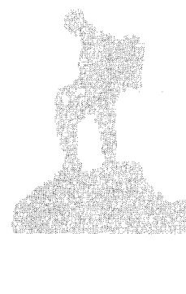

## 灵性开悟
不是你想的那样

[美] 杰德·麦肯纳 著 鲁宓 译
张德芬 审校

张德芬、张馨月、鲁宓，
心灵修行路上的枕边书！

到底什么是开悟？
一个从未现身的觉者，
为全球心灵圈投下震撼弹！
一本颠覆、破解心灵修行迷思，
最刺激、最诚实、最过瘾的力作！

Spiritual
Enlightenment:
The Damnedest Thing

华夏出版社
HUAXIA PUBLISHING HOUSE

开悟，不是要成为更好或更快乐的人，开悟，不是要达到个人成长或灵性进化。那开悟究竟是什么？如何追求开悟？

## 开悟是什么？

合一意识、直接体验无限、高峰体验、狂喜、天堂之乐？本书作者杰德·麦肯纳要告诉你，这些都是被贩卖、被购买的开悟，只是一种非常美妙的意识状态。

## 如何追求开悟？

是静心、祈祷、唱诵、做瑜伽、吃素、追随上师、净化自己？麦肯纳认为，这些都只是追求神秘意识体验的方法，无法带你走向真正的开悟——了悟真相。

> 身心灵作家 张德芬：
开始研究身心灵成长以来，有两位作者对我影响最大，本书的杰德即为其一。

> 《创造丰盛》作者 张馨月：
一直以来，我们都将灵性开悟作为心灵修行路上的终点，看了这本书才知道，原来不是那样的，我们还有更远的路要走。

> 本书译者 鲁宓：
如果你对灵性觉醒这件事是认真的，你会发现，麦肯纳这本书能给你真正的启发。

## Spiritual Enlightenment: The Damnedest Thing

灵性开悟
不是你想的那样

[美] 杰德·麦肯纳 著 鲁宓 译
张德芬 审校

Spiritual
Enlightenment
The Damnedest Thing

华夏出版社

## 图书在版编目（CIP）数据

灵性开悟：不是你想的那样.1 / (美) 麦肯纳著；鲁宓译.
—北京：华夏出版社,2013.1
书名原文: Spiritual enlightenment:the damnedest thing
ISBN 978-7-5080-7440-5
Ⅰ.①灵… Ⅱ.①麦…②鲁… Ⅲ.①人生哲学-通俗读物 Ⅳ.①B821-49
中国版本图书馆CIP数据核字(2013)第002033号

Spiritual enlightenment:the damnedest thing
Published by agreement with Wisefool Press through the Chinese Connection Agency, a division of The Yao Enterprise, LLC.
Simplified Chinese Copyright © 2013 HUAXIA PUBLISHING HOUSE
All rights reserved.

版权所有，翻印必究
北京市版权局著作权登记号：图字01-2012-5065

## 灵性开悟：不是你想的那样

| 标签 | 内容 |
| --- | --- |
| 作者 | 杰德·麦肯纳 |
| 责任编辑 | 吕娜 张瑾 |
| 出版发行 | 华夏出版社 |
| 经 销 | 新华书店 |
| 印 刷 | 三河市李旗庄少明印装厂 |
| 装 订 | 三河市李旗庄少明印装厂 |
| 版 次 | 2013年3月北京第1版 2013年3月北京第1次印刷 |
| 开 本 | 670×970 1/16开 |
| 印 张 | 17 |
| 字 数 | 189千字 |
| 定 价 | 39.90元 |

华夏出版社 网址:www.hxph.com.cn 地址：北京市东直门外香河园北里4号 邮编：100028
若发现本版图书有印装质量问题，请与我社营销中心联系调换。 电话：（010）64663331（转）

## 灵性免责声明

在此谨告：如果从这里开始继续读下去，代表读者承认并同意在此讨论的灵性开悟状态对于求道者/受害者并无任何好处、福祉、保佑或特殊力量，并且与各种新时代或东方教义所广泛运用的同名状态无任何相似之处。一般所谓的亢奋陶醉、狂喜福佑、横财暴利、完美健康、永恒平静、净光升华、宇宙意识、纯净光环、灵魂出窍、超空间旅游、超感官知觉、得窥阿卡西纪录、深度智能、圣人情操、容光焕发、无所不知、无所不能、无所不在与打开第三眼，等等，都不太可能藉此达到，更别期待调频、和谐、平衡、能量加持、扭转或打开脉轮等功效。盘旋在脊椎底部的拙火之蛇也不会被叫醒、碰触、戳刺、唤起，或是遭受其他的骚扰。

本书不保证会让人产生自我进化、自我尊重、自我放大、自我满足或自我进步。同理，自我放纵、只顾自己、以自我为中心、自我沉溺与自私自利的人也不会在此获得满足。读者要了解，这本书不保证你会得到收获、喜悦、加持、神启、救赎、富足、宽恕，或是让你永恒憩息于天堂之屋。也请不要期待意识会有所提升、改变、转移、转换、调换、变形、变化、升华或转生。

购买或拥有本书并不保证能进入美好或神秘的领域，这些领域包括但不限于亚特兰蒂斯、极乐世界、伊甸园、天堂、梦想国、涅槃、应许之地、香巴拉、香格里拉或乌托邦。

本书大量使用比喻与象征。吸血鬼、僵尸、毛毛虫、蝴蝶、梦境、玛雅等字眼都是作为隐喻。同理，任何建议，例如要读者跳下高楼、踏进炼狱、进行自我剖开的仪式，或是浸泡于一大桶腐蚀性酸液中，都不能从字面上的意义来看待。在此忠告读者，如果切掉自己的手、挖出自己的眼睛或砍掉自己的头，可能会导致身体伤害。

追求与达到灵性上的开悟可能需要失去小我（ego）、身份、人性、心智、朋友、亲戚、工作、家庭、子女、汽车、金钱、珠宝、尊重、时间感、空间感、对物理定律的严格遵从，以及生存的理由。

此处描述的灵性开悟是出于意志与自我决定的一种过程与结果，不需要依赖或配合上帝、女神、撒旦、无形的灵体（天使或魔鬼）、上师、大师、预言者、智者、圣人、教士、导师、哲学家、精灵、鬼怪、妖精、（任何小仙人），或是其他任何非自我掌控的媒介。

以“心”为中心的态度与特质，例如爱、慈悲、包容、恩典、宁静与和平，一向被视为灵性开悟的要素，在此则与之相反，被视为误导的、无关的。

求道者／受害者不需要任何灵修或信仰系统，这些系统包括但不限于佛教、卡巴拉、印度教、苏菲教派、道教、诺斯底教派、犹太教、基督教、异教信仰、神秘主义、祆教、现代巫术威卡教、瑜伽、太极、风水、武术、魔法或招魂术。

求道者／受害者不需要任何所谓的灵性或新时代用具、饰品或护身符，这些东西包括但不限于水晶、宝石、奇石、种子、珠子、贝壳、燃香、蜡烛、香精、铃铛、锣、钟、神坛、画像或神像。此外，也不需要任何特别的服装、珠宝、装饰品、刺青或时尚配件。

求道者／受害者不需要让自己接受众多的开悟诱发程序与方法，这些方法包括但不限于静心、凝视烛火、唱诵咒语、追随上师、单脚站立、五体投地朝圣、自体飞升、药物、呼吸技巧、禁食、在沙漠中流浪、自我鞭笞、发誓静默、在性爱方面纵欲或禁欲。

求道者／受害者无需使用任何灵性力量、技艺或专门技术，这些力量或技术包括但不限于星象、命理、占卜、塔罗牌、测字、画曼陀罗、过火、心灵手术、自动书写、通灵、金字塔力量、心电感应、透视、清明梦、解梦、超感官知觉、飘浮、分身、念力移物或千里眼。此外，其他特殊技巧、把戏或特技，如骑马射箭、忍受寒冷、活埋、隔空抓物、过火或踏玻璃、躺在玻璃或钉床上、在脸部或手臂穿孔、魔术或绳索戏法，也都与本书所讨论的灵性开悟毫无关联，或对其毫无价值。

面对个人的恶魔、面对深处的恐惧，以及一步一步瓦解个人身份，可能会导致心跳加速、血压升高、失去平衡、失去肌肉控制能力、肤色变苍白并失去光彩、掉发、掉牙、失去胃口、失眠、失去排泄控制能力、颤抖、疲劳、呼吸急促、干呕、胃酸逆流、消化不良、口臭、腹泻、皮脂漏、干癣、盗汗、水肿与晕厥。一旦发现自己只是舞台上的虚构角色，可能会导致被遗弃感、厌世、偏执、愤怒、敌意、怨恨、无望感、沮丧、自杀念头、病态忧郁，以及让人窒息般地觉察到生命的无意义。

在此谨告求道者/受害者：不管是研究古代文化、旅行至遥远国度，或是学习外语，都完全无助于了解并达成本书所探讨的灵性开悟。想要达到那样的境界，没有此地以外的更好之处，也没有此刻以外的更好之时。

本书并非为人类消化而设计，如果吃下去，请催吐并立即寻求医疗协助。此外，请勿把本书塞入身体的孔洞中，重复将本书塞进嘴巴、眼睛、耳朵、鼻子、阴道或肛门，这样可能会导致不雅观的突起与疼痛的灼热感。如果症状持续，请咨询合格的玄学家。

本书所描述的所有人物、地点与事件全属虚构，正如本书与其存在的这个宇宙也都是虚构的一样。如果与真实的人、地、事有相似之处，完全是因为与真实的人、地、事相似所致。

写作本书时，我没有与任何海豚共游。移除本警告是违法的。本书不附电池。要小心你的发愿。杰德·麦肯纳公仔另售。

## （推荐序）

## 让寻寻觅觅而不得其所的求道者看见“真相”

从2002年开始研究身心灵成长以来，对我影响最大的两位作者是：《当下的力量》、《新世界》的作者艾克哈特·托利，以及写了《灵性开悟》三部曲的美国灵性作家杰德·麦肯纳。对我帮助最大、一路陪伴指引我的灵性老师则是克里斯多夫·孟（克老师），这本《灵性开悟：不是你想的那样》就是他引荐我看的。

作者杰德·麦肯纳是个让我又爱又恨的人。我爱他的才华、幽默、洞见和智慧。用浅显易懂的小说方式（写得相当精彩有趣），高举着“这才是灵性开悟”的牌子，阐述、教导他个人的开悟版本，又用极其幽默的方式笑骂全世界的灵修者、灵修教派、机构，甚至各大宗教也难以幸免。他让在灵修道路上寻寻觅觅而不得其所的求道者，可以得知另外一个层面的“真相”。

我恨他什么呢？我恨他见影不见人（克老师的太太素梅的用语），写了三本书以后，连宣传都不做就神隐起来，全世界的人都找不到他。我恨他拆穿了我的灵修美梦，让我看清楚血淋淋的现实：以坊间所贩卖的各种灵修方式，以各大宗教宣传教导的修行法门，我们一辈子都开不了悟。我恨他把开悟说得那么绝对，让人可望不可即。

不过，不过——我还是爱他的。可能是因为我看不到他，没有近距离的接触，所以无法用我一般“审判”灵性导师的各种标准去“检验”他，所以，他是聪明的（神隐不见人）。他的三本书（英文的），每一本我都看了三遍以上，每天晚上还听他的有声书入睡。

刚开始的时候，尤其是读了第一本之后，我陷入了忧郁绝望之中。我一直以为，我只要不断地从事灵性修炼，找到适当的老师和法门，有一天——总有那么一天，只要我够努力、运气够好——我会达到开悟状态，进入永恒的极乐、狂喜之中（杰德最恨别人把开悟说成这样），再也没有烦恼忧愁了。这本《灵性开悟：不是你想的那样》完全粉碎了我的美梦。

不过杰德也说得很清楚：

开悟（觉醒）是全然的无意义。觉醒于你的真实本质就像死亡，它是必然的，无法避免的。不管你做什么，最后总是会抵达，所以何必着急呢？享受你的生命，它是自由的。宇宙意识、另类意识状态与合一心智都是这个浩瀚而迷人的二元游乐场里面的游乐设施。贫困、疾病、绝望也是。但开悟就不是游乐设施了。开悟意味着离开游乐场，但何必离开游乐场？在游乐场里你可以当一个圣人、一个瑜伽修士、一个亿万富翁、一个世界领袖或军阀。当好人或当坏人。快乐、悲惨、极乐、痛苦、胜利、失败，全都在这里。急什么呢？等离开游乐场的时候到了，你就会知道，你就会离去，但当然没有什么好处可拿。

所以，我逐渐了解了他的苦心，他只是要澄清开悟不是什么（绝对不是坊间灵修或宗教团体贩卖的那种什么觉醒、合一意识、高峰经验、狂喜状态），而且他不鼓励我们追求开悟。因为他说：开悟是万不得已的事，是当你对幻相和谎言痛恨到了极点之后，不得已的选择。而且不是你选择它，而是它选择了你。

所以说，他的书对我最大的帮助就在于：让我不再执着于“追寻”，而是能更地安住于当下。他在书中引用“柏拉图洞穴”的理论，阐释了我们熟知的“大部分的人类都在沉睡”的说法。他改良了柏拉图的版本，以电影院来比喻我们被假相（玛雅女神Maya）奴役控制的真实状况，又用舞台上的戏剧的比喻来描述我们都是身不由己、照本宣科的演员，完全融入了自己所扮演的角色，浑然不觉自己其实只是演员，随时可以出戏。

对于他的电影院比喻，我简单复述如下：

一群人被锁在电影院的座位上，哪里也去不了，他们以为所有的实相、现实，就是银幕上所呈现的。他们每天随着银幕上的剧情起伏而又悲又喜，不可自拔。有些人——可能是有识之士吧——有天突然发现，他们手脚上的锁链其实没有锁死，他们是自由的，可以起来走动，于是他们看到了戏院的全景：一群人坐在那里盯着银幕又哭又笑，而银幕上的“剧情”来源，则是后方放映室的一撮光线而已。其实每个人都可以自由起来走动，而他们的人生剧情，也绝不是受限于银幕之上而已。

他的这些比喻，为我厘清了很多困惑，同时也让我自己精准地了解到我究竟是处在什么样的境界里面。杰德版本的开悟，不是这些“觉醒”而离开座位的人，而是那些走出戏院，发现我们人生真正的光源其实是来自于戏院外的阳光的那些人。这些人有的也许会回到戏院，试着叫醒那些自以为被锁在座位上的人，让他们以更广的人生视角去看，一尝自由的滋味。

而我，只是从座位上起来过的人，了解到了我是有选择的，也看到了戏院的全景，但有的时候又不由自主地被银幕上的剧情吸引，又坐回到座位上，进入银幕戏剧的悲欢离合中。我没有离开戏院（游乐场）的打算，而且还觉得银幕上的人生悲喜剧有时候还是蛮好玩的。不过，当我搞清楚这种状况的时候，我愈来愈能抽离自己生命中的一些悲喜曲，不再那么执着了。而这种状况，其实就是杰德在他的第二、第三本书着墨甚多的：人类成人（Human Adult，相较于Human Child人类儿童来说的）。

杰德力劝所有的人，放弃开悟而做人类成人，人类成人的特色就是：臣服、顺流、为自己情绪和生命完全负责、和宇宙的频率同频共振，所以“心想事成”是他们生活的常态，而不是奇迹。他认为，绝大多数人类的心智都停滞在十二三岁就不成长了，所以这个世界才会有这么多荒唐、不合理、醜惡的事情。因為大部分人都是用兒童心態在行事為人，真的很幼稚，損人又不利己。

傑德提供了一些方法讓我們逐漸從兒童過度成長為成人，包括：放開自己人生的船舵、臣服而順流，睜開雙眼真誠地看這個世界並且面對自己，還有他特別提出的一種像寫日記般的方法：「自體靈性解析」（本書中有詳細介紹），但他在第三本書中說，最重要的靈修方法還是觀照（所有的大師也都這麼說），而他給的方法就是：在日常生活中，不斷多次地提醒自己：我是個演員，這只是我演出的角色而已，我不是我的身體、頭腦、思想、情緒、遭遇、名氣、財物……

他說的演員，其實就是我們的本我、內在空間、本質、自性……。而所有屬於我們扮演的「角色」層面的東西，都是「內容」，都是二元對立下的產物，這樣說明就更清楚了。

我對所有的靈性修煉和靈性老師的看法，其實經過了「見山是山、見山不是山、見山又是山」的階段。最早我沉迷於所有的靈性課程、修煉法門中，也崇拜、仰慕很多靈性老師，然而在一連串的失望之後，又看了傑德的書，就開始對那些靈性課程和老師們有了很多的批判。但是，深入研究傑德的書，再加上自己內在的一些轉變和成長，我又覺得這些靈性課程和老師都是很好很棒的！它們也許不能讓我們達到傑德所謂的「開悟」，但是諸多課程和老師還是能夠幫助很多迷失困惑的靈魂。他們都是遊樂場中一些精彩的遊樂項目，雖然不是能夠帶你離開遊樂場的，但是可以讓你有很多樂趣，減輕你的痛苦。相較於其他的遊樂設施（追求成功、財富、賭博、沉迷於不良嗜好、外遇等），這些遊樂設施是很益處又健康的。認清這點之後，真是看山又是山了。

我真的非常開心這本書經我大力促成，能夠在海峽兩岸順利地同時出版。譯者魯宓是我特別指定的翻譯高手，他的譯筆準確到位，我校譯起來是非常輕鬆的。感謝我最愛的方智出版社編輯黃淑雲，她編輯的英文書精准度总是那么高，也是我指定非用不可的编辑。感谢方智出版社的小良和华夏出版社的吕娜，采纳我的建议出版这本另类的灵性书籍，我忠心盼望本书能够指引一些在灵修道路上困惑的灵魂，希望你们跟我一样，能够从本书中获得帮助，成为人类成人！是为所盼！

德芬
2012年冬 大理

## （译者序）

## 不落于任何宗教俗套的开悟之说

几年前，我与本书的主编小良和一些编辑吃饭，免不了寒暄近况，她们礼貌地问我最近在干什么。面对这群美丽又聪明的听众，我当然不会放过机会，来发表我当时最大的一项人生领悟。“最近我有一个很大的领悟，”我说，“我发现，觉醒与信仰基本上是相对的两种意识状态，只要是信徒，就永远无法觉醒。”她们都很客气地聆听。于是我继续说，“人从出生后，就不由自主地被制约成一个信徒。如果想要解脱，就必须先摆脱信徒的状态。我很想写一本叫‘反信徒’的书，来宣扬这个理念。”她们似乎都不知该如何反应，我只好自己找台阶下来。“呵呵，但是灵修的书基本上就是要信徒来捧场，如果写一本书叫大家不要当信徒，恐怕违反了出版营销的基本原则。”几个月前，小良问我要不要翻译这本书。我读了，不得不承认，我想要写的东西已经被别人写出来了，而且读起来趣味十足，完全不会违反出版营销的原则。于是我就在一边赞叹，一边质疑，一边偷笑的情况下翻译了本书。

赞叹什么呢？作者杰德·麦肯纳基本上对传统灵修有诸多质疑，但他很狡猾地以开悟者自居，掌握了人们天生的信徒心态与对老师的需要，进而开始了一场对于所谓“开悟”的辩证，背景是作者已成为某种道场的住处，以第一人称的纪实方式来描写一位开悟者如何处理来自各方的信徒疑问。

这种写法很大胆且聪明，因为当一个人宣称已经全然开悟后，便让自己拥有一种危险的优势：他可以权威地表达看法与质疑我们这些尚未开悟的人；但他的风险则是，我们也可以根据他的说法来判断此人是否真的开悟。就此而言，本书的做法是成功的。这位宣称开悟的作者尽管文笔有点臭屁，但他的说法不落于任何宗教的俗套，没有扯到非理性的崇拜或无法验证的超现实渲染，而是处处可见很实际的想法与很有说服力的辩证，对“开悟”这个神秘的体验提出了很个人，很诚实，也很严谨的看法。

杰德的开悟是靠一种彻底的觉察来达成，觉察什么呢？觉察“真相”（或真理，但我不喜欢翻译成真理）。杰德说的通往开悟之道极其单纯：

> 这是想要开悟所需要知道的一切：
> 坐下来，排除杂念，问自己什么是真实的，直到你确实知道。

至于什么是判断真相的标准，杰德没有提供现成的答案。我想也不应该提供，也无法提供，因为“道可道，非常道”，通往真相之道是无法用文字传达的，这是属于每个人自己的旅程，在旅程的不同阶段会有不一样的指标。

杰德身为开悟者，虽然无法直接带给我们真相，但他使用了许多生动的比喻（柏拉图洞穴、吸血鬼、毛毛虫、庄周梦境、黑客任务…）来说明假象之所以为假。虽然这也是很多灵修与宗教信仰劝人放弃世俗的常用说法，不足为奇。但是，如果以这个为出发点诚实地探究下去——问自己什么是真实的——最后必然会导致对于信仰的幻灭与否定。毕竟在本质上，所有的信仰都是建立于道听途说之上，都是妄念。

对于信仰的幻灭，是杰德所谓通往开悟的“第一步”。杰德精彩地描述踏出了“第一步”之后会经历的那种绝望，有如被困在一栋燃烧的大楼中，唯一的出路就是破窗跳下；当你深刻地体认，停留在原处就是死，撞破玻璃跳出也是死，但你别无选择，只能勇往直前。尽管前方看似也是死路一条。

当一切都失去意义，陷入绝望的深渊，此时，自我才可能会瓦解。此时，“问自己什么是真实的”这趟旅程才可能会抵达一个“更远”的终点。

杰德说开悟的状态是“恒久非二元觉知”。顾名思义，“恒久”就是非暂时的，非短期的；“非二元”就是无分别、无对立，简单说，就是“无我”。也就是说，开悟是一种恒久的无我、无分别心的觉知状态。要失去自我才能开悟，或开悟就会导致失去自我。但不管是鸡生蛋或蛋生鸡，自我泯灭的过程是非常艰辛的绝望煎熬，就像死亡般无可避免。

这也是这本书让我赞叹的一个观点：在深刻的沮丧与绝望中，可以看到无我的真相。所有身陷绝望与沮丧的人，其实都面临着人生的转机，而开悟甚至可能是如死亡般的必然（杰德说的！）。

但是，如果一切信仰皆虚妄，那么当然也包括了有关灵魂鬼神的信仰，随之而去的就是整个天堂地狱轮回转世等等妄念……我们只剩下此生此地、此时此刻能够把握。这样的结论虽未免让人觉得就算此刻光明，将来必然开悟，但未来也可能只是一片黑暗？

杰德很轻松地回答这样的问题：“你可以说我毫无分别，什么都相信：鬼魂、流血的雕像、外星人绑架事件、外星人虐杀牲畜事件、玉米田图案、预言、魔鬼附身，等等。我几乎毫不筛选地照单全收，因为这样比较好玩……在梦中要如何划分界线？一切都很好啊。我如何看待这些事物是无关紧要的，所以我只是观看。”坦白说，我觉得杰德这样回答是避重就轻，但妙的就是杰德在书中也承认自己是避重就轻。被学生追问之后，他终究还是提出了很值得参考的看法，但我就在此卖个关子吧，留给读者自己去发掘。

阅读这本书时，我想读者自然会有，也应该有许多这类的疑问。提出质疑甚至比找到答案更重要。如果只是囫囵吞枣地把书上所说的照单全收，难免辜负了杰德的苦心。

撇开“开悟”这件岂有此理的事情不谈，我觉得本书另一个值得参考之处，就是看到杰德如何轻松、尽情，而又认真地享受生命中的各种情境，小至洗碗、散步、打电玩、骑单车、观赏风暴……大至经营一个另类道场、传道解惑、面临生死关头……对于一个“无法继续扮演旧的自我，无法分享共同的语言”的开悟者而言，一切意义皆徒然，而真相就存在于你所做的每一件事中。但是，他未免也玩得太开心了吧？这也许是美式文化特有的态度。说实在的，一向属于东方严肃奥义的开悟，在此加入了西方的平易轻松，也是好事一桩。

最后，杰德在写了这些关于开悟的书之后，已经没有实际现身教导的欲望了，他说：“老师这个角色是个人格面具，就像其他角色一样，是一套戏服。它不是‘真实’的我，而我不认为我有力气再次扮演这个角色。它是我穿过的外套，现在我把它脱了下来。它已经发挥过作用了。”我觉得光凭这一点，杰德就胜过了台面上许多装模作样，其实身不由己的“大师们”，我必须再给他一个赞！

## 目录
Contents

- 1. 再简单也不过了 / 1
- 2. 矛盾 / 10
- 3. 大想法 / 12
- 4. 平静与自我满足 / 24
- 5. 完成了 / 25
- 6. 永恒心智的顽石 / 33
- 7. 既不神圣也不明智 / 40
- 8. 无心 / 47
- 9. 同时在游戏之内与之外 / 57
- 10. 何必闲谈幻相与开悟？ / 58
- 11. 杀佛 / 63
- 12. 一个真相 / 76
- 13. 终极真相 / 77
- 14. 精炼之火 / 86
- 15. 自愿暂停怀疑 / 87
- 16. 各境界的和谐 / 94
- 17. 杀了我 / 98
- 18. 未锁的牢笼 / 107
- 19. 代号贝亚特丽斯 / 108
- 20. 就在此处，就在此刻 / 118
- 21. 终极武器！ / 124
- 22. 在梦中谈真相 / 126
- 23. 如我这般不朽与深奥 / 138
- 24. 黄金定律 / 139
- 25. 未被珍惜的剑 / 149
- 26. 原始的人性活动 / 151
- 27. 更远 / 158
- 28. 层次 / 159
- 29. 最穷困之物都闪耀 / 170
- 30. 所有诗歌的源头 / 177
- 31. 荒谬电影院 / 183
- 32. 无我是真我 / 191
- 33. 有如死刑 / 192
- 34. 狂热心灵的病房 / 205
- 35. 在活着时死去 / 206
- 36. 有何不可？ / 217
- 37. 失败的配方 / 219
- 38. 访问杰德·麦肯纳 / 226
- 39. 历史记载的不足 / 238
- 40. 费莱博士的访谈 / 239
- 41. 扮演杰德·麦肯纳 / 242
- 42. 佛陀的忧郁蓝调 / 247

- (后记) 你正在沉睡，而你可以醒来 / 251

> >开悟不是去拜访真相，而是你内在的真相醒了过来。

# 1. 再简单也不过了

> >今日今夜与我在一起，
你将拥有所有诗歌的源头。
——惠特曼

她刚对我列举了她灵修旅程的许多层面，现在正等待我的回应——希望是赞同，甚至是夸奖。我恐怕要让她失望了。我实在很不愿意戳破漂亮的年轻女生的希望，但这是我的工作，因为我是个开悟者。

> >“那么，你之所以做这些事，”我伸出手指——数着，“静心、祈祷、唱诵、做瑜伽、吃素、参拜开悟的圣者，以及捐钱给绿色和平组织、国际特赦组织、阅读灵修经典、净化自己、禁欲，等等，这一切是为了什么？”

她只是沉默地回望着我，仿佛答案明显到不用说出来。然而，答案必须说出来，我要把答案摊在面前，让我们来检视，让我们用小脑袋刺探它。

> >“嗯，你知道的，”她还是不太相信我竟然要她说出这么明显的事情，“是为了灵性成长吧，我想。我要，呃，你知道的，成为更好的人，能够更深刻地去爱，并且，你知道的，提升我的振动……你知道的。”

我仔细听着每一个字。“你的振动什么？”

“呃，频率？我想要，你知道的，提升我的意识层次，想要更能够触及，嗯，我的内在自我，我的更高自我。我想要敞开自己，接受那无所不在的神圣能量。”

“噢，好的。为什么？”

“呃？”

“为什么？”

“什么为什么？”

“你说的这一切都是为了什么？为什么你想要提升你的层次来触及并敞开自己什么的？”

“嗯，你知道的……为了灵性，呃，开悟。”

啊……

“好的，就是这个吗？你想要开悟？”

她看着我，好像这是个脑筋急转弯的问题，但并不是，这是首先该问的问题。你在做什么？为何要做？这条路将通往何处？如果你知道，你就会成功；如果不知道，就不会成功。这不仅是动听的言语，这是法则。

“是啊，大概吧。”

我露出安慰的笑容。“很好。所以，你做这些事情是为了要开悟，达到灵性上的开悟。这样说对吧？”

她停顿一下。“嗯，我想是吧。”

“好，那我们先花几分钟聊一聊，看能不能弄得更清楚一点。你觉得灵性开悟是什么？”

她又对我瞪大眼睛，但现在那双眼睛却流露出一丝困惑。不久之前，这是一个根本不需要问的问题，现在却变得不那么清楚了。

“呃，就像神……神的意识……合而为一，你知道的，合一意识？”

新的学生总是如此。他们会表现得像学生，而我则表现得像老师。我永远不太确定他们为何要来，或何时要走，整个过程兼具满足与挫折。我说话，他们聆听；他们发问，我回答；我发表意见，他们……谁晓得？他们总会做点什么。

我说的话如何被接受，或是离开我的嘴唇之后会变成什么样子，不是我能控制的。我就是说话，如此而已。言语如歌曲般流动，宽慰了我，这是我的工作，而点着头、脸上保持有兴趣与接纳的表情，则是她的工作。我专注于说话、专注于我的言语，让它们适切地表达出我的理念。如果我的话能在她的心智之中如算盘珠子般互相碰撞，啪嗒一声，让她豁然开朗，这样当然很好，但我知道并没有，而我也能接受。“行动，但不要在意行动的结果。”克里希那（Krishna）对阿周那（Arjuna）这样说。我同意。

“非常简单，”我告诉她，“开悟就是了悟真相。真相本身不仅很简单，而且是无法再简化，也无法再缩减了的。”

我从她的表情看得出来，说这个一点用都没有。我错了。有一本《薄伽梵歌》放在我们之间的桌子上，我随意翻开来，希望找到一段符合我正在谈的主题的章节。

这招每次都有效。我满怀感激地读这段克里希那的话给她听：

> > “我是时间，是世界的终极毁灭者，来这里准备毁灭所有人。无论你是攻击或住手不战，两军对峙中的所有战士都将不复存在。”

我沉默下来，让丰富的意涵一波一波地冲刷着我，心中充满了感激之情。“太棒了，”我想，“太棒了，太棒了，太棒了。”

面前的年轻女孩儿点着头，从她能够了解的层次来理解这些字句。她知道这是克里希那对阿周那说的话。阿周那这位强而有力的战士曾经放下武器，而没有发出开战的信号，因为如果发动战争，大地必然成为焦土，他自己的家人也会化为灰烬。她知道克里希那对阿周那揭露了真相，让他明白世界是如何展开的，她也知道在这段对话的结尾——也就是《薄伽梵歌》的结尾——阿周那的迷惑将被驱散，他会发动战争。但这或许就是她所能理解的了。我不认为她会觉得自已是那个在《薄伽梵歌》刚开始时困惑得无法行动的阿周那；我不认为她会把“开悟”与“直接体验实相的无尽形貌”画上等号；我不认为她知道自已的生命战争即将展开，她即将发出信号、点燃大火，烧毁自已的世界。看着这个年轻女孩，我知道她完全不清楚这条路会通往何处。

我露出微笑。

> “合一意识是很棒。”

我说道，她看起来像是松了一口气。

> “神秘合一、与宇宙合而为一、直接体验无限、至福、狂喜、一瞥天堂、超越时间、超越空间、超越言语所能形容的一切、超越一切理解的平安。”

> “哇！”

她突然叫了出来。女孩名叫莎拉，很年轻，二十出头，而我刚按下了她所有的灵性按钮。如果我是个上师，那会是我每天的工作。这个念头让我不寒而栗。

> “是啊，”

她顺着说，

> “那正是……”

> “但那不是开悟。”

> “哦。”

> “当你开悟时，不是你会到达那里，而是那里会过来这里。开悟不是一个让你去拜访，然后再让你无比怀念，试着回去的地方。开悟不是去拜访真相，而是你内在的真相醒了过来。开悟不是短暂的意识状态，而是永久地了悟真相，达到‘恒久非二元觉知’（abiding non-duality awareness）。开悟不是你从这里出发去拜访的一个地方，这里才是你从开悟那里过来拜访的地方。比如说，我自已已经开悟了，就在此地，就在此刻。我不被妄念与自我牵绊，虽然我很幸运地有过几次神秘合一的经验，但目前我不处于那种状态，也不打算再去体验。没有人能处于永恒至福的状态，莎拉，那只是某种广告词罢了。”

> “呃……啊……”

她试着说些什么。

“我现在想要做的，是让你回归原点。你像其他人一样，走上了一个方向，但开悟是在另一个方向。现在你要搞清楚自己到底想要什么。你是要毕生致力于追求神秘意识的体验，还是要觉察你的存在的真相？”

她花了几分钟思索，然后说出了让我佩服的答案。

> “我想先弄清楚真相比较合理，否则又有什么意思？”她说。“还是按部就班吧？一旦我弄清楚什么是真实的，我还是可以试着达到合一意识，对吧？”

> “哇，”我赞赏地笑了，“答得好。没错，先弄清楚什么是真实的，然后你想要怎样都可以。”

姑且不论答案好坏，莎拉其实并没有如她所想的那样做出决定。我们不能像选择喝汤或吃沙拉一样，从了悟真相与神秘合一当中选一个。事实上，我们完全无法选择开悟，反而比较可能成为开悟的受害者，就像被巴士撞上一样。阿周那当天早上起床，并没有期望会看到克里希那的宇宙形象示现，他只是那天工作很不顺利，然后就碰上了宇宙的灵光一现。

现在要把球丢回给莎拉了。

> “所以，你做了这么多灵修的玩意儿，是因为你有一个特定的目的，对吧？”

她点头。

> “你想要在灵性上成长，或渐渐接近神，或上天堂，或开悟，大致说来如此？”

她又点头，看起来有些困惑。

> “总而言之，你正在移动——正在行进——对吧？你朝一方前进，远离另一个方向？”

又是点头。

> “大致说来，所有人都是如此，不是吗？大家都是走向某处，离开另一处吧？”

她又小心翼翼、谨慎地点了个头，好像我正在设陷阱。我当然是。

“莎拉，我希望你做的，是明确地告诉我，你正在离开什么，又往什么事物前进。慢慢想，不用急。你可以想成是：利用‘你正在往什么事物前进’和‘你正在离开什么’这两项元素，来制订你的个人任务宣言，好吗？”

她似乎对此想法感到有点恐慌。

“嘿，”我安慰她，“不用担心，小姐，我们只是要更仔细地看看你想去哪里、离开何方。这不是天文物理学，只是以最经济的方式来规划你的飞行路线。听起来没那么难吧？”

“我想没有。”

“这不是比赛，只是生活，没有终点线，没有赢家或输家——也想一想这一点，这全都是相关的。过几天再来找我，让我知道你想出了什么。”

莎拉就像其他人一样，在相同的错觉之中努力，大致说来，她相信有些东西是错误的，而她可以修正。那些东西是什么、错在哪里、如何修正，因人而异，但共同的模式是一样的。然而，事实上没有任何东西是真正错误的。没有东西曾经错过，也没有东西会错，甚至认为某样东西错了，也不算错。错误这件事根本不可能发生，如同亚历山大·波普所写的：“有一个事实很清楚：存在的一切都是正确的。”错误只存在于人类的主观判断之中，而不在别的地方。

然而，要让人性戏剧永恒地进行下去，“错误”这个概念绝对是关键，它与分离的幻相及自由意志的确定性同等重要。戏剧需要冲突，没有冲突就没有戏码。如果没有东西是错误的，就没有东西需要修正，也就没有事情需要去做——不需要测量高山或揣度深谷，不需要获得财富与权力，不需要养育下一代，不需要创造艺术，不需要盖高楼，不需要发动战争，不需要创立宗教与哲学，不需要剔牙。

“相信有某样东西错了，对人类来说是火烧屁股的事。”我这样对莎拉解释。

当然，错误不完全是想象出来的，人类本身就在内在建构着某些有关错误与正确的认知：饥饿是错误的，吃东西是正确的；禁欲是错误的，播种是正确的；痛苦是错误的，欢愉是正确的，等等。但这些都是生理上的指令，只在生理范畴内有效，违反的话，就会越来越不适，甚至可能死亡。

那么，生理范畴之外的错误存在何处？答案很明显：不在任何地方。但如果生存就是需要戏剧元素让它一直很有趣，那它就需要冲突，就需要设法加入人工的错误：恐惧。

恐惧虚空。恐惧内在的黑洞。恐惧“非存在”（non-being）。

恐惧“无我”。

对“无我”的恐惧，是所有恐惧之母，其他的恐惧都源于此。不管是多微小、多琐碎的恐惧，在其核心都可以找到对无我的恐惧。所有的恐惧最终都是恐惧无我。

> > “所谓的开悟，”我问莎拉，“是否只不过是双手张开、一跃而入无我的深渊？”

她没有回答。

不管恐惧戴上了什么面具，都是驱动人类个体与整体的原动力。简而言之，人类是以恐惧为基础的生物。我们也许很想说自己是理性与情绪并重，左右脑互相平衡，但这不是事实。我们主要是被情绪驱使，而主宰我们的情绪的是恐惧。

> > “好玩吧？”我问莎拉。她此时看起来有点迷惘。

上就要面临剧烈的转向，而这一切都始于一股离开目前航道的欲望。

莎拉听到了我轻描淡写、关于恐惧与错误的独白，这番话部分是为了她好，部分是为了我自己。我不知道她究竟能了解多少，但听一听也无妨。对我自己而言，这是我弄清楚事情的方式：藉由将事情表达出来。我藉此学习要说什么，以及该怎么说。我并没有因为开悟而得到所有知识，因此，我若想了解某样事物好去教导别人，自己就必须弄清楚。

“我应该继续静心吗？”她问，有点渴望抓住自己熟悉的东西。

“噢，当然可以。”我说，她听到之后似乎松了一口气。对开悟而言，她有没有静心、有没有吃肉，或者有没有捐钱给慈善机构或偷他们的钱，都不是很重要。但我知道，今天的一席话已经让她动摇了。今天课程的目标是让她知道有新的方式可以思考何谓开悟，如果我太快想要解除她既有的错误概念，只会让她躲回那些印度教、基督教、佛教、灵性新时代所组成的大杂烩之中。

我们此刻是坐在我房子的前院。这栋房子位于美国中部的广大农田之中，曾经算是我的个人领地，现在则比较像个美国乡下的嬉皮公社，属于任何参与者。以前这里都是靠我自己清理与维修，并负责各项杂务，但现在我则像一个住在自己宫殿中的王子一样，已经好几年没有挥动榔头或清空垃圾桶了。我从来没有打算要当王子，只是一不注意就成了这个样子——当然，对于这种事你是不会太介意的。

在循线而来的各路人马中，莎拉不算太特别。她来的时候并非一无所知，所以首要任务就是让她放开她紧抓不放的，呃，一切事物：她的意见、她的道德观，以及她最珍惜与执着的信念。简而言之，就是要让她放开她的自我架构，她的“假我”。来到这里的人，没有人像个空杯子一样，等着被注入新知识，而由于这里所传授的知识几乎一定会和他们原有的知识发生激烈冲突，所以第一件工作，就是让他们准备好进行一次大改写。

这栋房子随时都有大约15到20个学生住在里头，他们会待上一段时间，跟我谈话并料理杂务。这些人来来去去，还有大约一百个学生是日间部的，而非住宿生。他们不住在这里，只是有时间或想来时才过来——也许来了又走，而我根本不知道。他们会过来花几个小时照料花园、重接地下室的电线、准备餐点、进行房屋增建工程、跟别人聊天、油漆墙壁、送个礼物来、吃东西，等等。这里的状况就是这样，人们来来去去的，而大家似乎都很习惯如此。

今天是个美丽的春日，现在已是傍晚时分，太阳西沉，白天的炎热因而缓和下来，一阵微风如波浪般吹过草地。这是一个可以满足地坐着的时刻。我很安静，沉浸于此刻的完美之中，而我很佩服莎拉也有相同的感觉，一样静静地坐着，或者至少没有用言语破坏此时的气氛。

最后，时间吞噬了此刻，我感激地目送它离去。有个家伙探出头来，让我们知道有东西可吃了。我闻得出来，这次又是吃素的掌厨。有人送上一个餐盘，上头是一碗白饭、豆子汤、些许印度香料与一双筷子。一闻到那个味道，我就晓得是桑娜雅煮的，急着想吃。

我边吃边看着夕阳展现出的意想不到的粉红色。接着，粉红逐渐变成红色与金黄色，云朵沾满了色彩，把天空映照成灿烂的天堂。随着白日消逝，我想，就算现在死去，我也了无遗憾。但这时我想到——我还有一本书要写。

> > 开悟比你的皮肤还要接近你，
比你的下一口气出现得还要快，
然而，它又是你永远无法触及的。

# 2. 矛盾

你永远无法达到灵性开悟。
你以为是你的你，并不是你。
以为你是你的你，并不是你。
根本没有你，所以，是谁希望开悟？

- 谁没有开悟？
- 谁会开悟？
- 谁将处于开悟状态？

开悟是你的命运——比太阳升起还要确定。
你无法不达成开悟。
有人不是这样告诉你的吗？
无法抗拒的力量推动着你，宇宙也坚持着，
“不达成开悟”这件事不是你能决定的。

开悟无途径可循，
因为通向开悟的路位于四面八方，也无时不可开悟。

在前往开悟的旅程上，你的每一步都在创造及摧毁你自己的路。

-   无人可以沿着他人的路前进。
-   无人可以离开路径。
-   无人可以领导他人。
-   无人可以回头。
-   无人可以停止。

开悟比你的皮肤还要接近你，比你的下一口气出现得还要快，然而，它又是你永远无法触及的。

不需要寻找开悟，因为它无法被找到。开悟无法被找到，因为它无法遗失。开悟无法遗失，因为它与寻找者别无二致。

矛盾之处在于并没有矛盾。这不是最岂有此理的事吗？

> ——杰德·麦肯纳

> > 我们对老师与教诲的忠诚，反映的并不是他们的价值，而是我们虚假的自我想要存活下去的执着。

# 3. 大想法

> > 为了与我成千上万的脸孔相遇，
> 我漫游世界。
> 最肮脏的杂草反射着我皮肤的阳光：
> 我站在溪中，独自一人，笑着。
> ——鲁米

从法律上来说，我是这栋房子的屋主。这是一栋很华丽宏伟的农庄，有很多房间，建于1912年。传说有两位富裕的绅士看上同一位淑女，他们各自建造了最好的房子，然后同时向那位女士求婚，心想她一定会选择拥有最好房子的那个人。我是在办完过户手续后在律师的办公室首次听到这个故事，他的秘书非常熟悉我这栋房子的历史。我很想知道结果如何，我的房子有没有获胜。它的确赢了，而另一栋房子则在几年后很有运动家风度地被烧毁了。

故事很不错。至于是不是捏造或改编过的，我不想知道。我喜欢这个故事。

房子位于爱荷华州中部偏东，距爱荷华市约三十二三公里，离密西西比河则约半小时车程。幸运的是，这里的地形有些起伏，不像爱荷华其他地方那样完全是平的。我们有几亩林地，以及十几亩没有树林的空地、一条小溪、一个小池塘，然后四周都是农田，让我们仿佛身处一片玉米海洋中的小岛。

这是一间可敬的老房子，我在爱荷华州没见过类似的。这并不表示这房子是最大或最好的，而是它很独特。最重要的是，它很安静，最近的邻居在1.5公里之外，距离最近的马路则至少有8公里，处于他人耳目所不及之处。

我说我是法律上的屋主，藉此说明我其实感觉自己像个客人。一个高贵的客人，但还是客人。这是桑娜雅的房子，打从她第一天进来就是如此。这房子的上上下下都由她管理，她料理食物、维修、打扫、管理财务，还让访客遵守规矩。如果没有桑娜雅，这地方可能多年前就沦为肮脏的兄弟会房子了。

现在是早上，我坐在我的视听室里看世界新闻。我喜欢观看，看电视、看电影、看书、看新闻节目，当个观察者，而不是参与者。我不用选边站或在意结果，只是喜欢它们的戏剧性。我不看体育节目或肥皂剧，因为我觉得看新闻就够了，新闻就是当今的滑稽肥皂剧。

马丁走了进来，坐在另一张椅子上。他不是来这里看新闻的，因为在重新整修的地下室里有另一个视听室供客人使用。

来这里的人通常都知道，只要我的房门没关，任何人都可以进来，而只要另外一张椅子没人坐，就可以坐上去。至于我想不想说话，是另外一回事，那要根据我想不想说话再决定。一则有趣的新闻刚结束，我在新闻台之间切换着，寻找有趣的东西。这个时段有很多财经新闻。我不关心财经新闻或任何新闻，除非有大事发生。没有什么大事。我转到气象频道，想看看有没有台风、龙卷风、飓风或洪水，但一切都很平静。好吧。

> > “你把鞋子穿进来了。” 我对马丁说。

“哦，糟糕。”他低声咕哝着把凉鞋脱掉，然后把鞋子藏在椅子后面，这样桑娜雅探头进来时就不会看到。不过，桑娜雅什么都看得见，马丁也知道。我也许是他们想来参见的伟大开悟者，但桑娜雅是无所不见、无所不知的庄园女主人。在她面前，我也只是个愚蠢的孩子。

我看着电视，马丁看着我。他想要聊一想。我想我不应该让他轻易受到，但电视上实在没东西可看，而马丁有时候很有趣。于是我略带恼怒地对他点点头，他接受了。

“你给我的作业有了很大的进展。”他热切地说。我对作业这个字眼有点感冒，但这样说其实也没什么错，所以我没说话。

“提醒我一下。”我说，虽然我不需要提醒。马丁花了超过二十年的时间追随西方一位有名的灵修导师，脑子里装满了伪印度教的垃圾，有如解不开的麻花。我试着让他快刀斩乱麻，而不是再花几十年时间来解开，但马丁很难放掉他的信仰系统与忠诚。

上次见面时，马丁带来一本书，对我念了他以前的上师教他的几十段诗词。那些文字显然是一个宽广的心灵在阐述种种永恒的谜，我很容易了解为何求道者会蜂拥追随这种没有极限的洞见，但是当马丁读完后，我完全不知道他在说什么。更重要的是，虽然马丁不这么想，但他也完全不懂自己说了什么。

为了让他了解这一点，我给马丁一项“作业”，要他把所念的文字浓缩成一个前后一致的概念——一句清晰易懂的话。这个点子是我在听马丁热情地读着他以前那位上师的令人费解的文字时才想到的。我很惊讶这个受人尊崇的智者能够把几个简单的概念混在一起，听起来非常庄严神圣，但其实什么都没说。

马丁读给我听的文字是关于知觉者、知觉的行动和被知觉的对象，以及印度教的三个属性、让心智寂静的好处，以及提升意识层次什么的，每一段文字都比上一段更美好。也许有某种隐约的主题串连其中，让马丁深受感动，但我无法说出到底是什么，因为那需要更专注地聆听，而我其实并没有注意听。我觉得马丁显然是想展现他可以掌控一些很伟大的想法，他似乎也认为自己是在教育我，或者，也许他是将自己任命为他前任导师的亲善大使，来这里见我。但是我不知道，因为就如同我说过的，我几乎从一开始就没听清楚他在说什么。

与学生开始谈话时，我只需要他们发出一个信号弹，单纯地指出位置。学生想要从他们目前所在之处前往“恒久非二元觉知”的状态，这趟能是我能帮忙的，因为我处于较高的位置，清楚地看到了地形。我知道目标在哪里，但需要学生发出信号，让我知道他们目前身在何处。我只需锁定他们的位置，而我通常从他们说出的前几个字或句子就可以知道了。

例如，我看到了马丁的位置，看到他陷入树丛之中。他也许觉得自己非常需要向我详细描述他目前的所在之处，但我已经知道该如何引导他出来了。马丁也许想再花20年时间研究附近的植物，但我要鼓励他拿出开山刀砍出一条路，才能继续他的旅程。

现在，马丁坐在我身边，开始提醒我上次他对我念了一些句子，然后我要求他浓缩那些文字。我点头，问他结果如何。马丁对那些文字及其价值的诠释一开始就偏了，但这个练习并不是真的要他厘清那些文字，而是诱导他自己去思考，不要复制看似充满智慧的概念，然后把自己的责任交付给任何非马丁的权威。在这个过程中，马丁也许会对他企图卖弄的知识发展出更深的理解，但这不是重点。

而且，就像我说的，马丁算是个有趣的家伙。他四十几岁，去过很多奇乡异国，做过许多有趣的事情。他是个汽车钣金专家，而当桑娜雅不想做饭时，他也可以是个不赖的厨师。他有纯正或部分的美洲原住民血统，念西北大学时打过美式足球，在陆军特种部队待过六年，追求灵修十年。大致说来，马丁是个让人印象深刻、讨人喜欢的家伙。他来到这里才几个月，算是抓到了一些该明白的要领，然后继续往前。他一来我就知道他被外界的权威所困，但我从未直接去戳他这一点。我最不想跟人争辩谁的知识比较酷，他之前的老师在所谓上师的层级上跟我完全不一样，也就是说，如果我一不小心，可能就会让马丁又回去找那个会用长篇大论与各种不同语言的经文注解来跟人打招呼的家伙。

马丁针对他的“作业”所提出的结论，我用了几秒钟就知道那只是把原来的文字简化了一下而已。他是在解释，而不是澄清或浓缩。

> > “暂停一下。” 我说。

他停下来。

> > “你只是用不同的文字说出同样的东西。”

> > “呃，对，” 他同意，“但我用更少的字、以比较西方的字眼来解释。”

我切换着电视频道，停下来看《神仙家庭》。“你以为我为何要你总结你念给我听的那些文字，马丁？”

> > “我以为你，呃，对它们感兴趣，但在理解上可能，呃，有点困难。” 他说。

> > “是的，我是不太能理解。现在我们再试一次：我希望你能把这段复杂的上师演说精简为一个单纯而清楚的概念，做出摘要、去芜存菁，直到找出核心为止。就像在简化代数算式一样，烧掉多余的，看看剩下什么。”

> > “嗯，” 马丁开始说，而我立刻知道我们撞上了他对于外在权威的顽固依赖。“我想他的意思是……”

我打岔。

> > “为何必须是他的意思，马丁？”

他瞪着我，嘴巴微微张开。

> > “上断头台的是你，马丁，是你的时间正在流逝。” 我尝试另一种方式：“你的目标是什么，马丁？这一切的意义何在？你的生命希望达成些什么？”

“摆脱束缚，”他毫不迟疑地回答，“解脱。与一切合而为一。意识融合。”

我努力不让自己从窗户跳下去。“好的，好的，很不错的一系列目标，但你是否觉得这些说的其实是同一件事？”

“唔，没错，”他答道，显然是在怀疑我是不是个假货，“它们都在说开悟。”

> “是吗？你怎么知道？”

> “唔，我花了超过25年……”

> “什么？你花了25年做什么？”

> “什么都做。研究、静心、净化自己、阅读、听演讲，只要是有关灵性进化的，我什么都学……”

我想到这正是莎拉目前的走向会带她到达的地方。25年不成功地追寻，全都是因为缺乏一小段直来直往的对话。

“要是你发现这一切都是白费工夫呢？”我问马丁。他缩了一下身子，我感觉他几乎要站起来走开了。“忍耐一下，马丁，我们就是聊一聊。假设——只是假设——如果你发现为了达到你说的开悟，必须放弃你接受过的所有教诲，你能抛弃你学到的这些知识吗？”

> “呃，我不认为……”

> “你认为何者重要？开悟还是知识？”

> “我不认为……”

> “你的上师从事教学有多久了？”

> “嗯，呃，超过30年……”

> “他有多少学生开悟了？”

> “嗯，呃……”

> “你本人认识的有多少？”

> “嗯，呃，我没有……”

“或你听说过的？”

“那不是……”

“或传闻的？”

“我不认为……”

“他们到底在做什么，马丁？他们倡导的开悟方法究竟是什么？”

“呃，嗯，基本上是透过静心与知识……”

“30年来，他们没有推出一个人说：‘看看这家伙！他开悟了，是我们帮他达成的！’30年来一个都没有？你不认为他们现在应该有一整批开悟者可以向人炫耀吗？”

“呃，不是这样……”

“30年来，他们应该有好几十代开悟者了，就算其中只有四分之一成为老师，现在全世界也应该挤满了开悟者，这是计算得出来的，不是吗？顺便提醒你，我不是以老师的身份提出这个问题，而是以消费者或消费者权益维护者的身份。你不认为要求知道一个老师的成功率很合理吗？是好是坏要经过实践检验才知道，不是吗？当你开始跟他们学习时，你没有问过他们的教学成果吗？”

“嗯，那不是……”

“你不觉得这样问很合理吗？他们是从事开悟业的，不是吗？或者是我误会了，他们还有其他业务？”

“没有，但是他们……”

“如果《消费者报导》杂志要报导哪些灵修组织可以说到做到，你不认为第一个统计数字应该是成功率吗？比方说，随机挑选100个在5年前加入某组织的人，调查他们目前的状况，然后发现有31人在组织中晋升，27人离开，39人仍在组织中，但不是很投入，而剩下的三个则达到了‘恒久非二元觉知’。好，成功率是3%，这是个可供比较的数字，而你的组织就会抱个大鸭蛋，不是吗？不仅是100个人里面找不出一个，而是数十万，也许数百万人之中都没有。我说错了吗？”

“你说得好似……”

“我知道，马丁，我也知道他们会怎么回答。他们会说所有人都将一起扬升，对吧？他们说只要到达某个关键数量，所有人都会同时突破，对不对？”

“嗯，算是，但你说得好似……”

“你想想，那个组织在30年后为何没有挤满开悟者？在我看来，他们现在就应该容纳不下了，现在应该是全世界的人都想要加入他们。他们到底需要多少时间？”

“这不完全是……”

“这完全就是，马丁。没有更正确的说法了。怎么可能在30年后，唯一的开悟者就是组织的创始人？我知道他是个大人物，马丁。我知道他的教诲，知道此人的博大精深。我同意他是个进化的人类，不管这是什么意思。如果见到他，我会跪下来触摸他撒满莲花的脚。我知道他很棒，但我们谈的不是其他人，而是你。我们谈的是你想要……你是怎么说的？摆脱束缚？我没看到这家伙的组织中有任何人摆脱束缚，马丁。你有看到吗？”

“我等待着。没有回应。”

“你能不能说说为何如此？”

“马丁沉默着。他的内心显然正在激烈交战。他看着我，想知道我接下来要说些什么。”

“马丁，我认为你该想想那个组织可能有严重的问题，非常核心的问题。你觉得我这么说不合理吗？”

“没有反应。”

“你不觉得至少该问一下？至少考虑一下他们有问题的可能性？”

“他微微地点了点头。”

“我自己的开悟是不到两年就达成的，马丁，而且没有任何还在世的老师帮助我。我没听过这个过程历时超过两年的，实在不懂怎么有人会花了比两年还要多那么多的时间。”

我的意思不是说从第一个灵性渴望出现算起只要两年，而是指觉醒过程实际开始之后两年——也就是最初的领悟之后，踏出“第一步”之后（注意那个引号）。我知道有很多人花了多年时间静心与灵修，却没有达到完全的觉醒，我也知道他们会认为自己只是还没跨过终点线，但实际上，他们是还没跨过起跑线，尚未踏出“第一步”。

我继续说下去。“这是个过程，需要花既定的时间，大约和一头大象的孕期一样久。”

马丁很客气，没有提出显而易见的问题：我又造就了多少开悟者？答案是：从我开始教学以来，一年平均一两个，全部则大概有12个。这当然不能全算我的功劳，但宇宙在这些人旅程的关键阶段带他们找到我。在这些开悟者里面，有几个现在正尝试写作或演说，但大部分都还在适应。目前我看到有两个学生也即将达成，他们已经踏出了“第一步”。一旦踏出“第一步”，必然会完成剩余的旅程，除非死掉或脑部严重受创。

“马丁？”

“嗯。”

“你是否同意，如果一直没有毕业生，说明这种教导可能有问题？”

他迟疑着，然后点头。

“如果真是如此，这是很严重的问题吧？”

他点头。

我也点头。“嗯，这是个有趣的可能性，也许你可以想一想，然后告诉我你的想法，好吗？”

他点头。

“马丁？”

他点头。

“我已经知道答案了。这是你要为自己做的，好吗？”
他点头。

对于任何灵性教诲或老师——任何外在权威——的效忠，是丛林中最狡猾的野兽。当我们展开旅程时，首先想做的，就是在一个有规模的团体之中寻找伴侣与认同，但如此一来，我们的旅程还没开始就已经结束了。马丁就是最好、最典型的例子。他在20年前开始追寻某种更高层次的东西，现在他被迫面对现实：这么多年来，他付出的所有心力都没能让他前进一步。他花了20年时间挖了一个大洞，现在他必须爬出来，才能展开旅程。
他当然不愿意这么做。

我们对老师与教诲的忠诚，反映的并不是他们的价值，而是我们虚假的自我想要存活下去的执着。是虚假的自我把老师提升为圣人，并宣称他们的教诲是神圣的。然而，没有任何东西是崇高或神圣的，只有真实与不真实之分。

如果知道了帮遭到邪教洗脑的信徒解除设定的过程是怎样的，就会了解要挣脱这种忠诚是多么困难。但真正的邪教其实只有一种——假我邪教，所有人都是忠诚的信徒。而觉醒就是解除设定的过程，开悟则是未被设定的状态。

我以温和的字眼对马丁解释这一切，诉诸他的心智、他的理性，看着因他的心与脑交战而起的不安。在我所喜欢的《摩诃婆罗多》中，克里希那与阿周那谈到即将爆发的战事，阿周那问战争会在战场上进行，还是在他的心中。

“我看不出有什么差别。”克里希那回答。

我不要马丁认为我是在刻意找他的团体和上师的茬，我看不出他的团体和上师与其他的团体和上师之间有任何差别。一个灵修组织为何没有大量产生开悟者，有许多原因，而且并不都是显而易见的。有一个连他们自己都不知道的好理由是：灵修组织的成员也许很满足于只是“追求”开悟。把生命奉献给各种崇高的灵性理念，就跟追求天堂、权势、金钱或爱情一样有意义、有目标。只因为门口有个闪亮的霓虹灯招牌，上面写着“免费开悟！最轻松的捷径！唯一的正道！”，并不表示门里的一切真的和开悟有关，或是进去的人真正想要开悟。

刚好相反。

几乎在所有的案例中，那些被买卖的开悟完全不是在了悟真相，而是一种非常美妙的意识状态，只有傻瓜才会不想要。事实上，它是如此阴险地美妙，以致数以百万计的追寻者被它的光芒弄得盲目，完全看不到它其实并不存在。

因此，马丁以前的团体也许是说的比做的多，但我不认为他们是故意诈欺。我想，那些人就像他们说服的人一样，也是这么相信的。在这种情况下，一个团体像某种生物一样，为了求生而去适应与成长，没什么不对。也许这个生物是想让所有的生物都解脱，或是寻求世界和平，或是推广自己的教义，或者只是为了提升与壮大自己。也许“顶端那个开悟者”只想找人上床，或是不小心让手下未开悟的人取得了团体的控制权。或者，也许顶端的开悟者根本没有开悟，而是处于其他状态——可能是很美妙的状态，但不是觉醒，不是了悟真相。

或者，谁晓得呢？也许马丁以前的团体会达到关键数量，然后他们会突然一起进入永恒的超级快乐的意识状态。（天啊，当我去敲他们的门，问问看现在加入是否太迟时，会不会被丢鸡蛋啊？）

重点是，实在没有必要去弄清楚追寻者无法开悟的所有可能的原因。那只是另一种让你分心的东西，而且这种东西要多少有多少。重要的是觉醒，而不是取得觉醒的博士学位。简而言之，如莎拉所猜想的，觉醒是第一位的，然后，如果你还想要解救众生、促进世界和平，或是拯救鲸鱼，很好，那是他们走运，但最重要的事情还是一样：
    你要么觉醒了，要么没有。

> 在整个地球上，你找不到一只可以被冠以“体面”或“不幸”等字眼的动物。

# 4. 平静与自我满足

> 我想我可以转而跟动物一起生活，
> 它们是如此平静与自我满足。
> 我站着看它们，久之又久。
>
> 它们不会埋怨自己的处境。
> 它们不会在黑暗中躺着不睡，为自己的罪过哭泣。
> 它们不会讨论自己对神的责任，让我想吐。
> 没有一只动物是不满足的，
> 没有一只动物会因为渴望拥有东西的狂热而变得疯癫，
> 没有一只动物会屈从于另一只动物，
> 或是向它们数千年前的同类跪拜。
> 在整个地球上，
> 你找不到一只可以被冠以“体面”或“不幸”等字眼的动物。
> ——惠特曼

> > 开悟是最终的毕业，
> 不再猎寻、不再追逐、不再战斗。

# 5. 完成了

长久以来，你做着卑劣的梦，
现在我要洗净你眼中的黏液，
你必须让自己习惯于阳光的灿烂，
以及你生命里每一刻的耀眼光芒。

长久以来，你胆怯地抱着板子站在海边，
现在我鼓励你成为勇敢的泳者，
跳入海中，然后浮起，
对我点头、喊叫，笑着拨开头发。

我是这位运动员的老师，
他展开比我更宽广的胸襟，
证明了我自己的宽度。
他学会用我的风格来摧毁老师，
这对我来说是最大的荣耀。
——惠特曼

最近一个来这里拜访的完全觉醒者是保罗，过去两周里，我完全没跟他说话，只是偶尔看到他去散步，或是在纷飞的雪花中坐在花园的长椅上。这不表示他只做了这些事，我只是刚巧看到这些而已。我不太会下去跟客人寒暄，我相信这屋子里的活动远比我知道的丰富得多，但我猜保罗在这段时间里并没有参与太多社交活动。

他告诉我的时候是冬天，一个凉爽但并不寒冷的夜晚，地上有新雪。这种夜晚的耀眼群星会让风都静止下来。如此清澈与寂静的夜晚，仿佛是计划好的。这样完美的冬夜在我们这里也许一年只出现一两次，因此我出来散步。在距离屋子几里地外的一个交叉路口，保罗加入了，我很高兴看到他。我总是很高兴看到任何处于保罗这种状态的人。他安静地加入，我们继续走。十分钟后他才开口。

“我完成了。”

我微笑，一股暖意涌入我胸中。这股暖意来自我自己获得这个惊人又不可思议的结论那一天的回忆，以及我听到其他人这么说的时候；这股暖意来自知道要抵达这个境地需要走过什么样的旅程，以及知道前方还有什么等待着。

> 如中国唐代著名的在家禅者庞居士所言：“只是一个凡人完成了他的工作。”

“我没有问题了。”保罗说。他的意思不只是他没有问题要问我了，而是他没有任何问题要问了，就是这样。这是当你抵达终点时的情况：你就是完成了。他没有说的是——虽然他可以说——他已经知道所有该知道的，他知道了一切。保罗来到了知识的终点，现在拥有了唯一的、完美的知识。他没有说出来，是因为那太庞大了，但我知道他正在想，因为那是真相，而且过于庞大，所以无法不去想。

我们继续走着。四分之三满的月亮在新雪上洒下一层光芒，宛如一块丝绸盖在沉睡的土地上。

在我们回到屋子之前，保罗都没再开口。这时我想到，他可能已经“完成”几周了，而这段时间他都在习惯这种意料之外的新状态。终点就是如此。就算你被告知了几千次，明白知识有终点，追寻有终点，你抵达时还是会感到震撼与困惑。你花了数年时间战斗不休，每一场战役都比先前更艰苦，而且你从未期待可以在此生得到真正的胜利。

然后有一天，胜利就在那里。再也没有了——没有敌人，没有战斗。只要你能松开手指，紧握在你手上的剑就可以被抛下了。没有什么东西需要对抗，没有什么事情需要完成，永远不会再有任何事情需要完成了。

哪怕是在此时，你可能依然不知道自己是什么或身在何处。就这么结束了，而且没有任何东西可以取代。在小说中，你看到刚变成吸血鬼的人不知道自己的新状态是什么——“我是个吸血鬼，还是个疯子？”“大蒜、十字架、阳光与棺材究竟是怎么回事？”“我是永生不死的吗？要如何证实？”“什么是真的，什么是虚构的？”可能就像那样。我听说禅宗中有些人花了十年才习惯，这意味着，在最适合的环境中——一个全年无休且强调开悟的禅寺——也要花十年时间。那么，想象一下，如果是在一个贬低灵性的社会、在一个连灵性大师们都不自知地误导大众的情况下进行调整和适应，这十年时间肯定会过得非常诡异。

之后如何呢？嗯，根据练习智识瑜伽（Jnana Yoga）的人告诉我的（我向所有被我在本书中曲解他们教义的人致以半吊子的道歉），熬过这十年适应期的人叫“智瑜伽士”（Jnani），一个通达的人。我想这就是我，但那个让我从非智瑜伽士转变成智瑜伽士的过程并没有结束。就算现在，我也需要刻意花工夫来维持我的假我——我的梦中角色——驱动它，让它继续活动。我所在的这个轨道会尽可能带我靠近一种非存在状态（non-existence），而且依然让我保有肉体。换言之，我注入梦中角色的能量会日渐减少，我的教导将减至最精炼、容忍度最低的形式，我将收回自己对这个世界的兴趣，我的人性会越来越少。至于智识瑜伽、禅宗或任何其他体系是否认可这个过程并不重要，因为我自己直接确认了。我不会遵从任何老师或教义。我看到自己以这种方式消退隐去，这本书的写作加速了这个过程，而这条路必将如此终结。

当克里希那完成他的任务时，便进入一座树林，一直往前走，直到疲劳倒地。一位猎人经过，误以为他的脚是鹿的耳朵，射出一箭杀死了他。进入树林那段路程可被视为逐渐收回能量的过程，所以，到那时，也许我会走进高耸的玉米丛中，直到疲倦倒地，然后我的脚会被一辆经过的收割机误认为是成熟的玉米。

我不遵从任何老师或教义？哇，听起来我已经相当偏执了，所以我也应该稍微说明一下。

现在的情况是这样：我是全然开悟，全然地了悟真相了。我在这里，活着，就在现场，并选择如实描述己之所见。我不会顺从、不会依赖，如果我所描述的与其他的一万件报导相冲突——不管那些报导或提出报导的人有多崇高——我都会觉得那些报导是寓言与神话，应该被丢进历史的垃圾堆里。简单的事实就是，我在此处，而“此处”与其他人说的都不大一样，我不要浪费自己或其他人的时间来假装事实不是如此。

要注意的是，“此处”并非隐藏在雾中或暗处，它一点也不神秘或奥妙。我的知识里没有疑问，我的视野中毫无障碍。这一点很难解释，但非常重要。我不是在诠释，不是在翻译，不是在传达某样别人传给我的东西。此时此刻，我就在“此处”，以最直接的措辞告诉你我所看到的。

如果这听起来很刺耳，那也得习惯，这一行是很严苛的。我写这本书不是为了赚钱、赢得粉丝或沽名钓誉，而是为了一吐为快。我给的讯息不是要你相信我对“此处”的描述，而是要你自己来看。

> 你将不再接受二手或三手的知识，
不再透过死人的眼睛看事情，
不再以书中的幽灵为食粮。
你也将不再透过我的眼睛看事情，不再从我这里汲取知识，
你将聆听四方，自己筛选。
——惠特曼

言归正传，回到保罗的转变上，用毛毛虫蜕变为蝴蝶来比喻这个过程也很贴切（我们必须大量使用比喻，因为道可道，非常道，大致如此），但刚开悟的人不像刚破蛹而出的蝴蝶，并没有所谓的本能可以告知和引导他们。当我自己经历时，我知道那非同小可，极端不寻常。我知道那是极高的成就，相较之下，其他的一切都黯然失色。我看某人一眼或听他一说，立刻就知道他没有经历过。然而，过了许多年之后我才知道，那就是开悟。

真诡异。

当我终于弄清楚一切之后，那样的了悟让人非常自在——虽然它也让人觉得晕头转向、天翻地覆，扭转了乾坤。我花了多年时间当一只躲在密室里的蝴蝶，跟毛毛虫们瞎混，做着极端虚幻的梦，想要成为一只蝴蝶。我明知道我与毛毛虫有很大的差异，我们之间有无法跨越的鸿沟，我已经不是他们的一员了，他们不像我，我也不像他们。我知道我只能基于自己那些正在快速消失的对他们的语言与习性的记忆，用最肤浅的方式来和他们沟通，但我花了一些时间才明白，我之所以不再是他们的一员，是因为我已经变了，而现在，我们的差异是绝对存在的。我获得许可，进入一个全新的现实，但我还没有完全进入，因为没人向我解释我目前的全新状态就是毛毛虫口中的“蝴蝶”。毕竟，我连怎么问都不知道，又有谁能解释呢？

真诡异。

怎么会有如此无知与困惑的状态？简单地说，毛毛虫对于何谓蝴蝶有异乎寻常的误解，正如我们在小说或电影上看到人类严重地误解了吸血鬼一样。但谁来导正他们？吸血鬼不会跟人类来往，不会回来教育人类，不会跟人类瞎混，不在乎人类怎么想。他们何必在乎？他们跟以前的同类只有最表面的相似，除此之外，他们已经是完全不同层次的存在了。

开悟的状况跟这个很像。不说吸血鬼和蝴蝶了，试着想象在一个都是儿童的世界里，你是唯一的成人。真的，想象你多年来的成长，想象你对儿童的感觉会如何改变，想象你会成为的那个人。

真诡异。

有多少人会走到这么远？有多少人真的开悟了？许多人宣称他们已经开悟，但究竟有多少人是真的？我不知道，但我猜，很少。有些人估计，大约一万个人里面，会有一个人想要开悟，而一万个想要开悟的人之中，会有一个真正开悟。也就是说，在一亿人里面，会出现一个开悟者。想一想全世界的人数，以及整个人类历史，我认为这种估计是合理的，不管任何时候，世上都只有几十个开悟者活着，而这几十个像我这样了悟真相的人之中，又会有多少个努力想帮助他人、让自己为人所知？

更少。

其实这是相当可以理解的。一旦你超越了二元对立（不管如何称呼）是“错的”，而合一（不管如何称呼）是“对的”这个概念，你就能够超越任何“帮助”或“拯救”他人的需要。例如，我之所以做这些事，不是因为我觉得自己需要去做。我没有任何道德或利他的动机，也不会觉得有什么事情不对劲，而我必须去修正它。我这么做不是为了减少苦难或让众生得解脱，纯粹只是因为我想做。我天生就想要表达自己觉得有趣的事情，而我唯一觉得有趣的，就是到达“恒久非二元觉知”的伟大旅程。

我听说玛赫西大师本来很快乐地隐居在喜马拉雅山脚下，可能永远不会回到社会中，但他脑袋里总是听见一个印度城市的名字，它就这么不请自来地出现在他的思维中。最后，大师对某些人提到了这件事，他们建议说，若要摆脱这个城市的名字，他必须去那里一趟。他去了，接受了一次演讲的邀请，“超觉静坐”运动（Transcendental Meditation）因而诞生。我听了觉得很合理。你观察世事，让事情自然演变，然后你顺势而为。

所以此刻我在这里，知道一些其他人想要了解的事情，并且在这个特定的时刻、在适当的位置上说一些话，好让保罗这趟旅程变得更简单一些。当一个人身上发生了如此彻底地转变，很少有前例可循，更没有人能够真正对此有所准备。这种状况说起来也许很怪，但实际体验时会觉得更怪。如果这一切听起来极其诡异，那我向你保证，它的确如此。当我看到某人刚熬过大约两年受灵魂折磨的冲突期时，我不希望他还要面对这种困扰。

所以，在那个月光明澈的夜晚，保罗与我站在屋前，我很高兴地对他说：

> > “欢迎。”

接下来的一小时，我们讨论了一些奇怪的话题，如吸血鬼、蝴蝶、孤独、第二天，以及接下来的十年。

> > “你现在搞懂无门之门了吧？”我问。

> > “噢。”他若有所悟地说。“哈！”他笑了。

在了悟之后，这就是你所能做的了。我没说什么。此刻我不是在教导，不是试着拉他出来，或引导他获得某种领悟。那些他都已经做到了。我不再是保罗的老师，他已经摧毁了我的老师身份，真真正正地了解了我所了解的一切。开悟不像高中毕业要上大学，或者大学毕业要进入“现实”的世界。开悟是最终的毕业，不再猎寻、不再追逐、不再战斗。现在，你可以进入这个世界，做你想做的任何事：学吉他、跳伞、写书、种葡萄，什么都可以。

我们的师生关系结束了，这段谈话展示的只是一个老家伙带着新来的人熟悉了一下门路。

> ① 语出《庞居士语录》，原文为：“了事凡夫。”

> > 对开悟的心智而言，
> 世界末日不会比折断一根树枝更重要，
> 或更不重要。

# 6. 永恒心智的顽石

> > 你的手紧握我的生命，
> 把它彻底砸碎在永恒心智的顽石上。
> 它的色彩流失，直到成为白色！
> 你微笑着坐下来旁观；我在你的阳光下枯萎。
> ——鲁米

这屋子就像个小社区。人们来到这里，停留一周或一年，建立友谊，然后再经历令人难过的道别。我相信这屋子里的人际关系比我描述的更为深刻与复杂，但我算是被隔离于“此处”的日常运作与住客之外，这是好事。

最近五个月以来，这里有一对母女。母亲叫玛拉，她像很多人一样，带着对开悟的扭曲看法来到此地。目前我无法教导她任何东西，只能鼓励她审视自己的基本信念，培养出以新的看法重新检视它们的意愿。一般来说，她可能宁愿保留自己的浪漫信念，也不愿接受更严苛的现实，然后毫无改变地离去。

对于开悟的误解主要源自世上大多数为人所知的开悟专家都没有开悟，而这个事实可能让误解更为严重。他们当中有些是伟大的神秘修士，有些是伟大的学者，有些两者皆是，大多数两者皆非，觉者则几乎没有。解读这种核心误解将是本书的重要主题之一，因为这是开悟之路的主要障碍。没人抵达目的地，因为没人知道它在哪里，那些负责指引的人，基于许多原因，都指错了方向。

这种困惑的核心，是相信“恒久非二元觉知”（开悟）与非恒久的宇宙意识经验（神秘合一）是同一件事，但事实上，它们是完全不相关的，两者可以各自独立存在，不需要彼此。相较之下，世上虽有无数不同程度的神秘的宇宙意识经验，但有关开悟的则寥寥无几。当然，真正的开悟不太可能大张旗鼓，所以一定有更多的开悟案例不为人所知（就像吸血鬼！），然而单纯的事实是，开悟与神秘经验几乎没有什么共通性。

任何体验过神秘合一滋味的人，包括我自己，自然会认为那是人类经验的极致（我也的确相信是如此），因此便假定，只要可以更常或更容易体验到这种罕有的状态，几乎就能达到人类的巅峰。这样想没什么不好，但若是把这种状态贴上开悟的标签，就会有问题了。这种人也许是神的圣洁化身、爱的象征或神仙下凡，但开悟却是另外一回事。

最重要的差别在于，一方是在梦中，另一方不是；一方是明了了真相，另一方不是；一方是在意识之内，另一方则独立于意识之外。开悟者从梦中醒来，不再把梦错认为现实，于是很自然地，他们也不再为任何事物赋予重要性。对开悟的心智而言，世界末日不会比折断一根树枝更重要，或更不重要。“智者视一切为相同的。”《薄伽梵歌》如是说。“智者无分别心。”《道德经》如是说。开悟者无法视任何事为错误，所以也不会想去修正。没有什么是比较好或比较糟的，又何必去调整？电影院里的观众不会从座位上跳起来拯救电影中的角色，而如果电影画面里出现一颗小行星朝地球撞来，银幕不会被烧掉，观众也不会冲回家与亲爱的人共度最后时光。如果这么做，他们就会被送到最近的精神病院，被当成妄想症来治疗。

开悟者视生命为一场梦，所以，他们怎么可能区分对错或善恶？一件事怎么会比另一件事更好或更糟？梦中有什么事是真正重要的？你醒来，梦结束，仿佛从未发生过，所有看似真实的人物与事件都消失了。开悟者也许会在梦中的世界里行走与谈话，但他们绝不会把梦境错认为现实。

开悟是关于真相，而不是关于成为更好或更快乐的人，不是关于达到个人成长或灵性进化。在这个世界或其他世界、这个空间或其他空间，都没有比这风险更高的游戏了。获得真相的代价就是一切，但要等到你自己付出代价时，才会知道“一切”是什么意思。用最简单的话来说，开悟非关个人，而一般所谓的开悟则是极端个人化的。稍后，我们会更详细地探究这一点，因为我想这是我的生命、这栋房子及本书存在的意义。现在这样说就够了：开悟之路最重要的一项任务，就是弄清楚什么不是开悟。

谁会到这屋子里、如何前来，是一件很有趣的事。显然你不会拎着行李就跑来把这里当成家。玛拉带着七岁大的女儿安妮从加州过来，她听过这里，可能是从某个秘密管道或来过的朋友那里听说的。但桑娜雅不会轻易让人进来（我本来不知道这些，是安妮后来解释给我听的），所以玛拉与安妮被送到镇上的一家民宿，然后她们被允许每天过来，看看是否习惯这里，也看看这里是否习惯她们。

安妮还告诉我这里的杂务、用餐时间、沐浴时间及其他家务是如何安排的。她似乎相当清楚这一切，我则一如既往地惊讶于桑娜雅的管理事务如此复杂，以及她管理得又如此巧妙。

> > “你喜欢桑娜雅吗？”
我问安妮。

> > “桑娜雅就是爱。”
安妮回答，仿佛这个问题实在太蠢了。我想也是。

桑娜雅五年前来到这里，然后就接管了一切。她来这里的头几个月，我得知她曾经加入国际克里希那意识协会25年之久，她在协会时也负责家务与厨房。桑娜雅曾经对我解释，她的信仰并没有改变。当她在协会时，她并没有真的加入他们，而是与克里希那同在。现在，她也没有真的加入我，依然与克里希那同在。

我明白——不是立刻明白，而是后来逐渐明白。桑娜雅所做的每一件事、每一个行动，以及她每一天的每一秒，都是在练习有意识地为她的主宰者奉献。也许看起来她是为了整个团体而烹饪、为了自己的洁癖而洗刷地板、为了大家的利益而安排复杂的团体生活，或是为了我才经营着这个不经意间形成的灵修公社，但是当我终于弄懂了她、真正开始留心她如何把注意力放在所有事物上时，我就明白了。桑娜雅时时刻刻都处于当下，而她的每一刻都奉献给克里希那，与我、这栋房子或这里的一切活动都无关。桑娜雅做桑娜雅要做的，此处只是她做事的地方。

而克里希那对她来说，究竟是什么？他是画像中那个蓝皮肤的年轻人？阿周那的战车夫？昆湿奴？梵天？我不知道。桑娜雅从来不是我的学生，从来没问过我任何事，我也从来没有想过用我的话来阐释她的世界观，或是把我的世界观翻译成她的措辞。她拥有我所见过最优美、最和谐的信仰，而我非常有幸目睹。她管理这间屋子的轻松自在也可以用来指挥军队或治理国家；她散发光芒，永远神采飞扬、温柔亲切，就算很严厉时也不例外。我们这里若有个神秘修士，那就是桑娜雅。她可以毫不费力地正确行动，时时刻刻对一切都保持沉着、冷静，完全超越她时时关注的家务与琐事。就像我一样，桑娜雅是另一个层次的存在，但她既不是毛毛虫，也不是蝴蝶。我不知道她是什么，但我非常感激她能陪在我左右。

当然，从我的观点来看，桑娜雅是天赐的礼物。没有桑娜雅，就不会有这间屋子，不会有这本书，不会有我在这里喋喋不休——呃，我还是会喋喋不休，但也许会稍微有些营养不良，而且只有一只极端无聊的狗当我的听众。我热爱这个星球、热爱这个宇宙、热爱跟人有关的一切，而其中一个原因，是我爱那个把这一切都hold（维持）住的神奇力量。当我看着桑娜雅时，我清楚地看到那股魔力。

这里的静心时间是下午五点半到七点，没有硬性规定要静心，但所有人在这段时间都要保持安静。我不常静心，而且通常是在早上，所以我喜欢利用这段安静的时间坐在前廊或起居室中，大家也知道这时可以找我聊一聊。有时会有一个人来谈他目前专注的东西，有时则来了一群人，产生更广泛的互动。我觉得怎样都好，对我而言，这段时间通常都很愉快。

我教导的内容对我来说并没有任何困难或挑战，我想这就是身为专家的好处。我对这玩意儿是了如指掌，可以在睡梦中教导——也许我真的这么做了。真正的挑战在于信息如何被接收。我所说的内容大部分是要落入对方脑中的某个特定区域，但那里总是被占据着，从来不是处于虚位以待的状态。所有空间不仅被塞满了，而且还有警卫——可能是非常严密的警卫——守护着。如果我要教八年级学生英国文学，只要让课程保持有趣，我可以流畅地传授新信息就好，但这里的状况不一样。来这里的人都不是第一次接触灵性领域，每个人在来之前都已经接受过某种教育，而他们带来的教育结果，实际上比毫无用处还糟。这就是我要应付的，而我不是脑部开锁专家，只能尽力做好自己的部分，知道成功与失败并非操之在我。

我们真是不可思议地紧紧抓住了自己的信仰。大家来找我的时候，自身的信仰都已经安然就位，没人是来找我摧毁他们辛苦挣来的信仰，而是想在现有之上增建更多，继续沿着他们已经开始的方向走。但是，如果这些人想要醒来，他们需要的正是摧毁。

然而，这个“如果”是很难确定的。有多少人确实想要真相？我觉得只有不到1%的追求开悟者是在朝着正确的方向走。但我也要说，来到这间屋子、读到这本书、接受我与我的讯息的人走对路的比例会高一点。写到这里，你在本书中看到的，以及我与屋子里的客人分享的讯息——剥除所有灵性陷阱的开悟——是极端少见的。我之所以会说，在这屋子里或读这本书的人比较有希望得到真正的开悟，是因为我们会在需要的时候得到自己需要的。如果宇宙让你来到我面前，或是把这本书放在你手中，那么你极有可能比大多数人更接近于诚实面对你真实的严峻处境。当老师出现时，学生就准备好了，反之亦然。

很少有人来到这里时就已经走上了我当初的路，不过保罗是其中之一。他已经有了正确的心态，也走得很稳。对他而言，我是个顾问，是个温和的向导，是一个在他面临严苛挑战时让他安心的声音。但这是很少见的例外，大多数来到这里的人都已经接受或被贩售了充满甘美与光明的灵修玩意儿。他们想成为更好的人，希望自己更开放、更有爱心、更快乐、更接近神；他们想要达到灵性开悟，因为大家都知道，那就是灵修的终极目标。黄砖路也许是一趟旅程，但重要的还是奥兹国啊，宝贝①。

这些人购买了开悟的概念，而那就是他们想要的。我不知道他们认为开悟究竟是什么，因为我只能问他们，而他们都不知道。我通常会得到千篇一律的含混答案，例如更高意识、你就是他／宇宙／完满无缺的自性、融合、至福、合一、无念，等等。这些人把别人卖给他们的概念也同样对我推销，而没有真正了解路上到底发生了什么事。大致说来，他们是一群印度教／佛教／新时代的信徒，努力跨出自身的犹太教／基督教成长背景之后，想象出某种异想天开、神话般的天堂／香格里拉／涅槃境界，然后认为那就是开悟了。他们的开悟概念有足够的优点可以说服大众相信，但到头来，你不是毛毛虫就是蝴蝶，而如果想知道当一只蝴蝶究竟是什么感觉，唯一的方法就是成为蝴蝶。毛毛虫之中没有蝴蝶专家，尽管无数人宣称自己是。我鼓励学生至少考虑一个可能性：这个世界有许多成功说服自己与他人相信他们真的是蝴蝶的毛毛虫。

或者，说得更明白一点，世上绝大多数的开悟权威都没有开悟。他们也许是重要人物，但他们并未觉醒。区分毛毛虫与蝴蝶的一个简单方法，就是记住：开悟者不会赋予任何事物重要性，而且开悟并不需要知识。开## 7. 既不神圣也不明智

悟不是关于爱、慈悲或意识。

开悟是关于真相。

> ① 典出《绿野仙踪》。黄砖路是女主角多萝茜前往奥兹国的起点，代表通往喜悦与光明的康庄大道，代表对美好生活的期望。

任何人的唯一真相有如一个位于他核心处的黑洞，其余的一切一切，都只是盖住洞口的垃圾与碎屑。

> 当心智平静时，世界也平静。
无事为真，一无所缺。
不执着于现实，
不为空无所困。
你既不神圣也不明智，
只是个完成了工作的凡夫。①
——庞居士

玛拉在今天的静心时间来找我。她有点不自在，不确定地瞄着我，好像不认为自己可以在这里。我不觉得我散发出了上师的振动频率，但我猜我一定散发出了某种东西，因为大家对我都有类似的敬意。

我穿得不像一位上师，说话也不像。我不戴花朵，不表演奇迹，不洋溢着幸福的笑容，也不会有意散发出任何东西。我觉得自己很懒散，对于在人群中该如何做人，只有很微弱的概念。这就像我能哼一首歌的几个小节，但我却会忘了大部分的歌词一样。在超市排队时，我无法跟人聊到天气以外的事物；我不能去酒吧喝啤酒、打撞球，因为我没办法假装和其他人有共同的兴趣和经验。换言之，就是我和他们没有共通性。这种程度的共通性是如此基本，很难想象没有它会是什么状况。随便两个人之间的共通性都比我与任何人的多，我是无人社群（no community）的一员。因为我住在不同的境界，等于是与人类隔离了。

没错，这里又要提到吸血鬼的比喻。当人类变成吸血鬼时，进行了一场交易——虽然他们并不真的明了自己放弃了什么或成为了什么。也许他们是被无法抗拒的力量所驱使，就像我一样。开悟——光是在开悟之旅踏出“第一步”——就会永远被排除在人类之外。当我展开自己的旅程时，就知道必须抛下自己与所有人类的连结，而我完全能够接受。任何人到了那个地步，不管多么天真无知，都已经准备好要付出代价了。

其实我不太喜欢跟玛拉相处，倒不是因为从她的观点来看，她在这里不会有进步（她的确会如此），也不是因为她很快就会离开这里，前往下一个听起来很酷的灵修旅程（她的确会这么做），而是因为她的自我所散发出来的独特气味（没有更好的字眼可形容）令人厌恶。

玛拉用灵修来掩饰自己，而不是去处理她想要隐藏的恐惧。当然，不管以什么形式呈现，隐藏在表面之下的总是恐惧。玛拉的恐惧环绕着金钱、安全感、人际关系及虚荣心，归纳一下，就是恐惧被排斥、恐惧孤独；再进一步归纳，就是所有恐惧的黑暗核心：恐惧无我。她的外表看起来很沉着，总是表现得平静、优雅，让人相信她是个很开放、很有灵性的人，但我宁愿应付狂躁的疯子——他们至少会直接面对自己的狗屎问题——也不愿意跟一个花费所有精力来压抑问题的人共处。伪装总是会发出一种尖细的音调，让“听得见”的人觉得刺耳、不和谐。

我要用最直接的方式说出这件事：任何人的唯一真相有如一个位于他核心处的黑洞，其余的一切一切，都只是盖住洞口的垃圾与碎屑。当然，对一个正在处理他的正常人类生活，而不被更大的问题分散注意力的人来说，那些垃圾与碎屑就代表他所是的一切。但如果有人想要知道真相，代表他的一切就是阻碍。

所有的恐惧终究都是对这个内在黑洞的恐惧，洞外面没有任何事物是真实的。开悟的过程就是突破障碍、穿过黑洞，而任何不让你穿过黑洞的，都只是另外的垃圾与碎屑。

“我静心时有一个体验，想跟你分享。”玛拉说道，然后开始抛出一连串她觉得有助于让她从某事或与某人的关系中解脱的领悟，或者她可能跨越了某种障碍或屠了一条龙之类的。我听头几个字就知道她想要让我留下深刻的印象，好让我赞美她几句。这是很常见的互动方式。她假设我们之间有一种无需言说的协议，她负责反映与强化我身为“伟大灵性导师”的自我形象，而我就会反映与强化她身为一个“极有灵性的人”的自我形象。她假设我们有这种默契，因为她跟以前十几个灵修老师都合作愉快，创造了很不错的双赢局面。

我打断了她。

“你有没有听过‘魔境’这个词？”我问她。

“听过，是不是那个……”

“这是禅宗的字眼，很好用。在禅宗里，没有人想要灵性成长，没有人想要探索自我或实现自我。他们不想成为更好或更快乐的人，也并未沿着一条灵性的道路行进，而是走上了觉醒的路。他们全然专注地追求开悟，没有安慰奖，没有第二目标，他们要的就是彻底的觉醒。当然，身为学生，他们并不真的知道这种追寻会伴随着什么样的结果，所以老师的工作就是让他们保持在正轨上。到这里，你都听得懂吗？”

玛拉有点不确定地点点头。

“《道德经》警告我们要小心路上那些五光十色或花言巧语砌成的陷阱②。在觉醒的路上有很多事可看可做，一切都很新鲜、很神奇。比方说，有些时候你会停下来发展你觉得很特殊的能力，如预言、感应、通灵、魔术、转盘子，等等。在坐禅时，学生可能会进入无时间性的合一意识。他也许在一次绝妙的静坐中就解开了他人生中的所有复杂问题，他也许感觉自己吐出了卡在胸中多年的一个大铅块，他还可能深入地狱，屠杀了心中所有的恶魔。有了这种体验，他可能会跑去找老师分享他的胜利和经验，心想自己是顺利在开悟之路上前进了一大步，但老师却泼他冷水，说那都是魔境。”

玛拉现在皱起眉头，明白是她被泼了冷水。

“当一个禅宗大师提到‘魔境’这个词时，他是要告诉学生，他们在路上停下来捡拾的宝石或摘取的花朵，只在他们选择抛弃掉这些的世界里才有价值或美感。《道德经》之所以要人小心五光十色的陷阱，是因为如果要拥有它们或从中获利，你必须停止旅程，留在梦境中。那些东西终究只是觉醒过程中的分心之物，为了摆脱幻相，你必须放弃自己拥有的一切。真相的代价就是一切。一切。这是不可违背的法则。”

玛拉看起来很难过。我以较温和的口气继续说。

“我之所以提到魔境，是因为目前就是这种情况。你在静心时有了一些很深刻的体悟，便跑来告诉我，这是可以理解的。西方灵修似乎把开悟与自我完善画上等号，所以很自然地会假设挣脱心智与情感上的包袱，是通往开悟的路。但我要告诉你的是，在追寻开悟的背景下，你的体验是魔境。你把这些无价的珠宝带来给我，而我告诉你应该把它们冲下马桶，继续前进。”

我停下来让她沉淀一下。现在要做的不是帮助玛拉追寻开悟，而是让她明白她并不是在追寻开悟。有时我很好奇自己能否当个好的禅宗大师，但我恐怕做不到。或者，也许我可以，就看你怎么想。我的标志会是佛陀的头插在一根长矛上，血滴个不停，血管晃呀晃的。标志下方的格言则是：“死吧！”学生坐完禅后会在我的门外排队，一个一个进来告诉我他们的体验，而只要第一个人一开口，我就会以最高的音量大吼：“你不是他！你不是真的！你是魔境里的人！你只是个梦中角色！”此时，我可能会开始用棍子打学生，这就是当禅宗大师的额外好处之一。

“你应该死掉才对！你怎么没死？你为何来见我？你就是最大的问题！滚出去，等你死了再回来。我要跟那个死了的家伙谈，而不是一个愚蠢的梦中角色。现在给我滚出去！”

基本上，这就是追寻开悟：你以为是你的你（还有那个以为你是你的你，以此类推）都不是你，只是你的根本真相所梦出来的短暂角色。开悟不存在于角色之中，而是在根本真相里。当然，作为一个梦中角色没什么不对，除非你的目标是觉醒，那么梦中角色就必须被无情地毁灭。如果你渴望体验超出普通经验范围的狂喜、大爱、变异意识状态或被唤醒的拙火，或得到上天堂的资格，或拯救所有生灵，或只是要成为一个最好的人，那就欢呼吧！你来到了正确的地方：梦境，二元对立的宇宙。但是，如果你想要摆脱假货，弄清楚什么是真实的，那么你就来错地方了，而且你前方有很困难的挑战，假装并非如此一点用也没有。

刚才说到佛陀的首级，以及我吼着要学生去死那一段，并不是我认为自己没办法当个好的禅宗大师的理由。事实上，我认为那可以让我成为一个很酷的禅宗大师，但缺点是，我想可能留不住学生。

其实，我是个很温和的家伙，教导方式很轻松，学生留存率很高。如果真的要有一个旗帜或标志，应该会是塔罗牌中的傻瓜牌的极简版——那个傻瓜幸福地大步跨出悬崖，坠入虚空。

身为禅宗大师，我的工作将是灌输学生关于“绝对”（ the absolute ）的完整知识。听起来像是艰巨的任务，直到你停下来仔细想想，开悟并不需要知识，就像服从重力法则或晒太阳并不需要知识一样。既然开悟就是了悟真相，因此很容易就可以了解，如果有什么事情需要知识、努力与近乎异常的想象力，那就不是真相，而是幻境；如果有任何事情真正令人难以置信，那不会是海洋有多浩瀚，或里面有多少亿万条鱼，而是那些鱼都无法发现水的存在。

我听到吸鼻子的声音。玛拉觉得自己被训斥了，大师贬低了她提供的洞见。她也应该有这种感觉，那些禅宗学生挨棍子时可笑不出来。

“你知道我为何要跟你说这些吗，玛拉？”

“我不知道……你是要让我超越一般的……让我能放下……你知道的，让我可以……”

“我们谈的是不同的两件事哦，玛拉。你以为我是在告诉你，你静心时获得的领悟是魔境，对吧？”

她看着我，点点头。

“不，完全不是这样。这是很重要的区别。我是说，你的领悟在开悟的背景下是魔境。禅宗大师跟我不同，他完全清楚学生为何前来，不需要问。但这里不是如此，所以我要问你：你想要什么？”

她开口想说些话，但我打断了她。“宇宙会给你想要的一切，玛拉。事情就是这样运作，即使你不知道，也不会不是如此。你不必让自己值得拥有某样事物，但你的确必须知道自己想要什么。你必须专注，试试看吧。试着写下你想要的，然后加以浓缩，直到成为一段表达你的渴望或意图的简洁宣言。在你这么做之前，你的道路只会是迂回曲折的，人生模糊不清。等你有了一些东西后，再来找我聊一聊，好吗？”

她点头。

“还有，玛拉，我觉得当那个小女孩的好母亲，也会是个非常好的答案。”

她点头微笑，然后搂搂我。她了解了。我想，听到大师说她深刻的领悟是狗屎，一定让她很伤心，但她了解了。这样很好。

- 1. 语出《庞居士语录》，原文为：“心如境亦如，无实亦无虚。有亦不管，无亦不拘。不是贤圣，了事凡夫。”
- 2. 原文为：“五色令人目盲，五音令人耳聋。”

# 8. 无心

> 我的个性、我的自我、看起来是我的一切，只是个残像，是以残存的能量模式为基础产生的实体幽灵。

> 生命中最有用的一个学习，
就是丢弃所学到的一切不真实。
——安提西尼

我在独白时的思维通常有点发散，但这很容易就会更发散。我需要刻意努力，才不会跑到其他吸引人的题外话上。我喜欢根据自己觉得学生需要听到什么来决定话题，并且通常会在结束时把发球权放在他们手上。我可以把答案说出来，然后他们会点头同意，但那样做没有任何好处。如果想从知识中获益，就必须自己拥有它，而让你拥有它的唯一的方法就是去争取。爱默生说：“没有人彻底了解任何道理，除非他能够加以驳斥。”从他处得到答案并不足够，你必须自己去演算出来。

玛拉留下的位子没有空多久，一名五十来岁，叫做亚瑟的工程师就出现了，他等待我准许他坐下。我挥手示意。这似乎太过正式，但对亚瑟而言，算是有进步了。他第一次来见我时，以单盘的姿势坐在我的脚前，让我有点紧张。我劝他坐上椅子后，花了一小时才消除了他把开悟与神圣画上等号的习性。他的脑子里仍然刻着必须把老师看成一种高等存在的想法，所以没得到许可，他绝不会坐下，而且他说起话来非常正式、拘谨。亚瑟不住在这里，但常常来访，尤其是在春天，当花园需要更多照料的时候。

亚瑟告诉我，他想要一种方法。更确切地说，他要的是那个方法。我其实只有一种方法，来这里的人很快就会从其他学生那儿学到，但奇怪的是，没有人会去练习，直到他们从我这里学到。我公开谈了很多次，想让任何需要的人都可以使用，但这个方法还是很奇怪地保持着专属于我的特点，仿佛要让它生效的唯一途径，就是由我直接传授。其实这方法没什么，但我猜，闭上眼睛诵经持咒或数息也没什么。

“好的，亚瑟，”我说，“这个方法叫灵性自体解析（Spiritual Autolysis）。‘自体解析’意味着自我消融，‘灵性’意味着，呃，去他的，我其实也不知道。我们就说灵性是包含心理、生理与情绪面向那个层次的自我，也就是你的高贵自我。把这两个词放在一起，就有了一个过程，在这个过程中，你把自己一块一块地送进有净化功能的消融火焰中。”

“我能问一个问题吗？”亚瑟问。

“可以，亚瑟。”

“你把灵性自体解析说成是很不愉快的事。”

“是的，亚瑟，那是个很不愉快的过程。”

“噢，我明白了。谢谢你。”

“别客气。灵性自体解析的过程基本上就像吃了大力丸的禅宗公案，你要做的只是写下真相。”

“写下真相？”

“听起来很简单，不是吗？没错，就是这样而已。只要写下你知道是真实的，或者你认为是真实的事物，然后继续写，直到你找出确实是真东西。”

“π是一个圆的圆周与直径的比例。”亚瑟说。

“的确，”我同意，“你可以从这种看似没有争论余地的事情开始，然后去检视这句话的依据，继续挖掘下去，直到你碰到岩床，碰到某样坚固而真实的东西。

“π 不是一个圆的圆周与直径的比例吗？”他问。

“这个问题的前提是假设有一个圆。”

“没有圆吗？”

“也许吧，我不知道。有吗？”

“呃，如果我画一个圆……”

“我？你何时证实了一个 ‘我’ 的存在？画一个？你已经证实了你是一个单独的物理性存有，在一个物理意义上的宇宙中，拥有觉察与绘画的能力？你已经证实了二元性是真实的？果真如此，我们应该换位子。”

亚瑟沉默地思索了一会儿。“我猜你所谓的挖掘下去就是这个意思。真是令人困惑，我甚至不知道该从何开始。”

“从哪里开始并不重要，只要找到一根线，开始拉。你可以从拉玛那·马哈希 ‘我是谁？’ 或 ‘我是什么？’ 的疑问开始，然后就这么挖掘下去。你只要试着说出某样真实的事物，继续下去，直到真的找出真相。写下来，然后重新再写，让它越来越干净，除掉多余的和自我，一直追踪下去，直到完成。”

“这通常要花多少时间？”

“我想需要几年。不过一旦完成，就完成了。”

“完成的意思是……”

“完成。”

“噢。这就像写日记？”

“啊，好问题。不，这不是关于个人的觉察或自我探索，不是关于情绪或领悟，不是关于个人或灵性上的进化，而是关于你确实知道的，关于你确实知道是真实的，关于你所是且真实的一切。透过这个过程，你剥开一层又一层伪装成真实的不真实。每次重读自己写下的东西，就算是昨天写的，你都应该会惊讶于自己的进展。这是一个痛苦而猛烈的过程，有点像自我凌虐。它会造成永远无法愈合的伤口，烧毁永远无法重建的桥梁，而你这么做的唯一理由，就是你已经无法忍受不这么做了。”

亚瑟花了一点点时间理解这段话。“为何要写下来？为何不在脑中进行，就像公案？”

“这也是个好问题。没错，参公案与持咒是在脑中进行的，拉玛那·马哈希的‘我是谁？’也是。写在纸上或计算机上的用意是要让你看到，因为脑部并不适合严肃的思考活动，虽然这听起来有点怪。当你需要进行认真严肃的思考活动时，第一步就是把整个比赛场地移到头脑之外，放在其他地方，让你可以绕着它走动，从各个角度观察，攻击、换边，然后反击。这在脑子里是做不到的。把它写下来让你得以成为自己的老师、自己的批评者、自己的对手。把思绪具体化，放到外面，你就可以成为自己的上师，评判自己，给予建议，提供更客观、更有高度的观点。”

亚瑟一脸疑惑地看着我，于是我继续解释。

“你是个工程师，对吧？”

“是的。”

“你做的是什么工程？”

“桥梁。”

“在你的脑子里做？”

亚瑟停下来思考。

“是，也不是。”他说。

“好。你说是，是因为一开始有个概念化的过程，对吧？构思的阶段？”

“没错。”

“还有内在的创意与解决问题阶段？”

“是的。”

“那么，一开始的概念化过程之后呢？”

“嗯，然后就要开会、画初步的草图，接着是更多会议、项目经理……”

“进行创造过程。”

“嗯，是的。”

“所以，基本上是从一个点子——某人脑中的一个想法——开始，后来成了真实世界中的真实桥梁。”

“嗯，是的。”

“它在过程中逐步发展、成形，渐渐变得清晰，对吧？它从一个想法变成草图，再变成精确的工程图、模型，最后是能矗立百年之久的真实桥梁，大致如此吧？”

“大致是如此，没错。”

“这就是创造的过程：从想法变成现实。不管是桥梁、诗、航天飞机或你的生命，都是同样的过程。听起来合理吗？”

“是的，合理。”

“你可以从你自己的生命、你自己的工作中看到这种过程吗？”

“可以。”

“这一切可不可能发生在某人的脑中？”

亚瑟笑了。“当然不可能。”

“没错，不可能。不管想法是放在脑子里面或外面，都是创造的工具，灵性自体解析则是一种创造过程，就像其他事物一样，例如建造桥梁。”

“但造桥的人必须受过高等教育。”亚瑟指出，“这项工作既是艺术，也是科学，需要花一辈子的时间充分发展。创造必须以知识与经验为基础。”

“一点错也没有。”我答道，“我可以向你保证，在这个自我消解的过程中，你会对各种知识产生极大的胃口：宗教的、秘教的、形而上的、灵性的、新时代的、东方与西方哲学，等等。你会依赖历史上不分种族或国籍的男男女女的知识与经验，但你的追寻会带你超越人类的智慧。真相是超越时间与界线的，你对真相的追寻也是。你会希望附近有很棒的图书馆或二手书店。”

“这样不是让灵性自体解析成为一条智性的道路，而不是心的道路、奉献的道路或服务的道路了吗？”

呃……

“老实说，我不太懂你的意思，亚瑟。”

他困惑地望着我。

“我不知道那些道路是什么，亚瑟。灵性自体解析是一种智性上的作为，但我不愿称之为智性的道路。这是一种辨识的过程，消除不实，逐渐剥开虚假，只留下真实。辨识如开山刀般砍除幻相的浓密树丛，或者如利剑般斩掉自己布满妄念的首级。而智性就是那把剑，让自我用来进行缓慢且痛苦的自杀——千刀凌迟而死。这是哪一种道路，对我们来说并不重要，只有正走在道路上的学生才会在意。如果你一直都有这个问题，可以在灵性自体解析的过程中处理。”

我以前对灵性文学算是相当熟悉，我记得有很多关于不同道路的说法，但从我现在的观点来看，那些只会在你获得解脱与自由的艰难任务中分心。任何关于道路的理论对觉醒都没有实际价值。别说是有很多条路可以选择，光是认为有一条设定好的路，你只需照着走就可以，这种想法就是很大的误导。简而言之，道路这回事只是另一种盲人带领盲人的情况，是由毛毛虫们创造出来教导其他毛毛虫如何变成蝴蝶的庞大神话系统的一部分。

亚瑟打断了我的思维。“我在书上读过巫士唐望说……”

“哇，”我插嘴，“等一下，这是‘有心的道路’之类的东西吗？”

“是的。”

我很熟悉卡罗斯·卡斯塔尼达的这本书，在书中，唐望建议卡罗斯要选择一条“有心的道路”。我很熟悉它的原因跟许多灵性追寻者一样，因为它听起来充满圣者的智慧，那让它从卡斯塔尼达所有广为人知的作品中脱颖而出。但这样就让它变得真实或有价值了吗？显然没有，这只是另一种陈腔滥调，另一种美丽的误导。我十分了解世上许多受欢迎的灵修教义都提倡一种以心为主的灵修方法，但是否受到许多沉睡者的欢迎，并不足以成为判断某个觉醒的方法是否有效的标准。

“我说得明白一点，亚瑟，我不来心这一套。如果我真的提倡任何道路，那也是一条无心的道路，没有慈悲心，完全不会考虑其他人。想法很简单：先觉醒再说。觉醒，然后你可以再回来帮助他人，只要你还有这种助人的冲动。带着纯粹而不觉得抱歉的自私先觉醒，不然你只是在海洋中漂流的另一个海难受害者，就算有全世界的慈悲心也完全无法帮助四周载浮载沉的其他受害者。先解决自己的问题，然后你的慈悲心也许能变成对他人有价值的东西。我想这听起来很残酷、很没有灵性之类的，但只有这样才管用。我说得有道理吗？”

亚瑟在沉思中点点头。

“对了，你去过那些把融化的金属铸造成你设计的桥梁需用的材料的钢铁厂吧？”

“当然，去过很多次。”

“天啊，那些地方看起来真可怕，与之相较，地狱都变成了避暑胜地。你想他们是不是有许多不同的方式可以做同样的工作，而他们选了一种有心的？”

亚瑟笑了。“不太可能。”

“当然不可能，因为就是要他们现在这种方式才管用。觉醒这件事并不全是甘美与光明，它是一件严肃的事，失败率几乎能达到100%。想一想，你正在做的，是亿万个真诚而充满智慧的男男女女都曾经奉献生命投入却没有成功的事。这让人不得不面对事实。这个过程只能这样进行，否则完全行不通。你无法讨价还价，个人喜好也无关紧要。”
“听起来你是说当我觉醒后，我可能不会想要帮助其他人？”
“我不知道。也许会，也许不会。我想，要看你天生的性情吧。你有看到我现在正在从事的这个教学工作吧？”他点头。“也许你会做类似的事，也许你会教导他人。或者，也许你会回去建造桥梁，不把自己找到的真相告诉任何人。”
“很难想象。”他说。
“不可能想象，你这样是本末倒置。事实很简单：你如果跟其他人陷在同样的处境中，就无法帮助任何人。”
“天啊。”亚瑟喃喃说道。这是我听他说过的最带情绪的话。
“你可以这样做，”我继续说下去，“在进行灵性自体解析时，为某人而做。为某人而写，为了帮助某人而表达你的知识；为了出版而写，仿佛全世界都看得到；或者，写成一系列的信给你的儿子、给一个想象的朋友，或是给年幼的你。怎样都可以。把灵性自体解析的过程当成你为了帮助他人而表达你的最高知识的手段。当然，你要一直改写，直到说出真相。”
“我永远做不到吧？”
“什么？说出真相吗？当然做不到。”

我想我应该多说说我自己，不是要说明我有多杰出，而是有多平凡。显而易见，我并非一直是个开悟者。我以前是个可爱的宝宝、快乐的小孩、问题青少年，以及任性的成人，看见以前的我，没人想得到我将来会成为美国乡下某个灵修公社的智慧核心。另一方面，我一直都拥有某种洞察的天性，少年时期就开始思索“我思故我在”这件事。从十几岁到二十来岁，我写了许多短篇故事和随笔，尝试攻击现实的本质，这让我的思维变得清楚、聚焦清晰。快到30岁时，我有了被雷击般的顿悟，那是在我阅读第一本有明确的灵性成分的书籍到第50页时。就像所有美好的领悟一样，它如光弹般射中我的脑袋，瞬间重新定义了我的整个生命。那个领悟正是：

真相是存在的。（Truth exists.）

我受到了彻底的震撼，一瞬间，我的存在轮廓被整个重画了。我被这句简单的话、被它纯然的荒谬击得摇摇欲坠。毕竟，怎么会有人不明白真相存在？但事实上，我就不明白。我的思维总是立刻否定那些不真实的，以致我对于真相也视而不见。为了解脱而战，结果反而被囚禁；为了反抗虚假，我必须待在虚假盛行的昏暗空间里。终于明白真相存在，等于爬出肮脏的下水道，来到阳光下。我早就应该意识到有阳光存在，却从来没这么做。

但现在我来到阳光之下，觉得眼花缭乱。那一刻，我终于诞生了。“真相存在！”我在脑中尖叫。“不管它是什么或在哪里，总是有真相。我不在意真相是在基督教、犹太教或最受人歧视、最邪恶堕落的秘教之中，它就是存在，而我不会再浪费生命的任何一分钟，盲目地在乌烟瘴气的无知沼泽之中挣扎，我唯一的目标就是找到真理。宇宙并不含混无知，我才是含混无知的。有某样东西是真实的，而不管那是什么，我都不要再继续虚假下去了。我没有丝毫的犹豫和怀疑，宁愿为了找出真相而受苦致死，也不愿意在这辈子继续做谎言与无知的奴隶。”

我刚刚重读了上面的最后几段，那些叙述很接近我在大爆发后的脑部状况。死亡／重生事件有各种形式与大小，这是我的第一次，我的“第一步”。它划分了过去的我与现在的我，我在那一天点燃了自己的生命，开始战斗。

之后的两年，我都处于燃烧的执迷状态。我辞去工作，摆脱了身外之物，从芝加哥搬到爱荷华的小镇。我搜遍书店，并充分利用当地图书馆的全州跨馆借书服务。我还买了一台计算机，每天花几个小时敲键盘，试图表达出真相。我阅读、写作，我修改、丢弃、重写。每隔几周，我就会删掉所有档案，重新将硬盘格式化，并且烧掉所有的笔记与手写纸张——是真的烧，用烤肉炉。我几乎从来不读自己写的东西，因为光是写下来就可以把它们从我的思维中淘汰了。我切断所有的联系——没有工作，没有朋友，没有家人——身边只有些许用品。我没有做其他事，脑中没有其他意念。我花很多时间散步、思考，敲开当下挡住我的任何一扇门。

然后，两年后的某一天，我突然完成了。就这样完成了。我开悟了、顿悟了、觉醒了、了悟真相了、成了智瑜伽士、成了佛陀，随便你怎么称呼——虽然当时我没想到这些词汇。但是，要熟悉这种新状态，又花了我十年。

有人问我，如果可以选择，我是否愿意重来一遍，但我当初并没的选。从来没有任何决定，我并没有做出任何选择。这不像某个职业，可以让你选择，然后一路追求，这比较像是你走在山间的一条小路上，突然间，它变得泥泞，然后你发现自己正急速滑向未知，没有多久，急速滑向未知就成了你的现实。接着有一天，同样毫无预兆，你进入了空无一物的空间，不多久，空无一物的空间成了你的现实。

这就是我目前的状况，空无一物的空间是我的现实。虚空，无我。我处于非二元、无相对的意识之中，这个部分无法解释，我甚至无法用言语对自己说明。没有人能说“我开悟了”，因为对这种意识状态来说，根本没有“我”。没有所谓的开悟者，写下这些文字的这个人、教导学生的这个人，并不是开悟者。我的个性、我的自我、看起来是我的一切，只是个残像，是以残存的能量模式为基础产生的实体幽灵。杰德·麦肯纳就像一个隐形人所穿戴的外衣，这件外衣只是为了让他能够与人互动，而不会把人吓跑。

好了，这就是关于我的一点点事情。

同时在游戏之内与之外，观看者，惊奇着。

# 9. 同时在游戏之内与之外

远离了拉拉扯扯，
我之为我巍然屹立，
愉快、满足、慈悲、悠闲、归一。
往下看，身体挺得笔直，
或是曲臂靠在无形而确实的支撑上，
侧头注视着，对于接下来会发生些什么充满好奇。
同时在游戏之内与之外，
观看者，惊奇着。
——惠特曼

看到人们尽职地扮演自己的角色，“演”得很像“他们自己”，我往往会忘记他们是真的认同自己的角色与自身角色的苦难。

# 10. 何必闲谈幻相与开悟？

你们应该如此看待这个变幻莫测的世界：
黎明的星辰，河中的泡沫；
夏日云层的一道闪电，
闪烁的油灯，幻影，梦境。
——佛陀

周四夜里，热门时段，大部分人都在地下室看本周最精彩的电视节目。我喜欢剧本好又有新意的情境喜剧与戏剧节目，便安静地溜进地下室，在后面找了个座位。有几个人看到我进来，开始有些反应，但我挥了挥手。他们就明白了我的意思。

当谈到个人品味，如食物、音乐或电视、电影什么的，我不会说我的品味比较高尚。我的欣赏范围算是相当狭窄的，但这与开悟没什么关系。对于电视、电影与小说，我不会讨厌恐怖或暴力，而且该哭的时候我会啜泣，觉得好笑时也会笑出来，但若要主动放弃质疑，对我来说比较困难——并不是一般人认为的那样，而是我对于角色的苦难比较难产生认同。在“真实”生活中也是如此。看到人们尽职地扮演自己的角色，“演”得很像“他们自己”，我往往会忘记他们是真的认同自己的角色与自身角色的苦难。

房间里开始出现关于我到场了的窃窃私语。有些人转过头来，有些人微笑着。我不常来这里，不常与人社交来往，但今晚我只是想与其他人一起看电视。我有点担心我在场会让这群人在看电视节目时分心，但是让他们稍感不自在并没有什么不好。也许这能让他们重新评估自己对这些节目的看法，也许我在场会让这些人产生自觉，以觉察到他们是在观察别人的戏剧演出，进而促使他们在自己的戏剧演出中成为超然的观察者。
或者，也许我们只是一起在电视前面发呆。

我不是个很有亲和力的人。我不了解人们，不认同人们，也不认同自己作为一个人的身份。我很明确地感觉到生命是一场舞台剧，无法想象有人真的会认同于他们的角色。我带着超然的好奇心观看自己的生活。我也许会做这件事或那件事——履行自身角色的责任——但我几乎总是坐在观众席上观看这一切，而且跟其他人一样，对于接下来将发生的事情毫无准备。身为一个超然的观察者是我的实相，我很难相信别人不是如此，很难相信他们一辈子都在自己的角色里演出生命中的一切，仿佛那是真的一样。有时我想抓住他们的肩膀摇晃，或是给他们一巴掌，让他们清醒过来——当然我不一定会这么做，但也差不多了。

我看着自己扮演智者的角色，无法相信别人会真的接受，无法相信大家都看不穿这玩意儿。真相不需要追寻，因为它从未失落。它不在某条路的尽头，等待着被发现，也不是修炼、成长或学习的结果。真相无时不在、无处不在，永不缺席，迫在眉睫。它不是什么难以捉摸的东西，而是世上最单纯的事物，无法再将其简化。拥有看不到真相的能力，才是我所见过的最惊人的事情。事实上，要不是我自己也这样活了30年，我永远也不会相信有这可能。

我回顾自己在开悟之前的生命，发现那有如沉睡状态，而我能够从中醒来。我想我见过的每一个人也都处于同样的沉睡状态，如梦游者般走路、说话、过日子。这种观点并非我独有，任何觉醒的人都会这么说。我觉得自己的角色是把光线照射到沉睡的心智中，如果他们在寻找光、如果他们想要醒来、如果他们愿意努力爬出紧抓他们不放的梦境状态，那么，我也也许可以提供协助。

我不觉得自己的角色是要拯救他人，就像正常人不觉得有必要将彼此从睡眠或梦境中救出来一样。我不认为别人是受害者、病人或有缺陷，他们只是在沉睡，没有觉知。有些人会从梦境中醒来，而我可以在那个过程中发挥作用，或者，我可以在他们醒来后给予协助。我是个守门人，从门口大声叫喊，听得见我的人可以意识到方向，而能够进入大门的人，就会发现有个朋友在迎接他们。

电视看了没多久，我就觉得有点厌烦——外头是如此美丽且让人期盼多时的春日夜晚，我却坐在地下室里看着肤浅的电视节目。于是我上楼随手拿了本杂志，就到前廊阅读。

我坐在前廊的摇椅上摇晃着，眼睛看着书页上的字，思绪却飘向最近到这里来的人。他们来这里干什么？我知道有些人来了四五次，才跟我谈上一次话。这地方正逐渐发展成我不了解的地方，我想，也许我们需要加盖一些铁皮屋，接着我提醒自己不要随便开这种玩笑，否则几周后我就会看到窗外出现铁皮屋。在梦境中就是如此：意念瞬间就成了实物。

我想大家来这里可能是因为觉得接近我就会有益处，而我不介意事情如此发展。我可以看出有人想要表现无私的服务精神，所以会来这里，捐一点钱、为他们觉得这屋子所象征的任何理想付出一些劳力、带一些礼品，他们似乎全都在期待着。期待什么呢？累积功德？消除业障？展现无条件的爱？我一点头绪都没有。

当然，有些人来这里是为了桑娜雅。她从不教导什么，除了交代家务之外，也不多说什么话，但她拥有许多人所追寻的那种完美的平静。来这里的人似乎很喜欢为桑娜雅工作，仿佛他们一直想要奉献自己，却找不到适合的环境。桑娜雅结合了无私与“无因”的特质，让人们不是为了某些教义或组织更大的好处而奉献，单纯只是为了付出而付出。我可以了解人们想要这样做，也知道这种欲望很难找到一个出口。他们在桑娜雅身上看到了完美的无私——沉稳、平衡、没有偏差的公正——而那清楚彰显了无私服务的典范。

这个爱荷华农舍所走的方向，以及它即将演变成的模样很有趣，我必须多思考一下。
或者，不用想什么。

事实上，一切都进行得非常顺畅，根本不用我来干涉。还有，我完全不在乎谁来这里，也不在乎他们为什么来。这是个不错的地方，让人感觉很好，这些都没有改变。我们没有在晚上举行狂欢派对，至少我没看到；没有人光着身体跑来跑去，或是宰杀松鼠献祭，至少我没看到。我不觉得这里会变成一个公社，也确定桑娜雅不会容许这种状况发生。

安妮跑出来爬到我膝上。她把拇指塞进口中，立刻睡着了。有她在这里，我无法阅读，于是我放下杂志，享受这个夜晚。良宽禅师的一首诗浮现在我心中：

懒到没有野心，不问世事。
袋子里有三升米，炉边有一束柴薪。

何必闲谈幻相与开悟？
听着夜雨打在屋顶，
我伸直双腿，舒适地坐着。②

这是我最喜欢的诗之一。

① 语出《金刚经》，原文为：“一切有为法，如梦幻泡影，如露亦如电，应作如是观。”

② 原文为：“生涯懒立身，腾腾任天真。囊中三升米，炉边一束薪。谁问迷悟迹，何知名利尘。夜雨草庵里，双脚等闲伸。”

无执不是解脱的关键，
而是解脱的副产品。

# 11. 杀佛

别追随智者的脚步，
而是探索他们所追寻的。
——松尾芭蕉

下雨了，雷声与闪电在天际冲撞。梭罗称自己为自封的大雪与暴风雨观察员，如果他的意思是他着迷到可以强迫自己离开温暖的床铺去观察风暴，那么我了解他的感受，我也是个自封的大雪与暴风雨的观察员。

清晨时分，太阳才刚升起，暴风雨就把我从床上拉起来。我裹着毯子，舒适地窝在椅子里，就在我卧房外朝西的二楼阳台上。这里的风雨大部分是从西边来。

我一直觉得暴风雨是为了我个人的娱乐而出现的奇观，如果不去注意它们，我会感到内疚。把注意力放在暴风雨上并不辛苦，因为它们带给我许多乐趣。我把暴风雨当做热闹的声音与光影表演，是由宇宙提供的节目，给能够欣赏它们的雄伟壮丽的人看的。这与开悟无关，只是我喜欢的东西。

安德鲁是唯一在二楼阳台陪我坐过的客人，去年夏天的一个下午，我邀请他上来观赏暴风雨。我喜欢安德鲁这个人。他三十来岁，身材瘦削，说话轻柔，成年后就是个佛教徒。我记得他修习的是内观禅修，也许因为如此，他才这么宁静自持。我想要找人一起看风看雨，安德鲁似乎是个好选择，也就是说，他看起来可能会安静地坐着欣赏暴风雨。

而他也这么做了。当暴风雨几乎止息时，我们边喝茶，边讨论他与佛教的关系。我很想听听安德鲁的观点与经验，因为我从来无法真正了解佛教。我非常了解禅宗——至少是我自己精炼浓缩而得的版本——但听起来也许很奇怪的是，我一直无法真正了解禅宗与佛教的关系。例如，我一直不懂为何欲望是坏人，慈悲是好人。铃木大拙说，佛教不是让你有深刻感受的东西，去做那些正常的事情，如吃饭与睡觉，才是佛教。我偶尔会读佛教的书，算是有些了解，但大部分还是不懂。我想我不懂的原因是，我一直认为佛教的重点是从幻相中觉醒，但也许不是，也许佛教的重点就是吃饭睡觉。

安德鲁被佛教吸引的原因很有趣，但听他说了之后，只让我更加确定我不懂佛教。当然，我不是神学家，没有深入研究世界上的各种宗教，但就我对它们的观察程度而言，要了解各种宗教的宗旨，对我来说并没有困难。基督教、犹太教都是要让神快乐，他才会让我们快乐。印度教也差不多，只是有更多的神。但就算是在最简单的层次上，我还是搞不懂佛教。老实说，我觉得许多佛教徒也搞不懂，如安德鲁与我的讨论所显示的。

他说他在几个地方被困住了。我们讨论了其中几处，而我会在这里跟大家分享，因为对于任何在所谓的开悟游戏中想要挣脱幻相束缚的人来说，这是很重要的功课。

安德鲁提到佛教的“无执”（non-attachment）——并不是因为他不懂，而是他难以做到。当然，这就会导致明显的矛盾：想要做到无欲望，这件事本身就是一个欲望，就像狗追逐着自己的尾巴。我没有试图鼓励安德鲁说出他对这个主题的想法，而是决定先闲谈一会儿，看看他的反应。安德鲁不需要像其他人那样被诱导，他有勇气与智慧自己去看到。

“看待无执的方式有两种，一种是在过着平静快乐的生活的情况下，另一种则是从幻相中觉醒的情况下，就是所谓的涅槃吧。我能不能说，佛教的目标通常是保持平静、从苦难中解脱，诸如此类？”

安德鲁同意，过着圆满知足的生活是佛教的核心，但又说开悟——涅槃——比较接近他自己的想法。

“那你应该会很高兴知道，你可以别再管‘无执’这件事了。”我说，“那是本末倒置的。无执不是解脱的关键，而是解脱的副产品。”

“执着”这玩意儿只是热切的求道者染上的一种更大规模、更有趣的慢性病的一个症状——至少对我来说更有趣。

“这是世上各种宗教与教义中很常见的错误，”我继续说，“它们往往与真相差了十万八千里。大家都相信，如果想要像基督，你的行为就要像基督一样，仿佛你要成为什么，就必须模仿什么。如果想要开悟，你的行为就必须像开悟的人一样。这当然是胡说八道，却被广为接受。一旦你能看出这种谬误，就会很惊讶这有多么常见。例如，我本身开悟了，便能毫不费力地做到无执。我知道它是怎么一回事、知道其中的意义，因为我拥有了无执。我并未执着于无执，也没有培养它，事实上，我不太会去想它，除非必须回答跟它有关的问题。无执只是随着开悟而来的某样东西，一种副产品。开悟有许多副产品，但不管你多么虔诚地培养这些副产品，都永远不会带来开悟。看到一个开悟的人，然后说：‘嘿！他只吃米，那我们如果想要达到涅槃，就必须也只吃米！’这很容易，但事实当然不是如此。假如开悟者从一座桥上跳下去，你也会跳吗？”

安德鲁客气地笑笑。

“假如开悟者从一座桥上跳下去，”我又问了一次，“你会跳吗？”

这次他没有笑。

“到处都是这种状况，”我继续说，“随时都可以看到。如果有人鞭打我，我也想打回去，为什么要把另一边的脸颊也给他打？为了表现得像基督一样吗？我何时加入了模仿基督的团体？印度有些圣人只朝北而坐，所以现在开始我也要时时朝北吗？如果圣人爱挖鼻孔呢？我是否必须朝北，然后每天挖八次鼻孔？何必呢？我的人生使命是模仿圣人吗？不是吧？假如我吃饱了，而你饿着肚子，于是你问我要如何才能吃饱。嗯，我注意到每次我饱餐一顿之后都会打嗝，所以我告诉你要去打嗝，因为那代表吃得很饱。完全本末倒置了吧？你还是很饿，但现在你也像猪一样不停打嗝。而这种模仿把戏最糟糕的地方是，你不再寻找食物了。现在你注定会失败，你确定要挨饿了。”

我让安德鲁思索一会儿。这里有很重要的功课，我不想进行得太快。小问题总是通往更大的答案的入口。

“无执也是一样。” 我继续说，“如果你把无执当成平静与快乐的钥匙，那么我就无法提供什么权威看法了，只能说这样有点无聊。然而，如果你把无执看做通往觉醒之路的重要一步，那我可以向你保证，你被误导了。先觉醒，然后你就可以拥有一卡车的无执。”

他微笑着点点头，仿佛一卡车的无执是梦想的实现。

“当那一天来临时，” 我补充说道，“你会很难再回想起执着有什么不好，甚至会有点怀念它们。”

我们又讨论了一下无执，但整件事其实很简单，安德鲁说他现在更清楚了。我不怀疑他的话，打嗝的比喻很有启发性。

安德鲁跟我谈的下一件事情是：“处于这个世界却不属于这个世界”（in the world but not of the world）究竟是什么意思。这没花多少时间，因为答案跟无执差不多：“你现在不必担心这个，” 我告诉他，“等时间到了，这个问题自然会被解决。不需要去了解。”

安德鲁没有那么容易打发，所以我继续说下去。

“从我的观点来看，” 我告诉他，“未开悟的人就像肥皂剧中的角色。当我看着人们怀抱着自己的关切、希望、梦想、冲突与戏剧性事件时，就是这种感觉。这并不是在贬低人类的经验，任何从我这个位置来看的人都会说出同样的话，但是当我说‘肥皂剧’时，我的意思是：一出感伤、歇斯底里、令人难以置信、剧本差劲、演技拙劣的虚构戏剧，没有任何重要性，娱乐价值也很有限。当然，我以前就跟其他人一样，是肥皂剧中的一个角色，过着没有觉知的日子，但现在我不是了。现在我脱离了，来去自由，除非我的头部严重受伤，否则我再也无法把肥皂剧错认为现实了。

“所以此时此刻我在这里，在这个舞台上，对肥皂剧中的某个角色说话。这个角色的故事情节是要挣脱肥皂剧，他想知道自己在肥皂剧的戏剧架构之外是否还存在，或者，他只是个二度空间的角色，等编剧将他除名或节目被取消，他就不再存在了。这个角色努力追寻自由，他会成功或失败吗？他是否会继续追寻，或者改变方向？这些真的重要吗？明天请继续收看。”

安德鲁很安静，他陷入了沉思。他非常聪明，不觉得被冒犯，不觉得这是针对他个人。他聆听、吸收，没有反驳或出现防卫性反应。我想我有点混蛋，这样过度解释与延伸本来就已经是很勉强的比喻，只是想娱乐自己吧，但这也是在测试说明事情与过度说明事情的方式。

“所以，”我继续说，“你，安德鲁，既处于肥皂剧之中，也属于肥皂剧。你想要挣脱肥皂剧，那个欲望就像吊在前方的胡萝卜，为你提供动机，于是也为安德鲁悲喜剧提供了许多张力。”

“最终的成功呢？”他问。

我轻蔑地挥挥手。“哦，对，当然。你无法永远逃避自己的真实本性，逃避得了才奇怪。”

安德鲁皱起眉头。“你把开悟说得好像……”

“什么？”

“嗯，好像什么都不是。不重要，好像……”

“不重要？”我帮他说。“想象你在看一个电视上的肥皂剧，但你可以进入其中。前一分钟你在看滑稽的电视节目，下一分钟你就在医院探望一个快要死于脑瘤的角色。对那个角色而言，这是真实的，他正陷入绝望之中，但对你来说，他只是扮演某个角色的演员，没有什么事情真正处于危急关头，那么，你对他的苦难能有多少真诚的同情？”

“但他只是个虚构的角色。”

我望向远方等待着。

“我只是个虚构的角色。”安德鲁断然地说，“我是那个得脑瘤的，你跨进了我的肥皂剧。”

这是很好的一堂课，很有趣。在比喻上，我可以用百老汇制作的《哈姆雷特》来代替肥皂剧，但那会让这些虚构的事显得伟大，而不是琐碎、平凡。肥皂剧的比喻简洁地说明了安德鲁和我一直在耍弄的两个重点：一、安德鲁自己是个虚构的角色；二、一切重要性都是幻相。但还有另一个相关重点可以触及。

“是谁创造了你的角色？”我问他。
“你是说，谁让我成为我这个样子？”
“谁是你的编剧，为你写故事？”
“唔，在某种程度上，是我。”安德鲁回答。
“好，那么是谁在为那个你说在某种程度上是你的编剧的你写故事？”
他想了一下。“我的真实自我？”
“这两个词矛盾。没有所谓的真实自我，真相与自我是互相排斥的。”
“这就像那个与我们如何成长有关的先天基因与后天教养之争。”
“对。”

“所以真的没有答案。”
“当然有。”
“什么？”
“不是你。你的编剧不是你。”
“那么我是……什么？让我成为我的是什么？”
“我不知道。有关系吗？”

“唔，显然……”他想说些什么，但最终沉默下来。

“没有什么显然，”我解释，“想要了解创造假我的那个庞大而复杂的影响力是不可能的（‘假我’是个多余的字眼），但这也不是问题，因为就算了解也没什么帮助。然而，了解到‘你是谁’与你本身并没有什么关系，这件事是有帮助的。要想象不把自己当成一个人可能很困难，但如果你很清楚你是谁与你根本没什么关系，就可以做到。”

“我是谁？”（Me who?）
“说得好。”

我们安静地坐了一会儿，沉浸在各自的思绪中。我回头检视自己的言语所造成的效果与可能改进之处，而安德鲁想必是在这段安静的时间里从佛教教义中寻找着保护与安定感，因为他问了跟我们讨论的内容没什么关系的问题。

“那么受苦呢？佛陀说……”
“暂停。”

如果我容许学生用问题来转移话题，我们就会把所有的时间都花在各种想象得到的方向上，而不是前进。学生很自然地会认为理解是重要的，认为他们所获得的信息必须正确精准。他们想，这就像学校，必须了解一件事之后，才能了解下一件事。但那是为了知道，而这里是为了“放下知道”、“舍弃知道”，因为挡在追寻者与目标之间的，正是所谓的知识。

我当然可以理解他们的观点，但看到其他老师让学生用问题拖着他们上山下海，却没有任何进展，让我始终惊诧不已。觉醒不是一门透过研究与理解来掌握的理论科目，而是一趟旅程、一场战斗。老师想要受学生欢迎、想要看起来很有智慧，所以会回答学生想到的任何问题，仿佛他们是在教育下一代的老师，而不是在帮助人们觉醒。

谈了这些之后，我也必须说，这趟旅程、这场战斗，安德鲁甚至还没有开始。他多年的静心与灵修教育并没有让他在自己的旅程上踏出“第一步”。“第一步”是最重要的，我所教导的一切其实都跟这个有关。踏出“第一步”，其余的几乎一定会跟进。你可以在舞台上到处闲逛，扮演一个灵性角色，你可以静心、出离、无私奉献、累积功德，并且年复一年、生生世世地消除业障，但仍然没有踏出“第一步”。

这其实总结了开悟在西方世界的状况。在西方，灵修是很近代的文化移植结果，绽放了许多迷人的花朵，但没有很深厚的根基。玛丽安娜·卡普兰在其作品《爬到半山腰——过早宣称开悟的错误》（Halfway Up the Mountain: The Error of Premature Claims to Enlightenment）中，对于开悟高唱的迷魂曲是这样解读的：

“关于开悟，最常见也最被广泛接受的幻想，就是开悟能让人从受苦中解脱，超越痛苦与煎熬，来到流奶与蜜之地，得到永恒的爱、狂喜与平静。开悟代表集体共享的梦想——梦想着一个理想化、有纯粹的美与喜悦的完美世界。这不仅是新时代运动的幻想，也是所有人的秘密希望。这是我们共享的救赎美梦，然而，它只是个幻想。”

简单地说，就像大多数求道者一样，安德鲁从来不是真的想要开悟，他追求的是一种人间天堂的幻想，也就是他所谓的涅槃。问题是，一旦消除了这种幻想，求道者的热忱能否自动转移到现实中？换言之，你若点了一份加了奶油与樱桃的热巧克力圣代，侍者却用带尖的棍子戳你眼睛，你还是会感到快乐吗？

大概不会了吧。

所以，现在安德鲁想用佛陀来压我，但佛陀对我没有用处，而安德鲁也许还不知道，佛陀对他来说也是。

“受苦是无关的，”我告诉他，“慈悲是无关的。首先，我们都不知道佛陀到底说了什么，因为他没有写下来或找人公证，而此刻他也不在这里，所以我们只能靠自己了。”

安德鲁听了这番异端邪说，睁大了眼睛。我觉得他在考虑是否要起身离去。

“嘿，这是好消息啊。我的意思是，你不需要依赖一个已经死去数千年之久的人所提出的高度可疑的教诲，你可以靠自己。如果悉达多王子是靠自己达成的，你当然也可以吧？佛陀只是个认真的家伙，靠自己弄清楚了一切，所以，也许这才是他真正的教诲：你可以靠自己了解一切。也许重点不在于他是某种神明或超人，而在于他并不是。他只是个像你我一样的家伙。”

安德鲁轻微地前后摇晃，很激动。

“至于受苦，”我继续说，“算了吧，那不是个议题，受苦只意味着你正在做噩梦。快乐代表你在做美梦，开悟则表示彻底离开梦境，而受苦、快乐、慈悲之类的字眼都只是一袋石头，如果你想要继续前进，终究必须放下它们。”

安德鲁一动也不动地坐着，内心显然十分混乱。没人喜欢看到自己珍惜的信仰被践踏，但践踏珍惜的信仰正是开悟游戏的主旨。我们安静地坐了几分钟，然后安德鲁回到稍早的话题。

“所以我们无法藉由让自己像佛陀一样行动，来了解自身的佛性？”

“《道德经》说圣人行走在世界上，但不留足迹①，这是另一种描述‘处于这个世界却不属于这个世界’的方式。《道德经》没有说未觉醒的人若想成为圣人，就必须行走而不留下痕迹，但你能否想象，如果一群道教基本教义派读到这段文字，可能会把它当成绝不能弄乱土壤或卷起灰尘的训令？或是绝不能折弯一片草叶？这真是太可笑了，然而，这不会比那些靠模仿行为来达成目标的人更可笑。如果有人已经处于你想要的境界，那么去模仿他是没有意义的，重要的是你要自己到达那个境界。成为圣人的方法不是去学习他们的举止，要先成为圣人，然后你就能轻松自在地得到所有的圣人特质。”

模仿开悟来开悟，这种误解随处可见。人们认为，如果你想成为开悟者，举止就要像个开悟者。如果世上真的有吸血鬼（我不是说没有），就应该会有老师与课程让想成为吸血鬼的人去注册、学习。我想，肯定有些人会去参加。如果老师本人就是吸血鬼，他可能只要咬咬学生、交换血液什么的，学生就会立刻变身，全都成了吸血鬼。但如果老师只是个正常人，不是吸血鬼，那么你也许会看到他交代一些特别的规矩，要学生遵循：不要被太阳晒到、不要吃大蒜或喝圣水，不要被木桩刺穿心脏，等等。想当吸血鬼的人会排队交钱来聆听，然后回到自己的生活中努力遵循老师的指示，希望这么做可以让他们成为吸血鬼。

但我们都知道，这样是无法变成吸血鬼的，只会成为傻瓜。而“无执”与“处于这个世界却不属于这个世界”也一样。你若只是想要快乐，而模仿吸血鬼会让你快乐，那很好，你当然可以这么做。但是，如果你想要成为吸血鬼，那么穿上黑色衣服、套上尖牙是行不通的。

安德鲁提到的值得讨论的另一点，跟“见佛杀佛”这句名言有关。听起来这也是安德鲁与他的佛教朋友们一直在辩论的话题。

“嗯，”我沉浸在有趣的回忆之中，“第一次听到这句话时，我也不知道是什么意思。”

“但你现在知道了？”安德鲁问。我想他认为这句话有如禅宗公案，无法让人真正参透。

“当然，”我回答，“它的意思跟‘碰到第二个红绿灯，左转’差不多。”

安德鲁只是瞪着我。

“那是个指路牌，”我继续说，“而不是什么无价的智慧，就像提醒你系上安全带或餐后刷牙一样。它只是一项简单的建议，是一个去过某地的旅行者会分享给另一个没去过的旅行者的信息。”

安德鲁还是不懂，也许是因为我用上师模糊不清的说话方式自娱。我试着说得更清楚一点。

“开悟之路上有个神奇的字眼‘更远’。这个字是你的咒语、你的战斗口号，非常重要，不可等闲视之。我们目前不需要太关心‘更远’的重要性，只要相信我的话就好。有一天，也许在此生，你会展开真正觉醒的过程，而‘更远’这样的字眼就可以被当成很有力量的法宝。现在不必去想‘见佛杀佛’，只要将它从脑中排除掉。我的意思是，了解这件事并没有益处，只有不去多想才有帮助。总有一天你一定会完全了解，之后你也许多本不会再想它，就像漫长旅途中的任何一个指路牌一样。”

尽管我做了小心地警示，安德鲁仍然十分焦虑，很想知道为何该杀佛。

“在觉醒的过程中，先前走完全程的人有时会来帮助你，提供下一步该怎么走的线索。这也就是任何老师或教诲真正能提供的——适时的路标。也许是很笼统的方向，如‘更远’这样的字眼；也许是很特定的方式，如‘见佛杀佛’。当我经历这一切时，并没有老师或上师，但我有许多来自之前的旅人的帮助，他们费心在路上留下标志、警告与线索。诗人、哲学家、圣者这些认真的人花时间为后来的旅人留下他们知道的事。”

我暂停片刻，不确定自己是否想要讨论这个。我想我要。
“这是整个旅程比较让人不知所措的一面：你会赶上并超越自己的老师，超越你最尊敬的人。我有几次强烈感觉到这种状况，而我可以告诉你，那是很怪异、很令人却步的经验，非常特别，发生时你绝不会弄错。那些人可以说都是这个领域的巨擘，而一个简单却听起来很怪异的事实是，我跟那些人很接近。实际上，当我来到他们停留的地方时，我与他们同在，向他们致上最高的敬意，然后心情沉重地超越他们。我不知道没有经历过这个过程的人听起来会有什么感觉，但这是整件事情让人非常痛苦的部分，能告诉别人让我感觉很好。”

安德鲁似乎沉浸在我的回忆中，我很小心地不对他提到我那些老师的名字。当我们需要老师时，老师总会出现，不必去追踪别人的老师。
“‘见佛杀佛’是先前的旅人留下的指路牌，有很特定的用途。它在这趟旅程中的某个特定关头有意义，我记得那是在很后面的阶段。在你抵达那个特定地点之前，它不具有任何意义。然后有一天，你到了那里，却不清楚接下来要做什么——事实上，错误的事情看起来反而很正确且极为吸引人。接着，这句荒谬的‘见佛杀佛’就这么凭空跑进你脑中，你的心中充满无法表达的感恩之情。于是你知道该做什么了，避开了重新陷入昏迷的危险。”回忆的力量让我笑了出来，“这条路就是如此，老兄。这是一趟旅程。”

我花了一点时间回味，然后为安德鲁总结。“‘见佛杀佛’的意思就是‘走得更远’。在这趟旅程的某个关头，你很容易就会坐下来，觉得自己完成了，而这句话就是在说：‘站起来！你还没到。不要被骗了，不要怀旧，不要自满，继续前进。你以为你到了，其实还没有。只有一元，但你还是将一切看成二元。你所跪拜的那个偶像——不管是谁，不管是什么——都只是你自身妄念的另一种投射。杀了那个鬼东西，继续前进。’这就是它的意思。”

我望着安德鲁，他也回看我，目光中带着毫不掩饰的崇敬。
我还蛮喜欢那种感觉的。

① 原文为：“善行无辙迹。”

当我们清楚看见后，
伟大的教诲都是一样的。

# 12. 一个真相

在宇宙十方中，只有一个真相。
当我们清楚看见后，
伟大的教诲都是一样的。
有什么会失落？
有什么能被获得？
我们若获得什么，
它从时间开始之初就在那里。
我们若失去什么，
它就藏在我们附近的某处。
看我口袋里的这个球，
你看出它有多宝贵吗？

——良宽禅师

# 13. 终极真相

这是我在这个世界的最终生命目标——
不管我的身体是存在着，或裂成碎片，不管
我的骨头与肌肉是彻底毁灭，或依旧存在，
我都将得到宇宙的真相。

我梦见我是一只翩然起舞的蝴蝶。
突然间，我醒来了。
现在，我不知道自己是谁，
是梦见自己是蝴蝶的人，
还是梦见自己是人的蝴蝶。①
——《庄子》

只要有机会，我就会长时间地散步、骑单车。散步时，我通常是一个人，但骑车的时候，我偶尔会邀他人同行，不过今天我没有邀请其他人。我把我的越野车搬上小卡车，然后前往附近的城镇，那里有一条很棒的路线，大概25到30公里长，穿过社区与山径，绕过小小的市中心。我把车开到小镇边缘的公园，然后整理单车，准备出发。就在我快要准备好的时候，出现了一名很认真的单车骑士——穿戴头盔、手套、单车裤，以及那种固定在踏板上的鞋子，一应俱全。她在我旁边停了下来，开始跟我攀谈。那是个漂亮的金发女孩，很娇小，大概是个少女，也许还不到18岁。
“你是杰德吧？”她问道。

我的单车之旅一开始就泡汤了，这就是为什么我不常来镇上。我似乎有了点小小的名气，刚好足以造成偶尔的不自在，就像现在。我向她承认我是杰德。

“酷，我认出你了！我叫裟琳，去过杰域（Jed Zone）几次，在那里看见过你。”

我笑了，她很讨人喜欢。我想，被人认出来在理论上是会让人很不自在，但实际不然。“杰域”的说法让我发笑，我以前也听过。镇上有人在谈论我的那栋房子，而我相信一定还有一些我宁可不知道的谣言。他们需要有个名称来谈论那个地方，“杰域”还蛮可爱的。

“我记得见过你，”我说道，“但我们没说过话，对吧？”

我有聊天的兴致了。想象她不戴头盔的样子，我想起曾在我那里看见过她，但我不需要问我们有没有说过话，我知道没有。

“没有。”她笑着说，“你知道，我其实只是个小孩，没什么会让你感兴趣的东西好说。”

我的单车已经就绪，上面有水壶，以及我的小单车包，里头装着一本《瑜伽基础》（Fundamentals of Yoga），这样如果找到可以乘凉的树荫，就能看书了。我还没骑上车。

“你去那栋房子干什么？”我问道。我自己说不出“杰域”这两个字。“跟朋友去的吗？”

“对。”她答道，然后开始念出一些人的名字，我只认得其中一个。她说他们在前一年的夏天与秋天去过几次，在花园里工作、为一栋附属建筑刷漆，然后某个晚上还弄了营火。

“嗯，我的聊天题材用光了。”我告诉她，“你愿意和我一起骑一段路吗？”

她愿意。我说了一些常见的借口——快40岁的男人准备与一位装备齐全、显然体能很好的青少年进行体力活动时通常都会说的——然后便和她一起出发。我们以舒适的速度绕了公园一圈，接着进入镇上，继续前进。

我比较能接受和人一同骑车，而不是散步，因为骑车不太方便交谈，尤其是当你以20到25公里的时速穿过山林小径，或是在街道上不太遵守交通规则时。

天气不错，骑车很愉快。我还跟得上裘琳，没有太费力——或者，也许是她迁就我。我们穿过郊区平坦的道路，接着进入铺设好的小径，离开小镇，骑了一段山路，以很愉快的速度直达一个森林保育区的入口。在保育区里，我们都骑在铺得较平的道路上，因为裘琳的车不适合越野。最后我们掉头，骑上一个很陡的山坡。我骑到一半就必须跳下来推车，裘琳则继续骑，但以曲折的方式前进，所以不会离我太远。

“臭美。”我说她。

她笑了。在山坡顶，我踩上踏板，滑行到一个可以俯瞰小湖的无人野餐区，然后拿出水壶喝水，喘口气。“我想在这里坐几分钟，看看书。”我对裘琳说，心想她应该知道这表示她可以走了，但又有点希望她不要走。

“我可以多陪你一会儿吗？”她问道。“我也有一本书，不会打扰你。我从来没有跟一个活的神秘修士共处过。”

我笑了。“好啊，你可以留下来，但有关神秘修士这方面恐怕会让你失望。我不是个很神秘的家伙。”

她没有回答，反而一把抢走了我的书，把她的丢给我。我猜年轻漂亮的女孩都会如此大胆随性，但我很久没遇到过了。在我那栋房子里，大家往往都有点严肃，有时挺无趣的。

她丢给我的是一本禅宗格言选集，大概是灵修出版业的某个编辑在业务清淡时拼凑出来的。其实真的不能怪他们，我如果有一家出版公司，只要编辑找得到任何听起来很深奥的东方作者或书名，我就会尽快推出许多禅宗小书。只要封面设计够优雅简洁、里面的内容晦涩难懂，就一定会畅销。

虽然这是一本很糟糕的禅书，但情况当然还可能更糟。我不知道一般的少女会读什么书，但至少这个女孩还知道读禅书。她在靠湖的一片草地上坐下来，我加入了她。我随便翻了翻她的书，就足以知道这是一堆垃圾（“当你烧水煮饭时，记住，水就是你自己的生命。”），但既然没有其他更好的事情可做，我就继续读下去。

“哇。” 几分钟后，她低语道。我抬头看看她有什么想要分享的，虽然我已经知道是什么了。那一页被折了角，一翻开书就会看到，而那个段落也被画上了黄线。她大声读出那段关于佛陀的文字。我对它很熟悉，但听到有人以充满新鲜感的方式诵读，还是感到很愉快。

“我要得到最终的真相与最终的实相，”她慢慢地念着，字斟句酌，“这是我在这个世界的最终生命目标——不管我的身体是存在着，或裂成碎片，不管我的骨头与肌肉是彻底毁灭，或依旧存在，我都将得到宇宙的真相。经过无数的轮回、善果，我得到了人身。我不会放弃这个大好机会，我一定会达到三摩地与真实的意识。就算灾难降临、高山压顶，我也不会背离我要达到涅槃的誓言。”

她放下书，凝视着湖的上方。

我也放松下来。这段文字让我难忘，因此我选择带这本书。写作让我回顾了自己的觉醒旅程，而这段目标宣言在其中扮演了重要的角色。多年前，当我第一次读到时，这段话在我心中回响不已，因此我时常重读。如果现在要把这段文字传给某个学生，我大概会稍微修剪一点，但保留其中强烈的愿心。当时我很努力地定义与声明自己的意图，而这段文字扮演了重要角色——在开悟的游戏中，有一位重量级的典范可以认同也很不错。

“高山压顶。”她低声地自言自语。

几分钟后，她拿起书翻阅。“你做瑜伽吗？”她问道。

“没有。基本上，这本书是我生命早期的纪念品。那时我看了许多书，但留下这一本，正是因为你刚才读的那段。你看得出来，这本书很破旧，因为它常常被塞在我的口袋里。
她理解地笑了笑。“但你不喜欢我的书，对吧？”
谈话的方向改变了，总是如此。她是在问我问题，或者只是跟神秘修士杰德随意闲聊？我不太想进入老师的状态，除非她要求我如此。如果没有清楚的信号，我总是不想扮演老师的角色。我就怕自己会像某些人，当你问他们：“你好吗？”他们接下来真的会花一个小时向你说明。
“不适合我吧。”我闪烁其词。
“你不喜欢禅？”
糟糕。我往后躺，脑袋枕着手，注意到一片飘过的云，觉得它看起来来像裙子被吹起的玛丽莲·梦露。或者，也许那朵云是一张罗氏墨渍测验图，而我的诠释正在警告我，与年轻漂亮的异性在草地上调情的危险。
“我真的想知道。”她说。
嗯，这样就足以让我开始了，但我还是有所保留。
“禅有两种，”我说，“一种禅卖书、枯山水庭园模型、书法用具与小佛像，另一种禅则是要开悟。”
“我的书是比较不好的那一种，对吧？”她问道。
我笑了。“是的，比较不好的那一种。”
“我几个月前才开始学禅，”她解释，“那看起来很酷。我读了一堆关于禅的书，还去听一个日本人的演讲。你觉得我读的书都像这一本吗？”
“要看你从那些书里得到了什么。禅有一种很吸引人的光环，大家会觉得读禅很迷人，也许还练习坐禅。你也买了那种特殊的坐垫吗？”
她买了。
“还有呢？”
“枯山水庭园模型，”她害羞地笑着承认，“一尊布袋和尚雕像、一尊弥勒佛。”

“啊，我也喜欢那个。”我说，“所以，很好，你喜欢禅，你喜欢阅读关于禅的书，而且还有配件可买。这没什么不对。”

“但这不是真的禅——你是不是想这么说？”

“这不是真的禅，而比较像是禅的漂亮表妹。真禅不漂亮，你也不用为它买书。”

总的来说就是如此。我不想对裘琳的新嗜好太过严苛，但我对禅的感觉真是爱恨交织，或者应该说，我爱禅，讨厌新禅。真禅是对于开悟的专注追求，是从沉睡到觉醒的最短距离，没有规矩、没有仪式、没有教诲，只有艰难而血淋淋的觉醒之战。

新禅——推动出版产业与商品买卖的禅——就完全是关于沉睡及继续沉睡。当然，我这么说可能会惹毛那些热情的信徒，因为他们相信禅是你能够透过阅读、练习，最后完全掌握的东西，仿佛禅是一种嗜好、宗教或社交活动，仿佛禅像其他事情一样可以拿来做，仿佛禅就是正念、无念、处于当下或静默。但如果那些被激怒的禅宗信徒真的想要觉醒，就应该感谢这记当头棒喝，因为他们想要踏上旅程，却被禅的漂亮表妹骗去坐禅，结果哪里都没去成。

检验的方法都一样：有多少人开悟了？没有“假如”、“所以”或“但是”，其他的目标或好处也无关紧要。觉醒的众生在哪里？丑的禅有，漂亮的禅没有，就这么简单。

“所以，这就像是禅的邪恶孪生弟兄。”她说。

我笑了。“是啊，邪恶的那个敲昏了好的那个，把他放逐到遥远的岛上，然后邪恶的那个将自己出卖给名利财富，并统治了全世界。”

我们漫不经心地想了一会儿这个情景，让想象力奔驰，享受着此刻的自在与阳光的温暖。

“大家都知道你是个神秘修士，”裘琳把话题转向我，“你为什么说你不是？”

我呻吟一声，坐了起来，手臂抱住膝盖。

“嗯，好，我会回答你，只要你告诉我你喜欢禅的什么。”

“好！”她快活地说。“嗯，当山又先生来这里时，他说……”

我打岔。“山又先生还是山又老师？”

“对，山又老师。他提到专注一心与禅寺的生活，等等，听起来很有趣。他说了许多很棒的故事，是关于有些人学禅，然后突然间，砰！他们就开悟了！也许是有人在正确的时间说了正确的话——”

“砰！”

“对啊！”

“很酷吧？”

“没错！”她兴奋得跪了起来，“他谈到禅宗的历史，等等，还给我们看他在北卡罗来纳州的禅寺的录像带，看起来，嗯，很酷！”

“所以你就开始看禅宗的书，并上网买了一些东西？”

“我向赞助他演说的人买了书，也上网买了坐垫和一些其他的书。枯山水庭园模型则是在爱荷华市的一家商店买的，我还在那里选购了一些禅宗与佛教的旧书。”

“他有没有说开悟是什么？”我问。

她想了约一分钟。“他提到三摩地，还是三菩提？你一定觉得我很傻吧？”

我笑了。“不会。我也喜欢禅，早在我了解它之前就喜欢了，有点跟你现在一样。”

“该你了！”她说。

我记得我们的约定。“好，但你也许不会觉得很有趣。我说我不是个神秘修士，因为我真的不是，或者，也许我只是个二流的。其实这是个很让人困惑的话题，但我与神秘修士不一样。”

“那你是什么？”

“呃，我觉醒了、开悟了。”
“那跟神秘修士不一样吗？”
“不一样。听起来像同一件事，然而一旦了解，你就知道差别很大。”
“哪一个比较好？开悟吧？”
“哦，是的，当然。神秘修士很烂，开悟者是老大！”
她笑着推我一下。我也笑了。“说真的，”她说，“差别是什么？”
“说真的，”我模仿她，“开悟没那么有趣。”
她安静下来，凝视着我。“我能不能说一些话？拜托？我不知道自己怎么会这么幸运，对禅与灵性什么的产生兴趣几个月之后，就有机会在某个下午与——”她有点结巴，“这就像神或宇宙或我的更高自我什么的在说我做得很好。他说：‘来吧，既然你想要知道，这个家伙是你的机会。’所以，我陪你坐在这里，你人很好，但你也可能是……这真的很怪……你真的可能是……大家所认为的——”
她颤抖着，快要流下眼泪了。
“你真的开悟了，对不对？不要浪费时间了，我是说，我知道你是。你真的是，对不对？”
我很少像这样仓皇失措。仔细考虑之后，我才回答她。
“是的，裘琳，”我说，“我真的是。”
她点点头，消化、吸收着我说的话。“是啊……这就是我的意思。我是说，这种概率有多小啊？”
我看着她一会儿。她眼中流露出深切真挚的情感，我很欣赏。
“嗯，”我说，“我明白。”
“我知道我很年轻，知道我并不了解，知道你对我很好，但我真的想知道，真的有兴趣。我不想只是成为另一个……就像佛陀说的：‘我不会放弃这个大好机会。’”她沉默下来，下巴颤抖着，双眼含泪。

所以接下来，我们在那里坐了几个小时，我严肃地回答她的种种问题——关于开悟与许多神秘体验之间的差别，关于真禅与卖书的禅之间的差别，关于印度教、静心、基督教、美洲原住民与美国的超越论者，以及关于布莱德·皮特能否更上一层楼之类的崇高话题。

不过，我们大部分是在谈柏拉图的电影院。

> ① 语出《庄子·齐物论》，原文为：“昔者庄周梦为胡蝶，栩栩然胡蝶也，自喻适志与，不知周也。俄然觉，则蘧蘧然周也。不知周之梦为胡蝶与？胡蝶之梦为周与？”

> 当火焰烧尽一切、烟雾散去后，
只有真相留了下来。

# 14. 精炼之火

追求真相之战是在不真实之上进行。
当火焰烧尽一切、烟雾散去后，
只有真相留了下来。

摧毁一切，烧掉一切，
甚至将你的心烧成灰，
把你的灵魂丢入火炉。

这是伟大的燃烧，
没有任何虚假能够残存，
没有任何真实会被烧毁。

这就是过程，
这就是战争，
战场就是你。
这是必经的战斗。
你若不喜欢，就别做。
它总是会在这里，等待着。

——杰德·麦肯纳

> > 你知道电影不是现实，但你愿意安静地坐两小时，容许自己把电影当成现实来体验。

# 15. 自愿暂停怀疑

> > 让我们忘记时光流逝，
> 让我们忘记意见冲突。
> 让我们向无穷的境界祈求，
> 寄寓于无穷的境界。①
> ——《庄子》

我回到家时正好是在静心时间，所以我悄悄走上楼，进浴室冲澡。我有一间让人难为情的豪华浴室，就像我的视听室一样，很不符合这栋房子的农舍身份。有一次，我向主导浴室设计的桑娜雅抱怨花费太高，她只是看着我，好像我脑袋有问题。桑娜雅知道金钱只是流动之物，来来去去，只要你不干涉流动，自然会有很充裕的金钱。有时候会忘记这一点的人，是我。

冲澡时，我的心思回到下午与裘琳在草地上共处的时光。我用了修改过的柏拉图洞穴比喻，来说明开悟与神秘体验之间的差别，她似乎很容易掌握这个观念。我很喜欢用比喻，想必你已经发现了。事实上，这里有个比喻可以说明我为何喜欢比喻：如果你想对一个从没见过或感觉过火的人解释什么是火，就只能用他们熟悉的东西来类比。这当然比不上直接去体验火，但在这种情况下，最好的做法就是如此了。这样做还有一个目的：当他们碰到真正的火时，就会知道那是火。

裘琳并不熟悉柏拉图的洞穴比喻，更别说是我的电影院修改版了，所以我从头开始很快地说了一遍。“有个家伙坐在电影院里，但他并不知道自己身在电影院。他坐的方式让他只能看到银幕，看不见其他座位、其他观众，只有银幕。还有，他被戴上了脚镣。他不能移动、不能四处张望，头与身体都被铁链固定住了。”

“这不是真正的柏拉图，对吧？”

“不仅如此，他已经在那里一辈子了。那是他所知道的唯一现实：坐在那里，看着银幕上的影像，听着电影配音。那就是他所知道的现实。”

“这是你自己编的。”

“所以，想一想你看电影时的感觉。你听过‘自愿暂停怀疑’这个说法吗？”

她摇摇头。

“那是你每次去看电影时都会同意的条件。你同意放下自己的判断力，接受电影的内容。你知道电影不是现实，但你愿意安静地坐两小时，容许自己把电影当成现实来体验。你暂停自己的怀疑，好与电影中的角色的处境产生情感上的连结，而电影则同意不会过分夸大到让你难以相信。这样说得通吗？”

“就像玩角色扮演游戏？”她问。

“没错。然后，电影结束时，你走出戏院，回到现实的刺眼亮光中，结束了‘暂停怀疑’的状态。到这里为止还可以吗？”

“当然。”

“所以，我们的老兄就坐在那里看着电影，完全沉浸其中，相信这就是生命的全部，没有任何怀疑。他的情感与电影中的角色及事件紧密相连，毕竟，他还知道什么其他的呢？银幕上的影像就是现实，就是生命之

所是。”

“好。”她略带怀疑地说。

“但是有一天，不知为何，他碰巧往下看，发现自己的脚镣其实没有上锁。他的束缚是个没有被挑战过的幻相。”

“酷！”

“是啊，他就是这么想的，但也很害怕。于是他挣脱了束缚，生平第一次站起来环顾四周，发现有另外一层他从来没有注意到的现实。这让他开始怀疑银幕上那些他一直毫无疑问地当成现实的影像。所以他四处张望，看到头上有闪烁的光线，便追踪回源头。”

“放映间。”她说。

“对。所以，现在我们说到哪儿了？这位老兄摆脱了幻相，开始觉察到更大的现实，对吧？”

她点头。

“他在电影院里四处张望，探索这个比较真实的新现实，对吧？”

她点头。

“在这个黑暗的电影院里，他一直只是盯着光线看，对吧？从银幕反射出来的光线？但现在，他看到了光线的源头——那个他以前误认为是现实的种种影像的来源。所以，现在他把放映间当成现实的真正源头，因为光线——这整个地方唯一的光线——是从那里来的。”

“少来了！”裘琳说道，她觉得我太夸大其词了。

“嘿，这是关于觉醒的故事，不是哄人入睡的故事。你如果有问题，去找柏拉图。”

“嗯，好吧。继续。”

“你听懂了吧？这个老兄是在解脱与发现真相的第一阶段，他了解到，以往他认为的现实，其实只是平面的光影变化。他拉开帘幕，让巫师暴露出来②”。

“是啊，我懂。”她说，一脸微笑地配合我。
“幻相！”我叫道。
“我懂了啦！”她咯咯地笑着说。
“好。我们的老兄鼓起勇气，环顾电影院。你可以想象，他需要一些时间来适应这个更广阔、更丰富的新现实。他的肌肉与感官需要时间适应，更别说还要应付情绪上的冲击了——他发现自己这一辈子到目前为止都是一场骗局。”

“你确定这是柏拉图吗？”她开玩笑地问，“哪个柏拉图？”
“相信我，你听到的是比较容易懂的版本。”她笑了，于是我继续说。“我们的老兄也可能会发现走道通往一扇门，那扇门下面有光线透进来。他也许发现了，也许没有。懂吗？”

“就是这样吗？”
“不，这只是背景介绍。现在我们要用这个故事来回答你的问题。”
“我忘了我的问题是什么。”
“我等你。”
“哦，对！神秘体验与开悟之间的差别。”她已经知道如何逗我了。她跪着立起身子，一副专注的模样。我继续说下去。

“一旦经历最初的震撼，适应了新现实之后，他发现电影院其实相当大，里头有很多人像他一样的人，参与着各种不同的活动。”
“柏拉图有这么说吗？”她问。
“没有，是我这么说，柏拉图并没有玩到这种程度。我们现在看到的是……”

“有很多人在电影院里参与许多不同的活动？”她粗鲁地接话。
“真的吗？”我顶回去，“什么样的人？什么样的活动？”
她有点被弄糊涂了。“我怎么知道？是你的电影院。”她说。
“现在是你的了。”我回答。

于是她思索了片刻。裘琳没有随随便便就丢出答案，这点颇值得夸奖。我知道她正在脑中重新审视这个电影院，想要厘清思路。如果只能拥有一项教学工具，我会选择这个洞穴比喻的修改版（或者，洞穴比喻的电影版《黑客任务》更好）。觉醒之旅的整个过程几乎都可以用电影院的架构及通往出口的走道来说明。当然，我擅自修改了这个比喻，但我想柏拉图会同意的。

> “山又老师是在电影院里。”她很确定地说。

> “好，他在干什么？”

> “教导？”

> “教导谁？”

> “我？”

> “我不知道，裘琳。你为什么要去找他？你为什么会在这里陪我？你为什么没有跟女性朋友去买衣服，或是跟你的哥们儿去喝啤酒？”

> “因为我不再被银幕上的影像愚弄？”她以问题的形式提出答案，并且看着我，想要得到确认。

> “你说呢？”我说。

她想了一会儿才开口。

> “我15岁时与父母上教堂，坐在那里，心中有一个非常强烈而惊人的念头。我看着前面那些信徒的后脑，突然觉得他们好像牛群，好像……好像不是真的人类，好像他们都是假装成人类的牛。我觉得非常好笑，开始克制不住地笑了出来，还得假装是在咳嗽，然后偷偷从后面溜走。这让我妈非常生气。”

她停了下来。这也许是她第一次说出来。

> “但问题是，这种感觉没有真的停止，我仍然这样看待几乎所有的人——我的老师、家人、朋友——仿佛他们不是真的醒来，仿佛他们并不知道，或者，仿佛他们人在心不在。”

她又停了下来，想一想再说。这总是个好现象。

“因此，我去年开始去你那里，还跑去听山又老师演讲。我想要跟那些似乎没有被外星人附身的人在一起。我是不是很奇怪？我觉得好像只有自己是正常的，其他人都是疯子，或者我是醒的，其他人都在沉睡，但那样想似乎才符合疯狂的定义。”

我记得当她恳求我认真看待她时，她说“我不想只是成为另一个……”，但没有说完。现在我知道她想说什么了——牛。

“你会担心这种感觉吗？”我问。

“嗯，我常常想到这些事，这种感觉一直存在。我觉得自己不再属于这个世界，仿佛我不知道怎么搞的……脱离了。”

裘琳离开了自己的族群，现在她单独一人，很害怕，想寻找新的族群，而她一定很容易就能找到，也会受到欢迎。她有很多选择，但事实上，所有族群都隶属于一个大族群。她也许可以找到一个适合她的群体，安顿下来，停留很长的时间。或者，她也许会花一辈子时间四处游荡，从一个族群换到另一个族群，然后在某个时间点完全放弃群体，一个人独行。现在还不知道，但目前为止还不错……

……或者，不太好，看你持什么观点。朋友与家人也许不希望失去裘琳。他们可能连自己已经失去了她都不知道，但他们已经失去了。她已经离开了，永远无法回头。

“让我们回到电影院的比喻。”我说，“我开始时没有说：当我们的老兄挣脱锁链站起来时，他首先发现的，就是电影院里挤满了人，都是他所爱、所关心的人，这些人被同样没上锁的铁链困住，看着相同的银幕影像，仿佛那就是一切的一切。听得懂吗？”

“懂。”

“他会怎么做呢？”

她毫不迟疑地回答。“试着去帮助他们，让他们醒来，挣脱铁链，看看四周，看看真实的情况到底是什么。”

“那就是你所做的事？”

“对啊，差不多，所以我才会觉得我疯了。我试着跟我妈、我的朋友，甚至我哥哥说，但他们都把我当成怪胎，并对我开那种‘地球呼叫裘琳’之类的玩笑。而当他们开始变得恼怒、无礼，仿佛受到了威胁时，我就没有再跟他们提起了。”

“我要先提醒你一下，裘琳，大家都不喜欢自己那个版本的现实被乱搞。你如果还想一吐为快，可以试试看，但得准备面临让人不太愉快的后果。”

这番重话让裘琳不敢眨眼。需要强调的时候，我会毫不迟疑地说狠话。如果想在早期阶段引导某人不要落入助人的冲动，就非说狠话不可。

此时，我躺在草地上，闭着眼睛，晒着太阳。“所以，神秘体验与开悟有什么差别？”我问她。

她花了点时间慢慢思索。几分钟过去，我打起了瞌睡。然后，我很高兴听到她正确地回答了这个问题。

“我不知道。”

> ① 语出《庄子·齐物论》，原文为：“忘年忘义，振于无竟，故寓诸无竟。”

> ② 典出《绿野仙踪》。故事里的奥兹王国在多萝茜出现之前，是由巫师统治，直到多萝茜掀开帘幕后，大家才发现，原来恐怖的巫师只是一个满脸皱纹的小老头。

> 每个人都希望得到与神合一的光辉与狂喜，而大家似乎都相信灵性开悟就是这种状态——尽可能地常常让自己浸泡在神性之中，最后终于永久改变了自己的灵性色相。

# 16. 各境界的和谐

所以，这趟旅程不多不少，就是一个适应新看法的阶段，一段改变与领悟的时间，让人逐渐面对没有了自我时所剩余的“那个”。这趟旅程不适合期待爱与狂喜的人，而是属于受过火的考验，进而坚定不移地信任着“那个”的顽强之人——“那个”存在于已知之外，超越了自我，超越了合一，甚至超越了爱与信任本身的人。

> ——贝尔纳黛特·罗伯茨

冲过澡后，我穿上衣服，想要下楼找几本书。我现在满脑子都是开悟vs.神秘体验，但是走下楼找到一本书，并把它带回楼上，这过程并没有说起来那么容易。现在大家都在楼下煮东西、用餐、进行社交活动，气氛相当轻松，我如果下去，整个气氛都会改变，一切都会停下来，大家会变得比较正经，然后我会成为焦点，每个人都一脸期待地看着我——为了一本书搞成这样，实在太麻烦了。

我们有一个很大的灵性图书馆。其实有好几个，主要的在起居室，但屋子里的其他地方还有五六处藏书。这些书加在一起，大概涵盖了过去百年来所有灵修与新时代的书籍，以及各种古代文献无数种翻译与改写的版本。

本。人们来这里拜访或暂住时，总觉得应该带点东西来，就算是来这里聊天或做工，他们也觉得不能空手而来，所以就会带礼物。礼物其实是这里很重要的一部分，就像他们做的工。学生不能像乞丐一样来见老师，只索取而不付出，必须有一种能量上的交换。就算我可能从没见过他们带来的礼物，或是不知道他们在这里做了哪些工作，也没关系，重要的是他们有这份心意。如果你想向一位西藏喇嘛求教，你会很自然地先准备一条被称为“哈达”的丝巾献给他。不需要很好，不需要很贵，不是什么让他雀跃万分的东西，只是一条围巾——他在当智者的生涯中会收到数千条。

给予者总是真正的获得者，这是让万物保持平衡的宇宙法则之一。

此刻，我想找一段文字，我觉得可以在楼上的藏书中找到。我是超个人心理学的崇拜者，特别是对斯坦尼斯拉夫·格罗夫博士。我在格罗夫的众多著作中翻找，没多久就发现了我要的文字，那是一段关于神秘体验的描述：

> > “那是一种狂喜的状态，其特征是失去主观与客观世界的界线，进而产生与其他人、大自然、整个宇宙及神合一的感觉。在大多数例子中，这种经验并没有实质内容，而是看到明亮的白光、金光、彩虹，或是复杂的图案，如孔雀羽毛。然而，它也可能被人们和来自各种不同文化架构的神明的原始形象联想在一起。迷幻药LSD(麦角二乙胺)的使用者对这种经验有各式各样的描述，因其教育背景与智力程度而不同。他们会提到宇宙合一、神秘合一、令人又畏又爱的奥秘、宇宙意识、与神合一、自我与至尊神融合、三摩地、顿悟、解脱，或是各境界的和谐。”

我拿着书来到视听室，坐在我舒适的大椅子上，打开台灯，继续阅读。我对于开悟与神秘体验的差别并不感兴趣。我完全知道前者，对后者也相当熟悉，问题是如何表达，而我常常想到这个问题。如果不用教导他人，我不会花任何时间或心力来学习。我已经投注过时间，花了数千小时阅读我能找到的所有灵修、新时代、形而上与秘教的书，以及许多宗教与西方哲学书籍，利用书上的知识来助燃我内在那股永不止息的火焰。当这玩意儿与我的旅程息息相关时，我为之着迷，但现在已经过去了，我对这个主题之所以还有兴趣，是因为我受到挑战——我必须传达给他人。应该说，这也是我个人的一大乐趣。我喜欢探访能够简明表达这些矛盾概念的人，而他们的稀有更让这件事变得乐趣十足。

葛罗夫所描述的三摩地，当然算是人类所能得到的最美丽、最深刻的神秘体验，但对于灵性开悟而言，这只能算是边缘的兴趣。我之所以希望更深入地掌握这两个题目，如我先前说过的，是为了导正那些在所谓的“灵修之路”上混淆了这两者、追求其一，但说自己是在追求另一个的人。每个人都希望得到与神合一的光辉与狂喜，而大家似乎都相信灵性开悟就是这种状态——尽可能地常常让自己浸泡在神性之中，最后终于永久改变了自己的灵性色相。

1975年，《纽约时报杂志》刊登了一篇以“我们是追求神秘体验的国家吗？”为标题的文章，里头谈到一项研究：40%的美国人宣称在某个时候体验过“与一种强大的灵性力量非常接近的感受，那种力量似乎要把他们从自己内在抽离出来”。那篇文章的结论是：“如此强烈、势不可挡、无法描述的体验，在今日的美国社会相当广泛，几乎算是家常便饭。”

这当然也符合我对这件事情的看法，我还觉得这个百分比太低了。但是就算只有40%的美国人宣称有过神秘体验，我们又能宣称这种转变的效果有多持久？要么我们这里根本就不是追求神秘体验的国度，要么就是神秘体验与自我升华带来的转变其实微不足道，尤其是在体验的效果还会随着时间消退的情况下。

我的看法是，合一的体验就像你能听到的最美妙的音乐。它提高了标准，让其他音乐都显得渺小且不和谐。然而，记忆终究会消退，日常的音乐还是会重新回到它原来在你心中的位置。更重要的是，在我看来，神秘体验是让人去经历，而不是让人回味的。结束之后，对它的记忆会开始消退，很快就变成一个遥远的梦境。我们会记得自己曾经有过神秘体验，但那份回忆与体验本身几无相似之处。

我并不是要贬低神秘事件带来的转变性冲击。毫无疑问，如果一个人对于火的了解，只限于它照射到墙壁上所产生的光影变化，那么直接体验到熊熊烈火，将会剧烈改变他对于现实的看法与自己在其中的位置。

够了！我厌倦了思考。言语是很糟糕的沟通方式，头脑不适合进行认真严肃的思考，而想要描述难以描述的经验是很傻的。我闭上眼睛，使用一种净化的呼吸法来释放今天的所有事件，直到我感觉自己已经摆脱了当老师所遇到的那些琐碎问题与挫折感。睁开眼睛时，我看到桑娜雅坐在另一张椅子上。她在微笑。不妙。

> “你明天要赴一个约。” 她告诉我。现在她也是我的秘书了。“你明天11点要到爱荷华市河边的船屋，去见？”

> “我在前苏联情报局的联络人？”

> “茉莉·梅尔斯要访问你。”

> “访问我？”

> “她为《新时代》杂志撰稿。”

> “访问？什么访问？我何时开始受访了？怎么会有人要访问我？为什么？”

但桑娜雅已经离开了。

> > 开悟之前，见山是山；开悟时，见山不是山；开悟之后，见山又是山。

# 17. 杀了我

> > 若能在地狱握住你的一缕头发，
> 我会在苦恼中想着天堂的圣人。
> ——鲁米

我听命行事。第二天，我将脚踏车绑在车子后方的携带架上，开了20分钟的车到爱荷华市。我大概在10点多一点抵达，便把车停在离大学校区几条街远的地方，准备骑车。爱荷华市很适合骑单车，天气也很配合。乌云正在聚集，远处的雷声预告了好事将近。

阴沉的天空与快要下雨的天气似乎让大多数人待在室内，所以我有很宽广的人行道可骑。抵达船屋时，刚好11点整。

“很准时，”即将访问我的茱莉说，“准时是王者的礼貌。”

“‘王者的礼貌’正是我的中间名。”我回答。

“你骗人。”

“我只是省略没说而已。我的全名是杰德——国家希望——诗人灵感——王者礼貌·麦肯纳，因为我母亲认为吉利的名字可以让我有出息。”

“结果呢？”

“目前还看不出来。”

“你或许不应该骗我，你知道的。”

“我永远不会骗你。”

“真的吗？”

“不，不是真的。”

“所以你会骗我？”

“你在旁敲侧击一个有趣的话题。”

“哦？那我要如何切入正题？”

“只要用力提出问题，而不是问我会不会骗你或偷你的食谱。”

“你会杀了我吗？”

“就像这样。”

“好吧。所以你会吗？会杀了我吗？”

“当然。”

“在什么情况下？”

“当然是在任何我需要杀了你的情况下。但是你看，现在我们都打岔谈到了正业，却还没正式介绍自己……噢，你是茱莉！”

“是的。”

“我们在我那里见过。”

“是的。”

“我在那里看见过你几次。”

“我去了五六次，有两次还待了一整天。”

“桑娜雅有叫你去工作吗？”

“噢，有。有一天，我们拆了厨房，彻底打扫干净。还有一天我在地下室的种子房做栽种的准备。”

“真有趣。”

“是吗？”

> > “是的，我不知道我们有种子房。我会去看看。”

> > “真的吗？”

> > “不是真的。我又骗了你。”

> > “你常常这样。”

> > “我只是想在访问开始之前把骗人的冲动消耗掉。”

> > “那你就没有自己以为的那么准时了，因为访问已经从大概20行的胡说八道之前就开始了。”

> > “噢。”

船屋是一栋很久没有使用的石头小屋，位于河边步道与河流之间。虽然因为被闲置而关闭了许多年，快要变成无法修复的状态了，但这是在爱荷华市观赏暴风雨最棒的三个地点之一。

茉莉很漂亮，苗条又修长，加上褐色的长发与自在的神情，我相信她在许多访问中会让毫无防备的受访者感到很亲切。她问能否称呼我杰德，我说可以，接着她便把一个小麦克风夹在我的衬衫上，再将它与一部放在我口袋里的袖珍录音机连接上。在整场访问中，茉莉会倾身朝向我，对着我的脖子提出问题。

我推着单车走到船屋的门廓，把单车靠在墙上，然后示意茉莉坐在门廊的矮墙上，我坐在她身旁。

> > “好，你去我那个屋子干什么？”

> > “跟别人谈论你。”

> > “有听到什么有趣的吗？”

> > “桑娜雅有些好玩的故事可以分享。”

> > “桑娜雅说谎成性。你若无法看出来，我恐怕会对你的记者直觉大失所望。”

克里希那跟他的太太或伴侣什么的故事……

你似乎并不真的知道这个故事。

嗯，我不是印度教徒，也不常利用寓言故事，所以请你多包涵。话说有一天，克里希那觉得头痛，而唯一能减轻痛楚的方法，就是对他的头部施压，所以他叫自己忠实的女伴们一个一个站到他头上，以舒缓头痛。她们都对这个要求感到很震惊，觉得那是一项考验，如果她们胆敢让自己的脚碰到大君的头，就会永远下地狱，所以她们都拒绝了，除了最后一位——她的名字也许叫拉达，如果你要用这个故事，我希望你能叫编辑帮忙查证一下，别让我太丢脸，或者至少别让我得罪十亿名印度教徒。

我的读者群不到十亿。

所以，拉达同意踩克里希那的头。其他女人都吓坏了，认为她竟然邪恶到把脚放在大君头上，这可是最严重的罪。

然后呢？

然后拉达就告诉她们，她很乐意永远下地狱，只要能让她的大君获得一时的舒适。

噢……真烂。

是啊。

所以桑娜雅……

就是这样彻底地奉献。

那是我听过的最美的事。

是啊。这就是我必须忍受的。

你不会是在说她……你是说……她为你？

哦，不是。克里希那，一切都是为了克里希那。若是能取悦他，桑娜雅会把我像一条鱼一样宰了。

胡说八道。我不会报导这个。

好吧。

现在，风暴已经来到我们头上，但还没开始下雨。左边可以看到闪电，雷声似乎直接从我们上方盖了下来。然后，就在我们观看时，一阵雨幕沿着河朝我们飘来，几秒钟后，我们就已经在倾盆大雨中了。这里的其他两个观赏暴风雨的地点都比较高，视野更广阔，但可以不把身体弄湿、舒适地坐在船屋门廊上看着河水，还有令人愉快的年轻女士相伴，简直是天堂。

“我也跟你的一些学生谈过。” 茱莉说。
“我想他们一定都对我赞誉有加。”
“其实的确是，但他们中有好几个根本没跟你说过话。”

“是吗？我不会假装知道那里的情况，他们来来去去都有自己的理由。我知道事情都恰如其分地运作着，我只是不知道这一切是如何做到，或原因何在。”

她看了一下笔记，提出下一个问题，也许是想要缓和气氛。“身为老师，你最感到难为情的一刻是什么？或者你根本没碰到过这种时候？”

“嗯，有一次我碰到一个彻底被困住的家伙。他活得一点意思都没有，只是沉溺于家庭问题、金钱问题、健康问题等琐事中，无法挣脱，无法超越。我想要鼓励他采取更宽广的观点来看待自己的存在，便叫他假装刚刚得知自己明天就会死，然后以这样的观点来看待那些问题。”

“听起来很有效。我能想象这样可以让人对自己日常的担忧有了更全面的了解。”

“是啊，”我有点不好意思地回答，“比利·杰克也可以。”

她大笑起来。“真的？你是从比利·杰克的电影得到的灵感？”

“是啊。那是我在，嗯，十岁时看的电影，里面提到‘如果你明天就会死，这件事还会有多重要？’这观念可能促成了我深受感动的第一次领悟。我的意思是，这个建议没有什么不对，但我一说出来就后悔了，我担心我会被当成一个只是用功夫电影里的智慧来唬人的骗子。”

“你第二个深受感动的领悟是什么？”
“我不知道，也许是 ‘我思故我在’，我真的花了很多时间在这上面，好几年。如果一棵树在树林中倒下之类的。”
“之类的？你是说禅宗公案？如果树林中有一棵树倒下，而没有人在那里聆听，那它是否会发出声音？”
“就是那个。”
“那个跟 ‘我思故我在’ 有什么关系？”
“嗯，它们基本上同样属于唯我论。树倒在树林里不是公案，因为它有很明确的答案。”
“什么？”
“会发出声音。”
“噢，好吧，我相信我们数百个世代的优秀哲学家都会很感激——”
“我笑了。“答案会发出声音，因为问题就是这样被说出的。这个问题表明了树与树林在没有被看见的情况下的确存在，所以很自然的，任何声音都没有被听见也可能。””
“听起来比较像是你在问题中找到了漏洞。”
“其实比较像是一个通往更深入的问题的虫洞。我们到底确实知道些什么？那才是真正的问题。那就是我思故我在，就是唯我论。这不是理论，不是信仰或信念，而是存在的基本事实。这全都跟弄清楚我们对于所有的一切确实知道些什么有关。如此明显而无法驳斥的事实，却被科学、哲学与宗教所忽略，真是不可思议。”
“什么事实？”
“我们什么都不知道，我们无法知道任何事。”
“请你界定 ‘任何事’ 好吗？”
“唯我论的定义是相信你唯一确实知道的就是 ‘你存在’，其他任何事你都不可能真正知道。但是，如我所说，那不是一种信仰，只是事实。”

“所以我知道我坐在这里，但是——”

“不对。你知道你存在，但是身体、地球、空间、时间、人们及其他的一切都是凭着信仰来确认它们的存在。”

“所以我不是坐在这里——”

“不对，你也不知道这件事。这一切并不意味着‘不是’，只是无法被证实。你可以说你很可能是坐在这里，但那也不是真的。你完全无法确定自己对于现实的觉知是否是根据现实而来的。”

“该死！这有点吓人。我懂了，你不是那种谈论更高意识状态与更深的爱的灵修老师。”

“不，我不谈那些事，我是个追究真相的家伙。你们的杂志不谈这玩意儿？”

“不太谈，我们谈的更多的是扬升大师、通灵的灵体、预言及瑜伽什么的。”

“还有谭崔（Tantra）。”

“哦，对，”她笑了，“谭崔能让杂志大卖。”

“好，我们谈到了正业、唯我论、桑娜雅式的奉爱瑜伽，还有比利·杰克——”我说到一半被打断了，闪电发出尖锐的爆裂声越过河流边的建筑物上方的天空，已经下得很大的雨似乎又突然加剧了一倍。猛然落下的雨滴让一向很温顺的河水变得波涛汹涌，它与愤怒的天空配合得很好。我们的谈话停止了一会儿，只是欣赏着风雨的表演。

“接下来是什么？”等风雨稍缓后，我问道。

“好，”她看看笔记，然后靠近我领子上的麦克风说话，“你开悟了，但你显然还有自我。这不是矛盾吗？不是要彻底消除自我才能达到涅槃吗？”

“哦，”我赞许道，“好问题。两者都是正确的。没错，我有自我，看起来很像我——如你说的——为了达到涅槃而丢掉的那个。但后来我开悟归来，需要穿上某样东西。于是我看看四周，发现我丢掉的自我躺在地上，便穿上它，变成这样。

这是很多学生与求道者想不通的地方。其实，除了说‘你自己来看就会知道’，没有什么好的答案。

拉玛那·马哈希是这么说这件事的：

> > ‘我’抛弃了‘我’的幻相，但仍然是‘我’。这就是自我了悟的矛盾，而已经了悟的人看不出任何矛盾。

然而，未了悟的人的确看到了矛盾——但老实说，未了悟的人能看到很多不存在的东西。

我继续回答茉莉的问题。

你也许听过这个说法：‘开悟之前，见山是山；开悟时，见山不是山；开悟之后，见山又是山。’嗯，就像那样。开悟前，我相信我的自我就是我，然后开悟降临，没有自我了，只有根本的现实。现在则是开悟之后，这个自我有时也许让我有点不舒适，或者不太合身，但它是我仅有的了。自我会在开悟的过程中被摧毁，这个说法大致正确，但并不完整。在开悟之前，你是这世界上的一个人，就像你看到的其他人一样。开悟时，你明白你以为是你的那个人只是一出戏里的角色，而你以为自己身处的世界只是一个舞台，所以你经历了剧烈的角色解构，看看没有了你的角色之后，还剩下些什么。结果并不是一个开悟的自我或真实的自我，而是无我。等到一切都完成，就是再次回到世界当一个人的时候了——那意味着我穿上了戏服，再次站上舞台。

> > ‘但现在你知道——’

> > ‘当然，因为现在的你其实是在观众席看戏。我再也不会把这出戏误认为现实，或将我的角色误认为真实状态。还好，我永远不知道我的角色’

将会做什么或说什么，所以整件事依然很有趣。”

“似乎还是有很多矛盾。首先，我们无法知道任何事——”

“一切都是矛盾。惠特曼说：‘我自我矛盾吗？好吧，我自我矛盾。我既广且大，我包罗万象。’他说的是你在讨论这玩意儿时会碰到的基本问题。至于无法知道任何事，那只是一个探索的起点，就像去长途跋涉之前要清点装备。如果你准备展开一趟自我发现之旅，你会想要先问：‘好吧，我知道的事实到底是什么？什么是绝对确定的？’那就是‘我思故我在’的意义。我希望我们能生个火。”

“呃，生火？”

“是啊，就在这个前廊上。一个小营火，一瓶葡萄酒，这场暴风雨。真是美好的时刻，我觉得我们的谈话浪费了这一切。”

所以，我们安静地坐着观赏了一会儿暴风雨。看得出来，茉莉很会观赏风暴，因为好的暴风雨观看者很幸运。他们不需要刻意费心，总是能在正确的时间望着正确的方向，他们不需要猛然摆头说：“哦，我错过了那个大闪电。”因为当闪电出现时，他们就是会看着那个地方。《赛斯书》的作者珍·罗伯茨说奇迹就是未受阻碍的大自然，也就是说，如果你的手能放开船舵，船会自行驾驶，而且比你做得更好。

茉莉似乎能够放松地进入当下，让宇宙来驾驶。如果有所谓的生命快乐秘诀，我要说：“就是这个！”

> > 若驻足不前、眼睛闭着，
> 那么你只是梦见自己觉醒了。

# 18. 未锁的牢笼

若对于昨天的你是多么无知不感到惊讶，
你就是停滞不前。
若对于下一步不感到惊恐，
你的眼睛就没有睁开。
若驻足不前、眼睛闭着，
那么你只是梦见自己觉醒了。
无边天空中的一只笼中鸟。
——杰德·麦肯纳

> 灵性追求的基本冲突在于自我渴望开悟，但自我永远无法达成开悟。

# 19. 代号贝亚特丽斯

> 我的出生地并无地方性，
我没有符号，也不留痕迹。
你说你看到我的嘴、耳、眼、鼻，
它们不是我的。

我是生命的生命。
我是那只猫、这个石头，我什么都不是。
我抛弃二元，如抛弃旧抹布，
我看见并了悟所有的时间与世界是合一的，
一，永远合一。

——鲁米

暴风雨减弱了，我们觉得这段很棒的访问值得饱餐一顿。茱莉说杂志社请客，但我很客气地问可否让我请，她答应了。于是我推着单车，和她一起越过水位高涨而泥泞的河流，前往市中心，那里有几家好餐馆可以选择。

“我们的访问可以继续吗？”她问。
“当然。”我说。

> “可否回到一开始就谈到的‘正业’？”

> “当然可以。”

“在灵修圈常常听到‘正业’这个字眼，这是佛教八正道中的一步，但我不认为你指的是戒律。正业听起来像某种归于中心的更高道德，但你说的好像很特定，而且我猜那也不属于道德层面，因为你是可以杀人的。”

> “你知道希腊文‘agape’是什么？”

> “知道，它指的是最高形式的爱，神圣的爱。”

“大家都这么想，但其实不是那样。这是要直接体验才能够了解的东西。我们所知道的爱就像‘agape’的影子，像在墙上闪烁的烛光，而不是火焰本身。这在根本上就是很不一样的东西，但‘爱’是最接近‘agape’的，所以这个字才会被翻译成‘爱’。正业也是同样的道理。道德只是正业的影子；正业并非最高的道德，就像‘agape’也不是最高形式的爱。当你了解并能够实践正业时，道德就不再是必要的，而即刻成为多余的、不需要的。这是《薄伽梵歌》的核心。阿周那身为道德之人，抛下武器拒绝开战。克里希那把他转变成正业之人，让他从妄相中出离，因此阿周那拿起武器，发动战争。正业与善恶对错好坏无关，也没有利人或慈悲的成分。道德则是当你依然想掌舵，不愿让船顺流而行时的一套为你的生命导航的规则与条例。”

> “你在放屁吧？”

我笑了。“不是。《道德经》说的‘大道废，有仁义’，就是这个意思。”

> “你不是在放屁？”

> “你用这张嘴亲你母亲吗？”

> “所以，你的角色在舞台上——”

“他在演出自己的角色。他看见未来朝他流过来，就顺势而为，没有停下来参考别人的规则。”

> “所以，如果顺势而流是要你发动战争——”

> “当然，你就发动战争。”

她停下来思考。“我想我有时候是那样，顺势而为，但不是一直如此，不是在大的事情上。我想我不敢对自己的道德置之不理。”

> “那很自然。你必须一点一点发展出那种信任，学习消除控制的假象。”

> “这就是桑娜雅那样的人，或是那些，你知道的，有着虔诚信仰的人在做的吗？”

> “差不多。基本上，信任自己之外的事物，让人可以放开舵，臣服于当下。不管基于什么理由这样做，不管给新的掌舵者什么名字，都会是很正面的转变，因为最终掌舵的，都是宇宙无限而准确的智慧。”

> “所以就像……重生的基督徒？”

> “对，他们放弃了控制的假象。为什么理由放弃无关紧要，重要的是去做。这是所有主要宗教的差异点与基本教诲。基督徒说：‘不要成就我的意思，只要成就你的意思。’印度教徒说：‘梵天为战车的驾驭者。’全都是一样的意思。恐惧与自我——换言之，就是无知——让人继续抓着舵；放开舵——不管为了什么理由——船就会自己驾驶。”

> “所以，当有人谈到‘脱轨’——”

> “那么他们只是从地面高度来看地形，而没有看到更大的远景。回归是‘道’的动作，一切事物都处于不停回归自身真正状态的过程。真的‘脱轨’是指脱离了意识，而这是不可能的。”

茱莉说她想吃蘑菇三明治当午餐，我们便去一家超市买，那里有个很不错的三明治柜台。停好单车后，我和茱莉进去点了三明治，然后在他们准备食物时随意浏览。我拿起一本新时代的杂志，它的封面上印着这个问题：“身处这个世界但不属于这个世界是什么意思？”

> “好，”茱莉越过我的肩膀看着那本杂志，说道，“那是什么意思？”

> > 我翻了一下，很快就证实了我的怀疑。基本上，他们这个问题的意思是：“如何在物质世界中追求灵性生活？” “根据他们的说法，这个问题的意思是：鱼与熊掌如何兼得？” “显然不行，对吧？” “根据他们的说法，显然可以。”

这是在家与出家的问题。凡是想要重新包装开悟来让大众消费的，就必须先创造出消费者可以轻松取得的假象。也许真相的代价是一切，但真相无法养家糊口。在商业模式中，获得真相的代价是丧失你有能力负担的一切事物。

我拿着的这本杂志号召了一群灵修界名人来讨论这个“身处世界”的问题，他们当然必须这么做，才能说服忠实而聪明的读者相信荒谬的为真，显而易见的则是假。这听起来似乎是不可能的任务，但编辑与营销人员知道，只要包装得宜，人们什么都会买。宗教建筑就是这个道理的最佳见证。

我对这些事情并非无知。我知道书籍和杂志的出版社都不是在追求开悟，他们是在追求贩卖书籍和杂志，而不是追求真相，而且他们知道求道者很愿意付钱来得到保证——保证他们可以既觉醒又继续沉睡，尽管这违反常识。在睡梦中觉醒比真正从梦中觉醒更好营销，这就是今日的灵性出版界，今日的灵修界，而追根究底，这完全是因为自我会不择手段地想要生存下去。

我花了不少时间在各种卖新书和旧书的店里寻找、上网搜寻、翻阅杂志，一直想找到一个文笔够好、可以谈论开悟的状态，甚至谈论让人更有兴趣的开悟过程的人。当然，主题是开悟的时候，就只能局限于说什么“不是”开悟，因为无法说什么“是”。每几百本宣称有资格谈这个主题的出版品中，也许只有一本是真正有资格的。每几百个率领信徒攀向山峰更高处的灵修领袖中，也许只有一个能带领他们越过山脊，进入实相，但也许一个也没有。

这不是说所有的灵修领袖都没开悟。就像我被不理性的冲动驱使，想要表达我所知道的事物一样，一个觉醒的人在很罕见的情况下，也许会被同样的冲动驱使，成为灵修领袖。但是当他们这么做的时候，绝不是要带领人们走向开悟。我怎么会知道？我知道没有灵修老师能带人开悟，因为开悟是无法透过带领达成的。有关开悟的教诲并不存在。因此，我们会在周遭看到这个无可避免的结果：大家都崇拜着上师、都越来越有灵性，但没有人觉醒。

谈到无教诲的教诲时，就必须触及禅宗与印度教的不二论，但要小心避开让你不自觉地花了许多年或好几辈子绕圈圈的旅游陷阱。例如，拉玛那·马哈希指定要不断藉由询问“我是谁？”来挖穿自我与幻相的所有层次，但这种自我探究的过程也被裹上许多层的自我与幻相，重新包装，以供大众消费。拉玛那的学生成了老师，他们的学生也成为老师，于是“自我”引来的人，踏进了老师与教诲、上师与开示、自我与幻相的沼泽中，无法很快脱身。

“问自己‘我是谁？’”这六个字就可以让其他所有的教诲——包括拉玛那·马哈希的——都变得多余。这六个字不需要解释，不需要强调，不需要说明；这六个字让听者自立、自主。但这样一句长度恰恰可以印在火柴盒上的完整的灵性教诲不是人们真正想要的，说的人不会得到名利与信徒，而听的人也没有选择的空间。自我探究这样单纯的方法到底被怎样的机制扭曲夸大到了无法辨识的程度？

自我。一直都是自我。

灵性追求的基本冲突在于自我渴望开悟，但自我永远无法达成开悟。自我无法达成无我。因此，想要贩卖开悟的人首先必须把开悟缩减为可处理的分量，好让自我可以达成。

轻量级开悟，比较不严苛，感觉很棒。

轻悟。

只有改变公式才能解决基本冲突。没错，这是作弊，但大家都接受。灵性开悟被重新定义为自我可以达成的事物，而现在的公式让大家都很满意。自我得以继续它高贵的追寻，繁荣的灵修业也继续蓬勃发展。当然，没人拿到圣杯，但你若了解基本冲突，就知道没人真正想要。

追寻圣杯的重点是追寻，不是圣杯。

注意听！

这是想要开悟的人需要知道的一切：坐下来，排除杂念，问自己什么是真实的，直到你确实知道。

就是这样。这就是整套过程——完整的开悟教诲、完整的实行方法。你若有任何问题或困难——不管是什么问题或困难——答案都是一样的：坐下来，排除杂念，问自己什么是真实的，直到你确实知道。

换言之，就是跳下悬崖。

不要只是靠近悬崖，思索着要不要跳。不要读跳悬崖的书。不要研究跳悬崖的艺术与科学。不要加入跳悬崖的支援团体。不要写跳悬崖的诗。不要去拍任何跳过悬崖的人的马屁。

只要跳下去。

我回到茱莉的疑问，也就是杂志封面上提出的“身处世界又不属于世界”这个问题。“那就是我们之前谈过的，”我继续说下去，“它的意思是，你在舞台上扮演某个角色，但不会把你的角色误认为你自己，或是把舞台误认为现实。也就是说，你知道你是在一出舞台剧里面扮演某个角色。打个比喻来说，这就像清明梦——你在梦中有了正常的清醒意识，所以你处于梦中，又不属于这个梦。”

“我猜那本杂志可能不会这么说。”她说。

“无所谓，”我回答，“光理解是没有益处的。那是你熟悉的东西，因为它是你的现实；如果你不熟悉，就表示它不是你的现实。”

我翻阅杂志，看到一则又一则的广告在推销书籍、老师、产品，就像色情广告一样逗弄着人追求真相的欲望，就像庙宇中的钱贩子。

“你们的杂志会怎么说？”我问。

“如何在家的同时又出家吧，但那是不可能的，对不对？”

“如果你的意思是，能不能跟开悟讨价还价——可不可以觉醒又不醒来——答案是不行。如果你的意思是，能不能过着灵性而慈悲的生活，同时生养小孩、买房子、有股票投资、有专业工作，等等，我想答案是可以的，但我说的不是这个。”

我们的代号“贝亚特丽斯”被呼叫了，表示我们的三明治做好了。

“你对人有什么看法？”茉莉问。

她的问题让我有点惊讶，我张嘴看着她。“呃……”

“你不用现在回答，”她说，“只要想一想，也许吃东西的时候我们可以聊聊。”

“呃……好。”

超市里面没有座位，所以我在柜台多拿了一个塑料袋，然后两人到附近的野餐桌旁坐下来，并将袋子垫在屁股下，以免弄湿衣服。我点了烤牛肉三明治，让茉莉有点惊讶地瞄了我一眼，因为我竟然是个肉食动物。

“我对人的看法就像吸血鬼看人一样。”

茉莉呛了一下。“当成食物？”她问道，同时嘴里塞满三明治。

“哦，抱歉，不是当成食物。吸血鬼这个比喻有些小问题——我忘记吸血这件事了。”

“我想吸血占很大一部分吧。”她说。“所以，吸血鬼对人有什么看法？”

他们觉得人是不完整的，只有部分活着，只有部分醒着。有可能觉醒，但还没有。

就像僵尸？

我不确定，那样说似乎太过了；但另一方面，回顾我自己在开悟前的生活，僵尸似乎又不算太糟糕的形容。就好像我在梦游，或者我虽然活着，但不在那里。听起来有点智障，但情况就是那样。我们再用清明梦来说明。如果你在梦中醒来，会如何看待梦中的其他人？你会有多认真？

她很慢很慢地咀嚼，我想她是在注意听。我回到舞台的比喻。

想象自己是个看戏的观众，慢慢发现那些演员并不知道他们是演员，还以为自己是正常人在过正常日子，没有发觉自己是在舞台上表演。要不是你自己也曾站在舞台上，和他们相信同样的事，你永远不可能相信会有这种事情发生。

“那的的确很不可思议。”她同意。“所以，你现在跟我坐在这里，我们两个都在舞台上，而从你的观点来看，就像是跟一个……噢！难怪你听到这个问题时会觉得不自在！你不想说我是个僵尸吧。真是太好心了！”

我有点不好意思地咧嘴笑了。

“我不知道，也许吧。我不介意尽量诚实准确地回答问题，我是这样的人，但不可能永远做得到。光是说我把人看成处于半沉睡状态，或者借用《道德经》的说法，将人视为刍狗，也无法说明更大的问题，例如我是谁、这个舞台是什么、其他的演员在干什么。所以，是的，对我而言，未觉醒的人多多少少没有处于当下，但想一想，这里很适合那种状态。在地球上开悟到底有什么意义？坐在观众席看一出只有演员在那里自得其乐的煽情戏，实在有点可笑。其实，这里最没有立场的人是我，因为是我怒气冲冲地走下舞台说：‘我不想再演了。’”

“该死！”她说。

“嗯，这只是开始。你我之间的差别不是我开悟而你没有，我们的相异之处在于我知道，而你不知道；我拥有无我意识，而你没有。我知道这听起来像上师开示，但这只是简单的真相。真相对我俩来说是完全一样的，我并没有达到比你更好的状态。有人说，追寻开悟就像鱼在海洋中努力寻找水，就是这个意思。有一条鱼也许知道这件事，另一条鱼可能不知道，但它们都在同样的海水中，一直如此。”

“该死！”她说。

有片刻时间，我们只是默默地吃东西。最近我很少如此长篇大论，实在对自己的唠叨有点厌烦了。吃完三明治后，我们收拾了垃圾，走上山丘，离开市区，前往一个小公园。

“我在想你的戏院——”她没有说完。

“是吗？”

“你说的并不是你的‘更高自我’吧？你并不是说——”

“我了解。不是。这与灵魂的阶层、意识的不同层次，或是更高更低的自我之类的都无关。从我所说的观众席位上看过去，所有人都在舞台上，不管他们有没有在肉体里，不管他们是在物质界、星光界或菩提界，那些都只是供同一场戏剧演出的更宽广空间而已。”

“所以，如果我此时此刻突然开悟了——”

“呃，尽管有无数人宣称自己突然开悟，但这是不可能的。不过请继续说。”

“很多人都说可以。”

“很多人说了很多事。我确定他们相信突然开悟是可行的。”

“但你不相信？”

“我不在相信的层次上运作。我猜想任何时候世上都可能只有不到50位开悟者，我猜想他们大部分都晓得不要张扬这种事，但我知道，没有一位开悟者不是经过漫长而痛苦的自我消灭过程之后才开悟的。”

“那么那些老师与上师说——”

当有人说自己在顷刻间开悟了，他们说的也许是由某种升华经验带来的改变，某种神秘合一的体验之类的。这样的经验很有力量，也能改变人，但这不是开悟。开悟并不是一瞬间的，不会像顿悟那样发生。

那么禅宗的学生呢？常常听到那些故事说——

“是啊，”我想到裘琳，“砰的一声开悟了！然而，没有所谓的即刻开悟，就像没有所谓不用经过怀孕期的即生宝宝一样。送子鹤不会真的送来宝宝，而禅寺或其他地方也不会有开悟精灵出没。大家喜欢这种想法的理由是很容易了解的，但毛毛虫要变成蝴蝶只有一种方法。不管多么了解吸血鬼，也无法让你变成吸血鬼。以柏拉图的洞穴来说，那些凝视着照亮洞穴那一把火的人自然会相信他们看到的是光的源头，但火焰与照亮一切（包括洞穴所在的山头）的太阳相比，就微不足道了。”

“该死！”她说，然后露出淘气的表情，“你有没有想过，你可能是，呃，怎么说比较好？脑袋有点秀逗？”

我笑了。

“疯子？也该有人问了。嗯，我们来好好想一想。我基本上相信我知道一切，其他人什么都不知道。我认为我是清醒的，其他人都不清醒。我从来没见过像我这样的人，我必须在从古至今的各种文明中搜寻，才能找到类似的人。对我而言，历史上的伟人只是游乐场上的儿童。我认为我知道神的想法，宇宙会满足我的愿望，万物是为了我的娱乐而存在。以上有哪一点不符合疯狂的定义？”

她只是瞪着我。

“所以，”我问，“你被我打岔之前想问什么？”

她继续瞪着。

“我完全忘了。”

我等待事情自然开展；
我感受形势，与形势一起流动。

# 20. 就在此处，就在此刻

所有的力量都不断地被用来让我完整、让我快乐。
现在，我与我坚强的灵魂站在此处。
——惠特曼

我在五点的时候回到家，将车开进车道。我没忘记是桑娜雅计划让我离开的，我想我现在知道原因何在了。

果然不出所料，水泥搅拌车是第一个线索。

我走了过去，发现有八九个工人正在准备灌浆。我跳到小草坡顶端观看工程进行。他们想在今晚灌好浆。我看到他们运来水管与一堆碎石，建造了一个从东北角那条路进来的临时出入口——至少我想是临时的。后来看得无聊了，我就下去帮他们做些装模板、铲碎石等事的杂工。我们弄到晚上九点，太阳已经落下，水泥都灌好了，有十几个学生坐在草坡顶端吃东西、聊天、观看着。我靠过去的时候，大家给了我一阵掌声。他们之前大概从没看我做过任何实际的工作。

问候了大家，开了点小玩笑之后，丽塔给我一个塑胶容器与一双筷子，我看到里头有一些豌豆饭与一块仍然很热的印度脆饼。我吃了起来，然后大伙儿开始对我提出他们讨论时所产生的一些问题。

“别急。”我打岔，“去找些木柴和椅子来，欢迎所有人加入，我们可以在院子里生个火，庆祝新建筑物开工。等一切都准备好了，我们就请桑娜雅出来生火。”

他们开始忙着准备，于是我坐下来进食。这是个凉爽的夜晚，几乎有点冷，所以生个火会很好。桑娜雅请人传话给我，说她已经为新建筑物安排了祭火法会，所以我们不用等她。天空开始飘雨，其实还不错。

“杰德？”

“什么事？”我应道，嘴里塞满了脆饼、米饭与奶酪。我转身一看，发现是莎拉。上次跟她聊的时候，我们都同意她要试着跳出那种一般的对于灵性信仰和修持益处的看法，等她有了新领悟后再与我分享。过了好一会儿，她一直没说话，我仔细一瞧，发现她正强忍着泪水。

“哦，亲爱的，怎么啦？来，过来坐下。”我很难抗拒年轻美女的泪水。她坐在我身边的草地上，我用手搂着她。她靠着我，让泪水流下。

“我做不到你说的……我试过了……我想了很久……”

我笑了起来，开玩笑地摇着她。“只是这样？你让我好担心，我还以为出了什么问题。你知道当你像这样被困住时，代表什么意思吗？”

她泪汪汪地望着我，像个小孩。“什么意思？”

“这表示你应该来找我。如果大家都不来问我问题，我就要失业了。你不希望让我失业吧？”

她笑了。

“我是怎么告诉你的？我说：‘不用担心，小姐。’我有没有这样说？”她点头。“结果现在你为一个傻问题而担心。这样吧，今晚你会在这里围着营火、听一个有智慧的老傻瓜说话吗？”

“会。”她说。

“好，你只要放轻松地享受这个夜晚，之后再来找我谈，看看你那时的感觉如何，好吗？”

“好的。”

“太好了。现在你走吧，如果让人看到我这样搂着你，他们会说我行为不当，然后我就会变成一个流浪的苦行僧了。你知道那是什么意思吗？”

“什么意思？”

“无家可归，住在垃圾箱里，在加油站的厕所洗澡，跟老鼠抢夺食物……”

“那真是太糟了！好，我走！”

“一会儿再来找我。”我提醒她。

她站起身来去帮忙准备，我则继续在细雨中吃东西。他们挖出了一个火坑，洞口用石头围了一圈，里面装满木头，然后将椅子和长板凳摆在火坑四周。座位的分布不是很平均，大部分的椅子都摆在一张很舒适的椅子对面。我兴致盎然又满心惊奇地看着，“死之华合唱团”的歌词如往常般在我脑中响起：“这是一段多么奇异的漫长旅程。”我是怎么来到这里的？渴求真相这样一件单纯的事，怎么会演变成如此？

还有，更有趣的是，这个演变会走到哪里？这里？这栋房子？这些人？我看着他们为晚上的聚会准备火堆。就是这样吗？这个演变就是为了这一切？它的目的地就是我所从事的这个教学工作？

我知道答案是“不”。很接近，但还没有到。画面还没完成。就算是现在，我生命大致的模式也才开始显露。

要解释这一点，我必须说说我心智的运作方式——我对生命的看法与做法。简单地说，我不思考。我不做任何选择或决定，也不衡量各种可能性，然后从中挑选一个。与此相对，我观察模式，随模式而行。我对于“正确”与“非正确”有很精准的感受，这样的感受能力在各种事情上面引导我。在我的生命中，没有任何决定是靠推论做成的。我等待事情自然开展；我感受形势，与形势一起流动。

你不需要开悟也能如此运作，只要放开舵。放开之后，顺流而行的全新生活方式就会向你打开——这种生活方式是以“正确”为基础，并能敏锐地感受到“非正确”。所以，当我看着自己的生命、自己的故事时，我会寻找模式，寻找一致的主题，寻找说明我那些存在的部分的总和。

不是这个，我很清楚。不是这栋房子，不是这些人，这一切只是拼图的其中一块而已。我所谓的“灵性自体解析”提到把自己送进火中，那是很重要的元素，但不是决定性的。我存在的目的不是开悟，开悟也只是另一块拼图。我此时的身份、我的现状，不是最终结果，只是更大画面的另一个部分。

但更大的画面是什么？一切到头来会如何？拼图完成后又会是什么样子？我湿着屁股，吃着淋湿的晚餐，心里想着：在我奇特的人生中，这些看似不相干的曲曲折折到底最终会呈现为什么样的单一结果。问题的答案现在才浮现。

书。这本书。

这本书让一切都有了意义。这本书就是我的大画面，我存在的完整表达。从一开始就是为了这本书。我生命中数百个看似毫不相关的片段，从这本书的角度来看就有了清楚的关联。就是这本书。这些人——我的学生——都有他们各自的旅程，但他们也在我的创作之旅中扮演着重要的角色，而这本书一直都是我这趟旅程的真正终点。一切都指向它，所有的迹象都证实了这件事。模式很清楚，一切都是为了这本书。

我无所事事地坐在这里，淋得湿漉漉的，也很好奇接下来会是什么。

我相信有很多聪明的方法可以让你在雨中点燃营火，但我发现，聪明的做法通常不是最佳的做法。以前我很喜欢卖弄聪明，现在不会了，结果一切运作起来反而顺畅多了。停止卖弄聪明是我做过的最聪明的一件事。

点燃营火的不聪明做法是使用很多汽油，所以我就这么做了。我在一个被误判为安全的距离以外丢了一根火把到柴堆上，结果柴堆轰地烧了起来，让我往后跌坐在地，并提醒了我，拥有皮肤有多可贵。

终于，一切准备就绪。营火熊熊燃烧，每个人都站在周围等待着。我可以看到许多期望、许多能量正在累积，大家都让自己进入一种期盼的陶醉中，而我很乐意连接上那样的陶醉，并善加利用。我滑下草坡，到我的座位旁站着。他们鼓掌欢迎我的到来，我也以掌声回应。

我一开场就傻笑个不停。实在无法克制，这整件事有时就是会在我心中沸腾不已。“真是一趟精彩的旅程！”我听到自己这么说，能量增加的速度超过了我能释放的速度。“我们这趟旅程真是极端疯狂又神奇，这难道不是最岂有此理的一件事？不是吗？”大家都在点头，回应着这股能量，感受它，把它弹回来。我感受到他们，他们感受到我，然后我们都感受到所有人正一起分享与创造的这样东西。

“你们看看，”我说，“我是个开悟的家伙，而你们是全都也想成为开悟者的家伙，所以我们一起聚在这个美丽的地方，淋着令人愉快的雨，围着美丽的营火。事情还能更完美吗？还有什么更酷的事吗？我真的是老师吗？看着你们每一个，我看到了我希望成为我老师的人。我看到专注的心，让我彻底地敬畏、彻底地佩服；我看到勇气与智慧，希望自己也能拥有同样分量的勇气与智慧；我看到真诚、力量与跳动的生命力。我想到屋里的桑娜雅，我的心感激到几乎要爆炸。”我轮流看着每个人的眼睛，保持眼神接触一会儿，向每个人表达谢意。

“这就是了。不是在其他时候，不是在其他地方，就在此处，就在此刻。我站在无限的正中央，在每个地方、每件事物上都看到了完美、美丽与绝对的愉悦。最轻微的风、穿透云层的微弱星光、远处小狼的嚎叫，以及这一切纯粹的荣耀与美就足以把我扯成碎片。我只能说谢谢，谢谢，谢谢！”

全场响起了掌声与欢呼，大家都流着泪水互相拥抱，牵起彼此的手。不是因为这些话，而是因为内在正翻腾的东西把我们全都吞没了。那是一股激增的能量，就算曾是死对头的两个人，此刻也会在彼此的怀里啜泣，因为这是真正的神秘体验，没人能够免疫。

“也就是说，”我喊道，“我的心情真他妈的棒透了！”又是一阵欢呼、吼叫与掌声。大家都站了起来，互相碰触，发出噪音。我从口袋里拿出一张折起来的纸，大声念出来。“这是我一直带在身上的一首诗，鲁米写的。”我清清喉咙，开始念：

“我说，糟糕！救我！那声‘糟糕’就成为一根绳子，降到我的井中。我爬了出来，站在太阳下。前一分钟，我还在潮湿恐怖的狭窄空间的底部；下一分钟，我已不受宇宙限制。即使我的每根头发都能说话，我仍无法表达我的感谢之情。在这些街道与花园之中，我站着一说再说，而这就是我所能说的：我希望大家都能知道我所知道的。”

我望着这些开放、快乐、散发光芒的脸孔，把这首诗传给大家看。我们让此刻继续。我坐上椅子，看着营火，对这些美好的人微笑。“当你们开始感觉到内在充满了神秘的爱与感恩之情时，”我告诉他们，“找鲁米就对了。”

我不去什么地方。
何必去呢？
要去哪里？
它自己会来。

# 21. 终极武器！

我是他。
我是圣人。
我高人一等。
我是造物的极品

我疯狂、阴郁、晦涩难懂。
我饿了就吃，累了就睡，
顺势而行，不跨越、不对抗。
我在指定的时间抚摸下巴。

我只观察模式，眼里看不到细节。
我不去什么地方。何必去呢？要去哪里？它自己会来。
我不尝试。我不做。没有任何事情不会完成。
我不选边站。我没有比较期待的结果。
全都是我，全都是我的，
没有其他，所以有什么好渴望的？

我有惊人的力量！
我去餐厅都有好座位，
我十二年来都没有踢到过脚趾头，
我用意念就可以毁灭宇宙。

> ——杰德·麦肯纳

> 信仰系统只是工具，我们用它来阐明并消除“无我”带来的那种难以想象的恐怖。

## 22. 在梦中谈真相

一个人必须倚赖神话的慰藉才能面对生命的险境，这是有点软弱与卑劣的。他心里的某个部分必然知道那些是神话，他会相信只因为想得到安慰。但他不敢面对这个想法！更糟糕的是，因为他知道自己的看法并不理性——不管那样的觉知有多幽微——所以一旦被驳斥，他就会勃然大怒。

——罗素

大概20分钟后，大家才静下心来，然后开始谈起先前某些人已经在讨论的事情。我很乐意舒舒服服地坐着倾听，并感受这些人不同的个性及他们的互动方式。有时他们会叫我来仲裁，但我尽量简短，而且通常会用问问题的方式把议题丢还给他们。一切都很轻松自在。

在某个时间点上，一个相当真诚、名叫布兰登的人问我生命的意义是什么，但他问的方式很随意，那显示他认为这个问题无法回答，所以我没作声。

“杰德，”一个叫蓝迪的家伙说道，“你说想要开悟不需要知道任何事……”

“怎么样？”

“嗯，我无法在世上任何伟大的教诲与宗教里找到这种说法。我是说，瑜伽、吠檀多（Vedanta）与佛教呢？古代与欧洲的哲学家呢？基督教、伊斯兰教与犹太教呢？怎么会没有任何事情需要知道？”显然他一直在苦思这件事，“真是难以理解。实在是太难了，我完全无法掌握。”

出现一阵同意的低语，这个问题似乎引起了共鸣。

“我懂你的意思。”我答道，“唯一要掌握的是‘否定’（negation），也就是拆解的过程。我知道你想要学习，想要拥抱某些东西，想要了解道理。人类是情感与理智构成的，所以很自然地会想要跟着这两个面向的其中之一，或两者都追随，朝内寻找真相，但你做不到。你也许花一千年埋首于书堆中或臣服于某个大师，但你依然没有比开始时更接近从幻相中觉醒。事实上，没有任何知识的累积能带来对真相的了悟。”

现在大家都很专注了。这是他们都很关心的事，也应该如此。若要走我的路，我指出的路，他们必须离开自己所学到或知道的一切，离开自己所爱、所尊敬的人，离开舒适与方便，离开避风港。他们必须单独前往。其他任何一条路都有一些好处，例如同行、接纳、尊重、共识。其他的路让他们可以手牵手，一起唱歌，成为一个比他们更大的团体中的一员。我无法提供这样的东西。

如果我跑去加入一个叫“光辉知识道友团”的组织，我立刻就成为某样东西的一部分。更重要的是，我再也不是“不属于任何东西”的了。只要一加入——付了入场费、通过测试，或只是说“好，我加入”——我就有了一个派别与组织，有了伙伴关系、兄弟之盟、团体认同。他们会有个书店和礼品店让我去逛逛，跟我的菜鸟道友们消磨时间；我可以参加聚会、静心、网络论坛；我可以让我的衣物与藏书全面换新，改用不同品牌的燃香，并修正自己的观点；我可以建立新的人际关系，沐浴在相同的世界观之中；我可以找其他刚加入一两个月的菜鸟道友来请教，同时很高兴地想，再过一两个月，其他新加入的道友可能也会来向我请教。我可以在这个团体中学习、成长、发展与深入，更重要的是，我不用再艰苦奋斗了。一旦加入后，所有痛苦而孤独的追寻就结束了，所有的不确定与“无连结”都被抛到身后。我是一分子，我有归属，现在我只要跟着一起玩下去，其他什么都不用做。

而我的道路，我指出的方向，却没有任何利益，除了它是真实的，而且它的真相可以被直接了解——这是任何其他东西都办不到的。除此之外，我的道路实在很烂，真相的部分也没什么好处。真相是很难相处的同伴，没有温暖，没有慰藉，没有联系。

只有真实。

他们或坐或站，还有几个跪或坐在湿草地上，但全都专心听我说话，好像露营时听鬼故事一样。

> > “那不是能够适应或发展出来的，那不是一种情绪或意识状态。这可能有点难以理解，直到你明白情绪和意识其实是同一样东西。更准确地说，情绪就是各种不同的意识状态。例如，半小时前我来到火边开始说话，我们一起进入了一种不寻常的意识状态，一种集体的陶醉。15或20分钟后，我们回到了寻常的意识。这是意识状态转换的例子，跟陷入暴怒或狂爱没什么差别。从正常状态回顾，你会觉得那时的自己仿佛变成了另一个人。药物、呼吸练习、静心与其他方法可以改变你的意识状态，但自我了悟——了悟真相——不是一种意识状态。如果要说它是什么，那只能说它是没有状态的意识。”

我望着那些被火光照亮的脸孔，看到了挫折。他们不了解要如何才能触及不在他们伸手范围之内的东西，如何才能成为他们无法成为的。

> 你们想把这件事降低到可以应付、可以处理的层次，但那是不可能的。真相不是一种想法或观念，它不在图书馆或圣人的言语里，不是以顿悟或高峰体验的方式发生，不是至福或狂喜的感觉，也不是一种可以理解的概念或可以体验的感受。真相不是在你心中或脑中，而是在更深的地方。

空气中有某种能量。火焰跳动着，细雨正往下落，但还有另一种元素在场。大家都启动了，大家都和这些字句连接上了，每个人都处于临在状态且非常专注。他们感觉到自己可能快要跨出重要的一步，也许其中有一两个人真的往前跨了。

“所以，你是说，”蓝迪问道，“你是说所有的宗教与哲学……这就是我想不通的……基本上，你是说人类所有的灵性教诲统统都不是……”他停下来，不知道该怎么问，但我明白这是他们都想要问的问题。在我耳中，这就像是两个音符一起发出声音，准备模拟出整首交响曲。一个模式开始显现，我如果不搞砸的话，应该会发展成相当酷的玩意儿。

“我说的是什么？”我问他们，“我们正在谈论谎言，重要的谎言，在我们每个人的核心处的谎言。我们提出了严重的指控。我们是在散播异端，因为所谓的异端就是：在梦中谈真相。”好玩的来了。

“灵性觉醒，”我继续说下去，“是关于发现真相，而任何不是跟直指真相有关的都必须抛弃。了悟真相不是去知道事情——你已经知道得太多了——而是要‘放下知道’；不是去成为真的，而是要不成为假的，这样剩下来的就是真相了。你若想成为一个牧师、神父、喇嘛、犹太拉比或神学家，就得学习很多东西，这个过程足够用掉你一辈子的时间；但如果你想弄清楚什么是真的，那是完全不同的过程，而你最不需要的，就是更多知识。”

我会用很多文字来描述我想说的，但我最终我只是在说明一件事。这件事说起来很困难，他们听起来更难，但在内心深处，他们知道我说的是真的，就像当他们扩展意识、接受灌顶或唱诵神圣咒语时，内心同样的地方也知道这可能是某样东西，但它不是真的，而他们之所以这样做的秘密理由，是因为他们其实畏惧真相。所以，现在我们要偷窥一下可怕的虚空，看看我们能否存活下去。

我在营火前来回踱步，看着光影在他们被雨淋湿但专注的脸庞上舞动。

> > “要回答蓝迪的问题，最简洁、最简单的方式就是抛出这句话：所有信仰系统都是我们为了应付虚空所创造出来的故事。自我厌恶那种虚空，所以大家都忙着在空无中创造某样东西存在的幻相。信仰系统只是工具，我们用它来阐明并消除‘无我’带来的那种难以想象的恐怖。”

进行得不错。我有时很难判断自己的言语会获得什么样的回应，因为我觉得很理所当然的，听的人却可能会觉得难以置信。我想，对某些听众而言，全面否定人类所有的宗教与哲学是很不可思议的，但对某些人来说就很老套了。为了今晚的课程，这只是个踏脚石。

> > “信仰是人们用来抵挡周遭黑暗的蜡烛，是用来阻止‘无限’靠近、用来驱散头顶乌云的符咒。”

我要把这个讲清楚之后才会进一步说下去。他们不必相信我或同意我，但我要他们跟上我。我今晚要说的，并不是要他们今晚就了解，而是要让他们带走，但如果他们在这里没有跟上，就无法带走。

> > “这是在干什么？”我问，“搞什么名堂？我是谁？我是什么？有什么意义？这些都是大哉问，而所有的宗教与灵修传统都是我们试图要回答这些问题的结果。我们显然无法正确回答，但没关系，因为我们不需要正确，只要有适当的答案就可以了。我们不必让乌云消失，只要让它看起来像深灰色而不是黑色就好。我们的解释可以99%不尽如人意，但已经够好了，因为我们不需要摆脱乌云，只要稍微亮一点就行。”

我停止说话，让言语悬荡在那里。没人动弹，没人说话，我知道他们正默默地以这个观点重新评估自己的信仰，但现在还不是时候。我继续说下去。

> > “有没有沮丧过？”我问他们，“真正地沮丧、忧郁，仿佛一切都不重要，仿佛什么事情都失去了意义？”我可以从他们的反应看出来，他们都知道我在说些什么。“关于那些黑暗的时刻，最糟的是什么？它们的力量来自何处？”我停下来让他们思考一会儿，这样等我说出来时他们就会知道。“来自那些时刻的‘无法否认性’，对不对？因为没有什么可以争辩的。当你处于那种状态时，你难道不是毫无疑问地知道那是真实的？”

有人点头，有人出声表示同意。

“没错。当你处于那个空间时，你知道那不只是一种情绪，你看到了平常你不让自己去看的某些东西。你最黑暗的绝望时刻，其实是你最诚实、最清明的时刻。那个时候，你看事情没有透过保护镜；你揭开了帘幕，看见了事物的本然状态。”

一阵很长的寂静。沉重的寂静。现在涉及私人了。他们全都经历过那些毫无遮掩的时刻，都知道彻底绝望的感受。最重要的是，他们想起了在那股黑色绝望的核心，有着对以下这个真相的知晓：一切皆徒劳。

“想象有一只手把一幅美丽的西藏曼陀罗沙画扫个一干二净。”我低声地说。

我拿出水壶，喝了一口。还没到达目的地，但这绝对是很重要的一站。我不想太早离开，也不想停留太久。过了一会儿，我打破寂静。

“有谁知道什么鬼故事吗？”

大家都笑了，笼罩着他们的黑暗被驱散了一些。

“无神论者呢？”马丁问道，“那些人没有任何信仰系统来保护他们。”

“在这种情况下，没有所谓的无神论者。若真的要说，我们都是不可知论者，唯一的差别在于程度。所有人都信仰着什么，但相信的程度只要足够让他们可以正常运作就好。当然，乌云依旧存在，笼罩在每个人头上，嘲笑著每一个希望与梦想，但多亏了我们的宗教与哲学，让乌云看起来并不是全然的黑色，只是很暗的深灰色，于是我们可以不予理会，继续过日子。”

吸血鬼是不是要受到邀请才能进屋？我用这个想法娱乐自己一会儿，等待邀请的到来。

蓝迪提出邀请了。“所以你是说……全部都是……我是说，全部吗？所有人信仰的一切，全部都是……谎言？全是屁话？”

这不是普通的问题，是个大哉问。这是必须以最清楚的字眼、以最有可能刺入并命中的方式来提问和回答的问题。我们已经花了几分钟时间酝酿、准备，但如果我现在停下来，来个随堂考，他们没有一个可以确定——这个问题是什么。

正因如此，大哉问需要大制作。这不是我们一起唱的歌或一起爬的山，而是我们要拆解的梦想。要在一个晚上拆解一幅织法极端复杂、层次很多的织锦，是不可能的，但我们今晚扯松的线头也不可能再被拉紧，这幅织锦已经无法修补了。

被敲响的钟无法收回声音。

我让蓝迪的问题在空气里停留几分钟，让整个探询在寂静中获得确立。大家都满怀期待地看着我。“这个聪明的傻瓜要说些什么呢？”他们想。这是戏码的一部分。他们看过这出戏很多次了，这次难免好奇我是否会用老套的答案来规避这个问题，例如尊重他人的信仰、所有的观点都有其立场、大家其实都有空间，等等。他们期待“在灵性上正确”的敷衍答案，因为那是他们长久以来一直听到的。但这次不一样，我不是在回答问题，而是在确认一个疑问——全是屁话吗？

“是的。”我说。

我停顿一下，增加了戏剧效果。

“没有信仰是真的。没——有——信——仰——是——真——的。”

我让这句话悬在那里一会儿，让它印在他们脑海中，这样他们以后就可以再次思考，并自己去证实。这是一个很大的概念，但马上就会变得更大。

四周唯一的动静是火光的舞动与春雨的飘落。我用大家勉强能听到的声音说：“所有信仰、所有概念、所有思想——是的，全都是假的，全都是屁话。当然全都是。不仅是宗教与灵性教诲，而是所有哲学、所有理念、所有意见。如果你要寻求的是真相，就不能把它们任何一个带在身上。凡是涉及二元，而不是一元的，都不能留存。”

这就是我所说的。听起来很真实，因为它就是真实的。这个清晰的音符将在这些人的心智中回荡，直到把他们虚假的信仰结构震成废墟。我的意思是，怎么可能会不会？我并不是要告诉他们我所知道的，而是让他们看见他们自己知道的。

我又停顿了一下，让他们能自己运算，而不是看着老师写黑板而已。我虽然很想相信自己可以通过抓住对方猛摇一阵、打耳光，或是深深地望进对方的眼睛，把他引诱出来，从而将别人唤醒，但我知道他们陷入的昏睡状态是很难轻易打破的。不过，这种直接的攻击算是我这一版本的禅宗棒喝。

现在，因为他们还是看不出来——

> > “好，布兰登，”我说，他因为被我点名而吓了一跳，“你那个问题的答案是什么？”

> > “我，呃，我不知道。什么问题？”

> > “生命的意义。你不是问我生命的意义是什么吗？”

> > “嗯，是啊，我只是，呃，开玩笑。你知道的，我并没有期待有什么答案。”

> > “为什么不？”我对所有人说，“我们为何不能问生命的意义是什么？真是的，那应该是我们第一个要问的问题吧？为何那问题是个笑话？我们难道是畜生吗？这个最重要、最基本的问题如果没有被回答，我们怎么能去做任何事？”

没人跳出来回答，更别说布兰登了。

> > “所以，布兰登，请你来回答：生命的意义是什么？”

他看起来像一头被车灯照到的鹿，不过，他仔细思索今晚听到的一切，并将它们组织起来。
“没有。”他说。
“没有什么？”
“没有意义。生命没有意义。”
咔嗒——命中了。

就是这个，这就是整件事情的目的地。说信仰都不是真的，只是“生命没有意义”这个干净利落且完美的宣言的另一个版本。我们的存在是彻底的、完全的、十分的无意义。

“谢谢你，布兰登。干得好。”
这个完美的宣言也许是今晚这堂课的最终目的地，却不是自我了悟过程的终点。这只是个开始，是探询的起点。就像我在船屋告诉茉莉的，你必须先清点你确知的一切，才能展开这趟旅程。一厢情愿的想法与因恐惧而生的神话故事都没有份。

“我不是牧师或神父，”我继续对这群沉默的人说，“也不是圣人或上师。我没有教诲，也不代表任何传承或系统。我不是在告诉你乌云没有关系，而是在跟你说乌云极其庞大、极其黑暗。我不是在说你可以接受乌云，而是说乌云就是现实，所以要处理它、对付它。如果它杀了你，那又怎么样？”

我不知道他们有没有听进去，但对我而言，这是最棒的一部分。这条路有自由，唯一的自由。

“任何想要觉醒的人都没有余裕假装乌云没关系。它不是没关系、不是深灰色，而是现实——你的现实。你如果想来真的，就必须进入乌云中。”

“但是……”蓝迪说。

“没有但是。听着，一亿分之一的虚假就是完全的虚假。二元性的一切都是虚假的——‘不真实’那样的虚假，‘屁话’那样的不真实。没有例外。黑与白，没有灰色。真相是一元的，是‘非二元’，是无限，是独一无二；真相是消融、无我、合一。没有什么好说的，没有什么好感觉的，没有什么好知道的。在自我的束缚之下，在二元对立中，在沉睡的状态里，你要么就是真实的，要么就是谎言。

一阵寂静。

感觉很好。那幅织锦已经被撕裂了，这些人以前用来将自己与现实隔开的任何故事与信仰，都从结构上被破坏了。那些故事也许还会残存几周、几个月或几年，但它们必然会崩解，这些人终究会实现他们来到这里的目的：直接面对现实。

或者不会。绝对不要小看幻相。真相极其简单，幻相则十分复杂，而我们不愿正视显而易见的事情的能力，是无论如何也不会被高估的。也许他们有些人会更深入地躲进故事里，但对于那些真心在此处聆听的人来说，摧毁一切的讯号已经响起。

蓝迪再次提出大家都想知道答案的那个问题：“所有的信仰都是屁话，那什么才不是？”

> > “面对事实就不是，说‘去他的，我要自己去看’就不是，宣称‘没有真相就完蛋’且十分当真就不是。无论如何都要真相——不管任何后果、不计任何代价的真相。”

说完之后，我长长地吐了一口气。

我倒进椅子里，让大家安静地坐着思考，我也沉浸在自己的思绪中。那是很难传达的一件事，我说得够好吗？有没有漏掉任何重要的事？我在脑中重新播放一遍，很满意自己完成了一次困难但重要的沟通。几分钟之后才有人开始活动，我觉得自己好像快睡着了。终于，对话又开始了。

“所有的宗教是不是都建立在相同的基础上？”玛拉问道，“它们是否都包含了同样的真相？”

这是个可以让大家冷静下来的好问题。激烈的部分已经结束，现在我可以把这个问题当成斜坡，让我们往下滑，回到一个比较轻松愉快的状态。

“嗯，如果真的要这么说，也许吧，但对于试图让自己觉醒的人而言，这并没有实际的价值。如果我想要让人觉得我很开放、很能接纳，就会有这样的表示，但我绝对不会建议想觉醒的人去研究世上的各种宗教或灵性教诲。我是说，我可以拿起《圣经》《塔木德经》《奥义书》《法句经》或任何值得一提的灵性经典，而我——杰德——可以在真相的范围内解读它们。我可以看出它们可能有价值的地方，可以看出它们在被沉睡的人重写之前可能有价值之处，也可以看出哪些地方是废话。就是说，我可以从一个已经完成旅程的人的观点，来看这世上的伟大灵性教诲，并判断它们对于其他正在旅途上的旅人来说，值不值得拿来当地图。”

“现在，如果要以对你有用的方式来回答你的问题，我会说是啊，没错，你可以说所有的主要宗教与伟大的灵性教诲，其核心处都有着同样的真相，但实际上，这并不会让那些灵性教诲变得对一个想要觉醒的人有用，因为其中有用的部分跟太多无用的纠缠在一起了。有人说，叫一百万只猴子敲打一百万部打字机，最后总会敲出一套莎士比亚全集，但我可不想当审阅者。”

大家都笑了，心情稍微放松了一些。那个疯狂的、破除信仰的、高唱虚无主义的异端分子已经离开，风趣、令人愉快且充满智慧的老师回来了。

“你们想要一张准确的地图，而这些伟大的文字是厚厚一大本的涂鸦。没错，涂鸦之中有几行字算是正确的，但你无从得知哪些是对的，除非你自己完成了旅程，而那时候，你当然也不需要地图了。”

就连对《吠陀经》的经文非常执着的马丁，似乎也很专心地思考着。

“你们都听过这句俗语：‘当学生准备好了，老师就会出现。’嗯，这不是说有什么神秘的上师会及时现身，它的意思是，你所需要的知识会在你准备好时出现。开启下一道门的能力绝不会被剥夺，但开启再下一道门的能力绝不会自然就拥有。因此，你会有许许多多老师；因此，《圣经》上的某一节经文在特定时刻对你而言可能是最适合的，但并不表示整本《圣经》对你而言时时都是正确的。就算是我最喜欢的书与教诲，我也觉得其中有99%都是没用的。”

环顾着每个人的脸孔，我在其中看到的理解程度从0到100%都有。这是可以预期的。

“重要的是开启下一道门，”我继续说道，“如果无法开启你面前的那扇门，就算有一万把钥匙也没用。‘老师’只是你用来打开下一道门的钥匙，等你开悟之后，就可以回头去看那些伟大的书与教诲来满足自己。到时，它们将不再神秘莫测，但对你还是没有用处，因为你已经开悟了，所以看那些书只是为了自娱而已。”

“那你屋子里为何有那么多书？”丽塔问道。

“屋里大部分的书对于想觉醒的人来说都是没用的。我想不出有任何一本书会让我想拿给学生，然后说：‘拿去，这是你必须知道的。’最糟的显然是那些看起来最棒的，例如关于禅宗与不二论的作品。如果我只能在屋子里放有用的书，大概只会有几十本。”

我预期下一个问题会紧跟着我的这段声明而来，但他们让我吃了一惊。他们没问我会留下哪些书，反而提出另一个问题——玛丽问道：“那么你为何不写一本？为何不写一本关于你、桑娜雅、这栋房子与你的所有学生的书？”

大家都鼓掌欢呼，表达赞同。没人知道我已经在写书了，我想要继续保密。等他们安静下来之后，我答道：“那太遥远了，没人相信这种事情会发生在爱荷华。真的，连我自己都几乎不相信。”
他们都笑了。

# 23. 如我这般不朽与深奥

> > 我不是地球，亦非地球的附属物，
> 我是人们的伴侣，
> 所有的人都如我这般不朽与深奥。

> > 有没有人认为诞生是很幸运的？
> 我要赶紧告诉他或她，诞生就像死亡一样幸运，
> 我知道。
>
> 我与濒死者一起经过死亡，
> 与新生的婴儿一起诞生，
> 我并不局限于我的帽子与靴子之间。
> 我广览万物，
> 无一相似，每个都很美好。
> 地球很好，星辰很好，
> 它们的一切附属物也都很好。
>
> 我不是地球，亦非地球的附属物，
> 我是人们的伴侣，
> 所有的人都如我这般不朽与深奥。
> （他们不明白有多不朽，但我知道。）
>
> ——惠特曼

# 24. 黄金定律

> > 开悟不是高峰经验，不是变异的意识状态，不是从此永远幸福快乐的童话故事。

> > 大道无门，数千条路通往它。
> 当你通过此无门之门，
> 你就单独行走于宇宙中。①
> 
> ——无门慧开禅师

最后这半小时在意料之外，关于乌云的那段谈话并非事先计划好的，但就像我说的，我不会计划这种事，只是顺势而为，做我该做的，并享受这个过程。

“你常谈到智性之光与分辨的力量，” 其中一个人突然问道，仿佛等了很久又问，“你的第三眼打开了吗？”

好吧，这象征好玩的部分结束，愚蠢的形而上部分要开始了。没有其他办法，我只能尽力而为。

“晤，” 我不太情愿地回答，“如果你这么问是出于对我的好奇，答案是我不知道。当讨论的内容变成形而上学时，我有点被搞糊涂了。如果你是因为想知道开悟是否需要神秘力量而问，那么答案是不需要——不需要任何超能力。如果你是要问开悟之后是否会有额外的好处，例如得到神秘力量，那么答案不是很清楚，我看不见灵光，也没办法预知未来什么的。我想我可以去发展某些神秘能力，但我不知道要用它们来干什么。我没有这种欲望。

“另一方面，我有，呃，应该说是强化的能力，那是你们大多数人还没有在自己身上发展或辨识出来的。但这些能力并不直接与开悟有关——至少它们的存在并不取决于开悟，而能否开悟也不是由这些能力决定的。我说的是实现愿望的能力，塑造你个人实相的能力，这是其一。另外一项能力就是可以像站在更高的位置一样，看见生命的主要模式，而不是看细节，并从那个更高的观点随顺地经历人生。因此，我对第三眼的问题比较谨慎。不懂如何塑造自身实相的人会觉得这是某种特异功能或神秘力量，但对我而言，这只是我知道该怎么去做的一件事。我在开悟之前就会为了很实际的用途这么做，并不觉得有什么，这只是事物真正运行的方式。没什么神秘的，你会觉得奇妙，是因为你不晓得它如何运作；一旦了解了，你就知道了。我不认为修车师傅能调整我车子的引擎点火正时，是因为他懂得什么神秘力量，他只是知道该如何做一些我不晓得怎么做的事。”

我对着火光中那些专注的脸庞微笑，他们真的在聆听。说来奇怪，我有时会忘记人们真的会聆听。我想，有时候我觉得我是为了自娱而唱歌，却忘了我唱的歌其实也能娱人。

我闭上眼睛，头往后靠，大家知道这是让我安静一下的信号。他们彼此交谈着，但我没有去听。我聆听着一切，却又没在听什么，感觉细雨飘落在脸上，呼吸着夜晚的清新空气，让这一切来净化我，把长时间扮演角色所累积的沉重带走。我不疲倦，也不想结束这一晚，我只是暂时不想听见自己的声音。我想把注意力放在雨水和微风上，想让一个话题自然消逝，这样也许就会出现更新鲜的话题。

> > “杰德？”
> “什么事，玛丽？”

> “禅宗说要开悟必须通过无门之门，那是什么意思？”

> “门是指在未觉醒的心与开悟之间的屏障。从想要开悟的观点来看，这个门会很巨大，无法通过。你觉得这是你与我之间的差异，我则会把它想成是一连串的门，每一扇门都必须开启、通过，才能继续前进，直到最后一扇门终于打开，然后你转头回顾你的伟大旅程，却发现自己从未前进一寸，也发现根本没有什么门。没有门，没有锁，只有画在沙子上的一条线。”

> “噢，我明白了。那有什么用处呢？”

好问题。我想了一会儿，回忆自己在开悟前对无门之门的想法。“我不认为有用处，只有通过之后才会注意到它。”

> “噢，我明白了。那他们说的‘指月的手指’是怎么回事？”

> “好，当他们提到‘指月的手指’时，意思是你应该看手指所指的方向，而不是手指本身。不要把手指误认为月亮。”

> “我明白了。那有什么用处呢？”

> “嗯，比方说，如果你开始把我当成什么伟人，我就会用指月的手指这个比喻来让你回到正轨，让你的注意力回到月亮上，而不是手指。这样说得通吗？”

> “是的，谢谢你。”

> “最近在读禅吗，玛丽？”

> “是的，因为你常常谈到禅。”

> “好，运用这个机会来磨利你的分辨之剑。你将读到的禅书大多是指着另一只指月的手指，而不是指着月亮。记住这一点，如果你还有问题再来找我。”

其他问题又来了，我一一应付：拙火（昆达里尼能量）、饮食、迷幻药、这部电影、那本书、这个上师、那首诗、这条捷径、那股风潮。我处在很放松的状态，但最后“极乐”这个话题出现，让我又来劲了。

> > “我知道开悟是一种狂喜与极乐的状态……” 一个新来的，名叫杰佛瑞的人问道。

> > “抱歉？” 我打岔。

> > “我是说，我知道开悟的状态是关于……”

> > “极乐？” 我问道，“狂喜？”

> > “对，所以我想知道……”

> > “暂停。”

我不知道该笑还是该哭。

> > “你们有多少人这么想？请举个手。你们有多少人认为开悟等同于极乐或狂喜什么的？”

有些人举手。刚才问到禅的玛丽没有举手，有一个我知道已经跨越“第一步”的人也没有，但几乎半数的人都举了手。

> > “去他的极乐。” 我告诉他们。

一片沉默。

> > “极乐是给小孩子的，” 我说，“是给观光客、给土包子的。你们真的认为开悟会像是无止境的性高潮？” 这引起几声窃笑。“永远的亢奋？尘世中的天堂？不再有任何困扰、任何担忧，只是坐在那里，时时快乐无比？那听起来会不会有点，怎么说，廉价？好像我们在这里所做的一切，只是想满足毒瘾？”

我停下来让他们自己思索。

> > “开悟不是高峰经验，不是变异的意识状态，不是从此永远幸福快乐的童话故事。灵性开悟意味着觉醒，就是这么单纯与困难。极乐则是为了比较‘嬉皮’的人重新包装的天堂神话——尘世的天堂，此时此地的天堂。连说起来都很蠢。”

> > “但更重要的问题是，如此荒谬的想法当初是怎么进入你们脑袋的？这是个很严肃的问题。假使这么怪异的想法如此根深蒂固地存在于你们的脑中，那你们脑袋里还会有什么？假如你们的信仰不是你们自己的，那么是谁的？你是谁？你们必须重新检验自己所有的假设，其中只有很小一部分是马上就能看到的。未经质疑与挑战的信仰会定义你这个人、决定你的人生方向。也许一开始你踏上这条灵性之路的理由，就是毫不质疑地相信这条路会通往狂喜、极乐；也许你并不想去它真正的目的地；也许你只是想要童话故事。我觉得超过99%的西方灵修者都是如此。”

我环顾四周，看见每个人都睁大眼睛瞪着我。我的拉链是不是没拉上？

“‘自己想想’。这是黄金定律。自己独立思考。把这句话当成你的咒语，刺到眼皮里。”

我夸张地鞠了一个躬。“谢谢各位先生女士，你们是一群很棒的听众。小心开车。晚安。”

他们很配合地鼓掌，然后彼此开始讨论，还是有点兴奋。我倒回椅子中，看着火堆的余烬。毛毛雨还在下，可以听到雨水碰到余烬的嗞嗞声。我隐约感觉到身后有个人，我猜应该是莎拉。

“如果你今晚太累了，我们可以明天再谈。”我说。

“我不累。”她回答，过来坐在我椅子旁边的湿草地上。她用手抱着膝盖，我们一起安静地看着火堆几分钟，然后她开口：“我恐怕来错了地方，我不确定自己是否适合学习你所教的。”

“当然有可能。”我说道，心里猜想那是不是真的非常有可能。但是不对，我完全不认为有此可能。有时这整件事看起来非常绝对，但事实上，追求真相是一种生活方式的选择，可以从许多方面来完成，不一定要达到最终的目标。这趟旅程有许多步骤，而每个步骤本身实际上都是一趟旅程。

“针对灵性发展，在某种程度上，我们在这里采取的是一种智性上的方法。你是不是觉得以心为主导的方式比较适合你？”

当然，我其实是在问她是否比较喜欢童话故事。

“也许吧。”她软弱地回答。

“也许吧。”我重复她的话。“但这并不是什么惊天动地的决定，不是你必须去苦恼的事情。我猜你在这里是有一些东西要学习，也许不是什么都学，可能只是一两件小事。也许是向桑娜雅学习，而不是我。宇宙很有趣，总是让我们来到正确的地方，捡起下一块拼图。我跟你提过没有赢家或输家，对吧？”

“对，我记得。”她说。

“现在你有一点惊慌，认为自己不应该在这里。我同意，也许你很快就要离去，那也没什么不对，但我不认为你在这里是浪费时间，或者没有什么可以学习的。懂我的意思吗？”

她点头说她懂，但我自己超过大半辈子的时间里都对完全不懂的事情点头，所以我对于点头与低声同意这种事向来抱持着一定的怀疑。

“你多大了，莎拉？”我问。

“20岁。”她回答。

“嗯，我们来诚实地检视一下。首先，你不会很快就闯过无门之门。你是不是很担心这件事？你是不是觉得自己必须在灵修方面表现优异？”

“我不知道，也许吧。”

“你认为你在这里不太自在，是因为你进步得不够快？”

我在她的后上方，所以只能看到她点头，但我知道她现在情绪有点激动。我问她来这里多久了，她说大约一周。我笑了。

“嗯，在旅程上有某个时刻是必须对自己施加许多压力的，那种压力甚至可能会让你的心智崩溃，让你被送进精神病院。”她转头抬眼看我，眸中带着恐惧。“但我现在还不会担心这种事。”我向她保证。“你知道我20岁时在干什么吗，莎拉？”

“你大概已经开悟，在教导我这样的人。”她回答。

现在我真的笑了出来。“莎拉，我20岁时非常无趣，一个像你这样聪明美丽又有灵性的女孩绝对不会多看我一眼。我没什么深度，也没有方向，不了解任何灵性方面的东西，只是浑浑噩噩地过日子。20岁的我绝对无法来到这样的地方学习这些东西，连最粗浅的部分都没办法了解。你比我当时还进化和觉醒得太多了。虽然这并不表示你在30岁时就能完全觉醒，但谁知道？我们什么都不知道。”

莎拉对我的话显然只是半信半疑。“我是说真的，”我很肯定地说，“我直到快30岁时才变得比较有趣。在那之前……你还是不知道比较好。”

现在她露出微笑，稍微放松下来，并有点惊讶于听到她如此崇拜的人其实并不是圣灵受孕生出来的。

“你的前方还有很多年的灵性冒险在等着你，也许还有好几辈子。试着一次只走一步，因为就算是多看到前方的一步都可能吓坏你，懂我的意思吗？深呼吸，多喝水，多静心。放轻松，你不是挣扎着想从地狱爬上天堂，你只是在这具肉身内经历一切。它并不邪恶，只是生命，当它结束时，你就死了，就像树叶飘落一样容易。”

莎拉听我说过这个，但她仍然相信自己是在一个不好的处境，必须去一个好地方——这我并不惊讶。说没有比赛、没有赢家或输家很容易，但实际了解则完全是另一回事。这就像冰山一样，看起来很小且无害，但表面之下有庞大而坚硬的障碍。我不认为听了我一番话就能融解任何人的冰山，但如我一开始说的，我的角色是坐在这里谈论我所知道的事，而不是去在乎结果。也许我在播种，也许我是为之后的动作输入指令，或者，也许我只是在荒野中胡说八道。谁知道呢？

我们什么都不知道。
“这一切说得通吗？”我问她。
“算是可以吧。”她说。“我想我觉得……我不知道……好像我有什么不对劲，好像我必须继续……我不知道……挣扎。”

“对，好像一切都不够好，我必须成为……我必须完全净化自己，然后我才……好像我不……不值得？”

她叹气。“我想是吧。”

“好像你是个局外人？跟其他人不一样？不够格？”

她对此有明显的反应。不够格。

“所以你觉得自己是个不够格的人？不是真实的人？跟其他人不一样？你一定常常感觉自己十分格格不入，总是没有归属感。是这样吗？你总觉得自己是从外面往里头看吗？”

她点头，轻轻啜泣。

“所以现在，你也不觉得自己属于这里，因为这里的每个人都各得其所，你却没有，所以你想离开？”

她心中有某样东西被释放了。“我一辈子都像这样，”她边流泪、边抽噎着说，“不管去哪里都是局外人，永远无法融入。”哭声变大了。

“每个人都很适应……我就不能……我不像一般人……我不知道如何是好……”我让她好好哭个一两分钟，在她哭完之前，说什么都没有意义。

我不常做这样的私人咨询，但管他的。对于她的问题，我其实很心疼。

“酷！”我等她稍微平静下来之后说，“非常酷。”

“呃？”她问，“有什么酷的？为什么酷？”

> > “其实有两个理由。”

> > “是什么？”

“每个人都是满口胡言乱语，都在放屁，莎拉。”我说道，并等了一会儿才继续。“我这么说没有负面的意思，尽管听起来很像。”她笑了。

> > “我只是说，事情就是这样，与生俱来的，没有其他选择，大家都在放屁。我说的屁指的就是虚假——虚假的信仰、虚假的观念，以及根据它们而来的虚假人格。就像你睡着的时候做梦，你的梦充满了你清醒时会认为是虚假的玩意儿，对吧？不真实？等你醒来后，你将它们视为荒谬的虚构之事，很纳闷自己在梦中怎么会相信它们是真的，对不对？”

“我猜是吧。”

“嗯，开悟其实也不过如此——从一个梦中醒来。你、我、此地、此刻，看起来都很真实、很稳固，对不对？真实到让这个问题显得很荒谬，是吧？”

她同意。

“但梦不也是如此？你在梦中时，不也很相信一切都是真的吗？”

“是的。”她说。

“那就是幻相。完全一样。这是个梦，问题是，谁在做梦？我们如何醒来？我们如何才能变为真实的？开悟这件事归根究底也就是如此，完全是为了醒来，看见什么是真实的。因此，我们必须逐渐地不再沉睡，必须战斗，艰辛地爬向觉醒。同样，如果想要更加真实，那就要逐渐变得不虚假，少一点胡言乱语、少一点狗屁；如果想要少点狗屁，就必须深入自己的内在，拿着分辨的探照灯，找出那些狗屁，照亮它，然后光亮就会摧毁它。当你真正仔细地看着谎言时，它们就会消失，因为它们没有真正的实体，只是被想象出来的。而你现在正在这么做，正勇敢地把光照向自己的内在，挖得更深。很酷。这并不容易，也不好玩，但这是过程，也是好事。冰山就是这样融化并回归海洋的。”

有人在火边玩弄燃烧的树枝，我想起了英国导演彼得·布鲁克与法国剧作家——尚克劳德·卡里埃改编印度史诗而成的电影《摩诃婆罗多》（The Mahabharata）的其中一幕：克里希那举着燃烧的树枝跳舞，与阿周那谈话，阿周那并不理解他们即将展开的艰苦奋战的绝对性。为了拯救阿周那，克里希那牺牲了一位强大而忠诚的盟友，阿周那似乎不了解其严重性。

“对，”克里希那说，“格塔卡查（Ghatotkacha）救了你。为了保护你的生命，我送他去赴死。今晚，我快乐地呼吸。我生来就是要毁灭摧毁者，我因为爱这个世界而成为你的朋友。”

“另一个理由呢？”莎拉问。

“嗯？”

“你说酷有两个理由。”

“哦，另一个理由是我完全知道你在说什么，因为我当时也一样，而我将要告诉你的一切，是当我觉得困惑与格格不入时，很希望有人能够告诉我的：我希望有人能跟我说我没有什么不对劲，我不应该想要改正，不应该试着把方块塞进圆洞里。我希望有人告诉我，我跟其他人不一样并非因为我有缺陷，而是因为我注定要做其他事。‘不一样’也许看起来像诅咒，但重要的是，这也是一种福佑。我希望有人告诉我，不要再去修正诅咒的部分，而是要去弄清楚福佑。这样说你懂吗？”

我想她懂的，因为接下来的几分钟，她抱着我，释放出压抑已久的泪水。等她释放了大部分的泪水之后，我们又开始谈话。她的言语中少了很多束缚，笑声也变得更真实，仿佛束在她胸口的一条皮带终于被解开了，让她长久以来首次能够自由地呼吸。

酷啊。

> ① 语出宋代无门慧开禅师所著的《无门关》，原文为：“大道无门，千差有路，透得此关，乾坤独步。”

# 25. 未被珍惜的剑

为何要读其他人的剑？你的脑袋还跟身体连在一起。

这把剑是件丑陋又笨重的工具。不是游行或庆典用的，不是会被挂在收藏家墙上的，不能对孙儿炫耀。

它没有剑鞘，没有穗子，没有工匠留下的记号。握把干燥开裂，金属失去光泽。

它既不锋利又肮脏，因岁月而变得凹凸不平，干掉的血在剑柄上结成块。它曾经锐利如剃刀，因太阳的光芒而闪耀。

但现在，它闲置在那里，被人遗忘。当斩首的时刻到来，我知道它在何处。
但斩首的时间已过。

为何要读其他人的剑？
你的脑袋还跟身体连在一起。

——杰德·麦肯纳

# 26. 原始的人性活动

这个世界真是美妙透顶，
这个人生真是美妙透顶。

> 宇宙是一切事物的合一。人若能认出自己与这个合一一致，
那么身体只不过是尘土，生与死、开始与结束，就有如日夜交替
一样不会打扰他的宁静。①
——《庄子》

翌日早晨，我七点就起床了。冲澡后急忙穿上衣服，经过厨房时抓了个苹果，然后溜出去，没人看到我。前一天晚上就寝前，我就把跳伞装备放进车子的后备箱，所以我只要上车就可以出发了。

昨晚的营火谈话结束后，我上网查了今天的天气，预报显示天气会非常完美，这在爱荷华的四月是很少见的，所以我打算好好利用。现在我上路了，准备开30分钟的车到本地的跳伞场。这个早上的天气很适合跳下飞机。

开车前往跳伞场的路上，我的胃总会很紧张，得等到我当天首次跳出飞机之后才会轻松下来，今天也不例外。这是一种低度的担忧、恐惧，只要跳了第一次，我那一天就没问题了。开悟能让人超越恐惧之类的情绪——这样想当然很好，但就如跳伞新手常常听到的，你如果不害怕从飞机上往下跳，那你一定有问题。

我虽然不享受恐惧——它通常显现为翻搅的胃——但其实也没那么不喜欢，因为它并没有特定的元素。例如，我不是特别担心受伤或死亡，所以我的紧张只是低度的焦虑，主要位于内脏，而不是心里或脑中。如我所说的，一旦跳下当天的第一次，我的焦虑就会被一扫而光，直到下一次我再度开车前往跳伞场。

我在五年内大约跳了一百次伞，所以并不算是跳伞狂热分子。我没有订阅相关杂志、穿制服或参加跳伞大会，基本上，我只是喜欢偶尔从离地约四公里的高空跳出飞机，然后以190公里左右的时速冲向地面。这有点像是自杀，但可以在最后几秒钟改变心意。这只是一种很原始的人性活动。

我也喜欢离开我那所房子，远离灵性老师的角色一会儿。然而，光是散步或骑单车，就算只有我自己，也无法让我完全离开，因为我的心还在继续面对着挑战——如何说得更好、表达得更清晰。但如果去跳伞，我可以在跳伞场一整天而完全不会想到那些事。

跳伞场没人觉得我有什么特别，没人以为我是美国的荒野智者候选人之类的。他们只看到一个40岁的家伙，喜欢偶尔跳下飞机，而这在那里根本不算什么。我并未完全融入，但那是个你不完全融入也没关系的地方。我在两次跳伞中间的等待时间会进行社交活动，与其他跳伞者闲聊——这是我最接近参与某个团体的场合。

我抵达跳伞场时，他们正在为新手复习被冬天中断的跳伞课程。我总是很高兴有机会可以听资深跳伞者谈这项运动，分享他们的经验，于是我便坐到后面去听。

十点过后，飞机加满了油，准备进行第一趟飞行。我没有被列入第一趟的乘客名单中，便看着几位初次跳伞的新手与他们的教练准备双人跳伞。

第一趟飞行出发几分钟之后，办公室开始广播第二趟的乘客名单，我的名字在其中，于是我开始准备。我想要抢先上飞机，这样就能飞到离地四千公尺或更高处才跳出去。

飞机回来后，飞行员架好了小梯子，我等待教练告诉我何时登机。我想要最早上去，最晚跳出来，但如果这趟飞行有进阶自由落体跳伞的学生，他与他的两位教练就会最后才跳。结果这一趟的确有一名这样的学生。我让这个学生与他的一位教练先登机，他们往前坐到驾驶与副驾驶座的后方。接下来就是我，我坐在距离机舱门第二远的位置，也就是那位学生的两腿之间。我的背对着他，他的双腿靠在我身体两侧，正如我的腿很快就会靠在下一位跳伞者身体两侧那样。两分钟后，飞机就挤得像个沙丁鱼罐头，我们滑行到跑道的一头，准备起飞。

我靠着的那个学生是一名大汉，在狭窄的空间里很不自在，坐立难安。当你穿着跳伞装备时，最重要的一件事就是保护好某些拉环，例如主伞脱离拉环和副伞拉环等，但除了拉环之外，还有更多要小心的地方，我很快就会知道。

升空过程中风很大，因为这架飞机的侧门被拆除了。通常机舱门要关起来，升空时才会比较平静，但这架飞机的门不适合在飞行时打开让人跳伞，所以就被拆下来留在地面上。

我后面的教练和学生正在练习手势，并且最后一次复习整个流程。飞机昂首冲向更高处，一切都很顺利，我非常开心地从窗口往外看、检查我的高度计，准备享受从天空下坠四公里的滋味。

然后一切开始大乱。刚开始我不知道发生了什么事，只知道有人从背后攻击我。原来，那个学生其实是第一次进行自由落体跳伞，结果他陷入了全面性的恐慌：胡乱挥拳，并发出妇女在悲伤时的尖叫声。坐在他身旁的教练试图安抚并控制他，我则被这些骚动往前推到一边。我察觉到有五六个跳伞者在观看这场混战，包括那个学生的第二位教练与他的摄影师。我还意识到时间似乎慢了下来，有一片玻璃纸在机舱中盘旋飞舞，我盯着它看了好像有几分钟之久。然后，事情真的变得有趣起来。

我试着从地板上坐起来时，听到身后的跳伞教练叫道：“伞包打开了！”伞包里面放着主伞与副伞，而如果伞包在一架舱门开启的飞机里被打开，是很严重的一件事。我过了一会儿才明白，他说的是我的伞包，第二位教练也花了同样久的时间才意识到这个事实。他本来跪在我前方，现在则急忙手脚并用地爬到我背后。我不知道我的伞包目前是什么状况，但我看过够多的意外报导，知道在舱门打开的飞机里拉开装备会有什么下场。

我在心里迅速回忆我所读过的状况，一刹那就想象出可能的凄惨局面。如果我的装备打开了，那张被紧密压缩、用弹簧顶住的导伞就会一如它被赋予的功能那样爆出来，然后会被机舱中到处乱吹的风灌饱。接着可能过一两秒，机舱中那张膨胀的导伞就会找到出口，这时候会有东西开始飞起来，首先就是我。

一旦导伞飞出去之后，我必死无疑，唯一不确定的是其他乘客与飞机能否安然回到地面。导伞被吸出机舱后，主伞会立刻跟着喷出来，而一旦主伞被吸出去，我就没希望了。我会被猛烈地吸出飞机外，任何挡在我和舱门之间的人或东西也会一起被带走，包括门周围的一小块机身，因为我会撞穿过去，而不是绕过去。像我这样的大块头也许还会带走一段机尾配件。

简而言之，会很凄惨。

我的脑子在千分之一秒的时间内上演了整个情况，第二位跳伞教练仍试着想要控制住我的伞包。现在我完全是被动的，以超然的平静看着这整件事。愉悦穿过我身上的每一个细胞，在这种情况下感到如此快乐，让我很不好意思，但我无法克制。我被命运握在手中，半秒钟之后也许就会碰上非常壮观的死法。我看着其他跳伞者的眼睛，他们都急忙让开一条路，知道我很快就会通过。他们望着我，我看出他们的困惑，因为那些人看到了我的喜悦。他们大概觉得我是个神经病，甚至也许会认为这整件事都是我的错。我不在乎。这一刻让我如此兴奋，我很惊讶周围的人为何没有笑出来。

一会儿之后，我听到跳伞教练们开口说话。从后面抱着我的那位教练用他的手臂围住我的胸部，用他的身体压住伞包，而不是想要把它再绑起来。另一位教练似乎安抚住了那个恐慌发作的学生。我知道如果飞机有门可关，我们就会关上舱门，迅速降落，但没有门就比较不一样了。主跳伞教练命令其他人立刻跳伞，包括摄影师，而那个学生、两位跳伞教练、飞行员和我则随着飞机降落。飞行员得知机上有个没关紧的伞包，就开始陡降，不想冒更多危险。

我以前从没搭乘小飞机降落过，很享受这一段航程的陡降与急转弯，往上飞就没有这么好玩了。在离地大约600公尺时，一个念头浮起，我对着身后抱着我的教练说：“AAD怎么办？”

我看不见他们的表情，但两位教练同时大吼：“机头上拉！”飞行员不知道为何有这个指示，但立刻反应。飞机骤升使我脱离了抱住我的跳伞教练，我等着伞包爆开，准备表达最后一刻的感激。但伞包没有爆开，于是我立刻将背部紧靠在机舱墙壁上，虽然我的脚在滑溜溜的地板上没什么着力点，也没有东西可以攀附。跳伞教练跪着靠过来，把一只手滑进舱壁与我之间，然后说他压住了，不管他压住了什么。

AAD是自动张伞器（Automatic Activation Device）的简称，不是所有人的伞具都有这个装置，但我的装备是以前一个学生的，所以我有。我知道那个失控的学生也有AAD，后来得知其中一位跳伞教练也有。AAD有内建的高度计，如果降落伞因故没有开启，AAD能自动在三百公尺的高度将伞打开。通常在一架下降的飞机中打开AAD并没有危险，因为只有超过某个下降速度时它才会启动，但因为我们此时下降的速度比平常快，所以很有可能会启动其中一个，甚至更多。我知道AAD能拯救生命。如果有人跳伞时昏厥或不知为何没有拉开伞，AAD就会帮他们打开。也许降落时会摔得很重，但不会比没打开更糟。

我也知道AAD故障引起的悲剧，包括在机舱中启动。很不雅观。主跳伞教练——不是压住我伞包的那位——给了飞行员指示，并确定那个学生处于平静的状态，然后便跪着关闭了学生的AAD。接着，他爬过来关掉我的，再弯下腰，让我能在不离开舱壁的情况下把他的也关掉。

AAD都被关掉之后，我们就顺利降落了。当飞机完全停止时，压着我背部的跳伞教练把我往前推，将我的装备都固定好，才让我下飞机。如果经历这一切之后，我的伞包在跑道上爆开，让我被螺旋桨卷进去，那就太烂了。我不知道这种事可不可能发生，但我心情太好，不想去尝试。地面上还没有人知道出了事，因为刚才跳出去的人现在才开始降落，而且因为他们没有在最适合的点起跳，所以离预定降落地点有一段距离。当然，飞机降落时，地面上的人很快就知道不对劲，因为机上还有四个人没跳伞。

我下了飞机，走上草地，离开飞机与正靠过来的人群。我不想谈话，不想破坏这美妙的时刻。我可能继续玩一辈子跳伞，而永远不会再有如此强烈且高度警醒的经验。我仍然沉浸其中，不想浪费时间聊这件事，便卸下装备，伸展手臂，让一波波的感激流经全身。这个世界真是美妙透顶，这个人生真是美妙透顶。

我走进附近的树林，找到一条小径，就一直往前走，回想着这段经验，回味着那份刺激与兴奋。半小时之后，我回到停机坪，发现大家都以为我受到惊吓而躲了起来。这件事必定会成为当地的一个传奇，而我的同伴们很快就知道我没事，且乐意谈论刚才发生的一切。结果那天下午，我描述了五六次之多。

这整件事有个额外的好处：跳伞场的老板因为感到很抱歉，便让我排上了当天所有的梯次。结果等到黄昏降临、飞机驶进停机坪时，我已经升空六次、跳了五次。这是我一天之内跳伞最多次的纪录，我很乐意为这样的一天额外付费，但他们没有收我一毛钱。

在我的经验里，所有的跳伞场都会准备营火。连续两天晚上，我都快乐地注视着火焰，但这次是与一群完全不一样的人在一起，处于完全不一样的角色中。我喝着淡啤酒，抽着廉价雪茄，着迷地聆听着在高空中发生的故事，有冒险、有勇气、有悲剧。这是很特别的一群人，我很荣幸能跟他们坐在一起。

好了，很好玩的经验。现在回到开悟那档子事。

> ① 语出《庄子·外篇·田子方》，当时老子正应孔子的请求，说明游心于宇宙之初、万物之始的方法。原文为：“夫天下也者，万物之所一也。得其所一而同焉，则四支百体将为尘垢，而死生终始将为昼夜，而莫之能滑。”

这可能不是全部的真相，我还需走更远。

# 27. 更远

想出把自我分为低等与高等的那个人，对人类犯下了重罪。这种分别导致了这样的想法：人必须克服较低的自我（自我意识与不成熟），并以追求较高的自我（合一与完整）作为人类要实现的目标。

出于无知，我过去也紧握着这个想法不放，因为我相信，能与神永远合一的，是较高的自我。

花了很多时间，我的经验才让我质疑这个信念，同时让我考虑到：这可能不是全部的真相，我还需走更远。

> ——贝尔纳黛特·罗伯茨

> > 觉醒的过程可以被看成是这两个极端之间的转变：从恐惧与制造错误，到感恩与接纳的旅程。

# 28. 层次

> > 观念最多就是用来否定另一个观念，如一根刺被用来移除另一根，然后就要被丢弃。文字和语言只能处理观念，无法接触真实。
> ——拉姆西·巴西卡

我在八点过后从跳伞场回到家，直接上楼，泡个半小时的澡来放松。之后我下楼去，发现晚餐刚结束，便占领了厨房，关上门，开始清理。我对桑娜雅实在没什么好挑剔的，但她真是会把厨房弄得一团糟。她只管烹饪，从来不管事后的清理，所以也完全没有减少脏乱的动机。

克里斯端着一堆盘子与杯子进来。应该少接触克里斯（不常接触的话，克里斯还是可以的），他对自己的想法很执着，所以教导他任何东西都是没有意义的，除非他能够把自己的脑袋清理出一些空间。以禅宗的话来说，他的杯子是满的，容不下其他东西。但我还是会教导他，因为话语一旦说出口，我就不在乎对方是否听进去了，那不是我的工作。我确定克里斯知道他来这里想要的是什么，而我确定他错了，但他还是会得到自己所要的，尽管他不知道那是什么。最后他会带着那样东西离去，不过他会很失望，因为他没有得到他以为自己想要的。这种情况很常见。我不知道克里斯为何来到这里，也不是很想知道。我不会去考虑别人的动机——不管是真实的或想象的动机——那不是我的工作。我的工作是谈话、传达、说出我知道的一切，至于接收，就不是我能决定的了。我对结果不感兴趣，因为我已经知道结果了。

我开悟了。我知道结果如何。

克里斯紧紧抓着自己的生命之舵，控制一切，做出选择，决定自己的命运。他也许认为自己是命运的船长，独当一面。我若是日本某个崇高的大师，克里斯会在厨房做十年苦工，也没机会跟我说上一句话。假如我在乎教导的结果，就不会让克里斯再看任何书，或是跟人谈论任何和灵修有关的事，除非我们能把他的手从舵上掰下来。僵硬的自我会让船只在离港之前就沉没。我看过许多比我更聪明、更勇敢的人把自己的船撞碎于礁石上，因为他们太自以为是，不愿意放弃控制。这件事不是关于脑袋或胆量，而是关于纯粹的意愿、顺势与单纯的意图，还有臣服。

“嗨，”克里斯像老友一样打招呼，“我可以问你一件事吗？”
“不行。”
“什么？”
“我喜欢一个人洗碗，克里斯。之后再来找我，我们可以讨论你想谈的任何东西。”
“哦，好极了。”

我继续洗碗。我买下这房子的时候，里头本来有一部很好的洗碗机，但我立刻把它丢掉，换成橱柜。我不是有什么反科技情结，只是讨厌洗碗机。清理厨房是我生命中的一项小享受——是的，在有一群小精灵帮我打扫之前，我是这么想的。

越南禅宗大师一行禅师说洗碗有两种方式，一种是为了能有干净的碗碟，另一种则是为了洗碗而洗碗。我是为了洗碗而洗碗，但我每周也许只花一个小时利用洗碗练习专注，所以最好还是不要把自己说得那么活在当下好了。许多很有智慧的人似乎很强调专注于当下，但除了偶尔想清理厨房之外，我不是那样的人。我也不认为自己是那种很单纯、会在小事物中找到乐趣的人。事实上，如果我在克里斯或其他人逮到我之前就洗好碗回到楼上，我会利用今晚剩余的时间，与《古墓奇兵》的萝拉·考夫特一起战斗，到危险的喜马拉雅山上的寺庙寻找西安的匕首这项宝物。但我能否在其他学生逮到我之前上楼？不太可能。我继续洗碗，愉快地想象着一场古墓奇兵式的游戏：一位备受骚扰的灵修老师必须打败一群吵着要跟他说话的学生，才能抵达他的视听室。但学生们不是使用武器，而是对老师提出灵修问题，然后这个被围困的老师必须正确回答，才能继续前进。这项游戏算是古代日本佛法辩论比赛的二十一世纪版本，在比赛中，开悟的人彼此较量，看谁的口才比较好。可能有人会问，他们为何这么做？嗯，有何不可？我为何要教导与写书？只是因为想要，我必须做些事。如果现在还有佛法辩论比赛，我愿意代表爱荷华参加——唔，至少我会订阅报纸，密切注意灵性运动版上面的相关消息。

不过，我离题了。这才是我洗碗时的状态——不是无念，而是胡思乱想。我如果是日本某个崇高的大师，大概会叫我自己在厨房做十年苦工，然后一句话也不跟我说。

这不是说我这个开悟者跟其他未开悟者没有太大的差别，这两种状态的自我觉察与存在方式根本就是南辕北辙。我会将开悟状态描述为：由于没有自我感，所以我没有占有、权利或应该拥有什么的感觉。我不会把任何事物视为理所当然，没有任何东西是我的，全都是借来的，最后都要归还。我的身体不是我自己的，我的生命不是我自己的。我什么都不想要，什么都不缺乏，我是自由的。我正常无事时的清醒状态，是从一种快活的欢乐，到一种几乎让人难为情的、轻浮的愉悦。我可能会分心沉迷于电玩、电影或一段对话中一会儿，但总是会回到那个包含了敬畏、感恩与莫大喜悦的中心。这是觉醒后的清明与自然的状态。

与未觉醒的状态相比较，后者总是处于充满欲望的挣扎之中。执着和欲望是永远扮黑脸的坏人，但它们并不是问题，而是潜在疾病的症状——那个疾病驱使我们过着违反自然秩序的生活。我们把生命浪费在徒劳无功地想要击退狂潮，筑起由自我构成、必须不断重建才能留存下来的小小沙堡上。在这个场景中，我们把所有自然的元素视为错误，然后把自己的人生与生命能量都用来对抗它们。

连灵性追求本身也成了这种不断制造错误的例子，虽然应该说些什么来强调这种制造错误的错误，并从这一团混乱中抽身出来。无疑的，想要上演我们那出以无知为基础的人生戏剧，在这个世上当一个人是很好的方式，但我们在谈的是觉醒，所以我们要来聊一聊如何停止生命的假象，从而如实活出生命的实相。

觉醒的过程可以被看成是这两个极端之间的转变：从恐惧与制造错误，到感恩与接纳的旅程。如果你看不见我说的恐惧是什么，别担心，你一定会看到的。努力在某处看见恐惧，然后你就会开始在每个地方都看到恐惧——包括最重要的，在你自己身上看见。然而，不要依赖你现在对于恐惧的定义来寻找恐惧，那样是找不到的。放轻松，拿出最好的表现，观察、思考、分析、搜寻模式。寻找动机，然后寻找动机之下的动机。放弃你的假设，从另一个方向来看——不是从里面，而是从外面；不是从小处，而是从大处。就连在那些成功、冷静、泰然自若、沉着冷静的男男女女身上，恐惧也如有毒的臭气般被散发出来。如果我们也在散发恐惧，那么我们就无法觉察到它，会对它感到麻木，而不会觉得不舒服。但恐惧就在那里，在每个地方、在每个人身上，一旦你能直接感受到它，并因此重新调整自己的滤镜，你就能够在驱散自己的毒气这件事情上往前迈一大步。

我必须说，这有点理论化。我不是完全从这个角度来开悟的，也不知道能否如此。我只知道自己看见了什么，而任何人只要去看就能看到——以新的观点真正努力、仔细地去看。我知道只要我们能多看到真实、少看到虚假，就会有真正的进步。

你想要觉醒，不再当一个虚假、不自然、自我蒙蔽的人？那么就发展并磨利这项感知能力——侦测恐惧及其源头的能力——因为这等于是关闭了你的自体免疫系统：自我为了防止被恐惧这个毒素弄得不舒服而设的附属系统。是的，为了释放恐惧，你必须让恐惧进来，深深地吸入它，容许自己被它毒害。要穿过恐惧，才能离开；想要重生，必须先死一次。

清理好厨房之后，我来到楼上，打开电玩，前进到我上次停止的地方。我想起上次停下来的地方需要一套很复杂的攀墙与后滚翻动作，得在半空中转身抓住对面的墙壁，如果失败就会坠落到竖立在一池沸腾岩浆里的尖刺上。

打电玩的诀窍在于没有诀窍，你就是得做个50次，死掉49次。这有时让人挺受挫的。

我知道你在想什么。你以为我把萝拉和《古墓奇兵》写进书里，是要当成另一个比喻。你以为我会说灵魂在世上要经历许多辈子的发展，就像《古墓奇兵》的人物在游戏里经历越来越困难的挑战。我不怪你会这么想，其实真的挺适合的。我是说，这个游戏中有个角色叫萝拉，她不知道自己被看不见的力量所控制和操弄。看到没有？这是一个很不错的较高的自我／较低的自我的比喻。萝拉面对一连串的挑战，她必须征服每一项挑战之后才能通过，而且没错，她可能会“死”，然后“重生”许多次，才能征服一项挑战，接着晋级。当控制着萝拉的那个存在，或说她的“较高的自我”更加熟练之后，游戏就变得越来越困难，终于在最后的挑战中达到最高潮，超级坏蛋大恶龙被宰了，之后游戏结束，就不再需要“重生”了。你还可以进一步比喻说，这场游戏中的“超灵”总是有特定的目标，不管游戏人物是愉悦地在冰凉的蓝色海水中游向目标，或是泡在炙热的岩浆中受苦，对这个更高的存在而言完全不重要。唯一重要的，是萝拉继续前进。

是的，我完全了解你会以为这是我提到电玩的理由，但你忘了一件事：本书谈的不是灵魂的进化或较高的自我与较低的自我的关系，而是“恒久非二元觉知”，也就是灵性开悟。我之所以提到电玩，是因为洗完碗碟、清理完厨房之后，这是我上楼要做的事。

克里斯进来坐在旁边的位子上，丝毫不同情我的女英雄所面临的困境，开始对我大谈幻相的本质与邪恶自我的种种恶行。我终于搞懂了第二个后滚翻／转身／抓墙的诀窍，克里斯则在我旁边对我比手画脚地描述他对于大灵魂／小灵魂的看法。

> “就像我们都是神圣的存在，”他告诉我，“像神，但我们被笼罩在黑暗之中，以致无法醒来看见自己真正的传承。就像一个游民穷困地露宿街头，却不知道自己是亿万富翁之子，可以继承庞大的财富。”

克里斯现在说得很起劲，觉得自己因为有过幻灭、失望而够资格谈论这件事。一些阴谋论者常会用类似的语气说话，自命不凡且得意地相信他们比一般人——群众——更深入了解隐秘的领域。我可以告诉克里斯，不随着群众一起跑当然比较好，但如果你们还是朝同一个方向前进，那就没什么差别了。

克里斯对于幻相本质的长篇大论或他想在这个题目上教导我的这件事，并没有太让我感到不愉快。沟通是达成了了解的有力工具，不管是透过口语表达或文字。心智想要传达知识时，会比只是为了自己的需求而处理知识更能将人调整到一种条理比较清晰的状态。

萝拉攀住墙头，爬了上去。但墙头是斜的，我来不及让她抓住东西，她就掉了下去，跌到另一个斜坡上，又往下滑。这次我抓住斜坡边缘，让她爬上去，但我不知道接下来该怎么办。我试了后滚翻 / 转身 / 抓墙的诀窍，但她死得很惨。

“我的意思是，”克里斯继续说，“看啊，自我！全都是自我！所有人都被困在自己搞出来的黑暗之中。神并没有抛弃我们，是我们抛弃了他！这才是最大的讽刺：所有的受苦、所有的人类苦难，都是不必要的，全是自己造成的。玛赫西大师说：

> > “去告诉全世界，没人有权利继续受苦。”

“这正是他的意思。醒来，你只需要这么做；醒来，然后所有的痛苦与折磨就会立刻消失。”

我怀疑克里斯并没有获得授权来宣扬和解释玛赫西的教诲，我也稍稍怀疑他会不会把我说的话重新包装来教导他人。

“所以，”我在新萝拉攀爬时问道，“你认为开悟是从无知的束缚中解脱？从自我中解放出来？”

这是克里斯的“重要大事”——束缚、幻相、自我，等等。他以前有过其他的大事，以后也会有更多大事。你可以有各种不同的大事，但它们都不会是你当初认为的最终目标，而比较像是一趟海上冒险之旅中，让你暂时停留的小岛。但这些岛屿终究会因被上涨的海水淹没而消失，迫使旅程继续。爱、神、慈悲、上师与意识都是例子，它们都是很诱人的庇护所，刚开始十分安全舒适，但都不是最终的目的地，任何停留其中的人只要有足够的时间，都必然会了解这一点。然而，暂停一下也没什么不好，生命并不是一场竞赛，唯一的目的地就是旅程本身。

“就是那个。”他回答我。“解脱束缚，挣脱那些奴役着我们，让我们认为自己只是低等生物的铁链——我们其实是神圣的存在。就像你说的那个柏拉图洞穴中的人解开了无知的锁链，真是太对了。正是那个！那就是玛赫西的意思！”

我没有像这样的正式教诲，但我知道玛赫西有，我也知道他花了很多工夫，就是想避免这种必然会发生的扭曲。这就像是小孩儿玩的传话游戏，一个故事从队伍的第一个人陆续传到最后一个，然后与原来的故事比较，大家都会很惊讶地发现两者的差异如此之大。不管多纯净的光线，穿过这么多滤镜之后，必然变得混浊黯淡。如果在意结果，我会把这本书当成我的传承，当成我送给未来世代的礼物，就算一千年后，也会像刚出版时一样完整呈现我的教诲。但我没有这样的想法。这不是我的教诲，这是唯一的教诲，而本书只是我传达它的方式。如果把这本书多余的部分去掉，也许只会剩下十分之一，只剩下我以我的方式说出任何开悟的人都会说的事。它不是个人的，没有地域性或族群性，也不是相对于伊努特巫医版本或藏传佛教版本的西方基督教版本。不是在那个层次上。真相就是真相，不管是在哪个地区、文化、星球、星系或次元。它就是本然如是，我只是刚好在此刻说明它而已。你若把十位开悟者写的十本书放在一起，除去多余的部分，剩下来的都会一样。核心处就是如此。会有那些多余部分的理由在于无法直接说明它，因为根本没有它，所以一切都必须间接地传达——说明它不是什么、它像什么，而绝对无法说出它是什么。

但要找到这样的十本书可不容易。

我兴致盎然地观察到这个事实：克里斯对于幻相本质的理解完全无助于他获得自由。讽刺的是，他被自己的自由观束缚住了。他并未拥有他的观点，而是观点拥有了他。他所有的知识，以及想要表达知识并让自己的知识获得肯定的热切渴望，都直接来自这份需求：他的自我需要保证他是居于领先的。而之所以有这样的需求，是因为他恐惧自己落在后头。

也许我喜欢分析某人的恐惧模式，看它们如何强化对自我的掌控，但我如果对克里斯指出这一点，也许不会有什么帮助。他不会接受的。克里斯的自我像护身符一样挂在脖子上，他以为他能够用想的方法挣脱锁链，仿佛束缚着他的只是思想。他不断提到玛赫西与柏拉图，仿佛他们是他的盟友，而不是狱卒。

等到萝拉再次爬上墙头，我已经弄清楚我必须一直朝左跳跃，才能停在一片平地上。遗憾的是，等我到了那里，一个丢飞刀的忍者与一部挥刀的机器把可怜的萝拉砍成了生鱼片。

克里斯有点怕我，他对于自己坚持的观点也有些动摇，所以才会用这种大声而武断的方式表达。如果他是走在开悟的捷径上，那么他感到动摇与受威胁是很自然的，因为他即将一头栽进自我消灭的血盆大口中。但克里斯并没有走向开悟，他只是碰到一些观念上的挑战。幻相的树林里长满了观念，到头来，所有观念都意味着同一件事：你还是在树林中。克里斯的动摇与武断是因为有一小部分的他知道，他那令人兴奋的新发现并不是他旅程的终点，而是真正旅程的起点。

我放下对萝拉的控制，看着克里斯继续揭开帷幕，显露幕后的巫师。但是，我没看到克里斯和紧紧包住他的神圣盔甲，反而看到了幻相女神玛雅，这座伟大幻相宫殿的建筑师。她与我一起坐着听克里斯说话，并对着我微笑，我也微笑着表达我的惊叹与仰慕。我们看着克里斯大谈何谓自由，然而，他对于自身自由观的执着，却形成了他的牢房的墙壁、地板与天花板。

“你是怎么做到的？”我第一千次问玛雅，就跟第一次一样充满敬畏。“靠着烟雾和镜子之类的障眼法？”

她笑了。“层次。”她说，仿佛这就是我们所看到的那不可能的奇观的关键。我了解。她建造这座伟大建筑物的唯一材料是轻纱，而那纱轻薄透明到仿佛只是由一缕缕梦境中的材料所织成的。我想，如果只有这种材料可用，那么你必须很懂得运用层次。

玛雅眨眨眼，消失不见了。我回到克里斯与新萝拉身边，准备再次攀爬，克里斯则忙着把幻相说成是地狱、束缚、邪恶与黑暗力量。我曾经这么令人厌倦吗？哦，是的，比他糟多了，我确定。

萝拉又爬到墙头，正疯狂射击忍者。她的活力值逐渐下降，但她的英勇奋斗没有成效。她又死了。

“你需要更强大的火力。”克里斯说道。他说得对。我从墙底重新开始，但这次把萝拉的武器从手枪换成乌兹冲锋枪，并增加她的活力值以防万一。我爬了上去，抓住那个很难攀爬的斜坡，来回跳跃，碰上了忍者的飞刀，但闪过了挥刀的机器。我拔出乌兹，狠狠扫射了忍者一顿，绝对超过要命的程度。成功！我把游戏进度储存起来，这样下次如果萝拉又死掉，我就不必重新闯一遍那个特别难过的关卡了。

萝拉进化了。

此时，克里斯谈到了神。他对神似乎有很多意见，而且不全是赞美。嗯，至少他的方向正确。我想起一个有趣的故事：一位年轻学生去找当地的上师，轻蔑地宣布，经过仔细思考，他判定自己是个无神论者。然后，学生很惊讶地发现上师并没有显得震惊或生气，反而看起来很开心。“你在高兴什么？”困惑的学生问道，“我刚刚告诉你，我不相信神，你为何微笑？”

“这表示你开始思考了，”上师回答，“继续思考吧。”

我想叫克里斯走人，但我要让他带走一点东西去咀嚼。问题是，克里斯的牙齿紧紧咬着受害者情结，以及黑暗力量压迫着灵性饥渴的人类等观念。我不是很担心他目前的想法，那总会改变的。在这趟旅程中，你如果不会对自己几天前的天真愚蠢感到羞愧，你就停滞了。但是，我希望克里斯不要那么执着于他的观点，不要把它们抱得那么紧，结果反倒花了很多时间被压在下面。这不是容易的事，我知道。开悟之旅上的种种领悟是辛苦得来的宝藏，但终究都要抛弃，而且越快越好。越不抗拒放下，我们就越快找到下一个宝藏，前进的过程也就越容易、越不痛苦。

> > “你有没有听过肯·凯西和欢乐搞怪族（Merry Pranksters）？” 我问。
>
> “你是说20世纪60年代那个迷幻团体？”
>
> “对，魔力巴士，第一辆魔力巴士，比何许人合唱团（The Who）和甲壳虫都早。”
>
> “噢，”克里斯面无表情地说，“是啊，很酷。”

“你也许看过那辆巴士的照片，非常迷幻，是一件艺术精品，应该放进博物馆。”我若有所思地说。克里斯奇怪地看着我，好像我的谈话脱了节。“那辆巴士的名字——你知道的，就写在挡风玻璃上方那块标示目的地的板子上——是‘更远’。”

“哇。”克里斯点着头说道，猜想我说完没有，好让他继续阐释二元性的邪恶本质。

“更远，”我又说了一次，凝视着他的眼睛，“你想他们为何要取那个名字？”

“唔，”他想要提供答案，“我猜是因为他们开车旅行，所以他们是在说，往前走，更远，总是有更多东西可看、有其他地方可去。冒险的精神。”

“是的，”我同意，“但很有意思的是，对我而言，‘更远’是我自己的旅程中最重要的两个字。它就像我的咒语，但有很明确、很深刻的意义。‘更远’这两个字帮助了我很多次，像是当我觉得自己终于抵达了一个很稳固、值得停留的地方时，我会想起这两个字、想起我所了解的‘更远’的真正意义，然后我会领悟到，就算我很喜欢此处，我其实还没抵达我要去的地方。”

这是过于简化的说明，目的是要软化克里斯，让他知道他还没到达那个地方。

“尽管我可能得到了远超过我希望拥有的知识与了悟，尽管我所实现的可能超越了我最高的期望，尽管我可能比我的许多老师走得更远，‘更远’这两个字还是在那里，在我脑中回响，提醒我这个旅程只有一个目标，而我还没抵达那里。”

我想看看这番话是否有效果。克里斯在点头，敷衍着我，等着换他说话。

好吧，至少萝拉到了下一层。

> 若没有局限的元素，相对的元素就无法存在，更别说保持平衡了。

# 29. 最穷困之物都闪耀

我的日常生活很平凡，但我与之完全和谐共处。我无所执着，无所反对，无阻碍，亦无冲突。谁在乎财富与荣誉？最穷困之物都闪耀。我的神通与灵修活动，只有打水与搬柴而已。①
——庞居士

现在是半夜一点，我坐在起居室翻着藏书，看看从上一次我浏览以后，有什么新书上架。这屋子里有几千本书，大多与灵性有关，所以，我最喜欢逛的书店就在我家。这是一方面。另一方面，大部分书都让我厌恶到咬牙切齿，很想拿来生营火。仅就事论事的话，其实这样一个藏书丰富的灵性图书馆浏览起来很有趣，我也挺享受的。但是为了不要进一步混淆学生们那些已经很混乱矛盾的灵性知识，我想要把书堆起来，点一把火烧掉。例如，在我所知道的这些书中都没有提到下面这个有趣的题目：就事论事（context）。如果没有真正了解“就事论事”的意义，要如何了解任何一件事？但是我敢打赌，这些灵性作家——就算是其中最受人尊崇的——没有几个可以用单纯直接的语言来表达这个简单的理解工具。

所以，这个世界想靠着更深的沉睡来觉醒，真是让人称奇。难怪有人把“无念”当成“觉醒”的同义词，或者认为要经历多年的苦行才能找到真相，或者欲望与物质主义成了灵性发展的时髦敌人。也难怪东方教诲会被西方人接受，运用在心理分析、消除压力与另类疗法上。然而，我依旧认为总有一天，不论东方或西方的灵修人士起码都会觉知到，以任何合理的成功标准来看，对灵性觉醒的追求都是人类历史上最悲惨的失败。

国王没有穿衣服，每个人迟早都得面对真相。等时候到了，也许就会有重大的转变——一大批人从所有灵性教诲的复杂与无用中出走。不是往外出走到日本、印度或西藏，而是转向内在，转向自我；转向自立，转向自决，转向用常识来弄清楚当下的状况到底如何。彻底清空，全部重来。诚实明智的人会抛弃既往，从头开始。他们首先问自己：“好吧，我们在哪里？我们到底确实知道些什么？究竟我们知道的哪些是真的？”

一场灵性的进化。

一切当然全是废话，我也知道，但每当我花时间检验世上所谓的灵性智慧时，这样的废话都会闪过我的脑海。开悟——了悟真相——在任何时间任何地点对任何生命来说都是一样的，凡是想要美化或独占它的意图都只会遮盖住它，让它变得难以理解、难以接近。看到开悟被弄得如此晦涩难懂且无法接近，往往让我感到很受挫——至少几秒钟吧，然后我会想起，一切事物都会是它应该是的样子，不会是其他模样。

幻相女神玛雅进了房间，我没注意到。她站在我对面的椅子后方，手放在椅背上。

> > “我存在吗？”她问我。
>
> > “当然不存在。”我回答。
>
> > “那么对我生气真是很傻。”
>
> “我知道。”
>
> “所有这些书、这些老师、这些组织，他们都在做自己的份内事，整个宇宙没有一丝一毫是失序的，你也知道。”
>
> “是的。”

她绕过椅子，坐下来。从前我们是对手。我觉得她极端美丽，集世上之美于大成。

“你比较喜欢我另一张脸吗？” 她问。

“哪一张都好。”

她露出微笑。她真是无限地狡猾迷人。

小小的脚步声把我从与玛雅的会面中拉出来，我很惊讶地看见安妮跳到我的膝上。她窝进我的怀里，蜷起双腿，把拇指含进口中。她母亲玛拉跟着进来，身上穿着睡袍。她对于自己的女儿打扰了我感到很抱歉，我说没关系，请她坐下来。她解释说安妮下午睡了太多午觉，打乱了正常的睡眠节奏。

玛拉去厨房帮我们煮一些茶。安妮还是依偎着我，但很清醒。我看到她戴着项链，便把它拉出来，发现了一个阴阳图案的坠子。

“这是什么？” 我问她。

“阴阳。” 她回答。我笑了。

“我觉得你才是阴阳。” 我告诉她。

“我觉得你才是阴阳。” 她回嘴。

“不，” 我说，“我很确定你是阴阳。”

显然我逾矩了。她撑起身体，用前额顶着我的额头，以最严肃的眼光瞪着我，非常确定地向我保证，如果有人是阴阳，那一定是我。

“好吧，” 我也同样严肃地回答，“我是阴阳。”

她点了一下头，继续瞪着我，让我知道她是认真的。觉得满意之后，她又缩回我怀中，并把拇指放进嘴里。这时，玛拉带着茶回来了。我跟安妮坐着的椅子上挂着一条毯子，我把毯子盖在安妮身上。她母亲看到了项链。

“我在镇上一家礼品店买给她的，因为她看到了就非要不可。”

“也许她上辈子是日本人。”我说。

“唔，”玛拉说，“我想是因为我有个阴阳图案的刺青，在这里。”她指着腹部最低处（那里应该勉强还算是腹部吧），“她看到了。”

我露出微笑。“你刺这个阴阳刺青时在想什么？”我问。

“哦，你知道的，当时我很年轻，想要酷，想要反抗父母，想要显示我和宇宙的平衡本质和谐一致之类的。但自从我来到这里，来到这屋子，我听到别人对阴阳有不一样的说法——我想他们是在重复你所说的。他们口中的阴阳听起来比较，嗯，邪恶吧，但我也不确定他们是不是充分了解了。我本来打算要问你的，但不是在半夜一点。”

“没关系，而且当然没什么邪恶的。你知道的，阴阳符号通常被视为象征着现实的二元本质，是互相平衡的两种相等且对立的力量，总是和谐的，诸如此类。”

“但是……”她说。

“但不止于此，还有第三个元素。”

玛拉转头看她女儿脖子上的项链。“什么第三元素？”

“局限。圆圈，整体。有限性。”

玛拉不确定地点头。

“若没有局限的元素，相对的元素就无法存在，更别说保持平衡了。局限者定义了整体，而黑与白是整体的两面。”

她的表情正在问：这有何重要？

“这之所以重要，是因为二元性总是有限的。二元性总是被局限住，总是在一个有限的范围——圆圈——里面，无法存在于这个范围之外。圆圈定义了相反两极存在的空间。比方说，人类无法生存于外太空，需要有维生系统才能生存。太空装与宇宙飞船就像让人类可以生存其中的小泡泡，是在人类生命无法存在的环境中让人生存的微环境。地球就是这样的泡泡，潜水钟与潜水艇也是。”

“所以圆圈象征着有限性？”她问，“阴阳符号不是象征宇宙的和谐与平衡，而是象征二元性与虚假的宇宙？”

“唔，两者皆是吧，看心情。”

“圆圈之外是什么？泡泡外面是什么？”

“没错。”

“呃，什么？”

“就是这个问题。这整个灵性玩意儿的重点就在这里：什么是最终的真相？你一旦得知我们所以为的现实根本不是现实，那么问题就变成：什么才是？在二元幻相之外的是什么？在框架之外的是什么？”

“太空？”她猜，“无限？”

“当然。真相就在那里——虚空、深渊、无我——而我们脆弱的小泡泡让我们能飘浮在无限之中，享受着‘存有’的经验，但其实外面是一片空无。好与坏、爱与恨、喜悦与悲哀这些对立的幻相，在外面那无限的实相之中是找不到的，只在自我构筑而成的人工微环境里才有。”

她思考了一会儿。几分钟后，她提出了我一直想要她问的问题。

“那么为何空无比存有好？”

这是个大哉问。为什么合一比二元好？为什么无限比有限好？为什么真相比谎言好？

为什么觉醒比做梦好？

“我从来没有说它比较好。”我答道。

“但是……”玛拉瞪着我一会儿，有点吃惊地消化着我的话。我微笑地看着她的困惑。“但是……”

“我就站在边缘，玛拉。我在泡泡里，也在泡泡外，两者皆是，两者皆非。但不管我处于什么状态，我都不是在鼓励人们离开泡泡。我不是叫人要叛教，我不贩卖任何东西，我没有说这个比那个好，我只是站在此处，既在里面，也在外面，试着帮助那些来找我的人。有些人会离开泡泡，有些人会瞥见无限，然后判定那完全不是他们想要的，于是转头回去。我不会试图阻止他们，或是说服他们相比较真好。对于那些有疑问的，我有答案，因为我独自回答了那些疑问；对于那些想要前进的，我可以提供方向，因为我走完了旅程；对于那些穿过泡泡的，我可以提供建议，因为我知道既在里面，又不在里面是什么情况。但如果问我真正的想法是什么，我认为泡泡是个很精彩的游乐场，离开泡泡是很傻的，除非你绝对需要离开。我会建议那些不是绝对需要离开的人回到泡泡里，趁它还在的时候好好享受，享受那些好的与坏的，白的与黑的。”

玛拉凝视了我几秒钟。她知道自己刚刚听到了什么，但有点难以消化。安妮已经熟睡了，玛拉过来抱起她，然后低声地说谢谢。

她们离开之后，我在心里继续着刚才那一段关于无限中的泡泡的长篇大论。还需要一些调整，我想。我的心回到稍早的思绪，想起我对于看起来这么单纯且必然的真相被弄得如此令人困惑、如此误导人，总是感到很惊奇。困惑与误导之女神玛雅又回到我对面的椅子上，这我倒不意外。

“所有宗教的传教士是何许人？”她问我。

“他们都是你的牧羊人，”我回答，“让羊群不乱跑，远离悬崖。”

我知道这个。我知道宗教及他们保证会有来世的承诺形成了局限的内在层次，而他们所谓永恒的奖赏与惩罚，就如说这些话的宗教一样有限。泡泡中的泡泡，乌龟背上的乌龟们。

“伟大的灵修传统里的圣人与智者又是何许人？”她问。

“他们是最后那一层的局限。他们是最后那张网的编织者，是微妙误导的大师。他们令人信服，因为他们也是信徒。一百万个靠近悬崖边缘的，也许只有一个跨了过去。”

她露出微笑。“我存在于何处？”
“在心中，”我回答，“在恐惧中。”
“恐惧什么？”她问。
“恐惧被爱管闲事的印度诸神缠住不放？”我问，但她已经离去了。

> ① 语出《庞居士语录》，原文为：“日用事无别，唯吾自偶谐。头头非取舍，处处没张乖。朱紫谁为号，丘山绝点埃。神通并妙用，运水与搬柴。”

# 30. 所有诗歌的源头

你认为一千亩很多吗？
你认为地球很大吗？
你练习许久才学会阅读吗？
你因了解诗的含义而感到自豪吗？
今日今夜与我在一起，
你将拥有所有诗歌的源头①，
你将拥有地球与太阳的美好。
（遗下的如太阳的恒星还有数百万个。）
你将不再接受二手或三手的知识，
不再透过死人的眼睛看事情，
不再以书中的幽灵为食粮。
你也将不再透过我的眼睛看事情，
不再从我这里汲取知识，
你将聆听四方，自己筛选。
我存在如我之所是，这就足够，
即使世上无人知晓，我满足地坐着，
即使世人皆知，我满足地坐着。

我听到了交谈者所说的话，关于开始与结束之说，
但我不谈开始或结束。

除了现在，没有其他的开始
除了现在，没有其他的青春与年老，
除了现在，没有其他的完美，
除了现在，没有其他的天堂或地狱。

今天破晓之前，我爬上一个山丘，望着满天星斗，
我对我的灵魂说：
当我们成为这些星球的拥抱者，
拥抱其中各种事物的愉悦与知识时，
我们是否就会觉得充实而满足？
我的灵魂说：
不会，我们只是籍由提升到那个层次，
以便通过它，然后超越、前进。

你也正在问我问题，而我听到了，
我回答说，我无法回答，你必须自己找出答案。

我带领你们每个男男女女走上山丘，
我左手环着你的腰，
右手指着大陆与公路的风景。

我或任何人都无法为你走这一条路，
你必须自己走过。

那条路不是很远，近在咫尺，
也许你出生之后就走在上面了，只是你不知道，
也许那就是水上与陆上的每个地方。

扛起你的行囊，亲爱的孩子，我也会扛起我的，
让我们赶紧上路，
走的时候，我们会带着奇妙的城市与自由的国度。

你若疲倦了，把负担交给我，
并将你的手放在我的胯上。
在适当的时候，你也会同样为我效劳，
因为我们上路之后，就不会再躺下。

时钟指着刹那——
但永恒指着什么？

我完全知道自己的自大，
知道我无所不包的诗行，不能写得更少，
只要你与我齐高，我就会将你纳入。

万物都向前、向外发展，没有任何东西崩溃、瓦解。
死亡与任何人想的都不一样，
也更幸运些。

你有没有听说过胜利很好？我还要说，失败也很好，失败与胜利在精神上是一样的。

所有的力量都不断地被用来让我完整、让我快乐，现在，我与我坚强的灵魂站在此处。

我知道有一个最大的世界，那就是我自己，不管我是在今天，或一万年、一千万年后成为自己，我可以现在就愉快地接受，也可以同样愉快地等待。

你超过其他人了吗？你是总统吗？这不算什么，他们每个人都不只会抵达那里，还会继续前进。

我对人类说，不要对神好奇，因为对一切好奇的我，对神并不好奇。

> >（不管多少词语都无法描述我对神及死亡的态度有多平静。）

我在一切事物中听到神、看见神，却一点都不了解神，我也不了解还有谁比我自己更神奇。

为什么我还希望比看见这一天更清楚地看见神呢？我在二十四小时的每个时辰，以及每个时辰的每一刻，

> ① 此处及以下诗句引自沃尔特·惠特曼的《自我之歌》。

都看到上帝的某一部分。

身上有着斑纹的老鹰猛扑而过，指责我，埋怨我的饶舌、我的游荡。

我同样一点也没有被驯服，同样无法被转译，我在世界屋脊之上，发出野蛮的叫嚣声。

我在男男女女的脸上看到神，也在镜中我自己的脸上看见。我发现神抛掷在街上的信，每一封都签着神之名。我让它们留在那里，因为我知道不管我去到何处，其他的信永远都会准时来到。

我教导别人离我而去，但谁能离开我？从此刻开始，我跟着你，不管你是谁，我的话搔着你的耳朵，直到你了解为止。

我把自己遗赠给土地，好从我所爱的草中再生。你若想找我，在你的鞋底寻找。

你几乎不知道我是谁或我的意思，但我仍将带给你健康，会滤净并强化你的血液。

> > 起初若无法找到我，不要气馁，
> 在一个地方找不到，就换个地方，
> 我停留在某处，等着你。

① 本章内容节录自惠特曼的诗作《自我之歌》。

> 冲突的核心在于我们一辈子听到的都是“神就是爱”。

# 31. 荒谬电影院

> 若其他什么都不了解，就了解这件事：灵性自由以及与道合一，不是随意赠与的礼物，而是自我转变与进化的奖赏。——《化胡经》

第二天上午，我一直坐在计算机前面。有冷风来袭，外面很冷，风也很大，所以适合在屋里做一些事，对我而言就是写这本书，并回复一些电子邮件。

如果我对学生在邮件中提出的每个问题都深入回答的话，回复电子邮件就会成为我的全职工作。我不这么做。我甚至没有仔细阅读他们的邮件，真的，只是大概看一下了解他们的意思而已。我面对学生本人时也是如此。很简单，问题也许有百万个，但答案只有一百种左右。我的工作不是直接回答问题，我也很少这么做。讽刺的是，学生其实并不是真的有资格发问，我如果直接回答他们觉得需要问的问题，只会让他们设法更加确立自己的虚假信仰。

因此，我看起来好像从来不会直截了当地回答一个直接的问题。我会利用问题或问题的头几个字来判断学生接下来需要听到的东西。学生不知道他们接下来需要听到什么，但我非常清楚，因为我是从高处往下看，可以清楚看见他们的位置，看见他们希望到达的地方，看见他们要往哪里走才能抵达。我都看得一清二楚，但学生因为看不见大局，所以无法有效画出自己的航道。这就是老师的作用，不然每个人都可以拿起一本书，然后就如裘琳所说的，砰的一声开悟了。

学生想要一条鱼，我给他们一只蚯蚓。他们拿到蚯蚓也许不会太高兴，但这是唯一有效的途径。在这条路上，每一步都要你自己去奋斗，没人跟你一起走，没人能替你做这件事。别无他法。

我通常会用问题来回答电子邮件里面的问题，或是指出一些参考资料来帮助学生更完整地发展他们的问题，这样通常会带来解答。例如，有个问题也许提到了希特勒，而出现希特勒，通常意味着提问的人正在跟善恶观搏斗；如果问题中同时出现希特勒与神，就表示提问的人发现神的爱无法解释世上的暴行与苦难。冲突的核心在于我们一辈子听到的都是“神就是爱”。当然，这只是神的一半，或三分之一，但问题其实根本不是关于神的。我会建议这个阶段的发问者去租彼得·布鲁克所拍的《摩诃婆罗多》这部影片来看，而且特别注意克里希那的众多面貌，尤其是彼得·布鲁克自己对其中一段的介绍——他指出了克里希那看似不像神的行为，然后尖锐地问观众：“谁有资格评断？”

我这样做是希望让学生扩大他们对神的有限定义。克里希那在这部伟大的史诗中会欺骗、说谎、谋杀，有时还很窝囊，可能会让那些觉得神是好人的人难以接受。然而，克里希那不是爱与光明之神，他代表了一切，所以他身上具备所有的特质。爱与仁慈之神只是无限之神的单一面向。克里希那是无限的化身，如果你基于自身的道德敏感而剔除了他虐童、种族屠杀或踢小狗的那些面向，你就把他变成了有限的，然后我们就必须为原来那个无限之神想一个新名字。当然，这个更有趣的议题带我们回到彼得·布鲁克那个深具洞察力的问题：“谁有资格评断？”他的问题并没有摧毁神的定义，而是摧毁了个人在宇宙中的位置：个人与无限的关系。这是重要的一步，让人了解一切都是同一件事，或者更准确地说，这重要的一步，让人远离否定这个说法的信仰。

我会让发问的学生清楚知道，不用急，他们要慢慢地将自己的思想发展完整。我可能会建议他们写一篇文章给我，在文章里试着回答自己的问题，以整合自己的理解。我会提醒他们要深思熟虑，一再改写，直到确定完整表达了自己想说的，然后才寄给我。

但我不会去看，因为这种程度的审思会让原来的问题消失无踪。王尔德写道：“所有的意念都很缺德，它的本质就是摧毁。只要思考了一件事，你就扼杀了它。没有任何事情在经过思考之后还能幸存。”他的意思可能是，虚假只存在于阴影中。智性之光藉由揭露一开始就没有任何事物存在来“摧毁”不实。就像光明驱散黑暗一样，审思也会驱逐幻相。

自由意志与宿命论之间的辩论是这种教导过程的极佳例子。这个问题让学生困惑，因为他们专注于答案上，但他们应该把焦点放在问题上面。“注意问题，”我告诉他们，“别担心答案，只管把问题弄对。检视你的假设。”很快的，问题本身就会被摧毁，许多层幻相也随之而去。

可想而知，学生希望加深自己的理解，但老师的角色是推动他们前进，而不是站在那里更深入一件事。自我了悟不是要“更多”，而是减少。觉醒唯一需要增加的，是能够协助摧毁的工程。

其实我通常不会回复电子邮件与信件，因为书写就是一个过程，不需要回应。在灵性自体解析的过程中，我被当成目标接收者，唯一的角色就是学生心中的一个理想。这是个很激烈、很快速的过程，常有人每天写信来，为了他们前一天写的信向我道歉，因自己的愚蠢感到很难为情，并热情分享他们新发现的领悟——如果一切顺利，这将会在明天成为难为情的来源。

但是，处理电子邮件仍然很花时间，我一个小时只能处理三四封信。今天早上我勉强回复了十几封，然后就因为用脑过度而无法继续。我关了计算机，走出办公室，撞上裘琳的臀部。

“噢，嗨！裘琳臀部。”我打趣地说。

她转身抬头看我。“噢，嗨！我不确定你在不在楼上。你好安静。”

她跪在地上擦洗走廊的橡木地板。地板还很湿，绕过她也没办法走，我便靠着墙坐在地板上。我喜欢看别人工作。

“还好吗？”我问。

“很棒！”她热切地说。“我去了图书馆，读了柏拉图的洞穴比喻及相关评论。针对我们讨论的东西，我想了很多。”

“我们讨论……”

“噢，呃，神秘体验与开悟的差别。”她停下工作。

我指着地板还没被清理的部分。“我无权让你休息。”

她嘻嘻笑了，继续擦地。

“我在想我们为何会讨论到开悟与神秘体验的差别。”我说。

“唔，”她解释，“我们谈到山又老师与柏拉图的电影院……”

“对，我记得那些东西。我只是不记得为何我会认为这个特定的主题跟你有关。”

“禅……”

“啊，禅。”

“我们谈到了卖书的禅与通往开悟的禅之间的差别。”

“没错！”我叫道，“那是个很有趣的题目。我们有什么结论？”

“嗯，我们谈到柏拉图的电影院还有……”

“开悟与神秘体验的差别。”

“对啊，我想你是试着让我知道，我读到的那些跟禅有关的书和其他东西……”

“所以，卖书的禅是关于神秘体验，而真正的禅跟开悟有关？”

开悟，不是吗？这我知道。但我不知道卖书的禅是关于神秘体验，或者只是，呃，为了卖书。我觉得我还没有想清楚这个部分。”

“那你想清楚电影院的部分了吗？”

她的脸亮了起来。“对！我知道答案了！神秘修士留在戏院里，但戏院并不是一切，不是最后、最终极的。开悟不在戏院里面。你如果想要开悟，就必须穿过走道，从出口离开，来到阳光下，彻底离开戏院！”

“离开戏院，”我若有所思地说，“有意思。那么，所有坐在里面看电影的人……”

“牛群！”她脱口而出，“我在教堂里浮现的感觉就是这个！我不再相信电影是真正的现实，就在那个时候，我解开锁链，站了起来，看见所有我认识的人还是坐在那里，就像你说的一样。不过，你很久没读柏拉图的洞穴了，因为你的版本太搞笑了。”她擦地的动作又停了下来。

“也许柏拉图的版本才好笑。继续擦地。”我说，她照做。“对，我很久没读了。所以，你说神秘修士是在戏院里？”

“对，”她说，“但戏院的其他部分也不是现实，只是整个虚假玩意儿的另一部分。我想它们比电影更真实，但仍然不是真正的真实。”

“神秘修士知道吗？”

这次她没有脱口说出答案，只是继续擦地。我好像听到她在哼歌，但后来我发现她其实是在说：“嗯。”

“不知道，”她的口气严肃，好像刚解开一个秘密似的，“他们不知道！对不对？他们比较觉醒一点，但还没醒来；他们以为自己完全醒了，但他们还是在戏院里……就像银幕上的光线……放映机发出的光也不是真的光源，只是真正的光——太阳——的一个小点……那是我读到的。所以，被锁链绑住、正看着电影的人睡着了而不自知，但那些不再被锁住的人也一样睡着了……哇，就像我！也许神秘修士是里面最清醒的，或者，也许有最多神秘体验的人最清醒……但他们若知道太阳、知道放映机的光线只是一个小点而已，就不会留在戏院里，而是会出去。所以，他们其实也不知道。哇！我想我真的开始懂了！

“所以你坐在这里告诉我，你还没有醒来？这种感觉对你而言一定很怪。”

“因为我问过你，在公园的湖边，我问你为何你说自己不是神秘修士。这就是为什么！你不在戏院里！差别就在此！你继续前进，来到了阳光下，来到真正的源头！”她又停止擦洗，“那就是觉醒！那就是开悟！”

“你如果不擦地板，我就要自己来了。”她又开始擦了起来。

“我不是很懂神秘修士，”她继续说，“但事情就是那样。不管你是多么伟大的神秘修士、不管别人认为你多厉害，如果你还是在戏院里……”

“我不认为你可以一边说话一边擦地板。如果桑娜雅上来看到你这样子……”

她使劲地擦洗。“如果你还是在戏院里，你就没有觉醒。你还在睡觉，但梦见自己醒了。你依旧不知道现实是……太阳！戏院就像一场梦，而且……但是……嗯。所以一个神秘修士，或者像我这样不是神秘修士但也没有被锁链困住的人，算是有点进步，但还没到达那个地方。”

“好，”我说，“所以，我开悟了，这表示我在戏院之外、在阳光下？”

“呃，对啊……”她试探性地回答。

“但我在这里，跟你说话。”

“是啊……”

“我在想，我需不需要经历所有的阶段才能出来？你知道的，先像你在教堂时那样离开锁链的束缚，然后有过一些神秘体验，接着又经历了更多、更多，直到我终于成为一个彻头彻尾的神秘修士，之后完全离开戏院。懂我的意思吗？我是在戏院里面逐步发展灵性、在灵性上进化，或者，我就直接走出去，进入阳光里？

她把注意力放回地板上，心里咀嚼着这个问题。这不是个小问题：一个人是逐步了知真相，或者一蹴而就，如同塔罗牌中的傻瓜牌，一步跳下悬崖，跃入虚空之中？如果是后者，需要多少步才能成为那个跨出最后一步的傻瓜？

> “天啊！天啊！这就是你所说的，这就是你的重点！一开始你就说你不是个神秘修士，说我会失望，因为你不是很神秘。你可以那样吗？你可以直接出去，而不用经历那些神秘体验、做那些很神秘主义的事？”

哇，她高兴的时候真是神采飞扬。

> “好问题，”我回答，“我不知道。我做过一些神秘主义的事，也体验过几次未分化的意识——神秘合——而那对我有很大的影响，所以我不能以个人经验来说一个人可以直接走出去。继续工作。”她照做了。

> “我可以说，你无需在层层的神秘主义等级中逐阶往上升，或累进到更多细微的意识层次，才能毕业进入，呃，阳光之中。如果要我猜，我会说你没有理由必须先浸淫在神圣事物中才行。我想不出任何理由。”

当然，那是在单一世的情况下。谁知道如果经过多次轮回，会有什么发展？但现在不是谈这个的时候，而且事实依旧：我不是个很神秘的家伙。

> “真是太酷了！总是这样吗？我问你这些问题，你好像没有回答，而只是让我知道该如何自己来回答。这就是你的方法？总是这样吗？”

> “我不知道，你要自己去查清楚。”

> “真酷！去图书馆找答案真是很过瘾，好像我有任务要执行似的。我完全沉迷其中，真棒！我真的觉得自己学到了很重要的东西，以前从来没有这种感觉。我在学校功课不错，但从来没有学到什么让我觉得很重要的东西。”

“很好。你在学校功课不错，在这里又学到了重要的东西，并成为柏拉图的学生，但这个地板看起来好像你是用脏袜子擦的。那些禅书至少有教你要专心工作吧？”

“接下来是什么？” 她问道，完全不理会我的批评。“我会有另一项作业吗？或是另一个我必须解决的问题？我现在应该做什么？除了擦地板之外。”

“嗯，我其实没有准备什么，得想一想。所以，根据你的小小理论，你认为你的禅宗大师山又老师开悟了吗？还是他只是个神秘修士？”

“他……” 她想说什么，却又停住。“哦，天啊，我不知道。我要想一想。”

不错啊，好姑娘。

> > 他并非一直在意对与错，而是一直在决定“是”与“否”。

# 32. 无我是真我

有道之人行事无窒碍，不求自利，也不轻视自利之人。他不会辛苦挣钱，也不会把贫穷当成美德。他独立自主，不依赖他人，也不会为自己的独行感到骄傲。他不追随群众，也不抱怨那些加入群众的人。身份地位与奖赏无法吸引他，恶名与羞辱也无法吓阻他。他并非一直在意对与错，而是一直在决定“是”与“否”。因此，古人说：

> > “有道之人始终默默无闻，完善的美德无果，‘无我’是‘真我’，至人无名。” ——《庄子》

> > 无我的人在自我之外的某样事物上找到了定义，他们不投射，而是去完成。

# 33. 有如死刑

> > 谷仓已被烧尽，
> 现在我可以看到月亮了。
> ——道家格言

其实我给裘琳留了一项“作业”。很简单的作业。“下次我们谈话时，”我告诉她，“不要再用洞穴／电影院的比喻，试着以最未经修饰的字眼对我解释这一切。”当她准备好时，我会让她说，但不是说给我听，我会要她向一个不熟悉这套说法的人解释。等她说完后，她就会很清楚地了解以下几件事的差别：在洞穴中沉睡、在洞穴中醒着，以及离开洞穴。如果她在我这里只学到这些，那么终其一生，她至少懂得如何从各种灵修菜单中去拣选。

我下楼寻找午餐。一如往常，冰箱里塞满了剩菜，而且美味度似乎随着时间反而增加了。我拿了一些苹果饭与一片脆饼，用微波炉加热，然后倒上一些梨酱。连国王与王子都吃不了这么好。

我站在厨房中进食，屋子里安静得让人惊讶。几个人探头进来，或打招呼，或请我阐明一些观点之类的（问：“我为何总是如此不满足？我要如何才能满足？”答：“你生下来就是要‘不满足’。你的不满是驱动你的引擎，要感激它。” 问：“我静心时看到一颗蓝珍珠代表什么意思？” 答：“意思就是你静心时看到一颗蓝珍珠。” 问：“奶油在哪里？” 答：“果汁后面的架子上。” ），但整栋屋子大部分都处于不寻常的安静之中。我不认为有什么特别的活动正在进行，这只是比较没有能量的一天。大家也许都待在某处，睡午觉、读书、独处。

事实上，我自己也不知道要干什么。

我不想坐在计算机前，不想坐在电视前，不想阅读，不想睡午觉，不想去任何地方。

好吧，我想我就站在这里好了。

最后，茉莉进来了。她告诉我，她一上午都在起居室翻阅书籍，读这读那的。我很高兴看到她，虽然我注意到她有点紧张。她问我能不能继续上次的访问，我很乐意，她便去找她的皮包，里面有录音机与笔记本。回来后，她把麦克风别在我衬衫的前襟，打开录音机，然后我把这部小录音机放进口袋里。

“准备好了吗？” 她问。

“好了，夫人。”

“好。” 她看看笔记，然后靠近我的衣领说话，“第12个问题：耶稣说……”

“暂停。” 我说。

她停了下来。

“我不来这一套。我不回应这样的说法，因为我做不到。我们并不晓得耶稣说了什么、他为何那样说，或者到底有没有耶稣。如果耶稣现在走进厨房开始说话，我还可以应付，可以跟他谈。在这个话题上，我可以跟任何人谈，我无法应付的是以‘某本书上说某个死掉的人曾经说……’开场的任何言论。明白我的意思吗？”

茉莉点头。

“我这样说有道理吗？”

“有，”她说，“非常有道理。我很惊讶以前没听过别人这么说。”

“在觉醒的过程中，你很快就会明白没有外来的权威。你必须自己去证实一切，如果要接受别人说的东西，也得在你自己证实了之后。如果耶稣、佛陀或老子做得到，你也可以。这件事别无选择，你不能穿着别人的鞋子走路，也没有万用的解答。第13个问题？”

她露出微笑。“第13个问题：我们上次谈到信仰，你说你不在‘相信’的层次上运作，你的意思是你没有任何信仰或信念吗？”

这个问题不赖。我可以理解读者在哪个地方会觉得疑惑，但我必须考虑到我实际上是为了谁说的，考虑到这里的真实状况。在我这个位置的人从没碰到过公正的观察者，我说的东西也从来不是真正关于我自己的。

“答案不在于我是不是个有信仰或信念的人。事实上，信仰和信念对我而言并不构成议题。在一个很不严格的意义上，你可以说我毫无分别、什么都相信：鬼魂、流血的雕像、外星人绑架事件、外星人虐杀牲畜事件、玉米田图案、预言、魔鬼附身，等等。我几乎毫不筛选地照单全收，因为这样比较好玩，也因为我没有理由不这么做。我是说，如果像我这样把二元实相当成一场梦，就不需要任何分别了。在梦中要如何划分界线？一切都很好啊。我如何看待这些事物是无关紧要的，所以我只是观看。”

“那么你打算完全逃避这个问题？”她饶有兴致地说。

“嗯，唔，我是有点希望啦……”我试图装可爱。

“勇敢一点，先生，”她凶狠地说，“我是个真正的记者，我要坦白的答案。”我们都笑了，但我看着她，觉得她没有上次那样冷静沉着，似乎有点紧张不安。她显然没有好好休息，但不仅如此。她有些疲惫，不过掩饰得很好，让访问进行得很顺利，但那股疲惫就在那里，在表面之下。她似乎处于某种东西的边缘，是什么呢？

“嗯，真正的答案是，我不再抱持你所谓的信仰或信念。这个问题就是不适用了，就像我问你喜欢给鹿角上蜡还是上油一样。我可以说我不相信信仰，但那有点做作——虽然那样说很正确。我觉得信念与信仰是用来处理不确定之事的方式，而我与不确定之事已经无关，就是不搞那种事了。我没有什么空缺需要填满。我应该说清楚的是，这并非我独有，任何在我这种状况中的人都会有这样的标准反应。”

“‘这种状况’是指完全开悟吗？”

“呃，没有‘部分开悟’这种东西。没错，任何知道我所知道的一切或像我这样的人，都会说同样的话。信念与信仰并非开悟的要素。我的意思是，我想我是有些信仰的，就像任何人都必须有一样，因此答案不是单纯的‘有’或‘没有’。我拥有的信仰是关于个人的现实、来世，以及那些我们在梦中看不见，所以必须用想象力与理智来揣测的那个有些什么地方的地方，但它们与开悟没有任何关系。我现在有点胡言乱语，当我回答不应该碰触的问题时就会这样——那些无法被传达得很好的问题。”

“怎样传达不好？未开悟的人传达给开悟的人吗？”

“然后再传达回来，对，差不多是这样。开悟是全面性的，是完全不同的模式。我的现实不会是你的现实，所有的规则都不一样。就像我说的是另一种语言，我们之所以还能沟通，是因为我以前也说你的语言，而我还记得一点点，但那份记忆似乎正在一天天减少。这样说得通吗？我不是说得很好。”

“其实，”她安慰我，“你说得很有趣。所以，如果现在有另一个开悟的人在这里，你跟他就完全可以沟通？”

“该死！比喻在这里彻底无效。没错，理论上算是，他跟我能说同一种语言……”

“但是？”

“但是这种事情不会发生，因为根本没什么好说的。”我搬出一场假想对谈来说明，在其中扮演两方角色。“整个状况会像这样：‘嗨，你好吗？’ ‘很好，谢谢。你呢？’ ‘噢，很好。开悟这档子事对你来说怎么样？’ ‘噢，非常好，谢谢。真的很过瘾。你呢？’ ‘噢，我也一样，真的很高兴。’”

她被我的表演逗笑了。

“没什么好说的。毛毛虫也许会彼此交谈，蝴蝶就不会。就好像……你知道吸血鬼怎么样吗？”

“啊，又是吸血鬼。”她说，“不，我不知道，我个人不认识任何吸血鬼。”

“吸血鬼彼此间绝不会在一起厮混，因为他们之间的连结不是很强，并不渴望其他吸血鬼的陪伴。事情就是这样。这算是独角戏，是野兽的本质。”

“你真的很喜欢用吸血鬼这个比喻。”

“对啊，谈这玩意儿需要一些帮助。”

“但回到原来的问题：开悟的禅宗大师会不会信仰禅？”

“你谈的是交通工具与目的地。一旦抵达目的地，交通工具就被丢弃、被遗忘了。我如果搭火车去芝加哥，下了火车到城里玩，不会拖着火车一起去。火车完成了它的工作，我不再需要它了。当然，如果有人要回来帮助其他人进行他们的旅程，就需要倚赖他所熟悉的交通工具。”

“那你的情况是……”

“我有很多种交通工具。”

厨房窗户朝北，可以看到大片云朵朝东飘去。冷风带来大量的云，只要到外头环顾四周，就可以观赏到壮观多变的天空景观。

茉莉靠上来对着我的衣领说话，吓了我一跳。“你想要什么？”

我看着她，想弄清楚这个问题的意思。她看出我的困惑，举起笔记本让我看。“在这里，第14个问题：杰德想要什么？”

我还是不清楚她的意思，但答案也许都一样，不管问题如何被诠释。

“我什么都不要，”我说，“我不要。”

她睁大眼睛。“我就知道你会这么说！我想了好几天，还是想不通。你怎么能什么都不要？那究竟是什么意思？没有欲望的生活是什么？没有目标？梦想呢？你没有期望吗？你不想成就什么或拥有某些特质吗？生命似乎就是要扩展与到达，然后再朝下一个目标前进。野心、成长、征服。你不能说你……我甚至不知道该怎么说……你什么都不要？你必须要些什么才行。”

她的困惑让我觉得很有趣。“嗯，我也许要一杯咖啡或新电玩之类的，但没有什么大事是我想要的。”

“世界和平？”她试着说，“让众生解脱？名声与财富？权力？地位？金钱？他人的逢迎拍马？呃，你自己的小岛？六块腹肌？写一首交响乐曲？与佛陀共进晚餐？一定有什么……能够驱使你，什么是你……呃，你要的。”

我边笑边回答。“我这么枯燥乏味真是抱歉，但是没有，我没有想要的东西——嗯，腹肌吧，也许。我不必希望拥有什么物质，因为我相当了解宇宙的运作方式，我的愿望几乎在我发觉自己许了愿之前就实现了。希望世界和平与众生意解脱则暗示着我相信有某件事情不对，需要矫正，而我没有能力拥有这样的信念——无疑的，我不是一个闻声救苦的菩萨。至于你提到的其他愿望都只是，呃，外在的装饰，对任何处于我这种状态的人都没有意义。”

“你之所以说任何处于你这种状态的人，是因为……”

“这样才能清楚说明我们并不是在谈我，而是任何觉醒的人。我所说的事情并不是杰德·麦肯纳特有的，每个觉醒的人都是这样。”

“那你说的外在装饰是指……什么？权力与地位？”

“当然。权力、地位、财富、他人的逢迎拍马、六块腹肌，任何界定我们的事物都是。我们描述自己、看待自己、投射自己的方式，所有的特性、特征、特质、感觉、信仰、意见，这一切的一切。自我。”

“听起来很……无价值？这是你的意思吗？就像……人只是一套戏服？”

“一套戏服，没错。在一场没有筹码的游戏中，‘无价值’也是多余的。”

“所以戏服就是虚假自我。”她下了定论。

“这还是多余的，因为没有真实的自我。不过，是的，戏服象征虚构的自我。我们因为缺乏对自我的直接认识，便建立虚构的自我来弥补。缺乏对真实自我的觉察这件事被我们诠释为真实自我并不存在。换言之，因为看不见真实自我，它就被假设为不存在。”

“看不见，因此必然不存在。”

“唔，看不见是因为它不在那里。没有真实的自我可供觉察，只有虚假自我与无我。寻找真实的自我会一无所获，仿佛真实的自我根本不是真相。”

“听起来是如此。你不是这个意思吗？”

“我是这个意思没错。然而，就是这种对于空无的恐惧让人的注意力执着向外。我用‘恐惧’这个字眼来表示我们正在谈的是一种隐约、无面貌的特质。很少有人能想出一个名字来称呼它，很少有人会承认自己内心深处觉得空虚、没有根据，这么说的人很可能会被当成精神病人。”

“但是那些探索内在自我的人呢？那些踏上自我发现之旅的人呢？他们不是正在往内走，去寻找真相吗？”

“他们只是在探索、研究虚假的自我，这是一种很有效的生命探求，就跟其他任何方法一样，但让梦中角色变得完美，也无法让你醒来，你必须挣脱它才能觉醒。虚假的自我并不真实，不管你能如何掌握，它都不是真实的。把注意力放在虚假的自我上只会强化它。”

录音带录完跳了起来，我们便暂停，让茉莉放进新的带子。她弄好之后，我继续说下去。

“如果想更了解人们，了解他们的动机，了解他们为何做出种种事，这其实还蛮有趣的。任何人最深的真相就是‘无人’。你可以用各种想法与情绪来坚持说并非如此，但那还是无法改变真相。驱动人类的不是对死亡的恐惧，而是对‘非存在’的恐惧。湮灭。”

我知道我说得天花乱坠，明显的矛盾越来越多，但这是个好玩的题目，我相当清楚以茉莉目前的状况而言，这些是此时我应该对她说的。

“例如，羞愧。所有羞愧的内在原因都是深切而无可动摇地怀疑自己是个冒充者。我感觉自己缺少了真实的自我，但别人不是这样，所以我自然会假设其他人是真实的，我是虚假的。看到别人如此用心建立的外壳，不知道他们其实都是中空的，我必定会觉得只有自己是假的，于是我当然会羞愧。”

“哦，天啊，我试着想要听懂。所以任何人，例如我，没有直接体验到自己的真实本质，所以我被迫创造……”

“创造、投射、维持。时时刻刻。”

“投射一个……我的形象，但我以为只有我这么做，因为其他人看起来很真实？”

“当然，否则还有什么其他可能？其他人看起来都很真实，而你在不同程度上觉察到自己的不真实——小到在意识上毫无所觉，或大到已经面临崩溃的程度。”

她暂停了一下，眼睛往下看，思索着。

“所以，毫无所觉，意思是……意思是有些人完全无知无觉，只是在毫无意识地过日子？”

“其实不需要问我，你四周都看得到，就是那些完全处于角色中的人。他们不知道事情也许不是表面看起来的那样，他们依然被锁在柏拉图的洞穴中；他们对于自己的虚假本质毫无知觉的程度，就相当于被梦境、被幻相女神玛雅控制的程度。我们很希望相信，经历了不知道几辈子的轮回，人就会越来越觉醒；越来越觉醒之后，很自然就会对伪装、虚假与幻相感到不满足，于是越来越想知道什么是真的。以此延伸下去，结果就是与虚假自我完全决裂，然后醒来看见……”

“真相。” 茱莉说出这个字，有如在宣判死刑。“一个人的真实本质。”

“当然。也因此，觉醒的过程会很像大规模地破裂、瓦解。事实上，我想它的本质就是这样——完全与自己一直以来所假设的现实决裂。这就是为什么沮丧之类的感觉可能很难克服，因为对于一个高度不合理的情况——也就是人生——来说，沮丧是非常合理的反应，尤其是当沮丧跟徒劳或渺小等感觉有关的时候。毕竟，没有什么是比梦中的角色更徒劳无益、更渺小的。克服合理沮丧的方法，就是别不计一切代价地想要逃避它，或紧抓着‘意义’的幻相不放，而是挖穿它，看看另一边是什么。不要畏惧空无的恐怖，而是一头跳进去。会有什么损失呢？不过，沮丧的重点当然不在于克服它。”

“沮丧的重点是什么？”

我看着她，不确定她真正想问的是什么，而我是否真的要回答。真相不一定总是最好的答案，但有疑虑时，我会选择真相。

“就像游乐场的其他游乐项目一样，重点是去体验它。”

这个说法让她停了下来，思考着。她的烦乱不安现在更明显了，即将浮至表面。

“所以没有人……没有人拥有自我？你的意思就是这个，对吗？没有……没有真正的……没有真相？”

“噢，每个人都有一个根本的真相。不过，是的，没有人知道这个根本真相，就像你的梦中角色不知道自己是更大的自我沉睡后的产物。”

“你说的没有‘人’，指的是那些没有开悟的人？”

“是的，”我确认，“差别在于此。”

她听到这个并不是很自在。“所以，未开悟的人不知道他们自己？不知道他们的真实本质？”

“所以，他们必须创造人工自我，因为……”

她插嘴。“因为那是他们知道的唯一自我？那个就是虚假的自我？”

“对。”

“所以当他们说要消除虚假自我……”

“没错。他们说，假如摧毁了虚假的，就只有真实的会留下来。”

“老天！所以我不停地在创造一个虚假的自我？”

“对，不停地。你的能量、你的生命力，就是用在这上面，全用来投射出你的幻相。你不停地投射出一个外在的你，这个作品一直在进行，一直在改变与进化。”

“大家都是如此？”

“有趣的想法。是，也不是，要看程度。如果是真正无我的人，这就是差别所在。无我的人在自我之外的某样事物上找到了定义，他们不投射，而是去完成。他们将自己定义的角色交给某种外在的媒介。当母亲是个很好的例子，另外，为神奉献生命，或是为了某个理想或创造性行动而奉献自己也是。他们还是在舞台上，还是穿着戏服，仍然把生命力用在角色扮演上，但他们是套用一个角色，而不是创造一个角色出来。”

“所以，把自己交给更高的力量……”

“更高、更低，都可以。重要的是交托出去——不管是将自己交给神、交给国家，还是交出去雕刻一根楞杖。”

“楞杖？”

“梭罗写过有个人透过完全专注于一件事——雕刻一根楞杖——来超越自我。”

“所以，就像桑娜雅？”

“对，桑娜雅。”

“你说是也不是。”

“没错。一个无我的人奉献——或说放弃——自己，将自己交给一个明确的理念，但不管是一个、十二个或一百个理念，过程基本上都一样。那些定义一个人的事物——事业、社群、家庭，等等——都只是事先界定好的角色，让人可以套进去。在真正意义上，它们都是关于‘放弃’的演出。但是，谁在放弃？被放弃的又是什么？这些是真正的问题。当一切故事背景（外在条件）都被丢弃后，剩下的是什么？当你移除教会、工作、人际关系、嗜好与其他一切事物之后，还剩下什么？更多的层次？天性？教养？出生前后所受的影响？前世的影响？好，但那些之外呢？就是这样的过程，一层一层地去除掉，就像在剥洋葱，直到只剩下……”

“但洋葱只是层次组成的。”

“自我也同样只有层次。移除所有的层次，只剩下无我。”

“无我就是真我？”

“没有真我，不过没错，大致如此。”

“那么……那么……我在跟谁说话？”

“你应该想的是，你所说的‘我’是指什么；或者，谁是指‘我’；或者，谁想知道谁在指‘我’，等等。”

她有点急了。“我完全听不懂。”

“也可以用拉玛那·马哈希那个很受人欢迎的咒语‘我是谁？’，但会有点误导，所以我改成‘我是什么？’”

“哦，好像这样就可以解释得很清楚了！”她语带讽刺。

“或者，也许可以把它当成一个公案，像‘你出生之前的本来面目是什么？’”

“你在整我。”

“这不会比除去所有幻相的层次之后，想弄清楚还剩下什么更复杂。”

这只是要找出真相，真的不能再简单了。跟一只生存于一万年前的蚊子有关的真相，就算它活在现在也一样真实；跟一颗将在一百万光年之外、一百万年之后存在千分之一秒的火花有关的真相，也会跟它在此时此地一样真实。过去从来不会不真实，未来也永远不会。那些真相，我的真相，你的真相，耶稣、佛陀、希特勒、特蕾莎修女的真相，恒河中某条死鱼的真相，所有扬升大师的真相，银河系的真相，任何人曾经有过的每一个念头的真相，全都是一样的真相。过去始终如此，未来也会永远如此。时间与空间来来去去，但真相就是真相，其余一切都只是梦境。”

啊。

一片寂静。也许是恼怒，也许是烦乱不安。这需要时间。我们走进起居室，发现里面空无一人，便坐到沙发上。我们安静地坐了一会儿，直到茉莉决定继续进行这场访问。

“所以，比方说，我的虚假的自我是由什么构成的？”

“跟其他人一样。你如何定义自己，就如何创造了你的虚假的自我。你的事业显然让你有一个架构来塑造你是谁、你是做什么的及其原因。家庭是个很大的架构，或者说是很多的大架构来让不同的人完成不同的角色：母亲、女儿、姊妹、妻子、姑妈或阿姨，等等。其他的人际关系、社群、国籍与种族认同，当然还有性别、经济上的地位、教会的会员资格、身体状况与外表、教育、政治信条、嗜好、信仰、意见、想法、感觉，一切的一切。这些事物都需要你付出能量，才能维持住你的自我面貌。你若不再把能量放在清理房子上，就不能再将自己界定为一个善于处理家务的人。”

“要是我花钱请别人来打扫呢？”

“钱花出去就成为能量，它是能量的交换媒介。”

“你所谓的能量是……”

“你如果希望自己想成是个充满爱心且慷慨的人，就必须关心某样事物、对某样事物付出。如果你想要自己充满吸引力，就必须尽你所能地投射出吸引力，这样它才能反射回你身上。”

“我的吸引力会反射回我身上？”

“你是否曾直接看到自己的脸？看入你自己的眼睛？”

“唔……呃，没有吧。”

“虚假的自我同样无法被直接觉察到，只能从其他人眼中看到它的反射。”

“又要谈到吸血鬼了吗？”

“什么？哦，因为他们在镜中没有反射。天啊，这个比喻真是耐用。有点吓人。”

“是很吓人。好，如果我要把自己想成万人迷，就需要其他人认为我是迷人的？”

“当然。我们花了一辈子的时间与精力在其他人眼中塑造自己的外表，如此我们才知道自己存在，才知道自己是谁。我们在这里得到确认，确认自己是真实的，而不是空洞的梦中角色。这就是自我的幻相一直能维持下去的方式。”

“所以，就像有人说知觉创造现实……”

“知觉就是现实，没有其他的。就像在梦中。”

“那么谁在感知？在做梦？谁是做梦的人？”

“嗯，从我的观点来看，是我。”

“唔，从我的观点来看，是我。”

“哦，这样走不了很远，对吧？”

“嗯？”

“无限里有着无限个无限。”

“哦，老天，你让我头都晕了。”

“我也是。我们就暂停，放松一下吧。”

我曾经像他们这样躺在床上——
狂热，轻信他人。

# 34. 狂热心灵的病房

一张床连着一张床，一个孩子接着一个孩子。
有些平静，有些激动；
有些笑着，有些在哭号。
喊叫妈咪，喊叫神。

一个孩子坐了起来，睁开眼睛，发问。
我走了过去，坐下，回答。
他点了点头，往后倒，又沉睡了。

我曾经像他们这样躺在床上——狂热，轻信他人。
现在我坐在椅子上——我想这样比较好。
一屋子的疯子。

我回去玩我的填字游戏，
直到下一个孩子坐起来，发问。

——杰德·麦肯纳

众人所处情境的真相是，
一切最终都是空无。

# 35. 在活着时死去

在活着时死去，而且要彻底死去。
然后随心所欲：一切皆善。
——至道无难禅师

我煮了咖啡，然后我们准备了一个托盘，把咖啡杯、奶油、糖与一些甜点摆上去，带回起居室，坐在沙发上，那里可以毫无阻碍地从朝西的大窗户看到翻腾的云朵。

这段对话比其他许多对话更有意思，因为当我们一路进行下去时，我自己也在厘清它。当话题是开悟时，我可以以真正的大师的绝对权威发言，而我唯一面对的实际挑战是如何更简洁地传达思想与理念。但是当话题是关于幻相的本质、自我、虚假架构与人性时，我只是个有一点点经验、很感兴趣，以及有个好座位的家伙。是的，我经历过转变的过程。是的，我对于转变前与转变时的状态记忆犹新，虽然开悟对任何人、任何时间、任何地点而言都是完全一样的，通往开悟的旅程则是独一无二的，每个人的都不一样。

当然，战胜自我以明了真相，是无数历代国家的无数灵性教诲的核心。自我之死是达到无我——恒久非二元觉知——的一种手段，这趟旅程就是为了这个。所有的奉献、祈祷、静心、教诲、出离，背后的动机都在此。任何人想看到真相，都要踏过自我的尸体，否则就见不到。没有捷径或轻松的方法，也无法闪躲或绕过，要超越自我，只有穿过它，而要穿过它，则必须带着精准的意图与铁石心肠。毛毛虫不是变成蝴蝶，它是进入死亡的过程，那也是蝴蝶的诞生过程。转变是一个幻相。一样东西不会变成另一样东西，而是一个结束，然后另一个诞生。

为什么成功完成这趟最伟大的旅程的人这么少？理由很简单，在梦中的成功是无意义的，而失败，或者至少奋斗过，则很有意义。对未觉醒的灵魂而言，追求开悟，就像被自我束缚的梦境般的现实中的其他追求、像游乐场中的其他游乐项目一样，有很多功课可做。所谓灵性觉醒的浩瀚恩典，是吊在棍子上诱惑人的奖品，就像爱、财富或权力一样。换言之，真正的开悟很少是追求开悟的人想要的。但又何必是呢？成功地了解自己真正的本质是绝对做得到的，因为，嗯，因为这是一个人真正的本质。最伟大的奇迹不是你能回归本性，而是你能离开。回归是“道”的动作。努力追求真相就像努力追求死亡一样荒谬。何必呢？等时候一到，两者都会找上门来。我们会担心如果找不到死亡，死亡就找不到我们吗？当然不会，而无论是死亡、税金、地心引力或明天的日出，都不会比下面这个事实更确定：所有人最后都会全然“开悟”，不管他们走的是哪一条“路”。

所以，如果我必须对某样事物感兴趣，这似乎是个不错的选择：观赏灵魂的返家之旅。如果我必须有份工作，这似乎是个好工作：站在远方的海岸，确保指路的篝火不断燃烧，协助新来的人上岸，欢迎他们，并指出一些风景。

茉莉坐到我旁边的沙发上，我们沉默地坐着，观看天空层层展开又叠起。看起来似乎会有很大的风暴来袭，但我知道不会变成那样。这道冷风造成了一些壮观的景致，也创造了许多幻相。本看起来像是会带来暴雨和雷电的庞大积雨云，现在只不过是一点乌云和细雨，接下来还有其他云团正在成形涌入。我抬起脚窝进沙发里，欣赏这场表演。

茉莉似乎还是有点紧张，仿佛电流就在她皮肤下面流动。这是很隐约的，但她显然不太自在。她正在抑制某样东西，我不知道会不会看到她爆发。当我重拾话题时，试着用比较轻松的口气说话。

“所有人都漂浮在一个无限的海洋中，而我们应付的方式，是聚集成群，一起假装情况并非如此，为彼此加强幻相。这就是社会的真实状况：一小群人挤在一起对抗黑暗大海的幽灵。大家都在踩水，想要让头浮在水面上，虽然他们没有理由相信自己所维护的生活比自己所避免的另一种生活更好。差别在于，一种是他们知道的，另一种不是。对未知的恐惧让大家忙着踩水——所有的恐惧都是对未知的恐惧。如果踩水团体中有人背叛这个集体谎言，说出了众人所处境的真相，这个人就被称为异端，而社会会对异端会施予最严厉的惩罚；如果有人决定停止挣扎，任由自己往下沉或漂走，众人会尽力阻止他——不是为了他好，而是为了团体。总之是使尽全力去否认所处境的真相。”

“就像经过墓园的时候吹口哨，”茉莉说，“或是在泰坦尼克号整理甲板上的椅子。”

我笑了。“对，但让大家慌乱不安的不仅是死亡。任何人都可以创造一套剧本来处理死亡，但创造完这套剧本之后呢？另一套剧本？再来另一套？最后就会没有乌龟了。”

“乌龟？”

“有个学生问老师：‘这个世界是在什么上面，大师？’老师回答：‘在一只巨龟背上。’学生没那么容易被打发，又问：‘那乌龟在什么上面，智者？’老师回答：‘在另一只乌龟背上。’学生不准备放弃。‘那只乌龟又在什么上面？’他问道，于是老师愤怒地回答：‘你还不懂吗？’下面都是乌龟！’

茱莉笑着点头。

“众人所处情境的真相是，一切最终都是空无。无限，永恒，虚空，深渊。所有的踩水者终究都要面对这个事实：只有他自己、无限的海洋，与之间的空无。”

“其他一切都是谎言。”

“基本上没错。身体只是一部租来的车子，这个星球只是一家汽车旅馆。这不是任何人的家，虽然有人把它当成永久的居所，仿佛最糟糕的事情就是你收拾东西，然后离开。真是荒谬，但是对这个经验来说又是多么重要。以这种观点看事情，你就会看到社会用无数种手段来鼓励自我的外显，并嘲笑、阻止与对抗任何转向内在的想法。英国哲学家艾伦·华兹称之为‘了解自己本来面目的禁忌’。为了挣脱虚假的自我，就必须决裂于……”

“……一切。”茱莉说。“家人、朋友……”她正在思考种种结果，声音颤抖着，“一切。你的一切身份……你所知道的一切……一切……真的一切。”

我决定降低一些强度。

“所以重点是，身为一个开悟的人，我对自我有直接且恒久的认识；而你身为一个未开悟的人，没有这种知识。因此，你建立了一个身份，用来……呃，认同。你以为你是你。现在，也许在夜晚最黑暗的时刻，在你心中的中心，你知道那一切都只是表面，于是你哀悼自己的虚假，渴望真相、实质、一个基础或任何其他的……”

“哀悼？”

“可以这么说吧？或者用‘惋惜’呢？”

“哀悼可以。”她接受了。

“好吧，就是这样。这是开悟的人与未开悟的人之间的基本差异：对自我是否有直接的认识。若没有，就会成为培育虚假自我的温床。

她望着窗外。当她开口时，不是很紧张，但也不是很轻松。

所以每个人都只是在踩水，没有真正做什么事，没有去什么地方，因为这是个无限的海洋，对吧？无穷无尽。还能去哪里？你不停地走，还是哪儿都没去。大家都只是在假装……一切都只是……”

我知道她此刻不是在对我说话，而是自己在把事情弄清楚，在心里评估，看到一直在她眼前的东西。

而且必须用上每一分力气来保持不下沉，维持跟团体在一起。我看得出来。所有人其实都在假装。我所做的一切……我的一辈子……”

我决定给她一点特定的东西来思考。

《道德经》说圣者视众人为刍狗，就是这个意思——全都是外在的，没有内在。空虚的戏服如僵尸般占据了舞台，全都是外表，没有实质。是的，开悟者觉得未开悟的人都是僵尸，就像被神秘力量所驱动的虚构角色，没有人里面。如果有人生来就开悟了，而不是从未开悟到开悟，体验到当刍狗的经验，我想他会觉得这是个很恐怖的地方，忙碌、拥挤，却很奇怪地杳无人迹。”

茉莉很沉默，一动也不动。她睁大眼睛，没有眨眼，凝视着空无。等她开始说话时，语气中有一种遥远的感觉，仿佛她是用说的方式在思考。

你知道吗？我们第一次访谈后，我做了很多研究。书店、图书馆、杂志摊、网络，我甚至回到我们买三明治的那家店，买了那本你看到的开悟杂志。”

很抱歉。”

我说。

为什么？”

她几乎是在喊，思绪回到了此时此刻，手臂紧紧交叉，抱着自己，很直接地对我说。

因为那些玩意儿都不是你所说的，对不对？他们称之为开悟，但那是别的东西，对不对？”

她跳了起来，开始踱步。她正在思考、揭露、解体。很好看。一种受到控制的崩溃，或者也许没那么在控制中，还要等着瞧。当然，这就是我所看到的、她一直想要压抑住的混乱能量。

“天啊，当杂志社要我来爱荷华写一篇关于灵修大师的文章时，我以为他们的意思其实是：‘你被开除了。’爱荷华耶，我的天啊！”她停止踱步，看看我是否能了解这件事有多荒唐。然后她又继续走来走去。

“我想了很多，最近都睡不好，”她笑了，但没有任何欣喜之情，”这真的让我很困惑。我的意思是，我以为自己是走在灵性的道路上，是个有灵性的人。我做了所有跟灵修有关的玩意儿：我做瑜伽，我静心，我吃素，我很慈悲；我把蜘蛛抓起来放到门外，而不是踩死它；我阅读各种书籍，参加各式各样的演讲；我的墙上挂满曼陀罗画与圣人的照片；我还捐钱资助巴拉圭或乌拉圭的一个小女孩，虽然老实说，我不确定是否真的有那个小女孩。如果真的好好思索这一切，我觉得我这么做是因为我想当个好人，希望自己有灵性、有爱心、开放且慈悲，但也因为我是走在灵性的道路上，而我一直认为这条路会通往开悟与解脱束缚，等等，结果……结果……”

“呼吸。”

她听话地呼吸了。

“结果这全是屁话，对不对？”她停止踱步，思索了一会儿，然后继续说。“因此，这礼拜我阅读了目前所有在谈开悟的畅销书，为我们下一次的访谈做准备。而当我读着这些据称在灵性上已经开悟的人所说的话时，脑袋里好像有一盏灯亮了——就这样‘叮’的一声。”

我等着，想知道她的顿悟是什么，虽然我很确定我已经知道了——我无意贬低它。我对于顿悟很有一手，可以说，它们是我存在的理由。

“你自己说的，”她继续讲下去，“你当然会杀了我。你可以吸毒、射杀小鹿斑比、吃掉人的眼珠子、在所有圣人肖像上画胡子，只要你想要的话，对不对？因为那都没什么差别，你开悟了，已经到达那里了。你就是开悟，而不需要演出开悟。我知道你开悟了，我不是傻瓜！我知道自己看到了什么。但为何我以前从没见过？我研究灵修15年了，参加过所有大师的集会与法会，还访问过其中大多数的大师。那他们算什么？我又算什么？这简直是个令人作呕的玩笑。就好像你说的，我花了一辈子的时间踩水，因为大家都说要踩水，而我从未质疑过。但现在我开始怀疑了，我想如果继续这样下去，我在临终时的状况不会比把我自己所看到的每一只蜘蛛都踩死来得更好！"

我没有回应。这是很重要的时刻，让她随着这一切流动。她显然使自己进入了一个新的意识层次，我唯一能帮她的，就是不要去打扰。这就是了，这就是“第一步”——不是明白了它是什么，而是弄清楚它不是什么。这是重大的“幻相殒灭”。要到达开悟还有一段距离，但这个过程现在展开了，已经开始了。几年之后，我会问她开悟这件事怎么样了，她会说：“非常好，谢谢。真的很好玩。你呢？”但那还要一段时间。

“开悟甚至不是正确的字眼。我看着你，觉得你好像是……真正……完全了解……我不知道……你不是……我不知道。你觉醒了，而我以前从来没见过觉醒的人！其他那些人呢？他们和你根本没有相似之处。他们只是一群追求并沉溺于极乐与爱之中的人，靠着圣灵或拙火能量，或是当上师而获得快感。他们全都在谈意识，但开悟其实不是跟意识有关的玩意儿，对吧？该死！我体验过合一意识，深受震撼，一直以为那就是灵修道路的最终目标，但是……就像有人说宗教是大众的鸦片，所有的灵修玩意儿也是，只是分量更重。这就像个庞大的阴谋，所有设计就是要让人们安分，让他们以为自己要去某个地方，其实是坐在那里，如你说的，漂浮着，踩着水，假装着。没人知道这是个阴谋，对吧？我是说，我自己是个新时代杂志的记者耶！成年之后，我就一直在做这件事，却从来不知道……我从来没有想要欺骗任何人，我以为自己并未加入群众的队伍一起走……真是个笑话！我一直都是紧跟在一旁！"

我兴致盎然地听她描述整个二元宇宙——玛雅的幻相宫殿——是一个庞大的阴谋。“我能不能正式声明一些事情？”我问。

“当然可以。”她说。

“我不吃人的眼珠或射杀迪斯尼的卡通动物。我是个好人。我可不想看到这个被登出来。”

她笑得有点歇斯底里。“其实，我不知道现在写不写得出来了。本来应该只是一篇小报导，介绍的是美国中部乡村的一个高等灵性老兄与他的小公社。结果现在变成什么了？准备揭穿整个新时代运动的爆料文章吗？要毁掉世上的各大宗教？唤醒被下了药的大众？不可能，玩完了。但现在我甚至不想再当作家了，至少不是以前那种。我不知道自己想当什么……跟灵性有关的这一切就像最无意义的旋转木马。老天！我无法不这么想！自从上周六访问了你之后，我的脑袋就一直试着要把这整件事情搞清楚。我现在才真正开始了解，而我实在不相信还有人可以想着任何其他的事情！我一直在想：‘就是这个！这是唯一应该思考的，唯一的活动。其他还有什么更重要的？’看到其他人照常过日子，我想要尖叫，想要摇醒他们！这么一个怪异的庞然大物就在他们眼前，怎么有人还可以去看电影、工作或吃东西？我的意思是，我是不是快要疯了？我知道我不是，但到底是不是呢？这样正常吗？真的，你快告诉我，我是不是个彻头彻尾的疯子？”

她停止踱步，瞪着我。

“该我了？”我问。

“是的！”她说，同时焦躁地笑着。

“首先，你是唯一以为会有一篇采访报导的人。我不是很懂桑娜雅做事的理由，但我知道她不会叫我去见记者，让他们写我。其次，这并不正常，这与正常有很大的差异。你正在重生，你现在是要展开一个更大的过程。我可以给你各种程度的建议，但想要减轻过程中的痛苦，关键在于：不要抗拒。你将要停止踩水，往下沉、离开团体，让自己溺水，你肯定会抗拒，这是很自然的。但你要试着让情况自然演变，相信更高的力量——神、克里希那、猫王，都可以。我经历过同样的事情，也看过其他处于相同状况的人。这并非不寻常，你大概也不会发疯。这是好消息。”

“该死，听起来很不妙。这是好消息？那坏消息是什么？”

“其实并不坏，不过那的确是一大转变。你现在面临的，就像一个死而重生的过程。这才刚刚开始，而且你无法回头，无法停止，你在这个过程开始之前所有的一切都被抛在后面了。这不算很罕见，生命中充满了这样的转变。搬家或换新工作是比较小的变化，变成吸血鬼算是比较大的。”

她看起来很紧张。“多坏、多糟糕？”她问。

“并不是很糟……嗯，有一点啦。它会重新改写一切。你还不知道我所谓的一切是什么，但你正要开始了解。你的生命刚刚进入一段巨变期，我想你大概要有心理准备，因为你得过一段时间才能平静下来。”

她的紧张充满了整个房间。我还看过有些处于这个阶段的人需要住院呢。她来回踱步，肌肉紧绷，双眼发亮。这也许是她这辈子最清醒的时刻……到目前为止。“我是不是将要变成，你知道的，一个吸血鬼？”

“老子说，毛毛虫在它所谓的世界末日里，其他人称之为蝴蝶。”

她满怀希望地看着我。“再说一次。”

“毛毛虫所谓的世界末日，其他人称之为蝴蝶。”

她点了点头，思考着，尽她最大的努力思考。她正处于轻微的惊吓之中，这算是她这几天经历的整个过程在情绪上所需付出的代价，再加上没吃好、没睡好，更是加重了惊吓的程度。此外，还有“正常”的瓦解、自我发现的刺激，以及对于进入未知水域的恐惧。相当丰富。我知道有一个人大概在这个转变阶段被警察戴上了手铐，面朝下被绑在担架上，由救护车送进医院做心理评估。这段时间相当危险。

禅宗的人谈过这个部分，但大致上来说，严重的心理崩溃对灵性教导而言不是个很好的卖点。大家都想要所有的好东西——完整无缺的知识与解脱苦难，等等——却没人想付出代价。这就是代价——茉莉目前的状态，算是开始阶段吧。简而言之，真是一团糟，而追求爱与极乐的群众要的不是这个。他们要的开悟不包括放弃与其他人一起踩水的位置。他们不想停止踩水，不想单独沉入黑暗之中。他们要的是另一种开悟，可以跟团体在一起，保留他们小心建立起来的人格，然后快乐地过日子——最好是非常非常快乐。

我跟其他人一样喜欢快乐，但驱使人追求真相的不是快乐，而是不想继续说谎的激烈狂热，不计代价，不管后果。这不是关于更高意识、自我发现或在尘世找到天堂，而是关于血在其上凝结成块的剑、佛陀腐烂的头，以及将自己丢进火里，其他任何说法都是在贩卖并不存在的商品。

我从来不怀疑茉莉访问我是真的想要写文章，但我从不认为桑娜雅是为了访谈而安排这件事。不过对于桑娜雅，不用去问她，只要等待事情自然展现就可以了。

茉莉坐在我身旁，茫然地望着窗外，微微颤抖着。桑娜雅走进来，牵起她的手，温柔地带她出去。她会带茉莉去一间卧室，为她煮一点茶，让她休息。当然，对茉莉而言，事情还没结束，距离结束还很远。她的整个生命以这个开始阶段告终，她永远离开了坚实的地面。

我解开麦克风，把录音机放到一旁。20分钟后，桑娜雅回来坐在我旁边茉莉原本的位子上。

“让她睡一会儿。”她说。

桑娜雅坐成比较舒适的姿势，跟我一起把脚放在咖啡桌上。我们安静地坐着，平静、满足、快乐地望着不停变幻的天空，懒懒地想着不知道接下来会如何，但也并不担心。我俩以各自的方式知道，不管接下来发生的是什么，都会很好。但是，嗨，不用想也知道——一切都很好。

你们了解吗，我的兄弟姊妹？
它不是混乱或死亡，而是形式、融合、计划，
是永生。
它是快乐。
——惠特曼

问题是：为什么？
答案是：有何不可？

# 36. 有何不可？

灵性开悟坐在一个空牛奶盒旁边，就在一所小学餐厅里的橘色餐盘上。它躺在一条沟渠里的草丛中，旁边是生锈的毂盖。它在一颗纽扣上，扣着一位重要人物的衬衫的左袖口。

开悟可以在机场停车场的第四层找到，就在电梯旁边。

你可以跟你的狗要它，但它可能不会给你。

在女收银员的红色背心口袋中的笔旁边寻找它，但只有在星期三。

开悟在车子的后备箱里，就在千斤顶后面。你可以在本地图书馆门上铰链的咯吱声中听到它。它跟着微风无声地穿过一棵看不见的树。

它在空间中，在吐气之后、吸气之前。

你可以在教堂中找到开悟，
就在你前方座椅背上的刮痕里。

你可以在沙漠中找到它，
就在风势再次变大之前。

开悟什么都不是，
幻相则是最伟大的奇观。

开悟本来在你的咖啡杯里，
在你倒进咖啡之前。
现在它在你的咖啡杯里。
在你的咖啡杯被创造出来的二十二亿年前，
开悟本来在你的咖啡杯里。
在时间吞下宇宙的一小时十五分钟后，
开悟将会在你的咖啡杯里。

你一直都知道它在哪里，
因为它就在你留下它的地方。
你怎么会没有回到你从未离开的地方呢？
你梦见你没有开悟。
你梦见你清醒着。

问题是：为什么？

答案是：有何不可？

——杰德·麦肯纳

真相，的代价，就是一切。

# 37. 失败的配方

众生沉沉睡去的黑夜，是自我控制者全然醒觉的时间；
众生醒来时，便是圣者的黑夜。
——《薄伽梵歌》

卡麦尔有备而来。他拿着一本厚重、磨损得很厉害、用三条橡皮筋绑着的笔记本，里头写满了想法、见解与问题，这是多年来阅读灵修书籍、参加灵修聚会、参与网络灵修讨论所累积下来的。

“很多老师说，”他告诉我，“觉醒必要的第一步就是‘不满’：在情感上折磨人的一种不满足。你说的意愿（intent）就是这个吗？”

卡麦尔近年来读的主要是拉玛那·马哈希、尼萨格达塔·马哈拉、拉姆西·巴西卡、让·克莱因等人的作品。他在哲学上似乎倾向于近来逐渐受到欢迎的一种特殊的非二元论（nonduality）与新不二论（neo-Advaita Vedanta）。这种学说的魅力似乎来自其单纯的核心真相：“非二”（not-two）。虽然“非二”不一定是真实的，“二”却是绝对不真实的，因此也就直截了当地宣告了二元思维的终点——你会这么以为。然而，非二元的追随者的盲点在于：他们试图在这个单纯的真相上建立一个哲学架构。真相永远是单纯的，不会成为任何哲学的基础，卡麦尔却坚决相信他摇摇晃晃的非二元哲学是很坚固的。我向他解释过，你不能以“非此”为基础，建立一个“此”的哲学，但他相当执着于他的小神殿，不准备拔营。

这样也很好。觉醒是一趟走走停停的旅程，需要下很多苦功才会到达非二元这样的高度，停下来休息，适应环境，然后再出发。这是过程的一部分。非二元也许不是刚抵达的人所认为的终点，但能够到那里已经是很卓越、很难以达成的成就了，四周的风景也很壮观。还有，我喜欢卡麦尔，和他谈话挺享受的，他会提出好问题，引出有趣的答案。我通常会流于独白而非对话，但决定调子的是学生，而卡麦尔在这方面很高明。

“嗯，”我思考了他的问题之后说，“我想那要视程度而定。我们来试试看一个新比喻——我是边说边想的，所以请多多包涵。情况如下：你坐在你位于摩天大楼的办公室里，离地一百层楼高，想着自己有多么成功，生活多么精彩。目前为止还可以吗？在满足的程度上，你是非常满足。你拥有一切——豪华办公室、壮观的视野、周边人的仰慕与尊敬，你想要的一切。可以吗？”

“可以。”

“于是，你就这样快乐、满足地过了数月、数年、数十年。但是有一天，不知道为什么，不满开始出现，你办公室有某些地方让你觉得很烦。刚开始是小事：你不满意你的窗帘，觉得它们跟书柜完全不搭。‘我那个时候在想什么啊？’你满心纳闷，‘我是瞎了吗？’而既然你现在看得更仔细了，便发现地毯显然也不行，艺术品简直丢人现眼。前一分钟你很快乐，现在你很不满。非常不满。这个办公室无法准确代表你内在那个专家，你的成长超越了它。”

“听起来是个很不错的办公室。”

“是的，其他人都这么想，你的朋友、同事、家人觉得已经够好了，你是疯了才会想要乱搞。当然，你只有在办公室里才会感到不满，在其他地方就会忘了它。对吧？”

“对。”

“你听得懂这个比喻吧？这是我刚想出来的，可能不是很严谨。你的办公室象征你与生命重大问题的关系，你的不满则象征——”

“懂了。”

“很好。所以答案是什么？你要如何处理这个让你很不满的办公室？”

“呃，我不知道，”他耸耸肩，“重新装潢？”

“听起来是个正确的做法，但这次你将会认真对待。你准备找来顶尖的室内设计师，把这个地方拆干净，重新开始。你不想只是玩票，而要做到最高级。你是个认真的专业人士，值得拥有严肃、专业的办公室。懂我的意思吗？你有没有发现，刚开始只是小小的不满，后来发展成了改变生命的事件？”

“好的。”他配合地说。

“所以你就这么做了。你出去买了室内设计的书与杂志，还去请教专家、参加各种演讲与活动。你雇用了最好的室内设计师，他跟你很有默契。你自己都被这个经验转化了，本身也在成长、发展、扩张。整个过程非常具有挑战性，但你采取非常认真的做法，进展缓慢，但改变一点一点地发生，你的办公室开始看起来像是你内在专业的真实展现了。也许要花好几年才能弄好，但什么都阻止不了你，因为这件事实在太重要了。事实上，它成了你生命中最重要的事情之一，与家庭及家人一样重要。懂我的意思吗？”

“懂。”他热切地说，“室内设计师象征上师，装潢过程则象征着当我们真正开始挑战自己的信仰、寻求更高知识时所经历的灵性转化。起初是小小的不满，后来成了促进重大改变的动力。虽然一开始看起来像是坏事，但改变的过程正是如此。我们就是这样发展、成长的。”

“没错，”我说，“满足无法促成行动。必须有问题让我们来解决，否则我们就会茫茫然地过日子。高档办公室曾经是我们努力争取的目标，得到之后就满足地享受。接着，不满出现了，于是我们就知道该往前走了。”

“所以，”卡麦尔说，“那些老师说我们需要‘不满’来作为推动力，就是这个道理？看起来也许不好或不舒服，但其实是好事？”

“差不多。”我说。

“就是需要这样的决心与专注，才能从幻相中觉醒？才能了悟真相？”他笑了，觉得很兴奋，仿佛刚刚看到了全局。“你所谓的纯粹意愿就是这个！”

我也露出了微笑。

“才不是，那是我所谓的‘失败配方’。”

他的沮丧显而易见。我打断了他的新领悟，现在他感到很困惑、很受伤。我故意的。我不允许自己被扯进那种“很多老师说……”的谈话之中（那种谈话往往只是为了强调某件事），我要的是对照的观点。这段谈话会进行到这里，是因为我要划分清楚。这是“寻找”与“找到”之间的重要区别，是画下分界线的地方，而这条线是“很多老师”根本没有察觉到的。

那种可悲又半吊子的方法绝对会让你被困在目前的状态中。大家都是采用那种方法，所以才会失败。

他吸了一大口气，动作和声音都很明显。“噢。”

本来应该帮助我们觉醒的人与机构，做的都是刚好相反的事——带领我们进入更舒适的睡梦中。那是我们真正想要，也是他们真正提供的东西。

他似乎不是很高明。“哦，天啊……好吧，那么推动真正觉醒过程的是什么呢？”纯粹的意愿。不过，那到底是什么意思？好，你又回到了办公室，对一切完全满意，生命很美好。可以吗？

可以。

好。现在不满开始出现了，但这次的不满是因为你闻到了烟味。

大楼失火了？

醒来闻闻棺材味吧，卡麦尔。大楼一直都在燃烧，你只是压抑住你知道这件事的事实，直到现在。但此刻你察觉到了，于是产生了一些不满——事实上是很多不满，而且越来越严重。现在你第一次了解到，火焰就在门外，温度越来越高。呛鼻的黑烟开始灌进来，门也烧了起来。没有出路了。现在，你对自己的办公室非常非常不满。事实上，你开始痛恨你的办公室。这种不满——在情感上折磨人的一种不满足——要比因为装潢而产生的不满更急迫吧？

他沉默地点点头。

当然是。现在，你对办公室的不满相当强烈——其实是相当炽热。事实上，你的不满是如此强烈，让你感觉仿佛身体着了火，好像无法再忍受穿着这身皮囊做自己，好像其他任何状况都会比这个好。现在你完全没有想到你的事业、家庭或家人，由于你的个人境况改变了，他们全被贬为毫不相干的事。信仰与概念消失无踪，连死亡都突然变得很渺小。此刻你非常专注，完全处于当下。火焰就在数英尺之外，你对办公室的不满已经超过任何室内设计大师能帮你处理的程度了。同意吗？

他点头。

无法回头，对不对？不能回去，不能重做。火焰在这里，这是事实。你看到了吗？

他又点头。

而且你完全孤立无援。你的办公室被火焰吞噬，这里没人可以救你，没有耶稣、佛陀、教宗或你妈妈。这是你自己的不满，是你的问题、你的痛苦，是你快要被烧死了。这样可以吗？

“可以。”

“好。所以你要怎么办？”

“呃？”

“你的世界陷入火海，整个办公室都烧了起来，你处于一个无望、无可逃脱的状况。痛苦已经开始了，而且只会更糟。我想我们可以说，你的不满现在相当明确了。你要怎么办？”

“老天，我不知道。从窗户跳出去？”

“真的？”

“去他的，我不知道。不然怎么办？”

“是啊，我想也是。你身在办公室的炼狱中，窗外则是蓝天、白云及免于受苦的自由，从窗户跳出去似乎是这个令人非常不满的情况下，唯一可行的方法，但是——”

“但是什么？”

“唔，这栋大楼的玻璃窗不是好莱坞电影里用的那种一撞就破的糖玻璃。你开始猛撞玻璃，却撞不破。你的不满是如此强烈，以致你拼命撞玻璃的力道大到可能会撞碎你的骨头或脑袋。结果，一切都没有用。”

“那怎么办？”

“嗯，显然你可能会死在这个炼狱中。死亡又不犯法。”

他绝望地看着我。

“或者，也许你有某样东西，可以让你打破玻璃出去。也许你强烈的——我们怎么说的？不满？——让你可以撞穿那片牢不可破的玻璃，‘砰’的一声飞出窗口。现在，整个世界只剩下你、猛烈的火焰，还有从一百层楼高的地方摔到人行道上这个念头。一切突然变得很简单，也许你的生命是第一次被如此清楚地看见。”

“是吗？然后呢？”

“烧死或跳楼吧，我想。”

“烧死或跳楼？”

“你有看到其他选项吗？”

“烧死或跳楼。” 他面无表情地说。

“当你对自己的办公室如此不满，以至于从一百层楼高的地方摔到人行道上似乎是更好的选项时，当你不满到把自己抛出窗口时，你就知道从幻相中觉醒所需要的不满是什么程度了。”

他沉默了一会儿，低头思考着。“我想‘不满’并非正确的字眼。”

“也许，”我同意，“我称之为‘纯粹的意愿’，但那其实也没有真正抓到它的意思。”

“所有开悟的大师都有过这种经验？”

“你说得好像灵修界到处都是开悟的大师，其实很稀少，现在你知道原因了。”

“天啊，”他喃喃地说，似乎衷心地想要努力了解这番话，“天啊。”

我用一句话来传达这个故事的寓意，但分成简单的三小段。

“真相，的代价，就是一切。”

“天啊。”他又说了一次。

> 注意力向外的心智会远离觉醒这个重要任务。

# 38. 访问杰德·麦肯纳

事实上，开悟既不遥远，也并非无法达成。它比你的皮肤更接近你，比你的下一口气出现得更快。如果我们对于为何只有这么少的人才找到这个永远无法遗失的东西而感到奇怪，我们应该想到那个小孩，他在暗处遗失了铜板，却在光亮处寻找，因为“那里比较亮”。

> ——杰德·麦肯纳

## 开悟是什么？

无我。

好吧，无我是什么？

恒久非二元觉知。

好吧，什么是——

我无法告诉你那是什么，没人可以。那不是一样东西，不是一个概念，不是一个地方。你无法对一个没看过火的人解释什么是火，没有任何描述比得上直接去体验火。我之所以采用“恒久非二元觉知”、“无我”与“了悟真相”这些名词，不是因为它们能传达开悟的意义，而是因为它们似乎最不会产生误导。

大多数人对灵性开悟的定义与你所描述的相去甚远，仿佛他们谈的是另一种无关的状态。怎么会有如此大的差异？

开悟是绝对的，没有种类或程度之别，也不能开放了供人诠释。但最重要的是，它是可以自我验证的，且完全可供推论。任何人想要了解都能了解，不需要诠释者或中间人。它就在那里，在空旷处，想看的人都可以看见，不需要依赖我或别人。要开悟也许非常困难，开悟的理论却非常简单。本书第一章名为“再简单也不过了”绝对正确，开悟就是无法再简化、无法再缩减了。

接下来我们就要问：谁开悟了？是谁写了这本书？谁在教导？如果宣称无我，实在很难容纳自我的表象。

但是，它就在那里。真我就是无我，没有其他办法可以说得很合理，也无法用大家都能理解的方式来表达。我明白这其中有很明显的矛盾，但我并不觉得矛盾。这就像无门之门，从那里看是一回事，从这里看又是另一回事。我只能说：到这里来，你自己看就知道了。

听起来像盲目的信仰，不是逻辑。

这是单纯的数学。任何人都能自己验证“非二元”的真相，亦即“一切为一”这个事实。每个有理性的人都能自己获得结论，然后从那里，只要一小步就可以达到无我。一旦你在自己的心智之中建立起“非二元”的真相，那么无数的虚构事物，例如有个分离的自我这样的概念，都无法长久存在。

> 你说“有理性的人”，这件事到底需要多高的智力？

不用很高，连我都能成功，你就知道了。其实一切在于意愿。如果意愿到位，其他的一切也会到位；假如没有意愿，不管智力多高都没有用。

> 所以逻辑是心智的工具，而欲望是心的工具？

可以这么说。很好。逻辑——心智——是一把剑，而意愿——心——是用剑的企图。

> 大家常说一本书要有销路，作者必须积极宣传，出席各项活动并利用媒体曝光。你为何不愿意办签售会或接受广播访问之类的？

我可以用很多方式来回答。我可以说本书的性质并不适合这样的曝光，这是正确的。我可以说我不愿意接受那样的个人曝光，这也是真的。但更正确的说法是，本书畅销与否并不是取决于市场与宣传。我的工作是好好写这本书，出版商的工作则是好好制作这本书，然后让大家买得到。至于这本书在市场上的成绩，并不是我们所关切的。

> 你在乎这本书是成功还是失败吗？

如果它成功了，我会很开心；失败了，我会松一口气。当初我有一股冲动，想要表达某些事情，现在我已经表达出来了，冲动就消失了。事情就是这样。

> 但你还在写其他的书。

是啊，还有更多素材、更好玩的东西，但第一本书已经是完整的表达了。还有其他的东西可看，也还有其他的看法。我们以为开悟就是巅峰，是最棒的东西了，但它不是。还有更棒的东西，而那是所有对灵性开悟感兴趣的人真正追求的。如果想要完整地表达、想要为读者提供有价值的服务，那么针对这个题目还有很多可说的。

我们收到很多跟你个人有关的问题。大家都想知道你的过去、你的人际关系、你的财务状况，你的一切。例如，你有没有朋友？你有没有学生／老师之外的社交关系？

这整件事与我个人无关，如果把焦点放在我身上，会有反效果。注意力向外的心智会远离觉醒这个重要任务。对此不够认真的人总想抓住某样东西，总是在寻找某样外在事物来转移焦点，但他们其实只是想将注意力保持向外。许多人与组织存在的目的就是为了提供这样的功能。

人们会好奇是情有可原的。

买卖关系是整个灵修市场运行的原则，但真正想要进步的人都必须远离这些互相依赖的群体幻相和胡说八道。这不是一个看谁最受欢迎的比赛或民主选举。各大宗教都有无数聪明而虔诚的信徒，但客观来看，这些宗教都只不过是幼稚的童话故事，不值得认真思考。如果你看不出这一点，如果你无法到那么远，如果你无法挣脱那臭不可闻的消费者心态，那么你就应该把心思放在那些地方，而不是某个写了几本书的家伙身上。

我与任何人的追寻都毫不相干。我只是指着月亮的手指，而手指没有什么东西好学的。大家都想找个可以分散注意力的事物，来逃避觉醒这项真正的工作，如此而已，只是为了分心。我是个重视隐私的人，没有兴趣参与任何人的逃避行动。

你说你已经停止教导了。你为何会做这样的决定？
不需要做决定，只要观察。说得更准确一点或许比较容易了解：我不是停止教导，而是抵达为了让书诞生的学习过程的终点。到头来，一切都是为了这本书。我与各种程度的求道者所进行的数百小时对话，都是这本书诞生过程的一部分。书的完成代表了教导阶段的结束。

因为，如你说的，你需要说的一切都在书中？
因为所有事情一直都是为了这本书。并非我计划如此，而是事实如此。你可以用线性的方式来看，说我在某月某日开始写这本书，然后在某月某日完成，但那是很狭隘且不完整的观点。用这种方式看待任何创造过程，都会是狭隘且不完整的。一旦移除了时间与空间的遮蔽，去观看事物出现与消失的流动过程，你就会对事物的流动有更广阔而比较非“线性”的看法。

你所谓的海洋观点。
对。你无法真正孤立一个海洋事件，例如一道波浪。它开始于时间与空间的何处？它结束于时间与空间的何处？谁能判断？这道波浪只是某样更大事物的一部分，何必把它切分成小块？

为了理解。
为了“理解”这个舒适的幻相。那样很棒，没什么不对，直到你必须认真起来，除去舒适幻相的时候。但是，回到教导的话题上，我并没有决定或选择结束教导，我只是观察到它结束了、完结了，而且老实说，我对灵性玩意儿的兴趣也没了。

如果有人想找你当老师呢？

寻找老师只是你的自我在寻求暂缓执行死刑。把自己交给一个老师、一个教诲或一个崇高的上师，都只是为了继续沉睡，不想觉醒。这件事的第一守则，就是你必须靠自己。你的自我依附着老师，就像溺水的人抱着一根木头。你爱老师就如爱那根木头，而教诲的神圣就如那根木头一样神圣。木头是救主，拯救我们不致沉入黑暗冰冷的深处。

但那些在你的指导下觉醒了的学生呢？

我只是刚好在那里。接生婆不能为婴儿的诞生邀什么功，路标也不能说某人成功到达目的地是它的功劳。

你会怀念教导这件事吗？你会不会再回去教学生？

我不怀念，就算我要回去，我想我也回不去了。老师这个角色是个人格面具，就像其他角色一样，是一套戏服。它不是“真实”的我，而我不认为我有力气再次扮演这个角色。它是我穿过的外套，现在我把它脱了下来。它已经发挥过作用了。

你有时并未协助别人追寻开悟，反而鼓励他们放弃。你似乎建议大家要看到开悟的真相，这样的建议并不一定是要让人们达成开悟，而是要让他们停止追寻。如此描述还算公允吗？

当然。开悟的真相与许多求道者所追寻的真相相去甚远，劝阻他们才合乎人道。阅读本书的绝大多数读者最好都被劝阻，只有极少数人是我觉得够认真、能够踏上觉醒旅程大致方向的。至于其他人，不成功地追寻才是目标——生命的主题——这也是大多数人真正在做的。对他们而言，追寻这件事能满足很实际的需求，那才是重点。他们要的是“追寻”，而不是“找到”。

但他们并不知道自己寻求的是追寻这个体验，而不是真的想得到追寻之物？

当然，必须如此。我应该提醒你，在“身为地球人”这种情况下，追寻真相是合理的，找到真相则不然。

你说过开悟这件事有点傻。

对啊，这整件事情是有点愚蠢。

听到一个开悟的大师用“愚蠢”来形容开悟，很奇怪。

我不知道。一切都很愚蠢，有什么是不愚蠢的吗？第一圣谛应该不是“人生即苦难”①，而是“人生即愚蠢”。最愚蠢的人会最认真看待这件事，而没有人会比想要从中觉醒的人更认真了。

所以，灵性追寻者是最愚蠢的人？

嗯，这个世界充满了认真到不可思议的人。

你是不是想避免说出“灵性追寻者是最愚蠢的人”这句话？

不，我不是这个意思，因为我不认为灵修者都那么认真。一个真正在觉醒过程中的人会是世上最认真的人，但许多人并非如此。

开悟通常被说成是最伟大的成就、自我的完善、人类的最高目标、所有追寻的终极目标，但你有时把它说得几乎毫无意义。

嗯，我不想让人觉得它几乎毫无意义，开悟是全然的无意义。意识到自己的真实本质这件事就像死亡，它是必然的、无法避免的。不管你做什么，最后总是会抵达，所以何必急呢？享受你的人生吧，这是免费的。宇宙意识、变异意识状态与合一心智都是这个浩瀚迷人的二元游乐场里的游乐设施，贫困、疾病和绝望也是。但开悟就不是游乐设施了。开悟意味着完全离开游乐场，但何必离开呢？在游乐场里，你可以当个圣人、瑜伽修士、亿万富翁、世界领袖或军阀，可以当好人、当坏人。快乐、悲惨、极乐、痛苦、胜利、失败，全都在这里。所以，急什么呢？等离开游乐场的时候到了，你就会知道、就会离去，不过当然没什么好处可拿就是了。

所以你鼓励求道者放弃追寻。

我不是要鼓励或劝阻，只是试着表达一件难以表达的事，而几乎所有对这件事感兴趣的人都被严重误导了。

> > 你在书中说：“在几乎所有的案例中，那些被买卖的开悟完全不是在了悟真相，而是一种非常美妙的意识状态，只有傻瓜才会想要。事实上，它是如此阴险的美妙，以致数以百万计的追寻者被它的光芒弄得盲目，完全看不到它其实并不存在。”

这段话抓到开悟的意思了吗？

基本上是的。人们向往的开悟不是开悟，我们内在渴望开悟的那一部分是无法达到开悟的，它无法熬过开悟的冲击。白天会摧毁黑夜。

所以追寻注定会失败？

视情况而定。我看到的灵性追寻者大致说来都很满足，也许是因为他们真正寻求的是满足。追寻开悟本来就存在矛盾，但谁正在寻求开悟呢？在《爬到半山腰——过早宣称开悟的错误》一书中，玛丽安娜·卡普兰说：“西方世界的当代灵修目前的实际情况是：严重扭曲、混淆、诈骗，以及基本上缺乏教育。”我个人觉得没有必要去区分，东方世界在这方面也没有多好，或许更糟。她还提到：“开悟这个课题本身是当代灵修界最大的竞技场，充满了天真、无知、自欺与混淆。仅次于开悟的类型，是所谓的‘神秘体验’或‘灵性体验’。”

我也许会反过来说，当代灵修界是追寻开悟方面最大的竞技场，充满了天真、无知、自欺与混淆，不过你知道我的意思。

许多灵性老师似乎都会传承他们灵修派别的名字、衣着或称号，但你避开了这些陷阱。

嗯，我没有任何独特的教诲或传承，也没有任何上师帮我取新的名字，因为我从来没有上师。不管如何，我不会让任何人觉得真相专属于某种异国或古老文化。无论何时何地，真相都属于某个人的私人领域。我如果穿上长袍、拥有印度名字或日文称号，只会误导那些需要我指出方向的人。我不会指向东方或西方，而是会指向求道者本身。

所以你不认为学生需要上师？这似乎是个无止境的辩论题。

他们在以上师为基础的传统中寻求的事物可能会需要上师，我不清楚。我把灵性开悟定义为了悟真相，而那不需要任何人事物，只需要纯粹的意愿。

> > “西方世界的当代灵修目前的实际情况是：严重扭曲、混淆、诈骗，以及基本上缺乏教育。”
> “开悟这个课题本身是当代灵修界最大的竞技场，充满了天真、无知、自欺与混淆。仅次于开悟的类型，是所谓的‘神秘体验’或‘灵性体验’。”

你所谓纯粹的意愿，是像你在书中描述你自己的旅程那个样子吗？

我有个学生叫亚历山大，在他觉醒过程中的某一刻，他决定去使用芝加哥的图书馆。我不知道原因，但他很确定他接下来需要的东西只有在那里才找得到，于是他毫不犹豫地从洛杉矶搭便车前往芝加哥。他没有钱，而且看起来蓬头垢面又吓人，所以很难搭到便车，必须走很多路。他走到鞋底都磨破了，一天得把报纸塞进鞋子里好几次。那时是冬天，所以他必须沿路打零工来买二手外套、靴子和食物，相当辛苦。三周之后，他抵达了芝加哥。他睡在某个地方的门口，找到什么就吃什么。他随身带着书，只要有时间就会阅读。

听起来辛苦万分。

那正是我的重点。当他疲倦、寒冷又饥饿地坐在那个门口时，你若对他提到“辛苦”这两个字，他会瞪着你，好像你是一只乱吠的狗。我还要提醒你的是，六个月之前，亚历山大是个很正常的家伙，有妻子、孩子、房子与一份工作。

没有辛苦，只有下一件事、下一步、下一场战斗。重点是继续打开下一扇门。《圣经》说：“若是你的右眼叫你跌倒，就剜出来丢掉。”如果亚历山大的眼睛妨碍他打开下一扇门，他不会想要保留眼睛，也不会不将它挖掉。这就是驱动这趟旅程的燃料与动力，而这股动力不是在经文里或庙宇中，也没有人能给予或将它藏起来不给人。这就是我所谓的纯粹意愿。

你说觉醒的过程通常需要两年，另外还要再花十年的时间来整合，但许多灵性老师把开悟描述为一种瞬间转化的结果。

我猜他们经历了理查·莫利斯·巴克在《宇宙意识》（Cosmic Consciousness）一书中所说的那种经验：某种对于创造核心的神秘领悟，或其他同样具有转化性的升华经验。很不错的玩意儿。我自己有过神秘体验，说不出的美妙，但有人能瞬间意识到无我，实在是很荒谬的想法。那些人谈的是很美妙的事情，但那不是了悟真相，不是恒久非二元觉知。

很多灵性老师说，我们目前正经历大规模的意识转变，人类正要进入灵性提升的新时代。你有看到这样的转变吗？

没有。那些谈全人类集体开悟的人是在说这样的世界：羊与狮子躺在一起，大家都很快乐、健康、完满。简单地说，就是一个没有冲突、没有戏剧的世界。但那样是很蠢的，因为二元性的重点就是分化，对立物的重点就是对立。这是一场戏剧，不是一幅静物画，而且没有一个觉醒的人会说当下的一切不是完美的。

回到游乐场的比喻：想象一群自称很有远见的人，他们想让云霄飞车变得平稳，没有吓人的陡降或转弯，只有很长、很慢、很安全的绕圈子。非常棒，但那有什么意义？

任何宣称即将发生意识转变，而追随他们的教诲就能搭上顺风车的人，都是在卖东西。更准确地说，他们是在卖一些他们没有的东西。当被问到为何买家从未收到货物时，标准答案是：我们会一起经历巨大的意识转变。他们就是这样安抚羊群的。

从书上看来，你似乎从没参与过任何正常的灵修活动。你不静心，不参公案，没有咒语，没有上师或老师，这挑战了许多人对于该如何达成灵性开悟所持的信仰。

我从来没有把觉醒当成一种灵性上的追求，我只是想要知道真相。回想起来，我发现我曾以类似参公案的方式运用“无限”这个字，就像西方版的“无”。无限很美，它摧毁了我们所触及的一切，消灭了所有的概念、信仰与自我感。单纯让无限这个想法慢慢吞噬你，没有任何老师、教诲、书籍或修行像它一样有效。

## 比“灵性自体解析”更好？

“灵性自体解析”必定通往无限。不然还会去哪里？

> ① 这里的“第一圣谛”指的是佛教教法的基础——“四圣谛”之一。所谓四圣谛即苦圣谛、苦集圣谛、苦灭圣谛与苦灭道迹圣谛。《佛陀的启示》（What the Buddha Taught）一书中提到：“几乎所有的学者，（在英文著作里）都将第一圣谛译成‘苦难圣谛’（The Noble Truth of Suffering），并且将它的意义解释为：根据佛教，生命除了苦难与哀痛之外，别无他物。”

> 这趟旅程穿过未知的道路，来到一个崭新而不同的生活。

# 39. 历史记载的不足

这是一份个人记载，记录的是一趟为期两年的旅程。在旅程中，我脱离了我称之为“自我”的一切。

这趟旅程穿过未知的道路，来到一个崭新而不同的生活。尽管40年来我有过各种冥思经验，却从没想过有这样的状态存在。

因为它超过了我的期望，根据我所知道的任何参考架构，无我的体验仍然是难以理解的。虽然我去搜寻了许多图书馆与书店，还是没有找到任何解释或类似的旅程记录——如果当时有的话，会澄清很多事情，对人大有帮助。

基于历史记载的不足，我写下这些文字，相信它们对于那些有着同样命运，要踏上这趟超越自我之旅的人会有用处。

> ——贝尔纳黛特·罗伯茨，摘自《无我的体验——一趟冥思之旅》（The Experience of No-self: A Contemplative Journey）序文

> > 灵性开悟是给精英分子的，
真相则与每个人都有关。

### 40. 费莱博士的访谈

本章的四个问题来自《本体期刊》（The Noumenon Journal）的创办人兼编辑克利本·费莱博士。

你有几次把开悟称为“恒久非二元觉知”，可不可以稍加阐述？

“非二元觉知”这个字眼是企图用文字来捕捉“无他”（otherlessness）那活生生的现实。“非二元觉知”似乎很适合描绘这种状态中的状态。“恒久”则是用来区分那些常被误认或被叫卖为“灵性开悟”的短暂状态。

其实，我觉得用来描述灵性开悟最糟糕的字眼，就是灵性开悟。如我在书中所说的，我是在觉醒了好几年之后才明白，我达成了人们所谓的灵性开悟——至少是那些人用这个字眼来描述的绝对状态，而不是较高层次的梦境状态，如合一意识。一般人当然比较想把合一意识的体验称为开悟，但那种状态无法持久，所以它是什么呢？一个甜美的梦罢了。我同意那是我们所能体验到的最美妙的事物，但那并非恒久地从幻相中觉醒。

最好的字眼也许是“了悟真相”。“灵性开悟”这个词会助长那种高山深谷、云雾缭绕的神秘感，而“了悟真相”听起来比较自然、合理、可以触及。灵性开悟是给精英分子的，真相则与每个人都有关。

如果一个未开悟的人时时把开悟是“恒久非二元觉知”挂在口中，这里该如何运用灵性自体解析？

没错，这是个问题。在开悟之后，将开悟描述为“恒久非二元觉知”也许很适当，但对没有开悟的人而言是否有用？让求道者知道并以这个字眼来称呼开悟，是否有帮助？我想答案是否定的。

在书中，我花了一番功夫传达我在日常生活中的经验，甚至也传达了其中平凡无奇的部分。我想要以开悟者自居，然后说：“看，就是这样。这就是它真正的样子。”所以“恒久非二元觉知”这个词在这里可以派上用场，但对求道者而言大概不是最有启发性的字眼。

为了能够达到这个状态，我想用“无我”、“了悟真相”与“非二元对立”来描述会比较有实用价值。

你提到你喜欢那些由已经开悟且对于开悟是什么样子表达得很好的人所写的书。你能不能说说看有哪些作者？

为了提供更适切的答案，我要回避这个问题。真正的求道者永远把目标放在踏出下一步、打开下一扇门上。觉醒不是学术上的追求或概念上的挑战，能够打开下一扇门才是唯一重要的，而钥匙可能来自任何形式：一本书、踢到脚、一首广告歌、一片草叶。如果你的意愿到位，那么宇宙会成为你的图书馆员，当你有需要的时候，你所需要的都会出现。

有些老师如克里希那穆提认定个人无法达成开悟，因为那意味着个人自我感的结束。你则主张开悟可以透过清醒的意愿来达成，而且从踏出第一步之后不用超过两年。你对于克里希那穆提（以及你引述过的巴西卡）的观点有何看法？因为这涉及了命运论与自由意志论的古老辩论。

首先，命运论与自由意志论的辩论根本不是个议题，只是一口枯井，因为它们是以不真实的假设与知识为基础的。透过洞见，而非信仰，任何这样的问题都会被升华／摧毁，然后抛到一边。那只是另一扇暂时困住你的门，等你发现根本没有那扇门时，终究会通过。显然，不可能有答案，关键是连看清楚那个问题也是不可能的。

其次，没错，我是有那样的主张。开悟不仅可以透过清醒的意愿达成，而且唯有透过清醒的意愿才能发生。

一个人无法挣脱二元觉知，因为那会导致非二元觉知——这样的说法是很荒谬的。这就像在说一个活人无法跳下悬崖，因为那会导致死亡，或者，一个做梦的人无法醒来，因为他在做梦一样。

不过，如果克里希那穆提与其他人是说自我无法达到无我，那就完全正确了。一个的结束，就是另一个的开始，没有人可以鱼与熊掌兼得，尽管许多自我主义者与营利者要我们相信可以。

这是个自相矛盾的议论吗？是的。它有没有办法被解释清楚，让大家了解？没办法。大家可否自己来看，直接了悟？可以。怎么做呢？又抓又挖又咬，并且放火烧掉。烧掉一切。

自己去思考，弄清楚什么是真实的。你藉由消减的过程，藉由弄清楚什么不是真的，来找出真相。这就是主要的关键：追随真相。最终，这是我唯一的建议。时间飞逝，你完全要靠自己。忘记概念，忘记哲学，忘记灵性，忘记别人所说的一切，不要试图提出条件。只要你自己去思考，弄清楚什么是真的。

你做得到的。

> 一切都是伪装。我是个演员，正在扮演一个我觉得与我没有关联、演起来也很不带劲的角色。

# 41. 扮演杰德·麦肯纳

> 但是，确定自我消失之后，自动就会产生这样的疑问：到底是什么脱离了——自我是什么？自我本来是什么？于是也就产生了极为重要的问题：自我不在之后，还剩下什么？——贝尔纳黛特·罗伯茨

没人能在自己的家乡当先知。我与几年没见的姐姐一起吃午餐时，这句话不断在我脑中响起。这些日子以来，我是个开悟的家伙，但对她而言，我只是那个她穿比基尼的时候看都不敢看一眼的死小孩。

那是2001年的夏天，我们在曼哈顿下城用餐。她看过本书的初稿，有几个月的时间来消化。她愿意读这本书还挺好心的，因为这书的内容实在不是她会感兴趣的。她是个好市民：一个成功的主管、妻子、母亲、共和党员，爱好网球、信仰基督，是社会的中坚分子。（她曾经告诉我她要将子女培养成为社会中坚分子，这让我差点咬断牙齿。）她是个很好的人，但不属于这本书的目标读者群。

我面前有一盘意大利冷面，她点的则是沙拉。我们都在喝冰茶。她是一家中型广告公司的创意主管，我毫不怀疑她的才干。她从忙碌的工作中抽出时间来跟我吃午餐，而午餐之后，我要躺在公园的草地上，看人们玩狗。

探望自己的姐姐共进午餐应该不是让人困惑的折磨，但对我而言，就是如此。她真的是我姐姐吗？这是什么意思？我们分享着一些共同的过去与旧识，如童年与父母。我的父母真的是我父母吗？他们与我的身体有基因上的关系，但经历过我童年的那个人已经不在这里了。对我而言，我与眼前这个人共享的过去，其真实性与重要性就有如我在一本宣传小册子上面读到的故事。

问题是，这些人——我的家人——全都认同于我的躯壳，但我没有。他们看着杰德·麦肯纳的外表，就假设里面也是杰德·麦肯纳；而我在杰德·麦肯纳里面往外看，实在记不得他应该做什么或说什么。一切都是伪装。我是个演员，正在扮演一个我觉得与我没有关联、演起来也很不带劲的角色。这些人是与我的外在戏服互动，而我的回应一点也不真实。（更复杂的是，我的躯壳中并没有“我”，只有一个越来越微弱的回音，但我们先别谈到这个部分。）

其实探望姐姐共进午餐并不是真的让人困惑。我对于我是谁、我是什么没有丝毫疑惑，难处理的部分在于，我是谁和我是什么跟我对面这位美丽且专业、正在吃沙拉的女士毫无关系。来吃这个午餐，让我把自己放进一个我已经不再属于它的情境之中。我是个冒充者，我对姐姐还残存着一点喜爱之情，如果她死了，想到她已经不在世上会让我很难过，但简单的事实就是：我们以前的关系已经不复存在了。

好，那我干嘛告诉你们这些？

因为这是我的工作。我想要把开悟这件事举起来让大家看清楚，而这似乎是一个很有趣的面向。你要如何对待你从分离自我的梦境醒来之前、对你十分重要的人？

她问我为何来这里。

> > “我的星相师告诉我，现在是适合出游、适合什么都不做的好时机。他们说，计都（ketu）与罗候（rahu）这阵子不会让我成就任何事——”

我抬头看到她停止咀嚼满口的食物，难以置信地瞪着我。

“什么？”

“我的星相师——”

“你在开玩笑吧？你有星相师？”

哦，对耶，我想那听起来是有点奇怪。我隐约知道当我说“我的星相师告诉我……”是想要耍幽默，但是我觉得有趣的，对她而言却有如外星球来的事物。那就好好玩一玩吧。

“我有几十个星相师，身边随时都有人在算我的命盘或解释我的未来，做什么都有人指点。”

她的表情没有改变。“你有星相师？”

“一大堆呢，要用棍子才能赶跑他们。”

“他们告诉你……他们告诉你未来会发生什么事、你该怎么做、何时去做、该避免什么，你说的是这个吗？”

“大概吧。”

她重新开始咀嚼食物，但眼睛还是睁得很大。这段对话有隔阂，试着沟通是没有用的。她知道我很怪，但不知道有多怪，或怎么个怪法。我当然没有什么星相师，但这些日子我似乎被东方与西方的星相学生包围，他们总是急于分享自己解读星盘的结果。

“这么多信息你都如何处理？”

“我？什么都不做啊。我是说，我并没有开口要这些讯息。我又不是一早醒来就召唤御用星相师来规划我一整天的活动。”

“听起来像是。”

“我是随便说说的。”

我试着以轻松好玩的方式带过这段对话，不想陷入我会对认真的学生说的那种答案。事实上，并没有任何心理机制会让我对未来感到好奇或担忧，但那样说会很难轻松地谈下去。

“老天，”她摇着头说，“我弟弟有私人星相师。”

“唔，其实不是我的，他们只是在场而已。”

我已经习惯跟未觉醒的人聊天了，但不是很喜欢。一切都是闲聊，为了谈话而谈话，并不断强化着自我的幻相。我并不反对，只是不喜欢参与。

“所以，你对学生显然很有影响力。”她喝着冰茶说道。我思索了一会儿，决定不回应。我又吃了一口面，很后悔没有点带肉的餐。

“我的意思是，”她说，“他们显然很景仰你。这是很大的责任。”

她认为她是我姐姐，而我们正在吃的是叙旧的午餐——她会这样想是很理所当然的。她对于这个弟弟／灵性大师有点不知所措，想要掌握情况。她是不是认为我是个假货？我在玩游戏？她是不是觉得我其实还是她的小弟弟？我不知道，也不在乎。读过这本书并不表示她跟我有话可说，她反而应该知道我们无话可谈。但她似乎不是很明白。也许她以为开悟只是我的日常工作，而我可以离开那个角色，来跟认识真实的我的人相处。

“我不知道。我想那是一份责任吧。”

“你不知道？这些人显然深受你的影响，你不觉得那是很大的责任吗？”

我耸耸肩。我们碰面时，她对我说的第一件事，就是我上这家餐厅时穿着不够得体。我对这种话非常陌生，只能耸肩。现在她说的每一句话对我而言似乎都像外星话，我只能耸耸肩。

接受这场午餐邀约时，我希望自己可以滑入旧的人格面具来吃一顿合乎礼仪的饭。我期望太高了。我已经无法再扮演我自己，无法对她所说的任何话作回应，我忘了我的台词。我们没有共同的语言，我也无法让她明白这一点。从她的观点来看，她说的都是很正常的聊天内容。

“对，我想这是很大的责任。”我试着说一些话，让我有话可说。

她降低声音。“常常听说有很多处于你这种情况的人会为了——”

她再次把声音降低，“为了不良的企图滥用这种责任。我希望你不会这样。”

我可以很直接地跟她说，让她先看这本书的初稿是想告诉她，我们已经没有关系了，因为现在的我无法建立任何关系。但为什么要这么说呢？为了满足我自己？没这种事。为了让她知道？办不到的。

“你是说性爱之类的吗？”

“都是。权力使人腐化，我只希望你谨慎一点。”

真好。大姐姐给小弟弟一些关于权力的忠告。她在广告业，也许觉得我们有共通之处：拥有影响他人想法的力量。也许她以为我们是同行，我不知道。

我放下叉子，往后靠。“嗯，当我穿过房子的时候，都会找人拿着一部音响跟着我，播放的是《星际大战》黑武士的主题曲，让我有些沉重和邪恶的气势。而我的穿着当然也不是这样，我有长袍、珠子，还会配戴鲜花。都是外表的装饰，很烦人，但徒众们都希望如此。刚开始要他们称呼我‘至高无上的圣人杰德’，他们有点不愿意，但很快就习惯了。我在那里都说‘我们’，在这里只说‘我’有点不太适应，但我们——呃，我是说我——很乐于配合地位带来的责任。”

她瞪了我很久，然后爆出大笑。我想尴尬的气氛稍微被化解了一点，因为我们可以用比较轻松友善的方式继续聊下去，并且在最后怀着真诚的喜爱之情互道再见。

我想我可能不会再见到她了，但我很高兴知道她还在这个世界上。

> 自我就是假我，
而假我仅存在梦境之中。

# 42. 佛陀的忧郁蓝调

> 先知讲道之能，终必归于无有；
说方言之能，终必停止；
知识也终必归于无有。

我们现在所知道的有限，先知所讲的也有限。
等那完全的来到，
这有限的必归于无有了。

我做孩子的时候，话语像孩子，心思像孩子，意念像孩子；
既成了人，就把孩子的事丢弃了。
——《圣经·哥林多前书》第十三章

要批评佛教并不容易。佛教是各大宗教里面最让人喜欢的，佛教徒也是现代灵修界当中的好好先生。美丽的传统、好看的建筑、迷人的雕像、古老的历史，有什么是让你不喜欢的？

佛教的一切都是那么的……温和。没有圣令或圣战，没有宗教法庭或十字军，没有恐怖分子或鸡奸者，只有一群很温和的人表现得很温和。事实上，佛教就是温和主义。

至少应该如此。

“佛陀”的意思是“觉者”，所以佛教也可以被称为觉醒主义。于是，大家很自然就会认为，你若想要觉醒，就该留意佛教——觉醒主义。

## 这里的光线比较亮

然而，这种想法很不尊重对手，非常危险。自从某只猿猴的脑袋里出现第一颗自我觉察的火花之后，幻相女神玛雅就精准地掌控了情势。如果认为求道者中的新手只要加入佛教徒的行列，读几本书，接受一些新观念，就可以打垮玛雅女神，真的有点天真（过去25个世纪以来，数十亿真诚但不成功的求道者可以为证）。

另一方面，为何不能？为何这件事变得如此困难？只是寻求真相而已啊，真相不应该是最单纯的吗？如此无处不在且不会改变的真相，怎么会找不到？怎么可能找不到真相？这个可敬的组织就是为了寻找真相，甚至以此为名，结果却一败涂地。

问题出在哪里？

## 佛教为何没有造就众多佛陀？

问题出在佛教徒就像其他人一样，坚持化解无法化解的。他们不只想要觉察到“真相”，也想弄懂“不真”。如此希望鱼与熊掌兼得的结果，便产生了荒谬的理论、分化的派别、睿智的空话，以及零个佛陀。

他们坚持化解无法化解之事的一个典型例子，就是佛教的“二谛”理论（Two Truths），这似乎是一个他们听不懂的尖刻笑话，但这种极端不合理的思维在所有追寻真相却失败了的人身上都可以找到。我们不要真相，我们要的是特定的真相：不会威胁到自我的真相，不存在的真相。我们坚决主张真相必须让我们所知的一切合理化，却不知道我们其实一无所知。

佛教里面最具启发性的莫过于四圣谛（Four Noble Truths），它们并非真相，却得到了可疑的崇高地位。四圣谛是佛教的基础，因此，佛教徒从一开始就打造了一个专属的真相版本。这个真相更多的是由市场力量所塑造，而不是那个尽管真实，却比较不受消费者青睐的真相。

佛教在灵性上也许让人很有饱足感，甚至很有营养，但就真相而言，它同样是垃圾食物，只不过换了不同的包装。你可以每天都吃，然后死的时候，你的觉醒程度会跟你刚加入时一模一样。

## 商品调包

佛教运用的是典型的“商品调包”手法。我们被橱窗展示的开悟所吸引，但上门之后，就被他们带到“慈悲”的货架那里。佛教徒如果诚实一点，可以把他们的名字改成“慈悲教”，但谁会想要这个？这就是难处。他们无法用慈悲吸引我们上门，也无法履行开悟的承诺。当然不仅是慈悲，佛教的货架上摆满了各种好东西与诱饵，几乎任何人想要的任何东西，除了一个很明显的例外。如果停在“无常”（Anicca）与“无我”（Anatta）这里，那么他们就有了很真实、很有效的教诲，值得自豪，但如此一来就不会有他们了，因为佛教会随着佛陀入灭而消失。那是很棒的商品，但没有顾客会上门。你必须玩这种不实广告的游戏，才能继续经营，因为在这一行，顾客永远是错的。你可以因诚实经营而破产、倒闭，或者因提供顾客想要的而生意兴旺——虽然客人嘴巴上说想要的，跟他们真正想要的是完全不同的两回事。

## 我、我、我

对外在的观察者来说，佛教徒的许多知识与修行似乎都聚焦在灵性上的自我成长。这也是难以反驳的，但如果从觉醒于幻相的观点来说，就很容易反驳了。

根本没有所谓的真实自我，所以任何想要扩张、提升、促进、改善、进化、荣耀、拯救它的尝试，都是全然的愚行。还有多少这类举动仅仅是为了增加个人的快乐、满足感，或是——我很不好意思说出来——极乐？

自我就是假我，而假我仅存于梦境之中。你若想挣脱梦境，就必须挣脱自我，不要安抚它，让它发出满足的咕噜声，也不要为了什么想象中更美好的未来而装饰它。

## 幻相女神的开悟游乐场

要批判如此受到尊崇与敬爱的宗教组织，诀窍就是别被拖入细节与辩论的泥沼中。事情很简单：如果佛教是关于觉醒，那就应该有人觉醒；如果不是关于觉醒，就应该改名。

当然，不是只有佛教才使用蒙混欺骗的商业手法，人类灵修界的所有系统之中都可以找到同样表里不一的例子。我们现在之所以提到佛教，是因为这种现象在佛教之中最明显，而不是企图对佛陀不敬。如果真有一位开悟的佛陀，那么是佛教侮辱了他的教诲，而不是这种有益健康的质疑。该责怪的是没穿衣服的国王身边那群跟班和马屁精，而不是那个说出真相的男孩。

佛教可以算是人类伟大的信仰系统中进化最完全的。如果你想要享受佛教所提供的种种益处，我完全不反对。但是，如果你想逃离幻相女神玛雅的掌控，那么我建议你更仔细地观察那些金色塑像的安详脸庞，看到那其实是不是玛雅的脸。

## （后记）

你正在沉睡，而你可以醒来

> 划，划，划你的船，
轻轻地划向小溪。
快乐的，快乐的，快乐的，快乐的，
人生只是一场梦。

灵性开悟是最岂有此理的一件事。
真的，它是自我挫败，是我们对自己发动的战争。追求真相是一项很独特的挑战，因为想要真相的，正是唯一阻挡了真相的。这场战争，我们杀敌反而会输，必须战死才能获胜。我们最大的敌人正是发动战争的自我，所以怎么可能会胜利？当自我被摧毁之后，谁赢了？若是知道胜利的代价，还有谁愿意发动如此无谓的战争？
阿周那不愿意。他衡量了得失，然后放下武器，而没有发动这样的战争。《薄伽梵歌》就是关于他为何又拿起武器的故事，总结起来，就是下面这两行文字：

> 不真实的不存在；
真实的永远不会停止存在。

如果要归纳出这本书与我的教诲的精髓，我会说，最后不过就是如此：自己思考，弄清楚什么是真实的。就是这样。问你自己什么是真的，直到你知道为止。本书的其他内容、我针对这个主题所说的其他事情，都围绕着这个核心。

我希望在此结束。这是你的表演、你的宇宙，没有其他人在这里，只有你，而且也没有任何事情是对你隐瞒的。你要完全靠自己，直接了悟所需的一切都已齐备，没有其他人有你需要的东西，也没有其他人可以领导你、拉你、推你或背起你。你的成功不需要别人。这件事简单到不能再简单了：你正在沉睡，而你可以醒来。如果了解这一点，你就会明白这是你所能听到的最好的消息。

庆祝吧！这条路为你而开。

千里之行，始于足下一步。这本书主要是关于这个“第一步”，而不是旅程的其余部分。一旦你开始了，就无法停止或回头，但如我们在跳伞时所说的，你必须小心这第一步。

真是太厉害了。