# 開啟天堂的金鑰匙
# 靈性法則之光
A Little Light on the Spiritual Laws

# 目錄
- 引言 6
- 靈性計畫的概要 11
- 生命的基本法則
- 1. 在上的，如同在下的 16
- 2. 在裡面的，如同在外面的 23
- 3. 請求法則 29
- 4. 吸引力法則 34
- 5. 抗拒法則 42
- 6. 反映法則 51
# 創造法則
- 7. 投射法則 60
- 8. 依附法則 67
- 9. 注意力法則 74
- 10. 流動法則 79
- 11. 豐盛法則 84
- 12. 清晰法則 89
- 13. 意圖法則 94
- 14. 富足法則 103
- 15. 顯現法則 110
- 16. 成功法則 116
# 更高覺知的法則
- 17. 平衡與兩極法則 124
- 18. 業力法則 128
- 19. 輪迴法則 137
- 20. 責任法則 145
- 21. 分辨法則 155
- 22. 聲明法則 160
- 23. 祈禱法則 169
- 24. 靜心法則 179
- 25. 挑戰法則 187
# 更高頻率的法則
- 26. 頻率或振動法則 194
- 27. 奇蹟法則 203
- 28. 治療法則 209
- 29. 淨化法則 216
- 30. 觀點法則 225
- 31. 感激法則 231
- 32. 祝福法則 241
- 33. 命令法則 248
- 34. 信心法則 255
- 35. 恩典法則 259
- 36. 一的法則 266

# 引言
在地球上的生活是一種團隊遊戲，學習法則是極為重要的，以便你可以參與遊戲並提出貢獻。在足球遊戲中如果每一個人都我行我素的話，可能變成一種隨我們自由發揮的遊戲，因此球員在上場前就被教導規則。同樣地我們在出生前就被教導了靈性法則，當我們了解並遵守靈性法則時，你就可以在地球上創造天堂。可是地球上的生活卻已變成了自由發揮的方式，因為人們忘記了靈性法則或選擇去忽略它們。這本書提供了靈性法則的提醒與理解。幾千年來人們就像是烏合之眾的小孩，玩著這場遊戲，關係是以控制的需要與欲望為基礎；成功是以物質的獲得與占有來衡量；由於人們把注意力放在肉體與性的感覺上，因此普遍有憤怒、受傷與恐懼的情緒。

當人們對待自己太過嚴肅時，他們就會對自己與他人挑剔與批判，很多人覺得緊張與無法控制，人們常常感到他們必須證明自己的存在，或是證實他們的優越性，因此生命變成了一場權力的搏鬥與不和諧的戰爭。

那正是在地球上舊有的生活範例。

是該改變的時候了，神性的不滿足進入到人們心裡，在地球上有大量的意識正在改變中，人們已不再滿足於需要與貪婪，我們想要一個更好的生活方式。為了達到這個目的，我們被要求學習這些法則，一起努力改變我們的遊戲，我們正準備要晉升到更高的等級。

我們全體在一個移入更高次元的過程中，舊有的習慣與沒有解決的問題浮出表面，因此可以被檢視與釋放，以讓位給新的；社會的架構正開始崩潰，君主政體、國會、大型企業、銀行以及所有超大型的機構正朝向改變或滅絕中，有些戰爭幾近到了沸騰點，憤怒化膿轉成敵意，現在如同膿汁般地流出來。

如今有許多人藉由認真工作、互助合作與遵守紀律，已經達到了最高的等級，他們在全世界的注視下參與總決賽，鼓舞了所有的人。當你達到這個等級時，不用擔心那些忽視法則的人，而是成為一個示範如何玩這場遊戲的典範。

當我們遵從這些靈性法則時，我們就能夠開悟，我們經歷合一，活在愛、慈悲與信任的感覺中，我們成為師父，跟隨著自己的指引，不允許自己被任何其他人轉移方向，我們最大的喜悅是服務人類與宇宙。

這就是地球上的天堂，生命變成是喜悅、平靜與和諧的。我們與他人互相合作並且授權給他人，我們放下自我慾望，活出神性。

地球是一個自由意志的地方，我們可以選擇是否要遵守這些法則，然而，我們如果遵從了法則就會獲得獎賞，沒有遵從的話也要承擔後果。

人們常常詢問，實際上有多少是我們自由選擇的，又有多少是必然發生的，你的更高的大我在你來到地球前一定做了某些決定，你的靈魂根據你成長需要的經驗而做了這些選擇，你可能選擇生來就有一對難以相處的雙親，因為他們能夠具體化你靈魂需要的挑戰，儘管你可能覺得這個觀點荒唐可笑而拒絕接受，你的靈魂卻從一個更高的觀點來看你的生命。你遇見你將結婚的對象可能是因為你有業力要償還，或者因為你已經贏得快樂地在一起的權利；你可能有一個小孩過世了，因為你的靈魂需要經歷失去；你的生命可能在你三十歲時因為出乎意料的事件而完全崩潰。

這些是出生前就已決定必然會發生的，但你可以自由選擇要如何處理每個不可避免的情境，也可以決定你生命中其他的所有事情，這就好像是買了一張環遊世界的票，在你出發前，你同意有一些中途停留和事先預訂好的飛機航程，其餘的時間你要做什麼都取決於你。

當你遵守靈性法則然後提升你的遊戲，你在這裡的使命將會揭示給你，當你有一個在地球旅程中企圖達成的願景時，你的清晰與目標將使你充滿喜悅。

我們正為了二〇一二年左右，一個人類意識的巨大覺醒做準備，有一個突然的大躍進即將發生。

每一千萬年在宇宙中會有一次靜止、全然寂靜的時刻，在那個片刻中會發生超乎我們理解之外的改變，我們絕對無法想像那個片刻會有什麼樣巨大的改變在等著我們。

A New Light on Ascension
靈性法則之光

馬雅文明的年曆結束於二〇一二年，因為他們無法預知在那個巨大的覺醒後會發生什麼，如同我們所知，二〇一二年標示了生命的結束，在星球的整個歷史中，從來沒有像這樣一個靈性大幅躍升成長的機會，你的任務是準備好去跳躍，停止在困惑與恐懼的生命迷宮裡遊蕩，是帶著自信與有目的地走入新領域的時候了。

在這本書中我會提供你們一個簡單的指引，引領你從遊戲生手轉變成頂尖的高手，《靈性法則之光》將使你能夠掌握人生。

> 遵從靈性法則，你將創造地球上的天堂。

# 靈性計畫的概要
我們全都以肉身輪迴來經歷人生，地球是一個神秘學院，在這個地方我們的功課是以特定的情境或人的形式提出，而依我們處理生命情境的方式決定我們是否通過考試，當我們以慈悲、力量與理解回應所有的測試，我們就成為師父。

每一個人輪迴轉世到地球上的目的，是為了揚昇或是開悟，也就是說完全精通得到的所有作業，這可能要花許多世的時間。如果我們傷害了另一個人，我們就造了惡業，這是一個必須償還的債，我們的靈魂經常要我們回到地球，去碰到同樣的人或是類似的情境，以便再度經歷這些挑戰或是完成未解決的課題。

地球在宇宙中是一個非常特別的學習機構，在這裡我們被給與有關性、情緒和財務的問題，這些在別處是沒有的；我們也有一個肉體，是根據我們的心智與情緒狀態來建立的。

當我們出生時我們忘記了靈性的連結，以及在地球上或是其他地方過往的經驗，然而，我們不是獨自走這條道路的，我們全都有一個伴隨我們一生的守護天使，天使是來自更高次元的純潔靈體，他們鮮少有肉身，我們的守護天使保護、鼓勵我們，是我們良知的聲音。當我們準備好的時候，我們也會為了特殊的目的，而吸引其他的天使來到我們身邊，或是與我們一起工作。

每一個人也有一個指導靈，他曾在地球上活過，在死後自願受訓成為一位指導，來幫助那些仍在地球上的人，你的指導靈是根據你發出的光而被你吸引而來的，當你改變時會有不同的指導靈前來，一個進化的人將吸引更高的指導靈，我們有很多指導靈幫助我們生活中不同的層面，我們也有助手，這些通常是在世時曾經愛過我們的人的靈魂，他們想要在死後幫助我們。

在你的天使與指導靈根據日常的準則看護著你的同時，還有很多大天使，他們在天使階層中有更高的位階，擁有獨特的職位與權力，視察著在地球上的計劃。也有揚昇大師，祂們已經完成在地球上的功課，正幫助整個星球的進化，我們可以用祈禱或是靜心的方式來請求他們的協助。而這一切的總指揮為「源頭」，祂被認為是神、梵天、創造者、神格或是神性。我們可以請求任何一位肉眼看不見的靈魂來幫助我們，祂們將在靈性法則的許可下做祂們能夠做的事。我們是多次元的存有，一個次元是一種頻率範圍，這意謂著我們的一部分可能陷在低頻率的負面情緒中，而另一部分可能正向宇宙散發出慈悲與愛。簡單地說，第一次元是礦物國度，新的概念在那裡起源生根。第二個次元為植物世界，需要光來使它成長，光包括靈性的資訊與知識。第三個次元為動物國度，非常實務與負面的人們也是在這個次元的頻率中，常常忘記他們的神性連結。我們的星球如今正移向第四次元，在這個次元裡，人們開始記起前世，以及有關他們是誰的真理，心開始向無條件的愛打開。為了移向第五次元，人們必須原諒自己與他人，恐懼與否定將被轉化，在這裡是對於合一的理解。第六次元是當我們在揚昇後離開肉體，為了宇宙中更高的服務來淨化我們的光體而提升的頻率。第七次元被理解為是第七天堂，這裡是更高的揚升大師與大部分天使的住所。

你的靈魂是你更高的面向，擁有所有你穿越存在的許多層次的旅程經驗，你的人格自我是你的靈魂的一部分，被送到地球上來學習，儘管你更高的大我或是靈魂知道你是在人身裡的靈體，你的較低或人格面卻已經遺忘了，你在地球上的任務是記起你是誰。許多人的靈魂在沉睡中，不知道他們是靈體，他們更高的大我正送來困難或痛苦，這些是喚醒他們的鈴聲，使他們開始探索與追尋真理。

如今一個靈性成長的機會之窗已經打開，許多靈魂期望輪迴轉世以便利用這個機會，我們有這個機會償還我們所有的業力與駕馭我們的功課，在此時也比過去出現更多的靈性指導來幫助我們，使我們可以更快地邁向揚升。為了達成這個目的，了解靈性法則是有幫助的，好讓我們在旅程中可以帶著清晰與理解往前邁進。

# 生命的基本法則
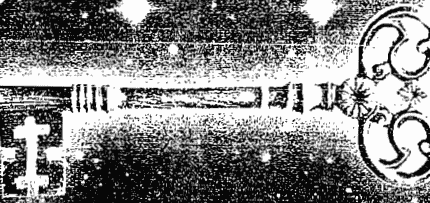

## 第1章 在上的，如同在下的
在上的，如同在下的（As above, so below.），這是宇宙的第一個法則，在地球就如同在天堂一樣。

如果你是一位父母，你對你所有的小孩——無論是嬰兒、幼童或是成人——都一樣地疼愛，你信任他們，即使他們可能正經歷一個艱難的時期。一個母親可能對於她年輕孩子們的行為憂傷地搖頭，卻不會去批判他們，她知道他們將會長大。一個小孩的父母不會因為這個小孩對她的嬰兒妹妹吃醋而少愛他一些，父母了解並且試著去幫助小孩處理他們衝突的感覺。當小孩長大些時，父母不會因為小孩對於寫功課有所抗拒就不愛他們，父母會提供協助。

神不會在你有混亂的情緒或是感覺一項工作很困難時，就停止愛你或是批判你，你反而會受到神與天使的鼓舞與幫助。宇宙愛你，並且對你有一種未來會成為開悟的人的願景，無論你在地球上正犯了什麼樣的錯誤。

聰明的父母溫柔地指導與鼓勵他們的孩子去發展自身的天賦，同時給予小孩子自由，讓他們從錯誤中學習，對於一個愈敏感的小孩，你要允許他有更多選擇的自由。

我們不能總是防範我們的小孩不要因為他們行為的後果而受到傷害。有強烈意志的小孩隨著他們自身的慾望而陷入困境，你曾看過一個即使已經被告誡許多次發燙的火爐將會傷人的幼童，依然執意要碰它？通常唯有燙傷的經驗能夠使他們學習。

我們也被給與選擇的自由，就如同任何敏感的父母一樣，假如我們瘋狂地偏離了軌道，神將會介入並試著指引我們。然而基於靈性法則，神將不會強迫我們照祂的意願去做，如果我們不願一切堅持到底，祂將會退後，允許我們以更艱難的方式去學習。如同在任何家庭裡一樣，年輕的靈魂會被神小心地督導；然而進化的靈魂會被要求對自己負責。當我們去經歷與學習，宇宙不帶批判地等待著；當我們準備好，它會打開新的門。

你想要那些你愛的人快樂、滿足、富有和健康嗎？如果你真的愛他們，你當然會這麼做；同樣地，源頭也想要祂摯愛的小孩是快樂、滿足、富有和健康的。

我跟一個由於工作非常快樂而有罪惡感的人談過話，她多少覺得神一定不會同意她對於工作感到如此喜悅，其實剛好相反。當你快樂時天堂也會感到歡樂，神的意願是你去做能夠帶給你喜悅、滿足與有價值感的事。

一個聰明的父母提供小孩指引，並授予小孩自由選擇的權利，如果他們忽略了指導，無論他們決定做什麼，有愛的父母都會支持他們。

神也在夢中、靜心或透過直覺的提示來提供我們指引，祂給與我們完全的自由選擇是否要接受指引，而且無論我們選擇哪一條道路都無條件地支持我們，祂並未偏愛我們去做某一種特定的選擇。你有選擇的自由，你的靈魂渴望你選擇能夠得到最大靈性成長的道路。然而，我們當中大部分的人必須從那些導向疾病、失敗與悲慘，有勇無謀、自私的選擇經驗中學習。當我們是出於較低意願也就是自私的欲望來行動時，我們常找出一條困難的路，無可避免的結果是我們會感覺很糟。

約翰是一個老派、獨裁、高大的人，當事情遂其所願時就很快活，當他遭到反對時便皺緊眉頭。他的祖母創立了家族企業，先傳給了他父親，然後再傳給了他，他理所當然地以為他的兒子羅奈德將會接管，然而羅奈德想要成為一位音樂家，而且展現了相當的天賦。父親約翰完全不妥協，他嘲笑兒子的音樂能力，並且運用他的力量去做一切操控和情緒上的勒索與脅迫，好使兒子能夠進入家族企業，約翰總是宣稱他的行為是為了他兒子最大的利益，因為沒有一個人能夠以音樂家的身分賺取很好的生活收入，他說他只是企圖把羅奈德從悲傷與沮喪中解救出來而已。

約翰的控制行為是出自於恐懼，不令人驚訝地，他持續地感覺憤怒，並且與他的妻子和兒子吵架，這些因素惡化了他心臟的狀況，最後羅奈德決定完全與他的家庭決裂，如此他就可以透過他的音樂來表達自己，他的父親感到孤單、生病與不安，這是他自己使人疏離的行為所產生的結果，而這些正是他企圖藉由控制他兒子來避免的感覺。

一位聰明的父母會鼓勵他的小孩去表達出自己的天賦，而不是指使小孩遵循一條道路，基於恐懼的選擇來自於我們較低的意願，「讓你的旨意被行使」的意思是幫助我從更高的大我來做決定，聰明、有勇氣的選擇將帶來快樂、健康與富足。引發愛、和諧與喜悅的選擇是來自更高的或是神性的，這些選擇將永遠賦予我們力量。

我們全都喜歡被欣賞，當有某人從內心深處為我們曾做的某件事向我們道謝時，我們有一種滿足與喜悅的感覺，通常想要給予更多。在上面也是一樣的，當我們欣賞並且為了我們已經接收到的說謝謝時，天堂向我們微笑，然後宇宙的力量會送給我們更多。

許多人告訴我，他們向天使大叫要求幫助，就是不了解為什麼協助沒有到來，從在下面的地球中舉出一個例子，你的小孩正向你大叫要求你幫助他做家庭作業，非常有可能你覺得生氣而相當不願意去滿足他，難怪你的天使對於自私的要求充耳不聞。當你的小孩很愉悅地請求時，你有一種他準備好要重視你的幫助的感覺，你會毫無疑問、很愉悅地給予幫助，光的驅力也是一樣。

當你準備好要接受從宇宙來的某樣東西時，平靜而愉悅地請求它，他們將很高興讓你擁有它，當你得到它時要重視它。

與一個負面消極的人在一起是令人反感的，如果你試著幫助某個寧願沉溺於悲慘中的人，過了一會兒你大概會走開；如果你關心他們，你可能會保持一個距離來注意他們，在天堂也是同樣的。天使發現要穿越很堅決的負面來接觸到你是很困難的，他們只能站在旁邊準備提供協助。

> 觸動神之心的東西，同樣也觸動人心。

假如有某人對你或你的寵物很好，你也會對他們很溫暖；當你對你自己或是神的創造物很友善時，宇宙也會對你溫暖以對；當某個人很熱誠時，你會受到鼓舞而有動機去採取行動。宇宙的能量也是一樣，他將支持你的熱情，假如某個人信任你，你就會符合他們對你信任的期望；當我們相信神，他就會回應我們的信任。我們回應慷慨，神也是同樣的情況。你無法操控一位聰明的父母或是與他討價還價，你無法操控神或是與祂討價還價。

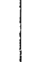

## 第2章 在裡面的，如同在外面的
地球是一個學習的地方，在這裡我們的功課藉由創造外在的世界，確實反映我們的內在世界來呈現給我們。

假如你內在是憤怒的，即使你可能把憤怒藏得深到連你自己都沒有覺察到，你仍將會發現你生命中有憤怒的人，他們是將你拒絕的憤怒反映回來給你。

假如你有很深的遺棄感，這可能源自於其他世，人們將反映回來給你，他們可能離開你、在情緒上撤離，甚至是死亡。

如果你自我批評並且持續地用自己的思想攻擊自己，你將吸引反映這項特質的人，他們將貶低你、甚至對你進行身體上的攻擊。

一個內在感覺到穩定、被愛，安全和快樂的人，將擁有一個穩定、安全和快樂的人生，四周圍繞著愛他的人；你內在的整合將與那些圍繞著你的人相對應，在你生命中的人會是多麼有創意、慷慨、誠實或謙虛，就端看你的狀態到達什麼程度。宇宙重新安排自身來反映出你的真實。的確如字面上所說的，在裡面的如同在外面的。

鮑伯和瑪格在衝突中結束了他們的關係，鮑伯持續地告訴其他人他想要講和，可是瑪格不感興趣，每次看到他時，就以言語攻擊他，鮑伯很沮喪，他痛恨吵架，只是不知道如何把和平帶到這個情境中。一位非常聰明的朋友有一天把他拉到旁邊說：「鮑伯，她感受到你的威脅，她還沒有準備好要講和，你唯一能做的方法是找到你內在的和平。」這對他來說是非常大的真相揭露，在告訴我時他大哭了起來。靈性法則是如此簡單，內在的平靜會把寧靜帶到你的生活中，當每個人找到內在的和平时，將自動會有世界和平。

這項法則甚至適用於肉體上，內在感覺反映在我們建構自己身體的方式上。

假如我們內在感覺到情緒或性方面的脆弱，我們可能在腹部或臀部上方建構了一層油脂的保護層，我們在這裡壓抑了情緒與性慾。

如果我們沒有真正地感覺到內在的層面是討人喜愛的，我們可能建構了一個很大的胸部來保護我們的心臟中央，有大胸肌的大男人常常隱藏了脆弱的感覺，一個女人會無意識地去建構一個大胸部，來表示她需要去滋養或是得到滋養。

如果我們在內心深處感覺到必須一肩扛起家庭甚至是世界的責任，我們為了自己建構出巨大的肩膀；從另一方面來說，假如我們沒有企圖或是欲望去負起責任，我們將建構出允許負擔滑落的傾斜肩膀。

你的身體是你深層、通常是內在無意識感覺的一面鏡子。

因此如果你在脖子內有一個痛處，問問你自己：

> 「我允許誰成為我脖子裡的痛苦？」當你再度賦予自己力量，就不再需要在這位置有痛苦，也有可能你就是你自己的痛苦！

相同的原理適用於背部的疼痛 —— 「誰是在背部的那個疼痛？」「在心中的痛苦 —— 「我允許誰來傷害我？」「消化 —— 「什麼樣的經驗令我無法消化？」「一個痛楚 —— 「我是因為誰或是為了什麼而疼痛？」「如果你無法聽到，問：「我不想要聽到什麼？」「我不想要聽誰說話？「如果你有僵硬的臀部，問問自己：「我如何改變自己的態度而往前移動？」

我非常了解喬治，他是一個很有智慧的年輕人，如果說他有任何缺點的話，那就是他能夠看到每個人的觀點，以致於無法督促自己向前，或是真正地為自己站出立場，他與一位持續把他的計畫搞砸的事業夥伴有些牽扯，這種情況一直在循環中。

有一天他問我：「我右邊的臀部很僵硬，我不了解是什麼原因？」

僵硬的下半身反映出在生活中缺乏向前移動的能力；在身體右邊的任何部分，均反映出與男性、未來或是我們的職業有關的態度，左邊的部分反映出我們與女性、過去或是我們居家生活的態度。因此喬治的臀部很精準地告訴他，他內在的態度，對於他的男性工作夥伴與他事業的未來是很嚴厲的，我們討論了他可以做些什麼去改變。

神奇的地球生活學校給與我們持續的機會，去學習有關我們自己的事，你的寵物將向你反映你內在的品質，你的寵物像什麼？牠們有什麼樣的品質？
當我們大笑著說某個人就像他的狗一樣，我們理解到這一點並非偶然，如果你的寵物們似乎有著不同的特性，每一隻代表著你人格的一部分，那也是為什麼牠進入到你的生命中。
一個人看起來非常地和藹可親與平靜，卻有一隻寵物很激進且脾氣不好，這表示他沒有表達出他潛在的憤怒情緒；如果有一個人看起來瘋瘋顛顛且骯髒，卻有一隻美麗高貴的動物，這表示他尚未碰觸到他高貴美好的本性。
這條法則是簡單精確的。
沒有生命的物件也代表出他們主人的部分，當某個人開著一輛破舊、骯髒、嘎嘎作響的老爺車時，這輛車反映出他當時的內在狀況；一輛漂亮、閃亮、乾淨的車是內在價值的外在顯現；一輛家庭車代表家庭潛在的集體感覺。負責掌管你的更高存有會根據你內在的狀況，促使你生命中的有形物體發生改變。你外在生活中漏水的水龍頭、屋頂、暖氣機，揭露你內在漏出的情緒；而外在熊熊大火反映出內在燃燒的問題。我們的領導人反映出我們居住國家的集體情緒；我們學校的老師反映出關於我們孩子內在集體的價值信念；監獄系統、國會、社會所有的面向，直接反映出人們集體意識最深層的感覺。當選修了在地球上這門課程的我們，期望生命中的某件事改變時，為了外在世界的改變，我們必須往內看去改變我們的信念與態度，如果我們希望改變社會，要有夠多的人改變自己本身。在反映法則中這點將會得到更完整地討論。

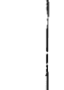

> 宇宙重新安排自身以便帶來你所相信的。

## 第3章 請求法則

在靈性法則之下，如果你想得到幫助，你必須提出請求。  
如果你冒失地介入一個朋友關心的重要事件，企圖去幫助他，這是一種很快失去他的友誼的方式。  
此外，當你幫助某個沒有請求幫助的人，你阻止他為自己解決他的問題，而這是他的學習過程。你就像是一位去幫助他，卻使他繼續待在舊有無益方式中的人。當你強加你的幫助或是提供建議給某個人的時候，如果做錯了你將承受業力，沒有邀請就冒然地給予幫助不是好的行為態度，很有可能你大部分的幫助將會被忽視或是不被欣賞。

當然如果某個人正在溺水，你會去幫忙，你指引盲人繞過人行道上的洞，安慰生病與喪失至親的人，然而假如你感覺因為某人陷入混亂而感到心煩意亂，那是你的問題，這表示你需要看看你自己而不是去拯救他人。

我持續地被問到這類的問題：「我可以為我的阿姨做些什麼？」自從她丈夫過世後，她是如此地悲傷，我一直試著勸說她去認識一些新的人，可是她不要。」

答案是：「當她準備好時，她將會請求你幫助她，在那之前，看看你內想去認識新的人，或是當她不接受你幫助時，你感覺被拒絕的那個部分。」

「我為我的女兒感到很沮喪，她拒絕嫁給她的男朋友，我擔心她永遠不會結婚，我要如何幫助她？」

答案是：「當你的女兒已經看到自己的恐懼時，她就準備好了，或許在內在深層她知道這不是適合她的男人，又或許她知道這會困擾你，因此這是她懲罰你的方式，她可以有一百萬個理由，然而，很清楚地她為你提供了服務，因為她點出了你的問題。除非她請求你的幫助，否則停止嘗試幫助她，看看這對你的意義是什麼。」如果你在工作中涉入一個很困難的情況，你從處理這個情境中得到學習與經驗，可能是使你在職業中前進的完美跳板，讓你為了升遷做準備，你不希望某個人不經你的允許跳進來掌管這個情境，這將干預與阻礙你為了更好的工作做準備。

在靈性的領域裡，沒有天使或是更高的光的存有會渴望介入你的生活。是的，他們將把你從嚴重的意外或死亡中拯救出來，如果那不是你的業力或還不到你死亡的時刻。然而，他們將帶著全然的慈悲與耐心站在旁邊，看著你把你的情形弄得一團糟，如果這是為了你的成長所需要的。對他們來說，干預你不僅不是一種好的靈性方式，也會阻止你成長茁壯。有些時候去請求幫助是適當的，藉由請求——我不是指像個幼童般沮喪地尖叫，或是像個不想要為自己的行為負責任的受害者一樣大叫——我的意思是小心地評估情形，然後平靜而有力量地請求你需要的幫助。

一旦你準備好去請求幫助，你就準備好去接收它，準備好接收伴隨而來的智慧，然後更高的力量將會調整好自身來幫助你。有些人不斷大聲問道：「何時、什麼事、如何做、誰以及在哪裡？」他們想要知道一個又一個的問題答案，這是一種要求而不是詢問，是來自於沮喪與需求，而非來自於心中開放的地方，一個堅定不移地走在靈性道路上的人，會往內去尋求答案。一旦你準備好知道更多，老師將會出現來提供你答案，可能是一本書、一個人或一個電視節目；當你準備好闡述你的問題，你也準備好知道答案。你的確不會期待在邀請一位律師來用晚餐時，他問你有關遺囑的事情，然後在喝咖啡的期間以重寫遺囑為結束；你也不會希望你那位作畫家或是裝潢師的鄰居，沒有你的邀請就到你家粉刷。當一個治療師堅持去除你的頭痛或給你治療，這同樣是一種干預，你可能對這些服務中的任何一項覺得感激，但它與靈性法則相抵觸，除非你提出請求。如果某個人提供幫助而你接受了，那是一個合約；如果他們一次又一次地提出幫助直到你接受，那就是一種壓力，這是他們的問題。

當你需要從天使、耶穌與揚升大師或任何一個光的靈性階層那裡得到幫助，首先讓自己安靜下來、歸於中心，冥想你確實想要的東西，找出關於它的明晰，然後對你希望請求幫助的存有提出請求，他們將永遠都會幫助你。

我的女兒在開車上班時感到精疲力竭，她心想：「我如何能讓自己有精力來面對眼前的這一天？」她才一有這個念頭，一輛車就經過她面前，車牌號碼字母為AUM，她知道她被給與了一個答案，AUM音同「嗡」（om或ohm）是宇宙一種神秘的聲音，一個非常有力量的咒語，她在去工作的路上持續地發出「嗡」的聲音，然後感覺好多了。

記住，答案就在問題中，你對你的問題愈清晰，你將會接受到愈完整的幫助。

> 宇宙正等著去幫助你，你唯一必須做的事就是去請求。

## 第4章 吸引力法則

我記得我像個小孩般地玩弄著磁鐵，深深地被某些物件受到磁鐵吸引、而某些物件被排斥的方式給迷住了，甚至有更多的東西看起來似乎對磁鐵不起作用或反應，我不了解物理原理，可是我認為這非常有趣。

如果你讓磁鐵黏滿全身，你會期望某些東西黏到你，某些東西跳開，而有更多的東西是不起反應的，這有點兒像是發生在生活中的情況，你無意識地傳送出你的能量，你的某些特質是有吸力的，某些是排斥的，你吸引來到你生命中的每一件事與每一個人，你排斥其他一些人與事，而有許多情況並未受到磁力拉向你，譬如你不可能吸引一個飢餓或無家可歸的情況，因為你不會送出要把這種情況。

一個廣播發射電台播放出一種特別的頻率，任何人對播出節目有興趣的人，會調頻到這個節目的波段頻道。你是一個發射台，你散播出你生命的戲碼，你把你的模式、情緒的能量、心態、抗拒、好惡以及更多的故事發送到空中。想像你想要找出一個有趣的節目，有幾百種頻道可以接收得到，你輕輕掃過所有頻道，試著決定要聽哪一個節目，大多數的節目你都立即轉開，現在再一次有一個節目吸引到你的注意，這可能是很沉重或很好笑、很無趣或有趣、很暴力或很和平的，它有某種東西吸引你對準這個頻道，你可能喜歡某些部分，但排斥其他某些部分，不過你還是被它勾住了。同樣地我們吸引人們到我們身邊，那些與我們的頻率沒有共鳴的人不會受到我們的吸引，他們就只是經過而已。你散發出的振動是由你意識與無意識的能量組成的，有些是排斥的，有些是有磁力的，有些是中性的，潛在的法則就是物以類聚，我們吸引與自己有類似振動的人與情境到生命中。

負面的特質，譬如需要、沮喪、壓抑、貪婪、不友善或是不體諒，散發出一種低頻，如果我們的本性中有這些成分，我們將吸引有類似能量的人來到我們的生命中。像是愛、友善、快樂、喜悅或是慷慨，發散出一種高頻的能量，也會吸引有類似能量的人。我聽到人們說：「我不能理解為什麼他在我的生命中，他是如此地負面，一點也不像我。」或者是：「為什麼人們欺騙我？我是如此地誠實。」靈性法則是很精確的，宇宙提供我們鏡子來往內看，看看你四周，注意圍繞在你身邊的人，他們在你的人生戲碼中扮演一個角色是有原因的，我們愈強烈地否認我們吸引的某個特定的人或情境，我們的大我就會愈要求我們去看自己的陰影，這就是我們拒絕的負面部分。如果你感覺準備好要對一段關係做出承諾，可是你的伴侶卻不想這麼做，看看你內在對於承諾的恐懼；如果你是百分之百的確定，他或她就不會在那兒了。當你解決了你潛在的信念，另一個人不是對你做出承諾，就是離開你的生命，好讓某個可以對你許下承諾的人進來。一個總是看起來很愉悅高興的人，身邊卻似乎圍繞著沮喪的人，他吸引他們來反映出內在的不快樂，他們達到某種目的，也許是使他感覺被需要。

沮喪會產生排斥作用，我認識一對夫妻極度渴望有一個孩子，他們去很多地方試過一切的方法，他們沒有生理上不能生育的理由，有個靈媒不斷告訴他們有一個靈魂正等著進入，可是因為他們的沮喪排斥了這個即將要進入的靈魂。最後他們決定臣服，接受他們的生命中沒有小孩的事實，一旦他們這麼做，一個能量的改變發生了，他們散發出一種滿足的吸引能量，這個能量吸引了一個來自宇宙的靈魂，突然妻子就懷孕了。類似的事情常常發生在一個人極度渴望有一個伴侶時，人們捕捉到細微層面上的沮喪，於是便離開了，當他們改變能量成為有愛的、接受的、敞開的能量時，正確的人就會被吸引過來。

我們潛在的信念吸引情緒與人們來到我們身邊，如果你有一個你是不值得的信念，你將吸引藉由對你不好來反映你的信念給你的人，進入到你的生命中。如果你相信你必須去服務他人，在某一方面你就吸引那些需要你去照顧的人。

如果你相信沒有人可能了解你，你將會吸引那些不了解你的人。

一個持續吸引欺騙她的伴侶的女人，了解到她有一個潛在的信念，就是去信任是不安全的，這使她去吸引一些會去欺騙她的人，當她治療了這個信念後，她就吸引了一個值得相信的伴侶。一位叫做珍妮的女人令我想起一個翠綠色的沼澤，她表面上很美，可是假如你靠得太近便會陷入沼澤中，當她是一位熟識的朋友時她是快活開心的，但是在親密關係中她變得很要求、匱乏、嫉妒，而且是個戲劇女王，當然她無意識地散佈廣告，說她需要一位演員可以參與這齣特別戲碼，吸引準備好被外表朦騙的男士。她抱怨她生命中的男人類型，他們抱怨她，然而他們無可避免地被彼此的能量吸引，而且會一直這麼做下去，直到他們改變自身的振動。如果有一個人散播：「我是控制的，我正在找一個女人可以讓我掌控。」他就會吸引容許自己被掌控的女人，這幾乎一定是無意識的，一個有力量的人不會被這種振動所拉近，一個持續吸引同樣類型的人進入他們生命中的人，是在散播相同的訊息。吸引力法則在許多層面上運作，如果你的生命失去和諧，你可能吸引不適合你的食物；如果你有自我批評的念頭，你是在輕輕地敲打自己，你可能吸引蚊子來咬你，這些蚊子是你送出去能量的反映；如果你有掩藏的盛怒，你可能會吸引來攻擊。當然這些東西也許是無可避免的業力回報，是為了平衡生生世世的對與錯。每當你做某件事是因為你感覺你應該去做時，你就受到了束縛，你將會吸引一直讓你被束縛的情境與人；如果你送出正面的能量，當你需要幫助時你將吸引來援助。一位朋友告訴我她在鄉下迷路了，她看到一隻不確定是公牛還是母牛的動物在她前方的牧場裡，就在她還很充滿疑惑的時候，這時出現一位女人，沒有任何開場白就說：「對的，那是隻母牛，你迷路了，我來為你指引道路。」她帶領她從這隻動物旁經過到達正確的道路上，在那個時刻我的朋友吸引了她需要的幫助。假如你有負面的思想，你就吸引負面的情境與人；如果你身體不健康，當你準備好要放下時，你將吸引完美的治療師來到你的生命中；如果你想要你的計畫成功，卻有潛在的厭倦感或是你很害怕或疲倦，潛在的能量將抵制這個計劃成功。

成功。每當某件事不是如你所期待地實現，檢視你潛在的感覺然後改變它們，吸引你真正想要的。

內在的吸引外在的，如果在你外在的世界中有某件事不是你想要它呈現的樣子，看看內在，然後改變你對自己的感覺，你將自動地吸引不同的人與經驗來到你身邊。

假如你想要一個有承諾的伴侶，看看你是如何承諾去愛你自己，當你真正地承諾去愛你自己的時候，外在的將會改變，你將吸引一個人承諾來愛你。

如果你看扁自己，從來沒有認為你是夠好的，你將吸引一個虐待者對你做相同的事。記起你自己的優點，然後吸引某個人來欣賞你。

那麼關於一個靈魂高度進化的人，與毒癮或暴力罪犯一起工作是什麼情況呢？這情況發生在他們做了一個生前的約定要與那些人一起工作，這也可能是另一世未解決的某件事的業力結果。

當然也有相反的兩極相吸的例子，某個散發出光亮的人可能吸引黑暗的振動朝向他們，但是他並不會被黑暗的振動所吸引；一個黑暗的地方譬如監獄，可能會吸引成道的人想要把光帶入。不要送出負面能量，然後等待一個災難吸向你；送出去正面的光，然後等待一個奇蹟被拉向你。

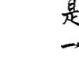

> 你是一個磁鐵，你吸引相似的到你這裡。

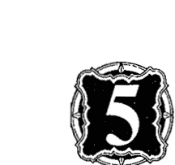

## 第5章 抗拒法則

我正在看兩個小孩玩耍，小女孩在花園的兒童遊戲館裡開始一場茶會，她叫喚她的哥哥來喝茶，可是當哥哥到了門口時，她對著他把門關上不讓他進來，一場爭執因而產生，當小女孩試著阻止他哥哥進入時，她變得生氣而疲倦。

我們可能大笑著說這些小孩子怎麼這麼笨，然而，我們在生命中常常做相似的事情。

每一次我們把焦點放在某樣東西上，我們就召喚它朝向我們，藉由我們的思想與信念來邀請人、情境與物質來到我們的生命中，當這些人事物來到時，如果我們沒有真的想要他們，就會試著再度把他們推出去。

我與一位鄰居聊天，她告訴我她確定她婆婆將在聖誕節時住在她們家，然後會讓所有人都覺得聖誕節被毀了，她說：「我就是知道這一切，這是一場惡夢。」當然，她強烈的圖像與恐懼無可避免地會吸引她的婆婆前來，然而她的憤怒使她對婆婆關上心門，這位鄰居把她大部分的生命能量用在抗拒上。

許多人召喚抗拒法則而沒有意識到他們在做什麼，你的無意識頭腦與宇宙的頭腦，正如同電腦一樣地運作著，你不能告訴電腦不要打開某一個檔案，因為它無法接受負面的指示，它將以為你的確要那個檔案而把它打開來。

你有意識的頭腦可以分辨負面與正面的指示，但你無意識的頭腦卻無法分辨，如果你有意識的頭腦正全神貫注地開車、看電視或是非常專注在某件事上，你無意識的頭腦可能接受到這個訊息，譬如當一個小孩專注在家庭作業時，他有意識的頭腦完全被占住了，如果在那個時候他媽媽說：「你敢給我寫錯看看。」他無意識的頭腦會接收這個意見，忽略「不要」而收到「寫錯」的訊息，因此最好正面地說：「你可以做對的。」同樣地，如果一個人的頭腦完全沉浸在他正準備的演講中，而他的太太說：「晚上的宴會不要遲到了。」她是在事先設立一個問題，最好說：「記得晚上的宴會八點開始。」如果你經常有一個想法或是經常說一句話，它將進入你無意識的頭腦。有一些人在生命中罹患疾病是因為他們抗拒疾病，如果你不停地想：「我不想生病。」這個詞就會持續地進入無意識的頭腦，你的電腦在找尋一種會使你生病的程式。當你放鬆時，你無意識的頭腦也是敞開的；當你在陽光下放鬆的時刻，不要用這個時間來擔心，因為你可能會顯現你的恐懼，這是很棒的時間去描繪你想要在你生命中創造的事物。

「不要」、「不能」、「將不」或「不」這些詞引發了抗拒法則。

- 「我永遠找不到一個完美的伴侶。」這個念頭，抗拒了完美的夥伴。
- 「我不想要貧窮。」帶給你貧窮。
- 「我不想要住在那間可怕的房子裡。」使你一直住在那間可怕的房子裡。
- 「我不是一個難相處的人。」這句話如果重複夠多的話，會使你產生難相處的個性。
- 「記得晚上的宴會八點開始。」
- 「我不想生病。」
- 「我永遠找不到一個完美的伴侶。」
- 「我不想要貧窮。」
- 「我不想要住在那間可怕的房子裡。」
- 「我不是一個難相處的人。」

「我永遠不會像我媽媽一樣。」保證了你就變成跟她一樣。你變成你所抗拒的，你抗拒的會繼續存留在你的生命中，耗盡你的能量在掙扎當中。

永遠不要抗拒失敗或是貧窮，取而代之的是吸引成功和財富，永遠擁抱正面而不是抗拒負面的。

「我是健康的。」是一句進入到電腦中吸引健康的指令。
「我值得一位完美的伴侣。」吸引來一位完美的伴侣。
「我歡迎財富。」吸引財富到你的生命中。
「我住在一間美麗的家中。」帶來一間美麗的家給你。
這個肯定句「我是聰明的。」開始讓你接觸到你的智慧。

我在一個社區中度假，在那裡他們決定要跳出工作小組的架構，而去尋找想要幫忙的志工，這個結果是每一個人感覺到更自由，有更多的時間可以放鬆，他們瞭解到結構性的規則會使人有壓力因而產生抗拒，而這會奪取能量。
釋放控制可以讓能量自由。

一個年輕人在我一次有關豐盛的談話後過來跟我說話，他說當他聽到我的談話時，在他腦海中有一個想法轉變了，一直到那時候他都感覺他是不值得的，他瞭解到他在他是值得的層次之外，已經拒絕了所有的東西。我在幾個星期後的一個天使工作坊中看到他，他已經停止抗拒，開始擁抱他在生命中真正想要的，這個態度上的改變，已經使他轉變了他豐盛的層次。

有時候改變要比這多花一點時間，如果你已經長期拒絕寂寞，將有一個巨大的寂寞思想形式圍繞著你，你可能使用了你全部的能量來緊握住這份恐懼，因此可能要多花一些時間來轉換它。有一個很正面的方式，可以消融你所抗拒的思想## 第5章 抗拒法則

形式，就是寫下來你的抗拒，並且燒掉所有你對它的恐懼，然後寫下你想要的東西，開始去吸引你想要的，你將發現你有更多的能量。

如果兩個人想要推動一個大圓石往某個方向前進，他們將站在大圓石的同一邊推動它，如此它才能移動；然而如果他們站在對立的方向推，石頭只會或多或少往比較弱的那邊移動。這就是當我們內在人格衝突時所做的事情，如果我們內在有兩個人格為了同一個目標在工作，我們的人生就會順暢地往前移動，如果兩個人格相互抗拒，我們便會困住。舉例來說，如果我們的某一部分害怕承諾，而另一部分想要親密與穩定的關係，我們將創造出一種拉扯的情境，這個關係將停滯困住，我們會納悶為何自己感到如此疲倦。

假使你正與某個人合作一個企畫案，你們兩個人有相同的願景，這個計畫必然會往前移動；然而假如你在衝突中，這份抗拒將導致延遲，那個人在你的生命中出現不是意外，他或她是反映給你有關你自己的懷疑、恐懼或焦躁不安。

往內看，然後決定你真正想要的是什麼，你真正的願景是什麼，當你解決了你內在的衝突，基於宇宙的法則，另一個人就必須離開你的生命或改變他們的態度。

抗拒法則會被受害者的意識所觸發，一個受害者是一個為了自己的命運而責備他人的人，他們相信這個世界虧欠他們，需要照顧他們的生活，而他們自己不可能照顧自己，當一個人認為：「可憐的我，我無法照顧自己。」或是「我是如此不幸」時，他成為一個抗拒神的豐盛、慷慨與照顧的受害者，假如一個人為了發生在自己生命中的事情而埋怨他人，他就是一位抗拒為自己已經創造出的事負起個人責任的受害者。

有一位非常受苦的女士叫作安卓拉，她跟我提到她的先生：「一切在婚姻中可怕的情形都要歸咎他，他每晚都外出才讓我這樣生氣。」她抗拒為自己促使她先生每晚外出的態度負責任，她抗拒她先生的優點，她告訴我對方沒有任何的長處，安卓拉把自己描繪得就像是一位生氣的聖人一樣。

只有在她停止抗拒、開始誠實地看自己的行為時，她才會變得安靜些，她的先生有幾個夜晚待在家裡，她把焦點放在她已經發現的先生的優點上，他們有愉快的時光，當她不再責備他，停止抗拒他外出而擁抱他留在家裡的時候，他們的快樂時光，婚姻就難以置信地改善了。

當我們覺得很生氣或罪惡時，我們抗拒了生命的喜悅與生命本身的美妙。

我們當中大部分的人有時候會抗拒做一項工作，我們抗拒燙衣服直到衣服堆積如山，或抗拒做園藝工作直到花草長得過於茂盛，或抗拒需要寫的報告直到分量與截止時間呈現出可怕的比例為止，一份工作顯現出的困難度與我們抗拒的層次成正比。

任何你抗拒的東西都帶有一份給你的訊息，譬如假使你抗拒貧窮，是時候去看看貧窮嘗試要告訴你什麼，你害怕匱乏嗎？你確實害怕的是什麼？為你真正想要的而非你不想要的敞開。

因此，如果你是多餘的冗員，這不是意外，你已經使宇宙法則發生效用取走你的工作，你為了某個目的在你生命中創造出多餘，就是去檢視潛在的原因，然後從中學習。你對你的工作不滿意或是發牢騷嗎？宇宙接受到你不想要那份工作的訊息；如果你感覺被貶低，聲明你的價值；如果你不相信你的老闆，去建立你信任的層次。

信任的層次。

你所抗拒的會持續存在在你的生命中耗盡你的能量；擁抱你真正想要做的，感覺自己是活生生的。

如果你有一個循環的失敗模式，持續地想像你成功的畫面。

停止抗拒，決定你在生命中想要做的是什麼，開始送出有磁力的、興奮的、熱誠的能量來吸引正面的東西朝向你。

## 第6章 反映法則

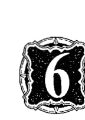

### 反映法則

地球是一個令人驚奇的學習場，在這裡你總是得到照鏡子看自己的機會，宇宙的鏡子是如此誠實、精確，因此你最深層的秘密顯示在你自己的反映影像中，在你生命中的每一個人與情境都是你某個部分的鏡子，在裡面的如同在外面的。當你看到鏡中的自己時，你可能不喜歡你所看到的，你可能會聲稱這個反射是扭曲的，但你很少堅持說那完全不是你而是另一個人。當宇宙在我們的生命中呈現給我們某個人或是某件事時，這就等於是一面鏡子，我們可以大聲責罵或是否定它，然而反映的靈性法則提醒我們去照鏡子，然後改變我們自己。當你照鏡子時，你看到你的眼睛沉重且疲倦，你不會去嘗試改變反映，你會吃健康的餐點，睡多一點覺好讓這個映像改變。

當在你生命中有某個人你不喜歡，當然你可以花時間與精力去試著調整或改變他或她，如果你這麼做就是嘗試去改變反射的映像，這是一種拒絕的形式，如果此做的人被認為是拯救者，他們寧願花時間去改變反映，也不願在自己的身上下功夫，當你了解到反映法則後，你將再也不會嘗試去讓別人變得不一樣，以便使你覺得更舒服些，你觀察外在然後去改變內在。

在你生命中那些你不喜歡的人，顯示出你自己某些感覺不舒服的面向，如果你有一位朋友似乎很冷漠無情，問問你自己是否是鐵石心腸；如果你的小孩是有敵意的，看看你自己內在的憤怒；想像你的老闆是沒有組織且一片混亂的，倘若你對自己的和睦與責任心感到驕傲的話，你可能對於他與你如此不相像而感到非常生氣，可能有相當的理由告訴你自己他不是一面鏡子。

然而看看你內在不整潔的那一面，也許有一小部分的你想要無憂無慮與不負責任，如果當你是小孩時，你被維持在緊繃的紀律中或是你被高度的期望所要求，可能有一部分的你是恐懼犯錯或是粗心大意的，如果你總是必須負責任與在控制中，放下是很可怕的事，你內在想要不負責任的那部分，反映在你四周的人身上，在某種程度上你是對你老闆生氣的，你氣他在鏡中顯現出你混亂的那個部分。如果你生命中的某個人有一個特質並不會困擾到你、也不是反映出你的某部分，那麼你根本不會注意到它。別人身上的某一個特質愈是困擾到你，你的靈魂就愈會嘗試描繪一個映像來吸引你的注意。所有你真正喜歡的人，是在反映出你對於自己感覺很好的面向，舉一個你喜歡、尊敬或是景仰的人，想想有關你喜歡他的特質，那些特質多少在你內在也有，如果內在沒有這些特質，你就不會吸引那個人，也不會注意到他們的那些特質。宇宙的神奇鏡子向你顯示出，也許你還沒有接觸到你美好的部分，藉由練習這些特質來增加它們，將會有更多有這些特質的人進入到你的生命中。

如果宇宙真的想要吸引你對某個東西的注意，它將給你三面鏡子讓你一次看個夠。

一位客戶告訴我：「這個星期我看見三隻折翼鳥，這是要告訴我什麼？你不可能帶著破損的翅膀飛翔的，我建議她看看她感覺自由被削減的地方，她馬上說她丈夫不希望她參加工作坊，因為她花了太多的時間遠離她丈夫，她確實感覺受到限制。宇宙向她反映回來，她感覺她的翅膀受損了，該是她與丈夫溝通的時候了。

如果你一天之中看到三個盲人，這可能暗示你沒有看到某個東西；如果你注意到三個意外，你可能認為你進行得太快，或是正導向一場災難。

每一個事物都是一個反映。

水反映出正發生在你情緒或是靈性上的東西，如果你的情緒正在洩露，換言之你有未流出的情緒，你可能發現水龍頭在滴水，暖氣漏水。我知道某個人的屋頂漏水，而水滴到他的離婚文件上，沒有任何其他的東西被水滴到，只有那些文件而已，他從來沒有真正去處理關於他婚姻破碎的感覺。河流、湖與海洋攜帶了一個區域情緒與靈性的生命力，你是被洶湧的海還是寧靜的湖所吸引？記得水也象徵洗滌與淨化。

火是炙熱與明亮的，一個營火或壁爐的火可能象徵一個寧靜的中心，一場狂暴、難以控制的大火，反映出所有藉由它來呈現憤怒與敵意的面向，火也是一個很棒的轉換負面能量的媒介。

土是堅固的，卻可能是令人窒息或無趣的，如果你身陷泥濘中，這表示有些關於你人生的事情要告訴你。一場地震告訴你以為你的生命地基很安全，其實不然，從土地裡有新的成長。

空氣有很大的能量，它代表了溝通與新觀念，如果你坐在一股使你惱怒的氣流中，這可能是某個人的溝通激怒了你。一陣暴風正吹走一個區域過時的思想，同時預告新的來臨，新鮮的空氣也吹走蜘蛛網。

你車子的每一個部分代表你的某個部分，如果你的煞車失靈，它也許在警告你停止某件你正在做的事情。

燈壞了，你可以看見你正往生命中哪個地方前進嗎？

油漆被刮掉或撞擊，你感覺正在倒塌或是被撞擊嗎？或許你正在批判你自己。
喇叭拒絕發出聲音，是時候為你自己大聲地發言了嗎？輪胎有一個刺洞，你感覺在洩氣嗎？有人讓你失望嗎？你是如何使自己失望、或是沒有支持你自己？
耗完電的電池，你覺得精疲力竭了嗎？你已經耗盡能量了嗎？
如果你不能理解這個反映代表什麼，談談看這個機器的功能是什麼？舉例來說，我的車鑰匙裡面有電池，我的備用鑰匙的電池沒電了，在我有時間去處理它之前，另一隻鑰匙也沒電了，我無法工作與進到我的車子裡，備份鑰匙允許別人進入我的車子（我），我的鑰匙容許我進入（我的意識裡），電池是供給鑰匙燃料的能量，當兩隻都用盡時，它們反映給我的是我太累了，以至於無法給任何其他人或自己任何東西了。
齒輪促進從一個速度到另一個速度的移動，如果它們正發出刺耳的摩擦聲，你在你的生命中難以做出一個移動，或是轉變關於某件事的意識？
動物反映出他們主人的品質與特性，一隻有良好紀律、美好本性、友善的狗，反映出你可以信任這個主人，並且感覺與他人在一起很舒服；一隻狂野、喧鬧的動物警告你要小心牠的主人，即使他表面的的印象是一個溫和的人。我們是複雜的人，擁有不同的動物反映出我們不同的面向，你的貓反映出你冷靜客觀的工作模式，然而你的狗顯示出你的生氣勃勃、友善的居家人格。

問一問某個人他的動物像什麼樣子，你將學習到有關他的個性。

當我在寫這一章時，同時間我讀到有關不同的狗的特質與態度的一篇文章，我們有意識或無意識地選擇一隻狗來與我們相配。

穩定、可靠、寬容、性情溫厚的類型，包括矮腳長耳的巴吉度獵犬、偵探犬、米格魯獵狐犬、鬥牛犬、聖伯納狗、大型馴犬馬士提夫犬、愛爾蘭獵狼犬以及紐芬蘭犬。

聰明、可以接受訓練且機警的狗是杜賓犬、卡狄肯柯基犬、喜樂蒂牧羊犬與貴賓犬。具有保護性的狗是有領土概念與有統治性的，像是犬獅犬、洛威拿犬、牛頭梗犬、鬥牛獒犬、鬆獅犬、布魯馬士提夫犬與大型雪納瑞犬。

友善深情的狗是邊界牧羊犬、長鬚牧羊犬、英格蘭雪達犬、英國小獵犬。黃金獵犬、英國古代牧羊犬、拉布拉多犬、查理士王小獵犬與可卡犬。

獨立且有強烈意志的狗包括阿富汗犬、萬能梗犬、大麥丁犬、埃及靈堤、愛爾蘭雪達犬、音達犬與獵狐犬。

有自信、自發性、常常很大膽魯莽的狗，包括傑克羅素梗犬、迷你品犬、西高地白梗犬、約克夏梗犬和愛爾蘭梗犬。

前後一致、自給自足與愛家的狗，有吉娃娃、臘腸犬、惠比特犬、查理士王小獵犬、八哥犬、中國北京犬、波士頓犬和馬爾濟斯犬。

所有的動物、植物、樹甚至是水晶都代表某些特質，你家花園的橡樹反映出你扎實、倚賴的一面。由於在集體頭腦中持有對於昆蟲的恐懼與厭惡，昆蟲通常映照出我們黑暗的一面。如果你的花園是艷麗與多采多姿的，它具體化你外向的部分，無論你是否有意識地顯示出來；如果花園是非常整齊、井然有序的話，你很可能是一樣的特質；一座家庭式的花園將反映出主要的家庭特色。

不論有甚麼進入到你的生命中，像照鏡子般去看看它要教導你的是什麼，一旦我們了解反映法則，我們可以藉由看到生命中正在告訴我們的東西，來擴展我們的靈性成長，我們在地球上的旅程變成是一個迷人、美好且令人興奮的經驗。

有兩種方式來詮釋你在鏡中看到的是什麼，一種是你正看到你的投射，另一種是你正在看你已經受到吸引的面向，要找出一個投射，談論關於一個人或是一個情境，譬如你可能說：「你是一個很慷慨但令人惱火的人。」看看你內在慷慨的部分，以及你令人惱火的部分。

找出你是如何吸引反映的，覺知到一個人或是情境如何使你感覺，舉例來說，「你使我感覺無法勝任」向你顯示你的不足夠。

> 永遠不要嘗試去改變其他人，因為他們正在反映你，所以往內看，然後改變你自己。

## 第7章 投射法則

在地球上我們的面向被反射回來給我們，所有我們察覺到的外在自我，都是內在某個東西的鏡子，因此我們看到外在自我的一切都是投射，我們取一個自己的面向譬如同強，然後想像那個特質是在那些圍繞我們周圍的人身上。

我們常常投射自己的東西到其他人身上，好壞兩者都有，然後假設那是他們的內在，而否定這是我們的內在。

真相是：
- 你只能看到你自己
- 你只能聽到你自己

## 第7章 投射法則

> 你只能與自己說話
> 你只能批評你自己
> 你只能讚美你自己

每一次當你說這些話「你是」、「他是」或「她是」，你正在投射你自己某樣東西到其他人身上，這可能是：「你真奇怪。」在這個例子中，你無意識地看到你自己的怪異在那個人內在出現；當你說：「她是愚蠢的。」你是在投射你自己的愚蠢到她的身上；或者那可能是：「你是很棒的。」因為你在別人內在看到你自己的美妙；如果你告訴其他人他們是聰明的，卻不接受你自己是有智慧的，你正把你的智慧投射到外在。

當我們假定別人與我們有同樣的感覺時，這是一種投射。「你對那件事一定感覺糟透了。」或者是「你一定感覺如此地歡喜。」兩者都是投射，你正把你的感覺加在別人身上，他們可能感覺完全不一樣。「沒有人喜歡米做的布丁。」是一種投射，你描述某個你不認識的人說：「她當然喜歡馬。」也是一種投射。

吉兒的婚姻不快樂，而凱特愛她的先生，她有一段真正支持的關係，吉兒常常告訴凱特：「你應該離開你的先生。」她把她覺得自己應該離開她的婚姻的那一部分，投射在她的朋友身上。

我們把自己的恐懼投射到這個世界上，我聽到某個人跟她的伴侶說：「你是一隻老鼠，你沒有勇氣為自己站穩立場。」他沒有勇氣可能完全正確，然而，除了她的某個部分害怕為自己站穩立場，否則她不會覺察到這一點，儘管她是一個大女人，她把自己膽小的那一部分投射到對方的身上。

> 「你沒有幽默感。」僅僅是指另一個人沒有與你以相同的方式來看世界，他們可能有極好的幽默感，但卻是一種不同的幽默感，你實際上是在批評自己。

去想像別人有著我們希望否定的內在特質要舒服多了。

如果你埋藏你的敵意，然後以被動的憤怒表示出來，你將投射敵意到你四周的那些人，然後想像人們是激進的，不論他們是否如此，你將有選擇性地想像出憤怒或是威脅的態度，即使那裏沒有人試圖或表現如此，那些投射他們的恨意的人認為每個人都企圖有恨意。

## 第7章 投射法則

一位年輕的女士向我抱怨，她的伴侶一直告訴她：「你不知道如何去愛。」在我解釋投射法則之後，她認清她的伴侶正在說他自己某個部分，這可能與她有關或毫無關係，然而我們探究為什麼她吸引那樣的批評，她理解到這句話裡面有一點真實，於是開始看看她關閉自己的心的方式。

我們投射自己的不安全感與性慾到其他人身上，一個對其他人的道德有偏執狂的人，是在投射自己潛在的不道德。

一位懷疑他所有的員工都在欺騙他的老闆，是在投射他內在的欺騙，因此他可能理所當然地吸引了欺騙。一位太太持續地譴責他的忠實丈夫不忠誠，是在投射她對這段關係缺乏信心。

如果你聽到某個人正在說另外一個人：「她是一位頑固的女人。」你會想知道說這句話的人的頑固性，某個沒有這種特質的人不需要說別人有這個特質。

因為我們當中許多人不承認或不相信自己的美好，我們也把自己美麗、仁慈、有力量與傑出的部分投射到其他人身上，每一次當你認為人們有美好的特質時，記得在你內在也有那樣的品質，否則你不會在他們裡面看到那個特質。

我們把自己的愛投射到其他人身上，我們的友善、慷慨、善良也是一樣，一個天生就很親切的人，會想像他四周所有的人也是很親切的。
一個非常慷慨的人也會期待別人這麼做。
當一對情侶在戀愛中，是在各自投射他們內在的美到對方身上，看到我們的光芒擴大然後反映到另一個人身上，這提供一個靈性成長很好的機會，在愛中是一種恩典的狀態。

一般的投射非常普遍，譬如：「每一個人都害怕老虎」、「所有的女人都是喋喋不休的」、「小孩的功課很難」，把這些投射翻譯成：「我很怕老虎。」「我的某個部分是喋喋不休的或很喜歡閒聊。」以及「我發現我小孩的功課很難。」就只是為任何屬於你的部分負起責任。
把你自己的投射到每個其他人身上，讓你不能為自己負起責任，大多數的人甚至不知道他們正在說的特質，實際上就在他們內在，這是一個很有力量的否定形式。投射可以創造出乒乓球的遊戲，當兩個人彼此咆哮，每個人都譴責對方的不是，兩個人都將投射自己的憤怒與恐懼。

## 第7章 投射法則

> 有句諺語：「五十步笑百步。」適切地描述了投射法則，沒有看到自身的黑，反而看到其他人是如此地黑。

你只可能跟自己說話，當一對父母說：「你是一個很難相處的孩子。」他們是在投射自己到他們的子女身上。這真的會毀了一個小孩，他還不了解事實，那就是這完全與他無關，而一切都與他父母有關。

在一位母親愛她的嬰兒，不斷告訴這個嬰兒他是多麼地美麗與可愛，這是正面地投射她敞開的心，她在這個過程中點亮了兩個人。

這裡有一些投射的例子：
- 你是一個雞婆的人。
- 我感覺你在管閒事。
- 做一個軍人很困難。
- 這個世界是一個很可怕的地方。

當我們停止投射時，取而代之的是為自己的感覺負起責任，我們可能說：

> 當你問這些問題時，我感覺不舒服。」或是：「這是我個人的事情。」你會說：「我發現當一位軍人非常地困難。」或者：「我覺得世界上正在發生的事威脅到我。」

甚至有高度經驗與客觀性的專業人士，也會透過有色的眼鏡來看這些情境，
當我們有人類意識時，這幾乎是無可避免的；當我們百分之百超然，能夠從一個全然客觀的位置來觀察時，我們可以清楚地看透一個人或是一個情況，到了那一刻，我們最好能從我們的生命中切除投射。

你的生命就是你經驗的，其他人或許有非常不同的生命經驗，因此觀察你的投射，然後在自己身上下功夫，了解到這個法則提供個人與靈性成長巨大的機會。

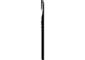

> 你不知道別人的感覺或是他的狀態，你在其他人身上看到的每一樣東西，都是你自己一部分的投射。

## 第8章 依附法則

你可以擁有任何你希望在生命中擁有的東西，可是如果你的自我價值感或是快樂取決於擁有它，那麼你就是依附著它，無論你依附的是人或是事物，都可以操控你，你不再是自由的，你是用細繩綁著的玩偶。
宇宙是一個能量場，每一樣東西都旋轉移動，喜歡的吸引喜歡的，有一些能量是排斥的，在原子間有舞蹈進行著，然而有某些人在這個能量的大鍋中是被綁在一起的，他們從遙遠的距離、一世又一世地被吸引在一起，這條繩索可能把他們捆綁著，使他們陷入困境中，他們將在心理、情緒與身體上互相拉扯，而且常渾然不知他們對彼此的影響。

線會在兩個有未完成問題的人中間形成，每一次你對某個人散發出憤怒、受傷、嫉妒、羨慕或需要時，你是在顯示一條依附他們的極小的線，一個偶然的想法將會消失，可是如果你持續地送出負面的感覺，這些細線將形成粗線或繩子，他們將繼續把你們綁在一起，直到它們被釋放掉。在接下來的生命裡這些繩子將會再度活動，必然地吸引你朝向那些與你有未完成問題的人，這是為了提供你的靈魂有機會做不一樣的事。我們也可能依附物品，負面能量像是貪婪、驕傲、需求、嫉妒可能會送出巨大的繩索到物品上，譬如房子、車子、工作或是銀行存款，這就是為什麼我們談論到財富的陷阱。 繩索也可能使人依附到無形的東西上，譬如說對愛的需求，如果你受到不被認可的慾望束縛，這可能在心理上就像有一個球鍊圍繞在腳踝上，你可能被繩索綁在限制的能量中，像是自我反對或是離群索居。 一個師父是超然的，他是獨立於財物或情緒需求的狀態，他是自由的、有巨大的力量。 你可以有一棟漂亮的房子，當然，神想要你擁有一棟漂亮的房子，然而假如## 第8章 依附法則

你需要住在豪華的房子來給你地位與安全感，它就變成了陷阱，繩索將你綁在你的房子上，在情緒上你是受到束縛的，直到你改變你的態度為止。一位師父可以享受一棟很棒的房子，可是如果房子被取走了，並不會影響他對自己的觀感。你可以享受一段很美好的關係，所有一切的源頭想要你在愛中快樂，然而你的需要把你綁在你的伴侶上，因此你在情緒上受到拉扯，共依存的關係使你陷入綑綁中，因此很難對這段關係感覺客觀，或是離開你的伴侶。當父母對小孩有非做不可的義務時，他們很難放鬆自己成為成人；同樣地，一個小孩可能是如此依附他的父母，因此難以伴侶建立成熟的成人關係。依附是一種有條件的愛，一個師父無條件地去愛，這不會形成綑綁，他允許他愛的人自由以及成為他們自己，如果某個他愛的人離開或是去世，他會感到哀痛但不會心力交瘁，他保持在中心裡。如果你希望某個人以某種方式來行事，你才會愛他們的話，那並不是愛，而是一種依附。綑綁式的倚賴可以用幾種方式釋放，愛融解它們、讓它們自由，而你也讓自己自由。當我們把自己的希望與期待放在人們身上時，他們也以自己的模式來反應；當我們接受他們本來的樣子時，他們表現出他們的美好給我們，那就是愛。原諒總是解開了繮索，我們在這個時代，正在等待一個新的更高的意識在這個星球上普及，這表示我們正集合我們累世形成的所有繮綁，我們的靈魂現在希望我們去面對與釋放所有未曾解決的問題與課題，以使我們可以自由地移動，當你原諒某個人，完全放下過去已經發生的事，你讓對方與自己都得到自由。羞恥與罪惡會把你捆綁在某些記憶中、使你退縮，當你準備好原諒你自己過去的行為時，你就解開了這些限制的繮索，記憶便失去它的指控。我們是為了自己而不是為了別人去緊握住記憶。卡洛琳告訴我她想要與她伴侶的家人共度聖誕節，但她知道她母親將會極度地沮喪，她媽媽需要她，她說。最後她鼓起勇氣告訴她媽媽她無法與她共度聖誕節，她想像她媽媽會很脆弱、崩潰，結果根本不是這麼一回事，這位年長的女士外出給自己預訂了一次遊輪之旅，然後在接下來幾個星期愉快地買新衣服，卡洛琳放她媽媽自由去體驗一個新的人生。

整個家庭糾結在依附的繩索裡是相當普遍的，是把自己拉出來讓自己自由的時候了，當你解開你自己的繩索，你可能會發現這條線使得整個糾結都得到自由；如果並非如此，那麼家庭的糾結就不再是你的責任，那些被牽扯在裡面的人，仍然需要在這個經驗中處理自己的部分。

另一個更有力量解除倚賴的方式是，藉由意圖與視覺化。

約翰與珍已經陷在依附的婚姻中許多年了，他們對彼此抱怨、發牢騷，兩個人都很有敵意，他們說想要分開，卻從來沒有足夠的勇氣這麼做。

約翰來到工作坊中，我們在工作坊中釋放依附，他把他的意圖放在讓自己與珍自由，在視覺化的過程中他提到一幅清楚的畫面，他與他太太被有刺的繩索綑綁在一起，他請求天使幫忙把所有這一切解開，然後他看到繩索被切斷了，之後他感覺有一股釋放與自由的感覺。

當他回家時有一件很有趣的事發生了，因為他脫離了依附，開始以不同角度去看珍，沒有負面的能量持續地打擊他，他記起對方的幽默感、熱誠與善良，他再度愛上她，可是這一次是以成熟的方式，他們的關係完全改變了。

在這個例子中解開繩索使約翰與珍在一起，在其他例子中人們發現他們徹底離開一段關係而感到釋放。脫離依附是成道的先決條件。

如果你想要自由，讓你自己從任何人與事物中解放出來，這是成道的先決條件。

# 創造法則

## 第9章 注意力法則

無論你把注意力放在什麼上面，它都會實現，不管它是大還是小，是好還是壞的，靈性法則保證依照你給它注意力的確實百分比來使結果顯現。

注意力是你思想、言語與行為的焦點，在第三次元的物質世界中，有一句諺語說：『眼見為憑，你看到的就是你相信的。』然而智者總是告訴我們：『你相信的就是你看到的。』

我們的是對的，實驗者的思想影響了實驗的結果。物理學家告訴我們，夸克（

> 譯註：Quarks，此詞由諾貝爾物理獎得主美國物理學家蓋爾曼（Murray Gell-Mann）創造，假設由三個核粒子組成的粒子組中的任何一個，每個夸克帶有的電荷少於電子的電荷，被認為有

可能是所有原子粒的組成部分。）是由集中的思想形成的原子粒，這些現在可以被拍攝下來，當個人不再專注時粒子便會消失，結果根據實驗者的期待而有所不同。

生命會依據個人的期待而有所不同，如果十個人在類似的情境中，每個人有一幅不同的結果畫面，根據這個畫面每個人將創造出有些許差異的結果，你創造你自己的實相，如今科學支持這個靈性真理。

我最近看到這個法則顯現在我認識的兩個人身上，他們各自都要舉行一場活動，蕾蓓嘉要組織一個相當小型的活動，她一直說：「有非常多的位置要填滿，我希望能賣光所有的票，廣告費太貴了。」這樣的想法把她的注意力從她希望的結果上轉移開，那個晚上大廳只有半滿。

珍正在籌劃一場相當大型的表演，她很清楚而且正向，充滿熱誠地述說著那件活動，她的注意力從來沒有從預見一場表演極棒且座無虛席的畫面動搖過。她顯現了她的預見。

唯一讓你無法實踐夢想的是你的懷疑與恐懼，倘若你百分之二十的焦點放在你想要的東西上，你將實踐你百分之二十的夢想；倘若你投注百分之百的焦點在你想要的結果上，你將有百分百的結果，注意力法則是精確的。觀照你把思想放在什麼地方。如果你正在開車，把注意力放在路的前方，否則你可能會撞車，你注意路標因此不會走錯方向，當你把焦點放在開車時，你會安全抵達目的地，或者到達你的人生目的地，當我們在生命的道路上旅行，我們需要注意宇宙指引我們道路的耳語和暗示。如果你把注意力放在焦慮或恐懼上，你是在給它能量，然後把它創造出來，讓最糟的情節在腦海中翻騰，或持續地談論你的恐懼，是一種強大的方式把它們吸引到你的生命裡。我的一位客戶處在極大的焦慮中，因為她一直覺得她的婚姻會破碎，把她的注意力放在她的關係失敗上。這將會使她無意識的頭腦按照她的計畫來使她的伴侶關係破碎，宇宙當然會藉由丟一個具有挑戰的情境到她的路上來支持這個觀點，她的伴侶也一直拾取她心中恐懼與分離的訊息，而這會導致他退縮，無可避免地使這段關係中止，她實現了她自己的預言。

如果你的大腳趾有一個痛處，你把焦點放在上面，你擔心它，然後翻攪著恐怖的可能性，有很大的可能它會變得更糟；如果你接到一通電話帶來令人興奮的消息，將你的注意力從你的腳趾上轉移，痛苦就會消失了。

正面是比負面更具力量的指令。

如果你正在寫一本書、畫一幅畫、蓋一間房子，或是投入任何的計畫中，在你腦中保持完美的成果，當你持有這個願景，然後做必須的工作後，成功是確定時，你在使你的夢想實踐。

把焦點放在正面的情境上，思考與談論正面的情境，當你把注意力放在正面的，決定你的願景，對它做承諾，做需要的工作，給它充分的注意力，然後你將驚訝你的生命是如此地綻放。

這裡有一些小小的警告，當你種下一粒種子，你有一幅美麗的植物出現在適當時刻的圖像，你為它澆水，照顧它，然而你不會持續地把它挖起來，檢查它是不是好的。

> 🦋 把焦點放在你想要的，然後你將得到它。

因此，把注意力放在你的願景上，但不要分析過度以致讓它死去。

## 第10章 流動法則

我們住在一個由能量所組成的宇宙中，能量的流動就像河流一樣，沒有任何事物是靜止的，所有都是流動的，沒有任何事物、任何人是與他人分離或無關的，這就是為什麼如果撒哈拉沙漠裡的一粒沙不動，北極圈的北極熊也無法打噴嚏；而你多愛你自己一點，會影響在世界另一端一個完全陌生的人。

當一條河流動時，沒有任何空的地方，如果流動卡住了，河流最終會氾濫，水代表著情緒，如果情緒卡住了就會停滯，因此關係就變得困住而高漲了，這是因為堵住的水流成為一座停滯的池子，沿著洪流走動令人振奮，可是在裡面游泳卻是很危險的，有可能你會被捲走，如果你們的情緒是一股洪流，那麼人們可能害怕太靠近你以免溺水。

然而如果有一條河流很平靜安詳，人們就會想要坐在旁邊，他們想要享受寧靜、安詳與靜謐，因為沉浸在那裏是安全的。如果你的情緒是寧靜、安詳與靜謐的，有很多人將想要靠你很近，因為他們想要沉浸在你的氣場裡，你個人的關係將很良好。

因此觀照你的情緒流，注意在你關係中的影響。

流動法則掌管生命中的每一個領域。

一股性慾的洪流可能是令人興奮的，可是卻有威脅性，而且有陷人的危險。

當性慾因為童年的禁止或前世的經驗而卡住，性關係也是不舒服的；如果你的性慾很美妙地流動，你的性生活將很美好。

你的創造力是流動的還是卡住的？你的創造力是一股點子快速流動的奔流，愈見混亂，最後撞碎在岩石上嗎？或者你的創造力是以你與你周遭的人可以處理的速度在流動著，使你充滿靈感、快樂豐收呢？

如果一個櫥櫃是完全塞滿的，沒有新的東西能夠放進去；如果你儲藏像是金錢、衣服、主意或是舊的怨恨，將沒有空間讓新的進來。允許新的進入你的生命中，你必須放下舊有的。

如果你緊抓著舊有的情緒不放，你將充斥著舊有的記憶，而那些記憶阻止了新鮮與更快樂的東西進來。一旦你從你家丟掉垃圾，流動法則將確保其他東西會取代它的位置。這是你的選擇——是否以更多的垃圾來取代原有的垃圾，或是改變你的意識來吸引某件更好的東西。如果你有相同的想法，那麼相同的情況將會回來；如果你開始改變，無論是多少的改變，那麼某個不同的東西必然會自動地進來。

自然不允許空虛，因此某樣東西永遠會移入空的地方，你的任務是去確保那是一件更好的東西。

一旦你釋放在你生命中不再需要的信念與記憶，你就為新的打開門讓它湧進來，為了帶入你生命中不同的東西，去改變習慣，這可能簡單地如走另一條路去上班一般。我跟一位決定要展開一段親密關係的朋友說話，她已經很久沒有談感情了，我看著她的臥室，簡直是一團亂，我只是抬了一下我的眉毛，然後她就說：「妳是對的。」她清除了臥室裡所有零亂的東西，產生的結果是一段關係快速在她的生命中開展。根據風水，你房子裡的每一部分都與你生命的不同面向有關，如果你在你房子裡與名聲有關的部分有零亂的東西或垃圾，你是在阻止你生命的那個面向流動，室內不同的地方與工作、成功、關係與金錢等不同的主題有關。同樣地，假如舊有的信念使你的生活變得凌亂，清除它，如果舊有的記憶如同大石頭坐在你的內在，把它寫下來，然後燒掉那張紙來清除它。當你正身體力行把垃圾清出你的房子，開始聲明你希望取代它的是什麼，去視覺化一股更高的能量進入到你的生命中，因此有某件新的東西以及更多的喜悅流向你。永遠不要以一種被動的方式去清除，帶著說這句話的能量來做：「我現在準備好在我的生命中有新的進來，這就是我要的。」成為一位主人，運用流動法則使你的生命成為你想要的樣子。當有開放溝通的流動時，關係會很成功。富足是當我們平衡外在與內在的流動時產生的。

> 順著流走，你將到達源頭。

## 第11章 豐盛法則

豐盛意指與愛、喜悅、快樂、繁榮、成功、活力、歡笑、慷慨以及生命中所有美好的一起流動。當我們與生命中更高品質一起流動時，我們的生命變得豐盛。你自然、與生俱來的權利，是與豐盛一起流動，因為這是神對我們所有萬物的期望，只有一件事會阻止你從源頭接受到敞開心胸的慷慨——那就是你的意識。豐盛的流動直接流向你，可是你的思想、信念、記憶與自認值得的層次，創造了障礙。

如果你的花園中有一顆美麗的玫瑰花叢，有一棵爬藤植物在吸取它的生命力，那麼這棵玫瑰花叢不是豐盛的，它可能會暫時繁榮地生出花朵，但將來無法再有同樣的盛景，除非你移開正在阻擋生命力流動的爬藤植物。一位好的園丁將移除扼殺玫瑰花叢的植物，好讓它繼續茂盛地開花；是否要移開扼殺豐盛的信念，決定權在你。

愛是有關享受所有的關係，當我們關起心房時，我們堵住了我們應有的豐盛，這株被拒絕與受傷害的信念與恐懼的爬藤植物，使我們的心有所束縛，導致我們依附或離開關係。當頭腦接管時我們停止去愛，而看到另一個人的不完美，然後彼此的自我相接觸，你的自我是你較低人格的恐懼，而這形成堵住愛的流動的大石頭。

在愛中是在另一個人身上看到神聖，靈魂與靈魂相連結，而這允許我們的熱情流動。一對在愛中的情侶，一位母親愛著她的小嬰兒，同事彼此迸出點子的火花，朋友沉浸在相同的興趣中，所有都與愛一起發出光芒，每一個在四周的人都微笑著，因為沒有比在愛中更具有吸引的能量了。源頭是愛，因此沒有短缺，愛從神的心流向我們所有的萬物，因此為了豐盛的愛敞開你的心。成功是頭腦的狀態而非一項特別的成就，當你全副精力專注在達到某個特定的目標時，我們稱為成功，在達成時會有興高采烈的時刻，然後你必須設定另一個目標，再度努力奮鬥。

因此成功不是關於嘗試去推動一條河流，這只是導向壓力、挫折以及自我價值的匱乏；豐盛的成功是關於與生命一起流動，善用水流，然後享受你的旅程。

真正的成功是一種滿足與實現感。

我記得曾去拜訪一位朋友，她拒絕任何人照顧她，即使在她生病時，當她痊癒時她的朋友告訴她，他們覺得這一點很令人挫折，她後來表達她是多麼想要被滋養與照顧，可是不知怎麼地就是無法容許這種狀況發生。獨立是一個很好的特質，然而讓人們來滋養我們也是適當的，這是施與受的流動的一部分，我們允許自己接受得更多，內在就感覺更好，然後當內在感覺充滿滿足時，我們就能夠真正地去滋養別人。

當你持續地吃有營養的餐點，會使你保持血糖平衡，你就不會迫切需要甜食；當你容許自己規律地得到滋養，你就不會因為需要而渴求；當照顧與滋養的能量自然進出，我們會感到在愛中平衡與豐盛。

在上面的如同在下面的，當在地球上聰明的父母覺得你準備好時，他們將給你你所想要的。沒有一對聰明的父母會把一個美麗精緻的瓷器娃娃，給正在學走路的小孩，因為那個小孩非常有可能會打破它或拉扯它的頭髮，這並非惡意，只是因為這個小孩還沒有成熟到能照料這份禮物。然而有許多幼童會大聲吵著要一個像她姊姊擁有的同樣的瓷器娃娃，父母會等待，直到他們判定她準備好可以適當地照料這個娃娃。在天堂裡也是一樣的，然而你們之中有許多人大聲嚷嚷要求你尋找的豐盛，宇宙將不會帶給你，直到你證明你已準備好去接受它。

豐盛法則非常地簡單，如果你想要在你生命中有更多的友誼，友善待人，拔出那些已經堵住你友誼之流的猜疑、無聊與傷害的大石頭。

如果你想要在你生命中有更多的快樂，要記得思想、信念或是記憶都會流逝，它們在這一刻沒有真實性，練習微笑吧！

如果你想要在你生命中有更多的關懷與滋養，移開阻止你接受它的障礙，當你敞開去接受時，在你四周的人將自動地滋養你。

當你有豐盛的意識時，物質的豐盛會流向你。

> 豐盛是你天賦的權利，敞開去接受它。

## 第12章 清晰法則

當你完全清楚你想要的是什麼，每個人正確地捕捉你的訊息並根據訊息來回應你。一位我認識的年輕人與他的女友有一段長期的痛苦時光，他設法與他的女朋友攤牌，卻給對方混淆的訊息，他去看她，想跟她說他只想作朋友，然後結果卻是他待在那裡過夜，如果她需要他幫助她的小孩或是有關房子的事，他就是無法說不，他會告訴他所有的朋友：「我已經完全清楚地表達我對她不感興趣。」他朋友全都告訴他，他在傳遞混淆的訊息，這對她而言一定不清楚，她全然地愛他，並且準備好在他對她做或說的每一件事中讀取到他對她的愛。

他的女友花了一年的時間了解到他並不想要與她有一段承諾的關係，她在一年拉扯斷續的焦慮情境中受苦，而這確實敲擊她的自信心，最終她仍然必須經歷分手的傷痛，在那段期間她精神上的能量被擔憂、錯誤的期待與憤怒所阻礙，而他的能量則是受到焦慮與罪惡感所阻塞。

缺乏清晰會阻礙精神上的能量，使你在困惑當中。清晰使你自由地往前移動，然後打開新的門。

保羅與珍妮住在一起很多年了，起初他們非常親近，但是最近這兩年保羅感覺與她相當地疏遠，他正與另一個人約會且對她有很深的愛，珍妮起了疑心，為此不斷地對他生氣，保羅想要離開她只是無法告訴她事實，他告訴我他無法告訴珍妮他不再愛她了，這樣的結果導致保羅、珍妮與那位新的女人如同住在混濁的池塘裡一樣，沒有人可以看到出來的方法，將來是充滿困惑的。

只有當保羅不顧一切地作出搬出去的決定時，清晰才變成是可能的，珍妮最後知道她所在的位置，她換了工作然後遇到一位新的男人，保羅最終感覺到是自由的，能夠為自己呼吸，他決定獨居，給他自己空間去再度找出自己是誰，他的愛人給了他所需要的空間，因此這也讓她有自由的能量把焦點放在個人的學習上。

> 清晰的決定使你從阻塞移向自由。

當我們擔心的時候，我們的思想一直在繞圈圈，想像各種可能的結果，我們是在黑暗中，想像當你準備好要去做某件事時，有一盞燈被打開照亮在你的頭上，如果你考慮開始一項事業，然而你依然在評估這個可能性，這盞燈就關掉了，一旦你清楚你將要做的事，你說：「這是我企圖開始做的事業。」你頭上的那盞燈就被打開了。

當你下一個清晰的決定時，你頭上有一盞燈被點亮了，宇宙中至高無上的力量存有看見這盞燈，就會與你合作來實現你的願景。

# 靈性法則之光

如果你在濃霧中走路，你可能很快就偏離你的道路，然後極度地迷失。你可能因為人、情境或自己個人的焦慮在繞圈子，一點都不知道該往哪一個方向前行而受挫，無法看清往哪一條路走，耐心地等待，直到太陽清除了霧，你可以看到你所處的位置，然後方向對你而言將變得非常清晰。如果你從另一方面來說，你永遠在一個霧的海灣裡，因此已經很長一段時間在繞圈子了，那麼做個決定往任何方向移動。下一個決定是非常重要的，無論多恐懼或困難的，就是小心地去感覺你的道路，直到你是在清晰當中。「決定」這個字來自於拉丁字 decedere，意思是切斷，一個決定切斷你其他的可能性，你必須把焦點放在你已經選擇的道路上，最快使你在靈性道路上移動的方法，就是做清楚的決定，然後去實踐它們，清晰為你的未來打開大門。真實、誠實、真誠、正直是清晰的品質，其他人會捕捉到這個品質然後回應給你，因為他們相信你。清楚地跟宇宙說你想要的與需要的，如果你含糊地說，或是不知道你想要什麼，你送出一個混亂的訊息到天空中的大型零售店裡，可能接收到某些你不認為你有預訂、令你驚訝的東西。清楚的思想與意念，從宇宙中吸引來你生命中需要的東西，永遠不要忘記你是一位主人，這是你的權利去預訂你需要的，以及期待你預訂的會被滿足。

> 清晰是達到自由，與成就你內心渴望的第一步。

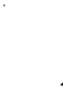

## 第13章 意圖法則

如果你想要游泳，你會改變方向，如果你意圖要游泳；你將克服所有的障礙以滿足你的意圖。同樣地，一個意圖寫一本書的人，會比一個希望寫一本書的人，更有可能會成功。意圖比想要、期望與希望還要有力量，意圖釋放一股使事情發生的驅力。

想像一個弓箭手，他把他的弓拉回來「繃緊」，在把弓鬆開前瞄準目標物。無論你在生命中瞄準什麼，如果你聚集能量瞄準你的目標，宇宙的力量會在你的願景後面釋放。即使你沒有確實達成你的意圖，你已經設下了有力的行動驅力。

有一個人告訴我他已經被積欠一筆錢相當長一段時間了，他一週又一週地延遲採取行動，因為他是一個很慈悲的人，他能看見另一個人的困難。然而有一天，他決定要去討這筆錢，他意圖努力一試。當天下午他寫了一封清楚的信給那個尚未還債的女士，一小時之後，在他還未寄出信件前，那位女士打電話給他說那一天已經在郵局寄出支票，他在隔一天早晨收到支票。

如果你意圖在某個時候送給某個人療癒，無論你是否在那個時候做隔空療癒，那股力量都會在那個時候出去。

最近意圖的力量很清楚地顯示給我看。我在倫敦舉行一個天使日，我們的意圖是去創造出一道圓型光柱，好讓天使們可以透過這個高振動而到達倫敦，然後從倫敦散播愛與光到全世界。因為天使是高頻率的靈性存有，她們很難把自身的頻率降低到足以進入黑暗的地區，當我們為他們建立這樣的光橋，她們可以更順利地到達那樣的地方。在這個活動之前，人們從世界各地打電話給我，跟我說某個個人或團體想要調到天使日的頻率以加入他們的能量。

那是在巴爾幹半島戰爭正盛的時期，我們一位共同的朋友伊莉莎白告訴我，歐洲國會議員湯姆·史賓社將在馬其頓（譯註：巴爾幹半島一古國，南斯拉夫聯邦原六個共和國之一，一九九一年宣布獨立。）參加天使日。他是歐洲國會外交部委員會的主席，很熱中參與巴爾幹半島的事務，伊莉莎白聯絡到他。

以下是告訴我們的：

「我與委員會的委員們看著這場悲劇展開，決定做我們可以幫得上忙的事，因此我安排一場所有外交部委員會主席的會議，在兩天中有從十二個國家來的國會議員，包括阿爾巴尼亞人，他們正在與緊抓著這個地區的恐懼搏鬥。星期天中午的時候，我們擠進巴士，要穿越山脈回到史高比耶（馬其頓共和國的首都），在事件的壓力下，我忘記我對伊莉莎白的承諾，也就是對黛安娜的承諾，要在星期天下午專注在離這裡許多哩遠的倫敦天使日聚會。」

「巴士把其中一些乘客放在史高比耶，可是將我們之中的許多人載往西北邊的史坦克維奇營。那天下午灰暗且寒冷，巴士緩緩地移動穿越田野，到達有刺鐵絲網的邊界陣地，住在馬其頓絕望的阿爾巴尼亞人群透過鐵絲網大叫，試著與營內的親戚與朋友聯絡。」

「營區是英國士兵以驚人的速度建立起來的，五萬人住在豎立完美直線的白色帳篷裡，馬其頓政府懼怕自己的不穩定，堅持新的柯索夫阿爾巴尼亞人不應該與他們的阿爾巴尼亞人口融合，並且守衛著邊界陣地。」

「這股氣氛在生理上與情緒上都是很黑暗的，在只有很少的清洗設備下，五萬人的氣味令人難以忍受。在門兩邊焦慮的臉述說著三個星期前可怕的故事，在曾經意圖作為史高比耶新飛機場地點的臨時營房牆上，貼著碎紙片與名單，敘述著所有的人在大屠殺後，絕望地嘗試找出彼此。」

「當巴士輕輕地推進人潮擁擠的大門時，一種真正的恐懼感籠罩著我們。一個稱職的政客面對如此受苦的臉孔時該說些什麼呢？我們安靜地從巴士中爬出來，走進人群中，我們被一大片詢問新聞、建議與希望的焦慮臉孔所淹沒有半小時的時間。可怕的故事反覆地被述說出來，每一個故事帶著極大的尊嚴與異常的平靜，親戚被謀殺、家庭破碎，生命整個翻轉。我們以小團體的方式徘徊在帳篷間無數的通道上。」

「然後有某件奇妙的事發生了，雲朵變清澈了，有一道令人驚奇的光遍佈整個營區，那是個溫暖與愉悅的傍晚，氣氛甦醒過來，類似介於農業展與舞會之間的混合，如此典型的地中海風格。在營區的角落裡，在由德國、台灣與以色列人建立的軍事醫院上方有旗子隨風飄動，十來個慈善機構開著四輪驅動的車子緩緩地穿過乾枯的泥土。」

「到目前為止，營區充滿著挽臂走動的人們，以彷彿他們生命只是短暫地被打擾的方式談論著，有歡笑、有溫暖、有尊嚴。一架北大西洋公約組織的直升機飛過，一位柯索夫的記者跟我說建立這個營區的英國士兵非常地友善，『他們一天工作二十四個小時，依然有時間微笑以及與小孩玩耍』。」

「現在營區的氣氛幾乎是歡欣的，年輕人在玩棒球，女人坐在角落談論著未來。巨大的營區沒有一個中央組織，卻好似單一的整體在移動與起伏著。光禿禿的山是壯麗的，先前看起來是如此嚇人，如今沐浴在夕陽的光輝中。我們充滿著堅定與希望，爬回我們的巴士然後離開營區。我與五、六個同事住進一所山頂上的旅館，往下俯視著史高比耶，在相當的遠的地方你可以看到有一些光使營區的邊界得以辨識。只有在那個時候我記得我對天使日的承諾，我核對一下時間，完全是正確的，我除了去那裡之外什麼也沒有做，可是我對於光知道它正在做什麼毫無疑問。」

我相信這位議員連結光的意圖，創造出我們正從倫敦送出去的光橋的一個入口點，許多天使把握機會去運用它。永遠不要低估意圖的力量。一位女士告訴我她失去與兄弟的連結，他們在以前曾發生口角，因為她不喜歡他再婚的事實。她從來沒有遇見過他的新弟媳卻對她有偏見，幾年過去了她開始後悔她曾經說過的話。她做了一些個人成長的工作，理解到她關於她弟弟的痛苦正吞噬著她而使她生病。最後她產生了一個放下這一切的堅定意念，在一個傍晚她安靜地坐著與她弟弟談話，彷彿她弟弟就在她對面一樣。她告訴他她對曾說的一切感到多麼地抱歉，並且希望他快樂。那個晚上她有一個栩栩如生的夢，她弟弟來向她介紹他的太太，他們微笑然後告訴她他們很快樂。她醒來時，感覺比許多年來她努力所獲得的都還要快樂，知道即使他們在身體上再也沒有見過面，但在他們之間一切都很好。

在評估業力——也就是我們的思想與行為的資產負債表——時，意圖也會被考慮進去，有著不可避免的影響力。一個小孩跑到路上，撞到在路上行進的車子然後受傷了，這位司機是否要負業力的責任？這取決於他的意圖。如果他很明智地開車，那麼他就不用負業力的責任，他吸引來功課，這也許是測驗他自己的一個新事件；從另一方面來說，如果他喝醉酒、生氣或開車不小心，在靈性層次上他就要承擔責任，而且必須以某種形式來償還。

如果某個人有不好的意圖，譬如他們把焦點放在傷害、損害或製造大破壞，在他們的靈魂記錄上會有一個黑色的記號。他們正在鬆開有毒的弓箭，無論他們是否有做那件破壞的事，意念已經進入了宇宙然後被記錄下來。

當你的意圖是高尚與正直的，即使你的計畫沒有實現，你將因為你理想的純淨而得到獎賞。

有一句諺語說：「通往地獄的路往往是用善良的動機鋪成的。」這是指弓箭已經瞄準了，但弦卻沒有拉回來使它緊繃，這是沒有能量的，因此什麼也沒有發生，箭沒有飛出去。有時候目標是錯誤的，因此箭沒有擊中目標，這個意思是指瞄準目標但卻錯過了。如果你意圖是清楚的，卻似乎沒有事情發生，你可能因為某個原因而被阻礙了。想像你正在看你的目標，你已經把弓舉起來瞄準，卻有一隻動物跑到你和目標的中間，旁觀者大叫：「等一下。」你放下弓等待，然後重新來過，總有一個更大的理由來阻礙你。

如果你請求指引，我的天使與指導靈常說：「你的意圖是什麼？」是意圖發出信號來指示一個計畫或意念是否正確。確認你的意圖不是來自於自我，而是為了最高的善，宇宙的能量支持著意圖，這是顯現的根本。

一個宗旨（mission statement）是一個組織的意圖，需要被很清楚地表達出來，在開會的時候大聲閱讀公司宗旨能保持目標被看見。研究指出，在企業會議之前閱讀宗旨的公司，比那些沒有這麼做的公司更快速且完全地達到他們的目標。

一個意圖就像在飛奔的箭一樣，沒有東西可以使它偏離，因此仔細瞄準。

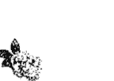

## 第14章 富足法則

每一位父母都希望他們摯愛的小孩擁有很多，神聖的源頭、父／母神也是一樣。你是宇宙摯愛的小孩，現在你可以去要求你與生俱來的神聖權利，成為富足的、成為豐盛的。

拿一棵植物，如果你把它放在不適當的土壤中，那裡充滿了蛞蝓，水分和陽光不是太多就是太少，你能期待它茂盛嗎？如果你束緊它的根並且限制它成長的空間，從不給它養分或是持續地栽種它，你將預見它會枯萎。因此你會把植物種在有充分的水分與陽光的好土壤中，給它成長的自由與安全環境，保護與照顧它，鼓勵它茂盛。

使你枯萎或繁茂的靈性法則是相同的。一個沒有助益的心態就像是貧瘠的土壤，如果你相信你不值得富足，那就是多石的土地；如果你相信你是富有的，那就是肥沃的土地。恐懼與漠不關心會使你乾枯，然而熱誠、喜悅與期待能使你擴展。有創意地表達自己，給自己發展的自由，栽培你的天賦與才能，你的富足將開展。

根據我們的意識，我們從宇宙的大池子中吸取東西，你不是有貧窮的意識就是有豐盛的意識。許多求道者在前世有宗教的指令，他們曾宣誓安貧，在那時候是適當的，可是如果現在依然起作用的話，這對他們不適用，因為他們仍然會覺得有錢是一種罪惡。如果你懷疑這符合你的狀況，祈禱釋放這個誓約，或與一位能幫助你釋放誓約的靈性治療師約一次個案治療。

大部分老靈魂不會如同年輕的靈魂一樣重視物質，這是可以理解的，因為他們已經在前世追求過物質，知道那是一種幻覺。有時候他們會感到迷惘，覺得物質是不靈性的。有太多好人認為擁有錢是不神聖的，相反的才是對的。

最靈性的事就是擁有金錢，然後帶著愛有智慧地去運用它。

在貧窮的意識底下有巨大的恐懼。我收到一些對於他們的財務狀況一籌莫展的人們寄來的狂亂、可怕的信件，他們所有的能量，都因為他們的焦點在匱乏之上而受到阻礙。

持續擔心金錢是不靈性的。

貪婪是財務上的消化不良，這等同於受邀參加自助式晚宴，然後把自己的盤子堆得比你吃得下還要多的食物，它讓你生病或是多少阻塞你的能量。

如果你儲存金錢在銀行裡而沒有讓它流動，你最終是在告訴宇宙你不想要更多，而最後宇宙會停止送給你。

老子說：「知道自身擁有的是足夠的就是富有的人。」

靈性的概念是擁有的足夠的，並且知道那是富足的。

有一個在肩膀上有個傷口的男人總是抱怨，他很懶惰且自覺沒有價值。他錯失機會因為他不相信自己，他既不快樂又貧窮。如果你是心胸狹窄、嚴厲死板又吝嗇的，你將永遠不會覺得滿意或快樂，因為貧窮的意識是一種態度。

那些慷慨、開放且樂於給予的人總是快樂而滿足的。他們的豐盛意識會確保這一點。

傳奇人物保羅·蓋堤（Paul Getty）擁有的財富超過許多想像。他身價千萬，坐擁無數物質上的財富。然而他卻孤獨生活，活在害怕失去的恐懼中。他是一個有著貧窮意識的有錢人。

富足意指有一種財務上幸福的感覺。

許多法老、埃及的約瑟夫，難以計數偉大的富有統治者，是已經高度進化的大師，他們承擔了財富的責任，富足法則是運用智慧來使用財富。

財富給予了責任與力量。有一個很有名的故事，是關於一個很有智慧且慷慨的統治者。這位國王有四位摯愛的孩子，他們終於長大成人，每個人都外出到世界各地去探索與尋找他們的財富。他們的父親希望他們有一天回來時，能夠分享經驗，並且獲得新的知識與智慧。

很多年過去了，國王開始認為他們永遠不會回來了，然後有一天有一位衣衫褴褛的乞丐出現在門口，宣稱她是國王的女兒。當國王得知這件事，急忙冲到門口，發現她確實是他的孩子。

國王帶他的女兒進入宮殿，準備了新的衣服以及賦予她榮譽的盛宴，但是她什麼都可以不想要，她不認為她值得國王的王國，寧願把時間花在宮殿大門外面乞討、悲痛與抱怨。她的父親感到心力交瘁。

又過了一段時間，一位年輕人出現在宮殿門口，他是國王的兒子。父親太高興了，急忙去迎接他，然後再度準備了盛宴與華服。國王感到很驚訝，他的兒子似乎已經忘了他的天賦權利，國王發現他像個僕人似地在擦洗臺階。他兒子說他不值得接受王國這項贈與，他的態度完全像是卑躬屈膝的奴隸，他必須一直做事來證明他留在那裡是正當合法的。他的父親很痛苦憂傷。

幾個月過去了，直到有一天，有一位美麗的女士坐在一輛由四匹白馬拉的四輪馬車進入了門口，宣稱她是國王的 daughters（女兒）。她被帶到國王面前，國王太高興他心愛的女兒終於回來了。她享受著盛宴以及一切身為公主的華麗服飾，但是當國王要求她幫助治理王國的工作時，她說：「不，父親，這是你的王國，你來管理它。」她想要慷慨的贈與卻不要責任，父親有很深的擔憂。

最後第四個孩子回來了，他是一位很優秀的年輕人，有著清澈的眼睛與堅強的面孔。老國王很高興見到他，年輕人享受著盛宴及身為他國王父親的兒子這個位置的富足。他巡視王國，然後跟他的父親說：「我帶了些新的意見與建議回來，我要如何幫忙呢？」

「我的兒子，」國王回答：「我希望你在我身邊，與我一起負起統治王國的責任。」

「我很樂意。」他的兒子回應。他的父親微笑，放鬆了下來，他感到很滿意。真正的富足是我們接受慷慨贈與的天賦權利，也接受所必須承擔的責任和力量。

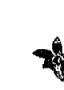

以彷彿你是富足的方式來思考、說話與行為，然後你將打動宇宙而送給你富足。

## 第15章 顯現法則

你已經在你的生命中顯現每一件事情。你可以運用注意力法則、吸引力法則、祈禱法則或任何其他靈性法則的任何一條，我已經描述過的這些法則，大部分的法則都是無意識地運作著。

靈性的求道者調頻到能接受從天使與更高的光的存有那裡傳來的訊息與指引，他們可以駕馭自身的頭腦與情緒，並且能夠有意識地顯現。

我們住在一個神聖意識與我們內心欲望象徵一起流動的海洋裡，你希望吸引進入你生命中的事物已經在未顯現的乙太世界裡游泳，如同一條美麗的魚正等著你捲起釣線把它拉起。每一條魚有牠自身的頻率，正在散播天國神聖的波段。

你的首要工作是，把自己頻率與你在尋求的願景振動頻率調為一致，這是把你需要的訊息吸引到你的生命中。

正在天國泅泳的魚散發出一種高頻的聲音，你必須送出相應的音符以便牠們能夠來到你這裡。

你持續的思想送出干擾，阻止你精細地瞄準你需要能夠聽到的頻率，好比試圖在那條魚濺起水花的時候去抓牠。說話的聲音、船的引擎、汽笛聲，這個世界的噪音，都在干擾你把頻率調成與魚的訊息一致的能力。

如果你正在陰暗的池水中游泳，魚不喜歡靠近你，或是牠想靠近你而你看不見牠。平息你的頭腦將你帶入純淨的水中。

確定你知道你真正想要的是哪一種魚，否則你可能會發現你捕捉到一條你不想碰到的鯊魚，清晰是顯現的秘訣。

成為寂靜與清晰的。無論你想要的是什麼，升高你的頻率到與它有相同的頻率，然後它將靠近你。如果你希望有一位敞開心胸、有趣又有愛與光的朋友，你必須在你自己身上發展那些特質。

顯現的能力是一種強大的力量，因此只為了最高的善是極為重要的。第一步是去靜心，傾聽你內在的指引，好讓你完全清楚你意圖顯現的是什麼。一旦你有了清晰，描繪出你想要東西的畫面，視覺化是一個很重要的關鍵，因為圖像進入到右腦，而那是台強大、有創造力的電腦。你必須全然地、毫無疑問地相信它正在運作當中，不要懷疑，也不要偏離軌道，維持視覺影像。當你是一個高次元的存有譬如耶穌基督，你可以透過你清晰的視覺圖像與信念，從沒有顯現的次元中拿餅跟魚到物質的次元裡。住在印度、神的化身賽巴巴也做一樣的事，他使珠寶顯現，也給他虔誠的信徒治療的聖灰（vibhuti）。我知道有很多師父以及魔術師也都有這種力量，他們把頻率調到跟他們想要的魚的頻率一致，然後魚就游進他們的手中。雖然有些第五次元的人有著單只運用思想就可以顯現的力量，第三與第四次元的人必須行動以便得到顯現。

我與我女兒談到關於顯化的事情，她說：「提醒人們要從小事開始。」

告訴我那天早上她是如何讓一張面紙出現在她面前。她走進城裡進到圖書館中，當時她的鼻子開始流鼻水，她沒有手帕或面紙在身邊，她一定不想要買一盒面紙，然後帶著它在城裡四處走動。所以她決定顯現一張面紙，她非常清楚她想要一張面紙！她知道神也想要她有一張，因此在某處有一張給她的面紙。她毫無疑問地知道一張面紙將以完美的方式提供給她，她持續睜大眼睛去找它，當她走進圖書館時，有一盒面紙就剛好在角落下面，她採取行動要了一張，圖書館員說：「你愛拿多少就拿多少，親愛的。」顯現一張面紙與某些更大的東西之間沒有什麼不同，關鍵在於我們相信自己去實踐它的能力。

如果清晰是你的困難，確實寫下你想要的東西。如果你想要一位伴侶，詳細寫下你希望他或她擁有的特質，這給你左腦電腦，也就是你邏輯的頭腦資訊；然後放鬆去視覺化這個人，因此你的右腦電腦，你創意的腦可以同時與你左腦一起作用。然後確保你內在有相符的品質，如果你想要一位有著敞開、溫暖的心的人，檢視你是否有一顆敞開與溫暖的心。

如果你想顯化一輛車，確實寫下你所需要的，想象它，然後確認你送出符合那輛車的振動。如果你擁有的是一輛小車的意識，那麼嘗試顯化一輛勞斯萊斯是沒有用的。

你必須能夠感覺擁有你正在顯化的美好感覺，把焦點放在你希望顯化的更高品質上，然後調準與它們連結。如果有一個特別的工作將帶給你滿足感，把焦點集中在滿足感上面，做那些帶給你滿足感的事情，直到你內在的感覺與那个工作提供你的感覺相符為止，然後這份工作將顯化給你。

一個把釣魚線投到你的魚那裡的方法，是確實地在一张纸上画出你想要的，确认能量是正确的，因此小心你使用的颜色，因为每一个颜色有一个振动，写在你的图画上：「為了一切至善，這個或是更好的現在顯化。」你可以请求一条小海鱼，然而宇宙准备好提供给你一条大鳍鱼。

如今你已经把吸引你的鱼的鱼饵放入钓线中，去散个步，等待鱼靠近。换言之，超脱你的欲望，然后回来采取任何需要的行动把它带来。

「嗡」（Om）是一種創造的聲音，聲音有振動，有些聲音是有毀壞性的，其他的聲音可以治療。「嗡」淨化、靜止與顯現。在你採取以上步驟想像你的願景時頌念「嗡」，這會將加速它的顯現。

- 保持靜止，然後傾聽。
- 非常清楚你想要的是什麼。
- 放鬆，想像你在接受它的畫面。
- 將你的振動調準到與你想要體現的東西一致。
- 全然相信它正在運作中。
- 保持你的願景圖像，然後唸「嗡」使它顯現。
- 採取任何必須的行動。

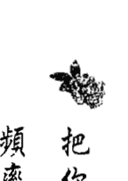

把你的釣魚線投入天界的海洋中，將你的頻率調到與你的願景頻率一致，那麼它將顯現到你的實相中。

# 成功法則

好的，請求得到宇宙能量的相同法則將支持你的自由意志。最簡單得到物質成功的方式，就是使用吸引力法則，清楚你想要的，有著必不可少的信心與決心，然後堅定不移地為那個想像的畫面工作，不間斷地把焦點放在上面。如果你想運用這條法則來達成你的目標，你承受不起一絲的負面思想，更重要的是，你無法承受一丁點的負面圖像。你的信念創造一種圍繞在你周圍的振動，當你相信你自己，成功跟隨著你，觀照你信念，小心地刪去那些無法幫助你朝向目標的信念。

## 第16章 成功法則

想要有成功的愛，觀照你對於愛的信念，那些創造成功的人會說：「我是討人喜愛的，我信任人們，我以愛回應其他主動向我表示愛的人，我打開我的心，慷慨地給與自己，我是放鬆的，我相信我是可愛的。」帶來事業成功的信念為：「我可以信任人，我是值得成功的，我值得擁有美好的東西，我可以處理任何事。」在靈性的術語中成功的意思是相信你自己，盡你所能地為每一個人達到最高的結果。

當我們正確地得到能量時成功便會來臨，我的了解是賽巴巴是當今在這個星球上擁有最高振動的人，每天有數千人為了他的存在所給與的達顯（darshan）與祝福，而聚集在他的修道場，大多數的日子，他穿越安靜盤坐在廟宇地板上的群眾，蒐集信徒親手交給他的信件，他拿某些人的信，而忽略某些人的信，如果他拿了你的信，你的請求將受到祝福，那些信件被接受的人自然很高興，這對他們來說他們請求的能量是正確的。

常常那些信件沒有被接受的人感到痛苦、夢想破滅，這來自一個對於靈性法則的誤解，如果他們的請求在靈性上是不正確的，他們如何能期待他們的請求得到祝福呢？

我有一位朋友叫作凱文，在普塔帕蒂（Puttaparthi）賽巴巴的道場中待了幾個星期，他寫了信，請求為他想過的生活的下一階段給與祝福，雖然賽巴巴走過他，拿了坐在他兩旁的人的信，凱文的信卻被忽略了，他很驚訝但並不失望，他知道他必須寧靜地做靜心，直到他得到正確的請求，在做完靜心之後，他寫了另一封信，這封信與上一封有些許差異，這封信也被忽略了，他再一次地祈禱與靜心，直到一道光朝向他，他能夠從不同的觀點看到許多事情，在腦海裡帶著這份理解，他寫的第三封信是來自於心（愛）而不是來自於自我（欲望）。當賽巴巴慈祥地拿起這封信，他對凱文微笑，凱文知道他現在可以帶著神聖的祝福在生命中往前移動。

成功發生在我們個人或集體的振動，與被期望結果的振動產生共鳴的時候。

## 第16章 成功法則

當你是一致的，人們信任你氣場的完整性，因此如果你說出你相信的，且「說到做到、言行合一」，只要這是正向的，你將創造成功。

你的左腦裡容納你的思想，而右腦裡是圖像，圖像比思想更具力量，如果你想要成功卻想著相反的失敗圖像，那麼你將會失敗，而且當你的思想與圖像是相反時，你的兩個有力的部分正在抗爭，這將導致沮喪、精疲力盡與困惑。

當你左腦與右腦一致時，你才能產生成功的想法以及描繪成功的畫面，和諧與成功在一起是必然的。

如果成功不知從哪裡發生到你身上，那麼這就是業力，前世做完的工作在這一世得到獎賞，業力把你放在對的位置、對的時間，有著適當的心態，你在累世的靈魂旅程期間，做的投資產生了必然的能量結果，無論你是出於邪惡而有一個負面的視覺畫面，譬如搶銀行，或出於最高的善，幫助別人來服侍光，這些都是一樣的，不同的是：壞的事情成功將創造出債，而這將無可避免地必須在某地、某時償還。好的事情成功將創造出資產，而這資產將永遠為你所用。

為了要成功，你必須遵守流動法則，一個車輪如果是生鏽的就無法轉動，鐵鏟必須在車子往前移動之前清除。如果你期望使成功法則起作用，允許命運之輪為你轉動，放下舊有的，將正向的焦點維持在你想要去的地方。

想要成功，清除身體、心理以及情緒上的雜亂。

如果你不知道要去哪裡，你將無法成功，如果你想要穿越海洋到達陸地，在出發前你會做某種程度的準備，決定你的目的地，舉例來說，無論你是要朝向馬賽或是加萊（Marseilles / Calais，兩者都是法國地名），稍後總是有可以改變方向的彈性，你檢查和考慮風向與水流，在船上裝載必需品，在出發時打開引擎。有太多人不會成功，是因為他們花了所有的時間在計劃旅程上，卻從未出發。最後你升起錨，這表示你切斷與舊有的關係，要冒險移入不同的未來。

## 第16章 成功法則

成功發生在你的振動與你渴望結果的振動，產生共鳴的時候。

當你已經透過互相合作與授權給別人來達到你的目標，你就是成功的。

如果你已經爬到了金字塔的頂端，卻在過程中傷害了人，或者你是一位贏家，而你的正直卻妥協了，這些都是同樣的情形。

如果你已經賺了幾百萬而你是緊張的，從靈性上來看你不能看作是成功的；

在靈性的詞彙裡，成功是以它給予你的滿足感與實現感來衡量的。

# 更高覺知的法則

## 第17章 平衡與兩極法則

當一個小孩坐在鞦韆上，以愈來愈大的弧形上下擺動著，直到往前與往後盡可能地盪到最高為止，在他經歷過最高點後，只要他需要，他就可以慢下來回到靜止的平衡點。

我們的生命是很類似的，我們經歷生命的某個面向，然後經歷它的相反面向。愈想要探索一個極端，我們就從中心盪到愈遠的地方，然後必須盪到另一個方向來理解它的相反面。

如果我們經歷了生命中的富有時光，將需要去經歷它的相反——也就是貧窮；如果我們變成一位暴君，我們的靈魂會期望我們藉由成為受害者來補償。

在我們的內在全都有尚未解決的問題，而我們的目標是去整合兩極，因此可以活在平衡當中。由於現在意識進展相當地快速，不需要很多世來達到平衡，我們帶出我們人格中不同的面向，是為了在這一世中平衡它們。

有人是躁鬱症者，從一個極端擺到另一個極端，他是無法控制自己的。我認識一個人，他有時候是孔武有力、橫行霸道、傲慢專橫的怪物，當他用他的態度把別人從他身邊推得太遠時，他變成病態的受害者企圖把別人拉回來。這些是截然相反的態度。當他能平衡這些人格面時，將不會再試著去控制，取而代之的是接受自己、愛自己，也讓別人成為他們自己。

一個有時候非常慷慨，把每樣東西都給出去的人，有時卻會變得吝嗇與保留，在兩極間擺盪著。真正的平衡是敞開心胸與性情平和的。例如暴飲暴食與把自己餓得半死是相反的極端，它們都是感覺失去控制的顯現，因此會盡可能地試著去控制。

男性能量是去做、去思考，是邏輯的、激進的；然而女性能量是去成為、去創造，有直覺力與被動的。我們的目的是去平衡內在兩者，以使我們可以傾聽我們的直覺，以及根據它來採取行動，我們可以休息與玩耍，也可以滋養與保護，如果這些特質中的任何一項是不平衡的，就需要再度回到我們的中心，做一個生命的新選擇。

我有一次很有趣的經驗，它毫無疑問地是為了向我顯示我內在相反兩極的投射。我花了一些日子與一位老朋友在一起，她是一位諮商師與治療師，個人具體呈現出女性的特質，我們交換個案經驗，談了非常多，她是一位極為溫和而且沒有侵略性的人，我感到非常敞開，準備好向她揭露自己，我離開她時感覺受到尊敬、得到力量、受到滋養以及變得更為強壯，我覺得我有許多覺察，並釋放了舊有的模式。

稍後那個星期我與另一位朋友在一起幾天，她非常有力量但表現尖銳，為把每一個人的負面拉出來而奮戰、她具體呈現了男性剛強決心的原則，她有獨到的見解，而且也真的很有幫助，但我感覺受到侵犯、對抗，沒有被賦予力量且不被欣賞，即使我告訴她我確實的感受，她仍不在乎這點，因為她設定的個人目標是拉出我的負面模式，無論我允許與否。

## 第17章 平衡與兩極法則

與這兩位不同的諮商工作者相處，讓我學習到我的任務是要去平衡我冷酷無情、尖銳的部分，以及滋養、給人力量的部分。

如果你不喜歡你還是孩提時被對待的方式，你非常有可能會過度補償自己的小孩，舉例來說，假使你的父母是很吝嗇的，這表示你可能會給你的小孩超過你可以給與的；假如你的父母是過度保護的，你可能會讓你的小孩過多的自由。

我們總是在尋求平衡，當我們找到平衡時，我們便學到了功課，尋求平衡是一直在做的，平衡我們人格的面向有點像是騎腳踏車，你不是往這邊倒就是往那邊倒，你搖晃不定，最終你平衡了，可以騎得很平穩，即使你很多年不騎腳踏車，當你下次嘗試時，能夠很輕易地做到，或許有一、兩次的搖晃，但並非你第一次學習時所經驗的那種東倒西歪。

這個平衡點就是我們在所有事物中找尋的平衡。

> 我們的目標是，平衡我們生命中的所有面向。

## 第18章 業力法則

我十年前第一次遇到湯姆便立即愛上了他，他永遠是溫暖友善的，他真的對人有興趣，喜愛傾聽人們。有人告訴我，在他小的時候，他就是善良與善解人意的，他的生活一定很不容易，壞事麻煩事總是留給他自己，他總能找出時間給其他人。

當他四十歲時，有一個實踐他畢生夢想的創業機會出現，這表示他和太太必須搬到新的區域，而且投下一些資金。然而他卻沒有足夠的金錢去做。出乎意料地，在最後關鍵的時刻，一位小時候曾照顧他、已有二十年沒有見面的鄰居過世，留給他相當可觀的一筆錢，這恰好是他開始新的冒險事業所需的數目，他一直以來付出的善解人意、善良與仁慈的能量，被宇宙轉換為金錢的能量，在正確的時刻回到他那裡，湯姆收到他好的業力應得的報償。

憎恨與憤怒是破壞性的能量，當你送出它們時，它們也以某種方式回給你，可能是被狗咬、生病、意外，或某個人憎恨你。

業力法則是「要怎麼收穫，先怎麼栽」。不良的思想與行為會回到你這裡，善良、善解人意、愛與慷慨也是一樣，你活出這些品質到達某個程度時，將在某個時候接受到相同的回到你的生命中，它可能不是從你發出去的方向傳回來。

業力被記錄與平衡，愛的想法、情緒、話語與行為是存款的帳面餘額，負面的是負債，宇宙在我們最沒有預期的時候把這些召喚過來，不知道業力的人稱它為命運或是運氣，好運或壞運。

在業力銀行裡留一筆存款，以便在需要的時候可以運用總是很明智的，為了至善來思考、說話與行為，你將成為「幸運」的人。

你的家庭是你的業，在你出生前你的靈魂選擇你的家庭，困難的家庭關係可能是前世未解決的感覺與情境的結果，你這一世選擇那個家庭，是因為你想要有另一個解決問題的機會，他們提供你的靈魂需要學習的功課；家庭成員間親密、溫暖與有愛的感覺，幾乎一定意謂著你與他們在另一世有愛的連結，你這一次選擇他們來支持你，給與你穩固的基礎。

我們稱為家庭成員關係，是因為我們的靈魂在諮詢會議中，已經決定我們在這一世需要學習與彼此連結，身為人的我們，常常拒絕接受親戚提供我們成長與業力轉換的機會，寧願攜帶著舊有的世仇或分離與憤怒的感覺。我常常聽到人們說：「我們可以選擇我們的朋友，卻不能選擇我們的家庭，」事實上是，我們更高大的我選擇我們的家庭，而我們根據我們的人格來選擇朋友。

我認識一位老人，他極度地獨裁，在長年的婚姻中一直牢牢地把他太太掌握在手中，雖然在他們之間有很多愛，但他總是貶低她，說她沒有能力辦事，最後他太太喪失了她的自信。

當他太太變老了時，她有點因年老而變得衰弱，這給她藉口去做與說些最無理取鬧的事，當她做這樣的事時她便傻笑，對她所說的與做的完全不負責任，有時候甚至會對他做身體上的攻擊，他心力交瘁，對她不再有任何的控制力。

## 業力法則

當我有一天拜訪他們時，老人的兒子聳聳肩對我說：「她只是把所有這些年她丈夫如此惡劣對待她的債，從他身上討回來而已。」這是一個業力情形的結束。在他們生命的最後，丈夫變得對他太太更溫柔、更好，除了有老化的現象之外，她轉變態度以更負責與有愛的方式來回應他，愛開始在彼此之間流動，看到這個情況是很美好的。希望在最後的時光裡，他們治療了傷痛也平衡了業力，那麽當他們再度一起輪迴轉世時，將能夠給予彼此力量與愛。藉由去愛他人和給予他們力量，我們療癒了業力的關係。與那些帶著好的業力進入婚姻的人共處是很愉悅的，一位婚姻非常快樂的印度女士告訴我，即使在結婚二十四年後，他們依然彼此深愛著對方，他是友善、慷慨、聰明、支持的，而且認真工作，「我知道那是好的業力把他帶入我的生命中，」她洋溢著幸福地微笑著，「我是受到祝福的。」

如果你與某個人之間有問題，在心中期望他們很好，這將開始治療業力。你帶到這一世的傾向習慣也是你的業力，如果你有一種你不夠好的心態，這個信念必然會吸引那些，使你感覺不如意的事物與人到你的生命中。

基斯是家庭中的老大，如同許多第一個小孩一樣，他有一個必須為每一個人負責的心態，他選擇輪迴轉世為最年長的孩子，因為這能夠使他結清他的業力，當他還很小的時候，他的父親就跟他說：「你要照顧你的弟弟與妹妹。」由於這與他的信念一致，他很認真地看待這項命令，從那時候起他為了弟妹在財務上與情緒上都攜帶著重擔。在他成年後，他檢視他的信念，然後改變他的態度，他理解到他的心態對他是不適用的，對他的兄弟姊妹也一定是不適用的，他放他們各自去為自己的財務與情緒負責任，而這讓他從一直攜帶的業力重擔中解放出來，也放開了他的弟弟妹妹，讓他們能夠成長。

> 「你要照顧你的弟弟與妹妹。」

## 第18章 業力法則

你只能攜帶著業力直到你學到了功課，無知使你身負重擔，如今透過覺知與愛讓你自己自由。

正面的信念創造好的業力，我的朋友羅賓相信宇宙一直在照顧他，他與太太的關係破裂後，他必須搬出家中，他沒有錢付房租，卻遇到某個人邀請他去共享他的家，然後他們成為好朋友。在那之後不久他進醫院動手術，一位幾乎是陌生人的女士把他從醫院接出來，帶他到她美麗的房子裡，她與她先生在那裡照顧著他。他告訴我當他回顧他的一生，他總是以無法預期的方式被支持著。正面的信念在你生命中創造出好的業力，接著神奇美好的事將發生。你要為你的心態負責，如果你的心態不再適用你，就去改變你的程式，你是唯一能做到的人。

如果你的信念不能使你開心，現在就改變它們。

你的健康是你的業力。在你輪迴轉世前你選擇你的家庭、生命的挑戰以及你的使命，你也選擇你的身體與基因體質。如果為了你的靈性成長，你選擇一個帶著生病體質的家庭，而這提供的挑戰就變成你的業力；你可以選擇一個非常健康的家庭以及一個強壯良好的身體，那也是你的業力。你每一刻有關思想與情緒的選擇，將影響你的生命力與健康，這就是業力。耶穌基督描述業力為「要怎麼收穫，先怎麼栽」，如果你仔細照顧你的秧苗，你將種出更好的植物。一位治療師告訴我，在她女兒學校班上的孩子們，把豆子種在吸墨紙上，他的小女兒把豆子握在手裡，在種植前送愛給它，當老師問她正在做什麼時，她回答：「我正在給我的豆子祝福。」很顯然地這個結果是相當驚人的，這顆豆子長得比其他豆子更快速且強壯。在我們生生世世中，每一件事都有靈性上確實的計算，如果有人正在藉由搶劫房子、偷車或是以任何方式傷害神的創造物，為自己累積很大的業力債務，社會把那個人監禁起來，是一種具有同理心與常識的行為，這表示他們不能再建立使他們來世更困難的債務。你的業力平衡表是你的阿卡沙紀錄，你個人的紀錄是由你的守護天使保管著，祂與你共同歷經你所有的生命，因此祂們也被認為是記錄天使。

業力之神必然是進化的存有，掌管著所有的阿卡沙紀錄，這份紀錄被保留在很巨大的宇宙電腦中，當你得到一個輪迴轉世的機會，祂們幫助你的靈魂做重要的決定，包括選擇父母，以及你在這一世希望學習與實現的是什麼。

業力是從一世攜帶到另一世，我們可能到下一世之前不會經歷到我們的行為結果，由於這一點，通常在行為與結果間沒有明顯可見的關聯，因此許多人忘記了因果關係。我們的振動愈高，業力就愈快回到我們這裡，如果你覺得你從來沒有僥倖逃脫任何事，你是在遭受立即業力，這意指無論你給出什麼，馬上就會回到你這裡，這是你正在進化的指標，因為你的業力平衡表保持更新，你的靈魂不再允許你累積債務。

神指示現在是地球上的業力終結的時候，你可以在靜心中接觸到你的阿卡沙紀錄，上面有你累世的業力資產與負債表。

我們可以活在現在是極大的恩典，因為我們可以請求一個神聖的特許赦免，將我們從業力的債務中釋放出來，這是可以第一次讓在地球上的靈魂得到這項赦免，當你已經盡可能做了一切去治療某個情境或關係，你可以在靜心中請求源頭，經由業力之神給與你神聖的赦免，來釋放你業力的重擔。如果你希望享受安全的未來，還清你在宇宙銀行的靈性債務，並且建立信用資產。

> 要記住，種瓜得瓜、種豆得豆。

## 輪迴法則

化身（incarnation）指的是肉體，輪迴（reincarnation）是一次又一次回到肉體的原則，在輪迴法則之下，如果在一生結束時有任何未解決的或是沒有完成的，你的靈魂會得到一個機會以人身的形式回來解決或完成它。

如果你欺騙你的事業夥伴，你的靈魂將希望藉由在另一世回來幫助他或是她來做一些修正改進。

有一位丈夫傷害他的妻子，他們將希望下一世能一起回來，好讓丈夫的靈魂能夠有所償還，他們可以輪迴轉世成為丈夫或太太、父母與小孩、學生與老師、甚至是朋友。

舉例來說，有一個女人感覺被強迫似地去照顧她患有慢性疾病的孫子，她總是與他在一起，在她回溯時她理解到前世他們曾是夫妻，在那一世她身為一個男人拋棄了妻子，而他太太遭受到悲慘的結果。那位太太現在是她的孫子，因此這一世她感覺她必須留在他身邊。

如果一位父母過世時留給他的小孩生氣、困惑或誤解的感覺，根據輪迴法則，那些靈魂將選擇一起回來嘗試以不同的方式連結，整個家庭常常同時回來解決事情，有衝突或有戰爭的群體將一起回到地球，看看是否他們的靈魂能夠一起找到和平而非戰爭的解決之道。

我們常常一次又一次地輪迴轉世到類似的情境中，因為靈魂的渴望是使過去停止。然而我們一旦回到地球這個有自由選擇的物質世界，又全都太容易忘記靈性世界的理想與觀點，我們再次犯同樣的錯誤，然後落入輪迴的循環中。

在上面的如同在下面的，一個小孩學習的方式是去托兒所、幼稚園、小學、國中與高中，當他長大時，他去上大學、研究所，最後可能拿到學士或碩士學位。

## 第19章 輪迴法則

地球是一座學習的機構，在這裡我們的功課以經驗的形式來呈現給我們，午休、週末、寒暑假被稱為死亡，我們以肉身回到學校前有一個靈性假期，如同一位學童，他們的父母在每一學期末詳細檢視期末報告，當我們死時我們檢討每一世，透過我們的指導靈、天使與靈性導師——我們稱為業力之神——的幫助，我們決定哪些功課我們希望劃掉，又有哪些功課我們需要重修，在我們做得很好的地方，我們的靈魂將在下學期學習新的功課。

對於來到地球的那些人來說，地球是為了他們靈魂旅程的一個主要的學習經驗，他們進入地球所提供的一切課程，他們將體驗每一種宗教，軍人、農夫、商人等不同的身分，在人文藝術，與他們可以從中學習的各種能想像到的領域。這些靈魂將一而再、再而三地輪迴來做完功課以及償還業力。他們將經歷所有的兩極，譬如學生與老師、富有與貧窮、男性與女性、自私與服務、謀殺者與被謀殺者、背叛者與被背叛者。阿卡沙紀錄是我們生命的平衡表，由業力之神保管，好與壞是資產與負債，在來世我們可以召請我們的資產，但也必須償還我們的債務。

- 我們有許多理由希望再度輪迴：
  - 把過去犯的錯改正，也就是說償還我們的債務。
  - 去經驗與加強我們自己。
  - 學習更多有關情緒、性慾與其他只能在地球上獲得的課程。
  - 去幫助、教導，成為光，或是在這個星球上服務。

因為地球上困難的制約，地球在宇宙中被看作是最重要的學習機構，靈魂把他們的名字放在前往地球的名單上，因為地球提供別處無法提供的成長機會，在這裡每一樣功課都與愛有關。

這是一個自由選擇的星球，每一個想法、話語及行為，最終會顯現到你的生命裡，你的心態與情緒建立你的肉體，提供你更多的經驗，一旦你駕馭了地球上功課，你的靈魂可以在宇宙中許多更高階的光的機構裡服務。

地球就像宇宙中一個大批鱷魚出沒的沼澤，只有勇敢無畏的靈魂接受這份挑戰，如果你可以不沾爛泥地穿越它，你就是一個英雄。人們常常陷入泥濘中，有經驗的靈魂願意現身去幫助他們，這麼做他們也會弄髒自己，然後必須回來償還業力。

如今有一些新的事情正在發生，地球正移入一個更高的次元，這表示沼澤中的爛泥正在乾涸，所有的骷髏與垃圾在白天的光中會浮出表面被看到，如今是看見我們的垃圾並且清除它的時刻。

這裡有一個相當簡化的概要。

最年輕的嬰兒靈魂在他們第一次輪迴轉世時，會選擇一個非常簡單的生活，他們可能會選擇一個很簡單的社會或家庭，在那裡受到完全地照顧。他們常常只停留幾小時、幾天或幾星期，只是為了要接觸到地球的氣氛。

年少的靈魂需要清楚的指示與界限，他們緊抓著基督教原教旨主義者（fundamentalist，譯註：強調直解《聖經》，認為應嚴格奉行宗教原則和教義。）的信念不放，反對離婚或是任何破壞安全架構的東西，因為嚴厲的控制、教條主義與傳教士的熱誠，他們為自己創造出許多業力。

年輕的靈魂進入到這個世界裡，有時候會製造出大浩劫，他們也傾向欠下很沉重的業力債務，因為他們常常濫用權力，然而他們有熱情與生命力使他們的冒險事業進行，並且展開新的事物，他們挑戰舊有的方式。

中年的靈魂變得有智慧，開始償還他們早期輪迴所建立的債務，因為這個原因他們常常有很困難的現實生活。

老靈魂是既有智慧又平靜的，然而他們常常與物質界有相當的距離，因此他們不傾向在世界中引起騷動。

人最終會完成所有的靈性功課，如果人們知道他們必須回來矯正他們生命裡的錯誤，他們可能會注意靈性法則。我覺得，羅馬皇帝康士坦丁大帝與他的母親海倫，刪掉新約聖經與輪迴有關的章節時，他們造成對基督教的傷害。在西元五五三年的康士坦丁堡，查士丁尼皇帝更重新確證了這個作法，宣稱輪迴是一種邪說，害怕神聖的輪迴法則會削弱正在成長的教會勢力。

評價別人的所作所為，或他們是如何處理他們輪迴的功課，並不是我們的職責，就只要知道每一個靈魂正在經歷許多世的旅程，以及正在旅程中學習。

只有年輕的靈魂會傷害人、動物或這個星球，對那些年輕的靈魂多一些同理心，因為他們不了解他們正在做什麼，最終他們將必須償還他們曾對別人做過的事。進化靈魂的任務是幫助他們而不為他們負責，或以他們的恩人自居，幫助他人最好的方式是，活出有其他生活方式的範例。

輪迴僅僅是指「回到肉身裡」，然而如今有許多星星小孩現身來幫助意識轉換的發生，星星小孩已經從其他的星球來到，有時候是不同的宇宙，在那裡他們當然沒有肉身。現在有許多在地球上的星星小孩是來自昴宿星團（Pleiades）、土星、火星、木星、金星、仙女星座及其他銀河系，有些從更遙遠的宇宙來地球投胎。

星星小孩是進化的靈魂，他們來地球上幫忙，也去體驗他們沒有的生命觀點，常常人們在地球的二元性中沾污太多，然後希望回來還債，通常這樣的孩子有比較少的業力，因為輪迴次數較少，因此較少機會去累積業力。

星星小孩通常有自己與周遭人是不一樣的感覺，且覺得自己不屬於這裡，如果你發現地球上的經驗是很奇怪與困難的，如果你無法理解人類的愚行蠢事，知道生命是一項靈性而非物質的挑戰，如果你有渴望去服務，你幾乎確定是一個星星小孩。

星星小孩與在地球上的人一樣，決定要利用現在為揚昇打開的機會之窗，揚昇的意思是提升你的靈性振動到一個你不需要再度輪迴的高度，為了這點你必須還清你的業力債務，駕馭你在地球的功課，以及打開你的心智。

一旦你已經離開再生之輪，你移入宇宙更高的層級，繼續在光中進化。

你一遍又一遍地回到地球上來，直到你已經熟練了靈性法則。

## 第20章 責任法則

責任是適當地回應一個人或一個情境。

當為了使靈魂承擔某些工作，響亮的召喚發出時，你回應這個召喚嗎？你回應送來的直覺與願景圖像嗎？宇宙送出挑戰來確認你如何回應，讓你準備好靈性的晉級，你是否要證明你可以處理責任，決定權在你，在晉級前你必須通過測試，因為許多靈魂可能會倚靠你。

在上面的如同在下面的，一旦你相信你的孩子將會小心地駕駛你的車子，你會很高興把車借給他；當一個學生被信任可以有光榮與明智的行為舉止時，他會做得很完美；一個在企業公司工作的人不會被升遷，直到他顯示出他能夠處理可能產生的問題。

當至高無上的力量相信你可以恰當地做一項工作時，他們將給你做這項工作的責任。

生命中某些時候我們會承擔靈性上的責任，一個是把一位小孩帶到這個世界上，無論這個嬰兒是否是你在有意識的計畫之中，你更高的大我與嬰兒更高的大我都同意這件事，你的靈性成長取決於你如何回應它。帶一個殘障的小孩進入肉身是一項特別的責任，如果你選擇接受它，它將提供你更多成長的挑戰與機會。

當你領導一個很大的計畫或企業時，許多靈魂將受到你的決定所影響，舉例來說，如果你負責一所學校或一間醫院，你是為許多人的幸福負責，如果你坦然奮起應付挑戰，你的靈性成長將會被增加。

挑戰與責任是一項榮譽，它們指出你在靈性上對於更大的事情已經有適當的準備。

每一個被交付給你照顧的人事物就是責任，如果你不回應這項挑戰，那麼它將從你這裡被拿走，可能在另一世重新呈現。

在你生命中的所有事物都是借給你的，你是如何照顧你的小孩、房子、花園、衣服與書呢？你有責任去照料它們。

如果你不能照顧你自己的需要，你在生命中便無法承擔大的責任，你的情緒與精神需要被照顧，你的身體是一座殿堂，這一定要被照顧好，首先照顧你自己，然後你能在適當狀態去幫助別人。

然而除了你的小孩以外，你不為任何其他人負責，每一位個體為自己的感覺與自身的命運負責，你沒有權利為別人攜帶他們的重擔，因為這麼做時你將會阻止他們成長。

你的責任是使別人能夠有力量、使他們變強壯，以及鼓勵他們承擔自己的責任。

我的一位客戶叫做柏納，他是一位迷人的年輕人，即使有張稍微焦慮的臉孔。柏納有一位心智遲緩的姊妹，她完全可以照顧自己，也能維持一份簡單的工作，然而在我們複雜的社會裡，有些事情她很顯然是無法應付的，她的父母不能承擔這個年輕女人的責任，就撒手不管她，然後告訴他們的兒子他的姊妹是他的責任，而柏納接受了，其他的兄弟姊妹對此不聞不問，而柏納變得過度保護她。當柏納必須為了一次長期旅行離開時，他極度擔心她無法應付，請求另一位姊妹來看顧她一個週末，但她拒絕了，說這與她無關，到最後柏納必須留下她獨自照顧自己。當他從旅行中回來時，他發覺她做了所有家裡的事情，這些事柏納已經做了許多年，以為她是沒有能力做的，此外他發現當暖氣漏水時，她叫了修水管工人，當鄰居有危機時，她照顧鄰居的小孩，並且為自己處理了所有的購物。柏納理解到這些年來他已經控制她的生活，拒絕給予她機會為自己負責，由於過度的保護，柏納反而減緩了她的靈性成長。

當我們為別人的決定負責時，我們不是在為了他們最高的成長服務。

愛琳有一個十二歲的兒子，他一直提出讓他留在某些朋友家過夜的要求來煩她，愛琳很不高興這一點，每當她兒子詢問這個可怕的問題：「請問我可以在比爾或是喬家過夜嗎？」一場爭執便產生了，她兒子知道她不喜歡他留在比爾或喬的家過夜，卻持續地問一模一樣的問題。

有一天愛琳決定改變她的回答，她說：「不要一直要我答應你明知道我不喜歡的事情，如果你想要待在別人家過夜，你就做決定，然後自己為這件事負責。」她的兒子很害怕，他並非特別喜歡待在比爾或喬家過夜，卻喜歡為他媽媽說「不」來與她爭執，如今他必須自己負起責任，他不再問了，也沒有在他們家過夜，爭辯停止了。

我們藉由為小孩負責反而使他們失去力量，而一個沒有力量的人總是憤怒的。

我的一位朋友在一所當地的學校舉辦一場協助孩子的父母親工作坊，他的開場白為：

> 「如果你與你的小孩有問題，不要期待他改變，改變你自己的行為，而你的孩子將跟著做。」

父母很震驚，可是看到其中的邏輯性，大部分父母最關心的事是讓小孩做他們的作業，父母的行為包括威脅、恐嚇以及幫他們做，換言之就是父母幫小孩負起做作業的責任。

我的朋友告訴他們：

> 「你的小孩為他自己的作業負責，如果他拒絕做，就只是說：『很好，那就不要做它們。』然而不要簽小孩的聯絡簿，讓他自已面對結果。」

多數父母們看起來很茫然，也感到完全地鬆了一口氣，老師們支持我的朋友的見解，孩子們開始自動自發地寫他們的功課。

## 第20章 責任法則

真正的負責是去回應所有在你四周的需要——回應花、動物、人類以及星球，一個進化的人仁慈地回應在宇宙中每一個活的生物。

我與一位我非常欣賞的女士共進午餐，她是一位帶領團體與一個治療中心的治療師，已經幫助了數千人，她似乎總是很愉快、平靜與容光煥發，我問她如何開始她的治療師道路的，她告訴我她父親是一位精神分裂症病患，他的行為很怪異，有這樣的父親是很危險的，她沒有責怪他或感到生氣，她接受是自己選擇他為父親，來教導她令人難以置信的功課，她說由於跟他在一起的經驗，她學到了很多，因此想要去幫助別人，她早期的生活挑戰給了她同理心與力量，而這些使她準備好扛起治療中心的責任。

對於一位小孩而言，攜帶著由父母那裡傾倒而來的信念是非常普遍的，有時候我們也會接受從老師那裡來的投射。

一位名叫詹姆斯的年輕人總是感覺自己能力不足，然後他了解到當他十歲時因為家裡的問題很難過，那時候他的老師不斷地跟他說：「你很笨。」他把這句話收了進來，變成他的程式之一，從那時候開始他就一直攜帶這個重擔。

### A New Light on Ascension 靈性法則之光

是時候把這個信念送回到它的來源了，他坐下，想像那位老師 B 女士來到他面前，他當面把這個信念還給 B 女士，只有在那個時候他可以記得當他曾經是聰明、機敏，以及他因為迅速而得到嘉許的那些時刻，他變得更尊重自己、有更好的自我價值感了。

如果你正攜帶著一個家庭信念、家庭情緒、家庭秘密，親自把它還給那個把這些概念給你的人，帶著愛及堅定去做這個觀想。或者另一種方式是召喚天使與揚昇大師們，請求他們來轉換能量。

當我們攜帶其他人的負擔時，我們阻止了他人的成長與掌握他們自己的人生，我們妨礙了他們與星球的進化，如果你為其他人的感覺負起責任，你是在侮辱他人。

如果你無法與某個人討論某個情境或你的感受，以免他們感覺受傷、憤怒、嫉妒或是沮喪，你是在為他們的感覺負責，這對他們不公平；當你誠實地說出自己的感受時，你是在為自己負責，藉著這麼做，你讓別人與自己都自由。

我們之中大部分的人把我們的感受投射到別人身上，換句話說，就是我們知道在那個情境中會感到憤怒，因此想像他們也可能會有憤怒，我們把自己的東西傾倒給他們。

如果你說：「我不能告訴瓊安，因為我知道她將會很嫉妒。」你是在把你的嫉妒投射到她的身上，�安可能會很嫉妒，可是如果她嫉妒的話，那是她自己的責任。

當我們了解責任的靈性法則時，我們不再責備任何其他人，或把我們的感覺投射到他人身上；然而，我們真正地為發生在我們生命中的每一件事，我們所有的感受、情緒與思想負起全然的責任。

有一位師父問這個問題：「我是如何讓這件事發生的？我送出去了什麼樣的想法或感覺？我在過去做了什麼行為而創造這個？」以及最重要的，「我要如何改變事情？」

### A New Light on Ascension 靈性法則之光

當你為自己的生命負起責任時，你就變成一位師父。

為自己以及我自己的道路負責，並且允許其他人為他們自己負責。

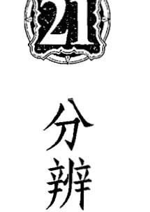

# 分辨法則

一個嬰兒不會被期待知道對與錯之間的差別，一個成人則會被期待要能夠分辨，當我們愈進化，我們就愈被期待去辨別對與錯，自然地我們會受到測試。如果你被告知某件事情、被給與指引、遇見一個人、被提供一份工作，你會在內在檢視它對你是否是合適的。

勞倫笑得頭都快掉下來了，她說：『如果你從市場買一個便宜貨，你能期待什麼呢？』我們一起開懷大笑，可是我現在看到一個很棒的有關辨別的功課，我允許一個十五歲的青少年說服我，而不聽從我自己更好的判斷，然後我承擔了結果。

我在報紙上讀到一個人從他的許多客戶那裡侵占金錢，之後有一個很普遍的輿論說他是在欺騙耍花招。他們從未真正相信他，他們不聽從自己的直覺，不去分辨，有時候不去分辨的結果是非常嚴重的。

之前我從一位曾參加我的天使工作坊的女人那裡，收到一封非常悲傷的信。在所有的工作坊中，我們請求靈性保護，以及只與最高與最純粹的存有連結，我提醒參與者，光的天使能使你感覺溫暖、平靜與被愛的。

在她的信中她告訴我，她的一生都在害怕與不快樂中度過，在工作坊中她遇到她的守護天使，然後學習與守護天使溝通，她充滿了寧靜、祥和與喜悅的感覺，當她感覺到美麗的天使在她的四周，還有他的愛與保護，生命對她來說呈現了新的意義。

三個月後她在一本書中讀到與天使連結是危險的，因為他們可能是黑暗天使，她所有的寧靜、喜悅與祥和都不見了，一種寂寞與恐懼的感覺壟罩著她，她寫信問我，現在她太害怕去與她的守護天使再度連結，她還能做些什麼。當我們從事與看不見的力量工作時，我們一定要去運用辨別能力，如果任何的印象使你感覺不對的話，就忽略它，然後把它關掉，如果你感覺你正與一個高層而且有愛的存在連結，享受它然後遵從它的指示，我只能提醒她，寧靜、喜悅、安詳、決心與靈感表示你正與光的天使做連結，我希望藉由保護、祈禱與分辨，她將再次對她的天使存有敞開。

年輕的靈魂像是旅行家一樣，探索每條大街小巷，他們需要經驗不同的路徑，乾燥與泥濘的、寬廣與狹窄的、光亮與黑暗的，他們每一個人、任何人一起旅行。較年長與較有智慧的靈魂，被期待為了他們的目的而去選擇適合的路徑，去分辨選擇他們的同伴。在一個很深的層次上我們知道一切，我們的本能感覺告訴我們一個人誠實與否，我們常常不理會這點，因為我們邏輯的頭腦提出理由反對它，或是因為我們不想要相信，我們不顧我們的直覺。但是，如果我們不去分辨，我們便承受業力的結果，而且另一個測試將喬裝成不同的方式來到我們這裡。

基於性別、膚色、宗教或是身材尺寸的理由，而歧視某個人是不靈性的，許多人覺得不管出於任何理由，去做區分都是有批判性的，他們覺得應該接受任何人進入到他們的生命或是事業中，情況並非如此，我們被要求去運用我們的分辨力，那個人的能量作朋友或是治療師的時候是適合的嗎？你真的感覺到你的企業夥伴將支持你的點子嗎？與某個人約會會感到舒服自在嗎？你有權利決定你生命中想要的人，說「不」並不是有批判的，而是一種分辨。

如果你的朋友全都想要看一部暴力片，你不僅該分辨你是否想要與他們出去，也要分辨他們是否與你有共鳴。你準備好要成為不一樣的人，為你感覺到什麼麼對你是好的而堅持立場嗎？

對於一隻螞蟻來說，書桌上的一張紙可能像一座沙漠；對於一個人來說，它可能是一個重要文件；對於一個太空人而言，它是調查事物的大計畫。從他們的觀點來說都是對的，作家與老師全都經驗不同的靈性觀點，他們或許只能從他們已經到達的層次來做溝通，從他們的觀點來說，可能所有人都是對的。

## 第21章 分辨法則

然而現在黑暗的力量正運用不純淨的管道帶來非常細微墮落的訊息，在每個角落真理的些微扭曲都會造成困惑，這便是它們的目的。

一個人在一次工作坊後告訴我，他已經參加許多靈性工作坊，讀了幾打的書籍，對於他已經聽到的不同事情感覺很狂亂，「不可能每個人都是正確的。」他說：「那麼我應該相信什麼？」我建議他靜靜地坐著，傾聽自己內在的聲音，然後接受與他有相應共鳴的聲音。

不要因為某些東西感覺是不對的，就把你接觸到所有的東西都拋棄。

沒有一個人可以在一個身體裡知道所有的真理，只有造物者知道所有的真理，但保持是敞開的，讓你的直覺引導你。

傾聽你的直覺，信任直覺來引導你。

## 第22章 聲明法則

肯定語（affirmation）是思想與話語持續地被重複，直到它們進入無意識的頭腦變成你程式的一部分。肯定語堅定你的思想與話語，對你而言有一個難以置信的有力影響，我們之中的大部分人總是在無意識地聲明著，我們持續地重複著想法，直到我們把它固定在我們的腦海中，我們一遍又一遍地陳述相同的說法，直到它們變成我們的真實。

我們持續地重複著負面或正面、有益或無益身心健康的陳述，你無意識的頭腦就像一台電腦，它是很客觀的，沒有分辨地接受所有的輸入，因此你的聲明進入你無意識頭腦的檔案裡，深深地影響你如何感覺與行事。

## 第22章 聲明法則

想像一個釘子被槌打到一塊木頭裡，用你的大拇指推它，得要花很長的時間才能造成一個壓痕，用鐵鎚輕敲則能小規模地推動它，接下來每一次的撞擊使釘子更牢固地嵌進去。思想將信念推進你的頭腦裡，聲明強迫灌輸信念進入。如果你持續地想著：「我是一個失敗者。」你逐漸相信你是一個失敗者，然後你把這個想法付諸行動，你是在做一句不快樂的聲明。我認識一個人不斷地抱怨每當他想要打高爾夫球時，他的背就出毛病找他麻煩，他又氣又擔憂他的背，當我對他說負面斷言對他是不適用的，他很陰鬱地看著我說：「你不了解，它就是這個情況。」然後他大聲且強調地加了一句：「當我想要打高爾夫球時，我的背總是找我麻煩。」他在堅稱他痛苦的真實性。在肯定語中放入愈多的能量與注意，它們就會愈深深地進入到信念系統中。如果你持續地重複著你總是有一個悲慘的假期，你會引來三個狀況：你選擇性地記得很糟的時刻。你做出會導致你悲慘的行為。在這個例子中，宇宙帶給你你所相信的，在這個例子中就是悲慘。宇宙照著字面上的意義，重新安排自己來給與你所相信的。

聲明法則是說你引來你所聲明的，去聲明你是想要成為的那個樣子，你將比你所認為的更快變成那個樣子。聲明你擁有你想要的有的，它將會吸引到你這裡。

帶著能量與意圖去做聲明，把它說出來。

這將更有力量地把那些聲明灌輸到你的腦海裡。

確認你的肯定語只包含正面的話語。

## 第22章 聲明法則

肯定語必須是現在式的。

無意識的頭腦無法推斷出否定的，它只是否認否定的，譬如說：『我不想要住在這間房子裡。』持續地聲明，這句聲明會進入到無意識的頭腦裡卻忽略『不要』這個詞，而成為『我想要住在這間房子裡』。一句適當的肯定語可能是：『我準備好要搬家。』去描述你希望搬進去的房子細部，以及堅定地聲明：『我在我的新房子裡很高興且滿足。』這甚至是有影響力的。

我跟一位曾經歷一段困難時期的女士談話，她來自一個尊重與重視嚴肅的家庭，她不想表達她的感覺，她告訴我她一直告訴自己：『我拒絕不快樂。』當進入到她無意識的頭腦，如同一個持續的『不快樂、不快樂、不快樂』的訊息，當聲明確定這句話時，她正試著與悲慘抗爭。

『我將不會失敗』進入到頭腦的電腦裡如同『失敗、失敗、失敗』，因為這個『不』字是被忽略的，就只是運用正面的句子：『我是一位贏家。』

確認你的肯定語只包含正面的說話。

一部電腦沒有過去或未來的觀念，如果你聲明你明天將是健康的，明天永遠不會來臨，聲明「我現在是健康的」，你變成你所聲明的。最快擁有一座美麗花園的方式，是去聲明你的花園現在就是美麗的，這幫助你擁有這個視覺影像，然後把它帶來。

有影響力的肯定語是很簡單的。複雜的肯定語令人感到困惑，因此它們會使有意識的頭腦警戒而企圖去了解它們，我曾見過無用的肯定語像是這一句：「我不再害怕擁有一份關係，因為我愛我的父親，我原諒當我還是小孩時他對我做的一切，因此我現在值得擁有一位好的伴侶，他愛我，與我有同樣的興趣。」最好有兩句簡單的肯定語：「我愛我的父親，我值得一段快樂的關係。」讓那些肯定語扎根，就是宣稱：「我現在有一段快樂的關係。」然後持續地去視覺化你擁有一段快樂的關係，你的行為舉止就彷彿你是滿足與值得的。

## 聲明法則

押韻或有節奏的肯定語，很容易就滑進你無意識的頭腦裡。

一個已經有一陣子感覺不舒服的人開始宣稱：「我整天都是健康與強壯的。」他說他發現自己站得更高，呼吸也更深了，他不僅感覺更健康，而且也更有自信。肯定語有一種水波效應，能改善你生命的其他領域。

如果你有困難的一天，對你自己哼這些字：「我是快樂與明亮開朗的，每一件事都將進展順利。」去觀察你那一天的轉變。

在我的書《蛻變的時刻》（A Time for Transformations）中，有一整章是押韻的肯定語，我最愛的其中一句是：「寧靜且歸於中心，安靜且靜止不動。我愛我自己，也將永遠愛自己。」我發現這句話使我平靜，並且提醒我去榮耀我的價值。

如果你是在出神或睡眠的狀態，你可以更容易地打開你的頭腦去接受聲明，舉例來說，如果你在做白日夢，你的無意識頭腦是敞開接受聲明的，如果你意識的頭腦是完全地在忙碌中，譬如當你在看電視或專心於工作時，這些聲明更容易進入到你的無意識裡，如果你是在很深的放鬆、打瞌睡甚至有點在淺睡中，聲明準備好要滑入，你可以運用自然的出神狀態來增加與加速肯定語的吸收，一種方式是去播放有肯定語的錄音帶，或是錄製一卷你需要的肯定語錄音帶。

很容易在自然的出神狀態時，接受到其他人呈現給你的聲明。想像這個畫面，一個小男孩正在作白日夢或很出神地觀看一個毛蟲沿著一片葉子爬行，他的媽媽很生氣地說：「快一點，你太慢了。」如果這句話說得夠頻繁，或是帶著夠強的盛怒，這句話可能很輕易地滑進小孩的頭腦裡，變成一個他是很慢的信念，他已經允許其他人來程式化他的無意識。

我們為自己創造出問題，而沒有理解到我們正在做什麼。如果你的伴侶正在全神貫注地學習時，你在樓梯上大叫：「不要忘了晚上的宴會。」他無意識的頭腦已經忽略了「不」，而吸收「忘記晚上的宴會」，你以為一切都很好，因為他可能回答：「好的。」然而，是他無意識的頭腦自動地回答，在意識層面上你的話可能沒有被記錄下來，我們不是總能理解某個人是在分心發呆或在自然的出神狀態，因此要學會用正面的陳述，譬如說：「記得晚上的宴會」。

一位好的催眠師將運用不同的技巧，包括簡單的放鬆與想像畫面，來引發客戶進入被催眠的狀態，催眠其中一個目的是，當客戶是有覺知的，並且配合著建議時，會容許正面的聲明進入，在客戶的無意識頭腦中生根，這可能是一個很有力量且能改變生命的運用肯定語的方式。

## 第22章 聲明法則

肯定語聲明的例子像是：
- 與你的小孩、家人與朋友們聲明他們是聰明的，以及你有多愛他們，不斷地提醒他們有關他們的優點，然後你將提升那些在你四周的人的振動與自信。
- 持續地對他人做出正面的聲明，藉由重複地告訴你的小女兒她是有能力的，你將幫助她變成是有能力的。
- 當你選擇一句肯定語來重複，無論是在你空閒的片刻、還是在你開車、走路、玩紙牌或游泳時，你的頭腦裡充滿正面的聲明，然後你將很快地注意到在你生命中的不同。
- 肯定語需要持續地被重複。

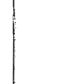

- 我是健康與快樂的。
- 每個人都愛我。
- 身為辦公室的經理，我有一個令人滿意與好報酬的工作。
- 我是一位帶有大愛與光的揚昇大師。
- 我是一位揚昇的生命體，有著無限的耐心與智慧。
- 我的生命是充滿著喜悅與歡笑。

持續地聲明你是你想要成為的，然後你將很快地變成如此。

記住，要以彷彿你已經成為的樣子去聲明你所想要成為的，這是很快到達你想要去的地方的途徑。然後以彷彿這已經變成你的實相的方式去行動。

## 祈禱法則

祈禱是與神溝通，無論我們知道與否，神總是在電話線的另一端傾聽著我們，我們沿著線送出的每一句話與每一個想法都是一個祈禱。擔心是一種負面的祈禱，這告訴神你多麼地害怕，它也增強所有你不想要發生的事情。美國人愛德加·凱西（Edgar Cayce，譯註：生於一八七七年，一生充滿傳奇色彩，擁有不可思議的預言和解讀能力，他被稱為睡眠先知或者睡著的預言家，是因為他都是在入睡狀態解讀、預言和治病）說：“當你可以祈禱時，為什麼要擔憂呢？”這句話的意思是我們必須以一種正面、專注的方式，指引我們的思想到達源頭。你祈禱的方式是很重要的，想像你是一位富有、有力量、全知的國王，此外你在心中對人民有最高的關注，每天有一長列的懇求者想要跟你說話。

有一位乞丐發出哀鳴而且卑躬屈膝，他為了金錢絕望地自貶身分，是一個永遠的受害者，而你知道如果你應許他的期望，他將毫無智慧地把錢花光光，然後明天又再度去乞討。

這個討價還價的人說：「如果你答應這點，我將為你工作。」身為一位全知的國王，你讀到他的心，因此他無法愚弄你。

然後操控者來到你面前揮動著他們的拳頭說：「如果你不給我一份工作，那我將會對你感到很生氣。」「如果你不幫助我的話我就自殺。」「如果你不讓休息一下，我將完全放棄，就是這樣，我主意已定，沒什麼可商量的。」從你客觀超然的王座位置上來看，你想要答應這些請求嗎？

你的下一位懇求者是一個騙子，他帶著一種「讓我可以得到什麼」的浮誇態度，他認為值得一試而提出請求，不過完全沒有意願去改變他的生命方式。抱歉了，放蕩不羈的傢伙。

在他之後來的是一位有著一張頹喪臉孔的悲傷女人，「我一文不值，我是一個悲慘的罪人，但無論如何請把它給我。」你知道她可憐的低自我價值，將確保她很快就會失去你給她的東西。

跟在她之後的是貪婪的人，「我要更多、更多、還要再多。」

最後有一個人注視著你的眼睛說：「這是我想要達成的，這些是我要付諸行動的計畫，而這是我需要從你那裡得到的。」你從王座上起身，變成一位提供充分支持的合夥夥伴。

然後有一個人從心發出祈禱，她的祈禱觸動到你的心，你會回應她所有的禱告。當一個人帶著純淨的意圖來祈禱，你應許這些祈禱。

因此神是回答所有祈禱的，有時候因為對我們仁慈，他會說：「不。」我們很感激我們沒有得到所有我們祈禱的東西。

造物者也以一種實際而非奇蹟的方式來回答祈禱，有一個很有名的故事，是關於一位虔誠的人堅信神永遠都會拯救與保護他，有一個冬天在他住的地區有一場很可怕的暴風雨，雨點不停地猛然落下，當他家樓下淹水時，他移到樓上，一艘船經過，救援者呼喚他進到船裡，可是他卻回答：「不，神將會救我。」洪水漲得愈來愈高，他爬到了屋頂上，一架直升機經過為他放下一條繩子，可是他卻拒絕去接受它：「不，我不需要，神將拯救我。」然後他溺死了，在用珍珠裝飾的門前遇見聖人彼得，這個人很任性地對聖人彼得發脾氣：「為什麼神不拯救我呢？」聖人彼得回答：「神送去了一艘船還有一架直升機，你還想要更多？因為看看在你生命中很明顯與實際的事物，就是針對你祈禱的回答。祈禱法則是——請求、相信、應許，信心是引發你的祈禱實現的一種有效的要素。在你提出你的祈禱後，開始為了你的祈禱感謝神，然後準備好去接收你已經請求的，如果你已經從天堂裡的大型零售店預訂了十棵果樹，說謝謝，然後去挖你的土地準備好洞，買進適合的肥料，然後準備果樹的來臨，你的信心將加速果樹的到來。許多人祈禱卻沒有真正期待祈禱會被應許，因此他們沒有採取行動，他們不理解的是，信心會促使從宇宙來的回應發生。

## 第23章 祈禱法則

我與一位朋友共進午餐，她的丈夫最近心臟病發作，當她丈夫復元時，他跟她說，他一直想去參觀澳洲，而他真的很遺憾從來沒有去過那裡，他們沒有足夠的錢，於是他們祈禱，然後感謝神給他能讓去澳洲的費用，知道神想要完成他的心願。她丈夫打電話給旅行社預訂了一張幾天內就要付款的機票，第二天一張他們沒有申請的信用卡噗地一聲掉進門口，他用這張信用卡買了機票，知道他可以過了明年再還錢，當我朋友說這些時她大笑地說：「下一次我將祈求金錢以一種不需要償還的方式進來。」

當你請求一個或更多的人與你一起祈禱去擁有你的願景，這將加強祈禱的力量。一位客戶請我去為她的兒子祈禱，他的兒子在學校的課業不及格，變得非常具有破壞性，六個月後他寫信給我謝謝我的祈禱，他說有一個很驚人的轉變發生了。他的兒子現在是班上的佼佼者，也是足球隊員，他的老師說很高興有他在隊員名單中。我的客戶也每天為他兒子祈禱，然而我是使他能維持信心的仰賴者，這是一個非常有力量的組合。

愛希望你達成你的心願，愛不想要他所愛的受苦，神就是愛，阻礙你接受愛的在於你。

許多人為了某件事物而祈禱，卻沒有準備好要接受他們所請求的，我知道某個人請求一輛車，沒多久一個年長的阿姨就把她的車給他。這個人很是惶恐，他告訴他阿姨說：「我不能接受你的車。」在稍後他才了解到，神是透過她阿姨來回應他的祈禱。

人們有時候告訴我，他們已經為了某件事物祈禱了許多年，卻沒有任何事情發生，如果那是為了集體祈禱的，譬如說世界和平或是使臭氧層癒合，你的祈禱是通往神性持續流中的一部分，那麼你可以繼續你的祈禱。

然而如果你是為了個人而祈禱，是該放下的時候了，想像有一個小女孩請求她爸爸去修補她的娃娃，每一天她帶著洋娃娃去找她爸爸，請求她爸爸看看這個娃娃，但她不願意放手，她不交出娃娃讓它被檢查與修補，很顯然她爸爸不能做任何事，直到她準備好要放手。

以一個月或你覺得適合的時間說出你的祈禱詞，然後停止一陣子，也許你會在某方面改變你的祈禱，這是事情已經為你而進行的徵兆。

## 第23章 祈禱法則

請求不好的事情發生在他人身上，或是請求勝過別人，是對祈禱的一種踐踏，負面的能量最終會自作自受地回來撞擊發送者。

當你提出一個祈禱時，持有一個完美的願景畫面，如果你祈求和平，想像和平的畫面，感覺和平正在發生；如果你為了治癒某個人而祈禱，想像那個人是健康與強壯的，可是要記得死亡也是一種療癒，永遠祈求為了至高的善而發生，神聖的觀點是大於你的觀點的。

冗長與複雜的祈禱，或是機械式地背誦祈禱並非真正的祈禱。祈禱常常是令人印象深刻的字句，祈禱是簡單、真摯、真實以及從心發出的。

從一個平靜的中心發出祈禱，人們常常寫給我帶著極度痛苦的信件，訴說著他們是多麼絕望地懇求幫助，天使要穿過一個心煩意亂的氣場，來提供這樣的幫助是很困難的，因此放鬆下來，讓你的氣場變成金黃色的，安靜地請求，然後奇蹟將會發生。

這是如何啟動祈禱法則的方式：
- 首先請求。
- 然後與結果保持距離。
- 感謝神的回應。
- 保持你的信心。
- 準備祈求得到應許。

這兒有一首知名的佚名詩，能總結祈禱的效力：

有一天早上我起得很早，
匆忙地展開這一天；
有那麼多的事要完成，
以致於我沒有時間祈禱。

許多問題就只是滾落到我的身上，
每一項任務都變得更為沉重，
我納悶著。

「神哪，你為什麼不幫助我？」
祂說：「你沒有祈求。」

我想要看到喜悅和美，可是這一天卻艱難、陰鬱與淒涼。我困惑為何神不顯示喜悅與美給我，祂說：「可是你並沒有請求。」我嘗試到神的面前；用所有的鑰匙想打開鎖，神很溫和且有愛地責備我：「孩子，你沒有敲門。」我今天早上醒得很早，在進入這一天之前停下來，我有如此多的事情要完成，所以我必須花時間祈禱。當你祈禱時，你正朝向神，神也以兩倍快的速度移向你。

> > 祈求、相信，然後祈求就已經被應許。

## 第24章 靜心法則

靜心是傾聽神的声音，它讓你把自己放置在遠離繁忙與喧囂的生活，以便能夠聽到神的寧靜之聲。

你曾與那些一直跟你說話，卻沒有聽你回答的那種人講電話嗎？每一次你嘗試插嘴，那個人便忽略它然後繼續聊天，當我試著與這樣的人說話時，我會盡快地停止溝通。在上面如同在下面的，如果你不聽宇宙的回應，用比喻來說宇宙將把話筒放下。

如果你持續地祈禱，卻沒有時間去傾聽回答，你將不會得到回應，因為你喋喋不休的頭腦不讓神插入一句話。我們之中的大部分有個像是猴子的頭腦，換句話說就是永遠在嘮叨的頭腦，靜心的目的與企圖，是在夠長的時間內停止閒談，好使源頭放入祂的指引與智慧的種子，在這些寧靜的片刻，我們對我們的問題的靈感與答案敞開，有時候我們立刻接收到神的回應，更常發生的是，當種子被種下去時，我們會感受到一股安寧與靜謐感，它們隨著時間而萌芽、茁壯，而且之後在我們的生命中會變得顯而易見。

我有一天與一位朋友討論到靜心的力量，她告訴我她的一位朋友最近參加了一個整晚吟唱的靜心，這位朋友剛購買與裝潢了一戶有一間臥室的公寓，在她靜心後，她感覺更輕盈與清晰，突然間她有一個神啟，那就是她必須開始教課，而她需要在一個大房間裡做這件事。她不選她平常的路徑而繞道，這使她經過一間老房子，在它的花園裡有著「出售」的標示，她知道這是她的房子，當她進去，看到它有一個四十英尺大的客廳，因為她已經在她的小公寓裡做了裝潢工作，她賣掉小公寓而有獲利，因此能夠付這間房子的訂金。幾個星期內她住進她的新房子，她的課程也開始了，她知道那一晚的靜心已經讓神給了她一個完全沒有預期的新生活種子。

「往內看，天堂的國度就是你的。」在靜心的時候，我們有機會去探索我們可以取得的資源，我們是在內在找到我們真正的自己，我們是住在地獄或天堂，是根據我們的內在世界而決定，靜心允許我們的神性自我擴展，因此我們將自己從地獄中解放出來而創造出天堂。

有許多人無法忍受拘泥形式地做靜心，他們安詳寧靜的片刻，是當他們走在花園裡或是在自然中，有創意的時刻，譬如當你畫畫、演奏音樂或製作陶器時，讓喋喋不休的頭腦安靜下來，然後打開右腦去接受神聖的靈感，任何可以讓頭腦放空一個片刻的事情，都容許你滑過空隙進入到神聖的能量，這就是靜心的目的。

- 有許多形式的靜心方式，所有都需要相同的基本準備：
  - 找一個你不會被打擾而且平靜的時間。
  - 穿寬鬆、舒適的衣服。
  - 盤腿坐或坐在椅子上。
  - 讓你的背保持直立。
  - 放鬆。

- 這些是最普遍的靜心類型：
  - 注視著一個蠟燭，直到你的眼皮感覺很沉重。
  - 然後你閉上眼皮，持續地用你內在視力注視著燭光。
  - 專注地把焦點放在上面。
  - 當你的頭腦是靜止時，放下它。

- 專注在呼吸進入與離開你的鼻孔時。
  - 吸氣時從一數到五。
  - 吐氣時從一數到五。
  - 當你的頭腦是靜止的時候，放掉它。

- 寧靜地重複一句咒語、一個神的名字，或大聲唱誦一句咒語。
  - 咒語與神的名字是神聖的字句，會召喚來神聖的特質。
  - 許多人比較喜歡使用個人的咒語，是他們信任的靈性老師所給予他們的。

## 第24章 靜心法則

當你的頭腦靜止時，放下它。

充滿力量的咒語像是：
- Om Nama Shivaya. （譯註：嗡南嘛濕婆耶，濕婆為印度教三主神之一，亦稱魯達羅，為毀滅之神、苦行之神、舞蹈之神。）
- Om Mani Padme Hum. （譯註：嗡嘛呢叭咪吽，稱為觀世音菩薩心咒。）
- Jesus Christ. （譯註：皈依樹下及證道禱文，是給賽巴巴的信徒。）
- Om Sai Ram.
- Kodoish, Kodoish, Kodoish, Adonai T'sbayoth. （譯註：神聖、神聖、神聖是上帝的主機。基督教讚美詩歌中的句子。）

在做任何靈性練習時，每天在某個固定時間與地點的規律習慣對你是大有幫助的，如果你可以創造一個聖壇，你在那裡放蠟燭、水晶、聖者與師父的照片，以及對你來說是神聖的物品，那確實可以提高振動，點香或焚香也很有助益，在你開始之前，你也許喜歡放一些神聖的音樂以及祈禱，召喚偉大的光的存有在你靜心時與你同在。

當我待在印度擁抱聖母阿瑪（Amma）的道場時，我聽到一個很棒的故事，對於靜心產生了不同的觀點。她的其中一位門徒正在講道，所謂門徒是一個發誓安貧、禁慾、服從，以及服侍他們師父的人，這位特別的門徒極為英俊，有著閃亮的棕色眼睛，一個低沉的嗓音以及燦爛的笑聲，他其中一項工作為在佛堂裡帶領晚上的靜心，他用圓潤深沉的聲音引領三個嘛嗡（Ma Ohm）的唱頌，每天他都帶著崇高的敬意來領導唱頌靜心，數千的參拜者闐然無聲，你可以聽見針掉落地上的聲音，很顯然他很愛做這件事。

他告訴我們這個故事，有一天當佛堂座無虛席時，如往常一樣他在等全然的寂靜後再開始，他們全都唱頌著優美的嘛唵，接著進入莊嚴的寧靜中，在這時有一個小孩以高亢尖銳的聲音唱出：「嗡……（Ohhhhm）」每一個人都偷笑，他很生氣。

他凝聚沉著後，吟誦出第二個嘛嗡，再一次這個小孩以「嗡……」打破了寧靜，在佛堂中的每一個人都大笑，而他大怒，這個小孩搞砸了他珍貴的靜心。

他除了盡可能地聚集更多的鎮靜，來唱頌第三聲嘛嗡以外無計可施，在結束的時候這個壓抑不住的小孩大聲地咯咯笑，每一個人都笑翻了。

他對這可怕的小搗蛋感到太生氣了，這個小孩毀壞了他的靜心，他打算去告訴阿瑪，他認為小孩應該被禁止在靜心時進入佛堂。

他盡可能快速地大步地去看阿瑪，「阿瑪，關於那個小孩，」他怒氣沖沖地說。

「是的。」她很柔和地說，「這不是很可愛嗎？」

「可愛！你說可愛是什麼意思？」他氣急敗壞地說，「那個小孩破壞了我的靜心。」

阿瑪很溫和地看著他：「我認為你錯了。」她告訴他，「靜心不是有關沉重與嚴肅的，而是有關祝福的，那個小孩帶來了純真的純粹祝福。」

## A New Light on Anciention
靈性法則之光

靜心是通往祝福之門。在寧靜中，你將接受到神性智慧的珍珠。

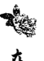

## 挑戰法則

挑戰性法則說明如果你以神之名來挑戰一個無形的存有三次，它一定會現出原形或是消失。

如果你希望在某個時候醒來，你在睡前設定鬧鐘，有些人自然地恰好在時間到之前醒來，其他人必須從睡夢中被鈴聲吵起或搖起，有些人又繼續頭倒回去睡。

你在地球這裡有一場靈性的追尋，如果你因為睡著而錯過參與你的追尋機會，你將會不快樂。

有可能你溫和且輕易地就變得知道你的靈性目的，然而有許多的人並不知道。

在你进入到肉体生命的遗忘中之前，你的灵魂设了一個鬧鐘，以免忘了即時醒來做你要做的，如果你仍然在睡覺的話，呼喚你的可能是某件震撼你本性深处的事情。唤醒之声的理由可能是很痛苦的，因为这會造成一個創傷，使某些人得以打開使靈性全然地覺醒。如今鬧鐘已經為全世界的人所啟動，提醒人們注意超越物質肉體的 world。

個人成長與個人覺知的課程，緩慢輕柔地使人們敞開，當個人的靈性之光點亮時，常常是一個超自然通靈能力的覺醒，有許多人的第三眼中心展開它的花瓣，顯示靈視或深刻的直覺。

在這個兩極的平面上有黑暗也有光明，因為每一件在光中的事物，都有它在黑暗中的對應物。

如果你在黑暗的房間睡著了，你不會注意到蛾，她們也不會注意到你；當你打開燈時，蛾會受到光的吸引而朝向燈光。當一個人的靈性本我覺醒時，他的光變得強而且可以看到，然後黑暗存有，也就是那些有比較少純粹意圖的存有會被光吸引，因此黑暗的存有會被你的靈性之光吸引過來。

## 第25章 挑戰法則

當這個光的確很亮而蛾是暗的時候，蛾的存在顯而易見；可是如果因為任何理由而光很暗或蛾很蒼白時，那麼就不總是容易被看見了。你的工作是去分辨好壞，如果有懷疑的話就去挑戰，然後讓你的光變得很強，好讓黑暗無法影響你，你只是顯現出實相。通常你自己的分辨力將告訴你，你對於「一個聲音」或一個存有的感覺是好或壞，如果有懷疑的話，就去挑戰它。

在下面的如同在上面的，如果有一個陌生人來到你面前向你借錢，你可能會注視他的眼睛，然後直接問任何你需要答案的問題，眼睛是靈魂之窗，你注視眼睛，然後感覺這個人是否是真誠與誠實的，那可能就足夠了。然而如果你有任何懷疑的話，你可以去檢驗他。

如果他說他與一個有影響力的君王領導者有直接的連結，你可能會有所警惕；另一方面來說，如果你相當認識某個人且信任他，你將接受他的話。真正的抄表員與警察，很樂意在你讓他進入你家前，提出他們的身分證明，這能防堵騙子並且保護這項職業的名聲，如果你挑戰，只有冒牌貨會受到困擾。同樣地，更高的存有靠近你、想要與你一起工作時，如果你挑戰他們，他們是很樂意的，這表示你是小心的，也是在實行分辨力，這向他們顯示你是負責任的。

如果你有一個存有在夢中、靜心時或通靈時靠近你，要求你做某件事情，傾聽你的直覺，然後如果你有什麼樣的懷疑，請求他說明靠近你的目的，如果他給你一個令你感到困惑的訊息，你就要小心；如果你已經與你的指導靈及天使工作一段時間，能認出他們的能量並且信任他們，你便不需要去挑戰他們，他們是朋友。你可能以這樣的方式挑戰：「以神與所有光之名，你是誰？你靠近我的意圖是什麼？」這必須重複三次，然後你將收到答案，可能是以強烈的思想、一個印象或一種感覺的形式直接進入到頭腦裡。如果這個存有宣告他自己的名字，你的挑戰可能是：「以耶穌之名，你是最高與最純粹的光之存有嗎？」單純以這樣的話來挑戰他是不夠的：「你是光的存有嗎？」因為這可能是指任何的東西，例如你死去的酒鬼舅舅可能試著聯絡你，而你在以往生命中並不信任他，因此沒有理由只是因為他是一個靈體你就要信賴他。

有許多光的層級，從騙子到偉大與美好的師父都有可能。
挑戰的靈性法則是為了保護你自己。

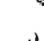

如果有懷疑的話，去挑戰那些想要進入到你的空間裡的。

# 更高頻率的法則

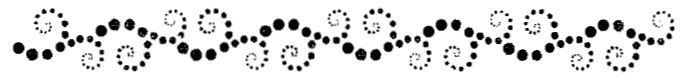

## 26 頻率或振動法則

恐懼是一種沉重的振動（低頻率），平靜、和平與愛是輕的振動（高頻率），幽默解決了困難的情境並且能提升能量，愛是治療悲傷的蜜糖，高頻與輕盈的振動，瓦解與改變了低頻與沉重的振動，當極度恐慌的狂暴，像是當無法抑制管束的大火災，一個平靜的人的在場會澆熄火焰，減緩每個人的恐懼。友人珍妮來看我，因為聖誕節將要來臨了，她擔心要去拜訪她的公婆，她害怕這將如同往常一樣是段非常難過沉重的時光，她告訴我她的公公很胖而且很愛炫耀，她的婆婆肥胖又憂鬱，而她丈夫的兄弟姊妹是很嚴肅無趣的人，我建議為了要讓振動變輕，她把他們想像成是動物的畫面，她的臉馬上亮了起來，她說她的公公是企鵝，她的婆婆是一條母牛，她的小叔是一匹馬，而她的小姑是一隻綿羊。

## 第26章 頻率或振動法則

聖誕節到了，她坐在盛宴桌旁，在她周圍是企鵝、母牛、馬與綿羊，當她看到在這些動物間的互動時，她的內心裡不斷升起笑意，在想像中她看到一隻企鵝正在大口地吞噬一條魚，她聽到這條母牛對著咩咩叫的綿羊發出哞哞聲，她無法抑止地大笑，她的笑聲很有感染力，很快地每一個人都咯咯地笑卻完全不知道為什麼，那是她曾有過最棒的聖誕節，在那之後先生的家人說看到她如此快樂的樣子很開心。

天使有一種很棒的幽默感，而且喜愛歡笑的振動，他們把自己看得很輕鬆，他們的存在也使你感覺更為輕鬆愉快。

瑪依瑞告訴我這個故事，許多年前她和她的先生剛搬家，他們之間的關係沒有改善，他們的小兒子有非常嚴重的氣喘，她極度地疲累，感覺無法再維持下去。那是在一個酷寒的十一月晚上，無人，她想：「漲潮大概就在現在。」她故意挑選很好的駱駝皮外套，因為它很重，她抓著手提袋與昂貴的外套，凝視著底下的河水，然後準備要跳下去。突然間她察覺到有一個流浪漢悄悄地走到她身邊說：「對不起，小姐，你打算要跳下去嗎？如果你要跳的話，可否給我你的外套呢？」然後他的目光移向她的手提袋接著說：「在你的手提袋裡有什麼呢？你不需要它了吧，對不對？」她忽然發現自己在大笑，她笑了大約四十秒鐘，然後她看一看，流浪漢已經走了，她跑到橋的兩端卻都沒有半個人，他消失了。她的幽默感回來了，打破了她內在的黑暗能量，她回到家開始過新的生活，她相信那個流浪漢是一位天使，在她需要的時候以流浪漢的身分出現。憤世嫉俗或好批評的人送出低頻能量的飛鏢，一位朋友告訴我，她的媽媽是一位極度吹毛求疵的老婦女，每當她帶她的小孩去拜訪她媽媽時，她們都會變成她媽媽毒舌的對象，在回家的路上她和她的小孩都會比賽，看看誰曾遭受最糟的侮辱，當她們討論這位老媽媽跟她們說的話的可怕事件時，她們會歇斯底里地大笑，笑聲是她們把帶刺的話抖出去的方式。

> 譯註：在英國倫敦西部穿越泰晤士河的橋樑。

生氣與盛怒是低頻率的能量，潛藏在底下的總是恐懼與一種沒有力量的感覺；當我們保持在寧靜與歸於中心，我們維持著高振動，我們是被賦予力量的，當我們平靜地表達感覺時，會消融生氣與憤怒。

有一句諺語說「一顆老鼠屎壞了一鍋粥」，無庸置疑地一個壞人會打擊其他衰弱的人，卻對強壯的人沒有影響。

然而，一個有純粹專注意圖的強壯之人，可以正面地影響壞人。

每一個人都知道動物回應我們不知道的頻率，如果你怕一隻狗，牠就對你吠叫，一匹馬將立刻知道你是否是害怕的，並且根據這點來回應；老師知道如果他們是緊張或有壓力的，在他們班上的小孩們將有惡劣的行為，如果你感覺很強壯、有自信與有愛，所有的生物與植物將正面地回應你散發出的高頻率。

我與一位實習老師談話，她感到非常難過，因為那一天孩子們表現是如此地糟，而她是那麼的生氣，我們討論這件事，我幫助她釋放她的恐懼，她請求她的天使去跟班上每一位小孩的天使溝通，隔天早上在她去學校之前，她請求天使們透過她來工作，她無法相信當她走進教室時，三十個四到八歲的小孩坐在書桌前，安靜得就像個天使般地對她微笑，那是她曾教過最棒的課程。

## A New Light on Anciention
靈性法則之光

天使有高頻率的振動，就只是去想像他們提升你的意識。

做某一件事如果是出於你感覺你必須或應該去做，那有一種較低的振動。罪惡或義務不是去做的事情的好理由，當你改變你的態度或決定去做你真正想要做的事，你散發出高頻率的能量。

我們愈快只做那些帶給我們喜悅與熱忱感的事情，我們將愈快提升我們的頻率，以及那些在我們四周的人的頻率。

缺乏自我價值是來自於負面的自我談話，那是一種黑暗的想像，不用說會散發出低的振動；換句話說，自我價值與自信發射出高頻之光。

有一個童話故事是關於一隻小鴨覺得牠異於同類，而且很醜陋，牠相信沒有人想要跟牠在一起，因此小鴨把自己與鴨同伴們隔離開來。醜小鴨感覺如此地孤單，牠說服自己相信牠是不同的，也沒有意願與別人在一起。有一天，一隻巨大美麗的白鳥像帝王般地飄浮過湖面朝著牠來，那是一隻天鵝，天鵝很驚訝地跟牠說：「你在這些鴨子當中做什麼？你不是一隻鴨子，而是一隻天鵝。」從那一刻起，小天鵝知道真正的牠是誰，牠感到蛻變了，牠把頭抬得高高的，理解到身為一隻天鵝，牠確實是與眾不同的，牠覺得很驕傲，知道牠將長成一隻美麗的白鳥，從那時起牠以一隻天鵝的身分來行事，散發出自信與自我價值。記住真正的你是誰，你是一個令人驚奇的人，你是一位美麗、令人難以置信、充滿生氣與活力的人，當你了解到這一點，行事就像是一位光的大師一樣，你會散發出高頻的振動。你要做的就是去了解你是誰，然後接受它。你可以運用你的想像力去吸入自信、喜悅或是美麗的顏色到你的氣場裡，你可以想像你的挑戰有正向的解決方法，這將你提升成為一位高頻率的人。

當你帶著迷人、優雅、喜悅、整合、慷慨，以及任何其他美好的特質活出你的生命時，你將自動地消融其他人散發出的低頻率，然後提升他們到更高的層次，在業力法則之下，美好的事情將開始發生在你身上。

咒罵形成一股沉重、黑暗的思想雲層，暴力、傷害、虐待、嫉妒、罪惡以及任何其他負面的情緒也是一樣，它們可以被原諒、同理心與喜悅所改變，唱頌「嗡」（om）以及其他神聖的咒語與祈禱，會提升到一種高頻的能量，念誦神、大天使與揚昇大師的名字也是同樣的情形，靈性書籍、古典音樂與美麗的圖畫，提升房間的振動。如果有足夠的人把光聚焦在城裡一個黑暗、暴力的地區，那麼善與和平將接管那裡。

疾病或生病有一種沉重的振動，會阻礙極其重要的生命力流動，治療是發生在當高頻能量導向你的時候，這將轉變疾病的沉重振動，允許健康好轉。財富有一種振動，如果你想要變成富有的，就認為你是富有的。成功有一種自身的頻率，去找出成功的人士與他們交往，你的振動將開始與他們的振動一致。

## 第26章
频率或振动法则

如果你想要增加你的灵性之光，就去与灵性的人交往，那么你的振动与他们的振动便会开始融合。

为了为这个星球带来爱与光，带进圆柱的光来使天使与更高的存有进入，运用你的思想为人们与地方创造光的桥梁，能帮助与治疗到达他们那里。

你的名字有一个振动，当它被说出时，它是在召唤你的功课。在你出生前你用心电感应告知你希望被取什么名字。许多小孩是以绰号或名字的缩写来称呼他们，这是因为当时他们还无法处理所有给他们的功课，常常是当他们年长些时他们才使用全名。如果你改变你的名字，你是在召唤新的功课；如果你的名字是被不高兴地叫出——特别是在你小时候，你得到一个印象就是你的功课是困难的；当你的名字是带着爱被叫出时，你知道你可以和谐地处理交给你的功课。

如果你在你的名字中有以下的母音，这些是你所要学习的功课：

- a. 净化，这是有关放下愤怒与其他你持有的负面能量或信念，释放旧有的。
- e. 关系，你在学习与他人和谐与诚实正直地连接。
- i. 觉知，你在学习去知道你是谁，以及有关这个世界是什么。
- o. 純真，你學習活出你的本質，這是有关活在當下與成為你自己。
- u. 界限，你在學習設定你的界限，知道哪些情緒是屬於你的，而哪些是屬於別人的，不要攜帶他人的責任。

帶著偉大的愛叫出你與每一個其他人的名字，你會自動地感覺愛與散播愛。

散發出純潔的能量，然後你將轉換那些在你四周的人的不快樂。

## 27 奇蹟法則

當事情的發生不能以物質法則來合理解釋時，我們必須轉向靈性法則。在地球上受到業力法則的管制，我們正活在一個沉重的振動裡，偶爾某些事的發生，允許人們滑過間隙進入到神聖的能量中，神聖的頻率消融與轉換我們的低能量，然後一個奇蹟便發生了，當在世界各地的意識升高時，有愈來愈多的人接觸到神性，因此有更多的人經歷到奇蹟。真正的原諒與無條件的愛是神性的能量，它使奇蹟發生。幾年前有一位年長的女士告訴我，她唯一想要的聖誕禮物是她兒子打電話給她。她已經五年沒有接到她兒子的電話，在那段期間她兒子的父親過世了，當她提到兒子時，聽起來很痛苦且受傷，她無法說一句有關她兒子的好話，痛苦、受傷與憤怒是沉重與排斥的能量，難怪她的兒子不想與她連絡，我們花了一些時間談這個情形，直到她以不同的角度來理解事情。

我建議她寫下她感覺到的憤怒，然後把紙燒掉，她這麼做了，在那之後她安靜地坐著，想著所有她喜歡她兒子的事情，最後他請求她的天使與她兒子的天使說話，請兒子的天使建議他在聖誕節時打電話給她，她兒子在聖誕節那天打了電話給她。

如果某個人在許多年後完全改變他們對你的態度，這就是奇蹟，安告訴我這個故事，她和她媽媽從來沒有真正融洽地相處過，部分原因是她的兄弟是她媽媽最寵愛的孩子，當她兄弟自殺時，對全家人而言是一個很可怕的驚嚇，她母親極為震驚，不願意談起這件事，活在堅不可破的情緒之牆後面。她媽媽說個不停，安就是無法與她溝通。

安讀了我第一本書《點亮你的生命》(Light Up Your Life)，她心想：「不，這是很好笑的，不可能那麼輕易地改變。這可能對其他人有用，但對我沒用，我永遠無法療癒我與我母親的關係。」

然而有一天她與母親坐在一起，她媽媽一如往常地滔滔不絕，安記起她讀過的內容，決定試試看。她想像自己所有的防禦都卸下，她媽媽的也一樣，然後她坐著把愛投射給她媽媽。幾分鐘之後她媽媽忽然停止說話，看著安說：「一定有其他方式。」突然間她開始分享當她兒子死時她的感覺，她告訴安在那件事之後她再也沒有與她先生做愛，她變得很脆弱而且溫和，從那時候開始安與她媽媽就變得非常親密，當她媽媽過世時，安感覺她真的很愛她媽媽，奇蹟是更高能量啟動的自然結果。

當我們請求天使、揚升大師或任何從光的靈性層級來的存有幫助我們時，我們吸引超越物質法則的神性頻率。

有一位印度女士在工作坊中分享這個故事，她做很多縫紉工作，有一天縫衣機的線軸卡住了，無法移動。她既不會開車，也無法攜帶沉重的機器去修理店，因此她把機器收起來，祈求最好的發生。兩天後她的先生帶了一條他買的褲子回家，這條褲子太大了需要改小，他希望第二天工作時能穿。她拿出縫紉機，線軸卡得很緊，她用盡一切可以移動它的東西，可是都很快卡住了，她說：『我先生明天需要這條褲子，請幫幫忙。』她回到機器這裡，然後線軸完美地轉動著。

我有一位很親近的朋友正在搬家，她有一個特別喜歡的大沙發，搬家工人無法將這個沙發搬進前門，他們把她鄰居的部分柵欄拆下，帶著沙發繞到房子後面，沙發也不能穿過後門。他們用了二十五分鐘試盡一切角度，於是朋友安靜地請求天使來接管，在請求幫助後的一分鐘內，沙發穿過了門，使客廳增添了優美的光輝，搬運工人很吃驚。

我在製作一個叩應廣播節目時，有一位女士打電話進來說了以下這個故事。她說當她父親過世時她不知如何處理葬禮，感覺心力交瘁，無法面對葬禮，她是如此絕望，因此她請求幫助。在那一天晚上有一個天使來到她的夢裡，她聽到在她四周有聖歌唱頌著，她感到頭腦全然的寂靜，這種感覺一直跟著她，帶著她度過葬禮。然後她又說，有一天她花園水池裡的噴泉壞了，朋友試著修理它卻不得其法，她認為魚將會死去，過了許多天有其他人來試著修理，卻都無法修好，在睡覺前她請求天使來幫忙修理噴泉，到了早上她在水流聲中醒來，噴泉又再度運作了。工作坊中有個人說了一個故事，真的讓我印象深刻。她說她先生是一位生意人，常常要去德國出差，有一次出差他在常待的一間旅館裡過夜，早上坐上他的車出發，卻很驚恐地發現自己正開在通往高速公路交流道的錯誤方向，面對著迎面而來的車子。那一個噩夢的時刻，在驚慌中他召喚天使來幫忙，下一個他出現在另一條車道的外線車道上，順著車流行駛，他完全無法為這件事找出一個解釋的理由。偉大的存有譬如賽巴巴從他的手中顯現神聖的香灰，稱作聖灰，這是一種治療的灰燼，在他的一位門徒的家中，我看到了聖灰充滿在相框的空間裡，聖灰甚至在他們放聖壇的房間壁紙中出現，這是相當驚人的。同步發生與巧合是一種奇蹟的形式，靈性的力量在幕後與浩瀚、不可思議的宇宙一起合作，來確保注定的相遇發生。這可能簡單如我爸爸在火車上看見一位印度人，然後跟他說：「當我住在印度時，我結交了一位年輕的朋友，你不該認識他吧？」他透露他是這個人的一個外甥，在印度所有幾億人口中！這促使我爸爸再度寫信給他的朋友，然後他們一直保持聯繫，結果在我父母認識他們五十年後，我和我女兒住在他們德里的家裡，他們帶我們去看我童年常去的地方，我們共度非常美妙的時光。

巧合與同步性是受到神的指揮，還有你的指導靈與天使精心編成的交響樂曲，使你有機會去實踐你的目的。

當你的振動提高時，你吸引更多的靈性幫助，因此奇蹟、同步性與巧合是從宇宙來的信號，表示你是走在你真正的道路上。

奇蹟是你走在你真正的道路上的信號。

## 治療法則

所有的的事物都是光，光是能量，你的肉體是由你的意識能量所建立的，顯然這不只你在這一世的意識，如果每一個靈魂在地球上只有一世，一個人殘障或生病，而另一個人卻非常健康，這明顯是不公平的。你的肉體是由你的靈魂經歷許多世所建立的，所有一切在靈性上都是完美的。你在這裡以人身去體驗生命，有某些靈性選擇是在你出生前由你的靈魂所做的，這可能以肉體的限制來呈現，你的個性或較低的自我在每一刻做其他的選擇。在地球上只有兩個基本的情緒，一個是恐懼，另一個則是愛。當你透過恐懼來抗拒你選擇的經驗，你在你的理智體、情緒體或靈性體上創製造了阻礙，這最終會導致肉體上的疾病。

沒有彈性、固定僵化的信念與心理的態度會導致緊張，如果你使身體中一個器官保持在緊張中夠長的時間，某個肉體的現象會顯現出來。

否認或壓抑的情緒留在身體內，直到它們以身體疾病表現自身。

當你拒絕去認可你的靈性自我與你自身的美好，你是在切斷神聖能量的供應，你的肉體便會衰弱。所有的疾病都是因為阻塞的能量所造成的，在快樂與愛流經的地方，你身體內的細胞會以健康來回應。

你的身體就像是一條能量的河流，除非淤塞住，否則它會流動，愛是一種高頻能量，使你的身體保持清澈與流動，所有恐懼的顯現，譬如沒有表達出的悲傷、受傷害、憤怒或嫉妒都是一種低頻的振動，它們就像是淤泥一樣會堵住流動；如果你打開水閘，往下送出大量的水到河流中，淤泥會將沖洗到海洋裡，那是一種治療能量的效應。

當高頻的能量流經身體，轉化導致疾病的堵塞能量，療癒就發生了。

## 第28章 治療法則

如同宇宙基本法則，在你介入任何人的能量前先請求准許，除非某人同意，貿然地給與他治療是不適當的，這是幾點理由的：進入到某個人的能量系統中就像是進入他們家一樣，那是個私人的地方，你希望別人進來前先敲門。疾病可能在某種程度上對他們是有用的，即使他們為此發牢騷。疾病是他們的業力，如果他們沒有學習到給他們的功課，你治療他們的疾病，對於他們的成長是沒有用的。對他們來說這可能不是適當的治療時機，他們的靈魂將知道這點。他們可能與某人有一個靈性契約，要讓那個人去治療他們。如果你期望其他人變得更好，你就是在某種程度上有所依附，切斷臍帶，允許他們做自由的決定。對於其他人而言最高的善是什麼並非由你來決定的。

當你不可能去詢問是否你可以給予治療——因為對方太年輕或病得太重，調整頻率去接受他們更高的大我，當你在心裡請求他們更高大我的准許時，如果治療是適合的話，你將收到一個清楚肯定的印象，如果你沒有收到，就不要送出治療。治療是一種非常有力量的頻率，如果你堅持把治療強加在某個人身上，把他們的業障病從他們身上拿走，你必須在這一世或其他世替他們承受。

然而，讓治療自然發生，傾聽你的直覺，如果你經過一場車禍旁，有人受傷了，不要遲疑，過去幫忙，如果治療是對的，它將經由你自動地流動。

送光或愛，或是請求天使去包圍住某個人永遠都是合適的。

治療發生在某人將高頻能量傳導到客戶身上時，或是促使病人的自癒機制啟動，因為高振動摧毀低振動。療癒也可以在一個人提升高能量時發生，譬如藉由舞蹈或儀式，或是藉由運用他們自己的方法。

### 有許多形式的治療：

- 靈性治療——當人們獻身於治療師工作，藉由靈性的練習、個人成長與正確的生活，將自己調頻成與神性一致，使他們能傳輸高頻率的能量，這股能量流經人的身體細胞，當一個人是清澈的管道時，奇蹟可以發生。接收者的靈魂將把治療運用在最需要的地方，這可能不一定是肉體上的釋放，對方可能接受到更多的耐心去面對他的疾病，可能感覺更快樂或是更平靜，可能感到從中解放而去忽略疾病，一個治療總是在某種層次上發生。
- 信心療癒——治療者一樣是從神性引導治療能量，不過能量是由祈禱與信心來啟動的。
- 態度上的療癒——治療師幫助他的客戶去改變自身的態度，當病人真正原諒自己，以及造成憤怒、憎恨、恐懼或其他阻塞能量的情緒的那個人，能量阻塞就消融了，繼而光與愛再度流動。
- 隔空療癒——透過祈禱、靈性治療或是意圖，光可以被送給某些人以療癒他們。
- 磁力療癒——如果某個人有較多的能量，這可以用來轉換阻塞其他人的低頻能量。

能量可以藉由舞蹈、唱頌或儀式來提升，因為這不是神性的能量，治療無法持續，除非它引發一個人自身的療癒機制。

- 自然療法 —— 針灸、同類療法、聲音療癒、水晶療癒、草本療法、營養療法，以及大多數的自然療法都是意在重整病人的能量系統，以高頻率的能量來清除阻礙，也刺激一個人自身的療癒力量。
- 天使療法 —— 這像是一種靈性治療，但天使帶領給與療癒的人與接收的人通往神，可能性是無限的。當你調頻對準時，你帶來靈氣能量去療癒你自己與他人。
- 靈氣療法 —— 治療者調頻到與高頻的宇宙符號一致，這比較像是調整電視頻道。

將自己與你的客戶落實在大地上，飄行的高頻能量並不比空中的閃電更有用途，光必須落實在地上才有用，你可以藉由想像根從你的腳往下進入大地的畫面，把手放在別人肩膀上，將打開在他們腳底下的脈輪，這些是與大地連結的靈性能中心，這麼做將會使他們落實於大地，在治療結束時，把你的手放在客戶的腳上通常是有幫助的。

## 第28章 治療法則

> 療癒的發生，是因為光轉換了不健康的低振動。

與你正在給與治療的人調頻成一致，這表示對他們打開你的心，與他們的能量調合在一起，如果你提供祈禱，這將有相同的效果。

請求對方更高的大我的允許，即使你已經從他們那裡得到過。

保持成為一個崇高與純粹管道的意圖，讓神聖的治療能量流經你到達你的客戶，當你這麼做，持有一個客戶擁有完美神性自我的畫面。

維持客觀，如果你依附結果的話，你就阻礙了治療，當你完成治療的給與，在心裡把自己與你在工作的那個人切斷，這也確保你不會得到其他人的疾病。

如今天類的意識普遍升起，因此更高的脈輪或靈性能量中心正在打開，愈來愈多人被吸引來給與治療，如果你想要成為一位治療師，你幾乎一定是一位治療師。記住，為了要使治療有效，你的光或你可以傳導的光，需要比你正在治療的人的光還要高，因此淨化你的管道，設定你的意圖，然後以治療者的身分來提供服務。

## 第29章 淨化法則

你的氣場 (aura) 就像是一個斗篷包圍著你，如果你的本質是純淨的，那是一道巨大的光環繞著你並且保護你；如果你有一個沒有解決的問題，它們會顯示出污點，生病或驚嚇中的人，可能有一個微弱甚至不存在的氣場，而非常負面的人是被一個黑色的斗篷包圍著。

當你的氣場是全然清澈與純淨的，沒有傷害會發生在你身上，沒有負面的人或情境可以穿越它。恐懼讓受傷、損害或是危險進來，而純淨給與安全。

我們愈進化，在我們身上的聚光燈就愈亮，因此我們的黑點就顯露出來了，當衣服被染成黑色時，一點沾污幾乎是不會被注意到的，在乾淨的白色衣服上，每一個污點都被顯示出來，人們藉由讓我們注意到衣服上的污點來為我們服務，我們的氣場就像是我們的衣服一樣。當有人指出我們氣場的負面污點來為我們提供服務，我們稱這為『按到要害按鈕』，我們常認為這些人不好相處或挑戰他們，事實上他們是提供我們最大服務的人。舊有的憎恨、憤怒或傷害，自動地形成你氣場中的污點，任何黑暗陰鬱的感覺譬如羨慕、嫉妒、驕傲或貪婪都是一樣，這些黑點將吸引挑戰到你的生命中，以使你注意到你需要清除的是什麼。一種清除氣場污點的方式是，寫下任何浮現的負面念頭，帶著釋放它們的意念去做，然後如果可以就燒掉這張紙，燃燒轉變沉重的能量，如果你不能燒掉這張紙，把它丟到馬桶裡沖下去，因為水也可以淨化，如果無法做到的話，就在地上燒掉你的紙。土、火、水、風是很好的淨化劑，赤腳走在綠草地上，使你的負面能量經由你的腳往下進入到大地中，在那裡大地之母將淨化它們；在微風中外出，將淨化你的頭腦以及帶你回到生命中；游泳——特別是在海洋的鹹水裡，會洗淨你的氣場，如果你無法去到大海，將海鹽放在你浴缸的水中。

最近我很驚訝地遇到多年沒見的一個人，他過去總是看起來很厭世而且有點煩躁不安——這是一個朕兆表示你的氣場一定需要淨化。在那一次的場合中，他看起來明亮、清澈、年輕了十歲、充滿著容光煥發的生命活力，他告訴我他已經停止在想他的問題，開始在得文島（Devon，譯註：在加拿大北部）做風帆衝浪運動，效果立現。

火可能是所有東西中最有力的淨化劑，燃燒舊照片、信件與所有物，能轉換在記憶中留存的負面，改變在你周圍的靈性能量。

所有的上癮都是我們為了壓抑情緒而重複的行為，這些可能是吃得過多、強迫性地花錢、喝太多酒或諸如此類的行為，如果你的氣場要變成純淨的話，這些鎖住的感覺現在需要從你的氣場中釋放出來，你可以運用光去幫助你做到這點。

當你想要抽一根香菸，或是無論你想做的是什麼，暫停一會兒，請求光來支持你去感覺想要壓抑的情緒。

- 請求光來向你揭露你否認的情緒。
- 請求光來幫助你去感覺它。
- 然後請求光來幫助你去釋放它。
- 最後，請求光來替你治療這個情緒。

想像一個小孩又髒又冷，甚至可能迷路了，一個有同情心的人穿了一件漂亮溫暖的斗篷經過，用他的斗篷包住小孩來溫暖他，在這過程中她很自然地會沾上污泥；當你以你充滿愛與慈悲的氣場包住其他人時，你得到他們心靈上的泥濘。

有許多帶有清澈氣場的人，用他們保護的斗篷包住其他人，卻沒有意識到他們在這麼做，因為他們從別人身上承擔了負面能量，可能感覺耗竭或精疲力盡。

如果你有一個很大的氣場，你甚至不需要跟一個人說話，這種現象就會發生，你的氣場滲透到他們的氣場裡然後開始清理，這代表當你與低振動的人在一起時，你會感到耗竭與疲倦，如果你與一個有著比你的氣場還要純淨氣場的人，他們將清理你的氣場。

你的氣場是你與外面世界之間的一個緩衝區，當你去購物或進入到有很多人的地方之前，把你的氣場拉近自己是很有幫助的。當從事所有靈性的工作時，你藉由想像氣場靠近你的身體而把氣場拉進來，就如同你將一件斗篷緊緊地挨近你。一個骯髒、繃著臉、臭氣薰天的人，靠近他是令人厭惡的，人們會避開那樣的人。

你的氣場有一個顏色、一股味道與一種氣味，它的感覺可能是濃厚的、平滑的、輕的或重的。如果它是污濁、發臭的，充滿未解決的情緒，你正在送出黑暗的能量。只有與你有類似能量的人，會覺得你的出現令他感到舒服。酗酒、菸癮與毒癮污染你的氣場，較低層次的靈魂存有將很高興聚集在你周圍，因為你的振動與他們的振動相符合，一個有純淨氣場的靈魂體，會感覺不舒服而很快地離開。如果你詛咒、說或想有關他人不愉快的事情，緊抓著受傷、罪惡、憤怒、憎恨、擔心與焦慮，太少做運動、住在骯髒或一團亂的肉身中，吃無益身心的食物或過度工作，你的氣場將需要淨化。

如果你希望走在靈性的道路上，淨化你的氣場是極為重要的，因此它是乾淨、芳香、明亮的，並且閃爍著美麗顏色的光芒，具有類似高頻的人將圍繞著你，當你是純淨與發光時，天使與更多進化的靈性指導將受到你的吸引。

### 淨化的步驟：

- 觀照你的思想與言語。
- 永遠正直地行事。
- 保持與純淨的人在一起。
- 寫下並燒掉你的罪惡、受傷與憤怒。
- 原諒你自己與所有人的一切事情。
- 用手指在身體上梳理你的氣場。
- 規律地做運動，在某個綠地或海邊更好。
- 請求天使與揚昇大師來淨化你。
- 將紫羅蘭的火焰圍繞著你，請你更高的大我藉由在你面前燃燒一縷紫羅蘭色的火焰，來淨化你的一天。

晚上睡覺前，請求靈體去拜訪大天使加百列在雪士達山上（mount Shasta）的僻靜處得到淨化。

### 淨化你的家：

- 清潔與整理你個人的空間。
- 打開窗戶讓純淨的空氣流進。
- 少看電視，在沒有使用時拔掉電插頭。
- 植物、特別是蕨類植物與吊蘭轉換沉重的心靈能量。
- 在你家裡充滿靈性書籍、圖片與顏色。
- 歌唱或唱頌神聖的音樂。
- 以香來淨化每一個房間。
- 冥想與召喚天使與更高的存有來到你家。
- 你的家將散發出金色之光，成為一個愛的天堂。

是時候為我們的星球做淨化，使它能夠揚昇。地脈（ley lines）是在亞特蘭提斯時期設定環繞著地球的網線，如同一種攜帶三次元振動的能量溝通系統，它們就像是一種在地球表面底下的電流網柵，有些線已經斷了，其他的已經被黑暗能量接管，只有少數仍是純淨且完好無損的，那些舊的地脈需要得到修理及淨化，因此當你在做靜心時，想像這個星球的地脈是完整與發光的，這個舊有的能量系統如今變得老舊過時，然而它對於那些還沒有調頻到與高頻一致的人來說，依然很重要。新的網絡攜帶著五次元的頻率，現在被放置在地球上方，因為這些新的網線攜帶了高振動的流動，它需要持有崇高靈性目的與意圖的人專注在這些網線上，以便沿著這些網線送出和平、光與靈感的能量。第五次元的心輪，也就是在心中的靈性能中心，它的顏色是純白色的，是基督意識的中心，基督意識是純粹無條件的愛與合一，當我接收到指引，要請求人們無論在何時何地都開始放置白色的光柱時，我感到非常有趣，這光是由神引發的，因為如今這世界需要被光充滿，光柱將在你離開後留在原地。

### 净化这个星球：

- 想像光与爱沿着地球表面下的地脉网络流动的画面。
- 想像高频的光与爱，沿着地球表面上的新网络流动的画面。
- 闭上你的眼睛，请求白色光柱从神那里下来穿越宇宙，通过你而来到地球中心。
- 想像光柱在扩张中，请求任何被它碰触到的东西，都将被神圣的灵性充满与保护。做这件事时要留心你正以基督之光充满着这个世界，知道你在让我们的星球准备好基督意识的来临。

> 一个纯净的气场给予个体全然的保护，并且吸引天使朝向你。

## 第30章 觀點法則

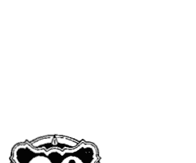

一個人的意識決定了他擁有的經驗。時間不是線性的，你心理的狀態改變了你對時間的觀點，如果你是不快樂或是無聊的，時間會慢下來；如果你是害怕的，時間就會停下來；當你感到快樂、興奮或有趣的時候，時間是飛逝的，如果我在某個不知道的地方開車，這段旅程的時間似乎比我在知道的路上放鬆地開車還要更久。我們的頻率愈低，我們對時間的感知觀點就愈慢，從事於高振動活動的人發現時間過得很快，我被告知說由於已經有三分之一的人在意識上有所提升，時間在地球上已經加速。時間可以被超越，有某些靈性力量的人可以調頻到前世或來世，當一個靈媒調頻到某個人的來世時，他們當然可以調頻到可能的未來，在你前面有幾種可能性，取決於你所做的自由選擇，有靈視的人只是看到可能性而已，不同的靈媒將調頻到你未來不同的時間，所有人都可能告訴你某件不同的事情，而對於他們接觸到的那個時間來說都可能是正確的。一個靈媒得到的訊息也取決於他的意識層次，如果一個靈媒可以接觸到你的阿卡沙紀錄，他將看到你靈魂的選擇，而能夠向你顯示對於你可能的未來一個更正確的評估。在夢中我們常進入一個不同的時間真相，一位女士告訴我當她正忙於結婚事宜時，她夢到獨自走在教堂的走道，她的父親與已過世的祖父正從上面看著她，在婚禮前六個星期她父親突然過世了，她的靈魂從未來給她訊息。尺寸也取決於觀點，當我們是小孩時，房子與人似乎比對於一個大人來說還要大很多，許多人曾經歷過回到童年常去的地方，發現那裡比他們所預期的還小得多。一座山對於一位登山新手來說，顯得比一個已經爬過的人來說還要更大。一個問題在半夜時似乎是巨大且不能克服的，卻常常在早晨時看起來是可以處理的；挑戰是相同的，你的觀點已經改變了。

我們感知物質為液體、固體或氣體，在真實中，所有物質都是原子與分子以不同的密度在四處移動，我們看到的取決於我們的觀點，觀者眼中出美景。

一個可以看見仙子、小精靈，與其他靈性生物的靈視者，比第三眼關閉的人能感知到一個更為廣闊的宇宙版本；一個被負面存有纏住的人，將與一個與天使和靈性指導接觸的人有非常不同的了解；一個曾遇見外星人或拜訪過其他銀河的人，將使他們的意識往不同的方向擴展。所有的一切在他們的真實裡都是對的，瘋狂的人只是與地球上被認為正常的人接觸到不同的真實罷了。

你將根據你的意識層次，以不同的方法來處理你的挑戰，舉例來說，當你正小心地開車時，有一位行動莽撞的年輕人開得太快，超車到你前面而刮傷你的車子，你會如何回應？

如果你是第三次元的人，走在世俗的路上，你可能將詛咒、批評他，甚至可能會下車出去責備或毆打他。

第四次元的人，走在客觀超然的路上，將認為：「嗯，那是我的業力，我顯然吸引了這件事，那只是一個小擦痕，沮喪也無濟於事。」

第五次元的人，走在無條件之愛的靈性道路上，這是耶穌的道路，沒有一絲念頭是關於他自己的車子的損害，帶著對那個年輕人的滿滿慈悲走出車外，想要看他是否安好，他將那位年輕人（還有他的母親）包容在光中。

如果一位客戶粗暴地對待你，然後在與你約定時間沒有出現，你將根據你的觀點來回應。

第三次元的人將會狂怒，感覺被貶低，並且在那位客戶終於出現時對她發脾氣。

第四次元的人將保持客觀，如果適合的話就寄出帳單，然後放下這件事。

第五次元的人將打電話給客戶看看她是否安好，很溫和地與她說話，他在心裡感謝這位客戶給他一個自由的空間，去享受一次散步或做其他的工作。

- 一個人持有一種受虐的模式，覺得是他的錯而變得垂頭喪氣。
- 一隻小貓受傷了，一個內心封閉的人看到，覺得牠沒有價值而詛咒牠；
- 有同理心的人看到牠受傷而去照顧牠。

所有都取決於你的觀點，沒有批判，只是覺知到每個人有不同的真實。

如果你判斷某一件事或某個人，是重新架構你的觀點的時候了。

人類整體從一個第三次元的角度來批判自殺，譴責這是惡劣或是軟弱的；在堅信基督的道路上，這被看做是某個人渴望更多的愛，或是回應回家的召喚。

折磨可以被看做是一種邪惡，或是一個學習同理心的渴望。

戰爭是恐怖的，或是一種去找出勇氣與力量的機會。

一個可怕的人可以被視為是一個威脅，或一個在教導你功課的人；有人踩到你的地雷，他是藉由帶出尚未解決的情緒讓你注意到，來為你提供服務，他提醒你有關自身的懷疑。

> 從愛的觀點來看一切，你將走在揚昇的道路上。

誰知道希特勒來到地球上要達成的使命是什麼？這個人碰觸到幾百萬人的地雷，就某個層次上服務了所有被他影響的人。

每一個人都有一個人性面，那只是掩飾了神性面的完美，我們將繼續掙扎，直到看到在所有人事物中的神聖火焰，然後我們將從基督的觀點來看一切。

根據神的法則而言，一切都是完美的，只有我們看的觀點是扭曲的，地球被認為是幻象的層次，因為所有一切都不是如它所呈現的樣子。

## 第31章 感激法則

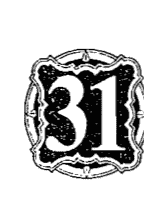

感激是指你打從內心發出感謝，當你這麼做時，能量從你的心中流出，也啟動從其他人與宇宙那裡來的某些回應，如果你只是講一些感激的表面應酬話，或感覺你必須去感謝，你的話語與思想不會吸引相同的回應。一位女士告訴我她與女兒瑪麗亞從來沒有融洽地相處過，她女兒常常對她生氣，而且手頭沒有有很多錢。當她聖誕節要與女兒在一起時，她預期這會是一個相當困難與乏味的假期。然而當她聖誕節早上到達時，瑪麗亞溫暖地歡迎她，給了她一封信，那是一封很長的信，她用一些圖案裝飾邊緣使信看起來很有節慶感，瑪麗亞說當她讀信時，會為她泡一杯咖啡。

這位媽媽有點擔心地坐了下來，起先她覺得很驚訝，逐漸地她的詫異轉變成一種喜悅與驚奇感，她的女兒寫給她一封信，欣賞與感謝所有她曾對女兒做過的一切，這封信中充滿了她童年時的小故事還有回憶往事。

> 「我無法描述當時我讀那封信的感覺，」這位媽媽告訴我，「我的心感覺好像要燃燒了，感覺如此地被愛與被欣賞，這比世界上所有的禮物都還要更有價值，」我們首次擁抱，然後談了許多事。」

當我回家時，我感覺我是多麼地愛我的女兒，因此想要給她一些東西，我看著我龐大的銀行存款，感覺很慚愧，她有如此艱困的時期，而我過去從來沒有想過要給她任何東西，我開了一張金額很大的支票給她，然後帶著愛寄出去。

當你是全然感激一個人曾做的某件事時，這個人感覺到感謝的能量，因此是如此地狂喜而想要給你更多；當你為了曾收到的祝福而送出誠心的感謝給宇宙時，神聖的能量藉由給你甚至更多的祝福，來充滿愛地回應你。

## 第31章 感激法則

衷心的感激是豐盛的秘訣，它開啟宇宙偉大的源頭。

判斷與批評把你帶入地獄，它們是感激與欣賞的反面，如果有人對你做了十件惡劣的事，你相當有可能會去批評與判斷那個人，你覺得很生氣，你的身體很緊張，你的頭很痛，那就是地獄。有一種離開地獄到天堂的方式，帶著同理心認識他是一個受傷的人，快樂的人不會做卑劣的事，尋找他的一個優點，或是一件他曾對你做的好事，把焦點放在欣賞與感激上，他對你的態度可能會或不會改變，但你將再度感覺很好，那就是天堂。

感謝你父母給予你生命，被認為是一個過時的觀念，許多人依然認為他們的出生是他們父母的錯，真相是你的靈魂選擇他們作為你的父母，因為他們必須帶你進入地球，並且提供環境與制約，無論那是多麼具有挑戰，你的靈魂需要這份經驗。

我在印度喀拉拉邦（Kerala）阿瑪的道場停留幾個星期。阿瑪被認為是「擁抱母親」，因為她擁抱每個來參加她達顯的人，達顯是一種神聖的祝福，她看入你的眼睛，對你低訴著愛的話語，神聖的愛從她那兒傾瀉到你心中，她是一位成道者，一個神的化身，完全散發著愛與包容，我可以坦誠地說，我從未經歷過任何像是她在達顯中傾倒在我身上那樣排山倒海的愛，既然她已經成道了，她把自己生命奉獻給達顯，以及幫助減輕人們的痛苦。

# 靈性法則之光

她的童年顯然是很可怕的，她在一個大家庭中是一個不被需要的女孩，而且她的皮膚比她父母與兄弟姊妹還要黑很多，因此她被認為是家庭的恥辱，此外她的媽媽在她出生時就不喜歡她，拒絕保護她免於受到她大哥惡毒且可恨的對待，她變成家中的奴隸，很晚上床，很早就起來做家事，一直遭受鞭打與嘲弄，不僅來自她大哥與他的朋友，也來自於她父母。

儘管如此，她的整個童年都在跳舞與唱讚美歌給克里希那，她在所有一切中看見神，持續地召喚她的摯愛來到她這裡。

有一天克里希那進入了她，她成道了，之後一位女神進入了她，然後她成為完全開悟、全知的、無所不在的，很快地人們從世界各地蜂擁而來接受透過她的神性之愛，一個巨大的廟宇建立了。

## 感激法則

我問她的其中一位門徒，阿瑪現在對她父母的感覺如何，我被告知，她把她父母當成是她最偉大的師父，他們在有儀式的日子時坐在她的右手邊，她說，若沒有他們在她童年時給予她這項艱鉅的挑戰，她不可能會成道，她永遠感謝她的父母。

在個人治療與發展的團體中的參與者，常常被他們童年的困難所佔據，有一種狀況是，把焦點放在他們父母的負面傾向，在治療的過程中，當然有某個地方是要處理這個部分，不過欣賞與感激也可以發揮治療功效。

我記得很清楚有一個我曾帶過的團體，在一個很沉重的個案後，我請求參與者想，他們的父母曾對他們做過的正向事情，當他們的想法改變方向時，有一個沉默困惑的片刻，然後有人說：「我媽媽過去常為我做可愛的生日蛋糕。」

> 「我已經忘記了。」另一個人同意地說：「我也曾是。」

> 「嗯，我爸曾與我一起踢足球，而且真的很鼓勵我。」

> 「我爸爸過去常常在星期天帶我去釣魚。」

「我也是。」兩個人或三個人齊聲附和。

這種分享一直繼續下去，沉重被提升了，突然間有一道美麗的光的能量進入這個房間裡。接下來的那一週，幾乎每個人都分享在那個星期中他們感覺快樂許多，而且更正面、更健康，他們想要繼續記住正面的並且感謝它。在那之後每星期我們都增加了欣賞與感激的部分，課程的學員持續地回報，有關他們的父母對他們好很多，有許多父母現在已經年邁，而且很慷慨地給予了他們這一生中一直在追尋的欣賞與認可。

芭芭拉曾參加這個團體一年，她結婚了，有三個小孩，總是顯現與高采烈的一面給人，但在私底下她是很沮喪的，認為她永遠無法與她媽媽建立一段良好的關係，她一週又一週地表達她的挫折，以及她媽媽是多麼難相處，而她有多麼渴望更靠近她。在我們開始找出我們父母好的地方的那週之後，她告訴我們她與她媽媽外出購物：

> 「我媽媽是如此地和善，我簡直無法相信，她甚至為我買了一件裙子。」

她繼續欣賞她媽媽，以及感激她媽媽在她一生中為她做的小事情，接下來那一週她很高興，因為她媽媽第一次為他們照顧小孩。欣賞是一陣微風，能夠把最小的火花煽動成大火。當你欣賞一個人或一個情境，即使是最細小的事情，它也會成長，一旦你持續地增加。在欣賞某件事物而且感激它，你把焦點放在它身上，由於吸引力法則，它會成倍增長。有一個孩子不善交際，自然地不受歡迎，他的老師嚴厲斥責他懶惰、粗魯與難相處，他在判斷、批評與譴責之下變得退縮。幸好這時有一位新老師來到班上，她了解欣賞與感激法則，致力找出他的學習中好的一面，即使一開始那是相當困難的，可是無論多小的事情她都去讚美。逐漸地，當這個孩子感覺比較安全時，他暴戾的眼神消失了。我聽過一個故事，是有關一個孩子在學校因為功課很難，於是變得性情乖戾。這個老師了解到他愛植物與花，在班上窗臺上的花架做了一個小花園，他被派去負責照顧花園，他因為對班上的貢獻而被讚美、感謝與欣賞，他變得敞開了，學習到再度地微笑。

判斷與批評阻礙與扼殺花朵，感激是能夠使花瓣打開與盛開的陽光。

當我們理解到，我們被送來挑戰是因為它們可以幫助我們成長，我們改變對挑戰的態度。

在一個小孩過世時父母感覺震驚悲痛，是很人性且可以被理解的，我曾遇過父母們面對他們的小孩殘障或過世，感到很痛苦與憤怒。成道者知道每一個小孩都是從神那裡借來的，是帶來責任與挑戰的愛的禮物。

我的朋友有一個重度殘障的小孩，他在二十個月大時過世了，他們把小孩的生與死，當作是他們從宇宙那裡曾接受到最重要的祝福之一，當這對父母談到他們的小孩時，他們散發著光芒，孩子短暫的一生充滿了痛苦與手術，這完全瓦解與改變了他們的生命，他們說他們的小孩是一位天使，被派來讓他們對靈性道路敞開，他們永遠心懷感激，為此慶祝他的生與死。

每一個挑戰的情境，都是一項功課的禮物，我們的任務是去學習功課，然後欣賞它曾教導我們的東西。

如果你想要你的生命變得更快樂、健康與豐盛的，持續寫一份感激日記，每一天寫下一些你感謝的事情，你將發現你自己在尋找好的事情以記錄在日記中，你將自動地變成更正向、更感激，在你上床前在一天的光陰中搜索，找出金塊並感謝它們。

### 啟動感激法則的態度：

- 成為正向與感激的。
- 細數你的祝福。
- 成為喜悅的，當你帶著快樂發光時，你是在欣賞你所擁有的。
- 記住有關一個人好的事情。

計算你的祝福，然後觀察它們成倍地增加。

- 把焦點放在每一個情境與每一個人好的一面。
- 慷慨地給予讚美。
- 真誠地使用「謝謝」的字句。
- 成為有愛心、關懷的與友善的。
- 賞識你自己的美好。
- 慶祝生命，成為是快樂的。
- 感激為你帶來無限的祝福。

## 祝福法則

當你祝福某些人時，你是在召喚神聖的能量來接觸他們，當這帶著真誠的意圖去做時，一道神聖的光被轉移進入你祝福的人的內在。

在某些宗教中當牧師祝福人們時，他把手放在一個人的頭上，他們是在啟動頂輪中心，以便光能夠通過進入他們，去做這件事是如此地私密且有力量，因此在很多文化中，去觸頂輪中心被認為是不好的行為。

舉起你的手朝向你想要祝福的人的方向，會引導祝福朝向他們。

在東方文化裡祝福被稱為達顯，有一些神的化身，他們是完全成道的存在，可以與神全然地溝通，他們給那些來見他們的人達顯。賽巴巴在印度普塔帕蒂（Puttaparthi，譯註：印度東南部安德拉邦內。）靠近班加羅爾（Bangalore）有一個道場，賽巴巴是一個偉大的神的化身，光只是他的在場就給予了祝福，數千的人聚集在一起，寧靜地坐在他的道場裡，等待著看他一眼，他的訊息是有關責任與奉獻，在適當的地方他會解除門徒的重擔。當他給予達顯時，一道金黃色的宇宙火焰從他的心中進入到你們的心中，如果你靜坐二十分鐘，將保持這股神聖的能量在你裡面，然而如果你說話或做其他的事，你會使專注消失，宇宙的火焰將回到他那裡。如果你拜訪他的道場，記得留意這一點是非常重要的，因為一旦他離開廟宇，群眾便開始聊天，急著退場。他們說，你不會去拜訪賽巴巴除非他召喚你。我第一次拜訪他的道場是在一九九一年，在那之前他出現在我的一些夢與靜心中，可是我有段時間沒有與他的能量連結上，然後有一天我在浴缸裡洗澡時，我聽到一個聲音大聲且清楚地說：「來印度。」我知道那是賽巴巴，我裹著一條毛巾跑下樓去看我的日誌，看我何時可以去，我不知道他在印度哪裡，或是如何到達那裡，隔天早上我有一位新客戶，在幾分鐘後她跟我說：「你需要知道如何到賽巴巴那裡嗎？」在驚訝中我說：「是的。」她說她就是有一種我需要資訊的感覺，而她擁有一切的資訊。當拜訪賽巴巴的時刻到了，他會提供方法。坐在一位偉大的一（Great One）的能量中是很棒且特別的。你不需要以你的肉身去拜訪他，你也可以在靜心中呼喚賽巴巴，請求他的達顯。

阿瑪這位「擁抱母親」，她的訊息是愛與包容，只是散發著光芒與慈悲，當她給予達顯時，在擁抱你之後，看入你的眼睛，直接傳送神聖能量到你的心中。她也承擔門徒的痛苦，當我待在她在那喀拉拉邦的道場時，有許多人包括所有道場的醫生，都有眼睛感染的疾病，有一天她決定經由她的身體將所有人的感染取走。我在先前早上的幾個小時中，從她那裡接受到達顯，在那之後她給予八小時沒有休息的個人祝福，她的眼睛是發炎紅腫的，當她承擔所有的痛時，她一定經歷了極大的痛苦，但是她的微笑是燦爛美麗的，彷彿我是她第一個擁抱的人。有時候我們盤腿坐在主要佛堂中的地板上幾個小時，等待著輪到我們接受達顯。過了一些時間之後，我常感覺到背部的疼痛，彷彿它要斷了一樣，但是如同其他人一樣，不知怎麼地我堅持持續下去。在祝福之後我們常常被允許坐在她後面，當我坐在她的氣場中時，我完全感覺不到我的背，所有的疼痛、痛苦與僵硬都消失了，每一個我跟他說話的人都發現同樣的情形。

米拉母親（Mother Meera）是另一位印度的神的化身，她住在德國，在她的家中給予達顯祝福，我知道她定居在那裡的目的之一是療癒紐倫堡（德國一城市）地脈線，清除戰爭遺留下來的黑暗能量，同時透過她的達顯來散播光。人們從世界各地來此接受她一週給予四次的寧靜祝福，你進入她房子的主要房間，在那裡靜靜地等待她的到來，每一個人輪流起身跪在她的腳邊，然後她把手放在你的頭上，當她這麼做時她是在解開你業力的結，這個結是被你緊扣在圍繞著背部的氣場中，她通常改變你百分之二十五到五十的業力，然後她看入你的眼睛，點幾次頭，每一次點頭都送神聖能量進入你，最後你回到座位上，做靜心以吸收神聖的能量。你不可能從一位神的化身那裡接受到祝福，而你的本質最深處卻沒有受到改變。

當你祝福你的食物，向食物說感謝時，食物充滿了神聖能量。克里安攝影（Kirlian Photography，譯註：科學家克里安使用高電壓攝影技術，拍攝出不論動物或植物都有一層似霧的光包圍，而且不同的人也有不同顏色的光，他發明的相機稱為克里安照相機，也是現代氣場分析儀的始祖。）可以拍攝出食物的能量，有許多我們吃的食物在經由輻射線照射、化學物質、長期的儲存與很差勁的烹煮後是死的，當祝福食物時，食物再一次散發出生命力與活力。

我不是在建議我們滿足於吃沒有生命的食物，而是盡可能地吃新鮮有機的食物，然而祝福你的食物，請求神性在食物中充滿任何使你有最佳健康、可以在身體與靈性層次上幫助你的營養，沒有什麼比吃到在準備與烹調時，有為它唱頌祝福的食物更棒的事了，因為食物是受到祝福的。

當有人打噴嚏時你祝福他們，神聖能量因此進入他們，使他們變得健康。

祝福你的工作，那麼工作將增加與充滿喜悅。

祝福在你周圍的人，他們將快樂與滿足。

祝福你的植物，它們將長得很茂盛。

祝福你的家，它將成為一個平靜的地方。

祝福你的身體，它將變成你靈魂的一座美麗殿堂。

這裡有為了改變你生命，你可以聲明的祝福：

- 我是受到祝福的，能住在一個如此美麗的身體裡。
- 我是受到祝福的，能被愛我的人圍繞著。
- 我是受到祝福的，能擁有如此寧靜的家。

這裡有很棒的食物祝福：

以耶穌之名我請求這份食物可以受到祝福，因此大地的水果可以餵養我的肉體，以及滋養我的靈性體。

你也可以請求祝福：

- 請保佑我的手，使它們可以替我服務。
- 請保佑我的工作，使它能夠為了至高的善而被完成。

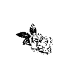

> 祝福每一個人，將神聖能量充滿他們，你將對宇宙的祝福敞開。

- 請保佑我的關係，使它們可以充滿著愛。
- 請保佑我的伴侶，使我們可以彼此相愛與支持。
- 請保佑我的小孩，保護與指引他們。
- 請保佑我們的家，因此它永遠充滿著和平與愛。
- 願我內在的神性祝福你。
- 願我接受從你內在的神性送來的祝福。

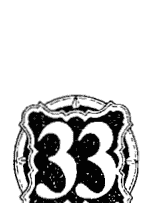

## 命令法則

想像有一個延伸的梯子，倚靠在一座摩天大樓上，當你在爬較低的階梯時，你可以看到地上，但屋頂與天空似乎離這裡很長一條路；在比較低的門徒梯級時期，我們如同懇求者一般地向神祈禱，祈求祂給我們想要的，天使是把我們請求的能量交給神的中間媒介。

那些只有物質層面了解的人正在底部爬行，他們只相信他們可以看到、聽到或感受到的，他們認為他們是與他人分離的，甚至比其他人優越，在這個層次中我們往外尋找指引，對於宇宙的浩瀚，以及我們在宇宙中的位置只有受限的觀念，這被認為是住在第三次元裡。在階梯的底部我們做出聲明，當持續不斷重複地做時，會幫助我們無意識地改變所持有的信念，無論我們是在通往揚升階梯上的哪一段，祈禱與聲明對於我們的旅程來說，都是正面與有價值的幫助。更往階梯上走，我們有更多的選擇。

當我們首次認出我們是靈性的存在時，物質的慾望變得比較不重要了，我們變得更信任，期望與所有的人團隊合作，不再往外尋求指引，我們遵從自己內在的智慧，這允許我們進入第四次元，而且爬上階梯的下一個階段，我們對於宇宙的看法也已經大有擴展。

當我們到達第四次元的最頂端，準備好第五次元的揚升啟蒙時，我們成為主人，這表示我們為了創造我們的實相而負起責任，我們接受自己是命運的主人，因此我們是領導人，我們與神是共同創造者，我們精通與掌握的層次愈高，我們創造的視野就變得更為擴展。

當我們在階梯上方時，我們變成極為有力量的，當然必須接受伴隨而來的責任，我們不再是水手或是船長，我們是整個艦隊的指揮官，我們做決定、下指揮，而每個人都要遵守，現在這對每個人都是有可能的，許多人完全主宰他們的人生，當你不再為了你的境遇責備任何人或任何事時，你知道你是一個主人。在靈性層次上我們有意識或無意識地與光的靈性階層溝通，決定要與神性一起合作，一個命令指揮宇宙遵從我們的指令。身為一位全體艦隊的指揮官，所有萬物都改變行為來執行你的指令。

當你下命令時，宇宙移動以實踐你的命令。

如果一個水手指揮一艘船，卻沒有足夠的清晰或智慧，混亂可能接踵而來；當我們沒有準備好就下命令，我們可能沒有預備承擔後果，顯然地必須為了每一個最高的善、帶著最大的誠實正直來下命令。

帶著謙卑去下命令，知道你是在服務這個星球。

帶著威信與清晰去給出命令，頭抬高、肩膀往後仰地站立著，大聲說出你的命令。

好的經理提供他人意見，在做出承諾要帶領公司到達新的方向之前，先做好背景的研究。在你下命令時，傾聽你內在的指引，如果需要的話也聽外在的指引，你的第一步是非常小心地決定你的命令是什麼，寫下它，從各種角度檢視它，確保那是非常正面、清晰的，如果必要的話，請教你信任的人回饋是否有任何的缺點。

這是一個命令句子的形式：『以神之名與所有光之名，我現在下命令……』重複這句話三次，然後以「它已結束」或「就是這樣」作為結束。

因為當我們在人身裡時無法看到全面，因此加上「在恩典法則之下」或「根據恩典」是有幫助的，這允許宇宙去啟動某些不同的東西，如果有我們不知道的因素的話。

這項命令可能是：『以神之名，根據恩典，我命令……它已結束。』重複這句話三次，當你已經下了命令，就像任何的指揮者一樣，你觀察結果，把握任何呈現在你面前的機會去啟動你的計畫。

因為這個改變我們生命的力量更為強大，一個命令是令人激動的，那不是一個輕微的行為。我認識有人下命令要完美的關係進入到他們的生命中，這有時候會導致波動與困難，所有阻止他們擁有一段完美關係的事情都出現在他們面前，這全都必須去面對以及清除。

我協助一個揚昇工作坊，其中有一位女士想要下一個命令，那就是一位愛她與尊敬她的伴侶，來到她的生命中。我提醒她外在就是內在的反映，建議她先下命令愛與尊敬自己，一旦她下了命令，她為自己找到一位治療師幫助她清除阻止她愛與尊敬自己的信念與情緒，在接下來幾個月，不同的男人出現在她的生命中，反映出她改變的信念，在她愛與尊敬自己之前，她持續兩年在自己身上功夫，然後當然她也下命令要求適合的男人進入到她的生命裡。

下命令擁有我們希望在生命中擁有的特質是有幫助的，必須注意，如果你命令要擁有謙卑，你可能必須受到羞辱以便得到這項特質；如果你命令有耐心，你將被提供有耐心的功課；如果你命令有無條件的愛，情境將會被送來測試你，而命令可以為你提供一條捷徑，去獲得你企圖在生命中擴展的特質。

我們可以命令在地球上有更多的光，如果有足夠的人準備好要做這樣的命令，將為帶來一個更快樂的世界有所助益。

我們可以為了人類的手足同胞下命令，把地球上的種族都聚在一起，當正直與有高度靈性價值的人，開始為了地球上所有萬物最高的善下達命令，星球與個人的揚昇將更為快速地發生。這個力量是我們的。

這裡有命令的例子：

> 「藉由神聖的命令，以神之名，根據恩典，我現在召喚紫羅蘭的火焰來轉換每一個負面的思想、模式、信念、制約、依附或是我曾做過的結盟關係，它已結束。」重複三次。

> 「以神之名與所有光之名，在恩典法則之下，我命令所有在前世或這一世許下的誓約，凡是不適用於地球上神聖計畫的都被取消與免除，就是如此。」重複三次。

> 「藉由神聖的命令，以神之名，我現在召喚一道白色純潔的基督之光光柱，## A New Light on Ascension
# 靈性法則之光

  帶來基督意識無條件的愛到地球上，它已結束。請重複三次。

  宣言與祈禱要重複地做效果更好，命令你只要花時間做一次即可。

  當你下命令時，宇宙的力量在你背後密切合作。

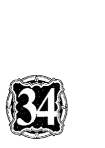

## 信心法則

  信心是一種如此高頻率的品質，因此它超越比較低的法則，使不可能的發生，信心使奇蹟出現，信心療癒吸引神前來，信心就像是不可動搖的岩石，它經歷雨水、冰雹與山崩依然屹立不搖，同樣地它給予很大的力量。

  信心法則正是如此，如果你對於結果有全然的信心，它將會發生；如果你有某種程度的懷疑，你容許有失敗的可能性。當你絕對、全然地相信神，你知道任何事情將會發生，信心帶走恐懼。

  在腦海裡尖叫：「我會死嗎？」一位天使出現在她面前，以他的光包圍住她。她一位年輕的女人告訴我，她曾涉及一場可怕的車禍，當車不停地翻滾時，她知道一切都會安好，不管她將活著還是死去，每一件事都是好的。

  如同上面的，在下面也是如此。我看到一個小孩歡笑著，從牆上跳下到他父親的手臂中，他毫無保留、絕對且全然地相信他的父親會抓住他、使他安全，當然他父親抓住了他，於是已經建立的信心的連結就更深了。當我們對神有純真的信心時，我們將被抱住，被保護。

  信心是指持續地傾聽你內在的指引與直覺，盲目的信心是不同的，它意謂著沒有根據地給予你的信任，信任由於缺乏分辨力而被誤用了，盲目的信心只是一種希望而已。

  我聽到一個故事，是關於一個小孩，他的爸爸要他從牆上跳下來，他爸爸將抓住他。小孩跳了下來，爸爸卻讓他跌倒傷到自己。他爸爸轉向他說：「我在教你永遠不要相信任何人。」

  每當我想起這個故事，就令我感到非常地害怕，然而這並不是有關玷污純真或缺乏信任，我想像會做出這樣事情的父母，一定曾有不可信賴的過往經驗，這個小孩的信任或許已經被玷污了許多次。毫無疑問地，這個小孩對於他的父親會抓住他的希望，沒有堅不可破的基礎。在靈性法則之下，如果小孩有全然的信任，父親會以接住他來回應。

  如果你在一個不夠穩固的基礎上建立一棟房子，你將永遠覺得有種不確定與懷疑它安全的感覺，你可能對裂痕的出現有偏執狂的症狀，因為它們可能是倒塌的信號。一棟有著穩固基礎的房子不會呈現出如此深的的不安全感，你知道可能會有不重要的小東西需要調整，但房子最重要的本質是堅固的。自信就是相信自己，如果你有自尊與自我價值的基礎，你是一個放鬆與自在相處的人，沒有人能夠損傷你，因為你信任自己的能力，而其他人也將會直覺地信任你。

  忠誠是我們所謂的對關係有信心，每一段伴侶關係，對於金錢、性與其他方面有不同的基本規則，如果你全然地信任你的伴侶會實踐他的誓約，你將在關係中感到安全。友誼也有其基本規則，如果你可以分享自己私密的部分，全然信任你的朋友將不會笑你或說你的閒話，你就有一個堅固的信任基礎。

  信心是成功、顯現、祈禱與命令的基礎。當你對一個遠景有信心的話，就一定會成功；如果你沒有足夠的信心，請他人為你持有這個願景，他們的信心將確保成功。

  我聽到一個驕傲的父親提到他成功的兒子：「我總是知道他會成功，我對他有全然的信心。」

  然後兒子說：「在困難的時期我聽到父親的聲音，知道他相信我，這給我力量繼續下去。」

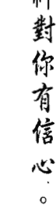

  信心可以移山，這是存在的最大力量，如果你的直覺告訴你某件事是對的，你保持對你的願景的信心，那麼你一定會成功。

## 恩典法則

  恩典是神的仁慈，它消融業力，創造了奇蹟，它可以改變物質。

  造物者是全能的，發散出如此高頻的能量，超越我們能夠了解的一切，只要一個念頭，神可以終結痛苦、疾病、悲慘、饑荒與戰爭，可是這樣能達到什麼目的的嗎？

  我們的靈魂已經接受在這個星球上輪迴轉世的機會，來學習與經歷有關情緒與肉體的事情，神給予我們自由意志，在一個每個思想、話語和行為都會顯現的地方，創造我們自己的生命。

  到目前為止，我們在地球上已經選擇創造出飢荒、疾病與戰爭，我們可以藉由接受與給予恩典來改變這點。

  我們可以召喚恩典來轉換我們的債、改變情緒的感覺、治療關係與肉體，然而我們必須準備好去接受它。我們用自己的意識創造出所有的情境，在我們請求恩典前，我們必須學習功課。

  我們有幸生在這個時期，有許多以肉體出現的偉大的神之化身，神的化身是神的輪迴轉世，他們是純粹的、不摻雜質的神聖能量，他們是全知、全能的存在，他們有力量透過恩典去治療，然而他們必須考慮靈性法則，他們將不會任意給予治療，一直到當事人已經學到他的功課為止。

  有一個故事是關於賽巴巴的，他被認為是現今最偉大的神之化身，一位母親帶她的兒子到他的道場，年輕人是殘障的，坐在輪椅上，有人問賽巴巴為什麼不治療那位年輕人，他向他們顯示那位殘障的人的一個前世畫面，在畫面中他曾是一個非常殘酷的法官，而他的媽媽則是他的助理，他們給予極度殘忍的判決。

## 第35章 恩典法則

  賽巴巴說他們還沒有學到功課，他又說這位媽媽藉由照顧他殘障的兒子來學習慈悲，這個人正經歷他曾如此鐵石心腸地對別人施以處罰或判刑的痛苦，以及學習去接受愛。賽巴巴說如果他治療好這個人，這對母子都不能學到功課，且會繼續殘酷下去。

  我們透過同理心、仁慈、同情、原諒與無條件的愛，來對其他人提供恩典，每當我們對別人打開心時，我們也接受到神聖之愛的流入；我們提供愈多的恩典，我們就回收更多。

  慈悲、同情、仁慈、無條件的愛與原諒，是賦予恩典的神聖品質。

  每一次當你帶著慈悲打開你的心時，從你這裡散發出的愛給予其他人恩典，一種態度的改變可能會發生，或是緊抓的恐懼會釋放，甚至是一種身體的療癒會產生。原諒另一種消融與改變負面堵塞的神聖品質，它會使給予者與接受者同時產生情緒、態度與身體上的療癒。

  如果你帶著愛與敞開的心，提供一個挨餓的乞丐你的最後一點食物，你是在給予他恩典，這份食物包含的比熱量還要多，它包括了神聖的愛，這將比單獨只有施予食物還更能深層地滋養他。

  恩典允許治療產生，因為愛的高頻振動，轉換了痛苦與恐懼的低頻振動。

  由於我們的態度而產生業力，所有不好的感覺以及爭執，都是自我主義態度所造成的業力。

  費莉希蒂抱怨她的前夫總是很可惡，有一天她的男友說：「是你，你故意為難地對待他，還說他很糟的壞話。」她既震驚又憤怒，一整天都在想這件事，然後理解到她男友是對的，是她對她的前夫很可惡，她坐下來，確實想了解這是來自於哪裡，然後寫了一封長信給她的前夫，為她離婚期間的態度說抱歉，並且原諒他曾經做過的一切事情，兩天後他順道拜訪家裡，完全是迷人愉快與友善的態度，他試圖盡可能地幫忙安排照顧小孩，一個全然的改變產生了。有趣的是費莉希蒂從未寄出那封信，她前夫感覺到她態度的轉變然後回應她，她的原諒與理解給予全家人恩典，每個人都更快樂了。

  當你準備好去感覺理解、慈悲或是原諒時，天使帶領你到某個可以幫你釋放你的業力的人那裡，這可能是一位治療師、草藥醫生、脊椎按摩師、對抗療法（allopathic）醫師或治療師，可能是某位鄰居或是可以說出智慧之語的人，也可能是一本書或電視節目，完全轉變你的態度。當你準備好的時刻，你將被放置在你可以接受療癒的地方。

  有時候我被問到，是否醫師與天生的治療師的工作，是去償還他們自身的業力，或是他們已經還清業力，而現在對他人提供恩典。人們常常會被某一種特定的治療職業所吸引，是為了自身的治療，也是使他們能夠還清業力，是他們打開心去提供他們的技術，而轉變了他們的業，同時也給予了別人恩典。我喜歡認為，許多從事關懷與治療職業的人，現在純粹是去散播恩典。

  治療者是一個高頻振動可以經過的管道，是恩典的工具。天使從事有關恩典的工作，持續地向我們低語：去想、做或說能消融我們業力的事情，他們試著幫助我們去原諒他人，或為了我們最高的善去做決定，因此我們能活在光中。我們永遠可以請求源頭的恩典來原諒我們的罪，以及消除業力之債的累積。然而由於我們活在如此神奇的靈魂進化時期，如今在適當的神聖的特赦，這表示恩典比過去更容易地被應許，然而我們必須被認為是準備好去接受它的。因此如果你已經盡可能做一切事情去解決一個情境或關係，召喚神給予恩典，它將很有可能被應許，你可以幫忙為我們的星球帶來恩典。你愈敞開你的心去歡迎陌生人、放下憤怒，或是關懷病人與老人，就會有更多的恩典傾注到這個星球上。每一次你帶著愛為別人祈禱或幫助別人，這個星球會變得更加充滿著光。

## 第35章 恩典法則

  > 給予和接受恩典，是使人自由的神的仁慈。

## 一的法則

  如果你飛到雲朵上方，那裡只有燦爛的陽光，在雲朵之下是陰影與光，在天堂裡只有光，在地球上我們經歷了黑暗與光明，這是來自於我們在地球上經歷的自由意志所產生的兩極，在第五次元之上只有光，無論我們在何處，一切都是完美的，一切都是神，而我們全是神的部分，兩極只是一種學習擴展我們的光的經驗而已。

  如果一對深愛彼此的伴侶因為身體距離而分開，事實上是沒有分離的，他們藉由每一個思想與渴望而有所連結。生命提供我們一種與神分離的幻象，以便我們學習到我們是與神如此真實地合一的。

## 第36章 一的法則

  神的部分。在第五次元裡，只有一條靈性法則，我們全都是合一的，我們全都是這意味著我是一位基督徒、印度教徒、佛教徒、回教徒、猶太教徒與錫克教徒。我是黑色的、棕色的、黃色的與白色的人種。我是男性與女性的。我是同性戀與異性戀的。我是動物、植物和礦物。我是富有與貧窮的。我是人性與神性的。沒有任何區別，全都是合一的。想像一條精美的地毯，有著複雜精細的設計與閃閃發亮的色澤，線都是一樣的，可是顏色是不同的，每一個顏色都扮演它的角色，暗色的凸顯了亮色的，正是顏色與結構的不同，使生命的掛毯是如此地令人興奮。

  你是在織錦中一條重要的線，你是整體的一部分。

  活在第三次元的人害怕介於種族、性別與所有創造物之間的差異；當你知道我們是合為一時，你會尊敬那不同的。

  在第五次元中的法則是：「你想要別人怎麼對你，你就怎麼對別人，己所不欲，勿施於人。」如果地毯裡的一條線毀壞了，整條地毯都受損了；如果一條線被加強了，整體也是同樣的。無論你對他人做什麼，最終就是在對你自己做。

  在你行動前，花些時間想一想：「如果這是對我自己做的，我會感覺如何呢？」你可能想要做不同的選擇。

  如果你想要某個人在你家前面的花園裡為你撿起一個垃圾，那就去撿起吹進別人花園裡的濕包裝紙。

  我正在改善我的房子，其中投資很多金錢與努力，我跟我的女兒羅倫——

  她是一個非常聰明的靈魂說：「我現在該怎麼做才能搬家？」
  她回答：「想要找到你下一個家，當然要把目標放在與你現在的房子告別。」
  她是對的，我謝謝她的提醒，在那之後我真的很享受去美化我的房子，知道我為自己做的每一件事，都是在為整體而做的。

  每個人在他自己回到源頭的道路上，我們是誰？憑什麼可以去批判其他人正在走的路呢？我們的任務是盡力做到最好，然而我們也必須認可與尊重我們自己的人性，當我們在地球平面上時，我們不可能是完美的。

  如果你一直批評一個小孩或找出他的錯誤，你將永遠不知道他的美好；如果你重複地責備你的狗，牠將是一個可憐的生物；如果你自我批評，你的光將比原本可以閃爍的亮度還暗。當你接受一切萬物，尊敬他們內在的神性，他們將盛開，而你也一樣。

  如同所有擁有強烈靈性渴求的人一樣，我立志於實踐我說的話，無可避免地我會犯錯，記得在一次場合中我與我的指導靈提到關於這一點，他說：「你持續不斷地批評你自己，如果你所教導的東西沒有在你生命中被具體實踐出來，你就感覺很糟。我們告訴你，是你已經熟練這個課程的那一部分在使教導發生，放輕鬆，善待自己。」

  合一的法則是關於如實接受所有一切本來的樣子，不帶任何批判，這包括你自己。

  我們建築了保護的柵欄來保衛自己，而這阻止我們與其他人合而為一，你從來不能靠近一個非常有防禦性的人，只有當某個人分享有關他們自己的一些事情時，你會感覺靠近。我們現在被要求取下使我們分離的柵欄，因為我們對別人有多隔離，我們就與神有多疏離。

  教條創造出堅硬死板的概念與圍牆，它們是即將結束的老舊時代的一部分。

  祕密將我們隔絕於圍牆之後，在現今，不為人知的家醜正在外揚，我們對於自身的祕密感到如此可怕是一件很奇怪的事，對其他人來說那些祕密並不是那麼糟，一個分享的祕密是一座融解的牆。你是世界之光，沒有任何東西可以減損你的光的神奇，只有圍牆會把它隱藏起來。尋找你自身的內在之光，也尋找他人的內在之光。當我們是合一時，我們不需要圍牆來分離彼此。新的靈性是有關創造橋樑，當我們活出合一法則，我們藉由宗教、種族與在紛爭中的共同性，來創造橋樑。因為當你傷害神的創造物的任何一部分時，你也傷害了自己以及神，如同你受邀來到地球上是為了在這裡學習，動物、昆蟲、樹木與植物也是一樣，所有的萬物都是在學習與進化中，他們是比我們更年輕的同修者，如果你掠奪地球，你就損害了創造的整體，然而你被授權給予你的空間，正如同一個動物被授權給予他的領土一樣。因此如果你的廚房有太多螞蟻在橫行侵擾，你能怎麼辦呢？首先你與螞蟻更高的大我或大靈說話，提醒他們這是你的領土，你請求他們移到花園中的原木上、或是人行道上的樹上，在那裡他們將會很安全，如果他們忽略警告兩次，告訴他們，如果他們不尊重你的空間的話，你必須讓他們回到光中，如果他們在你房子的外面，你沒有權力殺害他們。藉由告訴樹木與植物，你將要修剪它們的想法來尊重它們，行動時不帶任何傷害性的。

  當你理解合一法則時，你接受了自己的神性，開始傾聽你的直覺，而不是在外面尋找答案，你變成是與神一起的共同創造者。

  在地球上我們傾向分別好與壞、黑暗與光明，你的黑暗是為光提供服務的，它是你的僕人也是你的老師，當你認出這一點時，你就超越兩極而到達合一。

  一位愛小孩的母親幫助小孩成長，她知道在小孩內在是一個成人胚胎，只是需要去經驗與成長，以達到成熟的狀態。你的靈魂是神性的，如同這位媽媽一樣正在向你顯示你的道路。

  一就是去接受自己的神性。

## 第36章 一的法則

  > 只有一的存在，那就是神，那也是你。

## 靈性法則 note page

## 生命潛能朵琳占卜卡系列
### 乘著天使的羽翼系列

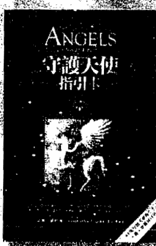

## 守護天使指引卡
朵琳·芙秋博士◎著 陶世惠◎譯 定價750元

  你曾感應到你的守護天使給予你的指引嗎？守護天使無時不在你身邊，即使你沒有發現依然存在守護著你。芙秋博士透過這套卡提醒你——你是被眷顧的，要記得每天與你的守護天使連結，接收祂要給你的訊息，協助你在每日的生活與工作中清楚自己的方向，穩定地發揮個人的力量。

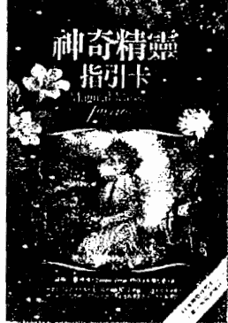

## 神奇精靈指引卡
朵琳·芙秋博士◎著 陶世惠◎譯 定價850元

  精靈是喜悅輕盈的能量，是大自然的盟友，守護著大地、動植物與孩子們。他們精通以充滿愛的方式導引並運用宇宙與地球的能量，且擅長療癒工作。你可以召喚他們來解決問題、療癒自己和他人，或顯化物質上的需求。親近這些自然界的精靈，會喚醒你潛藏的力量，增加你的超感應力與顯化夢想的能力，有勇氣做真實的自己。

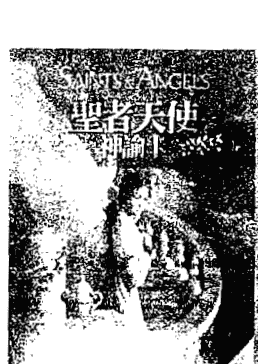

## 聖者天使神諭卡
朵琳·芙秋博士◎著 林素綾◎譯 定價850元

  在個人有限的生命中，聖者活出了生命道途的最高使命，為全人類樹立了典範。這些聖者以鼓舞人心的生命故事提醒我們，每個人都可以給世界帶來不同的助益。朵琳·芙秋創造的這套神諭卡，讓不論來自何種靈性及宗教背景的人，都能欣賞與享受，透過與這套卡片的連結，釋放緊綳的心與壓抑的情緒，找回神與天堂給予所有人強大的愛。

## 大天使神諭占卜卡
朵琳·芙秋博士◎著 王愉淑◎譯 定價780元

大天使是超越各宗教與靈修派別的神聖存有，真實且有力量，他們樂於守護人們，幫助你在生活的每一個面向中發現上天的祝福，並帶來療癒、指引與奇蹟，他們給出正向的力量與訊息，能迅速協助你解答困惑，釋放負面能量。這套卡片連結了十五位大天使，透過他們掌管的範疇與專長，提供你生活上的最佳建議。

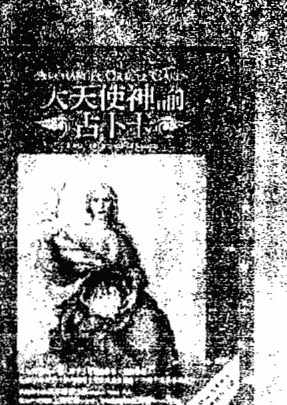

## 女神神諭占卜卡
朵琳·芙秋博士◎著 陶世惠◎譯 定價780元

女神是靈性傳承與各宗教民族中，充滿愛與力量的存有。透過這副優美的女神神諭占卜卡，你可以連結來自埃及、印度、瑪雅文化、克爾特、希臘、西藏與其他傳統的四十四位女神，包括我們熟悉的觀音、雅典娜、綠度母等。每一張卡都為你帶來指引的訊息，協助你改善生活境遇、解答靈性道路的種種疑惑，以及找到你此生的神聖使命。

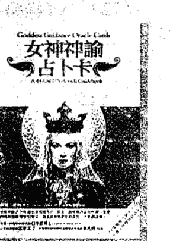

## 揚昇大師神諭卡
朵琳·芙秋博士◎著 鄭婷玫◎譯 定價780元

揚昇大師充滿力量與智慧，是天界與地球之間的訊息管道，也是人們最佳的生活教練。藉由與神聖存有、靈性大師連通來開啟高我的面向，激發最高的潛能，已成為新時代人們修練自己的便捷法門。芙秋博士引導讀者與44位跨各民族文化中的揚昇大師連結，例如耶穌、摩西、聖哲曼、甘尼許、庫圖彌、觀音等，你能透過能量上的連結得到最高的指引。

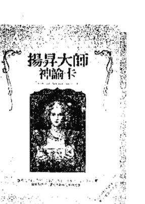

## 用心靈之眼，體驗身心的智慧與活力
美麗身心系列
16開全彩

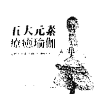

### 五大元素療癒瑜伽
整合脈輪的瑜伽體位法
Healing Yoga
安碧卡南達大師◎著

作者精通靜坐、瑜伽、吠檀多哲學與自然醫學，為讀者勾勒出精細完整的五大元素地圖，在書中詳細的解說地、水、火、氣、空每一種元素與身心的關連及調整的瑜伽動作。

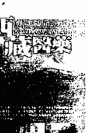

### 西藏醫藥
The Book of Tibetan Medicine
拉斐・福德◎著

西藏醫藥融合佛教哲理對生命的看法，有來自中醫把脈的智慧，也包括阿育吠陀屬於五大元素、三種體液的精華，其他如草藥、礦物、鍊金術的運用，形成了獨特的西藏醫藥。

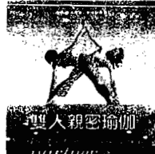

### 雙人親密瑜伽
用身體來溝通、分享愛和喜悅
The Book of Partner Yoga
米夏巴耶◎著

用心靈之眼體驗愛，用身體感受浪漫和諧！作者以傳統的哈達瑜伽為基礎，並配合泰式、日式按摩和瑜伽治療技巧，邀請你來體驗雙人瑜伽。

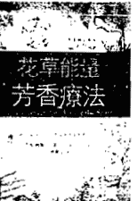

### 花草能量芳香療法
融合陰陽五行發揮精油情緒調理的功效
Aromatherapy For Healing the Spirit
蓋布利爾・莫傑◎著

作者將東方醫學的傳統智慧應用到現代芳香療法中，從陰陽五行及熱、冷、乾、濕等能量特質的角度，深入探討四十種芳香植物以及對應的心理與情緒問題。

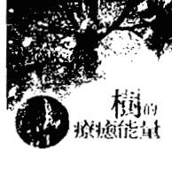

### 樹的療癒能量
The Healing Energies of TREES
派屈斯・布夏頓◎著

樹，具有連結大地與天空的特質，本書指引讀者發現及運用樹木的能量，讓你啟動屬於自己的特殊經驗，與樹接觸，將重新連結內在及外在的生命力。

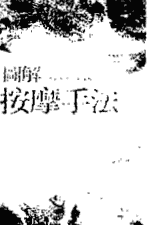

### 圖解按摩手法
體驗雙手探索身體的樂趣
Massage
伯妮・羅溫◎著

全書超過150張的精美全彩圖片，教你如何運用簡單卻有效的方法進行按摩，你不需要是個按摩師，也能在家運用這些方法，享受按摩所帶來的好處，幫助你紓解身心壓力。

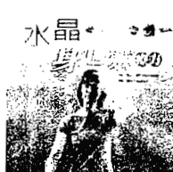

### 水晶身心靈療方
Heal Yourself with Crystals
海瑟・芮芳◎著

善於處理精微能量的作者，針對八十種常見的身心靈不適狀態，教你如何運用水晶礦石，進行深度的身體、情緒與靈性上的療癒。

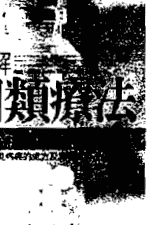

### 圖解同類療法
37種常見病痛的處方及藥物寶典
Homeopathy for Common Ailments
羅賓・海菲德◎著

治療哲理在於，「採用引發同樣症狀的藥物治療疾病」，能將病毒與症狀適時抒發出來，並刺激個人內在治癒力，達致徹底轉變體質的功效。

## 透過靈氣擁抱世界
## 薩滿的療癒之道
## 維洛多博士的印加故事

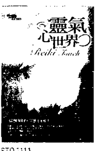

### 靈氣心世界
透過覺知給出愛與撫觸的療方
The Ultimate Reiki Touch
萊絲蜜·寶拉·賀倫博士◎著

靈氣的核心精神在於「覺知」，透過覺知給出愛、承諾與撫觸。當靈氣工作者敞開自己成為宇宙生命動能流通的管道時，也邁向身心靈成長的旅程，協助自己及他人淨化身心、體驗空無與合一。

STO1111 10月出版
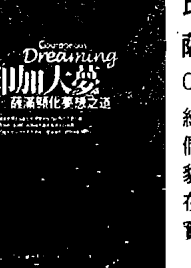

### 印加大夢
薩滿顯化夢想之道
Courageously Dreaming
維洛多博士以巫士的洞見來協助人們提升感知層次，透過蛇、美洲豹、蜂鳥與老鷹層次的操練，可以在生活中全然地放掉恐懼與衝突，實現最深刻的夢想。

STO1114 9月出版
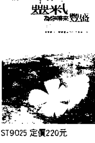

### 靈氣為你帶來豐盛
遠離匱乏、體驗豐盛的42天靈氣方案
Abundance Through Reiki
萊絲蜜·寶拉·賀倫博士◎著

本書42天核心計畫能進一步協助你放掉自身的抗拒能量，接受與宇宙合一的流，為你帶來更多的豐盛，包括健康、愛、財富與經驗。

ST9025 定價220元
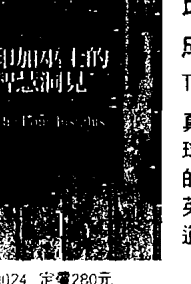

### 印加巫士的智慧洞見
成為地球守護者的操練與挑戰
The Four Insights
真正的巫士是擁有力量與恩典的地球守護者，作者提出許多能量操練的方法，指引你一條提升自己成為英雄、光的戰士、預見者與聖哲的道路。

ST9024 定價280元
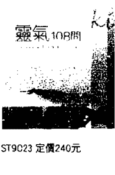

### 靈氣108問
以雙手傳遞宇宙生命能量的新時代療法
Exploring Reiki
萊絲蜜·寶拉·賀倫博士◎著

作者為經驗豐富的靈氣老師，為好奇的入門者提供靈氣的第一手資料，解釋一百零八個修習靈氣時最常見的問題，也為熟練的修習者解答靈氣運用上的相關疑惑。

ST9023 定價240元
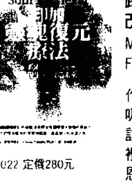

### 印加靈魂復元療法
跨越時間之河修復生命、改造未來
Mending the Past and Healing the Future with Soul Retrieval
作者藉由引導式的冥想和獨特的呼吸練習，帶領你改變意識狀態，探訪靈魂世界，修復過去儲存在脈輪裡的原始創傷，並找出靈魂潛藏的恩典與寶藏。

ST9022 定價280元
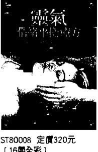

### 靈氣情緒平衡療方
Reiki for Emotional Healing
坦瑪雅·侯內沃 靈氣師父／教師◎著

透過靈氣可釋放負面情緒，進一步與你內在正面的特質連結，本書旨在指導如何使用靈氣相關療癒技巧，讓人在生活中即使面對棘手的狀況，仍能以專注、輕鬆和有創意的方式應對。

ST80008 定價320元
(16開全彩)
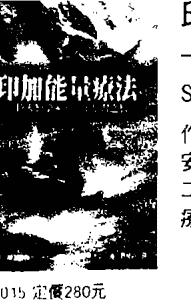

### 印加能量療法
一位人類學家的巫士學習之旅
Shaman, Healer, Sage
作者深入南美蠻荒之地，追隨巫士安東尼歐學習印加能量醫術長達二十年，整理出清楚易懂的能量治療精華。

ST9015 定價280元

# 生命潛能出版圖書目錄

| 編號 | 書名 | 作者 | 譯者 | 定價 |
|---|---|---|---|---|
| ST0111 | 如何激發自我潛能 | 山口 彰 | 鄭清清 | 170 |
| ST0137 | 快樂生活的新好男人 | 巴希克 | 陳舊多 | 280 |
| ST0142 | 理性出發 | 麥克納 | 陳舊多 | 200 |
| ST0144 | 珍愛 | 碧提 | 黃春華 | 190 |
| ST0147 | 揭開自我之謎 | 戴安 | 黃春華 | 150 |
| ST0155 | 快樂是你的選擇 | 維拉妮卡・雷 | 陳逸群 | 250 |
| ST0156 | 歡暢的每一天 | 蘇・班德 | 江孟蓉 | 180 |
| ST0159 | 扭轉心靈危機 | 克里斯・克藍克 | 許梅芳 | 320 |
| ST0160 | 創痛原是一種福分 | 貝佛莉・恩格 | 謝青峰 | 250 |
| ST0161 | 與慈悲的宇宙連結 | 拉姆・達斯 & 保羅・高曼 | 許桂綿 | 250 |
| ST0165 | 重塑心靈 | 許宜銘 |  | 250 |
| ST0166 | 聆聽心靈樂音 | 馬修 | 李芸玫 | 220 |
| ST0167 | 敞開心靈暗房 | 提恩・戴唐 | 陳世玲／吳夢峰 | 280 |
| ST0168 | 無為，很好 | 史提芬・哈里森 | 于而彥 | 150 |
| ST0172 | 量身訂做潛能體操 | 蕾兒・克絲 & 席拉・丹娜 | 黃志光 | 220 |
| ST0173 | 你當然可以生氣 | 蕾莉・羅塞里尼 & 馬克・瓦登 | 謝青峰 | 200 |
| ST0175 | 讓心無懼 | 蘭達・布里登 | 陳逸群 | 280 |
| ST0176 | 心靈舞台 | 薇薇安・金 | 陳逸群 | 280 |
| ST0177 | 把神秘喝個夠 | 王靜蓉 |  | 250 |
| ST0178 | 喜悅之道 | 珊娜雅・羅曼 | 王季慶 | 220 |
| ST0179 | 最高意志的修煉 | 陶利・柏肯 | 江孟蓉 | 220 |
| ST0180 | 靈魂調色盤 | 凱西・馬奇歐迪 | 陳麗芳 | 320 |
| ST0181 | 情緒爆發力 | 麥可・史凱 | 周晴燕 | 220 |
| ST0182 | 立方體的秘密 | 安妮 & 斯羅波登 | 黃寶敏 | 260 |
| ST0183 | 給生活一帖力量──現代人的靈性維他命 | 芭芭拉・伯格 | 周晴燕 | 200 |
| ST0184 | 治療師的懷悔──頂尖治療師的失誤個案經驗分享 | 傑弗瑞・柯特勒 & 瓊恩・卡森 | 胡茉玲 | 280 |
| ST0185 | 玩出塔羅趣味 | M.J.阿芭迪 | 盧娜 | 280 |
| ST0186 | 瑜伽上師最後的十堂課 | 艾莉絲・克麗斯坦森 | 林惠瑟 | 250 |
| ST0187 | 靈魂占星筆記 | 瑪格麗特・庫曼 | 羅孝英／陳惠嬙 | 250 |
| ST0188 | 催眠之聲伴隨你（新版） | 米爾頓・艾瑞克森 & 史德奈・羅森 | 蕭德蘭 | 320 |
| ST0189 | 通靈工作坊──綻放你內在的直覺力與靈性潛能 | 金・雀絲妮 | 許桂綿 | 280 |
| ST0190 | 創造金錢（上冊）——運用磁力彰顯財富的技巧 | 珊娜雅·羅曼&杜安·派克 | 沈友娣 | 200 |
| ST0191 | 創造金錢（下冊）——協助你開創人生志業的訣竅 | 珊娜雅·羅曼&杜安·派克 | 羅孝英 | 200 |
| ST0192 | 愛與生存的勇氣——自我關係療法的詮釋與運用 | 史蒂芬·吉利根 | 蕭德蘭、劉安康、黃正頤 梁美玉等 | 320 |
| ST0193 | 水晶光能啟蒙——礦石是你蛻變與轉化的資產 | 卡崔娜·拉斐爾 | 鄭婷玫 | 250 |
| ST0195 | 揮舞生命潛能（新版） | 許宜銘 |  | 220 |
| ST0196 | 內在男人·內在女人——探索內在男女能量對關係與工作的影響 | 莎加培雅 | 沙微塔 | 250 |
| ST0197 | 人體氣場彩光學 | 喬漢娜·費斯林傑 & 貝緹娜·費斯林傑 | 遠音編譯群 | 250 |
| ST0198 | 水晶高頻治療——運用水晶平衡精微能量系統 | 卡崔娜·拉斐爾 | 弈蘭 | 280 |
| ST0199 | 和內在的自己玩遊戲 | 潔娜·黛安 | 黃春華 | 200 |
| ST01100 | 和內在的自己作朋友 | 潔娜·黛安 | 黃春華 | 200 |
| ST01101 | 個人覺醒的力量——增強心靈感知與能量運作的能力 | 珊娜雅·羅曼 | 羅孝英 | 270 |
| ST01102 | 召喚天使——邀請天使能量共創幸福奇蹟 | 朵琳·芙秋博士 | 王愉淑 | 280 |
| ST01103 | 克里昂靈性寓言故事——以高層心靈的視界，突破此生的課題與業力 | 李·卡羅 | 邱俊銘 | 250 |
| ST01104 | 新世紀揚昇之光——開啟高次元宇宙奧秘與揚昇之鑰 | 黛安娜·庫柏 | 鄭婷玫 | 300 |
| ST01105 | 預知生命大蛻變——由恐懼走向愛的聖魂進化旅程 | 弗瑞德·思特靈 | 邱俊銘 | 320 |
| ST01106 | 古代神秘學院入門書——超感應能力與脈輪開通訓練 | 道格拉斯·德龍 | 陶世惠 | 270 |
| ST01107 | 曼陀羅小宇宙——彩繪曼陀羅豐富你的生命 | 蘇珊·芬徹 | 游琬娟 | 300 |
| ST01108 | 家族系統排列治療精華——愛的根源回溯找回個人生命力量 | 史瓦吉多 | 林群華、黃翎展 | 380 |
| ST01109 | 啟動神秘療癒能量——古代神秘學院進階療癒技巧 | 道格拉斯·德龍 | 弈蘭 | 280 |
| ST01110 | 玩多元藝術解放壓力 | 露西雅·卡帕席恩 | 沈文玉 | 350 |
| ST01111 | 在覺知中創造十大法則 | 弗瑞德·思特靈 | 黃愛淑 | 360 |
| ST01112 | 業力療法——清除累世障礙，重繪生命藍圖 | 狄吉娜·沃頓 | 江孟蓉 | 320 |
| ST01113 | 回到當下的旅程——靈性覺醒道路上的清晰引導 | 李耳納·傑克伯森 | 鄭羽庭 | 360 |
| ST01114 | 靈性成長——與大我合一的學習之路 | 珊娜雅·羅曼 | 羅孝英 | 320 |
| ST01115 | 如何聆聽天使訊息 | 朵琳·芙秋博士 | 王愉淑 | 220 |
| ST01116 | 天使之藥 | 朵琳·芙秋博士 | 陶世惠 | 350 |
| ST01117 | 影響你生命的12原型 | 卡蘿·皮爾森 | 張蘭馨 | 400 |
| ST01118 | 啟動天使之光 | 黛安娜·庫柏 | 奕蘭 | 300 |
| ST01119 | 天使數字書 | 朵琳·芙秋博士 | 王愉淑 | 250 |
| ST01120 | 天使筆記書 | 生命潛能編輯部 |  | 200 |
| ST01121 | 靈魂之愛 | 珊娜雅·羅曼 | 羅孝英 | 350 |
| ST01122 | 再連結療癒法——來自宇宙能量的治療奇蹟 | 艾力克·波爾 | 黃愛淑 | 380 |
| ST01123 | Alpha Chi 風水九大封印——風水知識的源頭與九大學派的演變 | 阿格尼·艾克曼&杜嘉·郝思荷舍 | 林素綾 | 360 |
| ST01124 | 預見未知的高我 | 弗瑞德·思特靈 | 林瑞堂 | 380 |
| ST01125 | 邀請你的指導靈 | 桑妮雅·喬凱特 | 邱俊銘 | 380 |
| ST01126 | 來自寂靜的信息 | 李耳納·傑伯克森 | 鄭羽庭 | 320 |
| ST01127 | 呼吸的神奇力量 | 德瓦帕斯 | 黃翎展 | 270 |
| ST01128 | 當靜心與諮商相遇 | 史瓦吉多 | 李舒潔 | 380 |
| ST01129 | 靈性法則之光 | 黛安娜·庫柏 | 沈文玉 | 320 |
| ST11003 | 女神神諭占卜卡（44張女神卡+書+絲絨袋） | 朵琳·芙秋博士 | 陶世惠 | 780 |
| ST11004 | 守護天使指引卡（44張守護天使卡+書+絲絨袋） | 朵琳·芙秋博士 | 陶世惠 | 780 |
| ST11005 | 揚昇大師神諭卡（44張揚昇大師卡+書+絲絨袋） | 朵琳·芙秋博士 | 鄭婷玫 | 780 |
| ST11006 | 神奇精靈指引卡（44張神奇精靈卡+書+絲絨袋） | 朵琳·芙秋博士 | 陶世惠 | 850 |
| ST11007 | 大天使神諭占卜卡（2009年新版）（45張大天使卡+書+絲絨袋） | 朵琳·芙秋博士 | 王愉淑 | 780 |
| ST11008 | 古埃及神圖塔羅牌（2009年新版）（78張塔羅牌+書+神圖占卜棋盤） | 白中道博士 | 蕭靜如繪圖 | 980 |
| ST11009 | 聖者天使神諭卡（44張聖者天使神諭卡+書+絲絨袋） | 朵琳·芙秋博士 | 林素綾 | 850 |
| ST11010 | 白鷹醫藥秘輪卡（46張白鷹醫藥卡+書+絲絨袋） | 瓦納尼奇&伊莉阿娜·哈維 | 邱俊銘 | 850 |
| ST11011 | 生命療癒卡（50張療癒卡+書+絲絨袋） | 凱若琳·密思博士&彼德·奧奇葛羅素 | 林瑞堂 | 850 |
| ST11012 | 天使療癒卡（44張療癒卡+書+絲絨袋） | 朵琳·芙秋博士 | 陶世惠 | 850 |
| ST11013 | 指導靈訊息卡（52張指導靈訊息卡+書+絲絨袋） | 桑妮雅·喬凱特 | 邱俊銘 | 850 |

## 靈性法則之光——開啟天堂的金鑰
### 心靈成長系列 129

| 書名 | 作者 | 譯者 | 定價 |
|---|---|---|---|
| ST6001 成熟——重新看見自己的純真與完整 | 奧修 | 黃瓊瑩 | 280 |
| ST6002 勇氣——在生活中冒險是一種喜悅 | 奧修 | 黃瓊瑩 | 300 |
| ST6003 創造力——釋放內在的力量 | 奧修 | 李舒潔 | 280 |
| ST6004 覺察——品嚐自在合一的佛性滋味 | 奧修 | 黃瓊瑩 | 300 |
| ST6005 直覺——超越邏輯的全新領悟 | 奧修 | 沈文玉 | 280 |
| ST6006 親密——學習信任自己與他人 | 奧修 | 陳明堯 | 250 |
| ST6007 愛、自由與單獨 | 奧修 | 黃瓊瑩 | 300 |
| ST6008 叛逆的靈魂——奧修自傳 | 奧修（精裝本定價500元） | 黃瓊瑩 | 399 |
| ST6009 存在之詩——藏密教義的終極體驗 | 奧修 | 陳明堯 | 320 |
| ST6010 禪——活出當下的意識 | 奧修 | 陳明堯 | 250 |
| ST6011 瑜伽——提升靈魂的科學 | 奧修 | 林妙香 | 280 |
| ST6012 蘇菲靈性之舞——讓自我死去的藝術 | 奧修 | 沈文玉 | 320 |
| ST6013 道——順隨生命的核心 | 奧修 | 沙微塔 | 300 |
| ST6014 身心平衡——與你的身體和心理對話 | 奧修（附放鬆靜心CD） | 陳明堯 | 300 |
| ST6015 喜悅——從內在深處湧現的快樂 | 奧修 | 陳明堯 | 280 |
| ST6016 歡慶生死 | 奧修 | 黃瓊瑩 | 300 |
| ST6017 與先哲奇人相遇 | 奧修 | 陳明堯 | 300 |
| ST6018 情緒——釋放你的憤怒、恐懼與嫉妒 | 奧修（附靜心音樂CD） | 沈文玉 | 250 |
| ST6019 脈輪能量書I——回歸存在的意識地圖 | 奧修 | 沙微塔 | 250 |
| ST6020 脈輪能量書II——靈妙體的探索旅程 | 奧修 | 沙微塔 | 250 |
| ST6021 聰明才智——以創意回應當下 | 奧修 | 黃瓊瑩 | 300 |
| ST6022 自由——成為自己的勇氣 | 奧修 | 林妙香 | 280 |
| ST6023 奧修談禪師馬祖道——空無之鏡 | 奧修 | 陳明堯 | 280 |
| ST6024 靈魂之藥——讓身心放鬆的靜心與覺察練習 | 奧修 | 陳明堯 | 250 |
| ST6025 奧修談禪師南泉普願——靈性的轉折 | 奧修 | 陳明堯 | 280 |
| ST6026 女性意識——女性特質的慶祝與提醒 | 奧修 | 沈文玉 | 220 |
| ST6027 印度，我的愛——靈性之旅 | 奧修（附「寧靜乍現」VCD） | 陳明堯 | 320 |
| ST6028 奧修談禪師趙州從諗——以獅吼喚醒你的自性 | 奧修 | 陳明堯 | 250 |
| ST6029 奧修談禪師臨濟義玄——超脫理性的師父 | 奧修 | 陳明堯 | 250 |
| ST6030 熱情——真理、神性、美的採尋 | 奧修 | 陳明堯 | 280 |
| ST6031 慈悲——愛的極致綻放 | 奧修 | 沈文玉 | 270 |
| ST6032 靜心春與夏——奧修與你同在 | 奧修 | 陳明堯 | 220 |
| ST6033 靜心秋與冬——奧修與你同在 | 奧修 | 陳明堯 | 220 |
| ST6034 蓮花中的鑽石——寂靜之聲與覺醒之鑰 | 奧修 | 陳明堯 | 320 |
| ST6035 男人，真實解放自己 | 奧修 | 陳明堯 | 300 |
| ST6036 女人，自在平衡自己 | 奧修 | 陳明堯 | 300 |
| ST6037 孩童，作自己的自由 | 奧修 | 林群華 | 320 |

| 編號 | 書名 | 作者 | 譯者 | 定價 |
|---|---|---|---|---|
| ST80001 | 雙人親密瑜伽——用身體來溝通、分享愛和喜悅 | 米夏巴耶 | 林惠瑟 | 300 |
| ST80002 | 花草能量芳香療法——融合陰陽五行發揮精油情緒調理的功效 | 蓋布利爾·莫傑 | 陳麗芳 | 320 |
| ST80003 | 圖解同類療法——37種常見病痛的處方及藥物寶典 | 羅賓·海菲德 | 陳明堯 | 250 |
| ST80004 | 圖解按摩手法——體驗雙手探索身體的樂趣 | 柏妮·羅文 | 林妙香 | 250 |
| ST80005 | 水晶身心靈療方 | 海瑟·芮芳 | 鄭婷玫 | 360 |
| ST80006 | 五大元素療癒瑜伽——整合脈輪的瑜伽體位法 | 安碧卡南達大師 | 林瑞堂 | 380 |
| ST80007 | 樹的療癒能量 | 派屈斯·布夏頓 | 許桂綿 | 320 |
| ST80008 | 靈氣情緒平衡療方 | 坦瑪雅·侯內沃 | 胡澤芬 | 320 |
| ST80009 | 西藏醫藥 | 拉斐·福得 | 林瑞堂 | 420 |

| 編號 | 書名 | 作者 | 譯者 | 定價 |
|---|---|---|---|---|
| ST0208 | 你這話是什麼意思？——終結伴侶間的言語傷害 | 派翠西亞·依凡絲 | 穆怡梅 | 220 |
| ST0214.5 | 背叛單身不後悔 I、II | 漢瑞克斯 & 杭特 | 李文英 | 250 |
| ST0216 | 女性智慧宣言 | 露易絲·賀 | 蕭順涵 | 200 |
| ST0217 | 情投意合溝通法 | 強納生·羅賓森 | 游琬娟 | 240 |
| ST0218 | 靈慾情色愛 | 許宜銘 |  | 200 |
| ST0220 | 彩翼單飛 | 雪倫·魏士德·克魯斯 | 周晴燕 | 250 |
| ST0224 | 男女大不同：身心健康對策：如何讓火星男人與金星女人活力焕发、甜蜜持久 | 約翰·葛瑞博士 | 許桂綿 | 320 |
| ST0226 | 婚姻診療室——以現實療法破解婚姻難題 | 蓋瑞·查普曼 | 陳逸群 | 250 |
| ST0227 | 愛的溝通不打烊——讓你的婚姻成為幸福的代名詞 | 瓊恩·卡森 & 唐恩·狄克梅爾 | 周晴燕 | 280 |
| ST0228 | 男女大不同：火星男人與金星女人的戀愛講義 | 約翰·葛瑞博士 | 蘇晴 | 280 |
| ST0229 | Office男女大不同：火星男人與金星女人職場輕鬆溝通 | 約翰·葛瑞博士 | 邱溫 & 許桂綿 | 320 |

| 書名 | 作者 | 譯者 | 定價 |
|---|---|---|---|
| ST9002 同類療法I──健康新抉擇 | 維登·麥凱博 | 陳逸群 | 250 |
| ST9003 同類療法II──改善你的體質 | 維登·麥凱博 | 陳逸群 | 300 |
| ST9005 自我健康催眠 | 史丹利·費雪 | 季欣 | 220 |
| ST9010 腦力營養策略 | 藍格&席爾 | 陳麗芳 | 250 |
| ST9011 飲食防癌 | 羅伯特·哈瑟瑞 | 邱溫 | 280 |
| ST9012 雨林藥草居家療方 | 阿維戈&愛普斯汀 | 許桂綿 | 280 |
| ST9014 呼吸重生療法──身心整合與釋放壓力的另類選擇 | 凱瑟琳·道林 | 廖世德 | 250 |
| ST9017 身心調癒地圖 | 黛比·夏比洛 | 邱溫 | 320 |
| ST9018 靈性治療的藝術 | 凱恩·雪伍 | 林妙香 | 270 |
| ST9019 巴哈花療法·心靈的解藥 | 大衛·威奈爾 | 黃寶敏 | 250 |
| ST9021 逆轉癌症──恢復生命力的九大自療療程（附引導式自療冥想CD） | 席瓦妮·古曼 | 周晴燕 | 250 |
| ST9022 印加靈魂復元療法──跨越時間之河修復生命、改造未來 | 阿貝托·維洛多博士 | 許桂綿 | 280 |
| ST9023 靈氣108問──以雙手傳遞宇宙生命能量的新時代療法 | 萊絲蜜·寶拉·賀倫 | 欣芬 | 240 |
| ST9024 印加巫士的智慧洞見──成為地球守護者的操練與挑戰 | 阿貝托·維洛多博士 | 奕蘭 | 280 |
| ST9025 靈氣為你帶來豐盛──遠離匱乏、體驗豐盛的42天靈氣方案 | 萊絲蜜·寶拉 | 胡澤芬 | 220 |
| ST9026 不疼不痛安心過生活──解除你的疼痛 | 克利斯·威爾斯 & 葛瑞姆·諾恩 | 陳麗芳 | 280 |
| ST9027 印加能量療法（新版）──一位心理家的薩滿學習之旅 | 阿貝托·維洛多博士 | 許桂綿 | 300 |
| ST9028 靈氣心世界──以撫觸與覺知開展生命療癒 | 寶拉·賀倫博士 | 胡澤芬 | 280 |
| ST9029 印加大夢──薩滿顯化夢想之道 | 阿貝托·維洛多博士 | 許桂綿 | 320 |
| ST9030 聲音療法的7大秘密 | 強納森·高曼 | 奕蘭 | 270 |
| ST9031 靈性按摩──品嚐靜心與能量共鳴的芬芳 | 莎加培雅 | 沙微塔 | 450 |
| ST9032 肢體療法百科──身心和諧之旅的智慧導航 | 瑪加·奈思特 | 邱溫 | 360 |
| ST9033 身心合一（新版）──探索肢體心靈的微妙互動 | 肯恩·戴特沃德 | 邱溫 | 320 |

原著書名／A Little Light on the Spiritual Laws
作    者／黛安娜・庫柏 Diana Cooper
譯    者／沈文玉
總    編   輯／黃寶敏
執行編輯／王芳屏
發    行   人／許宜銘
行銷經理／陳伯文
出版發行／生命潛能文化事業有限公司
聯絡地址／台北市信義區 (110)和平東路3段509巷7弄3號1樓
聯絡電話／(02)2378-3399
傳    真／(02)2378-0011
網    址／http://www.tgblife.com
E-mail／tgblife@ms27.hinet.net
郵政劃撥／17073315 (戶名：生命潛能文化事業有限公司)
郵購九折，未滿1000郵資60元，購書滿1000以上免郵資
總    經   銷／吳氏圖書有限公司・電話／(02)3234-0036
內文編排／菩薩蠻電腦科技有限公司・電話／(02)2917-0054
印    刷／承峰美術印刷・電話／(02)2225-7055

2010 年 3 月初版
定價：320 元

ISBN : 978-986-6323-11-9

A Little Light on the Spiritual Laws
Copyright © 2000, 2004 by Diana Cooper
Complex Chinese translation copyright © 2010 by Life Potential Publications.
through Bardon-Chinese Media Agency
ALL RIGHTS RESERVED.

行政院新聞局版台業字第5435號 如有缺頁、破損，請寄回更換
版權所有・翻印必究

靈性法則之光／黛安娜・庫柏 (Diana Cooper) 著 :
沈文玉譯. -- 初版. -- 臺北市 :
生命潛能文化, 2010. 03
面 ; 公分. -- (心靈成長系列 ; 129)
譯自 : A little light on the spiritual laws
ISBN 978-986-6323-11-9 (平裝)

1. 超心理學    2. 靈修
175.9    99003819