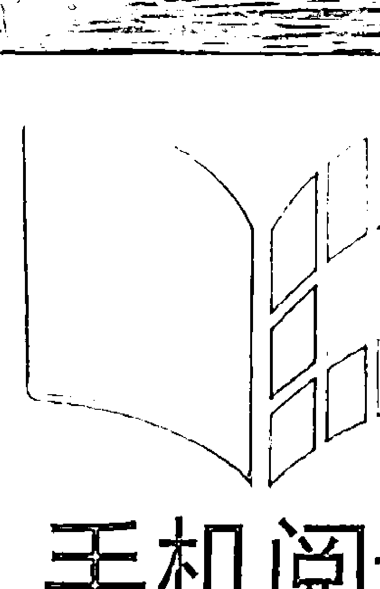
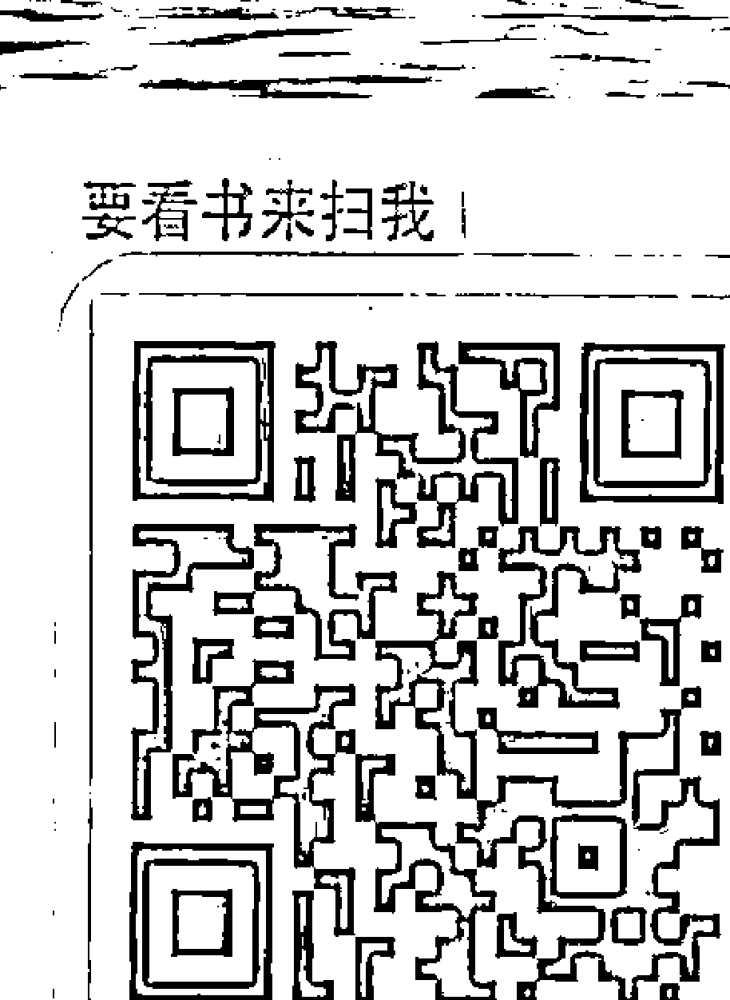
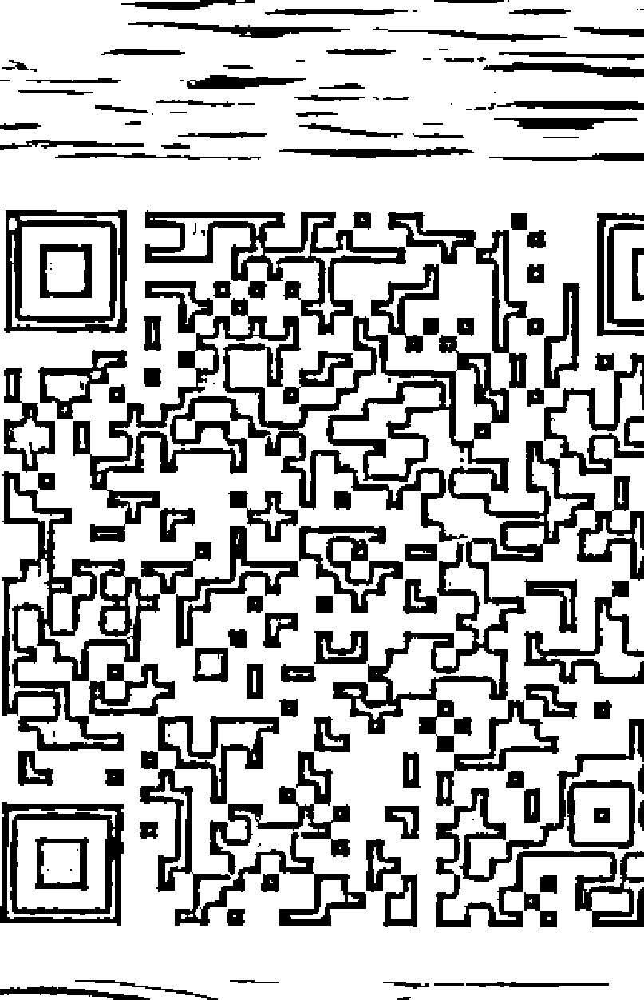
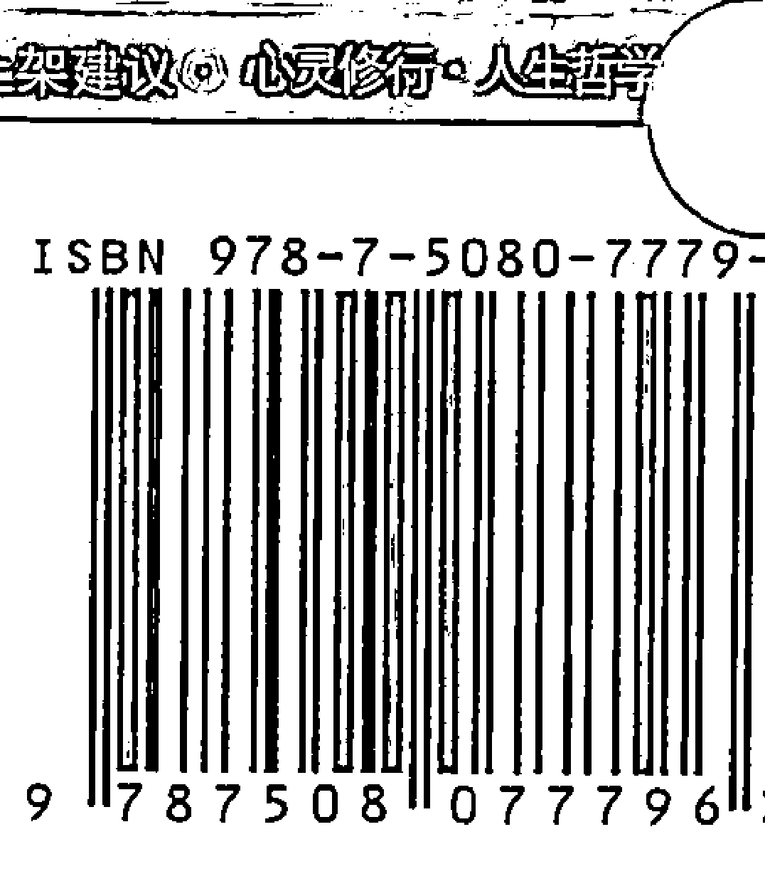

# 导读

## 一本兼具麻辣灵性理论和实操灵修工具的好书

**身心灵作家 张德芬**

杰德·麦肯纳的第一本书《灵性开悟：不是你想的那样》出版之后，得到了很多热烈的回响。原以为这是一本比较冷门的书，因为它基本上是“反灵修”的，我担心会引起灵修人士的抗拒，没想到，更多人是张开双臂欢迎它。我想，或许很多在灵修道路上的人是真的想看到实相、真相，而不是光想要拿“爱与光、和平与安宁、慈悲与奉献”来掩盖一些令人不安的事实吧。

而现在，杰德第三本书《灵性的自我开战》出版了。顾名思义，这就是一本会引起更多争议的书（原书名为“Spiritual Warfare”，直译的意思是“灵性战争”，而“灵性”与“战争”根本就是两个反义词嘛）。作者在书中的麻辣程度加重到令人捏把冷汗，他痛斥一些灵修界的怪现象，我也在被骂的行列中，但我不得不承认，他所说的，真实与正确的成分居多。

中文版之所以会先推出他“灵性开悟三部曲”的第三本，而把第二本放在后面才出，主要是因为第三本的口味比较重，真的非常好看，精彩万分。对我个人来说，它像一枚震撼弹，完全动摇了我的灵性观点和世界。而且，他在书中详细说明了“祈祷”和“显化”的差别，指出心想事成的真正境界和到达的方法：“宇宙给的，就是你想要的，那么你想要的，宇宙就会给你。” 这正是大多数读者心所向往的！

杰德这次在书中再次强调，灵性开悟不是什么了不起的事，只是假我（我执）的彻底消融。但在灵性市场上，有太多宣称自己已“开悟”的大师。我同意杰德的说法：“没有任何领悟、洞见或顿悟能在一瞬间将假我扫除殆尽，凡是自称瞬间觉醒的，其实正是最深陷于幻觉的人。” 这些大师也许有很好的领悟——宇宙智慧的大门在某个瞬间为他们开启——所以说得出舌灿莲花的法与道，但他们的我执还是非常强烈，强到他们自己的眼睛都被蒙蔽得看不见了。

杰德形容得很好：

> 我的前债券经纪人有超过30次直接与神之心智结合的经验，但如今他只是个一般人，过着推销产品与往返于上下班路上的平凡生活。所以在我看来，假如这个状态无法恒久持续下去，那它应该什么狗屁都不是，只能算是游乐场里的一项设施罢了。

他在本书中再次深刻描述我们每个人都深陷我执牢笼中的状态，更可怕的是，我们都是眼睛闭起来，自愿被囚的——被自己的无知和恐惧所奴役，无法逃脱。他说：“很少有人能了解何谓天堂与地狱，他们让自己在地狱里腐烂，却从不明白活在天堂是与生俱来的权利。世间没有任何自由比得上挣脱我执的束缚，然后与当下如是（what is）和谐共存。”多么一针见血的说法啊！

他也指出，由凝固的情绪能量所形成的硬壳，是阻碍我们获得自由的最主要原因，所以我们必须敲掉这些硬壳，方法就是：“我们应该解除所学、放下、简化。我们以为自己的目标是要成为某个人物（become someone），但唯有当我们都不是（become no one）时，宇宙才会属于我们。”这个时候，就是他说的，我们会与宇宙同频共振，然后自然而然就能心想事成。

接下来，他提到了“祈祷”（pray）和“显化”（manifestation）的不同：

祈祷具有特定性。你想要某些事物，便开口要求，但显化并非针对特定目标，它不只是关于获得自己想要的东西，而是跟你所做的每一件事、做事的方法、你是谁，以及你在世间如何做人处事有关。显化是关于如何塑造梦境状态，以及在自我与非我毫无缝隙的汇流处自在生活。它消除了做梦者与梦境之间的界线。你不只显化出一辆车或一双新鞋子，也显化了自己，其余的一切会自然且轻松地随之展现。

我们一直误以为心想事成就是用心去想、去发愿、去祈求，这是很大的谬误。心想事成的前提是，你要消融自我和无我之间的分隔，活在一个融合的状态，成为一个人类成人（他在书中多次提到）。那么，当你想要某件事情发生时，就去采取行动，然后宇宙就会回应你。杰德说：“你展现了明确的意愿，不只透过言语或想法，而是透过行动。当我们这么做时，宇宙很自然地就会比平常更柔软，开始重塑自己来顺应我们的需求，反之亦然。当自我与非我之间那个被感知到的分界开始消融，这个情况便会发生。”

他在书中也用了很大的篇幅帮助我们检视自己的人生到底是不是我们选择的，或我们想要的。他建议大家要去重整自己和父母的关系，为自己划清界限，而不是透过别人来决定、选择，或是任由二手资料操控我们，把我们变成自动化模式下的机器：“是谁刻意选择被锁链绑住？是谁选择了婚姻、养儿育女与事业？是谁自愿在消费社会债台高筑，浪费自己毕生劳动的成果，沦为各种有形物质与企业的奴隶？是谁选择把闲暇时光都用来处理杂务、做家事与看电视？谁决定吃进有毒食物，住在充满中毒人们的有毒环境里？谁选择从出生到死亡都过着预先设定好的人生？谁选择进入这种悲惨、卑微又负面的梦境里？当然，这种单调沉闷、追逐物质的生活或许是我们自己的选择，如果我们真的有选择的话。但我们没有。这就是所谓的无意识：在梦境中沉睡。我们一头栽进已经为我们准备好的人生，就像小孩子早上醒来发现妈妈已经为他们准备好衣服。没有人真正自己做决定。我们不是藉由选择来过生活，而是按照既有的方式度日。我们扮演生来就要扮演的角色，并未去过属于自己的人生，而是丢弃了它们。我们之所以丢弃，是因为不知道还有更好的选择，对更好的选择一无所知，是因为我们从未探问。我们从未质疑或有所怀疑，也从未挺身抗议，从未画一条界线。我们从来不曾在年轻时对父母、灵性导师、老师或其他任何人，提出一个简单、诚实且直接的问题，而这个问题必须在其他所有问题提出之前先被回答：‘这到底是在搞什么鬼？’这样就足以让他们毙命。不需要动刀动枪，而是运用你的思想、诚实与率直就能办到。这就是

> > 你观看、你看见的方式，也是你画一条界线的方式。”

这一段读起来真是十分麻辣精彩，却也精准到位。我们从未质疑我们的生活方式是不是自己选择的、想要的？我们是否一直在迎合父母、家庭、社会、学校的价值观和要求，却从未发现，这是我们自己的生活，我们有权利去选择、去决定？等到有了这个想法的时候，我们已经深陷其中，想要抽身而出，可能需要付出巨大的代价，就像书中的丽莎一样。但是，知道自己被囚禁，就是迈向自由的第一步，永远不会太迟。

像这样的精彩段落，书中比比皆是。不过，在杰德嬉笑怒骂的文字当中，还是有非常具有建设性的主张和脉络可循。我可以归纳出他觉得最重要的一句话就是：“我思故我在。”这个“思”，不是胡思乱想的思，而且看起来跟很多灵修法门强调的“无念”抵触，但真的尝试去达到“无念”状态的人都会沮丧地承认，我们的脑袋无法达到无念，最多只是顽空。无念的状态是当我们明白一切，再也没有问题时，脑袋自然而然会安静下来，没有东西可以琢磨了。所以，杰德所谓的“思”，是他非常强调的独立思考，认真地张开眼睛去看，而不是听信专家、权威的话。他在第一本书中提到“灵性自体解析”，这是思考的工具，是可以解构一切谎言的工具，“灵性开悟三部曲”的第二本书里有一个详细的范例，介绍这个方法的整个过程。

此外，他在本书中还提到一个重要的修炼方法：纪念死神，也就是时时刻刻记得自己终究会死的事实。他说：“让自己接近死亡。每一小时、每一天，你都要让自己沉浸在对死亡有所觉知的心态中，察觉时间的飞逝、时钟的运行，察觉每过一天就消失了一天，你的每次呼吸都代表又少了一口气。要以星期或月，而不是以年为单位来计算生命，清楚地记录生命的流逝。每天早晨花一点时间沉思何谓拥有崭新的一天，将‘直到死亡降临，我们才如梦初醒’刻在浴室镜子上。对死亡的沉思、对自己必死这个事实的沉思，是真实且强而有力的静心。察觉死亡就是真正的坐禅，是普世的灵修方法，是每个人唯一需要且应该好好修炼的功课。所以，是的，你们应该尽最大努力把这种充满生命的觉知带入自己的生活中。当你

看着钟表，坐下来享用食物，或者进入浴室时，都要养成思索死亡的习惯。
每天花点时间单独散步，好好地思考可以活着、走路、看见、听见及呼吸
的意义何在。这不是某种练习，不是某种你试图让自己相信的肯定信念，
而是很真实的东西，是你所有思想与行为的核心。如果你知道自己明天会
死，你今天会做些什么？然后，你干吗还不去做？"

有些人或许会觉得杰德的书过于黑暗、消极，但我个人不这么认为。
他在光明的彼岸（因为他的眼睛打开了），看我们这些在黑暗中的人（因为
我们的眼睛是闭着的），说出来的东西当然不会好听。但仔细探究，他
的说法跟其他许多古老教派与典籍的教导其实并没有差别，只是他比较赤
裸裸、血淋淋——因为没有经过包装，而且他没有在前面吊了一根胡萝卜
诱惑我们，也没有承诺后面会给我们糖果吃。他说：“‘我们的共识现实
其实是梦境状态’这份理解是无法被摧毁的。人生不过是一场梦，所谓的
现实其实缺乏根基。由于你的眼睛闭着，所以会觉得不满意，但睁开眼睛
的我却发现它是令人喜悦的、神奇的、荒谬的、互动性高、充满挑战、神
秘、顽皮且短暂。你想要答案，但其中没有答案，只有信仰，而你若想觉
醒，无论是在梦境状态之内或跳脱其外，信仰都不会是你的朋友，它们只
会阻拦你。要求答案与解释是自我用来拖延的诡计，你可以停止这些我执
的要求，融入这个你所归属之处，信任、臣服、放下。虽然你听不见，但
有个时钟一直不停地滴答响，而你并不知道自己还剩多少时光。仔细倾听
那个滴答声，游戏已经开始了，无论你是否参与其中。”

最后，他还提出一个灵修界很熟悉的练习法门：见证（witness），
就是自我观察的意思。

“说到底，唯一的灵修练习就是观察：看清楚事物的真相。这就是
灵性自体解析，一个帮助我们看清楚的工具，让我们的脑袋发挥到极致。
在见证过程中，你要稍微保持距离，这样你就不只是在过生活，同时也
能观察它。这不是像写日记那样的反思，而是在发生的当下进行，在每个
瞬间。就像此刻，我坐在这儿跟你说话，但我也处于公正观察者的见证模
式。我不完全是戏里的角色，也是台下的观众。我很清楚自己正在台上表

演，而我有点疏离地旁观着自己的演出。”
用演员的心态而不是角色的心态冷眼旁观自己的生活，倒是一个挺好的自我观察方法，而且杰德还建议，要去解构自己所扮演的角色，退后一步观察它，从高处观察自己所处的环境和时空，彻底看出人生的虚幻：

> “你可以像这样不断向下挖掘你一层一层的信仰，揭开幻相的层层面纱。正如我说的，这一切的关键其实只在于观察：透过不去看不存在的，来看见存在的。”

最近读到一段话，和杰德的观点不谋而合：“真的不忍心告诉你，这个世界只是一个梦。你一辈子执着的子女，只是你的一个缘；你一辈子放不下的家庭，只是你生命里的一个驿站；你所追逐的感情和名利只是一个自我意识的幻影。梦醒时分空空如也，满世界都是你，而整个世界又都是空的。”所以，刚读完杰德的书时，我十分沮丧。既然这个世界是虚幻的，我们所追逐的东西，甚至我们自己都终将化为空无，那一切有何意义？

但我很快体悟到，没有人走进迪斯尼乐园时会问：“我来这里做什么？这一切有何意义？”我们来到了这个地球，这就是意义。我们在这里可以尽情发挥自己的能力，创造自己想要创造的一切。虽然我们生下来就受到许多人生模式的限制，让我们和自己的真实本性失去连结，不知道自己多么有能力，但这就是此游戏的精华所在。我们要找到“身为演员而不是角色”的那种感觉，然后就可以恣意挥洒自己想演出的角色。同时我们很清楚，在这一生中，我们所创造的所有事物都像沙滩上的城堡一样，当“死亡”这个大浪来袭时，一切都会被摧毁。也正因为如此，我们就可以不那么执着地看待自己的人生——它只是个游戏而已。

至于，你如果要玩“开悟”这个项目，当然没有人会反对，只是要看清楚，你的开悟版本是否只是玛雅（幻相女神）乐园中的一个游乐项目，或者你真的离开了游乐场，超脱于人间游戏之外？关于这件事，没有好坏对错，只有明白与否。

# Better读者调查

感谢您参加《灵性的自我开战》读者调查活动，传真或邮寄此页（附购书小票）回编辑部，即可获得神秘礼品一份（数量有限，赠完为止）。参加此次活动者还将通过邮件不定期收到Better系列的最新出版信息，敬请期待！

## Step1 您的基本资料

姓名：________________________ 性别：□女 □男

年龄：□20岁及以下 □20-30岁 □30-40岁 □40-50岁 □50-60岁

电话：________________________ E-mail：________________________

学历：□高中（含以下） □大学 □研究生（含以上）

职业：□学生 □教师 □公司职员 □机关 □事业单位 □媒体 □自由职业

## Step2 您对本书的评价

您从哪里得知本书的信息：

- □书店 □报纸 □杂志 □电视 □网络 □亲友介绍 □工作坊 □瑜伽馆 □其他

读完这本书您觉得：

内容：□很吸引人 □还好 □枯燥（请说明原因）________ □您的建议________

封面设计：□够酷 □还好 □没注意 □不好（请说明原因）______________________

□您的建议________________________________________________________________

价格：□偏低 □合适 □能接受 □偏高 □您的建议_____________________________

## Step3 您的建议

您喜欢哪种类型的书籍：

- □经管 □心理 □励志 □社会人文 □传记 □艺术 □文学 □保健 □漫画
- □自然科学 其他_____________________________________________（请补充）

您不喜欢哪种类型的书籍：

- □经管 □心理 □励志 □社会人文 □传记 □艺术 □文学 □保健 □漫画
- □自然科学 其他_____________________________________________（请补充）

您给编辑的建议： ________________________________________________________________

华夏出版社地址：北京市东直门外香河园北里4号 Better编辑部
邮编：100028 传真：(010)64662584
Better编辑部博客：http://blog.sina.com.cn/betterbookbetterlife
微博：http://weibo.com/1617597092

# 目录

导读 / 1

1 开悟史上的伟大时刻 / 1

2 永恒的时间与无限的空间 / 10

3 真相的全貌 / 18

4 简短的回顾 / 21

5 简短的预览 / 32

6 活出梦想 / 38

7 成虫 / 48

8 乌托邦 / 58

9 敌托邦 / 59

10 短视症 / 60

11 大麦克攻击 / 67

12 这句子是错的 / 77

13 一切皆真 / 87

14 盲人的国度 / 89

15 显化命运 / 101

16 没有角色的演员 / 111

17 识字的文盲 / 120

18 灵性失调 / 130

19 我，见证者 / 139

20 觉醒部 / 151

21 平凡的超能力 / 164

22 祈祷的力量 / 175

23 最美好的世界 / 184

24 幻相的三脚凳 / 190

25 另类族群 / 199

26 嘉年华会 / 207

27 后妊娠期 / 218

28 宣战 / 232

29 不自由，毋宁死 / 243

30 献给一位朋友的挽歌 / 256

31 鸭语 / 258

32 驯魔者 / 266

33 纪念死神 / 277

34 生存，或死亡 / 287

35 终极禁忌 / 292

36 再简单也不过了 / 298

37 尾声 / 312

38 永恒的虚无：启悟后的光景 / 317

跋 / 322

# 开悟史上的伟大时刻

> 当我们想起我们全都是疯子，
> 神秘感就消失得无影无踪，
> 生命也解释得通了。
> ——马克·吐温

有多少灵性书籍是以警匪追逐场面揭开序幕的？在什么地方会出现某个正在写书的开悟的家伙被一堆警察追着跑的场景？

我看到越来越多的警车加入这场追逐战，并在心里斟酌着这些问题。几辆巡逻车正缓缓行经我背后漆黑的住宅区街道，探照灯不断扫向四周的屋舍与小庭院。

这儿是处于淡季的新英格兰某度假社区，共有两家度假酒店，里面游艇码头、餐厅、酒吧、游泳池、高尔夫球场等一应俱全。方圆30公里内还有几个滑雪场，但未能吸引大批冬季游客。反正现在已近四月，气候渐渐暖和，滑雪场全歇业了。这个小镇酒吧林立，让当地警察很头痛，因为经常要处理酗酒闹事与酒驾肇事等意外。

这出好戏约一小时前就开演了，而我目前的位置够近，能约略听见警察们在舞台上的谈话。我可以听到他们对着无线电对讲机说话，但听不见被静电干扰的回答。周遭的气氛弥漫着空洞的紧迫感，让许多警察摸不着头绪。在这种小地方，任何紧急事故都是一次令人新奇的经验。我怀疑当当地警察平日值勤时根本没有机会掏枪。基本上，他们是这个度假区的保全人员，保护着酒店、数百间度假屋，以及环湖山丘上的那些豪宅。

他们在我身上绝对搜不出东西，我没戴手表、皮夹，也没有钱。因为只是随兴出门散步，所以我的口袋里没有什么东西，而且出门时我并未给自己租的那栋房屋上锁，因此也没带钥匙。

我喜欢在淡季找个度假村租屋而居，这样能以最划算的价格租到条件最优越的房子，且那时游人稀少。此时不会有水上摩托车或船类活动，正好我对这类休闲娱乐都兴趣缺缺。我一向是夏天住滑雪圣地，冬季待在水边的度假村，而现在我正奉行此原则：过去三个月来，我都住在一栋旺季时必须付淡季八倍的价钱才有得住的豪宅里。住处附近人车稀少，没有太多孩童或狗的喧嚣，让我得以享有宁静与隐私。在这个寂静的小镇，我只要愉快地走几步路，就能到达几家很棒的餐厅，它们在淡季仍继续营业，却完全不拥挤。若我需要任何这个小镇没有的东西，开车一小时内便能抵达一个中型的大学城。我的租约再过两天就到期，到时候，我只要把东西塞进背包与旅行用的外衣口袋里，拍拍屁股就可以走人。清洁工每周会来打扫两次，我根本不必担心收拾的问题。

所以，一切都很令人满意，没什么好抱怨的。接下来我会往哪里去就随兴了。我身上带着护照，也接到了一个蛮有趣的邀约，希望我去墨西哥的某处，不过这大千世界任我遨游，我可以在任何地方停靠几个月。目前，我还没决定要去哪儿。

这会儿，我坐在黑暗中，在小镇山丘顶端纪念公园附近倚靠着某棵树，望着警察们在底下焦躁地东奔西跑。他们在这整件事情源起的停车场内翻着地图，想弄清今晚这场追逐战的对象与原因，却完全搞不清楚状况。

这是周四的夜晚——其实已经是周五凌晨一点左右了——我跟往常一样，晚上会外出散散步。我晃到码头边，沿着蜿蜒的沙滩前进，接着越过一道篱笆到小镇游荡，在荒凉的街道上浏览商店橱窗，然后沿着上坡路进入住宅区。我尽量避开住家房屋，以免惊动狗儿让它们开始吠叫，或触动感应照明灯。之后，我就顺着下坡路回到沿湖小径，走回自己的租屋处。这附近有一间颇受欢迎的酒吧，接着是一段登船处与船屋集中的湖畔小径，然后是停车场与一小块空地。经过那片空地时，我看到几个年轻人站在连接停车场与湖畔小径的过街桥上。他们正在吸大麻，见我走近，立刻紧张起来。我对着他们挥手微笑，说道：“我只是路过而已，各位。”这话让他们松懈下来。但接着，他们的表情又变得紧绷。我转身一看，马上明白原因何在：四五十米外正有两辆警车往这里开来。

“惨了！”其中一个神情恍惚的家伙惊呼，“快丢掉！”

此时，那两个警察已经下车，朝我们快步接近，手电筒的强光顿时乱窜。我此刻也灵光一闪（“灵光一闪”是开悟者的特征标记），像个受惊的小女生般跟着尖叫闪人。

这完全是意外状况，但这么做似乎还蛮好玩的。我真以为他们在50步内就会逮到我，然后这场游戏便结束了。我猜测自己还能享受30秒的自由滋味，接着就会被某个气喘吁吁且一脸不快的警察压倒在地了。不过，我只是出来散个步，没任何前科，口袋里或血液里也没有任何毒品，所以，他们只会说我是个无聊的混混，然后就放我走人——如果当时我的脑袋还在思考的话，想的大概就是这些了。然而，事情后来的发展并不是这样，没人追捕我；至少目前还没有。

我小步跑着爬上水泥阶梯，进入纪念公园。没人在后面追捕，令我有些小失望，于是我转身察看下方敌情。此时，第三辆警车刚好到场。他们已经逮到那些吸大麻的小鬼，正精神抖擞地讯问，手还指着我刚刚爬过的那些阶梯，以及我所在的区域。或许，他们对我还没死心也说不定。当两名警察往回越过过街桥，朝阶梯方向走过来，并拿手电筒不断探照时，我当下判断答案是肯定的。我该闪人了。

我走到大马路上，开始慢跑回自己的住处。然后，我决定耍点小聪明，在其中找点乐子。我很好奇他们到底有多认真想找到我。我沿着树篱到了一条隐蔽的车道，那里停放着一辆货车，我借助车子保险杆与一堵石墙，爬上一间车库的屋顶平台。穿过平台后，我翻越大概1.2米高的铁丝网篱笆，爬上另一户的侧边露台。此区的房屋都是在湖边坡地上一层一层往上盖的，两排房子旁边是一条狭窄的街道，接着又是两排房子，如此反复下去。他们的车库与船屋的屋顶都很低平，树木也颇稀疏，以免遮蔽湖景。建筑物与篱笆一律漆成白色，而那天晚上的月光很皎洁。

爬过一条街与三栋房子后，我停下来观察动静。此时，我以为警察紧跟在我后面，这样的乐趣就要结束了，因为我完全无法解释自己这种幼稚的行为。他们可能会威胁说要抓我去做心理测评之类的，可能会严厉警告我一番，然后大家便各自回去过自己的日子。不过，我看到警察还在下方，拿着手电筒搜索湖边的灌木丛与船屋。他们离目标还远着呢。

游戏结束了吧，我心想，此时不免觉得有一点失望。我没料到自己真能逃掉，一时还不确定该如何享受我的自由。我可以在三分钟内步行回到住处，但我却决定掉头，前往地势较高的某处街道，以便清楚鸟瞰下方所有的动态。当我转过一处通往位置极佳的制高点的转角时，突然间，强烈的车头灯光线射向我的眼睛，然后有人透过扩音器对我叫嚣着我听不懂的命令，大概是喝令我别乱动之类的。

所以，我拔腿就跑。我能说什么呢？那强光真是吓到我了，我还以为整出戏已落幕，而且坦白说，我最近觉得有点无聊。我使出我唯一的超能力——重力——往下冲到一条车道，穿过院子，翻越挡土墙，沿着篱笆跑，穿越一栋房子的露天平台与一条街。然后，我耍了点小聪明，先沿着街道跑，再往回跑上山坡，穿越另一条街，走过了好几家的篱笆，再沿着某一条车道走，绕过一栋房子，穿越一道矮篱笆，再穿过一个荒废的花园，又过了一条街，最后靠在人家院子里的轮胎秋千上，像小狗般气喘吁吁了好一阵子。

技术上来说，我不算犯什么错，因为我没听到警察喝令我别动。那辆车头灯射出强烈光线的车子好像已发出命令，但吓人的强光遮蔽了我的视线，所以我不知道那是警车。我很怀疑在这个湖畔度假区，这套烂说辞能让我全身而退，但一想到在这整场戏里，我是个无辜的受害者，被警察冤枉，甚至被压制在地上、被无情地追猎，我就觉得很乐。

先说一下，这件事最后是有意义的。

我可以听见下面的动静，有人声、车声，以及无线电对讲机传来的断断续续的杂音，但我搞不清楚这到底是什么状况。我很惊讶居然有一辆车停在这里守株待兔，准备逮捕我。我以为这场逃亡闹剧已经告一段落，他们却布下天罗地网搜捕我。我很好奇到底有多少警察参与，我觉得这个小镇的警车数量可能不及半打，周四夜晚大概只会派两三辆出来巡逻。我是刚巧碰上被派出来追捕神秘逃亡者的唯一一辆警车，还是有更多辆在追我？我的住处近在咫尺，只需穿过几条街，越过几户人家的院子，五分钟之内我就能回到家轻松泡澡。但是，让故事就此无疾而终，似乎不太对劲。

我藏身的庭院内有座很不赖的树屋，可以玩玩忍者游戏。我测试了一下木梯的坚固程度，爬上最低的那层平台，将自己藏好。我听到轮胎压过碎石的嘎吱声，只见一辆巡逻车熄掉车灯，慢慢地、悄悄地滑行，开着窗，观察、倾听着。我想到声东击西的老招数，但连我自己都不会被骗，我怀疑他们可能也不会中计。反正他们又没使用探照灯，只是悄悄前行，倾听动静。

因为常在附近散步，我对这一带所有的街道早就熟门熟路了，我很清楚哪几栋房屋装了感应照明灯，以及哪几栋视野最好。我距离一栋视野绝佳的大房子仅数百米，从那儿的主露天平台可以将邻近区域、湖景与小镇全貌一览无遗。我从树上一跃而下，在街上慢跑了一小段路，再沿着可以通往附近每一条街的主要街道走，最终抵达了那栋视野很棒的房子。我从靠近车道的后门爬上旋转梯，直上露天平台，蹲伏在围栏后面，下面的情况可以看得很清楚。

我可以看见一辆警车沿着街道悄悄滑行，另一辆则停在岔口附近，挡住了我的逃亡路线。透过树丛，我还看见警察最初停下来的那个停车场附近有些微光线与金属反光，但没啥特别的。就在此刻，我突然冒出一个念头（虽然可能有点迟了）：我根本不知道自己在干什么。我一面放松地躺在一张不需要垫子就已经舒服无比的柚木懒人椅上，一面思索着自己的处境有多蠢。我笑了出来，仰望着夜空众星，让一股深沉的满足感贯穿全身。我想，这就是我的生活。我谈论、书写跟灵性开悟有关的东西，我四处周游，住在有趣的地方，我跟警察玩躲猫猫，闯进人家的露天平台凝望繁星。这就是我的生活，既无厘头又充满喜悦，真是所有人梦寐以求的生活。

我在那儿躺了15分钟，可能还打了个盹，觉得心满意足又开心。今晚实在太有趣了，可为这一切画上完美的句点，因为我即将离开此地。我决定走回住处，洗个澡，然后上床睡觉，便站起身来，伸个懒腰，感受着那股愉悦的寒意，想赶快回家让身体暖起来。但是，一个探照灯突然照向我，稍微闪了一下，然后锁定了我。

“真是傻，”我平静的心想着，“难道他们不知道游戏结束了吗？我现在只想回家。一切都结束了。我玩得很愉快，谢谢各位。”

他们显然并不知情，以为我们还在玩，而且觉得一点都不好玩。事实上，他们还蛮严肃的，怒吼着命令我，丢出一堆威胁性的言语。我内心美妙和谐的状态顿时大受干扰，追逐战重新上演。

我顺着露天平台走到房屋侧边，穿越一小块院子，翻越一道挡土墙，然后踏上地势最高的大街。到了街上，我停下脚步，倾听是否有警车。从警车车头面对的方向来看，他们得掉头，或是得绕点路回转才能抵达我现在的位置。无论如何，他们迟早都会来到这里。因此，我转身沿着屋侧往回走，穿过露天平台，顺着旋转梯而下，这样一来，我整个人就完全曝光了。我穿的是浅色外套，在月光下会反光，所以我干脆脱掉，藏进路边的灌木篱笆下，明天再回来找——如果还有明天的话。

我现在能听见无线电对讲机的对话，也可以看到、听到更多车子接近了这个区域。我发现有些无线电对话是来自四处走动的巡逻警察。我穿透夜晚的黑暗专注凝望，分辨出手电筒的光束已非常接近我。

于是，我沿着马路小步跑，尽量贴着车道与灌木篱笆的边缘。逃跑这档事并没有那么好玩，而且完全不明智，所以我停下来思索自己有哪些选择。回家的路现在被切断了，所以泡澡和倒头大睡的计划是不可能实现了。我可以索性不玩，坐下来静候他们大驾光临，希望天亮前能爬进我温暖的床铺。我杵在那儿仔细琢磨各种选项，等待正确答案自动现身。而当某个警察从大约20米远的转弯处走过来时，正确的选择出现了。

他没瞧见我，所以我蹑手蹑脚地进入一条车道，悄悄爬上平顶车库侧边的阶梯，然后踏上铺着柏油与砾石的车库屋顶。屋顶四周有一道30厘米高的矮墙，因此我可以蹲低点儿来观察下面的动静。我瞧见那个警察拿着手电筒左探右照，车道、灌木丛下方、树上，无一遗漏。从对讲机传出来的内容我听得不是很清楚，但听见“郡”这个字，让我有些担心。我想到，他们现在正要求当地警察加入这项搜捕行动，并召集郡警支援。我觉得有些过火了，但根本没人问我的意见。

我挺喜欢这个小栖身处的，但明显我是腹背受敌，所以此地不宜久留。等那个警察走过去后，我从车库屋顶爬下来，跟在他后面。这似乎是个好主意，可惜我没注意到他猛然停步，结果离他太近，紧急煞车，双脚摩擦地上的碎石而发出噪音。他的手电筒转向我，口中厉声发出命令，我再次拔腿就跑。

我匆忙穿过一道矮树篱，贴着一栋房子的侧面以及一堵以铁道枕木为材料的挡土墙，想要就此溜走。警察的手电筒光线从大约十米外射来，照到我身上，我迅速蹲低身子，躲进隔壁那条街，然后从一个平底雪橇滑行道的顶端附近出来。那是一条六十米长的木制滑道，可以从上面滑到湖上（当湖面结冰时），旁边有楼梯可以爬上来。我正愁不知该选哪一条路时，瞥见附近一辆车子的保险杆上有张贴纸，上面写着：“耶稣会怎么做？”我突然灵机一动，答案就此闪现：耶稣会抓起一个垃圾桶盖，把它当做平底雪橇，一路往下滑到湖边，然后获得自由。当然啦，耶稣的医疗保险可能比我的好多了。

我没那么做。我小跑着回到丘顶的公园静观事态发展，然后再决定该怎么办。我安全抵达了那里，躲在树下俯瞰下方动静，稍稍喘了口气。

或许各位认为，一个开悟的大师理所当然是“平静”与“沉着”的纯正典范，应该具备极致的宁静与低调的优雅，能发散出爱与慈悲的光芒，浑身弥漫着平静与沉着的氛围，是个不受日常琐事与烦恼所困的超凡入圣之辈——当我倚着树干，思索自己目前的处境有多荒谬时，我也在想这些。

“嗯，”我喃喃自语，“这样似乎不太像‘开悟’的。”

当我不知道该怎么办时，就什么也不做，目前的情况正是如此。我就坐在那儿看着，并未把自己特别隐藏起来，或者继续玩游戏。

这整场冒险大约在一小时前开始。有四辆警车停在下方的停车场，其他的则来来去去。现在连郡警也插了一脚，我还偷听到他们在讨论要请求州警支援，不过在没有搞清楚追捕对象与原因的情况下，他们显然不想把事情闹得更大。

我觉得很好奇，也有些难过，因为警察们似乎玩得不太开心。我知道自己对人完全不了解，但我不明白他们为何如此大动肝火。这是个美好的夜晚，繁星点点，明月当空，空气中弥漫着令人心旷神怡的些许寒意。他们出来执行警察会做的事：带着手电筒和枪在漆黑的街道上搜索，寻找某个神秘的犯罪者，连地图和麦克风都用上了，他们不断在规划搜索模式。这是一场活生生的猎人游戏，有别于他们惯常处理的酒吧闹事或酒驾之类的小儿科犯罪。我看不出这整件事有何不好，但正如我说的，我真的很不了解人类。总之，他们看来似乎很不爽。

经过几分钟的观察与思索后，我明白自己玩够了，于是悄悄问宇宙我该怎么办。宇宙的回答来得明确又快速。我听到郡警的高阶警官决定派警犬上场，他的一名手下立刻用无线电召唤。我的答案已经出现。我无意让这件事演变到那种程度，于是我站起来，拍掉身上的尘土，走下山丘去自我介绍。

“嗨，各位，”我打断他们围在地图旁边的秘密讨论，说道，“我想我就是你们要找的那个家伙。”

突然间，所有枪支都对准我。很多把枪。

他们命令我把双手放在离我最近的那辆警车的引擎盖上，一名从肩章看来是个巡逻警察的中年胖警官出现在我右方，在30厘米外用枪对准我的头，带着颤音很认真地说：“别轻举妄动，混账东西！如果你敢乱动一下，我就把你这颗混账脑袋轰掉！”

这样的邀约可不是每天都有啊。

最好玩的部分是：我没有动。这是整出闹剧里我觉得最有趣，也最值得一提的地方。想要乱动的冲动当然是有，而想笑的冲动也真的让我笑了出来，但我还是极力让身体保持不动。我不是在笑警察，笑这场闹剧，或是笑其中的荒谬。我之所以笑是因为，这里显然就是出口，虽然很出人意料。只要我转头大叫一声：“呵！”一个非常有趣且毫无痛苦的结局会立即出现，没有大费周章的过程，比打开一个开关还轻松。

这就是今晚这一切的意义吗？时间到了吗？我瞧见天时地利人和的完美配合，看到自己有一股冲动，想要接受警察的慷慨邀约。这股冲动从我内心深处往上涌，快要浮到表面了，我的笑就是它显现的第一个迹象。然而，怪异又令人费解的是，某种调节机制中止了我猛然转头的欲望——虽然它已经在我的肩膀上蓄势待发了。我没有转头，只是说道：“没问题。”

有多少灵性书籍是这样开场的？

# 永恒的时间与无限空间

> 对我而言，宇宙似乎无限陌生且与我毫不相干。此刻，我内心夹杂着痛苦与幸福凝望着它。我跟宇宙分隔开来，仿佛与它保持着一段距离。我注视且听到那些在永恒的时间与无限的空间里移动的生物发出类似语言的声音，而那种语言，我再也无法了解，甚至记不得了。
> 
> ——尤金·尤涅斯柯

那天半夜与凌晨的事态发展有点虎头蛇尾，但也不算不愉快。没有人对我心怀恶意，也没人把我当成一个鲁莽的蠢蛋。那个巡逻警察很不爽，主要是因为他得扰人清梦，半夜把检察官叫起来，好商量出一个罪名来起诉我。棘手的是，我并未干下任何违法勾当，这真令众人跌破眼镜。但这不是重点，反正他们无论如何都得替我掰个罪名才能结案，放我离开。我看得出来，为了想出个罪名，他们可真是伤透脑筋。所以我向他们保证，我很快就要离开此地，无法回来出庭应讯。这番说辞似乎让他们稍微松了一口气。

最后，我还是在警局待了四小时，让他们把事情的来龙去脉弄清楚。整个过程非常不正式——我没被戴上手铐，他们只是随便搜个身、敷衍地问几句话，没让我按指纹，也没留下档案照。由于我身上没带皮夹，无法验明正身，他们对此也不是很高兴。

“干脆载我回家拿皮夹好了，”我建议道，“反正你们大概会给我开罚单吧，那我就需要信用卡了。”
“我们这儿不收信用卡啦！”那名巡逻警察抱怨道。
“那你还得带我到湖景区的提款机。”我说。为了确保他们不会因为本人如此大方而占我便宜，罚我太多钱，我补上一句：“但我每天的提款额度只有一百块，罚款如果超过这个数目，我只好选择乖乖吃牢饭，当你们的座上宾。”
这个小诡计奏效了，罚款刚好一百元整。不用想都知道。
“你们难道没有那种适用于各种琐碎犯罪的通用罪名吗？”我问，“就像是扰乱治安、妨碍公务或行为脱序之类的？”
但这些话只招来更多白眼。无论他们最后给我安什么罪，彼此都心知肚明，这只是形式罢了。他们非得送我一个罪名，我也必然要付出代价，一切完全按照剧本演出，他们当晚就会放人，然后整件事圆满落幕，没有什么出庭、律师、审查案情之类的啰嗦枝节。
这些我都可以接受。我的眼皮越来越沉重了。
有个叫“本”的年轻壮汉警察奉命先载我回家，接着载我去提款机领钱，再回局里。我钻进前座，他没给我戴手铐什么的。我进屋拿皮夹时，他就乖乖地在车里等候。真是个有礼貌的孩子，高中时期应该是学校美式足球队的后卫之类的。他非常想要重播今晚这场警匪追逐战的所有细节。
“在雪橇那里，我本来差点就逮到你了。”他骄傲地说。他指的是那条平底雪橇滑行道。
“喔，原来那个人是你啊？对呀，真的很接近。当时你到底在喊什么？我没有听清楚。”
“是喔？”他亲切地笑了出来。“我刚开始是喊‘别动！’，但感觉太像电视上演的东西了，于是中途改口喊‘停住！’，但又没说完整。我猜我后来喊的是‘别——住！’”
“对呀，”我附和道，“听起来很像‘别——住！’”
“你是在哪里摆脱我的？我一直以为自己就在你背后。”

此刻就是善意的谎言登场的时候了。警局里的每个人都曾经像这样大肆吹嘘自己追坏蛋时的丰功伟业，在这样的小镇上，今晚这场警匪追逐够他们讲个好几年了：想当年大伙搏命演出，掏出真枪实弹逮人，连郡警都参与了，还差点出动警犬和直升机，准备大干一场。虽然最后发现追捕的对象不是什么罪犯，但卖力追捕的时候谁都不知道，确实可能是如假包换的亡命之徒啊。

“你的确在我背后。”我告诉他。事实上，当时我躲在灌木篱笆后面看着他经过，然后才从他来的路往回走。“我本来以为你就要抓到我了，但我使尽吃奶的力气往前跑，然后去躲在一个树屋里，直到风声平息。”

这番话大大取悦了他。这下子，他可以向人吹嘘啦。

“那名巡逻警察拿枪指着你的头，还威胁说如果你敢乱动就开枪？”丽莎把刚读完的文稿放下，问道。那件事已经发生一个多月了，我们此刻正坐在墨西哥一栋别墅泳池边的书桌旁——我和她都住在这栋别墅里。

“对啊，怎么样？”我将视线从计算机转向外面的湖光山色，顺便揉揉眼睛。“这很奇怪吗？”

“我不知道，”她说，“听起来是有点夸张。”

“那个时候你会害怕吗？”

“怕什么？”

“我也不知道啊，嗯，或许是怕脑袋挨子弹？”

我耸耸肩。“这大概是我最不害怕的事了。”

“天哪，你真是个怪人。”我又耸耸肩。

我在新英格兰的度假小镇安静生活的几个月间，有个念头在脑海中逐渐成形：我或许得着手进行第三本书了，因为有些重要的东西我还没说，其他已经说出来的也没有经过充分地探索。当我完成第一本书《灵性开悟：不是你想的那样》之后，觉得自己终于一吐为快；心头的千斤重担被卸下来，真是痛快极了。可惜那种痛快的感觉维持不了多久。后来，第二本书①开始让人知道它的存在，所以我们就让它面世了。我又享受到一吐为快的喜悦，认为一切言尽于此，没有必要再写些什么了——意思就是，无论是教学、信件往来、写作，以及与灵性相关的所有事情，我实际上都已经做完了。然后，在警匪追逐闹剧发生之前的几个月里，那种感觉又卷土重来了。我并未刻意培养那种感觉，但经历过最早的那些骚动之后，我明白它会一直顽强地存在着，迟早我得动笔写第三本书。我没有做任何事情去推动它，只是让它在脑袋里自生自灭。

我之所以反对写第三本书，是因为我其实已经脱离教学模式和灵性心态，而且乐不思蜀。我不再与任何人讨论这些主题，它们也不再活跃于我的思绪之中。既然这些主题已经脱离我、脱离我周遭，而且没有任何迹象显示我将再度进入人类的灵性世界，那第三本书到底要从哪里冒出来？

更何况，我现在跟开悟之前的人类经验已经没有太多连结了，所以，我很怀疑第三本书如何产生。两者之间的鸿沟太过巨大，我已经忘记彼岸的生活是什么模样了。我现在的生命经验跟大多数人所谓的“现实”距离非常遥远，两者几无重叠之处。我现在看待人类的方式，犹如人类看待黑猩猩一般，有着同样的因演化阶段不同而存在的距离感。如今，我对开悟前状态的种种记忆，就像我对小学二年级生活的记忆般渺远又陌生。我在前两本书中都提过我这种梦境人格慢慢被侵蚀的情况。我一直努力让自己与开悟前的状态保持连结，但第二本书完成之后，我放下了，现在它已是过眼云烟。

至于想要第三本书面世的理由之一则是：它能提供一个让我在其中运作的架构，一个让我可以做点事，而且有理由这么做的“背景”。当然，所有的背景都是梦幻泡影，但我有什么好在乎的？我喜欢活着的感觉，如果还有游戏可玩，那就更有趣了。为某些特定读者写书，就是这样的游戏。

所以，我跟宇宙订下协议，对宇宙说，如果你希望这本书出现，就让它直接呈现在我面前，然后我会把它写出来。我不会追着灵感跑，也不会挖空心思去想要写些什么，因为那样很矫揉造作又很自我。我不可能那么做，况且那样也根本行不通。我知道自己之前从未被如此要求过，但我希望我们之间可以有一个很清楚的共识：如果你想要第三本书，我愿意贡献一己之力，但必须由你主导且由你编写。让它从天而降吧。

这样跟宇宙打交道，对我不是什么新鲜事。我们彼此相知甚深，我知道怎么开口，也知道该如何理解自己所获得的讯息。模式、迹象、对错之间的精微差异、能量的流动与阻塞，宇宙就是这样运作的。我说得好像宇宙和我是两个分离的实体，事实上，我说的是我们中间那层人为的区隔并不存在。这正是本书将要仔细检视的主题之一，也是大家都渴望知道、渴望深入挖掘的东西：毫不费力的运作、直观以及显化出丰盛的状态、健康、财富、快乐。当你了解宇宙到底是如何运作的，并重新与之融合，学习与它和谐一致地运作，那么，即使是《哈利波特》里的阿不思·邓布利多和《星际大战》中的欧比王跟你比起来，都会相形见绌——你以前还觉得他们拥有的力量很酷哩。

有许多书都在探讨如何在“人类孩童”（Human Child）的分离状态中显化自己的愿望，例如运用祷告、许愿技巧、肯定信念或吸引力法则，来获得更好的房子、跑得更快的车子、更完美的伴侣等。然而，本书讨论的重点是要让我们的生命转变到“人类成人”（Human Adult）的融合状态，并在这样的状态中成长。如此一来，祷告、许愿技巧、肯定句和吸引力法则等方法就显得很多余了。就像考试的时候，当你知道答案是什么，作弊就没有必要了。

一旦就第三本书的事跟宇宙达成初步协议之后，其他事情就会开始排队等待出现，整个计划的轮廓也会逐渐变得清晰。首先，我觉得写第三本书的确有其必要，因为还有更多重要的东西要说（或许这才是最重要的），如果无法一吐为快，我们就会觉得整个计划都没有完成。

另外，这本书其实已经从天而降了。我只花了几分钟思索，书的主题就呼之欲出。而大约在同时，我意识到一个装满电子邮件的档案匣的存在，来信者是一位退休的大学教授——后来我发现，他有一颗勇敢的心与一座非常专业的私人图书馆。那位教授住在墨西哥，每封信都邀我去作客，希望我能分享他对事物的观点和他的藏书。在最近的来信中，他提到他的女儿和她触礁的婚姻。那位教授叫弗兰克，女儿的名字是丽莎。弗兰克最近刚失去妻子，丽莎最近则迷失了自我。她也是促成我写第三本书的原因之一，她认为我是个怪人。

> > “所有关于宇宙的描述，”丽莎刚读完前面几页的初稿，“听起来有点……我也说不上来，我没看到你说的什么完美秩序，我只看到处都是偶然，都是混乱，万物实在没有什么真正的秩序可言。”

真是奇怪，对我而言如此简单又明显的事，别人为何会觉得这么陌生且无法理解？

> > “当你沉睡在我们称之为‘现实’的梦境里时，”我说，“表面看来到处都是混乱与偶然，仿佛随时都可能发生任何事。当你从梦境中醒来，睁开双眼直接观看，而不是从闭起来的眼睛后面去想象，你就会明白宇宙真正的运作法则：有某种完美无瑕的智慧在掌管这个梦境中的所有细节，从最微小到最巨大的，其中隐含着秩序、和谐、智慧，不会有任何例外或错误。”

她抛给我那种律师才有的锐利眼神。

> > “所以你比大多数人更能与这个完美的宇宙和谐共振？”

> > “我和宇宙之间并没有被幻相之幕隔开，大多数人却是如此。”

当我跟丽莎及其他两名助手坐在露天工作区时，我一如往常地对人们的怪异与不真实感到惊讶。此刻的我仿佛正在做梦，在梦中创造了这些平面的、没有深度的人物，但奇怪的是，我梦出来的这些人实在不怎么高明。他们就像有血有肉但安装了过时软件的机器人，显然无法适应全然开展于眼前的轨道，并会随之演化与发展。他们拥有各式各样的知识，也具备缜密思考的能力，而且他们有办法日复一日、年复一年地应付生命中诸多的复杂事物，例如家庭、健康、财务、事业、灵修、家务等。他们聪慧、成熟、灵巧、仁慈、诚实，但每当我跟他们谈到生命最基本与最重要的事实时，只换来狐疑的眼光与毫无逻辑的怀疑。成长、成年、能量模式、流动与阻碍、欲望与显化，这些都是我们在十岁以前就应该耳熟能详的话题，就像运用母语一样自然，但看看现在的我们，外表虽然像成人，但一提到何谓真正的“成年”，我们连像样一点的词汇都说不出来。

表面上看来，我并非最适合这个角色的人选。我不是那种在高中时就能让看到我的人说：“没错，这家伙脸上摆明了一副会开悟的样子。”我是具备某些我自己需要的特质，不过并没有迹象显示，我会是少数几个能找到人类自开天辟地以来就在追寻的答案的人。但撇开真相与开悟不谈，我是个发展健全且持续在成长的“人类成人”，对于如此流畅而不费力、如此神奇且充满无尽的喜悦、如此自然又完美的宇宙完全了然于胸，并且与它有着融合协调的关系。每当我看着那些聪明、能干、外表诚实的人，都必须提醒自己，我所拥有的现实——我那个安全、快乐、和谐共振的宇宙——对他们而言是全然陌生与未知的。我的现实对他们来说是荒谬的，反之亦然。大部分人或许会认为在我看来很正常的生活运作方式就像粗制滥造的低成本电影中的情节，与“真实”生活毫无关系。虽然这些和我坐在一起的人外表与我相似，走路与说话的方式也无异，和我之间只距离数尺，然而，我们却存在于截然不同、几乎毫无关联的生命领域。

接下来几章，我们会回顾并预告一些事情，但此刻，我想要提出这个区别。它与开悟或了知真相无关，而是关于成为一个自然发展的人，而非在灵性上发育不良、发展迟缓的人。也就是说，要成为一个人类成人，而不是人类孩童。实际上，在成长方面（无论是不是灵性上的成长），任何值得去了解或追求的事物都是关于做出这样的转变，然后持续一辈子的成长。这就是生命真正的面貌，却没有人知道。我说过，历史上那些伟大的男男女女在我看来也只是游乐场上的儿童，就是这个意思。这应该，也似乎可能是每个人的看法。你正在阅读本书，所以当然也可能有这个观点。对任何处于人类孩童状态的人来说——除了真正的幼儿之外——唯一关注的焦点应该是如何解开扼杀灵性的情绪枷锁，重新开始正确的生命状态。如果把注意力放在其他事情上，就是在逃避生命真正的旅程。

坐在我旁边，并且会在本书中一路陪伴我们的丽莎，最近开始非自愿地挣脱枷锁。在灵修世界里，她是个生手。而我们稍后会碰到的鲍勃则是个灵修专家与作者，从吠檀多哲学的不二论（Advaita）到禅宗，他都能引经据典、侃侃而谈。本书进入尾声前，丽莎将完成转化的历程，进入成年期，并在其中继续成长，而鲍勃则依然陷在知识和书本的泥沼中，以及灵性上的我执（egohood）里。

至于他们是否真实存在，而不只是栖息在我梦境世界中的幻影，我不予置评。

> ① 原文书名为《Spiritually Incorrect Enlightenment》。本书为作者“灵性开悟三部曲”的第三本，先推出第三本书的原因请见本书的导读。

# 真相的全貌

> 我绝对比此人更明智。我俩很可能都没有什么可以吹嘘的知识，但他认为自己知道某些他其实并不了解的东西，而我对自己的无知却了然于胸。无论如何，我都比他明智一些，因为我不会自以为了解我其实并不懂的事物。

——苏格拉底

你知道些什么呢？说真的，有什么东西是你真正、确实知道的？且将所有意见、信念与理论暂时摆在一边，专注讨论这个简单的问题：什么是你确实知道的？或者，就像梭罗说的：

> 让我们静下心来，努力使自己的双脚向下穿透意见、偏见、传统、幻相与外表组成的泥泞，这里淤积着上帝给自己的名号（这层淤泥覆盖了整个地球）……穿透教会与政府，穿透诗、哲学与宗教，直到抵达一个我们可以称之为“现实”的坚硬磐石底层，然后说，这就是了，绝对不会错。接着才是真正的开始……

换言之，咱们废话少说，先弄清楚我们确实知道些什么。“我思故我在”这句格言可以回答这个问题，非常简单。问题是：你知道些什么？答案是：我存在。

其他那些所谓的事实，其实都是非事实（non-facts），属于共识现实（consensual reality）与相对真相（relative truth）的范畴。换言之，就是非真实的现实（unreal reality）与非真相的真相（untrue truth）。

“我思故我在”是用来证明事实的公式，但在继续讨论之前，要先问一下：我们还知道些什么？还有什么是我们可以肯定的？

什么都没有。其他什么我们都不知道。这就是“我思故我在”真正的重点。“我存在”的重要性并不在于它是个事实，而在于它是唯一的事实。

每个人向来都知道，或者将来会知道的唯一一件事，就是“我存在”。至于其他的一切，所有的宗教、哲学与科学，都不过是对梦境的诠释。“我存在”是唯一的事实。

“我思故我在”会孕育出摧毁宇宙的思想。除了“我思故我在”，我们一无所知；除了“我思故我在”，我们不可能确知任何事。除了“我存在”，其他的我们完全不知道。没有任何人或神可以宣称他知道的比这个更多，没有任何存在的或我们想象出来的神可以宣称他们知道的范畴超越这件事：我存在。

我们不免需要暂时扯到《旧约圣经》。

> > 摩西曾询问上帝的名字，上帝回答他：“我即是我存在。” ①

上帝给自己的名字就是“我存在”。

请注意，“我存在”是无法做词形变化的，它不允许任何变动。上帝并未说：“我的名字是‘我存在’，但你们可以叫我‘你存在’或‘他存在’。”我思故我在——“我存在”的声明——的范围只限于个人的主观认知。我可以说我存在，且知道这是事实，但我不能代替其他人做此声明，宣称你存在、他／她存在、我们存在、他们存在、它存在,等等。我知道我存在，仅此而已。了解这层道理后，我存在——也就是上帝的别名——真的是最初与最终，是生命、知识，以及你们的整体。

“我思故我在”是幻想与现实之间的界线，其中一边属于信仰、概念与理论的范围，跨越了那条线，就意味着抛弃这一切。一旦心智中充满了盘根错节的“我思故我在”，任何理论、观念、信仰、意见或辩论都不可能拥有现实基础。两边不可能越过那条线对话，因为在一边有道理的事情，到了另一边就说不通了。

每个人都自以为了解“我思故我在”，但其实没有人真正懂它，连提出这个命题的笛卡尔亦然。若哲学教授了解“我思故我在”的真义，他们就不会成为哲学教授了。数学家兼哲学家说，所有的哲学都不过是柏拉图哲学的注脚，但包括柏拉图哲学在内的所有哲学，一旦碰上“我思故我在”，都会沦为过时又不着边际的东西。唯独主观的“我存在”是真实的，所以，何必继续说些废话？根本没什么好说的了。

“我思故我在”并非只是某种思想或概念，而是能够蚕食自我的病毒，如果可以降低自己对它的防卫，它终究会吞噬所有的幻相。一旦了解“我思故我在”，就能够逐渐有系统地解除我们对所有自认为了解的事物的“知”，拆解我们以为是自己的那个自我。从表层理解“我思故我在”只需几分钟，但要让它从内而外将你吞噬，可能得花费数年的工夫。

人生不过是场梦，并没有所谓的“客观现实”存在。二元是无法被证明的，世间没有任何事物的存在能被证明。时间与空间、爱与恨、善与恶、因与果，都只是概念而已。若有人自称知道任何事情，其实正代表他们对唯一的那件事一无所知。主张“我存在”之外的任何真相，都只是在承认自己的无知。人类历史上最伟大的宗教与哲学思想和概念，其中所包含的真相不会比绵羊发出的哀鸣更多。最伟大的书籍中所包含的真相，也不会多于最高级的猪肉罐头。

所有人都一无所知。

你可以自己反驳上面那句话。任何人若想要否定跟“我思故我在”的意义有关的这些陈述，只需证明某件事——任何事都行——是真实的。请尽量尝试，以各种方式向它挑战，但一切只是徒劳。“我思故我在”就像一颗汽油弹，可以用来轰炸我们的心智，但请放心，真相不会灼伤我们。不过，这可不是觉醒之旅的终点。

这只是开始。

> ① 出自《出埃及记》第三章第十四节，原文为：“I am that I am.”，《圣经和合本》译为：“我是自有永有的。”

## 简短的回顾

> > 沟通最大的问题在于，我们误以为它已经发生了。
> ——萧伯纳

你可以跳过这一章，但如果后面的章节里出现的某些词汇与概念，以及它们之间的关系让你感到困惑的话，你可以回过头来，在此找到所有解释。若各位尚未读过我先前的两本著作，强烈建议你花几分钟阅读这一章。

## 梦境状态范式

> > 现实不过是一种幻相，尽管它极其持久。
> ——爱因斯坦

我们表面上正在体验与分享的现实，是众人一致同意的现实（共识现实），它跟梦境根本无从区分。

## 灵性开悟

如果你可以在开悟与获得一百万美元之间做个选择，还是选择一百万吧！因为，你若获得一百万，至少还有个人享用这些钱，但假如你得到开悟，就没有人在那儿享受所谓的开悟了。
——拉姆西·巴西卡

想要了解“灵性开悟”一词，首要之务是明白：它是一文不值的东西（是指这个词汇，而不是状态，虽然其状态也没啥好推荐的）。实际处于此状态的人，绝不会把它称为灵性开悟，不过，也没有其他状态担得起这个称号。

有些人认为某些非寻常状态，如宇宙意识与上帝意识（God Consciousness），配得上这样辉煌的称呼——若其状态的持续性优于狂笑意识（Guffaw Consciousness），我可能会同意这样的看法。事实上，我的前债券经纪人有超过30次直接与神之心智结合的经验，但如今他只是个一般人，过着推销产品与通勤的平凡生活。所以在我看来，假如这个状态无法恒久持续下去，那它应该什么狗屁都不是，只能算是游乐场里的一项设施罢了。

灵性开悟是自我不受任何幻相束缚，甚至摆脱了自我本身的状态。另一个有助于描述此状态的名词是“了悟真相”，更精确的说法应该是“解除对非真相的了悟”，但此说法颇为拗口，应用上不太方便。称之为“恒久非二元觉知”也可以。

迈向开悟的过程是一项刻意消灭自我的行动，进行杀戮的主体是虚假的自我，死亡的也是虚假的自我。也就是说，这是除了肉体层面之外的全面性自杀。虚假自我消失之后留下的空缺，并没有一个真实自我来填满，所以没有任何自我留下来，因此我们可以说，“无我”就是真我。

我们不可能有意识地选择或渴望灵性开悟，渴望它就是误解了它。自我无法渴求无我。人之所以会去经历觉醒的过程，并非出于对真相的热爱，而是由于对虚假的憎恶——这种憎恶极度强烈，足以将一切烧尽，片甲不留。

## 玛雅：幻相的建筑师

一个人只要觉醒片刻、睁开双眼，原本让他沉睡的所有力量就会开始以十倍的力道作用在他身上，于是他立刻再次陷入沉睡，然后往往会梦见自己是清醒的，或者正在醒过来。

> ——葛吉夫

对幻相女神玛雅最适当的描述大概是：恐惧的情治单位。它是被囚禁者的监视人、梦境状态的看守员。玛雅给了我们神奇的、赋予事物生命的力量，让我们看见幻相却无视真相。玛雅创造了梦境状态，也让人几乎没有机会逃脱。她使梦境状态得以存在，你若想从梦中醒转，就必须一层一层地摧毁她，但请别把隐喻当真，玛雅不是真正的女性，也不存在于你之外。她就在你之内，而那些层次是你的自我创造出来的。

玛雅是自我的严密结构。玛雅可以去观察自我运作的方式，研究它、剖析它、逆向操作它。玛雅不是某个人，也不是某个概念或女神。除非与她近身搏斗，否则我们不可能了解玛雅是什么。除非进入得和她一样深，否则无法得知她有多深入你的内在。

玛雅在这场战役里占尽优势，只有一项弱点：真相。玛雅并不存在，但真相存在。

## 人类成人期与人类孩童期（融合状态与分离状态）

> 在毛毛虫身上，我们看不到它有可能化为蝴蝶的迹象。
> ——巴克敏斯特·富勒

> 当紧缩在花苞里终究比绽放更痛苦，时机就成熟了。
> ——安娜伊思·宁

人类孩童期是被自我束缚住的状态。当我们仍是个孩子时，这样的状态健康又自然，但对成年人来说，这是可怕的折磨。假如每个人都一样在受苦，那它就不会被察觉或补救，而这正是人类目前面临的状况。因为没有看到问题存在，就不知道生命还有其他出路，所以不会去寻求解决之道，带来改变的希望也就不存在。

我们毕生都活在虚假的伪装与错误的身份认同中。我们毫无保留地拥抱这种虚假的自我，误以为自己所扮演的这些平面且没有深度的角色是自己的真实身份。事实上，我们应该在青少年时期就抛弃这些幼稚的伪装，踏上生命之旅——这样的生命旅程是如此优越，相形之下，被自我束缚住的生命根本不叫生命。

想象一只蚱蜢陷入蛛网中，被蜘蛛注入不会致命的毒液，然后被一层一层的蛛丝紧紧缠裹，仍留其活口以保持新鲜，但已被牢牢地束缚住，以防其挣扎或逃脱。因此，它虽然活着，但与原本活蹦乱跳的真正蚱蜢已完全不同。那种动弹不得、麻痹僵呆的情况，颇能代表长期处于“人类孩童期”的状态，但全世界都误以为这就是成年人的正常样貌。

那只蜘蛛可说就是幻相女神玛雅。

大多数人到了10岁或12岁，心智便停止发展。70岁左右的人，往往只是拥有60年年资的10岁小孩。我们的社会是由人类孩童组成，且由人类孩童统治与享有，这足以说明这个恶劣的病灶，以及世上到处可见的愚蠢行为为何会永远存在。

在同样的发展阶段停滞多年的人类孩童，认为成长是一种固化的过程，人会在这样的过程中逐渐变得坚强刚硬。在我们这个人类孩童的世界里，这种心灵的坏死被视为正常、健康且值得尊敬的。

若以公民的心灵发展成熟度来衡量社会的进步程度，我们会发现最进步与最落伍的两端，其实没有什么差别。某个社会可能平均比另一个稍微进步一点，但事实上，所有社会仍停留在女孩玩家家酒、男孩忙着虐待小动物的阶段。如果我们是生活在一个对健康且正常的发展有助益的社会，那么每个人在身体发育的同时，人格结构应该会突破孩童期，持续成长。然而，这样的社会并不存在，也没理由相信将来会有。我们被困在某种有知觉的类人猿意识状态，这就是人类的处境。

我们常说的那些人类的负面特质，例如贪婪、腐败、冷漠、愚蠢、充满憎恨、凶暴等，都不是人类这种动物或有知觉的生物的症状，而是人类孩童期的症状。不过，人类孩童期本身也只是某个核心疾病的症状，这个核心疾病就是万病之源：恐惧。对闭着眼睛生活的人来说，恐惧是正常且必然的状态。而所谓的无知，就是认为闭上的眼睛是睁开的，还把想象出来的世界当成实际存在的。

若想在适当的发展年龄蜕变，进入人类成人期，需要的不是平常那种只有象征意义的仪式，而是实际的成年仪式，但它所需的条件远不止如此。这个成年仪式必须在一个充满人类成人的社会才能发生，所以机会渺茫。这是坏消息。不过，人类倒是有可能，也确实发生过在不适当的发展年龄蜕变并进入人类成人期的状况。这是好消息。对于想要改变与成长、想要摆脱由发展迟滞的社会造成的发展迟滞状态的人来说，是有可行之道的。我的意思不是指某些特定的人能办到，但我可以很有自信地说，凡能洞悉自身受到束缚，并渴望获得自由者，会发现自己的状态是有可能产生戏剧性转变的。

这正是虔诚的求道者必须全神贯注、付出最严苛努力的地方。如果不了解这一点，我们就会一无所获。而且，稍微了解并不足够，我们必须浸淫其中，活出它，与它息息相通，让它成为我们个人的宗教，对它产生强烈的热情。我们必须学会轻松且准确地区别人类成人与人类孩童，就像我们能轻易看出六十岁与六岁的人有何不同一样。

这听起来或许有些奇怪，但你的自我比你聪明，而且聪明太多了。若不认清这个事实，并给予尊重，你就毫无胜算。我曾读过许多脑筋很好的人写的极有洞见的书，那些人都是“超越自我”这个主题的专家，但我可以轻易看出他们并未超脱自己的自我。整个灵性 / 宗教市场本应致力于促使这个重要的发展出现，但实际的情况却刚好相反。

我们不需要杀死自我，因为它从未真正存活着。你无需毁灭虚假的自我，因为它不是真实的，这才是真正的重点。虚假自我只是我们所扮演的某个角色，是应该被消灭的，是我们对那个角色的认同。一旦做到这一点——确实达成，而且可能得花上好几年——那你就可以穿上戏服，扮演适合自己的角色，这时你就能做到出入自由，不致假戏真做。

## 人类成人期vs.灵性开悟

你所能经历的最重大的事情是什么？就是强烈的鄙视。那时，连你的快乐都令你憎恶，甚至你的理智与美德也不例外。

> ——尼采

人类成人期与开悟之间的差别是，前者是在梦境状态之中醒来，后者则是从梦境状态醒来并从梦境状态中跳脱。浅薄的初期人类成人期往往被误认为是灵性开悟，或者被当成开悟来贩卖，但它并非真货，只是初次真正瞥见了生命，是从子宫进入世界的死亡／重生转化。

而这两种状态最重要的区别在于，人类成人期有意义，开悟则没有。大多数灵修者在清楚了解“了悟真相”的真正意义之后，获得的最大好处并不是他们能达到这个目标，而是可以摒弃这件事，重新把灵性上的目标设定在比开悟更有价值的事物上——开悟其实是有史以来最一文不值的东西。

大家真正想要的是人类成人期，而不是真相或开悟。你在这里能找到很多好东西，不好的东西很少。当然，你必须成长为人类成人，然后继续发展、成熟、学习与扩展，但其附加价值在于：

- 深刻而恒久的满足感
- 显化愿望与塑造事件的能力
- 事半功倍的能力
- 发现自己真正的天职
- 与更高自我连结
- 不会再踢到脚趾头，等等。

无论是不是灵修或宗教界人士，无论是不是无神论者，都应该以人类成人期为目标。这是我从多年的教学与写作经验中获得的结论。如果要我给建议，我会大力推荐人类成人期，而不推荐开悟。因为，人类成人期肯定人生，开悟则否定人生；人类成人期是真正的奖赏、真正有价值的东西，开悟则完全没意义，只有在这件事情上毫无选择的人才应该去追求。

## 单纯性

真相的语言是很单纯的。

> ——塞内卡

尽管我们想尽办法把它搞得很复杂，但觉醒的旅程其实是全然单纯的。每当我们陷入混乱、迷惘，觉得心灵脆弱或心智被蒙蔽，脑袋被某些灵性推销术、哲学论辩或当今最红的上师弄得晕头转向时，只要回归单纯就行了。没什么好学习的，没什么好知道的，没什么好练习的，也没有什么是你必须成为的。

## 专注与意愿

> 我们无法想象歌德或贝多芬精通台球或高尔夫球。
——孟肯

绝大多数的求道者都是受欲望驱动，因此他们的追寻注定以失败收场——人类历史上已经有充分的例子可以证明，我们几乎无法寻获未曾失落的东西。

为什么看见真相这样简单的事，竟能让世间最热切的求道者与最伟大的智者如此困惑？因为，真正的觉醒状态没人想要。我们对觉醒的渴望或许表达得很含糊，但我们想要的是非常特定的某种觉醒，不需要离开舒适梦境的那种——若它能让梦境变得更舒适，那就更棒了。我们并不想从梦中醒过来，只想梦见自己醒来了。

真正驱使我们踏上觉醒之旅的那股欲望，比较接近于某种精神疯狂状态。那是一种深刻且长时间的危机，不是小贩向观光客兜售的“灵魂暗夜”那种阴郁的小玩意儿。

许多人听到生命的闹钟响起，那是叫人醒来的召唤声，但我们真正想要的——甚至比想要性、权力、名气、爱情、永生或金钱的程度还要深——就是按下闹钟的贪睡按钮，让它暂停，然后继续回去睡觉。当生命发出呼喊声时，我们只想把棉被往上拉、蒙着头，翻过身缩在棉被里，最重要的是，一直把眼睛闭着。

无论他们是怎么说的，每个人最不想要的，就是自己的美梦受到干扰。

### 臣服

> > 我唯一知道的，就是我一无所知。
> ——苏格拉底

臣服就是放弃控制的假象，因而启动死亡 / 重生过程的死亡部分，从类似被束缚于子宫内的分离状态过渡到不断扩展、自由自在的融合状态。要做到臣服，不需要任何信仰或信念，只要洞察即可。当一个人了解到自我与恐惧的真正面貌，这个过程便轻松自然得犹如甩掉一个沉重的包袱一般。

悲哀的是，由于世俗基督教、惩教系统，以及十二步骤戒酒计划都在大力推广虚伪的臣服，使这个极重要且必要的成长阶段受到藐视，被诟病为愚蠢、害怕又软弱的可悲行为。这是玛雅在世间运作的一个很清楚的例子。

### 真相的代价

> > 不计代价地追求真相，是一种赶尽杀绝的热情。
> ——卡缪

真相的代价就是一切，真相的代价就是什么都没有。这是描述“无门之门”的矛盾的另一种说法。从沉睡的这边来看，这道阻碍我们开悟的门庞大且无法通行。我们的视野充满幻相，因为幻相已先于知觉而存在。一旦幻相被摧毁，我们就会看清它从未真正存在过。

### 无知

> > 对“探索”而言，最大的障碍不是无知，而是知识的幻相。
> ——丹尼尔·布尔斯汀

无知有两种。第一种无知是不知道或不了解某些事物，这种无知是良性的，通常不会制造太多麻烦。若你不知道如何替车子换机油，找别人代劳即可；如果你不知道怎么煮千层面，买本食谱就能解决；若你不知道如何跳伞，你不会随便从飞机上跳下来。

另外一种无知则是自以为知道或了解我们其实并不清楚的事物，这种无知有毒，且会削弱人的力量。

大多数灵修者往往会耗费一辈子的时间来对付第一种无知，却从未明白，奴役他们的，其实是第二种。

### 灵性自体解析

思想在成为任何知识前，必须先经历崩解与自我对立。

> ——赫胥黎

手握笔杆，就是在进行一场战争。

> ——伏尔泰

灵性自体解析是一种透过高度专注，让我们的智性潜能发挥到极致的书写过程。自体解析代表自我消解，这正是此技巧的目的。它不像写日记或记录灵性成长历程，其主要目的在于找到并看清我们成长路上的障碍。它关切的不是找到答案，而是问题。并没有什么答案可寻，能找的，只有界定了我们的限制的问题。了解了问题，你就摧毁了自己的局限。透过勇敢地思索与洞察，便能够毁灭幻相。

每个人都自以为会思考，但等到有人开始真正地思考——剖析地、冷静地、解构地——他们很快就会发现，其实自己以前从未真正思考过。透过书写，透过将思维过程外显化，并且不带个人情感，跟它保持适当距离，以严谨、客观的态度呈现所有面向，我们得以释放一种凶猛的理智，那是我们通常无法做到且未曾察觉的。

你可以从写下一个你肯定为真的句子开始，然后思索这个句子为何是错误的——也就是说，除非你写的是否定句（没有信仰是真实的），或者表达主观意见（我的脚痛），或者写下唯一确知为真的事（我存在），不然这个句子一定是错误的。

### 恐惧

> > 踏出崭新的一步、说出新话语，是人们最惧怕的事。 
> 
> ——陀思妥耶夫斯基

恐惧是闭眼状态下最主要的情绪。所有情绪都是执着，而所有执着的能量来源都是恐惧。

恐惧什么呢？恐惧无我，对于“不存在”的无名、模糊的恐惧。不仅仅是恐惧死亡，因为任何人都能轻易否定死亡或设法解释死亡，他们真正恐惧的是“空无”，没有任何童话故事能解决此问题。

### 感恩

> > 若你此生唯一说过的祷词是“感谢你”，这样便已足够。 
> 
> ——艾克哈特

没有特定对象、全然包容，带着这种不算难受的感伤的感恩，可以算是了悟真相的人与成熟的人类成人的主要情绪。当恐惧消失无踪，这种感恩之情自然会出现。

### 更远

> > 到达顶峰时，继续向上爬。 
> 
> ——禅宗语录

“更远”这个词就像护身符，像某种拥有力量之物。在每场战役之后，在每次我们自认为必然已经完成了，终于到达目的地时，就得把这个词拿出来好好凝视一番。尽管看起来并非如此，但我们总是还要走得更远。站起来，拍掉身上的灰尘，束紧腰带，为下次的战斗做好准备。

荣格说，他必须走下千层阶梯，才能到达他脚下这一小方土地。他每走下一层，一定都自以为已到达目的地，直到他的眼睛适应黑暗，才发现还有另一层往下的阶梯。若荣格了解“更远”一词，他就会明白眼前还有更多阶梯，而他脚下那方寸土，其实是无限延伸的。

每当你确定自己已经到达了，前方总有路等着，要你走得更远。或许终有一天，你会发现路已走到尽头，然后你会清楚地看到那个事实——没有华丽的彩带、耀眼的光芒或天使的合唱，只是困惑又无精打采地发现你已经……

## 完成

“完成”就是完成了。

### 简短的预览

> > 好读者才能造就好书。他在每本书里都会发现某些段落，其他人对它们仿佛视而不见，但其透露的讯息明显针对他出现。能从书中获益多少，视读者的敏感度而定。书中隐藏的妙思与热情如沉睡的矿脉，正等待有同样伟大心灵的人来挖掘。
> ——爱默生

你可以跳过此章不看，但如果你在后面读到关于三栋房屋、两个女人、两个男人的事，或什么女孩、狗、当地人之类的内容而感到困惑的话，可以再回头读这一章，就可以厘清事件的来龙去脉。若你看完后仍一头雾水，就是我的失职了。本书我多写了好几百页，删减时可能删掉了某些细节和许多地方色彩，但留下了大部分的内涵。我原本花了四章来说明我的编辑助理丽莎的背景故事，但她敦促我把四章浓缩成一小章，于是成了现在的样貌。

丽莎原本并非我的编辑助理，我们是透过她的父亲弗兰克认识的。他告诉我，丽莎正经历某种危机，并暗示可能跟我的书有关。她那负了伤却依然不屈不挠的精神、茫然的眼神与手上紧抓不放的记事本，引起我极大的好奇。我邀请她和女儿梅姬到我租来的度假屋小住。经过几次讨论，她满怀感激地接受邀请，后来还协助催生此书。

丽莎是弗兰克的女儿，职业是律师。她嫁给一个牙医，是两个孩子——梅姬与DJ——的妈，也是个不情不愿的灵性探索者。现在的她正处于一个与存在有关的崩溃的最后阶段，这样的状态已经慢慢消磨她三年了。

她的老爸弗兰克是位退休的大学教授，力邀我造访他在墨西哥的颐养天年之处。他住在一个名为“湖畔”的长青社区，由沿着恰帕拉湖北岸的几个小镇所组成。他的妻子伊莎贝在一年前过世，让弗兰克有点无所适从。我决定接受他一再的邀约，是基于两个理由：一是因为他寄给我的31封电邮的内容，以及可以自由使用他那充满奇书的私人图书馆这一点；二是因为我祖父。

虽然被我称为祖父，但他其实是我祖父的哥哥，现在早已作古。在距离墨西哥小镇圣米盖尔-德阿连德的几里外，他拥有一座占地约二十亩的牧场。在长期担任成功的执业律师后，他选择在此地退休。他不是墨西哥人，也不会西班牙语，他只想彻底退休，养几匹马，然后安度余生。我小时候曾几次到这个牧场度过暑假，当时就觉得这地方是理想家园。他是个脾气暴躁的老怪物，不喜欢任何人，更不喜欢他的家人，不过倒是挺喜欢我，可能是因为我喜欢跟他去钓鱼，能够默背他最喜爱的诗人拜伦的长诗，还有，我在大部分时间里都很沉默。

“当两条蛇开始吞噬彼此的尾巴，而且一直吃下去时，会发生什么事？”当我正式被介绍给他认识时，他这么问我。那年我八岁。
我思索了一下才回答：“我不知道，先生。”
“你说得真他妈的对极了！”这就是我们的初遇。此后，我们每年都会碰面一次。“想出答案没有？”他会这么问我。“没有，先生。”我回答。“还在想这问题？”他问。“是的，先生。”我答道。“好孩子。”他会这样回我。这就是我们关系的极致，直到12岁，我受邀在暑假到墨西哥与他共度一个月。那年我接受了他的邀请，往后几年又去了几次，直到我被其他兴趣和工作吸引，不得不婉拒其好意。虽然我们从来没有好好交谈，但或许正因如此，我们两人反而相处得极为融洽。

过去20年，我住过许多地方，有些住个几年，许多地方只住上几个月，但从没有任何地方让我想永久安顿下来。当我自问到底哪里才是我真正想要的落脚处时，祖父牧场的影像才清晰呈现在我心中。我从未想过真的把它买下来，但我对这里存有一种回忆。我总是想在其他地方找寻这份记忆，那是我心目中一个家该有的样子。

所以，当我在冬天的淡季入住新英格兰度假区，正在盘算接着该何去何从，加上迹象显示我可能会写第三本书时，我偶然看到那塞满弗兰克电邮的档案匣，脑中浮现出对祖父房子的美好记忆，我发现基于许多理由，墨西哥应该会是个很好的安顿处。我个人是蛮喜欢靠近人群的，但我并不想与他们打成一片。住在社区的边缘地带，与其保持一定程度的疏离，让我最感自在。例如，若住在亚洲，可能疏离感太强烈，而生活在说英语的地区又感觉太黏腻，墨西哥则恰到好处，它的文化和语言隔阂刚刚好。于是，我做了些安排，在婉拒那个胖巡警一枪轰掉我脑袋的慷慨邀约之后，过了几天，我便启程前往墨西哥。

经过一连串有趣的事件，终于抵达“湖畔”社区。我租了一栋别墅，价格超出我当初预算的四倍，结果却很完美。这栋别墅的主人是来自美国某大城的著名交响乐队指挥，平常很少南下度假。它位于山丘上，四面都是围墙，里头有主建筑与待客的小屋、一座游泳池与更衣室，并附各种小型建筑、小花园与阳台，好几个卫星小耳朵，以及两座喷泉，总面积超过一亩。它远离市区尘嚣，但到任何地方都只需五分钟车程。其实我本来并没有打算或选择住这类地方，但事情就是如此自然地发生了。

租下的这栋别墅还附带着女仆与园丁，这对夫妇已经照顾这里好几年了。主屋里虽然有他们的房间，但他们平日住在别处。主屋内有间设备齐全的家庭剧院，摆满世界各大厂牌与经销商免费送给屋主的音乐与电影。我想我会尽情享用这项设备。从主屋外面直走下去，就是客人住的小屋，精美舒适，跟游泳池相连。池边有座凉亭式建筑，里头有小厨房、更衣间和浴室，还有舒适的休息区和壁炉。这建筑物沿着泳池的那片墙是落地窗式的玻璃片拼装起来的，可以打开来，让这里成为很舒服且内外通透的空间，可以俯瞰下方的恰帕拉湖并远眺包围湖泊的群山。泳池露台上方有个凉棚式屋顶，我就把餐桌移到打开来的墙那里，变成一张大书桌，然后在此消磨大部分的时光，本书也大致完成于此处。

这个地方视野开阔，景色又很壮观，尤其是日出日落之际。除了景色宜人外，这地区的气候更是完美至极：冷热适中，气温总保持在最干爽舒心的状态。这里满眼绿意，色彩丰富，镇上的商店与餐厅也都很棒，非常适合随意溜达，所需之物几乎都有，而距此不到一小时车程的瓜达拉哈拉更是什么东西都买得到。不知不觉间，我已沿着湖畔北边的小镇开始寻觅合适的房屋。

刚到的第一个星期，我就在阿西西镇的上区附近，看到一栋我想买的房子。我开出价钱，对方接受了，可是由于各种因素，最后变成我得在短期内以现金付清全额购屋款。这件事还颇棘手，尤其是非得在如此急迫的时间内完成不可。但在几番波折之后，多付了很多税金，加上一些善心的援助之后，我还是勉强达到要求，在当地银行开了户，存入我所有的财产，准备买下这座美丽家园。

然后，卖方竟然反悔了。

我发现这是一个有趣的转折，但我知道无论结果如何，它都是最好的安排。我静观其变，以了解原因。不到一星期，答案揭晓：我听到消息，说远房表哥需款救急，想卖掉我祖父的牧场。那是我最想拥有的地方，虽然我从未认真考虑过。现在看来，第一栋房子的主人在我努力筹足钱后，却突然不肯卖屋的莫名其妙的举动，似乎自有深意。若不是他出尔反尔，我不可能买下祖父的房子，而我喜爱它的程度远大于阿西西镇那栋房子，且价格非常合理。我正是透过寻觅房子与想要购屋的行动，表达内心的愿望与意图，宇宙也接收到了我的讯息，并给予奖励。丽莎跟我相处的时间尚短，还停留在律师模式，所以无法理解我为何愿意投入所有世俗财产，去买一栋三十多年未曾有人造访的房屋，而且完全没事先察看屋况、找人估价或讨价还价。我给她的回应是“该走的路很明显”，但这似乎并未能让她释怀。

好吧，这是关于买房子的部分。我们快赶上进度了。

我花了好几个星期把我各部分的资金凑齐作为购房款，这段时间充满混乱。我就是在此时碰到丽莎和她女儿梅姬，并邀她们同住的。我也在这段期间得到了我一直想要的狗，还有，一个我认识且与我是同类的人，过世了。

湖畔社区住了许多美国与加拿大侨民，他们因气候宜人且生活费低廉而迁居此地。像圣米盖尔那样的小镇，是年轻又“具艺术气息”的，而湖畔社区则显得年纪大而安静。此地的医疗服务相当优良，瓜达拉哈拉离此又很近，让这里成为退休养老的热门地区。坦白说，我比较喜欢住在艺术与灵修氛围较浓厚的社区边缘。

总之，我住在这一区没多久，就碰到一只叫芒果的狗。它是四个月大的边境牧羊犬，当时被外表虚弱的七十多岁女主人带出来散步，那位女士最近才跟丈夫搬来此地养老。第一眼看到那只狗，我就知道它是我过去一年来不断寻觅的狗儿。我们各自经历生命的旅程，如今总算在此处命运交会。我纯粹就是认出来了，不是什么冲动或欲望。我一眼瞥见它，就知道它是我的狗。一个小时后，这就成为事实了。我很干脆地付了它原主人当初买它的价钱，虽然那位如释重负的女士仅要求微薄的钱。狗儿如今有了新的主人和名字——我凭直觉为它取名“玛雅”。

那对夫妇当初在选择狗时误信人言，但现在她懂了。边境牧羊犬是勤奋的狗，极不合适当宠物，尤其是外在环境无法满足它们每日大量活动的需求时。那位女士和她丈夫当初只是觉得边境牧羊犬很漂亮。它们当然漂亮，但也极度聪明、不知疲倦，如果无法获得足够活动量就会抓狂。过去一年，我开始思考养狗的事，阅读相关书籍与杂志，获取知识并琢磨自己的想法，最后终于发现，我会有一只边境牧羊犬。这就是正确答案。一旦了解之后，我就把整件事放下，知道细节的部分会被自行完善。

好吧，这部分可能有点啰唆，但所有来龙去脉我都得交代清楚。实际上，有关狗儿与房子的事，远比我在此叙述的还要复杂，牵连甚多，但的确具有启发性。仔细检视这两件事，会发现它们是如此明显、错综复杂又精巧的例子，反映出愿望实现的过程、融合状态的运作、信任与臣服、洞察、意愿与欲望，以及宇宙的精微计划。事实上，它们呈现出“我即宇宙”（I-Universe entity）的一体本质。如果我要写一本专门探讨成熟融合状态的活生生的现实的书，会特别强调这两个插曲，加上许多其他类似的例子，因为它们都无可辩驳地证实了我长久以来的信念：事实上，宇宙就是一只顽皮的大狗狗。

我之前提到，就在忙乱的那一周，我得知有位朋友过世了，此人跟我很像。她名叫布蕾特，是个悟道者、开悟者，随你怎么称呼。她为一个小团体授课，他们每个月在她位于弗吉尼亚的农场的骑马场聚会一次，其中有些成员带了我的书，引起她的注意，因此她邀请我去参观。她和我变成伙伴，我去那里拜访过好几次，参加她的团体聚会。我听说，她是在处理杂务返家的途中碰到车祸，对面那辆车的司机忙着打手机而分神，擦撞路肩，导致过度转向，撞上迎面而来的布蕾特。她当场死亡，那个司机则逃过一劫。

以上已提供了相当完整的说明。这本书可能还有某些地方略微粗糙，但也只能如此，否则就算花上一年费心修饰，其质量也无法得到提升。在丽莎的坚持下，对话中偶尔出现的西班牙式英文已被删除，起初我觉得保留它们还蛮好玩的。我们还删去了墨西哥生活的甘苦谈——这里大部分的生活是愉快的。书中会有许多篇幅出现丽莎、她的女儿梅姬、布蕾特，以及两位玛雅的身影。在丽莎和我前往弗吉尼亚参加布蕾特的告别仪式后，本书也画上句点。

以上就是背景说明。篇幅少于十页，还不赖。

# 活出梦想

> > “富裕流感”，名词，意为：
> 一、由于不断与他人攀比，因而产生自我膨胀、懒惰与不满足感；
> 二、持续不懈地追逐美国梦，从而引发高度压力、过劳、浪费及负债累累等症状；
> 三、对经济增长不可自拔地上瘾。
> ——尤金·尤涅斯柯

我坐在书桌旁利用笔记本电脑工作，浏览先前所写的文字，不时停下来欣赏眼前的壮丽美景，钢琴与大提琴的合奏透过屋内外的环场循环喇叭尽情流泻而出。丽莎出现了，有点不自在地站在我桌前。几个星期以来，她带着女儿跟我住在这栋别墅里，除了安排日常事务或偶尔打打交道外，我们几乎没交谈过。我在想，或许整个夏天过去，我们都没有机会说上话——虽然我鼓励她带女儿过来泳池这边，也欢迎她们随时使用游泳池。

“我可以坐下吗？”她指着一张椅子。

“请坐。”我说。

她坐下来，显得心烦意乱。我把遥控器对准音响，将音量调低。玛雅从沙发后方探头出来，看看是否有什么令人兴奋的事，之后又把头缩回去。

“那里有饮料和食物，请自便，”我指着小厨房，“还有柠檬汁。那旁边有水和冰块。”

她点点头。

> > “住得还习惯吗？”

我问。

> > “非常好，谢谢。”

她答道。丽莎的父亲介绍我们认识，后来我得知她跟女儿梅姬在找落脚处，就主动提供我租处的小屋给她们。后来我想了一下，便把主屋里的两间套房让给她们，自己睡客人住的小屋，因为我领悟到这样反而更自在，此安排便成定局。我平日在小屋与池畔建筑间往返，感觉如鱼得水。主屋内的家庭剧院依然随时可以使用，那是主屋唯一吸引我的地方。主屋里还有女佣与园丁的房间，可能是法律规定的，所以那里少了些隐私。

丽莎不用付房租，但她自愿负担水电费，并负责处理与租屋中介、佣人等让这里正常运作的众多杂事。她的西班牙文比我强太多了，又跟当地人相处融洽，我很缺乏这种能力。她还主动扩大管理范围，让我可以完全拥有自己的时间与隐私。这对我来说真是福音，也似乎让她有事可做。

我们在她父亲家初次见面时，丽莎手中紧握记事本，这种举止在墨西哥并不常见。当时我还对此稍作评论，但她并未回应。于是我再度尝试。

> > “还是带着记事本啊？”

她双手放在上面，没有回答。我继续看稿子。过了几分钟，她突然连珠炮似地说了一堆话。

> > “你知道，我到了60岁时，可能会是个蓬头垢面的肥胖餐厅女招待，窝在得州某间跳蚤肆虐的破公寓里。”

这倒是出乎我意料。

> > “离了婚，”她说，“孤零零的。或许，每年圣诞节我会收到梅姬与DJ寄来的贺卡，附上他们跟家人的合照。也或许，我会有几个开大货车的男友，平常小费收入还不错。”

> > “我以为你是律师。”

> > “我也这么以为，”她说，“我有过很多理想。”

> > “好吧，那你怎么会沦落为得州的痴肥女招待？”

她点头，莞尔一笑，仿佛那才是真正有趣的地方。

> > “动用了国王所有的人马。”她像说谜语似地吐出这句话。

丽莎正面临重大危机，她经历了慢性崩溃，那让她失去了优渥的生活。她带女儿出走，随兴流浪到墨西哥中部，不知发生了什么事，也不明所以。我很清楚她的状况，也知道她经历的煎熬，但毕竟我并非她的心理医生或知心密友，所以不想扮演拯救她的角色。我又把注意力放回电脑屏幕上，继续读下去。
她察觉我的反应有点冷淡，试着用更直接的方式表达。

“我不知道该如何是好。”她说。

“关于什么呢？”

“关于我的人生。”她神情激动。“我曾拥有稳定的人生，但转瞬就失去了这一切。我根本不知道发生了什么事，也不知该如何重拾过去。”

我等待着。

“我不能就这样不顾后果，过着灵性逃避的生活，因为我有家庭责任，还得考虑到孩子。我有过一番事业，在自己的社区、亲友与社交圈中占有一席之地，可现在这一切都烟消云散了。我仍然得考虑现实的问题，每个月的信用卡账单只要拖延几天，个人信用立刻降级，利息随即弹升。这是很严重的事。我得为自己与孩子的未来着想。你曾开玩笑说可以在垃圾箱中讨生活，但这真的可能发生。我是说，即使到那种地步我也不怕，但谁能预料明天会发生什么？”

我依旧沉默不语。弗兰克提到她读过我的书，现在她想用激将法逼我挺身为她做的决定背书。然而，她内心仍无法坦然接受目前的情况，我可不会提供这样的服务。

“我不能就这样说放下就放下，然后期待最好的结果自然出现，”她继续说，“不能这样吧？或许，这招对你很管用——你看起来相当快乐，似乎过得很愉快、一帆风顺，但谁晓得你到底是怎么回事？我是说，至少你是个特例。你虽然有人类的外表，但我觉得这其实只是某种伪装，是不是？你其实跟普通人不一样，对吧？阅读你的事迹或你的书是一回事，但实际与你相处，尤其梅姬跟我爸也在这里，情况就很不一样了。”

我静静等待。

> “我认为你这个人可能是危险分子，麦肯纳先生。我并无冒犯之意。”

> “我了解，叫我杰德就好。”

> “我不想太失礼，但我坐在这儿盯着你好久，完全摸不清你的底。你这个人不只危险——我必须不断提醒自己——还天生具有怪异的影响力。你漫不经心地坐在泳池边，要我喝点柠檬水，让我住进你家，还说什么叫我杰德就好。”

“然后一直耐心倾听。”我补充道，“做个深呼吸吧。”

她深呼吸一口。

> “嗯，对呀，你还一直耐心听我说话，抱歉。谢谢你。”

> “你那本记事本里有些什么呢？”

她低头盯着记事本，看得出来有些神情恍惚，于是我又把注意力摆回工作上。她沉默了好一会儿。

“我昨晚睡得很沉。”她说，心情似乎比较平静了。“好几年来，我的睡眠质量都很差，连一觉到天亮的滋味都忘了。上个月，为了让梅姬念完这个学年，我们母女住在汽车旅馆，但我心情一直很激动，怎样都睡不着。”她停顿下来想了一下，“这感觉还挺不错的。抱歉，刚才对你说个没完。”

她安静地坐了好一会儿，我又回去工作了。荷黑恰好经过，往喷泉走去。丽莎望着他的身影，起身倒杯柠檬汁。

“我以前常常看着在庭院里干活的墨西哥人，”她的语调带着渴慕，“内心真羡慕他们，这种生活多单纯啊。于是，我幻想自己是个游民，栖身在大桥下，每天到图书馆随心所欲读个痛快，向路人讨些铜板，喝一杯我最爱的蔓越莓香蕉奶昔。我猜我是觉得在垃圾箱里讨生活也蛮不错的。情况就是这么糟糕，我梦想自己过着游民的生活。”

> “什么情况糟糕？”

“生命。我生命的情况。”

“仍处于轻微震惊的状态吗？”

“是啊，”她点头，“就是那种感觉：麻木、惊呆了，仿佛刚出狱似的，仿佛过去的15年，那充满疲倦、焦虑与忙碌的15年只剩一片模糊，而如今这一切突然结束，我不知道该怎么办、该何去何从，或者该扮演什么角色。我有点语无伦次，跟你说话可能让我有些紧张，希望没有太失礼。我很感激你让我可以跟你在这里，非常感激。我想我可能还得宣告破产，这可真是把我吓坏了。相信我，我大概曾是所有人公认的最不可能破产的人了。”

“你们夫妻是牙医和律师，生活应该很优渥才对啊。”我说，“两个专业人士，有孩子与郊区的大房子，完全就是美国梦。”

她突然放声大笑。

“好个美国梦。我们债台高筑，真是可怕极了。所谓的美国梦就像一个让人逐渐窒息而死的梦，那就像有一头大象压在你的胸口。以前我认为那样很正常，现在真觉得自己好疯狂。无处可逃，生命找不到出口，难怪我会发疯。幸好我疯了，否则我如何才能逃脱那种状态？”

“你的朋友都没伸出援手？”

“什么朋友？”她嗤之以鼻。“你知道，我甚至不懂这个字的意义。我总以为自己很明白，其实不然。反正，朋友圈的人跟我们情况差不多，整天都在事业、孩子、贷款压力里打转。我认识的人里至少有一半都在嗑药，许多人还给自己的孩子吃药。就是靠这样才能维持下去，不致分崩离析。每个人都沉溺于药物或酒精，或者两者皆来。你根本身不由己，每天得靠大量的咖啡因才能起身。”

她停下来啜一口饮料。

“我每天得花三小时又二十分钟往返于上班的路上：开车、搭火车、换巴士、走路，然后搭电梯。我算过。”她望着我，仿佛我该替她计算一下，但我知道她已经算过。

“每年得花八百个小时在通勤上，”她说，“光是上班的往返时间，我每年就耗掉超过一整个月的时间。也就是说，过去我光在路上就花了不止15个月。我们确切拥有的东西就是时间，我却以这样的方式消耗掉：任其流逝，希望它被切成小碎片尽快消磨，渴望时间飞逝而去，路上的行程早点结束。然后同样的事情在早上八点到晚上六点的上班时段重复发生：眼巴巴地望着时钟，只求上午的时光快点溜走，就能吃午餐了。接着，又盼望下午快快过去，就可以收拾东西回家。我从未真正快乐地享受当下，总是忙碌又疲倦，为下一件事做准备。周末更惨，因为平日未能完成的事，非得在周末做完不可。打扫家里、购物，以及孩子的各种琐事。周末该怎么打理小孩？带他们到附带游乐区的快餐店，明知有害身体健康，还是喂他们吃廉价的垃圾甜食。接着，我们又到卖场大肆采购。你虽然尝试带他们到博物馆或去看球赛，结果总是去了吃垃圾食物的地方和大卖场。丹尼斯打高尔夫球，周末会窝在沙发里看体育节目。一整个星期卖力工作之后，他只想放松脑袋。他平日根本不必耽误时间在上下班路上，因为诊所就开在镇上。他认为上下班路上有那么多空闲时间还挺不赖的。”

她深吸一口气，然后慢慢吐出来，背对着美景。

“我就像你第一本书里描述的那个女孩，”她继续说，“开始看清楚整个人类公共运输系统的真面目：我和其他那些每天见面却从不交谈的数百人一样，仿佛没有灵魂的羊群似地被运来运去，所有人都躲在报纸、笔记本电脑或耳机后面。我想象这个世界好似被卡在同一个巨大机器里，永无休止地经历着毫无意义的过程。机器吐出旧乘客，随即有新的一批补上。每天早上，遍布世界各地的铁管子载着数以百万计的上班族，把他们像新鲜血液一样输入坟墓般的大城市。到了夜晚，全身肮脏又疲惫的人群又被载离都市。就像一群同病相怜的羊，过着没自由、没灵魂、行尸走肉般的空洞生活。所有人都一样，不只是通勤者，还包括店员、警察、巴士司机，你眼中所见的每个人皆然。你才四五岁时，就被塞进这部机器里，直到年过60才得以从机器的另一端出来。一旦你看清这地方与疯人院多么相似，就无法停止从这个角度来看世界——任何地方、任何人皆然。这一切毫无意义。这不是人生，不可能是这样子的。我不知道这究竟是什么，但它绝不是人生。”

这就是肯·凯西所著的《飞越杜鹃窝》里布隆登酋长所谓的“整合”①，也是凯西对“杜鹃窝”本身的称呼。当主角麦克墨菲发现那些病友的真实处境跟柏拉图洞穴里带脚镣的囚犯一样，都是自愿被拘禁的时候，他抓狂了。没有人是非自愿被拘禁的。

柏拉图洞穴里的人所戴的脚镣并未将他们锁在座位上，他们能够自由行动，就如瑞秋护理长②的处境一样，病房里的病患都是自愿进来的，他们随时可以办理出院。这一点让麦克墨菲震惊不已。我们都被自己的恐惧与无知奴役，只要愿意离开，就能获得自由。杜鹃窝里的病人过得很愉快，他们不想进入外头那个广大又令人害怕的世界。他们因恐惧而瘫痪，拘禁反而能带来安慰。在凯西的书中，布隆登酋长最后勇敢地逃离了。而在丽莎的人生里，她也做了突破。

顺便一提，此书要献给凯西，不仅因为《飞越杜鹃窝》这本书、其中的巴士、“欢乐搞怪族”，或迷幻药实验，而是为了这一切背后那股勇敢与具有前瞻性的精神。凯西本人正是麦克墨菲的写照，20世纪60年代的美国便是他所置身的疯人院，在美国英雄人物的万神殿中，他可以跟诗人惠特曼和《白鲸记》作者梅尔维尔并列。

对于麦克墨菲，布隆登酋长是这样描述的：

他准备上床睡觉，于是开始脱衣服。他的工作裤里面是一条黑底缎面的短裤，上面印着红眼睛的白鲸。见我直盯着他的短裤，他笑了出来。“酋长，这来自一位在俄勒冈大学主修文学的女生。”他以拇指拉扯短裤的松紧带，“她说要送我这条短裤，因为我是个象征。”

“这一切是为了什么？”丽莎继续说，“这种日子不是只要过几个月或几年就好，而是得耗尽整个人生啊！我们全都是困兽！我的人生整整被困了15年！这还不够疯狂吗？这一切是为了什么？把孩子养大？那不过是借口罢了。谁都可以把孩子养大，但你不必生活在灵魂一直受压迫的奴役状态。有一天我问儿子DJ，他人生中最想做的事情是什么，他说他想跟爸爸一样，将来当个牙医。我听完之后，觉得肚子好像被人踢了一脚。”她悲伤地摇头，“你知道，这种生活方式不仅可怕，而且根本不能算是真正的生活。这不是你选择的事物，而是你不去选择所造成的结果。我们就这样昂首阔步地迈入愚蠢又无可救药的生活里，从未停下来省思自己到底在干什么。我们读完高中直奔大学，接着继续念研究所，然后直接进入职场。我们结婚生子，开始贷款买房，血拼一堆垃圾来填满屋子，然后继续生小孩，贷更多款，换更大的房子，买更多垃圾。这简直疯狂透顶，但我认识的人都过着这种生活。他们称之为‘富裕流感’，就像某种疾病。这说法相当传神。过去七年来，我们一直努力打拼，却只够支付信用卡的最低还款金额。”

“这算是很正常的现象喽？”

她苦笑起来。“我认识的每个人都是这样。有些人收入较高，有些稍低，但我想几乎所有我熟识的人都已经在金钱、时间、工作或责任等人生层面危险透支。我们做每件事都照规矩来，也没有遭遇什么不幸——没碰到悲剧，健康也没亮红灯。十年来，我们都是当地乡村俱乐部的会员。没错，我们过的是美国梦似的生活，精疲力竭、濒临破产，算不上称职的父母，活得不快乐，现在也分居了。”

她停顿一下。

“我并没有真的精神崩溃。”

“我知道。”

“我是有了短暂的清明，如此而已，但我知道不会持久。我知道自己又会被恍惚的边缘意识状态吞噬掉，在那样的状态里，几年光阴会飞逝得仿佛只过了几分钟，所以我在意识清明时对自己发誓：务必尽力终结那个状态。无论要付出多高的代价，我向自己承诺一定要脱离。我必须打破那样的恶性循环，带着一对儿女远走高飞。我每天都提醒自己那个誓言，却又逐渐跌落到循环里。我慢慢遗忘誓言内容与当初发誓的原因，那感觉就像失忆症，像是有人要你从100开始倒数，你数到97时以为没问题，接着突然间，96就不见了。”

“然后呢？”

“然后，当儿子DJ告诉我，他的志愿是当牙医时，所有我想摆脱的事物再度涌上心头。我像被甩了一巴掌，惊觉现在就是关键时刻，不然就没有机会了。我明白这是突破自己人生的最后机会，但我犯了一个错：企图快刀斩乱麻，以为利落的做法是把两个孩子都带在身边。我野心太大了。我打包好自己和梅姬的行李，留了张字条，然后就开车扬长而去。当然，我把所有事情搞得一团糟，无论是家里还是在工作中，但我知道自己已别无选择，此时不做，就永远做不了。不可能有愉快的做法，反正情况真是糟透了，而我虽然感到抱歉，却也无可奈何。老天，若不离家出走，就会永远困在那个死亡陷阱里——我和我的孩子。有时我会把整件事想成一种精神崩溃，这让我的行为较能获得谅解。我如果没发疯，那么做出那种可怕的事情就很邪恶。但我不认为自己真的邪恶。”

她红了眼，但没有哭。我看得出来她泪水已干。

“你没发疯，也不邪恶，”我说，“我想你明白这一点。”

“听到这句话感觉真好，”她说，“尤其是出自你口中。实在很难调和一致，这一切似乎——我不知该如何形容——根本不成比例，但我也只能这么做。反正，如今做都做了，不管怎样，我已经走到这个地步了，梅姬和我走到这个地步了。”

“放手一搏。”我说。

她先是微笑，然后又严肃地点了点头。

“放手一搏。”她说。

“很好，”我说，“精神可嘉。这才是关键。”

“我真的别无选择啊。”

“我知道。”

“请告诉我，我没有犯下世间最愚蠢的错误。”她说，“我只想确定，我并没有毁掉孩子的人生。”

“你现在感觉如何？”

她闭起眼睛，沉重地叹了口气。

“我无法形容脱离那种状态是多么如释重负。现在我能好好地呼吸，也睡得着了。”她指着眼前这座花园天堂，“你不了解，这一切真是奇妙得难以言喻。我真不敢相信我曾经过着那样的生活，也不敢相信自己竟以为那就代表幸福与成功，甚至以为那就是所谓的人生。”

“所以，这样的逃离是你今生犯下的最可怕的错误吗？”我问道。

她脸上绽放出灿烂的笑容。“这是我做过的最棒的事情。”她表情雀跃，“我不知道接下来会发生什么，但我好高兴自己能将那个世界抛在脑后。这就是你所描述的那个死亡／重生的过程。我知道自己现在害怕又困惑，没有关系，我终究会熬过去的，但我宁愿死，也不想再回去过那地狱般的生活。”

- 1. 原文为Combine。布隆登酋长认为这个世界是一部叫做“Combine”的大机器，每个人都只是机器的一部分。
- 2. Nurse Ratched，《飞跃杜鹃窝》里实际拥有管理精神病院权责的人。她有权指示众多男护士对病患进行高压管理，病患若不服从或有不良行为，也可让医生开药。

# 成虫

或许我们恐惧死亡最深刻的理由是：因为我们不知道自己是谁。我们相信一个个人的、独一无二的、分离的身份的确存在，但如果我们有勇气认真检视，就会发现此身份仰赖无数事物支撑——我们的名字、我们的“经历”，以及我们的父母、家人、家庭、工作、朋友、信用卡，等等。我们的安全感便是建立在这些脆弱又短暂的基础上，所以当这些事物全都失去时，我们还会知道自己真正是谁吗？

缺乏这些熟悉的支撑物，我们面对的只有自己，一个我们不认识的人，一个我们一直与之生活却从未真正想要面对的、令人不安的陌生人。这不就是我们老是以喧嚣与各种活动填满所有时间的原因吗？无论这些活动多无聊、多琐碎，我们依然乐此不疲，只为了确保自己绝对无需静默地跟这个陌生人单独相处。

> ——索甲仁波切

夜晚降临，丽莎先带梅姬去睡觉，然后开了一瓶酒，为我俩各倒一杯。酒杯递给我后，她就在对面坐下，并将杯子与记事本并排摆在面前。待会儿聊完她就要去睡觉，而我还要去遛狗，顺便跟弗兰克进行一下我们每晚的闲聊，然后回到这儿试着再工作一个小时。

丽莎安静地啜着酒。此刻的她需要有人推她一把，她也希望被推，我便推了她一把。

“你干吗老是带着记事本？”

她仿佛得下定决心才能回答——她先喝了一大口酒，然后打开有着皮革封面的记事本，翻到接近封底的一页，摆在我面前。里面是一张从杂志上剪下来的、画面颗粒相当粗糙的黑白照，加上了护封，还被打了孔，被深藏在日历和联络人信息页面之间。那是2001年9月——事件发生当天的画面，一个人体正从世贸中心往下掉。从发型和衣服可分辨出是位女性，脸部则难以辨识，留下一些空间让人想象她的长相。

我抬头望向丽莎，发现那张照片让她出了神。她将照片拿出来，用手指轻轻摩擦，然后开口说话，声音很沉静。

“那天是星期二，”她以颤抖的语调轻声叙述，“她如往常般晨起梳洗，叫醒孩子，并催促丈夫起床准备。她还特别注意到那天是个秋高气爽的日子，于是她喜滋滋地跟家人分享这个发现，试着让每天的例行工作变得比较轻松，让这一天变得比较不一样，但那只是个平凡的星期二。六点半过后，全家人都醒来了，早晨的例行工作开始，此刻她才有空回房梳妆打扮。她穿着衬裙站在镜子前，心里惦记着工作、眼前的一天、全家人的计划、忙不完的杂事，想着脸上的皱纹、身上的赘肉、账单、父母的健康，就跟往常任何一天的早晨没两样。”

此时，丽莎的眼中已泛起泪光，手指停留在照片底端。

“初次看见这张照片时，这个即将死亡的女人的影像就深深吸引了我。它彻底占据我的心房，让我像着了魔似的。我想象这张照片的背景故事，想象这个女人的生活：住在纽约的史坦登岛，每天搭渡轮上班——这些想法几乎把我淹没。我把照片——跟这张一模一样的照片——贴在浴室镜子上。它每天提醒我。”

室的镜子上，每天早上进行例行公事时，我就会想象，她也曾经跟我现在一样，就这么展开忙碌的一天，迎接另一个日子：刷牙、用牙线、烦恼琐事，整天担心个不停。

她稍微停顿，轻啜着酒。我沉默不语。

“第一张照片被丹尼斯丢掉了。他不喜欢，说我这种行为很病态，他不想每天早上都看到它。反正我也不希望跟别人分享，所以又弄来这张小心保存，藏在唯有我看得到的地方。每天早上，我和她一同搭火车。我猜我在心里跟她说话，她也是，事情就这么发生了。我内心开始浮现一种感觉：我目前过的这种生活实在错得离谱。我极力抗拒这个念头，想把它撵走，它却偏偏跟着我，待在我内心的小角落。无论我是在办公室、开车、参加晚宴、采买食品杂货、待在俱乐部，还是跟朋友聚会，它都如影随形。然后，就是你的书也这样陪伴着我。”她大笑，注视着我，“你的书点亮了阴暗的房间，一切都无所遁形，所有的东西都赤裸裸地摊在我眼前。这时的我已接近临界点。虽说情况的发展跟你的书有些关联，但也酝酿了三年之久，她一直在跟我说话。”

“照片里的女人跟你说话？”

我们沉默对坐了好一会儿。

“‘我是个无名小卒’，她这么对我说，‘对我的老板、我的同事而言都是如此。对我的父母与孩子来说，这就是我。无论在电话中，或是跟店员、工作人员打交道，我都是这样的人。我为他人梳妆打扮，为讨好他人而说话或做事，生命的每分每秒都耗在别人身上，从未保留任何东西给自己。我阅读书籍与杂志，只是想让自己看起来与众不同。我把仅有的空闲时间花在逛街与上健身房，目的是要保持苗条与时髦的外表，总是努力向上流人士看齐。’”

丽莎轻声说话，双手握着照片。

她说‘我每天工作十小时，花两个小时在路上。我煮饭、洗衣、购物、处理账单，一天能睡四小时就算幸运。我告诉自己，这一切全是为了孩子，但我很清楚那是谎言。我们其实可以给孩子更好的东西，结果却消灭了生命中其他的可能性，只因这是我们唯一懂得做的事。我们跟父母就像同一个模子刻出来的，不知道自己还能够成为谁——我坠楼时，脑袋闪过的就是这些念头，连哀伤的情绪都没有，因为我根本不知道正迈向死亡的那个人是谁。如果我从未真正活过，那消失了又何妨？我只剩几秒钟的生命，但这生命从未真正属于过我。我只是努力模仿他人，从来没有真正做我自己。如今，在这美丽的九月早晨，我的生命结束了，我却不知道自己该成为谁。’”

我沉默不语。丽莎吸吸鼻子，先是对我微笑，然后大笑起来。“后来她开始向我哭诉，希望自己在学生时代过得没那么拘谨，当年实在应该多体验嗑药的滋味，去参加‘死之华’乐队的夏季巡演，或许到天体营待一个月也不错。”她忸怩地笑笑，然后收起照片，“通常这时候我就会叫她离开了。”

她暂停一下，出去透气。尽管她很痛苦，我却为她感到高兴。她内心那些逐渐凋零的东西，原本就该死亡。大多数人所谓的人生，其实只是因被恐惧制约而延迟蜕变的过程，这些人就像不敢破茧而出的蝴蝶。在发展历程中的蝴蝶被称为“成虫”，也就是成年期的蝴蝶。我们都应该发展为成虫。若我们生活在充满成虫的社会，对于蜕变就会有充分的准备，待时机成熟，一切便水到渠成，因为集体力量会让这个过程更容易。蜕变本身虽非易事，但也不是一场灾难。可惜我们目前生活的社会并非如此。所以，每当转变发生——如果真的发生了——通常比较像灾难，而不是一场成年礼。

尽管如此，我还是替她高兴。假如去探视昏迷的病患，看见他宁静安详地沉睡，我们绝不会只因为清醒的过程可能让他备受煎熬，就认为他最好终身维持这样的状态。

丽莎再替自己倒杯酒，回到座位上。“那张照片是我人生的转折点，”她说，“但谁晓得呢？这并非什么了不起的事，只是像被针扎了一下，这是一次小小的颠簸，但我的世界就在这一瞬间完全改观。你很清楚这是致命的，仿佛注射到神经系统的毒药，完全没有解药，没有希望可言。我想我从一开始就清楚其真正的意义与必然的走向，但仍顽抗了三年，企图推开它，把它藏在生活、工作、家庭与家务琐事里，它却一直随时间增长，像癌细胞般不断壮大。它到底是什么？某种念头？某种领悟？还是偶然窥见的天机？我真的不知道，但它肯定是条不归路。我明白所有的抗拒不过是缓兵之计，我也知道每天凝视那张照片会毁灭我的生活，但我身不由己。若不这样做，我会有种背叛的感觉。那是一段痛苦的时光。我在自己家里，但又仿佛是这个家里的陌生人，像伪装成人类的外星人。我内心有个秘密不断滋长，日益壮大，而另一面的我，那个身为母亲、妻子、律师与其他各种身份的我，却变得越来越渺小。虽然我仍透过同样的眼睛观看这世界，但我其实是个冒牌货、伪装者，企图攀附早已不属于我的世界。打从读你第一本书的第一章开始，我就明白契机已经来临，无论我身上会发生什么事，经过这三年痛苦的孕育，它很快就会诞生。那个在我体内不断成长的东西终究会爆发出来，毁掉所有事物。

“现在你的人在这里，坐着跟我聊天，”我微笑道，“难道不算一件幸运事吗？”

“如果我过着以往那种正常的生活，如果我没经历这个该死的崩溃，我想我们就不会在此交谈了。我的意思是，这并不是说我们……嗯，我说不清楚。算了。”

“如果你不是处在这种崩溃状态，你想我们会谈些什么？”我问道，“你的退休计划？百货公司的鞋子大甩卖？还是反恐战争？”

“我想不会吧。算了啦。”

“所以你是在问我，若你没经历磨难，生命没有陷入水深火热，我们是否仍会有这场对话？答案是否定的，我们之间的谈话永远无法跨越鸿沟。正因为你经历这样的危机，因为你的死亡就在身旁，我们才能沟通。”

“我的死亡？”她安静地问。

我轻轻地笑了。

“当然啊。”我说，“你以为照片里的人是谁？你以为在火车和浴室里不断跟你对话的那个人是谁？你以为是谁一直在甩你耳光，想让你从昏迷状态中清醒过来？”

我们拿着酒杯去坐在泳池畔的懒人椅上，望着下方湖面上的月光与远处的山色。由于她开始想要多了解她谈话的对象，所以气氛比较轻松了一些。

“我在我爸的图书馆读了一本新时代的书，里头说目前世上大概有几百万个开悟者。”

“你也这么认为吗？”

她想了一下。

“我不认为，它谈的不是你说的那种开悟，只有你说的才有道理。我猜那本书在讲其他东西。”

“我也这么认为。如果历史上出现的开悟者超过千人，或者古代开悟的人数比现在还多，那我会感到很惊讶。我知道外面有些人自称已经开悟或觉醒，但如果你坚持的是‘了悟真相’，那么其他状态很难鱼目混珠。”

“其他的状态是什么？”

“我不知道，这不是我的专长。幻相女神玛雅的大宅里有许多房间，它们全是层层叠叠的梦中梦，所以，谁在乎呢？在我看来，它们通常不外乎是关于快乐、善良、慈悲、美善，一些心灵废话之类的。这听起来像那本书谈论的东西吗？”

“心灵废话？”

“当然。我们用各种方式打扮自己的恐惧，如此才能开心地在牢里生活，不想挣脱。”

“你不追求快乐？”

“我不追求任何事物。”

“你追求真相。”

“不见得。没有人追求真相。我以前追求的是不要活在谎言中，但现在我连这个也没有追求了。曾经结束了。如今我追求写作，但那项工作也即将结束。不久，我就会追求这样的状态：坐在门前的摇椅上，与狗儿为伴，静观这世界从我眼前流逝。”

我们默默对坐几分钟。

“起初我们搬到旅馆里住，这样梅姬就可以去上学，我也能继续工作。但这是换汤不换药的，我感觉得出来，因为我还是跟以往的生活靠得太近，我终究会被卷回去。我很清楚自己一旦走回头路就毁了，我跟孩子都会迷失。当时我真的好害怕。”

她目光投向别处。

“现在，你来到这里了。”我说话是因为似乎轮到我开口了。泳池有某种奇怪的装置，能在夜间变换池水颜色，但我找到开关，把它关掉，池面恢复了一片湛蓝。

“我还是得找个地方，”她语气有些激动，依然凝望着夜色，“不能就这样一走了之，躲到什么公社或修道院里，所以我又回来投靠我老爸。你是这个意思吗？”

“不是，”我说，“其实我是站在你这边的，就算你自己还不是。”

“我已经很累了，”她说，“别打哑谜好吗？”

“你是可以一走了之，去加入公社或修道院之类的，”我说，“但你没有选择这么做。这是大部分人都会选择的路，以逃避他们目前面临的这种危机。于是，他们像杂耍演员那样扭曲自己，免得像你一样被摧折。他们平行或逆向跳跃到新的体系与意识形态里，让自己忙于新的事物。他们自以为已突破现状，实际上只是从一个牢房挖地道到另一个牢房而已。在幻相女神的大监狱里，小牢房可多着呢。”

“那我当时可以选择去哪儿呢？”

“有许多方案是专为遭遇此类危机的人而准备的，这是幻相女神玛雅为往下跳的绝望者张开的安全网。你可能会自称是重生的基督徒——这年头，人们只要在生活中碰到一点小奇迹，例如拿铁咖啡的奶泡正合适，或是高尔夫球的技术进步了，就觉得自己沉浸在上帝的慈悲里。你可以维持旧有的生活模式，做个好的基督徒，这是当今的主流。或者，你可以找个心理医生，终身接受咨询与吃药。反正这年头，大家从出生到死亡都可以依赖药物。”

她皱着眉头看我。

“或者，你可以到书店的新时代或励志类书籍专区，找寻各种治疗模式或思想体系，平静度过悠悠岁月。你可以皈依佛教终老一生——佛教有这种作用。或者，你可以飞往印度或日本，参加自我沉溺的灵修团体，探索内在之类的。若你想选择逃避答案，那么能让你躲藏的地方非常多。我想，对你来说最安稳的选择，应该是心理医生或耶稣吧。”

“这些都是我可能做的事。我绝对了解这诱惑有多大，然后事情的发展很可能就到此为止了，我想。”

“玛雅可以伪装成人们喜欢的面貌出现。”

“我以为这是撒旦才具备的能力。”

“你真的这么想吗？”

“我还以为大家都想找到答案呢。”她嘟囔着。

“答案其实近在眼前，找不到才困难。这才是人们正在做的，而这也是宗教与灵修活动的目的：让我们对最明显的答案视而不见。”

“你的意思是，让我们继续沉睡，一直留在梦境中？”

“人类对‘沉睡’这件事深深上瘾，这东西比食物、性或求生存更让人着迷。幻觉啊！要如何才能打破这样的习性？”

“怎么做？”

“就是你采取的方式：爆炸性的、混乱的、自我毁灭的做法。”

“好极了。”

“事实上，你目前采取的就是最佳方式：找一个要求不太高的安全所在，让你稍微喘口气，然后客观地检视并重新整顿自己的人生。这是最好的方法。表面上看来，你好像躲回爸爸的怀抱里了。实际上，你是直接冲撞危机，而不是逃避。况且，你还带着个孩子。或许你尚未察觉到，你面临的是一场战争，但你并没有退缩。我知道你的感觉不是这样的，但你实在该为自己到目前为止的表现感到骄傲——我这话是指以人类的层次而言，你是个勇敢的士兵。”

“谢谢你，”她说，“大概是吧。”

天堂、救赎、慈悲、正念、自我觉察、内在宁静、世界和平、善良待人，这些都是安全且不会引发争议的灵性目标。它们的门槛低、冲击小、方式友善，容易印成口袋书，但这些字眼并没有什么实质意义，所以没有人会在成败之间痛苦挣扎，也不会为此献身狂热的行动——没有人会藉慈悲之名去炸公交车，所以这些目标不会被冠上恶名。我们可以很安全地任选其中一种：加入某个成长团体、进行灵修练习、购买书籍、登记为邮寄名单中的一员、跟志同道合的人来往、购买行头。这些事物不会跟目前的生活相抵触，能轻易融入我们繁忙的生活。我们只需早晚静坐一段时间，周日早上偶尔上教堂，捐款资助饥饿的儿童，读点书，并且和他人讨论等，灵魂的骚动不安就可以平息了。这样，没有人会受伤或做出任何疯狂的事，当然也不会有人脱离那个大蜂巢，自己踽踽独行。或许，偶尔会有几个过分狂热的年轻人毅然出家，但几年后又会还俗，毫发无伤。日后他们可能会把自己的经验写成书，这样出家那段时间才不算浪费掉。

“你知道，”丽莎继续说，“我读过你的书，明白你全部的用意，我很抱歉自己的情绪如此混乱，但是——”

“真的吗？”

“真的什么？”

“你真的因为自己情绪混乱感到抱歉？”

她大声吐了口气。

“我不知道。没有，我想是没有。”

“我也没有。我不在乎这个。你可以处在任何情绪状态中，不需要压抑自己的情绪，你已经有一堆事要操心了。你恰好陷入‘进退两难’的尴尬处境，干吗还要装作天下太平的样子？”

“进退两难？”她大笑，“这字眼倒是很传神。”

“你的人生在前方，而不是在你背后。现在你全靠自己了。”

“我还有你啊。”她迟疑地说。

“你只拥有你自己，你所需要的也仅止于此。”

她缩回懒人椅里，神情萎靡不振。我开口安慰。

“你是个聪明人，这场个人的天启把你撞得不省人事。花些时间好好把自己的心和头脑清空，你必须找到自己的方向与平衡。事情就是如此，每个人都一样，呼吸、散步、睡觉。别给自己太大压力，这需要一定的时间，但也不能拖太久。你可以利用书写厘清思绪。现阶段的你该表现出战士的气魄，勇敢碾碎陈旧而坚硬的层层谎言。”

“你说得倒轻松。”她以挖苦的语气回应道。

“一切都会安然无恙，结果会比你想象得好。但首先，你有工作要做，很困难的工作。可能会花费一些时间，但你终究会熬过去。将来的你会难以言喻地感激目前正在经历这一切的你。”

“这部分不可能跳过去吗？”

“当然可能，我们刚才谈的就是这个啊。这世上有各式各样的人与组织乐于帮忙，你可以埋首于其他事物，退出这整件事。”

“我不知道自己是否真的能够为了我将来的感激，而熬过这一切。”

“那就为你的孩子着想吧，这股力量一直支撑你走到现在。听起来你并不希望看见他们陷入你刚逃离的困境。让自己成为他们的榜样吧，无论要付出什么代价。”

“我有选择的余地吗？”

“应该没有。”

“我想也是。”她说道，然后把空酒瓶像阵亡士兵般平放在桌上，起身走回主屋。

## 乌托邦

一旦接触宇宙意识之流，当今世界所有已知的宗教全都会崩解消失，人类的灵魂将掀起革命，一种新的宗教会取得绝对的优势。宗教将不再仰赖传统，不会有相信或排斥的问题，不再是生活的一部分，不属于特定的时刻、季节或场合。宗教不会被记载于圣典或出自传教士之口，不存在于教堂、聚会、形式或节日里。宗教的生命并非显现于祷告、诗歌或宣道中。宗教将不再仰赖特殊的天启，也不依赖诸神从天而降的教导，或任何圣经与典籍。宗教将不再有拯救人们于罪恶或确保他们进天堂的使命，不会教导人们如何达成未来的永生或荣耀，因为永生与荣耀只存在于此地、此刻。永生的证据存在于每颗心中，有如眼睛看到的景象。对于神与永生的怀疑，尤如此时对存在产生怀疑一样不可能——两者的证据皆同。宗教将时时刻刻统治所有生命，所有在人与神之间的代理人或中介，例如教会、牧师、形式、教条、祷告，会永远被清晰无误的直接沟通取代。世间将不再有罪恶，人们也不会渴望救赎。人们不再担忧死亡或未来，以及神的国度，也不再担忧肉体终结之时和之后会发生什么。每个灵魂都能感受并洞悉自身的不朽，也能察觉与领悟宇宙的真善美并永远为它存在、永远属于它。世间男女皆拥有宇宙意识的光景，对今日的我们而言是遥不可及的梦想，就如同对自我意识出现前的那个世界来说，今日的世界也是难以想象的。

——摘自理查·莫利斯·巴克医师所著的《宇宙意识》

## 敌托邦

那么，你看得出来我们正在创造哪种世界吗？它跟老式改革派想象的那种享乐主义的愚蠢乌托邦完全相反，它是一个充满恐惧、背叛与折磨的世界；一个践踏与被践踏的世界；一个发展得越是精致，也越残忍无情的世界。

我们这个世界的进步就是努力迈向更多痛苦。古老的文明宣称它们建立在爱或正义之上，我们的文明却是奠基于仇恨。我们的世界充斥着恐惧、愤怒、骄矜，以及自我贬抑的情绪，此外无他。其他事物都会被我们摧毁——所有事物，除了对党的忠诚之外，没有任何忠诚可言；除了对老大哥的爱之外，这世间没有其他的爱；除了得意地嘲笑被击垮的敌人之外，再也没有其他笑声。

这世界没有艺术、文学或科学，当我们是全能的，就不再需要科学。美与丑之间将不再有区别，人们对生命的过程将不再有好奇与享受的感觉，所有竞争的乐趣都会被摧毁。但是，温斯顿，千万别忘记，永远都会有权力中毒这件事，它会不断地增长，也越来越精微。人们无时无刻不渴望尝到获胜的滋味与践踏无助敌人的胜利感，若你想知道人类的未来是什么光景，就请你想象一只靴子践踏人脸的景象吧——永远践踏着。

——奥布莱恩对温斯顿·史密斯说的话 摘自乔治·奥威尔的著作《一九八四》

## 短视症

> 勇敢、无忧、嘲讽与狂暴——这些都是智慧希望我们拥有的特质。智慧是个女人，她只爱勇者。
> 
> ——尼采

金博士跟我稍晚了几分钟才进入那栋巨大的骑马场建筑，我们安静地到侧边的长椅坐下。场内已经有30到40个人坐在看台区的铝制折叠椅上，有个女人面对观众站在一块沙地上，我猜她就是布蕾特。她穿着牛仔裤与厚棉衫，有一头红发，身材壮硕但也并不显得矮胖，大概四十多岁，看得出来她热爱户外活动，外表相当整洁。此刻，她的耐心似乎正在接受考验。有个六十开外的男人正卖力解释他的灵性导师如何高超，告诉学生应该爱惜地球，并努力帮助众生获得灵性解脱，因为这是每个人的责任。

“心存慈悲是我们生活在世间的理由，”他解释，“因为只有这样，生命才具有意义与目的。若这个世间仍有许多人活在黑暗中，我怎么忍心独自追寻灵性解脱？”

这个男人散发出一种油腔滑调的真诚，我真怀疑自己是否走错地方。他自称斯坦利，说自己四十多年来不断追求灵性升华。接着，他念出一长串名字，分别是来自美国、英国与印度的著名灵性导师与作家——都是他最敬爱的上师。

“世间有许多地方因贫穷、暴力与疾病而逐渐受到腐蚀，”他继续说，“随处可见生活于无助与绝望中的人。他们不知有更美好的生活方式，也不明白丰盛、耀眼的幸福与轻盈的喜悦是天赋权利。他们不知自己并非有灵性经验的人类，而是拥有人类经验的灵性存在。我的上师说，明眼人有义务协助世间那些不幸者，因为人类灵性提升必须包括每个人，一个都不能少。我们有责任守护自己的弟兄，我们是地球花园的园丁。我们必须与同胞分享爱与慈悲的讯息，直到所有生命都透过灵性之眼看清——”

“如果你敢再用‘灵性’这个字眼，”布蕾特的口吻坚定但平静，“我的鞭子就直接抽过去。”

喔，好耶，我来对地方了。

布蕾特威胁的语气有点吓到斯坦利了，但他仍面带微笑，以居高临下的姿态继续说。

“好的，没问题，我听说过你的‘严厉的爱’的施教方式，”语气有点不以为然，“但你若真的想教导一群学生并尊重灵性社群，那么你的语气可以更仁慈些，而且你还要开拓你的灵性视野，不仅接纳激进狂热分子，也要对所有同胞都一视同仁才对。其实我们的立场是相同的。”他面带微笑双手合十，“我们都是一家人啊。”

斯坦利显然是个聪明人，但是在个问题上，我从来不觉得聪明有什么用。接着，他开始提出一个问题，听起来却像在说教。他一开始就提到了意识，这点让我很受不了，因为关于意识，只有一件事需要知道：以语言来描述意识，正足以显示你对它一无所知。然后，他谈到自己静心时的特殊体验——若我没听错的话，他说自己在静心时跟所持诵的咒语融合，体会到某种神圣的启发，然后梵咒跟他的心完全合一，让灵魂获得净化，而这得归功于至高的上师。他告诉大家，至高上师是所有其他上师之源，由于上师的恩典，他才得以超越物质局限，洞悉我们的本质。此本质就是爱、是神、是崇高的上师、是所谓的本我，因此他真正领悟到梵天的知识。本身就无比真实。这样的经历如此殊胜，使他的心灵有两个星期的时间都处在一种崭新、清净的纯粹境界——我的叙述可能不够详尽。斯坦利最后以他如何追求幸福，以及最终扩展为追寻人类灵性解脱的大哉问，来总结他的分享。

> “好了，斯坦利，”布蕾特说，“你坐下来吧。”

> “我的老师鼓励开放的对话，”他仍站着，“他曾说唯一的坏意见就是不愿表达出来的意见。在这充满暴力与憎恨的世界，若灵性指导者本身无法与学生自由交流意见，甚至被愤怒与嫉妒的情绪控制，实在很可笑。”

“是呀，”布蕾特说，“真是天大的笑话。”她转向群众，“如果有谁还不清楚的话，我要再说明一次：这不是一个辩论社团，也不讲民主。我今天站在这里不是要赢得赞同，或是向你们推销我独有的什么鬼玩意儿。我们这里不带领静心，不教人持咒，没有跟梵咒融为一体的法门，不鼓吹净化心灵或灵魂，不追求快乐，也没打算赢得永生的奖励。我们当然也不准备拯救世界或解救苦难同胞。我们唯一想做的，是弄清楚这个世界到底在搞什么鬼，如此而已。若你认为这些并不值得浪费你的时间，或者你已经知道了答案，那就请你先出去，等你不那么勉为其难时再回来。”

她转身面向斯坦利。

“斯坦利，我还是要感谢你一下，因为我听过各种新时代的陈腔滥调，却没听过这样的大杂烩。你目前最需要的，是给自己来一次脑部灌肠，把40年来的垃圾都清干净。你就像个眉飞色舞谈着海盗与恐龙的小男孩，仿佛你真的认识他们，只可惜你这把年纪无法再装成小男孩了，所以实在令人不忍卒睹。我不知道20世纪60年代之后，你是在忙些什么，但绝对跟觉醒无关，而且一定是完全不相干的事情。我这辈子听过不少蠢事，其中很多就像你刚才喷出的那一堆。听好，我今天说这些话是出于善意：你说的那些东西根本毫无意义。这40年来，你根本就是白忙一场，没有丝毫意义，只会让你原地踏步。你自己被欺骗了，然后又跑去骗别人。你本身就是个大谎言。”

这下我确定自己真是来对地方了。

斯坦利想辩驳，但遭到布蕾特制止，然后她将话锋转向他身旁的那位女士。

“莫莉，你今晚为何带他来？是他把你给惹毛了吗？”

莫莉是位五十多岁的迷人女士，她没有回答。布蕾特走过去，紧紧盯着她。

“喔，我知道了，”布蕾特笑着说，“我懂了。你们俩开始交往了，对吧？你心想，既然两人都对灵修感兴趣，应该算志同道合。但后来你发现自己罩不住他的滔滔雄辩、他的职业门徒身份，还有他那一长串亲爱的‘上师’。因此你把他带来这里，由我来对付他。我没说错吧？你这个胆小鬼。”

她说这些话时，语气里带着善意的情感，不会让人觉得被冒犯。事实上，除了一些把她的话过分解读的死硬派之外，似乎没有人在意布蕾特的粗暴态度。

我真的开始喜欢她了。这个人讲话干脆利落，我从未见过这样的人。她颇令我感到安慰，就像你以为世上只有你是孤单的异类，后来却发现还有其他同伴一样。这世界就此变得不同，显得也没那么疏离了。这不见得代表你们心灵相通，但至少有这个可能。

布蕾特走了回来，开始对大家说话。

“每当你脑中浮现这类问题、浮现任何像这样的胡说八道时，你唯一要做的，就是努力脱离合理化这种问题的地方。我跟各位保证，这么做并不难，只需前进一小步。所有关于经验、意识、人类、快乐与上师的言论，都只是臭气冲天的‘否认’，并不属于这里。如果这些玩意儿合你的胃口，那你就走错地方了。我们聚在此地，可不是要集体沉溺在那种扮家家酒的世界。请特别注意：各位刚才听到的那套东西，正是他们想卖给你们的那种心灵肥料。我们的斯坦利先生呢，就是‘灵性短视症’的最佳样板。各位请想象一下这个画面：他双手结印，以完美的莲花坐姿闭着双眼微笑静坐，就像只幸福的小白兔。但他背后有辆怪物般的大卡车，正倒出一大堆热腾腾的粪便，眼看就要将他掩埋。到这里大家都听懂了吗？驾驶着那辆卡车，倚着车窗对镜头竖起拇指，摆出招牌迷人笑容的，就是他亲爱的上师。这用来当做新时代的海报怎么样？”

我一直在观察斯坦利的反应，随时准备上前扑倒他。只见他双唇紧闭，但仍神色自若。

“今晚，我给斯坦利机会向大家说教，因为他是最好的例子。尽管他用意良善、心智敏锐，追寻着光明，但他整整40年都让自己活在黑暗中。他刚才的表现真的很不简单，你们每个人都要看清楚，并了解其意义，因为斯坦利的情况并非特例，他是主流。在其他地方，每个人都会把这家伙看成高人，仿佛他就是个上师。”

她转向斯坦利。“你出书了吗，斯坦利？”

他面露浅笑望着她，摆出一副纵容她的姿态。

“嗯，我正好在写一本书，是关于我跟随——”

“想也知道。愿老天保佑你，我真希望把你收藏在一个罐子里。”接着，她转向群众，“在斯坦利身上，我们看到的是百分之百的逃避，就是所谓的借口。斯坦利刚才提出的问题根本没有答案，问题本身也没有任何意义，只是听起来似乎有意义。这就是关键，所以它是个借口。大家都了解借口是什么意思吗？”

就算有人不懂，也不会急着承认吧？

“斯坦利，我真不知道该对你说什么好。若时光能倒流40年，让我在那时碰到你，我会知道自己该说什么。我会先给你鼻子一拳，唤醒你的注意力，然后把我每个月在此向这些朋友讲述的内容告诉你：别再当大蠢蛋了，没有法律规定你得当蠢蛋，这完全是你自愿的，而我会给你的忠告是，趁早放弃吧，否则40年后，你可能会碰到某个疯狂的泼妇不留情面地告诉你，一切都太迟了，你本来还有机会，但你搞砸了——这也是我现在要告诉你的话。中国有句俗话说：‘千金难买早知道，万金难买后悔药。’也许明天你会被掉落的钢琴砸到，把所有狗屎都敲出你的脑袋，但我猜你大概没这么好运吧。”

他正想开口，但被她打断。

> “你就别跟我多费唇舌了，斯坦利。你的狂妄与自以为是，让你充满神圣的使命感，觉得自己是在利益众生，但其实那都是骗人的把戏。你只不过是个害怕的孩子，正在逃避自己的人生。我闻得到，就像你被泡入廉价的香水里面一样。你不敢睁开眼睛，于是编织了一个梦想世界，充当慈悲拯救癞疯病患与穷人的救世主。众生为你的仁慈而称颂你，连你上天堂时，他们都会演奏音乐欢迎你。”她转向大家，“各位请别觉得这些话过于刺耳。这是现在非常流行的把戏，包括你们亲爱的上师或灵性导师都在这么做，而这整出戏最疯狂的地方是，居然没人发现它有多么该死的疯狂。我们休息五分钟。”

斯坦利与莫莉迅速离去。布蕾特走过来，在我身边坐下，我猜是因为我刚才一直盯着她。

> “怎么了？”她问。

> “我想我坠入爱河了。”我回答。

> “看来你还蛮有幽默感的。”她伸出手，我们握握手。

> “你是哪里人？”我问，“得州？”

> “我是个军人子弟，四海为家。”

> “那你的口音是哪里来的？”

> “完全是鬼扯的。那只是我扮演的角色，好让自己更能与人们沟通，不至于把他们越弄越混乱。我可没扯着嗓门，也没讲粗话。”她莞尔一笑，“我很害羞的。”

> “刚才那场演出真精彩。”

> “只是先厘清一些观念罢了。我的态度若不严厉一点，他们就会把那些新时代的朋友带来这里，把整个场面搞得像烛光晚会，大家互相拥抱，高唱温馨的歌谣，一副认真拯救世界的样子。他们把自己的丑宝宝带来，好像我就该开心地逗弄亲吻他们一样。”

> “丑宝宝？”

> “就是他们的信仰啊。所有的信仰都像丑宝宝，你不觉得吗？大家都认为自己的宝宝最好，但对我而言，他们看起来或闻起来都一样。我想我们有责任告诉他们，那些宝宝丑毙了，应该丢进河里。你了解佛教在说什么吗？

“不懂，女士。”

“我也不懂，就我所知，那不过是一堆廉价香水。我当然也可能弄错，但我知道自己是对的。”

“令人佩服的教学风格。”

“应该感谢你。在读过你的书之前，我没办法如此清晰地向人陈述自己的观点。虽然我很清楚这些想法，却找不到适当的字眼。金博士把你的书送给我，我才明白该如何讲述这些内容。你觉得男性还是女性比较能接受你的观点？”

“都差不多吧，我想，女性比较善于表达，而男性很容易到了某个关头就自己躲起来，常常要一两年后才会再露面。你呢？”

“我几乎徒劳无功，”她说，“但我特别注意少数几个学生。若有人成功达阵，会让你感到欣慰吗？”

我想了一下。

“不见得。”

她大笑，摇摇头。

“真是岂有此理，不是吗？”她说。

这就是我和布蕾特初次碰面的情形。

## 大麦克攻击

> 我宁愿化为灰烬，也不愿微渺如尘埃！我宁愿生命如烈焰般绚烂燃烧，也不愿干枯凋萎。我宁可当绚丽流星，让每个原子都闪耀着璀璨光芒，也不愿当沉睡的恒星。一个人真正的功能是真实地生活，而不只是存在于世间。我才不要把时间都浪费在延长生命上，我要充分利用自己在世上的每分每秒。
——杰克·伦敦

在跟丽莎与梅姬同住几星期后，我们逐渐发展出一套很愉快的互动模式，每天碰个一两次面，彼此依然享有足够的空间与隐私。她们每天早上十一点左右会先过来游泳，喝点柠檬水，在泳池边的懒人椅上休息，做半小时的日光浴。能有她们在身旁却不干扰我的工作，令我相当愉快。

在过了几星期这种愉快的日子后，有一天，丽莎在她通常会跟我闲聊一会儿的桌边坐下来，向我提出一个不寻常的要求。

“梅姬想问你，她能否访问你，就像你第一本书里的茉莉那样？”我停下手边的工作，审视丽莎的表情，以确定自己没听错。

“梅姬读过《灵性开悟：不是你想的那样》？”我问。

“你的两本书她都读过，还不只读一次。她下载了电子书版本在计算机里，所以连增订内容她都读过。她说你厌恶瑞士山歌，喜欢死亡，并认为宇宙是只爱玩的大狗。是这样吗？”

“嗯，那个大狗的说法是对的。” 我答道，从我的老花眼镜上方望着她，“这件事听起来怎么样都不像个好主意，算了吧。”
“她读那些书的原因是，” 她迟疑了一下，继续说，“她听到她爸爸与我的争执，于是认定你就是罪魁祸首。”
“理由是？”
“理由是，呃，你的书导致我们家庭破裂，我猜。”
“我懂了。” 我答道。但老实说，我完全不懂。
“我必须强调一点，” 我告诉她，“相信我，我真的不愿这样说，但事实是，我再也无法参与人类事务。很抱歉，我知道这话听起来很蠢，但实情就是如此。如果你觉得作为某种治疗过程的一部分，或是为了让她回到正轨之类的，你女儿花时间跟我在一起是有好处的，那你可就搞错了。没有人能从我这儿受益。没有人是以这样的方式受益。”
“我不是这个意思……”
“我没有一个架构，甚至不记得那是什么玩意儿了，而你需要在架构之中才能跟别人进行最平凡的对话。我连该用什么字眼都不知道，也不明白为什么事情会有优劣之分。我会错误连连……”
“我欣赏你这个人……”
“我不认为你会欣赏一个彻底无能……”
“我不是这个意思……”
“我完全无法……”
“杰德！”
“怎么了？”
“你可以让我好好把话说完吗？”
“嗯，” 我还得想一下，“请说。”
“如果她不问私事呢？她可以就事论事，保持客观的态度。”
“她能做到？这我就不了解了。这种可能性到底有多大？”
“可以的，只要有大人在旁边引导。”
“你吗？”

“还有她外公。”

“喔，”我略微沉思，“所以访问是事先套好模板的嘛。”

“只是讨论过。”

“那你跟弗兰克扮演哪种角色？她的顾问，还是教练？”

“我们会协助她想出好问题，并理解你的答案，跟她一起检视访问笔记。我不认为我们会将你剖开来研究或什么的。”

她的话让我大笑。

“剖开来倒没什么，”我说，“只要刀锋够锐利。我讨厌的是那些钝刀子。无论如何，现在我还不能答应你。带她过来，我们先一起聊聊，然后再决定。”

她皱起眉头。

“我不明白干吗非得把事情弄得那么复杂。”她说。

“我不觉得这有什么复杂的。”我答道。

我之所以无法答应，是因为时机未到，这件事尚未具备清晰的轮廓或雏形。这点我很清楚，也在密切观察，若有征兆清楚显示事情必须发生，我们就会进行。这是我写第三本书时跟宇宙签订的协议。我之所以会在此地，并与这些人接触，都是为了写第三本书。若不是因为这本书，我不必被可能对我怀恨在心的小女孩质问，背后还有她那面临危机的老妈与略为疯癫的外公当推手。我也不会遇见这些人，或是回答任何超出“刷卡还是付现……塑料袋还是纸袋”这类关于日常琐事的问题。

就拿这女孩梅姬的事来说，我对于她想访问我的计划能否实现，其实不感兴趣。这并不是说我可以关心别人，却因为某些理由选择对她冷漠，我单纯就是不具备这样的能力。我内心并没有什么架构可以让我在其中比较结果的好坏。我真正有的只是跟宇宙的这份协议，如果它铺好了路，我就写这本书，我们谈好的条件就是这样，宇宙跟我完全清楚彼此的意思。我的意思是，梅姬的事也是如此。我们必须等所有条件都到位才行，不能需要我去强迫、耍手段或诱骗它们。这种协议就像吸了空气就必然要呼出来一样，只是一种确认。我就是过程的一部分，它会自然发生。

我只能说，从目前的初步情况看来，宇宙似乎希望第三本书诞生，因为每块拼图都落入了正确的位置。所有因缘正逐渐汇聚，我相信丽莎女儿的事同样也会水到渠成，只是目前时机尚未成熟，各种条件还未到位，所以我们必须静观其变。或许会发生，也可能不会，若我没有谨守本分，就可能把事情搞砸。我很清楚，在肯定的答案尚未明朗前就仓促答应那女孩的要求，会是不正确、不愉快的，会显得做作、强迫、恐惧与自大……总之就是不正确。等答应的时机到了，事情就会以优雅又完美无瑕的方式发展，只要它们是被容许发生的。

丽莎不了解为什么非得把事情弄得如此复杂，是因为她看不见事情有多简单。我不仅是以这样的方式对待她和她女儿，我处理所有事情都是如此。这是一个在融合状态的人跟宇宙保持和谐一致的方式。一个放下我执的人，在生命的各个面向都能轻易呈现这种完美，并且在个人层次上享受这份完美。透过无条件地臣服，我已主宰宇宙；透过放掉所有控制，我得以完美地掌控。什么都不控制，我才能掌握一切，而想要去掌控，就可能失去控制权。

我不记得费尽心力辛苦工作，或是做一些让自己不愉快的事是怎么回事了。所谓的工作与玩乐、工作日与周末，对我而言已无区别。我也不休假或去度假。我平均每天工作四小时，但在我心中其实跟遛狗玩耍或买菜等家务事是一样的。“做自己不想做的事”这种想法对我来说近乎荒谬。如果某件事需要去做，自然就会出现我想去做的时机；如果那个时刻没有来临，事情就不会被完成，也不需要去做。我没有时间表、约定或计划，也没有职责、义务或责任的概念；我不附属于任何组织，和其他人也没有连结。

可是对丽莎来说，这就是生命的全貌：时间表、义务与责任，生活是无止境的转盘子把戏。成年以来，她一直在慌乱地让十几个转动的盘子在长棍上维持平衡，像个老杂耍演员，戒慎恐惧地来回移步，深恐其中一个盘子掉下来摔个粉碎，而且每年还要不停地增加盘子。这场疯狂而令人毛骨悚然的死亡之舞不是只跳个五分钟而已，而是在她清醒的每一分钟都得一直跳下去，看不到尽头，除非……
除非她毅然停下来。
最后她就是这么做的。她被困在两件无法想象的事情之间——不断旋转盘子，或是停止转动盘子——但三年过去了，其中一件无法想象的事逐渐变得没那么困难，最后她终于采取行动。她停止所有动作，结果盘子统统摔落，一片狼藉，她自己也狼狈不堪。如今她很想弄清楚，在这场全面性的叛变之后，还剩下什么？旋转盘子就是她生命意义的全部吗？或者，那只是她所做的某件事情而已？已经过去两个月了，现在她还没有找到答案。

当然，不是所有人都觉得人生糟透了，或许只有极少数人感觉生活让他们快要窒息了。有些人的情况远比丽莎还惨，有些则好很多，但我们关切的不是无意识生活的质量，而是无意识本身。它有许多不同的面貌，不停疯狂耍盘子的把戏不过是其中之一。

如果我必须去过丽莎或她丈夫以前过的那种生活，即使只是很轻松的一天，我都会认为自己被诅咒了。每个星期天下午都跟自己的死党聚在一块畅饮啤酒、看球赛，对我来说根本是地狱般的折磨。丹尼斯与丽莎每年的重头戏——度假，对我而言是难以忍受的苦差事。如果必须在邮轮、拉斯维加斯或任何游乐场所跟扮成米老鼠的人相处五分钟，我会像待在着了火的房子里一般想要尽快逃离现场。人们以享乐之名，甘心掏出大把钞票自讨苦吃，这是我完全无法理解的事。

我还是要强调，我们讨论的不仅是针对我个人，即使对一个心智成熟度只在发展初阶的人类成人来说，这道理也同样适用。或者，这也许多只是专注的一个面向，是全神贯注于某件任务的特征，凡是把焦点完全放在某件事上的人，会发现其他所有活动都很枯燥无味。也或者，是两者皆然。也许凡是处于人类成人期状态的人，自然会把兴趣范围缩小到只有少数事物，而当他们的心和谐一致，当他们清除了生命的垃圾、发现对自己的真正召唤时，甚至可能从此只关心一件事。但也许不是如此，也许我只是变成了一个老傻瓜。

我看着人们的生活，看着他们如此挥霍自己唯一真正拥有的财富，总是令我感到非常迷惑。尽管不知道生命何时会走到尽头，但那天终会到来，结果他们却像丢弃烫手山芋似地，随便浪费每天的时时刻刻、分分秒秒。我们如此轻率处置自己的生命，不正意味着我们完全陷于沉睡状态？还有什么征兆比这个更能显示出“不清明”？每一分钟，只要我们没有正视它的价值，那么这一分钟我们就是在无意识中度过。这不是那种要求我们时时活在当下的陈腔滥调，这只是说明了“清醒”的意义。

丽莎大半辈子都陷在生活枝节的纠缠里，而她的情况并非特例，我认为大多数人都被自己错误的信念束缚住，被自己虚构的面具紧紧包裹，以至于完全不了解生命的真实面貌、真正的运作模式、自己到底是谁，以及自己在宇宙创造中的正确位置。很少有人了解何谓天堂与地狱，他们让自己在地狱里腐烂，却从不明白活在天堂是与生俱来的权利。我们可能身在地狱却毫不自知，认为那不过是日常生活，可是我们一旦像丽莎那样开始发现新天地，跳脱原本的模式，就会看清以往的生存状态根本是毫无意义的折磨。只有极少数人对于活生生的灵性，对于融合状态，以及财富、权力与美到底是什么，有些模糊的概念，那些所谓的专家更是对这些一窍不通。

所有关于天堂与地狱的说法是否过于夸张？看起来似乎如此，每当我努力挑战自己在这方面的看法时，我反而更肯定、更深信自己的观点。我偶尔会到图书馆、书店或网络中搜寻信息，想找到最伟大的智者、最开悟的心灵与最清明的传播者针对各种崇高的主题传达出什么样的讯息。起初，我对于人类的灵性状态还颇为乐观，但后来平庸占了上风，可怕的自我中心为幻相构筑了坚实的铜墙铁壁，我只好心不甘情不愿地向玛雅女神致敬，然后提醒自己不必再去搜寻了。

我从自己的沉思中清醒过来，丽莎满脸期待地瞧着我。我想起刚才我们谈到她女儿梅姬想问我的一些问题。

“如果你想知道我回答问题的方式，”我告诉她，“就问我一些问题吧。”

她稍微想了一下。

“好吧，”她忍着笑意说，“如果你是巨无霸汉堡的材料之一，你会是哪一种？为什么？”

我也笑了。

“这就是你的问题？”我说，“你这问题打哪儿来的？”

“某年我去应征暑期实习工作时，有个人事部主管问我的。”

“那你怎么回答？”

“不要转移焦点。”

我等待着。

“当时这个问题让我措手不及，”她说，“或许他们的目的就在于此吧。我说我会是独特酱料，因为它刺激又神秘。”

这话让我们两个都大笑起来。

“独特酱料有何神秘之处？”我问。

“它不是秘密食谱之类的吗？”

“我不知道，我还以为它是千岛沙拉酱。”

“我也不知道，我连一次都没尝过，只是从广告上知道这些材料。”

“你后来获得那份工作了吗？”

“实习工作？有啊。所以，如果梅姬这样问你，你会如何回答？你会是巨无霸汉堡里面的哪种材料？”

“凡是能够终结自身存在的都可以。”

她瞪着我，不确定我是否在开玩笑。

“别这样啦，拜托。如果梅姬问你，你会怎么回答？”

“凡是能够终结自身存在的都可以。”

“你说真的？”

我静候数秒，看看自己是否会有其他答案，但是没有。

“我想是的。”

“但说真的，杰德，你想想看，巨无霸汉堡的材料里根本没有一样有能力自杀啊。”

“那么在还有能力办到时，我就会先自杀——在他们来临前。”

“在谁来临前？”

“那些把我变成无力食材的人来临之前。”

“你没有回答问题的核心。”

“我认为有啊，虽然很可能得不到工作。”

“是实习工作。自杀不是选项之一。”

“它没有被明说，但的确在选项里，永远都在。”

“如果梅姬问你，这就是你的答案？”

“嗯，我不确定，但听起来像是我会说的话。”

她又瞪了我好一阵子，然后倒进椅子里。

“喔，讨厌，事实就是如此，不是吗？”她揉揉眼睛，“我无法争论这一点，她读过你的书。我们已经是过河卒子了，就放手一搏吧。”

“麦肯纳先生，我可以访问你，作为我的暑假作文材料吗？”

“不行。”

“为什么不行？”

“我不知道。”

“为何答案是否定的？”

“因为它不是肯定的。”

“你在逗我吗？”

“听起来好像是，但其实没有。我是以尊重的态度面对你。答案之所以为否，是因为它不是肯定的。”

“所以，如果答案是肯定的，是因为它不是否定的？”

“不对，如果答案是肯定的，那是因为所显示的答案是肯定的。”

“所以现在显示的答案是否定的？”

“只是因为肯定的答案尚未显示。”

“如何显示呢？”

“我不知道。”

“但是当某些迹象显现出来时，你会知道？”

“没错。”

“你不能自己思考，然后想出一个答案吗？”

“当然可以。你也可以把眼睛蒙起来，一辈子靠拐杖摸索前面的路，但为何要如此？你有眼睛啊。”

“我在考虑要求我外公协助我进行这次的访问。”

我沉默不语。

“他跟我妈可以想出很好的问题，并理解你的答案。”

我沉默不语。

“这样能够让你改变你的决定吗？”

“从来就没有什么决定，只有某种观察而已。”

“那这样能改变你的观察吗？”

“当然。”

“会改变吗？”

“我不知道。”

“但明天的答案可能不一样？”

“当然。”

“有可能十秒内就改变吗？”

“当然。”

十秒后——

“有显示出任何迹象吗？”

“没有。”

“那我明天可以再问你吗？”

“我不知道。”

她凝视我几秒钟。

“可以告诉我迹象是什么吗？”

“我们已经开始了。”

她乐得“咯咯”地笑起来。

“非常感谢您，先生。”

“不客气，女士。”

“所以，我想我还会再跟梅姬谈个几次。”梅姬去睡觉后，我告诉丽莎，“你应该一直陪在旁边，她做的访谈内容笔记也要给我一份，或许可以放在我的书里。”

“好呀，没问题。谢谢你对这一切如此宽容，而且处理得很平衡。我这阵子的感觉不是很平衡。”

“这件事只是顺势发展而已。我相信你一定了解，若你将来得面对监护权官司，必然会被对方极力丑化，诬陷你是邪教成员之类的，然后这辈子你都得在社工监视下才见得到孩子了。”

“我了解，”她微笑着说，“但我们也不可能走回头路了。”她指着四周，“我们已经住进你的聚会场所了。”

## 这句子是错的

> 对我来说，现实世界的每个瞬间仿佛都已失去其现实性。那儿好像空无一物，一切仿佛都失去基础，都已远离。然而，唯有一件事鲜明地存在着：表象的面纱不断被撕开，建构中的事物不断被摧毁。世间无永远坚实之物，万物终会毁灭、崩溃。

——尤金·尤涅斯柯

我正在工作，丽莎坐立不安。对那种自从会走路、说话开始，每分钟都忙个不停的人来说，无所事事可不容易。她费了好大的劲儿才让自己安静坐着，没打扰我，但空气中依旧弥漫着恼人的紧张氛围。虽然没有动作或发出声响，她不安的能量还是搞得我头痛。

或者，可能只是药物作怪。

现在是下午三点左右，我们坐在游泳池畔我的工作桌边。玛雅在池边的懒人椅上睡得四脚朝天，梅姬应该是在公共游泳池跟同伴玩水，不然就是忙着其他活动。我今天忙翻了，刚刚才偷闲回到这个舒服的小角落优哉一下，只见丽莎漫步过来，带着硬挤出来的漫不经心的表情一屁股坐下，我努力不为所动，反而显得不自然。我盯着一个句子瞧了五次，才发现这样不行。我一直维持认真工作的状态好几分钟，一面却偷笑着她的不安。不过，她比我想象的多撑了一分钟。

“我可以协助你的写作工作，”她终于开口，“或任何事情。”

我轻轻点头，眼睛仍盯着计算机屏幕。

“不是为了酬劳或什么的，只是希望能帮点忙。”她补充道。

我没回应。

“英文是我的副修，”过了一会儿她又说，“我本来想教书的。”

我心不在焉地点点头。

“我组织能力很强，是个校对高手，而且在法律文件和书信往来方面的经验也很丰富。”

“喔，知道了，”我嘟哝道，“再说吧。”

“嗯，当然啦，一切由你决定。”

我继续观察她几分钟。她一脸不自在，沉默不语。

“我了解突然与世界切断联系是什么滋味。”我可以这么告诉她，“我一开始就很清楚那是什么滋味：漫无目的地漂流，不再有归属感，跟所有你向来用以界定自己的事物切断联系，没有家，没有朋友，也没落脚处。突然间，众人皆成陌生人。你已做出不可原谅的暴行或极具破坏性的举动。由于这个破坏性举动，你丧失了一切，包括大部分的自己。我了解你渴望寻回归属感，我明白这份迫切的需求有多强烈、被孤立与隔离有多可怕。你所经历的重生如同真实的生产过程，是对现实的重新界定。你刚刚奋力脱离的子宫可能带有毒性或令人窒息，但也是温暖、安全且令人熟悉的。如今，你置身于全然不同的世界，那里十分荒芜但充满令人目眩的光芒，所有事物的外表与运作都有别于以往。那里寒冷又荒凉，一切都很陌生，而你永远无法回头。”

我可以告诉她这些，但我没有，因为她没问我，而且我实在无法以该有的肃穆心情说出这番话。我个人很喜欢她目前的状态：与所有纠葛一刀两断，与一切人事物脱离关系，断然粉碎昨日之我。的确，这让人很痛苦，但也令人欣喜若狂。我没有丽莎那种优柔寡断的取舍问题，她只愿意丢弃一部分，对某些部分仍有不舍之情。我是悉数抛弃，没给自己留退路。我不担心能否成功，因为我从未想过可能会成功。我也不担心接下来的人生何去何从，因为我从不认为自己的生命会比我的狂热持续更久，我只是兴奋又急切地品尝着我的自由初体验。我的余生只是一个愉快的马后炮，我从未想过还会有将来。

我在灵性上初获突破时，生平第一次觉得如此清明、自由，以及完全能够自主，仿佛我的生命真正属于我，也明白生命除了无知与谎言之外，还有其他可能性。这个过程必然充满艰辛，如同丽莎已经了解到的：这个过程残酷而丑陋，最好速战速决。没有人真正了解自己受周遭人事物的影响有多深，直到他们开始从这些制约中解脱时才会恍然大悟，而这正是丽莎目前的功课——让自己解脱。或许，这跟生孩子的过程差不多，只不过这回她要生到这世上的，是她自己。

我把讨论流动、显化与融合那一章的初稿印出来给丽莎。

“好了，大律师，现在我聘请你当我的临时助手。你看看这篇怎么样。”

她急切地收下稿件，花了几分钟阅读。

“我要事先声明，”她说，“我不吃新时代那一套。当你谈到欲望、意愿、显化、能量流动、障碍之类的东西时，我可能不是最好的评论者。”

“或许这正是你最适合这项工作的原因。”我说，“这些内容跟巫术或魔法无关，只是在阐明万物运作的法则。这不只适用在我身上，也适用于你，适用于所有人。你若停下来好好想一想，便可以从你自己的生命中认出它来。你当然有权对这篇文章批评指教，尽管畅所欲言吧。”

“好吧，”她说，“你能否先就你所谈的这些内容举个实例说明一下？这些所谓的力量是如何在你生命中运作的？具体一点。”

“非常好。”我说，“唯一的力量就是观察，看见真相。所以，我第一件想到的事情就是我今天早上骑车到大湖西边那一带的小路去探险。你很清楚那里的路况，也见过我那辆车。”

“大门旁边那玩意儿？它还能跑呀？”她想了一下，然后笑了起来，“我只看到一辆丑毙了的柠檬绿色的福特斑马轿车停在那儿，连车顶都没有。”

“我原本骑的是重型机车‘凯旋六五〇’，但被我撞烂了，只好买了那辆斑马。”

“撞烂？怎么会？”她这时才注意到有支枴杖靠在桌旁，吓得整个人跳起来。

“喔，天啊！杰德，发生了什么事？你做了什么？你没事吧？”

她绕过来检视我的状况，看到我左腿上的一大片纱布与护膝，还有左臂上的纱布，但肩膀和肩胛骨的部分被衬衫遮住了。

“喔，我的天啊！”她双手捂着脸，“到底发生了什么事？你还好吧？”

“一切都很好，我保证。”我指着柠檬汁，“你能为我们两个倒点柠檬汁吗？我想喝它已经想了一个小时了。然后请你坐好，我再回答你的问题。”

“你的伤势看来似乎不太妙。”她说，“说真的，你没事吧？”

“我没事，谢谢你，只是有些擦伤，还有膝盖挫伤。没什么严重问题，有点渴而已。”

“但你没法走过去拿饮料喝？”她为我倒了饮料，然后坐回原位，依旧瞪大眼睛，一脸关切。

“目前我的身体有点僵硬，还是少动为妙。”

“这是摩托车造成的？你出车祸啦？”

“是啊，车子撞烂了。有个租车旅游的美国游客抢了我的路，他从另一条路过来，突然左转横在我的车道上，逼得我闪到道路外面去，在壕沟上方腾空了几秒，然后就‘砰’！大概除了引擎之外，其他全毁了。”

“天啊，你当时车速多少？”

“我不知道，时速大概105到110迈吧。撞击的当下没那么快。”

“你戴安全帽了吗？”

“没有。”

她双手在发抖，但极力保持镇静。

“老天，你的骨头没摔断吧？有没有撞到头？没脑震荡吧？”

“身上有不少擦伤，膝盖也受伤了，全身都很酸痛。我跟摩托车分道扬镳后，滑行了很长一段路，还翻了好几个筋斗。”

“喔，老天爷！”她又惊呼，“然后呢？救护车有赶来吗？”

“没有人到场，也没人停车查看。我的下腹部撞上油箱的力道还挺大的，所以我无暇他顾。约十分钟后，我才有办法去注意身体其他部位。”

“撞到你的下——？呃……喔！圣母玛利亚，你没事吧？”

“很好，结果就是这样了。所以，过了一会儿我打了几通电话——我手机没坏——找了几个小伙子开小卡车来帮忙。我用成为一堆废铁的摩托车，加上一沓钞票，换回那辆没有车顶的漂亮绿色小斑马。你若想用车，请便，钥匙就在车上。”

“你的好意我心领了。你看医生了没？”

“我有去小诊所。每天都得回诊换纱布，有点麻烦。大概一星期就会痊愈，我这个人伤好得很快。反正，这就是我给你的答案。你要我举例说明我跟宇宙之间那种融合的、共同创造的关系是什么，这次的意外就是个好例子。”

真是个绝佳的例子。事实上，我现在才逐渐看清这一点。

“我的想法刚好相反。”她说，“很显然，你并不希望把那辆车撞烂，也不希望自己满身是伤。”

“的确如此，但这也是‘臣服’派上用场的时候。在我提到的那种关系中，臣服是关键。没错，我个人的确不想碰到车祸，也不愿弄得全身是伤，但个人喜好并非考量的因素。我有一个更宏观的喜好，就是一切听凭宇宙的喜好。我不必喜欢或理解它——不过我通常都会明白。我碰到这点小意外不算什么，这只是宇宙传递讯息的方式，音量恰到好处。”

“那宇宙要传递的讯息是什么？”她怀疑地质问。

“意外发生的当下，就在那一瞬间，我就明白情况不会太严重。我当下就很清楚，完全凭直觉。尽管表面看来，状况好像已经彻底失去控制，接下来的几秒钟也是一团糟，但我当时就知道自己不会死，伤势也不会太严重。”

“你觉得这样的伤势还不够严重？”她指着我的满身伤痕。

“以110迈的时速撞烂一辆摩托车？不严重，这样只能算是皮肉伤。我全身骨头都没断，头部也没有半点擦伤。”

“对这件事能抱持如此理性超然的态度，真不错。”她说。

“就你这句话的意思而言，我对任何事的态度都相当理性超然。”

她坐了下来，不过表情依然紧绷。

“但你怎么可能知道伤势不会太严重？”

“因为那样就太没道理了，现在还不到该变动的时候。我知道自己命不该绝，因为第三本书还没写完。我清楚自己不会受重伤，因为那样没道理。为什么要发生这种事？没有理由啊。我没有什么生命功课要学习，没有业障需要消除，也不必获得老天的赞美。这样描述我在那个当下领悟了什么，实在太冗长了。我被撞飞的那一刻就知道不会太严重，几乎是在同一瞬间。”

“你在刹那之间就想到这一切？”

“不对，我是在瞬间就知道的。我没有特地去思考或描述整件事，直到现在。这件事现在听起来有点蠢，但当时可是清晰无比的。”

她面露困惑。这个主题引起我的兴趣，对她可能也有实用价值，所以我试着解释得更详尽些。

“思考是多余的步骤。我们可以直接知道事情，立刻了解，完全无需思考，但是就连我们之中的顶尖人才也对此无能为力到滑稽的地步。为何硬要把知识从原始形态切割成零碎的片段，好让人类的小脑袋去琢磨？我们不过是想要把宇宙降低到人类的水平，而不是将自己扩展到应有的层次。”

“你是说你不思考？”

“如果某件事情需要思考，我就会以言语或书写的方式呈现，将其外显化，但只有跟我这些书有关的时候，才会发生那种情况，反正书也是必须写出来的。我的意思是，我会需要思考一下，但我不认为我需要思考任何其他的事。”

她抛来一个充满怀疑的眼神，我了解了一点儿，但还是不太清楚。我注意到，没说话时我的嘴仍然张着，我怀疑这可能是药物的副作用使然。

“我知道这对你来说很陌生，”我说，“对我而言却是家常便饭。这件摩托车意外是有点夸张，但像这样在能量之流中运作——随着各种模式移动，窥见更宽广的蓝图——正是我在生命各领域运作的方式。事实上，我是个中高手，不过我还在学习，还在把整个脉络弄清楚。我还只是个胚胎。”

她并未挑剔我的比喻。我怀疑那些药物可能让我的脑子没有平常稳定。

“但要怎么做呢？”她怀疑地问，“说真的，你怎么可能完全了解这一切？”

“因为万物都以某种方式运作，而我洞悉这种方式。其中没有什么奥秘，也绝不会有任何错误或违逆。这些规律本来就不该被破坏，梦境状态是非常，嗯，井然有序的，这当中没有偶然，也没有混乱。发生严重车祸，被车撞到，然后受伤或死亡，这件事对我来说毫无可能，但我无法向你解释为什么。”

“不可能？”

“不是，并非不可能。我找不到更适当的字来描述，我无法以言词形容我存在的方式。我因车祸受伤或死亡这件事没什么道理，会违反规律。我没有更好的方式来形容，但那就是不会发生。”

“可这些事情确实在发生呀。”她反驳，“随时都有人受伤或死亡，他们或悲惨地死去，或英年早逝，或死于意外、火灾、暴力与疾病。”

“是吗？”

“当然是。”

“人们眼里尽是谬误。”

“啥？什么意思？”

“罗宾德拉纳特·泰戈尔说……”

“罗宾德拉什么？”

“罗宾德拉纳特·泰戈尔，神秘主义诗人。他说我们误解了这个世界，还说它欺骗了我们。这话没错，但也不一定对。我们不是非得误解这个世界不可，我就没误解它，它也没欺骗我。”

“意思是？”

> “我们可以正确地解读这个世界，这并不困难，它自有律则存在。我们眼中所见可以不再是随机与混乱的，我们可以不再把一些清晰的模式与颠扑不破的法则视为神秘现象，我们可以睁开眼睛，看清自己在宇宙中的位置、宇宙运作的方式，以及我们如何悠游其中，依循它的律动。我知道你还无法洞悉宇宙运行的法则，但它绝对就在那儿等着被发现，你也绝对能看见，不会有任何事物被隐藏起来。我不知道自己是如何安然度过那场车祸的，我骑车技术并不是那么好，但我知道无论发生什么事，都与死亡、重伤无关，甚至连恼人之事都算不上，因为如果那样就不正确了。这是我了解宇宙的方式，也是故事的重点。事出必有因，一旦你能从模式的层次看待事物，一切都会说得通。所有事物都依照顺序自然流动，这世间并无所谓的随机、混乱、偶然，对我来说，那简直荒谬至极，拿来当故事说都很无趣。”

沉睡中的人久久才瞥见一次的宇宙运行法则，觉醒的人却是随时随地在万物之中都能看见。所谓的陷入沉睡，就是偶尔察觉到生命之海的存在，然后创造出造物主与宇宙主宰、神明与业障、命运的吉凶祸福之类的迷信解释。即使眼睛是闭着的，我们仍能察觉到自己身在其中的这片能量所洋溢的生命之海，感受到它的韵律、波动及浩瀚雄伟。所谓的觉醒，则是看见生命之海，而不会想象自己与它是分离的。没有比看见这片海洋并与它和谐共处来得更神秘或更有灵性了。世间没有任何自由比得上挣脱我执的束缚，然后与当下如是（what is）和谐共存。

丽莎想了解当时我怎么会知道那场车祸不会有大碍。我告诉她，如果我俩并肩坐在沙滩上，观看潮起潮落一个小时，她大概就很能明白下一道波浪会做些什么，还有同样重要的是，它不会做什么。

> “波浪不会突然冻结、改变行进路线，或消失不见。”我说，“不会变成一队街头乐手，在沙滩上演奏小夜曲娱乐我们。也不会产生一股我执的冲动，像喷泉那样急于表达其个体性。”

> “显然如此。”丽莎苦涩地说。

“没错，”我附和道，“而我们所依循的模式也是如此明显——一旦我们学会看见它们之后。我们永远置身其中，成为它们的一部分，与其密不可分。这一切都是能量、意识，除此之外，别无其他。”

“你越来越充满诗意了。”她说。

“与我一起停止日夜的区分，你将拥有所有诗歌的源头。”

她坐着凝望我一会儿，我迎接着她的目光。

“我想起来了，”她宁静地说，“那是惠特曼的作品，是你第一本书中引用的第一首诗。”

“尼萨格达塔·马哈拉说——”

“尼萨格啥？”

“印度圣哲。他说‘在我的世界里，没有任何事情出错。’这是令人大开眼界的宣言。并非他的世界有何不同，关键在于他，在于他那未被扭曲、未经过滤的观点。他已将自我形成的屏障由‘知觉者——知觉的行动——被知觉的对象’这个联合之中移除，这三者因此得以合一，那么，完美就是必然的结果了。”

“所以这个印度人开悟了？”

“是啊，但我们不是在谈开悟，而是在谈觉醒。你正在醒过来。你可以停留在目前这种状态，无力又困惑，就像许多走到这里的人一样。或者，你可以再加把劲，继续这趟你已经展开的旅程。我告诉你的这些东西就像电影预告片。”

“所以这一切只是个大海洋，你是这个意思吗？”

“还有另一句话也表达得很传神。卡尔·萨根说，如果你想从头开始做一块苹果派，得先创造宇宙。”

“意思是？”

“比方说，我们坐在沙滩上看着海浪席卷而来，”我告诉她，“你眺望远方，看见第一道浪花。你看着它朝你而来，越来越近、越来越高，终于在轮到它的时候，它卷起来，在沙滩上碎成泡沫，然后慢慢退去，让路给下一道波浪。表面上看，你见到的是有始有终、从生到灭的一道完整波浪，其实这是最微小、最局限的观点。我们如此看待事物，是因为我们把一切都切得支离破碎，到处筑起高墙，在所有事物上贴标签——自我坚持要这么做。我们不了解事物的初始与最终，只知其模式。被你抽离开来看的那道波浪，它始于宇宙的起源，结束于宇宙的尽头。当你切断各种执着，不再耗费情绪的能量，观点便会扩大，就能看到越来越宽广的运作模式，模式之中还有模式，你个人的模式也卷入其中，不是分离的，不会更伟大，也不会更卑微。从单一浪花退开来，你就会看见潮汐与能量的转换；退得远一些，你就会看见全球洋流的变化与月亮阴晴圆缺的影响；再退得远一点，你会看见行星、太阳与时间的影响等；再往后退，就超越了你的时空概念，此刻你才开始看清那道波浪，开始了解它，开始明白一个活生生的现实：波浪就是你，你就是波浪。

她叹口气，恼怒地看着我。

> “跟宇宙合一与连结，不是什么高深的感受或灵性信念，也非变异的意识状态，而只是简单的、原来的意识，未经装饰、败坏或污染。我们无需听课或读书，也不必跪在神坛与智者面前，我们只要净化自己的觉知能力，去除所有我执的迷惑，看清事物的真实面貌，就不再看见虚幻假象。这当中不需要教导或老师，也不需要途径或修炼，只要诚实即可。”

“我不确定自己是否听懂了。”她说。

“嗯，我想你会的。来做个简单的练习吧。现在我头昏脑涨，脑袋不太灵光，无法写下这次谈话的重点，所以我先到池边的懒人椅上休息一下，你就把我们刚才谈的都写下来。”

“我没办法啦。”她说。

“你副修英文，”我挣扎着起身，“还曾经想当英文老师耶。”

“但你讲的那些东西我都听不懂嘛。”她抗议道。

“以后再慢慢理解吧，先写下来再说。”我边说边往懒人椅的方向挣扎前进，“是你自己毛遂自荐的，你以为当全知全能大师的编辑助理是那么容易的事啊？这里可是让你脑袋错乱的地方。”

她露齿而笑，当我在说笑，然后便开始工作。

## 一切皆真

喔，我呀，是个长期没有信仰的人！
独自站在一旁，不断否认自己的本分，
直到今天才了解扎实而无处不在的真相。
今天才发现，世上没有，也不会有任何谎言或类似谎言的东西，
会像真相一样，
像世上的法则一样，
或像地球上的任何自然产物一样，
不可避免地得到自证。

（这有些奇怪，且可能无法立刻被理解——
但它必须被理解。
我觉得自己一视同仁地呈现着虚伪，
整个宇宙皆是如此。）

无论是谎言还是真相，
完美的回报到底消失到哪里去了？
是在地面、沉于水中，还是陷入了火里？
是在人类的心灵里，
还是血肉之躯中？
在满口谎言的人之中沉思，断然地回到自己之内，
我发现根本没有所谓的谎言或说谎者，
一切都会有完美的回报——
就连叫做谎言的东西也是完美的回报。
每样事物都完全呈现其自身，
以及所有在它之前出现的事物。
真相无所不包，而且很是扎实，
和空间一样扎实；
真相之中没有任何裂隙或真空，
一切都是真相，毫无例外。
从今以后，我要庆祝我所见到的或我所是的任何东西，
歌唱、欢笑，不否认任何事物。

——惠特曼

## 盲人的国度

> 灵性的旅程并不是让人得到他本来并未拥有的东西，或者变成他所不是的样子，而是要消除人对于自己与生命的无知，以及逐渐获得了悟，开始走向灵性觉醒。
——赫胥黎

在盲人的国度里，独眼龙是个笨蛋。他是毛毛虫中的蝴蝶，是人类当中的吸血鬼，是盲眼聪明人世界里的独眼傻瓜。他并非资质特别优越，或能力比他人强大，只是格格不入——他是陌生国度里的异乡人。他为何仍徘徊不去？他应该做些什么？演说、教学，还是扮演智者？一个独眼人该对天生的盲人说什么呢？何必多费唇舌？他能为盲人做什么，或者可以从他们身上获得什么？盲者不知眼睛为何物，对“视觉”一无所知——那些自以为了解的人，其实都是误会一场。何必多说呢？为何明眼人要加入那些自称能看见的盲人所组成的喧嚣队伍？那些盲人不明就里，任意编造更精彩的故事。何必做这种徒劳无功的事？或许，明眼人想到自己也曾处于那种盲目与双盲的状态，一开始对于盲人的怀疑论还会抱持耐心，但耐心很快就被消磨殆尽。要满足自我希望且显得聪明，想要觉得自己对他人的需求是很让人疲惫不堪的，结果只会显示出利他动机的愚蠢。我能想象那是什么光景。我的出发点不是利他主义或期待获得什么结果，所以，即使眼见玛雅总是蒙蔽人心，我也不会被惹毛。我是为了宇宙、为了完成这些书，所以凡是对它们有用的事，对我亦然。

“好吧，”丽莎没多久便带着笔记本与笔，过来窝在我身边的懒人椅里，“那你觉得为什么那场车祸会发生？你摩托车被撞毁的意义何在？你说事发的瞬间你就很清楚状况不会太糟，这就是此事的意义吗？”

我摇摇头，想让自己清醒一点，但没什么效果。

“每当我想知道某件事发生的原因时，”我告诉她，“首先想到的就是我写的那几本书。此事对那些书是否有帮助？我虽然在那场车祸里损失了一辆摩托车，自己也受了轻伤，但答案绝对是肯定的。”

“是吗？”

“是啊，而且答案还是从你身上得到的呢。”

“从我身上？”

“你自告奋勇要帮助我完成这本书，于是我就把谈到融合状态实际的运作过程那一章的初稿交给你，过去几天我一直专注于这个主题。而你对于我目前为止所写的东西并不满意，希望我举例说明，于是我就以我今天的头条大事来解释。那场车祸完美地表达了我的初稿想表达的东西，但在你要我举例之前，我根本没想到这一点。你是否看出了这层层关联？”

她摇摇头，我也再度摇头。我是一边说一边组织这些想法，所以希望脑袋不要抽痛或嗡嗡响，但没有用。

“那场车祸不仅对此书有所帮助，”我说，“就连它为此书所用的方式，也对这本书有所帮助。”

她的表情更加困惑，于是我把话题转回来。

“你读那些文稿时，”我说，“心里有何感想？”

“内容很不错，”她说，“还需要一点润饰，看得出来是初稿。”

“没错，它们是尚未完成的作品。我就是用这种方式来厘清自己想表达的东西，并思考其是否值得呈现的。在整个创造过程中，写作本身是我负责的部分，我跟宇宙各司其职，懂吗？”

“懂。”她说。

> > “我让你读那几页初稿，你要求我举例说明，结果让我想起车祸，进而恍然大悟：藉由那件事来说明更为适宜。我的初稿想表达的一切，都总结在车祸发生的那一瞬间了。”

> > “那么在此之前，你觉得那场车祸的意义为何？”

> > “我已经不是年轻小伙子了，不该骑着我那辆高龄摩托车横越墨西哥。这个讯息表达得十分清楚。我本来还打算下星期要骑到巴亚尔塔港，但我想那些日子已经一去不复返了。”

> > “感谢老天，”她说，“但我不确定那辆斑马会好到哪里去。所以，你本来认为车祸只是给你的小警告，要你别骑着老摩托车在墨西哥乱跑？”

> > “我还没真正去思考。我刚从诊所回来一会儿，你就出现了。”我答道，“反正，你走过来说想要帮忙，我们就这样开始了。”

> > “所以，从某个角度来看，”她说，“那场车祸也算是个愉快的巧合喽？”

> > “没错，而从同样的角度来看，我的生命是一连串愉快的巧合。所谓的巧合就是没有事先计划却彼此关联，看起来好像计划过的事件。虽然只是个意外，但对我而言，我没有看到意外，只看见计划，看见关联与一致性。我不是偶尔为之，而是恒常如此，跟日出一样确定。所以，没错，从盲人的角度来看是愉快的巧合，但在明眼人眼里，这种一致性随时随地都存在。就好比我被一张由无形的线编织成的网子托着，虽然我看不见那些线，但我知道它们就在那里，而我已学会如何融入它们之中。那些线永远都在，若有一天它们不存在了，我也会心甘情愿地坠落。”

我们安静地坐了一会儿。她写东西，我渐渐沉入奇妙的恍惚状态中。

时间渐渐从下午滑入傍晚。丽莎忙着做笔记，不时提些问题，我则神游在半梦半醒的恍惚状态里，开心地看着泳池与远方景色，轻拍小狗玛雅。我的脑子里传来一阵阵缓慢脉冲的波动，我就随着那波动起起伏伏。丽莎有时会抛出问题，开启新的对话，接着她再停下来做更多笔记。

> > “向来都是如此运作的吗？”她问，“譬如说写作？我的意思是，你给我看的那份草稿就是以这种方式写出来的吗？”

“差不多。”我说，“我会专注地写某些东西一阵子，几乎都表达清楚了，但还差临门一脚，不过我已经尽力了。然后，某件事情发生了——在适当时机出现的完美事件。于是鳞甲脱落，整件事清楚地现出全貌，最后那根丝线神奇地嵌入那幅华丽的织锦中，此刻你才看清那幅织锦的整体，然后完全明白了。每次我在进行灵性自体解析时也是如此。我们花了很多工夫构筑这个庞大的木柴堆，但一直要等到那最终的神秘火花从某个难以预料的方向射进来、点燃熊熊烈火之后，你才真正掌握了它的脉络。在灵性自体解析中，那股烈焰将无知形成的一整座高山烧得只剩一堆灰烬。在本书里，灵性自体解析则让事物变得纯粹、清晰，这样你就能看到一些很棒的内容。”

“这就是目前所发生的状况？”

“这是目前正在发生的状况。我恪守本分，写下那些内容，努力了解自己想要表达什么与背后的原因，这已经是我能力的极限。然后，你也演出自己的角色，让我看到我自己疏忽的部分——那场车祸完美地表达了我想传递的讯息。于是，那片失落的拼图回到原本的位置，谜团终于解开了。我会运用你的笔记内容，把那一章重写一遍，然后再过几个小时，那注定该被完成的作品就会出现。”

“好吧，”她说，“这些我都懂，但它如何才能持续发生？”

“因为故事并不只是那场车祸和我们的讨论内容将取代那一章而已，整个过程呈现出来的方式，其实已经揭露了此过程的一个更宽阔的面向，而这个面向反过来为本书带来重要且不可或缺的贡献。”

“你又有点把我搞迷糊了。那场车祸带来这么多东西？”

“那场车祸抓住并整合了我那份草稿想表达的各种主题。”

“那部分我懂了，”她说，“而我在这个过程中也扮演了某种角色？”

“你一直都是，你、我、宇宙都各就其位，善尽己职。如今这本书所需的元素已到位，它们清晰生动地阐述了我的直观经验，以及我提到的共同创造过程，宇宙已为我勾勒出此书的轮廓，告诉我要讲的是什么意思。原本呆板、枯燥无味的解释，如今由于加上危险的车祸、我的受伤、你的恳切关怀、我的嗑药、我们的对话，当然还有这场戏的主角——创造过程本身——而变得更生动活泼，且具个人色彩。这些书总是如此找到其发展方向的——在最恰当的时机，出现最恰当的事物。当然，不只是这几本书，万事万物皆如此，但我们现在是在讨论这些书。”

> “但你怎么知道自己该扮演什么角色、自己该做什么或不该做什么？你如何了解这整件事的运作方式？”

我针对这个问题思索一番。

> “我想，这就像平衡吧。若某个缺乏平衡感的人问你如何才能维持平衡地站立，完全不会跌倒，你根本不知如何回答。对你来说，身体平衡是很自然的事，你小时候就发展出这种技巧了，而且没有刻意地努力或参与。你不懂这么显而易见的事，为何还会有人询问。但对于尚未发展出平衡感的人来说，这件事简直复杂到不可思议，甚至等同奇迹或神通。”

她以笔尖敲击桌面，有点烦躁。

> “所以，你很习惯这种事？”她质疑地问，“这整件事发生的方式，包括车祸、我，以及这一切？”

这是事情在我的世界里的运作方式，也是我的梦境状态经验。并非偶尔为之，而是恒常如此。这就是所谓的融合运作方式，优雅、顺畅又轻松，没有粗糙的边缘，也没有间隙或尖锐的棱角。这是一贯的模式，我和宇宙各司其职，一切就如此轻松地汇流、聚集。我的书向来都是以这种方式完成的，所谓‘宇宙已为我勾勒出此书轮廓’，指的就是这个。创造的过程就是如此。我在这些书的创造过程中扮演某种角色，但我不认为自己是作者，我只是一个更广大过程的参与者。

> “可是，”她说，“你必须承认，若没有那些具备坚强自我构造的世间男女展现出动力与个人梦想，人类不可能有这么多伟大的成就。那些人知道自己想要什么，而且不会浪费时间等待、祈求或观望。他们是建立人类文明的大功臣。”

“看来确是如此。如果几年之后，你真正看清了周遭，还能如此肯定的话，我很乐意跟你讨论你的看法。至于现在，请你把自我的‘要求’与共同创造过程的‘允许’之间的区别写下来。”

“所以，现在轮到我做功课了？”

“当然轮到你了。从你的观点来看，整个宇宙是为你存在的，不然是为谁？”

“你还有其他例子吗？”丽莎稍后问道，“除了车祸之外？”

“我的例子多到数不清。”我说，“这就好比我要求你举例说明某些想法一样。车祸是个很大、很炫的例子，而我买房子的事也是很好的例子：我试图买第一栋房子的过程是在铺路，让我能买到位于圣米盖尔的房子，真是配合得美妙极了。得到小狗玛雅也是很好的例子，尤其是我在其中扮演的角色。整个过程中，配合我的耐心、对养狗这件事的研究、信任，事态慢慢发展，然后毫不费力地展现，加上完美的时机，最后得到美妙的结果。写书则是一个进行中的好例子，说明了这个共同创造过程是如何运作的。在这些以及其他我可以提供的诸多例子中，关键因素就是信任、耐心，以及不干涉。我没有一个‘自我’来提出要求，坚持采取某种方法与手段，所以，事情会以自我永远无法想象或触及的方式呈现。”

“这些都是很棒的例子。”她边说边写下来。

“但我发现，最有趣的不是这些明显的例子。相较于融合状态本身的体验，它们都算不上什么——这个状态的精微与优雅、不断发展与精致化的感官知觉、生命与存在的整体状态，那些精彩的例子只是其中一部分。而这整件事最棒的部分之一——虽然如今我已不复记忆——就是‘跳脱分离状态’这个令人兴奋的个人新生。”

“我不确定自己听懂了。”她说。

“逃离地牢最棒的地方就是脱离地牢，其他都只是调味料而已。一旦你稍微平静下来，能够从一段距离之外回头看，并了解自己到底做了些什么时，很快就会明白了。”

“我期待可以拉开一段距离，”她的语气充满疲倦，“但我怀疑自己是否能像你这样了解这一切。”

“如果你想要，就能办到——假如你真的感兴趣的话。我对梦境状态、幻相运作的方式及创造过程，天生就很有兴趣。”

“为何这一切会牵涉到创造过程？”她问道。

“这就是整件事的本质——我指的是生命——一种自在流动的、强而有力的、创造的过程。有时你会听到那些很有创造力的人说他们就是退居一旁，让缪思女神或灵感贯穿他们，或者就像米开朗基罗所描述的，在一大块岩石当中看见一座雕像，接下来只需把多余的部分去除即可——看见正确的，去掉不正确的。就像这样的方法，可以运用在万事万物之上，而不只是艺术作品的创作过程。你的整个生命成为一个创造过程，一种微妙的‘允许’，一种无可觉察的倾向——朝向正确的，远离不正确的——就像你的平衡感那样细致与精微。”

她沉默了一会儿，埋首写笔记。

“不是有些书专门讨论这类东西吗？”她问道。

我忘记我们讲到哪里了。“这类什么？”

“呃，心想事成吧，我猜啦。”

“噢，有啊，这种书一大堆——人类与灵界沟通啦，显化欲望啦，还有运用正面信念、许愿技巧、吸引力法则之类的。我熟悉的这类书都是为那些处在分离状态且被自我束缚住的人而写的，就像给小孩看的实用指南，但小孩子根本不需要这些教他们如何当大人的书，他们只需要长成大人。这些书为你提供显化欲望的各种捷径，告诉你如何有求必应，但这其实是最不重要的，倒比较像是愉快的副作用。”

事实上，在说话的当儿，我正体验到一些愉快的副作用。我注意到自己的身体还是会痛，但不会不舒服，真奇怪。我几乎没有使用药物的经验，但到目前为止的感觉还蛮愉快的。

“或许你自己现在也开始发现，”我告诉丽莎，“在分离状态当个有钱又漂亮的摇滚巨星根本不算什么，如何让生命进入融合状态才是最重要的。无论你是谁，无论你在灵性上、创造上或其他任何层面想要的是什么，首要任务永远都一样：成为人类成人。没有比这件事更重要的了。当个人类孩童没有任何好处，除了被恐惧与自我束缚之外。”

我闭起一只眼睛，觉得很舒服，于是也闭上了另一只。

听见丽莎说话的声音，我逐一睁开眼。

“什么？”我问道。

“你说这种过程为每个人而存在，”她说，“即使处于被自我束缚的状态，我们仍能参与其中，但我实在是看不出来，那一切是发生在哪里呢？”

我花了一分钟思索她的问题。

“在每个地方。”我说，“我现在所谈的，每个人都或多或少有过一些直接体验，也就是当他们感受到生命不仅是眼睛所见，还有某些看不到的事情正在发生时——也许他们有很强的本能或直觉，也许他们在报上读到自己星座的解析，或是透过塔罗牌或算命占卜获得讯息。许多人察觉生命中有更高层次的力量在运作：他们偶尔体会到融入生命之流，万物各适其所；他们碰到巧合事件，会怀疑此非偶然；他们明白事物背后有一股力量在运作，并称之为同时性、因缘、天意，或上帝之手。”

丽莎写下我想到的这些例子。

“我对人类的经验有些生疏了，”我继续说，“但我想大多数人都见过他们称之为奇迹、天意、天使守护、祷告应验、神灵降临之类的事情。他们看见幸运就在眼前呈现，例如奇迹似的避开某些祸事、适时获得金钱援助、灵魂伴侣出现在生命里等上帝神秘莫测的行事。你不认为是这样吗？”

“我不知道自己认为的是什么了，”她沉重地说，“这实在是太多了。一个人要怎么开始这一切呢？”

“显化只是融合状态的冰山一角而已，即使是紧闭双眼的人，有时都能感受到融合状态粗浅的这一部分。当人们开始时——如果他们真的开始的话——会从显化微小、简单的事情开始，例如找到好的停车位、开车一路都是绿灯。小事实现了，他们觉得这样很不赖，但大多数人就此停滞不前。当他们碰到障碍，例如银行存款毫无起色或腰围丝毫没有缩小时，他们就否定整件事，认为都是自己一厢情愿。他们退出创造过程，或者不让创造过程找上门。如果真的会出现转折点，那就是当人们发现找到停车位或开车碰上绿灯这类小幸运并非只是例外，而是生命的法则，若它们在你的请求之下还不实现，只表示你不了解这个法则，但其实你可以。”

她叹口气，继续做笔记。

“有些人会更深入地探索。”我说，“他们读一些书，学习看清这个过程，了解它、掌握它。他们融入此过程中，并在某种程度上学会把这些力量运用于自己的生活里。这样是不错，但他们依然是在自欺。这就像有人在某家公司的邮件收发室工作，然后偷点文具用品，却从未领悟到自己其实是公司的老板一样。”

“我不确定自己到底是否了解这一点。”她边哀叹边写。

“在概念层面理解这个并不重要，”我望着泳池湛蓝的水，“你要直接跳进泳池里，实际摆动肢体才能学会游泳，坐在教室里研读流体动力学无济于事。实际应用才是关键，基本上，你已经在泳池里了，其余的会借由实验、观察与游戏等自然过程来帮助你圆满达成，就像学步小儿慢慢发展自己的平衡感一样。你并非天生就拥有完美协调的平衡机制，你要先站起来，然后开始运用这项机制，才会随着时间慢慢发展。”

我的左膝突然出现一阵刺痛，让我发出很不男子汉的呻吟。

“你没事吧？”丽莎起身探问，“需要什么吗？”

“我没事，谢谢。”我答道。基本上我说的是实话，因为我的身体很快乐。所有受伤的地方都感觉相当愉快，其他部位似乎也很开心。挺不错的药，没让我昏昏欲睡，我的脑袋似乎还能运作。有时我会想，在这些书都完成之后，我会去找个东西来上瘾一下，看看是什么滋味，或许会很有趣，但我大概不会付诸行动。对于写完书之后该做些什么，我有一箩筐蠢主意。

丽莎在我们之间的小桌子上放了两杯饮料，然后滑进她的懒人椅里。

“我们谈到哪里了？”她问。

> > “写笔记的是你。”

“好吧。”她查看笔记内容，“这一切该如何应用在处于我这种状况的人身上？像我这样的人到底该从何处开始？”

“你的念头与情绪决定你梦境状态里的现实，那就是你开始的地方。接下来就是简化公式，最后看清你的念头和情绪就是你的梦境状态。一切都只是意识，你只是意识，没有其他东西了。一旦从思维层次的概念到全然融合的觉知，你自然就会融入生命之流，而不是被抛上抛下的。”

她边写边哀叹，我看得出来这些讯息对她极具挑战性。没多久前，她可能会对这类讨论嗤之以鼻。

“好吧，”她说，“我同意或许每个人都有某些你描述的那类经验，或是对那类事物有某种宗教或神秘主义方面的解释。我想，我一向都只是把这些当成因缘巧合而已。”

> > “所以你从来不为任何事祈祷？”

> > “祈祷？喔，有啊，我祈祷过。我为自己的孩子健康长大而祈祷，我祈祷可以通过律师考试，还可能为其他某些事情祈祷过。我猜那些祷告都有应验。这是你要问的重点吗？”

> > “不尽然。从你的角度来看，你的祷告确实应验了——或至少，事情如你所祈祷的那样发生了。我猜你不会真的认为小孩很健康和通过律师考试，全是因为祈祷的关系吧？”

她耸耸肩。“反正又没坏处。”她的脸上浮现微笑。

“正是如此。”我说，“大多数人或许都是抱持这种态度，他们只在事关重大时才会祈祷，他们就像在做交易。俗话说，危机发生时，再怎么没有宗教信仰的人，也会祈求神明保佑。可是当危机过去，他们就把自己对各种看不见的事物的迫切呼求统统抛诸脑后了，无论当时他们是怎么称呼这些事物的。”

> > “看不见的事物？”

> > “上帝、更高自我、天使、耶稣、阿拉、佛陀、图腾、祖先，你怎么称呼都行。我可能会说，就算你的孩子不健康，或者你没有通过律师考试，你的祈祷还是得到了回应。”

她对这番话似乎不太满意。

“这样说没什么道理啊。”她简洁地说。

“从分离的观点来看是没有道理，如果从融合的角度来看，则明显至极。这其中没有替代品。只有当事情是好的，跟我们的期待和愿望一致时，我们才认为奇迹发生、祷告应验了——在人类孩童期，这些期待与愿望通常是以恐惧为基础。我们并未发现，当事与愿违时，也有同样的力量运作其中。我们的观点非常狭隘。好运、厄运，其实都是一样的。潮起与潮落，只是诠释的方式不同而已。”

她低头疾书，但沉默不语。我换另一个方式解释。

“一个被自我束缚、以恐惧为生命基调的人，可能会运用祈祷、占卜或心想事成等方式来得到自己想要的事物，想得到的通常是健康、爱情、事业、财富、家庭、美貌之类的。不过，一旦他们摆脱自我的束缚，所有这些以恐惧为驱动力的渴求都会消失无踪，愿望也变得非常活泼与随兴。如果要向上苍祈祷，那么我可能会祈求最好的，或者祈祷可以正确地处理事情之类的。”

她继续写，我则望着脚趾，动动它们。如果我对着脚趾发呆太久，可能会有些恍惚，所以我很高兴她打破沉默再度发问。

“你没有祈祷得到你祖父的房子吗？”她问，“或是你想买的第一栋房屋？”

“没有。我透过愿望与行动表达意图，但从未以你说的那种意义祈祷，例如表达想要什么或要求什么。那样都是不信任、分离心态的征兆。融合状态是完美无隙的，没有任何人为的界线与区别，像是一方有所求，另一方则给予。我希望得到最好的，然后全心信任宇宙——不是由我的小脑袋担任法官，而是由宇宙判断什么才是最好的，以及显化的最佳方式。若我当时只把目光锁定在第一栋房屋，决定我要它，然后变得非常坚持，那我就会偏离过程。但是，我抱持开放、观察与敏锐的态度，结果反而比我想象或计划的要好得多。”

若担忧的对象是孩子而不是房子，你可能无法如此冷静吧？

“如果我宣称自己的信仰极坚定，那你这样说就是正确的，但令我坚定的并非是我相信事物如何运作，而是我看见事物运作的方式。当你的眼睛睁开，你会看见万事万物，于是信仰就变得毫不相关，且被人遗忘。你无法理解这一点，是因为你不知道自己的眼睛是闭着的。你以为是睁开的，所以很自然就认为你与我是在相同的状态里。”

“相信我，”她说，“我知道我们的状态不同。”

“你相信我们生活在不同的状态里，但并未看见。不过你已经很接近，很快就能看清楚了。我想阐明的重点是，人们偶尔瞥见并赋予各种名称与解释的，都是这个生命之海毫不懈怠、毫无错误的完美运作。这就是梦境状态，是我们及意识的本质。你只是意识而已，其他任何的说法都像是累积在你身上，由凝固的情绪能量所形成的硬壳。要获得任何真正的成长与发展，首先，也是最重要的，就是敲掉这些硬壳。自我将我们导向学习的方向，让我们努力加强自己、累积更多，但我们宣称要寻找的所有事物，事实上都在相反的方向——我们应该解除所学，放下、简化。我们以为自己的目标是要成为某个人物，但唯有当我们什么都不是时，宇宙才会属于我们。”

她又呻吟了一声。

# 显化命运

> 我只要求你们停止想象自己被生下来，想象自己拥有父母，想象自己是一具肉体，想象自己终会死亡，等等。你只需尝试，踏出第一步——其实没有你想的那么困难。
> ——尼萨格达塔·马哈拉

夕阳余晖将湖面染成一片金黄，并在崎岖山壁上留下一道道垂直的阴影。丽莎拿出几样简单的食物，但药物让我胃口奇差，我根本吃不下。我们放轻松，天南地北愉快地闲聊。最后，她又把话题绕回来。

“你是说你有心想事成的能力，”她边读之前写下的笔记边问，“对不对？仿佛所有事物都受到某种神奇的能量掌控，如果你能连接那个源头——”

“是，但也不是。”我打断她，“并不是在融合状态里稳定发展之后，就一定能心想事成。其重点在于你的渴望与需求要跟梦境状态的情况自然协调一致。换言之，并非我想要什么都没问题，好像皱一下鼻子就会出现我想要的。况且，我也不会要求我无法拥有的事物。我无法变出一堆钱、一艘快艇或一碗鱼头汤，因为我并非真心想要这些东西。欲望的真诚与否是关键所在，可是大多数人都跟自己内心的真实欲望完全隔绝了。”

“被什么隔绝？”

“自我老是扮演坏蛋。拿你几年前的欲望跟现在的相比，那时你想要什么？当上律师事务所的合伙人？拥有一辆凌志轿车？更多的金钱？更大的房子？臀部更紧实？”

“听起来还挺熟悉的。”她难为情地说。

“那些欲望现在都跑到哪里去了？”

“我不知道，消失了吧，我想。”

“它们当然会消失，那是淘汰过程在发挥作用。你无需一一与构成自我的各项元素搏斗，你只是勇敢踏出了最艰困的第一步，而在向前迈进的过程中，你留下一大堆生命的残渣。如今你已开始发掘自己的真实欲望，发现它们跟想要拥有更多东西或提升自己的社会地位与形象没有任何关系。你的真实欲望与把想象的自我投射到这个世界无关，它们也不是在装饰你在别人眼中的形象。所有的装饰都失去了吸引力，甚至变得让人厌恶。此时，一辆没有车顶的老福特可能比闪闪发亮的新凌志轿车看起来还顺眼。”

中间有一段愉快的停顿，然后她望着我，看看我还有没有要说的。我回到她刚才问起的心想事成。

“显化真实的欲望这类事情有点难以解释，因为融合状态是在分离状态的概念架构之外。到底是我去迎合宇宙，还是它适应我？这个问题很难用言语说清楚。我与非我的区分其实没有什么意义，在融合状态里找不到时间、空间、因果关系与二元对立的限制。”我的膝盖一阵刺痛，“说到心想事成，可以麻烦你把我的药拿来给我吗？”

她从袋子里拿出我的药瓶，读着瓶身的标签。

“我的天啊！”她看清楚药名之后惊呼，“这东西药性很强，你会上瘾的。你有什么事情没告诉我吗？”

“我不是请你把药拿给我吗？”

她读着瓶身上的警示语，然后把药递过来，但又迅速抽回手。

“你真的想要这些药？”她问道。

“难道我说的是火星语吗？”

她考虑了一下。

“你的欲望很真实吗？”她露出狡猾的微笑。

“很真实。”我语气坚定。

“那你为何不自己把药显化出来？”

“有啊，”我答道，“我变出一辆破烂福特车，让受伤的我开去药房，还变出付款方法，于是他们变出一瓶药给我，然后你从袋子里把药变出来。有许多愿望已经显化了啊。”

她皱着眉头。

“那听起来没啥神秘感。”

“我又没说它很神秘，或许是你的想法有点扭曲。”

她又考虑了一下，药还是被扣住了。

“但你就是没办法让药瓶移动这最后一小段距离吗？”

“我没办法吗？”

她对我摇了摇药瓶。

“我可以扣住它啊。”她说。

“你可以吗？”

我们在进行一场嬉戏式对话。她正在探索各种概念，我则试着协助她看清真相。

“但是，”她说，“如果我就是不给，那你会怎么样？”

“什么怎么样？”

我喜欢这种以问题代替回答，把球抛回给提问者的治疗技巧。多年前我就该想到的——这是懒人常用的苏格拉底教学法。

“那你就会很痛苦，得不到想要的东西。”

“然后呢？”

“这跟你说的话矛盾啊。”

“会吗？”

“不会吗？”

> 不见得。又没有任何规定说我不可以陷入痛苦，或者我必须得到自己想要的东西，或者我们不能坐在这里用这种方式探讨这些想法。不过，如果没有明显的理由，近在眼前的药偏偏到不了我手里这种怪异的事不太可能发生，这当然不是偶然的或随机的。反正，我们现在的状况不是如此，你不会真的这么做。

> “但我可能会。”她说。

> “你会吗？”

她又思索了一会儿，然后把药瓶给我。

> 正如我说的，我暂停片刻后吞下一些药丸，这不是什么巫术、神秘主义或超能力之类的东西，那是从分离状态的角度来解释某些现象。从融合状态的观点来看，那些现象绝对正常且自然。

> “天啊，”她哀叹道，“我到底一头栽进了什么地方？”

我耸耸肩。

> “你的生命。”我说。

在这个阶段跟丽莎聊天是有趣的经验，我看得出她摇摆于理智与情感之间，摇摆于她自认为应该扮演、想要扮演，以及也许不想要扮演的角色之间。过去她习惯投射出许多复杂的角色，例如：女人、母亲、妻子、上司、律师、朋友等，全都是坚强、自信又基础稳固的角色，她还不习惯目前这个像婴儿般脆弱、无知又无助的新角色。没有人会习惯这样的角色，我们过去的生活越是一成不变，转化到新生命中的难度就越高。

其实，在我们现在这段谈话中，我并非想要教导她任何东西，我没有期待她一夜之间就戒除思考与逻辑的习性。我只是想帮助她伸展开来，变得柔软，别那么紧绷，让她有机会适应新环境，或许介绍她一些好玩的新想法。她就像个新生儿，身体有许多肌肉没使用过，有些肢体的活动范围还没探索过，还有些感官需要发展。也难怪，对于一辈子都被紧紧绑住的人来说，初获自由之际最令其惊叹的就是束缚消失这件事。她历经三年，才刚刚辛苦地挤出产道，完成了从子宫进入人世的死亡／重生转化，而她刚要开始探索的“自由”，可能是一件很可怕的事。

“你熟悉八十比二十原则吗？”我问她。

“以两分的努力来完成八分的工作？”

“反之亦然。这里也可以运用此原则。你经历的这场转化，只要些许努力就能事半功倍。你只要忘掉自己是生活在地球上的人类就好，把这个想法从你的信仰体系中排除，接着，许多堵塞的心理与情绪垃圾就会自动跟着一起排出去。”

“喔，”她大笑，“真的这么简单？只要抛掉我是地球人这个观念就行了？”

“我没说很简单。这还需要一些真诚的努力，也需要一些时间来处理后续的影响。怎么？难道它看起来很不得了？”

“你在开什么玩笑？”她问道。

“它真的很不得了？”

她带着笑意看着我。

“我分不出来你到底是不是在开玩笑。”她说。

“好吧，”我说，“我猜它听起来像一件不得了的大事，但这其实不过是脑筋急转弯而已。一旦你调整好，在人类发展与灵性领域上，你的进展就会超过许多备受尊崇的专家，他们完全赶不上，而你会在自己的旅程中往前迈进一大步。”

她脸上还是带着笑意。

“只要我看清楚自己不是地球上的人类？”她问道。

“这话代表你自认为是。”

“嗯，对呀，算是吧。”

“是啊，你当然是。”我说，“我只是建议你不妨换个角度来看，思考一下。我无意冒犯，但大多数人并没有真正在思考。他们以为自己在思考，但其实是想尽办法逃避思考。若无法逃避，那他们很快就会发现思考这件事对自己来说相当陌生。”

她脸上的笑意减少了。

“你是在告诉我，我不懂得如何思考，而我还不应该觉得被冒犯？”

“对呀，这很奇怪吗？”

她停下来，思考该用什么字眼。

“你这个人是完全不食人间烟火吗？”

“请定义何谓‘完全’。”

她深吸一口气，然后吐出来。

“你知道吗？杰德，”她说，“一直到最近，一个咖啡店女招待的臭脸都可能让我整个早上很不愉快，我连去拿邮件都会先梳妆打扮整齐。我现在正试着从小处做起。”

“所以，重新检视你是活在地球上的人类这个假设，算是很大的一步吗？”

她又停顿了。

“我可以问你一个问题吗？”

“当然可以。”

“你还算是个，嗯，正常人，是多久以前的事了？”

“你是说，像一般人那样？”我问。

“是啊。”

“我不知道，”我说，“大概二十多年前吧，我想——如果曾经有过那种状态的话。”

“杰德，我不想乱猜……”

“请尽管猜。”

“嗯，你说你有点退隐世间了，对吗？越来越与现实生活脱节？”

“差不多是这样。”

“那有没有可能你已经不太记得什么叫做正常人了？”

“阁下的猜测很正确，”我同意她的看法，“但我依然不觉得这有你想的那么不得了。我们就以电影《骇客帝国》来说明好了。我这个脱离母体的角色，正在告诉你这个在母体内的角色现在是什么状况：你是个虚构的角色，在虚构的宇宙中过着虚构的人生。我不是说你应该从此脱离母体，只是指出：若你能理解母体全然虚构的本质，你在母体内的生命经验会比想象的好很多。当然，大多数人并不知道这一点，或者只有些许模糊的概念。”

“但《骇客帝国》不过是一部电影。”她说。

“而这也只是梦境状态啊。”我答道，“《骇客帝国》这部电影是唯我论、我思故我在、柏拉图洞穴理论、桶中之脑理论①，以及娱乐大片的综合体，是哲学、科学与宗教的丧钟。所有事物都不是你以为的那样，但也并非你以为不是的那样。这就是梦境状态。”

“这论调听起来颇熟悉。”她说，“不是有一些灵修或宗教团体自认为非地球人吗？”

“当然有，”我说，“他们被称为邪教，我们通常会漠视这些人，直到出了人命。我并非鼓励你相信自己不是地球人，只是要你对自认是地球人的信仰有所质疑。”

“两者的差别是……”

“信仰，关键在于信仰。所有的信仰都会自我设限，都是谬误。”

“但如果我不是地球人的话，那我是什么？”

“你问我啊？”

“呃，对呀。”

“对我来说，你是我变化多端的梦中风景里一个小角色，某种短暂出现在我的觉知舞台上的半和谐能量形态，一个适时出现的小玩家，完美搭配了眼前的主题。”

“呵呵，”她露齿而笑，“我敢打赌你对所有女生都来这一套。”

我笑了，她轻咬下唇凝视着我。

“这不会是吃药产生的影响吧？”

“我不知道，听起来蛮像我会说的话。”

“是啊。”

我们安静对坐一阵子。我可以感觉到她隐约的不安。

“你应该再看一遍《骇客帝国》，”我建议，“里面有许多实用的讯息。还记得尼欧刚脱离母体的场景吗？他问，为何他的眼睛会觉得疼痛，墨菲斯回答……”

丽莎接了下去。

“……因为你以前从未使用过它们。”

“对，”我说，“欢迎进入真实世界的荒漠。”

她不安地笑了笑。

“在电影里，”我继续说，“尼欧否定了某个层次的幻觉，来交换进入另一层次的幻觉，就像住在柏拉图洞穴里的人舍弃映照在墙面的影子，换来更宽广的，关于洞穴本身的幻相。在《骇客帝国》中，每当有人获得自由，他们就移入更宽阔的、洞穴般的现实里，那里有地底船舰、洞穴与锡安城，等等。而就如电影所描述的，那似乎是很不划算的交易。有些人宁愿重新回到舒适的幻觉里，也不想忍受洞穴生活的艰困与严苛。他们或许想爬回子宫。”

“回不去了。”她沉静地说。

“没错，确实如此。”我说，“你没事吧？”

“没事，请继续，这很有趣。”

“你确定？”

“我开始更了解某些事情了，”她说，“我稍微看清自己跟这个比喻的关系了。”

“很好，否则它就只是电影而已。”

“我以前是这么认为的。”她说。

“它是个工具，”我说，“是让我们能够在上面规划自己旅程或其中一小段路的一张地图。如果尼欧这个角色真的想从梦境状态中醒过来，他就不会如此轻易地接受墨菲斯的地底世界、锡安城和自由斗士的戏码，因为他会认清这不过是另一层幻觉，然后继续前进。”

“走得更远。”她说。

“正是如此，永远要走得更远。层次之下还有层次，乌龟之下还有乌龟。尼欧从未弄清楚这个兔子洞到底有多深，他只是往下一层而已。而逃离了母体，让他现在比以往更受到幻觉的控制。他知道母体是某种虚拟现实，但他自以为已逃离其掌控，所以他受到的束缚比以前更强而有力。他误以为目前的新状态就是自由，但那其实不过是更逼真的自由幻相。”

“这跟我有何关系？”

“这就是你的处境。”

她检视一下笔记。

“我现在比以往更受到幻觉的控制？你的意思是这个？”

“意思是你已经表达了自己的不满，你的火箭已经发射出去了，并且现在来到此地。”

她眉头皱了起来。

“这不是坏事，”我说，“而是件好事。你或许觉得不快乐，还无法完全适应，但你绝对没有走错路。你离开了宁愿死也不想待的地方，此时你正在梦境状态中醒过来。”

“但没有脱离梦境？”

“没有，你的不满并不属于那种性质。你很像尼欧。”

“那你就像墨菲斯？”

我笑了。

“只有导游这部分蛮类似的。”我说，“我带着你到处参观一下，向你解释你目前的位置与事物运作的方式。你可以尝试与学习一些很妙的新能力，并且变得熟练。”

“我依然无法想象如何不去相信自己是地球上的——”

“除非踏出去了，否则大家都无法想象下一步会是什么样子。所有的阻碍看起来都难以突破，直到我们被逼得走投无路，面临不前进便灭亡的关头，才会去突破。一年前的你能够想象你如今的成就吗？”

这个说法让她大笑。

“不能，”她说，“一年前仿佛是上辈子的事。”

“你踏出一步——这往往是毁灭性的行动——然后你会停顿、休息、恢复精神、反思，或许甚至自认已完成任务。然后，下一步又出现了，这时已经没有不走下去的选择。你经历过这些，所以，我猜你应该明白我在说什么。”

她轻轻点头，埋首于笔记中。

因此，现在我正在描述下一步，它很棒、很好玩，几乎跟你先前经历的转化一样厉害，但难度低许多。你会很自然地认为它不可能达成，但慢慢你会发现，不往前走才是不可能的。

她似乎有些气馁。

没有人是满心愉悦地走这趟旅程的，丽莎。这其中没有勇敢可言，没有人是出于渴望而踏出第一步的。当你再也无法忍受停留于原地，自然会迈步向前。这就是过程。你就是这样一路走来，也会继续这样走下去，只要你去走。

她低头写着笔记，沉默不语。

① brain-in-a-vat，为英国哲学家普南提出的知识论观点，主张我们没有任何可信任的感官体验。

# 没有角色的演员

> 其实你需要的不是内心毫无恐惧。当你企图脱离恐惧时，其实就是在对抗恐惧，而任何形式的抗拒都不可能终结恐惧。与其逃避、控制、压抑，或是以任何抗拒的形式来面对恐惧，其实真正需要做的，是了解恐惧——这意味着去注视它，认识它，直接接触它。
> ——克里希那穆提

经过一两个星期，我的伤快好了，也不再用药。我恢复晚上带狗到城里溜达，顺便去找弗兰克小酌一番的习惯。大部分的时间，我则待在书桌前。丽莎每天花几个小时协助我整理文稿。我原本找了当地一位退休人士来帮我，但因为看了我的文章内容感到不自在，对方后来就没再来了。

“我能问你关于布蕾特的事吗？”丽莎问道。

“你想知道些什么？”

“我不知道。她住哪里？那座农场在什么地方？”

“弗吉尼亚的圣南多谷。我很喜欢去那里，开车过去的风景极佳，尤其是在夜晚。车上放点音乐，一路慢慢开，欣赏四周景色，简直像乘坐魔毯一样，非常愉快。”

“她的外表呢？”

“她有一头齐肩红发，总是绑着马尾，身材结实但不过重，极具自然美。通常她都是穿牛仔裤，棉布衬衫不会塞进去，脚上则穿牛仔靴。”我的视线越过老花眼镜瞧着她，“怎么了？”

“只是好奇罢了。她年纪多大？”

“跟你差不多，或许还大上几岁，约40吧？”

她沉默了几分钟。我继续工作。

“她拥有一座牧马场？”丽莎问道。

“布蕾特？”

“是啊。”

“我想是吧。那农场养着马和猫狗，占地极广，有一座湖、一个谷仓，以及很大的室内骑马场。”

“有人跟她一起住在那里吗？像住校的学生那样？”

“喔，没有，那地方只是每月一次的周日聚会场地。有几次我去造访时，周六也安排有活动，但那是例外。除了周日学生来的时候之外，我不认为她考虑过进行任何灵修活动，那不是她生活的一部分。她没有写书，没有公开演讲或接受访问，也不旅行，只是在星期天有一群人到农场来聚会而已。金博士似乎是活动的主要策划者，而非布蕾特，她只是配合演出罢了。”

“家人呢？”

“我知道她有个女儿和一个外孙女，我们从未聊过彼此的背景。”

一段长长的沉默，然后丽莎提出另一个问题。

“她看起来快乐吗？”

我突然想到，丽莎可能把布蕾特当成模范，是她在一个崭新的转变过程中可以仰望的人物。她心想，或许她可以从布蕾特身上知道自己现在正往哪里走，或者应该选择哪个方向。我对于判断他人的心思并没有把握，但可想而知，丽莎会希望在远方的海岸看到一张熟悉的脸孔，于是，她可能已在心中将布蕾特塑造成某种形象，以满足这个需求。这样做到底是好是坏，我不知道，但我知道的是，丽莎所经历的过程跟布蕾特不同。布蕾特从梦境状态觉醒，这意味着她已经从“自我”进入“无我”，就像死了却没有失去身体。丽莎则是正在觉醒为人类成人，从分离的自我迈向融合的自我。这个工程浩大，但仍然是在梦境状态中的转化，而不是脱离梦境状态。布蕾特也同样转变为人类成人了，就如同我的经验，那只是开启了一趟更漫长的旅程而已。

丽莎在校对本书的笔记时，深受所有跟布蕾特有关的内容吸引，所以我打印出她没读过的几页给她，希望她能够了解这个主题，然后看看能否应用在她急于抓住某人或某样事物的紧张渴求上。

“这是否像某种共修之类的？”一名新来的女子问道。

“我不是很确定什么是共修。”布蕾特回答，于是场内大部分人开始讨论各自的共修经验。今晚的看台区大约有40名听众，大家对这个主题都有看法，也有自己的经验可以跟众人分享。布蕾特让他们畅谈了好几分钟有关静默、深刻觉知、共有寂静、女性能量，以及品评各家老师的境界多高深或多不足，等等，直到她打断众人的讨论。

“好了，好了，各位请安静下来，我想我有些眉目了。我对刚才那个问题的回答是：这不是什么共修。看到你们讨论得如此热烈，分享自己殊胜的经验或老师境界的高深与否，真令我感到悲哀。看来，大家在这里没有半点长进。我再重复一次：我对那些静默、宁静与祥和的玩意儿根本没兴趣，还有，没有任何人是特殊的。正如麦肯纳先生说的，我们航行在无边无际的大海中，大家都身在同一艘漏水的船上，每个人的处境皆相同，无所谓好坏、高低或前后之分。我们全在同一艘该死的船上，望着相同的景致。狂风暴雨不断咆哮，时钟也滴滴答答走个不停。我们不知自己身在何处，不知自己是谁、是什么、为了什么、在什么时候，以及如何来到此处，凡是有另一套说法的人，都是在胡说八道。这艘船上充斥着胡说八道的家伙，他们喜欢说得仿佛大家在这艘船上同心同德，但各位应该了解的是，我们每个人都是孤零零的。暗夜与恶水围绕着我们，而这艘像生锈水桶般漏水的小船，就是最像陆地的东西。我们不知道这艘船何时会沉没，或许五十年，或许五分钟，我们无法确知时间，但终究会沉没，这是不争的事实。”

全场一片沉默。

“这绝对不像我参加过的任何共修。”有个在前座的消瘦男子低语道，还有一些压抑的笑声。布蕾特也跟着笑了。

“你们都处在一种昏睡状态，”布蕾特继续说，“到这儿来要求我让你们清醒过来，但我帮不上忙。你们必须等到被逼得忍无可忍时，才会自己这么做，但这可不容易，因为让你们被哄骗进入这种该死的满足状态，让你们身陷困境却毫无危机感的，是你们自己。这就像某种应对机制。各位知道什么叫应对机制吗？就像镇静剂。我们长期依赖镇静剂让自己昏沉，但如果你来到此地，就表示你想要戒掉瘾症。‘我们都在一个慈爱的神的手中’——这是大家爱吃的一种镇静剂，意思是你只要好整以暇，安静地消磨时光即可。乖乖听话，做错事的时候道个歉，你那慈爱的神就不会打你屁股。轮回转世也是另一种可口的药丸——反正我们会一再回来，所以多的是时间。我们得承受各种因果业报，所以只能当一只温驯的绵羊，没有压力，没有危机，无事可做，只能低调度日。又或者，我们都是神圣的光之存有，唯一要做的，就是发出璀璨光芒，过着美好的生活，凡事照规矩来，不惹是生非。”

她用脚踢向地面，扬起一堆尘土。

“你们开始看到一个主题没有？要听话、安静，当个好宝宝，别问问题，别用大脑，别吵闹——听起来熟悉吗？在我听来，这就像那些共修，仿佛你一开始觉得烦躁，就要把它处理掉，所以需要多吃点镇静剂。仿佛这就是你们一直谈论的那些导师或灵性上师的目的，他们让你们沉醉，让你们因为吃药而昏昏欲睡，如此一来，你们就不必面对自己的处境。我觉得这跟觉醒刚好背道而驰。”

听众里有人点头、有人摇头，但大家都不说话。多数人都明白，若他们坚称自己的信仰是事实，或者误以为某个信仰受欢迎的程度就是其真实的程度，布蕾特会像抓狂的母熊般揭穿此类薄弱的言论。

现在她更上一层楼。

“但我们现在在这艘被暴风雨袭击的小船上，如果有人告诉我一切都很荣耀、神圣，所以我应该闭嘴、坐下来，应该冷静、快乐、闭上眼睛、去除杂念的话，那我就要发飙了。我会要求那个人说清楚，要求他拿出证据。我没时间听那些人胡说八道，讲那些关于天堂奖励的美好想法。我不想听一大堆花哨的布道、诗篇与机巧的臆测之辞，我要一些事实。凡是宣称自己知道某些事情的人，其实是在说他们握有这样一艘船上最珍贵的东西，他们拥有某些知识。而如果他们说自己拥有，那我就想见识一下。假如他们拿不出东西来，那就别怪我不客气，我会把他们丢出我这艘该死的船，或许我还会把他们绑在船尾拖行——意思就是，那些满口胡说八道的人死定了。跟你们搞共修的那些家伙，可曾告诉过你们这些东西？”

群众里传来阵阵不安的笑声。

“但是，他们并未拥有任何知识，”她继续说，“这是我从自己的人生里学来的，也是各位所不知道的。没有什么知识可以让人拥有，他们有的只是镇静剂，反正大多数人想要的就是这个。被我们谈论的那些充满这艘小船的各类狡猾的毒品推销员，你想得到的止痛剂，他们应有尽有。那些人的生意总是非常好，因为我们是一群上瘾的吸毒者，永远都想解瘾。坐在后排的人听得到吗？我们必须不停吃药，我们只是不断在找药丸吞下去，让自己的感觉变迟钝，让感官麻木不仁，让所有事物看起来永远舒适美好。你一旦上钩，就极难戒除。自欺是最难打破的习瘾，因为它告诉我们，我们并没有自欺。”

她停顿一下，喝了些水。

“那我们该如何打破这个习瘾？”刚才抛出共修问题的女子问道。

“很简单，”布蕾特回答，“你们只需做两件事。首先，你得知道自己上瘾了。我不是说你现在的这种‘知道’，也就是从某人口中得知某个想法，我说是全面地知道，仿佛这件事深入了你的每个细胞，仿佛你的每个念头都被它弄得阴郁、不快，仿佛你所有的视觉、味觉与嗅觉都被它破坏了。你要像被烫伤一样地知道它。你们都知道烫伤的痛苦吧？”

现在没有人笑得出来了。

“一旦到达那个地步，”她边说边用鞋跟在沙地上深深地画出一条线，将自己与群众隔开来，“接着该做的就是画一条线，就如麦肯纳先生不断告诉各位的那样。必须这么做才行。你画出一条界线，表明自己的立场。你说，就这样了，我已经受够了，除非这些鬼玩意儿有任何道理，否则我只到此为止。你以全部的生命与存在严肃看待此事，把一切都押上去。如果不是这样做，你就什么也没做，只是苟且度日而已。”

丽莎把稿子放下来，揉揉太阳穴，安静地坐了一会儿才开口。

“是这样吗？关于跨越界线的部分？”

我没有立刻回答她的问题，我身边的人已经习惯了我的沉默。答案很快就会出现，但我不见得会说出来。我想确认的不是正确答案，而是处理答案的做法，但我不是在扮演为他人决定好或坏的仲裁者。我耐心地观察，当我看见自己该做什么时，便采取行动，否则就静观其变。

现在的情况是，布蕾特是丝毫无法容忍胡说八道的强硬派，而丽莎正要转变为人类成人。丽莎开始对布蕾特产生认同，可能把她视为黑暗中的光明灯塔。这虽然可以理解，却可能不太明智。

我的思绪完全飘离丽莎的问题，好几分钟后，我才注意到她正耐心地望着我，然后想起她问我关于跨越布蕾特那条线的问题。我不会费心去编造一个答案。正确的答案通常会完全显露，直接呈现在能被看见的地方，供大家随意运用。丽莎就如溺水之人，极力想抓住某些东西，而她看到了布蕾特。我凭什么阻挡她？就让她得到她想要的吧。这就是答案。

通常，当我们想到某人画出界限、清楚表明立场时，会认为他们是全心投入一场全赢或全输的战争——就在此时此地，生死立判。这正是布蕾特所描述的那种最后通牒。她的口气听起来像是要举起拳头战斗，实际上并非如此。它是战斗的终结，是终身抗争的结束。画出这条界线并不意味着战场、红色警戒或最高戒备状态之类的，我们必须放下防卫，而不是扬起盾牌。客观的观察者可能会将现今绝大多数的灵修者归类为“在灵性层面自我钝化”，他们的目标是要找到生命与真相，结果却在暗室静坐终日，重复无意义的咒语，闭上眼睛，停止思考，自认为在进行伟大的内在之旅。我们就这样轻易地弃械投降了，因为敌人就在我们心中主导这出戏，重新配置我们心理与情绪上的所有资源，并以此来对抗我们。我们不必采取开战的姿态，而是应该违反直觉地降低自己的抗拒与防卫。这看起来让人困惑，直到我们了解在这场冲突中，我们既是英雄，也是反派角色，兼具了攻击者与防卫者的双重身份。这就是这场抗争的矛盾本质。我们无法透过战斗获得胜利，那个在战斗中进行争斗、进行抵抗的，正是我们要推翻的东西。唯有透过消灭自我，我们才能成功；唯有在臣服中，我们才可能获得胜利。这个部分很少有人懂，能做到的更加凤毛麟角。也是从这个部分起，一切开始听起来充满哲理与禅味，或者带有奥威尔小说的色彩，但这也无可奈何。如果你想说，所有的宗教与灵性教诲都共有某个核心真相，唯一的可能就是：臣服即胜利。

我就是这样告诉丽莎的。她沉默了一阵子。

“这也适用于我吗？”她问道。

“你花费三年痛苦的时间抗拒这个过程，唯有当你停止抗拒时，你才会开始赢。或许你现在还无法看清……”

“我已经开始了解了，真的。这一切是如此新奇。”

“你经历的是一件大事，仿佛水坝溃决一样的大事。这种事需要漫长的累积过程，让坚硬与强化的结构缓慢屈服于那些终究会获胜的力量。当最后的时刻来临，那股释放的力量将会来势汹汹、猛烈又具毁灭性，但水坝本来就是一种违反自然打破平衡的存在，所以崩溃是迟早的问题。水坝溃决后，累积的压力获得宣泄，汹涌的波涛平静下来，所有事物都恢复原本自然、和谐的平衡状态。也许，看到村庄与作物被毁坏或人工湖枯竭，你会感到难过，但依赖违反自然规则而设立的水坝所创造的不平衡，就时时处于危险中——从一开始就注定会被毁灭。”

“那为什么偶尔才发生水坝溃决这种事呢？”

“因为这些水坝很坚固，撑的时间通常比建造者的寿命还长久。大多数人终其一生都在努力强化这个人工阻塞物，所以到死都无法见到它崩溃。你没有这样做。”

“所以我画了这条界线？我真的那么做了？”

当然，以‘在梦境状态中觉醒’这个层次来说，你已经通过此过程。当你儿子说他以后想成为你丈夫那样的人时，你以为自己的精神崩溃了，于是连忙带着梅姬仓皇逃离。这是等待已久的水坝溃决——这是某种结束，也是另一种开始。

看起来好像心理完全崩溃，实在很难将其看成某种灵性上的胜利。

不是某种，而是唯一的一种灵性上的胜利。

真是难以相信。

那是因为水尚未消退，你仍然看见大水，以及所带来的后果和连带伤害。当一切稳定，当你平静下来之后，你就会看见这片全新的风景，觉得跟过去比起来，这才是真正的人间天堂。

这一切听起来好残酷。

我知道表面看来是如此，但如果你把眼光放在背后运作的那股更大的力量上，就会发现，当一切恢复平衡后，原本看似残酷的，其实是事物的自然秩序。人们极力逃避你所经历的一切，大家都想维持他们那极端不平衡的生命状态，将所有的能量与精力都放在水坝的其中一边，也不愿去经历这场个人的天启。大多数人毕生都成功地拦阻了水流，但你没有这么做，因此你现在拥有不一样的人生。

“我真是幸运。”她喃喃自语。

“你是很幸运。”我同意。

布蕾特老爱指出，在灵性成长方面没有任何阶层之分。死亡与重生是非常特定的事件，不是经年累月逐步发展而来。她说其中无所谓初阶、中阶或高阶的区别，她说得没错。到最后，一切都回到臣服，当你看见真相，而不是看见你看不清真相时所拥抱的信仰或信念时，臣服便会自然显现。这个讯息值得再三强调，至少布蕾特是不断地大声疾呼。我也是如此。许多人在灵修上表现得好像很懂，好像层次很高，但他们其实没搞懂，根本没有所谓的层次高低，唯一的差别只在于你是否跨越了那条线。你不是已进入过程中，就是还在外面。知识、理解、学问、经验，其实都没有任何意义。

“她听起来像是一位很坚强的女性。”
“布蕾特吗？”
“是啊。”
我想了一下。
“不对吗？” 她问道。
“没有切中要点。” 我说，“这世界充满了坚强的女性，你是个坚强女性，你母亲也是。如果你以坚强或脆弱来形容布蕾特那样的女性，给她贴上标签的话，那你就忽略了她最重要的特质。你若能看透布蕾特的表面，看见那项值得认识的特质，你会发现那里空无一物。这就是这一切的真相，其余都只是戏服罢了。”
“这也适用于你？”
“适用于所有人。”
对丽莎来说，发生在她身上的事并无先例可循，更重要的是，她对于成为自己一无所知的某种东西，完全没有经验。在她追求个人与事业成就的众多经验里，从未面临这样的状况——无法找到任何一个可以让她追随其脚步的先辈。在我注视着她的此刻，我才弄清楚这一点，但这是我个人的想法，而我蛮确定自己是对的。她开始察觉到自己的孤单有多严重。
丽莎对于自己该何去何从毫无头绪，这想必比她透露出来的更令人震惊与不安，仿佛她在半夜醒来，逃离熟悉的族群，自我放逐。又或是翌日早晨，她独自在荒野中游荡，生平第一次如此迷惘、孤单，不知道往哪个方向走最好，或者该用什么速度前进。当她试图为布蕾特塑造出某种形象时，我才体会到她的心境，然后我问自己，她为何会对一个她不认识,也不可能认识的女性如此感兴趣？如今丽莎不知道自己该成为什么人，也回不去从前的自己了。她是个没有角色可扮演的演员，不知道该如何穿衣、吃饭、行动，也不知该说什么或做什么。她甚至不清楚自己的动机为何。
她真是幸运啊。

## 识字的文盲

> 我们需要的书，是那种像一场灾难，让我们痛苦得如同失去挚爱，让我们感觉濒临自杀，或者犹如迷失于杳无人烟的森林中——这本书应该像一把利斧，劈开我们内心的层层冰封。
——卡夫卡

“我真希望能认识她。”丽莎把描述布蕾特的文稿搁下，说道，“不过，我猜她不是很有同情心的那种人。”

“她不在她那群学生面前时，是完全不同的一个人。”我说，“没那么呛辣，口音较少，语气也较温和。她喜爱动物绝对甚于人类，我不知道她对你的态度会是严厉还是和善。”

“她干吗对我严厉？”

“为你好啊。事情最好速战速决，就像拔牙齿。布蕾特或许会认为，狠狠抽打你就是最仁慈的方式，免得你拖延下去，把事情搞得更棘手。”

“我真的有拖延吗？我似乎总是懒洋洋的，总是感觉自己该做点事，该再加把劲了。”

“万物皆有其运行的节奏，若你过于恐惧或自以为是，开始任意行事，到头来可能把自己弄得乱七八糟。你已经松开紧握舵柄的手，别惊慌得又想要抓回来。不要给自己太大的压力，一切都会没事的。”

她叹了口气。

“我不知道接下来该怎么办。我觉得好像……我也不知道，好像自己得做点什么。”

“你以往跟时间所建立的那种关系已经被摧毁，你应该花些时间想一想这件事，想一想时间，你的时间。你该好好思考如何善用自己的每分每秒，厘清时间对你的意义，以及你想用它来完成什么。”

“那根本不在我的思考领域里。” 她说，“我这辈子简直像活在疯人院一样，总是必须立刻将眼前的事务处理妥当。我从未想过还有其他生活方式。”

“现在你不必再追着时间跑了，这场竞赛已经结束。至于接下来必须做什么，答案会自然显现。这种事情是由一种完美的智慧所主管，不需要去思考、干预或臆测，只要顺其自然地进入这个过程，信任它，不要跟它对抗。就这么简单。”

“你对梅姬也是这样说的，不是吗？你告诉她别蒙住眼睛，用拐杖来走路？”

“听起来像是我说的。”

“这就是你的生命之道？”

“似乎是如此。”

她坐着凝望我，半张着嘴。

“不过，说真的，我是说，真的是这样吗？”

“真的是。”

她瞪着我，仿佛这些话让她整个人悬在半空中，不知该如何下来。她认为她一直以来所认知的人生是很正常又自然的，然而，它或许正常，却绝不自然。我很确定人类其实并不了解自己的真正面貌，或者到底有何潜能。完全不了解。

她仍然瞪着我。

“你可以畅所欲言。” 我告诉她。

她依旧微张着嘴，轻轻摇晃脑袋。

“但这是不可能的啊。”她极力自我克制，内心正在交战。

我用一句话轻推她一把。

“你是个控制狂吗？”我问道。

这样就够了。

“不是，”她为自己辩护，“不算真的控制狂。或许按照你那种闲散的标准来看算是吧，但我的意思是，我们过着很复杂且要求很多的生活，不太容许粗心大意。每个人都得负起责任，否则整件事就会……煮饭、洗衣服、付账单、购物、上学、工作、社交活动、预定行程、家事，我的天啊……杂务、运动、准时把每个人送到他们该去的地方，无论是家里、职场、学校，随时随地都有做不完的事，全年无休……所有事情都得完成，而我就是那个必须确保每一件事都顺利达成的人。这让我变成控制狂了吗？我必须条理分明，而我的确是这样。我得让大家都完成任务，因为该做的事情实在太多，我们没有搞砸的余地，否则一切都会乱成一团。我不认为这就代表控制狂，我只是在料理正常、忙碌的家庭生活。”

“所以说，你不是喽？不算是个控制狂？”

她深吸一口气。

“我不认为‘控制狂’是合适的字眼，我只是尽本分，如此而已。这我很擅长，而我也为此感到自豪。”

“我能跟你说说我观察到的一件事吗？”

“好啊，没问题。”

“你可能会觉得被冒犯。”

“我尽量不这样想。”

“好吧。这是一件很常见，却非常重要的事：你不懂得如何呼吸。”

“喔，”她用力点头，“是啊，我知道，我的教练也这样说。我会试着……”

“等一下，拜托，问题不在于你有没有正确呼吸，而是你根本不知道该怎么呼吸。你的身体抓不到窍门。我一直在观察你，你打呵欠时忸怩不安，仿佛犯法似的，打喷嚏时则像只小猫，说话带着鼻音又很微弱。你整个人从没真正放松过。学习正确地呼吸非常重要，你可能得花上一年，才能破除以往的坏习惯，学会好习惯。呼吸对所有事情都很重要，而呼吸并不容易。你真的必须专注在这件事情上，学习相关知识，锻炼相关肌肉，让它成为习惯。你必须重新训练自己的身心，这可不是一件容易的事。”

“天啊，”她以夸张的绝望表情说，“好像我烦恼的事情还不够似的，这下子我连怎么呼吸都不知道啦！”

“呼吸是首要之务。若你没有好好呼吸，其他所有事情都无法正确运作，因为心理、身体与情绪层面的一切全都依赖完整而健康的呼吸。把你的手伸出来。”

我把自己的手伸出来，跟她的并排对照。我的手如木头人般稳定，她的手却湿黏、颤抖。

“你晚上会不会很难入睡？是不是经常辗转反侧，老是为琐碎的问题烦恼？”

“不会，”她说，“大概吧。”

我等待着。

“会。”

“那是因为你的身体与心灵都缺氧，让你一直处于惊慌状态。上床睡觉时练习正确的呼吸方式，就不会再出现这个问题了。我不想对你说教，但如果你没有正确地呼吸，所有事情都会不对劲。你真的应该去了解这一点为何如此重要，以及如何正确地实践，把它当成最重要的任务。这是我给你的忠告。”

我将身体往后靠，慢慢地、深深地吸一口气，再吐出来。

“呼吸与觉醒密不可分，它能让人净化、振奋精神与回归核心，等等。对我而言，有意识地呼吸唤醒了温暖的感恩之情，这份感恩结合了我的体认——我体认到，随着每次呼吸，一切都成了过眼云烟。这并不神秘，不是什么开悟，也不是某种途径或目的，只是基本的觉知。”

我看得出来她有点被冒犯了，忍着不说话。她的肌肉紧绷，呼吸也变得纠结起来。

“没错，”她简洁地说，“你的书里谈到过呼吸。”

“尝试观察你目前的状态，”我建议道，“我谈的就是这类事情。你没有避震器，路上的一点小颠簸感觉起来都像大石头，应该如过眼云烟的小事都会让你的怒气上升，并触动你的‘战或逃’的本能反应。你有睡午觉或泡澡的习惯吗？”

“我不是那种可以随时……”

“那是过去的想法。你的状况已经改变，需要重新评估。你想知道接下来该做什么？显然就是这件事。你必须重新训练自己的身体、心灵与情绪。你已经变成一个新的人了，不该再将正确地呼吸、睡午觉、洗泡泡澡、散步或与女儿嬉闹视为没有生产力的活动，它们现在非但不再是无关紧要的，反而是你生活的重心。你正在经历的不是某种划分得井然有序的小过程，而是一个重新建构的过程，你必须愿意接纳过程中所有层面的全部事物。你越是抗拒、忽略或阻挠这个过程，受苦的程度也就越深。”

我从她的肢体语言和表情看得出来，她对这个说法不以为然。

“你或许会抗拒进行正确的呼吸，一两天后就把这事抛诸脑后，所以我要帮你一个忙，强迫你做这件事。”

面对这样的挑战，她睁大了眼睛，但保持沉默。

“梅姬也不知道该如何正确呼吸，她像只小老鼠似地只用上胸腔来胆怯地呼吸，就像你一样。你不辞劳苦地做这一切，就是希望她不要重蹈你的覆辙，而这里就是可以让你努力的最佳切入点。你必须自己先学会怎么做，才能去教导她。所以现在就开始吧，这一切可是为了你女儿。”

一小时后，我在泳池边的躺椅上小憩，丽莎在上网找资料，然后梅姬也来了。我睁开眼时，发现她瞪着我。

“你醒了吗？”

“此乃我本行。”我昏昏沉沉地开玩笑。

“我想问你一个问题。”她说。

“好啊。”

“你知道裘琳在教堂发生的事吗？在第一本书里，她看到每个人都变成了牛，这件事使得她整个，呃，她整个的人生观完全改变了。”

“嗯，是啊。” 我答道，并在心里提醒自己，在结束第三本书之前要迅速回顾一下前两本的内容。

“你自己的这种经验是什么样子？”

我知道她不是那个意思，她妈妈也没在注意听她说话，但早熟的小梅姬刚刚问起了我的初体验。

“这个嘛，” 我告诉她， “有个叫莫提默的家伙——”

我接近20岁时读了一本书，叫《如何阅读一本书》，作者是莫提默·J.艾德勒。出乎我意料的是，这本书是那种具有美妙的毁灭性的书籍，它拆毁了我的围墙，开启了前所未知的新视野。那时我已经读过几百本书了，包括许多重量级经典，不见得是为上课而读，只因为我自认是个爱书人。我经常阅读，乐此不疲。然后，我读到艾德勒所写的书，才读了约十到十五页，就发现自己以前根本没读过书。

真是晴天霹雳！

原来我不知道如何阅读。

那是一次顿悟、一次雷击、一次微型的开悟，是自从圣诞老人的幻想破灭后的首次巨大震撼。我连欣赏文学应有的程度都没沾到边，更糟糕的是，我还处处反其道而行之。我狼吞虎咽地阅读，只为了炫耀自己博览群书。我重拾许多自己曾经读过，且自认熟得像朋友的书，却更证实了艾德勒所言不虚：这些书对我而言简直和陌生人一样。我对它们的熟悉度，就像几年前只读过概要一样。如艾德勒所言，我就像个识字的文盲——读书博而不精。

如今回想起来，我将《如何阅读一本书》当成自己所读的第一本书，然后再依照作者所言，以正确的方式重读许多书。此外，我也发现自己的阅读动机大有问题，于是选书时变得更加谨慎，并依自己的需求而选。我开始掌握阅读过程，不再受制于它，自己独立思考、判断一本书的好坏，而不受大众的看法左右。

像这样一跤跌得四脚朝天、顿失所依，是相当令我迷惑的经验，但也是很刺激的发现。那就是死亡／重生经验。是的，有个叫莫提默的家伙让我初次体验到顿悟，自此之后，一切都只是程度的问题。

自我的气球被戳破后，我并不觉得受伤或愤怒，反而兴奋地发现，我原本以为坚固与真实的东西，竟能如此轻易地化为烟雾。莫提默说我这种人是死脑筋、无知者、一知半解，我想有些人听了之后可能会觉得被冒犯，但这是实话。他说得对极了。莫提默·J.艾德勒是第一个指出我胡说八道的人，我对他仍然满怀感激。说起来有些可悲，但我还挺享受这种被自己的粪便泼个满身的感觉。我认为，无论任何形式的成长，都以此为先决条件。人类是一种可以从自身获得滋养的动物，我们不是从自己的粪堆中爬起来，就是完全陷在里面。

艾德勒并未开悟。他没有穿长袍、戴花环，但一提到真正的导师，我就会想起艾德勒这种人。他们勇于击碎人们的玻璃屋，不会提供支撑或保护。无论是耶稣、牧师，或是任何我知道与信任的老师，对我的帮助都比不上他。他们到底是怎么回事？艾德勒的书在20世纪40年代就已出版，为何在我开始受教育的第一天，在看其他书之前，没有人先给我这一本？他们干吗让我浪费几千个小时误读书籍，狼吞虎咽，只为了在借书证上留下记号？我在人生的其他领域是否也如此被误导，也在其他领域弄错了？我的老师与教授们当初为何给我好成绩？他们是哪里有毛病？我从艾德勒的书中学到另一个很棒的教训：你相信某些人可以传授你需要知道的事情，但那些人可能连自己都不知道那些事。你完全得靠自己。

自己独立思考，否则完全别思考。

艾德勒的书教了我许多功课，在我心里生根、生长，成为我生命最重要的资产。

因为我发现自己的阅读能力跟其他人几乎一样，所以我知道，其他人所坚信的事物可能都错得离谱。突然间，我以一种更为不同与严格的态度检视所有人。艾德勒教导我，那些所谓的老师、作家或专家不仅可能犯错，更可能是被派来世间散播错误的间谍。或许你会说，他们是不知情的双面间谍，但他们是谁派来的呢？我以为这是懒散盲从的思考习惯所致，但我错了。

这是关于全面性怀疑与不信任的重要一课，后来经过我进一步的琢磨与体会，如今被我视为诚实生活的基础原则：除非被证明为无罪，否则就是有罪；除非被证明为真实，否则就是虚假的。所有的信仰在被证明为正确之前，都是错误的。无论任何人，或是任何教诲、宗教、思想体系、教条、意识形态、信条，除非能够证明其坚不可摧，否则都不是神圣的。如果某样事物值得了解，它就值得自我验证；若不值得自我验证，它就是无意义的，可以安心丢弃。

想要从梦境状态中醒过来，所需要的就是公平的怀疑，以及对文字更深刻的理解。诚实与毅力必然会引领我们迈向了悟真相——难道还可能导向他处，或者可以凭借其他方法吗？加上灵性自体解析与火热的意愿，不出几年，你就是那个写书的人。

艾德勒的经验告诉我，尽信书不如无书，错误的知识比起一张白纸，可能是更名不副实、更暗中为害的无知。我们自认为是长处的，其中可能隐藏着我们最不堪一击的弱点。

他让我明白，看见什么并不重要，没看见的部分才是重点。他教我了解，我以为的事物终结之处，可能才是刚开始的地方，我所见到的大千世界之上还有世界，我所知的我之上还有一个我。而且，这些之上很可能还有更多。

他教导我，发现自己是错误的，远比发现自己正确要好。成长与学习最美的部分，就是去除幻相与解开迷惑。他使我领悟到，发现自己的愚昧与谬误所带来的痛苦与尴尬，是进步所需的代价——没有付出，就不会有收获——我的面子必须承受的打击，是它应该要承受的功课。或许我内心有些苦修者的成分，也应该如此。

他让我明白一个令人震惊的事实：一位不到20岁的年轻人，视野格局可能超越专家，将他们甩在背后。这件事很重要。所有著名的专家都可能跟崇拜他们的人一样错误，而我们可能，甚至很容易就能完全超越他们。只要踏出一小步，我就确实能进入一个崭新的、人烟罕至的理解境界。如果你了解我在第二本书中讨论《白鲸记》的部分，你就看到了一个可以充分说明这件事的好例子。我能够成为第一位理解《白鲸记》的人，并非因为我的思考优于那些读过此书，并发表言不及义的高论的大思想家们，而是因为我可以从更高的角度来看——在那样的角度，其意义清晰可见，道理不言自明。重点不在于知识、学问或聪明才智，而在于洞察力。

虽然我很惊讶也很失望地发现，博览群籍的知识界，无论是教育者还是受教育者，绝大部分人的心智都在一个很肤浅的层次运作，轻易就会被超越，但我克服了怪罪他人的诱惑，将我的无知归咎于自己。开启光明的决定权操之在我。我虽受到影响，但并未受限制。将我们绑在柏拉图洞穴中的铁链虽坚实，但并未上锁。如果我们不肯把铁链拿掉，站起身来，开始踏出第一步，那就只能责怪自己。

他让我明白，踏出第一步之后，往后可能还有许多路要走。由于了解了造成我无知的原因是在自己之内，因此我想到，我的内在可能还有很多盲点。我不再是印模压制出来的人，就像裘琳已不再是牛群中的一只。如今我成为不同的人，并会继续依循此途径发展下去。

我察觉到，理解分成两种：为了成功而理解，以及为了生命而理解。为了成功而理解，意味着跟随牛群；为了生命而理解，则代表追随理性与事实，以及你自己的理智与感情，无论它们会将你带往哪个方向。为了生命而理解是截然不同的路，也是我偏爱得多的选择。我明白这两条路是有分歧的，而正如诗人佛洛斯特所言，选择人烟稀少的路径，风景会完全不同。现在我可以告诉你，确实如此。

简言之，莫提默·J.艾德勒介绍我认识玛雅，让我明白如何看清其真面目，而看清她就是摧毁她。

一个听起来简单的洞见有许多可学的，但这正是洞见和褪去面具过程的本质——就像戳破气球的那根针，或是引发大爆炸的一丁点火星一样。这也像推倒纸牌屋的那阵微风，或是让水坝溃决的那道裂缝。我们的心智调节器只是咔哒一声转了一下，便会造成如此决定性的差异。你最后一次彻底革自己的命，是在何时？你上一次觉得清新、惊奇和新鲜，是在何时？

我写的这些书想要传递的讯息，与艾德勒的书相同，只不过程度有别。不可否认的是，我在这些书中把所有信仰者都称作妄想者，认为所有信仰皆为谬误。如果对于这点我的看法有误，那我只不过是布蕾特口中另一个胡说八道的家伙。但若我所言属实，那么对整个信仰体系与所有接受它们的人来说，这是相当严重的控诉。

艾德勒说：

> 我曾针对学校体系做了某些批判，足以构成毁谤，除非这些批评所言不虚。但若是真的，那么对于违背大众信任的教育者，就构成严厉的指控。

他继续批评学校，跟我对所有老师与教诲的看法一致：

> 若学校能善尽其职，这本书就没有存在的必要了。

对于第二手或第三手的伟大教诲，他的看法则是：

> 如果你想要的只是某种讯息，也许还好，但假如你追求的是启蒙，那可就不行了。这里没有康庄大道，通往真正学习的路总是充满岩石而非玫瑰，那些坚持选择较舒适之路的人，下场就是进入愚者的天堂——成为一个饱览群籍的书呆子，以无知的方式阅读，终其一生都只是一知半解。

晴天霹雳！

## 灵性失调

> 如果眼睛永远都是睁开的，那么所有梦境自然会消失无踪；
如果心智放弃区分，那么世间万物的本质皆同。
一旦了解万物本质皆同的大奥秘，就挣脱了一切纠葛；
一旦视万物平等，便进入无始无终的永恒自性。
在这个无因果、无关联的境界，
不可能产生任何比较、类比之心。 ①
——僧璨禅师

怎么可能只有极少数人能找到那唯一无法失去的事物？我们怎么可能奇迹似的只看见谬误，却看不见真相？幻觉是透过什么样的特定机制，来掌控那些想脱离它获得自由的人？

谈到该如何取舍这些书的内容时，我认为其中一个决定因素是：我当初还在尝试搞清楚这一切时，会想要读些什么？我心中一直有个疑问：那个大奥秘究竟是什么？想找到这些简单问题的答案，为何如此困难？什么是真相？到底发生了什么事？意义何在？
我是谁？

一般人似乎都能满足地相信，宇宙是个大奥秘，生命的意义是不可知的，这样就可以了。然而，那些想知道更大问题的答案的人，无法如此轻易地被打发。很显然，宇宙似乎是个奥秘，但为什么？此神秘性的本质是什么？宇宙的本质是否原本就是神秘的？意义的本质是否就是不可知的？我们是被下药、受到束缚，还是被施了魔法？是否有某些人或组织负责让我们一直停留在黑暗之中？到底是什么人或什么事物阻挡或隐藏了现实，让我们无法看见其真貌？为何这么简单的问题，却一直是千古难题？

我发现，我们的无知并非是被强迫的，而是出于自愿，甚至是自找的。没有任何事物被阻挡或隐藏起来，真相并非天生就是神秘的，也没有什么阴谋让我们陷于无知。然而，幻觉自有其实际的过程与机制，并让它借此在我们每个人的内心运作。我借用了印度教的名称来形容这个幻觉机制，并称之为“幻相女神玛雅”。我们应该记住，玛雅并非高高在上阻挠我们的某个具体的威猛神祇。玛雅就在我们之内，是我们的一部分，完全控制着我们。玛雅是渗透得极为彻底的恐惧，我们根本没有察觉其存在。玛雅是情绪能量的组织原则，此能量存在于以恐惧为基础的分离状态，且玛雅就本质而言就是神秘的。

现在是下午四五点左右，泳池边的步调已经趋缓。由于白天进出的客人比往常多，所以一直闹哄哄的，但现在只剩下丽莎、梅姬，还有我。我坐在大书桌边，梅姬在小厨房忙她的作业，丽莎则在池畔享受日光浴。

我到墨西哥时想找的本来不是目前我们住的这种别墅。我想要温馨一点的，类似弗兰克的房子，但不要在城里。这别墅有许多荒唐的特点——占地太广、太奢华、太高科技、太炫耀、太昂贵——不过也相当完美。我对池畔小屋很满意，所以舍弃了主卧室，经常睡在这里。无论起居与工作，都是个极舒适的地方，很安静，很私密，视野也不错，但别的地方也可能具备这些特点。最令我喜欢的一点，也是弗兰克那种温馨的房子所缺乏的优点是：有丽莎与梅姬相伴。若她们自己住，或是与弗兰克同住，我们见面的机会就很少了。但现在她们住在这里，各自以不同的方式，在不同程度上为这本书的诞生与内容扮演重要角色。我如果想跟她们说话，不必去找她们或跟她们约时间，如此会违反我跟宇宙的约定，而这是我绝不可能做的事。她们就近在眼前，我们随时都能互动、交流。这是宇宙为我安排好这本书的另一个好例子，而我的任务就是看出模式，跟着模式前进，例如当我的理智说该去找其他住处时，我却决定租下这个完全不合适的地方，邀请陌生人同住，而她们像意外降临的甘霖，刚好解决租金过高的窘境。模式将我带到此地，让我跟这些人接触，他们对第三本书的诞生过程与内容而言都是不可或缺的。还有许多例子我无法在此一一细数。

梅姬做完了手边的功课，走过来坐在我身边，静静地坐了一会儿后，问我在写些什么。

“认知失调。” 我答道。

“我不知道那是什么东西。” 她说。

“我也不知道，” 我说，“我正想弄清楚。”

“那是什么？”

我读着自己的笔记：“认知失调是心理学上的名词，形容我们的想法与信念彼此冲突时，所感受到的不舒服。”

她对我皱眉头。

“举个例吧。” 她说。

“好吧。比方说，我反对杀害无辜的动物，但我又很喜欢吃肉。懂我的意思了吧？”

“所以你是做了违反自身信念的事？”

“没错，如果我没有察觉，就没关系，仿佛它是隐藏在我觉知的阴暗边缘。只要没干扰到我，就不是个问题。如果发痒的地方没感觉到痒，那它是什么？”

“如果没感觉到痒，” 她很有逻辑地说，“那就不是痒。”

“那它是什么？”

“什么都不是。”

“没错。”

“但是，如果会痒的话——”

“是啊，如果真的会痒，那就会变成一个问题，我就得采取行动解决。”

“像是搔痒？”

“那是方法之一，还有呢？”

“你可以不管它。”

“我可能会试试看。还有其他方法吗？”

“我不知道，抹些东西在上面？”

“没错，”我告诉她，“或者干脆除去发痒的原因，例如拔出尖刺，或弹掉小虫。”

“是啊。”她说。

其他我可以接受的答案还包括：止痛剂之类的，例如药物或酒；截肢，也就是把受折磨的区域切掉；自杀，例如直接跳出窗户一了百了。但这些方法有点超乎梅姬的理解范围。

“那你会怎么做？”她问道，“如果你爱吃肉却又不喜欢杀生？”

“这个问题好像不太正确。我可以一辈子都吃肉，同时又不想看到动物受伤害。”

“所以问题不在那里，”她在思索，“问题是——”

我等待着。

“——开始觉得痒了？”

“听起来没错，不是吗？直到开始觉得痒了，才会成为问题。如果处境逼迫我去察觉我认知与想法中的这种失调，就会让我觉得不舒服，然后那股不舒服的感觉就会要求纾解。若要纾解我的不舒服，最直接的方法就是停止吃肉，但改变信念总是比改变行为容易，而我真的不想停止吃肉，所以我可能就会改变我对杀生的看法，然后继续吃肉。”

“那你要如何改变自己的观点？”

“或许我是决定这样想：如果动物不是被养来当食物，那它们根本不会被生到这个世界上。因此，与其为杀生负责，我们反而应该要为给予动物生命而负责。问题就解决了。”

“但真实的答案是这样吗？”

“不见得必须是真实的，”我答道，“只要能止痒就好了。”

我不想把认知失调的定义局限于教科书的范围，所以为它重新取名为“灵性失调”，赋予它崭新的定义。灵性失调发生于我们的内在世界与外在世界相遇之处，发生于我们认为真实的抵触到似乎真实的事物之时，发生于内心的信仰与外在现实产生冲突之时。当“自我”与“非我”开始接触的时候，不舒服的感觉便出现了。

我执就像介于自我的地面与非我的无尽空间之间的薄薄大气层，将前者包在里面，又将后者排除在外。我们一生都在这条狭窄的地带过生活，从未深掘脚下的地面，或探索上方的极限。我们的情绪能量都耗费于此，一头栽进这不兼容的两个表面之间的沟隙里，避免它们互相倾轧，把我们震出睡眠状态。

若这两个表面互相倾轧，就是所谓的灵性失调。

相对于饥饿与痛苦之类的负面生理需求，在心理/情绪层面上就叫灵性失调。我们因饥饿而感到生理不满足，于是以吃东西填补；我们的手指碰到火就会觉得痛，所以把手抽离。同理，当我们感受到灵性失调的痛苦时，也会寻求纾解，虽然这不像把手抽离火焰般简单与直接。

灵性失调对人类而言是必要且重要的功能，是我们运作的方式。跟其他事物一样，它也可能变得疯狂、混乱，但对大部分人来说，大多时候只是两个不太完美的表面互相接触：最外层的内在遇上了最里层的外在。

一个常见的灵性失调例子是：如果神爱我们，那他为何还会容许世间存在这么多苦难？对神之爱的确信是内在信仰，人类随处可见的苦难则是外在现实。难道神无法终结苦难？我们必须回答“不是”，因为神乃无所不能，所以，他必然容许，甚至创造了苦难。但他若真的爱我们，怎么可能会这样？有一方必然要让步，否则，我们最好一开始就避免提出这个问题。

引入一个特置假设是处理这类棘手问题的方式之一。我们想出某种新的信仰，来填补这两种既存信仰之间的空隙，就像把我们牢房墙壁的一道裂缝补起来一样，因为令人不舒服的亮光经由裂缝透进来会干扰我们休息。在这种情况下提出的特置假设可能是：“因为神爱我们，所以赋予我们自由意志，我们便运用自由意志为自己创造苦难。”这个说法就像信仰的补丁——我们发现自己的信仰设定里有个漏洞在作怪，便找一块信仰的补丁贴上去，一切就没事了。那个把我们困住的牢房，其墙壁就是由信仰构成的，所以信仰的补丁可以完美地融入墙壁中，像墙壁一样耐久，只要我们不瞎搞就行。

另一个应付此问题的方式是：干脆抛弃这类沉重的思虑。我们可以说：“主的行事高深莫测。”然后开心地就此一语带过。同理，我们也可以找专家来减轻自己的不舒服感。“这些难以思索的问题是传教士的事，”我们可以告诉自己，“这本是牧者的职责，不是羊群该担心的事。”

或者，我们可以加倍地爱神，以傲慢或嘲讽的蔑视摒除逻辑上的矛盾；或是反其道而行，把这类难题当成证据，全盘否定神的存在。或者，最常见也最好的方式是，我们可以走“无知便是福”这条路，完全忽略这个问题，或否认它，或保持忙碌，让自己分心，如此一来，无数这一类问题便无法进入我们的意识里。

其他任何类似的场景皆然。首要任务是终止那种不舒服的感觉，就像把鸣声大作的烟雾侦测器的电池拿掉，让自己可以继续沉睡一样。

与此同时，某处，正燃起熊熊烈火。

丽莎听到梅姬在聊灵性失调，于是也加入谈话。

“在我执的墙边，就在自我终结、非我开始之处，有条无形的分界线，灵性失调便发生于此处。”我向梅姬与丽莎解释，自己也试着弄清楚。“我执的墙壁并没有独立的现实，当我们停止给它喂养能量，它便开始消融。这就是我执的真貌：一种自我分离的状态，也是我们运用情绪能量的地方。我们住在自己所建造的我执硬壳中，就像一个力场，需要源源不断的情绪能量。”

梅姬边打呵欠，边踱回小厨房的吧台桌继续忙她的作业。丽莎看起来很困惑。

“那我们的心智能量呢？”她问，“我们的智慧呢？”

“智慧听命于情绪，”我说，“完全听命于他，就连世间最伟大的思想家，他们所做的通常也只是在正当化、合理化自身的信仰。所以我想让人们了解，真正的思考并非他们以为的那样。真正的思考必然具备毁灭性，会引起痛苦，会让这些表面之间的缓冲区缩小，导致摩擦与崩解。就像缺乏润滑油而过热的引擎，摩擦会逐渐累积，最后终于带来灾难性的失败。就算是最轻微的摩擦，我们通常也能察觉到，因此可以适时稍做调整，但这个自动调整过程是有可能被压过去的。我们可以用思考来脱离虚假自我，而不是用信仰来陷入其中。”

“你到底在说什么？”她问道。

“你从那个缓冲区撤回自己投入的情绪能量，于是开始产生摩擦，导致机器越来越热，磨损的地方越来越多，最后整个坏掉，你才会出现在这儿。”

她看起来一脸迷惑。

“我是怎么来到这里的？”

“你不再把生命能量用于界定自己是一个分离的个体，跳脱了定义的约束。那些能量原本被你浪费在创造并维持你的分离自我的身份上，现在可以用来追求更有趣的新目标。这是截然不同的存在、认知与感受的方式，截然不同的渴望与获取、行动与不作为的方式，截然不同的与宇宙互动的方式。”

她恼怒地摇摇头。

“但那不就是魔法吗？你谈的不就是那玩意儿？”

“依我之见，这些全都是魔法。梦境状态是神奇之地，我们是其中一部分。我们就是它，而不是以往自认为的卑微霸占者、非法闯入者，或是不请自来的客人。”

“我不懂。”丽莎摇摇头说道，“我觉得自己仿佛置身一场电影里，但我不知道是哪种电影，不知道是科幻片、奇幻片或一般的剧情片。你说的那些东西听起来不像我的世界，我不认为那是现实。听起来很美妙，却不真实，像是虚构的，像是给小孩儿看的。”

> > “这就把我们带回灵性失调的主题。”

> > “噢，因为我的信念与现实冲突。嗯，我同意冲突的部分。”

> > “你可能从未接触过这个观念：思想塑造出现实，思想就是事物，事物即是思想。许多聪明人一直无法了解心灵与身体之间有某种连结，更难理解心与万物之间的连结，至于洞悉我们的心与万物实际上从未分离这个事实，更是难上加难。在以往的生活中，如果你接触到这类想法，可能会对某些人如此轻易上当嗤之以鼻，然后转眼就把这类想法忘得一干二净。”

她用力点头赞同。

> > “但如今一切都不一样了，你的内在世界与外在环境都已经产生极大的变化。”

> > “你是在说奇迹，对吧？你在说的不就是这个吗？”

> > “我是在说，这一切全都是奇迹。我们并非无辜的旁观者或无助的受害者，而是宇宙的一分子，是塑造我们梦境现实的人。转化为人类成人，就是重新诞生并进入这个现实之中。那并不只是我们目前处境的下一阶段，而是跟周遭事物、环境及宇宙建立一种完全不同的关系，一种真正融合的、共同创造的关系。试图对自身处境表现得正面、乐观、愉快，其实会对我们造成极大的伤害。我们此刻对于自己是谁的理解，即使是最乐观的猜想，也跟我们的真实面貌相去甚远。这整件事比我们想象得酷多了。跟我们的潜能比起来，现在的我们不过是一群小猴子，而且是很顽劣的泼猴。”

最虔诚的宗教与灵修界人士——那些重新调整自己人生的坐标与任务，以追求灵性成长，或是重新塑造自己以符合宗教理想的人——似乎是我所描述的那种灵性重生最适合的人选，但实际上，他们也必然是最不可能在灵性上重生的人。即使是最投入的灵性追求者，其表现也很难跳脱业余嗜好的范围，他们对自己的灵修与理念投入的程度，就像人们热衷于火车模型或针线活一样。最真诚的追求者是最渴望陷于迷失的人，这就是灵性追求背后真正的运作动力。他们并不是在寻找真相或答案，他们是在寻求减缓灵性失调的痛苦，而提供这种舒缓之道，就是宗教与灵性市场的命脉。这跟真相或觉醒根本扯不上关系——事实上，刚好相反。分析到最后，当我们剥开所有神圣的伪装，会发现整个灵修市场不过是某种关于存在的快速维修店，尽管可能有各式各样的包装，但实际上只有一种产品而已。

所有的求道者都在寻找灵性和谐，他们想终止的是不舒服的感觉，而非幻相。但他们寻找的和谐只能在更深层的无意识之中找到，而那必须通过减少失调才行。确实有所谓“真正的灵性和谐”，那是一种融合的、自然的、极度令人向往的状态，但光凭着平静与安详的姿态，从来没人达到那种状态，将来也不可能有人做得到。

怎么可能只有极少数人能找到那唯一无法失去的事物？要如此盲目还真不容易，这耗尽了我们的一切，但人类真的很擅长如此。我们并不如自己以为的那般勇敢，也不像虚荣心告诉我们的那样才智过人，而以我们自己的道德标准来看，人类是万物之中地位最低的，不过在看不见真相这件事情上，我们的表现还真是杰出。唯有弄清楚这一点之后，你才可能反思过往，了解到意识建造自我幻觉究竟是怎么样的一个奇迹。

> ① 语出僧璨禅师《信心铭》，原文为：“眼若不眠，诸梦自除。心若不异，万法一如。一如体玄，兀尔忘缘。万法齐观，归复自然。泯其所以，不可方比。”

## 我，见证者

透过思考，我们可以有理智地欣喜若狂；透过心智有意识地努力，我们能够超然于行动及其后果之外，无论事情是好是坏，都像湍流经过我们身边。我们不会全然地投入大自然之中。我既可以是漂流的浮木，也可以是在空中俯瞰的雷神；我可能一方面被戏剧演出感动，另一方面，却可能对于跟我关系更为密切的实际事件无动于衷。我只知道自己是个人类个体，也就是思想与情感的舞台。我察觉到其中的双重性，让我能与自己保持距离，就如与他人一样。无论我的经验有多强烈，我能感觉到自己内在那个批判的我的存在，但那又仿佛不是我的一部分，而是个毫无共同经验，只是注意到那个经验的旁观者。但请注意，此情况于我于你而言皆然。当人生这出戏——也许是出悲剧——一旦结束，旁观者也就离场。对旁观者而言，它是某种虚构故事，只是想象的产物。

> > ——梭罗

夜色刚降临，仍有些微光。席拉，我勤劳的低薪私人助理 / 美国侨民 / 退休的社会研究教师 / 缺乏幽默感的基督徒女士，已经回家替丈夫做晚餐。其他人来了又走，这里慢慢变得安静，进入晚间时分的自在氛围。

丽莎与梅姬出现了，她们通常都在此时现身。彼此打过招呼后，我继续埋首于计算机专心工作。丽莎在外面的泳池畔躺着休息，梅姬则在我桌边坐下，开始从书包里掏东西出来，水壶、笔记本、笔，然后安静地写功课。沉默了半小时之后，梅姬开始发问。

> “可以教我某种技巧吗？”

我抬头。

> “你不喜欢灵性自体解析吗？”我问道。

> “喜欢啊，目前还在尝试。我利用一个网络日记来做灵性练习，但我想班上的同学对日记不会有什么兴趣。你还有其他东西吗？”

> “技巧吗？”

> “对啊。”

我一直等着有人来跟我说话，好让我暂时休息一下。我将档案存好，然后身体往后靠。这一个月以来，梅姬跟我逐渐混熟了，她多次试图访问我，但过程不是很顺利。她提出的所有问题最后只证明了那些问题并不适用于我。刚开始还蛮有趣的，但后来情况演变成我并非真的在回答，只是在解释为何那些问题不适用于我，结果弄得大家都很累。其他一些问题则需要冗长的答案及字义界定，实在不值得费心。我最常回答的是：“下一个问题。”但她很锲而不舍，总是换个方式追问到底。她每个星期都会花半小时进行这项活动，而她母亲丽莎与外公弗兰克也遵守承诺从旁协助，但到目前为止，除了在网络上的自体解析日记之外，她还没有任何令人兴奋的收获可供学校报告之用。

他们至今所想出来的问题，都是各种标准的性格测验题目，用来判定回答者是否应归类为沮丧、适合雇用、成瘾，等等。以下我就举例说明：

> 问：当你跟别人意见不合时，是否会拉高嗓门？

答：我希望不会。我生活在一个跟每个人和每件事都强烈意见不合的状态，从未停止嘶吼。

问：你会刻意避开那些有问题的人吗？

答：自我是我所知道的唯一问题。没错，我是会刻意避开有自我的人。

问：你对自己的成就感到骄傲吗？

答：我并不具备任何能够体验骄傲的东西。我对自己可以顺利完成该做的事感到很满意，如此而已。

问：你的思想是否还有不为人知的私密的一面？

答：那并不是我没有与人分享的一面，而是更完整且自然的表达。觉醒状态很容易被误认为神经病、怪异或邪恶，在那些心智怠惰的观察者眼中尤其如此。在沉睡的梦境状态里，真正的怪物是异端邪说。所以，在这圈子的明哲保身之道，就是别去刺激那些温和的市民，以免他们举着火炬与干草叉来对付你。

问：你总是能够心想事成吗？或者是偶尔，或从来没有？

答：总是如此。事情发展的方向就是我希望它们进行的方向，而我心之所愿也都会成真。我和它们是一致的。

问：你喜欢做你自己吗？

答：如果我是自己，我就不喜欢，但我不是自己，所以我喜欢。

还有其他许多问题，有些引发绕圈子似的冗长答案，有些我必须拒绝，因为那很明显是问错人了。少数问题相当精彩，但它们大多必须更深入地探究觉醒状态，对此做更详细的描述并没有什么意义。这是一趟必须亲自实践的旅程，光是研究毫无用处。当你可以实际看到与摸到火焰时，去研究别人对火焰看起来与摸起来的详细描述就有点蠢了。我回到梅姬要求我提供某种技巧这件事情上。

“亲身见证（witnessing）如何？”我问她。
“好啊，”她写下来，然后抬头看着我，“见证什么呢？”
“你自己。”
“好，该怎么做？”
“就是你正在做的这件事情啊。你正在见证我，不是吗？你正在观察我外在的角色。”
“嗯，对啊，我想是吧。”
“现在你就做同样的事情，只是把对象换成你自己。”
“但是我看不见我。”
“你可以从另一面来看你自己，从内在。那可是最佳位置。”
“噢，”她听起来有点意兴阑珊，“为何亲身见证是件好事？”
“这是为你同学，还是为你自己问的？”
“我不知道，或许两者都有吧。我想是为了自己。”
“好吧。说到底，唯一的灵修练习就是观察：看清楚事物的真相。这就是灵性自体解析，一个帮助我们看清楚的工具，让我们的脑袋发挥到极致。在见证过程中，你要稍微保持距离，这样你就不只是在过生活，同时也能观察它。这不是像写日记那样的反思，而是在发生的当下进行，在每个瞬间。就像此刻，我坐在这儿跟你说话，但我也处于公正观察者的见证模式。我不完全是戏里的角色，我也是台下的观众。我很清楚自己正在台上表演，而我又有点疏离地旁观着自己的演出。”
她的表情困惑但热切。
“我该怎么做？”她问道。
“嗯，就某方面来说，你已经在做了，只是你那个见证者有些失焦。她无聊、饥饿、懊恼又压抑，你想让她聚焦、沉淀下来，全神贯注。”
“她？哪个她？”
“你内心深处的微细声音。你知道当你觉得无聊，心里想着其他事情时，是什么样子吧？你并未完全专注于当下，你的心思是在别处，飘移着、梦游着。”

“对啊，我老是这样。”

“但愿你现在不是。”

她咯咯笑。“没有啊，先生。”

“如果有的话，你会告诉我吗？”

她立刻想要自动否认，结果只是咬着嘴唇。

“或许不会。”她说。

“很好。世上有两种诚实，一种是对别人诚实，一种是对自己。它们是分开且不相干的两回事。你可以随心所欲地对待他人，但要特别注意，你必须对自己诚实，好吗？”

“好的。”

“用白日梦来描述这种情况很合适，因为它暗示着我们看似清醒，其实正在沉睡，而这正是重点。我们想要让自己主要的觉知离开我们扮演的角色，转到扮演角色的演员身上；我们想要凸显其中的区别，让自己不致混淆角色与演员；我们想要进驻那个演员之中，而不是在我们所扮演的角色里。这样你听得懂吗？”

“我不知道。你是说随时随地保持自觉之类的？”

“没错，不过是在一种不带批判、公正客观的心境下。如果你内心在进行想象的对话，或者担心自己穿错衣服，这也算角色扮演的一部分。演员可以退居一旁，观察这一切。如此，你就能够像观察别人般观察自己，而且角度更佳。”

“我不确定自己能不能做到。”

“你当然做得到，这只是听起来很怪而已。关键就是观察、觉知与警觉心，也就是保持清醒。首先，你要学习保持这种超然的觉知，而且要刻意这么做，一次做一点，慢慢熟悉它。练习见证其他人以掌握要领，注视他们、思考他们，解构并对他们进行逆向操作，然后再以同样的方式观察自己。之后，你开始增加练习量，直到它变成你的第二天性，让你几乎随时处于见证模式，像观察别人那样从客观的角度看待你自己的角色。”

“随时都要这样吗？”

“没错，但这不是刻意的努力，而比较像某种新的存在方式，像一直处于当下。你见到的大多数人都只是透过他们的角色在梦游，在自己的生命中缺席。他们完全陷入角色里，不知道还有其他出路。”

“像刍狗吗？”她问道，“像你第一本书里描述的那样？”

“正是如此。你通过处于见证模式，让自己‘处于这个世界却不属于这个世界’，并从此刻开始。大部分人从来不去区别演员与角色，你只要观察人们就可以看出来。我如果是在几年前遇见你妈，那时她尚未开始转化，我可能只会看到她所扮演的角色。如今当我看着她时，看见的是她角色背后的那个人。这并不表示她已经开悟，或甚至是在梦境状态中完全清醒，而是代表她处于当下。”我向在泳池边的丽莎点头致意，“你同意这个看法吗？”

“同意。”她说。

“懂了吗？”我问梅姬。

“有点懂。”她说。

“由于无意识地活着，我们放弃了个人主权。这表示，我们把对自己应负的责任交给其他人，例如父母与医生、牧师与上师、政客与大企业。我们让自己体制化，缺乏觉知地活着，这正是所有坏习性与习瘾的温床。我们毫无觉知地饮食，吃进太多错误的东西，结果变得太胖又不健康。当我们毫无觉知地逛街与消费时，其实是在自掘财务陷阱，那可能会让自己永无翻身之日。我们漫不经心地把孩子放在游戏机与电视机前，结果让他们变成有糖尿病的小胖子。”

梅姬听了咯咯笑。

“谁是制造这些虚弱胖小孩的罪魁祸首？无意识的父母。无意识的父母要怪谁？还是无意识的父母。这个无意识的循环根深蒂固，想要打破极为困难，这点你母亲可以告诉你。当她将你从你们的旧生活中连根拔起时，就是在打破循环，这是非常勇敢又艰难的事。我们把自己活埋了，若是想讨回自己的生命，就得动手把自己挖出来。这就是你妈所做的事：把她自己挖出来，打破循环。”

“那我妈会开悟吗？”

“不会，她成就的状态会比开悟好很多。”

她写着笔记，然后盯着看了好一会儿。

“见证听起来很有趣，我想，”梅姬说，“但它到底能为我做些什么？”

“好姑娘，这问题真棒。首先，它帮助你养成习惯，随时随地在生活中保持警觉并专注于当下，这是一个非常需要培养的好习惯。如果不想跟大多数人一样沉睡到老死，你就得训练自己保持清醒。关键在于警觉。你必须在各种情境下不断地练习从角色转换为演员，每个小时好几次，这样它才能轻松顺利地发生，不致影响你的演出。”

梅姬忙着写笔记，不时要求说明。等她准备好了，我就继续说。

“第二，”我说，“它训练你跟自己扮演的角色保持距离。在你投射到这个世界上的那个角色背后有一个你，只要你一直认同舞台上的身份，就不可能有任何进步。你是在舞台上饰演某个角色的演员，这就是《薄伽梵歌》的主旨。”

“就像你在书里说的那样。”她说道。

“没错。阿周那忘记自己只是一个在某出戏里演出的演员，因无法完成自己的角色而开始惊慌失措。克里希那则像导演，他必须站上舞台提醒阿周那这一切是怎么回事，让他明白他其实只是演出某个角色的演员。”

“放轻松点，阿周那。”她害羞地笑笑。

“没错。阿周那吓坏了，克里希那提醒他别表现得如此幼稚。他告诉阿周那要起身而战，但那句话真正的意思是：睁开你的眼睛，仔细看。克里希那打开灯光让阿周那明白，这一切不过是戏院里的一场戏罢了。如此一来，阿周那就会停止发牢骚，努力演好自己的角色，他确实也办到了，懂吗？”

“懂。”

“第三件跟见证有关的事，也是最重要且大多数人似乎都不明白的：你必须退得更远，不只是退一步，而是要一直这么做。这并非冷眼旁观之类的消极行为，你不只观察自己的角色，还要拆解它，你必须挑衅它。这是模仿开悟观点的一种方式，对于想从梦境中醒来，而不只是在梦境中醒来的人来说很有帮助。”

她写了一会儿，然后停笔，抬头看着我。
“我完全不懂你刚才说的那些。”她说。
“好吧。我们讨论过清醒与沉睡，对吧？就是梦境状态范式与觉醒状态范式？”
“对啊。”
“然后我们谈到从你的角色往后退，旁观整出戏进行，别让自己入戏太深，对吧？”
“对啊。”
“那么，再退一步，情况会怎样？”
“我不了解。我要如何再退一步？”
“嗯，你来描述一下你这个人——描述演员，而不是角色。”
“我不知道，”她说，“我是个女孩，我13岁，我是美国人。”
“继续下去。”
“去哪里？”
“你属于人类，对吧？你活着，有意识，受物理定律影响；你存在于某个特定的时空；你住在无垠宇宙中某个巨大银河系里的某个小行星上。这些是你相信自己是谁的所有面向，是你的信念。而所有你自认不是你的事物也是如此——你不是这张桌子，但相信有一张桌子存在；你不是空气，你不是我，你不是这个太阳系。这也是某种界定你自己的方式：是这些，而不是那些。”
“你是说我是这张桌子？”
“不是，我是在说，你说你不是。你相信你跟桌子是不同的东西。”
“我们不是吗？”
“我不知道，你们是吗？”
她对我皱眉头。

“天啊。”她说道，伸出舌头思索着，“好吧，先等一下。”她飞快地写着笔记。

“你说自己是个女孩，”我继续说下去，“但那是真的，还是说，它只是你这个角色的某个面向？你可以从你的性别、国籍和种族往后退，然后用我们讨论过的那个观察角色的方式来观察这件事。”

“我可以喔？”

“你自认为知道的跟自己有关的每一件事，无论表面看来多真实，都不过是另一层戏服。我们就从这里开始拆解我们真正的信仰系统。信仰并非只是关于上帝与来生，它跟所有我们认为真实的事物有关。无论有多肯定，我们所知道的一切其实都只是信仰，而所有的信仰都是自我设限的，目的是要让真实无限之物，沦为有限的谬误。”

她把我说的内容逐字记下。

“天啊，”她眉头都皱了起来，“这又是哪里错了？”

“我并未说有什么错误。”

“但它们全都不真实，包括我们在时间与空间中的位置，以及一切事物？”

“不仅是我们在时空中的位置，就连时间与空间本身也是，还有二元性、因果、命运、记忆，以及任何你想得到的东西。这些是你认为真实的事物，是梦境状态范式的元素，而你可以运用这个见证过程来松动此信仰，并摆脱它。从一年、十年、千年逐步往后退，从你的房子、你居住的城镇、你的国家、你的星球往后退。无论发现任何你认为以某种方式界定或局限住你的事物，你都可以后退，客观地观察你的信仰与执着。它们只是梦境里一层一层的东西，你可以站在这些东西外面，就像观察你的外在角色那样观察它们。”

“你可以举例说明吗？”她问道。

“当然可以。”我说，“你看过电视新闻吗？”

“有啊，偶尔会看，为了学校作业之类的。我喜欢看新闻。”

“嗯，当你看新闻时，虽然那是今天的新闻，但你可以把它看成是上星期或去年发生的事情。”

她咬着笔头瞪着我。

“是可以啊，”她同意，“不过为什么？”

“为了抽离，让你的心智与洞察力聚焦，看出一些虚假的执着，不再看见不存在的。”

她把这些记下来。等她写完，我再给她更多。

“为了让你跟周遭、国内与世界所发生的事件保持距离，把它们看成跟你没什么瓜葛的抽象事物，仿佛那些事件发生在不同时空或不同星球，虽然它们可能就发生在你的窗外。”

她写了一些，停下来，又写一些，然后再次停住，抬头望着我。

“为了帮助你看清你对自己被局限住的本质的错误理解，把将你系于这个时空的锚拉起来——那个锚只是另一种情绪上的执着，与其他的无异。”

她边写边摇头。现在她还无法理解这些东西，但是先写下来，如此就不必急着了解了。她可以慢慢消化，下回如果她愿意，再追根究底地继续问。

写完之后，她抬起头，看看我是否还有话要说。

“为了让你从摆脱你的角色中相信今天的新闻比昨天的更重要，那个信仰很容易被看穿。新闻就像是对着一条河流拍照，转瞬就过时。到最后，所有你自认为知道的事物，其实只是你的一种信仰。你可以像这样不断向下挖掘你一层一层的信仰，揭开幻相的层层纱幕。正如我说的，这一切的关键其实只在于观察：透过不去看不存在的，来看见存在的。”

“我知道我存在。你是这么说的，对吧？这点我不会弄错，是吧？”

“你存在，你所知的仅止于此。到头来，那个演员除了存在以外，没有任何其他特质。就算是上帝、耶稣或佛陀也无法多说什么。”

“但这一切不都是虚构的吗？”

“这就是重点。所有这些限制与界定你的层次都是虚构的部分，你只需停止制造信仰——这不能借由制造新的信仰来达成，而是要透过拆解旧信仰，透过洞悉这些执着、信仰，以及自我的谬误面向来达成。只要能确实做到这一点、能够看清楚，我们便破除了执着。借由将执着照亮，让心智集中其上，它们便会被切断。在这种情况下，执着无处可逃。”

梅姬跑去问正在泳池边休息的母亲。

“妈，你现在做的就是这个吗？”

“我不确定耶，”丽莎说，“我想，把它当成某种练习与亲身实践，这中间有蛮大的差别。光是踏出一小步都够困难的了，似乎不可能预想太多。我指的不是性别或国籍这类东西，而是自我形象的一层层薄纱，例如可信赖的女人与好妻子，等等。我必须承认，我是有选择性地做。反正，我试着这样做。”

“如果你年轻时就学会如何见证，或许你的人生会不一样吧。”梅姬说。

“如果那时有人可以像现在麦肯纳先生跟你说话那样，对我解释角色与演员之间有何不同，我可能就不会那么坚持己见、一意孤行。我想我会有很不一样的发展，也不必经历像现在这样重大的转变。”

“你认为我也应该亲自这么做吗？”

丽莎叹口气。“亲爱的，我不认为更有觉知有何不好。”

“在这整个过程中，你在哪里？”梅姬问道。

“问得好。你知道我们讨论过的所有层次吧？就是从坐在这里跟你说话的角色，一路穿越二元性、时间与空间而回溯的所有层次？”

“是啊。”

“所谓清醒，就是不受这些东西愚弄。没有任何层次，从梦中醒来。”

“连命运都没有？”

“连命运都没有。”

“但你怎么知道开悟不是你的命运？”

“又是个好问题。我是不知道。我对此一无所知。我从梦境状态出来，进入清醒状态，谁能明白其中的道理何在？坦白说，谁又在乎呢？一片叶子在溪水中随波逐流，停驻于一块石头上，那又如何？这没有什么好解释的。它是如何到那里，或者接着会漂向何方，谁在乎啊？”

“但你不可能从梦境状态到清醒状态，却仍然保有你的自我吧？”

“让虚假自我进入清醒状态，比骆驼穿过针眼还要困难啊。”

“但那会留下什么呢？”

“一个在逻辑上不可能存在的无自我的自我，一个无自我的个体。你看，我还是生活在这个物质世界，受制于物理定律，但那只是这副躯体与这个角色，这个演员已经没有躯体或角色了。更准确的说法是，这个演员死了。”

“死了？”

“如果一个人死了，但躯体还在走动，那他就是个僵尸；如果一个人死了，但他的躯体与个性还在走动，那他就开悟了。我知道这听起来不合理，但我在表达上没有太多选择。对我，或是对任何处于清醒状态的人来说，这一切都非常合理。”

她边写笔记边摇头。
“怎么啦？”
“我不认为我可以跟班上同学说这些东西。”

## 觉醒部

> > “犯罪抑制”意味着于危险思想初萌之际，凭直觉便能够加以停止。这种能力包括不去了解何谓类比，无法察觉逻辑上的谬误，如果任何论点跟老大哥意识形态抵触的话，连最简单的也完全听不懂，对于任何可能引向异端邪说的思想都感到无比厌恶与排斥。简言之，“犯罪抑制”意味着具有保护性的愚蠢。
> ——乔治·奥威尔，《一九八四》

鲍勃是个灵修的玩票者，他在灵修上的头头是道，只是一种熟练的心智把戏，他既是骗人者，也是被骗者。到目前为止，鲍勃跟我相识已近一星期，他知道我当他是玩票的，也明白我正是因此而重视他的看法。事实上，当我们坐在客人住的小屋顶平台上的躺椅内时，他刚读完“灵性失调”那一章的初稿。

“你也许要考虑一下，”鲍勃抬起头，从稿件上方望向我，“你所谓的那些‘表现很难跳脱业余嗜好范围’的人，可能是你的读者呢。”

“我的读者？”

“呃，你预期的读者。”他澄清，“你这样疏远他们可能不太明智。”

“若我有预期的读者，”我答道，“他们应该已经明白自己身处困境、很渴望脱离束缚，而不是对自己的处境一无所知，只会通过耍嘴皮子褒贬他人来打发时间。”

他有些恼怒地叹口气。我们进行这样的对话已经好几天了。

“你认为两者的差别在哪里？”

“差别在于前者对于批评会满怀感激地接受，后者却当成人身攻击。觉醒是一连串突破的过程，这些突破可不是来自焚香、烛光和内在宁静。大家都认为，决心追求灵修者应该是最可能达成觉醒的人，但实际上，他们被玛雅女神哄骗得最彻底。看起来境界越高的，沉沦得往往越快。”

“但杰德，说实在的，话不能这么说——”

“我当然可以这么说。这不是我自己的理论，是我亲眼看见的事实，而如果我看得到，其他人应该也都应该看得到才对，只要他们肯睁开眼睛。我可以这样说吧？睁开你的眼睛？要诚实，要去看一看？”

他更加恼怒了，而他的恼怒还挺有趣的。他比我大几岁，约50开外，外表整洁，衣着得当，说话条理分明，体格结实——嗯，各方面都很不错。他很热情、真诚、殷勤、见识广博又风趣迷人，写过一本书。我们是透过朋友认识的，他住在此地最高级的饭店，开着租来的英国高级旅行车。

“你说得过于斩钉截铁了，”他很坚持，而这并不是第一次，“仿佛事情只有两种可能，但这种过度简化太危险了。当你提到有志于灵修的人，你说的可是全世界千百万，甚至数十亿依循不同法门的修行人，其中许多的传承历史都非常悠久且备受推崇，你不能把所有灵修传统和文化上的差异一概而论，替它们贴上标签，然后宣称自己已击败人类的幻觉。事情没那么简单吧？”

这就是我喜欢有鲍勃在身边的原因，他会说这类的话。

“事情就是如此简单。”我回答，这也不是第一次了。“从梦境状态醒来是很直截了当的事，不必耗费几十年光阴，看起来也不是充满宁静或心灵平静之类的，跟拯救他人或世界，甚至自我拯救都不太像，与灵性市场的供需也无关，因为那是由商品受欢迎的程度和赚钱与否来决定好坏的地方。觉醒看似是心理与情绪上的大规模崩溃，而这确实是它的原貌：所有崩溃的源头。这是它唯一能运作的方式。我知道市面上充斥着不同看法的书籍，但我可以告诉你，它们全是由玛雅所写的。一旦洞悉玛雅的本质，目睹其庐山真面目，一切就会非常清楚，有如看着晴朗的天空一般。”

他对我挥舞着我的初稿。

“但你也不能这样大肆指控——”

“有何不可？”我问，“我有说错什么吗？灵修的目的除了脱离幻觉醒来之外，难道还有其他的？除了真相之外，我们还有其他的指导原则吗？我认为玛雅已经彻底俘虏企图逃脱者的感情与理智，这看法有错吗？他们难道不是已经完全被教条洗脑与奴役了吗？他们不是都闭眼坐着，设法让意念平静、停止思考吗？他们不是宣扬和平、宁静与沉默，把这些当成修行的圭臬吗？他们的修行途径不都是强调以心为中心、以情绪为基础吗？他们对信仰深信不疑，牢牢被套住，信仰对他们的束缚比锁链还坚固，不是吗？”

“是啊，”他深深地叹口气，“但你也有可能是错的。”

我花了一点时间才让他这么说。

“正是如此，”我附和着他，“我确实错了，灵修还包括其他目的，跟追寻真相或脱离幻觉无关，恰恰是反其道而行之。”

“什么？”

“我同意你的说法。”我说。

“你的同意听起来像挖苦，”他说，“我认为这个议题比你想的更复杂——”

“唯一复杂的议题，是明明身处光明灿烂的世界，却一直自愿留在黑暗中。我们已将单纯至极的情况复杂化到无法想象的程度；我们构想出荒谬的灵修目标，这些目标永远可望而不可即；我们以光明之名买到黑暗，以真理之名买到谎言，以知识之名买到无知；我们说服自己相信，近得不能再近的事物最遥远，本属于所有人的只是少数人的专利，而你与生俱来就应得到的，却遥不可及得令人绝望。这是一份完美的配方，制造出一个持久而快乐的失败。换言之，这是玛雅的杰作，若没有她，就没有梦境状态可以让我们辩论与写书，或是逃离。凡是睁大眼睛看清这种超现实状况的人，不会想要努力描述自己所见到的一切吗？”

“这一切要看你如何界定——”

“我界定的梦境状态，是人们在其中看到了并不存在的事物，却看不见真正的东西：闭起眼睛想象现实，却不睁开眼睛观察。闭上双眼，人就被迫活在一个想象的，不断变出虚假现实的世界里。”

“梦境状态。”他说。

“不清明的梦境状态。”我说，“我生活在与你相同的梦境状态中，不同的是，我保持清明。那些不清明的人闭起眼睛生活在想象的世界里，拥抱着一种想象出来的现实。这种想象的信仰结构本身并不稳固，必须不断依赖情绪能量来增强。这项特质在任何信仰系统的基本教义派身上最显而易见——他们的信仰结构极不稳定，因此最需要情绪上的巩固——不过，这也适用于那些没有清醒的人。”

“我第一次听到这种论调。”他有点嘲讽地说。

“并非如此。”我答道，“基本上，凡是讨论觉醒与开悟的人，他们说的都只是在某种程度上睁开眼睛，而这跟了悟真相毫无关系。这是所有秘教老师与神秘主义诗人都在谈论的。他们窥见融合状态，体验到清明，对他们来说，这是最超凡的事。其实这应该是最平凡的，只因我们脱离太久，才显得如此不凡。”

“你这样是无视灵修上各式各样的动机与宏愿，”他说，“你把整个讨论矮化为——”

“没错，”我同意，“我确实无视那些在沉睡的梦境状态之内的灵修宏愿——追求快乐、平静、健康与富足之类的生命质量，而救赎与永生的盼望则是向前迈进一步。贪婪、虚荣、自我，全都源于恐惧。没错，我直截了当地排除这一切。它们是供人类厮混打滚的臭粪堆与烂泥沼，真诚的求道者必须从中抽身而出。”

鲍勃摇摇头，仿佛我没听懂他的话，其实我都听懂了。我知道他此时为何会跟我在这里，初次见面后的几分钟，我就了然于心——至少从我的观点来看，我明白了他在此地的意义。我对他说话有些咄咄逼人，不是想要突破他内心的防线，而是为了观察这些防线。鲍勃的冥顽不化让他被带到我面前，让我获益良多，这对这本书也有帮助。他可能是我愿意花时间共处的最后一个新时代灵修圈的人。我还要到弗吉尼亚为布蕾特致悼辞，但在那里没有这种机会。这是我最后一次有机会如此近距离地与玛雅面对面，看清她如何灵活地阻挡、闪躲、逃避与吞噬所有想察觉或洞悉她的企图。无论你想从哪个角度、哪个点切入，终究会发现一切都是徒劳，我可以看到她轻轻松松就完成了几乎不可能的任务。鲍勃对这一切都很清楚，我一看到就立刻与他分享了。他并未觉得被冒犯，也不认为我在向他说教或高高在上。对他来说，他无法从我身上得到他来这里想得到的东西——他想得到的东西跟他要写的书有关，但那不是我能给的——不过，我确定他终将得到应得之物。

> > “杰德，我见过好几百，甚至好几千位来自各种传承的灵修人士，从刚入门的人到著名的大师都有。我必须说，我觉得你对这些人和他们所做的事有极其严重的误解——”

> > “恒久非二元觉知、人类成人与变异意识状态，”我说，“我们必须努力的就是这些。如果不是这些，就只是坐在洞底等待时间流逝、等待死亡而已。我说这些话毫无论断之意。你似乎觉得我故意冒犯灵修人士，好像我是毁谤他们的卑鄙小人，其实我真正感兴趣的是：把常识和清晰带入这个人类史上最含糊不清、最难以理解的话题。至于一般人在现实生活中究竟做了些什么，并不在我的兴趣范围内。就我所知，对灵修有兴趣的人，无论其职业、阶层或修行的法门为何，无论在什么阶段，都只是做一些让自己被困在原处、甚至越陷越深的事——或许他们会带着轻微的变异意识状态到处闲晃。可能有些事情是我不知道的，若真是如此，我当然愿闻其详。但我的确知道，只有极少数灵修人士正在除去自我的束缚，真正经历死亡／重生过程，让自己转化为人类成人，但几乎没有人真正从幻觉中醒来。这些主题根本不在他们的灵修辞汇里。为了讨论这些主题，我必须使用一些将就、凑合的字眼，例如了悟真相、第一步、梦境状态与觉醒状态、人类孩童与人类成人、融合状态与分离状态，这些概念是人类发展的精华，但我们甚至连形容它们的适当字眼都没有。”

鲍勃实在很有风度，并未立刻反击我的观点。我们以前讨论过这个，我并不想收服他的心或说服他的头脑，而只是试着说出我所见到的。因此，我们的互动一直都很友善、诚恳，甚至带点学术味儿。

我指着摆在我们中间那张桌子上的那本书。

“你读过《一九八四》吗？”

“我记得高中时好像读过。”

“阅读此书的过程令我非常愉快。奥威尔原本将此书取名为‘欧洲最后一人’，但出版商要求他改名，后来他就选择‘一九八四’。我认为他应该把书名缩短成‘最后一人’。你还记得新语（Newspeak）吗？”

> “记得啊，”他说，“他们一直缩减语言，还不断推出更新版本的字典，但里面的字却越来越少。”

“双加好①。”我说。“你还记得原因吗？”

“新语出现的原因？喔，不记得，除了要全面地控制与压迫之外，我不认为还有什么其他特定的原因。”

“他们之所以推出新语，是为了消灭‘概念’。”我说，“他们不仅剥夺人们的自由，还想夺走自由的概念。到最后，自由这个概念根本无从思考起，因为这个字不存在了。”

他满脸迷惑。

> “所以，你的意思是什么？我们正朝向某种灵性极权主义发展？”

“才不是呢。若是如此，我们就会看到它像乌云似的滚滚而来，笼罩整个世界。我的意思是，它已经在这里了。老大哥的政权其实固若金汤，人类心中根本容不下其他选择。自由的概念被彻底抛弃，在我们的集体世界观里消失殆尽，连想都无法想。人类根本不可能有所发展，因为‘人类发展’这件事在理论上并不存在。不会有激进或革命这类事物，也没有暴动或反叛。或许会出现一些零星的策划谋反者，但这甚至无法引起玛雅的注意。众人对自由并不感兴趣，一切都被安全地导向没有威胁、取悦自我的途径：事业与家庭、宗教与灵性、嗜好与习瘾。自由实际上已被消灭殆尽，这个概念已不存在。游戏结束了。”

> “那似乎很凄凉。”

“如今人类面临的正是《一九八四》似的极权状态，而且可能会永远延续下去。我们真正从奥威尔的书里得到的讯息，其实跟政治压迫或剥夺隐私权这类琐事无关，而是人类的觉察能力降低了，导致我们视野狭窄，犹如驮负重担的动物戴上遮眼布，除了步履蹒跚、漫无目的走向坟墓之外，根本不知道人生还有其他选项。《一九八四》描述的并非未来可能的状况，而是正在上演的实际情形。”

我拿起书本，读出附录中的一段文字：

> 新语不仅是信奉英国社会主义②的人表达其世界观与心理习惯的工具，也让其他的思维模式无法存在。其目的是让人们永远采用新语，忘记旧语，于是任何异端的想法——也就是与英国社会主义原则背道而驰的想法——根本无从思考起，至少当思想依赖着语言文字时是如此。

> “我们目前生活于黑暗时代，鲍勃。你还没看出这一点，但我非常清楚。你或许认为我灰心丧气，其实我散播的是最令人振奋的消息，因为我们不必再粉饰太平了。今后，我们可以从实际开始改变，进行比所有神话、神学或中世纪迷信所描述的都还要彻底的改造。”

鲍勃盯着我瞧，仿佛我是个坏蛋。我叹了口气。

> “你似乎认为我反对人类的灵性，鲍勃，好像我是在说灵性并非通往自由的最佳途径。”

> “难道你不是这个意思？”

> “不是，我的意思是两者并不相干。灵性是国家许可的企业，这类事物，无论是佛教、苏菲教派、新时代的玩意儿、印度教、犹太教的神秘主义派系卡巴拉或其他东西，都不会对现状造成任何威胁，修炼这些并不会带来进步。我不是说它们不擅长这件事——你可能觉得我是这个意思——我是在说，这超出了它们的能力范围。灵性与宗教一向被认为没有任何实用价值。凡是想要探索人生意义、探索自己跟宇宙的关系的人，都必须让自身的心变坚硬、让心智变敏锐，并有能力自行展开行动。当他们把这团混乱弄清楚之后，就会发现人类或许已经从树上爬下来了，但我们还没有踏出第一步。

> > 进化可能要花费几千年的——

我不这么认为，鲍勃，这种进化不用。我的经验告诉我，这种进化并非种族的，而是个人的事。我谈的不是众人团结能做出什么，而是凭个人之力可以成就些什么。一个愿意让生命重新开始，并以应有的方式认真玩这场游戏的人，不会按照别人的指示，或者依照他人期待的方式来进行。展开行动去测试在一个有意识的宇宙中成为一个有意识的生命的意义，这是个人可以做到的事。凡是两人或两人以上所形成的团体，必然会被团体的力量外化与牵制，但单独一人就能行动，并且持续走下去。

> > “我当然完全支持个人，”鲍勃精神抖擞地说，“但你不能抹杀前人的功劳。我们透过从古代到现代科学中许多伟大的老师与经典来理解，我们应该归功于——”

科学只是另一套信仰系统，而且是一种基本教义派的信仰。理解毫无意义可言，除非化为行动——改变，实际进行——否则只是另一种逃避策略。由于我们把微弱的光线当成灿烂的阳光，因此无法累积足够多的具备爆发力与自我毁灭性的不满，以突破现状。除非可以斩除心理与情绪上的纠结，否则我们难以爬出洞穴，进入光明的觉醒状态。除非这么做，否则我们不可能了解人类处于多么寒冷而悲惨的黑暗之中。这就是个人的革命、灵性的战争。这整件事唯一的重点就在此，而我认为它一点也不黯淡。

经过许多共处时光之后，鲍勃很明显地把我当成欢乐派对里的扫兴鬼，不肯戴上可笑的帽子，跟着世上制造快乐的灵性团体一起大合唱。我就像个脾气暴躁，眼中只见事物阴暗面，看不见人类希望的悲观主义者。但事实上，我可能是最乐观、最支持人类的人。我是务实的乐观主义者，这种乐观主义的基础是常识、直观经验，以及很容易验证的结果，而不是宗教神话故事、神秘超能力或新时代天花乱坠推销的那些东西。如果我的态度显得负面，那是因为我对人类的潜能有所了解；如果我看起来对伟大的思想家与灵性导师很不尊敬，那是因为在我眼中，他们不是解脱之人，而是对人类犯了罪的不知情共犯——罪行是镇压与灵性阉割。

每个人都应该熟悉我在我所写的三本书中被迫发明的许多新字眼，这三本书不应被视为充满革命性或启发性的作品，其实它们原本没有必要存在，因为每个人本来就该讨论与书写这些主题。我们的思想应该全然浸淫于人类的发展与潜能这些问题之中，把塞满我们脑袋的那些转移注意力的东西都排除在外。人们应该像使用母语般熟悉这些主题。在教育上，人类成人期与莫提默·J.艾德勒的3R——阅读（reading）、书写（writing）与判断（reckoning）——一样重要，每个人都应该在十到十五岁之间转化为人类成人，而且要当成人生大事来庆祝，而不是等到晚年发生时，才把它看成个人的最大灾难。然后，应该没什么人会特别关切何谓了悟真相，因为只要是诚实对待生命的人，就会知道真相是什么。

若果真如此，杰德·麦肯纳这样的人就没有理由存在，我所说的一切都不需要说出来，因为它们了无新意。实际上，并不是我有多高超，而是人类过于落后。我们可以不断说自己多棒、多勇敢又多有灵性，但这其实是睡眠失调的病征之一。我们可以继续在外太空、海底及实验室里四处探看，说服自己：“我是个探索未知的勇者。”但这是相同的疾病征兆。所有往外探索的举动都被视为高贵且重要的，因为我们都在同一个俱乐部里，而这些是游戏规则，就算团体内部意见分歧严重，但对于这一点绝对有志一同。现代人怎么可能跟远古时代的人类在本质上如此相似？为何外在环境已一日千里，我们内在的光景却依然不变？因为，这个俱乐部的第一条规矩就是：永远向外，绝不往内。

所以，凡是推崇任何学说、教义或哲学的人，必然是俱乐部的成员；凡是容许学生发问，并提供答案的灵性导师，都属于“只向外”俱乐部的一员，是“无知”的不知情帮凶——因为无意，危害的程度更是在不知不觉间加剧了。这个世界充满受人尊敬与爱戴的灵性与宗教导师，人们向他们询问，他们给予答案。问题与答案，问题与答案，如此循环往复，谈论不休——比较像灵性治疗，而不是灵性战争。但所有的问题，无论多诚恳或真挚，其实都是同一个：“要向外寻求吗？”而所有的答案，无论多深奥或充满智慧，其实都是同一个：“是的。”每个问题的弦外之音都是：“透过提出问题与试着了解答案，我是否有所进步？”而每个答案的言外之意则是：“是的，借由坐在这里讨论或阅读，你会不断提升，这就是进步。保持平静，你不断在进步，而且颇有进展。”我们就是想要听这种谎言，而把这些话说得最令人信服的，正是那些最受敬重、推崇与簇拥的人。

最著名的例子就是极受爱戴的拉玛那·马哈希。如果你问鲍勃或拉玛那众多信徒中的任何一个，他们都会知道他的核心教导是：“问你自己：‘我是谁？’”

所以，这有什么问题吗？

没有。事实上，它完美无缺——几个字就足以表达完整教诲。凡是实际去做的人，就会真正觉醒。如果真正问自己：“我是谁？”你就会开悟。不可能有其他方式。自我探究唯一可能失败的情况，是你根本没做。这是个关键，所以我再重复一次：自我探究——问你自己：“我是谁？”——若是无法带来开悟，唯一的可能，就是你并未真正去做。

“所以，”我问鲍勃，他写的书正是要献给拉玛那，“为何拉玛那数以万计的学生与虔诚信徒都没有开悟？这个问题还算公平吧？”

“我不认为如此猜测很公平——”他开始反驳。

“你的防卫心不必这么重，”我说，“我是认同拉玛那的。我的意思是，自我探究是颗炸弹，我完全同意。”

“但你也说……你是怎么说来着？”

“拉玛那几乎没有让任何人觉醒。”

“喔，这很难说——”

“表面上看来，他的教学成功率应该会是百分之百，对吧？”

“我不知道，我想——”
“那我们到底遗漏了什么？为什么没办法成功？我们哪里搞错了？”
我观察着思索这个问题的鲍勃，看得出来他很恼怒，正体验到些微的灵性失调。我如此猜测应该蛮合理的。他确信拉玛那是个伟人，是伟大的老师、圣人、哲人，以及所有他认为配得上的称谓。这是内在的信仰。但即使让他对拉玛那的开悟成功率做冗长的辩护，他也不得不承认——的确很糟糕。这是外在的现实，是他终究不得不正视的明显事实。
“是因为他们没有那样做吗？”他反问我。
“谁没有做什么？”
“拉玛那的信徒啊，他们没有进行自我探究。”
“是的。”我同意，“如果要说得正确一些：自我探究带领我们走向觉醒，而拉玛那的信徒并未觉醒，那么唯一的结论就是他们没有去做。所以，假如这是他的教诲，他的学生为何都不去实践？”
“我真的不认为——”他数度欲言又止，“我无法认同你的看法。我是说，我自己亲身实践过，我有进行自我探究——”
“认真修炼自我探究需要一到两年的时间，心无旁骛、积极深入地进行。”我说，不让他从后门溜走，“这不是一个需要被回答的问题，不是某种需要被了解的天启，也不是必须去沉思的想法，它比较像是把整座无知之山的石头，一颗一颗地研磨成粉末。你了解吗？”
他看见那扇门被关上了。
“嗯，好吧。”
“所以，你并未实际进行自我探究？”
他安静地坐了一会儿。
“我认为自己有吧。我是觉得我确实有依照拉玛那的教诲来练习，通过阅读关于他的书籍来理解他所说的话。我以为这一切就是自我探究的过程，我以为只要去钻研拉玛纳·马哈希——我以为‘自我探究’就是这个意思——透过学习他的教诲来进行自我探究。”
他内在那个十二岁的孩子出现了。眼前这个聪慧、有成就、外表出众的男人看到自己虚构的事物瓦解了，就像个作弊的孩子被老师当场抓到。

> > “而不是某种特定的过程？”我问道。

> > “也有某种过程。我会做一种练习，进入某种内省模式，嗯，偶尔会做就是了。例如我会问自己：是谁在体验这个？眼前是谁在跟杰德说话？是谁在这阳光普照的日子里晒太阳？”

听鲍勃谈论他这种软弱又无效的自我探究方式，我不会太惊讶——我见证到了最温和又最不打扰人的自我探究。如果从一千个拉玛那信徒中随机挑选一个来交谈，我不认为一定会听到相同的答案，但我可以确定他们都没有觉醒。虽然我想不会有多少人宣称自己已经觉醒，但我认为大多数，或者所有的人都会宣称自己正朝这个方向走，而且真的有进展。

检视拉玛那·马哈希与自我探究，我们就会清楚看见这个现象，但既然我们已经知道要注意些什么，就可以提升自己的高度，扩大视野，随机检视所有的灵修者：为什么大家都没有进步？那是因为他们自认为正在进步中。为什么呢？因为他们的灵性导师这么告诉他们。为什么他们的灵性导师会告诉他们说，他们正在前进？

因为这样才有表演的机会。

我们自己选择老师，也得到自己想要的事物。我们想要舒适，想要不受干扰地沉睡，想要做灵性进步的大梦，就会得到这些东西。假如拉玛那面对任何问题，答案永远都是：“问你自己：‘我是谁？’”那他就会成为一位传授最完美教诲的完美老师，但如此一来，就不会有人听过他，也不会有人谈论他了。拉玛那之所以如此有名，是因为他面对千百种不同的问题，也提供了千百种不同的答案，但所有的问题其实都是同一个：“要向外寻求吗？”而他给的每个答案其实也都是同一个答案：“是的！”

自我探究并非拉玛那的核心教导，那是玛雅的障眼法，而我们都是排着队渴望被骗的傻瓜。但所有骗徒都知道，你无法欺骗诚实的人。如果你愿意把遮蔽的帘幕拉下来仔细瞧瞧，就会发现拉玛那的核心教导是“向外寻求”。

在真正的灵性发展中，没有问题或答案，也不存在知识或教诲，只有做与不做之别。

往内探索。

《一九八四》的故事背景设在“大洋国”，那里有一句口号（被小说家托马斯·品琼戏称为畸形的禅宗公案）：“战争即和平，自由即奴役，无知即力量。”大洋国政府有四个部门，它们的名称“厚颜无耻地颠倒事实”。这四个部门分别是：负责刑囚与洗脑的“仁爱部”、负责一场永不停止的战争的“和平部”、负责限制食物与日常用品供应的“富庶部”，以及负责散播谎言与政治宣传的“真理部”。沿袭这种狂妄的命名方式，我们可以来检视自己的“觉醒部”——它是充斥着圣哲、上师、哲学家与学者的灵修市场，这些人努力执行我们的老大哥玛雅要求他们做的事：确保所有人继续沉睡。

- 1. 新语的词汇之一。新语是《一九八四》里大洋国的官方语言，奠基于英语，但大量的词汇及文法被简化、取代或取消，避免了语言中的多变和模糊，只剩下简单的二分法。例如：只有冷（cold）或不冷（uncold），而没有温暖（warm）；只有明亮（light）或不明亮（unlight），而没有黑暗（dark）。另外，有比较意味的形容词亦被简化，例如优秀（great）变成“加好”（plusgood），出色（excellent）或了不起（splendid）变成“双加好”（doubleplusgood）
- 2. 《一九八四》书中老大哥的意识形态。

## 平凡的超能力

> > 祈祷并非老妇闲暇时的娱乐。如能正确地了解与运用，它会是最强大的行动工具。——甘地

在本书中，我大量强调在梦境状态中清醒生活的每日现实：清明的做梦者能够顺理成章地塑造现实，而非偶然，其塑造现实的方法会让昏沉的做梦者认为是不可思议的幻想成真。从仰慕者的角度来看当然可能是如此，但我们没有时间寻求他人的仰慕。很早以前我就发现，若需要得到他人的尊重，我就不会尊重自己；如果想要达成任何目标或了解任何事，就得抛弃受人尊重的渴望，犹如那是窝藏恐惧的庇护所。

当我们检视这些无形力量对日常生活的影响时——无论是购买房子或一条狗、追究摩托车车祸的意义，还是写一本书、探讨一颗球如何反弹或饼干如何碎掉——最重要的是，这些无形力量并非专属于极少数人的神奇魔力，而是所有人与生俱来的能力，只是它们经常被浪费且忽略。人们闭上双眼，从分离的观点看待这些无形力量，然后贴上许多标签，但唯有睁开眼睛，从融合的观点看待它们，才能真正拥有并发展这些力量。

当我四处张罗购屋款，兴冲冲地想买下位于阿西西镇的那栋房子，最后却落空时，我并没有不高兴或失望。我很清楚发生了什么事，虽然完全没头绪。不久之后，当我毕生梦寐以求的房子突然唾手可得时，我也没有感到震惊或讶异，只有满怀欣喜与感激。当我的狗玛雅出现在我面前时，我并未费尽心力，急切地想拥有它。我立刻认出它来，因为我数月来不断朝它靠近。我从来没想过玛雅不会是我的，所以当我得知它的原主人打算替它找个新家时，一点都不觉得惊讶。

像这样的故事真是不胜枚举，我可以一直讲下去。光是在一天之中看到的不同开展阶段所呈现的各种模式，就可以让我在每天晚上写上好几页——看着远方的小涟漪累积成波浪，然后聚集、构筑，再崩解成为冲刷海岸的浪花，最后退回大海中。从这些模式里，我了解未来可能发生什么事，也明白什么事不会发生。我事先并不知道购买第一栋房子的交易最后会告吹，但我明白那是尚未展开的更完整过程的一部分。我从未把那件事看成坏运气，或是宇宙的恶作剧。当他们打算脱手我祖父的房子时，我得到了买下它的宝贵机会，但这个消息并没有让我吃惊或被吓到，我只是像个小孩一样在看到魔术师故弄玄虚之后，终于变出了小马，而开心地鼓掌叫好。

最棒的课程往往来自琐碎的日常故事——那些具备毫不费力、顺畅运作、事半功倍、轻松、满足，以及永不动摇的信任等特质的故事。当事情似乎不顺利时，那必然是更广阔蓝图的一部分。我饿了就吃，累了就休息，想散步便去散步，随心所欲地发呆、工作、打瞌睡或阅读。我既不懒惰也不勤奋，从来不做自己不想做的事，却也没有任何事情没有被完成。当我想做某件事时，就会付诸行动。例如，若我真心想要攀登圣母峰，那么完成此事的必要准备就会适时且毫不费力地出现；若我想登峰的渴望不够真实，那我很快就会发现，并打消这个念头。

若只有我如此，我只是个特例，那就不值一提。然而，这不仅跟我有关，而是关系到每个人——关乎我们在梦境状态中的真实身份与能力，关乎事物真正的运作方式，或是关乎当我们睁开眼睛观察并参与其中时，事物可能的运作方式。

我站在布蕾特刚才的位置，前排有个叫凯伦的女人举手发问。

> > “你在第二本书里提到，如果不渴望成为人类成人，我们就应该祷告祈求这样的欲望被满足。你可以多谈点祈祷的部分吗？应该如何祈祷？怎么祈祷才有效？”

其他人纷纷附和，这显然是个热门话题。

> > “当然好啊，我们可以讨论祈祷这件事。”我说，“祈祷是货真价实的，真的有效，但‘祈祷’这个词有点软弱且容易产生误导。对一个融合的、睁着双眼的过程来说，它是个分离的、闭上眼睛才能看到的字眼。这是以孩童的方式来解释成人的事物，就像说婴儿是送子鸟衔过来的。这个说法迷人又可爱，但当你长大成人、想要生孩子时，你就得对生育过程有更清楚的了解。或者，小孩说飞机会飞是因为洒上了小飞侠故事里的精灵粉，这是个很可爱的说法，但你若真的想让飞机不坠落，就得对空气动力学有更实际的了解。”

> > “好，”凯伦说，“但祈祷不是纯科学吧？在某种程度上，仍然得具备一定的条件才行，不是吗？”

> > “是的。”我说，“同理，飞机也必须具备可以飞的条件。如果它遵守法则，它的条件就足够了；假如没遵守法则，飞机必然会坠落，屡试不爽。我们能够参与塑造自身现实的程度，远比祈祷这个词所代表的意义更广，但我们必须了解基本的法则，然后通过重塑自己来使自己符合这些法则。”

此刻大家都全神贯注。这论调开始听起来像青春之泉、圣诞老人的礼物及中奖彩券的综合体。他们看到布蕾特过着悠闲自在的生活，远离世俗尘嚣，被美好、宁静及自己喜爱的动物围绕着。他们也从我写的书与相关话题中得知我过着舒适的生活，不必努力奋斗或忍受太多不愉快的状况。他们看得出来我和布蕾特过得很好但不炫耀，生活单纯、舒适、不卖弄、不招摇，却丰富无缺。他们认为我们了解生命的质量、了解该如何塑造自身环境，我们的确是。于是，他们希望自己也能善用这项知识，让生活获得大幅改善，这确实有可能。

> > “你们知道我在说什么吗？”我反问他们，“我所说的不仅是显化事物、实现愿望，而是好运与厄运、顺流与逆流，是关于事物顺利发展或阻碍重重。这不是反复无常或偶然出现，而是一个看得出模式的过程，然后我们可以看见那些模式，并随之运行。若你能察觉这个过程的轮廓，感受到自己与它的关系，看清它在每个时机下运作或停止运作的原因，你就可以反向操作它、剖析它、观察它，对其运作方式产生更深刻的了解，让它更能在你的生活中发挥作用。这样一来，你就可以拆解你的自我的结构，因为自我永远是个阻碍，试图驾驭我们去对抗生命的自然流动。我的口吻是不是有点嬉皮味？”

他们大笑。

> > “好运就像祈祷，”我告诉他们，“基本上这是闭着眼睛的解释，如送子鸟与精灵粉，假如睁开眼睛就可以看清楚并了解。命运是另一个例子。这些名词就像原始人用来解释他们看不清或不明白的事物的迷信行为一样。”

> > “嘿，等一下，”有个叫洛根的年轻人以调侃的语调说道，“你刚才说我们是原始人？”

现场扬起笑声。

> > “事实上，没错。”我答道，大家安静了下来。“各位对原始人的定义是什么？他们的发展程度低；他们的信仰可能被视为幼稚，甚至是可笑的；他们的生活条件在我们眼中是低于标准的；他们会编造牵强的故事来解释自己不了解的过程；他们可以脱离这些状况却不这么做。大家同意这样的说法吗？”

没人反对。

> > “那么，没错，生活在融合状态的人当然会以‘灵性原始人’来称呼那些生活于分离状态中的人。这个说法比我们用原始人来称呼《国家地理杂志》里的那些原住民公平多了。”

现场弥漫着一片沉重的寂静。

“我们到底该如何看待这个说法？”洛根问。

“我所说的这一切都该被视为一种邀请，” 我回答，“邀请你们参与自己的生命，为自己的成长负起责任，而不是把责任推给教会、牧师或灵性导师。你们应该视为好消息。没错，跟你们的潜能比起来，你们根本就是发育不良，而且你们在灵性上面也很原始，但你们不需要如此。就因为是原始人，所以你们的成长、发展也掌握在自己手中。我和布蕾特都曾经处于这样的状态，而我们认为那非常不愉快，因此努力挣脱出来。这是办得到的。无论所追求的目标是灵性成长或开悟，是了悟真相或成为人类成人，起步的方式都一样。各位来到这里，想要追求的不就是这个吗？想要成长、探索、改变？”

这个问题比我当时所理解的还要好。

“那么对于星象学、数字学、塔罗牌，你有何看法？” 有人问道，“还有其他那些预言与占卜的方法呢？”

“问得好。” 我说。“所有这些帮助我们了解该做什么、何时去做的不同方法，一旦我们睁开眼睛看清环境，并了解如何在其中运行之后，就会变得毫无必要且多余。这种想要获得某些控制手段的急迫感，直接来自闭上双眼，以恐惧为基础的观点。它是分离状态的症状，表示在其背后运作的是恐惧和不信任，表示你依然紧紧握着人生的舵柄，感觉你的心智、你的小脑袋在掌控，感觉自己是个不速之客，处于一个有敌意的世界，必须武装自己才能生存与发展。一旦进入融合状态，知道了自己的方向，这些迫切感就会被遗忘殆尽。在分离状态里，占卜之类的方法可能说得通，但是找到进入融合状态的途径更有意义，因为在那里，你根本不必依赖这类方法。我随着清晰可见的力量与能量移动，其他所有的导航方法与形式，无论是星象图、股票指数走势图、气象图或任何图表，对我的用处不过像一只导盲犬。我不再由于视力不良而必须借助各种导航工具，因为我自己可以看见了。你们也可以，而这就是这一切的重点所在。”

中间的休息时段，有几个人跑来向我表达他们支持星象学与塔罗牌等事物的观点。但那都是小孩的玩具，等我们长大之后自然会抛在一边，我对那些东西已经没什么可说的了。过了20分钟后，我们打开话匣子，享受了几分钟的开放交流。凯伦半开玩笑地抱怨，她老是祈祷可以得到某辆车，却从未如愿，这刚好让我们转回原来的主题。

> > “如果你们认为这种显化的过程是获得想要的事物的一种方式，”我说，“那么你们已经偏离正途了。真正运作的方式比较像是一种天衣无缝的开展过程，完美得无法改善，任何改变只可能阻碍它。唯一可以让它运作得比较好的方法，就是除去自我。一旦强加自己的信念于过程中，必然会开始偏离轨道。即使是加入你对时间与空间的信念，或是你对因果关系与二元性的信仰，都是在削弱它。一旦开始主张自己的信念，你就开始把这个过程的层级降低到你的程度，而不是让自己向上敞开。此外，这个过程其实是关于清醒的存在，关于我们是谁、能做什么，以及所处的位置的，逐渐对此过程有更深刻的了解，就是真正有所进步与成长了。它们是同一回事，明白吗？”

许多人勉强点点头，这时布蕾特说话了。

> > “我希望各位仔细听，”她在自己的座位上大声说，“这些话可不是什么新时代花招，或是深夜出现在购物台的诱人广告，里头有个穿比基尼的性感尤物在豪宅前面洗一辆法拉利跑车，然后告诉你，只要分三期付款，就能轻松拥有这一切。”

她站起来走到前面，跟我站在一起。

> > “我们生活在一个腐败的世界里，”她以最有力的语调告诉大家，“宇宙中只有一种有害的力量，就是我们。这并不是说我们是坏人，而是说我们还是未完成的作品，因此他们只是某种畸形。大家知道什么是畸形吗？就像中国公主的缠足陋习，双脚被无情地缠缚，无法健康成长。这双缠足就是畸形，但造成这种畸形脚的原因是我所谓的腐败。性侵无辜孩童的传教士是畸形，违背人民信任的政客与大企业是畸形，我们每一个人，即使从未做错过什么，都跟你认为最下三滥的货色同样是畸形。人类的畸形名单长到可以从地球往返月球好几趟，但我认为只有一种腐败存在于所有畸形的核心，那就是自我。表现出来的症状可能有几百万种，但原因只有一个。”

她停顿了一下好让大家消化这些话，然后继续阐述她生动的评论。

> > “我知道在座的各位此刻在想什么。你们认为麦肯纳先生会透露什么大秘密，然后大家从此就可以高枕无忧，因为你们拥有了特殊的知识，从而赋予你们特别的力量。从某方面来看，这样的想法也没错，但他谈的可不是你们以为的那种如愿得到跑车或成为性感美女之类的事。他所说的跟我们在此一直讨论的主题是一样的，而这也是唯一值得讨论的——那就是可恶、讨厌、丑陋、狡猾的自我。你们都希望这个神奇力量可以运用在自己的生活中，这是人之常情。我猜想在某些小地方，你们的确做得到，但如果你们真的想玩这个耀眼的新玩具，就应该善用它，运用它的力量来帮助你们剥掉层层的防卫、包袱与污物——你们本来拖着这些东西到处走，并把它们当成自己。将自己剥个精光，撕除所有谎言，直接地生活，而不是像你们现在这样用谣言与臆测来拼凑自己的生活。渴求这个神奇力量，祈求它，显化它，甚至向牙仙求助都成，但是要运用麦肯纳先生告诉你们的东西让自己醒来，这样当你们的生命结束时，就可以很欣慰地回顾说，你们曾经进入过自己的生命之中，而不是像现在这样在沉睡中度过。”

布蕾特回到自己的座位。

我接续刚才的话题。

> > “我们所说的显化，是真正的创造性过程，在此过程中，真诚的愿望成为现实。一旦你了解愿望的部分，成真的部分自然会水到渠成。”

> > “你所说的现实——”有个三十来岁，名叫尚恩的男子问道。

> > “我指的是共识的、二元对立的现实。我们所谈论的是梦境状态，而非真相。”

> > “它们无法同时存在？”

> > “嗯，没错，”我说，“因为真相存在，非真相不存在。”

> > “喔，”他说，“好吧。”

> > “反正我们谈的不是真相，而是与生俱来的权利，是关于了解你在事物中的位置。我们正在谈论的是你可以在自己所处的宇宙中为所欲为这个事实。如果你是从一场梦的角度来思考，那这就像清明梦，可以按照你的意志来塑造梦境。相反的，昏沉地做梦就是被事件与环境所摆布。”

“这讯息听起来有点混淆不清。” 一位年纪较长的男士说，“你刚刚提到我们应该放开生命的舵柄，但现在听起来似乎是要我们握紧舵柄来掌控生命。”

“说得好，” 我说，“这确实是关于掌控自己的生命，这意味着一件事：我们应该松开手，无条件地臣服。我们要带着明确的意愿，有意识地做这件事。这是我们迈向人类成人的先决条件，没有它就无法前进。这讯息的混淆之处在于其置之死地而后生的矛盾本质——你必须失去自己的生命以找到它。”

“这一切真是令人困惑。” 凯伦说道，就是她带头提出祈祷的问题，才让这个话题展开的。“若能按个钮或吞颗药丸就把这些东西弄清楚，那就太棒了。”

大家发出同意的笑声。

“无论这一切看起来多复杂、多令人气馁，” 我回答，“我向你们保证，只有一件事需要担心：如何成为人类成人。那是生命的起点，其他东西都没有什么意义。这里面并没有第二目标或安慰奖。如果你依然困在分离状态中，无论学识多丰富、理解多深刻或灵性的体验多神奇，都没有任何价值。这样说应该够单纯了：你只有一个目标，就是离开分离状态，进入融合状态，让这血肉之躯死去，获得心灵上的重生。这就是你必须按下的按钮。”

我喝水时，现场一片静默。

“但我们该如何做到？” 凯伦问，“我是说真正做到。”

一时间，大家纷纷声援这个问题。他们希望自己的生命有所改变，至少，这是他们现在扮演的角色。这30个人当中或许会有一个人在未来十年内实际做点什么，但他们实际上大概不会做什么。他们并不了解自己受困于这件事的本质，也不明白他们其实乐于待在牢笼中，所以这些人超越空谈的机会微乎其微。

> > “你们必须睁开眼睛，”我答道，“这就是答案。诚实地检视生命，把它看清楚，其他的一切自然随之而来。所有事物都会自动随着‘洞察’而显现。”

他们沉默地瞪着我好一会儿。

> > “你说说看，我们到底是哪里不诚实？”那个年轻人洛根挑衅地问道。我边踱步边思考他的问题。答案有千百种，但最明显的答案可能最具启发性。

> > “来到这里，就是不诚实。”我说，“我们到此地参加聚会所做的这一切，本质上就是不诚实的。我们告诉自己，来到此地是因为这是灵性成长过程的一部分，还是因为我们想了解新观念，或希望让生命有积极的转变。但果真如此吗？人们并非真的想要改变，那些真正想改变的人反而不会去参加聚会，也不会去听人高谈改变，或阅读相关书籍。他们会卷起袖子采取行动，让某些事情实际发生。他们不会游走于各个团体之间。”

对于这些家伙来此聚会所表现出来的自欺，我大可更严厉一点，但我实在不想这么做。我从来不想显得慷慨激昂或挑衅，但是当讨论的主题与融合状态有关时，我就会有一股冲动，渴望唤醒大家，想要一巴掌打醒所有人，重重地拧他们的鼻子，将愚蠢的信仰一扫而空。这样做看起来很有效，但我知道行不通。洛根的声音让我走出沉思。

> > “我不同意你的说法，”他语气激动，“我认为我们来此聚会是很酷的。我们都知道自己陷在你跟布蕾特所说的那种泥沼里，仿佛我们昏迷了，被囚禁了之类的。我们就像一群密谋者般来此聚会！我们来这里是因为我们要造反！”

洛根的年轻热情颇具感染力，大家都笑了，还有人鼓掌，连布蕾特都忍不住微笑了。

> > “能这样相信真不错，”当大家安静下来之后，我说道，“有时连我自己也差点就相信了，但实际情况却大不相同。平心而论，我们在此所做的事并没有比翻阅杂志或逛商场更为颠覆。”

此话引发一阵不同意的窃窃私语。

这不是什么秘密聚会，我们也不是密谋推翻邪恶独裁者的革命分子。这只是一场空谈的谋反，就像监狱里的逃亡俱乐部——在监狱的余兴节目单里被安排在戏剧俱乐部与欢乐合唱团之间。我们聚在此地讨论这些主题，这件事是经过批准的，得到我们密谋推翻的那个政权的同意。在逃亡俱乐部里的所有书籍、杂志、活动，都是监狱单位赞助的。‘每当有两人或更多的人聚在一起，’玛雅说，‘我就在你们之中。’没有秘密聚会，也没有什么密谋或推翻政权，逃亡的唯一可能，就是自己一个人单独进入黑暗中。”

“‘进入黑暗中？’洛根问道。

“‘你必须进入自己毕生逃避与否认的黑暗里，你必须走到某种地步，让你宁愿进入黑暗，也不愿继续逃避。到这里来只不过是以另一种方式维持看似合理的否认。我承认这不公平，要求太高了。你们应该在12岁就这么做了，但当时你们怎么会懂？然而，如今你们的状况变得更加凄惨，这就是必须付出的代价。”

“‘抱歉，’洛根说，‘但我就是看不出来。’

“‘对啊，’我点头说，‘那正是我的重点。’

“‘喔。’他说。

“‘各位想想，航天飞机要发射时的爆发力有多巨大？为了脱离地球的引力，需要多少能量？假如那种爆发力出现在你生命中，会是什么样子？要怎样才能启动？什么东西可以为这等大事提供所需的燃料？不是爱，不是宁静或慈悲，也不是什么生命永垂不朽或安居天堂的美好故事。’

“我暂停一下，快速转换比喻。”

“‘在人类孩童期的监狱里，我们并非真实地活着。除非你了解这一点，除非亲眼见到，否则你不可能痛下决心，累积得以改变自身处境所需的强大情绪张力。我们很想相信这一切是关于变得更有灵性、更慈悲，但那只是他们告诉囚犯的说辞，好让这群犯人开心地、乖乖地待在里面。我们只有一个可能的目标，就是置之死地而后生。为达此目的，我建议各位采用灵性自体解析这个方法，开启清晰的思考过程，让你的思维摆脱自我设限的信念形成的情绪乌云。将灵性自体解析当成心智层面的方法，祈祷则是情绪层面的方法。我们要为意愿祈祷，为真诚的愿望祈祷，为能够祈祷得更好而祈祷。”

“不然呢？”洛根问道。

我耸耸肩。

“不然就像这样。”我举起双手比出他们目前所知道的生命现状，但现状对他们而言似乎还不赖，所以真正的改变犹如天方夜谭。

睁大双眼，就能以绝对清明之眼看见现实。这件事如此明显，不可能有任何疑问。但它依然是不真实的。我们的视线被自己心理与情绪的残骸，以及自我意识的废弃物严重遮蔽，我们以为全然清晰的现实，其实不过是从紧闭的眼皮透进一丝柔和的光线，而那光线的强度刚好足以照亮我们内在的梦中景致。因为相信自己的眼睛是睁开的，所以我们的灵性追求一开始就注定失败，许多人自以为进展顺利或大功告成，其实根本连开始都没有。无论抱持多坚定的使命感、决心多强烈、拥有的知识与智慧多浩瀚、耐力多坚韧、牺牲多伟大，无论遵从什么经典、崇拜何种神祇，这一切都只是孤注一掷的伎俩，阻挡我们去做唯一能带来改变的事：为自己负起责任，独立思考。当我们开始追寻时，就已经错失了目标，而我们所走的每一步，都会带我们更加远离目标。

在追寻真相、神、意义、超意识、神圣合一、福佑、救赎，或其他我们可以追逐的灵性目标时，自我本身从未经过严格检验。我们就这样接受我们自以为的样貌，认为现实就是我们以为的那样，并以此为起点出发。我们把这些事实当成既定不变的事，并以此为出发点向前迈进。因此，我们就这样犯下最原始的错误，成为后来所有错误的源头，难有修正与回头之路。我们所有的洞察力、辨别力与理解力都转向外在，而不是往内去冲撞自我。以《黑客帝国》这部电影来重述柏拉图的洞穴比喻，就是：如果我们从未发现自己其实是生活在一具玻璃棺材里，所谓的“现实”不过是预录好的罐头音乐，我们怎么可能会有任何成长或发展？

## 祈祷的力量

> 对于表象的严重怀疑，
> 让我终究觉得不确定了——或许我们都被欺瞒了，
> 或许信赖与希望终究不过是臆测，
> 或许超越死亡的身份不过是美丽的神话，
> 或许我所看见的种种事物——
> 动物、植物、人们、山丘、闪闪发光的河流、日夜更迭的天空——
> 变幻的颜色、密度与形式——
> 这些都不过是幻影（它们无疑是），
> 而那真实的事物尚未被发现。
> （它们时常在我面前显露，仿佛是想混淆我、嘲弄我！
> 我时常认为我并不懂，也没有任何人懂。）
> ——惠特曼

祈祷值得我们仔细检视，祈祷是付诸实践之处。暂且不管其他的，唯有这件事是这个骑马场内所有人都亲身试验过的。他们都曾经全心全意地祈祷，也深思过祈祷的功效。关于祈祷，他们都有过某种深刻的、私密的体验。他们没办法得到这类知识，也可能以为没有任何管道可循，但其实有。凡是能够奏效的事，都是以某种方式运作成功的，而祈祷确实有效。

但他们不了解的是，祈祷的关键不在于改变法则，而是要与法则和谐一致；不是去渴望事物能有所不同，而是去融入事物当下的状态。祈祷与千载难逢的奇迹无关，因为它是存在于我们每个呼吸之间的奇迹。闭着眼睛生活的我们，缺少的不仅是视力，还有视野。我们不了解自己与环境，或是与环境里的任何事物的关系。我们把不属于我们的东西当成是自己的，把无法永续的事物当成是永恒的，把虚假的事物当成是真实的。我们活动自己的手指，心想：“我的手当然能工作。它是我的手，我要它做什么都可以。”但即使是这看似单纯的观察，其中也藏着一层又一层的谬见。

“我想花些时间更仔细地检视一下‘祈祷’这个词到底哪里出了错。”我继续说，“不是要探讨实际的过程出了什么错，而是要看看我们理解它的方式有什么问题，尤其是‘祈祷’这个字眼。或许我们可以稍微揭开它的神秘面纱，消除一些神秘感，把它看成一种自然且可靠的过程。好吗？”

似乎很好。

“首先，‘祈祷’这个字眼给人的感觉像是一方向另一方提出要求，仿佛有个小家伙向大巨人要东西，仿佛农夫向国王乞讨面包屑。这种约定俗成的看法——我们在天父的家里是个脆弱又无助的孩子——影响了许多人的思维，而它也是人类孩童的重要特征。明白吗？”

许多人不是很确定地表示同意。

“好吧，对‘祈祷’这个词的另一项误导是：它意味着你不一定能够获得你所要求的事物。决定的关键在于有没有资格，仿佛只有够资格的人才能获得自己所祈求的事物，仿佛天父必须先被取悦，然后才会奖赏你，仿佛有个仲裁者或机关，而人们的祈祷其实是某种陈情或讨价还价。在所谓的献祭或什一奉献，以及其他所有企图获得天父的伟大恩典的种种作为背后，隐含的正是这个意义。”

我在他们脸上看见了认同。

“我还要说，祈祷是个表现不佳的命题。” 我继续下去，“这意味着，当祈祷似乎确实获得回应时，那个结果可能不如我们的预期。这跟睁开眼睛时的‘显化’形成强烈对比，后者一定会超过我们最高的期待。”

这话让某些人点头微笑，仿佛他们都很熟悉这种只要开口要求必能得到回应的说法，但是当你真正提出要求，却只得到模棱两可的回应。

“关于祈祷的另一点是，它看起来好像是最后的手段，仿佛传统方法都失败了，绝望之下只得祈祷。比方说，我们在毕业舞会之夜发现脸上长了痘子，一开始，我们或许会尝试改变饮食，或者使用各种洁肤品与化妆品，当所有方法都告无效之后，我们转而祈祷。”

“只要开口要求，” 杰夫开玩笑地说，“主就会供应。”

“非常好，” 我说，“这又挑起有关祈祷的另一个问题：它跟我们所有的宗教包袱紧密纠缠在一起。你期盼的不过是毕业舞会开始前，那颗恼人的痘痘能消失无踪，这下子却扯出神的儿子，为了人类糟糕的罪而惨死的耶稣。你们跟他已失联多年，现在竟然为了一颗青春痘去向人家讨救兵。”

所有人都大笑起来。

“不像祈祷，显化是最初，也是唯一的手段。一旦真正了解显化及其运作方式，它自然就会成为我们在这个世界中唯一的运作模式——不仅可以用来得到自己想要的事物，也帮助我们了解如何要，以及该要些什么，让我们明白该做什么，以及这么做的理由。与其迫切恳求自己期盼的事物，不如让显化成为我们的生活方式，成为我们跟宇宙互动的方式。”

我在沙地上踱步，等待讯息自然出现。

“这让我们看清祈祷与显化最重要的差异：祈祷具有特定性。你想要某些事物，便开口要求——希望青春痘消失、医生捎来好消息、你的孩子平安健康。但显化并非针对特定目标，它不只是关于获得自己想要的东西，而是跟你所做的每一件事、做事的方法、你是谁，以及你在世间如何做人处事有关。显化是关于如何塑造梦境状态，以及在自我与非我毫无缝隙的汇流处自在生活的。它消除了做梦者与梦境之间的界线。你不只显化出一辆车或一双新鞋子，也显化了自己，其余的一切会自然且轻松地随之展现。相较之下，你会了解为何祈祷是相当单薄的概念。”

“所谓的显化，是否类似同时性？” 凯伦问道。

“有一点，” 我说，“但同时性和祈祷都是很含混的字眼，我们用它来描述自己无法清楚察觉或不了解的现象。荣格博士创造了‘同时性’这个字。一个常被引用的例子是，当时他在纽约某栋大楼的诊疗室跟病患讨论金龟子，碰巧有只金龟子意外出现在窗台边。这是个很好的例子，说明了同时性必须强烈鲜明，才能被察觉到。我们或许以为同时性是某种怪异的巧合，但如果睁开双眼，我们就会发现它根本不是稀有的偶发事件，而是能量的基本组织原则。如果非得有只埃及圣甲虫出现在你位于曼哈顿的办公大楼的窗边，你才能了解何谓同时性，那么它真正透露的讯息不是你看见不寻常的现象，而是你盲目得看不见很平常的事物。”

“怎么可能每个人都如你说的这般盲目？” 凯伦旁边的杰夫问道。

“因为，” 我回答，“每个人皆如此。”

“那我们要怎样才能睁开眼睛？” 珍问道。她大约50开外，有一头灰发，这几晚都踊跃发言，她想表达怀疑论的意图似乎比寻求答案强烈得多。“若这个说法是某种隐喻，那我可以接受。”

“也许吧。” 我说，“或者，也许这才是真正的看见，而我们肉眼所见的才是隐喻。我们首先要看清自己正在沉睡，被情绪能量一圈一圈地束缚住。一旦真正了解到自己是在梦境状态中沉睡，我们就可以开始积极地唤醒自己，砍除缠绕我们的束缚。在一个健全的社会里，这是我们在青少年初期都会相当轻松地经历的自然转化过程，但是在我们所知的世界里，只有极少数人会经历这种转变，而持续成长者更是少之又少。永远都有灵性上的惰性在起作用，让人抗拒行动或改变。那是与生俱来的，就在我们内心深处，因此‘更远’这个词才会如此重要。

“那你自己呢？”珍问道，“你成为人类成人之后有继续成长吗？”

“我有，没错。我相当于年轻的成人。嗯，我猜‘年轻的成人’这个词前面可能得加个星号，因为开悟的缘故。”

“所以，你是个年轻的成年人？”珍的态度充满防卫，“那我们其他人算啥？只是小孩子？”

“其实不算小孩，”我说，“比较像胎儿，尚未出娘胎。当我们带着灵魂出生时，生命才开始，在此之前，不可能有任何成长。当我说我可能是个年轻成人时，指的是在某个世界的年轻成年人——在这个世界里，我们可以循着健康而正常的方式发展，生命是不断成长、扩展与领悟的旅程，一个35岁的人会比33岁的人更成熟，而不只是更稳固。这样的世界不会有运气、祈祷、显化或同时性等字眼，这些字眼适合出现在闭上眼睛的世界——在那里，我们最优秀的思想只是带着半神秘色彩的臆测，用窗户上的小虫当做薄弱的证据——这不适合眼睛睁开的世界，因为在那样的世界里，一切都一览无遗。”

珍一整晚都在表达怀疑而毫无建设性的意见。她说的话没有什么特殊价值，只是以怀疑语气发出的怀疑论调，仿佛她太聪明，根本不吃我这套。她这种高傲的态度是典型的灵性防卫盾牌，在这类场子很常见。依她之见，我只是个推销中古车的家伙，想卖烂车给她；我是个卑鄙的政客，企图拐骗她手中神圣的选票；我是贪婪的大企业，发送包裹糖衣的病毒给群众；我是电视上那些舌粲莲花的传教士，极力说服她改变信仰；我是酒吧里坐在她旁边的那个油嘴滑舌的家伙，想以甜言蜜语让她的感情违背理智。我们的生活中充斥着这类买卖的算计，灵修领域也不例外。

对珍这种人来说，我是企图赢得她灵性芳心的众多追求者之一——她也可能认为我觊觎她的钱包。她自以为拥有某些我想要的东西，这倒是猜对了——虽然她并不知道我要的是什么，如果知道的话，也不会吝于给我。我并不想得到她的芳心、理智或金钱，没打算拯救她或启蒙她，也没要她相信我在灵性上高人一等，好让我自己也深信不疑。我想要的不过是深思熟虑的对话、有深度的意见反馈，以及互相激荡的交谈，她却办不到，因为她忙着当一个挑剔的灵性消费者，完全陷入自己的防卫角色里，以致无法跳脱出来好好玩耍。

在中场休息的15分钟，我跟布蕾特去散步、闲聊。回来之后，众人都已安静就座。我望着布蕾特，她把我推回演讲区。

“所以，显化会如何处理舞会之夜那颗恼人的青春痘？”布雷德的问题引起一阵笑声。

“这是个好问题，”我说，“但没有道理把毫不相干的两种东西硬凑在一起互相比较，因为我们这场谈话的讨论重点不是祈祷与显化这两种方法，而是分离与融合这两种范式。”

“好的，”布雷德说，“但你个人会如何解决毕业舞会的青春痘问题？”

他这个问题得到众多回响。我望向布蕾特，两人相视微笑。

“首先，”我回答，“我不会认为这颗青春痘是错误的，而会毫无疑问地知道它是正确的，并想了解原因。如此一来，我立刻从分离状态的‘错误’转到融合状态的‘正确’。我会先花一分钟想想自己是否犯了什么错、是否陷入无意识之中，才会造成这颗痘在不适当的时刻出现。但那只是习惯，我并不会发现什么错误。然后我会再想一下，这奇怪的痘是否有什么需要了解的——清楚地了解，而不是假装或猜测。在此阶段通常不会看见什么，但谨慎点儿总没有错。不过，我依然保持警觉，因为如果我觉得这样的场合出现这颗痘的几率极小，其中必有隐秘而无形的力量在运作。”

“你不会想要治疗或掩饰它吗？”布雷德问。

“会呀，很可能会。如果我是在一个希望呈现最美好形象的情境里，我会跟所有人一样不喜欢脸上出现青春痘。我不会假装不在乎，因为我没有伪装的习惯。无论是否明白所有细节，我都会忠实扮演自己的角色，而在这个情况下，我的角色是希望可以治好或隐藏这颗痘。”

“你所谓的无形运作力量是什么？”凯伦问。

“这一切对我而言并非新鲜事，甚至在觉醒之前，我已经做过很长一段时间了，如今它已是我觉醒意识的某种内建功能，不必停下来思考就会自然运作。在这个情境里——我面临毕业舞会这个特殊场合，为此精心打扮，费心做了许多安排——脸上长青春痘这种事就会像在电梯里放屁一样受人瞩目。我或许无法立刻了解它出现的目的，但这个秘密不会维持很久，必然会有某种解释出现。”
“如何出现？”
“在上述情境中，我还没办法想到那么远。但几个小时，不然就是几天之内，那小小的恼人之处就会成为某个更广大、更优美拼图的一小块。于是，一切就会显得非常有道理了。”
“但有时青春痘就只是青春痘而已。”布雷德意味深长地说。
“或许在你的世界是如此，”我说，“在我的就不是了。好比说，现在有只海象从我们面前爬过，你问我这代表什么意义，我回答，有时海象就只是一只海象而已。”
“嗯，”布雷德说，“如果现在有只海象爬过去，背后应当有合理的解释。”
“我正是此意。”我同意道，“我们会确信背后必然有某种解释，虽然我们可能毫无头绪，甚至永远无法得知。用‘海象只是海象’这种说法来解释如此怪异的事件，是完全无法被接受的。同理，我也不会说这颗青春痘只是一件怪事，或者只因自己未能完全理解，就说它神秘难解。这种坚持与不信任是不折不扣的分离状态与我执。就算我永远无法弄懂此事，也不会骤下结论说它是——呃，该怎么描述呢？——偶发事件？毫无秩序？混乱的因素？这当中并无混乱这回事。世上没有任何事情是偶然或混乱无序的，只有全然觉察与否。你们一定以为这是我所相信的，其实这是我所看见的。”
“你不会祈祷或显化让这颗痘消失吗？”
“不会，这样做意味着它是错误的，而我压根儿不会这么想。我可能不喜欢这颗痘，也可能想要掩盖或治好它，但绝不会认为它是错的。”

他们看起来并不相信我。

“在毕业舞会这个情境中，”我说，“我所有的愿望都已经就位。先前我花了几秒钟表达愿望，希望当天凡事顺利——无论发生任何情况都是最好的——然后释出这个愿望，之后便放下，将此事遗忘。我不会因为冒出青春痘就慌张地修正自己的愿望，这种因恐惧而不信任的行为不会发生在我身上。这一切都极为明确且常见，丝毫不模糊。若宇宙要我长这颗青春痘，那么，它显然也是我的愿望之一。当时我可能不喜欢或不明白这一点，但我知道它是我尚未看清的全貌的一部分，也了解真相很快就会大白，因为其中的玄机不可能隐藏太久。”

现在全场都安静了下来。大家还没想到要开口，我就已经预见到下一个问题了。

“我们别让问题停留在长青春痘的琐碎层次吧。”我说，“如果我今晚被困在一辆失火的车子里，我还是不会将其归类为错误的事。被困在燃烧的车子里跟舞会当晚长青春痘这两件事只是程度有别，我也许不想被烧死，也许当时不了解它的意义，而且绝对会拼命逃生，但我不会认为这是宇宙犯的错，或者我被困在烧着火的车里是不应该发生的事。”

“所以你接受这件事？”布雷德问。

“我不了解何谓‘不能接受所发生的事’。我无法处理这个概念，也不懂其中的含义，在我的范式中找不到相对应的。困在着火的车子里确实带来极大的不满，我会寻求解决方法，也许是赶紧逃出车外，或者将火扑灭，但我始终都会认为它是对的。”

他们看起来并不相信我。

“有个地方我没解释清楚。”我告诉他们，“这并非不同的信仰系统，而是不同的存在范式。这不是可以直接跟你的世界观互通的东西。我不会认为宇宙与我是分离的，而我对宇宙完美无误意志的臣服是绝对的，那不是在压力之下就会妥协或摧折的信念，不可能出现信仰危机，因为其中并无信仰成分。我所谈的是不同的存在状态，就像清醒与沉睡、成人与孩童、正常与疯狂的截然有别一样。我们在错误的假设之下追求灵性，那些假设包括我们需要更多的知识与更深入的理解，或是更坚定的信念或更特别的体验，但其实那些全都无关。它是全然不同的存在状态。二十多年来，我一直看着这种关系完美无误地运作。我并非局外的旁观者，而是参与其中的共同创造者。它不是两个存在之间的关系，而是崭新且完全不同类型的存在。这就是所谓‘处于不同的范式之中’，这就是所谓我的现实不同于你们的现实。既然你们全都当我是疯子般瞪着我瞧，我干脆戴上小丑帽好了：如果毕业舞会当晚我突然冒出青春痘，或者被困在燃烧的车子里，我的反应绝不会是恐惧、愤怒、失望或怀疑。我的态度始终都会是‘感谢你’，永远都是‘感谢你’。"

他们看起来并不相信我。

## 最美好的世界

> “你是否相信，”憨第德说，“人类自古以来就不断互相残杀，与今日没两样，他们向来就是撒谎者、欺骗者、背叛者、忘恩负义者、土匪、白痴、小偷、流氓、贪吃者、酒鬼、守财奴、毁谤者、浪荡子、狂热分子、伪君子和蠢蛋，他们常常嫉妒、充满野心、心狠手辣？”

“你是否相信，”马汀问，“老鹰发现鸽子时，绝对会将它们吃掉？”

“是啊，毫无疑问。”憨第德说。

“那么，”马汀说，“如果老鹰的本性丝毫不变，为何你认为人类会改变他们的本性？”

——伏尔泰，《憨第德》

我在此要提出两个在文学上相当有趣且具启发性的例子。首先登场的是《憨第德》这本书，这是大文豪伏尔泰针对哲学家戈特弗里德·莱布尼茨提出的“在这个最美好的世界里，一切都是最好的”这样的乐观主张，所做出的嘲讽回应。事实上，这个主张是为了解决伪哲学提出的神义论①——神义论借着调和人类对神之爱的内在信仰与外在现实的苦难及罪恶，来减缓我们的灵性失调。

神义论并不是一个有效的哲学命题，因其预设有个全知全能又慈爱的神，企图以这些预设的条件来解决罪恶存在的问题。同理，所有的哲学理论都是伪哲学，所有的科学也都是伪科学，因为这些知识存在的先决条件是：必须把梦境状态的虚妄现实当成真实的现实看待，并把所有知识体系建立在这个毫无根据的基础上。

憨第德和佛陀同样幸运，可以生长在受到保护的隔绝环境里，以免接触丑陋的世界。跟佛陀一样，他自己偶然接触到外面的世界，强烈动摇了他原本经过培养的世界观。于是，憨第德与佛陀因种种错误思维而受尽苦难与折磨，最后终于找到各自的“中道”。

憨第德自幼便深信：万事万物乃根据神的旨意运作，无论我们是否理解，凡是发生的都是最美好的。若我们无法认同世间的恐怖、邪恶、苦难等各种现实乃神最好的旨意，就是在显示出自己对下面这个事实的无知：神自有其伟大的计划，人类不配做任何论断。《憨第德》一书的主轴，就是在嘲讽人类这种绝对的乐观主义，要把此项理论从象牙塔里拿出来，接受这个令人厌恶且不完美的世界的严酷检验。故事中安排各个角色去经历种种天灾人祸与痛苦折磨，让这个乐观主义受尽考验，结果他们的哲学惨败。最后，就连乐观的潘格洛斯博士都承认，虽然他依然宣称一切都是最好的，但他并不相信了。

身为形而上学、神学、宇宙学、乐观学教授的潘格洛斯博士，在尚未接受考验之前的说法是：

> 这是可以举例说明的。”他说，“事物只可能以当下的样貌存在，因为所有生命都为了某种目的被创造出来，一切事物必然是为了最好的目的而存在。请仔细观察，鼻子就是被塑造成要承受眼镜的重量，所以我们有眼镜可戴。双腿的设计显然是为了穿袜子，因此我们有袜子可穿。石头本来就该被切割用以建造城堡，因此我的主人才有雄伟的城堡——最伟大的男爵本来就该住在豪华宅邸里。猪生来就是要给人吃的，所以我们一年到头都在吃猪肉。因此，那些声称一切都很好的人，其实说的全是蠢话，因为他们应该说：一切都是最好的。

姑且不论其智性上的放荡及推论上的谬误，憨第德的老师潘格洛斯博士的哲学理论的正确性，最后看来是可以理解的。如果把这个理论视为一个代数方程式，一个一个消去两边相对应的价值——例如从一边拿掉良善，另一边拿掉罪恶——最后就会剩下一种无我且灵性上非常干净的观察结果：不管发生了什么，必然都是所有可能中最好的，因为它真的发生了。到头来，我们唯一能用来判断好坏的标准，就是实际发生了什么事。

> 或者，如同亚历山大·蒲柏简洁的说法：存在的一切都是正确的。

海洋的概念不会违反海洋。如果概念与现实有所抵触，那么概念就有谬误需要修正。海洋是不会错误的，因为海洋就只是存在。冲毁村庄的海啸并无善恶或对错可言，它只是存在。

目的地不是我们要前往的地方，而是我们此刻所在的位置。这是清楚又自然的无我观点。海洋的哪个部分会对摧毁整个村庄的海啸感到难过？是哪个部分的海洋在进行思考，以诠释各种行动与调整未来的行为？它的计划与安排在何处进行？它把自己的记忆、知识、看法与信仰储存于何处？海洋的哪个部分可以察觉自身的浩瀚、力量与美丽？它的哪个地方会感觉到骄傲与羞耻？它的哪个部分会恐惧自己有一天将不再存在？海洋把它的希望与企图、它的悔恨与疑虑存放在何处？它的哪个部分密谋反对某个人类族群，却赞同另一个？海洋以何种方式论断？它如何分辨是非对错？

因为这些问题都找不到答案，我们是否可以假设海洋是某种僵化、无生命、无智慧的东西？它显然不是。海洋是活生生、充满生命力与纯粹智慧的动态系统。它每分每秒都在进行极为繁复的运作，活动范围遍布全球，完美精准，毫无偏差。无论是在星系或次原子粒子中，在之外或之内，我们都会发现这种纯粹智慧——存在于每只昆虫、每个人类、每个念头、每道微风、每个星体、每粒微尘、每个门把、每滴露珠、每个瞬间。

> > “我相信每一片草叶的精致繁复，不亚于群星的运行。”惠特曼如是说。

> > “我在深入思考露珠时，发现了海洋的秘密。”纪伯伦写道。

海洋只是某个无限大的系统的极微小部分，我们人类也是其中无限小的一部分，但每一个部分并无大小之分。没有任何一个部分是分离的，每个部分都包含了全体。海洋本身即是完整的东西，海洋的某个部分等同于海洋全体——“汝即彼”。

这也是融合状态的无我观点。

宇宙是纯粹的智慧，绝对、无误、完美。所以，海洋、群星、次原子世界与你之间的差异是什么？

自我。

被自我覆盖住的生命善于制造不完美，生活在分离状态中的人类能做出所有宇宙做不到的事：谬误、愚行、情绪化、愚蠢、欣赏、爱、恨、探究、敬畏、妄自尊大、意义、艺术、种族屠杀，以及一长串其他特质，包括对我们而言最重要的“渴望”。我们可以渴望超越自己、超越分离的自我；我们可以超越自己的本性，可以努力脱离我们那自我设限的程序设定，回到融合状态——当初是自我让我们从整体分离的。

当然，归根结底，受到自我束缚的人性是次系统，就像海洋、群星与小草，从内部看来是谬误的，从外面看来则很完美。我们的不完美就是一种完美，一种内建的瑕疵。

因为受到自我影响，我们不断地评判行为、意图、念头和感觉，将它们区分为对错、好坏、正面或负面。当我们摆脱这样的束缚之后，就会只以事物的发生与否作为判定它们的唯一标准。异教徒的异端行为并没有什么不对，只要他做了。而愤怒的暴民将他活活烧死也是理所当然，只要他们做了。因此，这个世界上并无对错善恶之分，只有存在与不存在之别。

存在的一切都是正确的。

在这个最美好的世界里，一切都是最好的。

另一个例子来自《一九八四》。在书中，主角温斯顿·史密斯提出论证来说明信仰与范式之间的差异：“所谓的自由就是可以自由地说出二加二等于四。若能获得此自由，就能得到其他的自由。”

后来，经过仁爱部“消除／重新设定”的洗礼之后，温斯顿学到，能够被赋予的事物，同样也能够被剥夺，而二加二实际上等于五，或三，或是党所认定的任何数字。然而，在温斯顿的信仰架构中进行这种次要的调整，对他的恩师兼压迫者来说还是不够。之后，他在101号刑房中更学到，他最后的一丝自我，那个在他内心深处、他非常确定绝不会被剥夺的最真实的真理——他对茱莉亚的爱——也在一两分钟内就被剥夺殆尽，就像其他的信仰一样。

于是，温斯顿·史密斯的佛被杀掉了。

除了“我存在”这个主观陈述之外，其他所有的知识都只是信仰，而所有信仰都不过是假珠宝，就像廉价的装饰品般可以随手扯下来丢进水沟里。我们并未拥有信仰，是信仰拥有我们。

二加二等于四，就跟二加二等于五同样真实。我们内心深处最真实的真理，跟我们告诉孩子和交通警察的“实话”差不多。二加二可以等于我们说的任何答案，这就是温斯顿的救主兼迫害者奥布莱恩所谓的集体唯我主义——或与它相反。

> “但你们怎么可能控制物质？”温斯顿大吼，“你们连气候或重力都无法控制。还有疾病、痛苦、死亡——”

奥布莱恩以手势制止他。“我们之所以能控制物质，是因为我们能控制心智。现实存在于我们的脑袋里，你会慢慢了解的，温斯顿。我们什么事都办得到，隐形、飘浮——任何事都行。如果我想要，我可以像肥皂泡泡般从地板上飘浮起来，但我不想这么做，因为党不希望发生这种事。你必须抛弃19世纪那些关于自然规律的老旧观念，我们创造自然律。”

真相就是没有任何信仰是真实的，只要说任何一个信仰是真实的，就开启了洪水的闸门，等于是说一切信仰都是真实的。没有任何谎言比其他谎言更真或更假。当我们在梦境状态中保持清明时，我们明白二加二等于四，但当我们在梦境状态中昏昏沉沉时，就不再受此限制了，就连二加二等于四也只是另一种信仰。任何数字相加可以等于任何答案，二加二可以等于我们随便说什么就是什么。在不同的时间，因为不同的理由，针对不同的人，它可以等于不同的东西。在沉睡的梦境状态里，你的二加二可以等于七，而我的答案可以是一。或许二加二等于五的一方与二加二等于三的一方彼此仇恨，已经交战了好几百年。也或许，它们几乎不知道对方的存在，或者可能勉强结盟，共同对抗二加二等于七那群人。目前这个世界属于二加二等于四的人，但《一九八四》让我们看清，这也可以被改变。这就是昏沉梦境状态里的生活，在这样的生活中，真相、现实与自由这些字眼可以代表任何东西，除了真相、现实与自由之外。

自由就是能够说“二并不存在”。

> ① “神义论”（Theodicy）是哲学家莱布尼茨所创的词，意味着维护神的义。他主张罪恶虽然存在，但无损上帝的神圣与公正。

## 幻相的三脚凳

> 他的心智永远陷于双重思想的迷宫中。知与不知同时存在，内心虽然很清楚所有的事实，口中却说出仔细编织的谎言，并能接受互相抵触的观点，尽管知道它们彼此矛盾，但他选择两个说法都相信，以逻辑对抗逻辑，忘掉一切该遗忘的，需要它们时随时召回，之后便立刻再次忘记。最重要的是，把这个过程运用于过程本身，这才真是绝妙透顶——刻意引发无意识，然后再次遗忘刚才的催眠行为。即使想了解“双重思想”这个字，也得运用双重思想。
——乔治·奥威尔，《一九八四》

这是鲍勃在墨西哥的最后一天。他来到我书桌边，瞥见案头书堆里有他新书的试阅本，但他没问我是否已经读过。事实上我读了，不过只是稍微翻阅，因为不管是面对人或其作品，我很快就能察觉与评估出其中的自我。我可以在十分钟之内轻松将一百本“新思想”书籍分成两堆，其中一堆我确定不会再碰，另一堆可以进一步看看（如果不必把那些不会再碰的书堆整齐，那八分钟就够了）。然后，花几分钟在那一小堆想再看看的书里筛选，或许可以找出两三本让我愿意再多花一分钟的书，其中或许能找到一本值得读的作品，但也可能全军覆没。

我在《灵性开悟：不是你想的那样》里提到，我只要跟一个人稍微聊上几句，很快就能判定此人目前的灵性层次。这个道理也适用于书本。做出快速且精准的判断，尤其是对印出来的文字，是我很早就发展出来的能力，这也是我在此提起这件事的原因：凡是对开悟理论有相当了解的人都办得到。我发现这是很有价值的工具，让我不必浪费时间与精力在一些浪得虚名的书籍或作者身上，他们所得到的尊敬是来自那些我并不重视其敬意的人。另一项也很有用的工具是显化，也就是提出要求与接受的能力，并且在我有所需要时，明白自己需要的是什么。透过这两种发展中的能力，我可以得到自己需要的讯息，不致迷失在那些想攫取我注意力的大量书籍、教诲、团体及哲学体系之中。

对于鲍勃的书，我比平常更努力地去欣赏，并给予建设性的批评。我先浏览一遍，以荧光笔标出力道不足的句子与陈述，他或许会想要修改或考虑换个表达方式。但是才进行了几页，我就觉得这样并无益处。我又花了几分钟浏览其余部分，然后把书放到一边。

这书基本上就是那批灵性导师的老调重弹，同样陈旧的理念与陈腔滥调。书中大谈心、灵魂、平静与宁静，极力强调平和与慈悲、爱与美，却找不到什么一针见血的观点，全都是标准的新时代瞎扯，一本又软又甜的棉花糖书。换言之，我发现鲍勃只是想当老师。他花时间学会这套语言，如今想要更上一层楼。

鲍勃的书可能会很畅销，让他跻身成功又受欢迎的畅销书作家与灵性导师之列。这本书具备畅销的所有要件——它甜美、柔软又温馨；它不要求读者做什么，只建议他们进行常见的练习与技巧，例如静心、写日记、观照等；它向读者保证，只要透过领悟某个道理或释放某个东西之类的，他们很快就能达到全然的解脱。不需要什么真正的改变，也不要求人们放弃或牺牲，基本上没有什么太困难、太苛求或不方便之处。它承诺将全世界送给你，并附上美好的教条：我们即是爱。

简言之，这是鱼与熊掌兼得的标准模式。当然，既然有市场的力量在其中运作，如果你希望自己被人需要，就得提供他们想要的东西。

鲍勃要我针对书中的论点逐一与他讨论，希望我能指出其中的优缺点。这话听起来蛮合理的，但有一个无法逃避的事实是，鲍勃在书里谈论的灵性转化并非他的亲身体验。丽莎经历过，或者正在经历当中，那才是转化的真面貌，而非鲍勃描绘的美丽图画，什么爱是我们的本质，我们只需进入静默之中，抛弃所有的负面玩意儿，拥抱我们的正面玩意儿，让我们内在的玩意儿能够……诸如此类。

鲍勃想把开悟这项天赋人权还给大家。没错，他用的正是“开悟”这个字眼，虽然他描述的大多是静思冥想、神游太虚，或愉悦的麻木。他所说的境界最多只是肤浅、尚未发育完全的人类成人。他认为众人开悟的机会被不公平地剥夺了，成为少数，呃，开悟者拥有的特权。他看见其中的不公正，于是设法补救，自告奋勇充当灵性的罗宾汉，打算从精英那儿夺回开悟的主导权，归还给长期受剥削的人。他希望能将开悟从高高在上的云端拉下来，让它回到寻常百姓的生活里。这是一种灵性的社会主义。

鲍勃所谈的或他书中提到的开悟，是一种平凡的、日常生活性质的了悟。他列出一大堆所谓的开悟迷思与误解，目的是让开悟看起来只是小事一桩，或是一种平凡的领悟。他的书是介绍灵性作家与导师的名人录，这些人的观点大同小异，都是在说觉醒、开悟与快乐是相同的东西，大家之所以都没找到，是因为每个人都在寻找，而为了找到所寻求的事物，我们必须停止追寻，这是多么大的矛盾啊……诸如此类。

这或许是真的。如果某人想寻求满足，那么至少从表面上看来，叫他们别再心怀不满不失为一个好主意。他们的问题不在于缺少自己想要的东西，而是他们想要自己缺乏的东西。一旦他们不再想要那样东西，匮乏感也就烟消云散了。如果他们高谈阔论的只是满足与快乐也就罢了，但他们——我指的是靠着推销这种被拘禁状态里的正统说法来沽名钓誉，并赖以为生的一大票灵性作家与导师——却不断强调这就是开悟、觉醒、佛性与真相。

这一切其实并不令人感到奇怪或惊讶，这是保护性无知的标准运作程序，对玛雅而言是家常便饭。要如何不用锁就把人关起来？只要别让他们感到不满就好。很容易的。

问题在于（他们认为是问题），灵性追寻者认为他们必须先攀至顶峰，因为佛陀与耶稣等圣哲就是栖息于此，但历来登顶成功者寥寥无几，这倒是为他们的全面失败提供了很好的借口。像鲍勃这类提供药方的灵性作家并不会重新审视他们对耶稣、佛陀，以及必须攀顶以求道的看法，而是靠着换标签来解决问题。现在，山脚就是顶峰，每个人本来就是开悟的，只要他们接受新换的标签就好。新的目标就是此地、此刻，只需如此接受就好。哗啦！完全的失败摇身一变，成为完全的成功。

> 和平即战争。监禁即自由。无知即智慧。
> 沉睡即清醒。

这实在是充满奥威尔风味，既厚颜无耻，却又不着痕迹，优雅地呈现了以恐惧为基础的心智所擅长的自欺，让我对玛雅佩服得五体投地。我这样说并无讽刺之意，世界上没有任何事物比玛雅更迷人、更可爱、更值得欣赏了。她是幻相宫殿的建筑师，恐惧的情治单位，我们深爱的老大哥。

鲍勃想要聊一聊，但是该带玛雅出去散步了，于是我邀他同行。我带了登山杖与给狗玩的抛球器，还有一瓶水，然后我们就出门了。

在《一九八四》这本书的前面，主角温斯顿坐在自助餐厅里仔细思考他周遭各种性格的人。那些人的个性虽不相同，却有个共通点：他们全都设法相信那些对温斯顿而言无法置信的事。有人因为全然的愚蠢而相信，有人是出于狂热，第三种，也是最聪明的那种人，则是透过双重思想的复杂心理机制而相信。

置身于这些人当中的，是可怜而无望地保持清醒的温斯顿。他知道二加二等于四，但他周遭的人更确信二加二等于五。他们所有人都生活在一个只要你相信——甚至只是藏在你内心最秘密之处——二加二等于四，就会被严刑拷打与杀害的世界。他们为了求生存，绝对必须相信谎言，而温斯顿的致命缺点就是他办不到。

鲍勃则是集三种类型于一身的独特综合体——愚蠢，因为保护性无知；狂热，因为在情绪上强化这份无知；聪明，因为他能够扭曲心智，相信明显的谎言。这是幻相的三脚凳，而鲍勃就像所有人那样，四平八稳地坐在上面。

而鲍勃异于其他人之处在于，他宣称自己是掌握真理的权威，还以此为主题写书。无论这本书能带给世人什么东西，他写书时的期盼是：本书能广受读者欢迎，让他从拥挤的学生层级跃升到比较不拥挤的老师层级，从被带领的羊升级为牧羊人，从囚犯变成受人尊敬的管理人。

我们从北边的门口出来，沿着山路爬上一座老教堂。头十分钟都在爬坡，不适合交谈。玛雅四处嗅闻着石头，这地方对小狗来说有点危险，而我没有准备好要面对紧急状况，但它是只聪明的小狗，还没有沾上麻烦的迹象。

爬完坡后，我们边走边谈了几分钟，一直绕着很难缠的议题打转。跟鲍勃谈话的困难之处在于，我们并没有一个管用的互动关系。如果我和他是老师与学生就没有问题，我可以对他施点力，而他会知道不要过度抗拒。但现在，他想跟我进行同侪之间的对话，让我有点困惑，不知道该说什么，或者为何要说。

这个世界充斥着谬误与虚假的权威。从我不经意的观察发现，真实的权威源于知识，假权威的力量则来自权力。人们无法靠自己独立取得力量与特权，必须依靠徽章与枪杆子、头衔与职位、金钱与身份，等等。这些事物是权力的外在来源，完全缺乏内在根基。在灵修界，头衔、打扮与响亮的名声也能达到此目的。我虽然每天与鲍勃共处几小时，至今已将近一星期，但我们的谈话当中仍有轻微的摩擦，因为他希望我可以承认他的权威，但我办不到。他写了一本书，这就是他的徽章，他权威地位的实质象征。他发现大多数人会尊敬这个徽章，赋予其权威，但这也是一把双刃剑，重要的是技术与纯熟度，装扮与表演技巧则一文不值。我喜欢鲍勃这个人，因为他对我而言很有用处，所以在跟他说话时，我必须记住，他已经让自己进入某种灰色地带，在其中，他既不需要说话，也不用倾听。

“你有问题吗？”我在地势平坦时问道。

“我的问题应该是什么？”他说，“我需要知道些什么？”

表面上看，这问题还不赖，但实际上是技巧性的闪躲。

“简短的答案是人类成人。” 我告诉他。
“那详尽的答案呢？” 他问。
“我的那些书，” 我说，“阅读我的书。”
“好的，” 他说，“我是打算读那些书，但既然你就在这里，我们又一起散步，不管你要说什么、不管我会有什么感受，我都会欣然接受——”
我叹口气。过去几天来，他已经学会如何跟我过招。
“这很令人钦佩，鲍勃。我明白你是个学问渊博，且具备不凡灵性教养的人。我认识许多在灵性上极有教养的人，但他们仍然被自我所束缚，所以——” 我耸耸肩。
“你是说，就像我？”
我把一颗网球放入抛球器，甩到很远的地方。玛雅没有理会。
“好吧，就像我，我懂了。” 他说，“抱歉，请继续说。”
“你希望我告诉你，我认为你需要的忠告，” 我说，“那我就告诉你。灵性是最阴险的自我欺骗形式，它已经让你上钩了。灵性是幻相女神玛雅保存自身最狡猾的表现，是最根深蒂固的自我。这就是你遭遇的瓶颈，也是把你困住的东西。灵性就像一面覆盖着世界的帷幕，像无数烟囱排入大气层的浓密黑烟——那些烟囱从数以百万计的教堂、大学、寺庙、殿堂、书报杂志摊与网站伸向天空。看着你，我看到的是终身吸食此黑烟的上瘾者，而如今你想加入他们的制造与发行部门。”
他沉默了一分钟。“要我相信这一切实在很难。” 他说。
“没错，” 我说，“我就是这个意思。”
“但灵性看起来并不像浓密的黑烟，” 他坚持道，“而是人们试图寻求人生意义与快乐，想依循更高的法则生活，想与地球及同胞和谐共处，想养儿育女，想成为更好的人，成为这个地球更尽责的监护人。我不知道你如何能将这种成熟、积极、不分教派的灵性追求比喻成浓密的黑烟。我真的无法理解。”
“这是我从外面往里看所得到的观点。” 我说，“我知道，在里面看，一切似乎很甜蜜、愉悦而美好，是某种令人渴望，也令人感到安慰的事物。这很自然，是野兽的本性。

他沉思着。我缓慢前行。玛雅到处嗅闻着。

> “所以，”鲍勃继续说道，“我的意思是，世上许多人过着灵性升华的和谐生活，你却说他们活在乌烟瘴气里？”

> “我并无恶意，”我说，“这就是玛雅的工作，借此维持一切不崩解。这就是她的重要功能。”

> “你赋予玛雅极大的力量与智慧。”

> “实际上，给她力量的是你们。我多年前就跟她切断关系了。”

> “我这是象征性的说法。”他说。

> “我可不是。”

他没有回答。

> “此刻，玛雅就在你心里，正驱使着你。”我继续说，“有时我若对你表现得不耐烦，那是因为你以为我在跟你说话，但我知道自己其实是在跟她说话。你相信你是清醒的，我却看见你正在沉睡。所以，我们现在交谈有何意义？我不知道，但我有义务回答你，而你发问了，因此才有这场对话。”

> “所以，我正处于这个浓密的——”

> “你并非只是处于浓密黑烟里，而是多年来浸淫其间，不停地呼吸着。如今，你从里到外整个系统都被塞满。它穿透你的肺部与毛细孔，所以现在无论是你说的话或写的书，都散发出这样的黑烟。它如此彻底地深入你的每个细胞，以致你无法察觉，就像空气，像水之于鱼。它是你存在的媒介，其他任何的媒介你都不知道。”

> “嗯，”鲍勃发出尴尬的笑声，“我必然也在其中某处。”

> “你非得如此吗？那么，或许那正是你要寻找的东西：必然存在于其中某处的那个你所谓的自我。”

> “或许这正是我想要做的事：找寻那个内在的自我。”

> “或者，也许这是你试着不去做的事。”

## 25

## 另类族群

> 求道者似乎有两种：一种想把他们的自我变得不一样，例如变得神圣、快乐、不自私（仿佛可以把一条鱼变成不是鱼），另一种则了解所有这类尝试都只是装腔作势、角色扮演，而只有一件事是可以做到的，那就是借由了解自我的“非真实性”，以及觉察到自己与纯粹存在是永远一致的，来消除对自我的认同。

——为无为①

散步的时候，鲍勃捡起一些小石头，丢进灌木丛里。对我来说，我们只是在闲聊。对鲍勃而言，这攻击到他仔细且严密构筑而成的自我结构的基础，也就是他的“鲍勃性”。几分钟后，他转换另一种方式。

“杰德，说真的，我认为你对当今世界的灵修风气有错误的认知，你非常瞧不起自己并非真正了解的事物。人类的灵性不是一只被困在过去的恐龙，而是一个进化的过程，此刻正在全世界发生。我们能够改变世界，让它变成更适合大家生存的好地方。或许，我谈的不是你所谓的完全开悟者，而是各式各样以自己的方式觉醒、深具洞察力的人，例如：艺术家与音乐家、老师与父母。这些人仁慈、心胸开阔且正直，了解追求心灵成长会得到丰盛的回报。他们都是睿智、成功、深思熟虑的人——”

我想打断他，但却先被他打断。

> > “让我说下去，”他继续说，“我指的是真诚而深入的灵修者，可以活在当下，且顺应未来变化。他们创造艺术、建立环保企业与快乐美满的家庭。这些人不是随波逐流、虚耗光阴与地球资源的盲目群众，他们跳脱了名利竞逐，找到更好的生活方式。他们有觉知、有远见，了解人类在社会、政治与环境层面遇到的各种困境，正引领着这场革命。杰德，他们引领我们来到一种——”

> > “新的世界秩序？”

> > “没错，一种新的世界秩序、一种崭新的人性、一种新的人类群体。这就是我一直想告诉你的，我知道你所谓的旧模式是什么，但你却没看到——”

> > “革命已经发生了。”我说。

> > “对啊，这场革命正如火如荼地进行着，它跟佛教、印度教或新时代的意识形态，或者任何思想流派与教义都无关，不局限于某种观点，而是接纳所有意识形态。它的境界开阔到能尊重所有个人与家庭，以及每个人依自己的方式追求快乐的权利。这种崭新人生态度的基础在于深信普世价值与全体适用的原则，有一种全球性的灵性——”

> > “复兴？”

> > “没错，一场全球性的灵性复兴正在发生——”

我停下脚步，皱着眉头看他，但他脸上闪耀着某种诡异的正义光辉，让他对我的表情视而不见。他高谈阔论的正是他书中的主旨，号召各种不同的边缘信仰体系——那些介于主流宗教与邪教之间灰色地带的信仰——团结在一起，这项合作运动能带领人类迈向更美好的明天。就我所知，这些人和团体的共通点就是他们对所有观点的包容性。二加二可以等于任何人所宣称的任何答案，每个人都是对的。

所有的信仰都是真实的。

无论如何，即使这个论点是对的，或者很可能是对的，他所谈论的内容都跟我，跟我所说或所写的东西都没有关系。除了我们谈的主题都在人类灵性这个大标题的范围内，它们彼此毫无关联。我对他叙述的理想没有任何兴趣，他对我的观点也完全陌生。我多次尝试告诉他这一点，但人们的思想架构中似乎有个特殊的地方，专门用来存放不属于其架构的事物，他似乎就是把我摆在那里。

我们继续散步，他继续说话。

> “我说的是一种开放与接纳的人生态度，”他说，“一种鼓励成长、创造与心灵扩展过程的态度。它是关于过着充满爱与和平的生活，那是人类社会前所未见的成就。你知道现今大部分人在社会上过的是什么样的日子？他们过得像奴隶，仿佛机器人般过着机械化的生活，却没有真正地活着。我们享有如此美好的丰盛与富裕，让我们得以实现为人类带来新曙光的梦想，实现一场意识的转化。所有伟大的灵性教义都指出这一点。因此我认为这是一场革命，杰德，是意识形态的重新调整。我们凝聚在一起可以带来真正的改变，一场进化上的转变。你可曾听过第一百只猴子的故事？这是物种的彻底觉醒，而且正在发生。全世界数以万计的人都共襄盛举，正在参与这场转化，或许有数百万人。这真是个令人兴奋的时代，杰德，我想你并未完全了解——”

但我了解。

鲍勃谈的是另类族群。另类的信仰与观点，另类的企业与政治，另类的生活方式与医疗体系，另类的食物与衣物，另类的养育与教育孩子的方式，以及另类（替代）的燃料与能源——基本上就是另类的一切，但其实她们并不是十分另类。这些都是存在于这个原有范式之内的另类事物，并不是另类范式，而是跟主体平行发展的支线。另类族群并未脱离他们的自我架构，只是将其重塑得更真诚，也更以自我为中心。他们各式各样的目标与理想，最后都沦为透过排除、避开、否认不快乐，以追求个人的快乐。

简言之，他们是稍做修正，从原本的正统教义派变成较不正统的信仰，而在这种转变背后的众多明显理由中，总潜藏着一个相同的理由：自我的生存。玛雅最有效的手段之一，就是变色龙般的适应力。在你牢房的墙壁上画几棵树、天花板上彩绘些云朵，你就会快活得像只小鸟。

这是如今全世界灵修者面临的处境。灵性只是另类的宗教——从稍微不同的调色盘，以类似的颜色画出相同的线条。它像宗教一样满足相同的需求，提出同样无关痛痒的要求，给予同样含混不清的承诺与奖赏。此外，它还因为处于主流宗教与狂热邪教之间的灰色地带，获得了人们相当的信任，而奇怪地不必受到质疑。因此，消费者只能将失败归咎于自己，而不是他们购买的信仰商品或贩卖这类东西给他们的人。到头来，这三种团体——主流宗教、狂热邪教与模糊的中间地带信仰——无论如何稍作变化，都不离人类真正的宗教：不可知论，也就是无知论。

鲍勃描述的另类族群自以为已经脱离监禁，其实他们只是从一个牢房挖洞到另一个牢房，然后为新的牢房贴上“自由”的标签而已。在这个自我的监狱里，所谓的世界观就是牢房墙壁的装饰。许多长期对牢房感到不满的居住者，其解决之道就是采用刺激又新颖的装饰手法——这边摆一块佛教，另一边以苏菲教派点缀一下，再加一点神秘主义的诗点亮灰暗的墙角，或许也来点美国原住民传统，增添点儿色彩。他们总是到处逛大卖场，搜寻可以填补空虚的完美事物，找到之后，又厌倦了，于是又开始去找新玩意儿。这种想要装饰周遭的长期需求，成为灵性市场生存的命脉。无论在哪个层面上，灵性市场都只是牢房里的精品商店，不管你喜欢的是复古的基督教、折中的新时代，还是天启预言的时髦玩意儿，他们应有尽有。

想跻身另类族群的行列是很奢华的事，不是每个人都有能力办到的，你必须有闲又有钱。领救济金的单亲妈妈和移民劳工不可能买得起有机豆腐、脉轮音叉、麻制行李组，或者坦白说，还有我的书。只有在太极拳是主流的地方，才会有农夫在打太极拳。并非每个人随时都可以休假一个月去体验能量治疗、花一个星期陪海豚游泳，或者花一天在僧人们广大无边的智慧之海里裸泳。

当然，每个人都能免费静心，即使你是穷人，也能坐下来，闭上眼睛，复诵某个咒语或数息几分钟。但实际上，如果不是在某个神圣的空间，里头有进口的熏香缭绕，还有纯手工的打坐垫、精致仿古的钟铃、博物馆等级的桃木神龛上供奉着一尊庄严的观音像，然后身穿宽松的植物染的有机棉袍，让你以一种苦修的形象来努力获得灵性救赎，你到底有多少机会可以真正达到目的？当然，你也可以穿法兰绒睡衣，把自己关在浴室里，点燃一个自从风扇坏了之后就放在那里的野莓香老蜡烛，屁股底下垫几条浴巾，然后在瓷砖神坛上供奉史努比澡缸玩偶。但是说真的，这排场到底在愚弄谁啊？那个人不会是你，因此我们要谈到灵修的金科玉律：如果你不是在愚弄自己，那么这一切所为何来？

所有灵修法门的真正目的就是让你一直保持被愚弄、自欺的状态，让你眼中所见都是假货，却看不见真正的东西。因此，那些目标总是无法验证又模糊不清——重点不在于达到目标，而是让你不断追求。谁想要醒过来呢？如果晚上睡觉时觉得痒痒的，让我们差点醒过来，我们就抓个痒赶走那个感觉，不让它把我们从沉睡中唤醒。这个道理也适用于此。从这样的角度来看，灵修——例如静心——就是绝对有效的方法。如果某种灵修方式可以满足你求道的渴望，如果它让你感受到灵性确实有提升，如果它既能搔痒，又不干扰你的睡眠，那就算称职了。

该说些什么，又为何要说呢？当鲍勃和我开始沿着下坡路往回走时，我思索着这些问题。他不断向我推销提升人类灵性层次的理念，我则一直推回去——我想，这主要还是源于习性，而不是希望或相信我能让他明白。我知道我们讨论的内容可能会收录于这本书里，所以特别提醒自己，否则我会完全不知道该对他说什么，以及为何要说。

“你与你的那些另类族群似乎认为我们是在玩某种积分游戏，”轮到我发言时，我说道，“仿佛你是在努力取得某种业力学位，或是想办法要获得宇宙礼物目录中的某项奖品，例如到某个光辉灿烂的地方享受永恒的假期。在那里，所有的游戏规则都由你决定。你想用那些表面议题来粉饰太平，但其实你真正需要处理的问题在你之内，那些问题隐藏在比你想象得还要深的地方，你要实际进入才能明白。鲍勃，你要求我告诉你，那我就跟你说。我知道你口中的那类灵修人士，灵修界各种流派与体系的许多人物我都见识过，而我用来看他们的眼睛你也拥有，却从未使用过。那些人都是半调子、玩票者、业余玩家，是自己生命的逃兵。我不是从个人观点来批判，而是由灵性进化的程度来衡量：他们的灵性只在表层，是自我的一种装饰品，一种逃避策略。他们认为表面的不同比实际上的改变还要好，他们觉得灵修的目的应该是改善生活，而不是脱离正常轨道。”

他摇摇头，仿佛我没听懂他的意思。他想要反驳，但被我阻止了。

> > “你不同意我的观点，”我说，“那是因为你从未见过真正的灵性战争发生的地方，在那里，如果想要在灵性上有所进展，就得以利刃慢慢地、有条不紊地将自己的皮一层一层割下来，每割下一层，痛苦就加剧一层。你说服自己相信自我是微不足道的东西，仿佛那是轻易就能摆脱的习性。想象一下把自己的头砍下来是什么状况，然后，想象那不是一刀砍完，而是一小块一小块地割。接着，再想象这一切都由你自己动手。”

他露出痛苦的表情。

> > “你根本不了解这类事情。群众与金钱总是涌向美好的童话，那里的一切事物都很美，大家从此过着幸福快乐的生活。每个人想要的都是童话故事，所以大家得到的就是这个。于是，自此过上了幸福快乐的日子。”

散步的时候，我一直丢球给玛雅捡。它先是开心地追着球，然后就被路上各种奇怪而刺激的气味给拐走，我只好步履蹒跚地到处捡球，再把球丢出去。

> > “你的看法过分悲观。”他无精打采地说。

> > “我倒不这么认为，”我说，“因为在我眼中，没有任何事物是错误的。不过没错，到头来我的看法依然是：人类生存于如此最低限度的状态，简直就像植物人。我想这论调听起来确实悲观，我很乐意就此打住。”

> > “请继续说下去。”鲍勃轻声地说。

我们逐渐进入某条路径的转弯处，视野受到局限。

> > “你有没有看见玛雅？”我问道。

> > “没有你得那么清楚，”他说，“但就我所知——”

> > “我在说我的狗啦，鲍勃。你看见我的狗没有？”

我吹了一下口哨，它很快就从我们身后的转角处冒出来，直接冲去追网球。

> > “对许多像你这样真诚的人而言，”我继续说，“所谓的灵修就像艳阳天在公园里散步，侃侃而谈世界和平与心存善念等美好的概念。这是松软的灵性，充斥着模糊的焦点、轻柔的灯光与音乐，所有东西都是柔和而空洞，全部朝向一个似乎永远不会实现的震撼高潮前进。凡是经历过实际觉醒过程的人，看到如此轻薄肤浅的举动，会像是一个在血淋淋的战场厮杀过的人看到小孩在后院玩打仗游戏一样，觉得很无聊。你提到一场革命，但革命不是使用精致的茶具，翘起小指头喝下午茶，而是地狱般的噩梦，你根本无法从中醒过来。真正的灵性是一场野蛮的暴动，受到压迫的一方抱着不自由毋宁死的决心起义。这不是去设法提升自己，或累积功德，或让朋友刮目相看，或在生命中找到更大的喜悦与意义，而是向难以想象的强大对手进行自杀式攻击。”

> > “就像大卫对抗巨人歌利亚。”他说。

> > “正是如此，比喻得很好。这个歌利亚力大无穷、生性狡猾且能眼观四方，我们的大卫却是矮小、瘦弱、愚蠢又盲目，除了斗志与手中的石头之外，他在这场对抗中毫无胜算。我们可以把那颗石头想成真相，而真相就是杀死巨人的武器。真相摧毁一切。歌利亚拥有所有的力量与优势，独缺真相，因此我们才能在战斗中获胜——我们拥有真相，玛雅可没有。不过，这项任务并非一蹴可就，不像大卫抛出石头，歌利亚就应声倒地那么简单。这是一个漫长且险恶的奋斗过程，因为我们兼具朋友与敌人的双重身份，大卫与歌利亚同时存在于我们之内。我们要失去所有，才能赢得些许进步。我们所学到的功课，不是以巧妙的寓言或譬喻来传达，而是以无法挽回的失落来呈现——一次又一次的人生功课，接二连三的失落。每一步都是一次失落，只要我们还有东西可以失去，前面就有更多的路等着我们。最后所有事物都失去了，我们没有获得任何东西。”

> > “所以你认为我应该——”

“绝对不是，鲍勃。我不是鼓动你造反，或者要你起义。梦境状态是个巨大的游乐场，我绝不会鼓励任何人逃离，因为那就像建议你为了自己好而去自杀一样。”

鲍勃沉默片刻。

“天哪。”他说。

> ① 为无为，英国道家学者泰伦斯·詹姆斯·史坦纳斯·葛雷的笔名。

### 嘉年华会

> > 一个孩子气的男人并不代表他是个发展停滞的人，相反，当大多数成年人早已躲进中年习气的窠臼里时，他仍然给自己成长的机会。 
> ——赫胥黎

死亡回荡在空气中。

我生命中有两个人协助我处理日常财务问题。在我看来，他们其实没有做什么事或要求任何酬劳，但两人总是能将事情处理完善，也因此获得相对的报酬。克拉克喜欢与人共进午餐，诺曼则靠电话联系，两人都来自另一个年代的纽约，当我还是个孩子时，他们就在纽坎南市处于半退休状态，待我犹如家人。克拉克于数年前过世，至于爱眨眼、嗜饮白兰地、打着领结的诺曼，则在丽莎陪我前往弗吉尼亚悼念布蕾特的前不久也过世了。

当初我有意买下位于阿西西镇的那栋房子，必须以最快速、最不赔钱且最能节税的方式，将仅有的一些资产变现以筹措购屋款时，我找的就是诺曼。我授权他为我做代理，而他想出了一项对策，让我及时获得急需的款项。

但在诺曼过世之后，仍然有些细节待处理，所以我得去纽约及康涅狄格州的纽坎南收尾。当我那支刚买来、很讨人厌的廉价手机铃声响起时，我正在康涅狄格州的平价旅馆里。那是丽莎打来告诉我她父亲弗兰克过世的消息。他在睡梦中死于心脏病，她必须将父亲的遗体运回美国举行葬礼，将他安放于家族墓园里，与她母亲合葬。丽莎的母亲已于一年前过世了。

当然，我立刻要她别管陪我前往弗吉尼亚的事，专心处理父亲的后事。但她向我保证，她现在更加期盼此次的弗州之行，而且既然我们都在美国，或许两人可以提早几天碰面，来一趟比较轻松的旅行。

我们在离华府很近的里根国内机场碰头。我原先要丽莎租一辆舒适的小轿车，她却升级租下一辆黑色的林肯豪华旅行车，因为她希望这是一趟特别的旅程，也愿意付差额。其实我们离目的地只有几百公里，若选择直线路径，可以快速抵达，但我们决定绕路，总里程超过八百公里，变成二日游。我们先往东开，然后再优哉地往南与西进，随心所欲地在沿途停车赏景，尽量避开大城市、高速公路与热门的内战观光景点。由于时间限制，回程时我们决定直接越过蓝脊高地与圣南多谷，开一个晚上的车回到华府——我比较喜欢这样的安排。

这次不仅是丽莎和我向我们生命中的其他人道别，也是我们彼此道别的时候了。一旦回到机场，我就会搭机离开，那可能就是我们最后一次见面。

早上大部分的时间我们都在开车，但一点都不匆忙。下午才吃午餐，坐在餐厅露台大啖生蚝与冰啤酒，俯瞰底下的船坞。

我无法对她明说，但我察觉到，过去这几个月以来，丽莎已经蜕变成一个极具吸引力的人。这并不让我惊讶，我看过许多人原本只是表面迷人，在经历初期阶段的转化之后，从虚伪变得真诚朴实，散发出真正的吸引力。我们初相遇时，丽莎是个漂亮的职业妇女，永远忙得不可开交，凡事一丝不苟，总是装扮得体，发型利落，从不凌乱，服装也经过仔细挑选，并以配件装饰。现在，这一切都被她抛诸脑后，同时也全都变得多余。她已进入自己之内，如今她的吸引力由内在散发出来，而非来自百货公司与健身房，或是早上梳妆打扮的例行公事。她穿着牛仔裤、网球鞋与T恤就显得容光焕发，头发无论有没有绑起来都很适合。她变得更快乐、更健康，也看得出来的确如此。

丽莎在墨西哥刚开始跟我同住的那几个星期，她的身体看到一个千载难逢的机会，便抓住它，然后经历了一场深刻的转化。起初，由于必须与许多表面症状搏斗，她整个人显得心烦意乱，后来更因为内心焦虑不安，而越来越不舒服。我从自身经验得知，这些现象都属正常，所以我安慰并鼓励她放轻松，融入这个过程，全然地信任它。她的身体多年来一直处于过劳状态，此时立刻把握机会调整。许多积存在她体内的毒素都被释放出来，她必须同时处理它们，因而面对着许多强烈的冲击。她平常的饮食与睡眠质量都很差，神经被一直存在的电磁场磨得疲惫不堪，还得被来自四面八方的各种媒体所带来的让人精神错乱的影像与讯息轰炸，一直被时间追赶，背负着工作与家庭责任的压力，连度假都成为有组织的疯狂。最可怕的是，她还以为这种状态很正常、很健康。对这样的人来说，真正的放松简直就像重生。

最明显的变化是睡眠。此时我们的身体最想做的事，就是完全停顿下来，于是，多年来几乎夜夜无法好好睡上五六个小时的人突然震惊地发现，自己除了白天可以睡个长长的午觉之外，每晚竟然也能熟睡十到十二个小时。他们以为这是很神秘或带有灵性色彩的事，确实如此，但不是他们想的那样，这只是事物以其平常的神秘与灵性方式呈现罢了。他们不只是睡，还睡得极为香甜，醒来后因为获得充分的休息而心满意足，感觉新奇又美妙，觉得恢复了生气，充满活力。他们或许从童年以后就不曾体验过这样的状态，甚至以为这是不可能的。

或许因为他们让自己的身心遭受了严重的扭曲，一旦身体有机会修复与疗愈自己，以重回自然状态，便开始出现戏剧性的变化。对食物的喜好也开始改变，坏习惯自然消失，容貌摆脱了岁月的痕迹，体重减轻，肤色变好，全身肌肉也变得紧实。这些当然不可能一夜之间就出现，却发生得相当快速。我们身体的弹性与宽容度如此之大，真是令人吃惊。

以丽莎而言，她还得克服某些化学物品的挑战。由于她的身体对咖啡、健怡可乐与某些处方药物上了瘾，她花了一个月才逐渐戒除，分量降到每天早上跟我一起喝杯淡咖啡就行了。我不知道她嗜酒的程度如何，但我觉得每星期喝几杯葡萄酒，应该代表她的酒量减少了。

当然，此时的丽莎在情绪上也面临很大的冲击，所以向我寻求解答。我给了她一个护身咒：休息、呼吸、喝水、散步。休息、呼吸、喝水、散步。休息、呼吸、喝水、散步。

心灵排毒的速度比身体恢复健康慢得多。丽莎经历的内在冲突源自她根深蒂固的习性：拼命追求生产力与时间管理。在她看来，大半天都在睡觉是很懒惰、很荒谬的行为，午睡有损她的工作道德，整天无所事事对她而言是天大的挑战，就连让她逐渐明白，其实自己不需要总是忙得团团转，都相当不容易。我刚认识她的那个星期，她连安静地坐五分钟都会抓狂，光是认可偶尔清闲无事也不算太坏，就已经是很大的让步了。她现在的情况已经好很多，但追求生产力的毛病依然不时作怪。

由此可以稍微了解到，一旦停止让自己承受庞大压力的无止境攻击——许多人认为这很正常——一个人会经历什么样的转化。我相信坊间有许多好书都在谈论脱离混乱的生活方式，让身心回归自然的种种益处，我在此不再赘言，只想强调这对于丽莎的好处尤其明显。她几乎在各方面都完全改观，比我当初遇见她时更健康、更年轻、更泰然自若，也更迷人。她的过程尚未完成，但进展得很顺利。

“我还是不懂你为何需要旅行助理。”她说，“我是很感激有这个难得的机会，但你似乎完全能够处理所有事情。”

跟丽莎一起旅行时，我试着让自己比平常更健谈。我跟她聊我自己、聊生活上的小故事——尽管内容不是太私人，而是跟身心转化过程有关。我想要对她透露某些讯息，让她瞥见这个世界真正的运作方式，以及我们该如何在其中运作、与它共处。在初期阶段，某些书对她有帮助，但她很快就会超越，进入孤军奋战的状态。对我而言，这个发现的过程曾经令我欣喜，现在依然如此，但我和她的情况极为不同。我想让她对她可能进入的空间有点心理准备，如此一来，当我们分道扬镳时，她就会对她的新自我、她在事物中的新位置，以及自己的真正身份与位置有点概念。

“其实主要是在应付人的部分，我需要一个助理。多年前我就发现，我跟，嗯，正常人的接触，应该尽可能减少。”

“这是你接收到的讯息？”她以开玩笑的口吻问道。

“的确如此。”我说。

她微笑点头，鼓励我继续解释。

“好吧，”我说，“我想一想。嗯，其实事情是发生在某个尘土飞扬的墨西哥小镇，那地方离边境约一小时车程，我不记得确切地点了。我在某家旅馆的柜台边，想打电话联络租车公司，请他们换一辆车给我，因为我原来租的那辆抛锚了。柜台后面的女人在抱怨天气真是热死人之类的，反正，当时我正在拨电话，没有多想就冒出一句西班牙语：‘No diría eso si era muerto.’”

丽莎惊讶地大笑。

“你说‘你如果死了就不会这么说’？”

“嗯，是啊。”

“天啊，你真的这样说？”

“是啊。”

“我的天啊，杰德，你不应该说这种话，会让人很不爽的。”

“我没有多想。平常若有学生对我抱怨鸡毛蒜皮的小事，我就会这么说，意思是日日皆好日，把握当下之类的。我刚好知道这句话的西班牙语，还自以为很幽默呢。”

“我敢打赌她绝不是这么想的。”她说。

“我这句话根本没啥意义。”我得替自己做的傻事解释一下，“我根本无意在陌生人面前耍聪明、自命清高或假装有见地，但当时这句话就脱口而出，有如根本无需思索的标准答案。甚至到现在，我都还不完全明白她为何觉得被冒犯，所以我需要一个旅行助理。我无法有话直说，又讨厌跟别人鬼扯，只好尽可能避免跟人接触。桑娜雅看我宁愿长途开车，也不肯跟票务中介和酒店人员打交道，不想打电话预约或排队办事之类的，便开始派人陪我，结果旅行的状况好上十倍。”

这只是个小例子。我之所以在许多方面都无法跟正常人沟通，原因在于我事实上什么都不是，却必须假装是某个人。为了进行正常的人际互动，我必须假冒我自己，这让我很不自在，也做得不太好。这种伪装没有说服力，很容易被看穿。人们并不知道自己察觉到什么，但隐约觉得有些不对劲。就算他们不明所以，但终究会发现我是个冒牌货。听起来有点讽刺，我想。

“她被冒犯了吗？”

“你是说桑娜雅？”

“那位墨西哥女士啦。”

“喔，有啊，她吓坏了，还以为我威胁说要杀她。结果五分钟之内，整个镇上的人都卷进来了。在这个鸟不拉屎的荒凉小镇，竟然冒出一个美国佬威胁要杀掉当地妇女，隔壁酒吧的客人全都冲过来一探究竟，她的老板还抄起铁棍从办公室冲出来，当地的警长也来了，原来他是那女人的哥哥。只见所有人都在互相吼叫、指天画地的，纷纷安慰那个受惊的女人。场面很壮观，大家的情绪都沸腾到极点，简直像场嘉年华会。”

“喔，我的天啊，你有解释清楚吗？”

我笑了。“根本没有我插嘴的余地。整个场面很疯狂，持续了半小时，仿佛来到好莱坞片的外景场地，所有人似乎全是演员。反正我眼中的每一个人差不多都是如此，但这次实在很夸张。我干脆放轻松，在一旁享受这场奇观。”

“你疯了吗？他们以为你威胁要杀她耶。我真惊讶他们没把你开肠剖肚，然后弃尸荒野。”

“我们的命运掌握在神的手中，兄弟，不是他们的。”

“兄弟？你说什么？”

“喔，我只是引用一个文学典故。在《亨利五世》中，格洛斯特公爵担心法国人会在英国最脆弱之际趁火打劫，但国王亨利如此回答他：‘我们的命运掌握在神的手中，兄弟，不是他们的。’亨利是个成年人，是处于臣服状态的国王，威胁要强暴自己的女儿、砍掉老臣的脑袋、刺死婴儿，同时率领残破的军队对抗强大的敌军，因为这么做是神的旨意。你很少能在书本与戏剧里看到这些。”

“但这跟你差点遭暴民开肠剖肚有何关联？”

“你相信他们拥有力量与选择权，认为凡是拥有刀枪、金钱、核武的人就具备某种力量，这让我难以接受。我连假装这个想法是事实都办不到。”

“你是说你没有遭遇任何危险？”

“我从未置身任何险境，无论是否有愤怒的暴民——怎么说呢？把我开肠剖肚？——无论是否有愤怒的暴民将我开肠剖肚，无论我是否在车祸中摔断脖子，无论全世界的人和国家是否都愤起反对我，若是宇宙希望我被人开肠剖肚、弃尸荒野，那我就坦然接受。假如这不是宇宙的心意，那就没有任何暴民、政府或物理定律能让此事发生。这些就是我存在的不变且绝对的条件。这不是我的信念，而是本就如此。我不知道该如何才能解释得更清楚。”

她沮丧地摇摇头。

“这对你而言很正常？”

“这对我而言就是生命，现在对你而言亦然。”我将餐盘推到旁边，身体稍微往后。“或许你已经注意到了，我不是个多嘴的人，我告诉你的这些事情就是你的新故事。在这个世界上，我算是个成年人，而你只是小孩，我告诉你这些是想帮助你长大，创造你自己的故事。如今这个世界已非为你而设，无论身在何处，你都会是个局外人。这世上没有任何家庭、部落或族群等在那里欢迎你，带着你到处认识环境，告诉你一切事物的运作方式。没有任何组织可以接纳、教导并保护你，你即将超越让人帮助的阶段，因为你现在是个大人了，而这是个属于孩子的世界。你身边不会有我相伴，或许也不会有任何比你年长的人，连在书里也找不到。我努力让自己变得更开放、更健谈，来告诉你一些事情，因为你在这个世上即将成为孤单一人，很容易就会让自己停滞不前。”

“会发生那种事？”

“实际上，那是唯一确实会发生的事，一切都是为此而设。这个世界充满各种温暖的黑洞，正等着你掉下去。”

“不会有任何陪伴我吗？”她以凄凉的语调问道，“连你也不在我身边？”

“你会有你自己，那就是你所需要的。”

“我会那样做吗？”丽莎问道，“爬回去找个洞躲起来？”

“尽管统计上的可能性很高，但我猜你不会。我也可能猜错，因为我对这种事并不擅长，但就我的观察，你是被推荐来完成更多事的。你必须尝试了解何谓恐惧，否则它就会掌控你，而你甚至不会察觉自己被掌控了。”

我们离开餐厅，沿着海边漫步。

“所以，后来怎么样了？”她问道。

“什么？”

“你在墨西哥碰到的那些暴民啊。”

“喔，没什么。那个警长开车把我载到美墨边界，告诉我永远别再回他的国家。”

“他们把你踢出了墨西哥？”

“嗯，”我耸耸肩，“算是非正式的。”

“你似乎经常惹上一堆法律上的麻烦。”

我又耸肩。“一点都不麻烦。”

“那之后你做了什么？”

“在他把我丢在边界之后？我挂失信用卡、护照与旅行支票，然后请人汇些钱给我。”

“他们偷走了你的皮夹？”

“当然啊，我身上的所有东西，还有我留在车上的背包都被拿走了。”

她摇摇头，她实在受够了官僚的贪腐。

“混蛋。”她说。

“每个人都只是在扮演自己的角色，”我说，“没有必要过于在乎。”

她斜眼看着我。

我们回到车上再度启程，两人沉默地开了一个小时的车，虽然我察觉到丽莎的脑袋里喧嚣不已。

“我想我再也无法以同样的方式看待人们了，”她终于说道，“我再也没办法相信任何人了。”

我沉默地望着窗外飞逝的景物，看了一会儿。我很高兴能够身在此地，很高兴能跟丽莎在一起，很高兴能去参加布蕾特的告别式，很高兴自己存在着。这是我在世上的最后一天吗？这是我最后的时光吗？死亡那一直盘旋不去的手就要伸下来了吗？这些思绪使我心里充满温柔的喜悦，让世界沐浴在美好之中。

“人类只是一团一团的毛球，”我终于回答，“是堆积于暗影与黑暗角落里的棉絮和蛛丝，由于心怀恐惧而聚拢在一起。一旦看清他们的真容，相信他们就变得轻而易举。我信任每个人，从未感到失望。你也可以用这样的态度看待他人。”

“实在很难令人相信。”

“你不需要相信人们不会背叛你、伤你的心，或者偷你的钱包，只要相信他们的真实面貌。一旦了解恐惧，往后退一步去检视，真正看清它的面貌，以及它如何在世上运作，你就会了解人们的一切。对闭眼生活的人来说，一切事物都源于恐惧——好与坏、勇敢与懦弱、爱与恨，这一切全部来自同样的源头。”

“你怎么能信任明知道会背叛你的人？”

“你回答了自己的问题：因为你知道。在闭上眼睛时觉得神秘又难解的事物，只要睁开眼，就会变得清楚而明显。这一切需要时间、经验与努力，就像你需要时间、经验与努力来长大成人一样。这就是生命，一个不断变化与更新的过程，在我与非我之间那个被感知到的分界上逐渐变得更具洞察力、更单纯、更简化。如果你继续往前走，你即将进入的世界就会是这个样子。那是个全然不同的局面。”

“如果我继续前进的话。”她平淡地说。

“当你开始从高处看到更广阔的视野，人与人之间的差异就会变得模糊，你会依人们躲藏的洞穴来将他们分门别类。”

“这听来有点愤世嫉俗。”

“那么试试这个：生命没有任何意义，没有信仰是真实的。”

“这听来非常愤世嫉俗。”

“我的重点是，愤世嫉俗是属于闭眼者的字眼，你已经不再需要了。你跟周遭世界建立起来的那种缓冲的，以思考为基础的关系已经过时，你的许多词汇都变得无用。你经历了巨大的转化，这是真正的范式转移，但你的基础结构尚未赶上。你已经历过自己的革命，推翻了专制政权，现在该是统治的时候了，你要明智地领导这个刚浮现出来的岛屿国家，让它繁荣与成长。你还要考虑其他人：女儿梅姬与儿子DJ，或许也包括丹尼斯。可能还有其他人。你以前为人妻、为人母，现在你的身份是什么？梅姬正处于关键年龄，她已经有了很不寻常的经验——她看到你崩溃，跟她的外公相处，还质问了我。你打算以后怎么教导她？”

“或许我应该找个洞躲进去，”她郁闷地说，“去找耶稣求助。或许这样就皆大欢喜了。”

我点点头。

“或许吧。”

“谢谢你这番话，”她说，“谢谢你告诉我这些事。”

“不客气。”

“我真不敢相信自己的生命有了这么大的变化。瞧瞧我，现在跟着你踏上这趟奇异的冒险，无论它到底是什么。这完全是超现实的，仿佛我随时会发现自己躺在丹尼斯身边，在原来的床上醒来，按掉闹钟，然后开始新的一天，彻底忘记这个关于新生活的疯狂梦境。”她变得有点不安，“我在这里干什么？”

“你认为自己在此的原因是什么？”我问她，“后退几步，公平地自问：发生了什么事？几个月前，你还是个律师、妻子，以及生活在郊区的忙碌妈咪。而今，你人在这里，开着这辆黑色的“灵车”横跨弗吉尼亚——”

“跟杰德·麦肯纳一起。”她补充道。

“跟一个觉醒的人开着车，正准备前去吊唁另一个觉醒者。这会是个绝佳时机，让你好好思索到底发生了什么事，以及发生的原因。”

她沉默了一会儿。

“你知道吗？”她问道。

“我知道自己的。”

“你知道告别式上要说什么追悼词吗？”

“大致知道。梅姬给了我‘秀东西说故事’的主意，我打算就这么办。”

“真的？你打算秀什么东西？”

“有两样。其中一样是你知道的，我希望它会在饭店的保险箱里等着我们。”

“另一样呢？你还准备给大家看什么？”

我伸手到她座位后面，从我的背包里拿出她的记事本，放在我们之间的中央座台上。

“你。”

## 后妊娠期

扩大且专心致志，我到来，
从一开始我的出价就超过那年老谨慎的小贩。
我自己量取耶和华的正确尺寸，
以平版印刷克罗诺斯、他的儿子宙斯，以及他的孙子赫克利斯，
买下欧希瑞斯、爱西斯、贝勒斯、梵天及佛陀的草稿。
在我的公文包里，印第安的神灵散放各处，
阿拉在书页上，还有雕刻的耶稣受难像，
以及北欧的奥丁神、面目狰狞的墨西特利和所有的偶像与雕像。
恰如其分地接纳他们，一分也不多；
承认他们曾经是活生生的，并且都完成了当时的工作；
（他们将身上的小虫提供给羽翼未丰的鸟儿，
那些鸟儿现在必须展翅飞翔，高唱自己的歌。）

——惠特曼

丽莎让我们俩愉快地迷路了。由于我们不赶时间，所以她就沿着大致正确的方向开，每逢岔路就选择人烟稀少的路径。我们就这样开了近三百公里。后来因为天色渐晚，两个人都有点累了，便在一个河边小镇歇脚，找地方解决晚餐，并寻找住宿的小旅馆。

丽莎得知自己要在布蕾特的告别式上致辞有点不开心。事实上，她直接拒绝了，因为她自认对灵修一无所知，要她在一群潜心灵修的人面前演讲，显然并非明智之举。但我跟她说，虽然她的觉醒之旅刚开始不久，却已经远远超过那些人，不过她依然坚持不肯致辞。

“我了解你不愿意做这件事，”我告诉她，“但我确信你终究会回心转意，因为模式就是如此，它清楚地显现在那里。”

她找到一间漂亮的老旅馆，便停下车。由于我们都不太饿，所以决定伸展一下双腿，到镇上逛一逛。

“成为孤儿的感觉如何？”我问她。

“天啊，我倒是没那么想过。”她笑道，“我是个孤儿，这说法真怪异，好像在说我结婚了，或者我不再是个处女。”

“或许，与其说它是某种新状态，不如说它是‘非状态’。”

“嗯，我不确定是这样的感受。我不确定那到底是什么感受。”

“我不是想显得麻木不仁，不过，你或许可以花些时间体会一下宇宙是如何将此转变降临到你身上的，真的很令人佩服。我不知道你现在是否了然于心，但你的过去被拣选出来，以及你的未来也以这种方式被安排好——”

“没错，”她突然说道，“我还是不太明白。我想你应该比我清楚。”

我把这句话当做是她不情愿地示意我继续说。

“套句惠特曼的诗：所有的力量都不断地被用来让你完整，让你快乐。是你让这一切开始运行的。你展现了明确的意愿，不只透过言语或想法，而是透过行动。当我们这么做时，宇宙很自然地就会比平常更柔软，开始重塑自己来顺应我们的需求，反之亦然。当自我与非我之间那个被感知到的分界开始消融，这个情况便会发生。这就是目前发生在你身上的事，这个更敏于回应、更柔软的宇宙，就是你的新现实。”

“这话听起来的意思似乎是，我父母之所以死亡，是因为我现在的处境所致。”

“你的意思是，你若不是处于目前的状况，你父母就不会死去？”

“我不知道。”她顿了一下，答道。

“我也不知道，我只知道我由外往内所看见的，就是你在这个生命进入融合状态的第一阶段，获得的是五星级的待遇：你以往人生所背负的众多包袱被一扫而空，有我在你身边，你未来的那个自在、舒适、持续成长的生命，有如一场皇家盛宴般为你展开——”

“一场皇家盛宴？”她的语气有些苦涩。

“你不会沦为得州餐馆里蓬头垢面的肥臀女招待，”我解释，“你的信用等级也不会被降低——如果你还是担心。你将会得到你父亲留给你的一份美好的小遗产。”

我们沉默地走着。我有股不寻常的冲动想要干预，因为我在丽莎身边的日子不多了，很想引导她度过这个不舒服的长牙阶段，直到她稍微有能力照顾自己。说来令人难以置信，但大多数人走到她这个阶段时，就会固守于此，拒绝继续前进。他们蜷缩成胎儿的姿态，闭上眼睛，活在一个子宫般的世界里。这听起来实在太怪异了，但许多经历过死亡／重生转化的人，最后往往难逃此模式。我不希望看到丽莎半途而废。我通常不会亲自出马——不是因为我设下这样的规矩，而是没有冲动。但现在有了，于是我采取行动。

“虽然你没有开口问，但我要告诉你一些你必须知道的事。你已经体验过自己的死亡与重生，以及生命中重大的转变与失落，如今那个部分已结束，该是你睁开眼睛，把事情弄清楚的时候了。这是个全新的世界，你是个全新的生命。当初杂志上那张照片如匕首般刺进你的心时，这一切就已经开始了。所有的痛、苦难与失落，以及痛苦的决定、个人的背叛，全部汇聚成此结果。那个部分已经结束，你不再是那个人了。现在你得把一切看清楚，用你的眼睛，而不是用记忆之眼，或者透过恐惧的滤镜。你必须开始用全新的方式看待事物。这就是觉醒，不是一次事件，而是一个过程。你不会突然抵达，然后停下脚步。你会继续前进，不断深入。”

切放下，让生命继续往前，否则这一切努力都白费了。"

她突然停下脚步，我想大概是被我惹火了吧。我继续散步，走进附近的社区，真希望把小狗也一起带来了。

想象有个男人因失业而陷入绝望深渊，因为他的自我认同跟工作之间的连结太深，失去工作就等于丧失自我或男子气概；想象一个女人因为离婚而经历类似的认同危机，失去了她生命中最主要的认同架构；想象父母因痛失子女，生命顿失意义；或者某人因为被医生告知身患恶疾，而觉得生命失去了所有的希望与喜悦。这类失落可能让我们觉得失去核心，我们会觉得无法从中恢复——或许我们真的不能。

当我们相信外在的世界时，往往将获得视为好事，而视失去为坏事。当我们停止相信自我之外的世界，情况就会完全改观——获得变成坏事，失去则成了好事。凡是会失去的，从来就不曾属于我们。我们会失去的都是幻相。

以《跳火山的人》这部电影来做比较。丽莎设法要从一个浑浑噩噩过着设定好的单调生活的人，转变为有活力、有觉知的人，为自己规划一条“远离世俗”的人生途径。就像电影中的情节，宇宙似乎对丽莎展现出不可思议的柔软度，以便顺应她的转化。她不可能期盼自己会有如此天翻地覆的变化，就像电影的主角乔也不会希望自己被医生发现他的脑部出现“脑云”，断定他只剩几个月好活。然而事后回顾，他们都不会想要改变任何剧情。

爱默生说，人类就是自身思考的产物（佛陀大概说过类似的话，但你只要看到“佛陀说”，内心应该就会警铃大作吧，所以我们还是引用爱默生的话好了）。

我似乎不再思考任何事物，甚至想不起来有什么东西需要思考。有时，我会尝试想些什么，让念头缠绕着某件事，以此进行思考，但念头很快就消失得无影无踪。对我而言，思考是一个工具、一项武器，我拔剑出鞘的唯一理由，是必须砍掉某些东西。思考是一把剑，但我生命里已经没有任何需要挥剑的地方。我漫不经心地举剑朝空中劈去，但这不过是老兵的空虚回忆。我要思考什么呢？宗教、政治、商业，还是艺术？我是一片空白。我是，按照爱默生的说法，空无一物。

我的状态通常最接近某种苦乐参半的欣喜。我不会浸淫于回忆中，甚至不确定自己是否还有任何回忆。我脑中某处仿佛藏着一盒老旧的影片胶卷，但要我把那些已失去连结感、凌乱交叠的生活影像找出来怀旧一番，也实在对我毫无吸引力。我知道自己曾经是个战士，但这不是对那种状态的回忆，而是对事实的记忆。这其中无所谓喜爱或厌恶，就像是其他人的事情那样平淡。

我偶尔会爬回钟楼，环顾四周寻找蝙蝠。我深入脑袋里，确定每个地方都很整齐干净，没有任何黑暗死角，没有灰尘的痕迹，也没有成堆的排泄物。我就像个手无寸铁的年老守夜者一样四处巡察，把那里很快地检视一番。我的态度并没有非常警觉或谨慎，我不是很关切自己是否会发现什么，就算发现任何东西，也不担心清除过程会有太大的困难。

死亡是我特别想要保持些许警戒的区域。我对自己的死亡没有任何恐惧或忧虑，也不认为它有何重要，但死亡似乎是那种会悄悄溜过去的东西，所以我得注意一下。过去十年来，我碰到过十几次紧急状况，让我以为生命已经结束，但我从未出现任何不悦或惊讶的反应，每次都充满好奇与感激之情，并随时蓄势待发。我并未惊慌或恐惧，所以还蛮确定自己不会去担心什么潜伏着的死亡恶魔之类的。如果我会的话，倒是蛮有趣的，但我不认为我会担心。

就这方面而言，拒绝那位胖巡警的邀请，倒让我颇感好奇。并不是说我很后悔自己没有转身大喝一声，而是我不清楚自己为何没有那样做。我并不担心这件事，只是好奇而已。这样的邀约不是每天都碰得到的，因此，检视自己的反应也算合理。

我在日常生活中的角色，是另一件我偶尔会稍加留意的事。我跟别人互动，出现在他人的生命中，并过着自己的生活：梦境状态的存在。这是我需要注意的事，但只是稍微关注，不会太费心思。我也扮演老师/作者，但那样做让我被拉回出生前后的状态（peri-natal）的危险性并不高（这种出生前后的状态常被误认为是清醒的生活）。我不认为有什么事物可以将我拉回去，但这种最低限度的警觉没有什么害处。

我有许多注意力都放在书本上。例如，我目前对奥威尔的《一九八四》颇感兴趣，但主要是因为它替我的第三本书提供了讨论脉络，否则我不会注意到。我个人对这本书不感兴趣，因为这里已经没有一个“个人的我”再来对事物感兴趣了。在弗兰克的图书馆里听他以百科全书般的渊博知识谈论历史上各种文化的灵修传统，以及他对敌托邦国家的看法时，我也是抱持如此的态度——从协助完成此书的角度来看还蛮有趣的，但除此之外，什么都没有。我对任何事物都没有真正的、单独的兴趣，除了去散步——最好是带着狗。这就是完全觉醒、开悟、了悟真相，对所有人而言皆然。例如，慈悲的佛陀是一个矛盾的词，是无法协调的矛盾，听起来美好，却完全荒谬，凡是对这个主题的理论稍有涉猎者都能轻易看出来。

想到这世上竟有人以为悟真相的状态需要虔诚追求、努力奋斗才可企及，我就觉得有些好笑。这个想法会立刻产生大量矛盾。了悟真相的状态无法被追求，因为并没有一个实质的它，也没有一个我能占据它。然而，一旦处于这个状态，即使拿世上所有的财富、权力、美貌、子孙满堂的幸福，或任何其他事物来交换，我也完全不为所动。我想避开极乐或爱这类商业化的字眼，因为我不认为它们可以确切描述这个状态，至少不是那些未曾处于此状态的人对这些字眼的理解所能描述的。我快乐、满足，通常都是心情愉悦或欢欣的，若有人告诉我，五分钟后就是我的死亡时刻，我唯一的反应会是沉淀思绪，回顾自己此生享有的美好时光，然后让自己完全沉浸于感激之情里。

当那位巡警提出邀请时，或许就是缺少了这个环节——我没有机会在临别时跟这有趣、可爱、充满挑战性的生命说句感谢与再见。像那样从后门偷偷溜走，或许有某种难以抗拒的喜剧魅力，却会让心中满溢的感激之情无处宣泄。那会造成一种很差劲的死亡，而这一点遗憾将成为我撒手人寰时占据脑海的倒数第二件事。所以，当我漫步在这个弗吉尼亚小镇时，心中暗自决定：离开人世的时候，我要花一两分钟跟这个世界道别。我许下愿望，然后释放出去。我内心很笃定，当最后那一刻来临时，此愿必然成真。

丽莎跟我一小时后又碰头，一起前往旅馆餐厅的露天用餐区。我们点了冰茶，眺望着河面。

> > “我不认为人们能将自己的过去一笔勾销，仿佛那不存在似的，”她接着先前的话题，“仿佛过去不是他们的一部分。”

饮料送上来了，于是我们开始点菜。

> > “你不是将自己的过去一笔勾销，”我告诉她，“它只是消逝了，就像你早晨醒来，发现刚才沉浸其中的梦境已褪淡，并被遗忘了一样。发生这种状况时，我们会直接知道、亲眼看到，不需要任何中介的人或过程。接下来的人生，你会发现过去的自己，以及几乎所有其他的人，都是低等且有瑕疵的。”

> > “低等且有瑕疵的。”她不太高兴地重复。

> > “是从发展的角度来看。例如，孩童的发展程度低于成年人，就叫低等。发展停滞是不正常的，就叫有瑕疵。对于一个成长与发展到成年期，却从未离开子宫的生物，你会如何称呼？”

> > 她露出厌恶的表情。“好恶心。”她说。

> > “这也是会改变的，”我说，“自我那种需要评断事物、分类与贴标签的习性。当‘他者’（otherness）的区别性被‘如实’（is-ness）的存在性取代时，这一切就会消退。这是一种轻松得多，不必时常保养、维护的观点。”

> > “智慧的作用不就是这个吗？”她问，“评断？权衡？决定价值？难道我应该就这样放弃自己的思辨能力？好像不太对吧？”

> > “你所谓的智慧是在迷宫里的老鼠的智慧，是大猩猩堆木块来拿到高处香蕉的智慧。一旦看清随时随地运作于万物的真正智慧，你绝不会再以人类的看法来思考它。在你的认知里，‘思考’被视为探索与理解的工具。然而，它是另一个你可以放下与遗忘的非必需品。我们所有的看法都不过是信仰的缩小版，是我们耗费生命能量来背负的垃圾。你那种把事物划分为好或坏、对或错的习性，会自然而然地消失，让生命能量得以释放。你很快就会发现，所有的看法与信仰都是有害的，你自然会想远离其源头，也就是自我。”

“我无法想象。” 她边啜饮冰茶边说，我则在翻动盘里的凯撒沙拉，想寻找凯撒的踪迹。眼前只见卷心莴苣、西红柿切片、橘色奶酪，以及神秘的罐头酱汁，唯一符合这道菜名的材料是吐司丁，它们很有嚼劲。

“你似乎在评断你的沙拉，” 她挖苦地说，“你对于它的如实存在不满意吗？”

我笑了。

“我也有自己的好恶，有属于个人的偏好，有让我开心或讨厌的事物。我们并不是在谈论要采取某种做法，或者在内心预设立场该怎么做，因为那是陷阱。只要看看有多少人跌落其中，你就知道它有多神通广大了。”

“我没看见你掉进什么陷阱啊。” 她说。

“我们现在谈论的不是我。” 我说。

她沉重地叹了口气。

“请问我们干吗要谈这些东西？”

“因为我想让你感到不舒服，” 我说，“我想激怒你，让你恼火。”

“那你达到目的了。”

“这次谈话发生的脉络是什么？”

“你的意思是？”

“我们此刻在做什么？” 我问道，“你此刻正在做什么？”

“我正在送你去布蕾特的农场，好让你在她的告别式上致悼辞，我想是这样吧。”

“不对，我的脉络是这本书。我正在写一本书。你的脉络是什么？”

她摇摇头。

“我不知道，我大概还没想过。”

> “你不需要想，”我说，“你只需要看。”

吃完毫无特色的餐点，餐盘就被收走了。我们将椅子转向，面对着风景，一边啜饮冰茶。几分钟后，丽莎才再度开口。

> “我不知该如何才能不去分辨好坏对错。”她说，“你怎么可能不评断呢？这就跟放弃我的理解力、个人主权与道德方针没两样啊。你怎么办到的？”

这个问题回答起来颇棘手，因为很容易就会回答过多。我想帮助人们跨出下一步，温和地引导他们只专注于眼前的脚步，不要眺望太远。在《灵性开悟：不是你想的那样》里，我跟玛雅（是指那位幻相建筑师，不是我的狗）之间有过简短的对话。我称赞她的美貌，她问我是否更欣赏她的另一副面孔，我说两个都不错。在我们的轻松交谈当中，隐藏着这世间所有的恐怖、邪恶与痛苦——这就是玛雅的另一张脸。由于我已从梦境状态中醒来，因此得以不再被她的任何一张脸孔愚弄——无论善恶美丑。我知道它们的本质，知道它们是同样的东西。我不需要也不可能在现阶段让丽莎明白，任何两个极端之间其实并无差别，但现在她应该重新思考自己认为两者有别那个根深蒂固的信念了。她不必看到玛雅的另一张脸才能踏出下一步，但她确实需要质疑自己像洗衣服那样将世界分门别类的习惯。

是的，我们会在布蕾特的告别式上致辞，但我们的脉络不是这个。我的脉络是这本书，丽莎的脉络则是尚在爬行的婴儿——她才刚开始四处探索，跟周遭世界互动，弄清楚自己身在何处、事物运作的方式，以及自己与这一切的关系。

巨型温室内的树木总是长不好，因为它们不必抵抗强劲的风势。我们用人造风来培养树木的力量，这么做不是残酷，也不是在欺负它们，因为如果没有风，就会宠坏树木。

“我在电视上看过一个年轻女孩，”不久后，我在跟丽莎漫步于单车小径时这么对她说，“她经历过惨绝人寰的悲剧——我想她是曾被困在燃烧的汽车里吧——身体承受了难以想象的伤害。她动过许多手术，但全身几乎都变形了。接受访问时，她看着自己如今成了一团一团肉瘤的手指说：“以前只要弄断一根指甲，我都会哭。”

丽莎在回答前轻呼一声。
“我的天啊，真是恐怖。”
“是吗？”我答道，“我认为这是我听过的最美的事。世上有什么样的诗或艺术能与之相比？战争与灾难的照片大概是唯一接近的东西了，但那还是比不上这样的影像：一个活生生的女孩，她曾经是个满怀梦想与希望的高中美少女，如今身体却受到极度的摧残，而她看着自己伤残的手说：‘以前只要弄断一根指甲，我都会哭。’”
“你对美的定义倒是很特别。”丽莎酸溜溜地说，“那个可怜的女孩，她可怜的家人。”
“对我来说，这整件事的重点不是关于那个女孩，而是关于我，关于生命，关于存在。这就是我们所在之处，这些就是法则。明天早上躺在冰冷的不锈钢解剖台上被缝合的死者是我，从世贸中心大楼一跃而下的那个女人是你，那个被烧伤的女孩是梅姬。”
丽莎停下脚步盯着我，我也停下来。她的目光非常冷静、沉着，难以洞悉，但我无需解读。我以缓慢且清晰的语调接着说：
“你知道自己在哪里吗？”
一片沉默。
“看啊，睁开眼睛。”（Mírese, abra los ojos.）
“杰德——”
“你知道这是什么地方吗？”
“请你别说了，杰德。”她说，“我知道你很想帮我，但今晚的气氛实在太美好。我们能否轻松一点，好好享受？”
太过分了吗？我把丽莎逼得太紧了吗？我可以走进任何图书馆或书店，在诗集、宗教、心灵、自我成长与哲学类的书架上，找到各式各样处于丽莎目前状态的人所写的书籍，但他们也就停滞于此了。这些人虽曾经历死亡／重生转化，最后仍然紧闭双眼，停留于想象的现实里，完全不愿睁开眼睛，接受已呈现于他们眼前的新世界。我原本以为不可能，但这样的状况屡见不鲜。按理说，一旦踏上旅程，我们就会继续前进，但显然实际并非如此。我们在子宫里所展现的那种坚决生根的意志，出生后依然顽强存在。当我们交叉比对各种譬喻，记录所观察到的案例之后，发现两个世界之间有某种过渡阶段，那是一种催眠与灵魂等候的状态，处于这个阶段的人，身体虽已离开子宫，内心依然眷恋不舍。所以，他们虽然已经进入这个世界，双眼却还是闭着。

这跟世俗基督教与十二步骤戒酒计划中常见的那种虚伪的重生不同，这些人真的历经转化从子宫里出来，但仍然受恐惧掌控。这也不是像柏拉图洞穴比喻中的人们仅仅移除锁链一般，它无疑已超越那些，但也无疑不够清明。这样的状态看起来几乎不自然，但就像那些喜欢怪异性爱的人向我们保证的，只有做不到的才叫不自然。因此，我们必须将这些过渡状态视为进化的一层一层的阶梯，带领我们脱离地底的黑暗意识——在此处，人类蜷缩在自愿接受的诅咒里。

这正是丽莎目前的处境——刚从黑暗中爬出来，但双眼仍然紧闭着。这也是她可能停留的方式——处于两个世界之间，在两边都格格不入。她很容易就会把这个出发点误认为最终的目的地，开始打桩。一旦她弄清楚自己如何发展至此，甚至可以自立门户，写书、演讲，靠着帮助他人进行半吊子的转化，来建立自己的事业。

她千辛万苦才到达这里，能够停下来休息想必是极大的诱惑，但我很希望丽莎可以继续前进。或许这是在产房里必须狠拍婴儿屁股的原因，或许这就是我试图为丽莎做的事。她接下来要做的事情并不容易，但也没那么困难，如果她办得到，就能往前走，且一直走下去。我觉得丽莎都已经走了这么远却就此停住，实在太可惜，因为这里正是苦尽甘来之处。我没有太多帮助处于此阶段的人的经验，但我很清楚自己应该鼓励丽莎，让她明白目前还不能太安于现状，虽然这代表我可能得对她稍微扮一下黑脸。

我们沉默地走了十分钟，然后我又开始对她说教。

> “过去三十多年来，你一直在子宫里生活，你的身体虽然已经出生，但心灵尚未离开娘胎。”我说，“谁想要离开子宫呢？没有半个人。没人想要离开，无论他们是怎么说的。你办不到，因为子宫里面温暖、舒适又安全，离开那儿简直是世界末日，那需要终结你唯一知道的那种生活。要让人离开子宫，除非那里出现某种灾难或毒物，逼得人们非尖声哭叫地来到人世不可。”

“这正是我所经历的过程，”她沉思道，“就像慢性中毒，最后变得难以忍受。”

“没错，而如今你已经走到这里，却仍然想要拒绝与否认不愉快、不美好的一切。那是老旧的、紧闭双眼的方式，现在应该睁开眼睛、看清一切，注视你身为其中一部分的创造。这才是所谓的诚实，所谓的睁眼生活。如实地接纳一切，认清自己所在之处及规则是什么，看清它如何运作，你又该如何参与、如何无畏地生活。”

“这一切是如此黑暗又令人沮丧。”她说。

“重点不在于它很黑暗，”我继续说，“而是你眯着眼睛看。注视它没有关系，它之所以看起来很黑暗，是因为我们不去注视，更不愿深入其中，但我们可以做到。你也办得到。我们把所有令人害怕的坏东西隔开，因为这是小孩子的应对方式——他们紧闭双眼，这样就不必看见怪兽了。这是个孩童的世界，到处充斥着奖励与惩罚的宗教，以及任君挑选的灵性体系，它们一味歌颂愉悦与美好，排除黑暗与丑陋，但这么做的唯一原因正是恐惧。当你睁开眼睛看清自己的所在，你会看见一切，那时恐惧便会消失。现在，你依然活在自己想象的世界里。你已不再是它的一部分，但也尚未往前走。该是你睁开眼睛，看清楚自己所在之处的时候了。”

她低下头。

“美好的夜晚泡汤了。”她说。

“长久以来，你做着卑劣的梦，”我再度引用惠特曼的诗，“现在我洗净你眼中的黏液，你必须让自己习于阳光的灿烂，以及你生命每一刻的耀眼光芒。”

“我今天听到了不少惠特曼。”她注意到了。

“惠特曼作品的精华，讨论的正是你现在的处境，这场转化、这场重生。”

她抬头看我。

“真的吗？”

“你将不再接受二手或三手的知识，”我继续朗诵，“不再透过死人的眼睛看事情，不再以书中的幽灵为食粮。你也将不再透过我的眼睛看事情，不再从我这里吸取知识，你将聆听四方，自己筛选。”

“那是惠特曼的诗？”

“大多数的神秘主义诗若非仅是辞藻华丽的妄语，那么它们探讨的就是死亡／重生过程的两大要素：脱离分离状态，以及进入融合状态。”

“不是开悟？”

想到这个我不禁笑了出来。

“不是。没有任何艺术是在描绘非二元觉知，也没有任何诗歌是在欢庆了悟真相或类似的状态。它并非这类事物。”

“唔，惠特曼听起来比那个可怜小女孩的故事舒服。”

但现在不是扮白脸的时候。

“以下是我的个人经验，一个小小的‘啊哈！’体验。那是20世纪80年代初期，我还在纽约读书。某天，收音机在播报新闻，刚开始是一些例行消息，大家多半不太注意听。然后，在播报完有关市长的讯息，尚未谈到洋基队的消息前，播报员以一贯机械性的语调说道：‘今天有名男子闯进上西城的某间公寓，无缘无故把一个婴儿摔向墙壁。’”

“喔，天啊！”她双手捂住嘴巴说道，“求求你，杰德，别再说了。我们就散散步，好吗？”

我向来认为这个事件可化为完美的俳句，尽管形式不太符合。我叫它“去他的芭蕉的青蛙”——

今天有名男子闯进
上西城的某间公寓
无缘无故
把一个婴儿摔向墙壁
扑通！

过了很久以后，我在墨西哥另一区的另一个游泳池边修订这一章时，都还不确定这部分的内容是否会收录到书里。它是否过于黑暗？失去所有手指的女孩，被摔向墙壁的婴儿？这对于本书到底是帮助还是减损？我很清楚，答案不是由我决定的。答案尚不明确，但总有一天会明白显现。我只需耐心等待，答案自然会出现。宇宙终究会向我们揭露答案。

我这么做不是为了吓唬丽莎。如果存心给她震撼教育，我可以告诉她一些真正高电压的恐怖故事，把她的回路彻底烧毁。我的用意是要给她的心一点点电击，刚好足以让她察觉这整个被她隔开来的黑暗区域。

就在我沉思的同时，我的笔记本电脑屏幕上突然出现《纽约时报》的头条标题：“男子刺伤推车里的女婴”。

宇宙已经向我们揭露答案了。这段内容会放入书里。

最后还有一件事。在为本章做最后修订的那天晚上，我正在阅读某些不相干的东西，突然看到“后妊娠期”一词。我一直很努力地在思考以下这个概念：人们出生后依然被困住，就跟在娘胎里的情况相同。结果，我从最不可能的地方——某篇评论美国作家戈马克·麦卡锡的小说《血色子午线》的文章中发现了这个词：后妊娠期。它似乎抓住了我们在这几页检视的此类怪异现象。据我观察，这个词所表达的是生到世上这件事并非如我们以为的那样，是一个清楚成形的分界点，成长与发展的过程在出生前与出生时就已经在运作，而在出生之后依然持续着。若中止这些过程，或是未能认出并支持它们，我们可能会在子宫外将自己封闭起来，就像仍然在子宫里一样。

好怪异。

## 宣战

> 但如今，诚然，皮耶开始看穿这世界的粗浅表象，很高兴地以为自己接触到没被遮蔽的层面。但是，就像距离地心还非常遥远的地质学家般，他发现的只是无尽的层层叠叠。在中心处，这个世界不过是叠置的表面。我们千辛万苦钻入金字塔，一路痛苦地挖掘到最中心的房间，欣喜地发现一具石棺，但是当我们打开棺盖，里面却空无一物！那巨大的空虚犹如人类的灵魂！

——赫曼·梅尔维尔，《皮耶》

开车时，丽莎告诉我她丈夫丹尼斯的事。丹尼斯是个牙医，但她说他私底下其实痛恨当牙医，或者他可能只是痛恨当丹尼斯，她也不确定。他成为牙医是因为他父亲也是牙医。他千方百计讨好自己的父母，一辈子不断努力表现，以符合他人的期待，赢得他人的肯定，但经常失败。丽莎说他厌恶生命中的许多事物，因此总是郁郁寡欢、愤怒难平，饱受沮丧与酗酒之苦，虽然外表看起来快乐又成功。将这种快乐成功人士的形象表现于外，尤其是在他父母面前，这也是促使他生命前进的动力。

我们与父母之间的关系是非常重要的检视对象，并非因为我们想疗愈亲子关系，以及过去所承受或施加的伤害，而是我们大部分人仍被困在那个层次。如果对生命的基本了解不脱离父母设定的轮廓，我们就很难展开自己的旅程。我们是孩子的孩子，因为我们的父母仍然是孩子，而他们的父母，乃至祖父母，或者不断回溯的先人也都只是孩子。这样的锁链很难挣脱，但所谓的解脱正是要挣脱锁链。凡是想要在此生做任何事，成为一个自主的人，都必须先杀掉自己的父母。（象征性说法而已！）

说是杀掉父母，其实我们所做的是丢弃内心最深层那些包装与定义了我们自身的谬误脉络。这是我们每踏出一步都必须做的事：将下一层遮蔽的幻觉剥除。稍后，我们会从布蕾特的过去、她与父亲的关系，以及她处理那段关系的方式，看到另一种做法。依照丽莎的说法，丹尼斯尚未处理他与父母的关系。也许他将来会，也许他会求助咨询师，或倾吐心事，或嘶吼发泄，或在心理治疗时服用快乐丸以净化内心，让他终能摆脱这种灵性便秘的状态，不再当个长期生病的孩子。

净化意味着清除污秽，排除毒物或障碍，清除大量的心理 / 情绪垃圾，恢复整个系统的自在畅通。我们可以将所有的进步视为某种流动与阻塞的过程。丽莎在长期生病之后，终于努力展开她的净化与疗愈。我们可以看出她的转变有多大，至少目前为止是如此。她失去了所有定义自己的主要身份。也许她宁愿吞一颗药丸，让痛苦就此消失，如此就可以继续以前的生活。世上多的是这类解忧丸，形式也各不相同，但她却舍弃药丸，选择承受痛苦。

> “他对于讨好父母有种病态的偏执，希望他们以他为荣，”她叙述丹尼斯的状况，“但他父母永远无法被满足。他的表现总是不够好，所以他更卖力演出，结果只是把自己逼得快疯了。对他们来说，他依然只是个小男孩。我以前从未看清楚这已经成为他内心的病，而他的许多问题就是这个病的症状。酗酒、追求成功、自尊心受到伤害、长期郁闷、永远不满足、总是假装快乐与成功，这一切全部源自他急于讨好父母，却从未成功，因为他们永远嫌他表现得不完美。无论他做什么，都如困兽之斗。就算他们已经作古，依然阴魂不散地处处控制着他。他根本无处可逃。”

哲人苏格拉底说，未经检视的人生不值得过。这话真是对极了。大多数人连这句话都不愿检视，更别提自己的人生了。假如以为这句话的意思是指封闭、根深蒂固的人生不值得过，那我们就是在说大部分人的生命都不值一顾——这其实跟从人类成人的观点看人类孩童差不多。你还是可以为人类孩童辩护，但以口才取胜总是不会令人满足。

苏格拉底这句话真是一针见血：未经检视的人生不值得过。谁过着有意识的、检视过的生活？或许每个人都自以为如此，但实际上，几乎没有人真正做到。是谁决定该如何度过自己生命的每年每月、每周每日、每分每秒？谁经过深思熟虑，有意识地决定找个伴侣、养儿育女、买房子、努力工作，将毕生精力都用来填满人生的着色簿？真正过着经过检视的人生的人在哪里？值得我们过的那种人生在哪里？有做过选择的人在哪里？我指的可不是那种在既定架构中所做的次要选择，而是人生最重要的选择：对架构本身的选择。有谁真正选择了自己的人生？

是谁刻意选择被锁链绑住？是谁选择了婚姻、养儿育女与事业？是谁自愿在消费社会债台高筑，浪费自己毕生劳动的成果，沦为各种有形物质与企业的奴隶？是谁选择把闲暇时光都用来处理杂务、做家事与看电视？谁决定吃进有毒食物，住在充满中毒人们的有毒环境里？谁选择从出生到死亡都过着预先设定好的人生？谁选择进入这种悲惨、卑微又负面的梦境里？

当然，这种单调沉闷、追逐物质的生活或许是我们自己的选择，如果我们真的有选择的话。但我们没有。这就是所谓的无意识：在梦境中沉睡。我们一头栽进已经为我们准备好的人生，就像小孩子早上醒来发现妈妈已经为他们准备好衣服一样。没有人真正自己做决定。我们不是借由选择来过生活，而是按照既有的方式度日。我们扮演着自己生来就要扮演的角色，并未去过属于自己的人生，反而丢弃它们。我们之所以丢弃，是因为不知道还有更好的选择，并对更好的选择一无所知，这是因为我们从未探问。我们从未质疑或有所怀疑，也从未挺身抗议，从未画一条界线。我们从来不曾在年轻时对父母、灵性导师、老师或其他任何人，提出一个简单、诚实且直接的问题，而这个问题必须在其他所有问题提出之前先被回答：“这到底是在搞什么鬼？”

这样就足以让他们毙命。不需要动刀动枪，而是运用你的思想、诚实与率直就能办到。这就是你观看、你看见的方式，也是你画一条界线的方式。

这不是球赛中场休息时间的打气演说，激励所有人陷入拉丁文“carpe diem”所谓的把握今朝、及时行乐的狂热，带着必胜的决心冲上场，脑袋里装满积极生活、热爱自由、每天都是新开始的态度，直到星期一早上闹钟响起，又将我们贬回一成不变的囚徒生活。把握今朝无法砍断这样的枷锁，这就像鼓励犯人加入监狱的合唱团，来追求他们毕生的歌唱梦想。我如果有个儿子或女儿，一个我非常关心的人，我不会要他们把握今朝，而是会用拉丁文“carpe vitae”来鼓励他们：把握自己的人生。如果我知道“干”这个字的拉丁文怎么说，也会加上去。我会在他们的手背刺上这些字，让他们随时都能看到，然后为了自己只是旁观而没有实际参与所浪费的宝贵时光，而感受到一种有益健康的羞愧与自我憎恶。

我们为了得到自由所做的第一件事，就是杀掉自己的父母（象征性说法）。在追求了悟真相的道路上，我们最后还要杀掉佛陀（或其他同等的人物），但无论踏上任何旅程，一开始都要先杀掉父母。在获得自由之前，还有许多人必须杀掉，但杀掉父母是展开旅程的必要条件。在杀掉父母之前（象征性说法），我们依然尚未出生。

电影《毕业生》讨论的就是这个主题：当主角本杰明·布雷达克挣脱原本的生命之后，所经历的死亡与重生。他杀掉自己的父母——他们的世界、他们对他的期待、他们的社交圈、他们所塑造出来的他，以及为他安排好的未来——在自我诞生的过程中奋力挣扎。

在《毕业生》这部电影里，其实没有所谓的好人或坏人。主角的父母并不邪恶，只是索然无趣，但索然无趣并不犯法，否则我们大概都得被关进监狱里（其实有犯法，而我们也真的被关起来了）。女主角伊莲并没有展现个人意志，她不过是他人输赢的奖品。电影的结尾，她其实并未获得自由，只是旧有的模式被打破罢了。归根究底，这部电影谈的是我们生命中的定时炸弹。本并没有打算引爆炸弹，毁掉周遭的一切。当他策划逃亡时，也没有做好准备功课。他就跟他身边的其他人一样，都是定时炸弹自动引爆的受害者。这部电影探讨的不是爱情，而是如何挣脱枷锁。

如果他们拍了《毕业生》续集，本的生命历程大概不会有什么跳跃性的进展。就像极少数经历转化的人，他可能跟其中大部分人一样，把这种新状态当成终点，而非探索的起点，然后很快就回归群众——虽然总是有点格格不入，但还算融洽。

我就是想帮助丽莎跨越此关卡。

本的转化算是相当温和的。他只是个年轻小伙子，根基尚浅，很容易就能连根拔起。21岁的他，除了父母之外，尚无儿女之累，没有房贷、债务、朋友、大家族，没有已经建立的事业，也没有那些如果他处于更稳定、一切都根深蒂固的阶段所需扮演的众多复杂角色。简言之，他崩溃的时间点恰到好处。此刻的他不必斩断太多牵绊，也无需背叛太多人，损失很轻微。

但同样的危机若发生在20年后——当扎下的根基十分深厚，跟周遭人事物的关系已经错综复杂之际——会是什么光景？那么，让我们想象一下自己看的不是《毕业生》，而是另一部电影《律师野玫瑰》。这时，41岁的本不再是轻易就能连根拔起的小树，他已长成根深叶茂的大树，想要在这个情绪纠缠复杂得多的阶段向前跨出相同的一步，需要更加强大的爆发能量，以及更为激烈的不满情绪，才能促成这样的一次爆炸。这个过程不会是干净利落或泰然自若，也不会是充满灵性、慈悲或极乐的，而是会弄得天翻地覆，还会对周遭的一切及各种错综复杂的关系造成伤害。如果本继续在世俗的轨道打滚20年，才大梦初醒开始追寻，那么他所反抗的对象就不只是他那索然无趣的父母，还得跟自己的妻儿、朋友、家族、工作、社区与教会都断绝关系。他的事业与财务状况被打入跌停板，毕生辛苦构筑的所有成果沦为废墟，这一切到底所为何来？光是在众人面前勇敢抢婚，潇洒地跳上公交车，仿佛击败赌场庄家、赢得大奖般展露胜利的微笑①，并不足以让你从这一切中跳脱。

那么在《律师野玫瑰》里的英雄是谁？好人又是谁？中年的本处于那样的境地，除了变成心灵上的恐怖分子之外，还有其他可能吗？一个渗透进别人的生命，潜入骨子里之后，突然像炸弹般被引爆的人？一个伪装得很彻底的间谍，连他都不清楚自己的身份，直到被铃声唤醒，让他自我引爆？在那样一部电影的结尾，他会跟谁一起坐在巴士上？他会有什么值得微笑的？

如果《毕业生》的剧情再延长15分钟，我们就能看见本与伊莲真正的发展。英勇击破父母构筑的牢房之后，现在我们看到他们沿着下水道爬——要爬到哪里呢？为了生存，得先找个地方安顿。他们必须再找另一个牢笼乖乖爬进去。首先，他们会在破旧的汽车旅馆落脚，然后本会替伊莲买几件廉价衣服②。之后呢？本得去找份工作。他们得爬回去找被他们背叛的父母，取回自己的东西，顺便求助。伊莲找了份差事，或者怀孕了。20年后，本与伊莲会成家立业，被房贷、叛逆的青春期儿女、刻薄的父母、工作、账单与摇摇欲坠的婚姻搞得焦头烂额。他们以为自己努力反抗且挣脱了一切，到头来，反而更加深陷泥沼。没有人从此过着幸福快乐的生活。

同样的觉醒若发生在人生迟暮之际，又会呈现什么样的光景？我们很幸运地有《心的方向》这部电影可以参考。华伦·施密特一辈子循规蹈矩，过着井然有序的生活，做每件事都绝不出错。然而有一天，他小心翼翼建构的身份开始层层剥落，他的世界也跟着分崩离析，就连他认养并与之通信的坦桑尼亚的饥饿的儿童恩杜古，都觉得施密特是个可怜人。他生命中所有的情感依附与自我的层层面具逐渐消融——工作、妻子、家庭、友谊、家人、母校、过去、未来，以及所有的选择都消失了。没有幸福的结局等在那里，因为时光已经用尽。这部电影的结尾表现得很诚实：一辈子照着规矩走、谨慎不犯错的施密特先生，独坐桌前暗泣。

亲爱的恩杜古，不久之后，我就会死了。或许是20年后，也可能就在明天，反正都无所谓了。等我翘了辫子，而且所有认识我的人也都死掉之后，一切就会如同我从未存在过那样。我的人生可曾对别人有过任何影响？我实在想不起来。连一点都没有。

> 华伦·施密特 敬上

对年轻的本杰明来说，那是极大的领悟；对30多岁的丽莎来说，那是场激烈的变动；但对生命已近黄昏的施密特而言，则是相当悲哀的。

丽莎的历程跟本比起来艰辛许多。对二十来岁的小伙子而言犹如采摘雏菊般轻松的事，对丽莎的冲击就像根深叶茂的大树被连根拔起一般。过程虽然不赏心悦目，但效果直接明快。她很幸运地能在过去三年里发现自己的生命充斥着不快乐，如今她已逐渐明白这个道理。她杀了自己的父母——这只是“从孩童蜕变为成人”的另一种说法。在书店的自我成长区、新手父母区或新时代专区，永远不可能找到任何一本叫“杀掉你的父母”（或“永远别长大”）的书，但其实应该有。在一个灵性发展不受阻碍的世界里，每个小孩到了十或十二岁时，应该由他们的成年父母将这本书送给孩子。

不过，在那样的世界里，也没有这个必要。

在丽莎告诉我丹尼斯的情况之后，我跟她提到我对《毕业生》《律师野玫瑰》及《心的方向》这三部电影的看法，借此协助她了解她的丈夫、布蕾特、她自己，以及周遭所有她认识的人的发展状态。我们讨论了纵向与横向的进展，还有“更远”这个词的重要性。跨越州界时，我们讨论到其他几部电影，想看看老电影如何呈现新意义。她问我能否在某部电影里找到类似我这种觉醒者的角色。

> “《剃刀边缘》如何？”她问道。

> “唔，”我说，“那部电影谈的是你，不是我。主角劳磊正在经历跟你相同的转化为成人的过程，他看见的不是某个女人坠楼迈向死亡的照片，他脑海中挥之不去的是战争与对亡友的记忆：‘那些死者在死的时候是如此惨然。’他如是说。他正经历着自我重生的过程，离开一个人生，进入另一个新的。最后，他与过往所有的生命面向断绝关系，甚至拒绝家族的财产。我记得他后来落脚纽约，当个卑微的出租车修理工，开启人生的新页。”

“但他最后并未开悟？”

“没有，他后来就如同你现在的状况，站在人生的新起点，而如果他够敏锐，就会对所有促成他走到今天这地步的力量心存感激——死亡、战争、谋杀，这些全是伪装成悲剧的祝福。你应该去读原著小说，跟自己的经验比较看看，你会发现一些很有趣的相似之处。”

“所以你认为这是真人真事？”

“一定是的，因为描述得太精确了。他刚开始的崩溃、充满困惑的追寻、他的模式与发展的阶段、他最后的虚荣，以及宇宙在旅程中协助他的方式——作者毛姆不可能虚构出这个故事。”

“所以劳磊只是做了我所做的事？”

“这里面没有什么‘只是’，孩子。你目前所在之处跟所有伟大的圣哲、智者、先知与神秘主义者相同，他们只不过走得更远一些。”

“我也能跻身他们之列？”她问，“成为神秘主义者或圣哲之类的人物？”

“那不过是些角色罢了，你可以扮演任何你真心想扮演的角色。那些知名度高又备受尊崇的智者，发展的层次往往不太高。你可以超越他们，等着瞧吧。”

她似乎很满意，沉默了一会儿。

“那么，能够描绘你这类人的电影会是什么？”她问道。

我想了一下。《香草天空》里的那个技术人员，还颇接近我这个老师的角色——他清楚解释了可以选择停留于梦境里，或者从高楼跳下，让自己从梦中醒来，并总是耐心等待，随召即来，却又漠不关心，让客户自己选择是要醒来，还是继续沉睡，但那只是我在别人的戏码里扮演的小角色。

“《荒岛余生》。”过了一会儿，我说。

“真的？汤姆·汉克斯？在那个荒岛上？我不懂。”她停顿了一下，“这不会让我感到悲伤吧？”

“或许会吧，我不知道。”

“我想我今天心情有点低落。你是说汤姆·汉克斯饰演的那个角色经由荒岛求生的经验而开悟？”

“不是，他只是发现自己被抛进觉醒生命的原始范式中。独自生活在无人居住的孤岛是觉醒状态的极佳隐喻。被困在荒岛让他过往的生命真正死亡，但肉体并没有死。在飞机失事前，汤姆·汉克斯饰演的查克·诺伦拥有世俗认定的完整人生，包括朋友、事业、家庭、未婚妻，以及许多大大小小我们视为理所当然的事物，直到完全失去。一切全关乎脉络。电影刚开始时，诺伦拥有一套完整而丰富的脉络，他在自己的世界里如鱼得水，有一套坚定的信念，跟周遭事物水乳交融。然后，“砰”！他的飞机失事，一切都失去了。突然间，求生成为他唯一的脉络。还剩下什么呢？一个失去脉络的人，一个除了生理层面，在各方面都被宣告死亡的人，一个整天24小时，除了睡觉、进食、瞪着海浪发呆之外，完全无事可做的人。他跟那个他以极简禅风方式埋葬与哀悼的男人，几乎没有差别。”

“所谓的开悟就是像这样吗？”

“这就是了悟真相的状态——脉络完全不见了。没有任何人为的架构来区分事物的好坏。”

“他还有个朋友，”她说，“威尔森啊，那颗排球。我想他必须脑袋有点‘秀逗’，才能跟那颗球建立关系。”

事实上，我可以理解那样的关系。没错，他确实需要脑袋有点“秀逗”才有办法。他必须弯曲、屈服，否则就会被摧折。他得玩一场假装的生死抉择游戏。他必须相信不真实的，而不相信真实的。他必须拥有奥威尔式的双重思想——在心中同时容纳两种矛盾信念，并一起接受它们。查克·诺伦知道威尔森不过是颗排球，但他必须相信威尔森是自己的同伴，因为他的生命无法没有同伴。威尔森为查克的生存提供了不可或缺的脉络，若是没有威尔森，查克会猛然断裂。有了它，查克才有柔软度，可以弯曲。飞机失事前，查克的脉络是由他那充满意义与紧凑步调的环境中的所有人事物共同投射而成；飞机失事后，这一切全部消失，只剩下一样东西可以投射他的脉络：一颗排球，上面有个看起来像人脸的血掌印。虽然微不足道，但这正是查克最需要的东西，让他可以假装自己并非完全孤单流落于茫茫大海的荒岛上。这就是脉络的意义与功能：它告诉我们，我们并不是完全孤独地活在渺无人迹的孤岛上。它给了查克某种活在人烟之中的幻觉——在人烟中，意义与价值才能被理解，才会起作用，我们的作为与选择才有重要性。所有脉络都是人为的，并无真实的脉络存在。

查克获救后，《浩劫重生》这部电影就简化为寓言架构，被剥除一切，成为一个有力的哲学探究工具。查克·诺伦切断了所有的执着，但这绝非他所愿。他被迫离开原本过得很舒适的监狱，有人偷偷在他的饮料里放了《骇客帝国》中的红药丸，结果一觉醒来，他发现自己竟然脱离母体，那个他从来不知自己置身其中的地方。他一心一意想重回母体，却无能为力。他被关在自己原本的生命之外，整个人陷于半死不活的状态。

谁想要永远被放逐于无边的大海上漂流？谁又愿意耗尽余生在浩瀚虚空中翻滚？当然没有人愿意。“无意义”的意义何在？你怎么可能渴求空无？世间流传的所谓佛陀法语常常是杜撰的，但唯有本书正文之前那句引述的话明显是个例外：

> 说真的，我从全然开悟中没有获得任何东西。

这句话就像一张错视图，我们可以用两种方式来看，较不显而易见的那个反而较正确。这句话的意思其实是他获得了空无，而不是一无所获。

“我懂了。”我们讨论了一会儿之后，丽莎说道。但其实她不懂。她并不了解查克为了生存所做的一切是每个人都会做的，她也不了解目前她正独自处在渺无人烟的荒岛，她的头脑已经有点“秀逗”，她的心智已自我重塑，以符合她的需求，而唯有透过双重思想，她的生命才能成形，才能被赋予意义。她并未看出查克跟那颗排球之间的“秀逗”关系其实并不独特，因为所有人都运用同样的策略以维持自己需要的否认状态，以便继续在虚构的宇宙中过着无意义的生活。

但丽莎今天在情绪上有些疲惫，所以我也不想再烦她了。

写这几本书给了我某种人为的脉络，在其中，我有事可做，而且有理由去做。在其中，事物有优劣好坏之分。一旦写书的计划完成，我不必在沙地上鬼画符之后，我就会转身面对我那近乎全无脉络的荒岛——实际上是第一次。能置身某个脉络中做某件事是很不错的。当教学与写作的事结束，我跟新养的狗搬进新家之后，我剩下的那几层人为脉络也将消失。之后如果想要脉络，我就必须将它们塑造出来，如果我可以的话。

我在第一本书里说：“无所事事地坐在这里，淋得湿漉漉的，我很好奇接下来会发生什么。”我一直都很清楚，接下来会出现的是岛屿，一个与世隔绝，没有人工设备与构造物的绿洲。查克·诺伦并不喜欢他的放逐生涯，不想要那种生活，在岛上朝思暮想的是如何离开，回到过去的世界。他的情况与觉醒状态有着极大的差别。我没办法回到那个因我自我放逐而离开的世界，也没有这样的渴望。或许我会继续做出在沙地上写字的怪异举动，因为我已经养成习惯了，但那或许不是跟宇宙协议的一部分，所以会是一种不同的活动——算是某种嗜好，而不是使命。我的狗就是我的威尔森，我也会变得脑袋有点“秀逗”，好建立这段关系。

对此，我没有问题。

1.  这是电影《毕业生》结尾的场景。
2.  在电影的结尾，女主角伊莲身穿新娘礼服逃婚，跟着本杰明离开。

# 不自由，毋宁死

> > 爱丽丝走到一个岔路口。
> “我该选哪条路呢？”她问。
> “你想要去哪里？”柴郡猫回应。
> “我不知道。”爱丽丝答道。
> “那么，”猫说道，“选哪条路都无所谓。
> ——路易斯·卡洛尔，《爱丽丝梦游仙境》

我在沙地上来回踱步。我先前来过这里十几次，在许多夜晚，许多其他团体面前同样地来回踱步。唯一不同之处在于，这次将会是我的最后一次。

丽莎与金博士一起坐在前排，其他约有70到80人坐在沙地和看台座位上。他们似乎都很感兴趣，想听听我要说些什么。我也是。就我看来，我此行有三重目的：在给布蕾特致悼辞时，以一种对本书最有帮助的方式，说出聚集于此的人最需要听见的讯息。我的背包里有张纸条，上面写了几句引述的话，除此之外，我没有特别准备今晚要说什么。

大家都被告知今晚每人要出20元集资买个纪念礼物，稍晚这个礼物会献给布蕾特的女儿梅莉莎。有些人可能会多捐些钱，金博士也会捐出一笔可观的款项。这个纪念礼物会让这群人惊讶，但梅莉莎不会，因为好几个月前开始筹划今晚的活动时，她便知道这件事。这个礼物一如预期地在饭店的保险箱里等着我，而此刻它就在我口袋里。

“你们将坐在这里听我说几分钟话，”我等大家都坐定之后说道，“接着我就要把时间交给我指定的客座演讲人丽莎。之后，大家会一起走到湖边，我们将生起营火，好好地向我们的——算是朋友吧——向我们的朋友布蕾特道别。我不知道这么多人要如何全挤在湖边，但总有解决的方法。等到达湖边之后，我们会联系布蕾特的女儿，请她到场，或许还包括她的外孙女，然后可能有个让你们很意外的惊喜——我们会送上大家集资准备的礼物。到目前为止有任何问题吗？”

有些人发问，结果我们聊了约半小时，直到大家都平静下来且觉得舒服。那是个美丽的初秋夜晚，当时的光线朦胧，微雨轻拍着铝制的屋顶，为骑马场营造出温暖舒适的氛围。今晚的活动实际上会超过四个小时，在轻松愉快的讨论之后，我开始将话题转到大家聚集于此的目的。

“我听说上次你们来这里跟布蕾特碰面是一年前的事了。上次有哪些人来？”

大约有20个人举手。

“当时情况如何？她对大家说了什么？妮可？”

妮可是个职业妇女，年龄与丽莎相近，她与丽莎及金博士共同策划了今晚的活动。

“你们都很清楚她平常的样子，总是中气十足地开骂且不留情面？”

“是啊。”我答道。大家想起布蕾特的火爆脾气，都笑了起来。

“嗯，但那次的情况不一样，那是我唯一一次看见她流露真性情。她语调柔和，口音也不太重，显得彬彬有礼且有些哀伤。她只是跟我们一起坐着，解释这些聚会并未达到她预期的目的。她觉得自己的作为反而促使大家逃避，而非产生正面转变。她说或许那就是我们真正想要的东西，但她不愿意推波助澜。那时场面很感伤，有些人哭了起来。”

我点点头，在大家面前踱步，又继续点头。我们怎么会找不到那个永远不会失去的东西？我们怎么会看不见那个唯一能被看见的东西？为何那些说自己想看见的人，却总是拒绝睁开眼睛？这些问题想必折磨过布蕾特。当她站在我现在的位置，望着眼前这些求知若渴又聪慧极了的脸庞时，必然对此深感不解。这些说想要逃离幻相的人，为何最后却越陷越深？为何我这个了解他们追求的目标与达成途径的人，却变成另一种药——安眠药？

布蕾特无法回答这些问题，因此结束了这一切。这点我非常能理解。我不太懂的是，当初她为何开始这一切？我猜金博士是原因之一。如今，布蕾特的这些朋友、学生和仰慕者都想要多了解她一点，那些她未曾分享的部分。他们想知道她为何终止这样的聚会，为何在她死前就背弃了大家。

我开始说话。开始发表我的最后一堂课：给布蕾特的悼辞。

> > “你们为何聚集于此？” 我以讲道般的优雅语调问道， “你们想要的是什么？”

我伸出双手，仿佛要接受答案，但没有人回应。

> > “我在第一本书的开头就说过，你们必须知道自己想要什么，必须有清楚的欲望，一个强烈而明确的意愿。若你们不知道自己要往哪里去，那么决定哪个方向最适合就没有任何意义。我不想指定任何人来回答，但让我问一下：现场是否有人能简单明了地告诉我，你想要的是什么？你为何到此地来见布蕾特？”

没有人起身回答。我继续踱步，让沉默持续下去，好让众人省思。

没有人知道自己想要的是什么。

> > “那你会如何回答？” 有个叫隆纳的男子问道。

我停下脚步，面对众人，然后回答他们。

> > “问题不在于我会怎么回答，” 我说， “而在于我怎么做。我说我不想再当一个谎言；我想要改变不知道自己是谁、要做什么，以及不知道自己身在何处的现状；我想要改变困惑、不清楚的状态；我不想再假装谎言是真实的，明明不懂硬要装懂；我不想再玩假装的游戏，找出何谓真实。我愿意付出任何代价，即使必须砍掉双手、挖出双眼，或砍掉脑袋也在所不惜。任何代价都不算太高，因为无知与自欺的人生对我而言毫无价值。无论必须做什么或付出什么我都愿意，因为我宁愿死亡，也不愿继续活在这种枯萎与黑暗的状态里。我没有任何要求与条件，我放弃所有的意见与喜好，只想了解何谓真相，无论那是什么，无论可能遭遇什么。”

他们沉默地望着我。

> “不自由，毋宁死。”我说，“这是‘逃离’这件事的座右铭。就是如此简单。”

我重复刚才那个没人回答的问题。

> “你们想要什么？你们为何聚集于此？”

他们还是瞪着我。隆纳站了起来。

> “我认为我们都是有智慧的人，”他坚定地说，感觉需要建立防卫，“我想你似乎不以为然。”

我怀疑他对布蕾特是否会这样盛气凌人。无所谓，我喜欢盛气凌人。

“不对，”我说，“我知道我们都是有智慧的人，但梦境状态中的智慧是个奇怪的东西——我们既无法拥有，却又少不了它。它就像气球店里的一根尖针，我们得把它刺进软木塞里，否则所有气球都会爆掉。这是所有灵性、宗教与哲学的真正目的：它们是封住我们心智尖刺的安全木塞。这种自我造成的智慧钝化，就是我们不断哄自己睡觉的方式。没有人对我们这么做，幻相背后并没有魔法，除了我们玩弄自己的情绪能量而形成的魔法。若停止编织这种幻觉，就会开始觉醒，但这却是我们最不愿意发生的事，虽然它可能是我们所表达的意愿。无论我们说什么，我们都不希望气球被戳破。”

我停顿。我踱步。我沉思。

> “如果我谈食物中毒或急性肠胃炎，有人知道我指的是什么吗？有人亲身体验过吗？”

众人发出一片呻吟声，我猜那代表肯定之意。

> “什么？”我装出惊讶的口吻，“没有人喜欢剧烈的急性肠胃炎？那么痉挛、晕眩、呕吐呢？也没有？腹泻、发烧、颤抖呢？没有人？天啊，你们真不捧场。整夜痛得蜷缩在浴室地板上？身体遭受折磨，不停呕吐？没有人？等一下，我还没说到精彩的地方。如果这急性肠胃炎发作了一年半，甚至两年？有没有人要试试？

还是没有人。

> “好了，说真的，你们要怎样才愿意？”我刺激他们，“有什么事物值得忍受两年肠胃炎的痛苦？什么会使你愿意忍受那样的痛苦？什么会使你想要那样的痛苦？”我环视全场，“一百万美元？多活上二十年？让自己心爱的人死而复生？”他们沉默不语地坐着，“等一下，我想到了。一无所获如何？有人愿意吗？忍受整整两年极度痛苦的煎熬，却完全一无所获？愿意的人请到左边排队，有谁要先去？”

他们不知该如何反应。我到底是在搞笑，还是无端地惹人厌恶？我是不尊重布蕾特的告别式，还是要说什么重点？我想他们还没有拒绝我，因为这些人已经习惯布蕾特那种狂野、不按牌理出牌的作风。布蕾特真算是个粗鲁的女人。

> “大家请听我说，”我说道，“这个类比很严密。急性肠胃炎很像灵性觉醒过程在生理上的对照，就像一些很棒的比喻，越思索越有道理。我知道你们现在全都盯着我，心想就算这是个好比喻，也不表示你们愿意听，尤其现在我们正在悼念布蕾特。相信我，这是关于布蕾特，关于你们每个人，关于她为何开始这些聚会，以及她最后又决定停掉的事。”

他们的表情更专注了。

> “灵性觉醒与急性肠胃炎这两种过程的主要特征，就是它们以非常激烈、一视同仁的方式，将所有内容清光——一个属于生理层面，另一个属于心理与情绪层面。所谓的一视同仁，我指的是不做任何拣选，只要能清掉的，就会被清掉。上吐下泻，什么都来。紧急清肠，全部拉光。”

我心里很清楚，这一切对他们而言不过是空谈。他们尚未经历我所描述的这个过程，而且我很怀疑在座当中是否有人今生可以办到。不过，这是我最后一次对一个团体发表演说，而且这是个很棒的比喻，所以我不会，呃，把它丢到马桶里。

> “这两种过程都如波浪般袭来，” 我继续说，“一阵阵的痛苦与舒缓交替循环。你刚刚猛烈地拉了一场，才稍微觉得舒服一点，以为一切都结束了，结果它又重新开始。你先是觉得有些不对劲，那隐约的咕噜声告诉你大有问题，你知道自己陷入什么样的状况，除了忍受别无他法。情况逐渐恶化，最后终于无法忍受，直接向四方炸开来，让你整个人虚弱颤抖，无法承受更多。然后出现短暂的喘息与希望，你心想或许真的快结束了，然后你又隐隐作痛，于是所有循环再度开始。就这样一波接一波重复出现，早就超过了你以为没东西可拉的程度，但还是有东西拉出来。”

我来回踱步，审视他们的脸。

> “你们其他的灵性导师难道没解释过这个部分？一到两年痛彻心扉的清空？” 没有回应。我继续踱步几分钟，随口说出一串著名灵性导师、上师与作者的名字，活着与死去的都有，并在说完每个名字之后停顿一下，等待着或许有人会举手为任何一个人担保，这样他们就能发现一个事实：没有人敢担保。我念出最后一个名字。

> “布蕾特？”

所有人都举手。

我是真的想厘清这一点。现在我们可以继续谈下去了。

> “关于这个比喻，还有一个重要的地方值得注意，” 我说，“那就是当你有急性肠胃炎或食物中毒时，表面上看来你的系统似乎完全故障了，其实不然。有某种智慧在运作，那是一个过程，而身体让自己经历这可怕的折磨是有原因的。觉醒的过程也是如此。表面上看来，心理与情绪完全陷入混乱，但它是个过程，有某种智慧运作其中。这个过程有特定的运作方式，而且自有其原因。”

现在该摆上樱桃了。

> “但这个比喻依然不完整。” 我说，“我提过许多次了，没有人真的想要真正的结果。经过两年严重病痛的折磨，最后获得的奖励不但什么都没有（nothing），而且是空无（nothingness）。并非我们不想要它，而是我们无法要它，因为根本没有所谓的‘它’。”

没人面露丝毫欣喜。

“若有人想要，该如何让它发生？”妮可问道，“要如何，嗯，引发这个过程？”

“问得好，”我答道，“相当接近事情的核心。你能够让这个过程发生吗？你能做些什么？你不能像服用某种灵性催吐剂那样引发最终极的呕吐，你不能把结成手印的指头伸进喉咙催吐。你可以尝试坐禅数年，试着吐出他们所说的那团铅块——日后请告诉我这个方法的效果如何。想要真正让某件事情发生，你必须让自己中毒，将某种陌生的元素引进自己的系统，让它像有生命般不断地成长与扩散。或许这个陌生元素已经在我们每个人之内，或许它就是那个督促你来参加这类聚会的微细声音，某种不满的种子，只是需要培养与鼓励。或许这个陌生元素是我们内在唯一不陌生的东西。”

我观察思绪的流动，看清楚它的走向。

“你们能够让这个过程发生吗？”我问道，“可以避免它的发生吗？我不知道。我的看法是，这个过程并不直接在你的掌控之中，你必须祈求它发生，运用灵性自体解析来弄清楚你的欲望与意愿，以了解这个微细的声音想说些什么，以及你是否想要倾听。但我们不断回到这一点：若你不想要它，就真是不想要。这让我们开始质疑整个议题最核心的问题：为什么？为什么要勉强自己去追求你不想要的东西？为何要进入这历经两年痛苦却一无所获的旅程？这个问题很难回答，因为找不到神志正常的理由。你必须让自己疯狂、失去理智。要有非常极端、非常违反直觉且不受欢迎的力量，才能让我们脱离幻相女神玛雅的游乐场，所以这件事不可能发生在被我们视为清醒的心态里。”

我停下来喝水。大家的脸色似乎有些苍白。

“我知道这是个令人不愉快的比喻，”我继续说，“但这是它的优点。觉醒是个不愉快的过程，它是终极的戒瘾计划，如同灵性自体解析一词的含义：灵性上的自我消融。我想提醒各位，拿掉所有的隐喻与类比之后，我们谈论的其实就是：不相信不真实的，看不见实际上并不存在的，回归我们干净、未受污染、未败坏的状态。真的就是如此简单。”

我再度伸出双手。

“所以，我再问一次：你们为何在此？你们想要什么？”

中场休息一下，让大家喝点水。重启话题时，我开始以比较轻松的口吻闲聊。

“布蕾特对于这个聚会的性质，对于她的角色及你们的角色有所误解。真正令人不解的是，她为何举办这些聚会？这就是布蕾特误解的地方：她以为你们每个月到这里来是因为想让自己染上肠胃炎，她以为你们想要被传染，然后经历我刚才描述的那种剧烈的急性肠胃炎。”

这段话引起了一些骚动。我踱着步等待他们安静下来。

“她以为你们了解这个过程，”我说，“而且想要跟她一样，经历这种剧烈的，过程缓慢的疾病。”

一位有着音乐家气质，名叫贾斯汀的年轻人起身，提出大家心中的疑惑。“她以为我们来这里，是因为想要经历你说的那种长达两年的病痛过程？”

“正是如此。”

“但你说最后是一无所获（all for nothing）。”

“说空无可能比较贴切：最后一切归于空无（all for nothingness）。完全被消耗、掏空了，你的心理——情绪消化道中的东西全部被清空，让你被挖到只剩一层果皮。总之，没错，我和布蕾特这样的人很容易相信这件事。”

贾斯汀不相信。

“你和布蕾特认为人们真的愿意经历这些痛苦，只为了最后一无所获？”

“问得好，而答案是强烈的肯定。我知道这很难相信，但对于我和布蕾特来说，相信这件事是很自然的。从我们的观点来看，简直想都不用想，我们很难相信这不是人们梦寐以求的事物。我知道你们听到这番话同样会感到大惑不解，但事实就是如此。首先，我们将我描述的这种经验视为从幻境到现实的生产过程，而且在我们的思维里，这是唯一的途径。其次，你们全都聚集于此。你们是来这里追求某样事物的，虽然你们不知道那是什么。所以，没错，我们相信你们的话。最后，也就是第三点，我要说我和布蕾特的假设其实仍有几分正确性。我知道有不少人，也收到一堆另外一些人寄来的信，他们接收到我和布蕾特这样的人传达的讯息的精神。虽然只占一小部分，但他们的欲望与意愿都很强烈、明确。”

> “在你的第一本书里，”妮可说，“你提到每年有一两个人在你的协助下觉醒——”

> “如今随着我那些书出版，觉醒人数已大幅增加，但我看到有更多人只是不想继续排队观赏各种灵性马戏团的表演，而开始以成熟、理性的方式处理自身存在的一个重要问题。”

我停下来去喝些水，并让演说的最后部分准备就绪。大家开始各自闲聊，但是当我回来时，每个人都安静下来。

> “为何需要如此极端的手段？我们为何必须经历如此痛苦的煎熬，只为了找回自己真正的身份与能力？”

我不指望有人回答。我继续加码。

> “流动与阻碍，”我说，“是梦境状态中生命运作的基本原则。不过对大多数人而言，放眼望去尽是阻碍，没有流动。他们说我们是拥有人类经验的灵性存有，但实际上，我们是拥有次等人类经验、患有致命便秘症的灵性存有。蹂躏西方世界的流行病症，如肥胖症、糖尿病、心脏病与癌症等，不过是将更为严重的内在状况显现于外。虽然在身体上肥胖与生病的只有某些人，但是在灵性层面上，几乎所有人都被肥胖与疾病侵袭。病态的灵性肥胖症是一种瘟疫，它已经大量毁灭人类，让这个可爱的地球沦为一所临终看护机构。我们双眼茫然，半张着嘴，痴呆地坐着，无所事事地打发无谓延长的生命，不知如何是好。这个世界充满垂死的需要安宁疗护的病人，依赖包裹糖衣的吗啡维生，等待着生命时光被耗尽。”

这段话使现场沉默片刻。

> >“但或许这就是人们想做的事情啊，”有个年纪较大的，叫做亨利的人急着粉饰太平，“想要当个灵性懒虫，忙着工作、照顾家庭、在电视前面发呆之类的。这又不是地狱，只是生活罢了。”

> >“我同意。又没有人踹破门，把人们强拖下床。你们都是来这里见布蕾特的，她并未主动寻找或引诱你们，不是吗？是你们自己来找她要求聚会的，对吧？”

亨利点头同意，其他人也是。

> >“布蕾特可曾高谈阔论开悟究竟有多伟大？说它能解决人生所有问题，让你们充满爱、宁静与快乐，提升灵魂，让你们超越人类的层次，甚至超越死亡，赋予你们特殊能力之类诱人的承诺？”

没有人回应。这是另一个必须厘清的要点。

> >“她曾经大力鼓吹要各位相信任何事吗？除了要求你们独立思考、睁大眼睛自己看清楚之外，她可曾试图说服过你们什么？她的行为会像故作热情的推销员或亲吻宝宝的政客那样，向你们承诺只要接受她的灵性商品，生命就会变得更加美好？她有贩卖早登极乐的门票吗？她有信奉任何教义吗？她有运用自己的至高女性能量来启迪大家吗？”

众人发出些许笑声，因为我所说的都与布蕾特的个性背道而驰。我静待这些问题慢慢发酵。我不希望有任何人以为今晚的聚会是为了告别某个受人敬爱的监狱管理员——另一个玛雅军团的奴才与马屁精，一个负责传递美好、顺从与满足等讯息的拉拉队长，或是一份安眠药。所谓的安眠药，就是诱发睡意的某种因子。玛雅派遣一支安眠药大军入侵世界，以诱发睡眠状态，并让人类保持下去，似乎一切都安详美好。我对此没有意见，只是不希望今晚在这儿的人以为布蕾特也是如此。

> >“你们大多数人都知道我对灵性商业市场相当反感，我想我是称之为‘对人类追求真相之欲望的春宫讽刺图’。大家都明白我这话指的是谁，是什么意思吗？”

有人点头，嘟囔着表示同意。

> >“是否有人认为这个说法适用于布蕾特？她是那种暗中盘算的人吗？她想要发财？ 建立某种组织？ 发行什么电子报或经营博客？ 办巡回演讲？还是想让自己广受欢迎？ 她需要标榜在灵性上优于他人的自我形象吗？ 她曾经对大家微笑过吗？ 老天，她甚至曾经和蔼可亲过吗？

他们的表情都非常专注，知道这些话重要到几乎让人生畏。

> 她曾经向大家募款吗？ 向你们推销过任何东西吗？ 曾经鼓励你们搭乘邮轮或参加海边的闭关活动吗？ 她有没有打扮自己，或者给自己冠上什么头衔或灵性名号？ 她曾宣扬某种教义或传承吗？ 她曾卖弄过任何梵文或日语词汇吗？ 她在聚会中可曾调暗灯光、播放音乐、点蜡烛、演讲前先来个祈祷或静心仪式？ 她有任何类似的行为吗？

大家唯一的回应只是轻笑。 就像我刚才列出那些著名灵性导师与作者的名字一样，这是必须厘清的重点。 我们为今晚准备了一场很好的表演，但如果这些人离开时将布蕾特与灵性卖淫的世界混为一谈，这一切就没有任何意义了。

“布蕾特是货真价实的，” 我说， “这种罕见的人出现在我们眼前时，反而很容易被忽略。 你们见到的那个性格火爆的女士其实并不是她，有些人在最后一次聚会看见的那个沉静、深思熟虑的布蕾特，比较接近私底下的她。 她想要传达的讯息极具挑战性，因此她努力扮演应有的角色，来传达讯息。 她之所以停止聚会，是因为她明白了我每次都想告诉她的事实：在这段老师／学生的关系当中，出现了一种全然的断裂。 是的，全然的断裂。 我们并没有你们想要的事物，你们也不想要我们拥有的东西。 布蕾特本来不愿相信这一点，但她终究看清这是事实，于是停止了聚会。 我当老师是有其他理由的，但她没有。”

> “所以，现在我要借用一段话，来回答我刚才一直问的这个问题：你们为何在这里？你们想要什么？”

我从后面的口袋里拿出一张纸，把它摊开，然后读出我草草写下的句子。

> “到头来，每个人希望得到的只不过是心灵的平静。”

我把纸条折好放在一边。

“有任何人反对吗？”

没有人。

“我也不反对。”我说，“你们想要什么？心灵的平静。就是这么简单。所以你们来到这里，想从布蕾特身上找到这份心灵的平静，但她以为各位来此的目的刚好相反。她是个破坏者、煽动者、抽象的无政府主义分子；她准备砸烂、烧毁旧有的一切；她是个偶像破除者，一个革命分子；她以为你们想要战争，但其实你们一直想要和平。我赞同刚才那句话，几乎历来各地的求道者真正在寻找的就是心灵的平静——灵性和谐。从这个角度来看，一切都变得非常合理。为何众人都在追寻，却都一无所获？因为他们不是在寻求真相、成长或转变，他们寻找的是心灵的平静。其他的都只是点缀。”

“心灵平静有那么糟糕吗？”贾斯汀问道。

“并没有什么不好，”我回答，“只是不符合布蕾特那种人的需要。”

“或者你这种人。”他说。

“或者我这种人，没错。就个人层面来说，我一想到心灵平静这个念头，就会一阵反胃。对我而言，这只表示人们想要继续反刍，低下头，跟着牛群前进，没有意识、没有活力、没有生命。对我或布蕾特这类人来说，心灵平静是大敌，是全世界最糟糕的东西。它是牛，是囚犯，是仍然蜷缩在母体内那个光溜溜的胎儿。我的意思是，心灵的平静，”我用手指比出手枪，轰掉自己的脑袋，“到底意义何在？”

他们似乎有点被刺激到了。

“请别因为这些话而觉得受辱，这绝对不是你们的错。这是全世界求道者的动力。基本上，如果向任何一位灵性上师或神职人员求教，他们都会尽力协助你寻求心灵的平静。但布蕾特无法理解这一点。她不仅不知道你们想追求心灵平静，她根本觉得这个欲望难以理解。即使你们一开始就已经坦承，她还是搞不懂。她认为心灵平静等同于陷入沉睡，因此这就好比你们来这里找她，要求她哄你们入睡。这就是关系的断裂。我们以为你们来此是为了让自己的生命被烧成灰，这个想法让你们觉得没有道理可言。同理，你们来此是为了沉睡，也让我们感到荒谬。”

我做出休息的手势，大家都站起来伸伸懒腰。15分钟后，众人各自归位，轻松地闲聊一会儿。然后，我介绍不太情愿的丽莎出场。她走了出来，手上握着她的记事本，脸上是满满的不自在与尴尬。她不太明白为何她这个灵修菜鸟，竟然已经到达那些灵修老手无法企及之处。她同意跟大家说说话。我并未尝试说服她，但她了解我想传递给她的讯息，那就是她依然有很重要的事情要做。她决定要做到，而她觉得站在这些人面前述说自己的故事，或许能帮助自己实践。

她打开记事本中夹着照片的那一页，拿出照片请前排的人传递下去。她有辛酸的故事要说。她以缓慢、充满痛苦情绪的告白口吻开始，然后她目光低垂，声音轻柔而颤抖，找到了一种安静又感人的表达节奏，于是故事流泻而出。我退出场外，让她不受干扰。过了20分钟，我在旁边的草地上听见热烈的掌声，久久不停，于是我知道她表现得很好。

布蕾特和我可从未得到任何该死的掌声。

## 献给一位朋友的挽歌

当我将头枕在你的膝上，伙伴啊，
我继续着自己所做的告解，
我继续说着自己在外面对你说的话：
我知道自己躁动不安，也让其他人不安；
我明白自己的话语是武器，充满危险，充满死亡；
（我本身确实是个真正的士兵；
在那儿拿着刺刀，以及穿红条纹衣服的炮兵都不是他。）
我面对平静、安全，以及所有既定规则的态度就是：
推翻它们。
我的决心坚定无比，因为我早已弃绝尘世，
就如它们未曾接纳过我。
我不在意，也未曾在意过任何经验、警告、主流意见，
也不在乎他人的嘲弄。
所有来自地狱的威胁，对我没有什么影响，
所有来自天堂的诱惑，对我也没任何影响。
亲爱的伙伴啊！
我承认我曾鼓励你与我一起前进，
现在仍不改初衷，
一点儿也不知道我们的目的地在哪里，
或者我们是否会成功，
抑或最后一败涂地。

——惠特曼

## 鸭语

> “老兄，你还记得我曾说自己是如何看待人生的吗？嗯，人生这档子事呢，还真是怪异。人们总是满口不离真相，每个人都想知道真相是什么，好像它是卫生纸之类的，随手就能从柜子里取得。但随着年纪渐增，你会发现人生其实并没有真相，只有狗屎而已——请原谅我的粗话。一大堆狗屎，层层叠叠的。当你变老之后，你所做的就是从中捡起一堆你比较喜欢的狗屎——也就是说，你自己的狗屎。”
——伯尼·拉普兰，出自电影《小人物大英雄》

半小时后我再回到骑马场内，发现大家都或坐或站地围成小圈圈，喝着饮料，在魔术般出现的丰盛点心桌前流连，天南地北地闲聊。我与丽莎相视而笑，她正在跟神秘的金博士窃窃私语。我随兴在众人之间打转，听着大家闲聊各种话题：布蕾特、丽莎刚才分享的故事、禅宗流派里临济宗与曹洞宗之间的重要差别、男朋友的短处，还有人提到马里兰州有个令人兴奋的灵修老师，她教导学生在静心时眼珠朝上翻，以便看到第三眼，还有关于本地餐厅的讯息。我继续游走。

有人发问我便回答，但大多数时候都在倾听。罗伦斯是个坚定的禅宗信徒，我发现他花了20年跟随几位在纽约与西部地区的禅师打坐，屁股都快被“磨平”了。他目前正在写书，谈论自己这几年习禅的经验。他认为我对禅宗的认知实在太简化，禅宗的深奥绝非仅止于狂热狭隘地追求开悟。我诚恳地向他道谢，然后转回刚才在聊本地餐厅的那一小群人那里，但他们的话题已经改变。

我必须承认，禅宗真是把我搞到快疯掉，这个主题向来令我感到困惑又沮丧。想到禅宗时，我知道它必然有些名堂，但是当我仔细一瞧，却又看不出个所以然。丘吉尔说，民主是最坏的政权形式，除了其他所有政体之外。同理，我也要说，禅宗是最糟糕的开悟途径，除了其他所有途径之外。不仅因为禅宗已严重西化，成为混种产物，它还被同质化与商业化到面目全非的地步。我研究过数百年来的禅宗发展史，发现它很早以前就已经安全地偏离其危险的核心。我仔细研究东西方许多备受推崇的禅宗大师，发现一件很明确的事：禅宗大师并非觉醒者或了悟真相者的同义词。坦白说，如果一个禅宗大师本身并未觉醒，那我不知道他到底算什么。或者，如果禅宗追求的不是消灭自我，那么所谓的禅到底是什么。不过如果有人用这些标准来搜寻禅宗，会立刻发现原本数以百万计的搜寻结果只剩寥寥无几，那些有名的大师没几个可以留下来。

真诚的求道者可以在禅寺待十年，追随受人景仰的禅宗大师，双腿交盘，认真地坐禅，忍受身心痛苦，度过无数煎熬的时光，无私地奉献自我，参透所有禅宗的话头与公案，努力吸收老师教导的每一句话。最后当他终于放弃时，他对禅的了解不会比开车去接他的那个出租车司机还多。有趣的是，即使他在离开之际明白这一切完全是浪费时间，他也知道自己并没有错。他很清楚自己的选择是正确的，他追求的东西就在其中某处，只是他从未寻获而已。那些其他的禅阻碍了他。

禅是一辆没有引擎的跑车，外表看起来很时髦，但由于缺少引擎，所以无法带我们到任何地方。我们可以坐上驾驶座，口中发出引擎声，转动方向盘，不断地换挡，假装自己正驰骋于灵性的原野，但是当我们在十分钟或十年后感到厌倦时，就会爬出这辆性感迷人的小跑车，然后发现自己还是停留在原地。

所以，何必多此一举？

自从写了第一本书之后，我就很少真正思考禅的问题了。但是在夏天期间，还有在开车来此的途中，我对丽莎的经历有颇多思索，突然发现我在她身上看到真正的禅——一股强烈又势不可挡的力量，就这样不请自来，长驱直入某个人的生命，把那个人像布偶般丢进幻灭的火炉里。

这一切真是够疯狂的。我是说，她原本是个完美的家庭主妇、超级妈妈、成功的职业妇女，但突如其来“轰！”的一声，她原本完美连结的生活被迫回到婴儿期。她不是进入开悟状态，而是进入且经历了死亡／重生过程，为她的旅程揭开序幕。任何旅程都是由此开始。

我在丽莎身上看到的是真正的禅——不是早已作古、充满神秘或商业色彩的禅，不是那种引诱乡巴佬来参观的禅的遗骸，也不是跳着踢踏舞，由麦迪逊大道上的贪婪催眠师操纵着，向世人推销能量饮料与草坪装饰的傀儡僵尸禅，而是位于禅最核心处的炼狱。丽莎在没受过训练或任何引导，而且缺乏清晰欲望或特定意愿的情况下，不知怎么地直接跳入了万物的核心。

我在想，为什么是丽莎？为何她与众不同？有几百万人看过那张坠楼女人的照片，或其他类似的照片，世上充满看似毫无道理的悲剧，我们全都脆弱得命若悬丝——每个人不时都会得到这样的提醒，不过并非所有人都像丽莎那样采取行动。我们大多数人都会逃避这种令人不安的讯息，但丽莎没有这么做，而是走向它。她不会，或者无法逃避。这是命运使然，或出于自由意志，或来自永恒无限的其他因素？我不知道，但我确实知道的是，她所做的一切是所有决心灵修者从表面看来该做而未做的事：终止幻相的控制。但表象也可能会骗人，有志灵修者不见得很清楚自己在追求什么。当布蕾特了解这点之后，便停止了这些聚会。

以禅宗的语言来说，丽莎在艰辛的三年里所做到的是：把自己的杯子清干净。这真是令人佩服且相当不凡的壮举，尤其是对丽莎这种人生中的一切都根深蒂固的人来说。她从未主动要求或渴盼此事发生，但它就是出现了，而她也勇敢面对。

“无常”成为丽莎个人的公案。她耗费无数光阴凝视那张坠楼女人的模糊照片，这就是她的禅坐修炼。这是真正的禅，从一个真实人物的内在燃起。谁在乎如何参透只手拍掌、父母未生我前谁是我，或者那些稀奇古怪、脑筋急转弯的小话头？还有什么比自己迫在眉睫的死亡更能让脑筋转弯？对自我而言，还有什么比思索无意义更具毁灭性？或是比思索空无或思索无我更具毁灭性？我眼前的罗伦斯是个聪慧、有决心的人，花费20年时间努力研究禅学，义不容辞地著书立说，并已经准备继续奉献20年光阴，而他获得的实质进步，跟现场随便哪个人的程度都差不多，或者更少，请端视你如何判断何谓退步。相较之下，丽莎对于开悟既没兴趣也缺乏动机，曾经深陷自己那条陈旧且不断重复的人生轨道之中，但她现在到达的层次，就算罗伦斯这种经验丰富的老兵都望尘莫及。

“我们可以藉此机会，透过丽莎提供的经验来仔细检视何谓禅。” 我召唤大家就座之后说道， “除了它本身之外，禅就是剥除一层一层的虚假身份。如果除掉禅所有的外在装饰——那些教义、仪式、不同的流派、各种姿势与公案等所有你认为与禅有关的事物——把它们全丢入火堆里，还会剩下什么？当所有的遮蔽与虚饰都燃烧殆尽，禅的真正核心是什么？”

我稍微停顿，希望他们思索一番。

“是那团火。” 我答道， “火是唯一留下来的东西，那团火就是禅。”

罗伦斯在摇头。

“请你直说无妨，罗伦斯。” 我说。

他恼怒地叹口气，站了起来，不仅对我，也对在场的所有人说话。他谈到似乎被我忽略的真正的禅，谈到那些高僧大德与其古老的根源，以及禅宗的现况，并向自己的老师与前辈们致敬。他谈到禅的传承与哲学、训练与生活方式、修炼与献身精神、个人的奋斗、传统、使命感与牺牲。他学识丰富，口才又好，对自己研究的主题了如指掌。我让他继续说了几分钟。为了布蕾特，我乐观地期待今晚在座的人当中，也会有人从罗伦斯身上看见我所见到的：一个怕黑的小男孩，一辈子都躲在禅的坚实堡垒中。这是瑟缩在被窝里躲避想象中的怪物的成人版。

父母告诉孩子世上并没有怪物，但那是因为他们自己从未踢开棉被，把灯光打开。这世上确实有怪物，正等着抓你，而且总有一天会抓到。那个怪物是真实的，他是梦境状态中最真实的东西，而真正的禅——若真有这东西的话——就是转身面对怪物，而不是逃开。

罗伦斯在说话时，好几次尝试要我参与讨论，但我很清楚他的用意，因此示意他继续说下去，不要等我。碰到这类状况的首要原则是，绝不要被他们拖入他们想象的领域里。他想要我陷入语言、概念与辩论的泥淖中，陷入永久僵局的温暖淤泥里。那是他的地盘，他跟许多人一样在其中如鱼得水，口中发出引擎的轰轰声，忙着在原地打转。

罗伦斯说话时，我看着大家，很容易就会忘记这些人非我同类。他们的外表与话语似乎是觉醒的模样，其实不然。他们仍在沉睡，仍在做梦，在梦游，在说梦话。在梦境中，他们说的话自己听起来很有道理，但从我的角度来看，大部分都是胡言乱语。他们很少能表达清明的想法，或提出通顺的问题。罗伦斯畅所欲言了好几分钟，发表关于禅的高见，却完全没有触及“从幻觉中觉醒”的主题。

当温斯顿瞧着眼前这张没有眼睛、嘴巴快速张合的脸庞时，内心突然有种奇怪的感觉：这不是真正的人类，只是个玩偶。在说话的不是这个男人的大脑，而是他的喉结。从他嘴里流泻而出的东西好似话语，但内容并无实质意义——那是无意识状态下发出的噪音，就像鸭子的呱呱声。

——乔治·奥威尔，《一九八四》

所以，我们如何跨越这道鸿沟来沟通？比喻及书籍与电影中家喻户晓的故事，为我们提供交流观念的共同基础。若是离开这个共享的范围，那就像收音机偏离清晰的频道，变成了杂音。

假如你在这些人面前慷慨陈词，并跟布蕾特一样在乎结果，那么很自然的，你会先感到有点恼火，最后终于放弃。分隔这些状态的鸿沟是非常真实的，所有想要跨越此差距的沟通，基本上都是徒劳。除非有某个学生、信徒或读者主动从他们那边开始消弭意识的隔阂，否则不可能发生任何真正的沟通。除非有人能了解闭着眼睛生活到底是什么意思，开始不去看虚假的事物，否则布蕾特和我就算费尽唇舌也没用。那道隔开觉醒与非觉醒状态的厚墙并不属于概念、理论或隐喻层次，理解力无法穿透，虔诚不能融化，狂热也不可能粉碎它。那是因恐惧的情绪能量而得以存在的某种场，所以我们用来对抗它的一切，都会被它吸收。唯有自我的死亡才能击倒那道屏障，因为那屏障就是自我本身。分离的自我必须让位，融合的生命才能展现。

整晚的活动预计超过四小时，而我对大家演说的时间不到两小时，大多数的时间都用来轻松闲聊与安静追思。

大家又随兴谈了半个小时。我们聊着《薄伽梵歌》，讨论克里希那是否真为玛雅，还有《耶和华的歌》是否真的是首摇篮曲。我们讨论《骇客帝国》，把它当成一个样板来对照我们的世界，看两者之间吻合的程度如何，还有每个人在其中的位置，包括今晚聚集于此的我们。“你是墨菲斯吗？”有个人问我。“布蕾特更像墨菲斯，”另一个人说，“杰德比较像某种计算机程序。”“不对，他是那颗红色药丸。”另一个人回答，大家都笑了。今晚许多人都带着我先前写的两本书过来，因此有许多问题源于此。我们谈论大家都颇为熟悉的《一九八四》，也谈到《白鲸记》，这本书许多人都有，但读完的寥寥无几。我们还聊了惠特曼、梭罗与克里希那穆提的作品。在这骑马场内的一切都令人觉得愉悦舒适，里面有柔和的灯光，外面则轻飘着细雨，不时吹来阵阵微风。只要我们的话题一直停留在书上面，或是比喻的架构内，就能享受有趣且增广见闻的交流。

在场的70人当中，我想或许有某个人将来会采取实际行动——但也可能根本没有。他们大多数都只是观光客，这对我来说无所谓，但对布蕾特而言，是个颇为伤感的领悟。在我观察过的人里面，金博士似乎最真诚，但我知道他不会因为小小的技术问题——在虚拟的世界扮演虚拟的角色——就抛弃他的神圣三位一体：工作、家庭与家人。罗伦斯对于认真的禅宗门徒这个角色已经入戏太深，恐怕永远没机会重见天日了。还有一些人看起来也很真诚、认真，但仔细检视就会发现，这是因为他们扮演的角色需要如此表现，不然就是其灵性经过拙劣改造，像是加装了原始设计中没有的泄压阀。

当然，总会出现令人惊喜的黑马，或许在场的人当中隐藏着另一个丽莎或布蕾特。如果真有这类人物存在，他大概不会让人一眼就看出来，而是安静地坐在隐秘的角落，慢慢地累积热度，然后开始由内燃烧。

中场休息时，我信步走向湖边。到达那里之后，我发现原本担心场地不够大的问题已顺利解决。湖畔的草坪有超过一亩地经过妥善整理，地上架起一个中型的白色帐篷，至少有上百张折叠椅对着火坑与湖水，排成半圆形。我原本打算找些木柴与燃油来生营火，这部分也已经被料理妥当——有一堆营火放在那里，正等着被人引燃。火坑周围的草地以前只能挤进20个人，现在经过整理，足以容纳上百人。

我知道湖畔场地的问题会自行解决，我们最后必能生起营火，让大伙儿全挤进那里，但我没想到事情竟被安排得如此完美。

一定是金博士。

我立刻就能肯定这一切都是他的安排，后来妮可证实了我的猜测。金博士找来园艺专家和工人，并向他的寺院借用桌子、椅子和帐篷，在三天内就准备好一切。

我身上有弗兰克送我的最后一根雪茄，这有点像事先安排好的。我想在今晚的活动中抽出片刻，让自己可以单独到湖边悠闲地抽根雪茄，沿着湖好好散步，安静地沉思。我这辈子做过许多劲爆的事，不只是跳伞、写几本书或逃离幻相而已，但我知道，没有任何事情会比在美好的夜晚，在一个很舒服的地方好好散步更令人愉悦。真希望玛雅此刻在我身边。

“我一直都与你长相左右。”她说。
“我是说那只狗啦。”我答道。

雨已停歇，积云也逐渐散去，在云后游移的满月不时探出头来。真是完美啊。我点燃雪茄，开始散步。这次的湖畔漫步应该是安静、反思且富含意义的，我在内心默默向弗兰克、布蕾特，以及在我的旅程中扮演重要角色的其他许多人致敬。我知道事情正逐渐放缓下来，这有点像是我的胜利巡礼，让我得以回顾一个生命，或许还能期盼另一个。

我应该有自知之明，别轻易尝试这类滥情的把戏。雪茄的味道糟透了，它需要烈酒来搭配，但我身边没有酒。布蕾特走过无数次的湖畔小径，如今已长满荆棘。我走了约15米后，便决定放弃这个烂主意。我把雪茄丢进湖里，然后往回走向骑马场。

真是滥情的鬼扯。

## 驯魔者

> 唯一会在地狱里燃烧的东西，就是你生命中不肯放下的那个部分：你的记忆、你的执着。他们将那些东西燃烧殆尽，但并非为了惩罚你，而是要释放你的灵魂。若你恐惧死亡，且还紧抓着不放，就会看见魔鬼将你的生命强行扯离；若你已能与死亡和平共处，那么魔鬼就是让你脱离尘世的天使。
>
> ——电影《时空拦截》中主角杰克的朋友路易对他说的话
>
> 引用自13世纪德国神秘主义代表人物艾克哈特

“你们多数人大概都知道，我了悟真相是透过书写的过程——就是灵性自体解析。我在第一本书中曾经提过。凡是能够做到的人自有其方式，有谁知道布蕾特如何办到的？”

几个人迟疑地举起手，我请前排的一名男子回答。

“跟她的父亲有关。”他说。

“跟她的父亲大有关系，”我证实他的说法，“虽然她父亲已经死了好几年。他是个军人，一位军官，所以布蕾特从小跟着军队四处漂泊，住过很多不同的地方与国家。她父亲是个极严苛的人，看什么事情都不顺眼，总是在批评、论断。这是布蕾特告诉我的。即使死后，他依然在她心中阴魂不散。各位知道那种滋味吗？脑海中不断浮现批评的声音，有某个人、念头或情绪总是占据你的脑袋，令你感到厌恶？”

大家都举手和点头，带着感同身受的微笑。

“嗯，这些都是恶魔。用恶魔这个字来形容你不想要，却自作主张要占据你脑袋的东西是很贴切的。它们带给我们噩梦，或是有力量驾驭我们，利用各种事物引诱我们上钩，包括记忆、人物和习瘾。恶魔以各种方式折磨我们，但最主要的是阻拦我们，妨碍我们进步。

“对了，这是布蕾特送给你们的最后一堂课，她在去年某天晚上把这一切解释给我听。我们在聚会后坐在湖边，当时营火渐熄，她告诉我长期以来她父亲在她心中是多么令人讨厌的存在——总是阴魂不散，不断地批评与贬抑，是颗真正的心灵毒瘤。通常，我不太会接受他人倾吐隐私。若布蕾特是我的学生，我就会鼓励她别再沉溺于童年的不满与沉疴，把它们放下，往前迈进。”

听众席传来不同意的声音。

“这话听来或许残酷，”我继续说，“但解决这类问题的方法就是超越它们，而不是去处理。我们现在要做的是斩魔，而不是喂养它们。”

这些话让许多人皱起眉头，抛来怀疑的眼光，所以我得多解释一点。原本我打算只稍微讨论一下布蕾特的父亲——他是个展现恶魔性质的极端例子——但我发现应该多花点时间来探讨恶魔这门学问。

“想象你正爬出阴暗的下水道，有只野兽咬住你的大腿，想把你拖下来——一只恶魔。你会跳回下水道跟它决斗吗？许多人会如此选择，但为何要这么做呢？要斩除恶魔其实很困难，因为它们只是症状，而非痛苦的成因，就算杀掉一只，总是会有更多只出现。接下来呢？跟你的洁癖强迫症缠斗至死？跟你的巧克力上瘾症在破晓决斗？这些小战役唯一可能的结果，是让你不断在原地踏步，依旧陷在下水道里。你唯一杀死的是时间，而时间却是你仅有的资产。你尚未杀掉任何恶魔，就已经耗损了生命的一部分，这也意味着它们得逞了，你害怕前进的那个部分赢了。你必须自问：我的目标是什么？是为了在下水道里获得心理平衡，还是爬出那个地方？是为了把每个小恶魔都杀掉，还是尽快远离它们聚集之处？别因为答答案太明显而觉得好笑，事实上，每个人都在下水道里寻找解决之道，而不是想办法尽快脱身。与恶魔作战其实就是跟影子打拳，你挥拳打击的只是自己的空洞投影。到头来，如果恶魔没有将你恶魔化，那么它们就不算存在。道理就是如此简单。

“听起来像逃避，”贾斯汀说，“像是不去面对自己的问题。”

“有谁同意贾斯汀的说法？”我问。有许多人点头或举手。

“我也同意，”我附和道，“这听起来的确像是逃避，但处理恶魔才是真正的逃避。我们借由忙着处理微不足道的小冲突，来逃避真正的战争。与其处理自己的醉生梦死、随波逐流，倒不如去解决咖啡成瘾吧？”

大家都笑了。

“当我们对恶魔有更精确的了解，凭借作为而非外表来辨识它们，就能看清楚恶魔并非只是习瘾与批判声。它们不仅是让我们沦为自我的俘虏的那些负面执着，而是所有的执着。所有追求生命与灵性的方法，那些可以让我们减少罪恶与习瘾等负面事物、增进爱心与慈悲等美好特质的方法，以前做不到，将来也绝不可能帮助任何人在觉醒的路上前进一步。”

他们的表情是怀疑与困惑参半。

“比方说，”我解释道，“如果我是个赌徒，那么我绝大部分的精力——我的时间、念头、情绪——不是耗费在赌博，就是耗费在抗拒我的赌瘾上。但就我们的目的来说，满足赌瘾与抗拒它其实是同一件事。无论是我在打击赌博恶魔，还是它在打击我，其实都无关紧要。重要的是，我在牢笼里全神贯注地打击恶魔，却对迈向自由毫无帮助。这正是恶魔的诡计。它们就像玛雅的飞天猴大军，总是在玩这种虚耗我们的资源、阻碍我们前进的拖延战术。其目的是绊住我们，而非击败我们。”

在《一九八四》里可以看到一个有趣的类比。大洋国虽然有能力为人民创造高水平的生活，执政党却希望让百姓维持贫穷，以彻底奴役他们：

> 问题在于如何让工业之轮不断运转，却不真正增进世界财富。我们要生产货物，但绝不能分配给人民，而实际上，达成这个目标的唯一方法，就是透过持续不断的战争。

永远持续的战争。人们在工厂里辛苦制造船舰与坦克，让它们在那场永远无法分出胜负的战争中被摧毁。人们一直很忙碌，产量一直很高，但生活水平保持在很低的水平，他们推翻压迫者的希望依旧渺茫。

恶魔的相似处在于，它们的存在不是为了输赢，只是为了让我们忙得团团转。例如，在与自己的赌瘾奋战20年后，我终于克服它了，但我可以拿什么来展现胜利？

20年的岁月悠悠过去了。

> “恶魔让我们一直失焦与分心，” 我继续说，“这是灵性自体解析最善于对付的事。在向前迈进时，处理令人痛苦的恶魔这项需求会不断出现，所以必须先决定基本对策：是要继续往上爬，还是跳下去决斗？我奉劝各位，迫不得已才挺身而战，一有机会便奋力爬出。走得更远才是最重要的。运用书写来让心神保持高度专注，如此一来，恶魔就会因为缺乏关注而凋零。”

> “我们能不能以积极正面的方式利用这些恶魔？” 一位名叫珊狄的女子问道，“你谈到黑暗情绪有时是有帮助的，恶魔是否也有任何用处？”

> “有的，” 我说，“这让我们又转回布蕾特身上。她父亲在她心中造成的阴影，其严重性超乎我们想象。在布蕾特告诉我之前，我从未听说过类似的事。从此以后，我开始关注这个议题，结果发现，对某些人来说，这些内在的批判声真的可能极具杀伤力。”

大家都安静不动。我认为布蕾特对这类聚会向来反应冷淡，她跟我一样，对于世俗那些情绪上、心理上与过往的包袱无动于衷。重点不是去研究、了解或紧抓我们那些装满石块的包袱，而是将之丢弃。

> “我们要回溯到布蕾特仍是一般人的时期，那时她尚无任何觉醒的迹象，对此也毫无兴趣。这个一直存在于她内心中的父亲是有剧毒的，无论她做什么或想什么，它总是在那儿，喧嚣、轻视、贬低人。她花了一小时告诉我那是什么样的感觉。我发现自己感到很好奇，因为她当时并未悲伤、啜泣或自怜，而是面露微笑，带着战士叙述战斗输赢的神情。她就算在安静沉思时，还是能够说出动听的故事。”

每个人都笑了出来，或是微笑着。

“她告诉我，这一切显然已经超出极限，她再也无法容忍脑子里这个超级严苛的混蛋。她说人生毫无乐趣，自己一无是处，也无法享受生活。于是，她企图在酒精与毒品中寻求慰藉。我猜你们很少看到这种严重案例吧？”

大家都睁大眼睛，没人表示异议。

“她从小就是如此。这个负面、挑剔的声音在她脑海中盘旋了整整20年，让她失去求生意志。想想看，那种生活有多恐怖？她面临的情况就是如此严重。她很清楚这个梦魇永远挥之不去，知道自己无力反抗。她明白无论她做什么，脑子里的这个声音会永远存在，把点滴的喜悦彻底吸光，毁掉一切，而一旦她父亲过世，她就再也没有机会亲身面对他，让他们的关系产生有意义的转变。这使得她陷入更深的绝望。她被困住了，找不到出口。布蕾特就这样脸上带着坚毅的微笑，对我述说这一切。你们知道她得过癌症吗？”

这话让大家很吃惊。我确信他们并不知情，除了金博士之外。

“这也不令人意外，我想。我们心灵与精神上的恶性肿瘤，终究会反映到身体上。当时她快30岁，我们都还不认识她。肿瘤被发现时，预计结果已相当黯淡，这让她开始思索更大的议题。”

我停了下来，踱步，让自己的念头被清空。

“她告诉我，当人生荡到谷底时，她的状况非常糟糕——体重骤降、肌肉萎缩、偏头痛、失眠、总是全身紧绷，服药让她整日昏沉，化疗让她呕吐不已。她当时就住在这里，但农场的经营处于停顿状态，没有动物，也没有作物或花园。她脑子里依然有个挑剔的声音在嘲讽她所有的念头，而医生对她的病情相当悲观。”

“她最后击败病魔了，对吧？” 贾斯汀问道， “我是说，那是十多年前的事了，对吧？她击败了癌症？”

我望着所有急切想知道答案的脸庞。

“她把癌症打得落花流水。” 我回答贾斯汀， “你们都看到她了，也认识她，她看起来像生病了吗？或者，她有任何不清醒、虚弱或疲惫的迹象吗？”

“没有。” 他说， “她是怎么击败病魔的？”

“你们认为呢？” 我反问大家， “你们认为布蕾特是如何击倒癌症的？化疗？另类疗法？祷告的力量？正面思考？去墨西哥诊所？还是靠观想？” 我来回踱步，给大家时间思索。

“有人要回答吗？你们认为布蕾特是如何击败晚期癌症的？”

最后，我停在金博士面前。

“你的看法是？”

他抬头看着我，哽咽地说出答案。

“她停止对抗。” 他说。

“她停止对抗，” 在停顿许久之后，我说道， “不再反抗。多年来她一直极力对抗的事物，如今她开始接纳。她知道自己被击败了，已经没有什么可以损失的了。她并不是在教堂、药物或任何其他地方找到她所需的支援，她只是停止对抗。”

我稍微停顿一下，让他们往错误的方向想。

“我知道这听起来不合常情，” 我继续说， “就像放弃，像变得软弱。但是我所谓的停止对抗，意思是她不再将所有能量灌注到防卫上面。这个简单的做法就是一切事物的关键，是从分离到融合、从人类孩童到人类成人的转折点。自我是阻碍，臣服则是流动。臣服是成长的基础与前兆，是菁华之所在。这其中没有捷径，没有权宜之计，没有任何替代途径。你可以假装臣服，许多人都这么做，但这样不过是自欺罢了。在我执的限制下，成长毫无可能，只有好像在成长的幻相。阻碍我们臣服的是我执，那个软弱、无知、分离的自我，一旦从那种有毒又虚假的琐碎生命中解脱，就会达到和谐一致。砰！就这么简单。这个过程可能需要几天、几个月，甚至几年，让生命的各个面向逐渐调整，但最初的冲击就像突然爬出阴暗、污秽的臭水沟，初次接触新鲜空气与耀眼阳光般强烈又清楚。在此之前的我们不过是愚蠢、自以为是、老鼠般的渺小生命，但在这场转化之后，在我们不再紧抓着虚妄的分离之后，我们就会与自己所融入的生命之海处于相同的空间与浩瀚中。几乎所有宗教与灵修谈的都是如何在臭水沟里追求快乐并保持无知，因为那是大家想要的，但这里讨论的是如何爬出去。如果你在臭水沟里很快乐，那它对你而言就不是臭水沟。若你认为它很臭，这也很好，那你又为何来到这里？当你来参加我或布蕾特这种人的聚会时，我们会假设你知道那是臭水沟，而且想要爬出去。”

我转身离开听众。演讲空间够宽敞实在很不错，我又转身走了回来。

> “你对于宗教，以及所有灵性与新时代教义的批判相当严厉，”某个我不认识的女士说道，“世上存在的所有知识与智慧如此博大精深，这样一竿子打翻一条船，你真的认为很公平吗？”

> “我怎么想并不重要，我只是把自己所看到，以及你若睁大眼睛仔细瞧将会看见什么告诉你。你若不同意，那么就睁开自己的眼睛，告诉我你看见了什么其他不同的东西。我保证，如果你这么做，就会成为我最新的好朋友。”

> “我可不见得同意你的前提，”她说，“说我的眼睛是闭着的。我认为我看到的东西跟你一样。”

> “好吧，那样的话，我并无冒犯之意，但你在这里就只是观光客，没有特定的兴趣。你只是旁观者，而不是参与者。大多数人其实都是这样，但今晚在场的人也许或多或少都在滋养有益健康的自我怀疑。总之，我并未企图说服你什么，只是不明白你来此的目的。”

她面露不悦之色。我将注意力转向整群听众。

> “我是以逆向操作的方式，从这世界灵修与宗教全面、彻底的失败开始，来协助觉醒，甚至也协助那些自称致力追求此目标的人，而且特别是那些人。我看到这整个失败，看到了玛雅，对这一切了如指掌。对于无知在理智与情感层面展现的力量，我看得非常清楚。我可以告诉你，这世上所有的慈悲与静心，都无法把你拖离那个臭水沟。无论多广博的知识、多深刻的理解，也不可能化为让你向上提升的助力。在这条路上，没有人能够催促你、拉你一把，或者与你同行。所有的思想、理念、感觉、概念，以及知识与信仰系统，最终都归结为这个明确的分水岭：要选择臭水沟或耀眼阳光、地牢或日光、自我或臣服、阻碍或流动、分离或融合、落入深渊或往前迈进？这与灵性、开悟或任何崇高目标无关，纯粹只关乎你是否诚实地过自己人生。”

他们都安静坐着，全神贯注。

> 恐惧将所有往内的念头与冲动都转而投射于外，玛雅使万事万物都为其所用，那就是你们要对抗的。这是殊死之战，只有一种方法能获胜，而布蕾特找到了这个方法。她停止对抗，选择臣服。真正在反击、在抵抗、在榨干我们所有能量的，其实是自我。布蕾特抛下自己的盔甲，把最脆弱的胸膛暴露于敌人面前，因而摧毁了敌人。玛雅并不在我们之外，到头来，玛雅不过是内心的另一个恶魔。集中力量攻击她，其实就是给予她力量。当我们停止所有动作，也就不再赋予她力量，于是，玛雅便停止存在。

若这些话无法一吐为快，这些书的内容就绝不算完整。

在一个过着长寿、快乐的生活，拥有丰富的人际关系与娱乐活动的人眼中，被困在监狱、轮椅、病床上，或者身体不听使唤，似乎就是地狱的写照，但那只是见树不见林的看法。难道我的意思是，患有绝症或残疾，甚至被监禁，都只是小问题？正是此意。放到成长、进步、发展、前进、了悟——解脱——的脉络里面来看，情况就会完全改观。这时，生理的限制实际上可能比行动自由享有更多好处。我们需要的是专注、意愿、洞察力、意志、情感、清明、成熟、认真与战士精神，而不是那种想吃零食就上超市的能力。我们或许无法改变自己的状况，却能改变自己的脉络。监狱可以变成道场，在轮椅上也能打一场美好的仗。肢体受限制，或许有许多事情无法做，但如果依然拥有心智的宝剑与坚忍不拔的意志，那就还有一件事情我们可以办到，而在本书的脉络里，在这三本书的脉络里，它是唯一值得做的事——唯一一件事。这不是身体的战争，而是灵性的战争，要打赢这场仗，你需要的是精神，而不是强壮的肢体、对未来的美好承诺，或是辽阔的空间。

我无法假装了解染上毒瘾与被判终身监禁的人，以及被局限于安宁病房、精神病院或轮椅上的人身处的困境，但我可以很确定、很坚定地说：在我个人努力挣扎与觉醒的旅程中，在让虚假死去，重生为真实的过程中，肢体障碍根本比不上意志所展现的优越力量。只要心理与情绪层面的能量还相当完整，那么我确信，以为一个人的身体状况或许会妨碍其觉醒的想法是很荒谬的。

我要借用《白鲸记》中梅尔维尔借亚哈船长之口所说的话来进一步支持这个论点：

> 我有胆量去做的事，我已具备去做的意志；凡我有意愿去做的事，必定全力以赴！他们以为我疯了，但其实我已着魔，犹如疯魔般地疯狂！那野性的疯狂才是唯一能平静地理解它自身的力量！预言说我会被肢解，是呀！我失去了这只腿。现在我要预言，我将肢解那个肢解我的，是它要让我转向？通往我既定目标的路是铺设了钢铁的轨道，我的灵魂快活地奔驰其上，穿越无声的峡谷与群山被掠夺的心脏，钻过洪水奔流的河床，往前直冲！在这条钢铁的轨道上，没有任何阻碍，也没有任何歪曲！

“布蕾特所做的，” 我继续说，“是舍弃寻找生命的出路，而去寻找进入的路。她就像个柔道大师，将那股父亲恶魔的能量转化成自己的优势。她心想反正来日无多，处于恶化的癌症与毒害着她的父亲阴影之间，她明白自己已经没什么好损失的了。请容我离题一下。对于这样的了悟，我只有满心的赞美 ‘没什么好损失的’ 这句话在任何时候都能适用于任何人，难的是要明白这个道理。一旦这份领悟完全渗透进你的觉知，而非仅止于概念层面，一切就会豁然开朗，高墙应声倒下，宇宙就此展开。总之，我说到哪儿了？是谁在问能否善用恶魔的力量？珊狄吗？”

她点点头。

“嗯，这正是布蕾特所做的事。就如她向我解释的，一切都分崩离析了，她得了病情不乐观的癌症，还有个愚蠢的父亲在脑海中不断挑剔，凡事都怪罪到她头上，包括她生病这件事。她寻求协助，接触宗教，翻遍所有自助成长类书籍，但无论她做些什么、转往哪个方向、如何努力博览群书，或者采取什么做法、拥抱何种意识形态，她脑海里依然有个声音在说这一切都只是鬼话、都没有意义，她怯懦到不敢面对事实，说她是个胆小鬼、白痴、笨蛋，以及各式各样的负面指责，没完没了。结果，她的病情越来越严重，离鬼门关越来越近。然后有一天，她发现自己寻找答案与生命意义的努力徒劳无功，开始觉得脑子里的声音或许不是完全错误的。那些话虽然嘲讽又严厉，但不见得是错的。当病情越是驱使她去寻求解答，她就越来越同意父亲的声音：她寻找的所有答案都是没有意义的。就在她四处寻求答案、意义与方法，以克服自己的疾病与死亡威胁时，对于她脑子里那个嘲讽的声音所说的话，她非但无法否认，甚至相当认同。我真希望她能在这里亲自向你们说明，就像她当初解释给我听的那样。但重要的是，这是让她进入了悟真相状态的临门一脚。她达成目标的方法并非运用灵性自体解析这类工具，而是靠着已经折磨她多年、一直在她之内的那个极度敏感的鬼话侦测系统的协助。由于她自认已被判了死刑，仅剩寥寥数月可活，因此决心找出事物的真相与意义。她想要找到某种真正的、真实的东西。”

> > “她认为自己被附身了吗？” 隆纳问。

“没有，在理性层面上，她知道自己并未被恶魔附身。她明白这个声音其实并非她父亲，而是她自己创造出来的，是她的某部分在说话，某个被埋葬或潜意识的她在试图表达心声。她决定停止对抗，尝试弄清楚它在说什么。她告诉我，在那段期间，她绕着湖散步了好几千次，有时候一天可以走上20圈，而每圈的长度都超过1.5公里。我立刻了解这个行为的意义。在觉醒过程中，出现如此强烈的愤怒能量是很常见的。她开始不断绕湖而行，同时也跟脑子里那个父亲的声音激烈争论。他们高声论辩不休，她同时代表双方发言。想象她喃喃自语的模样，湖边的鸭子和青蛙一定觉得她是个疯子。”大家都笑了。 “这是觉醒过程中另一个常见的特征：对世俗教条与规范毫不在乎。所有想要维持表面功夫的想法都消失了。”

> > “她每次都花上几小时，一圈一圈地绕着湖走，不分晨昏，日复一日，月复一月。起初布蕾特对着她父亲吼叫，但到了某个时候，她与父亲达成一致，开始合作。就这样经过一年多狂热地绕湖与咆哮之后，布蕾特终于接纳了那个严厉的批判声——当然，那本来就是她的一部分。那个父亲恶魔其实是她内心微小的理智之声，极度渴望被听见，于是她推开所有情绪上的抗拒，让它尽情发声。”

“试想一下她当时的处境。她从未有过任何追求灵性的欲望，从未接受过任何一种信仰系统，或是追随什么法门或老师，也不想进化、消业障或提升意识之类的。她只想诚实地面对自己的鬼话——这是她的说法。她当时看起来就是这个模样：一个病入膏肓的女士，绕着湖走了一圈又一圈，满嘴胡言乱语，让内心的鬼话不断排出来。这不只是她为自由所付出的努力，也是疗愈的过程。久而久之，她终于征服脑海中的恶魔声音，也将体内的癌症连根拔除，并找到那个曾经踏破铁鞋无觅处的答案。”

“你们现在都很友善地聆听，因为你们认为这些恶魔之类的事跟布蕾特有关，没有你们的事。但你们错了。这一切都跟你们有关系。我提过今晚会跟大家分享两种方法，其中一种就是布蕾特所使用的‘恶魔驯服术’，非常有趣且具启发性，但这个方法只对脑袋里有个怒吼的强大恶魔的人有效。另一个方法叫‘纪念死神’，这适用于每一个人，在任何地方都能运用。不管在宗教、国籍或各方面有何差异，每个人都应该立刻开始练习纪念死神，而且要每天练习。”

“那是什么？”妮可问道，“纪念死神是什么意思？”

“意思是，我们脑子里确实有个强壮且不停叫嚣的恶魔，还不是个普通恶魔，而是魔王，一个躲在衣橱里的妖怪，但我们用所有的思想与感觉盖过它，分分秒秒如此。每个人内在都有着自己的恶魔，我们将全副精神都用来否认它的存在。但如果想要觉醒，就得停止逃避内在的魔王。我们必须转过身，面对这个巨大且坏心肠的妖怪。所谓的纪念死神就是这个意思。”

“那我们该怎么做？”贾斯汀问道，“杀了衣橱里的妖怪吗？”

大家都笑了。我也是。

“别傻了，”我说，“衣橱里的妖怪物不死的。”

笑声停止了。

“让我们到湖边去，生起熊熊营火，然后讲一些恐怖故事吧。”

## 纪念死神

> 为了开始夺去死亡完全凌驾于我们之上的绝对优势，我们要采取跟平常完全相反的方法：让我们剥除对死亡的陌生感，让我们熟悉它、习惯它，让死亡随时萦绕心头。我们不知道死亡在何处等待我们，所以让我们在每个地方等着它。练习死亡就是练习自由，一个学会如何死亡的人，就学会了如何摆脱奴役。
——蒙田

最后我想要对大家说什么？最终的结论为何？若我只能向大家传授一堂课，内容会是什么？我能与众人分享的最重要的讯息是什么？所有灵性追求的钻石核心是什么？什么样的主题可以为我的教学生涯画下完美句点，又能与布蕾特好好道别？

当我决定参加布蕾特这群学生的聚会，跟众人一起向她告别时，便开始思索这些问题，而答案也随即浮现。
纪念死神——牢记自己终究会死亡。
这整个灵性玩意儿的发展，最后可能糟糕到什么地步？最坏的状况是什么？若答案充满不确定，这些问题就可能令人毛骨悚然，尤其是当我们独自踏出规划好的路线以外时。
令人欣慰的是，这些问题的答案是死亡。死亡就是最糟糕的地步，也是最坏的状况。它是这整件事的终点，是所有负面效应的极致。你终究会死——当然，反正你必然会死亡，因此这真的算不上是什么议题。

我向来认为这个简单的观察结果既令人欣慰，又会赋予人力量。我自己的探索之旅能够成行，就是因为有这个问题撑腰——情况到底能糟到什么地步？死亡是绝对的，不像梦境状态里的其他事物，死亡是可以清楚看见且确知的。无论是否踏上这趟旅程，它就是我们的终点；无论你做些什么，无论事情变得多糟，都不会一直糟下去，终究会有个尽头。既然到头来必然会死，只是迟早的问题，所以事实很简单：情况根本不会变坏。

这种轻松对待死亡的态度，并非为了让你在摆脱情绪包袱与连结时，把一层一层剥除皮肤的痛苦减到最低。那是很难受的部分，但事实上，这些伤口会立即愈合，不留下任何疤痕，过去的就过去了，结束的就结束了。每踏出一步，我们便往前超越那些被抛在脑后的事物。我们不再背负包袱，因为放下包袱是进步的本质。带来痛苦的事物已经被除去，当它消失时，痛苦也跟着消失，取代痛苦的是如释重负的感觉，以及轻微、短暂的好奇心。就像拔除蛀牙或撕掉绷带一样，最难挨的是之前的恐惧与过程中的痛苦。在切除一大块情绪的腐肉之后，我们不会被幻肢症候群缠住，有的只是某种愉悦的空无感。

直到新的痛苦出现，下一个循环又开始了。

现在夜已深，接近晚上十点。当大家走到湖边去吃些点心，调适一下心情，以消化今晚所讨论的主题时，丽莎与我走向梅莉莎的住处，先跟她谈谈。我们稍早已经跟她见过面，并把装有今晚要送给她的那份礼物的珠宝盒交给她。她数个月前已经悉此事，但我不希望她在众人面前时才初次见到那礼物，最好让她先私下跟礼物独处一下。现在我要取回盒子，然后回到湖边加入其他人，丽莎则留下来跟她做伴。今晚的活动即将进入高潮。我会先简短致词，再介绍布蕾特的女儿梅莉莎给大家认识，然后献上那份礼物。之后，丽莎与我就功成身退，直接驱车离开，我要赶去搭乘飞往丹佛的夜班飞机。

明月的银辉在云影里忽隐忽现，我站在营火前，面前有将近百人坐在井然有序的折叠椅上。我发觉座位的排列过于整齐，看起来反而很碍眼，因为这样无形中营造出一个舞台，使得我和营火位于舞台中心，座位席的人变成观众。于是，我要求大家将椅子挪近一点，在我和营火周围排成半圆形。不久，众人的座位调整就绪，整体气氛变得亲密多了，我也顺便添了些柴火。大家很快就专注下来。

我从口袋里拿出小盒子。它是由黑色核桃木制成，盖子上面有透明玻璃，能直接看见里面的东西。盒内衬着黑绒垫，上面摆着一颗大钻石，搭配一条细长的金项链，大家看见之后纷纷发出惊叹声。我将盒子举高，让它在火光的映衬下闪烁生辉，然后将盒子与一把带钥匙圈的小手电筒传给前排的某个人。“这是我们要送给梅莉莎的礼物，以纪念布蕾特。”我说，“我希望大家都能了解这颗钻石所象征的意义，现在请传下去欣赏。”

重头戏上场了。

“你们之前已经听过丽莎的致辞，”我开场道，“她让大家传阅一张照片，告诉你们有个女人在9·11那天早上醒来，像平日一般梳妆打扮，为家人准备好一切，然后就通勤去上班。那天跟平常没两样，没有任何迹象显示当天她会站在被炸开的窗前徘徊，必须在烈焰与从高楼跳下之间做出选择。”

这番话吸引大家注意。有些人张望着寻找丽莎的身影，但她还在屋里陪梅莉莎。

“丽莎向各位展现的是真正的禅，是不为人知、无法贩售的禅。那张某个女人从燃烧的高楼一跃而下的照片是丽莎的公案，就像一个凶狠的恶魔，从此勾住她的心不肯松脱。她花时间凝视并沉思那张照片的意义，这就是她的静心，她的坐禅。经过三年，她被自己的公案吞噬了。它像癌症一样渗入她体内，扩展到所有系统。最终，尽管极力抗拒，她还是被杀死了。”

我停下来喝些水。

“纪念死神意味着记住你的死亡，记住你终将一死。这就是丽莎所做的事。她每天都花一小时或更长的时间与那张照片亲密交谈，就是将‘纪念死神’当成灵性修炼的最佳范例：将‘觉知死亡’当做协助我们脱离‘否认死亡状态’的工具。丽莎的经验、她身上所发生的事，以及她的生命经历深刻重整了这个结果，这就是当我们转化时会出现的状况。”

我踱着步，凝望火焰片刻。

“我们生活在对死亡的恐惧里，不愿去思考，不想正视，甚至不想承认它存在。我们只想一头栽进生活当中，不愿被提醒自己终将一死的事实。因此，我们试图以三种方式减缓死亡的冲击。首先，它被放在遥远的未来，目前不必去想。我们可能活到八九十岁才死，到时脑袋或许不清楚了，不知道发生了什么事，因此就不必担心了。”

传来一阵勉强的笑声。

“另一种降低死亡威胁的方式，是透过我们对来生的信仰来削弱它的终极性——主要就是天堂与重生。对大多数人来说，这些信念足以让我们漠视死亡的存在。反正就眼不见为净嘛，对吧？”

没有人提出异议。

“至于否认死亡的第三种策略，就是不断地分心。我们保持忙碌，把注意力都放在外面的各种琐碎事物上，这样就不必去想了。我们生命中的神圣三位一体是家庭、事业与家人，然后还有各式各样的活动可以用来填满空隙，例如运动、购物、阅读、看电视、各种习瘾与嗜好，等等。”

我暂停一下，踱步并思考着。

“所以，第一，死亡是很久以后的事，我们到时大概也失智到根本不在乎了；第二，死亡不完全是一种结束，只是进入其他状态之前的过渡；第三，我们总是忙得无暇他顾。有了这三种否认策略，死亡在生活中变得无足轻重。它随时跟着我们，却从未占据我们眼前的位置，让我们必须看着它、必须去思索。我们就是如此忽略死亡的存在，将它抛在身后不愿直视。我们一直否认死亡，让自己活在某种近乎无意识的状态中。”

这是开场的大画面，概括式地呈现出我们讨论的主题，以及我们与它的关系。现在，我要来个特写镜头。

“有句大家很常听见的陈腔滥调：总要等到失去后，我们才懂得珍惜。还有一句：人们只有在跟死神擦肩而过之后，才能够真正欣赏生命的可贵。突然之间，万物变得如此美丽与神圣，每一天都是上苍赋予的礼物，所有事物都有了崭新的意义，等等。非常有力量，让人眼界大开、有所领悟。我们称这样的经验为生命的起床号，还真传神。大家有过这类经验吗？有的话请举手。”

所有的人都举起手。

“你们的经验或许只是来自电视与电影。有谁近距离体验过？”

大部分的手都放下了。

“有谁亲身经历过？”

只剩两三个人的手依然举着。我要一个叫泰瑞的年轻人说说看。

“你碰到什么状况？”

“我在工作时不慎从鹰架上跌落，”他说，“我听见医护人员说我活不了。后来到了急诊室，我也感觉得出来大家都认为我撑不过去。”

“然后呢？”

“很显然，我活了下来。然后，就如同你所描述的，我开始对世间万物充满真诚而深刻的感激。我无法理解其他人为何不是如此看待世界，他们怎么可能看不见？”他有些哽咽，但仍继续说下去，“我是说，这件事完全改变了我看待事物的方式，彻底改变了我的人生观。”

“那种感觉持续了多久？”

“嗯，它依然存在——”

“但其实没有。”我说。

这句话让全场静默，所有眼睛都望向泰瑞。

“没错，”他叹了口气，“我想是不存在了。如今它只是某种记忆，完全不像当初那种感觉了，但我真希望是。当时那种活力充沛的感觉持续了大概不到一星期，但是好真实。那是一种真实无比的感受，仿佛那才是真正的人生，而目前这个只是，呃，就像你说的那种沉睡状态。我发誓绝不让它溜走，如丽莎所说的，但终究还是无法留住。如今，一切差不多又恢复原状了。”

所以，这个说法对你而言不是什么陈腔滥调？

不是，绝对不是。他的态度很诚恳，“我从未感觉如此活生生的。就像你说的，我整个人仿佛清醒过来，但只维持了一下子，我无法保持那种状态，就好像我又闭上眼睛，回到意外发生前的模样，感觉自己的人生从云端被拉了下来。如今一切回到常态，想来有点令人感伤。我觉得自己终于诞生了，好像初次明白何谓生命。我一直觉得这才是人生真正的样貌，现在还是这么认为，所以我开始灵修。这也是我当初来找布蕾特的原因，我想要找回那种强烈的生命感。我想，我现在应该还是想要。”

那么你追寻的成果如何？

他摇摇头。

不太理想。

直到死亡降临，我们才如梦初醒，”我说，“梭罗曾经如是说。直到死亡降临，我们才如梦初醒。听起来有点感伤，但它其实是一颗微型炸弹，就像丽莎那张照片，就像病毒，是可以入侵体内并不断扩散的小害虫，最后让巨人倒下。反正，你们可以自行想象。事实上，玛雅的自动免疫系统相当强健，能抵抗这些讨厌的小病菌。你们都听丽莎说了，那张照片后来损坏了，所以她另外找了一张，并加上塑封，就是后来传给你们看的那张。她对它上了瘾，我猜精神科医生大概会称这种现象为病态的沉迷，然后让她接受心理治疗、吃药。幸好，她没有去找精神科医生。”

我又朝火堆丢进几块木柴，用铲子稍微翻动。火花朝夜晚迸射而出，然后消失于空中。

无论如何否认，死亡依然是生命中最大的事实。我们可以转头不看，但无法将它推开，它永远跟着我们。布蕾特只不过是去还个录像带，去处理日常琐事罢了，而对丽莎照片里的那个女人，以及其他几千个像她一样的人来说，那天只是另一个上班日，但那个女人发现，其实没有所谓的“只是另一天”，每一天都可能发生任何事。没有任何一个日子或时刻平凡到死亡不会降临。听起来很像恐怖故事吧？

传来一些不自在的笑声。那颗钻石仍在众人之间传递着，我从水壶里喝了一口水。

“我知道这听起来很简单，也确实如此。这真是再简单不过的事情了。我第一本书第一章的标题是‘再简单也不过了’，而我们总是一再回到这个主题：单纯。烧尽一切，看看剩下什么。当我们在梦境状态里这么做时，会发现那无法烧毁的是死亡。当其他事物都消失之后，那是唯一留下来的东西。死亡屹立不倒。”

我从口袋里拿出一张纸，把它打开。

“以下这段话来自爱默生。”

生命的幻相之一，就是不认为眼前这一刻是重要且关键的时刻。请铭记于心：每一天都是一年当中最美好的一天。除非可以理解每天都是末日这个事实，否则没有人能真正学到什么。

“请铭记于心，”我重复道，“每一天都是你们生命当中最美好的一天。死亡定义了生命，觉知死亡就是觉知生命，否认死亡就是否认生命。下面是莫扎特在信中写给他父亲的一段话。”

过去这几年，我跟人类最忠诚真实的好友“死亡”产生极亲密的关系，它的影像非但不会再让我惊恐，反而令我感到宽心、让我获得安慰。我感谢神的恩典，让我有机会明白，死亡是通往真正快乐的关键。

我把那张纸放到一边。

“我们今晚谈论的，就是你们听丽莎描述的：在梦境状态中清醒过来，在生命中觉醒。她谈的不是在亚马逊丛林当巫医门徒的岁月，或是在梵蒂冈或塔帕拉神庙的地底陵墓研究羊皮卷宗的时光。她也不是在说这就像解谜般，要寻找下一块拼图。她谈的是对死亡变得有所觉察，就这么简单。我们之所以困在各种怪异、有毒的灵性垃圾里，是因为我们逃避近在眼前、与我们密切相关的事实；我们探索遥远的异地与历史中的某些时光，因为我们不想面对此地、此刻；我们热切地拥抱神秘的、侮辱智慧的信仰系统，因为它们就是设计来让我们维持自己想要的沉睡状态。宗教与灵修的目的就是为了满足我们否认死亡的需求，犹如摇篮曲掩盖住时钟的滴答声。我们把自己人生与精力都用来逃避这个叫死亡的怪物，这种无止境的否认耗尽了我们所有的时间与能量。我们的生命就是如此流逝的，这就是所谓的在梦中沉睡。”

我回答了一个问题，然后衍生出其他问题，所以我们花了一些时间共同讨论。我问大家，他们认为我们害怕的是什么，为什么每个人都拼命否认我们必死的事实。大家提供了一些看法，而我们讨论后发现，那些答案都无法令人满意。大家都不认为我们恐惧的是死亡的实际状态或临终的时刻，而是觉得死亡令人厌恶，也不喜欢想到它，却都说不出明确的理由。直到一个神情异常严肃、坐在父母亲当中的青少年给了一个像是声明的答案。

“徒劳无功。”他说。

我的耳边仿佛响起音乐。

“徒劳无功。”我重复道，“没有任何一种信仰是真实的，生命没有意义，我们所做的事都无关紧要。一切都是虚空，都是捕风。我们终究都会死去，仿佛未曾活过。我们信以为真的事物，其实全是虚假的，所有的信仰都是幻相，所知的一切全是谎言。世上没有所谓的成功，无论做什么都不可能带来任何改变；无论我们身手如何矫健、有多超前，其实哪里也到不了。最美好、灿烂的，与最糟糕、黯淡的毫无差别。这就是人生的事实，简单明了，世人却都看不出来，也不肯承认。这正是所谓只看到不存在的东西，却看不见真实的事物；这正是所谓活在否认当中，所谓在梦中沉睡，所谓如胎儿蜷缩于子宫里。我们强烈、绝望、疯狂地恐惧真相，那份恐惧使我们与自己未受束缚的本质隔开来。恐惧的情绪力量造就并维持住我执的硬壳。”

“你谈到的这种对死亡的觉知，”珊狄说，“死神——”
“纪念死神，”我打断她，“记住你必然会死。察觉死亡。”
“好，纪念死神，”她说，“但这不是你采取的做法吧？不是你的修炼方法吧？”
“是，也不是。”我说，“自从知道自己的生命必然消逝的那一刻起，我便踏上了旅程。那是一个锁，能进行这么划算的交易，我真有说不出的快乐。竟然可以用渺小又混沌的生命来交换清明！我当然愿意，想都不用想，没有丝毫犹豫。你会拒绝这种无本生意吗？等你真正了解这个问题，你就已经有答案了。”

“但你还没有死啊。”她问得很合理。

“那个人已经不存在了。”我说，“现在我生活在持续不断的死亡觉知中，它充满了我处于梦境状态的生命，远远超过以前的恐惧与对死亡的否认。死亡总是在我眼前，我从来不会将它隐藏起来，或否认它，或推开它。死亡是我梦境状态生命的钻石核心，是向我呈现万物价值的关键特征。”

我拨着火，让大家好好思考这番话，然后转身面对他们。

“以前我说过，”我继续说，“我热爱自己会死的事实，它造就了我的生命。人生若缺少死亡，就不可能觉醒。它让我了解事物的价值及美的真谛，让我的生命以感恩而非以恐惧为基础，也让我明白了人类孩童与人类成人、沉睡与觉醒的差别。此外，对死亡的觉知还让我在注视人们时，可以看出他们是在面对死亡，还是在逃避它。”

我把问题抛给大家。

“我谈的并非抽象的死亡，而是跟个人密切相关的死亡：你的死亡。死亡是在梦中展现的意义，是无我在梦境状态的影子；死亡是那个衣橱里的妖怪，你无法杀掉它或逃避它，只能面对它或不看它。若你选择面对，跟它做朋友，全心拥抱它——不是表面功夫，而是把它当成你最根本的真实来拥抱——你就能驯服这个恶魔，骑着它上战场，就像布蕾特驯服自己那头父亲恶魔，或是丽莎参透那张照片的公案。”

“那我们应该做些什么？”贾斯汀语带嘲讽地问道，“在墓园徘徊？”

“正是如此，”我说，“墓园是散步与沉思的好地方。替自己买块墓地，每天到那儿吃午餐，或订购自己的墓碑。人们不是说，瞥见自己的死亡可以让我们真正从正确的角度看待事物吗？这就是你们应该做的事：正视自己必死的事实，从正确的角度看待事物。有许多方法可以提升觉知，例如：看着很像自己，但已经过世的人的照片；阅读关于死亡与自杀的书籍；随身携带毒药，经常思索它的存在；行走于高楼的窗台；躺卧在铁轨上读诗；把装了子弹的枪伸进嘴里，然后拉起撞针。我自己则喜欢在深夜独坐于高楼窗台上，俯瞰整个城市与底下的街道，双脚悬荡在空中。我还喜欢行走于雷电交加、闪电随时可能凌空劈下的暴风雨中。这些行径听来或许很极端，但我不认为这世上有什么太极端的事。让自己接近死亡这个概念是正确的。每一小时、每一天，你都要让自己沉浸在对死亡有所觉知的心态中，察觉时间的飞逝、时钟的运行，察觉每过一天就消失了一天，你的每次呼吸都代表又少了一口气。要以星期或月，而不是以年为单位来计算生命，清楚地记录生命的流逝。每天早晨花一点时间沉思何谓拥有崭新的一天，将‘直到死亡降临，我们才如梦初醒’刻在浴室镜子上。对死亡的沉思、对自己必死这个事实的沉思，是真实且强而有力的静心。察觉死亡就是真正的坐禅，是普世的灵修方法，是每个人唯一需要且应该好好修炼的功课。所以，是的，你们应该尽最大努力把这种充满生命的觉知带入自己的生活中。当你看着钟表、坐下来享用食物，或者进入浴室时，都要养成思索死亡的习惯。每天花点时间单独散步，好好地思考可以活着、走路、看见、听见及呼吸的意义何在。这不是某种练习，不是某种你试图让自己相信的肯定信念，而是很真实的东西，是你所有思想与行为的核心。如果你知道自己明天会死，你今天会做些什么？然后，你干吗还不去做？”

## 生存，或死亡

- 当你开始为死亡做准备，很快就会发现你必须深入检视自己的人生——就在当下——并面对你的自我的真相。死亡像一面镜子，反映出生命的真正意义。
——索甲仁波切

- 对想要了解死亡的人来说，死亡是极富创造性的力量。人生最高层次的心灵价值，可能源自我们对死亡的思索与探究。
——伊丽莎白·库伯勒-罗斯

- 若缺乏对死亡的观照，那么无论修炼任何法门，都不可能真正深入。
——密勒日巴

- 凡是积极关切“意义”这件事的文化，探索死亡——我们生命唯一确定之事——必然是其核心，因为了解死亡是生命迈向解脱的关键。
——史坦尼斯拉夫·葛罗夫

- 我进入森林，因为我想要清醒地活着，只面对生命的真正面貌，看看自己能否学习到它要教导我的东西。若不能，那我临终时将发现，自己根本没有活过。
——梭罗

- 我们以为死亡时刻无法预知，而且我们在说出此话的当儿，以为死亡仍在遥远的未来。我们从未想过，死亡可能跟今天有关，可能发生于今日下午——我们对这个下午是如此笃定，因此早已事先排满行程。
——普鲁斯特

- 透过每天的死亡，我得以活着。
——希奥多·罗斯基

- 我的朋友，恐惧死亡犹如我们自以为有智慧，但其实很愚蠢，因为那就像是自认知我们其实并不懂的东西。在人类所知道的事物当中，死亡可能是生命中最美好的事，但他们却恐惧死亡，仿佛深知死亡是世间最邪恶的东西。除了这种可耻的无知之外，还有什么更能展现我们自以为是的愚蠢呢？
——苏格拉底

- 我们该担忧的不是肉体的死亡，而是如何在活着的时候好好生活，让内在自我从心灵死亡中解脱——这种心灵死亡是因为我们躲在面具背后，以符合世俗定义的身份过生活所导致的。
——伊丽莎白·库伯勒-罗斯

- 有朝一日，我会化为枯骨躺在蔓草间，一两只迷途的鸟儿相伴鸣唱。帝王或平民的下场皆如此，如昨晚的梦境般短暂。
——良宽禅师

- 唯有当我们确切了解自己在地球上的生命有限，以及我们无从得知大限何时到来，我们才能让每天活得淋漓尽致，仿佛是生命的最后一天。
——伊丽莎白·库伯勒-罗斯

- 我对生命说：“我想听死亡说话。”生命稍微提高声音说道：“你现在就听见了。”
——纪伯伦

- 他们说自杀是最懦弱的行为，是错误的，但很明显，一个人在世上最不容剥夺的，就是对自己生命与个人的主宰权。
——叔本华

- 到头来，我们对死亡的观点，决定了我们面对人生一切问题的答案。
——道格·哈马绍

- 让死亡每天出现眼前，如此你绝不会抱持任何卑劣的念头，或贪求任何事物。
——爱比克泰德

- 智慧人的眼目光明，愚昧人在黑暗里行。我却看明有一件事，这两等人都必遇见。
——《圣经·传道书》

- 这世界如此精巧细致，蕴含这么多的爱与道德深度，我们没道理以各种美丽的神话故事自欺，因为支援它们的证据太薄弱。对我来说，尽管生命脆弱，更棒的是能直视死亡，感激生命给予我们短暂又伟大的每一天。
——卡尔·萨根

- 所有人都活在捕鲸网中，生来就被缰绳套住，唯有遭到死亡迅雷般的突击时，凡人才会发现那沉默、幽微、无所不在的生命威胁。
——赫曼·梅尔维尔

- 死亡是我们的朋友，尚未准备好招待他的人，也并未真正活着。
——法兰西斯·培根爵士

- 珍惜今日，仿佛明天你将死去。
——甘地

- 死亡拧住我的耳朵。“好好活着，”他说，“我很快就会来了。”
——维吉尔

- 死亡是我们永恒的伴侣，它总是在我们左后方一臂之遥。死亡是战士唯一的良师益友，每当他感觉所有事情不对劲、大难临头时，就可以去询问死亡这是否为实情。他的死亡会告诉他说，他错了，因为除了被死亡触及，其他一切都无关紧要。他的死亡会告诉他：“我还没有碰触你呢。”
——卡罗斯·卡斯塔尼达

- 既然所有生物的核心都存在着死亡本能，既然我们因压抑此本能而受苦，既然所有生物都渴望歇息，让我们解开将我们跟生命绑在一起的结，培养死亡欲望，刺激它发育，像呵护植物般为它浇水，让它顺利成长。压抑死亡欲望使人产生痛苦与恐惧。
——尤金·尤涅斯柯

- 我们要排练死亡，这句话的意思是要我们排练自由。学会如何死亡的人就会明白如何逃脱被奴役的命运。
——塞涅卡

- 世间真正严肃的哲学问题只有一个，那就是自杀。判断生命是否值得活下去，等于要求我们回答最根本的哲学问题。至于其他问题——这世界是否存在三度空间，人的心智到底应该分成九还是十二个范畴——均属其次，这些都只是游戏而已。人必须先回答重要的问题。
——卡缪

- 告诉你的朋友们：“看啊，春天来了，花苞芬芳，溪水飞溅，每个人都欢欣喜悦。我们即将死去。”
——克里希那

- 以下文字出自尚-克劳德·卡里耶尔改编的印度史诗戏剧《摩诃婆罗多》：你们想要活着，但你们可知该如何生活？你们惧怕死亡——那么，告诉我，你们所过的那种生活，到底与死去有何不同？
——塞涅卡

- 哲学不就是在研究死亡吗？
——柏拉图

- 死亡是漫漫长夜永无止境，思索死亡如此可畏，但它能让我们热爱与珍视生命，这可能正是所有喜悦与艺术的源头。
——保罗·索鲁

- 准备接受死亡与练习死亡，两者在本质上并无差异。对于死亡的灵修将引导我们走向开悟。
——史坦尼斯拉夫·葛罗夫## 终极禁忌

> 或许我们所有的问题——亦即人类的问题——的根源就在于，我们宁可牺牲生命中所有的美好事物，将自己囚禁于图腾、禁忌、十字架、血祭、教堂、清真寺、种族、军队、意识形态与国家等范畴中，只为了逃避死亡的事实，但死亡是人生唯一的事实。
——詹姆斯·鲍德温

死亡是生命的关键。死亡定义了生命，赋予生命形状、意义与脉络。若无法与死亡建立一种清楚又诚实的关系，就会活在无止境的灵性挣扎状态中，使生命堕入地狱幻相的迷雾，朝四面八方无限扩散。

我们藏起自己恐惧的那些部分，使生命被同化，如此便移除了生命的各种紧迫感。我们将死亡从生命中抽走，好让自己无意识地活着。当然，死神从未真正离开，我们不过是转身逃避，假装它不在那里。如果希望自己能觉醒——这可是很大的愿望——那就必须欢迎死亡回到我们的生活里。死神是我们的私人禅修老师、我们的力量来源，也是通往清明的途径，但首先，我们必须停止盲目而惊慌地逃避。只要停下来、转过身，我们就会发现死神在那里，数寸之遥，眼也不眨地凝视我们，时时刻刻举着手指。那根手指是梦境状态中唯一真实的东西，而且，总有一天会指向我们。

觉知死亡是全世界通用的灵性修炼，在各类书籍与杂志、老师与教义，或是古老文化与遥远异地中，时时都可以听到这个教诲。这不是什么营造气氛的灵修技巧，让你随兴尝试几星期后，发现没什么效果，只好怪自己。死亡永远有效。死神是你唯一真实的朋友，唯一绝对不会离弃你的朋友，没有人能从你身边抢走。它拆穿所有谎言，嘲弄一切信仰，耻笑所有虚荣，让自我沦为荒谬的笑话。它现在就坐在你旁边，若有任何问题，尽管问吧，死神不会说谎。

> “与觉知死亡完全相反的能力同样重要，” 我继续说，看见他们被火光照亮的脸庞混合着好奇与谨慎，“也就是要学习觉知‘否认死亡’的状态。每当你坐在沙发上看电视、逛商场、阅读没有意义的闲书或寻找消遣自娱时，要提醒自己这正是你必须打破的习性。你要随时在各种情境中觉察自己是否未处于清醒状态，是否正以梦游的方式过日子，随时提醒自己：此刻我正处于睡眠状态，这就是我如吸毒般上瘾的昏沉状态；我是个鸦片鬼，活在鸦片大梦里；这就是昏迷，我的生命正逐渐流进排水管中；此刻，我的生命正在流逝。”

我抓起水壶，喝了一大口。

“练习与培养觉知死亡的能力，还有另一项重要功能：它可以成为衡量你灵性真诚度的精确仪器，虽然你可能不想要。对主流宗教不满的人可能会选择教条色彩较淡的信仰系统来取代，但多少人在灵性追求上是真正诚恳的？或许你们所有人都认为自己是，但果真如此吗？无论这个信仰带领你走向何方，你都愿意追随，愿意付出任何代价？空谈者众，但实践者如凤毛麟角。练习觉知死亡能将空谈者与实践者分开来，我们可以用它来做灵性自我诊断，一劳永逸地决定我们的灵性追求是否当真，或者只是观光客心态。大多数人都是观光客，但我们当中到底谁是真诚的？谁只是玩票的？你若想自己回答这个问题，现在机会来了。你与自己终将一死这个事实的关系会给你答案。每个人不是面对死亡，就是转头不看，就这么简单：面对或转头。若你无法面对自身存在的最根本事实，那你还能面对什么？这是基础，是入门等级的觉醒，没有比这更接近或更简单的了。在这个讨论基础上，如果你的生命在未来数个月内仍未产生剧烈重组，那答案就很清楚了：你属于观光客，并没有想要觉醒的真正欲望或意愿。你想如何运用这份知识，由你自己决定。或许你并不想知道这个问题的答案，但就算你不想知道，你还是知道了。

我在营火前来回踱步，心想布蕾特不知会如何看待我们今晚的言行。我猜她会觉得这整件事蛮有趣的。

“练习觉知死亡并不容易，但你们办得到，因为这件事是真实的：你们必然会死。保持警觉是关键，我们不需要一次性生命的起床号，而是需要每天数百次的起床号，不断增加，直到我们终于突破、醒转过来。这需要思考、欲望与坚定的意愿。你们的胜算很小，我怀疑是否有任何人可以戒除这种瘾，因为沉睡状态实在太舒服、太难以挣脱，犹如在泥浆中逆流而上。你必须不断向前推进，一直提醒自己为何要这样做，因为一旦停止，便会被往下跌。紧接着，你会发现自己坐在疗养院里回顾过往，想起很久以前的某个晚上，有个怪家伙在营火前面向你大声疾呼，要你把握机会，但你却让它溜走，如今为时已晚。”

我在拨弄火堆时，现场一片静默。

“你说的是安详离世吗？就是当死亡降临时，我们该如何面对之类的？”有个身穿牛仔裤、长靴与皮背心的女人问道。

“当然不是，”我赶紧澄清，“重点不在于离世时是否安详，而是如何好好地活。谁在乎你是怎么死的？你是视死如归，还是嚎哭得像个婴儿，谁会在乎？所谓觉知死亡，其实就是觉知生命，而觉知生命就是觉醒。这跟死其实没有什么关系。”

“听起来是很消极、很悲观的生命态度。”她说道。

“但我的经验刚好相反。”我答道，“世上没有任何事能困扰我，或者令我感到挫败。若明天我在巨变中失去一切，那又如何？至少我还活着，还在这个游乐场里。谁在乎其他的事？一切都很好。到底哪里悲观了？”

“没有任何事让你感到挫败？”

> > “嗯，这样说太广泛了。” 我答道， “我当然可能遭遇自己不愿忍受的灾难，到时我可能会抓住死神的骷髅指头，往自己头上一碰。”

我听见有人发出惊呼。

> > “你不是在说自杀吧？” 有位貌似牧场主人的女士问道， “你说我们该思考的事，指的是这个吗？”

> > “我并不是在说每个人都应该做什么，但我认为不去思考自杀才是很愚蠢的。若连思考是否该终结自己的生命都办不到，那到底谁才是生命的主人？自杀是我们实际拥有的少数选项之一，代表我们不必向死亡乞怜。虽然它可怕到让你想到就会难过，但那不是拒绝思考此事的理由。大多数人将自杀视为终极禁忌，仿佛这件事根本不该公开讨论，但它确实是选项之一，而且是重要的选项，因此该获得应有的重视。当然，你还是可以把自杀这件事排除在外，但至少是由你决定，而不是别人替你决定的。”

这些话吓到某些人了。

> > “或许你们觉得这一切听起来很病态或令人沮丧，或许你们以为死亡与生命互相对立，或者觉知死亡这些说法代表幸福与美好时光的尽头，其实不然。死亡并非病态，恐惧才是；死亡并非生命的对立面，恐惧才与生命背道而驰。对死亡闭上眼睛，就是对生命闭上眼睛，还有什么比这个更病态？从你们的角度来看，死亡与自杀是恐怖且难以想象的事；在我看来，它们却是赋予力量与肯定生命的。我认为，凡是对这些议题无法抱持开放、诚实态度的人，就等于行尸走肉。”

对现场大多数或所有人而言，这显然是个禁忌话题，他们的思考极少进入此禁区。人们把自杀跟悲惨、失败、懦弱画上等号，因为这是忧郁的青少年、意志薄弱者或病人才会做的事。他们将自我了断视为逼不得已的最后手段——或许连最后手段都不算——而我这个眼睛睁开的人，可能会把自杀放在人生选项的第三或第四位。当然，我不会因为收到超速罚单就开瓦斯寻短，但可能会为了摆脱轮椅，或入狱一年，或严重的打嗝而这么做。不过，这可能不会是一个决定，而是经过观察后的做法。当事情进入和谐状态，某种模式已经浮现，正确的做法也被感知到时，该走的路就会清楚显现。一旦我发现该做某件事，就绝对不会不去做，就算比自杀更困难的事也不例外。尽管我不是服膺武士道精神之类的人，但我清晰且恒久地觉知，今天是完美赴死的日子。

直到死亡降临，我们才如梦初醒。

如果这听起来好像把一个沉重的议题说得轻描淡写了，那是因为从融合的观点来看，死亡并非那么黑暗与凄凉。如果把死亡摊开来看清楚，不移开视线，它就会失去邪恶的腐臭味。这就是所谓跟死神交朋友，并拥抱它。承认死亡在我们生命中的重要性并不表示我们喜欢死亡，期待它到来，或是跟它建立毛骨悚然的共鸣，这种诚实关系的最大好处是，我们对生命会更加开放，同时也能消除我们对死亡的恐惧。

我们讨论的不是如何实践自杀这个行为，只是要诚实地思考它。自杀——存在或不存在——是哲学探究的核心议题，玛雅却以充满情绪的信仰来高唱反调，把它变成几乎无法加以思考的僵局：我们没有权利终结自己的生命，因为生命是神圣的；自杀是无法原谅的罪行，是对上帝的亵渎；这是一种懦弱的行为、一种欺骗，无论此生逃避掉什么样的功课，来世仍然必须面对相同的考验，等等。

然而，自杀不该是无法思考的议题，它应该是绝对可以被思考，也是我们最需要思考的问题。至少，我们会想要打破僵局，为自己在这个问题上做些决定。若你想玩一玩灵性自体解析，不妨从这个问题开始：为什么我不现在就自杀呢？

“不管怎么说，”我总结道，“这些关于恶魔与妖怪的说法，不过是把我们彻底打醒的一巴掌，让我们脱离有毒的信仰与谬论，整个人清醒过来。重点是，觉醒的清明是我们绝对有能力达成的，真正神奇的是我们看见不存在的东西，却看不见存在的事物。我们现在讨论这一切，就是要找出一个方法来停止这种神奇的自我欺骗把戏，让我们看清事物的真相。灵性自体解析让心智集中，纪念死神则提供了一个可以对焦的中心点。只要配合真诚的欲望，这两个方法能让任何人脱离人类孩童的分离状态。所以，如果你想要，方法就在你眼前。唯一的问题是：你们真的想要吗？”

“我已经决定自己永远不会死。”有个年轻人开玩笑地说道，但没有人笑。

“面对现实吧。”我差点脱口而出，然后我发现这句话就是这整件事的核心。我可以一开始就这么说，那就不必费工夫写三本书了。所以，结论就是：

面对现实吧。

## 再简单也不过了

人类在世间最恐惧的东西莫过于思想——甚至比毁灭或死亡还要害怕它。思想能够颠覆、革命与毁灭，而且很可怕；思想对特权、有势力的组织与舒适的习性不留情面；思想是无政府与无法律的，不在乎权威，对于千锤百炼的古代智慧也毫不在意。思想直视地狱的火坑而毫无惧色，它看着微渺如尘的人类被深不可测的沉默包围着，却傲慢自恃，自以为地位稳固如宇宙的主宰。思想伟大、迅捷且自由，它是世界之光，是人类最大的荣耀。

但若思想能够为大部分人所拥有，而不是少数人独享之物，那我们必能终结恐惧。正是恐惧让人们裹足不前——害怕他们珍视的信仰，最后证明那只是妄想，害怕他们栖身的机构竟然带来伤害，害怕到头来发现他们不配得到自己认为他们应得的尊敬。

> ——罗素

我们不过是在死神的等候室里杀时间罢了，阅读各种书籍与杂志、猜字谜或玩游戏，好让自己分心，等着被点名，却又假装不是如此。我们大部分人都没有注意到自己所在之处与周遭状况，玛雅的母性温柔体贴又野蛮狡猾，使我们视而不见。只要没有觉察到自己的处境、身在何处、发生了什么事，我们就是处在无意识状态，就是在睡梦中梦见了另一个地方，有另一套规矩。几乎所有人都是一直活在这种想象的状态里。

无论玩什么游戏，无论如何让自己分心，我们都会自我安慰，这一切努力不致徒劳，我们会朝目标迈进，其中一定蕴含着意义，但意义只是梦境状态虚构的，那里的一切事物看似真实，却没有一样是真的。

梦境状态是一本荒谬小说，为了在其中生活，我们必须保持相当程度的荒谬——尽管我们拥有理智。这就是信仰系统在我们生命中扮演的重要角色。信仰提供了一个情绪上的重物——一种人工重力——让我们停留于地面。但是，当我们抛掉无知的重物——谬见——就能上升到某个高度，得以见林不见树，看到事物全貌。于是，琐碎的缝线消失不见，织锦的全图呈现。原先以为是由无数不同部分组成的宇宙，如今发现它是一个未被分化的生命之海。谬见是控制这个海洋潮汐的我执调节器，只要我们自以为知道什么，谬见就会发挥作用，压抑我们向上升的自然倾向。假如放弃知识的幻相，正知正见就会充满我们的生命，并取代谬见，那时我们就会来到梦境状态的最高处。当我们超越对立，便能从许多不同部分组成的梦里醒来，进入一个合一整体的现实中。而一旦被看见，这个整体便永远可见，用来指引生命的思想于是失去用途，被一种无需透过任何中介过程的直观所取代，这种方式比其他好上千百倍。从这个融合的观点来看，以往我们视为黑暗、错误或邪恶的事物，与我们曾经认为的光明、真实或美好，都同样有价值，同样重要。世界又恢复其平衡与完整性，我们也能重新做真正的自己。

这就是在梦境状态中全然清明。

我就是这样告诉这群人的。

> > “所以，的确是有知识喽。” 隆纳想抓我的语病。

> “据我所知没有。” 我说道。大家都笑了。

> “从海洋中舀起一罐水，然后把它盖上，”我告诉他们，“来研究海水在分离状态的样子。罐子里的海洋何在？潮汐与波浪呢？把水倒回海洋，它就恢复融合状态，那个暂时的实体就不存在了。”

> “实体？”隆纳问道。

> “舀起海水放入罐中，你便创造了一个新的实体，一个次级的海洋。当然，我们不可能划分无限，但你的新实体可不这么想。它具备了原始那个海洋的所有特质，跟你可能选取的其他样本同样完美，但是，它却跟真实的海洋本性没有什么相似之处。它是个独立的存在体，可是一旦你将它倒回海洋，它就会天衣无缝地融入整体中。而将那罐水倒回去之后，那个次海洋实体到哪里去了？还是在原来的地方——无所不在，却又哪里都不存在。在你舀起它之前，它并不存在，你并未创造它。在你将水倒回海洋之后，它不存在了，你并未摧毁它。所以，当你舀起那罐水时，可曾创造了什么？当你将它重新融入海洋时，又有什么消失了？”

我不知道这一切源自何处，但我蛮喜欢的，而且我似乎还有更多东西要分享。

> “我们对时间的概念，让某些事物看似永恒，某些则看似短暂，但在这个动态的生命之海中，所有事物不断地漩入、漩出，就像你看到的那罐水，以及所有你想象得到的东西——一只蚊子、一座高山、一条银河、一个人——全都是流动的，不断地聚合、散去。在我们眼中，火花瞬息生灭，太阳则似乎永恒不朽，但如果往某个方向改变时间概念，那么火花就可能如太阳般永远存在。往另一个方向改变，太阳也可能如火花般瞬息生灭。哪一个是正确的？两者皆是？两者皆非？对空间的概念也是如此。往某个方向改变空间概念，太阳可以微小如火花。往另一个方向，火花则可能浩瀚如宇宙。百年之前我不在此地，百年之后此地也不会有我这个人，我只是瞬息生灭的过客。我被舀起来，很快又会被倒回去，所以，我的实质是什么？”

没有人回答。

> > “我是谁？这才是问题所在。你们若想知道答案，就去寻找，运用觉知死亡加上灵性自体解析，尽全力去思考。勇敢地当个傻子，挣脱维持体面的枷锁。立下誓言，宣战。”

我踱着步，喝些水，让大家好好地想一想。

> > “烧掉一切，” 我说，“烧了所有东西。这就是你们来这里找寻的答案，也是觉醒这玩意儿的所有意义。这才是真正的禅。用核弹摧毁你的人生，凡是能被摧毁的，一开始就从未属于你。”

话音回荡于空中，一会儿之后才有人发问。

> > “这些话到底是什么意思？” 妮可有些羞怯地问，“那种激烈的能量来自何处？”

> > “来自你们，” 我答道，“那是你们的能量，跟你们现有的能量相同，但不是到处散佚，任意浪费在琐碎事物上。你们要驾驭这股能量，贯注于单一目标。”

> > “好的，” 她说，“但是该怎么做？”

> > “这个问题很好。我的答案是祈祷、灵性自体解析与纪念死神。首先，你必须让自己专注，这是基本功课，没有人能代劳。事实上，无论你怎么想、无论你相信什么，你所拥有的只是夹在两个永恒的非存在之间的短暂存在。此时不做，更待何时？”

有几个人举手，他们想表达对来生的向往，认为那比眼前呈现的梦中风景更广阔。但是，所有关于自我永恒不灭的说法，都经不起两分钟的诚实检验，而我不想让布蕾特的告别式沦为个人信仰的辩论会，便打断他们。

> > “你们所拥有的仅是梦境生命的这扇窗，随时都可能关上。问题是，你们要怎么办？一旦深刻体会这个问题，生命就会进入一种连续的崩溃。你生命中的所有事物都剥落，只剩下生命本身。然后，游戏开始了，这一切开始产生意义。这时，你才明白思考到底是什么，以及为何大部分人从不思考；这时，你开始了解何谓沉睡，发现几乎所有人都陷入沉睡之中；这时，你开始明白所谓大家都是孩童是什么意思（而且还是疯狂的孩童）；这时，你发现所有的情绪都是能量上的执着，源自恐惧；这时，你开始看见玛雅，了解她的身份与能力、她的藏身之处与运作方式；这时，你开始发现没有任何事物是错的，错误不可能存在，你所认为最谬误的，跟你以为最正确的其实并无差别；这时，所有看似对立的言论都不再是互相矛盾的概念，开始变成最简单、最显而易见的观察；这时，你会想要让自己像激光一样专注，这需要灵性自体解析或纪念死神之类的过程。在一个人们已不记得何谓成功，只会庆祝失败与平庸的行业里，这就是成功所需的条件。”

我转身望向火堆，喝口水，然后又转回来。

“没有人说这件事很容易，”我继续说下去，“真正的进步绝非唾手可得。你们都听丽莎说过，她经历了三年的痛苦煎熬才睁开眼睛，而她的眼睛至今尚未真正适应新环境。她的生命陷入地狱，但这只是开始而已。她并未制作精美的沙坛城，然后毁掉，来提醒自己人生无常。她也没有参透父母生她前她到底是何面目。或许，她所做的只是卸下防卫，一次一些，为期三年之久，仿佛缓慢地死去。但是无论快或慢，这就是一个死去的过程。这一切究竟是为了什么？这么多痛苦与幻灭到底所为何来？”我停顿一下，让众人思索。“救赎？解脱？涅槃？都不是，你只是回到了原点，回到你停止前进、开始向下挖的地方，那是你在十或十二岁时就开始挖掘的洞穴。这些痛苦让你脱离挖了一辈子的洞穴，你终于得以开始自己的人生。我们现在谈的还不是踏上灵性之旅，而是避开与灵性无关的岔路。我们耗费毕生精力自掘坟墓，仿佛在那里可以巧妙地躲过死神，而这一切就是关于爬出坟墓，过自己的人生，并且发现自己是谁、身在何处，以及自己的归属——假如躲在洞底，你是办不到的。”

> > “你说没有任何事物是真的，”珊狄不久后说道，“怎么可能没有任何事物是真的？这样没道理啊。”

> > “我不知道，”我说，“我对这个主题没有任何知识可言。它是梦境状态，除此之外，实在没什么好说的。”

> > “但这实在是太——”她努力搜寻合适的字眼，“太不令人满意了。”

“这是观点的问题。”我答道，“并不是它令人不满意，感到不满意的是你。我在梦境状态中很清明，完全不觉得有何不满意。我没有疑问、抱怨或尚未解决的事，我极为满意，所有事情都符合我的心意，完全无需改变。”

> “你甚至都不感兴趣吗？”

> “对什么感兴趣？对‘没有任何事物让人感兴趣’这个事实感兴趣吗？对于一场梦，你有什么好挑剔的？你会因为晚上做的梦缺乏真实感，而觉得不满意吗？因为它们在你醒来后就像泡沫般消失了？”

> “不会，”她说，“当然不会。”

“道理其实是一样的，”我对珊狄说，但也是在说给所有人听，“唯一的区别是你不知道这是梦，但你是可以知道的，它就在那儿等着你去发现、去看。其中并无任何神秘之处，也没有东西被藏起来，只是没被看见而已。我们使用的这些象征、寓言与譬喻都是帮助理解的有力工具，你若想获得任何进步，就应该试着更加信任它们，测试一下它们在被摧折之前到底可以弯曲得多厉害，你可以运用灵性自体解析来攻击。当然，它们有强弱之分，但‘我们的共识现实其实是梦境状态’这份理解是无法被摧毁的。人生不过是一场梦，所谓的现实其实缺乏根基。由于你的眼睛闭着，所以会觉得不满意，但睁开眼睛的我却发现它是令人喜悦的、神奇的、荒谬的、互动性高、充满挑战、神秘、顽皮且短暂的。你想要答案，但其中没有答案，只有信仰，而你若想觉醒，无论是在梦境状态之内或跳脱其外，信仰都不会是你的朋友，它们只会阻拦你。要求答案与解释是自我用来拖延的诡计，你可以停止这些我执的要求，融入这个你所归属之处，信任、臣服、放下。虽然你听不见，但有个时钟一直不停地滴答响，而你并不知道自己还剩多少时光。仔细倾听那个滴答声，游戏已经开始了，无论你是否参与其中。”

我转向众人继续说。

“我不是什么伟大的科学家，只是个想要认真追根究底的人。布蕾特也是。我能够告诉你们的，其实你们自己都可以弄明白；我看得见的，你也能看见。但前提是，你必须愿意付出代价。这个代价就是你所珍视的一切。若不愿支付，那么，欢迎光临马戏团。这里向来座无虚席。”

大家也都能看见。就像苏格拉底说的‘我唯一知道的，就是我一无所知。’ 这句话如同‘我思故我在’的潜在含义，两者搭配在一起，刚好构成所有知识的起点与终点：我知道我存在，而我知道除此之外，我一无所知。这句话说起来容易，但要真正了解，可是一项大工程。”

大家随兴闲聊着。不久，我口袋里的廉价手机开始震动，通知我丽莎与梅莉莎正往湖边走来。我走到湖畔的小码头，将手机丢进湖里，看着它溅起水花，然后消失。那个通讯信号是它最后的任务，我很开心可以摆脱它。看着扩散的涟漪，我想起多年前某个类似的夜晚，我站在类似的小码头望着漆黑的水面，将某样东西丢弃。当时我的觉醒过程刚开始，而我丢弃的是我家的传家之宝，它传到我手中，也被预期某天会交给我儿子。那是一只昂贵的古董表，是家族的宝物，将它永远抛弃是一件大事。我已经很多年没有想起过那个夜晚和那只手表了，于是再次对当年那个年少轻狂的自己涌现一股感激、同情与惺惺相惜之感。

所以，我毕竟还是有自己的小滥情时刻。

我走向大家，请他们站起来挪开椅子，以营火和我为中心围成半圆。我将一张椅子摆在营火边，然后站上去。

> > “我们今天聚集于此，主要是想和布蕾特好好道别。” 我说，“布蕾特非一般人物，因此，我们也不想以庸俗的仪式来侮辱她的告别式。这让我们得思考一个重要问题：该如何描述布蕾特这个人？如何描述她的生命？我不想站在这里赞扬她这一生过得很有意义，或者她已经到更好的地方了。如果她听到我这样说，想必会狠狠地踢我屁股，也踢得很对。” 大家都笑了。“我们可以赞美她玩了一场漂亮的游戏。一切不过是场戏，而她玩得很出色。我们可以说，她以不为人知的方式诚实地活着，有勇气面对事实。实在罕见。”

他们沉默且神情肃穆。

> > “我最初的构想是将布蕾特的骷髅头带来，让大家轮流拿着，或许放在一张桌子上，旁边摆着她满脸笑容的遗照。这画面应该颇发人深省：生前露齿微笑的照片与咧嘴的骷髅头并列。但后来我发现，一般人并不习惯碰触别人的头骨。反正布蕾特的遗体也已经火化了。有人建议将她的骨灰带来此地洒在湖上，然后由我致辞，讲些毫无意义的废话，说什么她在此地出生之类的，但我觉得这样很肉麻，相信布蕾特也会同意。所以，我就问宇宙该怎么做，然后答案立刻出现，我也正确无误地接收到了。有谁知道，碳基物质经过压力压缩之后——我指的是极高的压力——会变成什么？"

有些人很快表明不知道，好奇地询问答案，但我不想自问自答。我走下椅子，喝了点水并拨弄营火，而在这一分钟内，有人猜到了答案，大家开始议论纷纷。当我站回椅子上，看着跳跃的火光映照在众人脸上时，我很清楚他们都已经知道答案了，只是还不太相信。

“它现在传到哪里了？”我问道，“装着布蕾特的那个小盒子在谁手上？”

我们可以将一个人火化，整理他的骨灰，然后将他变成一颗钻石——有些配备实验室的公司可以提供这项服务。当我们决定为布蕾特如此做时，知道这种事的人还不多。布蕾特的学生当中仅有少数人听过，但没有人真正看过成果。或许将来这项服务会流行起来，将死去的亲人戴在颈间或手指上成为家常便饭，但在我们这么做的当时，这种做法几乎闻所未闻。

制作的过程极其复杂，这项服务的费用也十分昂贵，但宇宙全力支援此事，丽莎与妮可也提供协助，以完成这项任务。结果就是一颗装在华丽盒子里的透明大钻石，摆在弗吉尼亚某间饭店的保险箱里等着我们，时间拿捏得刚好，没有丝毫耽搁。起初由我负担费用，但后来大部分的开支都由学生与金博士的捐款补足，还有其他一些援金。整个过程很顺利，没有任何意外。

布蕾特的女儿梅莉莎从一开始就知道此事，她完全同意，也参与过程中的某些环节。我和丽莎今天一抵达这里，就将钻石交给梅莉莎，让她们有些独处的时间。我们并不想让她感到意外。

令我们意外的反而是众人的反应。当他们明白刚才欣赏的钻石是由他们死去老师的骨灰制成时，并没有鼓掌叫好。我也不知道自己在期待什么，但我得到的是很沉重的静默。

我花了半小时向大家解释这颗钻石的制作过程，然后再度将盒子传下去，让每个人在了解情况后都可以仔细看看它。这次，大家把钻石从盒子里取出来，握在手心。他们想碰触它，思考一下它之前是什么，他们自己以前又是什么，因为在面对死亡、死者及死者的遗骸时，这些都是我们必须思考的事。为了达到效果，我当初才想用布蕾特的头骨来向大家“秀东西说故事”，后来的钻石则是更好的答案。我没有想到效果会如此感人。大家又花了半小时才传阅完毕，让我们得以继续进行下去。有些人神情不安，有些人哭了，有些人则聚成小圈圈，试着表达自己的感受。过了整整一小时，大家的震惊情绪才消失，恢复平静。

这颗钻石是个美丽的谎言，而众人迫不及待想要相信。他们在钻石中看到意义与美，看到本质，瞥见了真相或对于永生的某种模糊承诺。他们透过滤镜看见各种其实并不存在的事物，被投射于这颗小石头上。

我并非冷酷无情的混蛋，但在我眼中，这颗钻石唯一有意义之处，就在于它完全没有意义。我觉得它的美就在于这份空无。我拎着金链子，看着摇晃的钻石沉思。这曾是我们之中的一员，她曾经出现于此，我们看着她、听她说话，她就像我们一样，但如今成了这颗很蠢的小石头。布蕾特，这个曾经是农场主人、女人、家暴幸存者、老师、女儿、母亲、外婆的人，如今只是个俗气闪亮的饰物。

布蕾特并未死亡，世上并没有一个布蕾特实体来拥有死亡状态。根本没有什么布蕾特，她没有死，她只是什么都不是。事实上，现在的她跟从前的她，或是跟任何人相比，都没有任何差别。她是浮云上的一张脸，短暂出现，瞬即消失。世间万物的本质就是如此，我们因此获得慰藉——并非因为这件事令人舒服、自在，而是因为这是事实。

今晚活动的下半场就交给丽莎与妮可主持。她们将钻石放回盒中，要求大家安静坐好，然后请梅莉莎到前面去。她们感性地追思布蕾特，让大家都啜泣起来。接着，她们把那颗钻石交给梅莉莎。她们做得很好。

梅莉莎也表现优异。她接下盒子，充满情绪，并沉默地端详了好一会儿，然后感谢大家。她稍微谈了她的母亲，说她并不认识我们所知道的布蕾特，但她希望自己认识。

“我妈最喜欢的电影是《哈洛与慕德》,”她说, “所以, 我本来想在接受这颗钻石之后, 就直接走向码头, 将它丢进湖中, 就像电影里女主角慕德处理哈洛送她的那颗戒指那样, 然后再模仿慕德的口吻说‘这样我就永远知道它在哪里了’, 我原以为自己该这样做, 但经过一番深思, 我发现自己其实并不了解其中的含义, 我不知道慕德为何将哈洛送的礼物丢弃。因此, 如果我现在这么做, 只会是一种虚伪的表演, 所以我不想。我要保留这颗钻石, 然后试着像各位那样去认识我母亲。若我真能办到, 或许我就能了解慕德为何要把戒指丢掉。到时候, 即使我已经是个老太婆, 可能还是会来到这里, 将钻石丢入湖中, 然后告诉我妈‘这样我就永远知道你在哪里了’。并且明白此话真正的含义。我想, 这才代表我真正尊敬她、了解她, 而不只是把她丢掉, 假装了解自己其实并不懂的事, 或者好像我只是想要摆脱她。我不知道这样做有没有道理, 希望大家觉得还算合理。感谢你们远道来此, 并送我这份礼物, 也感谢大家了解我母亲那我并不认识的一面。”

我和丽莎陪着梅莉莎走回房子那里, 并向她说晚安。我们道别之后便离去, 丽莎走向通往湖边的路, 我径自走向租来的车。

“你在干什么?”她问。

“我该离开了。”我说。

“离开? 可是大家还有很多问题啊。你已经让他们心情激动, 大家都在热烈讨论, 等着你回去, 他们还有很多事情要问你呢。”

我停下脚步, 转身看她。

“什么样的问题?”我问她, “你能举例说明他们可能会提出什么好问题吗?”

“干吗问我? 我不知道。”

“据你所知, 他们还缺少什么讯息才能脱离否认、迈向觉醒? 你我会有什么答案是他们需要听到的?”

她一脸困惑。

> > “我不知道。”她重复道。

> > “你该停止说这句话了。”

她的目光转为严肃。每当遭受挑战，她就会沉默，让我的工作更棘手，也表示我必须把话说得更重。

> > “我们的关系几乎结束了，”我告诉她，“顶多再一起开几小时车，如此而已。”

她的目光变得柔和。

> > “但我们仍然可以——”

> > “我们可以吗？你整个夏天都坐在我书桌旁，可曾看过我跟谁讲电话，或者跟任何人以电子邮件往来？你见过别人转来的信件，但我有回过吗？”

> > “没有，但是——”

> > “有任何迹象显示我的生活中有家人、朋友或其他人吗？”

> > “没有。”

> > “你认为我对你隐瞒了我人生的哪个部分吗？”

> > “我猜是没有，但是——”

> > “我不是生命教练或灵性导师，或是什么代理父母。我不跟人建立关系。每个人都是一座孤岛，完全靠自己。如果我的狗是个男生，我会叫它威尔森。我很清楚自己所在之处。”

> > “但我以为——”

> > “我如果一直跟你保持联络，反而会害了你。对湖边那些人来说也是如此。这是一场独角戏。如果有个快溺水的人抓着我，为了他好，我会把他一脚踢开。”

她似乎很悲伤。

> > “你是个孤儿，”我告诉她，“就算你父母仍在世，也依然如此。你必须习惯这个状况。假如你几年后写信给我，我会很想读。我希望信上会写说，你了解我此刻告诉你的话，继续前进，发展为成熟的人类成人，并持续成长，也以这样的方式抚养你的孩子。这是我希望听到的消息。”

“不然还可能写什么？”她目光严肃地问。

> > “亲爱的杰德，在轻微崩溃之后，目前我已经好多了。我又重操旧业，回去当律师，孩子的学业也都很不错，我可能会跟丹尼斯复合。我开始打高尔夫球，并热衷参与社区慈善活动。现在我不会沦为得州餐厅的乱发胖女招待了，哈哈！谢谢你陪我度过那段艰难的日子。爱你的丽莎敬上。”

她的表情仿佛被我掴了一巴掌。

> > “你认为会那样？”

我耸耸肩。“这得由你决定。即使现在你经历了这一切，却依旧尚未睁开眼睛，踏出第一步，接受你置身的这个崭新而不同的世界。你以为这个过程已经结束，可抛诸脑后了，但其实你还在其中。这就是在鞭策你前进。睁开你的眼睛啊，律师大人。”

> > “天啊，”她悲伤地摇摇头，“今晚可真是美妙。”

“的确是，”我同意，“这是世上最美好的夜晚。所以，我们在做什么？只有觉知与否认、面对与逃离、前进与挖洞可以选择。湖边那些人如果不去经历跟你同样的过程，就会继续躲在他们的洞里。他们不需要讯息，需要的是强烈到想自杀的不满。你我会有什么答案是那些人必须听的呢？我现在征询你的意见，由你来决定。你希望怎么做？”

她意味深长地看着我许久，然后点点头。

“我们走吧。”她说道。

这是我对灵性觉醒这个主题的最后忠告，无论是想在梦境状态之中觉醒，或是脱离梦境状态。面对事实，面对死亡，面对你的终将一死、你自己的无意义。这适用于世上所有人。我在《灵性开悟：不是你想的那样》一书中曾触及觉知死亡这个议题，但回想起来，当时那本书是为了某些经验丰富的读者而写的，他们对灵性太有见解，以至于不需要如此简单的建议。后来我发现，那些看似在灵性上最老练的人，反而陷得最深，也最不可能接受真正灵性之旅的艰辛。他们长期误入歧途，因此迷途知返的可能性也最为渺茫。如今我明白，否认死亡，以及对无我的恐惧，几乎是所有灵修者之所以瘫痪、停顿的核心原因，对其他人来说也是如此。

否认死亡的形式有许许多多，它是一个洞，而我们颤抖着蜷缩在洞底，被自己的生命吓得半死。觉知死亡就是走出那个洞穴，注视着我们生存的世界，以及我们也参与其中的创造。我说过许多次，在即使只踏出一步的人眼中，古往今来的人都不过是孩子，而这就是那一步。大胆爬出那个洞，宣告脱离幼稚的信仰，面对死亡，直视“徒劳无功”与“了无意义”这两个无法被屠杀的恶魔，这就是旅程的开端，也是唯一的开端。我们所做的其他事情都是在保持麻木、杀时间，让自己越陷越深。

今晚如果我在那群人当中，倾听我自己与丽莎的谈话，我会怎么做？当然，现实中这是不可能的，但在理想状态下，我想我会回家画一条界线。我或许会先从累积多年的灵性碎屑与垃圾——所有的书籍、杂志、衣服、珠宝与小雕像，以及各式各样的收藏品——着手，把它们聚成一堆，淋上汽油烧个精光，然后脱光衣服对着月亮嚎叫，狠狠地立下战斗的誓言，以星辰月亮为证。这算是愚蠢的举动吗？当然是，但划清界限就必须这么做。你必须传达强烈的讯息，即使对象只是你自己。没有人能在正常、冷静的状态下这么做。

但或许我会反其道而行。我或许会说我喜欢自己的人生，喜欢我追求灵性的方式。我想要快乐，过着舒适的生活。杰德，谢谢你这番疯狂激昂的死亡言论，但我追求的是促进生命的灵性，而不是这整个跟死亡与开战有关的疯狂论调。我喜爱我收藏的书，还有我静心的方式，如果房子只需要重新粉刷，我不了解为何要把它烧个精光。

毕竟，无论你怎么个玩法，这不过是场该死的游戏。

> > 航行，即刻航行！血液在我脉管里沸腾！
> > 启程吧！灵魂！立刻拔锚启程！
> > 割断绳缆——拖开——扯起每个船帆！
> > 我们在这儿如树木般伫立于地面还不够久吗？
> > 我们像动物般匍匐于此、吃吃喝喝还不够久吗？
> > 我们用书籍来蒙蔽与迷惑自己还不够久吗？
> > 航向前去！只将目标对准那深邃的海域！
> > 无惧地探险吧，啊，灵魂，我追随你，你追随我，
> > 因为我们要航向那连水手都不敢前往之处，
> > 我们将不顾船只与自身的安危，也不考虑一切。
> > 啊！我勇敢的灵魂！
> > 啊！航向那更远、更远之地！
> > 啊！惊险，却欢愉又安然！它们不都是上帝的海洋吗？
> > 啊！航向那更远、更远、更远之地！
> > ——惠特曼

## 尾声

> 怎么这么快就这么晚了呢？
> 还没过完下午，夜晚便已降临；
> 还没到六月，十二月便来到眼前。
> 天啊，光阴真是飞逝如箭。
> 怎么这么快就这么晚了呢？
> ——苏斯博士

带着与死神为友的心情，我极为轻松地坐在一张神奇魔椅中，在月光下轻盈地奔驰于寂静地表之上数尺处。贝多芬的《庄严弥撒曲》如温暖的流金般充满我的空间，弗吉尼亚的乡村风景飞逝而过。虽然是寒冷的夜晚，我的魔椅却温暖无比。这些景色与声音创造并定义了我的觉知。没有过去，也没有未来。山丘、原野与树木逐渐被小镇取代——一个叫地球的星球上的一个人类村落。这座城镇正在沉睡，我们滑行而过，又回到地势起伏的乡间。

有辆车子出现，车头灯逐渐接近，就像布蕾特在她生命的最后几秒钟所经历的那样。假如这些亮光越过中线而来，那我已经准备好了，但愿布蕾特也是如此。我希望她在生命的最后也有这样的时刻，可以回顾未曾虚度的人生，明白自己已经完成了自己的角色，玩了一场精彩的游戏。我希望她有片刻的时间可以说再见，说感谢你，特别是感谢你。谢谢你的邀请。

谢谢你让我活了这一生。

塑造与驱动人类原始性格的情绪有两种：恐惧，以及一种混合了感激、爱与敬畏的感受，哲学上称为“大爱”①。当恐惧远离，爱便进入。更精确的说法是，意识的纯白光线射入自我的棱镜，往外散射，形成我们目前体验到的这个宇宙。若自我的棱镜因无知而变得灰暗混浊，充斥着恐惧，被我执污染，那么其散射形成的宇宙也是如此。就是这么简单。而当棱镜没有了那些瑕疵，整个宇宙也跟着改变，变得更加清澈、明亮、活泼且神奇。因为我们就是投射出宇宙的棱镜，我们参与了宇宙的塑造与运行，我们是自身宇宙的共同创造者。

这就是人类成人期。灵性开悟也是如此，只是更跨出了净化自我棱镜的最后一步：去除棱镜。

迎面而来的车子没有越过中线，行驶而过。

我拥有一个人生，我已经活过，也尽了全力扮演好自己的角色。我念了该念的台词，演出精准到位，戏份已经圆满达成。出生时，我只是个小孩，之后长大成人，然后走得更远，不断努力往前进，就这样一路来到这个被叫做“完成”的奇异且空无之地。我写了一些书，谈论当时的我会想要知道的事。于我而言，这些书与对话仿佛是我在跟觉醒前的自己进行一场冗长的对谈——觉醒前的那个我必须消失，也已经消失。这就是本书与前两本书的主要内容。这些书有何价值？我想，它们对读者的价值见仁见智吧。在我的觉醒过程刚开始时，如果有人愿意给我这些书，即使必须付出一只胳臂与一条腿作为代价，我也会毫不犹豫地交换。真的吗？你只要一只胳臂与一条腿？还有什么条件没说？缺少四肢我活得下去，但我无法继续活在谎言中。

我站在码头尽头，将那只价值奇高的传家手表丢弃——就像今晚梅莉莎差点对她母亲经过高度压缩的骨灰所做的事情那样——仿佛已经是一百万年前的事了。我大可好好运用那只表，但它实在太重了，我干脆跑到码头把它丢了。这是个愚蠢的激烈举动，没错，但当年的我就是会做出如此愚蠢的大事。如今回顾，我很高兴当时自己聪明到可以做出这等蠢事。当你真的这么做，当你站在码头边准备将传家之宝永远丢弃时，你知道这样很蠢，而唯一能让此事脱离愚蠢和背叛标签的是：你必须贯彻始终。若你真能贯彻到底，确实去做自己想做的事，那么血淋淋的背叛与一只表的代价就算不了什么，否则，那只会是空洞、愚蠢且难以原谅的举动。重点是，当你将那只被托付给你且深具意义的手表丢进漆黑的海水中时，你只能看到其中的愚蠢，但你还是得去做，因为那只表实在太重，你如果不让它沉掉，它绝对会让你往下沉。

这神奇的魔椅、这夜间的星球、这音乐、这双手，它们都不属于我，我无法一直保有这些事物，但我目前拥有。此刻，它们跟我在一起，是属于我的，但只是暂时如此，而关于此刻的功课就是：此刻稍纵即逝。现在并不存在，存在的只有过去与未来的交叉口——这两者都有着“非存在”的神奇魅力。

我想到自己此生第一个朋友——我没开玩笑，是一只大象。我们在一起时都很幼小，也知道彼此的名字——我可以解释原因，但我不想这么做。它现在依然活着，我知道它在哪里。或许我会去看它，或许不会。

我又想到我曾经——真的没开玩笑——开着豪华跑车，在黄昏时分疾驰于666号公路上，眼前突然出现一团异物，当时我只能一心呼求众神保佑，别让我撞上那只站在路中央发呆的瘦弱白色长角牛。我弄坏了车子的前端机件，然后发现自己整夜被困在——还是真的没开玩笑——某个印第安坟场里，就在666号公路上。我寻找着那只不太可能出现的动物，虽然那里根本无处可躲，它还是消失了。当时我很年轻，而那一夜异常漆黑、异常寒冷、异常漫长。

或者，也许那只是一场梦。

那只手表、我的大象朋友、666号公路上的漫漫长夜，或许这就是我的一生在我眼前闪过，让我不禁对接下来迎面而来的车灯感到好奇。

或者，也许今晚只是会被列入那张清单上。跟一个如此像我的人道别，初次也是最后一次致悼辞，这趟公路旅行美得超脱世俗，令人难以忘怀，而我也让自己人生一个很重要的部分落了幕。我的授课、演讲与写作任务已经完成。

然后，就在那里。

“咔嗒”。

我完成了。我的工作已完成，这场作者/老师的演出已经结束。这场演出开始于20年前，我被一根锐利的箭射中眉心。它不断变化，从一件事变成另一件事，如今一切已经结束。我的人生已经圆满，达成了我的目标，做好我分内的事。若我先前没有提到开悟并无意义，那我跟各位道歉。开悟并没有任何意义，在无我那无限而永恒的空无之中，是没有意义的。写作与教学为我的人生提供的脉络已经结束，如今我该做的，就是退隐到我的新家，跟我的新朋友玛雅玩耍。

一个男孩与他的狗。

那首《庄严弥撒曲》像一根木桩刺穿我的心。满月当空映照，所有景物都有了一层不真实的光辉。我放下所有的念头与记忆，让自己进入此刻，沉浸在足以挡住一场战争的美之中。活得比此刻更长久似乎是一种亵渎。我望着丽莎，猜想她是否知道我们身在何处。她开车带领我们穿越这永恒短暂的夜晚，泪水沿着她微笑的脸庞滑落。

她知道我们身在何处。

- 如今，我们的欢宴已结束。
- 这些演员，正如我先前告诉你们的，都是鬼魂，
- 他们都会融入空气中，稀薄的空气中。
- 正如这幻影，毫无根基的结构，
- 那些高耸入云的尖塔、华丽的宫殿、
- 庄严的寺院，以及伟大的地球本身，
- 是啊，所有它所承继的都将消失无踪，
- 就像这场虚幻盛宴的退去般，> 不留下任何痕迹。
我们如梦境之构成，
我们渺小的生命，只是一场沉睡。
——莎士比亚

① agapé ，源自希腊文，意为完整无私的爱。

## 永恒的虚无：启悟后的光景

> 只要思考三分钟就足以发现此事实，
> 但思考令人厌恶，而三分钟太久了。
> 
> ——豪斯曼

虽然我最初的启悟可以归纳为“真相存在”，但实际上比这个复杂许多。“真相存在”的另一面是“此非真相”。

那个最初的启悟像一颗智慧炸弹般在我心智之中引爆，把我孤零零地留在荒凉的地球。那天早晨，地球上还充满了人类、问题、情绪、历史、戏码，以及上百万种其他事物，瞬间就被这灵性启悟化为灰烬，我的世界在烈焰中被烧毁了。

爆炸之后，我发现自己置身于连科幻作家也想象不到的启悟后光景，我步履不稳，震撼不已。所有的文明都化为干涸的沙漠，我眼前所见的城市成了漆黑的废墟，人们就如烟雾魅影。原来被称为地球、家园、人类、家庭、生活的，如今最确切的称呼是“永恒的虚无”。

我怎么会来到此处？这里是哪里？这里是什么？它不可能是它所呈现的样子（虽然我知道它是），它不可能真的是永恒的虚无（虽然我知道它不可能不是），某处一定还有什么地方（虽然我知道没有），而我必须看见，必须自己去寻找。

人们都到哪里去了？城市呢？教堂在哪里？那些雕像与偶像在哪里？那些伟大的哲学与信仰系统在哪里？它们一定还在。我凭什么独自出现于此？那些很聪明，外表如此严肃、沉稳、根基扎实、包裹严密，如此真实的人都到哪里去了？那些拥有坚定信仰与繁复哲学的人呢？他们为何不在这里？那些英雄到哪里去了？这个地方应该充满英勇的男女，那些最优秀、最聪慧、最勇敢、最虔诚、最真实的人理应出现于此。他们在哪里？他们曾经存在的迹象何在？这里不可能只有我，一定还有其他人。我不相信这个荒凉的星球上只有我一个人，因此我到各处探寻。

我走向哲学。这里曾经是人类集体智慧的综合图书馆，里面装满古希腊的东西与过去数世纪欧洲精英分子的伟大脑袋与宏伟思想的产物。那些东西现在到哪里去了？它们就像从未存在般消失了，像海滩上的沙堡一样被冲刷殆尽。在我以为会找到伟大心智与伟大思想的地方，只找到制作炸弹的蓝图——就像那颗毁掉我的世界的炸弹：我思故我在。

所以我不禁想着，笛卡尔到哪里去了？我应该能找到更多的他，而不只是这五个字。可是没有。我发现即使是创造这枚炸弹的人，也不知道它到底是什么，或者它能够做些什么。他创造了这枚炸弹，却从未在自己的生命中引爆。

我走向宗教，任何宗教、教派、秘教或小团体都可以，在这个被弭平的世界里，任何依然屹立的东西都受欢迎，都令人惊喜。然而，什么都没有。所有的书籍、雕像、华服与宏伟建筑都化为烟雾，没有任何石头留在另一块石头上。我感到震惊，却不讶异。

我走向异教与新时代领域，走向灵性与东方思想。此刻的我已经习惯新世界的强烈光线，能够在瞬间将以前可能需要数年才看清的事物完全吸收。我看见其他和我一样的人，但数目极少。既然所有的伪装者皆已消失，他们也就更容易被辨别出来。然而，我在那里不是要学习、获得或掌控任何事物。我无意成为学生，这不是学术或神学上的追求。我不需要工具，除了初步评估它们是否通过爆炸的考验之外，我对任何教诲、哲学与信仰都不感兴趣。我只是在察看是否有任何事物还屹立着，结果并不多。

不是什么都没有，但不太多。

既然来到这里，我就顺便检视一下佛教，但在化为灰烬堆积成山的假禅宗底下，只剩禅的钻石结晶。我很高兴自己终于可以看清它的真实样貌，但真正的禅只是炸弹的另一个名字，而现在已经没有东西可炸了。

在这片焦土上的流浪并非终点，只是开始，我还有私人的解构任务要进行。于是，接下来两年的大部分时间，我都专注于此，直到抵达那个叫做“完成”的地方。

外在的追寻只是故事的一部分，另一部分是内在工作：自我缓慢且痛苦地一层一层、一块一块剥落。也就是灵性的自我清创手术。有些层次的自我就这样脱落，有些是成条或成块地被撕下来，有些则需小心翼翼，如动手术般费心移除。过去几十年我所是（become）的一切，如今都必须变成不是（unbecome）。我过去的一切其实都是信仰，因此，我原本相信的一切，现在都必须不去相信（unbelieve）。我的新世界寒冷、明亮又诚实，但我的旧心智依然充满过去累积的信仰、看法、谬误知识与情绪上的执着——也就是组成自我的有害残渣与有毒废弃物——而这些都必须清除。这是一个耗时的过程，世界或许能在一瞬间被毁灭，但自我需要更长的时间才能燃烧殆尽。没有任何炸弹做得到，也没有任何优美的拉丁文或梵咒能够迅速或毫无痛苦地消灭自我。没有任何领悟、洞见或顿悟能在一瞬间将假我扫除殆尽，凡是自称瞬间觉醒的，其实正是最深陷于幻觉的人。

然后，又进入“见山是山”的境界。往后的十年间，我都在尝试理解这个新世界：一个似乎有个“非我”（non-I）依旧居住其中的“非世界”（non-world），也就是清醒的梦境状态。世界仿佛脱离了坚硬的固体状态，变成闪烁的海市蜃楼，我依然看得到自己向来熟悉的世界，却找不到它的实体。无论我伸手碰触什么，都能够穿透它们；无论思考什么，都会在我心中融解；无论注视着谁，我都能像透视水蒸气般看穿对方，包括我自己。我看着自己这个角色，而它就像云朵中浮现的脸孔，转瞬就消失了。

如今我处于“解除对非真相的了悟”的觉醒状态，这对于我或任何进入其中的人皆然。这里并无大师或初学者之别，也没有教诲或信仰，没有印度教徒、佛教徒、智瑜伽士或不二论者之分；这里没有大师、瑜伽士或圣哲，也没有非肉身的存在、更高层次的能量或更高等的生命。觉醒就是觉醒，其他就是其他。

了解这一切之后，应该就很容易明白为何在我的思考中，对灵性开悟的定义没有太多斡旋空间。梦境状态中有无数个不同层次的灰，但梦境状态与觉醒状态之间则没有任何层次。两者的区别是绝对的：真相存在，非真相不存在。

这是开悟理论，也就是真相的纯粹二元数学，非常简单，像一、二、三那样简单，但是没有二与三。它是如此单纯又明显，除非你闭上眼睛，把头埋起来，才会看不见。

说得清楚一些，你会需要某种机制来让你的周围产生某种能量场，某种人工的微环境，某种单人宇宙飞船，上面有交互式的电影可看，而且剧情非常吸引人，以致你可能忘记你是单独漂流在太空中，并相信自己身处一个充满人群、戏码与意义的世界。

真实的情况正是如此。

你达成这项最了不起的壮举所使用的机制，是完美运作的情绪与智慧组合。情绪为能量场提供动力，玛雅是施加控制的智慧，那部在飞行中放映的电影叫“幻觉”，而你身在其中，漫无目的地漂流在永恒虚空之中的那艘宇宙飞船，则叫做“自我”。

肥皂泡泡破碎时会如何？自我被摧毁时呢？玛雅消失的时候呢？接下来呢？

一切。

还有谁？

没有任何人。

如今，我们应该很容易了解，真实且完整的灵性教诲用“我思故我在”五个字就能全部涵盖，而那些需要整座图书馆与各种学院流派来译码的知识，只会产生更多黑暗与困惑。如今大家应该很清楚，世间并无速成开悟这回事，觉醒并非某次顿悟的结果，而是必须走过漫长又艰辛的旅程，其中的每一步又都是漫长又艰辛的旅程。如今应该很明显，所有的教条、信仰、教义与哲学完全是梦境状态的现象，在真相之中无法独立存在。如今，当我们检视任何老师或教诲、任何书籍、任何灵性或宗教主张时，应该马上就能知道其确切价值。如今，当我们检视每个内在的想法、信念与情绪时，应该很容易就能正确无误地知道何者为真，何者又是想象的。如今我们应该很清楚，真假之辨没有辩论或诠释的空间，两者的区别是绝对的：

真相存在，非真相不存在。

## 跋

鲁宓

方智找我修订杰德的第三本书《灵性的自我开战》。他们原来找的译者大概跟杰德犯冲，只好找想法相近的译者来补救。

修补别人的翻译是事倍功半的工作，总会有一些漏网之鱼。幸好还有德芬把关，我相信原来的犯冲已经被减至最低了。

翻译了两本杰德的书之后，也听到了一些读者的疑问，就在此引述一位文字流利，想要真诚讨论的网友的质疑：

> 我想指出一些个人质疑，在这本书里，杰德的文字总是快人快语，但如果稍微留心，就可以看出一些奇怪之处：
> 
> 关于佛陀的“留言”：“我要得到最终的真相与最终的实相……我一定会达到三摩地与真实的意识……我也不会背离我要达到涅槃的誓言。”作者似乎引佛陀为“信仰”，并且只是想靠自己达成。但三摩地、涅槃，不也是书中不受鼓励的“魔境”吗？这何尝不是追求呢？
> 
> 对应到“我们都不知道佛陀到底说了什么，因为没有写下来，或找人公证，而此刻他也不在这里，所以我们只能靠自己了。”……何必闲谈幻象与开悟，佛陀的“留言”，还历历在目。
> 
> 为什么他可以追随佛陀要到达“三摩地”的留言，佛陀说的话，深得他心。他却可以议论安德鲁想追随的“涅槃”？两者不一样都是追随？不都是信仰吗？
> 
> 我不是故意来找茬的，只是对文字比较敏感。我并不否认他写的大部分很好，但是他想推导出的结论有待质疑。只有死了，所有的信仰，才会真正死寂吧！

看到这样的质疑，虽然我不是杰德，更没有开悟，但也不免想趁机发表一下我的心得：

我实在无法替杰德说明，因为我也不是完全同意他的说法。但关于他引述佛陀的这番话，我觉得重点在于他欣赏那种孤注一掷的壮烈精神，那也是他在书中一直强调的：真相的代价就是一切。至于那些佛教的境界用语，应该不是重点。

我想你还没有将信仰的“内容”与“信仰”这个状态本身区分得很清楚。

对我而言，信仰的内容并无对错真假之分。或者说，不需要去支持或否定它们，因为那些都是道听途说……你大概认为“道听途说”是负面的，但对我而言，它没有负面的意思，而是能够完美说明信仰的本质……“信仰”是我们从一生下来之后，就一直不断被外界所培养与加强的，我们没有不接受的余地，也难以觉察到……信仰是我们还不会游泳时的泳圈，还不会走路时的拐杖。信仰有其存在的必要，但时候到了我们自然会放下它们。

杰德说一切信仰都是屁话，听起来比较负面，因为我们不喜欢屁。但我觉得这并不是批判信仰的实际内容，而是批判信仰的本质，也就是道听途说。

这种批判是让信徒很难以接受的，我们必然要捍卫自己的信仰。以前的我也是如此。但后来发现，我们捍卫的并不是信仰的内容，而是自己的信徒状态。

要跳出信徒状态，是一种天翻地覆，而且很孤独的自我革命，而提出质疑是必经的过程。

虽然我不同意网友的质疑内容（但非常鼓励质疑），我不认为杰德引用信仰内容有什么太大的矛盾，但我也看到一些其他的矛盾：他呼吁大家醒来战斗，不要被幻象迷惑，但他又很爱说自己顺势而为，接受一切；他鼓励大家质疑，但碰上一直质疑的学生，他又说人家是一个挑剔的灵性消费者；他要我们用尽全力追究真相，但照他的经验，最后会发现一切信仰的核心就是自我，而自我皆假，其他一切皆真（融合无分别），如此一来，似乎并无一个真正判断真假的客观标准。

当然有可能，身为开悟者，杰德是已经卸甲归田的老战士，而我们是还没真正上战场的菜鸟，所以在心态与看法上都有很大的差距与矛盾，就像一个不会游泳的人，下了水之后不论如何也无法放松自己让水的浮力自然发挥作用。

但我们已经放弃了信仰这个救生圈，唯一拥有的就是自己的觉察，所以我要在此再次呼吁：不需要一味否定与挑剔，但是一定要保持探究与质疑，并且将其记录成文字，然后不仅要思索答案，也要好好检视自己的文字。这正是练习“灵性自体解析”的好机会，也是我们对抗幻觉的最好武器之一。

> **张德芬（身心灵作家）** 
> 这本书的口味比较重，真的非常好看，精彩万分。对我个人来说，它像一枚震撼弹，完全动摇了我的灵性观点和世界。而且，他在书中详细说明了“祈祷”和“显化”的差别，指出心想事成的真正境界和到达的方法：“宇宙给的，就是你想要的。那么你想要的，宇宙就会给你。”这正是大多数读者心所向往的！

> **郝蕾（著名电影演员）** 
> 修行就是放下一个又一个执着，但在修行的过程中我们又很容易执着于修行本身，其实修行只是一个带我们到达彼岸的工具而已，执着于一个工具是没有任何意义的。《灵性的自我开战》这本书就像修行过程中的一面镜子、一台测谎仪或者一位导师，让你不断看清真相是什么。有了这本书的提醒，你可能会有些难受，因为你可能正依赖于某种灵性课程的救赎，或者刚刚找到一种可以掩盖旧伤痕的信仰模式。这些不是错的，只不过也是过程而已，我们最终要到达的终点是开悟，而不是进入另外一个虚幻的貌似美好的梦境。所以，快快读起《灵性的自我开战》，在更加清醒的状态下选择开悟！

> **鲁宓（《灵性开悟》译者）** 
> 身为开悟者，杰德是已经解甲归田的老战士，而我们是还没真正上战场的菜鸟。所以在心态与看法上都有很大的差距与矛盾，就像一个不会游泳的人，下了水之后不论如何也都无法放松自己，让水的浮力自然发挥作用。

手机阅读

要看书来扫我

上架建议 心灵修行 人生哲学

ISBN 978-7-5080-7779-6

定价：49.90元