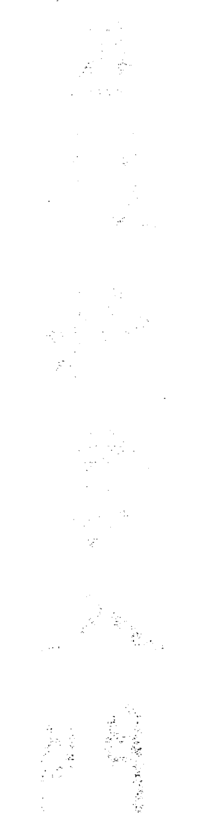
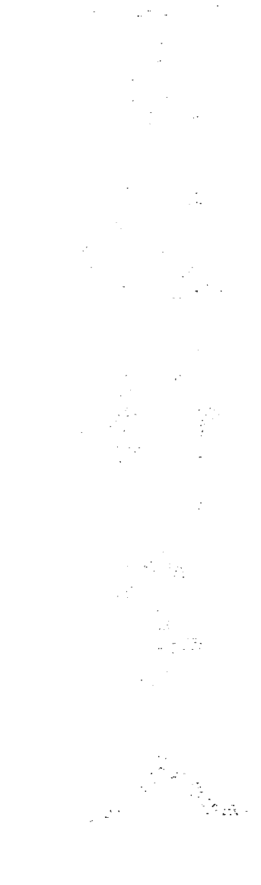
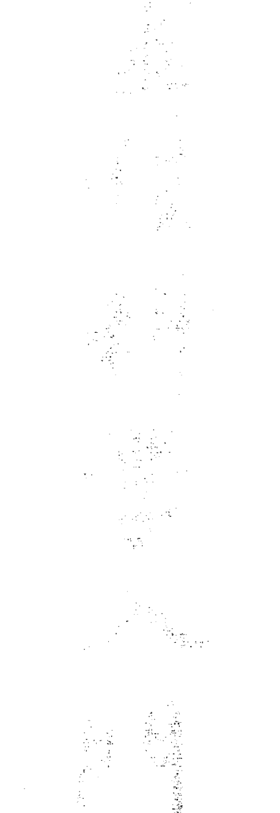

The request was rejected because it was considered high risk## 第一講 人類

在文明教化的過程中，「我」對星芒體做了修練，因而令欲望變得高尚。教化的過程中，「我」對星芒體做了修練，因而令欲望變得高尚，人的道德與智識的修持愈高就是「我」對星芒體做了更多的修練。「能見者」分得出來一個有修與未修的人。

由「我」轉化的星芒體就被稱作「思量智」（Manas），是人的「第五體」，思量智全由人自己努力修持而得。不過人類無法直接的影響到氣體。若提昇自己到更高的道德境界，也是可以學到如何對氣體做修持。

此時他就是一個入門弟子（Chela），於是他可以操縱氣體，轉化後的氣體就稱作「覺智」（Buddhi）。這就是人類的「第六體」—轉化後的氣體。

有些特徵可以認出這位弟子。一般人的氣質與外貌都看不出與前一次投生有何相似之處，如習慣、氣質等。而這位弟子則有與前一生同樣的習慣、氣質。這個相似性會留下來，是因為他在前一生曾有意識的修持了掌管著生長力與繁殖力的氣體。

地球上人類最高的成就乃是對肉體的修持。這是最難的任務。要能修到對肉體有所影響，人一定要學會如何控制呼吸與循環。還要能夠有意識的遵循神經系統的活動，與管理調節念頭起伏的過程。在神智學的術語裡，修到這一地步的人稱為「修行大師」（Adept）。他會修成「大我智」（Atma），「大我智」是人的「第七體」。每一個人類的前四體都已發展完整成形，第五體只有部份成形。第六、七體還在初步發育期。肉體、氣體、星芒體、「我」（I）或「我執體」（Ego）、思量智、覺智、大我智就是人類本性中七個體。經由這七體，他可以參與三個世界的運作。

# 第二講 三個世界

1906年8月23日

在講到一般人不知道而只有啟蒙師知道的高等世界知識時，通常會聽到反對的聲音。因為「如果我們無法見到這些世界，那麼這些知識對我們而言，有何用處？」我想以一位現代的年輕人的美麗文字來回答這個問題，相信大家都知道海倫凱勒，她的事蹟已是眾所週知。她在兩歲時就失聰失明，到了七歲，這個人類的孩子簡直只比一般動物稍微好一些。但後來她遇到了一位天才教師，一位給了她愛的女士。現在，26歲的她，海倫凱勒，毫無疑問的是同胞中文化教養最高的一員。她也研習科學，而且是驚人的多聞。她懂古詩、現代詩，她也熟悉哲學家的理論，如柏拉圖（Plato 公元前427-347）、史賓諾查（Spinoza 荷蘭人，1632-77）等。雖然光與聲之門，對她而言是永遠的關閉了，她仍然以令人敬佩的勇氣生活著，並且歡喜於世上的優美與壯麗。在她的書《樂天主義》中有著令人記憶深刻的文字，「多年來，暗與夜圍繞著我，爾後，教我的人來了，我於是在暗與夜中，找到了希望與和平。」還有「我在想與受中找到了天堂之路。」像她這樣失去眼力與聽力的人，只有經由別人對她傳遞訊息才能學習。人類中偉大的天才的思想已經流入她的靈魂，經由那些有知識的人的報導，讓她能分享我們所熟悉的這個世界。

這種情形就像是任何人只能經由他人傳遞的訊息而聽到高等世界知識的情形。經由這個比喻，我們可以見到對一位尚未能見到高等世界的人而言，這種訊息的傳遞是多麼的重要。但是，這兩者之間還有一個差別。海倫凱勒說：『我再也無法用我的眼睛看到這個世界』。而任何一位正常的人都可以說『我在靈性之眼開了的那一天，我將能見到高等世界』。只要有足夠的耐心和毅力，靈性之眼與耳是可以開啟的。

另外有人會問：『我要修多久才能得到靈性的視力？』有一位有名的思想家Subba Row 對這個問題有個令人佩服的回答，他說：『有人也許在七十次投生之內修成，另一個在七次之內，另一個在七年之內，另一個也許在七個月、七天或七小時之內，或甚至就像《聖經》上說的，『像夜間的小偷』就偷偷的來臨了。』

我說過了，每一個人的靈性眼耳都可被開啟，只要他有必需的耐心與努力。依此而言，每個人都可以從他人傳遞的訊息中得到喜悅與希望，因為高等世界並非一個與生命無關的理論。我們如果要在人間正確的過一生，高等世界的果實也帶給我們兩樣必需的東西——『力量』與『安全感』，而且是最堅強的力量與安全感。『力量』來自高等世界的脈動，當我們意識上覺醒到我們是由見不到的世界所創造出來的時候，就會擁有『安全感』。

- 三個世界就是
1. 實物界（physical world），人類生活的景象都在這兒。
2. 星芒界（astral world），或靈魂的世界。
3. 天界（devachanic world），或靈性的世界。

這三個世界在空間上並非分離的。我們以一般的感官接收到圍繞於身邊實物界的一切。但是星芒界也是在同一個空間中。我們生活在實物界的同時也活在另兩個世界：「星芒界與天界」之中。這三個世界就在我們所在之處，只是我們還沒辦法看到這兩個高等世界——就像盲人無法見到實物界一樣。但是當「靈魂的感官」開啟後，新的世界、新的特性與生物就會浮現在眼前了。也許可以說，就像是一個人增加了新的感官，所以可感受到新的現象了。

現在讓我們更接近的研究這三個世界，我們無須再特別說明實物界的特性，大家都對它與其中的法則非常熟悉。

# 第二講 三個世界

> 星芒界的时间是反向进行的。你会先看到「果」才看到「因」。这就解释了为何可以「先知预言」。

我们在死后才会知道星芒界，除非是启蒙师才会已经觉知它的存在。任何人能感知到星芒界时，最初必定会觉得很奇怪，因为实物界没有东西能和它比较。星芒界有完全属于自己的一套特性，所以他得学许多新的东西。最搞不懂的地方就是这个世界似乎每样东西都是反过来的，有点像镜中反影，所以他得学着习惯用新的看法看每一件事。例如，他得反过来唸数字。我们看到3、4、5，会唸成345。但在星芒界我们得反过来唸543。每一件事都好像是镜中反影，觉知到这一点是个基本的要求。

这些法则也适用于较高等的事件。例如：也适用于观察道德上的事件。人们在最初无法瞭解到这一点。他们也许会看到有黑色恶毒形状之物缠绕在身上恐吓他们，他们当然吓坏了。许多人都有这样的情形，而大部份人都不知道这是象征何种意义。事实上就是，这些都是他们自己的冲动、欲望和情欲，但是因为脑与灵魂的运作，偶而会见到这些景象，但它们是以镜中反影的方式显现。你是见到了你欲望的镜中反影，就像你看到镜中围绕着你的东西的反射影像。每一件由你向外发出的意念，看起来好像是向内进入你体内。还有，在此处，时间与相关的事件也是反向進行。在實物界你先看到母雞才看到蛋，在星芒界你會先看到蛋才看到雞生蛋。星芒界的時間是反向進行的。你會先看到「果」才看到「因」。這就解釋了為何可以「先知預言」，如果時間在星芒界不是這樣反向進行，就不能預知事件了。明白星芒界的特別之處絕對不是無用的事情。許多神話與傳奇都是以一種極美妙、有智慧的方式表示了星芒界現象。例如，希臘神話裏的大力神（Hercules）在選擇中為難的故事。大力神的故事是說他感覺到夾在兩位女士之間，一位女士又美又迷人，保證他會得到歡樂、好運與快樂，另一位女士很平凡又嚴肅，保證他得努力工作，又勞累又得自制斷除慾念。這兩個形象分別代表了罪惡與美德，故事蠻正確的告訴我們大力神這兩種本性如何顯現在星芒界內，一種鼓勵他行惡，一種鼓勵他行善。在鏡像中，它們以兩個女人有著相對的特質來顯現。罪惡的是以美麗、挑撥慾念、迷惑人的方式顯現。美德則以醜陋、冷淡、厭惡來顯現。所有這些形象在星芒界都是以相反的方式顯現。學者們將這些傳奇認為只是傳說中的精靈，但其實並非如此。這些傳奇的出現也不是偶然，而是偉大的啟蒙師們以他們的智慧創造出來傳入人間的。所有幫助解開世間之謎的神話、傳奇、宗教與古傳的詩篇都是依據啟蒙師的靈感而創出的。

高等世界傳送給我們生命的脈動與力量，由此方式我們得到了道德基準。史哥本豪（Schopenhauer 德國哲學家 1788-1860）會說過「要說教道德很容易，要為道德找一個基礎可難了。」但若沒有真正的基礎，我們不可能真正的有道德。人們常說為何要擔心高等世界的知識，只要我們是個好人，有道德原則不就好了嗎？長遠而言，僅講道說德是不會有什麼效果的。但若有真正的知識就能給道德一個好基礎。以傳道的方式講道德就好像對火爐說它有責任要供應暖與熱，但卻不給它煤炭。如果我們要有一個穩固的道德基礎，就一定要給靈魂「真知」作為燃料。

在秘修教義中有一句格言，現在我們可以講了，「在星芒界中每一句謊言都是謀殺」這句格言的嚴重性只有明白高等世界的人才能了解。人們通常會毫不思考的說「噢！那只是一種想法、一種感覺罷了，只是在靈魂中的事而已，壓住別人的耳朵才算錯，只是有個不好的想法不會傷害到人的。」有句諺語說「你不必為你的想法付出代價。」沒有比這諺語還糟的假話了！每一個想法、每一個感受都是真的。如果任何可以見到星芒界的人就會見到這想法，像一支箭或閃電射向那個人的星芒體，就像槍擊一樣的會傷到他。我再重複一次「每一個想法，每一個感受都是真實的！」對任何有星芒眼力的人而言，看到某人對另一個人有惡意是比打擊傷害身體還糟的。當我們讓這個真相為人所知，我們就不是在說教道德，而是為道德立下穩固的基底。任何真相的念頭都會找到它相關的人，讓他堅強有活力。如果我們講出鄰居的真相實情，我們的念頭，「能見者」會見到它的顏色與形狀，它會令你的鄰居更堅強有力量。如果我說的不是實情而是謊言，我就流出了有敵意的力量，會殺害他甚至殺了他。依此而言，所以每一個謊言都是謀殺，每一句真話都創造了一種鼓勵生命的元素。每一句謊言則生出對生命有敵意的元素。任何知道這事實的人，就會更小心的要講真話而避免說謊。而不會將「要善意真心的做人」只當作是一種說教。

星芒世界主要是由類似實物界的形狀與顏色組成，但那些顏色是自在的浮遊著，就像火焰一樣，但並不一定的會與特定的物體連在一塊，這是與實物界不同之處。在實物界有一個現象——「彩虹」——可以給你們一點浮游的顏色的概念。不過星芒界的顏色形像在空中自由浮動，像顏色之海一樣閃動，有著不斷變化的形狀與線條。

學生會漸漸的看到實物界與星芒界相似之處。首先是這顏色之海似乎不受物體的控制，也不附屬於任何物體，然後這些片片的顏色又合在一起黏到生命或物體之上。原來是只有見到浮動的形狀，現在靈性的生命被稱為神（gods）或天神（devas），經由顏色現出了祂們的形狀。所以，可以說星芒界是一個顏色的世界，在其上是天界，既靈性（精靈）的視界。學生是經由一個很確定的事件學到認出靈界：他終於了解古印度智慧所說的那奧妙的言語「Tat tvam asi ——「那是你 That thou art」」。有關這句話的解說文字還有不少。但對學生而言，當他由星芒界進入天界，他終於第一次明白了這句話的真義。有那麼一刻他在肉體之外看到了自己，說道「那是你」，這就是他進入天界了。所以另一個世界現在。在見到了色彩的世界之後，來到了音樂的世界，我們以往就可以聽到音樂的世界，但不像現在有如此重大的意義。

天界乃聲音的世界，也就是畢達哥拉斯（Pythagoras，公元前580-490）所謂的星球之樂。你可以聽到天體隨軌道運行時發出的鳴響，在這兒我們可以明白宇宙的和諧運行，並發現每一件事物其實都活在音樂之中。身為啟蒙師的歌德（Goethe）講到太陽的鳴響，他其實是在暗示天界之秘。當浮士德（Faust）在天堂時，也就是在靈界，天神圍繞著他，太陽與星球以樂聲在發言：

> 那白日之星，老而宏亮的声音
沿著它命中註定的道路運行
沿著它的路徑，雷聲共響
姊妹的星球群則同時伴隨著足以匹敵的歌舞
（英文譯本來自 Philip Wayne 譯，Penguin Classics, 1949）
浮士德，第一部，第一幕，天堂的序幕

歌德是在講太陽之靈。如果我們在天界，太陽確實向我們發出音樂。我們可以確定歌德是這個意思，因為在浮士德第二部，當浮士德再度進入這個世界時：

聽吧！天體的度量 用猛烈的飛行
帶給靈性之耳 那全新跳出的一日 鳴響的謠言
石門在磨動聲中一分為二
日神隨著雷聲的車輪而來

> （英文譯本來自 Philip Wayne 譯，Penguin Classics, 1959）

> 浮士德，第二部，第一幕

光在空中滿滿了喧囂
喇叭與手鼓大聲的演奏
目眩耳驚中
其他人卻可能完全聽不到這種從未聽過的聲音

當我們進入天界時，星芒界仍舊在眼前，我們聽到天界，見到星芒界，但是因為觀點改變了，就成為一個極壯觀的場面。我們會看到萬物都好像攝影軟片的負片一樣。有實物所在之處反而沒有任何東西，而實物界有光之處在此是暗的，反之亦然。一切的東西都是顯示著它原來顏色的互補色：例如黃的變成藍色，綠的變成紅色。

在天界的第一層，我們見到實物界無生命的原型（原型就是最原始的模型版本），也就是礦物的原型。還有植物的原型及動物和人的肉體外型的原型。這一層就是靈界之地的基本骨架。好比地球上的土地，所以稱為天界的「大陸塊」，啟蒙師在此觀察一個人時，有實體外形的一切就像固態的基礎，是天界的「大陸」。所有的生命形成了天界的「海」。所有的歡樂、痛苦形成了天界的「大氣」。

這個人所占據的空間是暗的，但是有一層閃亮的光暈圍繞著他。當我們的感官變得更細密之後，就會見到各種生命的原型，所有的有生命的萬物都像水一樣在地球上流動。在此處看不到礦物，因為它們沒有活躍的生命，但是可以很清楚的看到植物、動物及人類。生命在天界循環就像血液在人體內循環。這個層次稱為天界之「海」。

第三層稱為「大氣」，我們在此接觸一切肉體內所有活躍的感受，情緒、歡樂、與痛苦。有實體外形的一切就像固態的基礎，是天界的「大陸」。所有的生命形成了天界的「海」。所有的歡樂、痛苦形成了天界的「大氣」。不論人或動物在地球上的受苦享樂都會在此顯現。因此對啟蒙師而言，戰爭就像一場大雷雨，有著激烈的閃電與強大的雷暴聲。他不是看到戰爭裡實際的殺伐。而是看到敵對雙方的激情，它們顯現有如濃雲及雷雨中的閃電。

第四層天則是超越一切曾存在的萬物的，無論曾有人類與否皆是如此。它包括了所有人類的最原始念頭，那些讓他能帶著新的發明到世界上的念頭或有新的事情可以做的念頭。不論這些念頭是來自無知或有文化的人，來自詩人或村夫，也不一定是什麼偉大的發現，也許只是與每天生活有關的東西。

在這四層天之後，就來到了靈界的邊界。天界之際就像夜晚的天空，看似一個中空的球體有眾星圍繞。但是這是一個很重要的邊際，它形成了所謂的『宇宙編年史』(Akasha Chronicle)，類似佛法中所謂的『藏識』)。一個人不論做了什麼或完成什麼功勞都記載於這本永不毀壞的天界之書中，不論歷史上是否會提到這個人。我們於是可以在這處體驗到地球上任何有意識的生命會做過的所有事。假設一位『能見者』想要知道凱撒 (Caesar) 曾做過的事，他會選擇歷史上的某一件事件當做起點，集中力於這件事，然後在他身邊就會圍繞著所有凱撒做過的事的影像，例如他如何領著大軍與敵戰鬥，得到勝利。

這是用一種偉大的方式展現的，能見者並非看到一個抽象的文章，而是每一件事都以影像圖畫的方式穿過眼前，而且他看到的並不只是曾經發生的事。有何不同呢？當凱撒贏了一場戰爭後，他當然會想一些事，包括了當時發生的事的整個情形，整個軍隊活動的情形。也就是宇宙編年史會顯現他所有的企圖，他所有的想法，與他心中領導的大軍，還包括軍隊的想法，全都會顯現出來。所以是一個當時發生的真實景象，所有有意識的生命所體驗的都會在此顯現。（當然無法在此看到植物）因此，啟蒙師可以講出所有人類的歷史，不過當然他得先學會如何修得這種能力。

這些宇宙編年史的影像會有點令人迷惑，因為它是活的，你不要將這宇宙編年史中的凱撒與真正的凱撒本人混淆了。因為他可能早就投生為另一個人了。如果你由外在的方法見到宇宙編年史，就很容易產生這種迷惑。例如在降靈術會面中常有這種事。降靈者以為他看到了一個死去的人，但實際上他看到的是這個人在宇宙編年史中的影像。所以歌德的影像也許會看起來像是在1796年，如果沒人告訴我們事實上的情形，我們也許會認為這是歌德本人。最令人迷糊的就是這個影像是活的，而且會回答問題。這個回答不僅可以是過去他曾講過的，也會有新的。並非只是重複歌德過去講的，而是以歌德這個人而言他可能會給的答案，甚至有可能這個宇宙編年史中的歌德會以歌德的方式再寫一首新詩。所以，宇宙編年史中的影像是活生生的影像，看似很詭異，但絕非誇大不實之辭。

# 第二講 靈魂在中陰期的情形

1906年8月24日

## 第三講 靈魂在中陰期的情形

人們在死亡與新生之間是怎麼過的？說死亡是睡眠的兄弟這種說法也說得過去。因為死亡與沈睡之間本來就有點關係，但是仍然有個決定性的不同點。我們來看看一個人在睡與醒之間發生了些什麼事，這段時間看起來像是無意識。只有些許夢境，有時迷糊，有時清楚，在其中浮現。如果我們要正確的了解睡眠，一定要再講到人類不同的「體」。我們已經講過人有七個體。四個已經發展完全，第五個只有部份發展，第六、第七只有種子與一點外形。所以我們有：

- 1 肉體：我們可以用一般感官感覺到。
- 2 氣體（生命體）：由肉體發散出來，有細膩的光芒。
- 3 星芒體。
- 4 我執體或意識體：這個我執體包含了：
- 5 靈性自我或思量智(Manas)部分發展完成，部份仍在胎兒期。
- 6 生命靈性或覺智(Buddhi)
- 7 靈性人或大我智(Atma)

在醒的時候，前四體隨著一個人在空間中行動，氣體（生命體）的氣全方位的超越肉體一點點，星芒體則是超過身體，超過大約頭部的長度2.5倍的大小，如雲般環繞，由頭上向下漸漸變淡消失。當一個人睡著時，肉體與氣體仍留在床上，像白天一樣相連一塊，星芒體則鬆開了，星芒體與我執體升起，離開了肉體。因為所有的知覺、觀念等等都依賴星芒體，而它現在在肉體之外，人們在睡時就失去了意識，因為在生命中，人們需要肉體的腦做為意識的工具，沒有它就無法有意識。

鬆開的星芒體在睡時做些什麼事呢？天眼通可以見到它有個特定的工作。並不是像有些神智學者說的它僅是在肉體上漂浮，像被動的影像一樣什麼也不做。它不斷的在對肉體耗損的肉體精力進行修補工作。在白日肉體會用盡精力變累，星芒體的工作就是要修補這疲累與損耗。它更新白日耗損的肉體精力，所以我們需要睡眠來執行它更新康復的效用。往後還會講到夢的問題。

當一個人死時，情形又不同了。星芒體、我執體離開了，生命體也離開了他。這三個體共同升起離開，會有一段時間，這三個體持續相連在一塊。在死時，星芒體與生命體和肉體的連結都斷裂了，特別是在心的部位。有一種光由心發出，然後看到生命體、星芒體與我執體都從頭上升起。

# 第三讲 灵魂在中阴期的情形

死亡的那一刻带来了一项非凡的体验，有那么一瞬间，人们记起今生结束前所发生的一切事。他的一生就在灵魂之前上演，好像一幕大剧。这种情形在生命中也有可能发生，在极少的大惊或大怒的一刻，例如溺水或从极高处跌下，看起来死亡就在眼前的时候，有可能会像这样看到今生发生过的一切。另一个相似的情形是当我们有一肢麻掉了，这时的情形是生命体松开了。例如，如果有一只手指麻掉了，天眼会见到在那根实际的指头旁第二根指头伸出，这第二根指头就是那松掉的生命体。催眠术因此有一个危险性，因为脑也像手指一样会麻掉。天眼会见到脑部松掉的生命体就像两个袋子一样挂在头两旁。如果重复施以催眠术，生命体就会有松掉的习惯性，这可能很危险。受害者可能会变得很梦幻，常易昏倒，失去独立性等等。另一个生命体松开的相似情形是一个人面对突如其来的危险或死亡。这些情形相似之处就是因为生命体也是人类记忆的负载者。生命体发展得愈强，这个人记忆力就愈好。通常而言，生命体在肉体内深深扎根，因为肉体粗糙的韵律过强，生命体振动相形之下太弱，都被遮蔽了，所以无法影响到脑部，让我们有所觉知。但是在有死亡性的危机时，生命体松开了，从脑部松开，于是它的一生记忆就显现在这个人的灵魂之前了。在这种时刻，被写入生命体的一切都会再度浮现，所以在死后立刻会见到一生的回溯，这个情形会延续一段时间，一直到生命体与星芒体和我执体分离为止。对一般人而言，他们的生命体会渐渐的溶入全世界的生命气中，知识文化较低的人融入的较慢，教育高的人分散溶入的较快。但是内修的弟子或学生们反而又变成慢慢的溶入，修行层次愈高的人溶入的过程愈慢。会一直溶到生命体不再溶化为止。对一般人而言，我们有两个尸体，肉体与生命体。死后还会剩下星芒体与我执体。如果要了解这个情形，我们必须明白，在地球上的生命，人们的意识完全仰赖感官。让我们想想，经由感官才能感受的每一件事：没有眼睛，全是黑暗。没有耳朵，全是寂静。没有触觉等感受，就完全无冷热感了。如果我们能清楚的想一想，当我们与肉体感官分离时；当我们与通常充满我们白日的意识及令灵魂活跃的每一件事分离时；当我们与我们必需感恩的「有一个可以整日感受万物的身体」分离时；还会剩下什么？我们才会开始有点概念，死后，当这两个尸体都被留下的时候的生命是怎么样的情形。这个情形称为「中阴界」（Kamaloka）也就是「欲望之地」。这并不是另一个区域，它就在我们所在之处，也就是说死去的人的灵都在我们身边浮游，只是我们的肉体感官无法感知到他们的存在。灵魂并非受着外来的折磨，而是受着自己不能满足的欲望的折磨。这就是中阴界的根本状况。

那么死去的人感觉到什么呢？举个简单的例子，假设有个人喜爱大吃大喝，很享受食物。天天会见到他的满足感是棕红色的想法，在他星芒体的上半部。现在假设这个人死了，剩下的就是欲望和享乐的能力。但是肉体的部份才是享乐的工具所在，也就是我们需要牙龈等器官才能吃东西。享乐的感受和欲望是属于灵魂的，所以死后还继续存在，可是这个人已经没有任何工具能够满足他的欲望了，因为相对的工具已经不在了。这个情景适用于所有的欲望与希求。他也许想要看看一些美丽的颜色，但他没有眼睛了，或者想要听一些和谐的音乐，但他已经没有耳朵了。灵魂在死后如何体验这一切？灵魂就像沙漠中的流浪者，受着燃烧般的干渴之苦，找寻着清泉来解渴。灵魂得受这种干渴之苦，因为他没有喝水解渴的工具了。他的感觉完全被剥夺了，所以将这情形称为「烧渴」是很恰当的。灵魂并非受着外来的折磨，而是受着自己不能满足的欲望的折磨。这就是中阴界的根本状况。为何灵魂必需忍受这一段折磨？原因在于人们得学会渐渐的断绝肉体的希求与欲望，如此灵魂才能由地球上释放得到自在，才能自我纯化洁净。当这一点做到了，中阴期就结束了，人们就升到天界。

灵魂如何走过在中阴界的这段生命？在中阴界人们会再重新走过自己的一生，但是时间是反过来的。他一天一天的走过所有的体验、事件与行动，由死亡那一刻走到出生那一刻。这样走的目的何在？目的就在于他得在每一个事件之处停下来，学到如何断绝对肉体与物质的依赖。他也会重新经历他一生中享受过的每一件事，但是经历的方式是他得学到如何在没有这些享乐之下也可以过得去，所以这些过程在此时是没有享乐感的。所以他渐渐的学到如何从肉体物质的生命中解脱出来。当他走过一生直到出生之时，他就可以如同圣经上说的进入「天堂之国」。就像基督说的「你无法进入天堂之国，除非你变成小孩子」（马太福音第18章3节）。所有的福音书（Gospel）中的说法都有极深奥的涵义，我们只有在渐渐进入圣洁的智慧后才会了解它们的深义。

在中阴界有一些特殊的时刻，我们一定要特别指出它们的重要性与教育性。在平常一生中，人们会有的感受之一就是活着的至乐，活在肉体中的快乐。因此在没有身体时，他感觉到没肉体是最大的剥夺。我们于是可以了解那些不幸要以自杀结束一生的人必需面对的恐怖痛苦折磨。当自然死亡时，这三个身体的分离还算蛮容易的，就算是像中风这类自然而突然的死亡，较高层次的身体其实已经早就准备好了，所以它们的分离还是很容易，失去肉体的感觉也很小。但是类似自杀这种突如其来而又暴力的分离时，与肉体组织还很健康坚固的黏在一起时，失去身体的感觉是很尖锐的，这就造成了恐怖的痛楚。这是一种恐怖的命运，自杀者感觉像是从身体中被拔出来，他于是在恐惧中拼命找寻被突然剥夺的身体，这种恐怖与痛楚在世间可以说是「无以伦比」。你也许会反驳说自杀者已经对生命厌倦，了无生趣，否则就不会自杀了。但这只是一种假象，其实正是自杀者对生命要求极多，只是生命中已没有办法再满足他想要的快乐的欲望，或者是某些情形的改变令他感觉到失去的痛楚，于是想在自杀中寻求解脱。这也就是为什么他在失去身体时会有无法言喻的严重剥夺感。

但是中阴期并不是对每个人都如此严酷。如果一个人极少依赖于物质上的快乐，他就会觉得失去身体并不难受。虽然他还得在此时由肉体生命的一生中重得自在，这儿就得说到中阴期还有的更深一层意义。在人的一生中，并不是只在生命中求快乐，他还会与其他的人与生物共同生活。不论有意无意他总会对人或动物造成快乐或痛苦，欢喜或悲忧。他会于中阴期再度面对这些情形。他会回到他对另一生命造成痛苦的那一时刻与地点，在那时他让另一个生命感受到了痛楚，现在他得以他自己的灵魂忍受同样地痛楚。所有我曾造成其他生命受苦的过程，我都得以自己的灵魂再度经历。我进入那个人或动物，而明白我对他们所造成的痛苦。现在我得自做自受一切的痛苦，无可逃避。这都是令一个人得到自在的过程─并非由业力中得到自在，而是由地球上所造作的一切中得到自在。所以活体解剖者会有个特别恐怖的中阴生命期。

并不是神智学者要批评现世人问所发生的事，而是他能了解现代人为什么会做这样的事。在中世纪，连做梦也不会有人想到要毁灭生命来了解生命。如果是古时候的医生，必定会认为有这种想法的人是发疯了。在中世纪时，还有一些人是有天眼的，有些医生仍可以看到人的体内有何种伤或病。例如，派拉摄氏（Paracelcus 瑞士医生、秘修者 1493-1541）就是如此。但是现代的物质文化势必到来，随之失去的就是天眼的能力。我们特别在现代的科学家与医生中看到这一点，活体解剖就是这种情形所造成的结果。我们因此能够了解到它的成因，但是我们不该批判，也不该藉口逃避责任。令他人受苦的果报迟早会到来，在死后，活体解剖者必须承受他对其他动物所造成的痛苦，完全一样的痛苦。他的灵魂会被拉入他所造成的每一个痛苦中。此时说他并无意造成这种痛苦，或说他是为了科学、出于善意等等都没用了。灵界生命的法则可是一点都不能通融的。人们会在中阴期待多久？大约他前一生的三分之一长度。例如一个人活了75岁，他的中阴期是25年，然后会怎么样呢？

人们的星芒体颜色与形状差别很大。较原始的人类的星芒体是各种形状，散发着低层次的欲望。由红灰色的背景散发出相同颜色的光芒，外形而言与某些动物差不多。而有高教育者或理想家，如德国诗人席勒（Schiller）或圣者如圣方济（St. Francis of Assisi）就不一样了。他们有着「戒绝了许多行为、令他们的欲望高尚」等美德。人用愈多自我意识来修行，他的我执体中心的蓝色球体散发的光芒就愈明显。这些光芒表示着人用自我意志力超越了星芒体的力量。因此可以说人有两个星芒体，一个是有基本动物脉动的星芒体会留下来，另一个则是他用意志力修行转化后的星芒体。当一个人经历过了中阴期，他便准备好升起他那较高层次的星芒体——他自我努力的结果，而留下那较低层次的星芒体。对未开化无文化的人而言，会留下较大部份低层次的星芒体，而修行高的人则仅会留下一点点。例如，当圣方济死去时，只会留一点点低层次星芒体，因为他努力的修行，强大的高层次星芒体会随他而去。留下来的可以说是（肉体与生命体之外的）第三个尸体—星芒尸体，有着尚未转化低层次的脉动与欲望。这个尸体会继续在星芒界浮游，有可能是许多危险的影响力的根源。

这个尸体也是可以在降灵术会面中出现的。它通常会活很长一段时间，也可经由灵媒说话，人们于是会相信这是那死去的人在讲话，然而只是星芒体的尸体在讲话。这个尸体会像是有个壳，其内存着低等脉动与习气，它甚至可以回答问题和供应资讯。它所说的话就会像是当初那个「低等人」会说的话。因此会引起各种的疑惑，有一个较明显的例子就是降灵师蓝道夫（Langsdorf）所写的一本小册。内容是他说他与布拉夫斯基（H.P. Blavatsky）著名俄籍神智学者）交谈的结果。对蓝道夫而言，轮回的理念就像是斗牛的红布，他会想尽办法去反驳这理念，他也恨布拉夫斯基教导散播这个理念。在这小册中，他意思是说布拉夫斯基告诉他不但轮回的观念是错的，而且她很后悔教导这个理念。这有可能完全正确，只是蓝道夫询问的并非那真的布拉夫斯基，而是她的低层星芒体。她的低层星芒体这样回答是可以了解的，因为如果回想她早期的著作《开眼界》（Iris Unveiled），她确实有反对轮回的理念。她后来明白了，但是她的星芒壳仍旧存着这些错误。

这第三个尸体 | 留下来的星芒弃壳，会渐渐消散。在人们重新投生前，它完全消散是蛮重要的一件事。大致上而言都会完全消散，但有些特例是有人很快就投生了，但他的星芒尸体尚未消散。当他将要投生而发现他的星芒尸体尚在人间，有着一切他前生尚未圆满的缺点，他会有点难以面对这个情形。

# 第四讲 天界

我们看到了在死亡时，一个人会留下他的尸体，首先是肉体，再来是生命体，再来是低层次的星芒体。当他舍弃这三个身体时还剩下什么呢？在死时会在灵魂前显现的回忆（影像）在生命体离开星芒体时就消失了。也可说是沉入无意识中，对灵魂而言不再有任何眼前印象的重要意义。但是虽然这些影像消失了，还有一些重要的，也许可以称为修行成果的部分会继续留存。他过去一生的修行成果会像是一种「浓缩的精华力」，留在他的高等星芒体中。

人们在往昔已经经历了许多这样的形情，每一次死亡投生的终点，这记忆影像都会显现于灵魂之前而留下我所说的「浓缩精华力」。所以每一生都会再加上一个影像。第一次投生时，在死时会有第一个记忆影像。然后会有第二个，又比第一次更丰富，如此继续下去，这些影像的总和就在人之内造出了一个新的元件。在人们第一次死亡时，他有四个身体，但当他死时，他就带着第一次的记忆影像一起走。所以下一次再投生时他就不只有四个身体，还有这个前一生产生的身体，可以说是一「因果体」（causal body）。所以他就有了五个身体：肉体、生命体、星芒体、我执体与因果体。一旦这因果体出现了就会留下来，虽然它只是前一生的成果。现在我们就可以了解人人不同的原因。有的人已经经历了许多次生命，在他的生命之书中加了许多新页。他们修持到了较高的层次，拥有较丰富的因果体。有的人只经历了少数的生命，因此只有少许的果实，较未开发的因果体。

人们在地球上重复投生（轮回）的目的何在？如果多次不同的投生之间毫无关连，那这个过程就无意义了。但情形并非如此的不同。今日的孩子由6至14岁几乎完全被求取知识所占据了！如读、写等等。对个人的特性、修养与开发的机会已经与过去非常不同了。一个人的投生安排的方式是，他只有在找到新的状况有修行开发的可能性时，才会回地球投生。通常过了数个世纪之后一定会有这样的机会。想想地球在每一方面发展得多快。只不过数千年前这块土地上还盖满了原始林，充满了野兽。人住在洞穴中，穿着兽皮，只有很原始的起火和做工具的知识。而今日是多么的不同！我们可以看到地表在相对而言极短的时间内被大大的转变了。在古代日耳曼民族时代的人心目中的世界，与今日学了读写的人心目中的世界是相当不同的。当地球改变，人们就学会新的东西，学成之后就会变成自己拥有的了。

两次投生之间的时间有多长？是依据什么来决定的呢？以下的考量就会给我们答案，也会让我们看到地球的改变也扮演了一份角色。在时间流转时，某些星座的神祇享有高位殊荣。例如，在纪元前3000年时的波斯，双子星享有高位。在纪元前3000年至纪元前800年在埃及是圣牛（Apis 金牛座）享有高位。在小亚细亚（黑海至地中海一带）是波斯的光神之牛（Mithras Bull）享有高位。在纪元前800年之后则是白羊座（Aries）由幕后走至台前享有尊荣。所以会有希腊神话Jason的传奇。他渡海征服，由亚洲的圣羊手中得到金羊毛（Golden Fleece）。羔羊享有如此的殊荣，以致后来基督自称「神的羔羊」，最初基督的象征图案并非十字架上挂着救世主，而是十字架与羔羊。这表示了三个相续的文化期，每一期都在天上有相关的重要发生事件。太阳在空中有特定的运行轨道即「黄道」。因此在某一特定时代春天时期（春分至夏至）的开始点，太阳会在黄道带上于一个特定点升起，所以在纪元前3000前太阳于春天期是在金牛座处升起，在其之前是在双子星座。纪元前800年时是在白羊座。这些春天的升起点在黄道带上是一年 一年的往后走，需要2160年由一个星座走至另一个星座。人们就选择这春日太阳升起点的天文星座做为尊崇的象征符号。如果在今日我们能够了解古人在太阳进入新星座的心力超昇的强烈感受，我们就应该可以了解当太阳进入双鱼座那一刻的伟大意义。但是因为我们这个时代的物质主义，人们是不可能有这种了解的。在那个时代，人们在这过程中看到了什么呢？古人是看到了自然力的具体显现。在冬日这些力量都在沈睡，但是春天由太阳再度唤醒一切生命。因此，太阳在春日显现时所在的星座象征了这些唤醒的力量。它给了太阳新的力量，让人感受到值得特意的尊崇。古人知道太阳这样在黄道带上的运行有某些重要的关连性，它的意义就是，随着时间的变动，太阳的光线落在地球上有相当不同的情形。当然，经过 2160 年的这段期间，也表示地球上的生命状况完全改变了。这就是在（两次）死亡与新生之间，人们在天界度过的时间长度。秘修主义一向明白到，经过这 2160 年的时期，地球上有了足够的改变，令人们可以再度投生以得到新的体验。

不过，我们要记住，在这段期间，人们通常会投生两次。一次是男人，一次是女人，所以平均而言，在两次投生之间大约是 1000 年。说每七次投生就会由男变女的说法是不对的。投生身为男人的灵魂体验与女性的遭遇显然是不同的。所以一般的规则是在2160年中，灵魂显现一次为男，一次为女。如此在这段期间内就会得到在那段期间内的状况下所有的体验，于是此人就有机会在「生命之书」中加上新的一页。这些地球上情况的巨变，让灵魂有学（学校教育）可上。这就是轮回（再度投生）的目的所在。

## 天界分为四部份

| 1 | 2 | 3 | 4 |
| :--- | :--- | :--- | :--- |
| 大陆 | 河流、海洋 | 大气，气体空间 | 灵性原型区 |

一个人带着他的因果体与净化过的高尚的星芒体与生命体进入天界。这些会永远跟着他，不会失去。在某一特定时刻，他放下了星芒尸体后，他会像在体外一样地面对面看着他自己。这就是他进入天界的那一刻。

在第一部份，万物看起来都好像照相的负片（底片）。每一种会在地球上存在过的或现在仍存在的万物矿物、植物、动物都在此处以负片的方式显现。如果你看到自己与别人都是这种负片的形象，那就表示你在天界。自己看起来像这样的目的是何在？你不会只看到自己一次而已，你会渐渐看到你前生往世。这有一个很深刻的意义。歌德说「眼是因光、为光而生」，他的意思是说光乃是眼的创造者，这完全是事实。我们如果观察到在无光之处，眼就退化了，就知道这是事实。例如：在肯德基有某些生物住在岩洞中，岩洞黑暗，所以这些生物不需要眼睛，渐渐的他们就失去了眼力，眼睛也萎缩了。原来滋养眼睛的重要体液现在也转而流向其他较有用的器官。这些生物失去眼力，因为他们所在的世界全无光亮，无光的环境毁灭了它们的眼力。所以没有光，就没有眼睛。创造眼睛的力量是在光中，就像创造耳朵的力量是在声音的世界中。简短而言，所有身体的器官都是宇宙中的创造力所建造。如果你问什么造出了脑，答案就是，「如果没

有念头就没有了脑」，当凯普勒（Kepler 德国天文学家，创行星运动律）或伽俐略（Galileo 意大利人，天文学之父）这样的人，将他们的推理力用于自然界的伟大法则时，就是自然界的智慧创造出了有了解力的器官。一般人进入物质界时，他的器官大致完好。不过自从上次投生后，已有新的情况，他得用他的精魂做番处理，在他所有的体验中都有一种创造力，他的眼睛或了解力都是在上一次投生时就已形成了。死后，他进入天界，他会见到他上一生的身体的图像，他也带着上一生的回忆图像的成果。现在他可以比较许多生中修行的过程：他在前一生的体验之前是什么样子，他在加上前一生的体验后可以变成什么样子，根据这些他就形成了一个新身体的图像，在层次上是超越了以前所有的身体。

因此，在天界第一层，人们会更正他的前一生生命图像，依着前一生的成果，他准备着次一生的身体图像。在天界的第二层，生命就像河流与溪流般脉动着。在地球上生存时，人们的生命在内，自己看不到，但是现在他可以见到自己的生命流过眼前，他可以用它来活化他在第一层次所建造的形体。在天界的第三层，人们被前一生的感受与情欲围绕着，但是它们是以云、雷、闪电的形式来到眼前。他以旁观者的姿态看着，他学到如何了解它们，就像他观摩地球上有实体的东西一样的观察着。他于是将这些经验都收集到灵魂的生命之中。经由看着这些灵魂生# 第四讲 天界

命运影像的冲击，他于是能够将这些特质合入灵魂中，于是他就赋予了他在第一层次中所创建的身体一个有着新特质的灵魂。

这就是天界的目的。人们必需在此向上提昇，也由他自己准备着来生的身体蓝图。这是在天界的任务之一。不过他还有许多其他的任务。他绝对不是只管自己的事，他完全意识清醒的做一切事，他在天界完全有意識，若有神智学书籍非如此说的就是错了。如何能了解到这一点呢？当人们睡时，他的星芒体离开肉体与生命体，意识也随之离开了。但这是因为星芒体在忙着修补白日疲累的肉体，重建调谐一切。当人死了，他的星芒体不再需要做这件事，意识就觉醒了。在人活的时候，他的意识被肉体的力量包围而黯淡了，在夜间又要修补肉体。当死后，这些星芒体力量被释放时，星芒体本身的器官立刻就浮现了。这些就是七朵莲花，莲花轮。有天眼的艺术家知晓这一点，所以在他们的作品中有象征性的表达这一点。米盖朗基罗就曾作摩西的雕像有着双角。莲花轮的分布如下：

在今日一般人的身上几乎都看不到这些星芒器官，但是如果某人一旦成为天眼或者进入失神的（trance）状态，这些器官就会转动并闪耀着明亮生动的光彩。当这些莲花轮转动时，就表示一个人可以见到星芒界了。不过肉体器官与星芒器官的差别就在于肉体器官是被动的，让外在的一切运作于其上。所以眼耳等都要等到光或声音带给它们讯息。而灵性的星芒器官则是主动的，它们会抓住外界的东西。但是这种活动力惟有在星芒体没有其他工作要做时才会觉醒，此时星芒体的力量就会流入这些莲花轮。就连在中阴界，只要低层次星芒体还连在人身上，这些星芒器官就是灰暗的。只有当星芒尸体被舍弃，人只剩永久部分时，也就是他进入天界时，这些星芒器官才会觉醒，进入全然的活动。

| 瓣数与位置 |
|------------|
| 6与4瓣的莲花轮在更低的部位。 |
| 8或10瓣的莲花轮在胃附近。 |
| 12瓣的莲花轮在心脏附近。 |
| 16瓣的莲花轮在喉头附近。 |
| 2瓣的莲花轮在鼻根、两眉之间。 |

所以在天界，人们是以星芒器官，活在一种更高层的意识中。

神智学书籍若说人们在天界是沈睡的，或是说人们在天界只关心自己的事，都是不对的。或是说在人间的关系在天界不会持续，也是不对的。反而是，如果友情真的是建立在亲密的精神灵性上的关系，则在天界会以极强烈的方式持续着。在地球上肉体生命的情况会带给天界生命真正深刻的体验，友情的内在力，滋养着天界性灵的交会，并以新的型式丰富性灵，就是这一类的力量喂养着天界的灵魂。而一种更高层次的，对自然之美的欣赏享受，也是天界生命的滋养之一。

所有这些都是人类在天界生命之所依。友情本来就是人们围绕在自己身边的一种环境。在人间时，肉体或世间事的情况通常会穿插在人们友情的关系之中。在天界，朋友相聚则完全依据他们友情的浓烈度，所以在人间建立的关系乃是天界生命体验的来源。

# 第五讲 人类在高等世界的任务

1906年8月26日

昨日我们对天界的本质有了一些认识。现在我们得要问天界的大乐是怎么来的。在那儿大部份的活动都是创造性的。虽然很难形容因此而生的大乐，不过也许世间某些事可以算是相近的比拟。

让我们来观察当一个生命在创造另一个生命时心中充满的感受。例如，一只母鸡坐在她的蛋上。这是一个适切的比喻，虽然听起来很怪异，因为那孵蛋的母鸡体会到了一种大乐的幸福感。将这种感受转到灵性的层次就让你对天界有一些概念。

在第一层，大陆层，万物都以负片的形象显示，但就像个大场景，人们在此的责任是创造他的新身体的形象，他毫无阻碍的做这件事，因此感受到创造的大乐。

在第二层，宇宙的生命在人间受到了物质界人、动物、植物、形状的限制，在此都如海中水般自在的流动。人会见到这种流动有外也有内在。外在他看到红紫罗兰色流由一株植物至另一株，由一只动物至另一只，全都在这生命共同体中流动。而所有不同形态的灵性生命，例如所有基督教友形成灵性社会，在此都看起来属于这宇宙生命之流。因此对神智学者的第一规条就是找到那万物中共同的生命，在此可以真正的练习这一规条，因为可以见到万物共同的宇宙生命在此流动。

在第三层，你会看到所有人类灵魂层次的关系都在此以可见的方式呈现了。如果两人相爱，你会看到有个真实的生命，它的身体就是爱。如果你可以想像所有这些情景，你就会有天界大乐的概念了。不过，「知者不多言」，因为灵性事物不是言语所能形容的。

千万别认为人在天界无所事事或自扫门前雪，他在天界是有任务的。

地球的面貌，有着植物与动物，是不断在改变的。例如，在北西伯利亚还有长毛象活动时是什么样的情景？我们现在还找得到它们，虽然他们已经被活生生的冰冻于冰原了。

而在我们这儿，当原始林还覆盖大地，热带的气候与动物还活跃生长于此，又是多么的不同？谁造出这一切？谁在改变地球的情况？它与动物、植物之精灵又如何共处呢？

如果我们所谈的范围只限于物质界，则说人类有意识体，居于此处，而且人就是地球上最高等的生物，都算是蛮公正的说法。但是在星芒界就不一样了，一旦启蒙师进入星芒界，他便知晓有许多生命在物质界无有形体，但是与他一样在星芒界都有形体。其中有动物的物种灵或群体灵。在此处，这种群体灵与人的互动关系就像在物质界人与人之间互动是一样的。在物质界，动物只有肉体、生命体与星芒体而没有意识体。因为它们的意识是在星芒界。就像你的十指有个共同的灵魂。属于同一物种的动物，在星芒界也有个共同的灵魂。例如，狮子这种动物有个群体意识在星芒界，狗、蚂蚁等也是如此。它们在星芒界就像个真正的生命，好像那意识在星芒界浮游，就像拉着木偶的线一样的操控着属于这个族群的每一只动物。植物也有这样的群体灵，只是这个群体意识是在天界，也就是说植物的操控木偶线又更高了一层。而所有矿物如金、钻石、石头等等，它们的群体灵则是在天界的上层。所以不同的生命的等级是如下安排的：

| 层次 | 人 | 动物 | 植物 | 矿物 |
|------|---|---|---|---|
| 天界上层 |   |   | 意识体 |   |
| 天界下层 |   | 意识体 | 星芒体 |   |
| 星芒界 |   | 意识体 | 星芒体 | 生命体 |
| 物质界 | 意识体、星芒体、生命体、肉体 | 星芒体、生命体、肉体 | 生命体、实体 | 实体 |

当人死时，他的意识会与各种动物的意识在一起，此时他可以像操纵动物的意识体一样的参与渐渐改造动物界的工作。在天界下层他还会与植物的意识为伴。在此，他还可以改变植物界的形态。他就以这些方式参与了共同改变地球的工作。因此是人类带来了地球面貌的重大改变，也同时大大的改变了他下一生居住的环境。不过他是在较高层次的生命的指导下完成这项工作。所以，我们真的可以这样说：『看着动物界与植物界不断的改变，这是死去的人所造成的结果。亡者们活跃的参与着动、植物的转化，甚至包括了对固体地球外形的改变。就算在大自然的力量中，我们也要看到无形体的人类在其间的活动，也要明白这些力量对地球的面貌有极大的影响力。这些所有的工作与活动是在久远久远以前就开始了，那时还没有金字塔，甚至还没有工具。存在的一切形貌是由神祇们所赐予的，或者如唯物主义者说的，是由自然的力量造成的。而人乃是其中之一。但是今日大部份的环境都是人类所造。所以人类一直不断转变地球。这种情况会愈演愈烈，人们无法在此完成的，他会在死亡与再投生之间去实践。因此我们的进化是与整个地球的改变息息相关。地球的结构与进化是人类在高等世界造成的结果。人们如果在高层次修行上愈成功，就能愈快、愈完美的转化地球及其上的动植物。』

人们修行的层次愈高，他就能在天界上一层停留工作愈久。而未开化的人只能惊鸿一瞥。许多看似孩子气，但是实际上是伟大力量启发的故事与传奇都表达了这些事实。

那些这些力量如何运作于人们新投生的时刻呢？我们看到在死亡与下次投生前有约1000年的时间，在这段期间，人们的灵魂是在做下一次新生旅程的准备工作。对天眼而言，在星芒界探险是很有趣的，例如他可能观察到浮游于此的星芒尸体。对低等欲望的脉动下了功夫、修持很好的人的星芒尸体会很快的就消散了。但是对于未修的人，他让自己的低等欲望脉动自由自在不受拘束，如此星芒尸体的消散过程就很慢。有时星芒尸体的原主人已投生了，而旧的星芒尸体都还未完全消散，此人就会有很艰难的命运。一个人如果很快的投生，在有些特殊的情况下，也有可能发现他自己的旧星芒尸体还在人间，这个尸体于是强力的被彼此人吸引而窜入了他的新星芒体。此人确实已经创建了一个新星芒体，但是旧的又与新的合在一起了，他便拖着这两个星芒体过完这一生。而在恶梦中或幻境中，这旧的星芒体又变成他的第二意识体，调戏他，恐吓他，虐待他。这就是假的业关守护神。

除了这些星芒形体，天眼还会看到另一种特别引人注目的形体。他们是像铃状的形体，在星芒界中以极快的速度穿梭着。这些就是「胚胎期人」，尚未投生但是正努力于投生事件中。他们似乎不受时空的限制，因为他们可以很容易的飞来飞去。他们会变化许多不同的颜色，有色的气场包围着他。有时泛红、有时泛蓝，还有黄色的光从内射出。这些胚胎期人刚从天界来到星芒界，在这儿是发生了什么事呢？

当一个人带着他的高层星芒体以及他的因果体这两项前生的修行成果到天界后，他现在要收集新的星芒物质，就好像是磁铁的吸力令散落的铁粉有了规律。他依着自己内在的力量集聚这些星芒物质。有着善行的前生所集聚的物质与有着恶行的一生所集聚的物质是不一样的。这些铃状的形体是由因果体，前一生的星芒体的力量，与新的星芒体所组成。胚胎期人应该不要接触到旧的星芒尸体，他的任务是由「尚未分化的星芒物质」来制造一个新的星芒体，所以整个过程都由人自己完成。要好好地记住这一点：新星芒体的外形与颜色是由前一生的力量所决定。这些胚胎期人以高速穿梭的原因是他们在找适合的父母个性与家庭状况。他们的速度帮助他们找到合适的父母。他们可以这一刻在此处，下一刻就在美洲了。

再下一步骤就需要帮助了。高等生命（如 Aptkas 业力纪录者）会引领胚胎期人选择父母；这位「君主」依着星芒体的外形造出生命体，再由父母的贡献造出肉体。天眼可以看到在受孕时父母体会到的情欲之中的星芒物质，父母感受到的情欲强度于是决定了孩子的情欲本质。在此之后，生命体物质会从东南西北上下等方向射入。

并不是一定能找到完全适合胚胎期人的父母，此时只好找最适合的。类似的情形就是不一定能完全依进入的生命体建出肉体。不会有完全和谐的情形。这就是人类的灵魂与肉体间不和谐的原因。

相对于死后那一刻的情形，在投生的那一刻之前也会发生一件很重要的事。就像死后那一刻，你过去一生的记忆像一场大戏一般的在灵魂前上演，在投生前也有即将来临的一生预演给灵魂看。并非每一细节都上演，不过未来一生的大致情形都很明显的看到了。这是非常重要的一刻，有可能一个已经刚过完很痛苦的一生的人，瞥见了未来一生的状况与命运，而想将灵魂退出，于是只有一部份灵魂进入肉体，没有完全投生，这就会造成癫痫儿或白痴儿。

紧接受孕后，投生时，因果体的黄线就变暗而消失。只有启蒙师会在整个投生过程中都维系这条黄线。

不要认为人类的高层次体与人在胚胎时就已连接在一起，因果体是最先开始活动的，因为它要造出肉体初期的外形。

在出生后，人类持续的以相当有变化的方式发展着，教育最重要的时期是在7岁到14岁，明天我们会看到神智学如何支援这一类教育的问题，指向了人类进化中的重要一章。

# 第六讲 儿童养育与业力

1906年8月27日

> 在孩子的头七年，不是我们「说」什么影响着孩子，而是我们真正「是」怎么样的一个人影响着孩子。

神智学对生命的了解可以说是最实用的，神智学对教育疑难处的解答对人类是极有用的，因此早在人类成为天眼，能够直接见到真相之前，他就可以确定在神智学中能找到生命的真相。

人一旦出生，就进入了一个新生命，他的各个「体」会在不同的时期以不同的方式发展着。教育者应该要永远记住这一点。1至7岁的第一阶段与7至15、16岁的第二个阶段（女孩子早些，男孩子迟些）是很不同的。然后在16岁青春期后又有个改变。我们惟有注意到人类不同「体」的发展才能适切的了解到人是如何成长到成熟阶段的。

由出生到7岁，父母与教师真的只需要考虑肉体。在出生时，肉体被释放到它所存在的环境中；在生前是母体的一部份。在整个怀孕期，母亲与胚胎的生命是交缠不清的。母亲的肉体包围了孩子的肉体。在出生时，这情形就改变了，此时孩子可以接收到物质界其他生物的印象。但是孩子的生命体与星芒体仍然尚未对外界开放，这情形一直持续到7岁，外界无法影响这些体，因为它们还被吸收在内，做建立肉体的工作。在大约7岁时，生命体开始自外界接收外界印象，此时便会被影响了。但是在7到14岁应该不要去影响星芒体，否则它的内在工作就被打扰了。在第一个7年期，最好不要打扰生命体与星芒体，让一切事顺其自然的发生。这头7年期，要影响孩子最好的方法就是经由感官的开发。对孩子而言，所接收的外界印象全都是重要而意味深长的。孩子所见、所听的一切都影响着感官，此时不是由书本或言教影响的，而是经由模范与模仿影响的。在头7年最重要的事就是滋养孩子的感官。他会用自己的眼睛看着周遭的人如何行事。亚里士多德说人是最会模做的动物，真是很对，特别是在头7年。因此，在这7年我们一定要试着去影响孩子的感官，将他引出来，让他自动的启发自己。这就是为什么给孩子那些「漂亮」的玩偶是件错事。它们会阻碍孩子内在力量的运作。正常的孩子会拒绝玩偶而欢喜于一块木头或任何能够让孩子想像力有机会自在发挥的东西。在教生命体或星芒体方面而言，并不需要什么特别的方法，但是那些由他所在的环境中，不是刻意的传给他的微妙的影响力会对他很好，也是很重要的。在这些生命中的早期年代，能让孩子身边围绕着心志高尚、思想纯正、慷慨大方、令人喜爱的人是很重要的，因为他们会在孩子的内在生命留下铭印。因此，在这段时期，思想上、感受上的模范身教是最好的教育方法。在孩子的头七年，不是我们「说」什么影响孩子，而是我们真正「是」怎么样的一个人影响孩子。因为孩子内在的这些体是非常敏感的，所以避免让他身边有不纯净、不道德的思想与感受是很重要的一件事。

由7岁至14、15或16岁——也就是到青春期，是生命体进入解放的期间，就像肉体在出生时就开放进入了外在环境中。所以在这段期间，我们要努力训练这负责记忆、一生习惯、气质、倾向与持久的意愿的生命体。也就是说当生命体走向解放，我们要小心的发展这些特性。我们一定要好好影响孩子的习惯、记忆等等，让他的个性有一个稳定的基础。如果没有注意去濡染他一些长远的好习惯，帮助他站稳脚根面对生命的风暴，孩子就有可能成长后如鬼火乱跳般不能稳定。这段期间也是训练记忆力的时候，过了这段期间后则较难记忆。还有对艺术的感受也在此时唤醒，特别是音乐方面的艺术，与生命体的振动有着很大的关系。如果有音乐的天份，这就是应该鼓励发展的时候。这也是讲故事与寓言的时候，过早发展批判的能力是错误的教育方法。我们这个时代在这方面的罪过可真不小。一定要小心的尽量让孩子由故事与譬喻学习。我们要将这些故事与譬喻存入他们的记忆中，要确定他们的比较能力是来自感官的世界。我们要将古来圣贤带给他们做模范，而不是告诉他们「这是好的、那是坏的」，因为这样会命令他做批判。这种模范与形像绝不嫌多，这些就是运作于生命体的力量。这段年纪，也是以图像表达人类生命的故事与童话对孩子有强大影响力的年纪。这一切都会令生命体柔软温顺，并有着长久的铭记。就像欧德必定非常感激他母亲在这个年纪向他讲了无数的童话。愈晚激起孩子们内在的批评判断的能力就愈好。当孩子问「为什么？」我们应该不是抽象的解说，而是用模范与形象来回答。而找到正确的比喻也是非常重要的。如果孩子问生与死的问题以及相关的改变。我们可以用毛毛虫与蝴蝶的例子来解释蝴蝶如何由毛毛虫中升起了一个新的生命。自然界中处处都可以找到这样与最高深的问题有关的比喻。不过对这个年纪的孩子而言，还有一件很重要的事就是权威。这绝不能是强迫性的权威，老师一定要自然的赢得权威，所以孩子才会在靠知识行事之前能够靠信念行事。

> 神智学的教育不只是要求老师有智识性的知识，有教育的原则与洞见，还要求选择以老师为业的人必须是有天赋的权威性的人。

不只是要求老師有智識性的知識，有教育的原則與洞見，還要求選擇以老師為業的人必須是有天賦的權威性的人，這是不是要要求太多了？這項找老師的任務絕不能失敗，因為人類的未來就靠這些老師。所以這是神智學在人類文化上的一個大任務。

當孩子進入第3個7年期，也就是青春期時，星芒體就被釋放了（星芒體的釋放期）：批評判斷力與處理人際關係都要靠星芒體。一個年輕人對世界的感受通常隨著他對其他人的感受而成長，所以現在他夠成熟了，可以真正的去了解一切。當星芒體被釋放的時候，一個人的個性也同時被釋放，所以必需發展個人的批判力。今日的年輕人都太早期望他們做批判。我們可以找到一大堆17歲的評論家，而許多這些做文字評論的人都還不成熟。你得至少22或24歲後才會有良好的批判力，在此之前是不太可能的。從14至24歲，當週遭的一切可以教育一個人的時候，也是一個人由世事中學習的最好時機。這樣才是令人完全成熟的正確方式。

這些就是教育的大基本原則。可以由它們引出無數的細節。神智學組織會發行一本給教師和母親的書，會說明從出生至7歲，最基本的事就是「模仿」，從7歲至14歲是「權威」，從14歲至21歲是對獨立「評判」的訓練。

## 第六講 兒童教育與業力

這是神智學如何在生命中各階段對實際生活有所幫助的一例。

另一個實用的神智學的例子是來自對業力的研究。「業力的法則」讓人們終於能夠真正地了解生命。業力並非純理論，或只是為了滿足我們的好奇心的東西，絕非如此。業力在生命的每一過程中給我們力量、自信，讓我們對無法了解的事有所了解。

首先是，業力回答了人類的一個大問題：為什麼孩子們生下來的條件有如此的差別？

例如，我們看到某個孩子生在富有的家庭，也許還極有天份，受到極有愛心的照顧。而我們看到另一個孩子，生下來就窮困、悲慘，也許沒什麼天份或能力，所以命中註定了要失敗。或者是一個孩子，極有天份，卻無法培養發揮這天份。這些都是嚴肅的問題，惟有神智學能給它們答案。如果我們要有希望與力量面對生命，我們一定要找到生命的答案。業力如何回答這些生命之謎呢？

> 「欲知前世事，今生受者是。欲知後世命，今生做者是。」

我們講過人在地球上重複的投生，當孩子生下來時，這已經不是他的第一次了，以前他已來過地球許多次了。

現在世上常講因果律，大家都相信，而業力就是靈界的大自然因果律。

這些自然如何運作？拿一個金屬球加熱，放在木板上，會把木板燒個洞。拿另一個金屬球，加熱，但是先丟在水裡再放在木板上，就不會把木板燒個洞。球被先丟在水裡對它後來所造成的結果有很大的影響。球經歷了一些不同的情形，它的行為也因此而有所不同。所以「結果」是完全由「起因」所決定的。這就是非生物界中的一個因果例子。但是處處都有著同樣的法則。動物住在黑暗的岩洞中就會漸漸失去眼力。假設這種動物的後代能想「為什麼我沒有眼睛？」結論就是這個命運來自他的祖先住到岩洞中去了。因此，一個早期的經驗事件會造成一個後來的命運，所以因果律在此也成立。我們愈往上到人類的層次，命運就愈屬於個人。動物有群體靈，於是動物群類的命運受到群體靈的限制。人有自己的我執體（自我意識體），個人的我執體走過自己的命運，就如同群體靈走過整體的命運，一類動物也會經過數個世代而有所改變。人類則是個人的我執體由一生至另一生中有所改變。因果於是在一生又一生中運作：我現在所體驗到的乃是來自前一生所種的因。我今日所做會對我下一生的命運有所改變。「欲知前世事，今生受者是。欲知後世命，今生做者是。」我們無法在今生看出來「為什麼在生時，孩子們會有如此不同的生存條件？」因為並非現在的狀況造成這一切，這個原因乃在於前世，在前世時，一個人已造作了他自己今生的命運。

當然，你會說，就是這種講法讓一個人絕望消沉。但是業力事實上是最撫慰人心的法則。就像萬事萬物不會無因而有，萬事萬物也不會種因而無果。我或許今日生而貧窮悲慘，我的能力也許不夠，但是我現在所做的一切，不論我現在做了什麼，經由努力與道德的修持，在未來生一定會結果。如果今生今世運苦讓我消沉，則同樣的，明白了我可以造作我未來的命運就會讓我高興。任何人若能夠將這法則好好思維與感受，就馬上會明白，他可以從中得到多少的安全感與有力感。我們無需了解業力的細節，這得要在高層次的天眼才能夠做到。重要的是，我應該以業力的眼光來看世間的一切，並依照業的法則生活。如果我們誠心地這樣做幾年，這法則就會自然成為我們感受的一部份。我們就會在實踐中證明了業力的真理。

至此可能會有各種反對的聲浪。有人也許會說『那我們當然應該變成命運註定論者，因為反正如果我們要對所有發生於我們自己身上的事負責，而且又不能改變它們，那最好什麼都不做。如果我很懶，那是我的業！』或者，有人也許會說『業力的法則說我們可以帶給未來生較好的果報。我會在下一生開始好好做人，現在我要好好享受一切。反正還不急，我還會回到地球，那時我再開始好好做人就可以了。』另一些會說「我不會再幫助任何人了，因為如果他很窮困悲慘，我幫助他就是介入他的業。他自作自受，他得要自己努力照顧改變他的業。」所有這些反對都是誤解了業力的大義，業力的法則是說，今生我造作所有的善業都會有它們的果報，所有的惡業也會有它們的果報。所以我們生命簿就好像一本帳簿記著借與貸，而結餘是隨時都可以提出的。如果我關閉帳戶，提出結餘，就可以看出未來的命運是如何。乍看之下，這是個很堅硬無法更改的法則，但並非如此。這個帳本的真正好比喻應該是這樣講：「每一筆新交易都會改變結餘，所以每一個新造作都會改變你的命運。」總之，一個商人不會說因為每一筆交易都會動到結餘，所以他什麼都不要做。就像這個商人不會因為帳本的變動而阻礙了他做新的交易。同樣的，業力也不會阻礙一個人在生命簿上做下新記錄。而如果這個商人有財務困難，請朋友借一千元幫助解困，他的朋友如果說他不能借的原因是不要介入他的帳簿，沒人會用這種無意義的藉口。同樣的，如果我拒絕幫助另一個人的理由是不要介入業力的法則，也不是合理的藉口。不論我如何堅定的相信業力，這絕不會阻止我去幫助解決他人的窮困潦倒，反而是如果我不相信業力，我應該要懷疑我的幫助是否會有用，但是很明顯的借錢抒困是有一定有用的，所以我的幫助也一樣會有善果。業力就是在這方面能撫慰我們，讓我們有力量起而行善。我們應該要多想業力對將來的影響，而不要老是沉緬於業力與過去的關係。我們當然可以回顧以往而甘願承受現世的業，但是結論就是我們應該樂觀向善的努力為將來打好基礎。基督教的牧師通常會有異議「你們神智學不是基督法門，因為神智學將一切都歸於自救，你說一個人一定要自己解救自己的業力，神智學者說他不需任何人的幫助。若你有能力如此，是將耶穌基督為全人類受苦的犧牲行置於何處？」這一切只是顯示了兩方面的誤解。批評神智學的人不明白個人自由意志是不受業力限制的。另一方面，神智學修習者都需要明白，因為他相信業力，所以不是完全依靠自助或自修，他要認知到他可以受他人幫助。這樣就很容易找到業力與基督教義的和諧一致之處，這種和諧其實一直都存在，因為基督教的秘修者一向都知曉業力的法則。讓我們想像有兩個人，一個人因為業而受苦，另一個人有能力幫助了他，於是前者的業有所改善，這種情形違反業力法則嗎？恰恰相反，這確認了業力的法則，就是業力法則的運作讓這項幫助有效果。
如果某人更有能力，他也可以幫助兩、三、四個需要幫助的人。能力又更大的人也可以幫助數百人、數千人，令他們的業改善。而如果他的力量大到像「基督教義」代表了「基督的利益眾生」這樣大的力量，他就可以在全人類特別需要幫助的時刻幫助全人類。這都沒有令業力法則失效，反而是因為業力法則實踐的緣故，能令耶穌在世上的懿行有效。
救世主（耶穌基督）知道，經由業力法則，他的犧牲能造福所有的人。是的，他依賴業力法則完成了這項懿行，這替未來的偉大果報種下了因，是未來收成的種子，為願意被這種救贖的力量幫助和加持的人，種下了力量的來源。基督的懿行能令人受益，正是業力法則運作的結果。基督與神誓約的一生，其實正是教導業力與輪迴。這不是每個人都得自食其果，而是這個果一定要有人來受，不論這個人是誰。如果一位神智學者堅持他無法了解基督特殊的懿行是為全人類而做的，這就表示他還不了解業力。如果有牧師說業力干預了基督教救贖的教義，這也表示他還不了解業力。而為何基督教傳法至今都沒有強調業力法則與輪迴的概念是與人類進化的整個問題相關的事情，以後會討論到。 這個世界其實沒有所謂的單一的、個個孤立的「我」，這個世界其實是整個兄弟情誼的一體。就像實際生活中兄弟或朋友可以互相幫助，在靈界也是同樣的情形，只是在靈界有著更深一層的意義。

# 第七講 在人類生命中業力的運作

1906年8月28日

今天我想講業力在每個人生命中的運作。所有這類的解釋總是無法完備，而我也會講任何猜測或理論。我將僅限於講事實與經驗，這是秘修法門該用的方法。因此我只會講在我觀察到的某人的個別特殊情況下所發生的業力影響。在講業力的人際關係時也只會講實際體驗。

我們昨天講到大部份人都很想知道的問題「我們的命運從何而來？為什麼我們生而有如此不同的天份與環境？——要了解這些業力的關係，我們得再來看看人的四個體：肉體、生命體、星芒體及在它們之內的我執體——其內包藏了人類較高層次的部份。在考慮到業力的關係時，我們主要的關注在於因果如何連接到這些不同的「體」。

我們首先來看肉體，它如何承擔業力。我們的行動都在物質界發生。如果我們要造成任何人的快樂與痛苦，我們得要在他「身邊」——當然並不是指本人的肉體一定要在他身邊。

我們所造作的來自我們肉體的移動，以及相關的一切。我們的未來生的命運取決於我們這一生的實際生命，這個外顯的命運就是我們會投生到的環境。任何造作惡業的人是為他自己造作一個未來的惡環境，反之亦然。這就是業力的重要定律一：我們前生所做的事，決定了我們今生的命運。

還有第二基本定律。如果我們看人類成長的方式，會看到在他一生中他學了非常多的東西。他吸收觀念、想法、經驗、感受，所有這些都會令他有極大的改變。想想數年前未學到神智學的你；想想這些學到的新想法和它們如何的改變了你的生命。所有這些都會造成星芒體相對的改變，因為星芒體是最微妙細膩的，會很快的對改變做出反應。而氣質、個性、傾向習氣的改變則很慢。例如，激動的孩子的脾氣改變很慢。氣質、個性與傾向，通常會終其一生、堅持不變。想法與體驗則改變很快，與氣質、個性、傾向完全相反。這些特性很頑固，它們會改變，可是很慢，它們的慢與快速改變的想法相比，就好像時鐘的時針與秒針的比較。這是因為這些習氣乃是依於生命體，組成生命的物質與組成星芒體的物質相比較之下，較不開放，較難改變。它是一旦生成個性，可以說就多半會終其一生。我們將會講到啟蒙師如何能修持生命體，甚至改變肉體。現在我們先看看這些是如何超越一生（做出影響）。想法、感受等，在長久一生中對星芒體的改變，只會在次一生的生命體上看明顯的改變。所以如果希望在下一生，生下來就有好的習慣與傾向，他一定要盡量改變星芒體來做準備。如果他盡力做善事，他就會在下一生，生來就喜歡做善事，也就是成為生命體的特性了。

如果個人在一生中都急急忙忙的，就會發現下一生中什麼事也做不長久。但是任何特殊的好，他一生都提醒著他這些以往的薰習。我們也可由不同的習氣（氣質）而回溯前生的情形，因為它們乃是生命體的特質。一個火旺型的人（Choleric）有極強的意志力，有膽量與勇氣，積極付諸行動。例如，亞歷山大大帝、漢尼拔大將（Hannibal）、凱撒，拿破崙等都是火旺型的。這一類個性的人甚至在孩提時代就顯現了他們的個性。有這種氣質的孩子會在兒時遊戲中就成為帶頭者。憂鬱型（melancholic）的人則非常沉浸於自我之內，所以多會孤獨不與人交際。他想很多，特別是想環境影響到他的方式，他退縮入自我之中，傾向於多疑。這種氣質也是在兒時就很明顯；這樣的孩子不喜歡展示他的玩具，害怕玩具被拿走，會想將一切都鎖起來。

遲緩型（phlegmatic）的人則是對一切都沒有什麼興趣，他夢幻、少動、懶惰、找尋感官的享樂。

樂觀型（sanguine）的人則是對一切都有興趣，但都無法持久，他的興趣退得很快，他會不斷的改變他的嗜好。

這是四種基本類型。一般而言，一個人都是四種的混合，但是我們常常可以發現一個人的基本類型。這四類型是在生命體中表現，所以生命體有四種主要類型。它們有不同的氣流，令星芒體有了特殊的基本顏色。但這並不依賴星芒體，只是在星芒體內顯現罷了。

憂鬱型的氣質是業力決定的，如果一個在前生被迫過著受限制且狹隘的生活，並且孤獨的過了一生；或者如果他大多只專注於自己，對其他事都沒興趣。然而，如果一個人由經驗中學到許多，而且也經歷了艱苦的奮鬥；又如果他遭遇了許多事，而不是僅僅旁觀了許多事，則他就會成為一名火旺型的人。如果一個人有歡樂的一生，不需辛勞奮鬥，或者他旁觀了許多事，這些業力影響他下一生的生命體，就會令他成為一名遲緩型或樂觀型的人。從以上這些，我們看到了如何可以為來生做準備。在秘修學校中，學生是在有意識的企圖心下訓練的。因為人類進化的改變，在今日已經比較少用這種訓練法了。5千年前的秘修教師的任務與今日大不相同。他得要關注不同的群體，當時人類尚未達到自己為自己負責的地步。其刻意的目的乃是在於讓整群人共同為和諧的未來生做準備。但是人類已變得愈來愈個人，愈來愈獨立。秘修教師已無法用一個人就帶動許多人，而必需獨立面對每一個人，並幫助一個人盡量的為自己修行。在最古老文化中，例如印度，人們被分為四個階級，訓練就是要讓每個人適應未來生的某一階級的生活。人類的修行與他們將要生活於其中的狀態，乃是在數千年前就刻意計劃好的，就是這一點，給了秘修領導者們極大的權力。那麼，我們應該如何為了下一生影響我們的生命體？對生命體做的每一項修持，不論多慢，都會造出個結果，在教育努力下就能點點滴滴的養成相當特定的習慣。不論生命體在今日練成什麼，就會在下一生成為肉體的特性。所有現在生命體的習慣，都將會造成未來健康好壞的宿因。好的習慣健康就好，壞的習慣就會造成未來生一些特別的病。強大的意願消除壞習慣，會改變進入肉體層次，而造成好健康的傾向。我們有特別好好的觀察過肉體對傳染病易感染與否的傾向。是否會實際上得到某種疾病，當然是與我們實際的行為有關，但是我們是否「容易」得到某種病則是由前一生的習氣決定的。很奇怪的，我們追蹤發現，容易得到傳染病，原來是因為前生很自私的貪得無厭、予取予求的結果。如果我們真要了解健康與疾病，我們一定要記住這情況很複雜。疾病並非個人的業力而已，人類的業也要列入考慮。靈性生命錯綜複雜的關係的一個例子，可以在匈奴與蒙古族由亞洲大舉遷移入西方中看到。蒙古人是亞特蘭提斯人中的落後族群。當印度、日耳曼及其他種族進化時，蒙古族落後了。就像動物在人類的進化途中分離了，許多種族也在進化中落後了，蒙古族是在亞特蘭提斯人中肉體發展落後的一族。在這樣的族群中可見到大量退化的星芒物質。當蒙古族侵入日耳曼與其他中歐民族時，他們造成了一波恐懼驚慌。這些情緒屬於星芒體，在這種情緒下，退化的星芒物質就會大量散播，所以歐洲人的星芒體受感染，這些感染就出現在後代的肉體上，不只影響個人，是影響整個族群體。這是癲瘋病的方式浮現，這恐怖的病是歐洲中世紀（6—15世紀）時的大災難。這乃是星芒體對肉體的影響。

古代文獻無法幫你找到這些證據，因為它們完全不知道星芒體的影響這種事。不過你至少可以由名字中找到一些蒙古族後裔乃是亞特蘭提斯人的證據，亞提拉（Attila）是在北歐語（Nordic）中匈奴人的領導者的名字。而名字中有亞提利（Atli-）就是表示某人是亞特蘭提斯的後裔。

這就是疾病如何影響整個族群的起因。在古代這些知識少數流傳下來了。聖經上有個真實的說法通常被誤解了。聖經說神（God）將父親們的罪惡加於子孫們，甚至延續到三、四代。這不是指個人的連續後幾生，而是指這個業影響了許多世代的族群。我們得依文解字才會了解，而確實是許多這類的文字都需要依文解字，而非依一般人的想法來解釋。

事實上就是我們首先得學會如何正確的解讀宗教文獻。古代的純真的人就是依文解字。於是，其一，當人不再純真，這種讀法就愈來愈稀有。其二，聰明自由派的神學者開始解釋這些文獻，每個人都有自己的說法，也就是說許多文字都沒有解釋對，減損了原意。其三，就是有人把所有的神話、傳奇，甚至連基督的一生都當做是形象的表徵而已。這些都是依個人的聰明才智來決定，總是有人比較聰明。不過總算有其四，是秘修者，他可以再度的依文解字明白一切，因為經由他的靈性知識，他知道事件間的關連性。

剛オ講過的可令你明白到「習慣」與「感受」，這些本來是屬於靈性的生命，後來會在肉體上顯現。此處有個重要的原則：如果用心養成好習慣，不只未來世代的道德生命會有所改善，族群體的健康也會改善，反之亦然，這就是這群人的共業。

有一種病在今日很普遍，在百年前幾乎聞所未聞——就是神經系統疾病，並非不知道有這種病，而是非常稀有。這種特殊的疾病來自18世紀以來的唯物想法。若無這種想法，就不會有這種病出現。秘修教師知道，如果這種唯物論再持續數十年，就會對人類整體健康有毀滅性的影響。如果對這種唯物的習慣性想法無所制止，人們不但會對神經健康有影響，而且會對環境中一切過敏，尤其會對環境中一切感到痛。尤其是精神病會快速散播，未來十年癲癇會像流行病。這是人類要面對的危機——流行性癲癇，孩子們更會生而就有癲癇，不但對環境中一切過敏，而且會對環境中一切感到痛。對世界一定要有遠大的靈性眼光，才能重建未來世代中人類的健康。於是，你明白到，神智學是一個因人類的需要而發起的意義深遠的運動。百年以前，說一個人「神經質」是說這個人有鋼鐵般堅強的神經。僅僅從字面意義的改變，你就明白有些很新的東西進入了這世界。

業力法則如何影響肉體的遺傳？肉體的遺傳有很重要的角色，我們知道有些祖先或父親的特性會在孩子身上看到。例如在巴哈（Bach）的家庭中，在250年內，出了28個相當有天份的音樂家。而白努利（Bernoulli）是偉大的數學家，他的家族之後又有8位有天份的數學家。大家都說這是遺傳的結果，但這只對了一部份。要當個好音樂家，你不只需要靈魂中有音樂的氣息，你還需要一付好耳朵。音樂家中好耳朵是肉體特質，隨著世代相傳。

於是在有相當多音樂演奏的家族中，你會找到好的音樂耳。所以當靈魂修有極強的音樂天份要投生時，他很自然的不會選擇對音樂無有興趣的家庭，因為他會失去生氣，他會選擇有適宜的肉體器官之處投生。這是非常符合業力法則的。

# 第七講 在人類生命中業力的運作

同樣的情形也適用於道德勇氣。如果一個靈魂有這種習氣卻找不到適合的遺傳，這種特性就會漸漸失去。你可以在此看到你要很小心的選擇父母。事實就是並非孩子像父母，而是他會（選擇）生於父母最像他的家庭。

你也許會問：這樣不是貶低了母親的愛了嗎？一點也不會。因為最深的共同感在生前早已建立，一個特定的孩子，選了一個特定的母親，他們之間的關愛之源在早遠以前就已建立，生後只會繼續。孩子在生前就已愛母親，無怪乎母親會回報這種愛。母親的愛的重要性沒有被錯誤的解釋而排除，反而是更明白這種愛的真正本源。明日再續談這個主題。

# 第八講 善與惡 個人的業力問題

1906年8月29日

我們繼續研究有關人類生命的特定業力問題。秘修科學是如何講「良心」的起源呢？在我們人類現在的進化層次，良心像是一種內在的聲音告訴我們，什麼該做，什麼不該做。這種內在的聲音是如何出生的？
來詢問在人類進化歷史上，是否一直有類似良心的東西是很有趣的事。我們發現在古早期，語言中沒有這個字。在希臘文獻中也在很晚才出現，早期的希臘也沒這個字。其他早期文化中也是同樣的情形。我們於是能夠結論，良心這個概念，在意識中形成，是漸漸發生的。良心在人類進化中是相當晚近才發展出來的心念。我們來看看我們的祖先在這方面有些什麼。
那麼，良心是如何漸漸生出的呢？在達爾文的旅程中，他遇到一個食人族，於是想要勸這個食人族說「吃人是很不好的事。」這食人族反駁說「要決定吃人好不好，你得先吃個人才知道！」也就是說，這食人族尚未達到以道德來判別善惡的地步，他只隨著自己體驗到快樂與否來判別善惡。他事實上是還在早期文化中的求生存境界，這在早期是一概如此的。但是這樣的一個食人族，後來是如何知道分辨善惡呢？他一直吃著人類同胞，直到有一天他被吃了，在那時他才體會到「被吃」真的會降臨他自己身上。他感受到了這件事有點錯了，這個經驗的「果」，隨著他經過了中陰期與天界期。在他的下一次投生，他帶來了一個微微的感覺：「他過去所做的不太對」。這個感覺隨著他一再的投生而漸漸確定。他開始注意到其他人的感受，於是漸漸的生出某種自我限制。又在許多次投生之後，感覺更確定，漸漸的這想法就浮現了「這是一個人不該做的事。」這類似於一個未開化的人原來是不論什麼都吃，但當他因為吃了而胃痛，他就漸漸明白有些東西他能吃，有些東西他不能吃。這種經驗紮根愈來愈深，終於發展成良心的聲音。

因此，良心是多生經驗的結果。基本上而言，所有不論高、低的知識都是人類經驗累積的成果。是由試驗、錯誤中學習而生出的。

此處有個相關的有趣事實。只有在亞里士多德之後才有邏輯或邏輯思考這項科學知識。經由此事，我們可以結論「精確的思維」也是在某個時代才出生的。確實是如此：思維本身要先進化，邏輯思維是隨著時間的演進，人們觀察到了思維如何會出錯之後，才生出來的。知識是人類經由多次投生後而學得的東西，唯有在長期的試驗錯誤後才會建立知識庫。這一切都顯示了業力法則的重要。這是經由經驗發展出永久的習慣與傾向的另一個例子。像「良心」這類的動機是連在生命體上的，隨著時間而成為永久的特性，因為星芒體長期的受生命體影響而確信了那些事是不該做的。

另一個有趣的業力關係是「習慣性的自私」相對於「給他人的愛與同情」。有種人有很堅固的我執，不只表現在他們的貪得無厭；另一種人則是非常的無私而有同情心。兩種態度都是依賴生命體，甚至可以在肉體上看到它們表現。在一生中曾經慣性自私的人會在次一生老得快，他們看起來好像滿臉皺紋。另一方面，如果有一生中，你隨時準備犧牲，愛著他人，你就會健康強壯。

如果你回想我昨天說的，你心中會有一個問題：「肉體的修持成果又如何呢？」它的善行會成為未來的命運，但是肉體在這一生的病痛的影響又是什麼呢？

這個問題的答案，不論聽起來有多麼奇怪，可不是理論或猜測而是秘修的體會。經由秘修體驗，你可學到生病的任務。菲伯·地歐利維（Fabre d’Olivet），研究了創世紀，他曾用個美麗的譬喻做比喻。將命運與一個自然的現象作比較。他說，價值不菲的珍珠乃是來自疾病：珍珠是螺流出的體液。所以生命生病的目的，是為了造出珍貴的東西。同樣的，某一生中肉體的疾病，在下一生是以實體的美麗來重現，有可能是他所受的疾病之苦讓肉體變得更美麗英俊，或者是由外在環境得到感染，而在下一生給他美麗的環境作為補償。所以業力上而言，美麗是來自痛苦、受難、窮困與疾病。這也許看來是很驚人的關連性，但這是事實。甚至連對美麗的鑑賞都是來自這些原因。如果沒有痛苦、受難、疾病，這世上就沒有美麗了。同樣的大原則也適用於人類進化的歷史。你因此看到業力的關係是多麼美妙，也會因此看到，如果沒有這種對人類進化的重要內在關係的知識，根本無法回答像邪惡、痛苦、疾病等問題。
進化的流程可追溯到古早、古早以前。當時地球本身和地球上的狀況與現在大不相同。有一段時期尚未有任何的高等動物，沒有魚、兩棲類、鳥類或哺乳類，只有比魚還稍微低等的動物。然而，在那時就有了人類，雖然外形很不相同。當時人的肉體還很不完美，靈性體發展的層次則稍微高一些。他還包含在一個軟軟的生命體中，他的靈魂由外對肉體運作。此時人的身中還包含著其他所有的生命。後來，他漸漸進化而除去了身中魚的外形。這些魚形是巨大、外觀壯麗的生物，與今日的魚大不相同。後來人們再度高層進化，這次去掉了鳥類。再來是爬虫類與兩棲類——怪異的蜥蜴與水中巨龜。它們事實上是早期的生命在進化中落後的族群。後來，人類又再拋出了哺乳類，最後是拋出人猿，然後人類再繼續的進化。漸漸的濾掉水中其他的染色而留下清淨的純水。在古時，有些天生的哲學家，例如：派拉攝氏（Paracelsus）瑞士籍秘修學者 1493-1541）和歐肯（Oken 德國自然學家 1779-1851）他們講得很好，他們說當人類看著動物界時，他應該對自己說「我在在我之內帶著所有的生物，又從我之內驅走了它們。」所以人一直是人而非人猿，他分離了整個動物界以令自己更是真正的人類。就好像你因此，人們會有許多內在的東西，後來被外在化了。今日他仍然有些在內的東西會被變成外在——那就是他的業，不論善業惡業。就像他曾將動物由自身中分離出來，他也會將善與惡甩出來。善的會變成一群天生善性的種族，惡的也會變成一群邪惡的種族。你會看到在聖經啟示錄中講到這個情形，但千萬不要誤解了。我們一定要分別靈魂本身的修行與某個種族的修行。某一個靈魂也許會投生在某一修行較低的種族，但只要他本人不造作惡業。他不會需要再次的投生於這種族群，他也許會投生到另一個修行在進步中的族群，有相當多的靈魂由四面八方來投生到這些修行在退步中的族群。

不過，內在的終究要變成外在，當人類內在的業力排出來之後，就能再度的往上超昇。這一切都與一件相當有意思的任務有所關連。數世紀前，著眼於未來人類的靈性修持，許多秘密的靈修會於是成立，而且設定了極高難度的任務，這些修會之一就是摩尼教(Manichean)，一般學術上對他們都有錯誤的看法。摩尼教士們應該要都是學到了「善與惡本就是自然的法則，但是卻恆常的在互相鬥爭中，這是在創世時就決定的命運。」這是略窺該修會的真正任務，但是卻被荒謬的扭曲了。修會的個別成員為這項偉大工作都受過特別訓練，修會知道會有那麼一天，會有的人的業力已經清淨，而完全沒有惡念。但是也會有個族群，其本性邪惡，這些人會發展出各種比最原始未開化的野獸還恐怖的邪惡。因為他們是在高等智識份子的幫助下，有意識的、刻意巧思的造作惡業。就連現在摩尼教都還在訓練成員，以便能在未來的世代轉化邪惡。這項任務的極困難處乃在於，這些邪惡族群可不像是還有善性的壞孩子，可以由戒律與模範引出善根。摩尼教的成員已經學到如何徹底轉化那些本性完全邪惡的人。爾後那些被轉化的邪惡者會變成非常善的人。這項改變的力量會為地球帶來道德的聖潔性。但是這目標首先必須要有邪惡存在才辨得到，也就是要先引出那能夠克服邪惡的力量，才會造出一種達到聖潔境界的力量。就像一塊土地需要糞肥，糞肥得先在土內發酵：人類需要邪惡的糞肥以修得最高的聖潔性。這就是邪惡存在的任務。人的肌肉使用後才會強壯。同樣的，如果「善」要昇華到聖潔的地位，一定要克服那對抗昇華的「邪惡」。當人類克服了邪惡，他就能拯救被他甩出去的那些生物，它們被拋棄是為了先成就人類的超昇，這就是進化的目的。

下一點更難了解。蝸牛或貝類的殼是由這個生物的有生命物質分泌而成。這在它的身外的殼原來是在它們體內，它的房子其實是它的肉體硬化後的型態。神智學告訴我們，我們與週圍的一切是一體的。這意思是說曾有一段時期，人類之內包含了萬物。地球的外殼其實本源自人類，在古早以前人類從自己身內將它結晶而造成的。就像蝸牛的房子曾在它體內，人也會有過礦物、植物、動物的王國在體內，他可以向它們說「這些物質會在我之內，我曾結晶生出他們的組成分子。」所以當人看著外在的一切，他於是可以了解而說道「這一切都是我自己」。

更微妙的是下一個觀念。想像古時，萬物尚未與人類分離時。人已在那兒，他造出了心中的影像，但都不是「客觀」的，也就是並非見到了外在的物體才造出了心中的印象—而是完全由自己心中生出的、「主觀」的影像。萬物之本源都在人類之內。我們的「夢」，就是那個時候，由人之中生出了世界，所遺留下來的印象。然後他又可以再獨立旁觀這世界。身為人類的我們造出了萬物，在創造之後，我們可以看到自己所造的一切，看到我們自己有了實在的形體。肯特（Kant 德國哲學家 1724—1804）把這種「物中物」講成了人類完全不可知的東西。但是事實上人類所知是無限的。因為人類所見過遭的一切，都可找到他所遺留下來的蹤跡。講這些是要讓你們看到，如果僅由單方面來觀察，則你永遠無法真正了解一件事。顯現於我們眼前的一切，在古早時有著相當不同的狀況。唯有指出現在與過去的相關之處你才能真正了解。類似的情形就是，如果你不超越物質界的感官來看，你就永遠不會了解疾病或是邪惡的任務。所有這一切的關係中，都有更深一層的意義。進化必須這樣進行，經由一種分離出去的過程，因為人類要成為一種內在的生命，他得首先將一切都丟出來，以便看清自己。所以我們可以了解到疾病和邪惡的任務，甚至了解到整個外在世界的任務。我們經由研究業力法則而學到這些偉大的、萬物間的關聯性。
我們現在要談談一些常被問到的有關業力的特殊問題。「許多人早死，甚至兒時就夭折的業力原因為何？「依內修科學所知的個別案例，我們可以提出以下的結論。如果我們研究某個早死的孩子，我們也許會發現現在他的前生，他能力不錯，也有好好的應用。他是社會上挺有能力的一員，但他有近視。因為近視，看事不清，他的經驗於是都有著一種特殊的色彩。他希望能將某件小事做得更好，而因為他的近視，他總是慢了一步。如果他的眼力好，他可能完成十分偉大的事。後來他死了，在短期內他又再投生了，這一次有了健康的眼，但是他只活了幾週。這表示他的生命各組成份子都學到了如何取得好的眼睛，他也有一小段生命來訂正他前一生所缺的部份。父母的哀傷當然另有業力補償，但是在這件事上，父母得扮演訂正工具的角色。
「業力又如何解釋孩子生下來就死亡呢？」那種情形下星芒體可能已經早與肉體結合了，肉體、生命體也結合良好，但是星芒體又退出了，所以孩子就夭折了。「為何星芒體會退出呢？一解答乃在於人類的高等體其實與某些肉體器官是有關係的。例如，生命若無細胞就無法擁有生命體。石頭沒有細胞、血管，所以無法擁有生命體。相等的情形就是星芒體需要一個神經系統，植物沒有神經系統，所以無法擁有星芒體。老實說，如果一棵植物散發著星芒體，它就不再是一棵植物了。但是植物必有細胞，因為它要有生命體。而如果我執體（Ego-body）要漸漸的給自己找個居所，在肉體內就一定要有溫血（所有的紅血動物，在為人準備我執體時，就與人類在進化上分離了）。因此可見，如果高等的體要住在人體內，則肉體一定要有適合的狀況才行。重要的是要記住肉體的外型是純粹由肉體遺傳塑造的。也可能是雖然雙親的魂與靈都很相配，但是各種體液的配合不對，於是投生的個體就來到了一個高層次體無法居住的肉體。例如肉體與生命體也許結合完好，然後星芒體就該住進肉體，但是可用的組織情況不適合，所以他只好退出。肉體還是存在，所以就成了死胎。死胎也許是肉體層次的體液配合不對，但也是有業力的因素在內。肉體只能在高層次的所有原則都可在內生存的情形下存活。業力的補償又如何完成呢？如果某人以前會對另一個人做了一些事，那在他們之間就會有業力的調整，這個意思就是說，這些相關的人又要再投生於現代。這會如何發生呢？是什么力量将这两个人聚在一起？

其运作的方式是这样的，某人做了坏事，受害人受苦了；造作恶业者进入中阴阶段，但是首先，他得见证他过去一生的场景回溯。在造业的当时，他所造成的伤害并未令他自己痛苦，但是在中阴阶段，当他倒退重新回溯经历过去一生，这事件回到眼前，现在他得承受他所造成的一切苦。他得彻底的感受受害者所经历的一切。这个体验像印章一样的铭刻在他的星芒体上，他带着痛苦的一部份，他以另一人的身份体验一切的结果，也以一种特定的力量留在他身上。以这种方式，任何他经历的欢愉与苦痛都变成一种力量，他就带着许多这样的力量进入天界。

当他进入一个新的投生时，这种力量就是将所有有同样体验的人聚在一块的力量。在中阴阶段，他们等於在其他人之内，体验了一生，而后他们又将这些力量合於自己之内。因此在一个人之中，也许有不止一个的「中阴人」，如此有关这些人的情境就可以再被经历一次。

内修科学所知的一例可以说明这情形。一个人被5个法官判了死刑。为何如此？在过去生中，这个人杀了那5个人，业力於是将这6个人聚在一块以做调整。这并未造成一个永不止息的業力輪轉，會有其他的關係進來改變未來的業力之路。你可以看到靈性的力量就這樣秘密的運作著，造成了人類生命的複雜關係。這個主題的其他重要觀點，會在我們未來幾天我們繼續研究地球與人類的進化後變得更明白。

## 第九講 地球的進化

1906年8月30日

如果我們問人由最早期至今是如何發展的，我們一定要回想我們講過的人類的組成。人有七個「體」，肉體是最低層次的，生命體層次較高、組織較微細，星芒體層次更高、更微細，我執體只有組織初期的一點點雛型。如果說人類最高層次的體最完美而肉體最不完美，這其實是錯的！實情完全相反！肉體是人類最完美的一部份，以後較高層次的體會漸趨完美，但是在目前肉體是發展最完全的。不可名狀的智慧創建了它。我曾經講過大腿骨的結構做為一個這種智慧與完美性的例子。每一根骨頭都是這樣有藝術性的結構著，有智慧的設計了以最少的物質完成了最大的工作，這是人類的工程設計無法比擬的。

我們愈深入的了解人體美妙的結構，就愈會看到它的偉大之處。例如人腦和心臟的設計，心臟毫不犯錯，但是星芒體犯錯多多。星芒體的情慾與欲望衝擊肉體，駕馭其上。如果一個人吃對自己不好的食物，他就是在隨順星芒體的欲望。肉體的心臟維持血液的正常循環，星芒體卻不斷的攻擊心臟。因為它渴望着對心臟有害的東西。咖啡、茶、酒都是心臟的毒藥。然而心臟卻常常需要每天與它們共處，而不論如何，它都繼續工作。它的結構是如此耐用，可以承受星芒體的攻擊七、八十年之久。所以可以說肉體在各微細方面都是在人體層次中最完美的一層。

完美性次於肉體的是生命體，星芒體更差，我執體是各種體中開發最少的一體。原因是肉體已經經歷了最長久的進化，是人類最老的一部份。生命體較年輕，星芒體更年輕，而最年輕的是我執體。

要了解人類的各體是如何進化的，我們一定要明白並非只有人類經歷連續的投生。輪迴投生的定律是放諸四海皆準的。所有的生命、星球都受這定律的支配。地球與在其上的萬物都已經歷早期的輪迴，其中最近的三次輪迴是我們要講的。

在地球變成我們今日所知道的行星之前，它是非常不同的一顆行星。在最初，它是一顆在內修科學中稱為「土星」的行星。總共有四次連續的輪迴，名稱各為「土星」、「太陽」、「月亮」與「地球」。就像人類輪迴有「中陰」與「天界」，行星的輪迴也有這種外在不可見而且沒有生命的時期。這段期間一向稱為「異滅期」(Pralaya)，還有整合性的「生住期」(Manvantara)。

不過，這些土星、太陽、月亮並不是指我們今日所見的天體名稱。我們的太陽是恆星。往日的太陽是個行星，在它的輪迴中，它已由行星的物質與生命提昇到了恆星的地位。舊日的月亮亦然，它並非今日的月亮，它是地球的第三次輪迴，類似土星為地球的第一次輪迴。

在土星行星的那段日子中，人類就已存在，土星不發光，但它發聲，以天耳可以聽到。存在一段時期後，它漸漸消失，有很長一段時間看不到，然後以太陽的身份出現，閃耀著光芒。這早期的行星太陽，也經歷了同樣的過程，重新以月亮的身份出現，最後經過同樣的順序，出現了地球。
但是我們不能將此四個行星—土星、太陽、月亮與地球看成四個不同的行星。他們是同一個行星的四個不同的狀態。它們其實是一個行星的變形，屬於它之上所有的生命也隨之變化。人類從未在其他行星上出現，只是今日的地球已經歷了這四個不同的狀態而已。
當地球以土星的名字存在時，只有人種最初的根苗居於其上。但今日有著偉大藝術結構的人體，在當時只有最基本的外形，尚未有礦物、植物與動物。人類還在我們創造過程的最初誕生期。土星人與今日的人大不相同。他大部份是靈性生命，是肉眼不可見的，當然在當時也沒有所謂的肉眼。只有有天眼的生命可以見到他。人類外形象個氣狀蛋，其內是個突出的鱗狀結構，像是個漩渦，好像一個蠣殼做成的小梨子。土星上充滿了這種初期的肉體結構—由靈性中濃縮出來的分泌物。從這些結構中稍微可看出人類會變成什麼樣子，人體就是這樣漸漸的進化而來的。它就像原古礦物沒有生命體，因此我們可以說人類經歷了礦物界，但若認為它像是今日的礦物界可就錯了，土星上只有「人界」而沒有其他的（礦物、動植物）界。就像人類經歷兒童青少年至成年男女，行星也是如此。在土星有鱗片狀的結構顯現於內之前，它是個「無色天界」（Arupa-Devachan）結構，然後是「有色天界」（Rupa-Devachan）結構，最後是星芒結構。後來，這些鱗片漸漸消失，土星回到了黑暗的異滅期。這種變化，由靈性進入物質狀態後又回到靈性狀態，在神智學中稱為「輪轉」（Round）或一次「生命期」（Life-Condition）。每一輪轉可分為七個階段。「無色」，「有色」，「星芒」，「物質」，再回到「無色」。（譯註：此處數字不符，不遇見以下說明，七個階段就是七個外形的狀態。）這些階段稱為「天球體」（Globes）是指「外形的狀態」，但是不要認為是七個相續的天球體，而是同一個行星的自我轉化，其上的生命亦隨之轉化。土星經歷了七次輪轉或七個生命狀態。每一次輪轉中，它的結構都修得更完美，所以在第七輪轉時達到了最後的完美外形狀態。每一輪轉又各自有7個轉化或7個外形狀態；所以土星已經歷了7次乘7次，也就是49次的變化。土星、太陽、月亮及地球都是如此。在未來還會有三次行星的輪迴：木星、金星與火神星（Vulcan 羅馬神話火神）。與铁匠之神）。所以有七个行星，每一个行星经历七个轮转，每一个轮转有7个外形状态。内修文字中以777表示。在文中，个位数的7是表示天球体，十位数是表示轮转，百位数是行星。所以数字要相乘，我们会发现我们的行星系统会经历7乘7乘7，共343次转化。布拉夫斯基女士的书《秘密教条》(Secret Doctrine) 大部分都是来自一位高等灵性教师的启发，其中有相当特出的文献。但是大启蒙师总是会很小心，只会用暗示，并且总会为人类留下些功课要做。这些文献，布拉夫斯基女士当然明白，全都是谜语。其中完全没有提到连续的轮回，这位老师只说「去了解777的谜」他的期望是人们应该要自己去了解到这是343的意思。秘密教条给了谜题但无解答。这是近日才发现的事。所以人类在土星上的萌芽状态是古早以前的事。然后土星进入异灭期，以太阳的身分重现，宇宙中古老的居民—人类也随之由异灭期中再度浮现。不过在这期间，人得到了将一些东西由自己身中分开的能力，就好像蜗牛可以蜕壳一样。他可以在浮游时蜕掉那甲壳似的结构，留下较细腻的物质以进化到更高的层次。在这种方式下，他由自己身中造出了矿石，但是这种矿石像是活的矿石。在太阳期，人类进化到了可以将生命体加上来的地步，这情形就像今日的植物。所以在太阳期，他走过了植物期，因此在太阳期有两种界，矿石界与植物界。而其实那时的植物界就是人类，不过那时的植物群的外型与今日的植物大不相同。任何了解这种深层关系的人，就会把植物看成一个倒立的人。其下是根，然后是茎、叶、雌雄二花蕊，雌蕊就是女性的生殖器，雄蕊则是男性生殖器。植物天真无邪的向太阳伸展出它的生殖器，因为太阳点燃它们的生殖力。根其实是植物的「头」。所以是头被吸引在地中，将生殖器伸展于世上的广大空间中。人则刚好相反，他的头在身体顶上，生殖器在下。动物则算是居中，因为它们不是站立而是爬行。如果你将植物转90度就是动物，如果转180度就是人的情形。古老的内修科学将这个情形用古代的象征符号「十字架」来表现，例如柏拉图以古老秘谜的方式说：「世界灵魂」是被钉在这个「世界肉体」的十字架上。世界灵魂存在于万物之内，但它必须经历三层次的提升，它在世界肉体的十字架上经历着它提升的旅途。在太阳期，人类是植物性生物，与现代人比较而言可说是头朝下脚朝上。他住在太阳之内，也是太阳部份的肉体。太阳是一个光体，有光之气，人仍然像植物，他的头朝向太

# 第九讲 地球的进化

在太阳期的第一轮转，太阳只是重覆土星期：直到第二轮转，人类的进化才再度开始。当太阳已进化到极限的第7期时，它又消失在异灭期的黑暗中，最后又以月亮的身份出现。

月亮的第一轮转也只是重覆了土星期的情形，只是外形不同。第二轮转也没什么新事物，只是重覆太阳期的情形。第三轮转则有新事物了，人类除了前面二体，又取得了一套星芒体，他的外型也许可以与今日的动物相比拟，因为他有三个体。他其实已经昇到动物界的层次了。就像他以往射出了矿石界而昇到了植物界，所以现在除了人类之外有两个界（矿石与植物）了。然后他又再度甩掉一小部份，与自己分离，而昇到更高的层次。

在月亮之第三轮转还发生了一件重要的宇宙事件。太阳与月亮分离了，所以有两个天体，在第二轮转的初期太阳尚未改变，然后太阳下部有一小块分离了，所以第三轮转时就有两个天体比肩而行了。太阳保有了那较细致的部份，由外送出光线到月亮，给所有生物所需的光。

这是太阳的昇级，它变成了恒星，它不再直接与人、矿石、植物三界有关系，而是将它所有的给予它们。现在太阳甩掉了它较不好的那部份，给了其上的高等生物一个家，可以往上提升。在第四轮转时，这一切都达到了可能达到的最高层次，在第五轮转时这两个天体就再度结合，最后成为一个天体又消失在异灭期中。
这古代的月亮还没有实体的矿石界。它是个球体，有着像活的、在内生长的泥煤苔，而不是固体的地壳。这个生命基础充满着木头样的结构，长着植物界。不过这种植物其实像是「植物人」：他们能感受，如果压到可能感到疼痛。而在那时身为动物界的人类也不像今日的动物，而像是居于动物与人之间的一种动物，他的层次比现代的动物高，而且可以很有系统性的生出生命冲动。但是它们低于今日的人类，因为他们还无法对自己说「我」。他还没有我执体。

这三个界都是居住在月亮那活的身体上。重要的事实之一就是这些月上人不像今日的人呼吸空气。他们是呼吸火。经由吸入火，令他的全身暖起，而经由呼出火又令他们冷下来。今日的人是由血中得到热，月中人则是由呼吸中得暖气。许多古时仍有天眼的画家用呼吸着火的龙来表示这种情形；因为他们知道在古代曾有过月中的生命，呼吸着火。

今日的人是由血中得到热，月中人则是由呼吸中得暖气。许多古时仍有天眼的画家用呼吸着火的龙来表示这种情形；因为他们知道在古代曾有过月中的生命，呼吸着火。

在异灭期中消失后，月又以地球的身份再度浮现。在第一轮转又重复土星情形，第二轮转重复太阳情形，第三轮转重复月亮情形，在第三轮转日与月的分离又再重演，但在这一轮转的回程上，两个天体又复合了。在第四轮转，月与日又以一个天体出现，现在地球自己开始形成。在这阶段发生了一件重要的事：地球与火星的相遇。两个球体互相穿入对方，地球穿过火星。那时火星有一种物体——铁——是地球所缺的，火星就在地球上留下了这种蒸气状的铁。如果没有这件事，地球就会像以往一样，只有原来的东西，他只能昇到动物界，他会呼吸暖气，他不会有暖血，因为血中要有铁。事实上，根据内修科学，地球欠火星这份情，所以地球进化的前半期被称为火星。水星则对后半期有同样的重要性，地球与水星有了关联，而且至今仍紧密的有所关联。所以在内修科学中这一期的名称用「火星期」、「水星期」而未用「地球期」。

在经历这些行星期之后，未来还会有三个期：木星、金星、火神星。在内修科学记录中的地球的这7期，已被保留于我们每周日子的名称中，不过在德文中有点迷糊：

## 第九講 地球的進化

所以每周的日子反映了内修教条中的地球进化之路所经历的层次：很醒目的时间表，让这些真相可以再被保留记于心中。我们在未来几天，会看到神智学学会我们首度了解到，我们的祖先如何简易的在名称中表达了最深奥的事，最普通的每日事物是如何的与最深奥的事物有了关连。

| 土星(Saturn)   | 日(Sun)   | 月(Moon)   | 火星(Mars)   | 水星(Mercury)   | 木星(Jupiter)   | 金星(Venus)   |
|----------------|-----------|------------|--------------|-----------------|-----------------|---------------|
| Saturday 星期六, Samedi | Sunday 星期日 | Monday 星期一, Lundi | Mardi, or Tiu—Tuesday 星期二 | Mercredi, Wednesday 星期三 | Jeudi, Tor, Donar—Thursday 星期四 | Vendredi, Freya—Friday 星期五 |
| Samstag       | Sonntag   | Montag     | Dienstag     | Mittwoch        | Donnerstag      | Freitag       |

# 第十講 人類直到亞特蘭提斯時代前的進展
1906年8月31日

当地球由异灭期的黑暗中重现时，它并非独自浮现的，它是首先与太阳和现在的月亮结合，太阳、月亮与地球共同形成了一个巨大的形体。这乃是目前我们所居住的行星的第一阶段。 在那时，地球是一种极为稀薄的物质。没有固态的物质，也没有水，只有这种很微细的物质，被称为「以太气」(ether)的物质。所以，这整个地球的天体其实是一个由微细以太气组成的物质，一团灵性围绕着它。就好像我们的地球被大气围绕。这个灵性已经有一切今日组成人类灵魂的物质。今日进入你身中的灵魂，当时就浮游在这灵性之中。地球当时是一个巨大的以太气球体，比今日的地球大得多，包含着人类灵魂的灵性物质绕着它。在这精细化的以太气球体之下，有较为浓密之物，是数以百万计的甲壳状物。这些是土星期的人类胚芽，现在只是重现古时土星期发展出来的外形。 当然，当时并没有肉体繁殖的可能性。当时是一种完全不同的过程。那灵性就像今日的大气，一种同类均匀的物质，只是这灵性会伸出像触手的东西，伸入以太气球体中，包围着甲壳状物。你要想象这灵性由上方降下来包住每一个独立的甲壳体。一个触手会运作于另一个甲壳体造出一个人形。当一个人形完成了，触手就离开，伸入另一方向而运作于另一个甲壳体。所以这些形体是直接由灵界造出的产物。在最初有个迷糊的以太物质，比那伸出了手臂由混沌中造出了形体的均匀灵界物质浓密得多。这地球的第一阶段，在圣经的创世纪中，有详细的描述：「在最初，神造出天与地，地球尚无形状，亦无空间，神的灵运行在水面上」。而以太气在当时的内修科学中就称为「水」。你在当时是看不到地球或那甲壳状物的。它们都是有声的人形，当每一个成形时，会以一个特定的音来表达自己。这些形体并无个别性，因为个别性仍消融于这灵性之中。不过有7种群体可以用它们的基础音来区分。这7个群体就是最初人类的根源。在数百万年后，宇宙中发生了一件大事：这整个大以太气收缩了，变成一个大圆饼，并且维持了这个形状一阵子。最后，有一个小部份，包含了地球与月球，由其中分离而出。这件事也带来人类进化中一个很重要的阶段，人的胚芽形更细分而成形了。而也因为太阳的分离，这是首度可以从外在照亮一个东西。我们的能见乃是来自太阳的光照在物体上后反射的结果。当太阳退出变成在外，就变成有物体可以被照着反光，这就造成了能见的器官的生成，因为光乃是眼的创造者。这胚芽人形，以往都是由圣灵之气维持着，现

> > 当我们以内修科学的智慧来读圣经，我们可以再度的依文解字。

分离。一整个地球体现在就开始转，所以就有了日与夜。当我们以内修科学的智慧来读圣经，我们可以再度的依文解字。有极大数量，曾围绕着地球的灵性生命，已随太阳而去。他们就是太阳上的灵性生命，并在太阳上运用其影响力于地球之上。这些以太气的人形现在都有了一层星芒罩。这以往是溶于灵性大气中的地球与月球的共同体，现在是由星芒大气所笼罩了。那早期的基本物质——「以太」，现在浓缩成笼罩着各个分离的实体之外的生命体。与生命体不同的是，星芒体尚未个别的存在，那时是有个共同的星芒气笼罩着所有的生物，这就是地球之灵，还是伸出它的触手包每一个人类的祖先。而现在有个新的特性出现：每一个人都可以由自己生出另一个自己，有点像是生殖，但是不需要两个生命的受精过程。当其中一个生出后，就立刻的与另一个相合。就好像一朵云的前一段分开了，就立刻有另一段从后面补上。其实就是一种变形而已。有一种连续不断的意识弥漫于这种变

> 他们都是「无我的」。他们都是「素食者」。••• 那古早的日子可说是一种笔墨难以形容的美好的生存状态。

在人类祖先之左右已经有植物与动物的形体，注定了要成为人类的伴侣。植物仍属低等植物，现在是矮化了。动物也尚未有今日动物的外形。他们是光亮的植物与动物，在以太气中随之回旋着。当时都只有单性，除了有些动物开始发展出双性的嫩芽。当时尚未有真正的矿石界，后来，这些以太形体群，因为不断吸收星芒气，渐渐变得愈来愈浓密。

又过了约百万年后，地球与月球有了相当不同的外貌。动物与植物现在像果冻或蛋白，就像是水母或海中胶状植物。在这种较浓的物质中就是人类的祖先，有着初期的器官，动物与植物的外形就在这种滋养性的星芒气之下浓密化。然后就进入了另一个重要的阶段，当这些滋养性的生命在星芒大气下散发着自然形状的同时，人与动物才能从植物界吸取它们滋养与生殖所需的物质。植物分泌出一种像今日的牛奶的物质，蒲公英是这些分泌奶状物的植物的最后遗族。于那时的人类就是由自然界所滋养繁殖，他们都是「无我的」。他们都是「素食者」，只吸收自然界无私供应给他的东西，以这种类似奶与蜜的

## 第十讲 人類直到亞特蘭提斯時代前的進展

汁液为生，那古早的日子可说是一种笔墨难以形容美好的生存状态。而后又进入一个非常重要的事件：地球与月球分开了。月球的小个体由地球分离。这样就有了三个天体，日、月与地球。这件事对所有的生命都有着很深远的影响。月球带走了一种极大的力量─人类与动物都需要的繁殖力。每一个生命现在都只有一半的生殖力。其结果就是渐渐生出了两个性。人现在得需要由另一个像自己的生命得到生殖的力量。这就是利马期 (Lemurian epoch) 第三基本人种。在这段期间，物体也变得更硬，更固体。在地球与月球分离后，较密的物质形成了，在分离后，软骨头的组织也开始出现在人与动物身上，而渐渐形成了骨头。骨头固体化的过程，是相对于地球表壳的硬化。固体的物质就这样渐渐的形成。在此以前，一切都是「以大气」，而后成「空气」状，而后成「水」状，生命就好像在空中飞，在水中游。现在地球发展出固态的石骨架，相应于人类骨架的生成。骨头的生成与石头的生成是手牵手同步发生的。人类的外形在那时是像鱼鸟混合的动物。大部分地球还是水状，温度还很高。这些水状物的液体包含了后来变成了今日的固态，例如金属的物质。人类在其中以一种游动、浮动的方式随之运行。他们可以忍受当时地球的高热。他们身体的组成成份是相应于当时的状态，所以可以生存。

# 第十講 人類直到亞特蘭提斯時代前的進展

人们可以漫游的小块大陆像是水中岛。不过当时整个地球充满了火山活动，不断的以巨大的暴力毁坏地球，所以元素的毁坏与重建是不断的在交替进行。

人在那时候还没有肺，他以管状的鳃来呼吸，但已经是极其复杂的结构了。他有个背骨，由软骨演进到硬骨。他也有个鳔，所以可以浮游，很像今日的鱼。

很快的，不过这也是数百万年以后了，地球变得更固态。水与固体分离了；空气也有了纯净性，在空气的影响下，鳃变成了肺。人于是由水中升起了—也是个重要而意义重大的事件。鳃变成了听觉的器官。因为肺的生成，人学会了呼吸，然后所有人类都生活于一个共同的元素—空气中。每个人都吸入他自己那一部份空气，混合于自己的火中，再呼出去。因此，在初期，人是充满了纯灵，后来有了星芒元素，最后是空气。一旦他达到将呼吸热气转化成呼吸空气的层次，火星给地球的东西就看出了好效果—人类的血是暖的了。这一刻就是，曾围绕人类的灵性进入了人类，如何做到的呢？经由空气。能够呼吸的能力，代表了个别人类灵性的取得。这个「我执」，随着他呼吸的空气，进入他之中。如果我们说人类有一个共同的我执体的话，那就是空气。所以古人将这个宇宙我执体称为Atma(大我智) 是有原因的，因为Atma就是Atmen—「呼吸」的意思。他们明白他们将这

我执体吸入又呼出。我们生活于共同的我执体中，因为我们生活于这弥漫一切的空气中。当然，我讲的这事件不能太依文解字。这个我执体的沈入人身之中，在神智学文献中是说思量智（Manas·Manasaputra）的沈落。每一次呼吸，人慢慢的吸入尚在幼苗发展期的思量智、觉智和大我智。圣经创世纪中也有讲到，可以依文解字「神将生命之气呼入亚当之中，亚当就成了活的灵魂。」这就是指每个单独的个体接收到个别灵的情形。

现在，人也有了暖血，所以可以自己永久留存着暖气。随着这一特点还有另一件重要的事也随之而来。

在月亮期时，有比人类进化更高的生物。这些生命就是在基督教传统中称为天使与高级天使的生命。他们也会在人类的层次，但是在时间之流中，他们升到了较高的层次，就像我们一样，我们在下一个行星期也会升到更高的层次。虽然他们已经不再有肉体，但是他们仍与地球有关系。他们已经不再有人类的需要，但是他们仍需要统人类。

当古早的月亮完成了它的进化，有些这类神明仍未完全随之进化。他们就留在原地，他们没有进化到该有的层次，所以他们是在人与神明的中途——半神（demi-gods）。他们变得对人类与地球都很重要。他们无法完全的超越人类，但是同样的他们也无法投生

> 圣经中称为诱惑人类的魔鬼。说他们诱惑人类的意思就是他们住在人血中并给了人类独立性。

# 第十講 人類直到亞特蘭提斯時代前的進展

数以百万年计的年代中，他们有了相当大的改变。有了类似今日人类的外形，不过与现代人类的情欲与欲望所居之处，他们就住在血中，也将他们在月亮期的元素—「火」给了人类。这些就是魔鬼群（Lucifer），圣经中称为诱惑人类的魔鬼。说他们诱惑人类的意思就是他们住在人血中并给了人类独立性。没有这些魔鬼，万物都得像是由神明们赐予人类。人也许仍然有智慧，但是不会独立，也许仍会悟道，但却无法自由。因为这些生命住在人血中，人不但有智慧，还可以有追求理想与智慧的热切心。

不过，在这同时也升起了错误的机率—人类现在也可以拒绝超升，有了选择善与恶的力量，利马人种就是以这种特质渐渐进化。这个传承下来的邪恶可能性，就让地球得忍受如地震等各种大变动。所以在最后，利马文化就在人类这种情欲的脉动下被毁灭了。

在其间，地球也经历了许多变化，变得更固态。其他大陆相继浮现，最重要的就是亚特兰提斯大陆，在今日欧洲、非洲与美洲之间。利马人种的后代就分布在这个大陆上。在数以百万年计的年代中，他们有了相当大的改变。有了类似今日人类的外形，不过与现代

# 第十講 人類直到亞特蘭提斯時代前的進展

人也有相当大的不同之处。头形与前额特别不同，前额低很多，而消化系统强很多。亚特兰提斯人的生命体伸展远远超过头并包住他的头。在生命体中有一个重要的点对应于头上的一点，在亚特兰提斯时代的进化期这两点交集了，一直到这点沈入了肉体之中。当这两点交会时，人们就开始能对自己说「我」了。脑的前部现在可以发展成为灵魂的工具，自我的意识就从此开始。这一切首先是在住今日爱尔兰附近的亚特兰提斯人身上发生的。

亚特兰提斯人渐渐的进化为七个种族。

- 罗阿人(Rmoahals)
- 特拉维利人(Tlavatli)
- 塔客人(Primal Toltecs)
- 突厥人(Turani-ans)
- 西麦人(Semites)
- 亚凯第人(Akadians)
- 蒙古人(Mongols)

是在原古西麦人上首先发生这两点的交会，清楚的自我意识于是升起。后续的两个副种族，原古的亚凯第人与蒙古人都真的超越了亚特兰提斯人的原订目标。

在这两点合一之前，亚特兰提斯人的灵魂力基本上是与我们不同的。亚特兰提斯人有很活跃的身体，特别是在早期有很强的意志力。例如，他们可以在断肢处生出新肢，他们可以令植物生长，等等。所以他们对自然界运用他们的影响力，他们的知觉感官发展得很强，他们可以由触摸分别出不同类的金属，就好像我们可以嗅出不同的气味一样。他们仍

# 第十講 人類直到亞特蘭提斯時代前的進展

然拥有较高层次的天眼。他们的睡眠不像现代人的睡眠多是迷糊的梦，他们的像是一种较晦暗的天眼。在夜晚他们会与神明接触，他们的体验就以神话与传奇的方式流传下来，活跃于人们心中。

他们所建造的飞舟，不是用无机的燃料如煤炭驱动，而是用有机的、植物发芽的力推动。他们的居所是部份自然，部份由采石造成。他们

在我所说的这两点尚未合一之前，亚特兰提斯人都没有组合性的思考能力。例如，他们无法计算数量。不过补偿的方法就是他们有很好的记忆力。逻辑的组合思考力与自我意识。是在第五个副种族，古早西麦人的分支出现后才发生的事。

亚特兰提斯大陆在一次巨大的水灾后毁灭，整个大陆渐渐的为洪水淹没，大部份人向东移居至欧洲和亚洲。

其中主要的一支经由爱尔兰和欧洲到了亚洲，在每一处都有少数的人留下来。他们的首领是一位高等启蒙师，跟随他的移民对他有完全的信心。由他的智慧，他选择了最优秀的人，随他至亚洲的远方，他让他们定居在今日称为戈壁大沙漠的一带。那儿有个完全与世隔绝的殖民地。

再由此处殖民者出走至尚无居民的各地建立了一批根源种族：印度人、波斯人、埃及—迦勒底人—亚述人、希腊—拉丁人、央格鲁撒克逊—日耳曼族的升起。

# 第十一講 後亞特蘭提斯文化期

1906年9月1日

昨天我講了那偉大的啟蒙師如何的由住在今日愛爾蘭附近的原古西麥人中選出了一群人，帶領他們至東方而定居該處。這位祖師（Manu）訓練了這批人，令他們成為新文化的祖先。他教他們，並詳細的指導他們如何過有道德的生活。也教他們從早到晚如何分配時間工作。但是除了給他們識律之外，更重要的是他用直接的影響力和想法教育了他們。當他將他的想法送入殖民區時，他的想法和識律是以直接暗示力的方式運作著：這是當時訓練和塑造人類所需要的影響力。

下面要講的這一段插曲，突顯出了亞特蘭提斯文化與它所繁衍的新根源種族的主要差別。這是在19世紀（1800-1899）中期的時候發生的事。歐洲的移民引誘紅印第安人將土地讓給他們，交換的條件是他們許諾會給印第安人新的狩獵地。但是這諾言並未實踐。紅印第安人是亞特蘭提斯族中未能趕上超昇進度的一群。於是紅印第安酋長無法了解為何歐洲人會如此。所以他對歐洲人講了這段話：

> > 「你們這些蒼白臉答應了我們，說你們的首領會給我們兄弟其他的土地，交換我們的土地。你們的腳已踩在我們的土地上，走在我們兄弟的墳墓上。但是白人沒有實踐他們對棕色人的語言。你們蒼白臉有著黑色的武器和各種小小的魔術符號——酋長是指白人的書。

但是你們從那些符號學到你們的神的意願。你們的神必定是個壞神，因為祂沒有教祂的子民要遵守諾言。棕色人的神則不像那樣，棕色人聽到雷，見到閃電，他明白這語言。他的神就用這些語言向他講話。他聽到林間的樹和葉子颯颯作響，他的神也在這些聲音中向他講話，他聽到小溪潺潺的流水聲，他也明白這語言。他知道在醞釀中的風暴。在在處處，他都聽到他的神在言語，他的神所教他的訓示，和你們的魔術黑色符號所教的是非常不同的。

這真的是一段很意味深長的演講，因為它告白了一種信心。亞特蘭提斯人並不是經過觀念和想法進入神性之中。他明白在自然中就有神聖之處，好像天界傳來的神聖之音。就好像他呼吸著他的神，如果他想要將他所聽到的表達出來，他會用像是中國文字中的「道」這個字的聲音來表達。對亞特蘭提斯人而言，大自然就是充滿了這種聲音。當他摸到一片葉子，或是看到一道閃電，他覺知到有這麼一份神性在他面前顯現。就好像他摸到了神聖天界的外衣。就好像我們與某人握手時，接觸到了某人靈魂中的一部份，亞特蘭提斯人也是如此。當他拿著自然界中的某件事物，會感受到他在觸摸著神。他生活在一種與我們完全不同的宗教感受中。因為亞特蘭提斯人仍是天眼通，所以他們是直接的與靈界交

不過，後來邏輯與數學計算的觀念開始發展，这方面发展愈多，天眼就褪去更多。人們開始較關心外在感官的覺知，於是自然的神聖性就漸漸被剝去。人們以付出舊的能力的方式取得了新的能力。在人們一點一滴的達到完全精確的感官觀察力的同時，他們也不再能夠了解自然就是神的身體的顯現。漸漸的他們只能見到在眼前的這個世界的實體，而見不到它的靈魂了。但是這情形造成了人們會渴望這神性再度在心內升起，在他的心中寫著：「在自然的幕後必有神」。他於是明白到他必需用自己的靈性去找尋神。這其實就是「宗教」(religion)這個字的原意：試著重新建立與神的連繫。religere這個字的意思就是「重新結合」(re-unite)。

## 第一支族 印度人

而要找出神的方法有許多種。印度人是亞利安種的第一個支族，用了以下的方法。有一批受祖師訓練的頗有神性的傳道者，人們稱他們為聖師 (Holy Rishis) 的人，成了古印度文化的老師。他們沒有遺留下任何的詩篇或歷史文獻。只有口傳的內修學校知道這件事。像《吠陀典》 (Vedas) 和《天神之歌》 (Bhagavad Gita) 等經典，雖然十分優美，但其實都是相當後期的源起了。古印度人在心中感知到自己所看到的外在自然界其實不是真實的，在它們之後隱藏著神，他們將這個神稱為「婆羅門」 (Brahman)，就是「隱藏的神」。對他而言，整個所見的外界其實都幻覺、騙局或幻境 (Maya)。所以亞特蘭提斯人仍然可以在每一片葉中看到神，而印度人則說「在外在的世界中已經再也無法明顯的見到神，我必須沈入內心的生命來找尋祂，我必須追隨祂前往更高的靈性境界。」在所有走向神的路途中仍然有著似夢的境界。印度人無法在自然界中找到神性，而是在偉大的心力與想像力中，在願景中「婆羅門」顯現給他看。「瑜珈」就是他必須經歷的訓練，以穿過幻境，進入靈性與生命的源頭。深奧的《吠陀典》，《天神之歌》等這些講人類求完美的聖歌，只是古代聖潔智慧的迴響。

## 第二支族 波斯人

第二支族，古代波斯人，雖然它的文化也是源自祖師清楚的目的，但是他們有相當不同的任務。遠在祆教始祖哲拉（Zarathustra）之前，波斯就有個遠古文化，只有口傳的傳統文化。此時人們的想法是外在的現實世界乃是神性的影像，不是要避開，而是要重新塑造。波斯人想要用人力轉化自然界，扮演了農夫的角色。他從寂靜的避世想法中走出來，從外在世界遇到的各種阻力中，學到了外在世界並非全是幻境。他發現了在靈性世界之旁有這麼一個現實世界，在其中有工作要做。於是某種認知漸漸的在心中成長：「有兩個世界，一個是善靈的世界，人們可以浸淫其中，另一個是必須要改造的世界。」然後他們就說「在靈界中我會找到想法和觀念，可以用來轉化外在的現實世界，令它變成那永生之靈的外界影像。」

所以波斯人見到自己在兩個世界中掙扎，越來越走向在兩種互相矛盾的力量中掙扎的情形，其中之一是奧馬茲（Ormuzd）代表著善靈，與阿力門（Ahriman）代表了必需被轉化的世界。但是他發現自己仍然迷失在其中，外在世界給他的考驗是他無法了解的，他無法找到其中的法則，他無法見到在自然界中也有著靈性，他只在其中見到自然界給他工作上的阻礙。

## 第三支族 迦勒底、亞述、巴比倫、埃及人

第三支族，包括了迦勒底、亞述、巴比倫、埃及人種，還有之後再分支出來的西麥人，就了解了這些法則。人們看著星星，觀察他們的動向及對人類生命造成的影響，並依此造出了一種科學。讓他們可以了解這些動向與影響。他們將天與地（天體與地球）之間的關係找出來了。我們可以從一個特殊例子看到這第三支族的特性。埃及人觀察到，尼羅河泛濫淹沒周圍的土地，是發生在某些特別的星座昇起的時候，就是天狼星（Sirius）；他們就將尼羅河的漲滿與這個星座連起來。他們也注意到太陽的位置與某些鳥類的到來與離去有關連，還有星星的昇起與落下，它們互相之間的關係及與人類的關係，所以他們漸建立了一種科學。他們很明顯的看到有個偉大的智慧管理一切的自然運作，每一件事都

是根據這偉大的法則而發生，他們想要了解。古代迦勒底人的祭司其實是深奧智慧的守護人，不過對他們而言，這些法則並非抽象的觀念，星星也不僅是一個球體。他們見到每個行星都是個有靈性的生命的天體。他們非常確切的認為每一個星座都有個聖靈給了它生命。所以埃及人與迦勒底人明白，他們自己是生活於靈界許多靈性生命中的一群靈性生命，他們認為萬物都充滿了智慧。所以人類漸漸的走到認識外在自然界的智慧的知識道路上，重新發現了一些古代亞特蘭提斯人由天生的天眼所知的事。

## 第四支族 希臘、羅馬人

第四支族，希臘、羅馬文化的負載者，已經不是直接受祖師影響的一群，而是由其他文化的影響而來。他們有另一項任務——「藝術」。漸漸的人類找到將靈性帶入自然界的方法。希臘人又比埃及人更進一步，不是只取用自然界已有的形體，他們還取用尚未成形的物質，將形象雕塑於其上。他們造了自己的神明的外形——宙斯與其他一切神。第三支族在外界中找靈性，第四支族將靈性雕塑顯像於這外界。藝術，這個將靈力注入物質的工作乃是希臘、羅馬人的任務。

埃及人研究星象及其路徑，依據這些知識，他們預先規劃了數百年後的政治組織結構。希臘人由內在的生命得到了建造人類社會形態的概念。羅馬人更進一步的依據自己的心念造出了人類的社交生活禮儀。

## 第五支族 日耳曼與央格魯撒克遜人

第五支族的日耳曼與央格魯撒克遜族，是我們所屬的一支，在塑造外世上又更進一步。他們不只由內心塑造外物，他們還發現了神性賜予的自然法則，並用這些法則來改變世界。他們發現了重力的法則、熱力、蒸氣力與電力。由這些力量的幫助，他們轉化了整個可見的世界。第五支族的任務是不只研究沈睡於人類中的法則，還包括了充滿全世界的法則。然後，還要將它銘刻於外在的世界。結果當然是令人類變得更物質化，真正的唯物主義。在這個時代，宙斯無法出現了，出現的是『蒸氣機』。我們會被另一支族繼承，會重新找回走向靈性之路。我們這一族的成就代表著人類轉化外在有形世界的最高點。我們已在實物界上沈淪更深，在征服物質界上已走到頂點。這就是後亞特蘭提斯時代人類的任務。印度人避免實物界。波斯人見到實物界阻撓他的努

> > 所以沒有所謂的絕對真理，每一真理都在它的時代有它的任務。

力。迦勒底人、巴比倫人、埃及人明白了自然界的智慧。希臘人與羅馬人更進一步由內心發起征服實物界的工作。只有我們這一支文化甚至走到了運作自然法則於實物界的地步。從此以後人類會又變成比較靈性了。

在人類進化的過程中有著偉大而有力的目的。每一個族群都有她的任務。今日的人完全無知於第三支族與第四支族的神話與傳奇中仍然有著古老時代與神明世界的記憶，他們只見到這實物界。在他沈淪於物質界的同時，他就失去了他與神明世界的連繫。對他而言，只有實物界是真實存在的。

神智學者並非保守反動主義。他們知道物質唯物論的時代乃是必須的，就好像能見的器官會在生活於黑暗洞穴的動物身上退化，但是其他的能力就會變得更強。我們在靈界與感官界也見到同樣的情形，如果一種能力發展，另一種就會退化。天眼的能力與記憶的能力要退化，以便眼見的能力成長。當人們學著如何用他發現的自然法則來征服世界時，他就得犧牲天眼的能力。

早期的看法是多麼的不同！例如哥白尼（波蘭天文學家 1473-1543），讓人們不再錯誤的認爲地球是靜止不動的。他教說，相信太陽繞著地球是錯誤的觀念。他的學說在凱普勒和伽利略的手上更發揚光大。但是哥白尼和托勒密（Ptolemy，希臘學者）兩人其實都對。這是由你觀察太陽與地球的立足點而決定的。如果你從星芒界而不是由實物界研究太陽系，則托勒密是對的！在星芒界確實是地球在中間，情形就像古人說的一樣。我們只要提醒自己，在星芒界，一切看起來都是反的，托勒密的系統適用於星芒界，哥白尼的系統適用於實物界。在未來有另一個對宇宙的看法會流行，一般而言，我們聽到哥白尼教了兩件事，地球會自轉與繞著太陽轉。但是很少人注意到他還教了第三種轉動，那就是「整個太陽系也繞著另一個中心點在迴旋」，在現代這個事實會暫時被放在一旁，在未來，人類會再回來看這一點，哥白尼很前衛，而且他也很明白舊世的看法。所以沒有所謂的絕對真理——每一真理都在它的時代有它的任務。我們今日講神智學，但是我們知道，當我們在未來出生時，會聽到不同的事，而且我們互相間，會有相當不同的關係。讓我們回去來看，也許大家在北歐某地，聚在一起聽著一位德魯伊教（Druid 在基督

> 「愛」的層次高於「意見」。如果你們互相親愛，再不同的意見也可調解。

教以前的迦爾提克人的古宗教）的牧師用神話與傳奇的方式教我們真理。如果我們沒有聽他當時說的話，如果當時他沒影響到我們的靈魂，我們就無法了解今日以神智學的方式所講的真理。當我們再度投生，我們會聽到真理以另一種更高的形式傳達。真理會進化，就像世間的一切會進化。它是神聖性靈的外貌，「但是神聖性靈有許多不同的面貌」。如果我們能徹底的吸收真理的這種特性，我們就會與它有相當不同的關係。我們就會說「我們的確活在真理中，但真理有許多不同的面貌」。我們就會有相當不同的眼光來看現代人類文化。我們不會說我們有絕對的真理，而是說，這時代的人，我們的兄弟們，走在我們曾走過的路上。是我們的責任進入聆聽他們所說的，我們只要讓他明白我們重視他目前所見到的真理。每個人都得靠自己學會，我們於是會變得更能容忍每一種形式的真理，我們變得更了解一切。我們不會與人交戰，而會想辦法與他們一起生活。現代人類文化培養出了個人的自由。經由這種對真理的基本認知，神智學會修得一種內在的忍耐力。

重要的就是，神智學中不會攻擊任何宗教，也不會隔離任何宗教，而是了解所有宗教。因為了解各種完全不同的宗教，才會有兄弟的情誼。這是今日與未來人類最重要的任務，要學會互相了解，一起生活。如果沒有這種同胞愛，講所有的內修都是空談。

> 這是今日與未來人類的最重要任務，要學會互相了解，一起生活。如果沒有這種同胞愛，講所有的內修都是空談。

# 第十二講 內修

1906年9月2日

昨天的研習已經指出發出一種同胞愛的感覺是多麼的重要，它的意義就是如果你想要深深進入靈性生命，你就要克服你各方面的我執。舉例而言，任何志在修行的人一定至少要除去以下的我執：他一定不可說“聽別人講內修的事有什麼用？如果我自己還沒辦法看到那種境界？”這就暗示著他沒有信任心；他一定要信任已經修到某一種程度的人。人類是一種共同運作體，如果某人成就比其他人高，他絕不是只因為自己而有這種成就的，而是為了所有的其他人有這種成就的，其他人因此可以聽他說法。由這種方法，他的能力會增強。聽他說法的人呢，經由發出了這種信任他的心念，也會漸漸的證到同樣的知識。你應該要按部就班，而不要想一步登天。

內修有三種途徑：東方的、基督教諾斯替教派 (Christian-Gnostic)、基督式─玫瑰十字派 (Christian-Rosicrucian)。對教師的服從度的要求甚至也是它們的差別之一。當一個人進入內修時會發生什麼事？什麼是必要的先決條件？

讓我們先來看看今日一個普通人的日子。他從早到晚都被工作和一切俗事佔據了。他用著他的意識與外在的感官能力。他工作生活是在我們所謂的醒時的狀態。不過这只是其中一種狀態，在醒與睡的狀態之間還有另一種狀態。在這種狀態下他知道有影像，“夢”

的影像，穿越他的靈魂。這些影像並非直接的與外在世界或一般的現實世界有關。我們也許可以稱之為「夢的狀態」。研究它的運作是很有趣的。許多人認為夢是無意義的，但並非如此，就算是今日的人，他的夢也有意義，當然不是像醒時生活的那種意義。當我們醒時，我們的心靈影像總是對應於特定的事實與經驗。我們的夢則非如此。例如，你也許會夢到你聽到馬蹄的踢踏聲，當你醒來才發覺原來是床邊的鐘行走的聲音。夢是象徵性的影像。你也許會有個夢講個完整的故事。例如，某個學生也許會夢到一個決鬥與其中一切細節，從要求取槍到槍響驚醒他，而後發現是他撞到床邊椅子倒下的聲音。或是一個女士夢到她去教堂的路上，她進入，聽到牧師講了許多東西，手臂搖動，突然間他的手臂變成翅膀，牧師開始咕咕叫，醒來原來是她聽到雞在窗外叫。

你可以見到這些例子中，我們夢時與醒時有著相當不同的時間關係，我講的這些夢的成因都是時間上的最後一件事（椅倒和雞叫）造出了這個夢。原因是這些夢有它自己的內在時間，在一瞬間閃過靈魂。你要這樣看：當你醒來，記得夢中一切細節，其實是你延長了這個內在的時間，所以那件事好像是發生在那延長的時間內。這也會幫助你了解在星芒界的時間是怎麼運作的。一個小小的事件，創造了一串很長的戲劇化故事。這夢在一刻間

閃過靈魂，在這一閃中就昇起了一連串影像。你就是這樣子將時間調換到夢裡去的。

內在的狀況也許也會在夢中以象徵性的方式出現。例如，你也許頭痛而夢到你在一個充滿蜘蛛網的地窖，或是心跳覺得很熱而夢中是在熊熊烈火的火爐旁。有些人有特別的內在敏銳感，也就也許會有不同的體驗。例如，他們會夢到他們在一個很不快樂的情境中，這是夢的預知力，這是象徵性的顯示了在數天後會發出來的潛伏病症。許多人甚至夢到這種病的治療方法。簡短而言，我們在夢中與日常生活中接收訊息的方式是非常不同的。

第三種狀態是無夢的睡眠，沒有任何事件出現在靈魂之前的情形，既無意識的睡眠。

如果是因為內在的修持而覺知到了高等世界，你會注意到的第一件事就是你的夢變得比較有規律與意義。最重要的是，如果你有付出足夠的注意力，你會在夢中得到知識。之後，你也許會注意到你夢得更頻繁，一直多到好像你整晚都在夢。還有你也許會注意到你的

夢境是在外界不存在的事物，是肉體不可能體驗到的事物。你會發現現在夢中你不再看到像我在前面所講的由外界產生的事物或象徵性的狀況，而是如我剛才所說的，體會到感官界沒有的事物，你會注意到你的夢講出了一些重要的事。例

如，你也許會夢到一個朋友有在火中的危機，你會見到他愈來愈接近這危機。次日，你得知這位朋友昨夜生病了。你並未真正見到他生病，你見到了一個象徵性的影像。所以你的夢也許會受到高等靈界的影響，因此你會有實物界所沒有的體驗。這就是高等世界如何將印象傳遞到夢中的方法。這種境界是前往高等靈界修持中非常重要的一個橋樑。有人也許會說這些都只不過是夢罷了！怎麼可能有什麼重大意義？但是這是錯誤的看法。以下例而言，有個說法是愛迪生曾夢到如何做一個電燈泡，他記得了這個夢，於是依著夢境做出了電燈泡。假設當時有人向他說「那個燈泡是不可能的，只不過是個夢罷了！」結果會如何呢？你就可以見到重點在於這個夢是否對生命有重大意義，而不在於這夢中的實際內容。常常這一類的夢都被忽略了，因為我們無能注意到它們。那樣是不對的。我們就是要注意到這些細微之處才會有進步。之後的境界就是現實界中的本性也在學生夢中披露，於是他就可以在現實界中測試夢中所見是否真實。當他已進步到這一層次時，整個靈界不止在睡眠時，而是在白日中都顯現在他眼前，於是他可以用智識分析夢中所見是否真實。也就是說，「不可以用夢中的影像為智慧的基礎」。學生一定要等著在白日中驗證這些夢境。如果他練習有意識的控制它

們，就會很快的修到另一層次，學生會不只見到實際事件的顯現，還可以見到人們的星芒體，人們的靈魂及氣場。他於是學到了星芒體中的形狀與顏色各代表著什麼情慾。所以他學到如何看懂靈界，但他一定要明白「這一切都是象徵性的」。
反對者也許會說如果只見到象徵性影像，某些事件也許可以有無數的象徵性影像可表達，你永遠無法確定某種形象有一致的意義。不過當你修到某種層次時，某一影像一定是代表某件事情，就像在凡間某件事物永遠都是用某一種觀念來表達。例如，我們會發現某一種情慾，大家都是用某一種影像來表達。重要性乃在於學到如何正確的解讀影像。
現在你可以了解為什麼所有宗教的神聖經典幾乎都是用象徵性的影像（譬喻）來講了，例如智慧也許以光來表示，原因是對有內修的人而言，人們或其他生命的智慧都是以星芒體的光顯現出來的。而情慾多是用火表現。古代的宗教文獻不只是講實物界，也講更高的世界。它們的根源都來自能見者，並且講的是與高等世界有關的事物，所以他們必需以影像來表達。所以「宇宙編年史」中的一切，也是因為同樣的原因，都是以這類的影像表達的。
學生或弟子會體驗到的下一個狀態就是「意識的連續性」。當一個凡人從感官界退入睡眠中時，他是沒有意識的。而已經達到這一境界的學生則非如此了。從日到夜，毫不間斷的，就算他的身體在休息狀態，他都活在一種完全清醒的狀態中。

再過一段時間，學生會進入一種新的特定意識狀態，這個狀態的情形就是聲音與文字加入了影像之中。影像對他講著一種有智慧的言語，它們告訴他，它們是什麼東西，它們以完全無欺騙的可能性的方式，介紹著它們自己。這就是天界的言語，天體的樂音。每件事物都說出自己的名字和它與其他事物的關係。在能見者見到星芒界之外，又加上了這些能力，就代表著能見者已經進入了天界。一旦人們達到這天界的境界，蓮花輪或氣輪就在星芒體上開始轉動了，就像時鐘指針一樣由左至右的旋轉。這些就是星芒體的感官，但我們接收的方式是主動的。例如，眼睛是靜止（被動）的，要等到光進入它時，它才能接收。而蓮花輪則是在轉動中選定一個目標後接收。蓮花輪轉動時的震動，讓它們與星芒物質接觸，這就是在星芒界接收的方式。

啟動蓮花輪的力量是什麼？它們來自何處？我們知道在睡時，耗損的肉體與生命體的力量是由星芒體負責修復。經由這種天生的規律性，就可以補償肉體與生命體的不規律。就是這個力量，通常用來恢復疲勞的力量，讓蓮花輪開始轉。當一個人進入內修，他也一定要提醒自己那大原則……「規律」（Rhythm）恢復能量。這就是一個重要的內修大原則。

今日大部分的人都過著完全沒有規律的日子。特別是在思想與行為方面。任何允許外界的錯亂境界影響自己的人，就沒有辦法避免肉體在內修時被抽取的力量無法被正常修補的危險。所以他必須盡力讓生活有規律性。當然他無法安排讓每天的日子都過得完全一樣。但是他至少可以做一些有規律的活動。是的，任何想要走內修之路的人都得做這件事。所以他舉例而言，他應該每天早上固定的時間做一些專注或禪定的修習。他也可以用每天黃昏時，重新依著相反的時間順序，回溯當天所發生的一切事件，將規律帶入生活之中。如果他能帶入愈多的規律性當然愈好。這樣他的生命就是依著世上的法則和諧進行。大自然的一切系統其實都非常有規律性—太陽的軌道運行，四季的運行，日夜的運行等都是如此。植物也是有規律的生長。的確是愈往自然界的高等層次看，規律性就愈少。但是實在抽取一些肉體與生命體的力量。如果這種力量被永久的抽走，這人就會病倒，他會發現自己累透了。如果他不想傷到自己，他一定要在肉體和精神上找到補充這些力量的來源。

# 第十二講 內修

> > 「平靜」的意思是你在最強烈的快樂中或最深沉的悲傷中都能夠自己作主。

甚至在我們動物界我們都仍然可以看到一些規律性，例如動物在固定的季節交配。只有人類現在活著一種無規律混亂的生活，好像大自然已經放棄他，不理他了。

因此，人類的任務就是要刻意將規律引入混亂的生活。

這些方法就是以下的這些練習，這些練習是要在靜坐或禪修之外，加修的功課。

- 1. 念頭的控制。這是每天至少花一點時間，避免心念亂跑，在心念生滅的過程中引入一種有順序的平靜性。你必須選一個特定的念頭或想法，做為你思想的中心，然後有邏輯順序的安排相續的心念，讓它們都與最初的那个心念有緊密的關係。就算你只作一分鐘，對肉體與生命體的規律都很重要。

以下有一些方法可以將這種和諧與規律帶入肉體與生命體，於是這一體就會漸漸發展出規律，而在星芒體退出時自行修補。如果在白日它們被迫失去規律，它們也會在休息時重建正常的運作。

- 2. 發起行動。你必須強迫自己發起一些行動，而且要是你自己發起的，不論這是多瑣碎的小行動。許多行動都不是你自己要發起的，你可能因為家庭狀況必須做某些行動，你行動也許是來自你的教育，你的召喚等等。你一定要騰出一點時間做一些你自己想做的事。不必是什麼重要的事，非常不重要的事也可滿足這項要求。

- 3. 平靜。此處學生要學到調節自己的情緒，所以不會前一刻在天上，下一刻在谷底。任何為了怕失去自己行動的獨創力或是藝術的敏銳力，而拒絕修持這一點的人是無法內修的。

「平靜」的意思是你在最強烈的快樂中，或最深沉的悲傷中都能夠自己作主。沒錯，其實我們是在沒有我執的狀態下，才能真正的接收世上的歡愉與悲哀。藝術大師的偉大成就正是來自這種平靜。因為經由平靜，他們才看到了細微、內在的偉大的印象。

- 4. 毫無偏見。這第四項特性是一切事物中要看到好的那一面。關於這一點，有一個波斯流傳的耶穌基督軼事。有一天，耶穌基督看到一隻死狗躺在路邊。他停下来看這隻狗，而身邊其他的人都噁心遠避。然後耶穌說「這狗的牙多美啊！」在這不忍卒睹的屍體上，他看到了美麗的牙齒，而不是醜陋與邪惡。如果你也能修得這種心境，你就會在處處找尋善的一面，然後你就會在處處都看到善的一面。這項特性對肉體和生命體有很強的影響力。

- 5. 信心。下一条是信心，在内修中的意义与一般的意义大不相同。在内修中你一定不能让你对未来的判断受到过去的影响。在某些情况下，你一定要排除你至今所经验的一切，所以你可以用新的信心来面对一切的新经验。内修者一定要刻意的去做这件事。例如，如果有人告诉你教堂的尖塔变成45度了，大部分的人都会说这不可能。内修者则一定要有开放的心去相信。他一定要对世间发生的万物都有信心，否则他就等於阻断了新经验的门路。你一定要永远都开放接受新经验。这一条表示你的肉体和生命体都会被带到一种如母鸡孵蛋般满足的狀態。

- 6. 內在的均衡。这是其他五项特性所导致的自然结果。学生一定要在心中谨记这六项特性，终其一生，他准备好了要渐渐的进步，就像水滴石穿一样的，终究会成就。如果任何人经由其他的方法，得到高等能力，而没有修得以上的特性，则这并不是一件好事。今日一般的生活，灵性与肉体相互交缠，好像一个玻璃杯的水中混合着蓝与黄的液体。内修的工作就好像一位化学家将这两种液体分离，灵魂与身体也是这样的分离了，於是混合交缠的好处就消失了。一般的人，因为灵魂与肉体有密切的关系，所以怪异的情欲不會顯現。但是在肉體與靈魂分離時，肉體所有的特性都被分離了，這就可能引起各種過度胡為的情緒。因此一個進入內修但是卻未修持道德品質的人，也許會顯出許多他身為一般人時從未顯出的惡習。他也許會突然變成個愛說謊的騙子、復仇心重、容易念怒，總之一切以往也許看起來並不明顯的惡習，都有可能以狂暴的形態出現。忽視道德修持而過度沉迷於神智學教學中的人，也許也會出現這些情形。

一個人一定要先經歷天眼開啟才會進入天耳的層次。當他還在第一層次時，當然他要學習如何分辨影像與物體的關係。他會發現自己落入星芒界體驗的風暴之海中，完全要靠自己防備。因此，他會需要一位嚮導，能夠從開始就告訴他這些體驗之間的關係，與自己如何在星芒界中自處。所以他需要找一個能信賴的師父，在這方面有三種不同的方式：

- 1. 東方的方式也稱為「瑜伽」式。在這種方式之下，一位也在物質界的啟蒙師做為另一個人的師父，這個人完全信賴他的師父。這個方法最適合在內修時，能完全無我的將自己交給師父的學生，師父必需指導學生的每一項行動。這種完全將自己放下的情形很適合印度人，但在歐洲文化下毫無生存之地。

### 2. 基督式。这种方式，不是個人的師父，而是大家有一位共同的大師父：耶穌基督本人。這種「感覺屬於基督」，或「與祂合一」的情形可以替代將自己完全交給個人的師父的情形。但是學生得由一位地球上的師父領到基督之前，所以在某種意義上他仍然是依止於一位物質界的師父。

- 3. 玫瑰十字派式。這一方方式給了學生最大的獨立自主性，此處的師父不是領導者，而是諮詢者，他只對必須做的內修做指導。在內修的同時，他也照顧到對思考的訓練，沒有這項訓練是無法完成內修的。因為思考中有一些東西是世間其他一切所沒有的。當我們在物質界，我們以物質感官接收只有在物質出現的一切。星芒接收也是只有在星芒界才有。天界的聽聞也是只會在天界發生。每一界都有它自己的接收方式。但是有一項活動——邏輯的思考」是橫跨這些世界的。邏輯性在三個世界都一樣。所以在物質界你也可以學到高於物質界有用的東西。這就是玫瑰十字派的修法。在物質界特別注意思考，用物質界有的方法訓練。可以由研究神智學的真理和練習心力的功課來培養穿透性的思維。想要更深入訓練的人可以研究《真理與科學》（Truth and Science）、《自在的哲學》（The Philosophy of Freedom）這些書（史丹勒博士著作[1]，這些書的寫法就是要讓人使用書中方法訓練後，可以在高等世界有信心的行走。研究這些書而完全無知於神智學的人也有可能找到高等世界之路。不過，我已說過，神智學的教法有同樣的功用。

那麼，在此處，師父只是學生的朋友與諮詢者，經由思維推理的訓練，學生就是在將自己訓練成最好的師父。不過他仍然需要一位師父教他如何走向自在。

在歐洲人中，基督式的教法最適合那些情感強烈的人，至於那些有點脫離了教堂，相信科學，被科學訓練成有懷疑心的人，則最適合玫瑰十字派修法。

> > [1] 史丹勒博士許多書與演講都歸檔於此網站 http://www.rsarchive.org
> 《真理與科學》 網址 http://www.rsarchive.org/Books/GA003/index.php
> 《自在的哲學》 網址 http://wn.rsarchive.org/Books/GA004/English/RSP1964/GA004_index.html

# 第十三講 東方與西方修法

1906年9月3日

昨天結論時將三種內修方法的概要講了，有東方、基督與玫瑰十字教派三種方式。今天我們會講分別了這三種方式的細節做為開頭。不過首先我應該說明，沒有任何一個內修派別會認為它的教法和要求是像道德規範一樣的適用於所有的人類。這些要求只適用於自願選擇了某種教法的人。例如，你可以做一個好的基督徒，圓滿基督教對非僧人的要求，而無需進入基督式內修。想當然爾，你也可以無需內修，做個善人，而過著某一種高等生命的生活形式。

## 東方瑜珈修法

就像我說過的，東方的內修要求完全對師父的遵從。我會簡短的講一下東方師父的教法。你要明白真正的教法是不能對公眾發表的。我只能指出修行的漸次。教法可分為八個部份。

- 1. 制欲 (Yama)
- 2. 遵行 (Niyama)
- 3. 體位 (Asanam)
- 4. 制氣 (Pranayama)
- 5. 制受 (Pratyahara)
- 6. 凝神 (Dharana)
- 7. 靜慮 (Dhyanam)
- 8. 三昧 (Samadhi)

### 1 制欲

——包含所有要求願意進入瑜伽訓練的人所要求的戒律：不可說謊，不可殺，不可偷盜，不可過放蕩的生活，無欲。

「不殺」的戒律是很嚴格的，適用於所有的動物。不可殺，甚至不可傷害任何動物。此條戒律守得愈緊，學生就會進步愈快。至於這條戒律是否可在我們的文化中做到，則是另一個問題。每一個殺戮，就算殺跳蚤，都會阻礙內修。至於一個人是否要求自己非做到不可，那又是另一個問題了。

「不可說謊」。如果你回想我講過在星芒界，說謊就是殺生，每一個謊言都是個殺戮，你就會了解這條戒律了。所以說謊與殺生是屬於同類的。

「不可偷盜」這條戒律也是必須嚴格執行。一個歐洲人也許也會說自己沒有偷，但是依東方的瑜伽行者來看，就沒這麼簡單了。在人類史上，偉大教師們最初宣導這些教義的地區，當時的風俗是很簡單的，偷盜是很簡單就可定義的。但是在今日的歐洲，瑜伽師不會同意歐洲人說的自己沒有偷盜。因為，舉例而言，如果我不公平的取用了他人的努力，或是我合法的剝削他人的努力以獲利，在瑜伽師的眼中這些都是偷盜。我們的社會關係已經過度複雜，以致許多人都完全不自覺見到如果你進入內修，就得好好想一想這條戒律。對於「不可過放蕩縱慾的生活」這一戒條，假設有個人不知自己的金錢被投資於酒廠，他的罪過就和那製造烈酒的人一樣大。雖然他不知道這件事，但這並不會減輕他的罪業。只有一個辦法可以好好的守住這些戒律，那就是盡量訓練自己生活簡樸，什麼也不需要。就算你有許多財產，因為你的盡量無需，你就不會傷到任何人。「無欲」的戒律是最難守的。它是要求學生一定要盡量無需，對世上一切都無欲，只做外界需要他做的事。他甚至要除去對人行善時得到的喜樂感。他必須要訓練自己到幫助別人只是因為見到了別人受苦，而不是為了得到布施後的快樂。如果他要花錢，他一定不能是為了自己希求或欲望，他得要能對自己說「就像每個人一樣，我需要這些來維持肉體生命或靈性的需要，這並非我所渴望的，我只是想要以最圓滿的方式活在這世界上。」

在瑜伽訓練中，這戒律的觀念是很嚴格的，沒辦法直接的移到歐洲來實施。

### 2 遵行

——這是指遵行觀禮宗教儀式。在印度，實施這些法規最多的地方，可以很容易的解決一個歐洲文化中的大難題。對我們而言，我們很容易的說「我們已經超越了教條，我們持有內心的真理，不再需要外在的儀式。」一個歐洲人離宗教儀式愈遠，他就以為自己修得愈高超。印度教徒則有相反的看法。他堅持維護宗教的儀式，無人可以更改它。但是你可以隨心所欲的對這儀式有你自己的看法和意見。這些儀式是遠古傳下來的聖儀，有著非常深奧的意義。未受教育的人有很初級的看法，教育較高者會有不同的較佳的看法，但是沒有人會說另一個人的看法是不對的。不論多學與未學的人都觀禮著同樣的儀式。沒有教條，只有儀式。因此，大家都可以參與這些深度的宗教儀式，不論賢樸都同聚一堂。於是這些儀式也有著令社會合一的功能。參與嚴肅的儀式絕不會限制你對這儀式的意見或想法。

目前基督教則遵循著相反的原則，沒有儀式，只有強制的意見。結果就是無禮儀變成了社會文化。所以掀起了一種輕視所有能令人團結一致的儀式的風潮，所有可以象徵性表達高層真理的儀式都漸漸被排斥。這是人類進展上的一項大損失，特別是以東方修法的眼光來看的時候。

今日歐洲有許多人認為自己已經學到如何不受教條拘束，然而這種自由想法者和唯物主義者才正是真正最糟的教條狂。唯物主義的教條比其他的主義教條更有壓抑性。已經有許多人不再認為有所謂的「教皇無謬論」（教皇絕對不會有錯），但代之而起的是「教授無謬論」。甚至連那些最自由主義的，不管他們怎麼不承認，其實都是唯物主義教條下的犧牲者。

想想那些壓在律師、醫生等肩上的教條，大學裡的每一個教授都教著自己的教條，或再想想人們是如何的受著報紙上登著的「公眾意見無謬論」的苦！東方的瑜伽師不會要求團聚了所有賢樸人士的儀式要被廢止，這些古來聖潔的儀式乃是最高智慧的象徵物。沒有這些正式的禮儀，就不可能有文化。如果你不信可以想一想，假設有一個殖民地建立時沒有任何形式的風俗儀式，當然，這種沒有教堂、宗教禮儀、祭典的殖民地也會依據這長遠而言，社會文化就是被它的禮儀模式與正式的風俗所決定。古代聖賢明白這一點，所以他們都堅持宗教儀禮。

### 3 體位

——是指在禪定時身體擺出某些姿勢。這點對東方人而言較重要，歐洲人則不同。因為歐洲人的身體已經不再如此敏銳的感受到這些微細的氣流。東方人的身體今日仍有較細膩的組織，會很快速的對氣流產生反應，不論由東至西，由南至北或是由上至下。宇宙間有靈性氣流的流動，因為如此，教堂建造時會有特別的座向。也是因為這原因，瑜珈師要學生擺出特定姿勢，如此身體氣流就會以正確的走向流過身體。如果印度教徒沒有將他的身體帶入和諧狀態，他有可能會失去所有禪定的利益。

### 4 制氣

——是呼吸，瑜伽式的呼吸。這是東方瑜伽訓練的基本細節。基督式訓練幾乎完全不注意這一點。不過玫瑰十字派訓練中這項重要性略為恢復。

呼吸在內修中代表了什麼？你可在不殺的戒律與不傷生物的戒律中找到答案。內修教師說「在呼吸時你慢慢的、持續著、殺死圍繞你的一切」。

這是什麼意思？我們吸入空氣，用它的氧氣滋養血液，然後再呼出去。這意味著什麼呢？我們吸入空氣中的氧，將氧與碳結合再呼出二氧化碳，在二氧化碳中，人與動物都無法生存。

我們吸入氧，呼出二氧化碳，這是一種毒素。這意味著我們每呼吸一次就會殺一些周遭的生物。一點一滴的我們殺著整個大環境。

我們吸入生命之氣而呼出無用的氣。內修教師想要改變這一點。如果只有人類和動物，氧氣很快就會用完了，所有的動物都會死亡。

要感謝植物的存在，才不會有這種事發生。因為植物的呼吸剛好與我們相反。它們吸取二氧化碳，將碳與氧分離，用碳來建造它們的身體，它們釋放出氧氣，人與動物再度吸入。

若沒有植物更新這養生的氣，所有的生命早就滅亡了。我們能活著是靠植物，在這種方式下，植物、動物與人有了互補的功用。

不過，這個過程將來會改變，因為受內修訓練的人都要做一些其他人在未來會做到的事，他一定要學會如何避免因呼吸而殺生，這就是調息、呼吸的科學。我們現代唯物的世紀認為健康來自新鮮空氣，可是我們現代這經由新鮮空氣求取健康的方式，事實上的終結就是死亡。而瑜珈師則不同，他會盡量退入洞穴中，呼吸自己呼出的空氣，不像歐洲人，總是要去開窗戶。瑜珈師已學到盡量少去毒化空氣，因為他知道如何盡量使用空氣。他如何做到的呢？歐洲的內修學校也早就知道這秘密，就是找「智慧之石」—「點金石」（可將石頭變成黃金的法寶）。在 18 世紀到 19 世紀的轉捩點，有許多內修的資訊洩密了。智慧之石常在公開刊物上提到，雖然這些文字都來自正確的來源，但是我們可以見到作者並不了解。在 1797 年德國當地的一份圖林根人（Thuringian）報紙中有一篇有關點金石的文章，其中有下列文字「點金石是每一個人都認得出來的，因為每個人都見過。這個每個人都每天都會握在手上的東西，但卻不知它就是點金石。」這是個用說謎的方式，暗示了智慧之石隨處都是。這看似怪異的說法其實就是真相。是這麼一回事！植物在建立身體時，呼吸二氧化碳，留下碳來建造身體。人與動物吃植物，取用植物的碳，呼出二氧化碳。所以我們與植物共同完成一個碳的生命週期。在未來，這會有巨大的改變。人會學到如何增廣自己原有的內隱能力後，漸漸做到他現在交給植物物做的事。就像人在進化中走過了植物與動物界，但也會說他還會找回一點自己的足跡。他會變成植物；他會讓自己變成植物的功能，也就是說他會在身內完成整套植物的消化過程。他會留下二氧化碳，有意識的將它用之於建造身體，就像植物現在無意識的用之於建造身體。他會用內部器官準備好必需的氧氣，與碳結合變成二氧化碳，再將碳存起來。於是他可以造出身體結構。這個想法替未來畫出了偉大的遠景，完成的時候人類就不再會因呼吸而成了殺生者了。今日，我們已知碳與鑽石是同樣的物質。鑽石比碳有更高結晶度與透明度。所以將來人類的身體是軟的、透明的碳。到了這一層次，人們就已找到了「點金石」——將身體轉化成如「金」（鑽石）般的結構。任何受內修訓練的人一定要盡量預期這種呼吸過程的實現。他一定要減低他呼吸的殺生力。訓練自己呼吸的空氣能夠再被使用。要如何做到呢？就是要將韻律帶## 第十三讲 东方与西方修法

### 执受
是约束感受，约束感官的接收。今日的生活，一个人是持续不断的受到感官的印象，又照单全收的让他们影响自己。内修老师会对学生说『你一定要专注于单一的感官印象一段时间，绝不转移注意力，除非你自己决定要转移到另一感官印象上』。所贡献，虽然贡献极微。

### 凝神
当学生练习上一个要求有一段时间后，他一定要学到如何眼不见、耳不闻任何的感官印象。他一定要避绝一切印象，而试着在心中只想着这些印象所留下的观念。如果他能够只活在这观念中，能够控制他的心念，只有在他想要将这个……
（以下接续，因为原文在“将这个”后断页，但根据语义和后续内容，此处应接续下一段关于“静虑”的论述，而“静虑”已在下一页作为独立标题出现，故此处保持段落结束。）

### 静虑
有的观念完全不是由感官印象牵引出来的，这种观念通常欧洲人会忽略掉。这些观念必须由我们自己在心中形成。例如，数学观念就是如此。在这世界中其实没有完美的三角形，只有在我们心中会有这种三角形。圆形也是同样的情况。有一大堆这样的观念是内修的人必须好好研习的。这些是象征性的观念。例如六角形、五角形等，内修学中另有解读的图形。学生必须很清楚明白的专注于心念于这些象征性的、外界找不到的图形上。这些图形就像有些观念，例如，狮子这种族群，这是只有在观念上才会有的东西。学生也是要专心注意于这些观念。最后，还有一些道德上的观念也是如此，例如在《修道之光》这本书上说「在眼睛能见之前，一定要修练到你已不会再流泪」，这也是无法由外在的感官体验的，惟有在内心体验。这种没有感官上相对境界的，属于观念上的内心想，就叫做静虑。

### 最后是三昧
这是最难的。在长期专注于那些没有感官相对境界的观念后，你让心念专注于其上，让它充满于灵魂之中，然后你再释放这观念，如此你意识中观念连到下一个观念时才会连上，那他就是修到了「凝神」的境界。
> 你能在这种意识中，「有想，但却无念头」的境界中坚持愈久，超感官世界就会为你揭露愈多内容。

以上就是东方瑜珈师所教的八部法门。
就空空如也，不过你可能睡着了，因为通常心念空掉就会睡着，但此时你一定要维持意识清醒。在这种状态下，高等世界的秘密就会开始揭露。这个状态可以描述如下：你在想，因为你意识清醒，但是你没有任何念头，在这种无念头的想法中，灵性力量才能注入。但只要你塞满了念头，祂们就无法进入。你能在这种意识中，「有想，但却无念头」的境界中坚持愈久，超感官世界就会为你揭露愈多内容。

## 基督式修法
现在我们要讲基督式的内修法，可以看出它与东方修法是多么不同。基督式修法可以遵循一位知晓方法而且能一路帮你修正错误的师父修。不过在基督式修法中的大师是耶稣基督本人，因此对基督在人间的示现有坚定的信仰是这种修法的基本要求。若无此坚定的信仰，与祂合一的感觉就不可能发生。还有我们必须明白圣约翰福音（Gospel of St. John）乃是源自基督的文献，就可以当作教本。这篇福音是我们可以在内心体验的，并不只是一种信仰而已。任何已经正确的吸收这内容的人，就不会再去证明耶稣基督的真实存在性，因为他已经找到祂了。

在基督式修法中，你必须冥想这福音，并不只是读来读去。福音起头的文字「在宇宙创世之前，道就已存在，道与神同在，道即是神。」如果正确的了解这开宗明义的诗，这就是冥想用的字句，一定要以前面所说的「静虑」冥想的方式，用心吸收它。在晨起时，在任何意念印象进入灵魂之前，你用五分钟完全的浸淫在这文字中，心中完全不能有任何其他的念头。如果你有耐心、恒心、毅力的持续修习这法门数年，你就会发现这些文字不只是在心识上可了解的层面，你会明白它们有内隐密意的力量，你必会经由这些文字体验到灵魂的转化。也可以说你经由这些文字成为天眼，所以在圣约翰福音中的每一件事都可以用星芒眼力见到。

然后，在老师指导下，在冥想这开头几句文字后，学生让第一章的文字穿过心中七天。在下一周呢，学生就再度先冥想开头这几句文字，然后让第二章的文字流过心中七天。如此的持续直到第十二章。他会很快的发现这体验有多强的力量，发现他自己被带领进入了耶稣基督在巴勒斯坦时的一切事件，就像宇宙编年史中记载的一样。当他修到第十三章时，他必需体验到基督徒弟启蒙的7个层次。

1. 第一层次是洗足（Washing the Feet）。
我们必须了解这壮丽情景的伟大之处，耶稣基督为比他地位低的人弯腰洗足。这种对比自己地位为低的人谦卑，因为他们的卑下，我们才能高昇，一定要让这种情景在世上处处可见。如果一棵植物会想，它就会谢谢矿物给了它土地，所以它可以身为一种较高层次的生命。而动物就得弯下腰向植物行礼而说：「我能存在，是欠了你一份滋养我的恩典。」同样的情形，人们也该明白他欠整个大自然一份情。所以在这社会中，一个地位较高的人应该向地位低的人鞠躬而说『若不是有一群为了我努力工作的人，我就无法立足于今日的地位。』所以耶稣基督代替全人类各层次，以谦恭之心，向他的弟子们鞠躬而说：『你们就是我脚下的土地，因为有你们，我才能完成那古谚说的『为首者必先为后，为『主』者必先为众人之仆』。洗足这一景，象征了这种愿意为众人服务之心，这种弯腰的完全谦卑恭敬心。这是每一位承诺内修的人必须有的感受。如果学生已经修到全心发散出这种谦恭，他就会体会到基督式启蒙的第一层次。他会经历一个外在的、一个内在的两个征兆，而知道他已经修到了这个层次。外在的征兆是他感到好像他的脚在水中被洗净。内在的征兆是必定会出现一个星芒界的景象：他看到自己为一群人洗脚，这个情景会在梦中以星芒影像的方式出现，每个学生都会见到同样的景象。当他体验到这些情景时，表示他已真正的吸收了整个章节。

2. 第二层次是鞭打（Scourging）
当学生到达这地步时，他一定要在读到这篇时让这情景在他身上运作，而生出另一种感受。他也得学到在生命中有重大打击时屹立不摇，向自己说「我会在痛苦悲伤降临时，勇敢的面对」。外在的征兆就是学生会感受到全身有一种刺痛感。而内在的征兆就是他在梦中影像见到自己被鞭打。

3. 第三层次是棘冠（Crowning with Thorns），
这一层次他也要得到另一种感受。他学到当他被侮辱或愚弄时都能勇敢面对，因为他所信仰的是最神圣的。这外在的征兆是他体验到很严重的头痛，内在的征兆是他以星芒影像的方式见到自己被戴上荆棘制的冠冕。

4. 第四层次是被钉于十字架上（Crucifixion），要修出一种相当不同的新感受。学生一定要消除「将自己的身体视为最重要的东西」这个观念。他一定要将身体视同一块木头一样漠然。他就会开始很客观的看着这个带自己走过一生的肉体。身体就变成了十字架的木头，他也不是要鄙视身体，就像他对所有工具的看法一样就可以了。到达这一层次的外在征兆就是学生在冥想时会有称为圣痕的红色的伤……

5. 第五个层次是神秘的死亡（Mystical Death）
此时学生会体验到对人间事物的空无感，确实也是，对人间而言，他是死去了会儿。对基督式启蒙的最后这几个层次，能讲的实在很少。学生会体验到星芒影像的黑暗笼罩一切，世间沈落，有一层黑纱遮住了即将出现的一切，在这种状态下，学生认识到了世间一切邪恶的面貌，这就是「沈入地狱」。然后他会体验到幕帘的撕裂，天界出现在眼前。这就是「撕裂遮蔽圣殿之纱」。

6. 第六个层次是埋葬（Burial）
就好像在第四个层次中学生学到如何客观的看待肉体。现在他要修出感觉围绕自己的万物就好像是属于自己的肉体。肉体于是超越肌肤，学生不再是与万物分离的一个生命，他已经与地球合而为一。地球变成了他的身体，他被埋葬在地球内了。

7. 第七个层次是复活（Resurrection）
这一层次无法用语言描述，所以内修教法是说，这第七层次只能被灵魂已经完全不受脑控制的人所了解，只有向这样的人讲授才有用。所以我们没法再多讲了。基督式启蒙的教师会指示体验到这一步的方法。当一个人修到了第七层次，基督教义就已成为他灵魂的内在体验。他现在已经完全与耶稣基督合而为一，耶稣基督就在他之内。

# 第十四讲 玫瑰十字派修法：地球内部：地震与火山
昨日我们描述了东方与基督式内修学校的学生超升至高等知识的各层次。今日我会以类似的方式，试着描述玫瑰十字派训练的方式。

你绝不要认为玫瑰十字派训练和其他二法相矛盾，这方法自十四世纪就存在。需要引入这教法的原因是，那时的人类已需要另一种不同的训练方法。启蒙师们已预见，在未来，因为知识的逐渐累积，人会在宗教信仰方面感到迷惑。所以需要为了那些觉得自己在信心与知识之间有冲突的人创造一种教法。在中世纪时，最博学的人也是最有虔诚信仰的人。其后有很长的一段时间，在科学知识方面很先进的人都不会觉得知识与信仰有何冲突之处。我们常听说信心已被哥白尼的学说动摇了，但这是错误的讲法，哥白尼的书是为了献给教皇的，是在最近才渐渐生出了这种冲突。智慧的大师们见到了这种情形发生，必须要建立一种新的教法给这些信心已被破坏的人。对满脑科学的人而言，玫瑰十字派乃是必要的启蒙之道，因为玫瑰十字教派修法显示了，凡间的最高知识与灵界真理的最高知识是完全相容的。就是经由玫瑰十字教派修法，那些被科学转移了对基督教的信心的人们，首次的能够真正的了解基督教义。经由这方法，任何人都可以较深度的了解基督教义。真理只有一个，但是有许多不同的道路可以达到。就好像在山脚下有许多条路，但是在山顶会合。

玫瑰十字派的教义精髓也许可以用下列文字描述之：「真正的自知」。玫瑰十字派的学生要能区分两件事，不是只在理论上而是在实际上，变成他生活中的一部份。自知有两个层次，一是「低层自知」，玫瑰十字派学生称为「自鉴」（self-mirroring）——应该用来克服低等的自我，而较高层次的「高层自知」，是指从厌世出世的心态中脱离出来，再度入世。什么是「低层自知」？这是指认清那悠悠度日的自己。我们究竟是怎么样的一个人？有什么习气？也就是说，检视自己的灵魂生命。但是我们要明白的知晓，只有这个度日的自己，是无法超升到高等自我的。当我们看自己，只看到自己是怎样的一个凡人，这正是我们要超越的。但是要如何超越呢？大部分人都认为自己的特性是最好的，如果别人没有这种特性就是与自己意气不相投。一旦一个人成长超越了这种想法，不只是在理论上，而是真正的感受到，他就是走上真正的自知的道路了。你可以用一个特别的方法除去这种自我爱慕的陋习。只要你随时找个五分钟练习就够了。你一定要学到第一个原则就是任何特性其实都是片面的。你要学到找出这种特性的片面不均衡之处，要让它变得均衡。这个原则在理论上是看不出有什么用，但是实践时就非常有效了。例如，如果你很勤奋，你就得问自己是否你有将勤奋用错了地方。行动快速，也是片面的，它必须要靠细心来均衡它。每一个特性都有它的负面之处。我们应该找出这负面之处，试着调谐而不要极端化。例如，太急躁快速就要慢下来，要快但是要细心。要细心而不要太慢。如此，学生就会开始成长，超越自己。这一切都不能只是冥想，要真正去实践。
这种和谐性是要靠注意微细的细节的能力来达成的。例如，如果你总是倾向于打断别人说话，你就一定要限制自己，例如，六周之内，当别人讲话时你都会尽量保持缄默。
还有练习讲话时不要太大声，也不要太软弱，像这一类通常大家都没有想到的事，都是内修自修的基本要求。你愈是注意到这些不起眼的特质，就对修行愈有好处。如果你……
方法是特别有效的。也就是说，问题并不在于你能够多么努力的去圆满那些你尚未修好的特质，而在于你是否能将已有的好特质上找出它们的极端之处，而改正之，令它们更为圆满。真正的自知是很难的，而且正是那些自以为很明白自己的人，也是最容易被自欺的人：他们想太多自己了。你应该破除专注于自己和常用「我」这个字的习惯——「我想、我相信、我认为这是对的—这种情形。总之，你一定要去除你的意见比其他人有价值的这种想法，例如，假设某人很聪明，如果他总是在不如他的人面前表现自己的聪明，这种行动就是不合时宜，他这样只不过是在取悦自己的我执罢了（满足自大狂）。他应该要将他的表现调整到适合其他人的能力范围之内。煽动主义者特别喜欢反对这项原则。除此之外你还要培养耐心，是以内修的观点来看的那种耐心。大部份想要成就的人都无耐心等待。他们以为他们早就准备好接收一切了。耐心其实来自很严格的自我训练，不过这还是在低层次的自知范围之内。「高层自知」，惟有当我们有能力说我们那高等的自我不再是在一般的「我」之内，而是在整个外界，在日月中，在一块石头、一只动物之内，处处在我们的本性，才算有「高层自知」。如果一个人说「我要修持我的高等自我，要离开世间，完全不需要知道任何物质界的一切。」那就表示他根本无法了解，他的高等自我其实是在外在万物之中，他的高等自我，只是世上那「伟大的我灵」中的一小部份。有些所谓的灵性康复师会犯这种错误，可能很严重的错误。他们告诉病人，物质其实不存在，所以疾病也不存在。这是错误的自知，而也如我所说的，可能会很危险。这种疗法自称是基督疗法，但其在……
> 所谓『出离』或『离世绝尘』，不是『离开世间』而是『走出自己』。

示现。如果我们弃绝外界，我们就同时也弃绝了神性。如果我们拒绝神在其中示现的物质界，我们也同时拒绝了神性。重点不在于内观自己，而在于明白那伟大的我灵照耀进入我们内心。低层自我说『站在此处，我好冷』，高层自我则说『我在太阳之内，在阳光中我看着你的双眼』。
所谓『出离』或『离世绝尘』，不是『离开世间』而是『走出自己』。所以玫瑰十字派修法的目标是在将低层自我由人中拉出来。在早期的神智学，最糟的错误就是告诉人们要避见外界做内观，这是个大幻觉。因为这样只会见到低层的自己，其中讲到的修行原则第四条，想象自己是神性，但完全不是这么回事。如果要知道神性，我们要走出自己，所以以『明白自己』其实是『克服自己』的意思。
玫瑰十字派修法会将弟子带过下列的层次，这些层次与前面所说的六个内修法（见第十二讲：念头的控制、发起行动、平静、毫无偏见、信心、内在的均衡）是并行的，这些训练方法如下：

1. 没有研习，现代欧洲人就无法明白自己，他首先要在心中观出全人类的想法。必须学到与世界秩序和谐共想。他必须向自己说「如果有人这样想，这必定是个有可能的人类的想法，我要来试试看，是否可以与之共存。」他并不需要发誓将这点做为生活教条，但是经由研习，他必须彻底了解这想法。学生必须学习太阳与所有行星的进化，地球与人类的进化。这些可研习的想法会净化我们的灵性。遵循这些思路，我们会形成很严整的逻辑思考。再度强调，这种研习会净化想法，让我们学到严整的逻辑。例如，如果我们读到一本很难懂的书，最重要的事就是不要想去了解其整个内容，而是要进入作者的想法中，学着跟他想。学生于是学到没有什么难懂的书。如果还是如此感觉，表示他太轻松随兴，没有好好的努力去想。最好的书就是那些我们得一读再读的书，无法立刻了解而必须逐字逐句读的书。

2. 想像或想像性的知识是第二项要证得的知识。
这是什么？要如何证得呢？当我们走过世间，我们一定要如歌德所说的，以这样的眼光看一切「凡无常会变的一切，都是一种象征性的」。歌德是玫瑰十字派的，他能带领我们到灵魂的生命之中。我们一定要能做到将万物都视为各种五花八门的象征。例如，假设我们走过一片番红花（saffron）的草原：在形与色上这是一种哀伤的象征。另一种花─旋花（convolvulus）则是代表了无助。再另一种花，若有着挥洒的红色，就代表了欢乐，如此种种。有着鲜艳颜色的鸟儿也许是一种妖媚娇艳的象征。这些象征也许已经在它们的名字中，例如：泣柳，勿忘我等。我们愈能如此的去想，于是外界的万物变成一种精神上的影像，我们就愈能够证到「想像性的知识」。我们可以在人类身上看到类似的情形。例如，我们可以由他们走路的方式看出他们的气质，看看那变影型的慢而沉重的步伐和乐观型的轻而跳跃的步伐。在这样的练习一段时间后，我们可以走到下一步，练习「真正的想像」。例如，拿一棵植物，仔细看它，让自己沉浸其中，再把你自己的灵魂深处的感觉当作自己是在这棵树之内，就像《超越生死门－高等灵界知识与修证法门》一书中所说的那样。这些都会刺激想像力，经由这方法学生会修得星芒眼力，在一段时日后他会见到植物中有点火苗，那就是植物成长的星芒影像。另一修法就是学生拿一棵种子想象它长成一整棵植物，好像它未来就会长成的样子。这些都是想像力的训练，经由这些方法，会令一个人看到周围的星芒界。其实有一种灵界文字，可以让一个人更深入的了解万物。在此举个例，让你了解我的意思。在旧的印度文化结束时，有个新文化兴起。这个新的进化期的象征符号是个漩涡。这些漩涡处处可见。例如在星云中——猎户座的星云就是一例。在那儿也是有个旧的世界走向死亡，有个新的世界生出。当印度文化生出时，太阳在巨蟹座上；在波斯文化时，它在双子座上；埃及文化时，太阳在巨蟹座上；在波斯文化时，它在双子座上；埃及文化时它在金牛座；在希腊罗马文化时，它在白羊座。因为巨蟹座的星座象徽符号是⊛，这就是印度文化将要生起的征兆。另一例子是字母M。每一个字母都可回溯到它内修符号的本源。M是智慧的表徵。来自上唇的形状≋，也是海水波浪的符号≋；因此智慧可用水来表征。这些符号也指出了相对的实物的声音。在玫瑰十字派中有特别研修这方面。

3. 第三层次是学习灵界内文
（注：原文此处标题为“3 第三层次是学习灵界内文”，但内容接续上一段关于象征和符号的论述，可能为“灵界文字”或“灵界内涵”的误植。根据上下文，此处应继续讨论通过象征学习灵性知识。）

## 规律性的呼吸
呼吸的角色在此法中虽然不如东方的修法中重要。但也是玫瑰十字派修法的一部份，玫瑰十字派修者知道经由禅定呼出的空气是净化的。

## 小宇宙与大宇宙的对应
强调这一点，意思是小世界与大世界的关联性，也就是人与外在环境的关联性。人是逐渐出现在世间的，人的各层次也是在进化中渐渐加上去的。某些器官没有星芒体是无法生出来的，也就是无法生存太阳时代。就算是最基本的型态都没办法生存。肝就是这样的一个器官，它必须要有生命体才能存在，但是它事实上又是由星芒体所造出来的。类似的情形就是，在我执体正在发展的进化过程中出现的生命才会有温血，高等动物都有温血，不过他们在我执体发展时进化的过程就与人类分支，各走上不同的路了。因此我们可以说肝是与星芒体有亲密的关系，温血则与我执体有关系。事实上，人类的每……一個器官，就算是最小的器官，都與人類的各個不同層次體有特定的關係。如果學生客觀的專注看著自己，就好像自己由身外看著自己，例如他專注的觀自己的鼻根，並且將這種觀，連到他師父教他的一句相應於這一點的說法上，他就會被領入這一點，並明白這一點。如果他在特定的指導下專注於這一點，他就會明白我執體的本性。另一更高層次的修持就是觀眼內，這個觀法可以學到光與太陽的內在本性。星芒體的本性則可由專注於在肝上，再加上某些特定文字的幫助下學得。

## 6 沉浸入大宇宙之中

這一點與前面講過的靜慮的靈性思維方式相同。學生要沈入他所觀的器官中。例如，他在專注的觀眼內一段時間後，他就放下所觀的那個眼（外在的器官），只去想眼睛引他去看的「光」。經由這種觀法，他就被引至器官的創造者，就進入大宇宙之中。他於是會感受到他的身體不斷變大，直到與地球同大。甚至大於地球。直到包容萬物，此時他就活在萬物之中了。

## 第十四讲 玫瑰十字派修法 地球內部：地震與火山

## 7

第七層次是對應於東方修法的三昧，也稱為神性之加持。因為學生現在不再去想這個觀念了，只留下想的力量，他所想的內容已經放下，但是想的行動還在，於是他就在住神靈的世界中了。

這些玫瑰十字派修法比較內斂，要求更微細的修持靈魂的高等生命。我們這遍佈世界虛浮的唯物時代，對深修內在生命而言是很大的障礙。這種修法對歐洲人特別適合，有誠心修的人就可以修，但就像歌德說過的「確實很容易，但是就算容易的也很難」。

我們已經講了許多不同的修法，我要講一些人與整個地球關係的情形來結束這演講。

讓你看看人與地球上發生的一切事件是有直接關係的。

我已經描述過人類的進化，也講了你如何可以修得一個真正的內在生命。在人類進化過程中，全人類會修到個人能在內修中修到的境界。但是當人類在這種情形下修的話，地球會如何？在內修者眼中的地球，與一般地理學家和科學家所知的地球是大不相同的。科學家將地球視為一個無生命的球，外表與內表不同，最內部是液體。很難了解為何這無生命的球，可以造出這麼多種不同的生物。

我們知道在地球上許多自然現象深深的影響許多人的命運，但是今日的科學認為這些完全是外在的現象，於是千百萬人的命運就被地震或火山爆發影響著。人類的意願是否會影響這些自然現象，還是完全是偶然的機率？這些是無法更改的盲目憤怒的法則，還是與人類的心念有些關係？

當一個人因為地震而死亡時，究竟是怎麼一回事？內修者說地球內部究竟是怎樣一個情形？

不同時代的內修科學都說地球內部是這樣的。我們要想地球有許多不同的層次，但並不是像洋蔥那樣明顯，而是各層之間都有漸進的層次。

1.  最外層，既礦物質層，就像蛋的蛋殼，這個頂層就稱為「礦物地球」。
2.  第二層是「液狀地球」，它含有一種我們無法找到可以相比擬的物質，與我們一般所知有著礦物質的各種液體完全不同。這一層有個特性，它的物質有點靈性特質，一旦它接觸到活的東西就會想要排除毀滅這生命。內修者在全心專注下就可以探查這一層。
3.  「風的地球」，這一層的物質會消滅「感受」，例如如果它接觸到痛苦，痛苦就變成快樂，反之亦然。也就是說，這感受的原始形態就被消滅了，就像第二層會消滅生命一樣的情形。
4.  「水地球」或「造形地球」，它會在物質界造出天界靈性影響的效應。此處有實物的反面影像，在造形地球中，一顆立方體鹽粒會被毀滅而生出它的反面特性。它的外形會變成完全相反的樣子，它原有的特性就溶入它所在之處的周圍。原來佔有的空間就變空了。
5.  「水果地球」，這一層的物質有著豐富的能量，每一小部份都像海綿一樣往外生長，越變越大，是由上面的層次控制了它的空間，就是這一層的生命力令上面的各層次有它們的形。
6.  「火地球」，這一層的物質就是「感受」與「意志」。它怕痛，如果被踩到會大叫，它充滿著情慾。
7.  「地球之鏡」或「地球反映層」，這一層的名字來自它的物質，如果有人專注於這物質上，就會將地球特性變成相反的東西。如果能見者將心力略過其他層而直接將心念看在這一層上，則他若放個綠色的東西在面前，就會變成紅色，所有的顏色都會變成互補色。就是等於極性相反，與原物相反的東西會出現。悲傷也會被這個物質變成歡愉。
8.  「分層」，如果修到有能力專注於其上，就會見到很特異的事顯現。例如一棵植物若放在這一層就會變成很多樣。任何東西放在這一層都會如此。但最重要的是這一種是這一層會瓦解道德方面的特性。這一層的力量發散到地球表面時，就是造成鬥爭與不和的元兇。為了克服這種瓦解道德的力量，人類一定要和諧相處。這也是為什麼在地球中會有這層的原因，所以人類可以為了自己修持和諧相處的能力。所有邪惡之事的物質都是在此準備、在此組織完成，愛爭吵的人的結構與這層非常相應，因此特別容易受到這一層的影響，有真正內修知識的人寫的書中都有提到這一點。但丁（Dante）在他的《神聖喜劇》（Divine Comedy）中稱這種為該隱層（Cain Layer），這就是創世紀中該隱與亞伯兄弟爭鬥的源起（譯註：《聖經》創世紀第四章——該隱因為忌妒而殺了自己的弟弟亞伯），這一層的物質就是造成邪惡進入世界的元兇。
9.  「地心」(Earth Core)，這一層的物質就是造成妖術在世間出現的原因。靈性之邪惡力量就來自此處。

你看到了人類與每一層都有關係，因為它們不斷的發散出它們的力量。人類受到這些力量的影響，所以必需克服它們的力量。當人們學會將生命發散於地球，練到呼吸能促進生命的時候，人類就克服了「火地球」。當人類在靈性上經由寂靜克服痛苦，他就克服了「風地球」。當天下太平和諧時，就克服了「分裂層」。當善法術勝過妖術了，地球上就沒有邪惡了，人類進化因此也暗含了地球內部的轉化。在最初地球的本體就是如此設計，以便管好人類往後的修持，到最後，當人類力量轉化了地球，就會是個靈性的地球。如此人類就將自己的修行傳給了地球。有時「火地球」的情慾物質會大反抗，是由人類的情慾激發衝破了「水果地球」，鑽入上層的管道中，流入固體的地球，狂暴的搖晃地球，結果就是地震。如果這種「火地球」的情慾衝開了地球表層的物質，就是火山爆發，這些都與人類有緊密的關係。在利莫里亞人時代，表層還很軟，火層還很接近表面。人類的情慾與這一層的情慾物質有直接關係。當人們被邪惡的情慾駕馭時，就會加強這一層的力量，這就是利莫里亞人時代結束的原因。利莫里亞人的情慾，令火地球層造反，造成了整個利莫里亞大陸的毀滅。除了這個他們自尋毀滅的原因外，再也找不到其他原因了。今天這些層都更厚更硬，但是人類情慾與地球內部情慾層仍然有關聯，仍然是邪惡情慾與力量的累積，造成了地震與火山爆發。

> 人類在轉化自己的同時，也轉化了自己的居住地，當他靈性化自己，他也靈性化了地球。

人類的命運與意願和地球上發生的事有所關聯，可以在兩個內修調查研究的例子上看出來。有發現在地震時死亡的人，在下一生中有高的靈性特質與信心。他們已經進步到，能在這最後一刻地球的無常中，學到相信靈性。在天界的影響就是他們已經為往後的生生世世學到了「物質是會毀滅的，但是靈性永在」。他們並不是每個人都了解到這一點，但是其中許多人現在都是有參與靈性神智學運動的人。另一個令人驚訝的例子是，在常常地震的時期出生的人，也許不一定在地震之處，但是是在大約地震的時刻出生的人，大多是很唯物主義心識的人。地震並非造成唯物的原因，而是唯物的靈魂，在該出生的時刻，要用他們的星芒願力降生到實物界，於是鬆動了「火地球」層，而在出生時搖動了地球。

## 第十四講 玫瑰十字派修法—地球內部 地震與火山

人類在轉化自己的同時，也轉化了自己的居住地，當他靈性化自己，他也靈性化了地球。有那麼一天，在未來的行星期，他會以自己的創造力，令地球更尊貴。我們的「思想與感受」，每一刻都在改變地球的結構，人類的幕後導師們明白這種關係，因此想辦法授予人類能夠真正進化的力量。這種脈動的近日實踐之一就是「神智學運動」。它的目的是在人類靈魂深處，修持和諧與均衡。任何認為自己的主張高於愛與和平的人，就是未能真正了解神智學的真義。愛的真義一定要穿透個人的意見。在內修的途中，他一定要學到這一點，否則便無法進步。他一定要戒絕自己的意見，願意完全做為「客觀真理」——也就是來自靈界流入世間的唯一真理——的實踐工具。一個人愈是自戒，將自己的意見放在一旁，變成大真理的管道，就愈能顯現神智學的真正精神。

這些在今日都很難，但是神智學教法是促進和平者。當我們相聚，活在這教法中，就會帶來和平。帶入外法就會引起不合，當然這應該不太可能。所以一定要將「神智學世界觀」傳入感受之中，變成一種我想稱為「靈性氣氛」的東西——而神智學活在其中。你一定要立志去了解神智學，則神智學就會像個合一的靈，飛遊於我們聚會之上，而後會將這影響力散播到全世界。

# 問答記錄一 於司塔格

1906年9月2日

1.  對我執體下工夫改善的問題：可以對星芒體、生命體、肉體下工夫改善，每個人都在對星芒體下工夫。所有的道德精神教育都是在對星芒體下工夫，甚至當一個人已經進入啟蒙階段，在內修上來說他的星芒體還有許多待改善之處。啟蒙因為修持美感與宗教感，會對生命體有較強的改善，啟蒙師是有意識的在改善生命體。星芒意識依某些關係上來說是四度空間的。為了要有個大致的概念，可以這樣說：任何死去的東西都會有留在三度空間的傾向。任何活的東西都是超越三度空間的，任何在成長的東西，經由它的運動，都有第四度空間在三度空間中。如果某種東西一直繞圓圈，而且圓圈愈繞愈大，最後就會成一直線，但是這直線不會回到原點，因為我們的世界是三度空間。在星芒空間，這條線會回到原點，因為星芒空間是四周都封閉的。在那兒是無法一直走一直線。實物界對四度空間是開放的，高、寬是二度空間，三度會帶向四度。在星芒界有個完全不同的幾何情形。

## 問答記錄一

## 2 為何神智學者還是不夠有用？

一個人不應該以個人的意見左右了對一件事的正確評判。目標要於如何做出客觀的評判。

## 3 天界的情況

痛楚與哀傷在天界是外在之物，你在那兒不會體會到自己的痛楚。你會旁觀痛楚。你會以雷、閃電、顏色等方式看到，這就是一種福氣。你看著其他在天界之下的人造出的影像，天界的太平景象要靠生與死之間的人的生命情形來決定。地球上的和諧會帶來天界的和平。人是持續的活在三個世界中，「安息吧！」這句話其實並不怎麼對。

## 4 對死者念彌撒是否有用？

善念對死者就像香膏。我們不要送給他們自私的愛，也不是哀悼，因為他們已經不在了，這會傷到死者，而且像鉛塊一般重壓著他。但是恆常的愛，不是要死者回來的愛，就會滋養他，增長他的快樂。

## 5 後悔？

後悔沒有一個一定要行善以補償所造成的傷害。這就會縮短中陰期。

## 6 與所愛的人在中陰期溝通：

在天界期較清明而確定。因為在中陰期，意識被個人罪過的還債過程蒙蔽著。

## 7 蓮花輪？

蓮花輪是在人體內部的流動。

## 8 如果一個人與父母失和，原因是什麼？

與父母失和通常是業力的原因。

## 9 星芒體看起來是什麼樣子？

當星芒體與肉體合一時，它看起來像是蛋形。死後它是很美妙，散發光彩變動的形狀。依據個人的特性，有著不同的顏色，散發光彩的顏色。它的三個亮點最初是分得很開，上方相合，下方分開。這些點是能量中心，他們會漸漸連到一起成為小三角形的樣子 △。心、肝、腦，這三點會在進入投生新生命時共同工作。在天界時他們是能量散發中心，從這三點散發出來。在星芒界這三點形成一個三角形，在天界則形成一個六角星形 ✡，兩個相交的三角形。它們就是鐘（Bells 像是上下各一個教堂的鐘）。有個問題是問恆常原子(permanent atom)，在神智學團體中常有人講到。原子是臆測，所以我們避免講它們，因為他們只是假設。一個人不應該想非事實的事情，人類應該只看與觀察。

## 10 一個人可以看到未來嗎？

這是可能的，不過內修者不準這樣做。因為大致上而言，只有高等啟蒙師才有義務要知道未來。而且啟蒙的預見並未決定另一個人的行動，這個人在未來行動時可完全依自己的願力行動。

## 11 家庭關係

有很強的傳統的家庭會有很確定的法則，家庭的業於是從之實現。祖先會支持家庭直到他建好他自已未來一生的身體為止。家族的持續與凝聚力乃是依據血液來決定。

## 12 藝術

藝術揭露了自然的隱藏法則。歌德說「美麗是一種自然隱藏力量的示現，否則我們永遠也無法見到這力量」。自然只能示現她的意圖到某一種程度，人類可以將這些意圖表現出來，不過藝術家沒辦法表現血與生命。

## 13 群體靈

在很久很久以後，群體靈才會走上與人類今日走過的路，他們最終也會建出個體的身體，會變成個體，有個體的靈魂。動物不會變成人，但是另一種相當不同的人類，當然，也來自我們，將會由群體靈中發展出來。也就是說，人類的進化過程由土星、太陽、月亮、地球等等，是可以有許多不同的方式來演繹的。

## 14 對「上主的禱詞」（Lord's Prayer）你持何種態度？

最原古的基督徒禱詞是「上主啊！讓這杯子經過我的手傳遞下去，完成你的意願，而非我的意願。」一個人不應該以我執來祈禱。禱詞應該要讓一個人升入鼓舞與力量的來源的靈界。

## 15 婚姻

婚姻是二元體，在今日的世界有一種流行的錯誤傾向，就是將一切都降低到性的層次。婚姻有一種很偉大的對照性在其中演繹。丈夫有一個女性的生命體，而太太有一個男性的生命體。男性的靈魂與靈性也是比較女性化。反之，在女性身上則是男性化的靈魂與靈性。人類的靈魂努力的往最高處超昇，因此男性會以女性的內涵升到最高處，因為他的靈魂是女性化的。外表的肉體只是一種象徵，像寓言一樣的象徵。任何無常會改變的事物，都只是個比喻的寓言。那永恆的女性內涵，帶我們到更高處。

## 16 我執體

（接續上條）物，都只是個比喻的寓言。那永恆的女性內涵，帶我們到更高處。

### # 17 彗星的本質

彗星是「欲質」(Kama)的聚合體，是缺乏靈性物質相配的欲望物質。彗星最多只能到星芒體的層次，眼見的彗星是來自星芒體穿過生命物質（以太物質）時的大力摩擦。

### # 18「金」是怎麼來的？

我們首先有四種以太基本物質

| 火 | 風 | 水 | 地 |
| :---: | :---: | :---: | :---: |
| 火以太 | 光以太 | 化學以太 | 生命以太 |

天眼見到我執體是在前額後兩眼之間的藍色空洞。當一個人開始修持，它就會散出光芒。

沒有生命以太就沒有生命，它填充肉體，每一種以太都可以冷卻而變成固體。在早期，金在隙縫中流動，更早期時仍是氣體，它曾是火以太、光以太。來自太陽的光線都會是以太物質，所有的金都會是太陽的以太物質—光以太。金是濃縮的太陽以太物質，也就是濃縮的陽光。銀則是濃縮的月光。

## ## 19 何種生命住在月球上？

月亮上住的是在早期進化中落後的生命—魔性的生命。在早期的月球上，有生命已沈淪入邪道，無法再參與進化。他們於是就住定在月球上了。這些惡靈在虧缺時特別明顯，在月漸滿時較無害。有這些惡靈住在月亮上，不過也有對生長與生育而言，有積極助益的善靈。

## ## 20 啟示錄

約翰的啟示錄中的七封印書是人類寫的。他的進化與退化都寫在其中。第一部是講七個人類的支族。每一個支族都寫下而且封印一頁。當下一個支族出現時，這頁的封印就被解開了。

## 問答記錄一

# 第一章 绪验

摘要：摘要 [0 、

## # 問答記錄二 於司塔格

1906 年 9 月 4 日

在早期人類的生命體還在肉體之外，所以當然我執意識體也在肉體之外。他的靈魂從外對肉體運作。今日的動物「馬」的生命體仍然是在身體之外。

## 1 星座的名字是從哪兒來的？

整個動物界本來是在人類之內。這表示他曾在他一個介於今日人類和動物之間的層次。為了要修到更高的境界，他必須將無法與自己共同提昇的部分分離掉。他分離的這部份就形成了今日的動物界。因此，最初的動物與人類的分別，不像今日這麼明顯。它們有漸漸的退化。

分離動物界並非忽然發生的，而是漸漸形成的。首先是魚類的分離，然後是爬虫與兩棲類，然後是馬與哺乳類。每一族群的分離也是漸進的。所以，例如食肉獸就比人猿的分離為早。

當獅子分離時，當時太陽所在的位置的星座就被稱作獅子了。而當牛類的動物分離時，相關位置的星座就被稱作牛(Bull)。在約翰的啟示錄中的四種動物鷹、獅、牛、人——都指向同一方向。但是這並不能說明所有的黃道帶星座。

早期的月球，既還未與地球分離的時期，有一種軟軟的植物性物質，就好像活的泥煤苔或菠菜泥，被一種木質的結構穿透，這種木質物質已經硬化成石。在這種軟物質中就長著月之植物，是植物性動物，也就是介於今日的植物與動物之間的一種東西。然後，地球分離了，就進入了自然界分為四大界的時代—礦物、植物、動物和人。有的植物性動物在此時沒有成功的完全轉化成今日所謂的植物，海綿就是這樣生出來的。

> 2「傷害他人的心一定要先泯滅，自心的主人才能出來發言。」——《道上之光》
>
> 馬勃·科林斯 (Mabel Collins)

當我們送出一個愛心時，會造出一個美妙的想法能量形狀，就好像一朵花慢慢打開，圍繞在你送給那個人的身旁。而充滿恨意的想法則造成一種頂端封閉有尖角形的想法能量形。設計上就是要去傷人。所謂的「自心的主人」就是在我們心中說話的神性之聲，祂隨時都在講話，但我們不是一直都準祂出現。愛心的能量形狀是開放的，所以自心主人的聲音可以穿過。但是恨意的能量形狀是關閉的，神性的想法形狀被關著出不來，所以聽不到。

## 3 在星芒界，謊言就是謀殺

假設我有以下的想法，我遇見一個人，會產生一個很確定的想法能量形狀。如果我又遇見另一個人，我就向他說「我剛遇到一個人」同樣的想法形狀又會生出來。這兩個想法形狀會互相加強，但是如果我說謊「我沒有遇見人」這會生出個反抗原來那個想法形狀的想法形狀能量體，結果就是這個說謊者的星芒體產生一個爆炸。

## 4 如何保護一個人的星芒體不受壞影響？

最好的方法就是對自己「確定」與「真心」。另有一個特別保護法，可以強迫集中心力意志造出一個星芒氣場，藍色的蛋形霧護罩。你一定要堅定果決地對自己說「讓我的好特質像盔甲一樣的把我包起來。」

## 5 為何最初的基督徒以魚作為象徵而不是小羊？

在魚中，特別是蛞蝓，脊髓質開始成形，人也曾經在一種有著魚的本性的層次，當時他完全是靈魂的生命，在身外運作著肉體。然後他將魚分離了。後來腦由脊髓質生出（歌德## 問答記錄二

已經知道這情形，史丹勒博士在Weimar市的歌德存檔記事本中發現有相關的鉛筆畫。）
因此人就變成有「自己」了。不過「自己」被基督教義高尚化，於是「魚」就是早期基督徒的象徵符號。約拿（Jonah）的故事也是在講同一件事，約拿代表了「人」——最初是在魚之外，這表示靈魂在外運作肉體。然後他變成「自己」進入了魚中，也就是進入了肉體中。經由啟蒙，肉體又再度的被置於外。（譯註：此處應是指《聖經》中《約拿書》的故事。）
故事大意為——約拿不聽上主的指令行事，上主命令大魚吞食他三天三夜，約拿經過禱告，上主就命令大魚將約拿吐出來了。後來，約拿聽命行事，但是依舊不滿意上主的沒有懲罰惡人。於是上主就示現一棵樹，幫約拿遮蔭，又令樹死亡，讓約拿受曝曬。約拿生氣，上主就告訴他，他並沒有種樹，沒有權力生氣。」。這個故事中，約拿不聽上主的指令，就是象徵約拿有了「自己」。上主命令大魚吞食他，是象徵他有了「自己」就難免要被侷限於魚的肉體內。三天三夜，是象徵經過了很長的時間。約拿經過禱告，是象徵啟蒙的過程。上主就命令大魚將約拿吐出來了，是象徵他又再度的不受肉體侷限了。最後是象徵性的說明，就算啟蒙了，也要明白，一切事自有其淵源因果，不要強求。）

## 6 死後是否能見到實物？

死後看不到實物，而是看到實物相對應的星芒影像，在星芒界與天界的相對版本。此處無礦物界，看起來像是照相的負片的一片空間。在天界，人可見到像時鐘這類人類設計的物體。所有的人造物都可以看得到。

| 人的七體 | 大我智 | 覺智 | 思量智 | 我執體 | 星芒體 | 生命體 | 肉體 |
|---|---|---|---|---|---|---|---|
| 來源 | 轉化過的肉體 | 轉化過的生命體 | 轉化過的星芒體 | 欲質 思量智 | 欲質 | 生命之氣 | |

## 精神界的層次圖

| 无色天界 | 7 因果体 |
| 无色天界 | 6 因果体 |
| 无色天界 | 5 因果体 |
|  | 宇宙编年史 |
| 有色天界 | 4 以太界（气界） |
| 有色天界 | 3 风界 |
| 有色天界 | 2 海界，就好像人体的血 |
| 有色天界 | 1 陆界 |

宇宙中的生命流稱為「生命之氣」（prana），像水一樣流動，將它灌注入肉體後才有形狀。所以講到生命體就好像是講將水灌入罐子中。而基本的星芒物質，也就是欲望的物質，稱為欲質（kama）。就是它給了星芒體形狀。我執體是一個人的中心。欲質和思量智都會影響我執體，所以我執體可說是欲質和思量智的綜合體。而欲質必須完全被轉化，變高尚了，才可以從它再來修思量智。如果生命體也被高尚化了，覺智就會生出。而大我智則是在連肉體也被高尚化了之後才能生出。

陸界包含所有的實體物，海界則包含所有的有生命物，風界則包含所有感受，以太氣界則包含所有的心念想法。在以太氣界的邊際就是宇宙編年史——包含了所有會被想過的一切事物。在宇宙編年史的另一邊則包含了所有尚未變成心念的一切事物，所有的新發現等等，都來自無色天界區。曾修到欲質思量智的人，死後會來到以太氣界的獨立想法處，我執體會修改星芒體，所以思量智從中修出。所有尚未被拉到星芒界內的思量智都算做無色天界。

## 7 否認與肯定生命

史哥本豪（Schopenhauer）說世界是無理的意願所造出來的。所以要用推理來毀滅不合理的意願，世界就會毀滅。謝林（Schelling）、黑格爾（Hegel）與費希特（Fichte）代表了不同的觀點，可用下一句話來表示「從神——到神！」。我們可用個寓言來想一下對生命的否認與肯定。我給某人看一魂磁鐵，我告訴他這塊鐵有一種看不見的力量，叫做磁力。他回答：「我完全不想知道這種力量，不過我肯定你說這是一塊鐵」。這就像某人看著這世界說他肯定這世界。當然他肯定這世界，但他否認其中有看不見的力量。一個人對著這世界說他肯定這世界。當然他肯定這世界，但他否認其中有看不見的力量。

有追尋靈性真相才能真正的肯定生命。否則就等於是否定了一半的生命。而另一方面，許多神智學者說「我不想管這世界，我只想修我的高等自我」。事實上，他們這是在追尋低等的人。高等人是在外所顯現的一切萬物。如果我覺得全世界都在自己之內，那麼我就已找到了我的高等自我。我的「自我」就在身外。對世界的了解的知識就是自知！

## 8 暗示是如何運作的？

暗示對我執體運作。高等體從肉體中被拉出來，控制行動的肉體腦被分離了，然後我執體在沒有肉體腦的情況上，無意識的跟隨著催眠者的指令。不過啟蒙師則不同，他無需肉體腦的幫助就可以維持住意識的控制，所以無法被催眠。

## 9 Pistis Sophia 這本書

這本以哥普特文（Coptic）寫的書，包含有許多基督對弟子啟蒙時所說的法，還有許多有關內心修持的寓言（譬喻）。第十三章更是特別重要。其中所說的(Haimarmene)就是天界，整個超感官界被分為12無量時代。這是7個星芒界與5個下層天界。脫軌的靈可以在天界被净化。在基督之前的净化光體是麥奇瑟 (Melchisedek)。他代表當我們讀到來自自主教會中主教的光時，我們就了解到心中邪魔的力量。神智學中應該沒有爭論與矛盾。我們不應該浪費時間在無用的爭論上，但是應該只向已經在心量與心智上可接受神智學的人宣說。

## 10 為何在以往偉大的宗教創立者們已經指出道路後，基督還會說「我就是道路、真理、生命」？

我們一定要先將自己置於過去說話的方式後才會了解。在過去，聽到所說的話時，就了解了其中的靈性內容。這樣我們就可以回想以下的情形「基督就是神合體（三位一體）的第二位」。以往的宗教創立者都沒有完全合入三位一體之中的第二位(Logos)。不過在基督之前的宗教創立者所合體的乃是第二位的一部份，基督本人也是如此，所以他要再擁抱他之前的一切而說「我就是道路、真理、生命」。

然後我們就可以用另一種意義依文解字，以往的宗教創立者已經指出道路，教導了真理，但是他們沒有在人們見證之下走過神的秘行（為人類犧牲）的這一段生命。因此他們可以說「我就是道路與真理」，基督則可以說「我就是道路、真理、生命」。以利亞（Elias聖經舊約列王紀上第17章第1節中的希伯來先知）就是「道路」，摩西（Moses）是「真理」。在變容（Transfiguration路加福音第9章第28節耶穌示現變容，並與以利亞和摩西共話，講到耶穌會死於耶路撒冷，完成神的使命）時，以利亞和摩西與基督同時出現。所以變容中說「我就是道路、真理、生命」。佛陀的進入涅槃，他的死亡，就像基督的變容。當佛陀的工作進入尾聲，基督的真正工作，也就是基督的一生，就開始了。

## 《前世今生》

潘定凱

許多人對自己的前世很有興趣，希望能見到自己的前世，希望能從前世了解今生的善緣和惡緣。也有許多人喜歡算命，希望能知道自己未來是否大富大貴，如果不能就希望算命的人可以幫忙改運。其實，古人所說的「欲知前世因，今生受者是，欲知來世界，今生做者是」這句話，早已清楚的說明了今生所受的苦或樂，不過就是前世所種的因。而來生是苦是樂，乃是由今生所種的是「苦因」或「樂因」來決定的。當然，我們在宇宙中輪迴，無數次生生死死所種的因，又因為因緣際會在今生收成的果，也許不是那麼容易用這兩句話說明。但究其根本，不過都是我們對於苦樂的執著，對「我」要享受「快樂」的執著，希望享樂，懼怕受苦。有時又為了自己的享樂，讓別人受苦，才有了一切苦樂的輪迴。所以若論究竟，若我們對境界不起分別心，本來沒有苦樂。若我們不受「時間」這種觀念的羈絆，本來沒有什麼過去、現在、未来。那麼，哪裡又有什麼「前世今生」呢？但是這種究竟的境界並不容易證得，就算證得，要常住在這種境界，更不容易。

於是，我們身為世間的凡夫，要如何「離苦得樂」呢？例如健康與財富是大部份人都想要同時有的，但是要從那裏來呢？為什麼有人擁有身體健康卻常為財物所苦？有人在追求到財富的同時失去了健康，結果是在病床上享用財富。為什麼有人高大？有人矮小？有人美麗？有人醜陋？為什麼有人美麗英俊受人歡迎？有人美麗英俊卻不受人歡迎？為什麼有人長壽？有人短命？許許多多的為什麼，在佛所說的《轉轉五道罪福報應經》中也許可以給我們一些答案。茲將經文摘錄於下：

有人非常富有，財物無限，這是由前世布施中得來的。

有人長壽，沒有疾病，身體強壯，這是由前世持戒（不殺生、不偷盜、不邪淫、不妄語、不飲酒）中得來的。

有人相貌端正，顏色妙好，身體柔軟，口氣香潔，人們見到他（她）的姿容沒有不喜歡的，對他百看不厭，這是由前世的忍辱中得來的。

有人修行做事從不懈怠，也喜歡從事有福德的事情，這是由精進心中修來的。

有人行為舉止安詳，心思細密，謹言慎行，似乎出於自然，這是由前世禪定修行中得來的。

有人資質聰慧，了解深奧的法義，能開啟愚朦，人們聽到他的教語都能受用，這是從前世智慧中修來。

有人聲音明亮清澈，這是從前世中歌頌三寶中修來的。（三寶是「佛、法、僧」，也就是「覺、正、淨」。「覺正淨」就是代表了世間人們希望達到的最完美的境界。「覺」最徹底的覺悟。「正」——一切正知正見和「淨」——清淨的言語、行為和心念。）

有人潔淨不生疾病，這是從慈心的修行中得來。「慈心」是：
- 一、要對眾生仁慈如母親愛子女
- 二、要對世間受苦的眾生起悲心，想令他們解脫
- 三、要心中常生歡喜心
- 四、要能善於衛護自己的心念，不犯一切（惡念善念皆不生），這樣才算是修到了慈心。

- 有人高大，這是從前世恭敬他人中修來的。
- 有人矮小，這是前世輕慢人的緣故。
- 有人醜陋，這是喜歡對人生瞋心的緣故。
- 有人似乎極為無知，這是前世不愛學問的緣故。
- 有人很愚昧，學習不易，這是前世不願意教人的緣故。
- 有人啞，這是毀謗人的緣故。

有人聽到別人好言善語，心中就不高興，於是從中兩舌搬弄是非，讓人心亂，無法聽受經法，這樣的人會生為垂耳狗類中。
有人唇缺口，這是前世釣魚，魚口被他撕裂的緣故。
有人受牢獄之災，枷鎖著身，這是前世用籠子關閉眾生，令眾生無自由的緣故。
有人見人厭，不受歡迎，這是前世見人不歡悅的緣故。
有人見人愛令人歡喜，這是前世見人歡喜的緣故。
身生惡瘡，不易治好，這是前世喜歡鞭打眾生的緣故。
生為龍（蜥蜴）類的是喜歡調戲他人的緣故。
生為麏鹿等類的是前世喜歡驚嚇他人，令人恐怖的緣故。
有人地位卑下，這是不禮敬三寶（世間一切代表覺、正、淨的人、事、物）的緣故。
有人身為他人的奴婢，這是欠人債不還的緣故。
有人醜黑，這是遮蓋了佛的光明的緣故（或可以解釋為造作惡業，遮蔽了自己的覺性的緣故）。
有人聾、盲，這是不喜歡聽受經法的緣故。
有人愚癡不知果報，聽到說法就不愛聽，這會墜入長耳驢馬類中。

有人慳吝貪心，有食物自己吃不願分與飢餓的人，會落入餓鬼中，再生為人時就貧窮飢餓，衣不蔽體，食不能飽。

有人好吃的食物自己吃，不好的就施與他人，這樣會墜入豬、蟲、蟑螂類中。

歡喜歡搶人財物的會墜入羊類中，被活生生剝皮以償還以往的罪過。

歡喜歡邪淫別人的妻女或婚外情的，死了會入地獄，男的受抱銅柱的苦，女的受臥鐵釘床的苦，從地獄中出來常生入下三道（地獄、餓鬼及畜生）中，如雞鴨等類中。

歡喜歡謊言亂講或傳播他人惡事的人，死後入地獄，熱鐵汁灌入口中，又被拔舌後牛來犂舌，出獄後再落入叫聲恐怖的如豬類中，人們聽到它叫都害怕，說它是變怪並希望它死去。

歡喜歡喝酒，醉後又犯一切過失的人，死後入沸屎泥犁地獄。出來後是猿猴類，若生為人則愚癡，似乎無知，若婚配則夫婦不和，爾後又落入鳩鴿類中。

若剝削人努力的會墜入象類（服役類動物）中。

為官者，若誣害人民、陷人入獄，貪求賄賂的會墜入地獄，受罪數千億年，出獄又落去為水牛，鼻子被人穿孔，要牽船拉車，並受杖打，以償宿罪。
- 有人不净，这是刚从猪身投入人身。
- 有人悭吝贪心、不廉洁，这是刚从狗身投入人身。
- 有人性情阴狠、刚愎自用，这是刚从羊身投入人身。
- 有人腥臭，这是刚从鱼鳖身投入人身。
- 有人凶恶狠毒，这是刚从蛇身投入人身。
- 有人好喜美食，喜欢杀害众生，似乎毫无慈悲心的，这是刚从豺狼狐狸鹰中投入人身。

这些人容易短命，将来投生容易被人堕胎或生下来又早死。尔后落入下三道，数千千万劫（宇宙的生灭一次为一劫）后才能脱出下三道。这些为人时就喜欢射猎，或烧山林，取鸟巢中卵，或捕鱼，为了贪食动物皮肉，就杀一切众生，这些人多短命，而受的报应是千万劫无法脱离。应当戒慎恐惧不要做这样的恶事。

从以上经文，我们看到若一个人健康又有财富，相貌端正受人欢迎，聪明学问好，事业发达，常行善事，每当施教时人们愿意听，我们一定认为他是天之骄子。

其实，
- 健康長壽 — 來自前世的持戒與慈心。
- 財富 — 來自布施。
- 相貌端正受人歡迎 — 來自忍辱，不生瞋心，也來自見人歡喜。
- 聰明學問好 — 來自願意學習，願意教人。
- 能心思細密臨危不亂，運籌帷幄決勝千里 — 來自禪定。
- 能不懈怠不斷修福，持續自己來生的福報 — 來自精進心的修持。
- 若要教人，人們能受用，願意聽 — 來自智慧。

所以一個令大家覺得他（她）是天之驕子，擁有一切的人，在他身上也許見不到任何宗教的色彩。但他事實上是前世將佛陀所說的「六度」——「布施、持戒、忍辱、精進、禪定、智慧」都修得十分圓滿的緣故。

可見佛陀苦口婆心說法，講菩薩行的六度並不是為了所謂的「佛教」而說。這也是佛陀說世間一切法即是佛法的原因，怕人們執著於宗教的名稱而失去了修持「離苦得樂」的法門的機會。也就是說，六度並不是說你想要修行成佛、成菩薩才需要修行的，它們乃是一套有力的方法，可以讓人們在無法得到究竟之前，能夠在這有苦有樂的世間多造「樂」的因，少造『苦』的因，而得到世間法中的『離苦得樂』的效應。因此在我們看不破世間的苦樂之時，修持六度乃是『離苦得樂』的必修課程。

為什麼我們看到世間有這麼多苦及惡呢？因為我們除了看到人們執著有『我』，為了自私的快樂而造惡，也會看到菩薩為了警惕眾生而造惡的。怎麼說呢？在《華嚴經》『善財童子五十三參』的經文中，有一位菩薩，因為國土中所有眾生多行殺盜邪見，用其他的方法都不能令這些眾生不造惡業。於是菩薩化做惡人，造惡後受各種苦。他說要用這種方法，才能令眾生懼怕受苦而捨離惡業。『菩薩』是什麼呢？中文翻譯是覺有情，也可以說就是『有情眾生求覺悟的這一念心』的意思。所以依據這一段經文，我們可以說世間一切的苦與惡，一切在我們身上的不圓滿及在我們身邊的不圓滿，都是我們自己的這一念心識幻化示現，讓我們能警惕而修行，不但不造惡，甚至不會對造惡的人起煩惱心，而逐漸走向真正清淨究竟圓滿的路上的一個過程。

而在這條路上，我們所做的點點滴滴，不論是善是惡都不會白做。因為我們若是為了自己的樂，造成別人的苦，或是我們為了讓人受樂，而願意自己受苦。這些事，我們也許會忘記，但不願受苦、想要報復或想要持續受樂、願意報恩的眾生不會忘記。這就是『縱經百千劫，所造業不亡，因緣會遇時，果報還自受」。於是，前世今生的戲，就這樣沒完沒了的繼續的演了下去。

## 《佛法與史丹勒博士的看法比較表》

| 第1講 | 演講 | 佛法 |
| --- | --- | --- |
| | 人要修心淨化四體才能進化，由「我執體」來對屬於情緒欲望的「星芒體」起修再修及「生命體」與「肉體」。雖然修持上不講最後對一切生滅的破除。但是在持戒修定與不執著「世間」與「出世間」的看法與佛法相同。 | 要持戒修定逐步修心破除「五陰」，才能重見本性的光明。「五陰」是五種妄想覆蓋了本性的光明。分別為色陰、受陰、想陰、行陰、識陰。這五者是指覆蓋了本性光明的色相、感受、與感受相關的思想、不斷生滅運行的妄想、將無執著為有的妄想。要破除一切才算究竟。詳情請見《超越生死門》及琉璃光雜誌連載的《歸無所得法》。 |

## 第2講

1. 實物界：人類與動植物。
2. 星芒界：靈魂的世界。
3. 天界：靈性的世界。分為有色與無色天界。

每個人都會經歷星芒界與天界後再投生。可以修行超越實物界的生死，不再來實物界投生。但是仍然生存與靈界。詳情請見《超越生死門》。

「三界」的定義與本書不同。第一層稱為「欲界」——就是有男女淫欲的世界。這一界中包括有肉體的「人」與無肉體的「天人」。若不再有淫欲的妄想，就升到第二層稱為「色界」——就是無淫欲但仍然執著於色相與禪定的世界。第三層稱為「無色界」——是已無色相，但心識處於深度禪定的境界。眾生就在三界中輪迴。唯有持戒、修善、修定才能生天界。而「天」包括了「欲界天」「色界天」「無色界天」。也可以修行超越「三界」不再輪迴。

## 第8講、第7講、第3講比較

| 第8講 | 第7講 | 第3講 |
|---|---|---|
| 在人間相聚是有共同的業或習氣互相感應的結果，既「同業相感」。「業力之神」會幫助靈魂依自己想要的特性選擇父母。 |  | 輪迴：人仍輪迴為人，但是在中陰期會受苦，重新經歷以往令眾生受的苦和自己慾望的焚燒之苦。中陰期有大約固定的時間長度。（問答中有講到行善會縮短中陰期。） |
| 「同業相感」就是輪迴的法則。眾生投生多是隨業流轉。所以也可以認為上例中的「業力之神」代表了「隨業流轉」。唯有慾望低、定力強的靈魂才有能力選擇父母。 |  | 輪迴：人不一定輪迴為人，而是依據所造善惡業的不同在六道輪迴—「天」「人」「阿修羅」「餓鬼」「畜生」「地獄」。在各道受苦或受樂的時間長度也是依據所造善惡業的不同而決定的。本書中所說的中陰期受苦其實很像佛經中所說的投生到「餓鬼」「地獄」「畜生」三個惡道。因為這「三惡道」就是代表了我們「貪瞋癡」這三種有害的心念造做惡業，自作自受所得的果報。所以文字上也許不同，但意義上是相同的。 |

## 第7講

蒙古人入侵歐洲，歐洲人的恐懼令蒙古人帶來的退化的星芒物質大量散播，所以歐洲人的星芒體受感染，後來遺傳入肉體變成麻瘋病。

恐懼與死亡的業報應是大型戰爭或大型殺生的共業。是償還以往的殺業。兩國戰爭也是殺生的果報。佛陀一生中就曾發生過類似的故事。
所以在本書上例中，沒有共造殺業的人就不會得麻瘋病。星芒物質應是果報呈現的方式而不是原因。
史丹勒博士對種族的說法，曾經引起爭議。其實他的本意也是種族是「同業相感」的另一種表現方式。當他講到太陽中的生命時，我們就應該知道，在宇宙歷史中，人類已經是修行落後的族群了。例如佛經中提到六道中的「阿修羅」道，是一種好戰的生命。這些生命就有可能出現在蒙古人創建橫跨歐亞的大帝國或是十字軍東征的時候。但是目前的蒙古則沒有這種大型戰爭的業，這些生命就不會投生該處了。所謂「退化的星芒物質」可以說只是與戰爭相關的習氣與業力所產生的磁場而已。

# 佛法與史丹勒博士的看法比較表

| 第8講（史丹勒博士觀點） | 第8講（佛法觀點） |
| --- | --- |
| 人類是在「進化」中，沒有提到人類有「退化」期。未趕上進化的人或其他生命就稱為「退化」。 認為人類需要邪惡的考驗以修得最高的聖潔性。這就是邪惡存在的任務。最後邪惡會被轉化。 | 美麗是來自前一生的痛苦、受難、窮困與疾病。 不飲酒等戒律才能投生為人，忍辱和行善則得到美麗的果報。 美麗或英俊的人是曾持不殺、不盜、不邪淫、不妄語。 上例中的受苦變美麗依佛法則會解釋為：受苦就消除了惡業，所以来生可以享用以往所累積的美麗的善業。 人類有進化期。眾生造惡後受苦，再明白要行善才能受樂及增壽，稱為「增劫」。也有退化期，就是行善受許多劫（劫─宇宙生滅的時間單位）後，又忘了不要造惡，於是又開始造惡而受苦與減壽，稱為「減劫」。所以人類現在其實是在「減劫」。（由史丹勒博士所說的地球越來越固體化，人性越來越物質化，就可以看出端倪，只是史丹勒博士以勸人向上的「進化」來解釋）。 不過就算在「減劫」中，仍然可以努力「淨化」自己。 而「惡」是眾生執著有「我」之後。順我就貪、逆我就嗔，才發生的。並沒有所謂「邪惡存在的任務」。但是我們確實可以利用邪惡提醒我們修善和修清淨心。 淨心就是不要對邪惡起嗔恨心。 |

# 第14講

邪惡情欲與力量的累積造成了地震與火山爆發。人類會在靈性化自己的同時也靈性化自己的居住地。未來人類會令地球更尊貴。

眾生貪心就有水災，嗔心就有火災，愚癡就有風災。眾生的居住環境的好壞完全是由眾生心性的品質而決定的。心性很善良的一群眾生就會有很美好的居住環境，也就是『萬法唯心造』。例如佛經中曾提到『增劫』人心最好的時候的情形就是人人都平等相待、相見歡悅、善言相向、語言統一。大地盛產糧食珍寶，但是人們視珍寶與瓦石同流。人壽八萬四千歲，無有疾病。這就是說明心性不貪、善良，便會自然由心性感得好的環境相配。

# 佛法與史丹勒博士的看法比較表

國家圖書館出版品預行編目資料

靈性科學入門 / 魯道夫. 史丹勒(Rudolf Steiner)著 ; 潘定凱譯. -- 初版. -- 臺北市 : 琉璃光, 2008.12
面 : 公分
譯自 : At the gatos of spiritual science : fourteen lectures given in S
ISBN 978-957-8840-32-4(平裝)

+   1. 靈修
192.1 97024664

# 靈性科學入門

## At the Gates of Spiritual Science

作者 : 魯道夫・史丹勒 Rudolf Steiner
譯者 : 潘定凱
出版者 : 琉璃光出版股份有限公司
創辨人 : 雷久南
發行人 : 邱麗惠
封面題字 : 潘定凱
美術設計 : 謝美芳
地 址 : 台北市和平東路二段107巷12-1號1樓
電 話 : 02-23255578 (代表號)
傳 真 : 02-23255506
網 址 : http://www.lapislazuli.org
戶 名 : 琉璃光出版股份有限公司
郵撥號碼 : 16959666
定 價 : 新台幣 280 元
總經銷 : 吳氏圖書股份有限公司
地 址 : 台北縣中和市中正路788-1號5樓
電 話 : 02-32340036
傳 真 : 02-32340037

2015年1月初版6刷

版權所有翻印必究

## 《靈性科學入門》

### — 宇宙之謎與生死之秘的解答

-   為什麼有辦法預言未來和見到過去？
-   地球、太陽、人類、動物、植物是怎麼來的？
-   《聖經》上說「神的靈運行在水面上」，究竟是什麼意思？
-   古代巨大的動物與我們有什麼關係？
-   史前的文化究竟如何？
-   人間為何會有善惡的交戰？
-   死了以後的情形如何？
-   業力如何運作？
-   星期日(Sunday)到星期六(Saturday)，這些名字是怎麼來的？
-   人身上氣場及氣輪的情形是如何？
-   地震和火山爆發究竟是怎麼一回事？
-   東方與西方的修法有何不同？
-   中國字「道」與史前文明有何關係？

您想知道這些問題的答案嗎？

自古以來就有一群被稱為「啟蒙師」的人們，它們在幕後引導著人類進化為更高層次的生命，同時避免人類過度沉淪於物質文化中。這一項工作也創造了人類不同文化的分支。這些秘密都在本書中揭露。

> > 天眼的魯道夫·史丹勒博士 在書中說了「那些在歷史上被人稱為偉人的人，其實並不是最偉大的人。那些最偉大的，也就是那些啟蒙師們，其實都隱於幕後。」

啟蒙師們所見的世界是怎麼一回事？我們身為人類的任務是什麼？ — 您都可以在這本書中找到答案！