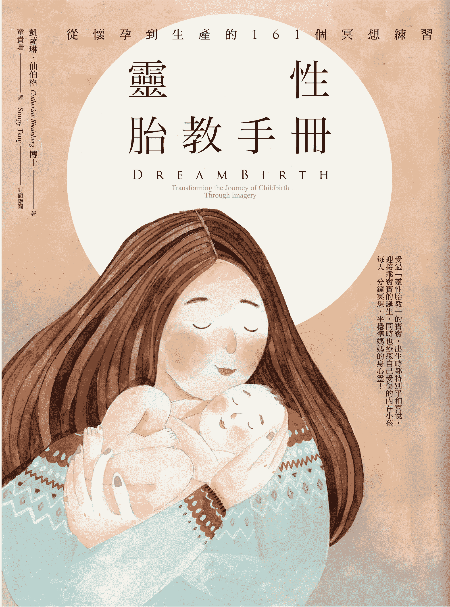

# 灵性胎教手册

献给我的儿子山姆（Sam）

想像力从来不是某些人独享的天赋，

而是每一个健全的人皆有的特质。

——美国文学家　爱默生（Ralph Waldo Emerson）

# 自序实践光之卡巴拉

如果我发自内心创作，几乎万事都成；如果我从头脑去创作，则一切徒劳无功。

——画家　马克．夏卡尔（Marc Chagall）

护士走进空荡荡的等候室里，告诉我，我怀孕了。我原是为了更年期的停经检查而来的。护士把我的尿液杯子举起，让我看看杯子底部的蓝色点点，向我解释那意味着有个小生命已在我的体内成长。我掩面嚎啕大哭，而且哭了很久。这简直令人难以置信。我当时已经四十一岁了。

等我终於哭完而睁开眼睛时，房间里灯光柔和，弥漫着一股宁谧氛围。那是阳光，抑或纯然是我的情感作用？如此神奇之事竟发生在我身上！在整个孕程中，这股不可思议的惊喜从未消失，为我的每一个念头与行动增添不少亮丽色泽。当我第一次亲眼凝视我儿子的小脸蛋，并将他紧拥入怀时，我简直欣喜若狂。尔後看着他一天天长大，内心那股无法言喻的爱与感恩，不禁满溢而出。

事实上，我对怀孕的真实情况近乎无知，而我的母亲和老师柯列女士又住得离我甚远，於是我只能高度仰赖书籍的指示。我埋首钻研所有我能找到的资讯，大量吸收一切与怀孕有关的临床资料，以及分娩前的种种徵兆。然而，我找不到任何引导我去面对孕程期间那些排山倒海而来、使我措手不及的情绪反应的书籍；我也遍寻不着任何能指引我前行的梦行地图与标示，带我踏上这片孕育於体内的新大陆；当我想要使用我的语言与视觉心像跟腹中胎儿建立连结时，我找不到任何足以指示我深入这段互动旅途的声音。

我心中充满好奇，有好多亟待寻求答案的问题在追问我。宝宝听得到我的声音吗？他感受得到我的爱与关切吗？他是否发育正常？他是否备受保护，不受我周遭那些嘈杂噪音与激动情绪所影响？他会发现自己蜷缩着身子，躲在我的心脏下方吗？我们会互有好感而相看两不厌吗？到底我要如何去感知、看见并知道有个陌生人正在我体内一寸一寸地成形长大？

当我的孕程持续进展时，我开始发展属於我个人的沟通语言。我以无止尽的话语跟我的宝宝说话，我也将我心灵之眼所看见的影像画面传递给他。我对他日有所思夜有所梦。我唱歌给他听，我对他发出咯咯声调，也对他低声哼唱。当我觉得某些外在的混乱可能使他受到搅扰时，我会轻抚肚腹来安抚他。我指示他可以如何滑出产道——我将这过程观想成花茎扩展开来，让宝宝能顺利通过——不偏不倚地坠入他父亲展开的双臂，应声出生於一座美丽的花园中。我的外在与内在世界开始枝繁叶茂，欣欣向荣。我沉浸於小宝宝与我所梦想的奇异世界里。我专注沉浸於爱之中，没有任何外物足以惊动我。

当然，我向来就是个梦行者（dreamer）。

只是，我从未想过要写一本有关怀孕母亲发挥梦行力量的书。我只是一味地浸淫於无限瑰丽的梦行之中，亦即我与那位在我体内安静成长的美丽宝宝之间的关系；除此以外，没有其他事比这份关系更重要的了。

所以，你可以想像几年以後，当我开始成立一个产前与产後的视觉心像生产工作坊时，我有多惊讶，那真是我始料未及的事。面对这个全然陌生的职责与领域，我对自己毫无把握。在那段生命历程中，我从未从事任何与生产领域相关的专业。我面对的主要个案，大部分是一心为自己与他们的灵性旅程前来寻求协助的人。但那位邀请我开课的朋友兼视觉心像学生、同时也是头荐骨治疗师和陪产妇（doula）的克劳迪娅．莱肯（Claudia Raiken），对我确保再三，直说我不必准备即可开始。她如此向我保证：「你只需要让学员来向你问问题就好了。」

过去几年，我透过一些简单的视觉心像练习，帮助过许多女性朋友面对她们的孕期与分娩过程。我所领受的那套视觉心像练习，是传授自柯列．阿布可—马斯卡（Colette Aboulker-Muscat）女士，她是位受人敬仰的导师、「光之卡巴拉」的直系传人，同时也是「源自古老伊比利半岛的梦行（dreaming）修练」的推崇者。[[1]](#Preface.xhtml_fnX-1)我将她的视觉心像练习，结合我在怀孕、生产、以及近几年所开发的一些心得，尤其针对身体训练与生理问题，整理成一套教材。

然而，我还是怀疑自己到底能在这个工作坊里教些什麽内容。当然，我可以肯定她们会学到一些简单的放松练习。此外，我还能为她们做什麽呢？我既不是助产士，也不是陪产妇，除了一九八六年生下儿子的亲身经验外，坦白说，我对产房内的种种，一无所知。只不过我的这些担忧，很快就烟消云散了。

正当我犹豫不决，不确定自己是否该开始这个产前与产後的视觉心像工作坊时，发生了一件对我影响深远的事，令我震慑并惊诧不已。

某日，我和一位朋友到纽约州北部去取一件艺术作品。有一位古董商人刚过世，我们决定去参加一场出售古董商收藏品的拍卖会。拍卖会即将结束之前，我忽然感觉有一股冲动驱使我站起来，走到待售的物品中浏览。在一张摆放在角落的桌上，一堆被遗忘的东西之中，有个用珠子串起来的大娃娃。我彷佛被一股力量催逼，不得不拿起那个娃娃。娃娃高度大约七十公分，在非洲完成串珠，娃娃的肚子上有个条纹织布的小袋子，看起来非常破旧。我向当天的拍卖者示意，让他知道我想买那个娃娃。当天没有其他人对这个玩意儿有兴趣，所以我在毫无竞争对手的情况下，以区区二十美元便轻松买下了那个娃娃。

当我返抵家门时，我将娃娃放在入口处的门厅。隔天，有位朋友一时兴起，带了一位钻研非洲艺术的宾客来找我。这位陌生宾客的反应非常惊喜赞叹，他说：「你得到的是充满灵性的娃娃啊！怎麽可能呢！没有人可以拥有这个东西，除非你注定可以拥有她！那是象徵生育的娃娃，一般是由母亲代代相传给女儿。她会保护家中的女性与她们的後代，使她们免受分娩时的危险。你看肚子这里的小袋子，那里面有个小宝宝呢！」

我後来明白了，是我的梦行身体在冥冥中将我牵引至这个娃娃面前。对我而言，她的外观并不是特别引人注意，但显然，她是带着一份强大的使命与意图被创造出来的。经他这麽一说，我忽然为自己的机缘好运而振奋不已，想不到象徵生育的娃娃，竟如此轻而易举地临到我手中，而且就在我不断犹豫是否该着手投入生育议题时，适时出现在我眼前！我非常确定这是从宇宙传递而来的线索与讯息，我也确信自己将在这项工作中备受指引，使我有能力帮助世界各地的怀孕妇女运用视觉心像，完整且完美地观想她们的宝宝。於是，我决定要开课了。

克劳迪娅召集了七位与生育相关的专业人士来接受我的训练，她们分别是护理人员、心理谘商师与陪产妇。其中一、两位中途退出，但後来又多了几位学员加入。我们每周三见面一起上课，连续上了七年。这个开创「灵性胎教」（DreamBirth®）的过程，是一段相辅相成、导师与学员共同合力完成的成果。这群长期投入生育相关领域的专家，帮助我去理解与面对她们的个案有什麽需求。我开发了一系列的视觉心像练习，陪伴这群专家走过视觉心像的练习过程，然後她们再向我反映一些具体的回馈。当我们双方都对此练习成效感到满意时，这群专业人士会将她们所学的实际应用在个案身上，然後再根据落实後的成效提出更多回馈。少了这七位可亲可爱的女士们，这份工作便不可能构思、孕育、以致具体落实。

「灵性胎教」的视觉心像练习都非常的简短、精准、有效。其设计是为了有意识地转移身体与／或情感层面，将与恐惧模式、旧信仰系统有关的盘根错节问题，彻底切断，恢复身体与心灵的自然律动，提升免疫系统，同时激发天赋本能的最大功效。今天，我们为每一位即将面对分娩过程的对象，设计了超过八百种练习，其中最显着、最常被使用的练习皆已集结在这本书当中。虽然这些练习尚未取得任何临床测试的结果，但依不同情况所得的证据与回应，皆显示「灵性胎教」对於分娩的过程与成效确实不凡，且令人惊艳。

我的书写，是希望能在医院规划一套得以落实的研究计画。面对我们每一天要在医院内共事的父母与孩子们，我对我们的「灵性胎教」研究计画与成效，胸有成竹：从整体结果看来，这项计画不但使妇女们的分娩过程更为顺利满意，也出现了更多快乐健康的母亲与婴儿；至於那些必须经历手术等各种疗程的母亲与婴儿，他们的复原能力也因此而更加快速。

多年前，当我在耶路撒冷教授视觉心像与各种相关练习时，大部分来上课的学员都是已经有孩子的年轻妈妈。那时的耶路撒冷，仍是个沉睡中的山城，经常得面对各种政治动乱的侵扰。话虽如此，街道上依旧飘着九重葛的特殊气息与茉莉花香。我们的生活步调缓慢，总有时间驻足沉思。城里的七座山与橄榄树，驱使我们沉浸於充满历史氛围的神秘感中，三大宗教盘踞之地，就像犹太教在安息日所吃的特殊面包卷，层层缠绕。每一天的生活作息与节奏，有教堂的钟声提示，也有从清真寺传来声声祈祷的召唤，还有自犹太教堂与家中传来朗读祷告的声响。

有人说，耶路撒冷的山，每一座都直探天空。我们其实都住在一个富含神奇魔力的子宫里，一个孕育於天地之间的圣地。在耶路撒冷，大多数的妈妈都是轻轻松松地产下宝宝，或至少凡经我指导的妈妈们都是如此。分娩过程既短且轻松，而且很自然。妈妈们在家里生产时，丝毫不觉焦躁或不安。她们在充满隐私的地方安然分娩，身边围绕着她们信任且熟悉的婆婆妈妈与助产士。

而今，耶路撒冷的妇女们如何生产，现在的我恐怕已无法回答这个问题。今天的耶路撒冷，压力、恐惧与延绵不绝的战乱如影随形，以色列也急速转型成为充满竞争、标榜物质主义等以美国社会为仿效对象的国家，当地的生活步调更不断急促加快中。事实上，全世界都饱受世俗化的影响，不断攀升的物质欲求，使我们的社会和地球备受威胁，进一步造成道德与情感的堕落。除非有利可图，否则我们对身边的人已渐渐失去了单纯关切的兴趣。猖獗的贪婪、不满的情绪、恐惧害怕、竞争较劲、怨怒愤懑、焦虑不安、人与人之间的关系越来越贫乏淡漠，以及灵性匮乏等等，都是现代化社会难以在短时间内彻底解决、盘根错节的问题。这些环环相扣的挑战，也使我们的身体顿失真正的连结与意义。虽然并非所有孕妇都直接投身庸庸碌碌的现代生活中，但仍有许多准妈妈难逃这种现代生活的恶性冲击。事实上，饱受不良影响的不只是孕妇，还包括婴儿、丈夫、医生、助产士、陪产妇、亲人家属与朋友。今天的世界，不论是女性朋友或她们的伴侣，都无力改变现状而不免要为她们的分娩过程与未来即将出生的宝宝而忧心忡忡。

如果说，在今天大部分的文明国家，一个孩子的出生经常伴随着高度的压力，我相信这是再合理不过的说法。许多女性朋友发现自己越来越不可能、或难以挪出时间来专注於孕程与分娩这件重要的事。她们经常日以继夜地奔波忙碌，直到最後一分钟仍努力在不断累积的职场与家庭劳务之间，分身乏术地寻找一个平衡点；而我们的社会与政府——除了少数国家，像丹麦——并未提供怀孕的女性朋友一段专属於她们的独有时间，好让她们悠然自在地像母鸡静坐孵蛋一般，没有後顾之忧地坐在那儿好好孵育她腹中的新生命。

与此同时，怀孕与分娩已经成了一个越来越重要的产业。现代女性早已不待在家里等着当地助产士来协助她们分娩。在美国，百分之九十九的妇女选择在医院生产，而一个消毒乾净却缺乏隐私、温暖与同理心的环境，已成为产妇们认定是分娩时所需的地方。分娩不再是专属女人的事，也不再全部由女人在一个备受保护、犹若子宫一样的环境中来处理。

生小孩这件事，长久以来已被医疗专家分门别类，视为不同症状的挑战来处理，稍有机会便见缝插针，动辄透过药物与／或手术来彻底解决。怀孕与生产已不再被视为一桩再自然不过的事，而那原是需要我们大力支持与鼓励的自然法则，如今却被当成疾病般来对症下药。虽然药物的处理模式在某些必要的时间点，有其必要性与功能，但是我们也不要忘记，我们的身体本来就是为了生育而设计的，因此，我们若容许身体遵循自然律的引导，其实是更好的选择。但是一如我的妇产科医师——一位专业称职、和蔼可亲的女性——在我们第一次产检时对我和丈夫所说的一番话：「唯一文明的分娩方式，是使用硬脊膜外麻醉的无痛分娩！」（硬脊膜外麻醉是以一根导管注射下背部来进行局部神经阻断的麻醉，以麻痹分娩过程的疼痛。）然而，医生没告诉我们的是，任何药物的注射终将进入宝宝与妈妈的血液里，减缓催产素的分泌，而那是促进分娩与生产的重要荷尔蒙。幸运的是，我的丈夫是医生，他不假思索便反对这项建议，随即提醒妇产科医师，我的身体理应由我来主导，因为那是我最熟悉的领域与专业。

分娩，作为女性一生中最极致的经历与体验，已逐渐失去它天经地义的自然性与神圣性。置身於典型的分娩医疗模式中，即将生产的妈妈被各式各样的监视器绑住，彷佛那些医生都忘了如何使用他们的听诊器一般。注射硬脊膜外麻醉变成过程中的标准程序，接着是催生或引产，选择性或者非必要剖腹产的数字比例正不断往上攀升（在美国有百分之四十是剖腹产）。病房保持乾净、安静与规格化，自然分娩则不受鼓励。「想像一下那些声音！」在聊到产妇在自然分娩时声嘶力竭的尖叫声时，一名护士这麽告诉我。想当然耳，在医院所付出的费用也随着这些需求而水涨船高。生育这件事，成了许多夫妻难以企及的昂贵消费与成本。虽然如此，涌向医院的准妈妈们依旧络绎不绝。事实上，面对为她们量身定制的另一种选择，她们竟毫无所觉。

不要误会我的意思。我不是故意要与医生作对。不瞒你说，我自己就嫁给了一位医生。当然，在某些棘手的医疗照护上，对抗疗法的药物当然有其不可磨灭的重要贡献。所以，我们并非要把婴儿与洗澡水一起倒掉，而是要谨慎厘清何为精华与糟粕，而非粗糙地全盘否定。但现在的问题是，我们是否过度高举和仰赖那些侵入性的医疗需求？我们知道，在一个现代化的社会中，事实上助产士的角色远优於医生，也是产妇与宝宝更需要的人选。只要分娩过程正常且安全无虑，一般而言，助产士比较倾向自然分娩。在荷兰有三分之二的分娩是由助产士协助进行，他们的婴儿低出生死亡率排名全世界第一，在同一个排行榜上，美国则是排行第二十九。由此看来，重新评估分娩的优先顺序与选择，是一件迫在眉睫、需要被正视的事。

我们终究要问，生孩子的是你还是医生？你要让医生来告诉你该如何处置自己的身体吗？毕竟，唯有你与你的伴侣，以及腹中的宝宝，才拥有整个分娩过程的发言权。我不是鼓励你与医生的忠告或意见彻底对立——那是愚蠢的一意孤行——我只是要提醒你，不妨转移你的观点与角度，学着与你自己的经验和智慧建立更深的连结。

让自己积极地去改变现状，让自然的力量回归至应该发挥之处，而就是这股力量创造了你的骨骼架构、肌肉、荷尔蒙、细胞，并且创造你的智慧来进行生育。教育并连结你的内在自我与你的宝宝，你就能重新获得属於你自己生育过程的主导权，并且你会知道，当医疗处置介入变成必要之时，你能在知情的状况下同意这些处置的进行。

你是创造者，你的子宫里正孕育与守护着一个全新的受造与生命。这本书是为你而写的，为要让你在属於自己的分娩过程中，自由而积极地掌握主导地位。这些视觉心像练习——简短、轻松，不但富有感染力，而且好玩有趣——将成为实际可行的工具，帮助你与你的宝宝，一同体验一趟安全与心满意足的生产旅程。

1.  「卡巴拉」是一套传统的犹太神秘进路。相对於东欧阿什肯纳兹犹太人，此处所指的是居住在地中海周遭的犹太人。柯列．阿布可—马斯卡导师（一九〇九～二〇〇三）自一九五四年一直到她离世，都在耶路撒冷定居与授课。 

# 前言你是生命的创造者

世人行动实系幻影。

——《诗篇》39：6

想像你是个画家，面对一幅空白的大画布。你在画布上标上第一点，接着挥洒作画，谨慎修饰，完成後裱框，然後向全世界展示你的创作，并赋予你的画作自由与自主性。这样的思维模式，正是你需要掌握生命中最伟大的创造——你的孩子，以及孕育小生命的态度。

你是生命的创造者，你被赋予上帝般的能力，一如上帝对人类的创造，是「按着自己的形象」孕育一个新的生命。你是母亲，而法文的「母亲」（Mère），依照同音异义字的线索，是个本质上与海洋（Mer）有关联的词汇；它也与女性先知米利安（Miriam）以及上帝之母玛利亚（Maria）的音译连结。这些拥有同样字根关系的字，揭示了由「水」所带出的视觉心像与内在视觉——水，成了孕育创造的母亲与源头，而所有受造都是出於爱的行动。你也像上帝一样，可以将世界梦想成实际的存有，学习观照你身体内在的水，将你的行动，从观念开始循序孕育，进而落实成为人母。我亟欲向你证明所谓「梦行」，其实是你身体的一种语言。

你要如何回到在你之内、与生俱来的深度梦行认知与智慧当中呢？事实上，传统中许多口传与文字的见证故事，已为我们指点迷津，也指明了具体可行的方向。对我而言，我选择从西方的灵性传统，亦即那些接近基督徒、穆斯林与犹太教徒所熟悉的核心信念，作为我论述的底蕴，因为那最接近我个人的传统，所以，我也欢迎你以个人的传统来自由取代。你若觉得有必要或较为适切，也欢迎你将上帝的话语，自由切换到其他神只或阿拉、神性或纯然某种神秘宗教等对象。对於所有传统与信仰中的梦想故事，我抱持高度的敬意、认可并热烈欢迎；对我而言，我相信所有伟大的传统都殊途同归，指向同样的真理。也或许，你并不觉得自己与任何灵性传统有所关联。若然，你可以让自己与大自然连结，因为我们每一个人都服膺并受限於自然律。

就我个人所倾向的传统，最古老的经典来源是《圣经》，我由此找到许多与梦行和受孕相关的教导。「你要离开！」[[1]](#Foreword.xhtml_fnX-1)上帝对亚伯拉罕与他的妻子撒拉如此嘱咐，要他们展开一趟从膝下无子的贫瘠，转而走向欢呼胜利的受孕与生产之旅。他们老来所得之子，取名以撒（Itzhak）——这个带有「欢笑」之意的名字，恰如其分地表述了两老的心境。我们都是充满灵性的受造物，而我非常确定，我们每一个人的灵性根基都已清楚言明：你必须返回，环顾己身，学习去认识你自己与你的身体，这是创造力种子发芽成长的器皿，也是无比神圣的渠道。

当你读到这几页时，你或许会想，自己早已竭尽所能，尝尽各种方式使自己的梦想成真，却始终无法如愿。你至今仍殷切期待要当妈妈，想怀孕、想拥有属於自己的宝宝。你为此而难过、生气、羡慕且心灰意冷，一如亚伯拉罕的妻子撒拉所可能历经过的感受。我想对你说的是，打从一开始就不要失去盼望！我曾目睹过不计其数的奇蹟。想像力本身就是奇蹟的工具，这工具具有翻转你身体与未来的力量。其实，你还没学会善用你脑海中的图像画面来直接跟你的身体对话。图像画面是你的身体所明白的体验式语言。你或许不晓得，你身体的绝大部分会对潜意识的程式设定有所回应。潜意识就像一台电脑。如果电脑被病毒入侵——以负面的信仰系统、负面的情绪程式设定、毁损的器官等类似状况运作——你的潜意识将摆脱不了这些消极毒素。这些状态将使你持续保有病毒体质，除非你能想办法彻底清除这些病毒，使你的身体复原，恢复到原来完整而健康的版本与功能。你将从接下来的内容中，学习如何分辨那些病毒，并且学会对潜意识发布「清理病毒」的指令。记得吗，撒拉是在年近一百岁时才怀孕生子呢！在我所面对的诸多实况中，我一次又一次见证了想像力的巨大能量，如何让不可能成为可能，最终成为真实。请继续读下去。这本书也是为你而写的！

#### 沉浸於想像力的梦行之海

想像力的活水，指的是什麽呢？众所周知，我们的地球若少了水，便没有人可以居住其中；我们自己也是在子宫羊膜囊的生理盐水水域中生长发展，而我们身体内的水分更占了高达百分之八十五。当我们凝视清澈水面时，总是能看见自己的影像倒映在水面上。水，仿若一面镜子，帮助我们清空自己的思绪，使一切变得澄澈明净，让我们得以看见最真实的影像，以及那些在心灵深处中浮现的思维模式。正因为这样，这部分成了占卜预言最常使用的媒介——那是一种预见未知的艺术，藉此注视无边无际的空茫虚无，同时拥抱和孕育崭新的事物。

所以，你对孕育与生产的最初梦想，就存在於你身体的水域中。我们一般称此为无意识的水域。那里之所以无意识，是因为你从未将注意力专注投入於此。想要有意识地展开梦想新生命之旅，除了专注聚焦以外，别无他法。

所有环绕地中海的海域，从埃及到巴勒斯坦，再延伸至希腊、义大利、法国、西班牙与北非，女人们总是善用「梦」作为她们选择的语言。梦在许多方面是个不可或缺的重要过程，譬如仪式、神秘传说、医治疗癒与生育等。在埃及，负责创造、保护生育与母性的女神爱西斯（Isis）所住的地方，四周都被众水围绕。如果想要亲临爱西斯所住的菲莱神殿，女性必须搭乘船只，穿越深水才能抵达。当她们涉水而往时，她们被引导进入梦行状态，进入那一片富饶多产的源头。

所有创造或转化的伟大故事，通常都起源於一个视觉化图像或一个梦境。你的想像力乃是从体内的水域中孕育而生，是准备你自己身体与心灵的秘密，好让你成为快乐与成功的父母。

许多女性梦见攸关孕育与分娩的古老记载，提醒我们去检视生育力与梦行之间的关联。在希腊，女性的疗癒之梦被刻在古老圣地德尔菲的大石碑上。不孕或患有其他妇科失调等疾病的妇女们，都会前往德尔菲寻求医治。她们会踏入一个宛若子宫的地方，然後在医神神殿希波克拉底沉睡一宿，那是个为孵育梦想而设的内室。在她们的梦里，总有一位神只向她们显现，为她们指点迷津，指引她们一条生生不息、恢复生育力的出路。

环顾全世界的灵性传统，神界的力量总是陪伴着我们，赋予我们能力去受孕并生养後代。藉由自内在升起的许多图像画面去沉思那位神只所显现给她们看的画面，女人便学会了创造。

这本书的写作目的，并非为要教导读者「如何成为父母」；而是有关想像力，以及学习如何落实创造新生命的梦行力量。此外，这本书也谈及如何恢复女性与其伴侣的创造行动，而这个行动恐怕已被许多女性与其伴侣丢弃於强势的西方医疗模式中，甚至误以为我们是透过遗传基因与各种意外而复制的。

宝宝从何而来？难道我们只是一个创造新生命的肉体，而且纯然机械性地生产吗？那些细胞是如何一一各归其位而成为肺部、心脏与肾脏？是否有一些东西已赋予我们动力，但却仍未被我们接受或采纳？我们那份像神一般可以「创造形象」的能力是否启动了？若然，我们是否能驾驭我们的想像力？

我们是否能再度沉浸於我们的梦想之海，以最完美的方式创造我们的宝宝，满怀欣喜并轻松自在地将他们带到这个世界上？

#### 梦，为问题提供了解答

若我们不是由我们的梦所构成，那麽我们是谁？

如果我们以为自己的身体，与我们心中的希望、抱负、恐惧或愧疚无关，那麽这样的误解，将使我们彻底轻忽我们的心灵对於我们肉体的影响力。我们的心灵层面——我们的思想、感受、记忆与行为，尤其是一些视觉心像——会过滤我们观察现实的方式。我记得有个被性侵的年轻女性，竟下意识地中止了分娩的过程。虽然医生说她已准备好要用力推挤，将宝宝生下来，但她就是做不到。她这麽说道：「下面那里很肮脏。」最後，宝宝是透过剖腹产才生下来的。

我们都住在一个身经百战的视觉心像与经验里——过去的、当下的，以及投射的未来，这些时间点所呈现的愿景、声音、嗅觉、味觉与各种感知氛围，都是我们这个个体最真实存有的源头。当我使用「视觉心像」一词时，指的是我们每一个人与生俱来的三维内在世界，由我们的五大感官系统启动，其中包含我们的记忆、感知、面对外在与内在刺激的反应、梦境、富创意的领悟力与洞见。「视觉心像」一词是个约定俗成的惯用语，因为视觉是大部分人最显着与重要的感官，而且视觉在某种意义上也含括了其他四种感官。此外，影像的想像，也是一种连结於身体的「体」验，在这样的紧密连结中，所有感官彼此相辅相成：你在自己的内在世界里，尽其所能地观看、嗅闻、聆听、品尝与触摸，一如你於外在的实相世界中所进行般，真实而生动。

我们的身分认同——过去、当下与未来——就从这个领域的视觉心像中衍生，其中包括身体的行动、感官认知与情绪起伏。我们对此或许浑然不觉，但它们却如实定义了我们的生活。每一个人都住在一个多元的场域里，我称之为「梦的场域」（dreamfields）：个人的、家族的、社会的、国家的与地球的。除非我们去开发并探索那些梦的场域，去发掘在那些过程中，是什麽样的元素促使我们如此行动，否则我们将永远力有未逮，无能突破或超越我们现有的行为限制。

梦的场域为我们的许多问题提供了解答，并且引领我们一步步实现心中的渴望。有没有想过，为何在没有任何药物影响之下，有些女性生养众多，有些则饱受不孕之苦？是什麽原因使一些宝宝发育完整，而有些宝宝却不得不挣扎求存？如果梦行是创意不可或缺的工具，那麽若能合宜地善用这个工具，是否有助於显化一个更完整的未来、生下一个更快乐的宝宝？

回头想想：当你还是个小孩时，是否曾好奇自己会不会像你父母那样，长大以後也能拥有自己的孩子？身为女孩，当你小时候摇着洋娃娃、对着娃娃轻声细语的那个当下，你是不是也不自觉地开始自我教导，在举手投足与感知之间，觉得自己俨然像个妈妈？而你的其他兄弟们在观察父亲或温柔或坚定地对待他们时，他们心中是不是也难掩内心澎湃的骄傲之情，想着自己将来有一天也要像爸爸那样？也或许，会不会因为历经了失望与孤单，而令他们开始动念想要成为「一颗枯乾的果子」，也就是不生育？那可是一个小男孩曾对他充满敌意的父亲说过的话。你是否曾暗自发誓将来不要有孩子，因为你目睹你的母亲如此体弱多病，而你打定主意不想成为别人的负担？你是否让自己受困於与家族祖先有关的信念系统里而不可自拔，例如在你母亲的家族里，在记忆所能追溯的故事中，所有女性都难逃困难重重的分娩经历，而这会影响并支配你未来的生育状态吗？

重点是，对大多数人而言，想要有个孩子的想法，早在具体实现之前好几年，便已逐渐在酝酿了。「我们想要有一个男孩和两个女孩」，或者「我们规划晚一点再生第三个小孩」，或者「我们只要女孩」！另一方面，我们或许就是「知道」自己将不会有孩子，抑或我们最终会领养一名年幼的中国女孩。我们很渴望见证我们靠直觉感受到的命运有一天竟实现了，却也担心我们所预测的内容会失准或失效。我们之所以能掌握自己的命运，是因为那些内容都记载於星盘上吗？或是我们透过梦的场域创造出来的？命运与梦行是否相互关联，休戚与共？若然，我们是否可以透过回应并参与我们多重面向的梦行场域，进而改变我们的命运？

#### 回应梦境所传达的讯息

「梦行」是一个动词，代表一系列进行中的行动、一个过程与一趟旅程。它不是静态的。认清梦行的这种特质非常重要，因为本书所要探讨的，正是这种动态过程的梦行。我们通常不是「谈梦」，而是「做梦」。梦，在夜间沉睡时现身：「在某些不同阶段的睡眠状态中出现的一系列影像、想法与情感内容」；或「白日梦、空想妄想」；或是「某种热切的渴望与抱负」。[[2]](#Foreword.xhtml_fnX-2)这些对梦的不同定义，说出了部分实况，但却忽略了一个重点：我们无时无刻都在做梦。我们并不是只在夜间做梦。每一个人随时随处都在累积自身的经历，这个状态就是我所谓的「梦行」。当你在阅读这本书时，你同时也在梦行，只不过你的梦行流动是潜意识的，是属於某部分永不停歇的右脑活动，因此你通常对此浑然不觉。但是当你怀孕时，你会比其他时候更为敏感而有觉知，因为你开始更紧密地与自己的身体，还有你腹中的宝宝和谐共处。你也会更容易记起夜里的梦境内容。其实，深夜梦境不过是你梦行意识流动里的一扇窗、一个剪影。你之所以对梦境内容记忆犹新，是基於你强烈的感知或情感，或是因为那些梦太奇特而令你惊诧不已。

从另一方面来说，梦行意识的流动是你右脑半球无时无刻都在进行的活动，不管是透过神经传导路径连结到哺乳动物脑区（译注：指杏仁核和海马回，与感觉和记忆有关），或者更原始的爬虫动物脑区（译注：指脑干和小脑，与生存本能有关）。你的大脑像个超级大雷达，时刻不停地运作，监测你所置身的空间，以及你周遭的状况。当然，它也同时检视你身体内正在发生的事。

梦行是瞬时即刻的，那是你的右脑阅读空间、感知线索与移动的方式。你的右脑是个萤幕，捡选或远或近的讯号，然後透过你的感官接收器（眼睛、耳朵、鼻子、舌头与皮肤）来传达指令，重塑与重组，使它们成为可阅读与可辨识的影像。那是你的视觉阅读器。接下来轮到言说或书写的部分，那则是左脑要花时间去消化、解读与咀嚼的语言了，大量的影像在瞬间清晰呈现，传达出多层面的实况。

梦行也反映与回应它所感知与看见的一切，并与之进行互动和交流。梦行是你的身体吸收新资讯，进而以此资讯进行重组的管道。花些时间，仔细思索这个词汇所包含的意义——也就是它以什麽形式呈现，而这也是你的右脑如何运作的秘密：右脑能辨识形式。它能找出符合的形式，就像一幅图画的每一小块拼图，也像是错觉艺术大师艾雪（Maurits Cornelis Escher）的画作，在你的人生蓝图上，创造一些细致、精准与持续更新资讯的标示。或许有些小块图像可以拼得起来，但有时候，整体的大幅画作则不然，於是你的梦之场域中的某些固定模式，昭然若揭。梦行的过程，将觉知到某些东西阻碍了整体流动的脉络，同时发出讯号，如：恶梦、不断重复的梦、心神不宁（情绪受到侵扰），以及身体的疼痛。这些讯号的目的为何？它们需要你留心聆听什麽样的讯息？

事实上，你的梦并不只是你的大脑在夜晚清理出来的「垃圾」。不妨听听一些现代科学家对此的见解：[[3]](#Foreword.xhtml_fnX-3)你的梦正寻求你协助排解它们所映照出来的难题。如果你认真看待你的梦境，你将很快发现，你的梦其实含括诊断与疗癒。梦境可能显示你的胃有一个黑点。这个图像画面日复一日地运作，并传递一种需求——它呼唤你去清理掉那个黑点。当你开始进行练习，运用几个简单步骤回应你的图像画面之後，所得到的成效将令你感到惊讶且不可思议。身体的语言是一种图像画面的体验。你会发现，某个图像画面倏忽出现於你右脑的萤幕上，指示你胃部真正的状况。当你透过心灵之眼来形塑一个图像画面时，这便是你回应视觉心像的方式，一如你藉由抹除擦拭来回应地板上的一块污渍。当你如此行动时，你其实正与你的身体进行沟通，由此，它将发出合宜的能量流动，帮助你去消化与解读。透过回应你梦中的画面，你被赋予一个机会去进行视觉心像的调校与修正，同时积极参与自己的疗癒。只不过，大部分人仍认定每一件事都发生於潜意识中。

假若你需要保持高度觉察与敏锐度呢？你的梦行意识可能成为你实现抱负与壮志的工具——亦即成为传达能量、聚焦心中渴望与意图的工具吗？当你充分掌控与左右你的梦行意识时，它能如实扮演实现与显化的角色吗？

#### 身体与心灵的失衡状态会经由梦境揭示出来

身体是个奇妙的有机体。身体不仅和自己对话，同时也以千百种方式与外在的大千世界对话。我们不过是掌控了较为粗浅的互动模式：我们的行动、表情、惊叹或话语。那些发生於表象背後或我们的神经与细胞系统更底层的部分，对我们而言都属於未知的领域，只能透过我们的梦，谜底才能揭晓。一般而言，身体自会找到属於自己的平衡之道；身体能以奇特的方式互相连结，维持一种持续平稳的状态，称之为「恒定状态」机制。事实上，我们的身体不仅从未稳定，也无法长久维系稳定的状态；反之，它恒常辛苦地挣扎与摆荡，仿若航行於惊涛骇浪之上，只求维持某种基本的生理平衡状态。

心灵的状态，譬如忧虑、挫折或任何形式的不安与困惑，在某种程度上，显示出梦行意识流动开始面临阻碍，我们的身体因而难以寻得平衡，恒定状态机制开始妥协、退缩。此时，这个系统开始出现紧绷或系统彻底毁损的讯号。早在你的身体还未感觉不舒服，甚至在你的意识层面尚未发展成不安或疾病之前，你的梦行身体就已经发现这些失常了。就像海底下汹涌的浪潮般，惶惑不安在看似平静无波的水底下蠢蠢欲动，时间一到便要浮出水面。如果你够幸运，偶尔突如其来的翻腾——深夜的梦境或白天脑海中的画面——就像鱼一般，倏忽从海底跃出水面，以此来警告你。如果你够专注，如果你够认真面对你的梦，并严肃地正视它们向你揭露的警示，你便可做出一些足以动摇根源的改变。收到这些预警之後，你就能够主动回应这些视觉心像所显示应该处理的事情。

在恒定状态的机制中，奋力成长是自然的趋势。身体的意图是如此坚定，犹如一颗了解自己的种子，知道它必然会，也终将要生根、伸出树干、开叉出枝、长出绿叶、花朵盛开——它不断地生长，努力达到结实累累的终极目标。我们看见恒定状态在子宫内部发生的过程，从一个胚胎逐渐成长，越来越成熟，直到某个阶段，恒定状态开始指挥调度，正式进入分娩期。早在你察觉到身体的外在讯号之前，你的梦行场域便已清楚地向你揭示这一切了。因此若能提早得到提醒与警讯，岂不是好处多多？

当然，其中的秘诀在於，要对你的梦行场域保持高度觉察与敏锐——那是你办得到的事。

#### 觉察夜间的梦

当你还是个孩子的时候，你是能觉察到自己的梦行的。事实上，因为当时年纪小，语言发展还不完整，自我检视的能力也相对较弱，因此你能活在你的梦行场域里。顷刻间，你的愤怒使你成为一只喷火龙；转眼间，你的惊奇又使你摇身一变成为挥动透明羽翅的天使。你一下是个坏男孩，下一秒却又变身为充满正义感的警察。你所扮演的角色显示你在当下的感受，以及在任何必要的情境下，你如何转化自己的身分。

但这个能力极有可能是发自你的内在，而若真是如此，让自己重新熟悉这个儿时的梦行语言就显得非常必要了。

可行的两种途径包括：第一、记得你夜间的梦；第二、将你的双眼转向内在，凝视你内在的图像。或许你觉得这近乎不可能，但你若继续读下去，你将发现其实一点儿也不难。我相信你很快就能得心应手。

一旦你开始对自己的梦行有所觉察，便意味着你已准备好成为主导自己身体旅程的主动参与者了。梦行是你的身体能够理解的一种语言。你的身体藉由视觉心像，呈现它正经历的一切给你看，而你也可以透过回应这些视觉心像，走进你的身体内，与它互动。你的潜意识一向都是选择以视觉心像作为它的语言。当你开始使用这个语言之後，过去只属於潜意识层次的身体旅程，就开始能在你的意识层次让你积极参与，藉由与你的身体对话，以适当的视觉心像回应你的身体显现给你看的图像，你与你的身体於是变成搭档，帮助你的身体面对挑战且最大化它的可能性。

如此一来，不再是你的身体为你效劳，而是你与身体一起合作共事。把自己想像成骑士，把你的身体当成一匹马。你若无法学会驾驭你的这匹马，你终将只能成为差强人意的骑士，不但在马背上被甩来甩去，还可能被这匹不受控制的马狼狈地摔到地上。你难道不想和你的马合作无间，美好地共骑共舞吗？

怀胎、妊娠与分娩的过程，可以风平浪静，也可能颠簸起伏。这本书将为你提供一些工具，期待能帮助你顺利地完成这趟旅程。就像不停锻链身体的奥运选手，需要透过视觉提示来演练他们的每一个动作，你也将学习善用视觉心像来帮助自己准备好身体，接受怀胎与受孕，支持你度过怀孕期间的各种身体变化，然後训练自己如何使力将腹中的宝宝推挤出来。运动员为了竞赛而训练。即将为人母的你，是为了「生产」而做好万全准备。望文生义，「生产」两个字便已预示那是需要靠强大的体力来进行的身体活动。你可以使用视觉心像，让自己像奥运获奖的选手般，在你劳苦功高的生产过程中，成为冠军得主。

你的左脑就像怀疑耶稣复活、典型多疑的门徒多马（Thomas），是意识心智的怀疑论者。如果你能学会平静你的左脑，且全面投身於你的梦行当中，你将在分娩时经历一种颠峰或高度感知的状态，你的身体与心灵将经验到一种合而为一的连结。这种经验正是运动员所谓的「境界」（the Zone）或「出神」状态。如果你全然投入於梦行当中，一般被视为艰辛而吃力的分娩过程，将变得毫不费力、陶醉欣喜与无比兴奋。

#### 视觉心像的效果

每一次当你创造视觉心像时，你同时也在对你的身体说话。每一次当你在画画或雕塑，当你观想一个目标或规划一趟全新的冒险旅程时，你都在夜梦与白日梦中创造视觉心像。每一次当你想要移动身体时，你或许浑然不觉，但你其实都在创造视觉心像。数不清的研究计画指出，视觉心像对身体的影响可以从几方面被量化，譬如说，针对身体动作所发出的准确视觉心像，可以启动合宜的活动神经元。透过在脑海中观想自己在跑步，你便开始启动脚步肌肉的「微动作」。你若想进行自我检测，请你想像自己正在品尝一片柠檬。这个想像是否启动了你的唾液腺？[[4]](#Foreword.xhtml_fnX-4)从落实於运动治疗的心智演练[[5]](#Foreword.xhtml_fnX-5)，到减重的实际应用[[6]](#Foreword.xhtml_fnX-6)、疼痛管理[[7]](#Foreword.xhtml_fnX-7)、治疗与精神疗法[[8]](#Foreword.xhtml_fnX-8)、或灵性发展[[9]](#Foreword.xhtml_fnX-9)，「视觉心像对疗癒有极大的潜在影响⋯⋯近期有大量针对视觉心像的科学研究指出，这些声称（视觉心像的成效）已获得证实。」[[10]](#Foreword.xhtml_fnX-10)即便那是你身体最隐秘的部分，视觉心像都能让你对自己的身体说话。

过去四十年间，每当我以「视觉心像练习」与我的个案或学生互动时，总是不断亲自证实许多成效卓着的见证。它助长了各个层面的正向结果——放松、疼痛管理、生理变化、医学并发症的逆转，以及情绪创伤与重大创伤的疗癒——这些视觉心像练习，有如不同人生情境的排演。这些练习将提供你内在力量，使你在为人父母所需要面对的各种挑战中，士气大振，重新得力。

#### 如何使用本书

有许多不同的途径，可以帮助我们进入视觉心像的想像力中。我所继承的传承，其独特之处在於它非常快速。而越是快速，身体的反应越能达到瞬间、及时而真实。这不是长时间的放松或静心冥想，而是为要激发你身体的健康所产生的急速反应。你将无暇流连於那些视觉心像（这些练习进行的长度大多是一分钟到最多三分钟而已），但其效果是非常惊人的，而且你会感觉自己彷佛刚刚做了一个非常深沉的长时间静坐一般。

这些简短的入门体验，有助於你快速投入自身的梦行当中，并与自己对话。我使用「对话」一词，目的是强调这些练习并非要勉强身体去做些什麽，而是为要引出身体的串联运作。身体绝不欺瞒。你大可美化或幻想一番，但就像马儿，你的身体是有可能畏缩不前的。你只能跟着身体最真实的意图，进入恒定状态。容我再次说明，当我说到「身体」时，我说的不只是肉身之躯，而是一种深度的生命体验：包括身体的五个层面、灵魂、心灵、心智、以及合一状态都含括在内。

本书包括受孕、妊娠、分娩与产後经历等各种状况的练习，你可从中找到基本的视觉心像练习，目的是为要让这些过程对健康有助益，也期待能带来更大的意义，因此，你与你的伴侣需要在这些经历与过程中一一去进行。在每个练习之前，都附有详细的说明与解释。这些练习将贯穿整个章节，也会被标示出来，好让你可以简单轻松地上手。最好的做法是，好好读过一遍，然後立刻进行练习；你一定不想错过那些惊喜连连的效果。视觉心像练习听起来应该要像一首诗，乘载着你经过你的惊奇，然後抵达一种强化过的生命体验境地。

这本书是按着顺序来书写的，我并没有把受孕放在第一章，而是先以「创造之前」作为开始，而那其实是「受孕」的可能性。因为那正是「意图」与「想像力」扮演关键性角色的时间点。

本书第一部分是「受孕」，包含两章，分别是第一章「受孕前：清理阻碍」，以及第二章「受孕：一个灵魂的到来」。第一章我们处理的是为受孕而进行身体、心智与情绪的准备。就像一名称职的好农夫，在撒种以前，你会想要整地松土，清除石头，然後才施肥。花些时间来了解你的领土地貌与当前现况——开始与你的梦行及具有创造力的自我互动，让你的选择最佳化——是重要的第一步。

第二步是学习聚焦在你的身体、心智与内心上，再进一步召唤一个灵魂前来：邀请你的孩子进到你的生命中。有觉知的受孕，是一种爱的举动，需要付诸高度而全面的专注力。正确的时间点，单纯的意图与动机，悉心留意每一个感官的增强程度、雀跃兴奋的期待与幸福感：这一切都是将健康、敏锐而平静安稳的宝宝吸引到你们家的美好条件。

第二部分是「怀胎」，与怀孕本身有关——态度、持续性的意图与观想，都是完成孕育宝宝的必备条件。你是农夫，需留心查看你的农作物是否缓缓地、稳定地茁壮成长。这段期间，你要卷起袖子投身农忙，你需要进行大量的农地维护、灌溉、锄草与各种疑难杂症的处理。

第三部分是「生产」，与分娩有关；透过梦行工作，使你为分娩做好准备，同时也为你周遭的事物做好万全准备，使你意识清晰、投入并专注於让自然法则来全力主导。所有可能的场景都被导入积极的光明之中，为要使自己的每一种经历都达致快乐与成功的目标。这部分也含括其他的面向，譬如：情感连结、乳汁分泌、产後忧郁、学习当父母，以及恢复怀孕前的自我等等。

第四部分是「产後」，内文提及孕妇身边的伴侣与协助者，不妨以自己感觉最适切与自在的方式来参与和陪伴。其中谈到家庭有了新的成员与互动方式，伴侣和家人们都需要作出调整来面对。此外还谈到作为一个积极参与者来创造出新的家庭互动关系的可能性。

本书的每一部分都含括观想练习，并为强化与启动你和伴侣、家人以及协助者的这趟旅途，而细心规划、量身打造。此书以线性方式来呈现，因为你一直生活在一个延续性的过程中。但切记，你的潜意识层面是非线性的。

有鉴於此，如果你翻阅本书时已经怀孕一段时间了，你大可不必因为错过一些练习而懊恼。潜意识这个你内在组成里的更大部分，是超越时间与空间的存有。你仍然可以急起直追，开始一步步操练那些受孕前或怀孕初期错过的练习。你甚至可以在宝宝出生後进行那些练习。你可以透过「当下」合宜而适切的练习，来修补你的过去。

记得，创造的进程，永不停歇。我们需要觉察於创造过程的当下与持续延展的未来，试着不去压抑它不同的显化方式，但要优雅而有创意地尽兴投入每一阶段的旅程。如何做到？轻松自在与满怀欣喜是关键，也是本书最後的结论。

精力充沛而活泼热情的育儿过程，需要完全的参与和积极的回应。但切记，梦行既不是琐碎的家务事，亦非一份工作。事实上，要能够进入梦行状态，需要你放松下来，清空你的思绪和心灵，好整以暇地开始享受演出。你终将发现，练习视觉心像的过程，乐趣无穷，而且创意十足，充满惊喜，甚至令你深受鼓舞与感动。何不着手善用你早已被赋予的这个奇妙工具？

请留意：我在撰写本书时，一律以「伴侣」来称呼配偶，因为我接受任何形式的家庭组合与结构，任何渴望透过「灵性胎教」来增强她们的生产经验者，我都热烈欢迎。为了方便阅读，我以男性作为伴侣的身分设定来书写。

当我在文中提及宝宝时，并不在内容段落之间特别设定宝宝的性别，一如大部分怀孕相关书籍一贯的做法。然而，我选择在各个不同章节的内容中，轮流以不同的性别来随机论述。

这本书虽然是为新手妈妈而写，但也同时适合其他第二次、第三次、甚至第四次当妈妈的读者。

最後，那些身怀双胞胎的妈妈，依然可以和其他妈妈一样，好好使用这本书所提及的各种练习。唯一的差别是，请在练习时，记得同时观想两个宝宝的影像即可。

1.  《创世纪》12:1。Stone Edition Tanakh (New York: ArtScroll Mesorah Publications). 
2.  《美国传统英文字典》（*American Heritage Dictionary of the English Language*），Boston: Houghton Mifflin, 2000。 
3.  克里克（Francis Crick）与麦奇生（Graeme Mitchison）合写的"The function of dream sleep"，刊登於《自然》（*Nature*）期刊，第三〇四期（一九八三年七月十四日）：第一一一至一一四页。 
4.  K. D. White, "Salivation: The significance of imagery in its voluntary control", *Psychophysiology* 3: 196-203, in Jeanne Achtenberg, *Imagery in Healing* (Boston: Shambhala, 2002). 
5.  Michael Murphy, *The Future of the Body* (New York: Tarcher, 1993). 
6.  C. C. Kirk and D. C. Griffey, "The effect of imagery and language cognitive strategies on destroy intake, weight loss, and perception of food," *Imagination, Cognition and Personality* 15 (1995-96): 145-157。 
7.  G. Newshan and R. Balamuth, "Use of imagery in a chronic pain outpatient group", *Imagination, Cognition and Personality* 10 (1) (1990-91): 25-38。 
8.  Anees A. Sheikh and Charles S. Jordan (1983) "Clinical uses of mental imagery," in A. A. Sheikh ed., *Imagery: Current Theory, Research, and Application* (New York: Wiley, 1983). 
9.  Henri Corbin, *Creative Imagination in the Sufism of Ibn-Arabi ,* trans. Ralph Manheim (London: Routledge & Kegan Paul, 2007). 
10.  Anees A. Sheikh, ed., *Healing Images: The Role of Imagination in Health* (Amityville, NY: Baywood Publishing Company, 2003). 

# 第一部受孕

## 1 受孕前：清理阻碍

除非先有梦，否则什麽事都不会发生。

——诗人　卡尔．桑德堡（Carl Sandburg）

你听到尚未出生的宝宝在声声呼唤吗？

早在我儿子出生前，我就听到他的声音了！你可能觉得我太疯狂，但他确实就在那里——一个可爱的小天使站在空中一朵柔软蓬松的粉红云朵上，挥舞着圆滚滚的手，对着我笑道：「妈咪，妈咪，你准备好了吗？」

不过，显然我还没准备好。当时的我还没遇见我的灵魂伴侣。说实话，我当时真的还没准备好要放弃和我的心灵导师柯列女士之间的学习，毕竟我在其中投入了全副的时间与心力。离开我的灵性上的母亲去另辟蹊径开始新的家庭生活，显然不是我当下想要的人生规划。然而，我知道我的生理时钟正分秒不差地滴答前行。

柯列女士也听到她的孩子在对她呼唤了，一如她的母亲与奶奶所曾历经的那样。我忽有了悟，知道我们或许会各自找到命中注定的灵魂伴侣，也或许命定的孩子终将来报到，我也深知我们这一路所做的选择与决定，将会改变我们的命运。只是，我对自己当时所选择的人生优先顺序，欣然接受。由此看来，在生理时钟的限制等前提之下，我当时想，成为一名妻子或母亲的目标，对我而言恐怕是遥遥无期了。

#### 制造宝宝的女人

在我定居於耶路撒冷那段期间，人们常说，那里的天空与土地，仿若平底锅与锅盖的相遇。那里的城市与风貌，宛若缩小版的天堂，像镜中映像，亦是一份天国临在的地图，在地如同在天。在这个充满灵性的大熔炉里，西方三大宗教竞相角逐，各自都想要占有一席之地，而我在其中找到属於自己的私密空间，就像深藏於一个子宫之中的子宫一样。为要抵达那隐秘之地，我行经一条崎岖难行的长路，周遭有着两排高深参天、枝繁叶茂的大树。隐身在草丛矮树与紫丁花後面的，是一扇低矮的蓝色大门。门的後方有七步石阶一路延伸至花园，那是一方被大片茉莉花树所遮蔽的天地。踏入我的导师所指示的空间，感觉就像返回曾经失落的伊甸园。我在那里，深入隐喻的羊水之中，在爱的摇篮里被轻晃，聆听为我预备的外在世界所传来的字字句句和心跳声，感觉到前所未有的安全与自在。我的导师从未离开她的房子，因此，我非常确定随时都能在那里找到她。

柯列女士来自伊比利半岛卡巴拉学家的一个家族，她是这个家族传承的最後一位传人。她所投身的工作，恢复了感官的接收系统，并将此美好的特质传递给女性朋友——这些特质都体现於「卡巴拉」（kabbalah）这个词汇之中，意思是接收。柯列女士最为人所推崇的是她对不孕症的治疗，不论是从思想、内心或身体层面的疗癒，以及推动与燃起那股创造之流，她都能胜任有余。她被誉为「制造宝宝的女人」，在这方面享有盛名。

我在她的要求之下，阖上双眼，开始踏入我身体的子宫里，在那一片漆黑的环境中，发现了启动所有创造的闪闪亮光。由那道光一路延伸，我想像中的许多旁支岔流一一显露：由充满惊奇、恐惧、惊诧狂喜所启发的一场觉醒之梦，与我的夜间梦境相互共鸣与激荡。是我太醉心沉迷於幻想中了吗？我那远在法国的家人如此认定，他们告诫我不要为了做梦而把我的人生都「梦毁」了。

但我却沉醉其中。我在那些内在的画面影像中，找到一股恒常流动、灵思与喜乐的泉源。我记得当我第一次与柯列女士见面时，我的人生步履颠簸而蹒跚，生命景况一片灰暗。我失去所有的人生目标、斗志与方向，陷落前所未有的低谷中，难以自拔。我的身体与灵魂都病倒了。当柯列女士邀请我进行第一次练习时，她要求我闭上双眼，想像我在追逐一道光。「在你右上角的蓝色天空里画一个圆圈。在圆圈当中，出现了什麽？」

我看见圆圈中出现了一道巨大之光的存有，紧随其後的是上千只白色鸽子，每一只都朝向我直飞而来。这位存有告诉我他的名字，并一再向我保证，要我无需害怕，因为我人生的工作，即将展开。我感受到一股难以言喻的欣慰与踏实。顷刻间，所有的意义与目标一一回到我的生命中。这个影像持续存在，并一步步指引我。我越是实践梦行修练，便越加感到踏实扎根，彷佛我的视觉心像已直接影响了我的身体和灵魂。生平第一次，我隐约感到自己的内在何等紧密相连，不再疏离而分裂，重新成为一个被疗癒与完整的存在。我开始显露自己的创造力。在柯列女士的引导下，我让自己重生了。

#### 从想像力而来的讯息

我们用想像力所创造的孩子，到底有多强大？他们纯粹是幻想吗？如果是的话，这是一种自我耽溺的结果吗？我们要如何知晓与辨识，从梦境而来的视觉心像其实与我们的人生息息相关，而非只是我们脑袋里随机偶然的闪现？制造视觉心像，是否比眼见为凭更复杂？

现今坊间有许多自我成长的书籍，将观想结合其他形式的自我照顾，以此作为论述基础。大部分的观想步骤，都着重於对放松与对幸福的追求。

但从柯列女士教给我的练习中，我开始清楚知道，我脑海里的视觉心像不单单只是放松与对幸福的追求。这些练习对我们的想像力来说既简短又令人震惊，它们激荡出一些启示，引发许多深藏在我之内而我却从未发觉的讯息。这些练习亦向我揭示，我从不晓得的天赋才华与能力。过去，我从来没有勇气走进这个世界，开创属於自己的事业，透过教导与书写来支持自己；然而，这些视觉心像让我确信，我可以一步步去做，我办得到。因为我已亲眼看见自己可以做到，而且已然经历那些追求所代表的意义（虽然一切仍在我的想像之中），於是我走出去并且真的去实践那一切。我的视觉心像是我的信差，也是催促我成长的引擎。过去的幽暗阴霾，如今已被彻底翻转！我看见自己身体之内的大转化——心智的、情感的、生理的——将我的灵魂提升至我从未见过、从未企及的高处。好像一颗种子蕴藏着无穷与充满爆发力的生长潜能，我感觉到自己内在黑暗的那部分，潜藏着我投胎为人的所有秘密，不管是过去的还是未来的。而今，我整个人脱胎换骨，变得更神采奕奕，感觉自己真实地活着，而且活在当下。

然而，到底发生了什麽事？有什麽会优先到来？在一片混沌幽暗之中，首先有一道光进来，在那道光中，一切创造都已设定好了吗？或在启动一切的光之中，那些发自我们的大脑、脊椎、器官、四肢与我们的各个部分——身、心、灵——所涌现的自我觉知等知识，都从中诞生出来呢？我留意到有趣的一点：假若我回头检视，其实远在我认识柯列女士之前，我已历经过许多揭示我人生旅程的梦境。是的，我的想像力一直都在指引我。

#### 意义重大的梦

这趟走向我的孩子的旅程，原是在我与柯列女士合作的工作中，被激发与点燃的；但若要从最原始的起头开始论述，梦想有宝宝这件事，早在我还是小女孩的时候便已蠢蠢欲动了。当时的我已开始想像我的肚腹圆滚滚，把裙子都撑大了。我抱着我的洋娃娃，微笑地看着娃娃的脸蛋，想像她也对我咧嘴一笑。而当时我就知道，我注定要当妈妈。由此看来，早在我记忆所及之时，便已开始练习与排演这样一个意义重大的梦——学习如何当妈妈。意义重大的梦总是会驱策我们往前行。我们大可抗拒这些梦，然而即便将它们赶尽杀绝，掩埋遮盖起来，它们依旧会冒出头来，以或清晰或迂回的方式出现，就看我们回应的态度是尊崇有加，抑或相应不理。事实上，有好多女性在类似的梦想过程中受孕为母，我们甚至可以确定地说，这部分是根植在我们的基因里的。回到我们记忆所及的过去，我们的社会、文化期待与灵性书籍，一再提醒我们要「生养众多」。那不仅是我们的天性，也是我们的使命与职责，并且促使女性去显化她们无从逃脱与规避的命运：使我们的物种延续下去。

然而，时至今日，这个意义重大的梦，已随着性别与生育议题的转变而受到质疑。产科与生殖内分泌科所取得的科学突破，使我们可以开始掌控生殖的循环。女性接受许多现代助孕的方法与教育，使她们再也不需要受制於子宫这个负责繁衍的器官的自然限制了。换句话说，现代女性可以自由选择是否怀孕，或是何时受孕。现代医学所带来的这项新自由确实令人兴奋，却也赋予我们前所未见的负担与责任——从此，我们要自主地选择是否要生儿育女。

我们的优先顺序是否已经变更与转移了？我们还想要孩子吗？这是个我们需要提问的问题，而且宁可提早问，也不要太迟才思索。我们当中有越来越多的女性接受大学教育，进而投入职场；我们的人生规划与优先顺序也不断面临调整，有越来越多女性倾向晚一点当妈妈，直到生理时钟循序来到生育循环的後半段（根据新近美国人口普查局的报告，四十到四十四岁的妇女当中，有大约百分之二十没有生孩子，比三十年前多了两倍；而这群妇女中，约有百分之二十七拥有硕士或其他专业学位）。类似这种低出生率的趋势，几乎是所有已开发国家的发展常态。与此同时，我们的地球却饱受人口过剩的问题——一般估计，二〇五〇年以前，全球人口总数将从预计的六十六亿，攀升至不可置信的九十三亿——已经消耗我们的自然资源到紧绷边缘，而第一世界国家却在同一时间为了逐年降低的出生率而努力奋战。现今的英国，其出生率远远赶不上死亡的人口，而这样的情境也即将在美国上演。

我们所面对的这种充满矛盾与张力的局势，会随着环境的恶化与威胁、全球暖化、世界饥荒、金融市场崩坏、战争与大规模毁灭性武器的问题而加剧。而其他严重的因素，也使得我们普遍生殖不良的问题雪上加霜：精虫量在过去这个世纪以来，大幅度降低（预估每十个男性当中，就有一个深受此影响，原因虽然不明，但有高度的可能性与环境和食物污染问题有关）；结婚比率逐年下降，同性恋数据则不断攀升。这实在令人好奇，我们是否正挥别过去「生养众多」的传统需求，而见证一场空前绝後的改革趋势，并朝一个限制生产的世代前进？令人同时感到惊讶的是，在这样的氛围之下，想要怀孕的念头竟还充满焦虑？

因此，在这样真实存在的状况下，找到一种能够纾解工作与经济压力的途径，再循序渐进地进入我们内在最真实的部分，便显得刻不容缓且无比重要。能够觉察到我们内心真正的渴望，以及对个人来说意义重大的梦想，本来就不是奢求。我们是要允许自己成为命运的受害者，任由人生的压力与意外事件支配？抑或勇於选择属於自己的命途？

#### 有觉知的受孕

对一些人来说，受孕就这麽自然地发生了。那是个非规划中的意外。面对这个确凿的状况，我们可以选择接受它，或是决定中止非计画中的意外怀孕。不管何种情况，我们都不得不注意到，无知或者缺乏觉知都不应该成为藉口。

我们大可拒绝成为被命运操弄的傀儡：我们拥有上一代留下的许多好处，万无一失的医疗工具比比皆是，可以使我们提早避免或中止怀孕。由此看来，我们别具意义的挑战，恐怕是选择是否怀孕的自由。我们是否应该追随潮流，决定不要有孩子？我们是否应该冒险将孩子带到一个危机四伏的新世界？我们的资源足够吗？有了孩子之後，是否会干扰我们早已习惯的生活节奏与方式？我们是否该暂缓或拖延这项决定，宁愿在将来悔不当初或想要却来不及时，懊悔不已？我们拥有选择的自由，但这份自由当然无法保证我们想怀孕就能怀孕。但至少，我们可以成为主动性的角色，也拥有这份力量。

我们要为自由付出的代价，其实更高。有时候，屈服於命运的变幻莫测，远比成为自我创造者还要容易。听别人的指示去做事，远比在自己的人生剧场里担任主导性的角色更简单。自由的开放性，要求我们扪心自问：「我真正想要的究竟是什麽？」成为主动参与者，意味着对我们自身的内在需求有所觉知与意识。选择拥有孩子，对现阶段的我而言是一件又对又好的事吗？对我的伴侣是否合宜呢？对我的家庭呢？往深处探索的必要，是为要唤醒我们内在的个人梦想——不管梦的内容说的是要怀孕，或领养，或单纯就是放弃，都是至高无上的提示。我们需要面对并正视这些有关我们自身的实况，然後依据梦的指示去做决定，而非按着我们的条件或以别人的需要为考量去做决定。我所谓的「内部指示」，指的是发自我们内在的形式，由内而来的揭示与告知！因为那真正是我们的梦行身体所提出的指示，它告诉我们，哪种选择对我们最合宜、最正确。

#### 那个平静细微的声音

梦行身体的声音，既简单又沉静。在《圣经》里，这种声音被称为「平静细微的声音」。没有大起大落的戏剧性，也没有恼怒。平静无波的声音，从未随着浪潮般起伏的情绪而兴风作浪。

这个独特的「声音」，不只是一种声响。很多时候，它是一个影像。当然，它也可以是气味、味道、触感、或各种感觉行动。对某些人而言，这声音激荡出及时的翻转与改变，或某种具象化的显明与落实。但对其他人来说，虽然听见了，但在具象化的落实这方面却远远跟不上。你的整体存在所蕴含的完美振动，必须与你在梦行状态中所祈求与所听见的声音，相互对焦与共鸣。少了这块，则所有梦想将无法实现。不仅如此，还有更多需要符合的条件。

我们必须从头脑里那些相互较劲的喧譁中，辨识出这独特的「声音」。如果从视觉的角度来解释，那就像搅动一池泉水，即使还有能见度，但此时水面下的鱼是很难被看见的。为了听见或看见，我们必须停止一切搅动。当水池风平浪静时，我们才可能轻易看见鱼儿优游其中，甚至听到鱼尾拍水的声音。唯有当心思沉静平稳、理路清晰时，我们才得以清楚听闻引导的声音。

就像鱼，那个声音或视觉心像必须被诱导到水面上。而吸引鱼儿的饵，便是你的提问。没有问题，就没有答案。对某些人来说，问题保留於隐秘之中，从未成形，而是在水面下载浮载沉。但对某些人而言，「盘旋在我们混沌困惑水面上」的行动甚至尚未发生，而那个混沌困惑就如同神在创造万物之前的状态。让我们学习由此开始去觉知、去意识。透过提问，或者假若问题太令人困惑，你甚至可以从询问「正确的关键问题是什麽？」来帮助自己辨明；你将藉此好好正视它，而且肯定会寻得一个理想的答案。而创造力，也於焉展开了。

#### 记住我们的梦

你可以现在就开始从你的梦中，找到对你有利的元素。但首先，你需要预先完成一些事，好让你可以记得你的梦境。告诉自己，你想要记住你的梦境内容。当你从睡眠中醒来时，立即将你的梦与你的伴侣分享。如果有人期待你能记得自己的梦，那你就有动机把这些内容记下来。就在你醒来的当下，立即把梦境记录下来。建议你不妨在床边准备一本笔记本。

### 练习 1 记住夜晚的梦境

为自己买一本空白的笔记本。挑选你喜欢的款式，因为这本簿子将记录你的梦。这本笔记本越精美，你的梦行场域就越会相信你对接收它的讯息是真心有兴趣的。把笔记本带回家，翻到第一页，写下这几个字：「梦之书」，然後放在你的床头柜上。上床睡觉之前，翻到第二页，在页面最顶端记下那晚的日期，不要合起来，然後放一支笔在笔记本上。截至目前为止，你已经一步步建立起「想要记得梦境」的意图与计画了。当你要睡觉时，提醒自己你想记住你的梦。一开始可以提醒自己在做梦时立刻醒来，这对你捕捉梦境并趁记忆鲜明时将它写下来会很有帮助。若是你无法在做梦时立刻醒来，那就在早上醒来时把梦写下来。竭尽所能地写下你所记得的每一个细节，即便是那些你认为不重要的内容。假以时日，你会发现，所谓重要或不重要，原来只有你的梦最了解。记得要完成一些特别的任务，也就是提出关键问题——那是你的「诱饵」——并且要持续一周。（当然，你若在第一周以後仍继续记录梦境，那就更理想了。如此一来，你将学到更多认识自我的功课。）

当你的身心开始被繁琐的日常生活所占据时，你对夜间梦境的片段内容将一点一点遗忘，最终不复记忆。所以当你早上起床时，在跳下床开始一天的工作之前，给自己一点时间继续待在床上，让自己沉浸於原来的姿势和稍早的梦境里，放松身心。这麽做，有助於促使你回想。然後，确实写下你之前在梦中所看见、所听见与所感受的一切。如果你从梦中所接收的答案看似晦涩不明，没关系，就让那些片段在你的思绪中持续共鸣几天。不要试着去解读或分析。梦不该被诠释，只需纯然感受。面对那些梦境时，就像对着一幅神秘画作般，只需好整以暇地坐着静候。不消多久，答案终会昭然若揭，拨云见日。

过了一周，你也都能将记得的梦境记录下来，便意味着你已经准备好要针对你的梦来提出关键问题了。现在，你要开始使用你的自觉与意识心智，专注对焦於你的梦行心智。在你聚精会神地关注这些内容时，你便缩小了刺激来源的范围。你重新创造一扇窗户，将兴趣范围立下界线。你的梦行对於所有的形式诚实，它会对那些刺激做出回应。

### 练习 2 针对夜晚的梦提出关键问题

当你躺在床上准备就寝前，四肢放松地摊开，不要交叉。闭上双眼，嘴巴微张，慢慢「呼气」三次（不必担心你是否会从嘴巴「吸气」。如果你的肺清空了，自然会有气息再度将它充满）。从 3 倒数到 1，当你呼气时，在脑海中清楚地看着数字在倒数。现在，当你再次呼气时，想像你看到数字 0，这个数字 0 就在你眼前，以一个光圈的样式出现。继续想像你将关键问题写在这个发光的圆圈中。提问时尽量精简、直接而简短。

提问的态度，举足轻重。如果你的态度诚恳真切，询问你脑海中最要紧的问题，你将更有可能从梦中得到清晰明确的答案。假如你问一个问题，但你真正感兴趣的部分却在他处——也或许，你可能需要在梦境给你具体答案之前，直指某些深藏你内在的东西——那麽你的梦也将如实告诉你。不管哪一种方法，总之，不要搁置或随便就打发你的梦。然而，到了第二晚，请你尝试按着梦境对你的指示，重新简洁地陈述你的提问。你可以继续尝试这种方式，直到你获得满意的答案。

这里，我特别举一个学员的例子，说明她的梦如何明确答覆她的提问：「我是否准备好要成为一个母亲了？」

我正和我母亲说话，母亲告诉我，她知道她今天就要死了。我感到非常悲伤。她告诉我登入她银行帐号的密码。那密码是由三组数字组成：第一个是今天的日期，也就是梦中母亲离世的日期；第二个日期是我的生日；第三个日期是我的孩子的生日。

你可以清楚发现，梦会与你沟通，并且切中要点。对这位学员而言，想要重生成为一个母亲，梦行者必须放弃小女孩的身分。然後，在她的生日之後——当她重生之後，或是过了她的生日之後——她将会受孕而怀有宝宝。後来发生的事，证实了她的梦境——她确实在她的生日之後，立即怀上了孩子。

如果对你的梦问问题，对你而言太过困惑和艰难，抑或过了三周之後，你仍未取得任何明确的提示，那麽请你直接进入下一个练习。

#### 酝酿关键问题

我想要孩子吗？我现在就要吗？我在经济上与时间上承担得了吗？我的健康状况是否够好？我的丈夫是否想要多一个孩子？其他孩子的感受如何？我的年纪会太大或太年轻吗？如果不工作，我是否能负荷？如果再生个孩子，我是否负担得起？这麽多实际的问题，开始混淆了我们的议题。简化从来就不容易，更何况这个议题的每一个面向都需要谨慎处理。有没有捷径可以通往真正的问题？把它想成熬煮一锅汤吧。锅子被置於火炉上，热水在锅子里滚沸。想要煮一锅好汤，你需要将不同的食材与调味料放进锅子里。而那些不同的食材，就是你不同的问题。将这些问题都倒入锅子里，让它们慢慢在锅子里熬煮。你要相信熬煮的过程。终於煮好时，你将闻到一股特殊的香气从锅子里释放出来。好想尝一口汤头滋味的慾望，就是你的诱饵，也就是你的关键问题。你的梦行身体配合你的慾望所表达的行动，将改变你身体的化学元素，创造另一种陈述与表态，同时将针对你的提问，回答你的问题。

以下是你熬煮你那锅汤的方法。

### 练习 3 为洞见你的关键问题做准备

在家里找个安静不受干扰的地方。坐在一张舒服的椅子上，双臂轻松自然地放在扶手上，双脚平放不交叉，背挺直。如果你喜欢的话，也可以以莲花坐姿盘腿而坐。确保你的坐姿令你感觉舒服自在。把一本标题为「灵性胎教」的空白笔记本放在你身边。别混淆了，这本笔记本和之前搁在床头柜上的「梦之书」是不同的。你将在这本「灵性胎教」笔记本里，按着本书所教导的练习，将每一个你在练习过程中所感知、所洞见、所感受的细节，一一记录下来。因此，记得要选一本美丽的笔记本，好让你的梦行身体知道你是认真的，同时也让它知道，你对是否成为母亲的追寻意图是何等严肃而强烈。还有，请确保你随身带着一支笔。

生理期结束後，当你停止流血且精神和体力都逐渐恢复之後，即可开始练习。应用这个急遽上升的能量来询问你的梦行身体。你会持续这项练习，直到你真的听见最真实的问题，抑或直到你下一次的生理期开始。选一段时间，早上或夜晚皆可——一个对你而言最方便、最理想的时间点。选定了之後，就不要改变这个时间。设定好的节奏，才能让身体以最佳方式来建立习惯，形塑反应。你对着自己朗读这个练习，然後闭上双眼。

### 练习 4 我的关键问题是什麽？

闭上眼睛。慢慢地呼气三次，从 3 数到 1，在你的心灵之眼中静观数字在倒数。看见数字 1 高大、清澈、明亮。然後问自己：「我的关键问题是什麽？」呼一口气，耐心等候，去听见或看见你的内在萤幕向你昭示些什麽。如果你听见或看见，但却没有那种强烈的「啊，这就对了」的感觉，没关系，请你继续呼气，然後睁开双眼。

明天再反覆做同样的练习，持之以恒，每天都持续下去，直到你听见清楚明确、陈述得出来的问题，并且感受到「啊，这就对了」的惊呼赞叹！当你这麽做时，请把你那本「灵性胎教」笔记本打开，在空白页上详细写下你所听见或看见的。请勿擅自改变或修改任何内容。

#### 聆听内在的声音

我之所以创造出这个练习，是因为当初我自己也对这里列出的许多问题感到困惑不解。当时我已经四十一岁，不久前才跟一位已经有孩子的理想男人结婚。我先生根本不想再重组另一个有孩子的家庭。不论是我的医生、我的导师、我的母亲、以及一位会通灵的友人，都分别在一个月内不约而同地告诉我：「我想你开始进入初期更年期了。」我的医生做出这样的判断，其实不难理解，因为我确实出现了一些更年期症状。但其他人呢？於是我决定询问我自己的内在声音。我真的觉得我需要成为一位母亲吗？我开始了这项练习。一周半之後，我听到熟悉的法国母语对我微声询问：「会不会在毫无预警之下，冒出一个孩子？」

我在两边都空白的笔记本上，将我所听见的字字句句如实写下来，然後阖上笔记本，之後便将这个问题放下了。我的意思是，我并没有对此关键问题犹豫再三，或加以猜测，或纠结迷惑。我的内在声音已经对我说话了，而我选择相信，然後继续我的工作。我从经验中学会一件事——内在声音说的，总是真相。所以，我需要做的，不外乎耐心等候它的预言实现。一个月後，我怀孕了。因为我早已知道有个孩子会「在毫无预警之下冒出来」，所以我可以很容易坚定立场，来面对我丈夫的疑虑，甚至说服他。事实上，他的内在声音在更早以前便曾对他说过，在他年纪大些的时候，他将拥有第三个孩子。现在问题来了，如果他坚决反对自己的内在真相与声音，依旧顽强地不想要第三个孩子呢？

内在声音总是在我们最没有期待、身心放松、思绪和心灵都沉淀安静时，开始发声。事实上，我们的内在声音就是我们内心深处的意志，因此，无论如何都要排除万难去相信与追随它。如果我们选择置之不理或不相信，就等於在我们的内在意志与我们的愿望之间，设下一道鸿沟，将两者阻隔与分离。这真是太令人难过了。顺从我们的内在意志，是一件无比重要的事，如此才能接受我们的内在所发出的呼唤之声。不管那些外在的行动看似怎样「合情合理」，我们都必须学会尊重我们的内在意志。

记得，当你在进行这项练习时，你对「理解」的意图必须求知若渴，还要毫无保留地接受你所知道的一切。如果你在心灵深处的某个幽暗角落暗藏着难以启齿的其他议题，那麽你恐怕会错过充满惊呼的关键问题。但当你能够获得这个关键问题的时候，遵循这条已经为你敞开的路径是极为重要的。你不能不顾一切後果而轻视自己的内在声音。

如果询问关键问题的策略失效，意味着你还没准备好要忠於你的内在真相，不管那是什麽样的实况。将你的存在，对准你的内在真相，聚精会神地对焦，同时认知到你自己是个带有神性力量的母亲，这样的认知或许是你这一生最大的考验。带着觉察并直接地引导你的内在真相，将为你开启其他所有通往你的生命创造力的门户。

在我四十一岁以前，我一直都觉得自己还没准备好去争取我真正想要的目标。我向来宁可助人，也不习惯帮助自己。然而，你若问对了问题，就会发现有好多礼物随之而来，并且因为愿意倾听而获得问题的答案。等我终於通过这项大考验之後，去接受和拥抱我所要的目标，其实也很重要。而当我有了孩子，我赫然发现自己竟成了诗人，灵思从我的内在泉涌而出：我可以书写！我已经沉寂无声了好几年。

#### 创造的过程

一如我之前所说的，远在真正受孕那一刻很久之前，受孕这件事已经被酝酿了很久。从何时开始呢？就在女人们的儿童初期，当她们在玩家家酒、争着要扮演妈妈这个角色时，便已开始演练她们这段充满创造力的潜能之旅。这段过程也从男人还是小男孩时，开始在游戏中扮演爸爸的角色开始。也或许时间比这之前还要早，早在奥秘难测的无垠时间之中，隐藏於我们的潜意识深处，一切即已开始酝酿了。

创造对人类而言，是最根本的元素。我们每一个人都是创造者。创造的能力从不局限於我们的物质身体（肉体）。我们透过不同的身体层次进行生产：透过灵性体孕育灵思，透过心智体孕育独创性，透过情绪体孕育艺术美感，透过肉体孕育生理机能。

创造的过程都是一样的。在卡巴拉当中，创造的过程被描述为「四个世界」的开展。

第一世界在希伯来文中被称为「阿齐拉」（Atzilut），意思是「发光」，是美好特质与精神力量的释放。那是属於内在肉身，是宇宙画布上的第一个点点。我们就是在这个关键时刻孕育拥有孩子的念头，那也可能是我们真正怀孕的时刻。那是充满启发的灵光闪现，由此开启了一段崭新旅程。一般而言，阿齐拉也经常被拿来与宇宙初始的「大爆炸」（Big Bang）做比较。

第二世界被称为「布力亚」（Briah），是「创造」之意，那是灵感的初始火焰开始扩大的地方。第一个细胞，就由此繁殖。

进入第三世界，则是「叶济拉」（Yetzirah），意思是「成形」，所有计画逐步成形与落实，开始出现具体的模组和运作，所有细胞开始各司其职。

最後的第四世界是「阿夕亚」（Assiyah），是「显化」的意思，一切计画都成为真实，所有模式都成为实体，宝宝也在此诞生了。

我们创造我们的孩子，同时我们也在同一条延展开放的道路上，创造我们的艺术杰作，我们的发明，我们的城市，我们的公司。对女人来说，受孕怀胎，然後把孩子带到这世上，进而刺激生活其他面向的创造，是多麽合情合理的事。

你越投入於上述的四大世界中，你的创造力将越加勃发。如果我们当中有些人因为一心追逐职场上的目标而搁置或否认我们与生俱来的生育天赋，那岂不令人感到遗憾与可惜？当我们否决与婉拒时，我们岂不限制了创造的爆发力，同时也限制了属於我们的生育权利？

让我以上述的四大世界观念来诠释。请你想想，你对一项计画所付诸的心力与努力。少了持续不懈的专注，计画便难以落实。当你灵光乍现的念头出现时——阿齐拉（发光）——「我想要给老公一个惊喜生日派对」。然後，你让这个念头沉淀过滤——布力亚（创造）——「计画邀请谁，要准备什麽食物，场地该如何布置」。然後，心里的决定，开始在你的思绪里逐步成型，於是你开始计画——叶济拉（成形）——把邀请卡寄出去，完成布置，购买食材。最後，时候到了，万事俱备，计画准备落实——阿夕亚（显化）——下厨，上菜，启动布置好的灯光，为你的宾客开门，然後，等待最刺激兴奋的时刻，在你老公走进来时，准备齐声欢呼：「生日快乐！」

在面对你的生育大事上，难道不值得你以类似充满爱意的专注与心力来面对吗？如果少了这部分，我们将失去与宝宝的连结，或甚至会面临另一个更糟糕的情况：宝宝将因此失去生命。如果少了合宜的关注与心力，则人才会流失殆尽，计画会功亏一篑，生命会枯萎凋零。不要自甘沦为自然律下的受害者，而是要成为自然律的夥伴，努力开创属於你自己的命运。所以，好好展开你的孕育大计吧！

#### 准备受孕：净化四体

如果你已经获得梦境的答案，是个明确的「是的！」，那意味着你已从「阿齐拉」的世界中接受到清楚的讯息，可以将自己准备好，进入受孕阶段。如果你所得到的答案是以问题形式呈现，那麽，不妨让自己沉浸於这些问题中，好好思索一番。不要尝试去质疑你内在那个「平静细微的声音」。

准备受孕意味着什麽？如我们所知道的，我们的四体（灵性体、心智体、情绪体、肉体）与四个世界互相关联，而被称为「耶齐达」（Yechidah）的第五体，则需在四体非常和谐运作的状况下才会被创造出来。「耶齐达」要求充满爱意的关切与专注，还有意识层的投注。那是第五股力量。因此，准备受孕，意味着你的四体都要和谐共筑，而且专心致志地进入下一个目标——耶齐达，一如你邀请孩子进入你的生命中一样。如果你的其中一体没有参与其中，或者对你受孕的意图抱持反对立场，在宝宝的生命尚未开始之前便已出现险阻与冲突，如此一来，你是否还会在这废置的泥土中撒种孕育？

就像烹煮一顿美味的餐点，请将你所有带着觉知的意识与意图，以及充满爱意的关切都注入孕育这件事上。你的爱会活化你所烹调的食物，使它们加倍美味。你如何聚焦，并且将你所有情感的注意力投注於这件人生大事上，最终将影响你孩子的未来、你自己的未来，以及将来子子孙孙的未来。你满满的爱如同美味的食物，将会召唤一个充满爱与和平特质的孩子到来。难道这样的结果，不值得你付诸你的全心全意吗？

如我们所看见的，你可以藉由琢磨出你的关键问题来准备受孕，或者藉由特意净化你的四体并使之聚焦来准备。

从创造生命的「光」开始，直到致密的「物质」，我们的四体是这个渐层状态中一个连续不断的存在，从灵性体、心智体、情绪体、到肉体，任何影响其中一个体的事物，都会影响另外三个。如果我的心智体因为某个信念系统（譬如，所有在我这个年纪的高龄产妇都会面临生育困难的问题）而卡住了，那麽，这样的想法也将连带影响我的情绪体与肉体。我的情绪体将经历不安、焦虑与恐惧。我的肉体则反映我的信念系统与情绪状态，因而出现肌肉紧绷或抽筋，接踵而来的是其他身体的彼此牵连而加剧受害。我的灵性体将透过关闭受孕过程中的希望与信任来反映其所承受的闭塞。

同理，如果能清理其中一个体，则其他三体也将一并被清理。至於要从哪一个体开始清理，其实无所谓。或许说来令人难以置信，但光是改变心意这件事，就能用正面的方式影响到你的肉体。因为想像力是身体的语言，每一次当你与你的视觉心像紧密相连时，事实上，你已经开始影响整个身体系统了。视觉心像会引发多元而充满动态的重新调整，不仅可促进恒定状态，也能带来翻转，从萎缩废置的存在状态，蜕变成为动态的新可能。视觉心像驱动我们往前行，它们是启动蜕变的关键元素。别忘了，第三世界叶济拉（成形），是在第四世界阿夕亚（显化）之前到来。每一次当我们的生命能量被阻塞了，不论是在灵性体、心智体、情绪体、或者肉体，只要去刺激梦的流动，就能够将一切障碍消除净尽。因此，我们可以改变过去，为我们自己创造新的未来，启动当下更多层次的健康状态与幸福。

#### 改变过去，清理对未来的疑虑与恐惧

「过去」之所以能占有一席之地，乃是因为「当下」对它的百般包容。虽然记忆可能让你产生幻觉，使你误以为它们无法逆转，但其实你与某些特殊记忆之间的关联是可以转移的。请你尝试把时间想成一个曲线：你可以从曲线的凹面或凸面角度来看它，就看你当下所处的位置在哪里。当然，没有任何事物可以拦阻你移动位置。

记忆就像一本立体书。你若能改变书中的立体弹跳内容，情况会如何？找一个记忆来取代另一个记忆吗？比方说，你对前任男友的记忆都乏善可陈，然而，经过一些内在的检验与探索之後，譬如，试着站在前男友的立场，将心比心，稍微转换你看事情的角度，你将发现有些旧有的愤怒与失落感竟开始烟消云散。顷刻间，一套全新的记忆系统弹跳出来，你欣喜惊叹，原本不好的记忆竟彻底改换一新。以下的练习，将有助於你改变观点与看事情的角度。透过转移你理解事情的观点与视角，你也同时拥抱新的可能性，打开门户，邀请这些新的机会进入你的意识层。因源於负面情绪而处於长期紧绷状态的肉体，此时此刻将重新伸展与敞开。

藉由把你从痛苦而纠结的情绪记忆中解放开来，你将释放出更多空间，让一段关系中的其他面向得以浮现。过去建构记忆场景与事件所投注的能量，如今已被吸纳到你生命洪流中一股更大的流动里。现在的你是自由的，能够完全临在当下，并将你的心力灌注在你的意图、意念当中，去创造你的未来。

从此以後，你不再背负懊悔或怨怒的重担。既然那些往日记忆与经验的精华都被吸纳了，你现在已经可以转移注意力，敞开心扉，充分享受与你身边的伴侣在一起的时光，开始准备孕育属於你的孩子。

至於如何清理过去的怨怒与消解未来的恐惧，我们会把焦点放在几个部分：第一、依旧紧缠不放的旧关系；第二、堕胎与流产；第三、阻塞或卡住的情绪与情感；第四、个人与祖先的信仰系统。这是大部分女性深陷泥淖、难以自拔的困境，因此，我选择将注意力放在这四个焦点中。

#### 放下旧关系

现今，许多人在进入一段稳定且付出承诺的关系之前，都曾经拥有超过一位性伴侣。不管我们面对过去那段关系的感觉是眷恋或厌恶，那些经验都会对我们造成一定的影响。我们在那样的过程当中互相交换的，并非只有肉体的亲密而已。当我们的情绪体或更精微的能量体与其他人的情绪体、能量体交融混合时，是不可能完全无恙的。记忆、脑海里的画面、恐惧、懊悔、怨怒与悲愤等，都可能徘回逗留，久久无法散去。如果你仍对你的初恋情人念念不忘，或对那位曾经劈腿你的闺蜜而离开你的男人怒吼，那麽，你便亟需清理那些缠绕在你记忆深处的情绪与感受。假如你对旧有的心事愁怀依旧紧抓不放，你的梦、幻想和行为举止都会如实告诉你，你的情感依附则可以从你对某人的渴望、或对对方仍心怀怒气、或恨意难消等警讯上，看出端倪。也许你和目前的新伴侣之间拥有前所未有的亲密关系，深爱着彼此且愿意厮守一生，但当下的亲近与亲密感，却不会自动清理掉那些不堪的过往。为了能够清理过往的情绪，你需要采取更主动积极的态度：找到一个快速的方法，将过去旧有关系中的残渣垃圾都清除殆尽。这麽做时，完全不需要去剖析你的生命历程中，每一个困难的事件与时刻。我在这里提供一个简单的练习帮助你学习。

### 练习 5 清空并洗涤你的包包

闭上眼睛。慢慢地呼气三次，从 3 数到 1，在你的心灵之眼中静观数字在倒数。看见数字 1 高大、清澈、明亮。

你在沙滩上。那是个明亮的炎炎夏日，天空一片蔚蓝，海面平静，海水湛蓝，海浪一波波推向岸边。

呼气。脱掉鞋子和袜子，将裤管卷起来，提着你的包包，走向大海，让海水淹至你的双膝。

呼气。把你的包包打开。把包包里面那些与你的生存毫无关联、毫无必要的身外之物，都丢入大海里。

呼气。看看浪潮如何把你丢出来的东西冲走，没入无边无际的大海深处。

呼气。你丢弃了哪些东西？你保留了哪些东西？

呼气。将你的包包里外翻转过来，在大海里洗一洗，然後放在太阳下晒乾。

呼气。包包晒乾之後，把包包的内外翻转过来，恢复成原来的样子。如果你刚刚有保留一些东西没有丢弃，请将它们放进包包里。

呼气。提着你的包包走开，感觉自己比之前更轻盈、更自在。

呼气。睁开双眼。

你的子宫就像你的包包，是一个接收与容纳新旧依恋的容器。你的子宫所储存的记忆，是有着力量与欢乐的记忆，或是会影响你创造力的创伤记忆。我记得有一次我把双手放在一名学员身上，透过我的心灵之眼，我看见一只兔子在她的子宫里，还有一位正在悲伤啜泣的六岁小女孩。当我告诉她时，她倏地潸然泪下：「我父亲在我六岁时，把我的兔子杀了！」虽然我们後来进行了清理记忆的步骤，然而，恐惧的习惯在她的身体里是那麽根深柢固，以致她一直无法受孕，但最终她还是成为了一位母亲——她领养了一个很棒的小女孩。

记忆会深藏於你的细胞内，分布在你身体的不同部位。你这一生与爱人共谱性爱之舞的甜蜜记忆，都储存在你的子宫之中。这些栩栩如生的画面与层层交叠的经验，对你的肉体而言是无比真实的。

然而，你现在处於生命中的另一个阶段。你需要将那些对你了无意义的旧有记忆都清理乾净。不妨把这个过程想成清理橱柜里的旧衣物。更何况，新事物不断发生，因此，清理旧记忆以便腾出更多空间，便显得刻不容缓。

为了确保你已将自己从旧有的特殊关系中彻底释放，请进行以下练习。

### 练习 6 清理你的子宫

闭上眼睛。慢慢地呼气三次，从 3 数到 1，在你的心灵之眼中静观数字在倒数。看见数字 1 高大、清澈、明亮。

将你的双眼往内观照，把凝视的视线往下移动至你的子宫。仔细检视那些仍旧让你与前任伴侣纠缠不清的绳索。

呼气。留心辨识每一条与前任伴侣之间的绳索，面对那个教会你许多功课的男人，你心存感激，然後明确而果断地快刀斩乱麻，把绳索一刀切断，将属於他的能量归还给他。在这过程中，同时恢复属於你自己的完整性。

呼气。持续不断针对每一条牵连的绳索逐一检视，直到所有绳索都被彻底砍断。

呼气。将新鲜的泉水倾倒在你的子宫内，重现一个全然乾净与明亮的子宫。

呼气。顿时感觉神清气爽，从里到外焕然一新，慢慢恢复你生命的完整性，准备去接受你选择的伴侣。那位你精挑细选的理想伴侣，将成为孩子的父亲。

呼气。睁开双眼。

想清理一段依然牵绊着你的旧有关系，你需要采取一些具体的行动，例如清理你的衣橱和卧室。你是否对往日情怀恋恋不舍，还对早已与你当下的生活与新志向毫无关联的事物满腹愁怀？一般而言，把那些会令你睹物思人的旧物丢弃，是个好主意；但你若想保留一些美好的部分，就请保留那些会令你想起时灿然一笑的片段。衣服、床垫、窗帘都是能抓住旧能量的物品，属於能储存记忆的东西。如果丢东西对你而言是不可行的，或者即便你已经丢弃了，清理你的房间仍是必要的。下面这个练习虽然只是在你的想像当中进行，但你可以养成习惯，每当你实际在清理你的卧室的时候，或者你打算边淋浴边清理自己的内在时，都可以同时在想像当中进行这个练习，成效会很不错。

### 练习 7 清理你的房间

闭上眼睛。慢慢地呼气三次，从 3 数到 1，在你的心灵之眼中静观数字在倒数。看见数字 1 高大、清澈、明亮。

想像你正在收集所有工具——扫把、海绵、畚箕、一桶肥皂水——准备要清理你的房间了。

呼气。开始打扫清理，擦洗天花板和墙壁，攀高蹲低，清洗里里外外的窗户。当你费力工作时，以所有感官去感受你身体的每一个伸展与动作。

呼气。打开衣柜和衣柜抽屉，把你不再需要的东西或者还堪用的东西，都放进黑色大垃圾袋里。打扫和清洗衣柜和抽屉。

呼气。把地毯拿到窗户外，拍打灰尘。

呼气。移动家具。将床垫翻过来。清洗地板。

呼气。当你终於把房间清洗整理完毕，重新将家具摆回原位。

呼气。现在把你想要保留的东西，一一放进衣柜与抽屉里。换一张乾净全新的床单。

呼气。彻底清洗所有的打扫工具，在将它们放回原处之前，确保这些工具都是乾净的。

呼气。把黑色垃圾袋拿出去，丢进垃圾车里，看着这包垃圾被垃圾车压扁，然後目送垃圾车开走。

呼气。当你彻底清洗并重新按着你满意的方式来布置你的卧室时，准备一个特别的东西或一盆新插的花，放在你的卧室，让人感到赏心悦目，心旷神怡，同时让整个室内看起来更明亮温馨。

呼气。睁开双眼，用睁着眼睛的状态，在脑海中看见这个崭新洁净的卧室。

这项练习可能比你所想的还要强劲有力。记得有一次，我曾帮助一名年轻女性处理反覆出现的梦境。梦中，在一个月光皎洁的夜晚，一名年轻男子从城堡房间探身出窗外的城墙之外，她则是渴望地看着这个高不可攀的王子。当我要求她完成这项练习的隔日，她打电话给我，带着溃堤的哀伤与忏悔的心情，向我坦承自己是应召女郎，以此工作谋生。打扫和清理卧室这个视觉心像练习，激发了她长久以来既害怕又期待的改变。最终，她决定放弃应召女郎的工作，找到一份更贴近她的「灵魂」的工作来维持生活。

视觉心像是藉由所有感官来经历与体验的，因此效果卓着，而且经常在瞬间便能为我们的生活带来极大的翻转与改变。

#### 堕胎：与无缘的孩子和解

如我一再强调的，肉体是以潜意识的方式存在，当原本平静无波的表面，因为一些外在条件与状况而被搅动时，许多原本潜藏深处的记忆开始一一浮现，被带入身体的细胞里。想要拥有孩子的念头，便足以将过去潜在的一些记忆带到意识层，唤醒旧有的哀伤、痛苦与惶惑。

意外的怀孕一旦以堕胎手术来终止孕程之後，将在我们的细胞中留下痛苦与悔恨的痕迹。也许有些女性主张拥有自主堕胎权，尽管立场各异，但在大部分真实的情况下，一个女人的内心深处，仍会把堕胎的经验视为对生命力的违抗，并剥夺了未出生宝宝的生存权。对於有过堕胎经验的女性而言，不论她们如何合理化这个行为——经济因素的考量，青少年怀孕，错误的对象，一夜情的後果，被强暴而怀孕，或其他健康因素——她们终究还是会背负沉重的罪恶感。我接触过一位曾经堕胎、尔後难以受孕的学员，在一次视觉心像练习时，看见她的右边卵巢犹如发亮的灯，左边卵巢则覆盖着阴影，而她历经艰辛仍难以将那片阴影抹除。当我要她明确标示阴影形象为何时，结果竟是她曾经堕胎放弃的小男孩。接下来的练习，将引导你与不曾谋面的灵魂相遇。虽然此举可能会引起你的哀痛，但我要同时向你保证，你那位来不及出生的宝宝，一切安好。

### 练习 8 清理堕胎後的罪恶感，并请求孩子的原谅

闭上眼睛。慢慢地呼气三次，从 3 数到 1，在你的心灵之眼中静观数字在倒数。看见数字 1 高大、清澈、明亮。

召唤你所失去的孩子的灵魂前来。你可以看见宝宝以一双小红鞋的影像出现。请你的孩子原谅你，向她解释你之所以选择堕胎的原因（譬如：当时你养不起孩子，你当时还未婚，你太自私了，你当时太年轻了，或者你的父母将为此而勃然大怒）。将所有理由都清楚向她言明。

呼气。聆听宝宝要对你说什麽。如果她选择不原谅你，就问她需要你做些什麽，或对她许下什麽承诺，好让她愿意原谅你。

呼气。一旦你们达成协议了（对你的生命而言是种正向肯定，对她则是可接受的方式），请你感谢她对你的宽恕，同时答应她，从今而後，你会好好尊重所有的生命。

呼气。问问宝宝，她是否有意重回你的生命。告诉她，现在正是最合宜的时间，你已做好万全准备，可以安全无虑地接纳她了。然後，留心聆听她的回应。

呼气。向你的孩子道别，看着那双小红鞋缓缓远离，渐行渐远而消失。

呼气。睁开你的双眼，感觉被宽恕後的释怀，也感觉未来无限开阔。

当一位女性感觉自己不再背负着罪恶感，她的身体就会放松下来，此时，受孕机率也会跟着提高。将未竟之事处理妥当，使你的身体再度苏醒，开花结果。当你与不得不舍弃的孩子共同走一趟和解与修复之旅时，你将从中顿觉身心轻盈而释怀，也让你带着盼望与期待展望未来，大步前行。如果与你无缘的孩子告诉你，她将重返你腹中，那麽，你的期待将加倍甜蜜与殷切。

#### 清理窒碍的情绪

如果你恐惧的不是过去，而是未来呢？你已历经了几次流产，很担心再来一次；抑或你的医生曾提到过胚胎先天畸形的议题，使你忍不住担心会生出残疾的孩子；也或者，当你看着自己的父母如何对待他们的孩子，让你不免害怕有一天自己当上父母时，是不是会步上他们的後尘，以同样的方式来对待你的孩子。恐惧、忧心与焦虑会深深影响你受孕的能力，以及你受孕时刻的意识状态品质。一如任何情绪上的惊吓会影响你的怀孕，当你的身体准备要去创造生命时，也有可能面对同样的问题。对孩子的未来而言，受孕之前的时刻与怀孕之时是同等重要的。

对未来的恐惧，经常是基於过去的经验与错误的前提假设，误以为过去所发生的负面经验会在未来卷土重来。面对曾历经数次流产经验的女性，要如何减轻或抚慰她们心中的恐惧？光是这种充满惧怕的预期，便足以使她不同层面的身体都关闭而停止运作了。恐惧感常说服我们相信，我们的那些忧虑都是合情合理的，好让我们继续惶惶不可终日；它在这方面真是个称职的家伙。因此，你若接受它，你将发现它是如此力大无穷，甚至会将你心中最深的惶恐都一一放大。另一方面，如果你相信心念的力量大过物质的力量，而非相反的状态，你就有可能走出恐惧，去体验一种完全不同的观点。恐惧试图说服你，使你误以为自己是错的。你必须想办法让自己摆脱恐惧，以无比的勇气与决心，踏上一条充满奇蹟与未知的旅程。当然，把等在前方的未知视为「无限美好的将来」，如此观点需要一些大无畏的勇气来支持。既然如此，那就选择大无畏的勇气吧！

### 练习 9 清理恐惧

闭上眼睛。慢慢地呼气三次，从 3 数到 1，在你的心灵之眼中静观数字在倒数。看见数字 1 高大、清澈、明亮。

风和日丽的天气，看着自己站在一片青草地上。双手伸向空中的太阳，高高举起。当你的双手越来越接近太阳时，试着去感知你的双手，感觉它们越来越温热，而且发亮。

呼气。现在将你的双手收回来，带入你的身体里。集结所有的恐惧，将它们从身体里移除，丢向天空。留心看着天空如何将它们一一消解。

呼气。睁开双眼。

我说过，单单消除恐惧是不够的。如果你没有即刻以其他东西来取代恐惧，它很快便会春风吹又生。勇於相信奇蹟。虽然你无从知道等在前头的奇蹟为何，但只要相信，就会带来不同凡响的结果。相信，是《圣经》「十个童女」的比喻中，其中五个聪明童女所具备的态度。[[1]](#1.xhtml_fnX-1)她们被称为聪明的童女，是因为她们排除内心的恐惧，紧握手中的提灯，并确保自己有充足的油来点亮黑暗的道路。她们对一切可能性保持高度警觉。於是《圣经》这麽说道：「所以，你们要警醒；因为那日子，那时辰，你们不知道。」就像那几位聪明的童女，我们要相信一切生命与丰盛的巨大之流。那是种可取又可爱的态度。哪里有令人感到压迫的恐惧，就让那个地方被如繁星般的爱来照耀。当你往外伸展与扩张时，你就不再感觉任何压迫与紧绷了。那是任何物质实相都不可能同时兼具的境界。

### 练习 10 领受来自上天的祝福

闭上眼睛。慢慢地呼气三次，从 3 数到 1，在你的心灵之眼中静观数字在倒数。看见数字 1 高大、清澈、明亮。

在已经将恐惧抛向天空之後，将你的双手捧成杯状，接收来自天堂的甘露，看看来到你手中的是什麽。

呼气。为你双手所领受的东西，心怀感激。

呼气。睁开双眼。

将你自己往外伸展与扩张，天空将为你开启一扇窗，让生命进来。你可以让自己保持在最佳状态，随时准备好等着迎接从天而降的礼物，并且满心相信，那将是对你最好的祝福。

#### 个人与祖先的信念系统

对我们而言，那些根植於我们内在的信念系统是如此根深柢固而熟悉，让我们浑然不觉它们的存在。事实上，它们不仅无所不在，而且神出鬼没。它们唯有在面临重大冲突或灾难等变故时，才会浮出台面。我记得有位开明且崇尚自由民主的朋友有一次告诉我，小时候他生长於美国南部，当地有许多种族隔离的公车，他经常理所当然地坐在公车里专为白人而保留的座位上，他坦承自己从未思考或质问过任何有关不公不义的问题，一直到「现代民权运动之母」罗莎．帕克斯（Rosa Parks）代表黑人发表她那篇历史性的演说之後，他才恍然醒觉。

不论信念系统大或小，都会对我们造成深远的影响，使我们无法从多元的视角与批判的行动力来看待事情。你或许听过祖母无意间说你的臀部太小，恐怕难以生育。也或许你的母亲撞见你在爱抚自己的场面，然後警告你，没有男人会和你这样的女人结婚。你可能听过某位朋友告诉你父亲，你的微笑会诅咒圣人，於是你暗自决定不再轻易展露笑容。那些思想与念头就这样不经思索、不加检视与批判地，直达你的大脑，然後在那里根深柢固地牢牢霸占，像个间谍一样潜伏其中，按着设定好的程式，指示你按部就班地完成它对你的预言。唯一可以让你觉察到这些信念系统不对劲的方法，就是专注於自己那些无意识且不断重复的念头与行为模式。

### 练习 11 辨识重复性的行为与思考模式

闭上眼睛。慢慢地呼气三次，从 3 数到 1，在你的心灵之眼中静观数字在倒数。看见数字 1 高大、清澈、明亮。

回头检视你的生活，用心辨识一些不断反覆出现的行为与念头。

呼气。一旦你察觉到并辨识出来了，就对这些不断出现的行为与念头追根究柢，要求将引发这些念头与行为的源头显明出来。

呼气。如果根源始於某个人，想像你走进自己的大脑里，把记录那个人曾经说过的话的录音带找出来。接着从大脑中取出这些相关资料，归还给对方，并告诉他：「我将凯撒的物，归还给凯撒。」请务必确保对方确实将这些东西从你手中拿回去。

呼气。如果根源不是因为某个人的话语，纯然只是你的某种想法或观念，那麽请在你眼前检视那个想法或观念，然後伸出你的手去抓住阳光。把阳光当成雷射，用这道雷射把那些想法与念头消融於光之中。

呼气。在录音带与某种念头牢牢根植的大脑里，倒入一些泉水，藉此唤醒你身体内的所有细胞，请它们回归到最初、最自然与最健康的排列组合。

呼气。睁开双眼。

更狡猾的还有家族里重复发生的模式。法国心理学家曾将这些奇特的重复行为与现象，放在家族脉络里进行研究。比方说，从曾祖父、祖父到父亲，竟都瞒着妻子与家人而各自有婚外情。虽然他们的下一代对父亲的行为毫无所悉，但却莫名其妙地重蹈覆辙，踏上父亲、祖父、乃至曾祖父所走过的情感轨迹。另外还有一些奇特的事件，譬如家族中的女性成员竟都在大约同样的年纪，不约而同死於车祸意外。外在的世界，彷佛与内在潜意识的家庭模式密谋商议好似的。这到底是怎麽一回事？一旦某种信念系统在你的潜意识当中建立了固定的程式，它们就像重复的梦境，不断反覆出现。除非你将那些埋伏於潜意识的思绪都找出来，然後清理乾净，否则它会像唱片跳针一般，持续在你的身体建立程式，使你不断表现出特定的行为模式。所有连结到你梦行场域的人，都会受到这些重复模式的影响。家族成员是最容易将这些捡拾起来的人。

### 练习 12 清理家族中关於受孕的信念

闭上眼睛。慢慢地呼气三次，从 3 数到 1，在你的心灵之眼中静观数字在倒数。看见数字 1 高大、清澈、明亮。

想像你置身祖先的房子里。你爬上阁楼，环顾四周，然後找到了一个旧箱子。你曾被告知，箱子里藏着家族祖先们对受孕与生育的各种信念。

呼气。打开箱子。你找到什麽？

呼气。把你喜欢的部分收起来，其他的都丢掉。把准备要丢弃的都堆叠起来，拿到外面的花园去烧掉，然後把灰烬埋在土里。

呼气。离开时，只把你要的那部分带走。

呼气。睁开双眼。

#### 翻转你的家族历史

一九五〇年代时，普遍认为妇女在生产的时候应该要施以麻醉。说不定明天开始，大家会一窝蜂认定用子宫孕育孩子是一件不文明的事。而接下来，恐怕你得考虑请个代理孕母，就像中世纪时那些社经地位较高的妇女大都请个奶妈来家里为宝宝哺乳一样。改变一个惯性的念头或行为模式，往往得藉助於一场离经叛道的改革或革命，而最理想的改革便是成为一个梦行者。身为一名梦行者，你不会让自己固着於某种特定的立场和角度；你可以轻松地转变，随意地改换。而你需要做的是，想像自己站在另一个地方或易地而处，将心比心。从另一个崭新而优势的观点出发，你将以不同的眼光来看待同一件事。你甚至可能洞见一些过去从未发现的新角度、新观点。然後，忽然之间，你的思绪与想法开始改观了。

### 练习 13 编织你的家族历史挂毯

闭上眼睛。慢慢地呼气三次，从 3 数到 1，在你的心灵之眼中静观数字在倒数。看见数字 1 高大、清澈、明亮。

看见你自己以织布机在编织一条属於你家族历史的挂毯。当你一边编织时，一边用心浏览与观看整部家族历史，即便你对这些内容与细节可能所知不多。

呼气。持续一整天，从白日到黑夜，不断地编织这部家族历史，直到夜幕低垂时，终於大功告成。请细细体验编织过程中、以及最终完成之後所领受的各种感觉、情感、痛苦与喜悦。

呼气。深夜时分，开始拆开这条挂毯。你不断地将线头拆开来，直到整条挂毯都被拆完为止。请在此过程中留心观照自己的感受与情绪起伏。但你在拆开挂毯时，请保持充分觉知，知道你正在一一清理所有隐藏於家族中需要被彻底清理的东西。不断地进行，直到黎明破晓之时。

呼气。天亮了，当阳光照射大地时，你又开始编织一条新挂毯。这一次，新挂毯只含括所有家族关系中一切美好而全新的可能性。将所有家族里那些延续好几代且行之有年、美好而充满力量的特质，以及各种新的潜力，都编织在这条新挂毯中。这些全新的特质与潜力，可以提示、指引与支持你，使你的未来充满欣喜、健康与成功。

呼气。看见你正孜孜不倦地将你的孩子的故事，织入新挂毯中。在编织的过程里，你看见孩子完美地被孕育，完美地出生，完美地长大成人。

呼气。睁开双眼，看见这无比美好的新创造。

竭尽所能去清理对未来的忧虑，藉此让自己的身体重整旗鼓，准备踏上一段开展新目标的朝圣之旅：邀请孩子进入你的子宫。你简单地收拾行囊，一派轻松地上路，一路将那些不需要的牵绊之物一一丢弃。你的下一步即将在旅途中重新规划与出发。

你活跃的梦境已然向你显明，你可以影响你过去的态度。如今，你已丢弃旧有的信念系统与各种阻塞滞碍的情绪。你或许会为了失去旧的情感支援而怅然若失，而未来又是如此遥远而不可知。但别忘了，你是带着明确的目标开启这趟旅程的。你已经开始证实，这些过程必然会带出成效。当你步履轻盈地走进你的生命深处时，随时保持检视的心态，并带着一颗充满盼望与笑意的心，一起上路。记得：最好的梦行者，是那些敢於拥抱她的视觉心像所带给她的改变的人。相信你的梦，它将指引你前行的路。

1.  《马太福音》25:1-13。 

## 2 受孕：一个灵魂的到来

「因此，人要离开父母，与妻子连合，两人成为一体。」

——《创世纪》2：24

许多古老的教导是这麽说的——创造一个孩子需要三股力量：父亲、母亲、神性。上一章我们曾提及母亲与神性的力量。那父亲呢？父亲是相对於女性的对照组。女人的身体是柔软的，男人则坚实粗壮；女人的性器官是往内呈凹状，男性的则是凸出於体外；女人有浑圆的乳房，男人的胸部则是平坦的。男女的互补与融合，就像两块拼图，恰到好处。在古老的传说中，「他」与「她」原是一体的，不知何故，两人後来分离失散了，一种慾望从此觉醒（即使伴侣双方在生理上是同性，但他们对「能量体」的认同却可能是男性或女性，这足以解释何以他们同性，但对彼此的慾望仍丝毫未减）。慾望是一种对拥有的渴望，由愿景与目标引燃，渴想再度紧密结合，合而为一。然而，我们生活在线性的时间轴里，时间一去不复返，因此，我们只能透过孩子来显化我们所失去的连结。

这世上的每一件事都脱离不了「关系」的连结；没有任何事物是单独存在的。你的慾望透过感官表达出来。古老的教导告诉我们，你若专注於你所渴望之事，将那幅图像牢牢根植於你的思绪中，放在心上去深刻感知，最终，你必会如愿以偿。也因此，经常清理你的思绪与强化你的念头，极为重要，因为你需要藉此进一步了解并确认你最真实的想望。不妨把这些想成「心脑科技」。畅销书《秘密》即把这项「心想事成」的技术发挥得家喻户晓，但是这当中有个很大的陷阱。如果你想望的视觉心像是你将自己想成一位成功的供应者，然而在更深层而牢不可破的信念系统里，你却恒常自认是个失败者，那麽，这层自我掩护将深入你的潜意识，而你的潜意识（你身体的语言）将别无选择，只能遵照那些隐藏於视觉心像里、根深柢固的信念系统所暗示的指令去执行。因此，不管你如何费尽心思与努力去观想你所渴望的成功，但你若没有彻底清理掉那些潜藏内心的失败者图像，以及那些充满杀伤力的情绪，那麽你所向往的成功，恐怕难以企及。这就像在腐朽的墙壁贴上一张明亮的海报一样，这张明亮的海报无法阻止那些狡猾的计谋去继续腐蚀这面墙．所以，请确保你花了些时间静默沉思，了解并认识自己，也藉此检视你真正要的是什麽。

请小心明辨自己的想望。当你凝神专注看着你自己、以及伴侣的美好特质时，抑或面对家人与你所仰慕崇敬的祖先时，请务必越具体、越明确越好。一旦你把虚假的负面信念系统都清理掉之後，你所渴望显化的视觉心像就像一支飞箭，准确而尖锐。你在对方身上所看见、所喜爱的一切，以及在你的家人之间的特质，也将一一实现。你对慾望的专注，决定了你将获得什麽样的成果。你与你的伴侣是对等的，双方都要扮演自己的角色。你们彼此对慾望的追逐与聚焦要坚定而强烈，且要互相满足。在塔罗牌的「恋人」牌卡图画里，牌中的男人看着女人，那位女人抬头凝视，望向尊贵庄严的天使。那位天使是天使长拉斐尔，他是伺立於上帝宝座前的七大天使之一，同时也是主掌疗癒的天使。难道两位彼此深爱的人之间，有需要疗癒之处吗？

显然，这张塔罗牌描述了男女之间在关系上还有一些需要努力的部分。在「恶魔」牌卡里，它很不寻常地与恋人牌有极类似的构图布局，但意义上却是完全相反；恶魔牌上的男人与女人是不自由的，他们都被一条锁链牵绊着，套牢於一块半立方体的固定物上，其上坐着恶魔，仿若一个插着羽翼的笨拙天使。恶魔以火把点燃男人的尾巴，男人则目不转睛地盯着身边女人的性器官。女人的身体转向男人，但她的脸却望向别处。他们的眼神没有交集，心意与动向也毫无交流。追求自我与满足自我的性欢愉，终将彼此牵绊而陷入牢笼，不得自由。但是，男人与女人脖子上的锁链其实绑得很松，很容易便可解开。只要转离自我的慾望，清理个人的欲求，便能让彼此重获自由。

难道你不希望自己的视觉心像与你崇高的自我很接近吗？崇高的自我，就像你内在那近乎完美的神性形象，就像恋人牌里的大天使所代表的一样。你的孩子未来的幸福，建基於你们如何一起进行这些慾望的视觉想像与瞻望。从兽性到善良纯洁的人性，两者的范畴与距离很大。因此，如果你跟我一样相信心念的力量大过物质的力量的话，那麽，你自然晓得要如何在启程之前，承担起清理思绪的重责大任，以确保你能踏上一条有觉知、有意识的受孕之旅。

#### 与伴侣讨论怀孕的时间点

育儿这件事，从受孕之前就已经开始。身为父母，你很快便能体会错综复杂的信号，将为孩子带来多少难以言喻的困惑与失序。你和伴侣双方必须在如何养育孩子这个议题上达成共识。最理想的状况是，你们共享同样的目标——一个符合你们对快乐的更高欲求与和谐成长的目标。你们会希望彼此能够「同步」。

我在撰写本书时，正好在替一对年轻夫妻做谘商，他们彼此深爱，而且一心想要有自己的孩子。年轻太太是首先为此目标做梦的人，她梦见在自己生日当天，她已做好受孕的万全准备。当她把这样的梦境告诉丈夫时，丈夫却梦见自己尚未准备好要当爸爸。年轻丈夫的工作有许多责任需要他经常出差，而他很希望妻子能陪着他一起差旅。妻子为此深感挫折与受伤。工作怎麽可以比孕育孩子更重要呢？丈夫清楚表示自己会在未来几个月准备好进入孕育孩子的阶段，但是妻子则不以为然，她当下已经准备好了，而且她确信孩子也预备好要来了。万一往後拖延，以致错过了受孕的机会呢？丈夫感觉妻子不断在催促他，让他对此颇有怨怼与不满。在这样的个案中，想要判断孰是孰非，恐怕只会让事情变得更棘手。因此，面对类似意见相左的冲突时，如何尊重彼此的节奏、意愿与需求，显得异常重要。记得，所谓理性或逻辑，是无法解决问题的。

当情绪起伏跌宕时，最好不要第一时间便倾泻而出，而是退一步，冷静一下。

### 练习 14 後退三步

闭上眼睛。慢慢地呼气三次，从 3 数到 1，在你的心灵之眼中静观数字在倒数。看见数字 1 高大、清澈、明亮。

想像你後退三步，去感受身体往後移动的感觉。

呼气。现在看看你的伴侣。你有什麽感觉？

（如果你看伴侣的方式或你对伴侣的感觉与之前没什麽两样，那麽，请你再後退三步。如果需要的话，你可以再做第三次。）

呼气。睁开双眼。

如果你对怀孕的时间点还是与伴侣的想法僵持不下，那意味着即使结束上述练习，你仍未准备好要和对方心平气和地好好讨论这个议题，但是你可以透过「隔空沟通」与对方沟通。这是什麽意思呢？我相信你过去一定曾经在对方尚未说出口时，便已对他的念头与想法了然於心。你甚至能掌握别人的心情、情绪起伏与感受。因此，透过你的情感参与，你与伴侣之间的感受得以对焦与同频，就像你为了找到最爱的电视台而切换到正确的频道一样。你能够接收到其他人正在体验的事情，然後在你非语言的右脑萤幕上以视觉心像的形式看见。在情感上与对方对焦与同频，意味着你已踏入与对方频率相互交织的领域。那足以解释为何有些丈夫与妻子经常在夜间做相似的梦。在某些情境下，梦行是具有感染力的！你可以透过梦境的渗透力，传输爱与弥补的视觉心像。论及关系修复与和好的想望时，图像画面可以胜过千言万语。你若想让一段充满张力的关系恢复和谐，请进行下一个练习。

### 练习 15 回到爱所在的地方

闭上眼睛。慢慢地呼气三次，从 3 数到 1，在你的心灵之眼中静观数字在倒数。看见数字 1 高大、清澈、明亮。

想像你让自己回到卧室或者一个充满和谐的地方，譬如花园或草地，任何能令你感觉心平气和的宁谧之处。

呼气。回到你与目前的伴侣最初邂逅、坠入爱河的地方。凝视当下的时刻，并且去感受那个时刻中的所有一切。你内心深处的爱意是什麽颜色？

呼气。将这个颜色视为一道光之桥，从你的内心深处连结到伴侣的内心。将你所要说的话语，或想要让对方看见的画面，都透过这座桥传递给你的伴侣。

呼气。凝神谛听与观察。你将收到回应的讯息。

呼气。感觉内心比之前更祥和平静了。睁开你的双眼。

你将发现，透过梦行场域传递想法来进行沟通，比想像中还要简单可行。你在思绪中所接受、所安置的故事，因为缺乏真实证据，所以让摩擦也跟着降低了。梦是潜意识的语言，会以较低的逻辑性来指引你往前行，但却多了几分「知晓」。这其实不难，就像我之前所提及的，你们彼此之间已然透过情感而自然地对焦与调和了。

#### 与伴侣谐调一致

我们每一个人都自成一个世界。我们在无边无际、巨大无比的记忆、情感、故事与感知宇宙中优游自如。我们彼此能和谐共处，简直就是神蹟奇事。「心的奥秘，是无法用理性解释的。」[[1]](#2.xhtml_fnX-1)哪里有和谐，哪里就有欣喜快乐；我们随着协调的韵律与节奏翩然起舞。我们彼此深爱。但事实上，我们却生活在一个充满限制的世界，因此，我们的舞步难免因相互侵犯而混乱。我们首先将不睦的因子，注入自己的身体节奏之中。我们的呼吸、我们的心跳、以及我们的行动，越来越不协调。我们需要努力调和，恢复平静与和睦。先对我们自己的节奏有所觉察与感知，然後才能对它们负起该负的责任，那才是较为轻松与正确的处理方式。

### 练习 16 回归呼吸的自然节奏

闭上双眼。将你的注意力带到你的身体。

留心观察自己的呼吸，但不要试图去修正或改变⋯⋯让自己的呼吸找到它自然的节奏⋯⋯要知道，当呼吸回归到它最自然的节奏时，那些失序走位的，终将慢慢回归到原来的位置上。

呼气。睁开双眼。

当你已经学会专注於自己的呼吸时，你将更容易发现你身边的哪些人或情境会影响你的呼吸。你的身体不断回应外在的压力，并且透过所谓恒定状态来取得平衡。当你的身体节奏开始变动时，将促使你对潜在的可能危机提高警觉。你的情绪与情感——透过身体外显行动的改变——会告诉你，你当下对其他人的感受与观感。其实，你早已被赋予绝佳的工具来观察自己的演变与转折，而你需要做的便是付出专注。如果你无法掌握自己的情绪而动辄崩溃，你便失去了活在当下的能力，也无法觉知那些发生於自己之内的状态。辨识你的情感与情绪走向，有助於你与伴侣进行沟通。「当你做出那样的反应或对我那样说话时，这就是我的感受。」说出这样的话，其实很简单。你的伴侣无法否认或反驳你，毕竟那是你的感受。尊重彼此的感受，不要试图去解决问题，或许是进入深度了解的最佳途径。这种不加批判的互动，将使你们找到合乎彼此期待、满足个人需求的解决之道。若想要进一步重建和睦共处的模式，请继续以下练习。

### 练习 17 移植盆栽里的植物

闭上眼睛。慢慢地呼气三次，从 3 数到 1，在你的心灵之眼中静观数字在倒数。看见数字 1 高大、清澈、明亮。

想像你家里有一株盆栽植物长得不怎麽理想。

呼气。你决定打破这株植物生长的那个花盆。你将植栽从旧土壤里连根拔起。

呼气。将旧花盆里的植栽和旧土壤都集中在黑色大垃圾袋里。把垃圾袋拿出去，丢到经过的垃圾车里。

呼气。准备一个更大、更漂亮的新容器，作为栽种新植物的花盆。装进新鲜肥沃的黑色土壤。

呼气。将你的植物种入肥沃的新土里。

呼气。拿一个水瓶装满清澈的泉水，将水浇灌到你的植物上。看看发生了什麽事。

呼气。睁开双眼。

你们若能共享那些韵律与节奏，将会感觉无比舒畅与美好。你们的身体是非常独特的乐器，不妨用最简单的节奏开始一起演奏，也就是你们的呼吸。想要共谱而成为和谐的伴侣，你们可以一起或各自做以下的练习。

### 练习 18 与伴侣的呼吸节奏同步

闭上眼睛。慢慢地呼气三次，从 3 数到 1，在你的心灵之眼中静观数字在倒数。看见数字 1 高大、清澈、明亮。

你看见自己站在伴侣面前。留心关注他的呼吸节奏。现在，请观察你自己的呼吸节奏。

你们彼此的呼吸节奏有何不同？

呼气。想像有个钟摆横摆於你们之间，从左边轻摆到右边，再从右边摇摆至左边。感受钟摆如何在你们彼此之间，找到一个介於两端的节奏。接下来，再观察你与伴侣的呼吸节奏，有发现任何状况吗？你此时此刻感觉如何？

呼气。睁开双眼。

对焦与调和，并非固定不变的状态，而是一幅不断变动的内在风景。把这想成音乐上的即兴创作。你若能将旋律对位，即兴创作成固定旋律，或成为你伴侣的固定曲目，做得越好，则你们之间的关系与协调性便会越好。这项对焦与调和的能力，是一门技艺，对一段充满活力的关系尤其不可或缺。一旦你决定要受孕了，你若能把这项技艺磨练得越精进，就越容易抵达和谐融洽的高峰。在受孕的当下，与你的伴侣一同置身於和谐融洽的时刻，能确保宝宝以最佳状态，以从无到有的「大爆炸」理论，来到这个奇妙的新世界。

#### 有觉知地受孕

我们从何而来，又往何处去？我们是以不朽之姿成为肉身来到这世界，几经生命流转、过完这一生之後，再告别尘世，前往另一个更为幽微玄奥的地方吗？抑或我们不过是基因的偶然或意外乍现，转瞬间便消失无踪，至终「尘归尘、土归土」？这个有关生命的奥秘与议题，值得我们花些时间好好深思，而你的答案将点燃你对人性的探索，你需要藉此来回应如此伟大而奇妙的重要时刻——生命的创造。不管你的答案为何，你的孩子从何而来这个谜都意义深远。生命的源头，本来就是难解的奥秘。

### 练习 19 感恩孩子的到来

闭上眼睛。慢慢地呼气三次，从 3 数到 1，在你的心灵之眼中静观数字在倒数。看见数字 1 高大、清澈、明亮。

觉知、看见并感受到你自己从何而来。一路走来，你是如何忠於或不忠於自己所来之处？去修复你需要修复的部分。

呼气。觉知、看见并感受到你潜在的宝宝将从何而来。面对环绕着受孕的种种奥秘，你的信念系统为何？

呼气。觉知并感受那份奥秘。

呼气。看见并感受到你的宝宝是从至高无上的生命源头赏赐予你的一份生命厚礼。一旦你已看见，请用心感受获得礼物的感恩之心。

呼气。睁开双眼，感受到那份感激之情。

如果你能深入凝视新生儿双眼所透露的巨大天机与奥秘，抑或你在孩子孕育成形之前便已听到孩子对你的召唤，你便能预先在尘世之外的世界感知到这个灵魂的存在。不论你是否与未出世的孩子，以预先存在的灵魂或你自身更高的存有建立某种认同关系，每一次当你想像你未来的孩子时，都需要先询问——就像你期待某位尊荣级贵宾莅临的姿态——你的这位娇客的特殊需求与他可能会提出的条件。

### 练习 20 召唤一个灵魂前来

闭上眼睛。慢慢地呼气三次，从 3 数到 1，在你的心灵之眼中静观数字在倒数。看见数字 1 高大、清澈、明亮。

想像你站在辽阔的青草地上，抬头仰望清澈的天空。你看见一朵白云缓缓地自蓝天的左侧飘来，你看见宝宝的灵魂出现在这朵白云之上。

呼气。当你的孩子出现眼前时，向他询问几个问题——你需要怎麽准备与迎接他的到来？你是否需要做出什麽改变，包括身体上、情感上、思想上的调整，好让宝宝得以顺利来到世上？专注留意聆听他的回答。

呼气。当你看到了、也听到了一切讯息，请答应你的孩子，你将尽速处理和调适，以确保他平安到来。感谢他的耐心等候。

呼气。睁开双眼。

其实，你不单单需要与即将到来的孩子建立对焦与调和的关系，你也需要与治理这世界的自然律建立对焦与调和的关系，因为那是孩子远道而来所必经的路径与门户。银河系的行星与星体之运行、旋转和动作，都和你自身特有的运势相互交流，它们跟你何时受孕、何时迎接孩子到来等重要时机，息息相关。尤其是月圆月缺与你的生辰、以及你家人的生辰时日，都在你何时可以真正受孕这件事上，扮演举足轻重的角色。

何时才是最佳受孕时机？科学验证已经告诉我们，女性的排卵期是受孕的绝佳时间点，数千年前的人类先祖早已熟知且如此认定。比方说，犹太人的婚礼总要安排在新娘的排卵期间成婚，期待新人在洞房花烛夜的强烈性慾与爱意之下，酝酿最理想的受孕时刻。但你或许有所不知，你最容易受孕的时间，深受家庭的生辰时日所影响与牵制。你若不遵照自然律来顺势而为，终将为此而疲於奔命。

以下这套系统是由柯列．阿布可—马斯卡女士所发展出来的，在判断与决定何时受孕的时间点上，已经服务并使许多人受惠。根据柯列女士在阿尔及尔医院工作多年的经验，以及从医院登记的家庭生辰时日的资料进行观察和分析，她注意到每个家庭家人的出生日期，对於新生儿出生的影响，有某些特定重复发生的模式。

### 练习 21 找出最佳受孕时辰

做一张家人生辰时日的表格，列明你的手足、父母、祖父母、曾祖父母的出生月与日（年份不重要）。你可以继续追溯到最远且可考的先祖生辰时日。请留意那些反覆出现的日期。第一步，先观察同样月份出现的频率。在那个重复率最高的月份中，不断出现的日期为何？你的绝佳受孕时间点，通常就落在共同且交集的日期前三天与後三天。一旦那些日期确定之後，以最原本的日期为准，算出每三个月的同一个日期。那些共振时间，也都是适合受孕的理想时间。

举例来说：

**父母：**

**　母系**　11 月 1 日、5 月 1 日

**　父系**　2 月 8 日、3 月 27 日

**兄弟姊妹：**

**　母系**　5 月 20 日、7 月 28 日

**　父系**　10 月 30 日

**兄弟姊妹的孩子：**

**　母系**　4 月 13 日

**　父系**　10 月 1 日、7 月 22 日

**母亲（你自己）已出生的孩子：**

**　母系**　12 月 12 日、2 月 28 日

**　父系**　父亲 7 月 6 日

依照这个例子，计算出一个最靠近你排卵的时机，可能受孕日期将会是十月底、十一月初、七月底，以及二月底。

1.  7 月 25 日—10 月 25 日—1 月 25 日—4 月 25 日—7 月 25 日
2.  11 月 1 日—2 月 1 日—5 月 1 日—8 月 1 日—11 月 1 日
3.  2 月 28 日—5 月 28 日—8 月 28 日—11 月 28 日—2 月 28 日

所以，如果你的排卵高峰期是 7 月 30 日，那个时机就是你在七月份潜在的受孕时机。

这个简单可行的方法颇为有效。你可以很容易算出来并且验证它的准确度，只需要去检视你自己、你的手足、以及你的伴侣，其母亲确实受孕的时间，是否符合家人们的出生日期或者交集时间即可。

至於其他较为复杂的计算，以及排卵期以外适合受孕的时间点，建议你查阅「乔纳斯法」（Jonas Method），那是一九五〇年间，由斯洛伐克医生尤金．乔纳斯（Eugene Jonas）所发展出来的方法。乔纳斯医生发现，女性除了原有规律的受孕周期之外，其实还有另一个周期，他称之为「月亮生育周期」（Lunar Fertility Cycle）。乔纳斯医生运用女性出生时刻太阳与月亮的相对位置，来找出最佳的受孕时刻。这套行之有年的计算法则，广受世人推崇与认可，声称受孕的准确率高达百分之九十七，而宝宝的性别选择也有高达百分之八十五的准确率。若要使用这套计算方法，需要有你的出生日期与时辰。

在找出可能的日期之後，接下来，你最後的准备工作是将空间预备妥当，准备好迎接你的贵宾。那就像创建一个最完美的地方来珍藏你最宝贵的珠宝。打造一个真实的美好环境，让每一个身体感官都紧密连结。至於内在的深层境地，请善用你的决心、意图与快乐来创造一处神圣空间，一个令人难以抗拒的迷人之处。

### 练习 22 让你的卵巢与子宫发光

闭上眼睛。慢慢地呼气三次，从 3 数到 1，在你的心灵之眼中静观数字在倒数。看见数字 1 高大、清澈、明亮。

想像你站在辽阔的青草地上，阳光灿烂，天空万里无云。你抬头仰望太阳。朝向太阳伸展你的双臂，感受你的双臂越伸越长，越伸越长。感受你的双手变得越来越温暖，你的手指头转瞬间闪闪发亮，变成光的手指头。你看见每一只手指头的尾端都长出一只光的小手。此时此刻，你的双手总共有五十只闪闪发亮的手指。

呼气。将这五十只闪闪发亮的手指带入你的体内，用来照亮你的卵巢。

呼气。以五十只发亮的手指，开始按摩你其中一边的卵巢，直到你的卵巢开始闪闪发光，犹如夜空中闪亮的星星。

呼气。现在开始按摩另一边卵巢，直到这一边的卵巢也闪闪发光，犹如夜空中闪亮的星星。

呼气。再一次将双手高高举起，朝着太阳伸展双臂。感受那些小手指一一消失，回复成你原来的手指。双手抓一把太阳光束，同时将双手缓缓收回来，放回原来双臂自然垂放的位置。

呼气。将太阳光束揉成完整的一颗光球，把这颗光球放入你的子宫里。看着它在子宫内壁转动来去，彻底清理一番，并且将子宫内壁涂上一层金黄色的油作为保护层。

呼气。将那颗光球归还给太阳。

呼气。睁开双眼，用睁着眼睛的状态，在脑海中看见你那两颗闪闪发亮的卵巢与充满耀眼光芒的子宫。

你现在已经准备好，可以带着坚定的动机往前行。你的内在与外在空间也都预备妥当了。鼓励你的伴侣做他的功课、尽他的职责（参考第八章里可以让伴侣进行的练习）。你们彼此调和对焦，一起带着你们强烈的意图去完成这项充满魔力的生命创造，那是你与神性一同搭配完成的创举。你需要全心全意，全力以赴。

#### 用爱孕育一个新生命

一般民俗智慧都很清楚：不要心怀愤恨、恐惧、哀伤、怨怒，或带着违背个人意愿的心态受孕；更不要在两人亲密做爱时，幻想着他人。事实上，卡巴拉学家相信，进行性行为时的意图，可以将「美好」的力量带入这个世界。缺乏内在的意图或意志涣散，将对宇宙的秩序与连贯性造成难以挽救的大破坏。卡巴拉学家与佛教徒都相信，当两个人在做爱时，他们共同创造了「灵体」（spirit body），而灵魂将倾注在这个灵体之中。卡巴拉学家称此为「狄奥克纳」（diyok’na），这个灵性图像，是为灵魂而披上的外衣。保持爱的意念强烈而清楚，聚焦在更高的美善上，并且保有你们双方都渴望的精神形式，显得异常关键与重要。

紧接着要进行的练习，是一项古老的功课，古代的卡巴拉学家会将这个练习教给妇女，帮助她们受孕。除非你已经坐下来准备开始练习，否则请勿阅读。这个练习只能做一次。

### 练习 23 在光里受孕

闭上眼睛。慢慢地呼气三次，从 3 数到 1，在你的心灵之眼中静观数字在倒数。看见数字 1 高大、清澈、明亮。

想像你抬头仰望一座翡翠绿的山丘，山顶上有一棵高耸入云的大树。向自己描绘那棵树的样子。

呼气。当你开始踏步登上山丘时，看到你的伴侣从山的另一边走上来。

呼气。感受那股想要相见的炽烈爱意与渴望。当你们终於面对面时，你们拥抱、手牵手，一起坐在那棵树下。

呼气。看到天空的蓝色苍穹圆顶渐渐往下趋近大地，包围着大树与你们两人。

呼气。看见一束蓝光从天空圆顶之内抽离而出，进入你的子宫，然後便牢牢地根植於子宫内。

呼气。看见这道明亮的光芒在你的子宫里。

呼气。天空的圆顶回归到原属於它的穹苍。那道光则继续在你的子宫里闪动发光。

呼气。你们起身，手牵手走下山，一边走一边瞥见你的子宫里熠熠生辉。

呼气。睁开双眼。

你们已经在想像当中会面，并且从光里受孕了。而今，你们还需要在真实世界里邂逅。以下这个练习，是为要强化你们对彼此的爱慕与渴望。每一次当你想要亲身见面或纯粹想激发对彼此的热情，大可使用这个练习。这是从女性角度出发所写成的内容，但也可以从男性的角度来进行。提醒你要留意，橘色是女性，红色则是专为男性而设定的颜色。

### 练习 24 绿草地上的色彩

闭上眼睛。慢慢地呼气三次，从 3 数到 1，在你的心灵之眼中静观数字在倒数。看见数字 1 高大、清澈、明亮。

看见自己置身辽阔无边、苍翠繁茂的草地上。草地的另一边，站着你的伴侣。看见他，你感到非常欣喜与兴奋。

呼气。当你们走向彼此时，留意他所散发的颜色，以及你的颜色。

呼气。看着那颜色越来越明亮，越来越发光发热。看着他呈现越来越亮丽鲜艳的红色，你自己则绽放出明亮如橘光的色泽。

呼气。当你们两人面对面，两道颜色互相交融时，看看会碰撞出什麽结果。

呼气。睁开双眼，用睁着眼睛的状态，在脑海中看见这两道颜色的火花，激荡出什麽样的创造物。

你们两人可以随心所欲地练习，练习次数不限。你若确定自己已准备好要受孕，我会建议你每晚睡觉前都进行这个练习。记得，一切外在等其他琐碎事物都不需要去费心关注，你们只需要聚焦於彼此身上，同时将连结你们双方的奥秘放在心上，因为那是强化创造力的力量。当然，最强大的力量莫过於爱，但我们却因着日常生活中各种责任与义务的干扰，而渐渐失落了这份爱。因此，能重设平台，准备好一个增强欣喜与和谐的空间，无疑是件好事。如果你是个经常静坐冥想的人，或许家里有个小祭坛，你可能会花些时间装饰你的小祭坛——摆一束花，点一支香或蜡烛——进而邀请你的贵宾进来。我说的正是这样的概念。你会想要互相邀约，一起进入这片共同创造生命的神圣空间。你或许想要为彼此传递某些表达爱意的情话。当然，如果能为对方准备一份礼物，自然可增添更多欣喜雀跃与感激。然後，你们一起面对面坐着，准备进行下一个练习。

### 练习 25 两面镜子

闭上眼睛。慢慢地呼气三次，从 3 数到 1，在你的心灵之眼中静观数字在倒数。看见数字 1 高大、清澈、明亮。

把你们两人看成是两面镜子，在寂然静默的永恒中，互相映照出对方。

呼气。在内在洞察力所见的世界里，我们应该看见那个我们彼此都不存在的地方。

呼气。知道唯有透过沉默的言语，爱才得以变得完整。听见这个由沉默的语言所编织的花环，同时享受这段完美的会面。

呼气。睁开双眼，用睁着眼睛的状态，在脑海中感受到如此完美的相聚。

如耶稣基督所提过的「十童女」的比喻，别忘了，你可能需要耐心守候宾客到来。或许漫长的等候耗时又费神，也或许你的怅然若失与灰心丧志使你受挫。记得，不要绝望。你要知道，守候与等待，是蜕变与翻转的重要元素，长久以来，许多宗教修练都利用耐性与等待来发展内在的力量与意图。继续守候与准备。努力集结你的能量，你要相信自己正在打造一个强大的所在来储存与蕴藏你的力量。善用这份能力，让它与不断累积的爱和信心一同增长。你正在学习集结勇气，那是发自内心的力量，为你吸引一个「圣洁的灵魂」。

当你们的孩子终於透过这扇入口进入你们的生命中时，你们将明白，他就是你们日夜期盼与守候的对象，他就是那位你们用尽全心全意、以灵魂全力召唤而来的人。

1.  布莱兹．帕斯卡（Blaise Pascal），法国基督徒哲学家、数学家与发明家，引述自他着名的《思想录》（*Pensées*）。 

# 第二部怀胎

## 3 第 1～3 个月：令人兴奋的消息

「我将种子撒在土里，开始等待一个答案。」

——以色列内盖夫的贝都因人

一个全新的世界，带着无限复杂与自我觉知的特质，开始在你的子宫里缓缓成形，只不过，你仍毫无所觉。属於你怀孕的「大爆炸」，在未来两周内将毫无动静，令你无从察觉。当你还在猜测与期盼时，一颗圆而奇妙的卵，正从你的卵巢出发，一路进入你的输卵管里。她在那里耐心等候一个击败其他五亿个精子的英雄，那颗命中注定要渗透直闯入一颗敞开的卵子，并对她献上一吻的精子；这一吻，使你们成了永远的父亲与母亲。而彼时，当置身外在世界的你们正与所爱的伴侣热情拥抱与缠绵悱恻时，你子宫内某个隐秘的空间里，当卵子与精子在那里相遇的刹那，也同时引来火花四射、烟花灿烂的壮阔场景，一次又一次地不断分裂，成为你的镜中影像，亦即你原来创造的印记与特徵。现今，有越来越多伴侣或同性伴侣的怀孕过程，不得不仰赖代理孕母或采用人工受孕的方式。如果这是你的现实处境，记得，虽然上述那些惊心动魄的过程并未在你的子宫内上演，但却在你灵性的子宫里如火如荼地展开，那就是卡巴拉学家所说的狄奥克纳。观想你的孩子第一次向你伸展开来，仿若他在你肉体的子宫内不断成长，同时向孩子传送你高度的关注与爱。别忘了，你充满能量的连结是何等重要！不论在你肉体的子宫或灵性的子宫里，数以千计的细胞正迅速围绕着一个充满液体的泡泡，那是囊胚，里头蕴藏了精密而复杂的去氧核糖核酸的遗传基因密码，编列着你未来宝宝的性别、形貌、肤色与人格特质。你的孩子已然奔放开展，从一颗小胚胎长成肉身，宛若一朵摺纸花在水中转动，他需要九个月的时间才能长大成熟。

此时此刻，虽然已经第三周了（其实是第一周；虽然严格说来你还称不上受孕，但医生在计算妊娠周数时，通常是自你最後一次生理期结束後开始算起），但你仍不晓得他的存在；而那颗囊胚已从输卵管前进到你的子宫里，开始忙着在子宫里生根、布局。（至於人工受孕的过程，你将在受精卵培养成熟至囊胚的五天後，接受受精卵植入体内。）很快地，他开始在你的体内挖掘翻动，要打造一个短期居住的地方。当他稳稳地附着於你的子宫上壁时，这颗囊胚将分裂为二，成为胚胎与胎盘，作为供应宝宝氧气与营养的来源。成长中的宝宝需要氧气，为要打进更多氧气，你的心跳会加速，你也更容易感觉疲累：那是怀孕初期的第一个徵兆。第四周，你发现月经没来。囊胚折成三层，那将成为宝宝身体的不同系统。内胚层将转化成为肠、肝与肺；中胚层转而成为肌肉、骨头与肾脏；至於外胚层则成为大脑、神经系统、皮肤与眼睛。第五周，宝宝的心脏开始跳动了。现在，终於可以正式宣告——你怀孕了！你一心渴望当母亲的生育梦想，即将如愿以偿。

我们一般习惯将怀孕期分成三个阶段。首先，第一阶段是从第一周至第十三周，我们将在本章含括这个阶段的孕期，这是着床的时期，也是与另一个在你之内成长的生命学习彼此调适的时期。第二阶段是从第十四周到第二十六周，这是宝宝成长得更大更快的时期。第三阶段则是从第二十七周到第四十周，标示着子宫内的胚胎已经完全成熟了。

#### 一个宣告的梦

要确定自己是否怀孕了，请到药妆店或药局买一支验孕棒。如果你在医生的诊所，那麽你的尿液样本会被收集在一个有套筒盖着的杯子里，中间放了一支相同大小的管子，用来收集你的尿液样本。这两种装置或容器，都是用来检测「人类绒毛膜性腺激素」（hCG），那是一种唯有在怀孕时才会分泌的荷尔蒙。验孕棒或杯子里所显示的颜色，不论是粉红色或蓝色，都是令人兴奋又激动的确认，宣告你引颈期盼的梦想终於成真。我记得那一天，当护士走进等候室，把她手中杯子底部的一个蓝色点点指给我看的情景。她说：「亲爱的，你怀孕了！」我始料未及。我难以置信，也大感吃惊；我啜泣了五分钟，而我竟不晓得自己其实是在释放长久以来所背负的压力。至今，我仍保留着那个标志着蓝点点的杯子。

我为何会表现得如此惊讶？一如许多比我资深的母亲，我也拥有属於自己要宣告的美梦。早在一支验孕棒或一个小杯子得出任何检验结果之前，梦境便已告诉我们，身体正在进行的工程。我的第一个报喜之梦告诉我，我怀孕了——某一晚的访视，就像加百列天使夜访童贞女玛利亚，或白色大象来向佛陀未来的母亲摩耶夫人宣告一样——那一个梦的访视最终证实，当时正是我受孕的时间点。

我置身加勒比海的一个小岛，岛上有一间茅草屋顶的小屋，我就在小屋里。环绕小岛的海水蔚蓝而清澈。有四股气息吹来，逐渐汇聚成一股强风。有个使者头戴高帽，那是正在执行任务的加百列天使。祂仿若蓝色螺旋般旋转而至，顷刻间就站在小屋正中间。我感觉到有人一起同住的温暖。我醒来时，身心皆感愉悦与满足。

我的第二个梦境与文字游戏有关。我的母语是法语，因此，第二个梦境所使用的语言是一句法文，意思是「一座由坚固且防守严密的城墙所守护的城市」。出现在梦境中的其中一个法文字是 Enceinte（城墙），又有「怀孕」之意。

一位犹太教师拉比，头戴皮帽，身穿哈西迪犹太教特有的丝绸长袍，从防守严密的城市围墙破门而入。

这个梦境的内容与所使用的词汇，昭然若揭，显然是在告诉我，我怀孕了，而且要为孩子进行割礼，言下之意是个男宝宝。此梦竟成了真实不虚的预言。我在发现自己的月经没来之前，便已分别做了这两个梦！

怎麽可能呢？梦是来自潜意识的信差。就像水面下的暗流，它们带着从潜意识而来的讯息，汹涌至水面上，提示和警告，而我们意识层的觉察与思维，根本还来不及发现任何状况！

密切关注你的梦；它们是你的晚间新闻快报。完全免费，而且主动告知，以图像画面和文字向你显示你身体的状况、情绪的起伏与腹中宝宝的状况。

你是否曾有过宣告的梦？回头看看你最近的梦境，认真检视，并且想一想。你若真发现有类似预言的、宣告的梦，岂不令人雀跃期待？或者，如果你一直期待怀孕而现在刚好读到这一段，不妨告诉你的梦，将类似的梦境传送给你，接下来则是确定你有将所有梦境内容记录下来，即便是那些看似无关紧要的琐碎细节与片段，也都要写下来，然後再留心观察。你将因为那些梦境所告诉你的内容而惊异不已。

#### 回应你的梦

当你的宝宝在子宫里慢慢成长时，你的梦境将变得更强烈、清晰而具体。为何会如此？因为当你怀孕时，你会分泌更多荷尔蒙，这股稳定汇聚的荷尔蒙有助於使你牢记那些梦境。失衡的荷尔蒙会影响你的睡眠，自然也会影响你做梦的状况，因此，女性在排卵期之前与怀孕期间的梦境会比一般时候来得清晰。进入更年期时，许多女性开始发现她们能记起的梦越来越少了。唯有当她们服下提升荷尔蒙的药物时，梦境才会返回她们的思绪中。我的中医师称他的荷尔蒙保健品为「梦丸」。怀孕期的你，不需要服用任何梦丸，因为你的荷尔蒙正从四面八方涌向你，帮助你与你的宝宝安稳共处。

把你的梦境内容写在你的笔记本「梦之书」里。你的文字记录可以作为未来检验梦境是否落实与应验的凭证。请务必确保你有在叙述梦境那一页旁的空白处，以红字记下任何验证过的事实。透过系统性地蒐集那些梦境如何在现实生活里，周而复始地落实与应验，可以让你越来越确信你的梦所要传递的讯息。你可以进一步证明自己透过梦境，有能力提供一套快速而精准的诊断工具。这有助於你敏锐地觉察自己的身体状况，以及宝宝的需要。

如果你的梦境提醒你有些事情需要调整或逐渐失控了，请你务必针对梦里出现的图像画面与需求，积极回应。切勿掉以轻心，不要等到症状出现了才急着应对。比方说，你昨晚梦见自己站在一片荒凉的乾旱之地，请赶紧在「梦之书」里记录下来，同时开始做以下的练习。

### 练习 26 正视梦境的需求

闭上眼睛。慢慢地呼气三次，从 3 数到 1，在你的心灵之眼中静观数字在倒数。看见数字 1 高大、清澈、明亮。

返回梦行状态中，想像自己使用花园的水管来浇灌那片乾旱的土地，让泥土被水分浸透。持续浇灌，直到整块地都湿润而呈深色。

呼气。睁开双眼，用睁着眼睛的状态，在脑海中看见眼前这片湿润的大地。

回应梦境中的需求，是与自己的身体进行最有效对话的方式。透过深入你的梦行画面来恢复和谐，意味着你主动促使自己的身体去面对与处理你的失衡状态，而这些都是你的梦境所诊断的结果。换句话说，你可以认定自己的梦具备两种功能：诊断与疗癒。当你已经满足梦行画面所提出的需求，接下来，别忘了也要同时回应你每一天的真实生活。就此状况而言，或许这个梦是要提醒你多喝水！

梦境需求一如日常生活的需求。你若不承担起责任，便会每况愈下；梦境中的世界亦然——厕所的水管阻塞了，就用活塞去通水管；窗户脏了，就去清洗乾净；若有入侵者要闯入你们家，那就报警抓人。但在梦行世界里，你是你自己的警察。所以，用阳光编织一件防弹背心，穿上它，打开门，找出入侵者到底想干麽。你可能会惊诧不已：所有的入侵者，十之八九最想要的是得到关切与注意力。因此，不妨将入侵者当成传递讯息的信差。如果你梦见腹中宝宝的脐带绕颈，请用你梦中的双手，带着充满阳光热度的温暖，深入子宫去解开缠绕的脐带（请参考「练习 96：松绑缠绕的脐带」）。

你的身体以视觉心像来对你说话。透过回应这个图像画面，你吩咐你的身体去调适一切失衡的状况。当然，你得要亲自去执行我所建议的练习，然後再自行验证是否对你有效。说穿了，没什麽比身历其境、亲身验证的结果更有说服力了。你若遵照这些练习的内容和步骤走，你将有很多机会来确认「善用视觉心像与身体对话」是否成效卓着。

#### 矛盾的感受

你的宝宝已经展开她出生为人的旅程，你也在梦中被明确告知这件事，而且这项消息亦经由你的验孕结果与专业医生的确认。此时此刻，你是否觉察到子宫里有个不断成长的胚胎？你是否为此而兴奋雀跃？抑或你对这些发生於你身上的事，感觉疏离而事不关己？或甚至有点害怕？这样的事对你而言，是否太抽象或难以想像了？

在我们这个凡事讲求速成与效率的现代世界里，个人的感受，尤其是女性的感受，一般是不受重视的，所以，你的这些情绪起伏并不算突兀，也不难理解。大部分置身竞争激烈的职场或巨大压力环境下的女性，鲜少有心力去观照与检视自己的情绪状况。她们所面对的客观环境，并未鼓励或帮助她们可以同时放心追求事业与母职。怀孕中的妈妈若坚持己见，而不顾腹中孩子与自己的身体所传递的内在讯息，则她们通常会持续奔忙到最後一分钟。她们之所以如此急着想把手头上该处理的工作完成，是因为她们担心当小婴儿出生後，自己原来的生活作息与工作节奏恐怕会被打乱。具备这些特质的母亲，最後将发现自己难以适应宝宝的需求。

专注於外在的世界与事业，听起来天经地义又合情合理，尤其对那些想在现实职场上一展身手或追求成功的人而言，更是如此。然而，那些合乎我们左脑理性与逻辑的思维，未必是最有效益的。职场上的功成名就，并不是唯一值得追求的成功模式。

一句「你怀孕了，你即将有个宝宝」的宣告，不论你如何无感或疏离，这样的消息肯定会触动你的心弦。不管你接受与否，你都已经踏入一个全新的领域，即便目前看似平静如昔。这也难怪你至今仍对怀孕这件事无感，或感觉抽离而充满不确定。从此以後，你的人生将不再一样。就算怀孕是计画中与预期中的事，就算你已对未来新生活的样貌与形式了若指掌，但你仍会情不自禁地为即将从你生命中失去的一些东西而感到难过与不舍。当你被告知自己的身体里住了个小生命时，那份倏忽临到的惊喜，会催促你去反省与检视。就让这份感性的心动时刻发生吧！花点时间去感受。你若容许那些充满张力的情绪起伏同时并存，那麽它们将丰富你的生活。好好让自己沉浸在张力十足的矛盾花园里，尽情享受。

### 练习 27 将矛盾的情绪清除殆尽

闭上眼睛。慢慢地呼气三次，从 3 数到 1，在你的心灵之眼中静观数字在倒数。看见数字 1 高大、清澈、明亮。

站在穿衣镜前，感知、观看自己，并且充分感觉到你的身体里正怀着一个小生命。

呼气。在镜子前，看到一朵又一朵花，为你的不同情绪而盛开。请你一一为自己的情绪命名。

呼气。当你拥有所有的花朵时，看看你手中紧握着的一束花，然後把不相称的花挑出来弃置，把丢弃的花扫出镜子，用你的左手将它们扫到你的左边。

呼气。当你对手中捧着的花感到心满意足时，请把你的手放到镜子里，把整束花从镜子里取出，凑到你的鼻子前，用力闻一闻扑鼻的花香。你感觉如何？有什麽改变吗？

呼气。用睁着眼睛的状态，在脑海中看见你手上这束花。

我们即将面对与处理出现在孕期中的不同情绪起伏，以及充满张力与矛盾的想法或念头。就现阶段而言，能单纯去感知——而非批判自己的感觉——诚然是件好事；只是若任由自己与情绪单打独斗，恐怕不是个好主意。找值得你信赖的朋友，和对方好好谈谈，譬如你的伴侣、你的母亲、你的心理谘商师、向来支持你的年长女性、或曾经历怀孕过程的朋友，这些人可以为你所面临的心路历程，提供建设性的洞见，同时向你保证，你所面对各种不断强化的深刻感受，是孕期中普遍常见的状况，无需过度担忧。一味地忽视内在这些暗潮汹涌的情绪起伏，只会使你对在子宫内成长的小生命更加无感。

#### 问候你的孩子

现在，希望你更能敏锐地觉察自己的感受与情绪，也希望你更能接纳自己的感觉。该是时候将你的注意力转向子宫里那个不断成长的新生命了。

想想看，你的宝宝正在你的体内慢慢成长。你是她生长的最初环境，也是她遨游的海洋。你的每一个转变和起伏，对宝宝所置身的那片汪洋而言，或是涟漪四起，或是狂风巨浪，你所体验的每一个感受都将影响她。你的宝宝尚未发展到可以用言语来觉察这一切，但别忘了，她已拥有体验与经历的意识。你的宝宝可以察觉，也可以感受。她在生理机能方面是与你同步一致的。你对她的影响与冲击是在她的身体，而非她的意识心灵，请记得，她的右脑将把任何发生於她身体的状况，以梦的形式记录下来。如果这些梦行模式是剧烈或不断重复的，那麽，宝宝未来的一生都将存取这些梦境与记忆，并将它们传译到意识层面的想法里。

许多研究已经证实，你的宝宝早在子宫里时便已开始学习了。研究人员至今仍无法确认到底记忆始於何时，但有一点是确定的，那就是当你的孕期进入第五周时（事实上是真正受孕後两周），你的宝宝已能对外在刺激产生反应。对於母婴之间的感知，可以藉由催眠状态下对记忆的模糊或详尽做记录，直接追溯与验证，并从中获得怀孕母亲的证实与有利的证据。我自己也经常透过引导式的视觉心像，带领学员进入他们尚未出生前的子宫里，请他们描述在四个月的孕期中，他们当时的感受为何，或身为三个月大的胚胎，他们有何感觉。在大部分情况下，他们对於这麽做都能游刃有余。有时候，我们甚至可以获得某方面的证实。从一九七〇年代初期开始，许多研究已经显示各种难以驳倒的证据，强调你腹中尚未出生的宝宝，早在最初的受孕成形阶段，便是个有知觉、有感情的生命存有。

我们并不是生存於真空管里，你的孩子亦然。她与你是有关系的，不但与你相互连结，也透过你而让自己的生命得以延续。她与你同住一个环境，一个更大的世界，甚至共享一个宇宙天地。於是，你对未出生宝宝的态度，是决定宝宝在子宫里与出生後如何发展的唯一且最重要的因素。你若是接纳与疼惜她，你若是非常在乎并关心她的成长；当你因为自己的挫折沮丧而不经意影响到她时，你若能及时安抚并向宝宝保证你对她的爱，那麽，她一定能够成长得茁壮而美好。她的身心灵都将更健康。原因无他，有太多证据与研究资料已向我们显示，宝宝早在最初几周便可充分感知到母亲对她的关切或抗拒，而母亲与腹中的新生命越早同步一致，对母婴双方都越好。

所以，想想看，你如何与这位存在於你之内、却暂时看不见的小生命体沟通互动呢？你可能不知不觉便与腹中的这位小人物，自然地开始对话。也或许你觉得这麽做未免太奇怪或不自在，尤其你若认为宝宝在十六周的孕期後才能发展完全的话。无论如何，任何一种介於你与宝宝之间充满爱的互动形式，都无比重要。说话、唱歌、传送甜蜜的影像画面、以及轻抚你的子宫等，都是表达爱意与关切的具体行动。其实，将你的眼目转向内在，留意观照你的身体内部，是最强而有力的沟通。你的身体语言就是图像画面。对腹中处於初期发展阶段的宝宝而言，她最能明白的语言便是图像画面。透过图像画面所经历的一切，远比单单想出一个结果，更能对你带来深远的影响。

接下来的练习，对你而言是孕期中最重要的。你应该每天做这个练习，直到第三十二周，届时，你需要开始另一个完全不同的练习，亦即「为分娩过程彩排」（练习 62）。

现阶段，请你每天进行这个练习一至三次。我建议你在中午时练习，然後休息半小时，再继续你接下来的生活或工作。休息，对你与宝宝的身心健康都非常重要。

在进行这个练习之前，你需要参考一个表格，表格会显示腹中的胎儿如何一周一周地发展与成长。你可以在网路上找到许多不同版本的表格。每一周，请你按表检查与对照宝宝发展的状况，同时观想宝宝长得很完美、很健康。譬如，如果绒毛（胎盘的根）正根植於子宫内壁，那就观想这些绒毛都牢牢地附着其中；如果宝宝此时正在发展她的手指，就请你观想这些手指都长得完美无瑕。

这个练习对第二次或多次当妈妈、抑或准备生双胞胎的妈妈都适合。只需要在观想的过程中，把画面想成两个宝宝即可。你也可以同时与一位或两位孩子对话。这个练习得以安抚、平静与调和母亲的身体，为不断成长中的未出生宝宝准备最完美的生存环境，同时也为你与宝宝预备一个较为容易的分娩过程。

你若受到惊吓或感到生气、沮丧，你的身体节奏也会跟着改变，并影响到未出世的宝宝。若然，请你在经历负面感受後尽快开始这个练习。你腹中的宝宝急需得到你的确认与保证。

### 练习 28 进入子宫探视宝宝

闭上眼睛。慢慢地呼气三次，从 3 数到 1，在你的心灵之眼中静观数字在倒数。看见数字 1 高大、清澈、明亮。

将你的双眼往内观照，到你的子宫游历一番。你的双眼像一束光，一路照亮你往内走向自己身体的旅途，将你引领至羊膜囊。当你到那里时，请将双眼移至透明状、由薄膜包围的囊泡，然後看着你的宝宝在清澈澄蓝的羊水里自由浮沉。

呼气。对你的宝宝说话（稍後当宝宝发展到可以张开眼睛的阶段，届时你可以一边和她说话，一边和她对望，进行眼神接触）。毫无保留地向宝宝倾吐你的爱，善用话语与视觉心像，对她说任何你想说的话。向她确认你对她的爱，告诉她，你有多期待她的到来。

呼气。向宝宝说明你可能经历了某些压力或惊吓。安抚她，请她不要担心，一切都会没事的，她在羊膜囊里安全无虑，她会安稳地蜷缩在你的心脏之下。

呼气。根据你所参考的表格进度，提醒宝宝她正处於哪个发展阶段，同时观想她身上的器官或身体部位都完美地发展。（记得，身体的发展每周都在改变，所以，你要对每周不断变化的发展进度保持高度关注，同时观想每一个器官与部位都完美无瑕地成长。）

呼气。告诉宝宝，你得离开了，但你向她允诺，你将在午餐与晚餐时间再度来探视她。告诉她，即便你正为许多事情奔忙，她在你体内，一定可以安稳无忧，而且你会悉心保护她，请她放心。

呼气。让你的双眼从内在返回现实情境中。

呼气。睁开双眼，浏览你所置身的空间与环境，同时用睁着眼睛的状态，在脑海中看见你的宝宝正舒服无忧地蜷缩在你的心脏之下。

持续地观想宝宝不断变化的身体发展过程，直到你的孩子可以全然地为自己的生命负责。「个人的旅程，唯有透过影像一途才得以完成。」（「世人行动实系幻影」）[[1]](#3.xhtml_fnX-1)这段图像视觉化的过程，不会随着宝宝出生而终止，而是会持续一生之久。当你的孩子各方面的发展都已成熟稳定之後，你只要负责保留孩子最积极正面、最励志向上的图像画面，将它们留存在你的心灵之眼，并继续观察。那并不表示你只透过美化的镜片去看自己的孩子，事实上，你对孩子的一切了若指掌，你只是选择将最美好的特质投射到孩子身上。慢慢地，你的孩子将负责自己的健康与各种发展。

古老的教导告诉我们，创造正发生於每一个当下，每一片草叶都藉由造物主在每一时刻的视觉心像而存在於这个世界上。[[2]](#3.xhtml_fnX-2)如果一根青草、一片树叶，都要藉由完整而有力的途径被带到这个世界，同理，你所创造的孩子，更需要你全心全意地将爱与专注倾注予她身上。那是你身为创造者的天职与工作。

请留意，即便置身外围的父亲，他对孕程的态度也会影响宝宝在子宫里的发展与成长，甚至会影响到孩子出生以後的状况。身为父亲，除了某些变化需要留意一下，也可以一起进行这个练习（参考第八章「练习 145：进入子宫探视宝宝——父亲的作业」）。

#### 怀孕初期的身心变化

有一条古老的卡巴拉理论提及，在发生大爆炸的顷刻间，神性自行退出，让位给祂所创造的。於是，祂成了所有受造之母。祂创造了一个类似子宫的空间，以这样的形状与样式来开发并承载祂的梦想。身为一个母亲，你也遵循类似的方式与途径，你对受造的孩子而言，便是创造她的神性。就像俄罗斯套娃，你嵌入神性之中，而你的孩子则嵌入於你之内。

神性之母是否像今日的母亲那样，饱受与日俱增的痛苦？祂是否会疲惫不堪或恶心想吐？祂会变得焦躁易怒、动辄流泪，甚至失去理性吗？腾出空间，从来不是件容易的事；为一张待哺的口四处张罗与奔忙，更是使人压力倍增。这是事实。所以，不要像我的一位学员那样，误将任何突发的极度疲累或恶心想吐视为生病。她害怕聊及这些议题，因为她确信宝宝似乎有些状况，而她恐怕会为此被责怪。切记，感觉疲累或筋疲力倦是正常的；而且近乎一半以上的孕妇都会经历恶心想吐的症状。所以，你并没有生病。

你或许对正发生於体内的状况毫无所悉（一切得等到你学会梦行修练！），但你的身体却对此有所觉知。它了解自己的状况，它会协助细胞与细胞、器官与器官之间互动沟通，它也参与受精卵的孕育，并投入架设与启动新程式的过程。囊胚——空洞的细胞群，从原本的一颗细胞分裂成二、四、八、十六个细胞之後，在细胞开始分化之前，逐渐成形为桑椹胚——此时着床於子宫内。由此，囊胚的内部细胞开始成形为胚胎与羊膜囊，并以其外层细胞奋力掘地，钻进你的子宫内壁，占据一地，成为胎盘。这块胎盘，是你的宝宝藉以维持生命的系统。

一开始，宝宝的胎盘所分泌的荷尔蒙，被称为人类绒毛膜性腺激素，此激素可以制止卵巢持续生产卵子，但却提醒它要扮演起不断分泌雌激素与黄体素的功能。这些突如其来且剧增的荷尔蒙分泌活动和细胞的成长，在子宫内如火如荼地进行，也自然使你感觉疲累、焦躁易怒，甚至可能因此而多愁善感，不时掉泪。

其实，你的身体远比你的心灵来得聪明。透过这些早期孕程最典型的极度疲惫状况，你的身体提醒你：「该休息了！」不要耗费宝贵而有限的能量在无关紧要的活动上。想想你若吃下一顿大餐之後，会发生什麽状况？你会感觉昏昏欲睡，因为你所有的能量资源都必须协助消化系统去处理额外的食物量。在怀孕期间，你的身体被嘱咐要架构一个全新的基础设施，同时还要维系一切理想的状况，以确保一切稳妥健全。难怪你会觉得异常疲累啊！

有个简单可行的方式可提升你的体力。记得，你在这个世上并不孤单。你与整个大自然持续不断地互动。接下来的练习，要求你坐在一棵大树下，使你记起「在光里受孕」的练习（参阅练习 23）。这个练习是以光合作用的原理为基础，藉由光合作用，植物运用太阳的能量，将我们所呼出的二氧化碳转为有机化合物并释放出氧气，那正是我们所吸进去的氧气。我们高度仰赖植物的光合作用，藉此吸取大气中的氧气作为存活的基本元素。

### 练习 29 与树一同呼吸

闭上眼睛。慢慢地呼气三次，从 3 数到 1，在你的心灵之眼中静观数字在倒数。看见数字 1 高大、清澈、明亮。

想像你抬头仰望一座葱葱郁郁的高山，高山上矗立着一棵高耸入云的大树。把对树的描绘与叙述，娓娓道来，说给自己听。

呼气。向那棵树走去。坐在树下，你腹中的宝宝正安稳地蜷缩在你的心脏下，你的背部紧靠着树干，你的双膝弯曲。将你的脚趾插进肥沃的泥土里，感受你的脚趾转变为长长的树根，盘根错节。把你的手指也潜入泥土中，感觉到它们也长出长长的树根。

轻轻呼出一缕烟雾，像抽菸般呼出一口烟，这些吐出口的烟，包含了所有拖累你、蒙蔽你、以及使你沮丧悲愤的元素。眼观一缕轻烟缓缓升空，直达大树顶端的树叶，并被树叶完全吸收。

看见你自己吸进一口又一口从大树所释放出的新鲜氧气。

看着这巨大的呼吸圈圈，如何将你与宝宝跟这棵树连结在一起。

当你继续呼吸时，看着树的精华与营养从根部贯穿整棵树干，也贯穿你的脊椎。留心观看它的颜色。

继续呼吸，直到你感觉体力恢复，精力充沛。

呼气。抽出你的脚趾与手指，起身，大步远离你所置身的大树。转身回头看着那棵树。留心检视你与树是否都有些改变？

呼气。如果你的大树看起来枯竭空虚，请你走到附近的一条小溪，以容器盛些水去浇灌大树。後退一步，看看有没有任何事发生。如果你觉得这棵树看起来仍凋零枯悴，那就再浇一次水，直到你与大树都感到满意，而且因这段相遇而感觉被滋养与润泽。

呼气。下山，渐渐远离这座青翠高山，感觉到你的脚步轻盈，精神焕发。

呼气。睁开双眼。

你可以在家里进行这个练习，但如果可以，靠近一棵绿色盆栽席地而坐，或在外面的一棵大树下进行，会更理想。你可以在一天之内随心所欲地练习好几次，只是每一次以不超过三分钟为限。但记得，不要在夜间准备上床休息之前练习，因为这个练习会促进你的氧气吸收，可能会令你精神大振而睡不着。

#### 孕吐，怀有新生命的徵兆

孕吐这件事，实在没什麽浪漫可言。恶心感伴随偶发性的呕吐，是孕程中随时会发生的状况。孕吐的英文是「morning sickness」，若按字面意思直译是「清晨疾病」，但它并不只是在清晨发作，事实上，孕吐可能发生於任何时候，早上、中午或晚上，而且严格说来，它并非是一种疾病。我们可以称孕吐为一种调整的现象。在大部分情况下，孕吐状况将在孕程的第三个月时急速消失。有些孕妇会持续孕吐到第二阶段或甚至第三阶段；而在一些较特殊的案例中，也有孕妇从怀孕一开始直到分娩，都处於孕吐状态。恶心呕吐的程度也各有轻重之别，从中度恶心到强烈呕吐不等。一般而言，超过百分之五十的孕妇会经历孕吐，所以，你若侥幸没有任何孕吐状况，那显然你是不受影响的幸运儿，而且备受恩宠。

为什麽怀孕过程中会发生孕吐？虽然没有人能提供确切的答案，但有许多理论可以说明其中部分缘由——雌激素与黄体素的高度分泌、血液中母体血清前列腺素 E2 的程度、消化系统的肌肉组织放松，以及嗅觉感官的增强等等，都是造成孕吐的主要因素。此外，孕吐也可能起因於进化的因素：防止孕妇过度摄取肉类与刺激性的辛辣蔬菜，以免伤及胎儿。我们发现，那些身处「不吃动物性食物」传统文化中的孕妇，竟不存在任何孕吐状况。孕吐似乎对怀第一胎的孕妇情有独锺，这些孕妇通常对荷尔蒙的猛烈攻击毫无防备，因此益发显得束手无策，也就加剧了新手妈妈的焦虑和惶恐。备受压力或对怀孕这件事郁郁寡欢的孕妇，比其他孕妇更容易孕吐。此外，也有研究指出，孕吐的原因似乎离不开情绪与生理性的因素。

这部分听起来颇为合情合理。我们都知道，当你感到惊恐、焦虑或压力过大时，你会胃痛如绞。由於脑干是负责掌控恶心与呕吐的神经中心，因此，你为了舒缓恶心而需要即刻学习的是，如何使负责掌控恶心想吐的脑干中心平静下来。别忘了，视觉心像是身体的语言，你可以善用它们，与身体中那些非自主性的功能建立一个互动的管道。

### 练习 30 靛蓝色的圆柱

闭上眼睛。慢慢地呼气三次，从 3 数到 1，在你的心灵之眼中静观数字在倒数。看见数字 1 高大、清澈、明亮。

想像现在是夜幕时分，你独自坐在户外，被这片宁谧、温暖而带点靛蓝的夜色包围。

呼气。感受你所置身的深夜，感知到你的颈背放松地靠着夜空。看见你的颈部慢慢变成了靛蓝色，与这片夜色融合在一起，然後变得越来越宽、越来越长，犹如一根又宽又高的靛蓝色圆柱。你的身体感知或感觉到什麽了吗？

呼气。用睁着眼睛的状态，在脑海中感受这一切。

你也可以直接藉由安抚与平静消化系统的颜色，来训练你的肠胃不做任何反应。我们都知道，颜色对每一个人而言，与其特殊记忆有所关联，所以，请选择属於你自己的颜色。

### 练习 31 清理让胃不舒服的颜色

闭上眼睛。慢慢地呼气三次，从 3 数到 1，在你的心灵之眼中静观数字在倒数。看见数字 1 高大、清澈、明亮。

将你的眼睛往内观照你的胃部，看看不舒服的胃是什麽颜色。

呼气。用你的左手，将这个颜色一把扫到身体的左边去。

呼气。找一个和刚刚清理的颜色明显对立的颜色，以此新的颜色来涂满你的整个胃部。如果你找不到完全对立的颜色，那就选择蓝绿色吧！你现在感觉如何？如果这个颜色能安抚你的胃，就要求你的身体在未来的二十四小时内，继续将这个颜色保留在那里。

呼气。用睁着眼睛的状态，在脑海中看见这个颜色。

#### 面对与缓解孕期的焦虑

怀孕让你松了一口气，因为你终於成功怀上孩子了；但同时，怀孕也为你制造许多意想不到的新焦虑。尤其你若是第一次怀孕，你对不可知的未来简直是束手无策。你可能会为自己的疲惫、恶心呕吐、越来越大的胸部、频尿、怀孕初期增生的斑点、以及许多突如其来的身体变化而忧心忡忡。也或许你开始纠结於许多问题之中，甚至为此挣扎不已：我该如何面对分娩的过程？我会是一个什麽样的母亲呢？生产完之後，我还能恢复到原来的身材吗？我的伴侣是否能适应即将到来的大转变？我的伴侣还会一如以往般爱我吗？多了个孩子的家庭，会如何影响我与伴侣之间的关系、影响我们的生活作息、影响我们的经济开销呢？我要如何或何时在工作场域上宣布这项消息呢？

一如你知道的，压力并不利於你的身体，对腹中的宝宝亦然。但到底该如何面对与处理压力呢？有一些值得信赖的方式，不妨一试，譬如：透过书籍、卡带、与自己的母亲对话，或与另一位可靠的资深女性或曾经成功经历怀孕与分娩的朋友们谈谈，藉此提醒与帮助自己，从她们身上接收具有建设性的认知基础，知道自己改如何期待，以及该期待什麽，皆有助於舒缓焦虑的心情。

不要听信那些可惊可怖的危言耸听。她们所说的只会增加你的焦虑与忧心，为你的身体制造负面的影响。传统老妇以平静、平和与充满美感的氛围来围绕着孕妇，在现代研究中已被证实对孕妇有极大的助益。现在，你已拥有自己的工具——梦行练习，也学会以平和的方式与你的身体对话，并从中引出最极致与理想的结果。这里再为你提供另一个练习。

### 练习 32 画一个光之保护圈

闭上眼睛。慢慢地呼气三次，从 3 数到 1，在你的心灵之眼中静观数字在倒数。看见数字 1 高大、清澈、明亮。

想像你抬头仰望太阳日照之处，并将你的手臂高高举起，向上伸展，去抓取一束阳光。

呼气。画一个光之保护圈，从双脚一直画到你的头，让你自己与你的宝宝都被包裹在里面。你知道，所有不受欢迎的人或声音，都被阻隔在光之保护圈的守护之外。你在里面，安全无虑。

呼气。睁开双眼，看着这个环绕你与宝宝的光之保护圈。

当你不再需要这层保护时，请移除光之保护圈，将光束归还给太阳。你可以睁开眼睛进行这项练习。

记住，你的念头、情绪与图像画面，都会直接影响你的身体。这就是为何我一再强调，为了宝宝，你必须训练你的心智、情绪和内在画面，让它们朝向传统老妇为孕妇推荐的那种冷静、平和与充满美感的氛围。每一次当你扫除掉一个根深柢固的念头、棘手的情绪（恐惧、愤怒、怨恨、罪疚）、或任何负面的图像画面，并以健康的思绪、感受或影像取而代之时，你就是在为自己开创一个积极的环境，一个对你、对你的宝宝友善而有利的环境。

### 练习 33 扫除枯叶

闭上眼睛。慢慢地呼气三次，从 3 数到 1，在你的心灵之眼中静观数字在倒数。看见数字 1 高大、清澈、明亮。

看见自己站在一间乡下老屋的门廊前。门廊上满是枯叶。

呼气。取一扫帚，将门廊上的枯叶都扫到左边去。当你挥起扫帚清扫地面时，充分体验身体的一举一动所传来的律动感知。

呼气。看着乾净的门廊，地上已不见一片枯叶。你现在感觉如何？

呼气。睁开双眼。

《圣经》里有一则故事，值得我们留意。这则故事记载一群纯色的绵羊与山羊，如何在交配时紧盯着斑纹树枝而最终生出有斑纹的小羊。[[3]](#3.xhtml_fnX-3)我们真能凝视影响宝宝的遗传基因吗？关於这一点，没有人知道。但我们可以确信的是，我们所见所闻，确实会影响我们的身体。我们面红耳赤，我们心跳加快，我们的性慾被激起，我们恐惧得颤抖——这些反应都来自我们眼目之所见。所以，好好去面对与处理我们眼目所见是无比重要的，尤其在面对一些会引发恐惧感的情境时，更要谨慎留意。

### 练习 34 扫除忧虑

闭上眼睛。慢慢地呼气三次，从 3 数到 1，在你的心灵之眼中静观数字在倒数。看见数字 1 高大、清澈、明亮。

在镜子前，看着你所惧怕的影像。

呼气。用你的左手将那可惊可怖的影像扫到镜子的左边。

呼气。凝视镜子，看看有什麽元素会激发你的快乐。

呼气。睁开双眼，将那些带给你喜乐的影像，珍藏於你的心中。

#### 第一次透过超音波与宝宝相见欢

你第二次去见妇产科医师，会是在你的孕程进入第七周时。虽然有些助产士反对看妇产科医师，即便如此，你的妇产科医师仍会替你进行例行性的超音波扫描，让你第一次透过萤幕，与你的宝宝「相见欢」（其实你早已透过你的内在之眼见过宝宝了）。子宫里的孩子是如此微小，外形上看起来甚至还不像个人的样子。但是，你将第一次清楚听见宝宝的心跳声！

在孕程的第十八至二十周之间，妇产科医师将按照惯例，再度进行第二次超音波扫描检查，你将在这个时候看见你的宝宝在子宫里的羊膜囊中载浮载沉。此时的她，看起来已像个真实的宝宝了——有双手和手指，有双脚和脚趾，眼睛、鼻子和嘴巴也都长齐了，耳朵逐渐长成，头上有着稀疏的毛发；而且，你已经可以从宝宝的性器官判断宝贝是男生还是女生了！你甚至还可看见宝宝在扭动身体呢！

什麽是超音波扫描？那是由极高频率的声波（3.5 至 7.0 兆赫）所产生的影像，由传感器接触涂抹了凝胶的腹部皮肤，经由传输而发出的影像。涂抹在腹部的凝胶，扮演着声波指挥者的角色。传感器则被医生握在手中，在你的腹部上来来回回移动，声波在宝宝的身体上弹跳测量，同时在萤幕上产生影像。这些检测与显现於萤幕上的影像，让医生得以测量胚胎的成长，也可藉此扫描出任何可能发生的生理状况。与此同时，你与你的伴侣正尽情窥探着伊甸园，那是在一九六〇年代以前的人们无从想像、更不曾做过的事。当你离开医生诊间时，你的手上已拿着一张宝宝的超音波照片了，不久便可把照片给家人与朋友欣赏了。那真是令人兴奋与期待的一刻！现在许多妇产科医生都会为前来产检的孕妇，进行例行性的超音波检测。

我要在这里甘冒不得人心的风险，提出我对超音波摄影是否安全的质疑。当然，你的医生或许会告诉你，那并没有任何危险，然而，美国食品药物管理局却曾在二〇〇四年提出警告：「超音波是一种能量的形式，即便只有低度电力，实验结果显示它仍会对身体组织产生影响，譬如刺耳的震动与温度的升高。」胚胎组织的温度升高，已经证实会影响老鼠的神经元移行问题，而这部分的损伤，恰好与自闭症的人类脑部组织损伤不谋而合。[[4]](#3.xhtml_fnX-4)当然，腹中宝宝不会像实验室里的老鼠接受那麽长的超音波扫描（长达三十五分钟），但别忘了，她是个正在发育中的胎儿，这个超高音频的声波肯定会影响这个胎儿的成形，包括她正在发展中的脑部与身体。接受这些检查，真的是必要程序吗？美国国家卫生研究院建议，孕程中的超音波影像不需要在例行性的产检中被派上用场，除非是需要接受特殊疗程的个案才需要接受超音波检查。美国妇产科医师学会也采取同样较为严谨的医学立场。

或许你对「例行性产检不需要反覆使用超音波」这个议题不以为然，甚至不觉得此议题有必要接受强烈的质疑或挑战（我希望你将来可以针对超音波影像进行个人的研究；当胎儿监测也使用超音波时，记得也要在这方面进行相关研究），我还是恳请你，当你需要进行超音波检查时，请务必操练以下简单的保护练习。练习过程不会占用你太多时间，最多仅需三十秒。

### 练习 35 用光之帘幕保护你和宝宝

闭上眼睛。慢慢地呼气三次，从 3 数到 1，在你的心灵之眼中静观数字在倒数。看见数字 1 高大、清澈、明亮。

抬头仰望晴朗的天空，往上伸展你的手臂，抓取一片最明亮耀眼的光之帘幕，将光之帘幕往下移，覆盖住你的身体与宝宝。

呼气。感受到这片帘幕如何保护你免受外在的侵扰，祈求它按着你的需要，继续保护你。当你的身体被这片光之帘幕所保护时，你体验到什麽感受？

呼气。睁开双眼，留心观照这片光之帘幕。当你不再需要被保护时，可随时让它离开。

科技为我们带来许多好处与便利，但没有人会否认它也同时带来了缺陷与弊端。不幸的是，科技的杀伤力与副作用，通常需要耗费一段长时间才能突显出来，也才能让人认清与承认科技优势背後的缺点与代价。我在此要再度站在不受欢迎的立场，为了在身边近距离使用手机与无线电话的问题，表达一下我的主张。由加州大学洛杉矶分校所完成，以丹麦奥胡斯市一万三千名孩童为对象所进行的研究指出，使用手机的母亲，有百分之五十四的比率会生下有行为问题的孩子。当这群孩子日後也使用手机时，他们当中有高达百分之八十的人较可能有行为问题。有鉴於手机对孩童所造成的危机，欧盟早已禁止孩童在校内使用手机，也不允许在学校附近盖行动通信基地台（美国在考虑放弃或缩减手机使用率的相关措施上，晚了几步）。手机的辐射会对孩童与成人造成不利的影响吗？答案或许不太肯定，但根据一份加拿大的研究，将怀孕的老鼠曝露於类似手机的辐射中，研究人员发现，老鼠的後代会出现一些身体结构性的改变。看看今天，出现行为偏差或体质上有问题的孩童，比率不断攀升。我们是不是应当严正看待这件事，谨慎而稳当地采取一些因应措施呢？事实上，保护生育功能，维系个人健康，延年益寿——为了建立一生的好习惯，而让我们的身体与手机保持适当的距离——难道不是一件值得追求与努力的好事吗？

如果你在怀孕的过程中，读到任何类似「太迟了」的警告提示，请谨记我在「前言」最後所提及的内容。我们的潜意识从未离开，它一直存在，且有极高而不变的可塑性。你只需要练习「进入子宫探视宝宝」（练习 28），然後留心观照你的孩子如何正常而完美地发展与成长。如果需要的话，你的「观照」也可以运用在孩子需要修复之处。请务必要相信你「观照」的力量。

#### 结束怀孕初期的孕程

你已来到孕程初期阶段的终点了。恶心感与疲惫感会越来越减轻，身体状况会渐入佳境。（如果你持续地恶心呕吐，虽然一般只会发生在少数孕妇身上，但仍建议你继续操练为缓解孕吐而做的练习，并在日常饮食中减少摄取高油脂食物，遵照你的妇产科医师或助产士的建议去做。）不消多久，你便会感觉自己元气大增，体力恢复，并且对许多活动跃跃欲试。与此同时，你也感觉到自己的体型变得更大了，你开始觉得自己需要更多的安全感与守护。你和你的宝宝已经平安度过第一阶段的孕程。这一路以来充满了新发现的幸福感，以及在备受保护的孕程中所抱持的乐观心态，都令你珍视有加。以下的练习可以帮助你平安过渡到下一个旅程。

### 练习 36 光环的疗癒力

闭上眼睛。慢慢地呼气三次，从 3 数到 1，在你的心灵之眼中静观数字在倒数。看见数字 1 高大、清澈、明亮。

想像你坐在大树下铺盖着厚厚一层草皮的青草地上。

呼气。看见你眼前出现一个金黄色的巨大圣杯，圣杯里装满了五彩缤纷的珍奇石子。

呼气。当阳光照耀这些石子时，留心看看日光如何映照与烘托出各种颜色。

呼气。看见这些多彩的颜色传送出来，包围你与你的宝宝，形成了多色光环围绕着你们两人。请你感受这圈光环对你的安抚、疗癒与保护。

呼气。睁开双眼，用睁着眼睛的状态，在脑海中看见这圈光环。

美丽与安抚人心的多彩色泽，是每一个孕妇都需要的。请容许伴侣纵容你一下。不要害怕提出你的需求，不管是请对方协助清理打扫、采买东西、下厨、或甚至要求买一件漂亮的新衣服。别忘了，你的伴侣也想要实际参与你的孕程。所以，就让他／她藉此难得机会宠爱你一下，那是你给伴侣一个表达心意的绝佳机会。众所皆知，孕妇偶尔会心血来潮忽然想吃某样东西，所以，不要担心会因此而耽溺或「堕落」。当然，你若随时需要加倍的关爱与呵护，也请不要客气，大胆索求吧！毕竟你现在身负重任，承载着家庭的宝藏，所以，你绝对有资格提出要求。

1.  《诗篇》39:6。译自 Rabbi Gershon Winkler, *Kabbalah 365: Daily Fruit from the Tree of Life* (Kansas City, MO: Andrews McMeel, 2004). 
2.  《创世纪拉巴》（*Bereishis Rabbah*），第十章。 
3.  《创世纪》30:37-39。 
4.  耶鲁大学神经生物学系教授拉迪克博士（Dr. Radic）的研究文，*Proceedings of the National Academy of Sciences*。 

## 4 第 4～6 个月：沐浴在母爱的光辉

「人生因为殷切等待或酝酿一件事，而造就一段丰足踏实的时光。」

——作家　怀特（E. B. White）

你已经来到期待已久的第四个月孕程，这是个让人引颈期盼的里程碑。对许多孕妇而言，这种感觉仿若从黑暗与潮湿的地底冒出头来，重见光明。一旦你有了这样的感觉，你对哀戚无味的日子，想必一刻也无法再忍受。就到此为此吧！某天早晨醒来，你发现自己迫不及待要走出去。那种恶心想吐的不适感，几乎消失无踪了。发生了什麽事？还记得吗，怀孕期间的荷尔蒙与剧增的雌激素息息相关，而这即是造成孕吐的原因。当胎儿已经稳妥地在子宫内着床成长之後，这些稳固胎儿的荷尔蒙便会慢慢减少分泌，因此，恶心想吐的不舒服也随之烟消云散了。忽然间，你感觉自己彷佛重获健康般，充满活力。自从知道有个小宝宝在你体内成长以来，这就像你第一次感觉又找回自己一般。腹中宝宝的胎盘，是你身体的一片天，也是宝宝的家，如今已牢牢地根植於你的子宫内壁。这是属於你的黄金岁月，因为太阳与月亮一同运作，使你看起来容光焕发，健康美丽，整个人散发出一股难以言喻的亮丽与光彩，彷若蒙娜丽莎。（她当时怀孕了吗？她看起来散发着一股犹如「吞下金丝雀的猫」般的神秘感与满足感。对你而言亦然，当你闪耀着心满意足的光芒时，第二阶段的孕期将使你看起来柔媚动人。）

而今，你那彷佛上过蜡、浑圆如月亮的肚子，再也无法隐藏起来了。肚子会越来越大，一如希腊的月亮女神塞勒涅（Selene），你将看见自己成为了映照在黑夜湖面上的皎洁满月。就像塞勒涅，你将发现自己比生命更宏大、更聪慧、更深沉、更难以探触，就像创造之母，对自己既熟悉又生疏。你的光芒与腹中所怀的美好果实，将使你免於各种体力劳动，同时享有各种随心所欲的特权，不管听起来多麽不合理或霸道，请好好享受这段时间吧！这个阶段的你，除了安心养胎，让种子在肚腹里成长茁壮，此外，你什麽也不必做。不要尝试想当女超人。让自己享受被呵护、被照顾的特权吧！

在你体内成长的宝宝，反映了太阳的仁慈和善意，太阳滋润和喂养了每一个生命，同时也是一股提升生命的力量。太阳的光照与恩泽，随後便由月亮反映到各个生动活跃的有机体上。许多外显的转化一一出现，譬如，忽然分泌旺盛的荷尔蒙、高度沉淀的色素散布在乳头周遭的乳晕上，在某些状况下，有些孕妇的脸上甚至开始出现色泽不均的斑疹（生产後便会慢慢消失）。那条从肚脐下方一直延伸到耻骨部位的白线，开始转黑了，那即是「妊娠线」。这一连串发生在你身上的记号与变化，宣告你正式步入「变形阶段」，你将摇身一变成为神秘的黑色圣母，在幽微黑暗的隐秘处，怀抱着秘密果实，就像夏娃，她的名字代表着所有生物之母。

#### 接纳身体的转变

前三个月极有可能是你最艰难的孕程，但来到了此时，恭喜你已完成最艰钜的挑战，终於进入怀孕中期的孕程了。现在，你的身体外形显现了怀孕的徵兆与记号。你的身体即将开始承受一些转变，这一切将令你惊讶不已。你也开始乐於将那圆滚滚的大肚子，展现在与你同欢共喜的亲友面前。抑或你开始为自己的身材与外形等转变而忧心忡忡：我还可能恢复原来的苗条身材吗？那些出现在皮肤上的暗淡新纹路和痕迹，会不会越来越深？这些纹路会在生完孩子後消失吗？我的伴侣会不会对我失去兴趣而转身离去？我会不会成为一个令人嫌恶的人？与此同时，你的医生不断对你耳提面命要控制体重。或许对你而言，那已是一面充满警告的红旗了。这些针对身体形象的改变所造成的焦虑，不仅痛苦，而且令人吃不消，尤其当你置身於一个推崇纤瘦身形的文化冲击下，你的忧心恐怕只会加剧。当然，如果你生活在崇尚「怀孕就要浑圆丰满」的偏远地区或部落社会的话，那麽，你大可放心地放下这些担忧。

你是否快乐、是否对自己感到满意，对你自己与腹中胎儿的健康都无比重要。虽然你的身体外形随时都在历经变化，但一生也唯有这样的阶段会经历如此显着而戏剧性的大转变。你要知道，那不过是阶段性的转变，并非长久如此。这段孕程确实会令你的身形越来越「迅速发展」，然後等宝宝出生後，你将恢复成原来的苗条身材。所以，别担心，尽情享受丰满浑圆的曲线，以及许多温柔的新发现，这一切都益发增添了你的女性特质。在第七章，你将进一步找到更多相关的练习，可以帮助你重寻自然的体态与形象，使你对自己更加满意。

### 练习 37 观照孕程的身体变化

闭上眼睛。慢慢地呼气三次，从 3 数到 1，在你的心灵之眼中静观数字在倒数。看见数字 1 高大、清澈、明亮。

想像一个阳光充足的大晴天，你走进一座茂密的树林。感受到透过树叶空隙洒落而下的日光，以及微风轻拂皮肤的舒适感，一边聆听大自然的声音。

呼气。你来到一个敞开的空间，那里有一面穿衣镜等着你。你看见镜子里的自己。

呼气。你在镜子前看着自己从怀孕以来不断变化的身材。如果你感受到最明显的变化是体重增加太多，就请你毅然将镜中的影像扫到左边去，然後，从镜子里看见怀孕期间恰到好处的体重。

呼气。继续如此观照与调整你从镜中所看见的外形变化，一直到生产的那个时刻。

呼气。看见你把宝宝抱进你的臂弯中。接着，你把孩子放在树荫下的青草地上。

呼气。继续看着镜中的自己。看见自己的身体历经不同阶段的变化，浑圆丰满的身材逐渐被结实与活力十足的外形所取代。你继续对着镜子自我观照，一直看到你完全满意为止。

呼气。看着镜中所显示的日期，那是你对自己的外形最满意的时间点。

呼气。以双手捧着你圆滚滚的肚子，将你的满怀爱意传送给腹中的宝宝。你深知这整个孕程肯定会让你增加一定的体重，但当宝宝出生以後，你将会回到过去结实、苗条又充满活力的体态。

呼气。睁开双眼，用睁着眼睛的状态，在脑海中看见这段外形转化的过程。

记得你的潜意识是操之於你的视觉心像，而你的身体又深受这些视觉心像的命令所左右。你若对自己充满负面想像，你的身体也会对这些负面感受照单全收。所以，我建议你开心而优雅地接纳这段怀孕期间无可避免的身材变化，但也可以同时发挥你的潜意识视觉心像，观想自己在分娩後，你最期待的身材与模样。每一次当你对自己这典型的孕妇外观感到焦虑不安时，就可以进行这项练习。你已准备要设定自己的强烈意图，让自己回到原初的模样。意图是很具力量，也非常重要的，时间到了，你的身体就会回应你的意图。

尽情享受这趟身体外形的转变之旅。或许你可以考虑为自己添购几件舒适又时尚的孕妇装，好让你即使身材变胖了，仍可感受时髦与优雅的美感。

#### 令人又期待又忧心的现实状况

因着你所展现的身形，不管是你或周遭的人都非常确定你怀孕了。宝宝在你的子宫里不断成长，势不可挡，如此一来，你必然要面对一个事实，那就是：六个月後，你将生下一个宝宝。你也将因此转变身分，为人父母。

或许你会为此而兴奋欢呼，甚至忘情地高唱哈利路亚，拥抱令人期待又战兢的时刻。然而，你也可能感觉被困住，而那其实是正常的自然反应。这些初期出现的徵兆，使你倍觉责任重大，当然那不是对你自己的责任，而是为了你所孕育、脆弱无助的腹中肉的责任。如果你至今仍未学会如何为别人牺牲自己，此时此刻，正是接受自然天地挑战的时候了。悉心呵护与养育孩子，教导他们学会无私与慈悲的功课，为此，你必须学会把孩子的需要置於你个人的需求之上。但你大可放心：走上这条路之後，你必定会爱上这份无私奉献的学习与体会。

在这个阶段，你的宝宝快速成长，并在月亮阴晴圆缺的范畴内蜕变与成形。他的全身开始长满细毛，犹如生长在地表上的青草。他全身的骨头开始并结起来，像一棵树的结构般坚固。他将开始由内而外慢慢地发展触觉、听觉、味觉、嗅觉与视觉。这些敏锐的感官将伴随他这一生，延续一趟又一趟的冒险旅程。我们称此行动为「渴望」。

当你的宝宝依着他的生理时钟与时间表慢慢成长之际，你自然会想知道宝宝的状况是否按着生长计画发展。过去，你需要耗尽心力去适应一个仿若陌生的身体与各种变化，而今，你的体力已逐渐恢复，你有更多时间留心聆听你的内在声音。也许你又深陷一些破坏性的旧习惯之中，或发现自己受到熟悉的忧虑与疑惑之声所困扰。但是我们必须了解的是，我们永远不可能完全脱离毁灭性的声音或是对负面声音免疫——我们唯一能做的，就是学会活在当下，把握此刻。

### 练习 38 清理具破坏力的声音

闭上眼睛。慢慢地呼气三次，从 3 数到 1，在你的心灵之眼中静观数字在倒数。看见数字 1 高大、清澈、明亮。

聆听令你心生恐惧的声音。仔细明辨，这些声音从哪个方向传来？从你的左边、左後方，右边或右後方——哪个方向呢？

呼气。将你的双臂朝着太阳高高举起，抓一把光束，让自己被光所包围。一旦受到保护之後，请你转向那个声音，看看到底是谁在说话。

呼气。对着声音的方向，举起一个巨型的圆锥体。紧抓住那个声音，将它放进圆锥体里，看着那个声音回到制造它的人那里，与他产生共鸣。

呼气。将这个圆锥体推开，一直推向对方的空间去，一直到圆锥体、那个声音与那个制造声音的人都彻底消失。

呼气。聆听全然寂静的沉默。享受静默的美好。

呼气。睁开双眼。

一旦你彻底清理了那些侵扰你的声音源头，你仍需要学习处理与面对你的坏习惯，学会与之相处。你的身体充满并累积了各种习惯，且早已习惯聆听各种声音，所以如果你的身体开始模仿那些声音，请不必感到惊讶。你只需要留意，其实那些声音和习惯并没有你想像中的巨大，也不至於对你全面围攻。只不过有些坏习惯——譬如抽菸、暴饮暴食、酗酒、焦虑、多疑或令人厌恶的声音等等——罄竹难书，格外需要我们将之一一清理掉，一如我们用心将家中的灰尘扫除殆尽般。

### 练习 39 清理坏习惯

闭上眼睛。慢慢地呼气三次，从 3 数到 1，在你的心灵之眼中静观数字在倒数。看见数字 1 高大、清澈、明亮。

拿一把小扫帚，将那些侵扰你的声音都扫到左边去。

呼气。睁开双眼。

你可能需要维持一段长时间的清理工程。习惯是长时间累积下来的生活习性，因此无法仅靠一、两次的行动就彻底清除乾净，而是需要定期清理。所以，每一次有任何声音浮现时，就起来清理一番。你若踏实地贯彻始终，我可以向你保证，总有一天，那些不断侵扰你的声音会消失得无影无踪。

如果你所听到的负面声音并非来自某人，而是发自你的内心深处，那麽你要记得，就连你自己最负面的声音也足以「驱动一部公车」。你可以透过以下练习来清理你的负面声音。

### 练习 40 吹散头顶的乌云

呼气，将你呼出来的气视为一缕黑烟，聚集在你前头与上方的天空，然後转变成一朵乌云。持续呼出黑烟，一边持续呼气，一边凝视越来越大的乌云聚集在前方。持续呼气，直到你的呼吸变得越来越清澈透明。

现在，用力对着乌云呼气，将乌云拆解成数以千计的碎片。

第二次呼气，看着那些碎裂的乌云一一解体，然後消失。

第三次呼气，看着一束束黑烟，在空气中消失得无影无踪。现在的天空，重见蔚蓝澄澈。

睁开双眼，凝神看着湛蓝澄澈的天空。

这个练习在对抗焦虑方面，成效卓着。其实，焦虑感有助於促使你去揭开肩头压力的真正缘由。但假若你的焦虑感根本找不到任何缘由，但却令你感觉喘不过气来，那麽，或许该是时候好好面对与处理它了。建议你每天早上规律地做这个练习，持之以恒地持续练习二十一天，藉此好好训练与教导你的身体如何有效率地进行负面习惯的大扫除。如果对你而言二十一天还不够，那麽请你暂停七天，然後再开始另一个二十一天的循环。你将能藉此训练，帮助自己破除与改变那些充满杀伤力的焦虑感。记得，坚持不懈会带来一个迥然不同的新世界。

#### 以平常心看待产检

即便你从未被焦虑感击垮，但我想你肯定问过自己这个再明显不过的问题，否则就太不符合人性的自然倾向：「我的宝宝健康吗？宝宝的发展是否健全？我是不是应该接受更详尽的检测？」在妊娠期第十六周至十八周之间，你的妇产科医师会建议你接受一系列不同的检查项目，因为医生想要进一步检查宝宝的染色体、皮肤与血液。

在你决定接受这些检查之前，请善用你已经学会的工具。别忘了我们曾进行过的练习——进入子宫探视宝宝（练习 28），那是你这个阶段最重要的练习。你将双眼往内观照，去「看」你的宝宝。相信你自己的内在双眼：它们是你深入直观与直觉的有力工具。

倘若你的忧心与疑虑如乌云罩顶般遮蔽了你的内在视觉，你可以藉由你的夜间梦行来登入。当你的意识心灵进入睡眠状态时，你将更容易把事实看得清晰透澈。上床睡觉之前，记得要「扫除枯叶」（练习 33），否则你的忧虑将入侵你的梦境，让你恶梦连连。但也有些时候，那些恶梦是真的想要告诉你一些讯息。在那样的情境下，记得，你的那些梦，不只是诊断的工具，同时也是疗癒扭曲状况的方式。所以，不要轻忽你的梦境，请严谨以待。带着想像力，适度地回应梦境的需要。如果必要的话，请联络你的医生。

在大多数情况下，你的恶梦突显了你的焦虑。随着你的荷尔蒙日渐加剧，你的梦境也会越来越深刻而强烈。你梦境中的夜生活形象，可以从理性的女人，摇身一变成为话题女王。千万别把她看得太认真。我们要学会去觉察与辨别话题女王的梦境与预知梦境之间的差别为何。

你不确定吗？请返回梦行状态中，问问自己：这是个充满焦虑的梦吗？你将很快听到答案。然後，选择相信这个答案。因为早在你清醒地意识到身体上的任何转变之前，作为事件发生的载体——你的身体——已然「知晓」一切。因此，身体透过梦与内在视觉来转告你。

你还是不完全相信你只是做了个充满焦虑的梦吗？如果你觉得无论如何，自己就是需要进行检查才会比较安心——可能是你的家庭背景、就医纪录、或高龄问题——请你谨记，没有任何检查是全无风险的。所以当你谨慎衡量之後，就要为自己和腹中的宝宝准备好去面对这些检查的程序。

这个阶段最常进行的检查是羊膜穿刺，藉此检测子宫羊水内的胚胎细胞、化学物质与各样微生物。医生会将一根长长的空心针，穿透你的腹腔，直探你的子宫内部，取一些宝宝的胚囊所置身的羊水。当针筒直探你的体内时，你感觉不到任何疼痛。医生会从萤幕判断宝宝的位置，然後再谨慎地将针插入子宫，不让针靠近宝宝，尽可能离宝宝越远越好（此时，记得任何与超音波相关的检查，都要进行「练习 35：用光之帘幕保护你和宝宝」。别忘了观想你的宝宝移动到羊水的另一边，直到整个检查程序结束。宝宝会向你的内在图像画面做出回应。你也可以在萤幕上获得证实。

### 练习 41 帮助你和宝宝准备好接受产检

闭上眼睛。慢慢地呼气三次，从 3 数到 1，在你的心灵之眼中静观数字在倒数。看见数字 1 高大、清澈、明亮。

以明确而精准的角度，针对即将发生的事，为你的身体进行观想，并徵得身体的同意，允许医生为你的身体进行接下来的检查项目。

呼气。如果你的身体拒绝接受检查，问问你的身体有什麽需求，好让它能接受进一步的检查步骤。以视觉心像来回应身体的需求。

呼气。一旦徵得身体的同意後，接下来问问你腹中的宝宝是否同意接受检查。

呼气。如果你的宝宝拒绝接受检查，问问你的宝宝有什麽需求，好让他能接受进一步的检查步骤。以视觉心像来回应宝宝的需求。

呼气。持续地进行，直到你的身体、你的宝宝与你自己都取得接受检查的共识。

你将在本书的附录中，找到一个更为完整的练习版本——花园：准备接受检查（练习 156）；这个版本结合了「你和宝宝的秘密花园」（练习 45）。

你若在羊膜穿刺检查之後感到些许酸疼或不舒服，那是正常的。接下来是你可以自行做的练习。

### 练习 42 舒缓酸疼不适的颜色

闭上眼睛。慢慢地呼气三次，从 3 数到 1，在你的心灵之眼中静观数字在倒数。看见数字 1 高大、清澈、明亮。

将你的下背部与下腹部观想为紫红色，长达一分钟。

呼气。睁开双眼，用睁着眼睛的状态，在脑海中看见这个颜色数秒钟。[[1]](#4.xhtml_fnX-1)

等待结果的过程中，情绪难免会起伏跌宕。你为此而紧张不安，但你有没有想过自己究竟在期待什麽？你知道你已经按部就班地操练所有练习了。你也已经知道，你的思绪与念头不但活化了图像画面，且以积极的正能量来影响你的身体与你的孩子。此时，不要让你的思绪随着「万一⋯⋯」、或灾难性、或任何负面想法的念头而纠结缠绕。你要相信那道光会引导你的脚步，走向幸福快乐的道路，那是一条不会令你失望且会持续牵引你的道路。还有，别忘了要返回你的子宫去探视你的宝宝，你可以藉此确保你们都平安无恙。

你越专注於宝宝的美丽与完美，便越能助大自然一臂之力，让它尽全力来保护你所创造的宝贝。这从来不是虚幻的盼望，但你必须透过以下的练习，来进一步验证我所说的话。你与神性、也与大自然，一起成为共同创造者。

### 练习 43 散发光芒的孩子

闭上眼睛。慢慢地呼气三次，从 3 数到 1，在你的心灵之眼中静观数字在倒数。看见数字 1 高大、清澈、明亮。

你看见一间商店的窗户上方挂着一个招牌，上面写着：「女士们的快乐」。

呼气。从那家商店的窗户，你看见你的孩子散发着光芒，宛若圣者，被来自世界各地的美丽珍宝簇拥围绕，高高坐在宝座上。

呼气。睁开双眼，用睁着眼睛的状态，在脑海中看见你光芒四射、幸福快乐的孩子。

#### 感受初期胎动

长久以来，你一直等着确认自己是否怀孕，耐心等待第一阶段孕期的结束，好让你可以渐入佳境。现在，你等着第一个徵兆出现，我们称之为「胎动」。这是一个令人闻之精神抖擞的美丽词汇，标示着一个生命的跃动与勃发。胎动是孕期中的一个里程碑。对我而言，第一次感受到来自肚腹之间的震动时，真是令我欣喜若狂！我忍不住大叫大笑。那种感觉有点奇特，能感受到宝宝在肚子里动来动去是如此美好的体验，就好像有人在我的大肚子里轻轻抚弄或搔痒。我称肚子里的宝贝「我的小鱼」。

你将开始在怀孕的第十六周至二十二周之间，感觉到这些特殊的动感，因为你的宝宝已经成长到一个阶段，大到足以探触他所置身的子宫边界。你若在第十六周时仍未感觉到任何胎动，不必太担心，你还有时间。即便你尚未有任何感觉，但请你放心，宝宝一如以往般在你的子宫里缓缓游动，通常第一次可感知的动感是非常轻微与微弱的。忽然有一天当他搅动「羊水」时，顷刻间，你的子宫肌肉会因为被刺激而抽动，那时，你可能就会经历到一阵阵来自子宫内胎儿的动作，就在你的下腹部传来拳打脚踢的触感，或像一阵轻轻拍打岸边的浪潮动感。再过一些时日，当宝宝越来越大时，他的特技表演会越来越像飞毛腿，在你的子宫里踢得不亦乐乎。

当你初次感受到这些来自身体的新奇颤动时，你会为那一阵阵的触感而惊诧，而雀跃欢喜。你的宝宝是如此有生气、有活力！即便你已在萤幕上见过他在子宫里转动伸展，但来自肚皮的胎动仍令你忍不住赞叹，那可是你第一次真正「感受」到他的存在啊！你会想要牵着伴侣的手，在你的肚子上追踪和感受这份来自生命的奇蹟。

之後，当然了，你将开始谨慎地留意宝宝的一举一动，然後，一遍遍好奇自问，上一次感受到他的胎动是多久以前？但请容我提醒你，不要让自己太执着於此。一开始，胎动的感觉可能只会隔天来一次。一直到宝宝越来越大了，你才会感受到频繁的胎动，但有时候如果你太忙碌或当你熟睡时，你可能不会那麽明显地感觉到胎动。渐渐地，你甚至可以紧盯着肚子而看见你的宝宝在里头移动的轨迹。宝宝往往在夜间时分比较活跃。以下的练习可以帮助你平静下来，同时强化宝宝的胎动。

### 练习 44 吸走对你和宝宝不好的能量

闭上眼睛。慢慢地呼气三次，从 3 数到 1，在你的心灵之眼中静观数字在倒数。看见数字 1 高大、清澈、明亮。

想像你置身一个开满白花的原野。你摘下白花，紮成一大束花束。高草丛生之处，紧邻着一条小溪，你躺卧在草地上。

呼气。摘下白花的花瓣，将一片片花瓣覆盖在你的腹部上。感受花瓣的精华与生命力，渗透并深入你的子宫里。

呼气。感受并看见花瓣完整地吸收所有对你与宝宝不利的东西。

呼气。当花瓣把不好的元素都吸纳了，便开始转为暗褐色。把已经完成任务的花瓣从腹部取下，聚集起来丢进附近的溪流里。

呼气。一次又一次反覆地做，直到你放置於腹部的花瓣不再转为暗褐色，而是维持原来的白色。

呼气。休息，感知到宝宝在你之内翻动。感受到天空那无边无际的圆顶，以其保护性的蓝色光环，覆盖着你与尚未出生的宝宝。

呼气。睁开双眼，感觉到令人精神奕奕的清新感。

宝宝的动作，是他进行沟通的方式。当他惊恐害怕或生气沮丧，或甚至受到刺激时，他会在肚子里轻拍或踢动。一旦你懂得辨识宝宝在子宫里的一举一动所传递的讯息时，你便可以开始以轻抚或轻拍腹部同一个位置，来及时回应他的踢动，藉此与他建立沟通的管道。你也可以试着轻拍他，看看你的宝宝是否回应你。你可以设定一个间歇性的固定节奏，类似摩斯密码，来轻拍以回应你的宝宝。如果他也能回应你，那就太美好了！但提醒你，不要过度轻拍。你的宝宝需要长时间的睡眠，他必须在不受干扰的环境下安稳地睡觉。你很快便能透过他的动作，来掌握他是否清醒。就像你的生活作息般，宝宝也有一套清楚明确的入眠与起床时间，那是他独有的生活作息，所以你不需要担心他是否建立「正确」的作息。他有的，而且做得很好。你只需要轻抚他，使他感到安心。隔着肚皮轻拍，与宝宝沟通之余，也与你未出生的孩子建立一种玩乐的趣味。

#### 与宝宝一起在爱中安歇

当你进入孕期中段，你会变得越来越丰满圆润，你的身体与腹中的宝宝也需要更多关注。其中很重要的一点是专心休息。请你轻松面对与练习，不要费力进行。过度警觉是一种禁忌。请学习悠然盘旋於你所置身的宽广新世界。像只孵蛋的母鸡或栖息於巢中的鸟那样，坐着梦行，与你的後代子孙进行一场充满共鸣与理解的沟通和对话。

在你的梦行状态中，你与梦中的宝宝合而为一。事实上，在希伯来文中，「梦想」（chalom）这个字，与甜的辫子面包「查拉」（chala）是同一个字根，那是犹太人每周的安息日都会端上桌的食物。这样的字根连结，预示了你的梦境是那份神圣面包中不可或缺的重要成分与原料。同理，你对梦境的专注与慈悲，在「酝酿」你未出生的宝宝上，也扮演了举足轻重的角色。不管你为何事而奔忙，都不要停止以正念、以真爱来浇灌你未出生的宝宝，以此来强化并建立你和孩子之间的互动、交流与情感的连结。

### 练习 45 你和宝宝的秘密花园

闭上眼睛。慢慢地呼气三次，从 3 数到 1，在你的心灵之眼中静观数字在倒数。看见数字 1 高大、清澈、明亮。

想像你站在一个有着圆形围墙的花园前。你绕着围墙走，直到你找到入口。你找到大门的钥匙，然後开门入园。

呼气。走进花园里。花园的景致如何？繁花盛开吗？什麽颜色？闻起来的味道如何？

呼气。如果花园需要整修打理，请卷起袖子开始动手做，直到花园看起来就像你期待中的理想样貌。

呼气。再往花园里走去，一直走到正中央。找一棵美丽挺拔的大树，树叶茂密，绿荫如盖，找到一个有遮蔽的角落，席地坐在厚如铺棉的青翠草地上。

呼气。聆听附近水流潺潺。聆听周遭传来的大自然声音。感受自己沉浸於大自然中，随着大自然的律动与轮转来去的节奏，慢慢呼吸。

呼气。感受并看见你的宝宝回应了你的呼吸，因为他也跟着你，与大自然的节奏调和对焦。

呼气。休息，放轻松，享受大自然，享受宝宝在你之内的感觉，直到你的身心焕然一新。

呼气。起身，回头走出去，离开花园。你的宝宝安全又安稳地蜷缩在你的心脏之下。当你离开时，留意观察自己是否和之前有所不同。

呼气。将门关上，上锁，把钥匙带走，或藏在安全的地方，下一次当你想再来时，可以轻易找到钥匙。

呼气。睁开双眼，祈求那种放松休息的平静安适，可以充满你和宝宝，不停地延续一整天。

允许自己放松休息，并非纵容，而是一种必要的需求。不论是你或宝宝，都需要这麽做。你的身体需要全神贯注在吸收必要的营养与维持足够的体力，以确保你的健康，同时得以喂养正在子宫里不断成长的新生命。你的宝宝正在长大，所以格外需要你赋予他肉体的力量与心思的能量。此刻的你，应该很清楚你的心力对宝宝各方面的发展，一如体力般不可或缺与无比重要。所以，试试看每一天至少好好休息一次。你可以在午餐後休息一下。如果可以的话，躺下来休息半小时，清空你的心思意念，趁这时候去探视宝宝。你可以把「你和宝宝的秘密花园」（练习 45）与「进入子宫探视宝宝」（练习 28）一起合并操练。这些练习所需要的时间都很短，顶多三至五分钟，却可使你顿时感觉彷佛休息了很长一段时间。容许你自己进入梦中，才能获得深沉的休息。所以，不但要在白天有意识地进行这些练习，也要在夜间让潜意识去执行这项功课，好让你与宝宝都能藉此获得超乎你预期的优势与好处。

#### 真正认识你的孩子

当你让自己充分休息并完全沉浸於孕程中时，你对宝宝各方面的「认识」，便会处於一种沉默无语、潜意识的阶段。你「知道」他不断进化的神经系统、脑部与皮肤发展，你感受到他的器官开始建构并承担属於他自己的职责。你的孩子从一颗受精卵成为肉体的过程，越来越真实并清楚地显化出来。此时，你的右脑沉浸在经验中，而你的左脑忍不住开始提问，因为那正是左脑的本能：这孩子是谁啊？我会喜欢他吗？我们能够和平共处吗？我自己在怀孕的过程中，心中经常不由自主地冒出这些问题。我与这个难以言喻的神秘事物暗中过招，就像手里拿着一份未拆开的圣诞礼物，从一只手把玩到另一只手。我持续与这些提问为伍，延长了夹杂着兴奋与惧怕的期待。每一天，我都如此祈祷：让我们能彼此融合与适应，使我们互相欣赏与接纳，让我们能够彼此了解。

命名的问题，开始成为我们家的热门议题，或许你也同样在此阶段面对这个问题。我们该如何称呼这份奥秘的礼物呢？关乎姓名的探索，突显了一些纠结的恼人问题。因为孩子的名字，意义深远。许多古老的传统都认定，名字不但会影响一个人的一生，并且掌握了强劲有力的振动真理。名字，界定并影响一个人的人格，以及他所怀抱的目标。我的继子想叫我肚子里的儿子「扎克」（Zack）。但我就是「知道」他不是扎克。这个名字感觉太紧张、太曲折了，就像那年夏天空中的一道闪电，呈 Z 字形闪现於天空。我询问我的梦：孩子长得如何？他该叫什麽名字？

梦中，我看见一张有着木条栅栏的婴儿床。站在婴儿床里的婴儿，两手各握着一条蛇，将蛇扭挤致死。我听见有个声音大喊：「我的名字是山姆（Sam）！」

如果你和我有一样的成长背景，熟知希腊神话的故事，那麽你会马上就认出那个站在婴儿床里亲手杀死两条蛇的男孩是谁。他是年轻的海克力斯（Hercules），意即希腊神话里的大力士，或被称为大力神。他的体格高大壮硕，威猛有力。

这个梦境充满洞察力，可以从两个无可否认又极具说服力的角度来看。虽然我当下并不晓得，但後来经过证实，原来我儿山姆的两位已离世的亲生曾祖父与外曾祖父，都叫山姆。以离世的长辈姓名作为後代子孙的姓名，是符合犹太教传统家庭习俗的。对山姆而言（是的，我们後来遵照梦境指示，为他取名山姆），他也成为凛然强壮的男生，以重要而充满影响力的方式，存在於我们当中。他现在已经二十六岁了。我们母子之间建立了自然而互相了解的亲密关系，回首凝视，那不就是我最初的祷告吗？

有些母亲会把孩子看成如陌生人般。她们与孩子之间缺乏默契与共鸣，甚至水火不容，那真是令人遗憾与悲哀！一切就从现在开始吧，开始去真正「认识」你的孩子。透过潜移默化的方式来学习。找机会和他一起做梦，你将从中学习和他一起编织一张五彩缤纷且构图美丽的漂亮挂毯。

### 练习 46 编织孩子的生命挂毯

闭上眼睛。慢慢地呼气三次，从 3 数到 1，在你的心灵之眼中静观数字在倒数。看见数字 1 高大、清澈、明亮。

想像你坐在织布机前。你的膝上摆放了一束束不同颜色的毛线。

呼气。将你的双眼向内观照你的孩子，与他接触。问问孩子，你该使用什麽颜色。仔细看看跑出来的颜色，掌握了颜色之後，就可以开始编织了。

呼气。每一次当你要变换颜色时，先跟你的孩子确认，再看看跑出来的是什麽颜色。

呼气。当你感觉自己编织的挂毯大功告成了，请看看你编织在挂毯上的图样。

呼气。你若觉得有些地方还需要修改，请勿犹豫，即刻动工，一直修正调整到你满意为止。

呼气。将你的双眼往内观照，跟你的孩子确认，看看他是否喜欢这张为他所编织的生命挂毯。

呼气。询问他的名字。你若对此姓名很满意，请把名字编织进挂毯中。

呼气。睁开双眼，用睁着眼睛的状态，在脑海中看见你所编织的挂毯，同时听见孩子的姓名。

#### 身体失衡时的处理

怀孕，是一段以感恩与欣喜之心，接纳自己的身体不断转变的过程。每一个徵兆的转变都是一个证据，证明你的宝宝正稳妥地成长，证明你的身体越来越适应宝宝的存在。有时候，你会从中发现自己的紧张与压力，此时，你的身体或许需要一些帮助。一如中医指出的，我们每一个人的体质，先天上便或多或少存在一种失衡的状态。我们对某些元素的需求总是过犹不及，不是太多，就是太少：在五行中，有些人「火」太旺而「土」不足，有些则是「气」太多而缺乏「水」。为了维系怀孕期间的健康，重新让你的身体恢复平衡便显得极为重要。很多时候你需要的只是一些简单的运动，藉此来重新调整你的身体状态。

贫血、高血压、水肿、背痛、脚抽筋、手指麻痹、喘不过气、睡眠障碍等，都是这个阶段可能会发生的身体失衡状态。我们将针对这些不算会造成太大压力的问题，加以面对与处理。其他还有更严重的挑战，譬如前置胎盘或子宫早期收缩等，都是比较罕见而严重的问题，你可以在附录三中找到适合相关症状的练习。

##### 贫血

在孕期第二阶段，尤其到了第二十周，当腹中的宝宝不断成长时，你的血容量也会跟着增多。你将需要更多铁质来制造红血球。你的医生会开补充铁剂的处方给你，同时建议你多摄取含铁量高的食物，例如朝鲜蓟或带皮马铃薯。但你的身体对铁质的吸收与储存，恐怕很快就会被营养不足、害喜孕吐、接连怀孕或怀上双胞胎等身体负荷所耗尽。贫血的症状包括：极度疲倦、虚弱、苍白、心悸与间歇性晕眩（因大脑供血不足所引起的暂时失去知觉）。

你若发现自己的身体出现以上症状，抑或你纯粹想要提升血含量与增强体力，建议你进行以下练习，我称之为「那道充满於你的蓝光」。这个练习最好在早晨进行，因为晚间准备就寝前，并不适合强化你的体力与精神。这个练习的时间以不超过三分钟为限，切勿过长。

### 练习 47 那道充满於你的蓝光

找个不易被打扰、能让你彻底放松且安静的地方。坐在一张有扶手的椅子上，双臂与双脚自然平放。闭上眼睛。

将那些干扰你的因素、那些令你疲於奔命且心力交瘁的事、那些模糊不清的纠结都呼出来。

将那些乌烟瘴气的感受呼成一缕轻烟，让这缕轻烟轻而易举便被你周遭的植物所吸收。

当你的呼吸来到吸气时，把这股吸进来的空气视为充满阳光的蓝色光束，就像从天而来、闪闪发亮的蓝色光束。

看见这股蓝色光束充满你的鼻腔、你的口腔与喉咙，然後流向你的背部，仿若一道巨河之光。看见它充满你的双脚、双足与脚趾，并把你的脚趾用力拉长，宛如那道光的天线。

看见那道光从你的双脚旋转环绕而上，直到充满你的骨盆。

看见澄澈的蓝光环绕并承载着置身羊水里舒服浮游的宝宝。看见那道光缓缓往上升，一直升到你的胸部，充满你的乳房，明光照耀着它们。

看见这道光自由流动，自由进出你的心脏，直到你的心脏成为一盏灼热的蓝灯。

看见这道光往下流向你的手臂，就像光之小河，充满你的双手与手指，再伸展拉长你的手指，宛如那道光的天线。

当你持续吸进蓝光时，看着那道光持续充满你。

看见那道光开始照射你身上的关节连结处，你的脚踝、膝盖、臀部、肩膀、手肘与腰部。

看见那道光充满你，一直到它从四面八方照射你的肌肤。

将自己看成是一个充满光的水晶花瓶，用光线调节一片蓝色的羊水之海，那是你的宝宝自在浮沉的地方。看见你自己发射出亮光，照耀周遭。

呼气。睁开双眼，用睁着眼睛的状态，在脑海中看见此状态数秒钟。

进行这个练习二十一天，然後暂停七天，再接续练习二十一天。很快地，我们的潜意识就会自动为你进行这个练习，你便不需要再持续练习了。当然，你偶尔还是可以视情况来进行，藉此提醒自己或提升自己的身心状态。

##### 高血压

怀孕期间，血压指数会起伏不定。怀孕初期时，血压还在基准值，进入第七个月时，血压会先降再升。压力、焦虑或匆忙仓促的生活，也会影响血压指数。不过大可不必为此过度忧心，很多时候，担忧反倒会让血压飙高。此时，请常常练习「回归呼吸的自然节奏」（练习 16），这个练习可以帮助你彻底放松。一旦血压飙高，你的医生会让你知道。但医生需要至少藉由两次判读，才能确定你确实是高血压。

与此同时，你若仍为你的高血压而担忧，下面提供一个很好的练习，透过这个练习，或许可以证明，真正掌控你身体的，是背後的思绪与心灵。要提醒的是，你若没有高血压，切勿进行这个练习。

### 练习 48 降低血压指数

闭上眼睛。慢慢地呼气三次，从 3 数到 1，在你的心灵之眼中静观数字在倒数。看见数字 1 高大、清澈、明亮。

想像你站在巨大的白色大理石台阶上，你从第一层开始一步步登上阶梯。当你往上走时，身上衣服的颜色慢慢变浅了。直到你走上阶梯顶端时，衣服的颜色已完全变为白色。

呼气。现在请你环顾四周，然後穿着一身洁白衣服，缓缓步下阶梯。记得，观想自己穿着一身白，走到阶梯底端。

呼气。睁开双眼，看见自己身穿白色衣服。

现在，请护理人员再为你量血压。

如果你有慢性高血压的问题，请你每天做这个练习三次，或依着你的需要增加次数。建议你连续进行这个练习二十一天，然後暂停三天，接着再从头循环一次。当你一边为你的潜意识创作更好的图像画面时，你也需要调整你的饮食，多喝水，并确保你有得到充分的休息与放松。

##### 水肿

手脚出现水肿状况，是身体怀着宝宝的副作用之一。你的身体本来就没有强壮到足以承载另一个有重量的负荷，而且还是个天天增重的负荷。脱掉鞋子，让自己多休息，或来个几分钟轻快悠闲的小散步，强化一下血液循环。水肿和身体系统里累积过多残余废物有关。因此，多吸取水分可以帮助你将那些有害物质排出体外。不妨试试看以下这个练习。

### 练习 49 舒缓肿胀的状况

闭上眼睛。慢慢地呼气三次，从 3 数到 1，在你的心灵之眼中静观数字在倒数。看见数字 1 高大、清澈、明亮。

想像你走在阳光普照的草地上。你听见流水潺潺的声音。你朝着这个声音缓缓走去。

呼气。你朝着山间小溪清澈的水面往下看，看到了河床底层的沙石。脱掉你的衣服，同时告诉你的宝宝，你将要走进小溪里，躺在浅沙石的河床上，头朝着山，双脚朝向海洋。

呼气。感受河水从你的头到脚，流经你的全身，洗涤你，使你感到舒适清凉。水流轻抚你的双乳、你的肚腹、你的双脚，打开你的每一寸肌肤与毛细孔。

呼气。现在，你的毛细孔都打开了。河水开始流经你的全身，环绕着羊膜囊，一直往下环绕至你的双脚与脚趾，再到脚底，将堵塞住你身体的一些废物或有害物质都洗除乾净。继续待在原处，直到你的身体呈半透明状，你甚至可以看见你的宝宝在他独享的羊水里，安静自在地优游。

呼气。从河中起身走出去，让自己在阳光下伸展筋骨。尽情地欢唱起舞，直到你的身体都乾了。

呼气。穿上衣服，你发现你的旧衣裳都不见了，眼前只有颜色柔和或白色的宽松衣服等着你。把这些为你准备的新衣穿上，感受新衣服的美好质感抚慰着你赤裸的肌肤与腹部。透过衣服抚摸你的宝宝，感受焕然一新与欢喜雀跃的心情。

呼气。睁开双眼，看着自己身穿新衣服，你的双脚与双手端正匀称，你的宝宝舒服安稳地蜷缩在你的心脏下。

这个练习可以帮助你降低水肿的状况。你若吃下或喝下不合宜的东西，也建议你善用此练习，你将能感到症状立即获得舒缓的快慰与舒畅。

即便你在练习之後稍感舒缓，但如果你的肿胀伴随体重的剧增与血压飙高，我还是建议你尽速去给医生看，因为那些症状有可能是子癫前症（也称为妊娠毒血症）的前兆。由於子癫前症与高血压息息相关，因此，别忘了要接连三天，在每小时的整点时分进行「降低血压指数」（练习 48）的练习，然後接下来二十一天则是每天练习三至四次。如果「子癫前症」这个名称把你吓坏了，记得，你不是诊断结果的受害者，你也不是得要完全仰赖外在的帮助。你有别的选择，你可以进行心智的正念练习，以此缓解你的状况。

当然，你还是要遵照医生的嘱咐，但也要同时善用「心胜於物」这个工具。你的视觉心像是隐藏在免疫系统背後的发电厂。这本书所收录的所有练习，都是为了驱使你去寻找具体的改变。好好操练，然後将所有成果记录下来。你练习得越多，想像力的「肌肉」就会越结实，而结果与成效自然也会更理想。

##### 背痛、脚抽筋、手指麻痹、手足末梢刺麻、喘不过气

你知道我为什麽要将这所有的症状都集中谈论吗？有没有一种练习可以同时缓解这些症状呢？想想你身上所背负的负荷。你的宝宝每分钟都在成长，体重也在不断增加，而你还不能「卸货」，所以只能想办法让自己以俯卧前倾的姿势来承载日益增加的负荷；你藉此姿势来减轻脊椎的负荷，换来背痛的片刻舒缓。但这麽做，是否能有效缓解你的脚抽筋、手指麻痹、手足末梢刺麻与喘不过气的问题呢？

压迫到神经的肿胀，是造成手指麻痹与末梢刺麻的其中一个因素，也可能是导致脚抽筋的元凶。你已经知道如何处理肿胀的问题了。我们之前才学会的「舒缓肿胀的状况」（练习 49），此时就可以派上用场了。

但最终，导致这些不同症状的最主要因素是你的脊椎健康问题。你的脊椎是由三十三块脊椎骨所组成，这些脊椎骨由大量软骨所铺成，椎间盘则扮演吸收与缓冲震动和冲击的角色，它们在你举起重物时压缩，当你放松休息时则回弹至原位。你的脊椎神经分岔到主要的器官与四肢，而压缩的椎间盘所导致的麻痹或刺痛将挤压着神经。

每一本怀孕用书都强调运动的重要性。有氧舞蹈（动作不能太激烈）、柔软体操、重量训练和瑜伽，都是可以为孕妇的需求而量身设计的绝佳选择。然而，大部分训练系统没有告诉你的是，视觉心像——潜意识心灵所明白与接受的语言，并将之视为指令的提示——可以透过启动肌肉的微动作，来达到外在身体的运动。

### 练习 50 启动肌肉的微动作

闭上眼睛。慢慢地呼气三次，从 3 数到 1，在你的心灵之眼中静观数字在倒数。看见数字 1 高大、清澈、明亮。

看见你自己在跑步。接受所有合宜的感知。观察你的小腿肌肉怎麽了？

呼气。睁开双眼。

如果你集中注意力的话，你将感受到小腿肌肉微弱的收缩。微动作能真正训练你的身体。善用「心胜於物」，将比一般没有观想的运动，更能激发你的肌肉动得更快。奥运选手所接受的指导，即包括要针对他们的跳跃或滑雪道进行观想。每一位历经过产痛的母亲，都是接受过严格训练的奥运选手。分娩的英文「labor」同时含有「劳动」的意思，强烈暗示了好的健康状况的重要。透过视觉心像的练习，你将更容易满足运动的挑战。我将提供精确的视觉心像练习来训练你「分娩」（劳动）。

接下来是这个练习的第一步，可以帮助你建立良好的体态。以此运动来延伸你的脊椎，可帮助你的椎间盘免受压迫，同时训练你维持更好的姿态。做这项练习时，请勿移动。只需要让视觉心像来移动身体即可。如果在练习过程中感觉到任何疼痛，请暂时停止。

### 练习 51 伸展你的身体

闭上眼睛。慢慢地呼气三次，从 3 数到 1，在你的心灵之眼中静观数字在倒数。看见数字 1 高大、清澈、明亮。

感知、看见并感觉到自己仿若置身仙境的爱丽丝，此时的你，伸展颈部，努力往上、再往上仰视，直到你的头部触碰到天花板。

呼气。头往下看。你的双臂和双脚看起来如何？更长吗？还是更短？或者和之前没什麽两样？如果它们不够长，那就让它们长得更长一些。看着你的双脚往下生长，穿越地板直到土地里。看着你的双臂不断伸展，穿越地板，而你的手指已经可以触碰到大地了。

呼气。现在，请仰起你的头，往上伸展颈部，穿越天花板，然後穿越屋顶，一直深入到天空。回头看一下屋顶。

呼气。慢慢转动你的头，回头看你的右肩膀和後方。不要让自己过度紧绷。凝视屋顶。

呼气。现在，请慢慢把头转回原位，再缓缓转向你的左肩膀和後方，然後再回到原点。

呼气。抬头仰望天空。现在，让你的头後方去触碰你的脊椎，然後再回到原位。

呼气。现在，把头向下，转向你的胸部，然後再回到原位。

呼气。让自己穿透屋顶，返回地面，恢复成原来的样子。於此同时，也将你的手臂与双脚回归到原来的大小与长度。

呼气。现在，要求你的身体，在某一个区域、某一部分或身体任何想要的部位，都增加一寸。然後，留意看看是身体的哪个地方发生「延伸」现象。

呼气。用睁着眼睛的状态，在脑海中感知这一切变化。

这里提供一个简单的练习。

### 练习 52 让身体得到支撑

闭上眼睛。慢慢地呼气三次，从 3 数到 1，在你的心灵之眼中静观数字在倒数。看见数字 1 高大、清澈、明亮，犹如一根高大、明亮的圆柱。

进入数字 1。感觉到你的身体与又高又亮的圆柱合而为一。感觉到你的大腹便便如何被延长的脊椎支撑着。

呼气。睁开双眼，用睁着眼睛的状态，在脑海中观照并感知延长的感受。

拉长你的颈椎，可以舒缓你一路延伸至手指的神经。拉长你的腰椎，可以舒缓你延伸至双脚与双足的神经。当你的神经感到舒适而放松时，手足末梢刺麻的症状也会随即消失。拉长的动作也可以帮助受挤压的胸腔回复到原来的位置。放松你的肺部与横膈膜，有助於缓解喘不过气的问题。

记得，在你的身体开始动作之前，先观想你所有的行动。当你在观想时，请尽情发挥所有的感官，这将使你所投入的身体训练计画大有可为，而且成效卓着。

##### 睡眠障碍

对你而言，或许睡眠从来不是个问题，但不知从何时开始，你忽然发现自己经常辗转难眠，睡觉这件事变得越来越困难。有时候你半夜起来上厕所，然後就再也难以入睡了；你经常为了找个舒适的姿势而备受困扰，不停地翻过来、转过去。你的宝宝在肚子里拳打脚踢。你的头脑开始盘算，家里多个孩子要养的现实问题，思考着身边的伴侣是否能适应宝宝的存在，还有自己未来的工作该如何安排与选择。你的肌肤感觉绷得很紧，你的肚子发痒，你的痔疮疼痛难耐，你的宝宝在肚子里蹦跳个不停，而你的肠胃越来越难伺候，老是消化不良，还有啊，你不久前才上过厕所，现在又要再起床去尿尿了！

好吧，别想着吃东西了，直接上床吧！让你自己有足够的时间好好消化肚子里的食物。不要趴着睡而压迫到肚子，也不要仰头大睡。建议你侧睡，然後放一颗大的软枕头在两腿之间。这个姿势会让你比较舒服。但最重要的是，要让你的思绪沉静下来。要达到这个效果，不妨在床上进行以下练习。

### 练习 53 光之海洋(1)

闭上眼睛。慢慢地呼气三次，从 3 数到 1，在你的心灵之眼中静观数字在倒数。看见数字 1 高大、清澈、明亮。

想像你在一个满天星斗的温暖夜晚，独自在海边散步。满月高挂夜空，月光照耀整片海洋。

呼气。想像你躺卧在一片光之海洋上。感受这片海洋支撑与承载着你和你的宝宝。感受到你的身体慢慢放松，从一只脚到另一只脚，你的脖子与头都沉入柔和、轻柔的月光之中。感受到那光芒环绕着你，支撑着你。

呼气。当众星为你唱催眠曲时，侧耳聆听它们所演奏的交响乐。

我们还可以找到其他平静思绪的好方法。如果你进行上述练习之後，依旧难以成眠，就请接续以下的练习，你将感觉异常轻松自在。回头检视你的生活，抽离当下，倒带回去。当你留心观看时，放下批判或评论，容许自己沉醉於你所看到的一切，单纯地按着它的实相去认识与接纳它。

### 练习 54 抽离当下，倒带回去

开始检视你一天的生活点滴，从当下抽离，倒带回去。在你关灯之前，你当时正在阅读一本书。你看到自己在阅读，你从刚刚读到的内容中吸收了一些想法。上床前，你先去刷牙。倒带重述：上床，离开浴室，刷牙。觉察到刚刚刷牙时，你的感觉与想法。就这样，一步步往前推移，一步步回顾你当天所过的生活点滴，留意每一件事发生的脉络，以及你每一次的感受。如果你那天刚好跟某人有摩擦，呼一口气，再度向宝宝确认你和他都没事，请宝宝安心。然後想像你正面对那位与你产生冲突的对象，你开始站在对方的立场，对他的处境感同身受。你现在开始能从对方的角度来看自己。从那一刻起，对方俨然成了你梦中的真实写照。你将从对方的观点，重新检视你自己看起来如何，你的行动如何，行为举止如何⋯⋯，尤其当你们发生冲突时，你的话语听在他耳里，感受如何。回到你自己的位置，以全新的眼光看着那个人。接下来，请继续进行检视与回顾。如是反覆，直到你不知不觉睡着，或一直回顾到当天清晨。

大部分人在倒带回顾到当天清晨之前，便已呼呼入睡了。这个练习也被称为「意识往後的测试」。你若每晚都规律地练习，你将能好好针对白天发生的事进行盘点、反省与整理，好让你隔天能整装待发，以崭新的眼光与胸怀，开始新的一天。而且你也可以拥有更优质的睡眠，隔天醒来会更有精力。

#### 寻求支持和建议

我一直以来所谈及的压力，通常不过是极为肤浅的压力。就像夏天在海边被蚊虫叮咬般，并不足以破坏你的快乐。你的第二阶段孕程是一个充满兴奋的期待，当然也难免会有一些偶然浮现心头的小小焦虑感。不过，无论如何，现在该是时候好好思索，到底该到医院待产或选择居家生产；同时也是时候报名去上一些生产的课程，也要想想是否该请个陪产妇（分娩指导员，同时提供产前与产後的支援与协助）。你将进一步探索自己想要什麽样的分娩方式，以及何时感觉需要女性的建议和支持。也许你已经从家族里那些生过小孩的成员或朋友身上，得到类似的支援了。

也可能你是孤立无援的，就像我一样。我刚来到美国时，真可谓举目无亲，我的母亲在法国，我的老师柯列女士定居以色列。所幸我的丈夫是位充满同理心的医生，他总是乐於倾听我的心声，也因此，我一直不觉得自己在女性友人的陪伴上有任何匮乏，直到有一次我和作家安妮．迪勒（Annie Dillard）在树林里散步时，我才有所醒觉。我想，我的言谈举止或许已经隐约透露出我内在的渴望，所以就在我们散步後的隔天，安妮邀请我到一家餐厅，在那场出乎我意料之外的聚会里，她竟邀请了二十位女性朋友在那里与我见面，聊聊有关她们各自的生产经验！在场的一名童书作家南希．沃森（Nancy Watson）告诉我：「生小孩是前所未有、最美好的高潮经验！」身为八个孩子的母亲，她绝对有资格发表这番言论，因为她的八个孩子都透过自然产的方式分娩。南希和安妮是我动笔写这本书的其中一个缘由——感谢这群可敬可爱的朋友，赠予我如此丰盛的礼物与笑声。

请记得，你的身边不乏许多资深的婆婆妈妈们，不妨开口向她们讨教，和她们聊聊，但要慎选谈话的朋友。不要轻信那些世界末日般的负面言谈。她们所说的内容会影响你，甚至违背你的意愿或信念。请选择那些对人生充满正向观点，积极而正面的朋友！

另外还有一种值得一探究竟的支持系统——与你的祖先建立连结。即便你可能对自己的亲生母亲或祖母的根源毫无所知，但你家族的根始终在你之内，而且「根深」柢固。原因很简单，因为没有一个生命不是透过母亲来到这世上的，因此，你是这个伟大母亲的生命链中，重要的一份子。如果生命是一棵树，你便是其中一棵生机盎然的树，你那渊源流长的生命，可以回溯至一条绵延不息的生命轴线。而你回过头来，也参与了这无比奇妙、环环相扣的奥秘——由你开始，孕育尚未出生的孩子，准备将接续生命链的孩子带到这个世界上。

### 练习 55 寻求祖先的支持

闭上眼睛。慢慢地呼气三次，从 3 数到 1，在你的心灵之眼中静观数字在倒数。看见数字 1 高大、清澈、明亮。

环顾周遭那些积极正向且乐於支持你的女性朋友们，凝视她们的脸。总共有多少人呢？

呼气。在你的女性朋友之後，请你留意关注，细细回顾你的女性祖先们，一路追溯到夏娃。

呼气。邀请她们在你身边围绕着你，让她们从你背後拥抱你。

感知并晓得在众多女性之中，那位神圣之母也在其中，她支持她们，而她们也支持你。沉浸在她们温柔的臂弯之中，让自己被深深拥抱。

呼气。睁开双眼，用睁着眼睛的状态，在脑海中感受到她们的支持。

### 练习 56 生命树

闭上眼睛。慢慢地呼气三次，从 3 数到 1，在你的心灵之眼中静观数字在倒数。看见数字 1 高大、清澈、明亮。

把自己视为一棵生命树，有一道明亮的绿色光环，从四面八方环抱你和你的宝宝。你们沐浴在光环中，享受宇宙充满绿意的平静。

呼气。睁开双眼，用睁着眼睛的状态，在脑海中感受到这份宁谧与平和。

在第二阶段孕程即将结束之前，你可以从容地回溯这段走得还不错的旅途。你学会了照顾自己，以及腹中的宝宝。透过心智的正念练习，你已充分享受了所有孵育过程的安顿与沉静。你休息、静心与梦行。就像一名称职的长跑健将，紧接着，你将进入这场比赛的最後一段路。你已经调整好速度，摩拳擦掌准备去面对最後一站的冲刺，好让你可以安然抵达终点。

1.  色彩疗法的说明，采纳自丁夏博士（Dr. Darius Dinshah）的着作《让光照耀一切：全光谱色彩疗法》（*Let There Be Light: Practical Manual for Spectro-Chrome Therapy*），Malaga, NJ: Dinshah Health Society。 

## 5 第 7～10 个月：为分娩做准备

「我未将你造在腹中，我已晓得你；在你还未出母胎之前⋯⋯」

——耶利米书 1：5

在生产前的最後一段路，你与宝宝之间共生共栖、生命共同体的关系，越来越接近完美的境界。在这最後阶段，你的身体正紧锣密鼓地做好万全准备，譬如皮肤已准备猛地打开让「子宫里的果实」挣脱而出。不久的将来，这颗即将成熟的果实，会沉重得令人难以支撑。它最终将瓜熟蒂落，开展属於自己顺应大自然的旅程，一步步朝着自主化的成长与发展迈进。在这个时刻，你的生命盛开宛若花朵，却也难以触碰，就像童贞女圣母玛利亚身怀着上帝。你就像她一样，所怀的孩子亦神圣无比，由此美好的奥秘所开启，并深入到你的身体之内，而今已逐渐成熟。你本身就是创造之神，历尽千辛万苦地攀越这座高峰，而今，你被眼前高峰顶端的壮阔风景震慑得兴奋不已。你的心情摆荡於疲惫昏睡与忙碌奔波之间。或许你难以将这些纠结的感受诉诸於言辞，但你却常在内心深处引颈期待，希望宝宝快快出来和你见面。当子宫里的果实日渐成熟时，你会越来越意识到自己没时间放空晃荡了，该是回到现实，好好为孩子的降临做好准备的时候了。

#### 成为母亲之前的喜悦与惶惑

这六个月来，你一直都知道自己即将成为人母，但现在，当时间越来越逼近时，这样的想像对你而言，开始具有另一层不同的意义。倒数计时了。虽然无法确切知道你生产的时日，但不远矣。你全力以赴，而且没有回头路了。终於来到让梦想成真、为新成员预备一个温暖的窝的时候了！

也许你全心全力的准备，只为这一次，但却丝毫不减你无比兴奋的殷殷期待。事实上，你就像一只母鸟，发现自己越来越忙碌——忙着重新整顿与布置你们的家，订购婴儿床，还要决定婴儿房的墙壁要粉刷什麽颜色。你得赶在孩子出生以前，把这一切大小事都处理和预备妥当，以免到了最後关头才手忙脚乱。这些具体而踏实的准备工作，将占据你大部分的时间，让你稍稍纾解一下迫不及待的紧张与疲惫。

这份为孩子的到来而费心准备的工作，也常会引起难以言喻的惶惑。有时候，你会忽然被迫要面对一个似真似幻的实况——一个全然脆弱的生命，将完全地依赖你。不要将自己与其他外表看起来得意满足的准妈妈们相互比较。坦白说，就算看似自信满满的她们，也会有惧怕忧心的时刻。你若认定她们都是「完美妈妈」，那就跟你老是担心自己无法成为完美妈妈一样，都是不合理又牵强的臆测与推论。一旦你的孩子出生了，你将赫然发现，原来「母亲」这个角色，是如此自然而然、与生俱来的天职，只要我们留意聆听，那份为人母的召唤，就能从内心深处泉涌而出。别担心，你就是知道该怎麽做。

到这个阶段，会有哪些害怕或恐惧感腾然升起呢？害怕承诺与奉献，害怕无法胜任好妈妈的角色，害怕像自己的母亲，害怕身体的亲密接触⋯⋯。事实上，如果能在孩子出生以前认真面对与处理这些问题，无疑是件好事，以确保没有任何情绪或情感上的障碍在途中阻挠。

##### 害怕承诺与奉献

但凡一想到必须承担起照顾一个完全脆弱无助的小生命，一股排山倒海的压力便不由得迎面而来。时间的付出与情感的投入，绝对不容小觑或低估。或许你长久以来一直习於在充满竞争的职场上工作，早已习惯发挥自己的创意，也拥有自己的权限来决定许多事情。放弃你的理想抱负而成为育婴女佣，恐怕会令你感到挫折沮丧。但这却是合情合理又合法的事啊！其实，你未必需要像你自己的母亲那样离开职场，全心回归家庭，身兼全职家庭主妇与妈妈的角色。套句作家兼人类学家玛莉．凯瑟琳．贝特森（Mary Catherine Bateson）说过的话，你得学习为自己「编排一个含括你不同兴趣的人生」。然而，此时你不禁开始认真思索，要如何在迎接新生儿的同时，兼顾一份工作与另一半的关系；而如果你还有其他年纪更大的孩子，你还得想办法分心去照料他们。凡此种种现实的考量与权衡，将使你因疲於奔命而心生不满，也会令你对自己那仅有的一点点时间斤斤计较。你可能会想：「那我自己呢？」你怎麽可能带着如此焦虑而慌乱的心情，来面对并处理即将发生在你身上的大事？

##### 害怕当不了一个好母亲

什麽原因令你觉得自己不会是个好妈妈？是不是家里的手足向来在各方面都比你有能力，也比你成熟？或许你感觉自己不可能成为一个好母亲，是因为你没办法亲自养育孩子。也或许你感觉自己还没真正成熟长大，都还需要被教导与养育呢！

### 练习 57 释放内在小孩

闭上眼睛。慢慢地呼气三次，从 3 数到 1，在你的心灵之眼中静观数字在倒数。看见数字 1 高大、清澈、明亮。

告诉腹中的宝宝，你现在要进行一项练习，不论过程中你感受到怎样的情绪起伏或波动，都与她无关。请向她确认，一切都平安无事，她在羊膜囊里安全无虑，且安稳舒适地蜷缩於你的心脏之下。

从你的脑海中去看孩子。她在哪里？她在做什麽？她若有任何需要处理的状况，随时给予协助。比方说，如果孩子在角落哭泣，就采取必要的安抚行动。

呼气。把孩子带到宽敞的青草地上，让她在那里奔跑玩耍。陪她一起玩。告诉她，她现在享有充分自由玩乐的时间，并且向她保证，你会陪她一起玩。

呼气。睁开双眼。

你已经将自己失落的某部分修复过来了。在你的孩子到来之前，你可以越来越安住当下。记得，不管你的母职风格与态度如何，你的孩子所求於你的，就是成为一个母亲。你是如此吸引她，再也没有其他东西能像你的味道与声音，成为她所追寻的目标。你就是她所期待的母亲。她也属於你，除非你把她赶走。

##### 害怕像你的亲生母亲

但如果你害怕像自己的亲生母亲呢？无论好坏优缺，我们都是透过模仿而学习的。即便你可能对自己母亲的为母态度不以为然，你还是不知不觉从她身上学到了一些行为模式；那是你潜意识的一部分包袱。万一你的某些行为举止和态度像极了她，该怎麽办？万一你也变得像她那样，成了个爱生气、暴力、拒绝与缺席的母亲，该如何是好？这可是个无比真实的恐惧啊！「释放内在小孩」（练习 57）可以帮助你面对一件事：你自己就是一位母亲。另一个练习「告别你身体里的母亲」（练习 59），则有助於你面对自己原生家庭的母亲。

### 练习 58 疗癒那个曾被母亲伤害的你

闭上眼睛。慢慢地呼气三次，从 3 数到 1，在你的心灵之眼中静观数字在倒数。看见数字 1 高大、清澈、明亮。

告诉腹中的宝宝，你现在要进行一项练习，不论过程中你感受到怎样的情绪起伏或波动，都与她无关。请向她确认，一切都平安无事，她在羊膜囊里安全无虑，且安稳舒适地蜷缩於你的心脏之下。

回到你生命中最初与母亲发生冲突、你们母女最难相处的时刻，看看当时的你，处於何处？当时发生了什麽事？你那时候几岁？

呼气。想像成年後的你，慢慢移动脚步，站在童年时的你身边。告诉那位年幼的你，你现在会好好保护她，她可以自在地向母亲表达她真实的感受。她必须以幼年的童稚声音来诉说这段话。

呼气。告诉年幼的自己，你将毅然把横摆於你和母亲之间的所有负面绳索，一刀切断。现在，请切断绳索。发生了什麽事？如果小女孩的母亲逐渐消失，那表示你切除了正确的绳索；不然的话，你得重新找找看，是否还有其他隐藏的绳索需要被切断。这一次，请以利剑来斩断。看着小女孩的母亲渐渐消失。

呼气。把小女孩带到一片宽敞的青草地上，让她在那里自由地奔跑玩耍。陪她一起玩，告诉她，她现在可以自由无虑地成长了。

呼气。看着小女孩开始在你眼前长大，一眼看尽她的成长期，从童年、到青春期、到成年早期，一直到现在这个阶段，你们的身高一样，而且面对面站着。

呼气。定睛凝视另一个自己，看着她的眼睛，然後拥抱她。当你拥抱时，留意观看与觉察那份存在。

呼气。感受到她与你之间渐渐融合为一，一度失落的自己也开始重新返回，你为此而心怀感激。

呼气。睁开双眼。

当面对你的母亲，并切断所有负面绳索时，你已将自己从情绪起伏的痛苦记忆中释放出来。现在，你应该把你的母亲从你的身体里除去：不是取走你对她的爱（这部分一定要保留），而是除去她的肉体与特质。如果她依旧在那里，你将忍不住仿效她的言行举止。我们的潜意识，是由某个情绪创伤事件的声音、气味、味道、触摸与观察角度设定好的。如果母亲对待你的方式造成了情绪创伤，那麽，这样的方式也将烙印在你之内。不过，记得吗，你刚刚已经切断一切连结的绳索了。现在，你需要学会的是如何把她从你身上、从你的潜意识里除去。但也别忘了，你今天从身上拿掉的母亲，或许只是占据你整体体验中的其中一个母亲经验。没关系，只要你感觉需要，任何时候都可以反覆进行以下这个练习。

### 练习 59 告别你身体里的母亲

闭上眼睛。慢慢地呼气三次，从 3 数到 1，在你的心灵之眼中静观数字在倒数。看见数字 1 高大、清澈、明亮。

告诉腹中的宝宝，你现在要进行一项练习，不论过程中你感受到怎样的情绪起伏或波动，都与她无关。请向她确认，一切都平安无事，她在羊膜囊里安全无虑，且安稳舒适地蜷缩於你的心脏之下。

将你的双眼往内观照，寻找你的母亲在你体内寄宿之处。告诉母亲，你已经是个成年人了，她不适合继续住在你的身体里，然後有礼貌地请她离开。

呼气。如果母亲不愿意离开，将你的双手高高举起，朝向太阳，伸展你的双臂，直到双手紧靠着太阳。感受双手越来越温热，并且开始发光。将你的手放进你的身体内，从你的双肩上把你的母亲带离你的身体。要将她放在你的右边或左边，由你决定。

呼气。在母亲曾经居住的空间里，泼洒冰冷而清澈的泉水。请你身体里的每一个细胞回归到它们最原始、最自然与最健康的排序和位置。

呼气。睁开双眼，感受到前所未有的自由与完整。

从你身上拿掉母亲，你藉此决定让自己不再成为过去经验的受害者。你要为自己负责任，那意味着你选择以主动出击作为回应的方式。这有助於你成为梦想中的父母：公平而充满爱心，并且有能力以平静的方式来面对或安抚孩子的情绪。你也知道，小小孩总是活泼好动又很情绪化。如果为人父母懂得处理并控制自己的情绪，一定可以使你更轻松地教导你的小孩如何控制好自己的情绪。

害怕跟你想要亲近的人有身体上的亲密接触，通常出自被伤害或被虐待的童年经验。对旧有的恐惧放手，其实可以不必大费周章地返回那些陈旧的伤痛点，就能轻而易举地完成；那就像你丢弃垃圾时，并不需要仔细去检查垃圾袋里的秽物一般。

### 练习 60 让破坏性的记忆烟消云散

闭上眼睛。慢慢地呼气三次，从 3 数到 1，在你的心灵之眼中静观数字在倒数。看见数字 1 高大、清澈、明亮。

告诉腹中的宝宝，你现在要进行一项练习，不论过程中你感受到怎样的情绪起伏或波动，都与她无关。请向她确认，一切都平安无事，她在羊膜囊里安全无虑，且安稳舒适地蜷缩於你的心脏之下。

想像你站在一个圆柱形镜子前，这镜子正缓慢地转动。当身体记忆的幽微或交叠之处，开始腾然升起袅袅烟雾时，请留心观察。你不需要去了解这些记忆的内容为何；你只需要把它们视为烟雾。当圆柱形镜子停止转动时，你的身体就必须在今天以前，让所有准备好要放下与忘怀的记忆，烟消云散。

呼气。从圆柱形镜子观看自己，你已不再被那些记忆缠绕与牵绊，你恢复自由身了。此时此刻的你，看起来如何？

呼气。睁开双眼，感觉无比轻盈且焕然一新。

害怕身体接触的亲密感，也可能是因为身体的类型不同。如果你是偏向纤瘦的神经质体质，你可能就不属於那种喜欢亲密搂抱的类型。然而，怀孕将使你变得越来越肉感，那对你而言无疑是件好事，因为宝宝需要与母亲建立许多搂抱与肌肤上的接触，尤其是刚出生的阶段（参考第七章，你将找到一些有助於你与宝宝建立连结的练习）。不论什麽状况，不管那是出於你的身体类型，或是因为你曾遭受的伤害抑或受虐经验，建议你遵照以下练习，给自己一些温柔与爱的呵护。你可以把这个练习当成自我疗癒的过程。

### 练习 61 给自己温柔与爱的呵护

闭上眼睛。慢慢地呼气三次，从 3 数到 1，在你的心灵之眼中静观数字在倒数。看见数字 1 高大、清澈、明亮。

想像你在晴朗明亮的白日，置身青翠草原上。将你的双臂朝向太阳，高高举起，感受双手的延伸，直到你的手越来越接近太阳。感觉到双手越来越温热，然後转而发光。

呼气。双手放下，与身体保持数寸距离，摆动你的双手，手掌朝向你，从双足到你的脸颊，然後越过你的头，直到你的後背。因为你的手臂非常长，这些动作对你而言轻而易举。

呼气。想像你把双手放在脚底下，然後再循序渐进往上移到你的身体。如此反覆三次，感觉到一股温热与发亮的暖流，流经你的身体。

呼气。想像你躺在青草地上。你的手离臀部数寸距离。感受你的手所发出的温热与亮光，感受你的臀部与双脚的放松自在。接受任何冒出来的感觉。如果某些记忆倏忽涌现，让它们从你的身体里像一股烟雾般随风而逝。

呼气。将两只手放在胸部的高度，离胸部数寸距离。感受你的手所发出的温热与亮光，并接受任何冒出来的感觉。如果某些记忆倏忽涌现，让它们从你的身体里像一股烟雾般随风而逝。

呼气。睁开双眼。

慢慢来，不要把自己逼得太紧。你可以每天反覆练习一次。当你开始爱自己的身体时，你对孩子身体的忧心与恐惧也将随之降低。这里的许多练习都将帮助你重新取回自己身体的主导权，包括所有的感知、欢乐与痛苦。这麽做，需要勇气。恭喜你！重新取回身体的主导权，可帮助你更能活出自我，也能帮助你与孩子展现自我。

#### 为即将到来的分娩做好准备

就如我一再强调的，父母的职责，始於宝宝真正出生之前。为你的分娩经历做好准备，是当父母的一部分功课。你和你的孩子都置身於非比寻常的爆发性活动边缘，这项活动将把你们这阶段的冒险之旅带往最後一站。我说过，「分娩」的英文，与劳动是同一个字，之所以要如此辛苦，是因为分娩乃是一项涉及身心投入和努力的大工程。一如奥运选手力求最佳表现，你也需要让自己准备好。所以，建议你透过观想来预习与彩排所有步骤，引导你一步步取得辉煌战绩。

你知道的，视觉心像是你的身体语言。当你把身体想要达到的目标，准确地视觉化，你也就同时发出指令，让你的身体以微动作去回应。你正在进行暖身练习。你也同时帮助你的身体去理解，此时此刻要发生什麽样的事情。

建议你在孕程进入第三十二周（第八个月开始）时，开始预习和彩排。若你怀的是双胞胎，那就提早从第二十八周开始进行练习。你可能需要每天至少练习一次（依着你的需要和期待，也可以练习更多次），一直到宝宝出生。建议你在午餐後的休息时间练习，那是你可以休息以及重新与宝宝建立连结的好时段。同时提醒你，在进行这个练习之前，务必先练习「进入子宫探视宝宝」（练习 28）。你将在接下来的内容中，找到一个整合後的修订版本，那将成为你为分娩所做排练的主要练习。

### 练习 62 为分娩过程彩排

闭上眼睛。慢慢地呼气三次，从 3 数到 1，在你的心灵之眼中静观数字在倒数。看见数字 1 高大、清澈、明亮。

将你的双眼往内观照你的身体。你的双眼炯炯有神，明亮得足以照亮前方道路。你一路走进羊膜囊里。

呼气。当你临近此处时，看着你的宝宝自在而舒适地漂浮在一片清澈的蓝色羊水里。

呼气。与你的宝宝眼神交会，对她微笑，和她说话，告诉她你今天想对她说的所有话。

呼气。告诉你的宝宝，你即将和她一起进行她的生产彩排。你要向她一一解说与指示所有生产的细节和过程，让她知道要准备好出生了。告诉她，你一想到即将亲眼见到她、拥她入怀，你是何等兴奋与期待。你将引导你的宝宝观想一段完美的出生过程。

呼气。观想宝宝的头朝下转，脸朝你的荐骨，那是最完美的出生姿势。看见脐带在肚脐上方浮起，自由自在，毫无阻碍，维持一切最佳状态，直到生产。

呼气。看见宝宝的头部宛若靠在一支倒立的花茎上，原来含苞待放的花蕾逐渐盛开，一瓣一瓣，直到整朵花完全盛开。

呼气。现在请观想你的宝宝随着一股冲刷而下的水流和润滑油，朝花茎往下滑动；脐带依然自由自在地漂浮。

呼气。看见你的宝宝透过倒立而盛开的花朵，探身而出，进入一座景色优美的花园，同时投入你伴侣的臂弯中。

呼气。看见你的伴侣将宝宝抱在胸前。当你把孩子接到手中，第一次抱着她、端详她时，好好感受那股难以言喻的兴奋与喜乐。谛听全世界为这位新生婴儿的到来而欢欣鼓舞。

呼气。睁开双眼。

虽然我们并没有临床测试可以评估这项练习的成效，但我们有不计其数的个案所累积的佐证，从中再再证实了这个练习对母亲和宝宝都受益匪浅。我们也发现，那些持续不断在分娩前进行这项练习的妈妈，孩子出生前以头下脚上（俗称「头位」），以及骶前姿势（一般指宝宝的头朝向妈妈的背部）的正常胎位者居多；此练习显然也已削减了脐带包覆的状况，使得分娩过程更轻松、更令人满意。出生後的宝宝看起来安静而机灵，母婴之间的连结也能很快渐入佳境。除此以外，妈妈和宝宝的免疫系统也因此而提升，但我们还需要更多临床实验来判断与提供更为明确的数据。

另外，你也需要学习正确的生产呼吸技巧。世界的创造始於 B，因为《圣经》如此告诉我们。记载有关创世故事的最原始版本是以希伯来文书写的，《圣经》第一卷开宗明义即：「起初」（In the beginning），希伯来文是 Bereshit。希伯来文的 B 字母，发成「bet」的音，意思是「房子」。这个字含括了「空间」与「起头」两种意义，房子的功能，一如我们的身体。

练习发出「哔呜」（beuu）这个音，你将能体会你的身体如何蜷曲於腹部，你的骨盆往前倾，因此你得以轻易推挤，就像你平常用力排便那样。事实上，当你要发出 B 字母时，一定得要呼足了气，才能将 B 完整发音。如果你能从自己之内更深处的部位唱出这个音，你将感受到肛门与阴道渐渐开启。当你推挤时，B 是最适合大声唱出来的声音。

在分娩的第一阶段，请回到之前的练习「回归呼吸的自然节奏」（练习 16）。在不改变呼吸的前提下，更集中於你呼出来的气。当你发出那一声仿若微风的微弱「beuu」音时，请留心聆听。那一声「beuu」是近乎安静无声的。

当我们感觉疼痛时会倾向憋气，但这样的反应其实违背了身体的实况，因为身体在疼痛时，正是努力要敞开的时候。此时，身体的行动也跟着想要敞开。当子宫收缩而出现阵痛时，请吐气。你的疼痛感会藉此降低，得到舒缓。

### 练习 63「哔呜」呼吸法

慢慢地呼气。那就好像透过一根长吸管，从你的下腹部开始呼出来的一口气。

发出非常轻声的「beuu」音节来进行呼气。一开始，你在口里发出这个声音，然後再慢慢带到你的喉咙，最後到你的腹部。渐渐地，这个声音应该像一阵轻风吹拂树叶般不着痕迹。尝试以非常微弱而轻柔的声音来发出，把它想像成面团上一条又长又柔软的彩带。持续练习这个呼吸法，直到你能毫不费力地完成这个呼吸练习。

另一种让自己保持柔软与放松的方式，是让自己的身体维持滋润，这有助於开启你的身体，使你更容易将宝宝推挤出来。如果你饱受便秘之苦（这是一般孕妇经常抱怨的问题），以下的练习或许能助你一臂之力。你若有孩子，如果孩子也面临类似的问题，不妨试试看这个方法。你不仅可以帮助孩子解决便秘问题，也可藉此见识视觉心像的效果。练习的效果将使你备受鼓舞，让你更有动机想要持续练习。

### 练习 64 阳光油滴

闭上眼睛。慢慢地呼气三次，从 3 数到 1，在你的心灵之眼中静观数字在倒数。看见数字 1 高大、清澈、明亮。

想像你捕捉了一束太阳光线，装入一个水晶小瓶子里。双手握着小瓶子一段时间。看着瓶子里的光线转为液态黄金油。

呼气。喝下那瓶油，看见它往下滑入你的臀部，一直到骨盆腔的骨头结构里。看见它在你整个骨头结构上涂抹油料涂层，然後再进入你的肌肉组织里。

呼气。看见那瓶油如何开始慢慢扩散，进入你的骨盆周遭。看着肌肉慢慢变得柔软且弯曲自如，骨头结构开启，与油一起呼吸。看见骨盆底层变得越来越柔顺与敞开。

呼气。看见油滴滴入你的子宫，然後持续扩大并软化你的组织。看见你的子宫颈轻轻松松便开启了。看见会阴部的肌肤变得柔软、如黄金般发亮、充满弹性，并且伸缩自如。

呼气。想像你的宝宝正朝向正确的姿势旋转，并且被包裹在黄金油中，轻而易举便顺滑而出。

呼气。睁开双眼。

关於排便：看见黄金油流经你的消化系统，直到最後的肠道出口，在肠道与肛门开口处涂上一层温热的油层。

想要在子宫收缩时维持最佳的轻松方式，而且还能自然地呼吸，你或许可以求助於一位能训练和引导你的人，使你藉由视觉心像练习来度过收缩与阵痛的过程。许多女性对以下这两种方式的反应非常好，分别是「成为水」（练习 67）与「安顿在水之中」（练习 95）。现在就开始这些练习，好让你可以更驾轻就熟，也更快建立起各种图像画面和感官的对焦与调和。这些图像画面与感官，都需要在关键时刻被引导出来。

#### 你的生产计画

现在该是集中思绪，想想你的生产方式的时候了。观想你想要的生产方式，以及其中的意图。记得，先有最初的意念，才有後来的实现。你所观想的一切，终将成为你落实的行动。如果你心中已有一幅清楚的视觉图像，你与医生、助产士或陪产妇之间的沟通将会更为简单明了。看得清楚而明确，有助於你表达得清楚而明确。

在这个关键点上，你与你的宝宝握有最终的决定权。一切都在你的掌控之中。不论任何时候，你都可以按着自己与宝宝的需求而改变你的计画。所以当我们提及生产计画时，我们晓得那是一套可以修正与调整的计画。

我想，你或许已经猜到我倾向自然分娩。我深信你的身体知道要如何生产。为身体排除并清理障碍，好让身体自行完成它的任务，那就是我在这几章所致力强调的重点。然而，到底什麽是自然分娩呢？简单说，就是对你和宝宝而言最自然的方式。毕竟，宝宝是带着她自己的行李与包袱来到这世界，此即是佛教所谓的业力。也因此，她也有权表明自己要如何出生。

不管你如何定义自然分娩，你都需要让协助你生产的人了解你的优先选择为何。以下列出你需要确认的项目：

*   医院、生产中心或在家生产；水中分娩
*   医生或助产士
*   陪产妇、你的伴侣或指导员
*   剖腹产或阴道生产（自然产）
*   硬脊膜外麻醉或无痛药物治疗
*   持续性的胎儿监测、不定期胎儿监测或都卜勒超音波
*   选择会阴切开术：是或否
*   延後剪断脐带
*   全天候母婴同室（不是在一般的育婴室）
*   别忘了决定你要什麽样的气氛或设备，譬如微弱的灯光、音乐、枕头

不要因为这份清单而有压迫感。如果你能进行这些练习，你将能更好地准备好去聆听你的身体，然後作出决定。以下的练习将帮助你观想不同的结果，以及可能发生的事，让你藉此选择对你最正确、最自然的方式。

##### 医院、生产中心或在家生产；水中分娩

面对要在医院、生产中心或在家生产，你可能没有太多选项。但你若属於高危险妊娠对象，那麽你毫无选择地必须到医院生产。高风险未必表示你或宝宝不健康。如果你的年龄超过三十五岁，你的产科团队可能会建议你在一个医疗设备较为完善齐全的地方生产，这对你与宝宝是比较好的选择。有些医院设有生产中心，里面的设备可提供你双重选项——你可以在生产中心分娩，但你若需要医疗介入，医院就在同一个地方。你若选择在家生产，请确保你的助产士具有医院、产科和妇科的专业背景，以及紧急情况下可用的交通工具。

你若没有任何立即性或明显的安全顾虑，那麽你可自行做出选择。你要什麽？你如何看待宝宝的出生？哪一种方式对你而言比较舒服自在？访视各种不同的设施，针对不同朋友的经历向她们取经探问，同时阅读不同选择的说明等等，都是现阶段无比重要的事。当然，你会想要跟你的伴侣一起讨论各种可能的选项，但最终的决定权仍在你手中。哪一种情况对你而言是最自然、最舒服的选项，完全仰赖於你内心的想法。

### 练习 65 为自己做决定

闭上眼睛。慢慢地呼气三次，从 3 数到 1，在你的心灵之眼中静观数字在倒数。看见数字 1 高大、清澈、明亮。

问问自己，对你而言，哪一种分娩方式最舒服与安全。留心观照出现了什麽影像画面。接纳这些影像画面，并且深知你的内心已经道尽实况。

呼气。睁开双眼。

如果你面临冲突，不管是基於你个人的问题，或是因为你与伴侣之间无法达成共识，你恐怕会看不见、也听不到你内心真正的想望。你仍可随时向你的梦提问（练习 2：针对夜晚的梦提出关键问题），也或许你想要尝试更强而有力的练习。

### 练习 66 接受并相信你的选择

闭上眼睛。慢慢地呼气三次，从 3 数到 1，在你的心灵之眼中静观数字在倒数。看见数字 1 高大、清澈、明亮。

看着正义女神。她的左手拿着黄金天秤。看见她把红色的真理之羽放在天秤里。

呼气。看见你自己的关键问题——将这个视为梦想目标——放在另一个天秤上。如果天秤倾斜了，你便晓得答案是否定的。如果天秤维持平衡，则答案为是。

呼气。不要试着去改变或影响你所看见的一切。接受从你内心深处所出现的答案——不但要接受，还要相信。

呼气。睁开双眼。

如果你的情况改变了，譬如出现新的健康问题，还是你或宝宝有任何并发症，请不要重复做这个练习。

如果你选择在家生产或去生产中心，那麽你还有水中分娩这个选项。水中分娩最初是由法国妇产科医师米歇尔．奥登（Michel Odent）所推广。他首先注意到，水对很多产妇似乎具有一种难以抗拒的吸引力，无论是洗澡或泡在泳池里，只要她们能找到机会，总不放过。一旦浸泡在水中，产妇常常舍不得起来，於是他开始想到在水中分娩的可能性。

根据奥登医师的观点，温水对「具备低压力荷尔蒙和催产素释放剧增」的女性而言，具有止痛效果。研究显示，这一类产妇接受水中分娩要比一般生产更为安全。需要注意的是，水中的温度必须维持与体温一样。除非你的子宫颈已经至少开了五公分，否则先不要下水。关於这方面的细节，你的妇产科医师会让你知道。

一如我所强调的，水对产妇而言具有强烈的吸引力，水有助於放松身体，并提醒你全然放松与跟随水的流动，如此，将使每一个过程变得较为轻松自如。如果你计画要进行水中分娩，这里为你提供一个练习。你若无此打算，你更有理由要做这项练习。这是个让你准备好进入分娩的美好方式。

### 练习 67 成为水

闭上眼睛。慢慢地呼气三次，从 3 数到 1，在你的心灵之眼中静观数字在倒数。看见数字 1 高大、清澈、明亮。

看见你自己走在乡间路上，聆听水流的声音。你来到一条小溪旁，溪水清澈而凉爽。你宽衣解带，走进缓缓流动的溪流中。

呼气。浮在水上，让水流承载你。某种程度上，你与水融合为一，你成为了水。

呼气。当溪水开始流得更急、更快时，请你全然放松。记得，你是水。当你轻轻松松滑向石头与障碍物周遭时，感觉自己轻而易举便摆脱了这些屏障，顺势而流。

呼气。感受到你从小溪流向海洋。你成为了海洋。

呼气。感受到自己轻而易举便融入海洋之中。

呼气。恢复成你自己。踏出海洋，将宝宝抱在怀中。

呼气。看着你的宝宝，对着她笑，当她也以笑脸回应你时，请看着她的双眼。

呼气。睁开双眼，用睁着眼睛的状态，在脑海中看见宝宝。

##### 医生或助产士

既然你早在怀孕初期便已选定医师，你可能已决定要寻求医师的协助或助产士的帮忙。但是假如你对目前的选择不太满意，记得，你永远可以自由地改变心意。选择妇产科医师，代表你将在医院分娩；你若选择助产士，则意味着你将在生产中心或在家生产。如果你决定要在家生产，请确保你的助产士与一群妇产科医疗团队是紧密连结的工作夥伴，一旦面对紧急状况时，你可以即刻被送进离你最近的医院。医院的支援与紧急载送的交通安排，都是在家生产不可或缺的必备元素。这也说明了为何荷兰的医疗系统如此受到瞩目。在荷兰，百分之三十的婴儿是由助产士在家协助接生的。如果产妇要求住院，入院的交通安排早已在离产妇家最近的医院待命。助产士也会随着产妇进入医院。那里的助产士服务了百分之四十六的低风险荷兰妇女，高风险的产妇则由医院的妇产科医师负责处理。荷兰建立了完善的整合医疗系统，助产士与医生紧密合作，那是美国所缺乏的体系。在美国，我们对助产士的工作颇不以为然，对那些选择在家生产的产妇也不表认同。所以当你要做决定时，请将这一切谨记於心。接着，开始进行「为自己做决定」（练习 65）的练习。如果你迟迟未做任何决定，转而询问你的梦吧，或是进行「接受并相信你的选择」（练习 66）来决定你该找谁来协助生产，要知道，你的选择将决定分娩的地点。

##### 陪产妇、你的伴侣或指导员

不论你是要聘请陪产妇，或只找你的伴侣或朋友陪伴你，都是很重要的决定；指导员则是能确保你拥有所需要的持续性支持，这样的需要是你的医师或助产士无法拨冗提供的服务。当然，你可以聘请陪产妇，也同时邀请你的伴侣陪伴。一切就看你的伴侣是否能随时在你身边，且能提供必要的支持和协助。我建议，如果你开始练习视觉心像，不妨聘请接受过「灵性胎教」训练的陪产妇，让她陪伴你度过漫漫产期。在你即将生产之前，你的身体将与图像画面高度调和与连结。你将知晓如何不费力地便轻易进入梦行状态，你的身体将充分理解你的心思，而这份心思并不反对身体为了平安生产所做的努力。我要不厌其烦地再度强调，许多女性朋友已回应视觉心像练习对她们助益甚大。「灵性胎教」的好处是，即便你无法在你的住处周遭找到「灵性胎教」的陪产妇，你仍可在电话中进行视觉心像练习。许多产妇透过电话与陪产妇进行视觉心像练习，在她们准备分娩的刹那，即便没有陪产妇随伺在侧，仍经历了非常满意的分娩过程。充分关注并聚焦在她们的梦行状态，同时有伴侣／指导员协助的产妇（一般而言，伴侣与指导员都接受过「灵性胎教」的训练，参考第八章），也证实成效不错。

无论如何，你还是转向内在问问自己，如果只有伴侣或指导员陪伴与协助，你是否感到满足自在？抑或你还需要更多其他方面的支援？一切由你来决定。建议你再一次进行「为自己做决定」（练习 65）的练习，同时询问你的梦，或进行「接受并相信你的选择」（练习 66）来做最後的决定，看看该由谁在生产现场扮演支持与保护你的角色。

##### 剖腹产与阴道生产

剖腹产或许从未列入你最受欢迎的清单中，你宁可不去想它，也不愿这样的事发生在你身上。你的大脑早已决定好以阴道生产来迎接你的宝宝。不过，提早准备以免有所遗憾，还是比较稳妥。如果你知道如何面对剖腹产，那麽，一旦你的身体或你的孩子最终要求你不得不采取剖腹产时，你就不至於太震惊或手足无措。

选择剖腹产——要求这项生产需求的产妇，在美国估计约占百分之二点五——对某些女性而言是合理的要求，尤其是一些有着特殊背景的个案，譬如遭受强暴或性骚扰，抑或产妇的精神状况或家族病史，使她在情绪上难以面对生下宝宝的必经过程，都是情有可原的前提。但这类状况必须获得医生的同意，因为美国妇产科医学会的指导原则显然支持阴道生产，除非特殊状况下需要医疗介入。其他一般产妇，恐怕没有其他选项。

剖腹产属於大型手术，也是一项安全的程序。既然是手术，当然无法排除一些潜在的风险，那也意味着你必须面对术後的麻醉不适与伤口的疼痛。在一些国家，尤其巴西，剖腹产的比率很高，公立医院的比率是百分之三十七，私立医院的剖腹产比率则高达百分之八十的惊人数据。在美国，最近公布的剖腹产比率大约是百分之三十四，虽然各家医院政策不尽相同，但持续提升的数据来自一些因素，有些是健康因素，但其他则未必是。在荷兰，剖腹产的比例低至百分之十三点五——婴儿出生死亡率也低得多（荷兰是全球十个婴儿出生死亡率最低的国家之一）——这样的比例显然说明了，其他国家的高比例剖腹产其实是可避免的。

哪些产妇没得选择，只能接受剖腹产呢？前一胎剖腹横切；妊娠糖尿病或其他疾病；疱疹感染发作（如果没有发作，你仍可以选择阴道生产）；前置胎盘（胎盘覆盖子宫颈）；胎盘早期剥离（胎盘从子宫壁剥离）；子癫前症，也称妊娠毒血症（由此而引发的妊娠高血压）；抑或宝宝的头围太大，与你的骨盆腔不成比例；胎儿的臀部和脚朝下，或胎儿横位；或已经过了预产期二至三周，子宫的环境品质已经开始下降。如果因为以上这些理由而必须安排剖腹产手术，那就选个与你的家庭日子（练习 21：找出最佳受孕时辰）相符合的日期，准备进行手术。

如果你的生产条件与状况一直维持得很好，但你的身体或宝宝却亮起了必须剖腹产的红灯，请不要因此感到泄气沮丧。不要觉得自己是个失败者。真正令人遗憾的是，必须动手术以解除医疗危机时却抗拒不从，进而导致孩子或母亲的身体受害，那才是真正的失败。孩子的安全是你最重要的考量与顾虑，永远将这个观念牢记在心。有现代医疗的手术处理以确保平安生产，那真是值得开心的事。不怕一万只怕万一，记得，一旦你已进行为剖腹产手术而设定的练习，你将可为无法预料的紧急状况做好万全准备，从容面对。

这里提供一些最常见的紧急剖腹产原因：生产或推挤程序失败；胎儿窘迫（参考「练习 71：缓解胎儿窘迫」）；产前没有诊断出的问题，譬如前置胎盘或胎盘早期剥离；脐带脱垂而面对挤压时，恐怕会使得胎儿无法接收到氧气。

你为何在没有任何医疗需求的情况下，自行选择要剖腹产呢？为什麽不选择阴道生产呢？害怕生产的痛苦：或许你曾见证自己的姐妹经历又漫长又痛苦不堪的分娩过程。害怕生产的过程：可能你家族中的母亲或祖母，在生产时曾濒临死亡边缘或因难产而死。审美观：也许你害怕失去曼妙身材，身形松弛走样。对肉体的嫌恶：你可能对祖先怀有极深的恐惧，或尘封旧事所引起的某种恐惧。有一位曾经被强暴的妈妈拒绝让她的宝宝从阴道生出来，纵使她的子宫颈已经全开，而且宝宝的姿势也很正确完美，但她却执意不肯且不断嚷着：「下面那里很肮脏！」（如果你也曾经历类似的创伤，请参考「练习 5：清空并洗涤你的包包」与「练习 6：清理你的子宫」。）

有时候，有些医生会为剖腹产争辩，告诉他们的病患，剖腹产远比阴道生产来得安全。真的吗？不尽然。通常，最理想的方式是让最自然的方式来告诉你该怎麽做。许多研究资料显示，自然产的宝宝比剖腹产出生的孩子拥有更显着的优势。其中原因极有可能源於高度的荷尔蒙交替与强劲有力的子宫收缩，让宝宝透过产道推挤出来，因此，自然产的孩子比剖腹产的孩子拥有更强壮的免疫系统，後者较容易在出生第一年发生食物过敏与腹泻的问题，此外，发展迟缓的比例也相对比较高。当然，在大部分的剖腹产个案中，宝宝依旧能顺利地出生。

事实上，你已进行过这种形式的练习了（「练习 45：你和宝宝的秘密花园」，另外，你也将在後续内容中找到类似练习的生产版本，即「练习 86：放手让身体作主」）。只是你还必须额外增加两样东西——而且至关重要——那就是徵询身体的同意，继续进行这些程序，同时要在最完美的光之中，亲眼看着这些程序一一完成。

### 练习 68 让剖腹产顺利进行

闭上眼睛。慢慢地呼气三次，从 3 数到 1，在你的心灵之眼中静观数字在倒数。看见数字 1 高大、清澈、明亮。

你正绕着圆形围墙的基地行走。从围墙上方，你看见了群树顶端。一直走，直到你找到大门。钥匙就插在锁头上：打开大门，走进花园里。

呼气。你的花园看起来如何？如果你不满意，那就动手整理吧！

呼气。再往花园更里面走去，找到一片绿意盎然的青青草原，旁边有一棵大树，还有一条水流潺潺的小溪。

呼气。在树荫遮蔽下，你自在地躺在草地上，聆听溪流的水声与虫鸣鸟叫。感受到你的身体节奏与大自然的节奏，相互共鸣与对焦。

呼气。现在，邀请你所信任的人，一个接一个进到这座花园来，请他们以半圆形围绕着你席地而坐。感受到他们的爱与专注。

呼气。当所有的见证人都陆续进来且围着你坐时，你感觉舒适自在又轻松。请把此时此刻的情境与感受，以准确无误的视觉心像，向你的身体展示，一旦需要剖腹产时，所有的情境与感受亦复如是。徵询你身体的同意，容许并接受这样的剖腹程序，同时提醒你的身体，剖腹产是经由医生建议的做法。

呼气。如果你的身体否决这项提议，再问问你的身体，你要如何做才能取得共识。以图像画面来回应身体所发出的需求。

呼气。一旦你的身体同意了，邀请你的医生、助理与护理人员进入你的花园，也请他们带着药物和医疗器材进来。当他们站在你面前时，你看着耀眼的阳光洒落在他们的头上、深入他们的臂弯与双手中，以致他们触碰过的每一件东西——药物、器材与你的身体——都变得闪闪发亮。

呼气。大功告成，完美执行。你的宝宝完整而健康地出生了，小婴儿正躺在你胸前。你对着宝宝微笑，感受涌现的美好与幸福。

呼气。剪断脐带，胎盘被移除，你的伤口已经缝合，医生的工作也宣告完成了。你看着医生、助理与护理人员一一离开。

呼气。感受到你所爱的人仍在你身边守护与保护你；你感受到他们的同在与他们的喜悦。等你准备好了，就让他们一个一个离开你的花园。最後一个人离开之後，大门就被关上。而今，就只剩你和你的伴侣，以及刚出生的宝宝。

呼气。感受大自然的节奏，感受你的身体与宝宝随着大自然的节奏缓缓地呼吸。

呼气。等你准备好了，请你抱着宝宝，和你的伴侣一同起身，慢慢走出你的花园，关上门，把钥匙带走或藏在某个你容易找到的地方。

呼气。在伴侣的陪伴之下，你抱着宝宝走进你们的未来。

如果你已经知道自己即将接受剖腹产，请持续进行这项练习三天，每天三次，而且要在早晨进行。

如果你并没有计画要接受剖腹产，但想进一步了解如果不得不接受手术时，自己可以如何做准备，那麽，请你好好阅读这一段，再邀请你的伴侣、陪产妇或助产士也一起阅读。届时，如果医生在紧急状况下决定你的身体情况需要立即进行剖腹产，你身边的人将会记得这个练习，知道如何以这些步骤来帮助并陪伴你度过这个过程。这个练习只需要一分钟。

届时，还有另外两个练习也要同时进行（参考附录二）。第一个练习「舒缓肿胀的状况」（练习 49），是为要消除麻醉药的效果，这部分要在手术後尽快开始练习，甚至在恢复室就可以进行。第二个练习「修复伤口(2)」（练习 158），是为要使你的伤口快速复原。谨记这些练习的内容，或是请你的指导员或陪产妇帮你记得。

##### 硬脊膜外麻醉或无痛药物治疗

没有人想要承受痛苦。但《圣经》中记载上帝对人类始祖夏娃说：「我必多多加增你怀胎的苦楚；你生产儿女必多受苦楚。」[[1]](#5.xhtml_fnX-1)那是否意味着我们必须承受夏娃所犯的罪而饱受生产之苦？今天的普遍共识是，当然不！我们可以有所选择。

在医疗发达的今天，医生想方设法要将病患的痛苦降至最低。不论对母亲或婴儿而言，这些麻醉医疗的危险性都不大。而对母亲的副作用是，会造成生产速度放慢；对婴儿而言，则可能造成出生迟缓，在某些极为少见的个案中，偶有呼吸困难或吸吮困难的状况发生。

既然如此，为何不先提前表明接受硬脊膜外麻醉的时间点呢？理由是，你可能根本不需要。所谓硬脊膜外麻醉是一种局部麻醉药，注射到你的硬膜外腔，以阻隔你感受生产之痛。当麻醉药发作时，你的骨盆和双脚将会失去知觉。原来会发生於你和宝宝之间的感觉都将被移除，藉由这一剂麻醉药，你将对自己的身体完全失去控制。所以，为何不稍等一会儿再看看？当你真的急切需要无痛药物时，或甚至纯粹想要无痛药物，没有人会拒绝你。所以，你有充裕的时间来做决定。你可以告诉你的医生，一旦你提出要求，请医生为你准备好硬脊膜外麻醉。

有没有一条可以与痛苦和平共处的出路？有没有一条可以以正念来调和身体的出路？当你在大脑皮质里迷失时，你强烈「意识」到自己与东西的隔离，也失去与自己经验连结的能力。这便是痛苦的来源。

但你其实可以找到一条返回经验的途径：透过你的梦行意识。梦行意识来自较为久远与初阶的大脑结构——下视丘与脑下垂体。梦行状态使你活得精采而踏实。返回你的梦行意识，意味着你并非想着你的经验，而是活在你的经验中。乍听之下，这似乎有违我们一贯的思路：谁想要与痛苦共存？但是，请试试看「成为」你的痛苦，如此一来，你将不再感受到任何痛苦。

提倡水中分娩的妇产科医师米歇尔．奥登曾经说道：「当一个女人在生产时，身体内最活跃的一部分是她的原始大脑⋯⋯。此时，以执行理性为主的原始大脑，即大脑皮质的活动力会下降。」[[2]](#5.xhtml_fnX-2)当你做梦或做白日梦时，整个人沉浸在你的梦中，浑然不觉周遭发生的事。你在梦行状态中无拘无束，自由自在，一如你沉醉於暗夜中显明生动的梦境里。这就是为何奥登医师主张，分娩中的产妇应该被安置在不受干扰的环境里，除非她主动提出需要你陪伴在她身边。你若打扰她，那就像是你把处於深层睡眠中的她吵醒一样，对她而言是一种干扰，她有可能因此找不回原来的节奏。

当你把理性思绪收藏起来，只让你的梦行心智彻底主导，同时与你的身体融合共处时，一切疼痛的概念与念头将烟消云散。你正经历与体验的一切，只有完全的当下与存有。如果有人打扰或惊吓到你，或试图带你远离你的经验，你不舒服的程度将会提升。以下的练习，可帮助你设定自己的身体去漠视这些侵扰。

### 练习 69 减轻分娩时的疼痛

闭上眼睛。慢慢地呼气三次，从 3 数到 1，在你的心灵之眼中静观数字在倒数。看见数字 1 高大、清澈、明亮。

看见一棵光做成的树在空中倒立，树根在空中的水里漂浮，闪闪发光的树干与树枝往下朝着你的体内生长。看见树枝在你的下半身散开，环绕着你的子宫、子宫颈与会阴。

呼气。在每一根树枝上，紧紧地绑上粉红色丝带，如此一来，便不会有任何痛苦的讯息往上延伸到这棵树。

呼气。设定好时间来显示你的决心。譬如说，从现在开始算起，把时间设定为四十八小时。

呼气。决定好了，当四十八小时一过，粉红色丝带就会自动消解。

呼气。睁开双眼。

设定时间很重要；潜意识的身体将遵守你的设定。想要测试这个练习是否奏效，最好的方式是在下一次可预期的疼痛时尝试使用。我每一次上牙医诊所时都如法炮制，且屡试不爽。我已经好几年看牙齿都不曾打麻醉药了。

以下第二个练习是「阳光油滴」（练习 64）的另一个版本，是我在一个陪产妇工作坊里一起共事的朋友克劳迪娅．莱肯用来处理疼痛的方法。

### 练习 70 舒缓子宫收缩的油

闭上眼睛。慢慢地呼气三次，从 3 数到 1，在你的心灵之眼中静观数字在倒数。看见数字 1 高大、清澈、明亮。

看见你的脊椎与脊椎的神经末梢开展得宛若一棵倒立的美丽大树。看见许多悠然飞扬的树枝，源源不绝地提供养分到你的骨盆周遭。

呼气。抓一把光束，放进一个装满油的水晶小瓶子里。手握瓶子一会儿，然後一饮而尽。

呼气。看见喝下的油，往下流到你的臀部与骨盆的骨骼结构。看着这些阳光油滴蔓延、围绕并包覆你身体中心的末梢神经，就在骨盆腔区域与子宫、子宫颈周遭。看见油层包覆每一条神经末梢，阻隔所有的疼痛接收感应器，确保你所感受到的每一个收缩与阵痛，其压迫感是开阔而散开的。

呼气。油层包裹与水流的包覆已万无一失，而今只有感知到压迫感，而那压迫感是开阔、宽广与自在的——一直到你的孩子出生。

呼气。睁开双眼。

##### 持续性的胎儿监测、不定期胎儿监测或都卜勒超音波

胎儿监测器是用来检查胎儿的心跳，以及分娩时子宫收缩的强度与长度，会有一条带子包覆着你的腹部，然後连结到萤幕上。当你与机器连接上，你的行动就会受到限制，想要四处走动或甚至动动手与膝盖都会变得加倍困难。你感觉绑手绑脚，无法行动自如。

都卜勒超音波是个手持式的超音波器材，用来放大与监控孩子的心跳。都卜勒超音波取代了传统的听诊器。过去，一般医生只能将听诊器放置於母亲的身体上，藉此聆听宝宝在子宫里的动静。

为什麽宝宝的心跳需要如此大费周章地监听与检测？主要原因是，宝宝在出生时，要历经艰辛，奋力穿越狭窄而封闭的骨盆，这是一段必经的严酷考验。在每一个收缩的刹那，宝宝都被推挤、被挤压与压缩着往前移动。她必须极尽摆动与扭动之能事，努力寻找出路。在这千钧一发的过程中，如果宝宝的脐带和胎盘有任何状况，或分娩时间过久，胎儿窘迫的状况随时可能会发生。

在大部分低风险的分娩期间，一般每隔二十至三十分钟进行间歇性的胎儿监测已经足够，其余时间你可以自由活动。都卜勒超音波则是适合在家分娩或选择在生产中心的个案使用。

如果发生胎儿窘迫的状况，记得你可以进行一些练习来与你的宝宝沟通对话。如果你能准确地善用你的视觉心像，就可以化危机为转机，为紧急状况带来及时而有效的转变。这个基础练习（练习 28：进入子宫探视宝宝），你已经做过许多次了，对你来说应该已经驾轻就熟。以下提供另一个调整过的版本，可用来应对上述的情境。

### 练习 71 缓解胎儿窘迫

闭上眼睛。慢慢地呼气三次，从 3 数到 1，在你的心灵之眼中静观数字在倒数。看见数字 1 高大、清澈、明亮。

将你的双眼往内观照你的身体，一路往下走到你的子宫。你的双眼炯炯有神，闪亮如两道光束，一路照亮前方路途。当你抵达目的地时，看看到底是什麽情境使宝宝发生胎儿窘迫的状况。满足她的需要。

呼气。明确而肯定地告诉她，一切安好，让她知道你一直在那里，陪伴并守候着她。

呼气。安抚她，并指示她前往产道的方向。持续与她对话和沟通。

呼气。睁开双眼。

这个简易版本的练习，是为要提醒你，你可以在整个分娩过程中与你的宝宝对话。当你的身体正费尽艰辛让她挣脱困境时，宝宝也在努力让自己远离危险，展开她的旅程，进入这个「勇敢而全新的世界」。

##### 选择会阴切开术：是或否

会阴切开术是个小手术，是从外阴部後方处切开一道裂缝，一直到肛门处，以确保宝宝有个更大的「出口」可以顺利出来。这道切口可以是垂直的一条线，或从中间外侧（可以是任何角度）处切开。为免母亲的会阴部在分娩的剧烈过程中造成不规则的撕裂，进而导致後续的缝补与修复困难，妇产科医生通常会先切那麽一刀。会阴切开术在美国极为普遍（不过，美国妇产科医学会并不鼓励常态性使用会阴切开术），在其他国家亦然。一般认定，这个手术有助於宝宝的头露出，尤其可以降低分娩时对宝宝的头骨造成创伤。然而，许多研究报告却发现，宝宝与母亲在没有例行的会阴切开术下，反而表现得更好，自然的撕裂伤也比会阴切开术的伤口复原得更好、更快。

当然，会阴切开术有不得不施行的情况与理由：如果宝宝的头太大；如果宝宝的肩膀卡在产道上（肩难产）；如果已经开始催生或子宫收缩来得又快又急，唯恐造成严重的撕裂伤等。

如果我们别无选择，只能接受会阴切开术，你要先接受局部麻醉，而切开过程并不会令你感到疼痛。你不但对整个切开手术浑然不觉，当宝宝出生以後，你对整个缝合的过程也完全没有感觉。

在美国，有百分之三十一的产妇仍接受会阴切开术。然而，蟹足肿的状况（组织疤痕的增生）是会阴切开术的後遗症，有可能造成往後性行为的疼痛。如果可以，请事先让你的妇产科医生或助产士知道，除非情况危急，否则你不倾向接受会阴切开术。然後，再展开避免这个手术的计画。

你可以在孕期第三十四周时，开始请你的伴侣使用维他命 E 滋润油来帮你进行会阴部按摩。你也可以自己按摩，一天一至两次，每次大约一分钟即可。为了强化身体的按摩效果，鼓励你同时进行视觉心像按摩来柔软与伸展你的肌肤。

### 练习 72 五十根手指的按摩

闭上眼睛。慢慢地呼气三次，从 3 数到 1，在你的心灵之眼中静观数字在倒数。看见数字 1 高大、清澈、明亮。

想像你站在绿草如茵的草地上。天空澄澈蔚蓝。你抬头看着太阳。太阳在哪里？看着日光在空中移动，直到它移动至你的头顶上。如果太阳在你後方，请转身去面对它。

双手朝着太阳，高高举起。感受两只手不断往上伸展，手臂不断伸展得越来越长，直到手指接近太阳，充满亮光而且倍感温热。

呼气。看着你的双手。看着一只小小的手从每一根手指的顶端长出来。现在，你拥有五十根发光的小手指在你原来的手指顶端。

呼气。将高高举起的手臂慢慢放下来。以你那多出来的五十根小指头，开始按摩会阴部的肌肤。感受你的五十根小手指在会阴部的上下快速移动。看着血液在肌肤里流动，一边捡起细胞中的毒素，同时以氧气来充满每一个细胞。

呼气。看见血液流经会阴部，将毒素排除殆尽。

呼气。把肌肤视为富有弹性而发亮的物质。用发亮的手指让肌肤得到伸展。每一次当你按摩时，都对肌肤多施点力，让它多伸展一些。

呼气。举起双手，朝向太阳，看着你的一只只小手慢慢回到原来的手指里。

呼气。你的双手依旧闪亮，把双手放在会阴部。感受到一阵温热渗透进入你的肌肤里，使那部位变得柔软与放松。

呼气。睁开双眼。

同时进行「练习 64：阳光油滴」。你可以藉由观照两只充满着阳光油滴的手，将两个练习合并使用。双管齐下的进行，有助於强化皮肤的柔软度。

##### 延後剪断脐带

在西方的医疗世界，一般的做法是孩子出生後便把脐带夹起，立即剪断。为什麽要请你的医师或助产士延後剪断脐带呢？临床研究显示，延後三分钟剪断脐带，可以使大约一百毫升的胎盘血液传输给新生儿，提供额外的铁质给宝宝，有助於预防宝宝在出生後第一年铁质不足的问题。

请你的医师或助产士稍安勿躁，待脐带停止剧烈颤动後再切断（最多可能需要等个五分钟）。或许你的伴侣想要亲手剪断脐带。其实，剪断脐带是个非常神圣的一刻，彷佛开启了孩子生命中第一个宣告独立自主的时刻，预示了她离开你的身体，自行成为一个独立的个体。或许你会想要以一个祷告或某种特殊的仪式，来标示这个无比神圣的一刻。

脐带连着胎盘，胎盘在孩子出生後也将被排出你的体外。你可以提出保存胎盘与脐带的要求，也许你可以将它们埋在你认为神圣的地方。你也可以将整个胎盘保留起来，制成药丸；胎盘含有不同而多元的营养成分，不管对你或你的宝宝，都是重要的营养来源。你若想要保留胎盘与脐带，请务必提早告知你的妇产科医师。

#### 宝宝的胎位正确吗？

如果宝宝的胎位不是头下脚上的正确胎位，且不利於顺产的话，那麽，你的阵痛可能会因此大受扰乱或破坏。如果宝宝的不正胎位属於伸腿臀位（宝宝先露臀部，臀部在下，两腿伸直向上并靠近脸部），或双足先露胎位（其中一只腿或双腿都往下直伸），或横位（宝宝在子宫里侧身横躺，亦称为肩膀先露的不正胎位），则你的妇产科医师或助产士会徒手在你的肚腹上尝试推挤或转动，努力将肚子里的宝宝转到正确且期待的胎位。另外，进行华人传统的针灸疗法，也有助於身体的放松，使身体恢复到最理想的状态。

但是，为何不在一开始便试试看以视觉心像来转动宝宝的姿势呢？一旦成功了，你将再度证实视觉心像确实是个有效的工具，使你在操练视觉心像语言的过程中，慢慢累积更多自信。如果你试了第一次仍不见宝宝转动到正确胎位，不妨继续尝试与反覆练习。

### 练习 73 帮宝宝调整胎位

闭上眼睛。慢慢地呼气三次，从 3 数到 1，在你的心灵之眼中静观数字在倒数。看见数字 1 高大、清澈、明亮。

这是个晴朗的白天，你看见自己置身一片青草地上。

呼气。伸展你的双臂，迎向太阳，感受双臂越伸越长，直到你的双手非常靠近太阳。看着你的双手越来越温热，并且逐渐发光。

呼气。现在感受到你的双臂恢复到原来的长度。

呼气。把你的手带入身体里的羊膜囊中。轻柔而小心翼翼地托住并移动你的宝宝，直到把宝宝的位置调整成最理想的出生胎位：头部朝下，脸面向你的背部，脐带松垮地在上方浮动。

呼气。将你的手抽离身体内部，放在肚脐的位置。传送一份温暖与确定感给你的宝宝，让她知道那是正确而理想的胎位。

呼气。用睁着眼睛的状态，在脑海中看见你的宝宝为出生而调整好一个最理想的胎位。

#### 信任自己可以做得很好

你已做好万全准备，等着迎接大日子的到来。好好享受那个时刻，你终於可以好好休息与放松了。尤其这个时候，你开始放产假，一心一意期待分娩时辰的来临。所有主要的决策与重要的采买都已告一段落，宝宝的婴儿房也准备妥当了。

你真的可以好好享受这种大功告成的满足感，带着觉知准备迎接宝宝的出生。夜深人静时，你可能想要彻底放松，相信你的身体有足够的能力备战，同时完成宝宝出生的大工程。以下提供简易可行的「视觉心像祈祷」，你若对冥冥之中更高深的力量深信不疑，欢迎你好好实践这个练习。建议你在准备就寝前的夜晚时分进行练习。

### 练习 74 安住在神圣者手中

闭上眼睛。慢慢地呼气三次，从 3 数到 1，在你的心灵之眼中静观数字在倒数。看见数字 1 高大、清澈、明亮。

看着神圣者的手从天而降。你进入那只手中，然後躺下。感受到你与你的宝宝都深获扶持与保护。

呼气。持续观看这个画面，一边进入睡眠状态。

如果你不是信徒，你可以用「光之海洋」（练习 53 和练习 75）来取代这个练习。

### 练习 75 光之海洋(2)

闭上眼睛。慢慢地呼气三次，从 3 数到 1，在你的心灵之眼中静观数字在倒数。看见数字 1 高大、清澈、明亮。

看着你眼前这片金光闪闪的海洋。进入这片海洋，躺下，让自己漂浮於这片金光之海中。感受到你与宝宝都深获扶持与保护。

呼气。持续观看这个画面，一边进入睡眠状态。

请阅读接下来两章的内容，现在就开始熟悉有关分娩与亲子关系的连结，因为等你生产完、宝宝也出生了，你将会忙得不可开交，没有时间可以好好阅读与消化。回头检视你已针对分娩所提早完成的许多相关练习。如果你一直对「为人母」心怀恐惧与不确定，那麽，关於亲子关系的连结等练习（第七章），能有效帮助现阶段的你面对惶惑与恐惧，对你特别有助益。提早预见与做好准备，是很好的练习，而且事半功倍，因为你对前行的道路已了然於心，胸有成竹。

此时此刻的你，为了殷切期待的大日子，已经初步完成了所有该准备、该做的事。你的心智已被教育好与你的意见达成共识，你的情感已被检验与转化成为你的最佳能力，必要时，你将使出浑身解术，把所学的功课发挥得淋漓尽致。当你的宝宝出生後，你将赫然发现，时间根本不够用！如果你是新手父母，请好好珍惜并把握最後这段自由自在的日子。恭喜自己这一路走得稳妥平安，在宝宝即将到来之前，把握最後这段与伴侣共处、祥和宁静、紧密同行的时刻。

1.  《创世纪》3:16，Bereishis (New York: ArtScroll Mesorah Publications)。 
2.  米歇尔．奥登，法国妇产科医师，撰写了许多有关生产的书籍。 

# 第三部生产

## 6 生产：迎接你的宝宝

「柔弱微细，生之徒也。」

——《道德经》

你已抵达这场竞赛的最後一役。一如希腊丰收女神德墨忒耳（Demeter）——女神、母亲、女主人、聪慧的智者——你摩拳擦掌，积极准备好你的门户与通道，等着迎接孩子的临到。你是配合者，同时也是创始者：竭力开辟门户让你的孩子顺利穿越，犹如创造女神，努力推出储藏与孕育了九个月的创造物。创始者不是你的意识心智，不是你所想所知的那些知识，或是由你的医生来告知你预产期等等。真正的创始者是你至高无上的身体，这个身体昭示了所有潜意识的知识，而这些知识与孩子的基础认知是一致的，并且同时决定了一触即发的时机。一开始或许速度会慢一些，延长至好几天或好几周。但每一个动向与时机，都在集结并累积能量。养精蓄锐之後，伺机而动，至终必登峰造极。你终究会知道宝宝即将临盆的时间点。你所有累积和压抑的情绪，九个月来的殷切守候与准备，所有的盼望与期待，一切都聚焦於完成眼前的当务之急——把你的宝宝顺利生出来。

把孩子带出来，无疑是一件神奇的事。所以，请好好享受。事实上，你也别无选择。此时的你，就像坐在云霄飞车上。如果你紧张焦虑，那麽，那种倏忽腾空而上、瞬间又跌落谷底的兴奋刺激，恐怕早已被你的恐惧淹没了。想办法与你的感知和平共处——维持原来的状态，让自己置於高点——可以帮助你全然享受当下的骑乘与起伏的快感。如果你有所保留或压抑，那麽，你就是违背了另一股比你更强大的力量。那是生命力的承接，一如其他原始力量般，这股生命力将透过你，轰然来去。因此，交付出去，完全放手，让自己随遇而安。从某个定点直到终点，你若彻底与这股原始生命力彼此包容和接纳，你将可以善用这股能量将你的孩子推出。这个经验将使你与生俱来的力量与成就感，获得前所未有的意义。

在生产的时刻，你毫无保留地彻底敞开，不计一切惧怕与顾虑，只能完全专注於当下的任务。你对等着你的生命启示与欣喜雀跃虽然无法全然明白，但却惊诧不已。你很快就能亲眼凝视宝宝的脸庞。他将睁开深不可测且纯真的双眼看着你。你将跌入孩子给你的神奇奥秘中，坠入彼此的深爱之中，而且满怀狂喜，就像《圣经》故事中那位久久不孕、老年得子的撒拉，生下孩子之後为他取了个具有「欢笑」之意的名——以撒。

#### 产前徵兆：腹轻感与胎头固定

在你生下第一胎的前两周至前四周，也或者你可能不是初次生产，然而当你非常接近预产期时，意味着腹中的宝宝已经往下移动至你的骨盆腔。我们称这种产前徵兆为「腹轻感」——原因或许是因为你释放出更多空间让你可以自由呼吸与消化，因而令你倍觉轻盈。但另一方面，你也将在你的骨盆腔底与膀胱处，感觉到不断激增的压迫感，那意味着你会越来越频尿。当子宫颈越来越薄时，表示宝宝越来越往下沉坠，那是个明确的讯号，告诉你最後的产期已迫在眉睫。与此同时，你的阴道也将分泌比平时更多的分泌物。如果你的分泌物呈粉色且黏稠，你应该要知道你的黏液塞开始把原来在孕程中紧闭的子宫颈慢慢松开了。那也是其中一个告知你即将临盆的预警。

当你的宝宝开始经由骨盆不断往下坠落时，你只需要看看下坠的大孕肚，便自有分晓。你的伴侣和朋友也看得出来。你自己可以明显知道，因为你身体的平衡感与重心开始偏离。这是应有的正常状态。

不过，万一你的宝宝没有往下沉坠呢？你可以怎麽做？你的预产期是否过了？有些女性的孕程会拖得比较久，尤其是头一胎，状况更明显。不过，即便过了预产期两周，都还属於正常范围。一直到产期进入第四十二周仍毫无产兆时，你的医生或许就会透过医疗介入来进行必要的催生。当宝宝姗姗来迟时，为何不着手做些事或准备剖腹产手术呢？其实，想要让宝宝顺利往下移动，重力是你要启用的第一个工具：走动。除此之外，也应该善用你至今已经越来越熟悉与信任的工具：你的视觉心像。记得你在孕期最後三个月的主要练习项目：「为分娩过程彩排」（练习 62），练习去观照你的宝宝一步步进入倒立的花茎中。

### 练习 76 帮助宝宝就定位

闭上眼睛。慢慢地呼气三次，从 3 数到 1，在你的心灵之眼中静观数字在倒数。看见数字 1 高大、清澈、明亮。

看见你的宝宝头朝下，面向背後，脐带自由地漂浮其上，穿越含苞待放、敞开的花茎，开始准备降落。

呼气。把一切恐惧或焦虑像一缕黑烟般呼出去。看见那烟雾变得越来越轻。吸气时，看着你吸入太阳的黄金光束。将这道光束视为包覆宝宝皮肤的一层金油，然後浇灌入那支花茎里。

呼气。看见你的宝宝轻而易举地滑落到漏斗状的花茎，再缓缓地一路往下滑落，再滑落，直到宝宝的头触碰到盛开的花朵。

呼气。你知道花开自有其节奏与时间，它终究会慢慢开花，而且肯定会让宝宝取道并穿越而出。

呼气。睁开双眼。

我曾经教过一位产妇这项练习。当时的她正值预产期前三周，但因为胎便染色的问题（观察到羊水变色，意味着你的宝宝在子宫里排便，那是宝宝不安稳的警示），医生确定宝宝不会往下转动，换句话说，这名产妇不得不接受剖腹产手术。我们为她进行这项练习，观想她的宝宝头部往下移动到正确胎位。就在练习後一小时内，宝宝已完全胎头固定，医生为之惊诧不已，而她的产程也完全正常顺利。她最後以阴道生产的自然方式，生下一个可爱的男宝宝。

#### 假宫缩与待产时该准备的事

如果你感觉子宫开始出现不规律的紧缩感（一般而言没有痛感），意味着你正在经历让你先预习的子宫收缩，称之为布雷希式收缩（Braxton Hicks contraction），或假宫缩。你很快就能确定那并非真正的宫缩或是准备要分娩了，因为你一旦变换姿势，宫缩也就随之舒缓，甚至停止。

真的有假宫缩这回事吗？其实不然。之所以称为假宫缩，是因为这些过程还不足以强烈到引发分娩。但假宫缩确实启动了子宫颈变薄与扩张的过程。在这过程中，你的医师会告诉你，下一次产检时，你将已进入子宫颈扩张的阶段。万事俱备，但还没正式要生产。

至於何时才要生产，你会知道的，因为你的宫缩会越来越频繁，而且是规律性地一波接着一波，强度也不断累积中。在这一切尚未发生之前，或许该是时候检查一下你该做的练习，尤其是「为分娩过程彩排」（练习 62）（至於准备进行剖腹产者，请参阅「练习 68：让剖腹产顺利进行」）、「那道充满於你的蓝光」（练习 47）、「舒缓子宫收缩的油」（练习 70），以及「成为水」（练习 67）。

你的身体是个无比奇妙的器具，它会在潜意识中面面俱到地照顾与打点好你所需要的一切。身体的呼吸、消化、排泄、流汗、促使血液循环，甚至早在你意识到任何状况之前，便已传送讯息到各个器官。你的身体知道自己需要什麽。所以，请你带着敬意，好好照顾自己的身体，一如你用心照顾你最爱的宠物般。你若对牠珍爱有加，牠也将以最佳态度来回应你；但你若对牠漫不经心或轻忽牠的需求，那麽牠可能会反咬你一口。你的下一个练习是，询问你的身体在生产之前需要做好哪些方面的万全准备。

### 练习 77 询问身体是否准备好要分娩了

闭上眼睛。慢慢地呼气三次，从 3 数到 1，在你的心灵之眼中静观数字在倒数。看见数字 1 高大、清澈、明亮。

将你的双眼往内观照，看见双眼的光芒照亮身体的内部。询问身体的每一部位，是否已准备好要分娩了。如果身体的某个部分尚未准备好，请它向你展现一个图像画面，看看你需要如何配合它。然後再以图像画面来回应它的需要。

脊椎——呼气

肩膀——呼气

肋骨——呼气

骨盆——呼气

子宫颈——呼气

子宫——呼气

阴道——呼气

臀部——呼气

双腿——呼气

双足——呼气

任何你感觉必须询问和关切的身体部位，都请一一探问。

呼气。睁开双眼。

以下提供一个专为臀部需求而设计的练习，好让身体的这个部位在真正开始分娩之前，获得额外的关注与温柔的疼惜，这是因为臀部需要扩张与打开，好让宝宝得以畅通无阻地穿越产道，顺利出生。

### 练习 78 温暖下背部与骨盆

闭上眼睛。慢慢地呼气三次，从 3 数到 1，在你的心灵之眼中静观数字在倒数。看见数字 1 高大、清澈、明亮。

想像你站在一片青草地上。抬头仰望天空。太阳在哪里？如果太阳在你的左边，观察它缓缓在空中移动，一直到它抵达天顶。

呼气。将你的手臂朝向太阳，往上伸展。感受手臂越来越长、越来越长。你感受到阳光的温热将双手转而成为光。

呼气。将发光的双手放下，深入你的身体内。谨慎地让这道光从身体最深处开始蔓延到髋骨。

呼气。将双手伸出，放在臀部上，感受到发光发热的双手渗透入骨盆周遭。

呼气。睁开双眼。

#### 让子宫颈口扩张

你的身体设计与结构，是为要将一个生命带到这世上。你可能是其中几位身材体形较瘦小的产妇，或是你的骨盆腔无法承接头围过大的宝宝（胎头骨盆不对称）。若然，你可能已经提前被你的医生告知需要为你安排剖腹产手术。但是，一如法国人所说的，例外证明了规律存在的意义——意思是，你的阴道口或许可以大到足以让你的宝宝穿越产道。在「为分娩过程彩排」（练习 62）中，你看见花儿朵朵盛开，这有助於支持你的身体完成它该敞开与扩张的任务。你可以一边想着它，一边进行以下练习，把它当成「凯格尔视觉心像运动」（练习 127）的对立版。

古人另有一套隐藏版的方法，可以有效帮助子宫颈敞开。在所有古老的神圣语言中，通道门口的神秘字母往往都以 D 开头：希腊文为 de，希伯来文是 dalet，梵文是 dwr，凯尔特文是 duir。这些字都被带入我们所擅长的英文字，意即「门」（door）之中。门口被视为女人的神圣通道，因此经常被漆上红色。

### 练习 79 让神圣的通道敞开

呼气并发出「滴」（de）的声音。将声调拉高为 deeeeee⋯⋯，尽己所能地按着你感觉舒服的程度来延长这个声调。如果你很专注，你将感觉身体的下半身部位从里而外全都敞开了。感受到你的外阴部逐渐打开。

吸气，让空气进来。将吸进的空气视为一道金光，流动并往下深入你的子宫颈与外阴部，以温暖的金黄色日光将它们包覆起来。

重复上述动作三次。

呼气。睁开双眼。

这是为了子宫颈的扩张而设计的练习，但不是为了推挤。别担心，当关键时候到了，我们将特别针对推挤而复习独特的「哔呜」发声练习。你可以在预产期前的最後三周，或即将开始生产时进行这个练习。千万不要在更早以前进行这个练习。

其他有助於敞开与扩张的练习，还包括「鸭子呼吸」（练习 80）与「扩张下半身」（练习 81）。

你的身体是按着正反两面被造的，就像镜子与影像。你的左边是右边的镜中影像，你的下半部是上半部的镜中影像。那意味着你脸部的开口与会阴部的开口是紧密相连的，如果上方的开口非常紧绷，则相对应的下方也会感觉紧闭。你的口若放松，你的外阴部也会跟着放松。

### 练习 80 鸭子呼吸

透过放松的嘴唇来呼气，反覆吹出空气，藉此震动你的唇部，同时让两片唇共鸣微张。观想你的唇反覆振动。感受并看着你的外阴部是否有任何状况。

你或许想要让唇部或外阴部开得更宽松。这里为你提供另一个练习，让你可以更放松，同时敞开嘴巴的内部。仔细留意这项练习如何影响你的子宫与子宫颈内部。

### 练习 81 扩张下半身

闭上眼睛。慢慢地呼气三次，嘴巴微张，嘴唇放松，从 3 数到 1，在你的心灵之眼中静观数字在倒数。看见数字 1 高大、清澈、明亮。

呼气。你正走进一座种满桃子的果园里。摘下一颗小桃子，感受到阳光照耀的温热，接着把整颗桃子放进嘴里，感觉桃子在你嘴里不断变大，大得塞满了整张嘴。

呼气。感受并观察身体下半部敞开的状况。

呼气。现在，桃子在你口里融化了。尝尝桃子的金黄汁液。感受并观察这些琼浆玉液往下流经你的下半身，包覆你的子宫与子宫颈内部。

呼气。感受到桃子果核抵住舌尖的粗糙感。现在，请噘起嘴唇将果核吐出。

呼气。睁开双眼。

你越是放轻松，下半身便可越快敞开。当我写到这里时，刚好收到一封电邮，内容说：「我们的儿子昨天出生了。我们一起进行的练习对我们助益很大。分娩的过程很快⋯⋯只需要一个小时便从三公分开到八公分！」

#### 生产的进程

你若感到一股忽然涌现的水从你的双腿间流出来，那意味着你身体内装水的袋子（薄膜里有可让你的宝宝在里面安全浮沉九个月的羊水）已经破裂了。若然，你可以开始在未来的十二至二十四小时内，期待你第一个真正的宫缩。羊水流出来时，请赶紧联络你的医师。对某些产妇而言，她们的羊水薄膜会一直到开始分娩时才破裂。在另一种情况下，如果羊水薄膜并未自然破裂，你的医生会决定是否需要主动使它破裂（你不会有任何感觉），或乾脆就让你的宝宝在「水袋」里出生。但无论如何，羊水薄膜都要弄破，好让你的宝宝可以自主开始他的第一口呼吸。

即便你的羊水在公众场合破了，也无需为此担心。这样的状况鲜少会发生，因为当你或站或坐时，宝宝的头其实是挡着产道的。最常发生羊水破了的情况是，当你躺卧下来时。羊水淡而无味，并且会以极快速度泉涌而出。那种感觉与尿失禁不同。当羊水薄膜破裂时，记得提醒自己进行水中生产的练习，请参考「成为水」（练习 67）。

以下列出分娩的三大阶段：

第一阶段是分娩。此过程另外还有三个进程：一、早期产程—子宫颈变薄，并扩张达三公分（早期分娩症状可能发生在孕期的最後三周，或在几个小时内发生）。二、活跃期产程—子宫颈开到七公分。三、过渡期产程—子宫颈开到十公分。你已经到完全开的阶段，可能感觉快撑不住了而忍不住大叫：「我没办法了！」请你的伴侣或指导员提醒你，你已快要进入推挤的阶段了。在分娩过程中，你需要做的是随着你的宫缩与阵痛的浪潮往前推进。你的身体与宝宝的身体都齐心协力在奋力工作。

第二阶段是把你的宝宝推挤并送出来。你要与宫缩串联好，齐心应战。当子宫竭尽所能地奋战，努力将宝宝「驱逐出境」时，你的用力推挤将促使与加速整个过程。当宫缩来的时候，你积极而主动的推挤，远比身体自行推挤更有成效。事实的真相是，无论你或你的宝宝，都需要尽快完成这个阶段的重责大任。

第三阶段是排出你的胎盘。有时候当宫缩来得温和时，你甚至浑然不觉它的蠢动。

只有当你的宫缩来得规律且不断加剧时，才算是正式进入待产阶段。你的伴侣或指导员可以帮你计算每一次宫缩的间距，即从一开始的宫缩，一直到下一次宫缩开始时，两段宫缩之间的时间差距。

在分娩时，你可能发现自己准备好要做的练习竟消失得不见踪影，不复存在於你的心智中，因为身体已接管一切。不需为此忧心。只要你在生产前已提早进行这些练习，你的潜意识将会知道如何去整合与融会贯通，而你对潜意识的指示，也将成为身体所遵行的目标。

##### 第一阶段：三进程的分娩

早期产程

在最初进程的分娩，请努力让自己睡觉或想办法让自己感觉舒服些。你若感觉焦躁不安或想让自己忙於一些家务，就去做吧，不需要压抑自己的想望。事实上，你或许在分娩前的二十四小时都处於忙碌工作的节奏里，奔忙於「筑巢本能」中，那也是一种可信的警讯，标示着分娩已经迫在眉睫了。因此，你会想要充分利用宝宝出现前的最後时刻，确认所有细节已经打点好，确保你可以放心地专注於生产之事上。休息、放松或让自己投入於工作中，都是面对与经历这段最初分娩期的好方法。如果你觉得饥饿，可以吃点东西、喝些饮品，储存一些体力与能量，因为待会儿正式生产时，可是需要燃烧许多热量。还有，别忘了要常排尿。

如果你想要休息与放轻松，最好选个安静的地方。

### 练习 82 在安静之处独处

闭上眼睛。慢慢地呼气三次，嘴巴微张，嘴唇放松，从 3 数到 1，在你的心灵之眼中静观数字在倒数。看见数字 1 高大、清澈、明亮。

找个安静且安全的地方，好让你可以感觉自在舒适。你也可以到你的秘密花园。

待在这个安静之处一会儿。你在哪里？一切看起来如何？感觉如何？形容给自己听。

呼气。睁开双眼，用睁着眼睛的状态，在脑海中看见这个地方。

如果你在分娩前最後几个小时还在汲汲营营於安顿与整理自己的房子，那麽，当你终於完成工作时，请进行以下练习。

### 练习 83 欣赏你的家

闭上眼睛。慢慢地呼气三次，嘴巴微张，嘴唇放松，从 3 数到 1，在你的心灵之眼中静观数字在倒数。看见数字 1 高大、清澈、明亮。

看见你的房子整齐乾净、井然有序。你可能想要再进行最後的整理和修饰；也许你还想要搬动和调整一些东西。

呼气。当你对眼前的摆设感觉满意了，走到外面的青草地上，摘一把野花。嗅闻扑鼻而来的花香，沉浸在色彩缤纷的美丽与香气中。把这束花插在花瓶里，摆在家中。

呼气。後退一步，开心地欣赏眼前你精心布置的美好景致。

呼气。睁开双眼，用睁着眼睛的状态，在脑海中看见整理好的房子里所摆放的花瓶。

你已经把家里打扫得一尘不染，也安顿好一切。你已处理好外在的环境，现在，该是时候好好洁净你自己，准备好迎接最神圣、最庄严的时刻到来。以下的练习，是以古老的传统洁净仪式作为基础来设计，你可以先确认自己的宗教信仰，确认你是基督徒、犹太教徒、穆斯林或印度教徒。这个练习在於让自己沉浸在流动的水池里，让水来洁净你所有的罪，使你恢复最初的天真与单纯。

### 练习 84 沉浸并涤净自己

闭上眼睛。慢慢地呼气三次，从 3 数到 1，在你的心灵之眼中静观数字在倒数。看见数字 1 高大、清澈、明亮。

你站着，旁边是一座很深的天然水池，水源来自天然泉水。

呼气。脱衣，把脱下的衣服堆放在池边触手可得之处。

呼气。踏入水中，让自己完全沉浸在水池里，连一根头发都不外露於水面上。为自己祷告，将那些妨碍你无法轻松快乐地生产的困惑和焦虑，一一清理乾净。浮出水面上。

呼气。再度沉浸水里，这一次要沉得更深。观看并感受到清澈冰冷的池水包围着你。为自己祷告，将自己的身体所要历经的过程都交付出去，然後让自己随着水流而浮沉。

呼气。让自己第三次沉浸水中，进入水深之处。聆听无声的寂静。感受到自己被四周的水所承载。为自己祷告，让自己与神圣之母的子宫合而为一，好让她能赋予你力量去面对挑战。

呼气。走出水池。让自己在阳光下伸展身躯，让自己高歌跳舞，直到湿透的身体渐渐乾了。

呼气。你刚刚脱下的衣服都消失不见了，但旁边已为你准备好全新的乾净衣服，那是浅色或白色的衣服。你穿上这些衣服。你的头发是乾的或湿答答呢？长或短？或维持原来的样子？你的表情如何？

呼气。睁开双眼，看见自己穿上全新的衣服。

活跃期产程

当你的宫缩间距越来越急促，缩短为每四分钟一次的规律节奏，或每隔四十至六十秒便来一次剧烈宫缩，同时伴随中途一次高峰剧痛，那意味着你已来到活跃期产程了。当宫缩越来越快速、急切而强烈时，请你将每一个新来的宫缩想成冲浪的浪头。你骑乘在浪头之上。浪潮起伏，它涌上，抵达巅峰，而後坠落，没入海中。然後，你在山谷中休憩。浪潮起伏跌宕，你则安然休息。休息可以是躺下、自由移动你的身躯、跳舞、或做任何令你感觉舒服自在的动作。

### 练习 85 随波起伏(1)

宫缩开始时，吹出一缕轻烟，把心中可能累积的压力、恐惧或痛苦都吹出来。

抬头仰望金蓝色的天空圆顶。让这道金蓝色光束进入你的鼻腔，然後再往下流入你的背部，进入你的子宫，并且完全充满你的子宫。感受并看见你的腹部像天空的圆顶般拱起来。

缓慢地呼气。将那道金蓝色光束吸进去，看见它往下流动，串流到你的子宫颈、外阴部、臀部、大腿与双腿，使得这些部位变得柔软、放松并包覆在这层金蓝色光束中。

恢复原来的自然呼吸节奏，在一阵波涛汹涌之後，享受片刻的安歇。你知道一切都按部就班地进行，无比美好。

在休息时段，记得要躺下，进行「光之海洋(1)」（练习 53）或「安住在神圣者手中」（练习 74）的练习。你也可以选择走进花园里。这里为你提供一些额外的秘诀，让你可以加在「你和宝宝的秘密花园」（练习 45）中，以防你在快要失去耐心而怒气冲冲、怨愤不已或开始自哀自怜时，可以适时派上用场。其实，这些都是可能在我们感觉极度不舒服时出现的负面情绪。但是随着这些负面情绪起舞，只会使我们与身体的共鸣渐行渐远，进一步使所有不适与痛苦倍感沉重而难以负荷。但你若返回你的梦行状态，那些情绪与不适感都将烟消云散。运动员称此为得心应手、进入状况的「出神」状态。他们形容这样的状态是意识层的高度心流体验，时间彷佛戛然而止，所有动作是如此毫不费力、轻盈完美。这是一种「特殊的高峰境界，所有呈现都异常杰出与一致，自然而然，流动顺畅。运动员浑然忘却所有压力，他／她任由自己的身体随着长久以来的练习表现自如，完美精湛地呈现。」[[1]](#6.xhtml_fnX-1)

### 练习 86 放手让身体作主

闭上眼睛。慢慢地呼气三次，嘴巴微张，嘴唇放松，从 3 数到 1，在你的心灵之眼中静观数字在倒数。看见数字 1 高大、清澈、明亮。

看见你自己站在关闭的花园门口。你知道进入花园的唯一途径是要放下手中的武器。当武器掉落地上时，聆听那掉落的声音。当最後一件武器被丢掷於地上时，看见花园大门应声而开。

呼气。你的花园看起来如何？

呼气。走进花园幽深之处，寻找一片绿草如茵、有大树树荫遮蔽的青草地，附近有小溪流过。

呼气。躺在树荫下的草地上，聆听虫鸣鸟叫与潺潺流水声。感受到你的身体律动与大自然的节奏调和一致。感受到围绕你的大自然散发一股青翠新鲜的氛围，令你和你的宝宝神清气爽，焕然一新。

呼气。现在，邀请你的女性祖先们，以及你所信任的女性朋友进入你的花园，围坐在你的後方。感受到她们对你的爱与专注。感受到神圣之母的临在与对你的支持。躺卧在她的臂弯之中。

呼气。再一次为宝宝的出生彩排，向他展示那株倒立的花茎。向宝宝展示他将如何轻轻松松而完美地随着花茎往下滑落，一路滑出花朵盛开处，进入一份殷切等候着他的爱之循环与关系中。

呼气。现在邀请你的医生、护理人员或助产士来到你的花园里。当他们站在你身边时，看见阳光洒落在他们每一个人的头上、臂膀与双手，以致他们所触碰的每一件东西——药物、器材，还有你的身体——都转而发光发亮。

呼气。看见你的宝宝完美而轻松地出生了。看着你的宝宝健康而完整地出来。看见你的伴侣抓稳了滑出产道的宝宝，把孩子抱到你怀里。感受到你自己与宝宝是如此平静安稳，一切如此美好。

呼气。看见医生与护理人员或助产士一一离开现场。

呼气。感受到你所爱的人仍在你身边，守候你，保护你，充分感受到他们的同在与喜乐。当你准备好了，就让他们一个一个离开这座花园。最後一个人离去後，花园大门便关了起来。现在只剩你与伴侣、以及刚出生的宝宝待在花园里。

呼气。感受到大自然的韵律；感受到你与宝宝的呼吸随着大自然的节奏与脉动。

呼气。当你准备好了，起身，抱着你的宝宝，在伴侣的陪伴下，一起慢慢走出花园。听到大门在你们背後关起来的声音。

呼气。抱着宝宝，与你的伴侣一起走向你们的未来。

记得你是这个梦行状态中的女英雄。千万不要自我批判或自我鄙视；反之，你可以自行决定要如何让这个属於你的故事被铺陈与展开。在你的梦行状态里，容不下任何戏剧性、歇斯底里、恐惧或消沉抑郁的情节与场景。你勇於保持和谐与弹性，你是个勇气十足的梦行者。你摩拳擦掌地反覆练习。你有备而来。你若忽然跟不上节奏，没关系，你可以随时重新练习与调整舞步。

### 练习 87 宫缩来时的呼吸节奏

闭上眼睛，呼气三次，听到空中传来一首华尔兹乐章。

听着华尔兹典型的三拍节奏。感受到你与伴侣跳着华尔兹。你的双脚与全身都随着华尔兹的节拍翩然起舞。

呼气。感受到伴侣的手轻轻地放在你的背部，支持你并引导你跟着音乐的节奏舞动。

呼气。睁开双眼，用睁着眼睛的状态，在脑海中聆听音乐，同时感受到伴侣的手轻轻地放在你的背部。

在两次宫缩之间，当你稍事休息时，记得要「回归呼吸的自然节奏」（练习 16）。这项练习有助於使你聚焦，厘清你的情绪与感受。如果你的呼吸不顺畅，或许可以请你的伴侣或陪产妇把手放在你的胸部，鼓励你暂时停在那儿，改以腹部来吸气。如果你缓慢地呼气，一直到你里面都被掏空了，那麽，呼吸将会顺着它自己的节奏恢复原来的顺畅与调和。你的指导员将缓和自己的呼吸当作范本，好让你能跟得上他／她的呼吸节奏。以下是晋升版的「回归呼吸的自然节奏」练习。你可以选择只做第一部分的练习，但如果对你而言仍不足以让你心平气和与重新聚焦，就请你持续这个练习。

### 练习 88 晋升版自然呼吸法

闭上眼睛。就只是观察你的呼吸，而不要试图去调整，让呼吸回到它最自然的节奏⋯⋯你知道当你的呼吸返回最自然的节奏时，那些混乱与失序的，将一一回归原来的位置。

将注意力带到你的身体上。再度观照你的呼吸。容许它回到原本最自然的呼吸节奏⋯⋯你知道当你的呼吸返回最自然的节奏时，那些混乱与失序的，将一一回归原来的位置。

将注意力更深度地带到你的身体上。再一次观照你的呼吸。容许它回到原本最自然的呼吸节奏⋯⋯你知道当你的呼吸返回最自然的节奏时，那些混乱与失序的，将一一回归井然有序的状态。继续反覆练习，直到你感觉非常平静安稳，轻松自在。

呼气。睁开双眼。

你的情绪若与你的注意力相互冲突而不协调，记得要把那些侵扰你的情绪都扫到左边（参见「练习 33：扫除枯叶」）。

##### 到医院或生产中心这段路

当你发现自己看不清楚、视力越来越模糊时，你心里有数，晓得自己需要上医院或到生产中心去报到了。以撰写自然产的助产术书籍闻名全球、同时身兼助产妇的伊娜．梅．加斯金（Ina May Gaskin），将产妇所面临的这个时刻，称之为神智不清的「迷幻时刻」。但愿你前往医院或生产中心的路途不远，车子也够舒适。如果你真的处於恍惚的昏睡状态，试着让自己安住当下，回到你的内在。如果你对开车前往医院或生产中心感到焦虑，请进行以下观想练习。

### 练习 89 使你一路平安的蓝金色道路

把那些令你筋疲力竭、拖累阻碍你、以及使你沮丧消沉的一切，当成一股从窗户吹出去的黑烟，瞬间被户外的植物吸收而烟消云散。

吸气。把天空中蓝金色光芒吸进来。看见这道光束深入你的鼻腔，充满你的喉咙与嘴巴。

缓缓地将蓝金色光束从口里呼出，创造一条充满蓝金色光芒的道路，一路从你的住家延伸到医院。看见这道蓝金色光芒抵达医院，当医院大门一打开，光芒直接进入，同时充满整间产房。

呼气。看见自己在车内，跟着这条发光的道路一路来到医院，确信这道光将为你开路，指引你平安从家里一路抵达你的目的地。看见你自己平安抵达了，而且被迎接带入产房，那里的空间充满了蓝金色光芒，而你也将在那个地方平安产下你的宝宝。

呼气。睁开双眼。

如果你计画要在家生产，那麽，请你进行以下这个练习，好让你可以在自己家里创造更有隐私的空间。不管你置身何处，让整个房间灯火通明，可以为你与周遭的人营造一种充满安全感与平静的氛围。

### 练习 90 被光围绕的房间

闭上眼睛。慢慢地呼气三次，从 3 数到 1，在你的心灵之眼中静观数字在倒数。看见数字 1 高大、清澈、明亮。

将你的手臂伸向窗外，往上朝向太阳。紧抓一道光束，以这道光，将自己从双足一直到头部缠绕起来。把自己看成一团光束。

呼气。探触另一道光束，将它投掷於室内的墙上，看见房间转而亮了起来。

呼气。看见你手所触碰的每一个地方与物品都转而发亮。看见助产士或陪产妇的双手、器材与药物都转而发亮。你知道藉由这道光束，你与你的宝宝将安全无虑，你们已被保护，远离一切伤害。

呼气。睁开双眼。

在将你送到医院的过程或其他任何时候，若你觉得不舒服，请说出你的需求。如果你因为其他人的出现、声音或触摸而感到困扰或受到防碍，请勇於说出来。甚至你若发现有任何放不下、悬而未决的情绪在心中隐然浮动，请把那些感受都带出来。若是任由它们在那里翻搅而不处理，将会影响你的分娩，甚至延缓整个分娩过程。在这个时刻，你是如此毫无保留地敞开而脆弱，你特别需要一些对生命充满热情、积极与正向的人围绕在你身边。记得，你所经历的是一趟充满爱的辛苦旅程。

一定要找一些爱你、支持你的人陪伴在你身边。让你自己稳稳地沉浸在爱里，重新与爱连结。

### 练习 91 返回充满爱的地方

闭上眼睛。慢慢地呼气三次，从 3 数到 1，在你的心灵之眼中静观数字在倒数。看见数字 1 高大、清澈、明亮。

後退三步，进入一个充满平静、舒适与美丽的地方，譬如你家里的房间。

观照你的呼吸，任由呼吸返回它原有的自然节奏，而你知道当你这麽做时，所有的失序与脱轨都会回到原来的轨道中。

感受到这个和谐宁谧的空间，你在这里，感觉格外平静与快乐。

呼气。回到你初尝爱情滋味的时刻。试着去感受。

呼气。传送那份爱意，犹如一道发光的桥梁，从你的内心深处传送到伴侣的心中。如果你需要对你的伴侣说些话，现在就说，将这些话传送到光之桥的那一头。

呼气。睁开双眼。对你的伴侣大声说出你对他的爱。

透过「隔空沟通」传送讯息，比亲口言说更为有效。在我的实际经验里，我曾经亲眼见证一场冲突如何在瞬间获得解套，而当事人用的就是这个方法。透过不拖延的致歉，一句「对不起」的解套，将使你返回内心深处，很快便能帮助你找回平静与喜乐，同时恢复与所爱之人的关系。

别忘了要「说出」你的感受，这样的表达方式能转变房子里的氛围。记得，要确保围绕着你的所有事情都充满亮光与爱。不要害怕说出「我爱你！」或「谢谢你！」如果你想要亲吻你的伴侣，那就去做，或请他来揉搓你的乳头，都可以大方提出你的要求，这些都是伊娜．梅．加斯金所鼓励的。这些举止动作对启动分娩过程有莫大的助益。另外，我们也看见有些产妇在生产过程中显得特别激动而狂烈；毕竟，那股在子宫里孕育宝宝的热情与爱之能量，也在生产时派上用场了。

同时建议你要不吝大笑，一如《圣经》中那位晚年产子的撒拉为此而笑不可仰。记得，你并非独自与历经分娩过程的身体孤军奋战。你身边围绕着你所爱的人、帮助你的人，甚至还有那不可见的超越性存在也透过爱的网络与你连结，与你分享经验。你所有那些已为人母的女性朋友、以及你的女性祖先们，都能对你感同身受，她们都能在情感上与你同在。这些神圣的女性能量持续支撑着你。我称此为「生之梦田」。

### 练习 92 构筑爱的网络

闭上眼睛。慢慢地呼气三次，从 3 数到 1，在你的心灵之眼中静观数字在倒数。看见数字 1 高大、清澈、明亮。

看见自己成了光之网络的中心点。网络的每一个交叉点都是支持你、在你交友社群中的朋友、妈妈们与女性祖先们。

呼气。聆听她们如何吟诵出她们的爱。随着一句句爱的吟诵，去感受牵动网络的那些千丝万缕的震动。感受到这份感动如何影响你的身体与你的宝宝。

呼气。睁开双眼，用睁着眼睛的状态，在脑海中看见这份爱意流转。

透过复习「寻求祖先的支持」（练习 55）来更新你的记忆。记得，所有爱你的人，即使他们此时此刻无法亲临现场和你在一起，但他们在思念中、在祈祷中、在祈福中都与你同在。

我记得曾经接触过一位来自非洲卢安达的单亲妈妈。她过世的母亲与祖母，以及饲养在祖母土地上的所有牛羊都聚集在她的房间里，一时之间，咩咩声、哞哞声此起彼落，祖先们则是敲锣打鼓，热闹非凡。她在逝去的社群与家族的热烈欢呼中，生下了她的儿子。这个婴儿是从卢安达大屠杀中殒落的群体里，冒出的一株全新的枝芽与生命。生命的喜悦与胜利，终究战胜了这位单亲妈妈过去所经历的恐怖与哀恸。

过渡期产程

当你的子宫颈已经开到八公分，意味着你已经来到生产进程中最剧烈的时刻。这段过渡期通常很短，时间长度一般不超过十五分钟到一个小时。宫缩频率会越来越快、越来越紧凑，停留在阵痛的高峰时间则会越来越久。你会想要在这个阶段回想起或透过「那道充满於你的蓝光」（练习 47）来进行对话，而透过以下修改过的版本，可帮助你感知一波又一波的宫缩，并且「随波」起伏。

### 练习 93 随波起伏(2)

宫缩开始时，吹出一缕黑烟，同时把心中可能累积的压力、恐惧或痛苦都吹出来。看着黑烟被户外的植物所吸收。

吸入从天空而来的金黄色光芒，看着它进入你的身体，流动、温暖与抚慰着你，每一个它所触摸过的地方都被融化，变得柔软与扩张。

感知并看见金黄色光芒融化、柔软与扩张你的额头；融化、柔软与扩张你的下巴；融化、柔软与扩张你的肩膀⋯⋯胸部⋯⋯下腹部。看见这道光芒往外扩散传送，流入你的子宫，以融化、柔软与温暖的金光包覆你的子宫。看见温暖的金光包覆宝宝的头，融化子宫颈，融化阴道肌肉、会阴、内侧大腿、小腿与双足。

呼气，同时恢复你原来的自然呼吸节奏，在一阵波涛汹涌之後，享受片刻的安歇。你知道一切都按部就班地进行，无比美好。

请你的伴侣或陪产妇为你大声朗读以上的练习。当他们读到这几个词：「融化」、「柔软」与「扩张」时，请他们刻意放慢并拉长这几个字的读音。这些延长音有助於你跟上每一次新涌现的宫缩，并且随波起伏，赶上下一波感知的浪潮。如果你很急切，请他们和你一起进行这些图像画面的练习。除此之外，也请他们用手支撑住你的下背部。感受到他们的手与你接触时所传来的温暖与爱意。

在宫缩与宫缩之间，记得掌握中间的片刻安顿。即便只有数秒钟的休息，也能使你重新得力。

### 练习 94 让白云承载你的恐惧和焦虑

闭上眼睛。慢慢地呼气三次，从 3 数到 1，在你的心灵之眼中静观数字在倒数。看见数字 1 高大、清澈、明亮。

想像你置身一个宽敞、安静、明亮的开放式空间，看见一朵又圆又明亮的美丽白云。让你自己跟上这朵明亮白云的节奏。

呼气。将你所有的恐惧、焦虑或痛苦都放进这朵云中。

呼气。观照白云飘向左边，感觉到自己摆脱了一切沉重感或情感上的困难，还给你一身轻盈。

呼气。睁开双眼。

在二择一中，或许你会倾向选择「随波起伏(2)」（练习 93），再加上接下来的练习，或是单纯选一个对你而言最有效果的练习。容我再度提醒，请你的伴侣或陪产妇帮助你完成这个练习。这个练习将提醒你，你的身体百分之八十五是由水所组成，因此，你可以自由浮沉於水的节奏与流动中。在你正式进入分娩前的这段时间，请好好练习，一如你练习本章中的其他练习，好让你的身体越来越习惯这些语言，毫不费力就能跟上这些练习步骤。

### 练习 95 安顿在水之中

闭上眼睛。慢慢地呼气三次，从 3 数到 1，在你的心灵之眼中静观数字在倒数。看见数字 1 高大、清澈、明亮。

觉知、观看、同时感受到你正置身一片山坡上。你已踏进一条湍急的山间溪流。感受到溪水的冰凉，感受到倏忽冲上你双足的一阵水流。

呼气。面对眼前的急流，你并不抗拒，反倒随着水流与湍急的溪流合而为一。不要害怕那些障碍，因为此刻你是水。你只管随心所欲地随之流动，一直到你开始觉得水流变缓了，弯曲而散开来，那是因为溪流准备流向大海了。再进一步扩展自己，从溪流摇身一变成为汪洋大海。

呼气。当你在大海中浮沉时，现在感受到自己返回你的身体之内。感知海洋如何承载与支撑着你。

呼气。感受到平静海洋上的一点微波荡漾，往下流动到你的背部，从头到脚，再往下一直到双足与脚趾，延伸到你的双臂与手指，一直到你感受、同时看见你自己成为一个巨大的爆裂物或发亮的星体，飞越海洋的水面。感受到阳光流进你之内，滋润身体的每一个细胞。感受、观看、同时毫无保留地彻底敞开。看见你的宝宝轻易地便滑出你的身体，像一只小鱼自在优游於这片海洋中。

呼气。再一次返回你原来的自然形态，保留一些你所延展与扩张的部分，同时感觉到片刻的休息与安顿。

呼气。把宝宝抱在怀中，仰躺着，慢慢漂回岸上。

呼气。当你的身体乾了，请抓紧一道阳光光束，然後将你自己与宝宝以充满彩虹光芒的长袍包覆起来。

呼气。睁开双眼。

胎儿窘迫

如果在分娩过程的任何时候，你的宝宝发生胎儿窘迫的问题，请将你的眼睛往下观照，用你过去九个月来对宝宝说话的态度和语气，和宝宝说话。这是最常用来安抚宝宝的方式，他的心跳将即刻回到正常的速率。

如果医生或助产士告诉你有脐带绕颈的紧急状况，使得宝宝动弹不得或难以呼吸，请你立刻进行以下练习。如果你已懂得如何让双手发亮，请直接跳过前面两个感应法，直接从第四句指示：「将发亮的双手伸进你的子宫里」开始练习。

### 练习 96 松绑缠绕的脐带

闭上眼睛。慢慢地呼气三次，从 3 数到 1，在你的心灵之眼中静观数字在倒数。看见数字 1 高大、清澈、明亮。

那是个明亮的大晴天。看见你自己站在翠绿的青草地上。你将双手朝向太阳，尽量伸直并拉长你的双臂，直到两手接近太阳。现在你的双手变得温热，转而发光。

呼气。感受到你的手臂恢复到原来的长度。

呼气。将发亮的双手伸进你的子宫里。看见温热与发亮的手触摸你的宝宝，照亮整个子宫。看见你发亮的手指缓缓地滑向脐带，然後将缠绕的脐带松开。把脐带移开。看见它松脱了，然後从宝宝那里漂向胎盘。

呼气。你的目光与宝宝接触，对着他微笑，然後和他说话，告诉他一切都没事了，请他放心，现在他可以轻松穿越产道，也就是那条裹着阳光油滴的产道。

呼气。看见宝宝完美地出生了。

呼气。睁开双眼。

你很快就会感受到一股强烈推挤的急迫感。请你务必等到身边的医护人员给你一个「开始冲刺」的指示，再勇往直前，因为你不能在子宫颈尚未完全开启时用力推挤。在这个节骨眼上，你若放声大哭，感觉自己近乎忍无可忍了，那是再正常不过的反应。你可能会哭求医生给你施以硬脊膜外麻醉，但这个时刻，医生恐怕不能答应你的要求。先跟你的伴侣或陪产妇言明在先，到这个关键时刻时，要记得提醒你，如果感觉无力抗拒或几乎要被击垮了，那是这段短暂转换时刻的典型反应。这个过程很快就会过去，你马上就要进入下一个分娩阶段了，届时会需要身体各方面的配合与通力合作，而你也将用尽一切力量来完成这件生产大事。

##### 第二阶段：推挤与生产

那股来势汹汹、如狂风暴雨般的宫缩，倏地一阵烟，过去了。你甚至为此出奇平静的时分，感到万分惊讶。现在，你终於有些时间可以休息一会儿，因为你的宫缩间隔节奏越来越清晰可辨。此时可着手进行「光之海洋(2)」（练习 75）、「安住在神圣者手中」（练习 74）、或「让白云承载你的恐惧和焦虑」（练习 94），好让你藉此稍事休息，获得再战的力量。在下一个宫缩开始之前，大家会鼓励你用力推挤。但如果没有感觉到宫缩，请保留体力，先不要挤压。当你开始推挤时，召唤你所有无畏无惧的勇气与力量，竭尽所能，奋力冲刺。把所有的羞怯、拘谨或放不开的矜持，都丢在产房外吧！

### 练习 97 把束缚丢掉

闭上眼睛。慢慢地呼气三次，从 3 数到 1，在你的心灵之眼中静观数字在倒数。看见数字 1 高大、清澈、明亮。

想像那些绑手绑脚的拘谨和约束，犹如从你身上剥下来的一层旧皮，将它丢到你的左肩後方。

呼气。想像你的羞怯感是身上的第二层旧皮，你再度剥下，随即丢到你的左肩後方。

呼气。想像你的厌恶与反感是身上的第三层旧皮，将这层皮也剥掉，随即丢到你的左肩後方。

呼气。看见崭新、淡粉与充满光泽的新皮肤出现。

呼气。睁开双眼，用睁着眼睛的状态，在脑海中看见一层新皮肤长出来。

当你推挤时，你是在协助挤压宝宝的头去穿越产道。你会自然地想要把双腿张开，靠在坚固的支撑点上。挤压的感觉就像排便。如果你曾经在排硬便时做过「阳光油滴」（练习 64），那麽，你将明白这个「观想黄金油滴包覆肠道」的方法，对产程的挤压很有帮助。你可以在这里如法炮制。

制造一些声音是很重要的，它可以有助於身体的推挤。请务必勇往直前，千万不可退缩或有所保留。你不需要在那里安抚或取悦任何人，他们才是需要在各方面扮演安抚你、鼓励你的角色。在第五章，你已开始进行「哔呜」呼吸法（练习 63）。你发出的声音如果能更深层、延续得更长更久，你将推挤得越容易、越有效。试着让这声「哔呜」长久而低沉。如果「哔呜」对你无效，可以试试看用「穆⋯⋯」（moooo）或甚至「唵⋯⋯」（aum）等任何你经常念诵的声音，来进行放慢、放沉的呼吸练习。请延长「唵⋯⋯」的声音。你也可以另寻其他声音来帮助你敞开。

记得，想要有效推挤的话，呼气是最佳力量。当你吸一口气进来时，拱起你的腹部。呼气，然後以一股延长的推压用力往前挤，要坚定不移，绝不让宝宝往内退缩。研究报告显示，这阶段的缓慢呼吸推挤是最理想的做法。

你将从身边的支援团体中获得很多鼓励。事实上，你身边所有的人都会推动你勇往直前，藉由他们的力量鼓励你，为你加油打气与欢呼。请你继续努力，不要放弃。很快地，宝宝的头就会出现在阴道口的开口处了。我们称此时刻为「至高无上的荣耀」。如果宝宝出现「臀先露」胎位，意即臀部在下，那便极有可能会是屁股或双脚先出来。宝宝将循着旋转的动作，慢慢往下转移姿势与位置。

### 练习 98 旋转宝宝的角度

闭上眼睛。慢慢地呼气三次，从 3 数到 1，在你的心灵之眼中静观数字在倒数。看见数字 1 高大、清澈、明亮。

看见宝宝包覆着一层金黄色的阳光油，往下旋转他的角度，转向产道开口处。

呼气。看见宝宝的头部出现在阴道开口处或倒立在花朵的中央。

呼气。看见发亮的双手等着迎接他。听到大自然欣喜的欢呼声。

呼气。当宝宝被抱到你的胸前时，感受到宝宝身体的重量。

呼气。看见宝宝的脸，以笑脸来欢迎他。看见他也以微笑来回应你。

呼气。睁开双眼，用睁着眼睛的状态，在脑海中看见你的宝宝。

你的宝宝以螺旋方向朝着花的中心点转动，这朵花就开在花园的正中央。他来到你内心的花园里。从此刻开始，他将成为你所有注意力的中心，一直到永远。好好享受大自然所赐予你这份非比寻常的礼物吧！没有其他对象与事物，能和你此生第一次与宝宝见面时的激动与美好时刻相比疑。时间彷佛瞬间停格了。

与你的伴侣分享这份初次邂逅的美好。为此美好果实而欢呼雀跃！藉由伴侣的从旁鼓励与支持，你与宝宝终於历经艰辛，完成战役。你们现在已经结合成为一个家庭，分担并共享这段怀胎九月、以及分娩过程所带来的惊慌失措和盼望喜悦。从今而後，你们将永远在爱与欣喜中，深刻连结。

当这一切美梦成真时，宝宝的呼吸器官——口腔与鼻腔——将接受医生抽吸分泌物，好让宝宝可以自行呼吸。一般而言，他的第一口呼吸会伴随他生命中第一声嚎啕大哭而开始自主呼吸。约莫一分钟左右，宝宝的气色将从蓝转为健康的粉红色。灵气进入他的身体内，他现在已然是父母所居住的地球群体里，最有资格参与的一份子。

接下来，最新的练习动作是，直接将宝宝放在你的胸前。那时候的宝宝，身上裹着一层保护他免受羊水侵蚀的白色油脂厚层——胎儿皮脂。对宝宝而言，被你抱在怀中——你的「外在子宫」——是一种初期的肌肤接触，彷佛为他盖上一层温暖的毛毯。你也可以让宝宝一开始所要进行的所有测量程序，都在你胸前完成。

在下一个五分钟，你的伴侣或你所邀请的至亲好友都可以来剪你的脐带。由此，你的宝宝也开启了崭新的人生，成为全然独立的个体。你能越早体认这个事实越好。轻声在宝宝的耳畔对他说出特别的欢迎词，这是个重要的时刻。非洲肯亚的马塞族助产妇会在新生儿耳边轻声细语道：「你要像我一样，从今以後要为自己的人生负责任了！」

你若任由宝宝在你胸前自由移动，他将近乎本能地爬上你的乳房处。他或许会、也或许不晓得如何停靠在喝奶的正确位置。别担心。你可以抱他、闻他，忍不住赞叹他的美丽无暇。

接下来，宝宝会被带开，接受後续的检查与测试。宝宝将接受阿普伽新生儿评分（Apgar Score），检测项目包括心脏速率、呼吸运作、肌肉张力、反射度激性与颜色。另外还要测量宝宝的体重与莫罗氏反射（Moro reflex，把宝宝的手臂张开再放下，透过忽然失去支持的重力来检测新生儿的反射能力）。宝宝的双眼会滴上红霉素，之後便会抱还给你了。

##### 第三阶段：排出胎盘

谢天谢地，接下来这最後阶段的「排出胎盘」任务，要比你刚刚经历的生产大事简单得多了。宝宝出生後的五至三十分钟内，胎盘将被排出体外。你将感受到一阵轻微的宫缩，但那种感觉就像每一次生理期疼痛的感受，有时候你浑然无感，甚至连整个胎盘都已排出体外了仍毫无所觉。我们都知道，在过去怀胎九个月期间，胎盘一直是提供宝宝营养的维生器官，而今，它将从子宫壁剥离，往下移到阴道，你将从此处用力把它排出体外。你的胎盘耗费太久时间才排出吗？如果你的医生没有异议的话，建议你进行以下练习，将胎盘顺利排出体外。

### 练习 99 顺利排出胎盘

闭上眼睛。慢慢地呼气三次，从 3 数到 1，在你的心灵之眼中静观数字在倒数。看见数字 1 高大、清澈、明亮。

看见自己置身青草地上，闻着草地的味道。躺在厚厚一层绿草覆盖的草地上，任由你的身体往下沉，感受到青草地宛如厚地毯般的浮力在支撑着你的身体。

呼气。看见你自己全身「绿化」，你的每一部分都变绿了——你的皮肤、头发、指甲、脸孔、双眼、嘴巴与生殖器。

呼气。觉知、观看并感受到自己像一只发出绿光的巨蛇般，在草地上匍匐扭动。当你在起伏扭动时，你的子宫也变得绿意盎然，接着便轻轻松松、顺畅地将胎盘排出体外。

呼气。看见满是鲜血的胎盘，与绿色草地顿时成了明显的对照与反差。看见刻印在胎盘内层里，一棵倒立的树紧抓着你的宝宝，将宝宝从宇宙带入这个世界，并带入你的臂弯中。感谢胎盘。

呼气。站起来，捡起这个大自然所赐予的奇妙东西，找个完美的地方将它埋起来。在美丽的大树下找个土壤肥沃之处作为胎盘的掩埋地，让胎盘的丰饶，继续喂养大树与这片青草地。将它埋入土中。

呼气。睁开双眼。

当胎盘排出体外时，可以跟医护人员要求看一眼。那真是个令人惊诧不已的器官。这个胎盘，扮演着连结你与宝宝的角色，滋养你的孩子。这个胎盘是他的肺、是他的肠、是他的肾脏，也是他的血液。它称职地回收二氧化碳与所有排泄物，返回到母体的血液里让妈妈去处置。就胎儿这一面的角度来看，胎盘是如此洁白与闪亮；但另一个面向则附着於子宫壁，看起来是血淋淋一片。当你看着它时，你将发现那上面布满血管，看起来就像布满分岔树枝的树。事实上，胎盘就是宝宝的生命树。

有些人可能会选择将胎盘保留起来，然後埋葬。或许你会想要在埋葬胎盘的那块地上，种一棵树。这其实是世上许多人所遵循的古老传统。胎盘也可以研磨成粉，作为提升宝宝与妈妈免疫力的药物。不妨询问你的陪产妇，她或许对此有所了解。我们原来的生产小组里，有一位这方面的专业人士，名叫朱蒂．哈乐克（Judith Halleck），就曾为她陪产的妈妈们将胎盘研磨成粉。你也可以找一些人来协助你完成这项任务。

如果你接受会阴切开术或生产的部位有任何撕裂伤，你的医生或助产士将在此时为你进行缝补。

### 练习 100 修复伤口(1)

闭上眼睛。慢慢地呼气三次，从 3 数到 1，在你的心灵之眼中静观数字在倒数。看见数字 1 高大、清澈、明亮。

想像你伸展双臂，仰头朝着太阳。抓一把日光。想像你的医生或助产士以日光来缝补你身上的伤口。看见缝补的针也转而发亮。

呼气。要求你所有的细胞重新按着缝补起来的光之网络，重新排列与组合。

呼气。看见身上的切口或撕裂伤消失於光中，皮肤也恢复光滑柔顺，一直到皮肤变得焕然一新。

呼气。睁开双眼。

你的宝宝终於来了！这个小生命的美丽与奥秘，令你忍不住赞叹，你对他的爱彷佛永无止境。面对他的出现，你近乎为卿痴狂的地步，为他笑、为他哭，也因他而快乐雀跃，因他而心怀感恩。他是你这一生前所未有、不可思议的一份厚礼。即便他抵达人世间时满脸皱褶，甚至其丑无比（如果你完成所有这些练习，则几乎不会发生这种状况），但你的眼睛仍离不开他，目不转睛地一看再看。对你而言，他是你这辈子所见过最神奇与了不起的存在。你对他彻头彻尾地一往情深，几近不可自拔。在产房里的伴侣和其他陪伴你的人，也对这个刚出生的小家伙爱不释手。躺在那里的小生命散发着光芒，如此纯净而美好，就像卧在马槽里的圣婴耶稣基督。请保留对他的这份珍贵第一视觉印象——第一次的触摸与味道，最初的聆听与在你心中对他的初体验。

当宝宝出生时，你也感觉自己仿若重生一般。那种在你内心激动跳跃的狂喜感觉，仿若你所有的创造能量就像喜乐之泉，倾泻奔流，沛然莫之能御。请跟随你创造力的丰富灵感，勇往直前，而宝宝的出生将引领你直接走进创造力的领域。当我的儿子出生後，我竟成了诗人。以下是我为他的诞生而写的一首诗。

##### 告诉山姆

当我俯身弯腰，将你拉出时

你那皱褶的四肢落在我的大手中

你在我双腿之间的三角地带纵身而出

我瞥见你在空中摇摆晃动

不可思议的惊诧与狂喜，仿若凯旋的队伍

我将你举起

你沉静地落在我怀中，平和得像个菩萨

你的重量像个吸附的杯子

你的脚趾蜷缩在我的肚脐上

你的头靠在我的下巴，秃亮得像甘露

你的双眸是闪烁着记忆的湿葡萄

你好奇观望产房，彷佛那是密室

你似乎不受这些新奇灯光的惊扰，镇定安稳

数算脚趾的声音传来：一二三四五根脚趾头

还有十根手指头，啊！恭喜你的爸爸，

宝宝通过所有测试，一切健康正常

一只手绕过你身上

你安静地躺卧在川流不息的脸庞中

脐带波动着雪白与脉纹路径，宛如母牛的乳房

一把银白剪刀，嘎吱嘎吱

你的爸爸一刀剪断

他们将你举起

我的身体融化消解成发亮的小颗粒

奔向你，我让自己变形，探入你那隐形的薄膜，奔向你

1.  Michael Murphy, *In the Zone:* *Transcendent Experience in Sports* (New York: Penguin, 1995). 

## 7 建立亲子连结：第一个笑容

「我有三宝，持而保之。一曰慈，二曰俭，三曰不敢为天下先。」

——老子

你的生产与分娩这项大工程，终於结束了。你可能因为如释重负而忘了刚刚才经历一场惊天动地的艰辛过程。也或许你为了成功生产与孩子的报到而雀跃不已。你最美好的果实，已躺卧在你的臂弯中，无限欣喜地将小手握紧，用圆而大的眼睛凝视着你（她出生时的眼睛大小和她长大後的大小一样）。你也许感到筋疲力竭，因而期待伴侣能够替你分担一些工作。但你也可能滔滔不绝——每一个产後的妈妈，其实心情各异——很想一一联络所有的家庭成员与亲近友人，告诉他们，宝宝出生了！如果你已为刚出生的宝宝取好名，你可以字正腔圆地轻唤她的名字，并且好好珍视这段最美好的时刻。如果你之前便已申请母婴同房，你随即便可开始与宝宝连结的过程了。

这段第一次邂逅的初体验时刻，无比珍贵。希伯来圣贤称这段富有启示性的相爱时刻为「头生」，在《圣经》的旧约传统里，举凡「头生」的，都要献给上帝。你献上你头生的苹果树、头生的母羊、头生的喜悦。为何要献予上帝（你若想称呼祂为奥秘或宇宙天地也可以）？因为祂是那位揭开未知面纱的创造力，祂显明了自己最初的面貌。因此，祂与你协力共创，是你的共同创造者，得此殊荣，你只能情不自禁高声感恩、大呼哈利路亚。还有什麽体会与感受，能比得上你第一次亲眼见到你的宝宝？你可能喜不自胜到感觉自己几乎快「乐死」了。当你凝视她的脸庞时，那种「生命如此奥秘」的感触，充满於你之内。宝宝的鼻子像你，也有几分像爸爸，眼睛有点像外婆，嘴巴看起来像爷爷。她的脸型面貌看起来好像似曾相识，既熟悉又如此独一无二。她像自己，拥有属於自己的美丽。面对这样一份生命厚礼，你只能赞叹、心怀敬畏与欣喜若狂。

#### 产後的身体照顾与情绪觉察

生产後不久，你很快便会惊觉自己正经历一种杂糅着快乐与不适的感觉，那份错综复杂的体会，悄然无声地潜入你的感知里。宝宝躺在你胸前，有点重量而温暖，你满心喜悦，但你也同时感觉双腿之间有些湿闷和肿胀。你的双臂环抱着宝宝，但你的肌肉隐隐作痛。宝宝忘情地吸吮水状的母奶，我们称之为初乳，而你的内在则因又饥又渴而渴望食物与水。你的嘴唇咬伤，你的臀部瘀青，你的双腿抽痛。如果你是剖腹产，你会感觉到这个大手术的伤口在修复过後仍隐隐作痛。你可能会真实感觉到一种折腾身心的双重懊恼与怨怒。在此，正式欢迎你加入为人父母的「欢喜俱乐部」：你正开始上第一堂课，那就是学习在不断循环的失衡状态下，维持平衡。你要被训练如何在一种似是而非、自相矛盾的吊诡情境下，处变不惊。在这里，欢乐与挫败并存。你要学会，无论何时都能与它们和平共处之道。你多麽想要全心全意把这抱在手中、如此脆弱无助的小生命照顾好，但你也好想去尿尿、去拉筋伸展、去处理一下会阴部的灼热感、去好好睡一觉。

留心聆听你的身体。身体正在对你说话，向你提出「你的」需求（它也同时告诉你有关宝宝的需求；我们待会儿再多谈谈这部分）。你刚刚才感到心力交瘁、口乾舌燥、饥饿难耐。请你先大量喝水，确保你有喝够。医院通常都会依惯例为刚生产的妈妈提供一杯柳橙汁。当你一口一口地喝时——拜托，要慢慢喝——你可以感受到自己被柳橙的颜色与阳光所充满。柳橙的外型与太阳真有几分相似呢。这有助於提升你的精神，缓解你的疲倦。到了某个时间点，你会被推到自己的病房，这时，你就可以提出进食的需求。或许你的伴侣已经安排并订好你最爱吃的东西，等着送到病房来。当你在进食时，让你的伴侣来照顾孩子。生产後的第一餐要吃得慢、吃得少。之後你便大可随心所欲地吃很多。别忘了，你刚刚才历经了一场不可思议的马拉松。请你要慢慢来。当你用餐後，记得提醒你的伴侣也要吃饭。在刚刚那场耗尽力气的长跑马拉松里，他全心全意陪伴在你身边，支持你，也将自己的力量都挹注在这个生产的大工程上。他和你一样，也消耗了不少资源与能量，急需滋养与补充。谢谢他一路陪着你。记得向他致上最高的肯定与赞美。学习直言表述心中的感谢。关於肯定、赞美或感恩的话，多多益善，不要保留。你的伴侣需要多听你这方面的言辞，好让他知道在这场壮丽而艰辛的工程中，你们离不开彼此，你们俩一起奋战、共同参与其中。有好多丈夫与伴侣因为被忽略而感觉怅然若失，甚至觉得自己被孤立、被排拒在外。那是一种「圣母与圣婴症候群」。仔细检视，你在许多这一类的巨画前，确实遍寻不着耶稣的父亲约瑟的身影。所以，请确保你的伴侣出现在你和孩子的每一张照片里。从现在开始，每一件与这位新成员有关的大小事，都要记得邀请你的伴侣一起投入，把他含括进来，每一件事都要让他占有一席之地。打从一开始，就要自我警惕，不要让自己成为凡事一手掌控、一手包办的强势妈妈，也不要让自己淹没於家务琐碎事中，甚至沦为受苦受难的亲情殉道者。你们两人要一起分忧解劳，一同担负起照顾婴儿的责任。更何况，你们各有各的优势与强项，以彼此不可取代的照顾方式，达成相辅相成的目标。

不要忘了，你可以帮助自己活得更优雅、更美好。当你的马拉松生产工程结束後，你的视觉心像能力并未因此而终结。事实上，我真心希望这种能力能成为跟随你一辈子的工具，时刻帮助你善用它来自我疗癒，同时疗癒你的家庭。这是一种放诸四海皆准、普世共通的语言。如果你刚刚以阴道生产方式产下宝宝，以下提供一些功课让你练习，可望大大纾解产後的身体疼痛与不适。

### 练习 101 舒缓会阴部肿胀

闭上眼睛。慢慢地呼气三次，从 3 数到 1，在你的心灵之眼中静观数字在倒数。看见数字 1 高大、清澈、明亮。

想像你手拿一支巨大而柔软的画笔，沾上靛蓝色墨水，开始在你的会阴部、外阴部与肛门处彩绘，画上靛蓝色色彩。看见它们呈现一片靛蓝色，长达一分钟。

呼气。要求那颜色停留在你身体的那几个器官长达七十二小时（三天之久）。

呼气。睁开双眼，用睁着眼睛的状态，在脑海中看见身体的那整个部位遍布靛蓝色泽。

每一次当你感觉那几个部位不舒服，或不适与疼痛反覆发作时，确保你以靛蓝色来观想它们。院方可能会给你一包冰块，让你冰敷在不舒服的双腿之间。冰块与靛蓝色对你的身体都具有舒缓作用，这两样东西都能纾解你的不适与肿胀问题。

你的肌肉疼痛与瘀青问题也需要好好处理。

### 练习 102 专治疼痛与瘀青的天使按摩

闭上眼睛。慢慢地呼气三次，从 3 数到 1，在你的心灵之眼中静观数字在倒数。看见数字 1 高大、清澈、明亮。

想像温暖而充满日光的油被倒在你的整片肌肤上，再由你轻若羽翼的隐形手指涂遍你的全身。感受到手指温柔地按摩你的全身，包括你的脸部和头皮。

呼气。观看并感受到油滴透过皮肤上的毛细孔，深入你所有的肌肉，直到你全身都闪耀着金黄色光芒，并且彻底放松。

呼气。感受羽翼般的手指轻抚你的肌肤。然後感受到你身体上方十公分处的能量场，以及你的宝宝的能量场，将你们包覆在金色的保护圈里。

呼气。睁开双眼。

到了某个时间点，你会想要起来。小心，一开始挺身直立时，你可能会感觉有些重心不稳。你会想要去厕所排尿。产後第一次排尿时，可能会令你倍感费力与辛苦，这是因为会阴部肿胀的关系。不要担心，只要持续冰敷，同时观想靛蓝色图像画面即可。但假若你的症状不见舒缓或好转，请寻求医生或助产士的谘询与帮助。如果排尿困难，这时候你可能需要导尿管来清空膀胱内的尿液。但在插入导尿管之前，请尝试使用你的视觉心像练习。你现在已经知道如何创造你个人的视觉心像了。如果你疲倦得无力为自己设定一个练习步骤，在这里特别为你提供一个视觉化的影像练习。

### 练习 103 发光的导尿管

闭上眼睛。慢慢地呼气三次，从 3 数到 1，在你的心灵之眼中静观数字在倒数。看见数字 1 高大、清澈、明亮。

唱出以「滴」（deee）发音的声音。让这声音深入你的腹部，看见它如何把你的下半身打开，包括你的尿道。

想像你有一支透明的唧筒，底部有根长茎。将长茎放进敞开的尿道里，用力挤压唧筒，然後看见黄色尿液充满了整个唧筒。

呼气。当整支唧筒都抽满了尿液，将长茎从尿道取出，将尿液倾倒於孕育万物的大地上，并向这片大地致谢。

呼气。睁开双眼，感觉松了一口气，舒畅无比。

在历经了一番狂烈的兴奋与激动之後，你如何安然入梦？你做得到吗？但你与宝宝都很需要睡眠。你的新生儿每天需要长达十六个小时的睡眠时间，然而，他每两到四小时就会醒来讨奶喝，这样的生活节奏肯定会干扰并中断你的睡眠型态。此时，你的伴侣要麽已经睡倒在医院为家属准备的沙发上，或者已经返家休息了。如果你选择在家生产，你们可以一家三口抱在一起睡觉。但倘若你的兴奋之情使你异常清醒，那可能是你的肾上腺还在分泌去甲肾上腺素，那是在你分娩前的最後宫缩时，居高不下的一种「战斗或逃跑」荷尔蒙。这个肾上腺素的分泌所带来的效果，是为要确保你与宝宝都能在生产的过程中，保持高度警觉与清醒。宝宝睁得大大的双眼与放大的瞳孔，便是分泌肾上腺素的讯号。在你的情况中，肾上腺素可能仍旧分泌旺盛，使得众人皆睡（连宝宝也睡了）而你独醒，甚至异常亢奋。

### 练习 104 安抚肾上腺

闭上眼睛。慢慢地呼气三次，从 3 数到 1，在你的心灵之眼中静观数字在倒数。看见数字 1 高大、清澈、明亮。

将你的肾上腺视为两个椭圆状，看起来就像两个回力镖。把它们想像成两个手把。

呼气。将你的双手朝向太阳，高高举起来。你紧握的阳光，有七彩的反射折光，充满你的双手。

呼气。双手放下，紧握着两个肾上腺。

呼气。从上到下，缓缓地轻抚与安抚它们，同时让彩虹之光渗透它们里面。如此反覆进行三次——从上到下，轻抚、温暖它们，同时把光带入这两个椭圆手把（即肾上腺）之内。请密切留意颜色的变化，或当你结束这些行动後，颜色依旧保持不变。

呼气。感知从肾上腺而来的荷尔蒙，犹如彩色的光线，流经你的全身。你看到什麽颜色？这个时候，你的身体感受如何？

呼气。睁开双眼。

#### 与你的宝宝连结

「优先满足自己的需要，先把自己照顾好」这番言论，乍听之下会不会令你觉得奇怪？但你记得吗，每一次飞机起飞前，空服人员为我们示范救生细节与复习逃生过程时，总是对所有乘客耳提面命——要先为自己戴上氧气罩，然後再转身协助你的孩子。我想在这里说明的，就是这个道理。如果你从里到外都乾净整齐、焕然一新、舒服自在——说到这一点，再次提醒你不要怯於向身边亲近的人求助，勇於提出你的需求。现在不该是你操心家务或食物的时候——你若感觉舒服畅怀，照顾起新生儿便更能专注与得心应手。你或许期待宝宝出生的前几个小时，会充满温馨柔和的浪漫色调。想想耶稣基督诞生的情景，是如此平静祥和而充满亮光。所有的目光皆注视躺卧在马槽里的圣婴耶稣基督。生下你所爱的宝宝时，你被一种称之为「爱的荷尔蒙」的催产素所淹没，那是你与伴侣做爱而受孕时所释放的一种荷尔蒙，而当宝宝出生时，身体再度分泌同样的荷尔蒙以帮助你的子宫收缩并将宝宝推挤出体外。而今，你再度被爱的荷尔蒙所充满。

### 练习 105 与你的宝宝连结

呼出一缕轻烟，让所有困扰你、折腾你、陷你於幽暗低谷的纠结，都随着轻烟呼出。透过吸入新鲜空气，吸进从天空而来的蓝金色光芒。

看见并感受到这道蓝金色光芒进入你的鼻腔，往下流入你的喉咙。

看见这条闪动着光芒的巨河流动到你的背部，进入你的双腿、双脚与脚趾。看见这道光芒从脚趾长出来，越来越长，长成蓝金色天线。

现在，看见这条闪耀着光芒的河流往双腿逆流而上，直到你的骨盆腔，被光所充满，同时在你的子宫里开创一个蓝金色的空间。

呼气。从你的子宫深处，撒下一片蓝金色大网，覆盖着你的宝宝。感受并看见你的孩子沐浴在这片温暖的疗癒之光中。你透过一缕一缕的光芒，向宝宝传达你的爱。观看并感受到你们如何融合在一起，合而为一，你们彼此相系，一如宝宝还在你的体内时那样形影不离，紧密相连。观看并感受到你的宝宝如何反应。

呼气。光之河流继续深入照亮你的肺部，在你心脏的四个瓣膜之间进出流动，一直到你的心脏成为一盏灼热发亮的大灯。

看见那亮光往上流向你的肩膀，再往下流向你的双臂、双手与手指，从你的手指伸展而出，犹如延长的光之天线。把你的宝宝抱在你左手肘的臂弯中，靠近你那灼热发亮的心脏。观看并感受到你的宝宝安稳地沐浴在爱与柔和的蓝金色光芒中。感受到这份无比珍贵的情感连结，深入你的身、心、灵与意志之中。

呼气。睁开双眼，用睁着眼睛的状态，在脑海中看见这份连结。

这是让你持续专注与投入照顾新生儿的基本练习。你可以看得出来，这些基础功其实是整个孕程中不断练习的「那道充满於你的蓝光」（练习 47）的变奏曲。想像当你与宝宝必须分离时，那片蓝金色大网一撒而下，完全覆盖住你的宝宝。当孩子与你的身体分离时，你的宝宝将持续地经历你抚慰人心的陪伴并感到安全。

新生儿对「梦的场域」尤其敏锐，因为他们每天几乎沉睡长达十六个小时，其中有超过八小时处於快速动眼期的梦行状态。你肯定可以藉由「隔空沟通」与梦境中的他互通有无与对话。你过去九个月来都在做这件事，所以你应该能从这些亲身经历中分辨成效。当你在亲子教养的技巧上愈发驾轻就熟後，你将学会更多有关这方面的沟通方法与管道。我们称此为下意识的直觉——一支隐形电话。即便你与孩子之间隔着遥远的距离，你仍然「知道」宝宝的感受如何。然而，大部分人不明白的是，你也可以从隔空沟通这个管道去「传送」你的支持与爱意。那即是透过图像画面。你的孩子将会「知道」你传送出什麽样的讯息给她。你将使她在情绪、慰藉与安全感上得到一种立即性的效果。

如果你与宝宝因为某些因素——医疗的问题、医院的规定、或你急需完整的休息——无法母婴同房，使得宝宝必须待在婴儿室，想必你会想要积极实践，看着那片蓝金色大网包覆着她，好让你可以藉此在精神上与她亲近。如果你的宝宝早产而必须待在新生儿病房，那麽，请你观想她发展不完全的器官得以完美无瑕地成长。看见并感受到你发亮的双手触摸她，发亮的大网也持续包覆着她。

事实上，无论如何，妈妈并非总能时刻与宝宝形影不离（你不该为了一些无能为力的事或为了需要争取理所当然的休息而感觉糟糕或有罪恶感），但许多研究显示，与母亲近距离相处与亲近，确实能为宝宝带来许多好处，尤其是最初的几个小时与出生後的那几天。从出生与出生後的催眠回溯个案中，我们发现，宝宝想要与你在一起。在催眠状态下，这些退化的成人一次又一次全心聚焦於母亲的陪伴，那是他们最大的需求与渴望。如果宝宝无法与你在一起，至少要让她跟父亲在一起。研究证实，父亲的同在，会让孩子在生命初始便认得与认同这份陪伴。

#### 新生儿的天赋

长久以来，医生与研究人员都对新生儿存有这样的想法，那就是刚出生的小宝宝不过是没有感受、言说的大脑尚未发育完全、甚至不具备任何真实觉察能力的单纯小生命。瑞士心理学家皮亚杰（Jean Piaget）称之为「唯我论」（solipsistic），意思是甫出生几周的婴儿，对他们所置身的环境显露不出任何兴趣。这样的观点一直延续至今，专家学者们仍以为一个孩子生命周期的最初时刻与最初几周，与他们未来的发展毫无关联。这样的立场与观点，影响深远，包括将母婴分隔得很远，让孩子独自待在医院的婴儿室里，也没有费心为孩子提供任何痛苦管理机制，因为他们假设大部分新生儿是毫无意识的，所以，他们也无感於任何痛苦愁怀。感谢现今特别针对初生婴儿丰富而多元的研究，医生与专家学者开始调整他们对新生儿的思维观点与角度。而今，他们终於承认那些长久以来被父母、祖父母与亲人所认知和相信的信念：宝宝在出生的那一刻，不但有所觉知并确定自己的存在，更需要高度的专注力来面对接触她的对象。

出生後的头四个小时不但极为关键，而且充满戏剧性，这从老鼠、狗、绵羊与山羊的动物实验观察中，或许可以一窥其中实况。如果小动物一出生便被带离母亲身边，几个小时後再把牠送回给母亲，这时，母亲竟拒绝与自己刚生下的小宝宝有任何互动。反之，若让新生动物出生後的关键数小时待在母亲身边，之後即使短暂分离，母亲仍会重新接纳宝宝并愿意喂养牠。而即便孩子後来被带走的时间延长了，母亲仍会接纳返回身边的孩子。同理，根据心理学家大卫．坎贝莱恩（David Chamberlain）的观点，母亲与新生儿最初的接触与共处，「对孩子未来的健康、成长与学习上，影响深远，意义非凡。」这些与母亲深度接触的新生儿，体重能在更短的时间内增加，适应力表现得更好，运动协调与肌肉控制的能力更佳，在语言技巧的测试上也维持高水准的表现，两岁就在 IQ 测试上得分，在整体的心态上也是个有安全感、容易信任别人与充满自信的孩子。坎贝莱恩指出：「孩子後续的各方面互动都变得丰富而精采。」当然，前提是把握孩子出生时的关键几小时，给予全面与高度的关注。

不仅对孩子如此，对母亲亦然。只要让母亲在生产後的那几个小时，得以亲自照料与接触她们的宝宝，则母亲也能更有安全感、更平静、更有自信。

宝宝不是「一磅鲜肉」；宝宝是个人！她拥有一个发展得比她的大脑或身体更成熟的心智，同时具备完整的人格，这一点可以在她头八天的「最初人生」中轻易观察得出。之後，婴儿肥会掩盖她的真实面貌，这副脸庞将不复重现，一直到她逐渐成熟，迎来早期成年阶段以後，脸型面貌才会确定。医生也会在这个阶段测量宝宝的双足长度，由此来计算她将来的身高。你可以仔细端详她的脸，找出一些蛛丝马迹与讯息，藉此判断她将来会是个什麽样的人。

你刚出生的宝宝，是个无与伦比的个体，是个精致繁复且高度发展的存在。她以与生俱来的直觉，知道如何善用所有的感官与认知，来吸引你——她的母亲——对她的注意。早在产房时，她便开始扫描所有与她接触的人，一直到你出现了，虽然她之前压根没见过你（她会不会在子宫里曾经梦见过你的脸？），但当她认出你时，她会即刻锁定你的脸。她心满意足地凝视你的双眼，向你倾注那份看不见却炽烈的浓情蜜意：那是爱，从她的眼神毫不保留地传送到你的双眸，如饥似渴地想从你身上汲取她一心期待的爱。她自然而然地蜷缩在你的臂弯中，转头用嘴寻觅你的乳房（研究报告显示，宝宝其实尚未调适好要如何与另一个身体接触，或蜷曲着身子被拥抱）。她从嗅觉去判断，晓得哪里是你蕴含奶水之处，而且打从一开始就知道如何从其他妈妈们的奶水中分辨自己妈妈的奶水。

你的新生儿也认得你的声音。她在子宫里已足足听了九个月。或许她不只从耳朵去聆听你讲话时震动的声波，她也透过她的肌肤，这片身上最大面积的感官部位去感知你的声音。法国听力专科医师阿尔弗雷德．托马提斯（Alfred Tomatis）指出，皮肤拥有类似主导耳朵细胞皮层的感知器官。当宝宝以耳朵聆听时，她也同时从你讲话时所震动的皮肤去「感受」你的声音。这说明了为什麽新生儿甫出娘胎的第一时间，便要让她与母亲进行肌肤的亲密接触，原来这个行动的背後，有着如此重大的意义与数不尽的好处。藉由肌肤的亲密探触，她也开始标示出你的味道、你的抚摸与你的体温。其实，她也藉此学会自动调校她的体温，以及她的心跳速率、呼吸节奏、荷尔蒙水平与酶的分泌，这些都是从妈妈的拥抱而来。对那些一出生便没有母亲陪伴的婴儿而言，他们需要耗费更多时间去学习这方面的管理与控制。

### 练习 106 肌肤接触

闭上眼睛。慢慢地呼气三次，从 3 数到 1，在你的心灵之眼中静观数字在倒数。看见数字 1 高大、清澈、明亮。

呼气。感知、看见并感受到你皮肤上的每一个细胞，都成了眼睛。

呼气。感知、看见并感受到你皮肤上的每一个细胞，都成了耳朵。

呼气。透过你的皮肤，凝视宝宝，聆听宝宝。你体验到什麽？看到什麽？听到什麽？

呼气。去嗅闻宝宝身上所散发的不同香气与特殊味道。当你抚摸宝宝时，这股香气如何影响或改变你对她的触摸？如何改变你的宝宝？你的身体与皮肤有什麽特别感受吗？形容一下。

呼气。睁开双眼。

当你从你的肌肤接触与各方面的感官，去认识与了解你的宝宝时，她也启动了所有感官去认识你。打从宝宝出生的那一刻，她便已经开始学习。其实她早在子宫里便已展开学习了。而今，当她初临这个世界，她透过与围绕她身边的对象互动，而继续她的学习功课。由於宝宝最初的人际互动与关系是跟你建立的，因此，她主要是透过与你「对话」来学习。记得吗，她在子宫里早已对你的声音、你的节奏、你的味道、你的口味爱好，熟悉有加；她也认得你的脸。她对你的抚摸、笑容与言语都有所反应，并透过哭泣、笑脸、叫声与咿咿呀呀的声音来挑战你。她无言无语，但她具备一切丰富的表情、肢体语言和各种声音。那是她通知你、呼叫你前来的方式。早在你们第一次邂逅与初识之时，她已开始寻找你，找到你，让你将她紧拥入怀，仔细抬头端详你。

### 练习 107 看进宝宝的眼眸深处

闭上眼睛。慢慢地呼气三次，从 3 数到 1，在你的心灵之眼中静观数字在倒数。看见数字 1 高大、清澈、明亮。

凝视宝宝的双眼，看着她，感受到她从那不知名的地方而来，而那地方是一片柔和与无边无际之处，仿若宇宙天地。

让自己从她的眼眸中奔往那片宇宙天地，去感受柔和与无边无际的空间。

呼气。觉察你身体的一切变化。

慢慢地返回你身体的感官，呼唤宝宝的名字。

你看见了什麽样的转变或发生了什麽事？

呼气。睁开双眼。

这段第一时间的母婴共处，攸关宝宝未来的发展。我们称此为「关系的初体验」。她的第一印象，不管好坏，终将留下一生难以磨灭的印记，而且会留存於宝宝的潜意识中。在这个层面上，她从未与你分离。她需要你，也需要有你同在的熟悉感与稳定的作息，好让她得以藉此整合她全新的经验。她需要你双手环抱她，在一片巨大而不知名的空间中保护她。这场惊天动地的出生，已彻底翻搅她原来的世界，所以，她需要一些时间待在安全无虑的环境中去调整这番大变动。你从受孕以来便不断对她说话、抚摸她、嗅闻她、感受她的存在，并留心聆听她。而今，她以活生生的肉身之躯来到你面前——完整的身体、大脑与所有体内的器官——所以，你必须将她定位为具象而具体的一个人。你的触摸、你的温暖、你的味道、你的声音、以及你对她的疼爱，都是她投入这个新世界的冒险之旅中，无比重要的辨识路标。

### 练习 108 以爱之声呼唤孩子的名字

闭上眼睛。慢慢地呼气三次，从 3 数到 1，在你的心灵之眼中静观数字在倒数。看见数字 1 高大、清澈、明亮。

深情凝望宝宝的双眼，一声声呼唤她的名字。你的孩子有何反应？

呼气。再一次呼唤宝宝的名字，然後再一个字一个字、慢慢发音来呼唤她的名字，一边留心聆听。

呼气。第三次呼唤宝宝的名字，听着这个名字成为充满爱的声音。你有任何图像画面、颜色、觉察与感受吗？

呼气。睁开双眼。

#### 爱的拥抱与触摸

一直以来，所有视觉化想像都在教导你如何处理和面对你的宝宝。每一个行为动作，对你而言都是未知，一切都从一个影像画面开始。一旦对所渴望显化的视觉心像有所觉察时，我们不但对此有所觉知，也会有意识地将我们的每一个举止行为，转化成细腻与体贴周到的举措。这个视觉心像从一道闪光开始，发展成液态形式，发动神经脉冲，进而促成身体的动作，最终以某种行为举止来表达你内心的疼惜，譬如说，无限怜惜地抚摸宝宝胖嘟嘟的腿，或软绵绵的肉肉双颊。

进入身体的组合元素。你在怀孕期间，不断透过视觉心像实践的那些有关照顾的练习，是否能在真实生活中落实与体现？别忘了，你的宝宝一直处於被羊膜囊包覆、锚定於一片封闭性的羊水环境中，长达九个月之久。当她来到你的臂弯中时，切莫害怕或迟疑，请务必把她抱紧、抱好。她需要从你环抱她的手，感受与认知到自己是安全的。紧张害怕或犹豫迟疑的姿势，会令她感到困惑不安。不过也不要抱得太用力或太紧，那会伤害到她，或令她感觉受到威胁。

手部对话沟通。不管是爱的影像画面或恐惧的影像画面，他们都可以透过渴望显化的视觉心像来进行对话。奇妙的是，婴儿可以解读你的双手。透过右脑，婴儿的心智能够与资讯对焦，而他们的左脑则等着进一步去获取足够的言辞文字，来分辨发生在他们身上的事。无论如何，他们可以直接感受与「知道」发生在他们身上的事。那是毋庸置疑的事实，也获得了许多研究结果的佐证——婴儿需要爱的触摸。许多研究发现，弃婴收容所里的孤儿，以及被隔离在保温箱中的早产儿，因为缺乏抚摸拥抱而夭折或死亡的案例，颇为常见。今天，许多孤儿院和医院已经立下一项条规：每隔三小时就要为婴儿进行轻抚与按摩。早产儿也要按着规律的时间间隔，接受肌肤触碰与轻抚；可以的话，应鼓励父母亲自做这些事。

### 练习 109 用手稳稳地抱着宝宝

闭上眼睛。慢慢地呼气三次，从 3 数到 1，在你的心灵之眼中静观数字在倒数。看见数字 1 高大、清澈、明亮。

当你抱起宝宝时，感知她，看着她，并进一步体会自己的手掌抱着她的感受。

呼气。感受到你的手掌如何与宝宝对话。如果你对自己手部对话的方式不甚满意，请自行调整。

呼气。感受到你的宝宝如何透过你的手掌与你对话。你与宝宝之间，发生了什麽样的转变？

呼气。睁开双眼。

宝宝自己一边学习，同时也一边教导你。她教你的第一件事是回应，而非抗拒，两者的差别在於，前者尊重他人的感受，後者则对他人的需求漫不经心或麻木无感。宝宝会想办法让你知道的。她不受拘束，也无任何羞耻感，所以，她的表达总是直接而毫无修饰。你若将她抱得太紧，她会哭叫；你的手若迟疑不定或紧张害怕，她也会啜泣呜咽以示抗议。你的手如果过於粗暴、粗鲁大意、或毫无把握的踌躇犹豫，她都会以具体行动让你知道。如果你并未针对她的需求来回应，她将以更多更久的哭声来表达。面对她的哭闹，你若以生气来反击她，她会不甘示弱地追加赌注。她既无助又无计可施，不知如何转变或调和自己的情绪。但你可以做到。神性或奥秘早已赋予你这方面的能力，让你知道如何被爱软化，你将找到方法，学会如何安抚你的冲动并转化你的情绪。宝宝会教导你如何忘记自己。她教你如何将心比心，如何感同身受，如何对她心怀仁慈。什麽是爱？不就是善用视觉心像来让自己置身於他人的处境片刻，觉察他人的感受吗？因着宝宝，你最终学会了什麽是无条件的爱。

### 练习 110 成为你的宝宝

闭上眼睛。慢慢地呼气三次，从 3 数到 1，在你的心灵之眼中静观数字在倒数。看见数字 1 高大、清澈、明亮。

再一次将自己视为一个婴儿。

像个婴儿般去感知、看见与感受到长时间处於潮湿的环境。

呼气。感受到长时间处於饥饿的状态。

呼气。感受到长时间处於被孤立的状态。

呼气。像个婴儿般去感知、看见与感受到被环抱摇晃与哼歌安抚的情境。

呼气。睁开双眼。

了解宝宝的感受，有助於你以正确的方式、关爱的态度来回应她的需求。其中最佳的回应途径，便是善用你的视觉化想像：让你自己在空间、体形与年龄上，都与你的宝宝无异，就在当下，你成为了她。当你摇身一变，转换身分成为婴儿时，请相信你的感受。当你易地而处，站在她的立场，代她提出需求时，你可以透过自己的感受，来测试你的视觉心像是否准确。如果你如愿以偿，那就表示你已经真正「了解」宝宝的感受了。

### 练习 111 觉察宝宝对肌肤碰触的需要

闭上眼睛。慢慢地呼气三次，从 3 数到 1，在你的心灵之眼中静观数字在倒数。看见数字 1 高大、清澈、明亮。

感知并看见自己轻轻摇晃你的宝宝。

呼气。成为你臂弯中的宝宝。感知、看见并嗅闻你的母亲，蜷缩在她的怀中。

呼气。觉察并感受到你想要如何从母亲身上满足你对肌肤接触的需要。

呼气。你身上是否有什麽部位或区域，需要更多的触摸与安抚？

呼气。回复到你的成人身分与观点，你在对待宝宝这件事上，是否出现任何转变？她的反应如何？

呼气。睁开双眼。

有好几年时间，一直到我三十几岁时，我常感觉自己的脖子上好似有一个裂开的小洞。脖子上那个区域的肌肤，总让我感觉特别寒冷。我甚至无从对自己解释那种深切的渴望，我渴望有一只手可以抓着我的脖子後方与头部。我出生於二战末期的英国。出生时，家里已经有个一岁的哥哥。当时，我的母亲经常处於三餐不继的饥饿状态，根本挤不出任何奶水来喂我。在无可奈何之下，我极有可能被长时间置於摇篮里，毕竟待在摇篮里至少可以确保我不受寒。我常因此而嚎啕大哭。我所面对的欠缺，不只是食物的不足，也包括其他感官接触的严重匮乏。显然我错失了母亲弯着膀臂拥抱我的那种感受，以及令人安心与不可或缺的亲密接触。这方面的匮乏，逐渐成了我颈部畏寒的原因。

婴儿教导我们何为简单和纯粹。他们教导我们如何回到初衷，如何去觉察他人的感受，如何直觉地知道他们的需要。他们一遍遍地从头开始教导我们如何解读身体的语言。为此，我们必须愿意耐心谛听，以无限的慈悲与善良来回应这一切。如果我们只是想要一个满足我们自身需求的宝宝，那麽，我们将被泼一盆冷水，重击後才猛然醒悟。别忘了，宝宝是无可比拟的无价之宝，但首先我们必须学会珍视他们。

### 练习 112 孵化

闭上眼睛。慢慢地呼气三次，从 3 数到 1，在你的心灵之眼中静观数字在倒数。看见数字 1 高大、清澈、明亮。

想像你手中握着一颗蛋，用你的手掌来温热这颗蛋。请你小心翼翼地握着这颗蛋：不要用力过度，免得它裂了；不要握得太松，免得它从你手中滑落。

呼气。倾注你所有的力量与爱，用你的双手，用心温热这颗蛋。请你耐心对待，沉着地守候等待，一直到你感受到蛋壳里的蠢蠢欲动。当这颗蛋开始蠢动，里头有东西正准备破壳而出时，你要加倍谨慎小心。此刻的你，感觉如何？

呼气。当小鸡破壳而出时，你仍握着那颗蛋。

呼气。放下蛋壳。调整你的手势去握着刚孵出的小鸡。当你的手握着牠时，你的感受如何？

看着牠慢慢长大。此时你的感受如何？

先不要将小鸡放下，一直等到牠准备好可以自行成长，再放手让牠去。

呼气。睁开双眼。

一般而言，小婴儿在肉体上是无助而受限的，但在心智上，他们却是极为敏感与渴望学习的。他们善用眼球来扫描视觉所及的各种东西。他们尤其对你的脸庞、你的一颦一笑、你的声音、姿势与动作，特别感兴趣，这当然也包括他们的父亲或家里其他较年长的手足。打从出生的第一天开始，他们便将自己的行动节奏与你的行动和声音，相互配合与协调。就像调音完美的乐器，他们会模仿从外在环境所接触的刺激，包括他们所看与所听到的。宝宝真是横摆於你面前的一面明镜。他们将你内心深处最美好的一面召唤出来。请将你满心的喜悦、盼望与快乐给予你的宝宝。但假如你做不到，至少把你的爱，无私地献给她。

### 练习 113 宝宝是一面镜子

闭上眼睛。慢慢地呼气三次，从 3 数到 1，在你的心灵之眼中静观数字在倒数。看见数字 1 高大、清澈、明亮。

看着你的宝宝，真实经验她的纯真与全新的生命，宛若神性或奥秘降临人间，临至你繁琐的日常生活中。

呼气。看见她在观察你，模仿与学习你所做的每一件事。这部分如何影响你的举止行为？又如何影响你的情绪？

呼气。觉知到她是反映「真实的你」的一面镜子，她映照出你是谁。你如何面对与承担这份责任呢？

呼气。睁开双眼。

如果这部分练习让你感觉艰辛而痛苦，请勿为此忧心。好好接纳自己的感受，不论那些感受如何。建立对自我的慈悲，通常是走向自我疗癒的第一步。我们总难免需要面对与处理许多愧疚、愤怒或脆弱等纠结的情绪，那是这一路「为母之旅」所必须面对的困难与恐惧。

#### 亲喂母乳的技巧

你的宝宝出生後，你哺喂母乳所需要的荷尔蒙，可以透过与宝宝之间肌肤接触的刺激来分泌，那是刺激这类荷尔蒙分泌的最佳途径。抱着她，抚摸她，目不转睛地凝视她的双眼，这些都是释放「爱的荷尔蒙」催产素必要的方式。在第六章，我们已经理解催产素的指标在生产时会飙到最高点，以协助子宫排出胎盘。生产後，这个荷尔蒙成了最强而有力的松弛剂，可让心跳速率与血压指数趋缓，减低疼痛和纾解焦虑，同时鼓励你趋近并依偎着宝宝，进而伸手去拥抱她。你当然不认为爱只是一种化学反应。然而，你对爱的感受却助长了这个荷尔蒙的分泌与释放。毕竟，身心不分。你为母的天性与本能同时是一种感觉，亦是荷尔蒙的释放。

当你放轻松时，催产素会启动你的乳汁分泌反射（也称为排乳反射），透过引起乳房肌肉收缩而挤出你的乳汁。你的身体同时会产生抑制疼痛的内啡肽，进而激发催乳素，这是分泌乳汁所需要的第三种荷尔蒙。催乳素致使你的乳腺生产初乳，顾名思义，那是你最初分泌的乳汁，要过三天後才是你一般的奶水。这三种荷尔蒙的分泌对你是否能顺利哺乳，具有举足轻重的影响力。大自然的智慧早已为你的宝宝设计好她需要赖以为生的食物。所以，跟着大自然的召唤，让你的宝宝在出生後尽速饱尝母亲新鲜的乳汁，是最合情合理、天经地义的事。

初乳是一种黄色水状的液体，饱含抗体，以及为了保护与提升宝宝免疫系统与内脏的蛋白质。初乳也被视为轻度的软便剂，使宝宝的第一次排便（胎便）更为顺畅，也更易於清除胆红素，那是血液中红血球的血红素代谢後的废弃物，如果未被排出而存留於肝脏中，将导致黄疸。

如果宝宝趴在你胸前，她会缓缓地匍匐前进，埋头寻找你的乳房，并近乎直觉地停靠在乳房之处。她会找到自己的需要与方向。你不需要哄着引导她或改变任何姿势。坐正并不会让你的奶量流得更顺畅，因为地心引力未必有利於母奶的流量。成功哺乳最不可或缺的关键因素是吸吮的力道。所以，喂母乳的最佳姿势是，找到你和宝宝之间最适合彼此、最自在的姿势。

不论乳房大小，每一个母亲都可以喂母乳。透过轻探宝宝的下巴，你哄她把嘴巴张大，然後将整个乳房的乳晕触碰宝宝的嘴唇。你不会想要只抓着你的乳头。如果你的乳头平平或凹陷，则不利於宝宝的吸吮，即便她的嘴唇姿势是正确的，恐怕也无济於事。当她努力紧抓着乳房时，她的牙龈会摩擦挤压，甚至会把你的乳晕弄疼了。不要让这样的状况发生，尤其刚生完小孩之後，不要让这方面的焦虑与挫折，加剧你情绪上的脆弱，使你更不堪一击。千万不要因此担心宝宝是否会因喝得不够而挨饿，最後还责怪自己是个不称职的母亲。在觉察到自己对无助的小生命开始产生罪恶感与怨怒情绪之前，要记得先将这些负面情绪扫除殆尽，一把扫到左边（练习 33：扫除枯叶），同时赶紧开始下一个练习。你可以在喂母乳之前开始进行这个练习，更要在一开始哺乳的那几天持续练习，练习次数不限，越多越好。这麽做会刺激你的乳头在宝宝想喝奶的时候，随即坚挺地守候与配合。

### 练习 114 将乳头由内转向外

闭上眼睛。慢慢地呼气三次，从 3 数到 1，在你的心灵之眼中静观数字在倒数。看见数字 1 高大、清澈、明亮。

想像你在一个明亮清澈的大晴天，站在一片绿草如茵的草地上，抬头仰望太阳。

将你的双臂朝向太阳伸展，感受到手臂不断延长，直到双手变得暖和，接着充满了光。

呼气。将你的食指指向太阳，看见阳光触碰你的手指，以致食指指头闪闪发光，犹如一颗星星。

呼气。将手臂放下，回到原来的位置。

呼气。看见自己站在镜子前，腰部以上全裸。用发光的双手按摩你的左乳房，从外围区域渐渐往乳头方向按摩。

呼气。用发光的双手深入你的乳房。用发光的手指按摩你的乳晕和乳头内部。留意关注乳头和乳房所传来的触感与感受。

呼气。感知并看见发光发亮的食指将乳头由内往外翻。

呼气。双手离开你的乳房。你依然站立於镜子前，看见发光的双手，先按压乳晕处，再往外扩展按压。看着镜子里你的乳头。它看起来如何？你现在感觉如何？

呼气。重复这个练习，这一次将重心摆在另一边的乳房。

呼气。在镜子前看着你的双乳。看见你的乳头挺立。

呼气。睁开双眼，用睁着眼睛的状态，在脑海中看见你坚挺的乳头。

如果你仍在喂母乳这件事上障碍重重，请向医院的护理人员或你的助产士寻求帮助。母乳顾问将亲自来探视你和宝宝。当然，你若能摆脱那些恶性循环的负面思想与情绪，对你的哺乳会更有助益。除了清理负面情绪，还要学习沉浸并充分感受你自己与宝宝的身体。当你将消极的情绪扫向左边之後，将你自己与宝宝包覆在备受呵护与安全无虑的圈圈里（练习 32：画一个光之保护圈）。接着，别忘了当你焦躁不安时，你的呼吸节奏也会跟着改变，所以，鼓励你要学会常让自己在平静的状态下接触宝宝。记得要进入那个领域之中——永恒而充满光亮的爱之空间。

### 练习 115 永恒的泡泡

闭上眼睛。慢慢地呼气三次，从 3 数到 1，在你的心灵之眼中静观数字在倒数。看见数字 1 高大、清澈、明亮。

当你缓缓走向你的宝宝时，你观看、感受、同时觉察到时间的移动变得趋缓。感受到你的步伐越来越慢、越来越慢，直到你发现自己竟以慢动作在移动。

呼气。看见时间成了一滴闪亮的光点，介於你和宝宝之间。看见这光点逐渐放大，大到足以将你们两人包覆起来，然後感受到自己置身於你们紧密相连的永恒泡泡里。

呼气。往後退一步，看着扩张的光点，慢慢返回原先一滴光点的大小，然後再次扩大成为一股兼具动能与动感的弧形之光，牵动着你们俩。

呼气。快转返回你的繁琐生活与日常轨道上，然而，你们依旧被这道弧形之光连结在一起。

呼气。重复练习三次。

呼气。睁开双眼。

不管你面临什麽样的挑战或困难，不要轻言放弃亲喂母乳，并将初乳给孩子的机会。多少个世纪以来，初乳被认为不够纯净，不该让宝宝喝。但现在已有越来越多科学研究证实了初乳的成分，我们都知道初乳不但珍贵，而且可以强化宝宝的健康，为孩子带来无限的助益。在宝宝出生的头几天，她所需要喝的奶量是极其微量的初乳，所以那几天你还无需大费周章地喂母乳，你只需要进行练习，确保你的宝宝喝下极少量的初乳即可。

经过两、三天不断「喷出」初乳之後，你的乳房便会开始分泌乳汁，称为涨奶，随着奶量与荷尔蒙的与日俱增，你的乳房会胀大两倍。你偶尔会感觉涨奶的疼痛，不妨将这视为大自然的一个玩笑。我记得有个爸爸看着妻子肿胀的乳房而兴奋地尖叫：「我真希望你也会为我这麽做！」在一、两天之内，肿胀的状况会舒缓，你会觉得舒服多了，但前提是要记得把两边乳房的奶水都清空，然後每一次喂乳时要记得两边轮流喂。

不要容许压力在你沮丧消沉时，占有一席之地；压力荷尔蒙肾上腺素会中断奶流量。要知道，你的宝宝不会忍饥受饿。通常出生後的第一周，宝宝的体重会稍微下降，那是正常的，接下来第二周就会慢慢追上来了。不过，如果你分秒都以「袋鼠抱姿」将宝宝抱在身上，与你的肌肤亲密接触，那麽，宝宝的体重可能一点也不会降低。

容我再度强调，轻松喂母乳的秘诀是——相信。相信你的身体与宝宝的身体。让孩子与你亲近，顺从身体的直觉，放松自在与心满意足的爱便会随之涌现。其中一种与宝宝之间肌肤亲密接触的方式是，把她放在育儿背巾里，那对你和她都是负担最轻、也最舒适的选择。她可以在背巾里随时喝母奶，你则可以继续你手上的工作，彼此互不打扰，随时安心自在地各取所需。

#### 宝宝的哭哭笑笑

哭哭、笑笑，是这个小生命沟通的方式。

我们最爱看她笑，而我们最自然的反应是不由自主地回报予笑脸。从出生到接下来的六周，你或许会发现她的笑容其实并不聚焦——他们的眼神有些涣散，还不太能集中。那可能是因为小婴儿的脸部肌肉尚未发展完全。到了第六周，当你呵痒逗乐她、伊伊呀呀与她对话、拥抱她、或对她微笑时，她开始会对这些行为模式有反应了，而且能准确地以微笑来回应。你对她越是喜滋滋地一脸笑意，她便会以更多笑容来回报。一个笑脸迎人的快乐宝宝，源自爱笑的父母和家人。你的宝宝全然认同你，彻底与你对焦与调和，因此，你的情绪将毫无保留地牵动她、影响她。她可以感受你所感受的一切。你若以茫然或生气的表情面对她，她会转过头去，或放声哭泣。但你若常对她展露笑容，她肯定会感觉无比快乐。

### 练习 116 你的情绪颜色

闭上眼睛。慢慢地呼气三次，从 3 数到 1，在你的心灵之眼中静观数字在倒数。看见数字 1 高大、清澈、明亮。

当你抱起宝宝时，留心观看、感受、并觉察属於你自己的情绪颜色。当你已经分辨出颜色了，而你若不喜欢，请将那个颜色一把扫到你身体的左边。

呼气。找出你喜欢的颜色，那个颜色会让你感觉美好。看见这赏心悦目的颜色在你的身体内缓缓流转移动，同时充满你的身体。你现在感觉如何？

呼气。看见这样的效果如何影响你的宝宝。

呼气。睁开双眼。

宝宝哭闹的原因，包括以下状况与缘由：她感知到你低落的坏情绪、感觉不舒服、想要某些东西而不可得、觉得无聊、或是当他们受伤时。宝宝的哭闹方式也各异其趣。你很快便将学会辨识你家孩子的不同哭声和哭状所传达的动机与原因。

为何宝宝的哭声总是令我们措手不及、难以招架？虽然你的呼吸会随着听到宝宝的哭声而急促上升，但是你的呼吸速率其实仍低於宝宝的哭声节奏。大自然以其智慧而设计出这种表达恼怒的独门绝招，它是小生命为求生存的一种机制。透过哭，你的宝宝对你发出警讯，呼唤你，告诉你她此时此刻需要你。你听到哭声後所引发的不安，也驱使你走向她。不要为了训练她而故意不满足她的需求，或因为想掌控她而刻意让她久候。在这个刚出生的年纪，你的宝宝是个全然无助且脆弱的小生命，她无法自行移动或照顾自己的身体需求。刻意忽略她是一件相当残忍的行径。

### 练习 117 轻声叹息「啊……」

闭上眼睛。慢慢地呼气三次，从 3 数到 1，在你的心灵之眼中静观数字在倒数。看见数字 1 高大、清澈、明亮。

听见你的宝宝在哭了。感知到宝宝的哭声节奏快过你自己的呼吸速率。你感觉如何？

呼气。吸一口从天而来、深入你嘴里的蓝金色光芒。

轻声叹息，发出「啊」声，把蓝金色光芒传送出去，包覆着你的宝宝。

再做一次。当你再度轻声叹息时，你想要使用哪些其他的声音或词汇呢？

呼气。睁开双眼。

如果你的妇产科医师是旧学派的人，他可能会建议你放心任由宝宝哭。请你务必不假思索地拒绝这项提议。你已经决定要好好照顾这个小生命了。只要她一天没学会如何自主移动与满足自身的需求，她就时时都需要你。别急，往後还有大把日子可以让你好好训练你的孩子如何守纪律，帮助她发展自我安抚的技能。

即便你现在已经明白，宝宝嚎啕大哭时总难免令你心烦气躁，但你仍为此深感挫折。我记得有一位年轻妈妈有一次走进我的办公室，对我哭诉：「我实在很气他！」我一开始以为她生气的对象是她丈夫，後来才恍然大悟，原来她气的是亲生小男婴的哭闹。小宝宝为何哭个不停？因为他饿了。「你是否每天同一时间给他奶瓶喝奶？」我问她（她没有喂母乳）。「不，我等到他让我知道他饿了，我才会喂他！」有些人就是宁可花时间费神生气，而不去专心照顾该照顾的对象，努力做该做的事。

### 练习 118 滴答滴答

闭上眼睛。慢慢地呼气三次，从 3 数到 1，在你的心灵之眼中静观数字在倒数。看见数字 1 高大、清澈、明亮。

听见门铃声响起。随即中断那声音。

呼气。听见你的宝宝在哭泣。觉察并感受到你的身体内部发生了什麽事。中断那声音。

呼气。听见节拍器的滴答滴答声。你和宝宝怎麽了？

呼气。睁开双眼。

那视觉化的节拍器将提醒宝宝，唤醒她之前在你子宫里早已熟悉的心跳声。把宝宝抱到你胸前，可以使她平静下来。那也足以解释为何你会近乎本能地将她抱到你的左边、靠近你的心脏处。根据心理学家与研究专家李．沙克（Lee Salk）的说法，大部分马利亚圣婴像的画作里，圣婴耶稣都躺卧在圣母马利亚的左边。

### 练习 119 心连心

闭上眼睛。慢慢地呼气三次，从 3 数到 1，在你的心灵之眼中静观数字在倒数。看见数字 1 高大、清澈、明亮。

将宝宝抱在你的左臂弯里。

呼气。往下深入你内心中的秘密内室。透过你的心跳去聆听宝宝的心跳声。

你们俩的心跳节奏变得如何了？

呼气。继续等待与聆听，直到你们两人的心跳声完全一致。和之前相比，有何不同？你现在如何理解你与宝宝之间的关系？

呼气。睁开双眼。

你若容许自己为宝宝而心怀感恩与喜悦，那麽，你的心跳便能愈发平静与规律。这个小生命现在正躺在靠近你心脏的胸前，以无限依恋的眼神看着你。

### 练习 120 送出你的感恩

闭上眼睛。慢慢地呼气三次，从 3 数到 1，在你的心灵之眼中静观数字在倒数。看见数字 1 高大、清澈、明亮。

觉知、看见并感受到你的孩子从何而来。

呼气。觉知与感受到孕育生命的奥秘。

呼气。看见并感受到你的孩子是生命之源所赐予你人生的一份厚礼。面对这份礼物，你心怀感恩。

呼气。将你的感恩视为一道发自你内心的颜色，进而扩散至你的全身。

呼气。看见这道颜色越过你的皮肤，散布出去，包覆着你的宝宝，再散播到这个美丽世界中各种形态的生命体——地球、植物、动物、水与天空。

呼气。看见并感受到为所有生命所传送的感恩回返了，然後包覆并承载你的宝宝。看见你的孩子健康成长。

呼气。睁开双眼，感受并用睁着眼睛的状态，在脑海中看见你完美无瑕的宝宝。

#### 睡眠不足的困扰

走在这条养育孩子的为母之旅，每一个阶段都会探触到「自我照顾」这个议题。但循序来到这个自我照顾的阶段，却充满了巨大的挑战。尤其是新手爸妈在面对新生儿如此繁琐的要求，以及一刻不得闲的浩大工程时，经常为此感到难以置信。你不只需要摇她抱她，还要替她洗澡，按时换尿布，而在她刚出生的几个月期间，每隔几小时就要喂奶。如果你选择亲喂母奶，那比较幸运，因为你至少不必大费周章准备奶瓶，使用过後除了清洗，还要蒸煮消毒一番。

你的宝宝会让你知道她何时饿了、湿了、冷了、不舒服了、疼了或无聊了。如果你经常把她包在袋鼠背巾里，你可以在她哭闹之前便掌握她的状况，这麽一来，你就能在她开始「欢」起来之前，留意她的需求，进而满足她。

然而，最棘手的难题是睡眠严重被剥夺。不幸的是，睡眠不足的问题似乎无法避免。你的睡眠时间将被拆成片断。你再也不能安稳地一觉睡它个两、三小时，尤其你若需要不断起床照顾小宝宝的话。如果宝宝和你一起睡，那麽，你的睡眠时间将会更少。和宝宝一起睡除了好处多多的肌肤接触之外，也方便你们在半睡眠、半清醒的状态下亲喂母奶。你需要将这方面的状况向你的伴侣说明与沟通，你们必须建立共识。你可能会担心和宝宝一起睡，是否会在沉睡状态下不小心压到她，不过，这样的发生机率微乎其微，近乎不可能，因为你与伴侣是如此警觉於宝贝的存在，而早在那样的憾事发生之前，你一定会醒来查看。

对家有小婴儿的父母而言，睡眠不足的问题是一项难以处理的棘手挑战，有时候甚至会导致心力交瘁，疲惫不堪。对有些人而言，只要睡眠不足就会悲伤哭泣，忍不住闹情绪。不过，你已经知道有一项提升能量的练习，可以帮助你面对这个难题，那就是「那道充满於你的蓝光」（练习 47）。这里再提供另一个练习，好让你能很快进入梦乡。当你花时间练习时，很快便能亲身体会进入小睡片刻的安稳状态。

### 练习 121 沙滩摇篮

闭上眼睛。慢慢地呼气三次，从 3 数到 1，在你的心灵之眼中静观数字在倒数。看见数字 1 高大、清澈、明亮。

想像你走在白色沙滩上。找个沙子很柔软、白净的地方，躺在沙滩上，然後为自己挖一个沙滩摇篮。

呼气。感受到阳光温热你的身体正面，沙滩上的细沙则温暖了你的背部。在阳光的包覆之下，好好放松休息，一边聆听一波波拍岸的浪潮，摇着你入眠。感受到你自己没入沉沉的睡眠之中。

呼气。看见你自己梦到阳光与沙滩，听见海上一波波浪潮拍打岸边的声音。再留心看看梦境里还发生了哪些事。

呼气。在你的梦境里，看见你自己睡着了，而且梦到阳光与沙滩，听见海上一波波浪潮拍打岸边的声音。

呼气。再一次，你看见自己睡着了，而且梦到阳光与沙滩，听见海上一波波浪潮拍打岸边的声音。

呼气。感受到你从三层堆叠的梦境里清醒过来，就在你听着浪潮拍打白沙岸边的同时，你从沙滩摇篮中醒过来。

呼气。站起来，伸展筋骨，感受阳光，感受到暖暖的海风与沁凉的海洋水气。看见眼前海天之间所呈现不同层次的蔚蓝。

呼气。走路离开沙滩，深感焕然一新，精力充沛。

呼气。睁开双眼。

一头栽入深沉的睡眠中，会让你有个完美的休息。透过深度挖掘与探索你的梦境，你藉此给予身体所需要的安顿与更新。进行「那道充满於你的蓝光」（练习 47）可提升能量，「沙滩摇篮」练习则有助於快速补眠。

#### 产後低潮与对「母职」的恐惧

如果你实行了这些练习之後，仍觉疲惫不堪、焦躁易怒，甚至动辄流泪，那可能是产後低潮所致。大约有百分之六十至八十的女性朋友，在生产後几天或产後第一年的某个阶段，会出现忧郁和焦躁不安的反应。其中一个原因是雌激素与黄体素在生产後急速下降，直接影响了你的情绪与对生命前景的观感。从一个很亢奋的情绪制高点，转瞬间坠入谷底。躁怒、焦虑、悲伤、不安、睡眠中断，还有从高度绚烂归於平淡後的曲终人散，导致饮食模式的改变，都是典型的症状与反应。其他一些可能浮现的感受包括：对自己失望，因为那不是你原先预期的生产方式；你也可能对宝宝失望，因为宝宝的长相不及你所期待的一半英俊漂亮；你与伴侣之间过去那种舒适自在的亲密关系疏离了；当初怀孕时曾经停留在你身上的所有焦点与关注，如今都转移到小婴儿身上了，让你难免若有所失；也有可能，你开始对母亲这个身分与责任感到畏惧害怕。

从心力交瘁到愧疚自责，这是一条你想要逃避现状的捷径。一般而言，产後低潮无法找到明确可定义的缘由。你的身体需要时间来修复与调整，那是你可能不曾享有的奢求。一如我不断提醒与强调的——寻求他人的协助，徵求你的母亲、家人、朋友、或甚至聘请帮手到家里来支援你，帮你处理家务，将让你有足够的时间慢慢修复和回应身体的需求。在荷兰，政府会派一位产後家庭支援助手到新手妈妈家里，协助这家人煮饭、清理打扫，同时照顾年纪较大的孩子，以降低初期的产後低潮转为全面性产後忧郁的风险。回溯与检视你的身体需要，是让你从低潮中恢复的重要一步。

### 练习 122 往下扎根

闭上眼睛。慢慢地呼气三次，从 3 数到 1，在你的心灵之眼中静观数字在倒数。看见数字 1 高大、清澈、明亮。

想像你正走进一座果园。聆听你的脚步声，聆听大自然的声音。

呼气。你来到一个绿意盎然、满是树木的地方。你环顾四周，选一棵最吸引你的树。

呼气。往前走，伸出你的双臂环抱那棵树的树干，你的双足深陷地底下。感受到你的脚趾成了长长的树根。

呼气。将你的左耳紧贴着大树，专心聆听那棵大树的声音，或是它说了什麽话。

呼气。与那棵大树合而为一。成为树根，成为树干，成为树枝和树叶。同时感受到这棵树的每一个部分，每一个组织。看见并感受到这棵树所带给你的精华和元气腾然升起，直到你感觉精力充沛，完全恢复。

呼气。离这棵树几步，往後看。此时此刻，你看到什麽？感受如何？你的这棵大树看起来像什麽？

呼气。你若对这棵树的样子不甚满意，请想像你走向附近的一条溪流，将容器装满水後，再返回果园浇灌你的树。现在，你的树看起来如何？持续做下去，直到你满意为止。

呼气。睁开双眼。

心力交瘁与情绪低落的问题，可以藉由聘请家务助手而得到改善；为母的恐惧，则可透过身边有相同经验的资深女性朋友来为你分忧解劳——你的母亲、陪产妇或护理人员。让她们来协助你排除困难与障碍，好让你可以更从容地花时间认识你刚出生的宝宝，得心应手地面对宝宝对你的各种要求。你或许从来没想过，有了孩子之後，必须承担的後果与代价是如此巨大。如果你刚好是个完美主义者，你可能会因为母亲这份天职所附加的各种承诺与责任而感觉难以负荷。如果你觉得自己仍像个需要被照顾与呵护的孩子，那麽恐怕很难要求你这个大孩子去照顾另一个小婴儿。难怪你老觉得自己动辄泪眼汪汪。

### 练习 123 安抚你的内在小孩

闭上眼睛。慢慢地呼气三次，从 3 数到 1，在你的心灵之眼中静观数字在倒数。看见数字 1 高大、清澈、明亮。

感知、看见并聆听你自己像个孩子般哭泣。看看到底发生了什麽事？地点在哪里？再环顾四周，看看当时陪在你身边的人是谁？

呼气。把这小孩抱起来，安抚她，告诉她，从现在开始，你会好好照顾她。

呼气。把她带出来，带到大草坪上跑跳。向她允诺，她可以自由自在地玩乐并放心成长。

呼气。当她长大了，再度与她拥抱，和她近距离彼此依偎，直到你们合而为一。

呼气。睁开双眼。

如果你产後低潮的状况很明显，那麽你可能也长期饱受经前症候群的困扰，那是个可预期的情绪起伏模式与生理症状，不管是经前或经後，每一个女性朋友的经历与困扰各不相同，严重的话甚至连一般的日常活动也会深受影响。这些症状因人而异，但会在产後低潮时反覆出现。你需要理解并掌握一些实况，知道你的低潮和失落与荷尔蒙有关，而且没有任何「真正」的原因。不要试着去找出莫须有的缘由来穿凿附会，或强加解释你的低潮状况，那只会把事情搞得更复杂。

另一方面，如果休息与他人的帮助对你而言都无济於事，你不但难以集中精神，而且对宝宝与你身边其他人都不感兴趣，甚至开始出现自戕或伤害宝宝的幻想，那麽，你很可能已沦为产後忧郁症的潜在病患，而且状况岌岌可危。产後忧郁症是个亟需专业协助的严重疾病。有许多因素使你容易罹患产後忧郁症，其中一个是个人忧郁症病史，另外则是充满压力的生活环境（人际关系、经济状况与工作），以及家族遗传病史的问题。这里为你提供一个简单的练习，让你在产後忧郁初期症状出现时，或纯粹处於产後低潮的状况下，可以即刻透过练习而消除殆尽。

### 练习 124 丢掉忧郁的你

闭上眼睛。慢慢地呼气三次，从 3 数到 1，在你的心灵之眼中静观数字在倒数。看见数字 1 高大、清澈、明亮。

想像你左边有一面镜子。看着镜子，看见你自己忧郁悲伤的影像画面。

呼气。伸出你的食指，往上指向太阳。当食指充满光时，把食指放下，指向镜子。用你发光的食指，将镜中那个忧郁悲伤的你切成两半。

呼气。将镜中分割成两个形象的你扫出来，丢弃到镜子左边。

呼气。将镜子转移到你的右边。看着镜子，看见你在里面，而镜子里的你，早已远离忧郁悲伤的生活与人生。看着那个充满朝气阳光的影像画面，体会各种涌现心头的美好感受。

呼气。睁开双眼，珍惜这个影像画面与感受。

母亲与婴儿这个主题，在艺术作品上，经常容易成为备受瞩目与被高度颂扬的对象。我记得六岁的儿子有一次在义大利的西恩纳博物馆内奔跑，不久，孩子飞奔回来向我报告：「妈咪，还有更多的马利亚与圣婴啊！」母亲与她们的孩子，一直是值得众人引颈观赏的美好创作；他们触动人们内在最美好的温柔、爱与归属感。你是个带着孩子的母亲，所以，请允许自己好好享受这份授予你们俩的无上殊荣，那是来自人性本质的肯定与特别的光辉。

#### 塑身大改造

当你有了自己的孩子後，你的身体仍持续经历重大的转变。如果你觉得自己不再像往昔般迷人漂亮了，怎麽办？如果你整个心思意念都充满各种对自己身形外貌的负面想法，怎麽办？你感觉自己的身体又肿又不舒服。你很害怕，担心自己会不会回不去怀孕前的身材与外型了。你的分娩工程已经结束，但过去这九个月来所累积和储存的重量，却仍持续紧跟着你不放。你是不是可以保留一点余地给自己？还记得你在第四章所做的「练习 37：观照孕程的身体变化」吗？在这个练习里，你设定自己的身体返回怀孕前最原初的样子。你若任由那些惶惑忧心的念头掌控你，那麽，你其实是在告诉你的身体，它再也回不去你极度渴望的体重与身材了。将那些消极的念头与想法一把扫到左边去（练习 33：扫除枯叶），然後再积极回到那些充满强烈欲求的练习上，提醒你的身体要回到原来的身形。记得，思想与念头，比具体实现来得更早一步。保持你的思想与念头，稳定对焦於你观想的目标，然後一边重复六个月前你曾做过的「练习 37：观照孕程的身体变化」。

### 练习 125 雕塑完美体态

闭上眼睛。慢慢地呼气三次，从 3 数到 1，在你的心灵之眼中静观数字在倒数。看见数字 1 高大、清澈、明亮。

对着一面落地的穿衣镜，看着你现在的身体。

呼气。将镜子里的影像取出，扫到左边去。从镜面里看见你的身体历经数个不同的塑身阶段，原本浑圆丰满的身躯逐渐减重雕塑，直到身体变得结实，精力充沛。继续看，一直到你满意为止。

呼气。寻求镜子的指示，让它告诉你一个日期，看看你心中的完美体态与目标何时才能如愿以偿。看着那日期——日、月、年——出现於镜面的右上角。

呼气。你若对这个日期不满意，从镜子里往左边消除，然後再要求镜子显示出你需要改变的时间点，好让你的目标早日实现。当然，这与你以什麽样的心智、态度或方式来照顾自己有关。从影像画面来观看。透过改变你需要改变的部位，清楚显示你要改头换面的影像。

呼气。再度看着镜子，看到你完美的样态，结实而充满活力。看着，然後在镜子上记录你会如愿以偿的具体日期。知道自己已经设定了一个意图清楚的目标，相信这目标将如期实现。

呼气。睁开双眼，用睁着眼睛的状态，在脑海中看见你完美的身形。

当你的身体出现水肿状况时，你需要释放身体因怀孕而产生的多余水分，但那需要几天的时间才能解决。以下提供一个简单的小练习，可帮助你排除这些水分。

### 练习 126 排除多余的水分

闭上眼睛。慢慢地呼气三次，从 3 数到 1，在你的心灵之眼中静观数字在倒数。看见数字 1 高大、清澈、明亮。

想像你站在一片青草地上。抬头仰望日光，双手向着太阳伸展，抓一把从太阳折射的紫色光束。

呼气。以那道紫色光束围绕你自己，从你的双足一直往上，直到你的头部。

呼气。看见太阳拉着紫色光束往上移。你被吸引进入紫色螺旋里，被挤压与拧乾。与此同时，你的双脚扎根，踩在地上。

呼气。当你已将需要排除的多余水分都彻底消解以後，感受紫色光束消融於光中。

呼气。睁开双眼。

子宫缩小到标准大小，需要至少六周的时间。（这六周时间要请家人代劳家务琐事，好让你有充足时间将自己与小宝宝照顾好。）你的腹部与会阴部肌肉已经松弛扩大。你可以先从凯格尔运动做起，开始进行紧实工程。以下练习，结合了身体动作与视觉心像，可以帮助你达成目标。

### 练习 127 凯格尔视觉心像运动

闭上眼睛。慢慢地呼气三次，从 3 数到 1，在你的心灵之眼中静观数字在倒数。看见数字 1 高大、清澈、明亮。

想像你正在紧缩会阴部的括约肌，将外阴部与肛门紧紧关闭。你的大腿、背部与全身感觉如何？

呼气。继续进行这项身体运动。观察你的身体是否发生任何改变。

继续做两次，第一次是影像化，接着是身体的实际操练。

每天至少做五次，以及其他任何时间，只要你想到都可以做。这项运动有助於下半身的肌肉与腹部更加紧实。

首先，分娩後六周，你才能开始这项重新塑身大改造的运动，而且要先接受你的医生或助产士的检查後再着手进行。你可以在生产後几天开始一些比较轻松简单的身体运动，譬如，调整骨盆前倾运动与修正版的仰卧起坐，但我所提供较为剧烈的视觉心像运动，则必须等到生产足六周後才开始进行。最理想的状态是，先花些时间与宝宝建立自在的相处节奏，让一切磨合进入更稳定的状态，再开始身体的重新雕塑与改造。

以下提供的两个练习，建议你每天做三次，每一次都在餐前进行。记得，当你的生理期重新开始了，你必须在当次生理期结束後才开始进行练习，一直到下一个生理期的开始。下一次生理期一来，随即停止这个运动。如果你亲喂母乳而生理期尚未报到，请进行为期二十一天的练习，然後暂停七天，再重新开始。如果你觉得这项练习不会让你太疲累或负担太大，你可以连续进行三个月。

### 练习 128 草坪上除草

闭上眼睛。慢慢地呼气三次，从 3 数到 1，在你的心灵之眼中静观数字在倒数。看见数字 1 高大、清澈、明亮。

想像你正在清理长满杂草的草坪。你只有一台手动除草机。请开始除草，先以垂直方向进行，再以水平方向进行。

呼气。当你推动除草机时，专注聚焦於你身体的动感：你的双脚与手臂的伸展，感受你在炽热天候下汗流浃背的感觉，留意嗅闻空气中那些刚被割下来的新鲜青草味。

呼气。当你结束除草工作後，看着你的草坪，同时感受到大功告成後的心满意足与成就感。

呼气。观看「雕塑完美体态」（练习 125），看看经过除草工作之後，你看起来如何？进一步认清期满之後、目标达成的那一天，你将以什麽样的形象出现？

呼气。睁开双眼。

### 练习 129 朝着目标前进

闭上眼睛。慢慢地呼气三次，从 3 数到 1，在你的心灵之眼中静观数字在倒数。看见数字 1 高大、清澈、明亮。

感知并看见你正努力穿过小小的针眼。感受到你的身体要如何竭尽所能地推挤压缩，才得以进出这麽窄小的针眼。当你从另一边穿出来时，你看起来如何？

呼气。睁开双眼，知道你正一步步朝向目标，以「雕塑完美体态」（练习 125）所设定的日期，勇往直前。

如果你在塑身练习上持之以恒，你将看见显着的效果。我的一位学生，单单专注於这项练习，不久便成功减重了近三十六公斤。然而，一如她告诉我的，她时时刻刻都在进行这项练习。当然，要时刻练习或许不容易，因为你不但要费心费力照顾新生儿，还要努力恢复身为家中女主人的各种义务与工作，还要继续扮演其他孩子母亲的角色（你若还有其他小孩的话），同时还要兼顾伴侣的陪伴者、好朋友与爱人的角色。

#### 将全家人凝聚在一起

你现在是一人身兼三职——如果你还有其他小孩，那就不只三职了。这片伸展开的生活之网，网罗了另一位新成员加入你的家庭，然後再重新关闭起来。希望你的核心群体架构开始按着新的布局与形态，自行运转，重新组织，务求让每一个成员之间都能和谐共处。观想你把家庭这处梦田网络凝聚起来，是很好的一件事。

### 练习 130 沙滩上的曼陀罗

闭上眼睛。慢慢地呼气三次，从 3 数到 1，在你的心灵之眼中静观数字在倒数。看见数字 1 高大、清澈、明亮。

你与家人正在沙滩上。那里的沙子颜色各异，五彩缤纷。要求每一个孩子，从年纪最小的开始，请他们挑选不同颜色的沙子。也请你为新生儿挑选一个颜色。

呼气。为你的新生儿在沙地上画一个圆圈，周遭围绕着其他每一个孩子自行创作、不同颜色的样式。

呼气。看见它们围绕着圆圈中心，属於你家庭的曼陀罗开始出现了。当孩子们完成被分配的工作之後，你与你的伴侣接手将曼陀罗完成，使它与大家和谐共处，同时创建一个完整且完美的结构。

呼气。看看这个曼陀罗的外型，认清它的结构与心境。你感觉如何？

呼气。睁开双眼，用睁着眼睛的状态，在脑海中看见曼陀罗。

你年纪较大的孩子（或是孩子们），或许会感觉自己的优势地位正被那个躺在婴儿床里的小生命给取代了。如果他为此而愤愤不平，怪你将所有时间都给了宝宝而使他备受忽略，记得，此时此刻，一切理性沟通都没有助益。面对此状况，最有效的解决方式是透过「隔空沟通」来处理。

### 练习 131 三条鱼的探险之旅

闭上眼睛。慢慢地呼气三次，从 3 数到 1，在你的心灵之眼中静观数字在倒数。看见数字 1 高大、清澈、明亮。

你与宝宝和年纪较大的孩子在沙滩上。你决定要与他们一起跳入海中。当你跃入海里时，看见你们三人瞬间都变成三条鱼。

呼气。看见你们一起浮起来，任由水流承载着你们漂流。感受并享受一起随着海洋的水流节奏自由漂浮的感觉。

呼气。当你让两个「小鱼孩子」往前游时，你可以稍微後退。看见他们在珊瑚暗礁与色彩缤纷的海底植物周遭，自在优游与玩耍。

呼气。紧跟上他们，然後将他们带回岸边。

呼气。从大海中起来，返回你原来的样子。抱起你的宝宝，另一只手牵着大孩子，从海里走出来，返回沙滩上。将宝宝高高举起，伸展双臂，朝向太阳；也让你年纪较长的孩子学着一起伸展双臂。你们三人继续唱歌跳舞，直到湿答答的身体都被风吹乾了。看看你年纪较大的孩子现在如何回应小婴儿，如何与他互动？

呼气。睁开双眼。

这趟伟大的探险，你的伴侣一直都陪伴在你身边，一路相随，但假若你没有邀请他加入并参与你这段必须对新生儿付出全副关注的过程，那麽，你的伴侣极有可能也会陷入产後低潮。或者更具体地说，是因宝宝而被忽略的「伴侣低潮」。他或许会觉得自己已经付出足够的耐心与关切了，而今，他很需要你重新将他的身分回复为原来的爱人与知己。

或许要你再挤出更多时间与体力，已是一件加倍艰辛的挑战，遑论你与伴侣独处的时光，那可是现实生活中难以企及的想望。试试看让这项挑战注入一些乐趣与浪漫的情怀。你可以慢慢在生产後的两至六周内，恢复你们之间的做爱，只要你觉得舒服自在。但假如你饱受睡眠不足之苦而筋疲力竭，甚至导致性慾低落，这样的情况很常发生於亲喂母乳期间（常态性的喂母乳会抑制排卵，因而被视为最自然的避孕）。若然，别忘了你曾在受孕前进行的「练习 24：绿草地上的色彩」。

### 练习 132 另一半的你

闭上眼睛。慢慢地呼气三次，从 3 数到 1，在你的心灵之眼中静观数字在倒数。看见数字 1 高大、清澈、明亮。

想像你是圆形的其中一半，另一半则是你的伴侣。你感觉如何？发生什麽事了吗？

呼气。睁开双眼。

记得要为你和伴侣安排一段排除宝宝，只有你们俩独处的全新时刻。这个家庭是你们共同建立的，而你与伴侣更是这个家庭的重要奠基石。少了任何一个，这座建筑物就会因无法稳固屹立而应声倒塌。这个家庭的安稳喜乐，是从你的安稳喜乐开始，也从你们互相面对面、以安稳喜乐彼此相待开始。

恭喜你们，一切美梦逐步成真。请继续这个梦行修练。你的梦是一切创造的语言。你有能力为一切挑战建立起正面的结果——你透过善用视觉心像这个工具，学会了面对宝宝与家庭这些无从逃避的挑战。永远别忘了，要勇於做梦！

# 第四部产後

## 8 父亲角色：美好的关系

「梦会追随它的诠释。」

——巴比伦塔木德（B'rachot 56B）

我们的神话与我们的内在声音都告诉我们，早在分辨男与女之前，我们其实都是雌雄同体的生物。因此，当我们「男女有别」之後，我们便本能地想要再度合而为一，於是男人与女人，一生渴望再度合体、渴望在一起。也因此，是「我们」——而非「她」——使我们透过爱的行动合而为一，同心协力创造一个全新的宇宙。

然而，许多男人将怀孕的经验视为伴侣的身体工程，自觉全然与他们无关，而他们在整个过程中也自动退出了。如果你正是这类男人的其中一份子，请你再想想：你使她受孕，却不代表你的创造任务就此结束。事实上，那只是开始。你的任务是继续将你所渴望与充满爱的温暖，浇灌在伴侣身上，好让她感觉更圆满、更明亮，在她体内不断成长的新生命因你的努力与关注，而获得支持和滋润。千万不要觉得自己是多余的或无关紧要的旁观者。事实上，你的影响力举足轻重。你所付出的生命力与温暖，是另一半急切需要的元素，让她得以藉此孕育在她体内不断成长的创造物，一如不断茁壮的美梦。总之，她需要你，她不能没有你。

你的任务与职责，是持续保有你对这份创造的意图、目的与关注；你的使命是消除所有减损、削弱或阻挠那份意图与目的的障碍，好让伴侣体内那个出於你们彼此的集体创造，得以活泼健康地成长。就像尽责的好农夫，你撒种了。而今，你必须全心全力去守护、维系与孕育你所种下的植栽。虽然少了你，种子还是会存活，但它却无法长得枝繁叶茂。

#### 准备好当爸爸了吗？

你可能还在随心所欲地做自己想做的事，岂料突然被伴侣的一则宣告吓坏了，搞得你有些心烦意乱——「有个宝宝在路上了！」好吧，你决定要陪伴对方走这段孕程，欢迎这个迟来的想法——我要当爸爸了。也或者，你把伴侣的这趟怀孕之旅，视为纯粹生理冲动的一场意外，然後央求你的伴侣把腹中胎儿「解决掉」。

若然，请驻足沉思一会儿。从受孕开始，宝宝的灵魂便是活的，而且有意识的。你的孩子听得见，也知道你心中的想法与计画。许多人透过催眠或视觉心像重返子宫的经验，为我们佐证了这一点。我曾经亲眼见证男女学员中最崩溃的经验，就是他们「记得」自己在子宫内曾经如何被弃绝。他们的恐惧与哀伤，是悲剧性的灾难。面对自己某些反应上的认知与强度，连他们自己都常感讶异。许多人後来都从他们的父母口中获得证实，那些经历确实符合当年的实况。

即便面对最爱的伴侣，也不要把受孕当成机率问题而等闲视之。当你想好要怀孕时，最好保持警惕与觉知。透过召唤你的孩子来构筑你的意图，是面对这件至关重大的事，最值得采取的态度与方式。

### 练习 133 准备好当爸爸

闭上眼睛。慢慢地呼气三次，从 3 数到 1，在你的心灵之眼中静观数字在倒数。看见数字 1 高大、清澈、明亮。

想像一个明亮清澈的白天，你站在一片青草地上，抬头望着天空。你看见一朵白云缓缓地从天空的左边飘过来，你看见孩子的灵魂出现在这片云彩中。

呼气。当你的孩子出现时，问问他，你需要在他报到之前，准备些什麽。面对孩子的诞生，你必须为他做出什麽改变或准备什麽东西吗？格外用心关注你所听到的答案。

呼气。当你听闻且看见了，快快答应你的孩子，你将尽速处理以确保他的抵达可以安全无虑。感谢他如此耐心指示你。

呼气。睁开双眼。

准备好自己，可能意味着修正某种情绪上的失衡、清理某种根深柢固的信念、或是标示出某种身体性的需求。也有可能是你需要关注自己的经济状况是否稳妥，或是家里的状况是否在掌控之中，一切安好。

你与伴侣之间的亲密关系一直都很融洽，你们是彼此心目中的焦点与重心。一想到你可能即将失去她——即便那个把她抢走的人是你的孩子——不禁令你感到恐惧，尤其你小的时候若曾被你的母亲或照顾者忽略、受到冷落孤立、甚至被遗弃的话，都会加深你内心的恐惧。现在，该是时候照顾好某部分惶惑不安的你，否则这份惧怕将使你退缩，最终令你难以突破与成长，甚至无从体验更深刻、更美好的经历与喜乐。

### 练习 134 拥抱受伤的孩子

闭上眼睛。慢慢地呼气三次，从 3 数到 1，在你的心灵之眼中静观数字在倒数。看见数字 1 高大、清澈、明亮。

探索你的内在小孩。他在哪里？他在做什麽？

呼气。回应他的需要。找个方法，努力让他开心，让他满足，让他快乐地成长。

呼气。看见你的内在小孩完美地成长，直到长得跟你一样高，高到可以与你眼神对望。然後，拥抱他。当你这麽做时，感受到你们的呼吸节奏合而为一，你们肌肤紧密碰触，难分彼此。接着，发生了什麽事？

呼气。睁开双眼。

照顾你的内在小孩，意味着你将不再被遗忘或忽视，也不再被遗弃或错待。这样的转移，让你从外在的求助系统转为内在，并重新找到深藏於内在的力量，这样的企图与努力对你将来准备承担的「父亲」角色，显得异常重要。当你的孩子出生以後，你将面临接踵而来的各样挑战。先让自己成为你内在小孩的父亲，是举足轻重的关键，让你准备好自己，接受挑战。

另外，有些根深柢固的信念其实似是而非，难以辨识。它们看起来如此习以为常，这些惯性思维早已被视为理所当然的想法，要不是有人指点你，使你认清那些思维的盲点，你恐怕会永远对此视而不见。另一种辨别信念系统的方式，是透过你如何不断重复某些话语，抑或不自觉地重复某些行为模式来辨识与判断。我们大部分的思维盲点可以从以下状况一窥真相——我们以一种角度看待自己，却以另一种对立的角度看待别人，譬如：「我是男人！休想要我去洗碗盘！」

### 练习 135 看到正反两面的自己

闭上眼睛。慢慢地呼气三次，从 3 数到 1，在你的心灵之眼中静观数字在倒数。看见数字 1 高大、清澈、明亮。

呼气，将自己视为受害者。呼气，将自己视为犯人。

呼气，将自己视为奴隶；呼气，将自己视为主人。

呼气，将自己视为老人家；呼气，将自己视为年轻人。

呼气，将自己视为贫民；呼气，将自己视为国王。

呼气。睁开双眼。

#### 有意识地受孕

你现在已经准备好要实践你心中的意图与目标。但在开始之前，先想想要如何与你的伴侣协调并达成共识。建立共识的过程，意味着你与伴侣之间要同心同意。这样一致的步伐，来自你们共享的节奏。如果你们一起共创音乐，你将明白那种同心一致、紧密相连的感受。你的身体便是你最独特的乐器。从最简单的节奏——你的呼吸开始。想要完美地调和你们彼此的呼吸节奏，你们可以一起练习，也可以分开练习。

### 练习 136 调和你和伴侣的呼吸

闭上眼睛。慢慢地呼气三次，从 3 数到 1，在你的心灵之眼中静观数字在倒数。看见数字 1 高大、清澈、明亮。

看见你自己站在伴侣面前。专注於她的呼吸节奏。现在，请观察你自己的呼吸节奏。你们的呼吸节奏有何不同？

呼气。想像有一个节拍器在你们之间左右摇摆，从左到右，再从右到左。感受到这个节拍器如何寻找一个介於你们之间的节奏与拍子。你的呼吸如何？伴侣的呼吸如何？你现在感受如何？

呼气。睁开双眼。

双方的调和与达成共识，并非一种固定不变的状态，而是不断修正与改变的风景。试着把这样的状况想成音乐上的随兴变奏。你的能力越强，便越能把变奏旋律弹成定旋律，或将它当成你们伴侣关系的主题曲，如此一来，你们彼此之间的共识与共鸣便会更融洽与和谐。那对於促进彼此关系的努力上，是一种不可或缺的能力。你越能修饰与优化你的技能，则当你想要受孕时，便越容易达成浓情蜜意的最高峰。在受孕的刹那，感受到彼此的合一与同心，可确保你的宝宝是在最理想的时间点来到这个世界。

老人家的智慧是对的：不要心怀愤恨、恐惧、哀伤、怨怒、或带着违背个人意愿的心态受孕；更不要在两人亲密做爱时，幻想着他人。事实上，卡巴拉学家相信，在进行性行为时的意图与心境，可以将「美好」的力量带入这个世界。缺乏内在的意图或意志涣散，将对宇宙的秩序与连贯性造成难以挽救的大破坏。卡巴拉学家与佛教徒都相信，当两个人在做爱时，他们共同创造「灵体」或爱的包覆，而灵魂也将倾注在这个灵体之中。卡巴拉学家称此为「狄奥克纳」，这个灵性图像，是为灵魂而披上的外衣。想要保有爱意的强烈、纯粹且聚焦於更高的美善目标，你们两人共同追求的灵性形式，显得异常关键与重要。「当一个男人在做爱时，他必须让自己保持圣洁，如此，神圣的孩子才可能为他而降生。」

紧接着要进行的练习，是一项古老的作业，古代的卡巴拉学家会将这个练习教给妇女，帮助她们受孕。除非你已经坐下来准备开始练习，否则请勿阅读。这个练习只需进行一次即可。

### 练习 137 在光里受孕——父亲的作业

闭上眼睛。慢慢地呼气三次，从 3 数到 1，在你的心灵之眼中静观数字在倒数。看见数字 1 高大、清澈、明亮。

想像你抬头仰望一座翡翠绿的山丘，山顶上有一棵高耸入云的大树。向自己描绘那棵树的样子。

呼气。当你开始踏步登上山丘时，看见你的伴侣从山的另一边走上来。

呼气。感受到那股想要相见的炽烈爱意与渴望。当你们终於面对面时，你们拥抱、手牵手，一起坐在那棵树下。

呼气。看见天空的蓝色苍穹圆顶渐渐往下趋近大地，环绕着大树与你们两人。

呼气。看见一束蓝光从天空圆顶之内抽离而出，进入你与伴侣之间的蓝色空间，然後急速进入伴侣的子宫，牢牢根植在子宫里。

呼气。看见这道明亮的光芒在伴侣的子宫里。

呼气。天空的圆顶回归到原属於它的穹苍。那道光则继续在伴侣的子宫里闪闪发光。

呼气。你们起身，手牵手走下山，一边走一边看见伴侣的子宫里熠熠生辉。

呼气。睁开双眼。

你们已经在想像当中会面，并且从光里受孕了。而今，你们还需要在真实世界里邂逅。以下这个练习，是为要强化你们对彼此的爱慕与渴望。每一次当你想要亲身见面或纯粹想激发对彼此的热情，大可使用这个练习。这是从男性角度出发所写成的内容：提醒你留意，红色是为你而设定的颜色，橘色则是针对女性。

### 练习 138 绿草地上的色彩——父亲的作业

闭上眼睛。慢慢地呼气三次，从 3 数到 1，在你的心灵之眼中静观数字在倒数。看见数字 1 高大、清澈、明亮。

看见自己置身辽阔无边、苍翠繁茂的草地上。草地的另一边，站着你的伴侣。看见她，你感到非常欣喜与兴奋。

呼气。当你们走向彼此时，留意她所散发的颜色，以及你的颜色。

呼气。看见那颜色越来越明亮，越来越发光发热。看见她呈现越来越亮丽鲜艳的橘色，你自己则越来越绽放出明亮如红光的色泽。

呼气。当你们合而为一时，看看彼此激荡出什麽样的创造物。

呼气。睁开双眼，用睁着眼睛的状态，在脑海中看见这一切。

你可以随心所欲地练习，次数不限。你若确定自己已准备好要受孕，我建议你每晚睡觉前都进行这个练习。这项练习可以刺激你的慾望，同时强化彼此之间的爱意。记得，一切外在的琐碎事物都不需要去费心关注，你只需专注於彼此，同时将连结你们双方的奥秘放在心上，因为那是强化创造的力量。最强大的力量，莫过於爱。

你的伴侣可能当下就受孕了，也可能你还需要一段时间等候孩子的到来。等候的时间对你而言，可能是一段漫漫长路。你也可能因为等不到期待中的希望或遇到挫折，以致心情备受影响。不要因此而意志消沉。别忘了，等待是蜕变必备的重要元素，也是许多宗教信徒视为发展内在力量与强烈意图的主要工具。透过集结你的力量，你正在兴建一座电力强大的厂房。请好好善用这个工具与力量。每当伴侣的生理期来，意味着怀孕的希望落空时，你可以用此工具与力量，帮助你的伴侣走过失望、挫折与忧伤的低谷，以此来建立信心，重获耐心，继续坚持下去。藉由这个方式，结合每一个持续累积的爱与信心，於是你越挫越勇，因为锻链自己的勇气，是一份源自内心的力量，足以吸引一个「神圣的灵魂」走向你。当你的孩子终於临到你的人生中时，他将是你一心想要接待的贵客，他是你们尽心、尽意、尽力召唤的那一位。

#### 角色的转变，以及你将得到和失去的

你那位向来性情稳定、凡事胸有成竹的伴侣，是否忽然情绪大暴走、心情起伏不定又难以捉摸，甚至动辄流泪啜泣？她是不是变得很黏人？早上起床不再像过去那样贴心为你准备早餐，而是抱着马桶吐个不停？你的寻常生活是不是受到中断与干扰？当另一半学着适应新一波涌入体内的荷尔蒙，以及面对另一个外来身体（意即她自己的孩子）占据她子宫的种种情况时，你也正面临一个全新的挑战与棘手的问题：「我是否可以面对和承担这些责任？」

过去，你或许可以选择在情感关系里，维持一种浅尝即止、明哲保身的姿态；但如今，因着承诺与怀孕，你的责任已被托付，你显然没有逃避的理由了。担心失去独立自主的生活、失去性生活、或甚至失去另一半只为你而付出的关怀，都是可以理解的，但也可能为此在你心中造成许多困扰。一般而言，知道宝宝已上路这件事，难免会引发各种情绪反应，包括：怀疑、担忧宝宝的发育与生存状况，你的伴侣面对和处理这种状况的能力，某种对怀孕这件事感到不真实又不切实际的惶惑，面对整个怀孕过程时的抽离，伴随着自责、甚至怨怼⋯⋯。如果你是第二次或第三次（或更多次）当爸爸，也许会因为伴侣的心力交瘁，而令你不得不一肩扛起所有的「女性」职责与家务。更惨的是，为要供给日益壮大的家庭，你还必须重新衡量你的能力，包括情感承受与经济负担。你感到矛盾、焦虑、惊吓吗？请进行以下练习。

### 练习 139 黑色三角形

呼气，看着你呼出的那口气，将它视为你前方的一缕黑烟，逐渐形成一个阻碍你路径的黑色三角形。持续不断呼出黑烟，在此过程中看见三角形黑烟不断变大。一直持续到你的呼吸越来越清澈，越来越透明。

现在，对着三角形用力一吹，将三角形打散成千万个碎片。

再度呼气，看见碎片逐渐消融殆尽。

第三度呼气，看见所有袅袅烟雾都消失了，前方道路也畅通无阻。

睁开双眼，看见前方畅通无阻的道路。

「黑色三角形」这个练习，能有效清理你的思绪。你若能连续二十一天，每天早上很有规律地练习，将可训练你的身体建立一种自动清理焦虑的机制。你甚至不需要去思索；身体自会晓得如何放下焦虑不安。但如果你饱受慢性焦虑症所苦，那麽，停止练习三天，然後再重新开始一个二十一天的循环。持之以恒会带来彻底的改变。

其中一种处理焦虑的方法是正面迎战，让自己准备好去面对你需要做的事。拿出一张纸，把所有要做的内容，详列成待办清单，这麽做或许能减轻你的焦虑。但如果你不是「清单控」，而且很容易被一堆待办事项压垮，那麽，左脑的活动对这类人恐怕不是最佳解决之道。以下为你介绍一个用右脑思维的处理方式与练习。

### 练习 140 大步跨出去

闭上眼睛。慢慢地呼气三次，从 3 数到 1，在你的心灵之眼中静观数字在倒数。看见数字 1 高大、清澈、明亮。

观察前方一条清空的道路，穿上魔幻靴子，往前跨一大步，看看这双靴子会带你往何处去。你遇到了谁？你看到了什麽？

呼气。睁开双眼。

任何时候，只要你有需要，永远都有机会采取其他步伐，做出其他选择。这双魔幻靴子将为你提示有关自己的潜意识头脑如何思索，也显明你此时最需要集中精神去做，以及最重要的下一步为何。

#### 创造富足

当你一听到伴侣怀孕时，最自然与立即的反应，莫过於对财务经济与家庭开销的考量。即便怀孕这件事早在你们的计画中，即便你们欢天喜地地殷切期待，然而，现在宝宝已经在路上了，只有冷漠无感的人才会不担心有了小孩之後所衍生的经济负担。如果你的左脑开始踩油门猛冲，不断追加那些可怕的数据，没关系，就让它完成它该做的。然後，切换到你的右脑，开始专注於富足与丰盛。富足与丰盛一直都存在於梦行状态的世界里，而我们竟忘了，梦，可以帮助我们在任何时候、任何地方落实一切。金钱是一种能量的形式，足以创造立即性的转变。你付出一美元，换取一杯咖啡。你是否可以在这个世界付出你的精力，同时换取富足和丰盛（以金钱或其他形式）作为回馈？你几乎时时刻刻都以这样的方式在工作。现在，你出现了某个「啊，这就对了！」的想法，然後透过各种必要的步骤，一步步将这些想法落实。

但是如果你只领一份固定的薪水，你能怎麽做？你觉得除此以外，还能再实证或落实其他更多的面向吗？试试看吧！

### 练习 141 将你最好的给出去

闭上眼睛。慢慢地呼气三次，从 3 数到 1，在你的心灵之眼中静观数字在倒数。看见数字 1 高大、清澈、明亮。

想像你朝着太阳举起你的双手。感受到你的双臂不断变长，你的双手越来越靠近太阳，越来越温热，也越来越明亮。

呼气。收回你的双臂，恢复原来的长度。将发光的双手放入你的身体内，集结你所有最棒的特质与优势，然後从身体内伸出你的双手，将你最好的一切贡献给这个世界。

呼气。看看这个世界以什麽来回馈你的付出。如果没有任何东西，或反倒有些不愉快的事情发生了，那可能意味着你尚未献出你最好的一切。

呼气。继续上述的动作，再度将你的双手放入你的身体内，集结你所有最棒的特质与优势，将你最好的一切贡献出来。

呼气。听见这句话：「给出去，你最终将会领受十倍的收获。」看着这个世界所给予你的回馈。带着感恩的心接受。

呼气。睁开双眼，用睁着眼睛的状态，在脑海中看见世界所赐予你的礼物。

如果你觉得眼睛所见的一切令人难以相信，而且不相信的念头拖延得太久，让你难以抓住心灵之眼里的影像画面，那麽，请一天多做几次。当你没有对你的影像画面进行观想，那就让它渗透到你的心灵之中吧。这些影像画面将扮演强而有力的磁铁，吸引并落实你心里的想望。为了如愿以偿，你必须设定一个瓜熟蒂落的明确时间表。

### 练习 142 看见影像画面成真的日期

闭上眼睛。慢慢地呼气三次，从 3 数到 1，在你的心灵之眼中静观数字在倒数。看见数字 1 高大、清澈、明亮。

看见你自己站在一片青草地上。天空万里无云，阳光耀眼明亮。

呼气。朝向太阳伸出你的双臂。看见双臂在朝向太阳的过程中越伸越长。抓一把光束，在天空的右上角画一个光之圈。

呼气。现在，以黄金笔在圆圈的外围写下「实现富足」四个字。

呼气。要求在圆圈中显明一个日期（显示日月年的具体日期），标示「实现富足」何时可以如愿以偿，美梦成真。不要勉强生出一个日期；请耐心等待并看着第一个出现的日期。

呼气。睁开双眼，用睁着眼睛的状态，在脑海中看见这个日期。

你已完成了所有右脑要求你设定的富足程序，以及相关的具体行动。记得，不要限制你对富足与丰盛的定义，包括拥有更多的金融资产。然而，富足与丰盛也可以意味着拥有良好的支持系统、可以放心倚靠的好朋友、温暖的社群网络、健康的食物、充满温馨与爱的家庭。这些富足的多元面向都很重要，所以别忘了这些要求。建构一个犹如神灯般「瓶中精灵」的信念（潜意识的右脑），可以使你从中学会辨识这些策略是否奏效。如果你得到了一些结果，记在脑海中，并以同样的策略应用在其他你想要实践的目标上。你花越多时间去验证，你的信念系统将建立得更好、更多。

#### 探触男性柔软的一面

对大部分男人而言，被告知自己即将升格当爸爸时的心情，无疑夹杂着兴奋与不真实感。你开始经历并发现，你的伴侣全神贯注於自己身体的变化。你为此感到高兴又骄傲，但同时不免感觉自己仿若置身一片新天地的陌路人。严格说来，那是女性的领域，男人会保持抽离与断线也是理所当然的。但真的是这样吗？就像伊甸园里的亚当，你是夏娃的另一半。与你的另一半、以及她的怀孕过程保持疏离，乃是源於你个人无法平衡你内在的男性与女性角色。你是否喜欢自己内在的男性部分？你是否认同你内在的温柔感性，并容许这些特质被彰显？

### 练习 143 平衡内在的阴与阳

闭上眼睛。慢慢地呼气三次，从 3 数到 1，在你的心灵之眼中静观数字在倒数。看见数字 1 高大、清澈、明亮。

朝镜子里看，看见你的男性那一面。你觉察与感受到什麽了吗？

呼气。转向镜子的另一面，在镜子後方，看见你的女性阴柔部分。你觉察与感受到什麽了吗？

呼气。看着两面镜子合而为一，成为一个共通与共享的内在空间。看见你阳刚的男性与阴柔的女性特质面对面。它们彼此相见欢，或是难以面对？

呼气。如果它们难以面对彼此，伸展你的双手，往上朝向太阳，让双手充满阳光，然後将双手放下，伸进镜子里，看看有哪里需要维护修补，即刻进行调整，好让你内在的阴阳两面得以一见如故，欢喜相见。

呼气。睁开双眼，用睁着眼睛的状态，在脑海中看见这场会晤。

#### 如实表达你想对伴侣和宝宝说的话

你的孩子有长达九个月的时间，在你伴侣的子宫内成长。想像那是一趟特别高难度而精致的蜕变之旅，就像一朵花的盛开，或由不可知的一双手，精心设计、完美呈现的芭蕾舞步。透过萤幕上伴侣的第一次腹部超音波影像，你得以一窥当年的伊甸园竟在你眼前展示。第一次在萤幕上看见你的孩子，应该会令你怦然心动，激动莫名。你将腾然升起一股强烈的渴望，想要竭尽所能去保护这对母子，使他们免受任何伤害。这会激发与鼓励你的责任感，但或许也会反效果地使你深陷焦虑与失控的状态。别忘了，你拥有处理焦虑的工具（参考「练习 139：黑色三角形」）。不妨先试试看这个练习。但假若你的恐惧与需求来势汹汹，试着不要将你的这些心理负荷丢给你的伴侣。反之，试着爬梳自己的情绪与感受，说出那些使你害怕、生气或嫉妒的缘由。如果这麽做会使她承受太多压力而难以负荷，那麽，学习透过「隔空沟通」的方式，在梦行状态中传递这些讯息。记得，沟通永远是最佳策略与解决之道！

### 练习 144 光之桥

闭上眼睛。慢慢地呼气三次，从 3 数到 1，在你的心灵之眼中静观数字在倒数。看见数字 1 高大、清澈、明亮。

看着在你眼前的伴侣。全神贯注於你身体内的反应，然後请你对着自己，详细叙述与形容身体内的感受。你现在感受到哪部分了？什麽颜色？质地构造如何？

呼气。後退三步。

呼气。现在，再度看着你的伴侣。你有什麽感觉？

呼气。往内观照你的内心深处，看见你对她的爱意，以及这份爱的颜色。将这个颜色当成光之桥，传送到她那里，探触她的心。

呼气。使用光之桥来传送你的话语和影像给她，确保你把握住这个时机，把你需要沟通的所有内容都藉此机会沟通完成。

呼气。留心观察，看看她是否回传什麽讯息给你。

呼气。睁开双眼。

你或许没有能力完完全全地保护她，确保她心神平静、快乐无忧，但你至少可以陪伴在她身边，满足她的需求。事实上，她最大的需求不过是拥有你的支持。腹中的孩子是否健康，有赖於你的伴侣的安全意识与自我价值感。而你，是你的伴侣最重要的夥伴、朋友与守护者。如果你忽略或错待了她，你其实也伤害了躲在她体内的小生命。她如何观察小生命完美地在她体内成长，你也当如此悉心观察。你的孩子有一半的遗传基因是从你而来的，所以，这个小生命需要你充满慈爱的关注，而且是长时间的关注。当你观想他健全而完美地成长时，你的小生命也将对你的倾心投入有所回应。

你需要一个让你可以随时参考的表格，上面清楚标示胎儿在伴侣子宫内一周一周的成长与变化（网路上可以找到许多不同版本的胎儿成长标示图）。每一周都对照检查，了解你的小宝宝在妈妈肚子里的成长与变化，然後观想他健全地在里面成长。譬如，如果绒毛（胎盘的根）深植於伴侣的子宫壁上，看着它们「根深柢固」；如果你的宝宝正在发展手指，观想那些可爱的手指头健全地发展完成。

### 练习 145 进入子宫探视宝宝——父亲的作业

闭上眼睛。慢慢地呼气三次，从 3 数到 1，在你的心灵之眼中静观数字在倒数。看见数字 1 高大、清澈、明亮。

想像你正站在伴侣背後，你趋前从後面环抱着她。充分感知抚摸她肌肤的触感。觉察并且看见自己在刹那间与她合而为一，将你的身体与你的双眼，与她的身体与双眼，紧密融合。

将你的双眼往内观照，开始到她的子宫游历。你的双眼炯炯有神，宛若两颗发光体，照亮前方路径，一路往内深探她的身体，一直到羊膜囊。当你抵达那里时，凑近凝视那片被一层透明薄膜包覆的水，看到你的宝宝在那里，自由自在地漂浮於那片澄蓝的羊水之海。

呼气。对你的宝宝说话（稍後当宝宝发展到可以张开眼睛的阶段，届时你可以一边和他对话，一边和他对望，进行眼神接触）。毫无保留地向宝宝倾吐你的爱，善用话语与视觉心像，对他说任何你想说的话。向他确认你对他的爱，告诉他，你有多期待他的到来。

呼气。向宝宝说明你可能经历的某些压力或惊吓。安抚他，请他不要担心，一切都会没事的，他在羊膜囊里会安全无虑，他会安稳地蜷缩在妈妈的心脏之下。

呼气。提醒宝宝他正处於哪个发展阶段，同时观想他身上的器官或身体部位都完美地发展。（记住，身体的发展每周都在改变，所以，你要对每周不断变化的发展进度保持高度关注，同时观想每一个器官与部位都完美无瑕地成长。）

呼气。告诉你的宝宝，你现在得离开了，但向他允诺，你将於今晚重返此处探望他。告诉宝宝，你虽然忙着处理其他事务，但他一直在你心上，安稳无虑，而且备受你的保护与照顾。

呼气。让你的双眼从内在返回现实情境中。

呼气。离开伴侣的身体。感受到你用正面身体支撑着她的背部。感受到你对她与孩子的爱，深深围绕着他们俩。

呼气。渐渐远离。你深知自己将持续支持他们，爱着他们。

呼气。睁开双眼。

确保你对伴侣腹中的宝宝大声说话。他需要听到你的声音，就像他需要聆听母亲的声音一样。当宝宝出生以後，你会发现，宝宝有百分之八十的机会会对你的声音有感，进而转向你，而非转向其他陌生人。对着伴侣腹中的宝宝唱歌或玩轻拍的游戏，也是一种与宝宝建立关系的好方法。宝宝经常会以踢脚来回应你在肚皮外的呼唤。有一个能时时刺激他的环境，即便是在子宫内，也是一件很棒的事。在子宫里成长到十六周大的宝宝，已经开始对外界的声音与刺激有反应了。

#### 爱那个曾被父亲伤害的你

观想你是伴侣和未出生宝宝的支持者，是他们的生命树。透过这样的过程将提醒你——你和你的孩子一样，是个有父亲、有祖先的人，而且你的孩子与你的这些祖辈血脉相连。你将基因遗传给了你的孩子，你也同时将祖辈们的习性与个性传输给你的孩子。当伴侣的肚子一天天大起来，当你开始从萤幕上看到宝宝的身影时，那份迫在眉睫的职责，将让你陷入过往的记忆中，令你想起自己的爸爸，是一位怎样的父亲。你喜欢像他那样的父亲吗？如果他是个焦躁易怒、暴力相向、拒绝小孩或缺席的父亲，那该如何是好？如果你的性情和你父亲一样，怎麽办？在充满力量的《圣经》中记载，上帝「我必追讨他的罪，自父及子，直到三四代」。[[1]](#8.xhtml_fnX-1)坦白说，这样的命题常让我感到震撼。这太不公平了！但显然我们的祖辈们似乎对潜意识这玩意儿有些了解。这血脉相连的连结，确实使我们无法袖手旁观，或对此置之不理。

「有其父必有其子」的恐惧，有不可抹除的真实性，甚至可能影响你与宝宝之间预料之外的某种连结与牵制。或许，该是时候面对这种恐惧了。

### 练习 146 切断过往的负面绳索

闭上眼睛。慢慢地呼气三次，从 3 数到 1，在你的心灵之眼中静观数字在倒数。看见数字 1 高大、清澈、明亮。

回溯你与父亲最早期那段难以相处的时光。看着你当时置身何处，发生了什麽事，当时几岁。

呼气。想像现在的你——成年後的你——往前走向当年的你，站在当年那个还是孩子的你身边，告诉他，你现在在保护他，所以他可以畅所欲言地表达，娓娓道出他真实的感受。他必须以童稚的声音来说出他想说的话。

呼气。告诉他，你将要剪断他与父亲之间的这条负面绳索。切断这条绳索。发生了什麽事？

呼气。将那孩子带到青草地上跑跑跳跳。陪他一起玩。告诉他，他现在可以自由自在地成长了。

呼气。看见这孩子开始透过不同的成长阶段，从童年、到青少年、到青壮年，然後长到你现在的高度，与你面对面站着。

呼气。直视眼前这位「另一个你」，拥抱他。当你们相互拥抱时，见证当下的状况。

呼气。睁开双眼。

#### 观想你的孩子完美诞生

当孕期循序来到第八个月时，你会开始为育婴事宜做准备，为宝宝的到来采购各样物品，「有小孩」的想法变成一个越来越强烈的实况。此时，因着规律地练习「进入子宫探视宝宝——父亲的作业」（练习 145），你已将未来宝宝的影像，清晰而深刻地根植於你的心灵之眼中。根据研究资料显示，你已超越其他没有练习的父亲，因为他们只能将未曾谋面的宝宝视为一个抽象概念，或是看成一个五岁大的孩子，大到可以一起追逐打闹了。而你却不然，你可以「真正」看见你的孩子，看见他以一个完全成型的婴儿来到你面前，而且你很快便要将他扎扎实实地抱在你的臂弯之中了。

现在该是与宝宝一起复习分娩事宜的时候了。把这项生产计画，想成与你的好朋友一起规划一趟激流泛舟活动：首先，你针对具体的细节，想像这趟旅程，这麽做有助於帮你预先评估各种可能遇到的结果，同时训练你勇於面对即将发生的危急险途。这也是运动员常做的观想练习。这个视觉心像剧本，可以让运动员的表现更完美无瑕。运动员透过他们的内在观照来训练他们的肌肉。你正在做的事——从某段距离看来——是在训练你的宝宝以最完美的姿势来到这世上。

### 练习 147 为分娩过程彩排——父亲的作业

闭上眼睛。慢慢地呼气三次，从 3 数到 1，在你的心灵之眼中静观数字在倒数。看见数字 1 高大、清澈、明亮。

看见你的伴侣站在你前方，请你跨越彼此间的空隙，从後方与她的身体融合在一起。看见并感知到自己大腹便便。

将你的眼目转向身体内。你的双眼炯炯有神，明亮得足以照亮前方道路。你一路走进羊膜囊里。

呼气。当你临近此处时，看见你的宝宝自在而舒适地漂浮在一片清澈的蓝色羊水里。

呼气。与你的宝宝眼神交会，对他微笑，和他说话，告诉他你今天想对他说的所有话。

呼气。告诉你的宝宝，你即将和他一起进行他的生产彩排。你要向他一一解说与指示所有生产的细节和过程，让他知道要准备好出生了。告诉他，你一想到即将亲眼见到他、拥他入怀，你是何等兴奋与期待。你将引导你的宝宝观想一段完美的出生过程。

呼气。观想宝宝的头朝下转，脸朝母亲的荐骨，那是最完美的出生姿势。看见脐带在肚脐上方浮起，自由自在，毫无阻碍，维持一切最佳状态，直到生产。

呼气。看见宝宝的头部宛若停靠在一支倒立的花茎上，原来含苞待放的花蕾逐渐盛开，一瓣一瓣，直到整朵花完全盛开。

呼气。现在请观想你的宝宝随着一股冲刷而下的水流和润滑油，朝花茎往下滑动；脐带依然自由自在地漂浮。

呼气。看见你的宝宝透过倒立而盛开的花朵，探身而出，进入一座景色优美的花园。

呼气。再度看见你站在伴侣的旁边，伸出双手，准备好要亲手迎接宝宝的到来。当你的孩子从母亲的身体滑出来时，你立刻伸手抓住他，紧紧地抱着他。

呼气。看见你将宝宝放在伴侣胸前。看见你的宝宝安稳地躺在母亲的臂弯中。当小婴儿第一次看着你的脸时，请好好感受那股难以言喻的兴奋与喜乐。谛听全世界为你这位新生儿的到来而欢欣鼓舞。

呼气。睁开双眼。

#### 面对你的期待和不安

当伴侣的孕肚，从肉眼已看得出越来越往下坠时，就意味着产期将近了。有个专有名词，特别用来形容这段准备分娩前的状态——腹轻感。这段期间，腹中宝宝的头部已经往下移至伴侣的骨盆腔，随时准备好要出来了。如果你与伴侣已经和宝宝充分沟通、协调好，这个过程将不会有任何障碍，宝宝将准备以最理想的胎位生产，那就是胎头朝下、颈部曲屈，头顶靠近子宫颈口的位置，脸部面向妈妈的背後。倘若你的孩子胎位不正，你还是可以引导你的伴侣进行「帮宝宝调整胎位」（练习 73）的练习，藉此帮助宝宝调整姿势。如果宝宝最终还是没有转移胎位（若已出现腹轻感，则扭转胎位将显得益发困难），或根本没有按着你所观想的影像画面而头部转下，请不要为此自责。毕竟，最了解情况的是宝宝自己。我曾经接触过一个个案，是宝宝坚持要双脚先出来，结果竟发现，原来是宝宝的脐带太短。由此可见，宝宝其实知道要如何不让自己被脐带缠绕。幸运的是，现今的助产士与医生都能在事前充分掌握各种状况与後果，针对不同情况而决定要以自然产或剖腹产来接生。这个婴儿的母亲因为努力练习「阳光油滴」（练习 64），虽然宝宝胎位不正而且双脚先出来，但宝宝滑出产道的时间却出奇地又快又轻松！

初为人父潜在的恐惧惊惶，经常会在第一个分娩徵兆出现时跟着浮现。这其实很正常。你肯定惊魂未定，情绪紧绷，不断想着接下来会发生什麽事！若不是这样，那你就是个冷酷无情的人了。如果你的心智被一堆尖锐刺耳的问题吵翻天——太太会平安无事吗？宝宝会有完整的脚趾吗？我可以成为一肩扛起所有重担的男子汉吗？万一我倒下了呢？看来，最可靠的办法就是等着好消息传来。好好阅读所有分娩选项的清单（见 181 页），事先与伴侣、助产士或医生，针对这些选项进行充分的沟通与对话。知道自己该预期什麽，可以令你在最後关头时沉着冷静，给你勇气去面对刚刚那种无从招架的混乱。勇气（courage）来自法文「coeur」，是「心」的意思。是的，放心，你会没事的，一如大部分待在产房的男士们一样。

### 练习 148 跳火圈的勇气

闭上眼睛。慢慢地呼气三次，从 3 数到 1，在你的心灵之眼中静观数字在倒数。看见数字 1 高大、清澈、明亮。

看见自己是马戏团里的一头狮子。你的驯兽师正说服你跳跃三个火圈，一个比一个更小的火圈。要完成这项艰钜的跳火圈任务，需要无比的勇气、胆识与决心。

呼气。当你的脚跳完第三个火圈并站在地上就定位时，你变回了你自己。你内在出现什麽样的改变？你现在感觉如何？

呼气。睁开双眼。

如果你觉得充满期待和兴奋，但心情仍旧纠结着害怕与亟欲逃离的想望，或许与陪产妇一起合力面对，可以减轻你的焦虑不安。毕竟，这方面是她的专业。如果你对这整件事仍觉得不安，宁可选择不陪在产房现场，请和你的伴侣说明你的想法，并寻求分娩专业人士来帮助你。请诚实并直接表达自己的感受。他们会尊重你认真面对的勇气。

##### 第一阶段：扩张与过渡

你对自己被赋予的角色，感到越来越无助、脆弱与焦虑不安，你甚至开始怀疑自己是否能胜任这个支持者的角色。与此同时，你的伴侣或许也开始对自己生平第一次宫缩感到担心惧怕。极有可能她这阶段的宫缩属於假性收缩，但既然你已经读过相关的怀孕资讯，你可以向她确认并安抚她，那不过是正式生产前的假宫缩，称之为「布雷希式收缩」，意味着软化子宫颈的工作已经启动了。你的判断源於她不规律的宫缩，而且没有越来越频繁而加剧，尤其当她一变换姿势，宫缩也随之停止。熟知一些临床实况，使你对自己掌握现状的能力更有自信，也更晓得如何处理眼前的各种状况。

当伴侣的宫缩越来越规律（你要负责计算宫缩间隔的时间），而且越来越剧烈，你会知道分娩的时刻真的开始了。如果你们计画在家生产，立即打电话联络助产士（你若已聘请陪产妇，也要赶紧致电对方），是你当下最需要做的事。如果你已决定要在医院或生产中心分娩，你最主要的工作是尽速将伴侣送达目的地。不要等到医生或伴侣告知你时候到了，你才仓促赶往医院。只要发现伴侣脚步踉跄，好像喝醉酒的样子，而且听到她说眼睛昏花、看不清方向时，那肯定是快要分娩的时候了。你事前应该已想过要如何将她送往预定的地方，等待分娩。所以，你当下需要做的是，将你准备好的计画，按部就班地落实。当你的计画被突如其来的事打乱时，不要因紧张而乱了阵脚。相信梦行状态——即便交通拥塞，也能在百般艰难的困境中，找到一条突围而出的方法与出路。

### 练习 149 使你一路平安的蓝金色道路——父亲的作业

把那些令你筋疲力竭、拖累阻碍你、以及使你沮丧消沉的一切，当成一股从窗户吹出去的黑烟，瞬间被户外的植物吸收而烟消云散。看见伴侣的子宫颈打开。

吸气。把天空中蓝金色光芒吸进来。看见这道光束深入你的鼻腔，充满你的喉咙与嘴巴。

缓缓地将蓝金色光束从口里呼出，创造一条充满蓝金色光芒的道路，一路从你的住家延伸到医院。看见这道蓝金色光芒抵达医院，当医院大门一打开，光芒直接进入，同时充满整间产房。

呼气。看见你们俩在车内，跟着这条发光的道路，一路到达医院。确信这道光将为你们开路，指引你们平安从家里一路抵达目的地。看见你们俩平安抵达了，而且被迎接带入产房，你的伴侣也将在那道光中，平安生产。

呼气。睁开双眼。

如果你经常扮演最终决策者的角色，这个时候，恐怕你得主客易位，转换角色成为协调者了。此时此刻，伴侣的需要，肯定是最优先的考量！在医院，你有三重角色要扮演：让她静养免受打扰；与医生、助产士和护理人员沟通交涉；还有，当她脆弱无助以致无法做决定时，代替她做决策。对一些男士而言，面对分娩，或许是他们踏入「为父之旅」的第一步现场训练：学习忘记自己，专注照顾另一个人。既然你已预先进行过许多相关训练，你早已超越别人一大步。你已经在练习中深入伴侣的身体内，助她一臂之力，与她一同分忧解劳。你可以去觉察与预期她的所有需求，不管她要的是背部擦拭或脚底按摩，或她只要你握着她的手。如果此时此刻她不想要你靠近她，那也没关系。别忘了，一切以她的需要为优先！

还有，你是重要的计时员。为了让子宫颈打开，好让宝宝可以顺利经由产道而滑出子宫颈，伴侣的宫缩会越来越强烈。当你发现正式宫缩开始时，记得带着她一起进行「哔呜」呼吸法，轻而柔和地呼吸。

### 练习 150「哔呜」呼吸法——父亲的作业

慢慢地呼气，好像透过一根长吸管，从你的下腹部开始呼出来的一口气。发出非常轻声的「beuu」音节来进行呼气。一开始，你在口里发出这个声音，然後再慢慢带到你的喉咙，最後到你的腹部。渐渐地，这个声音应该像一阵轻风吹拂树叶般不着痕迹。尝试以非常微弱而轻柔的声音来发声，把它想像成面团上一条又长又柔软的彩带。持续练习这个呼吸方法，直到你能毫不费力且近乎安静地完成。

为伴侣示范这个呼吸法，藉由引导她，你其实是支持她在宫缩期间将呼吸调整得更和缓、更顺畅。

如果开指还没启动（这部分由妇产科医师与护理人员来判断），请用「deee⋯⋯」发声法来呼吸，这麽做有助於子宫颈扩张。

### 练习 151 让神圣的通道敞开——父亲的作业

呼气并发出「滴」（de）的声音。将声调提高为 deeeeee⋯⋯，尽己所能地按着你感觉舒服的程度来延长这个声调。同时观想伴侣的下半身部位，从里而外都打开了。看见她的子宫颈逐渐打开。

吸气，让空气进来。将吸进来的空气视为一道金光，流动并往下深入她的子宫颈，以温暖的金黄色日光将它包覆起来。

重复上述动作三次。

呼气。睁开双眼。

在整个呼吸练习过程中，持续温柔地对她轻声低语（最理想的位置是在她左耳旁，这个位置可以直接把话传进她的右脑与潜意识中），能带来极大的效应。提供以下练习，使你更能掌握成效。

### 练习 152 黄金油滴——父亲的作业

闭上眼睛。慢慢地呼气三次，从 3 数到 1，在你的心灵之眼中静观数字在倒数。看见数字 1 高大、清澈、明亮。

想像你捕捉了一束太阳光线，装入一个水晶小瓶子里。双手握着小瓶子一段时间。看见瓶子里的光线转为液态黄金油。

呼气。喝下那瓶油，看见它往下滑入你的臀部，一直到骨盆腔的骨头结构里。看见它在你整个骨头结构上涂抹油料涂层，然後再进入你的肌肉组织里。

呼气。看见那瓶油如何开始慢慢扩散，进入你的骨盆周遭。看见肌肉慢慢变得柔软且弯曲自如，骨头结构开启，与油一起呼吸。看见骨盆底层变得越来越柔顺与敞开。

呼气。看见油滴往下滴入你的肛门，然後持续扩大与软化你的组织，轻而易举便顺滑而出。

呼气。睁开双眼。

如果你正在引导伴侣进行练习，请用以下这三句，代替上述最後三句的提示：

呼气。看见油滴滴入你的子宫，然後持续扩大与软化你的组织。看见你的子宫颈轻轻松松便开启了。看见你会阴部的肌肤变得柔软、如黄金般发亮、充满弹性，并且伸缩自如。

呼气。想像你的宝宝正朝向正确的姿势旋转，并且被包裹在黄金油中，轻而易举便顺滑而出。

呼气。睁开双眼。

在两次宫缩之间，提醒伴侣要休息。而你自己也别忘了要休息！

当她休息时，不要叫她睁开双眼。那是她的梦行时间。当她处於梦行状态时，她对疼痛浑然不觉，疼痛没有痛感，反而是一种挤压感。唯有当她被打扰时，疼痛才会忽然涌现而爆发。你的任务是保护她免受任何纷乱不安和不必要的干扰。如果她免不了受到搅扰时，请让自己先安静下来，藉此帮助她尽快返回梦行状态。

分娩过程中，最强烈的过渡时期不会超过十五分钟至一个小时。宫缩变得频繁，停留高峰期的时间更久。循序来到这个阶段时，你需要引导她进行「随波起伏(2)」（练习 93）。为了方便你练习，我特别在这里重复提示。

宫缩开始时，吹出一缕黑烟，同时把心中可能累积的压力、恐惧或痛苦都吹出来。看见黑烟被户外的植物所吸收。

吸入从天空而来的金黄色光芒，看见它进入你的身体，流动、温暖与抚慰着你，每一个它所触摸过的地方都被融化、变得柔软与扩张了。

感知并看见金黄色光芒融化、柔软与扩张你的额头；融化、柔软与扩张你的下巴；融化、柔软与扩张你的肩膀⋯⋯胸部⋯⋯下腹部。看见这道光芒往外扩散传送，流入你的子宫里，以融化、柔软与温暖的金光包覆你的子宫。看见温暖的金光包覆宝宝的头，融化子宫颈，融化阴道肌肉、会阴、内侧大腿、小腿与双足。

呼气，同时恢复你原来的自然呼吸节奏，在一阵波涛汹涌之後，享受片刻的安顿，你知道一切都按部就班地进行，无比美好。

读到这几个词：「融化」、「柔软」与「扩张」时，请你们刻意放慢并拉长这几个字的读音。这些延长音有助於伴侣面对每一次新涌现的宫缩时，随波起伏，赶上下一波感知的浪潮。请你陪着她一起进行这些视觉心像练习，如果她很急切，而且极度仰赖你，请你特别为她而做。除此之外，也请你用手支撑她的下背部。她会感受到你的手接触她身体时所传来的温暖与爱意。

当她的子宫颈口已经全开了，她将出现筋疲力竭的状态。如果她厉声尖叫，声称自己快承受不了了，迫不及待马上要接受硬脊膜外麻醉的注射（医生无法在那个时间点为她注射），请你提醒她，她所经历那种铺天盖地的忍无可忍，是短期间过渡时期的典型症状。告诉她，很快就会过去的，她即将进入第二阶段的分娩，宫缩会在很长的停顿之後出现。提醒她，她就快要承担起积极主动的角色，卯足劲，把宝宝推挤出来了。

##### 第二阶段：推挤与生产

顷刻间，原来那股来势汹汹、如狂风暴雨般的宫缩，倏地一阵烟，过去了。你们甚至为此出奇平静的时刻，感到万分惊讶。现在，你的伴侣终於有些时间可以在这段较长的宫缩间隔，好好休息一会儿。此时，你可以提醒伴侣：「光之海洋(2)」（练习 75）、「安住在神圣者手中」（练习 74）、或「让白云承载你的恐惧和焦虑」（练习 94）的练习，好让她藉此稍事休息，重新获得再战的力量。在下一个宫缩开始之前，鼓励她用力推挤。但如果没有感觉到宫缩，请保留体力，绝不容许任何人叫她用力挤压。

当你的伴侣享受难得平静的节奏转换时，你可以在她背後，调整一下自己的姿势来支撑她的背部。当她蹲下时，你也可以从後方抱着她。如果你也在医院，你会被要求往後站，护理人员会接手这些工作，医生也将进到产房来。他们会告诉她何时该用力推挤，以及如何推挤。如果你可以说话，请提醒她记得「哔呜呼吸法」练习与「黄金油滴」练习。告诉她要大声发出「哔呜」声，一边发声呼吸，一边用尽最大力气推挤，就像用力排出硬便那样。「黄金油滴」可以派上用场，而且很有功效。你将与她一起用力推挤（产房内的所有人都会一起鼓励你们）；你帮不了自己，因此，你只能给她最大的力量和强力的鼓舞！她需要用力把宝宝推挤出来。

很快地，医生会请你站到病床末端，见证那最动人的「着冠」时刻：就是宝宝的一小戳头发（或光头）和小小头颅，最初出现在阴道口的刹那。当他滑出产道时，请你准备好把他接住。记得，他浑身滑不溜丢的，因为他被一层薄膜覆盖着，那是一片白色滋润厚层，在羊水浸泡的环境下，可以保护宝宝的皮肤。所以要把他抱好，但又不能抱得太紧而压扁他。不妨想成一条刚从水里抓起来还在扭动的鱼吧！

现在，把你的新生儿放在伴侣的胸前。欢呼吧！

你们一起历险平安归来了。这是你与伴侣「着冠」的成就，终於大功告成。最终，千呼万唤，你终於和你们合力创造、独一无二的小生命见面了。另外，请无需担心宝宝出生时的第一声嚎啕大哭。事实上，宝宝未必一生下来就会哭，而是因人而异。接受「灵性胎教」的宝宝，相对於那些不曾接受这些训练的宝宝，他们的第一口呼吸往往是安静而轻松的。宝宝会睁开清澈无邪的双眼，观看这个新世界。当他听到你们的声音时，会开始平静地寻找妈妈的脸，还有你的脸。

我把这段心满意足的美好时刻保留给你们仨了，没有任何事可以拦阻这段完美的连结时刻。

#### 美好的连结

妈妈比爸爸更会照顾小孩，是否是大家普遍认定但却似是而非的观念？这问题值得重新思考一番！心理学家萝丝．派克（Ross Parke）历经长期研究後发现，男性对亲子教养的体贴与投入，与女性的表现不相上下。在没有任何约束的情境下，爸爸也可以很称职地抱着宝宝，摇晃、安抚与搂抱，一如妈妈那般熟练。我们都知道小婴儿很迷人，令人忍不住目不转睛地盯着看！这种欲罢不能的现象，称之为「全神贯注」。事实上，父亲与母亲一样，面对自己的小宝贝都会全神贯注，爱不释手。

你与宝宝的连结，打从他出生时，你与他最初的见面和拥抱便已开始。身体的亲密感非常重要，可以将你们才刚刚共同历经的生产大工程所造成的疲惫与艰辛，一扫而空；彷佛只要看到宝宝，所有辛劳都忘得一乾二净了。当你抱着小生命，近距离看着他时，心中涌现的爱早已把所有情绪都消除殆尽了。如果那种情感的深刻连结并未在当下立即发生，别担心，时候到了，自然会出现。以下提供一些基础的连结练习。

### 练习 153 与你的宝宝连结——父亲的作业

呼出一缕轻烟，让所有困扰你、折腾你、陷你於幽暗低谷的纠结，都随着轻烟呼出。透过吸入新鲜空气，吸进从天空传来的蓝金色光束。

看见并感受到这道蓝金色光束进入你的鼻腔，往下流入你的喉咙。

看见这条闪动光线的巨河流动到你的背部，进入你的双腿、双脚与脚趾。看见这道光束从脚趾长出来，越来越长，长成蓝金光天线。

现在，看见这条闪动光芒的河流往双腿逆流而上，直到你的骨盆腔与心脏，同时形塑成一道强烈而闪动的蓝金色光芒。

呼气。从你的心脏之光，撒下一片蓝金色大网，覆盖着你的宝宝。感受并看见你的孩子沐浴在这片温暖的保护之光中，你透过一缕一缕的光线，向宝宝传达你对他的爱。观看并感受到宝宝如何向你回应。

呼气。看见那亮光往上流向你的肩膀，再往下流向你的双臂、双手与手指，伸展出你的手指，犹如延长的光之天线。把你的宝宝抱在你左手肘的臂弯中，靠近你那灼热发亮的心脏。看见并感受到你的宝宝安稳地沐浴在爱与柔和的蓝金色光芒中。感受到这份无比珍贵的情感连结，深入你的身、心、灵与意志之中。

呼气。睁开双眼，用睁着眼睛的状态，在脑海中看见这份连结。

当你不得不暂时离开你的宝宝时，想像那道蓝金色光芒，从你的心脏四面八方地网住他。当你们分开时，你的宝宝将持续感受并体验你那令人安心的同在，同时觉得很安全。如果你对这方面有兴趣，想更深入探索，建议你可以从本书的练习 105 之後，进行与「连结」有关的额外练习。

一日为父，终身为父！当你的宝宝渐渐长大了，他将反映出你内在最温柔的想法与最美好的希望。你若持续实践连结练习，这些反映与回馈也会跟着剧增、成长。不管前方的挑战有多艰钜困难，永远都不要放弃为宝宝而做梦行修练，更不要放弃与他一起做梦行修练。永不停止沟通。你将发现父亲这个身分与角色，将成为一段独一无二、兴奋精采且值得珍视的旅程。

1.  《出埃及记》20: 5-6（New York: ArtScroll Mesorah Publications）。 

# 【结语】当你的孩子梦见你

# 结语当你的孩子梦见你

「梦想转化为现实，现实又催生梦想。这种互生关系，造就了生存的最高境界。」

——作家　阿内丝．尼恩（Anais Nin）

看着小宝贝完整的十根手指与十个脚趾，眼前的小生命对你扭动着创造的奥秘。她就是你一切最壮丽与美好梦想的实现。她存在的这份力量，超越你的痴心妄想，那是你始料未及的一份希望。因为她，你想像中抽象的美梦，如今成为包裹着一层温暖肌肤的真实肉体，白白胖胖的模样，那双似曾相识、炯炯有神的双眼，深不可测——她的存在本身就是一个启示！

她的出现，比你所能想像的一切天赐梦想更加真实不虚。她展现属於自己的人生，像一条埋於地下的水流，在你最不期待的情况下，暗潮汹涌，凿出自己的一条水道。你或许想说，自己不过是通往生命之流的中空容器。其实不然。你与伴侣都各自把你们的一部分生命，分享给你们的孩子了。只不过当小宝贝从母亲的产道挣扎而出时，她的真实存在不但超越你们俩，更是实实在在、可触摸、可期待的存在。而这趟自我发现的旅途，也由此开展。

你一脚踏入未知境地。你的小宝贝正迫不及待要向你揭示「她即将指示你的那片土地」，但她不让你看得太远，而是先让你专注於当下最急迫的需要——她的奶香，她细腻的皮肤，她伊伊呀呀的牙牙学语，她熟睡时那一声声和缓微弱的鼾声。请你耐心等待，先降服於她难以抗拒的神奇魔力吧！她终将指示你那条道路，慢慢的，一日复一日，一步一步来。

你一度以为你是创造者。而今，你的孩子——你的美梦成真——正在创造你。她创造全新的你，一个你从未梦想过的你。你要如何回应她对你的塑造呢？

如果一切渐入佳境，你对她的第一印象应是一种无比浓郁的欢乐、惊艳与狂喜。她的到来引发了许多高峰体验，那是人生中少有的经历。时间的脚步缓慢下来，出奇地沉静，她的每一个姿势、一颦一笑都无懈可击，近乎完美。在最初的存在与互动中，她使你沉醉於生命的奥秘之中。你因此探触到创造的源头，身心焕然一新。

然而，在这份狂喜持续探触你深层的存在之前，所有现实将很快重申其立场，使你瞬间从绚烂回归平淡，被繁琐的现实生活占据而分身乏术。那不代表你对她「起初的爱」消失或减弱了，而是当下，你必须先学会为一个不受拘束的小婴儿换尿布，或安抚这个小家伙近乎失控的嚎啕大哭。她是否明白我的意思？她的体重会增加吗？她为什麽哭个不停？我是不是哪里做得不对？

在欣喜的过程中，悲伤潜入了，甚至连自责愧疚、愤怒与恐惧都悄然登入。为何会有愧疚、愤怒与恐惧？经验不是非黑即白，而是错综复杂的一体多面。你的宝宝会将你带往高低起伏的愉悦舞步，纠结在冷暖、奶水与粪便之中。这个过程充满喜乐与疲惫，各种知性与感悟从四面八方蜂拥而至，无可逃脱；你将被直接驱往一个被称为天堂的地狱。长皮疹、心脏瓣膜闭锁不全、腹泻，以及无数个高烧不退、无法成眠的夜晚。欢迎你来到欢乐刺激的亲子世界。

万一你的小宝贝不是你所期待的，怎麽办？万一她遗传了爷爷的大耳朵或妈妈的黑痣呢？万一⋯⋯万一你的满怀欢欣因为担心她的健康而蒙上阴影呢？或对她的缺陷感到惊恐忧心呢？万一你的小宝宝无法通过产道而存活，或一出生便夭折呢？不管任何情况，记得她是上天赐予你的礼物，在一段特定的时间内，送给她的父母——你们。终究有一天，她会长大，然後转身离开你们，走向她自己的人生。「他全然属於我！」一位朋友在他儿子出生时这麽说道。而我的回答是：「谢天谢地，你有二十年时间可以努力。」

当你以为你正无拘无束地骑乘於你的梦想之上，事实上，是你的梦在骑乘着你。也许我们可以说，这是一个对白？一如冲浪者，你将学会屈服於俯冲而来的浪潮，但别忘了要彻底发挥梦境所教导你的技巧与掌控能力，迎上浪头。还要常常记得，你的这个宝贝，虽然是你长久以来最珍贵的「如愿以偿、梦想成真」，但她永远不是你可以随意占为己有的对象。

## 练习 154 光之海洋(3)

闭上眼睛。慢慢地呼气三次，从 3 数到 1，在你的心灵之眼中静观数字在倒数。看见数字 1 高大、清澈、明亮。

看见、感受并记得，一如所有人类，你与你的宝宝也是生命巨流中的一份子。

呼气。将生命巨流视为光之海洋，那是一片将你与宝宝撑起来，然後再缓缓将你们带往浪潮的高峰。

呼气。感知并看见你与宝宝如何转化成为光，你身上的每一个细胞都转而成为光。看着你们俩与光之海洋合而为一。

呼气。当浪潮冲上海滩时，顺势骑上光之浪潮。

呼气。现在，回到原来的自己，把宝宝抱入怀中。坐在光之海洋高高卷起的浪潮上，静心冥想。聆听波涛汹涌的浪声与宝宝平静的呼吸声。

呼气。当孩子信任地躺在你怀中、头贴近你的心脏时，你为她的体重与散发出的婴儿香而感恩不已，喜不自胜。

呼气。睁开双眼。

随着宝宝的出生，她不仅带来大大的问号，也引进许多艰辛的功课。身为父母——这是你开始转换而得的新身分，不论顺境或逆境——你已被教会，要爱你所有，也要在宝宝身上找到可爱之处。爱她的大耳朵，爱她的怪癖、脆弱与缺陷。好好爱她，并且为她而感恩。长久以来，你一直在学习如何面对、服务与信任你的梦行意识，而这个小宝贝，就是由此想望而来，有一天也要由此而去。

所以，日日夜夜，请为此而不住地感谢；透过喜乐，透过惧怕，透过赞叹，透过嫌恶，总之，就是要藉此而感恩。你有机会被调整，学习为了他人而无私付出。你何其幸运，命中注定可以实践如何不分彼此、付出无条件的爱的功课，那是只有父母为自己的子女（不管是亲生或领养的）才能做到的境界。

当小宝贝引导你一同来跳这支关系之舞时，你不但要乐於回应，而且要甘心一起编织「付出与回报」的梦境，永不放弃。继续在梦行修练中看她之所为、之所是，然後继续为她而梦。她是噩梦吗？是不断重复的梦境？还是奔腾不休或清澈无痕的梦？她会因不同的成长阶段而各自精采。请以最单纯的意图来回应她必要的梦境，如此一来，你将与你的宝宝建立一种亲密的互动与关系，一种几近奥秘的境界。珍惜并好好守护这一切。你再也找不到其他梦境，比当父母更美好、更值得期待了！

## 练习 155 在快乐与痛苦中得到平衡

闭上眼睛。慢慢地呼气三次，从 3 数到 1，在你的心灵之眼中静观数字在倒数。看见数字 1 高大、清澈、明亮。

把喜乐与痛苦，想像成两大梦境实体。你留意观看，你的哪一只手紧握着喜乐，哪一只手紧握着痛苦。

呼气。将两只手，以及手上各自带着的梦境实体，手掌对着手掌。感受到那股热度与滋润。

呼气。当你的两只手紧紧相连时，仿若一只手，请把手打开，捧成杯状。现在，请看看你手上有什麽东西？

呼气。睁开双眼，用睁着眼睛的状态，在脑海中看见这一切。

出现在你呈杯状的手中的影像画面，是个悖论，一如《圣经》中，先知以赛亚论及一种二分化的国家平稳状态：「豺狼必与绵羊羔同居，豹子与山羊羔同卧；少壮狮子与牛犊并肥畜同群；小孩子要牵引他们。」[[1]](#Epilogue.xhtml_fnX-1)不管你所看见的影像画面是什麽样的平安光景，让它对你映照。请继续观想，不要停止。让它指引你前行的道路，跨越各种为人父母的挑战与难处。记得，「有一名孩子将指引」你，看吧，那位你梦行意识中的宝宝，已将一位真实而奇妙的孩子赐给你了！

1.  《以赛亚书》11:16，钦定本圣经，2000。 

# 【附录一】灵性胎教案例实录

# 附录一灵性胎教案例实录

——克劳迪娅．莱肯（Claudia Rosenhouse-Raiken）提供

#### 「花园」练习的成效

德希蕾被分配到紧急产房区。她准备迎来第二个孩子，而她的羊水早已经破了。第二胎通常来得又快又急，产房内一团混乱：人们仓促进出，而她的丈夫不在哪儿，机器声此起彼落，每个人似乎都在跟时间赛跑。我对这许多突如其来而大量的混乱感到无所适从，赫然发现似乎错过了某些东西，於是我问道：「我有没有教你有关花园的练习？」我们随即展开练习，就在几分钟之内，不仅德希蕾的情绪冷静下来，就连整个产房里的气氛都从纷扰杂乱转为平静。半小时後，她的女儿就在舒适与平和的氛围下出生了，医生与护理人员忍不住欢欣鼓舞！

关於「花园：准备剖腹产手术」的实验与验证，其实是来自陪产妇辛迪亚的构思，她曾在一个医院的团体里学过「灵性胎教」，也曾在同一家医院担任过长达数年的妇科／产科护理人员，认识院内的许多医生。辛迪亚最终克服了一些质疑的声音，大胆地在一名产妇身上使用「花园：准备剖腹产手术」。她打电话给我时，兴高采烈地尖叫：「简直难以置信！真的有效欸！整个气氛完全改变了！」

#### 分娩时背痛与脐带缠绕

自从善用「灵性胎教」之後，我在学员身上几乎不再发现任何分娩时背痛的状况，而宝宝脐带缠绕（通常以绕颈最为常见）的比例也大幅下降。光是「为分娩过程彩排」（练习 62）就已为分娩时背痛的问题，带来极为显着的改善。在两百个分娩个案中，只有一个在分娩时经历下腹部的疼痛，而且仅在某个时间段落之间发生（在美国，生产腰痛的正常比例是百分之三十）。「为分娩过程彩排」也大幅下修了脐带缠绕的问题。

有一位学员在返回南美洲的智利後，打长途电话给我，语气显得异常沮丧消沉。她怀了第二胎，几个礼拜後就要生产，而超音波检查却告诉她，宝宝的脐带不只绕着自己的脖子好几圈，也把自己的左脚缠绕住了。我带着她进行「灵性胎教」的练习，帮助她透过视觉心像练习解开脐带，同时提醒她去做那些生产前会进行的彩排与练习。她问我，是否可以持续进行松绑脐带的视觉心像练习；我的经验早已证实，视觉心像确实可以随即生效，因此我鼓励她持续进行这项分娩练习，只要在练习的过程无法看清脐带「自由自在地漂浮」，就要立刻展开「松绑缠绕的脐带」（练习 96）的练习。

两周後，她写了封电邮给我，表示在最近一次超音波检查中，喜见宝宝的脐带已在羊水里自在漂浮，不再缠绕了。不久後，这位妈妈便轻松而平安地生下宝宝。

#### 宝宝往下移动

我的一名学员安妮特，在接受了硬脊膜外麻醉之後，子宫颈的开指完美，子宫颈变薄的状况也很理想，但是宝宝却「居高不下」，一直下不来，而且看起来也似乎没有往下移动的迹象。我当时去为学员准备冰块，正好遇见负责为安妮特接生的医生从另一间产房走出来。医生私下跟我说：「你看着吧，安妮特肯定得接受剖腹产手术。肚子里的宝宝太高了。宝宝肯定下不来了。」

我拿着冰块走回产房，对着产妇与她的丈夫说：「让我们集中注意力，专注影像化肚子里的宝宝滑动到花茎之下（「练习 62：为分娩过程彩排」的其中一部分练习），让宝宝顺利出来，然後被你抱在怀里。」於是我们开始练习。不到一小时，宝宝便已往下移动了，下降程度从负 2 移动到接近标准位置的正 1，这位产妇最终成功把孩子推挤出来了。我们都大喜过望，当然，没有人比妇产科医师更兴奋激动了。类似的经验，重复两次发生在同一位医师的病患身上。即便医生直接向产妇表达他的关切和考量，或直接向我吐露实情，而宝宝就如上面所描述的，在期待之下，顺利往下移动到正确位置。

#### 在过渡期产程调整宝宝的姿势

我的学员泰，向我描述她的宝宝如何在过渡期产程调整姿势。那简直是一场充满戏剧性的转折与经历。

当我们抵达医院时，泰已经开八公分了，但宫缩状况仍相当轻松。看着她如此沉着淡定，但却已进入生产的过渡产程，医生与护理人员都不禁大吃一惊。其实，在她准备生产前几周，泰早已告诉我，她计画要在开八公分时接受硬脊膜外麻醉注射。虽然一切状况看似相当理想，她仍不改初衷，想要接受麻醉注射。当她入院完成检查程序後，她的子宫颈已经变薄，也完美开了八公分，但她仍坚持要麻醉注射。麻醉後，当循序进入开了九点五公分时，所有程序开始停顿。

大约两小时後，医生走进来，为她做了些检查。医生预估宝宝的姿势与位置有些偏离。「通常这意味着宝宝的头没有朝向最正确的位置，」医生进一步解释：「我们再看看你是否完全开指。如果再过一、两个小时依旧没什麽动静，那麽恐怕就要考虑接受剖腹产手术了。」

医生转身离开後，我帮助泰透过视觉心像，将她的眼目往下转向宝宝，同时检查宝宝的位置。内在视觉往往超乎寻常地准确无误。泰告诉我，宝宝已经稍稍移动到左边了。我告诉她，观想自己的手臂与双手进入光中，再深入宝宝所置身的位置，然後协助宝宝调整她的位置，找到最完美的姿势。泰告诉我，她将宝宝的头部往中心对焦，调到她自己的耻骨关节。我问她，当她把手放开时，宝宝是否位居正确的位置与姿势，泰的答案是肯定的。

十五至二十分钟之後，我要她再度透过影像画面自我检验一番。每一次检查，都发现宝宝的姿势越来越理想。而最振奋人心的是，所有的开指与准备推挤等生产徵兆都已成熟。当医生抵达时，惊呼大叫说，她从未见过产妇在分娩前，腹中的宝宝竟有这番戏剧性的大转折，尤其在准妈妈已经接受麻醉注射的情况下：「简直是太神奇了！」三十五分钟後，泰顺利产下女儿。

#### 漏斗反转，中止早产

丹妮斯其实对视觉心像的想法仍有些犹豫不定。她乐於进行练习，但对那些成效与後果仍有许多怀疑与保留。大约在孕程进入二十三周後，她哭着打电话给我。她前一晚因为提早宫缩而住院接受观察。虽然宫缩已经停止，但超音波显示她的子宫颈已经变薄，并且已开始朝向羊膜囊方向开指（而非朝向阴道腔的产道）。这样的产前徵兆被称为「漏斗状」。根据医生的诊断，唯一的补救方法只有一途——在接下来的孕程中只能卧床静养，以确保子宫颈不再继续变薄和开指。

丹妮斯别无选择，也完全接受这将是她孕程的唯一结局。我教她进行「绑紧小袋子」（练习 160）的练习，以此来阻止早期宫缩。两周後进行产检时，丹妮斯被告知她的子宫颈已经翻转方向，也变厚了。只不过原来的漏斗状仍旧不变。

在我们下一次访视时，丹妮斯向我报告她的状况，也告诉我她稍稍修改了一些练习内容。她观想现在的小袋子有两组绳索，一个内在，一个外在。因为看到令人振奋的成效，她不停地执行这个修改过的新练习。两周後，超音波显示原来的漏斗状已经消失无踪，而她也不必再卧床了。

她的医生说，她从医这麽久，从未见过漏斗会自动反转，也不曾读过或听过类似的状况！

#### 恢复宝宝的心跳速率

罗萨娜的子宫颈很早就开指了。为了确保可以平安生产，她被安置於床上静养，减少行动，同时也帮助腹中宝宝的肺部发育完整。孕程进入第三十二周时，罗萨娜的子宫颈开了三公分。虽然她每天都进行「绑紧小袋子」的练习，但这位小心翼翼的产妇为了安全起见，尽管开指已经停止，却仍决定要继续卧床。按照她原来的计画，她可以在第三十六周时起床走动，过一般正常的生活。我们都相信一旦产兆开始，宝宝应该很快会出来。

当她的宫缩开始时，罗萨娜在丈夫的陪同下，开始在医院的走廊走动，想要藉此刺激她的分娩。一如一般产前徵兆，宫缩从一开始的不规则到後续逐渐慢下来。由於她的羊水已破，医生决定透过催产素来协助催生。

当罗萨娜知道她必须重新卧床，好让医护人员可以就近监控腹中的宝宝时，罗萨娜发现自己无法再自由走动了，这令她的情绪瞬间跌入谷底。她感觉自己受到拘束，不禁愤愤不平，进而沉默不语，闷闷不乐。她梦想中轻松自在的自然生产，看起来是无法如愿了。催产素点滴还没完全开始时，宫缩还算轻微，然而此时，宝宝的心跳速率竟开始随着每一次的宫缩而往下掉。这不是个好现象。如果宝宝在这麽早的阶段便出现心跳速率下降的状况，那她肯定无法忍受与通过後续的生产过程；潜在的早产，最终可能免不了要接受剖腹产手术。我告诉罗萨娜透过视觉心像，深入身体里面，与腹中的宝宝搭上线。「我看不到她的脸。」她的语气尽显不耐烦与焦躁。「罗萨娜，」我意志坚定地对她说：「你视觉化的眼睛是可以自由转动的。请你和宝宝连结。看着她的脸和她的双眼。」

也许她的丈夫也感受到她的郁闷与即将爆发的怒气，他开始播放罗萨娜喜欢的俄罗斯流行音乐（他们夫妻俩都是俄罗斯人）。当罗萨娜闭上眼睛时，她想像自己将宝宝抱起来，跟宝宝一起跳舞。她看见宝宝的笑容。当罗萨娜睁开双眼时，她的情绪恢复平稳而积极。我看着萤幕，发现宝宝的心跳速率不再往下掉了！宝宝的心跳速率从那一刻开始恢复正常，持续完美的速度，完全符合宫缩该有的回应速率，也是护理人员与医生所期待的标准数据。罗萨娜的女儿在五个小时後顺利出生。

#### 增加宝宝的成长速度

凯伦腹中的双胞胎宝宝，其中一个体形明显小於另一位手足，这令凯伦感到相当沮丧。虽然知道这样的状况是正常的，但她想要善用视觉心像练习，来帮助双胞胎的成长指数趋於一致，而且朝向健康、可掌控的体形成长。她使用「绑紧小袋子」练习，来确保她的子宫颈可以继续撑着，而成效也确实如此。她全程完成这项计画，而且完全不必卧床休养。这样的情况对於双胞胎的个案而言，在美国几乎是闻所未闻。

凯伦在每一次进食时仅使用非常简单的练习。她的食物成分与料理，早已含括高营养价值的食物；她一心只想让自己与腹中的两个宝宝都得到尽善尽美的照料。每一次进食时，她都会观想吃进去的食物被拆解成一道光，平均分配给腹中的两个宝宝。这个练习显然成效卓着。双胞胎出生时，他们的体重几乎一样。

#### 丽姿的分娩

丽姿的羊水破了，她的分娩来势汹汹，又急又快。对第一次生产的妈妈而言，不太寻常。毫无预警的宫缩与难以忍受的强烈阵痛，逼得丽姿把之前所练习的内容都忘得一乾二净。

丽姿泪水直流，以惊恐不已的眼神表达：她只要硬脊膜外麻醉注射。然而，如此始料未及的转折，迫使她开始进行「练习 70：舒缓子宫收缩的油」。在练习中，她吸进光，而这道光可以使她消融与软化身体需要放松的部位——额头、下巴、肩膀等等。这个练习看起来有助於安抚她，使她平静下来，因此，我继续陪着她进行视觉心像练习。「花园：准备接受检查」（练习 156）需要在当晚彻底执行与操作，否则按着他们所在的那家保守医院（位於纽约长岛），一般不会容许她一边跟着影像画面，一边采取站立姿势分娩。连续三十分钟反覆和她进行相关话语与指示的练习，我想，或许她（和我）都需要一些安静的时间，稍事沉淀。我错了。她看着我，惊慌失措。她什麽话也说不出，只不断重复这句：「话，话。跟我说话。给我指示。」

#### 将未出生的宝宝与父母连结

「灵性胎教」的最大厚礼，是在未出生的宝宝与父亲、母亲之间，建立起一种彼此连结的关系。每天练习「进入子宫探视宝宝」（练习 28），可以让父母发自肺腑地体验这份深刻的情感与连结。对此，我的一位学员雪伦在亲身经历自己的生产过程後，留下一段绝佳的诠释，我特别摘录如下：

当我在生产时，我感觉到与宝宝之间异常亲近——那感觉就像我们正在并肩作战——而我可以想像并「看见」她的状况理想，安全无虑，虽然那对我而言是一段如此痛苦煎熬的历程⋯⋯。即便那台测量宝宝心跳速率的愚蠢萤幕因为放不稳而滑落，或电池没电了，我都从未想过要放弃，也不曾惊慌失措，因为我真的感觉冷静平和，也深信宝宝一切安好稳妥。

亲眼见证许多类似的案例之後，我可以自信满满地宣称，对於每一个练习「灵性胎教」的妈妈们，雪伦的经验不仅适切地反映她们的实况，也引起她们的共鸣。这个视觉心像练习打从一开始——甚至可以回溯至受孕前——便在母亲与宝宝之间，建立了坚定、健康、轻松且正向积极的连结，也因此，出生刹那的深深相系，惊天动地，也一如想像中的温柔美好。

# 【附录二】关於手术过程与医疗测试

# 附录二关於手术过程与医疗测试

当你准备接受任何医疗检验程序或手术时，请进行这个练习。宝宝的部分也含括在这些内容里。但你若没有怀孕，抑或你想把这些内容分享给即将接受手术的家人或朋友，请删除有关孩子的内容。我指导这项练习已长达三十五年，我可以确信地说，这个练习与成效，真的可以翻转你的经历，甚至影响为你动手术的医生，不仅缩短整个手术时间，也会加速术後复原的时间。

## 练习 156 花园：准备接受检查

闭上眼睛。慢慢地呼气三次，从 3 数到 1，在你的心灵之眼中静观数字在倒数。看见数字 1 高大、清澈、明亮。

你正绕着圆形墙壁的基地行走。在墙壁上方，你看见群树顶端。一直走，直到你找到大门。钥匙就插在锁头上。打开大门，走进花园里。

呼气。你的花园看起来如何？

呼气。再往花园更里面走去，找到一片绿意盎然的青青草原，旁边有一棵大树，还有一条水流潺潺的小溪。

呼气。在树荫遮蔽下，你自在地躺在草地上，聆听溪流的水声与虫鸣鸟叫。感受到你的身体节奏与大自然的节奏，相互共鸣与对焦。

呼气。现在，邀请你所信任的人，一个接一个，进到这座花园来。请他们以半圆形围着你席地而坐。感受到她们对你，以及你腹中未出生宝宝的爱与专注。

呼气。当所有的见证人都陆续进来且围着你坐时，你感觉舒适自在又轻松，请把即将要发生的手术程序，以准确无误的视觉化影像，向你的身体展示，同时询问你的身体，是否同意医生在你身上进行接下来的一切手术程序。

呼气。如果你的身体否决这项提议，再问问你的身体，你要如何做才能和它达成共识，同意接受手术。之後，请以影像画面来回应身体所发出的需求。

呼气。一旦你的身体表示赞同，接着再取得宝宝的同意，以展开後续的手术程序。

呼气。如果宝宝否决这项提议，请询问他的需求，好让他同意接受这项手术。以影像画面来回应宝宝的需要。

呼气。现在邀请你的医生、护理人员或助产士，带着他们各自的药物与医疗器材，进到你的花园里。当他们站在你面前时，看见阳光洒落在他们每一个人的头上、膀臂与双手，以致他们所触碰的每一件东西——药物、器材，还有你的身体——都转而发光发亮。

呼气。大功告成，完美执行。看看宝宝，向他确认一切平安。

呼气。看着医生、助理与医护人员一一离开现场。

呼气。感受到你所爱的人仍在你身边，守护与保护你，还有宝宝；你感受到他们的爱意与喜悦。等你准备好了，就让他们一个一个离开你的花园。最後一个人离开之後，大门随即被关上，而今，就只剩你和你的宝宝。

呼气。感受到大自然的节奏，感受到你的身体与宝宝随着大自然的节奏缓缓地呼吸。

呼气。等你准备好了，请你将宝宝安稳地抱在怀里，让他蜷缩在你的心脏之下（或抱在双臂中），带着他一起慢慢走出你的花园，关上门，把钥匙带走或藏在某个你容易找到的地方。

呼气。以无比自信与平静安稳之心，走进你的未来。

手术後，或单纯只想要清除麻醉药或其他药物的毒素，请进行以下练习（这部分也曾在之前的篇章中提过，参考「练习 49：舒缓水肿的状况」）。

## 练习 157 清除毒素

闭上眼睛。慢慢地呼气三次，从 3 数到 1，在你的心灵之眼中静观数字在倒数。看见数字 1 高大、清澈、明亮。

想像你置身自己的花园或青草地上。你躺卧在柔软、绿意盎然的厚草皮上。你听见附近传来流水潺潺的声音。你起身，循着流水声缓缓走去。山间小溪，清澈澄净，你甚至可以清楚地看见河床底层的沙石。

呼气。脱掉你的衣服，头往下朝向溪流源头，全身躺在浅沙石的河床上。感受河水从你的头到脚，流经你全身，洗涤你、洁净你，打开你每一寸的肌肤与毛细孔。

呼气。现在，你看见并感受到溪水流进肌肤的毛细孔，流经你的全身，再从双脚的脚底流出去，将你体内所有的毒素排除殆尽，一直到你的身体宛若溪流般，变得清澈而乾净。

呼气。从河中起身走出去，让自己在太阳光下伸展筋骨，直到你的身体都乾了。穿上衣服，但你却发现原来的旧衣裳都已不见，眼前已为你备好一套全新、乾净、材质柔软宽松的白色衣服。穿上新衣，感受清新洁净与焕然一新的心情。

呼气。睁开双眼，用睁着眼睛的状态，在脑海中看见眼前这一切。

如果手术在你的身体留下伤口或切口，譬如剖腹产手术，请进行以下练习。

## 练习 158 修复伤口(2)

闭上眼睛。慢慢地呼气三次，从 3 数到 1，在你的心灵之眼中静观数字在倒数。看见数字 1 高大、清澈、明亮。

你置身花园或一片青草地上。仰头朝着太阳，伸展你的双臂，然後抓一把日光。

呼气。用这道光束来缝补你的伤口。如果伤口很深，开始深入伤口里，一层一层地缝补起来，一直到你的肌肤表层，你在这里将手术切口的两端缝合起来。

呼气。要求你所有的细胞重新按着缝补起来的光之网络，重新排列与组合。

呼气。看见那道伤口完全密合起来。看见身上所有的撕裂伤都消解了，直到皮肤再度恢复光滑柔顺，毫无瑕疵且焕然一新。

呼气。睁开双眼，用睁着眼睛的状态，在脑海中看见这一切。

# 【附录三】停止早期宫缩与修复前置胎盘

# 附录三停止早期宫缩与修复前置胎盘

你若面临早期宫缩问题（以三十七周孕程以前出现宫缩作为判断），请即刻进行以下这两个练习。

## 练习 159 平静浪潮

闭上眼睛。慢慢地呼气三次，从 3 数到 1，在你的心灵之眼中静观数字在倒数。看见数字 1 高大、清澈、明亮。

看见自己躺在美丽的白沙海滩上，四周都是棕榈树。

听见海风把棕榈叶吹得飒飒作响⋯⋯

听见浪潮汹涌，猛力拍打海滩⋯⋯

看见白沫碎浪。

呼气。现在，你看见浪潮越来越小⋯⋯越来越小⋯⋯越来越小⋯⋯转为小涟漪。浪潮的声音越来越微弱，越来越微弱。……

同时，海风也逐渐安静下来⋯⋯

现在，你听见浪潮退去，彻底停息⋯⋯

看着宛若镜面、平静无波的大海。

海风也停止了，一切显得如此静谧无声⋯⋯

看见自己躺在那片宁谧、无声的平静海滩上。

呼气。睁开双眼。

## 练习 160 绑紧小袋子

闭上眼睛。慢慢地呼气三次，从 3 数到 1，在你的心灵之眼中静观数字在倒数。看见数字 1 高大、清澈、明亮。

想像你的子宫是个上下颠倒的小袋子，上头绑了一条绳子。

呼气。用力拉紧绳子，将小袋子束紧，然後再打个结。

呼气。将绳子用力绑在你背部中段的脊椎骨。

呼气。想像身体下骨盆的肌肉，像个巨大的金黄色蜘蛛网。用力拉扯并集合蜘蛛网的所有千丝万缕，高高提起，确保将它们和背部的脊椎骨紧紧绑在一起。接着将它们用力绑在背部的胸廓中间。

呼气。睁开双眼，用睁着眼睛的状态，在脑海中看见这一切。

非常重要的提示：

请每隔十五分钟便交替进行这两项练习，一直到你感觉早期宫缩症状完全停止。

然後在接下来的三天，在每一个小时之初，持续「绑紧小袋子」练习。接下来的三天，将每天的练习次数降低至一天五次；然後，後续三天则再减少为每日两次。最後，每天做一次练习，以确保腹中的宝宝确实已完全接收到你传输给他的讯息。

过去这三十五年来，这项练习对每一个我曾协助过的产妇都证实有效，成功阻止了早期宫缩症状。

另一个重要提醒：在孕程循序进入第三十七周，当宝宝出生也能存活之後，记得要松开绳子打结处。

接下来为了修复前置胎盘的状况，请进行以下练习。

## 练习 161 高抬胎盘

闭上眼睛。慢慢地呼气三次，从 3 数到 1，在你的心灵之眼中静观数字在倒数。看见数字 1 高大、清澈、明亮。

感知、看见、同时感受到你的嘴巴。感知到你嘴唇与嘴巴内部。感受到你的牙龈、牙齿与舌头。

呼气。感受到你的舌头放松并落在口腔内。

呼气。看见你自己变得越来越小，小到足以进入你的口里，就像深入一个圆顶结构中般。把你的上颚视为大型建物的圆顶，当你抬头一看时，它越抬越高。

呼气。感知你的子宫。看着它一步步跟着升起来，就像你口里的上颚。

呼气。将胎盘观想为一颗高挂圆顶空间的气球，还有许多空间可以让宝宝成长，让宝宝伸展与移动。

呼气。回复到你原有的体形大小，觉察、看见与感受到你身体内这两个类似的空间。

呼气。睁开双眼。

# 【致谢】

# 致谢

我要特别感谢七位了不起的女性朋友，她们在这段书写的旅程中，一路相随与陪伴：米雅．哈杰斯（Mia Hadjes）、朱迪．哈乐特（Judith Hallett）、路得．罗叶（Ruth Lawyer）、克劳迪娅．莱肯（Claudia Raiken）、婕琪．史齐夫（Jackie Schiff）、伊婕塔．斯特恩（Izetta Stern）与辛提亚．金瑟（Cynthia Zinser）。没有她们，就没有这本书。这群学有专精且心思细腻的生产专家，不吝将她们身经百战的专业经验与我分享，同时也为她们的学员与前来求助的夥伴们发声，表达她们的需要；这些过程启迪了我，也鼓励我动手写下超过八百个视觉心像练习，藉此帮助各种分娩与生产相关的议题，包括受孕、怀孕、生产与连结。其中最具潜力的一百六十一个为读者量身打造的练习，都详实记录於本书中。谢谢你们对这本书的支持与信心。谢谢你们这群不可多得的夥伴，七年来忠心地出席每周三的聚会，你们提出的批判思维，乐此不疲地一再验证那些练习，进一步将「灵性胎教」落实於许多即将为人父母者身上，我为此感激不尽。

另外还要特别感谢两位参与「灵性胎教」课程的重量级人物：伊丽莎白．普勒（Elizabeth Poole），她是新生儿颅荐椎方面的专家，协助对象除了婴儿之外，还有婴儿的母亲；另一位是邦妮．巴克纳医生（Dr. Bonnie Buckner），她在「灵性胎教」课程上为我们提供大量的临床研究个案，使我们看见这套练习如何有效地帮助许多母亲历经生产这个大工程（直到今天，我们仍努力寻找愿意开放让我们进行相关研究的医院）。

我还要感谢许多爸爸与妈妈们，你们的用心练习，对那些练习过程深信不疑，同时还积极回应的态度，令我动容。这对於我要如何修订练习的成效，如何摘录与筛选更为适切的练习放在这本书中，都是重要的参考元素与指标。

我也要向这本书的教母葛．瓦利（Gay Walley）致谢。葛是我的第一位读者，是一位热情而精采的支持者，也是这一路走来不断发出批判与刺激我思考的人。另外，我要对身兼好友与经纪人的珍．拉赫尔（Jane Lahr）致上最高的谢意，在撰写本书的过程中，感谢你一边激励我，一边温柔地鞭策我，使我得以逐步完成书写任务。我的第一位编辑乔安娜．扎扎洛（Joanne Zazzaro），引导我走过第一阶段的编辑与英式标点符号的校正——那实在不是我的强项。

接下来，出版社发行人南希．史密斯（Nancy Smith）随即上阵支援，她在最後关头的临门一脚，催促并加速我将本书完成。至於我的编辑海雯．艾维森（Haven Iverson），她对这本书提出许多精准而重要的评论，还有那些宝贵的提醒，每每令我惊呼赞叹，也让这本书进行得更顺利。

欧玛拉．李利（O'Mara Leary）是我们「视觉心像学院」（School of Images, SOI，我的非营利组织，亦是我向全世界传递影像化工具的组织）的经营管理者，她也是我长期以来的支持者，同时是一位激励人心的喜剧演员。每当我需要休息时，我总能从她的风趣幽默与友善的提醒中获得力量，使我欢欣鼓舞地重振身心，跨越困难。她也同时挹注了许多力量在协助整理与编辑「灵性胎教」录音材料与工作上。

参与「视觉心像学院」的学员们，不论新加入或结业离开的学员，都对本书支持有加。你们对本书进度的高度关切，令我动容。

我还要在这里特别提及「视觉心像学院」的家管玛丽塔．培蕾拉（Marlita Pereira）。她是我们这个群体的妈妈。她照料我们一切的生活所需，同时保护我免受任何被她视为干扰我写作的阻挠，使我得以心无旁骛地专心工作。我谢谢你，玛丽塔，谢谢你将满满的爱与关注，倾注於我们身上，你以具体的行动，向我们演绎何为真正的爱心妈妈。

容我提及一位年轻早逝的朋友，派翠西亚．玛斯特斯（Patricia Masters），她离世後留下两名年幼的孩子。她不断鼓励我动手写这本书，我最後一次见她、与她说话时，是在她离世前三周，我们分享了一些攸关父母与他们的孩子之间灵魂连结的深度想法。谢谢她。

身为母亲，这是我人生中一段最为惊天动地的经历与体验。当我日以继夜地思索与书写时，我的儿子山姆（Sam），一直是我身边那位调皮有趣又热情洋溢的支持者。这其中许多练习的灵感，发想自我们之间的关系。事实上，我从他身上学到许多功课——不仅透过我们的日常相处与对话，也藉由「梦见他」的那些梦境，以及在梦境中他向我分享的内容。但愿我所有的读者都能从「与他们的孩子一同做梦」中，有所学习，有所成长——那是我最深切的期待与想望。
