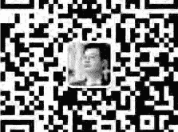
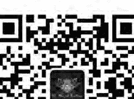
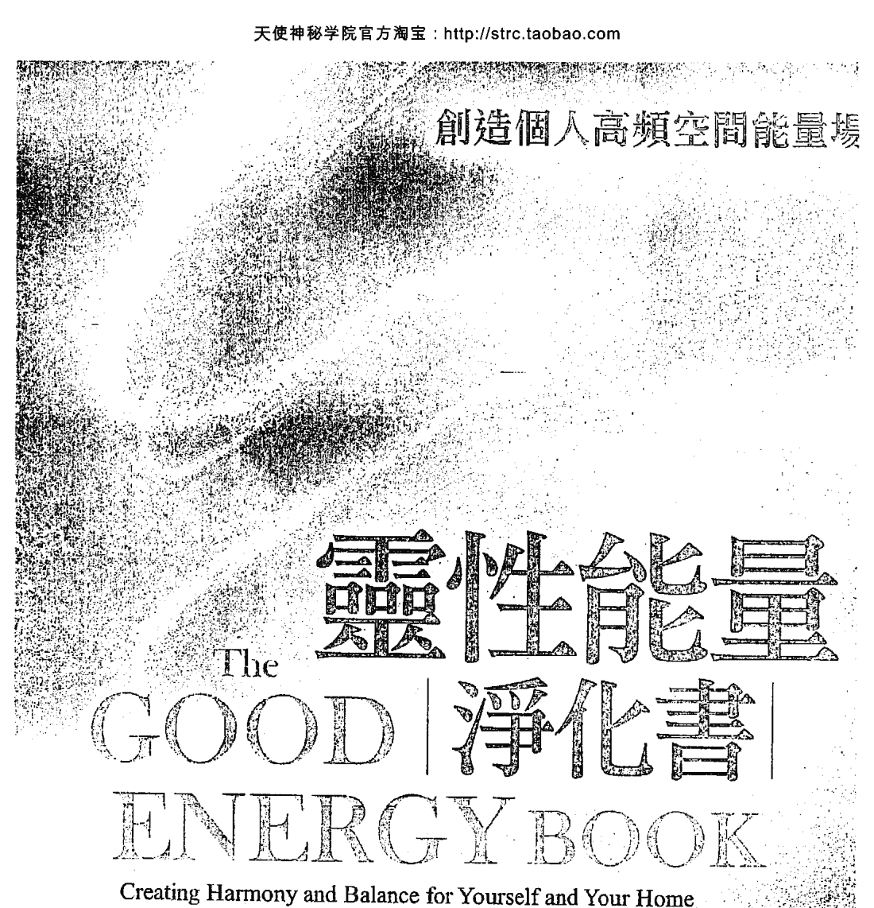
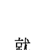

# 創造個人高頻空間能量場

# 靈性能量

# 淨化書

The

# GOOD

# ENERGY BOOK

Creating Harmony and Balance for Yourself and Your Home

身心靈與空間能量淨化的全方位指南

為你守護好能量，顯化美好人生！

泰絲·懷特赫思特 Tess Whitehurst 著 陳麗芳 譯

# St. Royal College

# 天使神秘学院

-   * 专业占卜预测机构
* 神秘学培训机构
* 水晶能量研究中心
* 官方淘宝：http://strc.taobao.com
* 官方微博：http://weibo.com/715104687
* 新书发布QQ群：316790219
* 购买更多好书请联系院长大天使

大天使

天使神秘学院 院长

QQ：715104687

手机/微信：13641926204

微信公众平台：strc2011

# 制作说明：

本书由《天使神秘学院》出重金从台湾购入的原版书籍扫描制作完成。为达到最好阅读效果，特地把原版书全部切开后，再经由专业扫描设备高精度扫描完成，并经过一张张的PS后期处理最终成书，其间花费大量的人力、物力以及时间，只为能给大家提供经济并优质的神秘学学习资料而努力。

本学院强力谴责某些机构和个人，把本学院花心血制作完成的电子书籍，包装后直接放在自家淘宝网上低价倾销的行为，以谋取不劳而获的经济利益。如果长此以往最终将无人愿意再为大家花心思制作电子书，那以后可能大家再无新书可读。

为让大家以后能够读到更多的好书，也为了本学院的良性发展。本学院恳请大家尽量做到如下几点：

-   一、尽量在本学院的网站购买电子书籍。
- 二、请勿用技术手段把电子书内的水印及加密去掉。
- 三、在收到电子书后小范围传阅即可，千万不要公开传播，更别挂到淘宝网上低价销售。

同时为答谢广大支持者，学院电子书将做如下调整：

-   一、学院会把一些早已收回制作成本的电子书折价销售。
- 二、最新制作的电子书籍会开放打印功能，大家购买后有条件的可自行打印成书。

天使神秘学院
2017年6月

# 創造個人高頻空間能量場

# 靈性能量淨化書

# The GOOD ENERGY BOOK

Creating Harmony and Balance for Yourself and Your Home

泰絲·懷特赫思特 Tess Whitehurst 著 陳麗芳 譯

前言 4

第1章 能量與微妙現實 7

第2章 初步準備：最初的轉變 17

第3章 請求幫助 41

第4章 靈性衛生的練習 69

第5章 淺談滯留地球之存在體 87

第6章 空間淨化 111

## 第7章 淨化物品和人

145

## 第8章 能量保護技巧

165

## 第9章 祝福與調整空間

185

## 第10章 好習慣與靈性維護

209

## 謝辭

229

## 附錄A 實用材料詞彙表

231

## 附錄B 良好能量要項

241

## 前言

自幼，我們大部分人就被教導相信一件不真實的事。事實上，這個被教導的信念如此根深柢固於我們的本質中，乃至甚至無法察覺自己相信它——我們以為自己知道它。這個信念暗中悄悄地潛入思想與經驗中，破壞我們的直覺，讓我們和意義分離，和深刻的直接經驗隔絕，並且剝奪我們天賦的靈性能力。

這個信念到底是什麼？

這個信念就是分隔：可視與不可視的分隔，形式與靈性的分隔，過去與未來的分隔，自我與他人的分隔，以及科學「所知」與靈性「所感」的分隔。

多年經歷此信念無可避免所造成的沮喪、無力感與削弱恐懼之後，我開始利用神奇與抽象的形式，例如，冥想、水晶療癒、空間淨化、風水與儀式等。

假以時日，透過直接經驗與觀察，我逐漸悟出了以下幾點：

可視與不可視、形式與靈性，以及知與未知之間並無分隔。事實上，萬物都是相連的，每一個事物都會與其他事物相互影響、相互作用。當我們啟動直覺，接納可視與不可視之間的關聯時，我們便必然能正面影響我們的生活情境、創造我們所欲的生活狀況。藉由本書，我將和讀者分享幫助我將人生從幾乎是恐懼與掙扎不斷的經驗，改造為持續充滿刺激、喜樂經驗的療癒與淨化實踐。我衷心希望你也能享受同樣的歷程。獻上我最大的祝福——泰絲

## 第1章 能量與微妙現實

### 起始祈願：接納玄奧

其實，萬象無它，唯愛而已。沒錯，世界存有二元性的表象——光明與黑暗，快樂與悲傷，可視與不可視，已知與未知——然而，在這一切表象的背後與內部卻是一個完美、整體而且統一的能量場（the Unified Field of Energy）。當我們能夠進入此一能量場時（也就是，即便在我們表面所見可能為不和的假象時，仍然和它保持相連），我們便能自覺地引用它來療癒自己、療癒他人，並且讓我們的生命充滿較以往更深的和諧、平衡與安詳。

你之所以展讀此書，乃是因為在某種程度上，你已經感受到了這個超越且能架構「日常現實」基礎的——愛的能量場。不只如此，你還想更進一步了解如何利用它來改善情況；換言之，也就是將負面轉為正面，讓你保持在美好、光明的能量狀態。你來對地方了。

讓我們勇敢承認吧：萬物皆玄奧。無論我們學了多少物理、哲學或宗教（或其他任何學問），似乎就是無法真正闡明一切。

## 第1章 能量與微妙現實

許多人難以了解這一點。無論他們是傾向於科學陣營或宗教陣營（或兩者兼有），總有許許多人絞盡腦汁，拼命企圖精確理解出這個世界上的一切真相。

雖然科學與靈性兩個領域都有令人信服且重要的觀點，但身為能量工作者兼微妙界的學生，你需要以雙腳穩穩扎根於玄奧中，意識到玄奧就在你周遭、在你體內以及在你之上，以此態度挺身正面迎對玄奧。為什麼？首先，因為這乃是唯一誠實的做法。第二，因為這個接納玄奧（而且持之以恆）的作法能讓你向這個世界呈現「的」事實，而非投射出「應該是」的概念。如此一來，便能開啟一通往感知層面的閘門，這感知層面的體會不只極其深刻與令人滿足，而且是運用有效有利的方式來感覺與利用能量的先決條件。

這是你的第一份作業。拿出筆記本和筆來。放鬆，做幾次深呼吸，思考一下你目前對於現實與存在本質的觀念。確實釐清你以前可能視為理所當然的事物，例如，外界所加諸的理論結構，或者你幾乎不知不覺便會用來「辯解」玄奧的方式。換言之，你是否抱持任何想來可能不正確的信念或觀念？你或許甚至會發現，在仔細深究之後，你發覺有些以前無疑而採信的觀念其實荒謬或者幼稚。（這是自然的，無須覺得不好意思。）

-   以下只是我所談的觀念類型的一些例子：
- 時間是線狀的。就像一條線，它有起點，中點和終點。
- 現實能以冷酷和艱難等形容詞來形容。
- 神志正常的人對於什麼是真實的，什麼是不真實的都能一致同意。
- 某處、某人已經將一切都弄清楚了。
- 上帝存在。
- 上帝不存在。
- 上帝有鬍鬚（或者是个女性，或者穿著長袍，或者厭惡人們從性行為……
- 等）。

一旦找出這些觀念之後，利用你的清晰意識，將任何可能不真實或至少值得懷疑的觀念列出來，逐項加以思考，看看你是否能想出反駁的見解。和自己進行一番心理對話，盡力對每一項觀念提出反證或至少提出部分懷疑。
例如，思考一下時間是線狀，具有起點、中點和終點這個觀念。將這個觀念寫下來之後，你不妨藉由文字來質疑它。「從未有人向我證明過時間是線狀的——就我所

## 第1章 能量與微妙現實

知，它有可能更像個輪子或阿拉伯數字 8。史蒂芬·霍金（Stephen Hawking）和亞伯·愛因斯坦（Albert Einstein）等物理學家說時間是相對的，會根據你的所在與你移動的速度快慢而有不同的體驗。據說，假如我們能夠進入黑洞而不死，則可想而知我們便能穿過時間旅行，這就表示時間根本就不是線狀的。

當你覺得（目前為止）每項陳述都相當完整後，深吸一口氣，閉上雙眼，純然願意放棄對極致玄奧事物的固定觀念，願意進入玄奧。要幫助自己建立這份意願，可於內心或大聲聲明：

> > 我願意接納玄奧。我願意順從玄奧。我願意存在玄奧中。

作為初步練習，你甚至不妨到野外散個步，或觀看日出或日落，同時一邊悠閒思索這份聲明的每一部分。這麼做有助於除去舊觀念，好讓一份持續、專注的玄奧體認能開始接管，進而安頓於你的知覺中。

在閱讀此書以及運用書中練習的期間，一早醒來立刻複述此肯定話是個好辦法。

你甚至不妨將它寫在小卡片上，裱框起來，置於自己的床頭櫃上作為提醒。

如我之前所提，放棄關於時間與現實本質那些刻板、老舊觀念的理想作法，便是持之以恆。你釋放得愈多，就愈能和微妙界（包括永恆的愛界，以及描繪與反映我們目前生命經驗特質的多層情感與無形能量）相連，而且你的靈性力量也會更強。逐漸

### 進一步說明察覺微妙界

地，你將發現自己每天一醒來便感受到一股對生命與存在本質的強烈敬畏感。「另一個生活在這奧妙、美麗世界的一天開始了！」你會心想：「多有趣呀！」如此一來，便會在你的生活中以千軍萬馬之力創造空間、開啟可能之門。

請注意，我無意要你將我寫的任何內容奉為絕對真理。畢竟，雖然我利用文字書寫本書，但微妙界乃是超越文字的——因此，當我談論微妙界時，充其量我只能概約敘述或解釋我試圖溝通的對象。即使如此，我也只能談論我自己的觀感和結論，而不是你的。你必須靠自己直接體驗這個微妙界，透過經驗學習，達成你自己的結論，定出最適合你自己的理論與技巧。

在此闡明我所謂的微妙界，你不妨將它想成一個概括性名詞，在我們的文化裡，被我們稱為「日常現實」所涵蓋下的一切事物皆屬之。於其基礎，則是一個純淨、開放、統一、巨大，我們可稱之為愛的意識存在。於其上方，則有較濃密但仍然無形，開始產生與表徵二元性（明與暗、輕與重……等）假象的能量。雖然二元性是

## 第1章 能量與微妙現實

一種假象，它卻是我們所處生活經驗中一個非常普遍瀰漫的假象，因此，蓄意利用這一層微妙現實來獲得我們想欲的積極改變可能非常有用。

為了讓你更熟悉我所謂的微妙界，我要你知道，無論我們認為自己具有通靈能力或直覺力（與否），每個人其實都已感受過它。舉例來說，我們都能立刻了解「陰暗角色」、「導電個性」與「沉重課題」之類的措詞。角色通常並非真的處於陰暗中；個性也不是真的插入電源插座，課題當然也不是由沉重的鉛所製。原因在於這些措詞所談的並不是物質事實，而是微妙或能量的事實。換言之，我們談的乃是無形但仍然真實、可辨的東西。

當你開始刻意培養對微妙界的知覺時，你可能首先會察覺到有些房間或區域讓你感到快樂、輕鬆或無憂，而有些房間和區域卻讓你覺得悲傷、沉重或憂鬱。你或許還會察覺到有些人似乎和你靈犀相引，而有些人則會讓你敬而遠之。而且，基於你的預感能量感知，你或許還會有想接近——或遠離——某些物品或情況的衝動。

接著，隨著你愈深入這種知覺，你不只將開始感受到能量的模式與可辨形態，你還會察覺到自己能與這些模式與形態互動，能轉移、甚至改變這些模式與形態。因此，我們接下來將談到……

### 你將學到的練習

容我再重申一次，萬事萬物乃是一個統一的能量場。當我們能知覺到目前生活經驗表象的無形層面時，我們便會開始注意到某些事物似乎具有「好能量」，而有些事物則似乎具有「壞能量」。然而，儘管能量可能時而顯得困限、停滯、污濁，或者流暢、健康、活潑，它事實上是中性的。困限的能量可以轉變為活潑的能量，不過，當它受到困限時，則往往會（而且的確）看來是壞的，且會吸引負面的狀況、感覺與能量模式；相反地，活躍的能量則會吸引正面的情況與能量模式。它本身並無好、壞，不過，當它受困停滯時，則可能成為不健康狀況的孕產場所。

正如沼澤水會吸引與培養飲用起來有危險的有機物，困限的能量則會吸引負面的情緒與有毒的狀況。好消息是，我們能採用一些方式，讓能量朝健康之道移動，並將困限的能量轉化為活潑的能量。這不只會以正面性與活力來提升我們的空間、靈性與

生活狀況，還能為我們注入一股能力飽滿與自我掌控的感覺，而且（既然萬物都是相連的）還可協助療癒與轉變整個星球的能量。

雖然你將在本書中學到全套的作法——包括能量防護、祝福與調整——我個人發

## 第1章 能量與微妙現實

現，談到在生活中保持快樂與顯露正面狀態，最重要的考量則是（一）清理我們自己的個人能量場，以及（二）清理我們居家的能量場。

為說明能量淨化的無形機理，且讓我們再度利用水作為比喻。想像一座已停滯一段時間，浸滿水的石造噴泉。在時光荏苒的過程中，各式各樣的植物和細菌有機體逐漸進入水中，水於是開始轉綠、發臭。然後，再想像某位園丁過來，將水轉移到一座有廣闊與多樣性棲息處可供細菌和植物有機體茁壯成長的湖中。接下來，園丁用中性的有機清潔劑將噴泉底部徹底清乾淨，重新注入清新潔淨、晶瑩剔透的井水。最後，他啟動噴泉，讓水流動、活躍，產生負離子（良好感應的科學名詞），繼續保持清淨。

按此比喻來說，噴泉就是你的家（也可說是你）。水是你居家的能量。細菌和植物有機體是受困限的存在體、情緒和思想形式。湖則是無窮、統一的愛的能量場，是現實中架構萬物的基礎，能將秩序與和諧帶至所有感知層面，以及只要我們能知覺便能接近使用的場域。而那位園丁（靈性療癒師或療法師，亦即，你自己）則在聲音（例如，鐘聲、鈴聲）、禱告、誦經和天然原料（如鼠尾草煙和海鹽）之類事物的相助下，專注關照，清理能量。

### 書中作法何以有幫助

人類活在這個星球的大部分時期中，有大量的時間都是在戶外度過的。而且，進一步就大世界宏觀而言，在不久的過去，我們的住所都還不甚恆固，因而更接近自然荒涼。這表示天然的能量淨化系統就地發揮作用。在我們的身體與生活空間內部及周遭的停滯能量——以及來自陳舊思想、文字和情緒模式的能量殘餘——（一般來說）不會在這個世上久留，因為它會為風所移動，為陽光所活化，為雨露所洗滌，還有，為大地所吸收。

當然，為了淨化與療癒空間和人，在過去，魔法和巫術有時仍會被用來體現與引導無所不在的神聖自然能量流。然而，由於文化，我們現在既已移至室內，和自然世界基本脫離，我們這些對能量敏感的人如欲確保澄淨、光燦的能量恆常一致地充斥在我們的身體、生命、和生活空間中，便必須定期利用類似的作法。同樣地，研究與利用能量療癒形式可讓我們——個人與文化——和自然世界重新校準，於此歷史時代這點極具重要性。

## 第2章 初步準備：最初的轉變

### 清除雜亂

構成萬物基礎的純愛能量場會自然流貫你的生命經驗，就如風會吹拂，浪濤會永不止息地拍岸一般。此章的目的在於清除任何基於錯誤觀念而產生，有害此天然、正面動力的障礙，好讓喜樂能豐富湧現，祝福能源源流暢。我們將透過進行初步掃除負面（沉滯）能量，在你的居家中建立更清晰、活躍的振動來達到這個目的。這樣的結果——由於萬物都是相連的——將開始轉變你的個人能量，讓你心智清明、能力增強，準備好迎向往後令人興奮的旅程。無論它在何處，或者你有多經常刻意想到它，你和你所擁有的任何東西都有關係。換言之，你必然至少有一、兩個念頭、感覺、記憶或責任和某物相連，否則就不可能辨認它屬於你。因此——在我們稱為存在的統一能量海中——你或可想像（就能量方面而言）你和每樣擁有物的關係是一條能量索。假如你喜愛、使用或需要某物，該物品便會透過該能量索傳送正面能量給你（舉例來說，想一下你最喜愛的一雙鞋，或剛清洗乾淨，輕盈柔軟的純棉床單所帶給你的輕微觸電感）。假如你不喜

## 第2章 初步準備：最初的轉變

愛、使用或需要某物，則該物要不是會消耗你的能量，便是會向你傳送負面能量（現在試想一下，當你費力翻遍整個衣櫥，找不到一件喜歡的衣服，或擦拭那隻公婆送你的醜瓷公雞時，所感受到的那股雖輕微但仍有力的能量負擔）。記得這點，你便可了解，在本質上，你所擁有的每件雜亂物品都的確是一份能量負擔。假以時日，特別是考慮到你擁有眾多物品，這些滲漏累積起來，對你的活力與整體健康便可造成重大程度的消耗。

更甚者，萬物都是相連的。微妙界和物質界之間具有無法解開的連結關係，正如你的居家和你的思想、感覺、信仰與生活狀況之間具有解不開的關係是一樣的。換句話說：當你清除家中的雜亂時，你同時也是在清除你生命中的雜亂。不只如此，你還是在提升與調整微妙界的感應，讓有害的狀況、陰鬱的感覺、家庭不和與一般負面事物不至於久久徘徊不去。因此，你的家將更快樂，你未來的能量努力也將更穩固、更有條理而且更有效。（舉例說明：假如你是哈利波特迷，想想看，假如霍格華茲學院能保持整潔不雜亂，那麼有多少事件將可避免！）

因此，徹底檢視一下你的抽屜和衣櫥、你的汽車行李箱、閣樓、地下室、租用儲藏室和任何你可能存放你不喜歡、不用或不需要物品的地方。需要多長時間就用多長時間。

### 清掃

的時間，管它是一週、一個月或甚至一年也好。假如規模讓你感到力不從心，那麼，就決心只清理一個衣櫃或甚至一個抽屜就好。稍後，再決心進行另一個小區域，直到你開始自然獲得動力。

清除雜亂時，身邊隨時帶著一瓶乾淨的水，不斷地喝。清除雜亂乃是釋放與排除你的心智、身體和情緒毒素的過程，因此，水（除了有益你的健康而且讓你不易脫水之外）將有助此過程的進行。

下頁的檢查清單（摘自《魔法居家整理術》）可幫助你辨認何為雜亂物品。

既然我們所謂的負面能量往往只是沉滯的能量，所以，讓能量正確流暢最好的辦法不外乎來一次實質的徹底清掃。不只如此，意念能像雷射光般地指引能量。因此，當你懷著清除負面事物、提高感應的強烈意念進行清掃時，你猜結果會如何？你真的就能清除負面性、提高感應。所以，開始行動吧！不需過度（除非你真的想要），但驅策自己清掃得比平常更徹底一些。例如，清掃你平常會略過的物品的底下或背後、

## 第2章 初步準備：最初的轉變

### 表 2-1：清除雜亂檢查清單

| 類別 | 描述 |
|------|------|
| 紙 | 過期收據 過期保證書和其他不必要文件 垃圾郵件 舊卡片和情書 過期優待券 |
| 衣服 | 不合身的衣服 不喜歡的衣服 讓你覺得不好看或不出色的衣服 你從來不穿的衣服 需要修改，但你知道自己絕不會修改的衣服 |
| 書 | 任何你絕不會再讀的書 |
| 裝飾品 | 任何不能讓你振奮或帶給你喜悅的裝飾品 描繪出你不想經歷的狀況或感覺的任何圖像 褪色、積滿塵埃、易碎或過度枯乾的乾燥（人造）花或植物 |
| 家具 | 不適合你房屋的任何家具 任何和前配偶共享的床、沙發或餐桌 任何你不喜愛的物件 會讓你受傷、絆倒或不方便的家具 |
| 禮物 | 任何你基於內疚或義務而保留的物品 |
| 食物 | 任何你老實說絕不會吃的食物 |
| 汽車雜物 | 垃圾 任何不屬於車子的物品 |
| 未完成的計畫 | （老實說）任何你在往後一個月中不會去完成的事 |
| 破損物品 | 任何你無法或不願修理的破損物品（除非它仍然方便、有用，而且你確實不在意它有點破損） |
| 具有負面聯想的物品 | 你會有負面聯想的人所送的禮物或傳下來的物品 任何會提醒你負面情況或時期的物品 |

> > 注：假如此節還不足以激發你清除雜亂的動力，請參閱《魔法居家整理術》第一章，或我的迷你電子書《清除雜亂神奇訓練營》（Magical Clutter-Clearing Boot Camp）。

精油

如你所知，精油是由某特定植物提煉而出，高度芳香、高度濃縮的化合物，可在網上或大多數的健康食品店購買得到。有些精油會引起皮膚不適，因此要小心處理。以下所列的精油都具有高度的靈性振動，對於提升與淨化你居家的振動極有幫助。從百分之百天然、可有機分解的無味清潔劑開始，然後考慮加入十至二十滴以下的精油（可任意混合多種）：

- 雪松（Cedar）
- 檸檬（Lemon）
- 快樂鼠尾草（Clary Sage）
- 鼠尾草（Sage）
- 薰衣草（Lavender）
- 迷迭香（Rosemary）
- 茶樹（Tea Tree）
- 尤加利（Eucalyptus）
- 雲杉（Spruce）

## 第2章 初步準備：最初的轉變

### 振動精華液

不同於精油，振動精華液（花和水晶礦石）是沒有香味的。更確切來說，它們乃是保存於水和白蘭地中的花或水晶礦石的靈性振動。你可在天然清潔劑或空氣芳香劑中加入以下任何一種，在空間中傳授清新與正面的振動。

> 注：精華液可在網路上和許多健康食品店中購買得到。學著自己製作也不難。

艾米·若斯特（Amy Rost）所編的《天然療癒智慧與方法》（Natural Healing Wisdom & Know-How）一書中對於如何製作自己的花精有詳細的敘述，另外，你也可以從《魔法居家整理術》的水晶礦石那一章學到製作水晶精華液的方式。

### 花精 Flower Essence

- 巴哈急救花精 (Bach Rescue Remedy)
- 野生酸蘋果花精 (Crab Apple Essence)
- 白栗花花精 (White Chestnut Essence)
- 玫瑰花精 (Rose Essence)

### 水晶精華液 Gem Essence

- 螢石精華液 (Fluorite Essence)
- 白水晶精華液 (White Quartz Essence)
- 粉晶精華液 (Rose Quartz Essence)
- 黃水晶精華液 (Citrine Essence)

### 思想能量

你也可以透過思想、禱告、心觀和意願有效地為清潔劑與天然空氣清香劑添加能量。例如，你不妨從事以下任何一種小型祝福儀式：

- 將清潔劑捧在雙手中、閉上雙眼。唸以下字句：「神（女神或聖靈），請為此清潔劑注入純淨、澄明與愛的感應。」接著，想像強烈白光從天而降，由你的頭頂進入，往下行經你的心臟、你的雙臂，然後，從你的雙掌穿出，進入清潔劑瓶中。心觀、想像、感覺該瓶隨此光而旋轉、脈動。
- 將清潔劑置於燦爛的陽光中，然後說出或心想：「我請求陽光啟動此清潔劑的淨化與澄明面。」讓它繼續吸收三至五分鐘的陽光。

### 製造聲響

現在，我們將從事一些空間淨化的技巧。換句話說，我們將在微妙的能量場中進行作工，清潔氛圍，改善感應。

聲音可以鬆開與疏通負面、沉滯的能量，幫助它轉化為正面、活潑的能量，使能量以健康的方式移動。這也就是為何許多薩滿療師和靈療者珍視沙鈴（Rattle）和鐘（Chime）的原因。事實上，無須其他，光只是沙鈴（或甚至只要拍拍手——詳見以下內容）往往就足够讓我們清理空間的能量了。

### 完美空間淨化沙鈴

我一向習慣繞著家中的每個房間和區域周圍大聲拍掌，以聲響淨化空間。此舉雖然有效，但在我事後雙手發紅、發痛太多次之後，製作沙鈴的指示開始出現在我的腦海中，我於是迅速行動。假如你決定仿效製作，你會發現，除了極適合空間淨化的用途之外，此沙鈴製作起來相當容易而且不昂貴。此外，由於自己親手做，你也會與它產生立即的協同親密關係；沙鈴將如你以及你個人導引力量的延伸，這在薩滿或靈修工具方面而言都是非常理想的。

所需材料：

- 一個有握把的大金屬鹽瓶
- 兩小把乾白豆
- 兩小把乾黑豆
- 一瓣大蒜
- 陽光或白鼠尾草（White Sage）

首先，將鹽瓶沐浴在陽光或白鼠尾草煙中一、兩分鐘加以淨化。然後，抓一小把白豆在右手中，以左手支托住右手，心觀、想像或感覺那些白豆隨著強烈的白光而生輝、旋轉與脈動。利用靈性力量賦予它們協助淨化空間、驅除負面與沉滯能量的意念。以同樣的方式賦予那瓣大蒜光和意念，然後，將之切為八小片，和其他原料一起裝入鹽瓶中。對另一把白豆和兩把黑豆重複同樣的過程。蓋上瓶蓋，雙手握住此手作沙鈴，將它高舉，心觀強烈的白光由天而降注入鹽瓶，將鹽瓶獻給大靈（神、宇宙或任何你用來稱呼聖靈的名稱）。你不妨唸一段禱文或祈文，例如：

> 大靈（或神、聖靈等），我現在將此沙鈴獻給您。感謝您賦予它強烈的療癒能量與光。我祈求且確信它將永遠具有真實與正面的用途。我祈求且確信無論何時何處它都會淨化、釋放與祝福。感謝您，感謝您，感謝您。

現在，將它捧在你的胸口一會兒，讓你自己與它的能量進一步調校。

每隔一段時間，還有，每當你想更新它的效力時，可將舊大蒜片放在一棵樹底下，再將一瓣新鮮大蒜切成八片放入鹽瓶。要讓沙鈴的能量保持清新，則每一、兩年將兩種乾豆與大蒜全部更新，作法是將舊的乾豆和大蒜放在樹底下，然後重複整個過程（鼠尾草、陽光、祝福……等）。

注：假如你因為大蒜的氣味而不想用大蒜，可免去不用，或以其他氣味較香的東西取代，例如，八片多香果（Allspice）、茴香（Anise）或丁香（Clove）。

### 使用沙鈴

現在，你既以擁有這強而有力的空間清掃工具自豪，便可以站在家中的房間裡，以逆時針的方向繞著該區域一邊移動，一邊大聲搖動沙鈴。特別留意角落、桌底下、門後以及你認為能量可能困住的任何地方。在你搖動沙鈴時，你可能看見——或只是意識到——老舊、沉滯的能量被鬆開，進而轉化為明亮、燦爛、正面的能量。在你家中的每個房間及區域重複此過程。

重要提示：在此過程中要留意你的動物夥伴。沙鈴的響亮聲可能會驚嚇到他們，因此，最好讓他們待在別的房間或屋外。

再說一次，我們此刻的目標只是以正面方式移動能量。然而，如我之前所提，以上的沙鈴儀式——特別是和接下來的練習一起搭配進行時——往往便足以讓能量往正確方向移動。總之，它是個好開端！稍後我們將進行更徹底的作法（因應那些更複雜或長期的能量挑戰），你的閃亮新沙鈴屆時也將派上用場，因此，請將它隨時備用！

### 煙燻淨化

煙燻是另一項經試驗證實，有淨化空間能量與振動作用的薩滿魔法技術。我們稍後將學習不同的煙薰工具與技術，不過，為了眼前的目的，只需準備一束乾燥白鼠尾草。（白鼠尾草束可在網站上以及多數健康與神秘學商店中購買得到。你也可以自己採摘、包裹和乾燥；只是要記得先徵求該植物同意以示尊重，並提供小量奠水、啤酒或葡萄酒作為報酬與感激的表示。）將該束鼠尾草捧在張開、合成杯狀的雙掌中，唸一段鼠尾草祈福文，例如：

- 東、西、南、北四方聖靈，
- 頭聖、淨化此鼠尾草。
- 下至大地，上至群星，
- 此鼠尾草帶來安寧、純淨與愛。
- 感謝您，大地之母。
- 感謝您，天上之父。
- 感謝您，聖哲之靈。
- 我感謝您。

現在，點燃鼠尾草，然後，予以搖動熄滅火燼，好讓它只冒煙霧而不燃燒。必要的话，重複點燃與熄滅火燼，直到煙霧持續飄出。拿個小碟子盛接餘燼，以逆時針方向繞走房間，讓煙霧旋轉瀰漫四周。特別注意角落與任何陰暗或偏僻的區域。進行時，一邊心觀、想像、注意煙霧不斷淨化與調節空間能量，並將之轉為非常正面與清晰的振動。在每個房間與區域重複此動作。（喔，還有，你或許要暫時關掉家中的煙霧偵測器，等到時機合適時再立刻重新啟動！）

調整你的振動。房子的部分完成後，將煙霧繞著你自己的身體四周移動，淨化你個人的能量場，讓充滿與圍繞的現象發生。唸一段禱文或祈文，祈請正面的能量與祝福，例如：

> 神啊（或宇宙光），
> 感謝您為這個家注滿愛、光、澄明、寧靜、富足、創造力、歡笑與快樂。
> 和諧現已充滿它、圍繞它。
> 安寧從此永在。

做得好：你已成功大幅轉變你的居家（與生活）能量！我強烈建議你現在平躺在地上一會兒來調整與平衡你自己。做幾次深呼吸，放鬆，同時，在心中觀想在你的能量場中可能已產生或召喚而來的過剩能量緩緩落入大地，一如水從掛在曬衣繩上剛洗過的衣服中滴落一般。當你覺得準備好了，起來食用一點穀類、米飯或麵包如此可進一步穩定你的能量。

注：乾燥鼠尾草束可用水加入二十至三十滴鼠尾草精油混合的噴霧劑取代。以噴霧取代煙薰即可。

### 選擇護身符（或讓護身符選擇你）

無論你是否有意識地感覺到與否，一旦你實行了以上的儀式之後，你的居家能量便已成功獲得改善。仔細想想，你會發現，你已藉由採取物質界步驟（例如搖沙鈴和點鼠尾草束煙薰）影響了微妙界。換句話說，你開始直接體驗遊走於兩界的意義。而遊走於兩界（即形式與靈性、物質與虛無、可視與不可視）便是各類薩滿療師、魔法術士以及能量工作者的作工定義，因為，那就是力點或萬物結合之處，而且，從那兒我們可以刻意行使靈性力量產生我們想欲的正面改變。

此外，由於你將在往後的章節中進行更多這個遊走兩界的作工，假如你有興趣的話，不妨準備一個護身符，或一個物件，無論你的靈性療癒工作將你引至何方，都能協助你保持專注，把持自我且覺得安全、受到保護。因此，理所當然，假如你選擇持有護身符（至少一開始該有），那麼，每當你刻意遊走兩界時，請隨身帶著它。

你或許已經擁有自己的護身符——只等待你認出它而已。要不然，則可能需要到樹林中走走，或到寶石店或玄學書店中找尋。重要的是，它要和你「一拍即合」或和你起共鳴，成為你旅行於兩界時的有力保護物與同伴。

以下提供一些護身符選擇：

- 寶石或水晶
- 一件珠寶
- 一個神秘符文
- 一根取自你珍愛或友好樹木的樹枝
- 一塊浮木
- 一粒貝殼
- 一個小雕像或人偶
- 一個刺青

假如某物無法立刻和你一拍即合，別勉強。只要繼續留意尋找你的護身符，同時記得自己要找到它的意願。要協助此過程順利產生，你不妨在臨入睡前，心裡想著和護身符相連的渴望。這麼做的同時，試著去感受當你凝視那個完美神選的護身符時，你想擁有的感覺，例如，信心、力量和內在知曉。如此便會開始將你的護身符吸引到你的生活經驗中，一旦它出現時，你便會立刻知道。

### 護身符聖化儀式

一旦找到你的護身符或者和護身符結合時，進行以下儀式，將它奉獻給它的新目標，同時協助你和它的能量調校一致。在一個滿月夜，月亮當空時進行此儀式。（假如你的護身符是個刺青，請跳到第三十六頁的刺青護身符聖化儀式一節。）

適當的話，起先用水（或許連同海鹽、天然肥皂）實際清洗你的護身符。然後擦乾。

在祭壇或桌面上展開一條白布，將護身符放在中央。於護身符的東、西、南、北四個主要方位各擺上一個小圓蠟燭（大豆或植物蠟對你和環境最好）將它圍起來。然後，再多用四個小圓蠟燭圈放在四個方位之間，即西北、東北、西南與東南方位。點燃小圓蠟燭後，將所有的電燈關掉。

點燃一束鼠尾草，煙薰你全身以淨化你個人的振動。接著，謹慎拿起你的護身符，將它也予以煙薰淨化。然後，以同樣謹慎的態度將它放回小圓蠟燭圈中，並熄滅鼠尾草。

心觀一個極光燦的金白光球圍繞與充滿你的護身符。唸：

> 東、西、南、北四方聖靈顯聖，此滿月夜您得八方祝福。日月交替，晝夜循環，兩界中您光照我道。

在你能集中靈性的情況下，持續將正面能量導向該護身符，並搭配其他覺得合適的額外禱告或祈福一起進行。

然後，拿起護身符，捧在胸口一會兒。熄滅蠟燭。你可將護身符隨身帶著，或者放在某個不會受擾的地方，比如像專門用來安全存放它的特殊盒子或袋子。

### 刺青護身符聖化儀式

無論你的刺青已存在多久，只要覺得合適，便可將它轉為你的個人護身符。（進行以下儀式前，要確定刺青已百分之百痊癒。）

選個滿月的夜晚，明月當空時，先行淋浴或沐浴淨身，然後，集妥需要的原料。

所需材料：

- 四個小圓蠟燭（大豆或植物蠟為佳）
- 一束白鼠尾草
- 一小瓶或小罐荷荷芭油（Jojoba），事先加入十滴精油。若你是女性，請加入沒藥精油（Myrrh）；若你是男性，請加入乳香精油（Frankincense），抑或你喜歡的話，兩種混合加入。

注：確定你選的油不會對你的皮膚造成刺激反應。假如你的皮膚高度敏感，可完全舍弃精油。取而代之，可用鼠尾草煙潔淨一小片白水晶，將之置於一小瓶荷荷芭油或其他你知道不會刺激皮膚的媒介油中。

將小圓蠟燭放在你身體周圍的四個主要方位，保留足夠的空間讓你能安全地站在中央。點燃蠟燭，面朝北站在中央。點燃鼠尾草煙薰你自己，特別專注於你的刺青。心觀你的刺青閃耀出極光燦的白光，同時一邊唸：

> 東、南、西、北四方聖靈顯聖，
> 此滿月夜您得八方祝福。
> 日月交替，晝夜循環，
> 兩界中您光照我道。

將荷荷巴油混合劑塗抹在刺青的整個表面上。接著，在你的腹部、胸口，與第三眼上也輕塗一點油。覺得時機合適時，熄滅小圓蠟燭（願意的話，你可於日後再度使用它們）。之後每個晚上臨睡前，都在你的刺青上輕塗一點油，直到下個滿月夜為止。

### 乙太護身符選擇

對於那些特別能自如心觀的人，則不妨利用乙太護身符。換言之，在遊走兩界中之前（或任何你覺得需要一些額外的保護與勇氣時），不妨心觀一個讓你覺得有力量的特殊符號，例如，頭頂上出現一個寶藍色的燦爛五角星，或眉頭上出現銀白色的光耀新月。假如這種護身符吸引你，則建議你進行以下儀式：

### 乙太護身符聖化儀式

在一個滿月夜，沐浴淨身、穿上舒適的衣服。然後，在燭光中，閉上雙眼，背挺直，放鬆而坐，然後，做幾次深呼吸。當你覺得靈性集中而且準備好時，召喚你的護身符視象。盡可能保持心觀視象清晰、鮮明。

然後，一邊心觀、想像該護身符沐浴於金白光中，一邊唸：

- 東、南、西、北四方聖靈顯聖，
- 此滿月夜您得八方祝福。
- 日月交替，晝夜循環，
- 兩界中您光照我道。

### 護身符注意事項

請注意，護身符的保護力來自於你自己的意念、之前儀式所注予它的靈性能量，以及你傳導給它的心靈能量。無論有無護身符與否，你都能利用這些能量，因此，沒有理由對護身符變得迷信，或覺得沒有它就會不安全。護身符純粹只是一項工具，能幫助你產生與維持遊走於兩界所需的集中感與信心，就因如此，你可能會發現，你的護身符對於往後章節中將學到的許多儀式而言，會是個可靠的同伴。

### 3. 請求幫助

#### 浅谈个人灵性

> 「上帝乃超越一切理智思想的象徵。就是這麼簡單。」

能用來改善我們個人能量與居家能量的最佳辦法，並不在於燃燒鼠尾草束，也不在於搖動沙鈴，或甚至設定意念。雖然這些事物都是有助於將感應朝美好方向轉移的優良技巧，但談到召集良好感應與正面影響我們生活狀況時，最佳且最有力的作法則是請求幫助。聖靈（又名神、宇宙、大靈）永遠可為我們的生活經驗各方面提供幫助。只要我們的意圖純然正面，且出自最真實的善意，則我們只需請求，並接受起來相助的聖靈所給予的完美、無限、全面的幫助。因此，當我們在往後章節中進行更正式與廣泛的能量淨化、防護與調整形式時，先熟悉授權聖靈的技巧便很重要。畢竟，任何努力都能藉由最初的要求聖靈協助而得到提升，而且，往往我們甚至不需做任何事，只需簡單的禱告或祈願，一切便能得到關照。

## 第3章 请求帮助

> 「任何宗教在某方面來說都是真實的。就象徵涵义而理解时，宗教是真实的。但若执著于其本身的象徵，将之解释为真相，则麻烦上身。」

—— 约瑟夫·坎贝尔（Joseph Campbell）

我坚定相信，所有真实的灵性经验百分之百都是个人且独特的经验。当我们开始过度僵硬认定某一信仰教规时，便是将真实、直接的圣灵经验给放弃了。此外，由于圣灵「乃超越一切理智思想的象徵」，因此，必然会超越一切的僵硬与规则。就定义而言，它不可能被间隔分类，被减降为任何单一一种解释或信仰系统。

由于它超越智力思想，所以我们的灵性，在本质上，或可以相同于创造力的理解来定义。因此，当一个形象、符号、概念、故事或构想唤起我们知觉内的圣灵存在时——亦即，当它让你超越智力思想而与两世界中的那个地方相连时——它便再真实也不过：那就是圣灵在对你说话，也是你在对圣灵说话。而正犹如没有两份艺术感性会完全相同的道理一样，两个不同个体的圣灵经验也不可能会相同。

记得这一点，你不妨将以下的叙述想成是独一无二之永恒宝石的不同琢面，独一无二之永恆太陽的不同光束，或進入無法想像之永恆境界的概念或有限門道。閱讀它們時，請留意那些和你真正起共鳴的部分，而忽略其餘的部分，或將之擺開稍後再讀。或者全予忽視，只著重於聖靈告訴你，讓你覺得祂們將是你靈性工作的有力助手的任何解釋或內容。

### 求助提醒

當我們求助時，我們的作為其實或可描述為是在接近我們自己與聖靈相連的意識。當然，事實上，我們的每一部分都和聖靈合一，但由於我們長久以來都是在分隔的錯覺下運作，因此，要接近我們的聖靈力量，便必須超越我們的自我，要做到這一點最好的辦法，便是求助。換句話說，就是請求**聖靈**——以你覺得有力的任何名稱和任何形式——帶你超越「小我」，讓你接近使用永恆力量，條件是（一）你所求的必須真的對各方都有利（因為聖靈不會幫助其他的），以及（二）相信你所求的已被聽聞，且以最好的方式受到照料。

## 第3章 请求帮助

### 个人灵性盟友

我们从不单行。无论到何方、做何事，灵性盟友与光体总是和我们相伴。这些盟友有些（我们将在下一节中谈到）是普遍的：换句话说，祂们会在全世界不同地方，历史中的不同时期，同时陪伴许多人。其余的则是我们自己独特的能量场：祂们和我们个人随行，协助我们的灵性工作。你不妨将之想成是你存在于其他现实界面上的其他面象或万花筒面。而你存在此平面上的面象也会是祂们的灵性盟友。其概念乃是，当你和一位或多位个人灵性盟友，将你们的意志与努力一齐对准某一特定目标时（其乃行走于两界中的一个方式），你自然相对地会更有效率。

和你的个人灵性盟友之一（或数个）相会是一个非常强而有力的经验。一旦你和一位灵性盟友进行接触，你便能透过第六感接收从他（她）而来的重要资讯与信息，这可能包括（但不限于）透过你的思想、感觉、梦境、空想、内在视象、内在知晓或实质世界中具有涵义、重复发生的经验而接收的信息。你也可以向你的个人灵性盟友求问或请求特定类型的帮助，然后，透过一或多道第六感途径倾听或留意信息。

现在，我将向你介绍主要的个人灵性盟友类型。然后，假如受到灵感启发，你便可以于此节结束时进行萨满之旅（心观练习），和特别适合在能量净化与灵性疗愈工作方面，协助你的一位或多位个人灵性盟友相会。

### 动物精灵指引

许多灵性疗愈师和大部分的萨满术师都会和一或多个动物精灵指引有关系。例如，有一次在进行冥想时，我就曾看到一只雄狮的清晰影像。我觉得和这头雄狮异常亲近，因而知道这头雄狮乃是个人能量场的一面，也是我的信心与个人力量的体现。我还知道这头雄狮有个名字，他叫拉萨（Rasa）。即使那回冥想发生于十年前，但对于拉萨存在的深刻认知从此长留。我有时会向他求助，我也知道即使不要求，他也一直在信心以及个人力量相关的问题方面帮助我。

有些动物精灵指引会和你相伴一生。有些则会在你人生的不同时期因不同目的而来去。

### 守护天使

作家朵琳·芙秋（Doreen Virtue）说过，每个人都至少有一位个人守护天使（有时多位）从出生至死终生守护我们。我直觉相信这是真的。我也相信——根据个人经验——当我们向我们的守护天使求助而且特意将祂们纳入我们的日常生活时，祂们的光就会变得更明亮，而且也似乎会更有力量、更常出现。从超自然的观点来看，这点很有道理：自由意志乃人类的特点，因此，即使有位天使被指派终生帮助我们，除非我们要求并接受之，否则该天使仍然一点忙也帮不上。

有时候我甚至可透过肉眼察觉到守护天使的存在：祂们会如短暂的闪光或白光火花，在我站或坐的位置旁边，或靠近他人头顶上的地方出现。你或许已注意到类似的情形，或者因留意到此可能性而将开始注意。

我们也可以透过放松与请求祂们向我们显现的方式，刻意调整我们的频率接收守护天使的存在。你不妨闭上双眼在内心说：“守护天使，请让我认识你。”然后，看看你是否能感觉到肩膀附近出现一或多個光体。

一旦你感觉到后，不妨请教祂们的名字。然后放松，容许自己的心灵接收任何耳闻的东西。答复可能会以念头或灵感的方式出现。然后，未来在你需要的任何时候，你便能召唤守护天使的名称，请求协助和保护。

由于直觉乃透过和想象力相同的管道而来，所以，当你首度开始以此方式接收你的直觉时，有时候会觉得你好像在捏造事实。不要对此过程采过于严肃的态度而漠视所收到的讯息，你反而应该将任何接收到的讯息记下来，以好玩有趣的感觉来看待整件事。假以时日，你就会对你的直觉灵感更有把握。

### 灵性指引

说到“灵性指引”，我指的是“以人类形体而非天使或动物形体出现的个人灵性盟友”。他们有可能是曾经生活在我们的存在界面，但已从此进入光界的人类。他们也可能是来自我们的前生或来生（或两者同时，假如时间如我所怀疑的，并非线性的话），自己的某面个性或某一灵魂面的原型显现。无论如何，灵性指引之所以显现，乃是因为他们基于某种理由和我们有亲密的关系，例如，我们的祖先、某一前生或者我们今生的独特灵性任务。

例如，我的一位灵性指引是一位长须飘飘，拄着拐杖的中国神秘老者。他帮助我了解风水原理与道教的神奇力量。我的另一位灵性指引则是一位美国原住民老妇，她帮助我辨认独特的灵性智慧，以及各类植物的疗愈作用。如我以上所略提到的，这些指引之所以在我们身旁出现，或许是因为我们有共生的目的，或者因为他们乃是我们自己个性的原型面貌。他们的出现虽然神秘无解，但并不会因此淡化我和他们的关系，或削减他们为我的生命经验注入更深层的质感与面向的事实。

灵性指引或许会和你终生相伴，有些则可能在不同的时期因不同的目的而来去。

### 会见灵性盟友的萨满之旅

此心观仪式将帮助你会见对你此阶段的灵修之旅有重大帮助的个人灵性盟友。

找一个不会受干扰，没有灯光，或灯光柔和的房间，点上一支蜡烛，播放令人放松、灵性陶醉的音乐，例如，安纽珈玛（Anugama）的专辑《萨满之梦》（Shamanic Dream）。

你不妨也点一柱有助视象的线香，例如，印度纳格占城线香（Nag Champa）、龙血线香（Dragon's blood）、埃及奇麦燃香（Kyphi）或柯巴树脂香（Copal）……等。

脊背挺直，舒适地坐下（或躺下）。放松、集中灵性，然后，做几次深呼吸。

专心建立要和一位或多位能帮助你保持能量净化与正向的个人灵性盟友相会的心观意念。

觉得准备好时，闭上双眼，进行以下练习。假如你觉得不容易记得这些步骤，不妨自己录音或请一位朋友帮你朗诵：

首先提醒自己，你是安全的。你可以完全地自在放松，因为一旦展开此旅，你便全面受到圣灵保护与守护。

在你放松时，不会有伤害侵袭你的身体、心灵或生活事务，因此，你完全可以无忧放开所有的忧虑，完全归顺此旅程中。留意你的呼吸，让它徐缓、深度吐纳。随着每一次的吸气、吐气而愈来愈彻底放松。现在，刻意扫描你的身体，放松你可能仍然紧张的部分。再次提醒自己，你可以安全放松。将任何紧张吸进来，然后让它化解、蒸发与消失。现在，你既已放松且觉得彻底安全、受到保护，想像自己——以心灵之眼——处在森林中。用鼻深呼吸，留意那股树与大地的清香。凝视树上的绿叶与树皮的纹理。倾听微风穿过树叶的声音。气温舒适宜人。用你的皮肤感觉。它既不太热也不冷。完全滋养、完全舒适。往下看。你脚上穿着什么？你或许光着脚、或许穿着靴子或凉鞋。一旦注意到你的鞋子之后，将注意力转到你脚下的土地，感觉起来如此的柔软、充满支持的力量。现在，注视你的身体。你穿着衣服吗？有的话，你穿的是什么样的衣服？无论是什么衣服，体会它穿在身上，感觉是如此的舒服而且完全合身。突然间，你意识到尽管其他凡事都很舒服，但就是有件事不舒服。那是一个你驮在肩上的包袱。你也意识到你并不需要这个包袱。它便是让你无法前进的一切表征——也就是你不再需要，且一开始就不曾真正限定你的一切：亦即，你的恐惧、不安全感、怨恨、表面上的身体与心理限制以及限制性的信仰。

费尽一番努力之后，你将此包袱从背上卸下、拿在胸前。虽然你已背着它很长的一段时间，现在你下定决心，你再也不需要它，是丢弃它的时候了。于是，你丢下它，就像丢下沉重的砖块。

现在，低头看着它，你会发现它正在快速地分解。它不断地碎裂、腐烂并化为土壤。森林知道你再也不需要这个包袱，因此在为你分解它，将它转变为堆肥。不知不觉中，它已完全消失入土壤中，它为你装藏的负面事物则转变为富足、肥沃的土壤。

你突然意识到自己觉得好自由！你感觉到此生前所未有的轻松、自由与喜乐。由于你的感觉如此喜乐，你开始在森林中奔跑起来。你的奔跑感觉如飞，而且，踩在地上的每一个步伐都觉得愈来愈充满能力、充满活力。

你全身充满丰沛能量，你继续奔跑，你发现自己跑上一条美丽的山径。你不但不觉得累，反而觉得愈来愈精力充沛、愈来愈活力饱满。

一段时间后，你意识到自己已经跑到相当高的地方，因为 you 可俯瞰下方一片美景。这让你将快速跨步减慢为轻松步行，但你仍然觉得随着往上行走，自己愈来愈充满能量与热忱。凝神感受四周美景。注意看你下方的森林地、头顶上方美丽的天空、植物、岩石以及任何出现在眼帘中的水体。你或许还能听到或看到鸟类与其他形式的野生生物。让这一切全成为你感官的喜悦交响曲。当你觉得自己已抵达山的最高点时，你注意到山崖边有个非常引人的入门，你心知它乃是特意为你而置。这个入门看起来是什么样子？它有多大？是用什么制造的？凝视它让你有何感觉？最后，当你觉得准备好时，伸手打开此门，门一下子便轻易旋开，因为它早就一直等着你来触碰。你都还没踏入，一道超凡脱俗、神奇美妙的光便透射出来。随着门打得更开，一幅你有生以来从未见过的美景映入你的眼帘。虽然你从未见过这个地方，但你知道这个地方：它仿佛就是你灵魂的一部分。你带着虔诚的心缓缓步入。你现在身何方？环顾一下四周，沉湎眼前景象。让你自己沐浴在它的力量中。你抬头看到有人向你迎面而来。是谁？出现的可能是一位，也可能是多位存在体。当那个形体逐渐接近时，你感到一股巨大的爱的感觉。该形体的出现让你的心中溢满喜悦。让那个形体接近，然后，就只是陪着他（她，或他们）。你们可能出声对话，或透过感觉和内在知晓进行无言对话。该位（或多位）形体或许有个能帮助你的灵修之旅与能量净化工作的礼物或讯息给你。留意你们的交流，让它自然展开。

此过程完成时，以你觉得适当的任何方式感谢该位（或多位）形体的显现与帮助。然后道别，心知该位（或多 位）形体将会在灵性上与你相伴，而且，其实甚至在你知道以前，便已在灵性上陪着你。

回头走出入口，循来时山径走回去。走到山底时，心观自己触摸一棵树干，开始稳固你的能量。

然后，慢慢地回神意识自己身在房中。动动手指和脚趾头；觉得准备好了，睁开双眼。然后，继续保持放松至少三分钟。

起身以前，不妨将你的一些旅程经历写下来。

最后，吃一点扎实的食物（如根茎植物、谷物或豆类），提醒你自己及你的身体，你已回到物质面。

### 灵性疗愈师与能量工作者如何从个人灵性盟友获益

你或许发现，在从事能量工作之前或之后，特意和个人灵性盟友密切合作有助于你保持专注、接收有益的直觉信息、感知微妙界，以及更有效地进行净化、防护与调整。作法可以透过在进行净化仪式前召唤，或者心观你的灵性盟友，坦诚向祂们求助。你最后或许会开始意识到，在你工作时你的灵性盟友就在身边，和你一起实际进行净化或提供你道义支持。假如（以及当）这种情形发生时，你可以请求祂们执行某方面的工作，并且（或者）请祂们就你身边事物的能量与灵性状态提供有帮助的建议和资讯。

夜晚躺在床上入睡前，你也可在心里请求一位灵性盟友在你梦中显现，或影响你的梦境，帮助你培养更敏锐的第六感和灵性、魔法技巧。心知无论你刻意记得与否，这几乎一定会发生。

### 地方灵性盟友

当你开始接收某一特定地方的能量时，（透过直觉）可能会发现一些乐于协助清除沉滞能量与释放滞留地球之存在体的地方灵性助手。此类存在体有时被称为护魂使者（Psychopomps，乃许多宗教中所谓的，负责将亡者由地球护送至来世的圣灵或天使）。

### 仙女、提婆与自然精灵

每棵植物都具有灵性、神圣智慧与力量。不只如此，自然环境中经常驻有一些当地自然精灵。假如感觉适当或者气氛吸引你，不妨请求一位（或多個）这些存在体协助你的灵修之旅与能量净化工作。

### 动物

在美洲原住民的许多灵性形式中，有个别动物，也有特定物种的集合精灵（或神圣代表）。假如你在家中进行空间净化或任何其他的能量工作，而你住家所在的地区是某一种让你觉得有力的动物物种原生地，那么，不妨选择召唤该动物的精灵来协助你的工作。

有多种动物因具有护魂使者的能力而著名。这些包括：

- 猫头鹰
- 猫
- 狗
- 北美郊狼
- 蝴蝶
- 野狼
- 蛇

但不须让自己局限于此名单。

### 圣徒与圣灵

往往某个圣徒或神会特别和某个地区或区域有关连。例如，拿我居住的地方威尼斯海滩来说，它的名字来自意大利威尼斯，而意大利威尼斯的名称则来自维纳斯女神。这当然不是巧合，我的确感觉到爱神存在这个天使之城（洛杉矶另一个有意义的名称）的小领地。紧邻威尼斯海滩则是圣塔莫尼卡海滩，其名得自于圣莫妮卡（圣奥古斯丁的母亲），尽管两地距离相近，它却具有和威尼斯海滩完全不同的振动感应；圣塔莫尼卡虽带有女性气氛，但较温柔且含蓄许多。

还有其他的一些迹象，也可显示某一个圣徒或圣灵可能和某地有关连，例如，历史协会或街道、湖泊名称或其他地标。或者你可能收到直觉灵感，启示某个圣灵或圣徒正好徘徊在该地区。任何这些存在体都是求助的好选择，因为保持其出没地区的能量尽量净化、活泼，通常也是祂们所最关注的事情。

### 宇宙灵性盟友的疗愈与能量净化

然后，当然，还有那些专擅于能量工作、空间净化与一般正面性的盟友。许多来自多种不同文化的不同圣灵都有这类专长，不过，以下是我个人认识、进而喜爱的几位。

### 大天使麦克（Archangel Michael）

我发现大天使麦克是各种形式的净化与能量工作（包括将俗尘所困的存在体引入光界）的最高灵性盟友。祂的力量迅速、有效而且包罗万象。祂佩带着一把光剑，能在两界间创造一扇窗口，还能斩断困世灵魂（亦即，不快乐的鬼魂——详见第五章）和物质世界间可能有的系带。祂还能慈爱地协助护送这些倔强的灵魂进入光界。

不只如此，我發現祂對於建立非常清晰、正面的空間振動，以及在人與空間周圍創造一層保護光罩的能力更是無比卓越。想獲得祂協助這些目標，只要誠心請求便可。

### 圣哲曼（Saint Germain）

圣哲曼，这位神圣的长髯玄学者是个相当有趣的人物。他是个炼金术天才，也是制造紫火钥的专门大师，紫火钥乃是一种能以最需要的方式将负面物转为正面物的转化能量。因此，举例而言，你不妨请他协助将困限或沉滞的能量转变为正面能量，或请他于争吵、疾病、清除某个（多个）存在体后，重新调整空间的能量。你只要请求他使用紫火钥，然后，心观紫火钥充满整个空间，将负面能量烧尽并转变为正面能量与祝福。

### 梅林大师（Merlin）

你可能从亚瑟王传奇故事中得知，梅林大师乃是炼金术师原型，并是位魔术精灵，或者是那位一再出现于梦中、故事中以及我们文化的集合想像中的智慧老魔术师（例如，魔戒中的甘道夫和哈利波特中的邓不利多便是他众多化身中的其中二位）。在进行微妙界工作时，他是你最适合求助，帮助你加深技巧与信心的优良灵性盟友，也是调整你自身与你居家能量场的最佳人选。一旦你透过冥想及心观和他联繫，一旦你表示要以最真的善意利用能量的欲念，梅林便会乐意为你可能展开的任何魔法或萨满工作提供协助。你只需请求即可。

### 彩虹女神（Rainbow Woman）

彩虹女神，又称伊希切尔（Ixchel），是美洲原住民、马雅人的一位神祇，她能建立有力的光门道贯穿整个空间。这个门道会闪烁出彩虹光芒，安抚与带走负面物与困限能量。当你于进行空间净化仪式之前或之中向她求助时，不妨透过强烈思想或唸以下祷文请求她：

彩虹女神，我向您祈求！
请开启大光门道贯穿这整个家！
请透过编织甜蜜与柔彩之歌，
将负面物转为正面物并释放困限的能量。

### 白水牛女神（White Buffalo Woman）

白水牛女神的目的是在世上建立和平，祂所关注的就是让世上各个地方、各个角落发挥最真、最神圣的表现。因此，祂自然乐意以其感觉如纯洁、清凉、广阔、耀眼白光般的关爱振动，协助将沉滞能量转变为生气活泼的能量。

向祂祈求时，以怀着世上和平的视象开始，以在世界各地创造正面、活泼能量涟漪的意愿祈求祂的协助。

### 布莉姬（Brighid）

布莉姬是凯尔特（Celtic）的火女神，谈到负面与沉滞能量时，祂可是一点都不妥协。想要在灵魂净化仪式中求他帮助，则可点枝红蜡烛，打开所有的门窗，祈求布莉姬为居家充满非常正面、鲜橙红色的灿烂光芒。此举会让各种形式的负面物迅速逃逸。然后，再度祈求布莉姬创造强烈的能量防护罩以维护空间内的正面振动。你不妨也在门上悬挂一个布莉姬十字架（一个用树枝或芦苇秆制成的特殊保护十字架）。

### 圣母玛利亚（Mother Mary）

涉及儿童时，圣母玛利亚极有帮助。假如你的小孩过度敏感或受到惊吓，可以祈求圣母玛利亚照顾他（她），以能帮助孩子觉得舒适安全的方式净化居家空间。

涉及到儿童困世灵魂时，圣母玛利亚也极有帮助。如你在第五章将读到的，儿童的灵魂（或其不完整片段）有时会因困惑、悲剧或恐惧而受困于物质界。圣母玛利亚的能量非常温柔、怜悯，祂的显现能帮助儿童感觉安心地跨入光界。圣母玛利亚乐于做这项工作。你只需祈求便可。

### 万有本源之名

许多人觉得祈求万有本源帮助乃是其灵性与能量疗愈练习的关键面。假如你属于这样的情形，那么以觉得恰当的方式进行便很重要。

我想说的是：我发现许多人在这方面就像我一样（尽管我相信万神归一，万神神圣），试着避开使用上帝（God）这个字眼。我觉得艾克哈特·托勒（Eckhart Tolle）在《当下的力量》（The Power of Now）书中所言，完美总结了我对你的感覚：

经数千年的误用，上帝这个字眼已变得空洞无意义。我有时会用它，但用得很谨慎。说到误用，我的意思是，那些甚至从未窥见过神聖界（即该字背后所含之无限巨大）的人，以彷彿确知自己在否定什么的姿态反對它。此误用情形产生了荒谬的信仰、肯定与自负的错觉，例如说：“我的或我们的上帝乃唯一真神，而你们的上帝是假的。”或者像尼采有名的句子：“上帝已死。”……等。

上帝这个字眼已成为一个封闭的概念。说出该字时，一个心灵形象便已产生，或许不再是一个有白胡须的老人，但仍然是你以外的某人或某物的心灵图像……

话说回来，假如上帝这个字让你觉得合适，而且能产生客观、不限制、不排外的全能神圣感，那么，尽管使用它。不过，假如你和我一样，需要另一个较少被过度误用的字眼来形容与召唤圣灵（假如你还未选定一个满意的字眼），那么不妨考虑使用以下一个（或数个）名称来取代，特别是唸它时会让你有种膨胀、奇异的能量刺激感的名称：## 第3章 請求幫助

- 神聖存有
- 聖靈
- 聖神
- 基督意念
- 源能
- 萬物之源
- 恆靈
- 全靈
- 精靈
- 大靈
- 宇宙
- 母神、父神
- 偉大女神
- 女神

### 聖壇概述

個人來說，我喜歡交叉使用其中的一些字眼以避免概念僵化。

你並不需要設立聖壇，但可能發現它有所幫助。聖壇能幫助你將靈性集中在求助的意念上，並接受幫助；它也有強大的力量讓任何你選擇邀請的非實質助手顯現。

你可以裝一個特意為保持你自己與居家能量淨化、正面而設的聖壇，也可裝一個供你專注從事靈修與超自然作工的常設聖壇（其實任何覺得恰當的意圖都可設個聖壇）。

你可依你所願，暫時或永久設置聖壇。

假如你有意設個聖壇，以下提供一些簡單的指示：

準備一個雕像、框裱起來的圖像，或其他你想祈求的助力的象徵。（在這一點上，你可以運用點創意——例如，假如你對於聖神的稱呼是「宇宙」，你或可將星星或銀河的明信片圖畫裱框起來用。或者，你想求助於本地自然精靈，則或可從戶外挑選一個松果或大石塊來用。）

- 將你的象徵放在一個架子、小桌或其他特設表面上，然後在它旁邊立一、兩枝蠟燭。
- 你可以就此而止，或者也可以再加些別的物品，例如，聖壇布（如桌布）、水晶、花、薰香、鮮果或其他能引發與你所選助力產生感應的物品。
- 假如你讓聖壇無限期常設的話，則確定要將它保持清新。依需要將會腐爛的物品堆肥處理（別吃掉或使用它們，因它們乃是要獻給聖神的），清除塵埃，整理物品……等。
- 你也可以添加祈禱文、文字、或特別符號來確切表現你此生隨時想召喚或類靈的助力。
- 保持聖壇清新、怡人且乾淨無塵。依需要更換供品（鮮花、水果……等），並以專注、尊重的方式處理舊供品（例如，將它們堆肥處理或置於樹底下）。此外，至少一週左右點一次蠟燭，讓該聖壇成為提醒你心中默想或出聲表示感激、尊崇與敬畏的地方。

### 4. 靈性衛生的練習

你必定有高度的靈性接受性與直覺性——否則，你絕對不可能深入閱讀到此。而且，由於像我們這樣的人對無形能量狀態極為敏感，因此，定期淨化、防護我們的個人能量對我們而言是很重要的。同樣地，像我們這樣靈性敏感的人也會有許多或可稱為靈性力量或魔法力量的能量飄浮在我們的能量場中，當我們不刻意外行使和指引這股力量時，它可能就會導致我們覺得不安全、不穩定，結果因而在無意中讓我們並不真心想要的情境或狀況顯現。得自己好像乘坐著情緒雲霄飛車，經歷從沮喪、焦慮到不穩定激動等起伏不定的情緒。我經過了許多教訓才學會這一切。我曾經就像個吸引負面物的通靈海綿，不斷覺得自己好像乘坐著情緒雲霄飛車，經歷從沮喪、焦慮到不穩定激動等起伏不定的情緒。我稱這些作法為靈性衛生練習，而由於它們所帶給我的驚人正面經驗，我很樂意和你一起分享。你會發現，定期的靈性衛生練習練習能讓你感受到一股極深刻的寧靜、安全與穩定感，從而讓你的身體與心理健康得到前所未有的滋養。還不只如此！由於一切存在乃是一座能量之海，因此，保持我們的能量體清淨、正面，將能創造正面的漣漪貫穿整個統一的能量場，進而將祝福帶給全世界。

### 淨化能量體

你的物質身體具有一個能量對應體，我們姑且稱之為能量體。想對能量體的本質有點概念，不妨開始將它想成是一個光球，它不僅充滿你物質身體的空間，還將你的物質身體完全包圍住，並且往外向四面八方延伸。在此光球內，某些類型的能量會結成光輪（又稱脈輪，Chakras），還有光河和光道（又稱經絡，Meridians）。這些脈輪和經絡——以及整個能量體——和你的物質身體是密不可分的，因此，會和你的物質身體產生互動，並影響你的物質身體。

正如我們的鞋子會沾塵，義大利麵醬會滴到襯衫上一樣，我們都可能在無意間從他人、某處和某些情況中沾得一些負面能量，一旦我們開始知覺到微妙界時，這種情形可能會特別明顯。不過，別擔心！這只是我們目前所在的幻象世界自然產生的副作用。而且，一如每日淋浴，進行定期自我淨化心觀以作為定期靈性衛生練習的一部分，可讓你的能量保持清新、明澈。

### 每日自我淨化心觀練習

我喜歡每天或每當我直覺需要一些額外的淨化時進行此心觀練習。當然，假如你需要一點時間養成此習慣，或者你有時候偶然漏掉幾天，也無須驚慌！這只是一個有幫助的工具。不過，我建議你一開始試著每天為之並持續一整週，以便能直接體驗它的好處。然後，你或可按照自己覺得合適的步調，開始將它納入你的日常作息。

一開始或許會覺得有些耗時，不過，一旦你熟練之後，所需的時間不過五分鐘左右而已。

脊背挺直，舒適而坐。深呼吸幾次。以你覺得強而有力的方式，專注和聖靈相連。祈求並心觀一個神聖的光真空管進入你的能量體，將所有的陰暗、沉滯與負面能量吸走。

覺得這部分完成時，心觀、想像、感覺你自己從雙腿和脊椎底部長出光根。看到、感覺到這些根深深鑽入大地，穿過層層岩石、水和泥土。繼續心觀此情形直到你的根抵達地心。注意、感受到地心充滿極燦爛的金光。當你的根進入該金光時，你意

## 第 4 章 靈性衛生的練習

識到其實是一塊極強的磁塊將你的根吸入，將你整個身體繫到地心。

然後，注意看來自地心的光逐漸上升至你的根。繼續心觀此現象直到光抵達你的身體。然後，光進入你的脊椎底部，那就是你的海底輪，一個水平旋轉的明亮鮮紅光輪。地光立時轉變來自此脈輪的負面能量，讓它的光變得更清晰、光亮而且更活躍。

然後，此光往上移動到你的恥骨與肚臍的中間部位。這便是你的臍輪，一個垂直旋轉的明亮橘色光輪。地光同樣地轉變來自此脈輪的負面能量，讓它的光變得更清晰、光亮而且更活躍。

此情形繼續發生於以下各脈輪。

現在，心觀地光和你的光合併並繼續上

| 脈輪         | 位置                   | 顏色   | 旋轉   |
|--------------|------------------------|--------|--------|
| 太陽神經叢   | 肚臍與胸骨中央之間     | 黃     | 垂直   |
| 心輪         | 胸骨的中心             | 綠     | 垂直   |
| 喉輪         | 脖子中間               | 藍     | 垂直   |
| 眉心輪       | 眉心以上約一公分處     | 靛藍   | 垂直   |
| 頂輪         | 頭頂部                 | 白、紫 | 水平   |

升，彷彿你是一棵往天空生長的樹。繼續不斷地往上長。一旦你的樹頂離開地球大氣層，便將樹枝伸展入宇宙穹蒼。想像這個宇宙穹蒼充滿極明亮的清光、虹光與星光。將此光往下吸，就如樹會吸收陽光般。看著這道光穿下樹幹一直抵達你的頭冠。當它進入頂輪時，讓頂輪受此宇宙光所淨化與活化。繼續輪流對每一個脈輪進行之前的過程，只是這一次是由上而下，而非由下而上。讓地光和宇宙光在你的能量體內美好合併。最後，再一次祈求神聖真空管穿過你的能量場，移除一切負面或較不活躍的能量殘餘。感謝大地、宇宙與大靈。

然後，以防護練習結束（見第七十七頁）。

- 只要能達到以下重點，你可依需要與靈性傾向自由調整此練習：
- 淨化、清空你整個能量場。
- 和地心相連。
- 以地光逐一淨化、活化七道脈輪。
- 和宇宙光相連。
- 以宇宙光淨化、活化七大脈輪。

## 第4章 靈性衛生的練習

### 海鹽浴

- 再度淨化、清空整個能量場。
- 以防護練習（見第七十七頁）結束。

為保持能量體整潔，可能的話一週左右進行一次海鹽浴。作法很簡單，只要在溫水浴中溶解入四分之三至一杯的海鹽，然後，浸泡至少四十分鐘。確記準備足量的乾淨飲水，隨時飲用以補充水分。此作法的好處是對物質與能量層面都有益：假如你的物質身體與能量體是地毯，則此作法就像是以蒸氣清潔它們一樣。

### 特殊自我淨化療法

儘管你每日適當地從事以上所介紹的心觀練習（或類似練習），也大約每週進行一次海鹽沐浴，但有時你可能還需要一些額外的東西。例如，你可能覺得自己擔負著他人的問題，或覺得似乎從某種情況中得到特別沉重的負面負擔。此情形可能以不同

的方式顯現，包括（但不限於）沮喪、疲勞、思路不清、過度憂慮、過度妄想、上癮傾向，或者任何生活方面長期阻塞不順。假如你在淨化能量體時，覺得需要一點增強物，不妨嘗試以下任何一種特殊療法：

- 海藍寶水晶療法：佩戴或攜帶一顆海藍寶水晶（Aquamarine）幫助清新、解毒你的能量體。確記要每天以冷水沖洗三十秒鐘保持海藍寶水晶淨化。特別適合：自尊問題、沮喪、疲勞。
- 大蒜花精療法：早晚各一次於舌下點四滴大蒜花精（Garlic Flower Essence）（花精乃是保存在水和白蘭地中的花能量振動。網路商店及許多健康食品店都有售）。特別適合：系統感覺「不乾淨」、能量洩漏給其他存在體（實體或非實體）、自我感減弱、界限不明等問題。
- 薄荷療法：在天然沐浴精與天然無香料化妝水中加入十至二十滴薄荷精油（Peppermint Essence Oil）。將兩者徹底搖勻。每次都以此沐浴精淋浴或沐浴。之後使用此化妝水。特別適合：能量低落、覺得被他人的負面能量或負面情況所拖累、困惑或思路不清、過度憂慮、恐懼或其他的能量障礙。

## 第 4 章 靈性衛生的練習

### 防護能量體

你會在淋浴後不穿衣服便直接走出門嗎？在平常日子中，可能不會吧！同樣地，採取步驟淨化你的能量體之後，防護自己是很重要的。這麼做有助保存你的正面振動，同時有助於讓各種形式的負面能量轉向。

#### 每日自我防護心觀練習

進行以上淨化心觀或類似練習後，進行如下的防護心觀練習：

放鬆、深呼吸幾次。以你覺得強而有力的方式和聖靈相連。現在祈求聖靈（或者你和萬物合一的部分）以極明亮的白光環繞你——你整個的物質身體與能量體。以你的心靈之眼看到此光形如太陽般的耀眼光球。然後，祈求自己為極明亮的靛紫光所圍繞。再次看到此光如靛色太陽般將你環繞。祈求此光罩與你相守，然後，透過心靈向它注入此意念：「此光罩內唯愛留存，此光罩內唯愛得進。」心知此光球並不並不會阻擋

你看到事物的真實，因為唯一的真實便是愛。你仍然會注意到以棘手情況與情緒形式

能讓你在各方面都更有效，以及，套用甘地的話：「成為你希望見於世上的改變。」

出現的負面幻象，但不同之處則在於，你不會將此負面物吸入你的能量體中。如此將

### 特殊自我防護避邪物

雖然，以上的心觀練習能相當有力地防護你十二至二十四小時，有時候你還是可能發現自己處於特別負面的情況或地方，也可能有時因某種原因而覺得能量特別脆弱。如果是這樣的情況，為多得到一些額外的精力，可攜帶或佩戴以下任何一種防護避邪物：

- 避邪鏡墜飾：製作或取得一條有鏡子飾物的項鍊。此鏡子墜飾可以是任何形狀，只要你喜歡且願意固定佩戴它即可。長度最好就在你的喉嚨下方，鏡面朝外（兩面都是鏡子也無妨）。戴上前，將它拿在陽光中（注意別引起火災），簡短說段禱文或祈文為此墜飾注入你的意念。你或可唸如下的禱文：「大靈，我意欲此墜飾將所有負面物反射回其源頭，讓我因而受到全面保護。感謝你為它注入此

## 第4章 靈性衛生的練習

特殊防護心觀練習

- 避邪白水晶：佩戴或攜帶一顆白水晶，確記每天以白鼠尾草煙或流水予以淨化一次，佩戴前或每週至少一次，以右手拿著它，透過心靈力量為它注入、保存你的正面振動，以及將負面能量轉為正面能量的意念。特別適合：一般保護，有助於將負面感應轉為正面感應。
- 避邪大蒜：攜帶一瓣大蒜。我個人喜歡用布將它綁起來，以安全別針別在我的胸罩中間，不過你可以將它放在口袋中、用個小袋子裝起來戴在脖子上，或以任何最適合你自己的方式攜帶它。不過，首先，將它舉在明亮的陽光中或燭火之上，然後，透過心靈力量為它注入抵擋各式負面物的意念。特別適合：涉足具靈性挑戰的地方，例如，酒吧、夜總會或有不誠實、剝削利用及貪婪特色的情況與場所（舉例來說，當我去好萊塢時，總覺得不妨帶個法力大蒜）。

還有你會突然覺得需要額外增強保護，但又來不及取得避邪物的情況。例如，

事先沒預料到，但無論如何必須走過一條暗巷；參加一場剛好在鬧鬼房屋中舉行的雞尾酒會，或者一股突如其來、莫名其妙的不安感……等。有這種情況發生時，別驚慌！（絕對不要驚慌。永遠記得你受到神聖的保護，而且擁有掌控你自身能量場的無上權力。）只要進行以下任何一種特殊心觀練習即可：

- 靛藍光更新心觀法：以簡單的方式和聖靈相連，然後，心觀靛藍光在你周圍更新。看到它變得愈來愈亮、愈強而有力。特別適合：轉化、淨化一般負面物。
- 鏡球心觀法：心觀一個鏡球完全將你圍繞，讓你完全保持安全、受到保護，且將一切負面物反射回其源頭。特別適合：將危險、惡意和惡念轉向。
- 天使護衛心觀法：召喚天使，心觀自己已被至少四個高大、有力、明亮的光體所圍繞，立即保護你避免可能向你驅近的任何負面物或負面意圖。特別適合：為你注入信心，保護你免於傷害。
- 感應地靈心觀法：記得之前由淨化心觀所得的光根嗎？和這些根相連，與地心明亮的金光建立聯繫。看到此光立即順著你的光根往上行，充滿你全身。特別適合：穩定、冷靜以及讓你感應接收古老與無所不知的大地智慧。

### 簡易冥想法

那麼，現在開始，你將每日進行淨化與防護心觀練習（或至少積極地朝每天練習努力）。對吧？很好。知道嗎？你將開始冥想！過去，你可能說過你不太可能進行冥想，因為你認為冥想意味著必須從事某種特殊、超難理解的誦經法，或甚至更不可能地，需要「停止心靈思想」。事實上，只要花幾分鐘放鬆、脊背挺直而坐，然後，將注意力集中在某物上（這些都是每日淨化與防護心觀的重要面），我們便能收穫每日冥想練習的所有好處。你或可稱它為靈性的多重練習。

稍後，一旦你掌握心觀練習訣竅，可以利用五至十分鐘左右完成兩者時，你便自然而然能依自己覺得適當的方式讓冥想練習成長、發展。但目前，重要的是養成習慣。實驗、找出合適你的時間，例如，早晨、午休時間或臨睡前。

以下為養成此習慣的一些提示：

### 吃、喝、和保持積極

談到靈性衛生練習，你攝入體內的食物——以及你與攝入食物的關連——是相當重要的。如我們已知，你的物質身體存在於能量體內，而且不斷與其互動。任何事物——甚至你的物質身體——都是能量組成的。因此，假如將你的能量體想像成一座湖，你便可了解，進入湖內的每一樣東西都會影響到整座湖的清澈與活力。以下提供一些指引，幫助你以能夠滋養與澄澈能量體的方式飲食。

### 祝福

養成習慣在食用前先祝福食物和飲料是有益的。要做到這一點，只要在吃、喝東西以前花點時間放鬆。然後，和你自己的靈性面感應相通，或以任何覺得有力的方式召喚聖靈，對眼前的食物、飲料表示感激，同時祈求或心觀食物、飲料充滿正面與活潑的振動。你也可以透過心觀，視它為明亮的白光所充滿。

## 第4章 靈性衛生的練習

### 大量飲水

每天飲水，至少達到你體重一半的液盎司量（此處所指乃美制單位。若體重為一百磅，約四五．三公斤，則應飲水五十液盎司，約一．五公升）。是有助於清潔物質、能量毒素，以及更新能量體的絕佳方式。假如你像我的話，可能會覺得投資買個自己喜歡的水壺會有幫助。雖說不出所以然來，但這麼做似乎有助我保持此習慣。

還有，儘量記得在飲用前先對水祈福！不妨雙手握住水壺一，以類似以下的禱文祈禱：

> 偉大之神，請為此水注入純淨與愛的振動。

此外（或以此取代），你不妨心觀極明亮的白光由天而降，從你頭頂進入、往下行至心臟、穿過手臂，然後，由你的雙掌而出，進入水壺中。假如你想別出心裁一番，則可依你當天的意圖改變光的顏色。例如，你或可選擇：

- 粉紅色代表戀愛和友誼。
- 綠色代表身體療癒，心態開放，以及興旺。

### 食用正向頻率的食物

去感應覺得適合你的食物，但一般來說，某些類別食物的正向頻率不如其他類的食物。例如，以下所列的食物通常充滿正面、生命力旺盛的能量，特別當它們為有機栽種時：

- 新鮮水果、乾燥水果（未經硫化處理、未添加甜味），以及新鮮水果汁。
- 新鮮蔬菜與新鮮蔬菜汁。
- 堅果、種籽和豆類（特別是豆芽）。
- 未經加工處理的全穀類，例如，燕麥、藜麥和蕎麥（特別是麥芽）。
- 花草茶。

相反地，下列食物則通常生命力能量較低，正面與生命肯定振動的特色也較弱：

- 肉類（特別是非有機、非自由放牧飼養所得）。
- 乳酪產品（特別是非有機產品）。

- 蛋類（特別是非有機、非自由放養所得）。
- 膠質。
- 經加工處理的糖。
- 經加工處理的麵粉。
- 非有機栽種小麥（其真實養分已因過度農場經營開發作業而受損）。
- 麩質（一種存於小麥與一些其他穀類中的蛋白質——對許多體質敏感的人而言，它的能量過於沉重與黏著）。
- 人工色素與調味料。
- 防腐劑。
- 任何以剝削人力的地區或方式種植的東西，例如，非公平交易的咖啡或巧克力。

### 5. 淺談滯留地球之存在體

讓我再度提醒你——由於你一直受到聖靈所保護，而且擁有掌控你自己能量場的至高權力——涉及到微妙界時，你完全無須畏懼。我想以此開頭的原因在於，我知道關於滯留地球之存在體（不快樂鬼魂）的論題對一些人而言可能是長期神經焦慮的來源。但我覺得處理此論題很重要，因為在我從事直覺諮詢師與風水顧問的工作中，我觀察到滯留地球之存在體有時會在人或空間周圍徘徊不去，讓不良的能量狀態餘波盪漾。

好消息是，由於我們有管轄自己空間與能量場的權力，因此，我們往往能輕易協助清離他們，幫助他們跨入光界。不過，為防此章的論題仍然讓你感到有些不安，且讓我向你保證：

- 假如你認為自己已有存在體問題需要應付，但又擔心情況有點嚴重無法獨自處理。
- 只要召喚聖靈幫助，往往便能將滯留地球之存在體護送入光界。
- 只要感覺正面、自信便能驅除棘手存在體的出現和負面影響。
- 你不需刻意尋找或注意這些存在體，以便將他們有效清離你的家或能量場。無論你特意感應這些滯留地球之存在體的出現與否，書中所有的練習都能有效達到這些目的。

## 第5章 浅谈滞留地球之存在体

理，你不必独自处理！永远可请一位名声良好的专家来处理。

现在，说了这一切之后，当我提到「滞留地球之存在体」时，我到底指的是什么？你很快就会发现，我并不确实知道（没有人确实知道）。不过，自远古以来，以及在每个文化中，据说人类一直和他们有所偶遇。在此章中，我将极力排除「不可知」因素，好让你对这个无形境界觉得更有信心、更具知识。

### 自我意识

要讨论滞留地球之存在体，我必须由讨论人类的自我意识先开始。有人将自我定义为「分离幻象」，我觉得这是个非常有用的定义。进一步来说，当我们认为我们在某方面和宇宙中的任何其他事物——亦即，恒灵（神、全灵）——分离时，我们乃是处在一种幻象中，而那个幻象便或可称为自我意识。当然，我们经常都会处在这种幻象中，而且，在许多方面，自我意识甚至会为我们所谓的存在面建立情境：即托尔铁克人（Toltecs）所谓的「共同梦境」，或一致的人类状态。在此共同梦境内，自我意识在某些方面非常有用。它可以帮助我们准时到达地方、记得事实（如我们的姓名、住处）以及因应我们所谓的日常现实的实际状况。假如我们总是让我们的个体和恒灵完全合一，我们便会忘了自己的姓名和住址，时间也会完全失去意义。这并非坏事，但在我们所知的生活中就是行不通。

然而，当我们错将自我当成是我们的真实身分——即与恒灵合一的身分——时，各种问题便会开始产生。而其实，这种情形时常发生在我们所有人的身上。例如，任何时候当我们觉得受到轻忽、受到冒犯、担心自己未「达到期望」，或者对某些事产生执迷念头，比如认为自己的配偶「不够爱我们」……等，就是错将自我当成是我们的真实身分。你当无须为此感到羞愧，这是自然常有的情形。我猜即使是最开悟的人也无法完全幸免。就乐观面来说，剧烈事件的刺激因素往往具有精确教导我们当时最需学习之事物的潜力。

既然你已认识这个定义自我意识的方式，思考一下死亡。假如我们相信我们和全灵是分离的幻象，那么，死亡便是一个极令人不安的景象。它会取走自我意识所知、所重视的一切，将之遣入要去奋斗、面对（只有天晓得是哪里）的地方，或努力克服（只有天晓得是什么）的事物。或者死亡可能就是自我意识的终点，因此，就是自我意识认为存在之一切事物的终点——当然，也就是具有任何意义或价值之一切事物的终点。而由于我们最终都将离开这个存在面，因此，会让人不只对死亡，而且也对自己意识所知的全部生命感到极为不安。

Ann Winkowski
《当鬼魂说话时》（When Ghosts Speak）一书的作者玛丽·安·温考斯基（Mary Ann Winkowski）自幼便能够看到各式各样为俗世所困的鬼魂，而且能与之对话。她

### 面对滞留地球之存在体时的自我意识角色

虽然自我意识是一种幻象，它所培育出来的情绪与态度则可能产生巨大的能量力道。这就是为什么当我们走入争吵正在进行的房间时，可以感受到紧张压力，或者当我们碰到某个特别负面的人时，会本能地提高戒心的原因。
所以，自我意识的控制愈多，我们就会感受到更多的恐惧——不只对死亡而已，还有对其他任何事物的恐惧。我们愈是提醒自己记得我们真实身分的事实，就会感受到愈多的爱与信任。这可能就是耶稣基督何以说恐惧乃爱的相对物的原因。爱乃基于事实与接受玄奥，恐惧则是基于幻象与对未知根深柢固的不信任。

许多传统的民俗疗师，她说人死后通常会陪着他们的身体约七十二个小时。之后，他们不是跨入光界——要不然就是没跨入。根据玛莉·安的说法，假如他们因某原因选择不跨入光界，光就会消失，或者不明所以地无法为他们所得，他们因此会发现自己似乎（至少暂时）被限制住或「为俗世所困」。

虽然说某人可能没跨入光界有好几种原因，但都和自我意识或分离幻象有关。这些原因包括如下情况：

- 困惑：儿童可能以为他应该和仍然活着的父母住在一起，否则就会有麻烦。
- 恐惧：一个人可能在「火与硫磺」的教会环境中长大，养成了如果跨过就会被永恒之火燃烧的观念。
- 依恋：一个女人可能依赖其钻石项链建立其自我价值，程度之深致使她觉得不能丢下它。
- 报复：一个被谋杀的人可能觉得要等到充分吓够谋杀他的人之后才能跨越。
- 正义：一个女人可能觉得必须留在俗世，直到她将环绕执行其遗嘱所产生的暴行都揭发为止。
- 心碎：一个母亲可能受到对仍然在世子女的强烈责任感所牵绊，以至于对于跨入光界感到愧疚。
- 上瘾：一个人可能有强烈的海洛因瘾，乃至想继续徘徊活在海洛因的毒瘾中以享受其快感。

对许多能量工作者与疗愈师（包括我在内）而言，似乎「那道光」就是觉悟恒灵与觉悟个人本身永恒本性的入口。的确，许多有濒临死亡经验的人都将跨入光界描述为一种和万物合一的感觉，在那里时间不存在，在那里他们和已逝的亲人重聚，而那些已逝者则被描述为似乎就是光的一部分。深具影响力的灵性作家丹妮丝·琳（Denise Linn）于十七岁时被一位陌生人射伤后，就曾有过濒临死亡的经验。她描述与圣象会晤的极乐经验，在那次会晤中，她看到且知道自己与宇宙永恒、无穷尽的本质以及宇宙内的万物合一。她认为就是这次的经验让她踏上教导他人有关宇宙以及我们灵魂的永恒本质之道。

这麽一来你可了解，自我意识何以对光界感到恐惧的原因。光代表恒灵，一旦个人刻意与恒灵结合时，自我意识的力量便会被完全剥夺。换言之，在真理之光中，自我无法存在。自我意识（其乃幻象）就会成为不存在之物，这正是最大的恐惧。假如某人的自我意识过强，可能会在现实界与永恒界两者的转换间，为保存自我而顽强地拚死抵抗。

我不敢说自己确切了解滞留灵魂现象的动力（而且也怀疑有谁真的了解）。但基于我已察觉的能量模式，我的确有一些理论。无论这些理论是否完全真实，其概念在学习感受微妙界时会有帮助，而且在整体上也有助于你的能量工作。

### 传统智慧：滞留灵魂假设

虽然关于滞留地球之存在体现象有许多不同的假设，但似乎有许多人相信那纯粹就是灵魂被困住了。根据这个假设，由于自我意识障碍（如之前所提），那个人的灵性或灵魂在各方面都无法跨越或离开，而根本上处于炼狱直到他（她）找到路进入光界，或某人介入帮助该灵魂找到光道为止。

### 灵魂碎片假设

假如我们与恒灵乃为一体，而且自我意识只是幻象，那么就比较容易想像，我们所谓的滞留地球之存在体只是一度活过的灵魂碎片，或者可能是我们称之为地球母体能量的某乙太记忆或印痕。这两者——在不同时间或同时——都有可能（以下进一步解释这些假设）。

你听过称为灵魂复原的萨满疗愈方式吗？在灵魂复原疗程中，萨满术师或疗师会利用各种作法（催眠、法鼓、沙铃等）协助收回一个人于此生或其他生命期中遗留的灵魂碎片。根据这种形式术师的说法，当我们感觉到某种强烈的负面情绪（震惊、悲伤、失落等）时，我们的一部分灵魂可能会碎裂而卡在时间或空间的某处。当这些碎片被收回时，破碎与受限的沉滞能量便和我们再度结合，而不再沉滞。以其重新受到激励的状态，能增加我们的振动感应与个人力量。同时，我们也能够疗愈那个很久之前所感受到的创伤，让我们能在目前的生命中成为更自信、更有能力而且快乐的人继续前进。

根据灵魂复原假设理论，我们所谓的滞留地球之存在体可能是某位亡者灵魂中特别大的碎片——亦即，含有强烈的能量效力乃至变得明显，或者在某方面对生者造成问题。换言之，就是虽然此人一部分的生命力能量已离开，但有相当大的一部分困在自我意识陷阱中，因而卡在物质层面，却无物质身体。

### 灵魂片段假设的另一表达方式

作家罗伯特·布鲁斯（Robert Bruce）之类的灵魂旅者经常描述我们不只具有一个身体而已，而有数个：一个灵魂体、一个物质（乙太体）、一个投射替身……等。

灵魂片段理论的另一个表达方式为，既然物质身体本身已腐朽，滞留地球之存在体乃是亡者物质身体的乙太部分。毕竟，自我意识盲目执著于物质界的存在，因而相信没有别的界面存在。因此，它可能以某种方式碎裂开，并相信其本身乃是一度活着的有机体意识的全部，而事实上，它只是一部分而已，这种解释貌似合理。既然这样，我猜想它一开始需要借用一大部分灵魂的真实生命力能量，以便维持专属其特色的分离幻象。

### 记忆——或能量——印痕假设

在我住的地方，洛杉矶，即使对该地区一点也不熟悉，我总是很轻松就找到高速公路的交流道。我不认为这只是因为洛杉矶有许多高速公路。我认为这是因你可以在感受到迴旋在乙太中的知识。无论我的车正好在哪里，总有数百万人在我之前已到过该确切地点，如钟錶机械般操纵他们的车开往高速公路交流道。只要我放松、信任，则往哪里开才能找到高速公路交流道的决定通常都是正确的。

不过，我们都知道，思想、行动、感觉和事件的能量在刚开始产生后，能久久盘旋在乙太中。这或许就是房地产仲介依法必须告知可能的买主曾有人死在屋中，就算最不信邪的人大概也不想住在发生过凶杀案的屋中的原因，无论那个地方有多美或价格有多合理。 这就是记忆或能量印痕理论的假设。一个极端负面的事件或情绪会显现在某一特定地方——例如，残暴的谋杀事件或剧烈、长久的悲伤——并以某种方式让自己牢记该地，或许是某人或某些人死亡的时刻。然后，当某人感受到这股负面能量（或滞留地球之存在体）时，便是在提供关注（因此也就是能量——尤其是假如他们的反应是负面的话），结果，它便会产生更强烈的共鸣。

作家兼专业猎魂者凯瑟琳·拉姆斯兰德 (Katherine Ramsland) 在她的《鬼魂》(Ghost) 一书中就间接提到这个观念，她思索鬼魂（滞留地球之存在体）可能就像幻影肢体。身体及生命力已消失，但一些徘徊不去的意识或能量痕迹却依然持续，仿佛它仍然还未消失。

### 寄生——或伪装——存在体假设

想像一下：一个存在体，或一个已逝者的自我意识所留下来的能量电荷，在此物质面困惑、迷惘地到处漫游。或许这个存在体并不完全领会它已没有身体，就有点像我们能漫游在梦境中，而不知道自己正在做梦一样。 于是这个存在体发现，它自己被吸引至一个有许多能量能滋养它的特定地方，例如，一个深受喜爱或人脉良好，最近才刚去世的亡者的屋子。这个人的亲友可能正逐一检视抽屉和衣柜，准备卖掉该房屋或整理善后。该存在体突然间觉得非常有力。该存在体能让已逝屋主的能量印痕具体化，同时还一边吸收来自在屋中逗留的生者的物质与乙太身体的过剩能量。该存在体能从该情况吸取的能量愈多，就愈能影响屋内的事物，例如，灯光、管线系统以及小物品的位置。接着，生者因此受到惊吓，产生更多能滋养该存在体的能量电荷。当然，逗留屋中的人自然（但错误地）就会以为该存在体是他们那位刚逝去不久的熟人。 这种状况可能就是一些著名且常被拜访的地点所发生的情形，例如，闹鬼的旅馆和已逝名人住过而今成博物馆的庄园。

### 略述光体和灵性盟友

然后，还有我们或可称为光体和灵性盟友的东西，这些并非滞留地球之存在体。 这些包括前章讨论过的灵性指引、已逝的挚爱、还有已跨入光界的慈善形体。 滞留地球的确切意义简单明瞭：就是为俗世所困。反之，光体和灵性盟友则完全不为此地球层面所困或束缚。祂们可能偶尔出现在你的梦中、感觉中或想像中，向你传送来自俗世以外的小礼物或智慧之语，然后，祂们似乎还能够依其兴致立刻跨回光界。假如你碰巧能感受灵魂的存在，你便能轻易分辨那些已转入光界的灵魂与那些困在地球界面的灵魂之间的不同，因为，前者会给人喜悦和关爱支持的感觉，而后者则会给人明显的负面感（我将会在后面详述这些感觉）。已跨入光界的灵魂也会较有深度而且有完整、面面俱到的性格感觉，不像困世灵魂所表现出来的二元相对性格。

我之所以提出这点是因为，一旦你和微妙界取得共鸣时，你几乎必然会遇到光体和灵性盟友（假如你尚未遭遇的话），我可不希望你以为我建议你将祂们清除。

### 轮回又怎么说

你可能（也可能不）相信轮回。我则是一个坚信其确实存在的一个人（假如你不信或不确定，我极力推荐你阅读由汤姆·施若德（Tom Shrode）所写的《古老灵魂》（Old Souls）一书，读完后，我相当确定你便会是个信徒，或者至少不会排除其可能）。

但要回答轮回所扮演的角色这个问题，我则必须从说我不知道开始，以向一切……不过，如果你可能已经猜到，我有一套说得通的理论。以下便是我的理论：

我们都是一体。我们不只与彼此为一体，还和（这个世上以及全宇宙）所有的生命及所有的一切为一体。因此，意识可能比做海洋，而作为个别的人类的我们可说就像是雨滴或海浪：暂时与众不同但仍然是浩瀚汪洋的一部分。

除此之外，时间如我们所知乃是个幻象（事实上，亚伯·爱因斯坦自己就说过：「尽管顽强持续，现实乃纯幻象。」）。事物的发生并非彷如延着时间线，朝一个方向无止尽地前进，我们眼前正在发生的事、已发生的事或将要发生的事，事实上都是一起发生的，每一刻就像绕着巨大旋转木马移动的单一木马。当然，已习惯线性时间观念的人脑，以及依赖时间而且事实上还完全以线性方式构成与吸收的语言是不可能描述或完全理解这个现实的。

> 「尽管顽强持续，现实乃纯幻象。」

记得这一点，许多的状况或情节便或许可能，包括：

- 在这个存在层面之外（如「光界」），时间的限制是不同或不存在的，而灵魂能以某种方式同时存在那里与这个世上。
- 如灵魂碎片理论，一大部分的灵魂可能会离开，进入光界而重生，但一些能量特质或碎片则继续困于我们目前的时间与空间中（利用海洋的比喻，这就好像假设一个人的意识是一道浪，而滞留地球之存在体则是来自那道浪，但被留置一段时间后，才重回海洋的一桶水）。
- 灵魂不需立即轮回，可能被俗世束缚或以灵性盟友的状态存在一段时间后才离开。
- 某些灵魂，例如灵性盟友和光体，可能选择留在光界而不重生到地球界面。

### 察觉滞留地球之存在体

我再重申一次，你绝对没有必要刻意去察觉滞留地球之存在体的存在（除非你有特殊理由一定要这么做）。不过，既然你将经常行于两界间，那么，能察觉他们可能就徘徊在周围的一些征兆则有帮助。此外，能察觉他们的特质和动力也有助于排除任何逗留在心里的恐惧，你因而能以信心和勇气涉足微妙界。

每个人的第六感都不相同，因此，可能会以一些不同的方式直觉感到滞留地球之存在体的存在，包括（但不限于）：

- 一道无法形容、超脱尘世特質的光。
- 一种说不出来的特殊或奇异的安静程度或声音特质。
- 温度变化。
- 突如其来，但不像是来自你本身的特殊情绪。
- 奇特气味，例如，烟斗烟草味或霉味。
- 口中出现轻微味道或喉咙有异感。
- 无实体的声响，例如，脚步声或敲打声。
- 莫名知晓近旁有存在体。
- 对家中发生的事产生内心视象或知晓。
- 突然迫切想要某个平常你并不会渴望的事物（例如，香菸）。
- 显示存在体存在的梦境。
- 有时候你或许也能透过物质界的迹象，察觉或肯定滞留地球之存在体的存在，例如：
  - 长期消化问题（我们的胃对于无形境界中的棘手状况非常敏感，所以，消化问题有时可能暗示着，我们的第六感正试图向我们传达一些讯息）。
  - 灯光忽明忽灭，或持续的管路问题（根据著名作家灵媒詹姆斯·冯·普拉 James Van Praagh 的说法，这两种状况有时可能表示家中有滞留地球之存在体存在）。
  - 持续不断的家庭不和（滞留地球之存在体靠负面能量滋长，据说他们会因此而在家中煽动不安）。
  - 家中一个或多个成员突然表现出不寻常的行为（存在体的能量有时会和生者的能量纠缠在一起，导致个性改变与难题）。
  - 儿童有想像的朋友（不过，在某些情况中，想像的朋友确实真的只是想像的而已，据说由于儿童通常具有高度的心灵感应，所以，他们有时可以轻易看到滞留地球之存在体并与之互动）。

### 为何要清除滞留地球之存在体

除非你就像我的朋友，作家安妮·威尔德（Annie Wilder）一样，而且你的人生目标就是要在滞留地球之存在体此阶段的旅程中，和他们一起出入与支持他们，否则，通常最好将滞留地球之存在体从家中清除（假如此观念以及滞留地球之存在体的存在让你觉得振奋、受到启发，而非困惑或疲惫不堪，你便会知道这是你人生目标的一部分）。一般来说，这是因为滞留地球之存在体被困住了。他（她或它）是一种受到抑制而无法以最理想、活跃的方式流动（即进入光界）的能量模式。它暂时和恒灵以及万物的自然流动断绝联系，而且它那些一度有意义且令人满意的生命面已无可挽回地消失了。它是一桶和海洋分离的污浊、寂寞的海水。这表示假如我们能够通过帮助它跨入光界来释放它，那么我们不只是帮它一个大忙，同时也能让该处（以及这世界）的能量更健康、更有活力而且更生气蓬勃。

### 物以类聚

既然滞留地球之存在体的特色就是停滞、沉重，因此只要培养流畅、明亮、活泼愉快的情绪与身体状态，便有助于不吸引他们与阻止他们回来。不只如此，既然不可视界会反映且和可视界互动（反之亦然），因此，在我们日常生活中建立良好的界限可强化我们的无形界限，进而防止、阻挡不受欢迎的滞留地球之存在体出现在我们的家中与个人能量场中（请参阅表5－1、5－2和5－3）。

### 提示

在大多数情况中，阅读本书与从事书中所建议的练习，便足以帮助你在家中与生活中建立正面的能量状态。但假如出现极端状况——例如，长期沮丧或其他令人衰弱的心理疾病——而且，假如你怀疑滞留地球之存在体可能与之有关，除了立即寻求心理学家协助之外，不妨也请一位在清除存在体领域中声誉良好的专家来协助。

表5-1：吸引或留住滞留地球之存在体的状态

| 类型 | 状态 |
| --- | --- |
| 情绪状态 | 压抑 恐惧 愤怒 贪婪 悲伤 不信任 不诚实 忧虑 沮丧 沉闷 上瘾 缺乏自觉 过度重视财富或成就的外在意义 过度重视贫穷或经济困难的外在意义 |
| 物质状态 | 过度杂乱 污物与尘垢 停滞 污浊空气 黑暗与阴影 负面或消沉图像 含负面能量的老旧物品 不健康植物 污浊、停滞的水 |## 表 5-2：驅散或阻止滯留地球之存在體的狀態

| 類別 | 項目 |
|------|------|
| 情緒狀態 | 完整情緒、誠實、快樂、喜悅、信心、歡笑、自由、創意表現、自覺、開朗、正面期望、信任 |
| 物質狀態 | 最低限度的雜亂（整潔）、乾淨、活潑的能量與運動、新鮮空氣、光、明亮、樂觀圖像、受到祝福且含正面能量的物品、生機蓬勃的植物、清澈、流暢的水 |

### 表 5-3：吸引或驅散滯留地球之存在體的活動

| 類別 | 活動 |
|------|------|
| 吸引活動 | - 濫用藥物 - 成癮行為 - 玩召靈盤（因為你實際上是在邀請滯留地球之存在體，使之進入你的個人空間與能量場） - 特意召來滯留地球之靈魂，如降神可能會發生的情形（除非你是個專家） - 從事薩滿儀式或能量工作，但未定期進行良好的靈性衛生練習（見第四章） - 基於傷害任何人或物的目的從事薩滿儀式或能量工作 - 性虐待 - 以任何方式在性方面妥協自己（從事讓你深刻覺得不當的事） - 在任何方面妥協自己的界限，亦即讓你覺得不當的事發生或忽略你的本能 - 身體或情緒虐待 |
| 驅散活動 | - 能量淨化技術 - 笑 - 跳舞 - 積極、振奮的音樂 - 創意工作 - 基於自愛與自我接受的出發點做選擇 - 做任何讓你覺得快樂、有活力的事 - 瑜伽 - 冥想 - 誦經 |

## 第6章 空間淨化

# 靈性能量淨化書
The GOOD ENERGY BOOK

在這個現代世界，我們有時會有這樣的觀念：即功能是一面，而唯美則是另一面，或者不是實用就是異想天開，而這兩者絕不會碰在一起。當然，我們知道這一切都是幻象。事實上，沒有任何事物是平凡的：萬物皆神奇。

空間淨化（雖然該名詞由作家兼療癒師丹妮絲．琳所創，但卻是個出現在無數文化中的古老作法）是個在任何物質空間中驅散、轉化停滯與沉重，建立美好、活潑、明亮能量狀態的強而有力方式。它是我最喜愛的能量練習之一，因為它能立即將這些似乎截然不同的存在面（可視與不可視，物質與靈性）結合起來，提醒我日常現實乃是最神奇的，還有，我的家不只是座建築物而已，還是個充滿能量的靜養處。它為我的家注入一種永恆、超世的特質，清除不和諧幻象，讓我立刻停駐在不朽之美中。

既然你已初步了解微妙界、採取初步改變、會見你的靈性盟友、開始徹底的靈性衛生練習練習，且熟悉了滯留地球之存在體的觀念，應有十足的準備可開始淨化你的空間了！所以，讓我們繼續吧。

### 何時需要淨化空間

- 一、你將遷入新的（或陌生的）空間

需要而且適合進行空間净化的主要理由有三：
理想的做法是在遷入新空間前先清掃乾淨。這是因為即使我們在獲得以前對該空間的狀態有點概念，我們其實並不了解該空間，尤其是從能量的觀點而言。而即使我們真的知道，透過建立最正面的振動來作為起步總不會有錯。進行一次全面性的空間淨化儀式正有這樣的作用。

- 二、該空間中曾發生不愉快的事，而且（或者）居住者更換頻繁

在疾病、離婚、不合、更換室友、雞尾酒會出錯或任何會讓你想要清新空間、重振能量氣氛的事件之後，自然適合進行空間淨化儀式。

### 三、你懷疑有滯留地球之存在體存在

跡象請參閱前章。還有，總會有些時候你或你的熟人懷疑已有滯留地球之存在體進入或徘徊在附近懷疑的不安感。

### 定期淨化

除了前述的三個主要原因之外，定期淨化空間總不會有錯，因為，就像塵埃一樣，負面或沉滯能量理所當然會開始累積。此外，空間淨化其實很有趣！不只如此，定期淨化空間還會為該空間增添一種幾乎有形、快活的光燦生氣，還有，能提醒我們萬物皆神奇、日常生活最美妙的美好作用。

你不訪奮起而行，開始進行以下全面、有效、完整的空間淨化儀式。如此，你可熟悉空間淨化的每一動力與層面，同時，還可透過為你的生活注入正面衝勁與流動，繼續你在先前章節中已開始的練習。然後，你可每週或每月（依你的指引感）進行一次較簡易的空間淨化儀式，保持能量清新，例如，利用第二章介紹的簡易沙鈴或煙燻，或者此章稍後會提到的任何簡易儀式，或者，假如你覺得雄心勃勃，或覺得是個進行重大儀式的時機，總能重複這個儀式或創造你自己的儀式（此章稍後及附錄會就此加以詳述）。隨著持續應用本書的構想，你便會開始產生直覺感，知道何時適合從事何種類型的淨化儀式。

### 空間徹底淨化儀式

就淨化儀式而言，這個儀式是良好的起步。它不只相當簡單明瞭，還非常徹底、有力、有效，而且——假如你已透過閱讀與從事前面章節所述的練習做好充分準備——可說任誰都做得到。不只如此，它是經得起考驗的古老備用儀式：無論情況或你的專精程度為何，你總是可以回頭利用它驚人的好處。我建議你從對自己的家進行儀式開始（假如你有不了解或不贊同的室友或家人共居的話，就只對自己的房間或任何專屬你的空間進行。或者，如為緊急狀況，就利用他們不在家時進行，依必要或適當情況避開他們的個人空間）。白天或夜晚任何時間你都可以進行——只要覺得恰當便可。不過，我的確建議於月虧期（即滿月與新月之間）進行，因為能量在那段時間比較會自然分散與減弱。

可隨意使用本書（無須熟背）。

另外，我建議你讀完一整章後再進行儀式。如此，在實際進行之前，你對於即將從事儀式的意義會有更深入的了解。

#### 所需材料：

- 你的沙鈴
- 一束乾燥白鼠尾草和碟子
- 一枝白或灰白色大豆蠟燭
- 一個餐盤
- 一杯海鹽
- 十二枝柯巴樹脂線香（也可用少量乳香）和碟子
- 一瓶泉水噴霧
- 迷迭香精油
- 薄荷精油
- 一盆土或密封容器（用來熄滅鼠尾草和柯巴樹脂香）
- 火柴或打火機

開始前，先進行第四章所學的淨化與防護心觀。

還有，儘量打開多扇窗戶（僅開個縫也可以——或者假如天氣惡劣，將窗戶關閉也沒關係）。

再提醒一點：將任何已開的食物或飲料容器蓋起來，包括寵物的食物和水。這是因為在儀式中釋放出來的負面或沉滯能量有時會進入食物與飲料，就有點像是從天花板掉下的塵埃或蜘蛛網。

然後，作為初步的準備工作，在泉水噴霧中加入大約二十滴薄荷精油與四十滴迷迭香精油。蓋上瓶蓋加以搖勻。雙手握瓶，請大天使麥可（或你選擇的靈性盟友）為它注入清澈、活躍的能量與極明亮的白光。心觀、想像、感覺它隨光而脈動、顫動。

將所有需要的材料集結放在方便之處，例如，你的聖壇或廚房桌上。用海鹽覆滿餐盤。雙手持蠟燭，再度祈請大天使麥可（或你選擇的靈性盟友），這一次祈求並心觀蠟燭被賦予明亮、活躍的能量以及極燦爛白光。以對噴霧瓶的相同作法，心觀、想像、感覺蠟燭隨光而脈動、顫動。然後，將蠟燭放在碟子中央予以點燃。

祈求你所選擇的靈性盟友為你的空間淨化努力提供幫助。要求他們顯現與協助，藉由唸以下禱文（或類似禱文，但確定要達到重點）說明你的意圖：

> 偉大神祇、大天使麥可、
> 以及原居並圍繞於此的所有和諧光明的存在體，我向您祈求！
> 請在此顯現，為此空間淨化儀式各方面提供指引與幫助。
> 我意圖清除此空間所有的沉滯與負面能量狀態。
> 我於此證實、心觀、期望，
> 於這些牆內堅定建立最和諧與健康的狀況，
> 從現在直到永遠。
> 感謝您顯現。
> 感謝您幫助。
> 感謝您讓此儀式成功。
> 感謝您、感謝您、感謝您、祈福、得福。

注：你可依你的個人靈性盟友與靈性傾向隨意更改祈求對象的名稱。

現在將蠟燭和碟子放在近房間中央的位置（放在地上無妨）。拿起沙鈴，以逆時針方向在房間中移動，一邊大聲搖動沙鈴。之後放下沙鈴，點燃鼠尾草束。拿著鼠尾草束再度以逆時針方向移動（下方端個碟子以盛接任何掉落的灰燼），讓煙霧環繞整個空間。然後，將鼠尾草放在碟子上，收集鼠尾草、碟子、沙鈴和盤子、蠟燭，拿到下個房間或區域。再度將蠟燭放在近房間中央的位置，重複沙鈴、鼠尾草過程。對家中的每個房間或區域重複進行此過程。

回到原先地點。熄滅鼠尾草，將十二枝柯巴樹脂香煙點燃。重複之前同樣的過程，只是這次換成以柯巴樹脂香煙熏。同樣地，在每個房間與區域從事此過程。

回到原先地點。再度將盤子與蠟燭放在房間中央。熄滅柯巴樹脂香，拿起噴霧瓶。再度搖勻，然後，以順時針方向在房間內繞行，一邊走一邊噴。房間中央也噴一些。然後，將盤子、蠟燭與噴霧瓶拿到下個房間或區域，重複同樣過程。對每個房間和區域重複此過程。

回到原先地點。合掌做祈禱狀，心觀、想像整個家成為極明亮的白光球。你不妨請求或祈求聖靈協助這點。祈求此光將所有的負面與沉滯能量轉為積極、活力與祝福。

現在，走到屋外，將雙掌放在關著的前門上。閉上雙眼，想像該門充滿活躍的金白光。唸類似以下的禱文：

> 大天使麥可，如今此空間各方面都已淨化、和諧，
> 請只允許愛的表現——包括活躍能量、正面情況以及慈善形體——
> 跨過此門檻，進入此空間。
> 感謝您。

對每一個通往外面的入口，包括車庫門，重複此門檻禱告。

最後，唸感謝禱文。只要你誠心誠意，則簡單的一段：「非常感謝你，偉大神聖、大天使麥可、以及一切和諧光明的存在體。」便已足夠。

熄滅蠟燭。以善盡使用責任的方式處理蠟燭，將鹽沖下馬桶。洗淨盤子和雙手。

注：同樣地，你可隨意祈求你自選的神祇。

### 最後但同樣重要的步驟

結束後，平躺下來至少五分鐘（假如你覺得受到指引或覺得能量需要多落實一些，則可能躺久一點）。你才剛激起一堆額外的能量，那些能量現在正徘徊在你的能量體四周。為回復到對日常生活用途較適當、健康的正常能量狀態，心觀、想像、感覺之前在你能量體內與周圍所有的過剩能量漸漸滴穿地板（或任何在你身體底下的樓層），重新為大地吸收，一如暴風雨後的水滲入大地的情形。

然後，到廚房食用至少一樣以下所列的食物或類似食物：

- 一瓶啤酒
- 兩片麵包或吐司
- 一塊貝果
- 一塊鬆餅
- 一顆馬鈴薯
- 一碗米飯
- 一碗麥片粥
- 兩至三片餅乾
- 一塊蛋糕

這麼做有助固定你的能量，將你帶回物質界。

最後，進行淋浴或沐浴，進一步將你帶入物質界，同時為你的能量場排除毒素與重新校準你的能量場。此外，淨化儀式後的一小時內，要飲用至少十六盎司（約四百五十毫升）的水，以排除你可能已吸入物質身體內的毒素。

### 空間淨化儀式的作用

雖然在進行了以上儀式之後，你幾乎一定會感覺到明顯的能量轉變，但空間淨化儀式（以及一般能量工作）就其本質而言還是奧妙而神秘。不過，我還是盡我所能，透過超自然的觀點描述所發生的情形，以解開以上儀式各個步驟的神秘面紗。如此，你將能比較容易開始自己去感受微妙界以及微妙的能量狀態。這不僅能讓你成為更有效的空間淨化者，還能提升與展露你的通靈天賦及直覺力量；最終，你便能覺得有信心自己實驗，以便根據你的需要與最適合你自己的方式，來創造與進行你獨有的空間淨化儀式。

祈願、意念聲明：由於我們都與萬物合一（包括聖靈），因此，當你召唤一位或多位靈性盟友（或任何形式的神聖力量）時，就是在校準頻率接收你自己超越分離幻象的那一部分。你的真實自己——非你的自我意識或你自稱為安妮或傑克布的面象——乃是與萬物合一，能存取一切知識、一切力量的那個面向。一旦你對準這個力量，清楚說明你的意圖時，就好像是調整收音機頻率對準你想要的電臺，以便得到清晰而且直接的收訊的道理一樣。

- 蠟燭：極長久以來，在許多文化中，點燃蠟燭已經成為幫助人類召喚以及感應聖靈的象徵。這或許是因為微小、單點的火餃有引發地獄煉火的力量，但相對地，這股力量集中、寧靜且泰然。類似於此，當我們召唤聖靈力量時，我們乃是在召喚全能強大之物，但將之導向清楚定義的集中點。此外，燭光藉由將我們的注意力集中在此時此地，放鬆我們線性、概念性的心靈後，能在兩界間開啟一個門道。
- **海鹽：** 海鹽是吸收負面物的重要工具。淨化空間時將它放在盤上置於空氣中，有將房間內最陰暗、遙遠角落的能量毒素吸出來的作用。它還能中和負面動力，有助淨化覆蓋房間的能量，讓更多正面狀況能顯現。
- **沙鈴：** 如我們在第二章討論過的，沙鈴能有效鬆脫與分開沉滯的負面狀態。不只如此，豆子據說可幫助困世靈魂轉入光界，勸導較固執的困世靈魂遷出該房屋。沙鈴裡的大蒜有助於清除任何種類的寄生物能量，亦即，可能於任何方面損耗你的心靈能量或能量狀態的存在。淨化時，以逆時針方向移動通常覺得較有力，因為在本質上這乃是鬆脫與解開的方向（就如「右緊、左鬆」的用詞一樣）。
- **白鼠尾草：** 檢視第二章更詳細內容，白鼠尾草煙可改善空間的靈性振動，將空間的能量毒素予以淨化、消除，而且有助於將負面物轉為正面物。由於如此，它也能有助在俗世與神聖界（又稱光界）之間開啟一個門道。
- **柯巴樹脂香：** 柯巴樹脂香可開啟通往神聖界的門道；還能為我們的空間注入甜蜜與魔力。柯巴樹脂香會讓沉滯的能量狀態或困世依附體不想逗留。
- **噴霧劑：** 一旦完成大部分的淨化儀式後，你不妨將此噴霧劑想成是某種靈性殺菌劑。薄荷可淨化振動，讓大氣充滿活力，而迷迭香則會以甜蜜而頑固、愉悅而堅定的正面性祝福空間。
- **順時針方向：** 儀式進行到此階段，我們會以順時針方向移動，因為現在，我們不是要清除舊能量，而是要特意調整一個清新、意念強烈的能量氣氛，並將新的能量引入。
- **祈願或白光球體：** 淨化儀式的這個階段，你已經激起了一些非常正面的能量狀態，讓它們開始運作。當你召喚、心觀白光球體，就是在將能量狀態適當定位。換言之，你是在保護、維持與防衛正面能量，好讓它們能盡可能長久保持清新。你不妨將這個球體心觀、想像成能把你激起來的正面能量予以集中、包覆的實物，就像是一條美麗的毯子展開在沙灘上，然後，在角落輕放石塊將它固牢。
- **門檻禱告：** 說到保護時，你的家與外在世界之間的門道特別重要，因為這乃是任何事物（包括能量、資源和人）進入你家的地方。吟誦這段禱文、從事這個心觀之後，你將進一步維護你已建立的良好振動，只有正能量狀態、對你懷有善意的人，以及充滿愛與光的神聖存在體能進入你的家（不過請仍然要鎖門。為保護作用，最好是靈性與物質兩個界都同時運營）。
- **感謝：** 永遠要表示感激！感謝聖靈力量與任何召喚的存在體，是對存在於你自已與大靈之內那個全愛、全知的神聖面表示尊崇與感激的一個方式。而且，當我們對某物表示感激時，我們於現在和未來也更能得其所助。這就是何以每次進行儀式後，要切記答謝能讓我們可利用的超自然與靈性力量不斷提升的原因。
- **仰面平躺：** 如以上所說，當你進行一個儀式，行走於兩界間時，你會將許多額外的能量召入你的能量體內。仰面平躺並進行所推薦的心觀練習，有助於釋放所有的能量，讓你回復到正常的狀態。假如你省略此步驟，則當你回復到日常活動時，就會像試圖以消防隊的巨大水管開足水量為小幼苗澆水一般。這麼做會擾亂纖弱的幼苗，以這麼多的能量從事日常工作也會立即損害你的內在平衡，甚至可能讓你的免疫系統不正常而感冒（當我還是個新手，掉以輕心地略過這個步驟時，就有過此經驗）。
- **進食或喝飲料：** 進食某些紮實的食物——比如以穀物為底的食物、飲料或根莖類食物——就有助固定你的能量，將你帶回物質界。

### 附加技巧

一旦成功完成第一次空間淨化儀式（如以上所述的儀式）後，你或許會想要嘗試一些其他的技巧。
在此節中，你將發現能夠有效淨化空間的附加儀式。假如你對其中某項儀式感到有興趣而且時機合適的話，請放手一試！假如你直覺上受到吸引，則利用以下概述的儀式之一作為你首度進行的儀式來取代上節所提的儀式也無妨。

- **淋浴或沐浴：** 進行如上所述的徹底空間淨化儀式後，淋浴或沐浴特別重要，若你是能量工作與空間淨化的新手尤其如此。原因有好幾個。首先，水淋在皮膚上的感覺有助於將你進一步帶回物質、感官界。第二，藉由汰舊換新過程，水離子有助於重新校正你的能量。第三，水有助於除去你在進行淨化儀式時可能吸入能量場的殘存負面物。
- **水：** 喝水可進一步幫助解毒，重新調整你的物質與能量體。

### 元素儀式

此儀式乃召喚四方位與四元素的力量來有效淨化空間。

**所需材料：**
- 你的沙鈴
- 一大根三芯圓柱型蠟燭置於餐盤上
- 內裝泉水的噴霧瓶
- 一茶匙海鹽
- 一匙新鮮檸檬汁或十滴檸檬精油
- 兩杯無碘調味鹽，置於陶瓷中
- 十二枝乳香薰香，直立插在一碗沙或鹽中
- 一個羅盤（或指出四個方位的固定定位器）
- 火柴或打火機

**初步準備工作：** 將海鹽連同檸檬汁或精油放在噴霧瓶中。搖勻。

找個足夠定位想像圓圈（直徑約六至七呎）的地板空間。在圓圈北端放置鹽碗；東端放薰香；南端放蠟燭；西端放噴霧瓶。

更多初步準備工作：大聲搖響沙鈴，同時以逆時針方向繞著每個房間和區域的周圍移動。

準備好開始時，面朝東，站在圓圈中央。深呼吸幾次，放鬆，並集中心思。點燃薰香。挺直而立，掌心朝外，以大約三十度的角度微抬雙臂。唸：

> 東方之力，空氣精靈，我祈請您！
> 旭日、疾風、新開端與新構想之命，
> 我尊崇您、召喚您、迎接您！
> 歡迎、歡迎，東方守護神！
> 感激您的顯現，
> 感激您協助此淨化儀式。

現在面朝南。點燃燭芯。挺直而立，掌心朝外，雙臂微抬。心思專注時，唸：

> 南方之力，火之精靈，我祈請您！
> 正午、夏陽、熱情、勇氣與喜悅之命，
> 我尊崇您、召喚您、迎接您！
> 歡迎、歡迎，南方守護神！
> 感激您的顯現，
> 感激您協助此淨化儀式。

面朝西。挺直而立，掌心朝外，雙臂微抬。覺得準備好時，唸：

> 西方之力，水之精靈，我祈請您！
> 夕陽、深海、情緒、流動、結束與變遷之命，
> 我尊崇您、召喚您、迎接您！
> 歡迎、歡迎，西方守護神！
> 感激您的顯現，
> 感激您協助此淨化儀式。

面朝北。挺直而立，掌心朝外，雙臂微抬。覺得準備好時，唸：

> 北方之力，土之精靈，我祈請您！
> 午夜、沃土、穩定、滋養與感官之命，## 第 6 章 空間淨化

我尊敬您、召喚您、迎接您！ 歡迎、歡迎，北方守護神！ 感謝您的顯現， 感謝您協助此淨化儀式。

再度面朝東，拿起薰香。以逆時針方向繞行房間，讓煙霧飄蕩在該區域。同時，想像有力的正面之風吹拂過你的家，同時不斷複述：「藉由空氣之力，我淨化這個家。」在每個房間和區域重複這麼做，然後，回到圓圈，將薰香放回原來的位置。

面朝南，拿起蠟燭。以逆時針方向繞行房間。這麼做的同時，想像一道火拂掃過你的家，將所有的負面物燒光、轉化。同樣地，不斷複述：「藉由火之力，我淨化這個家。」在每個房間和區域重複這麼做，然後，回到圓圈，將蠟燭放回原來的位置。

面朝西，拿起噴霧瓶。以逆時針方向繞行房間，一邊走一邊噴。這麼做的同時，想像清澈、泡沫海浪沖洗過你的家，強而有力地淨化一切負面物、使一切變得光潔，同時不斷複述：「藉由水之力，我淨化這個家。」在每個房間和區域重複這麼做，然後，回到圓圈，將噴霧放回原來的位置。

面朝北，拿起鹽碗。以逆時針方向繞著房間移動，一邊走一邊向牆壁與角落拋灑少許鹽。這麼做的同時，想像鹽快速將任何逗留徘徊的負面物予以中和、吸收，而你腳下的地板則感覺彷彿清涼、乾淨、包容與滋養的沃土。不斷複述：「藉由土之力，我淨化這個家。」在每個房間和區域重複這麼做，然後，回到圓圈，將鹽碗放回原來的位置。

再度面朝東。唸：

- 藉由土之力，
- 藉由東、南、西、北之力，
- 這個家現已淨化。
- 藉由空氣、火、水與土之力，
- 這個家現已淨化。
- 界限已定。
- 從此，唯善意、活躍能量、
- 以及慈善之存在體得居存於這些牆內。

現在該是感謝元素的時候了。作法是，仍然面朝東，說：
東方之力，空氣精靈，您曾蒞臨，且出力協助，我為此而感激您。
假如薰香仍在燃燒，將香熄滅。
面朝南。說：
南方之力，火之精靈，您曾蒞臨，且出力協助，我為此而感激您。
面朝西。說：
西方之力，水之精靈，您曾蒞臨，且出力協助，我為此而感激您。
面朝北。說：
北方之力，土之精靈，您曾蒞臨，且出力協助，我為此而感激您。

再度面朝東。說：
感謝您，感謝您，感謝您。祈福。得福。

重點：切記結束後要平躺一會兒，並進食一些紮實的食物（請參閱第一百二十一頁的建議）。

#### 大天使麥可與蠟燭儀式

在加州，即使是最小的鎮上你也經常都能發現賣蠟燭、薰香和藥草，名為波塔尼加（Botanica）的商店。在這些商店中，你總是能找到價格極合理（低於兩美元），一邊飾以大天使麥可圖像，而另一邊飾以禱文的玻璃罐裝紅蠟燭。我推薦使用這些蠟燭來進行這個儀式。假如你住家附近沒有波塔尼加商店，你可以在網上購買，或以玻璃罐裝紅蠟燭來取代；假如你有意如此做的話，也可以印出大天使麥可的圖像，然後以黏膠或膠帶貼到罐子上。

假如你選擇進行此儀式，確記要讓你的動物朋友待在屋外，而且一定要非常留意用火的安全。

#### 所需材料：

- 為家中的每個房間和區域都各準備一根大天使麥可紅蠟燭
- 為家中的每個房間和區域都各準備一粒乳香線香或柯巴樹脂線香，以及能插香的用具，例如，香座或裝著泥土或沙的小杯子
- 一束乾燥的沙漠鼠尾草（Desert Sage）

在每個房間和區域的中央位置擺一枝蠟燭和一枝線香。於第一個房間（或區域）中，點燃蠟燭和線香，然後唸：

> 大天使麥可，我祈請您！
> 請以您熾烈的光淨化此空間！
> 請護送所有的滯留地球之存在體至光界！
> 請只留下愛、正面與和諧的狀態！感謝您！

在每一個房間和區域重複此作法，然後，和你的動物朋友（假如你有的話）離開房屋一小時（你或許會想要逗留在庭院中，以便留意情況）。當你回到屋中後，將每枝蠟燭一一熄滅，同時一邊說：「大天使麥可，謝謝你！」

將蠟燭棄於屋外某處，清理線香地點，然後洗手。最後，點燃沙漠鼠尾草束，以順時針方向走過每一個房間和區域。此動作將能以正面且安慰的方式重新設定與校正能量。

#### 彩虹女神光門道儀式

如第三章提過的，就超自然觀點而言，彩虹女神能協助將你的家轉變為閃爍、柔和的光爍鬥道，吸引並轉化負面能量與負面存在體，讓你的家即使是最偏僻的角落也都處於高度和諧的能量狀態，舉目所見處處是柔白的乙太靈光。

#### 所需材料：

- 每個房間和區域各備一枝白色或乳白色的大豆祈願蠟燭與燭臺
- 一個噴霧瓶，內裝玫瑰水與四滴彩虹水晶（Rainbow Quartz）精華液 *
- 一束乾燥白鼠尾草
- 火柴或打火機

注：彩虹水晶精華液可於網上購買或自己製作（有關製作家用水晶精華液的作法指示，請參閱我的第一本書《魔法居家整理術》）。如不用水晶精華液，也可在玫瑰水噴霧瓶中直接放入一小塊彩虹水晶來取代。

在每個房間和區域中央的位置放一個燭臺和蠟燭。於第一個房間或區域中，點燃蠟燭然後唸以下祈文：

> 彩虹女神，我祈請您！
> 請開啟一道無可抵擋的光門道！
> 若有任何困世靈魂存於這些牆內，
> 請護送他們通過！
> 若有任何負面能量或沉滯狀態存於這些牆內，
> 請將它們轉化為正面能量與活力！
> 感謝您！

於每個房間和區域重複此作法。
然後，回到第一個房間。以逆時針方向房內繞行，同時一邊噴灑彩虹水晶與玫瑰水的混合精華液。於每個房間和區域重複此動作。在極謹慎用火安全的情況下，讓蠟燭持續燃燒一至兩小時（你可留在屋中）。
然後，趁蠟燭仍然燃燒當中，點燃白鼠尾草束，在各個房間與區域中以逆時針方向繞行，讓煙霧瀰漫其中。然後，熄滅鼠尾草。
終了時，站在中央位置，唸：

> 彩虹女神，我感謝您的顯現與您的有力協助！
> 這個家既已淨化且充滿活力，
> 請閉合光門道，
> 但請讓它所引入的正面性與祝福繼續留存。
> 界限已設，此家已淨化！
> 彩虹女神！我感謝您！

熄滅蠟燭並丟棄。

#### 基本空間淨化儀式

如我在此章稍早前提過的，有時候你可以利用沙鈴與煙薰快速有效地淨化空間。而有時候你則會有興趣進行上一節所提的任何一種強化儀式。不過，或許大多數的時候，你只想要進行一個徹底、有效的淨化儀式，不用花太多時間或靈性在繁複的準備工作、禱文或心觀上。此種情況下，這個非正式的儀式（或變異儀式）便適合你。我喜歡在打掃房屋後進行此儀式，以淨化覆蓋能量，為我已然潔淨的家增添乙太靈光與玄妙氣息。

#### 所需材料：

- 你的沙鈴
- 一束乾燥白鼠尾草（與碟子）
- 火柴或打火機
- 一個裝沙的密封容器或碟子（供熄滅鼠尾草用）
- 一瓶玫瑰水噴霧，加入四滴急救花精和八滴薰衣草精油

記得事先將任何的動物食物與飲水蓋起來，結束後再打開。

一開始，以逆時針方向走過每個房間與區域，同時一邊大聲搖響沙鈴。接著，點燃白鼠尾草。一手握白鼠尾草，一手端著碟子在下方盛接燃燒的灰燼，同樣地，以逆時針方向繞走每個房間與區域，讓煙霧瀰漫整個空間。特別注意角落與任何你覺得能量可能困限之處。然後，熄滅鼠尾草。

搖晃噴霧瓶，以順時針方向繞走每個房間與區域，同時一邊到處噴。最後，站在房屋中央位置或正門內（面朝屋內）。雙手握成禱告狀，心觀一個極光亮的金白光球將你的空間完全圍繞。看到它以順時針方向移動，將正面能量封存在適當之處。在這段時間中，不妨設定你對此空間的意願，並透過此光傳送它們。例如，你可能會想到愛或興旺等字詞，然後，透過心靈將這些字詞的迴響和振動傳送至想像中的光球。

### 基本空間淨化變異儀式

- 白鼠尾草可用以下物品取代：
  - 一束乾燥的沙漠鼠尾草：創造安慰感、以遊戲方式移動能量與開啟生命中的可能之門。
  - 一束乾燥艾草（Mugwort）：創造機會、請來祝福與防止負面物進入空間。
  - 三至五枝乳香線香：建立極高度的靈性振動，調整該空間感應天堂能量。
- 玫瑰水混合精華液可用以下物品取代：
  - 泉水加四滴白栗花花精華液與八滴快樂鼠尾草精華液：創造清晰，將過度思考與憂慮減至最低。
  - 玫瑰水加四滴野生酸蘋果精華液與八滴伊蘭花精（Ylang Ylang Essence）：適合感官享受、戀愛、自我喜愛與自我接受。
  - 泉水加兩滴白楊精華液（Aspen Essence）、兩滴聖星百合精華液（Star of Bethlehem Essence）與八滴橙花精油（Neroli Essential Oil）：適合安詳、家庭和諧、療癒、踏實與免於恐懼。
  - 泉水加四滴忍冬精華液（Honeysuckle Essence）與十二滴尤加利精油：讓能量以健康方式移動，促進身體療癒以及提升動機與正面改變。
- 白光心象可用以下心觀取代：
  - 金光閃爍的綠光：代表豐盛。
  - 含乙太玫瑰花瓣的粉紅光：代表愛情。
  - 藍光：代表保護與安詳。
  - 更多構想，請見第九章。

### 準備好設計自己的儀式時

於附錄 A，你將發現當你準備好設計自己的儀式時，能派得上用場的材料表。假如你覺得自在、有信心，也不妨嘗試根據你的意願與需要（以及方便性 — 亦即，附近商店可買得到或家中已有的材料），以附錄 A 的材料取代並用於前述的任何儀式中。只是要確定將材料說明讀仔細，而且充分了解空間淨化儀式的超自然作用（有關此課題更詳細的內容，請見第一百二十二頁），以便能安全、適當而且有效地取代材料。

## 第 7 章 淨化物品和人

只要你愛你生活中的物品和人便能為他們——以及你自己（由於你和他們的關係）——注入正面能量。不只如此，假如你定期從事第四章所提的靈性衛生練習以及第六章所提的空間淨化練習的話，你便已經讓你的個人魅力強烈流動。不過，有某些情況可能會讓你想要淨化某項物品、你所愛的人或你自己——例如，你覺得某個二手物品和你不完全對味，或假如你或你的伴侶剛從一個困難的情況回到家（如剛探完病），而你覺得有點「不適」，或覺得自己不太對勁。

在這些情況下，對物品或人進行一次淨化儀式有時可能有幫助，因為思想、情緒、事件和情況都有能量電荷，此能量留駐於內，而開始成為人和物品的能量場特色。我們大部分人對此都有天生的了解，這也就是我們為何不會想用殺人刀來切蔬菜的原因（無論那把刀已被淨化和消毒了多少次），還有我們何以可能認定全壘打球會帶來好運，或至少在某方面有用的原因。同樣地，傳家寶和博物館遺物的受歡迎情形證明我們（在文化方面）相信，藉由和傳家寶生活在一起，或凝視博物館物品能讓我們點滴拾取前任物主個性中或靈性中的「某種東西」。

此外，在某些罕見的例子中，據說滯留地球之靈魂會依附於在某方面與其能量相符的某個物品或某個人（例如，該靈魂過去所擁有的婚戒，或某個人患有該靈魂過去的所有癮癖……等）。假如你懷疑有這樣的情形發生，無庸置疑，依必要情形對該物品或人進行淨化也是個好主意。

請注意：我無意要此情形——或就此而言，書中的任何情形——成為你的另一項著迷。

還有，假如（以及當）你覺得改善它們會有幫助時，能擁有你所需的工具。畢竟，最重要的是你的意願、你的靈性與情緒安康，因此，當你想處理這些事物（或允許淨化儀式幫助你達成目的），首先，記得你是安全的，你的靈性被指引及保護，那麼，一切都會很順利。然後，你便能基於紮實的力量，而非憂慮與或驚慌，來和物質與靈性兩界互動。如此的結果將為你的生活各方面帶來正面的影響。

有幾種情況會需要淨化一項物品。

### 何時需要淨化一項物品

#### 新得的物品

每當你購買或獲得一項任何種類的二手物品時——衣物或珠寶、家具、裝飾品或其他任何東西——由於你通常並不知它曾到過何處或曾歸屬於何種能量，你可能會想要對它進行某種淨化。

此規則有一、兩樣例外。也就是說，如為以下情形，你便不需要淨化新得的二手物品：

**物品：**

- 該物品是由一位你信任、摯愛的人（活著或已逝者）親自傳下來，其能量為你所珍視且寧可保存於該物品內。
- 你的直覺告訴你，該物品的能量百分之百正面，你寧可將此既存的正面能量保存於該物品內。

#### 已擁有的二手物品

假如你已擁有一項二手物品，且懷疑它可能含有負面能量，則不妨淨化該物品。

為你的家進行淨化時，你的多數（大部分或全部）擁有物照理說應已一併充分受到淨化，但假如你覺得某項物品需要一點額外的淨化時，則儘管遵循你的直覺。

#### 以剝削或其他負面方式創造或出售的物品

我經常在市面上看到雕刻精美的佛陀木雕像散發出一種悲傷的感覺。我相信這是因為雕刻它們的人並不快樂或者未受到良好的對待。既然你逐漸學會感應與信任你的直覺，你可能會發現自己也有類似的直覺。同時，假如直覺告訴你，你的生活中有任何類似悲傷木雕佛陀的物品——或許是由一個憂慮孩子下一頓飯沒著落的母親所編織的籃子，或者是一座你從店老闆總是情緒糟透的商店買來的室內噴泉——你要不是會想將該物品捐給慈善機構（藉由將它用於善途，而使之轉變為能量振動更正面的物品，特別是你懷著此意圖而捐贈時），要不然就是對它進行一番淨化。

#### 含有負面能量或你個人過去陳舊聯想的物品

然後，還有例如你與前夫一度共享的床，或者那個忘不了的悲劇晚餐所坐的餐桌之類的物品。假如目前不是換新床或餐桌的時機，你肯定會想要對該物品進行一次淨化儀式。雖然此舉可能無法完全除去它在你記憶中所含的負面能量刺激，但仍可藉由幫助你淨化能量殘餘、更新能量模式以及重整你和該物品的關係，而大有益處。

即使該記憶並不全然具破壞性，你可能還是會想淨化該物品。拿那個你和前夫一度共享的床為例。你們的關係並不那麼糟，甚至還維持友好——但因某種緣故，就是無法相守。不過，那張床還是強烈含有舊關係的能量。這表示它可能會阻礙新的關係發生，因為，在微妙界的層次，敏感的潛在愛情興趣會覺得你已有所牽繫。即使不是如此，你所吸引的任何新關係幾乎一定會（至少在某方面）重複疲倦、不被需要的舊關係模式。

### 如何淨化物品

由於你可能要淨化的物品性質種類繁多，因此有一些不同的技巧你可考量使用。但首先，以下乃是一個你可加以修改，以適合多數物品的一般儀式。

#### 物品淨化的一般儀式

- 步驟一：假如可能而且合適的話，徹底實質清洗該物品（同樣地，假如使用清潔劑的話，儘量選擇天然而且不會污染環境的產品）。
- 步驟二：將物品放在一張乾淨的白布上（這主要適合小至中等尺寸的物品。假如物品相當大，如汽車或沙發，則可省略此步驟）。
- 步驟三：將物品（與布）置於明亮的陽光中五分鐘至一個小時皆可（雖然這是理想的作法，但若因任何緣故而困難或不可能做到，則將它省略無妨）。
- 步驟四：點燃一束乾燥白鼠尾草。煙薰該物品，儘量讓該物品充分籠罩在煙霧中飽吸煙霧。假如該物品能以某種方式打開，例如，衣櫥或汽車，則將它打開，對內部也進行煙燻。
- 步驟五：唸一段禱文或祝福，如下：
  > 大天使麥可，請潔淨此（戒指、帽子、桌子等）所含的任何沉滯能量與能量牽絆，並請為它注入極清澈、活躍的亮光與正面性。
  > 大靈，請祝福此，讓它感應接收萬物的真理，亦即永恆的愛與純潔神性。
  > 我祈求且證實此刻以及未來，此乃為神聖之愛所製，為神聖之愛所圍繞，而且純為神聖與愛的目的所用。
  > 感謝您，感謝您，感謝您。祈福。得福。
- 步驟六：心觀該物品完全為極光燦的金白光所充滿、組成與圍繞。

#### 特定物品應注意事項與技巧

雖然以上儀式對幾乎任何物品都有效，以下則是一些物品特有的額外應注意事項與技巧。

- **衣物**：要淨化多種衣物的能量，可在洗衣循環過程中加入半杯白醋。假如你也要烘乾該衣物的話，可將五滴鼠尾草、雪松或檀香精油（Sandalwood Essential Oil）滴在一小塊碎棉布上，連同其餘衣物一起放入烘乾機。然後進行一般物品淨化儀式中的第五及第六步驟。
- **床與布墊家具**：布製家具特別具有能量吸收性，因此，假如你知道某張床或布墊家具上發生過負面事件，或發生過你不想重複的事（例如前段關係中發生的不和爭吵），我的建議是最好徹底擺脫該件物品，換個新的。不過，總有些時候你會需要淨化布家具，例如，當你找到或繼承一件你喜愛的二手家具，或者在分手後，可能還不是購買新家具的適當時候。在某些情況中，重新換布墊是個好選擇。要不然就盡可能將它洗淨，然後，進行物品淨化一般儀式中的第四、五和六項步驟。最後，在物品表面撒些新鮮的玫瑰花瓣。讓花瓣留置過夜。隔天早上，清除花瓣（將它們置於樹底下或堆肥箱中），重複第五和第六步驟，並向它噴一些已添加了四十滴鼠尾草、雪松、杜松精油 (Juniper Essential Oil) 及任何組合形式的玫瑰水。
- **圖畫與其他藝術品**：藝術品就如藝術家的延伸，強烈含有該藝術家於創作當時所經歷的任何情緒。這表示去感應接收該作品帶給你的感覺，且確定那是一個你能舒適帶入家中的感覺是很重要的。不過，還是不妨在你的淨化儀式中納入變質層面，以便可能困於該作品內的任何負面能量能被轉變為正面能量與愛。要做到這點，請確實進行物品淨化一般儀式，只是將第五步驟的禱告、祈福改由類似以下的禱文來取代：
  > 大天使麥可，請潔淨此（雕像、圖畫等）所含的任何負面物與負面牽絆，並請為它注入正面性與愛的亮光。
  > 聖哲曼，請將此（雕像、圖畫等）的一切能量轉化、變質為正面能量與愛。願此造福該藝術家與全時萬物。大靈，請祝福此（雕像、圖畫等），讓它感應接收純愛與純潔神性的能量。願所有凝視它者受到提升與祝福。感謝您，感謝您，感謝您。祈福。得福。
- **鏡子**：鏡子是最神秘的物品之一，原因之一在於它們能吸收所反射之情況與環境的能量。因此，除非你確知它曾放在什麼地方，或你對它有一股極可靠、正面的直覺感，否則最好徹底淨化二手鏡子，或者，在某些情況下，完全避開它們。假如你覺得適合進行鏡子淨化儀式，則只要就以上所提的一般儀式進行以下變更即可：在步驟一中，首先以海水或加了海鹽的泉水（約一湯匙海鹽對一杯水）清洗鏡面，然後，以白醋再洗一遍（白醋可作為有效的玻璃清潔劑）。特別略過步驟三！但小心別引起火災或損傷了自己或任何人的視力。於步驟五，前述禱文第一段，增加以下粗體字部分，改為唸：「大天使麥可，請潔淨此鏡所含的任何負面物與負面牽絆；**請消去、清除、刪除與抹淨它可能含有的任何陳舊狀況、環境以及（或者）記憶**；並請為它注入正面性與愛的亮光。」然後，唸完其餘的禱文，依上節建議方式完成儀式的其餘部分。
- **水晶、鑽石或寶石**：雖然進行全套一般儀式（如以上）總是（有益無害），但水晶、鑽石和寶石的能量通常只要進行步驟一至四便能有效淨化與重新調整。
- **碗盤與餐具**：假如你獲得一組或大量的二手碗盤、餐具，想要將它們一次全部淨化，可用加了適量（二杯左右）海鹽的肥皂水（使用純天然餐具肥皂）清洗它們。徹底用水沖淨。然後，進行上述的步驟二、三和六。白布可以是床單或海灘巾，心觀時可將整組物品一次全包括在內。
- **動物性物品（例如，珍珠、珊瑚、貝殼、絲、羊毛、皮革、羽毛和毛皮）**：一般而言，動物性物品的產生過程通常缺乏尊重或仁慈，因此經常含有疼痛、苦難與殘酷的能量（當然，這並不適用於自然脫落羽毛或海灘拾撿貝殼之類的物品）。由物以類聚的能量觀點之所見，將動物性物品帶入家中，你可能得...# 第7章 净化物品和人

要考虑再三。不过，假如某样物品是二手的而且（或者）已为你所拥有，伤害则已造成，因此，假如你喜欢该物品，而且仍想要保存它的话，则宜进行包含以下两方面的净化仪式，即（一）对该动物的感激，与（二）将痛苦变质、转化。

要做到这一点，则确实进行上述的常见仪式，只是将步骤五的祷文（祈文）改成类似以下的内容：

> 大天使麦可，请洁净此（椅子，毯子，珍珠链等）所含的任何负面物与负面牵绊，并请为它注入正面性与爱的亮光。
>
> 我打从心底由衷向其所由来的（牛、羊、牡蛎等）表达同情与感激。
>
> 圣哲曼，我请求且证实您已治愈（来源动物）可能遗留于此（物品）的任何负面感觉或能量。
>
> 请将它们完全转化、变质为正面性与爱。

### 净化自己（或他人）

> 愿此嘉惠祝福所有（动物种类），以及全时万物。大灵，请祝福此（物品），让它感应接收纯爱与纯洁神性的能量。感谢您，感谢您，感谢您。祈福。得福。

有时你会发现透过进行自我净化仪式将良好灵性卫生练习（见第四章）的自我净化层面做得更彻底是很是有益的。光是这么做往往就能重振你的情绪与能量场，为你注入明晰，让你四平八稳地处在能为你生活各面带来和谐与成功的心态中。定期的自我净化仪式，或依需要而进行的自我净化仪式（见以下），对于像我们这一类灵性感应敏感的人（尤其是那些特意感受与从事微妙界工作者）而言特别有帮助。

+ 你不妨可考虑进行一次自我净化仪式的时机如下：
- 你在直觉上感觉有点「不对劲」时
- 你觉得可能沾上他人的情绪「废物」时（例如，我在进行风水顾问或直觉咨询讲习后，就经常会觉得如此——所以接下来就是……）
- 为他人进行能量工作或疗愈之后
- 在棘手难缠的时期或情况之后
- 处在群众中或接触大群人们之后
- 觉得因某人或某情况而能量耗尽时
- 莫名感觉能量耗尽时
- 偶尔想到时（因兴致与对身心有益之故）

注：一旦掌握了净化自己的诀窍，你便可以应要求进一步帮助净化他人。但现在，我先教你如何净化自己。然后，当你准备好可以净化他人时，简单采用相同技巧即可。

# 灵性能量净化书
The GOOD ENERGY BOOK

### 微底自我净化

适合进行一次自我净化时，可以采用以下这个好作法。

准备一个有盖的大水瓶。装满饮用水。双手握瓶，心观极光灿的白光充满该瓶。

> 伟大神祇，请将此水注满纯净与爱的振动。

在接下来整个净化仪式中，将此水瓶放在方便可及之处，想到或觉得有点渴时便随时喝一口。

泡在温的浴缸水中——已事先溶入至少一杯海盐——至少四十分钟，依需要添加热水以保持水温舒适。进入浴缸前，心观极明亮的白光充满浴缸水。念一段类似上面所建议的祈文（假如你没有浴缸，可以第一百六十二页的能量淋浴取代）。

擦干身体后，点燃一束干燥白鼠尾草，让烟雾弥漫浸泡你全身与能量场，为自己进行烟熏。

穿上干净、舒适的衣服，然后，脊背挺直、舒适而坐。

念如以下的祷文或祈文：

> 大天使麦可，请全面净化与解毒我的能量场，并请以您明亮、炽烈的光芒，为我注满活跃的正面性与爱。
> 圣哲曼，请全面净化与解毒我的能量场，并请以您明亮的紫光，将一切能量转化为喜悦与各式祝福。
> 请全面护卫我、保护我。感谢您、感谢您、感谢您。祈福·得福。

### 简易、快速自我净化法

当你没有时间泡温水澡，或只需要快速能量更新（而非全套作法）时，一个简易、快速的自我净化法可能就是你所需要的。由于能量工作的力量确实和两件事有关——你的专注意力与你校准接收神圣能量来源的能力——一旦掌握了净化自己的诀窍后，你可能发现自己能轻易地将完整净化仪式的全部效果浓缩入以下任何一个简易净化法中。

+ 能量淋浴：流动的水会产生充沛的负离子，那其实就是良好振动感应的科学名词。进行正常淋浴前，对水念一段祈文，例如：「大灵，请为此水注入正面性与洁净的振动。」然后，心观水如极明亮的白光将你全身内外与能量场彻底洗净，清除一切沉滞的能量与负面物，并将其转化为活跃的能量与正面性。附带一提，其你大可每次淋浴时都这么做。

+ 保护喷剂：准备一个装了玫瑰水的喷雾瓶。加入四滴野生酸苹果花精与四滴白水晶精华液。摇晃喷雾瓶，心观极明亮的白光从天而降，从你头顶进入，往下行经心脏、双臂，然后，从双掌穿出，进入玫瑰水。心观它发光、溢出如小型太阳般的光球。念：「大灵，请为此玫瑰水注入纯净、正面性与爱的振动。」然后，以此喷剂喷洒你的全身与能量场（你只须对喷雾剂进行一次祈愿、心观，剩余的喷雾剂仍然有效可用）。喷雾保护剂很适合旅途中使用——你甚至不妨准备一个极小的喷雾瓶，放在皮包中作为灵性急救剂。

+ 鼠尾草：光是以一束干燥鼠尾草烟熏你的能量场，便能成功去除能量场的毒素。

+ 大天使麦可祈愿：无论独处或于大众场合，你都能召请大天使麦可净化你的能量场。只要念或心想这些字句即可：「大天使麦可，请净化我所有的负面物与负面牵绊。感谢你。」然后，你可心观祂以明亮的白光真空管（如作家朵琳·芙秋所建议）为你吸走负面物与牵绊。接着看到祂以极亮的白光球将你围绕，进一步将一切负面物驱散、转化为正面物。最后，心观白光球转为极光亮的靛蓝（紫）光球，保护、防卫你远离一切负面物。

+ 圣哲曼祈愿：无论独处或于大众场合，你都能召请圣哲曼围绕你，为你注入其紫色火焰。然后，念或心想这些字句：「圣哲曼，请强力清洁、焚化我的身、心、灵与能量场中所有棘手难缠的能量，并将其转化为爱与安康。感谢您。」然后，你能心观祂的紫色火锹。看着火锹充满你、围绕你，以正面、活跃的能量快速取代所有的负面、沉滞能量。

· 白光真空管与球体：任何时候，无论独处或于大众场合，你都可召请白光本身为你清除一切负面物。只要深呼吸、放松，然后，选择和你永恆并与圣灵合一的部分相连即可。由此，心观一个明亮的白光真空管为你的全身及周围灵气吸走所有的沉滞与负能量。然后，心观一个明亮的白光球将你的身体完全充满、环绕，将任何残余的负面物转化为正面物与爱。

## 8. 能量保护技巧

你乃是灵性力量无限强大的生命体。事实上，你就是个魔术师，你的内在就含有创造你所欲情况的一切所需。在你继续往下阅读前，先停一下。放松。做一、两次深呼吸。现在，将以上两个句子再慢慢地读一次。在体内感觉它们，将它们深深吸入你的意识与信仰体系中。让它们为你所有。你不妨面对镜子，以坚定的信心声明：「我乃是灵性力量无限强大的生命体。事实上，我就是个魔术师，我的内在就含有创造我所欲情况的一切所需。」一在发现这对我是事实以前，还有，在我甚至适当熟悉不可视界以前，我总有一股许多事情是我看不到而且也无法掌控的感觉。因此，我的生活经验通常充满惊慌、焦虑和沮丧。同样的道理，我也就不知不觉地让我的灵性力量四处飞散，结果，我最担心的情况往往便真的会发生。然而，一旦我知道自己其实就是一个魔术师，一旦我发现能用来驾驭灵性能量的工具（当然，也就是我精精确专注的意念）后，我领悟到自己有力量引导内心的对话与期望，从而能建立我希望经历的情况，而非我不想经历的情况。因此，你当然也能做得到！

举例来说，当我们因某特定情况或问题而感到畏惧时，与其跌落恐惧的深渊——而且在过程中，让我们的力量脱离我们——不妨召请天使保护，心观自己为白光球所环绕。
这并不是说，我们必须为自己对压力情况的自然反应而批判或严责自己，而是说，当我们处于有能力掌控，而非无能的地位，来处理忧虑和恐惧时，我们一般便更能成功，更能得到正面经验。换句话说，一旦我们更能意识到自己当前的内在对话——亦即，承认内心所想，并感受内心所感——我们便能开始引导动向、转变情势，因而能利用我们强大的灵性力量，来培养与维护我们个人空间与生活各方面中最正面的情况……这也就是能量保护技巧的真正涵义。

假如你已完成第六章所述的首次彻底空间净化仪式，你便已利用强而有力的保护能量将你的空间密封住。不过，有时候或许还是会想藉由彻底的保护仪式（如以下）或快速空间保护法（如本章稍后会提到的仪式之一）将住家的保护力场予以更新或强化。而假如你像我，可能会想在定期冥想练习中併入一个简单而有效的保护心观。

### 彻底保护：火墙仪式

如我以上提过的，第六章中的彻底空间净化仪式包含力量强大的保护作用。不过，假如你想为你的保护作工注入一些额外的活力，则不妨遵循进行此火墙仪式。或者，假如你的空间感觉已净化，你只是想为你的家（或生活）罩上一层保护氛围，则不妨在利用简单的烟熏、心观、沙铃或祷告快速更新能量后，进行以下仪式。此仪式也极适合当你因任何理由而觉得家中不安全时进行。

+ 所需材料：
- 四分之一杯橄榄油
- 四分之一茶匙辣椒粉
- 一瓣大蒜，压碎或绞碎
- 一个小碗
- 通往屋外的每道门与重要窗户各备一个小圆蜡烛
- 每个蜡烛各备一个透明罐或玻璃杯
- 长打火机或长火柴

将橄榄油、辣椒粉和大蒜放入小碗中混合。双手置于碗上方，指引炽烈白光透过你的双掌进入橄榄油。念：
> 我现在为此油，注入明亮、炽烈的保护光。

将蜡烛聚集一处，双手置于蜡烛上方，指引白光进入它们，重复能量注入过程，注入明亮、炽烈的保护光。

然后，逐一将小圆蜡烛的铝外壳（若有的话）移除，用你的手指沾油涂抹蜡烛的整个表面（烛芯除外）。想要的话，可将蜡烛放回铝套中。然后，将蜡烛放入罐中。所有蜡烛都准备好后，将它们放在每道门正内侧的地板上及每个窗台上（或近窗户处，假如无窗台的话）。以大致顺时针的方向绕行，一一点燃它们。念：
> 墙内唯爱得存。
> 过墙唯爱得入。
> 火墙坚固、火墙长存、火墙炽烈。
> 保护火墙稳铸。
> 烛火烈烈，保护火墙稳铸，

让蜡烛继续燃烧至尽。然后，将装蜡烛的铝套予以资源回收或丢弃，并彻底洗净透明罐或玻璃杯。剩余的油可以丢弃或用瓶罐保留起来。使用于第一百七十三页所述的火油法中。

### 日常居家净化与防护心观

我建议将此练习与以下的祈愿与心观（或类似练习）併入你的日常冥想练习中。你可随意更换为自己觉得最有力、最适合此目的的任何神祇或圣灵代表。你也可随意召请或心观非神祇的神圣能量，例如，光。闭上双眼，放松。请求大天使麦可以闪亮的光真空管为你的家清除一切负面物，并心观祂如此做。请求圣哲曼用祂的紫火鎂将一切负面物转化为正面物与祝福。心观此紫火鎂以巨大球体将你整个家围绕住。请求一群天使形成大圆圈面朝内围绕你的家，将正面能量保存在你的家中，并将爱、光、清明、宁谧与安详的能量指引向内。请求更多的天使形成更大的圆圈，将第一圈天使围绕起来。请祂们面朝外，将一切负面物送回其来处。为求额外效果，你不妨也请求祂们一併传送将负面物转化、变质为正面物与祝福最需要的正确能量。要有信心感觉这些天使是值得信任的，并感觉你全面安全且受到圣灵保护。

### 额外居家防护心观（适合成就高于一般者）

一旦以上心观练习完全驾轻就熟，或者你天生成就高于一般，则你不妨在以上心观练习后接着进行这一项仪式。它可进一步上天下地保护你的家，以大地和宇宙的能量保存正面能量。
心观整个家被一棵巨树的树干所包围。此树干周围往外延伸并将你的居家四周完全包围住。
看到此树的树根往下深入大地。看着它们往下不断延伸，直到进入完全为炫目金白地光所充满的熔岩地心。看到此树干稳扎根于土中，被这股充满磁性的光往下吸收。看到树根将此光往上吸收直达你的家，并充满整个内部。看到树顶一直往上长，树枝不断向天空伸展直到伸出地球大气层以外，进入晶莹清澈的宇宙光中。
让树枝饱吸入此光，看着它往下移动直抵你的家。看到金色地光与晶澄宇宙光在

### 居家保护简速法

+ 火油法：一旦制造了之前在火墙仪式中所建议的火油后，你便可以用它涂抹在所有门户的外面。作法是，用手指在门面中央、上门框中间以及两边门框的中间各点一些油。然后，向大天使麦可念一段如下的短祷文（祈愿文）：
> 大天使麦可，
> 感谢您以保护火墙强烈保护这个家。
> 如今及至永远，
> 过墙唯爱得入。

+ 大蒜法：剥一瓣大蒜，将之对切成两半。以含汁的那一面在每道门的外面画上无形的卢恩符文恩索兹（Ansuz）。恩索兹就像这样：ᚂ。在画每个卢恩符文或画完各个符文之后，念：
> 大灵，我召请您保护这个家。感谢您。

假如你觉得适当，可以不用卢恩符文，自由使用来自属于你自己灵性传统的保护符号或符咒，例如，十字架、五角星形或大卫星……等。之后，将大蒜予以掩埋或堆肥处理。

### 白豆法：

抓一小把乾白豆于阳光中，让它们吸收光的温暖。念：
> 1. 我召请阳光为这些白豆，
> 2. 注入炽烈的正面性与保护光。
> 3. 我召请这些白豆之灵，
> 4. 将所有滞留地球之存在体送走，或将它们轻吟入光界。
> 5. 感谢您。

在每道门附近放一些白豆（若你最近才清除屋中某个、或多个灵魂，想确定它们不会再进来，也不会有新的灵魂再出现，此法特别有用）。

· 乙太五角星法：假如你唯一可用的工具就只有意念与专注力的话，那么这个方法便极合适。但请注意——它的确需要大量的意念与专注力！

站在前门外，念：
> 我召请——土、气、火、水—— 保护此家免于一切伤害。

伸出右手食指，指一道金白雷射光穿过门。凝视五角星中心顶，在门上画出五角星，画法为：
> 1. 首先下移至五角星的右下角，
> 2. 接着往上移至中左角，
> 3. 横越至中右角，
> 4. 然后移至左下角，
> 5. 最后回到中心顶完成。
> 6. 然后，以顺时针方向画个圆圈绕五角星。

> 唯善得过此门进入此家。
> 此家已受祝福、已密封、已安全。
> 感谢您，感谢您，感谢您。
> 祈福。得福。

对每道门重复此法。心血来潮的话，不妨也对窗户进行此法。

阿图列梵唱法：阿图列梵唱（Ad Guray Nameh）是来自昆达里尼瑜伽（Kundalini yoga）传统的高度保护梵唱，也是当你没有任何实质工具可用时的良好保护法。此梵唱合并了「我服从神圣智慧」的数种说法，它有助于凌驾你的自我，以便引导你自己的神性与神圣能力，以及保护与被保护的权利。

除此之外，它的力量还来自于其声音所产生的振动。作法是：站在前门外，双掌平放在前门上。利用灵性将此梵唱能量引入门内，一边唱：
> 阿——图列——纳美（Ad Guray Nameh）

重复唱三次。对每道通往外面的门和窗户重复进行此法（假如窗户是在楼上，或者无法从外面接近，则可站在里面进行）。

注：此梵唱乃依发音拼成。
> 朱嘎——图列——纳美（JugAd GurAY NamAY）
> 撒——图列——纳美（SAT GurAY NamAY）
> 西利古鲁——达——菲——纳美（Siri Guru DAY VAY NamAY）

### 进阶的个人保护技巧

第四章中，你已学到如何在日常基础上，利用能量积极防护自己的方式。现在，则可进一步了解个人保护的动力。这些技巧适用于透过积极能量双双保护你的家和你自己。

### 接受与爱其现状

当我开始从事专业风水顾问的工作时，我发现咨询会让我精疲力尽。我以为那是因为我让自己接触他人及其家中负面物的缘故。然而，后来我才知道让我精疲力尽的，其实不完全是我的客户与他们的家，而是我在工作上抗拒情绪与能量模式的程度。

换言之，当我在内心拒绝作用在他们家中与生活中的情况时，我是在抵抗当时的事实，不用说，那当然需要耗费大量的能量。当我改而从内心接受时，我反而处在一个更正面、有活力的状态。

这点可能有点令人不解。毕竟，我的工作不就是要告诉他们哪里不对劲，好让他们能解决吗？嗯，并不尽然。虽然我在那里给他们建议，帮助显露他们迫切需要的积极改变，其实并没有什么真正不对劲的问题。我发现对我、我的客户以及整体咨询成效最有益的观是，凡事都是以最适当的方式、在最适当的时机，适当的揭开显露。

正如眼前的咨询经验一样，他们家的过去状态、他们的生活与事务的未来状态，以及我在帮助他们达成改变方面的角色，都是同一块完整、适当呈现的馅饼所含的必要小块。

这点如何应用到你身上？你必须培养一个观点，你的现况——情绪的、灵性的以及身体的——就是最合适的必要状态。尽管乍看之下可能自相矛盾，但培养这样的观点是很重要的。此心态让你能够经历任何情况而仍保存正面性完整无损，而且还能让你完全敞开接受各个教训、智慧点滴以及你的灵性所迫切需要的每一个正面改变。

为了解这一点，请想像你正从洛杉矶开车旅行至旧金山。再想像你全程都只是想着：「不，这个地方不对，这不是旧金山。」然后，当你抵达旧金山时，你又继续想着：「不，这不是旧金山应有的样子，因为这和我在电影中看到的一点也不像。」你看得出这会让你拒绝接受事实以及现刻自发性，而且，更不用说，开车旅行的目的不是全部都被破坏了吗？假如，换个面向来说，你完全认可每一刻，内在接受每一个经验，那么，每一个看来单调的高速公路休息站都可能多少变得令人愉悦，唯有到那个时候，城市中的每个公园与街角才能成为随时都能欣赏的风景。

此外，当你遭遇其他的人、地方与情况时，记得他们是你的投射，而你也是他们的投射。因此，要藉由竭尽所能地爱与接受你所遭遇的每一件事物来爱与接受你自己。你很快便会发现，这其实就是以最简单且愉快的方式造成正面改变的态度。

### 免除批判

免除批判其实就是「接受与爱其现状」的另一种说法。但重要的是要从几个角度来培养此观念，因为，既然你已愈来愈接纳微妙界与你的直觉，便可能会有严作批判的倾向，例如，「那个人有不好的能量，所以是个坏人」，或「那个地方的能量振动糟透了——那些人应该为自己感到羞愧」……等。

要记得：我们都是一体。你所遭遇的每一个人和每件事物都是你的投射与真实代表。因此，正如对地方、情况进行批判，就等于是对自己进行批判一样，爱与接受地方、情况与他人，也就等于是爱与接受自己。

再次，这或许又看似自相矛盾，就像是说：「假如凡事都这么完美，我们何必进行净化？」——不妨这样子想：就好像你可能关爱注意到你的孩子沙漠露营归来是该洗个澡了，或你在享受了一顿美味佳肴后是该刷牙了一样，你也许也会关注到某个地方或某个人需要一点能量净化。

同样地，假如你像我一样将地球想成是某种学校或训练场，或可这么想：正如一个大学新生第一天上课对三角学不完全了解并无大碍一样，个人的能量场不是百分之# 第 8 章 能量保護技巧

保持活躍、淨化也無大礙。儘管如此，該大學新生會從學習中獲益，因此能量場也會從淨化中獲益。

最能保護我們免於各式負面物的莫過於真實勇氣與冷靜，而讓我們任其宰割的，則莫過於讓恐懼與憂慮操控我們。
當然，有些恐懼是必要的，例如，恐懼站在交通繁忙的高速公路中央。其他一些恐懼則是自然且不能完全避免的，例如，害怕某事會發生在所愛的人身上，或無法立刻找到車鑰匙時所產生的憂慮……等。當這類型的恐懼處於其自然狀態時（換句話說，當我們不給予它們多於其所應得的力量時），我們感受的程度通常是溫和而表面的，不會令人衰弱。此外，為了能量安康的緣故，最好能培養一種盡可能輕鬆、無憂的內心狀態。
但如何培養？方式有好幾種，以下我將列出幾項主要的方式，其中幾項我們將於第十章中更深入討論。

- 移交：產生恐懼與憂慮時——無論是在睡眠、用餐、冥想或工作時——特意下決心將它們完全移交給聖靈。別試圖忘卻或停止擔憂。只要在心理上將恐懼移交出去，然後放手即可，就好像將一片髒尿布或數目龐大的餐廳帳單移交給他人一樣。如此一來，任何你所擔憂的事都能以最理想的方式處理。假如需要採取行動，你的直覺和內在知曉自會讓你知道。其他時候，你的靈性盟友將會照料。以此方式移交恐懼時，你就是在進行煉金術。換言之，就是透過意識刻意將恐懼所產生的負面能量轉化為最可能的正面能量：即神聖的智慧與力量。

- 冥想：假如你固定每天（或幾乎每天）進行至少十分鐘的冥想，於冥想時刻意校準接收神聖能量（即，聖靈、乙太，兩界間的世界等），則遲早會發現自己穩處於信任、信心、勇氣與冷靜的有力感中。我們已討論過的冥想練習特別適合此目的。

- 運動：緊張的能量會存於我們的身體中。運動能將緊張的能量轉化為放鬆與平靜。任何運動都有助於此目的，但對大部分的能量工作者而言，靜心運動（如，瑜伽、太極拳或氣功）搭配有氧運動效果最佳。舉例而言，你可每週選三天從事瑜伽或太極拳運動，三天做慢跑運動，然後每週休息一天。儘量每天至少運動二十分鐘，不過，如果可以的話，或者你心血來潮時，就運動久一點。還有些許運動總比沒運動好，因此，假如你最多只能說服自己做五分鐘運動的話，還是很不錯的！

- 下決心：有時候只要下決心克服恐懼與憂慮即可。表現出堅定態度，行使你的力量與力氣，對恐懼與憂慮說「不」。要想著：你沒有時間恐懼與憂慮，而且這對任何人都沒好處。當下就得選擇活得大膽、勇敢，完全將恐懼與憂慮置之度外。

- 肯定語：假如發現你的心為恐懼與憂慮所困惑時，不妨選擇一份肯定語，於內心一再地重複，讓自己的心保持忙碌，以正面振動能量取代負面振動能量。例如，你可在內心複述：「我的意識現在為愛的聖光所充滿。我很安全，一切平安。」或者可複述一些簡單的話語，例如：「萬物皆自明。」注意到自己心思渙散游移時，沒關係！只要將心思轉回即可。
你也不妨在口袋中準備一、兩份肯定語，以備憂慮來襲時拿出來用。例如，當我覺得有需要時，就會在內心複述這份受到作家露易絲·賀（Louise Hay）的工作所啟發的肯定語：「此刻，一切完美、完整與完全。一切的結果將對我有益。我是安全的。」

- 祈禱與祈願：唸一段簡易禱文或祈文有助於支持你將恐懼與憂慮移交給聖靈（見第一百八十二頁「移交」），也有助於讓你感應接收內在一切的智慧與知曉。如此一來，你便能以靈性而非恐慌來行動！

- 利用振動療法：對於長期或一再復發的恐懼與憂慮，花精、水晶精华液以及寶石本身可能極有幫助。以下是一些能量振動療物及其適用目的。
  - 急救花精（Rescue Remedy）...一般壓力。
  - 白栗花花精（White Chestnut Essence）...心思過度活躍，過度憂慮。
  - 白楊花精（Aspen Essence）...一般恐懼。
  - 紅栗花花精（Red Chestnut Essence）...憂慮他人的安康。
  - 黃鐵礦精華液或礦石（Iron Pyrite Essence or Gem）...焦躁不安與孤立感。
  - 苔紋瑪瑙精華液或礦石（Moss Agate Essence or Gem）...無法信任萬物皆自明。
  - 碧玉精華液或礦石（Jasper Essence or Gem）...缺乏自愛所產生的恐懼與憂慮。

## 第 9 章 祝福與調整空間

### 基本簡速法

想像你腦海中一直迴盪著一首歌，逼得你要發狂。我們都知道，要停止那首歌在你腦海中迴盪不絕，無法只靠決定不再想那首歌便做得到。你必須同時決定想一首別的歌或者完全改想別的事，否則，那首討厭的歌可能立刻又會回來。
祝福與調整空間就像是幫助你的空間哼一首不同的曲子，為空間（也就是你的生活）注入美好的曲調振動，同時在過程中確保那首老曲子絕不會再重播。
就其本身而言，基本簡速法（第六章中已約略提過，以它作為徹底空間淨化儀式的一部分）是個迅速祝福與調整空間的絕佳方式，但同時也是更繁複的祝福儀式的重要增添部分。以下為其作法：
坐（或站）在屋中一個能量強大的地點——可能是中央位置、前門正內側或其他覺得適切之處。雙手成祈禱狀，閉上雙眼，然後深呼吸幾次。心觀一個極燦爛的金白光球將整個屋子充滿與圍繞，輕輕地以順時針方法旋轉。心想或唸「和諧、快樂」這幾個字詞，利用心靈將其共鳴傳遍整個光球（也可以根據你的意圖選別的字詞，例如，『愛情』、『富足』，『安詳』……等）。你不防將此基本簡速法納入你的每日冥想練習中，作為一般的維護措施。

### 能量心觀

雖然基本簡速法有幾種不同的變異法，它們都還是很簡單快速！（假如你需要的話）無論你選擇哪一種變異法，整個過程都只花一、兩分鐘而已。當然，假如你一開始需要長一點的時間才能穩定心觀，別擔心！只要繼續堅定練習，不久你便能駕輕就熟。

若想取代（或附加）基本簡速法所提及的期望字詞，你或可心觀讓空間充滿這些意圖的能量特質。例如，除了心想『興旺』這個字詞以外，你或許還可想像綠或金色閃光充滿該白光球，或如乙太噴泉般流貫過光球。若是祈禱愛情，則不妨想像紅色、閃光充滿該白光球，或如乙太噴泉般流貫過光球。若是祈禱愛情，則不妨想像紅色、閃光充滿該白光球，或如乙太噴泉般流貫過光球。

### 神聖祈願

若想取代（或附加）基本簡速法所提及的期望字詞，以及（或者）想像特殊的能量狀態，可祈求某位靈性盟友協助你進行祝福與調整的工作。

要注意的是，既然我們是要請進能量而非排除能量，你所召請的靈性盟友便無須一定要擅長於能量療癒或空間淨化。你可召請個人喜愛、信賴的老靈性盟友，或選擇一位（或多位）具有你想召請之特定特質與能量的著名靈性盟友。

從下段開始，你將發現因不同目的的該召請哪些助手的一些構想，以及如何召請祂們的建議。但請別局限於此！我總是建議你與你喜歡共事的任何聖靈合作，並以任何你覺得最有力的方式召喚祂們。（記得——我們處在靈性創造的時代！）

### 表 9-1：基本簡速法心觀能量注入構想

| 项目 | 描述 |
|------|------|
| 愛情 | 粉紅、紅、白玫瑰（乙太）花瓣 閃爍粉紅光 閃爍白（乙太）糖 |
| 興旺 | 閃爍金光、閃爍綠光 （乙太）千元鈔、（乙太）金幣 以上任一或全部，如巨大噴泉般流過家中 |
| 和諧 | 舒適、溫暖的橙色光輝 彩虹火花、彩虹光 |
| 快樂與喜悦 | 喜氣鮮紅光 明亮、閃爍藍光 彩虹光 陽光般黃光 |
| 祥和與寧靜 | 沉著藍光 沉著綠光 柔和桃色光 （乙太）海浪輕流過你的家 |
| 成功 | 鮮明紅光 鮮明深藍光 明亮金光 |
| 平衡 | 有彩虹火花的清光 明亮紫或靛藍火燄 |
| 健康 | 鮮明綠光、閃爍白光 有神奇療效的清涼、清澈（乙太）井水 以上任一或全部，如巨大噴泉般流過你的家 |
| 創造力 | 彩虹火花、彩虹光、粉彩粉紅光 淡黃光、薄荷綠光 夜晚星光、月光 |
| 歡樂 | 明亮紅光 鮮明彩虹光、閃爍彩虹光 含有閃爍（乙太）上升氣泡的粉紅香檳光 （乙太）笑聲 |

### 靈性盟友名單

- 拉克什米（Lakshmi）：拉克什米是印度萬神殿中代表興旺與享受的女神。召請祂為你的空間注滿財富與豐裕能量。要做到這一點，你可說三遍：「拉克什米女神，我召請您！」然後，在心裡浮現急速水流與錢幣叮噹作響的聲音與景象。

- 聖哲曼（Saint Germain）：聖哲曼是一位協助鍊金與平衡的揚昇大師。召請祂以其平衡、萬用的紫火鍱祝福或調整你的空間。

- 大天使麥可（Archangel Michael）：我想你現在對大天使麥可應該相當熟悉了。你可召請祂以極淨化、正面的振動以及勇氣與信任的能量祝福你的空間。你只需在內心或大聲說出如下的禱文即可：「大天使麥可，我召請您！請祝福此空間，並為它注滿勇氣與信任的能量振動。」

- 大天使拉斐爾（Archangel Raphael）：和活躍健康有關的大天使。想要提升您家人的健康，可唸如以下的簡單祈文：「大天使拉斐爾，我召請您！請為此空間注滿您活躍的健康與安康綠光。」

- 大天使約菲爾（Archangel Jophiel）：和平與美有關的女性大天使。召請祂為您空間注滿能為萬物帶來和諧的淡紫、粉紅光，並為你的家增添感官與美的經驗。

- 大天使麥達昶（Archangel Metatron）：協助時間管理、組織與專注的天使。召喚祂在這方面幫助你，心觀、想像、感覺祂高度清明的靈性充滿空間。

- 聖方濟（Saint Francis of Assisi）：具有仁慈、與動物及大自然親近友好特色的天主教聖徒。只要召喚祂，請祂協助保護與支持你的動物夥伴，並且（或者）請祂為你的空間注入於美好自然環境啟發而得的沉靜。

- 聖德蘭（Saint Thérèse of Lisieux）：教導人們“小小行為”可帶來最大的滿足與喜悅，一般被稱為“小花”（小德蘭）的天主教聖徒。覺得沮喪、過度壓力、能力剝奪、生活潦倒時，或者只是覺得需要清新的思考觀點時，便可召喚聖德蘭為你的家注入以大愛做小事所油然而生的喜悅與謙遜。

- 小精靈（The Fairies）：古怪、超凡的自然精靈，小精靈可將喜悅轉入我們的生命，為我們的家注入燦爛閃光、清新構想與啟發創造力。召喚她們時可這麼說：「小精靈，我召喚您，邀請您進入此空間！」然後你可要求祂們協助你放鬆、敞懷迎接愛情並啟發你的創造計劃。（注：小精靈喜歡禮物，因此，不妨在你的聖壇上或前門外留個禮物給祂們，例如，閃亮的水晶或一點巧克力。）

- 梅林大師（Merlin）：如第三章提過的，亞瑟王傳奇中千變萬化的魔術師梅林是個煉金術大師，祂能以清光、活躍脈動與彩虹光強而有力地平衡與調整你家中的振動感應。召請祂以適當、熟練的方式平衡、活化與調校你的居家能量。只要說出或心想類似這樣的字句：「梅林，請協助調整此空間的能量。」然後，心觀祂果決且精力旺盛地將魔杖往地板一踩，將清澈的彩虹光漩渦送入家中最偏僻的地帶與最險暗的角落，以最需要的方式平衡、旋轉與活化能量。

### 居家祝福儀式

建立正面能量振動的時候，不妨進行以下的居家淨化儀式之一。
遷入新居時（進行過一次徹底的空間淨化後），或其他任何覺得有必要在空間中建立正面能量振動的時候。
在生命中的不同階段，你可能會受到不同的居家祝福儀式所吸引。每當你選擇進行祝福儀式時，只要根據你直覺認為是對的，以及符合你當時的意圖與目的而選即可（而且，一旦你對此過程感到自在，你也可以創造自己的儀式，或將已有的儀式更改為適合你自己的儀式——見附錄A參考組成構想）。
請注意，這些儀式最好在你的家中實質與能量兩面都已經淨化時進行。這些儀式也適用於生意與其他生活面向。

### 迷迭香居家祝福儀式

這是一個絕佳且適合多用途的一般祝福儀式。

所需材料：

- 每個房間與區域各備五根新鮮迷迭香枝（約四至七吋長）
- 每個房間與區域各備一段十八吋長的麻繩
- 每個房間與區域各備一根小鐵釘或圖釘（和鐵鎚）
- 一張椅子、小階梯或凳子（以便能攏得著天花板）
- 四十滴迷迭香精油
- 裝水噴霧瓶

以麻繩將五根迷迭香枝緊綁在一起，重複將每五根綁成一束的動作。然後，將雙手置於所有的迷迭香束上方，掌心朝向迷迭香，心觀明亮的白光由天而降，進入你的頭頂，往下行經心臟，然後，穿出雙掌進入那些迷迭香。唸：

> 我對眼前這些植物，與供養它們的大地表示感謝。願它們祝福此家，並為其所有角落注入智慧、舒適、健康、快樂、與神聖好運之能量。感謝您，感謝您，感謝您。祈福．得福。

以鐵釘或圖釘（或任何有效的方式）將一束迷迭香懸掛在房間中央（懸掛的高度無所謂——依覺得合適與看起來最佳的效果懸掛即可）。於每個房間與區域重複此步驟。

現在，在噴霧瓶中加入四十滴迷迭香精油和水搖勻。以順時針方向走過房間，輕輕噴於空間中，同時唸：

智慧、舒適、健康、快樂與神聖好運。

於每個房間與區域重複此步驟。

最後，以所選擇的基本簡速法（見第一百八十六頁）作為結束，完成你的工作。

將迷迭香束保留懸掛六天，然後取下予以掩埋，或放入壁爐燃燒，或放諸於流水、或堆肥處理（麻繩可再度使用）。要加強儀式的效果與體驗迷迭香的芳療好處，可依所願利用噴霧更新空間能量。

### 薄荷清香居家祝福儀式

此儀式可為空間引入一股極機敏與提振靈性的能量振動。當經歷身體或心理疾病、屋中有人去世或出現某種沉重能量……等類似事件之後，此儀式能有效地讓氣氛煥然一新，並為你的生活展開新的一頁。

所需材料：

- 每個房間與區域各備一枝無彩（灰白）大豆祈願蠟燭
- 每個房間與區域各備一個玻璃杯或陶製燭臺
- 大量薄荷葉（任何種類皆可），足供每個房間與區域都有一小把葉子可用，全置於一個碗中
- 鉢與杵
- 薄荷精油
- 綠薄荷精油（Spearmint Essential Oil）。非必要項目
- 裝水噴霧瓶
- 火柴或打火機

將所有原料聚集一處。站在原料旁邊，同時放鬆與深呼吸幾次，讓自己的心思集中。

將那碗新鮮薄荷葉捧在雙手中，唸：

> 我為這些鮮葉而感謝大地與其力量。

抓一小把薄荷葉放入缽中，輕輕以杵搗碎。一邊唸：

> > 我現在釋放這些鮮葉的神奇精體，我要求且證實它們現在瀰漫此家，以其甜蜜生氣祝福此空間。

將搗碎的薄荷葉移放到一個燭臺內。用你的手指沾薄荷精油，輕輕塗滿整個蠟燭表面——燭芯除外（假如你的皮膚可能對精油過敏的話，可略去此步驟或者使用手套）。將蠟燭置於燭臺中，坐於薄荷葉上並為薄荷葉所圍繞。將蠟燭、燭臺和薄荷葉一起放在房間的中央位置，然後，點燃蠟燭。

回到原來的起點，在噴霧瓶中加入二十滴薄荷精油與二十滴綠薄荷精油（或只用四十滴薄荷精油）。蓋上瓶蓋，搖勻。雙手握噴霧瓶，心觀極燦爛、有白光閃爍的薄荷綠光由天而降，進入你的頭頂，往下移到你的心臟，你的手臂，然後，由雙手穿出。此過程完成時，以順時針方向繞著房間噴霧。這麼做的同時，心觀此薄荷綠燦光充滿整個房間。於每個房間與區域重複此步驟。

最後，站在房屋的中央位置，以任何一個基本簡速變異法（見第一百八十七頁）結束鞏固你的作工。

讓蠟燭繼續燃燒至少一小時。熄滅後，將薄荷葉放在屋外近前門處與房屋周圍的土壤上，或者（假如你屋外附近沒有土壤的話）放在堆肥箱或某處樹下。蠟燭可於以後用於其他用途無妨。

### 甜蜜與溫馨居家祝福儀式（甜餅祝福儀式）

此儀式最能讓你的家中充滿甜蜜與溫馨！它還能極有效地召來富足、提升家庭和諧。
其附加好處是它有個非常有趣（而且美味）的儀式後活動，能讓你與鍾愛的人將魔法內藏。

甜餅材料：

- 四分之三杯有機糖
- 四分之一茶匙肉桂
- 一杯植物奶油
- 二分之一杯香蕉泥
- 一茶匙香草精
- 二分之一茶匙鹽
- 二又四分之一杯麵粉
- 四分之一茶匙小蘇打
- 心型、星型或太陽型餅乾切割器

> 注：此甜餅食譜改編自譚雅·伯納德（Tanya Barnard）與莎拉·克拉瑪（Sarah Kramer）合著的《素食者花園》（The Garden of Vegan）烹飪手冊。

儀式所需其餘材料：

- 有機糖
- 肉桂
- 屋中每個房間與區域各備一個咖啡杯、玻璃杯或小陶瓷碟
- 屋中每個房間與區域各備一枝肉桂線香（Cinnamon Incense）和一枝香草線香（Vanilla Incense）

烤餅時，打開屋中所有門（好讓香氣瀰漫全屋）。

烤箱預熱至華氏三百七十五度。將糖、肉桂、植物奶油、香蕉泥和香草精裝入一個大碗中一起攪拌。加入鹽、麵粉和小蘇打混合。攪拌時，輕聲但刻意吟誦以下字句：「甜蜜、光和幸福，光爍庇佑此屋。」麵團分為兩半，將每一半放在微灑了麵粉的桌面上桿平。閉上雙眼，以你覺得適切的方式唸一段簡短的祝福禱文，心觀麵團為極明亮的白光所充滿。切割出形狀，然後，放入烤箱烤八至十分鐘，或烤到邊緣呈褐色即可。

將甜餅放在流理臺上置涼。等待甜餅冷卻時，在每一個杯子（或碟子）內填入約一時半的糖和一茶匙肉桂，混合均勻。然後，點燃一枝香草線香和一枝肉桂線香，將兩枝線香插於杯（或碟）中間，好讓它們直立（但別碰在一起）。將之放在你所處房間的中央位置，然後，於每一個房間和區域重複同樣的動作。

線香燃燒的同時，站在房屋的中央位置，進行基本簡速法（見第一百八十六頁）。心觀一個極溫暖、甜蜜的光球。看到白色閃光（如糖結晶）旋轉、環繞整個空間。唸以下詩句貫徹基本簡易法：

最最甜蜜，最最光耀，
此家滿是，純純喜妙。
牆內屋中，時間可證，
永永遠遠，安全安康。

線香燒盡時，以謹慎、感激的態度拋棄殘餘線香及糖與肉桂的混合物，然後，清洗杯子或置入洗碗機清洗。如果可以的話，立刻聚集全家人——你也可以邀請真正具有正念與善意的朋友過來——齊來吃甜餅。聚會中，以任何你覺得適切而不過度做作的方式，看看是否能鼓勵每個人歡笑，表現出大量的喜悅與愛。或許放個搞笑的影片，或在他們的飲料裡加點料（最後這句是開玩笑的……），讓大家沉浸愉悅氣氛。你們甚至還可以一起從事唱歌、跳舞或演奏之類的活動。

### 召請光與愛的靈體

邀請光與愛的靈體進入家中，是個有效、簡單的方式，能調整空間能量與避免任何形式的負面物。

同樣地，要達到此目的也有不只一種方式。以下建議，你可以單項進行或以任何組合形式合併進行。

### 祈禱（祈願）

想要召請光與愛的靈體進入家中，很簡單，只要祈請就可以！你只要放鬆，以任何你覺得合適的方式，向任何一位（或一群）你喜愛的慈光與愛的靈體祈禱或祈願。

## 第9章 祝福與調整空間

便可。例如，你或可如此說：

> 召請所有天使！召請祝福與光之靈！
指引、助手、光明祖先，以及所有佑我聖靈，
我祈請您！

我歡迎您。請進入安居。

> 感謝您在此，
感謝您保持此空間能量正面、活潑與明亮。
感謝您，感謝您，感謝您。
祝福。得福。

或者可說：

> 我現在召請百位天使！請祝福保護這個空間。
請包圍並安居於此空間。
感謝您，感謝您，感謝您！
祈福・得福。

以上說明，你應該能夠充分了解吧。你可邀請的靈體包括：

- 已逝且已進入光界的摯愛和祖先
- 天使
- 精靈
- 神祇、聖靈
- 揚昇大師
- 靈性指引
- 慈善地靈

更多構想與進一步的描述，請見第三章。

### 甜草

以甜草辮煙薰或燃燒甜草線香，都是傳送芳香邀請進入以太，請來光與愛的靈體的方式。換個方式來想，甜草（Sweetgrass）的煙會在兩界間創造一道光門，聖靈與靈性盟友會被吸引而入。

假如你有甜草辮（可於網路上或健康食品與神秘學商店購買），可將它點燃當薰香用（不像點蠟燭燃燒）。拿個碟子在下面盛接灰燼，以順時針方向在每個房間與區域中慢慢繞行。假如你有甜草線香或甜草香錐，只要將它放在一個線香爐中點燃即可。假如你有聖壇（見以下），則可以將香爐放在你的聖壇上，或者就放在房屋的中央位置。

它們顯現與對其表達感激的有力方式。

### 聖壇

無論簡單或繁複，設個聖壇是個將聖靈或光與愛的靈體召入家中，以及持續鼓勵他們顯現與對其表達感激的有力方式。

除了邀請聖靈之外，聖壇也可用來敬拜與邀請祖先。例如，你或可選擇為你的曾祖父母或某位你覺得一直在照顧你、保佑你的祖宗設個聖壇。一個現代化的設壇方式——也是個極適合小空間的方式——是捨棄平面，改而在牆上懸掛祖先（或已逝的摯愛）的裱框照片來設置簡單的聖壇（我和男友在家中就有一個「牆聖壇」。在我們祖父母的黑白照片旁，還擺上愛貓史莫奇的舊項圈、男友祖母的一個別針，還有我祖母的婚戒）。更多有關設置聖壇的資訊，請見第三章。

### 供品

小時候，聖派翠克節是我最喜愛的節日。即使沒有人建議，我記得自己總是堅持在前一晚留一些點心「給那些小仙子」。我的母親（她是個愛爾蘭人）顯然很喜歡這個主意，事實可證，三月十七日早晨，在我留下點心的地方，我總會發現小仙子留下的各式各樣晶瑩亮麗的綠色好東西，和一張愉快活潑的感謝卡。我猜想，留下供品給小妖精並不純粹只是稚氣的邀請，而是對於舊世界習俗所遺留的前世記憶。據說有許多人每晚會在前門外留一些牛奶「給小精靈」（以討好他們，請求協助），也有人可能會將其他的食物和飲料供品留在屋內給「家庭小精靈」或「家庭棕仙（棕精靈）」。

不難想像，留牛奶和餅乾給聖誕老人的習俗，在許多方面來說也是這個傳統的另一個延續。

在無數個文化與時代中，人們一直提供食物、飲料和芳香煙霧給神祇、祖先和地靈。

供品不只能擺在聖壇上而已，以下是一些構想及方式，讓你供奉供品給靈性盟友，以便邀請祂們顯現，與請求祂們協助維護你家中的安全、有福氣而且能量調整正確。你也可以隨意加入自己的詮釋。

- 準備一個餵鳥器，固定供應新鮮鳥食或花蜜給小精靈和地靈。
- 將全穀麵包屑或米飯留在屋外給空氣精靈（和鳥類）。
- 將堅果留在屋外給地靈（和松鼠）。
- 將半個胡桃殼裝上啤酒、西打或香檳，並留在花園或後院——據說小精靈喜歡有氣泡的宴會飲料。
- 在近前門處懸掛風鈴，將其音律供奉給天使。
- 燃燒線香，將香氣供奉給神（女神）。
- 倒一杯酒或西打放在餐桌上作為大地的供品。用完餐後，將它拿到屋外靠近樹根處倒掉。
- 種植照料一座有機花園或室外盆栽，以召喚精靈（還有小瓢蟲、鳥類、蜜蜂……等）。
- 將盆栽移入室內，召請自然精靈。

線香、精油、水晶、鮮花和噴霧劑

此外，能量振動物品與原料，例如，線香、精油、水晶、鮮花和噴霧劑，也可用來調整你的空間能量。這類的原料表單，請見附錄A。

## 第10章 好習慣與靈性維護

現在我們既已進行到本書最後一章，我想將一些重點再重申一次：

- 我們乃存在於一座能量海中。
- 我們的思想、感覺和意念會有力影響這座能量海。
- 萬物皆相連。
- 物以類聚。

記得這些，便不難了解我們的靈性習慣、重複思想以及一般心態都會影響到我們生活各面，包括居家與工作場所的能量。因此，就如照料一座花園般，能量淨化與靈性維護也是持續不斷（而且值得的）的訴求。

由於你已經歷初步改變（第二章），維持良好靈性衛生練習（第四章），因此，已步向好的開始。此章則旨在加深你的練習，琢磨你的技巧以及保持正面能量動力。

### 培養正面性

我們所專注的事會擴張發展——因此，思想、感覺與信仰很容易成為習慣。此外，當心智清楚、積極時，比較易於使用我們的直覺和靈性力量。這也就是留意我們的內在獨白，將之轉移至能提升我們靈性的方向，從而（在過程中）幫助我們趨正避邪何以如此重要的原因。

而這可是持續不斷的練習！不妨這麼想：人生就如一個大藝術班。宇宙是教師，生活經驗是你的畫布，而思想、感覺和情緒則是你的顏料（不過，記得，你仍然是個學生，所以，開心地學——沒有必要太過嚴肅）。

說到培養正面性時，則有數不盡的不同教師，數不盡的不同書本，以及數不盡的技巧全針對相同的目標為題。以下是我發現對自己有效的一些參考作法！

### 瑜伽和呼吸練習

呼吸練習，或名吐納（Pranayama），單項進行或配合瑜伽練習串聯而做，可活化我的專注力與活躍我的靈性能量與清除身、心與情緒的沉滯能量。
可找別種形式的靜心運動、冥想練習，例如，太極或氣功。

每個人都是不同的，因此，找出適合你的瑜伽形式或呼吸法是很重要的——或者

### 處於大自然

人類活在這個星球的大部分時期中，大量的時間都是在戶外度過的。在戶外，我們的感知會自然擴張，變得更包容。我們的周遭、我們的上方都有各式各樣的活動：天空無垠伸展，不同溫度的微風輕拂我們的肌膚，各方神奇的生物以其形貌驚嘆與祝福我們，新鮮空氣中挾帶著變化萬千的新鮮氣息讓我們吸入。在優美的戶外環境中，我們會獲得更真實的洞察力，自然而然也會知道自己與萬物合一。

我總會儘量每週至少一次長時間在戶外從事林中步行、沙灘慢跑、觀看日落，或於公園或植物園中坐著冥想。不過，即使只坐在陽臺或後院凝視天空雲朵，撫摸你的狗、聽樹梢的風聲也能有相同的效果。

### 寬恕

當我們心懷怨恨、不滿或舊創時，就是在放棄我們的力量。這並不表示當某人虐待我們時，我們就只應該說「沒關係」。而是表示，假如我們內心因該虐待而定義或限定自己時，其實就是將力量給予那個虐待我們的人。

且讓我以那個在我小時候猥褻過我的前任繼父為例。想像你和我們兩個人同處一室，想像我對他說：
> 「因為你對我做過這種事，讓我永遠恐懼，我將永遠無法快樂、健康，一如沒有經歷這種遭遇的樣子。」
你難道不認為我比較無力？相反地，想像我說：
> 「我知道你對我做了可怕的事，但我寬恕你。因為我寬恕了你，我已能夠痊癒，而且甚至比沒有經歷這種遭遇的樣子更快樂、更健康。」

現在，誰比較有力？

就像我在作家丹妮絲·琳的廣播節目中聽她所說的：
> 「你只能在準備好寬恕時才能寬恕。」
所以，別強迫自己，但對於你仍然懷怨的人或情況要有所察覺，以便能懷有寬恕他們的意願。要坦然接受過程、展開行動，你不妨在內心聲明或複述：「我願意寬恕（某人）及（某事）。」關於如何寬恕的進行過程，若想得到額外的支持與構想，不妨參閱丹妮絲·琳（Denise Linn）所著的《若我能寬恕，你也能》（If I Can Forgive, So Can You）或拜倫·凱蒂（Byron Katie）所著的《我需要你的愛——這是真的嗎？》（I Need Your Love—Is That True?）兩本書。另外，《魔法居家整理術》第一章中也提過一個有幫助的寬恕小儀式，叫做「自由的關鍵」。

當然，這是一個持續不斷的練習。我們是非常複雜的小生物，所以無法一夕成功，再說，新的問題也會產生（要不然藝術班就結束了）。不過，由於寬恕過程會讓我們的心境自在，因此，發現有別的事物待寬恕時，我們會感到興奮。「喔，好啊，」我們可以說：「有更多的力量可收復！」

### 質疑與放棄限制性信念

在限制性信念的背後，我們心裡也懷藏著正面性與力量。無論這些信念是得自於文化、家庭、朋友或經驗，要收回此力量，我們只需放棄該信念或以更有力的信念來取代之。

要做到這一點，首先必須注意到這些信念，然後，認真地加以評估與質疑。有時候你可能必須額外偵查自己的內心才能發現它們，因為，當你已長時間誤認它們為不變的事實時，它們通常會和你的知覺交融而分不清。

為予說明，以下將我注意到自己過去所懷的不真實限制性信念列出供你參考：

- 不能信任男人。
- 憂慮金錢是令人安慰的，因為我已習慣如此，而且也是我的教養。
- 我不漂亮也不是個重要人物，因為我不像雜誌的封面模特兒。

有趣的是，我們的思想和信念會創造我們的現實，因此，發現某個限制性信念並不必然真實時，就要將它的影響力從你的生活裡剔除。

所以，假如你像過去的我一樣，懷著「不能信任男人」的信念，你就會找理由不信任生活中所有的男人。結果，你生活中一些或全部的男人會察覺到，你無端無由地不信任他們，而可能因此而憎惡你。由於這份憎惡，他們的行為表現就更可能證實你

相反地，假如你讓生活中與每位男性的關係自然發展，而不為你的限制性信念所污染的話，則你不只會以比較好的態度對待他們，也更易於直覺感應到誰能信任以及誰不能信任，結果自然會被引向比較值得信任的男性。

你看得出這個微妙的發展結果嗎？這就是努力不斷地留意、質疑與根除我們生活中存有負面模式的限制性信念何以重要的原因。

以下提供一個對我來說很有效的方法（這是從我的朋友卡琳・波伊斯（Karynne Boese）——一位神奇的超自然生活教練與天賦啟示者——那兒學來的）：

當你遭遇一個似乎不斷在生活中重複發生的棘手情況時，例如，某一特定類型的金錢、事業或關係問題，拿出紙、筆坐下來。然後，努力想出對該問題所存有的一切限制性信念。

且說你工作受挫，而且，由於對目前的工作感到不滿但又不知何去何從，所以已經好一段時間感到失意、挫折。你不妨花點時間自問：「我對此問題抱持著哪些限制性的信念？」然後，不妨自我誠實地寫下：

- 你可選擇經濟穩定或創意面獲得滿足，但就是不能兩者兼得。
- 老闆都是笨蛋。
- 我不特別，所以我的工作也不特別。
- 事情本來就是如此。

然後，就每項信念加以斟酌，動腦想出它其實並不正確的方式。舉例來說，要反對「你可選擇經濟穩定或創意面獲得滿足，但就是不能兩者兼得」這項信念，不妨想經濟有成的藝術家，或者作品受你青睞的企業家。要反對「老闆都是笨蛋」這一項，不妨想想你身邊喜歡老闆的朋友，或者你認識的人中，身為老闆但其實是個好人的例子。至於「我不特別，所以我的工作也不特別」，則想想當你完成讓自己感到驕傲的工作，以及受到稱讚而對自己覺得滿意的情形。換言之，盡一切所能去破除這些信念，使之完全失效。 覺得此步驟完全時，針對每個信念予以修正，使其不只能正確描繪出更誠實、精準的「現實」（根據理論物理學家史蒂芬·霍金（Stephen Hawking）與李奧納多·曼羅迪諾（Leonard Mlodinow）的說法，現實乃是而非固定的概念），而且也是你想要經歷的現實。因此，你新列的項目可能如下：

- 許多人可同時獲得創意面的滿足與經濟面的穩定。
- 有許多老闆其實很棒。
- 我獨特而且有天分，我應該因我所表現的才能而得到良好薪資。
- 沒有「本來就是如此」這回事。我有創造愉悅生活的自由。

每當你注意到有重複的負面模式產生時，便可以從事此過程。假如同樣的問題不只一次出現時，也別苛責自己。要有耐心，要知道每一次當你清理有關此問題的信念時，你的療癒程度就會更深，而你的正面性與靈性力量程度也會逐步高升。

### 日記

自從數年前讀了茱莉亞·卡麥隆（Julia Cameron）所著的《藝術家之道》（The Artist's Way）一書後，我便幾乎每天早晨都從事「晨頁」（morning pages）練習。此練習就是將腦海中所浮現的任何字句在筆記本上快速寫下三頁左右，無論內容有多乏味、粗糙或荒謬。不過，早在那之前（事實上，二年級開始），我便已保存日誌，利用它來列下未來的目標，動腦思考企劃構想，發洩讓我憤怒或害怕的事，以及供認我的秘密幻想、迷戀、渴望與夢想……等。 這個作法已持續帶給我莫大的幫助，非言語所能表達。它為我揭露有關我心靈內在的重要訊息，若非如此，我可能無法有意識察覺這些訊息，它還有力調整我，讓我不只是在寫日誌時，而是整天都可以與我的內在進行對話。不用說，這自然也就讓我和我的直覺，以及與生俱來的靈性羅盤正確結合。

### 肯定語

試試看吧！你可以做晨頁練習或較簡單的作法。重點是給自己時間與空間表達真實的思想與感覺。畢竟，假如連自己相信什麼都不知道，怎能釋放限制性信念？假如已忘了自己仍懷帶著舊創，怎能痊癒？還有，假如不知道自己的夢想是什麼，怎能朝夢想前進？

假如你讀過不少過去百年來的正面思考革命，你可能也讀過肯定語：即在內心或出聲複述的樂觀短句，例如，「萬物皆自明，一切平安。」 永恆之萬有本源不斷賜我豐盛。」……等。沒錯，它們是陳腔濫調，但何以許多正面思考大師讚揚其優點，絕對是有道理的：它們有效！

舉例而言，假如你發現自己的心靈不斷飄向煩憂思想——假設是某個金錢煩憂問題——則只要一些努力，你便可利用肯定語轉變此思潮（也是你的生活潮流）。在這種情況中，你可以開始在內心複述如下字句：「我居於豐盛，宇宙會供應。我很安全，一切平安。」當你察覺自己的心又飄回到憂慮時，便可以——簡單、溫和且不帶批判地——再度藉由重述肯定語，將自己帶出憂慮循環。

另一個從事肯定語的方法是每天早上選一、兩個肯定語，重複書寫一、兩頁，或在事先決定好的時間區段裡，持續大聲複誦之。如此可為你的一天調整氣氛，同時有助維持正面動力。假如你想同時從事多樣工作，不妨將肯定語和另一項日常工作併在一起做，例如，洗碗或慢跑時。

《佛羅倫斯·史寇佛·徐恩的智慧》（The Wisdom of Florence Scovel Shinn）一書。我也喜歡露易絲·賀所寫的《創造生命的奇蹟》（You Can Heal Your Life）一書。不過，坊間也有很多其他含有肯定語的書，你也能自己創造。

以下是我數年來構想的一些肯定語。假如它們能和你引起共振，不妨利用這些作為開始：

- 萬物皆自明。
- 我乃療癒能量與愛的清渠。
- 我以真實自我而活，而且只與他人的真實自我互動。
- 我與聖靈共舞，以星布編織神奇與美。
- 永恆靈源不斷賜我豐盛。
- 我沐浴於神聖之愛——我沐浴於神之光。
- 我乃各面神聖成就。
- 我平衡、活潑、能量飽滿而且清明。
- 我健康、快樂且自在。
- 我乃神的體現。我平靜、煥發而且各面皆美。
- 我的直覺響亮、清澈——我信任我的靈感，而且心知肚明。
- 我輕鬆而好運自來。
- 我財富無盡，感恩無窮。
- 祝福無處不在，我張開雙臂喜樂相迎。
- 我意識到生命之奇妙。

### 加深微妙界感知

沿著這條你已展開之途——靈性衛生練習、空間淨化、培養正面性……等——繼續發展時，你將發現你對微妙界的感知也自然繼續加深。為予說明，請想像一下，無論何故你就是從未聽過任何種類的流行音樂，然後，某人打開了收音機。起先，無論你聽到的是哪首歌——不管它是老歌或新歌，是搖滾樂或流行歌曲、鄉村歌曲或節奏藍調，對你來說，可能聽來都一樣，或許只有一些差異。但是，當你愈是刻意聆聽，你就愈能開始分辨出不同。最後，你不只能指出音樂的類型，還能指出歌手、歌名以及那首歌的時代。微妙界的情形亦然。既然你刻意從事微妙界作工及處於微妙界，辨認無形模式與強調能量狀況的能力便會自然提升。換句話說，你的通靈能力會更覺醒。利用以下資訊，你能協助此過程的發展（並讓它更愉快）。

### 信任

開始穩固直覺最可靠的辦法就是信任你所經歷的事。舉例而言，在和你的兄弟談話當中，你腦海中可能突然看到他的狗，隨著有股衝動想詢問他，他的狗近況如何。
或者，開車時，可能會聽到耳內或心中有個聲音說：「左轉。」無論你可能有什麼樣的衝動，別不相信而打消；承認它，實踐它。你可能無法以一般見識立即了解它，但這並不表示它沒有根據。你愈是承認與信任這些直覺靈感，就愈會開始了解它們的道理。
別期望第六感會和其他五感一樣
一般而言，我們認為五種感官會接收實質事物的感覺輸入訊息，我們再將這些輸入訊息轉變為絕大多數人（至少大部分人）能同意的意義。舉例來說，假如發現友人前門上留了張字條寫著：「到隔壁去餵貓——速回！」你馬上就會知道它的意思。相對地，假如你正在家中進行淨化儀式，然後，突然聞到香菸味（沒有明顯的物質解釋）

你有可能是感受到一個逗留徘徊的滯留地球之存在體，也有可能是感受到一個前人的能量（即以前居住者的殘留振動），或者有可能是感受到你摯愛、慈祥，已跨入光界的祖母在讓你知道，祂就在周圍，在協助你淨化。
那麼——如何分辨是哪一個？一個辦法就是在聞到菸味時，調整並感應你的情緒與身體感覺。你覺得不安、憤怒、不舒服或窒息嗎？或者感受到安慰、有信心、有活力或被愛的感覺？你不妨也（無聲或大聲地）問問你的靈性盟友：「為什麼我會聞到香菸味？」然後，對準並感應所收到的靈性訊息。一開始可能覺得自己有點像在黑暗中摸索，不過，久而久之，當你能感受到第六感的獨特機理，你就會變得愈來愈自在。
每個人的通靈能力都不同
我知道這一點我已經提過，但還是值得重提。正如我們在藝術、運動與學術才能方面都有不同的組合與表現，我們對微妙界的感知天賦也不盡相同。為予說明，以下是一些人們接收靈性訊息的不同方式。你或許會發現自己以所有方式，或只以其中的一、兩個方式接收訊息。 或者，假如你像我一樣，你也可能以一、兩個方式開始，然後，逐漸發展為以所有的方式接收訊息（要不然，或者除此之外，你也可能以完全不同的方式接收訊息——或許甚至是你個人獨有的方式）。

- 接觸物品：接觸物品可能接收有關該物品、物品主人，或者過去曾接觸過它們的人的訊息。
- 氣味：透過氣味可能接收訊息，例如，已逝摯愛的香水或霉味，意味沉滯能量或雜亂。
- 內在知曉：可能發現自己「就是知道」某些事情。
- 影像閃現：可能接收內在影像閃現。有些可能為某情況的單獨影像，而有些則可能有特殊暗示意義而重複出現。舉例來說，當我靈光一現看到長頸鹿時，我就知道那表示「伸出脖子」——換句話說，就是大膽一試，把握機會爭取你所在乎的事物。
- 看到氣場：可能看到或感覺到環繞著人們頭、肩周圍的顏色。這些顏色表示受它環繞者的靈性與情緒狀態。
- 光質：可能藉由觀察室內或室外環境的光質感受能量狀態。例如，光可能顯得毫無來由地更清晰、更柔和、更銳利或更黯淡。
- 情緒波動：可能感受到一陣情緒波動，意味著某人或某靈體的情緒狀況，或意味著在某特定地區或特定情況周遭所感受到的情緒。
- 身體知覺：可能感受到身體知覺（或接收到輕微身體知覺的心理印象），例如，身體發麻、起疙瘩或溫暖……等。
- 聽到或感受到字句：可能透過耳朵或（更通常）在心裡「聽到」字、句。
- 姓名感應：可能透過聽到或讀到某人的名姓，而接收有關那個人的能量印象和訊息。
- 觀察某人的家：透過細看某人的家、細看那個家的建築平面圖、討論他們的家或感應他們家的地址，可能直覺知道有關那個人或那個家庭的訊息。

### 超越死亡恐懼

我敢說大部分人，在某種程度上，對死亡都懷有根深柢固且幾乎難以忍受的恐懼。你或許認為這聽來遙不可及，不過，當你定期冥想、從事超自然靈性練習以及勇氣涉足微妙界時，你會發現此恐懼開始縮減。事實上，雖然你的自然求生本能仍會完全存在（亦即，突然發現自己身處險境時，你會心跳加速、會逃命），但只要持續練習，這份恐懼將削弱，甚至將會消失得無影無蹤。為什麼？因為多數人所懷有的深刻死亡恐懼其實是對未知的深刻恐懼，也是對自我的深刻愛慕。進入微妙界時，我們所謂的死亡便不再是一度未知的情況，而且能開始善用超越自我之境——即我們與彼此，以及和宇宙皆為一體之境。不只如此，也會察覺我們能依自己的意願來轉變與塑造事物，因而覺得富有能力且受到保佑，而非任由命運擺布捉弄。這一點涵義的力量龐大。當你不再如往常對死亡感到恐懼時，你便能產生前所未有的能量與力量可供利用。每一件事情都會變得更清楚、更明亮且更有趣。你仍將經歷困難情況嗎？當然。不過，它們將為意識之光與靈性氣息所灌注，而你也能將之視為學習經驗（甚至冒險活動），而非挫折。

## 第10章 好習慣與靈性維護

### 創造更和諧的世界

你是個療癒師。在我們稱為存在的能量海中，療癒師從療癒自我開始。然後，療癒我們的空間、摯愛以及緊鄰周遭的能量狀態。如此而展開療癒振動的巨浪，遍行全世界及宇宙，為其餘波所及的一切人、事、物帶來提升、祝福與調整。

這是一份重要的工作，我樂於第一個恭喜你受召從事此工作。我絕對相信你可勝任（且樂在其中）此神聖任務，也絕對相信你將以生命能量、健康振動與永恆之愛祝福所有的生命。

> 我代表生存於世間的萬物——有形與無形，實體與非實體，已知與未知——在此感謝你。

### 謝辭

我在此感謝艾米·葛雷瑟（Amy Glaser）、瑞貝卡·辛斯（Rebecca Zins）、比爾·克勞斯（Bill Krause）、珊卓·衛徐克（Sandra Weschke）、艾倫·羅森（Ellen Lawson）、史蒂芬·波米耶（Steven Pormje）、珍妮佛·史畢斯（Jennifer Spees）、安娜·李凡恩（Anna Levine）、艾莉西亞·蓋羅（Elysia Gallo）、妮可·艾德蒙（Nicole Edman）、莎朗·李亞（Sharon Leah）、艾德·戴（Ed Day）、以及盧埃林出版社的每位同仁。我也感謝泰德·布魯諾（Ted Bruner）、亞榮·懷特赫斯特（Aron Whitehurst）、蜜雪兒·巴特羅繆（Michele Bartholomew）、萊兒·懷特赫斯特（Joel Whitehurst）、西多納·魯茲（Sedona Ruiz）、布蘭迪·佩爾卻克（Brandi Palechek）、愛倫·達根（Ellen Dugan）、寇特妮·利屈特門（Courtney Lichtermann）、J·P·波姆波塞羅（J. P. Pomposello）、麥可·密利根（Michael Milligan）、強納森·克爾茲（Jonathan Kiersch）、安·尼芬（Anne Niven）、泰拉·凱瑟琳·柯林斯（Terah Kathryn Collins）以及西方風水學院（the Western School of Feng Shui）。另外，我也要向作家丹妮絲·琳（Denise Linn）、朵琳·芙秋（Doreen Virtue）、拜倫·凱蒂（Byron Katie）、以及瑪莉·安·溫考斯基（Mary Ann Winkowski）表達額外敬意。當然，也對我所有的超自然靈性盟友們致上深刻無盡的謝意：你們知道我指的是誰。

## 附錄 A 實用材料詞彙表

雖然有數不清的材料可用來淨化、祝福和調整，以下則是我發現特別有用的部分名單，連同一些建議的進階閱讀書目。要將書中任何儀式個人化或創造你自屬的儀式時，此表單可能就派得上用場。

### 水晶礦石與水晶精華液

- 海藍寶 (Aquamarine) ：明亮、振作、清新。適用於健康、保護與淨化。
- 黃水晶 (Citrine) ：積極、高興、快活。適用於積極感與興旺。
- 螢石 (Fluorite) ：澄清、調校、鎮靜。適用於為空間或情況帶來秩序與和諧。
- 黃鐵礦 (Iron Pyrite) ：落實、振作。帶來財富、成就、勇氣與健康。
- 碧玉 (Jasper)：落實、療癒、安慰。敞開心胸。
- 苔紋瑪瑙 (Moss Agate)：安撫、療癒。解除壓力、緊張和憂慮。
- 彩虹水晶 (Rainbow Quartz)：啟發、振奮。協助開啟光門道。
- 粉晶 (Rose Quartz)：安撫、放鬆、療癒。改善睡眠、療癒情緒。
- 白水晶 (White Quartz)：振作、淨化。提高振動感應，避邪與協助除邪。

> 進階閱讀：《大地藏愛》(Love Is In the Earth)，美樂蒂 (Melody) 著；《療癒精髓》(The Essence of Healing)，史蒂夫·強森 (Steve Johnson) 著。

### 花精

- 白楊 (Aspen)：有助療癒衰弱恐懼，並以勇氣與冷靜取代之。
- 野生酸蘋果 (Crab Apple)：為內在平添一股淨化、秩序、自我喜愛與自我接納的感覺。也極適用於噴霧劑，協助清除空間的負面情緒殘餘。
- 大蒜 (Garlic)：有助於斬斷不健康的情緒羈絆，排除物質與非物質界的寄生關係。協助空間避免或清除會耗損能量的模式與存在體。
- 鵝耳檵（Hornbeam）：讓能量以健康的方式移動，產生真實的啟發並協助個人找到內在羅盤。
- 橄欖（Olive）：供給深層能量，療癒疲乏。
- 紅栗花（Red Chestnut）：有助療癒因關心所愛者的安康而引起的過度擔憂與焦慮。
- 急救花精（Rescue Remedy）：多用途撫慰劑與鬆弛劑。能予人一股立即的平衡、冷靜氣息。
- 玫瑰（Rose）：淨化與提升振動、敞開心胸、增進感性與對美的察覺，以及照亮最陰暗之處。
- 白栗花（White Chestnut）：平息過度思考的心智。極適合透過清除舊模式重整空間的振動。

進階閱讀：《巴哈花精療法百科》（The Encyclopedia of Bach Flower Therapy），馬赫西爾得・雪佛（Mechthild Scheffer）著；《花精曲目》（Flower Essence Repertory），派崔西亞・卡敏斯基（Patricia Kaminski）與理查・平茲（Richard Katz）合著。

### 精油

- 雪松 (Cedar)：具有非常清澈、靈性的振動。可提升力量、寧靜與信心，還有助於我們在孤獨中找到樂趣與安慰。
- 快乐鼠尾草 (Clary Sage)：澄清、振奮。以正面性取代負面性。讓能量以正面方式移動。
- 尤加利 (Eucalyptus)：有力消毒劑。淨化感應，安撫、提振與支持身體及情緒健康。
- 乳香 (Frankincense)：具有非常清澈、靈性的振動。瓦解負面能量模式，將負面性轉化為正面性。創造天使與聖靈喜愛的氛圍。
- 杜松 (Juniper)：支持身體健康，重整不健康的能量模式，保護與調整感應。
- 薰衣草 (Lavender)：溫和、多用途的精油——能紓緩壓力、增添平靜能量、療復情緒、以正面性取代負面性、調整感應，傳授喜悅與整體安康感。
- 檸檬 (Lemon)：具高度净化作用，非常提神。由於含有太陽（陽性）與月亮（陰性）兩面能量，因此有平衡與重新調整身、心、靈的作用。
- 沒藥 (Myrrh) : 療癒、祝福、安撫、落實。維持健康。召喚並代表神聖女性 (女神) 能量。
- 薄荷 (Peppermint) : 清新、活躍、療癒、清澈。可淨化振動與活化理想能量流動。
- 迷迭香 (Rosemary) : 振奮、提神、療癒。提升專注力與記憶力。活化與召喚各類神聖祝福。
- 鼠尾草 (Sage) : 澄清。在淨化與微調感應的同時，傳授遠古智慧、興旺與祝福。
- 檀香 (Sandalwood) : 祝福與召喚甜蜜、感性與溫暖。
- 綠薄荷 (Spearmint) : 振動清澈、清新。祝福空間，增進興旺與正面性。
- 雲杉 (Spruce) : 清潔、秩序、保護、健康能量。
- 茶樹 (Tea Tree) : 提升靈性、清除負面性、有力消毒。

> 進階閱讀：《魔法芳療》 (Magical Aromatherapy)，史考特·康寧罕 (Scott Cunningham) 著；《人人芳香療法》 (Aromatherapy for Everyone)，P. J. 皮爾森 (P. J. Pierson) 與瑪莉·徐普理 (Mary Shipley) 合著。

### 線香和薰香

- 琥珀 (Amber) : 祝福、安撫、提升感應，將靈魂引向光。
- 雪松 (Cedar) : 提升感應與強化、清除負面感、傳授勇氣與澄明。
- 肉桂 (Cinnamon) : 提升感應，帶來興旺、甜蜜、輕盈、喜悅與情緒溫暖。
- 柯巴樹脂 (Copal) : 開啟光門道，指引滯留地球之靈魂跨越。提升直覺能力與帶來靈界安適感。
- 乳香 (Frankincense) : 提升與淨化感應，召喚天使與聖靈，驅散沉重、沉滯能量狀態。
- 沙漠鼠尾草 (Sage, Desert) : 讓能量以健康方式移動，安慰、撫慰，召喚靈性先祖並賦予舒適與遊戲的感覺。
- 白鼠尾草 (Sage, White) : 提升與淨化，驅散負面、沉滯能量模式，產生唯有正面性得以留存的療癒振動。
- 檀香 (Sandalwood) : 祝福、提升感性與愛情，將滯留地球之存在體引向光界。

### 藥草與植物

- 甜草（Sweetgrass）：安慰、撫慰，並召喚體貼的靈性盟友與光體。幫助最近去世的摯愛跨入光界。
- 香草（Vanilla）：帶來甜蜜、愛情、快樂、情緒溫暖與正面性。

進階閱讀：《魔法居家整理術》，泰絲·懷特赫思特著。

- 豆類（Beans）：注入陽光與正面意圖的能量時，豆類能防止困世靈魂進入，勸導他們離開、驅使他們跨入光界。
- 辣椒粉（Cayenne）：活化與增添強烈保護。
- 肉桂（Cinnamon）：帶來甜蜜、溫馨、興旺與正面祝福。
- 大蒜（Garlic）：勸阻、清除寄生存在體，驅散負面性。
- 檸檬（Lemon）：澄清與平衡能量振動。
- 薄荷（Mint）：賦予清新及活躍的正面性。提升興旺與愛情。

### 其他原料

玫瑰水：絕佳的噴霧劑基礎，因為玫瑰具有非常清澈與正面的振動。可於有機食品店（例如：健全食品超市Whole Foods Market）或網路上尋找購買。我個人則喜歡傳統牌（Heritage Products）玫瑰噴霧，可於亞馬遜網站（Amazon.com）購得。

- 馬鈴薯（Potato）：適合於儀式後食用，有助穩固能量與將你帶回物質面。
- 玫瑰（Rose）：據說具有最高的生物振動。賦予清新、愛情、自我喜愛、澄明與正面性。
- 迷迭香（Rosemary）：祝福、保護與排除負面或沉滯的能量與存在體。
- 全穀類（Whole Grains）：適合在儀式後食用，有助穩固能量與將你帶回物質面。

進階閱讀：《康寧罕魔法藥草百科》（Cunningham's Encyclopedia of Magical Herbs），史考特·康寧罕（Scott Cunningham）著。

- 海鹽：可吸收與中和負面能量。
- 陽光：淨化負面物、能量消毒，以及為物品和人注入正面能量。
- 調味鹽：作用類似海鹽，但更踏實。象徵大地元素。
- 水：適合作為添加精華液、精油的噴霧劑基礎。加入海鹽適合作為潔淨劑。此外，適於在各種淨化儀式當中與之後大量飲用，以助去除物質毒素。
- 白醋：可作為窗戶、鏡子和玻璃清潔劑，利用其淨化這些物品能量的附加益處。也可加入洗衣水和浴缸水中，以得到額外的能量清潔與淨化作用。

### 噴霧劑

- 清晰感應、平靜心智：一瓶噴霧玫瑰水，加四滴白栗花花精、四滴野生酸蘋果花精與十五滴雪松精油。
- 保持安康與紓緩壓力：一瓶噴霧玫瑰水，加四滴急救花精、四滴薄荷精油與四滴薰衣草精油。
- 保護、活躍：一瓶噴霧水，加四滴大蒜花精、兩滴鵝耳欏花精、四滴杜松精油與五滴雲杉精油。
- 關係和諧與療癒：一瓶噴霧玫瑰水，加四滴玫瑰花精與二十滴薰衣草精油。
- 迷迭香祝福：一瓶噴霧水，加四十滴迷迭香精油。
- 財富：一瓶噴霧水，加五滴黃水晶精華液、四滴綠薄荷精油與四滴鼠尾草精油。

進階閱讀：《魔法居家整理術》，泰絲·懷特赫思特著。

## 附錄 B 良好能量要項

為避免書中介紹的全部練習讓你覺得過度負荷、不知所措，我設計了以下這份方便的清單，提醒你我認為不可或缺的必要項目：即獲得快樂、平衡與和諧生活能量的先決條件。我建議你以書中建議的方式逐步將下列各項活動一一納入進行。

- 每日或幾乎每日進行
  - 請求幫助（祈禱、祈求聖靈協助）。
  - 健康飲食。
  - 喝水：每天至少喝你一半體重的液盎司量。
  - 祝福食物與水。
  - 冥想：淨化靈氣、脈輪、身體。
  - 落實。
  - 和上天連結。
  - 防護靈氣、身體。
  - 淨化居家。
  - 防護居家。
  - 瑜伽或其他靜心活動。
- 定期進行
  - 清除雜亂。
  - 儘量養成保持整潔的習慣。
  - 懷著正向意念淨化。
  - 藉由空間淨化（沙鈴、鼠尾草、儀式……等）保持能量清澈。
  - 利用基本簡速法調整空間。
- 依必要情況進行
  - 肯定語。
  - 花精與水晶精華液療癒。
  - 特殊能量療法。
  - 進階個人保護技巧。
  - 徹底淨化儀式。
  - 強化版居家保護儀式。
  - 淨化物品或他人。

# 心靈成長系列 184

# 靈性能量淨化書——創造個人高頻空間能量場

## The Good Energy Book: Creating Harmony and Balance for Yourself and Your Home

| 項目 | 內容 |
| :--- | :--- |
| 作者 | 泰絲·懷特赫思特 (Tess Whitehurst) |
| 譯者 | 陳麗芳 |
| 特約編輯 | 邱惠儀 |
| 編輯 | 陳莉萍 |
| 執行總監 | 王牧紜 |
| 發行人 | 許宜銘 |
| 出版發行 | 生命潛能文化事業有限公司 |
| 聯絡地址 | 台北市（111）士林區承德路四段234號8樓 |
| 聯絡電話 | (02) 2883-3989 |
| 傳真 | (02) 2883-6869 |
| 郵政劃撥 | 17073315（戶名：生命潛能文化事業有限公司） |
| E-MAIL | tgblife@ms27.hinet.net |
| 網址 | www.tgblife.com.tw |
| 總經銷 | 吳氏圖書有限公司 |
| 電話 | (02) 3234-0036 |
| 內文編排 | 菩薩蠻電腦科技有限公司 |
| 電話 | (02) 2917-0054 |
| 印刷 | 承峰美術印刷 |
| 電話 | (02) 2225-7055 |
| 版次 | 2015年11月1日初版 |
| 定價 | 300元 |
| ISBN | 978-986-5739-48-5 |

郵購單本九折，五本以上八五折，未滿1000元郵資60元，購書滿1000元以上免郵資。

Translated From THE GOOD ENERGY BOOK: CREATING HARMONY AND BALANCE FOR YOURSELF AND YOUR HOME Copyright© 2012 Tess Whitehurst
Published by Llewellyn Publications Woodbury, MN 55125 USA www.llewellyn.com
Through Big Apple Agency, Inc., Labuan, Malaysia
Complex Chinese Translation Copyright © 2015 by Life Potential Publications
All Rights Reserved.
行政院新聞局局版台業字第5435號
如有缺頁、破損，購寄回更換
版權所有，翻印必究

> 國家圖書館出版品預行編目(CIP)資料
靈性能量淨化書——創造個人高頻空間能量場/泰絲·懷特赫思特(Tess Whitehurst)著; 陳麗芳譯. -- 初版. -- 臺北市: 生命潛能文化, 2015.11
面; 公分. -- (心靈成長系列; 184)
ISBN 978-986-5739-48-5 (平裝)
1.靈性
192.1
104014877

# 生活總覺得提不起勁、容易疲倦？
是否常覺得自己充滿負面情緒？

> 「在生活中想要保持快樂與正面的狀態，最重要的就是：清理個人以及居家的能量場。」能量風水大師泰絲·懷特赫思特如此說。

《靈性能量淨化書：創造個人高頻空間能量場》簡明易瞭，為自己及居家環境提供了創造「高頻能量」的一切須知。想讓您的精神、生活狀況與居家空間，轉變得更加和諧、平衡，身體能量飽滿並且充滿著愛，那麼您絕對不能錯過本書！

能量風水大師泰絲將帶領我們逐步體驗淨化雜亂能量、守護好能量、祝福與調整身心及居家磁場，並培養好習慣，讓靈性的高頻能量能夠源源流暢。

您將學習到這些淨化技巧，例如：
- 聲音響動：搖動沙鈴。
- 香氣薰繞：鼠尾草煙薰。
- 心觀想像：心觀、想像、感覺聖光的協助。
- 祈禱吟誦：祈求靈助、吟誦禱文。

讓我們感受並祈請微妙的靈性盟友降臨，啟動積極改變的淨化能量，創造個人與居家的神聖空間！