# 靈氣REIKI：生命的療癒

無論你在人生哪一個階段，尝着生命的或苦或樂，都只是外在世界的能量流動。願你能放下過去，一吸一呼，活在當下。

陳邦平 著

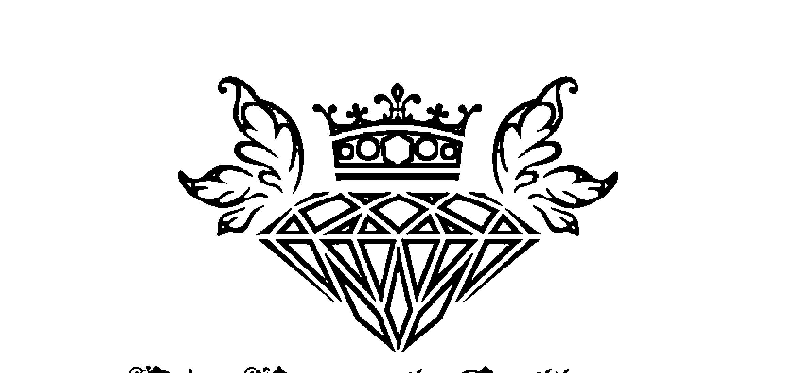

## St. Royal College

## 天使神秘学院

- 专业占卜预测机构
- 神秘学培训机构
- 水晶能量研究中心
- 官方淘宝：http://strc.taobao.com
- 官方微博：http://weibo.com/715104687
- 新书发布QQ群：659338717
- 购买更多好书请联系院长大天使

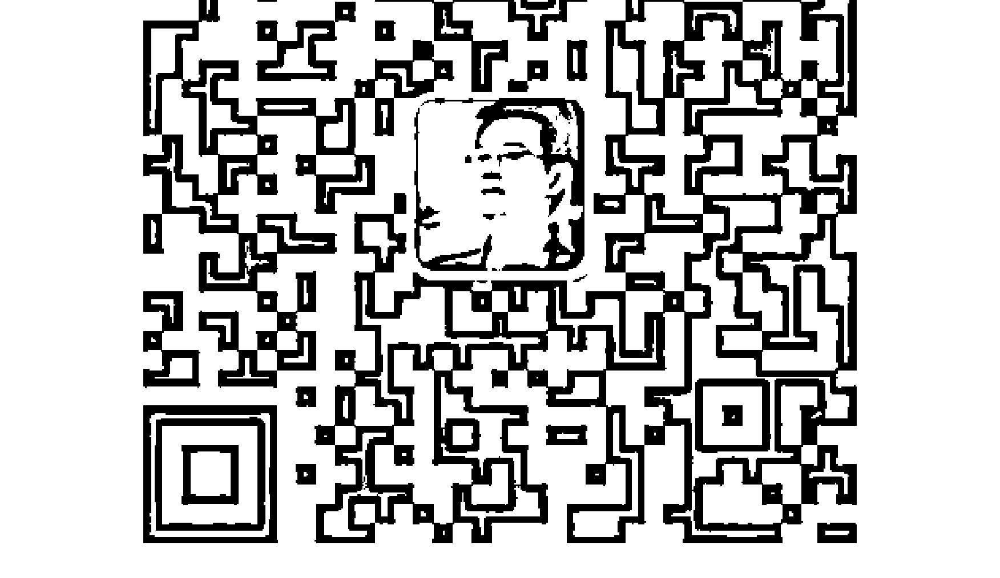

大天使
天使神秘学院 院长
QQ：715104687
手机/微信：13641926204

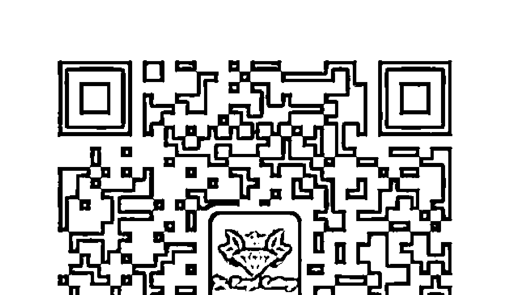

微信公众平台：strc2011

## 制作说明：

本書由《天使神秘学院》出重金从台湾购入的原版书籍扫描制作完成。为达到最好阅读效果，特地把原版书全部切开后，再经由专业扫描设备高精度扫描完成，并经过一张张的PS后期处理最终成书，其间花费大量的人力、物力以及时间，只为能给大家提供经济并优质的神秘学学习资料而努力。

本学院强力谴责某些机构和个人，把本学院花心血制作完成的电子书籍，包装后直接放在自家淘宝网上低价倾销的行为，以谋取不劳而获的经济利益。如果长此以往最终将无人愿意再为大家花心思制作电子书，那以后可能大家再无新书可读。

为让大家以后能够读到更多的好书，也为了本学院的良性发展。本学院恳请大家尽量做到如下几点：

- 一、尽量在本学院的网站购买电子书籍。
- 二、请勿用技术手段把电子书内的水印及加密去掉。
- 三、在收到电子书后小范围传阅即可，千万不要公开传播，更别挂到淘宝网上低价销售。

同时为答谢广大支持者，学院电子书将做如下调整：

- 一、学院会把一些早已收回制作成本的电子书折价销售。
- 二、最新制作的电子书籍会开放打印功能，大家购买后有条件的可自行打印成书。

天使神秘学院

# 靈氣REIKI：生命的療癒

某些年某個晚上，做了讓我畢生難忘的夢。夢中我席地而坐，望着抱在懷中已安詳離世的伴侶。

一位天主教修士友人問：「生命是甚麼？」所有朋友沉默無聲。

我說：「生命是呼吸。當呼出後再沒吸入，就是生命的完結。」

然後我緩緩地呼出最後一口氣，再沒有吸入：……平靜地離開塵世。當年老師跟我說這是「懷愛人間」。

愿将希望带给您与他，她和他。

愿每个人都能体验生命中的喜乐感恩。

愿每个人在「回家」时感到人生没有遗憾……

谨以此书献给在人生旅途上失望，痛苦的人。

## 目錄

- 推薦序（林志偉）：012
- 推薦序（陳慧懿）：014
- 作者序（陳邦平）：016
- 編者序（郭佩詩）：022
- 關於作者：026

# 第一部 靈氣

## 靈氣是甚麼？

## 歷史與傳說

## 靈氣五戒

## 生命的能量

## 治療的理念

## 靈氣的應用

## 學習靈氣治療

032 034 038 046 052 054 058

## 冥想 (Meditation)

## 心想事成

## 心中的疑慮

## 意想不到的效果

## 傳承的珍貴

## 終身的承諾

## 符號的秘密

## 開竅 (Attunement)

# 第二部 療癒——招福の秘法，萬病の靈藥

- 甚麼是疾病？
- 肝癌
- 兒童驚恐症
- 糖尿病
- 大腸癌
- 遲來的月事——閉經
- 心臟病
- 子宫肌瘤
- 失眠
- 濕疹
- 高血壓

# 第三部 生命

## 作者随笔

接受、給予、共享

我的可愛媽媽

生命中的北斗星

宗教随想

他、她與牠的故事

學習靈氣之歷程和感想

遠傳的力量

商人劉堅立

機艙總艙務長 Ivy Yau

靈氣太極、太極靈氣 - 陳汝平

最年輕的Reiki Master - 中醫學生 Billy Cheung

生命導師 - 事務律師 Joyce

靈氣治療的利益 - 律師 Leanne

「靈」的分享 - 空姐 Maggie

奇妙的旅程 - 空姐 Kathy

當靈氣遇上精油 - Kapo Lam

超級過敏人 - 空姐佩詩

後記

## 推薦序

不經不覺，已認識 Angus 十多年，從當初一起學習身心語言程序學課程，到其後工作間的交往、及至後來跟隨他學習靈氣，關係亦師亦友。大家不斷學習、追求知識，能在成長路中的不同階段，分享彼此的人生體會，是一份難得的緣分。多年來，Angus 憑着一股傻氣和堅持、懷着一顆善心，加上非一般的際遇，以當天的因，結今日的果，很高興看到他找到了該走的路。

大自然宇宙間存在着無窮無盡的能量，人類作為自然界其中一種生物，如何能發揮、融合自身及周邊的力量，也許是我多年來的追求，而靈氣正是其中一種途徑。透過 Angus 的指導和同學間的實踐與分享，學得越久，理解越深，越發覺祂的力量之大，遠超想像。

知道 Angus 出書，確實有點驚喜。喜的，是 Angus 能把他對靈氣的豐富理解與實踐經驗，詳細地記錄下來；驚的，是素知他是一個隨心所欲的人，要把資料有系統地整理和表達，絕對要花不少心力，更要有心人的協助，此書才能完成。我想，隨著書本面世，很快便會有第二、第三本相關的著作。

在此，祝願 Angus 的書能給有緣人帶來莫大的裨益與正能量。

林志偉
執業會計師

## 推薦序

時間過得很快，轉眼已到二零一三年的冬天，某個週末賦閒在家，聽聽王菲的《心經》，感覺舒服、平靜。原來放假不一定要上街，不一定購物、玩樂，只需要讓心情平靜下來，就是最好的休息。大概在兩年前，我還沒有學懂這一點，直至去年中，因工作關係認識了Angus，在他身上漸漸學懂讓自己平靜、安穩，明白尋求內在的平衡，才是真正的釋放。初次接觸Angus，認識靈氣，單看名字還以為是跟玄學或靈異事有關，後來聽了Angus的細心講解，才有了初步概念，發覺這是一個自己和對別人也有很大幫助的修為，所以不久之後便成了Angus的學生。

距離對上一次上學，已是多年前的事，要重新適應群體課程，而且每堂也需上六、七小時的課，對我來說是少一點恆心也不行的。但在首次課堂聽到老師的講解，和按着指示做練習後，我便知道我不會輕易放棄這課程。因為老師說的，都是我所認同而過去沒有真正實行的事。如他說「一切建基於平衡」，更是最令我感受深刻的。因為除了生活習慣的平衡，內在心靈的平衡才是最重要的一環，只要保持內在的平和寧靜，身心的很多不適也得以釋放，透過老師的指導，不單改善了自身的心境和健康，還可幫助身邊的朋友，這更讓我感恩。

這一切也讓我畢生受用，實在要對 Angus 說聲多謝！

二零一三年 冬

陳慧懿 雜誌業務總監

## 作者序

大約三十多年前，還是中學生的我受到當時老師的啟蒙，開始接觸靈修靜坐及各種能量治療法。

此後，我被這些看似神秘和療效優越的知識深深吸引着，瘋狂尋遍各國各派的導師，甚至越洋過海，重覆又重覆地追求更圓滿的教導，好讓我能更加深了解和融會貫通，更有效地使用和教導靈氣治療系統。

從不同的治療個案中，我聽到、看到、感受到人世間各種層面的「苦」。人生旅途上，誰沒遇過失意痛苦？然而，甚為無奈及諷刺的是，很多人在不自知的情況下，透過各式各樣的方法來回應痛苦。例如，用不停工作賺錢來回應貧窮帶來的痛苦、用不停追求異性來回應寂寞感感覺等……無論回應的方法為何種，目的都是希望遠離痛苦，得到快樂。每一個人都會隨著自我意識的高低，用不同的方法去回應自己的內在感受。自我意識較低的，可能會選擇用一夜情去回應寂寞孤單的苦，但只可短暫地解除一剎那的孤寂寞，過後還是會感到空虛，甚至更加空虛；而自我意識稍高的，會選擇尋找真正的愛情，尋找過程可能漫長費力，卻某程度上能較長遠地解決寂寞這個問題。換句話說，意識的高低決定了離開痛苦的能力及其回應痛苦的行為模式。所以能提升意識的方法成為了我研究各種治療系統的核心目標之一，只望能看到更多心靈為自己種下快樂的種子。

靈氣治療系統除了能解決外在身體層面的痛苦外，其精髓在於透過靈氣修練，能讓我們看見真正的自己，明白生命的真諦及使命，及來此世界的目的。學習提升自我意識，可令你察覺到病痛背後的根源，以及生命中問題顯現的因由。日復一日，當你站在較高的地方，擁有較廣較闊的眼界，便能看到漸遠的風景，那一刻就如感到整個系統的偉大，解讀苦樂的訊息與回應的方法當然會截然不同。

我非常感謝所有老師的教導，他們就像智慧的鑰匙，開啟了神秘的知識大門，讓我看到廣闊的天地和感受到浩瀚的宇宙萬物能量。是的，聽起來有點誇張，但我所體驗的事實確是如此。

靈氣是來自大自然的動態能量，用之不盡，只要我們用正確的方法、心態，與大自然連結，外在和內在的世界便會隨之改變。而靈氣修習中的平衡技巧，會引導你回復生命最初始的狀態，漸漸地與大自然連結，感到平靜、健康、快樂。

- 如果你已經學習了靈氣治療，希望能與你分享一些治療個案的經驗，解答一些常見的問題，祝願你能利己利他，將靈氣之光遍傳大地！
- 如果你沒有學習過靈氣治療，望此書能讓你對靈氣治療有一點概念，解答你心中一些疑問。
- 如果你正在等待緣分，祝願靈氣心想事成法帶給你真正的幸福快樂。
- 如果你正在渴望得到財富，請用心學習福報的法則。
- 如果你正受着疾病的煎熬，祝願你能找到病泉，徹底了解和處理，步向康復之路。

如果你正在痛苦迷惘中，那便恭喜你，生命中的覺醒常因感到「苦」而發生，祝願靈氣能量讓你看到真正的自己，重新連結健康快樂的你。

無論你在人生那一段路途中，嚐着生命的或苦或樂，都只是外在世界的能量流動而已。願你能放下過去，一吸一呼，活在當下……

朋友，未來的你，全憑此刻的你，希望你能憑藉此書得到一點點啟發，衷心祝福你能活得一天比一天快樂！

特別鳴謝 Gavin Lam，Christine Chan，劉堅立，陳汝平，Ivy Yau，Kathy，Joyce，Leanne，Kapo Lam，Billy Cheung，Maggie等學員於此書分享了他們的靈氣體驗；還有媽媽（我會在書中與各位分享我與媽媽的治療故事）；及 Christine，Joyce，Season，Gracie 的沿路幫助。

最後，衷心感謝幫忙記錄及執筆的佩詩，寫下了我人生命中重要的的一頁，謝謝！

陳邦平

## 編者序

如果要說生命的奇蹟，不能不提到他——我敬重的靈氣老師陳邦平先生。非常感恩，能遇上一位不一樣的老師，應說是生命導航師——他就像一個生命導航系統。如果你失望了、迷路了，不用恐慌，向生命導航系統求救，輸入目的地，系統會提供數個能到達目的地的路線圖，通常包括遠或近、山路或平路等給閣下選擇，請根據自身之各種條件選擇其一。一個成功可靠的導航系統，是不會「代君駕駛」的，而是會想盡辦法去啟動你的自我思維系統，然後讓你懂得為自己選擇最佳路線。當你輸入目的地和路線後，導航系統會一直與你同行，萬一發現你偏離了路線，他會不厭其煩地響起警號，大聲地用不同語言告訴你：「偏離航道！偏離航道！」隨後，會再一次為你提供能到達目的地之路線圖，然而他是不會提供自己沒有走過或不確定的路線的。Angus 老師就是這樣的一個生命導航系統，誠實、可靠、博學、耐用……哈哈！其實是勤力呀！

為人師表，不是一份兒戲的工作，我真的很佩服 Angus 老師的能耐，年中無休地聆聽學生們的苦與痛，重覆地解答我們好奇或棘手的疑問，難得他還滿腔熱誠，笑喻此為「希望工程」，以「將希望帶給其他生命」為終極任務。好吧！讓我也參加「希望工程」，幫助整理這龐大的資料庫和編寫工作！誰知，以為助人，其實是助己，一年下來，獲益良多的是自己呢！

透過 Angus 老師循循善誘的教導、解釋，及不同的個案訪問，使我更深入了解靈氣，更加明白受各種情緒主導所反映的病症形態、治標治本的靈氣治療方法與分析、經驗與直覺的關係、家族集體行為的解讀等等。見證一個又一個離開痛苦的個案，使我更加相信靈氣治療的卓越療效，更加確定人生的使命和價值。祝願有緣於書中相聚的你，也能見證生命的奇蹟，遇上生命中的導航師。

郭佩詩

# 關於作者

陳邦平（Angus Chan），出生於香港，十四歲開始接觸靈修打坐，學習各種能量療法，於二十多年前開始從商，同時在往後日子以業餘形式進行靈氣及各類能量治療工作，並繼續到世界各地跟隨不同的導師、智者學習，接受各類自然療法及身、心、靈學派傳承的訓練，其中包括催眠治療、整脊及經絡療法、聲音治療、系統排列、情緒導向治療（Emotional Freedom Therapy，EFT）、身心語言程序學（NLP）、Body Harmony，幾何圖案能量學、九型人格（Enneagram）、業力重整治療（Karma Rebuild Therapy），夢禪法、夢治療等。

| | | |
|---|---|---|
| | | |
| | | |

二零零八年，親人及朋友的去世，讓他進一步反思生命之價值及使命。同年一趟朝聖之旅後，Angus 毅然結束自己一手創辦的公司，全職投入教授靈氣及各種能量療法。

Angus 獲多個認可培訓資格，其中包括國際註冊企業教練 (Corporate Coach, RCC)，由美國企業教練組織 WABC 頒發，為全球最大認證教練組織、也是身心語言程式學高級執行師 (NLP Master Practitioner)。

現為美國世界靈氣專業中心 (Reiki Worldwide Professionals Centre) 的亞太區總監及認證資深靈氣師範導師、美國國際靈氣培訓中心 (International Centre for Reiki Training) 的認證靈氣導師，及靈氣能量中心 (Reiki Energy Centre) 的主要導師。

同時，Angus 亦是不同靈氣及能量學派的認可導師，認可教授項目包括日本臼井靈氣大師級導師（Usui Reiki Master）、西藏靈氣大師級導師（Tibetan Master）、慈光靈氣大師級導師（Karuna Reiki Master）、古埃及靈氣大師級導師（Sekhem Master）、Sacred Breath Reiki Master、Kundalini Reiki Master，以及很多沒有專有名稱的療法等。

近年，Angus 致力於整合及深化各類靈氣與能量療法，使之更彰顯其效。

## 靈氣能量中心

網頁：http://www.reikienergy.hk http://www.life-healing.hk

電話：852-5313 4235

whatsapp：852-5520 5380

電郵：info@reikienergy.hk reikienergyhk@gmail.com

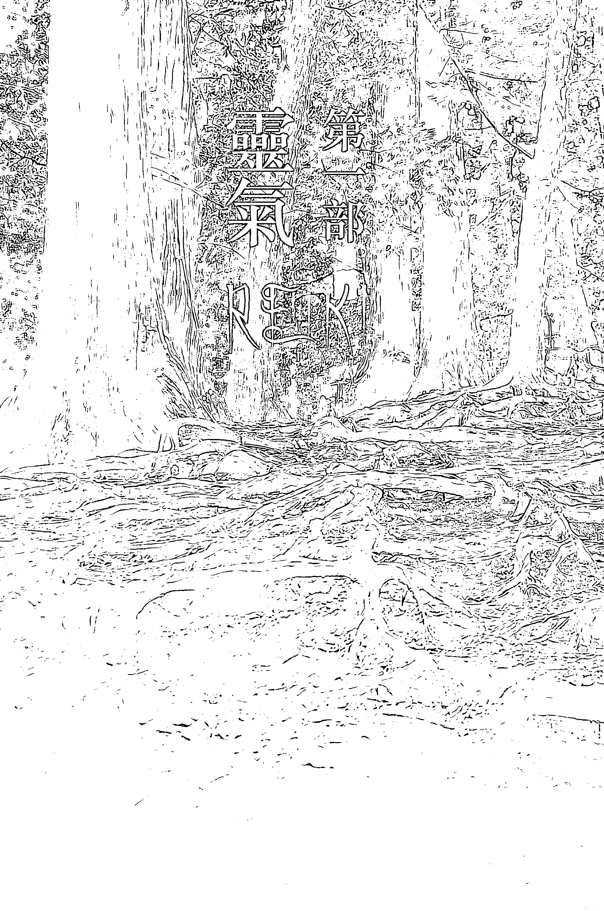

晋太元中，武陵人捕鱼为业

## 靈氣是甚麼？

「靈氣是甚麼？」與靈氣初邂逅的朋友們都會問這問題，此題既深亦淺。

「靈氣」一詞源於日本，意指宇宙能量（非宗教）。這種能量存在於宇宙之中，任何人都能透過適當途徑加以應用。

靈氣是一種自然療法，同時亦是一種能量運用技術。原理是透過各種技巧，包括符號（即西方的符號學）、聲音、手法、呼吸法等，使能量回到平衡狀態，藉此根治問題。

廣義來說，靈氣治療法是用於身心靈治療的手觸療技巧，應用廣泛及效果顯著。在歐美等西方國家，靈氣為一種流行的自然療法，在醫院中設有靈氣治療的部門，最近西方大學亦開始設有此專門學科。

而我會形容靈氣為流動於宇宙天地間及生命各層面的動態能量流。此動態宇宙能量流是認識、尋找及治療「我」的寶貴鑰匙。藉着掌握這流動鑰匙，將小我與大自然的門鎖打開，並與天地連接，令身、心、靈能量得以平衡流動，步向體驗天地間之「道」，以達致天人合一、相應之境。

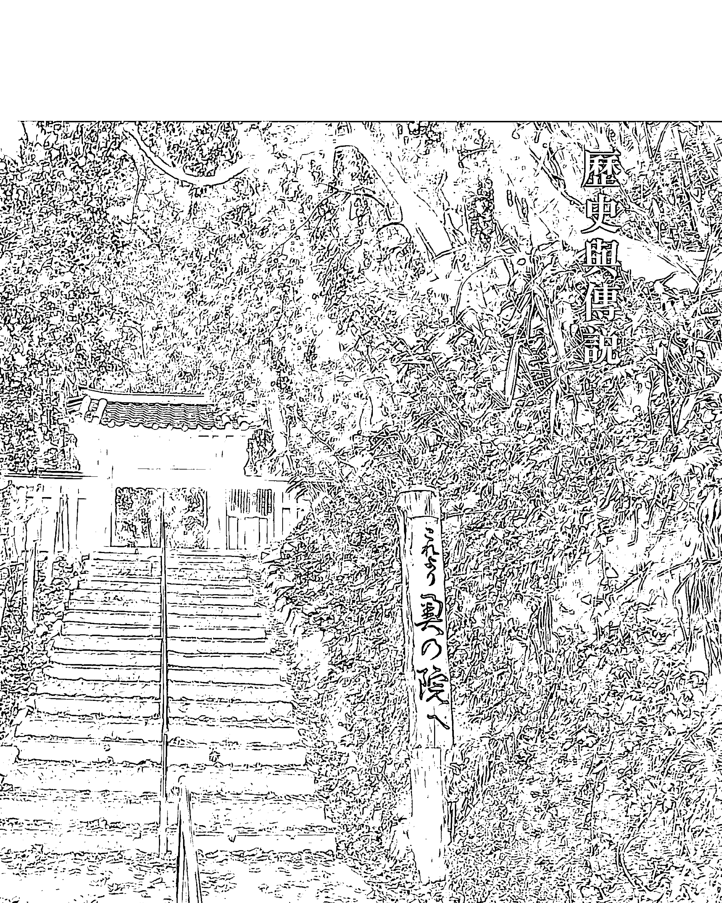

## 日本京都鞍马山奥の院

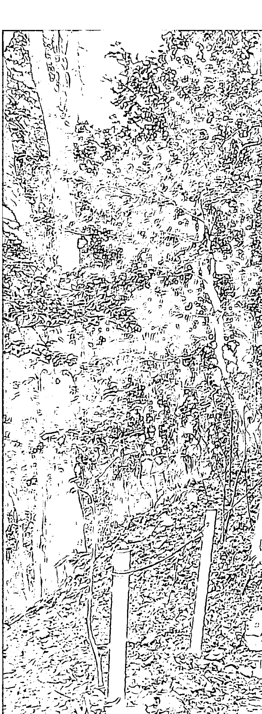

## 歷史與傳說

關於臼井靈氣的始祖——臼井義男老師的歷史與傳說，坊間流傳着幾個不同的版本，現為各位介紹其中之一。

臼井義男老師，生於一八六五年八月十五日，岐阜縣山縣郡，是當時日本的貴族。他從不同的典籍中，得知聖者耶穌曾行神蹟，將手放在門徒身上，門徒的病便得以痊癒；覺者佛陀亦常行神通，用手傳遞祝福予痛苦及生病的信眾，他們的痛苦得以解除，能得安心。

臼井老師立心要尋覓訓練這種能力的方法，於是離開日本，前往世界各地遊學。他曾到過中國及歐美等地，學習各種各類的中西知識，尋找安心和解除痛苦的方法。終於，他找到一本書籍教導怎樣透過修練而擁有這個能力。臼井老師將此典籍帶回日本京都，在數年間努力不懈地修練。

最後，臼井老師在京都鞍馬山上斷食二十一日，在最後一晚的深夜，老師感到如被雷霆擊顶的震撼，並感受到高頻率的震動，到達與天地宇宙連結為一的意識境界，這個就是靈氣的震動頻率與共鳴。臼井老師離開鞍馬山後，漸漸體驗到大自然賦予給他的自然療癒力量，他亦深信每個人都擁有這種力量，此後臼井老師致力於整理、使用和教授這種手療系統。臼井老師在世時，將他領悟到的手療技巧傳授給他的學生，其後他的學生將此手療技巧發揚光大，傳到世界不同的地方。現時靈氣治療在外國很多地方也非常盛行，包括美國、英國、加拿大、澳洲等西方國家，並以靈氣作為一種輔助性的治療方法。

## 靈氣五戒

臼井先生曾經寫下日文的靈氣五戒，一直流傳下來，成為學習靈氣治療者的座右銘和人生觀。

日語直譯可解為：
招福之秘法
萬病之靈藥
今天不怒，今天不憂
心懷感謝，完成使命，對人親切
朝夕合掌，從心起念，以口唱誦
改善身心臼井靈氣療法

臼井襲男
肇祖

## 靈氣五戒

大概的中文译解：

- 今天不怒
- 今天不忧
- 今天我心怀感恩
- 诚实地赚取生活所需
- 慈悲对待每一个生命

心，誠實賺取生活所需，善待其他生命，看似簡單但意義深遠的幾句，足以建立一個豐盛的人生。靈氣五戒可謂修習靈氣者的人生觀及座右銘。今天不怒不憂，常懷感謝之心，誠實賺取生活所需，善待其他生命，看似簡單但意義深遠的幾句，足以建立一個豐盛的人生。靈氣五戒可謂修習靈氣者的人生觀及座右銘。今天不怒不憂，常懷感謝之心，誠實賺取生活所需，善待其他生命，看似簡單但意義深遠的幾句，足以建立一個豐盛的人生。靈氣五戒可謂修習靈氣者的人生觀及座右銘。

學生們都覺得「今天不怒」這一項是最難做到的。我們生活在節拍快速的香港，每天有太多的煩擾和噪音使人不耐煩，也會為社會上不公平的事情而動怒。我們都在大都市中生活，要得到內心真正的平靜，實在是不容易的。當我們放下心中的執着，才能達到不怒的情懷。那麽怎樣才能做到放下心中的執着呢？當你找到人生的意義和價值，不緬懷過去，不擔憂未來，活在當下，才能達到不怒不憂的境界。

假如對所擁有的世間萬物，都懂得珍惜感恩，就等於明白施與受、愛與被愛的法則。大家要明白這些法則不是看了明白、腦裏了解就成，而是要通過行為體驗去實踐的。舉例說，人們知道要孝順父母，卻沒時間與父母相處。人們知道要珍惜所擁有，但每天每餐都在浪費食物，留下吃不完的飯菜。人們只知道追求被愛和被照顧的個人美好感覺，卻忽略了對方的感受，忘記了愛是用真心建立的互動關係。就在今天，請學習拋去重覆的錯誤模式，不要在失去後才懂珍惜，要在擁有時就懂得珍惜愛護。大家要透過實際的行動，才會明白萬物之間的相互牽引關係。你的生活會漸漸地改變，你的心情也會變得平靜和愉快，每天都能體會到「心懷感恩」的美好。

大自然擁有生生不息的力量，也孕育了我們維持生命的元素。透過誠實面對自己和他人，能幫助我們放下複雜的假面具和抑壓的負面情緒，重拾簡單純真的心性，更容易與大自然連結。所以「誠實賺取生活所需」是靈氣五戒中不可或缺的，沒法接近大自然的磁場，就是沒法好好的使用大自然無窮無盡的靈氣能量。沒有甚麼東西能不依靠任何元素而獨立生存於世上的，就算是偉大的大自然也有地、水、火、風等元素互相依靠配合。所有存在於世上的生命都必須擁有其價值、使命及互動元素。我們要讓這些元素經過流動和結合，才能結出豐盛的果實。所以我們首先要在心裡種下健康快樂的種子，也要將種子種在其他生命的心田中。善待他人就等如善待自己，明白了這個道理，才會毫不吝嗇地將快樂帶給其他生命，亦等同將快樂帶給自己。

每天唱頌靈氣五戒，並付諸行動，將它融入日常生活中，可維持身體內在的平靜平衡，以獲得健康快樂的人生。

更高楼望不尽

月色满江城

天地一空明

## 佩箴於辛卯年冬至所写的靈氣成中文版

# 靈氣療癒大全

## 生命的能量

相信大家都認同，世界上存在許多肉眼看不見，但卻真實存在的東西。一些現象、物質、形態和能量等例如空氣、風、電波、磁場也是看不見及觸不到的。能量是一種肉眼看不見，可以不用以物質、固體或是電磁能的形態方式表現、且能儲存於一個系統中、亦能從不同的系統互相交換結合、轉移而存在的。感官敏銳的人有時可感覺到某些能量帶有不同的溫度和闊度。

水滴成河，流入濤濤大海，再滋養土地，過程中呈現出不同的姿態，最後還是本質不變，化成霧氣與雲層，再次化成水滴降生成河。大自然賦予我們生命能量，隨著春夏秋冬、風雨陰晴，恆常地潤澤着萬物生長。我相信生命能量與大自然有着息息相關的緊密關係。換句話說，只要我們能好好的連接及對應大自然，便能擁有更強的生命能量。學習靈氣治療正是我們接觸大自然能量的上佳工具。

能量在每個人體內不停流動，藉此維持生命。在健康的身體內，能量會無阻地流遍全身。當能量在這些層面平衡流動時，代表生命的各個範疇健康地發展。相反，當能量流動失衡時，則有關層面的問題亦會隨之產生。例如健康變差、情緒失控和溝通能力轉弱等，以致家庭、健康、事業、愛情、人緣轉弱等。

經常使用靈氣能使我們與大自然連結在一起，漸漸便能與祂的能量整合、轉移修補以達到平衡的能量狀態。大自然的自癒和修復能力遠遠超過我們的想像，看看風力發電、水力發電、太陽熱能等便可得知。當身體內的能量到達一個比較平衡的狀態時，生命中的各個範疇也會相對地反映出較健康的狀態。

除了學習靈氣外，多點到郊外呼吸新鮮的空氣、在叢林中練習靜心呼吸、赤腳在草地上步行、坐在沙上對海歌唱，也是簡單又直接的方法接觸大自然，提升我們的生命能量。

## 治療的理念

人的生命包括三個層面——身、心、靈。當人受到外來的影響或內在情緒出現問題時，能量便不能順暢地流動，疾病及問題會隨之產生。如果我們只處理身體上的不適，那是無法把疾病根治的，必須同時處理心和靈，才談得上是一個治標治本的整全療癒。

現今的主流醫學非常着重身體病徵上的治療，經過人類多年的努力，在治療身體病徵層面上，已取得不錯的成就。但如果能夠根治疾病，那麼健康的人應該越來越多，醫院診所的數目越來越少才對。可是仍有不少人活在生病的狀態中。我想那是由於沒有一併治療心和靈的緣故。

請看看以下的生命連線：
- 身體 → 疾病 → 情緒 → 信念 → 價值 → 靈性 → 合一

如果我們有能力處理生命連線後的因素，便代表我們有能力以較深入長遠的方法去根治病因。例：看到了某種特定價值→改變、更正、重建價值→信念隨之改變→反映在情緒上→疾病顯現消失→身體健康。在身體能量不順暢的地方施加靈氣，能協助能量回復原有的暢通狀態，所以所衍生出的疾病及問題也會得到舒緩。各種靈氣治療技巧就是學習處理各種顯現在身體上的問題。我們首先舒緩身體上的不適，然後尋找引發該問題的背後情緒。有時引發情緒的原因源於自身的信念與價值觀。換句話說，如果能轉變對外在世界的看法，便能改變自身的信念價值，很多時情緒和身體上的問題都會隨之改變。隨著我們運用靈氣治療的時間和經驗續漸增長，能處理的病症和問題將會更加深入。

## 靈氣的應用

靈氣治療的應用非常廣泛。在很多國外醫院也設有靈氣治療的科目，為病者提供輔助性的治療選擇。其療效亦於多份論文中公開發表。其中在病徵層面上的止痛功效特別卓越。應用主要分為身、心、靈三個範疇。

### 身：身體／生理方面
- 提高睡眠質素
- 改善腸胃問題，治療便秘
- 舒緩或消除頭痛及偏頭痛
- 平衡身體免疫系統，提升免疫力，並預防疾病
- 治療各類痛症，例如肩膊疼痛、關節炎、牙痛等

### 心：心理方面
- 處理兒童情緒問題如自閉症、過度活躍症、焦慮症等
- 改善／舒緩抑鬱問題
- 減輕精神憂慮
- 舒緩精神壓力
- 提升正能量
- 預防／輔助癌症治療
- 預防／治療心臟病
- 預防／治療糖尿病

### 靈：靈性方面
- 提升自覺力
- 加強自省力
- 了解自我生命課題
- 幫助放下自我執着

### 其他：
- 改善溝通技巧
- 動物治療
- 淨化空間氣場、清洗負面能量
- 淨化水晶、將正面訊息輸入及擴大

靈氣不單可應用於人的身體上，也可用於動物、植物和物件。還可將靈氣轉化成祝福傳送到特定的事情或心願。

## 學習靈氣治療

靈氣治療和其他能量治療技術不同，必須由一位合格導師進行一種稱為「開啟」(Attunement)的程序。「開啟」是由認證靈氣導師利用特別的傳承技巧，開啟學員接收靈氣能量的管道，此程序能使能量正確地進入學員體內，並通過教授各種使用技巧，使學生可以有效地運用在各個範疇。

白井靈氣系統一般分為四個級別——初級、中級、高級和大師級。各個級別的課程都包括相關的開啟程序、手療技巧、理論解釋、應用實習、治療心得和經驗傳授等。

初級課程的重點包括介紹人體七個脈輪主管的器官，其反射作用及代表更遠的生命共震層面，利用呼吸法開啟、平衡、保護各個輪位，以達致內外健康的身體狀況。大部分學員在學習初級靈氣治療後，便可處理簡單的病症如減輕各種痛症、失眠等。學員亦能利用各種手療位置技巧及呼吸法協助放鬆自己。當我們的身心放鬆下來後，許多都市病如精神緊張、腸胃病、經常感冒等都會得以舒緩。

在靈氣治療中級課程中，學員會學習到進階的治療技巧，並將能量放大及遠傳至不在身邊的人、事、物。透過理論和實習去學習處理較複雜的病症如減輕糖尿病、高血壓、心臟病等。課程也會教授關於癌症的治療技巧和處理情緒的治療法。當學員為自己及他人做靈氣治療時，會比較容易發現內在的問題與情緒，所以必須同時學習處理情緒，才可讓治療發揮更長遠和穩固的效用。同時也會學習進階的放鬆身心技巧和連結大自然的方法，學員會進一步認識自己，認識生命的價值和使命，協助自己和別人獲得更健康優質的生活。

在靈氣治療的高級課程中，學員們會學習到高階的能量應用及治療技巧，認識各種病症與病徵的關係、身心靈的整合練習、進一步與自己連結。同時也會介紹各種能量系統與生命結構的互動關係，系統之間的整合運用等。認識信念和價值觀怎樣影響各種病症和生命狀態，如何將靈氣治療的技巧運用於處理最根本的病因也是高級課程的重點之一。大師級課程包括教授各種開竅手法及技巧、各種能量管道、靈氣治療的精髓、靈氣治療師的守則等。

## 開竅 (Attunement)

在學習靈氣治療的課堂上，學員需要接受認證靈氣導師的「開竅」，才能有效地使用靈氣。學員們都對「開竅」這程序和字眼特別敏感和疑惑，我認為英文「Attunement」的字義比較能夠表達「調校頻率」這個意思。有時中文會翻譯成「靈授」、「點化」，與「開竅」是相同的程序，是學習靈氣必經的步驟。開竅是認證的靈氣導師運用特別的呼吸、傳承的手法去引導能量頻率的校正，像將收音機選台調頻至收聽不同大氣電波頻道一樣。經過認證導師的開竅後，學員便能終生自由使用該等級的靈氣能量了。開竅過程需要引導大量能量，經過身體時會開通阻塞的地方，有些同學會於短時間內有特別的反應。曾經有一位學員在開竅過程中不斷放出胃氣，也有學員說像置身漩渦中而不由自主地搖動身體，一直到完畢才停止！亦試過有學員不斷哭泣流淚，也有感到異常平靜的，或感覺有暖流從頭部灌入，或感覺有冷感圍繞，或沒甚麼感覺等等，這些反應是由於受者身體氣場受到牽引之故。

有些人非常追求感官上的感受，認為沒有感覺便沒有效用，其實是沒有關係的，就如我們沒有感受到空氣和大氣電波，它也存在於空間一樣！畢竟人生於世上，各有不同任務和使命，課題與體驗亦不盡相同，所以我們不需要和別人感覺一樣或作出比較的。

## 符號的秘密

符號（Symbol）是靈氣治療系統中重要的工具。符號代表特定的意識，其意識的表現、表達、傳遞或共同認同的方式可以是圖像、圖形、聲音、字體、人像、建築物等。例如在數學物理的世界裡，不同的符號代表背後不同的物質結構或數學程式，只要畫出該圖形，學者便知道所指的是甚麼。雖然我也是念理科工程學系，但並不是數學專家，一些特別的數學符號是需要經過學習、練習和教授才懂的。而靈氣治療系統中使用的各種符號，都是需要經過學習、練習和傳授的。每個靈氣符號都有特定的圖形、聲音，以代表背後不同的能量和頻率，發揮不同的作用。我們身處的宇宙，也是由不同的能量頻率所組成。

符號運作大概可理解為——透過不同的符號改變能量的頻率，而不同的符號可以應用在不同的範疇上。根據不同的需要而使用不同的符號可使治療的效果更加顯著。例如靈氣治療系統中的「力量」符號，是我們常用的符號。當使用在人或事件上，有加強能量的功用。當使用在物件或環境上，可以清洗或潔淨物件的負面能量。

「遠傳」符號的功用是較為抽象的。雖然如此，許多同學都認為他是非常重要及感覺神奇的符號。使用遠傳符號於人或事件上，可以使能量穿越眼睛看不見的時間空間，將靈氣傳送到不在身邊的人或事。有時身在外國的接受靈氣者，會感到能量在他的身體內流動。

「情緒思維」符號可以處理各種情緒或思維問題。當在靈氣治療過程中使用此符號，可以安定、安撫受者的情感，協助重整混亂的思緒。將此符號使用在情緒治療上，確有不錯的成效。除了幫助穩定受者的情緒外，還可讓她靜心及增強自信。

「大師級」符號有多種功能，包括可以消除能量流動過程中所遇到的阻隔、協助暢通氣脈等。

由於靈氣系統中使用的符號帶有能量，傳統上是秘密的口傳，而且不會隨意劃出來，靈氣導師只會在課堂中經過開竅後傳授。

## 終身的承諾

學生問：「如果現在學習了靈氣，十多年也沒有使用過，那麼會忘記或失去這個能力嗎？」學員是仍然可以使用靈氣的，它是一項終生技能，就如游泳和踏單車一樣，學懂以後終生受用，即使長時間沒有使用，該項技能也不會消失的。初初回復使用時可能有點不順暢，但相信很快便能適應，重拾記憶，就像我們不是天天游泳，但學懂以後會將游泳的技巧內化在深層的記憶中。如果在學習的初期勤加練習，對使用的程序和技巧有深化的作用。正所謂熟能生巧，常常練習可以加強記憶外，也可令身體內的能量更加暢通地流動。

由於靈氣的能量是來自宇宙，亦即來自大自然的，那是無窮無盡與源源不絕的供應，可謂是一個豐盛的源頭。我們只要學懂連接使用的方法，懷着歡喜感恩的心來使用，便能為人的生活帶來希望和笑聲。那就好像一個終身的承諾，維繫着人與大自然親密的關係。

## 傳承的珍貴

傳承是一個需要雙方共同進行的行動。先決的條件是有一位擁有特定的知識或技能的人，願意將該知識或技能傳授給另一個人，而另一個人亦願意承接、接受其傳授的知識，才稱得上為「傳承」。白井老師當年發現靈氣和靈氣的開發方法後，將此秘法通過口傳、動作、符號、傳授給他的弟子，而白井老師的弟子亦承接了他的教導。這就是白井靈氣系統珍貴的傳承。為甚麼靈氣的傳承是那麼珍貴和重要呢？因為除了靈氣的使用和開發方法外，還包含了靈氣的真義、精髓和祝福。那是只能透過口傳和身教而傳授的經驗與知識，所以學習靈氣治療必須經過認證導師的開發、傳授、教導和引領，才可正確地使用靈氣。

坊間很多學員，甚至靈氣治療師誤會靈氣是神通，以為是自己在治療別人，久而久之，將自我無限放大，覺得自己非常了不起。其實我們只是運用傳承的方法，將自己作為大自然能量流動的管道連接者。真正了不起的是大自然的能量本質，並不是自身的神通威力。所以我常常提醒學員要留意自己的心，觀照自己的心有沒有正確的信念。這樣才有能力走更長更遠的路，幫助自己、家人和朋友擁有健康豐盛的生命。

## 意想不到的效果

靈氣是一種簡單易學而有效的自然療法。無論是哪一個級別的靈氣，學員在接受認證導師的開竅和指導後，都可以即時使用。而且不需要儲存，也沒有期限，終生皆可自主地連接並使用該級的靈氣能量，無需特別練習。當然，熟練能生巧，常常使用靈氣可使體內能量流動管道更暢通。

隨著為自己和他人治療的經驗漸漸豐富，定會驚訝於簡易的靈氣療法能處理範疇之廣泛和快速。曾經有一位患有長期失眠症的學員，她在接受第一次的靈氣治療後，那天晚上便輕鬆入眠，而且睡眠質數也提升了。由於她用了很多方法與失眠症苦戰多年，所以她對靈氣的療效深感安慰，同時也嘖嘖稱奇。

靈氣治療基本上沒有時間和地點的限制，甚至可以將能量遠傳給不在身邊的人。當接受靈氣者身在另一個地方或國家，我們也可以透過特定的技巧，將能量傳送給他。很多時身在遠方的受者也能感受到能量流的轉變。靈氣治療的系統是以身體作為切入點，透過將動態能量帶入體內不同的能量中心，以達致平衡狀態。在進入內在平衡的過程中，學員會漸漸看到自己，了解自己，肯定自我的價值，並在情緒治療的層面上，獲得令人鼓舞的成效。靈氣有着令人覺悟的內在秘法，所以執着會隨着身心的平衡而逐步放下，身心平衡當然會透過身體健康的表徵呈現於外。透過靈氣治療而得到改善的各種身體、心靈病症比比皆是，當中過程像體驗一趟奇妙的旅程，使人對生命有所覺悟與改變。

## 上善若水

這些都是初級學員常見的疑問，在此分享一下。

## 「靈氣是用甚麼氣？」

靈氣是流動於宇宙天地間及生命各層面的能量流，亦即大自然的能量，那麼靈氣就是大自然的氣。所以使用靈氣就是使用來自大自然、源源不絕的能量。

## 「氣功和靈氣可以並用嗎？」

氣功和靈氣是可以並用的。一般氣功是用自身之氣儲於體內運行，而靈氣為外間宇宙大自然的外氣，用自身作為管道。

## 「使用了靈氣能量後，需要償還嗎？」

我們的身體是一個管道，我們沒有，也不能拿取靈氣，只是讓靈氣流動和經過身體，達致治療效果。因此沒有借取與償還的關係。正如身體吸入的空氣、上天降下的雨水、地上的泥土等，是不用償還的，但我們要知道祂的珍貴，懷着感恩的心來使用。

> 「我沒有任何特別的感覺，是不是沒有學懂？」

有些學員在課堂上使用靈氣時，見同學們都有特別的感覺，自己卻沒有任何如冷或熱的手感，都會問我是否學習失敗。

感覺不等於效果！曾經有一位從來對靈氣沒有特別感覺的學員，在靈氣體驗會時為一位婆婆治療痛風的腳部，隔天婆婆說腳部出現瘀黑一片，腳痛也消失了九成，所以學員不用對感覺太重視。

> 「治療過程會否因運用意念而吸入受者的負性能量？」

作為一個治療師，自我覺醒 (Self Awareness) 是重要的。每次為別人做治療時，請先問問自己，為甚麼要做。如果答案是為了自己的名聲，那就要停一停，想一想。如果很執着受者的反應，不單會令自己產生情緒，甚至誤以為是以自己的能力治療患者，忘記了自己作為能量管道的角色。

治療師需要明白，當使用靈氣與受者的內在對話時，受者的內在絕對有選擇權去決定接受與否。將自我過度放大對療效是沒有幫助的。

一些初級學員會因理想的療效，而不自知地與受者的情緒和氣場過度連結在一起，所以課程中會提及保護自我氣場的技巧，藉此避免吸入受者的負面能量。

「哪一種靈氣是最有效、最高級的？！」

白井靈氣是靈氣系統的基本，修習白井靈氣後，可隨自身的喜好和需要，學習其他靈氣如慈光靈氣、古埃及靈氣等。各種靈氣也有其特色與療效，我會根據不同的情況而使用適合的療法。

這些年來，我跟隨了世界各地不同的靈氣導師學習日本、西藏、西方各式各樣的中西能量療法，有名無名的功效各異。學生常常問我哪一種靈氣、哪一個傳承最有效最高級。告訴你們最真的答案——其實並沒有所謂最有效最高級的，就像沒有一種功夫是無敵，高低全看事件、環境、對手能力等因素。

例如在狹窄環境中，靈活發力的詠春較為優勝；在擂台上的技擊，泰拳當然較為進取；在草地上，柔道佔盡優勢；在地面激戰中，巴西柔術可謂無懈可擊。

雖然本人熱愛詠春且練習武術多年，但也相當認同其他武術的優點。就如各種各類的靈氣，必有其獨特之處。而本書會先集中介紹靈氣治療系統的基礎——白井靈氣。

## 心想事成

下一站：心想事成

## 正氣正念、最高利益是靈氣治療法的優越之處。

所謂正氣，就是剛正之氣、態度誠實、正直、嚴正、能對抗外邪。

又謂正念，就是正確的念頭，喻意當下一刻正確的念頭，活在當下美妙的一刻的念頭，就是珍惜及愛護自己、家人、社會及一切生命的念頭。

「靈氣五戒」也包含了正氣正念的意義。

靈氣治療只能用於正氣正念的事情上，心想事成法也當然是一樣。

我們處於滾滾凡塵中，常被各種慾望、雜念、妄想等影響思維，確實不容易明白及知道何謂「最高利益」！

在教授「心想事成法」時，學員常常會許下願望，甚麼是最高利益的願望呢？中級課程的重點之一是引導學員明白心想事成的法則，如何許下合理並適合自己的願望。

很多學員曾對此法的效果感到非常驚嘆，因為他們往往發現自己的願望，在達到最高利益的情況下實現了。而在許下願望的那刻，從沒想過願望能如此展現的。隨着日子流逝及使用經驗越多，會漸漸感受到「心想事成法」的真相，領略到「正氣正念」的真正意義，體會到生命中的改變。

祝願你們都開開心心，心想事成。

## 冥想 (Meditation)

嚴格來說，靈氣和冥想並無直接關係，但相互之間有着間接的影響。因為冥想會使人進入靜心，而靜心令人達致自省（Awareness），明白自己常帶着偏執看世界，覺察到自己的位置與價值，從而提高覺察能力，擴闊看待事物的眼光，所以靜心對學習靈氣是有間接幫助的。

覺察能力與靈氣治療有密切的關係，例如我們會如何理解肺部的疾病呢？一般人會認為吸煙是引致肺部疾病的主因，而我卻認為原因並非單一的，長期焦慮和憂傷也有可能是誘因之一。

總括而言，靜心能提升我們的感知與直覺，對發現病者的內在病源確實有所幫助。

## 第二部 療癒

### 招福の秘法 萬病の靈藥

## 甚麼是疾病？

「所有病痛不是病痛，所有問題不是問題」是我堅守的信念。

我深信病痛和問題是反映內在狀況的表徵，亦是內在世界失衡的表現，因此疾病與問題只是一種顯現。

所有疾病背後，都可以換來相等價值的東西，例如老人家反反覆覆的病痛，有時是反映了他渴望與期待子女的關愛，甚或不自覺地享受病中被遷就安慰的感覺；又或熟男熟女常埋怨沒有等到真心的伴侶，其實反映了內在非常嚮往自由，不欲遷就他人和付出時間。

所以，尋找與發現內在狀態和價值觀，成為治療病痛及解決問題的關鍵之一。可惜人們常常被病痛的表徵蒙在鼓裏，又或只偏重於「頭痛醫頭，腳痛醫脚」，從未深入探討內在病因。因此，我致力於感受、尋找、觀察、以致引領學員或受者去發現內在自我。

以下為我多年來作為能量治療師所遇見的個案點滴，基於需要保障當事人的隱私，未能詳述所有個案病例的細節，但亦望可分享箇中經驗感受，令靈氣修習者能更有效地善用靈氣能量，造福自身及家人朋友。

## 肝癌

癌症背後常由情緒主導，曾遇過一個肝癌個案，患者Ricky只有二十五歲。怎麼年輕有為的青年背後卻藏着抑壓、委屈、憤怒等情緒呢？

憂心忡忡的父母陪伴兒子到我的靈氣中心接受治療，在第二次治療過程中，我在某一刻看見Ricky左邊嘴角微微向上翹，一絲奸笑忽然在他臉上閃過，我感到一陣寒風從尾龍骨升起，那種感覺令人不寒而慄。就在那瞬間，我發現了與Ricky病況相關的情緒誘因。

原來Ricky自小家境富裕，父母非常疼愛他，為他安排好大小事情，Ricky無需憂心，只是按着父母設定的道路前進，且一直一帆風順，相安無事。直至青春期，他情竇初開，結識了初戀情人Amy，二人共墮愛河，並譜出浪漫戀曲。

可惜，Ricky 父母認為 Amy 出身普通，不可高攀他們顯赫的家世，決意棒打鴛鴦。為了令一對小情人無法走下去，他們用盡各種方法，包括對 Ricky 進行經濟封鎖。最後，勝利當然屬於父母，Ricky 和 Amy 分手了。

Ricky 的深層產生了報復情緒，表面上沒做甚麼，亦沒甚麼可做，他也心知不應該向疼愛自己的父母報復。但是，抑壓的情緒向他的身體下了決定，要藉生病的表徵來讓父母憂心痛苦，讓父母遷就他。這復仇心和掌控父母的慾望透過身體表徵——「肝癌」顯現出來。

> 肝癌

鬱結常因不自知的負面情緒而形成，不快樂和不滿的情緒在心裡來來回回無法離去，漸漸會變成淤塞的能量，而透過身體的器官顯現於外，所以我透過靈氣和其他治療技巧，協助他紓解鬱結，將訊息傳送到器官、細胞以及 Ricky 的內在，引導他學習宏觀看世界，讓他能用身心去感受父母的愛，讓他覺察他與父母之間的連繫和愛的互動。

靈氣也減輕了Ricky手術後的肉體痛苦，當然食療的調理應記一功。在Ricky學習靈氣的過程中，我進一步帶領他去思考病因、學習表達及處理自己的情緒，從而慢慢了解到家庭、自我、愛情、事業等之間的平衡與互動關係，人生的可貴就是能領悟生命「活着」的價值、活在當下。

Ricky的個案令我感觸良多，「世上只有爸媽好」不單是說和唱的，應去「做」和感受的。

就在今天，請讀者們都擁抱一下爸媽，細看爸媽眼角的皺紋、額頭和嘴角的風霜，去想一想爸媽責罵的背後因由、爸媽的年輕歲月、爸媽收藏的夢想、爸媽不望回報但卻付出一生一世的愛………

## 兒童驚恐症

> 媽媽我要吃糖糖……

> 嗚嗚嗚……媽媽我要抱抱……

> 媽媽我要睡覺……

> 我不要媽媽離開……嘩嘩嘩……

只要媽媽離開小佐治三步的範圍，他便開始哭鬧。媽媽前往洗手間的三分鐘時間中，小佐治在爸爸安撫下仍嚇得放聲痛哭、雙腳抖震和撒尿！

小佐治自出娘胎，就像漿糊般黏着媽媽，希望寸步不離，連上洗手間、洗澡也要一起，離開媽媽一刻也無法忍受。小佐治讓媽媽透不過氣來，長期下來身心疲累不堪，於是媽媽尋遍名醫想要治療小寶貝的驚恐症。

在會面過程中，直覺和經驗讓我知道要先解開媽媽Judy的心結。Judy懷孕的過程殊不好受，由於當時丈夫需要經常到中國大陸出差，Judy常獨守空房，擔心遭到丈夫遺棄及冷落。誰知，這原始恐懼感因Judy的朝思夜想而傳到子宮去。子宮，是初始小生命安住之所，小佐治在血脈相連和沒有選擇的情況下，日日夜夜接收恐懼訊息。

終於，小佐治早產，只有七個月便離開了媽媽肚中溫暖的居所。我運用靈氣跟小孩的內在小孩（inner child）對話，小佐治的深層感受是Judy始料不及的。

由於提早被迫離開溫暖的宮殿，小佐治對媽媽的原始誠信投下不信任的一票，覺得媽媽欺騙他，Judy只要離開半步，他體內的恐懼訊息便會自動不停重現，難受非常。小朋友天真單純，在無計可施的情況下，唯有想盡辦法令 Judy 寸步不能離，以安撫內在的不安情緒。

另一方面，我也向 Judy 提出重整母子關係的重要。例如從今後要堅守對小佐治的承諾，以修補源自原始情緒而失去的信任。Judy 亦開始修習靈氣，在自療的過程中，她的情緒也開始穩定下來。某天當 Judy 為小佐治做靈氣治療時，感覺到一種前所未有的特別感受，就是那種母子之間深深連結且不可分割的情，感到小佐治對她的愛和依賴，明白兒子驚恐哭鬧的原因。自此 Judy 改變了她和小佐治的相處形式，她不再常用成年人的觀點角度去解讀小佐治的簡單世界，而是多點感受小佐治的兒童角度，誠實遵守他們之間的每個承諾。對於成人微不足道的小事宜，可能就是小朋友的大事宜呢！

任的笑臉令我感到很安慰。

現今時下的父母常帶著自己的世界觀，強將百千戒條加諸在小朋友身上，應該與不應該、可以與不可以，竟成為整天溝通對話中的必要詞！常作比較也是家常便飯，試問哪有不被父母全然接受的孩子會感到開心滿足呢？

朋友，如果你是為人父母、為人師表的，請在今天俯下身子，曲膝而望，試著用小朋友的高度，抬頭看看他們蔚藍的天空，感受他們眼中的世界，試著用他們的心思去哭去笑！

經過大約一年多後，Judy和小佐治的進展情況令人相當鼓舞，他們互相信

## 糖尿病

都市病殺手之一——糖尿病，這是非常普遍的病，可引發嚴重的併發症，且有日漸年輕化之趨勢。我曾治療一病者陳先生，他可說是資深糖尿病患者，與其他同病之友常交流護理心得。治療過程中，我感到他頗享受與其他病友的互動。因他深厚的病歷和學識經驗，使他的言辭頗具說服力，更贏得病友的支持和尊重。我發現陳先生不自知地暗暗享受着這被認同的榮譽感，恐怕病癒後會失去病友們的愛戴。這內在感覺顯現於身體層面上，讓他的糖尿病久久無法痊癒。我利用靈氣情緒思維及遠傳符號，與他的潛意識真我對話，告訴他真正的尊重並非來自外在世界的人事物，乃來自自身，只要好好的存活於世上，便可得到認同，無需借助病痛顯現於身體而獲得尊重。同時引領他發現和尋找到自我的內在狀態與偏執，與自己對話和作出選擇。

隨着療程的進展，陳先生也學習了靈氣能量治療，經過歷時兩年多的「發現工程」後，陳先生的糖尿指數完全回復正常。糖尿病的病因並非單一，我的朋友ERIC亦曾是糖尿病患者。他和生意夥伴意見不合拆夥，感到非常無助及憤怒之時，發現患上糖尿病。

而他的內在病因之一是源自對控制慾的偏執，當ERIC越想控制外在的所有人事事物，情況就越不受控，此慾望令他有暴飲暴食的傾向，胰臟異常便成為內在偏執的表徵。其二是ERIC表裏非常不一致。他縱然情緒惡劣，無奈不可向外表露傾訴，必須偽裝堅強完美的外殼形象，騙人亦騙自己。我在治療過程中，首先治療近因，平衡各個輪位，例如底輪幫助控制食慾，臍輪幫助協調，太陽輪協助放下爭鬥心等。經過各種治療後，Eric的情緒慢慢地好轉，當他感受、反思和明白到他生命中真正所能掌握的，他才能真正的掌控生命。此后，他的生活漸入正軌，糖尿病指數也回復到正常的指標。我們活在物質豐盛的世界裏，總是有意或無意、主動或被動地抱着無盡的慾望與偏執，為「它們」追追趕趕停不下來，生活忙碌得連發現「它們」存在 的時間也欠奉，「放下」更是談何容易！長久下來，身心靈失去平衡似乎是必然的結果。有時，事業越成功，休息時間也越少，隨之健康也會越差。又或追求知識的心越強，便與家人共處時間越短，關係亦越是疏離。活在繁華都市的你，請停下來，想一想，問問自己追的是甚麼？趕的是甚麼？那你能追得到的又是甚麼？

## 大腸癌

> 你愛神嗎？

> 當然。祂是道路、真理和生命。

> 那你是……想做神嗎？

> 不是！我不是想做神！

> 為眾人犧牲代罪並不是愛的唯一方式。你愛父母嗎？

> 當然。他們是我的爸媽，我的家人。

> 有多愛？

> ……」沉默。

> 那麼你上次拖媽媽的手是何時？

「……」更長的沉默，Andy慢慢進入深層的自問、選擇和決定的門口。以上是我與他的「他」的深層對話。在滂沱大雨的黃昏，天空被填滿深沉的灰色。舉止談吐彬彬有禮的Andy凝望着窗外雨點，他俊朗的面孔與灰暗的臉色使人份外感覺滄涼。患上大腸癌的Andy是位非常熱心的宗教追隨者，基督的愛深深地感動了他，驅使他立下宏願，一生以「愛人如己」為己任，他奉獻自己寶貴的時間管理會中各大小事務，對其他友人亦噓寒問暖、關懷備至，經常廢寢忘餐，更莫說騰出時間做運動。從沒計較回報的他用盡心力去「愛」，深層更漸漸不自覺地模仿基督的精神，甚至願意犧牲自己去救贖其他生命，令人敬佩。但是善良的Andy並不曉這竭盡心力的愛，竟成為了深層潛意識中放不下的能量。

他放不下這異常沉重的任務，總是覺得只有受苦、犧牲，才能救贖，才是愛人如己，完全忽略了神教導他去愛的其他方式，一股放不下的瘀塞能量漸因在大腸經中，瘀塞積聚，使Andy患上大腸癌。我運用靈氣與他的深層潛意識對話，作出輔導治療，細說和喚醒他愛的其他方式。我還教導Andy特別的呼吸方法，將身體內的污氣排出。而且，也運用食療，協助大腸蠕動排便。漸漸，Andy也放下錯覺，重新踏上學習「愛」的課程，他明白犧牲並非愛的唯一表達方法，一切應從自己和身邊家人開始，懂得愛惜自己和照顧自己身體需要，懂得先愛惜最親近的家人、伴侶以至朋友、教友、社會、世界……大腸癌的成因常與放不下的情緒有關，但放不下的東西何止百千萬種。不同的個案有不同的處理手法。無論你經歷哪種，也請緊記好好的愛自己！畢竟，不懂愛惜自己和家人，又怎樣懂得愛別人呢？或應該說，怎麼知道怎麼去愛呢？

## 遲來的月事——閉經

「我剛過了二十一歲生日，但我還沒有月經。我已看過很多中西醫，都沒有效用：⋯⋯」長髮披肩，樣貌姣好的Mandy帶着純真的微笑說。她臉色粉紅，且亭亭玉立，看起來完全不像患有發育遲緩症。

「除了這個，你還有其他不適嗎？」我問。她想了一會，然後稚氣的側側頭說：「⋯⋯啊！我有長期便秘的問題，但記不起從何時開始了！」

年輕貌美的Mandy究竟有甚麼放不下的情緒，以至能量淤塞於大腸呢？在靈氣治療過程中，我與她的「真我」對話。原來Mandy沉溺在濃濃的被愛感覺中，她從小就是個活潑可人兒，天真乖巧，逗得爸媽滿心歡喜，在學校也很受歡迎，盡得老師和同學的愛戴。Mandy可說是集萬千寵愛在一身，她也非常享受這些被愛的快樂時光。所以，她不自覺地放不下童年的片段，一直停留在過去的回憶中，不願意長大。

人會隨着時間點滴流逝而慢慢成長，往事會留在記憶中。但Mandy卻因為太享受成長過程中快樂與被愛的美好感受，拒絕將童年放在回憶中，深恐長大了便會失去這一切，此乃真正之病因。

我運用靈氣將訊息帶給Mandy的內在：「每個人的生命都在不停前進中，每一刻都會成為下一刻的過去。過去就是過去，要活在當下，放下被愛的執着。

雖然童年時被愛的感覺很美好難忘，但已是往事了。每個人在不同的階段會接受不同的愛，像兒時老師的愛，長大後異性的愛，婚後子女的愛，家人的愛等，即使離開童年長大了，你也會被愛的！」

經過大約兩個月的治療後，Mandy的心和身體也明白和接受了我傳遞的訊息，便秘的問題也漸漸改善了。當Mandy知道了仍然能夠被愛後，便灑脫地跟童年說再見，把「她」放在珍貴的回憶中，成為真正的女性，展開人生另一趟愛的旅程。大部分人都不自覺地活在回憶當中，無論過去是快樂或痛苦，我們都慣性地緊握不放，讓自己浸在無崖無岸的苦海中。其實每個當下都是未來的回憶，此刻好好的過，努力的過，快樂的過便能成為美麗和珍貴的回憶！就像看電視劇集一樣，就算情節有多麼精彩絕倫，男女主角愛得多麼蕩氣迴腸，心裏有多麼不捨，最終也有結局篇，我們不可能永遠留在劇集情節裏，拒絕關閉電視。如果您還在回憶的大海中浮沉，我誠邀您到岸上來，一起吹吹風散散步，看看青山白雲，享受腳踏大地的歡愉。

## 心臟病

在某天的課堂上，我的學生Novel問我，靈氣對心臟病有沒有幫助。我的媽媽在二十多年前患了心臟病，接受靈氣治療後，近十多年也再沒病發，所以我認為效果是正面的。

心臟病是心臟或往來心臟的血管機能衰退，而內裏是人體七個脈輪之一的心輪失衡或閉塞，反映着缺乏愛的心靈。心輪的狀況反映了一個人愛與被愛的能力。除了將靈氣傳送到受者的心輪外，原來擁抱也是有效的良方。充滿真心和愛的擁抱可以打開心輪，令人重拾幸福感。

我將我的經驗告訴Novel，她回想起自己自從長大以後便沒有和媽媽一起睡覺了，沒有牽媽媽的手，於是她回家後生起和媽媽一起睡覺的念頭，睡前跟媽媽做靈氣。雖然只是偶爾同睡，Nove1的媽媽又真的沒有再心臟病發，健康快樂的她，今年已經八十七歲了。

寂寞的老人特別容易患上心臟病，可能是因為他們缺乏子女真心的關愛和擁抱。寂寞感和財富沒有直接的關係，擁有億萬家財的富翁也會寂寞難耐，分不清誰是真心與假意，得不到真正的關懷愛護，是他生病的原因之一。

各位朋友，如果你們家有長者，請不單要照顧他們的生活，還請照顧他們的感受，多多陪伴和擁抱他們，使他們的人生充滿關愛，生病的機率定會減低。

## 子宮肌瘤

第一次見Carmen便感到她不太肯定自我存在的角色。當工作時自疚不能顧著職場女強人和家庭主婦的雙重角色，生活壓力可想而知。Carmen 因為持續的經痛而求醫，結果發現患上子宮肌瘤，她從超聲波影像看到自己的子宮長滿小瘤，形狀像一串葡萄，怪不得每月月事那麼不順暢。婦科和外科醫生都提議 Carmen 不要做手術，怕傷口太多令子宮爆裂。在無藥可施的情況下， Carmen 感到十分痛苦與無奈，心情當然低落，她唯有尋找各種自然療法。

好好照顧家庭和兒子，當在家時卻又記掛着公司未完的工作……每天活在矛盾紛亂的角色中，生活怎能過得健康和快樂呢？

我運用靈氣能量幫助她處理和協調自身存在的角色，引導她明白活在當下的價值，陪伴兒子和家人時要百分百投入，好好享受母子間親密快樂的時光。工作時要專心投入工作，才能提高效率事半功倍，也可省出更多時間照顧家人。

後來，Carmen也學習靈氣治療法為自我和家人治療，加上適量運動和中醫藥的調理，她的子宮肌瘤漸漸收小，子宮體積亦回到正常水平，經痛的不適和候群症也在沒有特別察覺下消失了。前年Carmen還為家庭帶來了新成員，誕下可愛健康的妹妹，人生更加充實和圓滿。

## 失眠

我曾經治療過很多失眠的個案，林太太是其中一位。富有的林太太家住半山種植道，擁有家財萬貫及幸福的家庭，卻患上長期失眠，每晚要吃安眠藥才可入睡。失眠是常見的症狀，成因不只百種。它可以是引起其他疾病的誘因，也可以是其他疾病引起的結果。治療失眠的方法，我大概會把它分為三個層面。

- 第一種是生理時鐘與大自然的時鐘不能同步，使人在應當休息睡覺時仍有過度活躍的身軀與思維。我們生理的時鐘反射在太陽輪的右邊，靈氣治療能在相應反射位置調教生理時鐘，使之與大自然同步。
- 第二種是由情緒導致，生活中或工作上的壓力、鬱結能量會儲存在肝臟。
- 第三種是由不安和焦慮產生的。這種失眠者會因為意識層面離開清醒狀態而感到不安，不知不覺間將不安的情緒儲存在人體器官裏，所以經常在倦極的狀況下也不能入睡，以清醒狀態來逃避不安感。我將靈氣傳給林太太的內在，協助釋放器官中的情緒，讓她感受到世界的安全，放下不安和疑慮，安心入睡。林太太經過一次的治療便即晚得以安眠，她說還沒完成整個靈氣治療便想呼呼入睡了。可見靈氣治療對失眠有不錯的療效。

## 濕疹

在某個陽光普照的下午，一位戴着帽子和太陽眼鏡、身穿長袖衣服、手部戴上白色手套、臉上戴着口罩的男子，踏進北角靈氣能量中心。他是史提芬，三十二歲，四年前患上濕疹，屬於敏感體質的他最怕陽光，流汗和吹風也會使他的病程惡化，所以外出時要盡量減少紫外線的照射，為日常生活帶來許多痛苦和不便。我看見他的皮膚紅腫滲出血水，真的深表同情。濕疹是常見的皮膚免疫失調症狀，病情會綿延不絕，反反覆覆。正所謂：手尾好長，好難斷尾！我所理解的濕疹，是身體裏的憤怒 (Anger) 不能釋放，無處可走，唯有透過皮膚釋放出來。很多患者自嬰孩年代便開始患上濕疹，有可能是嬰兒的媽媽帶著各種憤怒和情緒，透過子宮傳到嬰兒。那麼便要一併處理源頭媽媽的問題。

而史提芬是由後天的情緒問題引致濕疹的。原來在五年前，他被女朋友離棄後感到非常傷心，不自知的憤怒情緒醞藏在體內無處可走，負面的憤怒情緒越積越多，最後唯有透過人體面積最大的皮膚散放憤怒。正所謂「心病還需心藥醫」，我運用靈氣來協助史提芬重拾自信心，建立自我的價值，放下已經過去的憂傷和憤怒。經過三次的治療後，史提芬病情好轉了，後來他也學習靈氣，繼續為自己治療。今天的史提芬已是兩個孩子的父親了，縱使他依然擁有敏感的體質，但他已懂得處理自己的情緒，和自己相處。

根據我的治療經驗，從事服務性行業的工作者特別容易患上急性濕疹，其實濕疹還有很多種類，靈氣能量中心時有聚會討論濕疹的靈氣治療手位、五行食療、中西醫的意見、呼吸法等。濕疹是一個反覆的病症，除了發現及處理源頭外，學習靈氣與學懂和自己相處也是此病的靈藥。

## 高血壓

近年高血壓病患者的年紀漸輕，來到靈氣能量中心接受治療的 Fiona 只有三十歲，已患上高血壓，需要每天服用血壓丸控制病情。

我所解讀的誘因是焦慮（Anxiety）在循環系統上的顯現。Fiona 是一位 Sales（售貨員），每月要達到一定的營業額才能穩坐高位，所以上司給她的壓力不少，而她就在理性與感性之間掙扎徘徊，好不容易作了決定，卻常因團隊能力有限而遇到阻滯。Fiona 每天帶著焦慮的心情上班，深恐營業額不達指標而被降職，常常感到頭痛眼脹，原來是患上了高血壓。

我教導了 Fiona 特別的放鬆呼吸法，還請她每天送一份禮物給她自己，這份禮物，就是停下來，送給自己獨處的十分鐘，不思不想不作決定，享受安靜的時刻。同時，我將靈氣傳送到Fiona的身體，平衡她的左脈及右脈，讓她漸漸能平衡與處理情理之間的掙扎，心境平和了不少。Fiona在三個月後及往後的數年，血壓都在正常範圍內。（如讀者已在服用藥物，請勿私自停藥，必須諮詢註冊醫生意見。）

## 第二部 生命

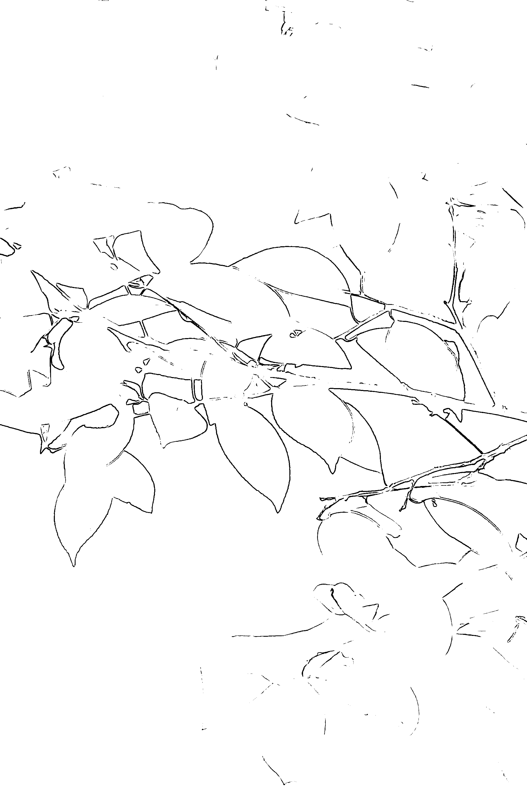

## 作者随笔

## 接受、給予、共享

痛苦常來自不接受當下的自我，而很多自以為很清醒的人根本不知道真正的自己是誰，只用向外追求的被愛感、知識或身份去量度自身的存在價值，更慚愧當下真正的自己，煩惱隨之生出。學習靈氣也是學習接受自己，學習接受那個可能陌生但真實的自己。

離開痛苦和得到快樂是生命的兩大核心原動力。

得樂的過程離不開施予，我們應該好好思索「給予」背後的真義。當人擁有豐盛，才有能力給予。而潛意識的意向影響著顯意識的行為，它們有互為因果的微妙關係，亦即相互成為其因，成為其果。如果你能在人生路上不停給予，並真正理解其意義，你就會不停的得到，就這樣你便能擁有豐盛的生命，因為他們是互為的因果。這種體驗不是用文字或影像能形容或解釋，而是要用時間去實踐和體驗。成年人常常教導小孩要和其他人分享自己的食物、玩具等，這種概念就像將擁有的美好分送給他人，令原本擁有的減少。所以，不是所有孩子都願意聽從，孩子心底裏弄不明白為甚麼要將僅僅擁有的分給別人。所以，我常常教導學生有關「共享」的概念，其實當我們施予時，自身擁有的並沒減少。就像黑房中有一百支蠟燭，用其中一支蠟燭燃點其餘九十九支，原本的那支蠟燭不會因此而熄滅或暗淡，反而會令整個房間更加光明溫暖。願更多生命能深深體驗共享、愛、知識、靈氣……

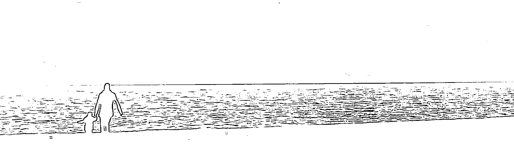

牵着他的手，一起享受接受、给予、共享的快乐。

## 我的可愛媽媽

如果問，我在哪一刻感到靈氣的實在？答案是，二十多年前我為媽媽做靈氣治療的經驗。

我的媽媽患有心臟病、骨刺及睡眠質素欠佳等老人病，她在六十歲時經常心絞痛發作，我帶她向心臟專科求醫，可是醫生說這是無法醫治的病，只能長期服用昂貴的藥物，但效果一般，媽媽每年仍有五六次痛得要在醫院留醫。

於是，我嘗試為她做靈氣治療，起初媽媽有點懷疑和抗拒，但靈氣是不用相信也不會影響效果的，經過數個月的治療後，媽媽的身體漸漸健康起來，心臟病及其他老人病症也好轉了。

媽媽現年八十五歲，已經停服心臟藥接近七年，我認為這是根治了，即所謂斷尾。我每星期為媽媽做一至三次靈氣治療，我甚至覺得媽媽因而變得比二十年前更健康可愛。媽媽是位樂天活躍的老婆婆，分別在八十及八十四歲時跌斷腰骨和右肩膀骨，當時我也擔心老人家一跌，可大可小。誰知，她在接受靈氣治療後，康復速度之快可媲美年輕人，分別在兩個月及八星期後便活動自如！醫院的骨科醫生竟然說媽媽的骨骼已自己癒合，完全康復和不用覆診了。媽媽頑強的生命力簡直讓我大開眼界呢！在我的靈氣修練旅程中，媽媽成為了我的試驗者。靈氣除了治療了媽媽的病痛外，也改善了我和她的深層關係。以往我覺得孝順、照顧母親是我的責任，甚至是負擔，在她離世後，我的責任便完成了。但現在感覺很不一樣，或許在靈氣治療的過程中，母子的親密關係也被連結了，我想我真的愛她。

後來，看著媽媽體型漸漸縮小，像變回小孩子一樣。時間的流逝使我們的角色轉換了。每天抱一抱、錫一錫、掃掃媽媽的額頭和手，使我充滿幸福感，就像嬰孩時代媽媽抱我，牽著我的小手一樣。因為靈氣治療是能量的交換，也能啟動體內不同的能量中心。位於心臟及附近的能量中心稱為心輪。而我健壯的媽媽顯現了從心輪啟發的愛。
媽媽，謝謝您為我示範了痊癒的奇蹟，讓我更加肯定靈氣治療的功效，認定這生該走的路。我很榮幸和感恩能成為您的兒子，您會常常在我的心中，共行：：：

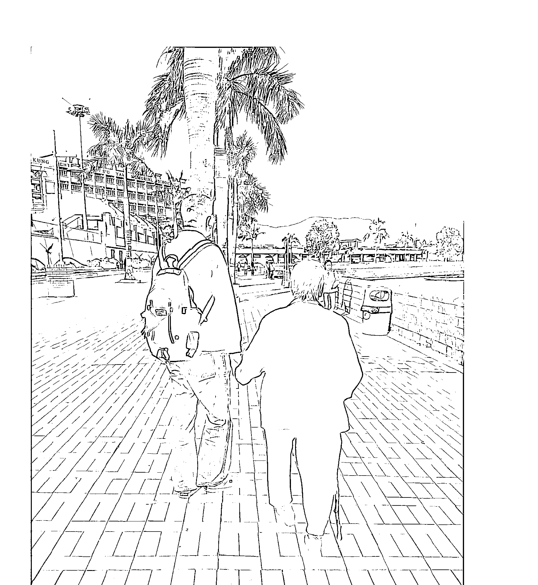

## 生命中的北斗星

> 愿你们带着真爱与灵气，照亮和温暖他人的生命。

大學社會系講師問學生：「你們知道作為一個社工的意義嗎？」眾學生的答案都是圍繞著很多偉大抱負，例如怎樣幫助貧苦、爭取社會公義、拯救低下階層等。所有學生看來雄心萬象，臉上散發光芒，活像救世者般。

講師聽後，很認真地說：「社工絕對不是一份散發光芒的工作，相反是很卑微、很渺小，渺小得像一粒沙，沒有人會看到，但當無數的沙聚合在一起，就會成為一條路，一條能引領人走出困境的路。」

有一個傳說，人在沙漠中迷路，只要望向星空，當看見最光亮的星，那顆便是北斗星，它能引領迷路者逃離困境。你可曾遇見生命中的北斗星？

各位朋友，你們是幸運的一群，能有緣接觸及學習靈氣。願你們帶著真愛與靈氣，不僅照亮自己，也照亮和溫暖他人的生命。

## 宗教隨想

最近聽到某宗教信徒指責某其他信仰者為妖孽，聽後不其然想起一件往事。

話說有日某人帶一位信佛朋友參見一位學佛上師，上師見到這位朋友後很高興說：「信佛很好……願你死後能往生極樂世界。」

其後這位朋友又帶一位基督徒朋友見上述的上師，上師見後亦很高興對這位基督徒朋友說：「信耶穌基督很好……希望你能將基督的愛發揚光大……」

最後這位朋友再嘗試帶一位沒有信仰的朋友見同一上師，看他有甚麼反應，當上師見到這位沒有任何宗教信仰的朋友後，同樣很高興地說：「沒有信仰，信自己非常好：願你能早日真正覺悟自我內在本性。」

各位朋友，看後有甚麼感想？

我深信世上有一種超越一切的愛，能生起無量的包容。

## 他她图中地的故事

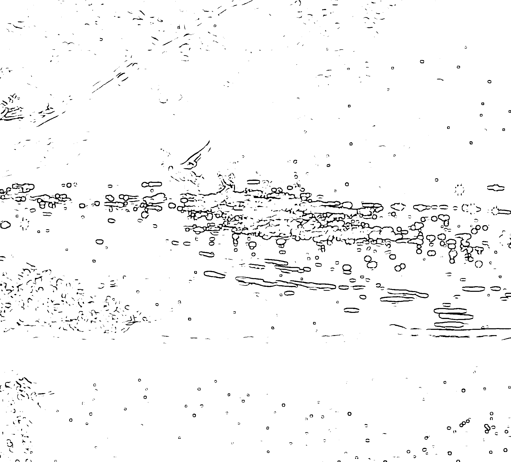

## 學習靈氣之歷程和感想

Ivy Yau
機艙總艙務長

緣際會下，開始跟隨恩師 Angus 修習靈氣。兩年多前，基於對神秘學充滿好奇，和希望在靈修方面得到提升，遂於因從前，在傳統和束縛式的教導下，使自己的成長道路似乎永遠要被動式的逆來順受。那時在想，人生道路就是要如此延續下去嗎？人生意義為何？因何要生於世上？人死後將何去何從？我對追求這些問題的答案的渴求，一天比一天強烈。終於有一天，從一些靈修書籍上，發現到了人生道路的丫口。那時才知道，主宰自己人生的正是自己。從那時候開始，來了一個人生改道，希望從靈性提升開始，進而掌握自己的命運。追隨恩師 Angus 學習靈氣的好處對於我來說，是不限於學習到靈氣的知識和技巧，反而是其擁有高層次的靈修技巧與修持。偶然在恩師某些特別舉辦的課堂上獲得一些靈修秘技，真是獲益良多。恩師往往提到飲水思源的道理，以孝為先，頗有「道」、「儒」的味道。經過一段日子的實踐後，例如經常給長輩們擁抱，發覺除了長輩們變得更開朗、我們關係更密切外，自身運氣還改善了少。恩師還提到消業積福不可少，要多行善事為眾生謀幸福。還有，每餐更要為口中第一嚼而感恩並迴向眾生。久而久之，覺得人也光彩起來。這等等也都成了我生命改寫的第二因了。記得學習靈氣的第一堂已教我深受感動。在接受恩師第一次靈氣開竅後，學員們都要自組配對互相授予靈氣，我就在被授的剎那，心中悲傷感覺不受控地一湧而出，還要向恩師索取紙帕拭淚。情況使我覺得很尷尬，後來才明白，這只是靈氣開竅後的二十一天清淨期內，其中的一個可能的好轉反應。而我只是反應過快而已。

在回家的當晚已迫不及待的為家人施予靈氣治療。當手掌放在家人的頭頂時，手掌就不其然的在其上旋動。後來，當雙手放在家人腎臟位置時，雙手更以高速的頻率在拋動，高速得連自己都感到恐慌。在極度恐慌時，能量便被截斷了。由此，我就對能量之學深信不疑了。相信那時是由於能量管道還未流暢所致，而現在已能揮灑自如的運用了。

各位學員對修習靈氣的目的都有所不同，有的為了改善關係、有的為了改善命運、有的為求心想事成，也有的為了一技旁身等等。

其實，靈氣不但能達到以上的目的，還能應用於生活上各層面。把靈氣加入於食物上使其震頻提高，可提升味道；送靈氣到植物，使其生長更繁茂；安撫嬰兒，使其安睡和情緒安穩；用於寵物上，牠與主人更親近；不用藥物，可減輕頭痛、失眠；於人煙稠密或烏煙瘴氣之地方，可用作護身防衛；對物件或家居作潔淨或淨化，如有時自己在使用公共衛生間前也會應用；為內在小孩送靈氣，更能改善細胞記憶，撫平過去創傷，幫助人生跨越前進；以靈氣技巧作為與高靈聯繫或連接的媒介。當然還有更多的應用技巧，多不勝數。主要在乎於修習者活學活用。人生要學習的課題是持續的，進步也將會是無限的，而靈氣就是一個不錯的工具可使步伐加快。靈氣就等如地球上其他的資源一樣，是宇宙給予的珍貴禮物，但靈氣的供應更是源源不絕、用之不盡的。靈氣治療是整全性的，因它所能療癒的層面包括了身、心、靈各方面。再配合靈氣五戒及其他靈性修持，將會在不知不覺中令人生進入另一個境界！

## 遠傳的力量

劉堅立
商人

在一次偶然的機會，我初次接觸到靈氣治療。不得不承認，當年自大的我實在對這個神奇的治療系統心存疑惑。靈氣簡單易用，而又威力強大，令我目瞪口呆，尤其是它的遠傳能力更加匪夷所思。心裏很疑惑，這些是否怪力亂神，又或是傳說中的「千里傳功」等等的傳聞？

於是，我翻遍書海，用盡了一切我能夠用的所有方法，試圖從文字之中找尋答案，可惜所找到的資料都解答不了我心裏面的疑問。最後，我終於明白到，如果不是自己親身去學習、去體驗這個神奇的治療系統，我是永遠不會找到我所想要的答案的。

幸運地，我終於遇到了一位優秀的靈氣老師，於是我決定學習靈氣，希望從學習中解開這些一直困擾著我的疑團，意想不到的是，通過學習靈氣系統，令我改變了自己一直以來對世界的認知，它令我了解到我們的存在並非單一的獨立個體，萬物其實是互相連結的，正正就是因為萬物的互相連結，所以「遠傳」的神秘面紗其實一點也不神秘。這個關鍵性的認知不單解答了我對靈氣的所有問題，並且更進一步地令我找到自我內心的平靜，因為我清楚知道，我們並不孤單。

關於靈氣的遠傳，我想分享一個比較特別的親身經驗。大約六年前，旅居美國的母親被確認得到了一個特別的腫瘤性病症，叫作胃腸道基質腫瘤(Gastrointestinal Stromal Tumour) 的惡性腫瘤。它是一種胃腸道間質層細胞異變的腫瘤，屬於類似癌症的一種，它同樣地有著擴散及轉移的特性。唯一與一般癌症不同的地方是，它不會令病者感到痛楚，這個亦是它不容易被及早發現並接受治療的原因。當年七十多歲高齡的母親冒著極大風險接受了腫瘤切除手術，幸運地手術極為成功，大家都滿心歡喜地以為已經除去了這個可怕的病症。可惜，一年前這個腫瘤又再復發，並且擴散的速度十分驚人，短短三個月內腫瘤成長到32cm。這個發展的速度，令美國這樣先進的醫學大國也束手無策！碩大的腫瘤已經開始壓著淋巴引起嚴重的水腫，再進一步便會引致其他主要器官急性衰竭，情況實在非常不樂觀。當時，我唯一能做的就只有用剛剛學會的靈氣遠傳技巧，在香港每天為身在美國的母親做靈氣的遠傳治療。當時心裏所想到的，是希望能夠盡力減輕媽媽所受的痛苦。如果只能做到這一點，我已經很心滿意足了。經過了大約兩個星期密集式的遠傳靈氣治療，出乎意料的奇蹟發生了，新做的CT掃瞄顯示出腫瘤的生長速度明顯的慢了下來，亦再沒有明顯的擴散跡象。雖然病情沒有即時好轉，但最起碼算是在沒有藥物能夠治療的情況之下，腫瘤算是暫時受到一定程度的控制。而在香港終老，一直是母親的心願，於是媽媽決定馬上回香港，並在那裏接受治療。經過了無數次進出醫院，終於決定採取一種原本用作治療血癌的標靶藥作為最後的治療手段。同時，我亦對母親作更密集的直接及遠傳靈氣的治療。經過了大約六個月的醫藥配合靈氣的治療，神奇的奇蹟再一次發生！最近的正電子掃瞄顯示，腫瘤從原來的17cm X 32cm縮小到現在的14cm X 25cm，並顯示出癌細胞的活躍度持續減低，腫瘤還有繼續縮小的跡象。雖然現在的藥物的副作用仍然會引起水腫，但肝腎功能及紅血球等的指數一直在滿意的水平。 醫生方面雖然十分奇怪藥物對媽媽這樣的八十高齡的老人家的影響竟然沒預期中的嚴重，但亦十分滿意腫瘤方面的明顯進步。 我從這件事了解到，人總是免不了離開，但如果能盡半分孝道，在所有能力所及的範圍內盡量減輕媽媽所受的痛苦，這個已經是上天給予我的最大恩賜。感恩我能夠有機會學習到靈氣，但願有更多人能夠接觸到靈氣，從而免於痛苦以及可以幫助到更多的人。

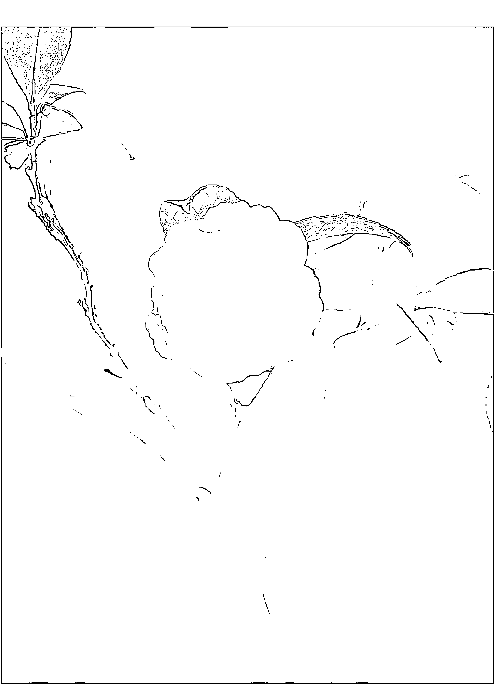

## 靈氣太極、太極靈氣

現代人流行說「身、心、靈」，古人說「精、氣、神」。個人認為是非常相近的概念。那麼，所謂「身、心、靈」或「精、氣、神」所指的是甚麼呢？大概是個人的身體、情緒、思想，明確一點便是身體機能、心理衛生、生活態度等。後兩者先不說，太抽象了。但身體健康卻是非常明顯，而且是每個人都想擁有的。

那麼，靈氣與太極有甚麼關係呢？為了體驗當中的異同，我先後修習了中式氣功、易筋經及太極拳。在修煉的過程中大有得著，並加深了我對三者的體驗。有練氣功的朋友大概也會認同，不同的套路所練的氣是相同的，只是功法不同。太極也包含氣功，這是我在練拳的時候非常能夠感受到的。練氣功的目的，是通過特定的動作姿勢去運動人體經絡以修復身體，並且修練心神，提升內氣及生命力。這過程非常緩慢，但非常有益身心，值得推介。

陳汝平

靈氣就是通過傳承能夠直接吸收宇宙的能量（其實道家也有混元氣的概念，相信也是非常類似的能量）。既然能夠很方便地吸收宇宙能量，補充自身的內氣的話，當然如獲至寶。發覺再以這氣練習氣功及太極拳套路時，內氣的運作更為明顯。相比之下當我生病或受傷後的復元狀況較之前明顯進步。

有關修練尚在進行中，希望各位都能獲得健康。

感恩。

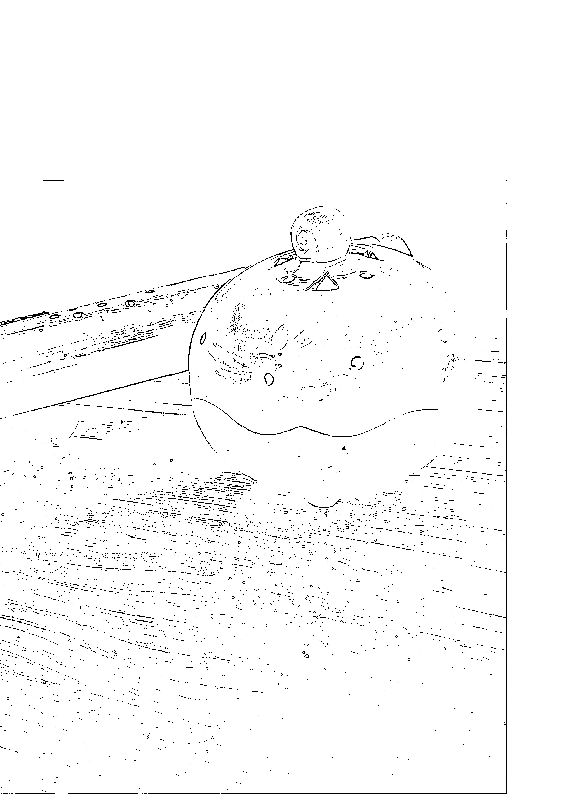

## 氣 · 定

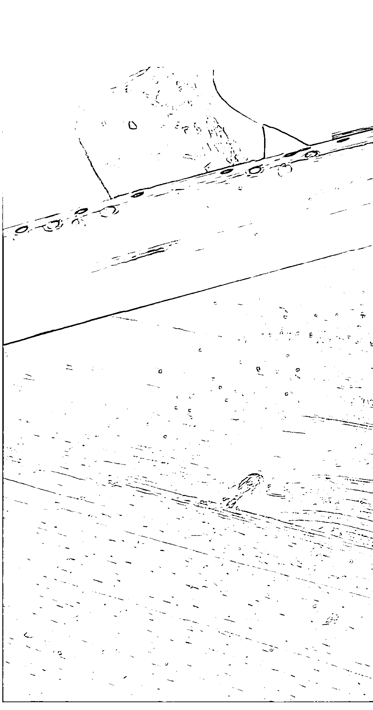

## 最年輕的 Reiki Master

### 學習回顧

不知不覺已學習了靈氣兩年多，回望當初接觸和學習都是出於好奇心。未上堂前，心裏會想「靈氣這東西很有趣」、「可以不用特別修練都用到能量做治療」等等神奇的事情。靈氣對我的感覺很特別，它細膩而親切，使用起上來方便、簡單、實用。這些應用手法和技巧都很適合都市人學習，很容易掌握，簡單易用，而且也有良好的效果。最重要是靈氣的應用層面很廣泛，身、心、靈、生活層面（例如心想事成、人際關係等）都會涉及得到。我使用靈氣通常都幫自己、家人、朋友做，平時處理的狀況不多，但是所有狀況都有不錯的改善。反而了解受者出現狀況的背後原因比較需要多點時間及經驗。

Billy Cheung 中醫學生

### 認識自己

自己會更覺察自己的身體狀態，因為自己的思想和言行會直接或間接影響到自己身體及周圍身邊的事物，不論自己看得到與否，這點我是相信的。在很多領域的學說，都會提及人的身體是小宇宙，外在的環境是大宇宙，互相影響，這點我是體驗過不少，所以很相信這點。通常身體不舒服，我都會留意脈輪的相應位置，繼而留意相對情緒及最近行為，不知不覺間藉著靈氣更認識自己的性格。所謂「知己知彼百戰百勝」，知道自己的長短處很重要，所以時常要調整自己。

## 轉化自己

面對情緒，傳送靈氣能量到適合的位置已經能夠做到很理想的平衡效果。然而，當情緒出現時，我都會觀察自己情緒在身體的去留，調整自己的思想，平心靜氣地過生活。

其中Angus老師教導的靈氣理念『正氣正念，最高利益』，可以說是我很實用的座右銘。比如遇上很難作的決定都會問問自己的目的是否純正，符合最高利益。這可能對於我身邊有選擇恐懼症的朋友，應該會幫助自己為自身做一個好的選擇吧。

感謝遇上對於自己能夠有機會學習到靈氣，很感謝Angus老師的教授，簡單直接的教學模式，而且配合他曾遇上的個案分享，更令我們學習更為容易吸收。有時，課堂會帶出有些有趣的話題、玩意、治療工具給予我們接觸，對我有種擴闊視野的感覺。

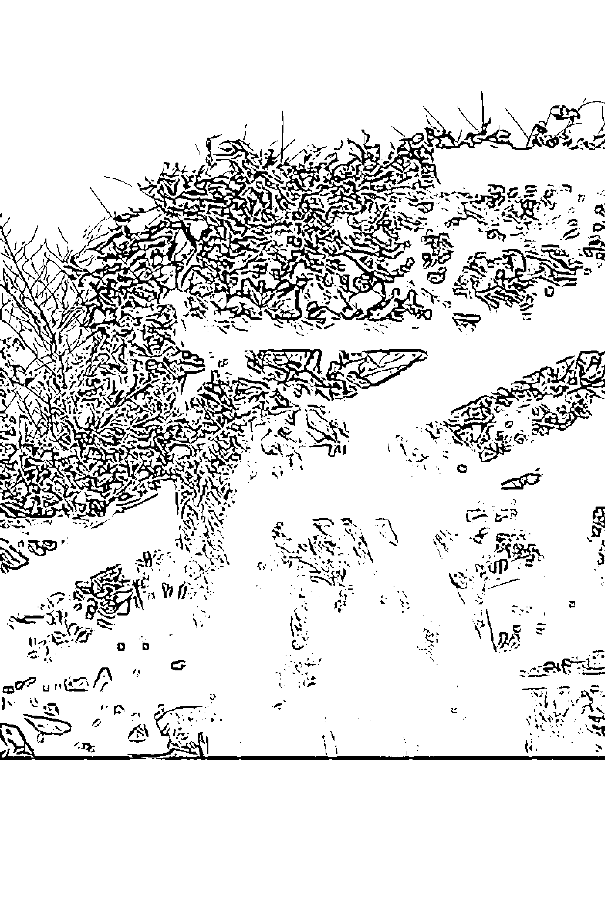

珍惜・感謝生命導師

Joyce
事務律師

一位好的老師/mentor，不只「傳道、授業、解惑」，也會讓你更認識自己，啟發引領你走上合適自己的道路。可能你會問，誰不認識自己？我反而覺得，外在世界的資訊聲音太多太雜，旁驚瑣事紛至沓來，其實我們沒有機會與自己相處，聆聽內在的聲音，了解自身愛惡需要，清楚甚麼才是適合自己，明白哪條路才是自己的「道」。

二零一一年，經朋友介紹，到Angus處學習白井靈氣。上課後幾天，忽長濕疹，傳統西方醫藥未能根治，明白這是一次排毒——身體上、情緒上的毒素。

後來，除了跟Angus學習不同派別的靈氣之外，也找Angus做個人諮詢private session，至今已兩年。

一位好的老师 / mentor，不只「传道、授业、解惑」，也会让你更认识自己，启发引领你走上合适自己的道路。

这两年好像一趟旅程，Angus 幫助我認清及正視自己的問題，尋找處理解決的方法出路。在過程中，Angus 除了是一位治療師，也是一位輔導員，更是一位教會我不少處世智慧的 mentor。兩年下來，改變不少，當然還有不少要學的事情、要做的功課、有待完成的課題 unfinished business，但慢慢地感覺到自己的各種變化。境由心生，心境想法改變，外在世界自會作出相應的回應。有時候我想，如果沒有遇上 Angus，我在人生道路上定會錯走更多的冤枉路。

感恩上天讓我遇上了 Angus 這位老師。如果人生是旅行，希望更多的旅客有緣在旅途上遇上合適自己的老師。因為，他會指導正確的方向，讓你一路上更能欣賞玩味沿途所見所聞。祝願各位早日到達各自的目的地。

## 靈氣治療的利益

Leanne 律師

二零一一年一月，第一次聽到靈氣這個名詞，是在一個網上電台節目，當時的節目嘉賓就是Angus。節目中，Angus講解甚麼是靈氣，如何做治療，還有靈氣的「氣」和氣功的「氣」的分別，得知靈氣是一種遠古傳下來，簡單、有效又不需苦練的自然療法。我就是被這套簡易微妙的療法及理念吸引，毫不猶豫地立刻報了Angus開辦的白井靈氣的第一級課程。怎料到這是一份我送給自己最珍貴的禮物？現在回想真的很感恩有這次的緣分。

從來，我們的行為和思想都只專注於外在，有形的世界——理所當然地，只認知我們看得見的東西，只活在肉眼可見的世界，而忽略那個主宰一切人和事的無形世界。在這個世界上，我們眼睛看不見的東西，威力其實遠勝看得見的東西。世上萬事萬物都是由能量組合而成，能量是一種振動頻率，它的多少、分佈、正負，都會影響所有人、事、物運行得平衡與不平衡。這個自然法則是不難理解的，但真真正正感受到「實實在在」來自大自然的能量是在第一層的白井靈氣一級開竅之後。當時掌心初次感受到源源不絕的能量流動，真正感受到人和宇宙萬物的接近——兩者是連結着的一個整體，因為在能量層面上它們是沒有邊界的，這些覺察都是一個小小的開始。

學了靈氣後，家中的寵物也得益不少。動物同樣是宇宙的能量體，同樣有各個能量區域——輪位，同樣會因環境而影響健康和情緒。而且，動物比人類敏感很多，牠們很容易感受到主人的能量和情緒，亦深受其影響，所以很多時寵物的行為就是反映主人能量的一面鏡子。和動物做靈氣，可以透過平衡牠們的輪位而促進牠們健康和生命力，做法基本上是和平常的沒有分別。

從經驗，動物大部份是十分享受這種治療的（通常牠們會特別靜下來乖乖地躺下不動），而且牠們的接收能力比人快很多，一般的病痛不適都會很快會見效。記得有家中十八歲的西施狗因患眼疾，使左眼不斷脹大，因為年紀問題，加上是眼部的緣故，根本不可能和牠動手術。只是和牠做了一次靈氣，驚訝地發現牠的左眼很快回復正常狀態，效果非常明顯。之後每當感覺牠稍有不適時都會幫牠做靈氣。當然，雖然這在治療疾病上是一種輔助療法，雖然效果很多時意想不到地好，但並不代表可以完全代替獸醫的專業治療。

靈氣不單可以令人回復身體原始的平衡機制，還可以滲透到其他層面，漸漸地喚醒深層意識與內在智慧，甚至提升心靈的層次。從初級課程到大師級課程，這兩年間，Angus教的不單是靈氣，還有涵蓋甚廣的各種人生智慧。從Angus身上得到的各種啟發，不知不覺間對我產生了深遠的影響——意識和觸覺擴展了，看事物的角度和層面不同了，外在的人和事亦相應地有很大的轉化。現在的我更清楚人生的本質，更懂得掌握人生，夢想和命運，在此萬分感激 Angus 傳承的一切。

## 我的愛犬

## 「靈」的分享
Maggie 空姐

當初接觸靈氣的原因，和「靈」有關。大家不要想歪了，我只是希望接觸和身心靈有關的東西，而靈氣便正正提供了一個很好的學習機會。在朋友介紹下，認識了靈氣和大師 Angus。在這裏和大家分享一下靈氣的好處，那真的可以令到人變得健康及美麗。

若真的遇到身體不適，可即時得到緩和。而當中印象較深的，是來自治療別人的經驗，他們的良好回應是我對靈氣的信心加強的原因。

對於心靈方面，靈氣可幫助淨化身體和平衡體內能量，使自己心情比以前更平靜、愉快。

理論配合實習，再加上歡樂的學習氣氛，大家似乎都很享受堂上的學習。Angus 擁有豐富的教學經驗，大師親切的教導使學員能更明白所教授知識，不知不覺大家也和他建立信任和友情，有空時，大家亦會一起來個聚會，再交流一下心得。透過靈氣，感受了宇宙萬物之間的神奇連繫，明白天地人之間的確密不可分。我相信精神引導健康，而靈氣的優點在於，不只照顧你的身體，亦照顧你的心靈層面，在我看來是一門醫療藝術。不懈的學習精神永遠是人類進步的動力，而新事物亦在等待大家去發掘。希望身心靈都健康的你，把握自己的生命，來一起學習，提升生命的素質。

## 平靜·快樂

## 奇妙的旅程

第一次認識靈氣是在一班五天尼泊爾航班，身體如常那般不適，可能是尼泊爾的高山氣壓吧，胃痛、左手痛……已經不是第一次了！艙務長 Connie 剛剛學完中級靈氣班，她見我不適，仁慈的她幫我做了治療（直接及遠傳）。她用手掌放在我的痛處，然後感覺到一種力量從她手中傳到我身上。當時感覺很奧妙……令我初次認識及感受到 Reiki。經過今次，我對 Reiki 着迷了……回家一直找尋 Reiki 的資料，可能這就是所謂的緣分吧！學習 Reiki 對我的身心得益很大！因為我身體欠佳，常感疲累，看醫生多得醫生也成為了朋友的程度……當學習了 Reiki 之後，發現原來身體的不適跟 Kathy 空姐底層有關，慢慢開始就好自然地改變⋯⋯現在生活改變了，常會自然地把手放在自己需要的位置上，心想有痛醫痛，無痛補身啦！心情大變，因為有救，自然開心啦！不知幾想身邊所有人都一齊學⋯⋯最令我感到安慰和神奇的，是我媽媽在兩個月前中風後的迅速康復。接受我的靈氣治療後，媽媽已經能夠如往常般步行和說話！上靈氣課的時候，右手一直有痛楚感覺，Angus Sir 幫我尋找原因，感覺到他的用心！我現在痛楚沒有了，多謝你！現在我上堂我都加倍留心，希望不會學漏，不過課堂真的好精彩！心懷感謝！

謝謝 Angus 老師的引導，讓我開展了奇妙的旅程。

## 當靈氣遇上精油

Kapo Lam

我是醉心於靈氣與精油的母親，在日常生活中，愛用靈氣，也愛用精油。

兩者沒有誰高誰低，也沒有誰比誰更勝一籌之分。我十分感恩能有緣在同一段時期接觸和了解這兩種不可思議的能量，從而找回自己。

也同時被這兩種能量喚醒我的內在小孩，告訴我：生活了三十幾個年頭，內在的委屈、傷痛、無助、不安、放棄、和不斷否定自己的真正原因，是源於我在母體時所發生的事情。

我一家有八兄弟姊妹，小女排行第八。我在有意識的歲數時開始，大姐姐已經不厭其煩地重覆又重覆告訴我一個真相：“媽媽在懷着你六個月時仍然猶豫是否應該把你打掉。她說養七個小孩子已很吃力，再多一個怕負擔不了。若不是姨姨說服到你媽媽把你生下來，阿寶你根本不存在這世上！這是我一早直到某天在靈氣三級的課堂上，Angus 跟我們做符號能量開竅。當他把符號畫在我手掌心時，我的眼淚同時間像關不掉的水喉一樣流出來。為何會這樣？我當時感覺不到有甚麼事情需要我傷心的，但眼淚沒法停止的滴到褲管發了三十幾年渾沌的夢，現在是時候知道你活到這一刻依然迷惘的原因。當開竅完畢後，我打開眼睛的同時，像在夢中被人叫醒似的，告訴我：你到靈氣三級課程最後一堂上，Angus 教我們把靈氣傳給自己零歲的內在小孩（在子宮期的自己）。怎麼攪的，才剛剛畫完符號，把雙手合在小娃娃上時，眼淚又滴到褲管上去，十五分鐘內沒停過，感受到從來未曾感受過的悲哀，是一種「為甚麼沒有人愛我？我好寂寞，好孤單」的感覺。

這經歷喚醒我，潛意識裏有著自己「不值得被愛」的信息，是來自我在母體時已「不被母親所接受」開始。媽媽這種信息和情緒，隨著血液帶到我身心靈內。而我帶著這二手情緒來到世上，這些感覺不由自己主導，卻潛藏在自己心靈深處，影響我的言、行、思維，就這樣帶著「它」去過每一天。直至碰上靈氣，把深深沈積了一段長時間的問題帶回表面，讓我有機會再次面對自己，接受自己，更深入了解自己，以至有機會轉化自己。曾經去過一間精油公司創始人的講座，聽他講解精油的能量為何有如此神奇的治療功效。他說：「植物種出來後是否適合被提煉成精油，而這些精油的純度能否達到有治療效能等級的嚴格標準，取決於幾方面的元素。首先是從種子的選擇開始，到農地的選擇，土地酸鹼值的控制，收割農作物的日子、時間、過程，提煉精油的爐和機器，以至精油樽蓋被密封為止，製造過程依然能保持精油的生命力，完完全全把植物與生俱來的治療能量用到我們人體身上。這是神製造植物出來送給人類的寶貴禮物。」這創辦人強調了一件事情——若是想能提煉出最好的精油，首先要的是一粒好的種子。而種子生長出來的根越是強壯，越能長得深入泥土裏，越能吸取泥土的營養，種子長出來的植物便更有生命力。我每次把精油塗在身上，都能感受到跟大自然的能量接上軌道。讓精油的能量調整我失去了平衡的頻率，令我身心感受到和諧、平靜和愛。在尋找回歸自己生命的道路上得到支持和幫助。在我心中覺得，靈氣和精油都是來自同一個源頭——由善念的種子開始。而把這兩種能量和神創造的恩物傳授給世上的每一個好人老師也稱得上是聖賢。中國字的形成也蠻有意思，「聖」者，乃是一位用「耳」聽八方，以「目」認清真相，其「人」在「土」上實踐他的所見所聞，最後以「口」相傳給眾生受用之賢者，此乃「聖賢」也。感激在人生旅途上遇到 Angus 這位好老師，也感謝世上我遇過的每一點滴。

Directions: apply to skin. If you are pregnant, nursing, have a medical condition, consult your physician before using. Keep out of reach of children.

Directions: Dietary supplement - 3 drops daily or as directed. For the most benefits use 3 drops daily. Aromatic Diffuse up to 30 minutes.

## 超級過敏人

佩詩空姐

在那年黃葉與初雪之間，我展開了人生中難忘的個人旅行。旅程中拜訪了日本京都的鞍馬山，即白井老師當年體驗靈氣之地。由於初冬，上山纜車已經停駛，起初真有放棄上山的念頭，此時卻望到前方有位被攙扶着登山的老婆婆，心感愧然，於是鼓起勇氣徒步登山。因此，反能慢慢欣賞沿途風景，更被百年樹齡的參天杉木包圍着，呼吸着清新空氣，彷彿經歷了大自然的靈性洗禮。坐在「木之根道」中長長的椅子上靜思，不禁回想起學習靈氣之前的我……

我自小體弱多病，是一個超級過敏兒，患有皮膚過敏、鼻敏感、哮喘等。

小時候我常常進出醫院打針和吸哮喘藥，吃着各種顏色的藥丸、藥水。記憶中的小學生活沒有汽水、薯片、冰條、體育課等快樂片段，而是白粥、梅菜瘦肉、書本和鋼琴。

到了十二歲後，開始有荷爾蒙性的偏頭痛、失眠和胃病。每天就在各種不輕不重的病痛中打轉掙扎，苦不堪言。長大後不知怎地選擇了天天笑臉迎人、吃無定時、睡無定時的工作。漸漸地，身體細胞都負荷不了，病症也日益嚴重。雖然尋遍了中西醫、自然療法、古老療法等，但效果也不太顯著，我還是與各種顏色的藥丸為伍。

這位就是我在日本京都鞍馬山下遇到的婆婆，使我我也鼓起勇氣徒步登山。

直至我跟隨 Angus 老師學習靈氣之後，才慢慢看到曙光。當時我帶着姑且一試的心情踏入靈氣能量中心學習，想不到得着那麼多。猶記起第一次接受開瘺後，我的皮膚敏感發作，臉龐和眼睛也腫起來。老師和同學也不認得我是誰。然而我這超級過敏人也習以為常，開瘓爲甚麼會導致敏感呢？莫非是聽說的好轉反應？當時我跟着 Angus 老師教導的各種方法，每天做靈氣保健治療、特定的部位治療、靜坐等，症狀漸漸減輕。在學習高階靈氣課程時，我在接受開瘓後，竟然流下憂傷的眼淚！是那種在心深處哭出來的憂傷眼淚？老師請我好好想一下，是甚麼讓我委屈和憂傷？經過連串的靈氣治療和靈修後，我終於走出了情緒風暴。感謝 Angus 老師的帶領，使我回顧了前半生所走的路，確定了下半生應走的路。現在，我已經不用每天吃抗敏感藥，偏頭痛的程度也大大減輕了。以往從沒想過偏頭痛和敏感的原因與源頭，謝謝 Angus 老師不單傳授了靈氣治療的技能，還引導我使用各種最有效的工具去探索，解開問題的根源死結，尋找病源！現在各種病症整體都得到很大的舒緩，也更懂得和自己相處，聆聽自己的聲音。

在參加成為靈氣導師的靈氣大師級課程中，Angus 老師除了傳授各種開發的外在技巧外，更着重於傳授治療師的操守、對生命的了解與態度、大自然的恆常法則等，讓我更加確定自己的人生使命，穩固了我服務眾生的心願。

就在鞍馬上當下的那一刻，我立下宏願，要將光明和希望帶給在痛苦中和幸福中的人們。此時突然風雲變色，下起雨來，心知此路並不易走，既然立下宏願，也就全心全意，努力走下去，就算只有一個人能看到光明也是值得的，因為他一人的光明不僅照亮他自己，也可以照亮他身邊的人們。

由於尾班巴士已開出，纜車也停駛了。最後我在風雨中獨自步行數小時下山，我知道風雨始終會過去，晴天總會歸來。然後風雨又在不知不覺之時再次來臨，同樣地晴天也會微笑等候。

> Angus 老師常說：「生命與靈氣的流動，就像行雲流水。」

那麼我願行雲與流水，將希望、快樂與愛送到世間所有有情，謝謝。

## 日本京都鞍馬山一景

## 後記

緣分有如天空浮雲，聚散無定。世間所有的事物，也有完結的一刻，所以我們要學懂感恩及珍惜所擁有的。

我們要學懂感恩及珍惜所擁有的。

在編寫此書的過程中，令我更加反思生命的真義，對世间的責任。你們在書中不會看到坊間眾多靈氣書籍的內容如各種手位或符號資料等，煽情催淚的情節也是欠奉。因為我希望此書帶給讀者的訊息，是運用靈氣帶給自己及家人更美好的生活，更重要的是對生命意義的反思，不讓自己離開時感到遺憾。

最後要真心衷心地懷着感恩說聲：「多謝多謝！」

# 靈氣REIKI。生命的療癒

- 作者：陳邦平
- 編輯：Charade Yip
- 設計：4res
- 出版：紅出版（青森文化）
- 地址：香港灣仔道 133 號卓淩中心 8 樓
- 出版計劃查詢電話：(852) 2540 7517
- 電郵：editor@red-publish.com
- 網址：http://www.red-publish.com
- 印刷查詢電郵：gary@hklabel.com
- 香港總經銷：香港聯合書刊物流有限公司
- 台灣總經銷：貿騰發寶股份有限公司
  新北市中和區中正路 880 號 14 樓
  (886) 2-8227-5988
  http://www.namode.com
- 出版日期：2014 年 6 月
- 圖書分號：生命療癒
- 國際書號：978-988-8270-85-9
- 定價：港幣 78 元正／新台幣 310 元正

本書旨在提供有關靈氣的資料。本書（包括其任何內容）、其作者、以及其編印人員不旨在提供任何形式的診斷、意見、建議或治療，亦不旨在取代醫生或其他醫護專業人士的醫療診斷、意見、建議或治療。如有任何疑問，或須尋求任何形式（包括但不限於任何專業或醫療）的診斷、意見、建議或治療，請諮詢醫生、其他醫護專業人士或有關專業人士。