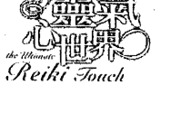
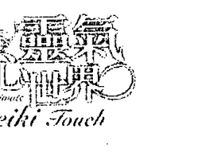
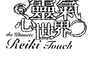
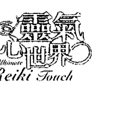
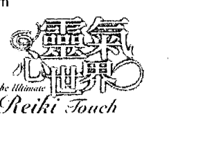
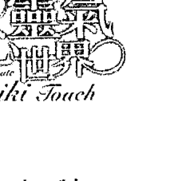
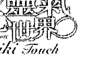
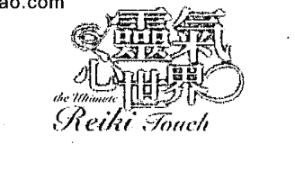

Health Seed 健康种子28

# 靈氣心世界

# the Ultimate Reiki Touch

以撫觸與覺知開展生命療癒

《靈氣108問》、《靈氣為你帶來豐盛》的姊妹書，幫助你體驗自己和宇宙生命能量間的關係，成為畢生修持靈氣、療癒自己及他人的可靠指引。

寶拉·賀倫博士著 Dr. Paula Horan 胡澤芬譯

## St. Royal College
天使神秘学院

- 专业占卜预测机构
- 神秘学培训机构
- 水晶能量研究中心
- 官方淘宝：http://strc.taobao.com
- 官方微博：http://weibo.com/715104687
- 新书发布QQ群：316790219
- 购买更多好书请联系院长大天使

大天使
天使神秘学院 院长
QQ：715104687
手机/微信：13641926204

微信公众平台：strc2011

## 制作说明：

本书由《天使神秘学院》出重金从台湾购入的原版书籍扫描制作完成。为达到最好阅读效果，特地把原版书全部切开后，再经由专业扫描设备高精度扫描完成，并经过一张张的PS后期处理最终成书，其间花费大量的人力、物力以及时间，只为能给大家提供经济并优质的神秘学学习资料而努力。

本学院强力谴责某些机构和个人，把本学院花心血制作完成的电子书籍，包装后直接放在自家淘宝网上低价倾销的行为，以谋取不劳而获的经济利益。如果长此以往最终将无人愿意再为大家花心思制作电子书，那以后可能大家再无新书可读。

为让大家以后能够读到更多的好书，也为了本学院的良性发展。

本学院恳请大家尽量做到如下几点：
1. 尽量在本学院的网站购买电子书籍。
2. 请勿用技术手段把电子书内的水印及加密去掉。
3. 在收到电子书后小范围传阅即可，千万不要公开传播，更别挂到淘宝网上低价销售。

同时为答谢广大支持者，学院电子书将做如下调整：

1. 学院会把一些早已收回制作成本的电子书折价销售。
2. 最新制作的电子书籍会开放打印功能，大家购买后有条件的可自行打印成书。

天使神秘学院
2017年6月

# 靈氣心世界 the Ultimate Reiki Touch

以撫觸與覺知開展生命療癒

寶拉·賀倫 博士 Dr. Paula Horan 著 胡澤芬 譯

## 目录

1. 致謝
2. 推薦分享
3. 本書介紹：治療者的自我修持
4. 前言：自我探索練習的建議
5. 第一章 動機
6. 第二章 啟蒙
7. 第三章 簡單
8. 第四章 承諾
9. 第五章 愛
10. 第六章 覺察力
11. 第七章 觸摸
12. 第八章 靈氣第一級——治療身體
13. 第九章 靈氣第二級——治療心智
14. 後記 靈氣第三級——倒掉空杯
15. 關於作者

谨将本书献给臼井先生，
感谢他指引明途。
还有那拉扬，
感谢他灵性诗文的分享。

## 致谢

本书要献给臼井竜男先生，是他让一切得以实现。尽管我们素未谋面，彼此间却有钟爱与承诺的情谊，跨越了想象中的时空界限。对有心的灵气修行者而言，臼井先生已成为他们生命中重要的一部分。透过他的遗教，他以理智、中庸而慈悲的声音直接对我们说话。我永生感念这位亲切和蔼的先生，为世上这么多人带来疗愈和转变。

对臼井先生感激之余，当然也要谢谢我的灵气师父凯特·娜妮（Kate Nani）引我入门。多谢凯特认真高明的教导，传授灵气精髓，灵气才能成为我选择的人生道路。

还要感恩我的金刚上师。我有缘在彭加师入定后不久遇见上师，他以恰如其分的谦逊和幽默，体现不二的智慧与慈悲。我的金刚上师教我修法的真正意义，让彭加师播下的种子开花结果。

对于那拉扬为本书的贡献，我有说不出的感激。他不只为本书增添启迪性灵感的美妙诗篇，也不吝提供编辑技巧和衷心的建议。这本书从开始到最后完稿，他再次全力支持我。他从不强人所难，却又会苦口婆心地坚持必要的修改。

感谢出版商薛卡（Shekhar）和普南·麦贺卓拉（Poonam Malhotra），激发我写作本书。一九九八年十一月某天，薛卡打电话给我说：“宝拉，你从没写过有关灵气手位的书，要不要就这个题目出书？”这个种子引我进一步探索，有哪些特质是灵气原本具备却又需要加以培养，才能以健全又有益的方式表现宇宙生命能量。薛卡和普南是作家梦寐以求的出版商，他们一直是灵感来源，而且非常支持我。

我也要感谢好友蓝吉（Ranji）和普拉玛·班达里（Prama Bhandari），在我途经德里时，总是敞开家门和心房欢迎我。我们之间的特别情谊在于两人都热爱各种形式的自由。普拉玛也是灵气师父，我很敬重她。她面对世事认真睿智，从不莽撞行事，而且总是带着宇宙生命能量赋予的真诚坦率。

万分感谢我亲爱的结拜兄弟尤金德·奈柏（Joginder Nagpal）和他的家人，我和他们欢度许多时光。最后还要感谢我为数众多、不及细数的亲朋好友，他们在世界各地，一路上招呼和支持我。没有他们，就没有这本书。

## 推薦分享

灵气人生导师
柯佩如

在我从南非到台湾的教学历程中，如同宝拉一样，亲眼目睹许多受身心创伤所苦的朋友，在接触灵气后，恢复昔日的笑容，整体的精气神也都跟着回来了。当一个人打开封闭的心门，深触爱的核心，眼神自然会流露出童真，看这世界什么都可爱！就如宝拉所说，灵气就是那么自然、简单，我们的存在就是灵气的本身！我们愈用灵气，就愈能敞开接受所有生命具足的能量，接受我们的真正面貌：爱！

灵气虽然只是教导传递疗愈的管道，但它的内涵确实是博大精深！灵气学习者应该将灵气的“技”，提升至“道”的层次，才能真正的窥到灵气的全貌。灵气技术的本质要与形而上哲学融合，两者要互相搭配，缺一不可。这就是作者宝拉想传达的灵气的要诀。

当一个人愈能了悟灵气的真谛，就愈能体验到存在的喜悦！这是一辈子的修炼，在无形中不断的自我提升，拓展自己的意识层次，找到自己最终的力量源泉！灵气不仅可以疗愈别人，也能疗愈自己，更能让人进入崭新的境界，当你内在开始触动，你就开启了那新的旅程……

安达卡拉那工作室负责人 陈……

当尘世中的我们累了、倦了、忧伤了、想哭了、惊醒了、茫然了、病着了……是灵性之光希望用爱净化我们，让我们可以重新忆起与再次回到出世前的光明自身之时，它就在我们双手之间静待我们启用，打开我们的双手，与宇宙的光与爱相连，为我们的人世生活一次次蓄满丰盛的滋养。

生命中每刻每秒所有发生的一切，自有其特殊的意义与目的，这些意义与目的，无一不是为了铺陈我们寻回我们的灵性故乡而来，无一不饱含我们灵魂故乡的造物者对我们无条件与无尽的爱。

于今回顧成为一位灵气工作者的前十年里，我因为外在生活而引触内在的驱动，开启了探寻各宗教心要经典的因缘，古经文的浩瀚与深义，因而为我今日从事能量工作播下一颗既美丽又坚实的种子。愿此道而行，更感知到宇宙之爱无所不在，即使在我们觉得最黑暗、最没希望的时候，宇宙之光从未有片刻远离过，只待我们仰头、聆听，双手熨贴心胸回答一声：是，我在这。

## 推薦分享

许多痛苦之身在生命能量最低谷处，一脚踩进了灵气的大门，没料想这一进门，却开启了生命逢低转进的一连串惊喜之旅。灵气以无边无量来自宇宙神圣本源的慈悲，抚触了所有一心一念探触生命真相的灵魂；开门见山，灵气以一连串不可思议的启蒙仪式，揭开了我们与万物同在的无明面纱，犹如大海涵养一切也纳百川，灵气接纳涵养了所有挣扎在制约幻相边缘中的众生，以超越种族、信仰、文化、语言的无量形式，允许每一个人以他当下的样貌如实开展，并运用这与生俱来的无穷智慧能量疗愈自己与所有生命。就在每一个动念，行住坐卧皆自在的持修中，灵气如是展露了安住在当下的心的品质：和平、接受、寂静、慈爱、平等、自由所有不可言说的奥秘。在宇宙法则施即是受的纯净管道状态下，灵气循序渐进，直指核心的温柔抚触，轻易松动了长久禁锢身心的模式，让你远离颠倒梦想，直证万有合一的菩提光明觉性。作者谆谆阐述的灵气博大精髓，与落实习修重默，我十分乐意推荐此书，愿此书的问市，能引领更多的人受益于灵气的福佑，而扩展生命无限的潜能。

灵气静中心灵气导师

## 本书介绍——
### 治疗者的自我修持

灵气的用途是疗愈。这是种极其简单实用又非常有效的放松方式，可释放压力、减轻疼痛，进而恢复活力。不管是身体或情绪的病痛，都能用灵气治疗，包括抑郁症在内。这二十年来，我大半时间都用于分享和教授灵气，而且教学地点众多：美国各地、哥斯大黎加、冰岛、德国、瑞士、匈牙利、法国和印度，只是其中几个。这大部分的地方我已造访多次。二十年来，我的人生是漫长的旅程，虽然有时身体疲累，但整体而言却是令人振奋鼓舞，而且似乎还在延续，没有止境。这旅程会通向何方？还会出现什么奇迹？只有等时间来揭晓。

这趟旅程最棒的礼物，就是我一路上遇见的人，有缘能有无数交心的相遇。

我何其有幸，能接触许许多多美好人们的生命，也同样被他们触动，因为灵气让我们更深入其寂静又有活力的疗愈存在。

我见到大多数人住在小小的防护罩中，每天例行地工作糊口，常常不知道自己何其有幸，能接触许许多多美好人们的生命，也同样被他们触动，因为灵气让我们更深入其寂静又有活力的疗愈存在。

己内有着多么丰富的资源和启发。由于教授灵气时我必须聚精会神在别人身上，敞开自己完全接受对方，现在我知道几乎人人都有无比丰富的爱与智慧，只是常被隐藏起来。这些宝藏藏得太隐密，大多数人根本没想到自己坐拥金山，却还如奴隶般，在日常例行公事的壕沟中挖铁矿，向自身之外追寻幸福。

《灵气心世界》正是为此而写。英文书名The Ultimate Reiki Touch是指人类的能力被触动，以许多不同方式体现。我们能在身体、情绪和灵性层面被触动。

灵气能支持并帮助我们品味这形形色色的触动，最终转化成内在平静的深刻感受——自由的至高触动。在得到最初的灵感后，我写作此书只有一个用意：分享自我探索的看法和工具，让读者得以看见他们其实坐拥金山，也就是自己的生命和生命能量。

诚然，灵气的用途是疗愈。但是谁在疗愈浑然不知自己受苦原因的治疗者？是谁在帮助治疗者疗愈他们过去的创伤？是谁在鼓励治疗者踏上充满收获的疗愈之道，直到抵达早已存在、只待人发现的至高自由？是谁点出内在之美？是谁在培养敏锐度，帮助觉察力的专注？是谁在强化动机？

当然是灵气，但灵气需要肯接纳的人。我们的内在声音是宇宙生命能量智慧天生的发言人。但要内在声音帮助我们，我们就必须能敞开倾听，而且要比所谓理智和制约的声音更清楚。我们受到制约的头脑会一味重复同样老掉牙的模式，破坏疗愈。当然，那都是出于一番好意——“我执”不是最懂事的吗？

《灵气心世界》旨在强化感知力，让我们能听见内在的声音。就如英文副标题所言：启蒙和自我探索的疗愈工具。要成为治疗者，就要能坦然接受人生各种事件，在我们每日生活中发生，带我们进入表面下更宽广的实相。我们要体验本来的自由，就必须探究内在：我们的想法与情绪、批判与意见、感受和直觉。我们必须学会让这些无常的面向顺畅流过身心，既不抗拒也不认同。

基于这个目的，《灵气心世界》演变成一本以练习为主的书，有许多练习，并穿插许多方便的提示，可做进一步的自我探索。本书要能发挥最大助益，就是把书当成手册，照表操课。这些指示不会告诉你该怎么想、感受或觉知，而是帮助你注意既成的面貌。这些指示告诉你如何进行，以充分感受目前可能还有些模糊不清的东西，或是清楚觉知到那些隐而未现，因此能操弄并塑造你人生，你却毫无所觉的一切。

书中也以插图详细说明灵气疗程使用的手位。并透过许多例证，探究第二级灵气无穷潜力的真正奥秘。就和所有秘密一样，主要的奥秘在于行为本身。但正确方向的指引会有助益，正如误导的指示会阻挠我们的努力，让我们偏离正途。

简而言之，我写这本书是要和读者分享一些工具来疗愈自己，成为我们原本就是的完美治疗者。这不是说大家都要替全人类做触手治疗。虽然那会很棒，但这得大家觉得能无拘无束到足以敞开心胸，接受以这种全球规模来分享爱与生命能量。不管怎么说，如果我们在人生过程能成为更清醒、健康而安定的个人，自然就能对就近的周遭环境带来充满疗愈的影响，并间接影响整个世界，这个趋势需要予以支持。

在我们内心深处，感知到这种绝对超然、更广义的实相，但这并不表示就能放任现有的疯狂肆虐世间，还有我们的人生！看来意识也厌倦反复演出战争、毁灭、支配、屈从、自怜自艾和自大狂的老套。人类重复这些老套已经太久，陷入不断退化的过程中（尽管有些人还在自欺欺人，把发生的事称为“进化”甚至是“进步”）。意识如今已准备接受改变！意识准备好接受爱，意识准备好接受美，

意识准备好接受自由！这都是需要培养的特质。

《灵气心世界》也是《灵气一〇八问》（Exploring Reiki: 108 Questions and Answers）的姊妹书，两书相辅相成。《灵气一〇八问》着眼于臼井式疗法的基本重点，对灵气课堂上及课后新手操作时产生的各种问题进行解答。《灵气心世界》则偏重关注并培养修持者的某些特质，帮助他们落实于实际经验。另外还探讨正确动机、开放觉察力的必要，以及与压力释放间的关系、臣服于简单、启蒙的重要及意义，还有真正的承诺，也就是日文的“义理”。

我觉得这两本书有其必要，它们清楚说明灵气不只是某些圈子中昙花一现的最新灵修热潮，而是掌握自己健康幸福的方式。灵气能让你着根于成为自主个人的体验。这两本书都顾及——尽管灵气的技巧很简单，但仍然需要时间，让身心吸收其中非语言及非线性的讯息。

虽然这两本书重视甚至强调灵气近乎玄妙的特质和体验，但仍秉持常识。书中说明什么样的态度，能让灵气发挥最佳效果。灵气好比电力。没人知道或能定义“电”是什么，但如果我们遵循某些经验法则定律，并应用电机知识，就能以各种方式运用电力。如果对这些定律置之不理，就不会有结果，或是成效不彰。灵气亦然。灵气无法解释，但遵守某些规则时，就会生效。

《灵气一〇八问》和《灵气心世界》都支持自立自强，和为自己健康负责的态度。如果付诸实行，所谓的医疗保健支出长期而言也许会大幅下降。美国一九九八年时医疗保健支出为一点三兆美元，但根据统计数据，人口整体健康与一九三○年代相比不增反减！

能量医学是未来的医学。在哥白尼¹的发现、哥伦布和麦哲伦的航程后，西方世界过了好几世纪，才根据经验接受地球不是平的，而是圆的。同样地，相对论和量子物理学的发现还不满百年。能量医学（如灵气和某些源自中国及印度的医技）更符合新式物理学的模式，而较为传统的西方医学，则仍陷在旧有牛顿和笛卡儿式分离模式与机械式干预的模式中。

我的这两本作品旨在成为疗愈新模式和观点的指标。两书合璧，可长期研读，帮助你体验自己和宇宙生命能量间的关系。如果照这个方式使用，这两本书能成为毕生修持灵气的可靠指引。谨以这个想法，愿各位的努力充满爱与光。

## 河

我坐在河畔
这河在红色峡谷中
滔滔不绝
穿过巨岩殿堂
激起冰河劲风
我坐在河畔
这河水漫溢平原
流过田野
田中妇女边收成边高歌
行过碧绿波涛旁
我坐在河畔
这河在往昔城市中
老人口角打断流动
那是伪装成规矩的诗篇
沙漠尘土令我皮开肉绽
我坐在河畔
这河既肥沃又泥淖
风华刚过的怀孕美人
灌溉着棕榈丛和水田
腹中深处汨汨流动
我坐在河畔
这河展延
成芦苇三角洲
微波激起白沫
消失在河湾星光闪烁的夜色中

**注解1** 十六世纪天文学家，主张太阳为宇宙中心。

完全消逝后
我自海中起身
翻腾的云既黑且猛
降下大雨落在山径
一路奔流出海
畅行无阻又自由
我就是那在生命中奔流的河

## 前言——自我探索练习的建议

> 学佛道者，学自己也。
> 学自己者，坐忘自己也。
> 坐忘自己者，见证万法也。
> 见证万法者，使自己身心及其他身心脱落也。
> 悟迹有所休歇，即令休歇悟迹长长出。
> ——道元禅师

踏上自我探索之路需要投入、承诺和努力，但开始时若不曾浅尝自我探索的自由平静，这条路可能会变成漫无目的的又徒劳无功的乏味差事。灵修常会变成负担，变成我们派给自己的沉重义务，就像要惩罚自己的“罪”（不管这罪是真有其事或纯属想象）。这表示我们忘了“坐忘自己”。正是这个“自己”让灵修变成乏味差事和道德义务，试图挪用超出自身领域的一切。自我探索之路不是要让你自由，而是让你享受自己内在原本的自由。同样地，自我探索最终不在展现“真实恒常的自己”，这个自己从不存在。但自我探索能让人看到，即便是最愚昧的个人模式和罣碍，其实都是“存在/意识/至乐”的思想模式，是走马灯般通过的各种事。在学着让它们通行无阻时，我们也放下对身心的认同，继而产生觉察和自由的体验，带来平静。

### 如何进行练习

本书前七章都附有深入探索自我的建议。每个练习都是要让读者更了解，在该章的特定面向上，自己与宇宙生命能量之间的关系。每个练习都要付出时间和……展开自我探索时，最好能有投入和承诺的心，别把自我探索当成义务。欢喜比义务更能督促人。有事时只要保持好奇心，充分感受浮现的一切，然后放下。就像书中介绍的限时写作练习：只要保持专注，让一切顺其自然如实呈现。不要强加我执的负担，要是真会这样，就怀着慈悲一笑置之。

## 自我探索練習的建議

精力，唯有仔細照著做，才能達到理想效果。

靈氣在紓解壓力和療癒上，是非常簡易直接的方式，不過每個人都會發展出自己與靈氣的獨特關係。重點是要個人化，根據自己人生歷練和特定行為模式或制約，加以消化。這時練習就派上用場。在自我觀察的輔助下，你會覺察到造成壓力的特定怪癖或執著。

書中練習種類繁多，有導引靜心、省思某個章節正文提到的主題，還有幾個限時寫作練習。這些都能引發我們更加覺察每個人領略愛的方式，而且這些練習能幫助你了解，對自己一些無意識動機的行為，究竟能覺察到什麼程度。

有太多的「應該」、「可」與「不可」，我們無須再添一筆。對人生添加更多應該、可與不可並非本書用意。

我們的挑戰並不是採行全新的信念。以博愛為例，問題應該在於，怎樣才能表達出愛的普世真理？對我們而言，愛的真正意義是什麼？我們目前有什麼體驗？要怎樣從更廣的觀點面對愛？有哪些遺忘已久的愛的回憶，還在左右我們的人生？如果想真正體驗並表達宇宙生命能量蘊藏的愛，就必須探討這些問題。

對愛抱持更多信念於事無補，因為這只會造成更多分別心。把博愛當成概念，並無法讓我們自由，但直接體驗卻能讓我們見到原本就存在的自由。因此，練習的目的是將一切從崇高的理想落實到能感受的實相，包括附帶的怪癖和反覆無常。生命的重點不是秩序，也絕不會有秩序（儘管有時看似井井有條）。生命混亂無章，狂放不羈，生命頑強抗拒我們想馴服控制的努力。宇宙生命能量更高層的秩序並非出自混沌，而是透過既有的一切來表現，因此如果我們透過修持靈氣，希望體悟至高動機的慈悲、覺察力的清明或是愛的美，就得全盤接受自己生命野性未馴、未經約束，而且完全自發的本性，於是一切自動就位，歸屬到自己的完美秩序。看到人們可輕易改變所屬政黨，或是改信新宗教，顯然轉變信念只需剎那。探索我們真正的感受、記憶和個人癖性則要較久的時間。但這樣比較坦率，而且能為你自己和周遭的人帶來持久的好處（至於探索信念則會帶來不斷的迷惑）。如果你想從三心二意的頭腦尋求喘息，書中的練習對於認識真正的自己會有莫大幫助。一旦我們更了解自己，有意識地覺察到自己的癖性和習氣，幾乎就能自動放下對之前無意識記憶和信念的認同。我們的信念和模式並未改變，但現在可以直接流過，不會受到我們的抗拒或負面自我批判阻撓。在新生的覺知中，我們的行動和反應完美表達超越個人的真理。

每章都有三則自我觀察的建議，由於這得連續進行三個二十一天週期，你最好能從最切合自己需要的那章開始。好比說，你想探索自己有關覺察力的議題，那就最好能完成「覺察」一章未了的整組三個二十一天練習週期，而且全心全意完成。

完成後，你無須馬上開始另一個週期。最好能暫停，消化浮現的一切。完成整組練習探索後，還會有更多感受浮現，所以最好能給自己需要的時間，充分處理其效應。展開下一次探索前，在這段過渡期每日寫手記，保持流動進行。但趕著完成練習並非好主意，最好也別要求自己應該做這些練習，而是讓內在動力驅使你行動。你必須明白，這些練習的用意不是要產生預定的結果，而是要協助你進行更深入的自我探索，專注在意識層表面下無比的深度。

重要的是，在你打算用大約整整兩個月完成一組練習時（包括三個二十一天週期的不同練習），要堅守所有指示，更重要的是照規定檢視所有重複部分。這些重複有整體累積的效果，也就是讓我們能更為深入。還有，古代靈修認為，任何有益的修行重複二十一天，就能有持久效果。再者，限時寫作練習的目標，不在發現或發掘出另一個比現在的認同更真實的認同，而是練習讓意識流暢行無阻。要達到通暢無阻的地步，就得將同樣練習一連做至少二十一天，不可間斷。如果不重複同樣主題，或是只重複幾次，你很可能會認同某些記憶或想法，那就失去練習的用意。充分的重複（同時要觀察），能清空眾所周知的頭腦垃圾桶。

這些練習是要幫助你直接覺悟到，你並非自己不同的記憶或認同，但在此同時你也是這一切。這能帶給你自由，充分感受和表達發生的一切，順著生命動力之流而走，而非無意識地加以阻撓。

## 限時寫作練習的用意

限時寫作練習的用意，是超越我們內在的審核者（那個內在的評論家），讓我們能表達最直接的想法，也就是心中想到，最赤裸而不假修飾的念頭。我們的目的是讓意識流說出所有流過的想法，不受內在編輯阻撓。那個內在編輯想讓一切完全符合我們的制約，而且是無聊至極，完全在意料之中。

之所以稱為限時寫作，是因為每個練習都要限時。指示中說「寫十五分鐘」時，就開始寫下想到的東西，不要停筆，讓一切傾巢而出。別擔心寫不出來，字句都已經存在我們心中，回憶、意象和聯想也一樣，只要讓它們浮現。

如果每個練習重複進行整整二十一天，你會發現自己的創造力和原創力超乎想象的豐富。當你讓寫作不間斷的流瀉，就更容易坦率地表達自己。你會對自己更坦白，也發現別人更坦白。最重要的是，臣服於未曾表達的思緒和感受流瀉時，你會停止認同其中寥寥少數想法而排除其他的。眼光放寬後，愛或覺知等普世特質不再只是概念，而會變得有生命，因為你敞開接受宏大包容的佛心，還有透過自己聲音發言的真我聲音。

進行限時寫作練習需要幾項工具。進行不只一組的三個二十一天週期時，你需要好幾本活頁筆記本，最好有行線。當然，任何裝訂方式的筆記本都可以，但不能太小，A4大小就很理想。避免用散落紙張進行限時寫作，原因有二：其一，容易弄丟；其二，當你的內在審查者對寫下的東西不滿時，你常會想要揉掉。你還需要一支好筆，可以隨著意象和想法湧現而振筆疾書。你還需要練習時不會受到打擾的安靜空間。你想要設定時器，或是在開始前看鐘。最好是用定時器，因為看鐘會嚴重分心，我執／頭腦會找理由避免隨意表達而暴露自己。你的必要工具就是筆記本、筆、安靜的空間和定時器。但如果太在意工具，你很可能永遠也無法開始，就像準作家打點好理想的寫作書房，卻從未寫出一本書。

## 限時寫作的十個要點

遵循指示，練習才能成功，所以開始之前要確定自己明白這些指示。給自己需要的時間看完指示。別忘了，即便是最優秀的學生，一次也只能記得百分之三十五的資訊。如果要能記得更多，也許要多看幾次。你不是要對特定主題作文章，而是就指示中的句子開始書寫，然後讓自己的聯想隨意發揮。不要修改或審核，想寫得有條理或優美，或要符合自己平常的標準和批判。基本程序如下：

- 一、閱讀指示中的句子。稍停片刻，讓句子印入腦海。充分地領略句子。需要的話，可把句子唸幾次。
- 二、打開筆記本，設好定時器。
- 三、立即寫下剛剛看的句子，然後不要停頓，繼續寫下想到的任何東西。筆要一直動，絕對不能停！讓手在紙上移動，可以強化真正的聲音，削弱審核的聲音。只要一直寫十五分鐘，定時器響起時，完成最後一句後停筆。
- 四、真正說出要說的。別當好人，也不要試圖婉轉其辭，或找尋對內在監督者沒那麼侮辱的字眼。讓自己說出心裡想到最肆無忌憚的話，但不要刻意大放厥詞或別出心裁，只要臣服於透過你發言的意識流。有時內容可能顯得無聊；有時也許令人振奮，但多半很普通。
- 五、要清楚明確。如果有痛苦回憶，鉅細靡遺地描述每個裡裡外外的細節。當時你在哪裡？穿著什麼樣的衣服？發生了什麼事？能回憶起什麼氣味嗎？周圍有什麼聲音？是星期幾？幾月？當時的傷痛有什麼感覺？如果當時覺得麻木，麻木之下是什麼？是哪個部位感覺到的，接著你做了什麼？如果是愉悅的記憶，也要同樣的明確生動。如果浮現狂放異常的意象，別用陳腔濫調取代。內容不一定都是風和日麗，也可以是螞蟻大軍進攻廚房水槽沾著芒果汁的刀——如果你覺得自己激情的感受就是這樣。不管想到什麼都暢所欲言。
- 六、換句話說，放下習慣模式。停止用平常的方式思考，最好是根本不要思考。不
- 七、別怕寫下最無厘頭的東西（但也別刻意用無厘頭掩飾想說出的話）。你寫的東西只有自己會看到。堅持至少對自己誠實。你不必顧忌形象。感受想表達真心話的渴望。這是你的機會，是大好良機，而且現在可以透過紙筆發聲。
- 八、別擔心文法、標點或錯字。你的重點應該是讓手保持動作，讓意識以持續的話語流動，所以別拘泥小節。
- 九、要窮追猛打。如果想到什麼，好比一個意象或句子，駭人程度讓你想縮手不寫，還是要寫下來。很可能其中有許多爆發力，許多原始的能量，要是追下去，就能釋放這股原始能量。這麼做能讓人充滿力量。如果你迴避將一切照實寫下，就會削弱你的力量。你會變得疏遠、理智行事，迷失在概念和想法中。那不過是你在逃避不讓自己直接面對的事情，就算事情已經近在眼前也一樣，你會變得無動於衷，缺乏說服力。
- 十、完成當天練習後，慢慢重讀寫下的一切，回顧寫作所激發出來的感覺。特別注意你批評自己、貶低自己或對浮現的一切感到難為情的傾向。然後收起筆記本，次日再取用，直到二十一天週期完成。別把筆記本丟掉，留著作日後參考。

## 限時寫作練習範例

為了說明限時寫作練習隨著意識流開展的進行狀況，這裡舉出我的一個學生的範例。起始句是第一章練習三的句子：「身為治療師，我一心要……」變得完整。療癒就是讓人變得完整。療癒很棒。身為治療師，我一心行善，好比讓人吃飽。我記得我四、五歲的時候，突發奇想扮起挪亞方舟。我每天都要玩挪亞方舟。我會假裝有艘特大木船，能收容所有動物。我會告訴爸爸，他都遷就我，只是聽我說，不會笑我。媽媽不喜歡我那麽沉迷，尤其是我把所有填充動物玩偶在廚房排成一排，還要拿盤子餵動物。我還有個洋娃娃，黑皮膚，黑色捲髮，那是個黑人娃娃，我叫她黑蘇珊。不知為何，我很喜歡她，媽媽一點也不喜歡她，更討厭我那麽喜歡她，她說這樣很蠢，娃娃不是男生玩的。但我還是照玩。我很小就討厭我媽。我記得她早上替我穿衣服的方式，有些地方我不喜歡，有時會讓我很生氣，我想打她。我清楚記得自己才五歲就想打她。但我很迷惑。我只想讓大家了解全世界必須成為挪亞方舟。我覺得這真的很重要……

次日，同樣的起始句「身為治療師，我一心要……」會出現迥然不同的內容，也許沒那麼生動，或許跟你的童年也毫無關係。什麼都有可能。重點是一直寫，別間斷，順著意識流連續寫整整十五分鐘。有時內容也許古怪，但還是繼續下去，就讓想法順其自然出現，相信這個過程。

假以時日，你會抓到自己的節奏、高低潮、還有對自己生命力敞開和封閉的情形。你會更親近自己，學會放下所有阻礙，停止審慎筆下內容。你會逐漸放棄認同自己的有限形象，格局更大，並持續拓展洞察力。

限時寫作練習是我從娜妲莉·高柏（Natalie Goldberg）的書中學會的。我很感激她有時全然非線性的古怪解釋和範例，說明其作用方式。《心靈寫作：創造你的異想世界》（Writing Down The Bones）和《狂野寫作：進入書寫的心靈荒原》（Wild Mind），兩書多年來一直伴著我，不斷提供我靈感。

有件事是確定的。如果履行本書的練習，你最終會對自己感到更自在，也更能抽離自己受到制約的個人形象。靈氣無所不在的特質，會輕易地融入你的個人特質。一切感覺會更通透輕盈、更清楚。不過，你要照著練習做。

## 晨禱

- 破曉晨星
- 你撫慰人心
- 賜人羽翼
- 你是光明之源
- 讓我奮起
- 認識到
- 和你同樣光明的人
- 在破曉時分
- 我以謙恭愛意歌頌你
- 安撫亂扔玩具的頭腦
- 把東西丟入
- 無盡凌晨時分的暗黑中

> 你是通透的花朵
> 無論在何處閃耀
> 都同樣溫柔
> 你召喚我們
> 賜予我們
> 連自己也不知擁有的願望
> —— 那拉揚

## 第一章 動機

### 四無量心

> - 願眾生具樂及樂因；
> - 願眾生離苦及苦因；
> - 願眾生不離無苦之妙樂；
> - 願眾生遠離分別愛憎，常住大平等捨。

人生最可取的動機，就是助人和負責。這也是靈氣最貼切的動機。當我們以幫助自己和別人的心親近宇宙生命能量時，這種利他的動力能支持我們保持敞開而善於接納。當我們敞開並善於接納時，就不會局限這種能量的潛力，試圖讓這種能量配合自己的成見和短視設想的需求。就連以這種開放心態療癒自己也是利他，因為這能降低頭腦的自私掌控，讓頭腦暴露在宇宙生命能量無比有益的臨在中。

當我們為自己的身心健康負責時，靈氣最能開花結果。事實上，透過修持靈氣，我們表達自己的堅定信念：身為宇宙生命能量的管道，我們自己就是造物者，所以要為自己的健康、快樂和幸福負責。按部就班地，隨著深入探究靈氣的療癒力，我們也停止成為外在環境的受害者。相反地，我們愈來愈有責任感，先是為自己的身體健康和情緒平衡負責；然後是為自己整個人生和吸引到的情境負責，再也不會將發生的一切怪罪於外力。

這種責任感不同於自我膨脹的虛幻優越感，而是近乎柔順地臣服於我們真正屬於的偉大力量。一開始只是想在日常生活助人和負責任，假以時日，靈氣自然會影響我們，祈願自己和有情眾生具樂及樂因，離一切苦，讓我們朝著實現這個意圖而努力。

如果我們受靈氣吸引，或考慮學習臼井式療法，光是這發心的力量，就能點燃我們內在追求療癒與被療癒的至高動機。如果順著這個直覺行事，我們自然而然就會培養人類普世特質：愛、慈悲、歡喜和平等心。一開始，這個動機似乎只能持續剎那，如黑暗中的閃電乍現。但不管有多短暫，只要煽動這個火花，就能播下並強化願心的種子，要讓我們自己和別人擺脫身體病痛、精神壓力，還有情緒衝突及混亂。

### 療癒始於家中

要實現療癒的目的，不見得要全然無私。無私的動機並不是要我們只想到他人，而是要我們專注於有益身心健康的一切。如果我們祈願有情眾生能得療癒、愛、慈悲、歡喜和平等心，這個發心就得從家裡的我們做起。事實上，如果我們真想療癒任何人，就得先療癒自己。

就最高層次的領悟而言，療癒不成問題，因為從這個觀點來說，根本就沒有（也絕不會有）出錯或失常。不過我們需要時間和有技巧的觀察，才能充分欣賞眾生（包括我們自己在內）真正的寂靜和完全，然後才能在人體上表現出健全和療癒。唯有我們在自己的身體瞥見這種健全，才能激發別人的類似體驗，所以我們必須自己先體驗這種無時不在的健在感。

- 她提到：先療癒自己，再療癒家人，然後才幫最親近的親友做治療。
- 可以同時三管齊下：練習自我治療、治療家人，另外和其他人分享治療，但重點是要衡量自身的資源，別勉強自己。

療癒自己和家人是靈氣傳承中的一環。高田女士相當堅持事情的正確次序，話雖如此，在修持靈氣的最初二十一天期間，必須盡量治療不同的人，以對自己傳導靈氣的能力建立信心。

### 擺脫信念的催眠

儘管日常世界並非真實世界，而是頭腦投射的幻想或杜撰，我們仍得衡量這個幻想對我們的催眠力量。光從大家受到集體意識催眠，相信世界充滿限制，我們就能推論，對於受催眠的人而言，限制相當真實。因此只要身心受到這集體無意識所謂的實相催眠，限制和束縛就成了我們要遵守的規範。

舉例來說：大家無疑地都認同，今日所謂「經濟現實」獨斷甚至充滿破壞力又剝削的統治。我們不能提光銀行的錢捐給需要的人。如果我們像美洲原住民有時所做的，在稱為「大贈送」的儀式中，施捨自己所有的物質財產，那我們很快就會缺乏財力幫助自己或別人，我們會在過程中讓自己破產。這是因為人類長久以來被集體催眠，相信「有」比「施」更好；而匱乏要比豐盛更加真實。

如果我們的社會是以施捨而非擁有的多寡來評量一個人，我們就能更自在地施與。人與人之間的能量交流會比現在更流暢，不再被制約成有多少捐多少，而且緊抓不放，至死方休。

只要我們還認同自己的身體，就難免受到自己特定文化的集體催眠，被迫在這種文化的信念中運作，不管這些信念有多麼愚蠢可笑，畢竟我們只能施與自己認定擁有的。

透過修持靈氣，一段時間後，限制會逐漸消蝕，於是我们能施與更多，因為我們開始認知到，其實自己已經擁有無比豐盛。只想照顧自己的動機，於是轉而涵蓋我們和其他人本來無所不在的「存在」，幻想中的小我消失。

### 追求自由及療癒的渴望

相信人類能力有限、匱乏和孤獨的看法，在我們透過能量治療，首次窺見生命與生俱來療癒和健全的可能時，就開始消融。產生追求這種療癒的慾求時，便只是片刻，也能展現出「心」對「心」固有的渴望。這種讓眾生完全解脫的至高動機，需要我們懷著愛心助長，並拓展至我們存在最遠的角落。

如果不加以助長和拓展，動機就無以為續。我們會忘記，日常生活中看似更迫切的問題會介入，我們會再次淪入必須掙扎求生的信念。總是會有其他事搶走我們的注意力，直到我們對療癒的慾求被徹底忘記，埋在平庸生活沒完沒了的例行公事中。

如果我們不助長追求真實和自由的火苗，火苗當然會熄滅，無法成為真正治療師會油然而生的慈悲心烈焰。真正的治療師因為體驗過，知道是一直存在的恩典在療癒自己和別人。就這個角度而言，追求療癒和追求自我覺悟的自由關係密切。就最高層次而言，兩者實則為一。究竟的療癒，唯有在究竟的自由中才得以發生。

> 如果持續不懈渴望自由，
> 那麼頭腦的所有習性和雜念就會消失。
> 只想著自由，你就能成為自由，
> 因為你就是自己所想的。
> ……
> 追求自由的渴望是大潮，
> 能夷平懷疑的沙堡。
> ——彭加

如果不助長自發性無私的抱負，去追求療癒、自由、完整，生活中愈來愈多障蔽會傾向溜回我們的頭腦，直到占領並主導我們的生活。只要真正療癒和自由的至高動機不夠活躍，驕傲、貪婪、憎惡、肉慾和妄念等障蔽就會污染我們的抱負。療癒的願望可能會被自吹自擂的欲求取而代之。受其影響，我們的靈氣修持會變得心胸狹隘又自私自利，變成自我遊戲。這時我們可能傾向將自己塑造成「偉大治療師」，開始很在意這個新的自我形象。我們也許會覺得自己必須打腫臉充胖子，自認懂得比實際更多。例如我們也許會試圖讓別人相信自己已經修持靈氣十五年，但事實上第一級靈氣是在四年多前學的。我們也許會聲稱自己有過只有從書上看來的體驗。自我本位的靈氣另一種典型結果，就是我們可能忍不住在基本練習上加油添醋，以獨樹一幟。我們不僅沒能遵循自己最深切的抱負，為了生意，而行銷自己存心不良的特色。這些對療癒的目標都無濟於事。相反地，只會讓我們自己和別人困惑。不可避免地，這會激起想法、觀念和情緒的擴散，事實上這正是我們存在中一切失衡和疾病的根源。想法和情緒需要平定，而非翻攪。因此將靈氣變成自我追尋相當弄巧成拙，而且只會澆熄其解脫的精神。以自我為中心的靈氣，絕無法與療癒的## 第1章◆ 動機

### 至高動機接軌。

練習有助於探索真正動機

我們究竟該怎樣助長支持追求自由、療癒的動機？首先，要強化慾望，因為我們不可避免地，總會吸引到最想要的。挑戰在於，我們多半連自己日常行為的動機都毫無覺察。只有極少數人能覺察自己真正的動機，對大多數人而言，動機並不明確。

通常頭腦會潛意識地專注於抗拒的事物，結果就會吸引到這樣的結果。對大多數人而言，他們的個人動機仍然有些含糊，因此常會得到自己不想要甚至是憎惡的，理由就在於一開始對自己真正想要的欠缺焦點或覺察。

為了強化療癒的渴望，一個簡單方法就是持續練習臼井式療法。這能幫助我們保持覺察自己最深刻的抱負和無私的動機。使用靈氣可以達到明顯成就感，就像我們達成一般尋常目標一樣。例如我們想當專業舞者，就得訓練體力和耐力，還要精通舞步和動作。我們必須多看表演，以吸收專家的優雅。如果想當鋼琴家，就要練習彈鋼琴，聆賞許多鋼琴大師的錄音。事實上，如果我們想精通任何事，就不能理所當然地認為自己已經什麼都懂，或是已經到達成就巔峰。縱容這種心態勢必會讓我們的動機夭折。因此為了精通靈氣，我們就要多加練習，最好是對許多不同的人。

這一切都顯而易見，但身為人類，我們常會錯失顯而易見之事。我們的頭腦太自以為是的聰明，老在談「將來」和編織抽象想法。我們也經常看不到樹，因為我們的頭腦滿是「森林」的概念。我們也許多麼高明神奇，實際上卻還不敢使用這種能量，因為害怕會浮現的感受。之後，如果我們繼續順從這種迴避的動力，很容易很快的就會忘了靈氣，同樣地，也會忘記自己追求療癒、健全和自由的動機，直到在遙遠的未來某個時點，這動機又以另一點無法持續的希望和短暫的熱忱閃現。

要擺脫集體無意識向下拉扯的唯一機會，就是練習靈氣。當然，前提是靈氣是我們想要的。一旦我們開始並進入流動，一切都會毫不費力。練習本身和伴隨的好處成為我們的動機，然後練習讓我們有更多的經驗；經驗轉而助長動機，動機又激勵我們繼續練習，於是乎產生持續向上的攀升。

## 第1章◆ 動機

### 活在當下的衷心渴望

無私的動機是必要的重點，因為動機引導我們的方向，也就是修持靈氣會帶領我們前往的方向。我們希望自己的修持能夠全面性，以便讓自己成長拓展。但無私的動機並不是說我們應該為了抽象又行不通的純粹利他理想，放棄所有自身利益。這和全然自私一樣荒唐，因為這種錯誤解釋的純粹利他，形同另一種形式的否認。無私的動機只表示我們衷心希望在每個當下，有意識地注意到我們和別人身上一直存在的，原始又包容萬物的良善；為我們自己和一切有情眾生的利益關注良善，不管眾生身在這無垠宇宙的何處。無私的動機讓我們的修行變得兼容並蓄，更加寬廣。這能抵銷心胸狹隘的傾向，例如我們的唯一動機是自吹自擂，藉靈氣名利雙收，這種想法會嚴重侷限我們修持靈氣所能產生的可能性和影響。這樣我們所做只是為了推動自己的計畫，其他的被丟在一邊。我們應該自問：自稱「治療師」的人配有這種行為嗎？這種行為對我們整個人生前景和靈氣修持有何衝擊？對我們覺察宇宙生命能量源源不絕的能力有何影響？這些問題都必須注意和感受，因為這都會是陷阱，讓人開倒車回到對自我更僵化的認同，或是「自我」的分別感，那正是一切痛苦的根源。際。靈氣要用得有意義，唯一的作法就是基於相關各方的最大利益。經常修持靈氣能強力支持這種開明的心態，前提是我們容許自己直接感受和體驗能量，而非用觀念加以局限。如果我們讓自己感受、品味這種能量，也就自然能感受並流露慈、悲、喜、捨的四無量心特質，那是靈氣對各方最大利益的自然表現。

- 誓
- 到頭來
- 沒有完美
- 沒有聖堂
- 沒有特殊場所
- 沒有聖潔儀式

## 第1章◆ 動機

### 三個練習週期——探索動機

先仔細看過本書前面關於練習的一般及特別建議，需要的話多看幾遍。進行第一個二十一天練習週期之前，確定自己已能貫徹完成所有三個週期。如果不確定自己是否願意連續六十三天，每天投入必要的時間，那就乾脆別開始。否則你只會產生無意識的信念，認為這個練習（就像人生中其他事一樣）根本沒用，或是自己是個失敗者。自願投入才是關鍵。如果對自己的決心沒把握，就等到有把握，確定自己真心想貫徹到底，完成每個週期再進行練習。一次只做一組的三個二十一週期（同一章）。你也許不想或不需要完成全部七組。在你熱忱低落（有時在所難免）時，實現完成一組練習的承諾，能讓你有成就感。

> 只有場合
> 在心碎的時候
> 乘著浪頭
> 我發誓追蹤
> 睡蓮間的月光
> 傾注於你的杯中
> ——那拉揚

#### 練習一

一連二十一天進行十五分鐘的限時寫作用這個句子開頭：「我人生的真正欲望是……」將這個句子寫在筆記本中，然後隨著意識流不斷書寫。

#### 練習二

一連二十一天，每天早晨或晚上花十五分鐘，省思自己目前深感認同的身心無常而必然的死亡。清點自己的人生，想想有哪些是在僅剩的有限光陰中，值得自己專注的。別逼自己朝任何方向思考，只要感受，自己清楚思索這個身心隨時會死亡時心中湧現的東西。如果你想用另一本筆記本寫下觀察所得，可以等完成省思時再做。避免審查自己的感受，或是探索的實際結果。將身心有限的生命週期與生命本身的無窮相比，兩者有何不同？如何交集？哪裡有交集？

## 第1章◆ 動機

#### 練習三

一連二十一天進行十五分鐘的限時寫作用這個句子開頭：「身為治療師，我一心......」將句子寫在筆記本上，然後隨著意識流不斷書寫。

## 第二章 启蒙

> 女神啊！沒有啟蒙的人就沒有成功和好命，因此應向合格上師尋求啟蒙。——梵咒瑜伽集

不同層級的點化，是靈氣傳導的核心。沒有點化，就沒有靈氣療癒系統，因為靈氣是透過點化，除去意識上的薄紗，直接接通宇宙生命能量。靈氣不能靠看書學習。靈氣書籍只能做到兩件事：激勵你接受點化；如果已經接受過點化，則是帶你更深入了解靈氣的修持，但書無法教你學會靈氣。雖然表面上靈氣只是簡單的手觸治療，卻仍是一條啟蒙之道。因此，學靈氣要符合其傳承精神，首先得產生合宜動機，或至少對動機有基本體會。有了動機，就要找合格老師給我們點化（也就是直接的能量傳導），開啟體內休眠的靈氣管道。這個老師要能引導我們，按部就班，充分整合這個極為經驗導向的知識。

## 第2章 启蒙

### 我的靈氣啟蒙

靈氣最初進入我的生命時，我正處於重要的過渡期。當時我厭倦埋首做了五個月的博士論文，決定休學出海冒險。我想到遊艇上當船員，從加州聖地牙哥經巴拿馬運河到佛羅里達州，然後到非洲狩獵。我覺得唸書想學的東西都懂了，博士頭銜並不重要，反正我從沒打算在大學象牙塔裡任教。另一個同時中輟的，是持誦法華經。三年來我是精進的佛門弟子，現在卻發現自己再也無法持誦下去。我相信直覺出海，沒想到一個月內就回到聖地牙哥，再次埋首博士論文。我們出航十天後，遊艇就神奇地沈沒，我又回到加州。看來命中注定，我該拿到博士學位。如今回顧，我明白自己的坐立不安，並不是要尋求外在遊歷，而是要深入內在，更接近我本來面目的泉源。我回到老本行，從事身體工作，開始在「心理結構平衡中心」教授按摩。後來的一切絕非偶然：一個女老師來開課，教導當時根本默默無聞的療法，叫做靈氣。試做五分鐘後，我就產生興趣。我很詫異只是把手擺放十分鐘，就能對身體發揮深度作用。我覺得無比放鬆，神清氣爽，而能量在經絡通行的感覺讓我大吃一驚。我自然報名了緊接著的週末課程，而第一級點化時的非凡體驗，讓我更加熱中。

我很幸運，對靈氣感興趣時，靈氣還默默無聞。當時沒有所謂的靈氣「大師」充斥市面，傳授半天的靈氣第一級課程，然後緊接著教第二級；也沒有半生不熟的教師出書時不顧規矩，公開神聖的符號和點化過程：更沒有不明狀況、頭腦簡單的人，試圖用證照貿然將一個古老的靈修以法令加以世俗化。這種標準對靈性修行來說，當然一點也不得體，因為法令高度把持的作用，本身就不道德（相對普通法所根據的宇宙或自然法則而言）。簡而言之，當時沒有今日靈氣的繁文縟節。

順帶一提，現在市面上對靈氣和許多其他靈修傳承充斥著資訊污染。一方面這是好事，讓我們有機會給自己的靈性之旅更多鼓勵和啟發。但另一方面，有許多錯誤資訊需要過濾，而現成的資訊和書籍繁多，可能會讓自我墮入假象（因為看了太多書），以為自己什麼都懂。其實你絕無法用頭腦「懂」或是「了解」靈氣之類的傳承，只能靠體驗。

正是大眾對靈性觀念和資訊的自以為是，造成靈修傳承瑣碎化。正因如此，靈氣符號應該保密，維護其神聖。老實說，如本書之類的書只能討論這些主題，希望能指點你更了解自己的體驗，或是啟發你有更好的紀律，轉而引導你擁有自己的直接體驗。

幸好我當時無須面對今日的混亂局面。我何其有幸能結識真功夫：最真切的靈氣師父。我的靈氣師父凱特．娜妮，受教於莫琳．歐蕊爾（Maureen O'Toole），莫琳則直接師承芭芭拉．雷（Barbara Ray）和高田哈瓦優，也就是率先將靈氣引進美加的人。

當時對靈氣的神秘點化仍普遍存有敬意，也了解符號的神聖。我自己的老師把這點完美地傳下來。她在點化時的細心和高度覺察力令人折服。我真能感覺到自己有非常不尋常的變化。我開始將靈氣加入日常的身體工作中，效果驚人。我的客戶馬上給我一堆回饋：「那種去除創作瓶頸的奇特能量是什麼？靈氣紓解關節炎疼痛的效果為何如此持久？我多年來從沒睡得這麼好。」……諸如此類。

最教我吃驚的是我內在的轉變，彷彿意識打開一道門，我被迎進一個新境界。覺察力就此開展。舊有習性一夜之間消失無蹤，而我原本擁有卻不太能表現出來的自信，開始以和諧肯定的態度向外呈現。

我還記得自己考慮上第二級課程時的興奮。從第一級點化後發生的事，我知道第二級點化會是珍貴的贈禮。當年的純真實在美好，沒有那種「見識過、讀過、體驗過、做過」的心態（意思是你還沒真正開始加入，一切就成過眼雲煙了）。現在所謂「新時代」盛行的倦怠感，還只是剛開始而已。現在人們常一看書的封面，就自以為對這個主題瞭若指掌。但像靈氣這樣的傳承，無法以頭腦理解，只能靠體驗，因為靈氣的實修超越頭腦。更何況，點化本身絕無法靠頭腦理解。矛盾的是，真正「懂」點化的人，智識要夠高，了解智識的缺點，就在於是頭腦的陷阱。有個好例子，就是追尋自知的渴望。如耶穌、佛陀、馬哈維亞或克里希納等上師，都鼓勵弟子要「認識自己」。就像我的明師彭加（Poonjaji）一樣，這些上師知道根本沒有分別的自己需要被覺知。

> 「自我覺悟跟察覺真我毫無關係，而是要覺悟到無明的假象。」

是頭腦認知的小我（自我）拼命想開悟，但終究辦不到，因為這個小我根本不存在，只是頭腦中的架構。追尋靈性的自我，正是讓我們無法體驗真實本性的罪魁禍首。我們認同了自我的分別感，神經兮兮地向外尋求的，其實一直都在，只待我們認知。自我不斷追求更多知識，對求知形同上癮，因為自我完全執著於求生存。

由於自我的唯一目的就是確保身體在世間的生存，因此要不斷學新招數，讓身體和自己活下來。追尋自我的源頭時，我們最終會發現自我其實不存在，於焉開悟。無明（或說懵懂感）成了爭論未決的問題，因為在這個階段，我們在一種既知又同時無知的狀態。在這兩者之間，有著我們原本具足的圓滿，我們本來寂靜面目的美妙。

### 內在旅程的階段儀式

在不同階段，我們會注意到內在的呼喚，要我們體驗自己的真實本性。點化就像螢光筆，凸顯我們人生階段的儀式，帶我們觸及自己的本源。當我們對靈氣之類的療癒技術感興趣時，其實是內在的自己在呼喚我們，向內體驗自己本來的圓滿。也許表面上看來，學靈氣是因為有病痛或有身體及情緒的療癒需求，但事實上，病痛不過是紊亂心念的外相，要你關心真正的要事：觀照我們真正的本心，也就是「寂」。我們的真實本性就是日常生活擾攘中的寂靜；是動中之靜。我們內心深處知道自己的本來面目。歷經長期的旁騖，迷失在世上和輪迴的假象中，當病痛和迷失在自我／頭腦所帶來的煎熬太過強烈時，平靜向我們招手。這種平靜一直存在，只等著我們去注意，因為這正是造就我們的根本。宇宙生命能量靈氣，正是宇宙的根本，因此臼井式靈氣療法能讓我們覺察自己的本相。當我們透過其躍動，覺悟到靈氣真正的博大時，我們終於會體驗到，自己就是靈氣。

### 儀式啟蒙與真實人生啟蒙

這種覺悟多半要歷經多年時間才能產生，其間有分階段的啟蒙，並穿插數月或數年實修。所以除了正式的啟蒙儀式，還有人生道路上及修持靈氣時自發的啟蒙，開啟我們接觸層次更深的體驗。這兩種啟蒙都同樣重要。

正式的啟蒙作用在於提醒，重新喚醒我們與天生流動的己身療癒力連結。至於日常生活和實修中眾多的自發性啟蒙，則讓我們落實於直接體驗，讓儀式啟蒙的承諾化為能量傳輸，一種再也不容置疑的實相。因此啟蒙不只是秘密進行的神祕儀式，更是加深體驗和覺察的過程。

首次接觸靈氣的人，會接受四次點化。這個起步表示更加願意為自己的生命和幸福負責。點化能除去意識的薄紗，讓人認知到我們與生命能量間的連結。自我／頭腦與五感的連結及全盤認同，讓我們陷入自我的分別感假象中，要認知到實相真正不二分的本性並不容易。

量子物理學讓我們現在知道，一切都是振動，沒有固態物質，只有振動頻率的差異。從生物光子的研究我們也知道，每個身體細胞都會發出特殊的光。靈氣的第一級點化以可察覺的方式，讓我們重新連結振動和光的實相，我們外表和身體特徵的差異就是由此而生。點化讓意識的稠密化解到某個程度，讓新的練習者更能感知等著被引入的光和能量。

修持靈氣的前幾年，甚至是到了第二級之後，這種能量似乎是從外在引入。不是身體裝著我們，而是我們裝著身體，這個事實還只是個觀念。身心五感的強烈認同，讓我們與實相處於主客關係。通常要好幾年，有時好幾十年修持，那種與萬有合一的直接體驗才能具體化。修持靈氣的頭幾年，引入的能量有助於療癒身心，釋放大量能量堵塞和毒素。慢慢地，頭腦變得更安靜，也許會開始出現不二分的模糊概念。

靈氣第二級時會再給一次點化。振動頻率進一步提升，從細胞層次改變以太體（能量體）和身體。於是以前儲藏的思想和情緒的鬱結釋放，就像前四次點化後的狀況一樣。更多層密集的頻率被逼出來結算，因為它們再也無法和點化所啟動的高頻愛能共處。第二級教授的符號也因點化而合為一體。對於成熟到了解靈氣第二級完整好處，而且有動機去使用的人而言，許多舊習性會消失。第二級讓你有能力跨越時空，為別人和自己做遠距治療，但同樣地，真正的重點是自我療癒過去。在靈氣第二級點化後，身體和情緒的淨化持續進行，類似第一級之後的二十一天淨化過程。一個強有力的精神符號（第二級傳授的三個符號之一），有助於去除能量堵塞。體內因儲存某些批判而凝結的能量，現在能更輕易地釋放。思想模式其實不只存在大腦，也儲存在身體整個細胞結構中。某些類型的想法和相關情緒儲存在特定區域。例如「心」對應的是對認可和愛的需求，而嫉妒及個人價值問題則是在太陽神經叢。在《靈氣給你力量》（Empowerment through Reiki，尚未有中文版）的「身體心理學」一章，我已經詳述過這些關連。配合第二級點化的教授，學員學到更多工具以淨化情緒體。對自己的過往密集使用第二級靈氣幾個月（通常數年）後，也許能直接體驗到真我，而對時空不存在的直接體悟，是有可能會發生。換句話說，就個人修持而言，只要持續不懈，第二級靈氣有助於揭開非二元實相的直接體驗。由於這個真諦是由成熟的靈氣師父在第二級靈氣點化時所傳授，所以根本不需要靠第三級靈氣來「提升功力」（尤其是以所謂的三A課程，廣泛輕率地流傳）。根本沒有三A課程所說的「半個」師父這回事。舉例來說，第三級點化是專門授與準備充分、有心教學的學員。候選人修持第二級靈氣至少要三年，但有些人可能要更久。

### 深入探討點化過程

靈氣是簡單的觸摸療癒技巧，靈感來自金剛乘密宗佛教。對靈氣造成影響的為日本天台宗。白井先生是天台宗弟子，也是在家居士，原本想教授各種靜坐法，幫助弟子開悟。在鞍馬山閉關二十一天後，白井先生體驗出一種快速法門，能幫助人們快速療癒。他在閉關期間見到各種符號影像，後來用在一連串的點化中，把能力傳給別人。他後來向一些親近弟子描述的影像，類似某種真言宗修行（另一派日本密教），修行者要觀想特定種子符號。由於白井先生信奉天台宗，我們無法確定他是否也修持真言宗教法。但可以確定的是，白井先生並未把點化給弟子獨享，而是創造出一種療法，讓各種背景的人都能學，不見得要皈依佛門，或是當全職治療師。

另一件明顯的事，就是白井先生採用了密宗灌頂的基本架構（梵文為 abhisheka，印度教則稱為真言點化 mantra diksha），傳授佛教及靈氣的不同層級。在佛教和印度教的密教傳承中，灌頂有許多種，依其目的和師徒傳法方式而異。喬治佛斯坦在《密教儀軌 — 狂喜之道》（Tantra - The Path Of Ecstasy）一書中，提到印度教薩拉達聖印儀軌（Sharada Tilaka Tantra）的四種點化，包括：

1. 透過儀式，稱為真言點化（Kriyavati diksha 或 mantri diksha）；
2. 喚醒聲音的力量，從而真正體驗到意識的力量，稱之為varanayi diksha；
3. 將精微能量放入弟子身體管道，讓能量的力量立刻示現，稱之為kalatma diksha；
4. 直接喚醒海底輪的拙火，安全地引導到頂輪，當下由生死輪迴解脫，稱之為vedhaṇayī dikṣa。就如其梵文vedha的意思，在這種點化中，弟子的身心被傳承的開悟能量直接貫穿，可能會體驗到無來由的至樂，身體搖晃，感覺有如重生；也可能令弟子昏厥，或是陷入深沈無夢的睡眠。第一級靈氣會授予很簡單的啟蒙儀式，包括四次點化。由於靈氣設定的教授對象，是對單純釋放壓力或基本保健感興趣的一般人，授與的點化約可比擬印度教儀軌的真言點化，或是日本佛教的結緣灌頂。四次點化在四次儀式中分別授與，適合任何入門的學生。點化的反應因人而異。大多數人會感覺深度放鬆。有些人也許會感受到色彩或影像。少數人甚至會身體顫抖或是流淚，因為他們體驗到心的敞開。各人反應與其靈性進展，還有當時的人生際遇有關。有時人們對點化的反應會很強烈，特別是累世的修行者。但整體而言，不該太在意現象或反應，之後實際修持中所發生的才是重點。點化反應只是淺嘗勤加修持所能帶來的可能好處。

第二級點化帶有varamay和kalatma diksha的性質，將某些聲音或符號和相

## 靈氣是博大悠久的傳承

應能量植入意識。在與天台宗近似的真言宗，這個層次通常被稱為「受明灌頂」。教師和弟子愈成熟，愈會有立竿見影的成果。同樣地，最重要的考量，是找到可直接溯自白井先生傳承的成熟老師。你的老師必須能追溯傳承，以確保得到正確傳授。

靈氣的傳授應該被視為博大悠久的傳承中的一部分。以日本的真言宗或天台宗為例，不同階層的灌頂受到嚴密護持，以免遭人濫用。

有段中國古文說，某些靈修秘密每七百年只能傳給三人，其他的則只能每千年傳給一人。事實上這並非比喻，而是實際字面意思。但就算我們以自己「文明」的西方看法，以比喻來解讀，這個說法仍然道出重點——只點化準備好的根器，免得「把珍珠丟在豬面前」。

換句話說，靈氣點化應該受到敬重，就如同印度教儀軌的diksha，藏傳金剛乘或日式密教的灌頂。可惜市面上一些所謂的靈氣教師並未這麼做，更別說現行的書面資料。這除了無知及罔顧個人行為後果之外，沒有別的理由可以解釋。

## 第2章 啟蒙

### 純正啟蒙的重要

我看到今日有個令人難過的趨勢。許多學生問我他們上過的靈氣第一級一日（通常才半天）速成班，嚴重質疑其效果。這種速成班的教師多半對真正的靈氣所知不多，只懂得書上看過的，還有自己老師教授的少許知識。課堂上不僅沒有四次點化，也沒有實質的教學，或安排時間學習實際的靈氣操作。看來許多這種「教師」的學生根本就不會實際嘗試修習靈氣。少數顯然天生是治療師的幸運兒告訴我，在速成班上確實感覺雙手發熱，「有所變化」。但很顯然，總有可能會有感覺。這並非不尋常。人類天生就能把手放在別人身上進行療癒，不必靈氣點化也辦得到。基本上，這些學生得到的是進行觸摸治療的信心。通常他們錯過的，是貨真價實的點化。純正靈氣點化之所以重要，在於合格教師點化時所傳授的開悟種子。所有靈修啟蒙，包括靈氣點化，都有這個基礎。看看梵文中關於灌頂的兩個主要詞彙：diksha和abhisheka或許會有幫助。diksha的字根為dana（給與）和kshapana（破壞）。啟蒙的目的在於破除讓弟子處於無明的束縛，給與弟子自知之明，乃至解脫。Abhisheka是指古印度太子登基儀式。在儀式中，新王的頭頂會澆灌四海之水，象徵統治王國四方。因為真正的主權表示真正的自由，所以後來灌頂儀式成為解脫道上靈修傳法的一環。

透過啟蒙過程接觸到的神秘恩典，弟子重新連結自己高我最深的層級。於是意識和能量混合的內在煉化過程，造成習氣的鬆動。舊有模式現在能浮上檯面，以更強的覺察力去體驗。如果弟子夠精進，謹守戒律修持，就會自然地發生自我覺悟。

透過不斷修持，就會發生淨化，舊有思想模式和伴隨的情緒褪去。以靈氣來說，這個過程在點化後的二十一天可能會強化，我們稱之為二十一天淨化期，可能產生身體和情緒的淨化。對某些人來說這個過程很強烈，其他人則只是輕微。每個人領受的都是自己準備好接受而且能夠應付的分量，只要保持精進修持，這個過程通常會以更溫和的方式持續進行。

### 透過修持和真實行動印證啟蒙

可以更進一步，將這種持續的淨化視為另一種點化，這次沒有儀式的掩飾，而是每天自發性地接觸自己真實的感受和體驗。我們愈能敞開接受每個當下人生境地的持續流動，特別是我們的反應，生命就愈能成為我們真正的導師。

願意接受生命帶來的一切，不管是舒適或難受、歡喜或悲傷、好或壞，也有助於解開純正啟蒙的真正奧秘，就是全然接受生命動力通暢無阻的流動，在所謂的尋常經驗中透過我們。透過我們新生的覺察力，尋常經驗有了神奇的轉變，這種覺察力來自我們肯領受和感受的單純意願。

直截了當地說，進入宇宙大愛之類形式的神祕啟蒙，在充滿頭腦概念和抗拒的人身上毫無作用，這些人將自己視作沒價值又無意義。啟蒙的意義來自實際感受和分享享受。換句話說，如果我們參與任何形式的啟蒙，啟蒙會要我們在生活中加以印證。

### 點化消除業力的殘留

點化另一個益處是燒盡業力的殘留和傾向，我當靈氣師父的頭一年就清楚看到這一點。一九八七年時，我的規矩是接受點化的兒童要滿八歲，在成人班上坐得住（而且只限第一級課程）。當時我認為孩子天生就和宇宙生命能量連結，因為他們還沒有被完全制約成要向外尋求知識和力量，所以我無意點化太年幼的孩子。

我的另一個規矩是孩子要自己想學靈氣，而不是受到父母強迫。

某天一位科羅拉多州的女士打電話給我，我就要在那邊開課。她問說女兒想一起上課，行不行？我自然以為這個孩子的年紀大到可以坐在課堂上，只要求她母親保證，是孩子自己對靈氣感興趣。

等我當天到了科羅拉多州，只見十六個成年人和一個金髮小女孩，一看就知道不到五歲。我當下的想法是不行，這孩子年紀太小。但我單獨和這孩子聊過後，確定她真的很想學靈氣，我的直覺清楚告訴我，讓她留在班上。我克服自己的疑慮（畢竟她才四歲），讓她上課。當然她無法在討論和解說時保持專注，所以講課時我們讓她畫圖著色。

但在點化時她安靜坐著，而且參與所有靈氣治療。六個月後，我回到科羅拉多州，孩子母親興奮地打電話來說：『寶拉，真是難以置信，小珍發生重大轉變。我之前沒說過，但小珍在上靈氣課之前，老是堅持我們不是她真正的父母。她會描述自己的『真正父母』，還有迥然不同的房子和環境，才是『真正的家』。這打從她會說話就開始，而且已經持續超過一年。她終於開始覺得住在自家裡，不再談論其他家庭，而且在靈氣點化後，這個行為就消失了。她現在更開心，而且喜歡用靈氣給我們『電一下』（短暫放置雙手），就跟同齡孩子一樣，注意力持續不了多久。』這通電話讓我振奮。從這件事和這些年來的其他例子看來，顯然靈氣點化真能消除舊紀錄（以小珍而言，前世記憶讓她無法和家人自在相處），去除業障。

### 一次生命的啟蒙

儀式化的啟蒙能成為我們人生強大的轉捩點，就像是汽車的外接啟動，幫助我們喚醒內在的層面，那可能是我們日常不曾注意或不想注意的。覺知和觀察都很重要，因為觀察到自己舊有的模式或業障，這些限制就無法再控制我們。和我們的看法正相反，進行生活例行公事時無須高度有意識的覺知。大多數時候自動駕駛就能勝任。就連才智非凡的人也未必同時具備有意識的覺知。知識份子通常常夢遊度過人生，就像其他人一樣，而且有時更甚。受到我們引以自豪稱之為「教育」的制約過程影響，有意識的覺知無法成長，因此需要培養，而靈修啟蒙是開啟覺知的一個方法。這種覺知只等我們去注意，就和周遭等著被認知的愛一樣。

一旦我們心甘情願領受，生命會帶來自己的啟蒙，讓我們在過程中更上層樓。一九八九年有個事件讓我印象特別深刻。當時我在西班牙瓦倫西亞一個中心，對不同團體教授第一級和第二級靈氣。我和男友同行，他本身是個很成功的講師，也在同一個中心開課。當時我們才剛團圓，他去了瑞士一趟，跟隨知名的印度神秘學家克里希納穆提（U.G. Krishnamurti）十天。我從他的行為可以感覺到，他深受影響。

我和這個朋友很像，兩人都喜歡挑戰。他開始挑剔我的教學風格（他剛跟我學過靈氣）。他說我講的靈性概念太多，有些教學並不「真實」。他覺得我的點化和基本教學不錯，但是對靈氣的描述都只是一堆概念。我有點懂他的意思，但不太能掌握。由於其他人都喜歡我的靈氣課，而且我見到點化（特別是第二級）對人們發揮強大效果，我知道自己做的一點對。我無法接受他的批評。

同一個星期稍後，我教一群進階學生第二級靈氣。點化過程中，我突然間有種覺悟，其間過程難以用言語形容。我本來正歡喜恭敬地分享點化，感覺到能量導入每個人身上。忽然間發生一種無比的擴展。寂靜籠罩我，我覺知到實相的宏偉偉博大。整個過程似乎只持續了幾分鐘。當時我第一個念頭是：「哇，完全沒有概念可以形容！」不知怎的，我將這個想法與朋友說的連結在一起，對自己過去教授靈氣的方式感到自責。我覺得自己用概念貶低了靈氣，我的生活與教學都是謊話。我突然間大感苦惱，自我顯然又冒出來，認同我的懊惱。學員仍安靜坐著，眼睛閉上，在點化室內圍成一圈。我悄悄溜出門。我得找到朋友，跟他分享這個頓悟。我覺得自己無法繼續教靈氣，更別說是正在進行的這一班，否則有失誠信。我的所有概念都是這麼荒謬。我找到朋友，說明自己的遭遇和領悟，他開始大笑：「寶拉，這下你懂了！」他說：「現在你可以直接明白我一直提到的。別誤會我之前的話。你是好老師，但是太執著於書本讀到的靈性概念，卻沒有直接的經驗。現在你可以停止說故事，只要教授基本靈氣，讓你覺知的臨在照耀學生。他們會懂的，就像是潛移默化一般。」

這個完全自發的經驗，成為我個人靈氣之旅重要的踏腳石。我一九八七年開始教授靈氣時，腦中充滿學術知識，大堆療癒資訊在我的靈氣課上隨處流洩，超乎當時學生的實際所需。好笑的是，最初靈氣之所以吸引我，就在於全然的簡單，但我卻用自己的概念將之掩埋。在這個事件後，我的教學風格大幅改變。我開始著眼於基本簡單的靈氣，沒有過多的添加。我開始明白「心」更高的智慧，注意到自己對概念的執著（即使是「好」概念），讓我無法進步。帶著這種覺知，我開始更上層樓。大概是這個引我進入下個重要啓蒙，大舉褪除舊有的哀傷、難過、暴怒和氣憤，但那是另一個故事了。重要的是，這次生命啓蒙讓我與靈氣全然的簡單重新連結。

### 大奥秘

- 偉大的精神
- 偉大的奧秘
- 你的真實
- 我的本心

> 一坡坡微顫的山楊 擺動著泛白 它們悄聲歌唱 耳語著 偉大的精神 偉大的奧秘 存在的 只有我的心 我來此要充分認識感受 那無所不知的
>
> 那拉揚

## 二個練習週期——加深啟蒙感

先仔細看過本書一開始關於練習的一般及特別建議。如有必要，多看幾遍。展開第一個二十一天練習週期前，確定自己能貫徹完成所有三階段。如果不確定自己是否願意每天投入必要的時間，連續六十三天，那就乾脆別開始。你只會產生無意識的信念，認為這個練習（就像人生中其他的一切般）根本沒用，或是自己是個失敗者。自願投入才是關鍵。如果對自己的決心沒把握，等到有把握為止，確定自己真心想貫徹到底，完成每個週期，再進行練習。一次只做一個二十一天週期（同一章）。你也许不想或不需要完成所有七個回合。在你熱忱低落（有時在所難免）時，完成進行一回合的承諾，能讓你有成就感。

- 練習一 一連二十一天進行十五分鐘的限時寫作，用這個句子開頭：「有一天，生命給我啟蒙，讓我……」將這個句子寫在筆記本中，然後隨著意識流不斷書寫。

#### 練習二

一連二十一天，就限時寫作中提到實際生命啓蒙時，浮現的記憶和事件（特別是比較不愉快的），進行第一級遠距治療。如果還沒學過第一級，可以將事件摘要寫在小紙條上，夾在雙手中，用第一級靈氣治療。讓自己感受浮現的一切。你並不是要用靈氣消除感受，而是容許感受隨宇宙生命能量出現。

#### 練習三

寫下三個自己一直重複已經變成無意識進行的習慣，例如總是先綁左腳鞋帶；或是晚餐前先喝杯飲料，或是偏好某種色系或款式的服裝。然後一連七天，刻意改變這三個習慣，例如七天都先綁右腳鞋帶；不在晚餐前喝東西；改穿不一樣的顏色組合，或是徹底改變衣著風格（例如習慣民俗風的人改穿西服；習慣西服的人則改穿長衫）。如果更有冒險精神，可以列入一些更能刺激情緒的議題。比方說，如果你吃全素，可以拿飲食習慣做實驗，試吃一些「違禁食物」（目的不是要改變你的飲食，而是意識到控制你生活的禁忌）。或是如果你通常對孩子或配偶比較放任，總是聽從他們心血來潮的要求，你可以打破習慣，採行更嚴格的紀律。如果你真想暴露某些無意識的習慣，選擇會造成最大情緒衝擊的——你非常執著或認同的。同樣地，這個練習的重點不是要你改變習慣，而是啟發你更覺察到這些習性對你近乎絕對的控制。

- 註解① Mahavira，印度耆那教祖師。
- ⑤ 即日本天台宗，日僧最澄大師訪唐後，將中國天台宗與密教結合所創立，簡稱「台密」，與空海大師創立的真言宗「東密」並稱日本密教兩大派別。
- ⑥ 德裔加拿大人，西方世界著名的印度學專家。

## 第三章 簡單

> > 無名之樸，夫亦將無欲，不欲以靜，天下將自定。 ——道德經

## 簡單方法風行全球

靈氣的基本原則，都已經在本書的姊妹書《靈氣一〇八問》中說明。靈氣（宇宙生命能量）被評定為自療與他療的簡易方法，將手放在身上就能進行。現在靈氣這個詞幾乎家喻戶曉。靈氣愈來愈流行，如野火般延燒全球。靈氣一直是接受點化後，導引靈氣非常簡單。只要動念要能量流動，一切都會自然發生。我們無須干涉，甚至無須刻意使之發生。我們可以讓心智退下，享受這施展起來毫不費勁的過程。因為我們並未主動進行療癒，而是作為療癒的管道，立場是傾聽和感受所有可能浮現的感受。我們可以傾聽身體要說的話，在別人身心透過我們的靈氣管道導入能量時，傾聽其訊息。我們會敞開接收到一種深入溝通，以寂靜滋養我們，以驚奇滿足我們。臣服於這種簡單，療癒就能自動自發逐漸開始，觸動我們，也同樣豐富深刻地觸動我們治療的對象。

### 自然的流動

也仍然是世界發展最快速的能量療法。過去十年來，世人對靈氣的接受程度，就好比沙漠中迷途的人無意間來到偏僻隱藏的綠洲，看到淡水一般。而所感受到的寬慰，可能也同樣戲劇化。靈氣能助人提升生命能量，適應今日地球上「愛能」的高頻振動，讓許多人能大躍進，有安詳平靜的頭腦，連帶強化覺察力。目前許多人對地球上這波高頻振動的反應，是習慣性地抗拒不舒服的感覺和過時的行為模式，這只會導致憂鬱，那其實就是壓抑的感受。靈氣能幫助這些人制伏制約思考，學會接納感受。靈氣的真諦和修持也因其簡單而常遭誤解。要充分體驗靈氣的美好、安靜溫和的力量，就得先承認靈氣實在簡單。要尊重這種簡單，我們就得加以奉行，而非錦上添花，刻意加上我們的制約和信念。如果我們對簡單加上愈來愈多的附加條件，很快就會迷失在自我的混亂表現中。簡單有其真正智慧。基本簡樸的生活最能讓人滿足，一切自然開展，就像玫瑰蓓蕾在晨光中綻放，或是夜來香入夜後優雅吐芳，或如海潮的韻律。我們也可

以過不複雜的生活，讓自己變得簡單，如恩典之花般綻放，如無垠的真我之洋般起伏。

如果頭腦沒被概念塞住，不會一再反芻同樣的陳腐思想，我們就能重拾純粹平和的健全平衡。平和時，身體會感覺活躍，感官敏銳，整個存在融入深不可測、喜悦又徹底空明的存在之舞，賜我們超乎想像的圓滿之道。這種空明完全擺脫對身心或外境的認同，不該與空洞或一成不變的置身事外混為一談，而是等於萬有無法捉摸的神秘，充滿活力和精力。頭腦的想像只能編造出可憐的替代品，取代本心的寂靜、簡單和高超智慧。

和靈氣一樣，真正的藝術也會煥發出純粹簡單自在的氛圍：竹笛的繚樑音在山谷迴響；禪意書法豪放不羈又不造作的揮灑；真正詩人不做作的聲音，以最簡單的文字，喚起各種感受，還有所代表的偉大奧秘。

和基本的好生活及最高境界的藝術一樣，靈氣非常簡單。因此臼井式療法也有其智慧。有一點雖然說過多次，但再強調亦不為過：在靈氣中，我們療癒所使用的，是自己本來面目的宇宙生命能量。因此我們只需要最基本的工具：合格教師的點化，還有練習基本手位所生的信心。有這些協助，我們就能安定心神，逐漸提升體內流轉的宇宙生命能量。

如果我們恪守顛撲不破的流程，祥和、平衡和健康就能開花結果。假以時日，這些成果會自行成長，等到成熟時，得來全不費功夫。我們只需專心，覺察其發生。除了覺察力外，唯一需要的就是謹守修持靈氣的少數基本要素，耐心注意其益處自行產生。

### 內在與外在的簡單

靈氣的簡單有兩重，而且涵蓋內在與外在層面。首先我們內在必須簡單直接。我們要知道自己的本來面目：和萬物本源毫無分別，和宇宙生命能量沒有分別。事實上，我們就是那無盡的能量。由於我們就是宇宙生命能量，當然可以隨意導引所需的量。

簡單也指覺醒並覺察生起的一切：與當下感受到的一切同在。換句話說，我們要能欣賞呈現的一切，帶著愛去關注，沒有欲求或抗拒。只是和呈現的一切同在，充分感受，就是簡單。用頭腦詮釋只是徒增複雜。為了避免認同讓我們痛苦的一切，我們需要保持本身簡單的覺察力。

其次，要鼓勵並保持這種輕鬆的覺察，就必須根據臼井式療法極其簡單的指示，使用宇宙生命能量時，沒有增添過多的程序，徒令頭腦分心，只要遵照和點化一起傳授的指導。重要的是不要自行增減，遵照基本靈氣修持非常重要，因為遵行指示有助於——發現我們平常的情緒表面下潛藏的真正感受。

如果添加太多自己的改編，或是從冒牌老師那兒學來的過多變化，我們就自然把知識用到負面上。這麼一來，我們重新引進百萬個思想和考量，排除了單純感受既有狀況的能力，而那正是我們一開始想培養的。感受力能為我們的身體細胞提供特殊而有轉變力量的養分（造成身體老化的，是自我的認同）。充分感受浮現的一切非常有益，因為這能帶來平和的安詳生活。直接感受當下狀況的能力，讓我們不再執著於複雜的心智超級結構，也就是持續要合理化或分析既有的一切，自我就是用這種模式，讓我們保持分別心和受苦。等最終擺脫這些破壞自然流動的架構，我們就能更輕易地讓適當的行動自然發生。

> 道常無名樸，雖小，天下莫能臣，侯王若能守之，萬物將自賓。—— 道德經

### 將事情複雜化的誘惑

當我們受到誘惑，要將教師傳授的靈氣簡單修持增添變化時，應該先考慮這些變動的可能缺點，看能否省略。如果這些變化會損及靈氣的簡單，大概就不是有益的改變，明智的作法是不要納入。我們最好行事審慎，免得添加多餘步驟，徒令自己從感受分心，還有做出衝動的改變，讓我們從自己身上分神。如果不克制自我逃避的傾向，我們可能會讓自己對能量的感受一下子分散到太多方向，根本來不及充分感受。

最好別插手宇宙生命能量領域的事，以及教師承襲的傳承。這種干涉只會讓我們的人生和靈氣修習更形複雜，勢必令人分神，造成混亂，讓我們更難以享用感受靈氣能量所能帶來的滋養。

我們不需要重新發明輪子，白井先生已經替我們代勞。我們只要默默動念導入靈氣，然後與過程同在，最終就會更加深入宇宙生命能量的奧秘，與其轉化和療癒的珍貴贈禮。限制自己守住基本，就能保持簡單專注。

簡單也表示我們信任靈氣。我們無須盲從，但要相信靈氣確實會發生效用，

### 簡單的標準

就像我們會在科學實驗中相信假設一樣。就這個例子而言，假設就是我們能接通「合一」（構成我們的能量），療癒並轉化需要療癒和轉化的一切。當然，這個假設和所有科學實驗的假設一樣，要行得通的話，我們就不能任由頭腦任意行事，偏離實驗參數。如果謹守臼井先生、林先生、高田女士所傳，一般靈氣修持的中庸之道，我們就能成功。如果拋卻他們的簡單形式，結果會是未知數，就像所有科學實驗，如果罔顧根據的基本原理，結果也會難料。

靈氣究竟有多簡單，下列是修持的要點：

- 一、由臼井式療法純正傳承的教師點化（第一級授課為十六小時，至少兩天，有四次點化；第二級要在第一級之後至少三至六個月，授與一次點化並傳授三個符號，作為遠距治療的焦點）。第三級有一次點化，而且只能以一對一的訓練方式，傳授給修持靈氣至少三年的師資學員（絕對沒有3A／3B課程）。
- 二、要治療自己或他人，只要動念分享靈氣，讓宇宙生命能量流貫。基本手位涵蓋# 第3章 簡單

包括了所有重要器官和內分泌腺。詳細說明請參閱第八章。

- 三、照高田女士的綱領，應用手位替自己或別人進行全身治療。
- 四、加強特定問題部位。
- 五、保持安靜，感受並傾聽雙手，手會告訴你何時該移到下個手位。

就是這樣而已。簡單得超乎想像。這種簡單有其優點——美好、溫和又靈活的力量。重點是記得生命中所有真正行得通的，都是基於幾個很簡單的原則，例如三千重宇宙奠基於五種元素；或是無比複雜的阿育吠陀診療制度，是基於三種體質能量（dosha）的互動。

沒有忠於白井式療法全然的簡單，靈氣就無法發揮最深層寂靜和完全轉化的效果，而是會跟心智掙扎及複雜糾纏在一起，功效只有在表層。沒有究竟的療癒，只有症狀暫時停止的療癒假象。到頭來，自我本位的複雜作風，結果非常短暫，而且眼界有限。總是會有種揮之不去的疑慮，傷害頭腦努力達成和保有的療癒成果——其實頭腦辦不到，因為所有療癒都是純粹的恩典。

明智的作法是保持簡單，只要遵循基本指示做靈氣治療。事實上，沒有「做」這回事，因為我們並非「做」靈氣。靈氣是自然發生，幾乎和我們自身無關。動念讓能量通過我們時，我們是別人和自己的管道。在我們敞開接納時，就能感受其好處。只要順其自然，靈氣可以確實深深觸動我們。於是我们如玫瑰蓓蕾般，在宇宙生命能量燦爛的朝陽下綻放，匯集本質上全然靈性的微妙養分。靈氣有安撫的功效，也能滲透並造福身體（從更高層的認知而言，這本身就非常靈性）。忠於靈氣修持的簡單，靈氣能量就會在我們體內成為明顯的臨在。漫遊的心安靜下來，生命力得到保護。由這種生命力煥發出一種吉祥柔和的液態光，以「存在」的無比光明浸潤我們的生命。在這光明的奧秘中，我們什麼都不必做。最深、最令人驚奇的寂靜來自無為。「真實」超乎言語、超乎表現。別管主動，別管要把持事件的無情需求，我們能充分參與靈氣，以分享關懷的態度，充分參與生命美妙的簡單，深深觸動我們和別人，最終產生轉化。換句話說，透過直接參與，我們證明自己真心承諾，接受健全的一切。

### 三個練習週期——欣賞萬物的簡單

先仔細看過本書一開始關於練習的一般及特別建議。如有必要，多看幾遍。展開第一個二十一條練習週期前，確定自己能貫徹完成所有三個週期。如果不確定自己是否願意每天投入必要的時間，連續六十三天，那就乾脆別開始。你只會產生無意識的信念，認為這個練習（就像人生中其他的一切般）根本沒用，或是自己是個失敗者。自願投入才是關鍵。如果對自己的決心沒把握，等到有把握為止，確定自己真心想貫徹到底，完成每個週期，再進行練習。一次只做一個二十一天週期（同一章）。你也許不想或不需要完成所有七個回合。在你熱忱低落（有時在所難免）時，完成進行一回合的承諾，能讓你有成就感。

- 癒合的傷口
- 井邊打水的女孩
- 簡單
- 我想把頭埋在她腿上
- 流浪

> ——那拉揚

#### 練習一

一連二十一天進行十五分鐘的限時寫作，用這個句子開頭：「有一次我臣服，讓一切順其自然……」將這個句子寫在筆記本中，然後隨著意識流不斷書寫。

#### 練習二

一連二十一天，每天早上或睡前思考這句話：「簡單就是簡單。」你無須把這話當成咒語在心中重複，只要讓它在背景中。在面前放一朵花，然後觀察。保持呼吸自然，不要刻意控制，眼睛輕鬆凝視。欣賞這朵花的簡單，同時平靜地保持覺察整個認知過程：感受刺激（也就是花），你認識花的方式，還有這個過程引發的所有內在感覺，最後注意見證者本身（也就是正在認知和感覺的人），只要專注於其中的簡單。

#### 練習三

一連二十一天，每天早上對心做十分鐘靈氣。感覺自己的心跳，還有溫柔專注於心的時候，產生的各種內在感覺和感受。讓自己與這些感受融合。完成時拿起筆記本，寫下注意到的一切。寫下只有你的心所能見到的，坦然宣布你真心的欲求。讓這個欲求發聲，不受監督地暢所欲言。

## 第四章 承諾

> 起浪前是海洋；欲求有所动作前是空；全宇宙是你的欲求，且去享受，但别被毁灭了，因為你欲求的會奴役你。竊取平靜的，是對須臾的欲求，所以只要追求永恆。
> 在這裡，這個永恆時刻，沒有欲求。只要保持安靜，看清你真正需要的。
> 承諾維繫著內在智慧和內在智慧在外在世界的示現。沒有忠於內在智慧的真實，內在智慧的光就無法照耀，也無法將我們的存在，從先入為主認定的限制苦境，轉化成本來面目無拘無束的「存在」。因此承諾是靈氣之道的基本要求，但承諾不能和虛假的義務感，或是對外在的力量屈從混為一談。
> —— 彭加

要進一步了解承諾，就要嚴加探究，什麼才值得我們承諾。要檢驗是什麼能給我們滿足和持久的平靜感。同樣重要的是認清沿途可能的陷阱，例如經常出現，轉移我們注意力或產生模稜兩可感覺的典型干擾。基本上，重點在於決定我們真正想要的，然後一心投入加以實現。同樣道理適用於追求某個物質目標，或是特定的靈性道途。最好能事先覺察我們獨特的個性類型會受到哪些旁騖吸引，讓我們偏離靈性成長道路，落入錯覺的領域。顧及自然宇宙法則的貼切承諾非但不會成為束縛，反而能讓人自由，讓我們擺脫對自己身分的疑惑，超越我們為了造福相關各方而要採取行動時，可能存在的各種猜疑。可以的話，承諾培養能為我們招徕所需境地的基本微妙能量，這樣效果最好。這樣的承諾考慮周詳細，沒有不當的干預，卻又徹底清楚該培養什麼、拒絕什麼。這是真正安康的源頭，只會傳播更多的安樂。

## 進展坎坷時給出承諾

這些年來在我教過的講習會中，發現吸引人們學靈氣或進行自我探索的共同名目，就是追求所有療癒之下的平靜。我也觀察到，貫徹修持靈氣的學生，後來在人生中能體驗到更強的平靜感。但有為數眾多的人一開始似乎受益，也許是療癒身體症狀，或當時困擾他們的情緒，但後來心生旁騖，很快就忘了日常靈氣練習。這也許是因為靈氣的蜜月期過後（就像所有需要持續不懈的修持一樣），起初輕盈開心的感覺，很快就被藏在檯面下，積壓已久、不舒服又沈重的感受所取代。整體來說，持續修持靈氣，深度的內在平靜感也會與日俱增，但就像一樁好姻緣或感情，埋藏已久的感受不時會浮上檯面，需要面對、感受，然後放下，靈氣也會產生類似的週期性淨化過程。

在展開任何療癒或自我探索前，最好能對這種現象有所預警。當頭腦做好接納的準備，當我們願意接受人生難免的不舒服際遇時，一切會更容易過去。重要的是接納自己的陰暗面（我們不願面對的自己），擁抱它，讓它能展現另一面的祝福。

印度古聖賢宣稱，我們是「在——識——喜」（sat-chit-ananda）。但要體驗極樂，前提是我們準備好面對好與壞、喜與悲、舒服與不舒服。要度過艱困坎坷的際遇，事前堅定承諾會這麼做（接受到來的一切），通常能讓我們更容易通過難關。靈氣也是一樣，承諾就是關鍵。

## 净化期的承诺

从一开始，为了掌握基本要领，从灵气中获益，就必须承诺，每天自我练习。上过第一级灵气的头二十一天，我总是鼓励学员除了早晚自我练习外，还要答应找至少七个不同的人练习，每人三次（通常建议第一次接受灵气的人连续接受三次治疗。因为第一次治疗常会将许多压抑的情绪或毒素带出来，第二次清除大部分，第三次则透过宇宙生命能量的吸收，促进身心能量重新排列）。起步时，自我承诺规律练习很重要，因为开头透过二十一天对别人密集练习，我们会对自己成为灵气管道的能力产生信心。尽管灵气其实是为个人成长而设计的疗愈技巧，真正的重点是自我治疗，但开始时经常治疗他人，有某种心理效果。

理由在于，我们对实相存在著一种根深蒂固的主客关系，比较能专注于自身之外的状况，而非自身之内的。刚入门的灵气学生开始自我治疗时，常会发现在治疗自己时，难以专注于双手的状况，这是因为他们经常被自己的思想分神。他们没有倾听或专注于双手，让手告诉他们该怎么做，而是不断被头脑转移注意力，想著昨天没做完的事；明天要做的事；或是双手应该会怎样，而非单纯地倾听，诸如此类。由于头脑专注于外在现象，初学者常会发现，在练习初期，专注于别人比专注于自己容易。通常先专注于别人比较容易。经过二十一天，为至少七个人治疗后，我们开始注意到，在治疗别人的前两、三个手位后，头脑会变安静，于是就容易找到自我练习的动机，知道头脑确实能迅速安静下来。但为要了解这点，就需要经过一番练习。因此一开始需要承诺，在前二十一天内，每天投入至少一小时治疗别人，以对灵气效用产生持久的信心。

## 接受點化的承諾

在两天或四晚的第一级课程中，大部分学员感受到灵气效果时会很兴奋，但要是没有承诺起步时要更密集贯彻到底，头脑很容易就会闪失，忘记初期的成功。要落实新技巧或能力都需要练习，特别是涉及觉察力的技巧，灵气正是如此。

一旦上过课接受点化，如果你真的想充分吸收，就要有承诺。在金刚乘佛教传承中（白井先生可能深受其影响），接受灌顶时通常会有三昧耶戒（samaya，誓约或承诺）。除了灌顶，还会传法，包括某种修持，需要分毫不差的遵循，以帮助弟子体現教誨。

为了确保弟子做好准备，通常会有一套前行（亦称加行），每项要做十万遍。这有两个目的：让弟子养成修法习惯（我以经验告诉各位，凡事重复十万遍会成习惯）；其次，这能建立牢固的基础，让觉悟开展后，不会下一分钟就被遗忘。相较之下，二十一天持续灵气修习，换来和宇宙生命能量持久而有意识的连结，要求并不算高。

对灵气架构似乎影响深远的金刚乘佛教并非宗教，而是指點觉醒方法的学问或一连串教法。在金刚乘佛教中，必须遵照上师指點，以觉悟自己的真正状况。

证悟的上师会从众多教法和修行中，依弟子性格和慧根，选出一种或多種。以白井先生所创的灵气为例，适合大多数人。

灌顶能去除意识上原本的蒙蔽，以免阻碍修法的预期效果。上师总会明示，弟子不修持精进，就无法成就。灌顶时或之后不久也许会短暂地体验到恩典，但要效力持久，让我执的障蔽不再控制个人，就必须真正承诺修持。

灵气的修持没有正式的三昧耶誓愿。但如果无意坚持到底，经常修持，接受点化是在浪费时间。唯有透过修持，我们才能得到真正的知识和经验。

## 承諾建立信心

我一直鼓励学员培养追求自由的动机，直到变成熊熊燃烧的热烈欲求，不要只满足于纾解自己已受苦、疼痛的表面症状，还有日常身心的情绪混乱，而是要直击根源。

所有痛苦之下是自我的分别感，相信我们和既有的一切有分别。头脑产生求生机制，分别的自己不断向外寻求虚幻的知识，证实自己的真实和延续。这个持之以恒不懈、世俗却又「灵性」的追寻者叫作自我，让我们不停盲目追寻无数世，直到有天出于极端的挫折和真心想觉醒的欲求，我们展开真正的探索。这种密集的自我探索能造成急遽改变。在我们刹那间我们注意到寂静、恩典一直存在，等著我们认知：我们就是它！就是那寂静、就是那恩典！

修持灵气（只要我们忠于承诺去做）能带领我们体验本来面目的寂静。打从修持灵气之初，我们就注意到灵气对身心的安定效果。大多数人在疗程中会睡著，因为身体引入疗愈能量时，会自动进入休息状态。许多人说接受灵气治疗时，感觉处于深入放松却又高度警醒的状态，尽管身体看似入睡，有时人们甚至会猛然惊醒，因为他们突然间「醒来」，发现身体在打呼。这些年来，在我的灵气课堂上，这些电锯型的打呼者带给我们许多乐趣，他们发誓打呼的是旁边的人。在这种真正放松却又警醒的状态下，我们近距离接触到自己的本性：就是平静本身。

修持灵气头几个月或几年所产生的平静感，有时会被人不安的成长周期所打断。必须了解的是，随着持续修习灵气，振动频率不断扩增，有时一直以来深深埋藏、比较微小的障蔽会浮现。这些旧有模式需要加以感受和接纳，而非排斥（那只会让模式继续存在），让这些模式流过释放。碰到这种状况，最好为自己做灵气时想著，要充分清楚感受自己的情绪，包括困惑在内，而非试图用灵气加以「清除」或是压抑。

碰到充满挑战的际遇，灵气第一守则的感恩心态最有帮助。我常幽默地告诉学生，在这些时候：「感谢宇宙现在就让我体验业力，不必等到日后。感恩！」

在充满考验的际遇下，当然很难觉得感恩。要培养感恩心态，比较容易的做法是事前就承诺，要接纳生命中的所有遭遇，知道我们并非仅限于这个身心。充分了解我「不是」身体、「不是」头脑、「不是」情绪，也「不是」思想，那么「有」身体、头脑、情绪和思想就不是问题！

## 對真正自由的承諾

要进一步了解这一点，就必须思维你的本来面目没有业力。没错，身体／头脑「有」业，因为在生命的运作中，身体／头脑连结著许多「过去」和「未来」的身体／头脑。但本来面目并不是身体／头脑！没错，就意识层面而言，我似乎是分离的，必须回应身体／头脑的选择和行动，并因此受苦或享乐。但追根究柢，就连自我所谓的「选择」，也是制约所预先决定，所以改变表面上的选择是枉费功夫，因此我们更能明白，没有特别的因果。从最高层的理解看来，凡事只是在发生，因此没有分别的作为者，只有许多行动，没有个别的作为。

充分了解莎士比亚的话「世界是个舞台，男男女女只是演员」，我们就能真正欣赏为自己特定化身所预设的角色，有着各种令人称奇的习性，更别说是身心奇特的习气和性格。当我们开始了解自己本相的浩瀚，就不会把自己看得太重。

唯有在生命一切言语声音的「寂」，在一切行动的「静」之中，我们才能认识自己的真实本性：我们（一切有识的存在）其实就是编剧。因此我们已经自由！我们其实就是自由！不管身心在特定的预设角色中有什么遭遇，我们只是体验遭遇的意识。当我们不再认同身心演出的角色，却又充分参与生命，就能单纯地「存在」。从充满言语动作的寂静空间，我们注意到一切只是发生，没有分别的作为者。

只要持续修持灵气，瞥见这个真相的机会也愈多。于是这些经验产生更强的信心和修习的意願。

随着对这种真实无别的「存在」的觉察力扩增，就会出现更宽广的实相。从这个更兼容并蓄的观点，会更容易了解并接受发生的一切都是当下最完美的，而正是在这同样兼容并蓄的觉察力中，藏着真正的平静。

白井先生深受日本文化的「义理」影响，并传给弟子。白井先生很可能和他当代的许多人一样，觉得追求西方物质主义，使得义理在日本沦丧（如今印度也出现类似热潮）。义理指每个人的承诺，以正直之道在社会上尽本分，而且以同样的道义对待每个人。

义理在英文常翻译成「义务」，指我们对社会各相关单位的义务。但就英文而言，义务这个字常让人感觉是不想要的负担，而在日本，义理的概念不是负担，而是光荣，甚至是欢喜的承诺，充分发挥个人在社会上的角色，也尊重他人的角色。由于普遍接受将社会视为整体，每个人都相信其他人会以同等的承诺，尽应尽的本分。

事实上，这种心态的运作之好，在德川时代非常明显。当每个人都尽本分时，就不需要民法或刑法，也不需要政治，因为大家认清自己的本分，努力完成，就不会有争端。所以从一六一六年到一八六七年间，日本长治久安又昌盛。

白井先生想必认为义理很重要，特别是对于治疗师。他大概意识到，绝不可蓄意采取会伤害患者的行动，特别是对抗疗法或中药疗方，如果诊断错误，反而有害。这从他开发的系统不会造成伤害就看得出来。他身体力行治疗师的义理，鼓励学生不断学习，并透过教学传授自己的知识。白井先生以身作则，说明讲真话的重要，不妄语，只说真心想表达的。可想而之，他并没有或鼓励虚假的责任感。换句话说，一个人在社会上的真正职责（义理），就是履行自己本心所能感到的目标（即便似乎与社会相抵触）。

灵气经由日本来到美国，深受日本文化及道义规范影响，因此承诺自然是白井式疗法的一环。不过最好别把疗愈自己和别人的承诺等闲视之，也别当成是讨厌的负担。如果我们把灵气当成负担，就永远无法在疗愈过程中启发或支持任何人，更别说是自己，因为我们会倾向敷衍了事。换句话说，最好是有自然的倾向和渴望要分享灵气，才会自然而然地使用。

有时我们也许要自立自强，尽管去做，而非屈服于一时懒惰，或是地心引力的拉扯。假以时日，你会学到在对宇宙生命能量的承诺中，何时该活跃，何时该放鬆，并从灵气持续自然的流动中，觉悟自身的不可分离性。

## 現代人壓力無所不在的原因

当今世界的事态已经让全球许多人笼罩在丑陋的阴影下，让个人难以了解自己潜藏且有时没认知到的困惑。实际的状况，是全球人类终于觉醒，认识到自己的真实状态：就是自由本身。但在同时，他们体验到的却恰好相反。这造成无比压力和困惑。一个自由的人不需要控制其他人，但我们体验到的却是外在世界莫大的控制，因为旧有自我本位的作用力正在瓦解，试图做困兽之斗。一切回归同样的分别感。认为有个分别的「我」，正是这一团乱的元凶和根源。

身心认同自己是分别而孤单的时候，意识会产生不安全感，马上出现把持控制的需要，因为意识认为这是为了求生。我们不再体验到「自己」和整个「存在」是不可分离，偏离「本心」。然后我们受到别人影响，投入同样的意识型态，认同类似的分别观念，有类似的把持和控制需求。这就是在今日所谓的「地球村」或「世界新秩序」中，对自己和别人的承诺如此之少的真正原因。

即使过去我们有时爱吹嘘，也没对真正的幸福及摆脱自我本位的分别心，所带来的持久快乐，做过什么健康的承诺。在过去，承诺多半是披著虚假责任感的外衣，要对外在价值，如君主、国家、宗教、家庭和团体负责。就某方面而言，这种责任感比我们今日所见、所有价值完全崩溃要来得强，至少一时之间还能提供安定持续的假象。但如果责任感太看重外在价值，愈发倚重别人加诸于我们身上的架构，那就自然会自行破灭。我们从眼前一切愈来愈糟的乱象中，就能看到这点。

## 承诺赋予内在力量

承诺的本质迥然不同。这种内在信念动力，主要奠基于经过实证的觉悟，明白我们本来面目无法言喻的本质，是种微妙的原始能量，是万有的本源。换句话说，这种原始能量孕育所有生命型态，滋养并维持它们，在整个进化过程中，与它们密不可分。从更密集的身体能量层面而言，这能量塑造并界定生命体的路线，掌控其成长与衰败的周期，还有造就适当的环境，实现各自的用意。

这有个重要的影响。虽然这种微妙的原始力量孕育所有生命，却不曾强求，也不曾试图拥有、控制或主宰它们。这种能量眷顾所有生命，却不曾炫耀对这些生命的影响力，因为它和这些生命乃属一体，并无分别。当然这不是说这种原始能量应该凌驾不同的生命型态。身为“存在”的基础，这种原始能量的“领导”力，是作为隐形向导，绝非进行统治或驾驭。

如果我们能生起这种觉悟，知道一切确实是由难以捉摸却又始终存在的微妙能量所引导，我们的承诺自然会是针对这股能量，而非能量的各种短暂示现。透过这种承诺，我们就会和这能量一样的谦逊又坚强。

The request was rejected because it was considered high risk

## 對愛的需求與害怕受傷害

愛確實是我們的一大考驗，一方面就像嬰兒需要母愛的呵護般，我們從孩提一直到老年，在人生各階段仍需要愛的呵護。另一方面，我們不希望愛靠得太近，因為會讓我們覺得敞開而脆弱。遺憾的是，我們的身體細胞儲存了無數記憶，有來自小時候的還有許多前世，都警告我們小心，讓自己太脆弱會有危險。脆弱的時候，我們讓自己不設防，可能會受到傷害。結果由於我們怕受傷，就把愛拒於門外，避開愛帶來的脆弱，但代價是失去充分活出人生的熱情。簡單的說，我們變得毫無生氣、不開心、脫節，對自己感到陌生，有如行屍走肉般，漫遊在沒有心的世界。我們甚至可能在表面上說服自己這樣才對，編造各種理由避免參與。但這種虛假的保證就像在黑暗中的口哨聲，欠缺說服力。雖然許多衣冠楚楚的利益團體極力試圖推銷各種看法，宣稱真正的人生應該如何，但我們感到那是虛有其表，因為它們都忽略了我們自身存在的宏大，還有愛的豐富。我們直覺知道自己天生的良善，因為在內心深處，我們真正面目一直存在。心不斷跳動，散發活力，分享生命能量。而在更深處，本心與既有的一切不可分割。因為這個不可分割的本心躲過自我的掌握，我們暗地裡一直受傷，因頭腦／自我促成的分離而受苦，而且渴望發自本心生活的那種不可分割性。我們愈否認，這種渴望就愈強。即使這可能長期處於無意識狀態，以不滿意呈現出來。

## 第5章 ◆ 愛

### 無條件的愛的表達

白井先生在鞍馬山因靈性覺醒接收到靈氣的啟發時，心念彷彿著火一般，直接除去意識的障蔽，讓他們更容易感受到療癒能量。想必他認為傳給弟子的靜心修持對一般人來說太辛苦耗時，所以當時整理出這套教法，以便更為普及。

後來他的學生，如高田哈瓦優的老師林忠次郎，進一步整理教法，省卻大部分的靜心，以教授觸手治療為主。靈氣形式極其簡單，不需要費力，也無須消化大量資訊供日後使用。主要就是敞開和願意請求透過點化直接傳導能量。正確建立能量連結後，就能隨時運用靈氣，或是有狀況發生時，或是我們愛自己或別人，愛到要有意識地分享宇宙生命能量。

就這方面而言，靈氣是愛的表達。我們要對自己和別人夠在乎，才能感受並生起治療別人的意願。當我們感受到這種衝動時，就能堅持下去，為療癒付出自己的時間。這樣一來，靈氣強化並鞏固我們更細膩的特質，那事實上更貼近我們的本性。這跟我們有時穿戴的侵略性防禦盔甲不同，那是要保護自己避免受傷，並在險惡的環境中求生存。

基本上，白井式療法能還給我們更多自己的本質，那就是愛。這裡說的愛沒有條件，不管你的好壞，只是愛你既有的樣子，沒有批判。這種愛能以生命能量安撫受折磨的頭腦，恢復身體活力，而且是透過有意識的觸摸傳遞。

這其中不涉及「作為」，只是有意識地傾聽以振動能量形式流過雙手的愛，依需要為每個細胞充電。靈氣讓我們能還給自己經常不敢主動要求的，讓我們能不受拘束地要求。我們經常出於害怕袒露自己而抗拒的愛，於是再次被感受到，感覺愈來愈強烈，提升我們的自信，與本源重新連結。

### 靈氣建立自信與自愛

一開始，我們開始更充分地去感受自己的感覺時，靈氣會提升我們的信心。但產生的喜悅卻不時伴隨著舊有悲傷哀痛的感受。當我們隨著治療逐步提升自己的生命能量頻率時，過去藏有的感受會褪去，首先浮現到表面被感受到。因此明智的作法是在這些浮到表面時，採取慈愛的心態，無條件地以愛去接受，不要加以排斥或批判。重要的是在各方面培養自我接納，接受所有以舊業障、舊思想型態浮現的思想和情緒。這都需要被感受，然後放下，抗拒只會讓這些東西長存。幹嘛把它們留到下輩子？我們只要（而且實際地）去愛它們，至死方休，直到身心浮現的一切，都消融在徹底接納和完全無條件的愛中。任何內疚或羞愧的感受都必須不惜一切地放下。內疚是社會控制我們，讓我們感覺渺小的方式，不能見容於健全的心態。傷害某人感到悔恨是一回事，必要的話甚至去道歉；但接著就要放下，別讓自己或別人為了一個無心之過，一直對你頤指氣使。重要的是記得眾生都是以當下具備的知識盡力而為，你也不例外。時時記住這點，你就容易對自己產生悲心，而且自然而然流露到別人身上。

### 对爱和触摸的恐惧

说到爱，让我们左右为难的部分原因，在于过去五千年来，几乎全世界的人类文明都禁止爱的一种重要表达，谴责甚至诋毁性爱是邪恶的。性一直被称许是魔鬼的杰作，与淫乱堕落划上等号，但事实上，正常的人类性行为是健康的。性被虚假而有破坏力的信念所吞噬。事实上，成熟的性是精神健全的迹象，而性遭到所谓「高等」道德或灵性价值压迫，称之为邪恶，让我们在无数自设的地狱中受折磨。

讨论灵性就必须提到这个主题，因为害怕触摸他人（一些灵性新生有时会这样），唯一原因是根深蒂固的禁忌，错将成年人之间大部分的触摸，归类于和性有关。另外对于性（Sexuality）和性感（sensuality）之间的差异，也有很严重的混淆和无知。大多数人常将两者混为一谈，在今日几乎所有的文化中，都把对这两者的欲求视为罪恶，而且逐步进入意识中。

根据韦氏字典，「性感」的第一个意思，是「身体感官的，有别于智力或精神（身体或感官的愉悦）」。接下来的两个意思比较近代，将官能（sensual）与性爱的感受划上等号，但字典列出的第四个用法现在很罕见，也就是「感官」的原始意思，「感觉的」（sensory）或「感官的」（sensuous）。「感官的」指「由五感衍生或出发；能影响、吸引五感，或由五感所感受的」。第七章会详细探讨触摸对身心生存的重要本质，特别是对婴儿和儿童。重要的是了解，关爱的触摸对成年人来说也同样必要。

要进一步了解我们对害怕触摸所压抑的感受，就需要进一步探讨性行为。基本上，我们要能以安定落下的态度爱自己和别人，就不能否认自己的性欲，那是我们身心的存在中，生理和情绪组成的重要一环。毕竟是性行为（希望是出自于爱），让这个身心得以存在。

更何况，人类是性生活活跃的生物。地球上的哺乳类动物中，只有我们把性当成可有可无的繁衍行为，主要是用来表达亲密和爱意。其他的哺乳类动物，雌性只在能受孕时才会接受性交，雄性则只在繁殖的气味够强烈时才会产生兴趣，反应之下，本能发挥作用，行礼如仪。鹿是如此，象是如此，狮子如此，当然老鼠也一样。

人类却不然。大多数时候，男女都不像其他物种，受到雌性荷尔蒙周期的限制，因为我们不管卵子是否成熟，都会想要发生性行为。从另一方面来说，人类也不一样。因为只有人类的身体构造能面对面性交，透过眼神心灵交流，在结合时从灵魂层次深刻共享。正因如此，否定人類性行为的灵性层面实在荒唐可笑。如果性行为只是如一些人所说，是「动物性的冲动」，为何人類性行为会与其他动物界的性行为大相径庭？

### 暴力、統治和屈服是害怕愛的結果

如果暴力、強暴和剝削成為現代性慾的主要形象，這並非性的原罪，而是加諸於性慾之上的支配及權力製造的模式。不是性慾讓人變成強暴犯，而是不同文化和宗教禁止透過性表達愛所造成的，或是說無意識中認同的行為架構，只能以屈服和支配來理解，無法欣賞絕對平等的美好。

很可惜，這種架構在今日世界仍屬主流。幾乎世界上所有政府、企業、宗教機構、社會架構或實體，都是奠基於恐懼的體系，要透過支配和屈服，讓人们守規矩。民主和所謂的人權只是門面，要讓赤裸裸的事實藏在虛假的體面之下，有如覆蓋鐵拳的絲絨手套。如果表達性慾有錯，問題出在這裡。

在先前的分析中，這是捨我其誰的責任。我們受控制的程度，都是自己所容許的，讓自己受控制的程度，跟自己對本來面目的愛恬然不覺的程度成正比。

我們在地球上透過經驗學到的一課，就是身體層面示現的愛，是以覺醒的愛意，善用性能量轉化而成的表達。換句話說，否定性就是否定愛：而否定愛就否定了生命。為了邂逅生命真諦的愛（維持我們生存的能量），我們就必須在人生旅程某個階段學會將性視為神聖的恩典。

整合了關於這種自然衝動的深入知識，我們也許就能體會這個矛盾：我們愈承認性是自然的，就愈能擺脫過去把性當成情緒反應、強迫想法，或是行為模式的不健全執念。我們也許最終會放下對性的執著，但前提是我们容許自己深刻感受慾求，並加以滿足。

這種蛻變的發生是適時自行出現，無法透過刻意的「靈修」禁欲強求，例如在廣受爭議的印度電影《火》中，男主角決定和妻子停止行房長達十三年，卻又以病態的方式定期和妻子同床，證明（虛有其表）自己的慾望已經「治癒」。如果他真的治癒，顯然就沒必要考驗長達十三年！

他或是我們又何必這樣？如果一切其實是能量和（或）愛，那麼都具有同樣的本質，同樣神聖，於是神性之愛不會比人類之愛高尚，性愛就等同於對合一的祈禱，以看似多元的形式讚頌其結合。最終什麼都不剩，只能繼續深入，揭開天外有天的一切。要探究宇宙生命能量妙不可言的創作玩心，就要踏出最後半步，走出平靜／意識／至樂，進入超乎心智的奧秘之中。

### 間接處理愛的禁忌

如果你對上述段落暗示的深入平等感有意見，無法以如此不羈的形式，接受自己對性或類似禁忌領域的感受，一點也沒關係。有時我們必須以間接方式嘗試新的可能性。正面攻擊可能產生太多抗拒和恐懼。如剛才所說，這正是靈氣處理這些問題和其他爭議問題，以及能量堵塞的方式。靈氣不管我們的性態度或偏好，不在乎我們認為自己傳統或開放。靈氣不會以威脅要求我們改變習慣或價值體系。靈氣只是讓我們重新連結我們本來面目的能量，透過連結到這種能量，重建我們與所屬的愛之間的連繫，然後靠這種能量和愛，激發並產生必要的轉變——這不是由我們或別人的自我所要求，而是來自宇宙生命能量，我們本相的浩瀚。白井先生創立靈氣的動機是提倡完全敞開接納的精神。他的構想是發展出新式能量療法，讓世人無分階級、宗教或哲學觀點，都能修習。世界上有許多不同的徒手靈療系統，全都有其特定的參考框架，對於沒有同樣信仰的人未必能產生效果。白井先生高明之處，在於他創造的系統能獨立於任何信仰之外運作，而且重新喚醒我們，意識到和宇宙生命能量間的直接連結。為了對各式各樣的人都能發揮效果（而且這些人各有其不同的制約行為模式），靈氣必須沒有任何教義。如果有教義的話，靈氣就無法像現在這樣普及。因此就算我們的動機是透過修持靈氣促進健康，最好記得，必須讓靈氣自行發揚，而非刻意強求，意圖達成特定的結果。也許明智的作法是保持開通，讓宇宙賜予我們超乎想像的，不管我們當下是否喜歡。相信不管結果如何，都完全適合當時情境。最終，平等、自由、公理和愛，這些我們所追求的平等心的特徵，無法加以規定，只能被注意和感受，它們必須從我們對所屬能量的體驗中成長。知道這點並使其發生，就表示要超越平靜／意識／至樂單純靜滯的敞開，到達平靜／意識／至樂的有意識行動，推展時不讓自己成為分別的創造者，於是沒有任何作為。

### 愛的果實

即使在暗夜最黑暗的時刻
日月暗中互擁顫抖
四唇交接成悄聲相疊的至樂波濤
一切抗拒
如今被沒有核心
開放湧動的中央所吞噬
淚如雨下
落在十千世界需要之處

> 于是我的忧虑平息
我们的盔甲融解在
独特的拥抱中
透过更深期盼的加速
疗愈所有期盼
那对浩瀚如空的圆满的期盼
—— 那拉扬

## 三个练习周期——敞开接受更宏大的爱与慈悲

先仔细看过本书一开始关于练习的一般及特别建议。如有必要，多看几遍。
展开第一个二十一日练习周期前，确定自己能贯彻完成所有三个周期。如果不确定自己是否愿意每天投入必要的时间，连续六十三天，那就干脆别开始。你只会产生无意识的信念，认为这个练习（就像人生中其他的一切般）根本没用，或是自己是个失败者。

自愿投入才是关键。如果对自己的决心没把握，等到有把握为止，确定自己真心想贯彻到底，完成每个周期，再进行练习。一次只做一个二十一天周期（同一章）。你也许不想或不需要完成所有七个回合。在你热忱低落（有时在所难免）时，完成进行一回合的承诺，能让你有成就感。如果需要重看限时写作和其他练习的说明，请现在看。再看一次本书开头前言中「关于练习的建议」。

#### 練習一

一連二十一天進行十五分鐘的限時寫作，用這個句子開頭：「我害怕愛，因為……」 將這個句子寫在筆記本中，然後隨著意識流不斷書寫。

#### 練習二

一連二十一天進行十五分鐘的限時寫作，用這個句子開頭：「我希望愛對我示現的方式是……」 將這個句子寫在筆記本中，然後隨著意識流不斷書寫。

#### 練習三

一連二十一天，每天早上或晚上用十五分鐘，思考這個句子：「這也是我。」不管在思考過程出現什麼影像、物體、想法、回憶或情緒，帶著覺知去接納和融入，同時以「這也是我」的觀點去體驗，同時發出低哼。

如果願意，也可以找個你放心敞開示弱的搭檔一起練習。你們可以先互相做個約五分鐘的簡短靈氣療程，把手同時放在心和下腹。然後舒服地坐著，兩人面對面，膝蓋幾乎相觸。保持自然呼吸，用十五分鐘的時間凝望對方眼睛，同時思考這句話：「這也是我。」完成後，起身互相擁抱，感受自己的敞開和脆弱。

## 第六章 覺察力

> 令意安住於心中，使之自然平衡。
寂靜乃現，覺知不論指向何方，
都清明平穩地安住於本身之中。

——蓮花生大士

覺察力是指感受當下發生的一切，活在當下，不會對何者為真感到困惑。我們的感受愈全面，就愈有覺察力。覺察力暗示兩種看似相互排斥的動力：參與和抽離。參與是指我們願意感受產生的一切；抽離則是指我們採取純目擊者的角度，只觀察發生的一切，透過實際充分感受，任其自行消失。因此覺察力表示我們是敞開、活生生而準備就緒，沒有從示現的一切中增減一分，最終使之自由。

發揮覺察力時，我們不再只是頭腦的延伸，完全迷失在對世界和自以為有分別存在的想法之中，而是了解並活在見證意識的真知中。這個真知的銀幕知道自己並非投影其上的內容，但卻加以容納。當我們終於覺悟到覺察力的充分臨在時，也就認識到真知。

當然這種真知並非靜態的觀念或想法（如對真我或空的信念，或是任何其他類似概念，例如相信「唯一僅有的神」）。真知是我們對意識遼闊無邊展現的直接體驗，各種形式高低起伏，本質空虛，卻又看似存在。

### 時時刻刻覺察

我們大多數時候把覺察力視為理所當然，認為自己確實時時覺察。畢竟我們知道自己懂什麼，對吧？我們也確信知道自己在做什麼。但真是如此嗎？覺察力表示我們意識到自己所有行為的後果。但面對這個世界的事態，我們真能聲稱自己有這種覺察力嗎？答案是否定的。我們必須承認，如果世界反映了我們覺察力的狀態，那麼覺察力正是付之闕如的部分！

就連比較小規模的日常生活，我們也得承認，大多數時候我們是自動操作，渾然不覺究竟發生什麼。有多少次我們發現自己在作白日夢？我們是否有時想事情出了神，在公路上錯過交流道？我們真的知道自己此刻的感受嗎？我們能感受到身體的存在嗎？吸氣吐氣？我們覺察到自己又要點菸；再喝一杯，或是吃下一顆抗憂鬱藥丸嗎？

更進一步，我們有個壞習慣，老是批判自己和別人，以及任何產生的外在環境。我們察覺到他們的真面目了嗎？知道我們人生的體驗其實是投射嗎？還是說我們只是讓自己的制約任意而行？一味批判，卻根本不知道自己說了什麼，會為自己和別人帶來什麼後果？

### 打破設定好的程式

一九六七年，早在現代電腦革命前，神經學家約翰·李利（John Lilly）在空前著作《人體生物電腦：理論與實驗》（The Human Biocomputer : Theory And Experiments）中提到：「所有人，所有今日世上成年的人，都是設定好的生物電腦。每個人的本質都是可以設定的實體。一點也不假，每個人都可能是自己的程式，不多也不少。」如果約翰·李利說得對，問題來了：電腦有自我覺察力嗎？換句話說，電腦能超越自己的設定、感受整個既有狀況嗎？這不正是覺察力的意思：能直覺理解既有狀況的片段，還能意識到並清楚狀況本身，也就是自發性地了解全局。想到人類中樞神經系統超乎想像的複雜，要同時處理數以萬計平行運作的程式，這個說法並非完全不可能。因為我們有不可思議的發展演進階段（可惜大多數仍是蟄伏未使用的潛力），李利認為「可以發展新的意識覺察領域，超越現有對自我的理解」。但這些意識覺察領域需要有意識地培養，如果我們仍困在「生物電腦」的層次的話，意識覺察領域並不會自然存在。就如李利所說的：「有勇氣、毅力和堅持，就能跨越過去體驗的界限，進入主觀覺察和體驗的新領域。新知識、新問題、新謎團都在最內在的探索中發現。有些領域也許看似超越心智／大腦電腦本身的運作。「這種意識覺察的深入，正是我們在靈氣治療中所追求的。這種覺察力超越身體／頭腦設定的主客關係，以身體／頭腦和其感官認知作為出發點。

### 覺察當下，超越限制

這樣說來，覺察力是從粗而細，意思是我们先從認知自己的呼吸方式開始。我們應該也有意識地參與所有通過的感受和想法，讓它們自生自滅，不加以批判或干預，只要知覺某個感覺或想法的起落，同時不離「偉大奧秘」的奇妙領域中，無念、無感、無受的博大。這種奧秘無法理解，無法成為知識客體，但卻能加以體會、感受、品味，而體會、感受和品味的人，和生命本身一樣奧妙。

### 自由與慈悲的覺醒

靈氣（宇宙生命能量）屬於偉大奧秘的領域，因為其本質難以言語說明。我們只能透過靈氣鎮定、安撫和療癒的效果加以了解。就這個角度而言，靈氣就像「電」一般無法解釋，只能根據某些定律加以使用和應用。

當我們在覺察狀態下，讓自己直接感受當下發生的一切時，就能重視自己最寶貴的資產——我們的生命，於是我們開始有意識地加以注意。自然地，我們會尊重這無量生命能量最直接表現的三寶：身體、呼吸和心靈。我們也會更照顧自己，不再把外在關切和社會限制及要求，看得比維持及增進個人身心健康的迫切承諾更重要。因為覺察到這個身體給我們獨特的場合和時機徹底覺醒，認識生命不生不死的奇妙，我們就不會讓任何事物介入我們和這個覺醒之間，就連虛構想像的自我也不例外。

我們忠於對自由的深切欲求，自然會為眾生的福祉幸福努力。因為我們的心滿溢著愛與覺察力，不再與自己敞開存在的無盡寶藏分離，我們自動自發地珍惜一切有情眾生與生俱來的價值。將這種愛向外煥發，滲透到萬物中，我們自然會為地球能量的健全平衡貢獻心力。說得更簡單些：當我們感覺到自己的感受浮現，例如怒氣，從怒氣外在直達核心（造物的能量），就能從更深的層次敞開接受其中既有的平等心和愛。

懷著修持靈氣產生的悲心，我們開始覺察到自己的覺察力與萬有的不可分割性。以務實的角度來說，藉由接受並容許所謂的「負面」感受產生，加以感受，而非對自己生氣而變得更火大，我們就能對生命中所有的小瑕疵和趣味產生讚嘆。我們能對生命中所有環境、人物，最重要的是我們自己預設好的角色，產生探索的熱情。只要一些紀律，修持靈氣能讓我們見到，生命是持續開展，完全相互連結，沒有該責怪或自豪的人。這也自動示現出，一個奠基於自由和尊重，自然而然平衡的道德動力。

在覺醒意識的影響圈中，我們可以脫下外界宗教、政府或社會干預的緊身衣，那都已經沒有必要。事實上，它們原本就無濟於事，因為它們所謂的「道德價值觀」，都是獨斷地取決於個人與其自身的良善和開通分離，因此難免會造成貶抑、扭曲，讓我們天生的覺察力無法發聲。任何促成分離的也會造成二分的痛苦。

## 第6章 覺察力

### 擺脫認同

我們必須明白，即使是支持我們一路走來的好或是有用的觀念，最終也必須停止認同，因為認同任何觀念都會造成痛苦。這個矛盾的好例證，就是拉瑪那·瑪赫希以及我自己的明師彭加常用的觀念——凡事都已注定。知道凡事都已注定，有助於讓自我放下對作為的不斷認同，還有一直忙碌的瘋狂傾向。我們也能放下自己未被發現的驕傲、內疚，甚至是責備，覺悟到生命只是發生。這種觀念也讓我們明白，我們已經自由，就連業也不存在，沒有作為，沒有為者。

專注於心，以童貞的坦然學習敬畏讚嘆，我們就能找回對「實相」（what is）的直接認知。我們愈深入，它就會召喚我們，進入個人和地球療癒更深的層次。

在最深的層次，覺察力化為對宇宙生命能量無邊無際的體驗，體驗到這本身就是純粹而療癒的存在。

### 負責的自主態度

修持靈氣和體驗其效果，覺察力都不可或缺。靈氣能透過安定心神，提升生命能量，間接達到療癒效果。這兩個效果無須費力就能產生，但要有覺察力才能注意到。

通常修持或學習靈氣之類的療法，自然的動機是消除情緒或身體的失衡或苦惱，並保持健康。這個態度本身就是種根本轉變，從無意識地責怪外在因素造成自己的處境到負起責任；從受害者轉變為自主。

開始修持靈氣時，我們對於自己多少該為自己的身心健全負責的真知灼見，還有些認識不清。但我們有所覺察，而且覺得受到召喚要採取行動，這本身就是朝更高的覺察力邁出一大步。如果要真正認知我們對自己身心健全的直接責任，這種覺察力就非常重要。

就正確動機而言，覺察力是靈氣的先決條件。如果我們對自己要為個人健康幸福負責毫無所覺，就根本不會想到要學靈氣，不管是為了療癒，或只是要安定過動的心。

要有覺察力，才能品味靈氣這種簡單療法累積的效果，紓解壓力，轉化無意識反應的模式，並支持我們讓身心更平衡的努力。持續修持靈氣產生的覺察力，讓我們更能歡喜參與自己覺悟到的人生空幻演出，卻不會認同或過度執著於生起的情境。

我們生活在矛盾、爭鬥與混亂日益升高的時代，貪得無厭、分崩離析的作用力猛烈來襲。觀察媒體為了某種效果所編排出來的新聞，不難得出結論。只要回顧自己的生活，你就會發現過去二十到二十五年間，一切變得更不舒服、忙亂和束縛。於是壓力和大量緊繃不斷累積，逐漸淹沒這個環境，進而被身心接收儲存。

### 覺察力之光

經常修持靈氣能加深覺察力，成為安全閥，除去過多負荷，免得發展到難以承受的地步，同時讓我們能充分享受每個當下，感覺更滿足充實。透過靈氣帶來的基本放鬆，我們能妥善應對處境而非對抗，逐漸給我們堅定的力量，脫離實在招架不住的狀況。

靈氣讓身體與心理的壓力管理完全融合，能療癒身體和心理，融合其能量，更順暢度過日常生活的顛簸和苦差事。由於靈氣讓我們能感受身心的所有感覺，直到超越其界限，靈氣產生的放鬆感，要比肢體運動所帶來的壓力釋放和滿足感更有活力，也更持久。

下面的練習有助於提升覺察力。仔細遵循指示，你可以稍微更近距離檢視，透過加深白井式療法帶來的放鬆感，提升覺察力的過程。這能推動我們朝想要的方向前進，讓我們淺嘗那隱約的目標。要更容易體會覺察力，我們就要培養敞開心和清明的感知力。這可以透過進行下面遊戲般的簡單過程做到，就像手指指向最終會改變我們生命的直觀一樣。你最好把指示錄音，慢慢地念，段落之間留下適當間隔。

舒服坐在椅子上，或是地上的坐墊上。確定背挺直而放鬆。嘴巴微張，下巴放鬆……從鼻子和嘴巴均勻呼吸。閉上眼睛。你的面前和四周都是一片黑，徹底的黑暗完全籠罩著你。這是世界誕生之前就存在的黑暗。光還沒出現，也沒有分別的物體需要照耀。注意一切都籠罩在開天闢地之前的黑暗中……現在想像，在這片黑暗中有道特殊的光，比一般的光更柔和。這道光照亮你的感官，卻不會亮到失去感覺能力。這道光就像太空，完全開放，包容萬物，溫暖心房。這光不同於其他東西，似乎有種滲透的特質，與你當下的存在及感受共振。不要把這道光變成尋常的觀念或物體。注意你是否會想把它當成想「達成」或「把握」的目標。順其自然，感受它，發現你無法對它加以定義。逗留在這光中，感受自己悠游其中。停留在這無量光明的空間中。這光是無來由喜樂的基礎。保持開放和覺察，放下想讓這光變成事件的傾向。注意任何想將它歸類於尋常樂趣的傾向，那是頭腦的產物。讓這光啟發你，召喚你達到自由境地。讓覺察力隨之擴展，直到發現這光其實是由你自己的覺察力所煥發，兩者其實是一體的……

現在慢慢地睜開眼睛。這光包容的範圍愈來愈廣，涵蓋你感知的一切，不管是在內還是在外。這光支持一切，滲透一切，這光就是一切。

保持開放和覺察，免得又落回平常由你認知「客體」的模式。現在你的眼睛很輕鬆，可以看到一切，包括你自己在內，彷彿從這光中誕生一般，一個當下接著另一個當下。讓自己保持在這種原始的覺察力之中。這種覺察力不會否定一切，卻又在光的臨在中，化解一切執著。

你可以把這個當成靜心指示或是一種啟發，讓你知道怎樣充分感知、體驗和感受事物，而不會加以認同，產生分別心和主客關係。體驗實相不二分的本性，對於敞開接受覺察力放鬆的力量非常重要。而且，由於「覺察力」和「能量」這些詞指稱的只是一體的不同面向，同樣都是存在的基礎，我們必須有這種特別的感知模式才能體會到，我們和其他人的存在，以及自發性的自我療癒，基礎就是宇宙生命能量。

### 有覺察才感覺自己活著

那個隱約目標其實簡單又直接，可以透過我們大家都有過的尋常經驗加以驗證。大家一生中都有生氣勃勃的時刻，一切似乎格外鮮明昌盛，就像春天清晨，所有草木嫩芽都帶著鮮綠躍動。感覺有種勢不可擋、不可抑制的生命力存在。萬物似乎各得其所，感覺有種全然的和諧。我們的身體生氣蓬勃，充滿活力，頭腦完全平靜清晰，有如高山湖泊在不起風時平靜的表面般，可以照見一切。我們感知的一切似乎都充滿了光，讓感官既愉悅又舒服。

這種特別體驗的各層面完美結合，讓尋常內在與外在的分野消失，我們停止界定體驗（客體）止於何處，自己（主體）又起於何處。相對地，一切都帶有無比愉悅和流動的特質，既寬廣又包容。終於，我們能輕鬆感受舉止自然得體。

這種體驗模式的本質是全然的平等心，滋養和提振我們的程度，遠勝過膚淺的高興，或是我們通常所說的『開心』。白井先生以自身為例，說明了靈氣是間接培養平等心的藝術。重點在於放鬆，這能開啟全新的存在方式。在其影響下，身體、心智、感官、感覺和環境親密無間，感覺像是不可分割的連續體。我們渾身細胞彷彿都回復正確的自然功能，不再受限於日常主客二分的認知模式，還有如包袱般帶著、渾然不覺其重的心智批判。我們終於能體驗到存在真正的輕盈，只要單純地「在」就好。

### 覺察力的呵護

透過靈氣激發的覺察力，每次療程都能開啟這個空間，讓我們享受自己的內在感受，還有跟通常認定為「外在世界」之間平衡的關係。我們唯一要做的（其實「做」這個字並不恰當，因為我們並沒有主動進行什麼，只是保持覺察），是讓自己感受產生的一切，而且是全心全意。

這樣一來，我們就是在用宇宙生命能量滋養身體，補充精力。透過觀照每個感覺，我們也讓頭腦慢下來，療癒頭腦易於陷入客體、硬要把持不放的傾向。相對地，我們有機會臣服於感受的流動韻律，和整個宇宙的微妙韻律緊密結合。據說泰國的一雙蝴蝶撲翅，亞馬遜雨林就會受影響。換句話說，我們個人的感受（看似分別的生命），對世界乃至於宇宙的影響深遠。流傳的健全和療癒思想愈多，整個地球就會愈健全。

一步步地，我們進入互相結合的能量場，能量以莫測高深卻又完全開放而無形的網相互薰陶，深深延伸到我們的體內，更超越其界限。要覺察力提升，才能體驗到我們其實有多麼開放和沒有實體。這從智識上很容易藉助現代物理學的發現來解釋。就知識面而言，我們知道就原子內的層次而言，身體和其他東西大半是空間，但我們的覺察能力能跟得上嗎？我們真能體驗到量子物理學的真相嗎？

巧的是，這些交織的能量並非靈氣點化所造成，只是被加速。這些能量其實是我們原始本質的一部分，是與生俱來的，並非點化的產物。靈氣點化的作用只是鑰匙，將身心微調到對這些能量流動的感覺更敏銳。

### 日常體驗更深刻

藉由培養敏銳度，我們日常感覺會更加深入，透過引發的感受直接滋養我們的身體。除了深刻的感覺外，我們的腦也變得更通透，能敞開接受全新的境界和體驗，而非屈服於製造限制、將限制合理化的傾向。在許多不同場合，我們也許會直接體驗到內在和外在世界的完美平衡。一連串小覺醒也許會發生，最後融合成自然的覺醒，既尋常又特殊。

說是尋常，因為很可能開展時沒有任何戲劇性變化，好比脈輪的閃光，或是伴隨「證悟」的浮誇音效。而說是特殊，是因為現在一切都會激起愛與敬畏的明顯感受。在敞開時，一切都變得沒有限制，如本來樣子般親密共處。這種基本直接的愛與被愛的感覺，除去分別心的釐刺，免得讓我們兜圈子，試圖在根本沒有幸福的地方找幸福。當我們真正脫離無所不在的分別心或疏離感造成的不適時，就自然能更平心靜氣地親近自己。於是我們不會那麼急迫，行事更貼切有彈性。即使是在我們必須主導的狀況下，我們也是帶著童真的自信，充滿熱忱，不會拚命堅持努力要達到預設的結果。透過這種超然態度，我們可以成為身邊的人和世界的正面動力。我們非常確定，自己感知的安定感，完全敞開接受流過我們的能量，只會幫助產生更和諧的環境。

### 覺察力開展的三階段

隨著覺察力開展，我們的實相也隨之擴展。這個過程的開始，是我們能隨時意識到自己內在和周圍的狀況。我們愈來愈能覺察在細微的層次，主體和客體間（我們與我們注意的事物間的分別）的分野開始消失，直到最終沒有分別感，只有純粹的覺察力。在靈氣和其他幫助我們直接接觸能量示現的修持方法中，這種體驗有三個相關基本階段，覺察力會愈來愈細緻：

第一個階段，與實相的主客體關係不變，喚起的感受似乎有清楚界限：我們知道自己透過意念啟動治療或自我治療，也知道目的是為了自己或客戶的身心健康。因此我們以一般方式感知一切：我們在這裡，客戶在我們面前；我們感覺有某種東西通過雙手；注意到對方被治療喚起的情緒或感受。有時也許會熱，有時會麻，有時會有一種寒冷、密實或堵塞的感覺；有時也許感覺輕鬆，有時不舒服、惱怒或坐立不安。有時也許是喜悅，一種久旱逢甘霖的自由感，有時出現的可能是悲傷，或是無意識的衝動，想壓抑要浮現的感受（我們通常說的「抑鬱」本身並非感覺，而是表示我們無意識地壓抑了某種害怕去感受的感覺，唯恐這感覺會讓自己不勝負荷）。

這都只是表面的感覺或感受——儘管是從「內在」感受到。我們確認感受位於身體特定部位，而且仍然意識到「自己」在治療別人和自己時，和這些感覺或感受是分離的。更高的覺察力之旅由此展開。我們是主體，我們自己或別人內在的感覺及感受是客體。但如果仔細觀察，充分體會，我們感受的能力就會開始超越主體和客體的界限，還有自己和跟感受之間的界限，達到更兼容並蓄的能量感知層次。

當這些表面感覺或感受開始敞開時，會展現低下第二階段的覺察力，這更難以精確描述，因為二元性逐漸消失，取而代之的，是另一種感知實相的方式。

這時沒有清楚明確的感受，而是整體的感覺，有某種味道或特質，例如緊抓不放的感覺、流動的感覺，或是不知從何而來的搏動。這種感覺也不限於身體哪個部位。因此我們可以說，第二階段的感受或覺察力處理的是能量本身，而非能量（第一階段所說的那種）引發的情緒或感覺。但即使在第二階段，仍會殘留主客體關係的體驗，唯一的差別在於，主體和客體現在似乎沒那麼實在牢固。放鬆感繼續加深，讓緊抓不放的模式消解得更模糊。

這些底層緊抓不放的模式，對全然覺察是很強的阻礙。由於它們通常完全屬於潛意識，因此會煽動我們傾向將自己與體驗分離，讓我們陷入約翰．李利所說的生物電腦層次。換句話說，這些模式讓我們停留在預設的行為架構中，從未覺察到程式本身，從沒覺悟到真正的合一。

第三階段超越主客關係，純粹能量的境界展現其寂靜的光彩。完全沒有可以認同的感受存在（也沒有認同的人），只有一種萬物消融，遍及一切的臨在。這種消融的特質其實並不存在於「外界」，而是「空」，我們本來的空。我們渺小的自己對一切毫無頭緒，卻有實際的體驗：宇宙生命能量體驗自己，沒有分別的體驗者，在這個階段會產生最深度的療癒。

### 覺察三階段與靈氣修持的關係

這三個階段關係到靈氣修持者使用生命能量時的深入體驗。這並不僅限於靈氣，也適用於其他的能量工作，如譚崔、氣功、太極等（不過形容這些階段的「語言」，會因各自的文化及歷史背景不同而有差異）。這些敘述讓我們能了解從受到主客體束縛的體驗，進展到體驗內在能量不二分本質的過程。這好比意識在見證自身，或是比喻中的銀幕始終不受投射其上的各種影像觸動。這三個階段的覺察力和靈氣三個級別無關。不見得要接受第三級靈氣點化，才能體驗第三階段能量自發見證自己的展現。事實上，我們光用第一級靈氣，就能開啟自己，達到宇宙生命能量最深層次的體驗。問題不在我們點化的級別有多「進階」，而在於我們修持時有多願意深入探究無盡的感受和能量，還有實際修持的貫徹力。換句話說，挑戰不在於接受更高的教導，而在於將領受的修持化為直接而真實的生活方式，不斷拓展體驗，一步步超越之前明顯的內建限制。另一點要強調的是，我們並非刻意「成就」或「努力」達到更深階段的覺察力，或是特別的超凡體驗，這是強求不來的。修持的承諾就已足夠。能量本身固有的智慧，自然會打點一切。因此維持最簡單的靈氣修持，加上意圖，讓自己充份感受當下的一切，就已經足夠。肯去感受的意願非常真誠可貴，表示你走的是正確方向，勢必能自然地導向那無所不在的覺察力。

### 尋覓靈性導師

過去更深層次的覺察力，和伴隨的超凡體驗，都要透過真正的上師指引和傳法才能得見。雖然我有幸得見並追隨這樣的上師數年，但不是每個認真的靈氣修持者都有這種機緣。上師難得，在今日的世界，許多教師用他們有限的力量，創造和學生間虛假的倚賴情誼。

因此在這個假上師的時代，也許尋覓上師並不妥當，但如果湊巧能遇上一位，就該慶幸。隨著人類準備進入意識的大躍進，生命本身和所有目前的環境也許會成為終極的起床號。

雖然我們周圍沈重的貪婪、剝削、衝突和混亂令人喘不過氣來，但也有不可思議的光動力包圍地球，將這股沈重逼上檯面。同樣的欺騙遊戲已經進行了數千年，我們以前或許不曾注意，因為還有小塊相對平靜的區塊存在。除了我們感受到這股兼容並蓄的光動力外，還有相對的強烈抗拒和恐懼，是被自我設立的壁壘所啟動。

某些陣營對放下控制的恐懼，引發沒有實質意義的激烈權力爭奪戰。但這場戰役造成嚴重混亂，所以現在為了我們和其他物種的生存，必須要有夠多的人覺醒，認識到有種神聖的生命，沒有分別心和連帶的慾念及抗拒循環，以及伴隨這兩者的煎熬。如果不覺醒，這種分別感真會要了我們的命。如果我們不讓已經存在的光照進來，最後的大火在所難免。這不是世紀末的末日說熱潮，而是對我們所見事態的實際評估——如果我們肯睜開眼看的話。

我們個人感覺是有種重大轉變在發生，舊有不合宜的控制架構開始崩潰，自主的人團結起來，重申自己本來的權利，聯手根據在地的自主建立出新的生活方式。

### 靈氣與充分感受一切的能力

就能量工作而言，靈氣是持續的過程。一旦我們容許自己透過三階段的覺察力拓展時（不管是接連發生，或是隨機自行發生），我們對生命的態度都會改變。我們會直接體驗到在每個感覺、想法、情緒或感受中，都有同樣的純粹能量在作用。因此靈氣或其他能量工作的成功秘訣，就在於充分感受浮現的一切，然後有意識地逐一擴展，直至消散。

我們從最尋常清楚的感覺，如思想、情緒或感受開始，承認其存在，讓自己充分完全地去感受，想像它們是清楚的能量場，並將之擴展到最大極限，直到消散。

例如生氣的時候，我帶著驚奇專注觀察怒氣，不刻意驅除，也不因為發怒而對自己更生氣。我知道怒氣和怒氣喚起的情緒是個能量場，就跟宇宙萬物一樣，於是開始想像這個能量場愈來愈大。我以冒險的心態進行這個練習：仔細探索怒氣場，觀察它變大，直到突然間擴展的過程消失，我的心情平靜下來。

當所有情緒都以上述方式持續在當下體驗，充分觀照，我們就會體驗到擺脫虛假認同束縛的自由。這些思想型態破除得夠多時，所帶來的清楚感受，會變成一種清明的能量存在，有時甚至會出現熱潮或冷潮（放熱或吸熱反應），因為思想結晶實際上融化，只留下主客體關係的些許殘留。我們甚至能將這種剩下的能量和殘存的二元性更形擴展，直到產生對不可分割的純粹能量的直接體驗。這種突破並非終點，因為難免會有其他想法、情緒、感覺或感受出現，需要以同樣的關注和覺察力加以處理，充分去感受並擴展，以此類推。到了某個階段，覺察力開始以持續不斷地緩緩流動，將生起的一切變成一種深刻、無所不在，太空般的存在感。隨著覺悟到生命能量並未凍結成分別的實體或客體（暫時的），而是持續流過一切，產生愈來愈高的覺察力，我們也開始覺悟到感官，還有感官所回應的客體（根據我們制約條件的過濾），都完全是頭腦的投射，沒有實際的「真實」。換句話說，透過覺察力提升，我們終於能超越自己先入為主的概念到感官和外在客體上的成見（那是我們的觀念和制約造成的）。我們不必像禁欲的僧侶般拒絕感官體驗，落入自我否定的陷阱。因為如果我們帶著覺察力去觀照，所有感官體驗就會如太空般無窮無盡，不會阻礙我們生命。

### 觉察力有助于长寿

我们可以从比喻上和字面上了解长寿。比喻上的长寿是指我们虽然表面上老迈死亡，但透过直接体验，我们与那不生不死的觉察本身——那所有影像投射的银幕，是不可分割的。一旦我们从经验得知，我们是银幕而非影像，生命就会变得辽阔无边。

我们也可以从字面上看长寿，例如中国养生专家李庆远，生于一六七九年，于一九三五年过世，享年两百五十六岁，临终时神智清楚而平静，身心机能完好。他的寿年真实不虚。经过详细考证，李庆远的长寿确有其事，而且有凭有据。还有许多人跟他一样：藏传佛教之父莲花生大士的佛母兼大弟子依喜措嘉佛母（Yeshe Tsogyal）活了两百二十五岁，而有名的不二论学者，密教大师龙树菩萨，寿命比前两者还多了几世纪，高寿整整六百岁。更别说是行踪飘忽的大化身巴巴吉（Maha Avatar Babaji）⑦，生于西元一○三年，据说至今还隐居在喜马拉雅山区某个偏僻角落！

尽管这些记述都有文献纪录，而且可以证明其实真实性，但爱批评的头脑常会将这些记述驳斥为传说。爱质疑的头脑的保留心态还蛮幽默的。事实上，正是这种对自我／头脑的认同，让身体提早老化。制式又受到控制的刻板思想剥夺了我们身体非常需要的能量和内分泌供应。自我所认定的分别感，还有“身”与“心”之间的分裂，是造成生、老、病、死的确定处方，因此我们爱批评的头脑，对我们的长寿和健康有害。

能量的流动，而是主动地传导。换句话说，五感并没有错。让五感有“错”、成为痛苦原因的，是我们自己欠缺觉察力而加诸其上的概念限制。带着觉察力感知时，五感能带来真正的长寿：体验不间断更新的能力。

## 灵气守则是觉察关键

灵气五大守则原为日本明治天皇颁布的精神指导方针，后来白井先生援用作为让灵气弟子提升觉察力的准则。五大守则以逐日的简单基础，支持我们对细节培养更高的关注力。身为灵气修持者，我们都该善用这些务实的建议。灵气守则关注的不是执该为，执不該为。事实上，我避免在演说或思想中提到任何“应该”，因为这只会造成抗拒。相对地，灵气守则是正面呼吁，要人起而行，为了自己的心境安宁和每日幸福而实践，而且是出于自己的决定。

#### 1. 就在我今天，我心怀感恩

当我们认清自己所拥有的，珍惜生命为我们的成长和乐趣所带来的美妙礼物，就会体验到更高的精神安适和自在。感恩的心态不仅是完全正向喜悦观点的表现，也是有力的支持。因为要感恩，我们必须心有所感，触碰到生命源源不绝给我们的赠礼。感恩的态度也非常有安定作用。修持感恩，我们会开始持续注意到“半满的杯子”而非“半空”的。很快地，大部分我们遇到的“杯子”都会是满的。感恩也切开我们不落实的虚无渴望（例如广告鼓吹的那些），让我们连结到自己已经有幸享受的诸多宝藏。藉着让自己感恩，丰盛开始以更持续的方式倍增。培养感恩心产生的力量和信心，也让我们更能应付逆境。一个起步的好方法，就是每次进行灵气治疗时，专心感恩能成为灵气管道。灵气引发的平静心态，更能吸收感恩，让感恩散发到生活的所有层面。

#### 2. 就在今天，我不烦恼

烦恼对人毫无助益，它会从内侵蚀我们，耗尽我们的能量。烦恼的时候，我们睡不着，无法专心，觉察力支离破碎。没有觉察力，我们的生命力开始涣散。烦恼会让我们老得快。烦恼会掠夺我们原本的力气，还让我们容易生病。烦恼也表示你彻底认同了在吸取你生命能量的情境，就像吸血鬼在吸你的血一般。这清楚显示你困在自我之中。烦恼是在向宇宙宣告，我们不信任它，于是宇宙大方地证明自我的信念是对的。

当我们承诺放下所有烦恼时，实际上是给予自己力量。关心生命中出现某些需要处理的情境是一回事，那时必须采取适当行动，尽人事，然后把剩下的交由宇宙处理。

没有烦恼，我们的心和头脑就能应付任何挑战，而且更有效率。放下烦恼也让我们能看见，别人说的问题只是人生的挑战，或是经历的业障。怀着这种心态，决定不烦恼是避免生活出现压力的务实作法。任何产生的挑战都会快速扫除，而我们也不至于小题大作，就像太过担忧时那样。要是烦恼偶尔造访，我们只需察觉、感受，然后任其自行消失，提醒我们自己，关心生命某个情境是必要的，但没必要去烦恼。

要帮助以务实的方法驱除烦恼，建议每天早上列出当天要完成的事情清单。跟自己约好，在傍晚五点或其他预定的时间前完成工作，然后抽空休息。接着你可以检视自己的成就表，看哪些已经勾消。经过一星期规定自己休息后，你会发现自己当天完成的事情更多，而且更专注，觉察力更强。

#### 3. 就在今天，我不生气

做到这点不容易，因为惹人生气的情境出现时，怒气也随之而生，问题在于如何对付。抗拒只会让怒气持续，最好的作法，不如让自己感受怒气，直呼其名。给怒气标签，是要隔离怒气，让你注意到其实不是你而是怒气在上升。我们甚至可以大声说：“怒气起来了。”然后犯不着跟着纠缠不清。我们不需要去认同怒气，当我们只是感受而非认同时，怒气就不成问题，因为恶性循环在怒气生起的当下就被打断，我们接纳怒气，叫出怒气的名字，于是不会因为生气而对自己发怒，也比较不会发牢骚。那其实会让怒气结晶，留存在我们的系统里。当你似乎陷在特别强烈的火气时，最好不只是加上标签，还要观想怒气是个能量球，想像这能量球愈变愈大，直到消散。诀窍是做这个练习时别想着要摆脱怒气，而是存心探索怒气。不管如何，绝不要压抑怒气，让怒气在体内变成肿瘤或是其他疾病。还有，对别人发怒无济于事。只是承认怒气，不因生气而批判自己，有助于化解大量怒气。

#### 4. 在每日工作中，对自己真实

这是摆脱烦恼的好方法。如果我们认真做事，全力以赴，自然就能拓展极限，对自己的谋生技能更擅长。对自己真实的时候，我们也对自己感到满足，自然焕发满足感。其他人会注意到，并给予正面回应，让我们赚取生计更加容易。承诺自己工作诚实，最终能让我们的生命充满喜悦，因为诚实并不像有时被描述得那么枯燥无趣，而是种非常聪明的特质，让一切变得简单。说谎的时候，我们必须小心翼翼，以免泄了底。诚实的话就无须隐瞒，而且心安理得。

#### 5. 就在今天，我善待万物并予以尊重

生命大网中的一切自有定位，各有所司，所有生物和无生物都是为了整体，支持整个地球、整个宇宙。人类头脑太局限又固守二分法，无法了解这宏大的相关性和复杂性，因为人脑对万物的观点，是基于为了自己的生存和乐趣。悲悯众生能拓展我们的视野。当我们容许自己发自内心去感受时，就会产生慈悲。当我们深爱并尊重众生时，最终就能学会爱真正的自己。我们学会体认到，自己并非迷失在广大宇宙中的沧海一粟，而是直接觉悟到整个世界都包容在我们本心的博大之中。有了这种了解，慈悲心就会变得无边无际。

## 觉察万物

万物唯有注意到时才会存在，所以觉察力是万物的基础。但对我们而言，觉察力之旅的开始很简单，只要带着佛陀所说的正觉，观照身、口、意。换句话说，觉察表示我们感受并注意当下的一切，包括注意日常活动的每个细节。做生活意时我们不能不保持觉察力。但是在私生活中，我们常会吓人地浪费。举例来说，我们常没注意到自己如何把生命浪掷在微不足道的小事上，或是用来作白日梦，神游太虚。如果我们肯去注意，就会发现一天之中有许多当下，我们根本不魂不守舍，而是迷失在意识的空虚中。“活在当下”这句老训诫对我们来说，和拉姆・达斯在七○年代打红这句话时一样有道理。

通过以有感觉、静心的方式使用灵气，会愈来愈觉察到各种表面下、众多看似寻常的现象及事件下被封锁的能量。我们学会认知、追踪和感受从生起的一切中，蕴藏的强大潜力和能量。最终我们也能直接体验到自己身体的振动，并用灵气固有的活力进一步滋养自己，只要“安定心神，提升生命能量”就能做到。

只要持续规律的修持，我们就会明白（深度远超过知识化的观点），身体和我们通常感知的固定实体不同。没有受到观念干扰时，身体是全然开放式的过成。我们认知到身体超乎想像地有弹性和易感，也就是不再将身体视为实体、如机器般的物体时，就能直接感受到细胞中原本具有的惊奇。

通过能量工作，我们将觉察力延展到超过某个门槛或限制，就会认识到宇宙生命能量没有主客体的分野。客观而言，只有这种能量，没有中心点的中央，无所不在，存于万物之中。我们通常指名道姓的一切，其实都包含在其中：身心、感官和感受的客体、整个宇宙，一切都是能量。当觉察力提升时，我们体验到这个真相，而本性就像银幕，万物展现其上。

> 午后神秘
红木槿花呆若木鸡
听着棕榈叶诉说的诸多故事
说那午后潮水
仍如风般涌现

只要持续规律的修持，我们就会明白（深度远超过知识化的观点），身体和我们通常感知的固定实体不同。没有受到观念干扰时，身体是全然开放式的过成。我们认知到身体超乎想像地有弹性和易感，也就是不再将身体视为实体、如机器般的物体时，就能直接感受到细胞中原本具有的惊奇。

通过能量工作，我们将觉察力延展到超过某个门槛或限制，就会认识到宇宙生命能量没有主客体的分野。客观而言，只有这种能量，没有中心点的中央，无所不在，存于万物之中。我们通常指名道姓的一切，其实都包含在其中：身心、感官和感受的客体、整个宇宙，一切都是能量。当觉察力提升时，我们体验到这个真相，而本性就像银幕，万物展现其上。

> 无尽的开始
花木由此萌生
我是通透的土地
让花朵起舞
光从叶间照射
—— 那拉扬

## 三个练习周期——激发觉察力

先仔细看过本书前面关于练习的一般及特别建议，需要的话多看几遍。进行第一个二十一天练习周期之前，确定自己能贯彻完成所有三个周期。如果不确定自己是否愿意每天投入必要的时间，连续六十三天，那就干脆别开始。否则你只会产生无意识的信念，认为这个练习（就像人生中其他事一样）根本没用，或者自己是个失败者。自愿投入才是关键，如果对自己的决心没把握，就等到有把握，确定自己真心想贯彻到底，完成每个周期再进行练习。一次只做一组的三个二十一天周期（同一章）。你也许不想或不需要完成全部七组。在你热忱低落（有时在所难免）时，实现完成一组练习的承诺，能让你有成就感。

#### 练习一
一连二十一天进行十五分钟的限时写作，用这个句子开头：“我受到制约而……”
将这个句子写在笔记本中，然后随着意识流不断书写。

#### 练习二
一连二十一天，每天早晨用十五分钟，训练自己觉察念头产生的当下。先轻松坐在打坐的垫子或是椅子上，确定有足够空间移动自己的惯用手（看你是左撇子还是右撇子）。只要坐着，保持自然呼吸去觉察…… 然后要自己在觉察到念头出现，还没开始成形前，大喊一声“哈”！只要一察觉能量要凝聚成念头，就大喊“哈”，并同时举起惯用手，如持刀般挥砍念头。持续十五分钟，挥砍每个生起的念头。完成后继续安静坐着至少五分钟，感受自己的能量存在，深入觉知状态。做完这个练习后，你大概会觉得头脑清楚，神清气爽。好好享受这种新发现的清明，深入其中，充分地感受，加以扩展，同时提防头脑习惯立刻将这种清明变成过去的记忆。

#### 练习三
一连二十一天，每天早上或晚上，依照第觉察力之光的指示，做“觉察之光”的静心练习。

> 註解⑦ 印度的成道圣仙，据说和佛陀、菩萨一样，能随意化身于任何所在。
Ram Dass，当代著名心灵导师，著有《活在当下》、《岁月的礼物》、《与慈悲的宇宙连结》等书。

# 第七章 触摸

我们不只是外型和物理结构，连对外在环境的整个观念，都建立在触觉上。对人类而言，触摸是必要的。在发育阶段，我们需要触摸的慰藉，就像需要食物和庇护一样。童年时代，触摸对我们的生存仍然很重要。即使年纪稍长，我们仍有同样的需求。成年后，如果我们不让自己被碰触，也避免碰触他人，就容易出现迟缓漫长的情感死亡。没有触摸，我们会让自己僵硬，戴上硬壳和保护盔甲。道德经说过：“坚强者死之徒，柔弱者生之徒。”所以新生儿柔弱灵活，尸体则会僵硬。虽然水很柔软，却能磨蚀崎岖山崖。柔软是我们生命中很重要的特质。柔软和脆弱给我们像水一般的内在力量，超越所有阻碍，保持流动。触摸能滋养我们需要的柔软，以保持灵活、集中和平衡，并感觉身心完满。灵气利用触摸，虽然宇宙生命能量无所不在，但仍需要人的触摸将能量从一个人传到另一个人身上。如果害怕触摸，以爱与关怀的方式传导灵气时，不可或缺的温暖人性特质，就会部分缺失或付之阙如。我们不会直接将手放在别人身上，而是让手悬在身体上方。这会让对方觉得触他们的身体是不对的（而他们自己也不对劲）。于是我们的灵气修持被局限在头脑层次，每次使用生命能量时，就会保持高高在上，但高高在上让我们自己和别人完整的存在无法被触及和滋养。如果你害怕触摸或被触摸，最好先跟你真正信赖放心的人练习和接受灵气。要是碰到男女授受不亲的文化禁忌，我常鼓励学员不管对方是男或女，都用医疗专业人员的态度看待身体。同样专业、呵扩的态度，在进行灵气治疗时很有帮助。假以练习，我们能找回天生对触摸的爱好。经过几次团体治疗后，就比较容易对所有身体都一视同仁。虽然灵气这种能量医学，技术上来说将手稍悬浮在身体上方也能传导，但其实直接触碰很重要。安抚的触摸具有安定作用，能凸显灵气能量的效果。除此之外，手触灵气的目的在于帮助我们重新连结身体，对身体更有意识。观察日常生活中的自己时，我们会注意到，大多数时候我们活在思想和思想产生的情绪反应中。我们常活在头脑中而非身体里，这造成身体能量持续外流（身体毕竟是我们在这个世上的载体），让我们与活力感脱节。直接触摸是逆转这个趋势的一个方式，因为触摸能重新建立充分身体化的感觉。

## 触摸：遗忘已久的治疗者

许多不同的疗愈体系都采用疗愈触摸，例如指压和按摩。菲德烈・拉柏耶 引进的印度婴儿按摩法，在西方大受欢迎，接受过按摩的婴儿似乎特别满足，比较不容易有消化问题，也比较少哭。印度阿育吠陀的油压按摩也用到触摸，尤其是配合特殊能量点治疗。另外还有过去二十多年来愈来愈流行的各种身体疗法：瑞典式按摩、两极疗法、脚底按摩、罗夫按摩法、崔格身心整合、情绪释放点等等。几年前我学习“身体电子学”（Body-Electronics），这种由约翰・雷（John Ray）所创的系统，能释放身体储存的精神、情绪和肢体阻塞。我甚至能透过特别的疗愈触摸，改变身体某些细胞的遗传记忆和设定。当带着慈悲，以非侵入性的方式使用触摸时，大家都能受惠，并能产生各种效果。

手大概是人类用于疗愈的第一种工具。我们都会本能地将手放在疼痛的部位，不假思索，有时甚至不自觉。那拉扬曾发生过严重车祸，驾驶的货车以五十英里时速翻滚两圈。他从废车中爬出来，惊魂未定地坐在坏沟里，等救护车来的时候，他自动把手一直放在脾脏部位。救护车抵达时，他还是把手放在脾脏上，在救护车前往医院的一小时中，也不曾松开。经过各种检查，医师诊断他的脾脏轻微破裂，考虑要动手术。那拉扬坚持在加护病房中住一晚观察。由于他睡不着，因此有意识地将手放在脾脏上，让脾脏导入充沛的灵气。他的手火烫，而且记得有个清楚的感觉，不能把手移开。后来他不必动手术。

若是那拉扬没把手放在脾脏部位这么久（超过十二小时），结果如何谁也不知道。但至今那拉扬仍深信，是灵气的疗愈触摸让他免于挨刀。

## 我们与身体疏离的原因

我们生活的时代，大多认为身体是可以摆布的物体。这种心态让许多人感到脱节。我们被教导感觉与身体连结是不对的。结果我们常对自己和别人的连结感到不自在。于是我们实质上欠缺人类接触。尽管这种心态并不新潮，却在上个世纪中叶达到高峰，也就是维多利亚时代。对身体和身体感受的攻击，可举席维斯特・葛拉罕（Sylvester Graham，全麦酥饼的发明人）的禁欲演说为例，他在一八三〇年左右关注性爱问题。葛拉罕和支持者并不满足于只攻击性爱，而认为性是对身体的轻蔑，让身体彻底蒙羞。他建议人们不要注意任何发自在内的感觉、感受或是影像。葛拉罕声称身体应该是碉堡，用来抵挡外在世界不可避免的危险，而感官是身体的哨兵。因为葛拉罕和许多同道中人的关系，不难发现西方世界的人干脆抽离身体。随着维多利亚时代过去，一般美国男性或女性根本就是没有实体的自我。基本上我们成了机器。十九世纪进入工业时代，需要许多工人同步运作，就像他们制造的机器组件般。事实上，人类变得像机器上的齿轮。为了让人像组件，就必须关闭感觉和感受，毕竟组件必须讲究可靠，要能够预测、标准化、规格化。不管是工厂工人还是庞大教育工厂中的一位教授，人们最后都带有明显的机器特点。西方医学多半还循着这个路线治疗个别患者。大多数医生平均看诊时间二到三分钟，只处理身体特定症状（或部位）。在现在的医疗“照护”制度中，大多没什么爱或关怀。但过去二十多年来，西方正在扬弃这种自动化作风。目前大众对较为传统的医疗方式大感兴趣，如阿育吠陀、针灸、同类疗法、自然疗法等，这些互补疗法给与个别患者的时间和注意力比较多，让医生有机会处理不适的肇因。另一个复兴是身体工作领域，在七○年代末期因西方心理学家承认身心连带关系而带动。原来某些情绪和思想储存在身体特定部位。透过专注和处理储存部位，就能释放情绪堵塞，让人感到更轻松自在而活跃。随着身体工作，能量治疗也得到认可，其中灵气是个关键。透过有意识爱的触摸和相对来说不算多的训练，我们可以治疗自己和别人，释放情绪堵塞和情绪（一切疾病的实际肇因）。藉着能量治疗，我们有机会以爱与支持的态度，充分享验自己的感受。当我们对自己的感受恢复信心，觉察力就会拓展。我们必须了解健康与高度觉察力之间的关系，以及有意识的关爱触摸所发挥的作用，才能有这番体会。

## 触摸带来初次觉察

通过触摸，我们初次产生真正的觉察。我们在子宫中，第六周就发展出触觉，当时身体连一时长都还不到。之后我们会感到持续的温暖和动作，因为母亲的腹腔壁按摩着我们。随着母亲的身体移动，每走一步或是清楚的动作都诱使我们开始存在。我们还是微小的存在时，就能感觉到母亲情绪高低起伏的振动。感觉持续不断，母亲心脏稳定的跳动震动我们；这种令人安心的基本节奏，就藏在我们舒适的液态居所的红墙中。

这一切都让我们做好准备，面临大挤压：穿过漫长黑暗的通道，面对排山倒海而来的各种新感觉。我们的皮肤突然暴露在空气和光线下，幸运的话，我们马上就会被放在母亲胸口，重新和她熟悉的振动连结。

新生儿要发育成长为健康而适应良好的年轻人，需要许多呵扩。接触各种色彩、质感、声音和身体感觉能产生学习扩展的好奇心。受到爱与鼓励，探索人类感受及感知各种层面，终将形成平衡而安定的个人。

显然我们出生的环境品质，还有得到的触摸量，能造就或扼杀一个人。一九四〇和五〇年代的科学家设计出许多研究，结果显示暴力和盛怒跟触觉刺激不足有关。因此确认严苛孤立的童年，和长大后的暴力犯罪有直接关连。

## 精神健全的指标

显然我们出生的环境品质，还有得到的触摸量，能造就或扼杀一个人。一九四〇和五〇年代的科学家设计出许多研究，结果显示暴力和盛怒跟触觉刺激不足有关。因此确认严苛孤立的童年，和长大后的暴力犯罪有直接关连。

## 第7章 觸摸

## 身體感官之母

一個例子是詹姆斯·普雷斯科特（James Prescott）的研究結果。普雷斯科特是美國國立衛生研究院兒童健康與人類發展研究所（National Institute of Child Health and Human Development）的發育神經生理學家，他說：

> 「我認為缺乏觸摸、接觸和動作，是許多情緒困擾的根源，包括憂鬱和自閉行為、過動、性變態、嗑藥、暴力和侵略性在內。」

其他研究顯示，人類嬰兒出生後立刻放入保溫箱，之後完全沒有人類觸摸的話，通常會死亡。從這個例子就能看出，人類觸摸多麼重要又有呵護效果。

不管就時間上或心理上而言，觸摸實在是一切身體感官之母。就連古老的單細胞變形蟲，也有發育良好的觸覺。在感官的演化中，觸覺顯然是第一個存在的。其他四感其實是特定神經細胞對特定觸覺的靈敏化。因此視覺涉及光子觸及視網膜；聽覺則是壓縮的空氣觸及鼓膜；嗅覺是有機和無機化學物質觸及鼻黏膜；味覺則是化學物質觸及味蕾。這些感官都以頭為中心，唯獨皮膚是最大的感覺器官，對我們的生存至關緊要。

## 觸摸是基本溝通

皮膚裏覆全身，包住所有重要體液，調節體溫，排除毒素，並透過和神經系統間的關係，在無意識層面指揮許多化學和細胞反應。皮膚毫無疑問是身體最多樣也最活躍的感覺來源，事實上，我們大部分的覺察力都消耗在皮膚的活動上，因為大多數人都是透過皮膚了解外界狀況。就連如海倫·凱勒這樣的盲聾啞人，能夠過著健全全活躍的生活，要歸功於他們透過觸覺所接收的教育。

我們對觸摸的看法，對我們感知實相有深遠影響。肢體感覺，特別是各式各樣的觸覺，是自我覺察的基礎。舉例來說，我的身體接觸到某個物體時，會開啟兩個資訊管道：一個告訴我有關物體的資訊，另一個則是接觸物體的身體部位的印象，以及這部位跟身體其他部位間的關係。但我解讀資訊的方式，主要是基於我的文化制約。

> 知名美國人類學家瑪格麗特·米德（Margaret Mead）對兩個新幾內亞部落進行的研究，讓人見到在兩個迥然不同的文化中，觸摸造成的影響。第一個阿拉佩許族很疼孩子，花很多時間逗弄他們。母親從事各種活動時，都用軟兜背著嬰兒。如果母親離開一陣子，她會在晚上彌補，哺乳時疼惜孩子，抱他、搔他癢，跟他一起笑。其他大人也以同樣方式對待所有孩子。米德說：「整個養育過程充滿感情，也讓孩子全身每個部位都產生並維持對撫觸的敏銳感受。」結果成年人個性隨和溫柔，肯接納又沒有侵略性，社會中不知競爭或侵略為何物，也沒有群起出征、燒殺擄掠立功的戰爭行為。

在另一處有個曼達加莫族。在這個部落中，孩子被視為負擔，常有關於是否要讓孩子活著的爭論。留下活口的孩子馬上被放在不舒服又粗糙的背包中，背包有時會被背著，但通常只是掛在牆上。母親站著哺乳，而且是在沒有其他方法能讓嬰兒安靜下來的狀況下才會進行。必須為吃而奮戰的嬰兒，多半會拼命捶打乳房，結果嗆到，讓母親更為光火。不同於阿拉佩許族在孩子三、四歲時逐漸斷奶，曼達加莫族的孩子一會走路就斷奶，而且想討母親乳房時就會挨耳光。這種養育結果是充滿侵略性和敵意的民族，對彼此和外人都不信任。難怪他們會是食人族。

米德研究的這兩個案例，說明早年不同程度的觸覺體驗對神經的成熟、個性特質及行為模式的發展，有著舉足輕重的角色。其他例子也很容易想到：歐洲殖民前，溫和的南海島民；或是，相對於英國中下階層快活喧鬧的同志情誼，英國公立學校中舉止極為拘謹高傲的孩子。

## 信任自己的感覺

人類是適應力很強的生物。幸好就連一些嚴重缺乏人類觸摸的人，也能設法調適。但付出什麼代價？現代我們的環境有許多壓力。可以發現，醫生遇到的病痛和問題，都沒有明顯的特定理由。頭痛、心臟問題、過重和憂鬱都是常見問題。通常醫生的反應就是開立藥丸，暫時紓解表面症狀。藥丸只能壓抑疼痛，繼而隱藏痛苦的根源：無法表達非常需要加以體會的感受。我們現在面臨的不舒服環境太多，根本無法招架一連串不幸受到制約要加以抗拒的感受。

身心自然會追求逸樂，抗拒不適。但我們用百憂解之類的「好心情」藥丸想抗拒的感受，只是受到壓抑，還會持續存在。事實上這只是多拖一天，等我們終究準備好面對現實。現實既不好也不壞，就只是現實。不管我們招來什麼樣的情境，不管我們喜歡與否，都需要去感受。我們其實一輩子就在感受摸索自己的路，同時又迷失在提供大量不實資訊的頭腦中。難怪會這麼混亂——現在該轉向內在，學著再次信任我們的感受，因為感受能讓我們看到更正確的現況。

## 感受提升覺察力

溫柔關愛的觸摸是通往感受的關鍵道路，就如之前探討的，感受是通往覺察力的道路。白井式靈氣是種有意識的觸摸，能安定頭腦，提升生命能量。頭腦安定，覺察力就會提升，而覺察力是唯一能達到療癒又不會擾亂生物體自然功能的藥劑。當我們專注於本來面目，也就是覺察力，就能輕易體會到感受。當我們專注於覺察的人，也就是靜心者所說的見證自己（witness self），我們會變得寂靜，事實上成為「寂靜」本身。在自己和別人身上修習愛的觸摸，能幫助我們重新接上這種真我感。

靈氣有許多益處，能幫助我們以成長過程不曾有過的方式學習；即全新的感覺和行為方式。我們可以學會更正確地評估狀況，確認並化解壓力；可以開始逆轉惡性循環，朝健康邁進，而非壓抑感受無意識地增加病痛。有了新發現的關注能力，透過感受既有的一切，靈氣讓我們建立新的感覺印跡，掌握開放心態，對生命有更自動自發的反應。這對成功突破我們根深柢固的模式、迷戀和強迫行動來說，非常重要。

## 愉悦的教育形式

有很多病痛要等我們對身體的意識關係提升後，才會有起色。由於感官輸入是各層次行為的主要啟動者和組織者，靈氣這種有意識的關愛觸摸，可被視為一種教育。所有教育形式都一樣，必須要愉悅。身體／頭腦偏好避開疼痛，忽視或抗拒不適。因此我們對帶有開心感受的事，印象比較深。愉悅讓我們產生輕鬆的專注，進而能充分體驗周遭環境。

生病、受傷或是心情難過時，我們常會忘記身體也是樂趣來源之一。療癒性的觸摸，能循循吸引我們關注需要感受的東西，以便加以釋放。透過覺察到自己的抗拒，我們能再次感到樂趣。

靈氣實在是當代的療癒技術。藉著靈氣，能產生新的智識。這是「心」的智識，伴隨著活力、歡喜與樂趣。當我們更充分敞開接受生命的各種可能時，就會產生新觀點。

前面說過，靈氣不必接觸身體也能進行，但一個人抗拒碰觸別人或被碰觸，表示他可能還沒準備好接受靈氣所能帶來的更深層療癒。如果有人想找理由避免碰觸，最好鼓勵這個人更深入探索，體會所有跟觸摸相關的感受及抗拒。也許是宗教禁忌、父母管教，或是任何不舒服的感覺。

如果我們讓自己全面去感受，就會明白，所有反對碰觸別人或被碰觸的藉口，都是在掩飾和身體嚴重的疏離感，那只是陰暗面，我們的衷心渴望其實是給與和接受愛的觸摸。如果你在靈氣治療時，發現自己自動迴避碰觸，做個小實驗，違抗你的無意識傾向，讓自己感受所有浮現的各種長久以來遭到否定、跟觸摸有關的感受。繼續治療，同時有意識並充分地感受自己的抗拒，還有可能浮現的意象和回憶。只要頭腦繼續對某件事貼上「請勿觸碰」的標籤，請勿觸碰的想法就會一直維持在無意識狀態。所有無意識都是自由的阻礙。

以靈氣觸碰和被碰觸是非常愉悅而有療癒效果的體驗，最好能讓自己體驗觸摸，因為我們出於恐懼所否定的一切，到頭來會讓我們無法直接體驗到自己原本美妙的自由。

現在該讓自己享受我們樂於給孩子的：有意識的、愛的觸摸。我們常忘記不管是二十歲還是八十歲，內在都住著一個五歲孩子，不時需要擁抱和安慰，渴望人性接觸。身為成年人，我們暴露出許多壓力、不適和不協調中，傳統西方醫療方式並無法解決。

安撫的觸摸，不管是對生氣的貓、難過的孩子或是哭鬧的嬰兒，都公認能減輕痛苦的跡象。我們會小看觸摸對飽受壓力的成年人的益處，實在奇怪。另一個奇怪的是，我們認定只有孩子需要安慰，而成人則吃藥就好。本章的用意在於說明，觸摸不能直接化解細菌或病毒的攻擊，觸摸能做的，是創造排拒外來病菌的身體環境。一個放鬆的人沒有不健康的壓力，基本需求都得到滿足（例如充足的食物、衣物和休息），疾病就無法入侵。透過靈氣傳導的觸摸，能強化生命能量，提升免疫系統。觸摸連帶產生的放鬆反應，能安定心神，讓人健康又警醒。

靈氣修持者必須由內在去發現和培養優質觸摸，為苦惱的人帶來情緒的撫慰，還有重要的觸覺體驗。在自己及別人身上充分練習後，就能產生自信，並傳達給被治療者。

> 觸摸的元素
> 風觸動樹
> 樹擁抱大地
> 大地纏著根
> 根顫抖著
> 深深被觸動
> 燃起生命之火
> 那火位於
> 水元素的深處
> 水被引取
> 高入枝椏末端
> 被觸動後
> 在風中搖曳
> 
> 一那拉揚

## 三個練習週期

先仔細看過本書前面關於練習的一般及特別建議。需要的話多看幾遍。進行第一個二十一練習週期之前，確定自己能貫徹完成所有三個週期。如果不確定自己是否願意每天投入必要的時間，連續六十三天，那就乾脆別開始。否則你只會產生無意識的信念，認為這個練習（就像人生中其他事一樣）根本沒用，或是自己是個失敗者。自願投入才是關鍵。如果對自己的決心沒把握，就等到有把握，確定自己真心想貫徹到底，完成每個週期再進行練習。一次只做一組的三個二十一週期（同一章）。你也許不想或不需要完成全部七組。在你熱忱低落（有時在所難免）時，實現完成一組練習的承諾，能讓你有成就感。

#### 練習一

一連二十一天進行十五分鐘的限時寫作，用這個句子開頭：「被觸碰時，我覺得……」將這個句子寫在筆記本中，然後隨著意識流不斷書寫。

#### 練習二

一連二十一天，每天早晨或晚上用十分鐘觸摸自己，輕輕愛撫自己的皮膚，或是按壓揉捏身體的部位。不要試圖用頭腦控制或過程，而是讓身體去引導你。重點不是自我按摩的技巧，而是注意以不同方式觸碰不同部位時自己的感受。注意以這種簡單方式觸碰自己時的任何抗拒。同時也注意，如果頭腦立刻把觸碰自己的方式跟性聯想在一起，那並非練習的本意。這個指示只是要探索身體，毫無顧忌，隨身體想被觸碰的部位和方式去觸摸。這個練習要成功，你必須有絕對的隱私，不會被打擾。

#### 練習三

一連二十一天做一次全身靈氣治療。最好能找許多不同的人練習，讓你能好好感覺不同的身體和能量模式。保持覺察自己的所有感受及感覺，特別是你的雙手。每次治療完成後，用一點時間在筆記本寫下你的感受和觀察，重要的是學會以自己想要的方式碰觸自己。這能磨練碰觸別人的敏銳度。只有我們清楚知道自己想被怎樣碰觸，才能感覺出該如何碰觸別人。如果發現自己還是無法觸摸自己的身體，就會更加不敢碰觸別人。這種彆扭或不舒服的感覺會在我們的靈氣修持中，引發微妙的抗拒和煩惱。

療後要求對方回饋，讓對方分享他們的感受。覺察自己的傾聽方式，讓自己被他們的話觸動，除了聽表面的話，也了解隱藏的訊息。最後，在筆記本寫下你的觀察和客戶的回饋。

#### 註解
*   Bertrand Russell，英國哲學家和數學家，諾貝爾文學獎得主。
*   Frederick Leboyer，法國產科醫師，除嬰兒按摩外，也提倡無暴力接生法。
*   肢體療法相關資料，請參考《肢體療法百科》（生命潛能出版）。

## 第八章

## 靈氣第一級——治療身

> 修習身之道者，以己身學道也，以赤肉團學道也。身出於學道，盡十方界，是個真人體也。
> —— 道元禪師

靈氣治療時，我們共同發現療癒與平衡的偉大奧秘，直接連結自己的本源。這個本源不在其他地點或出處，或是遙遠的時空，而是每個當下我們的本來面目，只是沒被注意到。因為我們緊抓許多關於自己的有限概念，而且大多數時候甚至感覺不到自己的存在。習慣性增加的概念和信念，讓我們無法欣賞自己的真實本性。而這些概念持續翻攪，造成精神和身體的失衡，不可避免地以衰老和疾病呈現。

藉著使用靈氣，我們逆轉偏離本源的傾向，直接對身體施用本源的能量來療癒自己。這樣一來，靈氣從我們存在的深處療癒我們，既和善又溫柔，沒有不當的過分要求。如果我們讓自己臣服並感受宇宙生命能量的流動，重新補充我們自己的生命力，靈氣治療會變成非常寬慰人心、滋養又愉悅的體驗。事後我們覺得和自己更合一，更生氣勃勃。

修持和接收靈氣總是同時進行，不管我們在靈氣治療和點化中是施還是受的一方，我們一直連結著自己本來面目的無盡能量。替別人治療時，我們自己也在接受治療，因為我們的身體也同時引入靈氣。有時最好是我們要求治療，躺下讓身體導入能量；有時則是治療別人，展現我們的關懷。純然簡單的施與受，不斷體悟是誰在施與和接受，這就是不可言喻的學道方法。

## 靈氣基本介紹

在第一級靈氣課堂中，會給與四次點化，加快個人能力，讓他能注意到能量通過雙手的感覺。把手放在別人不同的身體部位進行治療時，他們需要的宇宙生命能量會恰如其分地導入，無須他們或是你刻意努力。身體只會導入所需的分量。治療別人時，透過我們管道引入的能量，不只補充對方，也補充我們自己。事實上給與治療時，我們自己也在接受治療。因為靈氣能量是經過清澈的管道傳輸，我們不會沾染任何對方負面或鬱結的能量，對方也不會沾染我們的。換句話說，我們只是管道，讓能量不費力地流到自己（自我治療時）或是別人身上。

我們只要負責在動念分享靈氣時，注意雙手的狀況。通常我們把手放在身體各部位時，感到的熱度很平均，偶爾某些部位會感覺比較熱，或許還會有麻或是跳動的感覺，這都表示這個部位導入的能量比較多，因此手擺放的時間要比較久，或直到感覺能量開始消散為止。有些人會覺得手沒什麼感覺。在前二十一天每日練習，就能產生敏銳度，或是雙手會有訊號，或是一種直覺。最重要的是前三週每日練習，治療身體所有不同部位。

## 沒有禁忌部位

基本上身體每個部位都可以是靈氣手位，但有某些部位在基本治療中最好要涵蓋。這些部位包括重要的體內器官和內分泌腺，因為它們控制身體的化學物質平衡。這些年來還很強調要涵蓋七大脈輪（精微能量中心），剛好就位在內分泌腺的同樣位置。如果知道內分泌腺的分布位置，自然就會涵蓋脈輪。涵蓋所有重要器官和內分泌腺的基本手位都列在本章末尾。另一個要強調的重點，就是身體沒有不能以靈氣碰觸的部位，只是要看在每個文化中是否妥當。有些書傳播許多不實而誤導的資訊。例如有個作者說，某些部位分享靈氣時，治療的結果無法打包票。除了安定心神和提升生命能量外，不能宣稱施用宇宙生命能量能帶來某種絕對可以預期的結果，這種說法並不道德。

## 靈氣治療無法打包票

基本上，聽到有人說靈氣有特別禁忌，不能碰觸某個部位時，你大可推斷他們自己很可能那個部位有堵塞，儘管是在無意識的層面。

從這點看得出來，頭頂是另一個需要大量靈氣的重要部位。就像所有手位一樣，頭只會引入剛好需要的分量。別忘了在所有靈修宗派中，祝福加持都是把手放在頭頂囟門上。靈氣直接傳導心的能量，不也該被視為一種祝福嗎？

至於治療頭頂，能影響腦下腺和松果腺。順帶一提一件趣事，德國虹膜學家對一萬具大體進行眼睛診斷研究，發現雖然其中只有百分之十五死於癌症，但所有大體毫無例外，都有至少一個腫瘤，最常見的腫瘤就是在腦下腺。難怪我們的直覺敏銳度會堵塞得如此嚴重！這正是我們儲藏大部分壓抑感受的部位。

就這方面而言，靈氣和其他療法或醫學並無不同，包括西方的對抗醫學，也無法保證治療結果。事實上，世上沒有一種藥能保證療癒。不然在美國和許多其他國家，你住院前幹嘛簽那麼多表格？所謂的醫療照護產業要確定，你不會要醫生和所屬公司為他們建議的醫療程序後果負太大責任和過失賠償，因為他們不能保證成功治療，所以希望你簽名同意這個事實。

會對這種全盤保證有所期待，基本上就誤會了究竟是誰在進行療癒。我們求醫時，通常指望醫生治好我們。事實上他們並沒有。醫生能做的，是採取適當措施，讓身體自療。所有不同的療法和醫藥，都是要壓抑某種病理症狀並（或）強化健康反應，讓身體的自療力啟動發揮。如果因為某些原因，身體不肯這麼做，全世界的醫藥都會無用武之地。

療癒的發生有許多不同因素，而且不是全部都能預料到或清楚了解的，所以才無法打包票。靈氣是如此，其他醫療方式亦然。但不能打包票並不表示完全無效。常常靈氣在緊急危機或是慢性狀況上非常有效，有許多證詞支持這個說法。

只是就像其他醫療一樣，白井式療法不能保證治療結果，靈氣修持者也不該這麼保證。

靈氣能做的，是針對疾病根源，幫助我們感受那招惹疾病上身的壓抑情緒和能量堵塞。還要記得，有時終極的療癒是在死亡過程發生。臨終時第一個中陰是圓滿自我覺悟示現的良機。以靈氣治療臨終者，能幫助他們意識清明而安詳地離開。因此不管是什麼狀況，即使沒有發生身體的療癒，靈氣還是在能量層面有所助益。

## 讓自己跟客戶做好準備

開始靈氣治療前，必須確定客戶感到舒適，底下是柔軟表面或是地上的墊子，最好是按摩床，這樣你在治療時也比較舒服。按摩床高度最好大約和鼠蹊同高（連同上面的墊子在內）。這樣另一個人躺在上面時，你的雙手能在站立時輕鬆放在對方身上。因為頭部和肩膀部位有許多手位，通常我在做臉、頭、肩膀和胸部上方時，會坐在一張舒適的辦公椅上，做軀幹時站著，然後做膝蓋和腳時再坐下。天冷時進行靈氣治療，必須替客戶蓋毯子，因為俯臥時容易著涼。

開始治療時，最好先說明程序，讓客戶放心。讓客戶知道身體會引入剛好需要的宇宙生命能量，不會過多。這能讓客戶有信心，減輕他們的恐懼，不會怕自己引入太多能量，或是你會做什麼傷害到他們。事實上，靈氣根本不可能「給太多」，因為你並沒有「送」或是「做」靈氣。靈氣都是導入的，並非送入。最好問客戶是否有需要加強治療的部位。另外，我建議背景播放平靜放鬆的靜心音樂。開始前先用片刻集中精神，讓自己能全神貫注於客戶身上。一個開始的好方法，是輕輕把手蓋在眼睛（第一個手位）上，然後開始與治療對象同步呼吸。當你專住於他們的呼吸甚至跟他們同步時，就會開始和他們一同感受。只要練習，你就能感同身受，感覺到他們的感受流過你。這有助於提升你的直覺，知道哪些部位最需要治療。但重要的是別跟著認同對方身上的感受，當成是自己的。只要感受浮現的一切，任它流過，然後放下。別讓自己掛心任何注意到的特定感受，因為這樣很快就會無法觸及持續流過客戶的感受。你一開始認同，就自動會落入無意識。至少在前幾個手位和客戶同步呼吸的另一個重要原因，是你雙手的細微動作## 灵气疗愈触碰要点

能与客户身体动作一致（与他们自己的呼吸同步）。这样他们几乎不会注意到你是另一个实体，因此能更快放松。改变手位时，必须先移动一只手，再移另一只，随时保持一只手在身体上。这能让接受者感到放心，因为他们会无意识地追踪你要触碰的身体部位。为了你自己好，让你更能感受双手的细微感觉，最好是让手掌微成杯状，手指并拢，而非摊开来。将手放在各个位置时，让手完全放松，仿佛是沉沉的重量，就像是摊开的布娃娃一般。但不要靠或压在客户身上。记得你什么也不必做，因此不需要把能量“压”进去。另一只手的碰触不要轻飘飘的，让人几乎感觉不到存在。这种试探性的碰触，会对客户传达一种无声的负面讯息，碰触他们的身体是不当的。灵气是有意识的、爱的碰触。因此最好随时保持专注，小心、有意识地把手放在每个部位，小心、有意识地在适当时抽手。治疗自己或别人的时间，会是你练习活在当下、保持觉察的时候。治疗者是有意识和觉察力，还是无意识赶着换位置交叉，两者间的显著差异是可以感觉出来的。

最好避免用计时器，让手告诉你各手位何时完成。通常一个部位引入足够能量后，热感或麻感会消失。接受者也可能长吁一口气，显示这个部位已经完成。

在一小时的治疗中，每个手位平均约三分钟，但不同部位可能要五分钟、十分钟，甚至十五分钟以上！全身治疗完成后，特别不健康的部位应该加强三十分钟。例如关节炎的膝盖、癌症肿瘤，糖尿病的话则是胰脏。最好是照基本常识行事，因为你其实不会造成伤害。爱与关怀的态度能让对方和自己接纳，化解初学者可能感到的不自在。

下面的图说明一般全身治疗的理想手位。

## 第8章 灵气第一级——治疗身体

### 第一手位

自疗：可以坐下或躺下。用双掌轻轻盖住眼睛。

治疗他人：站或坐在头部上方，指尖贴着额弓（眼睛下方微微突起的骨骼）。双手拇指稍微相碰，盖住眉毛上方和眉心。食指不要太贴着鼻子，免得压到鼻孔，阻碍呼吸。

益处：纾解眼睛压力，产生整体放松的感觉。所有头部手位都能治疗松果腺和脑下腺。

### 第二手位

自疗：手指并拢盖住太阳穴。

治疗他人：拇指保持在眉毛上方眉心间，手掌轻柔而稳定地盖住太阳穴。

益处：有助于放松颚骨连到头盖骨的肌肉。

## 第8章 灵气第一级——治疗身体

### 第三手位

自疗：手指并拢成杯状，捂住耳朵。

治疗他人：同上。

益处：治疗耳朵形同治疗全身，因为耳朵许多点对应所有主要能量管道及身体部位。

### 第三手位变化式

自疗：双手食指同时插入耳内，完全（要轻柔）堵住听道，其他手指和掌心则仍然罩住耳朵。

治疗他人：同上。动作要轻巧，免得对方在能量上感觉受到侵犯。几分钟内，对方会感到沉沉的放松。

益处：能立刻平衡所有经络或能量线的流动，马上会有放松感。

### 第四手位

自疗：双手舒服地托着枕叶（后脑突出部分）。

治疗他人：双手托着对方后脑，指尖轻勾颈旁的头骨边缘。这能带来非常舒缓的效果，因为我们完全撑着对方的头。手要完全放松。

益处：能深入放松头部一带凝聚的紧张。

第四手位：后脑（自疗）

第四手位：后脑（他人）

## 第8章 灵气第一级——治疗身体

### 第五手位

自疗：最好躺下进行。在头的一侧放置枕头，上臂搁在枕头上，手掌盖着额头。另一只手托着后脑。

治疗他人：一手放在后脑，另一手放在额头。

益处：适合纾解头痛和头部紧绷。

### 第六手位

自疗：放在后脑的手向下滑到后颈。另一手放在喉咙上，靠着锁骨。

治疗他人：同上。确定掌缘轻靠着对方锁骨，不会粗心滑到气管上。治疗这个位置时要非常专心。

益处：对喉咙痛、喉炎和类似状况很有帮助。

第六手位：喉咙和颈部（自疗）

第六手位：喉咙和颈部（他人）

## 第8章 灵气第一级——治疗身体

### 第七手位

自疗：双手开始沿身体中线“爬楼梯”：首先喉咙上的手稍微移动，变成盖在喉咙底部小凹槽的甲状腺上。另一只手贴在这只手下方，同时盖住甲状腺和心脏之间的胸腺。

治疗他人：同上。

益处：强化全身细胞的新陈代谢，调节血液循环。由于胸腺和免疫系统关系密切，这个手位也能提升对入侵微生物的抵抗力。进一步详情请参考《灵气一〇八问》附录中，关于治疗内分泌腺的文章。

### 第八手位

自疗：双手直线向下移，盖在心脏部位。

治疗他人：同上。注意：治疗女性时，可一手放在双乳间，一手稍微下面些，形成“丁”字型。

益处：适合治疗认同课题，还有对爱的抗拒。也适合处理各种心脏问题。

## 第8章 灵气第一级——治疗身体

### 第九手位

自疗：双手再向下一步，盖着太阳神经丛（心脏下方）。

治疗他人：同上。

益处：有助于纾解胃痛或神经紧绷。在能量层面，此手位有助于处理力量和智慧的课题。

### 第十手位

自疗：这里要偏离身体的直线，覆盖四个“角落”，从太阳神经丛右边的肝开始。一手放在右胸廓右端下方，另一手接在下方，同时盖住肝和胆囊。

治疗他人：同上。

益处：生气或觉得别人在生气时，肝胆是治疗重点。这个手位也能帮助身体排毒。

## 第8章 灵气第一级——治疗身体

### 第十一手位

自疗：盖住第十手位的对侧，也就是一手在左胸廓下方，另一手放下面，这样就能覆盖脾脏和胰脏。

治疗他人：同上。

益处：对糖尿病症特别有益。

第十一手位：脾脏／胰脏（自疗）

第十一手位：脾脏／胰脏（他人）

### 第十二手位

自疗：两手分置两侧肺的上方。

治疗他人：同上。

益处：如果吸烟或住在有污染的城市，这个手位很有益处。这个手位对气喘也同样重要。

## 第8章 灵气第一级——治疗身体

### 第十三手位

自疗：回到身体中线“爬楼梯”，一手直接盖着肚脐，另一手并排放在下方。

治疗他人：同上。通常男性这个部位会导入大量能量，因为他们习惯压抑感觉。治疗这个部位也有助于将需要感受的内在情绪带到表面。这个部位还有心，都有助于处理抑郁症（忧郁不是感受，而是感受的压抑）。

益处：这个手位有助于觉察尚未被认知和压抑的感觉，也可能表示有消化问题。

### 第十四手位（女性）

自疗：手掌成V字形摆放，双手指尖朝内互触，放在耻骨上缘，也就是私处上方的骨头。这能确保覆盖到子宫和卵巢。

治疗他人：双手沿腹部下缘曲线形成弯月形，靠在耻骨旁。

益处：有助于避免日后发生卵巢囊肿。长期治疗，可平衡各种性事不协调的问题，这些问题都贮存在这个部位的细胞中。

## 第8章 灵气第一级——治疗身体

### 第十四手位（男性）

自疗：双手盖着生殖器。

治疗他人：可以将手悬在对方生殖器上方。比较理想的做法，是把手放在腹股沟淋巴结处，也就是位于大腿和躯干连接处。最简单的做法，是手掌相对，分别放在身体两边的腹股沟上。

益处：有助于防范日后的摄护腺问题，维持强壮正常的男性机能。帮助化解侵略性的执着，那其实是一种尚未察觉，对软弱的恐惧。

### 第十五手位

自疗：如果之前躺下，现在要坐起身来，双手分别盖住膝盖（坐在桌前或公车上也可进行）。

治疗他人：同上。如果使用按摩床，通常这时可以舒服坐着治疗。

益处：对生活在今日充满压力环境的人来说，这是重要手位。膝盖象征对改变的恐惧（包括对肉体和自我的死亡）。现代我们经历的变化速度快得惊人，当然该多照顾一下膝盖。

## 第8章 灵气第一级——治疗身体

### 第十六手位

- 自疗：双手分别放在脚背。
- 治疗他人：同上。
- 益处：脚有对应全身的能量点。

第十六手位：脚背（自疗）

第十六手位：脚背（他人）

### 第十七手位

自疗：双手盖着脚底。

治疗他人：同上。

益处：治疗足部是全身治疗的简短版，也非常具有落实感。

## 第8章 灵气第一级——治疗身体

### 第十八手位

自疗：双手放在肩膀上方，指尖相触，手盖住脊椎上方第七节颈椎。有些人也许手臂交叉会比较容易做。

治疗他人：双手形成弯月形，一手指尖触及另一手掌根，一手略偏，让放在颈背的双手略成V形。

益处：对倾向凡事一肩扛的人特别重要（大多为女性），因为那会造成许多紧绷和疼痛，或是肌肉产生硬块，进而引发偏头痛。

第十八手位：肩膀（自疗）

第十八手位：肩膀（他人）

### 第十九手位

自疗：不可能。

治疗他人：双手放在心后面。

益处：心可在背部加强治疗并不为过。

第十九手位：心的背面（他人）

### 第二十手位

治疗他人：双手放在太阳神经丛后面。

益处：帮助进一步处理力量、智慧或控制的课题。

第二十手位：太阳神经丛背面（他人）

## 第8章 灵气第一级——治疗身体

### 第二十一手位

自疗：双手放在肾脏和肾上腺部位。肾脏位于腰线两侧向上约一掌宽处。肾脏上方就是肾上腺。

治疗他人：同上。双手分别盖着肾脏（腰上方一掌宽处），排成一排。

益处：承受许多压力时，这个部位特别需要治疗。肾上腺也支援肾脏、骨骼、骨髓以及脊椎的功能（注意：药物可体松会破坏肾上腺，导致贫血和骨质疏松）。其他请参考《灵气一〇八问》附录中治疗内分泌系统的文章。

### 第二十二手位

自疗：双手放在后腰。

治疗他人：双手在腰部成直线打横放置，一手指尖触及另一手掌根。

益处：帮助纾缓腰痛。

### 第二十三手位

自疗：双手放在髂骨嵴，也就是腰下方、臀部上方的空隙处。

治疗他人：双手在腰下方打横成一直线，位于荐骨高度。手略成V形或弯月形，以配合臀部肌肉起点微弯的曲线。

益处：帮助纾解脊椎下端荐骨周围的压力。

### 第二十四手位

自疗：不可能。

治疗他人：结束疗程并平衡脊椎能量时，一手悬在荐骨上方一两吋处（2.5公分），感觉能量导入最强烈的部位，把手放在荐骨的这个点上。另一手悬在脖子基部第七节颈椎上方，找到能量感觉最强处，将手放在这里。倾听双手，直到感觉两边温度、振动、刺麻感、跳动完全平衡为止。

接着在不惊扰被治疗者能量场的情况下，缓缓将手抽离身体。一手指比成V字形，沿着第七节颈椎两侧轻快地向下划几次，刺激血液循环，并唤醒个案（如果个案晚上睡着时，可以轻轻进行）。

益处：平衡整条脊椎的能量流。

## 第9章 灵气第二级——治疗心智

只有欲求自由才有助于你，因为你想什么，就是什么。

想着要摧毁心识，心识就会成为毁灭者，而非被摧毁。

想着自由，你就是自由。

> ——彭加

心识存在于全身之中，因此某处病痛就表示心智的某处堵塞。举例来说，胸中的哀伤会造成乳房肿瘤，僵化的心智控制会造成关节炎等等。要释放身体的不适，就需要生命能量作用于储存心智和情绪模式的能量堵塞处。

用第二级灵气治疗心智，就是让头脑摆脱埋藏已久的记忆和情绪枷锁。在宇宙生命能量的爱与转化力量之下，这些旧创和误解的残留再也无法纠缠我们，我们不再依附它们，因为灵气渗透了依附物与依附者。藉由这般治疗心智，我们以实际行动表达对自由的渴求，充分接受事物的既有面貌，对试图摧毁自我的冲动置之不理。因为自我本非实质存在，最好就是随它去，见招拆招，而非加以抗拒，让它一直存在。当我们在心智模式生起的当下，以第二级灵气照照时，并没有试图毁灭任何东西，模式也好，心智也好。事实上，我们让一切维持原状。我们只是加以注意，用爱充满它，让一切自行浮现，然后流过。如果试图用灵气摧毁心智模式，甚至是自我，那就把宇宙生命能量变成装甲入侵者，非但不可能，也完全矛盾。对灵气而言，这种动机难以置信，因为会抵触灵气本身的精神。灵气事实上能让我们化解心智的把戏，就像合气道大师转移攻击者的能量，化解攻势一般。

藉着第二级灵气，我们认知到身为能量，我们不受一般时空的限制。我们其实能触及一切，不管是在时空中看似多么遥远之处。有了第二级灵气赋予的自由，我们在务实层面就有充足准备，可表达自己本来的自由。

### 第一级灵气基本要点

使用第一级灵气几个月后，你也许会对生命中的正面转变感到鼓舞，想尝试第二级。第一级学到的技巧让人有强大工具可释放压力，疗愈各种病痛。心智愈来愈平静，我们感觉生命更活跃。如果有机会治疗许多不同的人，满意的亲友异口同声的正面回馈，不免让我们的胃口更大。也许有根深蒂固的身体或情绪问题，要用到第二级灵气的工具。第二级灵气让我们能除去心智障碍，还有为别人进行远距治疗。第二级灵气会给予一次点化，帮助微调身体和以太能量体，与宇宙生命能量的振动更协调。除此之外，还会传授三个神圣符号，作为心智焦点，让修持者能在自己的心和对方的心间搭起桥梁，导入能量。我们可以跨越空间还有时间的过去未来，进行远距治疗。在我最近的一场演讲中，有个中年男子告诉我他的挫折感，虽然他已经对状况施与大量第二级灵气，但儿子还是进不了他属意的私立学校。他看着我的眼睛，想要我承认：“这不就表示整个系统没用吗？”“不是的，”我回答，“这只证明了你的儿子显然不该进那间学校。”和第一级灵气一样，第二级灵气的治疗结果无法打包票保证。但由于灵气本身是宇宙生命能量，不管结果如何，你都可以确定那是对各方最好的安排。这所能做的## 第9章 灵气第二级——治疗心智

### 提升感受敏锐度

最大保证。因此用第二级灵气建立导入能量的“桥梁”，替未来事件充电时，要怀着开放的心态。也许你想要特定的结果，但要接受可能会有更好的状况发生。最好能放下对特定预设结果的执着。

回到我们的例子。我建议这位男士只要让灵气流入这个情境，想着适合他儿子及相关各方的学校会有名额，这样灵气能成为帮助他实现生命中命运的工具。

这种开放心态是面对任何挑战的好方法。

第二级灵气最重要的层面，就是使用的工具让你能为自己做远距治疗，释放过去的旧创。有了第二级灵气的点化，你的觉察力会提升，帮助你集中注意力，处理所有疾病和痛苦的根源：头脑和情绪的苦恼。

和第一级灵气一样，第二级点化后有二十一天净化期，身心要适应新的能量频率。如果第一级时做过许多治疗练习，维持已有一段时日，能量的转变会很明显。许多人说上过第二级灵气后，第一个月内直觉力提升，有些人则是立即提升。每个人天生各有其专长，有些人偏向耳通，有人是眼通，有些人则是超觉知能力。不管各人的能力是什么，似乎都会被第二级灵气所增强。
可惜有些人太在意这些能力（这不过是灵性成长的“幼稚园”程度），常想跳到第三级，错以为能增强“功力”。事实上，第三级（教学级）重点不只是服务，更在于放下你的权力炫耀！
第二级灵气提升我们的感受敏锐度，让我们更能帮助自己和别人。如果我们迷失在自我对这些所谓“神通”或心灵力量的执着中，就很容易在灵修路上倒退三步。就这方面来说，值得一提的是我们认为令人称羡的神通能力，例如无中生有，在佛教密教经典中被当作平凡无奇。这些能力被视为道途上可能的障碍，而非值得追求的目标。
通灵能力只是精微能量微调后的副产品。出现时，任其在觉得适合的时候流过，但不要执着。如果太过迷恋，这些透过第二级灵气突然得到的能力，通常也会很快失去，因为我们欲求神通的同时也自然产生抗拒。
这时必须记得我们学习灵气的真正初衷：帮助别人，为自己负起更大责任：在觉醒到自己本来的自由过程中，支持自己和别人的成长。还有帮助我们放下造成一切痛苦的根本元凶：不存在却又阴魂不散的自我。

### 释放创伤、对治习气

在这方面而言，第二级灵气最大的赠礼，就是对治我们的习气，或说思想模式及执着，那是让我们一直认同自我的心障。我常建议第二级灵气学员，对自己生命的每一年做远距治疗，特别是他们觉得被剥夺力量，或是成为受害者的重大事件。在我的第二级灵气课中，我们会实际从在娘胎到十二岁之间挑选两个创痛事件，进行远距治疗。

创伤不见得是指身体侵害或是虐待儿童，虽然这些主题偶尔会在我的课堂出现，但大多数人都很幸运，没有经历过这么重大的创痛，用不着刻意去找不存在的创痛。但我们都经历过不受尊重、被取笑、误解、忽视等创痛。即使是这样的小事件，也能构成整个习惯模式或行为架构，控制乃至破坏我们成年生活的乐趣，这些都需要处理。

古代的萨满传承都会传授技法，让弟子进入自己的所有片段，所有遗忘已久、力量消失或被夺取的事件。例如遭到家长或老师不公正的驳斥，尤其是反复发生时；失去祖父母或亲人的创伤；或是我们觉得被欺负或占便宜的事件，都会影响个性，让我们无法体验真正的自由。

在第二级灵气，我鼓励学员处理这些事件，以便充分觉察，认识其中的教训，然后放下，放开事件对我们的掌控。坚持不懈地处理这些事件，让我们能放下有时好几世的内疚，以及虚假的责任感。

这个概念不是要抹灭事件的记忆，而是历历在目的回想，充分感受相关的记忆和情绪。我们的作法甚至要将事件重新装进更切合实际的框架中，了解并释放所有成为受害者的感受，这让我们能取回自己的内在力量。

### 释放旧创的实际练习

基本上最好选择我们清楚记得的事件，例如第一天上学，觉得舌头打结或害臊。我常观想自己在那个年纪，见到自己当时的模样。我用三个符号搭起桥梁，然后让意识专注于这个事件。

我背打直坐着，双手轻握，想像整个事件放在手中，引入所需要的能量。在同时，我让意识回到那个事件的时间。我用五感想像当时的实际场景还有人物。我观想环境；感觉触感，听见当时的声音或收音机的音乐，闻到气味，尝到我以前吃过的食物味道。

所有五感都加以运用，帮助唤起当时的想法和感受。当事件聚焦时，我先目睹事件，重新体验所有感受，主要是担任观察者。然后我采取比较积极的角色，实际照顾曾经是孩子的我。

我也可能会跟还是孩子的自己解释别人的不公正行为，那是当时没有说明的。我见到成年的自己给孩子的自己一个安心的拥抱，那是我当时可能需要却一直没得到的。到最后，我并没有把自己当“坏”孩子，试图合理化成人的“坏”行为，尽管我淘气，却受到不公平的处罚。我只是跟孩子的自己解释成人的不当行为或言语，帮助改写事件。

举例来说，如果你曾因为打破妈妈最喜欢的花瓶，被痛打一顿，这个事件留下伤痕，就必须跟孩子说明，妈妈当时压力太大，其实不该对孩子发泄，或是她对这个事件进入无意识的暴怒，因为花瓶是特别的人送的，妈妈很在意。这些或类似的解释让事情有了正确观点，这点很重要，因为这能避免盲目接受妈妈过度的打骂，好像当坏孩子是活该的，那只是让自己对“坏”的认同更深。

### 停止对创痛的认同

许多童年的类似事件也许看似无伤大雅，就某方面而言也确实如此。但加总起来或是回想起来小时候解读的特定方式，就会对你看待自己的方式形成某种框架。要记得，目的不是让妈妈、爸爸、老师或是特定事件的当事人当坏人，毕竟大家都是在当时受到的制约下尽力而为。重要的是将行为放在正确的角度，让我们不再把事件看得太在意。你也可以跟孩子的自己对话，就像我有次跟一个侄女所做的。她受到一个老师非常病态的对待。这个老师在班上的孩子要上厕所时，一直在恐吓他们。如果有孩子要去上厕所，就会被迫在黑板上写一百次：“我再也不会假装要上厕所。”
这种事件和类似事件发生几次后，我的侄女转学。我觉得当时必须跟她说明，大人不见得就心理健全。我跟侄女解释，也许老师自己的父母很病态，她会这样对待学生，是因为小时候被这么对待。虽然我的侄女当时才七、八岁，我告诉她必须对抗病态大人，听从自己直觉，采取最贴切的行动。我教她看着大人的眼睛说：“这不是所谓成年人的成熟行为！”免得她又碰到类似状况。

### 释放怀疑和困惑

我们在孩提时代，承受了许多大人的无理取闹，有时无法还击。如果没什么健全的成人帮忙辅导，成人反复的贬低行为到头来会造成伤害，让人有严重的劣等心结。即使是“健全”家庭中，大部分家庭成员无意识的行为，也涉及透过内疚和责任感进行某种程度的操纵。难怪控制每个人的两大课题，就是对安全感和认同的需求。要真正自由，就得放下这两点。按部就班地使用第二级灵气，处理人生的每一年，我们就能化解大部分对安全感和认同累积的能量负荷。

有好几年时间，我用第二级灵气治疗自己的过去，从在娘胎开始（我们承接了许多母亲的感受），然后逐步推进。我治疗童年的每一年，即便没有特别回忆亦然，有时光是引导能量到指定的年纪，就会唤醒需要处理的回忆。我针对的事件，都是自己觉得受到不公平对待，或是因为无知，被弄得自觉渺小或不够好。

我逐步推进，一步一脚印地，在灵气的帮助下，从别人那儿吸收的旧有限制和负面信念及怀疑，都一一释放。

尽管我有幸拥有高度自信和非常支持我的父母，但那些让人自觉不够好、懂得不够多、拥有的不够多的社会制约，开始化解。第二级灵气教授的三个符号中，第二个符号专门用来除去这些心智障碍，因此用符号将注意力引导到特定议题时，效果格外惊人。

我记得多年前班上的一个事件。有个女人刚对自己五岁时的创伤事件完成远距治疗。她双眼含泪，大大松了一口气。她说：“宝拉，妳不会相信的，我刚为我妈过世时的自己做治疗。当时没几个人能给我真正信赖的慰藉。我给那个悲痛的孩子许多呵护，拥抱自己，完成治疗后我睁开眼睛，清楚想起在同样年纪，看到如今成年的我来到身边，给我爱与支持。”这是个彻底的似曾相识体验。她在叙述时我们全都毛骨悚然，因为我们都能清楚感觉到她的惊讶。

这只是一个例子，说明第二级灵气如何帮助我们看穿时空的面纱。时空其实只是概念，用来说明人类以线性体验一切的方式。

### 超越时空

使用第二级灵气回想并释放旧有滞塞的模式，几年后你最终也许会发现其秘密：根本没有需要超越的时空，时空根本不存在！对执着于五官感受的人类心智来说，很难理解过去、现在和未来其实并不存在，只有永恒的当下。但如果想到诺斯特拉达姆士、艾德加·凯西，或是利希看见未来的能力，你就会开始了解，他们只是拥有超强的周边视觉！

彻底善用第二级灵气的工具脱离主要的执着后，你会开始接触到表象戏剧之下的至乐和平静。于是产生重大转变。在处理许多事件后，回想事件的练习变得一清二楚。

在观察每个被人贬低的事件时，你也开始注意到对方无意识的动机：无意识地认为自己没有价值。随着重复练习看清这点后，你就更容易对事不对人。在日常生活中，也不会出于类似的无知或迟钝，潜意识地反应。

#### 合一的平静感

我从自己的人生发现到，慢慢地，再也不需要自我来保护我，因为显然已经没有分别的“别人”需要防备。逐渐地，一种平静感笼罩我。我可以清楚认知到，其实自我并不存在，只是个架构，让“剧”中的每个演员能演下去（大部分都是自动化进行）。一切开始明显，没有真正分别的自己，没有要自豪或内疚的人，没有分别的“作为者”。
随着每个看似过去的回忆被唤起，带到当下充分感受，过去似乎缩小了。有时我只能感知到广大无垠的现在，一个能量和形状的巨大万花筒，就是灵气本身。那种合一的感受，一切无尽地共同流动，是第二级灵气真正的赠礼。

注解❶ Nostradamus，十六世纪法国预言家，Edgar Cayce，美国预言家，Rishi，印度古圣人。

## 后记 灵气第三级——倒掉空杯

他是整体的一部分，而整体都已超脱，只是为了方便才称他为师，谁敢说找到他了？

黏土给予支撑和架构，但中空才让碗变得有用。上等小提琴或印度西塔琴都是采用珍贵木材，由经验技巧纯熟的工匠制作，但要靠木头围着的空间，弦才能振动发声，没有空，形状就无从想象。环绕空和被空所环绕都同样重要，因此万物生于空，归于空。

身为师父，要空才能接受学生。你要变空，才能让灵气的寂静之歌透过你发声，或是以文字，或是以当下适当的沉默，帮助你当时的听众。事实上，你最好能空到根本忘记师父和弟子的存在，因为只要片刻间有师徒概念，师父就不存在了。换句话说，如果你认同自己是灵气师父，就无法真正的名副其实。真正的大师要能放下所有对外在与内在现象的认同，这包括觉悟到自己、每个人、万事万物与整体的本心不可分割，精微能量是万物的基础，滋养万物，谦

> ——竺仙梵僊禅师

从万有的本心，慈悲与和善自然流露，即使在愤怒中也有爱。身为白井式疗法的新师父，努力在每个互动中从本心出发，最终你会了解真相：你一直就是那存在！只要相信自己的心已经懂得该知道的一切，现在唯一要做的，就是顺从心的声音。

### 传授的基石

灵气第一级和第二级就是完整的疗愈系统。第一级和第二级给你所有需要的工具，引导宇宙生命能量治疗自己和别人。第二级灵气所激发的合一感若能善用，就不需要用第三级灵气提升灵性，所以本书只在这篇后记中简单讨论第三级灵气。虽然从其他角度来说，第三级灵气是白井灵气的重要一环，但就修持灵气进行疗愈而言，第三级可有可无。

第三级灵气是白井疗法的重要基石，因为第三级提供基本基础。这是让人传导并教授灵气、共享点化，维持传统纯正活跃的途径。第一级和第二级灵气让你进入古老的灵性治疗者传承，他们臣服于生命能量与生俱来的恩典力量。第三级灵气邀请你加入传承者的大家庭。成为臼井式疗法的教师，就要担负起责任，以健康活泼的态度传承宇宙生命能量，就像你从自己的老师那儿领受的一般。还有，为了疗愈或自我疗愈目的寻求灵气点化的人，不是人人都对当教师感兴趣。很自然地，只有少数人会感受到召唤，要将大部分时间和精力投注于正确指导和点化他人。虽然灵气第三级对智力来说并不算难，但需要许多经验和充分磨练的直觉，才能以纯然的简单传达灵气，让学生受到推动和激励，以正知去修持，但即使这样也不能打包票保证。多耐性、爱，以及服务的决心。你要能倾听，让自己谦恭。如果你的头脑认为当教师就是站在讲台扮演“上师”的角色，就别想当灵气师父。这绝对行不通，不过有些人就是忍不住，试图走上自欺欺人的古老模式。基本上，成为真正的灵气师父时，你会了解一切都是由生命力平等创造。在这种绝对平等的精神下，你成为学生的镜子，映照出他们的本来真性。你的自我退下，如果自我仍然挡着路，重点是要注意到，加以承认，然后让自我过去，没有抗拒或批判。

透过教学，你学会倒空自己的空杯。你学着让自己有用、开放和脆弱。你让自己处于同等地位，直到除了宇宙生命能量外，什么都不剩。以这种方式应用时，第三级灵气是灵气的基石，让许多人有绝对信心建立修持的基础，基石必须坚固、扎实，不朽。

### 寻求第二级灵气点化的适当动机

第三级灵气的唯一纯正动机，就是真心想教学。即使这样看似无私的动机，也必须仔细检验。举例来说，特别是在这个混乱的时代，许多人也许想走出来，用灵气拯救世界。虽然这表示心肠好，有高贵的无私情操，但本身还是蕴藏破坏力，可能只会让混乱雪上加霜，而非加以纾解。

如果你的动机是要拯救世界甚至是你的爱的人，你会让自己失望。因为你想帮忙的欲求造成改变，当下表示别人不如他们本来的好，因此他们内在当然会抗拒，而你在无意识的层面也会（因为你其实并不想说别人不好）。到头来你困在二元化的网中，无法有根本的疗愈。

有时想帮忙疗愈别人的欲求，其实是深植的傲慢表现，觉得高人一等，所以你觉得必须把别人提升到你的程度，或是“让他们达到某个标准”。对于治疗者来说（特别是为人师表），必须透过直接体验充分了解，没有别人比别人优越，每个人、每件事原本就很完美（尽管未必符合我们的看法）。换句话说，治疗者需要尊重每个人和每件事既有的样子，而不是应该成为的样子。只有基于这样的尊重，才能支持别人找到适合他们自己特定的环境和需求的疗愈之道。要实现这种宽宏的接纳和深刻的尊重，需要大量自我探索，这必须在成为灵气师父前完成。同样的自我探索也考验你成为灵气师父的动机。你必须观照自己的罣碍和阴暗面，看见自己通常回避的部分。你还要感受所有未认知到的束缚情绪和感受，而非只限于喜悦幸福的情绪感受。如前所述，成为灵气师父的一个目的，是能映照学生本来的真性，也就是宇宙生命能量本身。为了成为这种明镜，你需要了解自己，因为如果你对自己的模式和习惯毫无所觉，这些模式和习惯会遮蔽明镜，你可能会向外投射到学生身上。另一方面，“有意识”并不表示必须完全没有模式，那是不可能的，而是你让自己感觉并充分体验生命中浮现的情境，感受所有感知、情绪和感觉流过你。

灵气师父最好能愿意感受并检验自己每个当下的生命，并和别人分享这种坦然。你自己的生命和模式成为教学的肥料。你使用白井式灵气技巧，但引用自己的生命和实习个案，说明你要传达的。因此你的动机必须包括愿意有技巧的分享。经验最终会透过一段测试期让你明白，怎样才能善用自己的生命作为教学范例，又不会让你的个人故事造成别人负担。这样的分享要完全诚实。但在对别人诚实之前，你必须先学会对自己诚实。自我批判或苛求自己，而只是愿意注意到存在的问题，用爱拥抱它，尽管你认为麻烦也一样。

### 第二级灵气训练课程

事实上，第三级灵气不能开班授课，因为在训练期要与教师建立密切的一对一关系。

由于灵气这种疗愈技术对每个人的影响不同，师资见习生必须参与许多实际疗愈，以培养接通不同人、不同需求的能力。根据多年来和师资生共事的经验，我发现平均要至少三年灵气实务操作，才能成为能干的老师。我都建议考虑和我学第三级灵气的人开设灵气治疗中心，规模不见得要大，只是一个地方，可经常进行灵气治疗，做适当的能量交换。

经常修持灵气能提升一个人的生命能量，帮助修持者吸收灵气精髓：平静的心神和开放的心。这些特质是传达灵气点化绝对必要的，也是整个系统最基本的层面。没有平静的心神和同样开放的心，就无法感知在点化学生过程中，诸多精微能量的变化。要是不让自己去感受，而且也无法感受并认知到这些转变，你也可能阻碍学生的感觉。

师徒关系起于学员招生参与上课。重要的是参与并吸收讲课，还有问答的各种问题，也就是课堂的所有面向，直到学员有充分信心自行教学，充分落实于白井先生的灵气传承。你必须倾听所有信息，参与问答时间多次，以了解人们对灵气的各种可能反应。

在灵气系统中，师生关系并没有尊卑之分，要求老师比学生崇高。但师资生必须觉得受某个老师吸引。就像感情或友谊关系一样，感觉要对。自然地，彼此间要有共同的情谊，还有互相的尊重、爱与信任。

### 宇宙生命能量的恩典

就师资生来说，必须愿意真正倾听学习，不要随意轻忽教师的建议。传统灵修导师带领弟子踏上特定道途前，一个必要条件就是，考验弟子听从指示的意愿和能力。所以你也必须先考验老师，再承诺跟他学习，确定自己即使遇到不舒服的情境，面临老师挑战时，仍然能怡然自得。一旦开始师父级训练，你的心中就该毫不存疑地相信，老师要你做的事，都是跟学习过程有关，即便有时看似古怪，但有其道理。

传授无穷内在智慧的更多面向。在刚才的分析中，其实没有分别的老师和学生。

正如灵气治疗者根本不存在一般，其实也没有灵气师父。这怎么可能？就像在灵气治疗时，你敞开自己，成为宇宙生命能量流通的管道；在教授灵气时，你也只是一面镜子，映照学生原来的真面目。在这两个状况中，是宇宙生命能量发挥作用，而非治疗者或教师的自我。因为疗愈靠的不是任何疗法，只能靠恩典，也也没人在学习，而是意识的恩典同时以师生示现。当真正明师出现在生命中时，你也許会认为，这表示内在的老师已经准备好传授无穷内在智慧的更多面向。在刚才的分析中，其实没有分别的老师和学生。

注解● 元代象山高僧，赴日宏法，创立“梵仙派”，为日本临济宗重要派别。

但学生应该尊重老师是个可贵的人，应该好好珍惜。老师对学生有同等敬重也有益处，这样他们能继续在心领神会中颂扬宇宙生命能量。因为我们是具有五官知觉的人类，我们需要透过遇见其他同样具有五感的人来体验真实。我们的内在老师的成长，端看我们容许外在的老师教授的程度，而其中最伟大的老师，就是生命。

## 關於作者

寶拉·賀倫是心理學家、靈氣師父、作家，也是工作坊講師。她親切而發人深省的教導，幫助推動學生實現生命中與生俱來的富足。一九九○年代，寶拉用數年時間師事印度大師彭加（Shri H.W.L. Poonjaji），彭加是位自我開悟者，也是知名印度教大哲及瑜伽行者拉瑪那·瑪赫希大師（Shri Ramana Maharshi）的弟子。彭加於一九九七年過世。寶拉受其啟發，將重點從自我提升轉向自我探索，將覺知帶到當下。一九九八年之後，寶拉透過藏傳金剛乘佛教繼續修行。寶拉生於美國，童年住在義大利和德國。她在英國取得社會學和英國文學學士學位，在美國加州聖地牙哥取得碩士（研究舞蹈治療）以及心理學博士學位。寶拉一直是美國、歐洲和印度的廣播電視節目常客，她的第一本書《靈氣給你力量》（Empowerment Through Reiki）被翻譯成十五種文字。後來一九九五年出版《靈氣為你帶來豐盛》（Abundance Through Reiki），之後又陸續推出《強化核心能量》（Core Empowerment）、《靈氣一○八問》（exploring Reiki: 108 Questions and Answers）、《自疗九大原则》（The 9 Principles of Self-Healing），以及《氧气潮——以氧气治疗自己》（The Oxygen Wave, to Heal Yourself With Oxygen）等书。

[content]

十六年来，贺伦博士定居印度，目前主持身心治疗训练中心 Taosomatics Institute。要进一步了解贺伦博士的工作，请造访网站 www.taosomatics.net，www.paulahoran.com 和 www.healyourselfwithoxygen.com。若对本书有任何疑问，或要安排方案及讲习会，请直接联络贺伦博士：paula@taosomatics.net。

## ◎詩人介紹

那拉扬（Narayan Choyin Dorje），本名马太·德奈（Matthias Dehne），主要从事书籍翻译及手稿编辑。早年便开始灵性追寻，追随过多位不同背景和传承的老师。彭加为德奈取名那拉扬，重新点燃他对灵性诗文的兴趣，为本书提供多篇作品。

# 靈氣心世界——以撫觸與覺知開展生命療癒

原著書名／The Ultimate Reiki Touch: Initiation And Self-Exploration As Tools For Healing

- 作者: 寶拉·賀倫 (Paula Horan) 博士
- 译者: 胡澤芬
- 执行编辑: 郎秀慧
- 总编辑: 黃寶敏
- 发行人: 許宜銘
- 营销经理: 陳伯文
- 出版发行: 生命潛能文化事業有限公司
- 联络地址: 台北市信義區(110)和平東路三段509巷7弄3號1樓
- 联络电话: (02)2378-3399
- 传真: (02)2378-0011
- 网址: http://www.tgblife.com
- E-mail: tgblife@ms27.hinet.net
- 邮政划拨: 17073315 (户名: 生命潛能文化事業有限公司)
- 邮购九折，邮资单本50元、2本以上80元、购书满$2500元以上免邮资
- 总经销: 吳氏圖書有限公司·电话/(02)3234-0036
- 内文排版: 普林特斯資訊有限公司·电话/(02)8226-9696
- 印刷: 承峰美術印刷·电话/(02)2225-7055

2008年8月初版
定價：280元
ISBN：978-986-7349-72-9

THE ULTIMATE REIKI TOUCH: INITIATION AND SELF-EXPLORATION AS TOOLS FOR HEALING by PAULA HORAN
copyright: © 2002 by PAULA HORAN
This edition arranged with Full Circle through Big Apple Tuttle-Mori Agency, Inc., Labuan, Malaysia
Traditional Chinese edition copyright: 2008 Life Potential Publications
All rights reserved.

行政院新聞局局版台業字第5435號 如有缺頁、破損，請寄回更換 版權所有・翻印必究

> 國家圖書館出版品預行編目資料
> 
> 靈氣心世界／寶拉·賀倫 (Paula Horan) 著；胡澤芬譯. -- 初版. --臺北市: 生命潛能文化, 2008.08
> 面: 公分. -- (健康種子系列: 28)
> 
> 譯自: The Ultimate Reiki Touch: Initiation and Self-Exploration as Tools for Healing
> 
> ISBN 978-986-7349-72-9 (平裝)
> 
> 1. 另類療法 2. 健康法 3. 能量
> 
> 418.9 97013343

## 偉大的精神
偉大的奧祕
存在的 只有我的心
我來此要充分認識感受
那無所不知的

靈氣，是啟蒙與自我探索的療癒工具。
它是當代發展極快速的能量療法，也是簡單又有效的放鬆方式，不管是身體的病痛或情緒的結點，都適用靈氣治療。藉著靈氣，幫助我們以成長過程不曾有過的方式，輕鬆化解壓力，進而恢復活力。

作者寶拉累積二十餘年靈氣教學經驗，告訴我們如何以愛的能量進行療癒。書中介紹各種練習，以插圖詳細說明靈氣療程使用的手位，只要持之以恆付諸實行，就能讓生活與生命品質蛻變。寶拉更進一步給予靈氣修持者一張明確的內在探索地圖，協助治療者在過程中內在修為與外在療癒技巧一併精進。

對於治療者來說，倒空自己，才能讓靈氣的寂靜之歌透過你發聲。覺悟到自己、萬事萬物與整體的本心不可分割，在每個互動中從本心出發，透過直接體驗，充分領悟萬事萬物的美好。在給予或接受靈氣治療時，敞開自己，成為宇宙生命能量流通的管道；而在教授靈氣時，也只成為一面鏡子，映照學生本然的面貌。

接觸靈氣，你會經歷內在的轉變，打開一扇意識之門，聽見內在的聲音，覺察力充分開展，朝健康完整邁進。

# the Ultimate Reiki Touch

## 生命潛能

ISBN 978-986-7349-72-9
9 789867 349729 00280
定價280元