# 靈氣與身心靈療癒必讀指南

# 靈氣王子术

朝朝 著

源自宇宙大愛的療癒能量：靈氣，能夠緩解身體不適、平衡心理創傷、淨化靈性雜染。在靈氣的引導下，回歸自我，看清生命本質。在混沌煩憂的日常中，安立於最純淨的一方天地。

# St. Royal College
天使神秘学院

- 专业占卜预测机构
- 神秘学培训机构
- 水晶能量研究中心
- 神秘学资料库
- 官方微信：strcdts
- 微信公众平台：strc2011
- 读书交流QQ群：
  - 占星塔罗占卜师交流群：814594478（加入密码：PDF）
  - 神秘学其他综合群：659338717（加入密码：PDF）

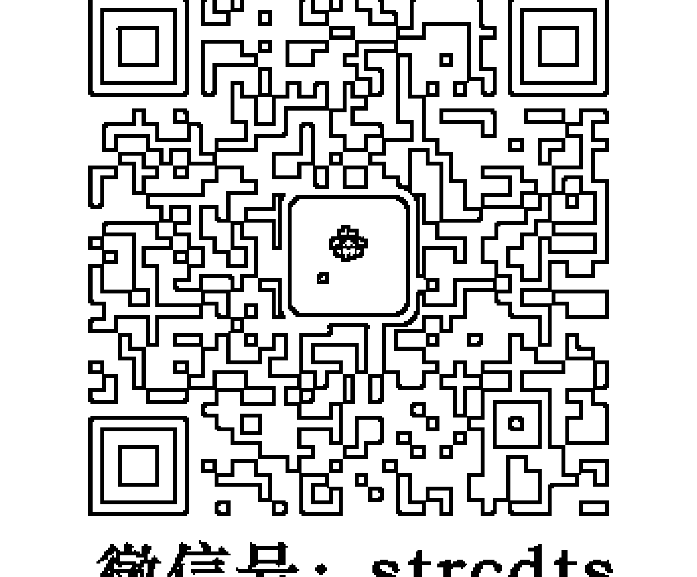

微信号：strcdts
天使神秘学院

天使神秘学院 院长QQ：715104687

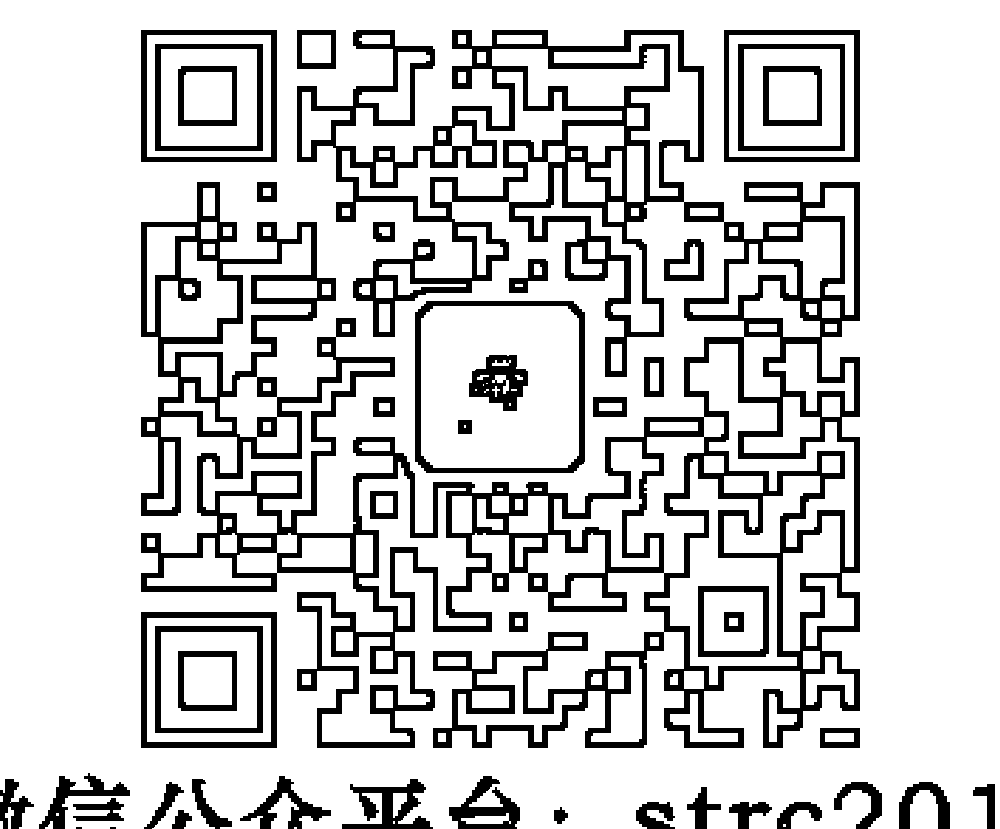

微信公众平台：strc2011

# 制作说明：

本书由《天使神秘学院》出重金从台湾购入的原版书籍扫描制作完成。为达到最好阅读效果，特地把原版书全部切开后，再经由专业扫描设备高精度扫描完成，并经过一张张的PS后期处理最终成书，其间花费大量的人力、物力以及时间，只为能给大家提供经济并优质的神秘学学习资料而努力。

本学院强力谴责某些机构和个人，把本学院花心血制作完成的电子书籍，包装后直接放在自家淘宝网上低价倾销的行为，以谋取不劳而获的经济利益。如果长此以往最终将无人愿意再为大家花心思制作电子书，那以后可能大家再无新书可读。

为让大家以后能够读到更多的好书，也为了本学院的良性发展。本学院恳请大家尽量做到如下几点：

- 一、尽量在本学院的网站购买电子书籍。
- 二、请勿用技术手段把电子书内的水印及加密去掉。
- 三、在收到电子书后小范围传阅即可，千万不要公开传播，更别挂到淘宝网上低价销售。

同时为答谢广大支持者，学院电子书将做如下调整：

- 一、学院会把一些早已收回制作成本的电子书折价销售。
- 二、最新制作的电子书籍会开放打印功能，大家购买后有条件的可自行打印成书。

天使神秘学院
2019 年 1 月

# 靈氣與身心靈療癒必讀指南

# 靈氣手札

朝朝 著

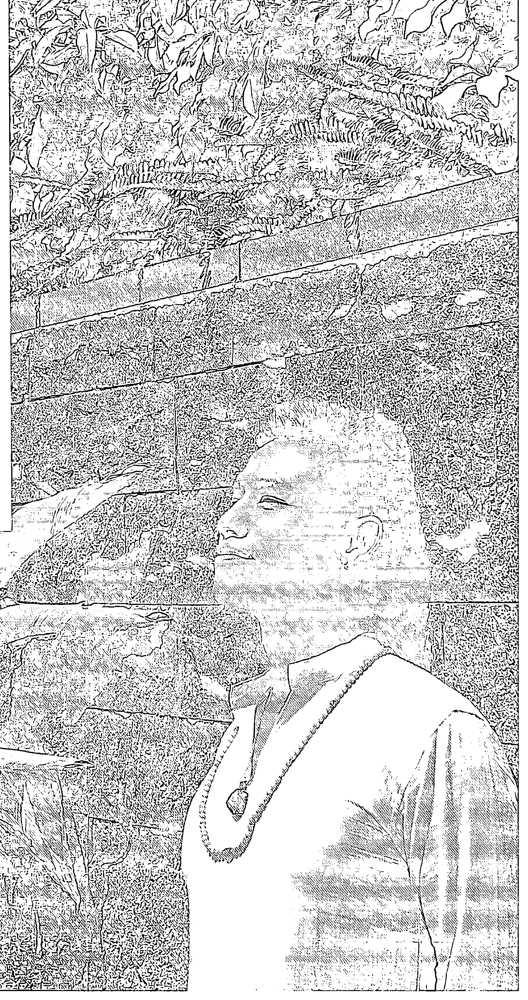

# 自序 PREFACE

你曾思考過人為什麼要活著嗎？人生的意義到底是什麼？

其實我從很小（大約7歲）就開始思考這個問題了。那時的我在想，如果累積的這一切，到最後死的那一刻都歸零，只能重新輪迴，又要再一次這樣的過程，那到底這麼努力生活為了什麼？我曾經一直想，逐層推導，最後想到要是沒有「我」那剩下什麼？由於實在想不出來，我也放棄追尋了好長一段時間，直到大學接觸到佛法，才說到生死輪迴這些事情，當時覺得人生的唯一意義就在於超脫輪迴，我也就開始持續修持，對於現世並沒有什麼想望。

直到一再同樣狀況的感情挫折才讓我發現，原來我並沒有真正面對自己，現在所謂的修行，只是在逃避現世的功課，讓自己躲入另一個世界，眼不見為淨，放棄現世應該要去承擔的責任和學習的課題，真正的修行是要離苦得樂，但如果我連現世都已經無法做到了，遑論來世，人都做不好了難道還想成佛？

我開始做自己喜歡的事情，不去思考到底這些事，對於解脫生死有沒有直接關係。看很多書，尤其是關係方面的書，對於命理玄學本來也都很有興趣，慢慢的接觸到水晶療癒，明顯感受到他們給我的支持後，我便踏入身心靈療癒的世界，接著是頌缽，然後靈氣等。過程中，我一層層去檢視自己、跨越自己，去除自己內在的無價值感和否定，也漸漸拿回自己的力量。我發現這些負面的信念、想法不僅影響我的感情，也影響我的人生各個層面，包含我選擇成為警察這件事。

警察對很多人來說或許是個很好的工作，工作穩定、薪水優渥，當然也有人是真的對伸張正義有理想抱負的，只是對我來說，這僅僅是維持生活的方式。我總覺得自己很分裂，畢竟我不喜歡政治、不喜歡官僚、不喜歡全然的物質觀的想法等，但我卻必須把我人生最多的時間花在這上面，我在這份工作裡感受不到自我價值感，感覺自己跟行屍走肉沒什麼兩樣，但是一方面自己又覺得這樣是正常的，工作不就是這樣嗎？很多人應該也都這樣覺得吧？

但開始接觸身心靈後，我不斷療癒自己，越來越愛自己，自我價值感慢慢建立，慢慢內心開始質疑，難道工作一定就要這麼辛苦？一定要出賣靈魂？尤其學習靈氣之後，我的人生方向越來越清晰，對於自己和宇宙也越來越有信心，也就學習順流，從工作之餘當成興趣慢慢接個案，到後來在個案的要求下，開始靈氣的教學工作，沒想到就這樣一路教下去。教學的過程中，我也從學員身上獲得很多珍貴的經驗和回饋，自己也有了很多成長。最後，基於對宇宙、對靈氣以及對自己的信任，我辭去警察的工作，專心成為一位身心靈老師，這讓我的生命方向和力量更加專注集中，不再像過去需要分裂自己。現在的我，會讓自己不斷進修，雖然還是會累，但這些累積都往我想要的方向前進。我不再覺得分裂，也不再覺得浪費生命，每一刻我都在體驗並做我自己生命的主宰。

當初學身心靈其實只是想療癒自己，讓自己快樂，後來不斷的挖掘發現這些人生中我們經歷的事情、事件，其實都是你內在的投射，也體會到當初學習佛法所說「萬物唯心造」的意義，這些並不是要你消極的轉念接受，而是要你做自己心的主人，進而做自己世界的主人，創造你要的生活和生命。

未來的我，希望能把這些理念還有改變生命的方式傳達出去，我每天都會祈願，讓我走在我的人生道路上，實現我的價值，也藉此讓更多人拿回自己的力量，對自己感到信任，創造自己想要的人生，過著自己想要的生活，感到真正的喜悅和價值感，最後達到究竟圓滿的智慧境地。

朝朝

# CONTENTS
目錄

## Chapter.01
追求身心靈與人生的平衡

- 什麼是身心靈療癒..................010
- 潛意識與不斷上演的人生劇本......013
- 身心靈療癒與宗教的差別..........017
- 療癒自己跟改變人生的關聯—簡單從量子物理談吸引力法則......022
- 能量系統—脈輪簡述................028

## Chapter.02
常見身心靈療癒方式

- 頌缽................................040
- 水晶................................043
- 芳香療法..........................046
- 花精................................048
- 靈性彩油..........................051
- 塔羅................................052
- 家族系統排列......................054
- 薩滿：印加薩滿、核心薩滿..........058

## Chapter.03
宇宙之愛 — 靈氣

什麼是靈氣 ………… 070

靈氣的起源 ………… 071

靈氣如何傳入西方國家 ………… 072

靈氣的妙用 ………… 074

靈氣的基礎知識 ………… 075

靈氣的特色 ………… 084

其他靈氣／能量療癒系統：卡魯那靈氣、古埃及靈氣、能量療癒矩陣 ………… 085

## Chapter.04
靈氣的實際應用

身之療癒：靈氣喚醒身體修復能力、靈氣與產科、靈氣與寵物 ………… 094

心之療癒：跨越童年性侵陰影、療癒家暴與家庭關係、療癒受虐毛小孩內在創傷、療癒精神緊繃與工作壓力、放下與父母心結以及對於權威的恐懼 ………… 100

靈之療癒：送靈魂一程、好好道別、回到自我，照顧好自己，讓一切準備得更好 ………… 109

## Chapter.05
靈氣 Q&A

- 任何人都能學習靈氣嗎？
- 如何開始使用靈氣？
- 實行靈氣有合適的時間點嗎？
- 施作靈氣有場地限制嗎？
- 靈氣一定要跟老師學嗎？
- 幫別人施作靈氣，自己會不會不舒服？會不會被「卡」到？
- 靈氣個案或是學習為什麼要收費？不是應該要來救世幫助眾人嗎？
- 聽說靈氣也可以遠距離傳送？還可以穿越時間？
- 靈氣和氣功有什麼不同？
- 靈氣可以遠距離傳送，那這樣靈氣是不是可以對人家下咒啊？
- 如何挑選適合自己的靈氣老師？
- 靈氣對動物、植物，甚至沒有生命的物品，也有效果嗎？
- 靈氣可以增加水晶的能量嗎？
- 靈氣用不對，會不會「走火入魔」？
- 什麼是「靈氣點化」？
- 聽說點化也可以遠距離，不需要面對面？
- 靈氣分為幾階？
- 現在有很多各式各樣的靈氣，和臼井靈氣有什麼不同呢？
- 靈氣是不是一種修行方式？
- 有人在接受靈氣後，會不舒服，這是為什麼？
- 靈氣手位有固定的方式嗎？
- 學習靈氣的淨化期是什麼？一定都是二十一天嗎？
- 開始療癒之前，需要做什麼儀式嗎？像是祈禱、祈請菩薩護法之類？
- 施作靈氣時，需要脫掉衣服或是身上的飾品嗎？
- 靈氣和其他的能量療法或是物理治療，可以搭配使用嗎？
- 從事按摩或其他身體工作者，因工作狀況接收到客人的病氣和負能量，靈氣會有幫助嗎？
- 容易受到環境能量或其他能量場（靈體）影響的人，學習靈氣會有幫助嗎？
- 學習靈氣是否會開啟第三眼，就可以看到一些別人看不到的東西？
- 女性朋友生理期來的時候，可以施作靈氣嗎？

### Chapter.06
給靈氣學員的小提醒

- 靈氣初階
- 靈氣中階
- 靈氣高階

### CHAPTER
01

### 人生的平衡
追求身心靈與

## ① 什麼是身心靈療癒

我們越嚟越常聽到身邊的人接觸身心靈、接觸能量療癒、想要讓自己成長提升等，那到底身心靈療癒是什麼？它又有什麼重要？接觸身心靈療癒是必要的嗎？

首先我們先簡單探討一下「身心靈」是什麼？

### ｜ 身

「身」的部分大家是最熟悉、也最清楚的，就是我們可以看到的肉身，甚至包含整個常見的物質世界，像是你所處的環境、際遇、財富、感情等，其實都可以包含在這裡面，當然最基本也最容易理解的，就是我們的「身體」，當我們的身體層面出現狀況，就是我們說的生病，像頭痛、肚子痛、癌症、經痛等，是很容易理解的。

### ｜ 心

「心」的部分，可以簡單的歸類成心理、內心、情感、情緒，甚至是「潛意識」。心出現狀況，常見的就是躁鬱、憂鬱（這也可以算是「身」的層面）、情緒崩潰、心痛心傷、否定自我、莫名壓力、恐懼、罪惡感、缺乏安全感等。

現在我們大多都認同心理健康會影響身體健康，積極樂觀的人相較於每天愁眉苦臉的人，身體機能運作較為健康，至少感覺也比較年輕；容易緊張的人會胃痛；受到情感創傷的人會感到心痛，甚至胸悶難以呼吸；壓力大常常成為失眠主因；憂鬱讓身體抵抗力低落，變得容易生病等，有太多例子在我們身邊。

### 0 靈

隨著整體醫療概念的興起，醫學界開始意識到身心是無法分離的，認為真正的健康，應該包含身體和心靈層面，對於心理健康開始重視，心理諮商師與心理醫師也越來越多。

但一般醫界指的「心靈」比較類似「心理」層面，類似我們上面提到的「心」的部分，也就是內心、情感、情緒，甚至是「潛意識」這部分，並沒有涉及「靈魂」層面，這也是由於目前科學對於靈魂是否存在都還未定，自然不會去談論這部分。

而療癒師指的身心靈的「靈」，是「靈魂」的意思，或者是說你「這輩子」的靈魂，你預計經由這個肉身想要經驗及體驗這個世界，因此來到這世界上，所以你的靈魂是為了特定的課題和目的而來，也可以說是來累積經驗值。

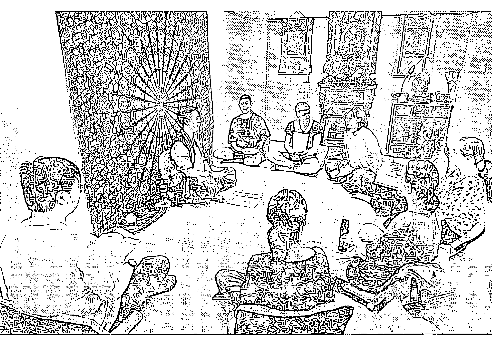

### 療癒

介紹完身、心、靈的一些觀念和定義後，我們來聊聊什麼是「療癒」？

簡單來說，療癒就是讓你的各個方面回到原本的狀態，所以身心靈療癒就是肯定身心靈之間是緊密且互相關聯的，藉由各種療癒方式，讓你的身體、內心、靈魂回到原本完整圓滿的狀態：身體層面就是沒有病痛不適、體魄強健；心理層面就是快樂自如、純真自然；靈魂方面就是與自己合一，走在自己靈魂應行之路上，甚至進而感受到自己與神性本無分別，智慧開展，了悟體會實相。

當靈魂受創或失落時候，你會覺得自己過得渾渾噩噩、失魂落魄、莫名的難過憂鬱失落、感覺自己沒有力量、無法完成任何事情，你也會感覺這個所謂的「外在世界」似乎都在跟你抵抗，你很衰、做什麼都不 ok（到底為什麼還要特別押韻？）因為失去自己的力量，跟自己失去連結，你會一再重複你不想要的情節，像是不斷被劈腿、被家暴、錢被騙走、投資失利、重複的意外事故等，你對這些感到無力無法掌握，也感受不到生活的意義，這些都是因為你沒有走在自己靈魂的道路上，你的靈魂也無法感受到自己的力量和存在，而且要是你沒有回應你的靈魂需求，或是你的靈魂受到創傷，之後你的靈魂再來時，這樣的創傷還會繼續存在，影響來世。

就身心靈療癒層面來看，疾病和身體或心理上不適的出現，其實是一種手段，你的靈魂透過身體和心理的不適，讓你察覺到祂有狀況，祂需要你的注意和呵護，療癒靈魂才是最終目的。很多時候我們會發現當靈魂、內在被療癒了，那些長久以來的疼痛不適，也就隨之消失了。

因此，療癒是為了讓你可以成為你自己，去除那些附加在你靈魂上面不屬於你的東西，讓你能真正和自己的靈魂連結，為自己負責，拿回自己的力量。

那些不屬於你的東西，像是負面的想法、信念等，去除之後，失落的靈魂碎片得以回歸，和你的靈魂合一，讓你可以去體驗、學習你這輩子設定好要體驗、學習的事情，更讓你可以去做你的靈魂原本想做的事情，創造自己的人生，感受生命的價值，不再因為創傷而與真我分離。

## ⓪② 潛意識與不斷上演的人生劇本

心理這部分，學術界探究得更深，可以探究到潛意識。潛意識可分為「個人潛意識」和「集體潛意識」。意識可以分成我們可以察覺到的「顯意識」，和大部分察覺不到的「潛意識」，就如同十九世紀著名的奧地利心理學家、精神分析學家、哲學家佛洛伊德（Sigmund Freud）說的，人的顯意識有如冰山一角，更多的是在於底層看不到的潛意識。

### ▌個人潛意識

潛意識包括一切我們已經忘記的記憶、知覺、被壓抑或刻意忽視的經驗等，而這潛意識，在我們察覺到，甚至在浮上顯意識讓我們可以去思考、思索分析之前，就已經幫我們做出決定，因此我們會發現每個人都有各自行為模式，也因為潛意識影響，個人會重複一些模式。

舉例而言，受虐的狗狗，看到人自然就會發抖害怕；曾經受過嚴重感情創傷的人，對於感情不信任，缺乏安全感；出生在貧困家庭的小孩，很容易對金錢物質有匱乏感，相對的，富有人家的小孩，可能對於金錢就有一種輕鬆自在且理所當然的感受。

舉例來說，你會發現家暴受害人就算他離開上一個加害者，下一個新的對象很容易又是一個新的加害者，似乎無法脫離家暴的命運；再者，在家暴環境長大的小孩，日後有極高比例會繼續成為受害者，自己甚至成為加害者，然後便一代一代的傳下去。

這是為什麼？很可能因為他們從小就生長在家暴的環境，他們看到父母之間的相處互動模式就是「暴力」，讓他誤以為這樣的互動模式才叫做「愛」。因為愛對方所以才會打他、控制他，誤以為要建立親密關係就必須要用這樣的方式，雖然在表面的顯意識層面，他知道這樣是不正常也不正確的，但他的潛意識因為受到影響，如果在沒有改變的情況下，他便會以同樣的方式去吸引、尋找，並建立親密關係。然後他的子女也就學習這樣的親密關係建立方式，於是就一代代傳下去，其實有人會說這是「業力」、「因果」、「輪迴」，某種程度上就是一種潛意識和信念上的狀況罷了。

### 集體潛意識

那集體潛意識呢？簡單來說，就是某個群體，像是某個國家、物種、地區的生命，長期對於這個世界、事物或是事件的感受反應，慢慢地累積成的經驗、定義，並因此衍生出應對方式，包含該群體的遠古記憶與累積。

集體潛意識也顯示出，某種程度上，我們都是相連的，它除了各個地區、國家、物種，甚至也會影響全部的生命，甚至整個地球和宇宙等。

像4這數字對華人而言不是很討喜，因為和「死」發音類似，自然會聯想到不好的事情，所以挑數字時候會刻意避開，要是真的去挑選，好像還真的會有點不順利。同樣的，大家就很愛8，尤其888大家更是愛，感覺就是發發發，生意興隆賺大錢。所以很多風水、擺陣、術法，都會用這個「吉祥」數字，似乎也蠻有效。華人很愛的招財神獸貔貅、三腳蟾蜍，泰國人則喜歡吃炭成金的四耳五眼，好像都有些效果，如果從集體潛意識來看，集體慢慢的潛移默化，自然給予這些想法、經驗和行為模式力量，也會在潛意識層面影響我們。

此外我們也可以發現，某些地區或國家的人普遍個性比較溫和，有的則比較剽悍，有的比較浪漫，有的比較嚴謹，這些我們可以說是民族性，也可以說某種程度上受到集體潛意識影響。

### 百猴效應

很有名的「百猴效應」就是集體潛意識的好例子。這是 50 年代京都大學的科學家，在日本九州宮崎縣幸島研究獼猴時發現的神奇現象。

1952 年時這群科學家在島上研究猴子，發現猴子一開始吃番薯時，只會用手把番薯上的泥土拍掉，但其實這樣根本弄不乾淨，不過也就只能先這樣吃。後來在不經意的情況下，其中一隻猴子發現用溪水可以清洗番薯，這樣就不會再吃到「泥巴口味」的番薯了，於是牠們慢慢學習用溪水清洗番薯。

過沒多久這條溪流乾涸了，雖然無法再用溪水清洗番薯，但是另外一隻猴子又發現可以用海水清洗，而且還多了點調味，慢慢地又開始傳開了，越來越多猴子都學會這個「撇步」。

到了 1958 年，幸島上學會用海水清洗番薯的猴子到達了 100 隻，這些研究員驚訝的發現，在海的另一端的高崎山上的猴子，竟然也同時學會食用前用水清洗番薯這招了！但是牠們根本沒有「技術交流」啊？這其實是因為猴子們的集體潛意識中已經輸入了「用水洗番薯之後再吃」這樣技能了。

簡而言之，每個人的想法、看法和行為模式，一旦數量夠多，便足以影響整個群體、種族，甚至是這個世界，當這個世界越來越多人信奉「競爭」、「物質」、「掠奪」，這樣的頻率將導致世界越來越不安，天災人禍不斷。相反的，當越來越多實行「分享」、「心靈」、「愛」等，這世界也將變得美好，我們常聽到的「共業」，在某種程度上也是如此。

### 限制性信念

說到潛意識，就不得不提到「限制性信念」。限制性信念簡單來說，就是因為過去的生活、經驗、外界給你的想法、看法，慢慢潛移默化在你的潛意識裡面（尤其是小時候，那時我們就像白紙一樣，對於世界並沒有預先的設定，對於外界給我們的資訊很容易就成為真理），形成一個「你認為」是「真理」的對於環境、社會、人生，甚至宇宙的看法。

注意！我說的是「你認為是真理」，實際上是嗎？答案並不是。限制性信念可能來自於各個地方，從小到你的父母、家庭、朋友，大到社會、國家等，總是有一些加諸於你身上，要你「接受」的信念。以金錢這件事情為例，你一定聽過「賺錢很辛苦」、「興趣不能當飯吃」、「你這樣會餓死」、「要好好讀書才有好工作」、「找個穩定的工作就好，幹嘛要創業」、「當公務員超好」……的價值觀念，曾經我也是限制性信念的受害者，容許我簡單說一下我的平凡小故事：從小我對於音樂有無比的熱忱和興趣，也算得上小有天分，在我國小時，我請教了學過鋼琴的同學一些鋼琴的基本原理，我就會看譜了，還可以彈出主旋律加上伴奏。

國中、高中、大學都參加國樂社，也很認真練琴，不僅擔任國樂社社長，多次帶團員拿下全國音樂比賽優等，甚至自己還跑去參加全國獨奏比賽。雖然如此，因為看到父母一直辛苦的賺錢，打拼事業，我內心一直有一種「靠音樂吃飯會餓死」的限制性信念，所以我便把音樂當成「興趣」，而「興趣不可能等於工作」（又是一個常見的限制性信念），我必須有一個「穩定的工作」才能支持我的「興趣」。

這些想法大家聽起來似乎很合理，因為這些限制性信念是我們大多數人擁有的，尤其是華人社會。於是我讀了警察大學（沒錯我之前曾經是警察），然後讓自己在這感受不到自我價值的工作裡，花了快十年的時間，如果加上讀書的四年，就是我十幾年的光陰啊！不過我還是要說，後來發現這些都是讓我成長的養分，我在警察生涯中其實也學習到很多技能和經驗，像因為寫了快十年的公文，基本上文字書寫能力就會有一定的程度，所以現在寫這本書就很順（疑～），但我覺得學習最多的，還是待人處事方面的磨練，所以我也很感謝這份工作。

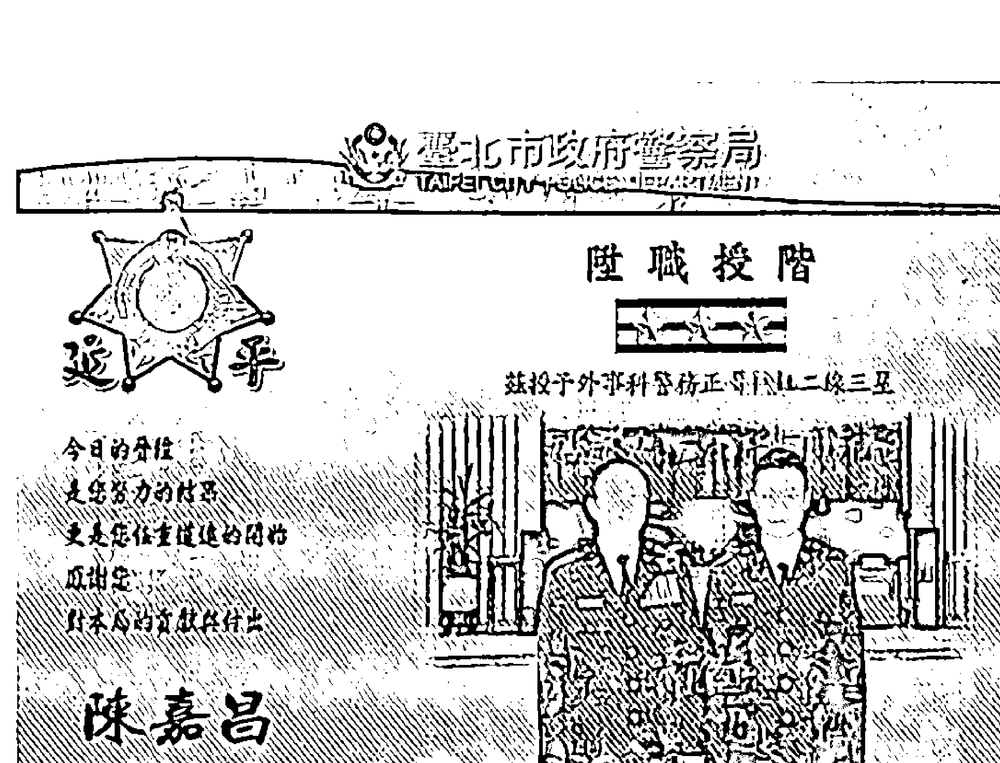

雖然一開始療癒自己是因為感情上的挫折，察覺到自己在感情上似乎有種模式，隨著一步步慢慢的療癒和覺察自己的內在，這樣的覺察和療癒，也漸漸觸及工作事業方面，我發現這些「賺錢很辛苦」、「興趣不能當飯吃」、「你這樣會餓死」、「要好好讀書才有好工作」、「找個穩定的工作就好，幹嘛要創業」、「當公務員超好」這些限制性信念，完全綁住我的人生，我慢慢清理掉這些我「以為是真理」的限制性信念，也慢慢肯定自己，感受到自己內在的力量，對於宇宙人生的真相也越加清晰，懂得如何為自己創造自己想要的生活，後來我便辭掉了警察的工作。當然，我並沒有被這些「限制性信念」綁住，事實證明，我可以做我感到有價值的事情，同時又享有豐盛。

附帶一提，另一種常見的限制性信念，就是「帥哥都很花心」這種觀念，世界上的帥哥一定覺得忿恨不平，不過最近這個限制性信念似乎比較沒力了，大家開始慢慢察覺，其實「醜的也很花心」，而且重點是：還很醜！

## ③ 身心靈療癒與宗教的差別

### 宗教

關於宗教，在「維基百科」裡寫到：「宗教是聯繫人與超自然神明或超驗主義的文化體系，可分為多神論、泛神論、一神論和無神論等多種體系，包括個人行為、傳統儀式、價值觀念、世界觀念、經典作品、朝拜聖地、道德規範或社會團體等形式。……不同宗教可能包含不同元素，包括但不限於神性、聖物、信仰、超自然存在（一個或多個），給予信徒規範或力量的終極性或超驗性生命體驗……」，由上可知，宗教包含了幾個關鍵點：人與超自然神明、文化體系、個人行為、傳統儀式、世界觀念、價值觀念、道德規範，也可以說是這些元素的集合體。

就朝朝的角度，簡而言之，宗教是各個地方、各種文化的人，為了解釋生活經驗、探究未知的世界、了解宇宙的運作及萬事真理，結合當地的文化元素，同時也影響當地文化，進而交互作用所演變產生出來，對於世界的理解、定義以及生活方式。

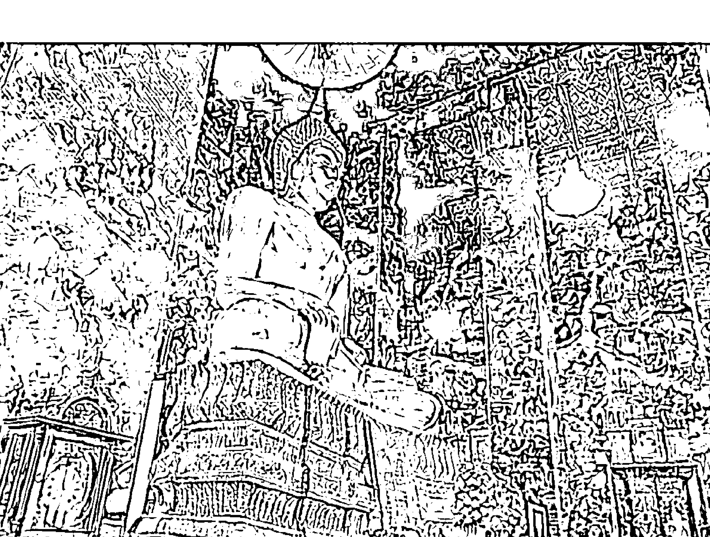

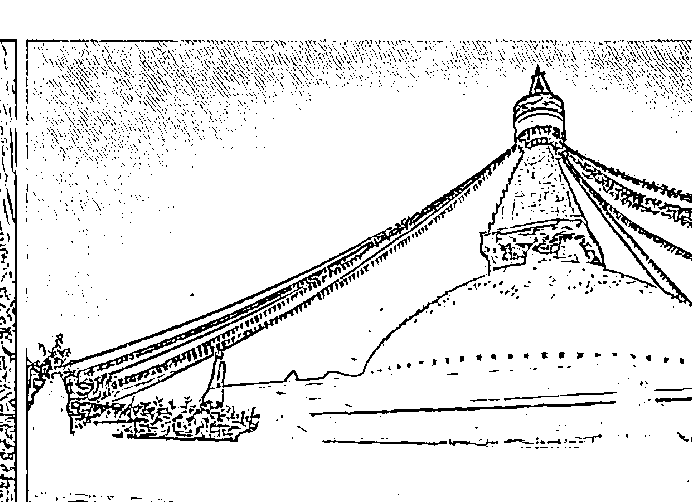

### 身心靈療癒

每個宗教有各自對於世界、真理的解釋，還有依循方式，包含價值觀、道德規範等，也就是教義和戒律等，通常還會有一個教主或是崇敬的對象。此外，因為各宗教的教義不同，各自的終極目標和方向不盡相同，可能追求自己了悟這一切，看透宇宙真相，獲得究竟圓滿的智慧，也可能是藉由行善或遵循教義得以升天。

身心靈領域很多元，使用的方式各自不同，像靈氣、彩油、塔羅等，這些都只是療癒的方法，但與宗教不同的是，每種療癒方式並沒有所謂的教義，比較像是一個「交通工具」，至於究竟要到哪裡去，最主要的還是看帶領者，也就是身心靈老師想要引領學生達到的方向和目的。工具只是工具，如何使用？使用到何種程度？要得到的最終目的是什麼？完全端看使用者的心念，還有智慧層次。

各宗教內有各種修行方式，像佛教有八萬四千法門，這些都是修行、實踐教義的方式，但目標還是繞著佛教的教義為主，只不過現在太多人並不了解各宗教的真正教義還有核心，而陷入文字名相辯論，以及所謂的修行方法，以為那就是該宗教的核心。

常聽到的舉例，為了看到月亮，上師會用手指月亮以指引方向，但手指不是月亮，只是個方向，但現在大多數所謂的「修行人」都把手指當成月亮，而一直去鑽研那手指，忘了重點是要見到月亮，而身心靈的療癒成長也是如此。

其實宗教和身心靈就其本質來說，都是要讓生命更美好，也就是我們常說的離苦得樂，只是切入點不同，不過後來各自的發展越來越五花八門，反而讓當初「離苦得樂，掌握生命」的這個重點模糊了，甚至有人越投入宗教修行、越學習療癒，自己卻越來越失去自己、越來越沒力量、越來越「迷」。

言歸正傳，就朝朝的看法，身心靈領域就是探討身體、內心及靈魂層面之間的關聯性，以及它們對我們生活、人生之間的意義，以及造成的影響。藉由療癒自己的身心靈各個層面，去除掉那些不屬於自己的信念、創傷、習氣，開始感受到自己內在的力量並取回祂，對自己具有信心，改變自己的命運，掌握創造自己的人生，進而肯定自己內在的神性（或者說圓滿的狀態），了解自己本自俱足，再者得以了解宇宙真相，達到與本我（高我、佛性、神性）合一的境界。

### 宗教和身心靈療癒的分別

大致上簡單來說，宗教和身心靈療癒有幾個不同點：

- ◇ 首先，各個宗教基本上都有「教主」，宣說教義還有教導、哲理以及教義，會對於宇宙世界的運作，還有法則、看法，有各自的看法。

身心靈療癒各種方法會有創始者，但不會被稱為「教主」，也不至於會去崇拜膜拜，像朝朝教授的臼井靈氣，就是由臼井靈男祖師所發現傳授的，卡魯那靈氣是由威廉·李·蘭德（William Lee Rand）老師接受指引而創立，他們發現、創造，並將這些方法系統化地建立起來，協助轉化學習者及傳承者的身體、內心以及靈魂狀態。

- ◇ 再者，宗教演變到後來通常會有信仰的「神祇」或是崇拜對象，例如基督教崇拜耶穌基督；佛教敬重釋迦牟尼佛；印度教敬奉濕婆神、大梵天王及毗濕奴三大神祇。深入探究很多宗教的教義，其背後意義是每個人

都具有神性、佛性等，因此，每個人也可以達到那樣圓滿的境地，不過後來的發展，大多變成單純的崇拜而已。

身心靈療法基本上比較不會如此，會尊敬各個高靈及揚升大師等，雖然像古埃及靈氣接引獅面女神能量、卡魯那靈氣連結千手千眼觀音菩薩的能量頻率，但是相较于崇敬，比较像是请益，并且请求协助指引。

- ◇ 最後也最重要的不同，就是宗教都會有它的「教義」，也就是它會給你一個宇宙世界的輪廓和運作法則模式，有各自的世界觀，還有理論及立基點。

像佛教說因果業力，說這個世界的組成有須彌山、四大部洲、八小洲，還有鐵圍山等；基督教最基本的天堂和地獄之說；印度教的大梵天王創世、毗濕奴維持守護、濕婆神主管毀滅等，也由此世界觀建立起信仰者的價值觀、規範和生活模式等。

身心靈療癒方式比較重視的是：怎麼使用這些療癒手法，去清理療癒自己的能量場、內在狀況、甚至靈魂失落等，藉由療癒自己的方式，處理生活上以及生命中的問題。但接觸身心靈療癒者，如果沒有對人生、宇宙、世界狀態以及真相做出探討，加上各式各樣的「療癒工具」層出不窮，例如靈氣、水晶療癒、花精、彩油、塔羅等，就會出現很多人不斷學很多身心靈療癒方法，但是卻沒有契入核心，落入不斷療癒的迴圈中，實際上的智慧狀態，也沒有多大的轉變。

這些落入迴圈的狀況，大多是因為不了解一個重點，其實這些所謂需要我們去處理的「問題」或我們常說的「課題」，就是我們獲得智慧還有提昇我們靈魂本質的道路和方式。藉由一次次的清理，自我檢視，最後跨越並體悟這一切的真義，這些課題就是獲得智慧、了解宇宙人生真相的途徑，也就是我們常說的「煩惱即菩提」。

說到宗教和身心靈療癒，我要稍微提一下「薩滿」。薩滿到底是什麼？有人直接稱它為「薩滿教」，也有人說它是最原始的宗教，其實薩滿本身並不能算是一種「宗教」，但它的確是一切宗教的原型。世界各地都有薩滿，

不是只有我們說亞馬遜河流域、祕魯那裡的薩滿才是薩滿，西伯利亞有薩滿、蒙古有薩滿、川蜀一代有薩滿，甚至台灣的原住民也有薩滿，所以它並不能稱為是一種宗教，因為它並沒有一個「教主」，也沒有一個統一絕對的「教義真理」。它可以說是最早開始對於這世界的看法和生活方式，表達出和宇宙萬物的連結，以及自己在這世界的定位，這不就是前面說到宗教的起源，一開始在解釋並且探究宇宙人生的真理，再得出一種世界觀、價值觀以及生活方式嗎？同時薩滿也是最早在人類社會中，存在的一種能量醫學以及身心靈療癒的方式，現在也越來越多薩滿療癒師，使用薩滿傳承下來的方式，幫助個案療癒身體、內心，甚至靈魂，所以其實身心靈療癒和宗教有很多的連結，甚至連起源也如此密不可分，這也就是為什麼這麼難以分辨的原因了。

因此，不管是宗教還是身心靈療癒，它可以對你的人生、本質提升、智慧開展，產生多大的效益和提升，全都端看你的心念、對它們的認識和設定，你是否擁有正確的觀念和見解，也就是我們說的「正知見」，你知不知道你在做什麼？為什麼而做？為什麼要這樣做？無論各種宗教法門或是身心靈療癒方法，這些都只是各種不同的途徑，或者說是各種交通工具，但你能夠到達哪裡，就看個人的導航系統如何了，不然就算你是搭飛機，可能也只是一直盤旋而已。

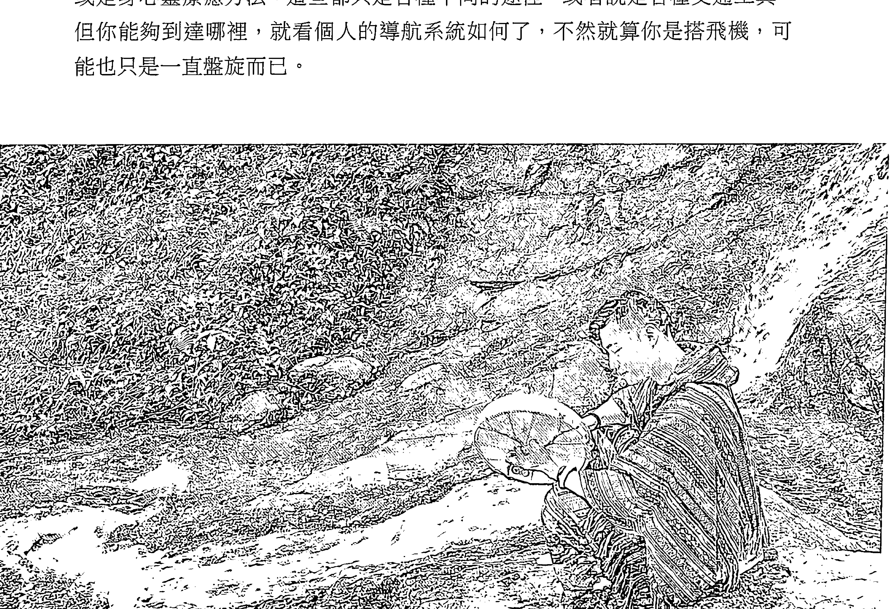

## ④ 療癒自己跟改變人生的關聯 ——簡單從量子物理談吸引力法則

身心靈療癒簡單來說，就是肯定身心靈各方面之間是緊密且互相關聯的，藉由各種療癒方式，讓你的身體、內心、靈魂回到原本那樣完整圓滿的狀態：身體層面就是沒有病痛不適、體魄強健；心理層面就是快樂自如、純真自然；靈魂方面就是與自己合一，走在自己靈魂應行之路上，甚至進而感受到自己與神性本無分別，智慧開展，了悟體會實相。

### 吸引力法則

說到改變並創造自己的人生，就不得不說到「吸引力法則」了，相信大家都聽過吸引力法則，對於《秘密》這本書應該也不陌生，網路上也有很多吸引力法則的影片，甚至有很多人早就已經把這本書翻爛了。

「吸引力法則」簡單來說，就是你想的、你相信的一切都會成真，所以書中教你去冥想、去感受那種喜悅的感覺等方式，但你知道為什麼會有效嗎？

隨著現代科學不斷的發展，也就對於這個世界不斷的探究，許多以前不了解、無法解釋的事情，現在對我們來說變得稀鬆平常。像是你現在正在使用的手機，如果時間倒推回二十年前，你怎麼可能相信手機除了打電話，還可以看電影、打電動、訂票、付錢，變得這麼無所不能？但是它就是可以，而且現在你會覺得很正常。有太多太多像這樣的例子了，因此，我很喜歡曾聽過的一段話：「科學是已驗證的靈性；靈性是尚未驗證的科學」，很多事情不是沒有科學根據，只是我們所說的「科學」發展時間太短、侷限太多，只能就目前使用的工具、想法來度量探索，自然無法全面性的了解這一切。

### ■ 量子物理學

接著，我們得談談「量子物理學」。朝朝以前讀高中念的是社會組，警察大學念的是法律，所以也不是理科的，因此我也不打算說那麼多物理理論的東西，有興趣的朋友請自己請示 Google 大神，我只打算簡單介紹，量子物理學對於這個宇宙的看法，以及就量子物理的角度，宇宙是如何構成的。

簡而言之，量子物理學經由多種實驗，發現這個世界和我們認為的「實體」、「物質」，其實根本不是物質、不是實體！宇宙萬物看起來並不是一個巨大在運作的物質機械性存在，反而是「巨大的意識和思想」所組成！

聽起來很荒謬，對吧？但事實真的是如此，而且這樣的道理其實在佛法中，早就提過了，大家有沒有聽過「萬物唯心造」？有聽過《般若波羅密多心經》吧？有聽過《金剛經》吧？有的朋友甚至還會背、每天都要做早課晚課，甚至還在抄經，但是你知不知道，裡面說的，一部分就是現在我們科學研究出來的量子物理學內容？

你想看看我們以前讀過的物理，談論中子、質子、電子等，開始隨著科學發展拆解的越來越小，像是夸克等，但是你覺得隨著不斷的拆解，真的會有一個最小最小的物質單位存在嗎？量子物理學發現，其實到最後就只是一個空間，我們看到的一切其實都是「能量」的振動，每種我們感受到的物質、聽到的聲音、看到的光等其實都只是一團「能量」，並且以各自獨特的頻率和振動方式在振動旋轉著，包括你跟我，甚至你家裡的毛小孩都是。

一切都是頻率和能量振動，那為什麼看起來每個東西都這麼不一樣？那是因為各自有各自的振動方式。振動頻率越高，或是能量結構越散，我們就越難以感知到；振動頻率比較低、能量結構比較緊密，就形成我們看到的物質實體，所以說穿了不過就是如此。

舉例來說，光分為「可見光」和「不可見光」，從振動頻率低、我們看不見的紅外線，進而在可見光譜中紅色到紫色，再到頻率高、我們看不見的紫外線，這些不都是光？只不過振動頻率不同罷了，說穿了，也都是「能量」，同理可證，聲音也是如此，所以超音波也是振動頻率比較高的能量，我們雖然感知不到，但是它還是存在的。

那思想是不是也是頻率振動？當然是，不然那些腦波的探測和研究要怎麼做呢？OK，既然一切都是能量，你看到的車子、房子，你聽到的聲音，看到的色彩，甚至連你的心念、你的情緒感受都是振動頻率，也都是能量，那我們能不能用改變振動頻率的方式來改變能量頻率，甚至創造我們要的生活？Of course，「你得到那個點了！」（You got the point！就是你抓到重點的意思啦～，看書還可以顺便學英語片語呢！）

### 為什麼，改變不大呢？

相信有人經由《秘密》這本書，知道改變人生的方法，開始實行也的確改變了自己的人生，但是不是也有很多人似乎感受不到改變？這是為什麼？

我在結合「吸引力法則」以及「水晶能量」的許願課程裡，再次確認並提醒大家，有關吸引力法則的重點並修正誤解的地方。此外，最重要的是釐清大家內心真正的想望，讓大家不要連許願都在繞路。同時，藉此了解自己內在信念的問題在哪，加上水晶可以集中放射能量頻率的特性，設定水晶去協助達成願望。

其實，有很多人並不是真正的了解吸引力法則，因此在祈願祝禱的第一步就不那麼正確，也造成願望難以實現，包含是要已經得到，而不是「我想要…」等，但這不是現在討論的重點。重點是，也有很多人真的了解吸引力法則，也實際去做了，但還是效果不彰？

還記得「個人潛意識」和「限制性信念」嗎？「潛意識」包括一切我們已經忘記的記憶、知覺和被壓抑、刻意忽視的經驗等。而這潛意識，在我們察覺到，甚至在浮上「顯意識」讓我們可以去思考、分析判斷之前，

就已經幫我們做出決定。因此，我們發現每個人都有各自行為模式，也因為個人潛意識影響，會重複一些模式。當然「集體潛意識」對於我們的願望也會有影響，但我們先不探究這部分。

就個人部分，「顯意識」其实在我們意識整體所佔比例很少，就像是冰山一角，最大部分是「潛意識」，因此，即使表面你開始實行練習冥想：年收入破百萬，但你的內心潛意識卻還在否認，甚至還有一些限制性的信念和負面頻率在扯你後腿，那你覺得哪個的力量比較強？（這就是典型的「嘴巴說不要，身體（內心）卻老實的很」）

## ❶ 心，才是一切的主導

先前朝朝和幾位朋友聚餐，順便聊聊彼此近況，平時大家都忙自己的工作和事業，席間談論到他們針對拓展事業版圖，還有增加收入，嘗試過很多方式，但各有利弊，不知道該怎麼做才好。其中二位朋友的品牌甚至在知名百貨設立專櫃，他們付出極大的時間和努力，幾乎所有的精神氣力都用在上面了，連休息時間都沒有，但大部分收入卻被百貨公司抽走，實際上的收益並沒有增加多少。

朝朝請他們先思考，他們努力的最終目的究竟是什麼？基本上都是希望收入達到某種程度，但最重要的，除了行動上的努力，還要有內心的轉變。

接著，朝朝請他們去設定想要的目標，例如，希望年收入淨值達到 100 萬的小目標（以自行創業者來說，真的是很小的目標），並協助他們寫出屬於他們自己的正向祝禱詞句，當然他們會開始疑惑，甚至當我請他們跟著我一起複誦時，還笑了出來。從這裡其實可以看得出來，他們打從心底根本不相信自己可以做得到，所以他們會覺得能夠簡單賺到 100 萬這件事很可笑，內在散發出的頻率，使得他們外在的努力功虧一簣。畢竟，心才是一切的主導。

反觀另一位朝朝認識十幾年的好朋友，他為了照顧家人在南部開了一間饅頭店，以朝朝對他的認識，他的能力絕對不止如此，讓他守著一間饅頭店，實在是浪費他的生命和才能。

原本他認為他這輩子只能如此了，後来看到朝朝不斷突破，時機點也到了，朝朝便鼓勵他勇敢出國工作，他也願意相信，並給自己機會。

先是出乎他自己意料，順利應徵上國外的工作。出國前，朝朝送了他一些禮物，再教他如何許下自己的願望，並且肯定自己，同時將這些心法傳授給他，他也有老老實實地照做。

後來在他臉書上，發現他的生活過得很多采多姿，他本來就喜歡各種美食，現在因為經濟更優渥，便開始品嚐各種美食。之後，還特意傳簡訊來感謝我，說他才去公司沒多久，半年內已經加薪三次，年薪也早就突破百萬，年初還帶著媽媽去日本玩，好好孝敬母親。不到一年，正式升上主管職務，擁有自己的獨立辦公室，也再次加薪。

沒想到，前不久竟然跟朝朝說他又加薪了，而且還要被派回來做公司台灣分部的負責人，真的是升官發財，和當初開饅頭店時滿臉愁容的他，完全判若兩人。

我們會有想達成的目標，但常常我們的內在，卻沒有準備好要迎接這樣的結果，便會在無形中抗拒你該享有的美好生活。就金錢的部分，是否會感覺不管怎麼努力，收入就是很難突破？更可怕的，有時候就算你賺到錢了，還會發生一些事情讓你破財或是錢留不住。其實這些是因為你內在的財富容量並沒有擴充，就像是今天下了一場雨，但你只拿出一個小碗來接，就算雨再怎麼大，甚至發布豪雨特報，你還是只能接到一個小碗的量。因此我們要做的第一步，便是把我們內心的小碗換成大碗公，甚至直接準備好大鍋子，好好的「接好接滿」。

一個已經年收入100萬的人，請他說出年收入100萬的祝禱詞，他會說得理所當然。對一個年收入只有50萬的人來說，他可能會懷疑，會覺得誇張，就是這種內在頻率，造成他的財富容量只有50萬。因此要是他想要讓年收入達到100萬，他必須讓自己感覺自己年收入100萬是一件理所當然的事，而且是真誠的覺得，這樣才會成真。

話雖如此，因為我們從小到大的經驗，造就了我們這些信念和想法，這些深植在我們潛意識中，成為我們不斷輪迴命運的主因，所以你會看到被家暴被害者，即使離婚或分手，再找下一個對象還是一樣繼續有家暴傾向，而他的下一代很有可能也會成為未來的加害者，或是繼續成為被害者。

有的人不管再怎麼努力賺錢，錢就是會莫名其妙不見，可能會出現一些狀況讓他破財，戶頭總是沒有錢，有人說它是因果、是業力、是習氣，其實都沒錯，但是這些因果業力其實都是存在你自己的內在，輪迴的因也都是在你的內在，這些 Bug 沒有清除，單靠你用現在這樣處於劣勢的狀態下，自己去想、去修、去期待讓智慧開展，去打破這些輪迴真的很難。療癒就是在幫我們移除這些信念，清除這些 Bug，當你的想法信念中沒有這些扯後腿或是潑冷水的傢伙時，你就越容易成功，然後當你慢慢有了成功的經驗後，你也會開始將新的信念和意識植入你的潛意識中，你也就更相信自己能創造生命，一連串的正向循環因而展開。

## ⑤ 能量系統——脈輪簡述

既然談到能量療癒，那一定要對能量系統有概念，如此才有切入點以及施行療癒的方向，常見的能量系統像我們接下來要介紹的脈輪，還有中醫的經絡等也是能量系統，其他像薩滿、道家等也都有各自使用的能量系統，我們接下來就身心靈療癒中最普遍應用，來自印度的三脈七輪系統簡單的介紹。

### 三脈七輪系統

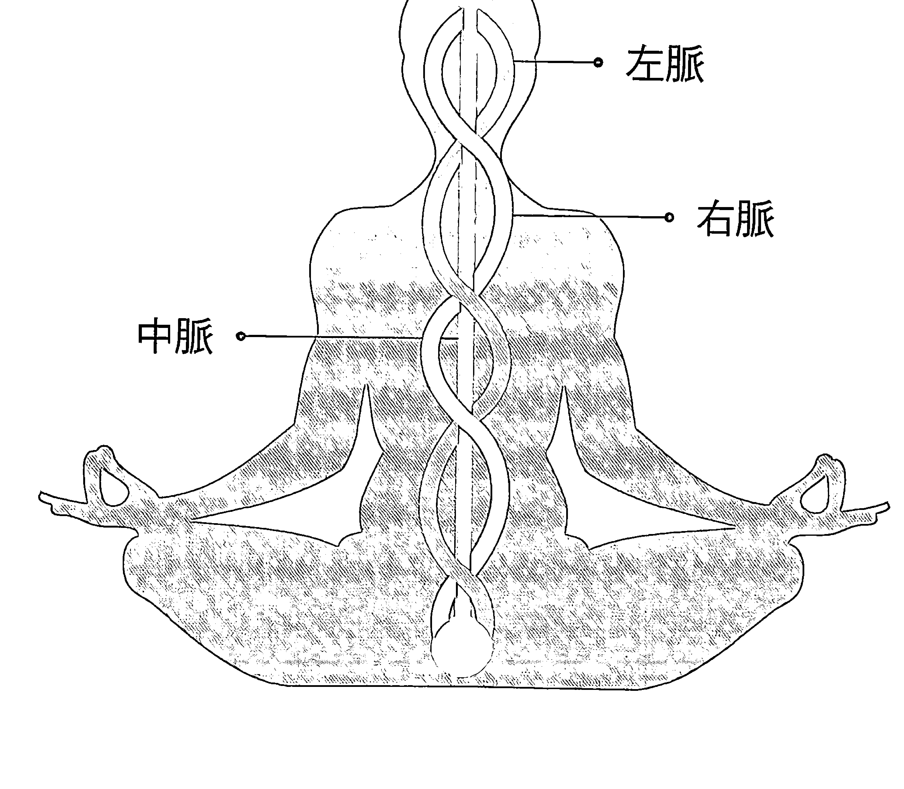

### ◆ 三脈七輪系統

我們身體主要從頭到腳，垂直能量流動的通道有三條：左脈、右脈以及中脈：

### 左脈

又稱陰脈或月亮脈，為紅色，主管的能量影響為記憶、過去、感性等，較為陰性、情緒內在的部分。

### 右脈

又稱陽脈或太陽脈，為白色，主要影響我們的理性思維、未來計畫、行動力等，較為陽性、外顯主動的部分。

### 中脈

藍色，掌管當下、此刻、現在，較為中立。

以上便是每個人的主要三條垂直能量系統，而一般人中脈並沒有打開，因此平常生活中只能使用左右脈的能量，而通常一般人的左右兩脈能量並不平衡，有的人使用左脈多，有的人則傾向使用右脈，如此便造成個性及處事上的差異和不同，也因此有人比較感性，有人比較理性。

此外，如果你仔細觀察，左右脈由第一脈輪（會陰）開始環繞著中脈向上，到眉心輪處交會後再往上延伸到頂輪，因此左腦掌管右脈，也就是比較理性的部分，右腦掌管左脈，也就是感性藝術的部分，跟我們現代的科學（醫學）研究不謀而合。

三脈中只有中脈是當下、此刻，處在全然的當下、本我中，各宗教或身心靈的修行方式，像拙火瑜珈、藏密的氣脈明點等，開通中脈為主要修行目標，只要中脈打通並貫穿所有脈輪便得成就，但是因為涉及身體能量流動運作，如果修練錯誤造成氣跑錯地方便會造成嚴重的後果，因此有老師指導是非常重要的。

### ◆ 七輪（脈輪）

脈輪英文為“Chakra”，這個名詞好像在某個卡通有聽過，難不成就是那個「查克拉」？其實卡通裡面的「查克拉」，比較像是印度能量系統裡的「普拉那」（Prana），也就是生命能量之意。脈輪簡單來說，就是在（中）脈上，如同輪子般會轉動運作，用以吸收、代謝、運作肉體、氣場等整體能量的器官構造，就像是我們有心臟、腸胃、肺部等器官，脈輪其实就是負責處理能量的器官。

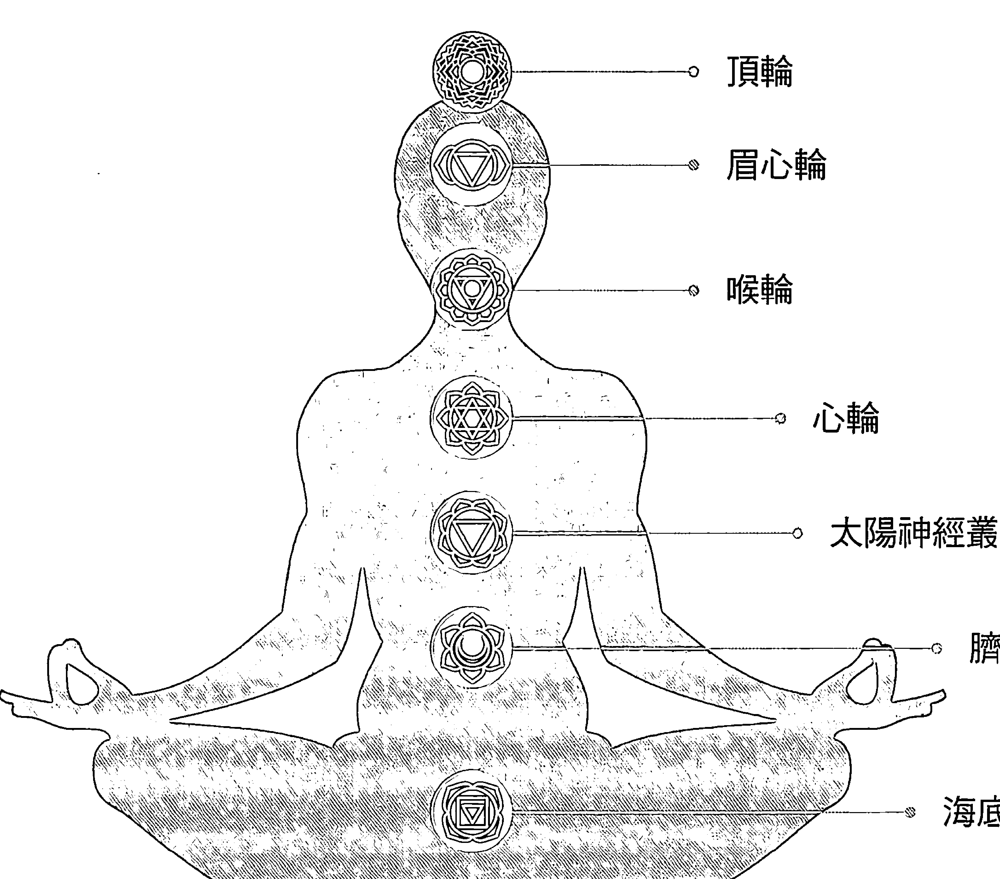

每個脈輪都有其各自處理的身體、心理以及靈性層面的能量運作品質，當脈輪沾染負能量、受創、阻塞、虛弱等，都會影響能量運作，久而久之，其負責運作的部分能量就會出狀況，身體、心理，甚至靈魂都會受到影響。因此維持脈輪能量運作平衡是十分重要的，脈輪也會相對影響我們的身體器官運作，包括內分泌等。以下就各個脈輪做基本的介紹：

### 第一脈輪：海底輪 (Muladhara Chakra)

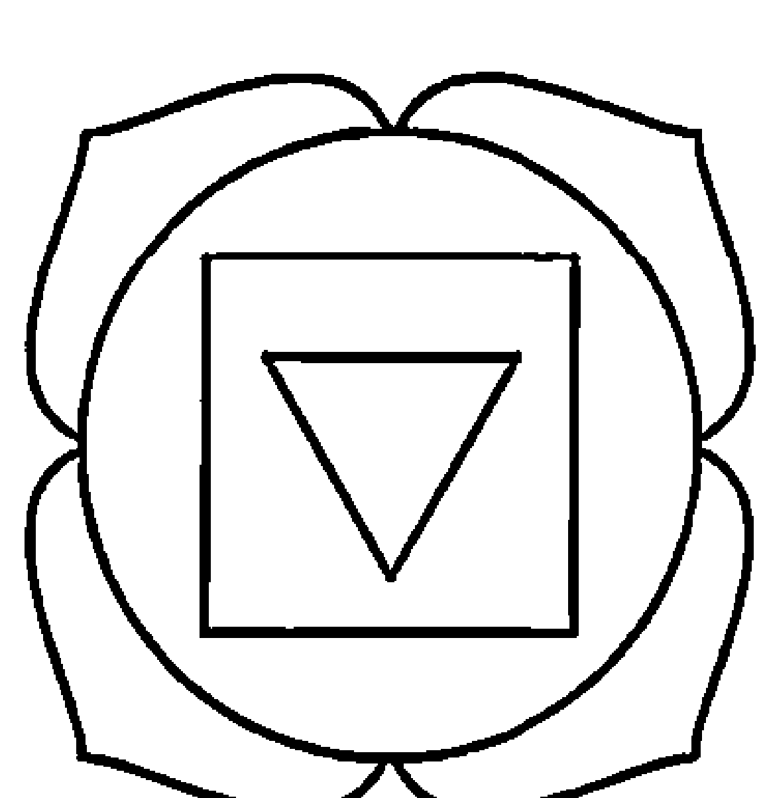

| 屬性 | 說明 |
|---|---|
| 對應顏色 | 紅色、黑色 |
| 對應元素 | 土 |
| 位置 | 脊椎底端會陰處 |
| 對應器官 | 骨骼、排泄器官、生殖器官、腿部及腳部 |
| 能量意義 | 生存、生命力、純真、存在、安全感 |

第一脈輪位於脊椎骨尾端會陰處，也是拙火（Kundalini，昆達里尼、靈蛇）靈性能量的所在，亦對應盤骨神經叢（Pelvic Plexus）。此脈輪代表著生命力和活力，與我們基本生存欲望和肉體有關，使人感覺安全放心，海底輪往下延伸到雙腳，如同樹幹的身體往下延伸根部進入大地。

海底輪處於正常運作狀態者，雙腿有力，身體自我修復機能良好，活力十足，會讓人有種「身植大地」的感覺，感到穩定和安全，有領域感，不會隨便懷疑他人，感覺活在當下，和肉體緊密結合，也會讓人有一種積極為目標努力實踐的行動力量，有在物質世界追求生存的意志和熱情。

海底輪失調的人，容易覺得恐懼或緊張、自私自利、個人主義、對（物質）匱乏的恐懼、尋求感官上滿足、有錯誤的性觀念、把生存娛樂視為人生首要追求目標。

### 第二脈輪：臍輪（Swadhisthana Chakra）

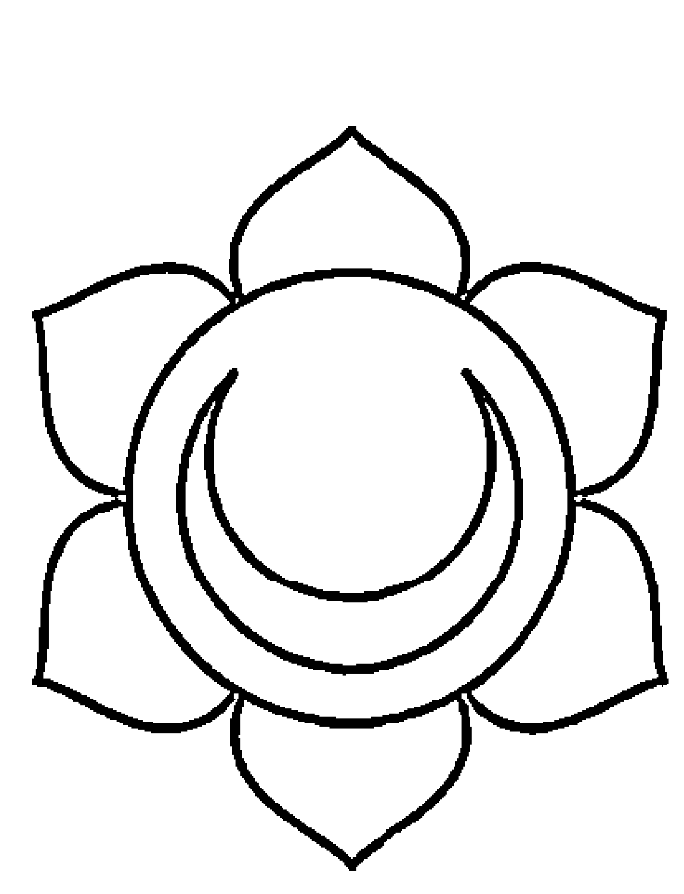

| 屬性 | 內容 |
|---|---|
| 對應顏色 | 橘色 |
| 對應元素 | 水 |
| 位置 | 丹田處，女生子宮，男生攝護腺附近 |
| 對應器官 | 子宮、卵巢、攝護腺、睾丸、生殖器官、腎臟、腸、胰臟、腎上腺 |
| 能量意義 | 創造力、性意識、親密關係、熱情、情緒 |

位在肚臍下方約三指寬處，也就是我們常說的丹田的位置左右，對應主動脈神經叢（Aortic Plexus），掌管親密關係（包含家人、另一半等）、情感、性慾、享受性歡愉的能力等。這個脈輪呈現出對親密關係，包括個人與配偶、家庭，甚至與社會之間的人際關係、社交的連結能力，主要與「人」有關。

當臍輪運作正常，身體水分代謝正常、營養吸收好、情感表達自如，可以感受情緒並表達，但又不會過度情緒化。對於親密關係採取開放態度，願意和他人建立連結關係，和家人以及配偶關係融洽親密，充滿熱情和活力。性方面，無論是感受性的美好或是對於性的觀念看法都沒有問題，此外也具有創造力。

第二脈輪失調，女生常會有婦科問題、男生則是攝護腺狀況，與家人或配偶之間關係不睦，感覺僵硬、缺乏情感或常面無表情，無法感受情緒，對於他人採取封閉態度，容易出現爭鬥、防禦、不信任，性與愛混淆、怨天尤人、情緒化、莫名的憤怒、沮喪、性慾的太過或匱乏、對性有不正確的觀念、性冷感或性成癮、上癮行為（煙癮、酒癮、藥物成癮等）。

### 第三脈輪：太陽神經叢 (Manipura Chakra)

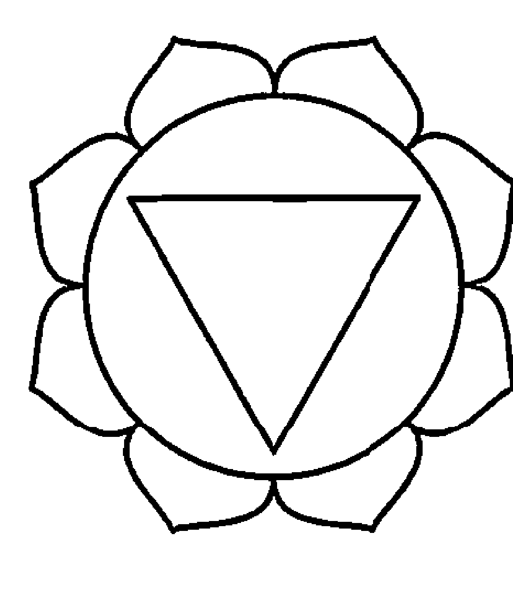

| 項目 | 內容 |
| :--- | :--- |
| 對應顏色 | 黃色 |
| 對應元素 | 火 |
| 位置 | 胃部 |
| 對應器官 | 胃、腹部、肝臟、脾臟、脊椎 |
| 能量意義 | 勇氣、自信、理智、權威、力量、規範 |

位置在肚臍上方與胸骨下方的部分，對應於太陽神經叢（Solar Plexus），也因此得名。這個脈輪是人體能量場的力量中樞，也代表付諸行動的決斷力、危機處理、道德及自我的約束能力，也是身體最多器官所在的位置，因此對於身體機能運作佔有絕對的重要性。

此脈輪正常活躍時，胃部消化功能正常，肌肉關節運作良好，脊椎直挺，肝臟排毒功能正常，感覺有自信，對於事情能很快做出抉擇，有勇氣去開創，有領袖魅力。

不活躍時，被動、猶豫不決、做事躊躇、對事物有無力感、缺乏自信、無自我價值感、自尊心低落、唯唯諾諾、不敢爭取自己所想；如果過度活躍，會有強烈控制慾和侵略性，自我膨脹等。

### 第四脈輪：心輪 (Anahata Chakra)

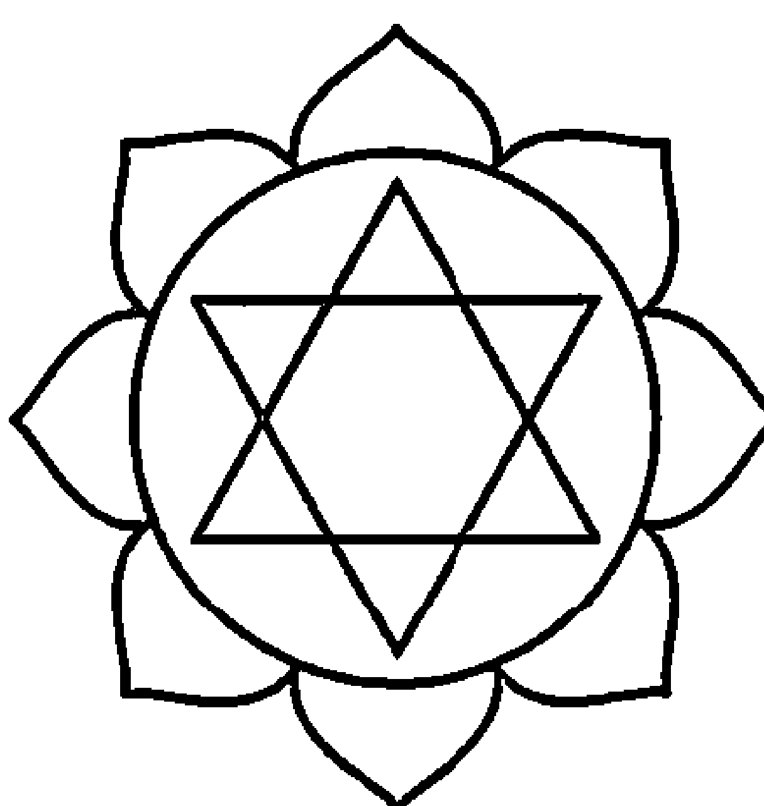

| 對應顏色 | 綠色或粉紅色 |
| :--- | :--- |
| 對應元素 | 風 |
| 位置 | 胸腔中心，兩乳頭中心處，大約在膻中穴處 |
| 對應器官 | 心、肺、胸腺、呼吸系統、免疫系統 |
| 能量意義 | 愛、同理心、慈悲、希望、感動 |

對應心臟神經叢 (Cardiac Plexus)，主要掌管愛、善良、希望、同情等美好的感受，也是全身脈輪系統的中心，上下三脈輪的中繼點，情感力量的交匯，與萬物連結的脈輪，分享愛及親密關係。

心輪開放運作正常，呼吸順暢，免疫力良好，胸部不內陷，此外具有同理心、友善，人際關係和諧，容易開心，喜歡交朋友，樂於與人分享，受人歡迎，具堅定的信念、信任、希望，此外，此脈輪與愛、原諒、無私的愛、慈悲、奉獻、具仁愛胸懷有關，因此也和療癒能力有關，療癒能量都是藉由心輪推動的，根據美國心數學研究中心 (Research Institute of Heart Math) 的研究，心比大腦電場強一百倍，磁場強五千倍。

這個脈輪失衡時，將會冷漠、與人保持距離，無法與建立關係以及感受分享的樂趣，會無意識的製造距離來保護自己，無法感受世界的愛，不僅無法和人建立連結，和自己所處的環境，各種生命以及美好的事物也無法建立連結，無法接受或是給予愛，愛無法流動。

### 第五脈輪：喉輪（Visuddha Chakra）

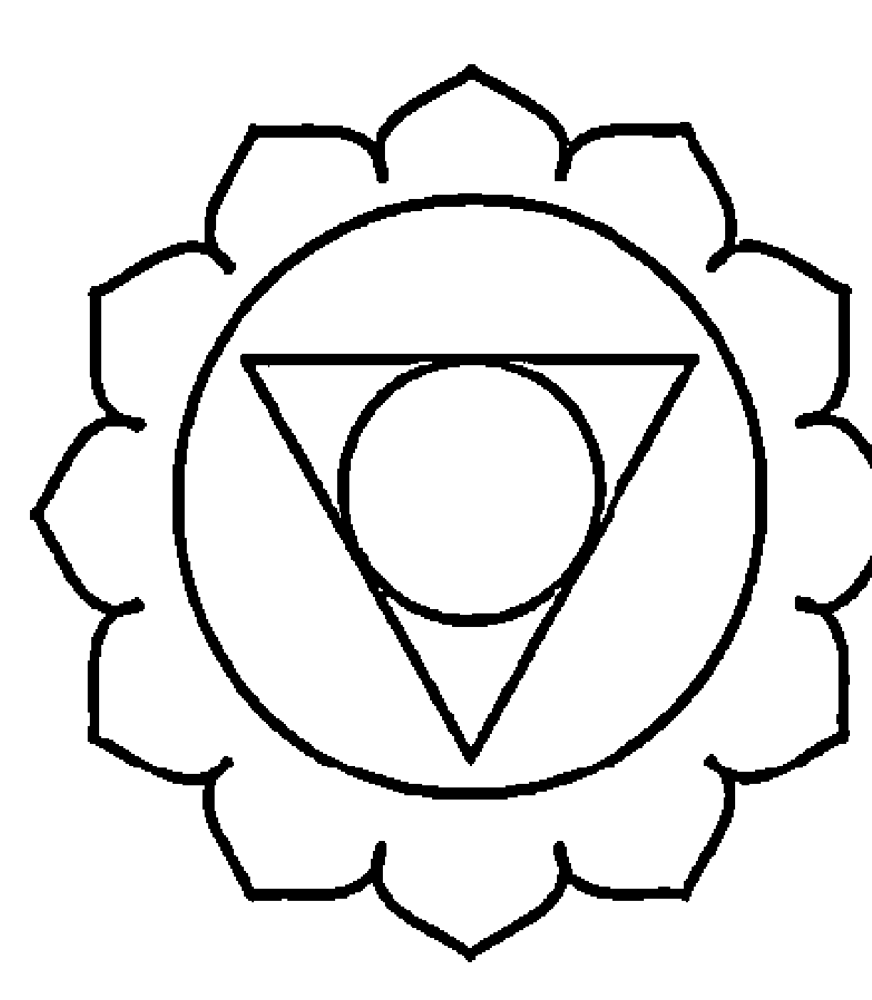

| 對應顏色 | 藍色 |
| :--- | :--- |
| 對應元素 | 音 |
| 位置 | 喉嚨中下方，大概在喉結下部 |
| 對應器官 | 喉嚨、口、食道、甲狀腺、肩頸 |
| 能量意義 | 溝通、表達、語文、書寫、歌唱、理想 |

位於喉嚨偏下處前後，相對於頸部神經叢（Cervical Plexus），掌管表達、言談以及溝通，有對外的展現能力，喉輪運作活躍時，飲食習慣正常，口齒清晰，能理解他人的意思而不扭曲，也能清楚傳達自己的想法以及自我，無論是藉由說話、唱歌、書寫、舞蹈等各種方式來展現自我。

喉輪有狀況時，不太願意與人溝通，傾向不說話，個性較內向害羞，不願意說真心話，拒絕溝通，甚至自閉，另一方面，也有可能出現批判、惡意中傷、背叛、謊言、聒噪多話，喜歡掌控談話，只想說但卻不願意聽別人說，也算是另一種方式的拒絕溝通。

### 第六脈輪：眉心輪（Ajna Chakra）

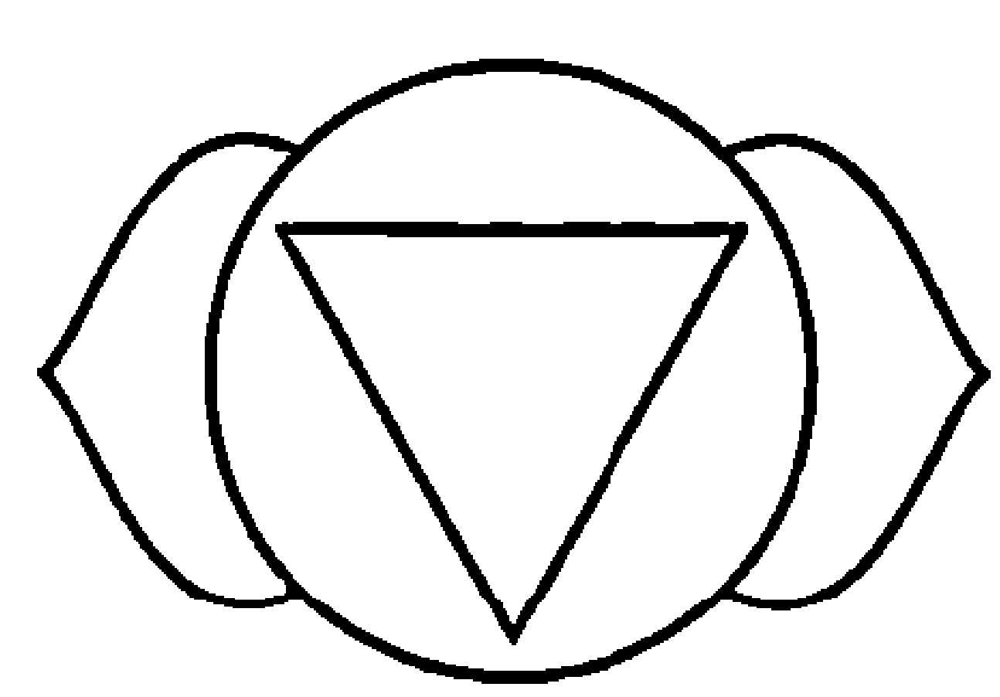

- 對應顏色：靛藍色、藍紫色
- 對應元素：光
- 位置：雙眉中心
- 對應器官：眼睛、松果體、臉部、腦部
- 能量意義：思考、直覺、判斷、覺察、清明、靈視力

又稱第三眼，在前額中央，跟眼睛、松果體、臉部、腦部和神經系統有關，掌管直覺、洞察力以及觀想能力，運作正常活躍時，眼睛視力良好，眼神清澈，思慮清晰，睡眠狀況良好，有很好的直覺和判斷能力，有很多想法和靈感，甚至超感知能力以及靈視力，自我覺察，可以看到各種事物的不同層次，穿透事物的表象，擁有來較高層面的意識，具有自我實現的能力。

眉心輪不平衡，會傾向於依賴權威而非自己的思考，比較習慣聽別人說，卻忘了自己的基本思考判斷能力，容易被騙，也可能過於依賴信念而非理性，容易陷入迷惑。此外，過度發展可能會讓人活在幻想的世界中，產生幻覺，無法分清現實和幻想，甚至精神的錯覺、精神官能症等。

### 第七脈輪：頂輪 (Sahasrara Chakra)

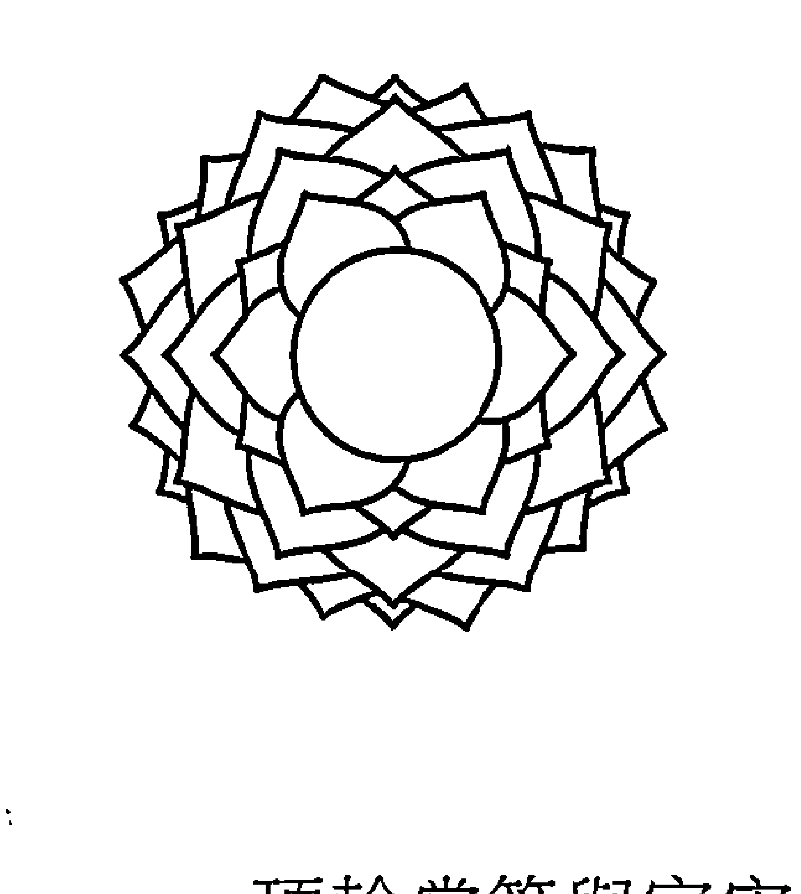

| 屬性 | 描述 |
|---|---|
| 對應顏色 | 紫色、白色 |
| 對應元素 | 空、思 |
| 位置 | 頭頂，大概在百會穴的位置。 |
| 對應器官 | 腦部、神經中樞、皮膚 |
| 能量意義 | 智慧、開悟、實相、圓滿 |

頂輪掌管與宇宙意識的連結，連結智慧及和世界為一體，藉由這個脈輪我們得以體驗到超越自我，超越二元對立，體驗宇宙合一意識，不再有主體客體、我和萬物、真理謊言、快樂痛苦等分別，甚至可以連結萬物的集體潛意識和宇宙能量意識，直接到達源頭，了悟一切，也就知悉了一切，只有達到這裡，才是真正的開悟。

這個脈輪阻塞不活躍，感覺不到精神世界的存在，無法體悟真正的智慧，頂多只能在知識中流轉，此外，另一種過度的表現，可能過度沉溺於精神世界的追求，卻忽略了身體或實際物質世界的需求，感覺無法融入現實生活中，會有「地球很危險想要回火星」的感覺。

其實每個脈輪都十分重要，上三輪偏向靈性層面，下三輪偏向肉體物質層面，心輪則以愛連結物質與靈性，不僅是哪個脈輪都不能偏廢，我們才能真正平衡的生活，只有所有的三脈以及脈輪運作正常平衡時，我們的身心靈各方面才會真正的「健康」，我們也才能發揮自己的力量，有能力過美好的生活，創造自己想要的人生，同時又獲得智慧的開展。

## CHAPTER 02

## 常見身心靈療癒方式

前面提到，身心靈療癒就是肯定身心靈之間是緊密且互相關聯的，藉由各種療癒方式，讓你的身體、內心、靈魂回到原本那樣完整圓滿的狀態，身體層面就是沒有病痛不適、體魄強健；心理層面就是快樂自如、純真自然；靈魂方面就是與自己合一，走在自己靈魂應行之路上，讓你可以成為你自己，去除那些附加在你靈魂上面不屬於你的東西，真正讓自己和自己的靈魂相連結並使其完整，為自己負責，拿回自己的力量，甚至進而感受到自己與神性本無分別，智慧開展，了悟體會實相。

這是身心靈療癒的目的，要達到這個目的我們可以選擇不同的方式，身心靈療癒發展至今已經有很多工具可以讓大家使用來清理、提升自己，進而創造更好的生活，甚至這些方法不斷推陳出新，除了本書接下來要介紹的靈氣，以下簡略介紹幾種常見的療癒方式：

## ① 頌缽

頌缽（Sing Bowls）也是朝朝常使用的療癒工具之一。關於頌缽的起源說法很多，主要來自印度、尼泊爾、西藏等地，也就是喜馬拉雅山區一帶，有說是當初印度當地人民盛裝並保存食物的食器，輾轉傳到西藏及尼泊爾。後來在偶然狀況下，發現缽在敲擊後，可以發出特殊且令人感到平靜的聲音，有助於冥想靜心。

也有一說，頌缽在西藏本來就是用來作為修行、幫助靜心的工具，不過這部分還有待商榷，在朝朝修習藏傳佛教十幾年的經驗中，就朝朝所知，並沒有使用頌缽作為法器，但是否喜馬拉雅山區當地薩滿或是修行人，會使用頌缽來做為意識轉換工具，就不得而知了。總之，使用頌缽在能量療癒上的時間，應該沒有很久遠，目前可見療癒用老頌缽大概的歷史也不過一百多年，所以可以推測大概是近代開始的使用方式。

頌缽是各種金屬混合後，再以手工敲打而成，當然也有機器做的頌缽，但是機器製的頌缽，只適合用於冥想，因為振動較缺乏，不適合做療癒使用。

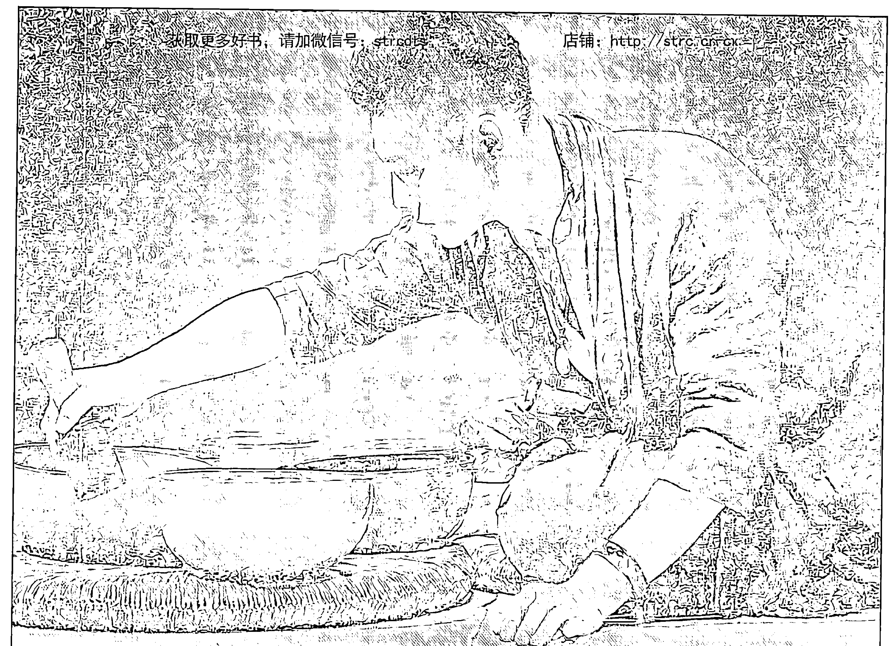

製造頌缽使用的原料，有金、銀、銅、鐵、錫、鉛、汞等，代表七大行星，但現在很少有用到七元素的頌缽，不過也不會只有銅一種，因此稱頌缽為「銅缽」，也不是很正確。會使用各種元素主要是因為聲音和振動會因為材料比例不同而有變化，所以每一位頌缽師傅都有其獨特的獨家配方，再加上每一個頌缽都是手工去慢慢敲打出來的，也就會做出每一個都與眾不同的頌缽。

頌缽的原理，主要是敲擊或磨邊緣時，頌缽會因為些微變形發出振動與聲響，而這個振動與聲響，除了我們可以聽得到的聲音外，更重要的是泛音，所以一個頌缽可以同時發出好幾個聲音，泛音可以滋養大腦皮質層，並且直接調整腦波與神經系統，這一點已經由很多科學實驗證實了。因此頌缽可以達到放鬆腦部，舒緩神經，平衡腦波等效果，對於失眠、用腦過度、精神狀態不佳或緊繃，甚至是自閉、過動、躁鬱症及憂鬱症等個案都十分有幫助。

此外，人體約 70% 是由水組成的，而聲音在水中的傳導速度甚至比空氣更快（聲速在溫度為 20℃ 時，約等於空氣中的 4.7 倍，大約 1,463 公尺／秒），因此人體本身就是非常良好的聲波導體，藉由頌缽傳達出來的聲波振動可以穿透人體，帶動身體的水分子快速振動以及能量運作，排出堆積已久的固著能量，讓生命能量能依照正確平衡的方式的循環與流動。

頌缽發出的振動和聲波，可以達到一般按摩手法無法深入到的地方，直接穿透人體，甚至到達肌肉、骨骼，鬆開鬱結的肌肉和經絡，做到瞬間放鬆的效果。所以有的 SPA 館會把頌缽帶入 SPA 服務療程中，不僅增加新鮮感，還真正可以幫助客人放鬆腦波以及肌肉經絡等，甚至還有健身教練會在學員運動後，使用頌缽幫助放鬆舒緩肌肉。

由於頌缽會帶動身體水分子以及細胞振動，所以對於身體積水、水腫、排尿困難、便秘，或女性朋友經期不順等，都有十分顯著的效果。朝朝就有好幾個個案做完頌缽療程後，經期不像之前那樣會拖很久，很快速地排完，甚至連血塊都清理得乾乾淨淨。

因為頌缽使用非常方便容易，在腦波以及身體層面十分有效，加上學習並不會太難，所以现在很多頌缽使用者把重點著重在「舒緩放鬆」，覺得頌缽就是一個舒緩放鬆的工具。

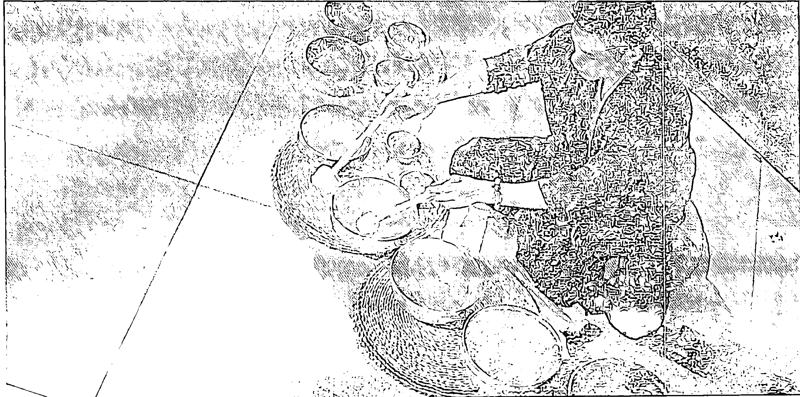

但頌缽其實並不只如此，就像朝朝說的，工具只是工具，能夠讓它發揮多大的效用以及能夠多深入，都要看施作者的意圖以及頻率。

就能量場部分，頌缽可以調整身體的整體能量場，改善讓能量場中的停滯、固著、虛弱等狀況，平衡脈輪（前面提到的人體能量吸取和代謝中心）與整體能量狀態，讓人回復健康的振動和能量流動。

就內心層面以及靈魂層面，頌缽藉由讓個案整體能量狀態回到原本應有的流動及運作模式，清理掉那些附著在能量場上的障礙，就能幫助個案療癒內在的創傷，回復到原本的狀態，並去除掉那些讓個案無法做自己的因素，進而療癒靈魂失落，回到自己應行的道路上。

## ② 水晶

水晶（Crystal）是朝朝接觸的第一種身心靈療癒工具，其實朝朝從小就很喜歡水晶，不僅僅是因為它們很美，主要是因為它們都是來自大地媽媽以及宇宙經過數百萬、數千萬，甚至更久時間的結晶累積，每一個都是如此的獨一無二。朝朝後來因為感情問題踏上療癒之路時，有位老友 Chris，同時他也是一位資深（但是很年輕）的塔羅老師，他請我去試試紫鋰輝石的能量（它對於心輪的創傷療癒非常的快速細緻又深層），我當時沒想太多，當我戴上後，發現我胸悶心痛的狀況很快速地獲得舒緩，這讓我感到十分驚訝。尤其我一直以來都覺得自己是麻瓜，什麼能量我都感覺不到，於是我便開始投入水晶的世界並研究水晶療癒，也因為這樣踏上了療癒的路。

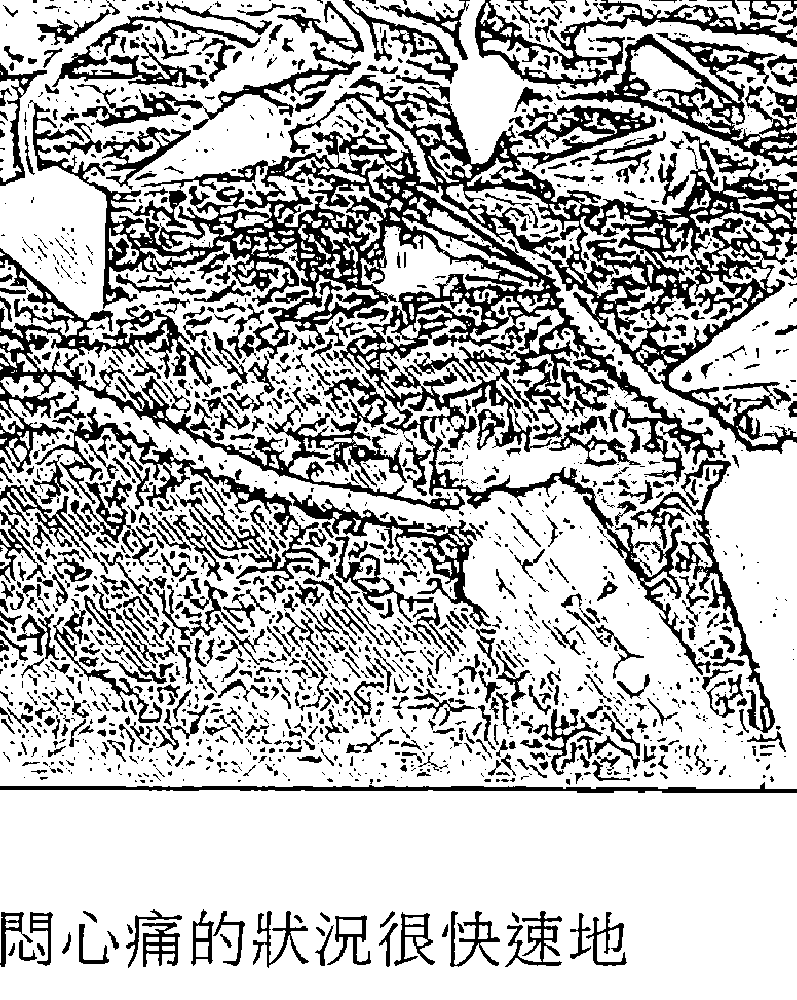

關於水晶療癒的原理，如果先不涉及每個水晶本身具有的靈性能量和特質，就基本而且大家比較容易理解的方向來說，它的療癒原理主來自於色彩、結晶形式以及組成元素等。

### 色彩療法

相信大家可能有聽過，其实就是利用不同色彩有不同的頻率，來調整我們的能量狀態。我們都知道從不可見的紅外線，到可見光的紅色到紫色光譜，再到紫外線的不可見光，頻率是慢慢的越來越高。而水晶本身就具有各種不同顏色，因此不同顏色就會產生不同的光，也就會代表不同頻率，如此便可以針對我們的需要達到不同的效果。像是如果需要多一點熱情就可以用紅色；需要冷靜一點就可以用藍色等，而且我們的脈輪（能量代謝的器官）也各自有對應的頻率和色彩，所以色彩當然也是可以療癒脈輪的。

### 結晶形式

因為每種礦物結晶形式的不同，就會影響到能量傳導的方式，所以就算同樣顏色的礦石，有的可能偏向集中能量放射（三方晶系，如白水晶）、有的偏向穩定能量（等軸晶系，如黃鐵礦）、有的會擴張能量（六方晶系，像海水藍寶）等、有的會修復能量場（如瑪瑙，隱晶質結構），還有許多的晶系以及能量傳導方式。

### 組成元素

然後是礦物所具有的元素，例如有鋰（Li）元素會讓我們感到輕盈愉快，有鈣（Ca）元素會讓人感到穩定平靜，有錳（Mn）元素會讓我們感受到愛的能量等。

說到水晶課程，大家一定都會想到有水晶女神之稱的卡崔娜·拉斐爾（Katrina Raphaell）於1986年創立的高等療癒藝術水晶學院（Crystal Academy of Advanced Healing Arts），她撰寫四本暢銷全球的水晶書籍：《水晶光能啟蒙》（Crystal Enlightenment）、《水晶高頻治療》（Crystal Healing）、《水晶光能傳導》（Crystalline Transmission）和《水晶璀璨光能》（Crystalline Illumination）。主要使用水晶排列療癒，就官方介紹上提到，而這些技術是源自於亞特蘭提斯時代（Atlantis）和列木尼亞時代（Lemuria）。

水晶有各式各樣的使用方式，還有以薩滿的方式來使用水晶，像著有《能量水晶療癒全書》的思逸老師（Seer）就從水晶的顏色、結構以及成分，再搭配薩滿對於萬物以及水晶的使用角度，切入水晶療癒課程。

目前在台灣開辦水晶療癒課程的老師其實不多，其中「蓮天境」的愛老師（Isis），從小就與水晶有著很深刻的連結，她自己也憶起曾是亞特蘭提斯時代的水晶守護者。她的水晶創造奇蹟工作坊，包含了初階、進階及高階療癒師，課程內容除了對於水晶的相關知識的建立外，最重要的是教導學員如何開啟松果體，開發自身的超意識管道，調閱出水晶的 DNA 全息圖。她會協助學員去感受、了解、甚至分析水晶的氣場強度、顏色、屬性等，並讓大家用心輪與水晶連結，而不是只有照本宣科的說各種水晶的整體特色，讓學員自己去感受體驗，對她來說每個水晶都是獨一無二的，而且也有各自專屬的夥伴（主人），因此唯有你自己學會和水晶連結，才能真正踏入水晶療癒的世界。

## ③ 芳香療法

相信大家都聽過精油（Essential oil），芳香療法（Aromatherapy）就是使用精油來治療、療癒的方式，會藉由按摩手法、泡澡、吸嗅、薰香等方式，讓精油的天然成分以及能量進入體內，達到身心靈療癒的效果。

芳香療法的起源可以探究到約西元前三千年的埃及，埃及人將芳香療法運用在生活各種層面，包括祭典、儀式薰香、助興等，古書及古廟石牆也記載了祭司們使用植物的方法，埃及人也將芳香植物運用在藥材、化妝品、甚至屍體的保存上。

像埃及艷后克麗奧佩脫拉（Cleopatra），就使用精油保養皮膚並使全身充滿香氣，讓凱撒大帝及馬克·東尼拜倒其石榴裙下。考古學家在1922年開啟埃及圖坦卡門墓時，發現埃及人使用了樹脂白松香、肉桂、乳香及雪松等防止屍體腐化，也顯示這些芳香精油的功效。

後來到了西元前四至五世紀，希臘人承襲古埃及藥草醫學後繼續研究，「醫學之父」希波克拉底（Hippocrates），將古埃及知識，用系統化的方式分類解析了三百多種藥草，並記載成冊，成為藥草醫學重要的經典。

芳香療法這個詞彙源自於1920年，有位名為雷內·摩利斯·蓋特佛賽（René-Maurice Gattefossé）的化妝品科學家，有次實驗過程中發生意外時不幸灼傷手，當時身旁剛好就是一碗薰衣草精油，情急之下他直接將手浸入薰衣草精油中，驚訝的發現不僅可以止痛，後來傷口很快就好了，連一點疤痕都沒有留下。於是他在1928年首次提出了「芳香療法」（Aromatherapy）這個詞，後來也得到許多臨床上的證實，也吸引了更多科學家加入研究。

芳香療法起源於埃及，主要盛行於歐洲，但其實各地都有使用植物進行治療的歷史，像中醫使用的各種草藥就是如此，因此相較於其他的身心靈療癒工具，精油作用在身體以及心理層面特別直接，畢竟它的原料本來都是可以入藥的植物，但芳香療法特別重視「嗅覺」帶來的效果，因此主要也是使用各種芳香植物來萃取。

精油就是經由各種萃取方式，獲得植物進行光合作用等過程所獲得的物質、能量以及生命精華，相較於一般使用草藥，要使用時還要尋找或是熬煮，精油相較起來方便許多，而且精純度也更高。

精油萃取的方式包含蒸餾法、壓榨法、溶液萃取法、脂吸法等，主要看各種植物的特質來萃取。

由於精油內含的各種天然化合物，對於人體以及心理造成各種顯著而直接的效果，而萃取出的精油也含有該種植物的能量特質，也就是它們的生命能量，因此型態不同、萃取部位不同、生長環境不同的植物，所萃取出的精油會有不同的靈性用途。

像朝朝很喜歡的岩蘭草精油，它的根長得又密又深，一般大約有二公尺，實際上它可以長到十公尺，也因為這樣的特質，它的精油讓人有穩定、安心以及厚實的能量，對於靜不下來或是不夠紮根的人，有特別好的功效，主要對應第一脈輪以及第三脈輪。

木質類的精油，例如檀香，就很適合靜心冥想，因為樹木一方面向下紮根，一方面又向天空伸展，我們靜心時也是這樣的狀態；植物生長的地方也會影響它的能量，所以同樣是薰衣草，高山上的薰衣草就多了一種更為輕盈純淨的能量。

芳香療法算是發展特別完整且有制度的療癒方式，甚至在歐洲很多國家都將芳療納入保險給付，甚至還有「芳療門診」，醫生開給你的藥就是精油！全球有各種國際系統常見國際認證芳療師機構有 NAHA，全名是「美國整體芳療協會」（National Association for Holistic Aromatherapists）以及 IFA，全名是「國際芳療師協會」（International Federation of Aromatherapists）。

## 04 花精

花精（Flower Remedies）和精油其實很容易被搞混，精油含有植物本身的有機化合物、香味以及能量等，花精純粹是萃取植物的「能量」，並將其用「高濃度的酒」保存，因此並沒有特別的味道以及化合物成分，只純粹保存植物的能量頻率。

花精據說前身就是花朵上的露珠，歐洲在十五世紀就有使用花朵露珠的紀錄，我們的中醫也有使用露珠入藥治病的記載，但是由於露水數量少又難以採集，因此一直很難推廣普及。

巴哈花精（Bach Flower Remedies）的發明者愛德華·巴哈醫師（Edward Bach），出生於英國伯明罕附近的小村莊莫斯里。他從小就立志成為醫師，想要找出治癒疾病的各種方法，而他也在1912年正式成為醫師，但是到1917年他卻因為罹患淋巴癌而病倒，當時診斷他最多只能再多活三個月。得知這樣的訊息他並沒有放棄，反而更加專注醫學的研究，沒想到身體竟然越來越好，他也察覺到心理狀態是影響肉體健康的重要因素，因此如果只想著要治療肉體是不對的，心理狀態也必須納入考量。

經由不斷的研究，他最後得出如果想要找出有別於現在可知的新的治療方法，必須返回大自然，於是他又回到威爾斯。某天早晨他經過田野，看見植物上那美麗閃閃發亮的露珠，他突發奇想地把這些露珠收集起來飲用，發現竟然對於情緒有舒緩的功效。

於是他開始研究怎樣可以量產露珠，最後他將花朵浸泡在泉水中，加以日照，導出花朵的能量頻率，再使用白蘭地加以保存，這樣的方式使得花精得以量產，他也建立了三十八支花精的系統，這就是巴哈花精，是最普遍且溫和的花精。

巴哈醫師也將製作花精的方法公開，讓更多人可以製作花精，利益更多人，目前全世界就有數十家取得英國花精製造商協會認證的製作廠商。

花精主要用來療癒情緒上的問題，由於保存的是花朵的能量，因此自然也可以用來療癒脈輪、氣場等，而且由於花精只保存能量，基本上沒有其他的物質層面的東西，相較起來更為安全也沒有化學副作用，因此又被稱為「心靈解藥」。

巴哈花精的三十八種單方花精以及主要對應症狀有：

- ① 岩玫瑰 Rock Rose：驚恐、害怕、被動、惡夢。
- ② 溝酸漿 Mimulus：緊張、害羞、恐懼已知的事物。
- ③ 櫻桃李 Cherry Plum：恐懼失去自我控制。
- ④ 紅栗花 Red Chestnut：不斷為他人擔憂操心。
- ⑤ 白楊 Aspen：莫名的緊張、對未來感到恐懼。
- ⑥ 水蕨 Cerato：猶豫不決、尋求他人意見。
- ⑦ 龍膽草 Gentian：悲觀、缺乏勇氣、懷疑、猶豫不決、沒有自信。
- ⑧ 荊豆 Gorse：深度絕望、悲觀、內心無助。
- ⑨ 鵝耳樺 Hornbeam：厭倦、疲勞、無精打采、缺乏熱忱、星期一症候群。
- ⑩ 線球草 Scleranthus：三心二意、猶豫不決、缺乏行動力。
- ⑪ 野生燕麥 Wild Oat：沒有生命目標、不知何去何從。
- ⑫ 栗樹芽胞 Chestnut Bud：重蹈覆轍。
- ⑬ 鐵線蓮 Clematis：愛做白日夢、不接地。
- ⑭ 忍冬 Honeysuckle：沉溺過去、不滿現狀但又對未來沒有期待。
- ⑮ 芥末 Mustard：起伏不定的莫名沮喪。
- ⑯ 橄欖 Olive：極度疲勞、失去活力、身心俱疲。
- ⑰ 白栗花 White Chestnut：胡思亂想、思緒不斷翻攪湧現縈繞。
- ⑱ 野玫瑰 Wild Rose：自我放棄、屈於生命安排、無動於衷。
- ⑲ 石楠 Heather：過度關注自我。
- ⑳ 鳳仙花 Impatiens：焦躁不安、急驚風、沒耐心、匆匆忙忙。
- ㉑ 水堇 Water Violet：不喜與人來往、冷漠孤獨、驕傲、疏離。
- ㉒ 龍芽草 Agrimony：隱藏憂鬱的小丑性格、委曲求全。
- ㉓ 矢車菊 Centaury：脆弱、過度順從討好他人、為他人耗盡自己力量。
- ㉔ 冬青 Holly：嫉妒、懷疑、對他人言行過度敏感，甚至會反擊。
- ㉕ 胡桃 Walnut：面對變動抉擇時會容易受到他人影響。
- ㉖ 野生酸蘋果 Crab Apple：自我厭惡、小題大作。
- ㉗ 榆樹 Elm：責任心過強、執著、承擔過多責任。
- ㉘ 落葉松 Larch：自尊低落、面對挑戰沒有成功的企圖心。
- ㉙ 橡樹 Oak：埋頭苦幹、無法意識自己已經過勞。
- ㉚ 松針 Pine：罪惡感、否定自我成就、挑自己毛病、什麼過錯都攬在自己身上。
- ㉛ 聖星百合 Star of Bethlehem：強烈創傷之後遺症、沉溺悲傷、恐懼、悲傷與驚嚇之後遺症。
- ㉜ 甜栗花 Sweet Chestnut：沒有焦點方向的努力掙扎、無法忍受的孤單。
- ㉝ 楊柳 Willow：自怨自艾、缺乏生活快樂、不滿、怨恨生命不公。
- ㉞ 山毛櫸 Beech：挑剔批判、無法認同他人與自己不同的觀點和行為以及獨特之處。
- ㉟ 菊苣 Chicory：控制他人、有條件的幫助或關心他人。
- ㊱ 岩泉水 Rock Water：以身作則、自我要求嚴格、忘卻自己心靈需求。
- ㊲ 馬鞭草 Vervain：過度熱衷、影響他人接受自己的生活方式以及信仰、身心緊繃。
- ㊳ 葡萄樹 Vine：掌控他人、過度自信、不接受他人建議、武斷。

## ⑤ 靈性彩油

靈性彩油（Aura-Soma）的發明者，英國的維琪·沃爾（Vicky Wall）女士從小就能看見大多數人看不見的世界，直覺也十分靈敏並具有通靈能力，此外她又從父親那裡學習並繼承到各式各樣自然療法以及草藥的相關知識。1984年她六十六歲那年，因為突然眼睛出血，導致失明，後來有天她在靜心冥想時，突然接收到了製作彩油的指引，開始順著直覺和指示，用家中儲存的各種天然藥材，混合製作成了美麗的彩油，而失明的雙眼並沒有影響她對色彩的感知力，她反而更能讀取到色彩傳遞出來的能量頻率。

第一批平衡油問世後，她遇到另一位同樣具有通靈和療癒能量的麥可·布斯（Mike Booth），他成為了維琪·沃爾女士的夥伴，並於1991年維琪·沃爾女士去世後，持續發展靈性彩油的調配及訓練計畫。

靈性彩油英文為“Aura-Soma”，“Aura”指的是氣場、能量場，“Soma”指的是身體，“Aura-Soma”就是光體的意思，也就是透過光來給予我們支持。它結合了色彩、植物萃取出的精油，以及礦石能量精華，融合而成美麗的雙色液體，並以此療癒使用者的氣場，達到並維持身體、心理和靈魂的平衡。

彩油使用有一個很重要的步驟就是「選瓶」，從中依序選出最有感覺的四個瓶子，依序是靈魂瓶、天賦瓶（潛能瓶）、當下瓶，以及未來瓶。

你之所以會選擇這種顏色的光的組合，因為這樣的光的頻率其實就是「真正的你」，不同的瓶子分別代表你的靈魂使命、課題等，接由彩油諮詢師對於瓶子的訊息解讀，你可以更了解自己，再搭配塗抹、配戴等方式，增加你真正屬於你自己的靈魂頻率以及光，讓你能夠更回到自己，找回自己身心靈的平衡。

彩油除了上述占卜、塗抹以及配戴外，還可以放在空間中維持能量等，用途非常多。

## 塔羅

有關塔羅牌（Tarot）起源的說法莫衷一是，有埃及起源說、中國起源說、希伯來起源說、義大利起源說等，但都無法明確指出塔羅牌真正的起源。目前發現最早的「塔羅牌」是十四世紀末到十五世紀初，義大利流行的一種類似撲克牌的遊戲「Tarrocchi」（塔羅奇），法文更直接把這個字拼成「Tarot」，現代義大利撲克牌甚至仍然使用權杖、聖杯、寶劍等符號。

許多人對於塔羅牌占卜的準確度感到不可思議，甚至還會被嚇到，就連現在許多網頁上，都有塔羅牌的運勢占卜，大家也都覺得準到可怕，也因此對於塔羅牌為什麼會準就出現許多說法，像是「牌要養」、「跟靈體有關」、「很陰」之類穿鑿附會的說法。當然我們不排除一些會通靈的老師，可以使用塔羅牌來作為和其他存有溝通的工具，但這並不是塔羅牌原始使用的方式和原理。塔羅牌之所以會準確和我們前面提過的潛意識有關，而榮格（Carl Gustav Jung）的心理學理論，將潛意識分為「個人潛意識」以及「集體潛意識」。

此外，榮格還提出，原型（Archetypes）的概念，原型指的就是對於某事物的普遍理解方式或是理解的原型。例如我們會用花形容美女，像是貌美如花，但不會用大便形容美女；我們看到愛心，很容易可以聯想到愛情、喜悅等，但不會想到仇恨這些。

另一個榮格提出的概念「共時性原理」（Synchronicity）也十分重要，這是榮格受到《易經》影響後推導出的，也稱為「同時性原理」，它指的就是很多這宇宙中發生的似乎是「巧合」的事情，其實在某種程度上都有一些關聯。

綜上所述，占卜師與個案藉由個人無意識分別的狀態下，因此最好能靜下心來減少腦袋意識思維的干擾，連結到個人潛意識和集體潛意識，藉由潛意識作用，帶領個案抽牌，抽出的牌和占卜事件之間存在著「共時性」，也就是抽到這張牌不是巧合，一定和你想問的事件有意義存在的，最後，藉由牌面展現出的畫面，對照集體潛意識中的原型概念，推導出能量流引導事件發生的狀態以及可能性。

塔羅牌主要針對特定事件推導出可能的狀態，由於是藉由當事人之意識作為連結途徑，因此占卜的事件和問題，必須和當事人有相當程度的關聯性，如果是問一個和當事人風馬牛不相及的人或問題，基本上是不會準確的。例如你要是想要問總統大選誰會獲勝，如果你只是一介平民，基本上無法問這樣的問題，問了也不會準，但你如果本身是候選人才會有準確性可言。

有人會覺得塔羅占卜不就是預測工具嗎？它跟身心靈療癒有什麼關係？朝朝都會跟個案說，塔羅占卜出來的預測結果，其實都只是參考，占卜出來的結果，不代表就你一定會怎樣（雖然很多人知道了還是改變不了，因為自己內在根本沒有清理療癒，潛意識的作用還是很大，莫名其妙的還是會往那方向走），那只是就現在的能量流狀態去推導出來的預測，如果你改變了你的內在和行為，你當然可以去改變未來！不然要是你來占卜無法改變預測的結果，那你何必來占卜？根本沒有意義。

我們都會有我們習慣的心理和行為模式，如果你的生活中沒有新的元素進來，它就只會照著原本的模式運行，療癒其實是在打破一直以來的模式，或是我們說的習氣。最早之前，朝朝為了讓自己有新的想法進來，我會去隨意逛逛書店，看到哪本書的名字吸引我，我就翻翻或是直接買回家，而書中總會有一些是我以前從來沒有過的看法和思考模式，我也因此慢慢打破既有的模式。

後來接觸到塔羅牌，先不論它對於預測的準確度，但是它總可以讓我從不同的角度來看事情，就好像有另一個朋友站在局外幫助你看到實際情況，對於幫助我看清目前的狀況有很大的幫助，因此我才會開始學習，並在這裡介紹它。

塔羅牌目前主要有「偉特」以及「托特」兩大系統，偉特塔羅牌的畫面比較有明顯的主題性以及圖像，所以可以從牌面的圖畫來解讀或聯想牌義；托特則比較沒有一個明確的主題性，畫面充滿象徵符號，所以使用上入門較不容易，除了對於各種符號的象徵意義要有基本了解外，也要有相當的能量感知力以及直覺力；但是不管是哪一種塔羅系統的塔羅牌，都是一個讓我們得以探索意識之海的工具，能幫助我們更清楚自己的狀態，進而成長蛻變。

## Ⓠ 家族系統排列

家族系統排列（Family Constellation；Systemic Constellation）創始人德國心理治療師伯特·海寧格（Bert Hellinger），曾經有二十年左右的天主教傳教士生涯，他結合身為心理醫師的各種專業，包含精神分析、原始治療、家族治療等訓練技術，發展出家族系統排列這樣的心靈工作方式。

他發現一切宇宙有其運行的規律規則、能量流動的方式，我們東方稱為「道」，無論家族系統排列或其他系統排列（因為系統排列不僅只能應用在家庭關係療癒上），都是在順應著「道」，讓一切自然運作。

### 歸屬感、愛

在家族系統排列中，更重要的是家族中的每一個成員，應該都要能平等的歸屬於家族之中。會有疾病、事件、狀況等需要療癒的狀態出現，背後的最大原因是「歸屬感」與「愛」，都是基於對這個家族最大的愛。例如，在家族中有被排除、被遺忘的成員，後代子孫很可能就會產生和他一樣的行為，也就是出現代替他位置的人，而這個代替他位置的人，會產生一些狀況，甚至是疾病等，都是因為對於家族的愛，而自動去代替填補這個位置。

但這樣的愛是盲目的愛，家族系統排列所做的是讓它變成「覺知的愛」，讓這樣的事情被看見，透過排列的方式去尊重，並讓被排除遺忘的角色重新納入心中，回到家族裡，家族系統就會回到應有的秩序，愛就會開始流動。這樣的狀況都不是在意識層面能夠察覺到的，但是因為和家族中的人之間的連結，讓這樣的狀況發生，當然也可以透過家族系統排列的方式讓事情顯現出來。

### 愛的序位

在整個宇宙中，其實我們都是相連的，有一個宇宙訊息場以及集體潛意識的存在，家族系統排列藉由現場的代表的體會、互動等，顯現出目前面臨的問題背後的隱含關係，找出這些失衡、卡住的狀態以及原由，再藉由排列師的協助，讓每個人或是事物能回到應有的位置上，也就是「愛的序位」上，愛的能量於焉能夠重新連結流動。海寧格說：

> 愛是規則的一部分，而規則是已被排定的，
> 愛只能在規則範圍內成長，
> 愛常是有代價的，常讓人感到愧疚，
> 但愛只是一顆種子，並無法改變土壤，
> 悲劇中的英雄是盲目的，
> 人要回歸秩序，面對真相。

每個人在家庭中的成長環境、教養方式等，都會造就我們的信念、價值觀以及對這宇宙世界的看法等，對我們的人生產生極大的影響，不論是關係、金錢、自我價值、靈性追求上等皆是。

家族系統排列可以顯現出家族中成員彼此的關係以及感受，不僅是在世的成員，連因過世、離婚、墮胎等方式離開的成員，都應有他們在家族中的位置，要是序位錯亂或有空缺，影響力會世代延續，問題將一再重複。

我們在家庭中學到的關係互動模式，往往就會成為未來我們自己的親密關係建立以及互動的模式，像從小在家暴家庭中長大的孩子，長大後自己可能繼續成為被害者，甚至轉變成為加害者。家族系統排列對於關係上的問題處理，特別直接有效，但這套療癒方式不僅可以來檢視家族中成員的關係，並使其在靈性層面獲得和解，回到序位，更可以用來探討個案與金錢、情緒、靈魂等之間的關係，甚至企業組織中，也可藉此找出最適合的定位以及運作模式，因此有人不會稱之為「家族」系統排列，直接稱為「系統排列」，就是因為一切都有序位存在。

之前我們有一個小聚會，互相交流彼此的療癒方式以及心得，其中一位朋友，大愛老師是很優秀的占星、催眠以及家族排列療癒師。對於家族系統排列我一直感到好奇，加上自己知道原生家庭和我之間的關係，是我個人主要自我療癒的核心，也就在這樣的機會下進行了我的第一次家族系統排列。

我的父母都很年輕的時候就結婚了，加上他們是白手起家，覺得應該要更努力打拼，讓這個家衣食無虞，所以每天每日沒夜的工作，因此從小我就常自己一個人在家。當時住在祖父母家，雖然同時也和堂哥堂弟住在同一個屋簷下，但是跟他們我總覺得自己是不同的，尤其吵架爭執時沒有人可以給我奧援，我覺得自己很孤單，也因此學習自己獨立，什麼事情都習慣自己來，加上也看到父母那樣辛苦的工作，從小就有種「沒有人應該要對你好，你自己必須堅強起來」的感覺。

後來弟弟和妹妹出生，我也肩負起照顧他們的角色，還記得我媽媽曾跟我說，我幼稚園的時候就已經會幫我弟弟洗澡，我小學時妹妹出生，我就負責帶他，幫忙換尿布、餵奶等。

由於覺得自己要自立，加上對自己的要求，從小的課業成績各方面都不需要別人擔心，一方面可能也是希望藉此來獲得肯定和關愛吧！一直以來，我在家族裡面都擔任一個相對成熟的角色，家族裡的長輩也都很喜歡我，由於對於我的信任，甚至遇到問題還會詢問我的意見，但因此我一直沒有好好體會過什麼叫做「當小孩」的感覺。

這樣的關係也影響日後我的感情生活等各方面，由於我在家庭中的序位錯誤，我會把家族中的長輩都看成是「孩子」，遇到事情想商討時自然不會找他們，所以大多時候都是自己要想辦法處理，只有一個人我會願意傾訴，就是我的另一半，因為我會覺得只有他跟我才是對等的，但這樣會把所有的期望、壓力都放在他身上，此外我對另一半的要求也會特別高，對方也常感到莫名的壓力。

這幾位朋友都不是很清楚我家裡面的狀況，也都不認識我的家人，當天排列師朋友請 A 朋友扮演我的父親、B 朋友扮演我的母親，當他們一站到代表我父親與母親的位置時，A 感受到強烈的胸悶以及悲傷，感覺整個人十分難受，有話想說但是又說不出口；B 朋友則是開始狂哭，哭到歇斯底里、停不下來。藉由排列師的引導，A 和 B 都說其實我的父母把這一切都看在眼裡，對我一個孩子必須從小就這樣承擔這些責任覺得十分心疼，也感到很愧疚，最後他們都對我說出：「你辛苦了」。

朝朝本人對於能量的感受並不強烈，但過程中我不斷感覺到雞皮疙瘩，滿滿都是那種被觸動的感覺，尤其最後那句「你辛苦了」，深深刺入我的心。

我才明白原來我一直在代替他們應該有的角色，不僅我感到辛苦，他們也無法好好在他們應有的位置上，也就造成父母之間一直以來的很多衝突，包含家暴等。後來他們倆自然移動，肩並肩站在一起，這也顯示出其實他們很愛彼此，也很愛我們這些孩子。

排列師說，希望我可以做任何我想做的事情表達對他們的感謝，我順著當下的感覺跪了下來，並深深地向他們磕頭，在頭碰到地面那一剎那，我開始不斷地哭泣，哭到我甚至無法起身。對於他們過去的怨恨、疏離不滿，以及想為他們承擔責任的心，全部都在這一刻釋放。我感謝他們，成為我的父母、感謝他們生養我、曾經為我們所做的一切，雖然不一定那樣完美，但是那真真確確都是愛。

當我起身後，我看到他們兩個眼裡的感動，而且他們也牽起了彼此的手。排列師說，他們已經有了彼此的支持，而且他們有他們自己的生命課題，我要把他們的課題還給他們，現在我起我應該要走上我自己的人生道路，他要我轉過身，背對我的父母往前踏出去，我也感受到我可以真正的走在我自己的路上了。

我們常常無法看清楚表面現象背後隱含的意義，尤其在面對自己親密的家人以及另一半時更是如此，家族系統排列表現出這些隱藏的能量流動以及牽引力量，讓我們看清現在自己所處的狀態和位置，再藉由歸位讓「愛」能夠重新流動，重新與「道」同行。

## 薩滿

有人稱薩滿（Shaman）是「薩滿教」，雖然薩滿可以說是一切宗教以及能量療癒的起源，嚴格來說它並不是一種宗教，或者應該說它是一種信念、智慧、表達出和宇宙萬物的連結、自己在這世界的定位以及生活方式。

世界各地都有薩滿，不僅我們印象中位於亞馬遜河流域、秘魯一帶的印加傳承薩滿，西伯利亞有薩滿、蒙古有薩滿、韓國有薩滿（韓國恐怖電影「哭聲」中就有描述），歐洲的巫師、巫醫其實也都是薩滿，甚至台灣也有薩滿（其實我們看到的乩身也算是薩滿，原住民原始信仰也是）。

怎樣的人可以稱為薩滿呢？薩滿其實就是「巫」，由此不得不讚嘆中文造字的精妙，從這個「巫」字來解析，上面一橫和下面一橫代表天與地，表示薩滿的職責之一就是連結天地；左右兩個「人」代表一男一女，也就是陰陽，所以薩滿的另一個角色就是平衡陰陽，綜上所述，薩滿就是負責連結天地、平衡陰陽的人。

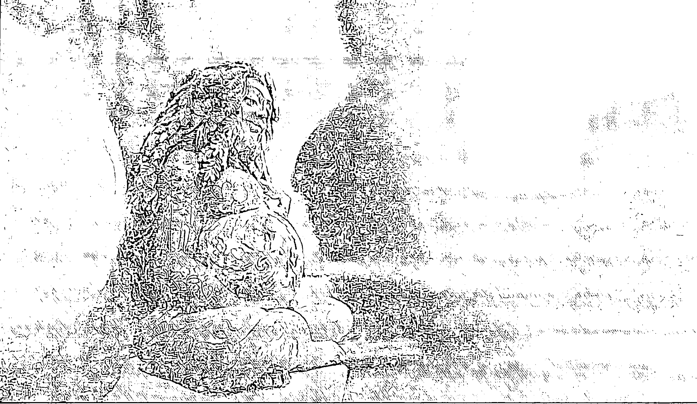

薩滿在以前部落時期可以說是非常重要的角色，他們的「業務範圍」也非常廣，可以說是「住海邊的」（管很寬！），生病找薩滿、家裡鬧鬼找薩滿、卡到陰找薩滿、占卜找薩滿、結婚找薩滿、喪禮找薩滿、村莊決策事情找薩滿等，幾乎什麼事情都找薩滿，由於薩滿傳承了一代一代的知識以及能力，又可以藉由意識轉換獲取更多現今尚且未知的訊息和知識，可以說是每個村落的智慧之源，所以當初西方國家入侵各地時候，第一個要消滅的就是薩滿。

由於薩滿具有與靈性世界溝通來往的能力，他們可以獲得很多一般人無法得知的知識，對於他們智慧的開展也有很大的幫助。很多的各宗教的先知、大成就者其實也可以說是薩滿，他們都曾到靈性世界去遊歷並帶回可以利益這個世界的教導。

薩滿存在於各地，就如同宗教一般，也會依照各地的環境、文化背景而有不同的發展，但薩滿沒有一套統一的系統規則或是教主、教義等，因為基本上薩滿經歷是非常個人的，你自己具有的薩滿經驗是屬於你個人的，並不適合也不需要大肆宣揚，這也就是薩滿並沒有一套絕對的系統的緣故。

由於薩滿是個人意識開展的途徑，對於想要掌權並操控群體思想的人來說，他們想控制的對象，如果有意識開展或獲得智慧的能力，就不是他們所樂見的，因此造就偏激基督教徒在歐洲自十二世紀起至十六世紀為高峰，形成的慘烈死傷的獵巫行動，也導致自由思想、自我智慧開展的可能性被壓抑。雖然如此，近年來，幾百年來的西化思想開始受到質疑，薩滿復興運動也開始流行，越來越多人開始探索這古老的智慧，試圖找回與我們生活的環境、宇宙萬物、甚至是和自己生命的連結，並從中獲得力量。

經由現代的研究以及整合，薩滿療癒現今主要有兩大系統，第一就是以美國四風協會（The Four Winds Society）為代表的印加薩滿傳承，另一個就是薩滿研究基金會（The Foundation for Shamanic Studies）的核心薩滿（Core Shamanism）。

### 印加薩滿

美洲原住民部落裡面，巫師施行能量療癒的傳統已經超過五千年，其實那只是目前可知的，在更久遠前還無法記錄的時候，世界各地的薩滿們早就已經開始施行能量療癒以及相關服務了，並且藉由世代以及口耳相傳傳承下來。

到達南美洲那些來自歐洲的掠奪者，帶來了許多當地人難以理解的觀念和信仰，而這樣的信仰也隨著西化傳播到了世界各地。例如，他們認為一切食物和資源都是人類擁有的，人類擁有至高無上的權力，跟其他的動物和植物不同，是這些動植物的「主人」，他們覺得人不可能有能力跟動植物、跟山川河流，甚至跟上帝（神）對話，他們也習慣以物質來看思考和辨別事物。相對的，（印加）薩滿們覺得這些食物和資源都是天地給予的，人類只是這一切的一部分，不管動物、植物、礦物、山河大地等，都是我們的親族，我們本來也就可以跟它們，甚至跟神對話。此外，薩滿是以能量來辨識事物，也因此不會受到這些物質的限制，本質就是「無限」。

美國四風協會（The Four Winds Society）創辦人阿貝托·維洛多博士（Alberto Villoldo）是一位心理學和醫學人類學博士，曾在舊金山州立大學創立「生物自制實驗室」，研究心理如何引發身心症狀與健康問題。後來他毅然決然跟隨亞馬遜及安地斯山當地薩滿，研習傳統巫醫療癒技巧超過二十五年，將之加以整理出一套印加人傳統能量醫術，經由對能量場的療癒，去除身心靈各方面狀況的方式，例如光啟治療等。

目前他在美國猶他州公園城主持四風協會，教導並訓練來自世界各地的學員有關薩滿能量療癒的技術，著有《大靈之藥》、《印加能量療法》、《印加巫士的智慧洞見》、《印加靈魂復元療法》、《印加大夢》、《四風之舞》等十餘本書。

印加薩滿們流傳著一個古老預言提到，從1993年到2012年冬至之後，也就是2012世界末日預言那天，因為行星間的引力、宇宙射線等，地球面臨一連串重大的轉變，人類的意識慢慢覺醒，光體也變得越來越淨化透明，一切都在揚升，這些過去的物質、金融、制度等面臨前所未有的風暴，人心也動盪不安，每個人也開始面對新的靈魂課題與選擇。

其實就朝朝自己感覺，不僅是2012年，這樣的轉變一直在持續著，大家應該也會發現開始有越來越多人在這段時間會離開這個地球，有一說是因為他們的頻率無法跟上地球揚升的速度，因而轉往其他星球投生。如果能趁這樣全體揚升的機會，從過去那樣的物質、貪婪、掠奪中醒悟，開始互相扶持，學習重新找回與動植物、其他存有、地球、星辰，甚至宇宙的連結，將能創造出一個全新的黃金紀元。

由於新世代的到來，帶來意識提升以及靈魂的覺醒，越來越多人從過去被灌輸的限制思想中慢慢掙脫，開始找回自己的力量，這也是薩滿以及身心靈界的興起原由。為了地球以及所有親族的未來，不僅印加薩滿們決定將這些珍貴的知識和智慧傳給世界各地的人，不分種族與國家，讓這個世界能順利度過這樣的轉化期。

### 核心薩滿

核心薩滿（Core Shamanism）這個詞彙是由人類學家邁克・哈納博士（Michael Harner）所提出，他可以說是將薩滿文化帶入西方世界的先驅，曾在美洲各地傳統部落進行人類學研究，也因此接觸到各部落裡面的薩滿，他很想了解為什麼薩滿在部落裡面，這麼受到重視以及倚重，幾乎什麼事情都找他們幫忙，尤其當他看到各地不同的薩滿用著許多他習慣的邏輯腦無法理解的行為，來「療癒」時，他的好奇心被深深地激起。

他問薩滿到底他們在做什麼？薩滿告訴他「如果你想知道，你必須自己來體驗，這是我無法用言語表達的」。身為人類學家，本應就旁邊者的立場來分析研究，但為了真正了解這一切，他跨越了人類學家與受觀察對象的界限，也從此踏入各種不同的薩滿知識與學習。

經過幾十年的學習、統整與實驗，他把許多跨部族的薩滿文化與療癒方式分析比較，整合出在各地薩滿療癒技術以及知識中的通則，並去除過多的文化背景傳統，讓各地薩滿的核心精華得以被接受，並應用到西方甚至全世界。1979 年，他創立薩滿研究學會（Foundation of Shamanic Studies），致力於保留傳統薩滿文化，也在全球各地開辦工作坊，將核心薩滿的知識與力量推廣給世界各地的人們。

核心薩滿有一個很大的特色，就是對於鼓聲以及靈性旅程的應用，人類本來就有意識轉換的能力，像我們在夢中其實就是一種意識的轉換。他們發現世界各地的薩滿都使用不同的方式激發意識轉換，例如，有些薩滿使用植物，像是死藤水（Ayahuasca）、迷幻蘑菇（Psilocybin Mushroom）等（很多現在被列為毒品，但是被列為毒品其實也是一種意識控制的手段），但大多數的薩滿並不使用致幻植物來進行靈性旅程，其中音波驅動（Sonic Driving）就是常見的方式，而最常使用的就是薩滿鼓，因此薩滿鼓也被薩滿稱為來往三界的馬車。

薩滿們可以藉由各種方式進行意識轉換，也就是是進入所謂的薩滿意識或半催眠態，腦波大致上是介於 θ 波至 δ 波之間，在那樣的狀態下會導致意識擴張，可以獲取許多以前不曾有過的訊息和知識。因此，薩滿便可以藉此占卜、獲取指引、療癒自我及他人等。

每位薩滿的經歷都是非常個人的，都有各自的「天」和連結（或是說神、指導靈、力量動物等），通常他們不會在「中部世界」，也就是我們所在的這個世界進行旅程，因為這個世界龍蛇雜處，好的壞的存有都有，在此進行旅程太過危險，遇到的存有是善是惡難以分辨，因此會到「上部世界」以及「下部世界」尋找慈悲的靈性存有，給予協助以及力量。

有趣的是，雖然每個薩滿對於靈性世界有各自的經歷，但經過薩滿研究基金會蒐集的資料顯現出，每個薩滿探索到的部分竟有許多相同點，也由此可得知這些世界是的確存在的。

核心薩滿認為每個人都可以和自己的「天」連結，因為這是我們本來就具有的意識轉換能力，藉由這個方式，我們可以在我們的生活各層面，不管是身體、心理、情緒等，以及靈魂層面獲得幫助以及提升。薩滿們也可以藉由靈性幫手的協助，幫助個案療癒能量場，甚至尋回失落的靈魂碎片，療癒靈魂失落的狀況。

在台灣說到薩滿，大家一定會想到李育青老師，同時他也是位牙醫師，他曾到秘魯學習印加薩滿療癒，目前居住在台東。據說他曾經有很長一段時間沒有教授薩滿課程，沒想到因緣際會下，有機會可以參加他的課程。

我感覺李育青老師是一位很單純、充滿自在喜悅、並且活在當下的人，他可以真切的感受到吹過身上的風、樹木的低語、太陽給予的溫暖等，感覺他跟這個世界的一切都在一起，真真正正的在一起。課程結束的那天，心中對於這樣有別以往我們認知到的世界觀還有生活方式讓我感動不已，在返回台北的火車上，便用手機打下了：

> 「對於薩滿一直以來都很想去了解，
畢竟薩滿遍及世界各地，
也可以說是最早能量醫學，
以及對於世界的看法和生活方式。
很開心有機會能在台東這麼美的地方上課。

對薩滿來說，這個世界並沒有所謂絕對的善惡好壞，一切都是你的分別念，都是你的心在造作和對抗。就像能量其實沒有好壞，只有比較輕盈或較沉重的，你不適合用的，或許對他族類來說是舒服的。

此外，薩滿對於天地萬物的感謝（我覺得似乎比崇敬更適合），以及在這世界的定位，也是我們一直以忽略及需要學習的。

我們一直在追求這世俗的一切，不管是事業、感情、權利、甚至是靈性成長，卻常常忘記這些默默支持我們，給予我們滋養，指示及撫慰的大地、天空、太陽、海洋、各種動物、植物、星辰，甚至精靈還有其他存有等。」

對薩滿來說，這些都是我們的親族，沒有什麼不同，他們一直很無私的支持幫助著我們，即使我們對他們有些誤解和錯誤的定義，但當我們一呼喚他們，他們自然願意來幫忙協助，不為什麼，只因為我們都是親族，都是家人，是一種真正的世界一家。

我們常和我們的生活環境脫節、失去連結，感覺自己是孤單一人，也因此失去了力量，因為你切斷了所有親族給你的愛和支持。對薩滿來說，我們永遠都不孤單，因為我們擁有這個世界，擁有整個宇宙的親族。

前面介紹了一小部分的身心靈療癒方式，療癒方式成千上萬，沒有絕對的好壞，只有適不適合你，這也是為什麼佛陀要演說八萬四千法門，就是因應眾生根器而說。

「條條大路通羅馬」，你可以選擇各種方式去達到你的目的地，不管走路、搭車、坐船、搭飛機都是自己的選擇，而且就算搭飛機也有不同航空公司，不是嗎？但重點在於，你必須對自己的目的地有正確的了解還有確認，不然就算你搭的是最快最豪華的飛機，飛到了錯的地方似乎也沒用；抑或是，你搭了這樣的豪華客機，卻不斷在空中盤旋，永遠不知道自己要去哪，也飛不到目的地，好像也沒有什麼意義，不是嗎？

# CHAPTER 03
## 宇宙之變——靈氣

## 01 什麼是靈氣

靈氣（Reiki）是朝朝主要使用的療癒方式之一，靈氣這個中文名字很容易被誤會，主要是因為「靈」這個字，加上一般大眾對於能量、氣場等方面的知識比較沒有涉獵，因此很容易會聯想到「外靈」、「靈體」、「鬼魂」等，於是產生排斥，而且也很容易跟宗教聯想在一起。

靈氣源自日文，“Rei” 意謂：靈、宇宙等，“Ki” 意謂：氣、能量等，靈氣即是「宇宙生命能量」（Universal Life Energy）之意，但祂其實不只是「氣」，祂是聲音、是光，是一種滋養一切的生命，形成一切存有及世界萬物，包括人類、動物、植物及環境等的自然能量，就是那股創造的源頭。在各地，祂也有著不同的名字，神性、佛性、宇宙、造物主等。也因此，祂的作用並不限於身體層面，包括心理，甚至靈魂層面的療癒，都是靈氣可以做得到並深入的。

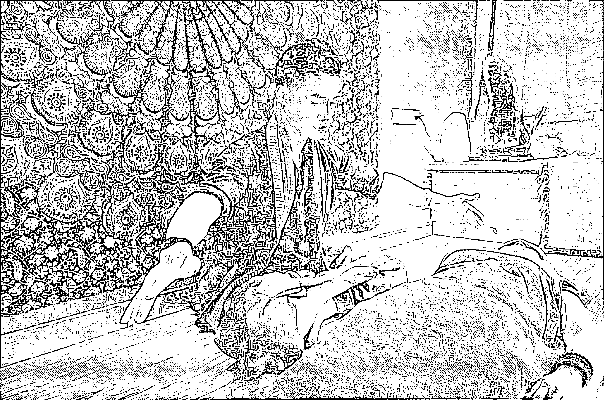

從比較容易理解的角度來看，植物行光合作用吸取宇宙能量，動物吃植物，我們再經由飲食、運動等方式，由此獲取使用經過他們轉換過的宇宙能量。此外，我們自己也有各種新陳代謝及運作宇宙能量的能量器官，例如脈輪、經絡。但當我們能量不足、失衡、阻塞時，身體就會發生問題，心理和靈魂層面勢必也受到影響。

靈氣請求的就是能量的平衡，藉由療癒師的雙手，把源源不絕的宇宙能量傳送到個案身上，平衡並補充個案整體的能量場，使其回到完整平衡的狀態，同時也療癒個案的靈魂，讓個案感覺到放鬆及被呵護的感覺，甚至引導個案之靈魂，重回其應行之路。

## 02 靈氣的起源

靈氣重新被發現於十九世紀的日本，由臼井甕男（Mikao Usui）老師發掘並創立，故此靈氣系統又稱為「臼井靈氣」。

有關臼井老師的生平故事說法眾多，有說他是芝加哥大學的博士，並曾經擔任校長；有一說是佛教天台宗弟子；有一說他是為了追求佛陀以及基督徒手療癒病人的秘密，而發現靈氣；也有另一說他是為了思索宇宙人生的道理意義，才不經意在鞍馬山絕食靜坐時，接受到了靈氣能量，甚至還接收到靈氣符號，並開始獲得徒手療癒的能力。

但目前大家對於臼井老師前往鞍馬山進行斷食，在第二十一天時發現靈氣這部分是較無爭議的，當下他也體會到那種安定、與宇宙一體的感受。返家途中他接二連三的體驗各種療癒經驗，像是下山時撞到自己的腳，指甲被扯裂流血，發現自己的手竟然可以讓傷口快速復原等，也因此發現靈氣的療癒力量。

後來臼井老師在日本行醫，雖然幫助了很多人，但他也慢慢發現有很多病人接受療癒後，不久又會因為相同的問題回來，並沒有真正為自己的健康負責，而是把責任轉嫁到醫生或治療師身上。他明白身體以及心理方面的不適，其實都是來自於內在，如果個案的內在狀況並無改變，這種情況就會一再發生。

臼井老師教導靈氣，讓更多人可以體會到自己的力量，進而療癒自己，為自己負責，更重要的是，用一種更正向、感恩的態度來生活。因此，「靈氣」不單是用來替人解決病痛，亦能透過德行及修養去解決人們心靈上的問題，達至身心靈完整的狀態來生活。

臼井老師依據明治天皇頒布的五項原則，對於靈氣實行者給予「靈氣五守則」（靈氣人生觀），幫助提升生活品質與內在品質，只要有智慧地運用這些守則，就能療癒自己的心靈，也同時消除痛苦和病因。

靈氣療法確實是以秘密方法來帶給我們好運，同時亦奇跡般治好疾病，臼井老師教授的靈氣，以簡單及精確為重點。實行方法又極為容易，簡單可行。每日早上及晚上，只要靜心，雙手合十來默念「靈氣五守則」，你會感受到你的人生越來越正面且未來越來越清晰。

## 03 靈氣如何傳入西方國家

臼井老師有一位學生林忠次郎（Chrijiro Hayashi），他是美國退役海軍軍官，當時正在尋找一個可以服務他人的方法，因緣際會下找到了臼井老師。經過靈氣點化學習，他深入練習了解有關靈氣的一切，而當臼井老師即將離世前，便指派林忠次郎老師為靈氣導師，由他負責保持靈氣精髓。

林忠次郎老師在東京設立診所，行醫並傳授靈氣，診所實習生則負責針對不便外出的個案給予療癒，他也留下許多靈氣如何對症治療、使能量場重新平衡、身體再度復原等相關紀錄。

## 04 靈氣的妙用

靈氣是一切的起始以及源頭，因此祂可以任何形式展現，也可以作用在任何層面：

### 生理方面

改善睡眠及失眠、清晰思慮、舒緩肌肉、眼睛疲勞、頭痛、肩膀疼痛、背痛、腰痛、膝痛、關節痛、腸胃不適、腹瀉、食慾不振、便秘、紓解女性經前綜合症狀及改善手腳冰冷、紓緩手術前後痛楚及加速傷口痊癒、增強免疫系統、舒緩癌症化療期間不適等，是一種強而有力的輔助療法。

### 心理方面

減輕焦慮、壓力、精神緊張、煩躁、恐懼，讓導致困擾的因素變清晰、使人變得積極、正面、樂觀等。

### 靈性方面

去除那些附加在自己靈魂上不屬於你的東西，找回你自己的力量，做你靈魂想做的事情，回到你到道路上。也可以增強自覺力及直覺力、了解生命的目的和使命、體會與萬物合一、自己就是源頭、本初智慧開展的境界。

簡而言之，靈氣可以應用在所有你想得到、想不到的地方，因為祂就是宇宙能量，那構成一切並給予支持的能量，來自本源並無處不在，因此不僅對人，對動物、植物、水晶、礦石等都可應用，甚至對機器也都可以使用。

## 05 靈氣的基礎知識

### 靈氣五守則

白井老師發現靈氣之後在日本行醫，發現有很多病人療癒後，不久又因為相同的問題回來，並沒有真正的為自己的健康負責，而是把責任轉嫁到醫生或療癒師身上。其後又發現，身體以及心理方面的不適，其實都是來自於內在，如果個案的內在狀況並無改變，這種情況就會一再發生。

於是白井老師開始教導靈氣，讓更多人可以體會到自己的力量，進而療癒自己，為自己負責，用一種更正向、感恩的態度來生活。

白井老師依據明治天皇頒布的五項原則，對於靈氣實行者給予「靈氣五守則」。這並不是一種戒律或是教條，而是一種對於生活的看法和態度以及生活方式，是可以真正讓我們感受到正面和光明。靈氣五守則是：

> 招福之秘法，萬病之靈藥

- 1. 就在今日，我不生氣。
- 2. 就在今日，我不擔心。
- 3. 就在今日，我心懷感謝。
- 4. 就在今日，我完成使命。
- 5. 就在今日，我善待身邊之萬有生命。

這五守則都有一個共通點，就是「就在今日」。我們會悲傷、難過、擔心、害怕等，其實都是因為「過去」或是「未來」。你是不是聽過、甚至自己也曾說過「要是我當初怎樣就……」這樣的話，為了過去已經發生的事情後悔、難過，但是你能夠去改變嗎？一直難過後悔就會有變化嗎？這是「過去」讓我們不快樂的狀況。

另外，我們也常常為了還沒發生的事情在擔心害怕，像是小孩出門會不會出事？考試會不會考不過？明天去上班會不會被老闆罵？但，這些是你能掌握的嗎？你能夠掌握的、能夠去做的，你早就去做了，但我們常常還是放不下，讓自己活在擔心中。

於是，我們大多數都為了「過去」的事情難過悔恨，為了「未來」的事情擔心害怕，沒有活在「當下」。當我們回顧過去，發現自己的人生就在這樣的狀態下流逝了。

因此，「就在今日」這幾個字看起來簡單，其實有很深的意涵，當我們可以好好的把握「當下」，我們就是在創造未來、改變過去！

接下來，簡介這五條守則：

#### ✨ 就在今日，我不生氣

佛法說「火燒功德林」，意思是說你的憤怒，會把你一直以來累積的修行毀於一旦，要求大家不要生氣。如果要你從今往後都不生氣，你做得到嗎？因為覺得不可能做得到，很多人在第一時間就放棄了。

而靈氣第一條希望大家能夠試著「就在今日」不要生氣，感覺是否簡單許多？似乎可以努力看看，而當你真的做到「就在今日，我不生氣」的話，你的每一天就不再生氣，其實就等於你從此不再生氣了。

#### ♡ 就在今日，我不擔心

同上，如果要求你從今以後，都不去為了未來的事情擔心，你做得到嗎？但是當你可以每天都做到「就在今日，我不擔心」，你的人生也就與擔心絕緣，你自然會感覺到輕鬆愉悅。

#### ❀ 就在今日，我心懷感謝

我們常常忘記對周遭的人、事、物抱持感謝，因此造成隔閡。同樣的，忘了對宇宙、大地的給予懷抱感恩，認為大自然供給資源給人類是應該的，就造成資源的浪費與耗竭。像朝朝很感謝菩薩，感謝宇宙讓我可以從事這份感受到生命價值的工作，也感謝學員們願意來上課，不僅僅讓我生活無虞，最重要的是讓自己有轉變的機會。常常抱持感謝，你將重新感受到愛的流動，以及和這世界的連結，你的生命也將變得更正向，好的事情也會自然發生。

#### 就 在 今 日，我完成使命

這段文字，原本日文是以漢字書寫的：「完成自己的業」，其實就是善盡自己的責任，把自己的各個角色扮演好，即使有些角色也許不是我們自願去扮演的。

朝朝曾經是警察，有些長官會說：「某某某都犧牲下班時間來加班，而且還沒領加班費……，要是每個人都能像這樣多做一點，只要從 100 分做到 105 分，這樣我們的單位就會進步會更好。」我每次聽到都會狂翻白眼，而且是超級瘋狂的那種翻，快翻跟斗的那種翻，對大多數人來說，這份工作就只是個工作，並不是「志業」，憑什麼要求我這樣？

「就在今日，我完成使命」這條靈氣守則不是要你鞠躬盡瘁，死而後已，而是要你誠實地把自己份內該做的事情做完就好，善盡自己的職責，自己問心無愧。今天你領這份薪水，就應該做多少事，不要隨便做、亂做，好好完成，但也不需要逼自己。

像朝朝的工作是靈氣導師，我每次上課就是好好的把我的知識、經驗分享給學員，讓學員在身心靈各方面，都能變得越來越好，自己越來越有力量，我也可以因此感受到價值。

#### 就 在 今 日，我善待身邊之萬有生命

朝朝本身是佛教徒，所以每次修法後都會迴向，迴向時候一般會說到要把今日修持的所有功德迴向給「盡虛空遍法界所有一切如父如母的眾生，以及生生世世累生累世所有的冤親債主……」，撇開這背後的深意不說（因為現在不是要說佛法），其實會感覺有點虛無、有點遙遠啊～（遠目）對剛開始修行的人來說，似乎是“Mission impossible”。

> 「就在今日，我善待身邊之萬有生命」這條靈氣守則說的，我們不需要說到世界大同、拯救世界之類的，就只是對自己許下，在今天有緣與我相遇的所有生命，不管是人、動物、花花草草等，我都好好的善待他們，如此，感覺似乎不再那麼遙遠或困難了，當越來越多人願意善待遇到的人事物以及眾生，互相給予愛與關心，你的人生以及世界自然就變得越來越美好。

「靈氣五守則」實行方法不僅容易，又為我們人生方向提供了明確又簡便的道路，因此希望不管你是不是靈氣學員，都可以每日早上及晚上，靜心雙手合十或直接將雙手放在心輪上來唸誦，你會感受到你的人生越來越正向且清晰。

### 點化／靈授

靈氣課程中，大家對於經過靈氣點化後馬上就摸得到能量，並且可以開始傳送能量都感到不可思議，其實朝朝並不是「給予」學員這樣的能力，只是幫助大家憶起自己天生具有的能力。

我常舉例，當你不舒服時候，是否手會下意識地放在不舒服的地方呢？頭痛摸頭、腳痛摸腳、生理痛摸肚子，這些習慣性的動作不是沒意義的，表示我們的手應該本身就具有療癒能力，只是我們遺忘了，我們本來就應該可以接引自然能量，但因為我們跟自己的本源分離，以及對自己不信任，造成管道阻塞、頻率差異而無法使用這宇宙能量。

那我們如何重新打開自己的能量通道並連結本我（源）呢？靈氣課程中有個重點，就是靈氣點化（或稱靈授，Attunement）。靈氣點化即是由訓練且具靈氣傳承，也就是可以向上追溯其一代一代傳承，到臼井甕男祖師的靈氣導師，清理學員之氣脈並調整頻率，讓接受點化後的學生，可以接收到靈氣能量並開始使用靈氣，如此才具有靈氣傳承，點化才會有效果，並連結到真正的靈氣傳承力量。

而且一旦你接受過點化，你接引靈氣的能力就終身不會失去，就像學樂器、學游泳等，基本上這輩子你都不會忘記，但很久沒使用還是熟練度會下降一些，不過只要再稍微練習熟悉一下，感覺就回來了。

靈氣點化，除了可以讓學員開始使用這源源不絕的宇宙能量外，我覺得有一個最大的益處，就是一旦連結至宇宙本源，你將更清楚自己是誰，更有自覺能力，更能覺知當下，也就更了解自我人生的目標和道路，而且人生道路還會自己出現！開始會有種所謂的「開竅」的感覺，這是很多學員也包括我，在學習靈氣並實行後，真的感受到的，我也因此順應宇宙的指引成為療癒師。

當我們和自己的高我、本我連結後，我們需要做的，只是信任宇宙以及自己，並持續往前。因此學習靈氣不代表你就要去療癒別人或是往身心靈方向走，當然你可以幫自己和身邊的親人、朋友及毛小孩等療癒，更重要的，在持續療癒的過程中，你將更能回到自己，拿回自己的力量，進而創造想要的人生，成為你自己！

### 靈氣符號

臼井靈氣中階會授予三個符號，高階會再授予大師符號等，其他各個能量療癒系統，如卡魯那靈氣等也都會使用到符號，每個符號都有他各自的特殊作用。例如臼井靈氣中階其中一個「力量符號」就具有可以使能量大量快速流通的能力，其他像穿越時空、感性思維符號等，也都有各自的用途。

靈氣符號具有引導能量流動的效果；此外這些符號通常在意識集體潛意識、大眾意念的層面被賦予意義，經由不斷實行下累積定義，而這樣的效果也就會越加明顯。

雖說量子物理也提到一切宇宙其實都是巨大的意識，佛法也說「萬物唯心造」，意念主導一切，但大多數人首先不懂得自己意念的力量，再者心思散逸，心念的力量自然也不夠強大，這時有這樣的工具，的確有助於達到效果。

總之，靈氣符號也是一種工具，就像你要修理東西，一開始你只有一種工具，慢慢地你的工具越來越多，你修理的速度和效果也就越來越快，越來越好。

### 遠距靈氣／穿越時空

這的確是靈氣讓人覺得很匪夷所思和無法理解的其中一部分，但當你真的了解原理後，就會發現其實沒有什麼奇怪。

靈氣中階除了再次點化，加強學員跟靈氣的連結外，還會傳授給學員三個靈氣符號，其中一個就是「穿越時空符號」，也就是不管空間，就算是時間也可以穿梭自如，你可以將靈氣傳送到世界上任何地方，也可以傳送到過去特定事件給予當時的自己支持等。

當初朝朝在學習靈氣時，也在思索為什麼？而且是否有必要這樣做？怎麼說呢，朝朝在學習身心靈療癒之前，已經有大約十年的時間接觸並修持藏傳佛教，其中事業法（就是一些比較「實用」的法，像是財神法、懷愛法、除障法等）的修法裡，也有教大家怎麼傳送能量祝福和清理空間，那時就是用觀想的方式，也不需要使用什麼符號，但是為什麼我現在學這個還要再劃符號，好像更麻煩，而且有的符號根本就是中文，感覺有點怪。

後來朝朝才理解到，臼井靈氣發源於日本，而日文很常使用漢字，所以有些靈氣符號其實就是漢字。穿越時空符號的漢字意思就是「正知」和「正念」的意思，也就是當你對於宇宙有了正確的知見，時間空間實際上並不存在，也不會造成阻隔，自然可以隨意傳送能量。

用這樣的符號或意象，可以幫助剛開始練習的人更容易達到效果，使用這個符號，可以協助突破對於時間和空間限制的制約，把靈氣傳送到世界上任何一個角落，這部分可以參考量子物理或是其他的物理學理論，如果你能真正了解到符號只是一種「工具」，你就可以好好的使用這個工具，卻又不會被綁住。

### 靈氣手位

靈氣手位，就是施作靈氣時手放的位置。坊間有各種靈氣手位法，高田哈瓦優老師也有其著重的手位流程。不過就像前面提到的，靈氣來自一切的源頭，形成、滋養、支持著萬物，祂自己會往需要的地方流動，並讓一切往最好的方向發展，所以無論你手放哪裡，還是會有作用，既然這樣那還需要靈氣手位嗎？

靈氣手位其實就是將靈氣的能量傳導，結合不同的能量運作系統或是醫療理論，獲得更好的效果或是作用。這是因為順流，順著目前多數人認同的能量運作以及世界運行模式，像是器官位置、內分泌系統、脈輪系統、經絡系統等，效果發生的更快更好。

話雖如此，靈氣手位並不是一種制式規定，往往都會視個案當下狀況作出調整，況且並沒有一個靈氣手位的「標準作業流程」，換句話說，靈氣手位可以說是「參考」或是因人而異的使用而已。此外，有些靈氣系統甚至沒有特別提到「手位」，像古埃及靈氣就是。

話雖如此，一開始針對靈氣手位的練習和熟悉還是必須的，藉由不同的位置學習感受自己對於能量流動的感覺，也因為有這樣的手位，你才不會遺漏任何需要施作的部分和面向，當你開始越來越能體會並了解那種感覺以及效果時，你就能慢慢的不受到手位的限制，但如果一開始就不教你手位，你可能反而不知道要從哪裡下手呢！

### Ⅰ 靈氣的心法

與其說是靈氣的心法，不如說是所有療癒工具，甚至是人生態度的心法，那就是「只有自己能療癒自己」！

在施以靈氣的過程中，施作者只是靈氣的管道，應當願意全然相信靈氣並且讓療癒自然發生，施作以及被施作者雙方都會獲益。但有些施作者在施作時，常跨越界線，想要讓個案依照施作者的想法「變好」，也就將個案個人的人生課題、未來方向等都往自己身上扛，甚至想要主導個案的人生方向，一旦發生這樣的情況，施作者常會疲累不堪，能量沾染的狀況也會發生，似乎不再有源源不絕的靈氣傳導下來，這樣的狀況下，反而是施作者的能量流向個案。

為什麼會這樣呢？當上述情況發生時，引導能量流動以及事情發展方向，已經不是個案當事人所主導以及內在真心想要的了，而是施作者想要的，當施作者想要去改變或是抵抗個案內在真正的人生進程，自然就會疲累不堪。除了個人的小我考慮的高度視野以及智慧不夠，在當下並無法做出實際上最適合個案的抉擇，因而造成能量沾染外，還有一種狀況下的療癒師能量狀況也常常出問題，也是心態不正。

他們忘記了「只有個案能療癒個案」這件事，取而代之的是，我是「療癒師」、「老師」，所以你來找我做個案或是上課，是「（我）療癒師在療癒（你）個案」，藉由「療癒個案」來表現自己似乎很厲害，是救世主之類。當這樣的心念產生，自然就會產生依賴，個案就會很自然而然的把他的責任丟到療癒師身上，也順帶建立起能量管持續吸取能量。

當療癒師因為這樣感覺到自己的「價值」以及被需要，並持續餵養自己的小我，個案也可以不用自己獨立負起自己人生的責任，依賴關係於焉產生，造成雙方都無法真正做自己、回到自我。

所以不管你是靈氣初、中、高階哪一階段，甚至是療癒師，都不能忘記：只有個案能療癒個案，你必須去尊重每個人的生命歷程以及選擇，同時你也應該要尊重自己，一方面不要為他人背負他們的課題，一方面對於他人想要主導、影響你的人生時，注意要時時回到自己，認識到這是你自己的生命歷程，應該也要由你自己做主，當每個人都可以為自己負責，也就不需要有人需要為任何人擔心或承擔了。

## 06 靈氣的特色

### 方法簡單

方便簡單，隨時隨地不需要任何工具，即使不需要懂很多醫療知識也可以使用，簡單來說，哪裡不舒服就把手放哪裡，能量自然會流通到需要的地方，以最適宜的方式給予作用和效果。

接受修習完整並具傳承之靈氣導師點化後，當天即可開始使用靈氣，而且這樣的能力是終身擁有的，即使長久不使用也不會失去，只是熟練度問題，再次練習熟稔後就能回復。當然常常使用，自己的能量狀態好，靈氣的流通也會比較順暢。

### 源源不絕

靈氣使用的是宇宙能量，並非使用療癒方的能量來療癒，療癒方只是管道，因此是源源不絕的，不會有能量耗竭的問題。由於靈氣是經由療癒方之後再給予個案，因此療癒方本身也會受惠，施作靈氣對雙方都有好處，是一種利人利己，樂於分享的療癒方式。

### 絕高的圓滿智慧

靈氣來自一切的源頭，祂是一種滋養一切的生命，形成一切存有及世界萬物，包括人類、動物、植物及環境等，也具有絕高的圓滿智慧，只要相信其安排，不要加入個人意念，就不會有誤用或產生能量沾染以及枯竭的狀況。

### 應用廣泛

靈氣療愈不僅針對身體層面的疼痛疾病有顯著效果，對於心理、情緒問題、內在創傷、過去陰影，甚至靈魂層面的問題都可以獲得改善並加以解決。

### 找回自我

靈氣可以提升你的個人修行，提升並找回自我，進而與本我連結，獲得智慧的開展。

### 其他靈氣／能量療癒系統

由於靈氣在身體、心理以及靈魂層面療愈都具有相當卓越的效果，而且方便使用，慢慢出現各種不同的「靈氣系統」，雖然都叫做「靈氣」，但其實跟臼井靈氣基本上沒有直接關係，也和當初臼井靈氣的起源和本源不太相同，但也都有相當好的療愈效果以及著重點，有的能量頻率甚至更為直接且強勁，可和臼井靈氣搭配使用，讓各自針對不同的點有效的完成療愈，就像是多了更多工具，你在療愈時候更能得心應手。

這些不同的靈氣系統大多是由各個創始者，接收到指引後，連結不同的能量頻率，經由整合實踐後的成果，有各自不同的療愈重點、方向以及優勢，也是很值得去探索了解，甚至學習的能量療愈方式。

目前有各式各樣類似靈氣的能量療癒系統不斷的展現在我們面前，甚至多達上百種，不勝枚舉，朝朝日前使用的靈氣除了臼井靈氣外，主要還有卡魯那靈氣（Karuna Reiki®）、古埃及靈氣（Sekhem，或稱古埃及能量療法），此外台灣常見的還有能量療癒矩陣（SSR，又稱古埃及靈氣）等，以下就這幾種能量療癒系統做一些簡單的介紹分享：

### 卡魯那靈氣

卡魯那靈氣（Karuna Reiki®）是由國際靈氣訓練中心（International Center for Reiki Training，簡稱 ICRT）創辦人威廉·李·蘭德（William Lee Land）以及國際卡魯那靈氣訓練中心的治療師們，在 1995 年創立的靈氣系統。卡魯那靈氣針對細胞記憶、前世療癒、兒時虐待、無意識狀態、上癮、關係、連結高靈及高我等，具有特別效果，此外更可以用聲音來傳遞靈氣能量，這些都是祂的特色。

“Karuna”是梵文音譯過來的詞彙，在很多印度教及佛教都可以看到這個詞，本意是「去除他人苦難所採取的任何行動」，也稱為「慈悲的行動」，開悟者描述萬有一體的觀念，也就是說宇宙萬物跟自己其實並無分別，慈悲的行動就會很自然地擴展到每個人身上，因為我們皆是一體，當我們在幫助他人、療癒他人時，所有眾生皆獲益。

就朝朝的理解，“Karuna”這個字本身再說得更明確一些，就是我們常聽到「慈悲喜捨」四無量心中的「悲」。

簡單介紹一下，四無量心指的是什麼呢？

- 慈
祈願所有眾生都具有快樂及樂因，也就是祈願所有眾生都能具有快樂，以及形成快樂的因。

### ◇ 悲

祈願所有眾生都遠離痛苦及苦因。
也就是祈願所有眾生都能遠離痛苦，以及造成痛苦的原因。

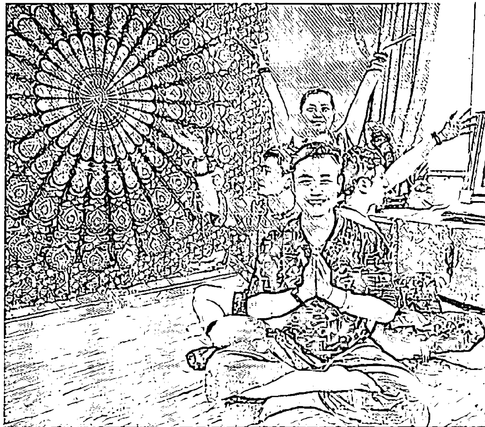

### ◇ 喜

祈願所有眾生都不離無苦之樂。
因為無常，所以我們擁有的快樂常常是會改變的，可能現在快樂，但是明天事情就會發生變化。喜無量心就是祈願眾生都能時時在這樣的安樂之中。

### ◇ 舍

遠離愛惡親疏，住平等捨。這是祈願眾生到最後可以達到沒有愛憎親疏的分別，沒有特別的喜愛憎恨執著，也就不會產生痛苦，達到這樣的智慧境地，就能真正的離苦得樂。

所以 "Karuna" 更明確的意思可以說是，祈願所有眾生都能遠離痛苦，以及造成痛苦的原因，也就是「悲」。

### 觀世音菩薩

說到「慈悲」就不得不說到觀世音菩薩，對西方國家或許不是這麼熟悉，但對於我們華人社會來說觀世音菩薩可以說是最 Popular 的菩薩了，「家家阿彌陀、戶戶觀世音」，可以說是無人不知、無人不曉。這是因為觀音菩薩的慈悲，聞聲救苦，千處祈求千處現，苦海常做渡人舟，會依照眾生根器化現不同的形象來渡眾，慈悲第一的菩薩，因此大家都會尊稱大慈大悲觀世音菩薩。

回到正題，當初 ICRT 創辦人威廉以及該中心的療癒師們，接引到這股能量，感覺到的就是那種愛與慈悲的力量，而且能量頻率更為綿密強勁，此外也都接收到有關觀音菩薩的身分訊息，對他們來說，觀音菩薩並不是他們主要信仰的神祇，或是高靈，但卻能夠接收到有關觀音菩薩的訊息，也因此卡魯那靈氣主要就是連結大悲千手千眼觀世音菩薩的能量，充滿了愛、慈悲以及力量。

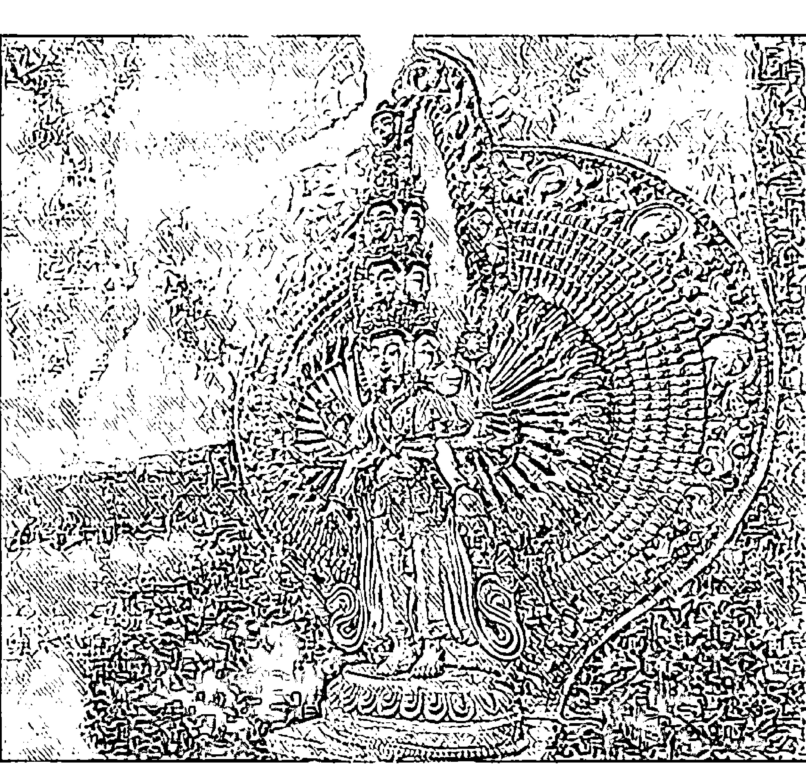

當然世上有許多開悟的高靈，都為了眾生在努力中，類似我們說的菩薩，因此在使用卡魯那靈氣的過程中，有時也連結到其他的高靈，或是會有和個案或是療癒師有緣的高靈給予協助，有人見到觀音菩薩、有人見到聖母瑪利亞、有人見到耶穌、有人見到大天使等，無論是誰，祂們都是那樣的慈愛並想要幫助眾生。

朝朝覺得自己會學習卡魯那靈氣也是有相當的緣分，從小朝朝就很喜歡觀音菩薩，雖然小時候家裡有個神明壇，我父親也是王爺和三太子的乩身，一直都會有很多人來問事辦事，但我對他們都無感，就只認觀音菩薩。後來高中大學跟朋友的假日活動就是會騎车上山到紫雲寺或是去龍山寺拜觀音菩薩，從大學開始每日不間斷的功課也是觀音心咒，正式修習藏傳佛教後經過五加行、共同本尊、空行、頗瓦法等修習，最後因緣際會發現自己還是回到觀音的修持，只能說冥冥之中自有安排，我想也是因為觀音菩薩的指引，讓我走上身心靈老師這條道路，可以傳遞觀音的愛跟法讓大家知道。

在點化及教授卡魯那靈氣的過程中，有好幾位學員都感受到，甚至看到觀音菩薩出現，並給予他們需要的指引，感受到觀音菩薩給予的那樣的慈悲的愛與支持，很多學員都流下眼淚，甚至痛哭失聲，有些學員不斷看到自己的力量動物，有些學員也看到自己前世需要療癒的時空狀態，對於自己未來的路也逐漸清晰。

### 古埃及靈氣

練習過程中，學員都感受到卡魯那靈氣能量更加綿密且強勁，對於內在狀態檢視、深層情緒、療癒細胞DNA等的速度感受特別強，也有學員在兩天課程中的第一天一上完課，就開始清理以及提升。

由於卡魯那靈氣的能量頻率較高，雖然充滿愛但又十分具有力量，要能夠好好的發揮這樣的能量必須要先有臼井靈氣中階，甚至我覺得高階之後更好，因為本身的能量頻率與正確的知見和觀念已經有相當程度，對於如此高頻的能量較容易承接，也比較能發揮其該有的力量和效用。

古埃及靈氣（Sekhem）是流傳於古埃及廟宇中的智慧。"Sekhem"本意並非直接意指療癒，而與更高意識形態有關，古埃及人認為"Sekhem"表示人死後前三天那種全然覺醒的意識形態，也相當於西藏人指的中陰身狀態，更詳細來說，是中陰身階段中，經歷到的與本源法性連結的狀態。

海倫・柏楽女士（Helen Belot）是古埃及靈氣的創始者，她在1980年代接觸能量療癒後，憶起自己曾是古代廟宇祭司的記憶，於是在1990年代，重新將古埃及靈氣引薦給到現代，海倫女士不斷更新這個系統使其能夠應用在現代社會，並以其作為自己今生的主要任務。

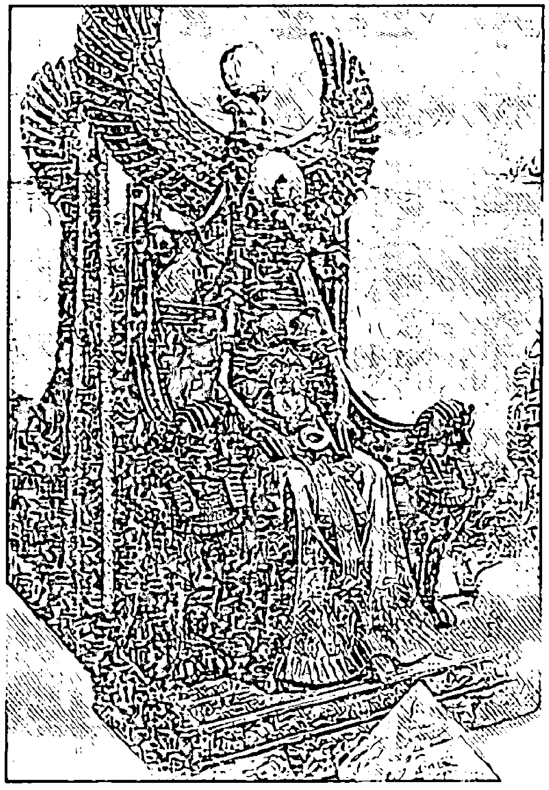

此外，其連結的能量頻率連結到古埃及的獅面女神Sekhmet，"Sekhem"本身就是她的埃及名字，意思就是力量中的力量，或是力量強大的。她代表戰爭、毀滅以及醫療，因此她給予的能量非常的強勁。朝朝使用過的經驗，有的個案對於這樣的能量強度會有點難以招架，她會快速直接的清除掉那些能量場、內在，甚至靈魂層面的阻礙，再幫助你療癒。因此學習者的能量頻率必須有一定的程度，自己的狀態也要準備好，不然很難承接這樣強大的能量，所以至少要有臼井靈氣高階，甚至已經是靈氣老師或有相當程度後，學習古埃及靈氣比較適合。

目前公認古埃及靈氣是能量頻率最高之靈氣能量，能療癒所有層級之問題，故被稱為終極治療。祂如此純淨、溫柔，能立即對肉體、心智、情感與靈性產生效果。雖然也有一些表面上類似於古埃及靈氣的治療系統，實際上並沒有擁有祂的高能量振幅，並能特別針對靈魂層面療癒，幫助你為自己的生活人生負責，做自己，讓自己走在靈魂之路上。

### 能量療癒矩陣

由黛安露絲（Diane Ruth Shewmaker）於1997年將三種她所學習過的能量治療方式結合，而成創立出來的能量療癒系統。其中 “Sekhem” 在埃及語中是力量或是權力之意，“Seichim” 意指是生命的光能，是黛安露絲的 Seichim 老師派屈克·齊格勒（Patrick Ziegler）在埃及古墓中接引到的能量頻率。

“Sekhem-Seichim-Reiki” 的簡寫是 SSR，就是把這三個獨立的多次元能量融合在一起，來平衡且協調人們的身體、情緒與靈性。

SSR 對生理層面加速傷口癒合、急性與慢性的病症，皆有改善效果，對情緒上的焦慮、憂鬱、疲勞、緊張等症狀，也有相當效果。更能涉及到內在心理與靈性層面的狀況，藉由療癒內在狀況，也同時解除出現在生理上的問題，個人的狀態與病徵其實都是內在的反應和症狀，要能真正解決問題，就必須從內在和靈性層面下手。SSR 和其他療癒系統，也會隨著每次的療癒慢慢調整個案的內在狀態，就可以獲得新的開始與重生，甚至擴大自我與宇宙意識連結。

目前大家提到「古埃及靈氣」比較快聯想到的是 SSR，但實際上 SSR 不是只有古埃及能量，而是由三種不同的能量構成的一種複合療癒系統，其中 Seichim 能量有一說是在埃及古墓接引到，但其實在印度已經早有流傳並教授，因此不能完全算是古埃及的能量。真正算是古埃及能量的，應該是 Sekhem。因此有老師稱 SSR 為「能量療癒矩陣」，祂把各種能量療癒的優勢結合，所呈現出來的效果以及影響力是相當獲得肯定的。

Sekhem 和 SSR 都被稱為古埃及靈氣，那之間有什麼差別？感受過 SSR 能量的學員和老師，都說 SSR 很綿密紮實、溫柔，跟卡魯那靈氣的感覺很類似，一波一波像海浪般波動，給人穩定安心的感覺；而 Sekhem 比較沒這麼溫柔，能量來得又急又快，又很強勁，有學員形容就像隕石撞地球，有種毀滅後再度轉化重生的感覺（畢竟是獅面女神 XD），所以有時候會有點招架不住。

此外，如果以身心靈層面來說，SSR 比較著重在「心」、Sekhem 則主攻「靈」。有靈氣老師分享 SSR 和卡魯那在能量強度上，沒有太大的差異，差別在於不同的能量頻率來源而已，兩個能量療癒系統相較起來，海倫女士的 Sekhem 靈氣因為學費高而且要求多，所以比較少人學，也因為海倫女士的要求和維持傳承清淨，能量純度和強度強大許多。

而 SSR 結合了不同能量系統，因此在各方面都有獨特且平衡的特點，所以就算沒有特別先學過臼井靈氣，直接開始學習 SSR 也是可以的；Sekhem 因為能量頻率太高，需要先修習過臼井靈氣高階，甚至已經是靈氣老師才比較適合學習，而且因為能量頻率強度過強，有時不一定承接得住，一來無法發揮出效果，二來會容易感到頭昏腦脹，整個人更飄，無法紮根，因此依照自己狀態選擇適合的能量療癒方式，是很重要的。

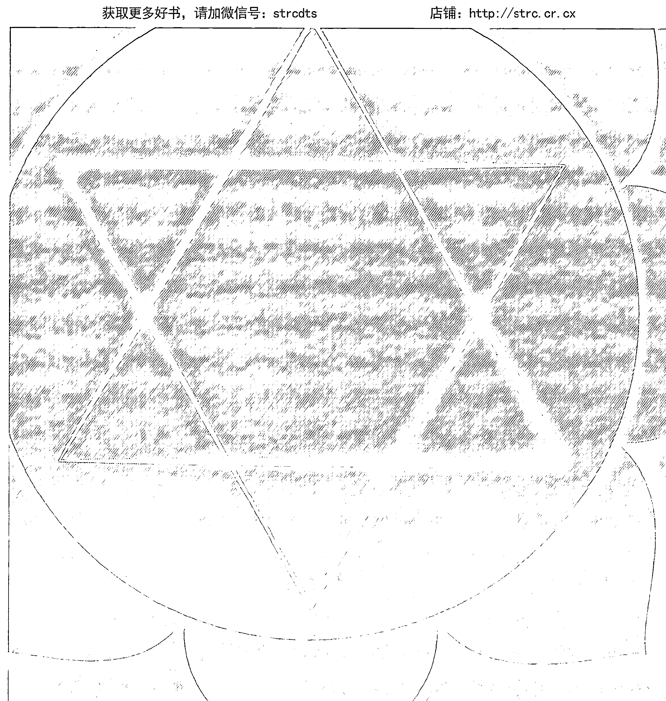

# CHAPTER 04

# 雷氣的實際應用

## 01 身之療癒

靈炁是一切的起始以及源頭，因此祂可以任何形式展現，也可以作用在任何層面，以下是學員以及個案們分享給大家的回饋。

靈炁可以改善睡眠及失眠、清晰思緒、舒緩肌肉、眼睛疲勞、頭痛、舒緩肩膀疼痛、背痛、腰痛、關節痛、腸胃不適、腹瀉、食慾不振、便秘、舒緩女性經前綜合症狀及改善手腳冰冷、紓解手術前後痛楚及加速傷口痊癒、增強身體免疫系統、舒緩癌症化療期間不適等，是一種強而有力的輔助療法。

### 靈炁喚醒身體修復能力

有位學員本身也是護理師，她學習完初階靈炁不久，就馬上跟老公一起去宿霧玩，在玩水的過程中，膝蓋不小心被珊瑚礁割傷，當下血流不止，她下意識馬上用手搗住傷口並給予靈炁，不久馬上就止血了，而且當晚傷口竟然馬上就結痂，讓她覺得真的太神奇。她還分享說，老公其實對於靈炁本來還不太相信，而且他一直有鼻子過敏的問題，現在只要鼻子不舒服，開始打噴嚏，她就會用手靠過去，很神奇的老公的症狀就會舒緩。

還有學員本身也是醫師，她學完靈炁回去練習，幾乎每天都幫兒子做，過不久發現，兒子長久以來的濕疹問題，竟然痊癒了。

另一位學員學完後，回家幫媽媽做靈炁，他的媽媽本來因為身體水分代謝問題已經困擾很多年了，沒想到經過那次的療癒，讓她身體的水分排出不少。見證靈炁的神奇效果之後，她馬上請學員幫她報名下一期的靈炁班，上課當天一位母子倆一位為新學員一位復訓，兩人現在還可以互相練習靈炁呢！

再一位學員是加護病房的護理師，她之前遇到一位已經住院好段時間的奶奶，因敗血性休克，院方為了搶救她，用了很多升壓劑，想把她的血壓拉高，但因為使用升壓劑會犧牲掉其他的身體液體循環功能，造成病人水腫，這位奶奶腫到像氣球，人就像快要爆炸的樣子，非常恐怖。而且到後來還不斷的抽搐、抽筋以及癲癇，這樣狀態的病人是十分痛苦的，但院方也不知道該怎麼辦。

為了緩解這樣的症狀，醫院另外再給予鎮定劑等相關藥劑，劑量已經用到最高，甚至還放在點滴裡面 24 小時施打，但似乎都無法奏效，抽筋狀況還是持續。而更棘手的狀況是，如果給予鎮定劑，病人的血壓又會下降，為了提升血壓，又要給予升壓劑，造成院方進退兩難，而這時奶奶已經腫到不成人形，身體的水分已經多到不能再多了，造成身上有孔的地方，像是打針的針孔，都開始滲出組織液，奶奶也在這樣的痛苦狀況下維持了好幾天，家屬十分難過但也不知道該如何是好。

輪到這位學員上班時，她直覺感覺到奶奶需要能量，於是她便傳送靈氣能量祝福給這位奶奶。很神奇的是，隔天她再去上班時，同事跟她說奶奶的抽筋、癲癇狀況改善很多，他們都覺得不可思議，還想說她是不是給她用了什麼藥。後來持續大約三至五天的照顧以及給予能量，奶奶的狀況慢慢穩定很多，鎮定劑的量也慢慢降下來，而且也不再水腫，回復到奶奶原本的樣貌。

雖然奶奶最後還是離開了，但在最後的這段時間，靈氣的確舒緩了奶奶的不適，也讓她能夠以一個比較舒服以及完整的樣貌離開。

### 靈氣與產科

靈氣在產科上也有很好的應用以及效果，「好孕工作室」的陳鉑萍醫師，對於溫柔生產的推動不遺餘力，她覺得懷孕到生產這些都是很美的禮物和祝福。但現今大家對於到醫院生產、由醫師主導的生產方式，覺得是天經地義的，在所謂的「產程遲滯」狀況下，產婦被迫打一堆催生藥劑，或是乾脆直接抓進去手術室開刀。就算沒有被抓去開刀，對於產婦以及寶寶的意願並沒有給予尊重，從冷冰冰的產房、壓肚子、剪會陰等一連串的作為，都讓產婦以及寶寶受到很大的身體和心理創傷，也難怪對於生產，大部分的婦女存在恐懼。甚至當初陳醫師自己生產時，也不認為有什麼不對，直到後來她才體認到這樣的方式，應該受到質疑。

相對而言，陳醫師提倡的溫柔生產，給予產婦完全的自主權，生產其實本就是一件很正常、每個產婦天生就都具有的能力，產婦應該才是生產的主體，助產師，甚至是醫師扮演的應該只是協助的角色，產婦應該是可以順著自己的感覺和直覺去決定自己要如何生產？要何時生產？就像療癒師在療癒個案一樣，我們都只是協助。

「好孕工作室」不僅僅是生產的當下，甚至從懷孕前就開始幫助孕婦準備自己的各方面，不管是知識、身體或是心靈等，都做好準備迎接新生命的到來，基於對孕婦和寶寶的愛，陳醫師和以及助產師嘉黛等好幾位工作室同仁，都來學靈氣。「好孕工作室」甚至跟「曦和沐音身心靈療癒工作室」開辦孕婦靈氣班，就是為了給孕婦和寶寶最全方位的呵護，在他們身上我看到的是那種純真，還有對於推動溫柔生產的信念和堅持。

陳醫師提到，有些對於生產有創傷、陰影的產婦，在生產時比較容易有狀況，例如第二胎才來溫柔生產的產婦，對於第一次生產經驗通常已經造成一些陰影了；有的產婦雖然是第一胎，也可能有來自產婦的母親，當時生產時的不愉快記憶等，而這些狀況平常時我們很少會察覺意識到，因為它們常被隱藏到潛意識去了。生產過程中，產婦如果在產程自然進行而沒有施加其他藥物（像是無痛、鎮定藥劑等）的情況下，其實自動會分泌腦內啡，所以產婦在當時其實會處於一種半出神狀態，就有點像是我們說的薩滿意識、催眠狀態，這時候其實有很多潛意識或是內在狀況就會顯現出來，甚至有創傷症候群的症狀出現，可能會讓產婦變得不可理喻，不願意接受任何協助而影響產程以及寶寶的安全。

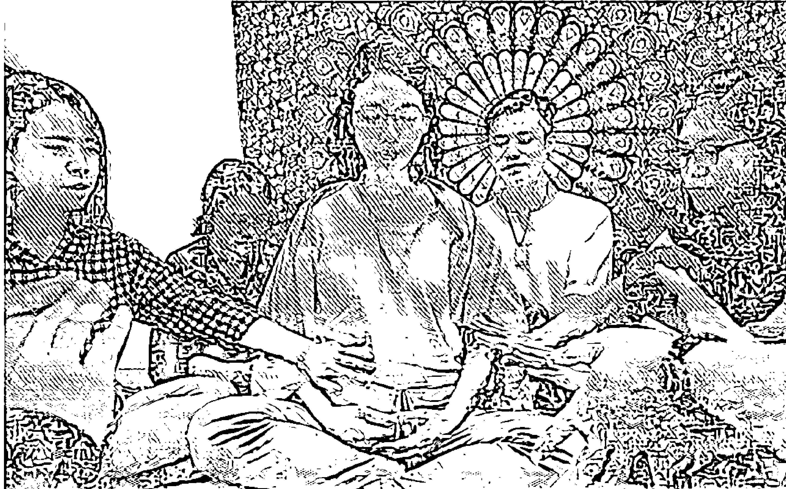

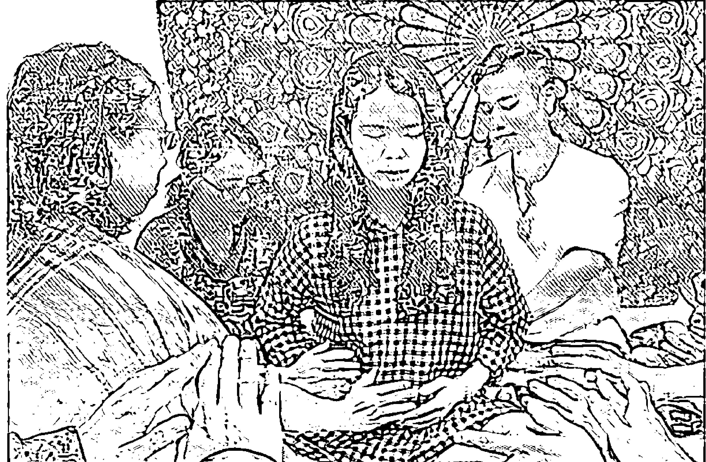

對於這種狀況，陳醫師說之前也只能等產婦釋放完準備好才能繼續好好生產，學完靈氣之後，一到現場她就會自動以能量清理空間並且開啟能量結界，通常在這樣的狀況下，產婦的情緒及各方面狀況，都會變得比較穩定。在過程中如果產婦出現出神以及內在釋放的情形，她就會使用意念投射靈氣符號給予靈氣祝福，產婦情緒以及各方面狀態很快就會穩定下來，也就可以繼續順利生產了。

她們曾遇過一位產婦，因為她的父親也是醫師，她覺得父親有一定的權威，第一次的生產是由父親決定而在醫院生產，造成她對於生產有不好的經驗。這次她想要溫柔生產，而且還特別堅持要在家生產。分娩當天，很可能是因为在家生產這件事，某些層面是出於她對父親的反抗，有種要做給父親看的感覺，因此在家中的那樣的環境下便造成她緊張，導致血壓飆高，在場的助產師已經建議她可以到醫院繼續溫柔生產，現場器材儀器比較多可以更有保障。但是產婦腦內啡分泌，開始進入類似催眠狀態，潛意識翻攪釋放，那些情緒、反應什麼的都上來了，怎樣都不願意到醫院生產，最後現場的助產師，用通訊軟體向陳醫師回狀況，說如果真的狀況不行就只能叫救護車，強制送到醫院了。

陳醫師收到消息，就跟另一位學習靈氣的嘉黛助產師，同時遠距靈傳送靈氣祝福，過程中她們也感受到產婦的難過悲傷，以及需要支持的感覺，結果大約過了半個多小時後，收到產婦狀況穩定下來並且順產的消息。

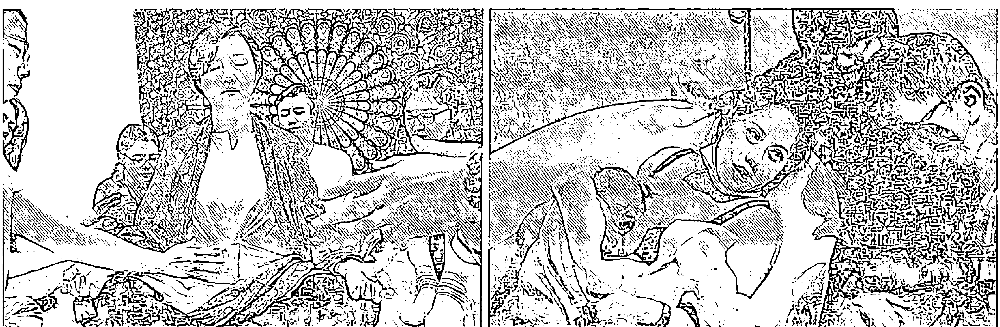

此外，陳醫師說學完靈氣之後，她對於界限這件事情有了更清楚的體認。原本的她，因為產家對於她的信任，她也把生產當成自己的責任，她背負著個案的責任和課題，沒有回到自己，所以每天都很疲累。後來她學習靈氣後，發現自己越來越能找回自己的平衡和界線，知道這些都是每個人自己的課題，她只是在當下給予協助和建議，事後人生的決定和方向，還是個案的，所以她說現在門診怎樣都不會累。

### 靈氣與寵物

「聆視界・能量工作坊」的品靈老師，因為她和寵物之間的愛與連結，讓她成為一位身心靈老師，寵物溝通是她的主要強項，除了寵物溝通，後來她也學習了靈氣，並將靈氣應用在寵物上：

貝貝是我2016年救援回來的蜜袋鼯，她的前飼主是獨居老人，有著嘴上的愛心，對於照顧蜜袋鼯卻沒有實質上的正確觀念、經濟能力和充裕時間，所以她收養的十五隻蜜袋鼯都沒有受到完善的照顧，其中三隻公蜜因為前飼主的結紮觀念和照護經驗不足，不幸死亡，其中也包含了貝貝的同伴。

貝貝和同倆生了兩胎蜜袋鼯寶寶，所以貝貝和同伴感情很好，同伴被前飼主照顧死，貝貝很不能諒解，所以從那之後，貝貝很保護自己的孩子，只要有人靠近籠子，貝貝都會很兇的示威和喊叫；如果有人開籠子門，貝貝就會直接跳過來，追著人的手開咬，而且都是咬很大力，會破皮流血的程度；自從救援她之後，一直嘗試著跟她寵物溝通，可是前飼主造成的傷害太大了，不僅讓她失去摯愛的同伴，每天還餵食不營養的食物讓貝貝身心俱疲，連打開心房跟我連結都不肯。本想如果解開她的心結，就可以幫她找到適合或更有愛心的人領養她和她的孩子們；但是因為她都不打開心房，一直到去年，我就跟貝貝說：『如果你不咬我，我就收養你們一家，不再把你們交給別人，由我好好照顧你們！』

從我說了這句話之後，貝貝就真的不咬我了，我也就信守承諾，真的收編了她們。但貝貝的警戒心還是很高，雖然已經不咬人，也可以摸她了，但我還是無法抱她，只要一抱，她就開咬。到了今年某天，我在幫貝貝剪指甲時候，發現她屁股竟然在流血，帶去看醫生，醫生說她屁股潰爛，簡單開了藥，回到家開始讓她單獨休養，也照顧她陪她說話，那時候她才開始感受到我的愛，但兩個月後屁股又潰爛，而且體力和精神明顯變得很差，面無血色，我開始感到擔心，因為覺得之前醫生太草率就開藥，這次我換一家獸醫院帶貝貝就診。

這次的醫生給貝貝做了很詳細的檢查，才發現貝貝的肚子，有很大顆的腫塊，而且長腫塊的皮膚都發黑了，延伸到屁股都是黑的皮膚，醫生說情況很危急，要趕緊安排手術，而且因為腫塊導致貝貝的後腳已經無法走路了！

我很緊張也趕緊安排手術，在手術前一晚，除了原本的臼井靈氣高階，我已經學到卡魯那靈氣，我把學到的所有符號都用上，然後叮嚀貝貝，希望她可以撐過手術，我和貝貝的孩子們都在等她回來，也許是我的溝通加上靈氣的療癒，貝貝真的撐過手術了！

雖然手術很成功，不過醫生並沒有很開心，因為貝貝的情況還是很不樂觀，手術後面無血色，醫生說她營養不夠，所以好好珍惜最後的日子，她想吃什麼就盡量給她吃吧！把貝貝接回家後，我不相信醫生的話，買了營養食譜；在貝貝的食譜、外傷藥、口服藥全部都打上靈氣符號，只要抱貝貝之前，我就打上所有的靈氣符號，邊抱她餵營養食譜，就邊給她靈氣療癒，手術後十天，我帶貝貝回診，醫生很驚訝，貝貝的恢復出奇的好，不但血色恢復了，術後傷口也癒合得很漂亮，沒有任何發炎的跡象，而且也能拆縫線了！醫生驚訝不已，也說靈氣好神奇啊！

貝貝現在已經完全康復了，個性也有了很大的變化，會主動討抱抱，要在我手心裡撒嬌，而且她也很開心的又跟她的孩子團聚了！

因為自己是寵物溝通師，學靈氣不只是為了人，也是希望在工作的時候，可以安撫各種因為情緒或身體問題的寵物，因為知道有些人不喜歡聽人說，只喜歡親眼看到，所以我就自己一步一步學了靈氣，慢慢地用行動證明靈氣對人和寵物，甚至事物的幫助。」

## 02 心之療癒

### 跨越童年性侵陰影

我們學員成立一個交流群組，遇到問題或是生活中想分享的都可以在上面分享討論，許多學員會分享在學習靈氣後的轉變，及如何突破瓶頸，當天就在大家分享時有位學員說道：

> 我想來聊聊我自己！
>
> 我是一個性侵受害者，而加害者是我小弟的乾爸，但他也是救了我小弟## 疗愈家暴与家庭关系

还有一位学员，她说她从小就生长在一个重男轻女的家庭中，加上她又是长女，父母都会要她要照顾弟弟，而且还要当弟弟的榜样，从小压力就很大。除了言语霸凌外，还不断遭受到家暴，只要她和弟弟吵架，被打的一定是她，最后不仅是被爸妈打，连弟弟都有样学样，等到年纪大一点，比较有力气了也会打她，她毕竟是女生，力不如弟弟，就只有挨打的份。

爸爸因为工作因素长年在国外，最后竟然在国外与自己的佣人有了婚外情，父母感情生变也影响到她和弟弟。由于这位学员长年在这样家暴并且感受不到爱的环境长大，十八岁就离家北上工作，独立生活。妈妈又因为失去爸爸，于是更紧抓家中唯一的男人，也就是弟弟不放，一直跟弟弟说爸爸的坏话，说爸爸不爱他们，所以也不要他们，造成爸爸和弟弟的关系更差，而且妈妈对于弟弟的任何一位女朋友都嫌弃至极，因为她把弟弟当成是她的依靠，似乎取代了爸爸的位置。

家里面的关系就这样僵持了好久一段时间，她在学习灵气中阶后，不仅持续疗愈自己，也会以远距离传送能量给自己的家人，后来发现家人的关系有了不可思议的改变。

她觉得自己变得更有智慧，而且父母对于他们的态度也有了转变，比较愿意去听、去了解他们的想法，甚至还承认自己过去对他们造成的伤害，妈妈还说想要写悔过书表达对他们的歉意。而弟弟因为对于爸爸的不谅解还有小时候的阴影，一直不敢见父亲，后来在学员的支持下，也开始与爸爸接触，最近也终于结婚了。

### 疗愈受虐毛小孩内在创伤

灵气不仅对人有用，对毛小孩甚至更加明显。有位学员之所以来学灵气，是为了他领养的毛小孩，因为他的狗狗是曾遭过虐待的狗狗，对人会有戒心，看到人都会容易低鸣不信任。而他的室友对于毛小孩很不友善，不仅会大声喝斥，甚至用东西丢它。

一开始这位学员只是想带狗狗来做灵气个案，但我建议他自己来学习灵气，对于自己和毛小孩都好。这位学员学习灵气后，回家帮狗狗施作，后来狗狗对于人的戒心和害怕也就慢慢放下了，而他自己的生活和内在成长各方面，也跟着有很大的转变。他分享说：

2015 年初跟好友（同时也是室友）决议领养小狗，于是在我生日前相中了一只长期被关在笼子养的腊肠狗，而在生日当天甚至从台北远赴新竹去带小狗回来，殊不知小狗非常害怕室友，原以为只是初期怕生。一个月、两个月，甚至半年过去了，室友与小狗之间的状况并未改善，并且持续恶化。我也曾经痛心的将小狗送养出去，但小狗身体一直有状况，因此最后还是回到我家继续照顾。

接下来的日子一天比一天难受，小狗的身体健康状况良好，但对于室友的戒心越来越重，每天回家我都压力好大。暂且先不谈室友的心态，就光我自己负面情绪越来越多，感到自己快被逼疯了，也曾经尝试送小狗去受训，但成效不大，后来就再也没有尝试各种训练课程。

曾经以为是小狗个性特殊，只愿意亲近自己认定的主人，但前男友出现时，或许因为他很疼爱小狗，小狗也非常黏他，我才知道其实是人的问题，但我无法去改变他人，我心想或许我与小狗能够变得不一样。

2017 年我生病了，让我一度感到绝望，我随时可以选择死亡，但我想到了小狗，它要是没有我的话怎么过日子，我也希望我与小狗的生命有更好的转变。2018 年初我看见了警察朋友朝朝投入了灵气的课程教学与疗愈，原本想将小狗送去给朝朝老师做个案疗愈，但朝朝建议我自己来学习并且每天为狗狗作疗愈，我也就立马报名了灵气初阶课程。

说也神奇，课程结束当天我立刻就帮小狗进行灵气疗愈，结果小狗的戒心似乎消失似的，看见室友没有低吼、也没有夹尾巴，但总是三天后又需要再进行一次疗愈。一开始不知道为什么，后来才发现，室友其实对小狗有一些粗鲁的行为，我才察觉，需要疗愈的已经不是小狗了。

除了小狗的情绪获得改善，我也感觉到灵气的能量让我越来越能平心静气，在工作上处理事情更有效率，做好当下该作的事，按照自己的步调完成，生气的事情，念头一转就放下了，但该生气捍卫自己权益的时候却变得更勇敢了！

而在这一年中从初阶一路学习到高阶以及卡鲁那灵气，每次都有不同的体验及感触，而我也在学习完灵气中阶课程之后开始觉知到，自己该往什么方向前进，人生方向越来越清晰，我也就毅然决然辞掉了乐器研发工程师的工作，转向从事身心灵领域的美编设计职务，一切也都顺利衔接上，薪资待遇甚至不用谈，就跟当初从事工程师时差不多。

与其说灵气让我能量越来越好能吸引好的事物，更应该说在灵气的协助下，我开始跟自己的心在一起，越来越回到自己，也就更知道自己要什么，不要什么，不再被社会风气与世俗评断的观念给限制，更能活在当下觉察自己，从中不断获得新的体悟，有勇气的去面对问题时，往往都能体悟到不同的智慧，我想这就是朝朝一直在说的「疗愈就是拿回自己的力量并活在当下」。

### 疗愈精神紧绷与工作压力

灵气学员里面有一对很受注目的母子档，我其实很希望有更多父母能带孩子一起来学灵气，好处不少呢！因为灵气点化不仅可以让孩子开始自我疗愈，更可以让孩子练习静心，并学习付出（灵气），帮助身边的亲人朋友，也不会过度沉迷于网络世界，可以真实的与人互动获得肯定与自我价值。

亲子一起学灵气，也可以增进彼此连结，在家长与孩子一同学习、施行灵气的同时，不仅仅在互相疗愈彼此身心，也同时进行能量交流，彼此关系自然更紧密。

更重要的，当孩子接受点化学灵气，会帮助小孩更了解自己的天赋与使命，就是我们说的「开窍」，开启孩子的智慧，学灵气不一定是为了成为疗愈师，而是帮助每个人找到自我，回到自己的生命道路。

以下是她的简单分享：

自己好几年前透过友人的介绍下，开始接触水晶能量矿石，对脉轮也有粗浅的认识了解，但并没有机会真正好好去了解这些能量疗愈运作的方式，再加上忙碌的生活、职场与家庭的各种压力，自己的身体与心理一直处于高度的紧绷与疲累的状态，长期需要依靠药物才能入眠或舒缓状况，不过自己也知道这不是长久之计，一直希望找到能让自己的心能平静下来的方式，同时平抚在生活中遭受到的各种创伤挫折。

得知朝朝老师灵气课程开课，便毫不犹豫为自己跟儿子一起报名。儿子从小便是我自己带大，或许是耳濡目染，他对身心灵这方面也悟性很高，目前正是他进入青春期的时刻，我也希望他透过灵气的学习，能够建立良好的价值观，学习感恩并与他人建立良善的关系互动，更进一步找到自己，才不会迷失了方向。

上课回家之后，儿子因为功课繁忙，我大部分都是自己练习并复习在课堂上学习到的手法与脉轮平衡。老公一直是无神论者，但有天在我完成自我能量场的清理与补充之后，双手无预警的状态下，偷偷放到老公的肩颈上方（隔空），老公说怎么会刺刺的，心里小小得意了一下，这就是灵气啊！原来这么麻瓜的老公，也会感受到灵气，这一阵子以来我的练习，也应该算是小有成果。

自己在学习灵气之后，特别是每一次练习与使用灵气时，发现自己可以透过清理与能量的补充，让自己的心越来越稳定，情绪也不再像以往那么容易受到外在的影响而起伏波动。此外，自己平时是容易手脚冰冷的体质，每次只要使用灵气时，自己的双手就会明显的温暖起来，全身也能感受到能量如潮水般一波波的涌入，若非亲身体验，从未想过灵气竟是如此奥妙。

学习到中阶时，建立与他人的连接，更是让我惊讶不已，透过灵气符号竟可以明确感受到第一次见面的同学内心最深处的状态，完全就像读心术一样，而且儿子在使用穿越时空符号帮我练习施作时，竟然也可以感受到我所承受到的压力和悲伤。后来学到卡鲁那灵气，两天的课程里，上课第一天我就当下作了一个有关工作上很重要的决定，而且回家当天晚上，长期吃药且剂量还不小的我，竟然可以不用吃药就入睡，这让我感到太开心了。

灵气不但帮助自我修复与提升，此外要是有机会，我还会帮助有缘人，这是我最开心的部分了，开放自己的身体成为宇宙能量的管道，传递神的祝福与能量给另外一个需要帮助的人，心里除了感谢神之外，也感谢有这样的机会，让我可以用灵气帮助需要帮助的人。

### 放下与父母心结以及对于权威的恐惧

另一位学员在中阶灵气课的学习心得中，写到自己对于情绪、父亲权威课题的跨越，有了很大的进步：

学习灵气迄今，觉得每次课程都像惊喜包一般，一开始去学灵气为了我的小狗。它曾经在外面流浪过好段时间，那时我领养它时已经四、五个月大了，但胆子非常小，我花了大概一年的时间才能够摸到它的头，我感觉得到它内在一定有创伤，因此我请聆视界的品灵老师为我们进行宠物沟通。

当时它已经四岁了，在我家生活也已经有三年多，可是品灵老师却说它还在适应中，当下我真有种想K它头的冲动，在我家过这么爽竟然说还但适应？但我也知道心灵这块的确不是那么容易处理的，后来品灵老师推荐我放一些改善焦虑的音乐，同时也有提到灵气或许对于小狗会有帮助。后来放了音乐后，小狗的焦虑问题真的改善不少，也让我开始对灵气产生好奇，也就上了灵气初阶课。

灵气课程中有一个部分是朝朝老师帮大家点化，点化后我觉得最明显变化的是手，好像手有了魔法一般，可以感觉到能量的流动，老师也教了自我疗愈的方式，我也很认真的每天清理疗愈自己，也抓老公和小狗来疗愈并练习。后来我发现我的情绪有了很大的改善，之前我的情绪是很不稳定的，常常会莫名的低落、烦躁，说真的是我自己都不知道为什么，如果感觉到压力大到一定程度还会大哭，我想老公和小狗面对这样的我也不好受，还要常常安慰我。但学习并实行灵气后我的情绪状况稳定很多，不太容易情绪起伏过大，而且我也同时发现小狗的状况改善不少，不会那么容易被吓到，因为感受到灵气的力量，虽然我知道这样不好，但我还是瞒着老公偷偷报名了中阶课程。

为什么我报名中阶课还需要瞒着老公，会对于跟老公坦诚自己的想法感受感到恐惧呢？这跟我从小生长背景有关。我的父母在我七岁时离婚，在离婚之前，我的母亲常常因为情绪不稳而打我，虽然外婆会维护我但是我还是一直被打，我还记得有一次小时候，我在睡前听睡前故事，但是故事听完了我还没睡着于是我跑去跟妈妈说我想再听一次，没想到只是这样我就被痛打。甚至因为父亲工作常不在家，母亲觉得我还小，便在我面前跟其他男人卿卿我我，我也是后来长大之后才知道这些，后来即使父亲想挽回也还是离婚了。

后来我就跟父亲一起生活照顾彼此，父亲为了抚养照顾我，放弃了长官的提拔，失去可以升将官的机会而辞职，加上父亲是军官，对于我们的管教方式采用类似军事化教育，都是以权威、命令的方式，造成我不敢表达自己的想法感受，也只能一直依照父亲的期待生活。之前我曾经有找到一份画图的工作，这份工作各方面都是我想要的，我非常喜欢，但是父亲却希望我回到家中帮忙，还因为这件事情跟我冷战了好几天，最后我还是屈服打算回到家里帮忙，虽然最后因为公司突然有太多人离职，造成我离不开。

直到五年前父亲在大陆因为医疗疏失过世，因为一直以来跟父亲相依为命，这件事情对我造成很大的冲击，我每天过得浑浑噩噩，如行尸走肉，根本不知道自己在做什么，一直到父亲过世后二、三年才稍微好一些。虽然对于父亲的过世感到悲伤，但我发现我可以开始做我自己喜欢做的事情，不会再受到父亲的制约。家族中其他男性长辈对我想做的事情还是会意见很多，但毕竟他们对我影响力并不大，我还是会去做我想做的，但其实我爸对我造成的影响并没有消失，记得有次我在梦中看见他，第一个想法是「太好了！我爸没死」，但是紧接着冒出的想法却是「惨了，我又要开始没有自由，无法做我自己了」。

后来去上了中阶课，点化过程中没有像初阶课那样看到很多画面，但我却看到我过世的父亲在教室门口看着我！这让我觉得很激动，我居然不是在睡觉时看见他，而是在我平时状态下，后来老师在点化过程中移动都可以感受到有股热气在流动，而且点化结束后，手感更加明显了。

这次授予的符号当中，有一个是穿越时空符号，老师要我们试着回到过去自己感到伤痛无助的时期，给予当时的自己支持，我回到那段让我感到伤痛的时期，一连接到我立刻感受到那种伤痛，让我差点落泪，我看见自己一直躲在棉被中哭，哭得很伤心，我感觉我的双手传送了好多能量过去给予支持，后来我慢慢感受到平静，没有开始连接时那样难以承受了。

上课结束后当天，我内心一直有个声音告诉我必须诚实面对我的老公，让他了解为什么我想要也需要来上课，在吃饭时候我一直看着他，桌上的晚餐都快被我的餐具戳烂了，最后我还是硬着头皮告诉他，我今天去上了灵气中阶课，让我惊讶的，我说完后，他并没有不高兴或是有什么太大的反应，但我自己却大哭了…因为长这么大的我，很少敢这么坦然的表达自己的想法，毕竟以前在爸爸面前表达自我的下场太可怕了，换来的不是冷言冷语就是破口大骂，所以我总是会选择性的说，我发现对于父亲的害怕，也让我对于老公会有投射，但现在的我愿意面对并直视自己的心，去坦承并面对这一切。

此外，不管以前我爸怎样对我，现在我都已经不怪他了，我也感受到我爸对我的爱，我很想他，他为了我放弃了他的美好前程，没有把我当成绊脚石一脚踢开，我很感谢他，没有他就不会有现在的我。现在的我，拿回我自己的人生自主权，有能力照顾好自己，我也不会用像我父母那样我不认同的方式，对待我未来的小孩或毛孩。灵气让我各方面，尤其是情绪方面有了很大的改善，因此有机会我想继续学习并探讨下去。

## 03 灵之疗愈

灵气可以去除那些附加在自己灵魂上不属于你的东西，也找回你自己的力量，寻回你的灵魂碎片，让你去做灵魂想做的事情，回到你的灵魂道路上。
也可以增强自觉力及直觉力、了解生命的目的和使命、体会与万物合一、自己就是源头、本初智慧开展的境界。

### 送灵魂一程

有位学员问过我一个问题，就是灵气会影响人的生命历程吗？我的理解是：「灵气不会去左右每个人的生命历程，祂只会让一切往最好的方向，并且视个案想要去的方向发展。」他说因为他本身在医院工作，有位婆婆在加护病房插管已经很久了，但是一直无法清醒，不过也无法好好的离开，他本来想说学了灵气应该可以舒缓婆婆的不适，就稍微给予了一下灵气。

后来过两天，那位婆婆就很安详的离开了。其实婆婆是想要离开但是没有力量，或是还有无法放下的部分，灵气让祂感受到这些爱与支持，让祂可以往更好的方向走。

### 好好道别

一位来上孕妇灵气的学员，她报名的是好孕灵气班，课程内容有特别介绍宝宝的能量场、和宝宝连接，以及给予灵气的方式。她本身是一位颅荐椎执行师，工作大约一年左右，开始有客人说她的手热热也感觉到能量流动，她也认识不少朋友学过灵气，透过一些分享与体验，认为颅荐工作跟灵气的某些思维很靠近，所以开始想或许有机会可以去上课。

怀孕之后，她一直感觉茉茉（她的宝宝）的气质跟她很不一样，茉茉很开朗、喜好跟人接触、对于新事物的接受度很开放，这时看到好孕灵气的介绍觉得有趣，也想着或许可以通过这个过程跟她有新的连接，而且也可以完成自己一直想做的事情。

但就在上课前一周，她收到有关茉茉的医院报告，说茉茉的染色体有点状况，宝宝存活率也很低。这对她来说，当然是很大的打击，也有想过就不要来上课了，就静静在家跟先生相处。

但或许是茉茉的关系吧，她忽然觉得缘分时间的长短不再重要，反而想跟茉茉一起创造更多回忆，隔天她立刻跑去花莲、还过了一个儿童节，去逛街、吃好吃的、做结构调整放松身体，然后来上灵气课，把原先计划好的日子过的更丰富，她说，这些是茉茉带给她最美的礼物和回忆。

其实灵气课次日就是她准备引产的日子，当天课程最后跟宝宝连接时，所有的学员跟茉茉 Say hello，也一起传送灵气祝福给茉茉，大家都很开心能在这一刻认识茉茉，也是因为茉茉，妈妈才更有动力来上这次的灵气课，灵气也默默给予两人支持和力量，或许灵气就是他们母子给彼此的礼物和祝福吧。

引产当天，感觉妈妈跟茉茉都已经准备好这一刻，本来妈妈怕自己无法承受而不看茉茉出生后的样子，但后来她竟说她想看看她，再一次跟她道别。最后她看到茉茉时，茉茉是微笑着的，和很多引产出来的宝宝的惊恐无助的神情完全不同，好像在跟妈妈说：「谢谢你带着我体验这一切，我真的很幸福。」最后她们还帮茉茉留下脚印后，送茉茉离开。

她在网志上记录着：

茉茉是笑着出生的孩子。

怀着她的时候，只要试着感受、与她连接，无论自己在什么状态下，都能感觉到油然而生的自在喜悦。存在本身就是如此美好，对于人充满着开放的看见，和饱满的爱。

那是在我生命里头，一直很努力想前往的方向。茉茉带着这样的光环，在这段时间照耀了我。

谢谢陈钰萍医师，总是用温暖的眼神轻轻问着：「妳想怎么做呢？」当时彷徨无助想逃避的内心，在一次次的提问下开始明白，这仅只是关乎于我们的选择，无论科学数据如何判断，这社会的价值观说些什么，我们都能够尊重自己的感受，练习做出属于我们的决定。

这两天两夜的时光里，迎着阳光坐在床沿，牵手念着给茉茉的信，睡睡醒醒吃些突如其来浮上脑中的食物，尝试找到我们的颤动律动，找到和茉茉共同存在的脉络，被暖暖的双手怀抱也怀抱茉茉，哼唱着那首属于我们的歌，一次一次的。而后在短暂的疼痛下，茉茉带着微笑来了，为我们留下一双脚印后，轻轻走了。

分离是我这辈子最难面对的课题，谢谢万美丽老师一字一句引导，我还有什么能为茉茉做的事：「好好告别。」这些小小的仪式，在茫然时让我们能试着做些什么，在这些日子每一波思念浪潮、每一丝失落打上心头时，承接、支持着我。

日子漫漫，我知道自己仍会被片段痛楚冲刷，但这段用温柔呵护爱的旅程，永远会在我们心中铭记，试着踏着茉茉的步伐，前行。」

### 回到自我，照顾好自己，让一切准备得更好

灵气会让一切往最好的方向发展，即使表面看起来有时令人难以接受，但都有着很深的意义。还有一位妈妈，她家里已经有两个女儿，这次怀孕时，她其实有抱着想让奶奶满足有男丁的愿望，对于这个宝宝是有种期待和使命的，也没有评估自己身体和内在等各方面状况。

她来上课时怀孕周数大概只有八周，来上课也没有什么特别想法，但是上完课隔天她有感觉到红光，感觉宝宝也在打转，她也感觉自己的精神状况变好，那些孕期的不适感也减轻很多。但就在上课后大概一周，她突然传讯给朝朝，说宝宝好像保不住了，当下朝朝马上抽牌了解状况，牌面显示她会有新的感情满足机会，或是会有新的生命来临，但是建议牌希望她先找回自己各方面的平衡，让自己状态更好。她也说的确她的身体状况一直不太好，还在调理中，而且内心有种不踏实的感觉，表面好像什么都好，但是缺乏对于生命的热情和动力。

当晚她为自己做了灵气，心情也获得了舒缓。前一天另一位医师才发现宝宝没有心跳，隔一天由陈医师看诊时，宝宝已经缩小许多，而且过三天宝宝就自动出来了，并没有使用任何药物。之前有遇过同样状况的妈妈，因为内在的执著，不愿放手，拖了好几周，宝宝才出来。这次或许是妈妈本身接受并释怀，灵气也就让一切往好的方向发展。

后来她传讯给朝朝说：## 05 灵气 Q&A

## Q01 任何人都能学习灵气吗？

当然！

以朝朝的经验来说，常常有朋友感受过灵气后，觉得不可思议的神奇。像我前不久去曼谷血拼，就随意和店家聊起天来，问起我的工作，我用很破的泰语跟他们解释并让他们体验，在那样嘈杂的环境下，他们也都感受到能量窜动，觉得放松、头痛不适马上就舒缓了。

体验过的朋友常常问说「我真的也可以学吗？」「我又不是天生有那样的特殊体质」等疑惑，其实我本来也不是能量敏感的人，我也觉得我是麻瓜，最后会成为灵气老师，更是我想都没想过的，不过我也常说，或许就是因为我不是天生就敏感的人，所以我更能理解那种所谓「感觉不到」是什么感受，也就更能体会跟分享这些过程。

灵气是宇宙生命能量的意思，与其说「学」灵气，倒不如说「找回」灵气的使用方式。我常说，我们在下意识状态手自然会去碰触我们感到不舒服的地方，头痛摸头、脚痛摸脚等，这些其实都显示出我们本来应该就都可以用手做治疗、疗愈的。灵气老师会经由点化（Attunement）的方式，打通学员的气脉，并将学员的频率，调整到与灵气能量共振，学员便可以开始接引宇宙能量，帮自己或他人传送灵气能量与祝福。并不是灵气老师帮学员重新建立一个新的管道，只是「重新启动」你原来就具有的能力，但我们因为一直以来跟自己（的高我）失去连接，加上对自己的不信任，以及长久给予自己的各种限制，让我们遗忘了这样无价的馈赠，接引宇宙能量的管道慢慢阻塞，自然才会无法使用。

上过课的学员，不管过去是否有接触能量疗愈，在上完课后皆能开始使用灵气，点化后，当下就能马上开始练习并感受到能量的流动，所以相信你自己，也相信灵气，一定可以学会的！

## 如何开始使用灵气？

很多人都会问说：「我是麻瓜，我也可以学会吗？」没错！因为这是我们本来就具有的能力，因此也不能算是学，可以说是找回来。大家试着回想看看，当你不舒服时候，是否手会下意识地放在不舒服的地方呢？头痛摸头、脚痛摸脚、生理痛摸肚子，你有没有想过为什么？这样子的惯性动作其实表示我们的手应该本身就具有疗愈能力，只是我们遗忘了，我们本来就應該可以接引自然能量，但因为我们跟自己的本源分离，以及对自己不信任，造成管道阻塞、频率差异造成无法使用这宇宙能量。

那我们怎样重新打开自己的能量通道并连接本我（源）呢？灵气课程中有个重点，就是灵气点化（或称灵授）。灵气点化即是由经过完整修习且具灵气传承，也就是可以追溯其一代一代传承，往上到臼井瓮男祖师的灵气导师，清理学员之气脉并调整频率，让接受点化后的学生可以开始使用灵气，如此才具有灵气传承，点化才会有效果并连接到真正的传承力量。这样的能力一旦开通，就终身不会失去，就如同你已经学会游泳了，基本上这辈子你都不会忘记，但很久没游还是熟练度会下降一些，但只要再稍微练习熟悉一下，感觉就会回来了。

更重要的是，一旦连接至宇宙本源，不仅你可以开始使用这源源不绝的爱与能量，你也将更清楚自己是谁，更有自觉能力，更能觉知当下，也就更了解自我人生的目标和道路；很多学员（包括我自己），在学习灵气并实行后，都发现人生路途上未来的路会自己出现，我们需要做的，只是信任宇宙以及自己，并持续往前行。因此学习灵气不代表你就要成为疗愈师，你可以帮自己疗愈能量场、身体、心理，甚至灵魂层面的状态，也可以给予身边的亲人、朋友及毛小孩等这样的协助以及爱，更重要的，在持续疗愈的过程中，你将更能回到自己，拿回自己的力量，进而创造想要的人生，所以臼井灵男祖师的「灵气五守则」一开头就写下「招福之秘法、万病之灵药」。

### 03 实行灵气有合适的时间点吗？

不同的能量疗法看状况可能会有一些限制，所以需要经过比较严谨的学习了解才不会误用，像是精油对于身体还有心理的作用程度非常直接快速，所以要休息前就比较不适合使用会让人感到振奋的精油；又如同想要静下来时，却使用钛晶让人振奋，可能就不一定适合，不然就可能会有用错药的状况。

但是灵气没有这样的限制，因为灵气是来自一切的爱与能量，可以是任何形态，像光、气等，祂是构成万物的本源，并不单单只是一种气或能量而已，重点是你不能有自己的小我意念加入，因为我们自己的眼界和判断往往不够全面，但是在不带个人小我意识下，祂是纯粹至善的，因此会自然让能量往需要的地方流动并给予平衡，该休息就会让你休息，该让你舒缓就会舒缓，所以不管在什么时间点施作都是可以的，不会有什么禁忌。

- 施作灵气有场地限制吗？

灵气本身并没有特殊限制，但为了让个案愿意敞开自己的能量场，也更容易进入状况来接收灵气能量，施作场地最好安静，有相当的隐密性，让个案可以感到安心，可以将灯光调暗、放一些舒服的音乐，甚至可以在空间中使用精油或薰香，帮助个案放松外，有的薰香和精油对于空间以及个案能量清理都有相当的帮助。

此外还有一点需要提醒，就是如果施作的地点不是在家里，其实在家里也需要，就是在疗程正式开始前必须「清理空间能量场」并「做结界」。用任何你会的方式做都可以，维持住空间的能量清洁以及波动频率，这么做也可以确保个案在接收灵气的过程中，不会受到其他莫名能量场的干扰。

- 灵气一定要跟老师学吗？

学灵气其实是重新习惯并且找回与灵气连接的方法，再学习如何使用这源源不绝的宇宙能量来调整自己或他人（能量）状态的过程。灵气课程中的其中一个重头戏就是灵气点化，藉由修习完整且具传承，就是如果去探究这位老师的灵气源流表，是可以向上一代一代追溯到臼井瓮男老师的，就是具有灵气传承的老师，帮学生打开气脉，并帮学员调整能量频率到可以感受、连接灵气，让学员便可以开始与灵气能量共振连接，并能接引这样的能量帮助自己、他人或宠物疗愈身心灵各方面的状态。

当然也有人天生就摸得到能量，也会使用能量做疗愈，但使用的不一定是灵气，有些可能就是对于气场能量比较敏感，会使用自己的气场力量去帮助他人或自己，清理能量场上的阻塞或补充能量，所以他们常常会比较敏感，而且在帮助他人清理后，自己很容易感到疲累或是能量沾染。

但应该也有人本身的管道就可以接受能量的，毕竟我说过这是我们本来就会的，不过这些本来已经可以感受到能量的学员们，接受灵气点化后大多发现气感和能量明显加强，有的手变得很热很烫，甚至还会冒汗，像朝朝的妈妈本身就有练气功，本来就可以感觉得到能量也可以推气，但是一点化完她说只要手一举起来就有能量窜动，她一边感觉还直说「太夸张了！」所以有这么偷吃步的方式，为什么还要这么辛苦自己一直练，而且还不知道练得对不对呢？

## Q06 帮别人施作灵气，自己会不会不舒服？会不会被「卡」到？

灵气是宇宙生命能量之意，祂是取之不尽，用之不竭的，而且祂来自至高至善的宇宙、我们的本源，会让一切往最好的方向去走，在施作灵气时，施作者只是管道，承接这样的宇宙能量并且分享给个案，给个案力量去做他内在灵魂想要做的事情，因此灵气只是经由你分享给个案，整体的疗愈作用只存在于个案和灵气间，跟你并没有关系，当你能保持这样的心念时，不仅灵气流通更加顺畅，也不会有能量沾染的问题出现。

不管是任何能量疗愈方式，甚至连占卜也是，疗愈师当下或是结束后会感到不适、发生能量沾染的问题，都是因为过度的想要去为个案承担他应该负起的责任。

我一再跟学员强调的很重要的观念，虽然名称是疗愈师，但从没有来任何疗愈师可以真正「疗愈」个案，只有个案自己能疗愈自己。疗愈师做的，从来就只是陪伴、协助、给予力量，但是不应该为个案决定他的方向；就如同你去看医生，医生会开药给你要你回去吃，但要是你不吃也不会有用，此外就算你吃了，也不是「药」治好你，还是你自己的免疫系统和复原能力真正治愈了你，药物也只是辅助，清除那些阻碍你修复的状况。

有的疗愈师会发生能量沾染问题，主要就是上面说的太过份涉入个案的课题，而分不清课题责任不在疗愈师身上，有一部分疗愈师是太过好心、太慈悲才会这样，但有的疗愈师没有发现，因为他没有检视自己的心，其实有一种「我是疗愈师，所以我要来疗愈你」的心态，而这样的心态其实包含了一种优越，还有自我膨胀，所以他在做疗愈时不是在做疗愈，更多时候是在满足他自己的内在自尊还有自我，也因为这样，就会想去主导个案的生命历程，能量沾染就是必然的，会「卡」到也就不足为奇了。

## Q07 灵气个案或是学习为什么要收费？不是应该要来救世帮助众人吗？

首先，灵气老师和疗愈师也是人，我们都要吃饭，没有收费我们要靠什么过活？不过就算我中了乐透头奖，生活无虞还是得收费，只是收多收少的问题，所以我都跟学员说，就算你只是练习，也要让对方至少请一杯饮料或是吃个糖果都好，这叫做「能量交流」。

能量交流不限定要用钱，其他各种方式也可以，只不过现在社会金钱是比较方便容易作为交换的，而金钱本身就是一种能量，那为什么需要这样的能量交流呢？记得我一再重复的，「只有个案能够疗愈自己」，这是一种让个案还有学员为自己的人生负起责任的方式。

我以占卜为例，常常有人会说，帮我「简单算一下」，其实我不是很了解什么叫做「简单算一下」，如果你的问题这么随便，可以简单随便算，那你干嘛算？我为什么要浪费那个时间帮你算？还跟你一起浪费时间？也因为个案这么轻忽这件事情，就算牌卡指出问题核心，要他去改变，他也一定爱理不理，因为从一开始就没决心啊！要是为了解决他的问题，但是他却连这点钱都掏不出来，你说他能有多大的决心想改变、有真的想为自己人生负责？

而且，不要把自己想的这么伟大，想要来「普渡众生」、「救世」，以为自己是救世主，英雄电影看太多？自己都已经泥菩萨过江自身难保了，还想要救世？就算是佛陀，祂也是示现祂如何成就的方式给众生，就算祂为各种不同的众生演示了八万四千法门，但最终还是要众生自己修持才可能解脱，所以连佛陀都不敢说他是救世主了，你呢？

当个案或学生真心为了想要改善自己的不管身体、心理、灵魂各方面的状态，又愿意为了这件事情花钱花时间，表示他已经思考过而且下了决心了，这样他在接受能量上自然会更开放更顺畅，连接也够强，通常也会比较有效果。

说到效果这件事情，我还是请大家在施作时不要为个案预想太多，只要记得自己只是管道，分享灵气给对方，其他的一切就交由至高至善的灵气以及个案的灵魂来安排就好，保持全然的信任就可以。

有一些人很特别，必须特别提一下，有的个案他来找疗愈师的目的，并不是真的想被疗愈，而是希望疗愈师陪他演出一齣「没有人可以帮助我疗愈自己」的戏码！很吊诡吧？但是是真的，他们会不断把自己的力量拿掉，不断否定自己的力量，只想扮演受害者，这时的你，可以给予祝福，当然灵气可以让他慢慢觉醒，但是觉醒的时机还是要由他自己的内在抉择，我们做的就是分享爱与能量，结束后放下，其他的就随缘。

## Q08 听说灵气也可以远距离传送？还可以穿越时间？

没错，灵气二阶除了会再次点化，加强学员跟灵气的连接外，还会传授给学员三个灵气符号，其中一个就是「穿越时空符号」，也就是不管空间，就算是时间也可以穿梭自如。

臼井灵气发源于日本，而日文很常使用汉字，所以有些灵气符号其实就是汉字。穿越时空符号的汉字意思，就是「正知」和「正念」的意思，也就是当你对于宇宙有了正确的知见，时间空间实际上并不存在，也不会造成阻隔，自然可以随意传送能量。

因此使用这个符号，你可以把灵气传送到世界上任何一个角落，就算外出工作的儿女也能为父母尽一点孝心，可以常常传送灵气能量给父母，让父母各方面都越来越好。

之前有位朋友，到了一个大家都公认能量场不太好的地方，他自己本身算敏感体质，也知道此地不宜久留，因此只是到柜台拿个东西就离开，但是没想到那种不舒服的感觉一直在，一直想呕吐，还感觉有两个人（应该不是人 XD）跟他回家，在他家窗外看着他，让他感到害怕又不舒服。

后来不久他们离开了，可是他还是很不舒服（因为能量场已经被影响到了），我后来透过远距离的灵气传送，清理空间能量并开启结界，同时也清理一下他的能量场。大概10～15分钟后，他回馈说不舒服的感觉完全不见了，而且眼睛变超亮的。

是不是感觉不可思议？当你了解原因后其实都还好，后来朝朝理解，其实一切都是意念，多数人意念也会慢慢累积极体潜意识，也会给予特定的符号或意象力量，所以用这样的符号或意象，可以帮助刚开始练习的人更容易达到效果，这部分可以参考量子物理或是其他的物理学理论，当你了解原因后，就可以好好的使用，却又不会被绑住。

## Q09 灵气和气功有什么不同？

气功有很多不同的派别，着重点也都不太一样，大致上是在修炼内气，所以练气功首先身体上的能量、气血、肉体状况，都会有直接的改善，进而慢慢影响到内在，所以也可以修身养性，不过主要是作用在身体和情绪层面为主，基本上不会涉及灵魂层面。

相对来说，灵气来自宇宙，是来自一切的源头能量与爱，祂就是形成万物的那个能量，也会让一切往最好的方向发展，因此祂可以作用在身体、内心、情绪，甚至灵魂层面，频率范围涵盖较广。

此外，气功的修炼需要长时间的累积，而且就算练气功练得很棒的人，也不一定会去帮人推气或清理，因为他们是用自己修炼的内气，向外放出来引导、推动、平衡个案的能量和气的流动，要是状态不够稳定很容易会受到个案负能量影响，如果气功师父身体上本身有点状况（例如行动不便等）也可能难以施行。

而灵气不需要长时间的修炼才能使用，只要经由修习完整且具传承的灵气导师进行「点化」，开通学生的中脉并连接到掌轮，调整频率到可以接收灵气能量后，「立刻」就可以开始接引宇宙能量进行疗愈，而且使用的是取之不尽用之不竭的宇宙能量，不仅不会有能量耗竭的问题，而且只要抱持自己是灵气的管道，不去涉及过多个人意念，也不会有能量沾染的问题发生。

再者，气功的修炼还有使用都需要用意念来带动，所以专注力的修炼也十分重要；灵气只要把手放在需要的地方，不需要意念灵气能量就会自然流动。

## Q10 灵气可以远距离传送，那这样灵气是不是可以对人家下咒啊？

在学习中阶灵气过程中，我以及一些灵气老师会让学员尝试使用娃娃连接、到想要给予能量的对象再予以施作，如果不解释，感觉还有点像在下降头。不过记得朝朝说的，灵气是来自一切的源头，是神性、佛性、一切至善至美的爱，祂只会让事情往最好的方向发展，所以你不可能使用灵气来对他人不利，如果你真的有什么恶意，灵气也不会流动，就算你真的诅咒某人，那也跟灵气无关，纯粹都是你自己的意念创造出的负面影响，同时你也创造出了（心）魔，这样的负面影响也将回到你自己身上。

而且，我说过灵气使用者只是管道，虽然我们都「说」传送灵气，但实际上你只是把让对方取用灵气的机会给他，你是在「分享」灵气，由此可知，要是对方的内在或是灵魂并不想要接受，那灵气也就不会流动，所以你并无法强迫他人接受灵气，对于善意的能量都不接收，一般情况下，恶意的能量，对方自然也不会想要。

## Q11 如何挑选适合自己的灵气老师？

首先，也是最基本的，灵气有个很重要的步骤就是「点化」（Attunement），而为了维持臼井灵气能量传承的正统性，记得跟您的灵气老师询问他师承哪位老师，是否有灵气传承书等等，这样才能确保你有受到灵气的点化以及传承。

灵气老师其中一个很重要的点，你要了解这位老师真正可以领你走到哪个位置，他对于这些身心灵疗愈工具的态度和定位是什么？有没有正确的知见？

当然不同时期可能会有不同老师，不过你自己要先对学习的目的有了解，而不只是学了一个技术，甚至把灵气或其他能量疗法，当成像是电玩漫画里面的魔法，感觉自己学了就变成什么灵能力者，因为这些根本就不是重点。

灵气老师不应该只是教导你这些技术，怎么使用，甚至到了导师班也只是教你如何点化他人，（灵气）老师应该是能分享自己的体悟经历，了解现在学生所处的状态以及需要给予的提醒，协助学生提升自己的内在品质，也进而改变自己的人生，甚至智慧开展，这些才是重点，不是吗？

我常跟学员说，如果有心想从事疗愈师的话，今天你用什么方法技术都可以，但「内在品质」、「还有能量频率」才是重点。能量频率以及内在智慧开展程度足够，个案只要见到你，疗愈自然就已经开始发生了，就像很多人见到佛陀就心生欢喜，他只是做了一个小动作或说一句话，对方马上就开悟，这就是他的能量品质以及内在智慧，已经圆满。

如果你不重视这些，学了一堆疗愈手法技术，却不愿意花时间往自己内在下手，也只是一直在原地打转，层次上并没有提升，这样被你疗愈的个案，即使很有「感觉」，甚至看到什么特别的影像，但是结束后就像看了场电影或是参加个体验会，对个案的生活、生命、身体状况一点改善都没有，好像也没什么意义。

你可以从这位老师的言谈、待人处事方面观察，了解他对于宇宙人生的看法以及智慧开展的状况，如果他的内在品质和能量频率都很好，你自然在他身边会觉得安心、舒适、轻松、舒服。

另外，真正的（灵气）老师不会去贬抑你来显示他自己的伟大，或是随意为你的人生做决定，相对的，他会时时刻刻提醒你自己的内在力量，虽然现在暂时需要由他协助你，会有一些依赖的状况，但他会了解这只是一个过程，所以也愿意协助你让你能够自立，真正可以拿回自己力量，学会相信自己。

## ①② 靈氣對動物、植物，甚至沒有生命的物品，也有效果嗎？

靈氣來自一切的創始以及源頭，祂也形成這一切的能量，所以除了人之外，當然對動物、植物也都有效果，像朝朝的貓也很愛，只要我手一放上去，馬上開始「呼嚕嚕」，有學員隔著籠子給予小鳥靈氣，牠也會自己靠過來；還有不少學員第一次去朋友家，那怕生不親人的狗狗竟然會主動靠近要摸摸，所以動物們很聰明，都知道這是好東西。

還有學員以及朋友會對沒有生命的物品，像是機車、汽車、電視等物品施作靈氣，有趣的是竟然也有效果，本來發不動的車就可以發動、有狀況的機車硬是撐到機車行才熄火等，這是為什麼呢？其實我們在使用的物品，都會有我們的能量附著在上面，也會和我們有能量上的連結，舉個例子，小孩子其實很容易會習慣把自己的能量投射到自己喜歡的物品上，像是小被被、小熊熊等，和他其實已經有很深刻的連結，所以當你未經過他同意，強迫把他的物品拿走時，因為感受到能量的撕裂，他就會因此大哭。所以這些物品其實等同於就是我們的延伸，因此他們也會具有能量，也會受到能量以及意念的影響，而且，這個世界的一切本來就都是能量構成的，所以你想想看喔，要是你心情很差的時候好像電器也比較容易壞，就是這個原因啦！

## 013 靈氣可以增加水晶的能量嗎？

水晶礦石是非常好用的能量療癒工具，先不分別探究它們各自的能量表現方式，有的是集中放射、有的是穩定擴張等，但它們對於能量的記憶和儲存能力非常好（尤其是石英水晶，也就是常見的白水晶、紫水晶、粉水晶等），我們現在很多電子、半導體也都使用人造水晶在其中。不過也因為水晶的頻率很容易受到影響，一段時間就應該要淨化清理，甚至重新設定頻率和能量意念等；淨化清理的方式有很多種，粗鹽、日光、月光、薰香（提醒，千萬不要放冰箱，冰箱裡面都是一堆動物屍體，你覺得那個頻率會好嗎？），所以請大家好好愛護自己的水晶寶貝們，要時時清理並幫它們充電。

靈氣既然是宇宙能量，當然可以清理、增加，甚至幫助啟動水晶能量。最簡單的方式是先用水把水晶表面的灰塵和能量清理掉，擦乾後（有噴霧或其他能量輔助用品的話可以在這時候使用）用靈氣輕輕揮水晶表面的氣場，感覺好像在把什麼東西拂掉這樣，你會發現水晶慢慢變亮，最後直接用手傳送靈氣給水晶，直到你感覺能量滿了就可以了，很方便呢！

## Q14 靈氣用不對，會不會「走火入魔」？

不會的，靈氣是至善的，而且會讓一切往最好的方向發展，又不會剝奪每個人的自主權，只要使用時不要有個人的小我意念摻入，靈氣自然會往需要的地方流動，也會自然讓事情成就。

而且靈氣本來就沒有一定必要的使用方式，基本上就是哪裡不舒服放哪裡，現在很多結合器官、穴道、脈輪等的使用方式都是延伸，都是讓效果更快速並且有針對性的發揮，所以靈氣並沒有使用方式「不對」的問題，頂多就是效果強弱而已，最差最差就是沒什麼效果，但不會有什麼不好的狀況發生，更不可能會走火入魔了。

## Q15 什麼是「靈氣點化」？

靈氣課程中，大家對於經過靈氣點化（Attunement）後，馬上就摸得到能量，並且可以開始傳送能量都感到不可思議，其實靈氣老師並不是「給予」學員這樣的能力，只是幫助大家憶起自己天生具有的能力。我常舉例，當你不舒服時候是否手會下意識地放在不舒服的地方呢？頭痛摸頭、腳痛摸腳、生理痛摸肚子，這樣子的慣性動作不是沒意義的，表示我們的手應該本身就具有療癒能力，我們本來就應該可以接引自然能量，但因為我們跟自己的本源分離，以及對自己不信任，造成管道阻塞、頻率差異而無法使用這宇宙能量。

那我們怎樣重新打開自己的能量通道並連結本我（源）呢？靈氣課程中有個重點，就是靈氣點化（或稱靈授）。靈氣點化即是由修習完整且具靈氣傳承，也就是可以追溯其一代一代傳承，往上到臼井甕男祖師的靈氣導師，清理學員之氣脈並調整頻率，讓接受點化後的學生可以接收到靈氣能量，並開始使用靈氣，如此才具有靈氣傳承，點化才會有效果並連結到真正的靈氣傳承力量。

而且一旦你接受過點化，你接引靈氣的能力就終身不會失去，就像學樂器、學游泳等，基本上這輩子你都不會忘記，但很久沒使用還是熟練度會下降一些，但只要再稍微練習熟悉一下，感覺就回來了。

靈氣點化除了可以讓學員開始使用這源源不絕的宇宙能量外，我覺得有一個最大的益處，就是一旦連結至宇宙本源，你也將更清楚自己是誰，更有自覺能力，更能覺知當下，也就更了解自我人生的目標和道路，而且道路還會自己出現！開始會有種所謂的「開竅」的感覺，這是很多學員也包括我，在學習靈氣並實行後，真的感受到的未來的路越來越明顯，我也因此成為療癒師。

當我們和自己的高我、本我連結後，我們需要做的，只是信任宇宙以及自己，並持續往前行。因此學習靈氣不代表你就要去療癒別人或是要往身心靈方向走，當然你可以幫自己和身邊的親人、朋友及毛小孩等療癒，更重要的，在持續療癒的過程中，你將更能回到自己，拿回自己的力量，進而創造想要的人生，成為你自己！

## 016 聽說點化也可以遠距離，不需要面對面？

因為現代網路以及通訊的發達，不在同一個地域的人也可以互相聯繫，自然靈氣課程的訊息也就更方便傳播，「遠距離點化」也應運而生，而且也有不少人以這種方式傳授靈氣。

但是多位國際知名的靈氣導師，包括卡魯那靈氣創始導師威廉・李・蘭德都不建議使用遠距離點化來學習靈氣，他表示，遠距離靈氣點化是可以當成一種體驗，但是因為點化過程中，有可能會有其他的靈體或能量干擾，進而影響點化品質。再者，臼井靈氣祖師爺臼井畠男，以及將靈氣傳到美國的高田哈瓦優老師，自始至終都還是面對面親自點化。

就朝朝的看法也是認同的，面對面點化，的確對於現場、導師自身以及學員的能量狀態更能夠控制，而且點化後，也要諮詢學員的狀況和反應，並給予答覆以及解決，所以遠距離點化頂多只能算是一種體驗，另外一種遠距離靈氣傳送，但不應該用此取代當面點化。

## 017 靈氣分為幾階？

大多數臼井靈氣課程，基本上分為初、中、高以及導師階，大致有下列重點：

### 初階

藉由靈氣初階點化重新開啟學員連結宇宙能量，也就是靈氣的管道，讓學員可以開始使用靈氣，並建立能量療癒的基本觀念，開始自我清理療癒，也熟悉使用能量的感覺。

### 中階

除了中階點化提升學員的靈氣強度，並且讓學員清理得更深層面，會給予三個靈氣符號，讓學員在使用靈氣上有更多的應用方法，三個符號分別是力量符號、感性思維符號，以及穿越時空符號。

### 高階

除了給予臼井靈氣最高能量頻率的靈氣符號外，其實每位老師的著重點各不相同，課程中當然也會有能量療癒的技術教授，像是靈性手術等，但我認為已經上到高階班了，重點已經不是各種療癒手法，而應該要讓學員能提升自己的能量品質，與靈氣共振，所以身體層面、內心層面的各種練習方式占很大的比重。

### 導師班

有些靈氣導師班僅教授怎麼幫學員點化這樣的技術，但就像高階班一樣，各個授課老師也都有各自的想法，以及想要讓學員在這課程中學到的東西。就朝朝的看法，導師就是一種傳承，也是分享並引導現階段學員的人，在學員的生命中扮演著極為重要的角色，所以我覺得靈氣導師本身的內在品質和層次，也就是這個老師是否具有正確的知見、豐富的知識、內在靜心品質狀態是否良好、能否帶領學員成長（無論心靈或現實層面）等才是重點，所以在課程設計上也以這方向為主。

## 018 現在有很多各式各樣的靈氣，和臼井靈氣有什麼不同呢？

「靈氣」（Reiki）這個詞來自日文，就是宇宙生命能量的意思，指的就是使用宇宙生命能量來療癒自己或他人，達到能量以及身心靈平衡的方法。靈氣在 1938 年經由高田哈瓦優老師傳到美國去之後，不僅在美國受到許多醫療機構的信任與推行，更風行世界各地。

由於靈氣對身體、心理以及靈魂層面療癒都具有相當卓越的效果，而且方便使用，後來慢慢出現各種不同的「靈氣系統」，雖然都叫做「靈氣」，但其實跟臼井靈氣大多沒有直接關係，也和當初臼井靈氣的起源還有本源不太相同，不過這些能量療癒系統的確也都有相當好的療癒效果以及著重點，有的能量頻率甚至更為直接且強勁，可和臼井靈氣搭配使用，針對個別的強項能更有效的完成療癒，就像是多了更多工具，你在療癒時候更能得心應手。

這些不同的靈氣系統大多是由各個創始者，接收到指引後，連結不同的能量頻率，經由實踐以及整合所集結而成，有各自不同的療癒重點、方向以及優勢，也是很值得去探索了解，甚至學習的能量療癒方式。

我目前使用的靈氣系統除了臼井靈氣外，主要還有卡魯那靈氣、古埃及靈氣（Sekhem，或稱古埃及能量療法），此外台灣常見的還有能量療癒矩陣（SSR，也稱古埃及靈氣）等，當然還有更多的能量療癒系統，慢慢地展現在我們面前。

## 019 靈氣是不是一種修行方式？

我們先簡單探討什麼叫做「修行」？我常聽到人家說「我有在修」，但是到底在修什麼？修神通？修通靈？這些叫做修嗎？你一定遇過很多所謂的師兄、師姊、教徒，一直強調自己有在修（有的還特別說「靈」修），有的還說自己是哪個神的代表（容我翻個風暴女式白眼），然後就開始對別人指手畫腳，讓人感覺不舒服，這樣真的是「修」？

簡單來說，修行其實就是「修正你的行為」，那怎麼修正自己的行為呢？只有從心下手，「心」修了，行為也就跟著修，你的生命也跟著修了，這才是重點。

朝朝在接觸身心靈療癒之前，接觸學習藏傳佛教已差不多十年，當朋友知道朝朝每天做功課修法，有好幾個人都問說「那你看得到或感覺得到什麼嗎？」，我都很直接地說「什麼都看不到！」因為這不是重點。有的還會接著問「那你修什麼？」，我說我自己感覺到的改變是智慧上的增長，很多不了解的事情會突然了解了，想不透的事情就突然通了，過不去的結自然放下了，看事情也不那麼執著，變得更圓融。

宗教的法門如此，身心靈法門也是如此，都只是工具，不同的法門就像不同的交通工具，走路、騎車、搭車，甚至搭飛機都可以，但重點是你的目的要去哪。所以沒有限定使用哪種工具才叫做「修行」，端看你怎麼看待並且使用。佛教中藏傳密法，因為有修法持咒的部分，要是沒有正確的知見，常常就會有人落入執著在修神通，結果死後成為大力鬼神，所以才會說修密法前必要有佛法經論基礎。其實就算不是密法，不管是什麼宗教，甚至身心靈工具，很多所謂的「修行人」，往往都只「著相」，什麼叫做「著相」？就是執著在這些工具上，忘了它們再怎麼殊勝，都只是工具，就像是為了看見月亮，必須要用手指月亮以引導方向，但是大多數的人都直接把手指直接當成了月亮，還執著一定要有那根手指才會有月亮！執著在每天要念多少經、咒要念多少次、到處跑法會、要捐多少錢「做功德」（是贖罪券嗎？）等，太多太多了，卻忘了這些都是在幫助你收攝你的心，打破你的慣性，讓你更能覺察並觀照自心，進而去面對自己的課題。

很多人接觸宗教或是身心靈，都只是為了逃避自己應該負起的責任，在當下感覺可以躲開這一切，有的還會想出家，覺得出家才是修行。但你會發現，他們的心根本沒有改變，工作一樣一事無成、家庭關係還是一樣爛、有的甚至還是一樣討人厭（曾經有個出家人，出家了但還是會回來找家裡麻煩，他連那間寺廟都不願意留他了），這樣還算是「修」嗎？

朝朝從小就開始思索人生、輪迴這些意義何在，以及如何脫離這樣的迴圈，所以當我一接觸到佛法，聽到佛法中說的成佛、脫離輪迴不再流轉等，就覺得找到自己的生命意義，所以曾經我很認真的修行做功課，覺得一切都是在為死後做準備，現世的事情不值得留戀執著，當時有空就持咒，看書也要看跟佛法有關的，連出國也是去朝聖。

曾經我對身心靈是很不屑一顧的，覺得學這些幹嘛？到時都是空。但是我卻沒有發現，我並沒有去面對發現我這一世的課題以及來現世的目的。

直到我因為感情問題，發現我內心其實一再否定自我價值以及讓自己幸福的權利和可能，造成幾段刻骨銘心的感情，都在一起同居生活好幾年，最後還是以他人介入收場，我體悟到我其實根本不快樂，我內心還是一樣空虛，不願接受、也不願感受愛。

於是，我開始做自己想做的事情，不去想什麼「來世」、「成佛」等這些看起來、相較起來離我蠻遠的事情，唯一目的就是想讓自己快樂開心，想吃什麼就吃，想看那些之前覺得「沒意義」的有關感情的書就看，原本的我對於命理、玄學也很有興趣，我就去接觸，那時我只想好好的把「人」做好，因為，你連人都做不好了，怎麼可能成佛。

當我開始願意給自己更多的體驗的機會，對於身心靈也就願意去接觸、感受，從水晶開始，頌缽、靈氣等，這些身心靈的工具幫助我清除那些卡在我內在的障礙，讓我感受到支持和療癒，加上之前學習藏傳佛法的基礎，其實讓我在看事情的角度上可以維持一定的高度，使用這些工具時能夠有更深的方向和目標，兩者就這樣相輔相成，我發現相較過去，我更能快速的回到自己當下的狀態，去檢視自己的心和真正的感受，而不是自己騙自己，或是根本看不見，而當你可以覺察到了，就是改變的開始，你也才真的能夠「修心」並「修正你的行為」。

## 020 有人在接受靈氣後，會不舒服，這是為什麼？

我們其實身體、內心等層面，常常會隱藏並儲存很多過去的創傷，常常是我們自己不斷忽略，就壓抑進去了，有時候是連我們自己都沒注意到，就累積起來了。靈氣是宇宙生命能量，他是純淨並且至善的，當這樣的能量進入到我們能量場時，原本卡住的能量就會開始鬆動，整體的能量頻率就會開始提升，因此這些需要清理掉的能量，就會開始流動顯現，所以我們也可以說是「好轉反應」，只要這次需要清理的部分整理好，就沒事了。

## 021 靈氣手位有固定的方式嗎？

靈氣的確有手位，在網路或是書上其實也都可以找到靈氣手位法，但因為每位老師著重點不同，所以也有各自的差異，因此並沒有一個一定非得怎麼樣做的手位法。

之前說過，靈氣的使用非常簡單方便，即使沒有相關醫療或是能量療癒知識，只要把手放在不適的地方靈氣自然就會流動，療癒自然也就發生。靈氣手位則是為了讓靈氣可以藉由我們已知的知識還有人體運行模式，讓靈氣的效果能夠更好、更快速形成的。

所以像朝朝在介紹手位法時，特別強調「參考」兩個字，就是讓各位知道不是一定要照著這樣做，順從自己的直覺和個案身體的需求才是重要的。

## 022 學習靈氣的淨化期是什麼？一定都是二十一天嗎？

藉由靈氣課當中修習完整且具靈氣傳承，也就是可以追溯其一代一代傳承，往上到臼井甕男祖師的靈氣導師，清理學員之氣脈並調整頻率，讓接受點化後的學生可以接收到靈氣能量並開始使用靈氣，這就是點化。

當靈氣這樣子純淨、至善且高頻率的宇宙能量與愛，因點化後開始進入學員的能量場，很多時候我們一直以來累積下來的，像我們的舊傷、忽略的身體狀況、受到的創傷、壓抑的情緒等，都會因為靈氣這樣的能量使得原本低頻、阻塞、不平衡等狀況的能量開始鬆動並且排出，這就是淨化期。

淨化期不一定都是二十一天，二十一天只是因為當初臼井甕男老師他是在鞍馬山上斷食靜坐，在二十一天時發現靈氣，所以才有這樣的說法，實際上看還是要看每個人的狀況，如果自己回去有持續清理的話，有的人沒幾天就OK；但有的人本身可能需要清理的多，加上回去也沒有好好清理自己，拖好幾個月的也是有的。

淨化期每個人的反應不同，有的人是點化後馬上就開始有反應了，像有的女同學點化後就開始下腹痛，因為她本身婦科就不好，當場經由幾位同學一起給予靈氣加速清理後就好多了，有的則是情緒上的爆發，拉肚子也是很常見的清理方式。基本上只要自己多做，或是和同學互相療癒，好好的清理就可以縮短這樣的時期，而且也可能讓你各方面有更快速的改善。

## 023 開始療癒之前，需要做什麼儀式嗎？像是祈禱、祈請菩薩護法之類？

有的人習慣會在開始施作靈氣或其他能量療癒前，祈請佛菩薩、護法、基督、天使等，有的接引特定頻率或高靈的能量療法，在一開始的確就必須要清理空間後祈請他們給予協助，再將能量場維持好，方便他們工作。

臼井靈氣並不需要有這樣的儀式，靈氣是來自一切的源頭，並沒有特定限定的頻率波段，只要施作前讓自己狀態準備好，靜下來，做好周邊的結界，確保個案感到安全舒適就可以開始施作。

不過還是有人會習慣祈請自己有緣的神祇以及指導靈來給予支持，這樣其實也是好的，除了可以讓自己更加穩定安心外，就像是多一些人手幫忙，讓整個過程更加順利。朝朝自己也會祈請觀音菩薩給予支持，還會祈請大地媽媽，感謝祂將過程中多餘的能量收回再造，也會感謝個案的高我和指導靈，可以讓個案接受這樣的療癒。

## Q24 施作靈氣時，需要脫掉衣服或是身上的飾品嗎？

靈氣是來自於宇宙的源頭，也是形成一切萬物的宇宙生命能量，對祂來說並沒有任何的隔閡，也因此甚至可以穿越時間以及空間，所以身上的飾品和衣物根本不會造成影響，而且靈氣在施行的過程中，也不一定要觸碰到個案的身體，隔空就可以操作了。

但是如果是為了讓個案更加輕鬆，的確是可以把身上過多的飾品取下，並換上更輕便舒適的衣物，雖說如此，如果個案的飾品是水晶的話，會建議個案戴著進行，因為也可以順便幫水晶清理並補充能量，一石二鳥。

## Q25 靈氣和其他的能量療法或是物理治療，可以搭配使用嗎？

當然可以，靈氣可以跟任何能量療法或是物理治療搭配，像朝朝就是使用靈氣加上頌缽，有時還會加一些水晶；在占卜時，朝朝還會使用靈氣符號做結界，並連結塔羅牌的能量場等，也有的老師會將靈氣結合芳療之類的，用途非常廣。

此外，靈氣點化後會幫你連結到本源，你會有種開竅的感覺，不僅開始慢慢清楚自己的人生方向，也慢慢取回原本屬於你的能力；有學員在學習靈氣之後，自然而然學會寵物溝通，這絕對不可能是我教的，因為我自己都不知道我家的貓女兒到底在想什麼；也有學員學了靈氣之後，開始感覺到跟天使們很有連結，這同樣不是我教的，因為我跟天使們完全不熟，連那幾位大天使的名字我都還記不起來（對不起啊～原諒我～）。因此學習靈氣可以幫助你在學習其他能量療法或是技術上，更得心應手，也可以搭配出新的專屬於你的使用方式。

物理治療當然也可以，尤其是從事身體工作的朋友，有一位芳療師朋友就說她學習靈氣之後，客人都感覺她的手不一樣了，感覺更加溫柔有力量，也讓他更加放鬆。因為學習靈氣之後，你給予的就不只是物理治療的身體工作了，你的手甚至可以傳送愛與能量給個案，你觸及的已經不只是身體而已，已經到達內在了。此外，靈氣也可以幫助你清理來自個案的負能量與病氣，讓你不會因此受到侵擾，甚至演變成自身的疾病。

## 026 從事按摩或其他身體工作者，因工作狀況接收到客人的病氣和負能量，靈氣會有幫助嗎？

只要人跟人接觸就會產生能量沾染，何況是直接用手接觸對方這麼久的時間呢？朝朝覺得按摩師以及身體工作者真的很辛苦，不僅是體力上的負荷，就負能量沾染這點，可以說是用自己的健康在換錢啊！怎麼說呢？其實我們身體覺得不舒服，像是肌肉以及經絡緊繃、頭痛等，也是一種能量鬱結。按摩師（包含身體工作者）就是用手幫我們把這樣的能量鬱結揉散，過程中勢必會產生能量沾染，而且這樣的負能量與病氣被揉散後，可能還會噴發並侵襲按摩師，造成按摩師產生身體不適、失眠、憂鬱、躁鬱等狀況，嚴重一點，整個人會感覺像被抽乾，無精打采，病懨懨的。有一位生意很好的按摩師，他當初因為客人太多，按摩按到手指關節都腫脹變形，這就是因為累積太多的病氣，但又不懂得排除。

有一次朝朝去按摩時，詢問了一下幫我服務的按摩師，他是如何清理掉鬱積在身上的能量，他說：「受不了的時候就去給別人按，把它丟給別人，大家就是這樣丟來丟去的啊！」聽到時真的有點傻眼，不過比較有經驗的按摩師都知道會有這種情形，也會有各自的排解方法，有些自己就會開始練氣冥想，幫助清理排除這些能量。

靈氣雖然不是氣功，但祂也有氣功的效果，而且不需要像氣功必須先經過長時間的修煉才可以使用，只需要靈氣老師點化後，加以引導就可以馬上開始使用，而且這能量是源源不絕的。

學習靈氣可以幫助按摩師接引靈氣能量，幫自己排除淤積在身上的負能量，而且在按摩師接觸客人時靈氣也會自然流通，不僅可以讓客人感到更放鬆，按摩排除疲勞的效果更好，第一時間靈氣其實就會清理掉一些散開的負能量了。

個案結束後自己能夠使用靈氣清理完成，不僅讓自己可以不會遭受到職業傷害，維持自己身心健康，也能避免下一位客人因為之前客人遺留下來的負能量沾染，反而感到不適，按摩師不僅自己不舒服，也蒙受技術不好的不白之冤。

## 容易受到環境能量或其他能量場（靈體）影響的人，學習靈氣會有幫助嗎？

對能量場和環境感到敏感原因有很多，但基本上不外乎就是本身自己的感知度就高，或是暫時能量狀態低落。

有的人天生對於能量敏感度就比較高，可以感覺到、聽到甚至看到一些大部分人看不見的東西，有的人可以看見氣場、有的對於能量很敏感因而容易受影響，這就像是有人天生視力比較好、有人比較會跑步、有人有音樂細胞、有人手比較巧這樣而已，而且說實話，我們每個人其實都有這樣的感知能力，只是我們因為不常使用，以及從以前就認定自己「應該」不會，所以也就忽略這塊。

這樣的感知能力如果純粹是感知範圍比較廣，但不會受到其他能量場或靈體干擾那到還好，反而可以用這樣的能力做很多事情，但是大部分伴隨能量敏感的人都蠻容易被干擾，很有可能就是天生能量場呈現開放狀態或是能量狀態低落。

我們的能量場基本上像一顆蛋，把我們層層包住，這樣的氣場可以保護我們不受到其他負面能量場的侵擾，感覺就像是防護層。但是有的人天生能量場沒有這樣的界線，呈現稀疏且開放的狀態，你想看看，沒有殼的蛋，裡面是散散糊糊的，一旦有其他的能量場靠近就很容易滲透進去，自然就會很「敏感」而且容易受影響了，就像是敏感肌膚的人，皮膚容易受到其他外物影響，造成紅腫有血絲類似意思。

有的天生能量場呈現開放或是比較稀疏的狀態，但有的人是某些時期突然有這樣的狀況，本來看不到靈體的突然看到，本來不會容易受到環境影響的開始會容易不舒服，這樣的狀況其實表示這個人的能量狀態不好，能量場因為生病、脈輪運作出問題、長久累積的能量汙染等狀況而破損，可以想像成抵抗力變弱了，所以就容易被影響了，應該也常聽人家說，生病或是運勢比較低落時特別容易撞邪，原因就是這樣。

為了避免這樣的狀況，我們應該要讓我們的能量場保持完整且厚實的狀態，抵抗力好、防護層力量夠，自然就不用擔心被侵犯。第一就是要定期清理自己還有環境的能量場，我們都會記得要洗澡或是幫家裡大掃除，但是卻忘記自己還有環境的能量場也需要清理，久而久之，身體不舒服、失眠、心理憂鬱、煩躁、運勢低落什麼都來，然後最後還容易卡到陰，這些就是沒有好好清理能量場的關係。

學習靈氣之後，便可以開始接收宇宙能量，幫自己清理能量場，初階課程中會教導各種清理自己以及他人能量場的方式，也會教大家如何加強身體的防護層；中階開始會學習各種靈氣符號，除了可以更快速清理自己的能量場外，也可以使用靈氣符號來清理空間能量並開啟結界，降低被侵擾的可能，所以十分好用。

此外，接受靈氣點化後，本身就會開始接收到宇宙能量，所以本身的氣場就會擴張，像有人學完後自然慢慢比較穩定，也不會受到干擾了。

## Q28 學習靈氣是否會開啟第三眼，就可以看到一些別人看不到的東西？

學習靈氣之後你因為連結回本源，也連結回你的高我，隨著持續的練習以及清理，因為那些附加在你身上的不屬於你的信念、束縛等會慢慢被清除，你對於自己的方向和目標會越來越明顯，自然本來就屬於你的「配備」也會回來，例如有人學習靈氣後，開始可以看見氣場、有的是學會寵物溝通、有的開始與天使連結、有的感知能力提高等，但是這些配備都是因人而異，都要端看當初你來這個世界時的目的，才會選擇不一樣的配備，因此每個人的狀況不同，也有學員因為本來容易看到一些不想看到的，學習後因為能量穩定了，反而開始不會受到干擾，因此不需要特別去追求這些，靈氣自然會讓一切往最好的方向發展。

提醒大家，不要執著這些，這些只是工具，而且都不是必要的工具，如果一直執著追求這些能力，甚至以此為樂，道路很容易就會偏掉，很容易被這些「相」所迷惑，不知道是真是假，也不知道怎麼活在當下、不知道怎麼「生活」，就一直在「玩」這些東西。當下好像很有趣，結果實際上的生活卻都沒改變，工作一樣沒長進、錢一樣沒變多、家庭一樣不美滿、每天還是在「幹誰」東「幹誰」西，但自己卻不願意實際上做出改變，這樣有意義嗎？

而且有時候感知力太強、太敏感不一定是好事，反而容易受影響，很多有這些能力的朋友都說其實蠻困擾的，時時刻刻都會覺得有很多訊息進來，讓他們覺得容易煩亂，有時連晚上睡覺都無法好好休息，甚至人睡覺時意識還會飛出去，所以他們聽到有人對他們的狀況覺得羨慕時，整個白眼都不知道翻到哪去了。

此外，接受到訊息時還要能夠分辨訊息的來源以及正確度；來源部分，如果訊息來自你的高我或是宇宙源頭基本上沒有什麼問題（不過這個沒有這麼簡單），不然，要是訊息來自指導靈或是其他良善的靈性存有也是可以，但常常不一定如此。訊息來自其他不知道哪裡來的存有（說靈體也可以啦～）是常見的，他們常常會說一些讓你感到自己很特別，例如你是某某神的化身，拜託這種鬼話他們都說得出來？不過正常啦，常常都是鬼跑來亂說話，的確說的就是「鬼話」，當然也可能會說些讓你覺得有趣神奇的事情，要是你沒有認清自己的心，便會隨著起舞，有的甚至會起驕慢之心，覺得自己真的很了不起，覺得自己很厲害，但當你慢慢執著在這些感受到的外境上，甚至是一點都不真實的幻境上，最後你會變得無法融入日常生活，連好好生活都無法。

正確度部分，就算今天訊息來源是高我、本我、指導靈或其他真的良善的靈性存有，接收者的接收狀態是否能一直維持在那樣的頻率上是一大考驗，就像是你必須一直調頻，讓自己在那個頻道上才能持續接收訊息，有時候還是會斷線的，在斷斷續續的狀態下，常常會變成訊息和自己小我意識的意念交錯出來的內容傳達。有些通靈的朋友也說，許多通靈者常常前面說的一、二句話的確是神明傳達的訊息，但是後來再多出來的，其實都是他們自己的想法，但是他們會以為這也是神明的意思。為了提高訊息的準確度，他自己會使用其他已知的工具協助驗證，像是占卜、命理工具來 Double Check 一下。

再者，就算訊息接得正確，「訊號」又很穩定，但「解讀」又是另一個需要練習熟悉的能力，今天接收到的訊息可能是一個畫面、一段話、一個感覺等，很少會可以直接的說明得很清楚的，接收到這樣的訊息如何解讀，能夠保持中立又能傳到出原意，真的沒有那麼容易。所以啊，要往這方面發展，甚至成為在真的可以執業的老師，可是要經過許多磨練的（如果是對自己和個案夠負責的話），真的不是可以感覺到什麼，聽到什麼就代表可以出來救世，不然很可能反而「誤世」。

有了這些能力的人因為執著這些能力，有的會開始覺得自己很厲害，內在的傲慢之心起來，心魔也隨之而生；心念不正，能量頻率就不對，吸引來的靈體頻率自然也不會多好，也就容易走火入魔，惹禍上身。

## Q29 女性朋友生理期來的時候，可以施作靈氣嗎？

當然可以，靈氣可以幫助我們喚醒身體的自然療癒能力，對於女性朋友的生理期不適，當然有改善和舒緩的效果。有位女生，在生理期的時候施作靈氣頌缽，結果生理期不僅變的很順暢，連血塊都排得很乾淨；還有另一位個案，她本來生理期都很不正常，常常要來不來，要排不排的，有時候拖了快一個多禮拜才結束，她來做個案後，隔一天生理期就來了，而且過程不過才2～3天就排得乾乾淨淨，完全不拖泥帶水，此外，因為臍輪也同時受到調整，而臍輪和親密關係有關，她後來跟老公的感情還升溫呢！

## 給靈氣學員的小提醒

前面對於靈氣以及身心靈療癒，朝朝就自己可知範圍簡單分享，讓還沒學過靈氣的朋友，有些基本輪廓的認識。或許你已經在靈氣或身心靈療癒的學習道路上，朝朝希望就自己的淺見，分享一些關於靈氣學習的建議，希望能對大家有受用的地方。

以下的提醒中其實不管哪一個階段，時時檢視自己的動機發心和自我清理覺察，才是最重要的，就像是你要搭什麼交通工具都沒關係，方向一定要確定，也要時時知道自己現在的位置。

## ① 靈氣初階

### 了解自己學靈氣的動機

為什麼想來學習靈氣？有的人是希望能改善自己的失眠、頭痛、身體不適，有的人則希望能療癒自己的情緒，有的人則是為了寵物，這些其實都是很能理解的，而且也是靈氣可以給予支持的。有的人學習後，會有一些「特殊能力」出現，有人學習靈氣之後自然開始可以和寵物溝通；有的開始連結到天使；有的開始看到能量氣場，甚至接收訊息等。以上這些狀況，都可能發生，為什麼？因為你連結到宇宙能量、連結到你自己的高我、本我，尤其當你越常使用靈氣、越常與祂連結、越常清理自己、慢慢地提升，自然你會變得越來越通透，慢慢更清楚自己是誰，也會更了解自己的方向，因此你原本應該具有的能力也會回到你身上。

因為這些就是當初你的靈魂來這世上經歷學習所需要的「裝備」，可能是藝術天分、寫作天分、療癒天分，甚至是剛剛那些感知能力的天賦，重點在於這些本來就是你具有的，就像接收傳送靈氣的能力一樣，所以你才會有，並不是另外強加在你身上的。

但有的人覺得這樣很酷，很特別，感覺像電影看太多，開始追求這些「通」，在這樣心念不正的狀態下，加上你又殷切的發出邀請頻率，自然會有相應的靈體會來靠近，最後附身、干擾等情況就會發生，而自己卻不自知。因為執著於這些「相」，信以為真就很可能陷入其中，最後自己變得渾渾噩噩，或是感覺進入到另一個世界去玩，但一回到當下生活，自己的心性沒有調伏進步，有的還起驕慢之心，覺得自己很厲害，很特別，一切不僅沒變好，還可能會每況愈下，那追求這些的意義是什麼？

「靈氣五守則」的前面提到，靈氣是「招福之密法、萬病之靈藥」，靈氣是由手傳送療癒力量給予身心靈各方面協助，讓個案或自己回到圓滿狀態，再藉由這樣的方式讓實行靈氣者也受惠於靈氣，可以靜心，回到自己，並增加與高我、本我智慧的的連結，進而體悟宇宙實相，也可以創造自己要的人生版本。

### 慎選靈氣老師

首先，臼井靈氣並非像卡魯那靈氣等有統一認證機構，所以臼井靈氣的學習證書都是由各個老師、教室或是協會發證，而且即使有統認證機構也無法完全保證老師的素質。選擇靈氣老師時候，除了需具有靈氣導師認證外，還要注意該導師的靈氣傳承源流，要能夠往上一路探究傳承到臼井簾男祖師，這樣的靈氣老師才具有傳承之源流。

其次，就是要觀察老師，名師不代表一定適合自己，默默無聞的老師的靈性、智慧層次也不一定不高，除了自己的直覺之外，得要自己去觀察，先看看這位老師的介紹、相關學員分享，最好可以實際和老師接觸或請教問題，看看你在這位老師身邊是否感到自在？是否對於問題可以依照你的需求提出你能理解的解答？是否會鼓勵你相信自己的感覺和能力？是否會要你自己學著做決定？還是這位老師會一直要你聽他的話，否定掉你自己思考、為自己人生負責的可能？或者一直在面前講述自己的過人之處，對於其他人卻處處貶抑？抑或你會覺得在他面前變得更加沒自信，一文不值？

其實不管是靈氣還是任何身心靈老師，除了對於該門療癒方式技術的知識以及經驗外，更重要的是內在的智慧以及品質，因為身心靈要學的不僅僅是療癒技術，更重要的是能夠使用這些療癒技術，清理跨越自己人生中一直卡住的障礙，回到自我，改變並創造生命，進而藉此找回本自圓滿的智慧，與自己和宇宙的神性合一。

而且，真正的療癒師，他的療癒並不一定需要開始用什麼方式做什麼療程，而是當個案一見到他，或只是跟他談話，就已經開始療癒，甚至豁然開朗，那些想不透、走不過的瞬間都通了，因為他的內在品質，或者我們說他那正向的頻率和能量場，就已經開始在調整個案以及學生的頻率了。

再者，身為身心靈老師，自己持續的提升進步是一定要的，這不僅僅是對自己，也是對學員們的負責。但身心靈老師也是人，只不過他可能過去有些經歷和成長經驗足以分享給學員，因此也要時時檢視自己，察覺並承認自己目前的狀態，一步步去療癒成長。雖然我是身心靈老師，但不代表我有多厲害，我也不敢說我已經開悟什麼的（實際上也沒有，哈哈哈），我只知道，現在的我會時時檢視自己的內在，時時檢視自己的起心動念，即使有時心還是會跑掉，但我會學習去掌握我的心，心跑掉的次數和時間都慢慢減少，然後讓自己越來越圓滿，內在的智慧越來越增長。我常常跟學員說，走得慢沒關係，每個人有自己的步調，但只要時時看看自己所在的位置，確定自己在對的方向，那就可以了。

### 常常使用靈氣、熟悉靈氣，並自我清理

靈氣點化後會有一段淨化期，尤其沒有接觸過任何能量療癒的學員更是明顯。有人說淨化期是二十一天，但實際上並不一定，這都視個人狀況而定。淨化期間可能會有一些身體、情緒等方面的不適，像是原本的舊傷變痛、宿疾復發、情緒爆發等，這些就是我們常說的「好轉反應」。

淨化期的產生，是因為原本經過長久累積卻沒有處理的能量狀況，造成能量因為固著而淤積，由於點化後，靈氣能量進入而造成其開始鬆脫洩漏，進一步被排除所產生的。這段時間自己要多為自己施作靈氣，加速代謝清理，也可以和同學們相約練習，增加靈氣流通，便可快速度過淨化期。一旦經過淨化期，你將發現你的身體、心理，甚至靈魂層面都有些不同了，很多學員給我的回饋，除了身體上一直以來的不適減輕外，許多學員分享是他們更加回到自己，對於他人的評論、話語和過錯不再糾結，情緒也變得更穩定，感覺自己更有力量了。

## ⓪② 靈氣中階

### 再次釐清學習動機

經過體會靈氣初階的神奇效果，很多人都會想繼續學習靈氣中階。在中階點化後，大家的靈氣能量的強度也會提升，再加上課程中會給予三個靈氣符號，可以加強力量、開啟結界、療癒情緒，甚至穿越時空！

這些聽起來的確非常吸引人，而且隨著跟靈氣連結加深，自己的各種天賦能力將覺醒更快，可能手感增強、靈視力提升等，有些學員可能會陷入這些有趣的技巧之中，甚至「玩」起來了。

不管你得到怎樣好用的工具，這些永遠只是工具，自己的目標和方向是不能、也不該迷失的，否則不管學了多少法門、能量再強、靈視力再強，但卻搞不清楚狀況，實際生活一團亂，根本沒有搞清楚狀況，感覺學習這些只是找地方逃避，這就和靈氣守則開頭說的「招福之密法、萬病之靈藥」背道而馳，自然也不用說到智慧的開展了。

### 對於符號的正確認識，並熟悉使用方式

朝朝在學習靈氣之前曾經修習藏傳佛教約十年，當中的密法裡有一些「事業法」的修持，像是財神法、懷愛法、除障法等，其實也是工具手段，藉由這些法讓修行人修行上更順利、更無後顧之憂。其中對於空間氣場清理、遠距離加持祝福也是有的，當時我要是要清理空間，只要觀想菩薩放光加持，一瞬間就完成，學到靈氣中階時，卻要在空間中畫符號畫半天，感覺是不是越學越麻煩、越學越回去啦？我便去尋找原由，後來從量子物理學、集體潛意識，甚至佛法中得到了解答，認清這些一樣都是方便的「工具」，藉由我們賦予這些符號本身而具有的意識力量，讓我們能更快速的加強能量，甚至超越時空。

我都會說有工具當然可以使用，但是你要先知道這個工具的原理，這樣日後你才不會被工具綁住，即使沒有這些工具，你一樣可以達到目的。

### 持續並更加深層的自我清理，覺察力的提升

經過靈氣初階的淨化，學員各方面大多已經有了相當程度的進展，但隨著靈氣中階提高了靈氣能量強度，更強烈、更深層的清理和轉變也將發生，有的學員甚至發現自己所處的環境和情況開始發生轉變（有的學員從初階就開始），像是搬家、換工作等，這一切都是要讓你走向自己的人生道路上，和自己的靈魂更加靠近，也因此，靈氣中皆給予的三個靈氣符號，也會是幫助你走過這段時期的利器。

其實靈氣本身就包含一切可能，因此就算沒有靈氣符號，還是可以走到內在，甚至靈魂。但靈氣中階首先加強能量進入和輸出的強度，第二，透過符號可以將靈氣能量調整至我們想要著重的能量頻率區段，對於面臨到的狀況，能夠更加直接的進行清理，像是「思維感性符號」就可以針對內在情緒、心理、關係上的課題進行療癒、「穿越時空符號」可以帶領我們到過去，對我們造成深刻影響的當下，在第一時間給予療癒，因此當我們面對自己轉變時，就可以給予自己更多的支持和力量。

由於與靈氣連結和自我清理的加深，我們對於自我內在的覺察度也將提升，你應該會感覺更加回到自己，對自我人生的安排和掌握也更有自信。

## 03 靈氣高階

### 檢視自我發心

為什麼想學高階班？初階重新開啟你與靈氣的連結，開始自我清理療癒，中階的靈氣符號，給予更多的工具讓你在靈氣的應用上更得心應手，不僅加強能量，更可不受時間、空間的限制使用靈氣。其實學到中階後，很多療癒技術都已經分享給大家了，連時間空間都可以穿越了，其實在日常實用，甚至幫助身邊的親友都已經很足夠了。

那為什麼要學到高階呢？因為到了高階，和靈氣的連結越來越深，能量強度上也越來越強，但我覺得學習靈氣高階重點，並不是學更多的技術，或是能量可以多強，而是本身的能量與內在品質能夠更加提升，最後向與本我連結合一以及內在智慧的開展接近。

走在身心靈的路上、走在療癒的路上，就是為了去除那些不屬於自己的，找回自己的真我、本我，達到智慧開展，進而與內在神聖連結的路，就是「回家」，回家不需要理由，這是我們一直以來的追求，靈氣高階應該是讓我們可以離自己更進一步。

有的人是想成為能量工作者，可以開始服務，自然會想更加深入，除了工具的加強還有能量品質提升，更重要的是要有「正知見」，就是要對一切有正確的觀念想法，最基本的，就是對於自己從事療癒有正確的知見，什麼是療癒？為什麼要療癒？療癒的原理？療癒師對於個案、老師對於學員之間彼此的角色？太多太多這些，都是決定你能否幫助到個案學員，以及能夠帶領他們走多遠。

### 自我能量品質提升，與靈氣能量相應

隨著初、中、高階靈氣的修習，你會發現慢慢的你療癒深度越來越深，當然，對於不同層次的課題需有相應的力量來應對，靈氣高階也會給予技術並加強靈氣能量，但為了承接更高頻的能量，當然我們肉體這個「硬體設備」也勢必要提升，不然就算有再好的軟體你也跑不動。

因此鍛鍊修習氣脈，調整自己的頻率，讓自己能量流動更加順暢是必須的。其實有許多的法門，都是藉由我們的肉身的鍛鍊，進而達到合一，甚至開悟，像瑜珈、藏傳密法中的氣脈明點修持都是如此。

到了高階你會感覺到為自己負起責任的感覺越來越多，因為你該著眼的不再是那些華麗的療癒技術，而是真的要自己好好往內修習的內功，要了解並願意好好的將靈氣納入自己的生活，時刻不忘，感受靈氣與你同在，在你身上流動，並且以之為道。

### 自我覺察，走向圓滿智慧

「招福之密法、萬病之靈藥」，這在「靈氣守則」一開始就已經很清楚的說明，靈氣到底是什麼，那又是如何做到呢？一切都在你的「心」，當你能掌握你的心，不僅你能感受到那樣的平靜喜樂，甚至你能夠創造你想要的人生。

我們常常會在「無意識」狀態下做很多事情，莫名其妙做了很多事情，等到我們回過神來又後悔莫及，但這些都是我們的習氣造成，因為我們沒有意識到我們的「心」牽著我們去做這些事情，我們成了心的僕役，就像詠給·明就仁波切形容的，這是一個「瘋猴子的心」，這個心就像是瘋猴子一般，時刻靜不下來，然後還會一直幫我們找事做，讓我們的心不斷忙碌，不僅讓我們感到煩亂、思緒散逸，更讓我們在這樣的無覺知狀態下不斷庸庸碌碌。

靈氣也是一種對治方式，隨著清理掉那些內在被附加的障礙和信念，讓我們拿回力量，加上靜心品質的提升，幫助我們掌握這有如瘋猴子一般的心，讓我們意識到自己的心性以及作為，成為它的主人而不是奴僕，對於自己的起心動念能夠時刻檢視，這就是所謂的「覺察」。當你越能覺察自己的狀態，你也越有能力改變自己的人生，因為你不再渾渾噩噩，不再任人宰割。

隨著不斷學習、使用靈氣，對於靈氣的內涵意義慢慢的體悟，加上靜心品質以及自我覺察能力的提升，你和靈氣之間的連結也越來越深刻，對於自己療癒變得越來越完整，慢慢你內在的智慧和神性將會顯露，最終你將體悟到「你就是靈氣」！和那來自一切的源頭的能量、愛以及智慧，無二無別！本自俱足。

祝福大家！

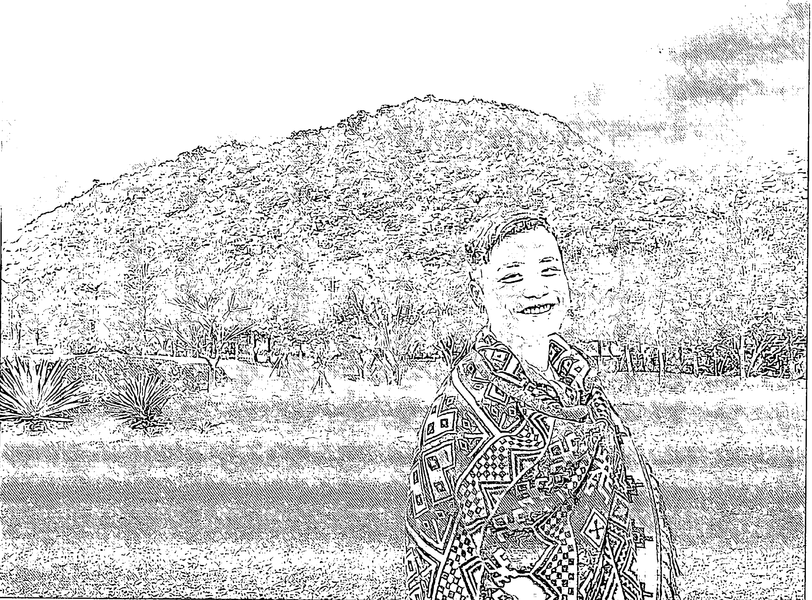

# 靈氣手札
# 靈氣與身心靈療癒必讀指南

- 書名：靈氣手札——靈氣與身心靈療癒必讀指南
- 作者：朝朝
- 發行人：程顯灝
- 總企劃：盧美娜
- 主編：馨綴美學國際資訊企業社・蔡宜珍
- 美編：馨綴美學國際資訊企業社・羅光宇
- 封面設計：彭子馨

- 藝文空間：三友藝文複合空間
- 地址：106 台北市安和路 2 段 213 號 9 樓
- 電話：（02）2377-1163

- 發行部：侯莉莉
- 出版者：靛藍出版有限公司
- 總代理：三友圖書有限公司
- 地址：106 台北市安和路 2 段 213 號 9 樓
- 電話：（02）2377-4155
- 傳真：（02）2377-4355
- E-mail：service@sanyau.com.tw
- 郵政劃撥：05844889 三友圖書有限公司

- 總經銷：吳氏圖書有限公司
- 地址：新北市中和區中正路 788-1 號 5 樓
- 電話：（02）3234-0036
- 傳真：（02）3234-0037

初版 2019年7月
定價 新臺幣 340元
ISBN 978-986-94507-4-4（平裝）

◎版權所有・翻印必究
◎書若有破損缺頁請寄回本社更換

> 國家圖書館出版品預行編目（CIP）資料
靈氣手札：靈氣與身心靈療癒必讀指南 / 朝朝作. -- 初版. -- 臺北市：靛藍出版, 2019.07
面； 公分
ISBN 978-986-94507-4-4（平裝）
1. 靈修

# 靈氣與身心靈療癒必讀指南

# 靈氣手札

朝朝 (著)

從7歲開始探問生命意義的警察，最終放棄人人稱羨的鐵飯碗，走進身心靈療癒的世界，成為專業的靈氣老師：朝朝。朝朝秉持不藏私的心意，介紹各種身心靈療癒的方式、臼井靈氣的施作重點、二十九種QA大疑問，還有針對各階段學員的貼心建議，一口氣全部大公開！