◇ 沈嵘口述 米蘭達撰文 ◇

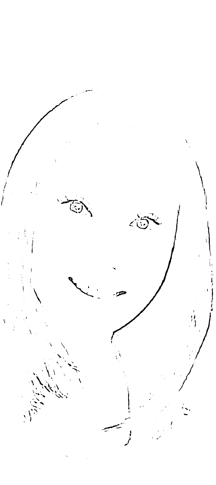

## 靈界使者

### 沈嵘之通靈事件簿

遊走陰陽兩界，穿越前世今生 為心靈苦痛和人生難題找到解答！

> 「無辜的牢獄之災看似挫折，但幸運的是，我因此發現自己身上有一個聖靈訊息的接收器，它在我最黑暗的時候成為明燈，幫助我將創傷的負面能量轉換為正向的成長力量，至此之後，我也開始能與靈界溝通。」

沈嵘之不思議通靈體驗，帶您揭開靈魂療癒的神秘面紗！

- 風水命理教父 謝沅瑾
- 易經命理大师 李小禄
- 風水姓名大师 江柏樂
- 聯合推薦

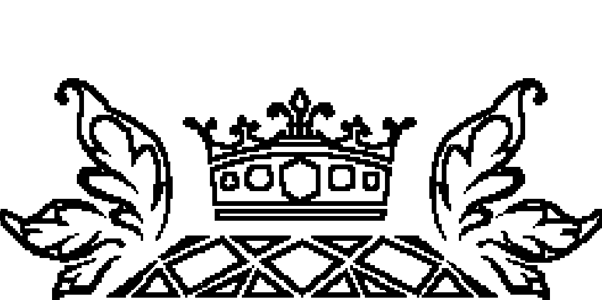

## St. Royal College
### 天使神秘学院

- 神秘学资料库
- 神秘学培训机构
- 水晶能量研究中心
- 专业占卜预测机构
- 官方微信：strcdts
- 微信公众平台：strc2011
- 官方店铺网址：http://strc.cr.cx
- 读书交流QQ群：
  占星塔罗占卜师交流群：814594478（加入密码：PDF）
  神秘学其他综合群：659338717（加入密码：PDF）

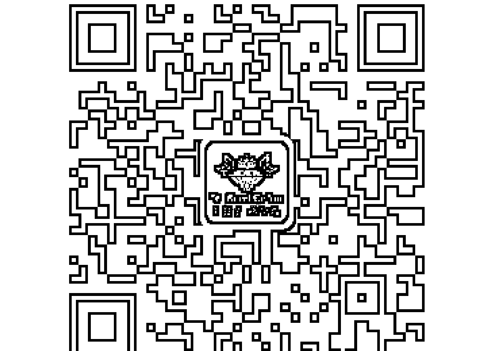

微信号：strcdts
天使神秘学院

微信公众平台：strc2011

## 制作说明：

本书由《天使神秘学院》出重金从台湾购入的原版书籍扫描制作完成。为达到最好阅读效果，特地把书全部切开后，再经由专业扫描设备高精度扫描完成，并经过一张张的PS后期处理最终成书，其间花费大量的人力、物力以及时间，只为能给大家提供经济并优质的神秘学学习资料而努力。

本学院强力谴责某些机构和个人，把本学院花心血制作完成的电子书籍，包装后直接放在自家淘宝网上低价倾销的行为，以谋取不劳而获的经济利益。如果长此以往最终将无人愿意再为大家花心思制作电子书，那以后可能大家再无新书可读。

为让大家以后能够读到更多的好书，也为了本学院的良性发展。本学院恳请大家尽量做到如下几点：

- 一、尽量在天使神秘学院的官方网站购买电子书籍。

官网电脑访问地址：http://strc.cr.cx

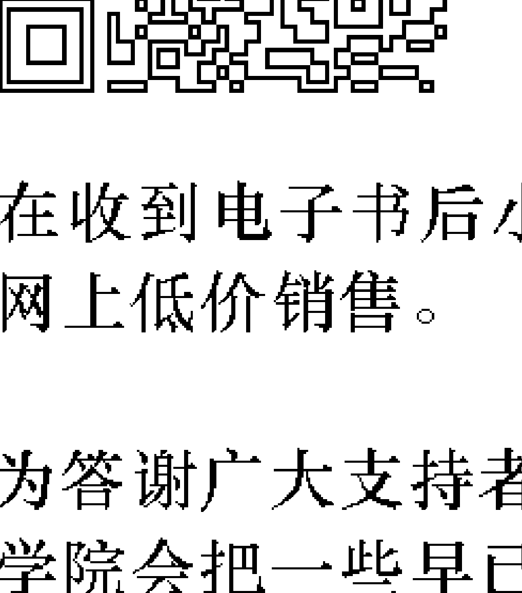

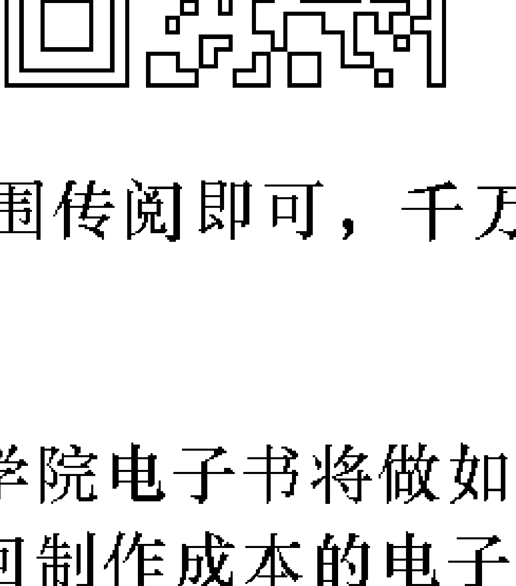

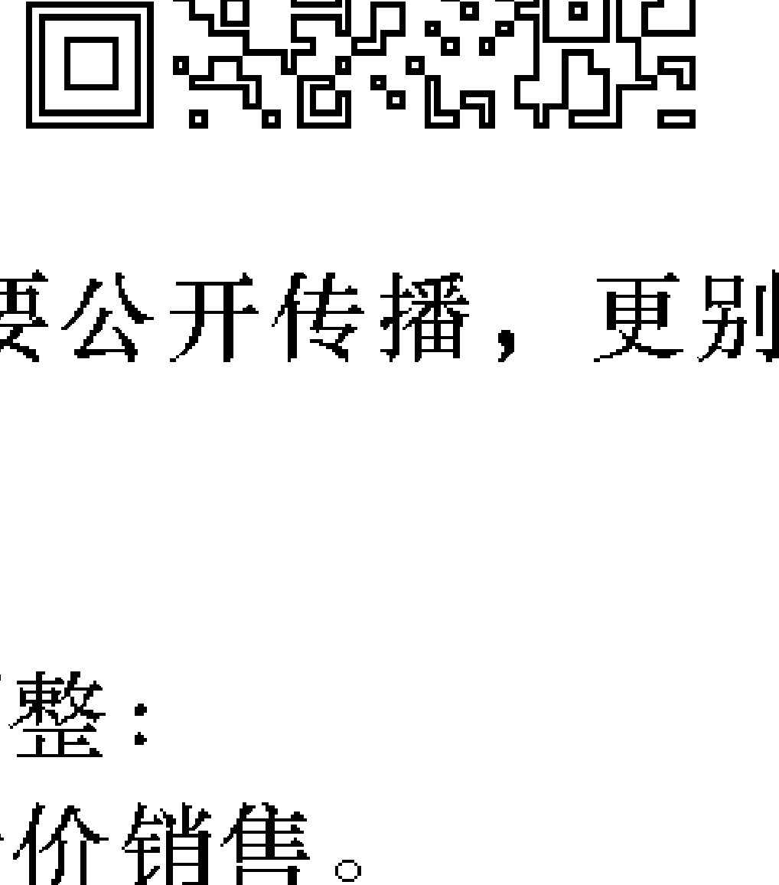

- 二、在收到电子书后小范围传阅即可，千万不要公开传播，更别挂到淘宝网上低价销售。

同时为答谢广大支持者，学院电子书将做如下调整：

- 一、学院会把一些早已收回制作成本的电子书折价销售。
- 二、最新制作的电子书籍会开放打印功能，大家购买后有条件的可自行打印成书。

天使神秘学院
2020年5月

## 沈嵘

創立「沈嵘魔法命理學院」。幾年前代父入獄，在獄中接通宇宙訊息，出獄之後即通靈，在指導靈與關老爺的教導下，可協助查詢個人因果資料、清除靈魂體不良業力、魔法改運、調整風水與能量佈陣、化解冤親債主與卡陰等問題。
沈嵘魔法命理學院網址：
http://tarot-tarot.net/
洽詢電話：0922-089-988

## 關於撰文

## 米蘭達

從事文字工作及翻譯多年，曾任記者，書籍、雜誌與網站主編，現為自由撰稿人。

沈嵘 口述 米兰達 撰文

## 靈界使者

### 沈嵘之通靈事件簿

溝通陰陽兩界，穿越前世今生 為心靈苦痛和人生難題找到解答！

## 目 錄

## 自序
走在光明的道路上

## 第一章
天命的召唤

每個人都有天命，天命就是我們靈魂的特質，所以只要順應靈魂的本然，就可以回歸上天的道途。感謝上天和聖靈賜給我特殊的能力，也讓我知道，我的天命就是幫助其他靈魂。

## 我就是這樣開始通靈

### 我的天命

## 與關老爺結緣

## 你的天命

## 第二章 业力的真相

「业」不像物质那样会衰败或失效，它不会被时间、火或水等能量毁灭，它的力量永远不会消失，一直到它成熟或被清除为止。

- 最黑暗的地方也渴望爱
- 蜕变
- 未婚夫的礼物
- 左右人生的业力

## 第三章 沟通阴阳界

我们的灵魂永不消灭，只是回归到灵魂的故乡——灵界。那些在人世间消逝的、看不见的，还有那些我们深爱着的故人，其实不曾真正离开。透过通灵，我们可以明白因果定数、解答人生难解之事，并且学会真正和解。

## 爷爷，再见——【通灵笔记】灵魂不灭，活在当下

## 第四章 走過前世今生

對今世很徬徨，是宿命？還是前世的因果輪迴的業報？在生命這一條長河之中，所有發生的事都有脈絡可循，讓我們學習打破自我的侷限，走過前世，活在今生。

人鬼夫妻感應——【通靈筆記】愛是宇宙中最強的能量

大伯要回家——【通靈筆記】家族系統的業力

姊姊的願望——【通靈筆記】瞭解兄弟靈、嬰靈和養小鬼

外遇先生死後回頭——【通靈筆記】讓每一世的緣分能圓滿

爺爺與小孫女——【通靈筆記】處理祖先之事不可不慎

習慣性卡陰——【通靈筆記】容易卡陰的原因

領有天命才能辦事——【通靈筆記】誰能領天命？

住在神像中的鬼——【通靈筆記】關於退神

兩世同事——【通靈筆記】職場也是靈魂重要的學習場域

受傷的靈魂——【通靈筆記】愛永不止息

沒有姻緣線——【通靈筆記】姻緣與桃花

## 第五章 靜看婆娑世界

> 有人問釋迦牟尼佛：「每一個佛菩薩的淨土都非常光亮、皎潔無垢，為什麼你的娑婆世界都是下劣有情、五濁惡世呢？」釋迦牟尼佛回答：「那是你沒有看正確，再看一遍，你看，娑婆變金城，當下就是佛國淨土。」

- 寶貝不要醒——【通靈筆記】習慣自殺的靈魂
- 十二歲兒子帶殺母父親投案——【通靈筆記】以覺知的能量平衡業力
- 恐怖乘客——【通靈筆記】自殺無法帶來解脫
- 灑錢怪客鬼附身？——【通靈筆記】失去方向感的靈魂
- 港星淫照風波——【通靈筆記】宇宙中沒有秘密
- 揮霍福份的名人——【通靈筆記】惡業能量會累積到下一世
- 永遠的流行音樂之王——【通靈筆記】只有愛會留下來

## 第六章 解開業力之結

業力並非命運枷鎖，明白業力可以打破原本的慣性思考，轉化既有的二元對立，產生面對問題的新智慧，並且重新擁有豐盛與幸福的人生——而這才是生命的目標。

### 《附錄》 沈嶸魔法命理學院簡介

- 修復受傷的靈魂
- 與指導靈對話
- 業力清除療法
- 化業力為助力

## 自序——走在光明的道路上

我這一生真的很奇妙，若是硬要把我的人生做一個分界點，我想出獄之後的我，似乎已經活在另外一個境界了。老實說，幫家裡的人承擔這場官司，以至於進去坐牢，看起來是一件再糟糕不過的事了，不過在獄中的那段時光，我很用心地去觀察與體會，這樣一種刻苦又受限制的環境，倒是磨練了我的心智，讓我成為一個更敏銳的人。出獄之後，我突然之間就通靈了。我猜想是在獄中那段很絕望的日子裡，跟主耶穌基督許下的承諾：「我想要幫助更多的人解決他們人生的困難」，主耶穌接納了我的請求。因為如此的願望，一批聖靈團隊就對我展開了訓練計劃。我放下了塔羅牌而能夠不用工具解答客戶問題，還能接通宇宙的魔法，幫助客戶改善他們的財運與感情運。我已經跟過去的沈崍告別了，我不再是過去那樣子的我，連好客愛交朋友的個性都消失了。某部分的我，已在監獄裡死亡，換上的是一個蛻變之後的、更脫俗的我自己。有時，我只想窩在自己的世界中，不想有任何的人际关系，这世界上能让我留恋的东西很少，我只想完成我「指路者」的角色，至于亲情与爱情，已经不再是我关注的焦点。

我在出狱之后第二年，迎接了关老爷到我的工作室坐镇，让我的「沈嵘魔法命理学院」有了更坚强的圣灵团队。我可以跟东方系统的神明沟通，也可以跟西方系统的指导灵对话，这完全不会形成冲突，反而让我的信息更完整。我常跟人说，我的老板是主耶稣基督，而我的义父是关老爷，我知道我具备了「天命」，跟我频率相合的人，才能走进我的学院，接受我的指引。

这本书是由我口述，米兰达做文字撰述。我们花了许久的时间采访，幸好有她条理分明的头脑，让这本书有一个清楚的架构。这两年我非常忙碌，花了许多时间在帮客户清除不良的业力程式，根本没有多余的时间写作，能够遇到米兰达协助我进行文字工作，我想一定是圣灵的杰作。

我走在一条光明的道路上，有主耶稣与关老爷的陪伴，还有圣灵团队做后盾，这些都还不够重要，最重要的是我的良心。我希望我可以对得起我自己，我有一个很棒很精采的人生，我通过了最难的一关，许多的苦与乐我都尝过，在地球上的人生不过就是如此。死亡并不可怕，在另一个世界，那至高无上的神，是如此地爱我们，相信我，这是祂亲口对我说的。

## 第一章——天命的召唤

每個人都有天命，天命就是我們靈魂的特質，所以只要順應靈魂的本然，就可以回歸上天的道途。感謝上天和聖靈賜給我特殊的能力，也讓我知道，我的天命就是幫助其他靈魂。

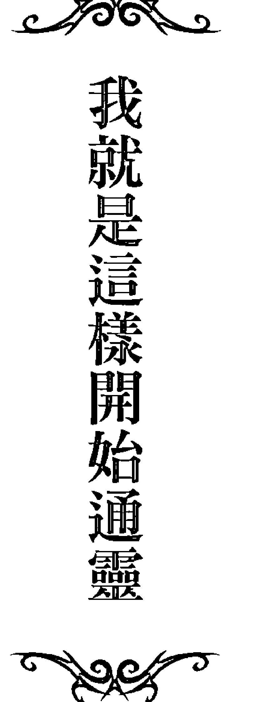

許多人曾經問我，我是如何開始知道自己通靈？並且可以覺察到各式各樣的訊息？我仔細地思考了一會兒，其實若有什麼明顯的分界點，我還真想不起來，但是這種細微的通靈感知力，卻是在我研究塔羅牌時就開始了。雖然我自小就是一個很敏感的孩子，不過這種高敏感度卻沒有帶給我任何好處，反而常常讓我自己陷入一種「無人瞭解我」的憂愁狀態。這樣的情緒養成大約有二十年，以致於現在的我有著一種淡淡的憂鬱氣質，即使我的工作是為人服務的命理老師，常常要鼓勵大家正面思考，但是私底下的我，其實很喜歡獨處。

三十歲那一年是我人生最感徬徨無助的時候，然而也就是在這個時間點，我學會了塔羅牌，進入了命理的領域。但沒想到我一學會之後，馬上就很上手，好像這是我前世就會的工具。雖然還沒有清楚的計畫，但是因為我天生對人、動物，甚至是無生命的礦物都可以敏銳的感知對方的情緒狀態、氛圍，以及傳達的訊息和語言，也因此很輕易的就能用塔羅牌抓到精準的訊息。之後，我嘗試著幫周邊的人占卜，不但很準確而且名聲一下子就傳了出去，使得我不得不開始正視這項工作。

在剛開始執業的過程當中，我的客戶就像是我的老師們，不斷丟出許多難解的問題來拷問我，而每一次的答案都關係著我未來命理的前途。我是一個很有責任感的女生，既然客戶選擇來找我算命，我就一定要為客戶面面俱到，不能有任何閃失。就是抱持著這樣的信念，讓我在解讀答案上面，持續不斷精進，在這種自我訓練的過程中，若是我有失誤的地方，我會馬上修正改進，大約在我成為正式的塔羅牌占卜師之後第二年，我在業界就有了很好的口碑。

初期我在研究一張塔羅牌時，也只能看到在表面圖畫上的意涵，而這樣在給予客戶答案上，雖然有了及格的標準，但以通靈的精準度而言是絕對不夠的。當時坊間有幾本寫著塔羅牌牌義的翻譯書，不過外國人在解牌上面，似乎又跟我們台灣人不太一樣，台灣人很喜歡非常明確及很世俗化的答案，而外國人的思維卻比較抽象空靈，若是我把外國人的牌義解釋套用在我的客戶身上，有時會出現連我自己都覺得好笑的答案。塔羅牌又經常會問到關於未來的問題，我決心不再參考外國書籍，而從我自己能理解的部分下功夫，這對於我的通靈技巧確實有幫助。

自開業以來，我的客戶從未間斷過，有時一天可以有八至十位客戶預約，若是每個人要花上一個小時來計算，我每天平均的工作量在十二小時左右，有時在接近午夜時，還要應付國外遠距離占卜的客戶。這樣實戰經驗了七年的時間，我的通靈技巧從解讀塔羅牌的圖畫涵意進階到可以穿透圖畫，當我可以看到隱藏在畫面之下的不同訊號時，我感覺我已經進階到另外一個層次。

我在實際幫了許多人占卜並且迴響很好的情況之下，開始了我的命理生涯，這對於一直在人生中找不到方向的我來說，可說是人生的轉捩點。只是，上天對我的安排並不僅於此，他們決定要更進一步的考驗我，看我是否能在重重地摔下後還能滿懷信心地站起。

在我代父入獄之前，我就感覺到自己的算命技術超越了同行許多，那時我還幫人算紫微斗數命盤，有時一邊講的同時，我似乎從客戶的命盤當中，看到了某種情緒或者是情感的起伏，亦或是某顆星曜配到某顆星曜或宮位，它會帶給我一種很特殊的感應，有時是很負面的能量感知，我就會直接跟客戶說明我的感應。而這往往在事後，也許半年或一年之後，原先的客戶會回來跟我說，事情如我所說的發生了。我猜想，在當時不論是解析命盤或是塔羅牌占卜，我的通靈能力就是如此鍛鍊而成的。

但在這段養成期，我還是需要一個算命的輔助工具。不過我要說明的是，我有某種心靈感應力，這也是在我幫人算命期間逐漸發展而成的。就像是我跟當時交往的男友關係，有時在我很安靜時，我竟然可以知道對方的想法與心境，好像是他雖然是在離我很遙遠的地方，但我又能在我身處的屋子中，感覺到他的心思想法。這對於偶爾與對方冷戰吵架時很有用，我幾乎不用去討好哀求對方，我就能知道他到底想不想跟我復合，所以，我只是等待，等到我預期的結果發生，屢試不爽。
這種逐漸與逐步進階的心靈感知能力，我雖然在當時不敢說我已經通靈，不過似乎我的客戶們都很讚嘆，我幾乎不用上電視宣傳就有了一堆死忠的支持者，不過這樣算命到一定程度，我也開始感到疲乏。我開始覺得客戶問我的問題都太簡單，那時我的心靈感知技術已進階到一種很神奇的地步，那就是當客戶問我一個問題時，例如：對方有沒有劈腿？接下來不論客戶抽到哪一張牌，我給予她的答案都會是相同的。在這階段，我已經超越了一般的塔羅牌算命師的水準。
普遍一般的算命老師，皆是規則是什麼就說什麼，有時出現的答案會讓客戶覺得很死板與僵硬，但在我的算命經驗當中，一定是不在規範當中的，因為客戶千百種，狀況更是變化萬千，而準確的答案只有一個！請注意，我說的是在宇宙當中，關於這個問題的標準答案確實只有一個！「一個」（所以不論客戶抽到哪一張牌，答案都會是一樣的）。若是按照這邏輯來思考，給予模稜兩可答案的老師，根本就該打屁股。
直到某一天我確定要入獄服刑了，當時我已感應出我的未婚夫會變心離去，我還耳提面命他千萬不可，而他也千保證萬保證自己絕不變心。直到我進去的第三個月，我與外界完全隔絕，但當時我的心靈感知力已能夠讓我雖身在監獄中，但無時無刻都能感知到我未婚夫的心思變化。這是一個很神奇但也很令我痛苦的過程，我竟然可以在一個與世隔絕的環境當中，一點一滴地品嘗愛人離我而去的整個心碎過程，而我只能眼睜睜地觀察這一切，無力做任何改變。
我猜想，這一定是我的指導靈在訓練著我的通靈能力，衪們讓我的靈敏度在獄中升級到最高點，我身處在一個不能與外界通話、通短信、也見不到任何心愛的人的一個可怕環境當中，這樣的環境讓我變得更為沉穩、更為機警，也培養了我的慈悲心。
監獄可以禁錮一個人的身體，卻限制不了靈魂的自由。入獄的這段時間，每日如苦行僧般的行住坐臥，鍛鍊了我的意志，我獲得更多時間靜心，使得我更加領悟生命的道理。那時我把一本《靈籤一百首》的書製作成小籤詩讓獄友們抽，讓大家在失去信心和希望之際，因為心靈獲得慰藉和指引而不至於放棄。

### 我的天命

人生當中的許多辛苦，包括肉體與情緒上的，我都經歷過。我知道為金錢而煩惱是什麼滋味，我也知道被人拋棄的滋味，最苦的牢籠我都能安然度過，原來讓人平安的，不過就是信念。我發現信念太重要了，一個人只要觀念上出錯，就會在行動力上出錯，引發噩運的骨牌效應。這場牢獄之災看似挫折，但幸運的是，我因此發現自己身上有一個聖靈訊息的接收器，它在我最黑暗的時候成為明燈，帶領我經歷過所有傷痛的洗禮，將創傷的負面能量轉換為正向的成長力量，也將痛苦經驗轉化成智慧。至此之後，我開始確定，我要以我的通靈能力來幫助更多的人。

如果問我，如何能這麼確定以通靈能力幫助人是我的天命，那麼我想先說，我並不是一出生就明白自己的天命，我在獄中接觸到那些我從來不會接觸的人，瞭解她們的痛苦與渴望，我的靈命在這悲慘的環境中更加成長，我呼求主耶穌基督給我大能，讓我通過這場考驗，也使我將來能幫助更多的人。因為這些際遇，才讓現在的我更確認了自己的天命。

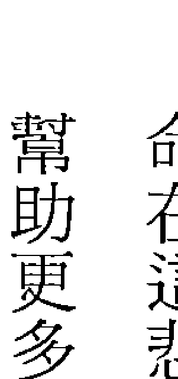

### 「指導靈」的帶領

出獄之後的改變真的很大，那些當我在獄中受難，背棄我而去的好友與男人，都已煙消雲散，取而代之的是一種全新的生活。由於我在獄中通過了考驗，因此「指導靈」開始將魔法這項工具交到我手上。出獄後有一天，我無意間發現一個從海邊撿回的貝殼竟充滿了負能量，這時我聽見「指導靈」跟我說：充滿正向能量的人可以用正面思考創造好運氣，因為他們能讓周遭也充滿正能量，而負能量則會吸引更多向下沈淪的力量，會讓一個人更不幸。我在貝殼上灌注了正向魔法，發現透過魔法可以立即改變它的能量磁場，從此之後，我開始研究心念的力量如何影響一個人，讓環境中充滿正能量的事物或是透過配戴合適的飾品都能大幅地改善，我用魔法幫助了不少人成功地賺到金錢以及解決人生問題，我的事業也在「指導靈」的帶領下逐步展開。有一次我接了一場活動，在一家美容產品連鎖店幫前來的客戶算塔羅牌，然而不需透過塔羅牌，我便讀到一位客戶的腳關節因舊疾而多次受傷開刀，我跟她說她的腳傷未好，因為那個受傷部位還在發炎，而且狀況不輕，我建議她趕緊就醫。另外，我還讀到一位客戶這一生會有兩個孩子，不過都會是女兒（她的第一胎就是女兒）。這些訊息都是自然而然就浮現在我心中，讓我的客戶直呼好神奇。

還有一位小姐來問跟老公的關係，但我卻意外地通靈查到她自己早已在外有男友，這些訊息都是不用翻塔羅牌就查得出來的，好像我身處在一個大型資料庫當中，要查什麼訊息就能查得。也有許多情侶來問感情，是不是正姻緣真的很重要，若是兩人不會走上婚姻，我也會明白告訴當事人不要浪費時間了。 若是你問我這通靈能力到底怎麼來的？為什麼我有辦法查到每個人的資料呢？我只能說，也許是我的一顆真誠要為人服務的心，讓我的通靈能力倍增吧！

### 「魔法女王」於焉誕生

出獄之後三個月，我通靈的技巧更是逐漸增加，我拿起了靈擺與指導靈接上了線，從靈擺擺動的幅度當中，我看到了隱藏的訊息，這幾乎是我在學習塔羅牌的翻版。自此，我逐漸放下塔羅牌，改用靈擺幫人算命，因為靈擺的精準度比塔羅牌還要更為細緻。

## 靈界使者——沈崍之通靈事件簿

而在往後的一年內，我又自上天拿到了一樣法寶：「魔法」。我想，這也是我前世就會的工具吧！因為我可以隨心所至地發明各種魔法，而且使用起來的效果也真的很棒，我在業界又有了新的頭銜：「魔法女王」。我認為與其算命，不如強運，只有把自己的運程提昇，人生才會覺得開心有朝氣。當我運用魔法為人服務的同時，我的通靈技巧又提昇了，我認為手拿靈擺還是太慢，為了應付更多蜂擁而至的客戶，我直接運用我的手來接收訊號，只要一個人把她的名字寫在紙上，我就能摸著她的名字講出她的狀況。在這段自我精進期，我感覺自己好像被賦予了神聖使命，我把客戶交托給我的任務當成我自身的任務去處理，我本著良心去服務客戶，這讓我在專業技術上更為提昇，也讓我的客戶更滿意。而似乎我的通靈技巧還在悄悄地提昇，有時看著一個人的氣場，我就知道她是否有卡陰的問題，甚至在某些狀況之下，我可以與鬼魂或神明交談。而這些通靈技巧當然一定要經得起時間驗證，我不希望自己成為某種坊間的通靈老師，編著過去世誰殺誰、誰又欠誰的情境故事，這些故事對於當事人而言並無法考證，又怎麼會有意義？我反而著重在當下這一刻的狀況，我運用通靈技巧給予客戶正確的答案，再幫助她們選擇一條最適合的道路，這當中絕對不可以怪力亂神，不然就會流於迷信與恐嚇。所幸我的客戶對我的滿意度很高，我的官網上的「天使的迴響」留言版，留下了許多感謝我的客戶留言。我雖然有時會怨嘆自己為父坐牢，喪失了許多好的人生機會，但我又會想，若不是經過這一番寒徹骨，我又怎麼能有這麼精準的通靈能力，可以幫助那麼多的人呢？

每一位通靈人的超感應力都會是不同的，所以也無從比較，不過只要是這些通靈下來的資料能夠幫助到人，就是好的能力。我一直很感謝我的「指導靈」們，給予我無條件的愛與指導，讓我可以有更高深的能力去幫助人們。我猜想，我的通靈技巧還會不斷提昇，我不是天生的通靈者，也沒有陰陽眼可以看到鬼魂，但是我有一顆渴望幫助別人的心。我希望每一位來找我算命的客戶，都能在見過我之後覺得很值得。而我最要感謝的是主耶穌基督與我的指導靈們，因為有祂們不眠不休地看顧我，我才能盡己所能地去看顧我的客戶。

有時想想，人生真神奇，我小時候的敏感脆弱在長大後，幻化成高度的心靈感知力，而在我人生當中的許多打擊與失落，磨練了我的同理心，讓我更能設身處地為人設想。

原來，黑暗過去了，真的有光明。

## 與關老爺結緣

與關老爺的這個緣分要追溯到我的童年了。小時候我就喜歡去行天宮玩，在廟門和大院裡進進出出，看著香爐上的裊裊香煙逸入穹蒼，望著大人們虔誠地敬拜祈禱著。雖然關老爺看起來嚴肅，但是我卻覺得祂很有親和力，因此常常望著關老爺，自己跟他談天說話。隨著時光流逝，這份童年記憶被收藏到記憶的盒子裡，直到在我出獄之後的第二年，那時有很多客戶來問冤親債主和卡陰的問題，但是我所學的西洋魔法對於處理這一塊民間信仰卻力有未逮。此時記憶的盒子被打開了，我又走到了行天宮，跪在關老爺面前向祂請示該如何是好，而慈悲靈驗的關老爺答應透過我來幫助人們解決問題。隔天我剛好在百貨公司有一場活動，我驚奇的發現，在我身上運作的能量不只西方的聖靈與「指導靈」，我還可以感覺到關老爺。從此之後只要問到生命成長方面的問題會由西方力量來幫忙，若是因果問題，就是關老爺來幫忙。我很慶幸自己能有東、西兩方的力量協助，讓我可以用最合宜的方式來幫助需要的人。

在我看來，西方大天使掌管的是人類的靈性成長，而東方的神明系統掌管的則是民間事務（諸如因果、鬼魂界），兩者並不相衝突。目前地球正在走一條「合一」的道路，這個「合一」不光是指身心靈的合一，還有法界的合一，我們可以有更為寬廣的視野去接納靈界的訊息，畢竟那才是我們最終回歸之處。

之後關老爺訂了處理冤親債主的價錢，「指導靈」也訂了魔法服務的價錢，在祂們嚴謹的原則下，就算我想多貪財也沒辦法。感謝關老爺的疼惜和瞭解，讓我可以充分發揮辦事與溝通陰陽界的專長。然而，獲得這些能力也代表著必須回饋的責任，我知道自己的天命就是來幫助世界上的人們，我也因此更積極地走向靈修的道路，希望可以透過我的通靈能力以及對命理上的瞭解，服務並幫助在人生上出現困惑的人，協助解決人生的障礙與困擾。

# 你的天命

每一個人都來到這個地球都被賦予著天命，簡單來說，我們天命的範疇就是要服務人類、動物、植物、地球和這個宇宙。很多人並沒有察覺或接納這一點，所以會覺得生命沒有目標或自己並不重要。為了找尋生命的課題，首先就是要了解自己。

## 慘綠歲月

從小我就知道自己和別人不太一樣，我可以很輕易的就知道別人在想什麼，但是那時的我卻一直無法清楚的定義自己，我只知道我的身體裡面有一顆敏感的心。然而，敏銳的感知力卻在青春期造成困擾，讓我在情感上受傷，很容易煩惱和感到憂愁，一旦受到創傷也不容易平復，所以我在十六歲時就曾經有過為情自殺未遂的紀錄。現在想起來當然很傻，這樣的行為完全不值得鼓勵，只是早年的我並不懂得如何去清除生命中的負能量與障礙，所以只想到用自殘的方式來解脫無法面對的痛苦。不過這段慘綠歲月中找不到出口的行為，其實對我的人生是有它的意義的。

坦白說，我在求學期間完全不是讀書的料，成績可說是其爛無比。我的父母因為工作都很忙碌，但是對要求卻不曾減少過，只要成績不理想就會被毒打一頓。我書讀不好又敏感，這些體罰對我帶來極大的震撼和傷害。對於青春期的我而言，與家人疏離似乎成為保護自己心靈的方式。

我變成一個沒有安全感的小孩，常常幻想離家出走、找一個疼愛自己的人，然而卻一直不能如願，只讓自己活在不知如何形容的辛酸中，過了好長一段時間之後，才明白安全感與愛原來是我生命中主要的課題。

雖然我很愛我的爸媽，從他們身上也學習到孝順是做人基本的原則，而且從小就被灌輸著不孝順的人不可能是成功的人，所以對於一切的體罰、責罵和要求，我都逆來順受，只是我對於家和親情的定義變得很模糊。再加上父母在早年也不明白如何相愛，時常為了錢和女人吵架、打架和摔東西，他們像仇人，家裡像戰場。我不明白相愛的人為何會變得如此憎恨彼此，我們雖然同住一個屋簷下，卻各自活在不同的世界裡，如此寂寞、孤單又疏離。

## 靈界使者 — 沈崍之通靈事件簿

十七歲時我被送到美國讀書，剛開始因為語言的障礙和敏感，自閉到幾乎交不到朋友，所以我把時間都花在圖書館裡，然而也因為這樣，才真正開竅、愛上閱讀。這段時間我開始為自己的知性充電，也對人文產生關懷，而遇見學校的導師比爾·唐納理先生，則為我的人生帶來另一個關鍵性的改變，我在他身上發現了什麼是無條件的愛。他對外國學生非常好，並真心關懷外來移居的小孩，他安撫我在異鄉的孤單，他用無盡、無私、一視同仁的愛，在我的心上種下了另一顆愛的種子。我在他身上看到了典範，我告訴自己也要盡力解決人們的煩惱，學習無私地愛每一個人。

## 揩不完的官司

回到台灣之後，未經世事的我覺得自己沒有一技之長，因此接受父親安插在雜誌社的一份工作，沒想到卻從此變成揩官司和頂罪的機器。那時我常想著：我這麼孝順，為什麼家人會這樣對我？但是，又覺得分擔責任，報答父母的養育之恩是天經地義。這樣極端的矛盾深深的困惑著我、在我的內心煎熬著。也有別人問我，為何還要這樣幫父母？然而。在我當時年輕的腦子裡，只覺得父母對我有養育之恩，既然從小就享用了他們的資源，理當無怨無悔地順從他們；另一方面，一個在家暴陰影下長大的小孩，早就放下反抗的能力。就這樣擋了幾樁官司之後，我覺得很疲倦了。我終於決定離開家庭的影響，試著切斷這樣不快樂的互動關係。後來我進入了演藝圈，並在一位經紀人朋友引薦之下拍了台視的單元連續劇「法醫奇案」。這段日子裡，我嘗試自己獨立生活，一個人帶著簡單的行李搬到鐵皮屋，每個月靠通告費和主持費過生活，很多時候月收入不到兩萬塊，還要付房租和生活費，日子過得捉襟見肘，當然和父親關係也降到了冰點。演藝圈淘汰率高，總是不知道下一餐在哪兒，而且每天說著虛無飄渺的綜藝話語，我不禁又開始感到焦慮，一番思索之後，我明白待在演藝圈並不會找到我渴望的東西。在這段時期，我開始接觸融合各種宗教和神性思想的新時代（New Age）思潮，也看了許多賽司、歐林和其他高靈的書，我的內在獲得了啟發，我終於知道自己真正的渴望是什麼了 —— 成為一個光與愛的工

### # 上天關了一扇門，但又開了另一扇窗

三十歲那年我決定與父母和解，父母漸漸年邁，為人子女本來就應該善盡孝道。那時父親說雜誌社缺了一個發行人，因為這位同事離職了，所以他希望我能接下這個職位。我答應掛名當發行，但是從來不過問也不涉入雜誌社的運作。此時瓊美鳳遭到偷拍的事件爆發並且轟動一時，而父親的雜誌社竟然為了刺激銷量決定隨刊附贈該片偷拍的性愛光碟。在我知道之後，早已事態嚴重而來不及阻止了，當事人已經訴請司法裁決。父親愁眉苦臉的跟我說，這場官司牽連眾多，他希望我能一肩扛下，要不然很多同事的家庭都會破碎，那時的我扛官司已經扛到麻木，心裡又不忍父親為此傷神，於是一口答應了下來。我被判了十一個月的徒刑，一個無辜的人，扛下最大的責任。只是沒想到，這件事對我的人生造成了極大的影響。

在二十四小時被監視的監獄生活中，我經歷了所有的難堪，尊嚴遭到踐踏與侮辱，但是我熬過來並且過關了。我在監獄中聽到神對我說話，上天雖然關了一扇門，但又開了另一扇窗。即便這段路這麼難走，但在聖靈的領導下，我進入了人生的另一個階段，現在回想起來，覺得其實是蒙受了最大的福澤。

當然，這世界上還有很多跟我有同樣天命的人，只是各自表現出來的形式不盡相同。找出自己天命的重點在於要真正瞭解自己內心最深的渴望，每一個人最終的天命，都是在服務其他生命，只是方式不同。重點在於這個服務，必須是自己真心誠意想做的，當你這麼想，便能領悟自己的天命。

當你遇到人生转折或阻碍时，一个好的老师可以引领你跳出既有的思维，帮助你更快的解决问题，所以选择一个适合自己的老师是很重要的。我们最好选择心术纯正并在日常生活中具有好品德的人来帮助我们，他的语言谈吐必须表达出爱与真正关怀的品质，用这样正派能量所施行的方法和力量才有效。如果带着邪念和杂质，那么他所施行的魔法术数也会产生负能量，或许能收一时之效，但是可能会让人人财两失。

## 第三章——業力的真相

> 「業」不像物質那樣會衰敗或失效，它不會被時間、火或水等能量毀滅，它的力量永遠不會消失，一直到它成熟或被清除為止。

## 最黑暗的地方也渴望著愛

不可諱言，人生是充滿課題和挑戰的，即便我們明白並領受了天命，也還是會一直遇到困難和阻礙，雖然這些都是為了讓我們的靈魂更完整，只是也常常讓我們疲累和痛苦不已。但你是否知道，冥冥之中有一股力量推動著我們的人生，觸發著這一切挑戰的發生，這股力量就是「業」。

我當時入獄時的牢房是一個十六個人擠四坪不到的狹小空間，吃喝拉撒睡都在這裡，有時監獄爆滿，還擠到十八個人。在這裡，大家都只顧自己，自私而且不信任別人，因為寫黑函告狀可以博得監獄主管喜愛，所以每個人都只想可以多一些福利。我對監獄最大的感觸，在於這個懲罰系統很嚴格，但是卻充滿許多的不公平和不公義。雖然大部分被關進來的人都做了不對的事，但是在偏頗的天秤上，如何能矯正他們的行為呢？我記得監獄中一位老太太，因為不堪長期照顧中風的丈夫，再加上自己也有一些精神疾病的困擾，所以有一天便用枕頭悶死丈夫。牢裡的每個人包括長官，都知道她腦筋不太靈光，卻故意對她冷嘲熱諷，極盡辱罵。有一次她因洗澡動作比較慢而與監獄管理員產生衝突，她因為反唇相譏所以被強制戴上手銬腳鐐關到考核房裡關禁閉，幾天後她因此中風被抬了出來。我知道在社會上犯了罪理應接受懲罰，但是我更明白，這是因為每個人們身上都有自己無法處理的負面能量，也就是「業力」。

另一位胖姐妹，因為當了詐欺人頭戶而進來，她說自己只能靠賣存款簿，用三千元、五千元，這樣過一天算一天地活下去，所以這樣進來坐一陣子的牢也好，至少不用擔心生活。

而另一位已經六十歲的大姊，則因為土地詐欺案進牢，她知道出去後一無所有，兒子也不理會她，想到出獄後的生活不易，她嘆口氣說，寧願一直在牢裡。

## 第二章 業力的真相

### 蛻變

十一個月後，我出獄了。一心想再回到工作崗位的我，已經從宿命的角度轉換成找出自己的力量並且盡力改變的積極態度。剛出獄的那段時間，每到凌晨時分，我開始接收到一些訊息告訴我每天要安排做哪些事，下一步該做什麼。這些訊息讓我感覺到一種神聖的氣氛，之後才發現那就是「指導靈」的訊息。從那個時候開始一直到現在，「指導靈」都一直帶領著我的生活與事業，也賦予我更多能力來幫助別人。

在進監獄前，我是一個很單純的命理老師，我的專長只有回答個人的運程問題，然而出獄後，我除了解答命運，還能夠在「指導靈」、聖靈與關老爺的協助下，成為可以療癒靈魂並真正助人改運的心靈老師。如果我本身無法正面思考，也沒有堅持信念，那麼在遭遇生命的挫折時，將會很容易向下沈淪，也無法再創造出什麼。

關於我和我父親之間的課題，透過通靈查詢我也找到了解答。我的執著性跟我父親是聯結的，會因為他而產生這樣的驅動力，起因於我與父親之間有著靈性誓約。我曾經在前世承諾過他，只要他有需要時我就會去幫忙他，所以到了今生總是無法拒絕他。靈性誓約指的是兩個靈魂間的協定，可以是感情、金錢、家庭或任何事，只要透過言語宣示而且雙方都認可的就會成為靈性約定。這些約定會在靈魂上標示印記，如果承諾的時候越慎重，約定的力量就越大，尤其是婚姻關係。婚姻是很慎重的約定，所以婚姻中出現變故通常會帶來極大的痛苦和創傷。不過靈性誓約是可以在當事人的覺悟下單方面選擇解除的，對於受不當關係羈絆的人，更要能覺察自己的狀況，清楚地意識到要了斷這樣不當的糾葛，才有辦法真正解除。當然，親子關係是無法拋棄的，但是

## 未婚夫的禮物

在獄中經歷最絕望的事，就是當時未婚夫未能堅守承諾，變心離開。然而對於他，我沒有埋怨，我明白這段時間對於彼此而言實在很熬。在獄中的前半年他常寫信給我，總是安慰和鼓勵著我，這份關懷我仍銘記在心。其實在進監獄前，我算紫微斗數就知道他會變心，那時我也曾問他對我們感情的信心如何，他堅定的回答決不變心。但是命運有它的架構，不相信是因為還沒有遇到，所以你不會知道。後來我也在獄中用衛生棉墊做成塔羅牌占卜，在他突然斷絕音訊之前，我就已算出他已經另結新歡。既然事情已發生，我就接受了，我從這段感情中獲得很大的智慧。

什麼是真感情，在患難中能彼此扶持，一起度過才是真感情，真正的感情需要時間印證，需要行動，許多假的感情因為進了監獄就失去了。我的監獄長官曾對我說：

> 587（在獄中只叫編號），妳現在應該知道什麼是患難見真情，要知道感情的真假，進來（監獄）試，就知道了。

我們交往一年多，在我進監獄前，他跟我求婚並提出訂婚，那時的我真的很感動。只是，我明白自己並沒有這一段真感情。

在這之後，我在監獄中開始學跟自己交朋友，重新認識自己的靈魂，也意識到自己擁有很大的財富。早年的我為何看不見自己的美好，而總是依靠別人的眼光看待自己呢？我深刻明白，當認識了自己，開始愛自己之後才能夠真正愛別人；尊重、看到自己的獨特性後，也才看到別人的獨特性。所以我不怨恨他，在此之後，我對他的愛反而更寬廣。

我是真的站起來了。原本在事業和經濟上，我就是個獨立的人，但經過未婚夫離開的衝擊，我在感情上才真正地站起來了，在這一刻，我知道我能給自己幸福。我自己開始幸福，才能給別人幸福，如果我今天跟一位和我同樣或者更是缺乏的男人在一起，幸福之路將會更遙遠。

「奇蹟課程」這本書中談到：「凡是真實的，不受任何威脅，凡是不真實的，根本就不存在。」這段話鼓勵了我的心，也讓受困於感情的我得到解脫。幸福的定義也轉變了，幸福不是你要什麼、要得到什麼，而是在你原本的狀態就能感受，那才是真的。

我在獄中認識了幾個好朋友，她們很多都是重複進牢的累二、累三的菸毒犯，在我被解除婚約的低潮時期，她們感同身受，並且無條件地陪伴著我。因為她們大部分都是過來人，在獄中此外，在監獄這個集中營或者說是收容所裡，其實校正力量很低。在這裡，你無法學習而且被社會所隔絕，靈魂會一直處在焦慮狀態，出獄後不但無一技之長，也無法填補這段空白，因此在監獄中得到憂鬱症、躁鬱症的身心症者很多，連原本沒有病的都出現疾病了。

這些獄友們因為生命中的混亂而進到監獄中，她們人生最美的時候都在這裡蹉跎了。有一個少女從小就經常被父親亂倫強暴，還生了父親的孩子，她後來認識了一個不學無術的混混，錯把他當成來救自己逃離父親魔掌的羅密歐，但是那個男人有一天為了錢，竟騙了一個保險員到家裡來，然後殺害他，那時還懷有身孕的她在驚嚇之餘，無知地配合幫忙搬動屍體，結果捎了殺人共犯的重罪，徹徹底底地失去一切。

看了太多獄友的故事，我開始思索人生，也不再自憐，因為我的遭遇根本不算什麼。我深刻地體認到，每個人都不要把自己逼得別無選擇，或是讓自己陷入絕境。每一個看似罪惡的故事，其實都有共通點，表面上大部分人獄的人通常知識水準比較不高，經濟狀況不會太好，在情緒EQ上也比較不穩定，但我發現其實操弄命運的背後有另一種負面能量，就是「業力」。因為個人與家庭的業力，導致當下無法靠自己的力量做出智慧的抉擇，覺知到「業力」對人生有著強大的影響力，對我來說是很大的收穫。 久蹲之後所積蓄的能量可以讓人跳得更高，倚靠著信仰，我度過了這段艱苦的日子，所有的傷痛都成為珍貴的禮物，讓我能用更清晰和純淨的心看待這個世界。

### # 遇見對的人

在我幫人算命的經驗中，常有很多人問我「真命天子何時會出現？」、「誰才是對的人？」 對於這些問題我自己也有很深的感觸。 早些年我覺得並沒有真命天子，也沒有特定要等待的人，因為隨著時間流逝、人事變遷，對的人可能會變成不對的人，所以一個人應該有很多可以契合的人，只是遇到的時間順序先後問題。 然而認識凱，讓我的內心想法有很大的轉變。在認識他的一個月前，我便幫自己進行一次不良能量的清除，尤其針對愛情部分，我清除了一些錯誤的想法以及會阻礙我去認識好男人的觀念。

所以，如果要回答「真命天子」這問題，我想要說：多數人都想遇到對的人，問題不在於你## 嫁入豪門，飛上枝頭做鳳凰？

童話中的灰姑娘給了女孩們嫁給王子便可以拯救人生的幻想，在現今媒體的推波助瀾之下，嫁給有錢人、過著少奶奶的生活好像變成稀鬆平常的話題，常常可以看到如何釣到金龜婿、分析

有沒有遇到對的人，而在於你有沒辦法辨識出來誰是對的人。如果一個人有許多負能量，便會讓自己看不見也分辨不出來，還會吸引到不對的人。而這樣的負能量可以說是一種「業力」，譬如之前在我身上有「分離」和「拋棄」的不良業力，所以我很容易遇到不願承諾、堅持和輕言放手的人。在不良業力的牽引下，我們就會遇到跟自己一樣有不良業力的人。然而，我們很少思考是不是自己本身就有問題，老是責怪別人或老天。

因此，之後我協助客戶清理感情問題時，我就會跟他們說，或許對的人就在你身邊，只是你是否看得見。正如聖經所言：「天國就在你面前，只是你將眼睛蒙住」，所以先暫停往外尋求真命天子吧！在靈魂當中有不良的業力狀況時，怎麼樣都遇不到適合的人，直到清理乾淨後才會看見，感情關係才可以順遂。因為當你的靈魂體越乾淨，所謂「對的人」就會越來越多，因為你可以看見對方美好的特質，而且不會互相引發不良的能量。

貴婦名媛命，以及窺視豪門大戶生活的訊息，讓很多人覺得只要嫁入豪門就能飛上枝頭做鳳凰。其實這其中隱藏著「不勞而獲」的負面能量，我的確在很多女孩身上發現這個業力。不管是不不是要嫁入豪門，她們就是想從男人身上得到好處，甚或覺得男人就應該滿足她所有的物質和虛榮心。其實這樣不腳踏實地的想法，反而會離這些夢想越來越遠，不勞而獲心態的人反而不會變成有錢人，因為真正的有錢人都是靠智慧和努力去獲得和經營自己的財富，他們也不喜歡對自己只有物慾的女孩，就算有機緣在一起，通常也不會對關係認真，到後來彼此牽動的，只有不良的業力關係。此外，有不勞而獲想法的人，他的靈魂能力通常會下降，因為把太多精神放在認識男人以及計算如何從男人身上得到財富，包括援交、接受包養等，不能腳踏實地為自己努力的人，就算被贈與了一大筆金錢通常也留不住。或許有人會覺得自己也提供了時間甚至青春的肉體，怎能算不勞而獲呢？換個方向想，對方若也只是這樣看待以及衡量你，你如何能靠這樣的錯誤架構獲真愛和疼惜？所以聰明的人別再緊抓著不勞而獲的不良業力了，把它移除就能與地面接觸，你的人際關係、工作態度就能紮實，也會獲得更多尊重與珍惜。

## 第二章 業力的真相

### 做好每個選擇

在每個當下好好做選擇，可以幫我們聯結到對的人，也可以將我們帶領到對的路上，有些選擇聽起來並不困難，但是很容易當局者迷，因而出現失誤。譬如吸菸、吸毒會帶來上癮以及很多後遺症，明明知道不好，但是為什麼還是將自己推入呢？又譬如「劈腿」這個背叛行為，它其實牽涉到更深層的信任感問題，有劈腿不良業力的人，從根源就無法相信別人，因為這個業力是雙向的，所以這樣的人也會吸引類似的人。

我們會吸引跟自己一樣的人並互相影響著，就像鏡子一樣，吸引不良特質的人來映照出自己。有時因為慣性而無法離開一個不對的人，久而久之，你也會相信世界就是這樣，繼而引發自己其他的不良業力能量，譬如猜忌、嫉妒、絕望和憤怒等。而背叛能量進入到婚姻關係時，引發的就是外遇行為，它所危害的層面更加擴大，不只影響自己和配偶，也影響了孩子。造成孩子受到傷害，因而產生懷疑、恐懼、不信任與缺乏安全感等不良業力，也讓這些孩子帶著這樣的負面能量影響自己的人生。

由於所有的能量都是運動的，解決之道就是每個人都從自己開始修正，並且好好選擇，就可以用好的能量去影響周遭的人，如此一來，最先受惠的就是你自己、你的伴侶、你的父母、同事與朋友。因為其他人看到好的榜樣也會開始淨化自己，他們也會開始看到誠實、忠誠與信心等良好的價值，因此在生活中產生安全感和富足。這一點一滴的善都可以影響社會，最新的價值觀不是要為他人做多少善事、捐多少錢，而是從自己做起，將正與善的信念導進生活中，繼而影響周遭的人。

以我自己為例，把負面能量清理掉之後，在情感關係上瞬間好轉，這時我能看出誰是對的人，也擁有一段真感情了。我親愛的朋友，當你的生活中有很多不順遂和挫敗時，你可能會怨嘆自己遇不見好對象、好機會或好老闆，但是別忘記根源其實在自己身上，當你意識到根源時，好機會就會來，一切都是因緣際會。

### 左右人生的業力

宇宙中有無形的力量，心念正派者可以聯結更多正向力量，神明都會來幫忙。如果有人說一生為人正派、清廉，但卻沒有好際遇，就有可能是業力造成。然而，什麼是「業」呢？

在印度教和佛教等東方宗教哲思中，都將業力法則（Karma）視為宇宙法則中最重要的

一條。業力可以說是一種纏繞的信念、情緒、感覺以及無法控制的習性或能量。凡是念頭即為能量，根據現在量子力學的說法，當這些能量累積到相當程度就會成為第三次元的物質實體或事件。

業力遵循著因果輪迴的觀念，傳統觀念把因果報應視為只會發生在來世或在死後下地獄受苦，用以勸導世人莫作諸惡，但是業力其實是一種宇宙平衡的自然法則，

猶如物理學上的作用力和反作用力。
佛陀在成道時獲得了業與因果自然律的輪迴知識，他說：「我以清淨和超越肉眼的天眼，看到生命如何消失和重新形成。我看到高等和低等、光彩耀眼和微不足道的生命，我也看到每一個生命如何依據他的業，而獲得快樂或痛苦的輪迴。」輪迴背後的真理和驅動力，就是所謂的「業」。西方人會把業力誤解為命運或宿命，其實將它視為是主宰宇宙的因果律是比較正確的。業的意涵其實是「行動」，所以業力是意識投射、驅策我們行動的力量，也是行動所帶來的結果。如果用簡單的話來說明，業的意思就是：不管我們以身、口、意做些什麼，都將產生相應的結果，每一個動作，即使是最細微的動作，都孕育著它的後果。

「業」不像物質那樣會衰敗或失效，它不會被時間、火或水等能量毀滅，它的力量永遠不會消失，一直到它成熟或被清除為止。我們的現狀都是許多「業」成熟之後集合在一起的複雜結合體，但因為我們現在的行為常常會延後呈現果報，甚至延到來世，所以愈來愈難指出是哪一個因造成哪一個果，因而誤以為這些事情是「偶然」發生在我們身上的，如果感到很順利，我們就會覺得「好運」，反之就是「運氣差」。業力法則也可以被視為一種維持與達成宇宙正義及平衡性的方式，它其實是一個最單純、最能涵蓋一切生命律法的法則。業力最粗淺的層次便是「以牙還牙，以眼還眼」，譬喻說，這輩子

### 先天的業與後天的業

「業」也不是只屬於個人的，它有很多種層次，除了個人的「業」，還包括一個城市的「業」、國家的「業」、國際的「業」，甚至是地球的「業」。因為業力的不同，讓每個人之間都出現極大差異。即使是出生在同一個家或類似的環境裡，每個人還是有不同的性格、天賦和不同的際遇。「業」是錯綜複雜但是彼此相關的，只有開悟的人才能明白這其中的道理。此外，業力有先天，也有後天造成。先天的業力程式為累世以來的人生經驗以及經歷過的印痕，這些情緒的印痕就是業力。業力又可說是一種情緒的指標，會在靈魂上刻下印痕，也會在轉世時造成傷害。譬如一個經常有頭痛的人，可能是前世頭部受傷或因此而死，所以他的靈魂就留下頭部傷害的印痕。後天的業力指的是現世產生的業力，是因這一世遇到的人事物所製造出來的，透過會通靈的老師才能分辨出是先天還是後天的業力。若是發生在前世的業，可以透過進入靈魂體來清除，如果是這一世所造成，譬如接觸毒品，因毒害導致靈魂體癱瘓而無法修復，到了下一世，就容易得到精神疾病。所以有時我們判斷一個人或一件事的對或錯時，不如用其中所產生的業力能量會將此人帶到哪裡，會更有意義。只是，業是與生俱來的，而且有很多種面向，如果不透過非常深入的自我覺察，便無法透徹。我們可以透過靜坐、冥想或禪修來平衡業力的能量，但是需要較久的時間，並且也不是每個人都能清楚察覺自己所有的業力問題，所以最好的方式就是透過通靈的方式直接調查隱藏的不良業力，把它們找出來之後，將這些不和諧的負面能量清除，便能切斷業根源，從此不再重複犯下同樣錯誤或為莫名的苦果所折磨。

以我自己為例，過去幾段感情經歷總是愛得轟轟烈烈，結束得淒慘慘。我的「指導靈」幫我查出原來我有感情上的不良業力，尤其是「拋棄」，所以每次談感情的結果不是被拋棄就是我拋棄人，這個業力驅動著我，所以每當我的感情關係一出現障礙，就會用拋棄的方式解決，當時我也不知道為什麼，只覺得這彷彿宿命一般，我不知道該如何溝通，只覺得再繼續下去也沒有意義。而當我發現這個業力問題時，我運用聖靈的力量把它清除了。這些不良業力是無法責怪他人的，我認為每個人都有他的問題點，多數人也不知道問題點在哪，所以才會一而再、再而三地重複同樣的問題。而清除之後，我開始學會思考如何成就關係，而不是用分手的方式來解決困境。

大多數人的感情或人生都有受過挫折，要修好這些課題，首要在於找出問題點。我也曾納悶為什麼有些人可以很快找到伴侶、白首偕老，有些人卻一直跌跌撞撞。找出不良業力的能力，也幫助了我自己。我很感謝凱的支持，同時我也不斷地要求自己精進，並時時刻刻提醒自己不要讓不良業力再回來（譬如學會珍惜與重視承諾。）不良業力每個人都有，重要的是明白之後立刻改正。

當我們惱怒或傷害別人時，其實會有同樣的能量反彈到我們身上，同樣會留下痛苦而黑暗的記憶以及自我厭惡的陰影。這些記憶和那些陰影就是「業」，我們的習慣和恐懼也是來自「業」，這些都是過去所行、所言或所思的結果。誠如佛陀所說的：「現在的你，是過去的你所造的；未來的你，是現在的你所造的。」藏密的開基祖蓮花生大士也說：「如果你想知道你的過去世，看一看你現在的情況；如果你想知道你的未來世，看看你目前的行為。」

我們的靈魂其實擁有永恆的生命，不斷輪迴投胎的目的是學習最根本的心靈功課，包括：愛、耐性、平衡、信心、奉獻與給予等等，我們若是能瞭解宇宙的基本律法，便可以療癒受傷的靈魂、關係並擁有豐盛的生活。接下來，我將分享幾個通靈的故事，希望能透過這些故事更具體的表達靈魂與業力對我們生命深刻的影響，同時也分享一些靈界的狀況，在新時代的來臨之際，讓我們可以放下更多包袱，重新與宇宙的愛的能量接軌。

## 第三章 溝通陰陽界

「我們的靈魂永不滅，只是回歸到靈魂的故鄉——靈界。那些在人世間消逝的、看不見的，還有那些我們深愛著的故人，其實不曾真正離開。透過通靈，我們可以明白因果定數、解答人生難解之事，並且學會真正和解。

### 爺爺，再見

告別式當天場面十分盛大隆重。爺爺告訴我，他要利用這個機會跟大家說再見，他就站在自己的照片前方，頷首接受大家的告別。

我的爺爺是一位受人敬重與愛戴的國軍將領，他和我父親的感情很好，父親也是他的孩子中最有成就的一個。爺爺沒有跟奶奶一起到美國生活，他活到九十八歲高齡，身邊有一位忠心耿耿跟著他三十年的管家阿姨隨侍在側，父親也一直侍奉他到人生最後一刻。爺爺中風後在仁愛醫院躺了好一段時間，某次我去醫院探望爺爺時，他已經呈現半昏迷的狀態。我來到爺爺的病床前，他眼睛半闔、全身浮腫，躺在病床上的爺爺宛如風中殘燭，昔日的英姿已不復見。我看得好心疼，想要用全部的力量和魔法去幫助他，只不過內心的直覺告訴我，爺爺快要走了。緊握著爺爺的毫無生氣的手，我還是輕輕地在他耳邊安慰著：「爺爺，一切不用擔心，趕快把身體養好。」那天晚上，我在爺爺的每一個脈輪都灌入七道光。以前我幫別人灌光治療時，會有一種打氣、灌到充實的感覺，但是當我把光灌注到爺爺身體裡時，卻感覺老人家的身體好像一個破掉的氣球，能量無法凝聚，只是不斷散去。一個禮拜後，爺爺走了。頭七時，我去醫院太平間拜祭爺爺，太平間在一條長長的走道底部，我慢慢行經那條走道，感受到兩側站了許多圍觀的靈體，他們大部分是在這家醫院往生的老人家們。爺爺的頭七法會採用佛教的儀式進行，和尚誦經聲低迴繚繞。此時，我感覺爺爺就站在會場中央看著我們。當大家幫他助唸時，爺爺突然來到我的身邊跟我說話，他表明其實希望用基督教的儀式送他最後一程，爺爺告訴我，因為我是現場唯一具備通靈能力，可以聽見他說話的人。不過，我感到納悶，爺爺為何在頭七時才表達這個需求，難道沒有其他人知道他的心願嗎？詢問服侍爺爺多年的阿姨，爺爺有沒有交代過這件事，阿姨回答不知道。我走到外面尋找在外休息的父親，父親因為悲傷過度，身體有些不適，我走到他身邊把爺爺的訊息傳達給他知道了。父親聽了大吃一驚，因為住在美國的奶奶是位虔誠基督徒，早先奶奶就有指示說要以基督教的禮數替爺爺做告別式，只是父親依照民間的習俗，用誦經方式做七旬。父親快步跟我回到了靈堂，透過我和爺爺進行了陰陽溝通。

爺爺指示他走後，家事該由奶奶當家作主，一切交給奶奶全權作主，關於他的骨灰安放，也應順著奶奶的意思，父親點頭表示一定會尊重爺爺的意思。

我們也在家中為爺爺另外佈置了一個小靈堂，我知道爺爺就在這屋子裡，奶奶也說她也感受到了。家人之間有一種特殊的感應力，因為血緣的關係而更加親密，我雖然平常跟家人不常聯繫，卻在這一刻感覺彼此無比親近。

我好奇地問奶奶，爺爺生前明明是佛教徒，為何堅持要用基督教儀式呢？奶奶告訴了我一個故事，原來在爺爺離開前幾個月，奶奶曾經推著輪椅帶著爺爺去教會參加聚會，牧師講道後詢問在座的人有誰想成為基督徒，已經半身不遂的爺爺顫顫巍巍，令人驚訝地試圖舉起手來。

告別式當天場面十分盛大隆重，許多政商名人也到場弔唁。爺爺告訴我，他要利用這個機會跟大家說再見，他就站在自己的照片前方，頷首接受大家的告別。

告別式結束了，奶奶將爺爺的骨灰帶到美國安葬。那天晚上我一個人在房內時，卻突然感到一陣頭暈，竟然是爺爺來了。我驚訝地問他是否還有什麼事要交代？爺爺說他走後毫無掛念，

唯一放不下的是那位跟了他三十年的老管家。他希望我轉告奶奶和姑姑，妥善安排這位阿姨的去處，我答應爺爺會妥善安排。

我隨即打電話給父親說了這件事，沒想到我父親更加吃驚，他因此告訴我一段令我驚訝的往事。父親說，兩年前爺爺還能說話時便有交代，在他身後要妥善安置老管家的想法，只是父親從來沒有對他人提起此事。

我自己在爺爺離開後，做了一個儀式，邀請了姑姑和伯母來參加。姑姑問爺爺過得好不好，爺爺回答說他還試圖在適應靈界的生活，但是他有收到我們的禱告，每一次都讓他的靈魂更光亮，因為這也是一種正能量的祝福。

只是人往生後會有一段七日至四十九日的自由生命，稱為中陰身，在生時沒有修學過醒覺的法門，不知生死的因果，進入中陰身時，可能驚慌失措，也會有難以適應與接受的痛苦。

我希望能減輕爺爺的不適並護送爺爺去天堂，指導靈建議我可以幫爺爺灌注白光、金光與白金光等三種天使光波，協助爺爺的靈魂提升到比較高的層次。然而我灌注到一半時，爺爺卻表示他現在還無法承受這麼強烈的光，因為他現在還在信仰中擺盪，仍有一些業力的功課未完成，靈魂還需要學習，等時機到，他就會進入下一次轉世，這也是我最後一次跟爺爺說話。

### 靈魂不滅，活在當下

和爺爺的接觸讓我深信靈魂的確存在。被病痛困鎖多年的肉體在消逝之後，釋放出的靈魂終於可以無比自由、自在穿梭。

頭七和告別式對死者是否真有效，其實我存疑，因為業力無法以他人的力量轉化，必須依靠當事人的自覺。民間放生之類的形式儀式，對往生者或當事人並沒有幫助，因為一旦靈魂脫離肉體時，就已經不受地球影響，地球上的作為對其影響是微乎其微。假他人之手的布施，或死後別人加諸於身上的『功德』，坦白說，毫無效益。

我們要把轉世為地球人視為一件很神聖的事，而每一個人在地球上，所得到的資源都是跟因果業力有關，命運的好壞也是跟業力有關，但都有改善的方式。所謂的做功德對業力消除的狀況，如果抱持慈悲心去做，效益才會出來，若只是為了消除業障去做，出發點過於自利，其實效益並不大。因此每個人都要利用這段有限的時光好好修行和珍惜，自己真心誠意行善佈施，親手幫助別人，才能真正為自己累積福德。

請記得，人死後並不會隨著肉身灰飛煙滅，靈魂的不滅，是為了完成每一個學習目標，朝向聖潔之路。所以，請在每個當下做好自己，好好活著。

### 人鬼夫妻感應

「我的魂魄在我死後，便回到我太太身邊，只是我無法直接跟她溝通，我也希望她能趕快找到我，把我帶回家。」他說。

「沈老師，有件事能不能麻煩你幫忙呢？」某天小陳打了一通電話給我，他是我一位在葬儀社工作的好朋友。察覺他語氣的不尋常，我問：「發生什麼事了？」

慎被大浪捲走，過了黃金七十二小時，應該已是凶多吉少。盼不回活人，也希望找回遺體。然而，繼續請人打撈了幾天也都一直無功而返，這對夫婦平日恩愛，做妻子的一想到心愛的丈夫不知葬身海底何處，就心如刀割，因此求助於我朋友，於是小陳想到了有通靈能力的我。「我可以幫這個忙。」我說：「請給我這位先生的名字、生辰，以及他太太的名字。」我隨即將這位先生的名字寫在紙上，並告訴指導靈整件事的來龍去脈，請求指導靈協助找到這位先生的靈魂，指引他的妻子順利將他的遺體打撈上岸。不一會兒，指導靈找到這位先生的靈魂，並把他請到了我的工作室，令人意外的，這位先生的靈魂能量還很強。依照我對靈魂長久的觀察，發現愈是正派及有影響力的人，他的靈能越強。另一種靈能也很強的，則是在世時有作品傳世，並受到世人推崇者。一般而言，男性的靈能比女性強，年輕的又比年長者強，我想是因為這位先生為人正派且良善，因此能讓靈魂還在死後多天還留有一定的能量。我手執靈擺和他溝通，靈擺晃得急急切切，訴說著這位先生也是滿心著急。「請告訴我，你知不知道自己現在身在何方？」我問。

## 第三章 溝通陰陽界

到我，把我帶回家。」他說。
這位先生的靈指出，他的身體現在正在離他落海的位置右前方約一公里左右，因為他的頭卡在石頭中間動彈不得，所以沒有被海流再沖走。
我打電話給小陳，要他將這個訊息傳達給那位護士，也請這位先生的靈回到他太太身旁，當打撈的船靠近時，就用心電感應的方式盡量將訊息傳遞給她。兩個小時後，他們找到了這位先生的遺體，而且他的頭部就正好卡在礁石之間。

半個月之後，這位護士親自來到我的工作室答謝，她走進來一看到我，便握住我的手激動的說：「沈老師，很感謝妳幫助我先生回家。」
那天當他們再度出海打撈時，她不斷地在心裡喊著先生的名，不停地問著他在哪裡，就在船隻靠近我提供的位置時，忽然感到有一個聲音告訴她，她先生就那附近。
其實這位護士能這麼快地在茫茫大海中找到先生的遺體，最大的關鍵點還是在於這對夫妻有著濃厚且堅定的情感，即便生死兩相隔，也因為情牽彼此，在最後能夠靠著心電感應再度相見。
「妳要謝的是妳自己，是你們的愛找到他的。」我拍拍她的手說。

### 愛是宇宙中最強的能量

我相信肉體會死，但靈魂卻不滅。我們的靈魂不只是存在此生，在這一世的肉體消逝後，感覺仍然還會存在一陣子。

活著的時候，思路越清晰、精簡的人，能量越強，因為這樣的人會處在一種單一性的發射狀態，所以死後也能保有一定強度的靈能。而愛的頻率是宇宙中最強的能量，有愛的人能夠與宇宙中所有愛的能量連接，在死後也持久不滅。

不過靈能也分為正向與負向，那些帶著怨恨自殺的人，負向靈能最是強烈，甚至會停留在死亡現場，或成為地縛靈，用任何方法都不容易驅走，也讓後來住在這個空間的人會受到不好的影響。如果活人身上的磁場波率與「地縛靈」的波率非常接近，當兩者的念力波長相等的一刹那，地縛靈便容易接近該人，甚至會附身在這個人身上，帶給此人精神和身體上或其他的困擾。

要注意的是，帶著怨恨能量的靈能雖然強，但是這種負面能量是錯誤信念所帶來的偏差想法，並非宇宙的正軌，即便負面能量也具備強大的破壞力，但也只會是一時的影響，而不能真正因此得到想要的。

那些突然離開人世的人，通常都很著急，他們有未完成的心願及來不及說出的話與懺悔，也來不及道別，還有死時的恐懼等，這些意念都會停留在靈魂體中，進而形成業力的程式，在下一次轉世之時，便會被引發出來。

以這位先生而言，因為他是因為落海而死，所以他的下一世可能會討厭靠近海邊及出現對海洋的恐懼，或者變成一個不會游泳的人。而因車禍死亡的人，則會在靈魂體留下傷害，再度轉世後，身體受傷的部位都會出現不舒服或先天的不健全。雖然醫學日新月異，基因療法也逐漸有所突破，不過因為累世造成的傷害與意念所形成的業力，還是必須回溯根源，給予靈魂適當的清除和治療。

人事無常，我們不知道哪一天會天人永隔，所以活著時要盡可能即時說愛，對身邊的人表達關心，對於自己的錯誤可以勇於承認與即時修正，以免在這一世有太多的來不及、後悔與虧欠。

## # 大伯要回家

對於往生者而言，如果沒有被正式迎回祖先牌位中供奉，就好像家裡有房間卻沒有留給他，即使逢年過節時有招呼，但實際上仍然是孤魂野鬼。

某天我好奇地跟著一位看風水的老師，到內湖一戶林姓人家處理安神位的事，當天主要是受住在新竹的林家三伯的兒子所託，到二伯家將原本供奉在內湖的祖母分靈到家中供奉，由於這戶人家是大家族，所以現場來了不少人參與。林家家境小康，只是男丁早凋，原本一家有三兄弟，但大伯和三伯英年早逝，現在只剩二伯還健在。二伯家拜觀音菩薩，每天敬拜虔誠，分靈的時候菩薩也在現場。當風水老師捻香、擲筊徵詢林家祖先分靈的同意時，二伯母卻突然開口：「我們供奉的祖先都在牌位裡面嗎？」二伯母遲疑了一下，又說：「大伯……，就是我先生的大哥，也有在嗎？」

她話聲一落，我就聽到一陣咆哮聲，「你們根本沒有作對，害我有家歸不得。」我愣了一下，因為二伯母口中的大伯竟然突然出現了，並且還怒氣沖沖地衝到二伯母身邊。只是他喊得再大聲、再憤怒，現場的人都聽不到。大伯發現只有我能聽到他說話，便又轉到我身邊對著我說：「他們讓我在外面流浪了將近二十年，害得我好辛苦。」他繼續哀怨地說：「我自己的親生兒女都棄我不願，現在我只能靠這個弟弟了，請妳跟他們說，看在兄弟一場讓我留下來吧！」

拗不過這位大伯的請求，我問了二伯母這是怎麼一回事。二伯母一聽嚇了一跳，表示因為木牌不夠，所以的確沒有將大伯的名字和生辰寫到牌位上，但是每逢節日時都還是有呼喚大伯來用膳，難道這樣還不夠嗎？「大哥他一生漂泊，早年離了婚，雖然有小孩，但是也不太照顧。」二伯母說：「他們夫妻離婚後就互不往來，小孩也跟著媽媽改嫁了，所以沒有人祭拜他。」

對於往生者而言，如果沒有正式迎回祖先牌位中供奉，就好像家裡有房間卻沒有留給這個人，即使逢年過節時有招呼他來用膳，但實際上他仍然是孤魂野鬼，沒有棲身之所。

因為大伯的出現，讓分靈儀式意外中斷，風水老師透過我問大伯，如果用紅紙寫上名字、生辰，再加在牌位中，他是否能接受？大伯卻斷然拒絕，表示這樣很沒有誠意，他不滿地要我傳達牌位中明明還剩下一面木牌可以寫。此時，二伯母卻陷入了兩難，她坦白告訴我的確還有最後一張木牌，但是這片最後的木牌是要留給另一位過世的親人。我替她想了一個權宜之策，先確定那位過世的親人是否也在現場，如果暫時喚不到，就先把木牌給大伯，之後再想辦法加牌子。所以幸另一位過世的親人並不在現場，因此對於牌位之事也不置可否，風水老師便寫了大伯的名字和生辰，正式將大伯請入祖先牌位中。安頓好大伯後，分靈的程序才得以繼續順利進行。

不過，事情還沒結束。當我們將林家祖母的分靈牌移到新竹三伯的兒子家中，風水老師持續完成安牌位儀式，三伯兒子和他的太太走過來跟我們道謝又滿懷期待地問我：「妳能不能告訴我，阿媽過得好不好？她跟我們住在一起開不開心？」這位年輕的太太有著開朗質樸的笑容，但是先生的眉宇間卻隱隱透露著陰鬱之氣，和他表現出來的態度有些矛盾，同時他的氣色也不佳，感覺心事重重，就在我暗自揣測時，林家祖母卻忽然出現了。
「是因為你很孝順，我才來到你家，如果不孝順，我根本不想來！」林家祖母語氣十分不悅：「我就是不喜歡你阿母，所以請她免祭拜我。」那時三伯母正在樓下煮飯，而我對他們家事一無所知，於是只能忠實地將祖母的話傳達出來，只是話一出口，氣氛頓時就變得尷尬了起來。

「我知道我媽跟阿媽是不合啦，而且她們老早就不相往來了。」林先生說：「但是我從小跟阿媽很親，阿媽是真得很疼我，她走了我也沒法再孝順他，所以才想把阿媽的神主牌迎回家供奉，唉……」林先生遲疑了一下問道：「不知道阿媽有沒有什麼話要跟我說？」此時，林家祖母的語氣轉變得慈祥了起來，充滿了對子孫的關愛之情，「乖孫，你唔通工作太累，麥太操勞，身體要照顧好。」我表示林家祖母要我轉告林先生好好保重身體，希望他在工作上不要太勞累，因為她現在只擔心孫子的健康。林先生夫妻聽到了這個訊息，卻突然靜了下來，只見林先生嘴角微微牽動一下，卻也沒再說些什麼。在林先生離開之後，留在原地的林太太眼眶卻泛著淚光，她告訴我，林先生罹患了肝癌，現在正在治療中，但是狀況有些不樂觀，只怕來日無多。原來這一切，疼他的阿媽都知道。

## # 靈界使者 — 沈嶸之通靈事件簿

事實上，的確有祖先靈的存在，而祭拜祖先便是在世的後人與先人產生聯結的方式之一，但是也因此產生許多祖先靈的問題。

靈魂與靈魂之間本來就會產生聯繫，不過，活人或往生者若內心對彼此的執念太深，就會加強彼此的聯結，而聯結性越強，祖先靈便愈有影響力。一個人在世為非作歹，對自己直屬的第一代殺傷力最強，之後遞減，最深遠會影響到第三代，甚至也會向前追溯，削減祖先的福分。因為家人之間只要有血緣關係，就會產生家人靈魂系統的聯結，彼此的頻率會因為遺傳而互相影響，也因此承接這個家族系統的業力。

《佛說盂蘭盆經》是記載釋迦牟尼佛的重要弟子目蓮，以神通能力到達地獄救生母脫離苦海的故事。因為目蓮的母親生前造有許多惡行，不信因果，以致死後墮入地獄，雖然目蓮有神通和修行，但仍不敵其母自作的業力，最後在釋迦牟尼佛開釋之下，仰仗十方僧眾威神之力，廣作布施及行善，才使他的母親和在惡道中受苦眾生獲救。一般人難有目蓮尊者通天聽、入地獄的修為，但是我們可以在彼此有生之年的每一個當下善盡孝道、擁有慈悲心、扮演好自己的角色，並且與周遭人存在相愛的關係，這樣不僅比在往生後用形式去要求或束縛彼此要來得有意義，也才能從根本轉化家族系統的業力。

俗話說：『生不帶來，死不帶去』，物質界的一切的確如此，但是在世時所產生的因果，可是會延續到死後的世界，所以這些記錄在靈魂裡的事，短期會影響此世親友的關係，長期來說，則會成為因果業力，影響到下一世。當然，祖先靈也有靈力的高低，對於這些先輩，基於孝道我們該給予尊重，但若過於執著，從某種角度來看也是延續的家族業力，不但無助於祖先靈魂的修行，反而會讓他們有所牽掛，無法放心去該去的地方。然而，話說回來，有祭拜祖先傳統的人，也不能輕易拋棄祖先牌位，如果要撤牌位，也必須妥善處置。

## # 姊姊的願望

每週四我在工作室會舉辦魔法障礙清除，為生活比較不順心的人補給正向的能量，幫助對方能夠比較順利地度過生活中或生命中的難關。由於魔法可以超越空間限制，所以想接受魔法清除的當事人並不需要親自到場。

那天我照著名單上依序施行魔法時，其中有一位在我將水晶的光灌入到她的名字時卻出現異常的阻礙現象。通常會產生阻礙，代表這個人出現了特殊的問題，無法以一般程序來解除障礙。

「施淑芬」，我把她的名字圈起來，請助教務必聯絡她來找我。約莫兩週之後，淑芬來到我的工作室。

> 我請求指導靈協助調查淑芬身旁這位靈體的身分，雖然我感覺它對淑芬並無惡意，但是根據經驗，鬼魂跟著人通常都有它的目的。

淑芬給人的感覺十分和氣，但略為蒼白的臉色帶著一絲疲倦，似乎沒有睡好。我們先是從論命開始，於是她問了我一些關於工作上的問題，只不過在跟她對答的過程中，卻發現她的身邊跟著另外一個人。
「淑芬，妳有卡陰（俗稱被鬼跟）的問題。」我直接了當地說了。
淑芬愣了一下，「這是真的嗎？我只是不知道為什麼，這陣子老覺得心神不寧，而且越晚精神越好，常想溜出去闖逛或是到Pub玩，總是快天亮才想睡，白天就常覺得累。我一直作息都算正常……卡陰？……我還以為是因為工作壓力的關係。」
通常卡陰的人，因為兩個靈魂的頻率不同，加在一起，勢必會受到干擾，而產生身體不舒服、心緒紛亂，或者行為改變的現象。我執起靈擺，請求指導靈協助調查淑芬身旁這位靈體的身分，雖然我感覺它對淑芬並無惡意，但是根據我的經驗，鬼魂跟著人通常都有它的目的，何況靈體的能量屬陰，活人則屬陽，若兩者共存的時間一長，對彼此都沒有好處。
「我是她的兄弟靈」這個靈體回答。
「啊……它……會不會是我姊姊？」淑芬想到什麼似地說。
這位靈體果真就是淑芬二十年前在一場車禍中過世的姊姊。「我這段時間都在處理存放我姊姊骨灰的靈骨塔移位的事，因為塔位要改建，所以要重新選位。」淑芬說。既然淑芬正在處理跟它有關的事，想必這就是它的目的了。「我不喜歡我的塔位放在這個寺廟。」淑芬的姊姊說。我想它生前性格應該十分正直、有個性，它很直接表達了想法，「而且這裡也不舒服。」
「是不是因為這間寺廟最近爆出和尚不法斂財事件，所以她不喜歡這裡？我姊姊個性很直率，她在世的時候最痛恨不公不義，我想她往生後也是吧……」淑芬說。「其實嚴格說起來，我在處理這件事的時候也有一些徵兆，只是我沒想到真的是姊姊在表達意見。」
淑芬表示，在處理塔位重修事宜時，覺得原本貼在姊姊骨灰罈上的那張照片品質很粗糙，眉毛還是手工畫上去的，所以想順便也幫姊姊換張好看一點的照片，但是怎麼找也找不著姊姊的照片，所以處理塔位的事也因此擱延了一些時間。如今回想，這應該也是姊姊傳達出干擾的訊息，不想讓淑芬太快定案，而把她繼續放在這個不愉快的地方。
淑芬說到這裡，臉上出現了懷念的神情，即便姊姊已經離開了二十年，但親情並未隨著時間流逝而淡去，當她發現姊姊來到她的身邊時，她不感覺害怕，只有濃濃的親情與永不褪色的回憶。

## □ 看不見的手足

### 瞭解兄弟靈、嬰靈和養小鬼

一般所謂的兄弟靈有兩種，一種是來不及出生或者出生不久就夭折的手足，跟著生出的弟妹來到世間體驗人生。另一種則是累世的兄弟，但未再投胎為人，只跟隨其他手足來到地球體驗人間。

兄弟靈之所以會跟著兄弟姊妹通常有幾個原因，一是對於家人之間還存有執著與牽掛，雖然肉體離開，但心念沒有放下來，覺得自己還是家人的一部分，這樣的兄弟靈認為只要跟著還在世親屬，就有歸屬感；另一種是帶著特殊目的，希望親屬完成心願，譬如淑芬的姊姊；還有一種原因是它不知該去哪裡，因為轉世的時空點未到，所以它的頻率比較沉重，只能先跟著在世的親人。

靈體會選擇靈感比較高、較為敏感者，讓他們跟它產生聯結，並藉以傳達明白需求。大部分

## □ 被嬰靈纏身？該放下的是執念

提到天折或早逝的兄弟靈，我想跟大家分享另一種未能長留人間的靈魂——嬰靈。有鑑於坊間對嬰靈的認知普遍存在負面看法，造成許多自願或非自願拿掉小孩的婦女生恐懼或活在罪惡感中，甚至為了「超渡嬰靈」又被騙財騙色，聖靈透過我，希望在新世紀中，讓每個人都能對靈魂有更正確的觀念。

其實，並不是每個天折或被拿掉的嬰兒都會成為嬰靈，要依照每個靈魂的執著程度而定。這些未出世的靈體，並非都會憎恨讓自己不能來到地球的人，並且帶給媽媽不幸。它們在來到地球的過程中已經成形，大部分會轉投他處，有些留下來的靈魂，是尚未明白自己未出生的狀態。

至於嬰靈為何通常會跟著媽媽，這是因為母親的身體是它第一個存在的空間，靈魂比較熟悉母親的頻率，而不是出於憎恨。若失去小孩的當事人對嬰靈耿耿於懷，甚至不斷祭拜，會讓自己與嬰靈之間產生更多的聯結，導致該靈體更執著，彼此產生越強的束縛，也讓互相的業交纏不斷。

有人指證歷歷地說一直拿小孩的人，後來若真要生小孩時會生不出來，表面上的確有這樣的斷事情發生，但這大多是因為當事人的內心意念一直對靈魂說NO，因此切斷了聯結，所以一個人的持有心念還是最重要的。

有些把人自己生活或感情上的各種不順遂歸咎於嬰靈，其實是很不成熟的，那些覺得自己被嬰靈纏身的人，其實應該放下的是自己的執念，才能解開這樣的聯結。凡事應該從自己本身的業力覺悟，而覺悟業力的開始，就是在每個決定的時刻，認真做決定。

## 違反天理——養小鬼

養小鬼是一種放大負能量的邪術，也是把不正當的意途加諸在被利用的靈體身上，以達成特定目的之黑暗勢力。這種操控靈魂的惡劣手段，會讓小鬼和養鬼的人產生惡業，如果這些靈體受到長期的操控，甚至可能落入永不超生之地步。養鬼之人操縱靈魂，違反天界希望人心淨化、回歸的本意，而為了異己私慾借用其術的人，脫離不了這個惡業的聯結。而所有的聖靈對於這樣的邪術，均感到十分憤怒。

人生的每一件事都會在我們的靈魂資料庫中留下記錄，這些記錄會影響一個人靈魂的亮度或暗度，亮到一個級數時，我們的靈魂會晉級，反之亦然。每個人都不應該只為換得人世間一時的假象或快速成功而利用黑暗的力量，因為對於長久的靈魂生命來看，此舉反而是因小失大。

我們必須瞭解，無論是嬰靈還是小鬼，一個人的業是自己造成與決定，我們不需害怕或去利用這些靈體才是。

## # 外遇先生死後回頭

> > 對我而言，這是個奇特的經驗，這對夫妻一人一鬼，竟然透過我吵了起來，但更奇怪的是，陰陽相隔反而讓他們的關係更緊密了。

四十八歲的麗玉和先生在傳統菜市場賣豬肉，當時還不到二十歲的她跟先生認識不久就結婚了，兩人胼手胝足、同甘共苦，生養了三個孩子，這豬肉一賣就賣了三十個寒暑，或許是因為生活的磨練，麗玉看起來比實際年齡老一些，感覺也較為滄桑。

麗玉的先生在一個月前因為心肌梗塞猝死，一句話都來不及交代，讓麗玉完全不知道該怎麼辦，再加上麗玉的先生數年前就在外面有別的女人，心神混亂的麗玉，甚至懷疑先生是被外遇對象下毒害死。

怎麼辦，再加上麗玉的先生數年前就在外面有別的女人，心神混亂的麗玉，甚至懷疑先生是被外遇對象下毒害死。

> > 「那該死的，竟然還跟那個狐狸精半同居。」麗玉聲淚俱下，語帶怨恨地說：「我老公還這麽年輕，身體也還算勇壯，怎麼可能一下子人就走了，一定是被那不要臉的賤女人害的……我可憐的傻老公……現在我一個人又該怎麼辦？麗玉雖然很在意她先生的外遇，卻因為小孩、生活及對先生的感情而放不下這段關係，於是她一邊埋怨著已死去的先生，一邊又不能接受先生已經撒手人寰的事實。

麗玉來找我是希望能透過通靈，幫她瞭解一下她先生的狀況，幫她把需要交代的事理清楚。

其實就在麗玉一進來時，我就知道她的身旁跟著一位頻率很強的靈體，在麗玉敘述她的故事時，我也確認了那位靈體就是她的先生。麗玉知道先生的靈體就在自己身邊時，又忍不住情緒激動了起來。

「阿漢啊……你知不知道我很苦？你為何這麼狠心丟下我們，只在乎那個外面的狐狸精？阿漢啊……」麗玉不停地以哭腔呼喚著她先生的名，接著她一連串地抱怨著：「那個賤女人有沒有毒害你？你的錢有沒有被她騙去？……你為什麼要拋棄我？」麗玉的眼淚像斷了線的珍珠，不停的從眼眶中滾落下來，落在她滿是皺紋的臉頰上，落在她戴了快三十年、滿是刻痕的純金結婚戒指上。

「我和阿珠的事已經過去了，妳不要再執著，要好好過日子，把小孩照顧好。」一直默默無語的阿漢等麗玉的哭泣到了一個段落，才說了這句話。只是沒想到話一說完，原本已經比較安靜的麗玉又激動了起來，嘮叨不休地說著，「你怎麼能這樣對我？......你為什麼要拋棄我？......」

由於麗玉情緒激動，又連珠砲地咒罵和抱怨著，最後她先生竟然也開始發脾氣，「我就是受不了妳一直這樣碎碎念，才不想要回家，每次都沒完沒了！」

對我而言這是個奇特的經驗，這對夫妻，一人一鬼，竟然透過我的翻譯吵了起來，但更奇怪的是，陰陽相隔卻讓他們的關係更緊密了。之後麗玉又來了我這裡幾次，而每次她的先生也都有同來。

「為什麼你要這麼早離開我，我們小孩子都還沒長大，我要如何擔這個擔子？」

「阿漢，你要保佑我們生意好、賺大錢啊！保佑我們都要平安喔！」

「你不可以再去找那個狐狸精，要在我們旁邊顧好，不可以放下我們不理。」

麗玉的執念很強，她總是一邊怪她先生，一邊又要她先生不要離開他，而我也發現，她先生似乎因為覺得有所虧欠，每次都承諾會跟在她身邊，這對夫妻某種程度還延續著生前的對話和互動方式。

有次麗玉問起她先生有沒有什麼未了的心願？想要葬在哪？她的先生回答說，想葬在他母親身邊。麗玉想了想，又問說她先生有沒有什麼話跟她說？此時，她先生靜默了，我想是有些話不好意思透過我來說，於是我同意她先生的靈體透過我的手，將想說的話寫給麗玉看，他輕輕地寫下「我愛你」。麗玉的眼淚再度連串落下，但是她已經平靜了下來，她不再抱怨，也原諒了她那位曾經出軌的先生。

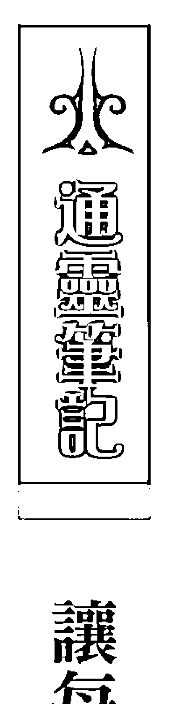

### 讓每一世的緣分能圓滿

「十年修得同船渡，百年修得共枕眠。」這句俗諺真實地表達了人與人之間的緣分難得，或許我們會記得今天遇見了誰、昨天認識了哪些人，但是隨著時間一久，很多人的名字我們再也想不起來，他們的臉也逐漸模糊，最後就算在街上再次相遇，也變成陌生人一樣擦肩而過。所以是多麼珍貴的緣分，才能擁有留在我們身邊，一直保持聯繫的朋友、家人與伴侶。然而弔詭的是，我們對於愈在乎的人，總是愈容易使用輕忽的態度和行為來互動。我們不是明明彼此相愛嗎？為什麼在很多時候卻選擇用恨的態度和言語去傷害彼此呢？尤其在戀愛的最初，那種深刻的悸動及一分一秒都不想離開對方的甜蜜，怎麼那麼禁不起時間、現實生活的考驗與誘惑的挑戰，所有的甜蜜消蝕殆盡，轉變成毫不修飾的埋怨、不在乎，甚至無情的背叛。

## 第三章 溝通陰陽界

雖然麗玉和阿漢透過通靈的方式，來得及說一聲「我愛你」，但彼此已經浪費了今生能好好相處、珍惜的時間，就算再怎麼捨不得，也已經無法逆轉和彌補。更何況，並非所有陰陽相隔的人都能夠再跟彼此說到話，麗玉與阿漢是因為今生緣分未了，又因為麗玉的執念，才讓阿漢的靈魂在肉身死後暫時還能留在麗玉身旁，直到此生緣分結束或對方壽終正寢。

當然，除了還在世的人會有執念，心裡帶有怨恨執念的靈體通常也不肯離開，它會直接影響還在世的人，若當事人也有難解的執念，雙方便會成為不好的聯結。

大部分的人都捨不得所愛的人離開人世，不過如果因為這樣的執念讓往生親人的靈魂受到牽絆，沒有去它該去的地方，反而會帶來負面影響，對方靈魂會因此耽誤了它的旅程，也拖延了昇華與修行的時間。

愛與恨一樣都存在於靈魂體上，它們都是能量的一種，也是一體兩面，我們在上一世的愛會帶到今生，而今生的恨也會帶到下一世。每個人之間緣分的深淺與擁有的時間都不一樣，我們要覺知緣分的難得，珍惜此生相遇、相知和相守的人，除了要及時說愛，也要即時解恨，讓每一世的緣分都能盡量圓滿。

### 爺爺與小孫女

作業中，我受邀在百貨公司現場為想要更漂亮以及更有能量的女性們進行占卜和命理諮商。色彩是充滿著能量的，現在也被廣泛運用到彩妝和保養品上，在一次和化妝品廠商的異業合作中……

乍看之下，珊珊只是個蒼白孱弱的病童，但是她有一半的魂魄被外靈佔據了，而對這個小女孩造成這麼大影響的竟然是她的爺爺。

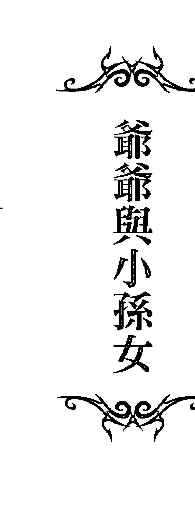

## 第三章 溝通陰陽界

一位年輕的媽媽在諮詢時告訴我，她五歲大的女兒珊珊最近突然持續發燒、體重驟減，還常常喘不過氣，經過檢查竟然是得了急性血癌，但是她們沒有家族病史，住家附近也沒有高壓電、放射線之類的強力電磁場。寶貝女兒就這麼病了，雖然有經過治療，卻一直沒有進展，全家人百思不得其解，家中的氣氛也變得很沈重，她因此到處求神問卜，也都沒有答案。看到這位年輕的媽媽如此憂心忡忡，我也隱約感受到這個事件的不尋常。當我詢問指導靈時，便證實了珊珊的健康出現這麼大的轉變的確是受到外靈的干擾，也就是俗話說的卡陰，而我必須親自見這位小女孩以及她身上的靈，才能夠進一步釐清問題。幾天之後，這位媽媽帶著珊珊來見我。乍看之下，珊珊只是個蒼白孱弱的病童，但是她有一半的魂魄被外靈佔據了，而對這個小女孩造成這麼大影響的竟然是她們家的祖先靈。「是不是珊珊的爺爺？」珊珊的媽媽一聽便直接問。她寫下爺爺名字後讓我查，證實了真的是爺爺佔據了孫女的魂魄。我問爺爺說為何會附在孫女身上，他表示，他很不滿意牌位和喪禮的方式，而他又特別喜歡這個小孫女，因此附身在珊珊身上，目的是想把她一起帶走。「珊珊在爺爺過世後兩天，就立刻得了這樣的病，當時我就覺得實在太湊巧。」珊珊的媽媽說。她早就懷疑可能是爺爺的關係，因為之前小女孩完全沒有症狀。珊珊發病後，全家被搞得雞飛狗跳，龐大的醫藥費也壓著他們夫妻快喘不過氣。「老師，請幫我問我公公，他到底怎樣才願意放過珊珊呢？…………她……畢竟只是一個五歲的小女孩……」珊珊的媽媽不禁眼眶泛著淚光，哽咽起來。在溝通的過程中，珊珊的爺爺一直表達著不滿與氣憤，他告訴我原因就在他的牌位被不當的處置了。珊珊的媽媽則解釋說，他們本來要把爺爺的牌位帶回家，但葬儀社卻告訴他們最好把牌位燒掉，因為對習俗禮儀一竅不通，便聽從葬儀社的建議燒了牌位，而此舉卻讓爺爺的靈魂覺得沒有牌位可以棲身，擺明就是後代子孫背祖忘宗，存心拋棄他；又因為他生前最疼愛珊珊，想要把珊珊也帶到自己身邊。爺爺的執念如果放不下，恐怕會為自己和家人帶來難以彌補的傷害，並且產生不良的業力。我先問這位爺爺是否願意跟神明去修行，固執的他直接表示不願意，他只希望能被迎回本家供奉，畢竟他放不下跟家庭的聯結，「家中明明有擺放祖先牌位，就應該要把我帶回家。」爺爺怒氣沖沖的說。然而珊珊的媽媽卻表示她的先生是個十分鐵齒的人，覺得這一切都是無稽之談，只怕無法接受。由於此事不宜再拖延，我當場請她打電話給她先生，由我直接與他說明和溝通，他遲疑了一會兒，便答應前來。

### 通靈筆記

### 處理祖先之事不可不慎

珊珊的爸爸帶著半信半疑的態度來到我面前，我誠懇地告訴他這世界上就是有這種不可言喻的狀況，同時也轉達了他父親的意願。「你父親是真的很想跟你們相處在一起，你是他最喜歡的孩子，他希望你能好好照顧自己。」我傳達了珊珊爺爺的訊息。終於，珊珊的爸爸態度軟化，接受了重新為父親立牌位並迎回家一事。

爺爺被妥善迎回家中供奉之後，病奄奄的珊珊出現了很大的轉變，她的急性血癌症狀突然舒緩，回復了原本活潑可愛的個性，蒼白的臉也漸漸顯露出血色，連醫生都覺得不可思議。

剛過世之人的靈魂凝聚力通常都很強，如果他沒有跟著光走，就會被困在地球，而被困在地球的靈體會依各自的執念到想去的地方，大部分的靈體會前往他們最熟悉的地方，也就是家。此外，靈魂也有情緒和等級，生前圓融好脾氣的人，通常死後也不會影響子孫，而生前情緒不穩定有障礙的人，在死後也比較有可能讓子孫煩惱。處理祖先有關的事情的確要很謹慎，因為這些過世的先人仍然會有自己的想法。有些家中接二連三有不幸事件發生或連續親人去世，最好要檢視可能有風水或祖先的問題，因為當家族中有拜祭祖先的習俗，就會跟先人的靈產生聯結，太草率的處理或不尊敬的行為，很有可能影響有某些執念的祖先靈。

> 鬼魂真的可以把活人帶走嗎？答案是：「是的」。

鬼魂是有目的性，通常是家人關係或者冤親債主，一般無特定目的的鬼魂附體通常也不會佔據太久。這些有所求的靈體會試著製造一些暗示，在得不到回應後，牠們就會用比較激烈的方式表現，譬如佔據跟它磁場相近、較為敏感以及它可以輕易影響人的身體，而兒童的靈魂通常比較輕，最容易受到影響。

> 一般的靈體皆是負能量，也還帶有此生的愛恨情仇，只有經過修行的靈體才有可能提升為正能量的聖靈。

這也是為何一般去鬼屋、墳場之類負能量的地方，通常會覺得那些地方冷颼颼，如果常去這些地方，人體的正能量經常要抵抗負能量，也容易影響身體健康。而一般被附體過的人因為直接接受到強烈的負能量影響，通常必須經過一段時間才能康復。

## 第三章 溝通陰陽界

有一些老人家在往生後，靈體還會一直留在家中。這讓我想起有次我到一位朋友家中作客，但是我一進去就感覺裡面有靈體存在。當朋友帶著我參觀他的豪宅時，他表示其中有一間房是他已過世多年的母親的房間，所有的擺設都維持著他母親生前喜愛的樣式。我這位朋友表示他一直很懷念他的母親，很希望他們能一直一起，我便直接告訴他，母親其實真的一直跟他住在一起呢！而且這位好客的老太太，還呼朋引伴地把這棟大樓中過世的鄰居都邀到家中作客，把他家變成靈體聚會所。不過，因為這位老太太跟兒子的情感很好，對兒子也沒有需求，所以並沒有對我這位朋友造成太多影響。有些人會喜歡留住親人的靈魂，但是這樣會拖慢靈魂的目標，每個靈魂來到這個地球都各自有使命，如果一直無法離去，只是重複這一世原有的親人關係與情緒，對靈魂並無益處。

### 習慣性卡陰

有些人的磁場很奇特，很容易與外來靈體產生呼應，因而出現習慣性卡陰的狀態，嘉嘉就是一個例子。

嘉嘉是一位美麗的熟女，有一天她來參加「與指導靈對話」的聚會，我感覺她的靈魂不知為什麼一直很慌張。聚會結束後她等其他人都離開後，她告訴我，她懷疑自己有卡陰的問題。她才一靠近我，我就一陣暈眩，這證明了有不好的靈體在她身邊。我定睛瞧她，看到她的面色已經發灰。

「我在晚上常常會看到一個男人站在我的床前，有時候又有另一個站在我的窗邊，或是躲在我房間的角落，還有幾個會在我的耳邊跟我說話，要我去做一些事。」嘉嘉感覺很緊張，手都不知道該放在哪，一直東張西望，好像連呼吸都變不規則了。「我不敢跟別人說，怕被認為是瘋子……但是這些感受好真實，所以我想我是不是招惹了什麼東西……沈老師，你可以幫幫我嗎？」

於是我幫她問了關老爺，發現嘉嘉身上果真跟了好幾條靈，當下我們選了一個日子，請關老爺幫忙請走她身上的鬼魂，一處理完，嘉嘉明顯地感受到一陣輕鬆。
不過，棘手的是，她身上彷彿裝了一個鬼魂接收器，不出一個月，她又來找我，告訴我卡陰的狀況再度出現了。第二次處理好後，過一陣子嘉嘉又再來找我，還是一樣的卡陰問題。由於嘉嘉的磁場已經被打開了，所以讓外靈附體變成一種習慣性的問題，要完全解決這個狀況，只能請她維持警覺，一發覺不對勁就來處理。

嘉嘉也分享了一件令人驚異的事。她之前也曾找了其他宮廟處理自己卡陰的問題，雖然沒有任何效果，卻讓她不敢再病急亂投醫的隨便入宮廟。

「有一次我聽個朋友說有一間小廟的老師很厲害，我就自己偷偷跑去。那是一間陰廟吧，因為完全沒有看到正神的神像。」嘉嘉說：「我只是一心想解決卡陰的問題，就求那個老師幫忙，但是我並不知道這個老師有養小鬼。」

「我跟那個老師說了我的狀況，但他當下只露出詭異的笑容，然後突然對著空氣說：『你跟我這麼久，也做了很多事，現在我也幫你找了個好人家了。』我那時候懷有身孕，明明驗出來是個男孩，結果幾個月後生下的小孩，卻變成一個女嬰。」

「那當下我只感覺心裡更毛，當然，卡陰的問題也完全沒有解決。」嘉嘉苦笑。

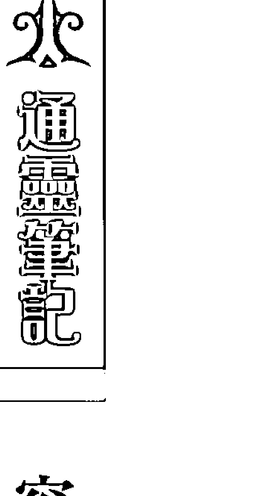

#### 容易卡陰的原因

卡陰的情況可以分兩種：一種是鬼魂直接貼在人的身體上，目的是為了吸取陽氣好壯大自己的靈氣；另一種則是騷擾當事人，以取得某種目的，像是要求修墳、要金紙，或是討厭當事人而故意搞破壞。如果鬼魂不走，運氣就絕對不會好，因為鬼魂屬陰，人屬陽，陰壓陽的結果就是很背。而且卡陰的狀況不能拖太久，拖到一個月以上時，當事人的靈魂體就會出問題，這時會有幻聽幻視的情形，更有甚者會語無倫次或是變遲鈍變笨，若是再不處理，此人就會健康急速恶化，直至精神失常。

卡陰這個問題很麻煩，我想提供一些我過去處理過的經驗，也許對大家會有幫助。容易卡陰的人，常會出現精神耗弱、情緒不穩定的狀況，身體也會有莫名的病痛。此外，容易卡陰的人通常還有兩個因素，一是先天福氣不夠，二是家運薄弱，無法承受祖先的保護。通常這樣的人他們在靈魂上有破洞，在清除業力後，還要靈魂的重組，才能關閉直接收鬼魂的負面磁場。

像嘉嘉這樣有著卡陰體質的人，容易一卡再卡，好像是個「自動卡陰機」，這次處理掉了，下次又再被卡，搞到當事人都快發瘋。我查了她的靈魂體，已經大部分都受損，這是因為她出生時就已是卡陰的狀況。有時這是因媽媽之前拿掉的孩子不甘心，而附身在下一個孩子身上；也有些人是因為外面的好兄弟硬要擠進正在發育的嬰孩體內，不過這可以從蛛絲馬跡中找出來，若是即刻處理與長期調理觀察，這個孩子是能夠得救的。而容易卡陰的人通常頻率已屬陰，怎麼調也調不回來，鬼魂一看到他們就會被吸引，除非他們從自我信念與靈魂體當中的校正系統中做改變，不然這種情形會持續終生。

卡陰的問題在現在有愈來愈嚴重的趨勢，許多人逐漸變成敏感體質，而能感應到周遭的磁場變化，這是因為地球的頻率正在做提昇，帶來了人類靈性上的改變。我通常會視情況而定，真正需要我出面處理的鬼魂問題，我會願意跟鬼魂朋友們溝通，找出真正的原因。一個友善的溝通有助於狀況的好轉，這個理念放諸四海皆準。不過要知道，鬼魂來無影去無蹤，這是卡陰問題難處理的最大原因。真正難處理的是那些帶有真正目的性的鬼魂（俗稱冤親債主），或者是來見我時已是常年卡陰的人，這種就必須要關老爺同意我處理，我才能接受協助當事人。我曾經成功地幫助了一些鬼魂與他們的親人溝通，而使得雙方都有很好的效果。其實從另一個角度來看，鬼魂不過就是沒有肉身的靈魂朋友，我們應該給予它們適當的尊敬。

至於嘉嘉分享的故事，如果真是法師操縱的小鬼導致被換胎，此舉也是違反宇宙的正向力量與秩序，只是每個人各有靈魂的自由意志，也會受到業力牽引而做出一些選擇，只能提醒大家保持覺知，對於不清楚底細的宮廟和命理老師可得要多注意，以免人財兩失，受到更大的傷害。

### 領有天命才能辦事

> 沒有獲得上天認證和允許的人若隨意施法趕鬼，反而會洩掉自己的氣，而當元氣耗弱時，也容易讓周遭的鬼有機可乘來借身附體。

和惠美的結緣起於她來占卜感情問題，愛上已婚者的她，談著一段辛苦的不倫戀情。也因為占卜，她成為我的塔羅牌學生，並且開始參加每週的奇蹟課程與讀書會。惠美是個聰明的女孩，在學習上也很認真，她喜歡跟我分享生活中的大小事和那段放不下的愛情。有時她也會來請我幫忙灌注愛情魔法，並且表現出想要往命理界發展的企圖心。

有一個禮拜惠美突然沒有出現，之後她又缺席了幾次，我感覺到一種異常。直到有天晚上我們正在上課時，助教接到惠美打來的電話，她用淒厲的聲音喊著：「老師快來救我……」助教嚇了一大跳，只好破例中斷課程，連忙把電話交給我。卻只聽到惠美幾近崩潰地重複喊著：「老師快來救我……快來……啊……不要來抓我……」

「惠美，你怎麼了？」我問。卻只是聽到她斷斷續續地說話聲：「嗚……老師……我現在正在行天宮……有好多聲音在罵我……叫我去死……」「惠美一直嘶喊著：「老師快來救我……旁邊好多鬼……」

「你先不要慌，告訴我發生什麼事？」我希望可以鎮定她的情緒，但是惠美卻再也說不出完整的句子。我只好把課暫停了下來，用靈擺請教指導靈惠美的狀況，原來是惠美在外面得罪了一些「好兄弟」，並且對這些靈體不太禮貌。

我問惠美是否確有其事，惠美哽咽地回答：「有」，她前陣子到一個同樣是上課的同學家時，發現這個同學家中有很多從外面買的水晶與法器，由於惠美自恃跟我學習了一段時間，也小有成果，所以表示要幫這位同學淨化家裡環境，在這過程中，惠美感應到這位同學的家中竟然有靈體存在，因此就自行拿著水晶權杖作勢清除磁場，同時惠美還對那些鬼兄弟撂話說：「它們也沒有什麼了不起，我隨便清清就好了。」這一清，不但把自己弄得精疲力竭，而且驕傲的態度還惹怒了那些靈體。我透過電話請附在惠美身上的鬼魂出來對話，而這些鬼魂至少有五、六個。

「這個人很踐，到了我們的地盤還大言不慚，要給她一點教訓才行。」這幾個鬼魂憤恨地說著。

「能否看在我的份上，放過惠美呢？」我說。這些鬼魂雖然不是很情願，但是開始有些討論，因而我再加碼說：「我可以送給你們三道天使光束，白光、金光、白金光，讓這三道光束提升你們的靈能，並將你們提昇到聖靈界，從此不用當孤魂野鬼。」鬼魂們同意接受這份大禮，不一會兒，它們就離開了惠美，惠美立刻覺得好多了，而我也要惠美找個時間盡快來見我。三天後，惠美來了，她的臉色還十分蒼白，看起來略帶浮腫，好像是溺了水的人，我再度詢問她為何會發生這樣的事，因為鬼魂平時並不會這麼嚴厲的懲罰人類。惠美支吾其詞的說，她雖然沒有學魔法，但平日來到學院看到我施展魔法，聖壇上擺滿了各式寶器，因而心神嚮往，便有樣學樣，自作主張幫朋友的家做淨化。她並不知道魔法師是很慎重的工作，並且必須領有天命才能辦事，一般沒有獲得上天認證和允許的人若隨意施法趕鬼，反而可能洩掉自己的氣，甚至惹怒鬼魂，而當元氣耗弱時，也容易讓周遭的鬼有機可乘來借身附體，實在不可小看其危險性。

### 通靈筆記

### 誰能領天命？

#### □ 天命助人存正念

所謂領天命的人，一般指的是為神靈、聖靈等高階系統服務的人。這樣的人是經過嚴格篩選的，同時要合乎三個標準。第一，要心地善良、靈魂體很乾淨（沒有惡業雜質），至少在前三世到前五世，都不能有重傷他人紀錄，才具備獲選的基本條件。

第二，要在靈魂上曾經有承諾，願意發心、發願從事幫助人類的靈性工作。不過，光是有意願還不夠，還要經過上天的考驗，其平常行為、起心動念都要合乎天道（宇宙運行的標準）的核心，才能初步通過，所以不是每一個立下誓約的人都能夠領有天命。特別注意的是，有發願的人還一定要有修行，不具法力又沒有神明保護，卻去幫人處理事務，是比較容易被負能量修理，惠美就是因此傷害到自己。

第三，還要經過考驗，也就是在你的人生路程中會經過一些大的轉折點，譬如經歷家人的失散分離，有些則會歷經殘障或重大打擊，並且在經歷這些之後還能帶著慈悲發心、發願助人，以上三樣條件具備，經過神明核可和考驗才會有法力。當法力加到身上時，你會變得比較敏感，並且察覺自己的特殊能力，比如能治病、觀看前世今生。上天會把法器（某一部分的能力）交到當事者身上，不同體系有不同法器，如當事者也會發現特別瞭悟風水、擅氣功等，聖靈也會陸續開悟增加這些能力，以我所屬的基督教體系而言，我便被賦予了魔法。當一切水到渠成後，領有天命的人運勢會越來越順遂，因為上天會特別照顧你，這樣的力量是為了讓你幫助你可以幫助的人。但是，緊接著第一關考驗就來了，被賦予天命的人必須本著良心繼續幫助世人，如果因為名氣增加，貪婪心起，財迷心竅，就被黑暗力量操縱。譬如，有些老師會重複下咒，讓客人一直來找他，以此斂財，這樣上天反而會有懲罰。

#### □ 墮落的動物靈老師

坊間有一些略有神通的人其實並沒領有天命。有一位從事八大行業的客人，原本常去一位用動物靈的男性命理老師那裡祈求工作順利，但總是好好壞壞，而且壞的部分比較多。後來她來我這裡請我灌桃花與財運魔法，怪的是，她來我這兩個月，每次來卻總是過一陣子魔法就會失效。斷斷續續聽了她的故事，原來她不只來我這裡，也到很多不同老師那裡尋求方法，魔法不是越加越多就有效，反而可能因為老師的系統不同而相互抵銷，我建議她固定選擇一位老師以穩定磁場，不過她並沒有聽進我的建議還是持續去了那個宮廟。之後她再來我這裡時，我卻發現她被暗中下了符法。這位使用動物靈的老師竟然對客戶施作符法，讓客戶經常性的來找他，我還發現這個女孩甚至還被下病符，讓她諸事不順才能夠一直想回去找他解厄，用以彰顯自己的能力和可信力。我曾經就這個問題請教關老爺：難道這樣的人都不會有惡報嗎？為什麼他還能一直開業賺錢呢？而關老爺回答，這樣的人是用邪術與動物靈去控制人，只要去找他並且相信他的人也會沾染上黑色之氣，之後的氣運只能任人宰割，就像這位客戶，之前中了他的桃花符之後，每到特定時間就會很想回去找這位命理老師並且莫名地想跟他上床，真的很恐怖。我用通靈查看這位老師時，發現他的靈魂沒有憑著正道在做事，而且出現墮落的徵兆，他也……## 第三章 沟通阴阳界

不在行天命的范畴，如此一来，他的法力便成为邪术，像容易腐败的肉类，只有一时的效果。因不带有正气的气场，会让亲近和使用这些法力的人也跟着腐坏，现阶段虽有为他累积财富，但同时也累积了业障。良心很重要，至少对我而言是如此。一个好的命理老师，品德一定是摆在第一位的，只有这样神佛才会前来帮助，也嘉惠了前来问事的顾客。

之后这位女客户下定决心离开这位命理老师，没想到却惨遭他修理。这位命理老师在得知这位受他控制的女客户不再回去找他之后，竟然发出了恶鬼追魂令，下猛药要置她于死地。当她打开家门时，就有好几只鬼冲了出来，我站在屋子中央时则有好几十只鬼在身边绕来绕去，只是它们似乎也很慌张。我请指导灵去查，才发现这位命理老师故意要让她很倒楣，并让她生重病，于是差使鬼魂去她家捣乱（这位男命理师曾去过她家看风水，所以知道住址）。我请了天使与圣灵来到她家护卫她，净化她这间屋子的气场。由于那位命理老师当下还是很执着地想要控制她，其实这样真的很糟糕，而且也让两人结下了恶因果，所以我建议她最好能搬离现在居住的地方，并且切断所有跟那位命理老师相关的联系。

在地球上生活是需要金钱的，这点圣灵也明白，价钱该订多少，则要问自己所属系统的神明。订过高就是敛财。有些庙里提供的免费服务，是因为跟神明订的契约可以另外用香油钱支持庙中开销。如果收取财物之余，还对客户起了贪恋之心，趁人之危且滥用能力那就更不应该。而无论是找坊间的命理老师或是到庙里请求协助，都是神明因应人类的需求及不同的灵魂意识提供的服务通路，大家要留心的，是对方是否为正派经营的才是。

### 住在神像中的鬼

阿芬是我的一位好友，她家里原本供奉妈祖和一尊九龙太子，在认识我之后，她开始亲近西方系统，因此想要撤掉家里的神明，改摆水晶和矿石之类的物品。她担心的问：「这样会不会有不好的事发生？」我要她不要想太多，其实神明都很好说话，西方与东方没有谁好或谁不好，就看妳想要哪一个系统而已。

于是阿芬邀请我到她家察看空间的状况，并希望我可以帮忙净化家中磁场与提昇住宅能量。

我到她家之后，从大门一进来就看到那张夹在杂物中间、摆得很尴尬的小小神桌，而两尊神像的样貌看起来毫无光彩，甚至有点灰头土脸，尤其是九龙太子的磁场还隐隐透露着一丝不对劲。再加上阿芬的家中呈现一股负能量，我摇摇头跟她说，「妳要开始收东西了，太乱了啦，这样运气怎么会好。」

我问阿芬是从哪里请来这尊九龙太子的？阿芬说她忘了，只记得是一座小宫庙的样子。我用灵摆查询，发现妈祖的神灵早已不在现场，我接着问九龙太子是否会来这边？灵摆显示有回应，但九龙太子呈现思考状态，我没有细查，只先判定这神桌目前只有九龙太子在顾，只要征求祂同意，移神桌应该不困难。因此我跟阿芬说：「那就约个时间退神吧！到时我会带些水晶来帮妳启动磁场与屋气，让妳开始兴旺。」到了退神的当天，没想到九龙太子怎么也不肯离开这个房子。我察觉有异便问：「你不是真的九龙太子对不对？」没想到「祂」竟回答：「没错。」这位假冒的九龙太子也就跟我沟通了起来。

原来它是飘荡在外的孤魂野鬼，偶然的机会去到了九龙太子的宫庙，便向往加入九龙太子的系统，好不容易也占到一个九龙太子的神像，它自认也装得很像，因为已得香火多年，灵气与日俱增成了半仙半鬼，而且只要再修行一段时日，身份与位阶就得以晋级至九龙太子最低一阶的分灵级次。

由于这位假冒的九龙太子对阿芬没有恶意，也一心想继续修行，我便想了一个权宜之计（我反对任何形式的暴力）。「我们不把你请走，只把你送回你原所在的宫庙好吗？」我跟它打商量。

假冒的九龙太子表示同意，并告诉我们神像原先的出处，但是要我们约定不能跟庙方说破它是假冒的。接着我帮它做了一个水晶魔法阵法，产生高频率的震动以净化这个灵体的磁场。考量神像中仍有灵体，不宜让香火中断，所以便要阿芬即刻把它送回原来的宫庙中了。

## 通灵笔记 关于退神

### 口 如何发现家里神像被鬼占领？

如果你看得到的话，你会发现神明非常忙碌。祂们并不会每天都固定坐在同一个位置和同一个香炉。当我们请神入厝时，神明会观察当事人是不是真的发心想要这么做，如果此人正派、善良，神明便会带着天兵天将，帮忙守护家园；反之，若此人心术不正，神明也不会真的护持他。在我处理的退神经验中，经常遇到神像当中进驻的非神明，而是鬼魂。这真是令人匪夷所思，为什么原本好好供奉的神明会变成鬼魂呢？我想提供几点我的经验给大家做参考：

第一，若神明的分灵进驻之后觉得合意，家宅的运势自然会因神明降临而好转，证明心诚则灵，有拜有保佑。

第二，敬拜神明是一件长期的事，若是家宅当中有人心意不坚定、行为不端正或怠慢神明（例如摆着就再也不搭理），这都会造成神明感觉不受重视而自动退神。神明自动退位之后就会造成虚位，这时在四处游荡的鬼魂就会进驻在内，而造成神像气场变得狰狞扭曲，逐渐影响屋气使得家宅由红转黑，厄运连连。

第三，进驻在神像内的鬼魂因为好不容易占到一个香火位，一定说什么都不愿意离开，道行不高的风水老师不一定看得出神像已被鬼占据，会以为是家宅风水的问题而使得主人运气不佳，殊不知，当家宅中的大位被鬼魂占据之后，阴盛阳就衰了，这时就一定要请鬼魂离开才行。

第四，请鬼魂离开不可用赶的，一定要沟通至对方满意为止，若是用法术暴力相向，怕的是鬼魂暂时离开，事后又回去骚扰主人，这就没完没了。我的作法是，我会先向鬼魂朋友禀报我的大名（顺便递上我的魔法学院名片至神桌上），声明退神之事一切由我负责，如此就能确保鬼魂不再骚扰我的客户，并且顺利达成双赢的局面。

也有一些人每天把烧香拜拜当成例行公事，但是却觉得家运不济，运气不好，仿佛神明都没保佑，这是没有察觉出环境的因素可能已经让神像退神了。没有神明在的神像，又如何能保佑你呢？

具备通灵能力的人可以很轻易知道神明还在不在，一般人则可以仔细观察神像，神明如果在，神像会有一股气；神明不在，看来则会黯淡无光。比较糟的是，退神的神像被孤魂野鬼侵占了，若鬼魂带有邪恶的意念，神像的样貌可能看起来会狰狞，靠近神像时会有不舒适的头晕，家中气感觉浑浊不明亮，而且家中有人一直生病或连续生病，甚或莫名其妙的出车祸，是非争吵或意外频传，财运工作运不顺利等。所以，当你开始看到你家神像，你会有不安、害怕的情况，那这尊神像可能就有邪灵入侵了，因为它会让你的家磁场不变，若还傻傻分不清楚，这种屋子住久了就容易得忧郁症。如果有供奉神明者，就算运气不好，也不至于大凶，但是如果运气不好又有邪灵，就会一蹶不振，影响家运。所以，一般神像颜色变化，可以判断是不是因为环境或风化之故，但如果觉得气场有异，可以请通灵老师来勘查。

### 口 心诚则灵

我想分享的是，神明其实是依据着世人的诚心而存在，而非形式上的虚华。有一次我到一间盖得美轮美奂的大庙，却发现每一层的神明都不在现场，我问了神像之前的一位尊者神灵这是怎么回事，尊者回答神明都在别的地方办事。

原来这间新盖好的大庙附近有另一间不起眼的小庙，那边香火鼎盛。我看到神明进进出出忙里忙外的，便忍不住跟顾庙的人说：「你们这边神明好忙喔！」这位庙祝也笑着回答说：「白天神明都在后面这边办事，前面那座庙白天都没有神，只留一个尊者驻守。」这跟刚刚尊者的答案完全符合呢！

### 口 求神不如求己

在台湾的民俗信仰当中，有各式各样的神祇，走在街头巷尾，也不难发现宫庙的林立。台湾人喜欢四处拜拜，希求神佛的保佑，似乎这样心灵就有了个归依，但是有拜就一定有保佑吗？最近学院来了两位客人，都是严重的卡阴，一经询问之下也都是有跑宫庙之人，怎么拜神会变成卡阴呢？很奇妙。

不管是多大或多小的庙或宫，里头都有许多的孤魂野鬼，这是一个你不一定肉眼所能看见，但在理性上你一定要相信的常识。鬼魂喜欢聚集在宫庙的原因很多，诸如有烧香可以吃、有纸钱可以拿、有神像可以坐（但必须是有点修为的才行）、定期的超渡法会（鬼界的园游会）。若是有办事的那种宫庙，就会成为鬼魂最喜欢的聚会场所，这样鬼魂们会成为主角，也能够互相串联打听哪里有好康的，造成阴气越聚越盛。

我的其中一位客户就是去了一间阴庙求事业，还花了大钱做了生基，他来找我时已经倒楣了许久，脸色是黑青的，一点亮度也没有。他说找不到工作，每天都昏睡，运气很差，也不知道是哪里出问题。我观看他的气色，直接跟他说他身上卡了好几条阴魂，我的指导灵跟我说，这位男士因为去宫庙有「求」，所以阴神就派了小兵小将（道行低的鬼魂）跟着他，美其名是「护持」，但其实一点作用也没有，反而让这位男士运气下滑。

可能是点出了问题所在，这位男士身边的鬼魂不是很高興，还数度恐吓我要我不要再下去，其中一位好兄弟还硬推了我一把，让我整个人差点重心不稳。但我也不是被吓大的，我严正地下了指令，跟我的客户说：「即刻起，请跟在你身边的鬼魂离开，大家划清界限，以后你要自己靠自己把运气调起来。」

我赶紧帮他做了魔法的障碍清除，再给予他不同光束的正能量，帮助他回复元气。半个小时之后，这位男士的气色开始有了白白的亮光，不过我怕鬼魂会返回去骚扰我的客户，我要他定期来学院坐坐，我也好看管他的运气。之后几周，这位男士清除了卡阴的状况，脸色也变红润了，每次他来见我，我就给予他信心与鼓励，现在他的状况真的比之前好太多了。

宫庙就跟党派一样，支持拥护的信众越多，香火就越盛，这样鬼魂就可以绵延不绝地得到好康。但其实很多宫庙所供奉的只是个神像的外壳，里头到底是不是本尊又如何得知呢？我去大陆旅游时，也参访过不少名山胜地，其中不乏佛寺庙宇，不过妙的是，神像内几乎都没有神明（连鬼魂也无），这可能是大陆人破除迷信太彻底所致，连灵界都覺得撈不到油水，所以不愿常驻。

反之台湾人民，真的很爱拜拜；感情失合要拜、受到冤屈要拜、赚不到钱要拜、身体不好更要拜，我常在心里想，神明应该也很无奈吧！应该自己努力去做到的事情，就该自己想办法，这世間有因果法则，怎么做就怎么得，如果可以将外求的力量拿回到自身，我们就都会成为自己命运的主人。

我的另外一位客人也是勤跑宫庙之人，她来找我时也是很严重卡阴，我通灵查了一下，她是去宫庙时被待在宫庙门口的鬼魂盯上，再加上她是很信宫庙之人，每每许愿『求』了一大堆，让鬼魂洞悉她软弱的信念，就这样被盯上了。通常鬼魂盯上一个人之后，就是希望拿些好处，若是她常常去庙里烧纸钱，则跟在她身旁的鬼魂会第一顺位得到这些香灰（能量的一种），这就是鬼魂盯上人的其中一个原因。而宫或庙里的神明到底有没有本尊在里面呢？以我的观察，在正信的庙宇当中，会有本尊菩萨、神明驻守，不过他们通常不太管人间俗事，顶多给予一支灵签就代表神明的开示；有些大庙还有分层负责的天兵天将，将人们的问题记录下来备察。如果此人平时有修为，则天兵天将會接到指示优先处理此事（记住，不是神明在处理，是天兵天将在处理）。若是坏事做尽之人，则神明当然不会予以理会。至于大大小小办事的宫庙，则以道行稍微高一些的灵去假扮驻守，对于这些灵而言，做得好自然积功德，但也有些是没能力的灵，给的指示或答案就很不准确。我在帮第一位客户处理卡阴问题时，感觉有些吃力，这是因为她在信念当中还是很相信那些宫庙里面的灵，这样就会造成复合性卡阴的情况。我希望大家都能相信自己，靠自己的力量成功，这种自信才是真实的。

## 第四章 走过前世今生

对今世很彷徨，是宿命？还是前世的因果轮回的业报？在生命这一条长河之中，所有发生的事都有脉络可循，让我们学习打破自我的局限，走过前世，活在今生。

### 一、两世同事

今生他们再度在职场相遇，虽然以为原本素不相识，然而在了解前世的因果关系后，淑玲也能从较为深远的角度，在这一世好好修正彼此的互动关系。

淑玲在一所市立大医院任职医疗工作，她十分专业，工作能力佳，家庭关系也很美满。由于她为人正派，很容易就赢得大家的信任，如果要找出什么小缺点，只能说她因为个性耿直的关系，处事比较一板一眼，也比较不擅长人际之间的应酬，所以在职场上只要出现选择「做好人」或「做好事」的时候，她就会觉得困扰。

有一次淑玲带着烦恼来找我谈，主要是她发现下属经常因为想求表现而略过她越级呈报，再加上前一阵子评比考绩，她的另一位医生同事明明平日做事不积极，但却因为善于对长官察言观色、加以奉承，竟然获得了嘉奖，个性正直的淑玲反而因为嘴巴不甜，想争取的资源都被驳回了，虽然直属上司想帮她，却也说服不了更高阶的主管。

在医院这个白色巨塔中，派系利益纠葛难以对外人言喻，而淑玲面对这样一层又一层的官僚体制，一方面心里不能接受这样不公义的结果，一方面又受到职场人际挫折的打击，因此对工作产生极大的倦勤感。

我觉得淑玲这个人秉性很好，待人处事也合宜有礼，这样的处境必定是另有道理，因为上天不可能平白无故为难一个人，我想她与工作上的同事及长官必定有着因果业力的牵引，因此我请他给我她的上司、同事和部属的名字，并让我进到她的前世查看。

淑玲的前世在县衙担任调解官，前世的她也是为人十分正直，行事不偏不颇，拥有一定的地位和名声。前世的果报累积到今生，让淑玲此世人生顺遂，并且还能继续担任助人的专业人士。

果然这三位淑玲的职场同事，在前一世就和淑玲有所关连。她的医生同事在前一世也是淑玲的同事，而且一样也是个懂得用小聪明工作，善于逢迎拍马的人，跟这一世相同，他也因此常能得到更多资源和赏识，淑玲的前世在心里对此人也同样出现不公平的怨懟。

而另一位官位比较高、人品善良者，在这一世也成为淑玲的直属上司，同样对淑玲十分照顾。不过，那位让淑玲头痛的下属，在上一世则是她调解过的人，对于她的调解结果心生不满，而她的铁面无情，也让彼此因而结下了恶缘，因而在这一世仍有着容易对淑玲不满的心念，成为他经常越级呈报的主因。

今生他们再度在职场相遇，虽然以为原本不相识，然而再了解前世的因果关系后，淑玲能从较为深远的观点，并提醒自己这一世以较为柔软的态度看待职场上的人际关系。

### 职场也是灵魂重要的学习场域

曾经有过官阶而且为人正派者，正气会延续到下一世的生命中，而善良的心性、人格特质，以及跟别人的爱恨情仇，全都会记录在灵魂里，这些会随着轮回转世，跟着我们继续生命的旅程，所以可别小看一个心念、一句言语或一个微笑的力量。

算一算我们花在职场的时间其实占去了生命中极大部分，如果只把工作仅仅看成是用来生活、养家活口的劳务交换，那么就太可惜了。每一个工作都有它的意义和价值，在职场上遇到的人，更是能广开我们的视野，这些因缘无论好坏，都是灵魂一个重要的学习场域。

有很多人常常觉得自己怀才不遇，抱怨客户难搞、上司无能、同事偷懒、下属心不在焉，或者卷入权力斗争与金钱游戏之中，汲汲营营，最后反倒觉得空虚。其实当我们选择一份工作时，冥冥之中也选择了一份课题，包括了工作本身和随之而来的人际关系。我们无法真空地活在这个世界中，或是只选择与我们熟悉与擅长的人、事、物共处，当不愉快出现时，你会发现，愈是抗拒与闪躲，不愉快的力量愈强大。

这个时候，最好的方法就是先把心静下来，因为这些纷扰所带来的不平衡，都是外力给的考验，但是别忘了，无论状况再怎么糟，你的心都有选择平静的权利。有些不愉快是现世造成的，有些不愉快可能是前世造成的，保持这份觉知和宽容，可以帮助我们用更有弹性的方式去面对。

### 口 受伤的的灵魂

「沈老师，妳觉得我男朋友是真的爱我吗？」雅雯皱着眉头说。「外面有那么多漂亮女生，他会不会只是因为我現在沒工作，跟家人又疏远，还有因为我们是从大学认识到现在，所以因为可怜我才没跟我分手？」

「虽然我妈还算关心我，但是我总觉得我在我们家是多余的，毕竟我念书没我哥厉害，嘴巴又不甜。大学毕业到现在，做最久的工作只有两年，现在快四十岁了还被裁员……我想我爸妈可能觉得我是家里的老鼠屎吧……我已经很久没有跟他们联络了，我也不知道该跟他们说什么。」

「之前有算命老师说我命宫破军还带寡宿星什么的，这辈子六亲缘淡，还有一个占星老师说我什么宫位出现冲突的角度，所以会比较辛苦。」

「我也不是很迷信这些啦，只是很想知道，自己怎么会这么不顺……」

雅雯有一双大大的眼睛，还带着一点小女孩气息，但这双眼睛却透露出强烈的不安与恐惧。虽然有个爱她的男友，但她总是不自主的对每件事、每个人疑神疑鬼，结果现在连工作都丢了。雅雯希望可以从命理的角度帮助她找出答案，然而问到现在，她的算命次数两只手加上两只脚都数不完，却仍然没有找到真正的答案。

从她叙述的人际关系中，也总是觉得别人在贬抑她，但是问她别人说了什么话，她又说不上来。雅雯缺乏自信心的想法，让她觉得自己不值得被爱，于是不安全感又更强烈了。从雅雯透露出的讯息中，我感觉她的灵魂其实在求救，而影响她的关键答案并不在她现在的关系中，于是我查询了她的前世。那是一个令人心碎的画面，一个枯槁瘦小的女孩，约莫十岁的年纪，穿着粗布破衣，正在闷热的厨房中吃力地提着一桶刚煮好的热水，却被一个妇人打了一巴掌，那滚烫的水就这样泼到小女孩身上，小女孩惊叫着，新旧伤痕累累的躯体，被烫得红肿。那妇人是小女孩的亲生母亲，却也只是嫌恶地瞪着眼离开。

另一个画面是小女孩被她父亲踢倒在地，身上都是棍棒打过的伤痕，小女孩奄奄一息地说着她没有偷钱，却被父亲用麻绳勒住喉咙拖着走，不堪凌虐的小女孩就这么断了气，这个小女孩就是雅雯的前世。

虽然此世雅雯的父母和前世并不相同，对雅雯也有关心爱护，但是雅雯前世所留下的极为深刻的伤害记忆，让她的灵魂在此世带有极大的恐惧与不安全感，对于亲近的人更是强烈，也因此形成严重的不良业力。前世在喉咙的致命伤，让雅雯此生的喉轮出现一个印记，也造成她无法清楚沟通和表达的障碍。

雅雯掉下了眼泪，她心疼小女孩，也心疼自己。强烈的不安全感与恐惧找到了根源，但灵魂要走出这样强大的不良业力并不容易，疗愈的漫漫长路才要开始。

### 口 爱永不止息

肉体的伤痛，在医药妥善的照料下会复原；灵魂的伤痛，则需要爱的疗愈。

在我们的灵魂之旅中，或多少会碰撞跌倒，被伤害或伤害了别人，唯有跟着光、跟着爱走，最后才能完全了解这段旅程。

> 《圣经》哥林多前书十三章提到爱的真谛：「凡事相信，凡事盼望，凡事要忍耐，爱是永不止息。」

这是我最爱的经文之一，在我觉得疲惫、悲伤或快要失去信心时，总能为我注入强大的爱的能量。

大部分的人很习惯从别人给予的爱来评量爱，甚至会挑战别人对自己爱的能量极限，当别人没有表现出自己认可的爱时，我们就会因为失望而自怨自艾，甚至把别人的爱丢弃一旁。

就好像我们还是一个婴孩时，我们会用哭泣来攫取母亲的注意力，每当我们哭泣，就会有温暖的怀抱和言语包围着我们。

随着我们成长，开始发现现实世界、人性的弱点，甚至丑恶面时，爱仿佛变成一个奢侈品……

### 宫庙灵界现象对照表

| 宫庙类型 | 神明有无本尊 | 鬼魂聚集原因 | 对人的影响 |
| :--- | :--- | :--- | :--- |
| **正信大庙** | 有本尊菩萨、神明驻守 | 较少 | 神明天兵天将记录问题，依业力因果处理；若人正派，得佑；若作恶，则不予理会。 |
| **办事宫庙** | 多为道行稍高的灵假扮 | 办事宫庙成为鬼魂聚会场所，互相串联，阴气盛。 | 灵给的指示可能不准；易卡阴，被鬼魂盯上索求香火好处。 |
| **阴庙** | 无正神 | 鬼魂聚集 | 求事易召来低阶鬼魂“护持”，实则让人运气下滑，招致厄运。 |
| **被侵占的神像** | 原神明退位，鬼魂进驻 | 鬼魂占香火位修行 | 家运由红转黑，宅气浑浊，家人易生病、意外频传，神像样貌狰狞。 |

## 靈界使者 — 沈嶸之通靈事件簿

不再令人輕易擁有和相信，雖然我們內在仍是渴求著愛。然而我們都忘了，自己也可以成為愛的根源，我們每個人的靈魂都與這宇宙中最強大的能量所聯結著，我們應該學習從自身去體會愛的能量，進而散播這個能量到世界的各個角落。

也許我們的靈魂在累世輪迴中自願或非自願地受了強大的傷害，但是請記得，每一次的生命，每一個我們所經歷的當下，只要我們自己願意聯結上愛的能量，便能療癒自己，終止不良業力繼續跟隨。

## 第四章 走過前世今生

### 沒有姻緣線

巧玲是個大美女，一百七十多公分高，筆直白晰的雙腿，清麗的五官，外貌不輸雜誌上常出現的名模，再加上她個性開朗又好客，朋友很多且交遊廣闊，奇怪的是，這樣的美女卻很難交到男朋友，每到週末都沒有約會，只有女性朋友陪伴。雖然她身邊也有許多男性朋友，互動起來竟然卻像哥兒們，並不是巧玲態度高傲，套句她常說的話：「就是沒有來電的感覺。」

雖然表面上巧玲強調寧缺勿濫，但又抵不過心裡希望感情能有依歸的渴望，有一天她忍不住來問我能否幫她找出原因。我告訴她：「妳是女人男命，拼事業賺錢很強，遇到感情就沒輒了，」

我再進到巧玲的前世查看，發現巧玲曾經是一個出家修行的比丘，他避居塵世，在山中的一間小廟禮佛，並且立下清靜眼、耳、鼻、舌、身、意等六根的靈性誓約，希望從此能斷絕並超越這生生生死的生命之流。然這位僧人的心性仍然太執著，未能超脫輪迴，可是自己許下的靈性誓約，卻斷了今生的姻緣線。

這個靈性誓約是建立在巧玲自己的信念中，其實神明或聖靈並不會叫人們用交換姻緣、壽命或金錢的方式，來換取人們靈魂提昇，是人類靈魂的執念限制了自己。讓巧玲知道前世的意義並非只是找出她單身的原因，也不是要她這輩子繼續出家，或嘆一口氣地接受宿命，而是在明白因果之後，做出此生的決定和選擇。雖然我們靈魂揹負著累世的因果，但是可別忘了，今生的覺知和選擇一樣也是很重要。

> 「沈老師，我真得好好談戀愛喔！」巧玲有點害羞地笑了笑。

巧玲選擇在這輩子能找到相愛的人，相攜、相守地度過，所以她請我幫忙移除這個靈性誓約，我幫她移除後還加修了桃花魔法，讓她戴了愛情手鍊，也希望聖靈指導靈與天使們能幫幫她，我祝福巧玲能有美好的愛情關係，而今生的愛情種子會結出什麼果實，就看她如何耕耘了。

### □ 没姻缘的四个原因

很多年屆三、四十歲的客人問我為何沒有姻緣，我發現他們很多都沒有戀愛經驗，幫他們查了後，竟然發現許多人的姻緣還真的是一片空白。雖然沒有感情好像少一種煩惱，但是大多數的人還是期盼能有美好的感情來豐富自己的生命，完全抱持不結婚或不要感情的人少之又少。

至於為什麼沒有姻緣，關老爺以神明的角度，表示通常有以下四種原因：

- 一、前世是修道中人或立下靈魂誓約，跟菩薩有表示願意了斷姻緣，就像巧玲那樣。不過，這個誓約只是來自於自己的願力，因為因果業緣是自己決定的，神明不會強求，因此這個誓約其實沒有用，只是會讓當事人不斷催眠，要求自己，因此導致姻緣感情變得被動或是心生放棄。
- 二、在過去成為人的業力過程中，跟異性沒有太多互動，在個性上也比較封閉保守，如果這
- 三、因為不具吸引人的桃花磁場，所以沒有姻緣。現在東方與西方的神明也彼此在融合交流，比較西式的說法，就是當事人的能量場不具備吸引異性的能量，也就是道家所言的桃花，這也是另一種累世的信念造成，如生性邋遢、喜愛賭博、嫖妓等，會讓異性敬而遠之的個性行為。
- 四、自己了悟而選擇不婚。姻緣分兩種，善姻緣與惡姻緣，一般人都懸於這兩者之間，所以難免吵吵鬧鬧、時好時壞。極善的姻緣可以讓家庭和樂和興旺，惡姻緣代表前世彼此有很多的糾葛，因此今生相聚是要抵銷過去的因果，而這樣的家庭就比較容易生出有殘缺、智能障礙的孩子，或出現家運不濟、感情破裂的現象。

上述第一和第二點，可以用解除靈性誓約的方式來處理，但是還是要靠當事人後天的努力，才可能轉化這種與生俱來的異性絕緣磁場。第三種則需要當事人深刻的覺悟自己阻攔婚姻的業力習性與不良程式，並且從根本清除，才可能有所轉化。有些人不婚，不一定沒有姻緣，以佛家的角度來看，人是可以選擇入空門、了斷姻緣的，因為與其進入惡姻緣，不如就不要姻緣。其實現在有很多聰明的人，寧願捨棄惡姻緣而選擇單身。

在惡因果之中，如果 A 選擇不了結 B 的因果是基於真正的覺醒，才會真正化解與 B 的業力，只是這樣的覺醒必須根於很強的覺悟力，要不然也無法跳脫原有的因果糾葛。不過，如果只是因為不想受婚姻的責任與羈絆而選擇不婚的人，就不在上述的範疇中，因為即便沒有結婚的形式，該在今生了結的業力關係，還是會出現的。

### □ 求桃花

桃花的定義，簡單來說，就是受人喜愛的吸引力，不過現代人經常把它狹隘的定義為吸引異性，其實這是最低層次的桃花，較高層次的桃花並非只能吸引異性，而是廣泛吸引男女老少、普世之人。

要知道自己是否具備散發桃花的磁場，就先關注自己是否具有這樣的魅力。短暫的桃花人可以得，可以借用法術瞬間強化一個人的桃花磁場，但是一個真正好的桃花磁場，則必須長期累積，需要良好的道德與品德，還要長期勤於修正自己的內、外在缺點，才有可能達到好的桃花磁場。

當然也有人會求所謂的「金桃花」，希望進入豪門當少奶奶或大老爺，只是姻緣都是天註定的，很難純粹靠運作而來，即便是靠短暫外力運作，但彼此沒有好的因果，也無法長留。

### □ 我倆是不是正姻緣

我的一位客戶曾經去日本留學，在求學期間曾請我幫她灌「愛情魔法」，她喜歡一個台灣男生很久了，但無奈總是沒能發展成戀人，我跟她說，這個男生就先擺在心裡，保持一個友善互動不要斷了聯繫，看看在日本是否會有新桃花。魔法灌下去不到一個禮拜，這位小姐就有了新戀情。

一年之後，這位小姐回到台灣定居，她來見我時跟我說，魔法很有效，之後遇到一位日本男士，對方很愛她也對她很好，只是她還是放不下擺在心裡的依戀。我請她把兩位男士的大名都寫給我，再請關老爺幫我查因果資料，傳回來的訊息是說，日本這位男士是她的正姻緣，而台灣的只到善因緣而已。

當兩人是正姻緣時，表示在因果上，倆人適合婚共組家庭，這樣的婚姻包含了許多好的因素、動機與前世好的業力。當然，也有正姻緣的婚姻走到最後是以離婚收場的，不過這是因為在之後兩人的相處上，產生了不好的動機與行為，致使正姻緣產生了不良的業力程式。

我想要跟大家分享一下何謂正姻緣。所謂的正姻緣是指

- 1. 倆人在靈魂的頻率上有準確的契合度，並且會願意為相同目標而發展；
- 2. 兩人願意為對方真心付出，並且表達最大的真誠與善意；
- 3. 兩人在前世因果上，是正向能量的累積，並且有良善的結果；
- 4. 兩人前世曾結為夫妻或當過一家人，彼此的互動是和諧的；
- 5. 兩人前世並無交集，但在這一世遇見時，彼此皆散發正向善意的意念，並且互相吸引。

有了以上幾點，才會是神明定義當中的正姻緣，這樣的婚姻才叫作「天作之合」，也比較容易到終老。而所謂的善緣因為並未到達正姻緣的地步，所以感情的維繫上較不自然也費力，若是勉強結婚，彼此都要付出更大、更多的心力去維持它。兩個善緣的人結婚後，若不能在短時間內修成正果，讓兩人的因果達到後天正姻緣的地步，則日後若彼此遇見在因果上屬正姻緣的外遇對象，就容易演變成離婚，或三角關係剪也剪不斷的情形。

幾天前來了一對夫妻，結婚三十年但彼此關係很惡劣，先生外遇不斷讓太太痛苦萬分，因為共同做生意的關係，太太還因此幫先生揩了幾百萬的債務。當他們坐在我面前時，我明白地對兩個人說，他們並非是正姻緣的關係，才會讓彼此都痛苦忍耐了這麼多年。在某些情況下，若是惡因緣之人結為夫妻，彼此容易產生暴力相向（行為或語言上）、欠債與財運不佳、事業發展不順利，嚴重者易患憂鬱、躁鬱症或產生自殘及厭世的傾向。我還發現很重要的一點，若是非正姻緣夫妻所生下的小孩，容易產生自信心不足、行為偏差怪異、悲觀憂鬱、安全感不足等問題，反之，正姻緣關係之下的孩子，比較樂觀外向，也能活出美好的特質。從這些經驗觀察當中得知，婚姻關係最重要的第一步，就是認識對的人，也就是在因果上正確的人。我建議我的客戶選擇日本男士做婚配對象，因為日本男士已提出結婚的要求，並且是她的正姻緣。但是這位小姐對我說，她想要試試看跟台灣男士交往，我通靈查出兩人未來有許多困難，感情發展不算順利，我說：「妳看，他沒有熱烈追求妳，有一搭沒一搭的，因為妳們只到善因緣而已」，但她說她還是想走走看。一周後她打電話給我，說台灣男士對她很冷淡，似乎沒什麼動力。

愛情其實是很憑感覺的，適合妳的正姻緣，往往是比較平淡無奇的感情，不見得是妳所遇過條件最好的那一個，也因為許多男男女女就這樣錯過了正姻緣。而惡因緣往往伴隨著強烈的情緒拉力，不知不覺就掉入業力的漩渦，再想要抽身時，已賠上了好多時間與精力，愛上不對的人就是一堆遍體鱗傷的經驗。許多客戶來我這裡問姻緣，若是知道自己與對方非正姻緣的關係，往往就能釋懷彼此之間的紛爭，也能放下這段感情。如果兩個不清楚彼此緣份狀況的男女，還在惡因緣當中試圖將關係返轉，會呈現一人有心一人無意、或彼此勾心鬥角互相傷害的情形，對於彼此的靈魂體將創造出更多負向業力。當妳知道他是妳的正姻緣，妳會選擇他還是繼續找尋下一個妳預期當中更為完美的未知？讓我們都好好想一想吧！

## 第五章 靜看娑婆世界

> 有人問釋迦牟尼佛：『每一個佛菩薩的淨土都非常光亮、皎潔無垢，為什麼你的娑婆世界都是下劣有情、五濁惡世呢？』釋迦牟尼佛回答：『那是你沒有看正確，再看一遍，你看，娑婆變全城，當下就是佛國淨土。』

### 寶貝不要醒

> 好不容易等到女兒開門，卻發現她渾身是血，左胸、左肘各有深達三、四公分的十多處刀傷，她目光呆滯，只是冷冷地回答：「弟弟死掉了。」

板橋傳出年輕母親手刀四個月大親生兒子再自殘的人倫悲劇，男嬰遭水果刀砍殺五十一刀後當場慘死，三十二歲的媽媽身上也有多處刀傷。這位媽媽有憂鬱症病史，然而去年懷孕後便停止服用抗憂鬱藥物，但在懷孕期間，她有試圖在家開瓦斯以及在上班的工廠跳水塔等自殺未遂而被公司資遣的紀錄。她會鑄下大錯，疑似因為產後憂鬱，在情緒失控下砍殺自己出生不久的兒子。

安撫太太不穩定的情緒。然而當太太的母親、大哥和嫂嫂三人來探視時，頻頻敲門卻未獲回應，在向女兒住同一棟四樓的公婆借鑰匙開門才得以進入屋內，不過女兒的臥室房門卻又反鎖著。

大家在門外呼喚了一陣子，好不容易等到女兒開門，卻發現她渾身是血，左胸、左手肘各有深達三、四公分的十多處刀傷，她目光呆滯，只是冷冷地回答：「弟弟死掉了。」仰躺在床上的四個月大男嬰身上有多處穿刺刀傷，因失血過多早已死亡，床上還找到一把廿公分長、沾滿血跡的水果刀。這位年輕媽媽經急救後脫離險境，在警方初步偵訊時，她表示是因為耳邊不斷傳來聲音要她殺了小孩，她每刺兒子一刀，就往自己身上砍一刀，所以她身上也有五十一處刀傷，偵訊後她要求警察不要離開，因為有人要抓她。

她的丈夫向警方表示，太太可能是因產後憂鬱才會痛下毒手，看到剛出生的兒子被最摯愛的妻子砍殺致死，他忍不住在派出所痛哭失聲。而少婦的公婆也不住嘆息道，四年多前這對夫妻決定結婚時，那時他們就因為媳婦精神狀況不佳而曾經再三勸阻，不過兒子用情太深，不顧家人反對，堅持要完成婚事。之前媳婦兩度自殺未遂後，他們再度勸兩人分手，不過兒子還是聽不進去，孫子出生後，兩老和媳婦的關係稍有改善，但是沒想到最後會以這樣令人悲傷的憾事收尾。

### 習慣自殺的靈魂

自殺的行為只是停止了肉體的生命跡象，卻完全無法解決靈魂痛苦的根源，並且還會在靈魂上留下傷痕。倘若靈魂無法突破同樣的課題挑戰，便容易在每一次輪迴轉世後，遇到相同的問題時，再度採用自殺來逃避，累世的自殺行為便會造成靈魂殘破。這位年輕媽媽的驚悚行為與幻聽狀態其實不是因為卡陰、卡魔或被下了符咒，而是她的靈體因為累世自殺而受損。所以就算周遭給予再多的愛，她也無法理性的回應，當然她的先生也救不了。

在神明的眼中，每個靈魂並不是完全獨立的，是分層次，而且物以類聚的。在這起不幸事件中受害的四個月大男嬰其實是母親的分靈，他與母親的關係是受傷靈魂的聚合體，本身十分困惑，而家人之所以會成為家人，通常都是因為共業所聯結。目睹這樣的事件，每個人的靈魂都受到很大的驚嚇，只不過一直排斥或仇恨這樣的記憶，反而會加深彼此的業。

在這樣不幸事件發生時，隔離彼此是最好的法門，也是應該緊急採取的行為，將每個人磁場先平靜下來，身心先安頓下來，讓思緒清明，才能讓受驚嚇或被傷害的靈魂得到修補。而案例中的年輕媽媽因為靈魂體已經很殘破，已非一般人能力可以幫助得了，由於她的元神來自王母娘娘【註1】，只有王母娘娘的慈悲可以渡化、修補這個靈魂。

### □ 憂鬱的身心都要治療

憂鬱症是靈魂很多世都無法清明地處理靈魂體的問題，導致負面的氣場能量累積而讓靈魂受到傷害，並造成靈魂的清晰度下降，當症狀出現時，就是靈魂顯現黑暗能量的時候。

憂鬱症在現代逐漸成為普遍性的身心疾病，因為人類還是試圖用藥物和科學治療靈魂上的疾病。其實要治療靈魂，首要是增加其清明度，找出根源，降低因果糾葛與惡業，鑰匙要插對鑰匙孔中，才能解開心靈之鎖。我並非不贊成使用藥物，當自己或周遭親友有憂鬱症時，一定還是要由專業的醫生診治，只是藥物容易出現成癮性，並對身體造成傷害，希望在控制身體症狀時，別忘了同時思索靈魂本質的成長。

而產後憂鬱症更是不能輕忽，根據調查有高達八成的媽媽會罹患「產後沮喪症」，當症狀持續兩週以上，病況可能會惡化為「產後憂鬱症」，或更嚴重的「產後精神病」，此時患者思考、知覺功能都會發生嚴重變異，甚至出現幻想和幻覺。例如懷疑孩子不是自己親生的或孩子遭人調包，甚至出現與孩子同歸於盡的念頭和行動。根據研究，百分之四的產後精神病患者，可能會出現殺嬰行為，所以無論是否有憂鬱症病史，孕婦產後的沮喪感持續超過兩週以上都必須就醫。

如果家中有憂鬱症患者，對於家人也是一項考驗，我們要正視當事人的情緒已是自我無法控制的疾病，不要試圖要對方壓抑，要付出更多耐心與包容心去陪伴和關懷當事人，並且必須協助當事人就醫，提醒他遵照醫囑按時服藥。要度過這樣的考驗並不容易，但是只要有信心，並用正確的方法與態度去面對，還是有機會可以協助受傷的靈魂重展歡顏。

很多人的憂愁是因為在感情上得不到對方相同的回應、遇不到對的人或生活上不如意，卻忘沒有一個人或物質能完全填補我們心中的憂鬱和不安全感。其實我們每個人都應該珍惜成為人的時間，並趁此盡力修補靈魂，讓靈魂成長，才能真正衝破難關。

> 【註1】王母娘娘：又稱瑤池金母，是尊貴的天界第一夫人——玉皇大帝的太太，為天宮最受尊奉的女神之一，在天上掌管宴請各路神仙之職，在人間管婚姻和生兒育女之事。王母娘娘也曾展現許多神蹟，尤其在替信眾治病部分更讓許多信徒傳誦迄今。

### 以覺知的能量平衡業力

一名五十多歲的洗衣店老闆懷疑妻子有外遇，凌晨四點多時，夫妻兩人起了口角並發生扭打，先生在情緒失控下用棉被活活悶死妻子，然後將已經入睡的一對兒女叫醒，說明媽媽已遭殺害。

「我殺了媽媽！」爸爸說。年僅十二歲的兒子跑到主臥室看到母親躺在床上，探了探母親的鼻息，發現的確已無生命跡象。此時父親開始交代家中錢財要如何處理等後事，這個十二歲的兒子則鎮定地把家中所有的水果刀集中藏好，並開始勸父親面對一切。洗衣店老闆在一對兒女勸說下同意投案，兒子牽著六神無主的父親走出家門，念小學的妹妹也乖巧的一路跟著哥哥，三人共乘一台摩托車前往警察局投案。雖然他們早已知道爸媽爭吵的是外遇問題，但是沒想到會是如此結局。

兒子向值班的員警說爸爸殺了媽媽，隨後自己搭公車到附近外婆家，告訴外婆爸爸殺了媽媽的消息後，就陪著外婆趕到家裡的現場，然後再到派出所關心父親的情況。兒子向警方說，爸爸這兩天精神怪怪地，沒想到卻發生這件事。

最後警方押解洗衣店老闆到地檢署，兩個孩子在外婆陪同下一起上了車，這或許是未來他們與父親間最後、最親近的接觸。再過幾天就是兒子的生日了，然而這個生日，也不會再有媽媽的祝福。

從命案現場到派出所到偵查隊，這對兒女一路相陪，面臨家庭巨變，卻能如此堅強，超乎年齡的冷靜行為以及其心理所承受的壓力令人心疼。乖巧成熟的孩子討人喜歡，但是如果是一個對於任何事都不吵不鬧的孩子，我們應該別只是欣喜他的乖巧，反而要擔憂他已經在心裡獨自承擔了多事。之前我們分享過家庭共業的因果關係，不過在這件人倫悲劇事件中的一對兒女，其實跟父母之間的惡業無關，我看到這個男孩身上帶有天使的光，他是被賦予天命的，他的靈魂很優秀，因為他累生累世都是一位信念純正而且十分勇敢的人。這個孩子在前世曾經發下心願，要再來到世界上幫助其他人，所以他並不是因為受到懲罰或命不好才投胎進入這個家庭，是他的靈魂同意接受這樣的考驗。只是再堅強的靈魂，一下子面對如此的變故仍然會造成衝擊，他若能走出家庭悲劇的創傷，將成為可以輔導他人、幫助很多人的師字輩人物，並給予其他人很多善知識的建議。在上一個案例中，我們也提到了衝突或悲劇發生時做好「隔離」的重要性，這個男孩就將隔離功課做得很好，他可以思緒很清明，在當下做出正確的決定，並減少後續可能發生的傷害，這就是一個好的榜樣。

而案例中的夫妻兩人，很不幸地的確是惡緣的結合。他們倆在前世即為仇人，沒有正姻緣，也沒有善緣。許多論因果的書都會提到業力平衡的力量，也就是前世A殺了B，這世B就會殺了A，而要消除惡因惡果，就必須透過人間的某些連結來相識彼此，所以我們其實不太會跟陌生人產生惡業。

靈魂會有一種驅動程式和驅動力，會自動去吸引另一個人來產生平衡，如果過去彼此有虧欠，靈魂便會產生極端不平衡的能量，因而引動因果業力來吸引、找到對應的另一半，因此若雙方此世都有投胎，就必定會相識。從靈魂學角度來看，這些因果即為能量過多或過少狀態，靈魂會不斷的學習平衡，在每一世從偏左或偏右的調整中，往更中間的平衡前進，而「殺害」的能量是一種極端過度的能量，很可惜的是，這對夫妻在此世並未能在這方面有所學習。

不過，並不是一切都宿命得無法避免，能量雖然需要平衡，但是彼此互相傷害，通常是因為心智不夠清明與覺知，以至於完全被業力攬住而採用激憒的情緒劃下此生的句點，若是能讓覺知的能量更加強大，就可以用更正面的能量來平衡負面的能量。這個部分其實對這孩子也有了不錯的示範，他成功地制止了父親繼續做傻事，也希望這位父親可以善用此生剩餘的時間，覺知自己的錯誤，讓來生有更好的因果緣分。

## 第五章 靜看娑婆世界

### 恐怖乘客

> 素昧平生的人，為何會發生令人難以理解又驚悚的交集？是冥冥之中業力的牽引？還是真的只是純屬巧合？

一位丁姓計程車司機在清晨搭載了一位渾身酒味的男子，男子說要到嘉義縣布袋鎮過溝找工作，兩人談好車資八百元之後，男子便拎著三個背包上車，雖然丁姓司機覺得大清早去找工作有點奇怪，卻還是讓他上車了。

男子上車後坐在右後座，背包則放在一旁，開了一段路程，男子詢問司機有無保險，司機表示有保第三責任險，又開了幾分鐘後，這個男子又問司機有沒有抽菸，司機回答「沒有」，但心裡開始感覺不太對勁。 就這樣又過了二十分鐘，當車子行經西濱快速道路南下二六七公里東石路段時，丁姓司機從後視鏡發現後座冒出陣陣濃煙，嚇得緊急煞車，沒想到這個酒醉的男子竟然在後座點燃裝有汽油的寶特瓶，藉以焚燒他所攜帶的三個背包。「你為什麼要燒我的車子？」丁姓司機驚叫，並立即下車打開左後門，拉出著火的背包，此時這位縱火的乘客卻突然衝出車外，跑到道路旁朝大排水溝一躍而下。丁姓司機在驚嚇中來不及將著火的包包全部拿出，只得追去看跳出的乘客，卻見他在水中扭動了幾下就靜止了，丁姓司機因已經七十歲，無力搶救，連自己賴以維生的車子也眼睜睜地看著火勢延燒，付之一炬。當警察趕來時，跳河的乘客身上都是淤泥且已無生命跡象，而丁姓司機也在搶救車子時，右手掌被嚴重燒傷，頭髮也被燒了一部分，差點連命也賠上了。查出乘客身分後，發現這位乘客竟然也跟司機一樣同姓丁。警方循線找到死者住在台西鄉的胞兄，他乍聞噩耗大感驚訝，但因兄弟分家心生齟齬，表示已斷絕來往，也不會幫弟弟辦後事。只是丁家家境原本不錯，死者為人也海派，不過可能因為最近欠下了一筆債，原本回鄉想處理家產償債，但事與願違，可能因此想不開，想利用保險理賠來解決問題。

## 第五章 靜看娑婆世界

> 通靈筆記

### 自殺無法帶來解脫

雖然兩位同姓丁，又這麼湊巧的只是因為搭車而相聚在一起，但是這一個案例彼此卻是完全沒有前世因果的關係，此世是隨機發生的事情。而雖然發生了這麼驚悚的事，在下一世也不會產生因果關係，因為這位司機的靈魂並不想跟這個乘客討債，也不想跟這個人產生聯結。因果的產生有時只是起心動念，覺得有虧欠或被虧欠。這位已經離開人世的丁姓乘客的靈魂體存在著非常激動的能量，他有躁鬱症的傾向，採用如此激烈和怪異的自殺方式，其實是因為他的靈魂已經無法待在他的肉體當中，只想要掙脫。不過所有自殺的人後來都會發現，死亡只是掙脫肉體，卻無法掙脫靈魂體的問題，所以這位先生現在反而陷入非常沮喪，像是被困在地獄般的感受。其實沒有地獄，這是因為他的靈魂部分無法真正安息，現在反而不知道該怎麼辦。因為業力不是跟隨肉體，肉體只是將業力外顯，業力跟隨的是靈魂，靈魂體會儲存所有業力的記憶，無論是已解、未解，已平衡或未平衡。選擇以自殺方式逃避人生者，在死後才會發現，進入靈魂界反而無法了結業力。雖然靈魂界沒有時間，但是地球上有，所以離開的靈魂還是必須受線性的地球時間約束，所以脫離了肉體這個工具，反而讓問題變得不可能解決，因為跟你有業力的人與事物還在此世啊！所以，自殺真的不是解脫的方法，唯有心念轉向，勇敢面對，珍惜自己使用肉體這份工具的時間，才能找到真正的解脫之道！
在下一章中，我們還會再多討論一些自殺、憂鬱症等，還有現代人愈來愈常見的靈魂障礙問題以及解除之法。

### 灑錢怪客鬼附身？

> 錢太多而招來五鬼纏身，所以只好撒錢改運？有錢就等於擁有幸福人生嗎？

有一位陳性男子先是在嘉義搭乘計程車從中山高北上，一路在高速公路上撒下千元大鈔，最後在台北縣汐止地區下車，根據警方調查，男子撒出的千元大鈔總計約有新台幣數十萬元。過了幾天，陳姓男子手提兩只袋子在台中火車站攔了計程車，要司機開往彰化，當計程車行經台中市大慶街附近時，計程車司機發現男子有撒錢的動作，而且在車上的言行也很怪異，一下子拿出成捆的千元大鈔向他炫耀，又說他被五鬼纏身。由於陳姓男子之前在高速公路撒錢的行徑已被披露，因此該計程車司機利用車子下中山高彰化交流道的機會，將車子直接開到彰化交流道附近的彰化警分局莉桐派出所，之後將他交由警方處理。

### 失去方向感的靈魂

這位陳先生是一個失去人生方向感的人，其實他並沒有真正的心神喪失，也沒有被五鬼纏身，

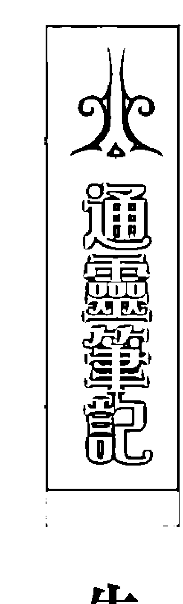

陳姓男子原是台北市內湖人，最近賣了內湖行善路一塊土地，名下還有幾筆土地總價值可能上億元，不過他和妻子離婚，唯一的女兒幾個月前失蹤，生活並不順遂。陳姓男子表示，他在台北市賣房子賺了五百萬元，之前因為心情不好才會撒錢，但是從此被五鬼纏身，已經有三、四個月難以入睡，他除了曾在台北市撒錢，最遠也曾撒到嘉義和高雄，但是日期和次數已記不清了，只是他前後這樣撒錢，已經撒掉一百多萬元；此外，他也曾在彰化市一家飯店房間內焚燒總數約五十萬元的現金，並且造成火災。有多項前科的陳姓男子表示會做出這些驚人之舉，只是因為被「五鬼纏身」，所以才想藉撒錢來改運。而陳姓男子的母親則表示，他退伍後就罹患精神疾病，有多次就醫記錄，已經有很長一段時間被神鬼問題所困擾。

## 第五章 靜看娑婆世界

所以他的妻女離開與不順遂，當然不能歸咎於卡陰。他之所以會有脫序行為，是因為他的靈魂在行為與判斷上出現問題。因為他從早年到現在，一直都無法在正確的時間點做下正確的決定，又同時欠缺自省能力，才會導致出現這樣的怪異行徑。讓他失去方向感的，是負面業力的牽引，所以即便他擁有很多錢，也不能以此界定他的人生成敗，因為錢財是會消散的，成功應該是以靈魂的正向能量來評斷。

人生的方向感，指的是生活中運作的行動力量會帶領你到何方，大多數的人都是好壞參半，少數人可以常常保持清明，專心一致。失去方向感的靈魂會脫序、失常、失去目標性。對這樣的人來說，時間似乎是靜止的，他不但無法在地球時間創造有意義的事，還會拖累周遭其他人，因而只會跟有同樣業力的人糾葛在一起。

如何挽救失去人生方向的人呢？多數一般人的靈魂無法介入挽回失去人生方向感的靈魂，比較有可能是當此人真正盪到谷底、一無所有，才有可能開始真正反省自己，不過那會讓自己和周遭人經歷很長的痛苦過程。我們應該在一開始出現失衡時就要趕快補救，而非等到心神喪失，如此就太慢了。

在這邊我想提一下「靈魂約定」，對於失去方向感的靈魂，一般人通常力有未逮，但是也有一種狀態，就是會有一些人永遠不放棄失去方向感的人，或是盡心盡力照顧真的有失心瘋，或身體與心智不方便的人，而這些照顧者跟當事人通常存有靈魂約定，所以會守候在當事人身邊。靈魂約定並非都是不好的，也可能會帶來好的能量，如果是自願接受照顧責任的人，雖然現世是勞苦的，但靈魂卻會因為實踐諾言而感到喜樂，這樣的關係可能是因為在前世有獲得對方的幫助而許下回報的誓言。不過靈魂誓約也不是毫無底線，有些很深，有些很淺，端看當事人彼此的認知。所以別小看承諾的力量，正向能量的回饋與流轉是好的，但隨意承諾、出爾反爾，可就不一定真的可以拍拍屁股輕易退場了。

### 港星淫照風波

> 事不涉金錢糾紛或勒索，但是社會大眾似乎只是充滿預存立場地消費了藝人光鮮亮麗的外表以及私生活關係。

二〇〇八年初，香港驚爆藝人陳冠希與多名女星的親熱照片在網路上流傳，一時之間騷動華人社會。這些隱私被人惡意曝光的公眾人物，還必須出面為自己的私人行為與關係道歉，受到牽連的相關當事人的演藝事業也受到嚴重的打擊。

這些私人的親密照片會流出，疑似起因於該男藝人將發生故障的筆記型電腦交給電腦公司維修，怎料被發現電腦內藏有他與多名女星的親熱照片，因而在該男性藝人不知情的狀況下，將這些照片複製到光碟內並流傳出來。

成過街老鼠的該男藝人在事件發生一段時間後才打破沈默，面對媒體以及社會的議論，他表示自己也飽受傷害，也向因此事受到影響的受害人道歉。他希望所有人能幫助事件中的受害者，

### 宇宙中沒有秘密

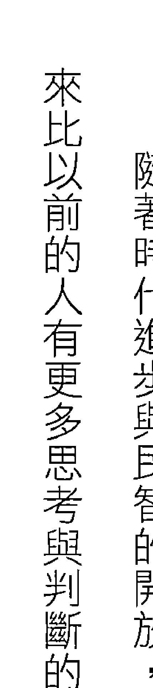

不要將這些照片再傳給其他人，而擁有這些照片檔案的人立刻銷毀，不要讓情況惡化。在香港警方的介入以及與國際刑警、德國、泰國及加拿大等多個地區的執法機構合作之下，已盡可能刪除網上相關照片，並逮捕了數名涉嫌企圖流傳這些淫褻照片的相關嫌犯。經過初步調查，此事的確不涉金錢糾紛或勒索，但是社會大眾對於被牽涉受害的藝人觀感十分兩極，沸沸揚揚並充滿預存立場地討論了藝人光鮮亮麗的外表以及私生活關係，淫照事件成為喧囂一時的熱門話題。隨著時代進步與民智的開放，許多是非善惡的價值觀卻逐漸模糊了起來。現代人表面上看起來比以前的人有更多思考與判斷的能力，受權威的壓迫也越來越少，但是真正具有獨立思考能力的人，卻不一定比以前多。無遠弗屆的媒體以及網路幾乎每分每秒都在傳遞訊息，煽、色、腥的內容誘發著我們內心的貪、嗔、痴，各種似是而非的論點與表裡不一的公眾人物，讓我們無所適從。這些充斥在我們生活中，對我們靈性生命沒有意義的訊息，卻通常佔去我們絕大部分的時間，實在很可惜。

## 第五章 靜看娑婆世界

當然，混亂的關係並不值得鼓勵，在早年對錯觀念很鮮明的時代，或者在某些宗教的規範下，這樣的行為甚至是極重的罪行，但在現今，是非對錯已不一定是單一標準了。若是把這起淫照風波的重點放在批判男女關係的複雜性，其實沒有太多意義，因為如果真要看誰的男女關係更混亂或複雜，還大有其他人在。

這位男藝人的靈魂並不邪惡，相反地，他和被牽連的女藝人們其實是這起事件的受害者。這整個事件的重點是在警示世人，凡事不能看表面，因為在這個宇宙之中無法隱藏任何秘密。能開悟的人，就會從這個事件中得到這個訊息，而不是只把它當作娛樂八卦來消費。所有在生活中發生的事件，我們要學習不因為表面訊息而讓喜怒哀樂隨之起舞，我們要能察覺其中的業力。這個事件早已被安排在這些相關藝人們的靈魂計畫中，每個當事人面對的態度也源自他們的業力呈現，這件事並非只是個意外的懲罰，裡面有著關於誠實與面對的功課和智慧。

有朋友跟我說，美國著名的連鎖大飯店名媛藝人芭蒂斯·希爾頓能從自己的淫照風波中海撈一票，但西方的文化本來就比東方開放，所以很難說社會大眾往後不會以有色眼光檢視這幾位藝人。我倒是希望大部分的人可以用更清明的眼光看待這些事件的起落，如果這些藝人的靈魂努力向上和向善，我們就應該要用寬容的心去接納，而不是從此之後就把他們貼上標籤，只拿來嬉笑怒罵。

聖經〈約翰福音〉中記載著一個故事，當衆人準備按當時的律法用石頭打死一位一個行淫時被捉拿的婦人時，耶穌對他們說：「你們中間誰是沒有罪的，誰就可以先拿石頭打她。」於是衆人都默默的離去了。誰不曾犯錯？也許還有也犯了相同的錯，只是僥倖沒被抓到而已。而西藏人說：「壞行為有一項好處，那就是能夠被淨化。」因此，當一個人心中真誠地吶喊著：「再給我一次機會！」一時，我們便應該要用溫柔的愛挽回他，再給他一個機會。

### 揮霍福分的名人

> 『失敗的辛酸，化作血淚，呈現給你……』他用盡感情唱出自己的心情，但是『電信教父』的稱號已經破滅。

曾有『電信教父』之稱的孫道存再婚了，話題不斷的他因為再婚對象是初中同學的女兒，兩人相差三十二歲，二十八歲的新娘子比他的女兒還年輕，再加上他申請破產後仍然生活奢華，因此再度被議論紛紛。

孫道存可說是含著金湯匙出生，二十一年前從父親手上接下電信事業後，曾經創造了四十一億的業績，但因為轉投資太多，再加上電信浪潮退溫，錯誤的投資決策引發財務地雷，從此兵敗如山倒。該公司在二○○二年股票下市，後來其更涉嫌一百七十一億元的掏空案，加上其他債務，負債總金額高達一百二十五億，當初一手建立的電信王國已經不復存在，他也因此身敗名裂。

### 惡業能量會累積到下一世

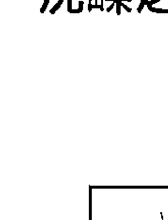

以孫道存為例，我們只看到他現世的狀況：出生世家、坐擁遺產、穿金戴玉、有美麗的妻兒與情婦，女友不但能一個換一個，最後還再娶了年輕的美嬌娘，這種種行徑雖然讓許多受害的小股東恨得牙癢癢的，但我還是要說句公道話，這真的是他天生好命。

雖然債台高築，但是他的名人生活卻一點都沒有受到影響，不但住在著名的豪宅中，出入更有司機駕駛最新的賓士車接送。情史紀錄輝煌的他，過往每段戀情的對象不是明星藝人就是社交名媛，即使已經破產，他對歷任情人也還是出手闊綽，經常贈與豪宅、鉅款或股票等鉅額禮物來表達心意。他涉嫌掏空公司鉅款，卻還能對情人慷慨的行徑，引起社會不少爭議。

造成各位股東的損失，也包括我們同仁的損失，我在這裡鄭重跟大家道歉。「孫道存的道歉聲猶在耳，但是小股東的股票已經成為壁紙。「失敗的辛酸，化作血淚，呈現給你……」他用盡感情唱出自己的心情，但是「電信教父」的稱號已經破滅。

## 第五章 靜看娑婆世界

同樣基於因果平衡的原則，因為他累世的福報，讓他能夠承接這些好福氣，所以他來到地球，便是要消化這些累積的福報（我想有更多被他坑殺的股民更感到忿忿不平了）。不過，我必須強調，是累世的因果讓他有福德可以承接，但這一世沒有運作好，沒有好好珍惜、自省並且結善緣，便會造成惡業。當很多人對他的憎惡，累積超過他的福報時，福澤消耗完，他後半人生必定有更多波折，而此世無法平衡的惡業能量便會累積到下一世，這也是為何他曾經一度有權、有勢又有錢。請注意！我講的是「曾經」……我並不是認為受他影響的投資民眾就該自認倒楣，或把他當成冤親債主來認賠。從現世標準來看，他的確有許多不適當的行為，但是我想提出不同角度的看法，嘗試用長遠的、多元的角度來觀察一個人，我們不只看今世及上一世，也看來世。我們不只這麼看這個名人，更重要的是，也要用這種角度看自己與其他人的互動，提醒自己要有一定的自律和珍惜，也不要只是一味的忿忿不平或嫉妒，因為此生的悲苦，可以從當下累積福報來改善，即使來不及在這一世結果，也必定會在下一世收割，要相信「行善之家必有後福」。我們應該看好自己，不要只看別人外顯的狀態。因為很多事不是只有表面那樣單純，我們用肉眼看人時，無法看到他的過去世或未來世，但是每個人的業力果報都是自己來承擔。

# 靈界使者 — 沈嶸之通靈事件簿

寫到這裡，關老爺也特別要我傳達開釋的訊息，祂認為現代大部分的人把錢看得太重要了，而忘記有更重要的「業」。金錢只是業的呈現的一種，也需要靠智慧去運用，許多人在金錢來臨時不懂得把握，使財富在剎那間化為空，自身又不懂得修身養性、累積福報，實在不該，應當開啟智慧，好好思索才是。

### 永遠的流行音樂之王

> 流行音樂之王的殞落令人唏噓，在他輝煌的事業與飽受惡意批評的生活底下，我們是否也看見了靈魂不斷努力的光明面與傷痛的黑暗面？

二〇〇九年的夏天，流行音樂之王麥可·傑克森離開了這個世界。麥可獨特的嗓音、個人風格和音樂作品，深刻地影響了後來的流行樂、靈魂樂、節奏藍調與嘻哈等不同領域的音樂；他獨創的經典舞步更風靡了全球的男女老少，大家對他的喜愛已超越了種族地域，儼然成為世界上擁有最多歌迷的藝人。

麥可的演藝生涯起始於十一歲，當時他和兄弟們組成「傑克森五人組」，單飛後，他的單曲音樂錄影帶包括《Billie Jean》、《Beat It》等，寫下了流行音樂史上全新的影音時代，而傳奇的《Thriller》專輯還是目前唱片史上銷售量最多的專輯，其在全球的銷量超過一億四百萬張，

麥可生活上的話題與他事業上輝煌的紀錄一樣備受關注。十多年來，他也一直被籠罩在媒體鋪天蓋地的負面報導中，包括他的皮膚顏色、整形失敗的鼻子等外貌與行為的負面新聞，在在引起許多爭議。沒有童年的麥可為了彌補童年的缺憾而蓋了夢幻莊園，但此地卻也成為他被兩次指控猥褻男童的場景。雖然在經過調查後皆被法院正式裁定無罪，但已經造成麥可的事業走下坡，並對他的形象造成嚴重的傷害。
如同麥可在《We Are the World》、《Heal the World》等歌中呼籲和平、宣傳環保、抨擊不公，並且對社會表達關懷與愛，現實生活中的他也是如此。他成立了多家醫院、教育基金會與燒燙傷中心等，也曾多次得到人道主義大獎，兩次得到諾貝爾和平獎提名，只是他的慈善行為似乎較鮮為人知。
原本麥可計畫將於倫敦舉行他的一系列大型復出演唱會，不過這個演唱會的主角已經無法出席。

# 通靈筆記

# 只有愛會留下來

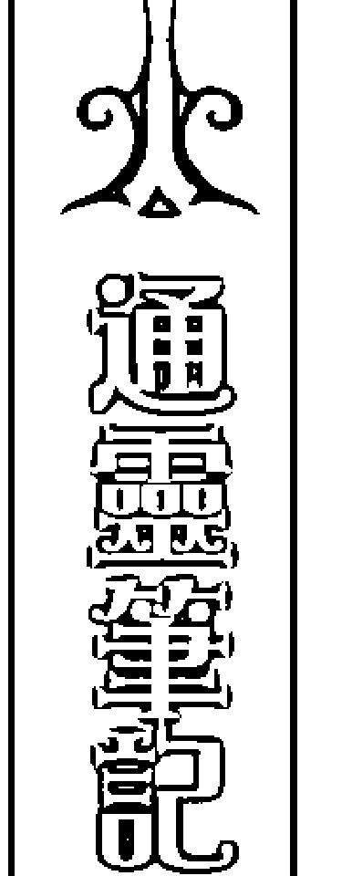

即便到今天，還是有許多麥可的歌迷認為這位流行音樂之王尚在人世。因為他的音樂和身影還如此真實地在電視上重現，他的音樂能量並沒有隨著肉體的消滅而減少。

麥可的靈魂來到這個地球上的目的是挑戰自己的極限，但是在他觸動人心的音樂與表演天份背後，卻躲著一個生病了的靈魂。我看到他的靈魂下方有一個像黑洞一樣無法被填滿的傷痕，直到他離世之前都沒有消失。這個黑洞在他此世投胎之前就存在了，而他的靈魂具有強大的能量，卻不是經過修行的靈魂，所以仍持有一些負面能量。這個黑洞般的傷痕，會引發他戲劇性以及與親密關係有關的傷害，而負面能量會驅動他使用錯誤的方式來治療自己，譬如依賴藥物等，也因此讓他毀譽參半。

麥可靈魂的優點在於他非常努力，不斷超越音樂上的目標，他看來渾然天成的才藝其實是因為很多世的努力而來。他累世不斷地在音樂與舞蹈上精進，累積到這一世，才讓我們看到才華綻放的光芒。不過也因為他的靈魂太專注在才華的展現，所以忽略了其他面向的學習，包括自律、清明，還有許多關於道德的部分，因此也累積了黑洞。麥可在地球上的成就很大，他讓世界上的人看到他是如何超越夢想與極限，不過他雖然在地球上創造並得到了他想要的財富與名聲，但同時也帶給人們一個警訊，也就是誤用他的財力、權力與名聲在錯誤的地方時，生命將會快速的消失。麥可尚未完成的演唱會是他很大的遺憾，再加上他在毫無預期的狀態下消失生命，他的靈魂仍覺得此生不夠完整。
麥可在離開這個世界時，靈魂是哀傷的，雖然麥可廣受世人的喜愛，但他並不愛他自己，而且充滿矛盾，他似乎是希望用世人的讚嘆與掌聲來彌補自己不愛自己的能量。此外，因為他還有許多未完成的心願，在離開的當下，他有許多話沒有說，來不及和家人、一起工作的伙伴與歌迷告別，同時他的靈魂也還帶著很深的渴望，希望在下一世能繼續完成他的音樂夢想。世人對他的喜愛是否對他的黑洞有所療癒呢？是的，麥可的靈魂也漸漸了悟他可以不強迫自己去做這麼多事，還是會有愛他的人。他在這一世經營的是有條件的愛，而他在離開後逐漸明白無條件的愛。
麥可雖然離世，但他與父親之間仍然存在著痛苦以及「很難的挑戰」的關係。由於這兩人這...## 第五章 靜看婆娑世界

靈魂的向度和磁場產生不和諧的狀態，兩人在心靈世界完全無法溝通，關係上產生很大的傷痕，即便在他離世之後，他對父親的感受還是混亂與傷心。

現在，麥可想要傳達訊息給他愛的人以及愛他的人。他想告訴愛他的人他現在很好，請愛他的人不要為他擔心和落淚，而很多沒說出口的話，包括對他的孩子，他現在想說，他真的很愛他，他會在天上守護他們一生。

相信我們總有一天會明白，傳達愛的能量才是重要的，名望、財富帶不走，只有愛會留下來。

## 第六章——解开业力之结

> 業力並非命運枷鎖，明白業力可以打破原本的慣性思考，轉化既有的二元對立，產生面對問題的新智慧，並且重新擁有豐盛與幸福的人生——而這才是生命的目標。

### 一、项目概况

### 二、项目内容

## 靈界使者－沈崢之通靈事件簿

### 修復受傷的靈魂

肉體的需求和病痛比較容易察覺，熱了、冷了、痛了、發燒了，我們可以很快地調整或去治療它，然而靈魂的病痛不但不容易察覺，還很容易被忽略。我們就只有這輩子可以使用現在的身體，期限到了，我們就要放下它，但是我們的靈魂在長遠的旅程中，或多或少都會累積傷痛或出現破損，這一切更需要愛與療癒。

我們如何察覺自己身上可能有靈魂的破損或黑洞呢？具體來說，如果你或周遭的人在生活中，譬如在金錢、關係上，甚至於想法上，總是有些一直過不去的問題，而出現憂鬱、上癮的狀況，常常想到用自殺或暴力解決問題，或將力量交給其他人，讓別人來決定自己的人生，譬如依賴伴侶做所有決定，依賴心理醫生等權威人士，這些都是靈魂生病的徵兆，需要盡早修復。先前我們聊過憂鬱症，接下來我想針對現在人容易出現的上癮、依賴和自殺等屬於靈魂黑洞所造成的行為，進一步地分享屬於靈界的訊息。

## 第六章 解開業力之結

### 上癮

很多人會對某些事物上癮，包括菸、酒、味道或運動，上癮可以說一種執著，只是如果到了病態的程度，就成了上癮症。現在有很多人對電視上癮、對電腦上癮或對網路上癮。你以為這些對靈性沒有影響嗎？其實這類的上癮會影響頭腦的清明程度，降低對外在事物的反應能力，讓靈魂變得不靈活，變成太依賴電視或電腦所帶來的訊息。

而殺傷力更強的毒癮、酗酒或菸毒等問題，對靈魂會產生極大的傷害，它們會將你的能力拿走，導致你無法真正的去控制自己。如果有這些上癮症時，你的靈魂中心點會徹底偏移，產生外在行為的脫序，最終造成肉體的傷害，譬如酒駕撞死或藥物過量致死，而這些肉體的致死傷害也會存在於靈魂體中，伴隨輪回到下一世。

### 依賴

依賴並非全然是負面，因為每個人都有依賴的時期，譬如孩童時期或失去自理能力的病痛狀態時。所謂的病態依賴，是自己明明有能力和力量做決定卻不願意做，也不願意承擔責任，這樣有依赖问题的灵魂通常是因为灵魂体出现一种游离状态，所以会很迫切的想要抓住一个人或事物，这种灵魂的特性通常缺乏自信，他们的灵魂架构失去认清我是谁的主轴，所以将决定权交给他人。如果依赖的程度严重到只是对所依赖的对象有情绪化的反应，那么这样的灵魂有一半是生病了，不过因为另一半还算清明，所以仍有改变的机会，若是业力关系不算太差，遇到有正能量的人，或许可以将这样依赖的灵魂导入正途。

正因为每个人都有依赖的时期，所以依赖可以有一段合理的时间性，在独立的时间到了之后，能够适时的觉察，便可以选择超越依赖而进入另一个进程。现代的年轻人赖在家中当啃老族，是常见的一种依赖状况，这些人和父母的互动一直延续孩童时期的模式，习惯被照顾、吃住由父母供养，四肢健全也有一定的教育程度却没有人生的目标，对任何事都提不起劲，有时甚至完全不工作。千万别小看这样的生活态度，这样的依赖习性会变成灵性自毁，把自己变成没有能力的人，而不负责任的依赖久了，就很容易逃避现实最终走向灵性自杀。

### 自殺

不斷有厭世想法的人，頭上就像罩了一層黑紗，靈魂被黑暗的能量所遮蔽，導致靈魂體會一直想脫離地球，認為今生肉體的死亡可以解脫煩惱帶來平靜。然而肉體是靈魂的工具，若是輕易的拋下它，便無法幫助自己完成使命及該做的功課，而這些未完成的事也不會因為肉體的死亡一筆勾銷，只是等待下一世再來一次。

會認為可以以死解脫的靈魂，通常都很難抗拒這股黑暗力量的拉扯，簡單來說，他們會變得十分鑽牛角尖，旁邊的人也不容易幫助得了他，因為這些有自殺傾向的人通常會隱藏自己的真實想法，甚至矯飾自己的行為來假裝沒事。但是如果你或你周遭的人雖然有這樣的傾向，但具有思考能力時，請先用以下三個步驟來緊急處理：

- 第一步：在主觀信念上承認自己需要幫助，才能接受尋求別人的幫助。
- 第二步：尋求具有正向能量的人幫助，而不是依靠周遭跟你一樣混亂的人。
- 第三步：清除在生活中會帶給你所有負面因素的人、事、物，也就是做好隔離。

自殺的原因有許多種，為情、為錢或因病厭世都常見。若某個人會讓你想死或不愛自己，你就要遠離這個人，並意識到自己的感情關係和想法是需要協助的，還要去修補自己的靈魂黑洞，避免誤以為「死」才是唯一的出路，或者認為如此可以完美的殉情，或讓對方抱憾終身、永遠記得你，甚至可以化作厲鬼來報復……等等，我要強調，有這些想法的人真的是誤會大了。

靈魂的目標並不是只為了求得另一個靈魂的愛和認同，窄化自己的靈魂後再來求解脫，這只會讓你帶著哀傷的靈魂再度轉世。至於那位讓你傷心的人，他們不一定需要承擔你的責任，如果你們之間沒有足夠的緣分及業力，自殺只是拖慢你自己進化的腳步罷了。若是你們之間有不良業力，這一世用這種方式逃避，無法清明的面對，那麼來世也會受到同樣的考驗，如此循環，何苦來哉。

另一種為錢自殺的人也很常見，通常是因為解決不了金錢的黑洞，因而失去對未來生活的希望。但這類事件很奇怪，我們很少看到欠債數億的人自殺，活不下去的卻都是被一文錢逼死的英雄好漢。「金錢」是如何在地球上運作財富的表徵，同樣地，如果在金錢上有過不去的關卡，死也不能消除你無法面對挑戰的挫折。當你被吸入金錢黑洞時，試試以下步驟：

- 找出財富漏洞的原因。
- 不要覺得丟臉地去尋求幫助，尤其不能胡亂借錢、以債養債。
- 尋求專業機構針對自己的問題盡快解決，譬如尋找專業人員幫你做債務整合的規劃，或尋求法律途徑宣告破產等。

有人說：「這輩子擁有多少錢，是天注定的。」說穿了，金錢的確是業力呈現的一種，但有錢不代表就一定是全然的福報跟好命，這些都和靈魂的本質與目標有關。我們或許可以藉由一些魔法和方法來增加金錢運，但是如果靈魂對於金錢上有不和諧的能量，在尚未解除這些不和諧時，所有的方法都只是暫時有效而已。

還有一種是比較另類的靈性自殺，如果靈魂在不斷轉世的過程中無法找出人生的意義，經過太多世之後，就會出現自毀的念頭，因為在靈魂的深處已經深刻記憶著不知道或否定自己生命的意義。如果經歷太多世的自殺，就算在某一世短暫的清明中找到了意義，還是很容易會自毀。

這種靈性自殺是最難處理的，因為靈魂一進來地球就會想死，或認為死就是答案，這和為情或為錢不同，通常是自己自動啟動了死亡指令。譬如好幾世之前，這個人曾經殺了一個很討厭的人，他發現死亡可以讓討厭的人或事物消失，因此吸收了這樣的負面能量，因而到了某一世時，可能在自己無法解決問題時，就用死亡來解決，因而啟動了這樣的因果。

#### 自殺者永不超生？

就我所知的靈界狀況，其實自殺的人並不會進入所謂的「枉死城」，或者直接打入地獄不得超生。我想這些駭人的故事，通常都是要我們不可以輕言放棄生命的另一種表現。其實宇宙是充滿愛的，這些自殺者的靈魂會被帶去修復，聖靈也會盡力地修復這些因為自殺而破碎的靈體，並在時機再度來臨時將他送回地球再一次接受挑戰，同時聖靈也會把靈魂該完成的功課再賦予這個靈魂，在這過程中，靈魂會進入所謂的中陰身階段。
自殺的靈魂進入靈魂界後，會產生極大且深層的沮喪和哀傷，就如同身處在地獄一般，因為當事者此時才會發現，所有的問題仍讓他無處可逃，而他只能在中陰身的階段去思索死亡帶來的意義。如果此階段無法超越，他便會帶著這樣的傷痕轉世，他的清明度會降低，轉世之後則容易出現EQ或IQ比較不佳和遲鈍的問題。

而靈性自殺的人因為累世的傷痕，讓靈魂體變得很殘破，聖靈也不容易每一次都修復完全，而一般人類的幫助更是有限的，除非他能自覺地不斷移除自己插在身上的不良業力釘子。

受到傷害致死的方式，也會在靈魂體上留下印記。如果是刀傷，那麼在下一世，可能在肌肉和骨骼會受傷；如果是被毒死，便容易得到全身蔓延的疾病；若是上吊，則會有不容易集中注意力且易失去意識的狀態；若是因為空難或車禍，強大的撞擊頻率，也會儲存在靈魂中因而出現很慌張、恐懼的情緒。

### 修復靈魂

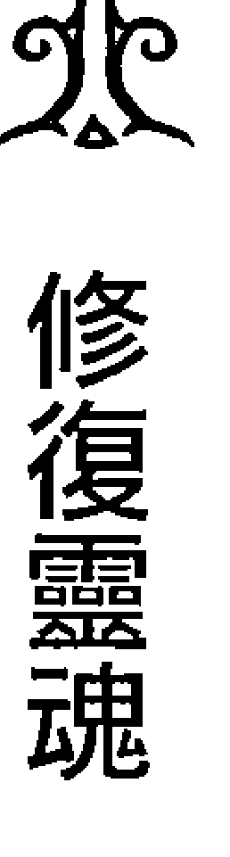

是指思考中心比较小我和封闭，或比較願及大我與合一。每一個人都正在走這條路，沒有人是例外的，先決條件是先意識到自己是有靈性的個體。追求靈性的成長便是真正的愛自己，愈能接納自己的人，在靈性開展上愈容易。意識到自己是誰，是往靈性開展的第一步，靈性的進展速度每個人都不一樣，所以不能用同一個標準看待，通常愈具有智慧、慈悲心並能理解他人苦處的人，靈性程度會較高。

可以尋求心靈上的指引，參加一些靈修的活動，提升自己的靈性，這些都有助於靈魂的清醒。

靈性是無法被肉眼看見，卻又存在於意識場之間。我們常說靈性未開，或靈性比較高，通常當我們在地球的人世時，也能為自己進行靈魂修復，修復的方法有很多種，瑜伽是一個不錯的選擇，並且盡量食用非加工性的食物和純淨的水，減少食用刺激性食物或動物型脂肪的量；也

# 靈界使者——沈嶸之通靈事件簿

我的工作室經常舉辦『與指導靈對話』的活動，我們可以透過這個活動跟指導靈聯結，得到對自己靈魂與生活的忠告，這個可以增加靈魂的覺知能力與靈性的進展，對於釐清一些人生難解的苦痛以及循環，或切不斷理還亂的關係所造成的業力很有幫助。幸運的是，聖靈也給予我們更直接有效的新方法，幫助我們清除業力並療癒靈魂，我們所要做的就是敞開心，接受這份來自宇宙的愛。

### 與指導靈對話

每個人都有指導靈，不過人多嘴雜，所以指導靈其實愈少愈好。比較常見的情況是女生配到女生的指導靈，男生配男生的指導靈，除非當事人有特殊的任務才會配置異性的指導靈。指導靈比我們人類的頻率更高，他們的想法比我們都先進，他們可能曾經是地球上的人類，也可能來自外星，他們不屬於天使界，位階在於天使之下。絕大部分的指導靈都有過許多的肉身轉世，而透過這些轉世經驗，他們已經過因果業力的洗禮與淨化，因此獲得了極大的智慧，也就是因為這份智慧，讓他們得以成為人世間的指導者，帶給當事人強烈的心靈感應與成長助力。有些術士會差遣鬼魂辦事，但是鬼魂無法調查因果，而高階的指導靈可以到天階查詢。不過這些跟著我們的指導靈並非永遠固定不變，而是會隨著靈魂日積月累的成長而轉換。指導靈跟我們說話的方式和我們的意識一樣，他們會透過靈感、感覺或想法等方式與我們對話。每當我們有種「冥冥中」的直覺時，或者我們「就是知道」這件事會這樣的時候，往往就是我們的指導靈在與我們對話。舉例來說，有時我們會突然覺得怪怪的，所以取消了一個約會，而最後還真證實所幸沒去赴約。
如果你覺得自己是個遲鈍、總是搞不清楚發生什麼事的人，那是因為你與指導靈還無法直接溝通，你要先讓他知道你知道他的存在，才能直接產生聯結，靈魂才會更進步。這是因為每個人的靈魂都有獨特的頻率，你的指導靈可以察覺出你的需求而給你適當的指引，但是你有選擇接受或不接受的權力。譬如，之前我在感情上有障礙時，卻總是不愛聽指導靈的建議，固執地嘗試不對的男人，所以最後總不太好。
指導靈也分層級，簡單說有小學生級，也有博士班和大師級。我的指導靈是大師級的，他的創造力強，在很多地方幫助我發揮能量，也讓我有通靈的能力，還可以下載新的程式到我的系統中，這就好像車子也要不斷再升級一樣，靈魂升級了，最後連面貌外表也會改變。不過要有這樣的「待遇」，必須要先在聖靈界立下靈性誓約，發願願意在靈性成長跟幫助別人上盡一份心力，並透過聖靈界的同意之後，才有可能被分配到更高階的指導靈。
但立下誓約要十分謹慎和誠懇，建議不要立下具有懲罰性條款的誓約，免得讓自己毫無選擇反而成為阻隔。例如前一世立下要把財產三分之一捐出去，但這一世忘記了，可能就會一直財去財來。

#### 不離不棄的指導靈

指導靈給予建議，也會整頓我們，幫助我們把來到地球的任務完成。指導靈回應的東西比較不那麼世俗，因為他們服務的宗旨在於協助人類有靈性的成長，所以會依照每個人的靈魂屬性而有所調整。如果當事人追求的是經濟與業務的發展，本身也很努力，指導靈就會幫助你在這方面下載更為精進的程式，並且更新你的系統。不止我們身體會隨著年紀變老，靈魂的系統也會隨著年紀變老，如果一個人今年四十歲，他的系統就是四十年前的，如果不更新，活在現在就會感覺很辛苦。

就像每個人個性不同，每個指導靈也有其獨特性以及可以被識別的頻率，雖然指導靈有一定的標準，但還是各有各自的習性，所以每個指導靈也是獨一無二的。

從出生到死亡，指導靈都不會離開我們，只因為每個人所處的階段不同而更換。什麼時候決定更換呢？通常是原本系統中的指導靈已經不適用，譬如當指導靈在你的身邊運作，卻跟你的

系統（頻率、系統）不相容，要幫助當事人也已不可能時，原來的指導靈會回到靈界，指導靈系統則會自動派更適合當事人的指導靈來，直到當事人又有所改變為止。

一個人在地球上靈修的愈快速，更換的就快速，多數人在世上都會更換一到兩次指導靈，任何一個地球上的生物都有指導靈，靈性愈高，配備的就愈高。地球上的每一樣東西包括礦、植物，都受到指導靈的管轄和監督，譬如礦石也有，只是震動頻率很低，指導靈可以穩定礦石的頻率，確保這個能量在地球上是被需要的。和指導靈對話時必須傳達得很清楚，如果太過混雜，等於系統中頻道太寬，指導靈給予人的訊息能量就分散了。

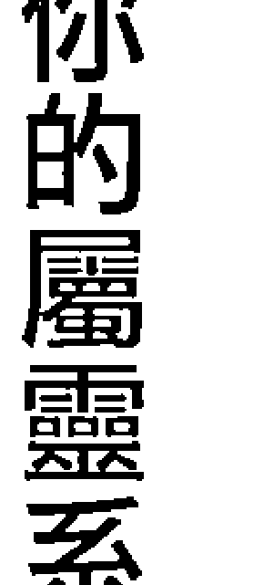

#### 選擇你的屬靈系統

指導靈是西方系統的說法，不過聖靈界已漸漸打破藩籬，讓東、西方的靈界系統可以整合，所以無論你是基督徒、回教徒、道教徒或佛教徒，在逐漸合一的世界裡，我們都可以用更寬闊的心去接納彼此，也都可以承接這些善的能量。只是在還沒有真正能判別是非或清楚標準的功力時，我建議你還是先選擇一種去接受就好，不然訊息過於干擾，反而會互相消滅，因為每個系統的表面價值觀可能不同，如果你總是在變換系統，見宮廟就拜，胡亂跟著老師學，反而不妙。

#### 向其他指導靈請益

雖然我有自己的指導靈，在一次心血來潮的經驗中，我發現自己還能邀請其他指導靈來幫忙，並且獲益良多。

有天跟一位友人在一家餐廳午餐，我正在閱讀《尋訪諸神的網站》（張老師文化出版）這本書，看到一篇「諾斯特拉德馬斯與白克蕾的預言」，其中諾斯特拉德馬斯（Nostradamus）是十六世紀的法國人，他曾出版一本「百詩集」。諾斯特拉德馬斯從小就擅長各種語言，包括拉丁文和希臘文，並對數學和占星術都有涉獵，後來他讀了醫學成為醫生，四處為人治病。他雖然受的是科學教育，但他對神秘學和魔法也有濃厚的興趣，他在定居馬賽時完成了《諸世紀》第一本的預言集，內容從十六世紀到世界末日（西元二千年），他原本預計寫十本，但是到第七本就沒再親自完成，不過他仍是預言界最出名的預言家之一。

他成功預言了法國大革命、納粹、第一次世界大戰、甘乃迪遇刺、登陸月球、非洲大饑荒，以及愛滋病等諸多人類的浩劫，還有自行車和汽車、蒸氣火車、飛機或火箭和原子能等科學事蹟的出現與研發。一九九六年曾有一部以他的人生為題材的電影，名為「末代啟示錄」。《諸世紀》雖然寫得極晦澀，但字面卻直接點出法國或歐洲地名和災難狀況，人人都知道大難當頭，就是不知道何時、何地、何事，這種神秘感令《諸世紀》更具吸引力，沒有人知道他如何寫作預言的文章，只有這本書的開頭透露出是上天有意把天機洩漏給他。因為我也研習魔法，因此我好奇地詢問指導靈能否邀請他到現場，我感覺他從很遠的地方來了，我卻因此有些受寵若驚，面對這位飽讀詩書、學養豐富的人，他的語言簡意駭。我問他能否教我魔法，他委婉的回答：「我們兩個系統不同，我對魔法還不是很專精。」我再問他是否能教我神秘學，他再次告訴我因為系統不同所以不行，因此我就請他回去了。而一年後，在一次靈擺的教學中，我再一次邀請他到現場，每一個參與的學生都同步接收到相同的訊息。我問他是否有預知的能力時，他回答，他的預知是參考歷史資料以及當時的靈感，而他當時寫那些預言時，並不知道事情是否會如實發生。我問了第二個問題，有些預言是在他死後一、二百年後才得到印證，他則認為很多事是機緣與巧合，他在當時的年代的確有很多靈感，但是並沒有這麼清晰。第二個問題，我又再請求他能否傳授我們魔法？他卻謙遜地笑著說，我的魔法高於他，又客氣地回絕了我。最後，他分別給了現場每個學生一個建議，他對一個資質很高的學生說，她可以盡其所能地發揮天賦；對另一個學習進度比較慢的學生鼓勵，希望她要努力學習不要放棄；然後，他對一個正在接觸通靈的學生說，她正在打開直覺的系統，希望她能循序漸進。這樣的交流讓大家都獲益良多，我也確認了自己可以隨時請調過去偉人的靈魂，與之接觸並獲得意見。
在一次訪談中，我分享了邀請歷史名人的經驗，有一個女孩想要跟蘇格拉底（Socrates）對話，我試著詢問指導靈是否能完成這項邀請。
沒想到這位出生於公元前四六九年的希臘哲學家就這樣應邀來到這個空間。蘇格拉底是柏拉圖的老師，蘇格拉底的哲學主要是探討倫理道德問題。他以傳授知識為生，三十多歲時做了一名不取報酬也不設館的社會道德教師。蘇格拉底那時就已經看到了內修和外求所帶來的結果會有天壤之別，也明白上天與個人的關係。許多有錢人家和窮人家的子弟常常聚集在他周圍，跟他學習請益，蘇格拉底自己卻常說：「我只知道自己一無所知。」女孩問蘇格拉底的智慧與哲學思考從何而來？蘇格拉底回答，在來到地球之前他就是一個已經開悟的靈魂，他來到地球是為了幫助人類的智性發展。他表示人類在過去幾個世紀，因為對物質的需求過度強烈，以至於在靈性的追尋上減弱，這是令人惋惜的走向，但是到了二十一世紀，人類將會再度感受靈性的召喚，重拾之前失落的部分。

#### 邀請蘇格拉底

女孩問蘇格拉底的靈魂去了哪些地方呢？蘇格拉底回答，他在地球上一些重要的人身邊以「大師指導靈」的形式，指引著人類的智性與靈性。我問蘇格拉底是否能給眼前這位女孩一些建議，他要我對這女孩說：「快樂就是你開悟的法門，要從喜悅中悟出通往靈性的道路。」大師看眼前這位女孩，不是要她多讀幾本書，也不是說出高深莫測的話語，而是去尋求靈魂愉悅之道，從中感受喜悅、愛與美，因此帶來更多的創造力，才能完全化解生命中的桎梏，展開生命的可能。

#### 遊覽藥師佛菩薩的藥園

另外在一次靈擺的課程中，我嘗試邀請藥師佛來到現場。當指導靈邀請菩薩來到時，學員們開始詢問關於現代醫療的問題，譬如愛滋病的治療進展。藥師佛回答，祂已經陸續將解藥的訊息傳達到地球上來，因此會有持續的進展，但是關於癌症的解藥就會比較緩慢，因為癌症與業力牽扯，人類距離療癒癌症還需要很長的時間。我們也詢問了中藥對人類的影響力，菩薩回覆，適量並且對症下藥的確是有所助益，只是現在的醫學過度強調科學的實證，反而忽略了身體本身自我療癒的能力。

在很多人都過量使用了藥物。因為聽說藥師佛在天上有一個藥園，所以我也冒昧地請求祂答應帶領我們去參觀。獲得藥師佛首肯，在場的每個人都閉上了眼睛，剎時感覺到一陣輕柔的力量從額頭位置托起我們，慢慢的每個人陸續看到不同的景象，有些人看到花園錦簇，有些人漫步在森林裡，感覺十分輕快舒服，一段時間後，我們的心神回到肉體。最後藥師佛答應給予每個人當時最適切的藥方來療癒身、心、靈，這趟藥園之旅讓在場的人都愉快地舒展開了，很感謝祂的慈悲。

### 業力清除療法

我們在地球上所得到內、外在的資源、命運的好壞，都是跟因果業力有關。而除了累世的業力，現世過久的能量與情緒性的低落，也會造成業力。要避免負面業力，首要就是要成為自己心的主人，從心的習性所產生的業力反應中脫離出來，避免無名的「因」，導致產生越來越多的業行，並且在裡面打轉。

民間信仰中消業障的方法很多，譬如多布施，因為當你幫助別人時，也是在幫助自己消業力；也可以請求菩薩、持佛經，或者進行靈性的修煉，加深與神的關係；也可以藉由神佛溝通的方式，請神明查閱處理與某人之間的因果、與祖先或冤親債主們溝通，甚或趕鬼等，這些方式或或多或少都能改善業力。但是其中用做功德來消除業力的這種方法，如果抱持慈悲心去做效益才會出來，若只是為了消除業障去做，出發點過於自利，其實效益並不大。

修行也是方法之一，不是為了求取什麼神通，而是要了解自己的缺失，改善自己的行為，可惜許多人誤會神通才是學習的目的。而學禪修行的目的，在於「明心見性」，將煩惱心變成智慧心和真心，然後才能見到眾生皆有且不變的佛性。透過宗教來思索業力，是一種尋找與覺悟的過程，這種方法雖有效，但是需要花費的時間比較久，也容易因為人的因素而混淆了靈性追求的方向。

之前我們提到過聖靈也與時俱進地給予我們更直接有效的新方法——「業力清除療法」，幫助我們清除並療癒靈魂，這是很有效的方式，可以在此生的當下就開始清理業力，也可以將靈魂中的雜質清除，讓靈魂會變得比較乾淨，同時也可以幫助死後再度輪迴時可以進入一個比較好的狀態。

人生有許多東西會不斷地進進出出，我們要做的是選擇留住好的，清除違背靈性目標的黑暗能量，並且成為一個有力量的人，支撐自己不斷往上提升。因為人生的每個環節是扣在一起的，散掉的能量不具支撐力，久而久之，就會出現問題和各種不順遂。

在這個療程中，我會召喚你的「高我」與指導靈，跟我一起進到你的靈魂系統中，並請他們協助找出你的業力問題，包括情感、健康、財富、家庭甚至靈魂體的各种不順，並清除掉這些障礙。這些不合諧的能量就像是電腦中的壞程式，程式不清除，就會陷入迴旋，不斷被誘發，最後導致系統當機。在聖靈的協助下，透過業力清除療法除了可以清除今生的問題，也能追本溯源進入你的前世，甚至未來世，把不良的業力程式都先移除掉。

這是因為每個人的靈魂體都能聯結到一個大型的資料庫，裡面記錄著靈魂累世的轉世檔案，即為佛經所言的阿賴耶識或西方的阿卡沙密錄（又稱生命的記錄）。這個資料庫記錄著一切好與壞、引發和誘發我們生命中所有情境的能量，以及讓我們在生命中無法創造富足和快樂的原因。

## 第六章 解開業力之結

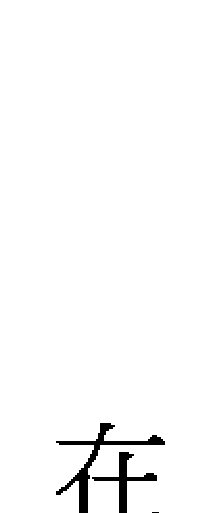

### 找出不良業力程式

此外，在這個合一的宇宙中，我們除了能閱讀自己的資料，也可以閱讀他人的資料，只是目前一般人還無法隨心所欲的聯結這個資料庫，必須透過通靈的能力，請指導靈、聖靈進入當事人的資料庫，才能找出問題並把不和諧的業力程式予以全數清除。除了查出需要被移除清理的程式，有時還能傳達靈界的訊息，因為每個人都有靈性也各有天命，但在當事人靈性未開時，通常無法理解這些訊息，必須透過通靈者翻譯才能讓當事人在意識面上也能清楚的被引導和告知，掌握並提醒自己改進的方向。

許多做過這種療法的人都有顯著的改變，他們覺得頭腦變得清晰，出現行動力以及正向思考力，而且比較不會出現擔憂，能用積極的態度重新面對自己的愛情、金錢、事業、人際關係、健康、親情以及靈魂體方面等課題。

是的，清除業力真的很簡單。首先從清除靈魂體開始，通常一個人的靈魂體都有好幾層不良的業力程式，因人而異。先清除掉第一層之後，經過一段時間的轉化，約莫兩個禮拜後會有第二層浮起，靈魂體清理乾淨後，接著要個別清除其他層級問題，以免反覆誘發。被找出來的都是不當的程式而且不符合個人生命的目的，第一次清除會是當下最重要、最需要被移除的不良業力。然而，被清理的人也必須配合，時常覺知自己的狀態，以免因為長久以來的慣性又再度復原已被清理的程式。

以金錢為例，有些人就是無法有錢，但是導致錢財賺不到或留不住的癥結卻有百百種，有可能是缺乏投資理財的能力或賺錢的技術不夠，若是花錢這方面有障礙，譬如消費上癮或者有匱乏程式，都必須先找出來。做完全錢的障礙清除後，會在理財上有很大的進步，對金錢不再害怕並懂得金錢的運用方式。不過自己真實的努力能量還是很重要的，清除障礙後還是要在對的路上大步往前邁進才是。

另外，有一種「靈界程式」是比較特別的，這些程式的產生是因為靈魂在組合時，出現了不當的頻率，而這些頻率定位了個人的價值觀。由於不良的業力程式之間通常有連貫關係，我們所搜尋出的程式，通常是累世而來。從靈界中翻譯找出名詞，對每個人在每個層面的意義不同，可以觸發思考，幫助自己警覺。

#### 清除關係中的不良業力

我們也可以特別去清除跟某個人的不良程式，譬如家人、先生或情人，清除之後彼此的互動比較可以脫離舊有的模式，因此關係可以好轉。有一個客戶是姊弟戀，愛上小她很多歲的男生，但男友的脾氣很不好，總是說沒幾句話就爆口角，因此女方很希望能找出關係問題點。我發現他們的關係中有很多傷心、衝突和分離的不良業力程式，調出資料並幫他們清除一個禮拜之後，這位小姐開心地回來找我說，他們現在比較不容易爭吵，彼此的關係確實獲得了顯著的改善。

#### 再把好的東西都加進來

宇宙中的愛和智慧真得好驚人，除了可以清理不良的業力程式，現在我們還可以下載許多對我們有益的程式呢！譬如「提昇身體健康與活力」、「動力程式」、「靈魂體自我治療程式」，還有「語言學習程式」、「動物溝通程式」，以及很受歡迎的「有錢人程式」、「大美人程式」與「減肥程式」等等，這些聽起來都很棒吧！清除障礙之後，還要把最正向的能量都加在自己身上。

不過，下載這些程式之前必須先經過靈界同意，而且前提是得先清除阻礙的業力才行，不然系統還有障礙時，新程式也無法順利運作。我曾經有幫人下載卻被拒絕的經驗，那位客戶想要下載「時間管理程式」，卻被指導靈拒絕，結果原因在於他有「責任感」的不良業力程式，所以必須先移除才能下載。下載時有所勉強，便會出現抗拒頻率，我可以通靈查詢無法安裝的原因，例如出現無法成功下載「正面思考」，原來底層出現「抗拒看見」程式，這些靈界訊息會直接出現在我的腦中。

而順利下載後，當事人也要有心感應並練習，才能良好運作這些新的程式，譬如對塔羅牌有興趣的人可以下載「塔羅牌程式」，但是還是必須有學習的動作，因為這些新程式只是幫助你比較輕鬆地學會塔羅牌或增加靈感力，而非讓你不勞而獲。

我也會去檢查這個人真正需要的程式。很多人來我這邊有「動力不足」的不良業力，這是靈性上常見的問題，懶洋洋的、對很多事都提不起勁。下載「動力程式」後當事人會開始有心願動力去得到更好的表現，雖然沒辦法保證當事人一定會成功，卻給了當事人勇氣與力量去突破現狀，通常我也發現「動力程式」無法成功安裝的原因通常是受到「不願意改變的」不良程式所阻礙。

不要小看這些新下載的程式，因為對自己有信心的力量可以啟動這些程式。有一女性客戶下載了「靈性美人程式」之後，驚訝地發現開始有人稱讚她有氣質。但我也要在這裡提醒，這些程式不是萬能，不良程式被移除後，我們自己還是要時時覺察，以免不良程式復原，所以一定要有意識的覺察它才行。譬如在「有錢人程式」中還有「股市基金分析程式」，但這只是讓你變得更清明、判斷準度增加，而不是從此就買什麼股，就漲什麼股；而下載了「輕鬆存錢程式」後還是要有存錢的動作和準備，當事人自己還是要有意識的參與，其中沒有不勞而獲的成分。

就像房子重新改建和裝潢好，平常還是要做好清潔維持的工作，我們的靈魂在清除業力並植入正面能量之後，也要繼續做淨化，才能維持靈魂的清明和成長。坊間有些活動和課程都可以去參加，譬如光的課程、禪修、冥想等知識和信念上的加強都是很好的選擇，平時配戴或擺設具有能量的水晶來增強自己的磁場，也是很好的方法。

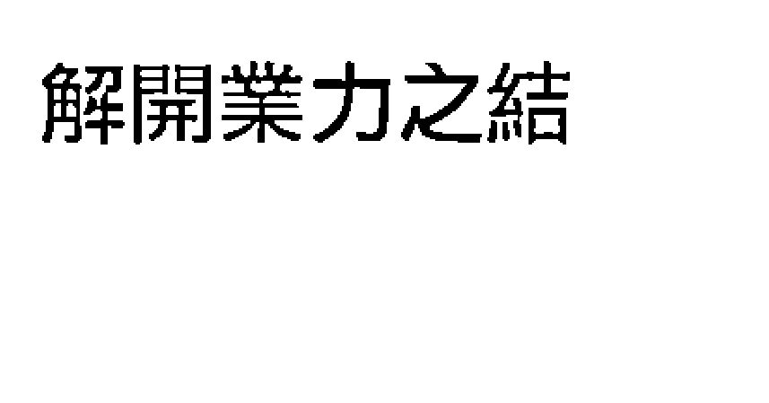

#### 化業力為助力

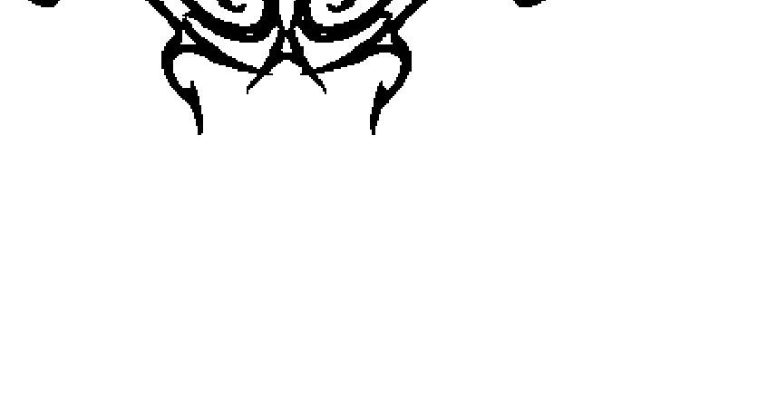

每個人都有不良業力，包括我也不例外。業力展現的形式各有不同，有人會出現在金錢上，有人會困在愛情裡，還有人事業總是不成功，或者在親情與人際關係上產生負擔。這些不良的業力會在生活中創造很多困難，就像是電腦中的病毒會造成電腦當機，而唯有清除累世的不良業力，幫助每個人的靈魂恢復清明狀態，人生才會運作得更好。

但是請記得，有些業力會被清除，有些卻是一層又一層的浮現，必須用更多耐心來面對與清除，因此當事人必須持續保持清明覺知，不要太依賴老師而失去自己思考和面對的行動力。

很多人問我，世上一些被認為很成功的人士，他們名利雙收，享有榮華富貴，是不是因為上輩子燒好香、比較會投胎之類的？其實我們不一定要羨慕別人或感嘆自己，每個人都受業力牽引，也都有自己的使命。這些被認為成功的人士通常在這些靈魂層面上都很接受真實的自己，他們有自信並且有行動力，而自律尤其是最大的主軸。自律是一種持續力，有天分但沒有持續力，就無法成功；有福報但是沒有善的持續力，就會大起大落。真正值得我們學習和景仰的人，他們都具有很精進的靈魂，他們也必須誠實，因為欺騙和隱瞞會消滅靈魂的力量，所以若將持續力放在錯誤的方向，靈魂就會開始懵昧。努力再加上持續力，才能到達成功的境界，靈魂會變得清明，並且會願意對人類和地球上所有的一切做出正確的事。

所以當我們明白業力之後，就不會只是在表面上羨慕有錢的富豪和光鮮亮麗的生活，我們能看得更多、更深、更有意義。

目前發生在我們身上的一切都反應了過去的「業」，如果能認知這一點，那麼每當我們遭遇痛苦和困難時，就不會把它們看成失敗或禍害，或把痛苦看成是處罰，我們也不會自怨自艾，而是把正在經歷的痛苦看成是過去業報的完成。《西藏生死書》說：

>「痛苦是掃除一切惡業的掃把。」甚至還要感謝一個業正要結束。我們知道，「好運」是善業的果報，如果不好好利用它很快就會過去了；而「壞運」是惡運的果報，但是不需害怕，因為它正在給我們淨化的絕佳機會。

現在不好，也許是處在學習和壯大自己的階段，也許更該省思的是靈魂的方向是否正確。

別忘了，一切都是無常、流動和互相依賴的，我們的所有行動和思想都會改變現在和未來。

業力的程式無時無刻都在輸入，業力無時無刻都在形成，因此，「業」不一定是宿命或預先決定的，「業」是我們有能力去創造和改變的，因為我們可以決定行動的方式和動機。業力也不是我們生命最底層的驅力，我們可以改變它，因為未來掌握在你手中，掌握在你的心中，要在當下就很快覺知，拒絕負面訊息輸入，如果你選擇了接受，就是植入不良的業力。負面的程式清除了，能量重整了，就能走上原本就屬於你的康莊大道，並且能夠有智慧去回應原本的問題和挑戰。

#### ✧ 改變的力量

這些年我改變了很多，正確地說，我每一天都在改變我自己，唯一不變的是，我總是要讓自己更加地好。我沒有敵人，沒有誰是我想要超越的目標，當然，我的敵人更不會是我自己。我愛我自己，傾聽我的內在聲音，我聽到了自己在說，我可以靠自己實現我的理想。

這是一種很棒的感覺，凡事都靠自己而不是靠別人，這種從內心而產生的真實力量，才是真正的財富。我想女人應該學會放下依靠別人的想法，放下依靠父母、依靠男人的種種念頭，從今天起，依循你的感受，發揮你的專長，讓自己過得好，也讓自己過得有尊嚴。

這些年我專注在命理事業上，這帶給了我很大的樂趣，也給了我服務人群的機會。我從許多的客戶身上，學習到了不少人生經驗，再加上我每隔一段時間就設法精進自己的專業，即使我仍然是個不愛社交的宅女老師，但我在觀察人生的問題上面，累積了不少智慧。

這一、二年人們的問題，幾乎都圍繞在金錢的運作上，以往許多客戶來算命所問的感情問題，這幾年都有減退的情形，可見金錢才是長期會影響著我們的基本項目。另一方面，是因為在快速流動的社會當中，感情維持變得比以往的年代更不易，反倒是財富的多寡，成為主宰每個人心情的指標。

我從早年就設定了一個信念，也是這個信念，讓我可以金融風暴時，我的命理事業還屹立不搖。我告訴我自己，我要不斷地精進、進化，永遠走在最前端，給予我的客戶最好的命理服務。而維持這個信念的基礎，就是我必須不斷地改變自己老舊的思想部分，讓自己能更新再更新。

更新自己是一項必要的投資，我在投資自己專長這部分，從來不會手軟。每年我花在跟別人學習新項目上面的錢，可以是許多人好幾個月的薪水。隨隨便便一個好的課程，就要好幾萬，這筆錢看似很讓人心疼，但是只要我能在日後以倍數的方式賺回來，這就是一項好的投資。

我經常對有著債務的客戶說，你的債務不是個問題，你的收入不夠多才是最大的問題。一個人的財富為什麼會越來越少呢？是否沒有養成固定存錢的習慣呢？還是工作技能不如人而被社會逐漸淘汰了呢？還是之前的投資眼光失準而虧損了錢？或是該節省時卻胡亂消費呢？

當一個人不再精進自己而還是抱持著老舊觀念時，自己就會開始從主流變成非主流，被邊緣化的其中一個顯相就是匱乏。賺得錢越來越少、不再具備受人喜愛的特質、感覺跟不上時代並且沒有安全感。這些小問題若是不改正，將會造成人生當中的大問題，也連帶影響周邊的親人。

這一篇「改變的力量」是今天我的指導靈要我寫出來的，自從我出獄之後，我在身心靈的部分有了很大的轉變，這都要歸功於許多曾經讓我很痛苦的人，如果他們曾經讓我很好過的話，我就失去了改變自己的力量，而成為一個不長進也不自律的女人。我的指導靈在我出獄之後給予我許多心靈指引，這些指引就像是黑暗當中的明燈，讓我可以在正軌上，而我也將在日後的文章當中，將這些來自於聖靈界的力量，交到你的手上。

我相信當你繼續閱讀我的文字時，正面的力量會藉由我而傳達予妳，這正是我所希望帶給妳的正確觀念、正面的信念、真實的愛與勇氣。

從今天起，放棄墨守成規的觀念，人生是一連串的轉變與體驗，只要妳能抱持著虛心學習的態度，將每一位你認為是小人的人，都轉化成幫助妳成長的貴人，去看看如何可以將自己的潛力再發揮，對你的生命說ＹＥＳ！千萬別被恐懼佔了上風。如果你也跟我一樣有勇氣面對人生的挑戰，你就已經開始拿到了一手的好牌，接下來只不過是技術性問題罷了。想要讓自己過得好、讓自己更美麗更富足，請妳跟我這樣做：正面思考、相信自己、愛自己、不斷精進專業技能、廣結善緣。如果我能做到的，你也一定能，請你讓我做你的生活教練，為妳的人生加油打氣吧！

## 附录

### 沈嶸魔法命理學院簡介

您是否感覺自己的生活有些許的不順心？這種全面性的運勢低落，有可能是因為在您的業力磁場中，沾染上了負能量。這些負能量可能是累積了許多年的負面思考、錯誤的信念、家族負向業力承襲，或者是環境當中的不好磁場。

當一個人帶著這些負能量時，往往會在工作上引發挫敗與無力感、健康上顯化出病癢與疲累、感情上呈現停滯不動或情緒化。當這些負向業力深刻地影響一個人時，當事人會感到所求不能如願的阻礙感。

「沈嶸魔法命理學院」為沈嶸老師於二〇〇八年所創立，沈嶸老師擁有上天賦與的神奇能力，能夠接通宇宙愛的能量，使奇蹟發生。沈嶸老師並具備通靈直覺力與超能魔法，能夠解讀前世因果。

學院創立的宗旨在於提昇人類靈性成長並指引方向，幫助客戶開展好運。除了提供紫微命盤與通靈解讀命理服務，還能夠協助客戶清除不良業力障礙。

『魔法障礙清除』是一項特殊的障礙清除法，施予魔法之人必須通過上天層層的考驗，帶著良善之心去助人，這樣的人才是上天所揀選的。

在您選擇接受『魔法障礙清除』時，沈嶸老師會同步幫您檢測您的靈能趨向，並且在聖靈的指導下，運用白金色之光、純白之光、七彩色輪打通您的磁場，清除沾染在您氣場中的黑色雜質。

『魔法障礙清除』之後，您可以運用水晶靈擺同步驗證您的磁場，已經由負向的逆轉成為正向的轉動。帶著正向與光亮的驅動力，您會在生活中感到全面的好轉。有些客戶表示，慢慢地感覺到運氣變好、好事持續發生、歡笑與喜悅出現、事業有所突破、身體健康平衡、生活平安順遂。

#### 《七脈輪寶石治療》

神奇而有效的水晶寶石能量治療，專門對應在人體的七個脈輪場，協助強化調整身體的能量頻率，並且使得靈氣氛圍保持應有的亮度與彩度。此身體療法係由沈嶸老師通靈下來的一個新的系統，在指導靈的協助之下，運用光波與寶石能量波，將宇宙光源灌入失衡的身體頻率中，導正偏差性能量而回復身體應有的正頻率。當您的頻率場呈現負能量時，代表著您的七個脈輪當中有卡住的情形。卡住的負能量會影響您的氣運與健康，造成工作、感情、健康與財運的不順。

### □ 魔法命理學院服務項目

| | | | | | |
|---|---|---|---|---|---|
| ✦ 一對一命理教學 | ✦ 逆轉勝魔法全方位整合 | ✦ 魔法障礙清除 | ✦ 風水能量佈陣 | ✦ 桃花魔法 | ✦ 魔法寶石 |
| ✦ 各式活動接案 | ✦ 七脈輪水晶寶石身體治療 | ✦ 業力程式清除療法 | ✦ 通靈解讀 | ✦ 財運魔法 |  |

#### 以下為卡住的脈輪對您所造成的影響

- (一) 海底輪卡住：財務緊縮、負債、無安全感、擔憂、意外打擊、損失金錢、生殖系統的問題、荷爾蒙失調、性問題、下肢無力、冰冷。
- (二) 臍輪卡住：人際關係失調、情路不順、分手、小人中傷、業績不佳、肝腎內臟問題、腸道系統問題。
- (三) 太陽神經叢卡住：無自信、無能力、無力感、動力不足、不成功、工作成效不彰、胃部消化系統問題、脊椎與背部問題。
- (四) 心輪卡住：胸悶、不敢付出愛或過多付出愛、無法體驗或吸引到真愛、無法拓展真實的關係、心臟、肺部、肩膀與上肢問題。
- (五) 喉輪卡住：無法表達、無法有效溝通、懶得說話、說太多話但無效果、聲音耗損、支氣管、甲狀腺、頸椎問題。
- (六) 眉心輪卡住：頭腦不清、思緒混亂、記憶力減退、學習力下降、無法下正確決定、邏輯分析力下降、精神問題、眼部問題、氣管、喉嚨、扁桃腺、頸椎問題。
- (七) 頂輪卡住：無直覺力、無法與聖靈接軌、無感知危險的能力、無法接收宇宙訊息、腦部病變問題。

沈嶸老師的「七脈輪寶石治療」運用宇宙三大元素導正身體頻率，將紅、橙、黃、綠、藍、靛、紫色寶石放置在身體的對應區域，再導引特定光波，結合植物花精與保護靈氣灌入需要的能量場，活化並且鬆動儲存負頻率之脈輪，將黑色雜質排出靈氣場，強化身體能量，增加動力與清晰的決斷力。此療法所運用的彩色寶石，皆由沈嶸老師精心篩選波頻正確穩定之能量石，再配合多種元素之花精與宇宙光源，確保每一個個案的能量場，在經由調整之後能維持穩定平衡。

#### 《聖靈奇蹟轉運程式療法》

改變自己的人生。

聖靈奇蹟轉運程式療法可以一次清除你各方面的不良業力程式，讓運氣不佳的你，有機會去

## □ 不良業力程式清除項目

| ✧ 學業／學習力不良程式 | ✧ 靈魂體不良程式 | ✧ 人際關係不良程式 | ✧ 健康不良程式 | ✧ 事業不良程式 | ✧ 感情不良程式 | ✧ 金錢不良程式 |
| :--- | :--- | :--- | :--- | :--- | :--- | :--- |
| 注意力不集中、智慧阻礙、知識吸收力障礙、無法組織分析或記憶……等 | 靈魂創造性問題、整合上之障礙、前世的業力、被殺害、自殺、精神偏差……等 | 擔憂、無法信任、封閉、恐懼、冷漠、抗拒、說話不得體……等 | 器官疾病、細胞病變、慢性病、家族遺傳疾病、精神病、肺部、腦部……等 | 失敗、半途而廢、無創造力、無法擴大進展、信心不足、擔憂……等 | 拋棄、分離、無法承諾、欺騙、傷害、無助、無安全感、第三者、婚姻問題……等 | 貧窮、匱乏、無法創造富足、耗損支出、惡性消費、無法儲蓄、負債……等 |

| † 接收外星訊息程式初級版 | † 良好溝通表達程式 |
| † 靈魂體自我治療程式 | † 花藥與花精知識 |
| † 聖經與耶教知識系統 | † 佛教各式經典 |

| † 婚姻不良程式 (A+B, A↓B, B↓A) | † 與某人的關係不良程式 (A+B, A↓B, B↓A) | † 投資理財不良程式 (需要先清除金錢不良程式) | † 不良習慣上癮症程式 | † 親情不良程式 |
| :--- | :--- | :--- | :--- | :--- |
| 恐婚症、不婚主義、懼怕、逃離、不負責任、偷情……等 | 與某愛人、與某家人、與某朋友、兩人累世創造之不良業力、對方對你的負向動機行為……等 | 盲目投資、無法下正確決定、目標物錯誤判定、資訊不足、無耐心……等 | 毒癮、菸癮、酒癮、購物狂、愛情上癮症、工作狂、線上遊戲上癮症……等 | 暴力、受虐、無助、拋棄、批判、恐懼、無安全感、不能原諒、精疲力盡……等 |

-   † 正面思考程式
-   † 親和力程式
-   † 時間管理程式
-   † 靈感想像力程式
-   † 動力程式
-   † 關係圓融程式
-   † 分析邏輯程式
-   † 耐心與耐力程式
-   † 喜悅人生程式
-   † 提昇身體健康與活力程式
-   † 熱情與性感染程式
-   † 個人魅力程式
-   † 愛漂亮程式
-   † 靈魂平衡力學治療
-   † 愛運動程式
-   † 動物溝通程式
-   † 豐盛意識程式
-   † 厭食程式
-   † 真愛密碼程式
-   † Y E S 程式
-   † 水晶寶石解讀程式
-   † 芳香療法與植物知識
-   † 各式經典書籍（光的課程、奇蹟課程、零極限等）
-   † 各式語言程式（英文、日文、西班牙文、法文等）
-   † 命理學習程式（八字、紫微斗數、易經、塔羅等）
-   † 文字表達精湛程式
-   † 美感創意與藝術家程式
-   † 記憶力強化程式
-   † 持續力程式（在學習上、事業上或感情上）
-   † 自信心程式
-   † 能量及頻率自我治療程式
-   † 身心靈平衡與整合療法
-   † 潛力與天份開發程式

| ♔ 與各類植物溝通程式 | ♔ 與各種水晶寶石溝通 |
| :--- | :--- |
| ♔ 法律與法條明晰 | ♔ 自我進修程式 |
| ♔ 紀律與原則程式 | |

#### 《魔法能量灌入》

這個有形的物質世界，是由無形的精神世界所顯化引動，這種不可思議的能量就是宇宙中的「秘密」法則。《魔法能量灌入》是沈嶸老師通靈之後，從宇宙下載的密法，此密法是藉由聖靈的指導而修習完成，具有轉化無形為有形的神秘強大力量。

此密法可潛移默化增加運勢、改善原有的能量狀態，進而達成您想要的理想境地。此密法可隔空施行也可施加於本人或環境場，施法完成後，您可與沈老師同步驗證魔法已然灌入。

魔法灌入完成之後，您會緩慢地感受到您磁場狀態的改善，這種改變可能在數天之內就會有實際的顯化，可能是您遇到了某些人、某些機緣、某些特殊的想法與計劃，這些新發生之事將會為您帶來好的、新的機會，這是魔法已然發生作用的表徵，您可以接受它使得願望達成。

## □ 魔法種類

##### 【愛情魔法】

增加異性緣、催化桃花能量使愛情發生、使某個特定之人對您產生好感與興趣、使追求的人增多、使得他人願意介紹對象給您、使某人增強對您之思念、讓真愛發生、使對方願意為您付出、使您增強吸引力與電力、使得斷線的愛人誤會化解、協助您傳導愛的能量於對方、使對方願意為您、使您原有的感情增強其融合度、使您不經意遇見某個人……。

> NOTE
> 指導靈表示，愛情魔法會帶來新的契機或是新的人、事、物，但是愛情的過程還是會按照宇宙之能量法則運作，愛情的啟動發生並不表示結果一定圓滿順遂，完全依照您與對方之持續心念的投射而定。

##### 【財運魔法】

-   增加賺錢的契機
-   催化助緣的發生
-   使業務量增加
-   帶來新的合作方案
-   使產品好賣
-   增加買方對您的好感
-   使某個與進帳有關的案子順利進展
-   得到新的與錢有關的機會
-   來客量增多
-   詢問度增高
-   使客戶願意消費
-   提高財務談判空間
-   帶來商機
-   使金錢湧入
-   財富逐步增長升高
-   創造吸引財富的能量……

> NOTE
> 指導靈表示，財富湧入的方式千百種，藉由各種不同的人、事、物帶至您面前，請您保有一顆開放接受之心，不要抗拒任何的機緣，即使它看起來是個不起眼的機會，都是宇宙給予您顯化財富的試金石。

##### 【事業魔法】

-   增強事業動力
-   新想法與新計劃的拓展順利
-   得到新工作
-   應徵面試順利
-   增強升遷機運
-   表現力增強
-   進展速度變快
-   案件推動順利
-   合約與合作案順利完成
-   眼光與口才變好
-   連鎖據點增加
-   得到好人才
-   得到事業上的新機會
-   穩固在公司內之位置
-   增加自信心與工作能力、增加企業體正面提昇力量、提升競爭力……。

> NOTE
> 指導靈表示，此法能增加在事業上的助緣與運勢，但無法強迫其人在不適合於他的崗位久留，因為這並不符合此人的靈魂使命。

##### 【人際魔法】

善緣增長、改善個人散發出之電波、使朋友增多、使長輩對其產生疼愛之心、改善婆媳及妯娌關係、使其人見人愛、增加直銷下線、增強部屬運、貴人幫助增多、改善喉輪能量使其圓融有力、增加表達與社交能力、使面相柔和增亮、細胞回春光波導入、談判和諧順利、交際手腕提昇、客戶增多。

> NOTE
> 指導靈表示，人際關係的改善必須在一種自然而然的氛圍當中逐漸轉化完成，但無法對已事先念力設定之人做改變，因為這違反了人類自由意志。

##### 【健康魔法】

改善原有的身體頻率、提昇免疫系統、增加活力、改善神經自律系統、改善胃部問題、減輕頭痛問題、減輕壓力問題、改善失眠問題、增強細胞的活化力、增強自我療癒力、強化性能力、調節賀爾蒙系統、改善更年期的不適、減輕化療的不適感、縮短病情的過程、減輕憂鬱症及躁鬱症的現象、調節精神系統失調、使其樂觀……。

> NOTE
> 指導靈表示，此法是運用光波與能量波調節身體的頻率問題，使其達到平衡，但肉體疾病的發生是心靈的投射所顯相，指導靈請您持續覺察您的意念，這將有助於細胞之更新活化。

##### 【特殊魔法】

學業考運魔法、增加結婚機運魔法、體重減輕魔法、安全感與穩定性魔法、祝福魔法、談判強化魔法、伴侶之間能量調整魔法、回春魔法、分手離婚解除關係魔法、求子魔法、尋覓良屋魔法、催促魔法……。

#### 《專業塔羅牌占卜師培訓》

塔羅牌是一項精準的預測工具，它可以幫助你解讀出某一件事當下的能量狀況，還能夠推測出未來的走向，協助當事者做出最適當的決定。藉由塔羅牌，你會發現萬事萬物皆以能量的方式在展現，清清楚楚也一目了然。塔羅牌不光是反應過去、現在與未來的狀況，也能洞察世事，你的內心所想要知道的，藉由塔羅占卜，迷惑將得到解答。

不同於坊間只著重於簡易基礎的塔羅課程，本課程將訓練學生成為專業的塔羅牌占卜師。在學習的過程當中，學生將學會如何將具體結構與抽象氛圍相互融合，以捕捉到最細微最精準的宇宙訊息。

本課程將使用畫風精美的女神塔羅牌，這一套塔羅牌源自萊德・偉特系統，但在牌面的色彩元素、大牌與宮廷人物牌上，涵藏更為特殊、精細與柔和的訊號，這會使得學習者探測出許多隱藏的答案。

排除頭腦化與制式的規則理論，本課程以得到精準的訊息為目的，沈嶸老師將傳授學生開發自身的超直覺力，進入宇宙這一所超大型的資料庫，搜尋比對可用的資料，截取正確的訊息。

學生會在有效率的時間內，學會每一張牌的牌義、核心能量訊號，以及最專業的占卜技巧。

學生將排除模稜兩可的解讀方式，運用交錯分析與問題處理，給予您的客戶一個清晰的方向。本課程修業完畢後，您將具備專業的占卜技巧與神奇的預測能力。

#### 培训内容

-   占卜概念養成
-   塔羅牌的禁忌與規則
-   過去、現在與未來時空點邏輯概念討論
-   客戶背景全相式整合
-   黑、白與灰色答案分析判斷
-   精準種子的埋入與練習預備
-   單張正位的負向訊號解讀
-   女神小牌
-   權杖1～10牌義與元素分析
-   聖杯 1～10 牌義與元素分析
-   寶劍 1～10 牌義與元素分析
-   錢幣 1～10 牌義與元素分析
-   小牌與小牌之間的牌面比較
-   問題的設計與分類
-   工作、愛情、傷害力與金錢狀況分析處理
-   四十張牌占卜技巧演練與互相練習

## □ 女神大牌（二十二張）

-   靈魂的旅程
-   身體七脈輪能量場解讀
-   重要事件的處理與衍生的問題（轉業、離婚、外遇、複雜關係）
-   財運的解讀法
-   健康的解讀法
-   深入客戶問題與解決問題
-   六十二張占卜技巧演練與互相練習

## □ 女神宮廷人物牌（十六張）

-   人物元素類型比較與討論
-   人物對應到事件的處理方式
-   設計屬於客戶的問題
-   給予心靈的建議
-   七十八張牌占卜技巧演練與互相練習
-   課程結業式

## # 我的記事簿

沈澱心靈，紀錄與自我的真情對話。

## 靈界使者—沈嶸之通靈事件簿

### 我的記事簿

沈澱心靈，紀錄與自我的真情對話。

## 靈界使者 — 沈嶸之通靈事件簿

### 我的記事簿

沈澱心靈，紀錄與自我的真情對話。

## 靈界使者 — 沈嶸之通靈事件簿

|   |   |   |   |   |   |   |
|---|---|---|---|---|---|---|
|   |   |   |   |   |   |   |
|   |   |   |   |   |   |   |

## # 我的記事簿

沈澂心靈，紀錄與自我的真情對話。

|   |   |   |   |   |   |   |   |   |
|---|---|---|---|---|---|---|---|---|
|   |   |   |   |   |   |   |   |   |
|   |   |   |   |   |   |   |   |   |

### 增福 開運 招財 催桃花

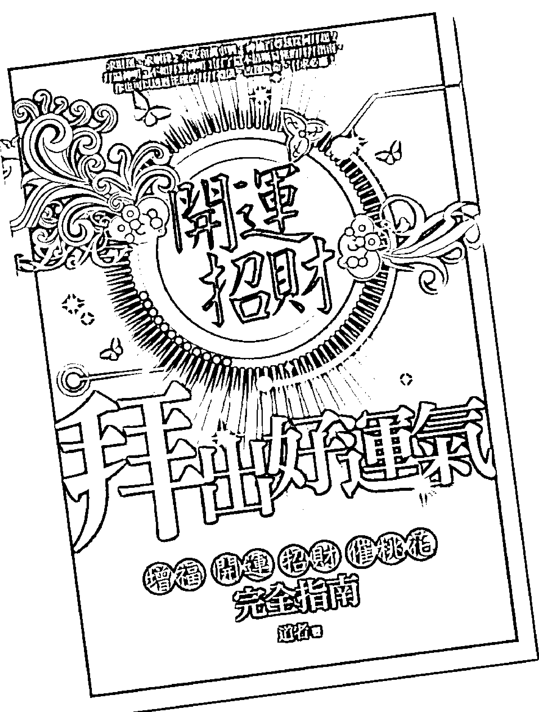

### 好書推薦

求財運、求姻緣、求家和萬事興，神仙百尊該從何拜起？拜遍神明，不如拜對神明！有了這本清晰易懂的拜拜指南，你也可以透過正確的拜拜禮儀，改運造命，有求必應！

好運價 250元

拜拜該擺什麼貢品？金紙、銀紙要怎麼用？怎樣拜才合禮、得體？懂方法、知禮數，人人都可拜出好運氣，福至心靈、好事連連！神氣去拜拜，拜出神氣來！

-   ☆ 心誠，求神有感應
    認識神明，才能與神更親近。

-   ☆ 拜廟! 拜出好運來
    了解持香參拜、求籤詩簽的禮儀，做一個有禮貌的香客。

-   ☆ 祈福，貢品加持更靈驗
    懂得貢品與器具的運用，牲禮、茶果、金紙和香備得齊全、正確，讓神明看見你的用心，也幫助你變開心！

-   ☆ 開運，敬天祭祖好福氣
    不論是一年重要節慶、家族祭祀，還是解祭、拜斗、祭元辰。清楚平日拜拜與節慶拜拜的規則，開運接福更容易！

-   ☆ 有求必應! 求財、求桃花都沒問題
    提供全省靈廟去處，不管是升官發財、祈求姻緣、考試順利。進對廟、拜對神，你也可以萬事如意！

靈界使者－沈嶸之通靈事件簿／沈嶸　口述；米蘭達　撰文．──

初版．──臺北市：采竹文化，2009.11

面；　　公分

ISBN 978-986-197-213-8 (平裝)

+   1. 通靈術
    2. 靈魂

296

98018033

## # 開運萬事通 02

## # 靈界使者－沈嶸之通靈事件簿

口 述：沈嶸
撰 文：米蘭達
發 行 人：周心慧
文字編輯：簡玉書
美術編輯：謝嬛瑩
出 版 者：采竹文化事業有限公司
地 址：台北市民權東路六段266號6樓
電 話：(02) 2630-5085
傳 真：(02) 2630-7442
E-mail : tsaichu.tw@yahoo.com.tw
劃撥帳號：19483681
戶 名：采竹文化事業有限公司
總 經 銷：朝日文化事業有限公司
電 話：(02)2249-7714
傳 真：(02)2249-8715
地 址：台北縣中和市橋安街15巷1號7樓
製 版：全印排版科技股份有限公司
印 刷：久裕印刷事業股份有限公司
初版一刷：2009年11月
定 價：220元
ISBN : 978-986-197-213-8

版權所有 翻印必究

本書如有破損缺頁、裝訂錯誤，請寄回本公司更換

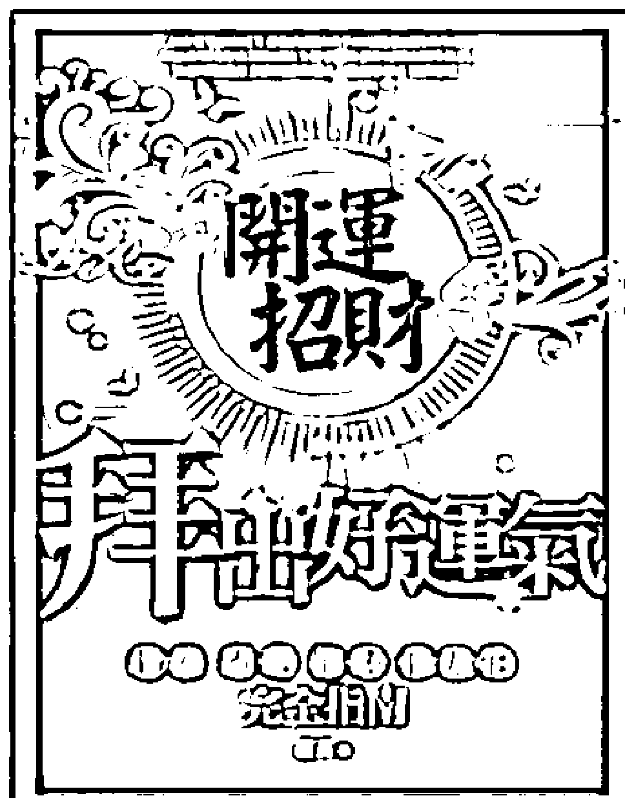

## # 拜出好運氣

## ## 一增福 開運 招財 催桃花 完全指南

開運妙招01

道者◎著　特價250元

拜拜該準備什麼貢品？

金紙、銀紙要怎麼用？

怎樣拜才合禮、得體？

懂方法、知禮數，

人人可以開運招財，

桃花朵朵開、好運跟著來！

神氣去拜拜，拜出神氣來！

-   ★心誠，求神有感應
    認識神明，才能與神更親近。

-   ★拜廟！拜出好運來
    了解持香參拜、求籤擲筊的禮儀，做一個有禮貌的香客。

-   ★祈福，貢品加持更靈驗
    懂得貢品與器具的運用，牲禮、水果、金紙和香備得齊全、正確，讓神明看見你的用心，也幫助你更用心！

-   ★開運，敬天祭祖好福氣
    不論是一年重要節慶、家族祭祀、還是解祭、拜斗、祭元辰，清楚平日拜拜與節慶拜拜的規則，開運接福更容易！

-   ★有求必應！求財、求桃花都沒問題
    提供全省廟宇去處，不論是升官發財、請求姻緣、考試順利、避對沖、拜對神，你也可以所求如意！