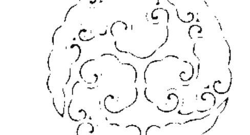
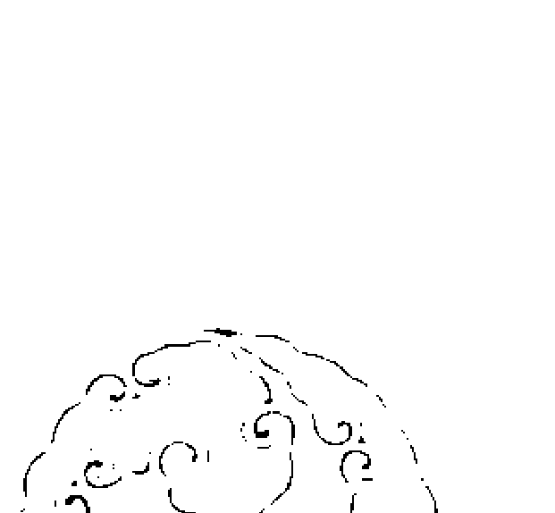
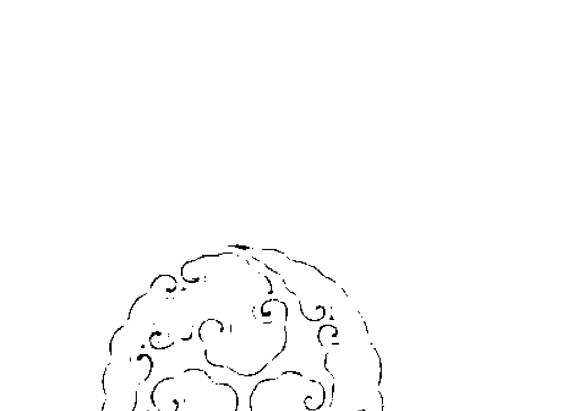
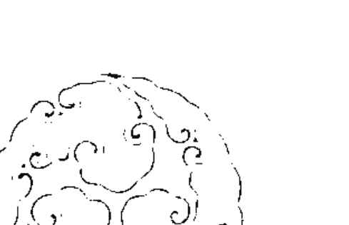
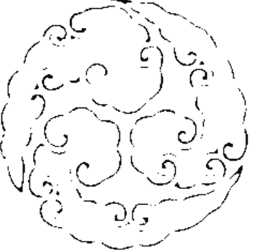
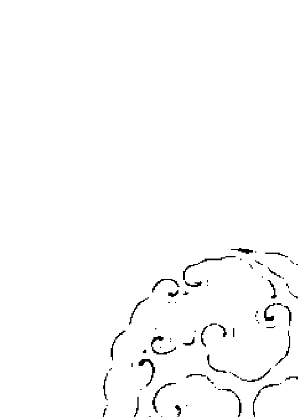
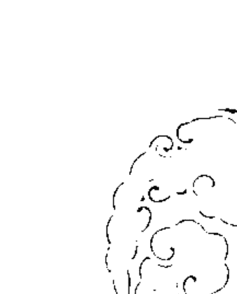
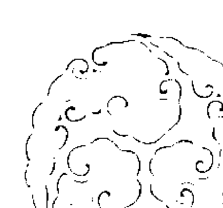

# 靈界導遊

林吉成 ◎著

## 帶你進入靈界

## 聽靈界說鬼話

**獨家披露**
驅鬼手指訣40招
不肖邪師詐術大公開

- 嬰靈真會與母體相纏嗎？
- 鬼魂會跟陽間的人相欲嗎？
- 陰鬼與陽間人能冥婚嗎？
- 鬼魂會揭穿陽人的姦情嗎？
- 陰鬼會脫陽人的衣服嗎？
- 孤魂野鬼會夜夜悲歌嗎？
- 鬼魂纏身的男女有感情嗎？

## 序言

自古至今鬼魂均会穿梭在阴阳两界，平时鬼魂在阴间鬼灵是渺渺茫茫，晃来晃去闲游自如，出灵在阳间时飘遥自在，阳人怕撞阴邪会心生畏惧，魂飞魄散，鬼魂形体如茫雾，阳人很难辨别男鬼或女鬼，更难区分是鬼魂或妖魔，无论鬼魂妖魔出灵在阳间时，均是千山萬水我独行，山顶平路同有鬼魂路。善鬼乞食，兇鬼要人命，鬼真会爱上人类吗？且会与阳人性欲吗？肯定会 的，阳人被阴鬼姦淫有如表演活春宫，阳男多犯女鬼，阴女多犯男鬼，人之精神空虚与耗弱时，三魂七魄失神时，鬼魂即会趁虚侵体欺魂，来与犯者同眠相淫。又阴天与黄昏是鬼魂出没最频繁的时间，陽人懼鬼如懼雷，民間習俗在農曆七月會辦流水席，邀請五方十路無主孤魂來享食，鬼魂與陽人相同，會有病痛不能飲食，太乙救苦天尊會聞聲救苦渡眾生。農曆七月是鬼魂放假回陽間度假，月底道家扮跳鍾馗驅趕鬼魂回陰府，通常神明與道家不追殺鬼魂，除非鬼魂頑抗耍賴，道家與神明才會違反戒律大開殺戒，否則鬼魂與陽人眾生平等。

## 目錄

- 序言
- 敬告讀者
- 閱讀鬼魂故事須先了解臟腑生理
- 認識沖犯陰邪孤魂野鬼
- 醫師道家法師診斷解讀各不同
- 枉死亡的鬼魂最會卡身
- 鬼魂比文明社會的人聰明
- 陽人三魂往生後演變成鬼魂
- 嬰靈的盛傳至今風氣未減
- 女鬼相纏四年苦苦相逼求冥婚
- 回憶人鬼格鬥三小時
- 筆者曾被女鬼魂姦淫惡整七個月
- 服毒自盡的鬼魂也會爭風吃醋
- 妻夫淫婦被鬼魂揭穿姦情
- 車禍撞死女學生報復在母與妻
- 女鬼披頭散髮深夜來訴冤情
- 女鬼魂違背雙方約束
- 工廠女工為情跳樓沒死吃飯反噎死
- 女鬼相陪青年男昏睡四年不醒
- 美少女脫光衣服說很清涼
- 年齡四十仍小姑獨處心嘆沒桃花
- 色鬼夜夜來姦淫小鬼來撫摸
- 女鬼發狂四人抓不住一個鬼
- 青春少女十六歲淫弄十個少年郎
- 鬼魂附耳講話導引去墓仔埔睡
- 建商風流二奶放火燒死妻子
- 暮晚要男伴深夜鬼魂來姦淫夜夜春宵
- 養小鬼賺取夜渡資害得慘度日
- 鬼魂纏身僵硬十三天全身如木乃伊
- 工廠佔墓地手被絞碎做貢丸
- 鬼佔床睡客廳沙發比房間安穩
- 每到黃昏鬼魂就來催命快跳樓
- 鬼魂相纏衝街頭蕩半年身瘦如殭屍
- 鬼魂吃名詐姓來附身舌吐三寸長
- 宮壇桌頭鬼魂也不放過天天騷擾
- 靈界扶乩牽亡魂乩童退四步撞壁返亂
- 鬼魂惡整十指不能伸也不能握
- 孝女送父下葬臉反黑變成植物人
- 宮壇主持劍指殺鬼被反噬命亡
- 墓仔埔研究風水被鬼反噬用扛的下山
- 美髮師被小鬼相纏整到團團轉
- 交通事故亡魂回到陽間找情人
- 工廠老闆娘鬼附身天天要與三人相歡
- 宮主女兒同鬼魂相眠兩年半
- 靈界拆散情侶男方痛哭鬼無情
- 鬼魂上身要訴苦說冤情
- 新婚一夜眠離妻八月郎

## 敬告讀者

本書之語句與內意，均是當事人與其家人反應的轉述紀錄，筆者並沒刻意編造或增加情節，以及文句修飾。依著作權法需保護當事人的名譽與隱私，所有姓名、住址、電話、均必須保留不公開。

鬼魂的動態非一般常人所能理解，陽人雖喜閱讀鬼故事，卻沒有膽識見真鬼魂，陰間的鬼魂常有無理的乞討索求，也常有無理取鬧與耍賴，兇猛的鬼魂實是傷人無數，讓陽人心生恐懼浮躁不安。其實鬼魂與陽人性向是相近的，因筆者經過長年的鑽研，也接觸過數百鬼魂案例，故編著本書，只要讀者有興趣加耐心鑽研深讀，即能洞悉陰間的鬼魂生態。兇鬼與善鬼各有一面，兇鬼會在陽間傷人匪淺，其實善鬼也有被陽人憐憫的一面，犯到鬼魂之當事人大多有精神意識模糊不清，在轉述時常有片段或接續不很順暢，研讀起來較費時吃力，若讀者對鬼魂存有疑問，抑或想深入知悉鬼魂之動態者，可電話諮詢，02-29849687林老師。

## 閱讀鬼魂故事須先了解臟腑生理

人體臟腑依序木火土金水，又依春夏秋冬一年四季在運轉。木主東又主肝，肝藏血開竅在眼，肝藏魂又主淚水，火主南又主心，心藏神開竅在舌，心藏火又出涎水，土主中央又主脾，脾貯血開竅在唇，脾藏形又出汗水，金主西又主肺，肺藏氣開竅在鼻，肺藏魄又出聲音，水主北又主腎，腎藏精開竅在耳，腎藏水又出力氣，人體五臟，肝主魂主肉體，心主火主精神，脾主形主動靜，肺主魄主膽量，腎主水主顏色。人體五臟六腑足能左右個人人生老病死苦，也能左右個人婚姻完美與破離，更能左右個人事業與官途，貧病交加家徒四壁，臟腑及生理健康與否，足以改變個人生性、精神、舉動、勤懶、貪偏、兇邪——善惡。人體臟腑生理主依成長生活環境隨時在變化，成者滿足眼前事物之現有，敗者貪又賤常嫌衣食惡。

### 肝臟

肝主藏血竅眼又藏魂出淚水，肝血喜條達流暢，血脈循行，肝藏血主宰於人體、乳頭、肚臍、生殖器官。乳頭主哺養子女工具，肚臍主智慧反應工具，生殖器主男女性慾工具，又主排泄工具。肝開竅於眼，眼主辨別事物工具，肝血受心火蒸發刺激即流淚，眼又主流淚排泄工具。肝主藏魂，人體暗藏三魂，幼孩魂魄未定前易受驚嚇而哭且犯病，成人若受驚嚇過度即失魂成病而恍惚。白天魂附體，晚間睡眠動態夜靜時，魂即離體遠遊，人在睡眠未醒前不可驚恐喊叫，若受驚恐而醒時，常有魂尚未附體即會失魂而精神恍惚。人在睡眠時常有夢遊之說，夢見某事、某人、某物，夢中驚恐而醒時則滿身大汗，且魂未附體前身不自在。

人往生後之三魂，一魂在地府受閻王監管，一魂在墳墓受土地公監管，一魂在祖先牌位上受後代子孫奉拜。

### 三陽三陰

人體臟腑，肝主藏血，肝又開竅於眼，肝健血量足血清眼亦明，肝虛血量不足眼視力亦模糊，眼為辨別萬物之監察官。男左眼為三陽，右眼為三陰，女右眼為三陽，左眼為三陰，日為陽，月為陰，日月相照辨萬物。端觀眼神流露論人心善惡，貴人眼秀神清，富人眼神藏光，賊人眼神流露斜視，貧人眼神昏沉無光，淫人眼神流視浮露，武將眼神藏威懼人，文官眼神清澈，毒人眼兇神浮露。臟腑肝健神清眼明天地之大，相理之秀男女均主氣度風範，學識章理深，一生胸懷大志，肝虛眼濁神昏天地昏暗，有志難展。日月分明，白睛如玉，睛瞳黑澈透清，兩眼光明人生好創展，婚姻配良緣。眼神清澈萬人歸隨身邊多心腹，一生不貪人財物。眼神流視周圍無庸無心腹，平生貪人財物無數。男女顯富顯貴需有眉清目秀，俗說發科一雙眼，及第兩道眉，眉順飛揚，學識章理智慧高，眼明神清能主位，商業、官職、勞職，眼方長睛大神清定知君多賢女敢言。

### 腹臍

肝臟主宰於腹臍人生財智，臍欲圓寬，欲深清，臍忌扁小，忌淺濁，臍壁周圍欲清潤，不欲灰濁似蒙塵。臍圓寬大深明能容李，主財富如山積，又平生智慧章理深，有事業，有婚姻。肝臟健壯主臍清人貴，肝臟虛弱主臍濁人貧，臍寬臍深臍清，平生好創展又容財富，智慧學識章理深。臍窄臍淺臍濁，平生難伸展財不聚，智慧淺章理亂。臍圓大又深者心胸寬大，生性善良有良知道德。臍扁小淺濁畸形者心胸狹窄，生性怪僻且無德。臍凸露者人生愚貧，婚姻庸俗創展難。臍圓大且深，子女才華成器，父母子女感情融洽。臍淺小又畸形，子女頑劣無才，父母子女感情淡薄，子女難管教。臍相朝上者智慧高，是非果斷謀事有衝勁，臍相下垂者生性愚蠢，謀事懶散。臍生位置過高，平生無識量遠計，臍生位置過低，平生無謀少良策。臍圓寬深明，平生多財智福祿，反則財薄智淺多災迍。貧苦之男女多為臍小灰黑如蒙塵，貧之人多為臍黑凸露。生性怪僻之人多為臍畸形，貴相之人多為臍深臍清，智慧財富之人多為臍寬臍圓臍深。

### 發色

木五行色／青氣色主是發於肝膽臟經。五行氣色屬木，主青色，木青方向主東方，季令在春天。青色有潤主來龍旺氣色，春季青濃淡薄災殃輕尚無妨。青色濃濁現出在春秋冬三季，主是憂驚與煩憂。青色現出初期必是隱隱然生似雲霧，再漸漸濃濁成瓜果未熟之濃色，色重主是憂事在眼前。人之一生憂事分有內憂與外憂，青色較淡主是憂外事，青色濃濁主是憂內事，憂事分輕重，色淡憂事輕，色濁憂事重，色淡災殃輕，色濁災殃重。青濃氣色分災殃與病症，小孩面宮部位，反青主是著驚過重而浮現，成人青色濃濁若未有憂事災殃，即是身體疾病而成濃色。

人之青紅黃白黑之枯黯惡色，惡氣惡色均是由體內五臟六腑骨髓生理變化，所反應於皮膚表面，惡色浮現速度兇猛即現於面宮，惡色要褪除須等憂事災殃過後，疾病康復過後，才足以慢慢褪去。但時間久長，惡色若是存留於皮內肉層當未浮現，表示憂事災殃未到，若是惡色浮現於皮膚表面，表示憂事災殃已近在眼前。惡氣惡色浮諸滿面，且內層浮出不潔淨之膩油質於面宮時，表示人之厄運難逃一劫厄。

氣分內氣與外氣，色分肉層與表面，有惡氣即有惡色，有旺氣即有光潤，惡色分有青紅黃白黑，表面灰枯如霧，旺氣色分有青紅黃白黑，表面榮光煥發鮮活光潤，且有彩朝存於面宮。氣色分有內氣色，晨早朝陳面宮，而暮晚收歸臟腑發運短。外氣色均主朝晚滿面鮮活光潤，且暮晚不收歸臟腑者氣旺，該相理主是行運當年發大運且時間長。另氣色有遠看似有，近看似無，近看似有，遠看似無，有該相理之氣主是尚未壯實而不穩。

人之有氣有色滿面瑩靜光潤發諸於面宮皮面，且肉層也壯實鮮潤，表層有光彩能耐久看者發運。人之有色無氣者，滿面青枯黯滯，且肉層浮出不潔淨之膩油於面宮者，主是憂事重重，有氣有色行諸於外者發運，無氣，無色，行諸於內者不發運。另有臨發之色主是五臟六腑受刺激而色變，例有爬高、跳遠、挑舉重物、路途遠涉、遇事驚慌、喝酒性慾，未能神安氣靜均能產生色變。

五行之色無論任何一色有光彩亮潤而顯發，均可在行運當年成婚，創辦新事業，擴大原有之營運。五行之惡色無論任何一色，灰黑枯黯浮現均主行運當年，萬事宜守不宜動，動則受災殃。青色枯灰黯淡無光，均有謀就不順，公職官程不順，商場營運不順之隱憂。若是憂事災殃將要過去解除時，色必如天空碧雲青藍之雲霧慢慢散開而去，雲散色開主是憂事災殃已過，雖青色現發但色淡且發於春季尚且過，即使有憂事災殃也輕微。青色濃濁發於春季、夏季、秋季、冬季，均是災禍憂事連連，若是青翠瑩潔亮潤發於春季，主是來龍旺氣色，若是發於夏季、秋季、冬季，主是逢凶化吉，但不發運。

### 心臟

心主藏神竅舌又藏火出涎水，心喜動脈心跳有驟規律。心藏神主宰於腦，腦主思想運轉工具、判斷是非工具、記憶工具。心開竅於舌，舌主飲食辨別酸甜苦澀工具、食物運輸工具、語音變調工具。心火主蒸發肺氣生涎工具，心藏火，火主保體溫作用，心火一時急驟上升則發狂，心火一時急驟下降則昏沉。人之口端是非禍害，則是心火急驟上升無能控制而惹禍殃，有心無火則病。心火能決定前進與後退，心火能推動人之思想動作，有心無力則火滅，心火一滅則萬事不通，火屬浮動，人之有貪心，有浮心，之得失，一旦心火下降不升即失去信心，則無能推動萬事之進行。

### 舌神

人之臟腑心能藏神。心神開竅於舌，舌為人體之丹元號令，也是人體心神之舍體。人之一生得失善惡，言語談笑說聲論斷，關鍵在舌端上下抖動，前後抽動而成音調之流暢。人之禍災多由口舌成事輕事重，心神疑惑人之口舌狂言多亂語，心神清血量足，人舒爽言語多流利善道，有心病之人口舌言語常惹禍，心神難鎮靜萬事多猜疑，故舌為心之丹田。舌小而長，言語犀利能言流暢善道，舌大而短，言語遲鈍而愚唱，舌質鮮紅心神清，舌質紫紅心神濁。舌厚長，舌頭前端橢圓者一生不貪人酒食。舌薄短，舌頭前端尖形者一生貪人酒食，且貪多不厭。舌質紅似硃砂，齒齦鮮紅，口內四周圍肉質也鮮紅者，男主富，女主貴。男女舌質及口內全鮮紅主富有，男女舌質常白或長期生白苔，口內全白者貧困。夫妻感情要恩愛，創業有成，謀職要坐高位，舌需有厚長，舌質需鮮紅如鮮血色，舌中間之紋理需紋直深明。若相理反逆，夫妻常有口舌之災，創業難成，謀事低層，人未語而舌先舔唇之男女，人生狂言多妄語心又藏暗毒，語言總是歪理難成真，若是歪理成真理也是巧辯而成。

### 心火

人生百態，男女心火情慾各有所屬，人身臟腑生理健康，即有七情六慾之求，世下萬事萬物人心情感，肉體慾火感受，各其所需。心火慾望所貪既能得到，相對也能溢出。生理健全偏慾心態減輕，感傷不重。生理偏斜私心重，人心各有其屬，羞恥、感傷、貪慾、私心、善心、歡心、惡心、浮心、愧心、怯心、凝心、悲心、邪心、煩心、疑心、嫉妒心，人一生之喜怒哀樂均全照映在面宮。世事愈難取得愈是寶，隨心所欲得到價值觀不高，愈難得之事與物，愈是珍惜。人之溺膽怯心皆是萬物一空，人之心有貪圖酒食與財物，圖淫他人私體與侵犯他人言語，心火上升易有意圖，終是遭人非議。心火平靜世事世物不貪求，心平者抱著能得即得，未能得既不強求貪得，才足稱心平。人心慾望過於奢求，心路必走偏斜極端，公職官高位重心貪者下場是牢獄，商人商賈心貪者下場是背負債務，江湖道上心貪者魚肉鄉民，圖謀違法侵犯傷人，下場是結仇牢災，庶民心貪者下場豈有成功之人。

- 一、男女貪心一動／則生涎，涎由肺生。人之一生注重道德與貪心妄想，貪心之人必心動更嫉妒心，人因心想、心動、心貪而生涎，人之貪心，心火即上升蒸發肺氣，心為火，肺為金，火蒸金化水而成涎。
- 二、男女浮心一動／則生精，精由腎生，男生精髓，女生精液。人因浮心而成男女之七情六慾，淫心一動心火上升，心為火，腎為水，水火不相融，心火蒸燥腎水，故腎水溢出為精。
- 三、男女愧心一動／則生汗，汗由心生，心火蒸發脾血，脾血受刺激蒸發為汗，汗出於皮膚表層，由皮下內層血液刺激冒出為汗。
- 四、男女悲心一動／則生淚，淚由肝生，肝竅於眼，肝主藏血，心火上升蒸發肝血受刺激化為淚水，激則由眼出，人之悲慟則淚水及鼻涕同出。
- 五、男女怯心一動／則溺膽，人之心驚膽跳，則是脾血與腎水不能相攝，而產生膽量不足驚恐心慌，心亂心理不穩而抖，故奔出而為溺膽。

### 發色

火五行色／紅氣色主是發於心經藏火。五行氣色屬火，主紅色，火紅方向主南方，季節在夏天，月令在四月、五月、六月。紅色有潤主行旺運之氣，色夏季赤淡薄災殃輕尚且過，赤紅焰氣現出主是災殃禍難官訟事，赤紅氣色現出主是心經藏火匯集賢經黑水不融所引發，腎水與心火不融而產生水剋火，又主心經藏火過於旺盛，腎水不足過弱，心火入侵腎水，癸水敵不過丙火而引發赤紅氣色顯現在面宮。赤紅氣色以焰火主是災殃禍難在眼前也是最速，赤氣色現出最忌之災殃，火災之難、血光之難、口端爭非之殃、官司訟累之殃。赤紅氣色無論顯發在任何宮位，任何季節，均主災殃禍難，無災無難主是疾病所發。若是滿面火殃氣色，主是災劫最烈也最速，雖然赤氣顯發，但外皮表層有瑩潔又現黃氣有光潤，主是災劫已過由凶轉吉，黃氣顯現主是火來生土，土能生萬物，該色主是旺氣有財喜，又是官業旺。

面宮任何部位現出赤氣色又混雜灰黑氣色，主是水剋火必逢大凶臨頭，若是凶災凶色已過災厄將要解除時，赤色必然如雲散開，漸漸褪氣轉淡輕飄而去。溫紅氣色現出又瑩潔亮潤似鮮花活潤之色，主是當令行運氣勢非常順暢，時運公職官陞，商賈旺業，工職升級。潤紅色現出均主神足氣爽運勢如虹，溫紅潤色無論顯發於何宮位，任何季節，均主運程已啟動，又主生理健壯血清肉鮮，該相理之色為紅之正色。若是紅氣過盛而成赤點狀、赤紅成片、赤紅散亂似浮雲、赤紅成斑點，均主不吉反凶災殃禍難之徵兆。

### 脾臟

脾主貯血竅唇又藏形出汗水，脾血喜運輸流暢，人體血庫為全身動脈之源，脾貯血又主宰於四肢肌肉，且是全身血源運輸工具。脾胃主飲食運輸消化分清化濁工具，脾血主分清真體表面鮮潤與枯澀工具。脾開竅於唇，唇主港口進出工具，唇主含意指揮工具。脾藏形，脾血受心火蒸發刺激即冒汗，汗主人體四肢舉動過於激烈，人體過度冒汗即會虛脫而縮緊皮肉，重則四肢肌肉萎縮動作不能自如。人體靠脾血運輸而舉動，汗又排泄於毛細孔，若毛細孔緊縮不能排汗時則病。脾血主宰人體存活與病死，脾血受阻時即行動停止。又血汗分香臭，汗香者謀事高，舉動輕，汗臭者謀事低，舉動重，人體之動搖於形，且形諸於表面，口唇人體之唇為口之城門，人體臟腑之脾通應在唇，脾臟幼孩在造血，成人在貯血。脾臟若病唇黃，唇欲方厚，色欲鮮活紅潤，唇色鮮紅主是人體血清量足。病人病重血脈不通暢，唇色亦反枯白而病苦。唇長期灰黑者，男女均主謀事低層，創業難，婚姻難得完美，家庭經濟貧乏。唇方厚鮮活紅潤，男主配賢淑之女為妻，女主配氣度風範之良人為婿，男女又主一生少病。上唇覆下唇又薄者，男女均主多虛偽巧詐奸險之人，下唇戴上唇晚景有榮光尚且過，上下均掀唇齒見人，笑時齒全露者男女均主終生不發運，該相理相配成夫妻終生難創大業。唇掀者男女均主語言遲鈍，男人口唇白，下體陰囊皮也白者迍。女人口唇白，下體陰唇也白者迍。唇厚鮮紅者，男富女貴。唇薄黑者，男貧女賤。唇厚有稜者，男賢女良。唇型薄尖無稜者，男詐女娼，該相理為人最不堪，人生言語巧詐又無信。唇厚紫氣鮮活豐衣足食，唇薄紫黑者人貪。

### 雙手

人體臟腑，脾主人體之四肢肌肉，脾臟虛弱四肢無力，雙手舉動力輕，雙腳行走遲慢軟弱，男女均靠四肢行動操作，路走得遠，事做得多，需有脾臟功能健壯。脾能貯血，血清神清舉動伸縮自如敏捷，四肢乃一身之舉動，貴人辦事雙手伸縮舉動，舉物做事敏捷，舉動有序有節不急不緩，雙腿行走伸直腳根著地平穩，步伐均勻而緩急。身穩不搖，貧賤之男女，屁部無肉且扁平行走必輕浮，行走頭低者貧又狡猾，行走頭搖手擺者貧賤，行走腰彎者貧，行路胸挺身直者性剛。病人行走四肢軟弱，行走急步者性急躁，行走不停者辛勞，行走身偏斜者懶散，行走常回頭觀顧者淫賤。男人行走回轉時左腳先轉的貴，右腳先轉的貧。女人行走回轉時左腳先轉的貴，右腳先轉的貧。人行走左肩頂高的貴，右肩頂高的貧。女人行走右肩頂高的貴，左肩頂高的貧。男女行走雙手姿勢晃搖動作小的貧，行走雙手姿勢晃搖動作大的貧。男女雙手舉動敏捷者貴，雙手舉動遲慢者貴，行走雙手姿勢晃搖動作大的貧。男女生性剛者易傷人，夫妻最忌舉動偏差，言語不和而動肝火，以手腳傷配偶而演變成怨偶，俗話說君子動口## 閱讀鬼魂故事須先了解臟腑生理

不動手，夫妻離異主因之一。手腳是罪魁禍首，創業不成之惡在於手腳懶動，人因體弱而難能創業，也因體弱而家運不昌榮，人之體弱主因於脾虛血貧氣不旺。

### 雙腿

人體臟腑脾主貯血，脾臟又主四肢肌肉。脾臟健壯者，肢體肌肉豐飽堅實，表層皮軟亮潤，脾臟虛者則會出現四肢肌肉軟弱無力，表層皮肉乾澀枯寒，重則能導致肌肉萎縮，肢體腿健能支撐人體四方八穩，人之穩健肢體能行萬里路而不疲憊，人生謀就好創展。肢體腿虛弱者人身不穩，難舉挑重物，路途短涉，人生不發運，縱有創展也難成。

不分男女肢體腿需肌肉飽又軟潤，有該相理者男主富，女主貴，婚姻又美滿，平生謀就不難。腿肌肉粗澀，青筋浮露，人生粗俗勞碌奔波不停，謀就必幹粗活維持生計。腿肌肉寒瘦如竹者，人生謀事辦事無能，創展遊走低層，婚姻庸俗。雙腿站立欲直不欲彎，腿如樹木幹莖欲直能取材，樹木幹莖直壯樹葉茂盛，肢體腿直身壯人能行萬里又行旺運。樹木幹莖彎曲樹必枯，腿曲身彎一生受人支配謀雜事維生計。

### 發色

黃五行色／黃氣色主是發於脾胃臟經。五行氣色屬土，主黃氣色，土黃方向在中央，季令在四季，黃氣色有潤主運程最旺，枯黃顯出主是疾病之憂，若是五臟六腑無病但色顯現枯黃氣色，必是運程阻滯，枯黃氣色主是黃氣隱藏在皮下內層，表面枯黃如雲霧，主運程尚未啟動萬事不展，須等一年半載色開有潤才足稱黃氣色，黃潤氣色顯發初期有如蠶吐絲，再漸漸擴廣且色黃潤鮮活亮麗，黃潤無論發在任何宮位均主行旺運，若黃潤發在財帛宮，謂稱鼻頭鼻翼均主最有利財氣，財帛宮五行屬土，黃氣土裡藏真金，黃潤黃氣主土肥能生萬物，黃潤無論發於任何宮位，任何季節，均主旺人丁財喜連連，遷新居、擴商業產業、進田產、旺財帛，黃潤均主一年四季旺。黃色忌發於金木雙耳，更忌顯發於口唇，上二項均主疾病所發，若黃色混雜灰黑如垢，均主疾病若無疾病，必主敗官程敗事業所發。黃色有氣且在自然光線下、照燈光、照太陽，有似黃金反光亮潤者大吉大旺，該相理主是黃之正色，人之精氣神有貫通又神足氣爽，才會發出鮮活黃潤之色，黃潤有氣又亮潤，必是運勢如虹萬事順暢。

### 肺臟

肺主藏氣竅鼻又藏魄出聲音。肺氣喜寬暢活絡，肺藏氣主宰於體力行動久長與短暫工具、喉嚨發音工具、呼吸換氣工具。肺開竅於鼻，鼻主辨別五香雜味工具，肺氣受心火蒸發刺激即生涎，涎主潤喉作用。肺藏魄，人體頭面有七魄，耳、眼、鼻、口，耳主聽覺若受巨音惶恐過度即失魄，眼主視覺若受形影惶恐過度即失視覺，鼻主嗅覺若屍味重惶恐即失魄，口主感覺若受食物異味惶恐即失魄。人因氣長而舉動能向前，也因氣短促而舉動停止，人體之氣魄能影響喉嚨發音之表示，也能影響力氣之大小，人體氣短魄自然輕浮，魄在穩定人心，魄一旦輕浮人即神昏聲沉，人最忌驚恐過度魄失，引起體弱成病精神恍惚。

### 鼻

人體臟腑，肺主氣司呼吸，鼻為中土財星。人之氣旺弱在於肺氣健壯與否，肺壯呼吸長氣，肺虛呼吸氣短，氣靜氣長人行運即旺，氣虛氣短人行運即敗。男女氣靜氣長者體健，也旺官途、旺事業、旺工職。鼻為人體之審辨官，辨別萬物

### 發音

五行人發聲，音韻嘹亮長如遠鐘，似鑼鼓宣天傳遠，聲韻清飄迴響有餘音。五行人五音五不全，木形人張口發話主聲直，音清潤長；火形人張口發話主聲急，音清潤短；土形人張口發話主聲響，音清重；金形人張口發話主聲利，音清潤響；水形人張口發話主聲靜，急音潤飄。

貴者氣大聲音宏亮，則生理健壯，肺腑氣足丹田力飽；貧者氣小聲音短濁，則生理欠健全，肺腑氣弱丹田力弱。貴者神清氣和，則聲之音韻潤深，舒暢而圓實遠飄，堅又集音且響亮；貧者神濁氣短，則聲之音韻沉短焦烈，輕言重語，嘶啞短音而急散。貴者聲大嘹亮無形托氣而發，賤者聲小氣促，浮濁沉音而貧，故

貴人之聲均發自肺腑健壯，經由丹田與肺腑相應，輸送喉嚨寬潤而外達。貧者之聲均發自肺腑，氣促丹田力薄，丹田與肺腑未能相應，喉嚨焦燥不潤，難言於表而不暢。

貴者主由丹田發音，且根深表重於外；貧者主由喉嚨發自舌端，而根淺且表輕於內。貴者形之於外，貧者形之於內。貴者聲清音潤且韻圓響，堅而亮，緩而

### 腎臟

腎主精竅耳又藏水出力氣。腎水喜旺盛流暢，腎藏精主宰。腰、骨、齒。腰主曲直左右搖動工具，骨主支撐人體架構工具，齒主食物化碎工具。腎開竅於耳，耳主語音辨別工具。腎水受心火蒸發刺激即洩泄，腎藏精，精主傳承後代又

### 耳

主紓解生理障礙。腎藏水人體需有水分才足能滋潤膚體，若腎水稀薄人體即燥澀。腎精主養骨，骨主架構在人體四肢為主力，又架構全身，四肢在操縱一切舉動，人體支架靠骨髓養大而骨硬，骨架構完整堅硬能撐重壓。

人體臟腑，腎開竅於耳。腎主髓通腦，腎虛者常有失眠、健忘、記憶減退、耳鳴，重則耳聾。腎氣健者耳聰，聽覺敏感無礙，言語分辨清楚。耳為人之一生的監聽官，耳通隨於腦。腎氣旺則聽覺清澈，腦力反應犀利。腎氣虛弱聽覺障礙，腦力反應遲鈍。腎臟關係到夫妻行房幸福與否，腎主藏精，男主精髓，女主精液，而夫妻感情美好與言語耳聽有息息相關。耳厚堅潤，聳而長且大者主腎氣旺，語出言語健康聽其舒暢，自然形成夫妻之間的好感。耳薄、耳黑、耳尖、耳廓輪骨怪樣，主腎氣虛弱，自然形成生性孤僻，言語低俗，穢言穢語，造成夫妻間的耳語觸礁，影響到夫妻感情生活。

耳是人與人對談的溝通管道，耳堅氣壯言語清，人生壽命又長；耳弱氣虛言

### 陰陽寶

人體臟腑，腎臟主藏精又主男女性慾之功能。腎健精旺四肢骨健，女陰男陽兩寶性感度高，腎健男女房事均能滿足對方。腎虛則有遺精、陽痿、性冷感、便尿點滴白濁、不能生育，男雖能勃起但不能持久，女雖有生理需要但過久會有厭惡感。腎健男女浮心一動，有如乾柴烈火，則心火上升，男女心火與舉動受刺激而成性慾快感，產生人體心火蒸燥於腎水，故男溢出為精髓，女溢出為精液。男性慾為人之天生，男女腎虛精液短缺稀薄，人體軟弱，精神不振。腎主人體四肢之骨，腎虛者能造成夫妻感情缺憾，男性慾無能而未能滿足女方，女性慾冷感而未能滿足男方，久之造成乙方有藉口，另在外尋花問柳，找異性同居相眠，女在外與異性相淫，造成婚姻破裂而離異，男重娶女再嫁，由生理不足造成人間悲劇不在少數。腎虛四肢軟弱心有餘力不足，造成衝勁無力感，謀事差人遠，創展事業精疲力倦，雄心大志消失而失去方向。

### 精髓

腎臟為男人先天之本，少男自腎毛長出，即是腎之精髓相潮。腎開竅於耳，男性耳色鮮活白潤，即是腎氣足，精髓旺盛，人生房事無礙。腎虛者能導至耳鳴，身心悶躁，耳若萎縮又枯黯，則是男人陽莖軟弱無能，精髓稀薄，雖能勃起但不能持久，重則陽痿不能生育。腎虛四肢骨頭鬆懈乏力，精疲力倦，身心障礙未老先衰，耳色枯白又淚堂浮腫，則是腰之兩側痠痛無力感。男女性慾力氣雖已耗盡，但仍未能滿足女方。腎主髓通腦，心主宰於腦，腎能藏精，五行屬水，心能藏神，五行屬火，腎臟及心臟健壯者，人遇刺激心火攻心，即心火上升而蒸發於腎水，水火交鋒成熟故溢出為精髓。水與火本是相剋，在水敵不過火時即能溢出，水溢出於能火滅，謂稱精空火消，心火即下降，面前縱有西施美人也隨心而滅。人之整個面宮分為，上停為火，中停為土，下停為水，在下停奴僕宮之，口唇，承漿，地閣，範圍內，口唇左右稜角下垂呈下八字型，且色灰黑枯黯，謂稱敗腎。承漿與地閣長出似痘非痘又紅腫，另是灰黑枯黯，即是腎衰弱，似痘紅腫

### 嫐嫐

男女性慾為成年人之先天自然本性，代代相傳之需要，男女有婚姻結構體，由人體臟腑生理健全與否說起。青男少女自淫毛長出初期，男即有腎水來潮，謂稱精髓，女即有腎水來潮，謂稱精液，自男寶有精潮，女寶有癸水來洗，生理慾火即自然形成。男女有性慾之慾念關鍵在臟腑之腎，腎健全者性慾自然形成，腎有病者，其他臟腑有障礙者均能影響性慾功能，腎病者當屬性無能且冷感。人在自然生活中，慾火有天生自然需求，有一時需求，性慾之心火各有所屬，貪心、浮心、愧心、悲心、怯心、男女之強求性慾，自然兩廂情願性慾，均以當時情景及生理一時變化各有所屬。性慾習慣性貪心之男女，即是侵犯他人肉體，無論未婚或已婚身邊有相對之異性，又逞個人生理之慾火，仍主貪心邪念佔有第三者之慾念，謂稱嫐嫐。浮心性慾之男女，則是一時之慾火，男女相識相見即有生理反應，遇男女碰觸到異性肉體時，即有浮心慾火生理反應，謂稱淫亂。男女在愧心、悲心、怯心之時，則是心火下降，而此時毫無性慾衝動之慾火邪念。

### 發色

水五行色／黑氣色主是發於腎經臟腑。五行氣色屬水，主黑氣色，水黑方向主北方，季令在冬天。灰黑顯現主是疾病、劫奪、災殃、禍害，黑色主是腎水薄

## 認識沖犯陰邪孤魂野鬼

鬼魂眾生，非專業人士是很難辨別的，靈界有陰、邪、鬼、怪、妖、魔、精、魅、陰兵、陰將、邪兵、邪將，陽間凡人一聽到鬼魂，都會風雲變色、心驚膽跳。人怕鬼，鬼怕人，鬼魂分有惡鬼與善鬼，惡鬼索人命，善鬼纏身精神異常，陽人若被鬼魂纏身，精神狀況各有不盡相同。

兇鬼上身，例：會導引跳樓，雙眼帶兇目不轉睛，動肝火傷人，六親不認，毀損家財器具，街頭巷尾闖撞，發狂力大無比，言語偏激，口唸唸不停，災凶厄難亡，精神異常舉動粗魯，情緒時好時壞，諸事舉動千奇百怪。

陽人遇上善鬼，例：眼神昏沉呆滯，心頭悶悶人痴呆，全身疲憊四肢癱軟，精神虛弱眼神泛散，不思茶飯湯，痴坐不動不與人交談，睡眠不定時，非短睡即長眠，整個人孤言寡語，舉動異於常人，生活起居日夜顛倒，嘔吐神昏，不思三餐，菜飯乏味。

陽人遇上色鬼，例，大鬼帶小鬼撫摸身體，撫弄男女生殖器官。昏睡鬼強行

## 醫師道家法師診斷解讀各不同

有前面狀況之病症，在醫學的進步發達，醫界的認定，精神異狀。病患到精神科求治，醫師即分類說病情，通常給患者家屬的答案約是，精神憂鬱症、躁鬱症、人格分裂症，例舉，眼神呆滯，精神恍惚，孤言寡語，不思茶飯，醫師都定為「精神憂鬱症」。例舉，舉動粗魯傷人，心情急躁，暴躁，言語罵人，醫師都定為「精神躁鬱症」。例舉，精神狀況時好時壞，悶悶不語，時有嘴巴唸個不停，時安靜，時暴躁，醫師都定為「人格分裂症」。

在醫學理論上，醫師常是能診斷病情，卻是醫治不癒，是醫師醫術不高明嗎？當然不是，醫學與鬼魂有相抵觸，理論有不同的解讀。人之身體有病應就醫，若是沖犯到孤魂野鬼，引起精神異狀，應藉助宗教神明的靈力。症狀嚴重者，應求民間的道家法師，山、醫、命、卜、相，醫師與道家法師的辨識方法各有不同解讀。根據了解，鬼魂纏身最有威力效果，應是道家法師最能根除鬼魂妖邪。

### 枉死亡的鬼魂最會卡身

陰間的鬼魂不佔陽人生存空間，但會找陽間不特定人的肉體卡身，案例最多的是都為年輕人、中年人。因年輕人較不忌風俗情理，亂講話得罪鬼魂。兩種人較少卡陰，一是年長者較近情理習俗，二是幼孩尚不懂事。鬼魂與人類的習性很接近，需要人的尊敬與奉拜，人可不畏懼敬鬼神，但不可冒犯鬼神。陽人一旦冒犯到鬼神，它可會採取報復，讓冒犯者災殃厄難，最多案例是精神失常，陽人最忌精、氣、神耗弱時，遇到鬼魂，鬼魂最容易趁機侵犯陽人的肉體。被卡到的人渾身不舒服，精神異常體溫會降低，就醫檢查無病診治難癒，問神輕者可解，重者不靈。

什麼樣的鬼魂最會纏人卡身，魂飛魄散的亡魂、被人暗害冤枉死亡、意外災殃禍難冤枉死亡、難題未解自殺死亡、感情被拋棄自殺死亡、交通事故冤枉死亡、住居遭火災冤枉死亡，種種原因冤枉死亡，冤枉的亡魂都會留在當地，流連忘返。死者若是無家屬招魂，收屍安葬，無人安置奉拜，亡魂無家可歸，無處可避風躲雨，鬼魂自會在外飄流，成為孤魂野鬼、遊路亡魂。

凡間一般常人，不信陰間有鬼魂，人有時不得不信，其實鬼魂傳說，各國均有案例，傳說中，怕鬼魂信奉不拿香的宗教，天主教、基督教，鬼魂就不敢相侵，其實不然。不管信奉任何宗教，## 筆者曾被女鬼魂姦淫惡整七個月

筆者本人曾在二十八歲那一年，去北海岸福隆海邊戲水，回來第四天覺得精神渙散，全身無力，起先以為戲水受風寒而感冒。事出兩天的晚上要上床睡覺時，嚇見面前有一形影站立在我面前微笑，我問妳是誰，沒有回應，連續問了三次，只見那女鬼微笑不語，嚇到當晚不敢睡覺。

在客廳看電視又發現好像有人在背後拉我的頭髮，又嚇到不敢看電視，就把燈關掉準備要就寢睡覺，人一進到房間那女鬼又站在床邊微笑。那女鬼的臉形無法很清晰的看清楚，臉形及身軀如一層白霧罩住，只能看到身軀微胖，年齡用猜的約三十歲左右。在這個時候我火大了，就去拿一支掃把來亂揮亂打，可是鬼魂是打到的，那鬼魂也翻臉了，在我躺下床還沒入睡，那鬼魂又來拉我的腳，我右腳想要踢出去，就是兩腳動彈不得，乾脆不睡了，把屋內所有燈光打亮已近凌晨五點了。

隔天整個人精神很疲憊，到晚上九點已累到很想睡了，關上大燈只剩小燈一點點光線，一躺上床半睡半眠中，那女鬼又來了，就隨即撲在我身上，致我要開口罵她喉嚨如斷氣喊不出來，想要揮手打她雙手不能動，此時整個人就昏昏迷迷，任由女鬼姦淫擺佈，不一會兒，就發現了內褲沾了很多的精髓穢物。平心而論，與女鬼相慾比一般男女實體的快感還要好，當時二十八歲年輕氣盛，心裡雖怕但還是想再試試看，會不會每次都有相同的快感舒爽。結果一星期來了四次，每次女鬼撲上身體，我就全身僵硬，整個人均進入昏迷狀態任其女鬼姦淫，沒有

一點點力氣可反抗，事經過十多天後，每到夜晚都嚇到拿舊衣服或報紙，塞門縫且關上所有的鋁門窗，女鬼照樣無孔不入。連續九天來五次，續後改用火把沾汽油點燃，要睡覺前將屋內，用火把將屋內客廳各個角落，清淨一遍也嚇不走那

女鬼。照樣的三~五天來一次，我自己在想剛開始因無知，想試試與鬼相慾的滋味，確實與活人實體更有快感，差不多將近兩個月後，自己在想總有一天我會死在那女鬼的手上，就找了一位道家法師幫我處理。

驅除鬼魂結果是有停沒有除，二十多天後又來了，可能是有報復的心態，一個晚上來兩次，整個人已開始面黃肌瘦，精神與精力可說是被那女鬼吸盡，只差

迷，任由女鬼姦淫擺佈，不一會兒，就發現了內褲沾了很多的精髓穢物。平心而論，與女鬼相慾比一般男女實體的快感還要好，當時二十八歲年輕氣盛，心裡雖怕但還是想再試試看，會不會每次都有相同的快感舒爽。結果一星期來了四次，每次女鬼撲上身體，我就全身僵硬，整個人均進入昏迷狀態任其女鬼姦淫，沒有

論，與女鬼相慾比一般男女實體的快感還要好，當時二十八歲年輕氣盛，心裡雖怕但還是想再試試看，會不會每次都有相同的快感舒爽。結果一星期來了四次，每次女鬼撲上身體，我就全身僵硬，整個人均進入昏迷狀態任其女鬼姦淫，沒有

每次女鬼撲上身體，我就全身僵硬，整個人均進入昏迷狀態任其女鬼姦淫，沒有

且關上所有的鋁門窗，女鬼照樣無孔不入。連續九天來五次，續後改用火把沾汽油點燃，要睡覺前將屋內，用火把將屋內客廳各個角落，清淨一遍也嚇不走那

油點燃，要睡覺前將屋內，用火把將屋內客廳各個角落，清淨一遍也嚇不走那

味，確實與活人實體更有快感，差不多將近兩個月後，自己在想總有一天我會死在那女鬼的手上，就找了一位道家法師幫我處理。

在那女鬼的手上，就找了一位道家法師幫我處理。

沒有精神失常而已。事拖延第七個月，經人介紹前去基隆的一個山上，有一家三太子宮壇，到宮壇前有一位女乩童跳出來，向我說後面有跟隨一個女水鬼，全身衣服是濕答答的跟在後面，我聽完心裡毛的，更是有一點怕。此時宮壇主持也出來，我就問幫我驅趕鬼魂要多少酬金，回說要七千元，若換算到現在應超過十萬元了，三太子起駕說我從海邊帶了一位女水鬼回來，聽起來也有一點吻合，即請三太子幫我處理後，女鬼再也沒有找過我，一切恢復平靜。自此至今整整超過三十四年，再也不敢去海邊戲水，也自此立誓妳鬼魂敢欺負我七個月，我立定決心要來研究陰間的鬼魂，在有一天我學會了，看我怎麼修理這些鬼魂。但又回憶起來被惡整了七個月，沒有精神失常，沒有生怪病，只是發洩過多身體些微虛弱而已，也是不幸中的大幸。原筆者所居住的房子是租的，被鬼嚇到就急遷離該屋，續後由二樓一位經營美術燈飾的老闆，將三樓承租下來當倉庫放燈飾，原本留下一張彈簧床尚有七分新，這張床被鬼魂使用過七個月我不敢要，就留在三樓。新承租老闆的爸爸認為要丟掉可惜，將那張彈簧床搬到二樓來，換掉他原睡的舊床，睡不到兩天那鬼魂就找上門來，站在床邊向那位老人家說，床是我的把床還給我，嚇到那老人家天一亮，即將床搬回三樓還給鬼魂。

本以為床還給鬼魂就沒事了，未料鬼魂變本加厲，天天晚上在老人家入眠時，都來向他托夢表示，整個屋內的空間全被佔滿了，要老闆將一箱一箱的燈飾搬走，燈飾公司老闆不信天下有鬼魂會佔屋，不理睬父親的反應，請父親不要迷信鬼魂，「房子是我承租的，真的有鬼叫它來找我啊！」老闆大話講了不到十天，鬼魂真來找老闆，讓他忽然暈倒在地口吐白沫，自此父子過著不平靜的日子。

有人勸老闆人不與鬼鬥，陰陽不兩立，人鬼殊途鬥輸會敗，老闆不信不到十個月，生意減半整個人也慢慢虛弱，精神方面也有力無氣，陰間的鬼魂實讓人氣到牙癢癢的。

事隔兩年報復的機會來了，當年我是三十歲那年，忽然發現筆者的右手，中指與大拇趾相互接觸，似如有電流相觸中指會震動，且會發熱整根手指麻麻的，在有一次三位好友一起泡茶聊天時，我提起中指會震動且發熱之事，猜想以後可能會用中指行醫，其中一位好友聽到這句話，笑了出來且喝在口內的茶水也噴出。

來，更有人說你在講天方夜譚。

結果事不出三年，道家法術這一行也學到相當一個階段，開始替人服務辦事，只要有人被卡陰邪，醫師無能醫治的案例，有機會接手過來的案子在辦法事時，無論右手持劍指，右手掌穿心指，兩者均使用到中指，只要犯者卡到陰邪，孤魂野鬼，遊路亡魂，伸出手指訣一剌，鬼魂就被驅離犯者的軀體，精神很快就恢復正常，在這三十年當中，不分國內外已有好幾百人受益，中指神功三十年以來不知嚇走多少鬼魂、妖邪魔，這些陰間鬼魂被劍指或穿心指剌到，即魂飛魄散，有如被刀槍殺到的威力。

### 服毒自盡的鬼魂也會爭風吃醋

新北市蘆洲市有位二十八歲的失婚婦人，離異後為生活而進到一家茶藝館上班，賺取生活費養育子女，上班九個月後即認識一位恩客，進而兩人相互往來，該位恩客三天兩頭就去店裡捧場，而且給的坐檯小費都很高，雙方日久生情成為知己。

林女身材姣好，臉蛋頗有姿色，在茶藝館很有客面，有很多常客在追求，林女趁時機常在下班後應客人的要求，被召去賺取夜渡費，兩年下來累積了一點財富，即向男友表示，不想再在這種風塵鬼混，想要結婚享受第二次的婚姻幸福。

被其他常客知道後，即以高價向林女包場，花了七萬元包了一星期出去旅遊，那位包客向林女表示，為了刺激每到夜晚時，兩人都到荒郊野外去打野戰，到第六天即發現全身都有青一塊黑一塊，且鬼魂附在耳朵跟林女講話講個不停。回來半個月後，男友無法接受這個事實，恨而離開林女，自此林女也開始精神有點恍惚，耳朵又有鬼魂鬧個不停，發現情況不對，就前去看診精神科醫師，醫師說是

人格分裂症，吃了一個月藥仍難治癒，改前去求教宮壇神明，神明指示撞邪卡陰，經過宮壇祭解驅邪也沒得到改善。

林女在茶藝館上班必會與客人摟摟抱抱，每在與客人舉動親密或摟抱時，鬼魂即會在林女耳朵罵粗話。回到家裡睡覺到天亮，手腳就會青一塊黑一塊，連續三個月後全身青黑已達很嚴重，客人見狀也慢慢疏遠不點林女的檯，林女只好休息在家無能繼續上班。

在家休息期間鬼魂仍不放過她，常在耳裡催促林女趕快去上班抱男人，不上班抱男人就去跳樓，林女被整到無法忍受，有好幾次想要一死百了，每次都被同事好姐妹勸解，有孩子要養要有耐心鼓起勇氣，要度過這個難關。事後經人介紹前來找筆者商談，在我聽完林女的傾訴後，即回林女必須要與鬼魂妥協，若不妥協到最後會變成精神病。

林女聽完即說，請問老師要怎麼妥協鬼魂才會放過我，老師即向林女表示，這要吊鬼魂出來問話，看鬼魂怎麼說才知道，林女答應了，老師就請林女隔天下午兩點再來一趟。

在第二天林女來時，老師隨即準備就緒，開始催符唸咒請鬼魂，時間約過十多分鐘鬼魂就出靈來附林女的身。

用意，又將她身體捏的一塊青一塊黑。

老師問：請問鬼魂你相纏林女有多久了，為什麼要纏著林女不放，你有什麼

鬼魂回：纏多久你們都知道了還問我，查某人要。

老師問：請問鬼魂，林女在什麼地方被你纏到的，你能說來聽聽看嗎？

鬼魂回：這對狗男女不是說打野戰比較刺激嗎？有一天晚上他們在我墳場前，有塊平面草皮地，兩人在打野戰驚動到我。

老師問：你生前沒有結婚嗎？我來居中協調，你鬼魂放她一馬，原諒她的一時無知，你願意嗎？

鬼魂回：我二十三歲時為感情服藥自殺而死的，我很愛她，我不放棄她，我每天要跟著她，要她做我的妻子。

老師問：人是人，鬼是鬼，林女離婚還要養育小孩，已是夠可憐了，你鬼魂再不放手，她精神異常，你鬼魂忍心嗎？

服毒自盡的鬼魂也會爭風吃醋

鬼魂回：我很愛她，我要娶她做我的妻子。

老師問：林女全身瘀青是你鬼魂抓的嗎？

鬼魂回：她抱男人我吃醋，她身上的瘀青是我捏的，我不准她去摟抱別的男人。

老師問：好，到此你鬼魂開個條件，怎麼樣的條件你才肯放手。

鬼魂回：我什麼條件都不要，我只要愛她，我晚上要陪她睡覺，我就滿意了。

老師問：你鬼魂若是講不聽，真的要纏繞鬧下去是不是，要讓我動手你才甘願嗎？我希望我們雙方用溝通的。

鬼魂回：你那麼兇，我不理我要走了。

老師問：你沒講好，若是敢走我就掌五雷，轟到你魂飛魄散，讓你鬼不成鬼，要不要試試看。

鬼魂回：停了約三分鐘不回話，好啦你們去安排就好，我不要講了。

老師問：既然要讓我們安排你就聽好，再過七天你鬼魂到犯者住居處，請林女準備一些祭品及經衣紙錢，祭拜一番再向你鬼道歉，你鬼魂享納後應歸回原位，不得在陽間做孤魂野鬼。到此結束了，鬼魂也退離了。

### 姦夫淫婦被鬼魂揭穿姦情

有一對違背家庭的姦夫淫婦居住新北市三重區，相約到郊區夜遊回來的隔天，即精神昏沉整天迷迷糊糊如白痴，情婦沒事，情夫瞞著妻子不敢據實說出，就請妻子前去宮壇問神，神明指示被卡到陰邪，有經過一番的處理，可是沒有改善，精神一天比一天的惡化，連走出家居住所不到一公里路，都找不到路回來。

精神惡化極快，妻子惶恐心急的再前去請教道士，道士幫他祭改三次仍是沒有改善，不但沒有改善反而再更加惡化，整天坐在客廳沙發上自言自語，不吃不眠。

其妻前來找老師問說，像這樣是什麼原因。老師回說須看到本人才知道原因。

第二天其妻將犯者王先生帶來，經我看出王先生的眼睛下眼胞反黑，又看他眼神昏沉目不轉睛，即問有在外面亂撒尿嗎？依經驗這是穢物傷到鬼魂，受陰邪報復的現象。犯者王先生回說沒有，我再問你一次要不要據實說來聽聽看，若你再否認現在可以馬上回去，王先生猶豫了一下才回說有啦！

只有說有啦不夠詳實，應說更清楚一點。此時在旁的情婦臉色變白，假裝朋友關心。老師回說妳不要講話，妳的奸門也反有青氣，男女關係有點複雜。此時犯者王先生說，有一天晚上出去玩，一時尿急就在山區的斜坡邊有撒尿。我就問說要不要再講老實一點，再問你，你的生殖器官可撒尿還可做什麼事。此時情婦心裡有數姦情快要被揭穿了，就插話說我有事你們在這裡，我要趕快回去煮飯。

老師就問那情婦妳可慢個十分鐘嗎？隨即半開玩笑說，妳飯不是煮熟了嗎？吃也吃飽了，啊不用再煮了啦！情婦聽出其意，馬上回說不要對婦道人家開玩笑。

笑。

情婦走了後我再問犯者王先生，這個婦人你有熟識嗎？回說是朋友，是知己的朋友嗎？好啦有些話我不便講的很明，請問王先生及王太太，有些話留給鬼說，吊那鬼魂出來對話你們夫妻可同意。

王妻問說鬼怎麼會講話。妳就不用問只要妳同意，我就將鬼魂吊出來附在妳老公身上對話。王妻回說好，我就開始化金紙，催符唸咒後約十分鐘，鬼魂已附在王先生身上怒氣沖沖的拍桌子。

老師問：你鬼魂為什麼那麼的生氣，你有什麼不滿嗎？可以不生氣慢慢講

鬼魂回說：我不生氣，難道叫你生氣喔！他在我墓上撒尿又拿穢物丟我。

老師問：所謂穢物你可講清楚一點嗎？撒尿，王先生已有承認了。

鬼魂回說：他們在我墓上做不要臉的事，做完把衛生紙丟在墓上，不是穢物是什麼，我會再找剛走那位婦人報復，我的氣才會消。

老師問：我約王先生夫妻及那位婦人，去你墓前道歉，清淨一下化一些紙錢給你，表示悔意你能接受嗎？

鬼魂回說：要跪在墓前三叩頭，我才會原諒他們。

老師問：你鬼魂再等五天，這事情不但要道歉，還要準備一些祭品去誠心向你祭拜一番，你可先退離王先生的軀體嗎？

怒氣的心情去，結果兩女人一言不和，王妻推了情婦一把，情婦跌倒手即斷掉，原因出於情婦否認有姦情之事，不願一起去。王妻一生氣就推她，情婦否認據說也不好過，在住院期間自己喃喃自語，且鬧著要跳樓。

### 車禍撞死女學生報復在母與妻

因開車撞死了一位女學生後，家庭就一直不平靜，事故發生後民事賠償一百多萬也賠完，刑事坐牢六個月也出獄了，可是冤魂仍不放過賴先生。據賴先生轉述有一天開車到嘉義的鄉下，因閃車不及撞死一位女學生，自此苦頭吃不完，每到夜晚睡覺時冤魂都來喊冤，半夜中常常做噩夢驚醒後就不能再入睡，且母親的右腳盤生了一種無名腫毒病，看遍了嘉義地區的醫生，就是無能醫癒母親的腳。賴母腳盤腫了兩倍大，一不小心碰到即流血不止。

賴先生是一個單傳孝子，說到傷心處眼眶紅眼淚滴。又坐完牢後結了婚，妻子懷胎十二個月不能生產，與別女人懷胎十個月生產相差兩個月，本想要剖腹生產，但長輩建議要自然產，賴某擔心拖久會胎死腹中，又經婦產科醫師檢查胎兒正常。在事故發生後兩年家庭都不和諧，常口舌爭吵不停，精神都快要崩潰了。

筆者與賴先生講到此時，忽然間眼前顯現一團黑影約一兩秒就消失了，看似汽車輪胎的形樣，頓時確實我有嚇了一跳。即問賴某現階段有沒有開車，回說沒有，自發生事故後，就改騎機車，目前也沒錢買車了。

此時即建議賴某，我今天幫你媽媽及妻子，做過法事後，你自己去找冤魂的家人表明，問看那位冤魂女學生，墳墓在哪裡，買些祭品去墳墓上香道個歉，請冤魂了願不要再相纏不休，祭拜時向冤魂表明，你在民事方面有賠償家屬，在刑事方面已坐過牢，今天在妳冤魂墓前向妳道歉，請妳冤魂事過今了願。

第三天賴某確實照做，事情經過二十三天後，賴某來電話說母親的腳，已退腫還沒痊癒，但已能走路了，老師我告訴你一個好消息，你法事做完的第三天，我有去冤魂的墓前祭拜她後，第五天我太太就自然臨盆，生了一個可愛的男寶貝，也就自此不再做噩夢了。

我回賴某說，聽完你的轉述道義上的責任都做了，只是欠冤魂一個道歉而已，此時賴某急著說，我有向冤魂許一個願，若母親腳能癒，我太太能順利生產，家庭能平靜，我願在隔年的清明節前後，再去祭拜她一次。我回說冤魂不可亂許願，若你有向鬼魂許願，記得明年要去謝願，好，事情圓滿就好，到此結束談話。

### 女鬼披頭散髮深夜來訴冤情

住新北市三重有位女同學，在農曆七月，俗稱鬼月，參加學校舉辦的畢業旅行，從南台灣旅遊到東部回來後，精神狀況一直不穩，常在深夜自己坐在床上自言自語，有人說我神經病，可是我自己知道我沒病，說完後就唱一些哀怨的流行歌曲，唱歌時都將頭髮弄到披頭散髮，讓家人感覺恐怖著急。幾個晚上情況都類似，陳同學第四天又發作時，陳爸爸在深夜十二點多來電話，請林老師拜託跑一趟，在我到陳同學家時，第一眼看到的是陳同學披頭散髮在唱哀怨的流行歌曲，唱完低著頭不言不語，續又將被單蓋在頭上，說很慚愧。

老師將陳同學蓋頭上的被單拿下來，那鬼魂附在陳同學的軀體，低著頭在哭，喃喃自語聽不太清楚，看起來是很哀怨又恐怖，此時老師即安慰那女鬼魂，妳把頭抬起來，女孩子披頭散髮不好看，將自己的頭髮梳好。女鬼有照做。妳坐好老師來問妳，妳要據實回答我的問話：鬼魂點頭。

老師問：妳女鬼魂是怎麼死的，陳同學跟妳有什麼情仇恩怨嗎？

女鬼魂回：沒有回話，頭低低的在哭。

老師問：妳要講話啊！哭不能解決問題，妳家住哪裡，妳是怎麼死的？

女鬼魂回：住南部啦！被人害死的：：：（拉長聲）。

老師問：妳講的不詳細也不明確，請妳講清楚一點，我才有辦法幫妳。

女鬼魂回：我二十五歲時被人害死的，是為感情死的，我死很冤枉。

老師問：妳為感情死，妳應有男朋友嘛，可以講出男朋友的姓名嗎？

女鬼魂回：我男朋友叫王 X X，他知道我被人害死，我男朋友多我三歲。

老師問：妳叫什麼名字，今年幾歲，若妳敢吃名詐姓來騙我，我會動手修理

妳喔！據實報上妳姓名來。

屍？
女鬼魂回：我家有父母雙親，還有一個哥哥，沒有其他的人了。
老師問：妳知道妳家中有多少人嗎？有誰知道妳被害死，有沒有人幫妳收

屍？
老師問：妳女鬼魂怎麼沒回去找家人，幫妳妥善的處理，甘願在外做遊路亡

魂纏人，妳應該歸回陰府。
女鬼魂回：我魂魄渺渺茫茫，找無路可回去，才會在外做遊魂……（嘆長氣）……怨氣很重。
老師問：妳現在有穿衣服嗎？妳身邊有銀錢嗎？妳肚子餓嗎？妳能回陰間嗎？
女鬼魂回：我有穿衣服不過很醜又很骯髒，沒有銀錢，我是遊路亡魂飄浮不定。
老師問：妳的狀況我大概都知道了，若妳肯離開陳同學，我可商請她家人獻化一些亡魂錢給妳，不過條件要講好，才會答應妳。
女鬼魂回：我要三套洋裝，要粉紅色漂亮一點的，其他由你們安排就好啦！
老師問：妳女鬼魂要的三套洋裝答應妳，另外再準備一些祭品茶飯，亡魂紙錢，再過三天的中午一點，妳自動前來陳同學家，受納供品及獻化紙錢。
所有過程此結束，鬼魂退離陳同學的軀體了。

### 女鬼魂違背雙方約束

前一天深夜凌晨三點多才離開，未料事隔一天又來附身陳同學，據陳媽媽轉述說，鬼魂附在女兒身上時，將我的雙手拉的緊緊說，媽媽歹勢啦，歹勢啦！

陳媽媽在深夜十二點多，急電話來再拜託老師跑一趟，陳媽媽嚇到電話講的不很完整，在我前去到陳同學家時，發現那女鬼魂又披頭散髮，低著頭不言不語的在哭，與前一天的情形很雷同。

我即進前痛罵那女鬼，妳三更半夜又來嚇人，妳是欠修理是不是，妳給我坐好不准動。女鬼魂坐在椅子上頭低低的在哭訴，我不是故意的。

老師隨即開口問妳與前一天的鬼魂，是不是同一女鬼。

老師問：妳三更半夜來附陳同學，妳是什麼名什麼鬼，報妳亡魂的姓與名來聽聽看。

女鬼魂回：（女鬼魂嘆長氣的說）歹勢啦！

老師問：什麼是歹勢啦！三更半夜來擾亂陽間的人，若不照實報出妳亡魂的姓名，妳晚上想要退是退不了的。

### 女鬼魂違背雙方約束

女鬼魂回：林……XX，無法度啦！太艱苦啦！（聲音低沉且拉長聲）
老師問：妳鬼魂身體不舒服嗎？聽妳講話好像病的很重，要不要我幫妳，給妳暫時輕鬆一下，要的話妳說一聲。

女鬼魂回：聲音很低沉的說好。
老師問：我在妳胸前敕醫病符，然後再敕一杯甘露水讓妳鬼魂喝下。
女鬼魂回：（約過三分鐘，女鬼回說現在舒服很多了）謝謝仙師。

老師問：我要印證妳今晚與前一晚講的話，妳幾歲往生的，妳的男朋友叫什麼名字。

女鬼魂回：我叫林XX，是二十五歲時死的，男朋友叫王XX，我講的都是沒有騙你啦！

老師問：妳回答的與前一晚相同，這可證實是同一鬼魂，那妳今晚來有什麼需求要幫妳的。

女鬼魂回：我病的很重，希望你也同時幫我醫病好嗎？其他就照你們安排。
老師問：若是經過祭拜後，也幫你醫病後，妳可要照約束，不得違背諾言，同意的話就到此結束，妳可退離回陰間了。

### 工廠女工為情跳樓沒死吃飯反噎死

台商在大陸創業，僱請台幹過去負責工廠的廠務，這位台幹是台灣桃園縣人，回台休假順便前來請教筆者，工廠女員工跳樓鬼魂之事。這位台幹職務是廠長，負責工廠的生產線兼顧管理員工，去大陸已有七年之久，到第六年廠務發生了很多問題，且自己身體健康不佳，精神不振渾身乏力。細說年前工廠有位女員工與男員工，兩人有感情關係糾纏不清，情關難解，自己身為廠長就居中協調，兩位男女員工均從外地來打工賺錢，兩人相識進而交往成一對戀人，因相愛相歡有了身孕。女方要求男方要負責任，兩人要成婚，可是男方逃避責任，以沒有經濟推諉拖延，又否認女方的身孕是自己的種，理由是女方也常跟其他同事不軌，若有願以死明誓，廠長陪同出去遊玩。

及兩方協調的很不順沒有結論，女方很無奈的責罵廠長的無能，男方的耍賴，女員工認為協調過程中廠長有些微的偏袒男方，女方憤憤不平的說一是結婚二是死，當時廠長以為是講氣話嚇嚇他而已，過程沒很重視。隔天女方憤而跳樓要自盡，樓層只有二樓沒跳死，但受重傷，經送醫住院約二十天，傷治癒出院回工廠宿舍休養一星期後，就進廠房續打工原來的工作崗位。廠長在這期間有跟女員工安慰，約好在星期日的下午續談兩人的婚事，未料進廠工作的第三天，中午吃午餐時，無緣無故吃飯被噎死在餐桌下，經送醫已無救了，這是一屍兩命。

事後廠長內心很不安，回憶這位女員工跳樓的前三年，也有一位女員工在同地點跳樓死亡，廠長自己很自責的說，這位女員工在休養中有陳述，跳樓前及跳樓後，均常做噩夢，夢中常見有一女鬼魂來找她，兩人偕伴出去夜遊，又在夢醒時都滿身大汗，嚇得隔天都沒有精神工作，渾身乏力。

廠長指述自這位女員工吃飯噎死後一個月，每到深夜自己就內心惶恐不安寧，與女友同居相眠已有四、五年之久，都相安無事，從此事發生後，每到夜晚在睡夢中都會夢見那女員工來找他哭訴，說死得很冤枉，嚇得這位廠長日夜難安魂不守舍。又是女友有事沒事就找他吵一架，沒有一日安寧，在這廠長與筆者相談間，可看出他眼神昏沉，精神不振神情不安講話的聲音低沉，當時的氣溫是夏天，手腳均降溫微冷，依筆者的經驗這已被鬼魂卡身是錯不了的。

### 女鬼相陪青年男昏睡四年不醒

新北市五股區有位青年男被女鬼相纏四年不放，睡眠異於常人，據曾姓青年男的母親轉述，其兒子今年二十一歲，自十八歲即開始昏睡已有四年之久，他的睡眠最短一睡就是三天三夜，最長的睡眠九天九夜，其中有不等的睡眠，四年下來很難估算。很玄的是一睡就是幾天幾夜，不吃、不喝、不拉、不沐浴，叫也叫不醒，請也請不起，四年之中，就診精神科醫師，醫治不癒，求教各宮壇神明祭改不靈，找過道家法師也沒轍，各種偏方都試過。父母很著急，有苦說不出，問他話也不言不語。

曾姓青年的母親來館找老師時，含著眼淚說這四年下來已耗盡家財超過一百多萬元，醫生說患了長年睡眠症，即是憂鬱症。神明指示卡到陰邪。老師聽完過程後，即答應隔天到曾姓青年家探看究竟。去到曾姓家時人還在睡覺，任我怎麼叫也叫不醒，問說他已睡幾天了，曾母回說今天是第五天了。我聽完即與曾姓青年的父母商量，化燒一張陰煞符給他喝，他昏睡又口緊著，一點辦法都沒有，最後取來一根湯匙用灌的。

約過十分鐘後，忽然醒過來罵了一聲，你們在吵什麼，影響我們夫妻的睡眠。這聲音聽起來很玄又很奇，明明是男的，發出的聲音卻是女人的聲音。等到曾姓青年起床後，我就問說肚子餓嗎？回說很餓，其母就去買了一碗麵回來給他吃，麵吃完後，再問他還餓嗎？回說不夠再買兩碗，我就請他暫時不要再吃了。

此時曾姓青年人已清醒回魂過來，老師即仔細觀看一遍後，即回問曾姓父母：你們注意看，你兒子今年二十一歲尚未婚，他的一雙眼睛見到日光燈的光線，兩個眼睛眯眯閉著張不開，依照人相研究學，這是淫慾過度現象，但他未婚應是有卡一層發洩出來的穢物。

其母即回說這有發現到，一直以為他是青春期發育期自然發洩的。再來注意看他的臉色已全然脫氣，這是陽氣已被陰鬼吸盡，整個人已達精神恍惚狀態，若是沒有處理好命也保不住。其母聽完淚流滿面，急著問說，老師這應該要怎麼處理才會恢復正常。我即回說不要急，若你們同意的話，可先吊那女鬼魂出來問話說原委。父母雙親即說可以吊女鬼魂問話，那當然是最好的。

好，你們既同意明天你們去買一些祭拜鬼魂的祭品及一些紙錢，我開給你。

我明天下午兩點再來。

當天準備就緒後即焚香請鬼魂，那女鬼極快無比的隨即附在曾姓軀體講話

老師問：請問女鬼魂是住在他家嗎？以妳顯現的速度如此之快，應是同住在

一起是嗎？

女鬼魂回：（開口即叫一聲媽媽，聽起應是叫曾姓青年的媽媽）我住在家已有四年了，我們兩人感情很好。

老師問：（轉話題向曾母說）妳家多了一位鬼媳婦，剛剛叫妳媽媽，好沒風度沒有回應妳媳婦的叫聲。

曾母回說嚇都嚇死了，還會回應。

女鬼魂回：我老公對我好就好，他從沒趕我走。

老師問：妳女鬼魂怎麼死的，妳今年幾歲了，妳想好再回答我的問話。

女鬼魂回：我今年二十二歲，在十八歲那年因感情糾紛被凌虐憤而跳樓死的。

老師問：妳家人有沒有幫妳收屍，有沒有幫妳立牌位或送去廟寺祠堂供拜。

女鬼魂回：我魂飛魄散在外做遊路亡魂，遇到曾姓就附在他的軀體，約四年之久了，我現在過的很好。

老師問：妳好他不好咧！妳看曾姓每天都在昏睡，像是有魂無體睡的像死人一樣，妳鬼魂也太殘忍了。

女鬼魂回：他在睡覺，我都日夜跟隨在他旁側沒有離開他，我們兩人感情一直都很好，我要跟他冥婚。

老師問：好妳去死啦！人鬼殊途陰陽不兩立，妳今天既出來講話了，我希望把你們的問題理清，妳還魂給曾姓青年，妳也應該歸位。

女鬼魂回：道師你是要拆開我們兩人的感情，我不要，我很愛他，我要嫁給他，只要立個牌位就好。

老師問：應該拆就拆，應分就分，應離就離，若妳敢說要冥婚立牌位，我就不客氣，不要惹我生氣。

女鬼魂回：這也不行，那也不行，我要翻臉了。

老師問：好啊！妳翻鬼臉給我看啊！依我看妳是個善鬼，只要妳願意聽話，絕不虧待妳，由老師來居中安排，妳願不願意接受安排？

女鬼魂回：（猶豫了一下子，回問怎麼安排）若我不接受，你要對我怎樣，若我接受要怎麼安排。

老師問：不囉嗦，若妳肯接受安排，就請本境土地公，引魂童子，引魄童郎，引妳鬼魂到附近廟堂收容妳，跟隨神明妳可願意。

女鬼魂回：猶豫了一下說好。

老師問：既好妳鬼魂不可再反悔，我跟你約定再過五天，會焚香請妳出靈，祭拜過妳鬼魂後，就照約束的方法進行，妳現在可退離先回陰間去，一切到此結束。

### 美少女脫光衣服說很清涼

家住桃園有位青春美少女，年僅二十四歲之齡，看起來真的很惋惜，被鬼魂纏身已有三年之久，在二十一歲時父母親發現女兒有精神異樣，常手指頭含在口裡，又把衣服全脫光，就前去宮廟請教神明，經神明指示說是卡到陰，前前後後經過幾家宮廟祭改不靈後，回頭找了道家法師驅除陰邪也沒有起色。在一年多的時間，耗盡了家財，本來家庭經濟就不寬裕，錢財也耗盡更失去信心，女兒的病情又沒好轉，第三年經人介紹前來找筆者。經我仔細觀察，陳女氣色與各面宮，陳女的眼睛之白睛已串了赤絲且筋尾已逗黑點，又眼胞已反灰黑。我就問其父母，除了精神異常，會脫掉全身的衣服以外，還有什麼異狀。其母說平時會將橡皮圈放在口裡當泡泡糖在口裡咬，大小便常在路邊就拉屎拉尿，也有一次脫光衣服從桃園走超過三十公里外的台北萬華，找了三天才被警方送回來。又雙手十指的指甲都含在口裡用牙齒咬到指甲剩一半每指都流血。

我聽完陳女父母親細述過後，就問陳女為什麼將衣服脫光，女人家脫衣服不好看。陳女回說有人在耳朵叫我把衣服脫掉比較清涼，只要他叫我脫就聽他的話。有時記憶精神尚清楚時，反抗不脫就全身開始發癢，癢到忍耐不住，把衣服脫掉就感覺很清爽。

好，再問妳，妳將十根指頭的指甲都咬爛不痛嗎？回說我耳朵會有人叫我把指甲吃掉，沒有的話別人會剪妳的指甲去作法，我就開始咬指甲，耳朵還聽到咬大力一點。

那好，這麼一咬不是會流血嗎？回說耳朵都有人叫我把血吸進肚子裡，都說血很營養，我自己也沒辦法控制自己，且鬼魂常晚上夜睡時常來姦淫我，褲子都濕濕的。

所有過程全聽完後，我就跟陳女父母親表示，女人的眼胞是腎臟在管，腎臟又管膀胱及女人婦科方面，應是在荒郊野外亂撒尿，被鬼魂卡身引起精神失常，若要進一步更了解，可吊鬼魂出來問話，看它鬼魂要不要出來對話，要的話疑雲會更清楚。陳女的父母親都異口同聲說好呀！

那你們再注意看你女兒哪一天情緒較不穩，在情緒不穩的當天再帶她來。結果第六天帶來時，我就將要吊鬼魂的過程準備就緒，即開始催符唸咒過程約五分鐘左右，鬼魂即附身在陳女身上。

老師問：你是何方的妖孽，憑什麼叫陳女脫衣服，咬指甲，你的用意在哪裡？

鬼魂回說：講的那麼難聽說我是妖孽，你罵我不講，那你是什麼孽。

老師問：好，我不罵你，那我問你，你跟她有什麼情仇恩怨，你鬼魂卡在她身上有多久了。

鬼魂回說：你都知道了還問我，有三年多，我要跟她做朋友不可以嗎？她未嫁我未娶，她是我的未婚妻。

老師問：聽你這麼講你是年輕就死了，且成了孤魂野鬼，想要冥婚是嗎？若是的話不就是害死陳姓少女嗎？那再問你，你是陰她是陽，你家在哪裡，你不要胡說八道了。

鬼魂回說：你又罵我，我要走了，不理你們了。

老師問：人鬼陰陽有扯不清的問題，沒有理清前你若敢走，我就以雙五雷轟你到魂飛魄散，轟你魂不成魂，鬼不鬼，況且你夜晚常來姦淫陳女尚未交代清楚。

鬼魂回說：你們讓我走，以後我不找她纏她就是嘛，你那麼兇，這有交代了可以走嗎？

老師問：不可走！你鬼魂既有出來，就把條件講清楚，雙方約束好，我代陳女開個條件給你，請陳女家人擇個吉日，準備一些祭拜的供品，對你鬼魂表示敬意祭拜一番。

鬼魂回說：你做主意就好，到時我來你們會不會再對我兇。

老師問：你鬼魂同意，下次來會對你客氣，日期選好會再焚香請，但你鬼魂受納完，不得再纏著陳女不放，也不得帶走陳女的魂魄，你可要記得不得違背諾言。

### 年齡四十仍小姑獨處心嘆沒桃花

新北市鶯歌有位李姓小姐，年齡四十仍小姑獨處內心有點急，自三十多歲起到處找命理師，尋求桃花感情姻緣路，據李小姐述說已找過七位命理老師幫她做桃花，自己感嘆從沒有異性追求，請命理老師開桃花運也沒有音訊，自己左思右想這輩子可能註定是個老姑婆。李小姐在與朋友閒聊時，經朋友的建議說，有在書局閱看過一本著作，書名是斬桃花祭驛馬要訣，一本是婚姻感情和## 女鬼發狂四人抓不住一個鬼

個人站起來頭往右低斜，雙眼白睛往上吊。

家人見狀說這下慘了，只要一發作我們四人抓不住她，而且一發作都是頭斜一邊，也不言不語。老師隨即安慰鬼魂，請妳鬼魂暫時息怒先坐下有話好談，請妳喝咖啡是好意不要生氣，妳有什麼冤情等一下講給老師聽。

女鬼魂回話說有什麼好聽的。老師回說妳若有苦衷冤情，我來幫妳排解。女鬼魂很生氣的說，他們先前有去山上廟裡排解了六個月有用嗎？每次去都是化燒一些蓮花金，燒完就叫我走。老師回鬼魂的話，聽妳這麼講應有冤情未了妳的心願。

話講到這裡女鬼魂即跳上我的服務桌上，預做姿勢用腳要踢人。此時老師火了，限妳一分鐘下來，若不下來妳今天是善鬼或厲鬼，我通吃，我喊到三不下來，我就動手修理妳。

鬼魂很囂張的說，來啊！來啊！此時老師即腳踏罡步，手掌雙五雷指訣，隨即轟出去，女鬼魂即癱軟在桌上，隨扶她下來椅子上坐。

約過五分鐘人清醒過來，且哭的很慘，謝同學家人一直在安慰她不要哭，老師向她家人說那不是她在哭的，就讓她哭一下我再來問話。鬼魂哭完後，老師就請她坐好，也向鬼魂說我問妳話，妳有什麼冤情，剛才為什麼又兇又哭。

怨恨很深。

女鬼魂回：我是為感情想不開死的，在外做孤魂野鬼，無處躲風避雨，我的

老師問：妳是怎麼死的，妳有什麼冤情，剛才為什麼又兇又哭。

女鬼魂回：我死時家人一年後才知道，死屍被野狗啃掉了怎麼收屍，男朋友

是流氓很兇講也沒有用。

老師問：妳既是飄搖不定的孤魂，那謝同學是怎麼與妳相遇的，妳可講詳細一點嗎？

女鬼魂回：她很不尊重我，撒尿在我身上，你叫我不生氣嗎？我要她跟我一樣可憐。

### 青春少女十六歲淫弄十個少年郎

青春年華的十六歲少女，家住新北市板橋區的某少女，尚在同學期間平時的假日，就喜歡與男同學到郊區去遊玩，起初沒什麼異樣，父母也就讓她順其自然，事隔一年多母親發現某少女，精神方面及講話有不尋常，即開始阻止她再跟男同學出去玩，可是阻止不了，父母氣到有話無處訴，就打電話來給筆者問說，類似這種情形有沒有辦法可管。我就回說須把妳女兒帶來我看看才知道，好，我星期日帶我女兒去找老師。

約定星期日下午兩點到，在當天某少女坐在我面前，我發現某少女的下眼胞反灰黑，臉色蒼白，嘴唇的氣色已脫氣，又眼神目不轉睛，頭低低的不言不語。我就問這位太太，妳女兒這種狀況持續多久了。回說應該有四到五個月了。我再問妳有沒有注意到，妳女兒的下眼胞反灰黑。有呀！可能是失眠嘛，常看她睡到半夜都會起床，把燈打亮在屋內走來走去。那可不是失眠啦，是鬼魂來找她嚇到不敢睡，她的下眼胞反灰黑少女不應該有的，依人體工程學的相理研究是在荒郊野外亂撒尿，尿到鬼魂引起不滿而報復來纏身的。再注意看她的嘴唇反灰白，綜合觀看眼胞反灰黑嘴唇又反灰白，是女人每個月癸水來洗不順期，類似妳女兒應是經期來洗似豬血如瘀血成塊狀，再注意看她的肢體溫度比一般少女還要冰冷，這個到冬天棉被蓋不暖，且衣服還要比別人多穿一至兩件衣服。

這位太太回說，老師你講的我都有注意到。好，這位太太妳注意聽，我問給妳看。某少女妳晚上睡覺到深夜都會有鬼魂來姦淫妳，與妳同歡，有妳說有，沒有妳說沒有。思考了一下回說常常來，嚇得我都不敢睡。這位太太說怪不得學校常打電話來，說她在學校上課常打瞌睡，請家長注意她的生活起居。

好我再問給妳聽。某少女妳今年十六歲有跟幾個男同學，有過性方面交往過，為了要解決妳目前的問題，妳要老實說。某少女雙手攤開屈指一算，就回說，這一年多來應該共有十位男同學有過性交。我聽完實在忍不住的微笑出來。

少女說不過我實在無法控制內心的起伏，都有一股很衝動的由內心發出來。我聽完全程的細述後，即開始對某少女施法，催符唸咒，請鬼魂出來對話。

過程約二十分鐘，那鬼魂就出現附身在某少女身上，我就對鬼魂約束，第一你鬼魂不得吃名姓來欺騙陽間，第二所問的話你要據實回話，第三如果事情清楚後，我請犯者給你鬼魂祭拜一番，你有沒有同意。

鬼魂回說好啦！雖然你答應好，但我們要把雙方的條件講明，祭拜過後你有享過食，也領受過紙錢後，不得將某少女的魂魄，帶走一魂或一魄，也從此放手讓某少女恢復精神，不得夜晚再去姦淫她，你可接受。鬼魂回說接受。既鬼魂你接受我開始向你鬼魂問話。

老師：

老師問：你鬼魂是男是女，怎麼死的？為什麼成冤魂相纏陽世人，某少女有得罪你嗎？

鬼魂回說：我是好玩去荒郊野外跌下山崖邊死的，犯者經過在旁側撒尿，相遇而纏上她的，我有不得已的苦衷，我很愛她。

老師問：你鬼魂沒有回說幾歲時死的，你說很愛她根本是胡說八道，人鬼殊途豈可陰陽相愛，若你再亂講，等一下看我怎麼修理你。

鬼魂回說：我十八歲死的，死得很冤枉。鬼魂就附在某少女身上藉體哭泣，邊哭邊說我很冷也很餓，沒有力氣講話。

老師問：你鬼魂為什麼不回去找你家人，請你家人幫你招魂，逢年過節可祭拜你，你才不致在外成遊路亡魂，孤魂野鬼，你可托夢給你父母親請他們幫你做我。

鬼魂回說：有啦！可是他們找不到我，我也找不到路回去啦！你能不能幫我。

老師問：除非你鬼魂能說出你生前的地址，否則無法代勞，換個立場看你願意接受，請犯者家屬給你祭拜時，獻化些紙錢及經衣給你受納，再請引魂童子，引魄童郎，帶你去歸位在應公廟仔，你可接受這個安排。

鬼魂回說：也好，你們怎麼安排我就怎麼去。

老師問：既然答應就在隔第三天的中午一點，你鬼魂自己前去犯者某少女家，接受安排，此時鬼魂就自動退去離開某少女的軀體，結束了所有過程。

### 鬼魂附耳講話導引去墓仔埔睡

家住新北市迴龍的莊姓中年，被鬼魂附耳講話有三年之久，據莊姓犯者及家人的轉述，自撞邪卡陰三年來，耳朵不時的聽到有人在跟他講話，日也吵夜也吵，整個人即變成精神異常又恍惚，所聽到的聲音很吵雜，有部分聽不清楚，有部分能聽得很清楚，陰邪會操弄莊姓犯者在家搞破壞，若不聽指使整個人會像瘋狂似的，又整天在街頭巷尾亂闖撞，常有一天兩天不知道怎麼回家，起初家人還會出去尋找，時間過長家人就放棄了，讓他自生自滅。時間一拖就是三年，據轉述最喜歡去的地方是別人的宮壇，只要有宮壇他都會去參拜，拜什麼沒方向沒目標，時有人看他情景甚憐，會給他食物吃，抑或自己去取神桌上的供品吃。三年下來據說沒什麼餓到，只是精神異常，常受鬼魂操縱迷途在路中，沒有方向沒目標，在最嚴重時從新北市走到南台灣，走到一雙皮鞋破掉，腳底皮破血流。前後一個多月才由南部警方護送回家，在這一個多月怎麼吃，自己不太清楚，怎麼睡就能清楚記得。

每到黃昏鬼魂就會導引他去墓仔埔睡，抑或有宮壇及廟邊睡，在這三年過程中，就醫精神科，到處求神問卜沒得到有解決的方案，話講到此時，我即回問莊姓犯者及家人，若是吊鬼魂出來問話你們有沒有同意，問說若能吊鬼魂出來問話那是最好的了。

好，既然你們都同意，再過兩天的下午約一點到兩點，我到你家去，請你們留下地址及聯絡電話。第三天去到莊家，全準備就緒即開始吊鬼魂工作，那鬼魂很快就附莊姓犯者身上。

老師問：請問你鬼魂纏了莊姓犯者有多久了，什麼原因讓你鬼魂死纏不放。

鬼魂回：他說世間沒有鬼，又撒尿在我頭上，我是不是很無辜，我跟隨他已有三年多了。

老師問：他亂撒尿可能他也不是故意的，你鬼魂就原諒他嘛，請他家準備一些祭品祭拜你，再向你鬼魂道歉，這樣做好嗎？

鬼魂回：我原諒他，其他陰兵也不原諒他，你們去問陰兵要不要原諒他。

老師問：你鬼魂怎麼知道還有陰兵。

鬼魂回：有一次我與陰兵聯合整他，從台北走到南台灣，怎麼會不知道。
老師問：那他夜晚去墓仔埔睡覺，都是你鬼魂引導他去的嗎？那在宮壇廟邊睡是陰兵引導的嗎？
鬼魂回：我化成一個老人引他去墓仔埔睡，陰兵化成神引他去廟邊睡。
老師問：請問你鬼魂，這個時候陰兵有來嗎？若有等一下我請陰兵來附體說話。
鬼魂回：現在陰兵已等到有點不耐煩了，急搶著要附體了。
老師問：我賜陰兵請坐稍等一下，等我問完再請陰兵接續附體講話。
鬼魂回：我不說了，到此給陰兵接。
老師問：請陰兵附體來對話，請問犯者有得罪你嗎？為什麼你聯合鬼魂整他呢？
陰兵回：他有對神不敬在廟邊撒尿，我是來教訓他的，看他以後還敢不敢亂撒尿。
老師問：莊姓犯者的房間擺設了很多神用器具，是你搞的傑作嗎？是說是，

不是說不是。

陰兵回：那當然是我的傑作，你們不可拿掉，若是破壞我的傑作，我會給他鬧到變精神病。

老師問：我看你陰兵與鬼魂都沒有很惡意，我來居中協調，三年多也不短了，你們就放手不要再纏他，我來請他家人辦一副牲禮供拜你陰兵，一些菜飯祭拜鬼魂，再寫一張疏文向你們道歉，你可願意接受。

陰兵回：照你們的意思去做就可以了。

老師問：我商請莊姓犯者家人，再過五天辦一場小法會，到時再焚香請你們來受納，到此你陰兵及鬼魂可先退離他的軀體，所有過程到此結束。

### 建商風流二奶放火燒死妻子

新北市有位建商非常的富有，在各地建了很多新屋。原居住的及原留下的中古屋，在某街的巷內共有二十幾間，登廣告要賣，筆者當年是買賣中古屋再翻新的商人，總共買十間，其中有一棟一～四樓，一樓～二樓是原建商居住。

在買賣過戶後，即僱請工人進屋整修，整修二樓時六位工人，早上進去下午吐，在整修完即開始登廣告出售。

一樓、三樓、四樓，整整賣了六個月無人問津，在賣屋期間做妳的所有，若它鬼魂不放手，恐怕妳的命也保不住，妳應該去宮廟或找道家法師，將鬼魂請出來對話，是什麼遭遇與妳相纏的，鬼魂需要什麼條件才肯放手，讓妳恢復正常的性生活。

X小姐回：那老師今天是星期五，星期日我有休息去找老師好嗎？

話講到此結束，事隔近五個多月X小姐又來電，表示因前去美國時間很緊迫，所以沒去找老師，現在回來了，想要去找老師。我就問那妳在這五個多月妳去美國做什麼事。

因我老闆是做貿易的，派差到美國去辦一些生意方面的工作，X小姐這次回來講的更麻辣。在美國認識了十多位老外，他們老外的尺寸比我們黃種族的大，他們玩性的遊戲眉毛很多，我實在流連忘返，最讓我不爽的是，都玩過一兩次人就閃避不見了。

X小姐妳這種行為舉止是病，難道妳不知道嗎？陰道潰爛又流湯是極臭無比啊！男人怎麼會沒發現感覺呢？誰敢跟妳接觸太長時間。

X小姐：我回台的第三天就打開老師你的網路，看見你那壯壯的體格就一直忍不住，洗完澡躺在床上，從乳房撫摸到下體，無法忍受就打電話給你，老師你會介意嗎？

老師回：妳的生理狀態出問題，也是妳個人的幻想，癥結在於五個月前已跟妳講過，只要妳深夜鬼魂姦淫不停止，妳這種舉止會不斷的再演。

X小姐：我剛回來身邊都沒有異性朋友可安慰我，實無法忍受也很空虛，老師你能來安慰我嗎？我可以給你錢啦！

老師回：我沒有在賺夜渡資，妳不要有這個念頭，我可幫你破解陰邪這方面，希望妳挪時間來館一趟，依這案例這種情況，我可請鬼魂出來對話，先知道它冤魂的訴苦與需求，話到此結束就掛電話了。

### 養小鬼賺取夜渡資害得悽慘度日

在北市有位李姓小姐，二十一歲時即在酒店上班，因身材略微胖些條件尚有不足，見其他同姐妹天天萬把鈔票進包內，甚至遇到大隻猴一個晚上就有好幾萬的夜渡資，交情好手腕好的更是會撒嬌的，大隻猴便會送轎車，送房子的都有，李姓酒女聽見了會眼紅，根據她的轉述有的姐妹條件也不怎樣，怎會客人都那麼大方，自己實在是嫉妒又羨慕，就開始打聽用什麼手腕技巧，才能使大隻猴取得芳心。

在她絞盡腦汁打聽到一位比較談得來的姐妹，透露一些玄機。當李姓酒女打聽到消息後，就前去找了那位道家法師，也就表明她有同事說，同事向法師你買了小鬼回去養賺了很多錢，又賺到車子及房子，全都是客人送的，我實在很動心，今天來想問法師你的小鬼怎麼賣，小鬼怎麼養。那位法師就同意李姓酒女，妳的條件稍有不足，別人只要養一隻小鬼就可以，妳可能要養兩隻小鬼，威力才夠，一隻照原價，另一隻優惠妳半價，雙方價錢談妥，李小姐花了三十五萬元。

### 養小鬼賺取夜渡資害得悽慘度日

據李小姐的轉述，起初半年內，猴子上酒店醉翁之意不在酒，每坐檯時會誇言幾句，酒喝完都會順便帶出場，賺取夜渡資，把客人服務的舒舒服服，客人一爽天亮都會給個三至五萬不等的大把鈔票，半年內賺了五、六百萬。身邊有錢了，心也變了，看上了一位俊漢有婦之夫，相處相眠一段時間，法師交代每個月癸水來洗時，要用經血養小鬼，未料第三個月懷了身孕，停經沒有經血可養小鬼，客人也就慢慢排斥她，第四個月心開始急了，再前去請問那位賣她小鬼的法師，法師就建議她，既未結婚懷孕不好看，也不能上班賺錢，叫她去婦產科墮胎，將胎兒要回來再拿去給法師，催法煉成小鬼回去供養。結果供養了三隻小鬼一個月後，小鬼開始反噬，起初三隻小鬼每到夜晚即開始吵鬧，讓她無法睡覺，到第二個月更加嚴重，小鬼反噬姦淫女主人，起初偶爾姦淫一次也不很在意，漸漸的每晚讓她夜夜春宵，不到半年精神耗盡無能上班，陰道又潰爛醫治不癒，且面容長了好多的青春痘成花臉，也難能再有機會賺取夜渡資。更慘的是所賺的錢，被男友拐去投資貿易、做期貨，短短幾個月全部賠光，受到極大壓力身心疲憊，精神恍惚，眼神泛散，把身邊的朋友都當作是壞人，致使一些朋友不敢接近她。自己又常常鬧要跳樓自盡，幾次都被發現都攔了下來，自己邊說邊哭若當初不貪心，想要養小鬼賺錢也不會落到這種地步，現在什麼都來了，精神異常，婦女病醫治不癒，滿臉長痘痘也不能上班，所有積蓄全賠光了，真的想哭也哭不出來。

李姓酒女的所有細述到此結束，筆者奉勸風塵女郎賺錢憑本事，養小鬼賺錢非正途，縱使養小鬼賺了錢，積了財富，哪一天被小鬼反噬時，總會連本帶利全部要回來。養小鬼來幫妳賺錢，不就像社會上的強盜嗎？小鬼迷惑了客人掏出了大把鈔票，妳獲利他損財，跟社會的金光黨有什麼兩樣，只不過詐術不一樣而已。

外面也有投機的商人，養小鬼來幫主人做生意，幫主人獲取暴利。貪利的人不論是風塵抑或生意人，養小鬼可短暫性的助你一臂之力，即要請法師退掉收回。若你心存貪多無厭，長期的使喚等有一天被反噬時，不但你所賺的無能享用，連命都會賠掉。

小鬼可短暫的利用，因小鬼在陽間等於是無形的，它能代你去迷惑你的對象讓你獲利，也能回來向你邀功論賞，鬼是不會長期給你利用的，況且小鬼只有法師能控制它，一般人沒有法力，在它不聽使喚時或你照顧不周時，它不翻臉比翻書快才怪。小鬼有如社會的流氓沒有兩樣，流氓獲利不均時也會相互殘殺，小鬼替你跑腿沒受到禮遇時，它沒有刀槍可殺你，它會催你的魂魄使喚你去跳樓死。

不論是生意人，風花場所之女塵，要養小鬼前須三思，請教法師的指示，不可一時的迷惑錢財，誤了自己的前途及生命。

### 鬼魂纏身僵硬十三天全身如木乃伊

有位年輕貌美的美語老師，時齡是三十一歲未婚，家住新北市三重區，當時逢農曆過年，在農曆正月十三日吳父來電，請老師前來我家一趟，電話中大概轉述了一些，我回說同住三重很近我現在過去，去到犯者家中問其父這種情況多久了，其父回說自農曆正月初一到今天已十三天了。那怎麼沒送醫先急救。回說過去也有類似三次，但每次都是兩三天就醒回，不知這次怎麼那麼久。

聽你這麼講這次應是第四次了，看她雙眼閉著，嘴咬住，雙手扳住，兩腳夾的那麼緊，且全身僵硬如木乃伊，那在這十三天等於是沒有飲食過，也沒有上床睡覺。其父回說十三天都坐在沙發上，連動也沒動過，吃是完全沒有吃，有沒有睡就看不出來，因看她都沒有動過，又眼睛十三天日夜都閉著看不出來，請問老師我們沒有錢，也是單親家庭，經濟很艱困，我知道處理鬼魂卡身很貴，你要不要救我女兒。

我聽完有點心酸，我回說救。救，即開始動手，折了七張壽金，點了三炷香，即在吳女身上左右、前後，勅畫催符唸咒，前後約十分鐘，吳女的全身即開始軟化，本來軀身僵硬似木乃伊。老師催符唸咒完即下旨令，請冤魂放手不得逆令，冤魂有苦有悲本師聽你訴冤情，但你冤魂先放手讓吳女全身放輕鬆，讓吳女回神後你冤魂可附在她身上與本師對話，請冤魂聽好，一個指令一個動作，一眼睛慢慢張開，二嘴牙放鬆張開，三雙手放輕鬆伸直，四兩腿放輕鬆腿伸直，此時冤魂確實很配合，全做到了。老師即開始問原因讓冤魂訴冤情，請問鬼魂你能講話嗎？鬼魂搖頭。老師化一杯甘露水給你喝後，再幫你開喉嚨讓你能開口說話好嗎？鬼魂點頭。

等十分鐘後，老師問：請問你鬼魂怎麼往生的，為什麼要纏著吳女，使她全身僵硬又不能言語十三天。

冤魂回說：啊我也是不得已的啦！是在海邊遇到她，我是落海死的，我很冷啊！全身顫抖。

老師問：看你的表情以及講話，像是漁民落海死，沒家人幫你招魂，那你現在有衣服穿嗎？

冤魂回說：落海屍體漂浮到海中，家人招不到啊！我也找不到家人。

老師問：看你冤魂抖個不停好像很冷，我請犯者吳女的父親臨時去買些經衣及庫錢，燒化給你受納，你冤魂能說出在哪裡捕魚落海嗎，你家住哪裡？

冤魂回說：是在捕魚遇到颱風天落海的，魂魄渺渺茫茫，我講不出來住哪裡了啦！

老師問：你講不出住哪裡，老師替你做主請吳女家人，買祭品獻紙錢給你受納，請在地土地公帶你去附近找水流屍應公廟，你可願意接受。

冤魂回說：好啦！

老師問：既然同意接受，就擇良時吉日再請你來，受納吳女家人奉獻祭品，依照雙方的約束，不得再相纏，不得帶走吳女的一魂一魄，可讓吳女精神恢復正常，若違背承諾轟你不得超生要想好喔！

冤魂回說：你們做主就好啦！

冤魂就退去離開吳女的身上，吳女也就清醒過來。

### 工廠佔墓地手被絞碎做貢丸

這家三代以做貢丸為生的李家，祖先留有遺產在台中市，較偏市區，到第二代將土地跟建商合建，分到三十六棟，樓層是一～四樓，據李先生轉述建商在整地時，曾有工人受重傷送醫不治，又在建屋期間有板模工人，從四樓頂跌下來送醫也不治，房屋合建好我們李家分到三十六棟房子，父親再分給李家第三代。兄弟三人各分到十二棟，李先生排行老二，承祖先原做貢丸行業，將分到其中兩棟的一、二樓合併成一家貢丸工廠做為生產線。經營十八年依理是要有賺錢才對，可是生意難做工廠時常出問題，工廠司機送貨撞死人，產品配料出差錯一次就要賠掉上百萬，李老闆年紀尚輕中年人，十八年來賠掉十棟房子，身體一天比一天的差，差到一星期都要洗腎。

講到這裡李老闆眼淚滴下來，女兒又精神恍惚，現在右手又被絞肉機絞斷，以後不知道怎麼嫁人，在女兒手絞斷送醫沒時間管理，工廠工人又把那桶絞到手的碎肉醬，拿去混合其他配料，製成貢丸發現後將整座冷凍庫內的貢丸，全丟給養豬戶去養豬，一次就損失快兩百萬元。

我聽完李老闆講完後，續問其女兒李小姐，我看妳精神方面確有像妳爸爸講的，精神恍惚且微有異常，妳今年才二十一歲眼睛下方的眼胞，藏有灰黯的氣色，臉色肌黃，妳有三方面的缺憾讓妳會感到很困擾。

- 一精神泛散
- 二每個月癸水來洗非常的瘀濃
- 三每天睡到深夜會有鬼魂來姦淫

李小姐聽完這三句話就哭了出來。我見之即安慰李小姐不要哭，妳可將最近三年內的困擾憂慮講看看嗎？李小姐即拿個衛生紙擦乾眼淚，沒開口講話人就跪下來，問說老師你是不是會通靈。回說我不會通靈，但我會看氣色，妳站起講話，李小姐就起來坐在椅子上，細述被鬼魂纏到欲哭無淚，都不敢跟爸爸媽媽講。

我回說好，為了解決問題妳勇敢的講出來。確從三年前我不愛讀書，跟隨爸爸做貢丸，有時工作很累利用中午休息時間，睡個小時的午覺內褲就濕了，常在睡眠時整個頭腦是昏昏沉沉的，就有一個老人來強姦我，我實在全身乏力無法抵抗，也常在晚上睡覺時有兩三個老人來輪姦我，我明明知道但要喊救命，喉嚨都好像要絕氣的樣子，喊不出來。老師我每個月的月經來，肚子都絞痛的很厲害，且似瘀血成塊狀，有吃藥就是沒能恢復正常。

在我聽完李小姐細述過後，即問李老闆再過三天，約好在下午兩點左右，將鬼魂吊出來問話你有沒有同意。能吊出來講話那是最好的，就在第三天一切準備就緒後，開始催符唸咒吊鬼魂，約二十多分鐘那鬼魂來附在李小姐的身上，問說你們找我來做什麼。

老師問：你是住在屋後的孤魂嗎？或是過路的遊路亡魂，為什麼要纏著李小姐，姦淫李小姐，你講來聽聽看。

鬼魂回說：他們一家侵佔我住的地方，無法度啦！他們將我的房子毀掉，我不服，要報復他們，讓他們跟我一樣無家。

老師問：當時他們的房屋是合建的，李老闆也不是故意的，何況李老闆也不知道，又他父輩的也已死了，你鬼魂可以用協商方式，讓你鬼魂及他們李家雙方都安寧的有地方住，你同意嗎？

鬼魂回說：怎麼協商，他們應該還給我的房子才對啊！他能還給我嗎？你能做主嗎？

老師問：當初蓋房子時，土地已剷平了而且房屋也蓋好幾年了，要恢復確有困難，用較兩全其美的方法，李家頂樓的四樓沒有在居住，請他騰空弄個你先靈的牌位，逢年過節請他們祭拜你先靈，你可同意。

鬼魂回說：有是最好啦！萬一他做不到不是等於在安撫騙我嗎？我已經在這裡艱苦好幾年了，他們都不聞不問，我怎麼相信。

老師問：李家原則上同意騰空四樓，且安置一個牌位可讓你先靈居住，但你可要放手將犯者的魂魄歸還李小姐，不得再姦淫她，讓她精神恢復正常，也不得再報復李家的任何人。

鬼魂回說：一個牌位不夠啦！他們蓋房子侵佔了我們三戶好兄弟，你們口口聲聲都說我，我的好兄弟也有參加，為什麼不去怪他呢？

老師問：確實不知有侵犯到你三位先靈，若是三個牌位逢年過節祭拜一份大家共享可以嗎？但話要講明約束好，第一用先人無名氏立牌位，第二不得吃姓詐姓再帶來其他亡魂，第三有給寧靜空間後如再續纏李家，會將牌位毀掉讓你成為遊路亡魂，話講完當天的過程也就結束了。

### 鬼佔床睡客廳沙發比房間安穩

鬼魂夜夜來鬧不給黃女睡，黃女家住新北市中和區，時齡二十六歲，在某大銀行上班，被鬼魂纏身精神狀況一天比一天差，本來她是銀行櫃檯服務員，因金錢出入屢出差錯，讓上司不敢給她續做櫃檯工作，她是考試資格錄取的在職行員，不能辭退她，只好分派她在銀行內部打掃工作。黃女精神異常也就醫，無能治癒，父母雖著急但家庭經濟並不寬裕，也就半上班半休息，銀行上司很體諒她，打掃工作做完就讓她提早回家休息，可是她每回家一進到房間想躺床休息，耳邊就有鬼魂附耳跟她講話吵個不停，說床是它們好兄弟的，嚇到黃女不敢睡床上，長期睡客廳沙發。

父母又說客廳有奉拜神明及祖先，睡客廳對神明及祖先不敬，害得黃女無所適從，黃女父母也到處求神，只要有人介紹哪裡的神很靈，父母就去請教神明，經神明的指示是黃女卡到陰，可是每祭改都不靈，無能驅除那些鬼魂。

據黃女表示本來房間只有兩三個鬼魂，但後來越聚越多好像鬼會招鬼伴，黃女精神越來越不好，夏天也能穿夾克，問說現在夏天穿夾克會不會太熱，黃女回說不穿會冷。我問黃女父母，你們請教神有沒有說在哪裡卡到的。回說沒有。我跟她父母建議，再過兩天你們去買些祭拜鬼魂供品，我來吊那些鬼魂出來對話，問看在哪裡卡到的。其父母也同意這個建議。在第二天到時就依序進行開始催符唸咒，請鬼魂附在黃女身上講話。

老師問：你已顯靈附身，請問你鬼魂怎麼往生的，可以講出來給我們大家聽嗎？

鬼魂回說：我是車禍整車的人，全翻覆到溪水裡，有很多人死亡，是跟隨黃女回家的。

老師問：那你家人沒跟你招魂嗎？為什麼在外做遊路亡魂呢？

鬼魂回說：就算有招魂也招不到，我屍體被溪水沖走，漂流到海裡了，魂在外漂流，看她很善良應該會幫我。

老師問：你鬼魂說鬼話，你要她幫忙要用托夢的才對嘛，怎麼纏她害她又說床是你好兄弟的，你這樣是亂搞嘛，你講應該怎麼答應你才願放手離開黃女。

鬼魂回說：這不完全是我的意思，是好幾位好兄弟啦！

老師問：總共有幾位好兄弟，你既然附身了要講清楚，否則你回不了陰間，若是吃名詐姓我會轟你到魂飛魄散，看你信不信。

鬼魂回說：不要那麼兇嘛，總共有五位跟我在一起啦！

老師問：你既帶頭做歹，你負責轉告其他四魂，說我開出條件，請黃女家人準備一些祭品，擇日祭拜你們五位冤魂一番，不得再相纏，且本師要將黃女的房間貼符封門，不得再進入。

鬼魂回說：好啦！越快越好不要拖太久就好。

老師問：半個月內，到時我再焚香請你們來，沒請不得來要聽清楚，在這半個月內，不得帶走黃女的魂魄，記住。

此時鬼魂退掉，黃女也清醒過來，過程到此結束。

### 每到黃昏鬼魂就來催命快跳樓

在新北市蘆洲區有位亮麗的小姐，被三位同事小姐押著前來找筆者，三位小姐急急忙忙的說老師快救她，她跳樓不成後自己拿美工刀割腕自殺。事情發生在下午五點多，她要跳樓前打電給同事，我們三個趕過去來得及將她拉下來，拉到客廳沙發上休息，一會兒她說要上廁所，進廁所約半個小時沒出來，發覺有異急叫門都沒有應聲，將門撞壞就發現她倒在地上，地面有很多血，她鬧自殺已有一個多月了，很多同事都知道這件事。

把她衣服袖子掀開，自己割腕三刀，皮開肉綻，人也是昏迷狀態，講到這裡我就建議三位同事，先送醫縫合傷口，再來說過程，否則說什麼都沒用。三位同事就扶她去醫院縫了三十多針，回來已是晚上九點了，她人也有清醒過來。我就問小姐妳貴姓，回說姓楊。

好，我問妳，楊小姐妳為什麼要跳樓及割腕自殺，依妳擦脂抹粉穿著亮麗，看起來應是在公共場所上班，妳能將過程描述一遍給我聽嗎？

楊小姐即滔滔不絕的講了，在茶藝館上班，她們三位是我要好的同事，我的情況她們都知道，在一個半月前上班時，每一次鬼魂來附身時，都有跟她們表示我要去跳樓死，她們都認為我故意在嚇她。

在這四十多天裡，我曾經要跳樓有十次以上，每次鬼魂一上身，我都會失去精神意志力，都是恍恍惚惚的走來走去，耳朵都有人叫我趕快去跳樓，很奇怪的幾乎都在下午四點至五點那個時間，又據她同事姐妹淘表示，她有存款約五十萬，被她男朋友偷領去賭博輸光後，又離開她可能受到刺激引起，現在精神恍惚偶爾就想要跳樓自殺，老師你看跟金錢有沒有關係。

我就回說金錢與鬼魂，兩者哪一者關係大，我們約好再過兩天的下午四點到五點，同樣是鬼魂催命的時間，來幫楊小姐吊那鬼魂出來對話，妳們三位也一起來。

隔二天下午四位小姐一同前來，我準備就緒後開始催符唸咒，那鬼魂很快就在附身在楊小姐身上，即開始問鬼魂話了。

老師問：妳鬼魂什麼原因及理由，每到黃昏即催促楊小姐跳樓，有什麼情仇恩怨嗎？

鬼魂回說：她在跟我搶男朋友，我要她死，我恨不得她趕快跳樓死。

老師問：妳是陰，她是陽，怎麼說她搶妳的男友，能不能講清楚一點，楊小姐萬一真跳樓死，妳鬼魂不是罪惡嗎？

鬼魂回說：除非她把男朋友還給我，我就放了她，我就不催她跳樓。

老師問：聽說她男朋友已經不知去向了，妳若再報復她已是沒意義，能請妳鬼魂放開心仇嗎？雙方和解嗎？

鬼魂回說：可以，但有個條件，她需要祭拜我。

老師問：妳是怎麼死的，沒有家人祭拜妳嗎？

鬼魂回說：沒有，我是為了感情想不開而跳樓死的，骨肉粉碎，現在做遊路亡魂，孤苦無依無處可去。

老師問：依道理楊小姐非妳親人，沒有理由長期拜妳，妳應該打開心結，由楊女祭拜一番，妳應足以滿意，離開楊女可讓她恢復精神正常。

鬼魂回說：也好，你們去安排。

此時鬼魂退掉離去，楊女清醒過來，過程楊女的三位同事表示，聽了這些話真是起雞皮疙瘩，直說好恐怖，原來鬼也會爭風吃醋，聽起來跟人的本性很接近，老師你不怕喔！

回說鬼是沒什麼好怕的，但人一旦被鬼纏身，整個人會失去理智，精神恍惚有如神經病一樣，妳們看楊小姐發作時，妳們三個人抓得住嗎？那種力氣大如一隻牛。聽完後就直催促楊小姐，趕快處理，要不然哪一天再發作，真的跳樓死了就少了一個朋友。

### 鬼魂相纏街頭闖蕩半年身瘦如殭屍

新北市板橋有位中年人，在炎夏的陽光下闖蕩街頭半年之久，打著赤腳在柏油路上走，走到腳底皮厚厚的一層死皮，整個人身瘦如殭屍，六個月之間挨風雨，挨飢餓，如此可見。起初精神異常在街上走，父親罵說懶惰不做事，才會在街上亂闖，整天不做事也不照顧妻與子，黃姓犯者的父親自己有開一家宮壇，自己也在跳乩，無能將自己兒子醫治不打緊，罵了不人道的話，才讓人聽得心寒。

依道理開宮壇是在幫信眾，解決信眾的疑難雜症才對，不但沒能為兒子解決問題，還推拖責任罵兒子的不是，過程聽其妻與母親的細述，黃姓犯者三餐不繼，瘦到皮包骨，外褲都用手去拉著，一出去就不知道回家，就算找到人也說不敢回家。

此時我問其母妳們自己有宮壇，都沒請教妳家的神明嗎？回說有啊神明指示卡到陰，也幫他祭改幾次後，均沒改善精神狀況，有時也很丟臉的去別家宮壇求神，也是說卡到陰，我就說卡到陰範圍很廣，再過兩天妳將兒子帶來，吊那鬼魂出來講話，看卡到什麼陰，鬼魂出來會附在妳兒子身上講話。

等第二天來時，我就準備吊鬼魂程序就緒，約十多分鐘鬼魂附在黃姓犯者身上。

老師問：你鬼魂與黃姓犯者有什麼關係或恩怨，講來聽看看。

鬼魂回說：我是同一家人，住在他家很久了。

老師問：什麼是同一家人，你講清楚，且你卡他身有多久了，不得吃名詐姓來騙陽人，如果敢騙，你看我怎麼修理你。

鬼魂回說：他家有很多的陰兵及遊路亡魂好兄弟，是神明同意容納居住在宮壇裡。

老師問：除非那宮壇的神明是不正神，否則豈會容納陰間鬼魂，你還是在騙，若不實話實說，不要怪我動手，再講清楚一點。

鬼魂回說：你去問神明，我要走了。話講完鬼魂退離黃姓犯者，同時人也清醒了，到此鬼魂很憤怒的離開，過程到此結束。

### 鬼魂吃名詐姓來附身舌吐三寸長

新北市泰山有位李姓五十歲，時常精神異常且偶爾會發作，如乩童在跳乩，動作極似神明跳乩且動作極大，三五個人也抓不住他，每次發作時即口舌吐三寸長，舌的顏色均會反黑色，不能講話只能呼，呼拉長聲，經筆者幫他開喉後，即能開口說話。直說我是大將軍，經多次連環問才說，我是鬼王大將軍。請講清楚一點，鬼就是鬼，兵將就是兵將，若敢冒名你可要知道後果，是鬼魂或兵將，只能說一個名是哪一個，給你三分鐘想清楚，敢吃名詐姓來陽間騙人嚇人，只有五雷伺候你，講。

我是有修練的鬼王。那請問你既有修練怎麼舌頭吐那麼長，又反黑，你既常附李姓的軀體必有你的用意。鬼魂回說李姓有長期靜坐禪修，是我的同好。我就罵說亂講你是在胡說八道一通，鬼魂若有修練成王，怎會胡鬧人間，而且陽歸陽，陰歸陰，人鬼殊途各不兩立，豈是你講的禪修同好。若今天不講清楚，會將你吐出的三寸舌頭割掉，看你怎麼騙也看你怎麼鬧，讓你永遠不能說話，也將你腳剁掉看你怎麼跳，我拿一張椅子給你坐，你冷靜想一想，他家人被你嚇到生病的生病，住院的住院，你還要鬧下去嗎？若你敢再鬧，我就稟報城隍驅押你去酆都受苦刑，你還是據實的說你是什麼身分，能鬧到李家雞犬不寧，講。

鬼魂回說，是李家跟人有仇，我也是不得已的，我的屍骨被人取去作法，被符令封住有陰兵邪將在操縱，我離不開，你能救我嗎？

好我問你，你說屍骨被封住，是不是被不法邪師，取回你的屍骨去祭拜，後再派陰兵邪將操弄你，來陽間找人報復鬧陽間。此時鬼魂哭了出來，老師即安慰鬼魂不要哭，請李家擇個吉日祭拜你，我再請開魂仙師開你的魂，請開鎖祖師勅開封條，還給你自由不再胡鬧人間，你可願意接受。

鬼魂即說好好。

既好我跟你約定，再過七天你鬼魂來李家，享納祭品受納紙錢，同時將陰兵邪將轟走，還你魂魄讓你自由，到時務必要到，不得有誤。

### 宮壇桌頭鬼魂也不放過天天騷擾

道家宮壇桌頭是翻譯神明講話，神明起駕扶乩服務信眾，聽不懂神明旨意時，由桌頭翻譯說明給信眾了解。據桌頭轉述宮壇是由北市分壇到新北市，自己當桌頭有十多年的經驗，平常宮壇都有幫信眾祭改，自己會替宮壇書寫祭改疏文，輔助乩童的忙務事，平時也不做壞事，怎麼那鬼魂會附在耳朵講話騷擾我三年。此時我即回問桌頭，那你們長期在辦事乩童都有跳乩，怎麼沒請教你宮壇的神明。桌頭回說有哇，神明替我驅趕了好幾次，但都驅趕不掉，實在很困擾，每天好像都在聽收音機，吵的要死，現在這個階段已到煩不勝煩，若用刀能殺到鬼魂我就一刀把它砍死，讓它永不超生，現在口很乾，老師你這裡有沒有開水可喝。

此時我急忙泡一杯咖啡給桌頭，看他一口喝下，讓我真的嚇到，即問咖啡是熱的你沒燙到喉嚨嗎？回說沒有啊！我天天口裡都是乾渴的，每天要喝很多水止渴。話講到這裡時，桌頭坐在我面前右手平放在桌上，被鬼魂將右手壓在桌上，不能動，耳裡聽到那鬼魂在罵桌頭，說你現在找人要對付我是不是。

此時我要扳動桌頭的右手真的扳不動，鬼魂在耳裡一直催著桌頭趕快走，他會傷我們趕快走。這時我就有一點火大，就問那鬼魂限你一分鐘，將桌頭的手放開，一分鐘以後再不放手，看我怎麼修理你。桌頭說現在壓的越緊。我隨即掌五雷指，貼在桌頭右手背，此時即慢慢放開，手放開後催著桌頭趕快走，他很兇。桌頭起身就走到門口，我跨了三大步往前，喊了一句停，就右手掌劍指在地面畫上一條橫線，向鬼魂說若敢跨過橫線你將會魂飛魄散，要不要試試看。

此時鬼魂不敢動，我就將鬼魂再請回坐好，罵它話還沒講清楚，你走不能解決問題，你敢纏人騷擾就要敢受，此時你鬼魂沒有走的權利，你坐好，我願跟你好好談為什麼纏著桌頭不放。

鬼魂隨即瞪大眼睛，問說我纏他跟你有什麼關係。老師回說有關係，因桌頭今天來找我是要解決問題，我願從中協調，現在開始問你。

老師問：你鬼魂纏桌頭有多久了，據桌頭表示做祭改工作，不是在幫你們陰間與陽間的糾葛嗎？這也是一件好事啊！

鬼魂回說：我跟他有三年多了，可是他都偏坦那些較兇的好兄弟，每次祭拜我都分享不到供品。

老師問：你剛才將他的右手壓在桌上有什麼用意，又照你這麼說每次都分不到祭品，你不會去搶食喔！

鬼魂回說：我是在懲罰他，祭拜時有兵將顧著怎麼搶，每次祭改旁邊都圍繞著很多好兄弟，要來乞食桌頭都不關心我們這些好兄弟。

老師問：你鬼魂的不滿已知道了，只要你肯放手不再附耳講話騷擾桌頭，我請他去辦一些祭品，擇日祭拜你們這些好兄弟，你願接受嗎？

鬼魂回說：給你做主，有祭拜就好，聽你的意思，我不再去找他麻煩。

老師問：既然鬼魂同意，就照約定到時焚香請，你就招你的好兄弟一起來享納祭品及紙錢，到此鬼魂退離了。

### 靈界扶乩牽亡魂乩童退四步撞壁退乩

在新北市的一個鄉鎮，該鄉不大有位道家開館，專為人服務牽亡魂為業，館內有安座多尊的神明，每星期有三天在為客人服務，須掛號費一千元，若沒將亡魂牽出來與家屬對話，一千元退還給客人，看起來也是很公道，外傳該館牽亡魂很準。筆者的姊姊邀我一同前去，掛第四位客人，當天在館內的客人也不少，約有近三十人之多，從第一位客人至第三位客人，都進行的很順。又所有的客人都圍在旁側觀聽，看每位家屬在與亡魂對話，聽起來都很逼真且哭哭啼啼的在進行。再看乩童與亡魂的家屬對話，換一個角度來聽，感覺上沒像客人哭得那麼逼真，我在猜測可能客人有點傷心過度，才會哭得那麼的逼真。據外傳去那個館牽亡魂，沒有哭的不像有去牽亡過，輪到第四位由我姊姊坐下，講不到幾句話姊姊也哭得很慘，約十幾分後，我請姊姊起來換我坐下，一點機會都沒給我，乩童隨即站起來退了三步，就退乩了。

我問翻譯的桌頭，過去有這樣過嗎？回說沒有。既沒有你再去點香請神再來扶駕。翻譯的桌頭香點燃後就口中唸唸有詞，不一會兒又來扶駕乩童又坐下，我也隨即坐下，同樣的情形又發生了。乩童這次我看退了四步撞到牆壁又退駕了。

此時翻譯的桌頭說，這其中有人在搞鬼。我就回說你這麼講太武斷了，這裡有近三十人眾目睽睽，你應該是說我嘛，只是不好意思說明是我而已，依你看我坐在你面前，有沒有搞鬼應該很清楚嘛。此時我繼續追問下去，你們壇館牽亡魂是用神牽，抑或用陰牽。

桌頭不回應看起來也有點火大，桌頭即請客人有掛號付錢的來退錢，錢退完人也散場。我就留在現場沒走，事後請桌頭抽根菸邊談。你們壇館應是用陰的來牽亡魂，若是的話我有點不好意思，因為我平常專在替人驅趕陰邪，那有可能陰神被我嚇走的，你說有人搞鬼其實沒有啦！我也不知道你們用陰神牽亡魂，事到此結束就離開了。

### 鬼魂惡整十指不能伸也不能握

有位江姓婦人卡到陰邪長達八年之久，家住蘇澳業兼賣檳榔，每天包檳榔的工作量很大，雙手十指僵硬不能伸直也握不起來。起初以為是工作職業病，尚還能工作時就已就醫，八年之間跑遍各大醫院，看遍骨科醫師，無能起色，醫生也診斷不出什麼症，只能說骨頭僵硬症。據江婦表示，八年可說是裝滿肚子的藥，也只能控制疼痛，不能根除。時間拖久，十指越僵硬越疼痛。江婦嫁到夫家，全家是基督教徒不信有鬼神。我向江婦回說鬼魂纏身是不分信仰，依我個人的經驗講給妳做參考，妳五臟六腑沒病，但妳面宮氣色已脫氣，又眼神昏沉，已被陰邪卡到上身。老師我曾經向婆婆提起，去宮廟求神被婆婆罵得好慘，說基督教沒有鬼魂之說，也就放棄了問神的事，一拖就是八年，今天來找老師看有沒有解決方法。老師回說方法只有一招，吃符令，其他無解，另外依妳的眼睛上方，稱上眼胞，謂稱田宅宮，昏黯應是家中燈光不足，視線不良引鬼入侵共同居住，妳可將屋內加強燈光。

江婦回說屋內的燈都被先生拆掉了，再裝可能也會再被拆掉，吃符令也有可能被婆婆罵。話講到這個時候，江婦娘家的父親火大了，說妳今天既來了死馬要當活馬醫，沒有妳辯解的餘地。

話講完，我問江婦有沒有時間，我動手後妳在這裡坐三個小時，讓我看反應怎樣才回去。江婦同意，我即開始催符唸咒、勅身、吃符，約一個小時候後江婦十指有了反應，稍微有一點軟化了，另帶了三張符令回去續化陰陽水喝。第五天江婦和丈夫又來，就說雙手十指已能伸直，也能握起，要問老師進一步怎麼處理。

老師回說同樣吃符令，擇個吉日向鬼魂祭拜後，驅趕鬼魂離開。雙方已約好日期再五天，結果在第四天江婦來電話說，先生不肯再花錢了，說雙手可以伸握自如為什麼要再花錢，而且基督教也不能燒香祭拜，江婦邊說邊對不起。

聽完後我簡單的回應江婦，要小心喔！一般鬼魂不可能那麼輕易放過妳的及家人。所有過程到此了結，沒有續談。

事經過五個多月，江婦又從蘇澳專程來一趟，哭哭啼啼的訴說先生的事，要裝燈也不給裝，請了水電工來裝燈，水電工走了他跟後面又拆了。其先生每天下午約四點到五點，都會跪在客廳雙手合十，邊膜拜邊磕頭，磕到額頭都流血，時間長達已有兩個多月了，精神也失常像神經病一樣，現在住進神經科醫院。

聽完江婦的陳述後，向江婦回說妳可另請高明，江婦一聽到即跪地哭求拜託。我回說沒用了，妳還是回去啦！慢慢看鬼魂會怎樣整妳老公，不是基督教鬼魂就會放過，妳回去求妳婆婆及先生，允許妳請教神或道家法師。妳也不要認為十指會恢復正常，沒錯的話，現在十指應該慢慢又僵硬起來，妳要小心啦！請妳回去，算是妳我無緣。

### 孝女送父下葬臉反黑變成植物人

有位韓籍小姐嫁到台灣已有二十多年，韓國娘家父親亡故回去送葬，又回到台灣的台北家，經過沒幾天整個人臉反黑不能言語，且整個人癱軟不能行動。

其夫婿見狀急送附近醫院急救，經醫院開刀腦部後，即變成植物人四肢不能動彈。出院後其夫到處求神，也請道家為其做法會，均得不到改善。

請教了多家宮壇神明指示，婦人是卡到陰煞。該婦人的狀況看起來有點玄，前後有一年時間，雙眼未曾闔眼過，白睛上吊且目不轉睛。

其丈夫講到此時，眼淚掉下來的說，老師我是經朋友介紹前來找你的，聽說你會吊鬼魂出來談條件，我抱著一個希望請求老師救我太太。

話到此我即回說你留下地址，再過兩天到你家去看你太太目前的狀況，才能回答你的問題，你暫且先回去。在第三天去時看到該婦人滿臉反黑。

依我個人經驗是沖犯到陰煞沒有錯，情況有幾種可能，一是喪事煞，二是空棺煞，三是下葬時生肖沖煞。

這三種的其中一種，但很可惜的是該婦人不能言語，就算能吊鬼魂出來問話，也不能表明。這只有醫生看能不能救回來，就看該婦人的造化了，過程是不是開刀傷到腦不清楚，而且你說醫生也放棄了醫治，也只有聽天由命了。

### 宮壇主持劍指殺鬼被反噬命亡

北市有家宮壇香火興盛，每天一到晚上都會聚集兩三百人，有如每天都有進香團來進香一樣，天天聚人天天熱鬧滾滾。宮壇住持辦事不收酬金，又在天氣炎熱都有義工煮冰綠豆湯，給信眾解渴。冬天煮薑湯給信眾祛寒，看起來真是一家救苦救難的宮壇。此事傳開後每天都有各症患者，前來求助，筆者好奇天天去到宮壇參香拜一下，順便看熱鬧觀看住持辦事。連續約有近四個月天天去，該宮壇住持做法實讓人佩服，積善做功德救人不收酬金的風格，做法上的道德人格值得肯定，但處理鬼魂方面有違反道家的常理。

起初看他為被鬼魂纏身的犯者，均採用桃枝在甩，本人好奇暗中打聽犯者，效果怎麼樣，問了兩三人都回說效果很好。可是這位住持進一步改用劍指，在有警的站起，雙手一攤沒等圍觀的人散開，著要吃餅乾有時要吃麵，會指揮東指揮西的。

江姓小姐說很奇怪只要它講什麼我都會照做，一段時間後同事都罵我神經病，我自己也感覺我是神經病。在桃園也找過道師處理，幾次後都沒效果，造成精神恍惚也沒能上班工作，就在家休養了快三年。那小鬼常跟我說要讓我開店賺很多錢，常吵著要出去玩，很不得已就去公園走一走，去到公園看到小孩子在溜滑梯，也吵著要溜滑梯，等溜完自己覺得很丟臉，還被一位阿婆罵說，看你大人常在溜滑梯又不是小孩。

我聽完江小姐描述過程後，老師就回問它小鬼現在有沒有跟隨在妳身上，回說有呀！那妳可跟它對話嗎？它剛剛還一直喊著要回家。妳跟它講說伯伯要給它餅乾吃，要向它問話。江小姐即低頭向小鬼問，聽完即回說好，我就拿了兩片旺旺餅乾給江小姐吃，邊吃邊問。

伯伯問：小鬼你今年幾歲了，你在哪裡遇上這位阿姨的。

養我，帶我出去玩。

### 美髮師被小鬼相纏整到團團轉

伯伯問：你在阿姨的肚子裡作怪，要東西吃又叫阿姨帶你出去玩，你有沒有要求太多，你真是太亂來。
伯伯問：你小鬼說要給阿姨賺很多錢，怎麼賺有什麼方法給阿姨賺錢，阿姨現在精神不穩定，無法工作怎麼賺錢，你小鬼不得再操弄阿姨。
小鬼回說：騙阿姨的啦！沒有騙她就不帶我去玩，騙阿姨說肚子餓就會買東西給我吃啊！
伯伯問：自今以後你若敢再騙，我就將你封喉綁魂看你怎麼騙，你小鬼太可惡了，有本事你再操弄阿姨。
小鬼回應：伯伯很兇我會怕，不跟你講了，阿姨咱來走，趕快走。
伯伯問：你小鬼敢走我就轟到你魂飛魄散，看你怎麼走，你把話講清楚，要
不要離開阿姨的肚子。
小鬼回說：我藏在肚子裡也很不舒服，我想要出來投胎轉世，伯伯你幫我。
伯伯問：你進得去出不來喔！你小鬼既然要投胎，原則上是很好，但你須再等個約十天左右，再擇個吉日，我再將你的魂魄請出來，你同意嗎？

小鬼回說：我同意，但要買糖果及餅乾給我吃。

伯伯問：請阿姨買一些供品，糖果、餅乾、紙錢祭拜你，法事做完你要照約束離開阿姨的肚子，不得再回來相纏阿姨，若你敢違背約束，我會轟你下地獄不得再超生，你可要記得。

### 交通事故亡魂回到陽間找情人

有一對相親相愛的情侶，家住新竹兩人相識兩年多，時年二十五歲時兩人相約去夜遊，未料男友騎機車視線不良，撞上安全島兩人均傷重，男友亡故，女子傷癒後，整個人變了樣精神異常，不思茶與飯，精神狀況時好時壞。家人很著急，就醫不癒去問神，醫生說是憂鬱症，神說是卡到陰。其母說事過兩年了，常常自己一個人又哭又喊著兩年前的男友名字，現在嚴重到一天至三天就會發作一次，每次發作時就哭哭鬧鬧說要去找男友，她明明就知道男友早已死了，為什麼念念不忘呢？請問老師這是不是傷心過度。

我就回說讓我來問妳女兒看怎麼回事。請問賴小姐妳是不是想念前男友，妳現在記憶還清楚嗎？我看妳眼神昏沉精神不振，確有精神方面的問題，妳晚上睡覺會不會作夢，夢中是不是多了一人。

賴小姐回說，不知是不是太想念還是怎麼樣，我以前的男朋友都會陪我睡覺，夢醒來時身邊都沒有人，我有時精神都很恍惚，手腳都軟趴趴，無心做事，無心上班，有時連飯都不想吃，一直都沒有胃口，有時吃了也會想吐，我媽媽都懷疑我是不是懷孕了。我現在根本就沒有男朋友，怎麼會懷孕。

話講到這裡，我回說依這種情形，應是你前男友回來與妳相纏，現在這時間是早上十點，你看哪一天下午來，我幫妳吊魂看妳前男友會不會來附妳的身。

我就向賴母交代看她精神不穩時，才來吊鬼魂比較好吊，在第七天賴女與其母再來，我就準備吊鬼魂的工作就緒後，約不到二十分鐘，鬼魂就附在賴女身上，全身發抖有如乩童要跳乩的樣子。

老師問：請問你是鬼魂還是神，沒有回應。再問如果你不講只是來鬧的，我是會修理你喔！

鬼魂回說：（開不了口，只有搖手）

老師問：你是不是不能開口講話，若是我幫你開喉讓你講話好嗎？

鬼魂回說：（用點頭，點了三次頭。續幫鬼魂開喉後，鬼魂哭了出來）

老師問：你女朋友精神異常，且說夢中有人陪她睡，又跟她有性慾之舉，不是你鬼魂，你要講實話不得欺瞞。

### 交通事故亡魂回到陽間找情人

鬼魂回說：我很愛她，我常常回來找她。
老師問：可是你方法不對啊！你要找她應該用托夢的才對，你看她現在有如瘋女，你忍心嗎？而且人鬼殊途陰陽不兩立，你愛她等於是在害她。
鬼魂回說：我想要娶她，她是我生前最要好的女朋友。
老師問：娶你的大頭鬼，你是欠罵欠修理是不是，你若不打消這個念頭，我就會催符唸咒，把你送去酆都去受苦刑，甚至把你打落十八層地獄，讓你永不超生，死了就死了還想要冥婚，叫她以後怎麼嫁人。
鬼魂回說：你那麼兇我會怕，我要走了。
老師問：話還沒講清楚，事情還沒交代，若你敢退離賴女的軀體，我就掌勾魂指將你鬼魂勾回來，再掌雙五雷轟你到魂飛魄散，不相信你試試看，要不要試。
鬼魂回說：（停了一下沒回應）那我要怎樣你們才滿意。
老師問：很簡單，請賴女家人準備一些祭拜的供品祭拜你鬼魂，條件是你鬼魂要放手，不得將賴女的魂魄帶走，然後再擇吉日焚香請你鬼魂享納，你鬼魂沒有理由也沒有條件可談。

鬼魂回說：你講話很難聽也很兇，我什麼都不要。
老師問：你什麼都不要，那你是想吃符才甘願嗎？若你再不答應所開的條件，只要你敢再說一句不要，我就噴你符水，看你找得到路回陰間去嗎？
鬼魂回說：（此時已軟化）你們安排就好，但有一個要求，她要嫁人時要請我吃喜餅，用喜餅拜我。
老師問：你做鬼也要吃喜餅，你是餓死鬼嗎？好啦！你這個要求答應你啦！約再過十天祭拜你，在這十天當中你鬼魂不得再來纏她，若敢違背即時你會很難受的，就這麼約定你可退去回陰間了。

### 工廠老闆娘鬼附身天天要與三人相歡

時齡三十九歲的婦人很難安分守己，原因出於鬼附身，夫妻在三十歲時開始創業，丈夫將其祖先遺留下來的一片祖產、旱地，搭建一家鐵皮工廠，生產家庭食品。

生意雖好但災難多，老闆當年已四十二歲尚稱壯年，做事很有衝勁，就是對妻子沒衝勁可管，也無法管。發現妻有很長一段時間，常常不在工廠做事，常常有理由的外出，左思右想很頭痛的請了一位地理師，前去查堪工廠的地理風水。

筆者受邀一同前往員林，該地理師有相當風水經驗，筆者是研究人相之相理，在到達員林該工廠後，地理師將羅盤擺出找方向。

該工廠前面是一片田野，地理師很傲氣的說了兩句話，一是水稻田有水，食品灶口不可向田，二是該工廠有佔到先靈墓地。

老闆聽完地理師講後沒表示意見，再帶地理師回去看住家，是在鄉下蓋瓦片的房子，看後地理師表示，房子面前馬路如蛇形，婦人難守婦道，老闆很鎮靜都沒有表示意見，只是嘆一口氣後點燃一根香菸抽。

工廠老闆娘鬼附身天天要與三人相歡

此時我接續問，請問老闆你眼睛尾端那顆紅痣，自長出到現在有幾年了。老闆回說從小就有那顆痣，不過是五年前才慢慢轉為紅色。我就聽完老闆述說，回說依人相學那個宮位是夫妻宮，時年三十九歲，依相理研究夫妻是會常吵架，嚴重的話是要見血光，不見血光是要火災的。
老闆回說血光倒是沒有，夫妻口角吵架是不斷的，又在三年前快三十九歲時，工廠發生火災全毀掉，現在的工廠是重新搭建的，講完抽根菸邊說，我吔這歹運這衰運。
老闆很鎮靜不一會兒即找來妻子，很火大又抓狂的問起妻子，妳有沒有不守婦道讓我做烏龜戴綠帽，妻子一驚嚇就回說我是不得已的。
此時場面很尷尬，我急忙拉開夫妻兩人有話慢慢講，其妻訴說有人天天在我耳朵講話，我有反映給先生他都不理我，今天才來怪我。
那請問老闆娘有人在妳耳朵都講什麼話，今天我們來了，為要解決事情，妳可一五一十據實說來聽聽看嗎？老闆娘停頓了一會兒，說講出來會被打死，我不敢講。續後我轉向老闆問說，你可冷靜聽你太太講嗎？但不管聽到什麼話都不可動手喔！老闆回說好。

老闆娘細說這段時間不在工廠，都是去找舅舅，每天在工廠工作時耳邊都有聽到，趕快去找男人，快去快去，聽完心裡就很悶且昏昏沉沉的聽其指揮。三年前是偶爾一星期一次或兩次，每次都先到一家舊旅社，打電話給舅舅，他六十多歲了對性方面，都是能勃起不能持久，每次都擦一種白色的粉末在我的陰道，事辦完感覺不過癮，後來舅舅提議再找兩位朋友來一起輪著玩。

日久成癮又耳朵都有人在催我趕快去，一聽到心就穩定不下來，即會藉著送貨或買東西，偷偷的去，現在兩天沒去心裡就按耐不住。

好我問妳，妳知道白白的粉末是什麼嗎？他們三人有沒有給妳什麼好處。老闆娘回說，每次我都急著一小時就要趕回工廠，有時他們三人都會給我五百元，不過我不是愛錢，擦那種白粉性慾時，都會有一種快感，才會成癮的不時都會想。

此時老闆像吃到炸彈的爆發，那是妳的親母舅，打了老闆娘好幾下。我就拉開老闆說，事情總是要解決嘛，你生氣打她都沒有用啦！

隨即問老闆娘，妳既不是為了錢，依判斷那白粉可能是四號仔，叫海洛英是毒品，妳必須要忍耐不能再去了，我建議你們夫妻，擇個吉日祭拜工廠地下的先靈，驅趕或立個牌位安置那墓地的先靈，第二選擇是工廠拆掉還給那先靈的安寧，二選一才能解決問題，你們考慮啦！

### 宮主女兒同鬼魂相眠兩年半

有一位女宮主住台北市，平時都在爬過靈山跳靈乩，家中開了一家小型的道館，平時都有在為人服務解困。家中第二女兒十八歲被鬼魂相纏兩年半之久，全身瘦到皮包骨，精神方面也異常，時常向學校請假。學校反映給家長都說，看她精神恍惚沒神念書，其宮主說女兒就醫一直都沒起色改善精神，自己也很丟臉的。去其他神壇求教神明，神明都指示卡到陰，也幫她祭改了好幾次了，可是不靈，也一直想不出個好方法。

老師回問女宮主，那妳應該找道家法師嘛！女宮主回說，兩年半以來找了超過十位老師，你看我花多少錢了，有人介紹我像這種狀況要找林老師你，要林老師幫忙我們處理。老師回問妳女兒什麼時候有在，我先去看看怎麼回事。

雙方約好星期日下午一點，去時看到少女剩下皮包骨，臉色蒼白、眼神昏沉，即問說妳晚上睡覺，是否都有人在陪妳睡，且與妳做男女之間的事，每次那鬼魂戲弄完，妳的內褲都濕了。少女點頭哭了出來。此時即建議少女的媽媽，能不能要妳女兒明天下午，向學校請半天假回來，吊鬼魂出來對話，為什麼長期戲弄妳女兒。宮主回說那當然最好了。

雙方約好隔天下午兩點，將吊鬼魂之事準備就緒後，即開始催符唸咒，約二十分鐘後鬼魂附在少女身上。

老師問：你鬼魂纏她有多久了，纏她用意是什麼，可講來聽聽看嗎？

鬼魂回說：我很愛她，我跟著她已有兩年多了。

老師問：你愛她為什麼晚上睡覺，都戲弄她讓她發洩到不成人形，你真可惡至極啊！

鬼魂回說：不要罵我，我就是愛她。

老師問：你們在什麼地方相遇的，為什麼纏著不放，她的陽氣已耗損盡空，你是要戲弄到她死是不是，你願不願離開她。

鬼魂回說：就算離開她，也要帶她一起走。

老師問：你鬼魂膽大包天，你再講一次給我聽，講啊！你敢講我就敢轟到你魂飛魄散，要不要試試看。

### 宮主女兒同鬼魂相眠兩年半

鬼魂回說：你那麼兇，我不講我要走了。
老師問：等一下你還沒交代清楚，我再問你一次願不願離開她的肉體。
鬼魂回說：離開可以，要有條件。
老師問：什麼條件，我開給你鬼魂選擇，兩個條件，一是請她家人祭拜一番，再化些紙錢給你，二是不接受，我掌雙五雷轟你下地獄，二選一。
鬼魂回說：我選前面的。
老師問：既然選前面的就再等約五天，準備好焚香請你鬼魂來受納，不得有誤，過程到此結束了。

### 靈界拆散情侶男方痛哭鬼無情

有一對要好的情侶相識已有四年之久，男女均住高雄，兩人在讀書時就已相識交往。據女方轉述尚在讀書時，在學校邊租了一間小房子，有一天晚上剛要上床睡覺時，面前站了一位披頭散髮，且全身濕答答的鬼魂，嚇到當晚不敢睡覺。

事經過兩天自己跑去問附近一家雜貨店老闆娘，老闆娘建議她買些紙錢回去化燒給鬼魂，燒完後再拿兩個十元硬幣向鬼魂擲筊，問鬼魂有沒有收到銀紙錢，結果擲了陰陽筊，自己就安心了很多。

經過幾天鬼魂食髓知味，又飄來向這位女學生喊，救，救，我，拉長聲，且聲音很沉氣，連續來了幾次後，嚇到要將房子退租。可是房東以租約未到期不退租，拖到租約到期已退不了身，精神有很明顯的恍惚，時有發作時六親不認。

畢業出社會找工作，上班很不正常，終都被公司辭退，精神不穩在家休養兩年多。

家人不可接近，要好的四年男友更不可靠近，只要有親人靠近她，就會打人甚至搗毀家財器具，將屋內的擺設物品全被破壞殆盡。家人拿她沒辦法，據家人的轉述邊說邊掉眼淚，都有到處去求神，神明指示卡到冤枉死的女惡鬼。四年當中男友也很認真的幫她，找道家法師，求神問卜，可是未見轉機，每次男友關心她靠近她，就大吵大鬧，男友嘆說鬼無情，好端端的將我們建立的四年感情就這的被拆散，不但不認我還說我是惡魔。

聽完所有的細述過程，我就建議其家人及男友，將鬼魂吊出來對話，再跟鬼魂妥協，你們意見如何。家人及男友都同意了，此時即開始做吊魂動作，不一會兒鬼魂來附身了。

老師問：請問妳是女鬼魂嗎？妳纏劉小姐有多久了，妳是冤枉死的，還是生病死的。

女鬼魂回說：（口氣很兇的回說）問那麼多幹嘛，我是女鬼、男鬼有重要嗎？我就是抓她來跟我做姐妹伴，你們不要阻擋我。

老師問：妳真是死鬼改不了死鬼的脾氣，我警告妳，若妳身段不放軟一點，我就修理妳，要不要試試。再問妳，妳們有什麼情仇恩怨，講來給我聽看看。女鬼魂回說：我不要講，我要走了。

時我很火大，我將地面畫個圈圈叫鬼坐在圈內）若不坐好敢離開，我就轟到你魂飛魄散。

老師問：妳口氣一直很不好，且講話不配合，妳是想再死一次是不是。（此我的床，我不滿才報復的。

女鬼魂回說：好啦我講，我是被混混的流氓姦殺，棄屍在河溝裡，劉女侵佔

老師問：妳被姦棄屍沒破案嗎？劉女租的房子妳住過嗎？

女鬼魂回說：案石沉大海，那個房子幾年前我住過。

老師問：既然問題明朗，請劉女家人準備一些祭品，祭拜妳後再請本境土地公，帶妳去附近看是應公廟或是廟寺歸位，妳可願意。

女鬼魂回說：你們安排就好。

老師問：妳既同意不得再報復劉女，擇日焚香請妳來享納祭品，妳現在可退離劉女的軀體了。

### 鬼魂上身要訴苦說冤情

鬼魂上身要訴苦說冤情

筆者前去屏東辦事遇到鬼魂訴冤情，眾人在喝茶說某人的悲慘事，約過一小時，忽然跑來一位青春少女年約二十歲左右，站在面前頭往右斜又頭低低的，在滴眼淚。老師見狀問說小妹妳怎麼樣，問了三句都沒有動靜也不回應，再問說是不是不能開口說話，妳有冤情嗎？

鬼魂點頭。我隨即請當家主人點燃三炷香，幫這鬼魂開喉。約過十分鐘，鬼魂附在該少女身上少女的口唇已在抖動，但沒有說話。我就請鬼魂你不要哭，有冤情就說出來，現場有七、八人，你放心的把冤情說出來，看有誰能幫你。

此時鬼魂開口說話，我死的很慘沒人幫我收屍。聽起來是一位女人的聲音，即問說妳是女孩子嗎？回是，那妳怎麼附在她身上，妳們有情仇恩怨嗎？

鬼魂回沒有，那妳既然來附她的身，有什麼話要講嗎？我來問妳，妳要據實回答我的所問，不可欺瞞妳可要記得。

老師問：她媽媽說妳常附她身，讓她身體不舒服又發抖，這時間有多久了。

女鬼魂回：有一年多了，她們都不理我，我很痛苦，我死的很冤枉。

老師問：妳是怎麼死的，能夠詳細的說清楚嗎？地點在哪裡，妳生前的住址講的出來嗎？

女鬼魂回：我現在渺渺茫茫，是無主孤魂，無處可歸，你能幫我嗎？

老師問：我是台北來的出外人，妳應請託該位少女家人幫妳忙才對。

女鬼魂回：有就好啦！

老師問：那請她家人做主，祭拜妳後再請土地公開路，請引魂童子，引魄童郎，將妳鬼魂引到附近應公廟，讓妳有個安寧的地方。

女鬼魂回：好啦！就退掉了。

### 新婚一夜眠離妻八月郎

奉母成婚心有不甘，結婚只與新婚妻子相眠一夜，離家八個月。許姓在未婚前同時與兩女相識交往，甲女認識時間較長，在某股票公司上班，職位是主管，許姓母親對甲女非常深愛，一直在催婚。許姓續認識乙女，成為戀情三角關係，但乙女較不受許母愛戴。許母常逼婚要娶甲女為媳婦，在這期間乙女從中作梗阻婚，致使婚期很不順利。在許姓成婚當天整個人都恍恍惚惚，精神很不穩定，家人有發覺怪怪的，要等婚事辦完才要問清楚。第二天下午人不見了，家人非常的著急，新娘也哭的很慘，在這八個月音訊全無，忽有一天人回來了，家人問不出原因。許母來電請筆者前往台中一趟，筆者答應隔兩天去。

陰邪，問許母化一張陰邪符給他喝好嗎？許母同意，喝下符令水約半小時後人清醒過來。問許姓為什麼新婚就逃婚離家。回說新房有鬼，當晚鬧到我無法成眠，跑去哪裡就不講了。隨後問新娘結婚那天的晚上，妳有沒有感覺有鬧鬼。新

新娘回說那晚已很累了，沒什麼感應到。新娘邊哭邊說逃避責任就承認，不要編造故事，今天既回來把話講清楚，要婚要廢都可以。

其婆婆不斷的安慰媳婦，暫不要急，是不是像老師講的卡到陰邪，若是的話他也是身不由己，聽媽媽的話先冷靜下來，不要說廢婚的話，我們先拜託老師看怎麼處理較妥當。我也答應幫忙，再約隔四天再前去許家處理，過程交代清楚後就回台北。

在第七天新娘來電話喜極而泣的說，老師謝謝你，我先生在第四天有與我行房了，講了很多的話題，重要的是本來不相信他卡到陰，經過處理後他整個人已恢復正常，我就回說事情圓滿就好，電話就掛了。

### 幼稚園老師黃昏跳乩嚇壞小朋友

有一位幼稚園女老師，受新莊一家宮壇之邀常去壇前靜坐禪修，早上在三重幼稚園教課，下午順路到新莊靜坐，晚上回板橋，路途一路順，長期下來靜坐修行問題來。這位女老師每到下午三至四點，即會忽然跳起乩來的比手劃腳，頭搖口呼呼的，嚇壞了幼稚園小朋友。事經過幾次後，園長令這位女老師請假休息。
筆者在劍潭設有教室，授教人體工程學，室內有位女學生，問起其妹妹的狀況，自己搞不清楚妹妹是跳神或跳鬼。我回說請妳妹妹再過下週上課時到教室來，我準備壇香及金紙，來催符唸咒讓她跳給大家看，讓我們共同來鑑證，是神是鬼即便知。
過程約十分鐘隨即附身，問你是神是鬼看不出來，只見女老師頭左右搖晃，雙手在擺動，不能講話只口唇在呼呼而已。問說是不是不能開口講話。點頭。好老師幫你開喉讓你能說話。

開口第一句話說，我是大將軍，你叫我來做什麼。

### 爺爺入殮頭探屍棺蓋身影人失常

老師回說：沒做什麼，是要印證你是何方神聖，你既來了就講清楚，這裡沒有你騙的餘地，你天天附她身上，嚇多少小朋友你知道嗎？我認為你非真神正駕，有兩種可能，一是陰兵邪將，二是鬼魂藉體跳乩，是哪一種你講。

是前面。
什麼是前面，講清楚一點。
是陰兵啦！
好，既是陰兵，你沒權利及理由附她身上亂跳嚇人，你可願意自動離她而去。

好好，但沒路去。
我請她再過兩天的下午，去她宮壇禪修的地方，化些甲馬及其他紙錢給你受納，但你應歸位去陰廟，不得出來擾亂人間，你陰兵可願意接受。

好啦！
到此就退掉了。

### 爺爺入殮頭探屍棺蓋身影人失常

在新北市永和區有位青春少女十八歲，爺爺死亡入殮蓋棺，平常生前這位爺爺很疼愛這位孫女，在爺爺入殮時想看最後一面，因不懂習俗就伸頭探看。上有光下有人影，蓋棺時將人影蓋在棺木內，前幾天人沒事，等爺爺葬後第三天整個人開始發抖，隨即精神異常，送醫治療且住院。事經三個月後仍然發抖不停，醫生仍無能治癒，就辦出院。家人非常著急到處求神，神的回應是失魂。筆者大約聽了少女父母的描述後，回說人有三魂七魄，若神明指示沒錯的話，應該是魂被棺順時蓋入。

那我再請問現在是夏天，她怎麼穿那麼厚冬天的衣服。他父母回說也不知道，都一直喊說很冷，連吃飯手捧碗有時都端不住會掉到地上。那還有沒有其他狀況。其母回說每天都在馬路街上亂跑，要抓她時力氣又很大真的抓不住她，有時還跑到外縣市去，有時一兩天沒回來啊！我再問她這狀況有多久時間了。回說約有近一年這麼久了。我聽完少女父母親的詳述過後，就當場為這位少女吊鬼魂，約二十分鐘後，鬼魂就附身在這位少女身上，講話的是一個老伯伯的語音。老師問說是不是這位少女的爺爺。回應說是。既是爺爺那我就問你，先靈請你有問有答。老師問：你為什麼纏上你的孫女，她年齡那麼小也不懂事，你先靈能放手讓她精神恢復正常嗎？爺爺回說：我嘛不是故意的，她就跟我住在一起，我也很疼愛她。（聲音很低沉且拉長聲）老師問：陰陽分兩界，人鬼殊途，陽人魂魄不得和陰魂住，你先靈可放手讓你孫女脫魂回魄，讓她精神恢復健康。爺爺回說：好啦！我會請她回去陽間。老師問：那就選個良時吉日，等擇好吉日再敬告你先靈後，再開棺請魂領回陽間，藉時請爺爺你要放手，可讓你孫女魂魄回來附身合體。爺爺回說：沒事了，我要回去。老師問：請爺爺一路順走，獻化紙錢過橋過路費你領受，再請土地公，引魂童子，引魄童郎，帶領你歸位。

## 筆者提供陽人被鬼魂纏身案例

傳真來自新加坡，內容隻字未增減，只將簡體字更改為繁體字，傳真內容語句寫的並沒有很順，看起來有點吃力，依著作權法須保護當事人姓名及地址。

二〇一〇年十一月九日，林吉成師父台鑑。事主XXX一九六六年坤命丙午年，二月初六己時瑞生，四年前同座組屋一位男子跳樓自殺，樓下留下一灘血跡，一星期後XXX在當處跌倒過後沒有任何不妥。二〇一〇年陽曆九月尾，鄰居一班（阿非），經常半夜不眠，而且打架出血，血跡在XXX家居門口留下血跡，她開始一直投訴說，這班鄰居（都是男人）印度族，要調戲她，要強暴她，在房窗門口偷看她睡覺，她說到處都有人說她是非，有人要對付她，開始不敢出門，不睡覺，不想吃，而且一直有聽到多人談話聲音，有對她不利及殺害她。她的臉及手腳皮膚有粒狀粗皮出現，經過乩童幫她治療後有些穩定，二〇一〇年陽曆，二〇一〇年十月三十一日，下午五點，忽然不知道是睡覺，還是暈倒都叫不醒，直到七時過後，一位兄長幫她，用泰國符牌（泰國邪師稱亞羅曼）即是猴的意思，即時她開始全身抽搐的現象，直到晚上平靜後，大約十點忽然拿了包袱說要到兄長高樓住家去住，但不讓她去，又轉向姊姊家去。當時在辦千秋聖誕尾聲，當時她的臉色變得紅潤幼滑，當我用神明開的布符，偷放在她的背後，當正要放時，她是否很有感應知道有這一招，即要衝跑去大馬路。隔天後有發作怪現象，不睬眾

### 家宅在無主墓上全家鬼話連篇

量之多實讓我嚇到。

到不熟識的人就大抓狂，趕人走開不得靠近她，且痰吐在我身上吐個不停，吐痰身上，她也無能控制你就不要罵她。

陳爸開口對女兒罵粗話，我就阻他不用罵她，這不是她在吐，是鬼魂附在她身上與我對話。

我請問你太太、大女兒、小女兒，三人之中哪一個精神狀況最嚴重。

陳爸回說就是向你吐痰的那個小女兒。我就跟你約定明天下午兩點，我來請鬼魂附在她身上與我對話。

在當天請鬼魂時約十多分鐘，鬼魂出現附在陳先生其小女兒身上。

老師問：請問你是何方亡魂，有什麼情仇恩怨，要作弄陳家三婦女，你可講出來聽聽看嗎？

鬼魂回說：我不甘願陳家侵佔我住的地方，我要報復讓陳家不得安寧。

老師問：據說陳家土地是買來的，也不知道你先靈顯考早已埋葬的。

鬼魂回說：這塊地是我們先有的，陳家要蓋房子沒有把我們住的地方安置好，害我們壓的喘不過氣來。

老師問：既然你鬼魂埋葬在先，陳家蓋房子在後，死者為大，請陳家讓個位置來，將你們先靈安置妥當，逢年過節祭拜你們先靈，你可同意。

鬼魂回說：互不相侵為原則，你們陽間的人安排好就好，但是講話要算話，不可欺騙我們老人家。

老師問：既然你們先靈同意，陳家也同意，那你們先靈要放手，不得續纏陳家三婦女，讓她們精神早日恢復正常，所有約定雙方不得違背約束，陳家目前錢財已耗盡，你先靈給他們有喘氣的空間，再等三個月給陳家安排可行嗎？

鬼魂回說：太久了啦！一個月差不多，若是不肯我會再來找他算帳，看誰比較厲害。

老師問：萬萬不得，陳家已悽慘落魄了，你先靈再折磨他豈不是叫他去死嗎？我來折衷做主，那折衷兩個月好啦！選個時間擇日找良時吉日來進行，這樣較兩全其美。

鬼魂回說：兩個月到我要來坐大位。

老師問：那當然啦！所有約定就到此結束。

### 開宮安神被鬼魂入侵無法安寧

台灣有位婦人想到國外發展，在馬來西亞開了一家宮壇，給人問事，原本半年內均相安無事，半年後發覺怪怪的，起乩跳童都沒有神來附身，有時是兵將，有時是鬼魂，若是兵將附身情況還好，鬼魂附身回信眾的話，都在胡說八道。經過太多次後信眾一傳開，短時間內即少了一半以上的信眾，甚至到目前幾乎宮壇沒有信眾，可說寥寥無幾。

今天回來台灣順便請教老師你有什麼建議及看法，有什麼方法可改善走正軌，有什麼方法可讓鬼魂離開宮壇。

我聽完就問宮壇主事者，妳當初安神開壇有沒有請法師，再說土地乾不乾淨？宮主回說那塊土地後面不遠是墓地。當時看土地很便宜價位不高，就決定買下來了，除了搭建鐵皮屋，一部分住的地方，一半做宮壇，其他大都在種菜。開壇時有請當地的和尚來唸經，時間一久大家都有相識，那位和尚也住進來，事後陸陸續續帶進來五、六位小和尚，個個都說會幫人看病，結果不是那麼回事，是每個都會吃飯。時間一久我實在養不起那一群和尚，原本馬來西亞的生活水準較低，且是鄉下，事經過一段時間後，個個都在我面前說一個比一個厲害，可是從較熟識的信眾那邊，聽到的是幾乎都亂講。

和尚，且在一個月前我給了點小錢，請他們回去另覓去路，所以我想重新開啟爐灶，想要再雕刻幾尊武神去鎮壇。現在很頭痛的是起駕跳乩時，鬼魂會不會再來擾亂宮壇，會不會來附身佔乩。

我聽完後回這位宮主，妳未免想得太天真了，妳宮壇沒跟那些鬼魂妥協，祂會附身跳乩原因在哪裡，尚未溝通清楚，妳看它會放過妳嗎？何況敢侵入妳的宮壇會是一般善鬼或小鬼嗎？妳應該在利用跳乩鬼魂附體時，問它原因在哪裡，最重要的是妳的宮壇在墓旁，有沒有佔亡魂的墓居才是重點，妳膽量也過大的，再雕個武神鎮壇就想要安寧辦事，若是鬼反噬時妳宮主的命都難保，要知道神好協商，鬼魂是難纏的。

### 婦人跪地哭呼喊救救我

筆者曾在北市一家宮廟洽談事情，在談話中忽然走過來一位五十多歲的婦人，跪在地上哭喊救救我，當時有四人看了都傻眼，四人互相對問發生什麼事，沒有人知道。此時我就開口說妳發生什麼事，起來講話看什麼事。婦人邊哭回說她後面跟一個人，披頭散髮很恐怖，我走到哪裡它就跟隨到哪裡。我就問婦人那鬼魂是男是女？婦人回說我已嚇到心臟都快要跳出來了，看不清楚，我住院一個月才剛出院三天，身體還很虛弱實在沒有力氣，更沒有勇氣看它。我就問說妳從哪裡來的？婦人回說新北市的金山要來請教濟公禪師。那妳要請教神明，濟公禪師會保護妳妳不要怕。

此時婦人又跪下哭喊你要救我。老師隨即問婦人妳怎麼指定要我救妳，這裡是宮壇跳乩問事場所，且我是來做客的，縱是要救妳也要經過宮壇主事者同意，我不可隨意動手請婦人諒解。

話說完宮壇主人開口說話，你先幫她驅除鬼魂一下，我就隨即點了三炷香，七張壽金對折三角，開始催符唸咒，將婦人跟隨的鬼魂驅離，隨後婦人拿了一千元的酬金。我回說我不可以收妳的錢，妳應該給宮壇主人。宮壇主人也不好意思收。我就跟婦人說那妳就等一下，乩童起駕問事時，將一千元當添油香錢。

事經過七天這位婦人找上門來，轉述請教濟公禪師說，外面纏到的鬼魂，又說這個鬼魂是惡鬼，才敢進入宮壇，當晚乩童有幫我處理，可是回去第三天那鬼魂隨時隨地都跟在一起，我真的嚇破膽了。其實這個鬼魂在三年前就偶爾跟一次，不是每天就是啦，三年來常問神都說卡到陰。老師就向婦人說事已三年若神處理不靈，妳應該找道家法師嘛！婦人回說身邊沒什麼錢，道家法師開的價錢都好幾萬元，有的開到快二十萬，實在我做不到，今天來找老師你，請你大發慈悲救我。

妳怎麼知道我會驅鬼魂？婦人說那個桌頭偷偷跟我講的，電話、地址也是他偷偷給我的。我即回說既然是這樣，我也不開價就幫婦人做處理，法事完婦人也很識相，給了三萬六千元的酬金。

### 鬼魂破壞姻緣五次相親難成婚

在嘉義民雄鄉下有位年輕人，時齡二十七歲，巧遇筆者南下辦事，其父開口問說老師我兒子，昨天去相親，你看他這門婚事會不會成。我就回應說無能成婚。其父回說自當兵回來已相過五次親，怎麼相親都是不了了之，到底是怎麼回事？我就回說沒怎麼回事，你注意看，他眼帶兇神，臉色已脫氣，且他的脾氣像不定時炸彈，偶遇不順回嘴都很兇，又脾氣很大，難道你做父親的看不出來嗎？別人有三魂七魄，他四魂八魄都有。其父問說怎麼跟別人不一樣。我回說他已被鬼魂卡身，整個人精神有異狀，他相再多的親都不能有結果，因被女鬼魂佔為己有，不相信的話問給你聽。

你今年二十七歲交過幾個女朋友，縱然有交到女朋友也一個一個的閃開，都會嫌你口不擇言，回話很兇。其實你本性沒那麼壞，有人在幫你回話，所謂的人不是人，是鬼魂啦！憑什麼說是鬼魂，你晚上在睡到半夜，會有女鬼魂來跟你做愛，等到醒來內褲都畫金門、馬祖地圖，有嗎？

這位年輕人回說，我去台中給人算命說卡到陰。我續說你卡到的是冤枉死的女魂，且已有三年之久。話講到這裡，他全身發抖口吐白沫，人就昏倒在地，旁有五人看了很急，說趕快叫救護車送醫。

我回說就算送醫鬼魂不退，醫生也拿它沒辦法。先讓他躺一下，將他的頭拿東西給他墊高就可以。

躺在地上嘴喃喃自語，又眼淚直流，口吐白沫不停，鄉下人看到這情景嚇到神情很緊張，我請大家不用怕。這女鬼魂應是為感情喝農藥自殺的。

約過半小時那鬼魂附在身上開口講話了，我明明就很愛他，你們為什麼要阻撓我，我已經跟隨他三年了，他也答應我要娶我。

此時我就插嘴罵這鬼魂亂講，陰陽不兩立，妳定是想要冥婚是不是，再說他尚未有婚娶過，怎能與妳冥婚。

旁人就插嘴說，他是男的怎麼語音是女人的聲音。我回話說當然女鬼卡身回話是女聲嘛！

手，妳會叫天天不靈，叫地地不應，相不相信由妳。

話講完那女鬼魂回話說那麼兇，我走就是了。等鬼魂退了離去，這位年輕人也醒過來，發了很大的脾氣，將自己的皮鞋脫下來，用力的甩在地上且破口大罵。

你們在整我是不是，此時那女鬼魂又附上身，說你們沒有給我一個交代，我不甘願。

依我看這女鬼魂也來者不善，就開了兩個條件給她選擇，一是明天下午兩點妳準時來到犯者居住處，請犯者家人準備一些祭拜供品獻化紙錢，給妳鬼魂受納，再請地方土地公開路，請引魂童子，引魄童郎，帶妳去附近應公廟歸位。二是將妳鬼魂打落十八層地獄，讓妳永不得超生，且什麼都沒有，將妳鬼魂轟到妳魂飛魄散，兩條妳選擇前條或後條隨妳。

此時鬼魂即跪下回說兩條我都不要，哭了出來。我罵了鬼魂妳真是惹人生氣，逼我動手妳才甘願是不是？不等鬼魂回話，我即腳踏罡步，手掌雙五雷作勢要轟出時，鬼魂即哭求不要轟出，給你做主就是了。好，那妳鬼魂記得明天下午兩點準時到這裡，鬼魂退了犯者也醒過來了，所有過程結束了。

### 房間當囚房監禁貓屍骨十二年

貓、狗都是有靈性的動物，日本有位自年輕二十一歲監禁自己十二年，在這十二年當中不進不出，家人不得靠近，每日三餐吃飯、沐浴均在房內，家人要給飯吃，只在門下方挖一個橫向長方形洞口，飯菜像牢獄用推的進去，平時家人只要靠近或多講話，多看他一眼，會被打到鼻青臉腫。據家人的轉述，房間的腥臭味是讓正常人無法忍受，更換下來的衣服都由洞口推出來，讓家人幫他清洗，要幫他清理房間均遭拒絕。自己在十二年前，從外面取回兩個貓的頭顱，搬進一張小桌子，設香壇每天早晚就拜個不停。家人屢勸不聽也拿他沒辦法，在精神異常那段時間，到過各大醫院看精神科醫師，都沒能改善，也飄洋過海到台灣來請教神明，也沒得到改善。在這十二年就是天天點香膜拜貓頭顱，又喃喃自語不知在講什麼，沒人聽懂他的話。家人說他有一個很奇怪的动作，就是從門上方由玻璃透明處看進去，時常抓著自己的陽莖生殖器，也發現在內褲沾有穢物，因不能接近他，問話也不回話，其他就不知了，也放任他不管他了。

### 鬼魂附耳講話騷擾十年無心工作

有位陳姓年輕人二十一歲時，被鬼魂附耳講話至三十一歲，在這十年當中身體無大病，據這位陳姓轉述，十年當中被鬼魂白天吵晚上也吵，好像在聽收音機一樣，聲音吵雜中約能聽出老人的聲音，年輕人的聲音，男男女女都有。吵到心情都要崩潰了，每天精神都不集中，天天恍恍惚惚走路不穩，偏左偏右瘋瘋癲癲的。家人起先還會關心，去宮廟問神明，吃個符水精神會恢復正常個幾天。前三年家人會擔心，現在家人都放棄了，目前只吃精神科醫師開的藥。在一年前經人介紹，找上佛家辦法會消業障，花了一百二十萬元的消災法會，沒有起色也沒改善，現在打詐騙官司。

話講到此我隨即問陳先生，依我的經驗你有一點沒講到，這是重點，鬼魂既會附耳講話，就會讓你做春夢，時常在夜晚睡覺時與你同做男女性慾關係，每次夢洩完你的內褲就濕了，天亮時內褲已畫地圖了，你的臉色肌黃就是這個春夢引起的。

此時陳先生笑了出來，連說老師你不知道這種春夢快感太好了，有時連續來，有時會停個一星期，鬼魂來做愛可說是夜夜春宵，那種快感實在難以言語來形容，真的太好了。

此時我罵了陳先生一句，人說要死不知躺下去就是你，那鬼魂慢慢吸取你的陽氣，致使你會瘦到皮包骨，長期下來會變成廢人。

陳先生又說常在作夢中出去夜遊，都有美女陪在我身邊，每次夢醒隔天都是昏昏沉沉，走路像喝醉酒一樣，請問老師這有什麼方法可解決嗎？需要做法會嗎？

聽到做法會我就火大，回陳先生你家是不是錢太多了，佛家及道家做法會是常有的事，但鬼魂層級沒那麼高，做什麼法會，若有人跟你說幫你做法會鬼魂才肯走的話，那是設局騙你的。陰間的鬼魂層級低，要求不高，只要懂得跟鬼魂溝通，問題就很容易解決，你回去再思考一下，做法會或做法事，只差一個字，花錢方面差很大。法事頂多準備一些祭品，化些鬼魂紙錢，道家法師有他的道法做事過程，沒有必要做法會浪費金錢。

### 天天提公事包街頭闖蕩說是總統秘書

北市有位呂姓中年人三十二歲人生，街頭闖蕩有五年之久，一生立志做官很有威風，書讀得高，肚子裡面有文章，必受高官重用，領受國家俸祿要為民服務，才不致枉費一生。

你們看我每天提著公事包上班，我是總統的秘書有多威風，你們的子女要讀就讀法律系，以後畢業才會有前途。看到作怪的人要請他來為民服務，也可以賺錢三餐吃魚吃肉，出社會是個上等人，別人才看得起我們。

說到此我回問呂姓犯者，你滿腹的文章與詩言，我看你房間之雜亂有多久沒整理了，且你應該常吃泡麵嘛，你看免洗的保麗龍碗都亂丟，哪是你說的三餐吃魚吃肉？又你公事包裝的大概都是廢紙，哪是公文啊！

你父親說你已有五年天天在街頭闖蕩，哪有國家俸祿可領？又是街頭亂罵人哪是為民服務？好啦！你所講的我姑且暫不予置評，你父親說精神科醫師，說你是人格分裂症，我也暫時相信。但我從另外一個角度來講，醫學的理論與道家的見解不同。

我請問呂爸爸在這五年當中，有沒有前去宮壇求神明，呂父回說有啊！有人說哪裡的神明很靈，就去請教神明，神明大概都是指示卡陰，在這五年之中也花了不少錢，可是我兒子每天都在胡言亂語，街上亂罵人讓我頭痛不已，請問老師這有沒有救？我就回說若依照醫學理論我不敢說，卡到陰邪，孤魂野鬼，循道家法事程序，足能恢復正常，請呂先生你可考慮道家，幫你兒子做法事處理。

### 野外撒尿鬼上身四肢抖動不停

年輕氣盛什麼都不怕，家住桃園八德的一位服役阿兵哥，在服役一年多即將退伍的曾姓年輕人，自己陳訴卡到鬼魂已有一個多月了，整個人就是昏昏迷迷，四肢無法控制的抖動不停，抖到累了就昏睡。軍方通知家人前去辦病假回來休養，父母極為關心著急，到處求神問卜，神明指示亂撒尿犯到孤魂野鬼。曾姓回想判斷應是上野外課程，同袍在尿急時均同樣撒在山林邊，怎麼只有我會卡到，就一直想不通。起先發作也有送軍醫院治療，軍醫說沒病，可是人是昏迷的半清醒狀態，耳朵也有人男女都有，整天一直罵個不停，剛開始罵聽到煩了，就取來棉花塞住耳朵，一點用都沒有仍然是聽得見。在耳朵尚清楚前，四肢尚未抖動前，連續做了幾個春夢，都夢見有女人來淫姦到發洩，夢就醒了內褲也濕了。起先不很在意，因人精神尚穩定沒有異樣，但自發作後偶爾也會做春夢，一次都來了二至三女魂，雖夢中知道鬼魂已來，要喊也喊不出來，要踢它全身沒有力氣。

老師聽完所有的陳訴後就建議曾姓父母親，鬼魂會穿梭陰陽兩界，而且鬼魂是不講理的，只要你冒犯到它，即會採取報復，你們還是考慮跟鬼魂妥協比較好。

曾姓父母雙親同意妥協，但不知道用什麼方法妥協。我回說簡單的說只有將鬼魂吊出來問話，問它鬼魂要什麼條件才肯放手。此時曾姓家人同意，就隨即準備就緒開始催符唸咒，過程約二十分鐘，鬼魂即上身。

老師問：妳女鬼魂與曾姓有什麼恩怨，纏在他身上讓他整天手腳抖動不停。女鬼魂回說：他撒尿撒到我全身髒兮兮的，他不會失禮嗎？他活該。

老師問：今天請妳出來就是要向妳道歉的，妳原諒他的無知，等一下先化燒一些鬼魂經衣，妳先受納且將髒衣服換掉，換衣前我先化一張請淨符，淨化妳的魂身，妳可願意接受。

女鬼魂回說：全身髒兮兮的越快越好。

老師問：妳鬼魂暫不要退離他的軀體，我先幫妳淨化乾淨讓妳感覺舒爽。（等約十分鐘再問鬼魂）乾淨了嗎？女鬼魂回說：乾淨了，謝謝仙師，我要走了。

等於沒有解決問題。

老師問：妳暫且不要走，還沒有談好妳有什麼條件才肯放手，妳現在走了也們做主。

女鬼魂回說：我們三姐妹要三套洋裝你做得到嗎？要漂亮一點的，其他由你。

老師問：共三套洋裝原則上答應妳，再擇個吉日準備一些菜飯，一些鬼魂紙錢，祭拜妳一番，到時焚香請妳來受納，但有個條件，妳受納後要將曾姓的三魂七魄放回來，不得帶走他的一魂一魄，妳可要記得。

### 被鬼魂附身昏迷求醫問神仍癱軟

少女十八歲當在唸書中，學校老師發現邱姓學生上課中，常常在昏睡叫也叫不醒，長達二十二天情況類似相同，被同學笑稱睡女，老師發現情況不對，通知家長帶回，同時向學校請假半個月。據邱女母親轉述到醫院診治沒病，又轉到兩大醫院檢查身體，同樣檢查不出病因，續後經人介紹前往宮壇請教神明，神明指示卡到陰邪，就委託那宮壇幫她做法驅陰邪，沒有起色精神仍沒恢復。續向學校再請半個月病假，再轉別家宮壇求神，兩家神明說法相同，續委託驅除陰邪。其母很著急已向學校請假一個月，至今天是第二十八天，邱母經人介紹前來找我查看，邱姓學生來時是不能走路，邱母用揹的走上三樓。

經我仔細觀查一遍後，發現邱女半昏迷狀態，面宮之氣色已脫氣，雙眼半謎，全身癱軟，又不言不語。經我觀看後向邱母反應說，這種狀況比卡陰邪嚴重。邱母聽到這句話急到哭出來，問說老師到底有沒有救，醫師沒能醫，兩家宮壇也幫她驅陰邪了，老師你趕快講啦！

老師回說，人有三魂七魄，十二元神，妳女兒是被卡陰邪沒錯，但她魂魄被鬼魂帶走了，若是沒處理好會成植物人。此時邱母哭得更慘，我請邱母先冷靜下來，再續述說妳託宮壇除陰邪是不對的，應先吊妳女兒的魂魄回來附身，再做驅陰邪的動作才對，妳女兒已失魂魄全身癱軟一點力氣也沒有，這不像植物人嗎？一般被陰邪卡身的舉動，一種是精神失常無能控制自己，變兇悍打人或罵人，一種是人失神無能工作，依妳女兒的狀況是先吊魂，再驅除鬼魂是有救的，請放心過程一步一步來，不要急。

### 騎坐棺木送葬致精神失常跳樓亡

為展現結拜兄弟情，喝酒藉點酒意展現英雄，騎坐結拜兄弟的棺木送葬，不聽眾人的勸阻，反說我們兄弟情深，坐在棺木上胡言亂語，引亡者不滿索吳姓的命。

送葬後的第三天整個人即失魂，精神反常的自言自語，且大鬧其家人及妻子，日夜顛倒又在睡眠中，忽然起床說要跳樓死再去陪結拜兄弟，情緒極為不穩定，鬧得家庭雞犬不寧。

家人著急前去宮壇求教神明，神明指示陽人坐棺木犯大忌，亡魂索命關難過，這話一出引起吳姓不滿，即與宮壇主持爭吵後，將宮壇天公爐推倒，再撒尿在天公爐內。

該中年人帶著一點酒意大鬧宮壇，眾勸不聽，當眾侮辱神明罵難聽話。

回家經過十多天後精神失常失去理智，胡言亂語大鬧家庭，送到精神科醫院就診，醫師無法控制吳姓病患情緒，就醫期間在院內白天在地上爬，夜晚入睡噩夢連連，常嚇到起床大喊大叫。

據吳姓跟家人反應，夜晚噩夢中見到牛頭馬面。

家人前來請教筆者，我回說夢到牛頭馬面是不祥之兆，陰間的牛頭馬面專捉## 騎坐棺木送葬致精神失常跳樓亡

鬼魂逃犯，陽人不孝父母，對諸神不敬、侮辱等，況且吳先生撒尿在天公爐是對神極為不敬之舉，若能度過七七四十九天，那是萬幸，度不過要有心理準備。

事過一星期後家人又來，講得很急，說近日常夢見一高一矮，一白一黑，兩人來找他，現在每到夜晚就發狂，自己不睡也鬧到他人無法睡，請問老師這有沒有救。

我回說除非吳姓病患能從醫院請假出來，抑或辦理出院，否則神仙也難救，因高一矮，一白一黑，以道家所了解，是陰間的黑白無常，這兩人是鬼魂將軍，專捉捕惡魔鬼怪，吳姓病患可能難逃一劫厄。

經過第四天家人即電話傳來訊息，說吳姓病患在醫院抓狂，跑到十六樓頂跳樓身亡。

### 打坐引鬼纏身說要蓋廟給好兄弟住

桃園中壢有位中年人，平時經營美術燈行業，不知從哪裡學來自己天天打坐禪修，當這位某商人來館的第一句話，即說今天來請問老師，廟要怎麼蓋才有氣派。我即回說，你不要開玩笑啦！看你滿臉昏暗，又雙眼無神且目不轉睛，你應該是經商失敗講狂話嘛！老師我有工廠在生產美術燈具零件。話講到此，黃先生自己就從椅子上溜到地面坐。我見狀即問說你怎麼了起來坐好。回說你館裡的神明很兇。我就回說我看不是神明很兇，是你把你身邊的好兄弟都帶來，好，我問你，你說要蓋廟你知道嗎？蓋廟須有很大片的土地，也要有上億的金錢，不足的話還要募款呢！你地在哪裡？你錢在哪裡？你滿面氣色已脫氣，依人相學研判你沒有錢啦！有啊！黃先生回說我爸爸分給我是工廠，分給我哥哥是山坡地，工廠拿去貸款，再和我哥哥商量提供土地出來蓋廟。好，我問你，工廠能貸款你就不會滿臉昏沉無氣，更何況山坡地是你哥哥的，縱有山坡地，政府主管機關也不一定能核准盖庙。讲到這裡，这位黄先生开始由嘴裡发出，喔（喔，打嗝的样子。

我問你是不是神來扶駕，回說我是關公來扶身。老師就回說亂講，關公不跳乱的，若是陰兵邪將來扶你的身，我就相信啦！不然就請問你何方神聖，請回我的问话。

喔伊是我們的好兄弟，答應要蓋廟給我們住。老師聽了認為不是神，既不是神也不是神兵神將，你既來了把話講清楚，神也好，陰兵邪將也好，若不講清楚我就以雙五雷伺候你。

此時黃先生全身站起來有點發火，我是神將。我就回說若是陰兵邪將我就相信啦！那你知道這苦主黃先生已是業敗財盡的人嗎？我告訴你你找錯人了，勸你三分鐘內自動退去，否則被修理的是你，不是他。

鬼魂回說今天來了要把條件講好。我就回擊說談什麼條件，你不知好歹，你有答應說要建廟給這些無形的住嗎？回說我知道身邊有很多鬼魂如影隨行，走到哪裡就跟到哪裡，晚上都沒辦法睡覺，真的很煩身體也很疲憊，不知怎麼辦才好。

我要更進一步的問你，到目前這種田地你工廠還能留得住嗎？黃先生回說工廠有貸款一千五百萬，現已被法院查封，最近可能會被拍賣。那你怎麼還答應那些鬼魂，說要建廟給它們住，不要亂許願嘛！

黃先生回說它們晚上鬧我，白天都跟隨我，都附在耳朵對我說會幫我賺很多錢，我才說負債能還清，我就蓋廟給它們住。你可要注意鬼魂是不講理的，一般向神許願都不一定能如願，何況你向鬼魂許願，那些鬼魂不纏你才怪，話講到此希望你好好保重。

### 鬼魂附耳講話要剪刀剪棉被

從南部上台北就醫，在住院期間被鬼魂附身，又附耳講話，操縱病人趕快將被單剪破，要照護的家屬拿剪刀給他，家屬急電請筆者前往探看怎麼回事。到醫院時是晚上十一點三十分左右，據家屬轉述病人已三天兩夜沒睡覺了，口中唸個不停，剪刀拿來我把被單剪成兩半，一半鬼魂要蓋。我聽完回應家屬，大醫院常有病患死在醫院，魂魄會流連忘返，再判斷病患死時有可能是裸體亡故。老師再問病人你已三天兩夜沒睡，現在身體應該是很虛弱，也會產生幻想，請問你耳朵聽到的聲音，是男是女。病人回說聲音很雜，男女老幼都有，整天都好像在聽收音機吵個不停。

我在聽完所有的細述後，答應病人我先催符唸咒，將鬼魂驅趕離開你的肉體，讓你能入睡，我明天下午約五點再來幫你處理一次。第二天去到醫院病人尚在睡眠中，就叫醒病人再做一次的驅趕鬼魂動作，續交代病人出院後，回到南部須找懂法事的道家，幫你祭解一番，你既被鬼魂纏身鬼魂會干擾，家人也難得安寧。

病人出院後沒當一回事，在四個月後即傳來一個訊息，說病人的太太在某一晚上沐浴出來，地面平平的自己腳絆腳，跌在地上手腳就骨折，這時才肯去求道家與神明，此後之事就不清楚了。

### 十八歲青少年內褲長期畫地圖

尚在就學平時就很頑皮，不守規矩常尿急就隨意亂尿，在十八歲那年就被鬼魂整的夜夜春宵，整整兩年時間，不能好好的讀書，除了吃及睡外整天在客廳繞圈圈，且不言不語的度過兩年，父母親很著急請教過無數的宮壇神廟，也求助過道家，到二十歲之齡仍未見改善，每天精神恍惚六神無主的一天過一天。其父母在有一天經人介紹找上筆者，我前往去探看林姓少年，發現林姓犯者滿臉無神又反灰黯，且淚堂謂稱下眼胞昏暗反黑之氣色，即向林姓父母反應，這是亂撒尿冒犯到鬼魂所引起的，若你們有注意到的話，他在晚上睡覺會有女鬼魂與他同眠，且他換下來的內褲會畫地圖，原因出於女鬼魂會姦淫他，使他夢洩且睡覺都在昏睡中。

其母回說喔這有啦！在洗衣服時有看他內褲都沾有穢物，但問他都不回應也拿他沒辦法。此時林姓父親接著說，有去買好多本經書回來，要他唸經書會較快好，可是他都愛理不理，我每天早晚都唸經迴向給他，講到此就去書房搬出十多本經書出來給我看。我即問林先生你唸經迴向給你兒子有多久了，回說約有兩年了。再請問你這兩年你兒子的精神狀況有轉好嗎？回說有差一點，這時我有點火大，回罵林先生你這在唱歌講故事，給孤魂野鬼聽，你這迷信的家庭鬼最喜歡，再迷信下去你兒子就無救了，你只有兩條路走，一是尋求精神科醫師，二是尋求道家法師，唸經只能慰藉不能醫治，若你繼續執迷不悟，只是把你兒子催死而已，話講到這裡，請再三思。

### 陰邪纏身每到黃昏就跳乩胡言亂語

北縣蘆洲有位中年人，每天無所事事，一到黃昏就忙的不得了，雙手動作很大，口中唸個不停，據其母說這種情形已有三年之久，問神無解就放任隨他去。

白天都會出去街上亂走，一到黃昏就知道回來在客廳亂跳，家人吃了很多的苦，醫師也無能醫治，有行家說他講的是天語，但也無人聽懂，平常看他很孤獨不與人講話。

王母經人介紹前來找我，拜託去王家一趟，我也答應隔天下午前去。

去到王家王姓犯者剛好又在跳了，約看了十五分鐘左右，老師就進前問你是何方神聖，請報名來，神報神，鬼報鬼，不得吃名詐姓來騙陽間，若是敢騙五雷轟你下地獄。

此時停頓下來沒動，口語也停下來沒唸，我就再問可見你非正神，才怕下地獄，你據實報上是陽神或陰鬼。沒反應。再問我幫你開喉可讓你回話好嗎？點頭。隨即幫他開喉後，回了一句話，對不起。

我就回問說你沒講清楚是陰是陽，若是陽神要跳乩我幫你扶正，若是鬼魂我幫你歸位。鬼魂回說我是經過百年修練的鬼王。

你既是鬼王也纏了王姓犯者三年有餘，請問你的用意在哪裡，有何目的。鬼王回說他侵佔我的山洞鬼居，我侵佔他的軀體，我倆是同好修練者。

那我請問你鬼王你的山洞在哪一座山頭。鬼王回說我講了你會去破壞我的洞居。老師問你不講事情不等於是無解嗎？

這樣我開個條件看你願不願意接受，請冒犯你的王姓向你鬼王道歉賠不是，準備豐富的祭品向你鬼王祭拜一番後，你答應離開他的軀體嗎？日後不得再與王姓相纏。

鬼王猶豫很久不回應，續後回說要考慮，我要走了。我隨喊說不准走，先講好再行離去，你不要惹人生氣，你也沒有選擇的條件，只能接受王姓向你祭拜及道歉。若是再不接受，就以五雷轟到你魂飛魄散，看你怎麼走，再看你怎麼修練。我希望你鬼王能以妥協方式接受，雙方都得到好處豈不是很好嗎？給你三分鐘時間考慮。

續後鬼王回說好，由你道師安排，隨即退離王姓軀體，王姓也清醒過來了。

事後老師問王姓你有去哪個山頭禪修嗎？在山上有沒有許願過什麼嗎？此後你還敢上山去禪修嗎？

王姓回說四年前，我確有跟三位同好朋友，去走了好幾個山頭，找山洞靜坐禪修，也不知道在哪個山洞遇到鬼王，我三位朋友倒是沒事，但我自會發作亂跳就不敢再去了。

### 釣魚池被下屍骨詛咒鬼吃魚

有位曹姓商人在北縣靠近海邊，經營一家具相當規模的釣魚池，經營的有聲有色，釣客天天都有兩百人以上，魚池養殖了多種名貴的魚，非常受到釣客青睞。業主眉開眼笑，要再擴大營業又開了新池，請了地理師堪查地形、客人走路方向、收銀檯方向，新池開幕後生意更加興旺，引起地理師眼紅，除了拿酬金外再要求顧問費，原本業主也同意給付，但以一年為期。一年後生意已較淡，就終止地理師的顧問年費，引起地理師的不滿，就前去魚池邊祭拜燒化金紙，被業主發現，問說你怎麼來這邊祭拜。地理師回說，有釣客在魚池邊跌倒失魂，今天是受委託來吊魂魄的，業主聽完也不很在意，事過半個月後欲哭無淚，整個魚池的魚全浮在水面，魚缺氧一天兩天就死了很多魚。

業主將死魚撈起來，魚都有互咬傷痕累累而死，業主就將池內的水及養魚飼料取樣化驗，結果水與飼料均無毒，每天死掉的魚損失約十萬以上，前後有長達兩個多月，估算損失約千萬元左右。據曹姓業主轉述，在這兩個多月期間有另請地理師，前來探看究竟，要破解鬼吃魚均無解，釣客也從一天有兩百人以上，到目前是零釣客。

事情發生的開始時更慘，有位老釣客釣到大隻的魚，因魚的拖力過大將釣客拖下魚池淹死，也賠償了幾百萬。業主邊說邊掉眼淚，所開發魚池耗掉近億元的成本尚未回收，又被這位不法邪師惡整，又損失又賠償合計有一千多萬，現已耗盡家財。

又找了老師你是第三位道家法師，這次比較幸運，在魚池邊岸找到被放屍骨處，邊岸挖了一個小洞，內有屍骨及銀紙及符令。道家法師建議業主反擊，但下手不要太重，將屍骨炸油鍋，作法時請鬼魂回去找主人。續後第十三天傳來好消息，那位不法邪師開車路途中，忽腹痛難耐人暈倒，被送進醫院掛急診。更讓業主高興的是反擊後的第三天，魚不再浮水面，也沒有魚互咬鬼吃魚的事發生，自此平安無事了。

### 鬼魂纏身滿臉反黑醫院不敢收

有位胡姓中年人家住新竹，因工作關係上山被鬼魂纏身人昏倒，且滿臉反黑緊急送醫，結果新竹醫院不敢收，再由救護車轉送台北某大醫院，送進急診室就醫。胡姓犯者的哥哥表示，弟弟平常很健康也沒什麼病狀，怎會臨時那麼嚴重，拜託筆者前往醫院探病。經進急診室探看後，犯者滿臉反黑，眼睛的白睛往上吊，看起來有點嚇人，整個人趟在病床上不能動，又目不轉睛，也不能言語。胡姓犯者哥哥急的半死，直問像這樣有沒有救。我回說有救，因他雖滿臉反黑但口唇尚有微紅，不至於死，再建議邊就醫，邊以道家法術救助。

那現在情況危急不可出院，再觀察幾天，若是病人平仰不能動彈，眼神木訥，口唇反黑，表示這病人無救。病人若能覆睡，眼神能動，口唇尚有微紅，表示這病人有救。兩者一死一活，胡先生你再等個十天左右，依我個人的經驗，人若是卡陰邪，暫時性的就醫尚可，畢竟鬼魂附身是要以道家法術，驅除鬼魂離去病人才恢復健康的，以今天你在急診室所看到的應是無救，但經醫師急救能拖過三天以後，眼能闔且知餓或飽你就可放心了。

### 厲鬼纏身精神異常打人不眨眼

有位年輕人時齡十八歲，身高一七五公分高，體重約有八十公斤重，身材魁武有力，家住桃園新屋，相約幾位同學夜遊墓仔埔，尿急隨意在墓地撒尿，回來一星期後精神變異常，六親不認，好友不認，雙眼展大臉帶兇，見有人靠近就打人，家人及好友都避之唯恐不及。

家人將他送去療養院治療，仍見人就打，後來被醫護人員綁手綁腳，精神發作時連醫護人員都打，住療養院住了六個月之久，醫生仍無法控制病情。家人到處求神仍苦無對策，後由人介紹前來找筆者，當我聽完家人的轉述後，回應家人除非你們能向療養院請假回來，再通知我前去查看。

事經過十二天家人聯絡我前去，到時看見犯者被家人用一條鐵鍊，綁鍊在腰鎖在房間，一見到我時雙手握拳欲做打人動作，舉動很兇悍，見狀我也不敢太接近，在觀察約十五分鐘後，隨即化燒一張驅邪符，喝一口符水噴向犯者，不到兩分鐘犯者整個人即軟化下來。

家人問說老師你是噴麻醉劑嗎？回說是符水啦！鬼魂被符水噴到只是暫時退離，他現在人也是暫時昏迷，你們要注意不要太靠近，若鬼魂回來再附體會更兇。我現在餵他喝符水，鬼魂暫時不敢再來附體，我另外留下十張符令，你們家人每天化一張陰陽水給他喝，十天過後沒再發作，我才來幫他作法處理，你們家人再跟我聯絡，今天的事暫告一段落。

### 筆者曾被鬼魂毆臉幾下數不清

筆者曾受犯者家人委託，前往桃園探視被鬼魂纏身之年輕人，林姓青年被惡鬼纏身已有近一年之久，精神異常到六親不認，見到人進入他房間不管是親人或外人，即隨手取身邊物丟人，及甩東西嚇人，無親人敢靠近他。

筆者第一次前去不小心的被他拿拖鞋甩中胸部，見他兇悍之勢讓人有點怕，無人可問他話，縱是問他話也都拒回應。在無計可施下，心裡已有準備隔三天再前去，看他孔武有力需要準備幾人。

第三天去準備了六人前去，筆者打前鋒先請犯者起床，起來刷牙洗臉後可吃午飯。不但不理隨即露出兇狠之臉孔，跳下床與我作對。我看情況不對，隨即腳踏罡步，左腳前右腳後，雙手掌五雷指，左手前右手後，同時身帶五雷轟邪符保身，在我進到第四步時，鬼魂已無路可退也撞到牆壁。

此時鬼魂開始頑抗雙手握拳，要我退我拒退，鬼魂即出拳打我臉，打臉的速度如打鼓，打了幾十下不知道也難數的清，之後我隨即進攻，左手伸出前去勾犯者脖子，要將他勾到床上要他躺下。

未料犯者腳步不穩碰到床角跌仰在地上，我就即時壓下，犯者之鬼魂又來了幾十拳，雙手拼命的往上打，在這個時候旁邊的其他五人，一擁而上的將他抬到床上，同時壓住他。我趕忙的化燒一張五雷轟陰邪符，口含符水噴向犯者的頭臉，再請其他五人將他放手，等放手才知道有三人受傷流血。

在這個時候鬼魂軟化下來，說了一句話，無效啦！六個人欺負我一個。這時犯者的媽媽趕到附近藥房買了一支藥膏，上來幫被打傷的人擦傷，續要幫我擦傷。我回說不用擦我沒傷也不痛。這個時候有人說沒傷倒是，不痛是假的啦！

我問說我兩次被打你們都看到，至少兩次加起來也有上百下嘛，請問誰能說被打幾下。其中一位說速度那麼快誰數得清。

講到這裡我告訴大家一個祕訣，我今天來有被打的心理準備，我身上帶有五雷轟陰邪符保身，過程我腳踏罡步，雙手掌五雷指訣，所以鬼魂藉用林姓犯者的雙手打我臉，表面看他的力氣很大，但只要他一出拳打到我臉是空拳，根本是不痛不癢，不相信的話我給你們驗傷，看有沒有傷痕或紅腫。

看完之後五人齊聲的罵我，那你為什麼沒準備讓我們保身。我回說講實在話，我只知我會打前鋒知道會被打，一時沒注意你們後衛也會被打傷，好啦打也被打了，傷的也傷了，一般兇鬼會打人，善鬼會哭啼，再過三天我來吊鬼魂出來對話，此事就此結束。

### 祭拜鬼魂灑錯符水深夜鬼來抱怨

本人曾在中壢為一位被鬼魂纏身、精神異常的吳姓犯者做法事，在祭拜供品上做清淨灑錯符水，本應要以清淨符水做現場清淨工作，拿錯另一碗破邪煞符水在供品上做清淨，法事過程約有三個小時之長，將結束且在收拾法器與供品時，發現吳姓犯者忽然全身癲抖的動作很大，很明顯的鬼魂再上身在犯者。

老師將鬼魂驅退後吳姓犯者也恢復正常，又來一個灑錯符的半徒師，忽然急喊肚子很痛，我覺得事有蹊蹺，但約半小時後一切平靜，就離開了中壢回到家裡。在當晚也沒有什麼異樣，只感覺有點疲憊，就在晚上十一點上床睡覺，在進入睡眠時不很清醒，半眠半睡夢見鬼魂在抱怨。說今天下午所祭拜的供品它們無能享用，你們沒誠意在祭拜供品上灑陰邪符，講完鬼魂就離開了。

此時我也被嚇醒過來，滿身大汗，想要再入睡整整一晚無法成眠，隔天隨即電話問那位半徒師，清淨祭品是用哪一碗符水，回說擺在電視機上的那一碗。才知道原來是錯的，受到鬼魂的不滿報復，吳姓犯者才會法事辦完隨即全身發抖，半徒師才會臨時腹肚絞痛。過程了解後即與中壢吳姓家人聯絡，說明原委重新再辦一次，費用由我方負擔，後來才知道鬼魂專欺負弱小，不敢欺負有法力之人，只敢抱怨不敢報復。

第三天再去中壢時，將那鬼魂吊出來附在吳姓犯者身上對話。

老師問：你鬼魂托夢給我，說祭品上灑破邪符水，你沒有享用到，那燒化的紙錢有沒有收到？

鬼魂回說：有收到，但沒有吃到。

老師問：既沒享用到，今天重新再祭拜一次，你鬼魂應會高興接受才對，我問你鬼魂有沒有再帶其他同伴來。

鬼魂回說：有其他兩位同伴。

老師問：你鬼魂軟土深堀，你自己請它們離開，否則我以五雷殺鬼咒封殺。

鬼魂回說：它們願意離開，不要轟殺它。

老師問：今天的祭拜時間約一小時左右，你盡享用，法事完再請本境的土地公，帶你去歸位此後不得在陽間再傷人，記得。

### 三歲小女孩白睛上吊三天兩夜

沖犯喪煞三天沒進食，在新北市新莊的一位婦人急沖沖的前來問，一開口即說老師我的二女兒今年三歲，不知道什麼原因兩個眼睛的白睛往上吊了三天闔不下來，整個人不哭不鬧不進食，現在在醫院吊點滴，全身都不能動軟趴趴的，做父母的真的很急很急，老師你能跟我跑一趟醫院嗎？給我們拜託一下來看是什麼原因啦！

我隨即答應前去醫院看個究竟，去時看到小女孩一動也不動，看到小女孩的口唇周圍反青氣，即回這位婦人說，這是先靈沖煞也就是喪事煞。婦人即回說隔壁在辦喪事，直問說怎麼辦怎麼辦。

回說不要急，你現在回去妳家隔壁喪家，表明一下然後點燃三炷香，向先靈參拜一下，再向先靈擲筊三個筊，同意後再抽香爐七支香腳，化陰陽水來幫妳女兒洗身體，後再到我館裡拿喪煞符，化陰陽水給她喝就可以了。小女孩第二天就清醒了，第三天就辦出院了。

### 兩歲小女孩醫院吊點滴四十六天是病嗎

三重有位婦人抱著孫女，前來求問筆者說其孫女兩歲，已住院四十六天了，全身軟趴趴的連動也不動，吊掛著點滴，向醫院請假一天，理由是要帶孫女去收驚，經醫院同意。該婦女抱著孫女很不捨的說，年紀這麼小到底是患了什麼病，醫師檢查不出病因，只幫小女孩吊點滴，前後吊了四十六天。

經過一番的查看，其在面宮的山根，在相理方面稱疾厄宮，成人是有三管，管事業、管配偶、管祖先，山根反青氣色小孩子只剩管祖先。看完後回應這婦人說，你們家有動到祖先公媽龕，該婦人回說沒有啊！除了農曆過年會去清擦乾淨外，現在離過年還有四個月，沒有動到公媽龕。

我就回說依經驗小孩山根串青氣，也只能說是祖先方面問題，若是沒有妳看是帶去找別人，抑或送回醫院。該婦人聽完也就抱著孫女離開，再一會兒又抱回來，開口說請問老師。我們現在這個時候在觀音山，做風水在建公祠有沒有算動到公媽龕。老師回說妳也很直沒有風水哪有公媽，沒有公媽龕哪有公祠可建。

人來醒來說對喔！那現在怎麼處理才好。回應那婦人這是擇日有錯，小女孩沖煞到。

後來話傳到地理師那邊，地理師生氣了來電話罵我，話不要亂講，擇日時有拿她全家生肖，也很仔細的算過，不可能犯到沖煞。我回地理師的話，是與不是由業主自己去評斷，我隨掛掉電話，之後兩天婦女再來求問要怎樣解煞，老師要婦女回去向祖先擲三個筊，祖先有答應後從香爐抽七支香腳，化陰陽水洗孫女的身體，再回來我館開七張解煞符，回去化陰陽水喝，即可解煞。事經第八天該名地理師，提了一盒水果來向本人道歉。

### 護士騎機車載鬼追撞公車

有位護士經歷五年的護理工作，職務是某大有名醫院加護病房的護理人員，長期在加護病房精神方面天天都很緊張，所看到的病患均是痛苦呻吟，歷經病人傷患生生死的陰影，習慣了也沒什麼可怕，偶爾會見到病患死了，屍體也搬離病房了，但亡魂會流連不走，看到時雖心裡有點毛毛的，也不覺得有什麼不對勁，長期看多了也見怪不怪。可是在有一天晚上下班，騎著機車在回家的路上遇到鬼魂，就覺得很怪了，當時夜晚九點多，從北市中心回到木柵路約只不過是 40 鐘，半路上耳朵聽到有人一直喊叫，催快一點，催快一點，不停的喊叫聲。

自己覺得怪怪的，明明自己騎機車沒有載人，怎麼好像機車後座有人在催，遇到紅綠燈在等時，即稍微轉頭回看後面又約有一團黑影，此時心裡更是毛毛的。過完紅綠燈自己不知不覺的將機車加快馬力，加速的去追撞公車。跌下後腳下節腿背被機車的排氣管燙到受傷，傷口無大礙，心想明天上班再擦藥就好，依長期經驗擦個燙傷藥，吃個消炎藥，應該就會沒事，傷口很快即會癒合。沒想到傷口一直潰爛，本來傷口約 3 公分，另一處約 2 公分，連續天天擦藥，天天吃藥都沒效，連續擦了四個半月，傷口潰爛擴大到約 10 公分周圓，深約一公分，且紅腫潰爛。自己越想越不對勁，結果將過程描述一遍給父母聽，請父母到宮壇求問神明，經神明指示說是卡到陰，鬼魂在作弄。事經五個多月後自己感覺精神方面極不穩定，有時會恍惚，有時腦海裡會有片段的空白，如缺氧的狀態。自己在回想七個月前，有一位年輕人因車禍傷到後腦，經急救無效亡故，兩天後的晚上撞似那傷患亡故的影像，事後回想見到的那人，是人是鬼印象模糊不清。

老師聽完李姓護士的轉述後，即建議李姓護士，有沒有撞陰邪，目前妳的狀況不很明顯，但約可看出精神不太穩定，老師來幫妳吊看看。是真如神明所指示的鬼魂在作弄，經催符唸咒的過十五分鐘，邪鬼魂真的顯靈出現了。

老師問：請問你亡魂是男是女，是老是幼，報你的姓名來。

鬼魂回：不言不語，只有嘴唇看似微笑。

老師問：你再不開口講話不要怪我動手修理你喔！快講。

鬼魂回：（右手指著喉嚨）啊……啊。

護士騎機車載鬼追撞公車

陽間傷人。

老師問：你不能開口講話是不是，我幫你開喉讓你能說話好嗎？

鬼魂回：啊～啊～啊。

老師問：（過程是動作）好了可以講話了。

鬼魂回：我是男的，是車禍亡故的，我很愛李小姐做我的女朋友。

老師問：愛你的大頭鬼啦！你車禍死就死了，魂應歸陰府，你亡魂還流連在陽間傷人。

鬼魂回：我不甘願未婚就死，我要跟李小姐冥婚，完成我終生的心願。

老師問：你應該回去找你的家人，若你敢再說要與李女冥婚，我就轟到你魂飛魄散，讓你回到陰間鬼魂不成形。

鬼魂回：我不甘願未婚就死，我要跟李小姐冥婚，完成我終生的心願。

老師問：你應該回去找你的家人，若你敢再說要與李女冥婚，我就轟到你魂飛魄散，讓你回到陰間鬼魂不成形。

鬼魂回：我不甘願未婚就死，我要跟李小姐冥婚，完成我終生的心願。

老師問：你應該回去找你的家人，若你敢再說要與李女冥婚，我就轟到你魂飛魄散，讓你回到陰間鬼魂不成形。

鬼魂回：我不甘願未婚就死，我要跟李小姐冥婚，完成我終生的心願。

老師問：你應該回去找你的家人，若你敢再說要與李女冥婚，我就轟到你魂飛魄散，讓你回到陰間鬼魂不成形。

鬼魂回：我不甘願未婚就死，我要跟李小姐冥婚，完成我終生的心願。

老師問：你應該回去找你的家人，若你敢再說要與李女冥婚，我就轟到你魂飛魄散，讓你回到陰間鬼魂不成形。

鬼魂回：我不甘願未婚就死，我要跟李小姐冥婚，完成我終生的心願。

老師問：你應該回去找你的家人，若你敢再說要與李女冥婚，我就轟到你魂飛魄散，讓你回到陰間鬼魂不成形。

鬼魂回：我不甘願未婚就死，我要跟李小姐冥婚，完成我終生的心願。

老師問：你應該回去找你的家人，若你敢再說要與李女冥婚，我就轟到你魂飛魄散，讓你回到陰間鬼魂不成形。

鬼魂回：我不甘願未婚就死，我要跟李小姐冥婚，完成我終生的心願。

老師問：你應該回去找你的家人，若你敢再說要與李女冥婚，我就轟到你魂飛魄散，讓你回到陰間鬼魂不成形。

鬼魂回：我不甘願未婚就死，我要跟李小姐冥婚，完成我終生的心願。

老師問：你應該回去找你的家人，若你敢再說要與李女冥婚，我就轟到你魂飛魄散，讓你回到陰間鬼魂不成形。

鬼魂回：我不甘願未婚就死，我要跟李小姐冥婚，完成我終生的心願。

老師問：你應該回去找你的家人，若你敢再說要與李女冥婚，我就轟到你魂飛魄散，讓你回到陰間鬼魂不成形。

鬼魂回：我不甘願未婚就死，我要跟李小姐冥婚，完成我終生的心願。

老師問：你應該回去找你的家人，若你敢再說要與李女冥婚，我就轟到你魂飛魄散，讓你回到陰間鬼魂不成形。

鬼魂回：我不甘願未婚就死，我要跟李小姐冥婚，完成我終生的心願。

老師問：你應該回去找你的家人，若你敢再說要與李女冥婚，我就轟到你魂飛魄散，讓你回到陰間鬼魂不成形。

鬼魂回：我不甘願未婚就死，我要跟李小姐冥婚，完成我終生的心願。

老師問：你應該回去找你的家人，若你敢再說要與李女冥婚，我就轟到你魂飛魄散，讓你回到陰間鬼魂不成形。

鬼魂回：我不甘願未婚就死，我要跟李小姐冥婚，完成我終生的心願。

老師問：你應該回去找你的家人，若你敢再說要與李女冥婚，我就轟到你魂飛魄散，讓你回到陰間鬼魂不成形。

鬼魂回：我不甘願未婚就死，我要跟李小姐冥婚，完成我終生的心願。

老師問：你應該回去找你的家人，若你敢再說要與李女冥婚，我就轟到你魂飛魄散，讓你回到陰間鬼魂不成形。

鬼魂回：我不甘願未婚就死，我要跟李小姐冥婚，完成我終生的心願。

老師問：你應該回去找你的家人，若你敢再說要與李女冥婚，我就轟到你魂飛魄散，讓你回到陰間鬼魂不成形。

鬼魂回：我不甘願未婚就死，我要跟李小姐冥婚，完成我終生的心願。

老師問：你應該回去找你的家人，若你敢再說要與李女冥婚，我就轟到你魂飛魄散，讓你回到陰間鬼魂不成形。

鬼魂回：我不甘願未婚就死，我要跟李小姐冥婚，完成我終生的心願。

老師問：你應該回去找你的家人，若你敢再說要與李女冥婚，我就轟到你魂飛魄散，讓你回到陰間鬼魂不成形。

鬼魂回：我不甘願未婚就死，我要跟李小姐冥婚，完成我終生的心願。

老師問：你應該回去找你的家人，若你敢再說要與李女冥婚，我就轟到你魂飛魄散，讓你回到陰間鬼魂不成形。

鬼魂回：我不甘願未婚就死，我要跟李小姐冥婚，完成我終生的心願。

老師問：你應該回去找你的家人，若你敢再說要與李女冥婚，我就轟到你魂飛魄散，讓你回到陰間鬼魂不成形。

鬼魂回：我不甘願未婚就死，我要跟李小姐冥婚，完成我終生的心願。

老師問：你應該回去找你的家人，若你敢再說要與李女冥婚，我就轟到你魂飛魄散，讓你回到陰間鬼魂不成形。

鬼魂回：我不甘願未婚就死，我要跟李小姐冥婚，完成我終生的心願。

老師問：你應該回去找你的家人，若你敢再說要與李女冥婚，我就轟到你魂飛魄散，讓你回到陰間鬼魂不成形。

鬼魂回：我不甘願未婚就死，我要跟李小姐冥婚，完成我終生的心願。

老師問：你應該回去找你的家人，若你敢再說要與李女冥婚，我就轟到你魂飛魄散，讓你回到陰間鬼魂不成形。

鬼魂回：我不甘願未婚就死，我要跟李小姐冥婚，完成我終生的心願。

老師問：你應該回去找你的家人，若你敢再說要與李女冥婚，我就轟到你魂飛魄散，讓你回到陰間鬼魂不成形。

鬼魂回：我不甘願未婚就死，我要跟李小姐冥婚，完成我終生的心願。

老師問：你應該回去找你的家人，若你敢再說要與李女冥婚，我就轟到你魂飛魄散，讓你回到陰間鬼魂不成形。

鬼魂回：我不甘願未婚就死，我要跟李小姐冥婚，完成我終生的心願。

老師問：你應該回去找你的家人，若你敢再說要與李女冥婚，我就轟到你魂飛魄散，讓你回到陰間鬼魂不成形。

鬼魂回：我不甘願未婚就死，我要跟李小姐冥婚，完成我終生的心願。

老師問：你應該回去找你的家人，若你敢再說要與李女冥婚，我就轟到你魂飛魄散，讓你回到陰間鬼魂不成形。

鬼魂回：我不甘願未婚就死，我要跟李小姐冥婚，完成我終生的心願。

老師問：你應該回去找你的家人，若你敢再說要與李女冥婚，我就轟到你魂飛魄散，讓你回到陰間鬼魂不成形。

鬼魂回：我不甘願未婚就死，我要跟李小姐冥婚，完成我終生的心願。

老師問：你應該回去找你的家人，若你敢再說要與李女冥婚，我就轟到你魂飛魄散，讓你回到陰間鬼魂不成形。

鬼魂回：我不甘願未婚就死，我要跟李小姐冥婚，完成我終生的心願。

老師問：你應該回去找你的家人，若你敢再說要與李女冥婚，我就轟到你魂飛魄散，讓你回到陰間鬼魂不成形。

鬼魂回：我不甘願未婚就死，我要跟李小姐冥婚，完成我終生的心願。

老師問：你應該回去找你的家人，若你敢再說要與李女冥婚，我就轟到你魂飛魄散，讓你回到陰間鬼魂不成形。

鬼魂回：我不甘願未婚就死，我要跟李小姐冥婚，完成我終生的心願。

老師問：你應該回去找你的家人，若你敢再說要與李女冥婚，我就轟到你魂飛魄散，讓你回到陰間鬼魂不成形。

鬼魂回：我不甘願未婚就死，我要跟李小姐冥婚，完成我終生的心願。

老師問：你應該回去找你的家人，若你敢再說要與李女冥婚，我就轟到你魂飛魄散，讓你回到陰間鬼魂不成形。

鬼魂回：我不甘願未婚就死，我要跟李小姐冥婚，完成我終生的心願。

老師問：你應該回去找你的家人，若你敢再說要與李女冥婚，我就轟到你魂飛魄散，讓你回到陰間鬼魂不成形。

鬼魂回：我不甘願未婚就死，我要跟李小姐冥婚，完成我終生的心願。

老師問：你應該回去找你的家人，若你敢再說要與李女冥婚，我就轟到你魂飛魄散，讓你回到陰間鬼魂不成形。

鬼魂回：我不甘願未婚就死，我要跟李小姐冥婚，完成我終生的心願。

老師問：你應該回去找你的家人，若你敢再說要與李女冥婚，我就轟到你魂飛魄散，讓你回到陰間鬼魂不成形。

鬼魂回：我不甘願未婚就死，我要跟李小姐冥婚，完成我終生的心願。

老師問：你應該回去找你的家人，若你敢再說要與李女冥婚，我就轟到你魂飛魄散，讓你回到陰間鬼魂不成形。

鬼魂回：我不甘願未婚就死，我要跟李小姐冥婚，完成我終生的心願。

老師問：你應該回去找你的家人，若你敢再說要與李女冥婚，我就轟到你魂飛魄散，讓你回到陰間鬼魂不成形。

鬼魂回：我不甘願未婚就死，我要跟李小姐冥婚，完成我終生的心願。

老師問：你應該回去找你的家人，若你敢再說要與李女冥婚，我就轟到你魂飛魄散，讓你回到陰間鬼魂不成形。

鬼魂回：我不甘願未婚就死，我要跟李小姐冥婚，完成我終生的心願。

老師問：你應該回去找你的家人，若你敢再說要與李女冥婚，我就轟到你魂飛魄散，讓你回到陰間鬼魂不成形。

鬼魂回：我不甘願未婚就死，我要跟李小姐冥婚，完成我終生的心願。

老師問：你應該回去找你的家人，若你敢再說要與李女冥婚，我就轟到你魂飛魄散，讓你回到陰間鬼魂不成形。

鬼魂回：我不甘願未婚就死，我要跟李小姐冥婚，完成我終生的心願。

老師問：你應該回去找你的家人，若你敢再說要與李女冥婚，我就轟到你魂飛魄散，讓你回到陰間鬼魂不成形。

鬼魂回：我不甘願未婚就死，我要跟李小姐冥婚，完成我終生的心願。

老師問：你應該回去找你的家人，若你敢再說要與李女冥婚，我就轟到你魂飛魄散，讓你回到陰間鬼魂不成形。

鬼魂回：我不甘願未婚就死，我要跟李小姐冥婚，完成我終生的心願。

老師問：你應該回去找你的家人，若你敢再說要與李女冥婚，我就轟到你魂飛魄散，讓你回到陰間鬼魂不成形。

鬼魂回：我不甘願未婚就死，我要跟李小姐冥婚，完成我終生的心願。

老師問：你應該回去找你的家人，若你敢再說要與李女冥婚，我就轟到你魂飛魄散，讓你回到陰間鬼魂不成形。

鬼魂回：我不甘願未婚就死，我要跟李小姐冥婚，完成我終生的心願。

老師問：你應該回去找你的家人，若你敢再說要與李女冥婚，我就轟到你魂飛魄散，讓你回到陰間鬼魂不成形。

鬼魂回：我不甘願未婚就死，我要跟李小姐冥婚，完成我終生的心願。

老師問：你應該回去找你的家人，若你敢再說要與李女冥婚，我就轟到你魂飛魄散，讓你回到陰間鬼魂不成形。

鬼魂回：我不甘願未婚就死，我要跟李小姐冥婚，完成我終生的心願。

老師問：你應該回去找你的家人，若你敢再說要與李女冥婚，我就轟到你魂飛魄散，讓你回到陰間鬼魂不成形。

鬼魂回：我不甘願未婚就死，我要跟李小姐冥婚，完成我終生的心願。

老師問：你應該回去找你的家人，若你敢再說要與李女冥婚，我就轟到你魂飛魄散，讓你回到陰間鬼魂不成形。

鬼魂回：我不甘願未婚就死，我要跟李小姐冥婚，完成我終生的心願。

老師問：你應該回去找你的家人，若你敢再說要與李女冥婚，我就轟到你魂飛魄散，讓你回到陰間鬼魂不成形。

鬼魂回：我不甘願未婚就死，我要跟李小姐冥婚，完成我終生的心願。

老師問：你應該回去找你的家人，若你敢再說要與李女冥婚，我就轟到你魂飛魄散，讓你回到陰間鬼魂不成形。

鬼魂回：我不甘願未婚就死，我要跟李小姐冥婚，完成我終生的心願。

老師問：你應該回去找你的家人，若你敢再說要與李女冥婚，我就轟到你魂飛魄散，讓你回到陰間鬼魂不成形。

鬼魂回：我不甘願未婚就死，我要跟李小姐冥婚，完成我終生的心願。

老師問：你應該回去找你的家人，若你敢再說要與李女冥婚，我就轟到你魂飛魄散，讓你回到陰間鬼魂不成形。

鬼魂回：我不甘願未婚就死，我要跟李小姐冥婚，完成我終生的心願。

老師問：你應該回去找你的家人，若你敢再說要與李女冥婚，我就轟到你魂飛魄散，讓你回到陰間鬼魂不成形。

鬼魂回：我不甘願未婚就死，我要跟李小姐冥婚，完成我終生的心願。

老師問：你應該回去找你的家人，若你敢再說要與李女冥婚，我就轟到你魂飛魄散，讓你回到陰間鬼魂不成形。

鬼魂回：我不甘願未婚就死，我要跟李小姐冥婚，完成我終生的心願。

老師問：你應該回去找你的家人，若你敢再說要與李女冥婚，我就轟到你魂飛魄散，讓你回到陰間鬼魂不成形。

鬼魂回：我不甘願未婚就死，我要跟李小姐冥婚，完成我終生的心願。

老師問：你應該回去找你的家人，若你敢再說要與李女冥婚，我就轟到你魂飛魄散，讓你回到陰間鬼魂不成形。

鬼魂回：我不甘願未婚就死，我要跟李小姐冥婚，完成我終生的心願。

老師問：你應該回去找你的家人，若你敢再說要與李女冥婚，我就轟到你魂飛魄散，讓你回到陰間鬼魂不成形。

鬼魂回：我不甘願未婚就死，我要跟李小姐冥婚，完成我終生的心願。

老師問：你應該回去找你的家人，若你敢再說要與李女冥婚，我就轟到你魂飛魄散，讓你回到陰間鬼魂不成形。

鬼魂回：我不甘願未婚就死，我要跟李小姐冥婚，完成我終生的心願。

老師問：你應該回去找你的家人，若你敢再說要與李女冥婚，我就轟到你魂飛魄散，讓你回到陰間鬼魂不成形。

鬼魂回：我不甘願未婚就死，我要跟李小姐冥婚，完成我終生的心願。

老師問：你應該回去找你的家人，若你敢再說要與李女冥婚，我就轟到你魂飛魄散，讓你回到陰間鬼魂不成形。

鬼魂回：我不甘願未婚就死，我要跟李小姐冥婚，完成我終生的心願。

老師問：你應該回去找你的家人，若你敢再說要與李女冥婚，我就轟到你魂飛魄散，讓你回到陰間鬼魂不成形。

鬼魂回：我不甘願未婚就死，我要跟李小姐冥婚，完成我終生的心願。

老師問：你應該回去找你的家人，若你敢再說要與李女冥婚，我就轟到你魂飛魄散，讓你回到陰間鬼魂不成形。

鬼魂回：我不甘願未婚就死，我要跟李小姐冥婚，完成我終生的心願。

老師問：你應該回去找你的家人，若你敢再說要與李女冥婚，我就轟到你魂飛魄散，讓你回到陰間鬼魂不成形。

鬼魂回：我不甘願未婚就死，我要跟李小姐冥婚，完成我終生的心願。

老師問：你應該回去找你的家人，若你敢再說要與李女冥婚，我就轟到你魂飛魄散，讓你回到陰間鬼魂不成形。

鬼魂回：我不甘願未婚就死，我要跟李小姐冥婚，完成我終生的心願。

老師問：你應該回去找你的家人，若你敢再說要與李女冥婚，我就轟到你魂飛魄散，讓你回到陰間鬼魂不成形。

鬼魂回：我不甘願未婚就死，我要跟李小姐冥婚，完成我終生的心願。

老師問：你應該回去找你的家人，若你敢再說要與李女冥婚，我就轟到你魂飛魄散，讓你回到陰間鬼魂不成形。

鬼魂回：我不甘願未婚就死，我要跟李小姐冥婚，完成我終生的心願。

老師問：你應該回去找你的家人，若你敢再說要與李女冥婚，我就轟到你魂飛魄散，讓你回到陰間鬼魂不成形。

鬼魂回：我不甘願未婚就死，我要跟李小姐冥婚，完成我終生的心願。

老師問：你應該回去找你的家人，若你敢再說要與李女冥婚，我就轟到你魂飛魄散，讓你回到陰間鬼魂不成形。

鬼魂回：我不甘願未婚就死，我要跟李小姐冥婚，完成我終生的心願。

老師問：你應該回去找你的家人，若你敢再說要與李女冥婚，我就轟到你魂飛魄散，讓你回到陰間鬼魂不成形。

鬼魂回：我不甘願未婚就死，我要跟李小姐冥婚，完成我終生的心願。

老師問：你應該回去找你的家人，若你敢再說要與李女冥婚，我就轟到你魂飛魄散，讓你回到陰間鬼魂不成形。

鬼魂回：我不甘願未婚就死，我要跟李小姐冥婚，完成我終生的心願。

老師問：你應該回去找你的家人，若你敢再說要與李女冥婚，我就轟到你魂飛魄散，讓你回到陰間鬼魂不成形。

鬼魂回：我不甘願未婚就死，我要跟李小姐冥婚，完成我終生的心願。

老師問：你應該回去找你的家人，若你敢再說要與李女冥婚，我就轟到你魂飛魄散，讓你回到陰間鬼魂不成形。

鬼魂回：我不甘願未婚就死，我要跟李小姐冥婚，完成我終生的心願。

老師問：你應該回去找你的家人，若你敢再說要與李女冥婚，我就轟到你魂飛魄散，讓你回到陰間鬼魂不成形。

鬼魂回：我不甘願未婚就死，我要跟李小姐冥婚，完成我終生的心願。

老師問：你應該回去找你的家人，若你敢再說要與李女冥婚，我就轟到你魂飛魄散，讓你回到陰間鬼魂不成形。

鬼魂回：我不甘願未婚就死，我要跟李小姐冥婚，完成我終生的心願。

老師問：你應該回去找你的家人，若你敢再說要與李女冥婚，我就轟到你魂飛魄散，讓你回到陰間鬼魂不成形。

鬼魂回：我不甘願未婚就死，我要跟李小姐冥婚，完成我終生的心願。

老師問：你應該回去找你的家人，若你敢再說要與李女冥婚，我就轟到你魂飛魄散，讓你回到陰間鬼魂不成形。

鬼魂回：我不甘願未婚就死，我要跟李小姐冥婚，完成我終生的心願。

老師問：你應該回去找你的家人，若你敢再說要與李女冥婚，我就轟到你魂飛魄散，讓你回到陰間鬼魂不成形。

鬼魂回：我不甘願未婚就死，我要跟李小姐冥婚，完成我終生的心願。

老師問：你應該回去找你的家人，若你敢再說要與李女冥婚，我就轟到你魂飛魄散，讓你回到陰間鬼魂不成形。

鬼魂回：我不甘願未婚就死，我要跟李小姐冥婚，完成我終生的心願。

老師問：你應該回去找你的家人，若你敢再說要與李女冥婚，我就轟到你魂飛魄散，讓你回到陰間鬼魂不成形。

鬼魂回：我不甘願未婚就死，我要跟李小姐冥婚，完成我終生的心願。

老師問：你應該回去找你的家人，若你敢再說要與李女冥婚，我就轟到你魂飛魄散，讓你回到陰間鬼魂不成形。

鬼魂回：我不甘願未婚就死，我要跟李小姐冥婚，完成我終生的心願。

老師問：你應該回去找你的家人，若你敢再說要與李女冥婚，我就轟到你魂飛魄散，讓你回到陰間鬼魂不成形。

鬼魂回：我不甘願未婚就死，我要跟李小姐冥婚，完成我終生的心願。

老師問：你應該回去找你的家人，若你敢再說要與李女冥婚，我就轟到你魂飛魄散，讓你回到陰間鬼魂不成形。

鬼魂回：我不甘願未婚就死，我要跟李小姐冥婚，完成我終生的心願。

老師問：你應該回去找你的家人，若你敢再說要與李女冥婚，我就轟到你魂飛魄散，讓你回到陰間鬼魂不成形。

鬼魂回：我不甘願未婚就死，我要跟李小姐冥婚，完成我終生的心願。

老師問：你應該回去找你的家人，若你敢再說要與李女冥婚，我就轟到你魂飛魄散，讓你回到陰間鬼魂不成形。

鬼魂回：我不甘願未婚就死，我要跟李小姐冥婚，完成我終生的心願。

老師問：你應該回去找你的家人，若你敢再說要與李女冥婚，我就轟到你魂飛魄散，讓你回到陰間鬼魂不成形。

鬼魂回：我不甘願未婚就死，我要跟李小姐冥婚，完成我終生的心願。

老師問：你應該回去找你的家人，若你敢再說要與李女冥婚，我就轟到你魂飛魄散，讓你回到陰間鬼魂不成形。

鬼魂回：我不甘願未婚就死，我要跟李小姐冥婚，完成我終生的心願。

老師問：你應該回去找你的家人，若你敢再說要與李女冥婚，我就轟到你魂飛魄散，讓你回到陰間鬼魂不成形。

鬼魂回：我不甘願未婚就死，我要跟李小姐冥婚，完成我終生的心願。

老師問：你應該回去找你的家人，若你敢再說要與李女冥婚，我就轟到你魂飛魄散，讓你回到陰間鬼魂不成形。

鬼魂回：我不甘願未婚就死，我要跟李小姐冥婚，完成我終生的心願。

老師問：你應該回去找你的家人，若你敢再說要與李女冥婚，我就轟到你魂飛魄散，讓你回到陰間鬼魂不成形。

鬼魂回：我不甘願未婚就死，我要跟李小姐冥婚，完成我終生的心願。

老師問：你應該回去找你的家人，若你敢再說要與李女冥婚，我就轟到你魂飛魄散，讓你回到陰間鬼魂不成形。

鬼魂回：我不甘願未婚就死，我要跟李小姐冥婚，完成我終生的心願。

老師問：你應該回去找你的家人，若你敢再說要與李女冥婚，我就轟到你魂飛魄散，讓你回到陰間鬼魂不成形。

鬼魂回：我不甘願未婚就死，我要跟李小姐冥婚，完成我終生的心願。

老師問：你應該回去找你的家人，若你敢再說要與李女冥婚，我就轟到你魂飛魄散，讓你回到陰間鬼魂不成形。

鬼魂回：我不甘願未婚就死，我要跟李小姐冥婚，完成我終生的心願。

老師問：你應該回去找你的家人，若你敢再說要與李女冥婚，我就轟到你魂飛魄散，讓你回到陰間鬼魂不成形。

鬼魂回：我不甘願未婚就死，我要跟李小姐冥婚，完成我終生的心願。

老師問：你應該回去找你的家人，若你敢再說要與李女冥婚，我就轟到你魂飛魄散，讓你回到陰間鬼魂不成形。

鬼魂回：我不甘願未婚就死，我要跟李小姐冥婚，完成我終生的心願。

老師問：你應該回去找你的家人，若你敢再說要與李女冥婚，我就轟到你魂飛魄散，讓你回到陰間鬼魂不成形。

鬼魂回：我不甘願未婚就死，我要跟李小姐冥婚，完成我終生的心願。

老師問：你應該回去找你的家人，若你敢再說要與李女冥婚，我就轟到你魂飛魄散，讓你回到陰間鬼魂不成形。

鬼魂回：我不甘願未婚就死，我要跟李小姐冥婚，完成我終生的心願。

老師問：你應該回去找你的家人，若你敢再說要與李女冥婚，我就轟到你魂飛魄散，讓你回到陰間鬼魂不成形。

鬼魂回：我不甘願未婚就死，我要跟李小姐冥婚，完成我終生的心願。

老師問：你應該回去找你的家人，若你敢再說要與李女冥婚，我就轟到你魂飛魄散，讓你回到陰間鬼魂不成形。

鬼魂回：我不甘願未婚就死，我要跟李小姐冥婚，完成我終生的心願。

老師問：你應該回去找你的家人，若你敢再說要與李女冥婚，我就轟到你魂飛魄散，讓你回到陰間鬼魂不成形。

鬼魂回：我不甘願未婚就死，我要跟李小姐冥婚，完成我終生的心願。

老師問：你應該回去找你的家人，若你敢再說要與李女冥婚，我就轟到你魂飛魄散，讓你回到陰間鬼魂不成形。

鬼魂回：我不甘願未婚就死，我要跟李小姐冥婚，完成我終生的心願。

老師問：你應該回去找你的家人，若你敢再說要與李女冥婚，我就轟到你魂飛魄散，讓你回到陰間鬼魂不成形。

鬼魂回：我不甘願未婚就死，我要跟李小姐冥婚，完成我終生的心願。

老師問：你應該回去找你的家人，若你敢再說要與李女冥婚，我就轟到你魂飛魄散，讓你回到陰間鬼魂不成形。

鬼魂回：我不甘願未婚就死，我要跟李小姐冥婚，完成我終生的心願。

老師問：你應該回去找你的家人，若你敢再說要與李女冥婚，我就轟到你魂飛魄散，讓你回到陰間鬼魂不成形。

鬼魂回：我不甘願未婚就死，我要跟李小姐冥婚，完成我終生的心願。

老師問：你應該回去找你的家人，若你敢再說要與李女冥婚，我就轟到你魂飛魄散，讓你回到陰間鬼魂不成形。

鬼魂回：我不甘願未婚就死，我要跟李小姐冥婚，完成我終生的心願。

老師問：你應該回去找你的家人，若你敢再說要與李女冥婚，我就轟到你魂飛魄散，讓你回到陰間鬼魂不成形。

鬼魂回：我不甘願未婚就死，我要跟李小姐冥婚，完成我終生的心願。

老師問：你應該回去找你的家人，若你敢再說要與李女冥婚，我就轟到你魂飛魄散，讓你回到陰間鬼魂不成形。

鬼魂回：我不甘願未婚就死，我要跟李小姐冥婚，完成我終生的心願。

老師問：你應該回去找你的家人，若你敢再說要與李女冥婚，我就轟到你魂飛魄散，讓你回到陰間鬼魂不成形。

鬼魂回：我不甘願未婚就死，我要跟李小姐冥婚，完成我終生的心願。

老師問：你應該回去找你的家人，若你敢再說要與李女冥婚，我就轟到你魂飛魄散，讓你回到陰間鬼魂不成形。

鬼魂回：我不甘願未婚就死，我要跟李小姐冥婚，完成我終生的心願。

老師問：你應該回去找你的家人，若你敢再說要與李女冥婚，我就轟到你魂飛魄散，讓你回到陰間鬼魂不成形。

鬼魂回：我不甘願未婚就死，我要跟李小姐冥婚，完成我終生的心願。

老師問：你應該回去找你的家人，若你敢再說要與李女冥婚，我就轟到你魂飛魄散，讓你回到陰間鬼魂不成形。

鬼魂回：我不甘願未婚就死，我要跟李小姐冥婚，完成我終生的心願。

老師問：你應該回去找你的家人，若你敢再說要與李女冥婚，我就轟到你魂飛魄散，讓你回到陰間鬼魂不成形。

鬼魂回：我不甘願未婚就死，我要跟李小姐冥婚，完成我終生的心願。

老師問：你應該回去找你的家人，若你敢再說要與李女冥婚，我就轟到你魂飛魄散，讓你回到陰間鬼魂不成形。

鬼魂回：我不甘願未婚就死，我要跟李小姐冥婚，完成我終生的心願。

老師問：你應該回去找你的家人，若你敢再說要與李女冥婚，我就轟到你魂飛魄散，讓你回到陰間鬼魂不成形。

鬼魂回：我不甘願未婚就死，我要跟李小姐冥婚，完成我終生的心願。

老師問：你應該回去找你的家人，若你敢再說要與李女冥婚，我就轟到你魂飛魄散，讓你回到陰間鬼魂不成形。

鬼魂回：我不甘願未婚就死，我要跟李小姐冥婚，完成我終生的心願。

老師問：你應該回去找你的家人，若你敢再說要與李女冥婚，我就轟到你魂飛魄散，讓你回到陰間鬼魂不成形。

鬼魂回：我不甘願未婚就死，我要跟李小姐冥婚，完成我終生的心願。

老師問：你應該回去找你的家人，若你敢再說要與李女冥婚，我就轟到你魂飛魄散，讓你回到陰間鬼魂不成形。

鬼魂回：我不甘願未婚就死，我要跟李小姐冥婚，完成我終生的心願。

老師問：你應該回去找你的家人，若你敢再說要與李女冥婚，我就轟到你魂飛魄散，讓你回到陰間鬼魂不成形。

鬼魂回：我不甘願未婚就死，我要跟李小姐冥婚，完成我終生的心願。

老師問：你應該回去找你的家人，若你敢再說要與李女冥婚，我就轟到你魂飛魄散，讓你回到陰間鬼魂不成形。

鬼魂回：我不甘願未婚就死，我要跟李小姐冥婚，完成我終生的心願。

老師問：你應該回去找你的家人，若你敢再說要與李女冥婚，我就轟到你魂飛魄散，讓你回到陰間鬼魂不成形。

鬼魂回：我不甘願未婚就死，我要跟李小姐冥婚，完成我終生的心願。

老師問：你應該回去找你的家人，若你敢再說要與李女冥婚，我就轟到你魂飛魄散，讓你回到陰間鬼魂不成形。

鬼魂回：我不甘願未婚就死，我要跟李小姐冥婚，完成我終生的心願。

老師問：你應該回去找你的家人，若你敢再說要與李女冥婚，我就轟到你魂飛魄散，讓你回到陰間鬼魂不成形。

鬼魂回：我不甘願未婚就死，我要跟李小姐冥婚，完成我終生的心願。

老師問：你應該回去找你的家人，若你敢再說要與李女冥婚，我就轟到你魂飛魄散，讓你回到陰間鬼魂不成形。

鬼魂回：我不甘願未婚就死，我要跟李小姐冥婚，完成我終生的心願。

老師問：你應該回去找你的家人，若你敢再說要與李女冥婚，我就轟到你魂飛魄散，讓你回到陰間鬼魂不成形。

鬼魂回：我不甘願未婚就死，我要跟李小姐冥婚，完成我終生的心願。

老師問：你應該回去找你的家人，若你敢再說要與李女冥婚，我就轟到你魂飛魄散，讓你回到陰間鬼魂不成形。

鬼魂回：我不甘願未婚就死，我要跟李小姐冥婚，完成我終生的心願。

老師問：你應該回去找你的家人，若你敢再說要與李女冥婚，我就轟到你魂飛魄散，讓你回到陰間鬼魂不成形。

鬼魂回：我不甘願未婚就死，我要跟李小姐冥婚，完成我終生的心願。

老師問：你應該回去找你的家人，若你敢再說要與李女冥婚，我就轟到你魂飛魄散，讓你回到陰間鬼魂不成形。

鬼魂回：我不甘願未婚就死，我要跟李小姐冥婚，完成我終生的心願。

老師問：你應該回去找你的家人，若你敢再說要與李女冥婚，我就轟到你魂飛魄散，讓你回到陰間鬼魂不成形。

鬼魂回：我不甘願未婚就死，我要跟李小姐冥婚，完成我終生的心願。

老師問：你應該回去找你的家人，若你敢再說要與李女冥婚，我就轟到你魂飛魄散，讓你回到陰間鬼魂不成形。

鬼魂回：我不甘願未婚就死，我要跟李小姐冥婚，完成我終生的心願。

老師問：你應該回去找你的家人，若你敢再說要與李女冥婚，我就轟到你魂飛魄散，讓你回到陰間鬼魂不成形。

鬼魂回：我不甘願未婚就死，我要跟李小姐冥婚，完成我終生的心願。

老師問：你應該回去找你的家人，若你敢再說要與李女冥婚，我就轟到你魂飛魄散，讓你回到陰間鬼魂不成形。

鬼魂回：我不甘願未婚就死，我要跟李小姐冥婚，完成我終生的心願。

老師問：你應該回去找你的家人，若你敢再說要與李女冥婚，我就轟到你魂飛魄散，讓你回到陰間鬼魂不成形。

鬼魂回：我不甘願未婚就死，我要跟李小姐冥婚，完成我終生的心願。

老師問：你應該回去找你的家人，若你敢再說要與李女冥婚，我就轟到你魂飛魄散，讓你回到陰間鬼魂不成形。

鬼魂回：我不甘願未婚就死，我要跟李小姐冥婚，完成我終生的心願。

老師問：你應該回去找你的家人，若你敢再說要與李女冥婚，我就轟到你魂飛魄散，讓你回到陰間鬼魂不成形。

鬼魂回：我不甘願未婚就死，我要跟李小姐冥婚，完成我終生的心願。

老師問：你應該回去找你的家人，若你敢再說要與李女冥婚，我就轟到你魂飛魄散，讓你回到陰間鬼魂不成形。

鬼魂回：我不甘願未婚就死，我要跟李小姐冥婚，完成我終生的心願。

### 兩隻水牛被鬼魂附身跑去找村長理論

就推派村上頭人，即是村長，到隔壁村的三山國王廟請教指點原因，經神明指示後，才知廟邊的那棵大榕樹附有女鬼魂，要求年關已到要轉做神祇，沒有人做主不得已佔乩起駕，要村民籌資金幫她建一座小廟。全盤了解後，村長及村民都有同意，但沒有即時籌備，可能是拖延過久沒完成鬼魂的心願，又引起那女鬼魂的不滿，再次的鬧事就直接找村長理論了。

在有一天的下午三點左右，女鬼魂又附身在兩隻水牛身上，兩隻水牛同在一片草原吃草，忽然兩隻水牛開始互鬥，鬥輸的一隻就逃跑了，鬥贏的一隻跟在後面追。路途過程很玄奇的是，兩隻水牛吃草的地點距離村長的住家，約有四至五公里遠，且要鬥進村長的家須拐三個彎，巷路也很小很窄，村長的住家是間瓦屋，客廳的寬度了不起也只有十二尺寬的尺度，一隻水牛的長度也有八尺身長，兩隻水牛合起來也有十六尺身長，竟然兩隻水牛可在村長家的客廳互鬥。等鬥完後兩隻水牛垂頭喪氣的，從巷內慢慢走出來，事情傳開後村民議論紛紛，頭人村長也有點急又怕，再次的又去隔壁村的三山國王廟請教原因，結果答案是村長沒有負起責任，時間拖太長沒有完成女鬼魂的心願，引起不滿再次的警告與提醒，下次就要你的命。

此事後也就不敢再怠慢，立即請全村民聚集開村民會議，經村民同意始籌資，在廟邊榕樹下建了一座小廟，雕了神祇賜名稱四姑，完成後神祇安座就位，四姑也沒辜負眾望開始發威，村民只要有事去請教擲筊，都得到滿意的賜筊，解決了村民很多小困難，自此村民得安寧風平浪靜。

## 鬼魂善恶阎罗王惩罚分明

上天诸神众仙佛，阳间男女共生存，阴间地府鬼神度难关，天人地，天庭玉皇太帝差遣司命真君，凡间称灶神，专在阳间司管记载阳间男女的善恶。阳人灾殃祸难或病痛亡故，死后转为阴间鬼魂，阳人死别分为，夭折死亡即是一岁至七岁，夭寿死亡即是八岁至十五岁，不寿终死亡即是十六岁至五十九岁，寿终死亡即是六十岁至一百岁。

阳人分阶段论成长，一岁到十五岁称小孩，十六岁到二十八岁称青年，二十九岁到四十九岁称中年，五十岁到六十九岁称晚年，七十岁到一百岁称古稀。

阳人之一生需经过生老病死苦，最终而亡，死后转成鬼魂，鬼魂分为善鬼与恶鬼。阳人生前身藏有三魂与七魄，死后由家人后代妥善处理丧葬过程，将尸体埋葬在墓园立碑。一魂在墓园由后土掌管，二魂在居家厅堂设立牌位逢年过节忌日供后人祭拜，三魂下阴间地府阎罗王在掌管。阳人三魂一路行，死后三魂分三路，死後有了妥善的安魂靜居，均不至於成惡鬼在陽間傷人造惡。

所謂厲鬼與惡鬼均雷同，會成為兇鬼的主因都起因於，陽人在亡故時魂飛魄散，意外災殃禍難亡故，含有冤情未雪亡故，死亡屍體無人收埋，家屬招不到亡魂，諸項亡者最容易成為陰間的惡鬼與兇鬼，且流落在陽間飄浮不定。

陽人時運不濟精神耗弱時最易撞邪陰，陽人故意與鬼魂作對，陽人侵犯或無意冒犯鬼魂盤居地，鬼魂的報復心重且會無理的報復，鬼魂無影無蹤陽人難以肉眼視之。

### 城隍爺——司管鬼魂的懲罰，也是鬼魂的含冤申訴管道，陰間鬼魂有冤情均會到城隍爺面前訴冤，城隍爺主宰鬼魂善惡定奪大權，凡有陰間鬼魂申冤，城隍即會差派，查察司審查鬼魂功過，再押送到城隍前定奪分輕重懲罰。輕者押去酆都受苦刑，情節重者打落十八層地獄永不得超生。

同樣會惡欺善，陰間鬼魂有如社會流氓，社會混黑道會魚肉鄉民，鬼魂相對會返回陽間乞食。所謂乞食方法是，鬼魂在無人祭拜飄流在陽間，卡陽人的身體，造成陽人犯者精神異常，經神明或道家法師的判定，是撞邪陰鬼卡身，通常均會與鬼魂妥協，準備一些祭供品祭拜一番，讓鬼魂大飽一餐，再享納鬼魂財帛。這是鬼魂乞食方法，有如強盜搶奪沒什麼兩樣。

黑白無常二鬼差｜該二鬼差之長相不高，黑無常名范無救身高約 150 公分，白無常名謝必安身高約 180 公分，陽人在世做惡多端，陷害使人含冤而死，殘殺他人致命，死後成鬼魂時，城隍即會派遣二差，七爺白無常，八爺黑無常，前來拘押鬼魂，左手捉善鬼，右手捉惡鬼。陰間黑白無常專在司管拘押妖魔鬼怪，陰間的鬼卒盡是青面獠牙，牛頭馬面在陰間地府多到如軍隊，通常陰間的鬼魂妖魔見到鬼卒，走的走逃的逃，牛頭馬面的任務是擔任巡邏查惡，搜索逃跑逮捕鬼魂，將鬼魂拘押送回地獄冥府接受懲罰。

東嶽大帝｜專司管陽間世人之貴賤，且又掌理陰間犯鬼，陰間設有審堂專審理鬼惡之刑獄。民間陽人不孝父母棄養父母，姦淫婦女，棄屍人體，強盜殺人，放火殺人，鞭策屍體，待死後所受的刑罰均很重。在世為非作歹之人死後，鬼魂會遭斷肢成殘，開膛剖肚煎煮五臟，全身會被碎剮萬段，所受的刑罰煎熬令人驚恐萬分。

開路神｜名是阡陌將軍，古時陽人死亡出葬時由開路神為前導，讓亡魂安穩上山埋葬屍體。開路神帶引眾人送行驅除鬼魅，不受鬼魂擾亂行程，現代社會進步方式改變，舊式汰除老習俗。現代的道家法師將開路神，用在引鬼魂引路來陽間，常有冤死的鬼魂渺渺茫茫，找不到陰間路與陽間路，道家在辦卡陰祭煞，吊鬼魂引路出靈時，均會畫開路神符，和鬼魂亡魂錢一起化燒，再請開路神引鬼魂出靈。

伏魔鍾馗爺｜專除妖孽，又鍾馗滿腹學識深知天理，鍾馗年輕早死，因科舉不中自卑感過重，含恨羞愧撞牆結束生命。鍾馗死後成為忠勇大鬼，在有一天見小鬼擾亂陽間非淺，又屢勸不聽憤將小鬼活捉就剜雙目取來活吞，又誓言除掉天下陰陽間的所有妖孽。此事經閻羅王知情後極為感動，即賜鍾馗一支斬除惡鬼寶劍，再派遣兩位文武大將，文將專記載陰邪妖魔在陽間與陰間，鬼魂作孽之過程記錄下來。武將助鍾馗斬除陰邪鬼怪妖精魔之差事，因此民間即信奉鍾馗能斬妖魔保平安。自古流傳至今，凡鄉間有不祥兆或祭典之時，即會請道家道士扮演跳鍾馗來驅陰除邪，一般家庭廳堂會懸掛一幅鍾馗神像嚇唬鬼魂。

太乙救苦天尊 — 渡濟眾鬼魂，天尊能隨時化身聞聲救苦，陰間與陽間，只要有鬼魂哀嚎呻吟，鬼魂受難，魂身病痛，鬼魂被鎖喉不能飲食，太乙救苦天尊即能化身應變無窮，神通廣大功力非凡。若是陽人被鬼魂卡身，因而患病不能飲食及言語時，民間道家即會引用天尊甘露符，給犯者飲用讓患者能進食及言語。

陰間鬼魂有病痛或受難時，天尊即能聞聲前往救渡，因此民間有祭典，道家辦法事，尚有書寫一紙疏文，邀請五方十路，餓鬼孤魂，含冤過往孤魂，荒郊野外路頭河海冤枉無主孤魂，謹備具筵及亡魂財帛齊供之儀，焚香以咒便語請孤魂開悟前來受納享食。同在此時化解陰間與陽間，人鬼仇恨相纏不清，勸解鬼魂有冤俱解，有仇皆消，有餓盡享，有欠該領，孤魂莫以執迷不清，莫以執迷不醒，千陰萬邪該歸正。

## 不法邪師詐騙方法有幾招

一、不法邪師被請看風水、家居、工廠、公司行號，均以羅盤找坐向，再解釋給主人聽，若遇有羅盤中間的池針，會震動搖擺不停，即表示此風水帶陰氣，有鬼魂時常在出入，造成主人的心理不安。所有建築物均屬不動產，主人也很難再更動，此時不法邪師即會要主人不用擔心，自有辦法破解，只要主人肯花錢，問題沒有解決不了的。

答案：羅盤有磁性，建築物有鐵類，相互碰觸接近池針即會震動，另一種是手沒將羅盤拿穩池針當然會動，若是羅盤池針遇鬼魂就會震動，那將羅盤拿到墓仔埔豈不是動個不停，墓仔埔不是鬼魂最多的嗎？

二、平時祭拜時不法邪師，即會展現個人的法力高強，增加主人的信任度，右手持香比劃幾下，抑或空手比劃幾下，祭拜的紙錢自然的燃燒起來，讓旁觀者親眼目視的嘖嘖稱奇，誇讚法力高強。

答案：不法邪師本人或指派他人，在化燒紙錢時利用拆金紙時，找機會抹上黃磷的一種化學藥品，見空氣即會自然的燃燒。另一種是黃磷見有濕度即自然的燃燒，口含水噴到黃磷就會起火。

三、以鴨蛋做基礎，誤導信眾真的卡到陰邪鬼魂，信眾眼見為憑，鴨蛋甩破殼內本是蛋黃與蛋清，但祭拜過後的蛋黃與蛋清變成黑色，不法邪師再唬弄是信眾卡到陰邪，讓信眾驚恐慌張花錢消災，不法邪師得利。

答案：母鴨剛生出幾分鐘內的鴨蛋，取來浸泡醋讓蛋殼軟化成軟皮，再將準備好的針筒抽取墨汁，打進蛋殼內再浸泡生水，軟皮的蛋殼即回成硬殼，同時針孔也會密合，過幾天後蛋已變黑。更離譜的是蛋殼內有草枝，是利用針孔塞進草枝，再解釋成哪一枝草是男魂，哪一枝草是女魂。若真蛋壞掉砸破，蛋黃與蛋清會混在一起，且味道極臭，做假的蛋砸破會蛋黃仍圓圓一個，且味道不臭。

四、無論左右手被不法邪師牽過，在你不知不覺沒注意中，被牽過的手已被抹過的一種化學藥品，然後再藉機與你講話，講到適當話題時，再口含開水噴在被抹過處，一種是滴下紅色的血水，一種是滴下來黑色的血水，再以專業的口術，說你在近期有災難，讓你驚恐要你花錢消災，若沒消災後果難料。

答案：手被抹過黃磷粉，遇水成血紅色，再說你有交通方面的血光之災。另一種是遇水成黑色血水，再說你已被陰邪鬼魂卡到，若沒祭解你會有難測的災厄，抑或生大病，讓你驚恐花錢消災。兩者是血是化學藥品，取樣去化驗即分辨出來。

五、燃燒過的香灰鋪在盤子內，一會兒就會顯出人影，在人影中會顯出四肢有殘缺，不法邪師即說你祖先四肢不全，很痛苦要你幫他接手接腳，若你不肯會家敗人亡。若顯現鬼影形狀，即說你已被鬼魂纏身，要祭解，不祭解會生怪病，也會精神異常街頭巷尾到處亂闖蕩，讓你心裡不安。

答案：先準備一個盤子，將黃磷的化學藥品抹擦在盤底，黃磷粉抹畫一個人形，少畫一隻手或少隻一支腳，再請你自己帶來的香灰倒在盤內，再抹平後黃磷的蒸發時間也差不多了，黃磷見空氣即自然發酵的蒸發，即會依不法邪師所畫的影像凸顯出來，浮影像讓你親眼目視到影像，增加你的信任度，再要你花錢消災。

六、臉盆裝水平放準備在桌或椅上，不法邪師也有準備一些壽金紙已拆開，再疊成一疊放好，讓信眾隨意取出一張，平放於臉盆內，金紙遇到水有濕度，金紙即會顯出字畫或鬼影。不法邪師會依顯示的字或影像，說你卡到陰邪或災難臨頭，讓信眾驚恐的要求進一步要怎麼處理才好。

答案：金紙已動過手，先用肥皂畫字或影像，再將畫過的金紙拿去吹風晾曬過，表面用肉眼一時看不出來，取去放在臉盆內遇水，即顯現字樣或圖樣，再依顯字或顯影解說你的災殃禍難，讓你不得不信。

七、鐵針浮在水面，紙撕破成碎片，針能浮水面，紙片會跳動，不法邪師即說你已被水流屍的鬼魂卡到，沒有理它所以跳動的那麼厲害，就是鬼魂在生氣。現在已告訴你再不理的話，哪一天你到河溝海邊，你會被抓去當水鬼。

答案：一支針那麼細小不管你用什麼方法，只要針有溫度，將針平放在水面即自然浮，若是斜放必沉下。紙撕成碎片放在桌面上，手隨便拿個器物只要有溫度，隨便飛過紙的上方紙片即會跳動，尤以塑膠墊板跳動。

八、桌上準備一個碗公盛七分滿的水，再取三支免洗筷子，在客人的面前表演，筷子直豎在碗公內站立不搖，續後再向客人說你已被陰邪卡到，你必須要注意身體健康的问题，及災難會臨頭，必須要消災解厄，等到事情發生就來不及救，讓客人驚慌。

答案：碗公內有七分滿的水，三支筷子再沾水合在一起，水未乾前有一點吸力作用，又筷子插在中間有三角頂力，若插偏左偏右，往前往後，筷子必會倒下來的。

九、桌上準備一百個十元銅幣，不法邪師不看你其中取的是哪個銅幣，只要客人說取好了，邪師即會請你握好，然後再藉機拖延時間，續後要你將錢幣放回，同時人離開坐位不看你怎麼放。回到坐位後再找出你拿過的那十元銅幣，萬無一失的找出來，讓你目瞪口呆的覺得很玄時，再告訴你銅幣會跟我講話，你被陰邪卡到，不可去賭博若不信會輸大錢。若你不賭博也會敗掉家產，你看要拿錢去做善事，抑或作法補財庫。

答案：一百個銅幣是鐵質類，在同一個氣溫下的冷度相同，握過的其中一個溫度會較高，邪師會一個一個的拿到左耳珠，先貼在耳珠試溫度，再藉故將銅幣拖到鼻孔前，以深呼吸聞銅幣腥味的溫度辨別，再將銅幣拖到右耳珠，三個定點試過後溫度較高的，即是你握的那一個，這是萬無一失，沒拿過的九十九個溫度會較低。

十、一般情侶或夫妻感情不睦時，均會求道家作法求合，也會求命理老師作法求和，不法邪師若遇到女方頗有姿色，即會動起邪念要女方配合，採邪師的精髓畫符最具威力，讓女信者信以為真的配合邪師，方法有兩人相慾、口交、手淫，邪師達到色慾目的，續後再要妳的錢，謊稱以精髓畫符，化陰陽水讓對方喝下即會愛妳一輩子。

答案：正統的道家法師，命理師，均以墨汁及硃砂做為畫符為基礎，超過兩樣均屬騙局，墨汁及硃砂經過催符唸咒，就有極具威力。

十一、男女感情不睦有諸多原因，造成意見相左，不法邪師會採用兩支青竹，約兩公尺長，圓約大拇趾大小，再將兩支青竹貼符，且平放於桌子上，準備就緒即開始為客人做感情和合，手搖鈴，口中唸唿有詞完，即請兩支青竹相合，在面前表演給你親眼目睹。邪師口喊合，手拍一下青竹即動一下，讓你錯覺邪師的法力高強。

答案：青竹前端有竹孔，先塞進磁鐵再留個細縫，邪師不穿短袖，必穿長袖且袖口要寬大，兩手再暗藏鐵類跟磁鐵能相吸動，口催喊合，續兩手配合口音拍手，只要口喊合兩手拍一下，青竹即會動一下，拍到青竹動成 V 型時，邪師即會停下來，再注意看尾端合不起來。

十二、嬰靈成不法邪師的賺錢工具，婦女及未婚女性，凡墮過胎，流過產，胎死腹中，心理上都會蒙上一層陰影，且永久抹滅不掉內心都會有罣礙，遇上身體健康有問題，抑或運程低落時段，又遇上不法邪師，指點嬰靈纏身即會聯想在一起，邪師隨便唬弄幾句，婦女即會認為可信度即高，不花錢消災嬰靈在陰間受苦，母體在陽間病痛。

答案：婦女無論墮胎、流產、胎死腹中，均不致有嬰靈纏身的理由存在，因幼兒三歲成魂七歲定魄，人在三魂七魄穩定後，且往生後才會有鬼魂，嬰靈尚未有魂有魄難成鬼魂，請小姐婦女們可排除嬰靈纏身。

## 卡陰撞邪之男女有感情桃花嗎

根據筆者長期的鑽研，未婚之男女毫無感情桃花可言，尤以被卡陰撞邪之犯者身上可見分曉。男女一旦卡到陰邪即失去意識，且常在夜晚睡眠時，鬼魂會來同眠如活人姦淫犯者，再將陽人佔為己有。鬼與人的性向很接近，陽人最忌精神耗弱時撞陰邪，也忌言語或舉動冒犯。鬼魂是不講道理的，鬼魂會拆散情侶感情，更會導引陽人犯者去自殺，最常見的是讓犯者精神異常，就醫不癒，宮壇求神也難恢復正常。

依筆者的經歷是要懂得與鬼溝通，問原因查明清楚後，再做祭拜工作。但很惋惜的是，道家並不是每位主事者都懂得溝通門道，其實鬼魂層級不高，要求的條件也不高，只要溝通得宜鬼魂也不敢太超過。鬼魂只是無理如乞丐似的，在你時運不濟時撞陰邪，它就是要你祭拜它，要你的一些日常用品，要你的經衣紙錢，鬼魂是我們陽間的人得罪不起的，一般你可以不理鬼魂，但不可以冒犯，若故意冒犯鬼魂是會被反噬的，一旦被鬼魂反噬，輕的生怪病或精神嚴重異常，重的魂纏到之男女，最好的方法是妥協及道歉，自己不懂須委由神壇、道家法師，代勞處理即能平安無事。若有不信邪沒有一個有好結果。卡到陰撞到邪之男女，若是未婚不要想會有桃花感情，縱有桃花感情也會慢慢的枯萎。

鬼陰也會與陽間的人爭風吃醋，常見情侶被鬼魂沾到邊的大多被拆散，被鬼入的少之又少，鬼魂專挑貧弱者卡身。陰間的孤魂野鬼，遊路亡魂，實讓人氣到牙癢癢的，可是拿它沒轍，因它只是個影子又飄浮不定，而且鬼魂是無孔不入。

避開鬼魂的方法，森陰處不去，亂葬崗不去，常發生命案地方不去，無人住的屋子不去，這些都是鬼魂避居的好地方。鬼魂是人死後的演變，人亡故有循習俗葬禮的亡魂不會去傷人卡身，會卡身的鬼魂多因有冤情亡故，無墓居在外飄流的鬼魂，只要有被卡身，終生無桃花感情可言。

## 肝臟觀看桃花姻緣

肝與膽相連屬，肝有病膽即不健，肝臟藏血開竅於雙眼。人有三魂七魄，肝臟三魂，肺臟藏七魄，魂魄守藏附體人安康，肝健眼亦明視千里。肝主筋，人體任何部位均有筋，筋顯露在表面，筋細暗藏在表皮下。肝主藏血，肝血由脾臟血庫輸送到各條筋血管，肝筋之血喜條達流暢，血脈循行。肝血若瘀濃不暢，血管阻塞，即易造成腦中風，血管阻塞不暢人體膚色易灰黯。肝臟主宰眼睛、乳頭、肚臍、生殖器官，肝臟有病或肝虛，雙眼視物不明，乳頭灰黯如蒙塵不鮮，肚臍易生屎。肝虛有病，女性生殖器官牝戶陰唇反灰黯，同時嘴唇亦反黯，男性生殖器官陽莖龜頭亦反黯，嘴唇也黯。男女之乳頭自然灰黯如蒙塵，感情不豐，肚臍管財帛與智慧，肚臍長期生屎如蒙塵，智慧反應慢財也薄。

肝虛肝病，女性厭惡行房，男性陽莖能勃起不能持久，男性之陽莖外圍均有小血管，均由肝臟輸送到小血管，女性肝虛肝有病，陰道不能持溫，易造成性慾減退，故男女有適當性慾才能保持雙方的感情加溫。

肝虛或病人亦貧血易頭暈，女性易造成經期來潮癸水不順，非提早來潮即晚潮，也常癸水減量，更常見癸水瘀濃如豬血，常有女性經期不足，每個月有癸水來潮即說正常，以醫學正常期，均以前次來潮到間隔二十八天為順期，提早一天或晚潮一天均屬正常。女性癸水長期不順累積下來，均會影響膚色昏暗、體弱虛寒、臉色蒼白、嘴唇不鮮紅、手卻冰冷、頭暈目眩，蹲下站起來人身搖晃不穩，雙眼閃射金星滿天飛。

肝虛有病之男女，忌爬高挑重物走遠路，均能影響男女的桃花婚姻感情。肝臟開竅於雙眼，眼主人體的監察官，辨別人事物，肝虛病視物模糊不清。肝忌受刺激，一旦受刺激肝受心火上升而蒸發即流眼淚。人體肝臟藏三魂，成年男女魂已定，幼孩魂魄未定，最易受到驚嚇而哭且犯病，成年人若受驚嚇過度，即失魂成病且精神恍惚。人之三魂七魄，白天魂魄附體，在睡眠時又動態安靜時，魂會離體遠遊，所以人在睡眠未醒前不可驚恐喊叫，若大聲呼喊常有魂尚未附體，驚恐起床人即失魂而精神恍惚。人體魂魄不自在而喃喃自語，且人在睡眠時常有夢遊之說，常人在睡覺夢見某人某事某物，在夢中驚醒時滿身大汗。眼分陰陽，男## 肝臟觀看桃花姻緣

人三陽為左眼，三陰為右眼，女人三陽為右眼，三陰為左眼。人體臟腑肝主藏血，輸送到人體各部位之大小青筋，肝臟開竅在陰陽兩眼，健康者體內諸大小青筋血量足且鮮紅活絡，雙眼視力亦明。肝虛有病者血量不足，且視力亦模糊不清。兩眼為辨別諸事萬物之監察官。男左眼為日，右眼為月，女右眼為日，左眼為月，日月相照辨萬物觀萬人。諸事要認知人心險惡與慈善，需先端眼神之流露，再論人心險惡。

貴人眼秀神清眉飛善目有光，且待人和善；富人眼神藏光眼視千里，家財萬貫；賊人眼神流露斜視，偷人財物無數，平生有官司纏訟牢獄之災；貧人眼神昏沉無神，無有多餘錢財終生困苦；淫人眼神流視浮露，平生淫人妻小夫婿；毒人雙眼兇神浮露，心藏暗害明殺之心；武將眼神藏威懼人，聲音宏亮如遠鐘，帶領千軍萬馬；文官眼神清澈，官拜高位權高位重；商賈眼神靜光，萬人相隨財富如山積；奸商眼神流露浮視斜眼，離鄉背井謀事屢敗不鮮。

臟腑肝健神清眼明天地之大，不分男女均主氣度風範，學識章理深，一生胸懷大志。肝虛有病亦眼濁神昏天地之暗，一生有志難伸展，人生謀事受人分配。

任何男女雙眼日月要分明，且眼不可過大或過小，雙眼白睛需如白玉，晴瞳需黑如珠清澈，才足稱貴氣之人。兩眼分明人生好創展，婚姻配良緣，情侶相伴感情豐富。眼神清澈黑白分明之人，身邊多心腹萬人相隨，一生不貪不取不義之財。眼神流露浮光之人，身邊無庸無心腹，眾叛親離一生貪人財物無數。男女到中年自三十歲至五十歲稱中年，人要顯富顯貴需有眉清目秀，又俗說發科一雙眼，及第兩道眉，男女眼清眉必秀，眼昏濁無神眉必散亂，眼神清澈有神之男女兩道眉必飛揚，再精神有振之人謀事能主位，在官場定權高位重，在商場定主管或負責人，在商職必受派主管位。眼為面上五官的重要器官，男女要端觀眼是一門博大精深的一門學問，只要細心鑽研觀看，定能在短時間內熟悉，且可預知男女的桃花感情。人生旅途是深遠的，是坎坷的，是成功的，是破敗的，是富有的，是貧窮的，是享清福或勞碌，男女先有認知觀看個人與他人。一個人的勤儉與智慧是天生，但時有不得不向命運低頭，人之一生追求婚緣桃花感情，追求事業，追求官途，追求財利，是在所難免之能事，用心計較是毋庸置疑，時有盛世造英雄，相對弱世也能造出強中漢。眼神雖清澈但人不勤快，盛世塗敗的也常有，眼有神再面宮五方四正，當可追求所願。男女眼神渾濁再面宮有缺憾，豈可任意投資填海，更不可婚配為夫妻。

男人左眼小右眼大／左右兩眼不相稱，其人君怕妻，左眼大右眼小主君欺妻虐妻小，兩眼有大小主是肝臟不健全，精神有障礙失平衡感所產生的。女人右眼小左眼大，左右兩眼不相稱，其女怕夫，右眼大左眼小，其婦欺夫虐夫及小孩。不分男女，兩眼無神或兩眼帶兇眼，易刑章犯法，平時無惡不做，男人平生易偷淫人妻，女易偷漢。雙眼斜視，在外視物如己為盜眼，喜偷人財物，且易欺妻害妻，女欺夫害夫難終了。

兩眼先天過近狹山根／人之面宮兩眉中間稱印堂，印堂下方兩眼中間稱山根，兩眼狹窄，稱日月爭輝，男人妨妻運程，女人妨夫運程，一生最忌走運，四十歲至五十歲，俗稱走鼻運，該十年最容易敗業虧錢，也容易男拋妻棄子，女拋夫棄子，有該相理各盡不選為配偶，平生事業難展，壽命亦短。平時夫妻芝麻小事常會問東問西，管東管西，因而夫妻爭吵不斷，嚴重時導致意見不和而離異各奔東西，男再婚，女再嫁，男女重拜堂。

- 兩眼魚尾往上翹又多條雜紋／魚尾是指近鼻樑山根處為眼頭，近太陽穴處為魚尾。魚尾雜紋年輕時，雜紋不易顯現，需到三十歲後，四十歲前，才容易顯現，有經驗的人，即可在年輕時看得出來，經驗淺的人不易看懂。魚尾有雜紋，男娶妻妨妻，女嫁夫敗家，一生難立業成功。男人魚尾有雜紋，喜在外拈花惹草，女不淪風塵也偷漢，平生不安於室且不照顧家屬。男魚尾有雜紋，不與娼妓結連理，也會與娼女共居一室，女會淪為與社會黑道魚肉鄉民，結成連理，平生易淪為男盜女娼。不分男女，魚尾有斑點或生惡痣者，斑點是指灰黯之色，惡痣是指黯之色，有該相理之男女，男喜偷淫人妻，女喜紅杏出牆，男不尊妻女瞞夫。

- 魚尾紋往下垂／魚尾往上紋尾又開叉，此人不分男女不得經商，也盡量晚婚，晚婚是指三十歲才成婚，但三十九歲左右有婚姻危機，當運離異之最，不可不防。若保有婚姻存在，男也易離家出走，拋棄妻小。女容易給外面男人拐走在外與人同居。魚尾向下垂之男女，心性不穩定，智慧反應與一般常人較低，是與非難判定，容易受人財物引誘，見財見物眼開跟人相隨相眠，引起家庭破裂。該相理之男女婚姻難得美滿幸福，而飲恨終生，若是婚姻完好，必有子女長大人不孝父母雙親。

- 眼尾紋正常者為一紋微微往上翹／此人對婚姻感情較忠貞

## 司命真君專司民間感情事

破壞人感情，罵人前先說人好是罪人。婚姻感情不分貧富，常有人怨人富笑人貧，故意生言造語捉弄人感情，說人這門婚事門風不相對。天庭玉帝有奏令，命凡間灶神，也就是司命真君，家家戶戶清查，若有未婚破壞人感情，就賜伊醜姻緣沒婚娶。已婚破壞人感情，就賜伊沒飯吃賜伊貧。所以作惡多端，就算你不知，我不知，必有一神知，天庭玉帝，派司命真君專在凡間，專司民間人類故意破壞他人感情，將經過全記錄，尤以為感情殺人命的為最。諸神眾仙各司其職，一年一次在民間習俗，等到當年歲末十二月二十四日，民間三牲酒禮獻紙錢，禮拜送神上天庭，萬神在天庭相會，也是民間的農曆過年，諸神在凡間守職一年，將凡間紀錄事稟報給玉皇大帝，讓玉帝知道凡間發生的事有多寡，玉帝凡人稱呼天公。

## 姻緣醜命註定

有緣桃花南斗星君來註生，絕緣桃花北斗星君來註死。註生即是有緣的桃花感情，註死即是絕緣的桃花。男女之間從何開始會有桃花感情產生，因人而異各有不同。人有三魂與七魄，肝藏魂，肺藏魂，男自年齡十四歲起，即有腎水精髓來潮，女自年齡十三歲起，即有癸水來洗。女十六歲骨頭定型，男十八歲骨頭定型，男女自骨頭定型後，魂魄與精髓癸水相匯集起，就會有桃花感情。以習俗時齡是過早，若以十多歲之齡就成婚，年齡尚輕實有不懂世事，且人常說，強摘的果子不甜，強要的感情不長久也不完美。

看桃花旺，桃花枯弱，俗說人面桃花，男女各自有自己的面宮，端觀個人的夫妻宮奸門部位，一般人說太陽穴，也就是眼睛尾端拖到太陽穴部位，全是人面桃花部位。若是清潤鮮紅或鮮黃活潤，即是桃花很旺，也很適合當齡成婚，婚後會幸福美滿，即是南斗星君來註生之由來。若是該部位如蒙塵即是枯萎桃花，不可勉強婚嫁，絕緣的枯萎桃花若是強婚嫁，會造成不幸，夫妻會口頭是非，禍端引起殘殺，即是北斗星君來註死之由來。

## 西施美女之由來

男喜娶西施桃花美女為妻。古代有位鄉村農家女叫麻姑，她的身材與容貌非常的姣好漂亮，雙手之手指細如鳥爪，人身及容貌看起來貴氣過人，凡所接觸過之物均成玉品高貴，且學有一技之長，凡人所難做到，後被稱麻姑仙女。她會釀製仙女酒，取用的材料，是一口山下井水混合靈芝及各種山上採來的藥草，釀製成仙酒，讓未婚的少女喝一段時日後，皮膚變細嫩白皙，臉色粉紅亮麗。麻姑仙女造就了不少西施美女，凡所喝過麻姑仙女所釀的仙酒，均長生除百病，且在百歲冥呼上天庭，不下地獄。麻姑仙女經過長期修道成仙，在三十六洞天中，成為其中一道洞的仙女，自古至今流傳的西施美女之由來。

## 民間流傳斬桃之由來

女喜嫁俊郎為夫婿。古代有位二郎神君，其身材高如棟樑，面貌傲氣過人，且身練有高強武功，功力非凡，一般良家婦女看了都欣愛如狂。二郎神君，在某一天有位貴氣過人的夫人，見到二郎神君，一時難以自我，就心馳猿念，暗中祈禱，今世若能嫁得此人為夫婿，夫復何求。天涯海角也難覓尋，夫人心想此人不為我夫，若能與之幽會一夜同眠，今生我死之甘願。經過翻雲覆雨後，發現此人竟有過人的體力，夫人反悔，夫人就說我嫁夫多年豈能與二郎相較。所以古時至今不例外的是，男女均有偷情延續不斷的演出，男在外包養二奶，女在外包養二奶，才有二奶、二郎的流傳之由來。現今社會男女在外有婚外情，均不被元配所接受，包養二奶、二郎都屬亂情桃花，這也是自古至今有斬桃花的由來。

## 七夕情人節之由來

姻緣路途真坎坷感情時有不由人。古有一位農家孤兒叫牛郎，出生未久父母雙親早逝靠兄扶養長大，本來兄弟兩人雖在鄉下過著生活貧苦，但兄弟倆相安無事，隨著年齡成長，兄已成婚，在婚後兄嫂即建議兄弟分房，各自生活。兄分一塊小田地，弟牛郎分到一隻老牛，生活極苦。牛郎就想到異鄉去過自己的生活，身尚有些微分文及破舊衣服，牛郎就帶著一小包袱，牽著一隻老牛同行。

牛郎被兄嫂逐出門後，含淚的說著兄嫂無情，老牛與我同行，就走。走到一條河邊，當日七夕，農曆七月初七日，天庭仙女下凡陪同織女在河邊洗澡，將身著衣服擺放在河床上，當牛郎目視，凡間竟有這新鮮亮麗的衣服，就拿起來看。

此時被織女發現，就問道，騎牛郎你怎來偷看我洗澡。此時牛郎就回說，被兄嫂趕出家門由此經過非有意前來，當織女聽完也注意到牛郎是位忠厚老實人，因此即相識一段時日後，兩人成婚為夫妻。

婚後牛郎耕田，織女織布過生活，牛郎是一個孤兒，織女是皇家後代之皇孫女，雙方因家庭背景懸殊，當牛郎織女婚事被玉帝得知後非常生氣，玉帝即差派王母下凡到人間，將織女押解回天庭，自此夫妻銀河相隔。

牛郎就很傷心，那耕田的老牛更是傷心欲絕因病而死，在老牛將死前，就對著牛郎指點迷津說道，在我死後將牛皮剝下晒乾，在農曆七月七日那天，將牛皮披在身上，即可騰空而飛前去天庭追求你的愛妻，我老牛會助你一臂之力。

當牛郎飛上天庭即將趕上快要追到織女之際，隨即被王母發現，此時王母就將頭髮上的金簪拔下，憑空畫了一下，天庭出現一道光，於是牛郎就看不見。

回到人間從此牛郎就與織女天庭銀河相隔，牛郎就天天傷心哭泣，牛郎的真情被玉帝知道後，玉帝就想天下竟有真情人，於是於心不忍也就網開一面，就訂在每年的農曆七月七日為情人節見面一次。又織女下凡在銀河西邊，牛郎在銀河北邊，西北距離相隔一條銀河無法相見，也只能隔河相泣。兩人的真情感動了玉帝，玉帝就派人在銀河上架了一座橋，由西架到北，所以牛郎與織女就能在每年七夕那天，在銀河橋上相會。

## 廁神點迷津婚期何日來

紫姑指迷津牽姻緣問婚期。有位身材容貌姣好之鄉下姑娘，被一位富豪人家遊說納為妾，因這門婚事不被元配夫人所接受，曹姓夫人就想盡辦法除掉紫微姑娘，就在有一年的元宵正月十五夜，將其害死在廁所旁邊。消息傳開後，被灶神稟奏玉帝，天庭玉帝就將紫姑勅封為廁神。消息一傳開，民間尚未婚娶的青男少女，就在每年的元宵夜，前去問紫姑自己的婚期，婦女問生育子女數。問紫姑的習俗就在廁所旁邊先燒點三炷清香獻紙錢，即開始唸道，紫姑娘成神，今是元宵夜，夫婿不在，夫人外出，紫姑娘請出，請妳急出魂，請妳急出靈，出靈指迷津點婚期。

## 婚姻禮儀制訂之由來

女娲娘娘制订婚姻礼仪。古时女娲娘发现民间有诸多青男少女未婚生子，由于男女相识日久生情，就童子拜观音，而未婚生子，若双方感情受父母接受就补办婚事。时有童贞未婚生子，父母反对，且不承认该门婚事，造成孩子生下有母无父，社会景象不佳的观感。于是女娲娘经过长思后，即开始制订人伦婚礼的习俗，同姓不联婚，女满十六岁，男满十八岁，才可男女成婚之俗，婚事需经过双方父母同意，才不致未婚生子，造成有母无父之孤儿。

## 不孕婦女求助註生娘娘之由來

男女婚後懷孕生子的精神寄託。古時婦女懷有身孕將要臨盆時，都求於產婆，一般民眾都深信註生娘娘。註生娘娘專為民間婦女生產的產婆，據傳註生娘娘的母親，是未婚生女，因吞了一個燕子蛋，即懷了身孕生了一個女兒，消息流傳民間，民間就將燕子稱為送子神。在每年的春天燕子來到時，就會在其屋簷下或屋內做燕子巢，若燕巢口向內，該家的人會成富貴人家，且賜該家後代生子貴氣。若燕巢口向外，該家後代生子會敗壞家風，所以註生娘娘是燕子的化身，註生娘娘的外名稱鳥母，古代至今均有。婦女生了子女，時有在身上有片灰黑如瘀青之膚色，均稱鳥母做記號。據傳鳥母做記號的幼孩，均壽命較短，註生娘娘會保佑延長壽齡。民間深信被玉帝勅封為註生娘娘，會保佑婦人臨盆平安，保佑幼子長大，民間深信不能懷孕的婦人，到廟宇求註生娘娘賜子之傳說。

## 拜床公床婆之由來

妇人怀孕生子禁忌多。自古至今妇人怀了身孕，若有动了胎气身孕难保平安，诸多的禁忌，墙壁不能乱钉挂，睡床不可乱搬动，屋内不宜搬动摆置物，随意乱动妇人动到胎气，会导致胎儿流产，也有可能胎儿出生有四肢不全，也有可能生出畸形身躯。

床公，拜床婆。据传床婆嗜好喝酒，床公嗜好品茶的流传，所以古时人都会在每年除夕那天，准备供品、酒菜、糖果、献纸钱，奉拜床公床婆，求幼儿安宁长大，现今该习俗已慢慢消失，均以现今民俗收惊及就医。

## 拜契兄公之由來

桃花感情婚姻煩惱多，男忌娶到貧賤女，女忌嫁到風流婿，男女婚後，男在外風流嫖妓，拈花惹草交異性，女淫人夫或淪風塵。婚後最忌男女成為姦夫淫婦，這原因最容易家庭破裂，婚姻敗離。姦夫淫婦之由來，據流傳古代有位氣度風範大漢之人，有一天到妓女戶去尋歡作樂，見到藝館有位妓女，身材及容貌非常姣好，就相見恨晚，每相隔三至五天就前往一次，持續相隔半年就馬上風而死。馬上風之死，現今少有人知道，馬上風即是男人在嫖妓時身伏臥在妓女上方，因一時興奮過度，精門無能射縮，將陰部精髓投射盡空，即死在妓女裙下，稱馬上風。因該恩客無病而死，當時妓女戶娼鴇非常著驚，又恐東窗事發，事跡敗露，急就將該恩客屍體埋在床下，供藝戶妓女日夜供品祭拜，祈求生意興隆。該恩客長相，兩道眉白，鬍鬚留長白鬚，人高似棟樑，氣度非凡，就稱他為白眉神，這是俗稱拜契兄公之由來。

## 讀者有靈異困惑39年難題未解

依著作權法，須保護當事人的隱私，姓名及地址不公開，內文隻字未改，全依讀者的文述。

林老師您好，我是家住屏東市公園 X 號，60 年 X 月 X 日國曆 5 點 X 分生的，陽年陽月陽日生的孩子的，我已遷出屏東老宅，目前住高市三民區 XX 街 X 號 X 樓之 1，每月要付貸款的房子，賣也賣不掉，我在高雄鼓山區上班，是不錯的小職員，但壞心的同事都把我造謠為太有錢和太美用我，我都陳述我沒錢不美，他們還是日以繼夜說我太有目的在何我不清楚。家中我排行老 2 還有 X 年次屬雞的哥哥，為何我是中降頭？如果是遺傳得道高僧轉世也輪不到我呀！老師我先寄信給你，我會找時間上去。我的命盤八字紫微斗數都被改了命盤，我該怎麼辦？附上我小時後照片影本一份，和我 65 公斤的藝照一份。現在我被下詛咒一直發胖，沒吃也胖已至 83 公斤，我聯絡電話 07-55X3X2X 轉 5XX 週休 2 日，我大哥大亞太網內戶（互）打基本免費 098X-8X6X5X。

林老師 10 月 12 日回某 XX 小姐電話。妳的來信內意已知悉，但內容並未很詳實，暫無能回答妳的靈異困惑問題，請妳續來信寫詳實明細一點。10 月 16 日續收到來信如後。

中華民國 99 年 10 月 8 日

林吉成老師您好，網站 15 案例只有某部分像，本人卡了近 39 年愈來愈多靈異，可能同事又稱我沒解掉時用了超強過運法讓我擔不好的，他們奪走我好的部分，不知是什麼法術。我 30 歲才開始通靈，30 歲前我無法聽見不開口之音，所以被一位心臟病同事過運一直心絞痛，而查不明病因，晚上睡時常作夢。有一陣子還有東西從身體被撕裂開跑掉的感覺，還有頭部被鑽子鑽的感覺，及肚子絞痛如生產般劇痛，有時右腳拇趾像被針扎。而我在屏東被起動體內有 2 顆如桐（銅）板大小圓的感覺，人叫它上就上跑，下下就下下跑，結果破了一顆，另一顆迅速竄回心臟起動時會走動。有時會讓心臟如馬達振動，有時心臟及胃硬起來，有时喘不过气，有时会有别人打呼奇怪声音，准备竄入鼻腔内打出奇怪难受之奇异打呼感受。但入院查不明病因，但硬起之内脏没对人或叫对名字就迅速化掉，有时吃完东西，肚子会说人话可应答声音千变万化，有男有女有小孩之音，有时开水龙头烹饪东西：：：等都会发出人声。晚上一點过后只跟著我跑的夜间审判，目前自我通灵来夜间审判即瓦解。

曾在未通灵前，夏天也冷得穿外套，冬天还是一样，且穿了身上还是冰冰的，通灵后冬天流汗如水滴下，也没运动且冷得大家都加外套，而我却慾火焚身的烫，现在这部分正常了。未通灵前，下体放出浓浓洗也洗不掉之消毒药水味，通灵后，右眼有一次在眼球内有针在扎，且会跑动的扎法，眼球有时还会振动，吃东西喉咙内部好似吸盘，东西一直往里吸，幸好没噎死。时常昏睡，明明睡眠充足，大白天还是被下睡著，还有吸不到空气差点致窒息而亡。同事死哥哥却让我代他哥往生前灵异，不知如何办到的。我没怀孕却叫同事一直叫我大肚子，而我没吃东西却一直胖，且肚子一直大，不知什么法术。而吃得比我多的又吃炸排骨便当的却一直瘦，也未运动的同事。

一直有人跟著我，不知多少人是鬼是神，聲音千變萬化的陳述說，他們是裝看的，而我某 XX 名字未說出，只說你是裝被看的，結果我的任何事都被那些裝看得見，我的洩密奇準無比，我真不知所措。而近期吃了同事的東西後，嘴唇或手或腳水腫，而晚上如廁動不動就睡著，之後就被一股莫名力量推下馬桶滑跌在地。床上坐著也一樣，但條件如終是睡著從未醒時被推，以前都不會會。以前只有一次在江山加油站，騎機車被一股力量，把我整個人拋出車外跌在地上，往大寮方向要至高雄處。民國 97 年在夫家鳳山睡時，有部隊漸近式逼近我後改尖銳之吵雜，有男女小孩混合啊的音竄入我右耳，聲音巨大無比。而回屏東同樣情形，又一次後睡 2 樓地板，從遠處感覺有東西一直向我這邊奔跑竄入我體內後定位的感覺。有時右腦會麻麻的，有時會聽見電磁波的聲音，在家裡房內未有電器。寵物會說人話，去拜拜神都會講話，甚至問我問題，連佛壇正廟之金獅湖廟，神爐上之龍，也會問我問題或告訴我一些事，怎麼會如此？痛，但身旁無人，就像作夢一樣，在夢中也會痛，也有感覺，也會有味覺東西向（像）真的吃下去一樣的情形，但是人是清醒的。老師我會找時間上去，目前我無能為力，房子也賣不掉，貸款即及卡債壓得我有些喘不過氣，老師書怎未附老師教學光碟片，老師如果對學這途有興趣，該繳多少學費，是否有門徒。老師以濟世為本，可是我身在南部，若幸運可被老師收為徒，又設南部分公司，該如是好。

中華民國 99 年 10 月 13 日

### 請讀者提供解困方法意見

筆者讀完 XX 小姐之來函後，經過一番研判是卡陰撞邪，陰邪侵入軀體附耳講話甚為明顯，有沒有被下降頭，因未見到 XX 小姐實難理清疑點，依筆者的經驗被陰邪卡身的陽人，身體狀況必會漸漸不穩，精神異常，很難每天上班。再說若被下降頭，精神方面會極為怪異或生怪病，可是目前 XX 小姐尚健康，請讀者能研判出更切確奧妙之解答者，歡迎來電告知，由筆者轉達來幫 XX 小姐解惑，賜教電話：02-29849687 林老師。

## 手指訣驅趕鬼魂有相當威力

陰邪鬼怪人人怕，膽量再大也沒有不怕之人，鬼魂不怕你以粗話罵它，鬼魂是無形的，飄浮在陽間來去自如，若你侵犯到它的陰間地盤，必會遭到報復，你可不懼怕不敬它，但不可冒犯它。陽人一旦被卡身很難脫離鬼魂的相纏，當然鬼魂也不是完全什麼都不怕，鬼魂有三怕，一是符，二是咒，三是訣。一般陽人忌外出撞陰邪，都有防身的準備，最常見的是大宮大廟的香火袋，次之身帶符令。手指訣是專業人士專用，其實鬼魂最忌手指訣。隨身攜帶香火袋也是最容易取得，宮廟有去參拜可隨手取得，頂多向神明擲個聖筊就可取得。宮廟也有印刷的符令，該兩種保身符遇上小鬼或善鬼可行，若遇上大鬼或兇鬼不靈。能避凶驅鬼還是需經神明乩童開出的符，抑或道家法師開出的符才有威力。能掌手指訣是最快的驅除避邪法，因鬼魂不敢衝撞法訣。手指訣是鬼最忌的一種，所以平時有練的人處處方便處處可用。

在後面圖案中之手指訣，練熟任何一種手指訣，均對鬼魂嚇阻有相當威力之功能，練熟一種手指訣長期可用長期可防身，有如練過武術長期可防他人攻擊。練手指訣長期可防陰邪鬼魂相侵，當然手指訣是道家配合咒語專用，道家對付陰邪鬼魂一出手，手指訣一轟出鬼魂必魂飛魄散，傷痕累累。一般人若是練成也只是限於防身功能，不熟不會半路出家，僅能防阻鬼魂相侵，非行家不要任意開指轟出手指訣，以防沒驅走鬼魂反傷到己身。任意開指轟出傷不到鬼魂，鬼魂是會反噬的，一般人要防身只限於掌指嚇阻即可。手指訣防身最適合出外旅遊、森陰處所、外宿旅館、荒郊野外、災禍處所、家居不乾淨、靈異場所，只要有鬧鬼地方無所不用，練手指訣不懂，需找行家指導以免誤用。

「嚴正聲明：練不熟一知半解之人，只限於掌指訣，不得開指轟出」。

## 請祖師法指訣

請自己信奉主神降臨，有嚇阻陰邪鬼之功能。

## 飛天斬鬼手指訣

此訣是追殺之意，鬼魂見之會主動退離之功能。

## 押陰邪魔保身手指訣

此訣是押鬼魂不敢前進，怕被活捉會知難而退之功能。

## 銅針追殺陰邪鬼手指訣

此訣是追殺鬼魂之意，鬼魂若敢前進會被刺傷，有嚇阻作用之功能。

## 八卦鎮宅押煞手指訣

此訣是家居或公共場所有靈異不安寧時，有鎮宅押煞之功能。

## 勅符手指訣

此訣可憑空畫符，憑空畫嚇阻鬼魂相侵之語文之功能。

## 手指訣驅趕鬼魂有相當威力

### 玄天上帝帶劍驅鬼魅手指訣

此訣是追殺鬼魂之意，兇神惡魔見之會自動退離之功能。

### 追斬兇神惡鬼手指訣

此訣是追殺之意，鬼魂若不從一旦開指，如被箭射到之功能。

## 手指訣驅趕鬼魂有相當威力

### 金剛鐵叉伏鬼魔手指訣

此訣是刺殺之意，鬼魂若被刺到必粉身碎骨之功能。

### 雷公轟陰邪鬼手指訣

此訣是轟打鬼魂之意，鬼魂雷公指轟到必有魂飛魄散之功能。

## 手指訣驅趕鬼魂有相當威力

### 驅趕陰邪鬼手指訣

此訣是驅趕鬼魂離開現場之功能。

### 押捉陰邪鬼大將手指訣

此訣是押捉鬼魂之意，鬼魂若敢前進指一開出，必被活捉囚困離不開之功能。

## 手指訣驅趕鬼魂有相當威力

### 驅邪縛鬼大將手指訣

此訣是驅趕不走，敢頑抗指一開出，必有被五花大綁之功能。

### 攝捉陰邪鬼手指訣

此訣是有捉鬼魂來囚禁之功能。

## 手指訣驅趕鬼魂有相當威力

### 吊魂勾魄返回手指訣

此訣是人被鬼魂嚇到時，精神失魂魄散，可將自己魂魄勾回來附體之功能。

### 安魂定魄靜心手指訣

此訣是心靈不安，可將此訣附貼在胸前，讓心神安定下來之功能。

## 手指訣驅趕鬼魂有相當威力

### 消災祈福手指訣

此訣是遇到不吉祥時，將此訣附貼胸前以求平安之功能。

### 九天玄女押送陰邪鬼手指訣

此訣是驅趕鬼魂離開現場之功能。

## 手指訣驅趕鬼魂有相當威力

### 穿心破陰邪鬼手指訣

此訣是刺殺鬼魂之意，遇鬼魂反抗指訣一開出，有如被箭射殺到之功能。

### 哪吒太子追殺手指訣

此訣是有驅趕追殺之功能。

### 收服兇神陰邪鬼手指訣

此訣是捉鬼魂之意，遇到鬼魂頑抗時，可收服囚禁之功能。

### 驅押陰邪鬼手指訣

此訣是驅趕鬼魂離開現場之功能。

## 手指訣驅趕鬼魂有相當威力

### 金剛鐵刀追殺陰邪鬼手指訣

此訣是追斬兇神惡鬼之功能。

### 追斬兇神惡鬼手指訣

此訣是追斬兇神惡鬼之功能。

### 雙劍追殺陰邪鬼手指訣

此訣是追殺斬鬼之功能。

### 鐵鍊鎖陰邪鬼手指訣

此訣是遇到鬼魂頑抗不服，鎖鬼綁邪之功能。

## 手指訣驅趕鬼魂有相當威力

### 請神速降手指訣

此訣是請你自己信奉之主神降臨，保佑平安之功能。

### 解厄開運手指訣

此訣是現場覺得怪異，可將此訣開出，解開運程得到安寧之功能。

### 勾魂魄返回手指訣

此訣是遇到鬼魂嚇到魂飛魄散時，將魂魄勾回來附體之功能。

### 召回魂魄手指訣

此訣是人一時失魂，將魂召回附體之功能。

## 手指訣驅趕鬼魂有相當威力

### 鎖綁陰邪鬼大將手指訣

此訣是遇到鬼魂頑抗不從，鎖鬼綁邪之功能。

### 銅枷綁陰邪鬼大將手指訣

此訣是遇到鬼魂頑抗不從，鎖鬼綁邪之功能。

### 銅枷鎖綁陰邪鬼手指訣

此訣是遇到鬼魂頑抗不從，鎖鬼綁邪之功能。

### 鐵鍊鎖綁陰邪鬼手指訣

此訣是遇到鬼魂頑抗不從，鎖鬼綁邪之功能。

## 手指訣驅趕鬼魂有相當威力

### 雙五雷轟陰邪鬼手指訣

此訣是遇到兇神惡鬼，轟走鬼魂，若有不從雷指一轟出必有魂飛魄散之功能。

### 五陰雷轟陰邪鬼手指訣

此訣是遇到兇神惡鬼，轟走鬼魂，若有不從雷指一轟出必有魂飛魄散之功能。

### 活捉陰邪鬼魂手指訣

此訣是捉鬼魂來囚禁之功能。

### 勅大小孤魂和合手指訣

此訣是遇靈異鬼魂爭吵時，可將此訣開出鬼魂即會安靜之功能。

## 手指訣驅趕鬼魂有相當威力

### 保身驅退陰邪鬼手指訣

此訣是遇到鬼魂將此訣附貼在胸前，保平安之功能。

### 八卦護身驅退陰邪鬼手指訣

此訣是遇到鬼魂將此訣附貼胸前，保平安之功能。

鬼魂的動態非一般常人所能理解，陽人雖喜閱讀鬼故事，卻沒有膽識見真鬼魂。

本書作者經過長年的鑽研，也接觸過數百鬼魂案例，只要讀者有興趣加耐心鑽研深讀本書，即能洞悉陰間的鬼魂生態。

01744006 定價320元 港幣100元
總代理 紅螞蟻圖書有限公司