突破150万册

全球年度畅销书

通灵大师 弘初著述

# 灵界探索系列

## 前世今生

## 超越生死 回溯前世

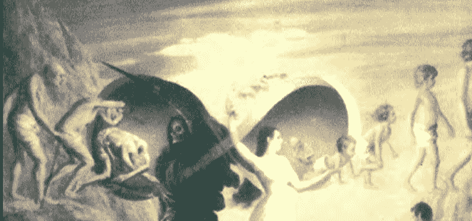

西藏人民出版社

> 我穿着一件麻布长袍，住在山谷里。
> 断不见水，有一道好强的好温暖的白光。
> 这是夏朝孔甲年间……
> 在一连串的治疗下，她记起了许多前世的回忆，愈透露了许多生与死的奥秘……

- 陈宗晶 博士
- 李鼎恒 教授
- 史密斯·C·H医师 共同推荐

了解前世可提升您生命的层级

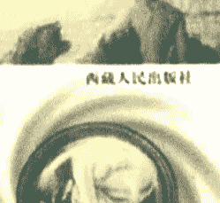

# 灵界探索系列①

## 前世今生

弘初 著

西藏人民出版社

神秘的生命对话

## 前世今生

弘 初 著

西藏人民出版社出版发行

四川万县市彩印厂印刷

开本：850×1168mm 1/32 印张8

插页6 字数200千字

1997年8月 第一版

1997年8月 第一次印刷

印数：1-10,000

ISBN7-223-00922-1/K·685

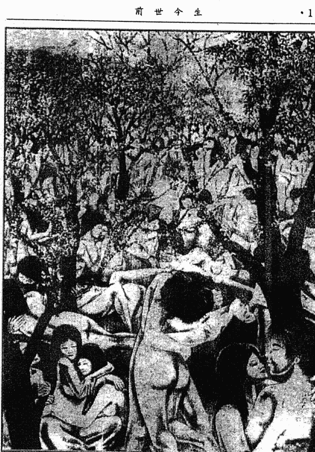

李婕驰骋上下五千年，纵横千万里，超越了时空，联想自己和其他亲友在各个轮回的兴衰荣辱，找到了自己的症结，不药而愈。(第6章)

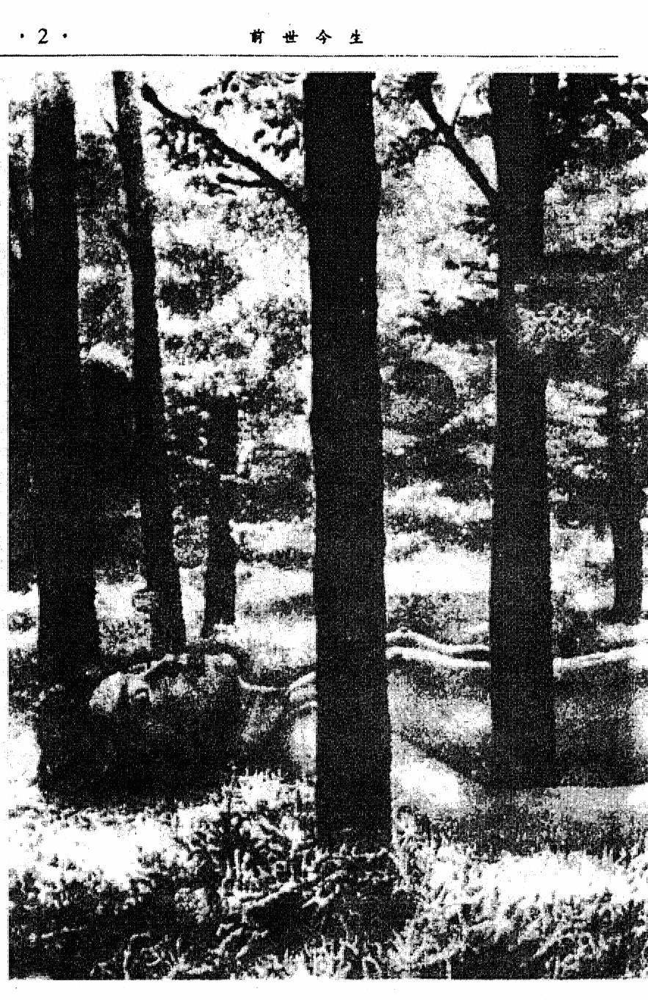

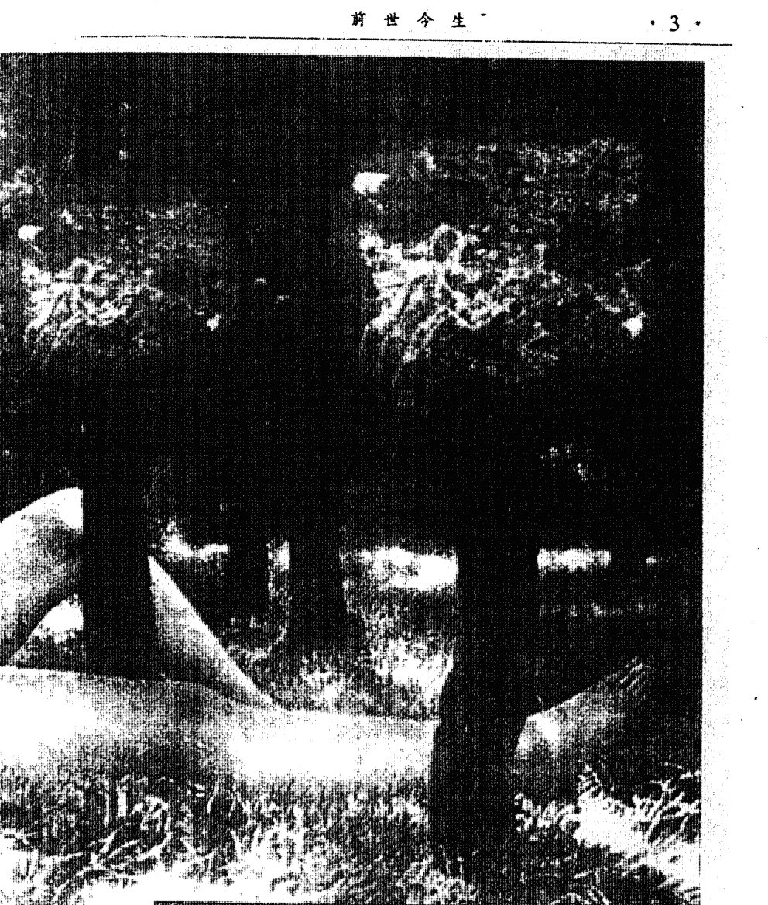

> “我很快降下来，落到某个身体里去了……我看到好多有圆柱的建筑，人们穿着长袍……”

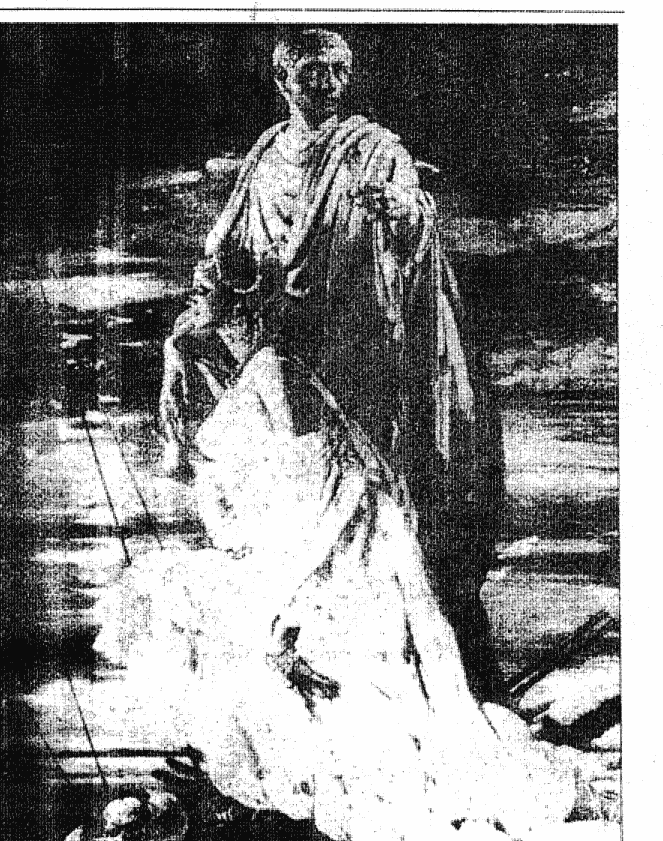

> 死不是绝对的。我们知道，我们并没有失去所爱的人，死亡之后，我们依然与死者有联系。（第29章）

## 目录

- 第一章 进入幽明之间………………(7)
- 第二章 再生的转世者………………(14)
- 第三章 前世的记忆………………(23)
- 第四章 李娃回到1888年………………(34)
- 第五章 师尊们的话………………(40)
- 第六章 灵魂是没有痛苦的………………(48)
- 第七章 此岸和彼岸………………(53)
- 第八章 和平的天使………………(61)
- 第九章 灵魂之师………………(73)
- 第十章 看穿生命………………(85)
- 第十一章 回到肉体要经过七个层面…(94)
- 第十二章 李娃在地球上86世的经过…(103)
- 第十三章 回溯前世与通灵………………(110)
- 第十四章 平衡与和谐是快乐的根本…(115)
- 第十五章 飘向光体的音乐………………(119)
- 第十六章 灵魂统摄肉体………………(124)
- 第十七章 奇特的复合怨念………………(127)
- 第十八章 消解性虐待………………(132)
- 第十九章 讨厌射精的根源………………(136)
- 第二十章 宽容是一种睿智………………(139)

| 章节 | 标题 | 页码 |
|------|------|------|
| 第二十一章 | 不必恐惧死亡 | (145) |
| 第二十二章 | 八仙过海相助 | (150) |
| 第二十三章 | 在内心深处超越自我 | (153) |
| 第二十四章 | 假眠让你处在天才状态 | (157) |
| 第二十五章 | 超越弗洛伊德 | (163) |
| 第二十六章 | 灵异的濒死经验 | (168) |
| 第二十七章 | 附身与转世 | (173) |
| 第二十八章 | 不是冤家不聚头 | (182) |
| 第二十九章 | 灵魂携来前世的才能 | (191) |
| 第三十章 | 玉女游灵界 | (197) |
| 第三十一章 | 落花犹似坠楼人 | (210) |
| 第三十二章 | 物与灵的问答 | (224) |
| 第三十三章 | 人鬼情未了 | (242) |

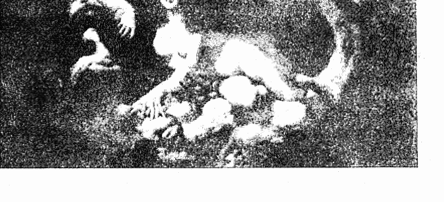

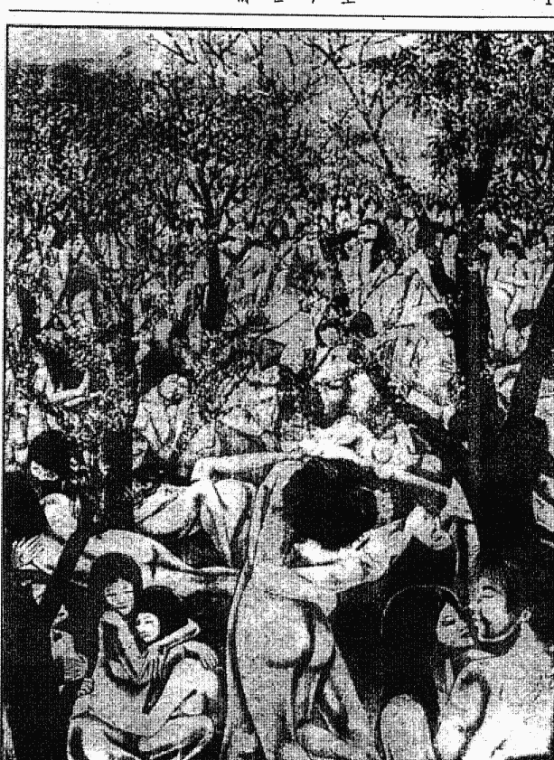

> 李经理静想上下五千年，纵横千万里，超越了时空，联想自己和其他亲友在各个轮回的兴衰荣辱，找到了自己的症结，不药而愈。(第6章)

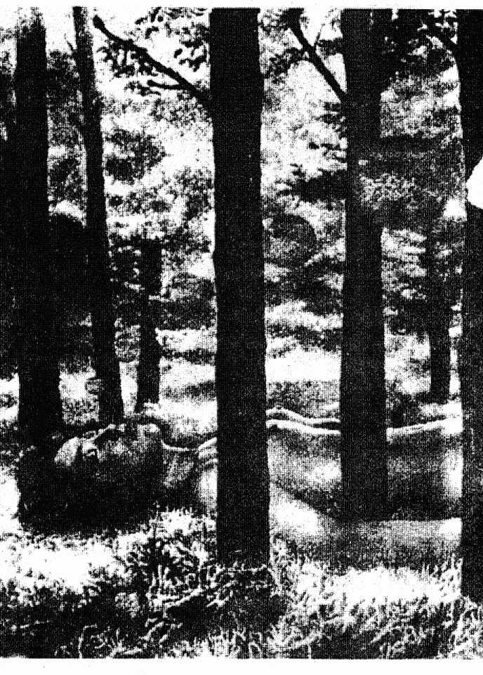

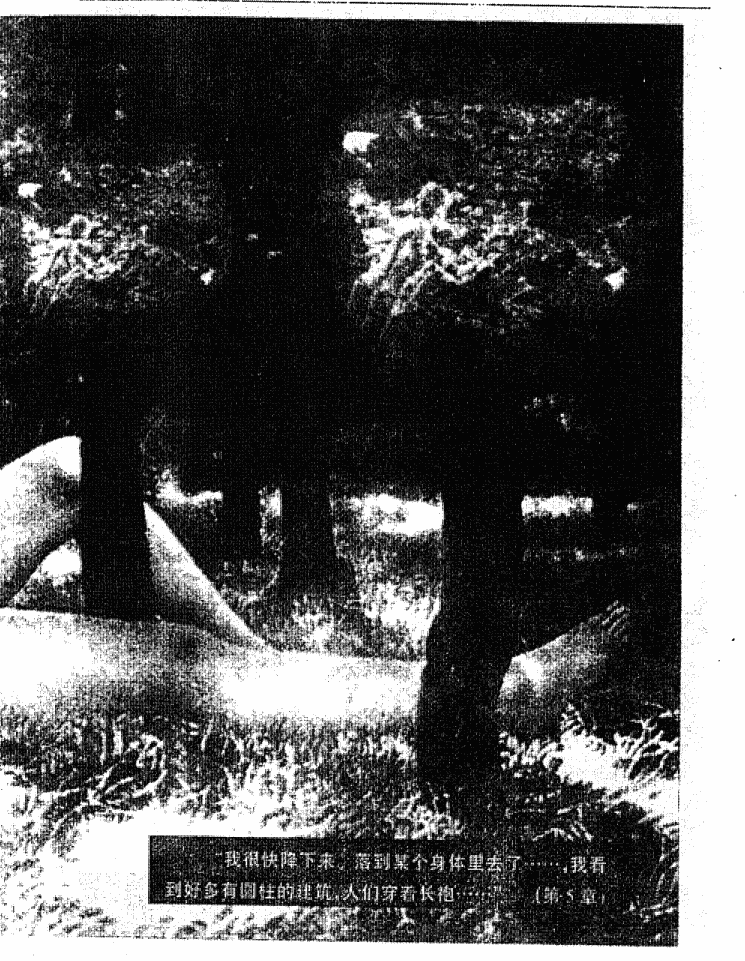

> “我很快降下来，落到某个身体里去了……我看到好多有圆柱的建筑，人们穿着长袍…… （第5章）

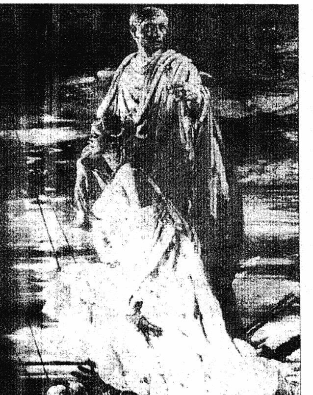

> 死不是绝对的。我们知道，我们并没有失去所爱的人，死亡之后，我们依然与死者有联系。[第29章]

## 目录

- 第一章 进入幽明之间 ............... (7)
- 第二章 再生的转世者 ............... (14)
- 第三章 前世的记忆 ................. (23)
- 第四章 李娃回到1888年 ........... (34)
- 第五章 师尊们的话 ................. (40)
- 第六章 灵魂是没有痛苦的 ......... (48)
- 第七章 此岸和彼岸 ............... (53)
- 第八章 和平的天使 ............... (61)
- 第九章 灵魂之师 ................. (73)
- 第十章 看穿生命 ................. (85)
- 第十一章 回到肉体要经过七个层面 .. (94)
- 第十二章 李娃在地球上86世的经过...(103)
- 第十三章 回溯前世与通灵 ......... (110)
- 第十四章 平衡与和谐是快乐的根本...(115)
- 第十五章 飘向光体的音乐 ......... (119)
- 第十六章 灵魂统摄肉体 ........... (124)
- 第十七章 奇特的复合怨念 ......... (127)
- 第十八章 消解性虐待 ............. (132)
- 第十九章 讨厌射精的根源 ......... (136)
- 第二十章 宽容是一种睿智 ......... (139)

| 章节标题 | 页码 |
|----------|------|
| 第二十一章 不必恐惧死亡 | (145) |
| 第二十二章 八仙过海相助 | (150) |
| 第二十三章 在内心深处超越自我 | (153) |
| 第二十四章 假眠让你处在天才状态 | (157) |
| 第二十五章 超越弗洛伊德 | (163) |
| 第二十六章 灵异的濒死经验 | (168) |
| 第二十七章 附身与转世 | (173) |
| 第二十八章 不是冤家不聚头 | (182) |
| 第二十九章 灵魂携来前世的才能 | (191) |
| 第三十章 玉女游灵界 | (197) |
| 第三十一章 落花犹似堕楼人 | (210) |
| 第三十二章 物与灵的问答 | (224) |
| 第三十三章 人鬼情未了 | (242) |

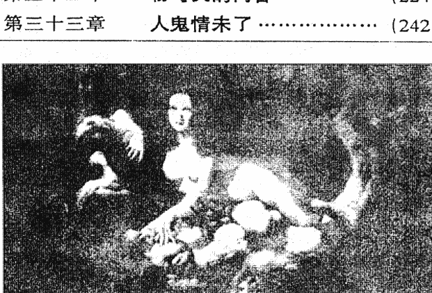

## 第一章

### 进入幽明之间

这是一个美好的早晨，阳光和煦，小鸟啁啾，没有塞车，车流井然有序，自行车和行人各适其所。人们都很友善。当然，这也是这座城市的一个很平常的早晨。平常的心理医生我。也像平常一样赶到医院，和同行们互相点头问候。没有迹象表明这一天，我的诊室会发生不寻常的事，出现不寻常的病人。

她是今天出现在我面前的第一个就诊者。她中等身材，鹅蛋脸，秀发如云，面色红润，一双漆黑深邃的眼睛，鼻子和润泽的樱唇都很精巧。她没有涂口红，但显得比涂了口红更自然和好看。她穿着一身深蓝色的西装，用料颇为考究，紧贴在她那窈窕的身躯上。她年约二十六岁。事后，我暗自好笑，觉得自己不是以一个医生、而是以画家的眼光去欣赏她，真是有点那个。不过，她的容貌的确是出众的，在这个城市中，怕也算是得上是美女。而且她能够神情坦然地接受我的审视，显得安详和闲雅，没有羞涩和懊恼，于是我猜测，她应该是个艺员，或者是某合资企业的公关小姐。

我可谓阅人多矣，可是，这回却猜错了。看她自己填的病历卡，姓名：李娃。职业：教书。年龄：三十二岁。她写的字完全没有女人气，也不是学王羲之、欧阳询的字体，而是脱胎于雄强豪放的汉简和雄峻的魏碑，与她体貌的袅娜毫不相称。不过她的名字倒是十足的女人名，乍见之下，我突然想起了唐朝白行简的《李娃传》，想起了传中那多情而富于正义感的名妓李娃。她的职业和年龄大大出乎我的意料之外。在我读中学时，教过我的女老师，多是衣着朴素，面有菜色的，几曾见过这眼前的美人般的老师？她一点也不像是三十二岁的样子，而看样子，还是单身贵族哩。

“医生，你会看相和测字？”她突然似笑非笑地望着我，问道。

她这一问，真令我这个精神病医生颇为尴尬，显得我的心理有问题，倒需要向她咨询似的。我冲着她抱歉地一笑，道：“我见你写的字有汉简魏碑的底，我也喜欢汉简魏碑，而不喜什么颜筋柳骨。”

“是么？那我们是知音了，太好了。”她说话的声调很柔婉，我真怀疑古代的美人就是她这样说话的。她望了我一眼，又笑道：“医生，看得出你兴趣广泛，学识渊博。”

我谦让道：“我是兴趣广泛，但却又是学识浅薄。”说到这里，我适时将了她一军：“刚才你说我会看相、测字，那是不实之词。依我看，你才会看相哩。”

她爽朗地仰头而笑，这种笑法倒是现代女性豪爽的笑，而不是古代美人笑不露齿的那种做作的笑。

在互相打趣和友善的笑声中，我和她之间显得融洽多了。而作为精神病医生的我，正恰恰需要和病人之间的融洽和相互信任。

她对我毫不放松取笑：“不过，刚才我刚进来时，你望着我的那副神情，正是江湖相士望人时的神情。”

我不禁粲然而笑。我笑道：“看得出，你对江湖相士的情态相当熟悉。”

她笑道：“不瞒你说，我也可以做江湖相士了。”

我觉得，我与她相互间的玩笑，该到此为止了，再就这话题扯下去，就有违医德了。于是，我笑着轻咳了两声，表示对这话题已不感兴趣了，应该言归正传了，同时，我也适当地将面部的肌肉收紧一些，准备开始谈论严肃的事情。

不过，我也没有严肃到令她不安的程度，我以一个医生应该有的口吻问她：“你有什么疑难要问我的？”

她将满头瀑布般的秀发往后面掠了掠，我猜她这是整理思绪的习惯动作。说实在的，那动作很优雅，恕我不能在此详述了。

她开始滔滔不绝地讲述她自己了。想不到，刚才那么优雅的她，说起自己的症状时，却说得很急，话语嘟嘟嘟地从她那好看的嘴里跳跃而出，快得令我无法记录，也无法思考。

她说，她最近经常听到一种声音，这种声音很真切，在夜深人静时尤其如此；这种声音似乎颇为熟悉，好似在哪里听到过，可是追忆起所历的事，想起所见过的人，却又想不起是哪个熟人的声音。那声音却毫不间断地经常出现在她耳畔，想不听也不能。她又说，有时还会看见别人看不到的东西，这些东西或是人影，或是古代的战车和马匹，或是阴森的古堡。当她向旁人说起这些时，旁人当然看不见这些，于是取笑她。

由此，她很恐惧，她很害怕一个人在一个地方待久了。夜晚，她睡不好，有时刚入睡，就会被一些声音和影像惊醒过来。

我问她，出现这些现象有多久了？

她说，已有好多年了，差不多在她有记忆的时候起，就有这种现象了。开始时她还不敢对人说起，怕人家取笑她。

从前，我也诊断过类似李娃这般的病人。但这类病人的症状很明显，一见我就愁眉苦脸的，看样子也是病容满面。但李娃却不同，她在外表看不出有病，倒是容光焕发的样子，而且还能和我说笑。

我问她，有没有找别的医生看过？从前有过何种疾病？

她回答我：以前从没患过大的病，只是伤风感冒等小疾病，很快就会好了的。她又说，医生全面检查过她，没有发现她有器官方面的病变，脑外科医生让她照了脑电图，也没有发现任何问题。但她觉得自己有病，尤其是精神方面。

我向她提出一些问题，她回答得很正确。我又找出一些图样，以及颜色辨认图，她也回答得完全准确。看来，她精神上是健全的。

我并没怀疑她是无病呻吟。我让她向我谈她自己的一些经历，最好从童年谈起。

她出生于一个小镇。“文革”虽然在她出生不久爆发，但那场浩劫并没对她的心灵造成什么创伤，因为她那时还小。再加上镇人口不多，比较闭塞，因而那场大“革命”对小镇的冲击并不大。她的父亲是一个公社的副职书记，母亲是妇联干部，父母之下，只有她和一个弟弟，因而比起那时的一般人来说，她家的生活还应该算是不错的。她的父母虽然在“文革”初期也被“红卫兵”贴过大字报，被批斗过，但很快就被“解放”出来了，因为他苗正根红。这些，没给她留下多么深刻的印象。她也没有当过“上山下乡”的知青，因为待她高中毕业时，已经不用上山下乡了，下去的知青正大量涌回城里。她的父亲由公社而县，由县而地区，最后调到了这座省城，当了副厅级的官儿，她和弟弟，以及母亲，也跟着步步高升，来到了省城，她姐弟俩都考上了大学，毕业后，她选择了做中学教师这一职业。本来，她还可以选择更好的职业的，因她父亲有些面子，但她却选择了这一种一般人都避之唯恐不及的职业，这说明她甘于淡泊，不苟营营。在有一定职位的干部之子女中，像她这种人并不多见。她的成长道路很平坦，平坦得有点乏味。她已成家，丈夫本是一个做商业工作的年轻人，但书呆气比她还要浓厚，她觉得丈夫不是做商人的料，干脆也将他拉入教师队伍中，他也谨奉妻命，对清苦的教师生活，甘之如饴。他们有一个可爱的小女儿，一家子安贫乐道，令人羡慕。她是个有多种爱好的女子，专业之外，易经八卦、相法、堪舆（风水）术、武术、气功、书法、绘画、医学，等等，都有所涉猎，而且在某些方面有不俗的成绩，令人刮目相看。有时，她自己也觉得奇怪：一个女孩子，竟喜欢上这些东西。更令人惊奇的是，好像她天生就有这些方面的禀赋，不想学也不行，一喜欢上就放不下，一学就很快上手。一次，她在公园中偏僻的一隅，见一个江湖相士在看相，她听了一会，觉得这相士相术平平，于是，她也伸出纤纤玉手，让他看上一回。那相士信口雌黄，对她的诸多方面说得牛头不对马嘴，惹得她笑得差点咽了气。最后，倒是她对相士指点迷津，一一讲解自己的掌纹，这方面的知识多得令相士瞪目结舌，差点要向她下跪，求她收自己为徒。从此，那相士再也不敢在公园里混饭吃了。那次，在场的几个小伙子，竟追她出了公园，求她也给自己看一看手相。她置之一笑，飘然而去。一次，她那口子买回一把菜刀，她拿起，对着灯光一看，说道：“这口刀的钢硬而脆，很容易斩崩了口。”他不信，几天后斩排骨时，果然崩了两个口子。后来，他又买回一把菜刀，她一看，说道：“这回的刀口钢又软了。”果然，在斩排骨时，刀口卷了刃。他问她怎么知道这些知识？她也感到奇怪。她说，第一次，她看到刀口钢太青，知道是硬而脆。后来，他买回第二把刀，她又看见那刀口略显紫色，觉得是软了。她对于钢铁的知识很有限，只知道除铁元素之外，钢铁中还含有碳元素。是钢是铁，只要是依碳元素的含量来区分。但她居然知道钢铁的硬脆，而且是看出来的。她说，她读书时，有一点点智慧的火光，读得书多了，智慧的火光就连成一片，不可分割了。她喜欢历史，但却不喜欢文学。

她自幼便受到正统的马克思列宁主义、毛泽东思想的教育，共产主义、爱国家爱集体思想的熏陶。她的家庭很温馨、和谐。她本人和父母都没有什么不良的嗜好和行为。她先是少先队员、共青团员、共产党员，曾经站在镰刀斧头旗帜下宣誓：为共产主义而奋斗终生。

按道理，像她这样的人，应该是具有天不怕地不怕的大无畏精神的，可是，她却怕，怕在吃饭时卡住喉咙，有时甚至怕到连药丸也不敢吞的地步。她怕黑暗、怕死。我想引导她找出恐惧的根源，让她尽量从童年时代找原因。

“童年……水……”她尽量往我引导的思路追忆下去，想起了童年的几件事情。

在她读小学五年级时，她所在的公社受了水灾，一些哥哥姐姐知青高喊着“一不怕苦、二不怕死”和“下定决心，不怕牺牲，排除万难，去争取胜利”，往大堤下的滚滚洪水跳去，想用自己的身体，筑成一道人墙，将洪水挡住。可是洪水却将他们都吞噬了。

那一次，她也和老师和同学们去抗洪救灾，她跌进了水中，失去了知觉。醒来时，已躺在公社的卫生院中，老师和同学都来看望她，说她是抗灾小英雄，还将她的“英雄事迹”写成文章，在公社、县里广播，还上了报纸。可是，她觉得，自己不是英雄，救她的才是英雄，至于是谁救了她，人们都不清楚，她自己也一直找不到救命恩人。

明明是一场水灾，农作物失收，还淹死了好多人，以及牲畜，可是她所在的公社却被说成是战天斗地，战胜了自然灾害，取得了大丰收。报纸上说是“大灾之年夺丰收”。她的父亲还受到上面的表扬，升了县“革委会”副主任。她们一家还搬到县城去。

县“革委会”的大院子里种着很多龙眼、荔枝树。每年6、7月，台风时节，将要成熟的龙眼被狂风吹跌到地上，她和其他院子里的小朋友，冒着风雨，在上学和放学时，拾起地上的龙眼，剥开来吃。父亲知道了，说这是公家的财产，不能捡来吃。她说，风雨一过，就变成垃圾扫掉，可惜。母亲说，要注意影响，你是县革委李副主任的女儿。她说李副主任的女儿知道了，以后龙眼掉到地上烂掉，也不敢捡来吃，连看都不看它。母亲说，这才像是县革委李副主任的女儿。她将“县”字和“李”字念得很重，若是写出来，得加着重号。

以后，她多次遇到洪水，多次受惊吓。有时，她一拧开水龙头，水龙头大概是锈了，“啪”的一声，涌出一股黄褐色的锈水，她也会吓一跳，有时还会尖叫起来……

在她对着我述说这些时，她的情绪很平静，好像是述说着别人的陈年旧事。

我也是平静地听着。老实说，她说的这些，在我听来，不过是微不足道的小事而已，就连她差点被淹死的那次，也是小孩子时常有的事，毫不足怪。

只是我后来和她接触得多了，听她叙说的事情多了，我才有些明白，那些有关水的小事，似乎是有着某种象征的意义，在诗人来说，那是“意象”。

## 第二章
### 再生的转世者

有时候，我真想对她说，算了吧，你的那点点不愉快，其实是你平淡无奇生活中的几朵小浪花，没有它们，你的生活历程就显得乏味多了。在你的童年时代，不会像别的孩子那样，吃的是菜蔬、稀饭，“三月不知肉味”，你大概不会缺乏鱼、肉之类的营养物罢？就算你学习成绩平平，你的父母一样有办法将你从小学弄上中学、大学，你是不会尝到失学之滋味的。也许是生活太充裕了，反觉得平淡无奇，“欲赋新诗强说愁”么？可是，她是我的病人，她说自己有病。她不喜欢文学，不想进行文学想象，更不想写诗。

她每个星期来见我一两次，一来就滔滔不绝，每次都给我带来新的惊奇和思考。

每次见我，她都是先来一番打趣，说一些近日的奇闻逸事。这些事，有的我虽然耳熟能详，但为了尊重她起见，我还是认真地听着，并露出惊奇的神情。我有时为自己的这种做法感到可笑。

虽然她走路轻快，步履如风，但她仍然在内心深处感到恐惧不安。她说，那种奇怪的声音越来越频繁地干扰她，折磨她，一合上眼，就做恶梦。这些梦境越来越离奇，也越来越恐怖。她向忠实的丈夫倾诉自己的内心感受，讲述自己的梦境。可是她丈夫总是置之一笑。有时她在梦中惊喊着醒了过来，便寻求丈夫的帮助。可是他除了搂紧她，吻她，安慰她，说些不着边际的话之外，还能对她做些什么呢？

她一如既往地怕水，怕黑夜。她说，幸好她不喜欢文学，不然的话，可以写一本像鲁迅那样的《狂人日记》。

更令她感到不高兴的是，当她将自己的事情讲给父母和弟弟听时，他们都讥笑她，说她胡思乱想，走火入魔。并且说，她自小受党的教育，又受过高等教育，怎么会有这些乱七八糟的想法？

这期间，新疆的一具女尸和一个小孩的尸体在这个城市展览，她硬让丈夫陪她去看了。起先，她丈夫执意不让她去，因为眼前她已经够让他头痛了，若去看了那尸体，岂不是又要做更多的恶梦？可是她说服他，说那是为了了解考古的知识而去参观的，她绝不会惊慌，云云。他无法抗拒，只得伴她去了。

那是两具一千多年前的古尸，尸体保存得很好。那小孩的尸体更令人啧啧称奇，面目栩栩如生，而且还保持着哭泣的状态，显见得他是被人匆匆活埋的，看了令人颤栗。

“他哭了一千多年了。”她望着那孩子的尸体，含着泪说。他要拉她走开，可是她不肯。

“我知道当时的悲惨情景。”她自言自语般地喃喃着。

他吃惊地望着她，真怕她那莫名其妙的毛病大发作，眼前已有发作的迹象了。于是他硬将她拉出了展览馆。

“一千多年前，他们居住的那个地方，叫高昌国，市井繁华，商贾辐辏，那是丝绸之路上的一个古国……”走出了展览馆，她仍然在说着刚才所见的古尸。

“别说了。”他制止她。

可是她不肯罢休，仍然继续着自己的思绪，说道：“那女人是个贵族，你看她的衣饰就知道了。她和高昌国王有染，被王妃知道了，醋意大发。那孩子是她和国王的私生子。国王在一次作战中阵亡，王妃找到了报复她母子俩的机会，打死了她，又将她和那国王的私生子活埋了。因此，那孩子一直哭，哭了一千多年，而且还要继续哭下去。咳，真悲惨。”她的泪水簌簌流了下来，不可遏止。

“你还说自己不喜欢文学哩，看你将一段故事编得多动人。”丈夫揶揄她道。

“你以为是我信口开河编造出来的么？”她委屈地抗议道。

“那你是从哪里知道的？刚才看展览时，可没见有这么一段文字介绍。”他笑道。

她大声说：“我看见了当时的情景！”

“嗬，你看到了一千多年前的情景？时光倒流了？”他嘲笑道。

她生气地将头扭过一边，不再理他，这类事是无法向他解释清楚的。

当她将那日看古尸展览的事情告诉我时，我和她丈夫当时的惊异差不多。

我决定对她进行催眠疗法。所谓催眠疗法，就是使病人慢慢放松身体和精神，使注意力集中，回忆起以前的事情。这些事情在平常状态下往往被忽略了。

她考虑了一会，同意了。

二十分钟后，她进入睡眠状态，但口中却向我说着话，将她所“看见”的事情告诉我。下面是她陆续向我说的话：

我变得越来越小。我看见了两道白光，在床上扭动着，喘息着。我看见了一道红光和白光相碰撞，发出了绚丽的火花。我置身于一个红红的地方，血在涌动着。我是一粒芥子般小的东西，没有口鼻和身躯，只有圆圆的一粒珠子。

然后，我成了一道白光，穿过了漆黑一团的隧道，隧道很长很长，好像没有尽头。不知多久，我倒退着倒退着，往后疾驰。但过了一会，那感觉变了，变成不是倒退，而是向前。

我终于到了隧道的尽头，外边光亮刺目。我掠过一群群身穿长袍的文士和身批铠甲的武士，掠过青青的山，绿绿的水，掠过原始森林，莽莽原野，人群逐渐稀少，禽兽逐渐增多。我掠过美轮美奂的宫殿，掠过白墙黑瓦的民居，最后在高山之巅停驻，白云仿佛伸手可撷，飞禽绕飞于我身边，猛兽咆哮于我脚下。

我仿佛身穿一件百草编织成的衣服，衣服已成了布条条，仅可遮羞。往下一望，只见山下都是黄黄的一片洪水，将大地都淹没了，只有一些高山露出水面之上。那些来不及逃走的百姓，都被洪水淹死了，水面上浮着不少百姓的尸体，有男有女，有老有少。有幸逃上山来的百姓，有的住在山洞中，有的在树上筑巢而居。

一座用泥巴和草砌抹成的房子，人们称之为王宫，那是当时最好的房子了。住在这王宫中的人，被人们称作舜帝，他是被先王尧选为接班人的。当了三十几年王之后，却发生了这场洪水，让百姓受苦，他很内疚。他派了一个臣子叫鲧的，带领着百姓去治水。可是，鲧用的是堵塞的办法，想将洪水堵住，可哪里堵得住？百姓淹死的越来越多，舜帝一怒之下，将鲧杀了。

“禹，你继承你父亲的位置，前去治水吧。”舜帝命道。禹是鲧的儿子。

禹无可奈何，诚惶诚恐，带了两个助手，一个叫伯益，一个叫后稷的，前去治水。

我站立的这座山叫涂山，后代人称我为涂山氏女。禹那厮治水来到涂山，见我一个人孤零零的，便说些风言风语来挑逗我，我上了他的当，和他在山中苟合了。那一夜好销魂，以至四千余年后的今日，我还记得当时的情景。我教了他治水之法，不能沿用他老子堵的方法，而应用疏导之法。他闻言大喜。

他和我做了那件事之后的第三天，就和伯益、后稷治水去了。十个月后，我生下了儿子启。

禹用了我教他的方法，渐见成效，洪水开始退了。伯益教人养禽畜，后稷教人种五谷，百姓有了吃的。

禹三次路过家门，都不进门看我和启母子俩，好狠心啊。不过，他是为了治水，而不是另有新欢，我体谅了他。

大禹治水成功时，我却飞了。我飞过了夏、商、周，到了战国之末，有人将一套几十斤重的铠甲披在我身上，我就成了一个男人，是秦国的将军，在名将白起的麾下作战。

我们攻打赵国。赵国老将廉颇领四十五万兵马抵抗我们六十万大军，我们竟寸步难进。后来，我们的君王秦昭王用反间计，让赵王用赵括代替了廉颇。赵括只会纸上谈兵，没有实际的打仗经验。秦、赵两国近百万大军在长平对阵。我们用一队骑兵绕行赵军之后，将他们的粮草抢的抢，烧的烧，赵军竟四五日吃不到饭。我领了一支五万人的骑兵队伍，从赵军中间突人，将赵军切割成两半，然后各个击破。赵括作困兽斗，左冲右突，想将被分割的两半部分军队以合拢。我一箭射死了他。赵军群龙无首，又多日未进食，军无斗志，四十万大军一齐投降。白起下令将四十万赵军全部活埋，喊叫之声震天动地，好惨啊！接着，秦军围攻赵国首都邯郸，长达一年多。

我没有参加邯郸围城战，也没有接受秦昭王的封赏，我继续飞。

我不做将军了，我成了一个文士，住在魏国首都大梁（今河南省开封市）中。丙子年，公元前225年，秦王即后来的秦始皇命将军王贲带三十万大军进攻大梁，王贲决开壕沟之水，又引来汴水，浸淹大梁。大梁的夷门即东门，被水冲开一段城墙。这壕沟之上，百余年前，庄子和魏相惠施在壕畔观鱼。庄子看着水中之鱼，叹息道：“鲦鱼出游从容，是鱼之乐也。”惠子曰：“子非鱼，安知鱼之乐?”庄子曰：“子非我，安知我不知鱼之乐?”惠子曰：“我非子，因不知子矣；子因非鱼也，子之不知鱼之乐，全矣!”庄子曰：“请循其本：子曰‘汝安知鱼乐’云者，既已知吾知之而问我。我知之濠上也。”而今，秦国大军放水攻城，城中军民都成了鱼。

百姓哭喊着逃生。我让妻子坐上一只木盆，我赤足推着她往高处走去。水越来越深，逐渐地，我快要灭顶了。水也越来越急，打着一个又一个漩涡，漩涡卷走了木盆和木盆上的妻子。我哭喊着，她也哭喊着，我们相互伸出手，想拉住对方，可是距离越来越大。若仅是水，我们夫妻或许还可以重逢，因为我和她多少都熟些水性，可是，另一股乱流涌来了，那是秦国大军，那是钢铁的乱流，刀戟乱流，死亡的乱流。他们挥动着刀戟，杀进城来，不分男女老幼，见人就杀。他们杀得一个人，可以晋升一级军功，所以他们挨命地杀人。但他们没有杀我的妻子，我的妻子颇有姿色，于是他们向她追了过来。她拼命地拨划着水，使木盆往我这边靠过来。可是漩涡太急了。我也奋力划水，向她游过去，想救她。

那些秦军都不习水性，为了抢她，送了好多士兵的生命。他们用戟来刺她，可是戟不够长。他们知道得不到她了，于是骂着，向她射箭。一支箭矢射中了她的后心，透过前面来，鲜血流了一木盆。她身子一歪，倒在水中，被乱流冲走了。我狂喊一声，向她扑过去。那些秦兵怒目圆睁，向我放箭。我将身子潜下水底……

我听了她的这一番叙述，心中惶恐不安。即使是做恶梦，也不会说出如此骇人听闻的事情呀，况且那又是真实的历史。后来，我查阅了史书，她在催眠作用下所说的史实，都对。秦国与赵国长平之战，秦国确是动用了差不多全国的兵力，十五岁以上的男子，都被遣送到长平去。赵国的主将是善于纸上谈兵的赵括，赵国大将马服君赵奢之子。秦国大将王贲领兵攻魏，水淹大梁（今河南开封市）确是发生在公元前225年，那一年是丙子年。庄子与惠施在壕上观鱼和辩论，那一段文字她记得一个字不差。《庄子》《秋水》篇就记有那一段文字。当然，史书中没有记载着她是涂山氏之女，是大禹的妻子，夏朝开国皇帝启的母亲，也没有记载她（他）在长平之战中射杀赵括，在水淹大梁时妻子被射杀。那是她自己的幻想的历史，死无对证。

不过，这已经是够奇的了。她是怎样想起那几段历史的呢？或者说，她是怎样记住那几段历史的呢？竟记得这般准确无误，叙述得如此生动。要知道，她喜欢历史，却不喜欢文学。她之所以不喜欢文学，似乎在她以后的叙述中可以看出原委；她之所以怕水，难道是在舜帝和大禹那时看到的滔天洪水？是秦国大军水淹大梁，杀了他的妻子，淹死了他无数的魏国同胞？她的这些记忆，是否就是“集体无意识”？

她是精神分裂症？她没有出现思维错乱的现象，也从来没有幻想狂的迹象，她没有分裂的人格，她始终言行如一。她没有对现实不满，相反，她对我们这个社会非常热爱，对自己的职业和家庭非常满意，在今生今世，她没有受过重大的肉体或精神的伤害。她没有任何心理或精神上的疾病。

可是，她在催眠状态下说的话，她的恐惧，从何而来呢？

在给她催眠时，我指示她：“请给我讲述战国时的宫殿的模样。”

“好的。”她说，“别以为王宫很富丽堂皇。那些宫殿都不会很大，因为是用泥土筑起来的，叫版筑，也就是用木板夹着泥土，用石头和锤子夯实泥土，筑成墙。这样的墙并不太坚固，所以上面覆盖的殿顶不能太重太大，跨度有限。那些宫殿都有上百年的历史了，经日晒雨淋，风雪侵袭，都变成了黑色，墙壁外都有一些洞穴，要不断修补。里面则用白灰垩土。王宫中有一些帐幔之类，秦国崇尚黑色，魏国尚黄色。还有一些铜鼎、玉器之类的装饰，若没有这些装饰，那些王宫其实都是很寒伦的。

我虽然没有建筑学方面的知识，但觉得她说的还是有道理的。那时的生产力水平不算太高，只能是那个样子了。

我又指示道：“说些魏国话。”

她说了，是惠施的一段话，文言，但读音却类似于今日河南开封一带的话。我到过开封，所以对那一带的话有些印象。

在后来的催眠中，我又问她：当时，我有没有出现过？是什么样子？

她的回答令我哑然失笑：“你当时是魏国的一个仵作。”仵作，就是抬棺材埋死人的。

我忍住笑问她：“你有没有认错？”

她说：“没有错人。你当时当然不是像今日这样的，西装革履，外罩白大褂；那时，你身上穿着麻织的布条条，已经不是衣服了，脏兮兮的，身上老远就能透出死尸的臭味。”

我赶紧用手将嘴掩得严实，我怕笑出来。一笑，她的回忆就会失真。

“你想笑就笑罢。”在睡眠状态下，她竟然真确地知道我想笑！我告诉她，我想哭。

她又说：“怪不得我第一次见到你时，就有似曾相识的感觉呢？”

我问她：“既然你那时是魏国的文士，当然很清高的了，怎么会清楚地记得起我这个粗贱的仵作呢？”

她说：“不能叫粗贱。那时的人没有今日的人这般势利。魏公子无忌和赌徒、看门人是朋友，荆轲和卖狗肉的高渐离等人是莫逆之交，按今日的标准，高渐离该是一级音乐师了，却混在市井中与狗屠为伍。”

她的这一番高论令我暗自惊诧。
我要对她的“回忆”进行思考。

## 第三章
### 前世的记忆

慢慢地，我把李娃带到两岁的时候，但那时没有什么重大的事发生。我清楚而坚定地指示她：“回到你症状开始的那个时间。”我对接下来的事完全没有心理准备。

“我看到白色扶梯通往一个建筑，一栋有柱子的高大白色建筑，没有门廊。我穿着一件长袍……一种质地粗糙的宽大袍子。我的头发结成辫子，是长长的黑发。”

我迷糊了，不能确定发生了什么事。我问她当时是几岁，她叫什么名字。“我叫娃，十八岁。我看到建筑物前有一个市场。许多篮子……每个人把篮子架在肩膀上走。我们住在山谷里……这里没有水。时间是夏朝孔甲年间。这附近土地贫瘠多沙，很热。有一口井，但没有河。水是从山上来的。”

她说得更多地形等有关的细节后，我要她再往前几年，长大一些，然后把看到的告诉我。

“一条石子路旁有许多树。我看到煮东西的火。我的头发是黑色的。穿一件长而粗的麻布袍子，没鞋。我二十五岁，有一个女儿叫洛……她是李潭（李潭是李娃的侄女；她们一向过往甚密）。天气好热。

我目瞪口呆，胃里隐隐作痛。房间里冷了下来。她在催眠中所叙，一切都很确定，并不迟疑。名字、日期、衣服、树—都如此生动！到底是怎么回事？她那时的女儿怎么又是现在的侄女？我更糊涂了。我看过上千个病人，也做过许多次催眠治疗，却从没遇到这样的幻想—即使在梦中也没有。我指导她回溯到死亡的时候。我不确知要怎么引导一个在如此幻想（或记忆）中的人，只是尽力朝造成恐惧的原因著手。接近死亡时候的一些事件，可能是特别迫人的。在她接下来的叙述中，显然有个洪水或涨潮袭击了她们村子。

大浪卷倒了树，没有地方跑。好冷，水里好冷。我必须救我的孩子，可是办不到…必须紧紧抱住她。我淹在水里，呛倒了。我不能呼吸，不能吞咽……咸咸的水。我的孩子从我的手臂中被卷走了。

李娃喘着气，呼吸有困难。突然间她全身都放松了，呼吸变得沉缓平静。

我看到河—孩子在我身边，还有其他村里的人—我看到我哥哥。

她暂停一段时间：这一世结束了。她仍在催眠状态下。我目瞪口呆！前世？轮回？我的临床经验告诉我，她并不是在幻想、在杜撰故事，她的思想、表情、对细微末节的注意，和她清醒时的人完全不同。所有有关心理治疗诊断的理论在我脑海里闪过，但都不能合理解释她的心理状态和性格结构。精神分裂症？不，她从来没有错乱的迹象，她并非那种沉浸在幻想世界、和现实搭不上线的人；她并没有多重和分裂人格。只有一个李娃，她也完全清楚这点。她并没有厌世或反社会倾向，她不是演员，她没有服用药物或吃迷幻药，喝的酒也很少。她并没有心理或精神上的疾病可以解释刚才催眠时那段生动的经验。

这一段记忆，是打从哪儿来的？我觉得仿佛撞进一个我所知甚少的领域——轮回和前世回忆的领域。我告诉自己，这不可能；我受科学训练的理智抗拒这种想法。但它确实存在，就在我眼前发生。我无法解释它，但也不能否认它的真实性。

“继续，”我说，有点胆寒但又无限好奇，“你还记得什么？”她还记得其他两辈子的一些片断。

“我穿一件有黑色百折裙子，黑灰色的头发上也绑着黑带。时间是一七五六年。我是个杭州人，五十六岁，我叫何露。我正在跳舞，其他人也在跳舞。（停了一段长时间）我病了；发烧，冒冷汗……很多人都病了，快死了……医生并不知道病源是从水里来的。”我要她再向前推，“我康复了，可是头还在痛；头和眼睛都还没完全从发烧中恢复过来……很多人死了。”

后来她告诉我，这一世她是个妓女，因为感到很羞愧所以迟迟没说出来。显然地，在催眠中李娃也能评判一些她透露给我的讯息。

在回忆另一世时，由于李娃曾经在前世中认出了她的侄女，所以我不禁问她，我是否也出现在其中？如果有的话，我很好奇当时我扮演了什么角色。和刚才缓慢的回忆相反，她一下就回答出来了。

“你是我老师，坐在窗台上。你教我们书上的知识。你很老，生出灰发了，穿一件有金边的白袍……你的名字叫子檀。你教我们识字。你很有智慧，可是我不懂。时间是商朝河甲年间。”

第一回合结束，而后面还有更多惊人的回忆。

验及相关现象，都持怀疑的看法。我心中逻辑的部分告诉我：这有可能是她的幻想，因为我并不能真正证明她的观点或看见的东西。不过我也隐约意识到一个想法，就是持开放态度，真正的科学乃从观察开始。她的“回忆”有可能不是幻想或想象，我们眼睛或其他感官感觉不到的事物也有可能存在，持开放态度可以收集更多的资料。

我有另一个杞人忧天的想法：李娃会不会拒绝再接受催眠？我决定暂时不管她，让她也好好消化这个经验。一切等到下星期再说吧！

一个星期后，李娃步伐轻快地走了进来。她看起来比过去更美丽，更有光彩。她很高兴地告诉我，长久以来害怕溺水的恐惧没有了，怕吞咽的情形也减少许多；睡眠不再被水的恶梦打断。

前世和轮回的观念和她的宇宙观并不相容，但她的记忆是那么鲜明，那些景象、声音、气味那么清楚，这经验太强而有力了，以致她感到自己必定曾去过那里。

但是，我从未相信轮回这件事。事实上，我没有花过多少时间来想这个观念。

我是家里四个孩子中的老大，每个孩子间隔三岁，我常是和事佬和仲裁者。我们家在沿海一个小镇。父亲很容易被家中琐事或冲突惹恼，然后就会撒手不管，由我来调停。虽然这对心理治疗的生涯是极佳的职前训练，但是回忆起来，我宁可童年时不负这么多重担。我因此变成一个严肃的年轻人，一个习惯担负过多责任的人。

我母亲总是能适时表达爱意，不像爸那么严肃沉重，她常用一些罪恶、殉道的观念来吓唬我们。她很少忧郁，我们总是可以从她哪儿得到爱和支持。

我父亲是个摄影师，算是不错的工作，虽然吃穿不缺，却也没有多余的钱。我最小的弟弟出世后，一家六口要挤在小小的两个房间的屋子里。

小公寓里的生活是忙碌与嘈杂的，我总是逃进书本里。要是没去打篮球，我就不停地读书。这个小镇虽然是个安逸的环境，但我知道教育是唯一的出路，我也总维持在班上前二名。

大学时我主修化学，毕业时我决定做一个精神医师，因为这领域结合了我对科学及研究人类心智的浓厚兴趣。此外，在医学界的工作可以让我表达对其他人的关心与同情。同时，一次暑假我认识了文化，她既聪明又美丽。我们彼此立刻产生吸引力，而且觉得对方很熟悉。我们继续联络、约会、恋爱，并在我大四那年订了婚，一切事似乎都很上轨道。很少年轻人会关心到生、死，或死后生命的事，尤其当一切都很顺利时，我也不例外。我所接受的是科学家的训练，善用逻辑、理性、实事求是的方法思考。

我加入了生物心理治疗的新领域，它组合了传统心理治疗理论技巧和新的大脑化学科学。我写了一些科学性文章发表，渐渐成为这领域中炙手可热的人物。我有点偏执、紧张、缺乏弹性，不过这些对于医生来说是有用的特点。我觉得对任一个走进我办公室寻求治疗的人，都已做好了充分准备。

然后李娃成了王氏女，一个曾经在夏朝的女孩。现在她又出现了，比以前显得更快活。

我再度担心李娃也许不愿继续。但是，她却渴望再接受催眠，而且很快进入情况。

“我把花枝投在水上，这是一个仪式。我穿一件青色织金的袍子。有人死了，某个王室人员的母亲。我是王家的仆人，负责准备食物。我闻到了，闻到尸体的味道。”

她自动回到王氏女的那一世，但去到不同部分，这次是清理死后的尸体。

“在栋分开的建筑物里，”李娃继续道，“我可以看到那”些尸体。我们在包裹它们。灵魂从上面经过，每个人拿走属于自己的，准备去投胎。”她说的话像印度人对死亡和再生的观念，和我们的信仰一点也不相同。在那种宗教里，你可以带著属于自己的东西。

她离开了那世，休息著。过了几分钟，又进了另一个显然是古代的轮回。

“我看到冰柱，垂在一个洞穴里……岩石……”她模糊地描述一个黑暗、凄惨的地方，现在她看来不太舒服。稍后她形容自己的样子，“我很丑，又脏，全身臭味。”然后，她又前往另一生。

“我看到一些房子，及木头轮子的推车。我头发用布包著。推车上有稻草，我很快乐。我父亲也在这儿……他在抱我……是……我们住在一个有树的山谷里，院子里有橄榄和荔枝树。人们在竹上写字，我看到许多有趣的符号，像字母。人们整天都在写，要弄一个图书馆。时间是商朝。土地一片荒瘠。我父亲的名字叫王毋忌。”

年份不完全吻合，不过我不确定她是否又在回溯上周的那一世。我让她继续留在那世，但往前推。

“我父亲认识你（指我）。你和他谈著收成、法律，和王室。他说你非常聪明，我应该听你的话。”我让她再前进一点，“他（父亲）躺在一个漆黑的房间里。又老又病。周围很冷……我觉得好空虚。”她前进到她死亡的时刻。“现在我又老又虚弱。我女儿在身边，就在床旁。我丈夫已过世了。女儿的丈夫也在，还有他们的孩子。周围有好些人。”

这次她的死亡是安祥的。她浮起来。不知道李娃或王氏女在死后还能记和多少事，但现在她只能说“我浮起来”。我把她叫醒，结束了这一节。

我对于任何已出版的有关轮回的著作，胃口变得奇大无比，几乎搜遍图书馆。我研读西方医学博士写的东西，他们收集了两千名以上有轮回忆和经验儿童的案例，其中许多有外语能力，但他们根本没学过也没去过那些地方。他们的案例报告都十分仔细完整，经过谨慎研究。

我读得愈多，就愈想再读。我开始了解到，虽然我认为自己在人类心智各方面都有涉猎，其实懂得还相当有限。许多图书馆里都有这类的研究和文学，却很少人知道。这些研究大半是由著名的医生和科学家处理、验证过的资料。证据似乎非常充足，但是，我仍旧抱著怀疑的态度。不论充足与否，我发现自己很难相信它。

李娃和我，在各自的轨道上，都深深受到此经验的影响。她在情绪上获得改善，我则是扩展了心智的视野。李娃被她的恐惧折磨了好多年，现在终于感到些许轻松。不论那是真正的回忆还是生动的幻想，我找到一个方法来帮助李娃了，而且不会就此停下来。

在下一次催眠进行前，她跟我讲到一个梦，有关在旧石阶上下棋，她觉得这个梦特别地鲜明。现在我叫她往回走，超越时空的限制，回去看这个梦是否在她前世生活中有其根源。

> “我看到通往一个塔楼的石阶塔上可以俯瞰山，也可以俯瞰海。我是个小男孩。我的衣服是短的、黑色白色相间、动物皮做的。塔上有几个男人……在守卫。他们玩一种游戏，像下棋，棋盘是圆形，不是方形。约是战国年间。”

我问她住处的地名，以及是否看到或听到年份。

> “我现在在一个港口；陆地延伸至海里。有一个碉堡……。我看到一间小屋；我妈妈在泥瓦罐上煮东西。我的名字叫赵垣。”

她前进到死亡的时刻。在这节催眠中，我仍然在找有什么重大的创痛能解释她今生的症状。即使这些异常清楚的景象是幻想（我不能确定此点），她所相信或认为的食物仍可能潜伏在意识中，造成她的症状，毕竟，我见过有人深深为梦所扰。有些人记不清，究竟童年真的发生过那件事，还是做梦梦见的，但扰人的记忆一样萦绕著他们的成年生活。

我很快了解到，每日积累下来的负面力量应该受到同样的关注，譬如一个病人的严苛自我批评，可能造成比一件重大事故更严重的心理创伤。这些伤害的影响，因为混入了我们日常生活的背景中，更难被忆起或驱逐。一个持续自责的小孩，可能和记得某天被严重羞辱的孩子失去一样多的自信。一个平常家里会有一顿没一顿的小孩，跟经历一段饥荒时期的孩子对食物有同样的危机意识。

李娃开始说话：

> “我看到船，像独木舟，漆成很鲜艳的图案。我们有武器，矛、投石器、弓和箭，而且很大。船上有大而奇怪的桨，每个人都得划。我们可能迷路了；天色很黑。没有亮光。我很怕。我们旁边有其他船（显然是一队袭击的人马）。我怕野兽。我们睡在又脏又臭的动物皮上。我们目前在侦察。我的鞋子很有趣，像布袋……动物皮做的……在脚踝处绑住。（停了很久）我的脸被火光照热了。我们的人在杀对方的人，但我没有。我不想杀人。我的刀握在手上。”

突然间她喉咙咯咯作响，并急著吸气。她报导说一个敌方战士从后面扼住她脖子，用刀划过她的喉咙。她在死前看到那个人的脸，是她现在的丈夫。她那时名李永，长相不一样，但她知道是他。赵垣死于二十一岁。

接著她发现自己浮在身体之上，并能看到底下的场面。她飘浮到云端，觉得困惑不解。接著她很快觉得自己被拉到一个“狭窄、温暖”的空间。她很快要出生了。

> “有人抱著我，”她如梦呓般低语，“那个帮忙接生的人。她穿著绿袍，有白围裙。这房间有奇怪的窗子……好多边。房子是石造的。我妈妈有长而黑的头发。她想要抱我。她穿著一件……粗粗的睡衣。摸上去会痛痛的。再度在太阳下晒得暖暖的，感觉真好……她……跟我现在的妈妈是同一个人！

上次催眠中，我要她仔细观察前世中有没有今生里重要的人。根据许多研究者，一群灵魂会一次又一次地降生在一起，以许多世的时间请偿彼此的相欠。

在我安静、微明的办公室里，我尝试要了解这不为世人所知，我自己也十分陌生的领域，我很想证明它的可信度。我觉得需要应用科学方法来求证，那是过去十五年来我在研究中严格要求的，现在该拿来评鉴李娃口中说出的这些不寻常的材料。

在这段时间，李娃觉得自己通灵的能力更强了。她对事件和人的直觉后来都证实是对的。在催眠中，我的问题还没出口，她就知道是什么了。她做的很多梦都有预示性。

一次她父母来看她时，李娃的父亲对这些事表现了十分的怀疑。而我得尽力维持我的客观。我不否认她的通灵能力；这些能力是真的，也能证明得出来，可是有关前世的事件是否也是如此？

现在，她回到刚刚出生的这一世。这次轮回似乎离现在很近，不过她无法辨认年份。她的名字叫沙娃。

> “我现在大多了，有一个兄弟，二个姊妹。我看到晚餐桌……我父亲在那儿……我父母又在吵了。晚饭是麦饭和青豆。因为饭菜凉了，他很生气。他们常常吵架。我父亲总是喝酒……他会打我妈妈（李娃的声音听来很害怕，身子也不由自主地颤抖）。他会推我们。他不像以前那样，简直不是同一个人。我不喜欢他。希望他走开。” 她像个小孩那样讲话。

在这种催眠中，我的问话自然不大同于传统心理治疗中的问话。我扮演的角色更像是导游，要在一、两个钟头内走完一生，找寻可能对现世有影响的重大事件。传统的心理治疗比这详细、悠闲得多。病人说的每一个字都会被仔细分析，看有什么隐藏的意义。每个脸部表情、肢体动作、音调的变化，都得加以考虑评量。但是对李娃，数年的时间可能在几分钟里就走完了。她的情况像开着跑车以最高速度通过……并得在人群中找出认识的脸。

我把注意力拉回来，要她再把时间往前推。

> “我现在结婚了。我们的家有一个大房间。我丈夫是短发。我不认识他（也就是说，他并未出现在李娃今生中）。我们还没有小孩……他对我很好。我们彼此相爱，过得很快乐。”

显然她已逃出在父母家所受的压抑。我问她是否认得出所住的地区。

> “楚国。”李娃迟疑地低语道，“我看到有奇怪老旧封面的书。大的那本用皮带串起来，是《虞书》。上面印着大大的字。”

她又说了些我无法辨认的话。不能确定是不是就是楚方言。“我们住在内陆，离海很远。是……寿春。我看到养猪和羊的农场。是我们的农场。”她确是往前了。“我们有两个男孩……大的要结婚了。我看到城墙……是一栋很古老的石造建筑。”突然间她头痛了起来，李娃呻吟着按住太阳穴。她说她在石阶上跌倒，不过后来痊愈了。她安享天年，死时家人都围绕在身旁。

死后她又浮出了身体，但这次并不觉得困惑、迷乱。

> “我感到一道明亮的光。感觉很好，我可以从光里获得能量。”

她休息着，在一生与一生的“中间状态”。这样无声地过了几分钟。突然她开口说话了，但不是先前她惯用的缓慢低语。她的声音现在沙哑而大声，而且不迟疑。

> “我们的目标就是学习，透过知识而成为像神一样的存在。我们知道的是这么少。你在此是我的老师。我有好多要学的。我们藉由知识接近神，然后可以休息。接着我们回来，帮助其他人。”

我惊讶极了。她在死后可以传达出教训，可以从中见状态传递讯息。但这讯息是从哪儿来的？听起来一点都不像李娃会讲的话，她从未这么说话、用这种词汇，即使她的声调也全不一样了。

我无法了解为什么李娃说出这些话，不是她自己的思想，而只是转述别人对她说的话。后来她指出，高度进化、不具形体的灵魂，才是这些讯息的来源，他们透过她来对我说话。李娃不仅能回溯到前世，现在更能做为某种知识的管道——美好的知识，我竭力维持自己的客观性。

她引介了一个新的面向。李娃从未读过西方有关人死后的书。她也从没听过西藏的转世观念，但是她叙述的却是类似的经验，这也算是种证明。要是我能掌握更多细节、更多能证实的事实就好了。我曾经怀疑她在什么杂志上读过这样的文章，或在电视上看到类似的访问，虽然她极力否认，但也许潜意识中存著记忆。不过，现在她更超越这些已有的记述，而从中间状态传达讯息回来。

醒来后，李娃一如以往，记得她前世的种种细节。但是，她却不记得沙娃死后还有什么事发生。将来，她也不记得任何中间状态说的话，她只记得前世的生活。

“我们籍由知识接近神”。“易经”上说：“不测之谓神”。现在，我们往这条路上走了。

## 第四章

### 李娃回到 1888 年

“我看到一幢正方形的白色房子，门前有一条铺著沙石的小路。骑马的人们来来往往。”李娃以她惯常的朦朧低语说著，“有许多树……一片农地。一幢大房子旁有好几间小的，像奴隶住的小屋。天气很热。这里是南方……湖广。”她说年份是清朝，一八七三年。那时她是个小孩。

“有很多马和农作物……玉米、烟草。”她和其他仆人在大房子的厨房做事。她是个男人，名字叫肖洛。她突然有个预感，肌肉僵硬起来。大房子著火了，她看著它在大火中倒塌。我要她向前到一八八八年的时候。

“我穿著一件旧衣服，在二楼一个房间里擦镜子，这是一栋砖造的房子，有窗……窗上一格一格的。镜子凹凸不平，边边还有一个握柄。房子的主人叫胡都司。他穿著一件有趣的外套，马蹄袖，还有青色的大领子。他留了胡子……我不认识他（指未曾出现在此世）。他待我不错。我住在在他的领地上。平日负责打扫房间。地上有一间学校，但我并未获准去念书。我还做点心！”

李娃轻声地慢慢讲，很注重细节。在下面的十五分钟里，我学会了怎么做点心。艾比搅拌奶油的知识对凯瑟琳而言也是新鲜的。我要她再往前。

“我和一个女人在一起，但我们好像没结婚。我们同床共寝……但并不是一直住在一起。我觉得她还好，但没有很特别的感觉。没看到小孩。有很多果树和鸭子。其他人都很远。我在采果。有东西弄得我眼睛好痒。”李娃脸上肌肉扭曲了一阵子。“是那个烟。风往这边吹来……把烧木柴的烟也带来。他们在烧木桶。”她现在咳嗽了。

经过上周的精彩内容，我迫不及待要她再进到“中间”状态。我们已经在她做仆人那一世花了九十分钟了。听了很多铺床单、做点心、烧木桶的事；我渴望获得一些精神方面的讯息。于是我放弃了耐性，要她回溯死亡的情景。

“好难呼吸。我胸口很痛，”李娃喘著著气，显然相当痛哭。“心也痛，跳得好快。但我很冷……身体在发抖，”李娃开始打颤，“房间里有很多人，他们给我一种叶子的水喝（茶）。闻起来很奇怪。他们在我胸口擦一种药膏。我发著烧……但觉得很冷。”她静静地死去了，飘浮到房间天花板上，可以看见自己在床上的躯体，一个六十岁老头小而皱缩的身体。她就这样浮著，等人过来帮她。她感觉到一道光，并且被吸过去。光愈来愈亮，愈来愈亮。我们静静等著，时间慢慢过去。突然间她到了另一世，是沙娃之前的几千年。

李娃轻轻地低语：“我看到好多大蒜，吊在一间通风的房子里，味道很强，大家相信大蒜可以杀死体内的鬼怪，但必须每天吃。户外也有很多大蒜，晒在院子里。还有一些其他的药草，这些药草能治病。我妈妈买了大蒜和其他药草，因为家中有人生病了。这些是奇怪的草根，可以含在口中，也可以塞在耳朵，或其他有开口的器官里。"

“我看到一个留胡子的老人。他是村里能治病的人之一。她会告诉你怎么做……这里有种种……瘟疫……死了好多人。大家不敢为尸体熏香，因为怕传染。死人就这么埋掉，但村人心里并不愉快，他们认为如此一来，灵魂就不能升天（和李娃死后的说法相反）。但人们继续死去，也死了好多牛。水……洪水……人们因为洪水过后才得病的（她显然刚刚才了解了这是流行病）。我也因为水而得病。它使你的胃抽搐，这种病是肠胃的病。身体会丧失很多水分。我在河旁边，要提水回去，但就是这种水害死大家。我把水带回去。看到我母亲和我兄弟们。我父亲已死了。弟弟病得很厉害。”

我并没有再让她往前，而是停下来，想著她在一世与另一世间大异其趣的死后观念。但她每次死亡的经验却很类似、很一致。在过世的那一刻会有一个意识的部分离开身体，飘浮起来，然后被吸向一道美好、能灌溉能量的亮光。接著便等人来帮她，灵魂自动地升天。而熏香、葬礼或其他死后的程序和这都无关。它是自动的，无须任何准备，就像穿过一道刚开的门。

“土地很干，很贫瘠……附近看不到山，只有平地，很广阔干枯。我一个弟弟死掉了，我渐渐复元，但还是觉得痛。”她的话并不长，“我躺在一张小席上，盖了一些被单，”她病得很重，大蒜或其他草药也挽回不了性命。很快地，她就浮出躯壳之外，被吸往那道熟悉的光，她耐心地等候人来帮她。

她的头开始摆向一边，又转到另一边，好像在看一幅宽广的风景。声音又再次变得沙哑而响亮。

“他们告诉我有很多神，因为天帝就在我们每个人心中。”

我从嗓音和坚定的语气里知道她在“中间”状态。接下来所说的，让我惊得气都不敢呼。

“你爸爸在这里，还有你儿子也在。你爸爸说你会认识他的，因为他名字是吕骐，而你女儿取的名气也和他差不多。还有，他的死因是心脏病变。你儿子的心脏也不好，是反过来长的，像鸡心。他因非常爱你而为你做出重大牺牲。他的灵魂是很进化的……他的死偿了父母的债。同时他想让你知道，医药只能做到这个地步，它的范围是很有限的。”

李娃不再讲话，而我全身不能动弹，只想努力理清混乱的思绪。房间里冷得让人发麻。

李娃对我的个人几乎没有什么了解。我只在办公桌上放了一张女儿小时的照片，笑开的嘴角里露出两颗乳齿。除此之外，李娃不知道我家里或我过去的事。我受过良好的传统心理治疗教育，心理医生该维持一种空白的状态，让病人能自在地倾吐他的情绪、想法和态度，然后心理医生再仔细分析其中的曲折。我一向和李娃保持这种治疗的距离，她真的只知道我做医生的一面，而对我的死人生活无所了解。我甚至连证书都没有挂出来。

我这一生最大的憾恨是第一个出生的儿子吕淇——只活了二十三天就夭折了，完全没预料到。当时是一九八一年初，他出生十天后我们从医院带回家，他开始有呼吸的毛病，并不断呕吐，非常难下诊断：“肺静脉循环不良，及动脉隔膜受损，”他们这么告诉我们，“发生的机率大概每一千万名婴儿才有一个。”肺静脉，原该带着饱含氧气的血液到心脏去，但接驳位置错误，变成相反的方向进入心脏。这就好比心脏是倒置的，非常、非常罕有的病例。

即使动了重大的心脏手术也挽回不了吕淇。他几天后死了。我们难过消沉了好几个月，希望和梦想全黯淡下去。

在吕淇出生的那段时间，我正对是否选择精神医疗而举棋不定。我在内科实习期做得十分愉快，又有一个住院医师的出缺等着我。直到吕淇的意外才使我坚定地选择心理治疗做终身职业。因为现代医学以其先进的技术和设备，竟不能挽回一个小婴儿的生命，令我愤慨。

“谁在那儿?” 我问，“谁告诉你这些事?” “师尊们,” 她轻声说，“前辈师尊告诉我的。他们说我活过八十六次。”

李娃的呼吸平缓下来，头也不往两旁摆动了；她在休息。我原想要继续，但刚才她透露的讯息使我千头万绪。她真的有过八十六次前生吗？还有“师尊”呢？真的有这回事？我们的生命真的为一些不具有形体、但智慧超卓的大师主导？真的有一步步向天帝接近的道路吗？从她刚才揭的情形来看，似乎很难怀疑这些观点，但是，要我相信却也很难。我必须扭转过去所累积的观念。

那么关于我父亲和儿子呢？在某种意义上来说，他们还活着；他们从未真正死去。在葬礼过后那么多年，他们在向我说话，而且供出许多非外人所知的信息要我相信，真的是他们。如果这些都是真的，那么我儿子，诚如李娃所言，是进化得很高的灵魂？他真的愿意为我们所生，为偿债仅仅活了二十三天，并且，为让我明白医药的限制，把我拉回心理治疗界？我深为这些念头而震惊。但在我的胆寒之外，有一种巨大的爱萌出芽来，让我强烈地感觉与天地是一体的。我很想念我父亲和我儿子。能再听到他们的消息是好的。

我的生命再也不会和从前一样了。一只手伸下来，扭转了我的轨道，再也回不去。那些我读过的论文、研究，一一印证了它们的真实性。李娃的回忆和信息是真的。我认为她正确的直觉也是对的。我找到实据，得到了证明。

但是，即使有这刹那的欢愉和了解，即使曾有这神秘经验的片刻，旧日习惯的逻辑思考和怀疑仍然梗在中间。我会告诉自己，也许她只是特例，或凭籍某种通灵的能力。虽然这能力本身已很可观，但也不足以证明轮回或灵魂存在。可是，我读过的上千个案例里，几乎都呼应李址的说法。

接下来的几周，有时我会忘记这次的力量与直接，有时我会陷进日常生活的轨道，担心平时会记挂的事。怀疑仍会浮上心头。似乎当我的心智不专注时，仍倾向于过去的模式、思考和怀疑主义。

起先，我不明白自己怎么变了那么多。我知道自己变得较有耐性而平和，别人告诉我，我看起来非常安祥、快乐、静定。我觉得生命中有更多希望、喜悦，更多目标和更多的满足。我明白自己不再有死亡的恐惧，不怕自己的去世或不存在，也比较不怕失去他人，虽然我会很想念过世的亲人。死亡的恐惧力量惊人，处处可见人类对这种恐惧的逃避：中年危机、与年轻人发生婚外情、整容、勤于运动、累积财富、生小孩以延续自己的后代、费尽心机想变得年轻等等。我们是如此忧惧于自己的死亡，有时甚至忘了活著的真正目的。

我也变得不那么严肃执著，我并不需要时刻绷得紧紧的，不过虽然我不想那么严肃，这个改变还是有点困难，我要学的还多。

## 第五章

### 师尊们的话

我们仍在催眠状态中。李娃结束了前一世的休息，开始讲到一个庙前的绿色雕像。我也从神游中回来，继续细听。她现在在远古时代，亚洲某个地方，但我的思绪还留在师尊那里。真不可思议，我想。她在讲前世、讲轮回，可是比起师尊透露的信息，这些都变得无足轻重了。不过，我现在已了解，她得过完一世，才能进入“中间”状态。“中间”是无法直接到达的。而只有在那儿，才见得到大师。

“绿色雕像在一间大庙前，”她轻声地说，“是一间有尖塔和雕饰的庙。前面是十七级台阶。爬完石阶后进到一间小房间里。香在烧。没有人穿鞋。头发都剃成光头。他们脸圆圆的，眼珠是黑色，皮肤也很黑。我在那儿，因为脚受伤了来求助。我的脚肿起来，不能站立。脚里刺进了东西。他们放了一些草叶在我脚上……奇怪的叶子……”

李娃现在痛苦地蜷曲，同时也因喝了某种很苦的药而显著。药是一种黄色的叶子泡的。她这次痊愈了，但腿和脚的骨骼再也不能如从前活动自如。我要她再向前。她只见到大家过着一贫如洗的生活。她和家人住在只有一个房间的小屋里，连张桌子也没有。他们吃稀饭，从来没有吃饱过。她快速地老去，终其一生都没有脱离贫穷饥饿，然后死去。我等着，不过可以看出李娃已十分疲倦。

醒来后，李娃依然记得许多她前世生活的细节。但她对“中间”状态的事、对大师所透露的信息，则完全记不起来。

李娃同意下次催眠时我太太也在场。文化是一个受过良好训练、颇有技巧的心理治疗师，我希望听听她对这件事的看法。而且，自从我把我父亲和儿子吕淇的事告诉她后，她也很想帮忙。

一周后李娃来了，她继续有起色，恐惧和焦虑都减轻许多。她的进步是肯定的，但我不能确定为什么好转这么多。她记得李永时代的溺水、做沙娃时候喉咙被刺、做女儿时死于水传染的流行病，及其他大小骇人事件。她一次又一次经历贫穷、仆役的生活，和来自家庭的虐待。在家中日日累积的一些小伤害也足以对心理造成重大影响。对前世及此生童年的正视，或有助于她的释怀，但另外还有一种可能：会不会是这些经验本身给她的助益——就是死亡并非我们所想象的那样，而使恐惧感减低？会不会是整个过程，非仅是回忆，提供了她疗方？

接着我们进行催眠，她在几分钟内就进入情况，又快又轻松。

“我看到一种像峭壁的地形。我站在峭壁上，往下看。我在那里看有没有船来——那是我的职务……我穿着黑色的裤子，奇怪的鞋……黑色的，有鞋扣，好奇怪的鞋子……海平面上没有船只。”李娃轻柔地细语。

突然间李娃因痛苦而扭曲了脸。她相当难受。“啊，”她呻吟，“手上好痛，手上好痛！有种金属，滚烫的金属在我手上。烙在我手上！哦！”

我止住那痛，但她仍在呻吟。

“有金属碎片……我们的船毁了……港口区。他们控制了大势。很多人被杀了……很多人。我活下来了……只有手受了伤，但它随着时间而痊愈。”

我要她往下一个重要事件前进。

“我看到河上有座桥。我是个老人了……很老。桥很难走，但我要越过桥……到另一边去……我觉得胸口很痛——压得我喘不过气来——胸口好痛！噢！”

她喉咙发出咯咯声，显然是回忆到过桥时心脏病发的情景。她的呼吸又急又深，脸上和脖子上全是汗。并开始咳嗽，喘着要多吸点空气。我忽然想到，再经历一次前世的心脏病发感觉，是否危险？这是一个全新的领域，没有人知道答案。最后，水兵死了。现在李娃平静地躺在长沙发上，深而匀地呼吸。我大大松了口气。

“我觉得自由……自由，”李娃轻轻地低语，“我在黑暗中浮起来……周围有光……还有灵魂，其他人。”

我问她对刚了结的一生有什么想法。

“我应该更有宽恕心，但我没有。我并未原谅别人对不起我的地方，但我该原谅他们的。我并未宽恕。我把恨意和怒气吞下，藏了好多年……我看到眼睛……眼睛。”

“眼睛？”我重复道，感觉快遇到大师了，“什么样的眼睛？”“前辈大师的眼睛，”李娃小声说，“但我得等。我还有事情要想。”

在紧绷的沉默中过了几分钟。

“你怎么知道他们何时准备好？”我打破长时的沉默，期待地问。

“他们会叫我。”她回答。又过了几分钟，然后，突然间，她的头开始左右摇摆，而声音也变成沙哑、坚定的嗓音。

“在这里……在这度空间里有好多灵魂，我不是唯一的一个。我们得有耐性。那也是我还沒学会的……有好多度空间……”

我问她以前是否曾来过这里。

“我在不同时候去过不同空间。每一层都是更高的意识。会去那一度空间得视我们进化的程度……”

她又沉默了。我问她进化需要具备什么条件？她很快地回答：

“必须和别人分享我们所知。我们都拥有远超过我们平常运用的能力。有些人比别人早发现这一点。你来到这里之前，需先去除自己的恶习。若是没有，你将带着它一起到下辈子去。只有我们自己能除掉在尘世具有形体时所累积的恶习。师尊无法帮我们去除。如果你抵抗而顽固地不改，就会带着它到另一生去。若我们能掌握一切外在的问题时，下一生就不会有这些问题。”

她的声音像做梦一般朦胧，

“在光束中的人……暂时不会有进展。除非他们决定要到下一度空间去……否则无法越过限制。只有他们自己能决定。如果他们觉得……具有形体时不再能学什么……那么就能过来。但如果还有必须学的地方，即使不想回去也得回去。在此地是一段休息时间，他们的精神力量可以得到休息。”

所以，在一世过后的光束中，人们可以决定要不要再转世，取决于他们有没有未完成的德性。如果觉得没有什么可学的，便可以直接进入灵魂状态。这个讯息和我阅读资料里的死后经验很能吻合，也解释了为什么有些人选择回来，有些则是必须回来，因为还有得学。当然，所有讲述死后经验的人都回到他们的身体里。他们的故事都有类似的地方：都离开了身体，而往下看别人忙着急救的情景。最后都会看到明亮的光，或是远方发着光的“灵魂”人物，有时是在隧道的尽头。感觉不到痛。当他们知道肉身的任务并未完成、必须回去时，马上就进到自己身体里，重新有了痛觉，和其他的感官。

在办公室里，我想着李娃最新透露的信息，人生来并不平等——我们的造物主是怎么看待这件事的呢。一个人出生时就带着前世自然增殖的天份和能力。“但最终我们会到达一个大家都平等的点。”我猜这个点还要好久好久的许多辈子以后。

我想到人类总倾向于同类相聚，避免或甚至排挤外来者。这是偏见和种族仇恨的根源。“我们必须学习，不仅去接近和我们的磁场相似的人；还必须帮助其他人。”我可以感受到这些话里的洞见。

“我必须回去了，”李娃继续道，“我必须回去。”但我想多知道一些。

“我不晓得，”李娃说，“但你才是他们要救的人，不是我。”

这有意思。这消息是给我的？还是教我为了帮助别人？我们从未真的接到她讯息。

“我必须回去了，”她重复道，“我必须先到亮光那里。”突然她警觉起来，“哦，我耽搁太久了所以得重新等。”她等待时，我问她看到什么、感觉到什么。

“他们并不在此，”她的回答很有趣。“我有一个问题。”

“问谁？”

“问你——或问师尊，”我说，“我想若了解这点会对我们有帮助。这个问题是这样的：我们能选择生和死的时间和方式吗？我们能选择自己的处境吗？还有，能否选择再转世的时间？我想了解了这些，会大大减少一个人的恐惧。这儿有人能回答这些问题吗？”房间里顿时凉了起来。当李娃再开口时，音色较深，仿佛有共鸣。我以前从未听过这声音。它来自一个诗人。

是的，我们选择何时来到肉体的状态，以及何时离开。我们知道何时下来的目的算是完成了。我们知道什么时候是终点，接下来便是死亡。因为你知道这一生不能再多得到什么了。当你来此休息使灵魂重获能量时，便得以自动选择再回到肉身的时间、形式。那些迟疑而不回来的人，可能会失去使他们完全的机会。

我立刻了解这番话不是李娃说的。'是谁在跟我说话?' 我问，'是哪一位?'

李娃以她自己的声音答：'我不知道……它来自一个管事的人，但我不认识他是谁。我只能听到他的声音，并加以转述给你。'

她也知道这些知识并非从她而来，既不是潜意识，也不是超意识的她。她只是转述一个很特别、'管事'的人说的话。因此，另一个师尊出现了，不同于前次那个。他的声音和风格都不一样，较诗意、安详。这个师尊说到死亡时毫不迟疑，声音和想法都流露深深的慈爱。这种慈爱感觉起来温暖而真实，但又跳脱在某个距离外，适用于每个人。令人觉得幸福，但不是情绪化或盲目的。

李娃的低语渐渐大声起来：'我对这些人没有信心。'

'对哪些人没有信心?' 我问。

'对师尊们。'

'没信心?'

'是的，我缺乏信心。所以我一生才过得那么艰难。我那一生里没有信心。' 她平静地评估十八世纪的那一次生命。我问她那次的生命学到了什么。

'我学到愤怒和憎恨，学到对人记恨的滋味。我还必须明白，我对自己的生活缺乏控制。我想要掌握，却做不到。我应该要对师尊有信心。他们会引导我度过。但我没有信心。我觉得自己从一开始就是受诅咒的。我从来未曾喜欢地看待事情。我们必须有信心……我们必须相信。但我怀疑。我选择怀疑而不是相信。’她停下来。

“那么你、我应该怎么做，才会使我们好些？我们的路一样吗？”我问。

是上次说道直觉能力的那位师尊开的口：“每个人的道路基本上是相同的。我们在有形体的形态下都有东西要学。有的人学得比别人快些。施与、希望、信心、爱……我们必须都了解这些，而且了解得透彻。并不是只有一种希望、一种爱——很多事情中间都包括了它们。有许多方式可以呈现它们。但我们只触到皮毛而已……”

“有宗教信仰的人离这个境界比我们近，因为他们立过服从与纯洁的誓。他们付出许多却不求回报。其余的人则计算得失，并为自己的行为找合理的借口。回报就在于去做，不计得失成果去做……无私地做。”

“我却没有学会。”李娃以她的低语加上一句。

“……但是不要沉溺，”她继续，“不要过度……适中即可……你会了解的。你本来就了解。”她又停下来。

“我正试着，”我说，想把焦点多放些在李娃身上。也许师尊还没离开。“我要怎么做，最能帮助李娃克服她的恐惧和焦虑？怎么学这些功课？这样做就好，还是得换个法子？深入追踪某个特定领域？怎么做对她最好？”

答案是诗人师尊低沉悠远的声音说出的。我从椅子里倾身向前。

“你做得很正确。不过这整件事是为你，而不是为她。”

“为我？”

回答是一首充满爱的诗篇，有关我的生与死的诗。他的声音柔和安详，我感觉到一个宇宙灵魂的遥远的爱。我敬畏地听着。

“你会及时得到引导……及时。当你完成下来这趟需要学的东西，生命就会终止。但在那之前不会。你眼前还有许多时间……够你用的。”

## 第六章
### 灵魂是没有痛苦的

李娃一周后再来时，我打算放上周录下的带子给她听。毕竟，这个前世生活之外的诗般讯息是由她口中而出的。我告诉她，她传递了一些在“中间”或“精神”状态的讯息，只是她自己对这个没有记忆。她不是很想听。她目前比以前健康快乐得多，并不需要听这个。此外，它仍然有点诡异。我苦口婆心地劝她听，说那些话很美，很有启发性，而且，是由她而来的，我希望与她分享。她听了带子上的呢喃低语几分钟后，便要我关掉。她说感觉太怪了，令她觉得不舒服。在静默中，我想起那句“这是为你，而不是为她”。

我不知道这个治疗要持续到何时。因为她每周都有些进步。只有一些小地方：她仍然害怕封闭的空间。

我们几个月来都没有用传统的心理治疗方式。见面之后，我们会聊几分钟上周的内容，接着很快就进行催眠回溯。不论是基于记起了重大的创伤，或基于卸下压抑的过程，李娃真的收到了疗效，她的恐惧和阵痛的侵袭都消失了。她现在不怕死亡这念头，也不再怕失去控制。像李娃这样的病人，一般心理医生会用高剂量的安眠药和抗忧郁剂。除了药物以外，这种病人还会密集地接受心理治疗，参加小组讨论。许多心理医生相信，像李娃这样的症状有生物学上的根据，是因为缺少一种到数种的大脑化学物质。

当我让她进入深沉的催眠状态，不禁想道：数周来没有使用药物、传统治疗或小组治疗，她却快好了，多么令人高兴。她并不是压抑那些症状，而是没有症状了。现在她远超出我预期地快乐、安详。

她的低语声又开始了。

我在一栋建筑物里，有圆顶的天花板，装饰了蓝色和金色的图案。我旁边还有其他人。他们穿着……旧的……袍子，又旧又脏。我不知道大家是怎么来的。房间里有很多雕像。有立在石座上的。在房间一端有个大型的金身立像……看起来很邪恶。房里好热……好热……因为这个房间没有通风口。我们必须和村子隔离开来。这里的人做错了什么事。

你生病吗？

是的，我们都病了。我不知道我们得的是什么病，但我们脱皮脱得很厉害。天暗下来了。我觉得很冷。空气很干、很窒热。我们不能回村里去。我们得留下来。有些人的脸变形了。

这种病听来很可怕，像麻疯病。如果她曾有一世遇到这个不幸，则我们还没跨过这个障碍。

你得在那里待多久？

永远，她黯然地回答，直到我们死。这种病是不会好的。

你知道这种病叫什么？

不知道。皮肤变得很干，然后剥落。我来这里几年了。还有些刚到的人。想回去是不可能。我们被放逐了……只能等死。

她这一生很惨，活在洞穴里。

“我们必须猎自己的食物。我看到一些我们打来的野生动物……有角。黄褐色的皮毛。”

“有人来看你们吗？”

“没有，他们不能走近，否则也会得病。我们是被诅咒的一群……因为自己做的一些错事。这就是我们的惩罚。” 她在不同的时空下有着不同的神学观念。只有死后的精神状态显现相当的一致性。

“你知道现在的年份吗？”

“我们已经失去时间的轨道了。只在等死而已。”

“我不知道。我很欢迎死神降临。身上实在太痛了。” 李娃脸部扭曲，并流汗。我带她到她死去的那一天。她仍在喘气。

“很难呼吸吗？” 我问。

“是的，这里好热……好热，又黑。我什么也看不到……也动不了。” 她在那个又黑又热的洞里，独自一人，动弹不得，等死。洞口已经封死了。她又害怕又悲惨。呼吸变得快而不规则。她终于死了，结束了这痛苦的一生。

“我觉得很轻……好像整个人浮起来了。这里很亮。感觉很好！”

“你还痛吗？”

“不！” 她停下来，我等着师尊出现。但相反地，她没有在上面停留多久。“我很快地降下来。落到某个身体里去了！” 她似乎和我一样地惊讶。

“我看到建筑物，有圆柱的建筑。这里有好多建筑物。我们在室外。周围有树——很美。我们在看什么东西……人们戴着奇形怪状的面具，遮住他们的脸，这是一个节日。他们穿长袍、戴面具，假妆成各式怪兽或神话人物，在台上表演……在我们坐的地方上面。”

“你在看戏吗？”

“是的。”

“你知道日期吗？”

“不知道。”

“旁边有什么你认识的人？”

“我丈夫坐在我旁边。不过我不认识他（指今生不认识）。”

“你有小孩吗？”

“我现在正怀孕。”她的用字遣词很特别，是古代的用法，不像李娃意识清醒时。

“你父亲在那儿吗？”

“我没看到他。你在……但不在我身旁。”那么我猜对了。我们回到三千五百年前。

“我在那儿做什么……？”

“你教书……我们都向你学。”

“你还知道我什么？”

“你很老了。我们有些亲戚关系……你是我舅舅。”

“你认识我其他的家人吗？”

“我认识你太太……和你小孩。你有好几个儿子。其中两个比我大。我妈妈已经过世了。她死时还很年轻。”

“你父亲一直照顾你长大？”

“是的，不过我现在结婚了。”

“你快要生小孩了？”

“是的。我很害怕。我不希望在生产时死掉。”

“你妈妈就是这样去世的？”

“是的。”

“你害怕自己也发生同样情形？”

“这种事常常发生。”

“这是你第一个孩子？”
“是的；我很怕，希望快点生。我肚子好大，行动非常不方便……有点冷。”她又前进了些时间。孩子快出生了。那时李娃没生过小孩，而我自医学院的产科实习后就没再接生过。
“你在那里？”我问。
“我躺在石床上，冰冰冷冷地。我好痛……拜托谁来帮帮我，帮帮我。”我叫她深呼吸。她一面喘气一面呻吟。接下来的几分钟她痛得更厉害，孩子终于生出来了。是个女儿。
“你现在觉得好点了吗？”
“很虚弱……流了好多血。”
“你认得村里其他人吗？”
“我不认得他们……不过我认识你。”
“我们相处得好吗？”
“很好。你对人很和善。即使只是坐在你身边，我也觉得很喜欢，能带给人安慰……你帮助过我们。你帮过我姊妹们。”
“不过，总归有个时候我会离开你们，因为我老了。”
“不！”她对我的死并未做好心理准备。“我看到一些糌粑，很扁很薄的糌粑。”
“大家吃这种糌粑？”
“是的。我父亲、我丈夫和我都吃。村里其他人也吃。”
“你现在平静了吗？你在什么地方？”
“我不知道。”显然她已过渡到“中间”状态，虽然刚才那一生没有经历死亡。这一个礼拜我们详尽地回溯了两辈子。我等着师尊开口，但李娃继续休息。又等了几分钟后，我问李娃她是否能和生灵师尊交谈。
“我没有到达那度空间，”她解释道，“要到了那里才有可能。”
她一直没到达。等了许久后，我把她从催眠状态中唤醒。

## 第七章
### 此岸和彼岸

我们隔了三星期才进行下次诊疗。在假期里，我躺在热带海滩上，才有了时间和距离思考发生在李娃身上的事：在催眠下回溯到前生，并能详细描述、解释她在清醒状态下不知道的经验、知识；还有通过回忆而大为改善病状，是最初十八个月传统心理治疗无法达到的；并能准确地透露她不知情的死后状态，人不具肉身的状态；死后的多重空间及每一重的功课——由灵魂前辈说出的话，其风格和智慧都不是李娃所能达到的。的确，是有许多地方值得细细思量。

多年来我治疗过上百、甚至上千的病人，他们的情况几乎涵盖了所有精神脱序可能出现的现象。

李娃一点也没有这些征候或症状。她身上发生的并不是另一种精神疾病。她既不是失却现实感，也没有幻听幻视（看到或听到并不存在的东西），或是妄想。

她不吃迷幻药，也没有厌世倾向。没有歇斯底理性人格，也不自闭。也就是说，她知道自己所做所想的事。在催眠中透露的讯息，和她清醒时说话的风格和内容皆不同。尤其是通灵，像有关我过去的特定事件（对我父亲和儿子的认识），以及她自己的。她具有这辈子所无法达到、累积的知识。这些知识，以及整个经验，是她的文化、教养中陌生的，甚至和她的信仰观念相违背。

李娃是个相当单纯、诚实的人。她不是个学者，她没法凭空捏造那些从她口里说出的事件、细节、历史和诗。身为一个心理医师、一个科学家，我确定那些讯息不是来自她意识的部分。它是真的，无庸置疑。即使李娃是个演技纯熟的女演员，也无法做到这些情况。这些知识太正确、太特殊化，不在她的能力范围内。

我思考着李娃透露前世经验的疗效。我们踏入这个新领域后，她的进步非常迅速，而且用不着任何药物。这里面有种神奇的治疗力量，显然比传统心理治疗或现代药物有效得多。这力量包括的不只是忆起、抒解重大创伤，还有我们的身体、心理和自我所受的日常伤害。在一世又一世的巡礼中，我试图用问题去探测这些伤害的模式，包括长期的情绪或身体虐待、穷困及挨饿、疾病及残障、持续的迫害及偏见、不断的失败等等。我同时特别注意那些惨痛的悲剧，例如一次痛苦的死亡经验、强暴、大灾难，或其他可能留下永久印记的恐怖事件。这种技巧和传统治疗中的回顾童年是类似的，只是它的时间范围扩大到几千年，而非十年、十五年。因此，我问的问题也比传统心理治疗中的直接、富引导性。但我们这种非正统的探索无疑是成功了。她（及其他后来我用催眠回溯法的病人）迅速地获得痊愈。

但李娃的前世回忆有没有别种解释呢？会不会是她的遗传因子当中带着这些记忆？这种可能性在科学上来讲是相当地低。遗传性记忆需要一代一代通过不间断的遗传物质。李娃一世一世活在不同地方，遗传不时被打断。她曾和子女一起在洪水中丧生，也曾未生育，或年轻时就死了。她的遗传终止，并未留下来。而且她的死后重生及中间状态怎么解释呢？那时没有躯体，自然也没有遗传物质，但她的记忆却持续着。看来，遗传的解释不足采信。

那么荣格的集体无意识观念呢？一个似乎可以借用的人类记忆与经验之储水库。不同的文化常饱含类似的象征，甚至是梦里出现的。据荣格的说法，集体无意识不是亲自得到，而是由大脑结构“继承”而来。包括每个文化中的动机和意象，不必靠历史或传播来灌输。我认为李娃的记忆过于明确，不适于用荣格的观念解释。她提到特定人物和地方的详细情形使容格的观念显得太模糊，而且还有中间状态需加以考虑。总而言之，轮回是最有道理的解释。

李娃的知识不仅详细明确，而且超出她意识清醒时的能力。她所知道的事不是能从书中看到、又暂时忘记的那种。她的知识也不可能是童年时得到，而在意识中被压抑。而且那些师尊和他们的讯息怎么解释呢？它是从李娃而来，却不是为了李娃。他们的智慧也切中李娃每一生的回忆。我知道这些信息是真的。我知道它是真的，不仅因为我年来对人类心智、大脑，和个性的研究，也是直觉上的感应，甚至在我父亲和儿子透露信息之前。我多年科学训练的大脑知道，我骨子里也知道。

“我看到许多装油的瓦罐，”李娃说道。虽然经过三个礼拜间隔，她还是很快进入状态。她目前在另一个时空，另一具身体里。“不同的罐有不同的油。这里好像是仓库或什么储藏室。瓦罐是红色的……用一种红土烧出来的。罐上有蓝带系在罐口。我看到一些男人……同时有一些男人。他们把瓶瓶罐罐搬来，叠在某处。他们的头是剃头的……上面没有头发。”

“你在那儿吗？”

“是的……我在封罐口……用一种蜡……我用蜡来封罐口。”

“你知道这些油是做什么用的？”

“我不知道。”

“你看得到自己吗？看看自己。告诉我你是什么样子。”她观察自己时停了一下。

“我梳了一条辫子。我的头发梳成一条辫子。我穿了一种长长的袍子。袖口领口有金边。”

“你是替这些人——洞口中的男人工作吗？”

“我的工作就是用蜡来封罐口。那是我的工作。”

“罐里有什么？”

“某种油膏。跟进入另一个世界有关的。”

“是你要进入另一个世界吗？”

“不！我不认识他。”

“这也是你的工作？为别人预备丧事？”

“不，是巫师要做，不是我。我们只是提供油膏、香料……”

“你现在约几岁？”

“十六岁。”

“你和父母一起住吗？”

“是的，我们住在一栋石屋里。房子不大，里面又干又热。气候非常炎热。”

“到你的家去。”

“我在里面。”

“你看到家里有其他人吗？”

“我看到一个兄弟，我妈妈也在，还有个婴儿，某人的婴儿。”

“是你的小孩吗？”

“不是。”

“现在有什么重要的事？去找出能解释你此生症状的事情，我们得了解它。经历它是安全的，进到事件中吧！”

她用很轻柔的耳语说，“……我看到人们逐渐死去。”

“逐渐死去？”

“是的……他们不知道原因。”

“一种病吗？”突然间我明白她又回到那个年代很早的一世，以前也曾回溯过的。在那世中，一种从水而生的瘟疫夺走她父亲和一个哥哥的性命。她也为病折磨，但没有因而丧命。人们试著用大蒜和其他草药来治病。她曾因死者未按习俗熏香而愤怒。

但现在我们从另一个角度切入此世。“这种病和水有关吗？”我问。

“他们相信是这样。很多人面临死亡。”我已经知道结局。

“但你没有因这场病而死？”

“对，我没死。”

“但你病了。”

“对，我很冷……很冷。我要喝水……水。他们认为病是从水里来的……水里的什么脏东西……有人死了。”

“谁？”

“我父亲，还有一个哥哥。我妈妈没事，她复原了，但她很虚弱。他们应该好好埋葬死者。不这么做真是违反宗教习俗。我很生气！”

“他们怎么做？”我惊异于她的一贯性，完全和数月前回忆到此世的情形一致。这种不合常态的葬法再次激怒她。

“他们把尸体放在洞穴里。可是尸体需经过巫师的种种手续，它们该被好好包裹起来，并熏香，但现在却这样放在洞穴里。水淹到陆地上来了……他们说都是水惹的祸，不能喝水。”

“有方法可以治疗吗？什么才有效？”

“有几种草药，不同的草药。香气……草药的香气。我可以闻得到它！”

“你认得出是那种气味？”

“一种白色的草药。他们把它挂在天花板上。”

“像大蒜吗？”

“到处都挂着……性质很像，对……你会把它放进嘴里、耳朵里、鼻子里，到处都放，味道很强，大家相信这样可以挡住恶灵进入身体的路。”

“你认得出这里属于什么文化？熟悉吗？”

“我不知道。”

“那种草也是药吗？”

“是艾。”

“它对你有帮助吗？可以治病？”

“当时人是这么认为。”

“艾，”我重复道。

“是的……一直听到有人讲。”

“这一世在你今生里到底埋下什么？你为什么一直回溯到这里？究竟是什么地方使你不舒服？”

“宗教，”李娃很快地低语，“那时候的宗教。那是一种恐惧的宗教……恐惧。有好多东西是我怕的……有好多神。”

“你记得任何一个神的名字吗？”

“我看到眼睛。我看到一个黑色的……有点像……像胡狼，是个雕像。它算是某种守卫神……还有一个女神，头上戴了盔。”

“你知道它的名字吗？”

“雷神。我看到一只眼睛……就一只眼睛，在链子上。是金子做的。”

“一只眼睛？”
“是的……”
“然后呢？到你快死的时候。你发生了什么事？你能看到的。”
“我看不到……我看不到自己。”
“你在那里？看到什么？”
“什么也没有……一片黑暗……我见到一道光，一道温暖的光。”她已经死了，已经过渡到精神状态。显然她不需要再经历一次死亡经验。
“你能进到光里去吗？”我问。
“我正要去。”她平静地休息，等待中。

“你现在能回头看刚才那一生的教训吗？你现在能否明白？”
“不能。”她小声说。继续等着。突然间她显得警醒，虽然眼睛还是闭着，一如她在催眠状态下总是闭着。她的头左右摆动。

“你现在看到什么？发生什么事？”
她声音变大了，“我觉得……有人在跟我讲话！”
“他们说什么？”
“有关耐性。一个人得有耐性……”
“很好，继续。”

> > 回答是出自诗人师尊之口。“耐性和适当时机……每件事在该来的时候就会来。人生是急不得的，不能像许多人希望的时间表一样。我们必须接受凡事来临的时间，不要强求。但人生是无尽的，我们不曾真的死去；也从未真的出生，我们只是度过不同的阶段，没有终点。人有许多阶段，时间不是我们所看到的时间，而是一节节待学的课。”停了许久之后，诗人师尊继续：“凡事会在该清楚的时候清楚。但你得有机会消化我们给你的讯息。”李娃停住了。
“我还有更多要学的吗？”我问。
“他们走了，”她轻轻地说，“我什么也听不到了。”

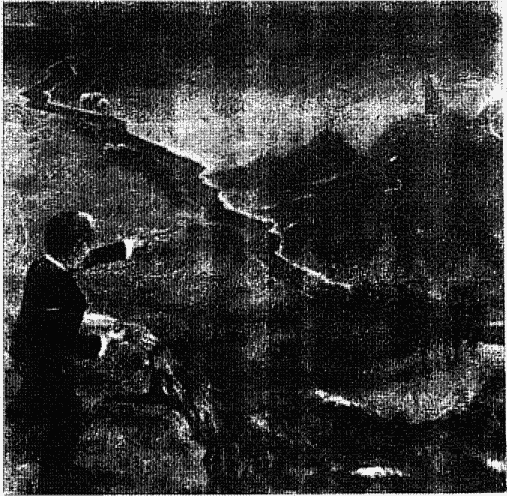

## 第八章

## 和平的天使

每过一周，李娃神经质的恐惧和焦虑就减去一层。每过一周，她就显得多了一分宁静、多一分柔美和耐性。她变得更有信心，而周围的人也自然被她吸引。李娃付出更多的爱，其他人也更关怀她。她真是个性中的那颗钻石现在愈发明亮，使大家都看得到了。

李娃的回溯，前后历经千年。每次她进入催眠状态，我都不知道这次她的前世会在那里。从史前穴洞到古代王朝，再到现代——她都待过。而她所有的轮回，都有前辈师尊慈蔼地监督。在今天这节催眠里，她出现在二十世纪——但不是以李娃的身份说话。

> > “我看到一架机身和一个跑道，某种飞机跑道。”她轻声说。
> “你知道在那里吗？”
> “我看不到……”
> “在哪里？”
> “我不知道，我看到一种棕色的头盔和帽子……有护目镜的帽子。部队已被歼灭了。这里似乎是荒郊野地。我想附近不会有城镇。”

> > “你看到什么？”

> > “我看到被毁的建筑，地面被炸得满目疮痍。有一个很隐蔽的地方。”

> > “你在做什么？”

> > “我在帮忙抬伤兵。他们要把伤者移到别处。”

> > “看看你自己，形容给我听。”

> > “我穿了一种夹克。头发是黑的，红眼珠。我的夹克很脏。好多人受伤了。”

> > “你受过救伤兵的训练？”

> > “没有。”

> > “你住在这儿，还是被带来？你住在那里？”

> > “我不知道。”

> > “你大概几岁？”

“三十五。” 李娃本人是三十二岁。

> > “你有名字吗？夹克上是否有名字？”

> > “这是特殊的夹克。我是个飞行员……”

> > “你驾驶飞机？”

> > “是的，我必须飞。”

> > “谁让你飞的？”

> > “我服的是飞行役。这是我的工作。”

> > “你也投炸弹吗？”

> > “我们机上有个炮手。还有领航员。”

> > “你飞哪一种飞机？”

“某种直升机。有四个螺旋桨。固定机翼。” 我感到有趣，因为李娃对飞机一无所知，我怀疑她清醒时不知怎么想“固定机翼” 的意思。不过，就像做点心或为死者薰香一样，在催眠中她具有大量储存的知识。但是，这些知识只有一小部分在日常生活、清醒时被记起。我继续。

“你有家人吗？”
“他们没和我在一起。”
“他们安全吗？”
“我不知道。我怕……怕他们会回来。我朋友快断气了！”
“你怕谁会回来？”
“敌军。”
“他们是哪国人？”
“日军。”
“你记得你的家人吗？”
“记得？我快搞混了。”
“我看到一个棕发女人坐在草地上。”
“她是你太太吗？”
“是的……我不认识她。” 她加上一句，指的是李娃此世中不认得。

“那很好。你在家快乐吗？或是有什么问题？”
“没有问题。”（停了很久）“对，现在是不安的时代。政府内部有很大的问题，政治结构的问题。大家都有不同的意见。这样会把我们力量分散的……但我必须为我的国家而战。”

“你对国家有强烈的向心力吗？”
“我不喜欢战争。我觉得杀人是不对的，但我必须尽我的职责。”

“不是，还有些人活著。”
“有你特别接近的吗？你飞行队的同僚呢？那个炮手和领航员还活着吗？”
“我没看到他们！不过我们的飞机没被击落。”

“你还要再开那架飞机?”

“是的，我们得赶快把留在机场的飞机……在敌军回来前开走。”

“到你的飞机里去。”

“我不想去。”仿佛她可以跟我讨价还价似的。

“但你得把它开离地面呀。”

“好没意义……”

“你在战前做的是什么职业? 记得吗?”

“我是一架小飞机……的副驾驶。专门运货的飞机。”

“所以你那时也是飞行员?”

“是的。”

“会让你常常不在家?”

她非常轻柔地回答，“是的。”

“往前去，”我导引好，“到下一次飞行去。你办得到吗?”

“没有下一次的飞行。”

“你发生了什么事吗?”

“是的。”她的呼吸开始加速，也显得激动起来。她已经到了死亡那天。

“发生什么事?”

“我从火灾现场逃开。我和同伴被这场火拆散了。”

“你活下来了吗?”

“没有人活下来……没有人躲得过战争。我要死了!”她的呼吸很重。“血! 到处都是血! 我胸口好痛。我胸口……和腿……和脖子都受了伤。痛得受不了……”她在剧痛中；但很快她的呼吸慢下来，变得较规律；脸上肌肉也放松了，有宁静的表情，我认得这是过渡状态的平静。

“你看来舒服些了。结束了吗?”她停了一下，然后很轻柔地回答：

> > “我浮起来……离开我的身体。我现在没有身体。又是灵魂了。”

> > “很好。休息吧。你过了艰难的一生，经过一次艰难的死亡。你需要休息，好好补充能量吧。从这一生你学到什么？”

> > “我学到恨……无意义的杀戮……误导的恨……许多人并不明白他们为什么要恨。我们在肉身状态时，被邪恶所驱使……”

> > “有没有比国家的职责更重要的价值观，使你能不去杀人？譬如个人的价值观？”

> > “有的……”

但她没有详加说明。

> > “你现在在等什么吗？”

> > “是的，我在等着进入更新的状态。我必须等。他们会来找我……他们会来的……”

> > “好，他们来时我想和他们谈谈。”

我们又等了几分钟。接着她的声音突然变大而沙哑，我听出是第一位灵魂前辈，而非诗人前辈在说话。

> > “对于在肉身状态的人，你这种做法是对的。你必须去除他们心中的恐惧。恐惧存在时就会浪费精力，恐惧使他们到这儿来不能得到该有的补充。从你的周围注意暗示。他们首先得进入一种深深的……状态，不感觉自己的肉体存在，然后你才能接近他们。困扰……只存在于表面，在他们灵魂深处，能产生想法的地方，那才是你得接近的地方。”

> > “能量……任何事物都是能量，好多都浪费掉了。高山峻岭……在山的深处是静的。在它中心是平静的，但外界则是产生麻烦的地方。一般人只看到外在，但你能更深入。你必须看到火山，要做到这点，就得深入内部。”

> > “在肉体状态是不正常的，灵魂状态才是我们的根本。从肉体状态，推向无知的开端，要花较长时间才学得会一件事。到了灵魂世界，你只需要等，就能更新。有一个更新的层次，你几乎到达了……”

这令我惊讶，我怎可能接近了更新的状态？

> “我几乎到达了？”

我难以置信地问。

> “是的。你比别人知道得多得多。但对他们有耐性点，他们并没有你获得的讯息。有些灵魂会去帮你，不过你目前做对了……继续下去。能量不应被浪费，你必须去除恐惧。那将是你最大的武器……”

灵魂师尊静了下来，我沉思著这些讯息的意义。我知道我成功地消除了李娃的恐惧，不过这讯息有更广泛的意义。它不仅是证明催眠做为治疗工具的效果，也不仅仅是前世的回溯。我相信它是关于对死亡的恐惧，也就是火山内部的不安。死亡的恐惧，这隐藏却持续的恐惧不是任何金钱或势力能消弭的——这就是核心。但如果人类知道“生命是无尽的；所以我们不会死；我们也从未真正地出生”，那这恐惧就可以消除。如果他们知道以前曾活过无数次，将来也会再活无数次，不知会觉得多有保障。要是他们知道灵魂会在身边给予帮助，而他们死后也会加入这些灵魂，包括他们所爱的故人，不知会觉得多安慰。要是他们知道守护“天使”真的存在，不知会感到多安全。要是他们知道对人的暴力和不公都得偿还，可以少掉多少愤怒和报复欲望。如果真的，“我们藉由知识接近上帝”，那么财富、权力又有什么用？它们本身即是目的，而不是接近上帝的方法。如此一来，贪婪与嗜好权力变得全无价值了。但是怎么向人说明这些讯息呢？大多数人都在他们的聚会所或寺庙里诵著经文，那些经文也记载著灵魂的不朽。但是仪式一结束，他们又回到互相竞争的轨道里，依旧贪婪、喜好操纵、以自我为中心，这些特性都会阻碍灵魂的进步。所以，如果信仰还不够的话，也许科学可以帮上点忙。也许李娃和我的经验需要自然、科学和行为学专家用科学、客观的态度加以研究、分析。但是，在此时，写篇科学论文或一本书是我心理最不想做的事。我想著那些会来帮我的灵魂，他们能帮我做什么呢？

> > 李娃动了，开始低语：“有个叫张颠的……有个叫张颠的……张颠。他想跟我说话。”

> > “他说了什么？”

> > “他就在附近，不停下来。他是某种守护者……但他现在只是跟我玩。”

> > “他是你的守护者之一？”

> > “是，但他在玩……到处跳来跳去。我想他是要我知道，他……随时都会在我身边。”

> > “张颠？”我重复道。

> > “他就在那儿。”

> > “这让你感到更安全吗？”

> > “是的。我需要他时他会回来。”

> > “很好。有没有灵魂在我们附近？”

她以超意识的角度回答。“哦，有的……许多灵魂。但他们只在想来时才来。我们都是灵魂。但其他的……有的在肉身状态，有的正在更新阶段。其余的就是守护者。我们也都做过守护者。”

> > “我们为什么要回到尘世里学？做为灵魂不能学吗？”

> > “那是不同层次的学习，有些是必须在血肉之躯里学的，必须让我们感受到痛。成为灵魂时是没有痛的，那是一个更新的时刻，你的灵魂会恢复元气。当你在血肉之躯里，会觉得痛、会受伤。在灵魂形式里则没有感官，只有快乐、幸福感，但它对我们只是一段恢复的时期。人在灵魂形式时，彼此的互动是不一样的。在肉体状态时你可以体验人际关系。”

> > “我了解。”她又沉默了。几分钟过去了。

> > “我看到一辆推车，”她开始说，“一辆蓝色的推车。”
> “婴儿车？”
> “不，是人驾驭的……蓝色的！顶上有蓝色流苏，外面也是蓝的……”
> “是马拉的吗？”
> “它有很大的轮子。我没看到人在里面，只有两匹马系在前面……一匹灰的一匹棕的。它们都是好马，不会咬人。腿很长……”
> “是不是也有一匹坏马？一匹不同的马？”
> “没有。它们都很乖。”
> “你在那儿？”
> “是的。我可以看到它的鼻子，比我的大好多。”
> “你会驾车子吗？”从她的回答，我可以看出她是个孩子。
> “好多马。还有一个小男孩。”
> “你几岁？”
> “很小。我不知道，我不会数数。”
> “你认识那男孩？是你朋友，还是兄弟？”
> “他是个邻居，来这里……玩。有个……婚礼什么的。”
> “你知道谁要结婚？”
> “不知道。大人叫我们不准弄脏。我有一个黑发……鞋子两边的扣子一直扣上来。”
> “这是你的宴会服？好衣服？”
> “是一件白色的……唐装，周围蓬蓬的，还有背后绑一个蝴蝶结。”
> “你家就在附近？”
> “是一栋大房子。”她回答。
> “你就是住在那里？”
> “是的。”

“好。现在你可以看看房子里的情形；没关系的。这是重要的一天，其他人也会穿得很整齐，穿着特别的衣服。”
“他们在做菜，好多吃的。”
“你闻得到？”
“是的。他们在做一种点心。点心……和肉……- 大人叫我们再出去玩。”我不禁会心一笑。我告诉她进去没关系的，现在她又被叫出来。
“他们怎么叫你们？”
“……何露……何露和虾仔。”
“虾仔就是那男孩？”
“是的。”
“大人不让你们待在房子里？”
“对，他们太忙了。”
“你对这个有什么感觉？”
“我们并不在乎。可是要不弄脏很难，什么都不能玩了。”
“后来你们去参加婚礼了吗？”
“是的……我看到好多人。屋里很挤。天气很热。有一个巫师在那里……他戴一顶很好笑的帽子，一顶大黑帽……把他的脸遮掉一大半。”
“这是你家的快乐时光？”
“是的。”
“是谁要结婚？”
“我姊姊。”
“她比你大很多？”
“是的。”
“现在看得到她吗？她是不是穿着结婚礼服？”
“是的。”
“她漂亮吗？”

“漂亮。她头发周围有好多花。”
“靠近一点看她。有没有在其他地方见过？看看她的眼睛、嘴巴……”
“有。我想她是何琪……不过小得多。”何琪是李娃的朋友兼同事。她们很接近，不过李娃讨厌何琪评判人的态度，还有对她生活的干涉。毕竟，她只是个朋友，不是家人。不过也许那个感觉现在不那么明显了。“她…喜欢我……我可以站到很前面去，因为她在那里。”

“好。看看你周围。你父母也在吗？”
“是的。”
“他们也一样喜欢你？”
“是的。”
“很好。仔细看看他们。先看你妈妈。记得她吗？看她的脸。”
李娃深深吸了几口。“我不认得她。”
“看看你父亲，仔细看。看他的表情、他的眼睛……还有他的嘴。认识他吗？”
“他是张喜。”她很快地回答，张喜又出现了。值得再追究下去。
“你和他的关系如何？”
“我很爱他……他对我很好。但他觉得我是个小讨厌。他觉得小孩都很麻烦。”
“他很严肃吗？”
“不，他喜欢跟我们玩。但我们问太多问题了，要不是我们问太多问题，他是对我们很好的。”
“那令他很烦？”
“是的，我们该向老师学，而不是他，所以我们才要到学校去。”

“这听起来像他讲的话。他对你说过这些？”
“是的。他有更重要的事情做，他得管整个村子。”
“是个大村子吗？”
“是的。”
“你知道地点是那里？”
“不知道。”
“大人有没有提过城市或国家的名字？镇名呢？”
她停下来，仔细地听，“我没听到。”她又静下来。
“好，你想对这一生多知道点吗？往前推，或者……”
她打断我，“这样够了。”

治疗李娃的整个过程，我都不太愿意和别的医生讨论她的案例。事实上，除了文化和其它一些“安全”的对象，我根本没提过这些惊人的消息。我知道这些信息是真的，而且非常重要，但担心同事的反应使我保持缄默。我仍然在乎我的名声、事业，以及别人怎么看我。

但是，我的怀疑论却一周一周地被她口中吐出的话所腐蚀。我常重放那些带子，再度经历催眠时的情景，觉得非常生动、直接。但其他人只能听我口述，虽然有力，但绝非他们自己的经历，我觉得必须多得到一点资料。

当我逐渐接受，并相信这些信息，我的生活也变得更单纯、更容易满足。不需要玩什么把戏，也不需要假装、扮演其他角色，或做不是我这个人会做的事。人际关系变得更诚实、直接。家庭生活中更没有困扰，更能放松心情。对李娃的故事，不愿公开的态度消除了。令我惊讶的是，大多数人都很感兴趣，而且想知道更多。许多人告诉我他们个人的超自然经验，不论是前世梦境、脱离身体的经验，或其他。有些人甚至连他们的配偶也未提过。大家几乎一致地怕说出来后，即使家人和心理医生也会觉得他们奇怪、胡言乱言。但这些灵学的经验却相当普遍，比我们想象的更常发生。是因为不愿透露，才使它们显得稀少。而愈是受过高等教育的人愈是不愿提起。

服务于我这家医院某个部门的主任，是具国际声誉的专家。他曾和过世的父亲说过话，那位老人家数度使他免遭危险。另一个教授，在梦中知道他一个复杂研究实验所缺的步骤，结果显示梦的正确。另一个著名的医生，常在接电话前就知道是谁打来。

我了解为何这些受过高度训练的专家不敢开口，我就是其中之一。我们不能否认自己的经验和感觉，但我们受的训练在很多方面却和这些信息、经验相反，所以我们开不了口。

## 第九章
### 灵魂之师

一周很快地过去。期间，我一次又一次反覆地听上回所录的带子。我要怎么接近“更新”的状态？我并不觉得特别受启发。而前辈们执意要帮我，但我该怎么做呢？什么时候才会发现？我会受到磨炼吗？我知道我必须有耐性地等待，我记得诗人前辈的话：

> > “耐性与适当时机…… 凡事该来的到时就会来……在该清楚的时候你就会了解，但你得有机会消化我们给你的东西。”

这节开始前，李娃说了一个前几晚做梦的片断。在梦里，她住在父母家中，半夜里起火了。她很能自制，帮着清出房内的东西，但她父亲却踱着步，好像对眼前的紧急状态视若无睹。她把他推向屋外。突然，他想起一件忘在屋里的东西，便遣李娃再回到熊熊大火中去拿。她记不得那件东西是什么。我打算先不解这个梦，看看她在催眠中是否有别的机会。

她很快进入深沉的催眠状态。“我看到一个戴头巾的女人，但没有遮住她的脸，只是包著头发。”然后她静下来。
“你现在看得到那头巾吗?”
“看不到了……是黑色的织锦，上面绣了金色图案……我看到一栋建筑……白色的。”
“你认得这座房子?”
“不。”
“是栋大房子吗?”
“不大。房子背后有峰顶很高的山为背景。不过山谷里的草是青的……我们在那儿。”
“你能进那栋房子去吗?”
“是的。它是用一种大理石建的……摸上去很冷。”
“它是座庙或宗教性的建筑吗?”
“我不知道。我想它可能是座监狱。”
“监狱?” 我重复道，“里面有人吗? 或是附近?”
“是的，有些士兵。他们穿红色的制服，头戴斗笠。还有红色的腰带。”
“你身边有士兵吗?”
“大约两、三个。”
“你在监狱里吗?”
“我在别处，不在里面，但很近。”
“看看周围。附近有山、有草地，还有那栋白建筑物。除此之外，有其他房子吗?”
“要是有，也不在附近。我看到一栋……单独的房子，盖在墙后面。”
“你想它是个碉堡或监狱，类似的建筑?”
“可能是，不过……它非常孤立。”
“这对你为什么重要?” (停了许久), “你知道这里是什么地方、什么国家？士兵们在那里？
“我一直看到‘大清国’几个字。”
“大清国？”我重复，惊异于她每一世的变化，“你看得到年份吗？或是年代？”
“一七一七年，”她迟疑地回答，接着又修正道，“一七五八……对，一七五八年。有很多兵。我不知道他们做什么的。都佩了长弯刀。”
“你还看到、听到什么？”我问。
“我看到一处泉水，他们用来喂马喝。”
“那些兵骑马？”
“是的。”
“那些士兵有没有其他称呼？他们怎么叫自己的？”她听著。
“我没听到。”
“你在他们之中吗？”
“不。”她的回答又再次像个小孩，常是单音节的。我必须变得非常主动。
“但你看到他们就在附近？”
“是的。”
“你住在城里？”
“是的。”
“好。看看是否能到你住的地方。”
“我看到一些破衣服。看到一个小孩，小男孩。他的衣服很破，全身发抖……”
“他在城里有家吗？”接著停了一段时间。
“我没看到。”她继续。她对这一生似乎有点衔接的困难。所以回答有些模糊、不肯定。
“好。你知道男孩的名字吗？”
“不知道。”

“他发生了什么事？和他一起去，看发生什么。”

“他认识的一个人是囚犯。”

“是朋友？还是亲戚？”

“我相信是他父亲。” 她的回答很短。

“你就是那男孩？”

“我不能肯定。”

“你知道他对父亲在牢里有什么感觉？”

“知道……他很害怕，怕他们会杀他。”

“他父亲做了什么？”

“他从军队里偷了些东西，一些文件什么的。”

“那男孩并不完全了解？”

“是的。他可能再也看不到他父亲了。”

“他能去看他父亲吗？”

“不能。”

“他们知道他父亲要被关多久吗？或知道他能不能活？”

“不知道！” 她的回答声发著抖。显得非常沮丧、哀伤。她并没有提供多少细节，但显然被她目睹、经历的事困扰。

“你能感觉那个男孩的感觉，” 我继续，“感到那种恐惧和焦虑。是不是？”

“是的。” 她再次沉默下来。

“发生了什么事？往前去。我知道这有困难。但往前去，一定有事情发生了。”

“他父亲被处决了。”

“他现在有什么感觉？”

“他是为从未犯的罪处死刑。但他们处决人民根本不需要什么理由。”

“那男孩一定很难过。”

> “我不相信他完全了解……发生的这些事。”

> “他有别人可以投靠吗？”

> “是的，但他的日子会很难。”

> “后来那男孩怎么了？”

> “我不知道。他也许会死……”

她的声音很悲伤。她又停了下来，好像在左顾右盼。

> “你在看什么？”

> “我看到一只手……一只手在白色的什么东西旁边。我不知道它是什么……”

她又沉默下来，过了几分钟。

“你还看到什么？” 我问。

> “什么也没有……黑暗。”

她若不是死了，就是和那个两百年的清朝男孩失去联系。

> “你离开了那男孩？”

> “是的。”

她轻声说。她在休息。

> “你从刚才那一生学到什么？它为什么重要？”

> “不能草率地审判一个人，得公平对待他，很多人命因为我们草率的判断而毁了。”

> “那男孩的生命因为他父亲的判决而又短又难。”

> “是的。”

她又沉默了。

> “你现在看到别人吗？或听到什么？”

> “没有。”

再度是简短的回答，然后沉默。为了某种原因，这个短暂的一生特别地耗费力气。我指引她休息。

> “休息，感觉安宁。你的身体会恢复的；你的灵魂在休息……现在觉得好些了吗？得到休息了？那小男孩的确过了艰难的一生。不过你现在休息了，你的心会带你到其他时空……其他记忆中去。你在休息吗？”

> “是的。”

我决定进一步追索她家失火、父亲要她到火场里拿一件东西的梦。

> “我现在有个关于……你父亲在梦里的问题。你可以回想它，那是安全的。你在催眠中，记得吗？”

> “记得。”

> “你到屋子里去拿样东西。记得吗？”

> “是的……一个金属盒子。”

> “那里面有什么重要东西使他叫你会火场里去？”

“他收集的宝钞和硬币……” 她回答。她在催眠中对梦的细节可以记得这么清楚，和清醒时大相径庭。催眠是个有力的工具，不仅可以走向最遥远、隐蔽的心智，也提供了更详尽的记忆。

> “他的宝钞硬币对他而言很重要吗？”

> “是的。”

> “但冒了你的生命危险，只为抢救宝钞和硬币——”

她打断我，”他不认为是在冒险。”

> “他认为这样安全？”

> “是的。”

> “那么，他为什么不自己去？”

> “因为他认为我的动作比较快。”

> “我懂了。那么，对你来说是个风险，是吗？”

> “是的，但他不了解这点。”

> “这个梦对你还有什么其他意义？有关你和你父亲的关系？”

> “我不知道。”

> “他似乎不急著逃出起火的房子。”

> “没错。”

> “他为什么如此悠闲？”

“因为他想逃避事情。” 我抓住此刻来解析她的梦：

> “是的，这是他的老模式，要你帮他做事，譬如拿那个盒子。我希望他能向你学习。我有个感觉，那火代表时间快没了，你了解这点，他却不了解。当他慢慢踱步，又遣你回去拿东西，你知道得更多……可以教他更多，但他却并不想学。”

“是的，”她同意道，“他不想学。”

“这是我对这个梦的看法，但你也没办法强迫他，他只能靠自己去了解。”

“是的，”她再度同意，而且声音变得低沉沙哑，“火若是烧掉了我们并不需要的肉体，是没什么关系的……”一个灵魂前辈透露了这个梦完全不同的角度，我惊讶于他的突然插入。

“我们不需要肉体？”

“是的。我们在肉身状态时会经过许多不同阶段：从婴儿身变成儿童，再由儿童变为成人，由成人迈向老年，为什么我们不再跨过一步，摆脱成人的身躯进到精神层面？这是我们该做的。我们不会停止成长，当我们进入精神层次，仍继续在那儿成长，要经历不同的阶段。当我们在灵魂状态时，肉体已遭焚毁。我们必须经过一个更新阶段、一个学习阶段，还有决定的阶段。我们决定何时回去、回到那里去，以及为了什么原因。有些灵魂选择不再回去，而继续另一个发展的阶段，于是他们就保持灵魂的形式……比那些回去的人稍久些。这些全是成长和学习……持续的成长。肉身只是在尘世上的工具，能永久长存的是我们的灵魂和精神。”

我并不认得他的声音和风格——一个“新的”前辈在说话，吐露重要的信息。我希望多了解一些这个精神领域。

“在肉体状态下学得较快吗？有什么原因让某些人保持精神状态、某些人又回到肉身？”

“在精神状态下学习快得多。但我们选择什么是需要学的。如果我们需要回去经历一场关系。就回去。如果结束了，就继续。在灵魂的形式下，你一样可以和那些肉体状态的人接触。只是看有无必要……是不是有重要事他们非知道不可。”
“怎么接触？这些信息如何传递？”
令我惊讶的是李娃回答，她的低语变得较快、较肯定。“有时你可以出现在那人面前……就以你从前的模样出现。有些时候可以仅做心灵感应。有时信息会含蓄难辨，但多半那个人知道所指为何。他们会了解，因为那是心灵对心灵的接触。”
我对李娃说：“你现在所知的信息、智慧，是很重要的……为什么在清醒的时候却不能传递给你？”
“我想我不会懂的。没有能力去了解。”
“那，也许我可以教你了解，好让你不再害怕。”
“是的。”
“你听到的那些前辈，他们说的话和你的很类似。你一定知道很多知识。”每当她在这种状态，就拥有令我惊讶的智慧。
“是的。”她简单地答道。
“这是你自己心里就有的？”
“是他们放进来的。”她仍归功于那些前辈们。
“是的，”我说，“那么我该怎么传输给你，好让你不再恐惧？”
“你已经做到了。”她轻轻回答。她是对的，她的恐惧已消除。催眠回忆一开始，她的进步就非常迅速。
“现在你要学的是什么？这一生对你来说最重要的、能让你持续进步的课业是什么？”
“信任。”她很快地回答。她已经知道主要的目的。
“信任？”我重复道，惊讶于她的快速反应。
“是的，我必须学着有信心，也要信任别人。但我没有，我认为每个人都想害我，这使我对许多不该回避的人和状况都刻意疏远，反而和不该在一起的人共处。”
她在超意识状态的见解是惊人的，她知道自己的弱点和长处，知道那些范围需要注意和下功夫，也知道怎么求进步。唯一的问题是，这些见解需要传达到她的意识中、应用在生活里。超意识的洞见是不凡的，但它本身还不足以改变她的生活。

> > “那些该断绝的人是谁？” 我问。

> > 她停了一下，“我怕伤害会从何琪……或张喜那里来……”

> > “你信任谁？” 我问，“想想看。谁是你可信任和学习、并接近的对象？”

> > “我信任你。” 她低语道。这个我知道，但她必须多信任一些日常周遭的人。

> > “是，你可以信任我。但你也应该接近其他日常生活中的人，他们跟你共处的时间更多。” 我要她成为完整而独立的人，而非依赖我。

> > “是的。” 她同意道。

想到未来的信息不禁令人心中一颤。她对于过去说得如此正确，透过前辈师尊，她知道那些特别、秘密的事件。那么，他们也知道未来吗？果真如此，我们能分享这未来知识吗？我心中涌起上千个问题。

> > “当你像现在这样和超意识接触，能否发展直觉领域能力？你有可能看到未来吗？”

> > “是有可能，” 她同意，“但我现在看不到。”

> > “有可能？”

> > “我相信是的。”

> > “你做这事不怕吧？你能进到未来、得到一些不会令你害怕的中立资讯吗？你看不看得到未来？”

> > 她的回答很简短，“我看不到。他们不允许的。” 我知道她指的是前辈师尊。

> > “他们在你附近吗？”

> > “是的。”

> > “在和你说话吗？”
> 
> “没有。他们监督一切。” 所以，在监督下，她无不法偷窥未来的事。也许这样瞥一眼并不会得到有关个人的信息、也许这个探险会让李娃过于焦虑，也许，是我们尚未准备好怎么应付这种讯息；总之，我不想勉强她。
> 
> “那个以前在你身边的灵魂，张颠……”
> 
> “你想问什么？”
> 
> “他需要什么？为什么在你身边？你认得他吗？”
> 
> “不，不认识。”
> 
> “但他保护你免受伤害？”
> 
> “是的。”
> 
> “前辈们……”
> 
> “我没看到他们。”
> 
> “有时候他们会给我一些信息，既能帮你又能帮我的讯息，即使他们没对你讲话。这些信息也能给你吗？他们能在你心里放上思想吗？”
> 
> “是的。”
> 
> “他们也监督你的回忆？”
> 
> “是的。”
> 
> “所以这些轮回的解释是有目的的……”
> 
> “没错。”
> 
> “……是为你也是为我……为了教导我们，远离恐惧。”
> 
> “沟通的方式有许多种。他们选择许多人……表示他们的存在。” 不论是李娃听见的声音、经历的通灵现象，或是，她心里的想法和智慧，目的都是一样的——为了显示前辈师尊的存在，甚至超过这个，为了帮助我们透过智慧变得如神一般。
> 
> “你知道他们为什么选上你……来做管道？”
> 
> “不知道……”

这是个有意思的问题，因为清醒时的李娃连录音带都不愿听。“不知道。”她轻声说。
“这令你害怕吗？”
“有时候。”
“有些时候则不？”
“对。”
“它可以是一种保证，”我说，“我们现在知道我们是永恒的，就不会害怕死亡了。”
“是的，”她说，停了一会，“我必须学习信任。”她回到此生主要的课题上来，“当值得信任的人告诉我什么，我该学着相信。”
“当然也有些人信不得。”我加上一句。
“是的，但我搞不清。当我遇上可以信任的人，就得跟自己不肯信任的习惯作战。”我再次敬佩她的见解时，她沉默了。
“上次我们谈到你小时候，在院子里和马一道。记得吗？你姊姊的婚礼？”
“一点点。”
“那次是否还有更多的信息？你知道吗？”
“是的。”
“值得现在回去探寻一下吗？”
“现在不能回去。一生里就有好多事情……每一生都有许多可知道的。是的，我们得去探寻，但不是现在。”
“你似乎在接受信息。知道它们是哪儿来的吗？我希望前辈人出现。”
“有人告诉我……”她含混不清地说。
“有人在对你说话？”
“但他们走了。”我试著叫他们回来。
“能不能请他们回来……帮我们？”

“他们只在想来时才来，不是我能选择的。”她肯定地回答。
“你控制不了？”
“是的。”
“好吧，”我继续，“但有关麻醉的讯息对你很重要，那就是你害怕窒息的来源。”
“是对你重要，而不是我。”李娃反驳道，她的回答在我脑中反复回响。她对窒息的恐惧会痊愈，但这个揭露却对我更为重要。在治疗人的是我，她的简单回答包括了多重意思。我感到如果真地了解这些层面，会对人类之间的关系跃进一大步，也许这个帮助比痊愈更重要。
“为了让我帮你？”我问。
“是的。你能消弭他们的憾事。你已经在做了……”她在休息中。我们两人都学到重要的一课。

## 第十章
### 看穿生命

几天后，我从一个深沉的梦里惊醒。突然觉得李娃的脸在我眼前一闪，比真人大上几倍。她看来很难过，似乎需要我的帮忙。看看钟，才凌晨三点三十六分。没有外界的噪音把我吵醒，妻子在我旁边睡得正熟，我挥去这个念头又倒下去睡。

同一天凌晨约三点半，李娃从噩梦中惊醒；她流著冷汗、心跳加速。她决定以静坐来镇定情绪，并想像在我会诊室里被催眠的情形。她想像我的脸、假装听到我声音，然后渐渐睡去。

李娃变得愈来愈通灵，显然我也是。我回想起心理学教授讲的在治疗关系中“感情转移”与“相对感情转移”的互动。感情转移是病人对治疗者所代表的过去某个人投射的感情、思想、愿望。相对感情转移则是相反，是治疗者无意识间对病人的情绪互动。但这个凌晨三点半的互通却不属于两者。它算是一种精神感应吧。不知怎地，催眠打开了这个管道，或者是，前辈师尊和守护者及其他人造成这次感应，总之，我并不惊讶。

这次会诊中，李娃很快进入催眠状况。她迅速紧张起来，“我看到一大片云……很吓人。”她的呼吸很急促。

“还在那儿吗？”

“我不知道。它来得快也去得快……就在山顶上。”她仍然很紧张，呼吸沉重。我怕她是见到了核爆。她会看到未来吗？

“你看得到那座山吗？像不像爆炸后的样子？”

“我不知道。”

“为什么会令你害怕？”

“太突然了，就在那里。有好多烟，很呛人。又很大，在一段距离外……”

“你是安全的。能更接近一点吗？”

“我不想再靠近了！”她断然地回答。她如此坚拒倒是不常见的。

“你为什么这么怕？”我再问。

“我想那是一种化学物质或什么的。在它周围就很难呼吸。”她困难地吸著气。

“像一种气体吗？是从山里冒出来的……像火山吗？”

“我想是的。它像一朵大香菇。对，就是这样……但是白色的。”

“不是爆炸？核爆之类的？”她停下来一会，才说道。

“是……火山爆发一类的。很吓人、很难呼吸，空气里都是灰尘。我不想待在这儿。”她的呼吸渐渐恢复到平常的和缓速度，她离开了那个骇人的现场。

“现在较容易呼吸了吧？”

“是的。”

“好。现在你看到什么？”

“没什么……我看到一条项链，在某人脖子上的一条项链。蓝色的……是银链，挂有一颗蓝色宝石，周围还有更小的宝石。”

“蓝宝石上有什么吗？”

“不，它是透明的，你可以看穿它。那名女士有黑发，戴了一顶蓝帽……帽上有很长的羽毛，衣服是天鹅绒的。”

“你认得这女士吗？”

“不。”

“你在那儿，或你就是那女士？”

“我不知道。”

“不过你看到她？”

“是的。我不是那女士。”

“她多大年纪？”

“四十几岁。不过看起来比实际年龄老。”

“她现在做什么事？”

“没什么，只是站在桌子旁边。桌子有一个香水瓶。是白底绿花的图案。另外还有一把刷子、一把银把手的梳子。”我对她的细节描述感到惊讶。

“这是她的房间，还是一间商店？”

“是她的房间。有一张四个床柱的床，是棕色的。桌上还有个水罐。”

“水罐？”

“是的。房间里没有挂画，但有好看的窗帘。”

“还有别人在附近吗？”

“没有。”

“这名女士和你的关系是什么？”

“我服侍她。”她再度以仆人身份出现。

“你在她手下很久了吗？”

“不……只有几个月。”

“她喜欢那条项链吗？”
“是的。她戴起来很高雅。”
“你有没有戴过那条项链？”
“没有。”她的回答很简短，所以需要我主动发问来获得基本资料。
“你现在多大？”
“大概十三、四岁……”她答。
“你为什么离开了家人？”我问。
“我没有离开家人，”她改正我的错，“我只是在这里工作。”
“我懂了。工作完了你就回去？”
“是的。”她的答案只留下极少的探索空间。
“他们住在附近吗？”
“很近……我们很穷。所以必须工作……当佣人。”
“你知道那女士的名字吗？”
“逯华。”
“她待你好吗？”
“好。”
“你工作很累吗？”
“并不很累。”对青少年问话向来不是简单的事，即使在前世中也一样，幸好我受过训练。
“好。你现在还看到她吗？”
“没有。”
“你现在在哪里？”
“另一个房间。有张铺了黑布的桌子……流苏一直垂到桌脚。我闻到好多草药……还有很重的香水味。”
“是你女主人的吗？她是不是用很多香水？”
“不，这是另一个房间。我在另一个房间里。”

“这是谁的房间？”
“一个黑黑的女士。”
“黑黑的？你看得到她吗？”
“她头上缠了一圈又一圈的布，”李娃小声说，“而且又老又皱。”
“你跟她的关系是什么？”
“我刚刚来这里看她。”
“为什么？”
“看她玩牌。”我直觉地知道她来这个房间算命。这真是个有趣的对照；李娃和我在这里进行心灵上的探险，在她的前世间来来回回探寻，但是，也许两百年前，她去找过算命师预卜她的未来。我知道现世中的李娃并没有找人算过命，对四色牌也不清楚；这些事令她害怕。
“她可以看出你的命运吗？”我问。
“她看得见许多事。”
“要问她问题吗？你想知道什么？”
“想知道……我结婚的对象。”
“她拿牌算了以后，跟你说什么？”
“我的牌里有几张是……有杆子的。杆子和花……但还有杆子、箭和某种线条。另外一张牌有圣杯……我看到一张男人拿盾牌。她说我会结婚，但不是和这个人……其他我就看不到了。”
“你看得到这位女士吗？”
“我看到一些硬币。”
“你仍和她在一起，或到了别地方？”
“和她在一起。”
“那些硬币看起来是什么样子？”
“它们是金的，边缘不太平滑，是方型的。有一面是个皇冠。”
“我已经离开那里了。”她已经离开那世，在休息了。现在她已能靠自己做到，不需要再经历一次死亡。我们等了几分钟。这一生并没有很重大的事，她只记得一些特殊的细节，及去找巫婆的经过。
“你现在看到任何东西吗？”我再问。
“没有，”她轻声说。
“你在休息吗？”
“是的……不同颜色的珠宝……”
“珠宝？”
“是的。它们事实上是光线，但看起来像珠宝……”
“还有什么？”我问。
“我只是……”她停下来，然后声音变得大而肯定，“周围有许多话语和思想飞来飞去——是关于共存与和谐——事物的平衡。”我知道前辈就在附近。
“是的，”我鼓励她继续，“我想要知道这些事情。你能告诉我吗？”
“目前它们只是一些句子。”她回答。
“共存与和谐。”我提醒她。当她回答时，是诗人前辈的声音，再听到他开口令我一惊。
“是的，”他回答道，“任何事都必须有所平衡。大自然是平衡的，飞禽走兽和谐地活着。人类却还没有学会，他们不断在摧毁自己。他们做的事缺乏和谐，也没有计划。自然就不一样了，自然是平衡的。自然是活力和生命……及休养生息。人类只知破坏；他们破坏自然，也摧毁其他人，最后他们会毁掉自己。”
这是个可怕的预测。世界继续在混乱与动荡中，但我希望这天不会太早来到。“这什么时候会发生？”我问。
“会比他们想的还快发生。自然会存活下来，植物会存活下来，但我们不会。”
“我们能做什么来防止这种毁灭吗？”
“不能。凡事都必须平衡……”
“这个毁灭会在我们有生之年发生吗？我们能改变它吗？”
“不会在我们有生之年。它来时我们已在另一个空间，另一个层次，但我们会看到。”
“难道没有办法可以教导人类吗？”我继续寻找出路，求取万分之一的可能性。
“要在另一个层次才能做到，我们会从中得到教训。”
我往光明面看，“那么，我们的灵魂会在不同的地方获得进步？”
“是的。我们不会再到……这里。将来就知道了。”
“是的，”我赞同道，“我需要告诉这些人，但不知怎样他们才听得进去。是真的有办法，还是他们必须自己学？”
“你不可能让每一个人都知道。要阻止毁灭，就得每个人身体力行，但你不可能做到这点。毁灭是阻止不了的，他们会学到的。当他们进步到某一个阶段，就会学到这件事。会有和平的，但不是在此，不是在这度空间。”
“最后会有和平？”
“是的，在另一个层次。”
“但是，似乎还很远，”我抱怨道，“现在人们似乎还很鄙陋——贪婪、渴望权力、野心勃勃。他们忘了爱和了解，以及知识，还有很多事待学习。”
“是的。”
“我能写下什么来帮助这些人吗？有没有什么办法？”
“你知道方法的，用不着我们告诉你。但它没有有效，因为最后我们都会到达同一层次，那世他们就知道了。大家都是一样的，我们并不比其他的人伟大，所有这些不过是课业——还有惩罚。”
“是的。”我同意。这一课可真是深奥，我需要时间慢慢消化。李娃沉默了。我们等著，她休息，我咀嚼著刚才一个钟头里的听闻。最后，她打破沉默。
“那些五光十色离开了，”她轻声说。
“那些声音、句子也是？”
“是的，我现在什么也没看到。”她停下时，头开始左右摇摆，“有个灵魂……在看。”
“在看你？”
“是的。”
“你认得它吗？”
“我不能确定……我想可能是张喜。”张喜在去年逝世了。他似乎真的无所不在，总环绕在她身边。
“那个灵魂看来是什么样子？”
“就是一道……白色的……像光一样。他没有脸，不像我们认识的样子，但我知道是他。”
“他和你有什么沟通吗？”
“不，他只是看。”
“他在听我所说的话吗？”
“是的，”她小声说，“但她现在走了。他只是来看看我是否安然无恙。”我想起守护天使这个普遍的观念。看来，张喜相当接近这个角色，而李娃也提过守护的精灵，我怀疑我们小时候的“神话”有多少是根植于模糊的过去记忆。
我也揣测著灵魂间的层级，有关谁做守护者，谁成为前辈师尊，或者两者都不是，只是学习。应该有基于智慧和知识的评分，看离最终成为类似神的目标还差多远。这事好几世纪以来，神学家倾心追溯的目标，他们对此神圣的结合瞥见过一眼。我并没有这种亲身经验，但透过李娃的管道，却似乎有了最佳的观点。
张喜走了，李娃也安静不语。她的脸上现出安祥宁静的表情。她拥有的是何等的天赋——能够看穿生命、看穿死亡，和“神们”说话，分享他们的智慧。我们在吃知识树的苹果，只是它不再被禁吃，我怀疑还剩下多少颗苹果。
文化的母亲文华，癌细胞由乳房扩散到骨头和肝，已在生命的最后阶段。这个过程已拖了四年，现在用化学治疗也缓不下来。她是个勇敢的女人，坚忍地承受这种磨人痛苦。但我知道病情正加速恶化，她的终点不远了。
我非常相信心理治疗师必须有开放的心灵。以李娃的例子而言，一些科学性的纪录工作该进行，而实验性的工作更该展开。心理治疗师该考虑死后生命的可能性，并融入他们的咨议中。他们不一定要用催眠回忆法，但应该保持心灵的开放，和病人分享他们的知识，并且不要不相信病人的经验。
人类现正被死亡威胁着。爱滋病、核战、恐怖主义、疾病，和许多其他灾难日夜威胁着我们，许多青少年认为他们活不过二十岁，这真令人难以置信，但也反映了我们社会的巨大压力。
以个人的层面而言，文华对李娃信息的反应是令人振奋的。她的精神变强了，而且在巨大的肉体痛苦中仍感到希望。但这信息是给我们大家的，不只是濒死的人，我们也有希望。我们需要更多的临床医师和科学家报导其他类似李娃的案例，以肯定并扩散这些讯息，答案就在那里——我们是不朽的，我们会永远在一起。

## 第十一章 回到肉身要经过七个层面

自第一次催眠以来，已过了三个半月。李娃的精神状态不仅真的消失了，还得到比痊愈更多的进步。她散发出光芒，周围有一种平安的能量。人们自然地被她吸引。
如同往常，她在我光线柔和的诊疗室里很快进入催眠状态，一头秀发散在枕头上。
“我看到一栋建筑……石头砌起来的。顶上还有圆的装饰。这里是山区。很湿……外面很湿。我看到一辆马车。一辆马车从……前面过去。车上有干草、稻草一类的，给畜牲吃的食料。还有一些男人。他们拿着一种布条，绑在杆子上随风飞的布条。颜色很鲜艳。我听到他们谈倭寇人。还有一个战争。他们头上有种……金属做的头盔。年代是一四八三年。有什么关于日本人的。我们跟日本人打吗？有一个战争在进行。”
“你在那儿吗？”我问。
“我没看到那些场面，”她轻轻地回答，“我只看到马车，双轮的，后面可载货。马车是没有顶的；两边用板条钉起来。我看到……他们戴一种金属项链……很重的样子。我看到剑。他们有种刀或剑……很重、很钝。在为战斗预备著。”
“看能否找到你自己，”我引导著，“看看周围。也许你是个士兵。从某地看著他们。”
“我不是士兵。”她对这点很肯定。
“看看四周。”
“我带来一些补给品。这里是个村子。”她静下来。
“你现在看到什么?”
“我看到一个布条，某种布条。是红色的。”
“这是你们的旗子吗?”我问。
“是皇帝军队的旗帜。”她回答。
“是你这边的皇帝?”
“是的。”
“你知道皇帝的名字?”
“我没听人提起。他不在这里。”
“你对这场战争有什么感觉?”
“它已成了我的生活方式。我在上次的小冲突里失去一个孩子。”
“一个儿子?”
“是的。”她很悲伤。
“还剩下谁? 家中还有什么人?”
“我太太……和我女儿。”
“你儿子叫什么名字?”
“我不知道他名字。但我记得他。我看到我妻子。”李娃做过男人，也做过女人。
“你妻子看起来是什么样子?”
“她很疲倦，很疲倦。她老了。我们有些山羊。”
“你女儿还和你们住一起吗？”
“不，她结婚，搬走了。”
“那么，就你和太太两个人？”
“是的。”
“你妻子还好吧？”
“我们很疲倦，又很穷。日子一点也不容易。”
“是的。你们失去了儿子。你想念他吗？”
“是的。”她仅如此回答，但哀伤之情显露无遗。
“你是个农夫吗？”我改变话题。
“是的。我种水稻。”
“你一生中，国家都遭遇战争，发生许多悲剧吗？”
“是的。”
“但你活到这么大年纪。”
“他们是在村外打，没有打到村里来。”她解释道，“他们必须翻山越岭去打仗。”
“你知道这里的地名？”
“我没有看到，不过它一定有名字的。只是我没看到。”
“你除了妻子和女儿，还有别的家人吗？”
“没有。”
“你的父母已过世了？”
“是的。”
“兄弟姊妹呢？”
“我有一个姊姊还活着。但我不认识她。”她指的是在现世中不认识。
“好。看看你是否能在村里或家里认出其他人？”如果人们真会结群地转世，她很可能会认出别的在此世中重要的人。
“我看到一张石桌，我看到碗。”
“是在你家吗？”
“是的。我看到一种用玉米做的……黄色的东西。我们正在吃……”
“好的，”我试着加快速度，“这对你是很辛苦的一生，很艰难的日子。你现在在想什么？”
“马匹。”她小声地说。
“你有养马？还是别人的？”
“不，是士兵的……他们中一些人骑马，但大部分人是走路。那些也不是马，是驴或什么体型比马小的牲口。它们大都很野。”
“现在把时间往前推，”我指引道，“你很老了。试着到你一生中最后一天。”
“但我并没有很老。”她反驳道。她在前世中不太能接受暗示，发生了什么就是什么。我不能挥去她真实的记忆，也不能让她改变发生过的细节。
“这生里还有什么大事吗？”我问，改变策略，“有什么重要的事得让我们知道？”
“没有。”她不带感情地回答。
“那么，往前去。让我们了解你需要学的是什么。你知道吗？”
“不知道。我还在这儿。”
“是的，我知道。你看见什么吗？”过了一两分钟她才回答。
“我浮起来。”她轻声地说。
“你已经离开老人的躯体？”
“是的，我浮起来了。”她又进入不具肉体的状态。
“现在你知道要学的是什么吗？你又过完辛苦的一生。”
“我不知道。我只是浮起来。”
“好的。休息吧……”又过了沉默的一阵子。然后她似乎在听什么。突然她开口了，声音大而深沉。这不是李娃。
“总共有七个平面，每一个面都由许多层次组成，其中一个平面是记忆。在那个平面里你得以收集思想、想法，得以观看刚才过去的一生。那些在较高层次的人可以看到历史，他们可以回过头来教我们学到的历史，但我们在较低层次的人只能看到自己刚过完的一生。”
“我们有必须偿还的债；要是没有还完，就得带着这些债到下一世去，好让它们还掉，你在还债中能得到进步。有些灵魂进步得比其他快些，当你在肉体状态清完了债务，就结束了一生。要是有什么事打断了你还债，你就必须回到记忆的平面，等待你所欠的那个灵魂来见你。当你们两人能同时回到肉体状态时，才能再转世。但是由你决定何时回去，以及回去后该如何做。你不会记得其他的前世，只会记得刚过完的这一生。只有高层次的灵魂——才能记起历史和过去的事件，来帮助我们，教我们该怎么做。”
“在我们回到肉身前需要经过七个平面。其中之一，是过渡的平面。我们在其间等待。在这个平面里，决定你会带著什么去到下一世。我们都会有一个主要的特性。可能是贪婪、可能是色欲，不过一旦决定，你就需要对那些人偿债，而且要在那生中，克服这个特性。如果没有做到，将来还要带著这个特性，外加另一个，到下一世中，负担就更重了。你过完的每一生若没有偿清这些债，下一生就变得更难；要是完成了，就会有容易的来世。所以等于是你自己选择会过什么样的人生。在每一个阶段，自己过的生活是自己选的、要自己负责。”
李娃接着沉默下来。
这些话显然不是出自一个前辈师尊。他自称为“我们低层次的”，有别于那些在较高层次的灵魂——“圣者”。但是他传达的信息很清楚，也很实际。我猜想着其他五个平面和它们的特色。不知“更新”的阶段是否为其中之一？而学习阶段与决定阶段呢？所有从灵魂状态不同层次来的信息，都具有一致性，只是传达的风格殊异，用词、语法不同；但是内容维持一贯。我渐得到一套有系统的灵魂学，这个学说讲的是爱与希望、信心与善意。它检视了德行与罪愆、对别人与自己的债务。它包括了前世和一生与一生间的灵魂层面。说的是灵魂通过和谐与平衡得到的进化，进化至与神相连的狂喜境界。
此外也有许多实用的建议：耐性与等待的价值；自然界的平衡所蕴含的智慧；恐惧的消除，尤其是对于死亡的恐惧；需要学习信任与宽恕；不要去评判别人，或中止他人的生命；直觉能力的累积与应用；以及，也许是最重要的，“我们是永生的”这不可动摇的概念。我们超越生与死，超越时间与空间；我们就是神，它们就是我们。
“我在飘浮。”李娃低语。
“你现在是在哪一个状态？”我问。
“没有……只是浮著……张喜欠我一些……他欠我一些……”
“你知道他欠你什么？”
“不知道……他欠我……一些信息。”
“他还必须告诉你其他什么信息？”
“我不知道，不过他有事情要告诉我。而且他欠我什么东西……是什么我不知道。反正他欠我。”她静下来。
“你累了吗？”我问。
“我看到一个马鞍，”她轻声回答，“靠在墙上。一个马鞍……我看到小房子外面的一块毯子。”
“是个马厩吗？”
“他们在那里养马。有好多马。”
“你还看到什么？”
“马夫……他很高大。”我了解到在跟一个小孩说话。
“他长的什么样子？”
“很高大，有灰白发。”
“看得到你自己吗？”
“我是个小孩……小女孩。”
“这些马是你爸爸的，还是他只是照管它们？”
“他只是照顾它们。我们住在附近。”
“你喜欢吗？”
“是的。”
“还有谁和你在一起？”
“我妈妈在这里。还有一个姊姊……没有看到其他人了。”
“你现在看到什么？”
“我只看到马。”
“这是一段快乐时光吧？”
“是的。我喜欢马厩的味道。”她特别指出在马厩里的特定时间。
“你闻到马的味道？”
“是的。”
“还有干草？”
“是的，它们的脸好软。这里也有狗——黑狗，还有猫……好多动物。狗是打猎时用的。当他们要去猎鸟，就会把狗带去。”
“你发生了什么事？”
“没有。”我的问题太模糊。
“你在农村上长大的？”
“是的。那个照顾马的人，”她顿了一下，“他并非我真正的父亲。”我搞迷糊了。
“他不是你真正的父亲？”
“我不知道，他……不是我真正的父亲。但是他对待我如同父亲。他是我继父，对我很好。有双发绿的眼珠。”
“看看他的眼睛，看你是否认得他。他对你很好，他爱你。”
“他是我祖父——我祖父。他非常爱我们。我祖父非常爱我们。他以前总是带我们出去。我们到他喝酒的地方去。他喜欢我们。”我的问题使她跳出那世，而进到观察、超意识状态，她在看李娃现在的一生，以及和祖父的关系。
“你仍然想念他？”我问。
“是的。”她轻轻回答。
“不过你看到他以前也和你在一起。”我解释着，想减轻她的伤痛。
“他对我们很好。他爱我们，从来不对我们大吼小叫。他会给我们零用钱，到那里都带著我们。他喜欢这样。但他死了。”
“是的。但是你会和他重逢。你知道的。”
“是的。我以前也和他一起过。”
“你祖父已经了解了……”
“我知道，”她打断说，“我们在肉体状态时有好多阶段要渡过……就像演化的阶段。从婴孩到幼儿……再就是儿童……在到达目标前有这么远的路要走。肉体形式的阶段是辛苦的。到了灵魂状态就轻松了，只需要等待、休息。现在是辛苦的阶段。”
“在灵魂状态有多少阶段？”
“七个。”她回答。
“是些什么？”我问，想再肯定一下不久前提到的那二个阶段。
“我只知道两个，”她解释道，“过渡阶段和回忆阶段。”
“那也是我听过的两个阶段。”
“我们以后会知道其他的。”
“你和我同时学了这个，”我说，“今天我们学到‘欠与偿’这件事，是非常重要的。”
“我会记得该记得的。”她加上谜样的一句。
“你会记得这些阶段吗？”我问。
“不，它们对我并不重要，而是对你重要。”我以前也听过这句话。说这些似乎不只是为了我，或是为了可以帮助她。但是，我不太能探测更大的目的是什么。
“你似乎好多了，”我继续说，“你学了这么多。”
“是的。”她同意。
“为什么现在大家这么受你吸引、向你靠近？”
“因为我已从许多恐惧里解放出来，而且能帮助他们。大概他们也感受到这个。”
“你能处理得来吗？”
“可以，”其实是没问题的，“我不害怕。”她又加上一句。
“很好，我会帮你的。”
“我知道，”她回答，“你是我的老师。”

## 第十二章 李娃在地球上 86 世的经过

李娃不再有沮丧的症状，甚至比一般人更健康。她的前世回忆现在开始重复，我知道我们已趋向一个终点，只有这个秋日她再度进入催眠状态时，我不知道五个月后的下一次会是最后一次。
“我看到一些雕刻，”她开始了，“其中一些是金子做的。我看到泥巴。人们在做罐子。是红色的……他们用了一些红色的材料。我看到一栋灰色的建筑，就是我们所在的地方。”
“你在建筑里面或是它附近？”
“在里面。我们在做不同的东西。”
“你工作时看得到自己吗？”我问，“描述一下，你穿什么衣服？看起来什么样子？”
“我穿了一件……长长的、红色的袍子。我穿的鞋子很奇怪，像凉鞋。我是黑发。我正在做某种雕像。是一个男人的雕像。他手上拿了根细棍子——教鞭。其他人在做——金属的东西。”
“这里是一家工厂吗？”
“这只是一栋房子，用石头盖的房子。”
“你在做的那个雕像，手上拿了棍子的男人雕像，你知道他是谁吗？”
“不知道，就是个男人。他照顾牛群——母牛。这里有很多雕像。我们只知道它们的样子。材料很有趣，很难做。不断有碎屑掉下来。”
“你知道这种材料叫什么？”
“不知道。它是红的，红土一类。”
“这些雕像做好之后呢？”
“会拿去卖掉。有些拿去市场卖。有些送给不同的贵族。只有做工最细的那些会送去给贵族人家。剩下的就去卖掉。”
“你和这些贵族打过交道吗？”
“没有。”
“这是你的工作？”
“是的。”
“喜欢吗？”
“喜欢。”
“你做了很久吗？”
“没有。”
“很会做吗？”
“并不很会。”
“你还看到什么？”
“这里很热，又热，灰尘又多——很多沙。”
“附近有水吗？”
“有，是从山上来的。”这一声听起来也很熟悉。
“这里的人害怕吗？”我探询道，“他们迷不迷信？”
“害怕的，”她回答，“每个人都怕。我也怕。我们必须保护自己。否则会生病。”

“什么样的病？”
“会让人死掉的病。好多人都奄奄一息。”
“从水里来的病？”我询问。
“是的。天气很干——很热，因为神很生气，在惩罚我们。”她回到用艾的那一世。
“为什么神会生气？”我问，已经知道答案。
“因为我们不遵守律法。它们很生气。”
“你们违背了什么律法？”
“贵族所制定的律法。”
“要怎样才能取悦神？”
“必须佩戴一些东西。有些人挂在脖子上。那样可以驱邪。”
“有一个人们特别怕的神吗？”
“所有的神我们都怕。”
她沉默下来，过了几分钟。突然间她觉得警觉，像在听什么。当她开口，声音是低沉的，是一个前辈师尊。
“在这个层次，有些灵魂可以向仍在肉体状态的人显现。只有当灵魂有什么未了的约定，才可以回到肉身去。在这个层次，灵魂与肉体是可以互通的，但其他层次不行。在这里你可以运用通灵能力和肉体状态的人沟通。有很多方法可以做到这点。有些能让人们看到灵魂显现，有些则可以用感应力移动物体。只有那些有需要的灵魂才来这个层次，像是有什么未定的约定，就可以来此做某种程度的沟通。或是生命遭到突然中断，也是来这个层次的理由。很多人来这里的原因，只是因为能看到尘世的人，并和他们很接近。但不是每个人都选择要有所沟通。对某些人而言，这可能太吓人了。”李娃静下来，似乎在休息。她开口轻声地说话。
“我看到亮光。”
“亮光会给你能量吗？”我问。
“就像重新开始一样……它是重生的力量。”
“在肉体状态的人如何感受这种能量？有没有方法使他们也充充电？”
“用他们的心。”她轻轻地回答。
“但要怎么达到这种状态？”
“必须在一个非常放松的状态。透过光就能达到恢复。如果你很放松，就不会再消耗能量，而是能恢复。在睡眠时人就得到恢复。”她目前在超意识状态，我决定进一步询问。
“你重生过几次？”我问，“都是在这个环境吗？我指，都在地球吗？或是还有别处？”
“还有别处。”
“你还去了其他什么层次、什么地方？”
“我还没有结束必须在此完成的课业。在没经历完所有生命以前，不能再朝前进，而我还没经历完。还有好我世——好多约定和债务未偿完。”
“但你一直在进步呀！”我观察是如此。
“我们一直在进步。”
“你在地球上经过几世了？”
“八十六世。”
“八十六世？”
“是的。”
“你全记得吗？”
“当它对我重要时，会全部记起来的。”我们经验了十到十二世的片段或重点，近来不断重复。显然，她不需要记起其他七十五次左右的前生。她的确有了显著的进步，至少在我的看法是如此。她在这里得到的进步，也许不是靠著回忆前世。将来的进步，甚至也不是靠我的帮助。她又开始轻声低语了。

## 第十二章 李娃在地球上86世的经过

“有些人用迷幻药接近这个不具肉身的状态，但他们并不了解自己所经历的是什么。”我并没有问到迷幻药的事。李娃在分享她所知道的事，不论我有没有特别问到。
“你不能用你的通灵能力让自己更进步吗？”我问，“你似乎愈来愈行了。”
“是的，”她同意道，“它很重要，但在这里则不像其他层次那么重要。那是演化和成长的一部分。”
“对你和对我都重要？”
“对每个人都重要。”她回答。
“我们要怎样发展这种才能？”
“从关系中发展。有些较有能力的会带着更多信息回来。他们会找哪些需要发展的人，帮助他们。”她进入一长段休息中。
离开超意识状态后，她进入另一生。
“我看到海洋。我看到一栋在海边的房子。是白色的。船在港口来来去去。我可以闻到海水的味道。”
“你在那儿？”
“是的。”
“那房子像什么？”
“它很小。上面有尖塔……还有个小窗可以看到海。里面有个像望远镜的东西。”
“你用这个望远镜吗？”
“是的，用来看船。”
“你是做什么的？”
“有商船进港时我们就报告。”我记得她在另一个前世里也做过这个，那时她是个在海军战役中手受伤的水手。
“你是个水手吗？”我问，想寻求肯定。
“我受伤了，”她哀嚎著，因痛苦而蜷曲。“我的手受伤了。”
“是不是有了爆炸？”
“对……我闻到火药味！”
“你会没事的。”我心里知道结果，安慰著她。
“很多人生命垂危，”她仍然相当激动，“帆都碎了……港口一部分被炸得面目全非。”她在观察船的受损情况，“我们必须修理船帆。”
“你复原了吗？”
“是的。帆上的纤维很难缝。”
“你能用手做事了？”
“不，但我在看其他的……帆。它们是某种帆布做的，很难缝……很多人死了。很痛苦地死去。”她悲泣著。
“怎么了？”
“我手上……的痛。”我决定叫她，看看反应，“水手！”
“小的在！你有什么事？”
“你家在哪？”
“在一个邻近的镇上。我们从这个港出海。”
“你家里有谁？”
“我有一个姊姊。”
“你女朋友在那里？”
“没有女朋友。只认识镇上一些女人。”
“没有特别要好的？”
“没有……我得回到船上。我打过很多次仗，但没丧生。”
“你活到老……”
“是的。”
“结婚了吗？”
“应该是。我看到一个戒指。”
“有孩子吗？”
“是的。我儿子也航海……我看到一只手，抓著什么东西。”
李娃开始作呕。
“怎么了？”
“船上人生病了……是从食物里来的。我们吃了坏东西。是猪排。”她继续干呕。我要她再往前，呕声才停下来。我决定不再往前推。她已经很累了，于是我将她带离催眠。

## 第十三章 回溯前世与通灵

我们隔了三星期才再会面。我的小病和她的假期耽误了诊期。李娃在这断时间仍旧容光焕发，可是碰面后，她却有点焦虑。她说已进步了这么多，感觉也很好，催眠似乎不能再给她什么帮助。当然，她说没错。在普通状况下，我们在数周前就可以开始对治疗做个结尾。我们所以继续，一方面是我对前辈师尊的信息感到兴趣，另一方面，是李娃仍有的一些小毛病。她几乎痊愈了，而回溯的前世也一直重复。但万一师尊有更多话要告诉我呢？没有李娃，我该如何沟通？我知道要是我坚持，她会继续来的，但我觉得这么做不对。于是，有些难过地同意她看法。我们谈了过去三星期发生的事，但我的心不在那上面。

五个月过去了，李娃仍然有进步，她的恐惧和焦虑减轻许多，生活的品质和人际关系却大有进展。

冬去春来，李娃又到我这里挂号。她一直做一个重复的梦，有关某个宗教的牺牲，是靠瓮里的蛇。包括她在内的一些人，被丢进那个瓮里。她在里面，试图用手攀住粗糙的壁面爬出来，蛇就在她下方，到了此刻她就惊醒了，胸口狂跳。

虽然中间隔了这么久，她还是很快进入催眠状态。一点也不令人惊讶地，她很快回到一个古代的前世。
“我在的地方很热，”她开始说，“我看到两个人站在一道又冷又湿的石墙前。他们右足踝上绑了绳子。绳子上还穿了珠及流苏。他们用石头和泥巴造一间仓库，存放麦子，和其他打过的谷类。粮食由小推车运来。上面盖了席子。我看到水，很蓝。负责的人在对其他人发命令。下了三步台阶就是谷场。外面有一个神的塑像，它有鸟的头、人的身，墙的隙缝用石灰封起来，防止潮湿空气，好让谷子保持新鲜。我的脸上痒痒的……我看到我头发里编了蓝色的珠子。附近有蚊虫，让我的手脸都很痒。我在脸上擦了刺激性东西好赶跑它们……好难闻，是一种树的汁液。”
“我的头发编成辫子，又用金线编上珠子。头发是深黑色的。我是皇室的成员。到这里是因为某个节庆，来看神巫的涂油……为即将来临的收割季节庆祝。只有动物祭品，没有活人祭。被宰的动物血滴下来，滴进一个盆子……又流到蛇的嘴里。男人戴著金色小帽子。每个人皮肤颜色都很深。我们有从别地来的奴隶，过海运来的……”
她静下来，我们一同等着，仿佛这几个月不存在似的。接着她像听到什么。
“他们告诉我的这些……都太快太复杂了……有关改变、成长及不同的层次。有一个‘了解’的层次、一个‘过渡’的层次。我们一世结束，如果课业完成了，会移往另一度空间，另一个生命。我们必须完全地了解。如果没做到，就不能晋级……因为没学会，所以得重复。我们必须各方面都经历到。我们得知道索取，也要知道给予……有好多好多要知道的，也有好多灵魂牵涉其中。所以我们在这里、在这个层次。师尊都合而为一了。”
李娃停了一下，然后以诗人前辈的声音说话。他在对我说：“我们告诉你的到此为止。以后你就要靠自己的直觉去学了。”
几分钟后，李娃用她的低语说：“有一道黑色的围篱……里面是许多墓碑。你的也在其中。”
“我的？”我有点惊讶于这个意象。
“是的。”
“你穿一件红色的制服……从马上摔下来。”没有其他的了。我把诗人师尊的话解释为：今后不会有其他信息藉李娃的催眠透露给我了。我们没有再继续诊疗的必要，她已痊愈，我也学到能学的。其他的，我只有将来靠自己的直觉去感应。

最后一次会诊后二个月，李娃打电话来预约，说要告诉我件有意思的事。

当她走进我办公室，一个快乐、微笑的李娃出现在眼前，内在的平静使她整个人很有光彩，我微微一惊。不禁想起以前的李娃，以及短期间内她巨大的改变。

李娃去看了计然，一个有名的通灵星相家，尤擅于看前世。我有点惊讶，不过也可以了解她的好奇，及需要一些外加的肯定。我高兴于她有信心这么做。

李娃是从朋友处听说了计然，她打电话去约了时间，并没有透露任何在我诊疗室里的事。

计然只问了她出生时间和地点。从这些资料，她就推算出李娃的命盘，是个可以知道自己前世细节的人。

这是李娃第二次遇上算命师，她真的不知道对方会说出什么。令她惊讶的是，计然竟证实了大半李娃催眠后说出的话。
她的朋友说话，及草草画起的紫微宫图，转到一种状态。几分钟后，计然说出李娃脖子被勒过，并在前世中被割过喉咙。割喉咙是在一次战争中，计然并看见数世纪以前那个火光绕绕、遭摧残的小村。她说李娃死时是个年轻男子。

当她接下来形容李娃是个年轻男性，身著海军制服时，计然眼睛亮了起来。突然间计然抓住她的左手，感到一阵剧痛，说有尖东西刺进手里弄伤了她，而且留下永久的伤疤。那时发生大规模海战，她继续描述航海生活。

计然说了更多个前世的片段。

但是说什么我也不能称这经验为一个有效的科学实验，因为根本无法控制变项，但它就是发生了，我也觉得该在这里记下一笔。

我不太确定那天是什么情形。也许计然无意识地用超感应去“读”李娃的心，因为哪些前世已在她潜意识中。或者，计然真能用她的通灵能力辨识前生的种种讯息。无论如何，李娃去算了命，他们两人用不同的方法得到一样结果，李娃在催眠中由回溯获得，计然则藉通灵管道获得。

很少人能做到计然这点，很多号称通灵的人只是利用人们的恐惧和好奇来敛财。今天，通灵的骗子似乎是为发达的出版品而来。许多人大作广告，广为招徕，在“入定”的状态下告诉满怀戒惧的观众这种陈腔滥调：“要是你不与自然和谐，自然也不会与人和谐。”这些话通常是用一种和“媒介者”本身不同的音调说出，还时常混入一些外国发音之类的，信息模糊而适用于很广的范围。通常涉及超自然的层次，很难评断真假，而区分真伪却是很重要的，否则整个领域都蒙上不白之冤。我们很需要认真的行为科学家来研究这重要工作。心理医师有必要做诊断过滤，筛掉精神异常、伪装或厌世倾向的病人。统计学家、心理学家及医生都对这些评鉴及未来测试极为重要。

在这个领域中踏出的重要步伐该用科学的方法来做。在科学上，催眠原是用来解释现象的，以此为出发点，假设必须在控制的情况下来检验，这些检验的结果必须经过证明与反覆验证，才能形成一个理论。一旦科学家有了自觉成熟的理论，都必须由别的研究者一再地测试，并得到相同结果才行。

## 第十四章 平衡与和谐是快乐的根本

自从李娃和我分享这难以置信的经验以来，她对我们有了深远的影响。

偶尔，她会路过我办公室时进来打招呼，或和我讨论一下她目前的问题。她从不觉得需要再做催眠，无论是处理什么症状或找出一个新人在前世和她的相关。我们的工作已完成。李娃现在已能完全地享受生命，不再受阻于什么症状。她现在拥有的快乐和满足感，是以前认为不可能有的。她不再害怕疾病或死亡，生命对她是有意义和目的的，现在她身心平衡，与自身关系调适良好。她有一种内在平静所散发的光芒，许多人希望拥有但很少人真正得到，她觉得更有精神了。对李娃而言，一切发生过的都非常真实，她一点也不怀疑其中的真实性，并且视为不可分的一部分。她并没有兴趣继续加强她的通灵能力，纵使这是别人在书本或任何演讲里也学不来的。濒死的人或家中有人快死的人，常来找她开解，他们似乎自动投向她，和她谈谈话之后，他们就觉得好些。

我的生命几乎也起了和李娃一样大的变化。我的直觉变得很敏锐，更能察觉病人、同事、朋友一些隐秘的部分。即使他们未对我开口，我似乎就知道了好多事。我的价值观和人生目标转移到较为人性关怀，而非功利的方向。灵媒、术士、巫医这类人愈来愈常出现在我生活里，我开始有系统地评估他们的能力。文化也和我一同发展。

我开始练习静坐，不多久以前，我还认为只有气功和修道者才流行这个。李娃传递的信息已变成我日常生活意识的一部分，脑中记着生命的深层意识，及死亡是生命中的一部分，我变得更有耐性、更富同情心，更能爱人。我也觉得更能为自己的行为负责，不论是正面的或负面的，我知道到头来皆会付出代价，一报还一报。

我仍然撰写科学性论文，在专业会议上演讲，并主持精神医疗部门。但现在我跨在两个世界里：五种感官的现象世界，由我们的身体与生理需要所代表；及非肉体层次的另一个世界，由我们的灵魂和精神为代表。我知道两个世界是相连的，全都靠能量。但它们常显得如此分开。我的工作就是衔接两者，并谨慎而科学地纪录它们的相连。

我的家庭也蒙受其惠。文化变得有超过一般人的通灵能力，我也开玩笑地鼓励她发展这种技巧。

李娃最后一次会诊之后的几个月，我睡觉时会有种奇怪的倾向。有时梦境很平明，我在梦中听课，或对讲者发问。醒来后，有时还记得梦中讨论的东西，我就会把它记下。在此略举一些例子。第一个是场演讲课，看出前辈师尊的影响。
“……智慧是很慢才能得到的。这是因为容易吸收的知性知识，必须转化为情绪的，或潜意识的知识。一旦转化好了，这种印象就是永久的。这种反应的必要催化剂就是行为实践。没有行动，观念就会萎缩、褪色，理论性的知识没有实际应用还是不够的。
平衡与和谐如今都被忽略，但是，它们却是智慧的根本。现在凡事都做得太过。人们过重是因为吃得太多。慢跑者忽略了周围的人，因为跑得太多。人们似乎过于鄙吝。喝太多酒、抽太多烟、开太多宴会、说太多没有内容的话、担心太多。有太多是非的想法。不是全部就是没有。这不是自然的法则。”
“自然界是平衡的。野兽只会破坏一小点地方。生态系统不会弄得一团糟。植物被吃掉，又长出来。食物来源被消耗，又获得补充。有花可供欣赏，有水果可以吃，但根还留在土里。”
“人类还没有学会平衡，更别说实行了。然而却先被贪婪和野心所驱，为恐惧所役使。照这种方式下去终有一天会毁了自己。但自然界会生存下来；至少植物会。”
“快乐真正根植于单纯。思想和行为的过渡倾向只会减损快乐。过渡会掩蔽基本的价值。宗教人士告诉我们快乐来自心中有爱，来自信仰和希望，来自行善和散布友爱。他们的确是对的。若有这些态度，平衡应是基本的生存状态；现在，却成了很稀罕的东西。仿佛人类在地球上并非以自然状况存在，得经过改变，才能让爱和善心、单纯驻进心中，才能感觉纯洁，去除长期累积下来的恐惧。”
“要了解一个人并不比别人更伟大，去感受这点，练习去帮助别人。我们都在同一条船上，要是我们不互相提携，这个星球真的会很寂寞。”
有时候，问题很复杂，答案却简单。
“我该怎么做？”我在一个梦中问道，“我知道我能治疗痛苦中的人，他们的人数多到我处理不了；我好累。可是当他们这么需要我，我能说不吗？说‘不行，已经够多了’，这样对吗？”
“你的角色并不是救生员。”是梦中的答案。
最后一个例子是我为其他心理医生记下的。某日清晨六点醒来时，犹记得我在梦中对一群心理医师演讲。
“在心理治疗急速医药化的今天，我们不该忘记一些传统的方法。我们是少数仍有耐性和同情心与病人谈话的医生。我们仍然花时间在晤谈上。我们增进了病人对疾病的观念式了解，让他们因这层发现而好起来，不只是用镭射光来治疗，我们仍然用希望来治疗。”
“在今天，其他医学分支都认为传统方式治得太慢、太花时间。他们宁愿用科技，也不愿用心力建立病人与医生间一种相互满足的关系。理想化、合乎伦理、能使个人满足的方法逐渐失陷，变成经济、效率、隔绝治疗法的天下。结果是，我们的同事愈来愈感到孤立与沮丧。病人觉得匆忙、空洞，没有受到关怀。
“我们不该被高科技诱惑，反而，该成为同事的榜样，做出来给大家看，耐性、了解和同情能帮助病人，同时也帮助医生。花多一点时间去和病人说话，唤起他们的希望和对痊愈的期待——这些半被遗忘的医师特质，我们一直应该以自身做为范例。”
“高科技在研究及增进对疾病了解上很管用。它可以是一项无可限量的临床工具，但永远不能取代真正医生的个人特质和方法。心理治疗可以是医学专业中最有尊严的一科。我们是老师，不该放弃这个角色，尤其不能在目前放弃。”
我现在仍会做这种梦，不过只是偶尔。
我听从我的梦境和直觉。当我这么做时，事情似乎颇顺利。当我不做时，就有些不对劲。
我仍然觉得前辈师尊在我身边。我不太确定我的梦和直觉是否受到他们影响，但我想应该是的。

## 第十五章 飘向光体的音乐

李娃虽然痊愈了，不用再做治疗了，她却还是不时到我的诊室来聊天。一次，她聊到了一位朋友的奇遇。

阿芳是三十五岁的女士，在一次夺走四十条人命的车祸事件中，她是少数幸存者之一。她体无完肤，有多处骨折，伤及内脏，救援人员发现她躺在河沟里。

急诊时，阿芳高烧四十一度，有致命之危，她开始痉挛，陷入昏迷。紧急接上心肺复苏机，可是她的呼吸和心率停止。医师用尽各种复苏法，坚持不放弃。

这时候，阿芳有了濒死经验。她飘浮在肉体之上，遇到一群白鸽，白鸽引导她朝向远方的美丽白光。她觉得非常美妙。途中，她转过身来，看到医师和护士们手忙脚乱地急救她的躯体。她清清楚楚看到身体的哪个部位骨折，好像用X光透视一样。

她转向召唤她的光，寻思道：“啊，真希望这些鸟儿会说话。”

这时，她听到光亮中传出沉稳、平静的声音，并告诉她时候未到。

阿芳抗议说：“可是我的身体已经体无完肤，我不愿回去受苦。”

声音回答：“我们有信息要你带回去，记住‘平静就是爱，爱就是智慧。’”

阿芳答应传达这些讯息以帮助众人。

然后她的灵魂回到身体。医师们大感惊奇，因为她的心跳已经停止十五分钟。事后她把信息告诉每个人。

后来，当医师宣布她的脚将永远麻痹，无法行走，阿芳再度听到“平静、爱、智慧”这个声音。

“不会，我不会！”她说得很坚决。“请半小时后再来，我证明给你看！”

医护人员离开后，阿芳闭上眼睛，想象濒死经验所看到的光亮图象，然后她又听到引导的声音说：“治疗源自你的内心，由里向外。”

约定的时间到了，医护人员鱼贯走进来，阿芳告诉他们，她将由内往外治疗自己。她要大家仔细看她的脚。阿芳再度闭上眼睛，专心想象亮光。阿芳的脚竟然动了，疑心的医护人员全都惊讶地倒退一步，此后，阿芳的病情逐渐稳定复元。

通常，濒死的人脱离肉体，从肉体外“看到”别人正在努力施救。不久，他感觉到远处有一阵亮光，或是散发光芒的“灵魂体”，或是已经去世的亲人。通常，他会听到声音或音乐，并飘向某种隧道，朝向光体或灵魂体。这时候一点也不痛苦，反而感觉一股强烈的平静与喜悦，弥漫整个飘浮意识。大多数人不愿重回肉体，可是如果他们在尘世的责任、工作、债务未了，就会再回到肉体，并感受到痛苦与其他生理感觉，然而，他们大多明白肉体死亡后生命并没有结束。之后他们大多不害怕死亡。濒死经验另一个常见现象就是一生回顾——一生中的所有动作、行为同时以明亮的色彩和三度空间方式，全程显示，没有任何时间顺序。此外回顾者也经验到此生中帮助人、伤害人、爱人、恨人的种种情绪。回顾的时候，通常有一或多名像是神的灵体相陪。

我除了害怕被治疗界的人声讨、处罚外，也担心一旦把前世回想的真相公开，恐怕也不能获得证实。对于前世，可能有“客观证据”吗？对于前世回想出的事件，可有任何事实调查，证明它的可靠性吗？有时，某些曾有前世回想经验的人会产生这些疑问。回想出的细节都是真的吗？他们很怀疑这一切会不会是我的凭空想像？

一名从事律师工作的女士，带着惶惶不安的心情来找我，因为她四岁的女儿最近举止“古怪”。自从母亲带回一堆古董硬币后，女儿的行为开始“古怪”了。原本正常、聪明的女儿，每当发现不寻常的多边古币时，就会不厌其烦地一直玩、一直分类。然后她会立刻抢走古币说：“我认得这一个，妈咪，你记不记得？在我是大人而你还是小男孩时，我们就有这种硬币，多得要命。”女儿开始和这些古币睡在一起，而且经常谈到另一个年代里的事情。一位心理学家朋友告诉她，他担心女孩可能患了精神病。我详细问明原由后，很有自信地告诉母亲，女儿并没有罹患精神病，她只是回想起前世她们曾同在一起的经历。我请她不必把这件事放在心上，多了解女儿。不久后这位女孩又回复“正常”的行为，母亲的焦虑也消失了。

我所举的例子，并不是只有我和这一领域的研究人员才看得到。自发地娓娓道出过去事件，或用不同的语言叙述，这种前世回想的例子，到处都可发现，也说明了前世是一种事实。因为儿童仍然太小，不可能对说出的内容有任何研究。他们也不会加油添醋捏造。儿童所提供的案例，更是强而有力的证据。

我就知道有一位三岁的男孩，他可以指认出第二次世界大战的各型飞机，而且也能描述如何驾机飞行，对于飞机的构造也了如指掌。他怎么会有这些知识？我也曾听说有一名小女孩，她懂得组合来福枪，而且她也详细描述当她还是大人时，如何驾着大雪车翻沉。

这种例子不胜枚举，文献记载的故事更是成千上万。问问三、四岁的小朋友，看他们记不记得曾是大人时发生的事。他们的回答可能让你大吃一惊。

身为受过专业训练的精神科医师，我本能地会把患者前世回想的内容，和传统心理分析有关做梦的材料，做一比较，探讨它们呈现的变形和隐喻内容。透过这种比较，我才能发现幻想和隐喻与前世回想的实际记忆，和弗洛伊德学派对幼儿期记忆的发掘，有哪些差异。

执业这么多年来，我发现发生在前世回溯中的实际经验、隐喻、变形，他们似乎是流动不定、栩栩如生、有多重色彩的，这些特色和做梦的感觉非常类似。在进行前世回溯诊疗时，我的工作是帮患者区辩这些元素，深入探讨，并加以诠释，而且也要帮他们理出整个景象的一致脉络，这跟传统的心理分析法一样，只不过心理分析只追踪童年的记忆。

两者之间的差别，依我的经验，梦境约有百分之七十的内容是由象征和隐喻组成，百分之十五是实际记忆，最后的百分之十五则是变形和伪装。前世回想中，约百分之八十的前世经验是由实际记忆组成，百分之十是象征和隐喻，另外的百分之十才是变形和伪装。举例说明，如果你回溯到今生的幼年时期，而治疗师要求你回想念幼儿园的情形，你可能想出老师的名字、你穿的娃娃服、墙上的地图、交过哪些小朋友或教室中的绿色壁报。如果再进一步探究，也许教室里的壁报实际上是黄色，当你念小学一年级时，壁报才是绿色。可是这并不影响其他回忆的有效性。同理，前世回忆可能像一部"历史小说"。也就是说，重要的事件，部分可能添加了想像，或经过修饰、变形，然而整个事件核心依然是可信、正确的回忆。同样的现象发生在梦境里，也发生在有关今生的回忆里。事实的谷粒虽被时间巨轮碾成粉末，但谷物仍是谷物，事实依然在那儿。

传统的分析法可能会怀疑，前世的记忆是否只是心理上的幻想。所谓的前世记忆，可能是幼时问题与创伤的投射或编饰吗？

我的经验告诉我，再加上写信给我的治疗师，他们也援引案例告诉我，实情刚好相反。前世的记忆、冲动、力量，似乎才造成幼童此生的行为类型，那是一种长时间行为类型的重复。

实际上，幼童这种来自前世的行为重复现象，和弗洛伊德所提出的精神官能症与强迫性重复假说，非常相似（也就是说，过去所‘隐藏’的创伤造成今日症状，因此必须揭开创伤，才能减缓症状）。我对传统分析法无法赞同的唯一一点就是，弗洛伊德把人的过去阶段，定位于暂时性的今生，范围太狭窄、也太有限了，其实我们有必要越过此生，向后伸延，直达问题造成的根源处。只要我们把人生舞台拉长、拉远，指出相贯其间的力量，通常，疗效也随之加速。

## 第十六章

### 灵魂统摄肉体

我们知道，心灵对身体有很强的影响力，会导致各种生理病痛，甚至死亡。所有的医师都很清楚，住院的病人如果不想活，再怎么完善的医药，再怎么先进的医疗设备，都无法起死回生。而有强烈求生意志的人，通常都能控制住病情。这种“放弃”与“求生”所造成的身心关系，就是最基本的身体与心灵的作用。

催眠下的前世疗法也能达成同样疗效。初遇李娃时，我已进行了数百次的前世治疗，我亲眼看到，患者生理和心理上的症状，甚至不必服药就能快速痊愈。

目前我还不能确定，为什么前世疗法有医治生理病痛的作用，也许就跟传统心理分析让患者检视童年期创伤而治疗心理问题一样，患者可能因为想起或再经验最原始的创伤，而使生理病痛痊愈，或是，当我们在接受前世治疗时，领悟到灵魂不死，死亡的只是肉体，这种启悟成为最主要的痊愈因素。病患可能是体会到造成病痛的最初根源，或者，整个秘密是上述所有历程的综合，因而构成典型的前世疗法。

前世疗法为什么能够治病，虽然我只能提出假设，可是它的实在疗效却是凿凿有据的。前世疗法的确能治疗某些慢性病症，特别是治疗免疫系统失调或身心失调所引起的病痛。

前世疗法特别适用于肌肉与骨骼的疼痛、药石罔效的头痛、过敏、哮喘与因压力或疫病不良造成的溃疡、关节炎等。有时，它能改善癌症肿瘤。我的许多病患，在经过前世疗法后，都不必再服止痛药。除了解除生理上的不舒服外，前世疗法也能解除深层的情绪困扰。

总之，这个领域的医学研究才刚起步。然而，前世疗法对整体的医疗具有无比的潜力，这点应该认真考虑，也就是说，完善的治疗不该只是解除生理上的局部疼痛，而是要彻底医治整个人——整体的身体与心灵。

何茹经营艺术品生意，四十四岁，她有一些慢性疾病。她阴部长有肿瘤，虽然多次手术，可是仍会再长。来看诊之前，曾采用化学疗法，在病变组织上涂药膏，但药石罔效。我和她讨论病历时，何茹透露以前生理与心理上曾数度创伤。她曾过敏，皮肤发疹，长期胃溃疡。十一个月大的时候，左大腿严重灼伤，她是初次进行植皮术的患者之一。何茹小时候大腿动过不少手术，总共缝了五百多针。

十四岁时，何茹的身体开始有了不良反应，药物破坏她的生理系统，全身长满红疹，此后体力逐渐衰弱，连带引发更多的生理毛病，到后来甚至不能晒太阳。此外，癌症成了她家的阴影，她的妈妈和姊姊两年内相继谢世——妈妈是脑癌，姊姊是胰脏癌。而何茹小时候，一直饱受叔叔的性虐待。

虽然生理与心理有这么多困苦境遇，何茹仍带着希望与信心来门诊，她坚信能够好转。第一次回溯时，何茹看到自己是个十三岁的黑发男孩，是封建村落的居民，何茹进到这一世的濒死时刻，许多穿盔甲的男骑兵，来到他住的村子，四处掳掠。一名武士持剑戳进男孩胸膛，生命就此终结。然后他有一种奇妙的飘浮感，一种离开尘世的解脱与平静感。

何茹接着进入几百年前的苏州，一名住她家的亲戚不断对她性虐待。她也辨认出这名亲戚就是今生凌虐她的叔叔。

何茹对于回忆的某些细节，感到模糊，而且继续继续，但感情却强烈鲜明，特别是凌虐的部分。我们结束这次诊疗，何茹觉得平静、踏实多了，特别是回想起那名苏州人对她性虐待的长期历程。

八天后，何茹前来诊疗，她告诉我说，最近曾做了个梦，梦见她阿姨，阿姨十六岁就被大火烧死，那已是何茹出生前的事了。何茹长得酷似阿姨，家人告诉她，她们连胎记都很类似，而且有照片为证。由于做梦是回想前世的常见方法，何茹和我针对这问题讨论了好一会儿。

随后开始前世回溯，何茹回想起她曾是南京一家大医院的护士，当时可能是十九世纪。在她巡房时，一名军人突然闯入，朝她的胃和胸部开枪。诊疗后，她的胃溃疡开始好转。她再度清楚体验到前世与今坐间的因果关系。

透过前世回想，何茹产生身心一体的疗效。前世疗法不仅改善了他们的身体状况，而且也能医治心理伤痕。在前世疗法里，心理治疗身体，同时，身体也能治疗心灵。

## 第十七章

### 奇特的复合怨念

虞莲是个魅力十足的三十五岁女秘书，来自小城镇。她离过婚，因为前夫在精神上虐待她。虞莲来看我时穿得很体面，一套海蓝色洋装，上披开领罩衫。她没有穿戴任何首饰，不过却戴着大钻石戒指。她看起来很冷静，很有自制力，似乎努力在营造成功女性专业人员的形象。

第一次门诊时，我们先讨论她的过去，对于她童年所受到的暴力伤害，以及她冷静外表下的刚烈脾气，令我讶异。虞莲对八岁以前的事，丝毫记不起来，甚至想不起幼时父母长什么样子，她只记得父亲曾用皮带、拳头、大衣架、木条打过她，而且也经常扼住她脖子大骂：“贱货、婊子”。虞莲的母亲曾对她说，她在更小的时候就常挨打。有时，虞莲的母亲也会一起修理女儿，她会用手指甲抓人，而且，虞莲不断被叔叔性骚扰，知情的父母竟视若无睹。

了解这名小女孩的受虐程度，我的心隐隐发痛，极不舒服。虞莲小时候就被要求，要负责照顾小弟妹，而她也尽量保护弟妹，以免受到相同的虐待。父母亲的许多气都出在她头上，她被虐待更严重。虞莲曾向福利机构求救好多次，希望有转机，保护幼小的弟妹，可惜没效。因为父母亲否认虞莲的指控。调查的工作人员离去后，虞莲的苦头更多，她被父亲打得几乎昏死。

青少年时期，虞莲开始气喘，同时也有强烈的慢性窒息恐惧症。脖子上穿戴任何东西都会难以忍受——不能带珠宝首饰、不能披围巾、甚至也不能穿高领毛衣。而衣服的领子也常被拉扯而松垂着，她所穿的罩衫，上面的第一粒钮扣绝对不敢扣上。

虞莲也逃家多次，可是无处可去。最后她离家上大学，并和一名年轻男子结婚，藉此不再回家。

第一次门诊时，我企图解开虞莲混乱的心结，可是她八岁之前的记忆一片空白。这点我并不觉得奇怪。这种回忆空白的现象反而是一种慈悲，特别是她小时候受那么多暴力与凌辱。虞莲一直不快乐、不安全，有一大堆症状，如重复的恶梦、恐惧症、惊慌症、担心窒息，及害怕任何人或任何东西碰到脖子。

我知道我一定要协助她深入探索她的过去。

我给她一卷录音带回家。录音带A面是教人如何放松冥想，B面则是回溯练习，两面都由我说话指引。我告诉虞莲，她可以自由选听任一面，或两面都听，如果因此而引起焦虑或负面情绪，一定要打电话与我联络。

虞莲在家时，每天两面都听，她觉得获得松弛，实际上，每次她听听就睡着了。目前的所有症状与恐惧心情，一点都没有改善。

虞莲依约再次来看诊，同意试试催眠。她马上就进入中度的催眠状态。我引导她回到童年，然后她果然想起更多小时候的情境，例如上课的情形，那慈祥和气的老师。现在，虞莲终于能看到她八岁时父母亲的脸型，她开始低声啜泣，我也开始“治疗内心的幼童”。我指引虞莲派出她的成人自我，去和内心那名受伤害的八岁儿童交谈，拥抱她、安慰她、并解救她。她又是恐惧，又是安心，又是感激，然后好像舒服了些。她试图了解父亲，并原谅父亲。

随后我运用我多年前开发出的技巧，帮助虞莲解除恐惧，让她用成人的观点看整个事件。我们和孩子谈话，跟她一起推理、分析、反省，也一起感觉、哭泣，送给她光和爱，改写人生剧本。经过九十分钟的治疗，虞莲从催眠中醒来时，觉得好很多。

虞莲开始哼歌。她喜欢唱歌，可是童年的梦魇之后，心中早已没有歌声。她也回想出更多东西，焦虑减少了，心情也改善了。然而虞莲的生活仍充满恐惧。她仍然害怕窒息，忍受不了脖子上的任何东西，而且，气喘还是会发作。

第三次门诊时，我采用快速引导技巧，让她进入更深沉的催眠状态里。虞莲一下子就伤心哭泣，脖子拱了起来。

“有人抓住我的头发，把我的头拉过去！”她失声尖叫：“他们要把我送上刑场斩首！”

虞莲马上就进入死亡经验里，我断定虞莲这一世是北方人，不过她却纠正我说，她在南方。

催眠状态里，虞莲目睹她的头被斩落。她告诉我，这一世里她有一个五岁的女儿，也在群众里观看行刑。斩首之后，虞莲的头被装进粗麻袋，丢进附近的河里。我们重温这个死亡景象有好几次，她的情绪愈来愈缓和，最后完全平静，慢慢把一切告诉我。虞莲难过得肝肠寸断，她实在舍不得离开稚女。

静默了好一阵子。我看到她眼皮跳动，闭起来的眼珠子转来转去，好像努力要看清什么。

“是他！他就是我父亲！”我知道虞莲是在指她今生的父亲，前世回溯之后她证实我的看法。“他是我丈夫，故意设计我上断头台，这样就能和情妇远走高飞，他陷害我！”

虞莲终于明白，她母亲曾对她说，自虞莲出生之后，她似乎很痛恨父亲，父亲一抱她，她就大哭大闹，放下之后才愿停止啼哭。虞莲发现原来道理出在这儿。

在这次诊疗了，原来另回想出两个前世。好几世纪前，她是名杭州女性，和今生的祖父结婚，过着幸福快乐的日子。她鲜明地看到自己与丈夫坐在他们所拥有的小船上，她全身穿着白衣裳，黑色的长发随着微风飘扬。在这一世里，她是快乐的，生活充满爱，平静的日子一直到终老。在今生里，虞莲和祖父的关系也是充满温馨和爱意。

虞莲回想出的第三世很简短，她看到自己在一个大农村里，户外有许多干草堆和风车。她是名老太太，生活在大家族里。

我问虞莲，她需要在这些前世里学习什么。

“不要记恨,” 她不假思索回答，这个答案似乎源自更高观点的超意识心灵，“我必须学习原谅，不要记恨。”

她的记恨之气，还有她父亲的暴戾之气，让他们今生又再碰头，引来不幸的劫难。不过她想起了这一切后，治疗已开始生效。虞莲了解她为什么排斥父亲，而且也了解为什么父亲会恼羞成怒责骂她、虐待她。现在，她终于可以原谅这一切了。

整个回溯诊疗结束后，我请虞莲别忘了把罩衫上的第一粒扣子扣上。她立刻照办，没有犹豫，也丝毫看不出焦虑或恐惧的样子。

她痊愈了。

诊疗三次她就痊愈了。她的所有症状都没有再复发，连气喘也几乎完全消失。

我们在第二次诊疗时，一起去解救虞莲内心的幼童，这是相当重要的，而且真的对她有帮助。不过，回溯上刑场的那一世，治疗效果更明显，因为那是更关键的因素。

从虞莲的例子我们可以看出，拯救内心幼童，宣泄情绪，是很有效的治疗方式，如果再结合前世疗法，效果更是非凡。今生儿童期的创伤经验，有时候是从前世的创伤所演变出来的；换言之，儿童时期的痛苦，真正根源有可能肇因于前世。所以，重新经历问题的根源，才能医治今生中那个内心的幼童。

## 第十八章

### 消解性虐待

利喜是二十五岁的服装店主，她断断续续出现忧郁症，长期有饮食异常现象，因此，她经常参加治疗饮食失调的团体。利喜最大的困扰在于她疑惑自己小时候有没有遭到性虐待，利喜记不得有没有这种遭遇，可是她总觉得有被大人抚摸的印象。

初次探讨，利喜提到她和父母亲的关系非常疏远，而且有很长一段时间，她不和父母亲说话，后来她终于开口了，可是只要一讲话，彼此就觉得很尴尬、焦虑，也不舒服，她觉得有种要被“淹死”的感觉。我们一起找寻对过去比较有影响的往事，可是只要她企图回想幼时的情景，记忆却一片茫然。利喜根本没有童年回忆。

我们决定开始找寻她的症状根源。利喜说她曾有前世回想的经验，大约九个多月前，利喜曾参加由我主持的研习会，然后她决定接受个人门诊，探索她的困扰。

在那一次的团体回溯里，利喜回想出自己曾是十三岁的湖南男孩，身上背着弓和箭，然后他被某人用箭射入胸部而亡。利喜认出，那一世里的祖母，就是今生的母亲；在另一世里，利喜是长安的街头游民，也是扒手；在回想到的第三个前世里，她是十五岁的女孩，住在十六世纪的湖北。

在湖北这一世里，她看到自己被绑在木椿上，即将被施以火刑，因为她医治同村的一名男孩。利喜认出，宣判她死刑的法官，就是今生的父亲。这些回忆并没有吓倒利喜，因为利喜想到她是永恒的，反而觉得自由与快乐。而且她认识到，她的困扰是有希望解决的，她的忧郁终将消失。

第二次门诊时，利喜还是回忆不起童年期的往事，不过她追根究底的意愿很高。

不久，她进入死亡经验的回忆里，这一次她出现在十五世纪的河南，是个十四岁的男孩，他生长在富裕的家庭里，父母亲拥有五处苹果园。很不幸地，致命的传染病侵袭整个果园，而传染的媒介和苹果有关。家人对苹果的危险性一无所知，也没有村人怪罪他们，利喜最后感染病死，不过她没有指认今生的父母是不是那一世里的父母。

从催眠中回复后，我和她检讨这一世的得失。利喜觉得有爱、有忿怒，最后终于愿意原谅。利喜必须原谅那一世的双亲，因为他们不是故意要“毒”死她。她必须宽恕。

利喜在家听过我制作的放松和回溯的录音带，探索她童年期曾发生过哪些事。而她总是直觉地获得一些精神上的规劝，希望她从经验中学到平衡、节制、和谐。透过不平衡、没有节制的前世经验，她学习到爱和忍耐。而且，她的直觉告诉她，这些经验确实是智慧的根本。

有了这些体会后，僵局似乎有了转圈。利喜今生的儿童期回忆逐渐浮现，然后她材明白为什么这些记忆一直跑不出来，她确实曾遭受父亲和叔父的性虐待，在她两岁时，他们曾抚摸她，并强迫她表演口交。这样的性虐待持续了好些年，更糟的是，利喜记得母亲知道这件事，却不敢声张。

所有的这些记忆，特别是母亲也同谋不轨的记忆，有阵子让利喜的症状变本加厉。

治疗一段时日后，利喜开始能整合治疗时的经验与情绪，也开始释出童年回忆中的怒气，她的饮食异常症状也正在迅速改善中。

利喜终于能以更广远的观点看待父亲与叔父的虐待行为。虽然前世里父亲并没有虐待她，可是却曾判她死刑，因此，这个男人模糊了今生的亲子界限。如果利喜和他在前世里没有任何关联，也许他对利喜的性冲动还会强烈些。利喜从一系列的前世中看出来，她的父母亲并没有好好保护她，让她免于死亡或贫穷，而这一系列的前世也提供她有关爱、耐性、智慧的教训。

利喜与父亲的前世关联，是今世虐待关系的常见典型。通常，在整个前世经历中，今生的施虐者多少都曾伤害今生的受害者，而今生的施虐者也非常有可能逾越亲子界限或乱伦禁忌。这两个人似乎很难避开各种长期痛苦、虐待、遗弃的轮回类型。然而这不意谓，受害者被虐是自找的、应该的，或是命中注定该一世世轮回。我们都有自由意志，能够创造特殊情境，加速感情与精神的成长。我们终将克服诱惑，得到教训。

很明显，利喜一直无法进入童年回忆，一直到理出前世的来龙去脉才有转机。也唯有在利喜拓展生命视野之后，今生童年的痛苦回忆才浮现出来，也就是说，唯有内心的幼童受到抚慰，之后才能产生宣泄的治疗效果。

戏剧高潮已近尾声，我们也部注意到利喜的饮食异常症已逐渐缓和。现在，她的体重正慢慢减轻，不再陷于暴饮暴食，导致体重攀升的恶性循环。利喜的忧郁症也消失了，她偶尔会去探望父母，企图改善彼此关系，和父母聚会时她的焦虑感已经消失大## 第十九章 讨厌射精的根源

经过这些年的努力和挣扎，也接受了许多不同形态的治疗，利喜终于发现一种快速而且能彻底治愈的方法。

方颖，四十三岁，来门诊时她形容自己有“不真实的恐惧感”。她患有焦虑症、惊慌症、害怕被遗弃或失去什么、厌恶性生活，特别讨厌射精等现象。她和丈夫的关系很不协调，很担心一起生活大半辈子的男人出问题。不用说，许多夫妻冲突都有她这种感觉。方颖有个念高中的儿子，最近因车祸意外死亡，她整日以泪洗面。

前世治疗时，方颖回到某一个前世，她是黑发女性，穿红衣服，在庙会上和一名年轻男人梦幻般相遇。这名年轻人正是方颖死去的儿子。

在这次诊疗的第二个关键时刻里，方颖回想出，她是西元前秦始皇年代一名年轻而贫穷的母亲。秦始皇下令杀掉所有不满两岁的幼儿，方颖把孩子藏起来，当士兵来搜查时，方颖怕孩子的哭声暴露形迹，极力掩饰，但不幸却把孩子闷死了。

方颖和儿子在中古世纪也曾出现，这一次方颖是妹妹，兄妹俩手足情深，哥哥骑在马背上，在一场战斗中被敌人用剑砍死，妹妹和父亲对哥哥的英年早逝伤心欲绝，父亲从此一蹶不振。为了逃避郁郁寡欢的父亲，还有愁云笼罩的家庭气氛，妹妹草草嫁给一名富人。丈夫粗暴强迫她作爱，而她只能默默忍受，不知鱼水之欢为何物。肉体的摧残让方颖惊惧难熬，只是被当成生产工具地生下三个孩子。

在第二次治疗里，方颖回想起自己是清朝末年住在江苏的农妇。她有好几个嗷嗷待哺的孩子，有时候只好客串做妓女挣钱。方颖瞧不起自己用灵肉换取金钱的卖身行为，虽然有些恩客待她不薄，但大部分的男人却常暴力施虐，甚至打她耳光。当这一世的方颖逐渐衰老，孩子也长大不需要依靠她生活时，方颖转而酗酒，最后自杀了却残生。

第二次门诊结束后，方颖已能把这几世的事件串联在一起。她看出车祸死亡的孩子曾和她共处几世，方颖因而克服丧子的悲痛心情。

在方颖的一系列前世里，有个强烈的主题贯穿其间，其一是她喜爱孩子。目前，她在医院的小儿科病房工作。

另一个主题则是她遭到残酷性虐待，方颖终于看出今生产性接触的前世根源——性曾经是造成堕落与痛苦的因素。她同时也看出，她讨厌射精现象与她在清末江苏那一世被人吐痰侮辱有关。方颖对性的恐惧终于能稍稍释怀，因为她了解到，对性的恐惧是一种保护作用，保护她今生不要再遭受痛苦，虽然这些痛苦是属于前世的。

了解就是治疗。方颖曾花了好几年，接受传统疗法，症状却丝毫未见改善。这当然不是治疗师的错，不过多少和治疗师生命视野的局限有关。方颖的病根肇始于今生之前，为了达成有效的医疗目的，我们有必要唤起前世的记忆与创伤。治疗虐待问题的前世疗法，只是扩展心理分析的想法和治疗法而已。

目前，方颖对性的恐惧已经减少许多，她和丈夫的关系也改善不少，虽然他们是和谐的夫妻关系，然而，她多少比从治疗前有信心，方颖也比较能从务实的观点评估婚姻的得失，她不再害怕未来可能和某个男人发展亲密关系，迟早她总要自己选择。

前世的不快阴影已经消失，她不再恐惧性生活、不再恐惧和男人接触。无论方颖对自己的婚姻做出什么决定，那一定是基于她前世记忆的结果，而不是把自己的恐惧投射到婚姻上，而且，她的决定必然是清晰的、务实的。

## 第二十章 宽容是一种睿智

一旦进入记忆里，治疗就开始发生效力。治疗程序的第一步就是决定要去接受治疗、接受帮助。

如同利喜等受害者的记忆里，被虐待的阴影总是若隐若现。她们通常都有一种无法与别人发展亲密关系的症状，方颖亦然。她们的例子还显示，她们还有某种更深沉的不舒服感。

我们都看到，在回溯治疗时，更容易进入受虐的记忆里。受害者逐渐明白，夜梦、白日梦、或出没不定的回忆片断中那些惊吓人的元素，其实都跟儿童期受凌辱的创伤有关。

在治疗历程的第二阶段里，必须接纳受虐的回忆，这是治疗历程的关键。催眠下的回溯治疗，就是要让患者接纳童年或前世的这种记忆。患者鲜活地看到或感觉到自己的经验，不过事后在整个治疗情境的保护当中，他们会觉得很安全，有能力整合所有的回忆。患者知道，这些都是真实的回忆，不是幻想，整个密集的经验抵消了心灵的防护与排斥。不过对许多患者来说，眼见为凭，看到之后才会相信。催眠回溯疗法可以让某些否认倾向较强的患者看到前世，因此他们更容易接纳自己的过去，治疗的速度因而加快了。

受虐者经常会渡过另一个治疗阶段——羞于自己的经历，羞于面对参与自己视为禁忌的活动。经由催眠回溯而唤起记忆的病患，更能接受幼年受伤害的事实，他们体会出，大人的不良行为不应该由他们负责。前世的回忆也能驱散羞愧感，也有助于说明为什么大人会逾越伦理界限。

这样的回忆会让患者恼怒。基本上，受害者对于施虐者的愤怒是值得鼓励的，觉得自己在生气是治疗的必经过程，不过这个愤怒阶段一定要超越。我发现到，在使用前世疗法时，愤怒反而迅速转化成理解。依照我的执业经验，愤怒阶段往往非常短暂。

我不确定为什么有这种情形，确实应该有人来做这方面的研究。也许是因为受害者有了前世经验后，他的生命视野随之扩大，因此感情很快回复平静而不再冲动，或者是治疗过程中属于灵魂的成分，提供更为迅速的成长与治疗。

有些治疗师鼓励患者随自己喜好的速度治疗。可是，如果你能在一星期、一天、或一小时里通过愤怒阶段，为什么要浪费一个月的时间呢？利喜和阿芳的例子显示，前世疗法所提供的理解，能够迅速消除愤怒与创伤。

这并非“乱抄捷径”，或是“斥责”某个治疗师进度太慢，我只是指出可以让受害者选择的另一条“高速公路”。

一旦你了解到自己的愤怒根源，就能自行选择什么时候释出怒意最好。你也可以让怒气留著，只要你认为这样会好过些，不过时机成熟时你还是要释出怒意。选择权在于你，毕竟，每个人都有他独特的治疗及成长步调。

运用前世疗法揭开今生或前世的受虐记忆，患者并不会遗漏愤怒的记忆。他们反而因此更快地原谅自己，也原谅别人。更深层次的宽恕似乎是虐待经验所学习到的灵魂教训。

韩力在没来接受治疗之前，就知道原谅是该学的功课之一。侃侃谈论小时候她的父母亲多么没有尽好养育的责任。她的母亲饱受风湿性关节炎的折磨，双亲的注意力都放在这病痛上，韩力因此觉得，父母对她很冷漠，不关心她。韩力六岁时父亲就因心脏病发而撒手人寰。

父亲去世后，亲子关系不佳的韩力觉得很难与别人发展亲密的关系，也无法原谅自己和别人。韩力担心一旦她和别人亲近，别人早晚会离开她，或者她会对别人很凶。

接受前世治疗时，韩力回想出古代战国的前世。在这一世里，今生的父亲同样也是她爸爸，但前世的父亲却在她很小的时候施以性虐待，最后，别人发现真象，把他带走，韩力的父亲在这一世也是在她六岁离开她。

除了愤怒之外，韩力还夹杂罪疚情绪，因为战国这一世的父亲被处决，是因她而死的。韩力也体会到，今生她对父亲不友善，可是却又觉得这样的不友善令她不安。因为，虐待事件发生在远古，她应该懂得原谅自己、原谅父亲，藉此排除怒气。显而易见，她对亲近示好的人很凶，不轻易原谅别人，起源于前世父亲的性虐待。

韩力知道她必须原谅父亲“两次”，因为父亲总在她还小的时候离去。被遗弃与愤怒的感觉缓和多了，她逐渐体会，父亲的心脏病发和前世因虐待女儿而遭处决不同。她终于看清父亲的生命形态，今生所发生的许多事件，正是他前世虐待韩力的业报。她相信，父亲被迫在她六岁时离开人世，为的是偿还前世的虐待果报，其实，他并不是真的想离开女儿。韩力也看出，相较于韩国那一世的父亲，今生的父亲有了很大的改进。这也是一种治疗方式。韩力对于父亲艰难的成长路途，变得非常宽容、同情。

韩力有能力理解，有能力原谅，转变非常快速，主因是她能够看到父亲的生命流转。韩力现在比较不怕和别人发展亲密关系，因为她知道，父亲的遗弃和虐待只是少数的现象，无法发展亲密关系不是她本身有缺陷或短处，因此，她没有理由相信别人也会离她而去。

跟其他个案一样，四十岁的单身女士包英，一进诊疗室就抱怨有压力、焦虑、恶梦、头痛。包英目前是一位成功的生意人。包英的兴趣广泛，尤其偏重于精神方面的追求，她练习打坐已好几年。她告诉我，打坐时常出现一些怪动作，会不由自主地把头偏转一边，好像要保护自己什么。

我用传统疗法治疗了好多次，她的症状只稍获改善而已。最后，包英决定试用回溯疗法，这种疗法首先要带领患者进入今生儿童期的记忆里，包英显然受过伤害，她想起曾被酒后闹事的父亲侵犯过。她父亲已在十几年前去世。在这一次的诊疗里，她发现到父亲曾强迫她口交，所以她一直要把头侧转一边，免得窒息，这是包英在打坐时会不由自主把头偏转的原因。

包英还记得，当父亲结束虐待回到母亲身边时，她心中充满羞愧、迷惑、生气和悲哀。这次的虐待事件，在她幼小的心灵烙下挥之不去的阴影。恐惧不再是她当时的心情写照，她由衷感到恶心。之后，虐待事件还发生好几次。

在接下来的数次诊疗里，包英回想起母亲曾对她的身体施予虐待。母亲经常在冲动下打她，没有任何警告，这种行为让她吓得半死。包英现在终于明白为什么她一向都不信任女人的原因。

她也想起来，当她一岁大躺在摇篮里，父亲就曾乱抚摸，可是包英也回想到，她很爱父亲，而父亲也很爱她，虽然父亲曾虐待她。这一切，包英觉得非常迷惑。

再度诊疗时，包英回溯到前世。她曾是汉朝的二十六岁女奴，被用链子锁在墙上，地点是一处古堡的厨房里，每天都有做不完的苦工。她记得有一次锁链被人摘除，被送进古堡内反锁的房间里，让某个男人逞其兽欲。这是，恶心感凌驾其他情绪，不过这次的恶心感，和受到爱她的父亲抚摸，极不相同。

经过这次诊疗，包英的心情轻松多了。她对自己的性态度与偏见，有了更多理解。跟其他受虐者一样，亲密关系对包英而言也是一种挑战。包英可以享受性生活，但是，她的性接触总是有防护性质的机械反应，缺乏亲密润滑。经过这次诊疗，她觉得更快乐、更有希望。她正开始了解她的过去和现在，并有信心走向未来。

在包英的个案中，有个奇怪现象与她妹妹有关。她有两个妹妹，其中一个跟她一样曾遭父亲虐待。而最小的妹妹经常一人独处，却从未被父亲摧残。可能的解释就是，这名未被父亲碰过的孩子，前世和父亲没有任何虐待或逾越禁忌的瓜葛。他们的关系（如果有的话），有不同的范围、不同的行为、不同的环境、不同的教训。

一般人马上会提出“业报”这个观念：也就是说，不论生命如何轮回，环境如何改变，前世所种的因，会成为来世的果。严格讲，不一定是这样，我相信，令人难过的虐待经验，不必然是前世造因的罪恶，或是前世所带来的恶业。由于是你选择要进入某个特定的家庭或环境，你并没有因此应允要对虐待事件逆来顺受，你只是愿意参与某种学习，或参与某种生命形态的演出。对于你即将参与的学习，你依然可以有自己的自由意志，同样，选择要与你分享这一世的其他人，也有他们的自由意志。由于你同意在这个家庭扮演某个角色，因此，虐待的结果并非一成不变的。我们有时候也要学习，不可选择害人或毁灭性的路径。经过一番努力奋斗，我们才更容易成长，也成长得更快乐。即使两个人之间，也有许多不同层次的成长等级。

虐待的威胁纵使永远存在，不过这却不是命中注定而永远不能避免。

当我们了解到虐待何以生成？带来了什么结果？以及生命的各种不同形态，这时我们才能经验到所谓的“宽容”。同情的宽容可以让我们超越传统的“业报”观，这样，我们就不会再度轮回于旧戏路里。我们宽恕自己，没有必要再重演悲剧、没有必要再经验一次痛苦。我们也进入了更高层次的灵魂流里，在那里，生命的音符飘散著快乐而和谐的旋律。

最后，被虐的受害者一定要了解，在充满挑战的环境里，灵魂永远不会受到伤害，我们的灵魂是不毁的，不朽的。

## 第二十一章 不必恐惧死亡

一名住院的六十五岁男人凌霄，因为肺部癌细胞蔓延而即将死亡。有一阵了，化学疗法曾阴止蔓延，可是最后群医束手，凌霄正在等死。有元气的时候，他会利用时间和妻子于虚谈谈心，或和医师讲话。很幸运，医师都愿忙中抽空，听他说话。

“什么时候才会死?” 凌霄这样问主法医师。

“我不知道。随时都可能发生吧! 或者，也许要好一阵子。” 医师回答。然后他和医师讨论如何平静安息。凌霄的妻子也参与交谈，她觉得他们的说法和想法很温馨，也很安详。

随后夫妻俩常探讨这个问题，生离死别的苦楚似乎冲淡不少。于和凌霄更常厮守在一起。

凌霄的癌症末期体能愈见恶化，意识变动很大。有时候陷入半昏迷状态，有时候则相当清醒。于虚觉得他生出幻觉。

“凌霄觉得他好像在飘浮。” 于虚把这件事告诉医师。

“也许那不是幻觉，”医师说：“很多病人常这样说。他还有提到什么？我很有兴趣多知道一些。”
这名肿瘤科医师认为应该保持一颗开放的心灵，他让于虚知道，无论凌霄看到什么或讲出任何不寻常的事情，一切都很安全。

“他说他又飘浮起来，感觉很舒服。他也听到门口有人说话，然后他飘过去。” 医师猜想，凌霄可能听到护士在门口交谈。

“不对，”于虚纠正说：“那些是等著迎接他的人。”

隔天，凌霄几乎没有生命气息。

“他说他又飘浮起来了，”于虚告诉医师：“他去找门外的那些人。”

凌霄听到于虚这样说，躺在病床上向医师点头。

“那些人给他看一本很厚的书，上面写著他来世的名字。”

凌霄这时候挣扎坐起来。“他们不让我看，”他嗓音暗哑，低声慢慢说：“他们说，不行，你现在还不能看。”

同一天稍晚，凌霄告诉于虚，他看到一辆巴士，要载他去某个地方。随后他又讲了几句话，几乎听不清楚。

“死亡不是失去，”他有气无力向妻子说：“那是生命的一部分。”

这些话是他的最后遗言。那天中午凌霄走了。

于虚很悲伤，不过她同时觉得宽慰。她深信凌霄的灵魂依然活著。凌霄的最后遗言改变了她对死亡的观念，对于无法避免的死亡，她觉得更能坦然、平静面对。她不再害怕死亡。

死亡的真正意义是什么？病人教了我们许多。

我们特别感谢像凌霄的许许多多病人，因为他们的经验提供我们许多有关死亡的信息，让我们用崭新的视野看待死亡历程，我们愿意诚恳地与即将死亡的病人分享经验，同时也与悲痛的病友一起分享，希望能开导他们、帮助他们。我们都从这些病人身上学到，死亡不必然是恐惧、失去、分离的经验。这个最具挑战性的人生段落，也将会是治疗、拓展、新起点的契机。

医师和治疗师对于死亡与悲伤，知道得很少。曾痛失亲友的人，懂得比他们还多。基本上，从事医疗工作的专业人员顶多只会描述死亡的阶段，及悲伤的症状而已。

他们不会解释，濒临死亡与死亡之间，甚至死亡之后这些历程里，会发生哪些事。他们也没有提供方法，宽慰生离死别的悲伤之情。当然，对于整个死亡的历程，没必要不懂装懂，但至少从凌霄或于虚的经验里，我们学习到一些知识，可以纾解悲伤之情。

悲伤治疗和灵异事件、灵魂思想有关。有濒死经验，或曾回溯前世、回溯中介生命状态的人，或是曾经灵魂出窍、遭遇灵异现象，和身体之外的生命或意识打交道的人，通常不会太过悲伤。他们比其他人更了解生命的奥秘。他们知道意识永不死亡。

知道自己即将不久于人世的人，通常对死亡有一种解不开的悲痛。这种悲痛是当医师宣布他患有不治之症后升起的。日薄西山的人可能产生否认、气愤和绝望的感情，至亲好友也会随着悲伤。

死亡与悲伤的经验，可以促进人们的沟通，获得领悟。他们可以讨论未来再相聚的日子，也可以互表爱意，更自然、平静地接受死亡。死亡的经验可以转化为诚意、分享、爱，甚至有时候转化成幽默。

有一对夫妻，他们同是S城知名的内科医师。他们特地来找我，为的是要向我描述一件他们同时目击的不可思议现象。女医师的父亲最近刚刚去世，父亲去世一天后，她和丈夫都曾目睹父亲的形体，全身发光，而且有点透明，在他们卧室门口挥手。

当时他们都很清醒。他们走过去，试着接触父亲，可是他们的手却穿过父亲的形体。父亲挥手道别后，迅速消失，没说任何话。事后他们比较看到的现象，两名医师发现，所见一模一样，他们同样见到发光的形体挥手道别。

另外，S大学一名极受尊重的精神医学教授，特地来找我聊聊。

我原以为他会礼貌性带着怀疑口吻批评，哪想到他的说法让我非常惊讶。

“你知道吗？”他开始说了，“好几年前我就相信这些超心理现象是真的，只是没说出来。一直偷偷藏在心里。多年前我父亲曾做了一个梦，栩栩如生见到他哥哥。他哥哥健康情形良好，可是却在梦中向他道别。‘我要离开你了。’他说：‘我很好，多照顾自己。’第二天早上我父亲醒来，他得知哥哥去世的消息。”

经电话联络，他的直觉获得证实。教授的伯父没有任何心脏疾病，可是那一晚却突发心脏病，死在千里之外的城市。

另还有一件有趣的故事，这是S城一位女实业家写给我的信：

“这件事一直在我心中萦绕了许多年，真不知从何说起。我很愿意与你分享我的经验，这是一件有关我爱人的死亡经验。念研究生的时候，我和一名研究生相恋了两年，可是后来因故分手，两年后我结婚了。这段期间我一直在N城工作，而他则在G城服务。后来他因为车祸而丧生，朋友辗转传来消息时，已经过了好几个月。在我得知他死亡消息之前，他接二连三地出现在我的梦中。

每次在梦中出现时，我总是披头散发地哭泣，并失魂落魄问说他在什么地方。他求我帮助，因为他不清楚身体飘泊何方，也不确定他是否死了。我并没有害怕，反而关心他的安危。这段期间，我对他车祸身亡的意外毫无所悉。几经请教通灵人士后，他们告诉我，他应该已经死了，因为和我比较亲，所以在他迷惑不定时，特地来找我，这样他会比较有安全感。

从我与病人的交谈，及引导前节回溯的经验，我发现到，突然暴毙，或受到猛烈暴力致死者，他们对突然离开熟悉的凡尘，会感到一阵迷惘，徘徊于游移不定状态，这样的情形非属罕见。不过最后他们终将发现奇妙的光与灵体的指引。

曾有些人和我讨论这个问题，他们所描述的状况大同小异，大致上都是所爱的人去世不久后发生这些现象。甚至有人描述，接到去世不久者打来的电话，颤栗发麻的感觉直透背脊。根据我的专业判断，摹描这些现象的人，都是正常的、没有幻觉的人。

发生这种现象的因由，似乎是死者在鼓励生者，要以理解来治疗悲伤。

这是个好消息。这意谓着，我们大多人会有意义地成长，我们都能把前世的力量、才能、甚至爱，加进新的生命经验里，这也意谓着，死后我们依然会继续成长。

## 第二十二章 八仙过海相助

一名幼童罹患有先天性心脏病，三个月大就动过开心手术，随后二岁半与五岁时，又动了手术。每次的手术都差一点闯进鬼门关，他的医生原本没期待他会活下来。这男孩八岁大的时候向母亲透露，在某一次手术后陷入无意识之际，曾有“八个古人”到加护病房看他，并传达他会康复的信息。男孩看到，其中一人“手持一把剑，不断在四周挥舞。”这个古人常用剑把胡子割去，可是胡子一瞬间又长出来。男孩把“八个古人”的姿态，描述得很详尽。

好奇的母亲特地研究儿子所说的“八个古人”究竟是怎么回事，结果查证是“八仙”，他们是道教强调生命不朽的代表人物。而男孩特别提到的那一位就是“吕洞宾”，他是理发业的守护神，据说他因为克服十大诱惑而获赠宝剑。

这名男孩宣称，“八个古人”仍然常去拜访他，提供他许多信息。这是他获得引导与真理的来源。

秘经验，男孩毫不怀疑，快快乐乐全盘接纳，因为在他伤危的恐惧时刻里，这八个古人提供了抚慰。不像成人的心思会过滤是非对错，男孩毫不迟疑接受了引导与灵异经验。他不需要追究他的直接经验，母亲的做法倒显得多此一举。

我有一名病人来自朝歌，名叫姬忻，约四十出头，是房地产公司经理。她已经和有强烈支配欲的丈夫分居，何况丈夫也有外遇。她察觉对成年子女的生活介入过深。因为和丈夫分居后，她全神投入工作和亲子关系，藉此振奋精神，她认为，既然和丈夫分离，她就有责任尽心补偿孩子，结果却把孩子视为己有，干涉太多，种种纠纷让她很沮丧，不知所措。

姬忻对神秘主义毫无认识。她曾读过拙著《业因与果报》，对于灵异现象、前世等问题，所知有限。其实她最关心的是她和孩子的关系，以及如何纾解忧郁与无望感。

催眠状态中，姬忻开始诉说一些东西。

姬忻发现自己置身于奇妙的花园里，那里有高低起伏的青草地与丘陵，水晶般的出色建筑散置其间。不久，她在一座特别镶饰着大理石的美丽大建筑物前停步。

一名穿白袍的智慧引导者出现，他们一起登上楼梯，走进建筑物里。姬忻觉得阶梯很眼熟，但说不上来。进到屋里，姬忻看到有很多隔间，好像图书馆。

引导者带她到大房间的书架下。姬忻发现一本书，书背上有她的名字。打开一看，书上记载她今生的种种际遇。每翻一页，书上又记载着她的某个前世，她不断一页页翻读。我看到她闭着的眼睛不停扫视，似乎正在专注地阅读着。姬忻告诉我，书上还有很多页记载她的来世，不过，引导者用很亲切的语气，请她不要翻开看。大约“参观”了一个小时，她依依不舍回到现实。

这名带着沮丧与忧愁前来求诊的女士，症状突然消失。她不断向我诉说，整个经验多么温馨、美妙。她的言谈举止显示出，她充满了希望，不再害怕任何事。

她也提到，引导者告诉她，她以前曾去过那儿，不过时机不对。难怪她觉得阶梯很熟。她从书上得知，选择经历目前这种生活的原因。目前生活上的混乱与障碍，并不是突然出现的，而是事先安排好的，藉以加速帮助她的灵魂成长。

## 第二十三章
### 在内心深处超越自我

二十七岁的高阳患有焦虑症，又缺乏信任感，这是现代社会的两个常见症状。她的症状始于孩提时代。父亲曾罚她关进橱柜一整天，吓得她脸色发白，此后不再信任父母。

在回溯治疗时，高阳回到古代，记起前世她是个小孩，曾被埋葬后又活了过来；当时瘟疫猖獗，高阳染病发高烧，陷入昏迷，被家人误认为死了。她在土坟里醒来，非常慌张，极力挣扎后，又惊又狂地又死了，她不得不相信这样的错误真的夺去她的生命。事后，高阳觉得这个经验和她今生的缺乏信任感有关。

她在第二次前世回想时，记起她是战争期间的惊慌小孩。在某次轰炸中，大人纷纷卧倒，压在她身上，触发了幽闭恐惧症与严重焦虑感。有了这两个前世回溯的经验后，高阳的症状开始消失。她了解前世回溯对她的症状有帮助，就像那位音乐家、清河张的例子一样。

揭示恐惧的根源不仅能减缓恐惧，有时候甚至能一石二鸟，透露出前世的许多才能。

蓝出尘是位年轻的单亲妈妈，也是成功的专业摄影师。她来接受治疗是为了探索她和家人关系上的困扰，此外，她还有怕坐车的困扰。蓝出尘很害怕会车时突然失去方向，而她确实也因此险象环生。有时候蓝出尘太过焦虑，为了避免爽约，还要特地央求他人接她。

我们决定用前世回溯法探索恐惧的根源。催眠后，蓝出尘回想出她曾是第二次世界大战时的舰艇领航员；在一次任务中计算错误，舰艇偏离航道，渐渐闯入敌人水域，结果被敌军侦测到，舰艇被炸毁，船上官兵和蓝出尘全部葬身海底。

经过这次诊疗，蓝出尘对于失去方向的恐惧消失得无影无踪。

事后她的女儿注意到，母亲终于可以从容自若地坐车。

几个月后，蓝出尘送来一张致谢函，说她心中洋溢着爱，心情也变得非常平静。她同时提到，她不仅不再失去方向感，许多人还请她指示方向，而她也能用画地图的方式，指点他人迷津。

蓝出尘克服了内心恐惧，也发挥了前世的领航才能，造福他人。

前世回溯疗法对于巩固收养关系很有助益，它可以显示出虽然血浓于水，可是灵魂更浓于血。我的回溯治疗经验显示，养子与养父母的契合力，可能胜过亲生关系。许多收养家庭的成员在回溯时，通常能在前世里互相指认。

前世回溯是灵魂之旅的起点，它不仅把理解与特殊才能带进意识中，同时也把平静、祝福、智慧内心的喜悦，带到尘世的生活里，前世治疗总会出现事先难以预见的结果，许多患者有了前世经验后，开始对灵学或形上学产生浓厚的兴趣，而其他人则可能在事业上更富创意，或各种人际关系都有所改善。灵性成长之后，生活各方面不仅获得改善，内心也产生无畏的力量。许多人说，他们有更多的“巅峰”经验或超越经验，也更常凭着直觉引领他们走进更完美的内在与外在生活，心中更宁静、更爱好和平，而且心思更为集中，不易受外界环境影响。

我知道这是什么意思。自从遇上李娃后，我的灵性也开始成长，然后我也体验到超越的经验。第一次发生时，我立刻知道这个状态是自满自足的。

最后，如果上述这些回溯技巧仍不能带领你进入前世之门，请不必过于错愕，这点非常重要。每次替病人回溯前世时，我无法预知他们的更高智慧要带领他们去哪里，但目的地经常是某个前世或一系列前世。可是，有时候目的地是童年期、治疗程度或是充满光的神秘中介生命里。每一次，都是潜意识的智慧在做决定。每当我指导病人回溯前世时，总觉得我只是在自拉自唱。

运用上述的技巧，你可能经历到截然不同的场所和经验，这些场所和经验或许不同于书中描述，甚至我也可能还未接触过。请保持一颗开放的心灵，放手去探索无法预期的可能性吧！通常，这会带来更多的经验。

也许你没有经历前世而是到某个地方去，你也可能游历其他世界与空间，超越于我们正常所知的时空。

让你的成长发展成直观、非线性的思考方式。只要不用评判的游戏态度看待自己的经验，你将持续成长。

请记住，如果某些结果让你心烦意乱，最好找治疗师诊治。大多数回想起儿童期、前世或游历其他地方的人，并没有不适或焦虑感。我曾替一大群人回溯前世，没出现任何问题。你决不会“陷”在去过的领域而回不来；你有权选择睁开眼睛或飘浮在经验之上。你潜意识的心灵在掌控之中，决不会出现你无法处理的问题。

最后，这些回溯前世、掌握前世线索的技巧，绝对不是唯一的。研究显示，用电流刺激脑部的某区域会引起前世回想；或服用药物、或者进入某种意识状态——如昏迷、濒死经验、灵魂出窍经验，及其他种种神秘方法，也能引起前世回想。这样的研究结果令人振奋。当你体会到：你比目前的自己更伟大，自我与人格没有拘限，必然会有难以言喻的兴奋。真正的你是不朽的，你只是一个身体换过一个身体，一世换过一世。能遇上真正的自己，多么令人振奋啊！

## 第二十四章
### 假眠让你处在天才状态

催眠是让病患进入前世记忆的主要方法。很多人弄不清楚什么叫催眠，或人在催眠状态时会做出何种反应。其实催眠一点都不神秘。催眠是一种注意力集中的状态，大多数人在日常生活中都有类似的经验。

如果你放松自己，注意力高度集中而不受外界噪音或种种刺激影响，你就是处于轻微的催眠状态。所有的催眠其实是你（或病患）所控制下的自我催眠。治疗师只是引导者。大部分人每天都会进入催眠状态——还记得你在读一本好书或欣赏好电影时全神贯注的情形吗？

催眠的目的之一和冥想一样，可以进入我们的潜意识。潜意识是我们心灵的一部分，潜伏在正常意识之下，也潜伏在纷扰的思绪、情感、外界刺激、觉察力之下。潜意识心灵的运作，比一般觉察力更深沉，意识知觉不到。但当潜意识在运作时，从意识察觉到灵光一闪，我们就体验到刹那的直觉、智慧与创造力。

潜意识不受逻辑、时间、空间所限，能回忆任何时间发生的任何事情。它可以针对我们的困扰，传送锦囊妙计。它也能超越普通心思，触及意识所不及的智慧大海。催眠就是集中我们的精神，进入到潜意识的智慧大海，达成治疗的目的。只要意识与潜意识的关系重新架构，让潜意识扮演要角，那么我们就是处在催眠状态。催眠状态有深有浅，就看如何发挥催眠技巧。

换句话说，我们在催眠状态时，可以或深或浅地觉察到自己的意识与潜意识。我发现，如果被催眠的人对催眠有正确认识，或者在催眠之前能事先讨论，减缓害怕，那么大部分的人都能被催眠到适合治疗的程度。一般大众对于催眠常抱持错误观念，那是因为电视、电影的误导。

当你被催眠时，你并不是睡着了。你的意识仍然可以知道你在做什么，你可以判断、批评检查你的经验，也可以控制你的说话内容。催眠并不是某种让你吐出真话的药方。催眠时，你并不是进入时光隧道，在觉察不到目前的情况下，突然发现自己留驻某一时间、某一地点。某些人在催眠时所见到的前世，有如观众在看电影。另有些人更积极投入，有强烈的情绪反应。还有些人只是“感觉”到某些事情，而不是“见闻”到。有时候他们只纯然听到或嗅到，事后，他们才忆起被催眠时的所有经历。

听起来，要进入深沉的催眠状态似乎很费工夫。其实，我们每个人每天不费吹灰之力就经历了这种状态，这就是寤寐之间的“假眠状态”。我们初睡醒的时候是处于假眠状态，梦境的回忆犹历历在目，这时我们尚未完全醒过来。在这段时间，我们现实生活的记忆与所关心的问题，尚未进到心灵里。跟催眠一样，假眠状态也有深刻的创造能力。在假眠状态里，我们的心灵全然向内审视，能获得潜意识的启发。许多人认为，假眠状态是一种“天才”状态，没有任何边际与限制。在假眠状态里，我们能进入无限自由的领域，没有画地自限的藩篱。

大发明家爱迪生很看重这种假眠状态，每次在潜心研究发明时，会运用自创的技巧，进入假眠状态。他会端坐椅上，利用放松与冥想技巧进入寤寐之间的意识状态。爱迪生手握两个铁球，手心向下，然后舒服坐在椅子上，手肘靠着扶手，双手下方持面上放有铁盘。当爱迪生入睡时，手就放松而自然张开，铁球就此掉落，碰击铁盘而发出声响，吵醒自己。然后一再重复这个动作。

这种假眠状态很像催眠，而且比一般催眠更深沉。如果治疗师有熟练的技巧，就能帮助病患进入内心深处，加速治疗效果。甚至，利用这种状态所获得的创意观念，有时也能造福人类社会，就像爱迪生发明灯泡的伟大贡献一样。

倾听治疗师的引导声音，患者就能集中精神，进入较深沉的催眠与放松状态。催眠不会造成危险。在我的病者中，从来没有人因催眠而“失控”。你可随自己的意思从催眠中醒来，没有人曾因催眠而违反伦理规范，也没有人毫无自觉地扮起鸡或鸭。没有人可以控制你，你完完全全在自己的控制之中。

催眠的时候，你的心灵一直保持清醒，也随时在观察中。许多人在深沉的催眠状态里，往往内心之眼或心灵有电光闪过，经验到幼时或前世的记忆，或看到某种地形、某个年代，但仍能用目前的语言说话，回答治疗师的问题，整个道理就出在这里。被催眠的心灵仍然保有目前的知识与察觉，所以才能掌握幼时与前世的来龙去脉。

同理也可说明，当被催眠的病患发现自己是封建社会战争里的农夫时，何以能指认出今生的某某人曾在前世中出现。这也说明了他为什么能口操现代语言，从今生的观点，辨识出前世里所看过或用过原始武器的所属文化。他属于今生的心灵一直保持警觉，随时在观察、判断。他不断用今生的观点比对前世的情形与事件。他既是看电影的观众，也是影评人，然而他一直是保持在放松、催眠的状态中。

催眠使病者进入潜意识，发挥更大的治疗潜能。说得象征些，催眠是使病者进入魔法森林，让魔树治疗他。虽然催眠能让病患进入神奇的魔法森林，但是他一定要吃掉魔树所长出的圣果才能痊愈，回溯法就是这种圣果。

回溯疗法是心灵回到更早时代里，不论哪个时代，其目的是寻回造成病者今生负面影响的记忆，记忆中的事件，很可能是患者症状的源头。催眠得以绕过患者的意识路障，接通前世的讯息。

强迫性重复是弗洛伊德所造的名词，用以描述一个人无法自制一再重复某种动作，而这个现象是过去的痛苦经验所造成。著名的英国精神分析家钟士把强迫性重复定义为：“一种盲目的冲动，重复早期的经验与情境，无关于能否得利，也不顾引起快乐或痛苦。”不管这项行为危害多大，或多么具毁灭性，患者总被迫地一再重复它。意志根本无能为力，控制不了这种强迫性。

弗洛伊德发现到，把原先的创伤带进意识，疏导压抑（治疗师称为“发泄”），整合他的感觉与学习到的东西，就会产生疗效，熟练的治疗师在施用催眠回溯疗法时，先是将病患催眠，然后经由适切指引，回到事件发生之初。通常，伤害事件发生在童年时代。这是标准的精神分析理论。

可是也有例外，治疗李娃时我发现到，原始的创伤追溯得更远，直到前世。我的患者中约有百分之四十，须要返回不同的前世，才能解除今生的临床症状。不过对其余百分之六十的人来说，回溯到今生的较早期阶段也就够了，而且大致上也有不错的疗效。

在这四成的人当中，回溯到前世是痊愈的关键。以针对这一世的传统疗法治疗他们，即使最优秀的治疗师也无法让他们彻底痊愈，因为他们的症状是由前世的创伤所引起，距今好几百年，甚至有数千年之远。只要运用前世疗法，将他们长期被压抑的记忆带进意识，目前的症状通常会有迅速的改善。

我举例说明。一名年轻人有强迫性重复症状，是个无法自制的暴露狂，特别是，他会针对特定女性，车上自慰而暴露阴茎。这样的行为相当危险，他也曾因猥亵妇女而被拘捕好几次。然而，这种有危害的强迫性行为仍一再发生。

他的治疗师追溯出行为的起因。小时候，年轻人的母亲在帮他洗澡时，常常抚摸他，然后他的阴茎随之勃起。小孩的心中充满迷惑、兴奋与矛盾，这样的感觉非常强烈，因此长大后他的强迫性活动，有一部分原因似乎出于此，他渴望再经验早期的强烈感觉。

虽然治疗师成功地揭开年轻人的早期创伤，但却只有部分疗效而已，他的病经常复发，这样的行为让他有很深的罪恶感和羞耻感，他也知道很危险，可是他感受到内心有一股挡不住的驱动力要一再重复。

我曾用前世疗法治愈百余名患者，依照我的经验，这名年轻人真正的原始创伤，有可能发生在前世，而且，相似的意外可能重复了好几世。而今生的创伤，只是许多类似创伤的系列之一而已。他的治疗师只追踪到今生的部分。可是除了今生外，前世所有的创伤也应一并被带进意识，才能彻底痊愈。

在接受催眠的时候，我的许多病者曾回想起不同的创伤类型，这些类型一世一世不断地重演，包括父女之间的凌虐关系，或是前世的霸道丈夫今生化为施暴的父亲，另外，一对常拿刀弄杖动粗的夫妇发现，他们的前四世曾互相残杀。

大部分的病人来看我之前，曾经接受传统治疗，但不是没效果就是效果很差。对他们而言，前世回溯治疗是必要的，才能彻底根除症状，而且永远终止那些不断出现的有害行为。

强迫性重复这个观念确实站得住脚。如果揭开今生的创伤无法治愈病人，我们对“过去”的观念就有必要向后延伸，延伸到前世。我确信，那位不由自主在车内自慰的年轻人，必须探索他的前世，找出前世创伤，并带到今生的意识里，如果病根未断，所有的症状一定会再发作，唯有回溯前世，让根源的创伤摊在阳光下，才能真正痊愈。

我已经知道，结合催眠的前世疗法，比传统精神分析的自由联想，更能深入潜意识，因为自由联想只是让病患放松并闭上眼睛，可是依然处于意识状态。但催眠的前世疗法能接通意识所不及的深层联想，提供病患更迅速、有益的疗效。

## 第二十五章
### 超越弗洛伊德

由前世疗法所唤起的回忆材料，它们的强大力量有点像荣格所说的普遍原型。然而，这些材料并不是原型或象征，而是人类经验从古至今不断前进的活生生回忆片断。前世回溯疗法除了有这种特色之外，也结合了弗洛伊德学派的宣泄疗法，及荣格所提深层象征的参与和认知治疗。

除此以外，前世疗法不光讲求催眠技巧而已。在催眠之前，优秀的治疗师必须花很多时间研究病历、拟问题、找答案，并对攸关治疗的特殊细节毫不放松。这样，回溯的成功率可从百分之五十提升到百分之七十。当治疗告一段落，病者从催眠状态回复之后，治疗师更要把他所有的情感、领悟、讯息，整合到今生里。

整个过程需要具备一定水准的治疗技巧与经验，因为病人所唤起的回忆材料，通常带有极强的激昂情绪与震撼力。因此，我极不赞成没有获得医学博士、哲学博士、社会学硕士学位的人，或是没有获得某种传统治疗学位的人，采用前世疗法帮患者治病。非专业的前世治疗师，比较不懂得调整患者回想的速度，也比较没有能力帮助病人整合回想材料。

不过话说回来，独自在家体验前世，在大多数的情形下收益良多，而且也有放松效果。潜意识有自知之明，不会提供意识所无法理解的回忆。在家体验前世，顶多只有一些轻微的不良症状，例如引起焦虑和罪疚，若要减缓这些症状，可以去找合格的治疗师治疗，或是停止回想前世就可恢复，因为潜意识会保护他。没有受过训练的治疗师不懂这个道理，他们很可能过度逼迫潜意识，在病患还没准备好之前赶鸭子上架，所以说这种做法相当危险。

身为门诊满档的精神科医生，我的主要职责是治好病者，而不是证实他们的前世回忆是真是假，虽然，有时候这样的确认非常重要。

我注意到，真实的前世回溯有两个类型。我称第一种为“古典型”。在古典型里，患者所进入的前世提供非常详尽的生活情形，好像有头有尾的小说，从降生一直铺陈到死亡。他们可能宁静而毫无痛苦地体验整个死亡景象，同时也回顾整世，这时候他们的更高智慧或是某些宗教人物、灵魂导师，会协助他们讨论这一世的教训与启发，并从中受惠。

李娃所回想出的许多前世就属古典型，例如她说到与巫师的事。埋葬的细节、避免生病的草药、神像……这一切详情都是古典的回溯类型。李娃的回忆从十六岁涵盖到死亡，中间有很长的时间，虽然这一次她记不得实际的死亡经验（在前次的诊疗中，她曾回想出这一世的死亡经验），但却接收到“另一个世界”来的灵魂讯息。

第二种前世回溯的类型我称为“关键型”。在关键的时刻中，潜意识把前世里一连串最重要、最有影响力的时刻凑在一起，这些关键时刻能有效揭开隐藏的创伤，达成迅速、有力的医疗效果。

有时，关键时刻包括中介生命的回顾，有时，教训或启示太过费解，一直要到即将结束之际我问些特定问题后，教训或启示才较为明白。还有些时候，某个时刻会被另外的关键时刻所取代。

对某些病者而言，关键时刻是断断续续的，可能会在下一次的诊疗中扩充为更详细的关键时刻，或是扩充成古典型。通常，眨眼刹那，关键时刻会有重大转换，它轻柔、平静地从这个创伤转换到另一个创伤，从这一个死亡景象转换到另一个死亡景象，它的深刻疗效也是不容置疑的。下列就是关键型案例，我们再次以李娃为例。这是李娃第一次的前世回溯：

> “一条石子路旁有许多树。我看到煮东西的火，我的头发是黑色的。穿一件长而粗的棕色袍子，凉鞋。我二十五岁。天气好热……大浪卷倒了树。没地方跑。好冷，水好冷。我必须救救我的孩子，可是办不到……必须紧紧抱住她。我被水淹没，并呛到了。我不能呼吸，不能吞咽。”

很明显，在这个关键典型中，创伤来自天灾，整个情绪似乎非常激昂。不过依我的经验，重新体验创伤或死亡景象，所引起的不良反应及危险性相当低。即使单独在家回溯前世，在整合所有的回忆上，大多数人并不觉得棘手，他们事后反而觉得更舒服。有良好训练的治疗师懂得指导病者飘浮在死亡景象之上，不带任何情绪而平静地观察，此外，我们的潜意识也能了解，何时该离开这个回溯经验，我们可以自由选择要不要经历死亡景象。总之，密集的前世治疗并不会吓坏接受治疗的病患。

从这一关键时刻换到另一个关键时刻的前世疗法，是一种非常成功的疗法，因为你可能在短短不到一个钟头的时间内，掌握前世与今世的关系，不必旷日费时花好多时间回溯。不过话说回来，关键型比古典型的前世回忆，更难于求证，因为它集中于关键本质，而不是细节。

我本人无法预测哪种病人适合采用哪个类型，两者的治疗效果不相上下。

并不是每个人都需要透过催眠回想前世，也并不是每个人今生的困扰都来自前世创伤。通常，病患所真正需要的是，找出今生的创伤，而不是前世的，然而，我还是常教导我的病人自我催眠及冥想技巧，因为这些技巧对我们当前的生活很有帮助。这些技巧除了能治好他们的失眠、高血压、减肥、戒烟、强化免疫系统、对抗慢性病、减缓焦虑，也能让他们进入放松状态，获得内心的平静。

尽管有这些好处，可是仍有病患拒绝催眠，原因令人意外。

当我担任精神科住院医师时，一名商人因恐惧坐飞机，被人介绍来我处就诊。

我详细向他说明整个催眠程序，并向他保证，我有信心治好他。而且，克服飞行恐惧之后，除了对做生意有帮助外，还能到更远的地方享受浪漫假期，生活型态与生活品质将从此改观。

他皱着眉，忧心忡忡地看着我。时间慢得不能再慢。为什么他一点都不感到兴奋和期待？

“谢了，医师。”他终于说话，“我不想接受治疗！”

他的回答令我讶异，我曾治好太多类似症状的病患，从没有人拒绝我的帮忙。

“为什么？”我问，“为什么你不想接受治疗？”

“因为我相信你，医师，你会治好我，我就不怕飞行。然后我会去搭飞机，飞机飞起来，然后栽下去，摔死。谢了！”

我无话可说。他带着他的恐惧症快步离开门诊室。不错，他的病不会好，可是毫无疑问，他也不会坠机而死。

对于人类的心灵，我终于看得更透彻，特别是抗拒与否定的心态。

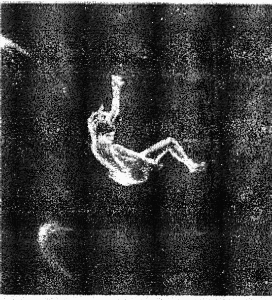

## 第二十六章

## 灵异的濒死经验

对于前世，另一个大家所关注的焦点就是，相信灵异现象会不会很“诡异”。相信没多久你就会改观。请向你的亲友询问一下，他们是否曾有预知性的梦，或是其他的灵异经验。结果可能会令你大吃一惊。我对十位病者进行调查。问她们是否相信轮回转世、是否相信死后的生命。结果有三名女士（百分之三十）相信轮回转世，六名（百分之六十，包括前三名在内）相信死后有生命，而四名（百分之四十）则相信，身体死亡，她们也跟着死了。

当我问病者，是否经验过灵异现象。结果，她们经验的密集和广泛，令我惊讶。请注意，她们不是事先筛选好的调查对象，对于超感官知觉、灵异事件、轮回转世等现象，并没有特殊偏好。

一名病者的母亲曾在梦中见到祖母来访，祖母老态龙钟，但没有生病。梦中，祖母容光焕发，全身包在金白的光团里。她告诉女儿：“我很好，别担心。我现在必须离开你。请保重。”第二天，母亲获悉祖母当晚在遥远的市镇去世。

另一名病者，她常反复梦见儿子。当时她儿子健壮如牛，可是梦中却受了重伤。然后她看见自己待在医院病房里，病房中回荡着雄壮、神秘的说话声：‘他将回到你身边。’她有点迷惑，因为梦中的男孩，她知道确实是自己的儿子，可是头发却比儿子更黑。同样的梦反复出现一个月。

月底，她儿子骑脚踏车被汽车撞倒，伤势有致命之危。这位妈妈在医院告诉关心病情的医师说，她儿子会复原。她之所以深信不疑是因为梦中的声音。儿子的头裹满绷带，逐渐复原。绷带拆下后，被剃掉的头发长得更黑。然后她从未再做过这个梦。

另一名女士也提到她两岁的儿子，儿子对于从未探索过的地方，竟有丰富的知识。‘以前他一定到过那里。’她这样对朋友说。

另一名女士，她的好友是牙医，他似乎有避开交通事故的先知。有一晚，她们几个朋友离开餐厅，正要过马路时，牙医师突然大喊：‘退回人行道去！’并很快伸出双手挡在众人前面，要大家迅速后退。几秒钟之后，一辆车子高速冲过来，惊险地掠过众人面前。事后牙医也颇纳闷他为什么会这么做。

又过了几个礼拜，这位牙医的太太同他一起回家，牙医师在车上打盹，完全没注意路况。‘等一下变绿灯时先不急着走，’牙医含含糊糊对红灯停车的太太说：‘待会儿有人会闯红灯。’这时他仍然在打盹中，看不到车外路况。太太提高惊觉。几秒后，信号变了，一辆汽车飞快闯过十字路口，插入对面车道。他们捏把冷汗，还好，平安无事。

还有一名女士，一天在打扫房子时，脑海中突然浮现‘不要悲伤’的明晰念头，然后她想到一名知交老友自杀了。她已经好几个月没有想起这位朋友了，对朋友是否有感情困扰，是否曾想要自杀等事，一无所知。可是整个念头太明晰、太真实了，而且不是突然的感情冲动，似乎是她真的知道这件事，而不是无根据的杂念。她随后证实，朋友真的就在那一天自杀身亡。

这些令人称奇的直接经验还很多。许多病者都谈到曾做过预知功能的梦。一名病者在接电话之前，便知道是谁打来电话。而且在部分人都曾经验到似曾相识的感觉，或和丈夫同时想到或讲出同样的事。

就此而言，前世回想只是诸多正常、珍贵的直观经验之一。处于轻微催眠状态的心灵是放松的、精神集中的，比正常、清醒的心灵，更容易接受潜意识的直观指引，也更能接收随机、自发的预感。如果你曾有直观经验，而且预感应验，那么你很清楚这种经验的价值与力量。

意识回想的经验也能引起相同的感觉。它让你觉得，你正在以不必解释、不必证明的方式回想、引导、及治疗自己。它只是自自然然地发生。前世回想之后，当你觉得症状有改善，不论那是对于病痛消除、情绪上的平复，或是你觉得信心增强、心境更平和，更懂得人生方向，前世疗法会产生这些正常效果，你并不需要质问这个经验的逻辑有效性。你知道，它的确有力量改善你的生活品质，它的确让你感受到你和他人的因缘关系。

灵异之梦与预知之梦只是稀松平常的例证，显示我们都有这方面的能力，并且能进一步发展。

灵异之梦与预知之梦不但经常出现，而且还非常真实。我所以特别注意这种情形，不是因为我最近常研究灵异现象，而是我二十年来一直在研究睡眠与作梦。

濒死经验的现象已经过许多学养丰富的知名专家研究证实，全世界的研究专家依据经验一致指出，前世及前世回想，对于我们的心灵与直觉而言，似乎是合逻辑的，而且是感觉舒服的。

一名九个月大幼儿的濒死经验。在三岁时，他参加盛大的宗教聚会，会中有人扮演上帝。

“那不是真的上帝,” 男孩反驳说：“我死掉的时候看过真上帝。”男孩努力描述他的濒死见闻，他曾穿过“全世界都发光”的隧道，到了尽头，他“跟上帝一起奔跑和跳高。”

这就是他心目中的天堂。还有三、四名濒死经验的儿童，他们曾“在天堂遇见等待投胎的灵魂。”这件事令他们相当困惑，因为它违反他们的信仰，可是他们确实遇到灵魂。

一名不到一岁的女孩濒临死亡，可是最后又活过来。当孩子长到三岁半的时候，祖母病危，眼看即将不久于人世。

“祖母会不会跟我一样, 穿过隧道见到上帝?”小女孩天真问道。

不一定是有宗教信仰的人才会有濒死经验。每个人都会有这种经验, 不论他信什么教。有濒死经验的人不再惧怕死亡。几乎每位有濒死经验的人, 后来都会信神, 即使曾经是无神论者。他们会关心生命、自然、环境。他们也较不会审判自己, 而且对别人更宽宏。他们更懂得爱人……对人生有更多强烈的使命感……更注重精神生活。

由于医学急救技术不断进步, 所以更多在死亡边缘的人会被拉回人世, 也就是说, 有濒死经验的人会更多, 因此能提供更多的有用资料。

病患在描述前世的死亡情形时, 所提到的种种现象, 都和有濒死经验的大人、小孩一样。整个相似情景令人惊讶, 而那些生动的前世死亡描述只是透过催眠, 病患对濒死经验的文献记载毫无所悉。

不论是实际曾有的濒死经验, 或只是透过前世回想的死亡景象, 有这些经验的人对于生命的视野与价值, 都会有相仿的启发或改变。你不必因为被砂石车撞伤, 或是心脏病发, 才有机会获得灵魂上的启发、更爱人或是爱好和平, 利用前世回溯也能获得相同的死亡经验。不同经历的两组人，同样不再畏惧死亡，并以全新的观念，投入美好的人生。

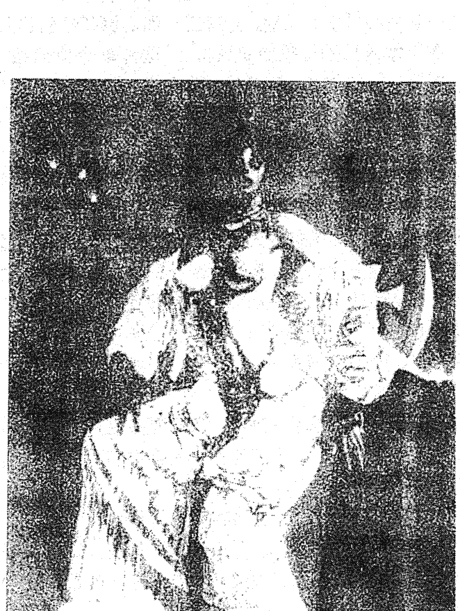

## 第二十七章

## 附身与转世

司徒芷兰是建设大学知名的心理学家。她特地来看我，试试前世疗法能不能缓和她的慢性生理病痛。多年来司徒芷兰的颈部、肩膀、背部上方，经常断断续续抽痛，苦不堪言。初次面诊时，我发现司徒芷兰还长期患有惧高症，那是一种单一症状的恐惧症。下面就是司徒芷兰在催眠下所描述的前世经验：

> > “眼前暗无天日——黑漆漆的——我知道，我的眼睛被人蒙住了。然后我看到自己在户外。我站在塔顶，那是城堡中的塔，石头砌的。我双手被绑。当时约二十岁左右，是位军人，我这一方战败了。我的背痛彻心腑，我感觉到牙齿正卜卜打颤，双臂僵硬，紧握拳头。我被人刺伤，伤在后背，可是我竭力忍受，不让自己失声痛叫。然后我被推下去，护城河的水淹没了我。”

> > “我一直怕高，怕溺水。从水中挣扎上来时，全身发抖，在悲愤中渡过一、两天。我的背非常痛，痛到无法触摸自己的脸。第二天醒来，我认为‘会不一样的，情况会变得非常不一样的。’

不一样的事就是，芷兰的背痛，还有惧高症，统统消失了。

在随后的诊疗中，芷兰回想起战国时楚国那一世。在这一世里，芷兰是个二十余岁的男人，穷困潦倒，人生无望，他没有勇气改变现状，心事也不敢说出来。芷兰描述说，这个男人邋遢消极，只有一件肮脏灰黑的破麻衣服遮体。最后，官员栽赃，硬安给他一个莫须有的罪名。芷兰成了代罪羔羊，被逮捕，并当众吊死。他带着一贯的绝望、无助，悲戚步上绞架，多少有点庆幸可以脱离这猥贱的一生。

经过这次诊疗后，她的慢性颈痛也消失了。好事还不只这桩。经历了战国这世，芷兰的心境终于有了突破性成长。她看出，前世那种有气无力的性格，影响着目前的生活，她不常说出心事，更不敢冒险尝试。她决定暂不理会职业名声是否受辱，她要把那奇妙的前世经验，告诉其他治疗师。这一次，她没有被处罚当众吊死，反而，她获得道贺。

最近流行身心疗法的新观念，芷兰的例子显示出，前世回溯把这种治疗技巧，扩充得更广、更远。芷兰的成功治疗经验，打破了以往只针对生理，或只针对心理施以局部治疗的技术。虽然，她前来治疗只想减缓生理症状，可是她不仅根除了生理上的疼痛，长期的心理恐惧也一并消失。此外还附带另一项好处，在她排除心事不愿表达的心结后，终于能认同、并追求心理成长的新生。治疗期间，芷兰的身、心之间来相协调，产生增效作用，打开成长的通路，带来更新层次的健康幸福。

芷兰又絮絮叨叨地抱怨喉咙不舒服，觉得喉咙“肿肿的”，常常阻塞，不时感染发炎，并沙哑失声。在进行团体回溯时，她浮起生动的梦幻般回忆，想起某一世曾是宋朝的汴京开封府男性，被利刃刺进喉咙。她不清楚为什么遭人谋害。

有了这次的经历后，芷兰约我做私人门诊。她在我办公室里叙述小时候如何被双亲虐待的经历。催眠后，芷兰再度回溯到宋朝那一世，不过这一次较不像梦幻，而是典型的反应。通常，我们在催眠下回到前世，情绪比较不那么激动，而且，从前世回想的经验中获得启示的可能性会比较高。

这一次芷兰终于知道，她是因为得知某个重大秘密，才被杀灭口。芷兰并没有向别人吐露秘密，她害怕说出来的后果。随后她进入死后的一生回顾阶段。她学习到，如果她没有说出事实真相，喉咙就会紧缩，生命也有危险。

第二次诊疗时，芷兰回到海南岛的前世，在这一世里，芷兰是个懂巫术的年轻女性，当时她正痴神观看村人舞蹈。女巫的任务要守火，可是她看舞看得太醉心，竟然让火蔓延开来，她也没有警告村民，火势一发不可收拾，毁了整个聚落。被火烧死的受害者当中，有一名女性就是今生虐待她的母亲。

经过这次诊疗，芷兰喉咙的症状改善了，甚至更能谅解母亲，用更广的角度，看待前世今生中母亲所扮演的不同角色。于是，她解脱了今生伤她至深的被虐待、被压迫情境。芷兰体会到她在今生里扮演弱小，被凌辱的角色的原因；也同时学到一定要说出事实真相，哪怕是以往的受虐情形，或是生命中小得不能再小的细节，否则，把秘密藏在心里是弊多利少的。

前世疗法除了能减缓疼痛，也能培养不服成瘾药物的定力。连原是放射科医师，多年来一直有痉挛性背痛。医了好久都不见起色。如果他意志不坚强，早就因受不了背部灼烧般疼痛而服用止痛药上瘾。

进入放松的催眠状态后，连原回想起两个前世，他都因背部严重受伤而死亡，最明显的一次是在一次战役中伤背死于沙场。在诊疗床上他经历了垂危时的疼痛经验。事后，连原的背痛和痉挛现象迅速获得改善。

我们再度看到身心一体的力量医治了连原的宿疾。他生理上的疼痛不仅减缓了，而且也有心理上的建设，可以完全不必服用药物。过去他虽然极度克制，但是疼痛难忍时，也不得不服止疼药，现在则完全不必依赖止痛药了。

芷兰是另一名利用回溯治疗戒除用药成瘾的病者。她从孩提开始，就饱受哮喘、过敏的折磨，而且呼吸系统失衡。她需要经常施打肾上腺素、类固醇或其他药物，控制症状。这一辈子她似乎要依赖这些药物以才能勉强正常呼吸。芷兰的定力和生活环境不同于连原，对于鼻腔的充血解除喷剂她已经用上瘾了。

回溯治疗时，芷兰开始出现呼吸阻塞，喘息不已。她告诉我，她被绑在火柱上活活烧死，大约是明朝晚期。浓烟非常呛人，肺好像被薰焦了。最后芷兰飘浮出肉体，在群众头上盘旋，观看大火吞噬身体的恐怖景象。

诊疗后，她的严重慢性哮喘，几乎是一夕之间改善，有如奇迹，然而实情确是如此。她的过敏症状也同时减缓。而且，有了这个前世经验后，芷兰很快就停用上瘾的鼻腔喷剂，不用时只会有轻微鼻塞而已。不仅病痛减除大半，生活品质也大幅进步，她的许多恐惧感明显消失了。

李娃是高中老师，年过三十，长期患有哮喘，怕水。第一次门诊时，她直接就看到死亡景象，当时她是八、九岁的小女孩，从悬崖峭壁摔落，然后淹死。李娃对溺水这一段回想栩栩如生，水中的寒冷、水的深度、心中的害怕，令她惊恐不已。很快地，她平静飘浮在身体之上。接下来李娃又想起另一世，她是楚国约十一、二岁的女奴，她的工作是把湿稻草上的砖头搬走。李娃死在这个年龄，当时一辆载满湿稻草的马车翻覆，压住她，她窒息而死。回想起这个死亡经验时，李娃惊怕挣扎，她感到窒息。后者的死亡经验不同前者，不过在这次诊疗后，李娃的哮喘大幅改善，她生平第一次不用服药，安然渡过过敏感染期，而且也没有再出现任何症状。

在加护病房担任护士工作的宁宁，也透过前世回想，减缓她的过敏性呼吸系统疾病。她的过敏症是她在一次度假时突发的。

记得她和丈夫第一次拜访海岛时，她无缘无故地感到焦虑。参观古迹时，焦虑越来越强，而且她也觉得，附近的古街道好像很熟悉，她知道哪里有巷道、哪里有转角。突然，她转弯之后看到街尾的小广场，立刻升起似曾相识的感觉。她好像看到好几百年前，她被绑在柱子上烧死，因为她有魔力替人治病。

宁宁回来后马上找我替她催眠，探索她的前世。她想起炙热的焦臭味，浓浓黑烟从身旁窜起，然后被烟呛死，宁宁承认，她回溯前世的动机，并不是为治疗过敏，而是想知道前世的记忆，虽然如此，宁宁随后说，她的过敏症已明显好转。

现在我们再回头谈谈尹相医师的遭遇。他有一名五十一岁的女病患，是公司的管理干部，名叫史文。尹相利用催眠，探索她呼吸系统毛病的根源。

“现在，我要你回到往日时光，”尹相指示说：“回到你第一次觉得呼吸困难的时候。如果你看到什么，请说出来。”史文全身开始发抖，脸型扭曲。

“对了，”尹相说：“我要你看自己的脚，你脚上穿什么？”

“黑鞋，”她用小孩子的声音回答：“老祖母的鞋子。”尹相再进一步问：“你在什么地方？做什么事？”

“缝纫。我知道等一下会发生火灾。”史文结结巴巴地回答，并开始咳嗽。她的呼吸变得短而急促。“烟冒出来了……角落的破布冒烟了！”

史文描述说，她是十六岁少女，名叫周么，住在一八七九年的潭州。周么是聋子，不会说话。

“烟……冒火了！”史文不断咳嗽。“大家忙着灭火……水泼进来。火灭了一处。不行，水太少了！”史文大叫，呼吸变得很沉重。

“每个人都抢着要逃出去。”她语气急促。

“你呢？你不想逃出去吗？”尹相问。

“我没办法，”她说，“他们不来帮我。”

“你出不去吗？为什么要别人帮你？”

“我没办法走路……我的腿是跛的，”史文边喊边喘气，“他们根本看不到我，我在这里，快不能呼吸了，我支撑不下去了。”她努力吞咽空气。

突然间，史文全身松软。肃静、紧张过了好几分钟，尹相请她描述看到什么景象。

“火还在烧吗？”

“是的……不过我正在休息……我死了……伤很重……一定要休息。有些人也需要休息，现在一切都很宁静。”

经历了这场浴火的前世回想，史文的呼吸系统毛病很快消失了。而长期恐惧窒息的症状也不再如影随形，她的人生观与价值观也彻底转变。

上述许多个案，及个案里的所有主角，无不显示，他们有源源不绝的力量，这些力量是由人类固有的神性，及更高层次的能源所衍生的，它引领我们渡过无数的有身之世。而且，我们不仅是强化身上的免疫系统而已，生活也过得更快乐、更圆满、甚至更坚定、更有耐力。我们理解造成所有恐惧、病痛和依赖的真正根源，然后逐渐复元。

当我们经验并理解问题的核心因素，所有的症状就消失了，病痛也改善了。伤刺取出，痛苦也随之消除。我们在心理上不会投射移转，也不会防卫压抑，我们不必用其他替代物质麻醉自己，也不必服药，病痛终会消失。

也许，催眠状态下的前世疗法之所以能奏效，就是这样，我

## 视频

## 图片

## 音频

+   - Frames to Video
- Image to Video
- Reference to Video
- Text to Video

+   - 添加

输入prompt

+   - Seedance 2.0 Fast

+   - 8

+   - 480p

+   - 16:9

generate_audio

watermark

× 1

456

轻。而且变得更有信心，求生意志更坚强。
芷兰的病情改善，是因催眠下的图视拟想吗？看来似乎是有关系的。其他因素当然也有，医师在治疗时增强了药物剂量，也许地增强的剂量是病情改善的关键，然而，如果不是催眠与图视影像，她承受得了药力增强的副作用吗？

史文，四十五岁，她来看诊是因个人的感情困扰。最近身体检查时，医生诊断出她右乳房有两个肿块，不像经期中可能产生的软性囊肿。我们先进行初步面谈，了解她心理和生理病历，并约定第二次门诊。

第二次门诊时，史文心神不宁。因为最近她看过肿瘤科，怀疑乳房上的肿块，有可能是癌症。医师本来要做切片检查，但史文却昏倒了。肿瘤医师决定动手术除去肿块，史文因此焦虑不已。以前她曾动手术被麻醉过，但是好像引起濒死经验，她担心再面临。

诊疗时，我请她用图视拟想，想像出现治疗的光，如同芷兰及其他病患的经验。然后我给史文一卷放松和冥想的录音带，请她在家自行练习，并约定下星期看诊。

第三次门诊的时候，史文讲了一大串不可思议的遭遇。她本来约好星期一上午动手术，手术前，放射师作最后的X光检查。

放射师看片时发现，三天前才照出来的肿块，现在竟然不见了。

惊讶的医师立刻要求，再照一张乳房X光片。
结果仍然一样，没有任何肿块！

史文还是被送上手术台，手臂上正在打点滴。放射师拿着片子，向主刀医师说明情形。

主刀医师坚持一定要开刀。两名医师辩论起来，史文则躺在手术台上静静听着。主刀医师固执要进行手术，反对放射医师所提的最新证据。

最后史文决定自行做主。

> “既然肿块不见了，那我先回家。”

史文的经验，在许多人眼中也许是小事，然而它的意义却很重大。

催眠中的前世回溯与图视拟想，所造成的心灵转化力量，可以被传统医疗的临床医师实际运用。这种力量很安全，也有高明疗效，而且毫无副作用，因为这种力量是完全合乎自然的，是精神与直观的，是真正的整体医疗。

## 第二十八章 不是冤家不聚头

曾居住在爪哇东南部，生为华夏人的乐南，在生前预告了自己的转世，其结果与预告完全一样。乐南是一位捕渔技术很好的渔夫，他一直深信转世之说，不过当他濒临死亡之际，却反而对此事有些怀疑，但另一方面却一直渴望转世是个事实。

他在死前曾对他儿子与儿媳妇说：“如果死后能够转世，我一定要转世当你们的小孩。”接着他又说：“那个小孩身上会有与我身上一样的痣，你们只要看到痣，就知道是我转世的。”

乐南的痣有两颗，每一颗都是深黑色，直径约为二厘米，一颗在左肩上，一颗在左手的前端约六厘米处。一九四九年，当乐南驾渔船出海捕鱼时，不幸被大风浪卷走而行踪不明。

不久之后，他的儿媳妇怀孕，在一九五〇年五月五日生下一个男孩，这是他们十位儿子中的第九个。而婴儿出生时，其身上的确拥有与祖父完全相同位置及有关的痣，当儿子与儿媳妇看到此情况时，都感到非常惊奇，没想到父亲的预言竟然实现了，于是他们就将小孩取名为乐小南。

不仅如此，当这个小孩逐渐长大以后，他的外表行为特征，几乎与乐南前生一模一样。曾对小孩本人，及其父母、渔夫同伴们进行调查的史蒂芬生博士，根据调查做了下面几项结论：当乐南在年轻时，曾因受伤，所以走路时总会拖着一只脚，走路的方法很特殊，而乐小南的情况虽然不像乐南那样严重，但走路的方法却相同。其次乐小南对于船与捕鱼的有关知识非常丰富，与其年龄不成正比，对在哪个海湾有较多的鱼也很清楚，另外，他晒网的动作更是一流。

其次，乐南生前曾给儿子一个手表，而乐小南却能很快地从母亲的保险箱中找到那只手表，并说：“这是我的手表。”而且紧握手不放。

究竟乐南是为何能如他所愿般的转生？有关灵界的种种，还有很多我们无法解释的谜，或许是他认真的想法，打动神的关系吧！

心灵科学的方法之一就是实验，事实上在这世界上有不少人可随着自己的意识而脱离自己的肉体。如果能在准备完善的实验室中证实“灵魂出窍”的话，就足以证实其实性。

一九六八年，加州大学心理学教授查尔斯·塔特博士以电子工学工程师罗伯特·门罗为受试者，进行一连串实验。自一九五八年以来，门罗就曾体验过数次非常明显的“灵魂出窍”，同时他也能随着自己的意志随时达到“灵魂出窍”。塔特博士将各种装置装在门罗的身上进行实验，尽管实验非常困难，但在第八次实验中，门罗总算成功地达到“灵魂出窍”。

这项报告指出门罗的灵魂脱离肉体，经过一黑暗的场所，看到了一对正在走廊上讲话的男女，而这个女的就是检查技师，男的是她的丈夫，而门罗的叙述与事实完全一致，甚至连这名男子的容貌也描述得非常详尽。门罗又说：“我为了吸引女技师的注意，曾偷偷地捏了她一把，但她并无任何反应。”

但是美国心理研究财团的罗伯特·莫利斯博士的报告却更为惊人。莫利斯博士以一位名叫史丘图·哈拉利的学生做为受试者进行实验，正当证明学生处于“灵魂出窍”时状态时，莫利斯博士断言“看见了闪闪发光如幻影一般的物体”，换言之，在这项“灵魂出窍”的实验中，由第三者看见了当事者的灵魂。

而前面所介绍的福克斯曾说：“灵魂出窍时，我的‘第二身体’无法被一般人看到，但有时却能被人目击。”他又说：“当我利用灵魂出窍去拜访某人时，往往能让对方感到惊讶，因为对方可能真实地摸到我。”但遗憾的是，塔特与莫利斯博士都无法证实此实验就是“灵魂出窍”，因为他们所用的机器无法以数据检测出脱离肉体的“第二身体”，不过我们或许可以说，机器是无法检测出属于灵界的灵魂吧！

有关近似死亡经验者的报告，我们手边有不少资料，这些资料的确让人感到惊讶，本来我想全部介绍给读者，但预先挑出近似死亡经验的各部分来加以说明，以便让读者可更清楚地了解到死亡的情形。如此一来，你也才能更进一步了解到有过此经验的人的心情。个人以为只有如此，才是让你从死亡经验中，对死亡有更深一层认识的最好方法。

能听到医生向他家人宣告“已经不行了”的话，听到自己被宣告死亡的经验者为数很多。一位因心脏病突发而倒地的女性说到：“我当时正在一个完全黑暗的地方，从黑暗的那一边，我听到先生说：‘是心脏病突发，这次不行了’的声音，听了先生的话，我心中也想到，这次真的已经完了。”还有一个因骑摩托车发生车祸而被认为死亡的年轻男士说：“一位来到现场的女性问道：‘此人死了吗？’结果就有人回答：‘嗯！死了！’另外，在急救室里，也有不少近似死亡经验者曾听到医护人员在谈论自己死亡的事，而在当时这些所谓死亡的经验者，他们的想法如何？

“我感觉到心中很平稳，好像没什么可担心的……”这是一种真正安宁的感觉，我现在已无需再担心什么了。这是一个因盲肠破裂，而被宣告死亡的复活女性报告。

在林格的调查中，近似死亡经验者中有百分之六十都曾体验过‘根本无法说出的一种安稳感。’如一位因生产时发生大量出血，而濒临死亡的女性说：“医生们虽然忙着救人，但我当时认为在他们把血止住之前，我的确已经死亡，我看到我的母亲，我的丈夫及刚出生婴儿的脸，他们都活生生的，对我的死都感到很悲痛，但我一点也不伤心，对我而言，生与死已无任何分别，我也没感觉到任何不幸，不知道他们为何那么伤心？”的确，在濒临死亡时，人就不会感到不幸了。

今天，我唯一的“新”病者走了进来。她不知道用什么方法游说护士，要求门诊排第一号，今天就是约定好的日子。

三十岁的舒畅是一个孩子的母亲，她说她的最大困扰就是七年的“恐怖”婚姻生活。舒畅的童年很快乐，和父母相处是段美妙的时光。她和孩子相处得也很愉快。舒畅喜欢自己的家，在牙医诊所的工作也很快活。

唯一的麻烦就是丈夫。他颐指气使，嫌东嫌西，看舒畅很不顺眼，凡是舒畅做的事情，他没有一样满意，经常鸡蛋里挑骨头，藉机损她。舒畅觉得丈夫像个大铅块，狠狠压制她；也像条毒蛇，缠紧她脖子。然而，舒畅不断努力维持婚姻幸福。她们曾分居好多次，丈夫去而复返，负荆请罪，可是不久再度离去。舒畅只能被动地逆来顺受。个人的与夫妻的心理治疗，丝毫改善不了同床异梦的婚姻。

门诊的前几个礼拜，舒畅曾听过我的事。

我翻了一下舒畅的生理和心理病史，然后催眠她，进入非常深沉的催眠状态。现在她能回答我的问题，而且我也更能细心针对某些问题引导她。我请舒畅回想童年的愉快时光，她很快就回想起过五岁生日的温馨日子。

> > “我看见父、母、祖父母。还有好多礼物呢！”

舒畅想到这里，脸上浮起笑容。确实，这是个欢乐时光。

> > “祖母亲自做最拿手的点心。我看到点心，我看得非常清楚。”

> > “打开礼物，看他们送你什么东西。”

我这样提示。她打开鲜艳包装的礼物，看到新衣服、新洋娃娃等等一大堆东西，这个五岁女孩非常兴奋。我决定再推进一步。

> > “现在请退远一点，回到你跟现在丈夫，或任何家人曾经生活一起的时代里。退回到你目前婚姻问题的根源处。”

舒畅马上皱起眉头，然后低声哭泣。

> > “我好害怕，好黑，黑漆漆的，我看不到任何东西。我好害怕，好像某件恐怖的事就要发生。”

她的声音像小孩。我猜想，舒畅也许是在中介生命状态里，可是为什么她会害怕呢？我很迷惑。

> > “我要轻轻拍你的额头，并从三倒数到一。当我数到一时，你将看见你在哪里。”

这一招有效。

> > “我是个小女孩，坐在大木桌旁，房间很大。没有多少家具，只有这张桌子。我正在吃碗里的东西。”

> > “你叫什么名字？”

> > “茹氏女。”

她回答说。她不知道当时的年分。不过后来回想这一世的死亡经验时，她说是一八五九年。

“只有你一个人吗？你父亲在哪里？”

“我不会说……我不知道……”她又哭了起来。“我父亲在那里，但是母亲不在。她死了。是我害死她的！”舒畅解释说，茹氏女的母亲因为生她难产而死。父亲怪罪女儿，要她为母亲的死负责。

“他对我很坏，打我，把我锁在衣橱，我好怕。”她继续哭着。

现在我终于了解为什么刚才舒畅害怕黑暗，那根本不是中介生命状态。她只是被锁在黑漆漆的衣橱里，在伸手不见五指的黑暗中，她不知凄惨地待了多久？

茹氏女的父亲是个伐木工，把女儿当奴隶对待。每天指定她做许多的家事、骂她、鞭打她、找碴、把她锁进暗无天日的衣柜里。舒畅含着眼泪辨认出，这个男人就是茹英——今生的丈夫。

茹氏女从没有离开父亲一步。尽管他行为粗野，毫不疼惜女儿，她还是随侍在侧，直到父亲临终。

我要她再往回想。茹氏女父亲去世时，她刚满三十岁。我问她，父亲死了之后有什么感觉。

“如释重担……强烈的解脱感。我很高兴他走了。”

之后，茹氏女和滕达结婚，滕达体贴照顾妻子。舒畅辨认出，滕达就是今生的儿子。滕达一直想要个孩子，可是她担心像母亲一样难产而死。然而，他们仍然过得非常幸福。滕达先一步作古，然后轮到茹氏女。我加速把她推向死亡的那一天。

“我躺在床上。我是个头发灰白的老太太。我一点也不害怕。很快我就可以见到滕达了。”茹氏女死了，飘浮在肉体之上。

“你从这一世学习到什么？”我追问。

“我必须坚决些，”她不假思索地回答，“只要我认为对的事……我就应该去做……就不会有无穷无尽的折磨，我必须坚决些。”

脱离催眠状态，舒畅的记忆历历犹新，她雀跃不已，觉得更强壮、更舒坦、更轻松，死缠在脖子上的那条毒蛇，终于离开了。

“我在重蹈覆辙。”她悟出道理，笑得非常开心。

我注意到，舒畅对于这项发现，兴奋得身躯发抖。

她满心欢喜地离开诊疗室，我不知道她的婚姻将有什么改变。但是我可以推想，不论发生什么事，她对感情关系的立场，一定表达得更坚决，而且也更能自我控制了。她一定过得很好。

石铃，四十五岁，她前来治疗时不断抱怨心情沮丧，因为受到儿子许若的刺激。

许若在著名的重点学校就读，学业很差，偶尔逃学，原因出在他有学习障碍。他经常大声忤逆石铃，母亲说什么他一向水过鸭背，还反过来惹母亲生气，石铃对他的行为头痛得要命。从我的角度来看，许若不是无药可救，只是石铃过度反应而已。

可是石铃认为，她必须保护自己，免得被许若逼疯，于是石铃的沮丧和许若的坏毛病，成为恶性循环。石铃越来越相信，人生无趣，努力了老半天，换来的仍是焦虑与忧愁，她越来越想离开这个坏孩子。

然而，经过面谈以后，我发现导致石铃觉得人生无趣的原始因素，并不在她儿子身上。石铃五岁时，父亲遗弃家庭，七岁时母亲去世，她和弟弟成了孤儿，随后的两年无家可归，他们替人打工、做清洁工作，换取三餐和衣物，或是在街头捡垃圾、弃物度日。

九岁的时候，祖母找到他们，两姐弟终于有了安顿之处。可是好景不长，十三岁时，祖母家的财务出现危机，姊弟俩寄人托养。一年半后，她们又回到祖母身边，直到二十岁石铃结婚。

石铃的婚姻曾四度分合，不过后来家人仍团聚在一起。家庭的经济似乎也改善许多。

我试著让她回溯童年，可是石铃一直进不去。她变得非常焦虑，不愿再提伤心往事。最后我决定，完全跳过童年回忆，对她可能更有帮助。

遵照我的指示，石铃的回溯历程平静多了。很快，她说她是十九世纪末的年轻男子，正走在市街上，然后进入一间办公室，老板就在里头。年轻男子生气地指责老板，说老板占他便宜。他几乎分文未得，老板却把他该得的薪金，分给其他雇员。

男子狂怒至极，调头离开，发誓永远不再回来。随后的一生里，他不知快乐为何物，因为他被老板剥削的余怒一直无法消除，直到终老。石铃认为这是很严重的背叛。在今生里，这位老板转世变成她儿子许若。

完成回溯后，石铃对许若的行为似乎更了解。她体会出，他们这一世的关系，不同于上一世，她也更了解许若的叛逆，是她反应过度。许若并不是有意顶撞她，那只是青少年阶段的自然现象，如果她能看开些，这一生的相处关系想必会较顺利。

石铃同时理解到，引起她反感的背叛与被欺，错不在许若的行为，而是她的情绪。其实，早在许若出生之前，她和弟弟的童年都是咬牙硬撑过来的，这显示她也有坚强的一面。她也了解，前世对于老板的执著怒意，到头来反而伤害自己，而且也危害到今生她和许若的母子关系。我们不断讨论她前世调头而去的行为，如何影响许若今生的顶撞与忤逆。

石铃的治疗仍持续进行着，她越来越清楚哪些是她应该解决的问题，而且，她的焦虑与沮丧不全然是儿子造成的，她变得更实际，眼界更宽。如果她还能继续发现，她与许若的感情关系不仅这两世，而是有许许多多世，她的这种发现，我是不会感到惊讶的。

## 第二十九章
### 灵魂携来前世的才能

戴玉从前世治疗的经验里，意外治愈悲伤心情。她二十六岁，从事摄影工作。来看诊的时候说她没有任何病症，纯然只是好奇，想体会一下回溯经验。

只是单纯想要探索前世，想多知道一些生命奥秘，这是尝试前世治疗的绝佳机会。从这种特殊的灵魂医疗方法获益、成长的人，不限于病者，其他也能因此而获得快乐，更懂得生命意义。

戴玉立刻进入关键时刻类型里。首先，她发现自己是个少年郎，正在观看镇上的吊刑。在另一个关键时刻中，哥哥讥笑他，他觉得非常难受。随后戴玉看到这一世的家，她认出这一世的父亲，就是今生已经去世的父亲。随后他奉召从军，并终身服务军旅。然后结婚，生活没什么重大波折，一直到终老，死于石床上。在死亡经验里，戴玉发现上方有一道光，她飞向光，和其他灵体加速穿越时空，最后和一道金光合并，回顾一生。在一生回顾阶段里，戴玉评论说，那天观看吊刑是个很重要的经验，她学习到善与恶的分野，也知道暴力解决不了问题，所以对哥哥的耻笑才没有放在心上。

戴玉又进入另一世，她看到自己是个老人，穿着宽袍子。老人胡子花白，正在用琴弹奏古乐。这一世戴玉仅有这些记忆，不过却印象深刻，这一世她过得非常快乐。接着戴玉回想出第三个前世，她是个美丽温柔的女人，生了两个小宝宝，母子相处，其乐融融。

结束回溯后，我们一起整合她的回想经验。戴玉告诉我，这三个充满幸福快乐的前世，令她高兴。她说这次的回溯对她有很大帮助。戴玉还年轻，成人生活正要起步，她觉得相当宽慰，前世的快乐心情，今生仍持续着。

戴玉告诉我，出乎她预料，前世回想经验帮助她治疗挥之不去的悲伤，因为她的父亲四年前去世，令她哀痛不已。这个经验也帮助她认清死亡的真相。她知道，她以前认识父亲，未来也有可能再相聚。她的经验向她证实，死亡并不是结束。父亲虽然不再和她一起，可是她知道，父亲的意识永远活着。

戴玉无意中克服了丧父悲伤。很多人接受前世回溯，正是要达成此一目的的。

吕蕴是二十八岁的会计师，她和一位知名的画家顾河结婚。婚后，吕蕴的丈夫发现自己身患癌症，已到末期，他们曾争辩死后是否有来生，是否还有其他的世界存在。吕蕴相信有，但顾河却非常怀疑。

顾河有高超的绘画技巧，他的职业告诉他，未经查证的事，一概存疑。从这个立场出发，顾河不但拒绝相信来生，也企图改变吕蕴，可是吕蕴心知丈夫可能不久于人世，在悲伤的心情下，相信生命不朽对她而言是极大的鼓舞与支持。顾河的病情一天天恶化，可是他们依然为这件事争论不休，他愈来愈暴躁，既为自己病情生气，也为吕蕴的论点而光火。而且，他似乎愈来愈害怕。

最后，顾河住院了。两人心里明白，顾河快要走了。可是顾河去世之前，却有了极大的转变。一天，他平静地告诉吕蕴，他看到一位老人坐在病房椅子上，老人向顾河说，他等着要带我走，顾河承认，对死亡的看法，吕蕴的论点是对的。他为以前的顽固向吕蕴道歉，并希望吕蕴在他死后，继续探索。

说完这些让吕蕴目瞪口呆的话之后，这个暴躁不安、害怕的病人，突然平静接受命如悬丝的事实。

第二天顾河去世了。

吕蕴很欣慰能在顾河将死之前，就生死的观点达成共识。那位老人家的出现，奇妙地改变了顾河的观念，也治疗吕蕴的悲伤。

吕蕴来拜访我有多项理由。这件无从预期的丧夫之痛，让她觉得悲伤、焦虑，她需要进一步整合这个死亡经验。除了克服悲伤外，她还要学习独立生活，而且她曾答应顾河，要继续探究死后的生命和灵魂永恒的问题。

有趣的是，吕蕴的回溯经验并没有直接显示她和顾河的关系。反而传达了一项有关学习与成长的新信息。

吕蕴回想出，她是一名在黄河边的士子，曾帮忙照顾及医护天地会子女，当时是十七世纪。回溯完之后，吕蕴想起念书时，特别爱研究有关天地会的事迹，而且，她这方面似乎懂得很多。

诊疗结束，吕蕴直接经验到自己的不朽生命，她觉得满意，而且也揭示自己一直不知道的前世才能。这才能包括：照顾别人、和小孩相处、或是对早期会党的熟悉。让吕蕴进入前世的潜意识或内在智慧，同时也传给她的意识一项信息，那就是吕蕴已经帮过顾河面对他的死亡。

这次诊疗可以确定一件事，那就是吕蕴克服了悲伤，也有进一步成长，而且也更了解自己。在前世，顾河是天地会将军之子，吕蕴曾照顾过他。他曾生活在黄河边，今生取名顾河，是有来历的。

吕蕴与顾河的经验，是治疗丧亲悲伤并藉此成长的例子。许多将死的人报告说，曾经有引导者或先知者出现等著来接引他们。病人的意识察觉并不重要，不论他人是清醒、半昏迷、或是受到化学药物影响，这些经验不应视为幻觉而遭排斥。如果将死的亲友告诉你这些事情，你应该排除疑虑，诚心接纳，因为这些经验是真的。

封强是电脑设计师，他接受前世治疗法，为的也是要治疗悲伤。封强和他的妻子于凡，痛失两个孩子，他们患有罕见的先天性疾病，三与四岁之龄就离开人世。也许，最令封强难过的就是，老二的死应该可以避免的。长女出生时，医师检查后告诉他们，孩子的先天疾病不是遗传的，所以他们没有理由不生第二胎。实际上，医师的说法并不正确。封强与于凡再度承受丧子之痛，也就是说，老二的悲剧应该可以避免。他们觉得该负责任，失落与悲伤的感情在心中纠结着，令人抱恨难言。

封强前来治疗时，悲剧已结束多年，可是他心里一直很哀痛。身为研究所的电脑高科技人员，他有很强的逻辑与分析推理能力，而且有关各种灵魂现象的探索，他都有兴趣。自从孩子去世后，封强曾多次造访一位出名的通灵人，他似乎有能力和死去的孩子沟通。

封强掌握机会，慢慢淡化自己的悲伤心情，他觉得灵媒的沟通很有帮助。可是通灵人最近去世，封强不再有机会和孩子沟通，心灵空虚，悲情反而更沉重。

依照我诊疗病人的经验，回溯疗法极有可能开拓封强的新视野，让他应付失落悲情。封强相当合作，一下子就进入深沉、放松的催眠状态，而且似乎浮现栩栩如生的前世经验。他描述说，他置身于美不胜收的黄山群里，有一片绿草如茵的田园，野花丛丛，争奇绽放。猛然，他看到两个孩子，长大了些，欢欣跑过来。他们边跑边跳，围著他，又唱又笑。然后封强逝去的父母亲也出现，加入笑闹团聚，接著，特别照顾他的慈祥外祖父也来了。

孩子先伸手，牵著封强，再牵著父母、外祖父的手。封强详尽描述他接触孩子小手的感觉，那么真实、柔软、恍如心手相连，他感觉到孩子长大了。孩子看著他的眼睛，大家心意相通，深深感受对方的情意。孩子告诉封强，他们想他、爱他、请他不必担心，一切都很好，他们非常平安。家人一起在草地上嬉笑玩闹，快活无比。欢笑的花朵绽放在他们的眼睛与笑声里。

显然，这个鲜明的影像并不是前世经验，封强似乎在恍惚迷离之中，进入了另一空间。

在整合他的经验之前，看得出封强的情绪已经获得宣泄。他告诉我，能够接触到孩子，他真高兴。当他描述和孩子手心相握时，激动得喜极而泣。草园相聚的经验，终于使封强的罪疚感与悲伤情绪获得释放，也释放了多年来深藏心中的无助感。他了解到灵魂不死，人生也变得更乐观、更有意义。

这一次回溯之后，封强的快乐心情一直持续着，几年来的悲情仿如云消雾散。

或许会有人批评说，这样的重相聚其实只是幻想或愿望的满足。可是，幻想或愿望的满足不足以产生有效的治疗力量，也无法让病人与死者的灵魂相聚。戴玉、吕蕴、封强经过催眠后，心里都觉得舒服多了，而且也表示，长期以来的悲伤与焦虑症状，业已消除。

死不是绝对的。我们知道，我们并没有失去所爱的人，死亡之后，我们依然和死者有联系。

有这种经验或知识的人知道，死亡不是结束，只是换个空间。好比推开门进入另一个房间。灵魂的层次、灵异的能力，或是意愿的高低，可以决定我们能不能与隔壁房间的人沟通。沟通也许很清晰，或是断断续续，甚至沟通不来。无论联系的凭藉是什么，只要悲伤的人了解分离不是永远的或绝对的，就能改善沟通层次。如同戴玉与她父亲，彼此相爱的人也许曾经相聚，或曾分离，可是未来仍有机会再相聚。也像封强，他学习到，所爱者的灵魂，是永恒不灭的。

这些观念能让悲伤的人对未来怀抱希望，希望来世再度相聚。当然，他们不一定和今生一样，相聚时有同样的关系或环境。例如，父女再相聚时，可能变成朋友或兄弟姊妹，或祖孙关系。总之，灵魂会不断地重聚、再重聚。

一般而言，对死亡的悲伤，就是对失去自我的悲伤。前世回溯经验对治疗悲伤非常有效。能从回溯经验获得启示的人都了解，死亡不代表自我的消失。病人的亲身经历显示，因为时机到了，所以灵魂必须远离肉体，存在于非物理性的灵魂状态里。意识是永恒的，同样地，人格也是永恒的。

通常，重获新生命的灵魂会携来前世的才能。因为，某些回想起前世有哪些才能的人，今生多少会显现以往所不知的才能。

自我有许多不同层次。人是奇妙的、以多重向度存在着。为什么我们要让心灵自我设限，限制在此时此地的人格或肉体上？灵魂不应该拘限在肉体与意识之中。存在于此时此地的自我，只是整个灵魂的片断。

## 第三十章

## 玉女游灵界

李娃仍时时前来探我，与我探讨许多问题。“太极图”可以算是中国人传统思想中最典型的一种图腾符号，一种世界观，图中的“阴”与“阳”互相环抱，生生不息，循环不已，这种阴阳二分法的观念在中国人日常生活中也随处可见。

因此，对于宇宙万物甚至生与死亦然，中国人普遍相信有“阳世”，就必定有“阴间”，所谓：“孤阴不长，独阳不生”，如果没有阴间，阳世的生命又从何而来呢？而且阴与阳必须平衡才能互存，是缺一不可的，这种观念不只是心理上补偿式的需求，更是逻辑上的平衡。

广泛来说，“阴间”是相对于“阳世”的，因此那是一个对死后世界的通称或泛称，自古以来，不论是“蒿里”、“九泉”、“黄泉”、“冥府”、“鬼界”、“阴司”、“阴曹”、“地府”、“鬼门关”等等，指的都是这个相同的空间，是人死后（灵魂）必须前往与居住的地方，也许是中国古代盛行土葬，所以不论对死后的世界如何称呼，几乎都把这个地方理所当然地认定是在地下或地底，“九泉”就是意指从地表到达地府要经过九重泉水之深，同时，从秦始皇陵的兵马俑阵仗及马王堆汉墓的华丽就可证明这样的思想方式。

至于后世将死亡比做“仙游”、“仙逝”、“名登仙籍”、“归天”，将死后世界比拟为“仙界”、“天界”、“瑶池”、“西天”、“极乐世界”，一举将地底推到天上，这是一种谀词，或心理补偿式的行为，并无损于固有的思想。

广泛地来说，“阴间”泛指死后的世界，如果以固有的天、地、人的说法来看，“天”指“天庭”或“天界”或“神仙的世界”。“人”专指“阳世”、“尘世”。“地”指的是“阴间”及“地狱”。天与地包括了七重天和九重地，后世受到佛教的影响，则有三十三天和十八层地狱之说。

而中国人所说的地府，指的就是广义的阴间，包括了阴间及地狱，有些人将“地府”和“地狱”混为一谈，以为阴间就是“地狱”，其实，如果把阴间比喻为城市，那么地狱就是“某城监狱”，地狱在整个阴间只占了一个小小的区域。

但另一种说法，狭义的来区分，天界、阴间、地狱都各自是无限大的，不能用阳间有限的地理范围来拟想，而且各自成一个体系，并且各有其不同的层级，天界有层级、阴间有层级、地狱也有其层级，需看人生前的业力及修为，死后因此决定其前往或所处的层级（境界）。

如果以佛教六道轮回的说法，是“天界”与“阿修罗”（精灵）同处一个空间而时有战争，“人”与“畜牲”同处于阳世，“地狱”和“饿鬼”同处一界，那么这六道都是执行的地方，而阴间却是一个“过境室”，所有生命均在此暂时等候，依业力而终究要投入轮回，转生六道而去。如果把六道比喻成监狱，阴间则相当于“看守所”，是暂时等候发配执行的处所。

希腊人相信天神住的天界，而人死后则渡过冥河前往冥界报到，冥界由冥王普鲁图掌管，是一个黑暗的世界，但内中的情形在希腊神话中却甚少提到。

而但丁的三部曲中却已经划分为天堂、净界（相当于阴间）、炼狱三处。

“观灵术”古称“关亡”或“关落阴”，“关亡”把其功能及目的局限在与亡亲故友相会上，范围太过狭隘，不足以说明“观灵术”的所有功能。

“关落阴”（或观落阴）将所有前往之处设定为“阴间”，又局限在单一层级，同样也不够周沿，一位观灵术大师将之重新命名为“观灵术”，此“灵”有两种含意，一专指“亡灵”、二是指“灵界”；

“灵界”是一个泛称，涵盖的范围包括了天界、阴间及地狱，虽然迄今仍不十分清楚“生魂”究竟能进入（被允许进入）多少层级？但在长久的观灵施法经验及所留纪录中显示，阴间是最常进入的地点，但天界及地狱也偶然有进入的个案。

因此，“灵界”应该是一个尚称恰当的称呼，而“观灵术”的名称也因此能符合实际，敬请读者在这章上多予留意，以免在内文所用到有关阴间、灵界、冥府、天界、地狱等等的名词时有所误解，而会错原意。

李娃饶有兴趣地向我说起一位青春小姐生前死后两度游灵界的故事，引起我极大的兴趣。

影星易华年小姐，是名演员，在日渐走红的青春年华之际，于一九九三年一月廿五日，赴荷兰旅游，搭乘直升机观赏世界花都时，因直升机机件故障，落海遇难。

易华年小姐生前与死后两度进入灵界，并均能留下描述纪录，在某先生所搜集之资料中尚属首例，而且两次法会某先生均在现场目击，因此所获得的皆是第一手的资料，是非常值得探讨的。

### 某日下午：

### 南国某市某大厦的地下室。

这是某先生所策划的第三次“阴间之旅”活动，一时参加的文艺界名人极多。易华年小姐那时正在拍外景，基于好奇，于是请求某先生准许前来参加这次活动。

第一次施法，所有人都没有太大的反应。

第二次施法，过了中段以后，易华年坐在椅子上的身体一直往前倾，几乎成了“鸟”形，而且全身颤抖，并且表示她看到了光，但由于害怕，所以中途喊停而暂告结束。

第三次施法，几乎在一开始，易华年就进入了，她表示看到了一位白衣的神（不知道是何方神圣？只知道是男性），这位神引领她迅速穿过一条长长的隧道，而且很快就看到眼前突然亮了起来，并同时出现了风景画面；

眼前有一座高耸入云的大山，山顶云雾飘渺，这同时她并一直藉手势形容著所见的风景和山势（当时某先生立即靠近她身边，详细询问并纪录她所描述的景象）。

据她描述在山脚下远远的有幢中国式古老的屋宇，近处是一片树林，不远处有座吊桥，在某先生的询问下，她对景色的形容为：

> > ……天气非常好，不冷也不热，空气很清新，闻起来很舒服，风吹在脸上也很舒服，嗯！没有灰尘，一切都好干净好干净，树很绿很绿，所有东西的颜色都很鲜艳，很美……

但，事实上，那天因为在地下室，空气很闷，还有焚香烧纸钱的烟味，气味并不好。

这次易华年纯只是好奇，想前往灵界游历一番而已，并没有打算去探视任何亡亲故友，但是她的祖母却突然出现了，就伫立在桥头那儿，遥遥地在跟她“说话”，并且再三叮咛了一些家中的事，由于有些话说得比较重，令易华年当场伤心地哭泣起来 ……

虽然她尝试著想走近祖母，但好似有某种无形的力量拦阻着不让她靠近，所以一直与祖母保持了一段距离。

祖母说完话就走了，易华年也在师父的施法下即时返回。

事后，她重新细述了一遍她刚才在灵界的见闻，并且表示她的祖母是在荷城去世，生前她从未见过祖母的样子，甚至连照片也没看过，可是在灵界一出现，她立即就“知道”（感应）那确实是她祖母，而且两人的交谈完全没有声音，祖母及她都没有开口，却能以“心电感应”的方式来沟通（编者按：这在“观灵术”中有极多相同的个案）。

根据易华年所描述的景象，据师父表示：她切入灵界的地点应该在“阴阳山”附近，左近正是“阴阳河”和“奈何桥”，她与祖母之所以无法靠近，可能是受到某种法则的限制。

之后，某先生与她探讨良久，她一直表示“太神奇！太不可思议了！”

一九九四年初，她刚拍完电视连续剧“五鼠乱东京”，却在异国遽然而逝。

在机场迎灵时，受舅父母之托，某先生特别请商了灵媒大师为其招魂。

葬礼中，望着她巧笑倩兮，音容宛在的遗照，禁不住地问：“幽明异路，魂兮安在？是否果真去到了生前曾游历过的“灵界”？

在她的墓前，某先生代撰墓志铭并勒石道：

> > 来也飘飘，去也飘飘，今生无悔走一遭，
> 流去朝露，浮生嚣嚣，红尘小游也逍遥，
> 莫带泪眼，休怜杜鹃，踏浪行空本飞仙，
> 浩浩星空，有我欢颜，有情仰头又相见。

当然，除了本身多次的灵异接触经验，以及近廿年来在灵异现象及灵魂学方面的探索，某先生非常坚定地相信：灵魂不灭！灵界实存！

但是，为了深入研究，某先生仍然非常希望能藉由“观灵术”进入灵界与易华年会面并得到更确切的信息。

然而，为了避免又再度勾起家人的伤痛，却一直不敢提出这样的建议，直到一九九四年的八月份，也许是因缘际会，也许是冥冥中的安排，十二日那天邀齐了易华年的胞弟（某先生表弟）、弟媳及其弟一行四人，来到了招灵堂……

焚香入座后，随着众人虔诚的静候师父开始施法——一连三次施法，四人皆无反应（但，事后据其弟媳宁小姐表示：其实从第一次施法，她就见到光和景象，但怀疑是自己的幻觉，所以一直没说出来）。

第四次施法，宁小姐有了接触：

宁小姐：“奇怪！为什么我真的是很清醒喔！可是我看见观音菩萨了！

师父：“没错！你要很清醒才是对的！”

宁小姐：“我看见我是在一个庙里，我看见观音菩萨！可是我是完全清醒的啊！为什么会这样呢？”

助理弟子：“一定要清醒才是正确的！”

> （编者按：为了采样正确，事前均未将“观灵术”的过程及内中细节透露给当事人知道，以免有给予暗示的疑虑，以至当事人宁小姐在进入灵界后会因为自己的完全清醒感到诧异！）

助理弟子：“菩萨怎么说？”

宁小姐：“菩萨都没说话！”

师父：“庙里还有哪些神明？”

宁小姐：“还有菩萨旁边那两个……两个小孩……对！金童玉女！还有何仙姑，还有骑马的嗳！

助理弟子：“菩萨是雕像吗？会不会动？”

宁小姐：“我觉得它会变大变小，好像在变给我看！”

师父此时念咒直接去调请易华年的亡灵前来……

某先生：“有没有看到华年姐姐？”

宁小姐：“……我不知道是不是我心里在想，她……她……可是只有脸！”

师父：“你看她的气色怎么样？”

宁小姐：“气色啊？……还不错呀！”

师父：“她看你的表情怎么样？”

宁小姐：“……”

某先生：“很高兴还是很难过？还是……”

……

宁小姐：“……可是现在又不见了！”

师父继续念咒施法……

师父：“现在有没有看到她过来？”

宁小姐：“还是一样只看到脸！”

师父：“看到脸是吗？没关系！你可以试着跟她讲话，你问她在那边还好吗？”

宁小姐：“说出声音吗？”

助理弟子：“可以！”

……

助理弟子：“她怎么说？”

宁小姐：“她说还不错！”

师父：“你要告诉姊姊：看到菩萨要拜拜！”

宁小姐：“……我现在跟姐跪着拜菩萨！”

助理弟子：“你现在看到姐姐的全身了是吗？”

宁小姐说：“对！”

师父：“等下拜完了，旁边如果有椅子的话，可以找个椅子……”（未及说完）

宁小姐：“我现在跟姐已经在殿堂旁坐下来聊天了！”

助理弟子：“对！聊天！有什么事都可以问！”

师父及助理弟子同时对围观的某先生等说：“你们有什么事都可以问！”

某先生：“你……你问姐姐她现在在那边有没有缺什么东西？”

宁小姐：“姐姐现在很快乐！”

某先生：“你问她：她现在日常都在做些什么？”

助理弟子：“你问她平常的生活！”

……

宁小姐：“她说她过得很平静，她说她每天就是逛街，不是逛街啦！就是有那个御花园，有什么水池，还有很漂亮很漂亮的风景！”

某先生及围观亲友：“啊！就跟她以前一样……游山玩水……”

某先生：“她有……风景有给你看是吗？”

宁小姐：“有！就是那种御花园，有什么小瀑布啊……”

某先生：“你跟她说我是大哥，你询问她一个问题：她以前在世的时候曾经做过（指观灵术），她有成功的进去过，她以前看的跟她现在生活的地方是不是一样？”

宁小姐：“……”

助理弟子：“她怎么说？”

宁小姐：“她说好像一样吧！她说就是有个什么御花园，有个桥……她在带我去看哩！她有带我走上桥上面……”

(编者按：当事人宁小姐在此次接受施法前才刚嫁入易家不久，对于易华年生前参加观灵术进入灵界及其个中所见所闻的细节完全不知情，对“桥”更不可能知道！）

师父：“景色美吗？”

宁小姐：“有！很漂亮！真的有瀑布哦！真的很漂亮……”

某先生：“你问她上次进去的时候有无看到桥，她站在桥上跟她奶奶讲话有没有？是不是就是那座桥？”

宁小姐：“……我没说！”

某先生：“你再问她一次！”

宁小姐：“现在换了另一外一座桥，可是她没有答覆我，现在换了一个好像类似吊桥，然后两边都是悬崖，这桥蛮长的……”

（编者按：易华年生前于一九八四年时进入灵界所见到的正是一座吊桥！）

易华年胞弟：“你问她有没有什么事要我们帮她做的？”

某先生：“有没有要跟爸爸妈妈说什么？”

宁小姐：“……她说她很想爸妈！她哭了！”

宁小姐也随之抽泣起来……

师父：“你不要激动！”

某先生：“叫华年姐不要难过，爸爸妈妈都很好，你说弟弟也在这里呀！”

师父：“你问她平时有没有常常回家？”

宁小姐：“……”

某先生：“你跟她说：大哥小哥都在这里，有什么事跟我们说……”

宁小姐：“她说她在这里还好！”

……

宁小姐：“姐现在带我走下桥，我们在看鱼……”

某先生：“她穿什么衣服？”

宁小姐：“就是那种素色的，我觉得有点像古装！就像姊拍那个……拍那个……嗯……

某先生：“五鼠乱东京啊？”

宁小姐：“对，五鼠乱东京！那个浅绿色那套！她还梳那个头！”

某先生：“大概她认为那套最漂亮！”

宁小姐：“她听见了在笑！”

……

宁小姐：“她不见了！”

师父：“不见了！”

宁小姐：“对！我看不见她！”

师父立即施法，让宁小姐回返，暂时休息……

宁小姐返回后一再表示她是非常清醒的，而且她是从上面往下看，看到另一个“自我”在灵界中与易华年在聊天……

第二次施法，宁小姐很快就进入了，并且表示她又来到了先前看到的那个御花园……

易华年又出现了，仍是穿著先前那套衣服。

助理弟子：“继续聊吧！”

师父：“你问她刚才聊到一半，她为什么突然不见了？”

宁小姐：“她说她刚才跑去拿东西！”

某先生：“拿什么？”

宁小姐笑着答：“她说她去厨房拿东西给我吃！”

众人：“有没有拿？什么东西？”

宁小姐：“糕点！像芝麻糕那种东西！”

某先生正在问师父可不可以吃？宁小姐已经迫不及待地道：“我有吃哦！”

众人：“什么味道？”

宁小姐：“很好吃！豆沙的！”

众人笑。

胞弟：“你问她是不是常回家？看爸爸妈妈？”

宁小姐：“对！她说可是大家都睡觉了！”

某先生：“你问她大哥有梦过她，是不是她回来看？”

宁小姐：“对呀！我都还没问！她就说对呀！”

> > (编者按：亡灵可以听见阳世现场他人的言语)

......

易华年带著宁小姐来到了她的墓地。

众人：“你问姐喜不喜欢狗和小天使？”

宁小姐笑著道：“她打狗狗！”

众人听了大笑……

> > (编者按：这其间还有十几分钟的对谈，因无关本篇探讨的重点，所以未刊出)

又闲话家常，非常愉快地聊了一阵，宁小姐突然表示易华年拉著她来到一个长廊，表情有些伤感，说话的速度及动作突然变慢了，有些像慢动作的电影一样……

师父立即警觉地道：“好！那你现在就向她告辞吧！”

在施法中，宁小姐很快就回返了……

事后据师父表示：在进入灵界后，如果见到亡灵的说话速度及动作都逐渐变慢时，就表示“会面”的时间即将终了，必须就此打住，并施法让进入灵界的生魂回返。为什么会这样？师父表示他也还没探究原因，一直都是凭经验法则来判断，而且也认为有深入探讨的必要。

> > (编者按：这确实是件相当难能可贵的个案，易华年小姐生前与过世之后，两度由灵界描述出那个世界的景象，并且引出了好几项症结性的问题给世人探讨与比对：

一、两次描述的灵界风景都是美丽怡人的，而建筑物及家具均为古式的，这和百分之九十九以上参加观灵术得以成功进入灵界者的描述均相同，在高度现代化发展的现况中，必然是现代化建筑及器具的印象根植的较深，为何所有进入灵界者竟是以如此压倒性和比例一致表示：“灵界的社会风貌很古老，不论建筑、街道、器具、物饰，甚至文字的字体皆然”？

二、与灵界的居民“交谈”不用语言，甚至不用开口，双方藉心灵沟通，心意才动，对方已经知晓。这绝非我们日常习惯的表意方式。然而在古老的各种宗教经典中以至现今诸多“前世催眠”、“濒死经验”、“灵魂学论丛”或“新时代运动”的丛书中，相同的描述极多，这样的共同点代表了什么意义呢？

三、易华年的弟媳在进入灵界前后，最感惊讶的就是“自己是完全清醒的！”但是她却一面可以看到清楚的画面，一面又能向在“阳世”围观的众人描述她的视野及接触对谈的情形，神智清醒，语言流利，并且完全是主动的操之在我地来表达情绪。事前她对“观灵术”的仪式规定，过程细节完全没有概念。而过程中不论施法师父或围观众人均未给予任何导引式的暗示，完全让她主动来描述，当然更没有催眠术“放松、沉睡、醒来”的暗示，这点是完全不同于“催眠术”的。

四、在见到易华年之后，师父才刚要提醒“找椅子……”时，当事人宁小姐就表示她们“已经”在殿堂旁边坐下来聊天了，显示出她当时是清醒而能自主的。又不同于催眠术者；被催眠者是完全随着催眠师的暗示，一个口令一个动作有如机器人只能单向地接受指令。

五、易华年生前于一九八四年参加“观灵术”进入灵界时，曾见到“祖母站在吊桥边”，而一九九四年弟媳宁小姐进入灵界与其相会时，某先生再三追问易华年，她第一次进入灵界游历，和现今已“生活”在灵界所见景象是否相同时？易华年回答：“好像一样吧！”并立即显出吊桥的景象给宁小姐看。由于宁小姐新近才嫁入易家，对易华年生前（一九八四年）曾参加“观灵术”进入灵界及个中所见所闻的细节完全不知情，对“桥”更不可能知道！

六、一九九四年这次“观灵术”的现场，易华年可以“听见”阳世围观者的言谈，有时不经宁小姐转述即可立刻回答或有所反应。对此，或许能证明“灵界”不是遥远的另一度空间，或许不是接受施术者“去到另一个空间”抑或“亡灵来到我们阳世的空间”，极可能“灵界”与“阳世”是完全重叠或部分重叠的空间，之间并没有“来、去”的问题。

七、易华年出现后的一些行为显示出她具有某种程度的“变化”能力。有许多探索“灵界”的宗教经典或科学性的研究报告中均将“灵界”分为好几个层面；灵界居民的能力也有高低之别，初级者无变化能力，甚至必须向人间阳世亲人索取纸钱或食物，而稍高层面的则可自行变化，“自给自足”。

八、当事人宁小姐和易华年原先一直聊得很愉快，其本人并无疲惫或不适的情形，也没有主动表示要结束返回，甚至意犹未尽地想继续聊下去，但突然地，易华年黯淡了下来，语言举止都变成了慢动作，师父凭经验表示“会面”时间终了，收法结束了这次的法会。事后据师父表示：这可能和对方的能量有关，为了阴阳相会，灵界居民可能需要耗费极大的能量才能将“频率”调整到与阳世之人见面沟通，因此一旦出现“慢动作、快没电了”的情形，就表示这次“会面”时间即将终了。关于这点，在无法确知其究竟是否真的如此之前，这样的解释应该有着相当的合理性。

The request was rejected because it was considered high risk

## 第三十二章
### 物与灵的问答

自从我个人一直秘而不宣长达二十余年与灵异生活的实际经验，以报道体裁赤裸裸地撰成一书问世以来，顷刻间成为各方争相一睹为快的热门书籍。而从出版社转来的信函与电话，以及辗转找上门质疑的读者，真是应接不暇。更有远从境外专诚前来质疑与讨教者；加上附近要求面晤解惑的读者，几乎每日都排得满满，一时间热闹非凡！而经过调理、恢复正常的朋友为数也已不少。由于我均免费结缘，尚能赢得信任与配合。

为使尚无机缘前来结识，而又有类似困难的朋友或家人有所参照、明了真相，避免在病急乱投医下，中了怪力乱神的迷信，枉费金钱与精神，特挑出较具代表性、不同类型与原因的案件十例，供各位比照，以便稍为有所遵循的方向，也算是功德一桩。

我研究灵异本质、参悟真相，再一点一滴融汇贯通于理论之中，而所采取的角度，又是人人最能信服的科学。

这就是何以有这许多不同社会背景、不同学术阶层、不同专业人士听过之后，乐意广为推介与肯定的主要原因。其中不乏修习气功达三十年之久大师级前辈、研究灵异数十寒暑的饱学之士，以及医界、哲学界先进等等。

这些各有所长的朋友唯一欠缺的是扎实的亲身体验，以致在某些原始关键性问题上难以突破，产生隔靴搔痒的瓶颈。所幸这些都具有超乎常人的虚怀胸襟，切磋起来也就往往乐趣横生，毫无格格不入的对立冲突。

配合对本书所举案例的调理手法有更透彻了解，读起来不致如坠五里雾中，且能扫除疑惑，增加对灵异方面的正确认知，特就读者普遍质疑的重点，以问答方式，做一有系统的阐述，藉以根本破除怪力乱神的迷信。敬祈海内外方家不吝赐正，荣幸之至！

问：世间究竟有无鬼神？如何验证？

答：回答这个问题之前，必须先反问一个问题“你究竟怕不怕鬼神？不管你的职业是军人、警察、法官、大学教授……或是一般民众，也不管你害怕的程度是几分，只要十分之十分忠于自己良知作答，所得的答案一定是百分之百的——怕！（倘若有那千万分之一的稀有朋友居然回答不怕的话，请与我联络，我会教你俯首认‘怕’的。）既然大家都害怕，答案不就明了吗？如果没有鬼神，则怕由何来？谁会白痴到去害怕一个不存在的东西？！如何验证呢？则属专业范围，非三两语能交代清楚，特别是在安全无虞下的体验，需专人从旁指导。

问：鬼神的本质是什么？

答：“法于阴阳、万物起源、阴阳互根。”大意谓宇宙间万事万物，均由阴阳而起，二者间的关系又是密不可分的相互为根。而阴，即是指人的灵体；阳，则指的是人的肉体。所以人是由灵体与肉体复合而成的动物。肉体为基础，灵体为主宰。只有肉体，没有灵体，人沦为神志不明的行尸走肉；只有灵体，没有肉体，人则变为灵魂。

灵魂就是鬼神；生物场能频率低者为鬼，高者为神。因此，鬼神就是灵魂，灵魂是以波或波群的形态存在宇宙。和电视台、广播电台的电波同一类型，如此而已。

问：灵魂既然是波，它与肉体有哪些不同？

答：灵魂是属于阴性物质，以波或波群存在；肉体是属于阳性物质，以粒子或粒子的结合体存在。就人体而言，意念、意识等心能力便是灵魂；构成肉身百分之六十五到七十的水分（H₂O）以及骨骼中钙（Ca）、磷（P）、钾（K）、血液中铁（Fe）、氧（O₂）乃至胺基酸等等，无不是由粒子或粒子的组合体存在。但三者活动的空间不大相同。

灵魂活动区域

肉体活动的上限是光速，所以肉体只能在三度空间活动；灵魂活动的下限是光速，灵魂是在四度空间活动。各因速度限制，在不同区域作性质完全不同的活动。

问：可否将“三度空间”、“四度空间”作一简述？

答：当我们坐汽车或火车由鹰潭到九江或景德镇的时候，由于是沿着一定的公路或铁路行驶，我们说我们是在一个“一度”空间活动。只须把我们抵达的站名说出来，就可以明确知道我们是在某地；但我们搭船航行大海上的情形就稍为复杂，想要确定船的位置，除了报出纬度，还必须报出经度，二者交点是船所在，所以船是在一个“二度”空间活动；可是我们经由空中搭飞机出国的情形就更为复杂，要知道飞机正确位置，除了前述的经度、纬度，还得加上飞行的高度，三者交点便是飞机的明确位置，所以飞机是在一个“三度”空间活动。

对于速度极快，快到接近光速的飞行体，例如核子反应炉加速器里的中子或其他粒子，将其速度加快至接近光速时，释出撞击其他物质使产生核分裂而放出大量的能量时，要确定速度极大的中子或粒子的正确位置，除了前述的经度、纬度、高度，还得加上时间，什么时间这粒中子或其他粒子是在这个经度、纬度与高度。时间便是第四度，而这种高速飞行的中子或粒子，我们说它们是在一个“四度”空间活动的。

问：灵魂是实存在或虚存在？

答：灵魂是虚存在。凡看不见、摸不着、嗅不出，虽充满空间却又不占据空间的高级超物质都是虚存在。它是一种超越凡人、超越科学的心能力量。是一般受到科学信念束缚与传统观念影响的凡人所不敢思议以及不可思议的神秘东西。

问：你如此言之凿凿，当今科学界又是如何看法的呢？

答：不提科学界也罢，提起科学界未免教人气结。可许多事偏偏又无法将科学界撇在一边，尤其，对于灵魂的探讨。平心而论，科学界许多位顶尖大师都在全力以赴努力中，无奈受到实证与数据束缚，以人类目前贫乏的科技仪器，企图有效探讨四度空间的种种物理现象，倒多少有那么一点刻舟求剑、缘木求鱼的无奈。

衡诸目前两派各不相让、各拥诺贝尔奖得主为前锋，却又针锋相对的主张，可谓看得世人眼花缭乱。其中一派认为大脑的功能是属于电化学性的，人可藉由电流或化学物质的改变影响其行为；以及左右两半大脑分离后会产生彼此矛盾的行为现象，加以推论并无所谓独立的意识（灵魂）存在。

另一派则认为人类的神经系统中存在着至今无法论证、无法被辨识的一部分；即使大脑分离，仍能保留某些统一性的行为。这便足以证明大脑之外另有意识（灵魂）的东西存在。

我们一定不曾忘记科学界几则有名的趣谈：当年意大利科学鼻祖伽利略因证明地球绕太阳而行，触怒教廷，居然锒铛入狱，贻为永远的笑柄；而法国科学院也不让教廷美于于前，于一七六八年秋，因卢斯地主一群农夫看见一块巨大的陨石自天而降，惊讶之余，轰动全国。

法国科学院为慎重计，特派当时名重一时的科学家瓦锡前往现场调查真相，经与目睹的农夫们查询及勘验那块殒石后，虽事实俱在，其返回科学院所做报告仍坚称是农夫说谎，因为那块陨石原本就在那儿的。直到十九世纪，法国科学院才接受陨石的事实。不过那些含冤莫白的农夫们，却早已含恨九泉、永远无法分享平反的喜悦了。

问：许多人都自称曾经看到过鬼，真有这回事吗？看到鬼的人，是否八字低、运道衰呢？

答：鬼的本质既然是一种波，自然也和电视台的电波及广播电台的电波性质相近喽。当充斥空间的鬼（灵魂）波的频率，和我们某个人体接受机体的频率“凑巧”相近的时候，进入人体的这种波，透过比一般电视机精密百倍的大脑神经系统传送，即能在大脑的荧光幕上现出属于这个鬼波的原来人像来，停留时间的长短以及清晰度，端视这道波的强弱以及频率相近的程度而定。

这就是一般人所谓见到鬼的原理。由于各人的接收频率不尽相同，当某甲因巧合看见鬼时，同在一起的某乙未必看得见。与各人的八字高低、运道好坏风马牛扯不上关系！更进者，由于显现在大脑荧光幕上的鬼影均为虚像，犹如镜中人像，它绝对没能耐伤害别人！要被吓到也是因为自己的无知与心理作祟而起，绝对绝对不可含血喷人、诬蔑到鬼（灵魂）的头上去！

问：据说灵魂分恶灵、善灵等，是否果真如此？

答：灵魂的本质既然是波或波群，便无所谓恶灵、善灵等差别。波只有波长的分别，或者频率的差异而已。例如从电视台或广播电台放出来的电波，哪一段是善波、哪一段是恶波呢？只有不明真相的人，按照传统迷信，将灵魂分成胡说八道的恶灵、善灵等等。

问：神与鬼的本质既都是灵魂，其间分野如何呢？

答：神与鬼在尚为人时，原本没有差异。经过一生修持，心存仁义、慈悲，时刻不忘助人救人者，由于修得较高能量的频率，脱离藉以修练的肉身后，不再转世为人，继续修练，直接跳升到较高层次的神一级，再往菩萨级、佛级……继续修炼，是称为神。而能量低、频率依旧在人一层次者，则寻觅适当途径转世投胎，继续努力修持，此时际的灵魂俗名叫鬼。如此而已。

问：人生目的既然在自我修持、以求圆满，敢问最有效的修持大法如何？原理又是什么呢？

答：佛教精髓不妨以八个字概括：“诸恶莫作，众善奉行。”又可再将其浓缩成一个“善”字。善的来源是慈悲，所以只要心怀慈悲、胸存善念，便是修持的最高境界；也是最具实效的圆满大法。不过其中也还有个要领：当你胸怀慈悲、心存善念时，必须在无欲无求情况下，始有真效，不得预设任何条件。如果因一念之间，想到为做功德而行善；或者一念之间，想到有什么好的福报而助人，效果便被这一念之间的“别有居心”或者“别有所图”而化为乌有。最好是当你为善助人时，连半个善字也不去想它，犹若是天经地义、自然不过的习惯，能做到这样的境界，你整个人已被慈悲光芒笼罩，回报就非常可观啦！

这原理也很易明了：当你从心底打下慈悲与行善的意念，这股祥和的力量立刻扩散全身，直接影响生理系统、神经系统，将你整个人的生物能场调理到最佳状态，使身体达于健康、愉悦巅峰，其所产生的能量自然晋入高峰，进而提升了你灵魂的振动频率；日复一日，聚少成多，终至达于神的层次，修持圆满后，不必再转世为人，直接跃升为神。

但如果心存不轨，随时为满足私欲算计别人，作恶多端，甚至杀人放火，运用奸诈（政治影响力）手段敛聚财富，制造社会不安、人群对立，进而行最大之恶——破坏社会祥和、制造暴乱、威胁安定团结等等，这些人一念之间立下了大恶，逐渐由心开始，有一团污浊之气向全身蔓延，不知不觉中，影响了本身的生物场能及内分泌系统，减低其生物场能，日积月累，其灵体频率降低下来，终至死后低于人的层次，坠入畜牲道，再由低等能率的牛马修起，为他一念之间的恶，付出昂贵代价。这就是人们口中的真正报应，比家破人亡严重千百倍的！

问：捐输善款、助印佛经是大功德吗？

答：捐输善款、助印佛经以及盖庙建坛几乎没有什么功德。或者可以总结地说：“布施毫无功德！”

这得从根本说起：北传佛教属于大乘佛教，而南传佛教被称做小乘佛教。大乘佛教由于大开方便之门，固然发展迅速，给社会注入普化人间新机，却也带给外道思想可乘之机，使得渐有背离根本佛法的趋势。尤其以各种法会、活动、慈善、教育等公益事业为名的蓬勃发展现象，其间不乏藉机敛财营私神棍，令人扼腕兴叹！因而小乘佛教内所保持的原始教义、制度与修行道便相形之下，弥足珍贵！

现在引述佛陀自己在泰本巴利藏第二十五册、二四四页所作关于功德的教导参考：“不净施的功德，不及行慈功德的十六的十六次方分之一。”

所谓“不净施”指的是什么呢？它们是：为得名誉、为往生西方极乐世界、为敛聚更多财富、为免除生老病痛、为求升官仕途亨通、为获得更大的五欲享乐……，一句话，为执着贪婪而布施罢了，哪里会有功德呢？而行慈却大不相同，它是基于利他，而非利己，普遍关爱大众，所以由慈悲心而生的功德才是真正功德。无须花费一毛钱一分钱即能做到的。不过爱心的价值又岂是区区金钱所能衡量与比拟的！

问：真正大功德又是什么呢？

答：最权威最正确的答案仍得从佛陀训诫弟子的话中去寻找。佛陀在泰本巴利藏第二十三册、四〇六页说：“只要弹指间观无常，成就无常想，它的功德胜过供养以佛陀为首的整个僧团。”

社会上一般“供养僧侣”的功德，实际不过追求五欲而已，真正效益不大。记得念初中时到江西九江附近的“庐山”度暑假，所见出家僧众日出而作，日入而息，完全仰赖自给自足，不求任何供养；非但如此，我们总共去了五个人，在山上住了五天四夜，居然不收一分香油钱，反而对我们布施供养，与今日一般寺端情形相比，相去何止天壤？令人感慨！

问：你到过天堂、地狱吗？可否描述一下那儿的情景。

答：我灵运动出窍后，穿过一个又深又暗的时光隧道，抵达一处唯有用“云海”来描述的单调所在，既没有楼台亭榭、花园洋房，也没有仙乐飘飘、云裳仙子；难怪佛经中谈到的乐土竟然在人间。

那地狱呢？地狱在哪里？要经过二座奈何桥吗？牛头马面、阎罗王的确坐镇在地狱？刀山油锅的场面你见识过吗？这又得从刻画在寺院墙上的四恶道——地狱、畜牲、饿鬼、阿修罗谈起。

地狱的真正意思是焦虑。人因担心钱财受损、威望尽失、健康不再、爱情远离、亲人生离……而产生焦虑，当下就坠入地狱道，化生为地狱众生，饱受心灵煎熬之苦。人一生起愚痴，心智被种种欲望蒙蔽，立即化生为畜牲。而当欲壑难填，始终无法满足所需，造成心灵长期饥渴，则已坠入饿鬼道，化生为饿鬼。最后一种阿修罗是胆怯懦弱的意思，举凡作一些无知的惧怕，像怕小虫子、怕死亡……便已坠入阿修罗道，变在阿修罗道了。

因此，四恶道不过是佛陀所告诫的禁戒取结而已，信其所象征的寺院墙壁刻画为真，乃是愚不可及的迷信！居然有那骗人的神棍口口声声可以带人进入地狱观光一番，不过是利用人们从寺庙墙壁或画册中留下先入为主的印象，再于恍惚中幻想成真的把戏而已，实不值识者一笑！等你自己也飞得灵魂出窍，可以上天入地、自由遨游一番时，你也禁不住会笑破了肚皮哩。

问：照你的体验，人当真没有所谓的生死吗？

答：答案虽然是绝对的肯定，但为使你彻底释疑、心服口服，真正跳出怪力乱神的迷信，跳出传统的无知，仍得从人最基本的结合开始着手。

人是由肉身与灵体结合而成的综合体动物。灵体才是主宰，肉身不过供主宰使用的基础而已，生生不息的是灵体。一个肉身坏了，灵体又再寻找第二个肉身附着上去，以达到修持其本身基本生物能频率的目的。

所以每个灵体才是真正的生命，带着一生的恩怨是非记忆，又再转世投胎到另一世去，直到修满人这一层次的生物能频率，能跳升到更高层次的神的区域、菩萨的区域、佛的区域……如此而已，根本无所谓生与死，肉身本身只不过为灵体的工具而已，肉身并无真正生命可言。明白其中真相，心存慈悲善念，便可早些脱离人间的生老病死、恩恩怨怨、是是非非。

不过人间毕竟也是神们向往的乐土，多转世几次并不赖！

问：怎样转世呢？可有法则可寻？

答：宇宙万事万物均有法则可依循，投胎转世也不例外。

人类生生不息的绵延，即为不断提供修持的基础母体。当一个卵子受精，在母胎中逐渐成形，至三个月大时，其基础的生物能场逐渐具备可供灵体附着的吸引力，在其所产生的共振巧妙作用下，一个完全适合这具母体附着的灵体便登登入室，做那无作之合的自然结合工程。由于男女生生物能场频率的差异，女性灵体转世投胎仍为女性的可能机率较大；反之则男性灵体转世投胎为男性的可能机率最大。也有少数例外，这就是社会上何以有明明女儿身，却一副昂藏男子汉的音容架势；自然也有明明男子汉、却天生娘娘腔的人物存在。万不得已坠胎时，以尚无灵体附着的纯肉体较少罪业，否则；耽误人家好不容易找到个母体修持，你又横加破坏，教人家从头再来一次，岂不十分罪过？如凑巧遇上双胞胎或多胞胎，则转世进去的灵体会自动一分为二或多个，这就是何以多胞胎不如一胎的聪明，因为基本生物场能一分为二或多个而减弱之故。当然，双胞胎或多胞胎由于系来自同一灵体，之间的心灵感应也就较一般常人灵敏得多。

问：母子间心灵感应特别强烈，这是何故？

答：所谓母子连心，指的是母子相同的遗传密码，也就是母子十分相近的灵体波形与频率，因此讯息畅通无阻。

我一位学员叙述了他一位要好的朋友家中发生的奇特事迹，求教是否因为房子不干净？事情是这样的：他那位知己好友是男性，六十多岁，有天晚上坐在客厅和家人一起看电视，约莫十时左右，忽然间全身发冷，头发晕并直冒冷汗，人像是要虚脱般十分难受。正待惊动家人叫车急救，猝然间又似一阵风雨，去得了无痕迹，身体也好了。正当他疑惑不已，努力分析猜测究竟是怎么回事时，美国来了长途电话，他旅居美国的大哥在电话那端告诉他，老母亲于晚上十时左右从床上摔下地，现在昏迷不醒，已送医急救中。

我十分肯定地替他解释说：这与房子不干净、闹鬼两码子事，由于老母亲从床上摔下来的那一刹那，出于自然本能，向各亲人发出紧急SOS讯息，由于这种讯息波是超光速的，美国的到赣州这么点距离，对四度空间运动体而言，犹若近在眼前，且具穿透能力，所以在赣州的儿子立刻收到这则危急讯号，加上这位儿子的孝顺，生理上骤然间因担忧所生焦虑，影响了生物场正常运作，使内分泌与神经系统失调，造成缺氧等发冷、昏晕的窒息休克症状……讯息波一过，一切雨过天青，遂又自我调适，迅速恢复了正常；如此而已。这位同学听了始恍然大悟，不再疑神疑鬼怪罪房子不干净。社会上类似现象比比皆是，知道其原理真相，也就不足为奇了。

问：人体灵魂藏于额头处的上丹田位置吗？

答：要知道人的灵体正常时候都是安顿在何处，只消从日常生活加以细心体会验证，便见分晓。当我们受到很强烈的突然惊吓，基本本能的动作，是否用手抚着胸口说：“哎唷，好家伙，吓死人啦！”没有人处在这种状态用手抚着额头，连说好家伙，好家伙的。为什么要安抚胸口呢？那儿正是我们的灵魂立身安命之处。

中医典籍曾有这样的记载：“心藏灵、肝藏魂、肺藏魄、脾藏志、肾藏精。”胸口处正是心、肝位置，所以灵体通常都在心窝处。

人体接收机体主要在大脑，总枢纽在前额处玄关穴附近；佛教密显二宗均称之为性宫（上丹田）的地方，一般灵体的意念、意识便由此处而发。而天目（第三只眼）也在该处。

日本脑科学家关英勇博士首先提到人脑部松果腺体的结构，即为早期人类的第三只眼，目前虽已退化，仍保持着下列的职司与功能：一、眼睛的部分视觉功能；二、性发育的控制机构；三、人体生物钟的重要组成部分等。而松果腺体里面的魂核，即是一种能源，一种永久存在的特殊物质。

-   一、眼睛的部分视觉功能；
-   二、性发育的控制机构；
-   三、人体生物钟的重要组成部分等。

五感神经受到外界事物刺激，立刻将讯息传给脑细胞，由此放出电波，留在魂核成为所谓的记忆，留存的方式是在人脑新皮质层产生类似电脑磁片的皱折。记忆调出的原理是由脑部神经系统产生复杂讯息的记忆脑波，再转换成文字和声音。因此，灵体的前世记忆便全部存在这块小小的魂核里。

科学界对前世记忆尚有“场域”的说法，是主张这些记忆并非集中在魂核里，而是弥漫散布于整个脑中，有的更在大脑之外构成“形态形成场”，只消打开及调妥我们的意识频道（即通灵），使脑组织和既有的形态场产生共振，便能将一百年前或一千年前的往事重现于脑海的荧幕上。

当代量子物理科学家婆姆更生动地做了个可帮助理解的著名实验：在一个双层透明玻璃圆柱里，婆姆装入透明的甘油黏液，然后滴进一滴墨汁。当慢慢旋转外层的同心玻璃圆柱，这滴墨汁会被逐渐扩散形成一条线，继续慢慢旋转，一圈又一圈，扩散再扩散，终于消失不见。这时我们可以说这滴墨汁已化为粒子完全融入甘油粒子中。犹若记忆嵌进新皮层皱折。但当玻璃圆柱慢慢反方向回转，消失踪影的墨汁又能被逐渐拉回原来的形状颜色。再度被看见。因此，进入前世的原理，使数百年前往事重演，并非怪力乱神的迷信，而是时空转换的调频功能，稍加习练，便能查知一些生前的往事。

> 问：人体天线位在头顶吗？
答：要查察人体天线位在何处，可从日常生活细节、人所表现的本能动作找出端倪。当人一旦面临紧张可怕的场面，自然而然会手握拳头，做戒备状。只是人们并不去注意这些小动作而已。手握拳头没有攻击的意味，目的纯在保护自己，力持冷静镇定，不受外界讯息干扰。因此，天线便在两手手心（劳宫穴）处。手握拳头是关闭天线，不使外界杂讯侵入干扰。因此，天线便在两手手心（劳宫穴）处。手握拳头是关闭天线，不使外界杂讯侵入干扰，以便保持澄明的最佳防护状态。当你不得不走一趟殡仪馆，而又值身体状况不甚健朗之时，此时由于自身的生物场能处于薄弱状况；易遭其他灵体放出的波干扰侵袭，致造成事后的种种困扰；所以不妨提高警觉，手握拳头，关掉天线。若欲更进一步锁死天线，则不妨男左女右，以拇指尖内扣于中指与无名指间相交根部，再以四指屈握作拳状，如此一来，已是百毒不侵，无论出入任何场所，绝对安全可靠，万无一失了。

> 问：你曾提及“意念、意识”，它们是什么？
答：意念、意识的结合体就是灵魂。意念、意识的物理功能，不过是宇宙一种特殊的物质、特殊的力、特殊的场，或者不如说是一种经过浓缩的特殊能量。这种特殊的罕见能量可以从“念与识”两方面表现出来，或者说是灵魂的一体两面吧。
意念的俗名又叫“想”，当我们“想”什么事、什么人的时候，便已经调用了意念力，随即由脑波发出查询的讯号，想得愈努力、愈深沉，讯号便愈强烈。这就是经常有我们的学员质疑称：当她（他）想着远方多年不联络的朋友或同学时，竟然会忽而接到这位朋友或同学的长途问候电话，令他们自己惊异不已！实际上这通来得突兀的及时电话，严格说来应该是对方回答你的呼应，始作俑者仍还是你自己，只不过你不自知而已。

现在让我们来做个有趣的验证，证明“意念”这种东西，的确是种特殊的力量。请放下书，准确地量一量你自己的左右手是否一样长？掌根对掌根、指头对指头。量过之后，准确地证明是一样长之后（每个人几乎都是一样长的，除非伤残者例外），男左女右，微微弯曲手时，将手掌在你面前伸张开，指尖朝前，然后睁眼或闭眼都可以，用你自己想的力量，命令手指头向前伸长出去，想得愈专注、愈强烈，效果愈好。当你这样做的时候，你已经踏出了第一步，开始调集连你自己也不知道的意念力量。

由于你从未练习过，时间得稍长一点，但五分钟已经够长。五分钟内你一心只想着要你伸在面前的这只手变长去，五分钟后再量量看，你会惊叫出口！最长的可长出另一只手的手指约一公分多，非常不可思议是不是？曾经只在电视上看过某些所谓大师们的表演，而你现在自己也成为大师级的人物啦，拆穿这些唬人的噱头很开心吧？但更不可思议的是，除非你自己再叫它变回去，否则会一直长着。变回去较容易，只消下一道变回去的“意念”；再比比看，方才明明长出来的一截就不见啦。

这现象可透过一个最简单的物理公式表示：

```

W = F·S

```

W 表功，即所做的工作；S 表位移，物体因我们对它做一工作所产生的位置变化（方才手指头变长，即有了明显的位移）；F 表所施之力。

究竟是什么力量使指头伸出去而做了工作呢？是我们自身的“意念力”。你不会再怀疑你的意念也是一种见得出效果的力了吧？“想”是一种力量，开眼界了吧？如果假以适当的习练，这种与生俱来，人人值得珍视的力量，还能为我们做出许多更神乎其技的事情来哩！

其次再来探讨一下意识。它就更玄啦！意识初步可分成几个不同层次的领域，各具不同的功能：超意识层、有意识层、潜意识层、无意识层等。

我们平时的起居生活，是在有意识层活动。某些深刻的记忆则打入潜意识层，犹如输进电脑的资料，必要时又可调出来查阅的。而当我们晚上睡觉时，则沉入无意识；这时候的活动区域我们又可称之曰“阴间”。有意识层活动则称为“阳间”。而进入无意识层仅只限我们的灵体——亦即灵魂，肉体是进不去的。这时候的状态就是一般所谓的“灵魂出窍”。

没什么好玄、好神秘的，你不知道而已。每个人都具有灵魂出窍的本领，差别在没习练过的人出于偶然状况，习练过的人出于自己意志，运用出窍的灵魂为我们办一些事情而已。一般心理治疗医师即是利用催眠（睡觉），让病人灵魂出窍，回到前世去查明一些病根病因，摘除掉心头块病灶，使病患不药而愈。

无意识层的脑波反应可藉由精密仪器观测出来：一般的睡眠状态（无梦时的情形）可从仪器上读出他的周边警觉力（即α波，读成阿尔发波）涣散，α波出现频率极少，间杂以其他杂乱无章的波形；局部警觉力也呈现涣散的凌乱波形，因此，当被小偷侵入，将其搬至床下，也不会自觉。但沉进“无意识层”时，情况就大不相同。从仪器上知道，周边警觉力的α波仍非常少，因为知道处于涣散状态；但局部警觉力的α波却十分密集，几乎处于巅峰状态。所以心理治疗医师只要利用催眠术将病患的周边警觉力调至涣散状态，而将局部警觉力调至巅峰状态，使其沉入深度催眠至无意识层次，即可带领其灵魂出窍，回到前世里去。这是科学界所揭示的原理，但对一个擅长通灵的人而言，情况简单得多，当然仍需要一些训练喽。

问：哪些疾病可用通灵的疗法呢？
答：当然是那些由灵体病变引起的一些疾病喽。约可分成下列三大类：一是心身症疾病。像一些莫名其妙的皮肤炎、偏头痛、关节炎、溃疡、肌肉骨骼痛、气喘、妇科毛病及其他一些疑难杂症。另一类是精神官能症，像忧郁、焦虑、恐惧、失眠等等。第三类是因果性疾病，即病根为其所种的因。此类疾病通常亦由心、肝、胆、肾等器官表现出来，非一般药物所能治愈。
西医中人格分裂症、精神病等等，也多由灵体病变引起。光用镇定剂、电击等治疗，最多治标，无法治本。仍得由灵体的调理着手，方能根治。

问：灵疗原理是什么？需要符咒吗？焚烧冥钱呢？
答：灵疗原理重点在安灵、消除附体的外灵、寻回失散的本灵多种。手法从根本的“善意沟通”开始，以说理方式，请走外灵，与藉用符咒驱鬼大异其趣！而利用焚烧冥钱行贿，则更是滑天下之大稽！除非不懂鬼神本质，否则，冥钱哪派得上用场？迷信而已。

问：灵疗会惹祸上身吗？
答：倘若功力未达自保层次，最好勿轻易尝试，惹祸上身的事司空见惯。所谓请神容易送神难，没有几把刷子，几手秘法，病患调理好了，自己却变成神经病，是得不偿失的大笑话。

问：灵疗法使用的法宝究竟是什么？
答：意念。前面特别把意念力的威力详细介绍，为的就是使你了解本书所举案例所赖以治疗病患的秘密武器是什么。

某大学物理系、化学系研究人员，会同中国科学院正负电子对撞机办公室，及北京市中医研究所的专家们，共同成立一个有关“意念力的生物物理学研究基础”，并于一九八七年八月提出正式论文。著名物理科学家钱学森评论该系列论文为：世界首创，确实无可辩驳地证明人体可以不接触物质而影响物质，改变其分子性状。

问：何谓“通灵”？
答：通灵即是运用意念力，接通“生物全息能”的信息。经过特殊习练，通灵人经由自我调控进入半恍惚状态，由有意识区转换无意识区，调动类似电视机选台器的频道，接通四度空间中讯息，选择我们想要搜寻的资料。或者利用请求者特殊的遗传密码，接通与之有血缘相连的亡灵，查询一些特殊的因果。

问：运用灵体力量可查知一些祸福吗？
答：当然能。只不过有些是不便泄漏的而已。这倒并非完全基于天谴，而是有损私德，会破坏自家功力。但如果是查个人的吉凶，仅供自己参考，则无损天机。惟须专心用功修习，始能有成。

问：何谓附体？可有预防之道？
答：病由魔起，病魔便是所谓鬼魂的附体。当我们自身生命力因种种恶因而减退，精神虚弱，生物场能衰竭，此时际便最易引起外来疾病的病魔附体，依附于身体相对应的部位。因此，根本预防之道仍在由自身的强壮、旺盛、充满活力着手。所谓“我不病，谁能病我？”

至于因巧合而使充斥空间的灵体波侵入人体，影响原本和谐的生理场，造成一些不必要的困扰，则又另当别论矣。前面所谈的锁死天线，不失为有效方法之一。

问：如何辨识神棍？你所作所为均与众有别，是否肩负有某项清流重任？

答：辨识神棍之道，可从“敛财”二字着手鉴别，无论手法如何高超，只消细心体会，神棍终难遁其形，与是否有效不相干
系。因为“信心”可助一臂之力。有些病只要患者深信无疑，一杯自来水便可使其痊愈。

我挺身而出宣扬“鬼、神”真义，目的在为“鬼、神”长期所忍受的“诬陷”平反而已。因为他们只是一种波、一种能、一种超时空的特殊物质，或者简单地说是一种讯息，他们怎么会为非作歹，到人间来害人吓人呢？对鬼、神的恐惧纯粹来自无知，以致延伸成不可思议的怪力乱神的迷信，破坏我们和谐安宁的生活。我无意扮演维持秩序的警察，更不愿做一个挡人财路的蠢猪，我相信你的智慧，由你自己做判定，比什么都正确的。

我一再叮咛我们的学员们，千万千万别学会些本事之后用去敛财自肥。一动邪念，功力就自然减退，而且会惹上一些烂手烂脚、祸延子孙的怪症。丝毫不爽，不可稍存侥幸！惟有时存慈悲、用心助人，广结善缘，解除人疑虑痛苦，才是本分。修持的境界永无限制啊！

问：每个人头顶均有一圈光环，当真吗？

答：千真万确，肉眼不易察觉而已。原理至为简单，人的生物场能不断向四周发射出能，这是种自然现象，这种能与身体外围空间的粒子（空气、O₂、N₂、CO₂、H₂O……）碰撞，发出微弱光芒，很像日光灯管内的真空放电。随着人体健康状况，能的强弱自然不同，所以显现在头顶附近约两、三寸处的光环（实际上全身上下作用相同，头顶较为集中与明显而已）便呈现程度不同的灰白、淡白、浅白乃至于纯白。从这些光环颜色，可读出一个人健康状况。气功中所谓看光，就外在而言，指的就是这个。

问：你口中的学员，都是你的学生吗？

答：为应广大读者要求，特地开了“超心灵现象入门及验证”课程，内容虽然十分新奇又充实，为广为推介，传授真相，每期仅收少许场地茶水费。如果有机会，欢迎前来结缘，你一定会满意的！

## 第三十三章

### 人鬼情未了

人物：易安（化名），女，四十九岁，于都人，专科毕业，已婚，育有一女一男，官员。

易安的信带给我一种非常奇特的感受，倒并非全由于她那娟秀工整的字体；洋溢在信中那股无奈的哀愁，以及因这种情绪所延伸出来对生命的悲叹，仿佛一个人已耗到油干灯枯，了无生趣的绝境，才是教人心弦为之震撼不已。

> 信的全文如下：
老师：
如果这封信影响了你心绪，请别怪我的冒失无礼。一个精神枯竭到濒临死亡的人，对于世俗的诸般顾忌，也就心有余而力不足了。
我先生退休赋闲在家，他红光满面，健壮如牛；我儿子学成归国，任职研究机构，已成家立业，安定幸福；我一个女儿也都各有美满归宿，生活优裕。我自己呢，有一份公家机关的工作，并且拥有自己的房子，一切所需，可能都不欠缺，独独缺少快乐，缺少生趣。事实上非常痛苦，过着生不如死的生活！这听起来十分矛盾，很难理解，却是千真万确！万确千真！

> 从结婚到现在，我从未爱过我先生。几十年相处结果，沉淀下来的除了彼此间的憎恨，还是无休无止的憎恨。原以为年岁增长，儿女成年之后，憎恨的情形会逐渐好转，孰料适得其反，有变本加厉、一日较一日严重的趋势。虽不致施暴，尾随不舍近于咒骂的唠叨，较诸施暴更难令人忍受，几无片刻宁静；连上床就寝也会死缠在耳边念一些怪这个怪那个的抱怨与诅咒：什么儿女不孝、儿女无情、世事浇薄、人情冷暖等等。简直躲无可躲、藏无可藏，精神濒临崩溃，这种疲劳轰炸式的折磨，岂是局外人所能领会于万一的？

我明白这可能是业障，是我前世欠下的孽债。可是我已经还了一辈子，何以仍未能还清？

老师，看完你的文章，知道和你的业障相比，我自然微不足道，不过你肯伸援手帮我早日脱离这苦海吗？我实在是撑不下去了呀，一死以谢罪，可可了断业障吗？

陷在水深火热中的读者 易安拜上

掩上信，不禁长叹三声。人间事没有比结发夫妻更复杂的，情缘孽债，纠缠一生，又岂是凡夫俗子参得破的？

默默查了一下，哇！真是罕见的业障，如此紧追不舍，尚属少见！我立即拨了个电话到易安上班的地方——“请易安听电话好吗？我是她家人。”

一会儿，传来易主任声音。听出居然是我，她惊喜得欢呼起来。

> “噢，老师！太感激你啦！我好高兴啊！这一生从没这么开心过，谢谢你给我电话，终于遇见贵人啦，你要救救我啊……”

“易主任，”我打断她，担心她在办公室失态。“易主任……”

> “叫我名字好啦，老师，真的，你叫我名字。”

> “好的，易安，听我说，你在上班，等到我这儿再详细谈，随便哪天都可以。”

> “今天，下班后好不好？”

> “可以。见面谈吧，我挂电话喽！”

> “谢谢，谢谢。”

出乎意外的强烈反应，令我悄悄松了口气。最怕万念俱灰，一点求生意愿也没有的人。从信上体察，易安几乎已走到这种极限的边缘，不过，我很高兴这通电话，又重新燃起她对生命的希望。

约莫下午七时许，易安提着个盛晚餐的小塑胶袋按我门铃。我比较喜欢这种诚实的、不拘小节的人。请到客厅坐定，替她斟了杯热开水，嘱咐她先用晚餐。

她身材瘦小，面容憔悴；八字形眉毛，在她尖削的脸蛋上，凸显出一个悲惨的“苦”字。她鼻梁挺直，是她脸上最出色的地方；眼睛不大不小，眼皮上的皱纹夸大了松弛性，给人一种不胜负荷的沉重感；嘴角线长，大半是不开朗刻画出来的，倒并非真有一张大阔嘴。她心肠好，我体会得出来，否则，也不会一直为这椿不如意的婚姻，这个家任劳任怨地付出一生了。

用完晚餐，趁她进入洗手间当儿，我为她冲上一壶青茶。这种老少咸宜的淡香，有安神定心的妙用。

“喝杯茶。”看她摆出一幅“我准备好了”的姿态，我以茶为作切入主题的引子。

她举杯在鼻前吸着香气，然后细细品味；她是位行家。

“还可以吧？”

“很够味！一定是老师最常喝的茶？”

我点头。“内行外行都能接受的茶。常喝茶吗？”

她微喟地说：“我不像别人，可以酒解愁；我一喝酒就吐得要死，整个胃像要翻转过来，苦不堪言。所以我都以茶代酒。不想回家的时候，便一个人躲进茶馆，听听音乐，看看书。你那篇大作就是在茶艺馆分两次看完的。那儿才是我的避风港。”

“你选对地方啦，懂得以茶调剂人生，你的境界已非一般，我要为你高兴。”

“说真的，你有股安定人心的力量，跟你通过电话之后，像是全身又有了活力。”

“太好啦！信心是一种很有效的力量；有信心，做任何事都容易成功。”顿了一下，我试着切入正题：“要打个电话回家吗？”

她摇头，情绪一下子低落起来。“除了吵架，没什么好讲的。他正等着我回家，等着我电话。我一出现，他的机会就来啦。好像他一天的生活目标就专注在如何折磨我。”

“是不是他精神状态有些异常，或者身体健康出了什么问题？”

“哈！退休归退休，他身体可比谁都硬朗。倒是我，经常看病拿药。有问题的是我，他把什么病都推到我身上来了。”

“常到儿子、女儿家走动吗？”

“他呀，想都别想哦！说什么到儿子、女儿家走动有失体面。应该由儿子、女儿来朝拜他才对。若是知道我哪天到儿子、女儿家去过，回来会被他骂个半死！你顶他不“近”人情，他会跳起脚来骂你“违反”人情！反正，他是个不可理喻的老怪物。儿子、女儿因为受不了他的无理唠叨，全躲得远远的，连过年都不敢回家拜年。”

“和同事、朋友往来吗？”

“不往来。”易安说得斩钉截铁，“从不往来。他说这些人都没安好心，算计他存在银行的退休金。”

“那他也很少出门喽？”

“下楼的机会都非常少，几乎没有。”

“一个人闷在屋子里做些什么呢？”

“看报呀，看电视呀，听收音机呀。他看报才仔细，每一版每一个字都不放过，即使广告也不例外。有天我讽刺他是否在计算报纸的字数，他反而得意地笑了。”

“没什么特别的嗜好和娱乐吗？”

“有哇，”易安扬起眉毛、睁大眼珠，“骂人、折磨人，整得我心神不宁、寝食难安，便是他最大的嗜好与娱乐！”

我默默地斟茶，从谈话中细细琢磨。的确，这是个很少见的男人；比自闭性更自闭，属于后天自发式的。不过，其中必有纠葛不清的恩怨，绝非一般的情债。

“老师，我想要离婚，我不愿再忍受了，我已经忍受到极限，再撑下去一定会变成神经病。”

“逃避不是办法，搞不好还会闹出人命来。”

“那我只好去死，不逃避照样出人命。”

“你孩子们的看法呢？”

“当然都站在我这一边罗，他们鼓励我分居，不要跟那个怪物住在一块。”

“不能说，”易安心有余悸地说：“有次我忍无可忍了，提出要搬去跟儿子住的事，他居然勃然变色，咆哮着警告说，如果我胆敢离开这间屋子，他就放把火把它烧光，连人带屋，要我一辈子良心不安。我知道他说得出做得到。这是不是我前世欠他的？老师，有没有化解的法子？”

“得花点时间查。照种种迹象分析，造成你先生这种偏激性格，以及与你对立的情形，有多种可能。查过之后，才比较准确。”

“怎样查呢？”

“从你以及你先生身上着手。如果是前世的问题，查你一个人就可以了；如果不是前世的问题，则必须从你先生身上找出原因。”

“那太难啦，他是绝对不肯配合的。”她忧心忡忡地直摇头。

“真有需要，也不会难，我自然有办法。你喝点茶。”

她静静地喝茶。不时瞟我一眼，像有问题要问。

“今天不适合查，”我说：“另外安排个晚上，你下班就过来。”

“怎么个查法呢？像检查身体一样吗？”

“检查灵魂，检查你前世的恩怨牵扯。”

“哦！”她惊得捂住嘴巴。半晌，低声说：“会不会很恐怖？要多少钱——我是说……好准备一下带过来。”

“准备信心就够啦！你相信我帮得了你吗？”

“相信，绝对相信。”

“那就好，其他什么都不需要。”

望望我，又低下头去；然后又抬起头望望我，再低下头去。

“还有疑问吗？”

“那……我明天过来查好不好？”
我闭一会眼，说：“好吧，就明天。不必担心钱的事，我不收费。”
她又惊得捂住嘴。良久，怯怯地说：“你都看得透人家的心事？”
我笑而不答。一直送她到门口。
第二天晚上，她快八点了才到。
“对不起，跟我大女儿多讲了几句话，她本来想一起过来，我怕不好，没得老师同意。”
“坐。吃过饭了吧？”
“和我大女儿一齐吃的。这个女儿最贴心，和我最谈得来。”
“母女父子，也都有投缘的问题，和朋友一样。”
“的确是这样，”她说，“好奇怪哦。”
“我们开始吧，去洗个手。”
从洗手间出来的易安，像是变了个人：沉静、肃穆、虔诚。
我带她到“静室”坐定，先教她摒除了一切杂念，专注在观想“我”上，然后，逐步发功引导。约莫一餐饭工夫，她一点点进入恍惚状态。
“很想睡吗？你已经很累了，把一切心事放下，安静地睡，好吗？”
“嗯……”
“看得见光了吗？白色的光。”
“看不见，四周是黑的。”
“现在呢？看得见吗？”
“一点点，在闪烁。”
“继续盯牢它。现在呢？会亮一点了吗？”
“比较亮，好像是面白墙壁。”
“它在扩大吗？能使你身体都亮起来，像淋浴那样，照满你全身？”
“没有，只在眼前晃来晃去。”
“好吧，你再吸口气，深深地吸。对，然后慢慢吐，把你内心的烦恼全部吐出来。你哪儿不舒服吗？”
“胸口很闷，胃也不舒服。”
“再吸气，再吸，到胸口了吗？气进到胸口了吗？”
“有，胸口胀胀的。”
“很好，让它胀一会，对，憋一下。现在开始啦，连同胸口闷气统统吐出去。再吐，再吐，很好，吐得很干净，很干净。胸口舒服一些了吗？”
“舒服多了，不再胀了。”
“胃呢？胃还不舒服吗？”
“有一点。”
“再吸口气，吸到胃里面去，把气吞进胃里去，再吞，多吞一些，胃里有气了吗？好，让吞进取的气在胃里多打几道转，手不用来帮忙，气会自己转的。可以啦，现在吐吧，把胃里的病气全部吐出去，吐，继续吐，很好，吐得很好，很彻底。胃没有不舒服了吧？”
“好啦，胃好啦。”
“你现在能看见光了吗？很亮很亮的光。”
“有，白色的。”
“在你头顶吗？”
“对。”
“会向身体流过去吗？”
“停住不动，不会流。”

“你很困，很想睡了，对吧？”
“很想睡。”
“那你睡吧，待会我再叫你。”

她低下头，身子一摇一晃，渐渐进入睡乡。我从旁替她灌了些真气，守住她，不使她从圆凳上跌下来。约莫十余分钟，把她叫醒。

“查到什么了吗？”她张开眼，茫然地问。
“只能带你到边缘，还没法子进得去。”
“你是指……进到阴间？”
“不，进到你前世。”
“噢，对不起。”

“你的工作……是个科级了吗？”
“微不足道的。”

“这就难怪了。你的自主意识比较强，长期工作造成的吧，所以比较难进去些。”

“不会呀，我不会很主观的。”
我笑了。“到你自己也知道的时候，那就太强啦。我们到客厅喝茶吧。”

“那怎么办呢？”
“多试几次，总会进得去的。”

易安进展很快，配合得很好，到第四次终于完全融入她自己的“光”里，随着我腾云驾雾，来到她前世的时空区。

“你到了什么地方？仔细看看四周。”

“一片雾海，层层叠叠，我有些冷。”

“呵口气，搓搓手，继续超前走。找到你自己的家了吗？你家就在这附近，不记得了吗？”

“啊，看到啦，就在那里。坐在门前树下的妇人……怎会是我自己耶，穿着蓝布衣裤，好奇怪哦。

“还有什么人？再走近去，进到屋里去。”

“我儿子，看见我儿子啦，他正在修理一部烟具；还有我媳妇，她在厨房，咦，这面相好熟，很讨人厌的面相，有个妇人进来了，那是我，好凶哦，骂我媳妇……哎呀，动手打起来了，我媳妇倒在地上哭泣，我儿子冲了进来，跪在妇人面前求情，妇人怒气未消，还不断用脚踢我媳妇。又进来个女人，我女儿耶，我大女儿耶，怎么称妇人姊姊呢？把妇人拉走了……我怎么这样可恶啊……。”

“都看真切啦？”

“我想跟我儿子讲几句话，我好想跟他讲话……他听不见我？好像也看不见我。这样的媳妇索兴把她给休了，何必闹得鸡犬不宁？何必……哎呀，下大雨了，我好冷……我好冷啊……”

不敢带进更深的过去，忙拉她回到现在。替她灌了许多真气，帮助她迅速复原。

趁她还有些残余印象，我揭示说：“认出那个被婆婆折磨的媳妇了吗？”

直直地望了我一会，像是在认真地回忆思考。“该不会就是我现在的‘先生’？”

“正是，正是他。”

“噢！”她掩起脸，陷进极复杂的心情。我安静地等她这阵风暴过去。

“到客厅喝茶。”

按下电水壶开关，默默地等水汽冒起。重新泡一壶茶，一杯接一杯，要易安多喝几杯茶。热茶下肚，可安抚她内心的波澜。

“老师，方才看到的，果真是我的前世吗？”

“当然是喽，你不是还一直想和你儿子讲话吗？”

“到底是怎么回事呢？我刚才去的地方在哪里？”

我指着她心窝，“就在那里。我们全部的前世经历，都藏在那里。折叠起来的。”

“那白茫茫的地方又是哪里？”

“另一个时空区，我们曾经走过来的地方。”

“它存在吗？”

“当然存在。否则你又是如何进去的？至于，存在的真正定义是什么，有待你自己去体会领悟了。它是个既具体又抽象的东西，而且，像这样的前世时空区，不知有多少哪。”

她慢慢品着茶，一个人细细地体会。“我有些明白了，还真奥妙哩。人生原来是这个样子的。”

“有点收获吧？”

“太多啦！不知道要如何感激老师？”

“那你现在的做法呢？”

“首先——我不知道自己的体会是否正确哦……我现在的先生既然就是我前世的媳妇，显然他是来索债的。所以这一世，才造成我如此地痛苦不堪。但是，一个做婆婆的不可能对媳妇折磨一生，何以我需要付出一生的债务呢。”

“所谓债务，应该不是以时间长短作为计算，而且以实际所累积的罪业为标准。弄不好你穷其一生都还无法偿清哩。”

“还可能连本带利。”易安沮丧地喃喃。

“所以逃避绝非上策，一世缠一世，会影响修灵的。”

“修灵？”

“对名，我们转世为人，目的不是为自我修持圆满吗？否则为什么还要来投生？所有的生命都在努力修持啊。”

“修持圆满了又如何呢？”

“不用再投胎转世了呀，可以晋升到较高层次的时空区，享受到纯“灵体”的生活。”

“是所谓的极乐世界或者天堂吗？”

“我不清楚那儿究竟叫什么，我自己也还在努力修持。不过，不同于人间世，没有这许多痛苦悲愁，则是可以肯定的。而且，时序变化也大不相同。”

“时序变化？”

“对呀，像春夏秋冬，白天黑夜等等。”

“终于缭绕在云雾中吗？”

“那倒不一定。我从没去过那个地方。”

“以老师的功力修持，仍还到不了那个地方？”

我摇头叹息。“和你一样，我不是也还在人世吗？我只不过比你先接近、多了解一点灵异而已，我哪有什么功力？”

“老师太谦虚了，教人佩服。”顿一下，她说：“既然逃避不是上策，你是要我继续忍受喽？”

“比过去更积极地忍受。过去因为不知道，怀着怨尤，勉强捱忍，还情有可原；而今，你都把因果查清楚了，为了表明你还债的诚意，还债的诚意即代表你真诚的忏悔，应该以感恩的心面对逆来顺受。因为，他愈是大方地花用他对你的折磨，便可以愈早结清这段债务。懂这个道理吧？譬如如你欠他一百万，每天一千一千地还，要还上三年才还得清；但如果每天一万一万地还呢，三个多月就可以还清。连同利息都够了。”

“嗯，我明白了。”

“还可以其他存款抵债，这样更快。”

“烧冥钱？”

“只有人世间才使用钱币。烧冥钱的唯一作用在安慰自己，求个心安；除此之外，对死者可神明，半点用处也没有。”

“真的吗？”

“最真不过。想想看，比肉身层次高出千万倍的灵体世界，如果也使用类似人间的钱币，岂不贬低了他们的身份地位，他们会像人类这么庸俗吗？活动方式既全然不同，要钱币何用？”
“这真是个传统的革命！”易安开朗起来，居然会笑着幽默。
“我是你第一个信徒，全力响应你。那你指的存款又是什么？”
“行善啦，积德啦，一句话：做好事。这些都可以抵偿你前世所欠的债。”
“捐款给庙里，助印佛经，是最大的功德的吗？”
“很小的功德，甚至完全没有功德。”
“那为什么呢？”
“要自己去细细领悟。庙与佛经对人的修持并无直接助益；有时你所捐的钱，不一定全用在这些方面。”
“唔，很有道理。直接行善，帮助别人较好。”
“阻止别人做坏事，特别是及时制止别人犯罪，功德最大，比你捐几十万善款都好！”
“好复杂啊，一般人哪搞得清楚？”
“这就是机缘。机缘成熟了才能接触到这些。”
“谢谢老师，我真是苦尽甘来！”她自嘲地说。
“所以，假如你能以一颗完全虔诚赎罪的心，面对你先生；你就能抱持愉悦、欢喜的态度去迎接他那无休无止的唠叨，甚至责骂。试试看，你愈是真诚，愈是心甘情愿，你所受的折磨便愈能忍受，有时还会出现甜美的感觉。所以你要感激你先生，感激他给了你一个还债的机会。”
“我懂了，完全懂了，我会尽力要求自己切实去做。”
“慢慢来吧，人毕竟是人，一步步往前推进吧。”易安千谢万谢地离去。她悟性好，什么事一点就通。不过，

明白是一回事，身体力行又是一回事，需要她努力的地方很多，只能看她个人的造化啦。

两个月过去了，没有易安的消息。这天，忽然接到她电话，说是要偕同先生一起来看我，着实令我大吃一惊。

孙先生果然身材魁梧、体型高大，标准的东北汉子。坐定之后，虽不大言语，神态上也不是超乎寻常的拘谨与不自在。由于他喜欢看报，我就从社会上的一些反常现象和他聊起。

“人心变得很难理喻，”我说，“凡事都只顾自己便利，不管别人死活，很可叹！”

“可悲！可恶！”孙先生激昂地说，“太自私，自私到可恨的地步，所以我宁可把自己关在家里，少惹闲气。”

“不错，整个风气如此，自求多福是上策。”我扫了易安一眼，“不过，抽时间到风景区走走，可以缓和对这个社会的反感，风景最慈祥和平，从不和人过不去。”

“对啊，我现在没事就拉着他四处走走，散散心嘛。”

“拿民主来说吧，”孙先生不理会易安的好意，“各行各业，都把自己利益放在最前头，强迫别人牺牲；这哪是民主？结果呢，抗争不断，机关不像机关，社会像个大战场，不如拿颗原子弹统统炸掉的好。”

“是啊，民主自由是不可以这样自私的，要互相体谅，互相包容，才能达致和谐安乐的境界，家庭也是如此。”

孙先生不再发表高论，默默地品茶。

易安淡淡一笑，说：“我先生最关心社会，平常难遇见知音，以后过来聊聊天可以吧？”

“欢迎，随时欢迎，我们谈得来。”

孙先生感激地笑一下。

“送他们夫妇到门口的时候，由于灯光幽暗，易安朝我意味深地挤了下眼睛，我看得不十分真切；不过，难掩心头那份喜悦，我倒是一清二楚地体会出来了。

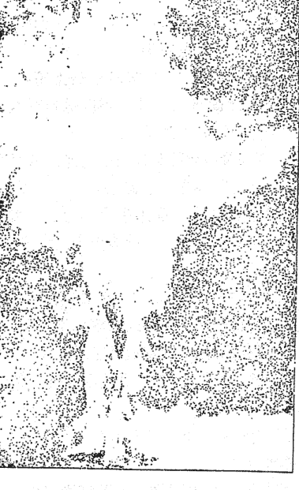