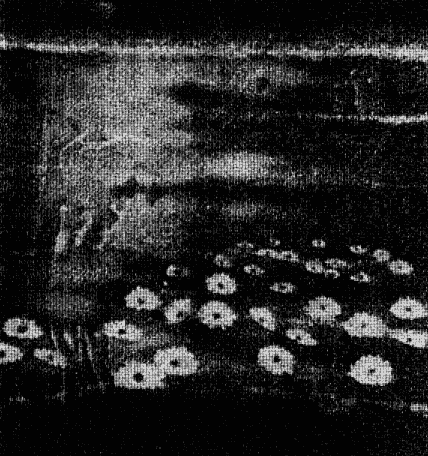
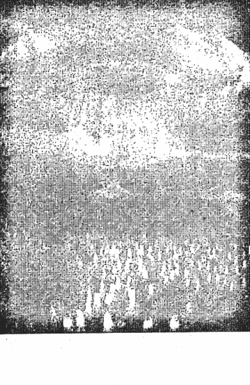

# 灵界探索系列：生命轮回

## 生命轮回

就像一个人除去旧衣，换上新衣，灵魂放弃衰老无用的躯体，投生到新的物质躯体去（第16章）

## 第一章
## 李娃为何不喜欢文学

李娃女士的恐惧、失眠等症状虽然经用“前世疗法”治好了，她仍不时到我的诊室来聊天，或者到寒舍来探讨一些灵异的现象。她与我太太文化已经成为好朋友，每次来时，她都与文化躲进房间中，叽叽呱呱地笑谈一会子，将我晾在一边。有时候，我女儿也加入她们的阵营。俗话说，两个女人加一只鹅成一条墟，真是不假。我从李娃那里得到的，已是旧闻了，因为这些信息已在第一时间给了我太太文化。

有一次，李娃在与我们一家子打牌时，我笑问道：“李老师，你回忆出来的事迹，有时温婉灵动抒情，有如诗歌；有的庄严警策且睿智，有时圣者的箴言；有的回环连绵，情节生动感人，有如章回小说；有的空灵奇崛，头绪多端，有如意识流小说。可是，却数次声明，说自己不喜欢文学，却是为何？”

李娃抚弄手中的纸牌，啪啪作响，她俯着头沉吟了一下，抬起头来，幽怨地望了我一眼，说道：“此事还与你有些关系哩。”

我乍闻此言，吃了一惊。再望望妻女，她们也好奇地望着我，带着揶揄的笑。

我们一家人都期待着李娃再说出一个优美动听的故事，因而都无心打牌了。我更是这样，因为我的牌技太差，牌运又糟糕透顶，每次打牌，都成了她们取笑的对象，实在是供她们笑乐的脚色。

“李老师，说故事罢。不想打牌了。”文化将牌一推，说道。

我们都将目光转向李娃。记得梁启超曾说过：雪夜读禁书，是人生一大乐事。眼下，也是冬夜，虽然南国的冬夜无雪，但听那些前生的故事，也像读禁书一样过瘾。

文化取出极品铁观音，冲了一壶酽酽的“功夫茶”，先给李娃冲了小小的一杯。李娃屈指在茶几上“笃笃”敲击了三下为礼，然后将小小的一杯功夫茶分三口饮下，赞赏地“吓”一声叹息。

李娃品咂过功夫茶的余香，搓热双掌，在姣好的脸蛋上擦了几下，又理了理满头的秀发，略一沉思，便娓娓说了开来——

……战国时，我是齐国的儒士，能读“三坟”、“五典”、“八索”、“九丘”，还有神仙之事，亦耳熟能详。何谓“三坟”、“五典”、“八索”、“九丘”？伏羲、神农、黄帝之书，谓之“三坟”，是言说道的书；少昊、颛顼、高辛、唐尧、虞舜之书，谓之五典，五典是讲常道的书；八卦的学说，叫做“八索”，这是有关义理方面的书；记述九州地理、人物掌故方面的书，谓之“九丘”。齐国近海，奇怪的事比其余六国为多。当时齐之王叫田建，在位时间颇长，只信任一个相国后胜，将政事都委托给后胜，自己只耽于逸乐。这后胜是个奸臣，秦国便投其所好，用金钱贿赂他。他便在齐王田建面前说秦国的好话，说秦王赢政只是对赵、楚、韩、魏、燕不满，不会损害齐国的利益。当时，秦以外的几个国家，多次联合起来，抗衡残暴的秦国，叫作“合纵”。秦国化解各国的合纵，以图各个击破之，叫做“连横”，秦国收买后胜，用的是“连横”之计。当时，战国四公子中的信陵君无忌、春申君黄歇，曾两次组织诸侯国合纵抗秦，一次打到函谷关（今河南省灵宝县西边）下，一次打入秦国境内，直逼咸阳，可是两次合纵，齐国都没有参加。若是那时齐国也参加合纵，合纵的一方就有足够的兵力和粮秣攻打秦国，齐国和诸侯国就不会被秦国各个击破了，说不定秦国在那时就灭亡了，老百姓就不会受那么多苦了，战国时“百家争鸣”的局面就会延续下去了。当时在齐国“稷下”这个地方，汇集了各个地方的学子，来自不同的学派，有道家的，有墨家的，有杂家的，有名家的，有儒家的，总称百家，他们可以在这里自由地发表自己的见解，互相争辩而又相容并蓄。那是中国学术的黄金时代啊，可惜的是，随着秦国铁蹄的到来，百家争鸣的局面一去不复返了。

那时的齐国在后胜的把持下，是个不设防的国家，秦国大军横扫韩、赵、魏、燕、楚之后，于齐王建四十四年，秦王政二十六年，公元前221年，攻入齐国，齐王建和大臣们都作了俘虏，我也被秦国大军押送到秦国去。也就在那一年，秦王嬴政做了中国历史上的第一个皇帝，自称始皇帝，要让子子孙孙，永远统治中国。

嬴政做了皇帝，我做了众多博士中的一个。我们的工作就是解释和演绎他的政策法令，我们不需要有自己的思想，只需以皇帝的思想为思想；我们不需要脑袋，只要有皇帝一个脑袋就够了，不然，人家就会说我们是目无皇上的。我们要做的，就是告诉黔首百姓：皇帝所做的都是对的，不对的只有我们臣民。因为皇帝法定是伟大的，正确的，睿智的。此外，我们还要定期写些歌颂皇帝英明伟大的诗歌。我本来不想写这些肉麻的东西，但身为臣虏，你不写，人家会说你有异心，不与皇帝是同心同德，人家会用怀疑的眼光打量着你，会减了你的俸禄，甚至会杀了你的头。因而我们都随大流，歌功颂德。皇帝被我们歌颂成古今无有的伟人，这样的伟人只有天上才会出现。而皇帝也真的想到天上去，成为神仙，长生久视，永远享受泼天的富贵荣华。有什么办法呢？天下是他打来的，他要想怎样便怎样。

有时，我们几个秦国之外的博士，志趣相投，有时聚在一起饮酒，发发牢骚。当时全国的人口怕是三千万左右罢，却有三十万人马由蒙恬领着，秦始皇的公子扶苏监军，防备匈奴。五十万人马攻南越，差不多全军覆没，又再派三十万人马前去。南越就是今日广东、广西一带，还有越南一部。各郡县的守军，起码总数也有一百万，筑长城的民众或工在二百万以上，修驰道的在一百万以上，修阿房宫的在三十万，修始皇骊山陵墓的，最多时人数在七十万左右。驰道相当于今日的高速公路，咸阳至九原的一段，宽一百多米，比今日的高速公路还要宽，可以一排通行六十辆马车。当时的青壮年男子，不是北征匈奴即是南伐南越，就是修长城、阿房宫、驰道、陵墓，剩下的都是老弱病残之人了。那驰道是为了让秦始皇巡游天下所用。大部分的人力、物力，都是为了秦始皇生前死后的享受。可是，他说他用武力削平天下，令二千多万人丧生，他们做的这一切，都是为了黔首百姓的幸福。百姓的幸福就是没有自由、没有权利！可是，我们却还要歌颂他的伟大！我们这些博士，就是这样的一群人物。

医生，当时你也是一个博士，还是我们的头目哩。你将我们日常发的牢骚，对皇上的议论，悄悄地告诉了李斯，李斯是廷尉，是主管刑狱和警察部队的总头目。他嘉奖了你，说你对皇上忠心耿耿，还加了你的职位。你得意忘形，更加注意搜集我们的过失，报告给李斯，邀功讨赏。我们恨透了你，可是又奈何你不得。

## 第一章 李娃为何不喜欢文学

（“想不到我当年是这样的卑鄙的角色！”我喟然长叹道。太太和女儿睥睨着我，露出鄙夷的神情。）

若仅是如此，倒也罢了，你的职责就是如此，你是文化特务么。可是，后来，却将多们性命害掉了，我们就不得不恨你了。

秦始皇三十四年，公元前 213 年，一个名叫周青臣的武官，对赢政说了一番歌功颂的话后，秦始皇很高兴，正在兴头上，却被博士淳于越一盆冷水兜头泼下，要始皇师事古人，以古为鉴，淳于越本是出于第二种忠诚的，却被始皇和李斯认为是诽谤，下令全国焚毁诗书，实行高压政策，偶尔论及《尚书》和《诗经》的，也要斩首；以古事议论朝政的，株连三族。

博士中，有两个人，一个叫侯生，一个叫卢生，讥议秦始皇的暴政，言论最为激切，怕招至杀身之祸，相约好逃出了咸阳。本来，他们也想请我一起逃亡的，可是我觉得，食君之禄，忠君之事，怎么能够逃离咸阳呢？因而，抱着愚忠思想，没有走。侯生、卢生逃跑的事被发觉了，秦始皇大怒，命廷尉李斯、中车府令赵高审查此事，李、赵二人将博士们都抓了起来，投入狱中，我也未能幸免。我们先是背对背被审问，接着是面对面互相揭发。医生，当时你揭发了我，说我平日里就对皇上怀着三心两意，议论朝政。我有口难辩。我们都疯了，被迫着互相揭发，我也胡乱编了一套供词，编派你的言论，这样，你也被我硬拖下水来。我们像一群疯狗，互相咬啮，一片狼藉，结果是谁也逃不出秦始皇那厮的罗网。医生，那时你骂我是卑鄙小人，乱咬一通。可是，你做初一，我做十五呀，你先咬的我，难道我就不对回敬你一口？我们平日里巍冠博带，道貌岸然，这会儿全都变得面目狰狞，人类最卑微、最恶毒的德性，全被我们暴露得淋漓尽致。我当时想，自己不过是心无城府，口没遮拦，说了几句牢骚话而已，现在又揭发了头儿，应该是可以功赎罪了吧？可是我想错了，我太幼稚了。其他的博士，也包括你医生在内，都太幼稚了。倒是侯生、卢生聪明，见机得早，预先逃遁而去。我们将所有的罪名都加在他们两人身上，仿佛他们是十恶不赦的恶徒。可是，即使如此，上头也不会谅解我们。

大祸终于降临。有一天，数千名身披铠甲的武士，手执大刀和利斧，将我们四百六十多名博士、儒生，从大狱中提了出来。我们知道死期已到了，互相打量着，交换着恐惧的目光。我们被押送到咸阳北郊，我以为要颈上挨一刀了，却没想到，被押到那里一看，却是一个早已挖好的大坑，那大坑像巨兽的口，黑洞洞，阴森森，我吓得浑身直冒冷汗。我想，我将要在这大坑中被活埋、窒息而死，尸体腐烂发臭，装着不少知识的这副皮囊，将要送与蛆虫去啃咬，让它们饱餐数月。

我和另外几个儒生，也包括你在内，被第一批堆下坑底，腿跌断了，牙跌崩了，剧痛难耐。我安慰着自己：不要紧，一会儿填上土，就不会再痛了。可是，离填土的时候还早呢，不断有人被推下来，我的身上又有多处骨折，肚子都被掉下来的人撞破了，我昏死了过去。

不知过了多久，我看见一道白光，在头顶亮起，我被那白光吸引着，飘离了血腥恐怖的坑底，冉冉上升，来到了一处风景佳胜的地方，竹招凉意，花吐芬芳，一个慈眉善目的老者坐在巨石之上，指着巨石，让我坐下。接着，一缕缕冤魂，相继从坑底飘出，簇拥到老者身旁。这其中也有你。

“你们以后还写歌功颂德的文章么？”老者问道。他没有开口，但我们都听得清清楚楚。

“我们就是做乞丐，也不写那劳什子文章了。”我激愤地表示道，说出了众冤魂的心声。

老者点点头，又摇摇头，说道：“难说啊，什么时候都有人吃这碗饭的。”

“我们以后再也不为皇帝、官府卖命了。”你表示道。真的，在以后的好几世中，你都没有出仕当官，有时做江湖郎中，卖跌打膏药；有时坐馆课徒，靠微薄的束修过日子，甘之如饴。我呢，也不再舞之弄墨了，也不想再当官了……

李娃说到这里，停驻下来，呷了一口工夫茶。

文化和女儿神情黯然，她们的眼角早已噙满了晶莹的泪珠。

我长长地叹息了一回，心想，怪不得她不喜欢文学了，原来有这样的渊源。

此时，冷月当空，幽冷的月光静静地穿过户牖，进入屋中。这天上的皓月，也曾照耀过血腥的秦朝罢，当也窥见过当年“坑儒”那惨绝人寰的一幕罢。

沉思了一会，李娃又说开去——

因为大家都是受害者，彼此也曾经互相撕咬过，因而死了之后，大家都互相原谅了对方，我也原谅了你，你也原谅了我。但我对那个狗皇帝却耿耿于怀，有心要捉弄他一下，聊解心中之恨。你也有此想法，于是我们相约了从鬼魂队中偷偷溜了出来。

秦始皇二十八年，曾经出游湘江。当时风惊浪恶，秦始皇差点被风浪掀下船去，大惊失色，无可奈何之际，只好将玉玺投入江中。

那玉玺是和氏璧刻镂而成，由李斯篆刻了“受命于天，既寿永昌”八个字，是作为传国之宝用的。玉玺一沉入湘江之中，立即风平浪静。

狗皇帝惊惧之余，问随行之人：“湘江是何神所管辖？”

随人应道：“是湘夫人所管辖。湘夫人是舜帝的两个夫人，尧帝的两个女儿。”

狗皇帝大怒，命人将湘夫人的庙宇拆了，犹不解恨，又命人将湘江两岸的树木都砍光了，变得光秃秃的，一片赭红之色。

你我飘过关中平原，掠过秦岭，黄河，长江，到了湘江之上，找到了娥皇、女英，她们就是湘夫人。

她们被残暴的秦始皇拆了庙宇，又被毁了山林，无处存身，只好寄寓于山洞之中，与禽兽为伍，对狗皇帝气冲牛斗。听得我们说明来意，她们拍手叫好，命人整治了一桌酒席，以湘江之鲤、汉水之嘉鱼为肴，用千年佳酿“古洞春”相劝，款待了我们。席间，娥皇、女英又命其余湘江女神婆娑起舞，湘灵鼓瑟，令我们神清气爽。

临分手时，娥皇、女英将秦始皇沉于湘江的玉玺取出，郑重地交与我们，说道：“这是人间稀有之物，当年卞和在荆山之上发现了一块璞玉，便献给楚王。楚王认为是一块石头，便命人砍去卞和的左脚，第二个楚王继位时，卞和再去献玉，楚王认为他欺君，又命人斩了他右脚。第三个楚王继位，知道卞和手中的那块‘石头’非比寻常，命人取来，让玉工剖析，才知道确是美玉。后来，这块玉到了赵国，秦王知道了，要用十五座城池换这块美玉。赵国派蔺相如出使秦国，见秦王没有诚意交换城池，命人偷偷持了这块玉，回到赵国。这叫‘完璧归赵’。赵国灭亡之后，这和氏璧终于落入秦国手中，被李斯整治成传国玉玺。这和氏璧有灵性，到了楚国的地面，便眷恋起故土来，掀起风浪，逼使那狗皇帝用它来镇住江水。本来，它回到了楚国，不想再到那血腥的秦宫中去，但看来离天下大乱之期不远了。动乱之时，那些想做皇帝的人，一定会到湘江来，千方百计要寻觅到它，这样一来，一方百姓就要遭殃了，我们也不得安宁了，还是让它再委屈一下，回到皇宫中去罢。况且，它命中注定还有好多奇特的经历呢，在帝王之间转来转去，待一千余年后，它就会无声无息地悄然消失了，你们带它回去罢。”

听得两位夫人如此说，我们对那玉玺肃然起敬，双膝跪下，接了过来。

我们告辞了湘夫人，捧了传国玺，回咸阳而去。在华阴县平舒这个地方，只见苍茫的夜色中，几个使者模样的人正在大道上策马狂奔回咸阳。我们降下云头，拦住使者的去路。

使者将马勒住，骏马嘶鸣不已，前蹄腾空。

“你们是何人？为何贪夜拦住我等？”使者凶神恶煞般喝问道。但他们的心中还是惊惧的，因为我们是突然出现在他们面前。

“请使者代为致意混池君。”我问使者一揖到地，说道。混池君是指纣王，借指秦始皇，意谓就要有人像当年周武王伐纣那样，前来讨伐秦始皇了。

可是使者听不明白“混池君”是阿谁，他们面面相觑。为首的使者喝道：“你们说清楚一点！”他将马鞭指着我们喝斥着。

当时，你对使者说：“明年祖龙死。”

说罢，我们将传国玺放在路边，倏地消失了。

使者相顾失色。愣了一会，他们从路边拾起传国玺，回咸阳覆命而去。

使者次日谒见了秦始皇，向他禀报了昨夜在途中的奇遇。

秦始皇明白混池君原本指纣王，目下指自己。祖龙，是皇帝之祖，也是指自己。他也明白，使者在途中遇见的我们，是鬼魂。

秦始皇沉吟良久，冷笑道：“山鬼不过能预知一年之事而已，何足过虑！”

又见那传国玺从湘江中忽然回到了华阴，现在又出现在自己面前，秦始皇更是惊奇不已。

这件事，《史记》中有记载，不过却是语焉不详。

一年多以后，秦始皇果然死了。他死在巡游途中的沙丘，沙丘原本有赵国的行宫，赵王父嬴政就是饿死在沙丘宫中的。

秦始皇出生于赵国，死于赵国。

## 通灵的医生

“李娃，真对不起了，当年苦害了你。”听完了李娃叙述过在秦始皇时那一世的遭遇，我向她道歉着说。

李娃苦笑道：“不必如此说了，此事已过去几十世了，你我都是当年的受害者，当年事过之后，我们已经互谅解了。在此之前，在此之后，你都教诲过我，我从你那里受益非浅，功大于过，我还应该向你道谢哩。”

我想，人性是复杂的，既有善的一面，亦有恶的一面，亦有似善而实恶，似恶而实善等等，人的这些禀性，并不是此生所形成的，一定是经过若干世代的累积而成的。有的人在前世中改掉了恶习，今世就显得善的一面居多；有的人今世恶的一面居多，一定是前世的业力不够，未改掉恶习，今生甚至来生还要继续磨练和修持。

不久，李娃介绍我认识了一个通灵的女医生。这女医生是李娃表了几表的姨妈，姓司徒。因与她是同行，所以我们很快就熟络了。

## 第二章 通灵的医生

司徒医生曾经是一家大医院的医师，她毕业于某名牌医学院，行医时间已有二十几年了。她的丈夫与她同是一家医院工作，是有名的内科主任。他们有一对儿女，儿女们继承父母的事业，也在高中毕业后考上了医科大学，目前已执业行医，悬壶济世了。

看着司徒医生那红润的面容，走路时那轻盈而快捷的步履，很难想象，在十几年前，她竟是一个肺癌患者，而且还是晚期。

司徒医生与我熟稔了之后，她向我讲述了发生在她身上的一段传奇故事——

当我被自己供职的医院确诊为肺癌之后，我和我的丈夫犹如晴天霹雳。在当时，这是不治之症，我只有等待死神的降临了。为人家治好过不少疾病的我的丈夫，对自己的妻子却爱莫能助，束手无策，他的痛苦比我更甚，医院的领导和同事都来探望我，说些鼓励的话。我知道，他们是真诚的，这我很感激，但却是无用的。医院一边为我的绝症浪掷金钱作无能为力的治疗，一边悄悄地为我准备后事，连抚恤金全都准备好了，还准备和殡仪馆联系，随时准备将我送到人生的最末一站去。

我不想浪费医院的钱，也不想占用医院十分紧缺的病床，我说服了医院领导和我的丈夫，请他们将我送回家来，躺在自己的床上。他们考虑再三，照我的话做了。丈夫是个尽职的丈夫，在紧张的工作之余，他用了差不多所有的业余时间，照顾着我。到了病情的最后阶段，我经常咯血，接着剧痛，昏迷。一对小儿女正在读初中，他们也很懂事，经常侍立在我的病榻前，嘘寒问暖，并将各自在学校因品学兼优而获奖的事告诉我，以讨得我的欢心。

我知道自己来日无多了，想到自己死后，丈夫和一对小儿女无人照顾，心酸不已，暗地时流了不少的泪。他们也背着我，偷偷地哭泣。一家人处在生离死别的悲哀中。

在我病情恶化的时候，领导再一次出现在我面前，对我说了很多褒扬的话，说我精于业务，团结同志，救死扶伤，做了许多许多的工作，创造了许多医学的奇迹，等等，在听来，好像是在向我致悼词，只是将最末的“司徒同志永垂不朽”的一句，换成“希望司徒同志在自己的身上也创造一个医学的奇迹，战胜病魔，早日康复，为医疗卫生工作再作更多的贡献”，云云。我艰难地笑着，向领导微微点关，以示感谢。领导又嘱我丈夫不要上班了，就在家中照顾司徒医师，这是院里交与你的任务。我丈夫感激地握着领导的手，将领导送了出去。

接着，我听到他们压低的说话声：“司徒医师万一有什么……尽快告诉我们。”这是领导在嘱咐我的丈夫。我听得岀省略号中的意思。

咳，我不愿意再苟延残喘下去了，免得耽误了领导的工作，耽误了丈夫的工作和子女的学业，我还是快点走罢，反正迟早是要走的。

接下来的日子我反倒显得心平气和，静静的等待着那个庄严时刻的到来。

一夜，劳累了一天的丈夫在房中的另一张床上睡着了，发出深沉的鼾声。我却睡不着，躺在病榻之上，辗转反侧。我看看桌上的闹钟，此时已过零时一刻。受着丈夫鼾声的感染，我有些倦意了，眼皮开始沉重起来。正迷糊间，忽然觉得眼前很亮。我睁开眼来，见房间的灯已熄了，开关也早就关了的，可是，房间却很亮，纤发可见。而且，这种光并不刺眼，既明亮又柔和。这光是从哪里来的呢？我感到奇怪。举目四望，外面只有幽幽的路灯的光，邻居房中早已熄灯。

当我的目光搜索至阳台时，蓦地，发现阳台上站着一个人！这个人很老，穿着月白色的长袍，慈眉善目，胡子很长很久。当我的目光与他慈祥的目光相触时，我的心猛地一震。

“司徒倩女士，不必害怕，我是来为你治病的。”没等我开口，那老者倒先开口了。倩是我的名字，他怎么知道呢？我没有开口。我能对一个夤夜出现在我家阳台的陌生老人说什么呢？看样子，他不是歹人，他是怎么进来的呢？什么时候进来的呢？我感到诧异极了。

“你是个好人，命不该绝。”老人又说道，“我这里有一个方子，你照方子抓药，吃过三剂之后，病就会好了。”

说完，老人一扬手，一张药方落在我的床头柜上，接着，那老人倏地消失了。不久，我也呼呼入睡了。

次日一早醒来，我看了看床头柜上的药方，见上面所列的中药，果然是医治肺癌的良方。我虽然是西医出身，但对中医亦有一定的了解。丈夫也醒来了，我将手中的药方递给他，让他照单抓药。丈夫看了药方，点点头，表示药方可用。他问我：“这药方哪里来的？”

我照实说：“昨夜一个神仙送来的。”

他哈哈大笑。他当然不会相信我的话，只当这是一个笑话。不过，在他看来，我还能和他开玩笑，说明我心情还好，所以他也显得开心。况且，那药方却是真实的，所开的药，都是有疗效的，份量也开得合理。

丈夫拿了方子，兴冲冲地出去了。一会，丈夫拿着三大包中药，还有三小包药引，回来了。他一边轻声离着歌，一边为我煎药。浓郁的药味弥漫了一屋子，也进入了我的房间来。近一个钟头之后，丈夫端着一碗热气腾腾的药汤进来，稍为晾凉了，让我服下。

“吃了这仙药，司徒医师就没事了。”丈夫仍和我开着玩笑。“但愿如此。”我笑道。

丈夫又沉思着说：“那药方上的字是用毛笔写的，写得真好，有汉魏风骨。可惜没能留下来慢慢观赏临摹。”

听得他如此一说，我才记起那方子上的字确乎如此，当时抓药要紧，却没有闲心情去欣赏书法。

一天一剂，三天后三剂药吃下去，我觉得身体中有一股强劲的生命力在涌动，翻滚，脸上有些发热的感觉，身体里暖烘烘的，逐渐扩散到了手脚，我的手脚变得有力量了，想哭，想喊，想动手打人。

第三天一早，丈夫和我几乎同时醒来，他望着我的脸，诧异地道：“咦，你气色好多了。”这个我也感觉到了，因为脸上有发热的感觉。癌症到了晚期，病人脸上都显青灰之色，还有些浮肿，手脚和身上都发冷，是不会有热的感觉的。我抓住丈夫伸过来的一只手，使劲一握，丈夫“哎哟”一声喊叫起来。

“好大的手劲，比以前的力气更大了，你真的好了！”丈夫高兴得泪流满面，扑在我的床上，将我紧紧抱住，怕我再次远离他而去。我也喜极而泣，紧紧地抱持着丈夫。

“我这个内科一室的主任应该辞职了。”丈夫抹着喜悦的眼泪，说道。

我用婆娑的眼泪，望着丈夫道：“我这光景，怕是回光返照罢？”

“不是！”丈夫肯定地说，“再过几天，我们就可以做爱了！你知道吗，我憋得好难受呀。”

我将他的手抓过来，将他的手指轻轻地咬了一口。

我们正笑闹时，外边大门口响起了铃声。是我母亲来了。

母亲打量着我，露出了无限的欣喜的神情。“倩女，你的病好了么？”她惊奇地问道，又望了望她的女婿，他向她肯定地点了点头。她喜得老泪纵横。

“哎呀，我没白给菩萨烧香呀。”她用手帕抹着眼泪，说道。

“妈，你在烧香么？”我丈夫问。

“一日供奉三炷高香呢。”我妈说。

“也许是妈心诚，将神仙菩萨感动了，治好情的病。”丈夫笑道。他笑着走了出去。

房间中只剩下我们母女俩。母亲问我：“倩女，你是请何方神医治好的呀？”

我将那夜的奇遇告诉了母亲。“真有这么回事？”母亲惊诧极了。听她的口气，她似乎也闻听过这回事，于是我问道：“母亲，你又遇到过什么奇事？”

母亲沉吟道：“在你看到奇人的那一夜，我也梦见了一个身穿长袍、胡子很长的老人来到我面前，对我说：‘女儿，你不必担心阿倩的病，她的病是前生带来的，不久就会痊愈了’，我听了，将信将疑。”

我更惊奇了，问道：“母亲，听你如此说，你梦见的老人，和我看到在阳台上的老人，是同一个人了，那个人难道是我的外公？”

“正是，正是。”母亲肯定地说。

这就更加奇了。听我母亲说过，在我出生前的十余年，外公就过世了，我是从没见过外公的，他怎么会在死了几十年之后来探望我，而且治好我的病呢？

“你外公生前，是四乡几十里闻名的老中医。”母亲又说。以前，我依稀听她说过外公是一代名医。

这么说，是外公的鬼魂托梦于母亲，又准确无误地来到我的住处，为我诊治恶疾了。“你别怕，你外公是个善良的人。”母亲说。

她的意思是说，即使外公已死了多年，变成了鬼魂，也不会害我的。我当然不怕，外公看起来慈眉善目的，他来时，满屋子都是异光，跟传说中鬼魂出现时的阴森恐怖，根本不能同日而语，外公怕是神仙，不是鬼哩。况且，他又确实治好了我的病，我应该感激才是哩。

这一夜，外公又来到了阳台。

“嗯哈，你是外公，是么？”因为明白了他的身份，我对他毫不畏惧了。“你母亲告诉了你，是么？”他笑着反问我。我点了点头了，请他老人家进来坐。他老人家也毫不迟疑地进来了，坐在我的身边。我高兴地告诉他，听了他开的药，我的绝症已消失了。

“阿倩，还未完全消失哩，仍要吃药，同时，我教你一套功法，你照着做，很快就会好的。”外公说道。

于是，外公教了我一套气功功法。在这之前，我从没跟任何气功师学过气功，因为我对那些东西非法怀疑。这回是外公亲自教的，我便毫不犹豫地跟着他做了。这套功法动作很简单，很容易做，一学就会。

“外公，我拜你为师吧。”我笑道。

外公呵呵而笑，摇了摇手，说道：“我做不得你的师傅，日后，你会有好多师傅的。”

我有些不高兴，但亦无可奈何，只好存疑。外公教我了功法，又向我身上发了气。他伸出两只手指，是食指和中指，对着我的身体，距离有一米远。只见一道红光从他的指端透出，绵绵不断地射向我的身体，透过肌肤，进入五脏六腑，只觉一股暖流，周流全身，流遍四肢百骸，舒服极了。

外公发完气，似乎有些疲劳，我要为他煮些东西吃，他劝阻了我，说：“我不想吃你们的东西。”说完，他又飘然而去。

从此，我又学到了一套气功。我不坚持不懈地练习，又照外公开的药方抓药来吃，自觉身体恢复很快。

过了几天，深夜时分，又是红光满室，外公又来了。

“哈，阿倩，你没有偷懒，照外公教的功法去做，真乖。”一见面，外公就夸奖我道。

“外公又没有日日看着我，怎知我照你的功法去练？又怎知我没有偷懒？”在他面前，我仿佛是个小女孩，对他说话毫无顾忌。

外公笑道：“你的一举一动都瞒不了我。”

我又问道：“外公住在哪里？离这边远不远？”

外公笑道：“我住在你们这个宇宙和另一个宇宙的夹缝中，说远也远，说近也近。有缘相见的，就近；无缘得见的，就非常遥远。”

“另一个宇宙是什么景像？”我诧异地问道。

外公说：“另一外宇宙是灵界，那里的时间和空间是同回事，不像你平时所处的这个宇宙，时间与空间是两回事。宇是空间，宙是时间，这是你目前所处的这个宇宙的时空观念。而在我的那个地方，却不同于你所处的宇宙，也还不等同于灵界，在我们那边，时间和空间比较模糊，便还是两回事。灵界的人，常常与我们擦肩而过。”

听了外公的这番宏论，我如坠五里雾中。我问：“我们这个宇宙与你所处的夹缝，有相交之点么？”

外公道：“当然有，不然，我怎么能进出自如呢？”

我又问：“外公每次来看我之前，都是计算好了才来的，是么？”

外公轻抚我的头，笑道：“阿倩，你真有悟性。是这样的。不然的话，我没算好我那地方与宇宙的交汇点或相近点，我就进不了这个宇宙，或者进来了，也出不去了。”

我觉得匪夷所思，又问：“你说的灵界，就是神仙住的地方了，是么？”

外公道：“有点道理，但不完全对。神仙和佛，是融荡于灵界中，而不是一个一个地住在那边，住是这个物质世界的观念。平时你们所说的宇宙，是物质世界。广义地说，外公我也是住在灵界中，但不是像你们这样，是住在一间一间的屋中。”

我又问道：“你们那里没有风霜雨雪么？”

外公笑道：“风霜雨雪是物质的形态，而在我们那边，是精神的形态。在灵界中，都是精神的形态。”

我又问：“既是如此，外公怎么看得见我们呢？怎么能发现我偷懒呢？”

外公道：“不是看见，而是感觉到。”

“用什么去感觉呢？”

“感觉则精神等而下之的功能，精神的全体都能感觉。亲人之间虽然明幽异途，但还有讯息渠道相通。”

“外公是鬼还是仙？”

“外公非鬼非仙，是精神。”

“外公既是精神，怎么我能看见你？”

“那是因为外公进入物质世界中，地球磁场将外公的形象、声音还原成当年的样子，就像电子仪器能将空气中的光波还原成影像和声音一样。”

与外公说了这么多，我似乎有些明白了。

“不过，光波、声波虽然肉眼看不见，也还是物质，但外公却连物质也不是，只是精神。”外公又补充说道。

我想起一个问题，又问：“外公，气功的气是精神，还是物质？”

外公道：“问得好。气功的气，既是物质，又是精神。”

讨论了这么多问题，我觉得累，于是外公也回去了。外公每次来的时间间隔，并不是固定不变的三天或五天，而是有时三天，有时五天或六天。我想，这或许与地球自转不甚规则有关，因而外公所处的精神世界与地球或宇宙的对接有些差距。

在距离外公与我谈公宇宙和灵界之后的第六天，外公又来了，同样是深夜。

“外公，我为何会得这可怕的病？”我问道。

外公道：“你这病是两世染上的。”

外公告诉我，前两世，我分别是和尚和道士。在当和尚的那一世，我在一座古寺修持。当时我已开悟，等于小乘佛教的初果，大乘佛教的初地，也就是说，已在佛学修持上走向正轨了，再破“本参、重关、牢关”这三关，我就算修成正果了。那时你的法号是道可。一日，你与比丘尼道如相遇在伽蓝中，你们四目相对，似乎是前生相识的模样。不久，你们又在伽蓝中相遇了，四下无人，你们便搂抱在一起，正巧被和来取法器的上座悟因发现了，你们被斥逐出古寺，在一座荒山中结一椽茅舍，成了夫妻。道如尼姑就是你今生的丈夫。你们那时虽被逐出寺院，但仍是一心向佛，虽然因犯戒而未成正果，但我佛慈悲，你们数世仍与佛陀有缘，只是修持要更刻苦些而已。又过了一世，你们投身于道门中，你是坤道，你丈夫是道士，你们虽在同一道观中参惜玄道，但却能守规矩。你们是全真道，全真道与佛教中参差不多。却不料在一年给一善信打醮时，你吃了他家菜肴中的牛肉丸。牛是道教中的圣物，太上老君当年是骑在青中上出幽谷关而去的，这一下你犯了道门中之大忌，因而今生中你会有一场大病。那善信给了你银两，你没有全部上交给观中的道长，而是留下几锭。银属金，在人的身体中对应的器脏是肺，因而今后你的病发作于肺部。这病，都是你前两生种下的恶果。幸得你的在前两世中，修佛法时还留得业力和愿力，心中不离佛门三宝；修道时，虽有破戒和贪嗔之心，但道根未绝，善心未泯，因而今生生命未该绝，若能破除‘魔障、业障、烦恼障，种种业障’，你还可以获得明师加持，脱离苦海，臻于涅槃之境。

听了外公一番话，我如梦初醒，明白了前世今生之因果。我在外公面前放声大哭，外公也不劝阻我，任由我哀哀哭泣。哭过之后，我觉得舒服多了。

奇怪的是，虽然我是呼天抢地般大哭，可是却一点也没有惊动同在一房而睡的丈夫，他发出酣睡的鼾声；也没有惊醒一对儿女，更没有惊动左邻右舒。后来我才知道，我的哭声，笑声，说话声，只有外公听得见。其他人无缘听见。而外公说话根本就不是用口舌，而是用意，或者叫“精神传导”。

又过了几夜，更阑人静时，一团黄色的光出现在房间中，我往阳台外一看，是一位和尚站在那里，他身穿袈裟，背对着我。(在以后的岁月中，和尚多闪出现在我家阳台，但次都是背对着我，我始终看不清他的真面目。或者，我缘浅，修持未够，他不肯让我看清他的庄严宝相。)

“阿弥陀佛。”我双手合十，口诵佛号。

站在阳台上的和尚在我念诵过四十九声佛号之后，开口说道：“修道至苦，当念往劫，舍本逐末，多起爱憎。今虽未犯，是我宿作；甘心受之，却无怨诉。经云：‘逢苦不忧’。识达故也。”

我又流出了眼泪，说道：“青青翠竹，尽是法身；郁郁黄花，无非般若。一片月生海，几家人上楼，恳愿听大师宏法。”

和尚道：“法是心缘，心为尘因。因缘和合，幻相方生。所谓法者，即非佛法，是名佛法。”

从此，这位始终背对着我的和尚，成了我的明师。我明白了业因，修持也更加自觉了。师傅除了向我宏扬佛法外，还教了我一套佛家功法，我的身体康复得更快了。

我跟佛家师傅修持了三年多以后，一天深夜，忽然满室紫霞弥漫，一位身穿道袍的老道长，忽然出现在我面前，而不是像前番外公和和尚那样，出现在外边阳台。

这位道长相貌魁伟，双目炯炯如日月，两边太阳穴鼓起，天庭饱满，双腮鼓胀，胡须如戟。后来我才知道，太阳穴鼓起的人，是武功高深之人。

“善信好。”还未等我向他顶礼膜拜，他倒先向我问候了。我由此知道他是个爽快的人。

“道长好。”我只能这样向他问候。

他果然爽快，说声“开始吧。”就教了我一套道家功法。教完，就倏地消失了。

过了两天，外公来探我。他望了我一眼，说道：“哈，你好有福气啊，既有高僧做你的师傅，而今又有位道门祖师来护持你。”

我诧异地问：“那位道长是道门祖师么？他的道号呢？”

外公笑道：“说出来要吓你一跳，这位道长不是别人，是隐仙犹龙六祖张三丰祖师也。”

“吓？是他老人家？”我真的吓了一跳。想不到鼎鼎大名的张三丰祖师，会降临到我这名不见经传的小妇人的寒舍中，而且还亲自教我功法，我真是受宠若惊了。

“张祖师不但是道门祖师，而且还是个佛哩。他在佛门中，人称‘邋遢净光佛’。”外公又道。

嗬，祖师真厉害，集仙、佛于一身，能得到他的耳提面命，真不知是哪辈修来的福分。

不过，张祖师只来过三次，来得最多的还是外公和那位佛门师傅。

三年前，我回医院照CT，结果出来了，身上的癌细胞全部消失！院领导和同事们向我祝贺，说我创造了一个医学奇迹。可是，我扪心自问：这奇迹是我创造的么？

## 第三章 冤魂登门求救

司徒医生的案例很生动，也很有说服力。李娃不久又介绍我认识了通灵的甄师父。甄师父威风凛凛，相貌堂堂，一身正气，全然没有江湖术士的那种猥琐习气。

一九八六年的十二月的一天，甄师父应邀前往某市某县一户人家去为人作“观灵术”，那天的天气有些冷，午后时分，甄师父依约来到这户姓陆的人家，这家人正厅很小，虽然实际参加观灵的人只有六位，但由于亲友邻居好奇围观的人很多，所以显得特别拥挤。

法事大约进行了二十分钟左右时，正蒙着眼接受施术中一位姓陈的女士，突然十分惊慌地站了起来，指着大门外面，几乎是结结巴巴地说：

“那边……那边大门口有个人站在那里，是位老先生，可是全身都湿淋淋的样子看起来十分哀伤——他还说他姓方，名年，新年的年……”

甄师父虽然经验老道，也免不了被她突如其来## 生命轮回

的举止给吓了一跳，但很快就恢复平静，一面念咒语，一面从容不迫地踱过来，又见这位女士有些惊慌失措的样子，就安慰她道：

> “别怕！别怕！没关系的；你先冷静下来，放轻松点……你好好地问他是什么人？有什么事？”

陈女士这才惊魂甫定地转向大门口，嗫嗫嚅嚅地问下，然后转述道：

> “这位老人家他说他叫做方年，今年六十九岁，家住凤凰镇大塘乡，现在人掉在那口池塘的水里，到了明天尸体就会浮起来与子孙相见，他是来拜托大家行行好，赶快去通知家人不必再到处去找他，只要直接到‘某村’池塘边去等着收尸就可以了！”

陈女士说完这话，老人家的影像就消失了。

甄师父立即施法，让陈女士回来，解开蒙眼的毛巾，参加者和围观者无不感到惊讶，大家七嘴八舌，议论纷纷，有人认为真的是亡魂显灵，应该赶紧去通知他的家人，也有的半信半疑，或者说：

> “也不知道是真是假，他跟我们今天的法会又不相干，又没有人去请他，他怎么会自己跑来说话呢？万一那个地址没有这个人或者这人根本没有死，我们冒冒失失地去跟他家人说这件事，万一说错了，下不了台怎么办？”

而陈女士却坚持：“我真的看到了，他真的是这样对我说的！”

然而这时连甄师父都有些左右为难，心想：如果真有此人，真有此事，去通知他的家人那还不打紧，万一这人根本没有死，这样去说了，到时候不只是下不了台，恐怕是砸了招牌还要奉上香烛鞭炮去向人家正式谢罪呢，不过，依他多年的经验，这事应该不假，至少以他的道行，多年施术的过程中还不曾碰到什么妖魔鬼怪敢斗胆来恶作剧的。

## 第三章 冤魂登门求赦

正在迟疑间，旁观众人中不知是谁已经照着地址前去方家通风报信了。

由于大塘乡离这儿的路程不算太远，所以大约两个半小时左右，方年的女儿和媳妇已经匆匆赶来，因为方年老先生确实已经失踪两天了，亲友们正因为遍寻无着而心急如焚之中，她们一来劈头就问：

“刚才我父亲真的跑来这里说话？”

甄师父：“是的！他说他叫方年！”

姑嫂两人急急点头：“我父亲确实是叫方年！可是他好好的为什么会跑去池塘边呢？”

为了再进一步求证，姑嫂两人迫不及待地央求着：

“拜托再替我们做一次请神好不好？”

甄师父答应了。

她们姑嫂两人并没有入座接受施术，而是站在外面焚香祈求与等待，屋内接受施术的仍是先前那几个人，在第二次施法之中，大约不到十分钟，陈女士果然又看到行前那位老先生。

为了方便求证及对谈，征得陈女士的同意，甄师父施法让方年老先生亡魂附在陈女士的身上……

方年的女儿是听到父亲失踪，才匆匆从外地赶来的，并不相信父亲已经溺死，所以双手环抱胸前，一副不以为然的样了斜视着已经被附身而从椅子上滑落跌坐在地上的陈女士，想了想就问：

“你出门时穿的是什么样的衣服？”

附在陈女士身上的方年答说：

“一件肉色的卫生衣、长裤、拖鞋，颈子上围了一条围巾！”

听到这里，女儿先是一怔，与嫂嫂对望一眼，随即脸色大变，立即和嫂嫂同时扑上前去，与陈女士（方年）三人相拥而号啕大哭起来……

“对了!这就对了!是我阿爹没错啦……”女儿哭喊着,声音沙哑又凄惨,连一旁围观的人也不禁鼻酸而含泪唏嘘……

甄师父不停地安慰她们:“冷静一点,不要这么激动,现在还是问清楚状况要紧,光哭又有什么用?”

这对姑嫂听了,才抬起头来,一面擦眼泪,一面哽咽地道:“实在太可怜了,都这么一大把年纪了,为什么会走上这条路呢?”

方年老先生附在陈女士的身上缓缓说道:“这是没办法的事,最近几天,我一直看到一个男人的影子,手里拿了一条绳子,不停在我们家门口的路上踱来踱去,不知怎么搞的,我就是被他吸引住了,一直想跟他走……然后我是从鸡舍的小门偷偷溜出来的,不由自主地跟着那个影子来到池塘,一步一步地走进水中,虽然水好冷,可是我控制不了自己,还是一步一步地走下去,一直到被水淹没……”

说到这里,三人又相拥痛哭成一团……

隔了一会儿方年的魂又说:“我现在还沉在水底,本来要等明天才会浮起来!”

但是这时陈女士的语音忽然一变,成了一个老太婆的声音,原来是方年过世还未一年的老伴,她附上了陈女士的身,非常气愤地教训着媳妇:

“为什么不把公公照顾好,天气这么冷,却让老人家走上这条路,泡在冰冷的水里头……”

媳妇一面哭一面辩白着:

“根本就没有人去惹他生气,谁知道他为什么会一个人从鸡舍那边的小门偷偷溜出?而且一发现他不见了,家人亲友和左邻右舍的人大家都急着四处去找他,找了两天都没见到他人影,谁知道他竟然会掉进水里,还跑来这边显灵,那……那现在该怎么办?”

婆婆附在陈女士身上，生气地说：

“怎么办？赶快去叫人来把他捞起来啊！”说完之后，又详详细细把方年老先生落水及现今沉尸的地点描述了一遍，并交代她们赶紧回去叫人到那个地点去打捞……

姑嫂两人唯唯诺诺地答应之后，方年和他老伴的两位亡魂就离开陈女士的身上，同时消失了。

甄师父把陈女士招回来之后，这场法会就在五点多时结束了，姑嫂两人再三向甄师父及陈女士与在场众人道谢之后，就相互扶持着，一路哭哭啼啼地赶回家，回到家中，厅堂正坐满了因关心而赶来探视的亲族及一些热心的邻居，看到这姑嫂二人从外头伤心痛哭地回来，大家都有些错愕，而一些年老的长辈，却是劈头就教训道：

> “你们这些人，真是莫名其妙，人都还没找到，你们不赶紧去找，却在这儿哭爸哭妈，干什么？想要咒你爸爸去死是吗？”

姑嫂二人却异口同声哭叫道：

“刚才爸爸附在别人身上，说他已经淹死在池塘里，要我们赶紧去打捞，不然就要等到明天才会自动浮出来……”两人并把刚才法会中的事从头到尾地说了一遍。

亲族邻居听了也不得不信，既是伤心又是惊讶，但大家却都一致表示既然如此，不妨到池塘那边去找找看。

这时是农历十一月份，下午五点多天就快黑了，大伙准备了香烛纸钱和照明工具，就一齐往池塘方向出发……

一路上大家议论纷纷，其中难免也有些比较冷静的，却认为天下哪会有这种事，真的是鬼话连篇，这么冷的天气，还要摸黑去池塘里捞死人，真是耍猴子也不是这样耍法啊！

“大池塘”是一块面积好几亩的自然池塘，距离方家约有一公里的路，大家到达之后先在池塘边上慢慢绕了一圈，边用手电筒往水里照射，但是一圈绕下来，却什么也没发现……

这时甄师父也由家那边赶了过来，想看看究竟找到尸首了没有？只见岸边上人影晃动，手电筒照来去，也有人拿着香，或蹲在池塘边烧纸钱，而此时有些人已经失去忍耐心与信心，抱怨纷纷，认为根本就是鬼话连篇，无稽之谈，搞不好方年老先生他人现在还好端端地活着呢！这时连甄师父也有些担心起来……

结果不等他开口，其中亲族里一位何先生有些见识，赶忙点燃起线香，虔诚地向池中叩拜，并拿出二枚硬币，祝祷说：“姨丈！你下午附身说你在水中，可是我们都找不到你，如果你确实在此塘之中，请赐我连续三个成杯……”

说着，他连续把硬币往地上丢了三次，结果真的丝毫不差地出现了三次“成杯”，于是他立即通知大家：

> “姨丈确实还在池塘里，大家分头再找！”

在漆黑的夜色中，只见到处人影幢幢，纷纷向池水中照射搜寻，情景十分诡异……

何先生和几位同伴走没多远，来到一处长了竹林的岸边，把灯光照射在岸边的水中时，感觉到有些异样，就指着那个地方对同伴说：

> “嘿！你们看，那个是不是！”

同伴们围过来看了看却说：“不像啊！大概是竹树的树头或者什么死狗之类的吧！”

何先生却不这么认为，就催促他们道：“不管怎么样，你们赶快去找一根长一点的竹子来，我拨拨看就知道了！”

一位年轻人快快地跑去取竹子，但因为没有工具，只好用手连挖带拔，终于拔来了一支连根带枝叶的竹子，何先生接过来，一步步走进水边，用竹子往水中搅动了一下，就看见有东西慢慢浮出了水面……

> “是啦！是他啦！大家快来啊！找到他了！找到他了！”他

大哭大叫地把所有亲友邻居全叫来了。

捞上来一看，果然是方年老先生，但早已死去多时，而衣服果然正是他早先穿的那样，连脖子上的围巾都还在。哭天抢地的凄厉声音立即响遍了整个大池塘……

这当然是桩悲剧，但也是诡异绝伦又却是千真万确的灵异事件，二十个年头转眼已过，方年的媳妇也过世了，但是他的女儿以及被附身的陈女士迄今也不过五十来岁，她们就是这事件最好的见证。

经过此次不可思议的灵异事件，甄师父对灵界的研究更加热心，很多专家都认为观灵术可能是一种催眠、联想、幻觉、神格化……

但以方老先生这种灵个案来说，又怎么解释呢？

法会主人的乐先生与方老先生毫无关系，他是突然出现在法会之中，当时他根本没有亲人在场，而是特意来插快报请大家转告他的家人，而且事后真的在亡者所述的地点把他捞上来——能说这是幻觉、联想或是催眠吗？

在国外许多招魂术、灵应盘、乩板之类的文献纪录中，由于没有特定的招请对象，所以一旦招请成功，来的可能是任何身分的亡灵，但也少有以这种“插播快报”的方式，现场要求给予立即协助的。所以我认为这是一个十分特殊而又具有研究价值的个案。对灵魂以至灵界的实存与否，提出了一个非常有力的佐证，但值得注意的是：一般宗教或民俗中多半认为人要在死后的第七天之后才会知道自己的死亡，而方年一案却是在死后两天就知道自己已淹死并陈尸水底，要求转告家人打捞。也因而又对死后七日说提出了一项挑战，这点是值得深入探讨。

## 第四章 女作家探访灵界

李娃虽然说自己不喜欢文学,但与文学界的人士也能沟通思想。她认识一位著名的女作家边灵,边灵两年前捐馆了,在生前却是李娃的闺中密友。

名作家边灵在生前曾宣告了她具有通灵及与灵界生命沟通的异能。

并且曾参加过两次“观灵法会”,而都能成功地进入灵界。

一次是一九八六年七月十五日。

一次是一九八七年十月十五日。

两次进入灵界的过程,都曾留下完整的录音资料。

为了方便分析,以下将用节录方式进行。

第一次“阴间之旅”。

边灵:“现在到山这里了!”(她在肩膀上比了一下位置):“刚才还在后面,这样高的!现在山是白白,像棉花一样的东西。船划得不快,是大的,我确定它在摇,可是完全看不见其他东西,只知道旁边有一个不太大的小孩在摇……”

甄老师又念了一段咒……

边灵几乎立即喊了起来:“甄老师!天上有个白衣服的女人,在天上!”甄老师:“她穿白衣服的吗?”

边灵:“这完全是一个感觉,眼睛没有看到,可是她确实在这边的天上……”(她手比向了右上方),“这时山到后面去了!”

甄老师:“你看她头上戴了些什么?”

边灵:“发光!很慈爱,这样子这样子像皇冠一样的东西戴在头上,说不出来……,我还在船上……她现在在约我洒水!”(边灵此时笑得很愉快。)

甄老师:“人现在向她祷告一下,你跟她说今天很虔诚地想到阴间去,请她给你带路。”

边灵双手合十,口中默念了一番,隔了一会才说:

“……旁边还有个小孩!”

甄老师:“现在船是不是跟着观世音走?”

边灵:“有!可是山已经到后面去了,现在都是白的,她还在这边,旁边还有一个小孩,又觉得她是圣母玛利亚,很难说,可是很慈爱!白的!现在她们转身要走,我还是在船上,还是被他们摇着,其他什么都没看见。”

……

(编著者按:①对于天上那个白衣服的女人,边灵表示那只是一种感觉,眼睛没有看到。这点在许多对灵界研究的报告中,前世催眠中濒死经验的报告中,在谈及灵界的居民的自述或进入灵界者的自述中都有类似的表示:一旦进入灵界,不论是生前或死后的进入者,都会拥有程度不一的“超感官知觉”,也就是说将可拥有比我们经验中全凭感官更广阔更灵敏,更强的“感觉能力”,超越了平常单纯的“看到、听到、闻到、尝到、摸到”以外的另一种接收“感觉”的方式。②当边灵表示“感觉到”天上有个白衣女子在给她洒水时,施法的甄老师直觉地以他的经验及从宗教范畴认为是“观世音菩萨”,但边灵却表示:“又觉得她是圣母玛利亚”,一方面表示边灵并非一味地在接受暗示,她仍有自主的思想。一方面也证明了在灵界的出现的,被不同宗教信仰、不同派别的研究者,甚至不同身份的称之为“佛菩萨”、“神明”、“天使”、“上帝”、“基督”、“先知”,其实本质本意是完全相同的,不同的人总是以他自己不同的经验去给予自认适当的称呼)。

## 二、

边灵:“如果是观世音菩萨的话,她还在前面带,这仿佛是朝这边弯的,可是不用脚走的嗳,很奇怪。”

边灵这么说的时候,自己很奇怪?在场的从人听了觉得奇怪?路不用脚走,那用什么走呢?难道阴间也有先进的“自动步行器”吗?

……

(编著者按:这点在“观灵术”的存档资料中或其他灵学研究报告中,也有极多相同的描述,有些用“飞”,有些用“飘”,也有些用“心念听及,瞬间到达”等等的字眼来表达,这是因为那种感觉超越了我们习惯的经验范畴以外。

边灵还在兴奋地嚷着——

……现在人来了,这两边都是人在给我拍手,好可爱哟!都是不认识的,统统在拍手,夹道欢迎,这边,这边,这边都有,只知道都是中国人,哦!大家都在拍手,我是完全清醒的,他们挤得很紧,好像在看热闹一样……”(此刻边灵笑得十分开心):“你们说的那位观世音没有开口,可是她回头在笑……噢!大家都在对我拍手,我是完全清醒的,男女老幼都穿着白白,没有黑黑的衣服,那种香港衫的人很多,好像都是中国人,他们挤得很紧哩!一群一群一群,叠得一层又一层,可是都是没有声音地在拍手!好好玩喏!我还是在往这个方向走……”

……现在出去是一条街道,一条巷子,还是中国式的,她说带我去看我外公,我外公在一一个酒家喝茶,都是男人,都是中国人,这次我看得很清楚,统统是中国人,而且感觉上几乎都是诏安人,很奇怪?都在讲我们家乡话……”

> (编著者按:“灵界”的居民,由相同国籍、种族、或操相同语言、相同生活习惯或相同思想模式的各成聚落地生活在一起,这点和佛家所云:天界、地狱、阴间(灵界)系由“共业”所造的说法相同。细节另文说明。)

……她十分激动地说:“出来一个人,是我老师乐可先生。”(她蒙着毛巾的脸慢慢落下了泪串,流到下巴滴在衣服上,声调也变得呜咽):“不能讲话,他没有讲话,从人群里出来,穿了一件香港衫,是老作家乐可先生,两个人都激动,讲不出话来……”

甄老师:“观世音菩萨在旁边,没有关系,你们可以尽量地聊!你问你老师:他在那里需要什么吗?”

边灵:“他右手里有一支毛笔给我看见,本来没有,你问的时候,他给我看见,是作家大概表示有笔了,啜!我外婆也来了!”

……到了老师房子,是中国式的,有一个书桌,现在就进去了,有一张床,奇怪呢?怎么是尘世的东西都有?有一个书架,架上全是他生前写的书,有浪花社出的那套白的‘乐可’全集,他说叫我不要看那个东西,那个东西没有价值,他说那是不存在的,因为我要看到,所以就把它拿出来给我看……

……边灵却突然呼喊了起来,吓了大家一跳:“可是那不是阴间啊!那是真实社会的事情!怎么会在这里出现?对呀!不怀疑不行,我神智完全清楚的;我外公没有讲,我外婆好玩;她说，其实你看到的东西那是不存在的，她说：‘你看到这些房子其实是我们要给你看见你才相信，不然你不会相信，所以我们就现一个房子来给你看，所以你看到什么就是什么。”

(编著者按：“灵界”有好几个层次，最接近阳世这一层的居民几乎完全没有变化能力，层次越高、变化能力越强。西方神智学家李必特先生在他的名著“灵界的生活”一书中对“灵界”的部份描述为：“……其中第一、第二、以及第三亚层，这个境域就是我们常在灵媒所做的‘通灵会’或‘关亡术’中所说的‘清凉地’……‘精灵们’（指灵界居民）以之暂时建立他们的住宅，学校以及都市，在那里成形的许多想像产物，尽管为时极短，却也真的美丽，因此之故，一个对较高层面毫无所知的访客（指进入灵界者），也许心满意足地在那些森林、山岳、美丽的湖泊、以及可人的花园中游观玩赏，因为，所有这一切，不论怎么说，都比物质世界中的任何东西都要优越得多……）

……老师现在在跟我说话……我问他我先生呢？我先生呢？……

抽泣了一阵，她才继续说：“老师说不在一个空间，他说有一次梁方来看过他。我问他那个空间怎么去？他说不知道哩，他在摇头！我问他我先生怎么过去的？他说我先生在那里做官！而他只是做一个文书，而我先生在做官。目前我神智完全清楚，可是我看见。他说，我先生是飞过去的，他说我先生在做一种好像中国人的城隍，他说他自己是一个文书，现在他在跟你们问好，转过来问好，向你们在座的鞠了一个躬！”（后面这段话是边灵转述乐可先生的话，向阳世所有在场参观的人说的）：“现在又转过来坐回椅子上！）……他们跟我说我先生曾去看过他们，我问他什么时候去的？他们说他们那边没有时间，不知道哪时候去的。老师叫我出国之前不要再去上坟，他说他不在那边！”

(编著者按：“灵界”有很多层次（空间），高层次的灵(居民) 可以到低层次去, 但低层次的灵 (居民) 无法到高层次去, 甚至地高层次的景况也无所知。边灵在进入灵界的同时, 一方面在与老师乐可先生对谈, 一方面又能向当时 (一九八六年) 在场围观的阳世朋友转述老师的动作, 而且乐可曾礼貌地向阳世围观者鞠躬问好, 表示他虽生活在灵界, 却仍可 “看见” (或感觉) 阳世的种种, 或许也可证明阳世与灵界有某种程度的重叠, 而不是在遥远的某处。此外 “那边没有时间”, 一个 “没有时间概念的空间” 本身就不是我们生活在凡间阳世之人所能理解, 但是从西方大哲柏拉图起, 对于 “另一个世间” 的报告, 就有相当多 “没有时间” 的描述。)

……奇怪! 我是从上面看我们三个人? 菩萨还在这里。可是我师太穿冬天的衣服, 我老师穿夏天的衣服。我问他为什么? 他们说那是他们喜欢, 气候不要紧, 他们穿他们喜欢的东西……

(编著者按: 没有时间, 自然就没有季节之分, 而且极多进入灵界者, 对灵界的描述都是不冷不热, 气候很好, 因此 “服装” 也极可能是 “灵界居民” 刻意让 “访客” 看到的, 因此穿得再少或再厚, 也没有任何影响, 正如他们所说: 他们穿他们喜欢的东西。)

……现在走到了海边……过海! 现在在万山群岛, 他们跟我说在万山群岛, 我是万山群岛的人, 榴花渡现在到了, 过了, 我不知道怎么飞过的, 这次没有人渡我, 没有人划……现在我看到一幢西洋式的楼房, 我并没有看过我祖父家的照片, 是那种土里土气西洋式的楼房! ……)

(编著者按: “万山群岛”, 并非同名的两处。一个可能是: 灵界与阳世的空间是重叠的。第二个可能是外公、外婆 (灵界居民) 故意重现出生前对 “万山群岛” 的记忆成为生动而生可以身历其境的画面来给边灵看, 正如本章外婆所言: “其实你看到的东西那是不存在的……你看到这些房子其实是我们要给你看见你才相信，不然你不会相信，所以我们就‘现’一个房子来给你看……”。)

……现在叫我坐在他的床边，老师的床很整齐，他把书桌的椅子拉出来坐在我对面，可是我看到我们自己，是从上面看下去的，我是看见我在这里，他在这里，现在，不是从我这个角度看的。”边灵将手平举的眼睛附近比了一下：“我是从上面看的，现在我的手，师徒两个人，我的灵跟他的灵在讲话……

……这完全是我从上面看的；她说她给我吃的是虾仁面，哪里还要钱用？她根本不要，她说她不穷，她说她不要钱……

……奇怪！我是从上面看我们三个人？……

> (编著者按：这在“观灵术”中被称为“分灵”现象。意指进入灵界的当事人一面清醒地感觉自己坐在法会中的椅子上，却看到另一个自我在灵界与当地的居民交谈……)

当这次法会结束，边灵“反回”之后，我迫不及待地去追问：“嗨！边灵！刚才进到那边的感觉，究竟是真实的或者是虚幻的？”

她肯定地回答我：“我不认为那是虚幻的！”

“你有没有认为可能是被法术催眠这后的幻觉？”

边灵坚决地摇头：“我绝对没有被催眠，刚才你们都看到了，我是完全清醒的！”

“是实体的吗？”

边灵：“不能说是实体，但是那时候我是二分的，我跟我的灵是分开的，是从上面看下去，看到我自己，好像在观看一场电影那们，可是知道自己是坐在这里的椅子上，我知道你们都在旁边，可是我就是可以看到那里的一切，就像你去走一趟亲戚家一样……”

“你确定刚才绝对不是在被催眠的状态下吗？”

边灵：“绝对不是！”

## 第四章 女作家探访灵界

“会不会是潜意识的复现?”

边灵：“不可能。如果是潜意识，应该最先去看我的先生，而不是我的外婆、外公!”

相信边灵最后的一句话可以解释了催眠、幻觉、潜意识或者真实经历之间的分野。

第二次“天界之旅”。

甄师父：“那团光还在吗?”

边灵：“还在呀，他一直在我前面，可是现在散开来了，就在你问我的时候，它就这样散开来了，哇！越来越亮了，变得好亮、好亮哦！可是并不刺眼，就是那种很圣洁的感觉，我觉得好像有菩萨要出来了……”

“哦！好！好！好”甄师父一直点头，“你注意看看！究竟是哪位菩萨?”

“……”她虽然蒙着眼睛，却赫然在注目凝视着，仰望向略高处……突然的！边灵呼喊了起来：

“是一位穿白衣服的菩萨，从光里显现出来了……”

“看得清楚的是哪一位菩萨吗?”

“很白很白，好亮的光呢，只看到的是一位菩萨，看到了很白很白的衣服，真的像云一样，是那种会发亮的白。”

甄师父这时燃起符纸，念起了毫光咒……

“哇！我看见了，是观世音菩萨，就是上次领我去的那位观世音菩萨，好美好美又好慈祥、好慈爱的样子，一直对着我笑哦！”（她竟然高兴得一面双掌合十，一面情不自禁地笑了起来……）

（编著者按：在第一次进入灵界时，对于那位“白衣神祇”，甄师父将之称为“观世音菩萨”，边灵却认为是“圣母玛利亚”，而这次边灵却改口称之为“观世音菩萨”，其实对于这类“高级灵”或“光灵”的称呼并不重要，也是随个人的信仰及经验认知而有所不同而已。）

“你现在在哪里呢?”

边灵四下看了看：“嗨! 我怎么就站在云上呢? 哦! 好软! 好软, 比地毯棉花还要软, 可是很厚也很结实, 踩上去好舒服 ……” 然后略一偏头, “咦? 我怎么就来到天上呢?”

“你确定是在天上吗?”

“是啊? 菩萨、小男孩还有我都站在云上面呀! ”

“哦! 很好! 这机会很难得, 你可以请问菩萨一些你最想知道的事。”

“我要问什么呢? 我不知道要问什么呢?” 她一时有些茫然, “我原来没有计划要进来的呀!”

但随即她又笑了起来: “菩萨还有那小男孩也笑了起来, 他们在笑我嘞, 好像在笑我怎么就这么傻气! ”

（编著者按: 甄师父从来不给予进入灵界者任何“地点”的揭示, 而都是要求当事人自行描述。这次边灵是朋友前来, 起初并没有想进入灵界的动机, 因此才会有 “不知道要问什么” 的迟疑, 这些一再证明了 “观灵术” 与 “催眠” 无关。）

甄师父却好意提醒她: “你可以问问目前最想知道的事啊?”

“哦! 那我可不可以问我的未来! ” 她小声请求甄师父, 甄师父说: “可以呀! 可以呀! 你可以求观音菩萨带你去元神宫看看你的流年簿啊! ”

边灵点点头, 就转头望向一边, 那是菩萨站立方向, 见她没有开口, 甄师父又提醒她: “你可以……”

边灵却主动说: “我没有开口, 可是她已经听到我们在说的话了, 她一直在跟我点头。”

“哦! 那很好! 你现在就请她去元神宫吧! ” 甄师父才念了一句咒语, 又被边灵的话打断了: “不是请! 现在在我面前已经有一大本簿子，好厚好厚的一大本，是古代那种线装本的，好亮好亮不是新旧的亮，是会发光的亮哦!”

“噢?这么快就找到了?”

“没有哇!我们还在云上啊!刚刚师父说要我求菩萨带我去元神宫看流年簿。菩萨答应了之后，簿子就自动出现在我面前了，我可以肯定这就是流年簿了，对的，菩萨也在点头了，哇!好好慈爱哦，一直在笑!”

“那你就赶快打开来看吧!”

“正在打开呢!”

一会儿，她又说:“有了!有了!密密麻麻的都是字，可是好亮好亮，好像黄金打成的薄片那样!”

“你注意去看，看得清楚吗?看看是不是你的!”

“嗯!对了!对了!是我的了，上面写了我的名字，很漂亮的字。上面还写了我的生辰年月日时，对的!完全正确，是我的没错了，还写了我是哪里人，出生的地点……”

（编著者按:依甄师父的经验判断及现场推想:观音菩萨应该会领边灵经过一段路程前去“元神宫”的，但，结果是边灵和菩萨都没有移动，而是“生死簿”直接出现在边灵面前，也许是菩萨的法力无边。但这结果再次证明了进入灵界的当事人有其自主客观的感觉，并非施术的法师能左右或事先给予暗示的，这点在诸多录音纪录中也有相同情形。当事人在灵界的情况或感觉有相当大一部分是施术的师父所不能控制甚至无法预想的，也就是说师父并不能在事前或过程中预见将出现的景况画面，也不知道当事人会有什么遭遇?甚至不能确定当事人是否能顺利进入灵界?也不确定当事人的愿望是否能达成?更不能确定当事人若向“神佛”提出要求会不会被答应?而且每一次对当事人切入灵界的角度及地点都不能事先预知，所以根本无法给予任何暗示。）

边灵:“在啊!现在原来的观世音菩萨站在这里，另外有一个菩萨在旁边，很多手的！”

“很多手的?”

“可是，我不是佛教徒，甄师父……你知道的哦！我是道教徒哦！怎么他的掌心……我对佛教没有赏识，就是看到就讲哦！他的掌心有很多的眼睛，对不对?”

“是！是！是!”

“怎么会在手掌上，很多很多手，刚才我当然看了一下这边的佛像（编者按：指甄师之堂上神桌上供奉的诸神像，但其中并没有掌心有眼的千手千眼观音像），可是我不知道千手千眼的眼睛是从哪里？可是那是很多很多眼睛是在她的手心上!”

“对！是在她的手心上!”

“是啊！她现在就在我的面前，笑咪咪的!”

“可不可以形容一下她手的样子?”

边灵伸出一只手比了一个手印：“她有一只手是像我这样，后面还有很多很多只手，她是盘脚坐着，就在我面前，旁边是原来那位纯白的观世音，在笑，很疼爱的在笑。”

（编著者按：由此可见“千手千眼观世音菩萨”那种法相造型并不存在于边灵原有的资料库中，因此也不可能经由暗示来重组。）

“她还在跟我讲；她现在说：‘你的业报，并非前世作恶’，这是菩萨在讲，不是在写，也不是讲话，是我在感应，是脑波的……”

（编著者按：透过肉体的声带、唇舌去振动空气，造成声音来表达意思应该是人来到阳世之后才学会的一种沟通方式，而神灵是不必依赖这种工具或声音的，只要用心念（意念）就可以互相沟通。）

“……我现在是站很高的天上，站在云上，我现在往下看，看到我自己的脚，奇怪，我就是穿着今天这身的衣服，是牛仔裤”

"你看到脚的时候，是踩在云雾上？"

"是啊，可是我知道我现在完全没有被催眠，在这边我是坐在椅子上，可是在天上我的脚却是踩在云雾上的！菩萨现在笑笑的跟我……"

（编著者按：非常明显的“分灵”现象，当然也证明了边灵当时是完全清醒的，能够清楚地分辨这种二分法的视觉。）

## 第五章 你想到灵界旅游吗

改革开放已有好多年，在交通发达的今日，只要经济环境许可，办好护照签证，随时都可到世界各地去观光游览，放眼天下，大开眼界，正是丰衣足食，民生乐利之余，一件赏心悦目的事。

但是，最近在农村却有一种别开生面的游览观光方式；不用申请护照签证，不用经过海关，不需任何交通工具，甚至更无需花很多钱，就能前往另一个世界，不论是纯观光或者去探亲办事皆毫无阻拦。乍听之下不禁眉飞色舞，衷心向往，不过有许多人在了解下文之后免不了就有些迟疑了！

因为这个观光胜地不是我们熟悉的凡间，而是虚无飘渺的“阴间”。

“阴间”。其实只是一个俗称，为了有别于我们所居住的阳世，是另一个完全不同次元的世界（或空间），所包含的范围很广，广义的来说；它至少包含了传说中的“天堂”、“地狱”和一大片“过渡地带”。而狭义的来说：则是专指介于“天堂”和“地狱”之间的那个“过渡地带”，如果要细分的话，这“过渡地带”又包含着无数个高低不同的层次。这里的居民不是我们具有肉体的凡人，而是有形无体的“灵魂”。凡人未来到这阳世之前来自此处，凡人过世之后也回到此处，所以说起来，和我们还真是息息相关呢！

谈到“阴间”，总免不了引发记忆深层那封藏已久的古老传说；恐怖而又阴风惨惨、鬼气森森的，听听倒也罢了，要亲自往那儿走上一遭，恐怕大多数人都难免心中发毛，双腿发软，裹足不前了。但是据了解，迄今已有好多文坛知名之士前往实地游历，并且也安然返回了，不论所持的角度、立场如何，结果仍然没有探究出明确的结论，甚至连亲身经历的几位名家现身说法，仍是扑朔迷离，说不出个所以然来。

值此众说纷纭、莫衷一是的节骨眼上，不论赞成或反对的都是言之凿凿，各自握有稳固的理论基础，尖锐地争论起来，反倒弄得一般民众越发迷糊了，不知究竟这所谓的“阴间旅游”根本是个骗局呢？还是一种催眠？或者真的有这么一个世界存在？

当然，我们不得不承认：即使在科技文明日新月异的今天，在我们生活的空间里仍然有很多玄秘不可思议、也难有解答的迹象存在，而天生好奇的人类，总是在绞尽脑汁设法去掰开它那层神秘的面纱。总是想知道人是从哪里来的？死后离开这世间该往何处去？难道就和草木同朽，烟消云散了吗？宗教中所强调的前生来世以及灵魂不灭，甚至天堂地狱之说究竟是真是假？

为此，正巧遇上了这么一个大好的机会，如果能经由这条管道，而对这迄今仍无法判定真假虚实的世界有所了解，我们当然不能放弃，甚而应该投入更多的关心与参与，将这事件的真相探究出个端倪来，而公诸于世。

一连参与了数十次“观灵术”的仪式，几乎每次都是令人目瞪口呆，大感惊异，而且为了存档研讨，每次法事都曾细心地留下录音、文字、图画的纪录，而重要的资料偶尔也摄影存证；这些丰富的资料及个人实际的参与，使我们对所谓的“阴间”也有了一个粗浅的轮廓；以下是其中几次比较有趣或玄奇的纪录：

一、有一位现任某电视台的助理导播，在朋友的介绍下来参加“观灵术”，结果第一次就顺利地进入了“阴间”，经过了深邃幽暗的隧道，只见前面有一点亮光，他接受那光的指引，一步一步地往前走，他曾仔细地叙述出隧道的形态和质地结构，之后又攀登过高山，走过冰天雪地、泥泞的道路，最后顺着一道垂直的光柱往上攀爬，居然见到云雾飘渺中，出现了慈祥和悦的“南极仙翁”，在“南极仙翁”的陪同下，他去到了“天竺国”，他形容：那儿简直就是传说中的极乐世界，不但气候宜人、风景优美，而且到处都是奇花异草，他还特别强调那树木的叶片“绿得发亮”，绝不是他经验中所见过的任何植物的颜色所能相比，而那儿的“百姓”十分善良快乐，男的健壮，女的娇美，很悠闲地在工作着，他们似乎丝毫不以工作为苦，反而当成一种有趣的游戏来做。

紧接着，他看到了一颗像焰火一般五彩绚丽的流星，划过天际，那也是毕生从未见过的奇观。

由于他急于想知道自己的“流年运势”，就祈求“关圣帝君”显圣，和“南极仙翁”一起引领他去找自己的“流年命谱”，结果很快地来到了一间屋子前面，他一脚踏进去，却发现厅中跌跏盘坐了一个书生打扮的年轻人，正在闭目打坐，仔细一瞧，不禁大吃一惊，原来那年轻书生竟然就是他，虽然是古代的装束，但面貌体型却和自己完全一样，回头求助于两位神祇，他们却是含笑不语。突然他心中有了一点“了悟”，推想自己的前生可能也曾修过道，才能有此种“机遇”，然后在大师的协助下，他很快地在屋中供桌上一只签筒中，找到了一卷卷轴，摊开来一看，里头以蝇头小楷密密麻麻地写满了诗句，而且逐年以干支记载，从出生到寿终都有详细的记载，并且也标明了该年吉凶，不过详论的诗句却相当深奥，一时之际难以解出真意，只好逐句朗读出来，由在场旁观的朋友记录下来……

结束返回后，他仍然大感惊异，回味不已，一再表示那是他一生最奇妙也最愉快的一次“游历经验”，对于所看到的一切景象完全记忆犹新，最奇妙的是：他在阴间查看自己“命谱”所朗诵出来的字句，虽然十分深奥难解，而造句遣词都是有板有眼，相当多的字眼都不是他本人所常有的，甚至有些字他完全不懂意思。这的确令人匪夷所思。

二、某摄影记者，在采访之便，亲自地体验：

他的过程十分特殊，在进入“阴间”之后，居然不像一般人用“步行”的，而是以“快速飞翔”往前行进，沿路遇上了许多当地的居民，对他居然视而不见，而他翻越了一座高山之后，来到了一处市镇，全城竟然渺无人烟，全是一排排空旷的屋子，问了半天竟然不见人影，之后找到了一座大庙，跨进去之后，看到庙中的龙柱十分高大，比他以往所见的任何柱子都要大上许多，而且整座庙中的建筑和雕刻均十分细致，而堂上所供奉的诸多神像，除了“关公”之外，其他全部都是以前不曾见过的，也不知他们的尊号。

在虔诚的祈求之后，“关公”的神像竟然像真神般的开口了，并且指示他去查看供桌上一本极大极厚的书册，内页的纸张全又金箔打造，闪闪发光，而且十分厚重，但竟然无风自动，逐页翻开让他看，可惜闪光太强，他几乎完全看不清楚内容，不过他曾再三强调：这本书册的大小，形式和资料都是他以往从不曾见到过的。

出了庙，他继续在大街小巷中飞翔穿梭，简直像超人一样，不但可以平飞，还可侧飞，十分的逍遥自在，随心所欲，而且他形容那种速度感,超过他以前所曾使用过的任何交通工具,连高速跑车都无法相比。

最后来到了一处民宅,登堂入室来到后头的天井时,却见到了一位老太太在炒菜,他好奇地问了一下:这是什么地方?那老太太慈祥地一笑,并未回答,反而告诉他:后生仔!我知道你是外地来的!

结束返回之后,使他原本“十分怀疑”的态度产生了动摇,不得不相信这经历,而且和大师及旁观者多方印证,太多太多他经验中从未见过的景象,使他不能再以“迷信”、“催眠”或“潜意识”来解释。

三、一位完全不懂中文的印籍老太太,由于她的儿子在我国任职,趁着探亲之便,也前往了“阴间”一游,妙的是:她在顺利进入“阴间”之后,居然也发生了语言问题,那儿使用的是中国话,害得她必须将她和别人的对话,先传给在一旁观看的儿子,经过翻译之后再模仿声调对答,过程十分有趣,弄得在场之人全都忍俊不禁。

而更值得深思的是:大师全不懂印文,如果要像“催眠”一般地暗示,也根本不可能。何况如果是一种“催眠”,这位不懂中文的印籍老太太也绝不可能进入一个居然“语言不通”的世界,或许她真的是去了“中国”的阴间吧!

四、一位在保安组织任职的先生,他在“阴间”看到了自己的树丛,已是一棵枯萎的树椿,离地一尺多高处被拦腰砍断,而且是中空的,积了不少雨水。

在大师的协助下,为它浇水施肥,立即他就惊呼起来,因为就在他的眼前,亲眼看见这棵原本了无生机的枯树,从边上冒出了嫩芽然后飞快地生长起来,不到盏茶的功夫已经枝叶茂盛,欣欣向荣了。并且藉着纸笔,他仔细地把贴在树上的一张符纸的图样描绘了下来,而在这之前,他从不曾仔细地去研究过符或任何有关的图形。

在取得自己的“流年命谱”后,他不仅看到了自己的最终寿元, 还看到了上面所写的 “生死录”三个大字, 下面有自己的姓名。不过除了干支年岁, 其他内容小字只看到了一部分, 在这过程中, 旁观的众人十分为他着急, 一直催促他看仔细些, 他的回答更妙: “唉! 你们别催! 我比你们更急啊!”

显见, 他是十分清醒而且完全自主的, 如果要以 “幻觉”或 “催眠” 来解释, 实在令人无法接受。

最近, 在国外也开始有了这方面的争论, 一时各家各派, 坚持己见, 十分的热闹。

曾经也有不少人怀疑这种 “观灵术” 只是一种催眠术, 将当事人催眠之后, 使其潜意识复苏, 或者藉由暗示引领其进入己身的 “内心世界” 去。

在不久前, 境外有某电视台一大型的新闻性节目制作小组也曾实地前往打访数次, 先是遭到了婉拒 (该制作小组的人员起先在态度上即充满了 “怀疑” 和过多先入为主的观念) 后来几经协商, 并经其再三保证 “绝对忠实报导, 不任意歪曲” 之后, 大师勉强同意, 先请制作小组人员以个人身份实际参与, 有了亲身体验之后, 再决定报导内容的取向, 结果经过一次初步 “启灵” 的仪式, 该制作小组中两位工作人员之一在第二次 “观灵术” 中就得到成功, 亲自进入了 “阴间”, 有了极为深刻的体验, 而且曾录影存证。结束了之后仍兀自回味, 大感惊异, 而且也使得其他同仁改变了原先 “一味怀疑” 的态度。

此后一连几次正式的采访录影, 正巧逢上一位自美国专程返国采访 “灵异事件” 的记者章小姐, 也在 “亲身体验” 这项神奇的旅游, 其中的过程十分精彩, 同时也一一被摄入画面, 由于这位记者章小姐在游历阴间的过程中, 曾和神祇有频繁的接触, 不但详细询问自己的未来运势, 也接受正在现场采访录影的制作小组所有人员的委托，代为询问每人的事业、婚姻等等问题，当时该制作小组人员由于数度体验过这种神奇玄奥，却又超越现今科学所能解释范围的现象，几乎个个虔信不疑，甚至当场跪倒膜拜。然而，令人不解同时也感到遗憾的是：隔日在电视中播出时，不但精彩场面遭到删剪，同时“忠实报导”的立场也发生动摇，甚至连该制作小组本身人员亲往“阴间”游历的一段，竟然完全付之阙如，同时在节目中一面强调这是一种催眠术，而所有的景象画面，全是因为大师的“暗示”所产生的幻觉，更进而在节目结束前请了两位所谓“精神心理”和“民俗文化”研究的专家，异口同声地指称这是次不折不扣的“催眠术”，甚至武断地将之归类为“类似乩童”的精神状态不安定者。

电视播出后，再度拜访某大师，谈及此事，他居然一笑置之表示，那些根本是意料中事，所以并不在意。

某大师的胸怀固然令人敬佩，但是一心渡人劝善的行止遭到扭曲，却令了解真相的人极为不平，为此，笔者不得不坚持“忠实报导”的立场，将事实的真相全盘托出，使读者能有更深入的了解：

众所周知，催眠术是心理治疗上的一种方式，经过无数次临床试验的结果，自然有其特定和不容忽视的功效存在。而催眠术能使人在潜在意识复苏也是一项不争的事实，但是所谓“催眠术”仍有其必然的方式和不可超越的范围，例如：

一、被“催眠”者在催眠的过程中，完全处于被动状态，潜意识复苏后的记忆年代，己身并无法控制，而完全听令于“施术者”的暗示或指导，也就是：被“催眠”者本身对催眠中出现的画面完全接受，并信之不疑，而且只有回答而不能“发问”，更重要的是在“催眠”的过程中，被“催眠”者不能主动叫停，要求结束。整个催眠过程的进行和结束全由施术者决定。

二、“催眠”结束后，被“催眠”者对于刚才的“催眠过程”完全不复记忆，也就是说自己在被催眠之时所做的一切和所说的一切完全不记得，甚至连一丁点模糊的印象都没有，因此被“催眠”者如果想知道自己在催眠过程中做了什么或说了什么，除非藉其他在场者转述或同场曾留下录音或录影记录，否则他将永远不可能知道。

好了，现在让我们来比较一下“观灵术”和“催眠术”的差异：

在“观灵术”的过程中，“被术者”在进入所谓的“阴间”之后，出现的一切画面或接触，本身未必信之不疑，遇上一些比较具有怀疑精神和“实事求是”的人，即使进入了阴间，出现了画面或有了接触，也曾经有不少人立即会提出：“这是不是我的幻觉？”或“这是不是我的潜意识？”等等的怀疑，同时还能主动叙述自己所看到的画面和感受。不但能在在场旁观者（不只是施术者）互相谈话，聊天，更能主动地发问。最重要的是他可以随时主动地结束这法事的过程，仅就编者参观的无数次“观灵术”法事而言：也曾见过不少人在中途由于“太疲倦”、“满意了”等理由主动叫停，要求结束返回的。而且由于某大师十分热心，不辞辛劳，绝大多数情况下都是让“被术者”尽兴游历，表示了归意之后才结束的。

而“被术者”在结束后，对刚才的过程完全记忆犹新，说来历历如绘，甚至可以用画面的方式来表达。

以上这两点是“观灵术”和“催眠术”之间最明显的不同，这两种截然不同过程和结果的方法，连一般未经训练或研究的人都能分辩，何况是这一方面的“专家”？但是遗憾的是：我们有太多这样的“专家”，他们不求甚解，自以为是的态度或许是习惯使然，然而未曾深入了解和探讨，甚至不到实地到现场去观察，就端坐在自己的办公室中高谈阔论，引用书本上一些薄弱同时更未经证实的理论，试图解释一切他们完全不了解的现象，这

## 生命轮回

真是令人难以接受也十分寒心的事。

同时，这些“专家”对“观灵术”和“催眠”之间的特点和完全不同的过程几乎视而不见，而相互混淆，任意归类，使我们怀疑其连“催眠术”可能都不甚了解。

而且，其中一些“精神心理”专家对接受“观灵术”获得成功的人，居然以“精神状态不安定”论断，据编者所了解，在这众多的曾到阴间游历的人之中，不乏文艺界、科学界久享盛名的人士和工商巨子，还有许多是演艺界的明星以及公关人员，所有被术者成功的比例约在百分之三十～四十之间，如果这些人的精神都“不安定”，那么试问，我们所处的环境将是多么可怕？何况这些专家并不曾对有过成功经验的人一一做过访问和检验，不知从何推论而作出如此的判断？难道这种事也能“自由心证”而一竿子打翻一船人的吗？

当然，这样的辩驳，并不代表编者无条件的拥护“观灵术”或一味反对“专家”，相反的，正和许多了解事实真相的人一样，我们十分体谅“电视台”受制于“不得宣扬迷信”的禁令，所以难以“忠实地报导”。

至于那些“专家”呢？籍着空洞的理论来确立自己的地位也是人之常情，原本无可厚非，但是对诸如此类“漏洞百出，不攻自破”的论断，保守一点、客观一点，更甚而抽点空实地了解一下不是更好吗？

在经过漫长的世代之后，“心理学”和“精神科学”一直陷于无休止的争论之中而难有突破，于是有众多比国内这方面的“专家”更权威的“专家”预言：“廿一世纪的心理学，将不是弗洛伊德或反弗洛伊德的继续争论下去，而是传统的轮回转世再现，重新受到重视”。

如果“专家”们自认十分了解“催眠术”的话，想必也应看许多国际性的“催眠研究报告”，迄今已有数千个个案是经过证实，被术者在精神完全正常，安定下所作的实验，他们超离了今生，而退回到前世，甚至是好几个“前世”去，而且他们的前世经验，包括当时的生活环境和习俗方式都曾仔细地被追踪证实。更奇妙的是：心理学大师洼穆巴哈博士在其“投胎与出生的催眠报告”中，将人回归到胎儿时期，他发现七百五十个个案，成为胎儿的一部分，而所有的被术者，几乎在母亲怀孕六个月之后，才进入母体，成为胎儿的一部份，而所有的被术者，几乎在母亲怀胎期间即能完全了解母亲的情绪，让我们来看其中几位当事人的叙述：

- “在产道的旅程是很有趣的，我看到终点有蓝光。生下我觉得平静而皮肤刺痛，我听到有人说：‘哦！好大的一个男孩。’”
- “在产道中的经验是旋转和下沈。生下后我看到一个白房间和棕色家具。我不清楚别人的感觉。”

显然，我们一向认为“初生婴儿完全懵懂无知”的观念可能完全错了，也同时多少证明了“灵魂”的存在的可能性。

可是我们的“专家”呢？或者他们依然视而不见！

因此，无论是站在一个对灵异事件好奇的探索者或者报导文学写作者的立场，编者惟有尽量地客观和冷静，才能详尽地剖析和研讨，同时更需要实际的投入，才能发掘出事件的真相。

于是一次又一次地参与和接触，更正式和非正式的访问了许多曾有过亲自体验，进入过“阴间”去游历的人士，令人讶异的是，他们经历虽然不尽相同，可是却仍有相当多共通性，特别是在个人的感受方面，几乎全异口同声地表示自己当时是“十分清醒”和“愉快”的，而且“那边的气候很好”或者“空气清新、光线柔和”、“和风吹在身上十分舒服”，却从不曾有人抱怨过那儿的阳光刺眼炙热或者下大雨、刮大风，这倒是很奇妙的一件事。

此外，有绝大多数人在刚开始进入时，都有各种程度不同的“灵动”现象，也就是身体、四肢不自主地运动，虽然是坐椅子上，却会作出走路的姿势，虽然他们会表示现在“正在往前步行”，但也有“坐船”、“飞翔”的案例出现，不过却有更多人表示过“心念一动，顷刻到达”的现象。

更奇妙的是，有许多“经验者”都明确地表示过：“那边没有时间”。

以上这三点和不久之前英国一个正式的“灵魂研究学会”所作的试验，请灵媒施术，由亡魂附在灵媒身上叙述“阴间”的景象，居然完全一样，实在令人匪夷所思，也绝不能以巧合目之，或者真的有其共通性吧!

以下，附录数则节录自个案录音带中的重点，以供与“催眠术”相互做比对，相信必能明确地分辩其中的差异。

## 一、进入灵界者：范长生

目的：探视亡母

引领者：无

过程概述:

“当事人相当费力地走上羊肠小道，爬上了一座种植了果树及其他农作物的小山，沿途看到的农作物包括了甘薯、梅树、花生、香蕉、芦苇及杂草等……越过山顶后，小径被半人多高的杂草掩没，当事人奋力拨开杂草通过之后才踏上一条较宽的山路，终于在山腰处看到一排三间的茅屋，四周有竹林及矮墙，亡母出现后以侧身与他相见，不让他看到正面，也不让他进入茅屋之中。

亡母站在屋外的晒谷场上，两人隔着矮墙对谈……

下面是甄师父与他的交谈。

甄师父：“请你形容一下四周的景象。”

范长生：“有一大片梅子树在两旁的山坡上……”

甄师父：“哦！梅子吗？你可以采下尝尝看。”

范长生：“没有梅子！还没长出来，只有枝干而已！”

范长生：“路边有一口山泉汩汩地冒出水来！”

甄师父：“你可以去摸摸看，感觉怎么样？”

范长生：“很凉！”

甄师父：“这泉水清澈吗？”

范长生：“长满了青苔！”

甄师父：“你现在还在走山路吗？”

范长生：“是的！一直往上走！”

甄师父：“是一级一级的台阶吗？”

范长生：“不是的！没有台阶，是沙土的小径，就像被很多人走过，踩出来的小山路！”

甄师父：“你现在开始下山了吗？”

范长生：“还没有，我刚刚爬到了山顶，眼前都是高低起伏的山峦，我正在找下山的路！”

范长生：“现在路旁有一些香蕉树。”

甄师父：“树上有香蕉吗？”

范长生：“有的！很多串！”

甄师父：“你可以采几条来吃！”

范长生：“那香蕉不能吃，还很小，青青的，不能吃！”

范长生：“母亲侧身站着！”

甄师父：“你请她转过来让你看清楚一点！”

范长生：“她不肯，就是侧身站着！”

甄师父：“你请她带你去屋子里坐下来慢慢谈。”

范长生：“……她不肯，她说不要进去，站在外面谈就好了!。”

家人亲友：“你问妈妈：我们烧给她的屋子、车子和纸钱，还有拜她的供品，她收到了吗?”

范长生：“她说没有收到!”

亲人亲友：“为什么没收到?”

范长生：“她说她现在正在吃斋念佛，不需要那些东西!”

家人亲友：“她在那边好吗?”

范长生：“她说很好，生活很清幽!”

……

家人亲友：“师父烧的钱，她可以收到吗?”

范长生：“她说可以!”

甄师父烧了一叠往生钱之后……

范长生：“母亲收到钱了!”

家人亲友：“那些钱，她是怎么收到的?”

范长生：“突然就这样出现在她的手上……”

……

当事人在这次观灵中，除了亡母，一路行来没有看见其他任何“人”或动物，亡母是离群索居，孤孤单单的一个“人”住在相当荒凉的山中草屋里。当事人进入以后也无神佛菩萨或任何亲友前来引领。

## 二、进入灵界者：沈庆瓦

目的：探视亡父亡母及调整元神宫

引领者：前半段地藏王菩萨，后半段济公活佛

过程概述如下:

“当事人在地藏王菩萨引领下, 经过一段杂草丛生的小路,来到一间别墅之中, 别墅后幢一间低矮的砖房是她的元神宫, 厅中灯火黯淡, 桌上灰尘很厚, 厨房中柴火不多, 水缸肮脏, 在祈求地藏王菩萨之后, 来了四、五个人帮忙打扫整理…当事人之后又看到自己的花丛, 并与亡父亡母见面……”

沈庆瓦: “奇怪! 我们这边早就改用瓦斯炉了, 为什么那边还在烧大灶? 还需要柴火?”

沈庆瓦: “……奇怪! 这会不会是我的幻想?”

甄师父: “你问问看那些来帮忙打扫的人, 刚刚烧给他们的钱, 他们有没有收到?”

沈庆瓦却不理会甄师父的询问, 也没有去问打扫的人, 反而自言自语大声地说: “我去桌上找找看有没有什么吃的?”

甄师父: “你先别急着去找吃的, 还是先问问那些人有没有收到钱?”

沈庆瓦: “他们要走了!”

甄师父: “你问看看钱收到了没有, 够不够?”

沈庆瓦: “……他们说收到了啦!”

甄师父: “你找找看, 墙上有没有挂镜子? 不管是玻璃的或铜的?”

沈庆瓦: “……没有啊, 我只看到一堵土墙, 光秃秃的, 上面什么也没有。”

甄师父: “那你去请示一下地藏王菩萨, 请他告诉你镜子在哪里?”

沈庆瓦: “菩萨啊! 我的镜子呢? 是不是你把它藏起来了!”

甄师父及众围观的亲人全笑了起来……

沈庆瓦：“嗯！我找不到镜子，可不可以请菩萨帮我挂一面上去？”

甄师父：“不可以！不可以！”

……

离开前，甄师父问：“现在我们要离开元神宫了，最后你再看看这间屋子有没有什么缺点需要调整的？”

沈庆瓦：“都调整好了啦！可是我不喜欢这种砖造的乡下屋子，矮矮小小的，我比较喜欢住别墅，我不喜欢我的元神宫是这样的小房子……”

……

沈庆瓦：“……济公抱来了一盆花……”

甄师父：“什么样的花？”

沈庆瓦：“很像杜鹃那一类的花，可是是种在盆子里的！”

甄师父：“你问济公师父，这是你的本命花丛吗？”

沈庆瓦有点答非所问：“奇怪，这盆花是从别的地方抱来的哩！是放在这边摆好看是吗？”

甄师父：“你问问看齐公师父可不可以带你去看你的花丛？”

沈庆瓦：“济公说这盆就是了！”

……济公请了花公花婆对这盆花做了调整之后，沈庆瓦又有意见了：“我不要被种在盆子里，可不可以改种在地上？”

甄师父：“你请示济公看看？”

沈庆瓦：“济公师父答应了，我请他把我的花丛改种到地上来！”

……

亡父出现之后，围观的亲友纷纷七嘴八舌地在问问题，沈庆瓦描述道：“爸爸一直蹲在那里！”

亲友：“他为什么要蹲在地上呢？你请他坐啊！”

沈庆瓦：“……他说他比较喜欢蹲着（他生前就喜欢不时地蹲在地上嘛！），他在抽烟哩！”

问了一阵子，亲友中突然又有人问道：

“你问他在那边好不好？”

沈庆瓦不经思索地就顶了回去：“刚才一见面我不就问过了吗？为什么现在又问？”

在场的众人全都笑了起来……

## 三、进入灵界者：周全策

目的：探视祖母

引领者：观音菩萨

过程概述如下：

当事人在观音菩萨的引领下，通过一条漆黑的隧道，出了隧道之后顿觉豁然开朗，站在山下望着山腰一座大庙……之后来到庙前的广场上，见到这座形似西藏布达拉宫的大庙，规模却比布达拉宫还要大……之后在大庙走廊的屋檐下，与过世的祖母相见……”

围观亲友：“……阿妈跟生前是不是一样？”

周全策：“一样啊！可是看起来比较年轻，腰也比较直了，不像以前那么驼背，穿着灰色的上衣，黑色的裙子，脸上还抹了一层粉，一直在笑，并且叫我‘乖孙’！”

甄师父：“你可以祈求菩萨当场为你祖母加持，可以请它用甘露水为她洒一下……”

周全策：“它不是用洒的，它是直接把手上那‘花瓶’中的水倒给阿嬷喝!”

围观亲友立刻纠正他:“不是花瓶,是净瓶啦!”

周全策不好意思地笑了起来……

甄师父:“你现在描述一下阿嬷喝了净瓶里的甘露水之后,身体有没有什么变化?”

周全策:“却急忙道:‘等一下,让我也喝一点甘露水!’”

结果周全策就做了一个仰头喝水的动作……

甄师父:“味道怎么样?”

周全策:“很甜,凉凉的,很好喝!?”

围观的亲友听了又惊奇、又羡慕,纷纷赞叹他的福气,竟然有幸能喝到观音菩萨的净瓶甘露水……

## 四、进入灵界者:申金水

目的:探视亡姊,调整树丛及元神宫

引领者:观音菩萨

过程概述如下:

当事人第二次进入灵界后,调整完树丛,在观音菩萨引领之下来到元神宫,调整完正厅及厨房之后来到正厅一面大镜之前……

甄师父:“你想不想知道未来之事?”

申金水:“……我觉得人生有些事,还是不要预早知道比较好!”

助理弟子:“不一定要看未来的对象,也可以看看以后的事业之类的……”

申金水:“不然,我问问看以后做哪些比较好!”

旁观亲友:“难道你不想先偷瞄一下未来的对象吗?”

申金水(迟疑了一下):“……我还是觉得有些事不要事先知道比较好!””

甄师父:“你可不可以描述一下观音菩萨的法相给大家知道?”

申金水:“……她穿着像歌仔戏公主那种白纱的衣服,头上罩了一块白巾,手上拿着一枝……”

助理弟子:“是柳枝吗?”

申金水:“不是,是一枝有很多毛的那种……”

助理弟子:“是拂尘!”

申金水:“对!是拂尘!”

## 五、进入灵界者:邹仪

目的:调整花丛、元神宫,预见未来对象

引领者:济公活佛

过程概述如下:

当事人在济公活佛的引领下进入灵界,但心中仍充满疑惑,以为是自己的幻想,济公也不停地跟她开玩笑,整个过程十分逗趣,当事人从头至尾笑个不停,先看到了本命花丛,经调整之后又来到元神宫,从正厅调整到厨房,最后在正厅一面古式方镜中看到自己未来的对象,先后出现了两个影像,二者皆为她所熟识的,但第一个她有些厌恶,以为将来会嫁给此人而深感害怕,后来又出现了一位男女,正是她心目中的白马王子,两人终于结成连理,原来是济公见其满腹怀疑(以为是自己的幻想),故意跟她开了个小玩笑,让她吓了一跳……”

甄师父:“你现在跟在济公后面向前走!”

邹仪:“可是没有路啊!”

助理弟子:“有没有在往前走呢?”

邹仪：“有！可是没有路，我们好像不是在走路！”

助理弟子：“在飞吗？”

邹仪：“也不是飞！”

甄师父：“你们现在前进的速度快不快？”

邹仪：“不很快！”

甄师父：“这样就好了！你们慢慢往前走！”

邹仪：“……那我现在要做什么动作？”

助理弟子：“不用！只要跟在济公后面往前走就可以了！”

吕师父：“你看看四周的景象，看看现在来到什么地方？”

邹仪却笑不可抑地说：“怎么会这样？前进两步然后退后两步，它好像在跳舞这样！?”

助理弟子：“济公师父大概在逗着你玩！”

甄师父：“你再求师父，要它带你去看花丛！”

甄师父：“你把生辰姓名报给它，求济公师父，请它告诉你那一朵花才是你的？”念了一会儿咒又问：

“它有没有告诉你？”

邹仪笑着道：“怎么会这样？它就坐在凉亭那边，我还没有把姓名生辰报给它……这真的不是我自己想出来的呢！”

甄师父：“不是！”

邹仪：“可是我还没报我的名字什么的？”

邹仪：“是一朵白牡丹！”

甄师父：“那你看看花上有没有挂名牌，看看那名字是不是你的？”

邹仪努力地看了一下：“……那你还要一次（指请甄师父再敲一次木鱼），我只知道是一朵很大的白牡丹！”

甄师父又敲着木鱼，念了一段“毫光咒”：“你看看是不是！”

邹仪：“好像是，中间那个字……”

甄师父：“再看一次，不要什么好像是！”

助理弟子：“一定要确定是你的！”

邹仪：“那可不可以再做一次（指再敲一次木鱼）？”

……

甄师父：“你看看下面有没有杂草？土怎么样？”

邹仪：“我这样子看得到吗？”

甄师父：“你试着再看一看……”

邹仪：“……没有什么杂草！”

甄师父：“叶子绿不绿？”

邹仪：“可不可以请你再敲一下？”

甄师父：“不用敲了，你只要努力去看嘛。”

……

来了几位古代园丁装束的人帮她整理花丛……

甄师父：“你可不可以把他们的动作形容一下，让我们大家分享，不要只是你一个人在看嘛！”

邹仪：“可是我总觉得我还是在现实世界这里，我都知道你们就在我旁边！”

甄师父：“对！对！这样没错！”

……

在元神宫的正厅上……

邹仪：“奇怪，那桌子为什么是木头的，古代的那种……”

邹仪：“……怎么都没有灯？”

甄师父：“你请问济公师父怎么搞的？”

邹仪似乎愣了一下，随即笑了起来：“……一说灯，怎么四周都是灯？”

甄师父：“四周都是灯？啊！那是济公师父在跟你开玩笑啦！”

……

邹仪：“桌子有点脏！”

甄师父：“没关系！你等一下，我请人家帮你整理！”

邹仪大笑道：“……济公师父现在用袖子在帮我擦桌子哦！”

……

她又大笑道：“济公师父现在在扫地哦！他扫得好快哦！”

众人大笑。

在厨房中。

甄师父：“你看看有没有人在帮你添柴火？”

邹仪：“没有啊！”甄师父念了一段咒……

邹仪笑不可抑地道：“哦！够了！够了！那柴火已经烧到屋顶了！”

大家听到都大笑不止……

厨房整理完了之后，邹仪来到正厅，找到墙壁上的一面古式的方镜，并表示想看看未来的对象……

邹仪先看到一位男士的形象，但却不是她心目中理想的那位白马王子，而是另一位她原先认识却有些恶的人，令她觉得很恐怖：“有看到，可是不是我想的那个！”她在担心自己真的会嫁给这个不喜欢的人。

过了会儿，邹仪：“又换了一个人，怎么会这样？……换了一个人。现在我们已经穿了古代结婚的礼服坐在椅子那边！”

甄师父：“这个人是你认识的吗？”

邹仪：“对！是我认识的，前面那个不是我喜欢的！哇！好恐怖！……我们穿着红色那种衣服，坐在那里……”

助理弟子：“坐在洞房那里？”

邹仪：“不是！是在客厅！”

围观众人：“这个满意了吧！”

邹仪有些不好意思，却又不得不承认：“……可是怎么会这样呢？怎么会出现两个呢？”

甄师父：“还有人出现三个的呢！大概是济公师父在跟你开玩笑！”

邹仪：“哦？这样哦！那我可不可以确定一下是哪一个呢？”

甄师父：“可以啊！”

邹仪有些羞赧地笑着问：“那我可不可以请济公师父不要再开玩笑？”

甄师父：“可以啊！”

大家听了又大笑起来……

甄师父：“你祈求一下，确定一下究竟哪一位才是主角？”

念了一段咒语之后，邹仪惊呼道：“我们现在一起从镜子那边走出来了！就是后面这位，奇怪，怎么会这样？我怎么会看到我自己从镜子里走出来呢？”

甄师父：“那是在显现未来！”

助理弟子：‘是第二个没错了吧？”

邹仪：“嗯！”

助理弟子：“吓了你一跳吧？”

邹仪：“真的吓了一跳！”

于是大家又开始取笑她，笑成了一团……

## 六、进入灵界者：宋步虚

目的：调整花丛、元神宫

引领者：观音菩萨

过程概述如下：

当事人在观音菩萨引领下进入灵界，先调整花丛之后，又前往元神宫，并代观他人之元神宫及花丛，并表现出完全自主的思考模式……

……

甄师父：“可不可以请你形容一下你见到的观音菩萨的法相，和我们堂上供的观音神像有什么不一样？”

宋步虚：“我不知道！因为我没有看见过你们堂上供奉的观音菩萨是什么样子。”

……

在元神宫中，宋步虚祈求观音菩萨开示其心中的疑惑之后

……

甄师父：“你刚才向观音菩萨请示了什么样的问题？可不可以说出来？如果是个人隐私也可以不说。”

宋步虚：“可以说； 我问我什么时候可以去新疆蒙古；菩萨显现了一幅高山草原的景象给我看；并且说我 32 岁时可以去（注：当事人进入灵界时为 28 岁）。

……

甄师父：“你如果还有什么问题，可以趁这个机会请示一下菩萨……”

宋步虚是似一时不知还要问什么而迟疑了一下，然后才笑着说：“……嗯！让我想一下我还要问什么？”

……

问完第二个问题之后……

宋步虚之子将来会考上“重点高中”，但友人章芸（阳世现场旁观）听闻似乎不甚满意，宋步虚却笑着安慰她：

“……不错了啦！以后可读书大学的啊！”

代观完章芸之后，原来欲再代观其他友人之花丛及元神宫，但后来改变心意……

甄师父：“你刚才说还要看谁的？”

宋步虚：“……”

甄师父：“还是要先休息一下？”

宋步虚：“嗯！我想要休息一下！”

## 七、进入灵界者：向力

目的：“调整花丛、元神宫。

引领者：“观音菩萨

过程概述如下：

当事人在观音菩萨引领下进入灵界，先调整花丛，再前往元神宫，在过程中表现出完全自主的思考模式……

当事人在调整完花丛之后……

甄师父：“现在我们去看你的元神宫……”

向力：“可是我不知道什么元神宫啊？”

甄师父：“没关系！你只要跟着观音菩萨往前走就可以了！”

来到元神宫的向力虽然不知道什么是“元神宫”，可是她却依然看到了典型的“元神宫”：一间矮矮的平房，正厅中有一张供桌，供桌上左右各有一盏油灯，左边有一条巷道通往内间，隔了一个天井之后有一间厨房，厨房中有古式的大灶，有柴火，有米缸……

神明在为她添米、添柴……

向力：“奇怪！为什么这些都是古代的东西呢？”

甄师父：“人现在去看看柴火够了吗？”
向力：“够了！已经堆到天花板那么高了！”
向力：“那么米呢？”
向力：“九分满了！”
助理弟子：“米好不好？”
向力：“很好啊！”
助理弟子：“你仔细看看，不要发霉的才好！”
向力：“不会啦，很好很白的米！”
甄师父：“米这样你满意了吗？”
向力：“好像只有九分满哩！奇怪！为什么不加满呢？”
甄师父：“那人再求一下！”
向力：“……哦！现在加满了！”

调整完厨房再次回到正厅之后，
甄师父：“你找找看墙上有没有镜子？”
向力：“有！”
甄师父：“你想不想知道一下自己的未来？”
向力迟疑了一下：“可是我会害怕！”
助理弟子及围观众人鼓励她：“哇！这么难得的机会，不看太可惜了！难道你不想知道自己的未来吗？”
向力：“我当然想啦！可是我会害怕啊！……还是不要看好了！”

## 第六章 灵界大门敞开着

有两个月未见李娃了。当她到寒舍再聚时，文化和我都有“士别三日，刮目相看”的感觉，因为她翻看了不少有关灵学的书，她在寒舍高谈阔论灵界知识，语惊四座。

生死大事，自古以来就一直被人类试图用各种方法去探索着，其范围不外乎“人为何要活着？”“生之前是什么？”“死之后又如何？”“肉体死后，生命是否会以另一种形态存续下去？”“死后的生活如何？”“死后的世界如何？”等等……

在古埃及的传说中，法老死后，其灵魂将乘着神舟前往天国游历。

古希腊的神话，天界由宙斯统治，地府（阴间、冥界）由冥王普鲁图掌管，人死后将渡过冥河去地府报到。

古印度的婆罗门教的基本教义就是建立在轮回转世上，并根据前世“业”的善恶，决定今生的阶级。而佛教则更是将轮回转世的思想阐述得淋漓尽致，影响后世极为深远。

原始的基督教在圣经中原本也有大量轮回转世的说法，但是因为君士坦丁大帝的刻意删除而失去了其原貌。

在中国，先秦以前就有天庭、阴间、阳世之说，当然也是相信灵魂不灭的，这从传统的祖先崇拜或屈原的赋中“招魂”与“大招”就可看出，东汉以后道教盛行，崇尚阴阳五行之说更奠定了天庭、阴间、阳世之说，魏晋南北朝之后，因佛教的东传，又融入了轮回转世及地狱之说，使这种思想越加根深蒂固地深入人心。

近邻的日本、韩国以及东南亚一带，受到中国文化或佛教的影响，自然也存在着轮回转世说的思想。

美洲的印地安人不但相信灵魂不灭，轮回转世之说，更相信经过修持或使用药物巫术，活人的灵魂也可以出窍。

正因为人类对死后世界因好奇而更强烈地试图探索，而灵魂不灭、轮回转世之说也远比我们以为的更普遍，影响更远，所以自古以来用来与亡灵沟通或探索的方式不一而足，但是，若将功能范围局限在“探索灵界”或“死后生命的生活情形”上，那么也就各有千秋短长，试比较如下：

## 西方

一、扶乩字母盘含碟仙、钱仙及灵应盘：这是最简单也最常见的一种与亡灵沟通的方式，但是受限于拼字速度及前来依附亡灵的身份难以查证，甚或是低级灵，也可能是参与者本身潜意识的作用，更或者有人恶作剧地装神弄鬼，因此在与“亡灵沟通”上或许有些效应，但对“探索灵界”却往往含糊笼统、难以求证，也难令人信服。同时胡乱使用易发生危险。

二、降灵会：由职业或业余的灵媒主事，在黑暗的聚会中，由灵媒精神感应力召请特定或特定的亡灵前来，但因为不是附身，所以亡灵只能以敲打桌子或移动物体来表示他的存在，偶尔也能以摹拟电报码的方式敲打桌子来拼成英文字母用以沟通或回答问题，但同样是只能做初级沟通，难以用于“探索灵界”这么复杂甚至形而上的部分，这种方式在第一次大战之后曾盛行于欧美各地，但后来由于经常发现有假灵媒作弊敛财之事而大受非议。

三、招魂术：由巫师或灵媒以咒语法术召请亡灵前来附于己身与阳世之人沟通、叙旧或回答问题，这种方式一般情况下多用于悲伤的阳世亲友意图与死者沟通，有时对不特定的亡灵，则是希望能预知未来之事，只有少数灵魂学研究者或好奇者以此种方式去“探索灵界”，有其相当的可信度，但由于是由巫师或灵媒主导，以语言口述的方式来表达，难以得到全貌，同样也曾经常发现作假情形，所以其纪的正确性仍受到质疑。

四、关亡术：流行于西方的“关亡术”几乎全是由巫师或灵媒任主角，念咒施法后自行“入阴”（进入灵界）去会见特定或不特定的亡灵，其中对灵界景象及亡灵生活情形的描述虽然也有其参考价值，但若只是巫师灵媒个人潜意识的幻想甚至刻意装神弄鬼，意图敛财或其他利己目的时，旁人极难查证。

五、前世回溯：灵媒通灵人或高僧以超感应能力去回溯当事人的前世，有时也会探入两世之间“中介生命”所处的或是等候轮回时所暂处的“灵界”，其价值及弊病与“关亡术”相似。

六、前世催眠：这是近来最热门的话题，也是最流行的追溯前世的方法，但是，目的是为了精神方面疾病的治疗，很少被用于探索两世之间“中介生命”的灵界生活，而且一般被催眠的人对这一部分谈及的相当有限，同样是难以窥及全貌，而且前世催眠的纪录也未必百分之百可信，因为被催眠者有时为了讨好催眠师也可能做假。

七、濒死经验的主诉纪录：在欧美已经有许多专家学者投入研究，其中最著名的为雷蒙·慕迪博士，一连出了好几本相关的著作。但是因为频死经验时间相当短暂，所以叙述的多半只是个人的刹那感觉，顶多也只是对“灵界”瞬间匆匆一瞥而已，可做为参考比对之用，但仍难窥得“灵界”之全貌。

八、科学仪器探索：自古以来就有科学家试图发明类似仪器与灵界沟通或窥探灵界景象，连大发明家爱迪生都曾希望能发明，可惜迄今仍未出现。

## 东方

- 一、托梦：亡灵托梦虽然普遍被东方人相信，但毕竟可遇而不可求，而且梦境之事可信度极低。
- 二、圆光术：术士法师通常指定童男童女来观看，但易于被暗示导引，有时甚至只是幻觉，可信度也极低。
- 三、入阴术：（又称：落地府）由法师、乩童念咒施法后、自身入阴去与特定或不特定之亡灵沟通，情形与西方的“关亡术”相同。
- 四、入定灵魂出窍：这也是东方人普遍相信其存在的一种方式，但限于高修为者，这些人通常多秘而不宣，不肯透露个中奥秘，而且是否之间也极难查证。
- 五、碟仙、钱仙：与西方“字母盘扶乩”同。
- 六、沙盘扶乩或字画扶乩：部分与第五项相同，虽然也有其不可思议之处，但对用来“探索灵界”助益不大。
- 七、鬼魂附身：对于一般常人而言，这类情形并不多见，值得研究，但对“探索灵界”只可充为旁证。
- 八、牵亡魂：与西方“招魂术”相似。
- 九、观灵术：旧称“关亡”（注：与西方关亡术不同）或“关落阴”、“观落阴”、“观三姑”、“观内行”等，为东方甚至中国特有的一种与灵界沟通的方式，可由当事人接受施术后，自行（生魂）前往灵界与亡亲故友之亡灵或不特定之亡灵会面沟通，或者去调整本命花树、元神宫，也可以单纯前往游历，对于探索灵界可说是目前全世界最直接、探索范围最广，可信度较高，也最值得深入研究的一种方式。

## 第七章 灵界的导游

李娃的一番概述，令我妻子文化钦羡不已，说道：“李老师，你可以写一本《灵界指南》的书了。”

李娃大笑，继续解释一些有关灵界的术语。

“观灵术”的流传久远，起源难以考证，但是从其旧称“关亡”来看，在起始之初，这门法术可能先是为了与已逝亲友之亡灵会面沟通之用。由于与其他降灵、牵亡的法术最大不同在于是由当事人本身（生魂）前往灵界，因此在进入灵界后多半不是立即见到意欲会见的亡灵，而是有其或长或短的过程（路程），在行经的路程中必然会有各种景象与见闻。因此在时间及经验的累积下，自然逐渐发展出单纯与亡灵会面之外其他的功能。

迄今为止，我们仍不能武断地说“观灵术”已窥及灵界的全貌，但至少却是现今已知各种探索灵界的方式上，所触及部分较广的一种方式。

在甄师父这派的观灵术中，除了阴间的十九个关卡及关卡与关卡之间的路程景观，进入灵界者（生魂）还可在“八角亭”、“亡魂山”、“丰都市”、“六角庄”直至“天界”及“地狱”或“枉死城”中与亡亲故友会面。同时也可顺道或专程前往“六角庄”附近的“本命花园”、“本命树园”及“元神宫”查看自己或代查他人的元神的运势。兹分述于下：

一、探亡魂：人死后，亡魂（或亡灵）必要前往灵界（广义的灵界范围包括天界，阴间、地狱）报到，这些暂居灵界的亡灵因前世业报的不同又可分为“新灵”、“自由灵”、“枉死灵”、“服刑灵”及“修持灵”：

1. “新灵”：指新近去世，初至灵界报到的灵界，先进人鬼门关办理报到手续，如生前善业极大，将不经过审判面直接被迫迎至天界各层中一层去享受福报，其余善多恶少，善恶各半或善少恶多以至恶贯满盈者都要接受传说中七七四十九日一共七关的审判，如果善多恶少者仍然可在四十九日之后被迎入天界享受福报（或修持）、善恶各半者则留在阴间暂时休养并等候至百日时迁居至“亡魂山”，而恶多善少或恶贯满盈者则在四十九日审判完毕，立即押往“地狱”服刑。因此在死后“百日”以内的“新灵”，因还不能适应灵界的新环境，灵性不安定，而且又要接受审判，所以这时是不可以“观灵”的，（注：头七、满七及百日、亡灵可各被暂时假释一日返回阳世探望亲友），即使勉强施法，也无法与亡灵会面。除非亡灵仍眷恋阳世，因而成了孤魂野鬼未曾前往灵界报到。
2. “自由灵”：包括在天界享福的、百日后果迁居“亡魂山”的以及一年之后由“亡魂山”迁居至“丰都市”、“六角庄”的亡灵，一如阳世的凡人，可自由活动。如果透过“牵亡魂”或“观灵术”，是可以自由与阳世亲友会面的。
3. “枉死灵”：阳寿未尽因重大意外丧生，或生前被谋害致死，心中冤气太重，或甚至领了旨令等候向冤家债主报复的，将暂时被收容于“枉死城”进行心理康复，通常是不允许与阳世亲友会面的，但是若有神佛引领，并经过地藏王菩萨等批准的，也可破例由“生魂”进入会面。
4. “服刑灵”：指在地狱各殿服刑的亡灵，通常也是禁止会面的、但同于“枉死灵”，如果有神佛引领或经地藏土菩萨批准，也有破例特准会面的例子。（注：但，不论是“枉死灵”或“服刑灵”都是由生魂进入枉死城或地狱去会面，而非由亡灵外出会面）。
5. “修持灵”：通常已在天界或极高层灵界修持准备进阶的亡灵，几乎没有破例出来会面的，或者见到了也无法沟通交谈。其实也只有前四种灵因尘念未尽，对阳世亲友之情感尚未能完全割舍或参透，因此才容易会面。一旦勘破人世间亲情、友亲、爱情不过是缘起缘灭，因缘际会，亡灵重回灵界则如同戏剧落幕，不应再有眷恋难舍之心，否则必然妨碍灵性的精进，所以能进入高层或天界修持者，多半对尘世阳间之事已相当淡然，所以未必是“受禁”而不能会面，极可能其本身已极淡泊于此。

除此而外，不论东西方，对亡灵在灵界生活的久暂几乎都认定为最长不超过百年左右，当然这指的是阳世的时间单位，灵界是没有时间束缚的，所以在灵界的立场对时间的感觉必然与阳世的活人不一样，但有多大的差别则不得而知。因此，人去世太久，譬如数十年后，可能已经投胎转世，也同样是“观”不到的，而超过百年以上的，那是必定是“观”不到的。

二、探本命花丛：“六角庄”是“丰都市”郊的一个村庄，村庄中住在有“亡魂山”待满一年再迁居至此的自由亡灵，附近则有“本命花园”、“本命树园”，及“元神宫”。其中“本命花园”，实际上就是个国际大花园，这花园之大，品种之多，花色之美都是冠绝群伦的，总数约在二十五亿株左右，详细数字不清楚，但一定和全世界女性人口的总数相符，因为，这花园所有的花全是按阳间的女性特征及数量设计的，只要阳世多添一口女孩儿，这儿就多添一株花儿，也就是每一株花就代表了阳间一位小女孩、小姐、妈妈或祖母，年纪越轻，花儿就越幼嫩，所以含苞待放的、盛开的、即将凋零的都有，至于品种是按阳间的身分地位来分别，譬如贵如达官显要、巨商大贾的夫人则多半是玫瑰、玉兰、郁金香、牡丹。贞洁清高，在学术艺术方面有成就的如女博士、教授等多为菊花、水仙、兰花、荷花、紫罗兰、虞美人。如果是番红、月见、牵牛、夹竹桃、飞燕草则在阳间将是特种营业的从业人员，妖艳以美色感人而红透半边天的交际花应非“罂粟”莫属，至于“昙花”那将是“才高八斗，命薄如纸”的才女，可惜生不永年，只应天上，不宜凡尘。那么其它的香菶、蔷薇、海棠、吊钟、凤仙、茉莉、金盏、石竹、百合等等则代表了大多数平凡的女性。这儿的每一株花，就是阳间每一位女性的“本命元神”，从每一株花的特征可看出该女子的性格，生长的情形可判断她的身体健康，自然以欣欣向荣者为佳，如果有些干枯、营养不良，甚至于有病虫害，则这位女士在阳间必在病痛缠身；如果是狂蜂浪蝶绕之不去，则可能在阳间有了多角的感情纠纷。

从一株花上长出的花朵颜色及数目可以看出一位女性的子女性别及数量。白花是男孩。红花是女孩，每一朵代表一个孩子。如果是个初生的宝宝，不论男女都是小小的一个花苞，子女的现状与花开的程度成正比，如果不幸夭折了，那朵花就会落在这株花的底下，如果妇女接受过“人工流产”（堕胎），那么花株底下也会落下花苞，数字绝对和“人工流产”的次数相符，丝毫不爽。

负责管理这个占地广大的“花园”的，是无数的“护花仙童”及“护花仙女”，全是一派的天真烂漫，穿着绫罗绸缎的古式童装，垂髫扎辫，十分的可人，像花蝴蝶一样地来回穿梭在花苑中，殷勤地照顾着花花朵朵，浇水施肥，除草灭虫。

还有就是和蔼可亲，老态龙钟的“花公”、“花婆”，偶尔也会出现少壮的男女园丁。

仙童仙女们也掌管了一大叠的“花名册”，花园中每一株花都有一份单独的资料，也就是总共有二十五亿余分的资料纳入管理中，因此，阳间任何一位女性要想查明自己的“本命元神”都可在此处查得到，当然这只限女性，男士是查不到的。

有几点要补充说明的是：

- （一）如果一株花枯萎凋谢了，那么在阳间的这位女性也就油尽灯灭，一命归阴了。
- （二）如果一株花上开了几朵红花（白花不计），那么在母株边上也会另长出几株小花株来，与母株上红花的数目相同，那是因为每一位女性都有专属的“花株”，不然母亲尚在，女儿出嫁适人，再生出儿女，岂不是要花上开花了？
- （三）花的品种也可看出子女的多寡，像郁金香，一株一花则少子，像月桂、千日红则子女成群。
- （四）每株花上都挂有所属当事人的姓名名牌，所以探花丛时一定要找到自己名字的那株才算数。

三、本命树丛：“本命树园”中同样也种植了约二十五亿余株的大小树木，这是全世界男性的本命树丛，每个男士的树都不一样，树龄有老有少，有些枝叶扶疏，有些茂密苍翠，也有的只剩了黄叶几片，枯干数枝，而品种则有杉、有松、扁柏、杜、杞、楠、檀、桃、李、杏、柿、柳、柘、柞、柯、榉、栗、桂、桐、槐、桑、桧、桉、梅、梓、栀、梨、榕、枣、棣、枫、榆、椰、楝、槟、榔、榛、榧、樗、樟、槭、橄榄、柑橘、桦、楠、栎、樱等等，从树的生长情形可看出健康状况，那些欣欣向荣的参天神木是当世的伟人，合围的古树也代表了社会上一些贤达中坚，一些普通的树木则是凡夫俗子，如果等而下之一些流氓地痞、社会败类则是那些腐坏虫蛀不可雕的朽木了。

有些树上栖了些鸟，数目不一，雌雄都有，雄的代表男孩，雌的代表女孩，如果夭折的就落在地上，在远枝上啁啾而鸣的就代表这孩子出了远门，在南枝就是往南行，北枝北行，到美国留学修硕士博士去了，则鸟儿本在极东的细枝上，绝对错不了。

如果树枯死了，那么阳世这位男士也必然一命呜呼了。

四、“元神宫”：正名应该是“元辰宫”，但神、辰音近似，时间久了，也就一直被念为“元神宫”，为了避免困扰，只有从俗。“元神宫”中共有五十亿多间的屋子，多半是一房一厅一厨房的古式建筑，但全是空屋而无居民，因为这是阳世所有人类元神的居所，门口有门牌，上书姓名，进门后就是正厅，厅中有简单的桌椅摆设，最重要的是那张供桌，上面一定有对长明灯（也有的是一对蜡烛），又称“元神灯”，灯光的亮度象征了屋主在阳世的身体状况与运势强弱。有的供桌上会摆一本“生死录”（俗称“生死簿”）如果在神佛恩准下，可以查到自己的年运势及寿限，这本“生死录”的开头一定载有当事人的姓名及出生的八字，曾有过不确定自己生辰八字者，进入灵界来到元神宫，居然是从生死录上查到正确生辰八字的个案。不过生死录也有的是呈横轴状被卷成一卷，摆在供桌上，或插在一个大筒子里的。

由正厅向后，有时左边或有时右边会有一条窄窄的通道（走廊），可进入房间及更后方的厨房。

再看房间，里头有床、衣橱、梳妆台，床上的枕头，如果是单只那必定还未婚，如果是一双，那当然是结婚有配偶了，如果两只枕头分得很开，和配偶的感情可能有些问题，总是有些貌合神离，同床异梦的。要是两只枕头靠得很紧，甚至交叠互压着，夫妻间一定是如胶似漆，比翼双飞。

如果男人元神宫的床有好几个枕头，可能是一夫多妻，如果是女人也一样，除了本夫可能还有情夫。不过，若是短暂的露水鸳鸯，甚至银货两讫的话，这儿是不会有枕头的。

在厨房里，一定有一个带烟囱的古式大灶，有一口水缸和一口米缸及一推柴火，大灶中的火势大小象征当事人的生命力旺盛与否，水缸中的水及米缸中的米还有柴火的多寡则象征当事人阳世的金钱财富。

如果阳世的当事人一旦死亡，这“元神宫”被注销户籍，以后则视生前业报再迁移他处，如亡魂山、六角庄、丰都市、或甚至人环境仙籍或入于地狱鬼册。

在元神宫正厅的墙上通常会挂有一面古式的铜镜（或玻璃镜），经当事人祈求后，可从镜中看见未来的景象，但不限当事人本人之未来，也可看见亲人或配偶之未来。

五、观光游历：有些人并非为了前四项的目的，只是单纯的好奇或为为研究目的，也可接受施法进人灵界观光游历，甚至也可能去到天界或地狱及枉死城一探究竟的。

当然，除了探亡魂，其他会去探花丛、探树丛及元神宫的绝大多数是为了去做调整，不论是身体状况、事业、财运、运势不佳时，在顺利进入灵界时，可请求师父施法或请求神佛加持，而将花、树及元神宫调整妥善，加米添柴，以达到满意程度。

另一种特殊状况就是“移花换斗”，这在重男轻女的社会中是很普遍的，一位妇人如果一直生女孩，受到婆家传宗接代、无后为大的压力下，往往会求助于“移共换斗”（的方式，接受施术进人灵界后，先找到自己的花丛，看看究竟有几朵红花（女孩）、几朵白花（男孩），如果有白花，那只需多加努力力就有希望生男孩。如果全是红花，一朵白花也没有，就要请法师或祈求神佛（特别是送子娘娘）施展“移花换斗”的大法，将原有的红花变成白花。反之亦然。至于久不生育的妇女，也可藉此法，使自己的花丛多开红花、白花。但究竟效力有多大，则难以论断。

（附录：英国灵魂协会证实“宇宙轮回定律”。仅供参考：

“美联社伦敦十六日电）国际灵魂协会瑞士籍会长穆勒博士宣布，人类死亡后可以再度诞生，一个人每隔约一百年在地球上出现一次。他昨晚在该协会的大会上说：“大多数有组织的灵魂学者不仅接受重新出世为一事实，并将之作为他们讲学的重点。”

穆勒博士认为死亡和转生的间隔期间是从几天到数千年，平均则约为一百年。

穆勒断言说，虽然惯常是在地球上诞生，转到另一行星上出生亦属可能。

他说，很多人是在地球上首次出生——不仅原始人类如此，在发展的不同阶段中亦是。

“新肉身不一定和他前世的生命相同，但有时候由于灵魂影响肉体的形成而个有类似的之处。”

穆勒博士警告说，如果一个人在其生命中曾伤害另一人而未得到宽恕，则被害者的灵魂在转世后终将报仇雪恨。

## 第八章 灵界，我来也

  听李娃说得头头是道，我的游兴勃发，跃跃欲试要到灵界见识见识。

  自从接触到玄秘而不可思议的“中国观灵术”，迄今至少接受了卅四、五次的“引导”，虽然投入了无数的时间、精神和殷殷的期盼，终于在最后两次有了初步的接触，然而却依旧是兴致勃勃的，因为这种几近失传的奇门法术，对我而言，自始自终都是一个“谜”，就像前些时候风靡过全球各阶层人士的“魔术方块”一样，除非压根不去碰它，否则必然会为它着迷而废寝忘食，不眠不休。

  当然，我必须承认，在起始之初，我是抱着一半好奇和一半怀疑的心态去参与的，但是，没想到那股“莫名的力量”不但强烈地牵动了我的肢体，不由自主地晃动起来。更深深深地牵动那隐藏在内心深处的一股潜能，使我对“另一个世界”（另一度空间）以及这种可以让我们通往该处的一条“管道”（隧道，走廊或者说是方式）越发好奇起来，也投入了更多的时间和思维，期望这整个事件以致灵界的架构，能揣摩出一点端倪来，当然，也明知这是一个很“不自量力”的想法，不过，既然已踏出了第一步，总不能因为“无垠无涯”而划地自限，所以对灵界的接触也就一直这么持续下去了。

  不屈不挠，前后经过卅余次的“引导”，除了第一、二次有过“摇动”（肢体不由自主的晃动）现象，中间的几次不自觉的打出从不曾学过的手印之外，一直没有到清晰的画面，这和观看别人成功地进入“灵界”，不论是上天下地，那种“身历其境，景象真实”的经验完不同，心中十分的羡慕，真希望自己也能赶紧成功，顺利地进入畅游一番，以偿宿愿。但是往往把毛巾将眼睛蒙起来之后，一片漆黑中，间或出现一些不明所以的亮光或一堆堆零零碎碎的色彩，像眯着眼看万花筒一样，除此之外，别无所见，也不知道这些碎片似的色彩是不是一种“前奏”，却一直无法凝聚出完整清晰的画面，所以一直都是个失败者，倒是趁此之便，亲眼目睹了十几个成功的例子；不论是上天、下地或者去了“丰都城”玩上了阵，返回之后一个个都是惊愕不止，大为赞叹。自然心中的失望自然是不言而喻的，所以也就生出许多的假设和疑心来：

- 一、太过心细敏感，不容易进入状况。
- 二、怀疑心太重，出现了“前奏”也不肯遽然相信。
- 三、诚心不够，好奇探究之心胜过崇信求善之心，所以神明不肯让我去。
- 四、天机不可泄露：别人去成功了顶多只是以口相传而已，要让我去成功，动笔记下来，难免有些不懂的地方，妄下断语而造成曲解，所以神灵拒绝了我“有目的”的造访。

  虽然也列出了一大堆的可能，但是，千头万绪，又理不出一个所以然来，而且任凭一次又一次的告诉自己；下次务必要诚心一点, 甚至刻意的去沐浴斋戒一番, 荤辛不洁的食物能不入口也都尽量避开, 但是仍然丝毫不见有任何“奇迹”发生, 渐渐地也就失去了信心和耐心, 不过那只是个人的因素, 倒并未对这样的“观灵术”或施法的大师有任何怀疑, 因此, 以前不论多疲倦,总是无怨无尤地坚持着撑下去,一次又一次地接受大师的引导,到后来,多少变得有些不耐烦了,把毛巾将眼睛蒙上之后,只要几分钟不见动静,就自行解开而放弃了,甚至有时竟有些意光阑珊的,虽然每次“观灵术”的活动都去参加,却只是在一边旁观看热闹而已,所以自然也就毫无“进展”可言。

  其中有一次,一位好友在顺利进入之后,一种游玩下去,情节生动,遭遇离奇,在看过自己的“流年命谱”和“树丛”,并且如愿以偿地加以调整之后,一时心情愉悦,十分自得,加上时间还早,大师见我一直无所成就,对别人能顺利进入畅游非常羡慕,于是就鼓励我请托这位正“神游阴间、乐不思蜀”的好友,代看一下“本命流年命谱”和“树丛”,虽然这样的方式不能“亲历其境”,正如隔靴抓痒,总觉得不够过瘾,但是却比自己一直进入不了要好,反正聊胜于无嘛!所以就征得好友的同意,将生辰八字告诉了他,并且经过大师不停地施法协助,经过了一重重的波折,把好友折腾得满头大汗,总算是找着了属于我的“树丛”,是在一处草原之中,树还不小,属于乔木类的,但是这位先生对花草树木却一窍不通,站在树前端详了半天,也认不出是棵什么树来?我急,他急,旁观的人似乎更急,就七嘴八舌地劝他别浪费时间去作研究品种了,赶快去看树木生长的情形再说,他看了一眼却是一语惊人地说:“嗯,好像被大风吹歪了哩!”,我一听心中怔,十分紧张,大师倒是司空见惯地朝我使了个眼色,意思是:稍安勿躁!

  好友眼睛虽然仍是蒙着的,在阴间却看得十分清楚;他继续形容道:“还好!右边有根木棍撑着,一时还不会倒下去,不过这样子总是不很顺利的啊!”

  不待开口拜托, 大师立即念咒烧符作起法来, 紧张兮兮地等他作了几分钟的法, 只听好友一阵惊呼: “嗨! 树自己直起来了哩!” 这可真是神奇, 不单是我, 连在场的其他观众也无不啧啧称奇, 我急着问他着: “那原先撑住的那根木棍呢?”

  好友蒙着眼却往旁边一指: “哦! 现在倒在地上了嘛。”

  “不再撑着了吗?”

  “树都直了, 撑它干嘛!” 他似乎理所当然地回答说。只怪我们围在边上的人都无缘亲见, 只好乘乘地用耳朵听他叙述了。

  “嗨! 那树的生长情形怎么样?” 大师凭着经验去询问, “你仔细看看; 有没有枯枝或者虫蛀的现象? 叶子呢? 长得好不好?”

  他煞有介事地上上下下看了一会儿才开口: “嗯! 有些虫蛀哦! 而且有几枝小树枝也枯掉了, 叶子长得还不错, 但是也不算很茂盛!”

  大师一直点头, 等他说完了才交待他: “你等一下, 我帮他调整调整。” 于是又换了另一种符纸, 一面烧一面念咒……

  在阴间 “树丛” 前等候的好友, 居然又十分赞叹地形容道: “咳! 枯叶全掉了, 现在慢慢地发芽了……嗯! 一直在长叶子, 枝干也变绿了……

  前后不过三、五分钟的事, 我的本命树已经在好友面前变得枝叶繁茂, 欣欣向荣了。

  可是再问他时, 他却又发现这棵树的后方有另一棵大树的树枝横过来压着, 显然有侵犯 “地盘” 嫌疑, 所以大师又再度施法, 将那棵树横伸过来的树枝 “移开” 去。

  至此, 好像一切都顺利完成, 整棵树的生长情形和生长环境都十分完美, 姑不论将来和事实印证的结果如何。

  但是单单这样调整的过程, 既神奇又生动, 简直比看 “星际大战”或是“超人”电影还要过瘾，何况又是与自己切身有关的事件，更是令人兴奋。

  原本已经心满意足了，但是，大师却相当热心，又要好友在大树的附近找找看，有没有记载“流年命谱”的纸张或卷轴，好友人虽然端坐椅上，却有了明显移动脚步的动作，并且低头找寻，结果花了好一阵工夫，才在树后的草丛中找到了一口长型的木匣子，大师就鼓励他找开来瞧瞧，他就小心翼翼地开了木匣的盖子，并且表示“看”到了一幅横轴，大师要他把横轴取出来展开，看看上面写些什么……

  此时对我来说，正是进入最紧张的时刻，因为早就听说过所谓的“流年命谱”也就等于传说中的“生死簿”，不但记载有出生和死亡的时间，一生寿命的长短，更记载着在阳世一生中每一年运气的吉凶休咎。

  如此事关生死存亡的“终身大事”，相信不只是我，换上任何人碰上这样的场面，都会战战兢兢，屏息以待却又忐忑不安，十分震撼的。

  好友照着大师的指示，将横轴展开之后，把头来回摆了几下却道：“哇！密密麻麻的，字好小，一点也看不清楚！”

  大师一听就烧符念咒，放起“毫光”来帮他忙，很快他就表示见到了闪光，但因为有些眩目，所以仍然无法看清楚其中的内容，只能看出这张“流年命谱”有些像我们阳间的奖状，外框的图案非常漂亮。

  在大师的一再协助之下，他先是认出了较大的字，以正楷横书方式写着“生死录”三个字，但是名字依旧看不很清楚，只好顺着笔划模糊的痕迹去仔细推敲，而大师也花了不少功夫去设法让他能看清楚，最值得一提的就是：姓名或其它内容并非立即就看清楚，而是一步步逐渐显现，而且姓名只能看到每个字的大部分，其他部分无论如何努力都模糊不清，把在场所有人都弄得十分着急，结果藉着纸张书写拼凑的方式，才认出正是我的姓名，心情是既兴奋又紧张，迫不及待地催促着好友赶紧往下看命谱记载的内容，但，大师毕竟经验丰富，他却要好友先看寿元，因为“流年命谱”是逐年以干支方式载明的，而且还会在底下注明当年的岁数，吉凶，再以诗词的方式将那年所发生的事情显示出来，而字数并无定，少则一、两行，多则七、八行，每行大约十几廿个字左右，可以从出生一直持续到离开阳间这时，如果在最后见到只有干支、岁数，而无吉凶及注解文字，也就是一片空白时，最后那段文字所列出的岁数也就是“阳寿”告终之时，这阳寿当然是因人而异的，虽然我自认毫无求高寿甚而长生不老之心，毕竟也难以免除世俗之念，自然不希望自己是“英年早逝，壮志未酬”的，所以几乎是连大气都不敢喘地期待着……

  只见好友简直把鼻子都贴上去地瞧瞧半天，并且藉着手指一行行地去寻找，终于确定了我的阳寿（至于确实数字，事关隐私，请容我保密），算来还是蛮长的，跟早先自己胡思乱想所预想的相去不远。

  紧接着，他又帮我看起每年的吉凶和一段段的注解文字来，但是这部分却相当困难，他吃力地去辨认了半天，却告诉在场的人说；字一直在打转，而每个字只有蚂蚁大小，又似乎被雨淋湿了，十分模糊，连笔划都看不清楚，仅能分辩出行数和字数而已，而内容几乎完全看不出来，虽然大师一而再，再而三地努力去施法，却仍然不能让他看清楚，遇上这种千载难逢，稍纵即逝的机会，我个人是绝不肯轻易放弃的，心中焦急的不得了，却又丝帮不上任何忙，只能期望着大师能不断地施法协助他，然而前后一共经过了约廿多分钟，仍然无效，而好端端的，好友却突然捧住腹部，说他肚子痛得很，无法再支撑下去，要求大师施法让他回来，大师只好叹了口气对我说：“天意如此，我也无能为力了！”

  于是我只好掩住失望，眼睁睁地看着好友在简单的施法中安返阳世，事后他还一直向我说着抱歉，虽然对这样的结果并不很满意，但是对他这样的心意和帮忙却依旧十分的感谢。即使自己不能亲历其境，亲眼目睹；便是能将属于自己的“本命树丛”，经好友的协助而有了完美的调整，不管怎么说，心中仍是非常高兴和安慰的。

  同时，也因为有了这次“间接”的接触，使自己原本有些懒散的心情和略微消极的态度也有所改变，此后又重振信心积极去参与“观灵术”，除了希望能从羊接变为直接地接触，更重要的是希望能亲自进入之后，再度去查看自己的“本命树丛”，印证一下好友所见到的和自己所见到的模样、生长情形和生长环境是否完全相同或有所差？更迫切希望能找到好友所看到的那口木匣子，看看“流年命谱”的式样和内容所记载的“阳寿”是否吻合？如果完全相同，那么至少可以证明这整个事件的过程，绝不能再以“幻觉”视之，而应更加重视和深入地研究探讨了。

  但是，一次又一次的参与和努力，对我而言，一直是失败的，却并不气馁，并且为了满足无比的好奇心和求知欲，锲而不舍地去接受“观灵术”的施法，并且不断地去从各方面收集有关的资料和研究报告，特别是有关灵魂、转世、投胎和阴间方面的，这些书籍和资料有些属于宗教性的，而有些是英国灵魂学家藉由灵媒，招请灵魂附身后所得的录音结果，他们以客观审慎的态度去反覆探究，并且留下了完整的纪录，拼凑出一个“阴间”的轮廓。而也有些是美国的心理学博士，和灵魂学会所发表的，他们以心理学界承认的催眠方式，使催眠者的意识随着时光倒流，回到童年、回到婴儿期，再退回到胎儿期，甚至更成功地退回到前世的去，有些更进而嫁回到好几个前世去，而且都曾或多或少叙述出在投胎和前世之间所居住的地方——“阴间”的概况。

  属于佛、道、密宗所有关于“轮回转世”的经典或对于“阴间”以及天堂地狱的说法，也曾极力去涉猎。

  其间，也有幸得到甄大师的大力协助，提供了数十卷“观灵术”中顺利进入“阴间”的成功案例，完整的谈话和对阴间景象叙述的录音带。

  抽空对这几种不同的方式，甚至不同的宗教观念，不同的文化背景所得出对“阴间”的概念，试作了一下比较，竟然发现有相当多的关联性，特别是属于关联性的部分几乎可以说是“接近完全吻合”，这是项令人兴奋却也十分不可思议的事，经由这么多的资料和研究的方式，也接近可以拼凑出对“阴间”一个完整的轮廓概念了。

  紧接着，也因为我个人自己的探究和认知，对历来一直蒙着迷信传说色彩的阴间，有了属于主观的判定，虽然未必完全信之不疑，却至少有着某部分的自我认定，因此在观念上的改变，也自然影响了对尔后参与“观灵术”，接受引导时的态度。

  果然，比起以往数十次的经验，有了截然不同的感应，先是有了些模模糊糊，略似画面的景象出现，很快地就在极度诧异之下，见到了完整、连续而且具有意义的画面：

  在一次“观灵术”的施法中，接受甄大师的施法，一开始并未发生像以前那般明显的“灵动现象”，原以为又是一次失败的经验，但，却很快就“见”（感觉）到了明亮却不刺眼的光辉，先是五彩斑斓的；闪耀了一会儿就转换成银白色，感觉上十分的圣洁祥和，内心中也出奇的宁静，一反常态，从容的静待着，果然在银光中逐渐呈现出模糊的画面来，虽然蒙着双眼，头脑却很清醒，把这样接触的感觉告诉了大师之后，大师也是十分欣喜，要我用心去感应……

  极力克制住掩抑不住的兴奋，集中意志去“感应”之后，画面就越来越清楚，仿佛是条华灯初上或者刚要黎明的街道，景色阴暗有, 灯光昏黄, 好像隐约有些行人, 但是人景幢幢的看不真切, 而我正置身在这条待道的旁边, 不知何去何从?

  画面一直在由 “模糊” 转为 “清晰”, 好像是自己眼睛还不太适应一般, 但已能感觉出这条街道十分古老, 两旁全是一些几十或者百余年前的老房子, 心中十分奇怪, 除了照片, 此生从未有踏入这样古老街道的经验!

  画面变成清晰的速度非常缓慢, 心中多少还有些似真似幻的疑心, 但是正在迟疑之时, 却突然在眼前呈现了更细致的物体, 刹那之间, 却清晰地见到了街道两旁的屋子, 那些梁柱间的泥灰斑剥, 更见到了古式的红砖露了出来, 然后跟着连拱形的长廊, 门窗上木质或石质的雕花也清晰地浮现出来。甚至连脚下青石所铺的路面也能看清楚了……

  天空仍然阴暗, 依旧分不出是清晨还是黄昏, 但能肯定的是; 至少眼前的画面已很清晰, 跟平常闭目的幻觉并不相同, 而且也无眨眼即逝的现象。

  自己仿佛就这样一直在原地站着, 而没有往任何方向前进的意念, 只是静观其变, 但是四周静悄悄的, 好像一座寂静的死城, 荒无人烟, 更了无生机, 如果不是头脑十分清醒, 仍能意识到自己还端坐椅子, 简直就会以为自己隐入了一个虚幻的梦境之中……

  正当拿不定主意, 不知如何是好之时, 突然连想也不想到的, 竟然出现了一位撑着黑伞的老太太, 从我身后的左侧不声不响地窜出来, 所以当我吓了一跳之后, 再定眼去看之时, 只能见到一把大黑伞下, 那穿着旧式服饰的老太太背影, 衣裳的颜色是黑是蓝并没看清楚, 但属于很深的颜色大致不会错, 虽然并没有见到她的正面长相或表情, 但从她背影和走路的姿态, 却能肯定她至少有五、六十岁的样子。

  感觉上, 自己好像要叫住他, 也好像拍了拍她的大黑伞, 但那也只是“感觉”而已，并没有明显的声音或动作，她却真的回过身来，见到的却是一张陌生而冷漠的脸孔；很老很老，一时之际，我却愣住了，竟然忘了要向她问路，而此刻，突然发现右边跟旁又多出一个同样撑着伞的少女，她正望向我这边，由于路并不是很宽，所以能很清楚看到她的长相和衣裳，不美却也不丑，同样穿着有白边的旧式服装，但也是面无表情，就像漠不关心地望着我这个“异乡人”……

  这样的接触只持续了不到半分钟，突然心中有了放弃而离开的意念，心念才一转，只觉自己已经迅速地离开了这个地方，两个撑伞的妇女已经不知不觉地消失了，而街景也有了明显的改变，只是无法说出那种改变的方式，只是知道景色有所改变而已。

  待再度凝神去注视时，才发现自己不知何时已停驻在一幢雄伟但相当古老的建筑物的侧边，直视了一下，才认出原来是座不小的庙，而我正站在庙旁，前头有些街景，身后及两旁有些什么，却不曾注意到，开始时依然有些模糊，在全神的凝视之下，才见到庙的侧面墙上，同样有些斑驳而露出红砖的痕迹，而我正逐渐接近庙前左边的龙柱，直到整根龙柱都清晰的呈现眼前。

  龙柱上所雕的蟠龙云彩，我无法形容得出来，却至少看清楚这龙柱是由整块青灰色的石材雕琢而成，而且外头并未像时下庙宇一般圈以铁栏杆来防止触摸损坏。

  仰头上望，只见斗拱、飞檐和梁柱藻井之间雕刻得十分精美细致，形成的是一种整体印象，而我竟然无法细细地去欣赏，虽然这庙比我所见过的大庙，未必更雄伟，但那种雕琢经营的精美绝伦，却是有过之而无不及，甚至可以说在我平生所见过的各地名刹古寺之中，竟然没有一处可以相比。

  也不知自己在庙外徘徊欣赏了多久，之后才忍不住挪步来到庙的正门口，不由自主地膜拜了一下，就跨过高高的门槛，进入大殿，却不见任何人或香客，而且更奇怪的是：任凭我如何极力去凝视，都无法看清楚黑黝黝的佛龛之上，供奉的究竟是何方神圣，甚至连这是座什么样的庙都弄不清楚，于是又急忙来到庙前，仰头去看匾额，见是见到一块仿佛绿底泥金的巨匾，却一直无法认出上头写的是什么字。

  此时好像也有了一些类似迷路的彷徨和挫折感，迟疑了好一阵，又有了离开的念头，同样是心念才一转之间，景象又有了变换，并不曾明确地感觉自己在走路或奔跑，而四周的景象却由清晰又转为模糊，但很快地又缓缓地转为清晰起来，再度有明显的不同感觉时，已然置身一处湖泊之前，眼前是一片亭亭的荷花荷叶，嫩绿嫣红，风光绮丽，远处有翠堤垂柳，也有些古式的亭台楼阁，天空蔚蓝，和风习习，比起刚才的景象美好得多了，也更为清晰，心情仿佛也在转眼间开朗起来……

  凝神一看，只见右边有座凉亭十分雅致宜人，吸引着我信步走了进去，只见石刻的桌椅也很洁净，而石桌上居然摆满了酒菜，四下竟然一个人也没有，也不知是什么人要在此宴客，好奇地瞧瞧一桌丰盛菜肴，只有最近眼前的一盘可以明显地看见是盘“梅菜扣肉”，肉片油光肥嫩地整齐排着，好像十分可口，而其他菜只知道很丰盛，却看不出个所以然。而亭子外面正是一片湖光山色，亭子的对面隔着湖水，是座小小的山丘，左右绵延着，上面还有顺着山势修建的围墙，相当长，往右边望去，简直看不到尽头，而却能明显地看出这墙是白色加盖有绿色琉璃瓦，相当古式的，可是颜色很鲜艳。可以说是第一次发觉到中国式的园林居然是这么漂亮。

  在亭中只停留了一会，依然不见人影，就信步走了亭子，来到湖畔观赏着美丽的荷花和田田的荷叶，随风摇曳，有种心旷神怡的感受，这时一直在身旁聆听着我叙述的大师却突然开口提醒我赶紧找找看：有没人可以问路。

  费力地四下找寻了一会儿，仍然毫无所获，只好问大师该怎么办？他大概是想了一下才说：既然没有神来带路，只好请自己的本命守护神来指引，就要我双手合十去祈求，默祷着请自己本命守护神现身……

  说也奇怪，才默念了两三遍，只见眼前果然出现了一个人影，定眼一看，只见一位穿着红黄相间袈裟的和尚出现了，影像十分清晰，连红色袈裟上隔成砖块状的金钱都在耀眼生辉，他也在举单掌作顶礼膜拜之状，再仔细一看，只见他胸口有个大洞，但并不是什么伤口，好像天生就有这样一个圆洞一样；好奇地问了声：“请问你是谁？”

  他的回答却令我吓了一跳，他居然笑嘻嘻的答道：“我就是你啊！”

  “你是我？”我真的被他弄迷糊了，那么我是谁呢？”

  “你？你也可以是我啊！”他似乎理所当然地回答了。

  哇！这种像“禅”一样的哑迹可真令我受不了了，但却突然灵光一现，想起他是谁了，不就是传说中十八罗汉里的“开胸尊者”吗？

  但，更妙的是还来不及开口，只见眼前一花，“开胸尊者”居然变成了一幅画，而拿着这幅画的竟然是衣衫褴褛，带着七分酒意，三分疯颠的“济公”，笑呵呵地看着我，左手执着画，右手摇着他的标志——那把破芭蕉扇，样子瘦瘦高高的，头戴一顶佛字僧帽，身穿黑布袈裟，但不论是帽或衣，那是补了又补，花花绿绿的百纳布，很是滑稽，却又无比亲切，不待我开口，他已然看穿了我的心思，若无其事地道：“干嘛一直执着于你、我之间，你可以是我，我也可以是你啊！”

  说着，竟然把手中那幅画着“开胸尊者”的彩色画像往地上一扔，立即就被风吹走，落在地上之后就消失得无影无踪。

  突然我心中有了一点“领悟”，却又似有还无的，而济公却

## 生命轮回

  仍然摇着他的芭蕉扇，含笑不答，态度悠闲，逍遥自在。

  其实严格地说，从“开胸尊者”到济公，我们都不曾开口，好像是用一种“心电感应”的方式在沟通着。

  这样默默相对的也不知道过了多久，突然荷花荷叶和湖水凉亭全不见了，我不知怎的，竟然又重回先前拜访过的那个庙中，更不可思议的是我竟然是坐在供桌之上，而济公却站在我的面前，四周的光线很暗很暗，几乎无法分辩济公的五官长相，只知道他站得很近，眼睛直直地盯着我，而我虽然盘坐在供桌上，却不由自主地将双手伸向他，掌心朝上，好像在向他祈求什么，但是，他却毫无反应，接着我居然不自主地打起手印来，自己心中十分清醒，却停不下来，也不明白自己为什么会打出这些稀奇古怪，从未学过的手印来。

  不过手印并没有变换太多，很快就停住了，而济公这时也转身走了，急得我一头雾水，赶紧想向他问个明白，却莫名其妙地下了供桌追上去，但，他的速度非常快，快得让我不及细想，他已经出了庙的正门，追赶已是不成，只好往左边的边门左过去!

  到了边门，只见济公已经侧身站在庙上，而我却在庙中，隔着门槛与他对立着，此时大师在我耳旁嘱咐着，要我赶紧求他带领到“阴间”去一游，但，我尚未开口，济公已经知道我的心意，微笑着摇摇头，好像“传”过一句话：“你都已经知道了，还有什么好看的?”说完就大步往前走，不理会我了。

  急得我赶紧想分辩说我什么都不知道，也不明白这是怎么一回事，但是，济公却理都不理地大步往前走去，我隔着门槛，探身往外看，只见外头一片光明，好像阳光在普照的样子，而济公频频回了几次头微笑着，好像在向我道别之后，就迅速地走远了。

  站在庙中的阴影中，仰头只见外头的光线斜射进来，照在古旧的门板上，连上面一圈圈凹凹凸凸的木纹都清晰可见。突然我心中真的有了一种领悟；济公大概在告诉我不要再自满于现实中的一切，不要拘泥于“我”中，只要在刹那间顿悟了一切，就能跳出这阴暗狭窄的小圈圈，投入光明开阔的世界之中，如此的灿烂亮丽，如此的逍遥自在，不再被皮相肉身所囚禁，而变得浩瀚无限，甚至无天无天。（因为天地也是一种色相，有所界限，应该把这种局限彻底打破，而一切俱空）。

  于是我在大师和其它旁观者的疑惑中，主动要求“返回”。

  事后，我将想法完全告诉了大师，他认为“悟”属于个人，所以不表示任何意见。

  对于我个人来说：虽然对整个事件并未彻底地“悟”出，但至少对“观灵术”来说，我有了相当满意的收获，甚至也更加肯定自己对“阴间”这神秘的空间有了粗浅的概念。同时我也必须在最后肯定地说岀几件事：

  一、“观灵术”，我至少实际了参与或参观了百余次，有无感应或能否进入，全属因人而异的，大师绝不会放弃玄虚“铁定让某人进入”，否则我就不必经过卅余次的奋斗才有了初步的接触，而不单是我，和我情形相同的也大有人在！

  二、整个事件的过程中，让我有意无意间吸收了更多有关的知识，使我对这方面的探究有了更进一步的了解和助益。

  三、使我对“观灵术”以及另一度空间的研究更增添了不少信心，当然我仍会持续下去，总有一天我会将完整的纪录和研究结果公诸于世的。

  四、最重要的一点：我是完全清醒的，不论是在接受“观灵术”的过程中或者“现在”。

## 第八章 吴界，我来也

## 第九章 灵光普照寰宇

  李娃热情地介绍我认识了甄师父。甄师父热情豪爽，介绍了自己通灵的经验，也让我看到了许多灵异现象，令我大开眼界。

  在甄师父的经验与现场实证的纪录中，有不少趣闻。

  每位接受施术而试图进入灵界者，一旦有所接触，能常必定会“见”到各种形态的光或光灵（一种有生命、有思想，会传达某种信息的光）。

  光或光灵是由灵界传来的最初信息，虽然见到光或光灵并不表示一定可以顺利进入灵界，甚或仅止于此的没有更进一步的接触与发展，但是，所有成功进入灵界者却必定先见到了光或光灵，而且绝在多数的进一步发展，就是光或光灵，会具象化地显现各种佛菩萨、神明的法相，有引起是耳熟能详的，有些却是不知名的，甚至也有询问再三，也不肯透露身份的。

  这种“光与光灵”的现象并非“观灵术”中所独有的，在诸多西方的研究报告中也经常被提到而占有相当重要的地位；例如美国的灵魂学权威——医学、哲学博士雷蒙·穆迪在其研究濒死经验的名著中就运用了大篇幅来描述“光灵”：

  > “在大量的经验报告中，有一项是大家都碰到过，最不可思议，也是影响最深远的遭遇，那就是一种非常亮的光。通常，光出现时很暗淡，但是很快就变得非常亮，直到它变到世上从未见过的亮度为止。虽然这种光（通常说成白色或清澈的）很强，很多人却特地说明，认为它绝不会伤害眼睛，不会使人晕眩，也不会让人看不见身边的东西（其实在此阶段是否尚有眼花的感觉已经大有问题）。

  不论光所显示得是多么不寻常，对于它是一个生命，一个光的生命的这一点，没有人存有丝毫怀疑。不但如此，它更是有人格的生命。一个非常肯定的人格。从这个生命散发到濒死之人的爱与热，是言语所无法形容的。他感到完全被笼罩，被容纳，而自自然然地接受了这个生命的出现。光如同磁铁一般的有吸引力，使人毫不迟疑地追随了它。

  有趣的是，每个人对这个光的描述几乎没什么两样，但是每个人对它的称呼却因人而异，宗教背景是个重要因素。基督徒把它认作基督，而且会引用一些旁证来支持他们的见解；犹太人把它认作“天使”。明显的是，在这两种辨识之下，并不意味这个生命就是手弹竖琴，长了翅膀，或具有人形。它不过是光而已。大家之所以会纷纷纭纭，也不过是想把它认作一个使者，一个引导者罢了。有一位根本不具宗教信仰或类似训练的先生就直截了当地把所有见到的叫作“光灵”。而一位信基督的女士也使用了同样的名称，并没有非叫这个光为基督不可的强迫感。”

  > （编著者按：由此可以看出“光灵”、“天使”、“基督”与“观音菩萨”、“神明”的意义相同，只是当事人根据文化背景、宗教信仰而来的习惯性称谓而已。）

  同时, 他也举证了许多有过“濒死经验”者在暂时死亡之后与 “复活” 之前见到 “光灵” 的情形:

  - 一、“大夫说我死了……我看到一片光芒, 非常亮的光, 起初并不大, 当我愈走愈近, 它就愈变愈大……身为基督徒, 我把这片光跟基督连在一起。”
  - 二、“……然后我飞了起来……进入一片水晶一般明澈的光里, 一片白茫茫闪亮的光里, 它很美, 很亮, 但是并不会伤害眼睛, 它并非世上所能形容的光。我一眼望去, 光里没有, 但是它有个特别的模样, 不错, 它有模样。它是彻底了解与完整的爱之光。”
  - 三、“……我已经脱离了我的身体……但是后来, 亮光到了。起初很小很暗, 然后它变成好大一股强光, 它太强太大了, 从来没有见过这么强大的手电筒, 光实在太多, 它对我散发了温暖,我感觉很激动。……光好像是在跟我说话……它散发出来的爱是不可想像的, 不可思议的。”
  - 四、“……我是心脏衰竭而‘死亡’……光很美, 向上直射,充满在我身边……”
  - 五、“……在这一段昏迷中, 我一直飘飘然, 好像根本没有肉体似的。一片强烈的白光来跟我见面, 这片白光太亮, 我看不透它, 但是它一出现, 我就感到平静而自在, 这种感觉是世上所没有的……”
  - 六、“……我也知道自己快要死了……每样东西都在最庄严的一片华光笼罩之下——一种有生命的, 金黄的华彩, 很淡, 不像人世所熟悉的那种金黄……”
  - 七、“……就在那时候, 病房的一个角落, 紧贴天花板处,出现了亮光。它不过是个光球, 几乎像个小地球, 不大, 看起来直径不过十二寸到十五寸而已, ……我看到一只手从光里伸了出来, 到达我的身边, 同时听到光在说, '跟我来, 我要让你看一些东西。’……当我一脱离我的身体，我立刻变成和光一模一样的形体。……”

  美国前世催眠专家也有类似的描述：

  - 一、“这时候，莎莉有了濒死经验，她飘浮在肉体这上，遇到一群白鸽，白鸽引领她朝向远方的美丽白光……这时，她听到光亮中传出沉稳、平静的声音，并告诉她时候未到。”
  - 二、“凯西大哭失声……随后她死于集中营里……她飘浮在肉体之上，看到一道明亮的光，把她吸了过去……”
  - 三、魏斯医生：“从我与病人的交谈，及引导前世回溯的经验，我发现到、突然暴毙，或受到猛烈暴力致死者，他们对突然离开熟悉的凡尘，会感到一阵迷惘，徘徊于游移不定状态，这样的情形非属罕见，不过最后他们终将发现奇妙的光与灵体的指引。”
  - 四、“……逐渐地，阿曼度所见到的紫光凝聚成一名引导者……”

  此外美国儿童“濒死经验”的研究专家麦尔文·摩斯医生经过了八年的研究，在他的著作中几乎用了十几页的篇幅来描述他的研究对象“复活”后对见到光或光灵的例证，其中最特出的是一位名为“珍”的小女孩，她从父亲的船上跌落海中，一位父执辈朋友立即跳入黑暗的海中搜救她，但一共潜入海中四次才将她救起，在海中见到她躯体的一霎，见到她被一道柔和的光线由身体内部照亮，珍终于被救活，就也是在所有濒死经验的案例中，唯一一位濒死者与救助者同时见到“光”的特例。不过，至于这种光与光灵究竟是只有当事人主观“感觉”或客观存在则尚无人深入研究而难以定论，而且这也不是本书要探讨的重点，暂且不提。

  更重要的一点是，不论“观灵术”或“濒死经验”“前世催眠”所提到的光与光灵都是被形容为“神祇”或“高智慧的灵”，而且与当事人之间皆是以“心灵”或“意念”相沟通，而非人间通用的“语言”。

## 第十章 大慈大悲观世音

  甄师父向我展示了种种灵光之后，又向我逐一介绍了观世音等灵界的引领者们。

  续“光与光灵”的出现之后，接受“观灵术”施术而进入灵界者的进一步接触就是“引领者”的出现，在甄师父的经验及实证纪录中，最常出现成为热心的引领者的有：

  - 一、观世音菩萨
  - 二、哪吒三太子
  - 三、济公活佛
  - 四、地藏王菩萨
  - 五、妈祖
  - 六、福德正神（土地公）
  - 七、释迦牟尼佛祖
  - 八、太上老君
  - 九、三奶夫人
  - 十、陈靖姑
  - 十一、将军（不知名）
  - 十二、光或光灵

  其中第九项的“三奶夫人”又称“三姑”, 在某些派别中将“观灵术”称这为“观三姑”, 就是因为经常出现的引领者为陈奶夫人、林奶夫人、李奶夫人, 所以才得此名, 但是在甄师父一派的“观灵术”中, 这三位却并非主要的引领者, 反而以“观音菩萨”、“哪吒三太子”、“济公活佛”等出现引领的频率较高。

  至于为什么都是如此具象的佛菩萨或神明出现引领, 据推想, 自然与文化背景及宗教信仰有关。

  在甄师父使用 (吟唱) 的咒语中, 不论是“清神咒”、“开路咒”或“毫光咒”中都曾大量地出现佛道二教神祇的名讳, 因此曾有人怀疑可能是因此而造成暗示, 但这样的怀疑证诸于录音纪录, 却也有欠周详, 因为:

  - 一、甄师父吟唱咒语是使用粤语, 对于不谙粤语的人, 根本听不懂。
  - 二、甄师父吟唱咒语, 有时并不悉数念出, 而是选择性的只念其中几句, 有时更甚至只在喉间吟哦, 内容含糊, 一般人只闻其调而不知其内容。
  - 三、甄师父从不事先给予任何暗示, 而是要求参加观灵术之当事人主动描述感觉或见闻。
  - 四、有些参加者因信奉的是天主教、基督教或完全没有宗教信仰, 对佛、道二教的神祇毫无概念, 在引领者出现后, 主动地描述出来, 竟然是佛、道二教中的某位神祇。

  此外, 曾有外国人来参加的, 见到的引领者竟然是手执“仙女棒”的仙女。而有一位犹太教徒见到的引领者是一位他不认得的东方神祇, 据他形容这位神祇是一位老先生, 穿着中国修行人的衣服, 头上戴着几个尖尖的圆帽, 手里拿着一枝长长的法器。

  为了怕说不清楚, 返回后他又在纸上用笔画了出来, 结果却是“地藏王菩萨”, 经甄师父引他到堂上供桌旁请他指认究竟是那一尊，对于东方佛、道二教毫无概念的这位老外，立即就指出了“地藏王菩萨”。

  另一个例子则是名作家边灵；

  她在一九八六年五月第一次进入灵界时，见到天上出现一位“白衣女神”来引领，并且为她洒水，甄师父及旁观众人立即就联想到熟悉的“观音菩萨”，但边灵却有不同的意见，认为很像“圣母玛利亚”。

  关于这点，除了证明她并没有受到任何暗示，而有自己主观的判断之外，也说明了出现的引领者，有时其名称是当事人以自己的经验法则去称呼的。

  因此，编著者认为实在不必强行去为“观灵术”定位在民俗宗教或东方特定宗教的层面，最好以较超然开阔的心胸来视之，但是为了忠实地来叙述，对本书内中所有录音资料中，当事人所描述的引领者或“见”到的神祇名讳，仍保留其原有的称呼。敬希读者能了解这点，而不是一见到神佛之名就武断将之归类于东方佛道二教，更不要武断地将之视为宗教迷信。

## 第十一章 灵界的版图

  甄师父又向我描述了灵界的领域，我饶有兴趣地听着。

  “观灵术”（关落阴）这门法术在中国的起源相当早，在民间流传的长期演变中，逐渐形成了各种门派，在仪式过程、施术形式上虽然有的差异，但是其基础仍是建立在佛道两教的教义上，如佛教“轮回转世”及道教“天、地、人”等等的观念仍几乎各半地被运用在咒语符号之中，而佛教中佛菩萨及道教诸多神祇的名称也各自参半地出现在施术的过程中。

  由于门派的不同，施术时法师将被术者引入灵界时的进入点及行经的路线名称也不尽相同，但若仔细加以比对，却又是大同小异，有时只是名称上的差异，有时是终点相同，但中间站却多寡不一（编著者按：据推想，这好比从广州到武汉，搭飞机、公路或乘火车，其间的站名必然不同，所停靠的站名也不完全一样。又好比同样是前往欧洲旅游的观光团，其中各家旅行社安排的主要景点也许相同，但因路线不一，间或在一些次要或甚至没有什么名气的景点上就有相当的不同)

  本书内容取材是以甄师父观灵法会的真实纪录作为田野调查研究的素材，所以先就此派对于进入灵界的路程作一说明，再附录其他派别的路程作为比对：

  在甄师父三十余年施法的过程中，一般人一旦成功地进入灵界，第一个行经（出现的画面）的地点通常都是一片青葱的草地，就是咒语本中所称的“草仔路”，这在其他派别的路程与咒语本中也几乎完全相同，甚至连引路过程的咒语也大同小异。

## 一、草仔路

  进入灵界的起点，有时也是一个进入灵界的转运站（文后详述），这是一片青葱的草地，草长得不长，地势很平坦，范围却很大，中间有一条弯弯曲曲的小径往前延伸到目力所不可及的远方……

  通常，在“草仔路”出现之前，被引入灵界的当事人会先看到光，或见到佛、菩萨、各路神祇显现法相前来引领，如果是以步行、骑马、乘轿方式前进，将会经过‘草仔路”，如果是随着佛、菩萨、各路神祇以飞行、乘船方式前进，则会越过“草仔路”。有时也有的当事人并未见到光或佛菩萨神明，而表示直接见到这一大片的青草地，那么在法师施法念咒之下，也有单独通过“草仔路”自行往前走的。

## 过程咒语：

  “……草仔路上草青青，草仔路上草发芽……草仔路上献纸钱，献金献钱买路过，献金献钱买路行，速速行，速速去……”

  如果，当事人（在术语中被称之为“生童”）表示景象模糊或者自己四周很清楚，但却看不清前方（远方）的景象时，法师则会念动“毫光咒”并焚烧本门专用的特种纸钱：

  “××××(引路神祇的名称)发毫光,本师发毫光,七祖祖师发毫光,发起毫光焰焰光,发起毫光照生童,生童看清清,看明明,开口说分明!”

  (编著者按:“毫光咒”不只是用在此处,在整个观灵术的仪式中随时可用,只要当事人表示景象不清楚,法师就会祭出“毫光咒”,有时甚至一口气念上好几遍,直到当事人表示景象完全清楚为止。)

## 二、赤土路

  这也是一片广大的旷野,但寸草不生,只是干涸的红土地,或者有些进入灵界的当事人只是单纯地看见一条红土路,弯弯曲曲地往前延伸……

  咒语在一段一段的路程中是前后承接的:

  “草仔路上行过了,赤土路上再搁行(再前行),赤土路上献纸钱,献金献钱买路过,献金献钱买路行,速速去,速速行……”(注:这款承接的开路咒语内容大致相同,只是地名或路名更换,所以列举到此,以后均省略。)

## 三、黑土路

  与“赤土路”的景况相似,有此当事人见到的是一片黑土的旷野,路径不是很清楚,但有的当事人却只是见到一条弯弯曲曲的黑土路,有的表示这条黑土路很松软,走起来很舒服,但也有的却表示相当泥泞,很难走,为什么会有这样的差异则不得而知。

## 四、马齿沙路

  就是一般乡间的石子路或细砾石路,石子不大,有如马的牙齿,因而得名。这些石子有棱有角,相当尖锐,有些当事人曾表示走在这条路上,脚底刺痛难行。

## 五、恶狗村

  “恶狗村”有狗而无居民,一大群各类品种的恶狗,对进入的当事人猎猎而吠, 来势汹汹, 逼得当事人往往不敢前进, 这时法师会施法让当事人离开或绕道而行。

## 六、龙坤井

  路边上一口石质的古井成了路标, 有时会见到一些路“人”在此掬水而饮或洗手洗脸及洗衣服, 这是进入灵界后第一处可见了到“人”影之处。

## 七、冷水坑

  是一洼山间的小湖, 湖水清澈, 但寒气逼人, 法师会施法让当事人绕过湖边的小路往前行。

## 八、杀牛坑

  当事人是经过山腰上的羊肠小道往前行, 而谷地中则有许许多多的屠夫在杀牛, 牛数成千上万, 画面相当血腥恐怖。

## 九、奈何桥

  这道桥真的是鼎鼎大名, 只要是中国人, 不论信奉的是哪一种宗教, 也不论是否相信阳世阴间之说, 但却是人人都听说过“奈何桥”的名称, 桥下的水名为“阴阳河”, 这是一条阳世通往阴间” (灵界) 的必经之路, 也可视作是阳世与阴间最明确的分界线, 一旦越过此桥, 就完全进入了“阴间 (灵界), 对于死者的亡魂而言, 这更是一条有去无回的单行道、不归路。一旦走过此桥, 就等于确定被列入鬼籍, 阳寿告终, 绝对不能复生了, 所以所有亡魂来到此处, 也只有“无可奈何”地往前行, 一切阳世的前程往事都化成泡影, 再也无能为力, 所以这条桥才会被称之为“奈何桥”。

  (编著者按: 在许多非正式纪录的“濒死经验”案例的当事人事后所诉: 在被急救复生前都曾见到了另外一个世界 (灵界或直接被称之为“阴间”), 其中又有不少曾感觉到、意识到或表示曾清楚地看见“奈何桥”, 有些是在见到“奈何桥”之后惊觉这是一条最后的界限, 一旦走过此桥就无法复生而立即转身往回走或因此豁然惊醒过来，而有些则是见到已过世之亲友、或神祇或只听闻不知来源的声音警告他不可再往前行，否则就无法复生，也不因而一时惊吓而转头走回来或因此立即复生的。)

## 十、阴阳河

  就是“奈何桥”下的这条河水，是阳世与阴间（灵界）最明确的分界线，在一般的情况下，在某些案例中，当事人在佛菩萨或神祇的引领下，若是乘船进入灵界，则将舍弃先前步行的路途，直接由阴阳河的水路往前行。（编著者按：名作家边灵生前第一次接受施法进入灵界时，就是在观音菩萨的引领下，乘船顺着阴阳河进入灵界，而完全没有经过前面那一大段陆路的路程）

  若是由陆路步行前进的，来到阴阳河边，则可选择经过奈何桥继续前行，也有的则乘船渡过此河，在下一程的“洛阳港”上岸继续步行的，过桥步行的则会绕过“洛阳港”，顺着河边往下一程走去……

## 十一、洛阳港

  为什么会被称之为“洛阳港”，和阳世真正的名城都——洛阳之间有什么关系不得而知？或许单纯只是一个水边的河港而已。

## 十二、阴阳山

  进入灵界山岳地带的第一座山，山势并不高。

## 十三、果子山

  顾名思义，这是一个满山遍野种满果树的山丘，有阳间常见的各种水果，也有些则是阳间从来没见过的水果，据曾经过此间，不同的当事人描述：有些人见到的是正好成熟的水果，有些则见到光秃秃的枝芽，未见到果实，或者水果还半生不熟。如果有成熟的水果时，甄师父通常会鼓励他摘一颗下来尝尝看，有时则不待他要求，如果有神佛领路，也会主动摘一些给当事人品尝，如果是由神佛主动摘取的，则又往往是阳世未曾见过的水## 十四、福德山

凡是没有神佛引领而自行进入灵界者，路经此山时，将会遇见“福德正神”（土地公），经祈求后，福德正神多会热心地领路前行，但凡是由福德正神引领前行的当事人多会因为福德正神的行路迟缓而感到不耐烦，尤其在翻山越岭时更是倍觉疲累，曾有一位女性当事人事后表示：在她进入灵界，由福德正神引领，翻山越岭前往目的地，返回之后足足在家休息了两天，才消除了疲惫。

## 十五、离歧岭

这是进入灵界的途径中，最陡直难行的一座山岭，承接前一座福德山，如果有福德正神出现引领的话，用步行攀登这座山最是累人，前述那位女性当事人就是在这种情形下越过的，她平常在银行工作，返回后累得请了两天假。（注：不过这只是极其少见的一个特例，一般人进山灵界返回后在体力或精神上几乎完全不受影响，甚至有些人还人觉得像是去做了一次短暂的旅游而感到身心都很愉快。）

通过“离歧岭”的路似乎不只一条，除了走曲线越岭，也有的当事人在神佛引领下好像是绕过此岭前行，也有的表示见到了类似桂林山水的那种地形景观，有的则是穿过此岭山腹的“钟乳石洞”前行的。

## 十六、八角亭

这也是一座山，因山腰上有一座八角的凉亭而得名，是步行进入灵界的中途休息站，也是进入灵界山岳地带最后一座山，由此再向前行，地热渐趋平缓，而终于来到平地。下一站就是位在平地的“六角庄”，但是有很多步行进入的当事人来到八角亭时，已经有些累了，如果其目的是为了与过世亲友（亡魂）会面，那么法师就会立即作法，去将那位亡魂调（引）来此地与当事人相会。如果当事人此行的目的只是为了探花树丛或元神宫，那么就必须继续前行，下山来到“六角庄”。

## 十七、六角庄

“六角庄”是丰都市郊的一个村镇，也是非常重要的一个地点，而其范围之大，完全超越了想像，因为此地有一望无际的大花园，一片广大无垠的树林和一大片栉此鳞次的巷子住宅。

花园是女性进入灵界探看“本命花丛”的地方。

树木是男性进入灵界探看“本命树丛”的地方。

巷子住宅是男女性探看“本命元神”及“流年生死簿”的地方。

除此之外，“六角庄”范围以内的农家，是亡魂死后超过一年以上（俗称“对年”），由“亡魂山”迁移此处定居之所，但大半是生前生长于农村乡下或务农之人。

## 十八、丰都市

“丰都”和“奈何桥”一样，在中国人的世界里同是赫赫有名，代表了阴间的幽冥地府，也是死亡的同义词。在甄师父这派的观灵法术中，“丰都”一直是以古老的风貌呈现，各种建筑及市容古色古香，好像维持在八十年前或甚至一百年前的古城，让人有时光倒流的感觉，又好像走进了潜山、三峡的老街或“电影文化城”的感觉，而少见比较现代化的建筑及交通工具。

虽然市容很古老，但却显得非常繁华热闹，市区中商店林立，酒肆茶坊、市集摊贩随处可见，闹区中“人”潮汹涌，男女杂处，摩肩擦踵，车水马龙，一如阳世。这也是亡魂死亡超过一年以上，由“亡魂山”迁移此处的定居之所，但大半是生前原居于都市之中或原本以经商买卖为业之人。

## 十九、亡魂山

这是新魂来到灵界的暂居之处，但是迁居此处多在死亡的百日之后，因为从死亡之后的一百日之间，新魂要接受各殿阎王的审判，善者升入天界或阿修罗界，恶者判入地狱、畜牲、饿鬼等界，而善恶相当的，则暂时移居到“亡魂山”，此处可说是一个过渡地带，让情绪、思虑及灵性都还不稳定的新魂在此处先行适应，等一年后完全适应了灵界的生活之后再依个人的喜好，移居“六角庄”（交区农舍）或“丰都市”（都市），并依个人意愿从事各种行业，多半的亡魂在此仍是重操旧业，但也可自由转业。

所以，人死亡后的百日之内，是无法“观灵”或“牵亡”的（除非亡魂仍飘荡滞留在阳世，未向灵界报到）。

但是，亡魂从“亡魂山”迁居到“六角庄”或“丰都市”之后，也不是无限期居留，如果以阳世的时间单位来计算，最长的不超过一百年，在这一百年之中，将随着生前的业力，因果及因缘，而仍将投胎转世，重回阳世为人，所以超过一百年以上的亡魂，是“观”不到的。

至于升入天界或坠入地狱、饿鬼界的亡魂通常也是“观”不到的，除非得到佛菩萨或神祇的恩准，也偶有破例之时。

狭意的“灵界”范围大约在以上十九处地界，而广义的“灵界”其范围又涵盖了天界及地狱。

如果亡魂被判入地狱，阳世亲友在进入灵界后如果得到神佛恩准（特别是地藏王菩萨）是可以直接进入地狱去会面的，如果出现的是“地藏王菩萨”，通常它只要用禅杖往地上一戳，地面立即会袭开一条又宽又深的裂缝，甚至可以见到火红的岩浆翻滚沸腾，热气喷发，当事人在地藏王菩萨（或另有其他神佛护持）引领下，可由此直接进入地狱，并可见到生前作恶的亡魂在此受到各种惨不忍睹的酷刑，有时见到亡亲故友或原先相识之人（如邻居、同学、同事甚至一些公众人物）也在此接受酷刑折磨时，这些亡魂会向当事人哀号求救或求助，即使当事人十分不忍，即使神佛慈悲，但也敌不过个人的因果业力，难以伸出援手。这点

## 生命轮回

和“目莲救母”一事相同，目莲（目犍连）为释迦牟尼佛的大弟子，神通第一，但见到亡母在饿鬼道受苦，目莲以神通变化的食物奉给亡母，但方入口即化为熊熊的炭火，克法下咽裹腹，求助于佛祖，佛祖告曰：“神通不敌业力！”

至于一些生前阳寿未尽，死于非命者，有些是身首异处，有些肢体残缺，有些甚至魂飞魄散，这些亡魂则全都被收容在“枉死城”中，有些是死于自然的灾害或意外（如水灾、风灾、地震或自己不慎造成如失足、车祸、爆炸等等而致使魂魄不全者），需要在“枉死城”中接受“灵魂的复康”，待康复之后才能移居“六角庄”或“丰都市”，而出于他人陷害致死或过失致死的亡魂，由于充满了怨恨及报复之心，也会暂时被限制居留于“枉死城”中，情节轻微或原属前世因果的则会受到神佛的苦心劝慰，循循善诱以消解其怨气，完成“心理建设”的亡灵则将被释出而移居“六角庄”或“丰都市”，但若是冤情太深的，或犯罪者的手法过度残忍险恶，天理难容之时，这些冤死的亡魂，将视情节而有二种方式来报仇雪恨：

一、是情节重大，达到天怒人怨之时，亡魂可得到天庭或地府的特令（俗称黑令旗），可直接回返阳世“寻仇”，直接作祟于仇家，使其因惊吓过度而暴毙或因之精神耗弱、身体罹患恶疾而终告死亡，并执之前往地府对簿公堂，由阎王秉公判其罪刑，以还冤死者公道。这种手执“黑令旗”的冤魂，不但神佛体恤，阴阳两界的神差鬼卒见了不能禁止，连阳世仇家的门神、祖先灵见了也不可阻拦，而阳世人的法师为人捉鬼拿邪、消灾祈福之时，一旦发现作祟于主家（当事人）的冤魂是手执黑令旗，为报冤而来，师出有名时，必然立即辞谢，不肯受邀施法，如果是在施术中才发现，也必定即时退坛辞谢，拒绝施术对抗。除非法师的道行本领极高，自认足以凭其修为渡化冤魂，化干戈为玉帛，但这也是极其少见的，而且即使冤魂同意接受超渡和解，但这有点相当于阳世法律上的“民事和解”，当事人在刑事责任上仍不能免除，同样的，当事人可能因和解而不再受冤魂的作祟骚扰，但是一旦本人死亡之后，仍难逃阴律的审判。

二、如果仇家因个人前世的福报或祖上的余荫极大，冤魂虽有黑令旗，一时也奈何不了他时，只有在“枉死城”中暂时等待，等此仇家福报消尽或阳寿告终之时，才能和鬼卒一同前去捉拿，拉他的亡魂至地府打一场阴间的官司。

“枉死城”的位置在“亡魂山”附近，地狱界地段的外围，如果亡魂是暂居此处，阳世来观灵者一旦得到神佛的恩准，也是可以进入“枉死城”去会面的。

## 第十一章 灵界的版图

## 进入灵界的路线与切入的地点

在探究其他“观灵术”派别的“灵界路程”时，曾发现部分派别的法师在施术过程中是让被术的当事人在进入灵界之后，逐程走完，是不能越站前进，或直接跳入某处的。这在越古老的时代中，这种情形越普遍。因为每一派的咒语内容或有某种程度的差异，但有个共同点就是每一段咒语都和地点站名的景况相吻合，而且前后咒语一定互相承接，于是某些派别在行进时就如同坐上铁路每站必停的慢车，法师会不停地询问被术当事人在灵界的所见所闻，以随时了解他到底现在已进到中一关哪一站？可随时改变咒语，施术使其能继续顺利地往前行进，因此从第一关“草仔路”一旦逐关前进，走完全程可说非常耗时，而某些派别甚至在回程时也同样逐关逐站倒着走回来，于是一来一回三、四十关，整个仪式往往从正午持续到夜间，耗时四、五个小时以上，待结束后，法师和当事人同样是疲累不堪。

但是，在甄师父这派“观灵术”仪式过程中，其进入灵界的路线，或行经的路程关卡其变化却是相当大的，如果有神佛领路，进入灵界的当事人有时就如同腾云驾雾般地从第一关的“草仔路”上接越过八、九关，而来到“阴阳山”或“果子山”。更有的当事人在“草仔路”这关向显相的神佛祈求希望去探花丛树丛时，也有直接飞抵“六角庄”地界的，所以“草仔路”有时就像一个转运站一般。

但是，有时候，当事人是自行前进到第二关的“赤土路”，第三关的“黑土路”或甚至第四关的“马齿沙路”时，神佛才显相出现，而由此处直接“飞”往目的地的。

更有时，仪式一开始，当事人就表示已见到一条河或一座桥时，甄师父就确定这位当事人已逾越了先前各关，直接在“奈何桥”或“阴阳河”附近切入灵界，于是就舍弃前段其他各关的咒语，而直接从这处地点念咒施法，让当事人由此继续前行。

如果当事人表示已见到隧道口，或此刻正置身在隧道中，朝着亮光前行时，甄师父就确定当事人已在“阴阳山”附近切入灵界，也直接由此往前念咒开路，让当事人继续前行……

若是没有神佛出现引领，只有当事人自行前进时，也不是逐关逐站地依序前进，甄师父表示他会利用独门的“缩地咒”，让路程缩短，虽然每关每一段的咒语仍不可省略，但在当事人的感觉上，路程却变短了，关与关之间通过的时间也较快，有些关甚至完全没有意识到（虽然甄师父每关的地名及咒语仍是依序念出），在数十年施法的经验中，甄师父表示：从没有人是从头到尾十九个关全数走完的，顶多的也不过走过十个关卡左右。

## 各种进入灵界的路线及切入灵界的地点图示如下：

| 序号 | 地点名称 | 备注/状态 |
| :--- | :--- | :--- |
| ① | 草仔路 | 相神引领显 / 相神引领显 |
| ② | 赤土路 | 相神引领显 / 相神引领显 |
| ③ | 黑土路 | 直接飞越 |
| ④ | 马齿路 | 直接切入 |
| ⑤ | 恶狗村路 | 直接切入 |
| ⑥ | 龙坤井路 | 直接切入 |
| ⑦ | 冷水坑路 | 直接切入 |
| ⑧ | 杀牛坑路 | 直接切入 |
| ⑨ | 奈何桥路 | 直接切入 |
| ⑩ | 落港路 | 见到桥 / 乘船 |
| ⑪ | 阴阳河路 | 见到桥 / 乘船 |
| ⑫ | 阴阳山路 | 见到隧道 / 见到“福德正神” |
| ⑬ | 采子山 | 仪式开始 / 亮光出现 |
| ⑭ | 福德山 | 仪式开始 / 亮光出现 |
| ⑮ | 离岐岭 | 见到青青草地 |
| ⑯ | 八角亭 | 见到青青草地 |
| ⑰ | 六庄 | 见到青青草地 |
| ⑱ | 郭都 | 见到青青草地 |
| ⑲ | 魂山 | 见到青青草地 |

*(注：原OCR文本中图示部分格式混乱，以上表格根据语义逻辑整理，实际对应关系需结合原文图示理解，此处仅做文本化呈现)*

在探究不同派别于进入灵界“路线与关卡”上的差异时，有“牵亡歌阵”的报导，“牵亡歌阵”是民间一种超度亡魂的丧葬阵头，通常必定配合“出殡”前后举行（编著者按：“牵亡歌阵”为戏曲阵头，与另一种由灵媒主导的“牵亡魂阴阳会”性质上、仪式上完全不同），演唱内容是如何引领亡魂历经阴间三十六关和地狱十殿前往西天（西方极乐世界）见佛祖。

虽然，“观灵术”引领的是生魂去阴间（灵界）游历或探视亡魂，“牵亡歌阵”引领的是亡魂前往西天，但是，在路线关卡上仍有不少相同之处。显然诉说的阴间（灵界）不是二个完全不同的地方，可见不但二者有着相近的起源，或者有主从源出的关系，而且这些路线关卡的名称的来源也值得细细推敲。

如果证诸“观灵术”的过程，绝非先定名、安排路线，再制约暗示让参加者依路线关卡前进，反而是由进入灵界者主动描述出现的景象及其所见所闻，再由施术法师确定其所在位置，再行引领，由此推想这些路线关卡应该是进入灵界者见之于先，由法师依据长期统计而来的经验法则加以纪录，才有了大略相同的路线关卡“咒语本”，二者之间的因果关系应该理清。

以下附录不同派别“观灵术”与“牵亡歌阵”的路线关卡以供比对：

| 甄师父 | ××道长 | 牵亡阵头 |
| :--- | :--- | :--- |
| ① 草仔路 | ① 草仔路 | ① 万里三坡路 |
| ② 赤土路 | ② 三贫路 | ② 鬼六关 |
| ③ 黑土路 | ③ 凉罐井 | ③ 赤土路 |
| ④ 马齿砂路 | ④ 杀狗坑 | ④ 赤土路 |
| ⑤ 恶狗村 | ⑤ 杀牛坑 | ⑤ 黑土路 |
| ⑥ 龙坤井 | ⑥ 冷水坑 | ⑥ 石仔路 |
| ⑦ 冷水坑 | ⑦ 奈何桥 | ⑦ 石板路 |
| ⑧ 杀牛坑 | ⑧ 心酸岭 | ⑧ 冷水坑 |
| ⑨ 奈何桥 | ⑨ 六角亭 | ⑨ 岭板岭 |
| ⑩ 洛阳港 | ⑩ 本命花园 | ⑩ 铁钉桥 |
| ⑪ 阴阳河 | ⑪ 金光桥 | ⑪ 霜雪山 |
| ⑫ 阴阳山 | ⑫ 丰都市 | ⑫ 马起砂 |
| ⑬ 果子山 | ⑬ 十二辰（元辰宫） | ⑬ 相轧岭 |
| ⑭ 福德山 | ⑭ 皇母殿 | ⑭ 铁板桥 |
| ⑮ 离岐岭 | ⑮ 三角埔 | ⑮ 土地公庙 |
| ⑯ 八角亭 | ⑯ 铁线桥 | ⑯ 白雪山 |
| ⑰ 六角庄 | ⑰ 亡魂山 | ⑰ 亡魂山 |
| ⑱ 本命花园 | | ⑱ 铁刀山 |
| ⑲ 本命树园 | | ⑲ 白水湖 |
| ⑳ 元神宫（元辰宫） | | ⑳ 火焰山 |
| ㉑ 丰都市 | | ㉑ 杨州江 |
| ㉒ 亡魂山 | | ㉒ 花柳池 |
| ㉓ 枉死城 | | ㉓ 龙环井 |
| | | ㉔ 大石板 |
| | | ㉕ 六角亭 |
| | | ㉖ 地府观音寺 |
| | | ㉗ 破钱山 |
| | | ㉘ 奈何桥 |
| | | ㉙ 十字街 |
| | | ㉚ 白布店 |
| | | ㉛ 枉死城 |
| | | ㉜ 七条大路 |
| | | ㉝ 注生宫 |
| | | ㉞ 花园市 |
| | | ㉟ 深田井路 |
| | | ㊱ 六沟 |

三者比对之下，将发现：

一、三者完全相同的：
1. 草仔路
2. 龙坤井、凉罐井、龙环井
3. 冷水坑
4. 奈何桥
5. 八角亭、六角亭
6. 本命花园
7. 亡魂山

二、二者相同者：

**一与二相同者：**
1. 杀牛坑
2. 元辰宫
3. 丰都市

**一与三相同者：**
1. 赤土路
2. 黑土路
3. 马齿砂路与马起砂（音同）
4. 福德山与土地公庙
5. 枉死城

因此，在关卡上，一与二有十处相同，一与三有十二处相同。

为了多方考证，又再从一位风水名家处获得其祖传“观三姑”的咒语本及法事过程：

申先生这派的说法认为“三姑”不是“三奶夫人”，而是一位被兄嫂虐待致死的三岁小女孩，在法师作法下，“三姑”有引领生魂“落阴”的本事，从清朝起乡间流传极广，但禁忌是限于夜间进行，而且在整个仪式过程中，任何人都不得提及“兄嫂”二字，否则三姑会离去而导致仪式将中断失败。

这派特殊的地方在于供品相当繁琐，但咒语却相当简单，只有请神咒、收魂咒而没有开路咒，咒语本或口授心传的秘诀中也没有任何路线关卡，接受施术者由三姑引入阴间（灵界）之后，完全是主动描述自己的见闻及行经或经抵达的地点（关卡），整个过程中法师不再念咒，而只是焚烧纸钱（买路钱）而已，直到进入者表示满意之后，法师再念收魂咒将其带回而已。这可以证明编著者的推想：“观灵术”的路线关卡并非由法师安排于先再制约暗示，反而是一种实际施术时经验累积的客观纪录。而且甄师父这派“开路咒”（关卡咒）内容完全相同而互相承接，并无特定之处，譬如：

> “……草仔路上行过了，赤土路上再搁行，赤土路上献纸钱（啊），献金献钱买路过，献金献钱买路行，速速去！速速行……赤土路上行过了，黑土路上再搁行，黑土路上献纸钱（啊），献金献钱……”

（编著者按：“牵亡魂阴阳会”仪式是灵媒应民众之情，指定欲会见某位亡亲故友，由灵媒直接前往阴间去“牵”该应亡魂，或拜请神明牵来，附于己身后，与阳世亲友对话，因此完全没有路线关卡的说法或纪录。）

## 第十二章 灵界寻亲记

我亲眼目睹了一位青年，在甄师父施法时，前往灵界与亲人见面的情景。

香烟袅袅，咒语声声……

“……洛阳港边行过了，阴阳河边再前行，阴阳河边献纸钱，献金献钱买路过，献金献钱买路行……”

在甄师父家中，施法进行了二十几分钟之后，一位由家人陪同前来的年轻人已经顺利地进入，而且有一位不知名的仙女在领路，在甄师父的询问下，他说出了他在灵界接触的情形：

“……有一间屋子，木头建造的！”

甄师父：“大小呢？”

这个叫李河的青年，原来父叔都是名演员，皆曾红极一时，他道：“看不太清楚！”

甄师父：“刚才那位领路的仙女在旁边吗？”

李：“她现在自顾自地往前走！”

甄师父：“那你赶紧跟着她走！”接着就敲起木鱼，吟唱起他那独特的咒语来……

李：“我现在站在一个高塔的上面往下看……”

甄师父：“你看到了什么样的景色？”

李：“暗暗的，颜色不是很清晰，塔也是暗暗的红色，其他看不清楚！”

甄师父：“刚才那位仙女呢？”

李：“在我的左边，她飘在我的左上方！”

甄师父：“现在能看到她的全身吗？”

李：“没有！只能看到半身！”

甄师父：“看得出她是哪一位神祇吗？”

李：“看不出来，但是她很年轻，她还不时的挥舞着手中的丝带，那种古代的彩带！”

甄师父：“哦！那你赶快向她祈求，这是相当难得的机会，你把自己的出生年月日禀告她，请她带你去看你的元神宫和生命树丛！”

李河答应了后，甄师父就念起了咒语……

李：“有一丛花，可是我不知道是什么花？”

甄师父：“错了！你再求她带你去看树丛！”

隔了一阵，李：“有了！有了！有一棵树，很大的一棵树！”

甄师父：“什么样的树？”

李：“我不知道，是那种很高，叶子很多的那种树！”

甄师父：“你请问一下那位仙女，看看这棵树确实是你的生命树丛吗？”

沉寂了一阵，李：“仙女没说话，只是用手指这棵树！”

甄师父：“好的，那你现在可以看看这棵树生长的情形怎么样？”

李：“叶子很茂密也很青翠，不过整个景象的色彩却不是很鲜艳!”

甄师父：“那没有关系，你看看这棵树有没有什么缺陷或者有什么你不满意的地方?”

边上一些在旁观看的亲友，包括他的叔父也急切地问道：“看看树皮有没有剥落，树根有没有露出来?”

李：“只看到这棵树的中段，因为太高了，我看不到顶!”

甄师父：“那看到根部吗?”

李：“这棵树长得很高大粗壮，不过，光线不是很好，看得不是十分清楚!”

甄师父点点头就快快地念起了“毫光咒”。

李：“现在亮了起来，可是好像这棵树也变得更直了!”

甄师父另外施了一种特殊的法术……

李：“嘿！现在树自己在动了，可是我没看到有什么人在动它呢!”

甄师父：“没有关系，那是花童花女在调整它的生长，现在最重要的是请她带你去看你本人的元神宫!”

李河答应了，默默地祝祷，然后回答说：“她现在飘了起来，在天上飞，我跟在她后面。”

甄师父：“那你可不可以形容一下你那种飘浮的感觉让大家知道?”

李：“不！我没有飞，是仙女在空中飞，我只是在地上跟着走!”

又念一阵咒，李河突然有些兴奋地尖叫起来：“嗨！我看到了一只凤凰哩！好漂亮哦!”

边上的人一听，真是既高兴又羡慕，纷纷发出惊羡的赞叹……

“我看到的是那凤凰的侧面，很清楚，有很多的色彩!”

观赏了一会儿，甄师父催促他继续往前走……

## 第十二章 灵界寻亲记

李：“我现在站在一个很低的地方，有一个将军站在我面前，可是我不认得他。”

甄师父：“没关系，大概是看守元神宫的将军，你可以把自己的生辰年月日禀告他，请他带你去看你的元神宫。”

李：“这位将军体格非常魁武，很高大，手中还拿了一把锋利的剑，可是他的脸很凶恶哩！”

李：“我只看到一扇门而已！”

甄师父：“外面有门牌吗？不然你请教他看看这是不是你的元神宫。”

甄师父：“没有关系，你再向他祈求，请他带你去看元神宫！”

李：“他只是头动了一下，他实在太高大了，所以只能站在门外，不过他身上那金色的盔甲闪闪发光，看得很清楚！”

甄师父：“好的好的！现在最重要的是要确定那是不是你的元神宫？”

李：“……现在我看清楚了，是一座城门。”

甄师父：“好！好！好！你赶快走进城门！”

李：“城墙是黑的，但是墙的外缘发着金光！可是我现在还在外面，没有进去！”

甄师父：“你赶快去求那位将军或刚才的领路的仙女，请他们带你进去！”

李：“啊！出现了一大片一大片的云！”

甄师父：“被遮住了吗？”

李：“没有，云在飘动，哦！土地公出来了！”

甄师父：“土地公吗？嗯！那你！你可以求土地公带你去看元神宫！”

李：“……现在走到一间房子的门口，很大的房子，但是里面很暗！”

甄师父：“现在仙女还在吗？”

李：“在！她现在站在旁边，那位将军不见了，只有仙女和土地公在旁边！”

甄师父：“你问问看，这间屋子是不是你的元神宫？”

李点点头：“是的！”

甄师父：“好！那你现在走到里面去！”

李：“可是很暗哩！”

甄师父：“别怕！你走进去我们再调整。”

李：“进来了！屋子很大！可是很暗！”

甄师父：“你先看看里面有没有灯！”

李：“没看到啊！”但过了一会儿他却说：“有啦！有啦！有一点灯光！”

甄师父：“是一对吗？”

李：“只有一个呢，在桌子上！”

甄师父听了喃喃自语起来：“咦！怎么这么奇怪呢？应该有一对啊！”然后他又问李河，“好的！没关系，你先看屋子里的情形；干不干净？”

李：“嗯！很干净的！”

甄师父：“你去摇摇那桌子，看看稳不稳？”

李：“很稳！嗯！我刚看到的灯光是一只蜡烛！”

甄师父：“哦！好的没关系！你看看是不是有走廊可以通到后面去？”

李河找了一下：“有！有一条走廊！”

甄师父：“好的！你顺着走廊到后面去看看！”

李：“……有一间厨房，有一个大灶在烧着火！”

甄师父：“看看柴火多不多？”

李：“很多，堆得很高很高！”

甄师父：“那就好！你再去看看米缸，打开盖子看看米多不多?”

李：“米不多!”

甄师父：“那你赶快求土地公和仙女帮你把米缸填满!”

李：“他们点头了!”

甄师父：“注意看看有没有什么特别的变化?”说完念了一段咒语之后再问他。

李：“米多了起来，也满到缸口那里，柴火也堆好了，原来是散在地上，现在一捆一捆整整齐齐地堆好了。”

甄师父：“好！那就好！你快谢谢土地公跟仙女!”

李：“可是厨房的大灶，火要越旺越旺哩!”

甄师父：“没关系，火要越旺越好！你现在走回客厅去！看看能不能找到图画一样的东西?”

李：“只看到布帘遮着!”

甄师父：“你去求仙女跟土地公，让你看看未来对象的容貌?”

李：“有一面圆型的铜镜在闪闪发光，可是铜镜上没有景象!”

甄师父：“你再去求仙女!”

念了一段咒语，但这时李河却说：

“我没有问她对象的事，我问她我以后会有多少钱？那面铜镜里显现出好多好多的金元宝!”

“哦！那好！你还可以再问问对象的事。”

李：“出现了一位很年轻的女孩子，可是很模糊看不清楚，刚才元宝就看得很清楚，奇怪是钝钝的，不是两角尖尖的!”

甄师父：“你再求求看!”

李：“看到了我大哥跟未来的大嫂，两个人都笑得很开心!”

甄师父：“咦？怎么会这样呢?”

李：“是我求她告诉我的！我想知道未来的大嫂是不是大哥现在带来的女朋友！”

甄师父：“哦！那是不是呢？”

李：“是的！就是今天跟我大哥一起来的！”

在旁观看的大哥及其女友听了可真乐坏了，笑得真是开心！

接着，甄师父又指点他从客厅中的一个签筒中找到了一张命状，其中正是记载了一生福禄吉凶寿元的重要文件，不过由于事关个人的隐私，经当事人向甄师父要求，这段部分只能保留。

这确实是一次精彩绝伦的“灵界之旅”，当事人在完全清醒的状态下漫游了灵界，不但看到了许多奇异的景象，更在元神宫的铜镜中看到了一些未来的预测，这在灵界的探索上，又提供了一个罕见的特例。

## 她并非被催眠

许小姐是李娃的同事，比李娃小几岁，水灵灵的。一日，李娃约了许小姐和我，一起去拜访甄师父。

> 阎王要人三更死，绝不留人到五更。
> 因果报应，历历不爽。
> 做坏事的人，死后会打入十八层地狱，受上刀山、下油锅、拔舌、炮烙之刑。
> 举头三尺有神明。
> 善有善报，恶有恶报，不是不报，时候未到!

从小到大，你一定听过不少这类的谚语。

那么世上真有灵界和阴曹地府吗?

当然，这种问题往往是见仁见智，信不信由你，但是真正有幸到过灵界与阴曹地府的人绝对是深信不疑的!

相信许多人都有类似的经验——亲友去世后，在某一特定的时间之内：梦见他回归居徘徊，与你交谈或告别。醒来后，虽然会自己解嘲地说：“啊！做了一个梦！”但是，梦中情景却是分外清晰，历历在目。数日后，无意中对人提起，令你惊愕地发现——有人与你同见到一个重覆的梦境。或者，分别做了二个可以前、后衔接的梦境。对于死者的服装、神态、说过的言语、提及的事物，一一吻合，究竟是幻？是真？是俗称的第六感？是自己与亲人、朋友间的心灵感应？

——“每次走这条小巷，总觉得有人挡我，非侧身一下不可，真奇怪。”

——“我看见自己躺在那儿。有人在检查心电图。有人拿手术刀，将上层的皮肤划开：再划一刀，脂肪层，开了。然后一只大钢爪，拉开皮下组织。挑起红蓝色的那个东西，用剪刀剪掉。医生拚命在眨眼睛，他的眉上有一颗大痣。另一个医生走过来……”也许你听过一位死里逃生的人如此叙述过。

“真可怕！前几天晚上，半夜里有团黑影压在我的身上，我全身都不能动弹，想喊也不出来……”类似的“梦魔”经验更是人人都有的。

从古至今，在世界各地所发生能“记忆前世”的事件也一直层出不穷，甚至时至今日科学昌明的时代里，仍然丝毫未因科技的进步而能找到任何合理的解释，而在严密的追踪调查中，又完全吻合而毫无破绽。即使在国内，在文艺圈中就有不少通灵或能“记忆前世”的人，而且都是当今颇负盛名的人物，以他们的知名度及学养，如果不是确有其事，相信绝不可能信口雌黄，更何况他们也不必藉由这种方式来为自己再打什么知名度，应属可信的成分极高。

甄师父为许小姐作法。

许小姐（以下简称许）：前面有光。

师父：什么光？

许：白白的，朦朦胧胧的，哦！亮了。前面有一个穿白衣服的人。

师父：好！她走你就跟着走。开始往前走了没有？（念咒语……）

许：没有，停在那边。

师父：你合掌拜她一下，告诉她你叫什么姓名，为什么事而来。尽量虔诚的说。

许：我叫许××。一九八八年十月十六日。我的侄女由嫂嫂带去新河，和X中的同学们一起郊游烤肉。因为上游水坝放水，有许多同学和我侄女都淹死了。今天我们这一群死者的家属都来了，希望可以看看他们，请您带我去好吗？

走了。她开始走了。

师父：跟她走。注意跟着。

许：旁边有二个小孩。

师父：你可以跟小孩聊天，问他们几岁了？

许：没有说。跟我笑。好顽皮啊！一边跳一边走。他手上拿了一根竹竿，青色的，头上带着东西。

师父：好！跟好！

许：小孩又对我笑，真可爱，不肯说话。

师父：你现在专心地走，走快一点。

许：前面有山，过桥。再走——。接下来，前面有白色的石板。

（突然很大声地说，很高兴的样子。）

我看到观世音，我看到她的脚了。脚上带了东西。

师父：有没有穿鞋？

许：没有，光着脚。衣服是白色的，一直飘，一直飘。

师父：看得到脸吗？

许：看得很清楚啊！看起来大约三十多岁。胖胖的，很好看，嘴好小。

· 133 ·

师父：以前见过吗？

许：没有。

师父：问问看还有多远？

许：她往前走，旁边都是山，有一条路……现在怎么黑了？

（很惊讶的声音）

师父：她呢？

许：还在前面。

师父：没关系，你只要跟着她走就行了。

（念咒，敲木鱼声。）

许：走到下面去了，四周都是黑的。

师父：跟着她，不要离开她。别怕，她会保护你。

许：我不怕。

师父：问她，他们现在在什么地方？

许：我又看见了。好多花啊！金黄色的花，经过桥，这边红色的花，都在池子里。这里好漂亮啊！看到太阳了，太阳好像要下山了。

好漂亮啊！

……

师父：问问看为什么还没到？

许：小孩子跌倒了，在叫。

师父：什么小孩？

许：观世音身旁的。再走，再走。桥的栏杆是绿色的。

师父：问为什么这么远？问观世音那些小孩还都在一起吗？

许：看到一些人，他们都挤在一起，可是看——不清楚。

只看到一半，他们也一样在看我……

师父：没关系！你先找你认识的那个侄儿！

（哭声，很激动的哭声突然出现。）

许：阿馨！呜呜呜！好可爱哦！她还是穿着那件衣服，还带着领带！呜呜呜……

(似乎情绪非常激动)

师父：冷静一点！冷静一点！你难过她也跟着难过著。把心情放平静。

许：旁边都是大姐姐。可是我不认识。

(又呜咽了起来。同时还有在场其他亲人的哭声。隐约地在抑止着。)

师父：别难过了！问她在那边好不好？

许：她在笑！她还要跟我握手。

(又哭了起来。)

师父：冷静一点，别这样子。她在笑你哭什么。问你侄女，有一个叫新苹的在不在，她家人也来了。

许：阿馨，新苹姊姊在不在？在那里！

师父：叫她过来。

许：她来了。走过来了。

师父：形容一下长什么样子？

许：黑黑的，长得很漂亮。

师父：什么样子？穿什么衣服？

许：穿黄色衣服，黑裙子，黑鞋子，背书包。

师父：问她；她爸爸叫什么名字？

许：新春。

(是不是？” 问旁人。

“不是！”)

师父：再问清楚一点。

许：“新苹，你爸叫什么名字？

呜……她在哭！呜……她说是：“新春！”

这次证实无误了！

师父：你安慰她，你现在不要跟着哭，你跟她说：“不要难过了……”

许：她在哭。呜呜呜……

她拿手帕擦眼泪。

(旁人问：“她长得还好吗？”

许：她脸上这边，右边有个疤。

(旁人问：“穿什么衣服？”

“黑裙子，黑皮鞋，书包这样背着”))

师父：问她是不是叫新苹？

许：她又哭了。呜……

师父：冷静一点。你要安慰她。你跟着难过，她更难过。

……

师父：冷静一点，跟她说，她父亲跟母亲都来了。有没有什么话跟她爸爸讲，你可以转告……，

许：她摇头。

师父：问她，那边好吗？

许：她点头。她在笑了，她跟我再见。

师父：你叫她，再等一下嘛！再讲讲话。

许：等一下嘛！阿馨在叫我。(呜咽)

师父：好！好！你跟她讲话。

许：她叫我姑姑，说她想我。

想不想爸爸姐姐，她在叫爷爷奶奶。她抱我。(呜咽)这边好不好？她亲我耶！

师父：你问她们是不是都住在一起？

许：她们在笑。点头，你们住在哪里啊？向后指耶！

师父：问她们都还好吧！有没有什么人要跟父母讲话？

许：她们在笑。我看到一张纸钱在飞，在他们面前，一直飞，一直飞……

师父：问她们需不需要钱用？我们烧钱给他们。

许：他们都点头。很高兴。在笑。

师父：好。(于是作法焚烧了一些纸钱)。

许：他们一直抓前面的钱。有的抓到，有的没有。

师父：叫他们等一下，不要急，每个人都有。

(念咒语……)

师父：问她们钱都拿到了吗？够不够用？看：她们手上有没有拿到钱？

许：手上只有几张而已。不多啊！

还要不要？还要啊？他们点头。一只手伸到后面。另一只手伸出来了。都放进书包了。手没有伸出来了。够了。不要了。

师父：问问看有没有话跟父母讲。或者是老师。说老师们也来了。

许：何妈妈在这边，看不清楚。

(注：何是男性教师，因为人很和气，一向被学生昵称为“何妈妈”，也在那次事件中淹死了)

师父：你也问他需不需要钱？他那边的学生需不需要钱？

许：他跟我笑。他点头，说好。他们这边的手伸出来了。我看到男生了。

师父：问他们是哪个学校的？

许：他们不讲话，手伸出来了。他们这边有钱了，有钱了。他们好高兴。拿给我看，在挥。

师父：问够不够？

许：有的摇头，有的点头。又有人伸手。他们在打来打去。开玩笑的。他们头都低着，没有哭，在装钱。还在装。那边还有三个人要，好顽皮啊！在跟我说再见。你们有没有什么话要跟我讲？这边都在拿手帕擦眼泪，这边也是。怎么都看到女生在哭哪！只是阿馨在笑。还有何妈妈在笑！

师父：可以问一些深入一点的问题。问何老师人死后都会到

这里吗？这里哪里呢？

许：他指着后面一个庙。那个庙有一个大大的石头在庙中间。那个石头中间是长方形平平亮亮的。

师父：上面的没有字？

许：写不清楚。他们在跳舞哪。在跳给我看。衣服好丑啊！跳起来不好看。

师父：跟她们讲叫她们安心……

许：这边有人变了。穿古装，拿扇子……

师父：太长了。就先听到这里吧！

访问者：从以上录音，可以感觉到许小姐的意识是很清醒的。是吗？

师父：当然。不但当时很清楚。事后也不会有什么特别不同的感觉。她更不是受到催眠。不像催眠的人，在醒来后的感觉，通常在昏昏噩噩的，对催眠中所遭遇的过程也大多不复记忆。

访问者：我听到好像在场的人也可以跟她谈话？是吗？

师父：是的。

访问者：那样不会被打扰吗？

师父：不会。刚才说过了不是催眠，所以，外在的活动可以同时，别人走路声、关门声、谈话等，只要只不过分干扰与刺耳都没有关系的。

访问者：那么，也就是说，她是同时可以感觉到两个空间所同时发生的事了？

师父：非常正确。她只是用手巾蒙住眼睛，把眼睛闭上。所以我们以说，她是在用最深层的意识在感觉另一个空间的景物及所发生的事。而同时又能用耳、身来感受我们这个世界。在场的许多人，只有她（已经启灵了，所以）才能交通这两界。而我也只是在我们现存的这一界。

访问者：你的意思是说，你并没有引导她跟在她旁边一起去？

师父：是的。我只是在她看不清楚时，施法引导她。

访问者：那么是不是每个人都可以去？

师父：我们只能这么说——第一、心诚则灵，不论做什么事，如果抱着随便疏忽的态度，当然是无法达成的。第二、看机缘，所谓佛渡有缘人，这里我们可以说，看各人本身所具有的平常所谓第六感超能力等感应力及当时环境的磁场，本身灵力的频率是不是接近等等因素。大致是如此。如果各因素俱备，当然是可以去。不过，一般人杂念太多，不太容易，如能摒弃杂念，专心，让本身达到空的境界，我认为并不困难。

访问者：能不能请再谈变除了灵魂存在这个问题以外，更深入的关系与现象？

师父：我们中国人常以阴阳来划分一切东西。例如有人问我到底有没有阴间？我想，就像男是阳女是阴，白天是阳，夜晚是阴；桌面上是阳，桌下是阴；手面上是阳，手背下是阴，照得到太阳是阳……等等。对于这方面的问题，我也还在继续不断地求证研究当中。

## 此恨绵绵无已时

我翻阅史书，里面有不少神异的事，每个朝代都有。而汉、唐两代的皇帝，都有不少追求长生之术，都相信通灵术。

我国的历史源远流长，所留下的神话传说极多，从盘古开天辟地、女娲炼五色石补天那般久远的世代直到八十余年前的清朝，古人确实为我们留下太多太多神奇而又不可思议的传说，其中最脍炙人口的莫过于一些宫廷中的灵异事件，很多人一触及灵异，往往本能地会认为是“无稽之谈”，却不知道有极多的灵异事件向来是堂而皇之地被记载在正史之中，直到今天我们仍然能从二十五史中探寻到白纸黑字的灵异记载，也可想见古人在当时是如何地在惊愕之余而笔之于书了。

中国历史的盛世首推汉、唐，汉朝的盛世于武帝在位之时，不论文治武功都斐然可观。而唐朝更是一个中国文化的巅峰时期，早期的太宗贞观之治及盛唐玄宗初年的开元之治都是永垂青史的。

汉武帝晚年曾耽迷于神仙丹鼎之术，而玄宗这位风流天子游月宫、地府等等的传说更是千百年来家喻户晓的，但无独有偶的是，汉武帝和唐玄宗都曾在宫廷中进行过正式的“观灵仪式”，所要见的都是自己已过世的宠妃。

话说汉武帝晚年沉迷神仙炼丹之术，非常崇信一位叫李少君的方士，在不少笔记小说的记载中都认为李少君曾在宫廷大内为汉武帝作法招请已故的宠妃李夫人之亡灵显形，一解死别的相思之苦，但据笔者的考证，这样的说法并不正确，为汉武帝施展“观灵大法”的并非李少君，而是另一位齐地来的方士，名叫“少翁”，而且那次所召请的也不是李夫人的亡魂，而是武帝另一位宠姬王夫人的亡魂。据记载：方士李少君在为武帝进行将丹砂炼为不死金丹之时，尚未炼成而中途死去，武帝一度怀疑李少君畏罪惧祸而自杀，但命武士开其棺，却不见尸首，只有一枝竹筒，武帝认为李少君这神仙中人必是尸解而去，但却留下了历史上千古之谜。李少君消失了，金丹却未炼成，武帝自然十分怅惘，正巧这时有大臣又推荐了一位方士：由齐地来的“少翁”，齐地就是现今的山东，由于位置近海，自古就有许多海上仙山的传说，神仙术也特别流行。

少翁入宫后终日与武帝谈玄说异，深得武帝的宠信，这时，正值武帝的一位宠姬王夫人得病身亡，武帝正在悲痛之际，对王夫人生前的诸般好处时常追忆不已，偶尔听少翁提到拥有招灵牵魂之术，可以让人与已过世的亡魂见面，交谈话旧一如生前，于是就喜不自胜地命少翁即时进行“招魂大法”，务必要召请王夫人的亡魂入宫来一见。

少翁答应了，就要了宫廷中一间宽敞的净室，并在四周张起重重的帷幕，又索取了王夫人生前的衣物首饰供在帷幕之中不停地作法，到了夜里，差人在帷幕之外燃起灯烛，而帷幕之中却保持着昏暗不明的状态，少翁四处喷水念咒焚符，整整进行了好几个时辰的法事，才奉请武帝入内端坐，不一会工夫，果然见到一位绝色的女子飘然而来，逐渐在武帝面前成形，武帝在昏暗的光线下定睛一看，果然正是已过世的王夫人，面貌身材一如生前，武帝见了悲喜交集，惊异之至，正待上前拥抱，却被重重的帷幕所隔，而少翁也跪地磕头劝阻，诤谏武帝幽冥异路，阴阳相激恐有不利，武帝只好打消了这念头，至于武帝在招魂大法中与王夫人交谈了多久？谈了些什么？恐怕在当时都是个不足与外人道也的谜，唯一知道内幕的只有施法的少翁，但这些完全没有被记载，所以二千年后的我们也就更不得而知了。

到了唐朝，除了太宗贞观之治，玄宗初年的开元之治也是历史上有名的太平盛世，后来由于宠信杨贵妃，天宝之后沉迷于温柔乡中，从此君王不早朝，政事完全委任杨国忠这头号奸臣，因大权旁落而致政事大坏，终于引发了安史之乱，不但平白送了爱妃之命，更导致了唐朝亡国的伏因。

杨贵妃命丧马嵬坡，肃宗即位，玄宗被尊为太上皇，但却极端思念杨贵妃，百般无奈之余，突然兴起了观灵招魂的念头，结果透过朝廷的诏令，罗致了一位得道的方士“杨通幽”，在宫廷中作起法来，上天下地的去召请贵妃的一缕芳魂，后来竟在海上仙山的蓬莱仙岛上找到了成仙的贵妃……

且让我们来看看这段奇妙的经历：

高力士在睡梦中，被上皇唤醒，忙走近御床去看时，上皇恰好也从枕上醒来，问道：高力士，外边什么在响？高力士奏称：是梧桐上的雨声。上皇在枕上回想梦境，便道：高力士，朕方才梦见两个内侍，说杨娘娘在马嵬驿中，来请朕去；应是妃子的精魂未散，朕想昔时汉武帝思念王夫人，有李少翁为之召魂相见，今日岂无其人？你待天明，可即传旨，令天下地方官为朕遍觅方士来，与杨娘娘招魂。高力士奉了上皇旨意，便去奏明肃宗皇帝；肃宗又下诏令各处地方官，访求道行高深的羽士，为杨娘娘招魂。这圣旨传遍天下，谁不希图富贵？那班方士，便齐集都门，人人自称有李少君之术。上皇大喜，一一召见，命招杨娘娘的精魂。谁知那班方士，本领都不高强，只能在地府中搜索，却不见有杨娘娘的魂魄。最后有一位道士，自蜀中奉诏来至京师，自称能升天入地，访求魂魄。上皇在便殿中召见，这道士自称名杨什伍。便向上皇求一净室，杨道士一人坐室中，焚香闭目，一灵出窍，先在地下搜索不得，第二天便游神至开界寻觅，亦不可得；第三天，却傍求四方上下东极，渡大海跨蓬莱岛。忽见东南最高峰上，有红楼隐约；杨道士便凝神聚气，飘然下降，站身在红楼前。

杨道士的精魂，站定在蓬岛红楼前；迎面一座大拱门，便放大胆挨身走进门去。渐渐走近西厢，只见一洞户东向，双扉紧闭；洞上横额，写着玉妃太真院五字。杨道干拔下髻上簪子来，轻轻地叩着洞门，那门呀的开的了。杨道士看时，见是一个童女，梳着双鬟，面貌长得十分秀美；见了杨道士，十分怕羞。不待杨道士开口，便低头含笑而入。接着，又出来了一个碧衣女侍，开口差别杨道士：仙客从何处来？叩门何事？杨道士自称为大唐太上皇使臣，来寻觅杨娘娘精魂。那碧衣侍女听了，踌躇半晌，答道：此处并无杨娘娘，只有玉妃，现方昼寝；俟妃子醒来禀明，再行奉请。杨道士诺诺连声，只得在洞门外静静地候着。直到夕阳西下，只见方才那碧衣侍女出来，只说得一声：玉妃召大唐使臣进见。杨道士不敢怠慢，只得躬身短步，随在侍女身后走去；经过此处琼楼玉宇，来到一座寝宫庭下。侍女唤声：站住！杨道士屏息低头，只听得殿上唯有莺声，传问：上皇安否？杨道士在上皇宫中，原见过杨贵妃画像的；至此，他微微抬头，见绣幕启处，上面坐着一位美人，竟是杨娘娘。看她去裳霞帔，羽扇宝盖，仪态万千；左右两行侍女侍立着，传下玉妃的话来。杨道士忙叩首奏说：上皇相辗夺，特遣方外微臣，来求娘娘精魂# 生命轮回

相见。玉妃听了，微微叹息道：“上皇宜自保养。”便令一绛衣侍女，去取出金钗一股，细盒一个；玉妃亲手将钿盒拆作二份，以一份交与杨道士，令拿去覆命，为我谢太上皇谨献此物，证旧好也。杨道士得钗钿，将要起身告辞；忽念此钗钿恐不足取信于上皇，便求玉妃，须有当时一事为他人所不得知者，藉以覆命。玉妃听奏，低头思索了一回，便徐徐言曰：“忆昔天宝十年，侍万岁避暑骊山宫，新秋七月，在织女牵牛双星相见之夜，上皇凭肩指说牛女故事，心有所感，便双双拜倒，密密相誓，愿生生世世，结为夫妇。誓毕，吾与上皇执手相看，呜咽不胜。此事独上皇知之耳，吾今为此一念，又不得久居于此，当坠尘劫，再与上皇结后缘，或为仙，或为人，可得再见，好合如旧日也。今汝以此言覆上皇，当能使上皇安慰；且为我寄语太上皇，变不久于人世，幸当自爱，勿自苦也。”杨道士听毕，再拜叩首而出。急睁眼看时，身在净室，摸怀袖中，得断钗半盒，便去施与上皇。又把玉妃传言，说个精细。上皇悲道：“朕此身竟无与妃子一面之缘乎？”杨道士即奏：“臣尚有小技，可使陛下情恋已。”便向高和士索黄绢一轴，自出神中笔墨，诵咒呵气，仿佛画一女人像表，如羽士画符，只略具人形。次日请上皇斋戒沐浴，入净室，对黄绢坐定，凝神一念，默想平日妃子形态，三日夜不休。杨道士灭烛请上皇再向黄绢详视，乃真贵妃面貌也。上皇连呼妃子，不觉大喜。杨道士奏称：“尚未也。”便请备五色帐，设坛室中，虔诚供养；又另觅十五六岁聪慧端正的女儿，共二十四人，在室内曼声唱子建步虚词。杨道士亦在室中禹步诵咒，连焚符，又吸烟直呵像上，又命二十四女儿，一一如何向像上呵烟；至黄昏人定时，杨道士与二十四女儿一齐退出，请上皇秉烛独进帐中去。上皇手中所执之烛，是杨道士用五色石名“衡遥者”研成细末，与诸药相和，燃一烛，外画五色花，称做“还形烛”。上皇执还形烛，进帐见杨贵妃，宛然睡在帐中。上皇低声呼之，贵妃以手拭泪道：“陛下以天下之主，尚不能庇一弱女子，有何面目再相见乎！沉香亭下七夕之誓，陛下岂忘之乎？”上皇听贵妃声声悲咽，亦不觉凄然泪下，便再三抚慰，说：“马嵬之变，是出于不料。”两人唧唧我我，曲尽绸缪；贵妃又脱臂上玉环，为上皇纳臂上。正怜爱时，忽听晨鸡远唱，杨道士推门入内，高声奏称：“天晓宜别矣！”枕上贵妃忽已不见，上皇亦如梦初醒，急起身出帐，见臂上玉环宛然。从此上皇上大彻悟，移居大内甘露，习辟谷练气之法。张皇后进樱桃蔗浆，上皇不食，终日只玩一紫玉笛，闲吹数声，便有双鹤飞下庭心，徘徊不去；一日，上皇对侍儿宫爱说道：“吾奉上帝之命，为元始孔升真人，此去可会妃子矣！”便命扶入帐中，道缠玉枕，便已崩矣。

这样一个离奇的宫廷灵异传奇不仅见于传说，在大诗人白居易经典之作《长恨歌》中竟然也纪录了这个传奇，为了实际印证，以下将《长恨歌》中的重点附录并解说，读者可与前述的故事作一比较：

（一）“汉皇重色思倾国，御宇多年求不得。杨家有女初长成，养在深闺人未识。”

这里的“汉皇”指的正是唐玄宗李隆基，因为白居易是唐臣，在玄宗之子肃宗时为官，总不能指着当今皇上的鼻子，说他老爸“好色”吧？所以只好以影射的方式称之为“汉皇”，但《长恨歌》的内容完全是绕着玄宗与杨贵妃身上打转，不但事实相符，地名都未更动，这种公然的“影射”在千年前的唐朝竟然能被允许，实在令人不可思议。何况文中虽然歌颂李、杨二人的不配恋情，但对玄宗好色误国也作了赤裸裸的描述，这样的作品即使发生在现代，后果如何恐怕都很难说。

（二）“春宵苦短日高起，从此君王不早朝……后宫佳丽三千人，三千宠爱在一身。”

从这里就可看出玄宗对杨贵妃已是几近于迷恋，甚至完全不理朝政，也因此埋下贵妃死后，玄宗下诏请道士招魂之事的伏笔。

（三）“渔阳鼙鼓动地来，惊破霓裳羽衣曲。”

玄宗沉迷女色，宠信奸臣，终于发生了“安史之乱”，玄宗被迫领着嫔妃百官逃到蜀地（四川）避难。

（四）“六军不发无奈何，宛转娥眉马前死。花钿委地无人收，翠翘金雀玉搔头。”

玄宗率了百官嫔妃仓皇逃往四川，在途经马嵬坡时，护驾的军官士兵阵前抗命，务要逼迫玄宗杀杨国忠及杨贵妃向天下谢罪，否则誓不护驾，玄宗逼不得已，只好忍泪将贵妃赐死，而这句话中的“花钿”和“翠翘金雀玉搔头”是当时贵妃身上的饰物，随即陪葬，但在后来方士为玄宗招魂时，却成了重要的信物。

（五）“鸳鸯瓦冷霜华重，翡翠衾寒谁与共。悠悠生死别经年，魂魄不曾来人梦。”

在“安史之乱”平定后，玄宗被尊为太上皇，不再干理政事，深宫无聊，对贵妃的思念也就越加殷切。

（六）“临邛道士鸿都客，能以精诚致魂魄。为感君王辗转思，遂教方士殷勤觅。”

这里道士指的是“杨通幽”，他本名叫杨什伍，幼年时曾遇到一位道行甚深的道长，传授了他一套以符咒召请神鬼的大法，至于呼风唤雨，驱鬼拿邪的本事那更不在话下，由于为玄宗找到了杨贵妃的亡魂，并取回了信物和转达了只有玄宗和贵妃两人知道的誓言，终于得到玄宗的深信，事成之后赐给了他各色贵重礼物千样，金银各一千两，良田五千亩，外加紫霞帔一袭，上好白玉簪一只，并认为他已是能通幽达冥的神仙中人，所以更御笔手书，赐名“通幽”。这恐怕是中国历史上最受礼遇的方士，也是获酬最高的纪录了。

（七）“排云驭气奔如电，升天入地求之遍。上穷碧落下黄泉，两处茫茫皆不见。”

杨通幽受命后，作起法上达天庭，下入地府去搜寻，可是两个地方都没有找到杨贵妃的踪迹。

（八）“忽闻海上有仙山，山在虚无缥缈间。楼阁玲珑五云起，其中绰约多仙子。中有一人字太真，雪肤花貌参差是。”

结果杨贵妃的魂魄既不在天庭也不在地府，原来在蓬莱仙岛上修持，而更不可思议的是：后来日本却据白居易此诗，传出蓬莱仙岛指的正是日本，而传出杨贵妃并未死于马嵬坡，而是在高力士的偷天换日之下，逃到了日本，迄今日本竟然还留下了“杨贵妃之墓”，真是玄之又玄了。

（九）“回头下望尘寰处，不见长安见尘雾。惟将旧物表深情，钿合金钗寄将去。”

杨通幽施法找到杨贵妃之后，贵妃将临死陪葬的花钿金钗做为信物交他带回呈给玄宗，以资征信。

（十）“临别殷勤重寄词，词中有誓两心知。七月七日长生殿，夜半无人私语时。在天愿作比翼鸟，在地愿为连理枝。”

千百年来，情人之间的誓词大概无过于“在天愿作比翼鸟，在地愿为连理枝了”，但有很多人不知道这句名言却是玄宗与杨贵妃有一年七夕在长生殿上卿卿我我时的誓言，而这句只有两心相知的誓言也被杨通幽转达而成了真切的证据，终于使玄宗深信不疑。

那么，究竟白居易的《长恨歌》中的内容，其真实性又有多少呢？

除了第一句以“汉皇”来影射唐玄宗外，在华美无比的隽永词句中，从头至中段所描述的全是完全符合正史记载的事实，因此后半段出于白居易个人捏造的可能并不大，何况他不说杨贵妃在天庭地府，反而违反常理地说是在“海外仙山”的蓬莱仙岛，事已奇怪，若不是确有所本，单凭常理想像，是很难想出这点。同时白居易在写《长恨歌》时早已是全国知名的大诗人，他本身是元和进士，年代距唐玄宗安史之乱不远，顶多二十年，可以衔接得上，他一直为官，常出入朝廷宫中，所以《长恨歌》中所言不太可能只是市井传闻而已。

这两年历史中的“观灵”事件，不但离奇更提供了有志灵学研究者不少宝贵的资料。也可提供作为探讨“观灵大法”的一个参考。

## 第十四章 此恨绵绵无已时

## 第十五章 灵界旅游的外国女士

以常识论，活生生的人要踏入灵界是不太可能的，但是，道教相传“关落阴”将不可能的变成可能。

笔者最近伴随家母来到相岛，原本只是好奇，同席而坐，可是家母不但了心愿与住在灵界的伯父见面探知家父去世的原因，也听了一些预言。为何是如此？原理是什么？能解释什么？

现在开始我要写的，也许您不相信，因为当时我自己也不相信。

今年六月下旬，为了取材而回到海岛。有一天在某图书馆寻找一些古书。

我的工作是研究中国卜卦星相学，写些书并回答些相关的问题，因此每日埋首于研究及实占的工作。如此经过了三个星期，在晕头转向毫无所获之际，总觉得这次回岛一定会碰到一些有趣的事情。

有一日提不起劲去每日必去的图书馆，而在家里诵经……

“铃！”

电话响了，心想一定又是那个恶友骆先生，但没想到是于先生。与于先生已三年没见面了。正闲聊之际，于先生突问及是否听过“关落阴”？

本以为只是个人体验或死而复活之人的经验谈这类的事。但仔细听了之后，“活生生的人能做地狱之旅，或旅游或与新近死亡的亲属会面。”因此立刻要求于先生介绍这位道士，说明晚上也没关系，约个时间见面。

当晚在舍弟的陪同下前往，也越听越惊奇。“关落阴”并非透过灵媒与亡灵会面，而是自己直接与亡者相会面。整个仪式过程中是用毛巾蒙住双眼，照理是看不见的，但渐渐能看见。通常要与亡灵相会面时，亡灵附在灵媒身上，介灵媒之口而沟通，但“关落阴”并非如此，灵媒的能力变成无关紧要了，因为是自己实际与亡者相见，言语真或假自己最清楚，真的假不了，假的真不了。

与某氏见面之前，透过于氏买了一本杂志。

我在三年前曾见杂志上登载过“人鬼联婚”之事。人鬼联婚，顾名思义就是与亡灵结婚，但亡灵仅限于已死亡的未婚女性的灵魂。人鬼联婚之发生，通常由亡灵托梦于父母“小女想与某氏结婚，请举行结婚仪式”而开始。

然而甄老师的“关落阴”在民间知道的人不多，因此心想既然有被杂志连载过，可见必有其可取材之处。

一切准备妥善，我们六人浩浩荡荡朝法师家而去。依法师某氏之言，为了避嫌，见面施法之地点由参与者决定，不论公司、自宅、餐厅……都可。最后决定以法师某氏自宅。

依法师所言：午前三时至午后三时属阳，午后三时至翌晨三时属阴。当天艳阳高照，正担心实验不会成功，但六人到了法师宅后，黑云密布，下起了大雨，心想阴气应该够了吧！深信必有一番惊奇的体验。

甄老师约四十分钟后赶到。

施法之场所在一房间，房间四周白色墙壁，有数张椅子，正面墙上设有道教神坛，供桌上设香炉，神坛主神为太上道祖。

每人三炷清香，三拜之后插入炉中。包有黄色灵符的布蒙住眼睛，脱鞋坐好之后，甄老师开始念咒，法师某氏配合咒语以竹尺敲桌取拍。我们六人坐在椅子上伸直背部，随着念咒的声音，听入了神。第一次没有人有反应，法师某氏说他自己参加三次才进入灵界，因此并不一定一次就会进入。第二次的施法是在休息十分钟后开始。起始依然没有人有变化，如此经过了十分钟，如流星样的光点上下纷飞，闪闪烁烁。

突然传来了家母的声音：

“看到了云，啊！前面的草地好宽哦！”

家母是外国人，我和弟弟用中国话向甄老师翻译，没看到景象的人被吩咐解开遮眼毛巾休息，甄老师集中精神向家母一人继续施法，甄老师右手结手印，左手持镜，口诵咒语跺脚催地气，碰！

又听家母说道：

“看到一位穿黑色装束的人。”

甄老师叫家母说明今日前来的目的，并求他帮忙。

家母想见的人是十七年前去世的伯父（家母的大哥），家母以外语道出来意，但黑色装束的男女似乎听不懂，没反应而消失不见了。

甄老师再诵咒文，于是家母再度看到云及草地，黑色装束的男士也再度出现。家母再次告以来意，结果再次如前，消失了。我与舍弟认为是不是对方听不懂外语，因为家母说的是外语。

于是甄老师再度念咒，家母用现学的中国话说明来意，于是黑色装束的男士回头看看家母，并伸出手来。

灵界是否也有语言上的问题？甄老师从事的施法对象多为中国人，假若是印度人或美国人会是怎样的情况，甄老师本身也抱着好奇。

黑色装束的男士伸出手来的意思，甄老师说是要钱。

法师某氏烧化了一张纸钱，当化为灰的一刹那，家母开口道：

> “啊！它的手掌有东西，不知是什么？”

甄老师解释说是所化的纸钱。（后来，请家母确认是不是福金这种纸钱，家母说就是这种纸钱突然在男士的手上出现。）

这是怎么回事？眼见甄老师烧纸钱会突然出现在灵界黑色装束的男士手上？

家母随着黑色装束的男士来到一所房子的前面，向它祈求遇见她的长兄。

突听家母说有一道光由地冲天而起，又听家母说：

> “门的那边有一人站着。”

> “问问看，是不是你兄长？”甄老师开口说道。

> “是家兄，没错。”

家母一直在说话，将伯父所说的话说出让在场众人听。

> “您有缺用什么没有，我能替您做什么事？”家母问道。

> “真想喝啤酒，好久没吃你做的菜肴……”

家母解释道伯父生前爱吃她所做的菜肴。现在家母所见到的伯父的样子与生前几乎一样，身着西装，看起来比过世时更年轻。而伯父解释说在灵界从友人处分到好些奇药，喝的结果变年轻了。

家母说道在见到伯父之前先看到一位穿甲胄的人，由铠及盔的形状看来不像是某种东西。伯父解释说他现在南京。

灵界是不是也有国家及都市的区分呢？是不是也有不同的语言呢？但所听到回答又似乎不尽然是如此，我正想到应是怎么回事时，传来家母的声音：

“你父亲在对岸（遥远的地方）只穿一条运动裤正在打棒球呢！”

家母在岛上而又能见到遥远的家父。

于是我又试问伯父知道不知道我所过的生活，伯父答说当然知道，又说：

“你弟弟在四天前还跟人约会。”

真令人吓一跳。于是我再问，依照紫微斗数的推算，弟媳应该是某某小姐，这个推断是否正确？

结果，灵界展现给母亲看到的弟媳的脸正是同一人，由此事不得不感佩紫微斗数的精确。我又提出五个问题，依自己的推算，明年家母，舍弟与编者自己将回国，是否正确？伯父的回答应证无误。

住在灵界的伯父周围来了不少剃光头，穿薄衬衫的年轻人，家母很可怜他们。笔者将此事告知甄老师，甄老师吩咐烧些纸钱给他们。伯父吩咐说不必，由他自己给他们交际交际。伯父说这些年轻人是留学生，他正在教他们的英语。

伯父在生前，英语是相当得意的外国语，到国外旅行经常能与外国人成为朋友，没想到在灵界也是同样，做梦也没想到。

灵界的伯父告诉我们说（灵界）认识的人（灵魂）多，因此情报可由多方面得到。

另外，家母曾在梦中梦见伯父站在床前告诉家母说“杀我的人是×××——家母的姐姐”。在入院期间天天打针，快要出院的某日，护士打完针，伯父就死了。灵界的伯父说这是×××用钱买通医师而做的。家母知道此事之后，气得全身发抖。

伯父继续说道八位弟妹中，伯父最喜欢家母这位妹妹，如果家母明年回国，伯父也要离开南京回国去。

家母进入灵界至此时已两个多小时，甄老师说：再久一点的话会有危险，因为灵体与肉体分离太久会有合体比较困难的危险，宜叫家母回阳界，此时伯父又向家母说喉咙干干的有点疲倦，说完伯父即起身离去。

甄老师再唱咒文，咒文唱完甄老师以竹叶沾净水向家母连洒三次，左足跺地。

“碰！”

碰的一声响后，家母即回阳。

家母回阳后说像作梦一样，自己也不甚相信是真的。

但是那么自然，站在旁边的著者及舍弟的声音以及甄老师的咒语声音，家母说又那么清楚地听得见，可以肯定的是绝非幻觉幻听。总之，家母确实是进入了灵界，而又与现实界相通。

法师某氏针对这一点做如下的说明：

“中国观灵术是促成时空转换的一种方法，所有的生命体均由微粒子所组成，画符念咒或焚香膜拜或火化纸钱可加速空间的振动数而与别的空间（如灵界）相同，生命体中的微粒子在此种环境中持续振动的结果与灵界相同而得以沟通。”

也许住在灵界的人与现实界的我们一样是活生生的，不同的可能就是生命的振动波长不同而已，当两者的振动波长相同时，即可时空转换，此时灵体离开肉体，瞬间即进入灵界。通常隐伏着不动的潜在意识，在此时挣脱束缚，涌出而出现在吾人的意识里。涌谷或福雷德的超心理学亦述及此点，而中国天台大家智𫖮所立的“九识”，镰仓时代目莲大圣所言的“九识心王真如之都”所指的大概也是这个吧！

视觉、听觉、嗅觉、味觉及触觉等称之为“五感”，精神与精神或意识与意识相互的结合状态下的意识，即所谓的第六感。

第六感在人睡眠状态下即停止活动，此时第七感（未还识、思虑识）在活动，俗称“梦乡”，在第一至第六感未达成的愿望或恐惧等的潜在意识人在第七感中出现。通常的人都体验过第一至第七感，甚且有些人具有较强的“灵”感。在深沉的睡眠状态下预防一些事情或是帮人治病或是回到久远的过去，爱德格·凯西就是这么一位睡眠预言家。

第八感（欧拉亚识）又是什么呢？灵魂脱离肉体的束缚而自由自在活动的状态即是“第八感”。通常人在肉体死亡后，第一至第七感的活动即停止，灵魂离开肉体时，第八感开始活动，活着的人的灵魂出窍亦是同样的情形。

家母在中国观灵术中与伯父见到面的情形应属于第八感，灵体出窍进入灵界与伯父会面。难道不是吗？

在现实界，例如为了得到金钱，名誉，社会地位及权力，但虽有之个念头（或许说是念力），人们总要努力力才能达成这个愿望；而在灵界，例如想要具有迷人的姿态，或想穿好的衣服，或想吃好的东西，或想与所喜欢的在一起，或想要去自己想去的地方，这些都能如愿以偿。

生前多做一些对社会有贡献的事，或研究有用的学问，或积阴德，或关怀周围所接触的人，死后进入更高的境界，过着无边幸福自在的生活。

假如生前杀人，偷盗、强奸、诈欺、诅咒、不积阴德，死后由于恐怖或猜疑等潜在意识残存而痛苦不堪。

佛教中所言常寂光土（极乐土，圆满清净生命存在的地方）与地狱（污浊生命存在的地方）对此地存在着，行善或行恶纵使是没有人看见，但因果循环无人能免。“灵界与这个现实界是这个世界的二个部分，是一体的两面……”佛教所说“二而不二”，一看似乎是二年，再看是一体。正如生命是由精神与肉体二个部分构成，但浑然成一体存在着，就像铜币有表里不同的两面，但共属于同一个铜币。

## 第十六章 灵界游戏规则

十八世纪瑞典的天才学家神秘思想家史威丁柏格，对死后世界有一番独到的见解，在他的名著《灵界著述》中，就曾详载他生死往来于现世与冥界的亲身体验。

人生在世总有一天会面临死亡，人死后其生前的地位，名誉都会随之消失，同样地进入平等的死亡之门，但是人们对这件终身之事，始终怀抱着极大的好奇。

有许多人死后还魂，亦即大家以为的“死亡体验”。这些人曾亲身体验到死后的世界是怎么一幅景象，虽然每个人描绘的景象不同，但却有几个共通的模式。

一、听到医生宣告自己死亡；二、感觉体内充满祥和的气氛；三、脱离肉体；四、进入黑暗的隧道；五、见到光明；六、进入光明世界；七、与亲人见面；八、遇见光明的天使；九、回顾前尘往事；十、由自我意志决定生与死的境界。

虽然其中每人的境遇有所不同，但至少其死亡及还魂的过程大略近似。而此处最引人注目的是“生与死的抉择”，换言之，在徘徊生死之间时，唯有选择生者，才能回到人世而述说其体验。

史威丁柏格就是有能力以意识来往幽灵世界的奇人，在他的著作中也留下许多前往灵界并与许多灵人交谈的实际见闻录。这些灵界“采访记”，深刻地影响到日后的大哲学家康德及东方近代的禅学大师，迄今仍是“谈生说死”的不朽或缺贵重资料。

死后首站的精灵界，位于天界（天国与灵国）与地狱的中间，上为天界，下为地狱。

死者由导引灵带到精灵界因此精灵界乃是灵界的人口，其景观如有山峦间的山谷，与人间的物质界大抵相同。人死后至精灵界时亦拥有“人形”，而且依然留有生前的记，此初到精灵界的亡灵可说是满腔迷惑。

但亡灵在精灵界的生活，也常会有些许变化，史威丁柏格把此时的灵的性质化分为三种状态。

- 第一状态——初至精灵界仍然接近活人的状态。常与夫妻、亲子、好友见面，仍眷恋人世。
- 第二状态——转变为灵的状态，人性的灵性部分为之开放，灵的“个性”逐渐显现出来。
- 第三状态——准备进入天界或地狱的最后阶段。理解自己的灵性，选择最适合自己的灵国。

以上三种阶段是进入灵界所必经的过程。

进入精灵界时，其人的外貌，人情六欲等感觉仍还存在。但灵的感觉却会与日俱增（本来灵国内并无时、空的观念，精灵若感到时间的流逝，表示其灵性仍未成熟）。后来经过“纯化”的过程，人世间的价值观及一切外一的感觉都为之剥落，继而显现出原来的灵性格。

## 生命轮回

  因此也经常引发一些奇妙的事，例如恩爱夫妻两人同时进入精灵界，但不久后两人的“原灵”相继显现，两人可能因此而互相憎恨，争吵不休。

  其实憎恨也是纯化的结果，纯化是化伪为真，还其原本面目，人间的恩爱夫妻，若其原灵隐含本人所不知的“灵性”时，来到此地，必然会完全显现出来。这是找寻适合自己灵性国度的必然过程。因为惟有如此，他们才得以正确地选择进入天界或地狱。

  这种选择是灵“一生”最重要的抉择，而一旦选定之后即无反顾的余地，因此“顾问格”的灵者将会出面协助。这些天界的老前辈们，协助后辈们启发各自的灵性。

  精灵们可在此时回顾到他一生所做所为的每一件事，此时心中时时刻刻均会思绪起伏。每个人都必须学着遗忘细微的憎恨、妒忌、喜悦及愿望等，并藉此而洗炼其灵格。

  灵国——灵国分为第三至第一灵国，各个灵国由和各种不同灵品格的集团所形成。灵国内有无数的团体。这些团体也有些许的上等、下等之差。

  例如第一灵国的团体比第二灵国更下等，第二灵国中有无数国又再细分为上等及下等。愈上等的团体愈近灵国的中央，愈下等者愈靠外侧，而在同一个团体中，住于愈中央者愈为高级灵。

  灵的团体各有大小，有数百人的小团体，亦有数百万人的大团体，而且各团体间彼此不相交流。

  但各国之中的小团体间也并非各行其是，而是由一种“内流”的灵波涵盖整个天界，此种内流区分直接与间接两种，内流即是所谓灵界的太阳。这个如同人间太阳的灵界太阳，是灵界诸灵维持生命的支柱。

  灵界阳光照射灵界诸团体，阳光或直接照射诸国，或间接经由他国转照，使各国及诸团体维持在若即若离，不即不离的境界。

## 第十六章 灵界游戏规则

  阳光不但是诸灵生命的泉源，同时也是智慧及知性的根本。接受大量内流者智慧超群，灵性卓绝，亦即已是化再净化的高级灵。

  灵界太阳并非如人间有日升日落之分，而是永远高挂在东方上空。灵人们无论从哪个方向都可以看得到。

  灵人们所居住的城镇，亦是统一由木造、石造或土造所组成，而且外观大致雷同，住于同区域的灵人，长大致雷同，因为彼此间具倡导类似的共通个性。

  灵界亦有奇特的礼节，史威丁柏格自某次站于灵人背后，结果却被摔倒在地，因为站立在灵人背后，是灵界中极不礼貌的行为，因为立于灵人背后，将使前面的灵在接受阳光内流时产生混乱而受苦。

  灵界与人世间亦同样有婚姻，但共有同属于一个团体的男女才得以结婚，而且两灵必须具有亲和感和同样状态者方可成亲。例如双方头上都有金色光芒，或双灵宛若合为一体般地亲密。婚礼在豪华的餐宴中举行，此时灵人上空群现美艳绝伦的少女飞舞着，这是灵界结婚至上至美的象征。

## 天国

  同样区分为三个阶层，而此处所说的天国，意指最上层的第三天国而言，而且只有极少部分的灵人得以进入天国。

  当然，前往天国亦是经由本人的意志所抉择，但也必须由本人经过一番的洗炼。在人世时心胸开阔、仁心爱物一已无私者，才有望在最后进入天国。

  而一般鸿福齐天的幸运者，踏入天国亦只是进入第二或第一天国而已，换言之，只有在精灵界完成试炼，并有坚强意志者，方得以进入第三天国。

  史威丁柏格所报告中的天国，比任何宗教教谕中的天国，是更为遥远而且狭窄的窄门。

  但正如我们在“灵界”所阐述的一样，天国各等级的灵人，也无人际间的交往，而且天界、灵界、地狱三种国度间亦如薄幕隔开般互不往来，上界灵人想下达下界相当容易，但想由下达往上却如比登天更难。若却强行“闯关”，将受到极大的折磨。

  天国是最受灵界太阳赐福之地，其中的第三天国更是言语难以形容的绮丽世界，在庄严肃穆的大宫殿四周，拥有美丽的庭园，银树金果美不胜收，灵人在此了悟天地间最高的理性，并在幸福愉悦的气氛下获得永恒的生命。

  史威丁柏格认为，天国灵人的生活充满安祥和幸福，不同于人间七情六欲的贪婪世界。

  灵界是表象的世界，灵界的情节是依灵人本身的意念所“创造”出来的，而灵界的纯真，美丽也代表灵人们纯净的心灵。

  在灵界里，一般以心灵沟通来互相传达信息，而非以文字或语言来表达，因为心灵不但能传达最正确的信息，而且最完整迅速，心电感应在瞬息之间即可互相联系，不须在言语上大费周章。

  史威丁柏格也变到，天国里每千年举办一次“天人之舞”，在这一年，灵界太阳比往常更明亮清朗。太阳四周开始出现片片乌云状的阴影，阴影愈见明显后，可看出那是数十名灵人，灵人出现后太阳发出以往常数十倍、数百倍明亮的光辉，光芒中散发出黄金、白银状的光束，倾注于灵界的大地。

  飞绕灵界太阳周围的灵人，肥饰雪白，他们的表情散发出人间言语难以言喻的幸福表情。天国灵人品格最高者，被尊奉为天人，也惟有天人才被允许跳天人之舞。

## 地狱界

  上天堂或下地狱，这是东西各类宗教中唯一相同的死后观点。但史威丁柏格却指出，地狱并非灵人的受刑之处。而且下地狱的灵人也非前往受罚，他们之所以下地狱是因为他们自己选入地狱这一途，也因为他们的灵格只适合地狱而已。

  地狱也地为三层，而其详细区划亦如前所述。若说天界的灵人美不胜收，则地狱灵人则是性喜污秽丑恶之流。

  此外，天界灵人胸怀推己及人的“他爱”，地狱凶灵则以一己之私的“自爱”为主，因此地狱就因凶灵们的自私自利而成为斗争之地。换言之，凶灵是集极端自私，心中无他人存在的邪恶于一身。

  史威丁柏格说，灵人由精灵界下地狱，首先进入黑暗的洞穴，然后循倾斜的路阶而下，眼前一片黑暗，只能循前人而行，愈往前走路途似乎愈遥远，只有小灯泡般的光亮可做为指标。

  地狱的凶灵们面目丑恶，而其居住的街道及建筑无不奇形怪状又污秽不堪，散发出一股臭气，一旦某人被决定为牺牲者，则所有凶灵必群起攻击之，非到对方无法抵抗时决不罢手。

  由第三地狱朝第二、第一地狱往下走，愈见丑恶的世界，尤其是最下层的地狱更有若某些宗教所描绘的地狱景象。

  地狱里头各区域虽然并不尽相同，但共通的是地狱充满丑陋邪恶，而且全是凶恶的灵人所群居撒野之处所。地狱内充满憎恨、轻视、报仇的气息。

  地狱的凶灵无恶不作，而且全是像了无生气的僵尸一般，这是因为他们无法获得灵界太阳的光明照射。

  但地狱的凶灵们由于性格使然，因此他们自认为地狱正是他们所渴望的“天堂”，而凶灵们彼此也并不认为对方丑陋，反而认为是慈眉善目的伙伴呢！史威丁柏格认为，有地狱才能与天界相抗衡，两者互相牵制之下，才能永保灵界势均力敌的关系。

## 大灵界

  综合前面所述，我们知道，灵界由无数不同水准的世界所组成。

  而灵人们自创最符合自己灵性的生存环境与空间，灵界是表象的世界，并由灵界的阳光来维持永远的生命与秩序。

  亡者先行进入灵的暂时栖身地——精灵界，并且自行历练而各自进入灵国或天国、地狱。史威丁柏格说，天界、地狱固属于灵的世界，而人间与冥界亦是灵界的一部分，人间只不过是灵界中物质化的特殊世界，而居住于物质界的人类，也只不过是暂时以物质肉体的形象出现的灵体而已。

  换句话说，人类原本也是灵的一种，只是因为人类适合物质界的生活环境。例如，人类的“心”有感情的起伏，同时表现在物质相的“脸部”上。而灵界、物质界同样有居家、服饰；灵界、物质界同样以阳光为生命之源；物质界所有的一切东西，灵界亦同样地与之相应。由两种世界来看，凡事都是相对应的。

  许多世人认为人死后一切都将为之结束，亦有人认为死后即被“逐出”人世间。但史威丁柏格却指出，其实无所谓人间与灵界之分，这两个世界其实是“同一处”人类生活的场所，其中并没有区别。

  人类在蜕变的过程中，也如同昆虫的变态，由人变为精灵，再由精灵转为灵，无论再如何转变都同样为了取得永恒的生命。

  人类原本由肉体和灵体两要素合而为一，因此身在物质界的人类在不知不觉中亦需获灵界太阳的守护。人体中的灵格吸收灵界阳光的泉源，使物质的肉体及生命能因而持续下去。亦即同时拥有肉体与灵性的人类，也同时站在灵界与人世之间。因此，即使肉体被灭，存于其中的灵体，仍然是永恒不灭的。所以，与其认为灵界是死者的世界，倒不如说是充满跃动的“永恒生命的世界”。因此史威丁柏格告诉我们，死后世界的确存在，但那并不是一个令人害怕的地方，而是个提供我们下一个生活的美妙场所。但无论灵界有多么幸福美满，世人也不可因而轻易了断残生。灵界的目的既然是提升“灵性”的境界，那么在人世间的寿命亦有其定数，逆天行事为天理所不能容。

  另一方面，人无论前往天堂或地狱，全取决于自己的灵性以及自己的意志力，决非任何人所能左右，因此人生在世若能敞开心胸爱人如己的话，死后必然能够如己愿地前往天界享。

## 第十七章 与边灵隔世对话

  一日，李娃来探访我和文化，她说起，近日老是见到去世已几年的女作家边灵。

  边灵遽然过世之后，谜样的死因引来了人言人殊、众说纷绘的揣测，但是揣测终究只是揣测，真正的原因必定只有一个人知道：那就是边灵本人。

  几年以来，我听过不少文艺界，新闻界的朋友不只一次地提议；希望借助超自然或灵异的方式去与边灵沟通，试图能解开这个谜，有些人是基于友情或感伤的动机，但更多人是为了新闻热点，甚至也有人怂恿我或意图透过我所能运用的管道去与边灵取得联系，但是都一一被我婉拒了。

  因为，边灵生前在一九八七年时，由于参加了我所策划的“灵界之旅”成功地游历了灵界，见到了老师乐可先生及外婆、外公。也因此使我们成为共同探索灵魂学的好友，而且我当时就知道她有与灵界沟通的异能，但是在她郑重的要求下，我承诺暂时保密。她收藏了所有与灵界沟通的书面资料，并答应我在时机成熟时，她一定会公诸于世，而且第一篇报导一定由我来执笔。

  我一直信守着这个承诺，然而她却爽约独自先往灵界而去，在她过世之后，虽然必须用很大的力量才能强抑住与她沟通的意图，但是那种诱因实在太强了，却也绝不是新闻热点上的哗众取宠，我更不屑藉此扬名（否则我早就去做了）。而是，她在生前曾两度造访灵界，此刻却身居灵界，同时她生前是一个相当着力于灵魂学或与灵界沟通的探索者，我们这样的“生死之交”如果能取得联系，对探索灵界及死后生命的种种不是相当难能可贵的吗？

  其实在她刚过世的当儿，与她沟通的管道，对我而言并非难事，而且成功的机率也很高，但是，为了避免来哗众取宠之议，我十分费力地按捺住那样的意图，只有顺其自然地等候着，但是我相信那样的时机总会到来的。

  今年一月，我第二本“灵界之旅”已写完了大部分，刚写完边灵生前第二次灵界之旅的探索部分，突然心血来潮地想到，我是不是该和边灵沟通了？就如同突然想起了一位好久没联络的老朋友那样：只是想打个电话问问她的近况以及她在那里的生活方式如何？

  仅只是这样；然而因为我个人相当迟钝，不太容易进入灵界（以前一共接受施法了三十几次才进入），这时实在没有这么多时间去试，所以就直接打电话去给甄师父，他欣然同意也了解我的急性子，就答应我第二天下午去参加他们固定的观灵法会，而且我又约了一位小陈先生，因为他比较容易进入灵界，加上学历高、资质高、态度也比较客观。小陈先生也答应了。

  当天下午二点正，小陈先生刚吃完他的外带速食餐，立即入座，用毛巾蒙上了双眼……

  以下是当时现场的纪录。

  为了慎重其事，甄师父披了绶带亲自主持，敲起木鱼，念着秘传的本门咒语……

  编者：“看到了吗？”

  小陈：“那个……嗯！十八只手的观世音菩萨！”

  编者：“麻烦你跟她禀告一下：弟子吕大年，笔名历尘子，今天专程要求探望已经往生的那位作家边灵！”

  ……小陈双掌合十，像在向菩萨膜拜祈求。

  甄师父：“菩萨怎么说？”

  小陈：“我跪在菩萨前面拜，菩萨跟我大约有十步的距离，因为是在云上面，原先我看不出有什么东西，吕大哥（指编者）说完之后，这中间就浮起一个很大的莲花池！”

  甄师父：“你刚才在求的时候，菩萨有什么动作？”

  小陈：“它十八只手上都拿了法器，而且都在动，其中有一只手拿了一个铃，它一直摇铃，莲花池也就浮上来了！”

  甄师父：“你再把来意禀明一次！”

  编者：“菩萨怎么说？”

  小陈：“我跟菩萨说了，它就一面摇铃，一面要我靠近池塘去看。”

  编者：“那里有没有看到什么？”

  小陈：“里面一片深蓝的颜色，很清澈的颜色！”

  编者：“那你再跟菩萨禀告一下说：我刚好现在有一本书已经写好了，是关于观灵术和灵界的研究，因为现在世上的人对这些都不太懂也不相信；我是当成研究报告来写，现在准备再写第二本跟第三本，有一些部分：证据性的资料需要补充，我想边灵生前曾经进去过两次，我最主要的问题就是想要知道她生前所看到跟她现在已经到那边去居住，所看到的景象是不是完全相同，我想求得一些比较有证据性的东西，然后报导出来。”

  小陈: “我讲了之后, 现在那个莲花池里, 一朵一朵的莲花从最深的地方浮了出来, 莲花浮出水面之后就化成了一股气, 这些气慢慢变成了人形。”

  编者: “哦!”

  小陈: “现在已经冒出了嗯一、二、三、四……一共有六朵,有六个人形!”

  编者: “看得出来那些人是谁吗?”

  小陈: “看得出来! 可是我不认识啊!”

  编者: “那你问一问好了, 看看边灵是不是在那里? 你跟她说我是历尘子, 她认得我!”

  小陈: “现在还是一朵一朵地浮上来……”

  编者: “有人形吗?”

  小陈: “在水面下都是莲花, 一浮出水面就化成一股气, 再凝聚成人形!”

  编者: “都是女的, 还是男女都有?”

  小陈: “看起来蛮像中性的, 只是形象, 半透明体淡蓝色的!”

  编者: “我懂! 我懂! 那你可以问问看哪位是边灵?”

  小陈: “你问的时候, 菩萨有一只手里拿了一支笔一直在那里点……”

  编者: “那有什么变化?”

  小陈: “它点一下, 一朵莲花就浮上来……”

  编者: “你请示一下菩萨, 看哪一位是边灵?”

  (按: 此时在一旁的甄师父认为如果边灵也在莲花池里修持的话, 表示在灵界的层级也蛮高的。)

  小陈: “然后菩萨另一只手里拿了一本本子, 一直在翻, 原来菩萨是用笔点的, 现在有一朵浮起来之后, 菩萨打了一个圈。”

  编者：“你看得到那本书的内容吗？”

  小陈（有些为难）：“我跟它隔着水池，要看的话还要绕过去……”

  编者：“哦！好！好！那请示菩萨看看这朵是不是边灵？”

  小陈：“现在在现人形。”

  编者：“是吗？”

  小陈：“有！因为我没有见过她（按：指边灵，因为小陈先生很年轻，边灵成名时他可能还在读小学，没读过边灵的作品，也没有很仔细地看过边灵的照片），可是我形容一下：她的头发到这边……”（小陈用手在肩上比了一下）

  编者：“头发有绑起来吗？还是散开？”

  小陈：“她有绑一个头带，是细细的条纹那样！穿一件短背心，衣服的袖子蛮宽的，可是她是这样站的，所以下半身就看不到……”

  编者：“看得到五官吗？”

  小陈：“看得到，可是半透明的，光线一强就变透明看不清楚了！”

  编者：“哦！那没关系，她可以跟你讲话吗？”

  小陈：“我问一下菩萨？”

  编者：“对！现在只要证明是不是就好了！其他那些都是‘相’而已！”

  小陈：“我请示菩萨，它一只手指着她（指边灵），另外一只手就指着它手上那本书。”

  编者：“意思说是吗？你要不要去看看它书里怎么写？”

  小陈在灵界绕过莲花池，来到菩萨后面，形容了一下那本书：是一本木板封面，内页像古代竹简一片片编成的，没有字也没有图，只有空白的格式（无字天书？）

  编者：“那你问菩萨要让你看什么呀？”

  小陈突然恍然地笑了起来：“哦！菩萨说我只要把意念输入，书就会显现答案！”

  编者：“哦！那就再求一下；你说你是代我看的：我是历尘子，想和边灵沟通一卜。

  小陈：“我现在一问，菩萨没说，可是莲花池那边就有了动作，她手上拿出了二本书！”

  编者：“什么书？”

  小陈：“一本是古书，一本像现代的书，可是是半透明的，所以看不出来是什么书。”

  编者：“那你干脆跟她沟通好了！看她可不可以讲话，问她是不是边灵？”

  小陈：“她的眼神好奇怪，她的肢体语言好像蛮丰富的！”

  甄师父：“你说历尘子跟我要向她问好！”

  小陈：“她动作蛮性格的，她就拿了一包烟出来！”

  编者：“哦！她有抽烟，对！”

  小陈：“就往我这边晃呀！”

  编者笑着说：“那你就拿起来抽啊！她那人很率性的！”（按：这时尚未想到这个举动所隐含听玄机）。

  小陈：“现在你这样一讲，她可能看到老朋友就习惯性地把烟拿出来！”

  编者：“是要给你还是给我？”

  小陈用手指着编者：“要给你！”

  编者：“对！对！对！那没错了！”

  （编者按：这时我才恍然地领悟到：边灵拿烟给我正是项“证据性”的举动：一、小陈先生完全不认得她，也根本不知道她有抽烟的习惯，更不知道在我与边灵之间，“烟”所代表的含意。二、一九八七年晚间，为了报导她第一次进入灵界的文章。为了顾及形象，边灵在公众场合是从不抽烟的，可是当晚谈完公事，我们从通灵谈到灵界种种，边灵向我展示了她以“自动书记”与灵界乐可先生沟通的异能，从晚上八点一直聊到凌晨二时，而三个人在精神状态上都是相当亢奋的，以至于烟抽得很凶。而这时我才发觉边灵在朋友面前更率直的一面，老实说：她的烟瘾可不小，六个小时的对谈中，先是各抽各的烟，边灵先抽完自己的洋烟，接着抽我的烟，最后我们两人只好向那小姐求援，把她偶而玩票抽抽的一包烟也解决了，其实凌晨两点时，话没谈完，意犹未尽，倒是因为没烟可抽了，对谈只好自然中止，不得不散会。难怪此次一见面，她就会拿烟给我，除了表示她依旧是如此率性，而且更把“烟”当成了我们两人笑谈式的证据。)

  这时，我很兴奋地确定老朋友又见面了，立即挥手与她打招呼：“嗨！边灵！”（因为我确定在灵界的她一定看得见在阳世的我！）

  小陈：“她把头甩了一下，知道是你，可是她好像不能用语言表达！”

  编者：“那就不要用语言，你跟她用心灵沟通好了！”

  小陈：“好的！”

  编者：“你在那边快乐吗？”

  小陈“……她说你们一定很好奇；她为什么会用这种方式先过去？她说是半推半就！”

  编者：“这样啊！反正她这人蛮奇怪的，她会选择这样的方式我一点也不觉得奇怪！”

  小陈突然惊呼一声：“哇！好亮！”

  编者：“怎么了！”

  小陈：“菩萨那边会出现很亮的光，它亮一阵子，那个景我就看不清楚了！”

  编者：“那你跟菩萨求一下：你说为了让世间的善信甚至那些不相信的人……如果我们能够拿到证据,写出来印证一下?”

  小陈: “……边灵笑了,你们的问题她听到之后,脸上就有了表情,她的意思是说:她要回去……就是她要过去的那段时间,她本来还有一个构想,就是想再写一本书!”

  编者: “什么书?”

  小陈: “写一本跟以前风格完全不一样的书,就是类似我现在的构思 (按: 指编者的拙著 “灵界之旅”), 她说这个构想在以前跟你聊天的时候就有跟你提到过!”

  编者: “没错!”

  (编者按:一九八七年某日晚间,边灵曾明确而郑重其事地提过这项构想,在对谈结束时,她收起了所有通灵笔谈的书面资料; 那种印着她笔名边灵的十几张稿纸,表示一旦时机成熟,她一定会整理出书的,内容包括了与许多当代名人和灵界沟通的实例。重要的是这件事情小陈先生完全不知道!)

  编者: “你说我想要问的就是: 她那些资料现在在哪里?”

  小陈: “她说以前她写了很多应酬似的文章, 但是她一向想要的就是这本书。”

  编者: “对! 她以前曾说过! 我知道她留下很多资料, 可是问题是现在那些资料在哪里呀? 因为在阳世到现在还没有出版。”

  小陈: “她笑一笑就指你呀, 然后这样子……” 小陈学边灵在灵界的样子——耸了耸肩。

  编者: “如果我拿到资料, 我一定帮她出版, 你告诉她: 现在我们自己就可以出版, 不用靠别人, 我们可以照自己的意思出! 她的资料是不是在家里? 是不是在她爸爸那边?”

  小陈: “她点头, 但是她手这样比……” 小陈用拇指和食指比了下厚度。

  编者: “什么意思, 有这么多?”

## 生命轮回

  小陈：“她摇头，意思是一点点！”
  编者有些诧异：“不会呀？她以前做了很多自动书记（与灵界沟通）的资料很多啊！”
  小陈：“她说家里有一部分！”
  编者：“那大部分呢？”
  小陈：“她说什么姊妹伴？”
  编者：“大概是在朋友那边吧！”
  小陈：“她说还有什么哥哥的！”
  编者：“哦！你问她愿不愿意出版，我知道她花了十多年的心血！”
  小陈：“……”
  编者：“她是讲话的，还是用心灵感应？”
  小陈：“心灵感应！”
  编者：“你问她一个很有趣的问题，为什么她对我的印象，想起我就是把烟拿出来，难道，我跟她之间除了抽烟，就没有别的可以谈吗？”
  小陈：“你这一讲，她烟又拿出来，然后笑一笑，又放回来……”
  编者：“好！那你说我请教她一个问题；她生前在甄老师这边做了两次灵界之旅，一次是到阴间去，看到了她的老师乐可还有她的外婆，第二次去的是天界，有看到她的生死簿，那么从景观上来讲……她现在是到那边去定居了嘛……”
  小陈：“她摇头！”
  编者：“暂居吗？那就跟我现在写的这本书，叫‘灵界之旅’一样，就像过境嘛，对不对？”
  小陈：“她点头！”
  编者：“好！那跟她以前进去纯粹观光那两次的景象是不是一样。”

## 第十七章 与边灵隔世对话

  小陈：“她笑一笑，指着菩萨！”
  编者：“那你请教菩萨看看！”
  小陈：“……菩萨说：如果今天是地藏王菩萨来带路就表示她在阴间，现在是观世音菩萨来现身带领，而且她是在莲花池里，就表示她的境界比阴间要高！”

  小陈：“菩萨说这是她自己本身潜在的根基……”
  编者：“就是说她原来没有皈依或修持？”
  小陈：“是的！只是在潜在的根基，所以必须让她来这边听经修法！要让她基本的神格和灵体恢复到同样的水平，所以要轮回也没这么快！”
  编者：“暂时的？”
  小陈：“对！”
  编者：“她在这边有没有遇见她以前的丈夫？”
  小陈：“有！但不是在这边，是在另外一个境界！”
  编者：“比较低吗？还是比较高？还是……”
  小陈：“她说不是在菩萨所管的这个空间里面！”
  编者：“这样啊？你问她：外国人是不是跟中国人所处的灵界不一样？或者是在另一个层次？或是像地球一样分国家，在不同的地方？”
  小陈：“她说都是在灵界一个附层里面，不同的空间，可是随时可以‘调’过来！……菩萨又说他们现在没有明显的性别界限，因为已经变为灵体，他们也要遵守灵界这边一些无形的规则！”
  编者：“我知道！”
  小陈：“边灵现在指你，笑笑地比了个二！”
  编者：“她说什么意思？”
  小陈：“不知道！”

  编者：“她在打哑谜吗？你跟她说她那么率性的人不要找哑谜啦！拜托！”

  小陈：“她说你给她三分情，她还你五分情！”

  编者：“你说谢谢啦！”

  小陈：“她说你要出书的事她已经知道，她现在跟菩萨在一起，她会帮你！”

  编者：“好！谢谢！你跟她说，我出这本书已经研究了多年，一直是个心愿，我会把这提出来给社会大众，就是希望藉由中国这种特殊观灵术的方法去探索灵界，让人不只是了解死后，更了解生命的真义，最重要的问题就是：人为什么要活着？当然也许走的是一个反方向，是人死来证明生，目的也是想让更多人能看到这本书，你说我现在不计代价，我预计要写三本，第一本已经出来了！但是后面两本还需要一些证据性的资料，所以今天才会专程来请教她！”

  小陈：“她说她有一本就是刚刚讲的那本书，她很想出，可是你已经算是帮她出了（按：意指同样是在探索灵界），所以你出的书等于是跟她要出的书是一样的，所以她也会用一半作者的心来帮你！”

  编者：“谢谢！你跟她说我也了解她以前在做那些自动书记的纪录，我也有看过，我知道她留下了很多资料，她的心愿也是一样；她也想出这种书……”

  小陈：“她现在拿了一个东西出来！”小陈用手势比划着……

  笔者立即会心：“乩板灵应盘！”（按：笔者于一九八七年某日晚上亲眼见边灵玩过！）

  小陈：“她用手比脑袋！”

  编者：“哦！我知道了！她的意思是说那种东西可能会造成一些精神上的问题！”

  小陈：“对！她说那是她的经验谈！”
  编者：“我知道！我了解！她以前也在玩这些……”
  小陈：“她现在指那边，指甄老师，然后用手这样比……”
  编者：“她是说甄老师以前比较胖，现在比较苗条，嘿！甄老师！她看得见你呢！”

  小陈：“她说她以前一直有很多问题要问甄老师，她那里在玩这个（指乩板灵应盘）的时候还有去灵界看到她老师以后，心里整整激荡了半年左右，她那时很狂热，整整半年几乎足不出户整天就窝在家里在玩这个！一直在思索观灵术，可是后来一忙，也没机会来请教甄师父！”

  小陈：“她说她自己也觉得很奇怪，她以前对菩萨也没有很深的印象，甚至于以前她在阳间的时候所皈依的也不是这个宗教！”
  编者：“对！对！对！”
  小陈：“所以她很纳闷；为什么会回到菩萨这里来？”
  编者：“你跟她说：那只量个‘相’而已，全是她自己心的感觉！”

  小陈：“她就笑了！她说其实菩萨跟玛利亚有什么差别？”
  编者：“对呀！”
  小陈：“她一说完，那边的菩萨就变成了一阵金光之后，又变成了站着的玛利亚！”
  编者：“对！其实那只是一种相而已！样子或名称不同只是我们凡人给它做的界定而已！其实她早就该开悟这点！她和去是的时候就该开悟这点不是吗？”

  小陈：“对呀！她说接引她来的是菩萨，她说那时候她很失望，为什么不是玛利亚”她差点没哭出来，可是就在那一刹那，菩萨变成了玛利亚，所以在那时她就开悟了！所以她现在才会在菩萨这边！”

  编者：“那可不可以再问她一个问题比较敏感的，刚刚她自己提到，本来我不愿提的；她那么仓促决定要到灵界去的话，她刚刚说什么一半一半，可不可以说清楚一点比较具体一点，让我了解？因为其实在我来讲这也是一个谜，没有关系！不勉强！她不愿意回答也没关系，或者……她也知道我的分寸，如果是不应该报导的我不会写出来！”

  小陈：“好说……本该终结！”

  编者：“在那个时候吗？”

  小陈：“她说方式和地点不尽相同，她说她那时候是在医院，只是心情很低落，在医院的时候有人来找她……”

  编者：“出版的事？”

  小陈：“对！那时她很高兴，可是那边的人事方面让她觉得很烦！”

  编者：“那跟这有关系吗？”

  小陈：“她就叙述那个时候整个心就有些浮动，然后在医院那边有阴灵时常来骚扰她，而且化那个景给她看说跟它们到那边去很快乐，所以那时候她在养成习惯就是吃药让自己比较能好好地睡，结果阴灵化那个景给她看，然后她就跟它们去了！”

  （作者按：求证于边灵友好及医院医护人员，边灵当时确实有服安眠药的习惯，过世前一晚曾交代值夜护士说她已好几天没睡好，所以吃了医生开的安眠药想好好睡一觉，希望护士晚上不要去打扰她。部分医护人员也表示：安眠药有时未必能使人有效地熟睡，反而会造成神智恍惚，甚至做出不自觉的举动，因此是否心境、药物造成的恍惚及阴灵骚扰等等多方面因素导致此一后果，则有待研究）

  编者：“你跟她说我这样的想法不知道对否；她写了这么多书，在年轻人的心目中，她是一个伟大的作家，对年轻人的开导也有很大的功劳，然后就像天空中一颗流星那样一闪就消失了，那么年轻对不对！我在想的问题就是：其实她留下了一个更好的答案，她生前曾经进去灵界两次，她自己又通灵，现在像我又把这些写出来的话，对后世这些人在研究灵界或生命的意义上，她是一个很好的例子，对不对” 假设她是一个默默无闻的人，我写出来没有人会知道，可是我今天写边灵，大家都认得，大家都知道这个事倩。而且不管阳世的这些人，他们的看法是什么” 怪力乱神也好，是假的也好，是编造出来的也好，是作者在哗众取宠也好，我觉得这些都没关系，因为荣辱这些不是我会去计较的，我想只要把它写出来，那些功与过就让后世人去评断了，是不是？

  小陈：“她在笑，她说你的书如果销得好，那这问题不是由我来提，而是由那些读者，那些记者媒体来问你，再来回答这个问题！”

  编者：“我觉得一本书好是让后世的人去肯定，让以后有兴趣研究灵界、研究生命的人去当成一个参考资料，让我们现世的人曾经在这方面的研究上花了一些功夫！”

  编者：“你问边灵：她刚才提到那份资料，你问她有意愿要出吗？看她的意愿啦！如果她愿意的话，我很乐意做这件事，因为她那份资料也相当重要，因为人生在世短短几十年，总要留点东西给后代，除了那些书以外，也许对社会人心，对整个探索生命的工作能够有些帮助，应该要把它拿出来——”

  小陈：“她可能跟你很熟啦；她就比较直接；她说要跟你谈条件！”

  编者：“条件？好啊！”

  小陈：“她说她这个人也不喜欢欠人家，帮助人家也不希望回报，她说先看你这套书反应好不好，如果好，表示她在暗中帮上你，你再帮她出，算是互惠……”

  编者：“你说没关系啦！其实我也相信冥冥中自有安排，而且我也不确定我出这些书是对与错，究竟在冥冥中的自然规律中，也许是希望有更多人知道，尤其是在这样的乱世。也许是天机不可泄露，不应该讲这么多，不应该让这么多人知道，也许会影响了因果与轮回……”

  小陈：“她现在叫我跟她一齐跪下来拜菩萨！”

  编者：“你是看到另外一个自我吗？”

  小东：“是的！”

  ……

  小陈：“菩萨现在笑了笑，表示答应了！它说：天降此任，尔何多虑？自在坦然，欣喜受奉！”

  编者：“哦！那我懂了！”

  ……

  编者：“你问边灵她现在在那边快乐吗？”

  小陈：“她说不是快乐，是自在，她每天都要听菩萨讲经说法，其他时候都很自由，只是心里还是放不下，非常惦记阳世的爸爸，不过她只能在这边多修一些功德，然后回向给爸爸！”

  ……

  编者：“我再向菩萨问一个问题，某年，有一天晚上有一团黑影压在我身上，后来化成一团白光飞走了，一直到去年十月我去做了一次前世催眠，那个黑影说它是死神，要我终生研究死亡。我想知道这到底是不是确有其事？那位死神在东方又是哪一尊神祇？”

  小陈：“……菩萨化成一片金光，光中出现一痤穿黑斗蓬，像髅头的形象……然后化成了地藏王菩萨，手上拿了一颗发亮的明珠，那珠子浮在空中打转……”

  编者：“哦！谢谢菩萨，你说我有一些开悟了！”

## 第十七章 与边灵隔世对话

  ......

  小陈：“边灵，现在问我有没有看过她的书；我说很不好意思，只是耳闻她如雷贯耳的大名，可是没看过！”

  编者：“那你问边灵还有什么话要跟我说？或者阳世还有什么事需要我帮她做的？”

  小陈：“她说没有，先让她好好在那边修一阵子，等她灵力更强一点，就可以一起来做很多事了！”

  编者：“好的！请她好好修，反正我们志向是一样的，就让我在阳世多受一些罪吧！反正该做的也赖不掉！”

  小陈：“她听了在笑，她说以后有空常联络，可以用这样的方式多沟通！”

  编者：“好的！”

  小陈：“她叫我说：小弟弟！可以回去了！”

  编者与甄师父：“好的！那就谢谢她，也谢谢菩萨！”

  在甄师父施法引领下，小陈圆满达成任务，返回了阳世。

  > （编者按：我不是在写故事，也不是在写小说，而是在与边灵沟通的第二天，根据现场录音带逐字逐句地记录下来，以至于有许多口语化的造句遣词化成文字时，读起来不免有些拗口，但为了忠于原意，几乎完全未加修饰，敬请读者谅解！）

## 第十八章 人算不如天算

  以下是一九八七年年轻甄师父作法后，边灵生前进入灵界，所见所闻的录音录相材料。

  ……

  一切就绪之后，甄师父敲起法尺，念起了“开路咒”；而眼光则不是地关切地瞟向坐在后面的边灵，她真的很客气，绝不肯妨碍原先坐定的众人，所以另加了一张椅子坐在靠进门的后端……

  当别人尚无任何动静之时，边灵首先举手道：“嗨！我看到光了！有一团白光！”

  甄师父赶紧来到她面前，弯下身：

  “好！你现在祷告一下，请神明现身看看！”

  边灵双手合十，默祷了一番，甄师父也配合着念着“请神咒”……

  边灵今天第一次进入时，先是看到了有个大门似的小洞和不很亮的“光”，并且有身体摇摆的情形，可是这次却没有摇摆，只见到光团……

  甄师父念完咒再来问她：

  “嗯！没有神，也没有看到菩萨耶！还是那团光，不很亮，很柔和很柔和的……”

  “好！好！好！没关系！你再祈祷一下，看看是哪位神明，请它现身来引领你！”

  烧符纸，念完并敲了一阵法尺……

  边灵却仍是摇头：“还是只有一团光在面前，只是比刚才亮了一点，可是这团光一直停在面前不动，其他地方都是暗暗的，看不到什么！”

  一连施法进行了十几分钟，其他人虽然也有“所见”，但和边灵一样，也都是停在原来的阶段，没有新的进展，甄师父只好宣布暂停……

  边灵解下毛巾，眨了眨眼睛，对正关切地站在面前的甄师父说：

  “这次感觉比上次进入得要快，很快就看到光了，可是，为什么除了光之后，就没有再看到什么了呢？”

  甄师父也不知如何回答，还是鼓励她：“没关系，待会儿我们再做做看！”

  第二次的施法时，边灵换了个位子，坐到中段来，但情况好像不太好，边灵表示连光团也不见了，一片灰蒙蒙的，什么都没有看见。

  同样努力了十几分钟，还是无功而不得不暂时作罢。

  边灵一直向甄师父和周遭关切的人群道：“奇怪！会不会是我临时起意，不够诚心，所以菩萨不肯带我进去？”

  第三次施法时，边灵客气了半天，才被请到第一排位子上来，有人主动把位子换给了她。

  甄师父还未念完开路咒，她已经喊了起来……

  “有了！有了！那团光又出现了！哇！好白好白哦！好亮呢！”

  不等甄师父提醒，她自己已经先合十祈祷起来，口中念念有词却未出声，也不知道她请的是何方神明？是上帝耶稣？是圣母玛利亚还是观音佛祖？

  甄师父提高声调，不停地敲法尺念咒……

  “嗨！我怎么好像在飘？身体变得好轻好轻，一直在飘！”边灵呼喊了起来，但声音并不大。

  甄师父：“那团光还在吗？”

  “还在！还在，就在前面不远的那里！”边灵伸手比了比，表示距离不很远。

  “你注意看看，那团光有没有什么变化？”

  边灵很专注的“看了看”：“没有，可是它好像在前面领路，一直带我往前飘，往上飘，啊，好舒服，那种飘飘的感觉好舒服，好像全身都松开了，没有重量，好像变得跟空气成为一体那样哩！”

  她笑得好愉快，双手很自然而然的合十，好像在享受前所未有的无量力飘浮感觉……

  甄师父立在一旁，一时也不忍打断她的那种奇妙感觉，好一会儿工夫才不得不提醒她：

  “现在呢？有没有看到什么？”

  “嗯！”边灵这时才像从梦中惊醒似的快快地道：“有云哪！好软好软的云哩！”

  “那团光还在吗？”

  “还在呀，它一直在我前面，可是现在散开来了，就在你问我的时候，它就这样散开来了，哇！越来越亮，变得好亮、好亮哦！可是并不刺眼，就是那种很圣洁的感觉，我觉得好像有菩萨要出来了……”

  “哦！好！好！好！”甄师父一直点头：“你注意看看，究竟是哪位菩萨？”

  “……”她虽然蒙着眼睛，却显然在注目凝视着，仰望向略高处……

  甄师父怕打扰了她，念咒的声音刻意地压低下来，而那些一直没有什么进展的众人，也纷纷自动停止下来，也有自行解开毛巾的。

  突然地！边灵呼喊了起来：

  “是一位穿白衣服的菩萨，从光里显现出来……”

  “看得清楚是哪一位菩萨吗？”

  “很白很白，好亮的光呢？只看到是一位菩萨，看到了很白很白的衣服，真的像云一样，是那种会发光的白。”

  甄师父这时燃起符纸，念起了毫光咒……

  “哇！我看见了，是观世音菩萨，就是上次领我去的那位观世音菩萨，好美好美又好慈祥、好慈爱的样子，一直对着我笑！”（她竟然高兴得一面双掌合十，一面情不自禁地笑了起来……）

  “还有其他人吗？”

  “还有一个小男孩，很可爱很可爱的小男孩，很顽皮地躲在菩萨后面，直看着我，他也在笑。”

  这时在场的众人全围了过来，只见边灵竟然伸手在打招呼，大家都知道，她是在跟那小男孩打招呼……

  “你现在在哪里呢？”甄师父问：

  边灵四周看了看：“嗨！我怎么会站在云上呢？哦！好软！好软，比地毯棉花还要软，可是很厚也很结实，踩上去好舒服……”然后略一偏头，“咦，我怎么会来到天上呢？”

  “你确定是在天上吗？”

  “是啊？菩萨、小男孩还有我都站在云上面呀？”

  “哦！很好，这机会很难得，你可以请问菩萨一些你最想知道的事。”

  “我要问什么呢？我不知道要问什么呢？”她一时有些茫然：
  “我原来没有计划要进来的呀！”

  但随即她又笑了起来：“菩萨还有那小男孩又笑了起来，它们在笑我，好像在笑我这么傻气！”

  甄师父却好意提醒她：“你可以问问目前最想知道的事啊。”

  “嗯！那我可不可以问我的未来！”她小声请求甄师父，甄师父说：“可以呀！可以呀！你可以求观音菩萨带你去元神宫看看你的流年簿啊！”

  边灵点点头，就转头望向一边，那是菩萨站立的方向，见她没有开口，师父又提醒她：“你可以……”

  边灵却主动说：“我没有开口，可是她已经听到我们在说的话了，她一直在跟我点头。”

  “哦！那很好！现在就请她带你去元神宫吧！”甄师父才刚念了一句咒语，却又被边灵的话打断了：“不是！现在我的面前已经有一大笨簿子，好厚好厚的一大本，是古代那种线装本的，好亮好亮，不是新旧的亮，是会发光的亮哦！”

  “噢？这么快就到了？”

  “没有哇！我们还在云上啊！刚刚师父说要我求菩萨带我去元神宫看流年簿。菩萨答应了之后，簿子就自动出现在我面前了，我可以肯定这就是流年簿了，对的，菩萨也在点头了，哇！她好慈爱哦，一直在笑！”

  “那你就赶快打开来看吧！”

  “正在打开呢！”

  一会儿，她又说：“有了！有了！密密麻麻的都是字，可是好亮好亮，好像黄金打成的薄片那样。”

  “你注意去看，看得清楚吗？看看是不是你的！”

  “嗯！对了！对了！是我的了，上面写了我的名字，很漂亮

## 第十八章 人算不如天算

  的字。上面还写了我的生辰年月日时，对的，完全正确，是我没错 了，还写了我是哪里人，出生的地点，有我爸爸的名字，还有 什么星转世，可是那个‘什么’星就很迷糊了，看不清楚。下面 就没有了！”

  “那你再打开多一点，就可以看得更清楚。”甄师父提醒她， 并开始敲法尺念咒……

  “……”她很快就开口了：“她说我要写十九本书，我现在只 写了十三本！哈哈哈！”

  “哦！十三本？”

  “嗯！她说我一生要写十九本书，可是我的命运都没有出 来？”

  “噢？这样吗？”

  “嗯！现在跳到四十三岁，四十三岁底下没有字，有一朵红 花，那不是树上开的花，就是像大自然开的花，就像玫瑰这样一 朵花，在四十三岁那栏的底下，有一朵里面是白心，外面有点红 圈的这样一朵花在四十三岁底下，一直有一朵花在四十岁，不是 一棵是一朵，是画上去的，画在纸上的，只有四十三岁有，前面 四十一、四十二都没有字，后来四十四、四十五都没有字……”

  “……刚才有没有谈到前世的？”

  “没有，她只有说是‘什么’星转世，说一生要写十九本 书。”

  “哦！哦！”

  “可是那个‘什么’星……她就……没有，她就没有……”

  “看不清楚？”

  “嗯！”

  “那现在四十三岁以后有没有再移动？”

  “有啊！”边灵答道，“四十三岁在这里，前后都是白的，四 十一、四十二还有四十四、四十五全都是白的！没有写字。”

“哦！哦！哦！”

“是那种中国式的条子，就没有看见了！”

“好！那就再往前或往后看一看？”

念了一串咒语，边灵又开口了：

“卅四岁……嗯！只有两个字！”

“什么？”

“丧夫！对！对！我就是卅四岁，我先生就死了！丧夫！没有了！就是两个字出来！”

“只是显示一个年龄跟两个字这样？”

“对！下面有两个字，是毛笔写的中国字！黑色的！”

“还是没有整本打开来？”

“没有啊！没有整本打开来呀！可是现在已经看不到那个封面了！里面好像十行纸那样！”

“那已经打开了！”

“打开了啊？”

“对！她现在大概是一页一页在让你看！”甄师父凭多年的经验推测着。

“哦！哦！”边灵应道。

“现在，卅四岁还有没有？”

“没有，还是两个字——丧夫。”

“她就停在那里？”

“对！就停在那里。”

甄师父又念咒，然后问：

“现在呢？”

“都没有了，一片空白！”

“还是停在卅四岁那儿？”

“没有了！你不问就没有，你一问她又出来了，还是停在卅四岁那儿！”接着她补充道，“是停在卅四和四十三岁之间，这里有很多格子，统统都是白的！”

“都是白的？”

“是红的线、白的底！”

“字是什么颜色呢？”

“她是黑的！”

“哦！看得很清楚？”

“嗯！好清楚！好大的字，这么大的字”边灵伸手比了比，“就是‘丧夫’然后四十三岁就是一朵花，可是没有字！”

“哦！”想了会，甄师父对她说：“你等会儿，我念一下咒，你试着用手去翻翻看！”

念了会儿咒再问她，她却仍是摇头：

“她不肯让我翻，还是一直停在三十几和四十几岁之间，她不肯翻！”

“不肯翻？”

“嗯！可是甄老师在念经的时候，她跟我说书很畅销，这大概是我的心事！”

“你写的书？”甄师父显然对这边灵的很多事都不很了解，才会这么问，果然边灵立即解释：

“是我写的书籍！”

“哦！哦！她跟我说我的书很畅销！随即她又补充说，‘可是这不是在纸上写的，只是一个感应，她告诉我说我的书很畅销，就没有了！’”

……

“她说一生命苦，败在性情过于内向，外表看明朗，内心煎熬，皆由性情所致，并非歹命之人。奇怪，用这个‘歹’字？并非歹命之人。必须……下面还没有出来……哦……尽可能放开胸怀，做一个开朗的人。奇怪，怎么这么白话？一生不为名利所束缚，为性情所苦，以致于健康不佳！皆因过分内向而起。”边灵逐字逐句的慢慢念出来并顺便解释，“夫缘薄，就是丈夫的缘份很薄。父母极佳，一生衣食不愁。嗯！又来了！败在个性孤僻伤感，亦是前生注定，多作善事，早消业报。尽可能开朗过日，于你有益，嗯，在我的个性上说得很对！”

“哦！”

“表面上看起来很开朗，其实不是……后面就没有说什么了！”

“那些字是一个一个浮出来的吗？”

“嗯！是一个一个浮出来的，差不多有这么大！”边灵伸手比了下，“很清楚，是正楷字！”

……

“现在呢？”

“她还在跟我讲；她现在说：‘你的业报，并非前世作恶’，这是菩萨在讲，不是在写，也不是讲话，是我在感应，是脑波的……她说：‘你的脑筋过分聪明，又不够大智若愚！所以陷于自苦之地……每晚睡前静心念佛，于你健康身体有益，事业不必看重……作完这本书可以暂时停笔，出国休息，会遇到未来的夫婿。’嗯！菩萨大概要走了！我想大概我也看到过多要看的东西了！”

……

“现在我问她要我什么？她问我：‘冷不冷？’我说不冷，我现在想问一件事，可我不想公开，甄老师！怎么办？”

“那你可以在心中默默地问！”

“好！”于是，边灵就在默默地问，但内容却没有人知道。

沉默了一会儿，她转述菩萨的话：“时机未到！”什么事时机未到呢？没有人知道。

(编著者按：边灵遽然过世之后，我沉思良久，实在理不出一个头绪来。实在说：她会自杀，我并不意外。因为以我所认识的她，早已具备了这种特质，可以说“冰冻三尺，非一日之寒”，只是没想到她会用这么“奇怪”的方式，又如此急切的结束了生命，这完全不像几近完美主义的她。

在大家开始把矛头指向她的神秘主义倾向时，让我突然心血来潮地去翻寻一些往昔的资料；那些我们共同探讨“灵异”问题的文字记录及灵音带，其中有一卷是她第二次进行“观落阴”的录音记录，对我而言几乎是不记得她的存在了。

手拿文字稿，把两卷录音带重听一遍，赫然就在这卷带子的开头处听到她在“天界”翻查自己生死簿时亲口的描述，她读出了所有的内容：

> “……她说我一生要写十九本书，可是我现在才写了十三本……”

> “观世音菩萨说：如果我个性不改的话，连菩萨也救不了我……”

这是多么毛骨悚然的纪录啊！

那时，她才写了十三本书，还能写多少？谁都不知道，以她的写作速度，不停地写下去，一生也许是百本以上也说不定。如果某种因素或中途厌倦了写作生涯而毅然停笔，很可能十几本书之后就成了绝响，为什么生死簿上会“铁笔直断”地写着“一生要写十九本书的纪录呢？”

算算边灵从第一本处女作“星星的故事”问世以来，到最后一本“历史在沉思”，横算竖算正是十九本书。

巧合吗？幻觉吗？还是冥冥中早已注定？

## 普渡众生的甄师父

经过过多番接触，亲眼目睹了甄师父作法的过 程，李娃、文化和我都对他的身世很感兴趣。他为什么选择了这一行呢？

甄师父原本住在一个被外国人统治的岛上，因为潜心于传统文化的研究，与一位自大陆来的神像雕刻老师傅，相处日久，结成了好友，老先生就将自家秘传的全套“观灵术”施法仪轨及符咒毫无保留地传授给他。

甄老先生学得此法后，虽然如获至宝，但限于身份，并未公开地开坛收徒，只是偶而应邀前往各地家宅施法，为了避免此项绝学失传，乃强迫其子甄先生务必要认真学习并传下去，但是甄先生在当时受过相当的教育，思想很新，一心想研究科学等新事物，压根儿不肯学这些神神鬼鬼的事，无奈在父亲半强迫半恳求下，他只好有条件地答应了，那就是一定要亲自接受施法，如果能成功进入灵界，在完全确定不是催眠与幻觉或其他什么江湖门道之后，他才愿意学。

结果，父亲不但没让他失望，反而让他大感惊异，也才深深感受到“观灵术”不可思议的能力。于是他完全改变了以往等闲视之的态度，虔诚地学得了这门绝技，并发愿将全力传下去。

以下是某寻志记者一九八八年时的采访记录：

在他卅多年的施法经验中有太多个案是他津津乐道的，但这不是短时间内说得完的，所以就随意举了几个例子道：

曾有一位感情受挫的女子，不断寻短，她的父亲为此遍访心理医师，却也挽不回“去”意甚坚的女儿。在甄老师的帮助下，让这女孩试着下地府。

也许是观世音悯其处境，当天同时观灵者达十余人，而仅有这位女孩到达灵界；当她看遍寻短而死的人受尽折磨后，开始心生畏惧，觉得自己何苦执着拘泥？活得开朗自在不是很好么？回到尘世，她不断向甄老师道谢，不知她体悟了些什么，但从焕发的脸上可见了未来的璀璨。

类似这种救人济世的例子太多了；而有趣的是，曾有位影星的儿子到元神宫“查看”他未来的妻子，所见的竟是“现任”女友，不久，结婚喜帖寄达甄府，还要求甄老师这位间接月老务必参加。有人很好奇地问：“如果不中意，先睹不但不快，反而难过，不是失望极了？”甄老师笑着答了句极具玄机的话：“不喜欢怎会结为夫妻？”

除此，元神宫内还有自己一生流年运气的记录。

观灵的另二项是“探亡”和“观花树”。

探亡是与已逝的亲友沟通。曾有一户丧子的人家，悲痛逾年，到来观灵探亡，见到死去的儿子依旧如在世间模样，状甚快乐，这个家庭才又开始重见欢笑，因为儿子并未死去，只是在另一度空间生活，类似这种深被思念及悲伤的功用，不知拯救了多少人死去的心！

“观花树”则可见自己的身体状况，男需观树，女则观花。每个人都有代表自己的花树，在上面标示了名字，很容易寻得。若有倾歪的情况，就表示身体状况不太理想，但仍可轻由甄老师念经文“矫正”，观灵者也可因此观见花树的改变。

观灵最神奇的地方在于手可触、可感知、也能以心意沟通。

边灵的文中提及“外婆煮了一碗鲜虾面给我吃”的其中滋味、涕泪和牵手的微笑，完全是真实的感觉，这点真的是耐人寻味。

隔了几天，我再度亲自下地府一探究竟，可惜的是试了的结果——迟钝的脑中始终不现神迹。而摄影记者则表示，很清楚的意识到千里眼显现，急忙追问——“是不是想像引发的潜意识作用?”他很坚决地表示，绝对是真实的显出。

当天，编者也亲眼看见一位小女孩入地府的情况。

经过三、四次的试验后，一直没有人成功，仅一位小妹妹略有迹象，据她描述是见到一团光，然后菩萨在脑中显现，休息一阵后，才再继续。

这回，小女孩见到祖母，然后经引领，又看到在一次飞机失事中全家罹难的姑姑、姑父和表弟。

小妹：“我看到小弟了，他来牵我的手，很高兴，蹦蹦跳跳的。”

甄老师：“你问他爸爸妈妈好不好？请他带你过去。”

小妹：“看到姑父了，他一直笑，和以前一样。住的地方很干净，是平房，姑妈也在，他们很好。”

到此，同来的家人全都落泪，她的外婆哽咽地说：“你问他要不要超渡？需要什么?”

小妹：“他问外婆过得好不好？叫大家不要难过，在那里很舒服，阳间有什么事，都由外婆作主就好了。”

小妹的外婆不断拭泪，白发中透露出几许无奈、几许悲痛；

## 第十九章 普渡众生的甄师父

“和生前完全一样，什么都听我的。”

小妹：“姑父叫我们多照顾自己，他叫我赶快回去了。”

甄老师：“那我带你回来，姑母、姑父再见。”

回到阳世，解开遮眼的毛巾，大家迫不及待地询问。小妹说，当时身边都陪同有二位神明，她请他们带路；感觉很真实，也很美，像放录影带一样；时而可见了自己全身和周遭景物，时而只见部分特写，和亡魂牵手谈笑及其衣着，完全如在世间。

老太太不住地流泪，还告诉我“这是第二次来了，上次十余人测试，也只有小孙女下去，见到姑佼姑母，描述的口气、衣着完全一样，而且她也亲眼看到菩萨。当时有一位将军，做了十八次都没成功，她（指小妹妹）代他下去，看到将军的父亲，描述的身材、长相、衣着装扮、口气都和他爸爸生前一样；将军不得不信了，包了个大红包，小妹不收，坚持要投人功德箱里。”

甄老师正好在旁休息。编者很好奇地问：“当观灵者进入时，你能‘看见’他们的感应和所见吗？”

甄老师虽已念了许久的经文，但依然精力充沛地说：“不知道，我是透过他们的描述，再适时的给予帮助。有些人爬山涉水，十分辛苦，有些则由菩萨带着腾空，一忽儿就到了。这要靠机缘，成功率大约百分之三十。”

我急忙再问：“即使是不同国籍和教派也都下得去吗?”

甄老师很认真地点点头说：“曾经有位印度人来观灵，见到了亲友，他还问他们怎么会来?”甄老师笑着说：“其实灵界是不分国界的，只要‘调一下’就过来了。很奇怪的现象是，外国人反而容易下去；很多天主教、基督教或其他教派都能进入灵界，也见到观音及众神，像边灵就是个例子。”

“那他们仍维持和阳间一样的关系吗”了解太多会不会不好呢?”

“在灵界等待转世，每个人都是独立的个体，夫妻子女的关系解除了，习气相投的就在一起；其实他们过得很好，甚至比阳间还好，所以家属的悲痛是不必要的。”

“至于我替别人做些改运、祈福、消灾的工作，并不是要使他们 ‘了解太多’；想想，既然有些是可以避开的；何不让自己及早准备？这并非不劳而获，只是开发你能得到的，躲去可避免的灾厄。”

甄老师接着说：“曾有一个和二位朋友合资开厂的中年人，濒临破产边缘，准备把股份卖出去。他和他太太一起来，要求下去看看流年，为什么最近会如此 ‘歹运’?”

“结果菩萨带他去看了元神宫内的纪录，从二十九岁 (今年) 一开始转好，还叫他不但不要卖掉，甚至要再买下另外二份股权。”

“他和太太商量了许久，也着实佩服他的勇气，借了钱买下朋友的股权，在签完约的第八天，他就赢了。前一阵子，他还一路锣鼓喧天地来致谢。这是他命中可得的，也是可开发的，但仍在于他自己最后的决定。”

由于未能如愿游地府，所以对两界事物仍有不少疑惑。

“已逝者对于这种不定期的 ‘拜访’，会不会感到困扰?”

“不会的，见到亲人的反应通常都很高兴，但是百年内必经轮回，所以时间太久，或许就无法见面了；否则，现在请唐明皇出来聊天，一定也很有趣。”甄老师童心未泯地笑道。

“像师父这样能做观灵服务的 ‘派别’ 有多少?” 为免读者“乱投医”，再急忙追问，“会不会下得去，上不来呢?”

甄老师有些忧虑地谈道：“其实在三、四十十年前，观灵术是很寻常的，茶余饭后，家人齐聚在庭前，就可以招来死去亲友聊天，在当时这种消遣并不足为奇。而今天的社会，凡事求名利讲科学，很多老祖宗留下来的东西都弃之不顾。”

“现在会视灵术的多半是我的学生，但有些因为临场经验不够，自己也不能做这种服务，所以真正在做的并不多。有些学生，很令我失望，他们已经走偏了，只着重在钱在利，完全忘了当初助人为善的目的。”甄老师叹了一口气，“我的学生有一百多人呢!”

“至于下得去、上不来的例子从没发生过，只是时间长短的问题而已。”甄老师补充道。

“关于烧纸钱、超渡这些事，对死者有实质作用吗?”

“有用。尤其是往生钱，通常能立即‘看到’他们已经收到，而这些所谓的纸钱，并非让死者花用，而是被充能量，因为他们靠能源的持续，才能在灵界等待转世。曾有位不信佛法灵界的中年男人来找我，说自己下不去，但能不能请我替他烧些往生钱给父亲，我答应了他的要求。”

“过了几天，他又来了，表示想去见父亲。那天他很快地由菩萨带入灵界，和父亲并肩走着聊着，他还表示收到了往生钱，也看见父亲手上拿着武侠小说——那是他生前最爱看的书。”

“回来之后，才知道原来他父亲以前，还是位神巫!这种矛盾很难解释，不过也证实着一些神秘现象存在的事实，这些，甚至和我们的生命相关连。”

这一来，倒说到了自己长久的疑惑，“人在世间为善或为恶，在死后会如何处置呢?”

“其实在等待的过程中就已在接受惩处了。曾有一个女孩下地府见到父亲，关在地洞里受苦，我就替她请求看看能不能减缓刑罚?结果她父亲自己说:‘不用了，还有十九年’。后来周围陪同她一道来的人告诉我，她父亲以前是开特种营业的，这种报应，也是给世人的一些警惕。”

“观灵和一般人所说的牵亡魂有什么不同呢?”

“观灵能很清楚地感受到你所经历所谈论的人、事，甚至回到阳世仍历历在目。但牵亡魂是亡媒附身在灵媒身上，他本身并不知道经过何事，醒来只觉得疲惫；同时，家属也不知道所看到提否真的是亲人？或是被套出来的一场表演？当然，也有的牵亡魂是真功夫，也有他的可信度，但二者在基本上，仍是不同的。”

聊着，已近四点半，通灵问事开始。甄老师本身并不通灵，主要仍是藉观落阴的功夫问事，但他的弟子却几乎“个个通灵”。

“能不学就不要学，”甄老师语重心长地说：“很多大学生觉得学通灵很有趣，结果反而弄得自己问题百出。其实真正该学的是‘法’，去济世，去救人，而非学小术。”

## 第二十章 乐而忘返

一日，李娃将许小姐带到我家，对我和文化说：“许老师想再看看灵界，我没空，所以将她交与你们，请你们陪她再去见甄师父。”

我们也想再试试，于是一口应承下来，带许小姐和她的亲属前去甄师父家。许小姐进入状态极快。

许：哦！真漂亮。

前面好亮，真美！没花，也没有树木，只有山，金光闪闪。真漂亮。

师父：看到什么？你问神明前面是什么地方？

许：他一直往前走，追不上啊！

师父：一定要追上啊！跟紧一点。

许：有一座桥，他站在中央，在叫我。

可是我不敢过去。

师父：不要紧。你跟他走，放心，我在旁边。

许：水流好快啊！哦！怎么这么多山！（似乎非常惊异。）走一条山路。过隧道！怎么都是人！

## 生命轮回

黑漆漆的，全是人。都在挨打！(大声叫起来) 里头黑黑的，只有一点光线，用好长的竹板子打他们。

师父：问神明为什么被打？

许：站得离我远远的！(似乎不太情愿的声音)

师父：问他，他听得见！

许：做坏事，害人！

师父：打多久？

许：打到够。

好多隧道，一个一个，小小的。

哦！上面坐一个。

好凶的样子。戴一顶帽子。坐在红色神明桌上。

师父：你看看这是什么地方？

许：只写了“阎王殿”三个字。

他说从亮的这边走。

......

这边的人好像都在玩，很悠闲的样子。

师父急促地念起咒来。

然后拍了一下案！

师父：跟神讲一下你要找你妈妈。哪一年去世的，几岁，都要讲。

许：我要找我母亲王××，是×月×日死的，死时四十三岁。请你逞我去找她。他说他也不知道在哪里，他在找隧道。

哦！看到了！(很高兴地说)

二姨穿青色衣衫。她说他很忙，没空。在念经。

问我怎么会来这里？我说我来玩。

这时有些旁观的问：“有没有比较胖？”

许：有啊！比较胖。漂亮多了。

旁观的又带着好奇的口吻：“他住在什么地方？”

许：有一间大房子，很漂亮。

师父：问他需不需要钱用？

许：他说他钱很多，都用不完。

师父：可以问他你最近的运气或亲戚的事，他会给你指示，身体不好的怎么办……等等。

亲属：问他阿年和阿应最近如何？

许：他说他们两个要整日吵架才可以过日子。

旁人问：要多久才会好？

许：吵到老才会好。

其中一人叹息着说：我的天！多老？要多老才会好？(似乎是关系自己的问题)

许：他说；“叫阿亮乖一点！”

他在赶我走了。

亲属之一：讲久一点嘛！

许：可是那个站门口的人在赶我走。

亲属：你没问他有没有见到阿斯？

许：他说不在同一个地方。

师父：现在你跟神明讲一下说要找×××。是×年×月死，死时五十一岁。

许：我现在要去找×××。是×年×月死的，死时××岁。请你带我去。

师父：跟上哦！他走你就跟着走。

许：又过了一个隧道。

啊！看到了，他被关起来，在笼子里，瘦驰巴巴的。

师父：问他为什么被关起来？

许：他说他阳寿未到。

师父：问神明可不可以放出来？

许：他跟我摇头。

他抓着我的衣服一直哭，瘦巴巴的好可怜啊！手上都没肉，都是骨头。

亲属之一问：没得吃是吗？

许：一天吃一顿。

亲属：要关到什么时候？

许：关到56岁。他说他阳寿到56岁。好可怜啊！一直哭！

师父：问他需不需要钱用？我们烧给他。

许：他说他拿不到，用不到。

师父：你哀求神明说拿点钱给他可不可以？

许：他说“好啦！”

师父：我现在烧给他！

此时师父缓缓地念一种咒语，用一种低低的语调。

许：他拿到了。笑得好开心。

被叫进去，又关起来了。

师父：又关起来了”那跟他说再见，我们再去找另外一个。叫×××。死时63岁。跟神明拜拜，请他带你去。

许：他一直往前走了。

师父：要跟上。

许：又过了一个隧道。

全是青草地，好多小孩在一起玩。

有的在爬树。

此时师父又换念一种很急促的咒语，同时手中的木鱼敲得非常快速。“啪！”用力地拍了声神案。

许：说不在！去玩了。

师父：请神晴带你去找。祈求一下。

许：在溪里，在玩水。我叫他，他不理我哪！（用似乎有些不高兴的口吻说）我一直叫。一大群小孩玩得笑得好开心！

师父：叫他起来啊！

## 第二十章 乐而忘返

亲属：起来了没有？
许：有啦！在穿衣。
亲属：问他好吗？
许：他说好啊！又有得吃又有得玩。
师父：问他要不要钱？
许：他说不要，说零钱没有用。（大家一听，哗地大笑起来）

师父：问他什么时候可以投胎？
许：他说他才不要投胎呢！在这里很好玩！
亲属：问他：你现在运气如何？
许：他说要坏运到34岁。说要在外流浪二年。
亲属：两年之后怎样？回去或是还在外面？
许：他说不可以说。
那个婴儿我又不认识，怎么一直在叫我阿姨哪！
师父：问他什么名字？
许：他说他没有名字！
年龄很小，在地上爬。
师父：问问他妈妈是谁？
许：阿斯的孩子！
亲属：啊！对！对！跟×英是双胞胎。
许：一直抓我裤脚。没穿衣衫也没穿裤子。
坐在草地上。

亲属：那怎么办？没衣服可穿？那烧一些钱给他好不好？
许：在哭！说都没有烧衣服给他，哭得很伤心。
师父：问他我们烧钱给他买衣服穿好不好？
许：他说好。
然后师父又很快地念起咒来。
许：哦！他拿到钱了，拿了钱很快就爬走了。

那边有个女人在叫我，我从没看过。
亲属：问问他是谁啊！什么名字？
许：二、三十岁的样子，头发梳得光溜溜，很服贴！他叫我侄女。
亲属：你问他是谁？
许：他说他是我的婶婶。
亲属：问是不是阿×？
师父：不要说出名字来！让他自己说！
许：他说他吃一餐怕好辛苦。没告诉我他叫什么名字。
师父：问他是谁嘛？为什么叫你侄女呢？
许：他只说他是我阿婶。
师父：问问看是谁的女儿啊！或是谁的妈妈？
许：阿厅的老婆！
师父：问旁人：有没有这个人？
亲属：有！二次大战时被飞机炸死的。
亲属：问有没有什么话要转告谁？
许：他说他没有孩子！就拜时要丰富一点！
不理我了！走掉了！
师父：带你来的神明还在吗？
许：在旁边。
师父：叫他带你去找另一个人。叫伍方。××岁。是×年×月去世的。
许：又过了一个隧道。
嗯，阿方在下棋，旁边还放了酒，瘦巴巴的。把一只脚翘起来，摸胡子。说他在这儿好快活。
亲属：他有没有看到你？
许：有啊！不理我。
亲属：叫他嘛！

许：说话好风趣。听不懂，有一种奇怪的腔调！（一边说一边笑。）他说他没空，在下棋，叫我别噜嗦。
师父：小姐拜托你一下，找一个叫×××的女人。在金山去世的。跟神明拜托一下。
许：这里都是女的。好像是一个石洞，全是女的。
师父：等一下。
又念起咒语，以一种不快不慢的语调念着。
师父：有没有人出来？
许：有！一个头发短短的，有一点胖胖的女人。
师父：跟他说他哥哥×××来了，在这里。有没有什么话要跟他哥哥交待？
许：他在哭哦！说他还不想死！说叫他自己要保重。
师父：问一下他哥哥最近运气怎么样？他嫂嫂旁边，有没有什么话要讲。
许：开车要小心。不要喝酒。
旁人：跟他讲：他两个小孩都很好！我一定会照顾的！
许：他在哭哪！说要我代他谢谢他哥哥。
旁人：跟他讲我妈妈和妹妹都来了，现在都在这里。
许：他说叫他妈妈保重一点！说他妈妈会很好！
旁人：跟他说他男孩子给我太太做养子好不好？
许：他说不可以改姓。
被人拉走了，说不可以说这么久。
师父：小姐，麻烦你再帮我找一个人！叫丁丁，是×年×月×日死。
许：神明骂我噜嗦，说要带我去玩，说我真笨。

一个地方又一个地方一直找。
他骂我“肉眼凡胎”，说我居然不认得他是谁。（似乎不太服气的说）
大家听了都笑了起来。
旁人笑说：那问问看他是谁？
许：他说他叫“杨戬”。
旁人：“杨戬”三只眼你看不出来吗？
许：他头发盖着啊！
师父：那你有没有看到他的眼睛？
许：他掀给我看了啊！
骂我“肉眼凡胎”骂得很厉害。
师父：那你问一下神：丁丁在哪？
许：他在那里担土耶！穿一件白衣，一件白裤。
旁人：问他是不是丁丁，长得什么样子？
许：他说是！不太高，不太瘦。
师父：问他阳世住在那？
许：他被人打，赶走了，叫他快（担）。
师父：问神说为什么会这样？
许：他说他在世……“杨戬”在跟他讲。说个不可以停。
师父：可以问他怎么死的？在世时是哪一个地方人？
许：说他感到茫茫渺渺，一天到晚只晓得做工。病死的。棉兰人！
旁人：那不是！不对！同名的另一个！
师父：跟神说一下。不是这个。另外一个丁丁。是×年×月×日死的。大约是早的×点。
许：他说他找得都晕了！（大家一听又笑了起来。）

现在到另一处一间房子。都是血！臭死了！找不到。他说不理我了！
师父：你跟他拜拜说请他带你去看你的花丛！
许：啊！那些花一朵又一朵，真漂亮。他说那一棵是我的。哦！怎么那样丑啦！干枯枯的。（大家都笑了起来。）
师父：是什么花？
许：好像黄菊花之类的，都快谢了。
师父：别急！我帮你调整一下。
师父一下子快一下子慢地念起经来。
许：叶子好看一点了。活起来了！“杨戬”说我不爱喝水，也不爱吃水果，连累到花丛。
师父：那要不要再调理一下？
许：他说不用了！吃好一点就可以了。
师父：有没有花苞？
许：有啊！好几个扁下去了！三个花苞，二个红色的，一个白色的。
师父：那你要不要再生？要生可以啊！问二郎神看看？
许：“杨戬”说没有用啦！是我自己做的，骂我活该！
亲属：那去看看你姊姊的花丛？
许：哦！那朵花好肥硕！还围了一个小圈子！许××的。
师父：有几朵花？
许：一朵红的，二朵白的。都很漂亮！
亲属：看看我的！
许：那不晓得是什么花，我不知道。一朵谢了。一朵红的，一朵白的。

啊！那红的怎么长得像圆花。那花丛不漂亮哪！可不可以帮他补一下？
师父：你跟神讲可不可以帮他补一下？
许：他站在旁边远远的，一直跟我笑！说我噜嗦。（大家皆笑）
师父念咒……缓缓的！
许：比较好了！那朵圆花现在很漂亮了。
师父：请神带你去你的元神宫，跟他拜一下！
许：哦！好漂亮的女人！一间大房子。
师父：是不是你的屋子？要找对哦！看大门外是不是有你的名字！
许：哦！这个女人好漂亮！在梳头！
师父：问那女人是谁？
许：她说她是以前的我！
师父：看大厅上神桌蜡烛有没有亮？四个脚完不完整。
许：不太好！
师父：那我调整一下，看有没有好一点？
许：嗯！好一点了。
师父：现在去厨房看灶里有没有柴？有没有火？
许：不太旺！有柴啦！火小小的。锅破了！烟囱破一个洞，烟都跑到屋子里来了。
师父缓缓地念咒。
师父：好一点没有？
许：好了！
师父：你现在走到大厅上，到神桌前，到了没有？
许：到了！
师父：桌上有一个签筒，里头有一张纸，手伸进去，把他拿出来，拿出来没有？
许：嗯！
师父：是不是纸？打开看看？上面写什么？
许：×……写的什么我看不懂！
师父：你今年二十八岁，你看看你活到几岁？最后一岁是几岁？
许：58岁。
师父：你反过来看看？后面还有没有？你问神是不是只到58岁？
许：他说道已经很长，你还要活多长？
亲属：你看看二十九岁下面写什么？你明年的命运在上面！看到没有？
许小声跟旁人说：上面说：××××。
师父：还有吗？怎么这么短？那看看三十岁？
许：写好多，看不懂，不是我们这样子。跟旁人小声说：三十岁就有房子住了。
（念咒……）
旁人问：看到没有？
许：说三十岁以后就没有烦恼了！三十五岁就有钱了。三十八岁生大病，破了财就好了！四十岁运途不太好！五十岁就好了！好命到死。
亲属：那你就尽量好好享受一下。大家都笑了起来。
许：他说走吧！
师父：你会不会累？要不要回来？

## 生命轮回

亲属：她找阿×，她阿×还没有找到！
许：他说：回去！回去！回去！
师父：那我们就回来了！跟他拜拜，跟它道谢！再颂一段短短的咒语。

在大师的协助下，这位有幸到“灵界”去游历的女士，终于如愿以偿而且平安地返抵阳世。

（编著者按：当事人许小姐前往灵界探亡亲故友，在对话中透露出不少值得探索的关键问题，试逐一列出如下：

一、当事人在灵界首先见到了她已过世的二姨，不但变胖也变得比较漂亮，住在很漂亮的大房子里，有着用不完的钱。第二位见到的是×××，此人却被关在笼子里，一天只能吃一顿，瘦巴巴的，阳世亲友烧给他的钱（冥币）他拿不到也用不到，经当事人向神明祈求后得到允准，×××能拿到钱。而之前向二姨询问：是否见到×××时？二姨答说：不在同一个地方。这所谓的“地方”是同层次不同的地点，或根本不在同一层次？她的二姨显然是富足而自由的，×××却是被拘禁而贫穷的，因此或可证明，过世的亡灵并非完全是贫困无助，而需要阳世亲友焚烧纸钱来资助，更或者以托梦等方式来向阳世亲友索取牺牲血食等供品的，这种情形显然只限于某一层级的亡灵。亡灵在灵界所处的层级差别，应该和生前行为的善恶及时对生命的开悟与否有关。

二、第三位见到的×××，则也是一位快乐的自由灵，他开心地在溪中玩水，并表示在此地有得吃又有得玩，也不缺钱，甚至根本不想再去投胎。这样的说法和洼穆巴哈博士在“投胎与出胎的催眠报告”一书中所说有许多相同的个案：不少人未投胎前，在灵界生活得很快乐，根本不希望再投胎到阳世来做人（但由于业力，最后还是不得转世为人），显然表示他不想再投胎，纯只是个人的看法或愿望，而在“灵界只是一个过境地带”的法则下，不论他在灵界待多久，终究还是受到业力的牵引投胎六道而去，虽然他在灵界地位快乐的自由灵，但只要仍留在灵界就证明他仍未超脱三界之外，还未进入不生不灭的“涅槃”之境，仍然要受到因果轮回的约束，因此不论他个人的意愿如何，一旦因缘成熟，仍然要再轮回转世的。不过在这儿我们也可看出一个特点：对某些层次的自由灵而言；灵界是一个比阳世更快乐的地方。

三、当事人在灵界见到一个不认识的小婴儿叫她“阿姑”，经询问说是×××的孩子，并经阳世围观的亲友证实确有这么一个早夭的婴儿，她哭诉着请人烧衣服给他，景况很可怜（注：依照中国人的习俗，早夭的婴幼儿是不被阳世亲人奉祀或供养的），但是这个婴儿灵的出现以及身份的证实，至少证明了这资料是原先不在当事人记忆库之中，对灵界实存又提供了一项有力的证据。

四、当事人不期而见到了已过世四十几年的亡婶，由于当事人生前不认得此人，（注：当事人进入灵界时才二十八岁）阳世围观亲友说出名字希望查证时，被施法师父阻止，反而希望由当事人直接向亡灵查询，可见在施法过程中法师父非但没有任何主动的暗示，相反的却刻意阻止任何暗示或提供答案。后来由亡灵主动表示她是“阿×的老婆”，再经由阳世亲友证实确有此人，是在二次大战时被飞机炸死的。不但证明了观灵术的客观性，证明了亡灵在灵界最长可待上一百年的说法，也再次证明了“灵界”客观的实存。

五、由于当事人竟然有眼不识泰山；不认得引领她进入灵界的神祇是大名鼎鼎的二郎神“杨戬”，气得“杨戬”不得不掀起头让她看额头上的“第三只眼”，并且大骂她“肉眼凡胎”。由此可看出神祇也是有火气的，对凡人的有眼不识泰山也是很生气。同时也证明当事人并未因信仰而预设立场或接受任何暗示，以致于连引领她进入灵界的神祇她都不认得。

六、当事人在灵界的“元神宫”之中竟然见到“以前的自己”，由于灵界的时空关系不同于我们熟悉的阳世，她看到了前世的“自己”，这和某些“前世催眠”的个案中，部分当事人是以“全知”的观点看见前世另一个自我的形象有类似之处，但必须强调的，这也只是类似而已，“观灵术”并非催眠，这点务必要清楚。）

## 第二十一章
## 色即是空

人物：羊忻（化名），男，二十五岁，德原县人，高中毕业，未婚，待业青年。

深夜十一点多，忽然来了通无头电话。对方是个女子声音，急促而惊恐。确定不是拨错号码，我说：“我姓吕，有什么指教？”

“噢，这么晚打搅你，真不好意思，是这样的，我……”电话突然断了。因此我判定是从公用电话打进来的，而且，不只单独一人。数分钟后，电话铃又急促地响起。

“喂！”

“抱歉，”还是个女子声音，“我是你的一个读者，我弟弟有了麻烦，现在带来这间庙问神求治，不过我发现跟其他地方大同小异，可能也没法治好我弟弟的病。一直想拨电话请教……对不起……”

电话又中断了，我只好在电话机旁静候。电话再度响起时，只传来一句就挂了。

“我回家再打给你。”

既没报出尊姓大名，又没留下再打给我的时间；好在这不是白宫热线，即令响以答录机，也不致影响安全大计。

熄掉所有的灯，我进入“静室”。练功前，顺便了解一下这通来去匆匆的电话背后可能隐藏的牵扯。

循着电话的残留讯息，我追到一团浓密的乌云——一团透着恶臭的黑污气。无论我多么努力，就是无法越雷池一步，只能在它四周围圈子，打量不出半点其中的奥秘。从没遭遇过如此诡异的事例，难道怪连这通电话都十分与众不同。

两天过去了，这名陌生女子的查讯杳如黄鹤。但我已预测出这椿功德与我有缘，也就不再急在一时。

由于这期间又有许多读者许多结缘的忙碌，就在几乎将这件事忘光时，陌生女子的电话又突然冒了出来。

“可不可以约个时间去拜望你？我怕电话里讲不清楚。”

“可以啊，知道地址吗？”

抄下地址后，她说：“后天下午三点好不好？”

我查了一下周历版，“四点行不行？两点约了别人，三点怕谈不完。”

“好的，谢谢哦，后天下午再见。”

仍然没问好她姓啥名啥，犹若这个约会是前世就定下的，无须再通报名姓。

羊小姐三十多岁，中等身材，天生一副热心肠。和她见面的第一个印象就告诉了我。难怪从电话中就能感应出一股出奇的亲热力，进而会知道和她投缘。她脸上总是挂着笑，又不像是基于礼貌假扮出来的，十分自然，十分亲切，让你不期然地就想支持她、帮助她、和她关肩站在一边。

“非常感谢老师的慈悲，”在客厅坐定之后，羊小姐不疾不徐地说着她内心的感觉：“好像你这儿的这扇门，随时在为我开着，真有说不出的感激！”

我替她斟了杯茶，“千万别这么客气，这有个机会与你结缘，还得感谢你哩。你是个能把愉快、详和感送给别人的人。很高兴认识你，真的。”

“你把你形容得这么美好，可是……”她脸上笑容不见了，掠过了阵阴霾，遮住了光彩。她倏地泫然欲泣：“为什么我唯一的弟弟感应不到这些呢？为了他，我妈妈好伤心唷，全家笼置在愁云惨雾中。”

原来姊弟情深如此。那团浓密发臭的污气闪过心头。“什么样个情形？”

“旅游回来后，像被什么不干净的东西附身，好一阵，坏一阵，发作起来两眼呆滞，像个低能儿般，什么事都不能做，傻傻的，话也说不清楚。”

“吃饭呢？要人喂吗？”

“基本生活都还能自己料理，就是头脑不清楚，跟他说什么都听不懂，一个人呆呆的，样子很古怪。”

“发作多久呢？”

“一两个月不等。四处求医，烧香拜佛，请通灵的施法，都没什么效果。也吃过不少中药，还是一样，一点进展也没有。”

“发作起来，有暴力倾向吗？譬如谩骂、摔东西，甚至打人等等。”

“这些都没有，不过……”

见她迟疑不决，我说：“羊小姐，要想把你弟弟调理过来，恢复正常，你必须绝对信任我。你所告诉我的每件事、每句话，都仅止于这儿而已，别担心会有第三者知道。”

她迅速瞟我一眼，叹口气：“这件事不知道和他的病有没有关系？都二十五、六岁了，还没结婚，到了神智不清的时候，对异性的生理需求，比较难控制吧，偶尔会做出让人惊吓的动作。”

她的温柔底心，全呈现在婉转的内容里。为了彻底明白真相，我不得不狠起心肠继续追问。“哪些动？搂抱、抚摸、或者强暴？”

羊小姐吸口气，仰起脸正视我。轻轻地吐出两个字：“强暴。”

“到目前为止；有被害人吗？”

“先后两个。我是其中之一。”

“你？”

“嗯。”她低下头，显然为这件事懊恼不已。

“可以把当时的情形说来听听吗？可能和他发病的原因有关。”

“他发病期间，基于安全上理由，我们通常都不让他出门。所以他几乎都待在楼上自己房间，也没有给上锁。那天，我到他房间叫他吃中饭，他忽然扑过来，把我压倒在床上，口中发出像梦呓般的咿咿唔唔声音，听不懂什么意思，我拼命挣扎，大声告诉他我是他姊姊；可是我愈挣扎，他愈疯狂，简直像头牛，所幸他只是压住我，在我上面胡乱冲撞，并没撕扯我衣衫的动作。可能是怜惜他吧，我不再反抗，奇怪的是他也停下来了，我不清楚他是否已达到生理上的满足？有过这次经验，我都小心翼翼保持着适当距离，不再进他房间，也就没有第二次这种事了。”

“事后呢？他知道吗？知道他做了不该做的侵犯吗？”

“我没法确定。像是有那么一点羞愧的意味，不很明显，因为他眼神呆滞晦涩，木木的没什么表情。”

“唔，第二个呢？也是你们家人？”

“我妹妹职校的同学，她姓厅。介绍给我弟弟做女朋友的。是个星期天，上午十点多钟吧，她到家时恰好我妹妹上邮局去了，她就自己到楼上看我弟弟。平时因为都有我妹妹作陪，从没发生过什么意外状况，她就毫无心理防备。岂料和我一样，突然被我弟弟压在床上，被那些胡言乱语的怪声吓得半死。不过也只是在身体外面乱动一阵，并没真正侵犯到什么。”

“事后呢？厅小姐还好吗”

“应该没什么吧？不过那次之后，她就再也不敢到我们家来了。”

“可以安排我见见这位厅小姐吗？她跟你不同，我想了解一些当时的状况，以及她事后的感觉。我已经有点眉目了，这对你弟弟非常有帮助。”

“透过我妹妹试试，基于救人嘛，厅小姐应该会答应帮这个忙的。”

“那好吧，联络好了再告诉我。”

第三天下午羊小姐来了电话。

“老师，厅小姐答应了，她也正有事想请教你，我们晚上过去看你，方便吗？”

“方便，”我不管早已安排好的访客，立即答应了她。“来吧，等你们。”

羊小姐和她妹妹以及厅小姐到达时，我客厅正坐着两位从浙中来的远客。不过我仍优先把厅小姐单独请到“静室”。

“羊忻他有病，不是故意要冒犯你的，看在他妹妹份上，你不会……”

“哦，不会。”白白胖胖的厅小姐直摇手，急忙打断我：“除了被吓到，我从没怪过什么，我也知道他有病，不发作的时候，他人非常温和、非常好，我不会怪他的。”

“你真是明理的人。你一定懂得治疗之前必查的病因。请你来的目的，就是想了解那次被侵犯的详细经过，看能不能多找出些蛛丝马迹？”

想了一下，厅小姐说：“其实，也没什么啦，只是当时惊吓过度，在毫无心理准备下，一时调适不过来而已。事实上，在疗养院值夜班，偶尔也有这种事情发生的。过后也就不当一回事了。”

“难得你这么宽容。能不能再回忆一下，当时有没有什么令你值得特别奇怪的地方？或者印象特别深刻的事情？”

“嗯……”她仰着回忆一阵，“除了动作特别粗暴，给人一种恐怖的感觉外，在耳边嘀咕的那些话也非常奇怪，像是‘怪什么、怪什么’之类，究竟在怪什么，又听不很清楚。所以后来我怀疑他当时或许是清醒的。”

“除此之外呢？”

“我正用力挣扎，他忽然不动了，大概是气力用完了吧？当我推开他，从床上逃开的时候，怕他追过来，回头望了一眼，他竟睡着了。而且，口中念念有词，仿佛是‘阿弥陀佛’、‘阿弥陀佛’。回到家我就开始头涌，到现在还没完全好。找医生开过多次药，都没什么效果。我好担心是不是受到了感染？”

“哦，我明白了。”我起身走到厅小姐旁边，“我替你调理一下，头就不痛啦。”

运功替厅小姐理顺了她被搅乱的灵体，又替她灌了些真气。到客厅又给她倒了杯白开水，发功融入观音慈悲，叫她喝下去。

“头的感觉如何？还会痛吗？”

“咦，突然轻松了，不痛了耶。”厅小姐惊喜地说。

我又另外倒了些白开水，这次没发功。“喝喝试试，和从前的味道有什么不同？”

她喝一口之后，不解地打量着杯子。“好奇怪呀，刚才有甜味，香香的，这一杯怎么完全不一样呢？”

“刚才的叫‘观音水’，现在的是白开水，当然不一样喽。”

“开水也能治病，从没听过。”

## 第二十一章 色即是空

羊小姐笑着说：“没听过的事多啦。”然后转向我，“老师，查出些什么吗？”

“明天给你电话，在家吧？”

“在，在。”

见尚有远客在座，三个人告辞了。我发现羊小姐的表情有些怪，可能是疑云满腹吧？

晚上，前来质疑的读者走后，沐浴毕，我进入“静室”，从冥思中默察这位羊忻所惹麻烦的来龙去脉。从他两次无意识的侵犯女性行为，研判与女性有关，应是毋庸置疑的。只不过，追查许多，竟查不出丝毫线索，这位不放过他的女性究竟何许人物？身分一定非比等闲。

第二天一早，我拨了个电话给羊小姐。

“你老弟旅游多久啦？我想了解一下军中的情形。”

“快半年了。”羊小姐说：“他大部分旅游时间是在庐山，快回来的时候才回礁溪的。”

“礁溪？”脑际闪过许多有关灵异的传闻，如果真有关联，那就相当麻烦了。

路途遥远倒在其次，牵扯到军方，会有许多不易突破的法规与禁忌。“可有同时在礁溪旅游，又一起回来的朋友，走得比较近的？”

“有位姓年的，新年的年，常来看我弟弟。在家住过几晚，人蛮老实的，最近有了工作，比较少来了。”

“很好，联络看看，我想找他谈谈。”

“是，我马上联络。到老师那儿去吗？”

“不，在外面约个地方。不要让他觉得我们是在调查什么。愈自然愈好。”

“我知道了。约好再告诉老师。”

当天下午就有了结果。羊小姐的手足情深，从她积极办事的高效率表露无遗。尤其，安排在茶馆而不约在咖啡店，足见她的善解人意与对我的观察入微。

一间一间广式小雅房，十分舒适温馨。而布置在天井庭园的拱桥、鱼池、花卉，更平添一份幽雅的氛围。选在这个地方和年先生见面，羊小姐是费过一番苦心的。

个子矮小、面貌清秀、斯斯文文的年月，一见面便予人一种平实的好感。他似乎猜出些约会的用意，因而稍为显得拘谨与不安。

普洱茶的清香，殷勤缱绻地在小室缭绕。品过第一泡，我打破沉默。

“年先生和羊忻是很好的朋友，又同去旅游，真有缘分。”

“我们对一些事情的看法，以及对人生规划非常相近，所以很谈得来。他担任书记工作，有许多方便，非常照顾我。”

“知道他有了麻烦吧？精神上的。”

“知道。”他取杯子喝茶，却不小心把茶水泼翻了。

我在他扶正的小杯里，斟满褐色茶汁。

“在礁溪没发生什么古怪的事吧？”

“别人有；我们没碰上过。”

“相信有鬼吗？”

年月怔了一下，低下头去扶弄茶杯。

“怕鬼吗？”我追问。

“怕。但我不犯他，他应该也不会找上我。”

“羊忻犯到什么了，你清楚吗？”

年月又是一怔。“你怎么知道他犯到什么了？”

“噢，我还没特别介绍，老师是位高人耶，他什么都知道的。”羊小姐说。

我微微一笑。“没这么厉害，尽力做点功德而已。”看出一旁的年月露出怀疑眼神，我从茶盘取了两只空杯子，分别注满茶。

“一杯端在手中，发功过后递给年月：‘喝喝看，这一杯与另外一杯，味觉上、香气上，有没有什么不同？’”

年月静静地比较品味。“嗯，这一杯味道比较甜，香味也不同。好奇怪哦。”

羊小姐笑着说：“相信老师的功力了吧？”

“你方才喝的那杯味道不同的茶，名叫‘观音水’，是灌顶加持过的圣水，有治病安神的功能。试试看，你今晚一定好睡，不会困在胡思乱想里。”

“胡思乱想？”年月困惑地望着我：“老师知道些什么？”

“知道需要你合作。要帮羊忻恢复正常，没你的合作是很难办到的。”我起身告辞，“这是我电话，想到什么可疑的原因，随时给我电话。”再转向羊小姐：“我先走一步，我还有点事。”

反应敏锐的羊小姐，知道我匆匆离去必有原因，非但未留我，连问也没问一问。

我已查出年月是个关键人物，但必须先给他充分的心理准备。操之过急反而坏事。

果不出我所料，第二天傍晚，年月拨来电话。

“老师，我考虑了一个晚上，为了尽做朋友的道义，也顾不得许多了。还是在前天的茶馆，你有空出来和我碰个面吗？”

“可以，”我说，瞄一眼桌历排得满满的约会，“几点？”

“今晚八点好不好？”

“我准时赶过去。”

茶馆客人还不很多，很快就找到年月。他已经点了“碧玉茶”，一个人焦灼不安地枯坐着。

“老师，这件事和羊忻精神状态是否有因果关系，我不敢确定，不过一旦传出去，一定会吃上官司的。”

“哦，发生在礁溪吗？”

“不，星洲。就在往礁溪滨海公路上。那时刚从礁溪回来，到一个朋友家吃完喜酒回来时发生的。”

“酒醉驾车——撞车？”

年月吓了一跳。“你都知道？”

“不知道细节。大体有感应。”

“不会张扬出去吧？”他认真地说，算是叮咛。

“我们的目的在帮他，不是害他。凡对他有帮助的，都该去做。”

“万一没帮助，岂不给他多加一条罪？而且，还是很不道德、很不名誉的罪耶；搞不好我也有事。”

“一定有帮助。”我盯紧他眼瞳，“不要有任何顾忌，无论什么事，我保证都仅止于这儿，不可能有任何不良的副作用。我不是办案的警察，我一心只想帮他恢复正常。”

“唉，都是酒精惹的祸。如果不逞强，住在朋友家隔天回台北，也就没事了……”

“尽管说吧，在心中憋久了，你也会憋出精神失常来的。信不过我吗？”

“羊大姊苦苦哀求，我已经没选择余地；你说得对，我都隐隐约约有些不正常的感觉了。”

“这种事只有我可以帮你们，真的！”

“我相信你早已经感应出来了，”年月神色古怪地说：“你的每句话，都好像在暗示我赶快赶快坦白出来。我……”

我在他茶中发了功，“先把这杯茶喝了，定定神，说过之后，你就会是个干干净净的人了。你和这件事并没多大牵连。”

“谢谢老师。”他默默地喝下一大杯‘碧玉’，娓娓地说出了整个故事。

“那天晚上我们已经有七、八分酒意了，回台北的时候，先是我骑机车，羊忻在后座，摔到路旁水沟后，换羊忻骑，我从后座，一路行来，证明他比我清醒。后来，到了一处弯路，路边停着具尸体，大概是车祸丧生的吧，身上盖着白布，脚前点着油灯。都已经走过几十公尺了，羊忻忽然停下车，莫名其妙地说是回去看看会不会是我们的朋友？把机车停在路边，硬拉了我一起走回去瞧个究竟。我这时候仿佛酒醒了一半，觉察出有些不妙，劝他少管闲事，他骂我胆小，不够意思。拉扯一阵，还是拗不过他，我们到了尸体旁边，他竟拉开白布看个清楚，原来是个女的，长得还满不错，闭着眼睛像睡着了，也没看见血迹，不知道哪儿受伤？既然说是我们同伴也就算了吧，羊忻真的是喝醉了，摇晃着身子到处打量一阵，确定四下无人，竟然色胆包天，就想脱裤子上人家，我怎样拉也拉不走，后来我摔了一跤，待我从地上爬起来，他已经不见人影。可能是昏了那么一刻，找到停机车的地方，才发现他愣愣地早已骑上机车在等我了。一直到回台北，我没问他究竟如何了，后来也就强迫自己忘记这件事，只当是酒醉的南柯一梦。”他双手掩面，不知道是羞愧或是难过或是悔恨？

“果不出所料，我感应出的女人原来是具女尸，难怪查不出任何线索。的确是件很不寻常的孽障。”

“老师，和这件事有关系吗？”

“正是因此而起。你今天再不讲出来，他麻烦可大啦。”

“那我呢？我会不会怎样？”

“你又没参与，还尽力阻止过，当然不会找上你喽。怕只怕你自己心里的疙瘩会伤到你。”

“心病？”

“对。所以你既然全盘托出来了，心头也就干净了。我再给你一杯净水，帮你清除残余的不安。”

“谢谢老师。”

喝下我发功加持过的“观音水”后，年月长长吐了口气，“再来该怎么办？”

“没你的事啦，我会把他调理好的。事实上你什么也不知道，对吗？”

“唔，我的确不知道。”

第二天给羊小姐拨了电话。叫她到我这儿来一趟。

“查出原因来了，是个非常少见的业障。”我说：“你弟弟是被一个女鬼的灵魂盘踞着，以致神智不清，时而发作。所幸你弟弟的自主意识很强——俗话是八字高、命硬，还不致完全受到摆布。不过时日一久，元气逐渐耗损，问题就愈来愈严重了。”

“是年月透露的吗？”

“一点点——证实而已。我早就有所感应了。”

“难怪他什么也不肯跟我说，原来是这么一回事。他也有份喽？”

“和他没关系。是你老弟一人闯的祸。”

“人命？”

“那倒不是。被一个死去不久的女人冲撞到的。如此而已。”

“哦！”羊小姐捂起嘴，一副受惊害怕的样子：“难怪四处都治不好。一定很难缠。”

“要费些手脚。不过，既然弄明白了，就比较好办。”

“需要带我弟弟来吗？”

“我到你家去。我过去比较方便。”

“做法事道场？”

我摇头。“那是宗教的方式，而且，对这位女魂未必有效。我要直接和她沟通，请她自奔前程，早谋出路，放弃这个毫无助益的纠缠。”

“万一……她不答应呢？”

“应该会答应。离开你弟弟才是对她最有好处的。她目前并不清楚这一点，她找错‘附着’的对象了。换句话说，她找错投胎转世的母体，对她今后的修持，一点帮助也没有。”

“噢，好玄啊！老师懂他们的语言？”

“我知道他们是什么，一般所谓‘鬼’的东西，我了解他们的本质，曾经有十几年和他们生活在一起，所以知道如何和他们沟通。”

“不会找上你吗？万一谈不拢，会不会怪罪你、和你过不去呢？”

“不会。这是一般人对他们最大的诬蔑！什么‘魔鬼’啦、‘索命鬼’啦等等，全是穿凿附会、胡诌乱编出来的。和电视的电波、收音机的电波一个样子的东西，怎么会恐怖可怕呢？鬼就是一种波，一种意识信息啊。”

“原来如此……”

“对呀，无知的杜撰、夸大效果的描画，庸人自扰而已。冤枉人家几千年，也该到平反的时候了。”

“老师挺身出来替他们说句公道话，让世人了解真相，真是功德无量！难怪你的书予人一种特别的感受，原来还是事出有因的。”

“对我比较有信心了吗？”

“早就充满信心。”羊小姐笑着说：“看老师像办案子一般，从各个角度搜集资料，而不是一般的画符作法，我就瞧出些道理来啦。”

“别忘了我是从科学的角度切入，与怪力乱神的迷信完全不同。因为你是个有心人，观察入微，所以才看得出我用的方法与一般不同。不过，要参悟其中奥秘，贯通许多疑团，我足足下了十年功夫。”

“我们是坐享老师的成果，好感谢哦，真的！”

“用不着感谢，这是我个人发的心愿。”我说，“选个你们方便的日子，我到你家走一趟。”

“要不要准备什么？”

“什么都别准备。我不是去作法事的，知道这一点就够啦。”

羊小姐欢天喜地地知道了。我也满心愉悦。至少，又多了个了解真相的凡人。

羊小姐一家住的独栋透天楼房，看起来还相当新潮、相当气派。虽然是礁溪郊区，乡土的朴实色彩并不十分显著。整个江湾在金钱淹目富裕下，呈现出的景象自然完全摆脱早期的贫困与寒伧了。

与她家人简单寒暄过、用过茶，羊小姐引我直登楼上羊忻房间，他正好躺在床上养神。羊小姐俯身在他耳边说了几句话，他打量我一阵，闭起眼，很合作地和我感应起来。

我打了个手势，羊小姐蹑手蹑脚地走出房间，轻轻带上房门。

静坐片刻，我动功发出讯息，和附着的羊忻心窝的灵魂接上线；果然，是个文静、温柔的女魂，我们做了很恳切的交谈。

“依你现在的情况，是无法修持什么的，白白浪费时间而已。因为这个肉身并不属于你。”

“不属于我？”

“在荒乱的措手不及中，姻缘巧合，这个肉身恰好提供了让你暂时安定的母体，你不觉得一切都由不得你吗？还有，另外一个灵魂也在使用这个肉身啊。”

“难怪很不平顺。许多事想做都做不好，总有个什么在跟我作对，感觉很不好。”

“因为这不是单单属于你一个人的肉身，明白吗？”

“那我的肉身呢？”

“费点功夫去投胎吧，那才是你一劳永逸的。走捷径贪图方便，非但损人造业又不利己，何苦呢？”

“我没有哇！你可以助我一臂之力吗？”

“我是专程来帮你的。跟着我一点一点地离开这肉身好吗？我会帮你们分开来的。”

“谢谢，我要启程了哦。”

“走吧，祝你一路顺风。”

我加强放出我自己的生物场能，稳住羊忻的本魂，不使离开他肉身。一会工夫，耳际传来个愉快讯息——

“谢谢你的提醒啊，我现在完全弄清楚了。那个浑浑沌沌的肉身好讨厌啊，耽误我这么久。我要找我自己的归宿去了，后会有期。”

“后会有期。”

松了口气后，全力为羊忻虚弱的身子灌注真气。怕他一时间失去平衡的灵魂蠢蠢欲动；费了很大力气逐渐增强他的生物场能，宛若在替他充电。

不久，羊忻沉沉睡去。确定一切恢复原状，不再有任何干扰，我稍作调息，下到一楼客厅，把好消息带给羊小姐和她父母。

“醒来后就没事了，不过还是让他在家休息一阵子，恢复些体力比较好。”

“是，是。”羊小姐在她父母授意下，把一个沉甸甸的红包塞到我手中。“我爸爸妈妈的一点小意思，请老师收下。”

我一面喝茶，一面退回红包：“这个礼太轻啦，我要收人。”

“收我做弟子？”

“还有你弟弟——羊忻。我们有缘。你不是也很想济世救人吗？”

“对呀，太好啦。现在就拜师好不好？”

“等开课的时候吧，别急。”我起身告辞，“是叫三脚登车？或是你送我？”

“当然是我送老师喽。”

## 第二十二章 令人悚然的借体还魂

抗战时期有个国民兵团事务员，名叫强力，平时沉默寡言，不苟言笑；而他虽资质不高，学识平庸，身上却发生一椿令人难以置信的灵异事迹——他记得前生之事，过程仔细分明，不差毫厘。

强力的前生叫做陈三蛋，住在山西省汾县县城西南二三里许的一个村落；世代务农，家境小康，且妻子儿女俱在。

当地乡民多住窑洞，因为该处系一高原，土质坚硬如石，掘地十余丈亦不见水，而且一洞凿成，往往累世不坏。凡是窑洞，分为两种：一是先在平地掘一大坑，做为院落，然后在院落四周的土墙上，往里头挖成一个个房间。

据说窑洞必是冬暖夏凉，安全坚固，永远不需翻修改建，况且只要有人手、时间，随时可以加以扩充。

陈三蛋一家就住在窑洞之内，然而当陈三蛋三十多岁时，汾县久雨成灾，他的窑洞大门附近，积了不少湿土。陈三蛋等到天晴，即想把湿土清开，理出一条路来；孰料雨久土松，聚如山崩，数以吨计的泥土顿时将他活埋，令他一命呜呼。

可是，陈三蛋并不觉得自己已经死亡，他奋力地从大堆泥土中爬出，惊喜交集，便急忙奔回家去。

他一看见妻子，便开口说：

“今天好险，我差一点就被压死在山下的泥堆里，好在给我挣脱出来了！”

奇怪的是，妻子对他视若无睹，听而不闻，脸上没有丝毫表情或反应。

陈三蛋十分恼怒，又转向儿子说道：

“你知不知道，刚才大量泥巴坍下来，好像山崩一般，老爸居然能够九死一生，逃出鬼门关？!”

儿子却也是漠然置之。

陈三蛋眼见妻根本不把他当作一回事，一时怒火升起，愤而出走。他信步来到汾城外约八里左右的东郊，有个叫做“娘娘洞”的名胜。

“娘娘洞”的清泉出自山壁一道石缝，水声淙淙，因以为号焉。然而该处凉意袭人，凄寒不可久留，陈三蛋欲委身前往，眼看将至，面前忽又多出一道窄门，阻挡去路。

陈三蛋当时就使劲儿往门外推挤，猛地济身而出，顿觉头目昏眩，茫然莫知所以。俄顷睁眼一望，怪哉！他发觉自己正咧着嘴哇哇大哭。

然后一阵人语喧哗，脚步声杂乱，陈三蛋这才意识到自己原来到了一间寝室，扎手扎脚地躺在炕上（炕是当地人特制的土床，底下可烧煤取暖）。

炕旁有几名妇女，神色仓皇，动作紧张，一个个不停东翻西找，大呼小叫地说：“剪刀啦！剪刀啦！再找不着可得出人命了!”

陈三蛋一眼瞥去，不偏不倚相中挂在墙上的一柄剪刀，便随手一指，高声喊道：“剪刀不就在墙上挂着吗?”

边说边看见自己伸出去的那只手，陈三蛋蓦然惊呼一声：“哎呀，我的手怎么变得这么小啊?”

> (笔者按：说鬼大师章甫车先生，在甫诞生之际，亦有类似的情节，也说了相同的一句话)。

原本陈三蛋开口说头一句话，满屋子的人霎时目瞪口呆，不知所措；紧接着第二句话传出，大伙儿便吓得鸡飞狗跳，你奔我跑。其中有个人惊骇地尖叫：“这娃儿是个怪胎呀！得赶快把他丢在粪坑里淹死!”

屋里女人听了均表示赞成，陈三蛋才发现自己变为一名刚出娘胎的小婴孩，但他下不了炕，也逃不开，急切间不知该如何辩解。正在心跳欲绝之刻，躺在身边的产妇开了腔，她独排众议，誓死保护她的亲身骨肉。

那些惊恐忙乱的女人，拗不过产妇的苦苦哀求，只好推派一位胆子较大的，鼓起勇气前来剪断脐带。脐带剪断了，为了驱魔制邪，又顺手抹了一把产妇的秽血，涂了陈三蛋一嘴一脸。

自此之后，陈三蛋晓得一开口便有生命危险，于是发誓不管如何，也绝不再多说一句话。

有次家中人因为农忙而下田工作，将陈三蛋用一床棉被包好，让他坐在炕上。那张炕正巧面对窑洞口，门外地面铺晒着一些麦壳杂粮，引来一群鸡争相啄食，陈三蛋一见，情不自禁，便像大人般连连挥舞小手，又发出童稚的嗓音吆喝赶鸡。

想到偏偏这时家人回来撞见，均认定是“家门不幸，出此妖孽”，又鼓动一次将婴儿丢进粪坑淹死的风波，多亏他母亲再度以泪水保全了孩子的性命。

长到六、七岁，陈三蛋取名强力，他虽成了强家的子孙，仍保有陈三蛋的心智。六、七年来他始终害怕不已，故一语不发，大家便称他是“小哑巴”。

一日祖父牵着他的手，把强力带到荒郊野外，趁四下无人，很恳切地问他：

“你一生下来便会说话，如今为何反倒成了哑巴？倘若你真的哑，那就怪我强家祖上无德，出个你这这残疾；假使你是能说不敢出声，怕人当你是怪物来杀害，那么你只管放心，强家人丁单薄，还得靠你来传宗传代。不妨利用此机会，你将个中隐情说个明白吧!”

强力察言观色，清楚祖父说的句句是肺腑之言，再也隐瞒、推拒不得，便将前因后果说得清清楚楚。

祖父听完，毅然决定说：“那这样好了，从今天起，你该怎么的就怎么的，别再顾忌旁人的看法，一切有我顶着。”

就这样，强力的言行举止恢复自由自在，他从此不跟一般小孩子玩在一块，反而喜欢和三、四十岁的中年人谈笑风生，习以为常。

可是，也因此强力是由陈三蛋投胎转世的传闻，也在汾县愈闹愈大，并传到邻村陈三蛋家里。

那时候，陈三蛋的妻子早六、七年前（约强力出生那年），便已掘出陈三蛋尸体，备棺殓葬归葬祖坟，并遵礼成服，尽哀守制。如今他大儿子都二十多岁了，才听说父亲投生在邻村强家，咸认为这是荒诞不经的谣言，也不想加以过问。

后来陈家因为地界不清，与邻居发生土地纠纷，双方僵持不下，于是告人官府。陈家正愁陈三蛋系因猝死，毫无只字遗言，更未将独自保管的地契交代出来，使这场官司可能败讼，甚至会丢了全部家产；陈三蛋的一位妹夫灵机一动，建议家族人士说：

“何不寻来邻村孩童强力一问?”

果然不出所料，一索便得。

自此，陈姓一家上下，相信强力亦即陈三蛋，是以妻啼儿哭，罗拜于前。强力也乐得时而强家住住，时而陈家歇歇，两头来往，都受礼遇，享尽特有的福分。

## 案例十：布朗女士（加拿大）

前世遭遇异常的肉体疼痛或精神伤害，都会对来生造成很大的影响，导致心理及生理上的病变。

加拿大一位二十九岁的布朗女士，从小就被支气管炎所困扰，试过很多方法的治疗都无法痊愈，最后只好藉助前世疗法。

催眠专家比巴利·杰恩使布朗进入神昏迷的状态后，她忽然谈到二次大战时，自己是一位欧洲少女，与同镇其他人被关在四周包围有丝网的集中营。那年冬天特别寒冷，令她罹患了支气管炎。

> "我双手扶在铁丝岗上站着，一直咳血，我不想如此继续活下去了……没有人注意我的情况，我终于咳到断气。"她带着痛苦的表情说。

然而，利用逆行催眠所诱引出来的前世记忆，除了是证明投胎转世的一种证据外，似乎也暗示病人今后不再受到前世不愉快遭遇的影响。诚如一九七二年，接受催眠之后的布朗女士，支气管炎的痼疾也就不药而愈了。

以研究前世记忆闻名的美国埃斯菲·弗雷博士，在其著作《我的前世在这里》一书中记载：“我们已逐渐相信患者的前世记忆并非单纯的想像。”

> 甚至他还表示：“在前世经验中的人际关系，对今生的婚姻、家庭与性生活，有着很大的关联！”

## 案例十一：雷蒙特（美国）

十七世纪的哲学家笛卡儿曾说：“每个人都有前世记忆，而# 生命轮回

以素质、直感、才能、洞察力与超能力的方式表现出来——这全是暗示他在上辈子已经体验过这些事情。”

一九七〇年，英国伦敦发售一张很特别的唱片，里面的曲子听起来酷似贝多芬。

一、乔治·威廉年轻时曾受过伤，所以走路总会拖着一只脚，样子很特殊。而威廉二世情况虽然不那么严重，但走路方法却如出一辙。
二、威廉二世对船与捕渔的常识非常丰富，与其年龄不成正比。他清楚，附近哪个海湾有较多的鱼群，晒网动作更属一流。
三、乔治·威廉生前曾给儿子一只手表，而威廉二世能很快地从母亲的保险箱中找出那表，宣称是他自己的，并紧紧握住不放。

## 案例十二：林新教变牛身（台湾）

> 佛经说：“欲知前世因，今生受者是；欲知来世果，今生作者是。”

在天、人、阿修罗、畜生、饿鬼、地狱等六道轮回中，多少痴迷众生沉沦流转于斯。

一九五六年一月二十八日的“民声日报”，与同年十一月十七日的“东台日报”，披露了台湾地区一桩人变牛身的因果报应事迹。内容大致如下：

【恒春讯】天下事真是无奇不有，际此科学昌明时代，恒春镇内竟发现一头新产下的水牛，它的背上浮起三字之怪事。该牛乃屏东县恒春镇山海里农民万金所有，背部却浮出“林新教”疑似一人的姓名。

记者深入当地采访后，始由四位约近六十岁的老者透露，该牛饲主尤万金有个小弟叫尤万达，在抗日战争期间，系受镇上医师林新教雇为长工。有天林宅失窃稻谷两千多斤，事实为林之妻舅陈清江偷去，但案发后，林新教竟诬告尤万达，导致尤被刑警人员严刑拷问，屈打成招，终于含着万分冤情与怨恨，自杀身亡，来表达清白。不久林新教亦命归阴府。

岂料事隔十多年，尤万金一头母牛产下小牛，背上突出浮起林新教字迹，后被林新教之子林荣观所获悉，便央求邻居代向饲主尤万金商请，愿以一万五千元台币买回收养，却遭饲主断然拒绝。

这是一段千真万确的事实，消息传出后轰动遐尔，使闻者惊异不已。

## 第二十三章

## 少女借身还魂记

七十年代，某地区惊爆一件震慑人心的现代借尸还魂奇案，并引来好多人前去一探究竟。此事甚至惹得某些人注意，令当事者几乎卷入一场麻烦之中，好在后来查证属实，才没被扣上妖言惑众的大帽子。

故事主角是住在德原县城中山路，一家建材行的老板娘缪琛如女士。当时先生曾经海因为经营建材生意，参加了建筑工作。

“在那段时间我很少回家，偶尔一回家，我太太就生病；可是当我再去工地时候，她的病就又好些。后来我回家次数愈多，她的病就愈严重，等到完工后我回到家来，我太太的病情也跟着厉害到不可收拾的地步了。” 曾经海回忆说。

缪琛如后来在众目睽睽之下气绝身亡，想不到出殡前夕，又完好起身。只是较先前不同的，是疑似精神不正常。本来家人要她送到精神病院去，但她死都不肯，几个大男人合力抓她都没办法。

## 第二十三章 少女借身还魂记

缪琛如是以奇怪的口音大声嚷叫：
“不要抓我到神经病院，我没有神经病，我是三清人，住在旧街，我叫尹莲，我是借尸还魂的……”

尹莲藉缪琛如的躯体告诉别人，她的父亲叫尹湘，母亲叫卞察，而在她十八岁那年，遭水灾，便与父母失去联络，只落得单独一人迷迷糊糊的被人潮挤上另一艘船。

由于平日大家都在近海附近捕鱼，一出水面就迷失方向，后来因为在水上漂流过久，大部分的人都没有粮食，受不了饥饿而死，尹莲也几次昏过去。不知经过多少日子，渔船终于漂到本省德原，此刻少数年轻力壮的纷纷弃船游上岸。但令人发指的是，尹莲独自和船上尸体昏昏沉沉在近海漂浮，虽被行经的一名当地渔民救起，渔民将他自己的船靠过来时，不顾她百般乞求，甚至自愿为奴为妾，居然起了贪念，强夺全船难民遗留的金钱，还企图杀人灭口，又把尹莲给推下海。

纵然船上死亡的难民含冤不散，怨恨交加，后来使那渔夫全家一一暴毙，只剩下一个精神异常的孩子，但向来笃信佛教的尹莲不想因此结仇，一缕幽魂便先寄住在德原药王庙三个月。

期间观世音菩萨曾从一道灿烂耀眼的白光中现身，带她游山远水一番，直到该地药王爷告诉她说，忽梭村曾经海的太太缪琛如，寿命已到限数，届时可以借其肉身还阳。

尹莲这才跟定在工地的曾经海数年之久。

而曾经海在建筑工地的那段时间里，每次踏脚踏车回家，总感到肩膀上重重的，但他是因为马路坡度太陡的关系，并不予注意，事后才晓得这名三清山姑娘坐在车子后面载货的架子上，跟他回家。

曾经海是个对家庭很负责任的人，即便与妻子意气不太相投，但从不从在外面乱找女朋友。不过，当时和他一起在建筑工地的伙伴，就有很多人看见有个女孩子老跟在曾经海身旁，而对形象老实的他另眼相看，甚至揶揄他艳福浅。

曾经海当然矢口否认曾带什么女孩到工地来过。

“说起来也是不可思议，工程已经有好多人去做过，可是以前每一个包工都亏本，要不就是有工人莫名其妙地受伤；然而舅舅（曾经海）承做这项工程时，不但赚了钱，工人也都很平安，这也许是那些遭灾亡魂在默默保佑吧！”曾经海的外甥说道，并回忆当时的情况。

“舅妈生病时，我一直陪着舅舅守住她。舅妈一会儿哭，一会儿念念有词，好多次猛地从床上坐起来，我和舅舅想把她压倒在床上，但她力气出奇地大，反而将我们两人大男人推开老远……我想一个女人哪有可能施这么大的力？准是她那一班无形的‘朋友’在帮她。

“也许你们不会相信，不过这可是我亲眼见到的事，现在讲起来，我心里还是毛毛的。当舅妈自称是尹莲之后，就常说有朋友来找她，要我们准备凳子及香烟来招待客人。每次我们都照做了，但怎么也看不见有什么人来，只是听见舅妈在跟客人讲话，而且有说有笑。最奇怪的是，那些竹椅子真是像有人坐下去一样，会吱吱作响；还有点燃的香烟，放在烟灰缸上没人抽它，竟然也自己燃到尽头。这准是那些孤魂怕舅妈寂寞才来陪她，但过些日子后就再来了。”

曾经海的侄女则表示：“现在的婶婶跟以前的婶婶完全两样。以前她只会烧饭做菜，其余事都不会做；现在却愿意下田做粗重的工作，至于煮饭反而不肯。连平常嗜好、仪态都不同，以前喜欢穿裙子，现在穿着摩登，偏爱穿裤子。至于最大改变是讲话的口音，完全是地道的三滑腔。”

曾经海的同窗好友乐如何先生说：“缪琛如在过世以前，是位性格朴实、目不识丁的乡下女人；可是换了尹莲的灵魂后，却通书礼，替曾经海的建筑材料行打理得一丝不苟、有条有素，前后简直判若两人。”

而当初与曾经海一起在工程工作的罗的确先生，更提出了一项有力的证据：“尹莲借尸还魂后，完全认不出身边周围的亲友，却能一下子叫出我的名字。原来尹莲在进入缪琛如的肉身之前，鬼魂一直徘徊在曾经海的工作地点，所以与我早有数面之缘了。”

又当尹莲借尸还魂后，消息由忽梭传到邻近的德原，有人才想到多年前该地有个渔夫害过一名外地女孩而死，便将他遗下惟五发疯的儿子带来看尹莲。

不料疯子才到门口，尹莲就不许他进来，而且泪流满面的说：

“你们家人害我还够吗？你现在还要来惹我伤心难过！”

从前缪琛如并没有去过忽梭，而这疯子也从未谋面，此又一昭然见证了。

缪琛如自从换魂之后，除了白天下田耕作，晚上看水源灌溉，或建材行里搬水泥包或其他粗重材料等工作，都单独一人主动去做，扛起曾家整个生活重担。但她仍保有尹莲自小茹素信佛的习惯，所以才不愿意下厨房料理炊事，触摸荤腥的东西。

当被问及劫后重生的感觉时，尹莲藉着缪琛如的身体说：“我现在占用人家的旧房子（指身体），还得挑起别人家庭的担子，尽一个贤妻良母的义务，不自然也不轻松。唉！怎么会快乐呢？我很懊悔，实在是不该来的……”说着便紧抿着嘴，眼圈泛红，泪水不禁夺眶而出。但她很迅速地把它擦掉。

而在尹莲的眼中，德原和三清有什么不同之处？

“三清的房子都是用青砖建造的楼房，街道也相当整齐，我们住的那条街都是山人住的，很是热闹。德原怎么能跟三清相比？”尹莲说。

不过，虽然现在尹莲已经搬到佛堂清静度日了，却仍不改对儿子与婆婆的好，赢得众人的夸赞。

事实上年纪与尹莲相仿的“儿子”曾宁也表示：“我相信妈妈（当然还是如此叫她）是借尸还魂的。因为妈妈从未去过三清，却能说出那边的情景；而且那年我刚好参加三清的露营，在同一队上，就有个三清人，讲话是另一种腔调，后来妈病好了，口音正与那人一模一样，而且还能说出许多有关三清的事情。”

尹莲其实是少女的年龄，有个如此大的儿子很令她尴尬脸红。

这桩耸动听闻的灵异案件，也吸引了该县水潭镇卫生院院长吕落的好奇，而亲访研察究竟。

吕院长于三月十六日下午三时抵达曾家后，找到老板曾经海，说明来意后，即会见尹莲。

吕院长首先问尹莲在三清的家庭及父母情况，又问她当年随船漂流在忽梭村被人杀害之仇是否报了，尹莲点头称是。说到此处，尹莲几度哽咽凄楚，悲伤哭泣，表示不要再问下去，免得增加她心中难过。

吕院长接着改口问她，何以会找到曾家？尹莲答系在忽梭逗留时，听药王爷说，德原曾经海之妻缪琛如，寿命已尽，不久将离开人世，可以借她肉身还魂，于是就跟曾先生来到他家。

以上这些许均由“尹莲”亲口回答，吕院长则在一旁默默观察，注意其言行谈吐有无异于常人。吕院长关就尹莲“借尸还魂”后一切生理状况正常与否，询问曾经海，曾表示都很正常，且健康情况比缪琛如好。

曾老板说，尹莲曾拜见缪琛如之生母，一见缪母表示陌生，称老人家为阿婆。缪母察知女儿口气有异，且说的是三清口音，一时伤心痛哭。尹莲安慰她说：“阿婆不要哭，你女儿虽然死了，但她身体还在，我就算是你的女儿好了。”

记者向尹莲表示，医院愿意为她免费做健康检查，但她则认为自己没有病，不需要。

据吕院长辞出曾家后表示，他的观察结果是：

1. 尹莲精神表情很自然，言语也很清楚，合乎逻辑。
2. 尹莲的眼光神情，均不像患有精神病的样子。
3. 或照观察尚难做病理判断。

吕院长也表示，他家住罗忽港，口音与德原相同，但尹莲口音却不相同，为三清腔。

笔者等一行于离开曾家后，旋即转往三清访问，并在三清证实“借尸还魂”，确有其事。

继三清少女尹莲的灵异事件之后，定律乡也发生了一件少妇合美借尸还魂的奇特新闻。

住持合美女士，于约十年前的九月下旬，突然感到身体不适，不但胸口发烫，四肢乏力，且心跳极不正常，呼吸也不顺畅，就医结果却找不出原因，只好勉强归为精神官能症。

到了十月二十三日（农历八月初），合美症状加剧，不过，她仍一大早便由隔壁住宅前来宫中打理事宜，想不到才过一阵子，就昏倒不省人事。

一直到了中午时分，结拜姊妹之一的信众历史来到宫里，赫然撞见合美休克欲绝，就慌张地将将她移至左侧小房间中，使其平躺在木板床上。

此刻合美已告呼吸停止，脉搏消失，体温也逐渐降低。

后来，合美在萍乡工作的次子宁宜，和就读小学六年级的么女宁静返家，历史急忙呼叫他们：

“卡紧来啦！你妈妈死掉了！”

宁宜立即骑机车去找附近小诊所的医生，医生闻此怪病而不肯出诊；宁静打电话找舅舅，及在商专念书的大哥宁可，也寻不着。两兄妹连同阿姨眼看不知如何是好，只有傻在一边无助地哀嚎、掉眼泪。

## 生命轮回

年幼的宁静因害怕，随后就跑去躲在外头啜泣，宁宜与历史则守着合美的尸体，不知所措。蓦地，两人在声嘶力竭、因悲恸过度而神悄悄惚之际，竟看见一幅难以置信的景象——只见房间里同时出现两个合美的形象，一个生气活泼地由屋顶的天花板缓缓降下，一个晦黯呆滞地从床上的尸体渐渐飘浮，各自交换位置后，这异象就消失了。

不一会儿，原本直挺挺气绝身亡的合美，身体居然起了变化，喉咙发出“呜呜”的声响，奋力挣扎良久，才大梦初醒似地撑坐起来。

可是合美死而复活后，并无丝毫激动或宽心，反倒对周遭事物都面露陌生感，而对眼前的宁宜与历史，一直在努力辩识。她说出的第一句话，竟非她所操的梭忽腔语，而是不会讲的普通话（她根本连普通话的电视节目也不看），声调也不是原来那种沙哑、粗俗的妇从之语，而是吴依软语的少女口音。

“我为什么会在这里？”

除此之外，合美的言行举止一反过去急躁、刚烈的女中豪杰架势，而像是一名含羞带怯、待字闺中的妙龄少女。

这是一个生育三名子女的乡下妇女吗？

更离奇的是，从此合美不食人间烟火，一日三餐只靠冲泡式的牛奶维生，即使勉强在亲友关怀下吃几口稀饭，也一人口就自动吐出来，别人才不敢再劝她吃其他的食物。

如此饮食方式，不但没使合美消瘦虚弱，反而越显苗条、窈窕，头顶上原有数丛白发奇迹地转复乌黑，几乎到了脱胎换骨的神奇地步。

合美自称改名“合亚”，与合美同属天界神灵何仙姑的一脉，如今借尸还魂运动是因领受天命，来寻找八仙及三十六位姊妹，目前已寻获八仙之中的三位，但任务尚未圆满达成。

合美因此也有了灵媒体质及通灵能力，口中会说类似浙江话的“天语”（一种宇宙原始语言，据说为失传久远的古梵文）。

合美却表示自己非常不喜欢凡间，此处不但空气污浊、车声喧扰，人人勾心斗角，哪有天庭仙境的祥和宁静、逍遥自在？

她尽量足不出户，以免受到尘俗之忧，坏了天真烂漫的本灵性情。

而阴历每月十八日，合亚美可以回归天界与合美换魂，由玉旨准假一小时，让合美再回到原来躯壳中，和子女亲友互诉离情。

灵学先生，曾偕同数位成员，亲自走访合美，证实她不论娇、嗔、笑、怒都十分自然生动，宛如赤子，毫无扭捏作态或刻意假装这嫌。

历史回忆道：“合美在死变前夜，在宫里和其他信徒依依不舍，欲言又止，甚至请求一干姊妹留下陪她度过漫漫长夜。当初大伙儿累得要命，无视于合美的内心隐痛，有的人还懊恼地埋怨她强人所难哩！”

## 第二十四章

## 海外观灵者

## 爱迪生

无疑爱迪生可说是人类有史以来最伟大的发明家，他所发明的产品之多，迄今仍无人能突破，而且从电灯、留声机到电影等等的发明，更是对人类科学文明史及日后的生活方式有着划时代的重大影响，相信只要有人类存在的一天，就没有人会忘记这位对人类贡献不朽的传人。

这样一位实验科学家，比起一些理论科学家，在态度上应该是更务实，更不可能去渺虚无飘涉的玄学领域，但是，事实上却不然。

爱迪生曾不止一次表示：当一个人死亡时，可能有一组高负荷的电能会脱离躯体，逸入空中，进入别一个生命循环。身为一个科学家，他觉得需要以实验来证明这些电能的不灭本质。一九二〇年，他接受“科学的美国人”杂志的访问时说：“我一直在想有一天会有一种机器或设备，能够由业已通

## 林肯

往另一存在的人所操作……我乐于相信我们‘死后的生命’仍会影响实体物质，如果我们能发明一种仪器，精密得能受‘死后生命’的感应，那么这种仪器应该记录出某种东西的。”

遗憾的是：这种仪器一直到爱迪生过世都没有被发明出来……

虽然如此，爱迪生仍然一直试图去探索死后生命所生活的世界（灵界），或者说他原本就一直相信灵魂不灭、灵界实存的。

爱迪生于一九二一年十月十八日（星期天）清晨三时二十四分去世，在他弥留之际，突然回光返照地从床上坐了起来，兴奋地向围在一旁的亲友大声说道：“我看到了，那个世界真美！”然后又倒回床上，含笑地与世长辞。

爱迪生死亡之后三分钟，他实验室墙上一座壁钟，突然停摆了，这座钟每一次上发条可以行走三十天，并没有任何理由或意外可使它在此刻停摆不动。

美国林肯总统临死前，曾作过一个怪梦，见自己来到一个房间，人们正在为死人装殓。他问死者是谁？人们说：“总统死了！他被人暗杀了！”

林肯醒来之后曾将此事告知其家人及阁僚。当时同席的林肯夫人立即将此事记下，因此并非后人伪造。

但在此以前，他即预感自己会死在第二任总统的任期内。因为他曾在镜子内看到两个，其中一个影像较为暗淡。

林肯死后的数十年间，他的灵魂似乎并未离开白宫，不只一任总统或白宫阁僚人员都曾表示在白宫中见到林肯的亡魂，神情肃穆，又似乎在思考什么重大问题，或迷惑于自己的处境而不知

## 海明威

## 胡迪尼

## 何去何从？但唯一以笔正式记录下来的却是一九〇年继任的老罗斯福总统（西奥多·罗斯福），他记录自己不只一次在白宫中见到林肯的情形：“……蹒跚、丑陋、有一张坚强、忧愁、皱纹很深的脸，我曾在不同的房间和通道里看见过他！”

## 第一次世界大战时，当时只有十九岁的海明威被征召进入陆军服役，并随即被派至意大利去作战。

## 一九一八年七月八日的午夜时分，他正和战友们蹲在靠近名叫福沙达小村附近的一条壕沟之中，躲避奥军猛烈的炮火。

## 突然，一枚奥军的迫击炮就落在他身边炸了……

## 他身上一共中了二百三十七块弹片，医生们只取出了了二十八块，并且一共动了十三三次手术，医生们一致认为他活下来的机会很小，而且即使活下来也必定是个残废，海明威昏迷了四天之后，终于醒来并活了下来。

## 事后海明威告诉他的朋友，布鲁塞尔每日鹰报欧洲记者希科无说：“当我感觉到我的灵魂或某件东西飞离了我的躯体，就像你扯住丝巾的一角，把它抽出口袋一样，它在四周飞翔，然后又再回来，结果我没有死。

## 海明威受了伤。后来，他把个人的经历写在“战地春梦”小说里，当小说中的主角弗列克·亨利，在战壕，一枚炸弹突然在附近爆炸后，他形容道：“我觉得自己的形体飞离了自己，形体不停飞啊飞……我知道我已死了，不过认为自己只是死了，是错误的……我觉得自己滑了回来……我回来了。

## 胡德森与碧柏夫人

美国著名的魔术师哈利胡迪尼（一八七四～一九二六），也是善于拆穿灵媒骗局的名人，但即使是这么一位高手也有难解之谜。

一九二三年四月十一日，他前往洛杉矶拍摄马克威夫人的遗体。她生前曾表示，当天午后五时请人拍摄期遗体时她必显灵出现。

陪同他前往的基斯顿通讯社记者共拍下十张照片。其中一张赫然显现如鬼火般的影像。

胡迪尼亲自查证也查不出个所以然来，他甚至公开宣布，若有人能伪造出同样的照片，将赠金 1000 美元致谢。但却无人有此能耐可再照出一模一样的照片。

他生前也与其夫人约定，若死后仍有生命将会以暗号告知其夫人，其后一位灵媒以正确暗号告知其夫人，胡迪尼并要求其夫人相信死后生命的存在。

胡德森于本世纪初结识于“美国灵学研究会”任秘书，他最擅长揭发假灵媒的骗局。

当时，在美国最有名的灵媒就是碧柏夫人，少女时代以前并无任何异能，但二十岁时，因为肿瘤无法治，而去接受一位巫医治疗，竟然在恍惚的状态中，发现自己具有了与灵界沟通的能力，从此就成了职业灵媒，由于她常常能精确地说出亡灵生前一些生活细节及隐密之事，所以慕名求教者很多，一时声名大噪，美国及英国的“灵学研究社”的专家都曾将她当成重要有研究对象，她也是有史以来，被以科学方式研究得最彻底的一位灵媒，但是即使用各种方式，甚至派私家侦探长期跟踪她，仍然找不出任何作假的破绽。

美国心理学之父威廉·詹姆期对于碧柏夫人的通灵能力也非常感兴趣，对她专注地研究了很久，终于不得不承认她“具有现阶段仍无法解释的超能力”。

之后，透过詹姆期的居中介绍，胡德森秘书认识了碧柏夫人，起先他是抱着相当怀疑的态度，试图揭穿碧柏夫人的骗局，结果无论他用尽任何方法，仍然找不出任何漏洞，而且更令他惊奇的是；碧柏夫人在与灵界沟通的过程中，正确地说出了许多胡德森已过世亲友生前的隐密之事，而胡德森认识的人做实验，结果仍然如此；胡德森过世之后，其亡灵竟然也能透过碧柏夫人与好友威廉·詹姆斯沟通，在一次透过“扶乩板”的笔谈之中，胡德森告诉詹姆斯道：“你定认为我的学越来越潦草？”詹姆斯回说：“你的字的确是越写越糟！”胡德森又写道：“威！还记得吗？有一次你生病时，我曾写了一封信给你，你不得不叫女儿玛格丽特念给你听，你并且在回信上说我的字写得很潦草，希望以后写信给病中的朋友时最好写工整一点，当时我是很好笑，但同时为了这事使苦恼也深感抱歉！”

詹姆斯这时也不得大表惊奇，因为这事碧柏夫人是压根儿不可能知道的。

这是一个在灵学研究上相当著名与可贵的例子，一位生前以揭穿灵媒骗局为能事的专家，死后反而透过了灵媒证实了灵魂不灭及自己和灵界同样实存的讯息。

## 毛姆

英国小说家毛姆一直是一位公认的不可知论和完全不相信死后生命存在论的人，但是，显然地，在晚年他已完全改变了这样的看法，他曾公开发表在八十岁时如何在医院治疗时经历过的“濒死经验”。

毛姆说：“天开始下沉……时间休止。它可能有一小时或一个世纪。光开始改变，出乎我意料之外，它没有变黑，反而更亮。它变得虹晕耀眼，我能感觉到我的脉搏……心跳缓慢，光线继续增强……然后，最美妙的解脱感觉……伟大的最后亢奋，抛弃一切实验……”

毛姆将死亡比拟为“一种伟大的最后亢奋”是非常有意思的。最后的亢奋即“忘了形”，我们说迷人的音乐使我们“忘神”或快乐得“忘了形”，这些语言学上的线索，显示了一项脱离躯体普遍、古老的知觉，而最后脱离躯体的经历——死亡，就是最终的忘形。

## 弗洛伊德

精神分析学派创始人弗洛伊德，在一九二一年美国心灵研究所曾邀其成为该所的顾问，弗氏曾致函给该所道：

“我并非是强硬地认为超心理学现象的研究是非科学、无价值、危险性的行为，如我非身为科学家，我可能会选择研究超心理学之是。”

其后不知何故他否认曾写过此信，但在一九二二年召开的国际精神分析大会上，他却准备好一篇论文“精神分析与心电感应”。

但由于其身边人士认为在精神分析学会上发表此种论文易受误解，乃改发表更为浅显的“梦与心电感应”，而原本预备的论文，在他死后二年才发表。

一九一一年弗洛伊德成为英国心灵现象研究协会的会员，一九一五年加入心灵现象研究协会。

一向主张理智与机械决定论的弗洛伊德认为人类是不可能拥有“超感官知觉”能力的，而曾经有过神秘经验并深感兴趣的荣格却深信不疑。正两人滔滔不绝，火药味十足地辩论至白热化之际，弗洛伊德的书架中突然传来了一声巨大的爆裂声——

荣格立即说：“听！这就是‘灵媒现象’最典型的例子！”

弗洛伊德有些恼怒地斥责道：“你根本是在胡扯！”

荣格这时似乎被某种神秘力量所包围，因此信心十足地宣称：“绝对不是如此！教授先生：我不得不说你错了！为了证明我的观点，我预测待会还会出现另一声巨响！”

果不出荣格所料，书架中突然又如响斯应地爆发了另一声巨响，使得弗洛伊德立即惊骇莫名。

后来，这亦师亦友的两人终究还是分道扬镳了，但是，弗洛伊德晚年依然又投身去探索他原本一直否认的心灵现象研究。

荣格是瑞士心理学家及精神医学家（一八七五～一九六一），他曾与弗洛伊德共同研究，一度还被认为是弗洛伊德后继者，但他后来自行创立新的分析心理学派。

他的博士论文是研究某灵媒而成的“所谓心灵现象的心理与病理”。

他由多重人格的立场分析灵媒身上出现的各种现象，这是他以心灵现象当成对象的博士论文。一般认为他对心灵现象的兴趣，是造成他离开弗洛伊德的主要原因。

此外他也对占星术颇感兴趣，而且进行过颇多的实验以证实占星术的准确。

在荣格一生中有许多灿烂的超自然经历，他一度死亡，又重生，他经常回首死亡之事，认为那是了解最妙的真实。

荣格于一九四四年的一次轻微意外事件之后，发生心脏病并隐入死亡边沿。在接受急救期中，他有过精彩的“濒死经验”：

他似乎飘浮到远离地球的上空，并浮在空中，在他下面，他看到地球“沐浴在光耀的光中”，欧洲大陆在他下面摊开，像是一张多彩的地毯。

在他的一边，荣格见到一座宏伟的殿堂，他正要进入一个明亮的房间，在那里，他知道他将碰到“所有那些失所棣属的真实”，他感觉到“整个地存在的变幻不定的光景从我身上剥除，”并且不久他将得到存在之谜的答案。

就在此时，影像从欧洲浮起，荣格的医生对他说，他没有权利离开世界，必须立即返回。于是景象消失了。意义深长地，当荣格了解他回到了躯体内，他非但不感觉轻松或快乐，并且与期经历过死亡的人都一样，他有深度失望，甚至悲哀的感觉。

他承认说：“世界其实像是一座监狱。”他并且连续三个星期痛苦地怀念他所曾访问过的地方。

他的短暂死亡令他在沉思很久之后，荣格说：“我将永远不会想到此种经历是可能的。它不是幻想的产物。景象与经历是完全真实的；丝毫没有主观的成分；它们有绝对客观的本质……”

“我可以形容此种经历是一种非暂时状态的忘形，在那期间，过去、现在与未来是一体的……我认为，这是永久快乐，这是无法形容的；它实在美妙极了。

## 第二十四章 海外现灵者

## 第二十五章 不屈的灵魂

有人说“你每每说神道鬼的！这鬼神我又看不到凭什么要我相信呢？科学是讲证据的，只要你能让我亲眼看到神，我就相信你！”

编者的答复是：

一、我又不是在传教，信我干什么？信了我也不会得永生。

二、如果看得到就是真的，看不到就是假的，那么亲情、友情、爱情这三者哪一样是你可以看得到的？举例来说一个年轻人驾车超速在高速公路上飞驰，如果他不主动告诉你，你又如何知道他是为了急着去和客户签约接一笔生意还是正急着去和心爱的女友约会呢？又假如你看见一位母亲坐在客厅的摇椅上闭目养神，你又如何知道她想的是刚结束的精彩牌局还是她那个正在远方当兵的宝贝儿子呢？

三、如果看得见的才相信，那么你看见大卫考伯菲把纽约的自由女神给变不见了，如果不告诉你那是魔术，你岂不是相信奇迹发生了，自由女神真的不见了?

四、如果一个人只知道用眼睛来认识世界，认识生命的话，那无疑是太幼稚也太可悲了。

有人说：“我绝对不相信轮回之说，她太荒谬了。想想看;这世界人口越来越多，从上古时代的几百万人到今天的几十亿人口，如果活着的人都是以前死去的人来投胎转世，这些多出来的人，他们的灵魂又是哪里来的？这根本就是鬼话连篇，一戳就破的嘛!”

答复是：我最不屑回答的就是这样的非难与质疑，因为实在太幼稚了，如果连最简单“轮回”的立论基础都没弄清楚，有什么资格非难轮回之说呢?

会“轮回”的不只有人类，而是一切有情众生（生命），以佛教六道轮回所言：六道包括了天道、人道、阿修罗道、饿鬼道、地狱道、畜牲道，姑且不谈眼睛看不到的天、阿修罗、地狱及饿鬼，单单以人及畜牲道，不论是非洲草原上、亚马逊森林里的大小动物，或者你家附近一个小公园泥土里的蚂蚁，就绝对比世界人口总和还要多，有什么不可解释的呢?

三、信不信是个人的权利，没有人干涉，但是要非难质疑一种说法之前务必要把该项说法全盘了解之后再开口，不要一知半解，断章取义地就自以为理直气壮地信口开河。

四、任何假设或取样一定要普遍涵盖，譬如消基会检验市售洗衣粉含萤光剂的事，如果随便拿了二种品牌的洗衣粉厂商能接受吗？当然必须尽可能地将所有市售数十种洗衣粉全都一一检验后才能下结论，否则必然失之武断。

五、会提这种问题并且自行结论的人，真的是“夏虫语冰”，不够资格谈灵学的，还不如这一生就吃饭睡觉、打打电动玩具就可以了，否则只有“自寻烦恼”。

有人说：“那些相信鬼神之说的有灵论者，他们认为人死之后，灵魂仍然可以继续存在，也就是一般所称的‘鬼’，但这种灵魂不灭的说法，最大的漏洞就是；绝大多数灵敏人看到的鬼都是穿着衣服的，甚至于手上还拿着各种东西。既然有灵论者认为只有有生命的动物才有灵魂，那么衣服和各种东西又没有灵魂，鬼穿在身、拿在手上的是什么呢？衣服的靈魂和东西的灵魂吗?”

这样的说法让一些没有大脑的听到了，必然是磕头如捣蒜地连连称是。

答复是：

一、前面说过了，任何学说都有被批评质疑的天赋义务，但是提出疑难非难者一定要对该学说通盘了解之后才有资格提出，也才能言之有物，否则必然是井蛙观天、以偏概全。试想你能相信一位影评人只看了一部电影的海报就能写出中肯的影评吗?

二、的确，衣服是没有灵体的，那么为何又会“穿”在灵体身上呢？如果依照灵体论的说法，只有有生命的动物才具有灵体，那么人死后的灵体就算真的存在，也应该是赤身露体，一丝不挂的吗？

事实上却并非如此，基理由为一：灵体是有变化能力的，灵体也有层级高低之分，越高层级的灵体变化能力越强，单单以衣服而言，何止是一件而已，一秒钟之内要连换上几十件，令见到的人目不暇给，眼花缭乱也是稀松平常的事。二：依据假设：灵体之所以会被人看见而以为遇了鬼，乃是他们有影响人脑波的能力，所以灵体可以显出各种“相”来让人看，可以是美女，可以是青面獠牙，可以是裸体，当然也可以是穿着衣服的。对于这种看法，个人认为不无可能。

三、从各种宗教中形而上的高等灵学理论（特别是佛教）来解释：世间一切的物质只不过迷而认假为真，人死亡之后，唯有心灵能量（灵体）是永恒存在的，不但可以认知识相、实相，连其灵体也是大宇宙实相中的一部分，灵体不论是在灵界或物质世界（阳世）都可以随心所欲地创造各种虚象（犹如人在哈哈镜中所显现的滑稽虚像）这种创造虚象的能力又分自觉与不自觉的，自觉的神灵超凡入圣而成为不生不来、无形无体的佛。次一级的没有形体的生活在“无色界”。再次一级的有形无体的则生活在“色界”，而他们也都可以自觉地造“形”甚至造“体”，如果他们来到物质界的“阳世”要想变化成俊男美女，老叟幼童，不但外形上唯妙唯肖，甚至可以变出活生生的实体。而那些不自觉的灵体则往往执着于形体这种坚固幻觉而生活于“欲界”（包括阳世的活人，阳世的活人也是因其灵体的不能自觉，才会执着于形体而认假为真），这些自觉的灵体（包括活人的灵体）不论在灵界或物质世界的阳世也都能不自觉创造各种东西，如房屋、衣服、食物等等而信以为真，也所以灵界一样有城市、乡村、田园、有街道、有商店，当然也有衣服，所以灵体穿衣服（灵界的衣服）有什么稀奇呢？

生活在自己创造的虚拟实境中的阳世活人，由于认假为真，把一切坚固幻觉所形成的物质世界当成了宇宙中唯一真实，原本已经够可笑了，如果在其中还在争执此实彼幻，这真那假，那就更是梦中说梦，不知所云了！

四、人若把心思放在本行研究上过于专注时，往往戴会着有色眼镜来看一切事物，如果极少接触宗教，譬如对佛教经典不了解，所以才会有这样的疑惑，当然，信不信教是个人自由，对灵学的研究也没有任何影响，不在提出质疑前如果多看点佛经，可能会对问题的层级多少有些帮助的，虽然佛经也非绝对的真理，但是，在追求生命的真义及宇宙的实相上，佛经中某些经典确实是很好的入门书，其他的则要靠个人的精深钻研了。

有一位先生曾说：“……在事件发生的现场通常只有一个‘看见’鬼。换句话说，被看见的“鬼”并非客观存在，而是一种主观的知觉经验。这种主观的知觉经验，从科学的观点来看，似乎只是一种个人的“错觉”或“幻觉”而已。”

我们不妨根据这样的论点来假设一个状况：

提此问题的这位先生有一天走夜路，在一条僻静的小巷子里，突然见到一个歹徒用木棒将一名女子击昏之后，拖上一辆涂黑牌照的汽车中扬长而去……

这位先生立即热心地跑到附近的派出所去报案，但是值班警员一听到现场只有这位先生一个人“看见”，就拒绝他的报案，并且说：“……换句话说：被看见的“刑案”并非客观的存在，而只是你个人一种主观的知觉经验，这种主观的知觉经验，从科学的观点来看，似乎只是你一个人的“错觉”或“幻觉”而已。”

我们不知道这位先生听到这样的说法会有什么样的反应？会不会当场向警员认错，承认这的确是自己的错觉或幻觉，谁叫他只有自己一个人“看见”呢？

其实，我们也不必期望若能提出更多的证据就能使这些人向真理或事实的真相低头，因为即使有史以来，有太多二个人以上，甚至多数人共同目击的“灵魂现象”或“UFO事件”，一些人绝非视而不见，而是他们根本是非理性在反对，就像中世纪的罗马教会，为了权力，为了既得利益，为了他们的固执，为了死守那一丁点可怜的薄弱理论（因为他们害怕一旦被粉碎了，他们将一无所有。）而完全不是为了维护真理。也因此即使我们提出多数人现场目击的确切证据，我也可以想见这人所祭出的法宝（事实上只是纸糊的免战牌）：那就是——“身体幻觉”。

然而，真理却是无所不在的，它充满了全宇宙，不论科学、哲学或灵学，都只是一种人类探索与追求真理的方式或切入人的态度而已，没有哪一种是对的。

其实，科学不是权威的宗教或圣经，科学只是一种探讨自然现象，以客观、理性的角度，以系统化、数据化证据化来研究的方式而已。

有人说：“住在传说中闹鬼的屋子里，由于自己心里的恐慌感，或者因为亲朋好友过世之后，有着很想见他一面的愿望。这些都会对潜意识发生自我暗示的作用，结果可能就会‘分明’看到了事实上并不存在的人。”

同样的，实在无法相信这些人如何会变得如此主观、武断甚至到了不审而判的阶段？

想想看；在这一问题的和条件下应该会有正反两面的可能；一当事人因心理暗示的错觉而“分明”看到了事实上并不存在的人（鬼魂）。

## 五、当事人真的“分明”看到了事实上仍然存在（以另一种方式）的人（鬼魂）。

其实不论是错觉或真实的，对当事人而言，两者仍然都是真实的；因为即使是错觉所造成的幻象，也因为当事人信以为真（不知道是错觉）而认为是真实的。

答案当然是没有，原来一口咬定当事人“分明”看到了事实上并不存在人”此一结论是凭空想像，自以为是做出来的！

也曾经有人提出这样的实验：一九七〇年代初期，加拿大多伦多的“灵学研究会”做了个有趣的实验：他们凭空创造了一个假想的人物菲利蒲，他是生活在十七世纪的英国，因为外遇而自杀身亡……

八个研究小组成员虽然明知菲蒲是虚构的人物，但仍然故意将他当成真有其人来讨论，甚至还虚构了他的一张画像。

然后举行了“降灵会”，召请菲利蒲的亡灵前来，谁知道真的发生了怪事；大家先是感觉到桌子的颤动，接着响了起敲桌子的声音，结果竟然竟然好像有了生命而四处移动起来，就好似那位虚构的人物“菲利蒲”的亡灵真的降临了会场。这时有人说：“你真的是菲利蒲？”，而立即就传出了用力敲打桌子的声音回答他。于是他

们开始向这“菲利蒲亡灵”提出问题，而“菲利蒲亡灵”就用敲桌子
的方式回答，方式很简单；敲一下表示“是”，敲二下表示“否”。结
果，所回答的和原先虚构的那个故事情节几乎完全吻合。

实验结束之后，经过一一询问，八个参加者保证自己没有故意
发生敲打声，但是这敲打场当然也不是“菲利蒲亡灵”做的，因为菲
利蒲此人根本是虚构而从未存在过的，又怎么会有他的亡灵呢。
所以唯一的解释就是；那是由于参加者潜意识心灵发出了不自
觉的“念动”。虽然大家明知道“菲利蒲”根本不存在，但是因为事前
的逼真演练，有关菲利蒲的所有事迹已输入了他们潜意识心灵。
加上现场光线很暗，气氛诡异，容易让人意识恍惚，于是大家在身
体的动作上就受到潜意识的暗示不自觉地发生上述情形，就像亡
灵真的降临了。

最后，他们的结论是；很多“亡灵”，也许是来自这种潜意识心
灵的集体“创作”。

对于这个实验，其结果及结论，是有可能的，也就是的确可能
是因为潜意识心灵的集体创作所致。

不只如此，也可能会有另一种可能；

好就是确有亡灵被召到了降灵会的现场，那一切的把戏
全是它搞出来的！

当然，这亡灵绝不是菲利蒲，而是正好路过附近的孤魂野鬼，
反正闲来无事，过来凑凑热闹，顺便恶作一番；这种情形在一般人
玩“碟仙”、“钱仙”、“乩板”、“灵应盘”时最容易发生，甚至是庙宇神
坛“沙盘扶乩”、“扶乩”或乩童起乩附身时也常发生，这种情形古代
笔记小说中记载得不少，即使在现今，许多乩童或乩生（乩手）也都
证实这种情形很平常，事实上有时许多庙宇神坛中的所谓威灵显
赫的各路神明也都是这些穷极无聊的孤魂野鬼所假扮。

所以既然标的是在探索灵学，任何假设同样要尽量的普遍涵
盖，否则所得的结论即使正确也极可能只是瞎猫碰到死老鼠。