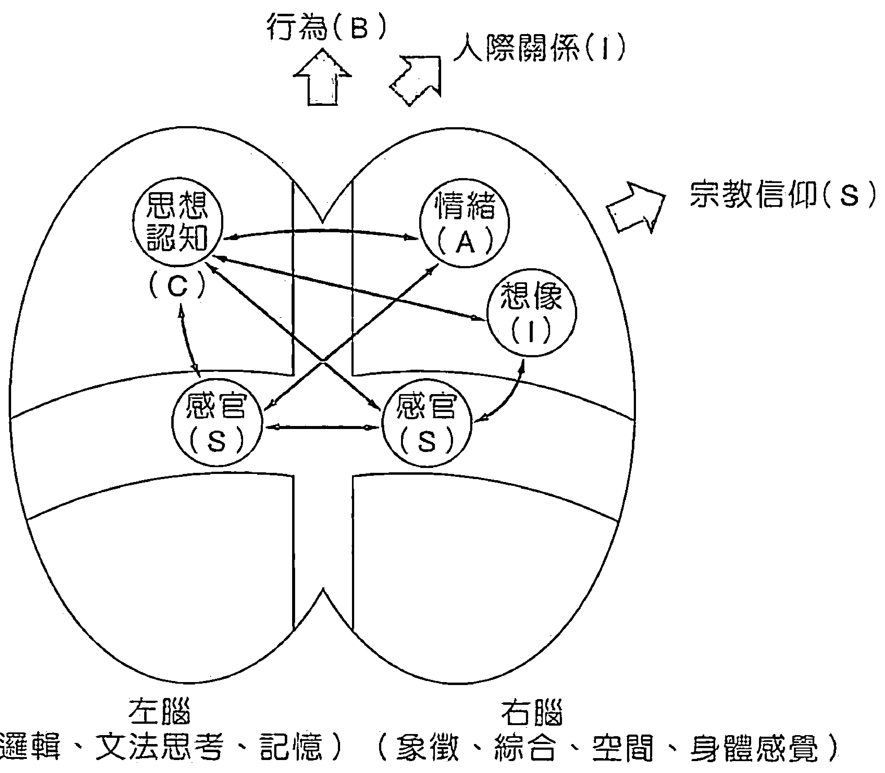
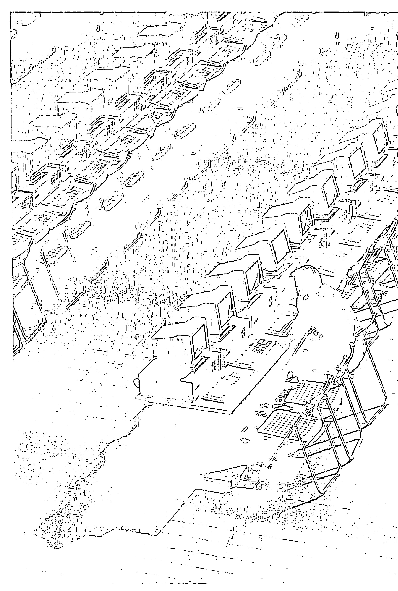

# 灵魂CALLOUT

# 商周文化事業股份有限公司圖書目錄

| 書號 | 海峽危機系列 | 作者 | 定價 | 備註 |
|---|---|---|---|---|
| A001 | 一九九五閏八月—中共武力犯台白皮書 | 鄭浪平 | 300 | |
| A002 | 一九九七知本風暴 | 陸潮 | 300 | |
| A003 | 一九九七決戰聯合國 | 張所鵬 | 300 | |
| A004 | 情治檔案—一個老調查員的自述 | 高明輝口述 | 250 | |
| A005 | 兩岸密使秘聞錄 | 沈誠 | 280 | |
| A006 | 民粹亡台論 | 黃光國 | 200 | |
| A007 | 民進黨執政 | 楊憲村 | 280 | |
| A008 | 老虎吃蝴蝶—從省籍情結到怨親平等 | 馬以工 | 250 | |
| A009 | 強權大陰謀—總統直選的國際豪賭 | 鄭浪平 | 250 | |
| A010 | 新黨危機 | 江中明 | 250 | |
| A011 | 首都症候群 | 李錫錕 | 250 | |
| A012 | 突破—創造大格局的未來 | 魏鏞 | 250 | |
| A013 | 誰是好總統—民主社會的大衆總統學 | 林仁和 | 250 | |
| A014 | 你不知道的司法黑暗 | 李敖 | 350 | |
| A015 | 香港一九九七 | 李怡 | 250 | |

| 書號 | 企業列傳叢書系列 | 作者 | 定價 | 備註 |
|---|---|---|---|---|
| E001 | 億兆傳奇—國泰人壽之路 | 彭蕙仙 | 200 | |
| E002 | WE ARE THE BEST—南山人壽蛻變之路 | 王文靜 | 200 | |
| E003 | 傳送最直接的關懷—台灣安麗直銷傳奇 | 彭杏珠 | 200 | |
| E004 | 五百塊錢打天下—新竹區中小企銀傳奇 | 潘國正 | 200 | |
| E005 | 大顯神通—台灣電腦業開路先鋒的故事 | 譚仲民 | 200 | |
| E006 | 愛·分享·力量—台灣成長最快速傳銷公司的故事 | 彭杏珠 | 200 | |
| E007 | 觀念—許文龍和他的奇美王國 | 黃越宏 | 320 | |
| E008 | 打開廣告之庫—聯廣綠手指的故事 | 李海 | 300 | |

| 書號 | 商周非常系列 | 作者 | 定價 | 備註 |
|---|---|---|---|---|
| D001 | 非常話題—情色男女 | 黎明柔 | 200 | |
| D002 | 非常話題—做愛做的事 | 黎明柔 | 200 | |
| D003 | 非常話題—我媽尖叫 | 黎明柔 | 200 | |
| D004 | 非常話題—我爸跳起來 | 黎明柔 | 200 | |

| 書號 | 商周另類系列 | 作者 | 定價 | 備註 |
|---|---|---|---|---|
| N001 | 不乖蔡康永—同情我可以親我 | 蔡康永 | 160 | |
| N002 | 繞著地球賭—環球賭場遊記 | 戴子郎 | 200 | |
| N003 | 意外的旅程 | 謝佳勳 | 160 | |

台北市敦化北路62號5樓 電話：7736611(代表) FAX:7110520 讀者服務專線：7110454
郵撥帳號:1173141-9 戶名：商周文化事業股份有限公司

# 商周文化事業股份有限公司圖書目錄

| 書號 | 商周人物叢書系列 | 作者 | 定價 | 備註 |
|---|---|---|---|---|
| P001 | 走過關鍵年代—汪彝定回憶錄 | 汪彝定 | 250 | |
| P002 | 任爾東西南北風—李慶華影像 | 李慶華 | 200 | |
| P003 | 奇緣此生—李模回憶錄 | 李模 | 250 | |
| P004 | 至愛無悔—李慶安的深情記事 | 李慶安 | 150 | |
| P005 | 財經生涯五十年—趙既昌憶往 | 趙既昌 | 220 | |
| P006 | 逆水而行—新黨故事 | 江易平 | 220 | |
| P007 | 尤清前傳 | 蘇嫺雅 | 220 | |
| P008 | 黃大洲自白 | 邱彰 | 220 | |
| P009 | 陳定南前傳 | 鄭聲、陳雪 | 220 | |
| P010 | 結婚真好—曹啓泰321 宣言 | 曹啓泰 | 180 | |
| P011 | 蔣介石評傳(上) | 李敖 | 380 | |
| P012 | 蔣介石評傳(下) | 李敖 | 380 | |
| P013 | 懺情記—白狼張安樂的故事 | 王丰 | 280 | |
| P014 | 少年李登輝 | 邱定一 | 280 | |
| P015 | 終極伴侶—夏玲玲完全馴夫手冊 | 夏玲玲 | 180 | |
| P016 | 你不知道的彭明敏 | 李敖 | 280 | |
| P017 | 哭泣的北大荒 | 姜昉 | 250 | |
| P018 | 徹悟—細說陳履安 | 王丰 | 250 | |
| P019 | 國共第一夫人—宋美齡與江青 | 劉佳 | 250 | |
| P020 | 白宮魅影—芭芭拉.布希回憶錄 | BARBARA BUSH | 300 | |
| P021 | 有容乃大—連戰從學者到閣揆之路 | 楊力宇 | 300 | |
| P022 | 笑看風雲—吳伯雄從政三十年 | 楊尚強 | 250 | |
| P023 | 少年真好—曹啓泰菜鳥英雄傳 | 曹啓泰 | 200 | |
| P024 | 水袖與胭脂—魏海敏的舞台生涯 | 魏海敏 | 250 | |
| P025 | 情迷第七街—卡文·克萊和他的服裝王國 | 徐愛玲譯 | 300 | |

| 書號 | 名人小傳系列 | 作者 | 定價 | 備註 |
|---|---|---|---|---|
| F001 | 名人小傳1—一步一腳印 | 商周文化編 | 180 | |
| F002 | 名人小傳2—開啓一片天 | 商周文化編 | 180 | |

| 書號 | 邱彰非理性對談系列 | 作者 | 定價 | 備註 |
|---|---|---|---|---|
| V001 | 元帥出征 | 邱彰 | 160 | |
| V002 | 兩岸兩說·針鋒對話 | 邱彰 | 150 | |
| V003 | 與林雲大師談前世今生 | 邱彰 | 160 | |
| V005 | 選舉謊言新台幣 | 邱彰 | 200 | |

台北市敦化北路62號5樓 電話:7736611(代表) FAX:7110520 讀者服務專線:7110454
郵撥帳號:1173141-9 戶名:商周文化事業股份有限公司

# 商周文化事業股份有限公司圖書目錄

| 書號 | 商周叢書系列 | 作者 | 定價 | 備註 |
|---|---|---|---|---|
| B008 | 教育訓練手冊—培養得力員工的技法 | 日本產業調查 | 200 | |
| B009 | 國際人安全手冊—防暴求生的基本守則 | ANTHONY J. SCOTT | 200 | |
| B010 | 顧客消費資料製作法—破解銷售盲點的26項調查 | 小濱岱治 | 220 | |
| B011 | 解讀公司數字—企業人建立效率工作須知 | 柯世明 | 200 | |
| B012 | 廣告企畫法—從消費者觀點出發 | DON COWLEY | 250 | |
| B013 | 你適合白手起家嗎？—45項創業成功率測驗法 | COLIN INGRAM | 180 | |
| B014 | 事業經營企劃書—最有效完備的營業計畫範本 | RON JOHNSON | 180 | |
| B015 | 你不知道的心理領導術 | 澀谷昌三 | 150 | |
| B016 | 向危機挑戰—突破瓶頸 122祕訣 | 小林正博 | 150 | |
| B017 | 台灣諺語的管理智慧 | 蕭新永 | 160 | |
| B018 | 公平交易法Q&A 範例100 | 范建得 | 220 | 絕版 |
| B019 | 成功商品開發法—激發創意、評估創意、執行創意 | GEORGE G. | 180 | |
| B020 | CATALOG-型錄企畫、製作與行銷 | Maxwell Sroge | 200 | |
| B021 | 文案自動販賣機—第一本本土廣告文案寫作指導 | 楊梨鶴 | 220 | |
| B022 | 為你的公司做好公關 | Frank Jefkins | 200 | |
| B023 | 成功錦囊—百位傑出經理人成功之道 | 高建文等 | 160 | |
| B024 | 傑出精粹—百位傑出經理人成功之道 | 高建文等 | 160 | |
| B025 | 推銷最樂—一本關於概念、機會與不斷創新的書 | J. T. AUER | 160 | |
| B026 | 電腦領導術—強化溝通、訓練、遊說、競爭的利器 | MARY E. BOONE | 180 | |
| B027 | 總經理同志—大陸經商怪譚 | BILL PURVES | 200 | |
| B028 | 創意自動販賣機—創造力快速成長計畫 | THOMPSON | 220 | |
| B029 | CI贏的策略—台灣企業CI實戰案例分析 | 汪光宗 | 180 | |
| B030 | 在家創業199—199項個人成功致富機會 | TYIER G. HICKS | 180 | |
| B031 | 中小企業行銷術—55則中小企業致勝策略 | 蕭富峰 | 200 | |
| B032 | 孫子兵法的管理智慧 | 蕭新永 | 180 | |
| B033 | 全品質管理—21世紀管理者風貌 | 陳青 | 180 | |
| B034 | 21世紀行銷情報 | 蕭富峰 | 180 | |
| B035 | 管理厚黑學—縱橫古今的管理智慧 | 邱毅 | 180 | |
| B036 | 顧客滿意萬歲 | 張百清 | 200 | |
| B037 | 管理心主張—改造辦公室40招 | 吳若權 | 180 | |
| B038 | 行銷金配方 | 吳若權 | 180 | |
| B039 | DM文案完全攻略本 | 楊梨鶴 | 220 | |
| B040 | 職場贏家—中國歷史人物的啓示 | 邱毅 | 220 | |
| B041 | 成功的自然韻律—徹悟生死・輸贏的人生法則 | 朱津寧 | 280 | |
| B042 | ISO9000-品保系統建立實務Q&A | 張容寬 | 500 | |
| B043 | 家族企業—解讀・體檢・求生・應變 | Dennis T. Jeffe | 250 | |
| B044 | 廣告遊戲—第一本現代廣告白皮書 | 黃文博 | 250 | |
| B045 | 連鎖大王傳奇—20個金字招牌打天下的故事 | 張秋蓉 | 250 | |
| B046 | 企業家對日談判術 | 徐宗懋 | 220 | |

台北市敦化北路62號5樓 電話：7736611(代表) FAX:7110520 讀者服務專線：7110454
郵撥帳號:1173141-9 戶名：商周文化事業股份有限公司

# 商周文化事業股份有限公司圖書目錄

| 書號 | 書名 | 作者 | 定價 | 備註 |
|---|---|---|---|---|
| B047 | 銷售聖經—終極行銷策略 | Jeffrey H. Jitomer | 300 | |
| B048 | 合夥關係大會診—與親密戰友建立雙贏的合作關係 | Peter Wylie等 | 250 | |
| B049 | 顛覆大未來—社會行銷完全執行手冊 | Philip Kotler等 | 350 | |
| B050 | 紅頂商人關係學 | 王駿 | 250 | |
| B051 | 銷售八法—實戰銷售寶典 | 劉樹崇 | 250 | |
| B052 | 資料活用術 | 山根一真 | 320 | |
| B053 | 你是應變高手？—個人危機管理36心法 | 陸炳文 | 250 | |
| B054 | 享受溝通 | 洪秀鑾 | 200 | |
| B055 | 大陸台商人事管理 | 蕭新永 | 350 | |
| B056 | 女子兵法 | 李經康 | 250 | |
| B057 | 談判聖經 | 劉必榮 | 280 | |

| 書號 | 觀念空間叢書系列 | 作者 | 定價 | 備註 |
|---|---|---|---|---|
| C001 | 點石成金—無限財富的經濟煉金術 | P. Z. PILZER | 250 | |
| C002 | 大審判—經濟學的謊言和迷思 | M. SKOUSEN | 220 | |
| C003 | 經濟人之死—未來經濟學十三大原則 | G. P. BROCKWAY | 200 | |
| C004 | 金融創新與操作策略 | 李存修 | 500 | |

| 書號 | SOFT叢書系列 | 作者 | 定價 | 備註 |
|---|---|---|---|---|
| S001 | 工作急轉彎—上班族出走實驗報告 | M. M. KIRSCH | 180 | |
| S002 | 你生氣嗎？—不發脾氣的哲學 | P. ROONEY/B. DOTY | 180 | |
| S003 | 可以坦誠，可以保留—如何將祕密收放自如 | K. CHERRY | 180 | |
| S004 | 七快健康法—自己的健康自己負責 | 松木康夫 | 180 | |
| S005 | 好男人，你在哪裡？—最佳丈夫定義 | J. Z. GILER等 | 180 | |
| S006 | 活得更好更長久 | C. CHAUCHARD | 200 | |
| S007 | 四十不老 | C. CHAUCHARD | 200 | |
| S008 | 怎樣吃最美麗 | GENEEN ROTH | 200 | |
| S009 | 生涯再造—人生規畫逆思考 | P. E. Johnson | 200 | |
| S010 | 不聽話的孩子？—過動兒的撫育與成長 | MARY FOWLER | 240 | |
| S012 | 生命奇蹟—郭林新氣功抗癌寫錄 | 袁時和 | 200 | |

台北市敦化北路62號5樓 電話：7736611(代表) FAX:7110520 讀者服務專線：7110454
郵撥帳號:1173141-9 戶名：商周文化事業股份有限公司

### 楔子

不確定的年代，弔詭的年代。

觀察翻騰台灣人心的世紀末風情，是靈異浮沈流行，從傳媒到書市，居家到生活，靈異話題大量快速感染，一般專家觀點以爲，這反映著普羅大衆的「人心虛脫」，但放下任何專家的高姿態身段，由社會現象回歸現象後的人心，似乎可以聽到人心的真正吶喊，不僅僅發自於「靈異」熱潮，更發自人心深層的「靈魂」，亟待將之「靈魂 Call Out」！

出版本書是基於以下現象中的機緣：

- 一、天靈靈、地靈靈，從靈異到靈魂，人們迷惑已久。

從八十年代「十八王公廟」、電影「暫時停止呼吸」的風行，到九十年代《前世今生》一書的暢銷，台灣人對「靈」這個範疇的探尋，已從個人利益轉向娛樂，更轉向知識層面；加上大衆傳播媒體將靈界、靈異範疇的東西，經由符號化、合理化的包裝，使大衆可以像選購商品一樣，比較、選擇、分析，這實在是一可喜的現象，因為與世界其他地區的人比較，我們擁有「十分民主」的媒體、「十分開放」的胸襟、「十分創意與大膽」的製作群，而現在更需要「十分客觀、冷靜」、「十分有水準」的聽衆、觀衆與讀者群了。

廟宇以「靈驗」比香火鼎盛，媒體節目以內容與親和力、娛樂性比閱聽率，書則是以明確的資訊、準確的供應讀者需求來決定暢銷與否。靈驗的事廟裏比比皆是，靈異節目打開電視十幾個頻道都有，可是「靈魂」的定義、「靈」與「魂」的差異、「靈」「魂」與自己和社會的關係，卻付之闕如。本書以科學、哲學、宗教、社會四個層面，第一次有系統的在國內大公開「靈魂真相」！其實，這真是一次「層次與程度」的考驗，測驗我們對靈魂的好奇有多少、大衆對靈魂的探討到何等指標，也呈現我們對自身靈魂與社會風氣的關愛有多深。這些結果不知是否會像「經濟指標」一樣，引發人的省思與行動？

### 二、看不見的力量掌握那看得見的實體。

「靈」「魂」是看不到、卻可以經驗，正如宗教有許多儀式象徵，而信仰則是對所信之神的信念與忠誠；教堂、廟宇不會是力量的來源，因信仰而產生的愛與行動，才造就了自己與社會！

「靈」「魂」「體」存在時的相容卻彼此相斥，正合理的解釋了人類的七情六慾、愛恨情仇的永遠交戰！你我的身體情緒不斷向著自己感官覺得愉悅、有利、舒服、自然的方向走去，但你我內在卻亦存在另一個力量（許多人稱此為良知），將你我從舒適安逸的範圍拉向另一段莫名的彼方；而當這份良知將你我拉向彼方之時，另一股莫名巨大的力量又強而有力的將你拉回，直至你我的人生，就是被這種靈魂體並容存在的特性搞得筋疲力竭，不過是否要經歷這些交戰，完全依此的人生價值來斷定。而肯定的是，那看不見的力量，真實的影響與操控看得見的實體。我們深信，如果有心人繼續關切與努力探究此一「靈」「魂」「體」的灰色地帶，清楚界定出一範疇與領域，再加上正確的方向與方法，「靈魂學」必能和「經濟學」、「管理學」、「投資學」一樣，讓人受益無窮。

### 三、亙古的迷思不是今日才有，迷惘的未來何必繼續耽延！

「靈」與「魂」的探討，從柏拉圖、亞里斯多德時代就有，儒家言「未知生，焉知死」，只可惜沒有其他派別的學者來探究此生有多長，是不是只是「身體」的階段而已？事實上有許多好奇愛知的人擴大了自己的視野及心靈的世界，我們已在文學的領域中享受「靈魂體」交錯的美景與玄妙，但難道那只是文學家的幻想而已？當一波波科技革命交替，在在只是應證了「日光之下並無新鮮事」這個鐵律之後，我們對這個存在你我生命之內，如此近、卻又甚遠，如此陌生、卻天天相處的靈魂，要何時才去與其面對面呢？

### 四、十九位博士、教授、學者對生命內涵的省思與推理。

這本書是一個事實，也是一群人生命領受的縮影。不是他們的靈魂特別貴重與高超，不是他們的學問與知識特別淵博高深，實在是他們共有一些特質：敏銳、關愛、執著、開放；更難能可貴的是，他們一呼即應，立即從社會學、科學、哲學四大領域中，回應、Call Out 靈魂。他們之中有德高望重的社會公益推動者，有學術地位獨佔鰲頭的學者專家，他們親赴這場「靈魂 Call Out 」盛會，並協助編輯修正與校對文字。如此，十九位博士、教授、學者及編輯整理出這本「解讀靈魂完全手冊」的十萬字大作，是由人生歷程加上專業知識累積而成的真心之作。

在汗水與短時間出書的競賽中，本書動機來自對真理探索的熱心。十九位博士、教授、專家在開啓「靈」「魂」之秘時，盡到了「求知告知」的責任！

進一步往前延伸，如果說「靈異節目」有市場，《前世今生》有賣點，那麼「靈魂學」也應該和減肥藥、魔術胸罩、壯陽藥酒、維生素丸、礦泉水一樣有市場、有需求，其實，這本書中的每一位專家學者和編輯都有一個共識——在社會靈異風行現象中，盡一己之責任，希望是一個起點，拋磚引玉，期待社會上的大眾傳播人、出版家、媒體經營者以及先進專家們，共襄盛舉。真理愈辯愈明，願尋找使人得見。

### 靈魂X檔案

# 第一章

#### 靈魂花邊新聞

#### 編輯群

靈魂是人類亙古難解的謎題，靈魂存不存在？存在哪裏？儘管時光更替，這個課題重複盤踞不同年代人們的心頭，然而信者言之鑿鑿，疑者聽之藐藐，至今在人類的知識領域中，靈魂仍是未知的X檔案。

#### 靈魂有多重？

科學家曾用實驗方法探索靈魂存在與否，一項著名的臨床實驗是由靈魂的重量著手，他們將一位瀕臨死亡的病人，放在一具極精密的度量儀器上，測量病人斷氣前後的重量改變。這個實驗結果讓人既興奮又訝異，因為當病人斷氣後，儀器數據往下滑，重量比之前輕了⋯⋯。

另外，英國有一個歷史悠久、專門研究靈魂的學會，他們的會員生前一直在學習死後如何將訊息傳給活著的會員，但近百年來尚未有會員收到訊息，據說他們仍然在「等待」收到訊息呢！

#### 靈魂看不看得見？

靈魂看不看得見呢？解剖人體，解剖心臟、骨骼、血液、細胞⋯⋯，未曾有人見過靈魂。

在電子攝影法發明以後，開始攝下一些人眼見不到的磁場現象。例如十九世紀初攝下了外罩光環的人體照片，人體外部有一圈光環是由許多細小、潔白光亮的直線小光束組成，這顯示人體中的磁場現象；許多主張有靈魂的「靈魂探索者」因此大感興趣，因為這樣的影像和一些所謂有天眼者的描述，幾乎吻合；更和多描繪靈魂的圖畫，如出一轍。然而，這其實只是人身體裏的磁場現象而已。

而據報導，大約五十年前，一位名叫基利安（Semyon Kirlian）的攝影者，在俄國開始名爲「基利安高壓電」的攝影方式。他的作品顯示各種物體周圍的光射情形，雖然這些照片只是將原本人眼所見不到的物理、化學現象，藉由科技方式顯示出來，但仍被穿鑿附會爲人的靈魂圖片。造成這種現象的最大原因恐怕是人們的期待心理，許多人期待著有朝一日，另一種更高科技的發明，能將人眼所不能見的靈魂顯像出來。

#### 靈魂有沒有味道？

靈魂有沒有味道呢？小說裡的一縷芳魂如《聊齋》的聶小倩，翩然現身時，衣衫飄飄、暗香浮動⋯⋯。當然，聶小倩是文學想像範疇的靈魂，若我們把目光放在生活周遭的現象來談，近年每天清晨的台北國父紀念館或是全台各地清晨運動場所，也有一個特殊景象，就是許多練「香功」的人們，他們當中功力深厚者，身體自然散發一股特異香氣，那是由人體內部發散出的氣味，它是靈魂的氣味嗎？

#### 靈魂的家在哪裏？

靈魂的家在哪裏？古希臘的傳統說法認爲，人就是靈魂和肉體的結合，靈魂存在肉體之中，猶如牡蠣拘於牠的外殼之內。印度的聖典之一《薄伽梵歌》裏說，人的靈魂被理性的、感官的及粗劣物質的三重衣服（三者或合稱肉體）遮掩了，因此靈魂在長途跋涉返回「父家」的路程中，努力克服肉體的限制。

而台灣的民間信仰也認為靈魂住在肉體裏，例如小孩突然魂不守舍、晚上啼哭、吐奶、拉肚子，大人就會認為要去收驚，因為魂魄「受驚嚇」、「走失掉了」。收驚是透過靈媒和神明，把孩子的三魂七魄中嚇跑或走失的那一部分找回來。

#### 人死後靈魂消失了嗎？

人的肉體死亡後，靈魂去哪裏？這個問題更超乎人類可見、可知的時間和空間。如果肉體是靈魂在世上的家，肉體生命結束後，靈魂還在嗎？靈魂去哪裏？佛教相信靈魂不滅與六道輪迴，因此說肉體死後，靈魂輪迴轉世，三魂七魄會分道揚鑣，其中有一魂留在墳墓裏，有一魂住在祖宗牌位裏，有一魂去投胎轉世。

而基督教與天主教卻只相信人有一個靈魂，沒有機會再去投胎。基督教和天主教認為，肉體死後，靈魂有兩個去處，一個是苦的，有不滅的火在燒，叫地獄；另一個樂園，是幸福的，叫天堂。人世間的善惡，在這一階段有了一個區別與結束。

#### 猴子、外星人、DNA複製人有靈魂嗎?

靈魂是神秘的，科技進步以後更帶來許多靈魂問題的新議題，例如：人類的靈魂和猴子一樣嗎？解釋人類進化的進化論如何解釋猴子的靈魂經過哪些階段而進化成人類的靈魂？如果有外星人，他們也有靈魂嗎？如果科技進步到DNA複製人可被製造出來，他們將有靈魂嗎？如果有，是否代表人類將複製靈魂呢……?

人因為想認識自己，所以想認識靈魂。靈魂其實在我們生活中一點兒都不陌生，它是一個可理性質疑、可知性探詢、可感性分享的天空，讓人類向著這個課題去起飛翱翔。

###### 靈魂 CALL OUT

# 第二章

#### 台灣靈異傳奇

##### 社會的靈魂價值

##### 總體檢

##### 台灣人的「右腦」不見了！

在心理學領域，魂是非常值得探討的科學。

「魂」其實是指一個人的情緒、意識和思想，魂的範疇就是目前心理學所探討的範疇，特別指討論「現在」的問題，指涉現在的生活、感情和思想。

「靈」則是一個更高的精神境界，它探討關於未來或超越身心以外的個體，因此產生所謂的「超自然心理學」，把心理學的科學與宗教的現象學連結起來，構成研究學科。曾有超自然心理學家嘗試為「靈」下定義。他們指出：「凡超越現在生命現象、狀態的探討範圍，就屬於靈。」譬如你問：「我從哪裏來到這世界？」、「人死後到哪裏？」、「過世親人現在在哪裏？」這都屬於「靈」的問題。靈的問題通常較具永恆性，是超越自我、自然和意識、情緒之上的，比魂更上一層。

本文將從心理學角度，由台灣社會現象切入談靈魂，並提供如何管理內在靈魂的一些方法。

先由近年台灣社會出現的靈異熱談起。近幾年，許多人對靈異方面的事物展現了高度的興趣，有人嘗試算命，有人通靈，有人牽亡魂，有人開天眼；還有人既期待又怕受傷害。這股追求靈異的熱潮，其實是長期理性壓抑下的反射行為。從人靈魂的層面來分析近三十年台灣歷史中的個人，可發現一些值得注意的方向。

##### 台灣人的右腦強烈受損

人的心理結構，可分為兩部分：一是左腦所司較「理性」的部分，另一是右腦所司「非理性」的部分，如「感覺」、「感受」等。在我多年執業的日子裏，從許多接受心理治療的臨床個案中，觀察到很多人「魂的受傷」，都發生在這二、三十年的台灣大環境裏；三十年來台灣經濟奇蹟的背後，換取了優渥的物質條件，但付出了家庭缺少溫暖、填鴨式教育、個人感情被忽略等代價。經年累月的壓抑，使台灣人的右腦強烈受損。

一旦社會解禁、開放了，台灣人的魂在長期渴求非理性的心態之下，一下子被鬆綁，因此出現了通靈、觀落陰、牽亡魂、開天眼熱，人們想要體會那些「驚人的感覺」，想進一步追求更刺激的，譬如跟已過世的親人溝通一下⋯⋯。

通靈其實滿足了人「魂」和「靈」層面的某種需求。在靈的層面，親朋好友過世了，還希望他們仍在我們身邊，因此想通靈。在魂的層面，魂需要有平安的感覺，譬如聽說中共飛彈又要打來了，心中難免焦慮不安，想知道未來何去何從，還有也想透視、了解投資的股票勝算如何、陰間的真相如何，因而嘗試去開天眼、觀落陰。

##### 靈界驚異大奇航

人勢必會從魂（情緒、意識、思想）的自我滿足，進而走到靈的追求，只是，「靈的追求」迄今尚未被指出一條循序安全的路徑，以致個人憑機緣探觸，常有陷入非理性混亂狀況的潛在危機。人常是以「有效果就去嘗試」的心態，來追求靈界的事物。一則個案中，有一位很年輕的男孩子，他爲了某一種能力而試圖在外頭學打坐，接受前世催眠。剛開始時，他感覺全身都很舒服，對人生的意義也似乎有些領悟，但是後來一打坐就全身不對勁，不再容易控制自己的思想意念，而且「魂」有分裂、甚至被「打碎」的感覺，最後身、心、靈恍惚，非常痛苦。人過度追求靈的體會，極易產生精神恍惚、幻聽幻覺的情形。因此，非理性部分縱使不應被過分壓抑，理性部分還是要回歸，讓左、右腦協調一下，靈魂體才能和諧。

##### 隨著催眠起舞？

靈異風之中，還有一股「催眠熱潮」。前一陣子，電視綜藝節目的製作單位由國外請了馬汀、湯姆史立佛等所謂的「催眠大師」，在電視上作公開表演，使許多民衆乃至知名演藝人員聽他們的催眠指令，做出許多不由自主的可笑行爲，博得觀衆哈哈大笑，並對催眠術產生非常神秘的想法。

近來《EQ》的流行暢銷，也和人的心理需求有關。《EQ》暢銷，顯示台灣人渴求了解內在，以及台灣教育在這方面的缺乏、貧困。我們向來較偏重探討左腦，也就是理性的部分，忽略了右腦感性的開發，如何表達感情、面對情緒、改善人際關係等技巧，是人們渴望明白的，也是《EQ》所提供的內容。

但可惜的是，馬汀等人的傳播是錯誤的，催眠並不如想像那樣神秘，它也不能控制人，這是一百多年來，精神醫學家多方面研究的結論。

其實，一個人進入被催眠狀態是一種自然（natural）的現象，被催眠狀態常發生在我們的右腦，就如同一些邏輯、因果等觀念存在於左腦中一樣自然。

為什麼催眠狀態是自然現象呢？比方說聽一場精采的演講，我們進入了忘我的境界，入神的說：「好棒！好精采！」這種專注、連帶感情也投入進去的状态，就是處在被催眠狀態，可能直到外面有干擾出現，才使我們醒過來。

催眠是每個人日常生活都會經歷到的。又如偶遇一名美麗女子，你立刻目不轉睛的盯著她，心中怦怦跳，甚至不知不覺跟到她家門口守候她，這也是進入類似催眠的狀態。

##### 認識另一個「我」

當我們在這神被催眠或很專注的狀態時，會發現自己裏面有另外一個「人」出現。例如，應徵工作接受面試時，事前仔細推演要如何應對，這是左腦在分析，但右腦卻一直擔心：穿這件衣服妥當嗎？有一些些緊張的情緒出現了。這情緒是怎麼來的？原來人有一個潛意識層面（unconsciousness），我將它比喻為「另一個我」。這是二十世紀中，科學界著重探討邏輯、理性的東西，所忽略探討的非理性潛意識的右腦功能。

我有一個個案，她從小到大受了許多的創傷：大學屢試不第、婚姻也不美滿⋯⋯，因此她的個性消極，始終提不起勁來。她對我說：「我裏面好像有兩個人，情緒好時就有活動力；情緒不好時只想死，好像有兩個極端。請問你會這樣嗎？」

其實每個人都會有這種現象。我們裏面有潛意識存在，其功能是把過去的記憶和學習貯藏起來，然後這些記憶和學習便會影響我們。每個人的情緒、人格都深受潛意識的影響，因此我們需要去認識自我潛意識中這個很重要的「另一個我」。人有理智和情感，情感常在潛意識中，這是精神醫學之父艾理克生（Erikson，佛洛依德的學生）受了嚴格的科學訓練，經正統的研究、分析所得。

我們要重視這些有科學根據的東西，不要輕易受空穴來風的傳媒說法或舞台催眠秀的影響。

##### 左腦不知右腦事

意識與潛意識是分開的，潛意識不同於意識，潛意識不受教育等的影響。但潛意識和意識交互作用。籠統的說，左腦是我們邏輯、思想、分析、判斷的地方，是意識的中心。從一八〇〇年科學開始發達，人類一直研究理性，但這只是左腦的領域而已。潛意識藏在右腦中，我們常用催眠的方式把它找出來，日常生活中偶有癡呆或忘我的狀態，就是潛意識在運作。例如當一個男孩子喜歡上一個女孩，客觀上來說，那女孩外表並不美，但他就是喜歡這一型的，若用邏輯思考太不合邏輯，但他的右腦、他的直覺就這麼告訴他，要他去肯定。

潛意識裏有很多我們未知（unknown）的東西，或一些尚未用到的潛力在其中，它是非常有智慧、有理解能力的。

今天我們活在緊湊的時代，生活步伐壓得我們幾乎喘不過氣，各種計劃充塞整個意識，卻不去理會潛意識中那一個我，從小到大，那個「我」累死了，雖然「他」不會開口說話，但會藉著身體反映出來。比如，接待外國客戶時，因擔心自己的英文太差，所以見面只打個招呼便立刻低下頭，害怕不已，不知要說什麼，這是潛意識在害怕，儘管你的左腦一直在旁打氣。如果不明白潛意識的理由，你會一味責怪自己不爭氣。其實潛意識很單純，不會掩飾，而且是感情的中心。

台北市有三分之一的人看過家庭醫生，百分之二十到三十的人有精神官能症，這是功能性的病。因為我們太不了解我們情緒的問題，連續工作十二小時，也不肯停下來理會它一下，於是這受傷的情緒便藉頭痛、胃痛反映出來。這些問題常來自於「問題感覺」，如焦慮。它存留在右腦潛意識裏，左腦中單單用理性的意識去分析是不夠的。

有時左、右腦也是分裂的，如：一整天情緒不佳，因為你的右腦（潛意識）感覺受傷，很累，但左腦（意識）卻不知道或者不清楚，所以我們常潛意識覺得好像有事要發生了，卻不知道如何去處理。

意識和潛意識都很重要，一個快樂、成功的人是意識與潛意識、理智與感情都能達成協調和諧的人。相反的，兩者愈不協調、愈不和諧，便愈有身心方面的困擾。

##### 亂催眠 小心吃官司

要協調意識與潛意識，催眠是一個重要的方法，但首先要對「催眠」有正確的觀念，例如：催眠並不只是一些敎人「放鬆」、「回到Ｘ歲」的步驟而已。

我是美國催眠學會的會員，我們這些臨床催眠師入會時都要宣誓：絕不在舞台上作催眠秀，因為嚴重違反了醫學道德。通常被催眠者事先完全不知道「催眠暗語」及其間所連接的行爲動作，而事實上整個催眠過程必須在相當嚴謹的保護下方可進行，類似前陣子盛行於綜藝節目的催眠表演行爲，若在美國電視上，那些大師可能會吃上官司。

爲什麼電視上顯現的催眠效應如此神奇？其一，這與被催眠者本身的心態有關，愈相信催眠術或對催眠師愈信賴的人，愈容易進入催眠境界；其二，參加的演藝人員不免有些意圖，把它看作另一種秀，企圖打響知名度。可能有些人自願被完全控制，但百分之九十的人不會如此，因爲有意識存在。

另外，催眠進入前世，只是一種心理「象徵」，因爲前世是不存在的。

《前世今生》這本書中的主角，小時候受過傷害，貯存在她的潛意識中。我們要知道，小孩子受驚嚇的那一刻就等於被催眠了，如果當時驚嚇他的是母親，他很可能就把母親化身成一個巫婆，以後碰到與母親衝突，就覺得自己是個小可憐，母親是巫婆。有一些個案從小被父親強暴，當時害怕得像全身麻痺了一般，感覺自己像冰塊，或是可憐的埃及女奴，被主人欺負。於是前世治療師就說：「妳前世是冰塊、是埃及女奴！」

不！那只是小時候的傷害和記憶力的圖像化，把對方畫成某種動物或暴君，是表達印象激烈的方式。如腳踩到釘子痛死了，其實沒有死，但小孩子覺得釘子像刀戳在他心裏面一樣。小孩子不太會表達，常用圖像化或象徵來記憶，這往往誇大而且激烈。這些儲藏在潛意識的東西，並不是前世，只是擴大的想像，這也是主流派精神科醫生探討的領域。

我曾接觸過一些案例，病患在催眠狀態下，的確是有進入到不同時空背景的情況，可能每個心理醫生都有這種經驗，但在美國精神學會中的大部分學者或醫師，以及我本人，都不會把這種現象解釋為「前世」，它是患者本身在潛意識中的一種「象徵」，而這種象徵行爲則是現實生活中的投射反應。

##### 編織「前世」小說

我認爲《前世今生》書中的內容有治療師的誤導，加上個案本身相信她需要一個答案，因而編織出一個像小說、而非臨床報告的東西。這本書在台灣大爲暢銷，但是，很奇怪的，在國外其他譯本的銷售，就沒有這種盛況。

《前世今生》作者魏斯博士在作催眠時，不讓個案明瞭過程，而採取在一旁慢慢引導的方式，告訴個案，知道前世，就會解決問題，這其實是誤導。該書其實是描寫一個「魂的現象」，卻提供「靈的答案」。

在催眠師加油添醋下產生的過去的回憶，其實不止《前世今生》的例子，還有很多其他例子，甚至它有一個專業名稱——「錯誤記憶症候群」（False Memory Syndrome）。近年來，美國許多法院處理很多這類案件，例如女兒控告父親小時候強暴她，其實是催眠師誤導她，讓她認爲自己的憂鬱症等問題歸咎於兒童時期被父親強暴，但是後來依客觀證據，例如生理檢查，發現那是治療師的嚴重誤導，反而那位治療師被判有罪。前世催眠師比心理治療師更有誤導個案的可能，如果我被前世催眠師催眠出以前殺害別人，是否該被起訴呢？是否該爲前世的惡行負責、坐牢呢？催眠師不就成為檢察官了嗎？如此推想，前世治療好像會成為一個笑話。

##### 如何管理潛意識？

認識了右腦的潛意識，以及前世記憶其實是童年記憶在潛意識裏的放大與被催眠誤導之後，進一步想想，該如何管理我們的潛意識？以下提供兩個簡便原則：

###### 一、認識它

我們的潛意識充滿傷害和問題。一九九五年，台灣的離婚率高居亞洲第一位，其實一九九五年的問題是從一九六五年就開始產生的，三十年前我們拚命努力工作賺錢，客廳即工廠，父母從早忙到晚，沒有時間、精神關心孩子心靈的需要或細心照顧，於是孩子心靈受傷，得不到溫暖；這些個人傷害終於顯現在我們的人際關係疏遠、親情冷淡、婚姻產生問題中。我們必須認識自己過去的傷害、現在的情感；千萬不要還未解決心靈的破碎，突然看到一本《前世今生》，就馬上自作結論說：「我有前世啊！原來一切問題都是前世搞的！」這種結論會令自己遺憾。

###### 二、發掘它

認識了我們潛意識中的情感需求後，還要把需求是什麼發掘出來。想一想，我們還能有多少經濟奇蹟？我們付出四十年的努力，換得今日的物質文明，卻可能也要付出四十年的代價來醫治心靈傷口。所以，不要被物質捆綁，陷進永無止境的物慾中；不要企圖用大吃大喝、唱卡拉OK來掩蓋潛意識所發出的求救聲。

目前，美國很流行呼籲專業的醫師、會計師、心理學家⋯⋯，把每天工作時間由十小時縮短為五小時，其他的時間回到家庭，照顧、關愛家人。過去，男人只希望在官場或學術上得到衆人的肯定；現在，還需要培養更多元化的價值感，不單只以利益為出發和主導的價值觀，才能在工作、家庭、生活各層面稱心如意。

##### 左腦、右腦均衡一下

一個家，如果客廳裝修得很漂亮，臥室也十分雅緻，但其間少了通道，或者通道上塞滿了障礙物，房子的整體功能就無從發揮。人腦的情形與這個例子一樣，除了左腦與右腦各自重建得非常健康，還需彼此之間互相配合、協調，才能有全人的健康（參考下圖）。

##### 左腦、右腦的整合
（從上到下）（TOPVIEW）

那麼，如何使左、右腦均衡協調呢？美國臨床心理學博士拉茱絲（Dr. Lar-azus）建議以一種「多層次治療」（BASSCID）來作全人重塑。多層次治療包含了行為（behavior）、情緒（affect）、感官（sensory）、宗教（spiritual life）、想像（image）、認知（cognition）、人際關係（interpersonal relationship）以及藥物（drugs）幾個途徑，簡述如下：

- **B指「行為」（behavior）**：當我們生氣的時候，如果能採取離開現場或與對方隔離的行為，不使自己的情緒爆發，這就是好的行為。
- **A指「情緒」（affect）**：保持好的情緒是很重要的。例如工作時，老闆誇獎我們幾句，會令我們沾沾自喜，若捕捉住這種美好的情緒，工作起來就特別順利、開心。因此我們要記住這種感覺，甚至記在日記中，常常反覆的回味、體會，以增強我們右腦的功能。
- **S指「感官」（sensory）**：感官就是指我們生理上的感官所知覺，包括視覺、聽覺、嗅覺、味覺、觸覺等，好的感官感覺往往可以撫慰我們的情緒。比方說工作壓力太大、生活太緊張了，可以到海邊度個假，看到藍天白雲，聽到海浪聲，遠離城市的喧囂，這種感官美好的感覺可以達到治療、安慰的效果。
- **S 指「宗教信仰」(spiritual life)**：即人對靈的滿足，藉由宗教可滿足人追尋靈的意義和生死觀的需要。
- **I 指「想像」(image)**：想像影響著我們的心理。遇到壓力時，如果閉上眼睛，會想像到一片漆黑，甚至會作被人由懸崖上推下去的噩夢，這些夢、潛意識的想像，都會成為我們心理上的問題。另外，有時我們閉上眼睛，會看到桌上堆積如山、等著我們去處理的公文⋯⋯，這些想像多半是存在過去不愉快的回憶，也有對未來不好的想像。
- **C 指「認知」(cognition)**：我們常在認知上有偏差，產生不合理的思想，譬如懷疑先生有外遇的太太會說：「我絕對不能被拋棄，我要丈夫完全愛我⋯⋯」等不合理的認知，這會造成情感受傷、情緒出問題。
- **I 指「人際關係」(interpersonal relationship)**：二十一世紀的社會一切講究效率，我們沒有太多的時間與人連繫感情，因此人與人之間的關係愈來愈疏遠，甚至親如家人之間也很疏遠，但人際關係卻很重要，需要我們去經營。
- **D 指「藥物」(drugs)**。當我們心理和精神上發生問題時，有時需要藥物治療。但藥物使用屬於專門知識，必須由專家對症下藥，絕不可私自胡亂服用。

##### 台灣人的「右腦」不見了！

總而言之，心理科學針對靈魂也有一些值得探索的學問。台灣長期偏重物質上的追求，靈魂常被壓抑至破裂不堪，近年來心理成長的流行到靈異的追索，顯示台灣人內在的貧窮和可憐。在主觀的靈異和超自然心理的歪風中，亟需客觀的科學和理性把關。

我們都希望台灣人在經濟富裕的同時，可以得到左、右腦的和諧關係，讓我們裏外都豐富起來，而這就必須回歸到人的靈魂。靈魂在不同階段有不同的需求，其過程有一個必需的根源，那就是宗教。有信仰的靈魂，往往能擁有一個較豐富的內在。

##### 「作者王金石簡歷」

美國紐伯特大學臨床心理學博士，亞迦貝全人發展中心創辦人。

##### 文學中虛擬與真實的靈魂

靈魂是中外文學作品描繪寓寄的對象之一，無神論者的魯迅為其小說《徬徨》中的對話：「一個人死了之後，究竟有沒有靈魂？」以及「那麼，也就有地獄了？」而悚然吃驚；歌德也處心積慮地創作《浮士德》，以警世「不要出賣靈魂」。這些文學、戲劇中的悠悠魂魄，來自創作心靈深處，與萬千讀者交流共鳴，攸關生命，不止普通人，連科學家、哲學家、宗教家與歷代大文豪都關心備至，是不容我們輕忽的課題。

文學不但反映人生，而且也模擬真實人生所無從經歷與瞭解的種種內在或外在現象，這便謂之為「感覺性的文學」（literature of sensibility）。本文在此所探討的「靈魂」問題，咸屬此類，旨在剝開文學的外衣，進而一覽有關「靈魂」的背景及來龍去脈。

##### 靈異鬼怪大受歡迎

大抵言之,初民時代的口述文學,多與「泛靈說」(The animistic theory) 有關,常伴隨超自然現象而生。英國人類學家陸巴克 (Sir John Lubbock) 發現初民對超自然的認知,完全根據人際間的理解加以研判。泰勒 (Sir Edward Burnett Tylor) 更指出,泛靈崇拜乃因初民對視而不見的「我」,或稱為「靈魂」者所探索而來。這種概念首先在夢中獲得無法解釋的「真實」體驗,因此乃相信不與軀體相連結的「我」,是獨立存在的靈魂。

接著,巫術想要控制人與自然現象,達到超自然能力的效應,遂用模擬交感的技巧,繪製敵人的形象,加以殘害,俾令真敵受傷致死。以這種技巧如法炮製的電影迄今猶屢見不鮮。

至於敬拜神社與祖宗之事,社會學家斯賓塞 (Herbert Spencer) 則認為,係初民對祖先賦予超自然能力,並相信其能報應與賜福後代之故。因此,舉凡英雄人物與賢達人士等死後亡魂,均被奉為神社而虔誠祭祀,這與我國民間信仰的由來相當一致,而且鬼神之間亦有善惡、吉凶之分。如此發展下去,便產生了神奇古怪、或友善或暴戾、或懸疑或恐怖的各種「靈異鬼怪」文學、繪畫、電影、電視與戲劇。其中當然以影視節目最具吸引及感染力，早已充斥世界，欲罷不能。自早期的「泥人哥連」、「化身博士」、「木乃伊」、「殭屍復活」，近期的「大法師」、「怪譚」、「午夜驚魂」、「珍妮的畫像」等，到目前流行的「X檔案」與「神秘檔案」等，無不大受歡迎。

然而影視節目泰半以娛樂爲主，很少觸及其他價值觀。對於靈魂的出沒與生滅無合理的詮釋，僅爲符合劇情的需要而已，在文學與戲劇方面，偶爾才有較嚴肅而深入的作品描繪人與靈魂的關係。

雖然孔子不談怪力亂神，敬鬼神而遠之；但靈魂之說在我國文史中仍可於《左傳》〈昭公七年〉窺見端倪：「人生始化曰魄，既生陽曰魂。」疏曰：「附形之靈爲魄，附氣之神爲魂。」魂既爲氣，便可離開形魄而到處飄忽。所以《莊子》〈齊物論〉乃有所謂「其寐也魂交」。這種魂交魂遊的理念，更細膩地表現於一長串的夢境中，而獲致精神的解脫與欲望的滿足者，至少有沈既濟的《枕中記》（又稱《黃梁夢》或《邯鄲夢》）；李公佐的《南柯太守傳》（又稱《南柯一夢》）；以及華盛頓·歐文（Washington Irving）的《呂柏大夢》（The Story of Rip Van Winkle）等。

##### 世界文豪不談靈魂歸宿

然而，鄭德輝改編陳玄祐《離魂記》的戲曲《倩女離魂》，卻栩栩如生地將靈魂具體形象化，靈魂脫離病體後，便以實際行動挽回兩人相愛相隨的美滿婚姻生活，扭轉了幾乎被迫改嫁的命運。五年後夫妻倆子同歸父家，靈魂與病女形如二人，相見後方寸翕然合一。

此外，在著名的莎士比亞戲劇《哈姆雷特》一劇中，也出現具有實際動能力的鬼魂，就是剛去世不久的丹麥老國王。老國王的鬼魂在愛爾辛諾城堡上一連四次顯現，為要告訴王子哈姆雷特有關於他被謀殺的真相，並要求王子替父王報仇，不過得避免傷害已經改嫁兇手的母后。哈姆雷特證實兇手確為他的叔父後，原本輕易刺殺兇手的機會，卻因兇手正在跪地懺悔，唯恐如此死法可使兇手的靈魂升上天堂，報仇反而有利兇手的靈魂結局，終於放棄，落得最後大家都中毒而同歸於盡。

《哈姆雷特》一劇除了描述冤魂求報之外，也略略涉及靈魂的歸宿，只可惜世界文學家都捨此不談，連諾貝爾文學獎得主福克納（William Faulkner）的《專論哈姆雷特》（The Hamlet），也僅著重於道德觀點的爭戰。源自佛洛依德（Sigmund Freud）與瓊斯（Ernest Jones）的「精神分析文學評論」（Psychological & Psychoanalytic Criticism）所提供的文學潛在內涵與夢幻，雖亦解析了莎氏的《哈姆雷特》、《麥克佩斯》、《仲夏夜之夢》、《李爾王》以及杜斯妥也夫斯基的《卡拉馬助夫兄弟們》等書，卻只將哈姆雷特之優柔寡斷歸諸「伊底帕斯戀母情結」（Oedipus Complex），瓊斯強調哈姆雷特實為莎氏本人性格的類似反映，這類論題反而攔阻我們自其「依德」（Id）、「超我」（Superego）與「自我」（Ego）當中尋得靈魂之所在。

然而，人類既然自外在的超自然現象無法覓取靈魂的真面目，轉而從內在的省察去蒙獲超自然的啟示，或許也是勢所必然。但瓊斯所引述的古典希臘悲劇《伊底帕斯王》依然擺脫不了「泛靈說」的陰影。伊底帕斯王雖然奉神諭尋找弒父娶母的兇手，途中卻非經過人面獅身怪物 (Sphinx) 的盤問謎題不可！

##### 希臘諸神人間爭地盤

古希臘原本為「泛神論」(Pantheism) 的樂土，雖非「泛靈說」的延伸，但其文化哲學幾乎與奧林帕斯山上的神話息息相關。而且，其龐大的神話世界，無非也是將人類社會翻版後，再賦予唯妙唯肖的各種超自然能力罷了。在如此神話樂土中的文學與戲劇，母寧都是人文主義與神話學 (Mythology) 的結合創作。被譽為史詩的荷馬 (Homer) 名著《伊利亞德》(The Iliad) 與《奧德賽》(The Odyssey)，分別描述特洛伊 (Troy) 戰爭發生第十年與戰後第十年的虛構故事，其中摻雜著大量的神話人物，譬如：阿波羅神、西底斯女神、愛神、戰神、女戰神、天神、河神、女仙、海神、風神、女巫、天使、女妖及冥府鬼神等等，不但神、鬼、人混雜，關係曖昧，而且直接把「靈界」紆降到「人間」來互爭地盤！

單從此一層面看，則似乎與中國明朝人所杜撰的《封神傳》異曲同工，只是荷馬的文學藝術畢竟高人一等，兩部史詩的浩然文氣終究掩蓋了一切！《封神傳》臆造武王伐紂無端招來衆仙佛助戰，較低俗而遜色。但，最荒唐怪誕的則是漢人《逸周書》，所謂馘魔億萬俘人三億萬等無稽之談！諸如此類或等而下之的書，當然不足以信其所傳之神祉鬼怪，從來也無人想據此證實靈魂的真相！

##### 但丁遊歷地獄與天堂

然而，有些著名的文學家卻仍雄心勃勃，企圖締造整個靈魂世界的體制。但丁（Alighieri Dante）的《神曲》（The Divine Comedy）便是其中的傑作。這巨著包括《地獄》、《煉獄》與《天堂》三部書。但丁把地獄分成九層，自地球表面直通地心，分別留置不同程度的犯罪靈魂；煉獄則在地極的山島上，共有七層，安排一些生前得救正待洗淨前罪的靈魂，每一層可洗淨一種罪；天堂也分為九層，然而卻不在地球上，均屬於太陽系的星球，依序為：月球、水星、金星、太陽、火星、木星、土星、「恒星界」及「宇宙頂巔」。這是生前貞潔、有德性的靈魂歸宿，包含神學家、武士、十字軍人、亞當、夏娃和耶穌的門徒等等。但丁先由古羅馬詩人維吉爾（Virgil）的靈魂帶領，參觀地獄與煉獄，最後再由他所單戀而早逝的女友靈魂引導遊歷天堂⋯⋯。

但丁的《神曲》深受上述維吉爾的古羅馬民族史詩及中世紀寓言詩(Fables)的影響，因此，他雖竭力要以聖經的教訓啟發人，卻反而與基督教聖經的記載大異其趣，不斷地採用希臘神話來牽強附會。諸如：以宙斯神(Zeus)之子邁諾斯神(Minos)為地獄的審判官；以看守地獄的三頭狗(Cerberus)來懲罰饕餮罪人；並以冥河(Styx)渡亡魂的船夫卡爾侖(Charon)運載有罪靈魂到地獄等等。這些角色原本就在希臘、羅馬神話中擔任同樣的責任與職務。

由此可見，《神曲》的內容依然帶有濃厚的神話色彩，但丁下地獄的景況也十分酷似我國佛教傳說中的「目蓮救母」，都具有警世的寓意，但也都一廂情願地虛擬靈魂世界的體制。

##### 彌爾頓刻畫撒旦栩栩如生

當然，《神曲》在文學方面的成就幾可媲美荷馬的兩部史詩，實乃「目蓮救母」的傳說或電影所望塵莫及。但彌爾頓(John Milton)的《失樂園》(Paradise Lost)與《復樂園》(Paradise Regained)都堪稱英國的史詩，彌爾頓與莎士比亞同享盛名。他也備受維吉爾的影響，曾經遊歷過義大利的羅馬，卻不像但丁那麼熱衷於泛神論的希臘神話，他的《失樂園》與《復樂園》多半根據聖經的內容，加以高度的想像。其中對魔鬼撒旦的刻畫特別鮮明，以致連布萊克（William Blake）與雪萊（Percy Bysshe Shelley）等大詩人也誤會他是拜撒旦派的。

他在這兩部史詩中塑造了龐大的宇宙，賅括天國、地獄以及廣袤無際的「混沌」（Chaos）。有如神學家兼哲學家奧古斯丁（St. Augustine）在《懺悔錄》（Confessions）中所描述者，也與英國詩人斯賓塞（Edmund Spenser）所想像的衆生靈死後的暫時棲所略同，更酷似文藝復興時期人文主義先驅——義大利作家薄伽丘（Giovanni Boccaccio）所描繪的皇冠狀大混沌。

##### 內在地獄刑罰靈魂

彌爾頓的天國係由整個榮光所構成。上帝為光之源泉，天使亦為聖潔之光，須透過其周身的雲翳始能窺見。大天使拉斐爾（Raphael）則閃耀如金碧水銀。這些天使都居住於天上白熱極亮之處，稱為「最高天」（Empyrean）。彌爾頓雖比奧古斯丁更少提及天使在天國的情形，但他對於地獄方面卻談得更多、更複雜。他認為地獄是在宇宙遙遠的邊陲，因為世界末日時一切必為烈火焚毀，若地獄設在地球中心，必然也要遭受同樣命運，將令所有的靈魂完全滅絕。這是彌爾頓與但丁最大的差異，儘管他們都參考維吉爾在史詩《埃涅阿斯記》（Aeneid）中的「哈得斯冥府」（Hades），兩人的思想卻背道而馳！

一般認為彌爾頓的地獄觀是一種「內在地獄」（inner hell），遠比但丁用外在苦刑罪罰靈魂更震撼人心。如斯賓塞一般，他所想像的地獄毋寧是屬於心理的、以及非地區的（non-local）。此外，彌爾頓也同意奧古斯丁等人的看法，認為天國與地獄是永久長存的，靈魂也會活得無限長。只是彌爾頓以「似非而是」的語法（paradox）形容地獄為「可見的黑暗」（darkness visible），後來卻引起另一位諾貝爾文學獎得主艾略特（T.S. Eliot）的反駁。艾略特簡直無法想像其中有一團硫磺火湖的地獄，何以只顯為可見的黑暗！但現代天文學家所發現的太空「黑洞」便具備類似的景象，有人以爲那就是彌爾頓所指的地獄所在，究竟如何，則不得而知！

##### 歌德警世勿出賣靈魂

本文如此繁瑣舉例分析，不過想喚醒大家：攸關生命的靈魂及其來龍去脈等靈魂問題，絕不止於懵懂無知的初民，也不止於宗教家、哲學家或科學家；連歷代世界大文豪也備極關切；歌德（Johann Wolfgang Von Goethe）更處心積慮以《浮士德》（Faust）警惕世人不要出賣靈魂給魔鬼！

遺憾的是，絕大多數以神社鬼魂為題材的通俗文學或影視節目，卻反而以人鬼交易或與鬼狐相戀為取向，大開倒車返回「泛靈說」與「泛神論」的神話傳說去滿足人類的原始欲望；甚至變本加厲，大肆渲染有關「靈媒」、「通靈」與「驅邪趕鬼」等異能來蠱惑人心，使人無法冷靜正視靈魂問題，導致對靈魂的存在產生「若不是迷信、便是堅絕不信」的偏差心理。

世人一向以死人亡魂為陰鬼，前述莎劇《哈姆雷特》中，老國王的鬼魂也被稱為Ghost。我國更不例外，《禮祭義》說：「衆生必死，死必歸土，此之謂鬼。」《國語》〈楚語上〉所謂「鬼中」，即指死者的靈魂。於是，人的靈魂與邪魔鬼怪混為一談，以致演變成極端的忌諱。《烈子》〈湯問〉便記載鬼妻不可同居處，遂於「大父」死後，狠將「大母」拋棄的悲劇。這種越東陋習，可能緣自人類怕死的潛在心理；然而，道教企盼長生不老的慾望一旦抬頭，卻又視死如「仙化」，並以「靈人」指仙人容顏絕世，以「靈女」稱仙女粲然顧笑。宋朝《昨夢錄》的軼聞中，對夭死的亡魂大表同情，乃有所謂「鬼媒人」專替未婚先死的男女在陰間湊合。此外，《漢書》〈五行志〉也有以死人復生，男化女、女成男等為「人痾」的說法。

##### 創作靈異故事各有所圖

如愛彌莉·白朗特 (Emily Bronte) 的《咆哮山莊》(Wuthering Heights)，也有純粹為了藝術表現的，如普利茲文學獎得主威廉·甘迺迪 (William Kennedy) 的《昆因之書》(Quinn's Book)，也有無神論者改編的寓言，如魯迅的《起死》等。但縱觀本文所舉各書，究其引述「靈魂」或「靈界」的作用，多少含有下列各項因素之一：

- 一、為表現人生不夠美滿。
- 二、申冤或訴苦。
- 三、影射社會之不平。
- 四、預言式的期望。
- 五、勸世與訓誡。
- 六、滿足神祕或恐怖的經驗。
- 七、麻醉心理，逃避現實。
- 八、發掘人生真諦，探討生命歸宿。

這些因素雖與文學戲劇的藝術成就絲毫無關，但多少卻會影響世人對靈魂的見解。

###### 靈魂 CALL OUT

文學與戲劇既然屬於心靈的自由創作，當然很少作家願意像彌爾頓那樣儘量遵照聖經的記載去發揮；然而過分虛擬靈魂的真相，或杜造其來歷與歸宿，濫用其神祕感，乃至任意扭曲其屬性，結果作者或讀者、觀衆的生命都會蒙受無形的虧損。

靈魂不但與肉體息息相關，而且使我們的生命不朽，千萬輕慢不得，連無神論者魯迅在其小說《徬徨》的首篇中提到：「一個人死了之後，究竟有沒有靈魂？」以及「那麼，也就有地獄了？」時，都會悚然吃驚。我們怎可對靈魂及其歸宿絲毫無動於衷呢！

##### 「作者張光譽簡歷」

曾任中視導播、編審、專任節目製作人、光啟社副社長，現為自由作家；其寫作經歷如下：

- 第一屆中興文藝獎章小說獎得主
- 幼獅文藝張光譽小說展
- 美國 Edward A. Fallot 全國英詩比賽第三褒揚獎，作品刊登於 Rainbow Books 出版之《Flyin'High》
- 美國 American Poetry Association 傑出詩人獎，作品刊登於《American Poetry Anthology》
- 美國 International Society of Poets 傑出詩人獎暨永久會員
- 出版「採擷人生作品系列」：《想望》、《情牽》、《心瀾》、《流景》、《蛻痕》、《罪影》、《語花》等書。

##### 企業管理中最暗的黑箱

企業管理是一門社會科學，它與非科學領域的靈魂可以有關聯嗎？我們先從台灣企業界的一些靈異現象說起。

##### 企業家拜鬼神的情結

在經濟掛帥的台灣，企業界可謂主導台灣生命力的中堅，然而台灣企業界中，卻存在一些非理性的管理現象，耐人尋味。例如：看風水、拜財神爺、每逢農曆初一、十五拜拜，開工破土更不例外。

針對這種台灣社會獨有的現象，我曾作過一項研究，與四十三位台灣大型企業的負責人討論他們的價值觀和管理行爲。研究中發現，企業界這類超越管理學原理的行爲是另一種功利主義。有些知名的企業家就表示，做這些看風水、拜拜的事，成本不高，但若有效，投資報酬率卻很大；若無效，至少也讓企業上下的人看，求個安心。如果祭鬼神的事都做了，企業還虧損，員工還發生意外，至少不是因爲我禮數不周，好像對自己或對別人都有個交代了。

這些現象的背後，是否代表企業家們一定百分之百相信他們所祭拜的？絕大部分的企業家口頭上都說不相信，自承相信的只有一、兩位。但有些不信的人又附帶說，也不能完全不信，何況拜拜之類的事成本低，祭拜之物最後也祭了員工的五臟廟，沒有什麼大損失。

從管理學角度深一層去分析企業界的拜鬼神行爲，我們會發現，很多企業主管在分析企業過去爲什麼成功或失敗時，不能清楚的找到真正的理由，瞻望企業主管的未來，又充滿了風險和危機。在不能完全依賴過去的經營經驗之下，企業主管會試圖找一個比較可以解釋的理由，也就是「歸因理論」。所以功成名就的企業主管會歸因說，也許是祖上風水較好，或命好、祖宅的地很旺，或者是這棟辦公大樓的這一層很旺，這些理由最容易被人拿來作解釋，也不容易被挑戰或質疑。而如果企業在經營一段時間後，行情不妙，每下愈況，企業主管就會換一個風水師傅；若還是無力挽狂瀾，就再另請高明；萬一都無效，那就作一個「歸因結論」。

##### 管理背後暗藏黑箱

所謂企業管理，其實應該是在一個完全可以控制的外界環境之下，操縱可控制的變數，以尋求最大的效益。如果可控制變數的組合運用得當，在變動的環境下，就可獲致最大的機會，掌握最大的利益，這就是成功。

本來企業就是在不確定的環境下經營。如果從過去的經營心得中，歸納不出任何成敗的準則，而只歸納出運氣好、命好或祖上有德等非管理因素，這樣，企業如何面對未來的經營挑戰？過去累積的管理經驗無法移用在未來的挑戰中，是一件相當危險的事。可是台灣四十年來，幾乎很多成功的大企業都歸納不出致勝的原因，於是謙虛的說是運氣好；有信仰的說是菩薩等保佑；其他的則說不知道，大概跟風水有關。

人是有限的，企業家面對不確定的經營環境，他的畢生心力與身家性命都投資在其中，朋友的信賴也在其中，的確會產生無力感，因此需要借助一更大的力量來支持，以致會向外尋求超自我的第三者，就是去靈界尋求幫助。

企業主管也一樣。在臺灣變動的大環境裏，人心常需要找一個理由，來解釋其所遭遇的現象，命中注定，不再有財運了。

企業經營是相當有壓力的。我曾經負責管理一個年營業額十幾億元的服務業，每逢作決策時，儘管已竭盡所能的網羅資訊，仍有若干因素是自己不能百分之百掌握的，更何況所得資訊的可信度有多高，也很難預測。事實上，決策本來就是在不可控制的環境下，運用可控制的因素，希望能獲致最好的結果，因此，無法控制、不可知的黑箱總是有的。

由於黑箱存在，致使企業主管作決策時存著一種敬畏謙卑的心，那是一種很正常的心態。試圖透過靈界的方式來補充作決策的黑箱，並不爲過，但若是這非管理因素的黑箱不斷擴大到一個地步，無法探究企業爲什麼成功和失敗，使得決策能力永遠在原地踏步，管理的能力沒有往上提昇，在管理的結構面上，完全無法借助自己和別人的經驗來增強決策的可信度，這在未來的企業競爭中，失敗的機會將愈來愈大。

##### 人性管理關乎靈魂

從關心靈魂的大前提來談企業管理，多半希望將它歸結到人性管理。在進入這個主題之前，先來探討什麼是管理，最簡單的定義，就是透過別人來達成你的目的或意願。只有個人把事情做好不算是管理，一定至少有兩人：一是領導者，二是部屬。

管理通常分為結構面和人性面或行為面。結構面指的是組織如何分工，如何預測未來環境的變化，了解本身的強、弱點，訂定目標和策略。

接下來要付諸執行的後半段，就與人密切相關。企業中的每一成員在和其他人分工的架構下，如何享受自己的角色，運用所賦予的權力，並執行責任。因此，在企業管理領域中，人際關係或人性管理的技巧，對企業主管而言是非常重要的，這自然和主管本身的價值觀，甚至信念、生活態度有密切的關係；也就是將企業管理向前推至與人靈魂有關的層面。

從長年對台灣企業界的觀察，傳統性產業將來在國際舞台上競爭的機會不大，不過值得欣慰的是，電子資訊業目前管理階層的年紀都相當輕，通常他們比較具備專家的心態，不像過去的經營者只靠人際關係，憑直覺和快速反應來管理企業。這批年輕專業人士多半用專業知識，再加上一部分的直覺或不可知的因素管理企業，因此整體而言，他們的經營比過去進步多了。這些進步，才使台灣在全球資訊電子業市場能繼續發展。

不過，這些企業界的青年才俊，也許因大多是專攻電子或電腦的學士或碩士，常嚴重缺乏人際溝通的技巧。在求學階段，他們都以讀書爲主，社交活動不被重視、也不被肯定，對人性的涉獵也很有限。他們具備專業的長才，在管理領域結構面上雖建構得很好，可是人性面上的人際關係知識卻嚴重缺乏，這恐怕是台灣企業界要更上層樓需再努力的方向。

企業的人際關係或技巧，包括主管與部屬本身的價值、信念、態度及人際關係的處理方式。但，人際關係方面的訓練及價值教育在過去的教育體系中都嚴重不足。因此，未來最急迫的需要是企業主管要更加反省，在自己的成長過程中，究竟形成了如何的性格，這性格又怎樣影響自己的領導傾向。

不同成長背景的人，其領導方式當然不同，有非常權威式的，有謙和漸進式的，基本上種種性格都各有成功的機會。因此，管理上有所謂「權變理論」，不認爲哪一種性格或管理風格一定會成功。從這角度看，不論是企業的負責人、高階、中、低階層的經理人，都需要先明白自己的人格特質，在領導或與人相處時有何特別的性格傾向，才能知道如何與人配合。

理想的管理是把各種人才彙集在一起。因此，管理與被管理的雙方都要慢慢調整自己的性格，更多接納別人。而在接納當中，知覺本身能力有限的謙卑，是極其寶貴的資產；但需要注意的是，不要讓謙卑這項資產在決策過程中，反而導致決策黑箱愈來愈擴大，以致領導者能運作的範圍愈來愈小。

##### 價值觀無法移植

管理本來就重視人，也決定於人。現代的企業非常強調企業的「共享價值」(Shared Value)，而所謂的「共享價值」必定是由企業高階主管的價值觀共同形成的。價值教育在台灣過去的教育體制中著墨很少，今天企業界又發現那是企業經營中相當重要的一環，因而許多的企業主管跑去進修，這當然是值得鼓勵的現象；不過，價值觀不太容易完全移用自他人，它和自身的成長過程、根深柢固的信念有關，也與每個人對靈魂的認識有關。譬如現代企業管理的利器——改善人際關係，就需要每個人更清楚了解自己的價值體系和性格傾向，才能作更好的管理工作。可惜的是，台灣目前的社會在價值觀凌亂中，常不循正途而喜歡走旁門左道，就像最近社會興起的靈異之風。

這股靈異風潮可以用兩個理論來加以分析：一個是「滲透理論」，另一是「歸因理論」。

##### 「歸因理論」

首先就許多媒體紛紛推出靈異節目的情形來看，姑且不談那些靈異節目是否為社會所需要，單從企業經營的角度而言，至少是消費大衆有興趣的。這就印證了若某個課題過去鮮少被大衆討論，一旦被提出，剛開始一定會吸引許多人熱烈投入，直到討論情況漸趨成熟，之後慢慢地討論就減少了。這就是所謂的「滲透理論」。

而「歸因理論」的要點在於：若大衆對某個東西不太有確定感，往往需要找一些比較能夠解釋或將其合理化的理由，來幫助我們消除心中的焦慮。台灣目前的情況可用歸因理論來說明，因爲就發展的階段而言，台灣社會已漸趨穩定，社會規則應更爲清楚才對，但近年來，由於價值觀的紊亂，社會規則亦莫衷一是。我的朋友當中，就有不少人認爲，對未來的確定性比過去十年更不清楚。在這種情形下，只好抓住一些比較可靠的東西。什麼是這個浮動的社會中，較爲可靠的呢？傳統附帶神秘色彩的「靈異信仰」於是應運而生。

##### 靈異商品化

至於媒體傳播的一些超乎科學驗證的靈異經驗，往往只是個人的經驗而已，他人無法回應，亦難以考證。但在媒體廣而大的傳播下，當然會引起熱烈的談論，結果就形成了一種社會現象。

以一個市場行銷研究者的角度，來觀察台灣社會靈異的流行現象，我並不感到特別悲觀。許多人記憶猶新的「魔術方塊」，曾在短短的半年間風行全世界，幾乎人手一塊；但幾年之後，想要再去找到一個魔術方塊都很難。它只是一時的時髦罷了。對於目前這股被炒熱的靈異風潮，不能否認，它也是一個很熱門的市場，說不定還有商人會突發奇想，推出一些通靈玩偶或卡通人物等的商品。

靈異熱現象對台灣社會究竟好不好？若長期以不理性的方式來解決人內心的焦慮，當然不好；若只是短期的風行，也許不必太過憂心忡忡。

從另一個面向來看，社會一旦穩定下來，都不可避免有分層現象。台灣自戰後四十年來，社會日趨穩定，每個人在社會的分層中，一生努力所能達到的生活在都已功成名就，拿到博士學位，在很好的大學教書；但最近跟他們連絡，竟沒有一個滿意現狀。因為他們若年薪有十萬美元，一般能支用的只有三萬美元，每月可支用的可能三千美元都不到，若再支付各項必需的款項，所剩無幾。每個人都深感被綁死了，透不過氣來，其中，三分之一的錢預存當退休金，三分之一的錢是房屋貸款，剩下能動用的錢就很有限了。且收入愈多、壓力愈大，所以必須更拚命賺錢，因爲一旦失業就完蛋了。偏偏最近經濟不景氣，失業的風險一直存在著。在現實生活中，他們發現過去所看重的教育、知識等各種可以理解的東西，都不能幫助他們排除困難與困惑。

後來，我歸納出一個結論，不知道社會學者同不同意：當一個社會愈漸趨成熟穩定，每個人愈需要努力工作，不能停下腳步，因此整個社會處在一個繃緊的狀態中，而且並非每個人都能得到足夠的自尊和自我實現。因此，不得不另尋一個理由來解釋種種的成敗得失。當今生、現在所有可知可論的理由都努力過了，仍不能使自己釋懷，只好找那不可驗證的靈異之說來安慰自己了。

分析台灣最近出版的趨勢，最暢銷的叢書類中，有《前世今生》帶著靈異色彩，《EQ》則以情緒管理切入，兩者都牽涉人的魂的問題。《EQ》是將問題回歸到自己，如何管理情緒讓自己更穩定。《前世今生》則把魂的問題歸因到不可知的過去和未來，當中又牽涉到輪迴的概念。有人說，台灣民間深受佛教輪迴觀的影響，當一本書的作者既是心理學家、又是大學名校教授，又聲稱用幾近科學的方法證實輪迴的真實性，就難怪有許多讀者得其所哉。就我個人的看法，《前世今生》一書原本要討論魂的問題，後來的解釋卻牽涉到一個不可知的靈的部分，無形之中，竟為輪迴之說作了一個最佳的見證。

##### 不甘為小螺絲釘

《EQ》和《前世今生》兩本書的熱賣，顯示台灣當前的社會，人人都想尋求支配性的地位，不只成為大機器中的一個小螺絲釘，被別人支配而已，人人想要掌握自己，了解自己活著的價值何在，如何突破過去的困境。從這個角度看，它是善性、正面的。但若把《前世今生》書中提供的方法當成另一蹊徑，用以解釋生命的價值，可能付出的代價將很大。

目前媒體的靈異節目中，沒有人講到生命價值或人靈魂的層次，多半漫談一些不能解釋的現象。如某個夜晚，在當事人精神恍惚的情形下發生了一些不可思議的事，任何人都不能複製那經驗，是非科學的，僅此而已。台灣媒體的靈異之風所觸及的，往往只是膚淺的表象。

目前有不少人談生涯規劃，其實最早的規劃概念是從企業規劃開始，有所謂的策略規劃，而規劃建立的前提，是對企業本身強、弱點的了解，以及對外界環境中機會和威脅的了解。這概念用在個人身上也一樣，在作自我生涯規劃時，必須先了解自己的優、缺點及興趣，並了解外界環境的機會，通盤檢討之後，才能訂出策略。

##### 如何選擇策略？

背後的關鍵是基於所謂的價值體系。在企業中就是前述的「共享價值」。對個人而言，沒有組織的問題，但同樣由個人的價值決定其策略。價值體系相當重要，遺憾的是，在我們的教育體系當中，欠缺有關價值的教導，即使我在大學企業管理研究所任教，面對有關價值觀的問題，很慚愧的，我仍常回答學生：「這不是我的專業範圍，我不能告訴你什麼是有價值的，我只能告訴你找到自己定位的方法。」

##### 管理學家啞口無言

價值體系的認識與建立究竟應屬於哪一門學科？迄今仍沒有答案。台灣目前的社會有一個很大的問題，就是不知如何作價值的選擇。從前的價值體系很單一，只要用功念書，考上第一志願，拿碩士、博士，然後找一個穩定的工作，作個正派的人就對了。但現在社會規則和價值體系都紊亂了，再加上許多人的致富來源，和原來所設定的價值體系不完全相符，這些因素都令台灣社會的價值觀更無所適從。

記得有一次，我為企業家們上課時，有一個老闆說，他的父親經營印刷事業，他承襲家業，作印刷至今已有三十年，但直到現在還未發財，他的另一個朋友投資股票，在高峰時收手，現在比他有錢得多，他這麼打拚到底值不值得？若退出管理學家的立場，我會說是值得的；但以管理學家的立場，從投資報酬率來說，我真的無法回答他。

我們的社會由單元變成多元，整個價值體系產生前所未有的變化，也就是對價值的認定已不能在社會中形成共識。在價值觀混亂當中，有人不免會隨便抓一些東西作為支柱，有人說這是過渡現象，我倒覺得這是一個讓人感到遺憾的現象，尤其對從事教育工作的人而言，會深感無力。學生在社會中照著老師諄諄教誨的價值體系去做，不一定會贏；在學校裏、枱面上教導的和社會現行的價值體系，常常是背道而馳的。

社會價值體系要重建，必須從人心重建做起。德國哲學家史賓格勒（Spengler）說，人生可以追求的價值大概有六個方面：一、理論的；二、政治的；三、經濟的；四、社會的；五、審美、藝術的；六、宗教的。這是一個全面性的架構，人可能會選擇其中的幾項價值，作為個人支配性的價值，來決定生活中所表現的興趣和態度取向。

##### 價值觀排行榜

十幾年前，我做過一項大規模的研究，主題是台灣企業界和企管系學生的價值觀情形。結果顯示，指數最高的價值觀是經濟價值；同時，美國也曾給產險公會的會員（即美國產險公司的高階主管），作過類似的研究調查。相較之下，我們的指數比他們還高。也就是說，台灣人追求經濟價值的傾向，比起美國專門負責運用資金的保險公司主管更高！

在這項研究中，政治價值是次高的價值觀追求。早就有人類學家解釋過，東方人有比較多的權威性格，尤其在中國文化中更甚。第三高的價值觀則是理論價值。以上三個價值追求都是比較冰冷的，而較溫暖的社會價值（也就是愛人與被愛）平均排名大概是第四或第五，其中女性比男性更重視社會性價值，也就有較強烈被接納、肯定的需要。

這項研究的結果顯示，向來大家都以爲中國人是重視人情的，但事實上並非如此，至少這十幾年來已經不是如此，台灣已經變成一個相當功利取向、實用取向的社會。

在學校，我以老師的角色，通常不告訴學生方向，只告訴方法。當有學生問我，他一生的方向是什麼？我會告訴他：「先分析每一個價值，再決定選擇哪些會持久、永恆的作爲主要價值。」

這十幾年來台灣的局勢轉變，大家看得很清楚，名和利的變化快速無常，原來在政治上舉足輕重的人物，幾年之後就被社會質疑，甚至視爲笑柄。而那些擁有幾十億資產的企業家，常自歎人生快樂稀少、憂愁滿布。他們的錢大多投資在房地產和股票，而這兩者不斷變動；何況，這些企業家的錢大半投資在他們擔任董事長或常務董事的公司裏，在公司中，這些錢是不能亂動的，一動就會影響他們在公司的支配力。這些大老闆身旁雖圍著許多人，但總不免懷疑人家是不是別有用心，即使對親生兒女也不例外，媳婦和女婿對他的愛更免不了蒙上一層有色的面紗。這樣的人生豈有真快樂可言？

名利有如過眼雲煙，無法把握，那還有什麼值得追求呢？是理論嗎？真正懂得學術理論的人都知道，學術理論常是最禁不起考驗的，只要過個幾年，新的發現可能就推翻了舊的說法，原先的理論可能褪色而被丟在一邊，因此，理論價值也不持久。

那麼是愛嗎？客觀的說，如果我們把追求的價值建立設在希望人人都接納你、人人都覺得你有愛心之上，這是把快樂建立在別人的嘴脣上；然而人情炎涼，變化之快常會令人瞠目結舌。事實上，把追求別人的喜悅當作永恆，也是很可悲的。

#### 為靈魂拋一個錨

最後就是藝術和宗教了。這兩者在台灣的教育中是最弱的一環。一般人往往認為那些讀神學院、學藝術的，都是智商較差的，考試考得不好，才作退而求其次的選擇，因此整個社會給他們的評價相當低。

藝術是不是永恆的呢？這是個見仁見智的問題，不同流派有完全不同的看法。那麼，也許真正要尋找的，就是從宗教信仰找到永恆的價值，讓人的靈魂能有一個錨，得以穩固下來。環境總是變動不羈的，要想得到快樂平安和長久不變的依賴是很難的，但不變穩妥的一生又是每個人努力追求的目標，若我們的選擇不恰當，會發現沒有什麼是可靠不變的，人的一生將無所適從，隨波逐流，或者竟脫離現實生活，進入形而上的地步，尋求靈異經驗，找一些理論歸因自己碰到的現象。

因此，我相信追求靈異經驗的背後，很可能正反映台灣社會中，人們對於功利效用等實用型價值體系的反彈；換句話說，正反映出人們心底渴求永恆、期待尋求生命的意義，以及謀求天人合一的渴望。

坦白說，人如果只有身體而沒有靈魂，應該只要滿足了生理的需要，就可以滿意了；但事實絕非如此。我們的魂（或稱知性與感性）既然不能滿足於短暫易逝之物，即可顯示，其背後必有屬靈的需要存在；更何況生命、死亡之意義，亦需要從更高於魂的層次才能加以解釋。因此，靈異經驗之熱，乃是人們追求靈魂過程中的替代品，顯示人們對靈的需求與盼望都已經達到了一個相當的程度，亟待正確的敎導與供應。

##### 作者周逸衡簡歷

國立中山大學企管系所教授，政治大學企管學博士，教育部科技顧問，致福股份有限公司顧問。

企業管理中最暗的黑箱

#### 迷惘時代。迷亂社會

靈魂的概念對一般中國人而言，是含混的，多數的時候，它是一個複合名詞；在社會科學中有很多概念也是人為性區分。就我個人的理解和認知，「魂」應是指心理狀態或是意識，廣義而言還包含潛意識和下意識。至於「靈」，就是所謂的第六感，或超感官、超自然的世界，那個世界是我們現有的科學知識無法用實證的方法加以接觸與證實的。

所謂的實證方法即「有一分證據，說一分話」，基於客觀經驗事實（empirical facts）而分析、解釋的科學方法，所以實證方法對於主觀世界的直觀或體會，就無能為力了。

因此，就科學領域來說，一般的社會學者都儘量避免談靈魂，以免影響身爲科學家的地位。社會學之父孔德強調，人類知識的發展是先經過所謂的神學階段，再到玄學階段，然後至科學階段。因此，他希望建構的社會學是一種實證的科學，就像自然科學、物理學那樣精確的社會科學。在這種科學觀之下，社會科學不會探討靈魂等超經驗和超感官世界的存在 (being) 。

在上述的定義之下，理性主義的自然科學會排除超感官的或非理性的現象。但我們不能否認，人類自上古到今天，宗教的存在是事實，換言之，科學領域提供我們的知識，並不能使人類得到滿足；亦即，人有很多問題是不能從科學或理性中得到解答的。

借用社會學大師湯瑪士所提出的「湯瑪士定律」（Thomas theorem），他說：「如果你認為某種東西爲真，它就爲真。」換句話說，晚上你到墳場去走一遭，若你相信有鬼，那種相信的心理狀態，就會使你愈走愈害怕碰到鬼；但若你不相信有鬼，任你怎麼走都不在乎。

#### 東方鬼、西方鬼長相不一樣

所以靈魂在社會科學中，尤其在當代所謂的社會現象學的學者眼中，是一種社會建構的真實 (social constructive reality) 。因此，東、西方的鬼長相都不一樣, 原因在於每一個社會建構「鬼」的過程, 以及符號互動的過程都不同; 而所建構的產物本身又會影響人的行爲。從這個角度看, 如果社會科學會研究靈魂的話, 它不是研究靈魂本身, 而是研究如果人相信靈魂的話, 那會對人產生什麼影響。

的確, 在現實社會生活中, 有些人就是比較「迷信」, 因為他們在內心深處相信天地之間有鬼神存在, 退一步說, 就是抱持著「寧可信其有, 不可信其無」的態度, 這對他們行爲的影響, 自然不同於不信鬼神的人。

科學固然求真, 但古今中外人們一致感受到冥冥中有一股不可知的世界存在, 亦是不容否認的。以台灣當前社會的種種現象：通靈、超覺靜坐、乃至開天眼等等, 都是針對這種不可知的現象所產生的靈異之風。我們可借用社會心理學的「歸因理論」, 來解釋為什麼台灣許多民衆熱衷於鬼神之道。

「歸因理論」是指個人將所面臨的事物, 歸咎於何種原因的心理, 進而影響到他的行爲。例如：下雨天你站在街旁, 一輛汽車急駛而過, 濺了你一身的污水。當下你可能會有兩種心理狀態：一、認爲駕駛者是故意的, 因而勃然大怒、心情惡劣；另一反應是認爲純屬意外, 因此很快的原諒他。這理論的重點即在於, 現象是客觀的,但如何解釋現象將會影響到你的心理。

人類學家李亦園教授發現：中華民族是一強調「報」的民族，如「冤冤相報」、「以德報德」、「以怨報怨」及「前世不報今世來報」。台大心理系楊國樞敎授也分析，中國文化強調「緣」，緣的觀念就是一種歸因。如果我現在沒有升官發財，不是因爲我不努力，而是由於一些外在原因，可能是前世作孽或鬼神之道。這樣的解釋會讓人心裡好過許多。

同樣的，一般人安慰那些挫折的人，也多不會用「內在因素」（internal factors）來解釋為什麼會遭挫，而多強調是由於命運使然，如此更強化超自然力量的信仰。人對於一生的遭遇，有的認命、有的宿命，但無論如何，人都想知天命，但在求知天命的過程，若無真理的導引，很容易走偏，帶來怪力亂神等種種令人憂心的現象。

由於當今台灣社會的價值系統是相當偏狹功利的，特別容易產生一些挫折的人。當人們思考自己爲何挫折，若歸因爲自己不用功、不努力，則難免令人不快；但若歸因於前輩子就比較容易釋懷。就如許多被老公毆打的妻子，她們會用「因爲前輩子自己撿了他，所以這輩子輪到他撿我」的邏輯來自我安慰。

以歸因理論來看，台灣不少人盲目的求神拜佛，主要是將自己挫折的原因歸因於外在因素（external factors），譬如命運、緣、風水等。

在台灣不僅有相信命運的歷史文化因素，且有不確定的未來，如兩岸關係發展等因素的刺激，對於一般民衆而言，既然無法人定勝天，自然想抓一些可以依賴的超自然力量。前兩年《一九九五閏八月》一書瘋狂暢銷，適足以說明此一現象。

此外，世紀末的不確定感，一些西方人嚮往東方的哲學宗教，想從東西文化的整合中，得到一些心靈現象的解釋，因而《西元二千年大趨勢》的作者 John Naisbitt 就指出，「世紀末宗教運動」蔚然成風，是當前世界的重大趨勢之一。

《前世今生》和《EQ》這兩本書在台灣的暢銷賣座，亦頗能反映出目前台灣的社會心理現象及深受這股風潮的影響。前者反映對超自然世界的好奇與追求，後者反映披著科學外衣的心理能力解釋的信仰，兩者皆「非正常」。

#### 從 I Q 到 E Q

最近心理學家蔡式淵透過電腦學術網路查詢《美國現代心理學刊》的引註 (Foot Note)，發現今年只有一次提到《E Q》，這表示 E Q 尚不屬於科學術語的範疇之內，只不過因美國《T I M E》雜誌的封面故事曾介紹過這本書，故而風靡一時。

過去，我們的社會一向強調 I Q，但 I Q 高的人若沒成功，他現在會歸因說：「原來是我的 E Q 不夠高。」對於一般人而言，則認為 I Q 不高沒關係，只要 E Q 高，將來還是會成功。這種論調，幾乎把所有人一網打盡，無論成功不成功，《E Q》這本書都適合每個人的需要，可是值不值得奉為圭臬，就有待商榷！就像劉墉的書，帶給讀者很多積極、正面的東西，「我不是教你詐」，但不妨小詐一下，這對於安撫在現代社會中受傷的心靈，短期的療效是有的，看看無妨。但是，看了《E Q》，就能讓人真正了解自我嗎？就能叫人鯉魚躍龍門嗎？頗令人質疑。

事實上，《前世今生》與《E Q》兩書都是披上科學外衣的理論，未受科學實證之先就搖身一變，成為時髦科學的東西。但是有需要才有市場。這充分反映出在臺灣這樣一個劇烈轉型的多元化社會裏，人和社會的互動已產生調適的問題，人心在變動不羈的環境中愈來愈迷惘。我的學生常會向我質疑，在學校所學的，到了社會派不上用場。尤其在我所教授的新聞科系中，我們要求記者、編輯據實報導，要客觀、平衡，但當學生畢業，到了有黨派色彩的報社上班，若按學校的教導去做，就會被炒魷魚，因為報社老闆本身就有立場。

這的確是個令人迷惘的時代。一百多年前，法國社會學大師涂爾幹，曾提出了「迷亂理論」（anomie theory）。涂爾幹在他一本著名的書《自殺論》中，分析自殺原因，發現有一種「迷亂自殺」。他指出，當一個社會的價值讓人無所適從，就會出現迷亂現象。如社會價值一方面要求人誠實，另一方面誠實的人又是吃虧損失者，或誠實經商的人往往處處吃虧，漏稅欺詐的人反而快速累積財富，如此自然會使人對於規範產生迷惘心理。

#### 白天淑女、夜晚蕩婦

又如在男女交友當中，許多人大談性開放，和過去傳統的規範截然不同；甚至有人說，女孩子白天要像淑女，晚上要像蕩婦。在這種情況之下，若無一穩定、持續，自成一完整體系的價值系統，一個人對外在的各種現象，難免會出現無所適從的迷惘。在迷亂的社會中，個人遇到挫折，易導致「非社會」、「反社會」的偏差行為，嚴重的會走上自殺之路。

例如一九三〇年，美國經濟大恐慌時期，有許多人自殺，這情況恰可用「迷亂理論」來解釋。美國也是一個強調財富的社會，有錢就有社會地位，因此，當一個人失去財富之後，就等於失去社會地位，不少人受不了這個打擊就自殺了。

不可否認的，今天的台灣已進入迷亂社會，很多人明顯的打著價值相對論的觀點，「這也對、那也對」，整個社會缺乏價值共識（value consensus），政治人物不講信用，商場不講道德，學校不講價值⋯⋯；整個社會瀰漫著「只達目的，不擇手段」的觀念，這就是迷亂社會的典型例子。

整個社會毫無標準，價值混亂，以致造成人無「本」。古人言：「君子務本，本立而道生」，人無本就產生了許多心理疾病。如何尋本呢？我們不妨深思一下，往內心探索靈魂的課題。

迷惘時代·迷亂社會

#### 瞎子領瞎子

當人內心裏出了問題，就像瞎子領瞎子，整個社會陷入了一片迷亂之中。有人試圖在宗教中尋找一穩定的、持續長久的價值，但我們的教育體系在宗教方面的關注是不足的。分析其原因，可以兩個層面來說明：

一、我們整個文化是以儒家爲主軸。孔子基本上主張「未知生焉知死」、「敬鬼神而遠之」，這觀點從某種意義上來看是科學的，只強調今生；但從另一個角度看，人除了用理性解決問題以外，事實上還有很多理性所不能解決的問題。那時，我們就需要宗教，但我們的文化往往和宗教保持距離，既不真正了解宗教的意義，又任由一些怪力亂神的宗教在民間橫行著。

二、從另一角度來說，大多數中國人也信教，只不過他們把神當作工具。例如到廟裏求一個六合彩的號碼，若不準，神明就倒楣了。這是一種工具價值觀，中國人的宗教是功利的，到廟裏燒香求的是生男孩、發大財、升大官等，所求的不外是今生當下問題的解決。

另外，自民國以來，德先生和賽先生崛起，「五四運動」強調民主與科學。受科學主義的影響，使得知識分子不願去談宗教，認爲宗教是不科學的。但事實上，今天有很多社會病象亟需循宗教途徑解決，當人類的理性、現有的科學知識、甚至倫理道德都無法解決問題時，的確應從宗教的途徑著手。正確的宗教信仰才能移風易俗，改變個人的人生態度，做到「富貴不能淫、貧賤不能移」的地步。

#### 問鬼神，不問蒼生？

最後，論到解決當前社會靈異之風，必須分析資本主義社會的病態，也就是「唯物是尚」。當代社會學大師哈布瑪斯強調，要解決資本主義的病態、功利、人際疏離等問題，很重要的一點是「溝通」；即建立一種理想的溝通情境。其方法是剷除存在於人與人之間的地位、權力和支配力，讓人際關係建立在真誠、平等的溝通情境上，這的確可以解決今天社會上很多的問題。當個人能夠與其他建立良好的互動時，自然會減少挫折感，也就不會盲目的向靈界尋求答案了。

由於資本主義的病態發展，產生許多人與人之間的疏離，這種心理上的孤立，很容易導致所謂「走火入魔」的偏差行爲。「心病要靠心藥醫」，只有正確的人生觀與信仰，才能匡正當前社會「不問蒼生，問鬼神」的不正常現象。

##### 作者彭懷恩簡歷

世新傳播學院新聞系主任暨社會學教授，風雲論壇社董事長，中央通訊社董事，台灣大學政治學博士。

#### 靈異節目營造第四度空間

李灼

民國八十三到八十五年，除了一九九五年閏八月的出走風暴之外，台灣民間正上演著一幕台上下演得入神、看得過癮的集體靈異 show！不論參加馬汀的催眠秀也好，或是將命盤、八字、星座全盤分析也好，甚至坐地獄列車到地府觀落陰，或分享親身抓鬼的體驗，似乎人人趨之若鶩。

究竟哪種個性、哪種教育程度、哪個族群對這種靈異 show 節目、書籍最有興趣？這麼多的節目集聚在電視頻道之中，甚至文學大師也帶頭說鬼賣錄音帶。我們發現，靈異相關事物，已經很商品化了！既然如此，靈異節目更是電視台值得推展、販賣、可創造高收視率的利器！

據報導，華視的「台灣靈異事件」在特定族群中曾創下高過新聞節目的高收視率，算命大師上廣播、上電視，很多都是自購，成為時段自製自銷的生財之道，靈魂如此商品化,新聞局當然要訴諸管理!因為食品、藥品、化妝品都有法可管,靈異節目也該有個「靈異法」。從以下「台灣靈異節目一覽表」中,可看出靈異探索節目仍是主要趨勢,而宗教與「靈」「魂」的較理性探討的節目卻乏善可陳,畢竟「大法師」電影賣座的經驗是製作人的範本,情緒的挑動才是節目致勝之道!雖然管制條例、市場含量會自動的消長此類節目,但更期望的是,包裝得宜、更深入、更活潑、更有理可循的「靈」「魂」節目的出現,這才是閱聽大眾引頸企盼的節目!

##### 台灣靈異電視節目一覽表(一九九六年)

| 節目名稱 | 播出電視台 | 製作人 | 主持人 | 內容 |
|---|---|---|---|---|
| 玫瑰之夜—鬼話連篇 | 台視 | 俞凱爾 | 澎恰恰曾慶瑜 | 從觀衆寄來的特殊照片,邀暗房專家與宗教大師由沖印理論與宗教推理,找出在台灣民間信仰衍生出的合理法則。 |
| 冰冰棒棒 | 台視 | 賴勳彪 | 白冰冰孔鏘 | 探討社會上的奇人異事或靈異鬼怪現象。 |
| 綜藝夜總會 | 台視 | 張復 | 徐乃麟 吳君如 | 集合年輕人到傳說中鬧鬼的地方去抓鬼。 |
| 台灣靈異事件 | 華視 | 伍宗德 | 謝祖武 趙英華 | 戲劇性的故事中，透過警察女主角的陰陽眼，發展現代詭異版故事，其收視率曾在特定族群中佔得高位。 |
| 接觸第六感 | TVBS | 盧豔 | | 地理風水的實務探討節目。 |
| 星期天怕怕 | 超視 | 徐宗宇 | 文英 秦偉 | 以單元戲劇表現法引導討論一些靈異的事件。 |
| 膽大包天 | 力霸U2 | 唐威 | 馬世莉 | 十八歲以上觀衆報名參加，到靈異的人、事、地做另一類的恐怖接觸。 |
| 穿越命運線 | 三立一台 | 萬軍庭 | 邢峰 | 討論稀奇古怪的靈異現象。 |
| 台灣靈異的世界 | 三立一台 | 徐斗軒 | 羅峰 彭恰恰 邢峰 | 討論千奇百怪的靈異世界。 |
| 絕對宗教 | 三立二台 | 張復 | 李昂 | 討論各種宗教的風俗、內涵與理論。與靈異有關的話題。 |
| 心靈世界(現象追蹤點) | 博新一台 | 張復 | 李秀媛 | |

##### 作者李炘簡歷

資深廣告人，廣播節目製作人、主持人。

| 節目名稱 | 播出電視台 | 製作人 | 主持人 | 內容 |
|---|---|---|---|---|
| 談奇訴異 | 華衛綜合台 | 蔣志文 | 呂靜阿水師 | 討論命理、命相、運勢等話題。 |
| 獨漏新聞 | 飛梭衛視 | 凌志文 | 郎祖筠侯冠群 | 介紹靈異的地方與人、事、物。 |
| 神仙傳奇 | 飛梭衛視 | 許寶全 | 許秀哞李登財 | 介紹各地之廟宇。 |
| 黑色星期五 | 飛梭衛視 | 趙家琪 | 郭靜純曾國城 | 介紹各地靈異事件。 |
| 神來之筆 | 弓禾頻道 | 馬桶大師 | 馬桶大師 | 在電視上直接以call in方式為民衆解運治病。 |

製表者：李炘

# 第三章

### 靈魂實驗室

#### 以科學實驗靈魂

#### 存在與否

#### 在生命起源點邂逅靈魂

我專研的科學領域是生理學，它的研究對象是有生命的物質與其現象（包括人類），但我的感想是：用科學方法去證明是否有靈魂是不可能的，因狹義的科學是以物質為研究對象，而靈魂是看不見、摸不著、超乎科學理解的「非物質」！然而由生理或生命科學的研究中，又似乎可體認到有「靈魂」的存在。

多年來，我在科學領域飽嘗求知的喜悅、實證的精確，只是，當科學與生命相遇時，科學卻忽然間成了較低層次的探索。例如探討生命來源，有人主張是無中生有的「自然發生」，有人主張人是由上帝創造的，也有人主張高等生物是由低等生物演化而來（只是還不知低等生物由何而來）。面對這些話題，科學所能研究的相當有限，因為科學不過是人類智慧的一部分，智慧與知識又只是生命現象的一部分，想用小的範疇來肯定、證明大範疇和較高層次的東西，本身就不夠科學。靈魂本身超乎科學，因此想用科學來證明是否有靈魂，所得的答案是不確定的。

蔡敬民

#### 自然風與人造屋

在生理學領域研究許多生命現象的過程中，常能感受到生命的存在。科學將自然現象分成自然科學與生命科學。自然科學探討物理、化學的現象，其中有個基本的熱力學定律是：一切運動或變化是由「高能位往低能位走」、由有組織變成散亂」。我們都知道水由高處往低處流，風由高氣壓往低氣壓處吹，因此在這自然律中，非生命體必然由有組織的結構往散亂的變化。例如，我們登山郊遊時，看見路旁的一間小木屋，絕不會想這幢房子是憑空經由一陣風把各類建材組成的，一定推想曾有人在這裏蓋房子；十幾年後，也許再路過此地，看見這幢房子被風吹垮了，屋樑木片落滿地，我們就知道那個地方曾經有一幢房子，因為風吹雨打而傾倒了。蓋好的房子被自然的力量弄散，因為自然的力量是由有組織走向零散的方向。

也許大家有這類的經驗，正在下一盤棋，小孩子突然跑過來，撞翻棋盤，把棋子撞亂了。根據物理的定律，如果力量大小相等、方向相反，則可把這些棋子再撞回來，但我想在這情況下，沒有人會試著想把它們撞回原位，要嘛，除非耐著心，用意志力再把它們擺回原位；要不然就算了，不玩了。

相反的，生命現象中卻有許多由簡單的變成複雜的，由散亂變成有規律、有組織。例如，構造簡單的受精卵（其實已經很複雜）會逐漸變化成構造複雜的胚胎，再演化為構造更複雜的胎兒；這嬰兒出生後會逐漸長大，會講話、念書、探討過去、計劃未來，有感情、也會談戀愛⋯⋯。再舉個例來說，以人體「母乳」來哺育嬰孩是最好的，而用牛乳餵小牛也最好，牛乳的蛋白質和礦物質是人乳的三倍多，但如果以牛乳直接來餵人類新生兒，有可能會使新生兒消化道出血。而羊乳、馬乳、老鼠乳的成分各不相同，卻都最適合餵自己的幼兒。若在生命體背後，沒有超乎科學、超乎「自然力」的創造力和精心設計，這些乳汁的處方，怎會僅憑「自然律」而自然湊巧地發生？

#### 細胞分裂可以產生靈魂？

我們很容易觀察和感受到，當物質或有機物有生命存在時，它就會有一股力量能逆著自然律的方向，很有條理、也具有意義地在運作著。從這角度可以說，生命科學與自然科學完全相反。再說，若我們將上述的「生命」，換一個名詞稱之為「靈魂」，當這生命體死亡，則這失掉生命的「生命體」，我們改稱之為「屍體」，屍體要回到自然，在自然定律下歸於朽壞及散亂。

在探討靈魂存在的問題時，我以生理學的實驗，解剖、研究的經歷，的確很難為靈魂下個很清楚的定義。在許多實驗的觀察中，我有一些體驗，在這些生理現象中，似乎可分成「生命現象」和「生命」（靈魂）兩個層次。

譬如在實驗室作細胞培養時，我把它視為「生命現象」，而不是「生命」，因為這些細胞在適當條件下，確能進行一些基本的新陳代謝和細胞分裂，確實能呈現一些「生命現象」。但是在細胞分裂成長的過程中，沒有呈現一個生命、靈魂完整的現象，而僅止於一團細胞而已，所以我們只能稱它為「生命現象」。我另有一個深刻的感受：在這自然界中是不可能將無生命的東西變成有生命的。

以器官移植為例，器官移植一定是在被移植器官有「生命現象」的狀態下，才能移植到另一個有「生命」的個體內。若在被移植器官失去生命現象以後，再移植到另一個人身上，這器官對這個人是無效的；就好像將一個已失掉生命現象的腎臟植入活人體內，活人體內的循環運轉是不可能帶動這顆腎臟活過來。反之，器官雖有生命現象，但接受移植的人先一步死了，這器官也救不了那人的性命；就比如需移植心臟的病人，因等不及而死了，即使再植入十個新鮮的心臟，也不可能使他活過來。因此，器官移植一定是器官還有生命現象，且移入還有生命的個體，這器官的「生命現象」或這人的「生命」才能延續，絕對無法把已無生命的東西變成有生命，因為這在生物或生理科學上都是不可能的。由這角度來看，人的靈魂是存在的，只是難在無法具體且清楚的說明其存在的證據。

##### 與死亡近身拔河

我多年研究體驗，人類無法將「無生物」變成「有生物」，但是人類或地球上的生物由何而來？是無中生有或被創造？有人認為有一天科技更發達，能合成DNA（基因），就能「創造」生命。對於這一點，我用一個親身的體驗來說明這理論是無法成立的。

數年前的一個暑假，系上教授們還是很辛苦的每天到學校做研究，後來大家決定要慰勞一下自己，到石碇鄉的溪邊玩水。那年天氣炎熱乾旱，台北地區到處鬧水荒。當我們勉強找到一處水較多的溪旁，一位同事的兒子，剛考上高中的大男孩立即脫衣下水游泳。不一會兒，在旁看他游泳的我，發覺他的游泳姿勢有些不對勁，就呼叫他游上岸。只見他在那兒掙扎，我一面叫其他同事過來幫忙，一面自己先跳進水中，打算救他，沒想到溪水很混濁，在烈陽之下，我居然看不見半公尺以外的東西。我朝他的方向游過去，卻看不到他，我知道他漂走了。

正在這攸關時刻，一位挪威籍客座教授，在較淺處撈到了他，大家趕緊把他拖上岸，我馬上跨騎在他的腹部上急救。急救時，我親眼看見他的皮膚逐漸發紫、嘴唇發黑，身體沒有氣息，以生理學專業判斷就是瀕臨死亡的邊緣，大概沒什麼希望了。但是看見小孩母親焦急的臉孔，我仍持續做急救，拚命的把所知道的急救方法都使出來了。後來，有點意外地，這小孩甦醒活過來，目前也活得很正常、健康。

這切身的急救經歷，使我聯想許多事情。一九五〇年代，科學家發現DNA，並研究出人體是由基因在掌控，如果基因出了問題，人體就會出現各種病症，如癌症；而人會從睡眠中醒過來，也是受基因控制的緣故，因此有些科學家就大膽假設，有一天若人類可以合成DNA，就可以創造生命。

但當我為這溺水的孩子作急救時，我想到一個成年人全身上下有七十五到一百兆個細胞，每一個細胞核有二十三對染色體。這小孩幾乎會死，若他真的死了，那麼多的DNA都存在他的身體中，而這些DNA所構成的染色體都很正常（因他後來又活過來，且也活得好好的，表示他全身這些DNA都很正常），在有DNA、且DNA都正常的情況下，他還是可以死亡，因此，怎能說有DNA，就可以有生命呢？我體認到DNA只不過是生命（或「靈魂」）所寄住，控制和表現生命現象的「物質」，但DNA卻無法創造生命，也絕不等於生命。

藉著這段經歷，我體會到人類不能經由合成一個DNA，就能創造生命，更何況至今生物界都知道，沒有一個生物或生命是從無生物、無生命現象中自然產生的。同樣的，由這個角度來探討靈魂存在的問題，已是遠超過科學的範疇了。

科學非但不是萬能，且僅是人智慧中的一小部分，因智慧還包括音樂、美術、人文、歷史等。若科學非萬能，無中生有的理論在生物界根本行不通，人類根本無法勝天。既然人類是有限的，自然不能用科學來判定有沒有靈魂，因為我們知道、也體會得到，人類是有靈魂的。

生命或生物既不是無中生有，那麼可能是進化來的嗎？談到進化（演化），必須要找到動物演化到人過程中各個體的關聯性，但是支持進化論的人至今仍找不到兩物種演化之間，連接點的強有力的關聯性證據（就是所謂的化石缺環）。因此，硬要由化石及動物的外形及習性中，很牽強的把人與動物歸成一類，是毫不科學的。

##### 豌豆無法突變成土豆

在生物學中常用來解釋演化之動力的是「突變」，如科學家孟德爾研究豌豆，發現豌豆會由短莖突變成長莖，種子由平滑的種皮突變為皺皮，果蠅由黑眼演變成紅眼。但是卻從未有豌豆突變成土豆，果蠅突變成蒼蠅，這些清楚的事實說明生物雖會突變，但只在一個物種內突變，從未發現可由一個物種自然突變成另一物種的例子，因此嚴格來說，演化論本身是不科學的，由生物學、生理學來看演化論，不能視它為科學，因為它缺乏足夠的證據，只能視之為哲學的討論。

基因突變引發的問題，使我們更確定生物的基因一旦激化，只會退化，絕不會進化。以人的身體健康檢查為例，許多想要生育的男女最害怕的是當身體檢查時，生殖器官被X光照射到，因為生殖部位若被輻射線照射到，有引起基因突變、產下畸形兒的可能。從來沒有人因自己不夠聰明、外表不夠美麗，而想藉X光照射，來使生殖細胞產生基因突變以生下品質更好的下一代。因為我們都有一個認知：當基因經激化而改變時，會變得更壞、更退化，不是更好、更進化。激化會使好的轉變成壞的，是自然律的現象。由此推想，生物若真是由演化而來，應是愈演化愈壞，或愈退化，而不會更好、更進化。

我們在學校的實驗室，一年不知要殺掉多少小老鼠或其他動物作動物實驗，不是因對動物有多濃厚的興趣，實驗目的在幫助人。基本上，人與動物在器官上有些相關性，所以人與動物的生命現象（魂的部分）有些相同；但是在「靈」方面，我相信差異極大。

人的潛意識相信有神，綜觀世界各民族都相信有神，只不過所相信的不一定是同一位神，或者不知神在哪兒，或很抽象。在遙遠的非洲或台灣原住民等大部落民族中，早先豐收時都會舉行豐年祭，來祭謝他們所信的神。反之，我們從未看過一群狗，因走在路上發現一塊肉而圍成一圈來感恩或謝飯禱告，人與動物的「靈」不一樣，這是人與動物間很大的差距。

人可以訓練某些動物表演或講話，我們看到了會很興奮，覺得很稀奇。但這些被訓練的動物僅止於反覆表演學會的幾個動作或幾句話而已。但是一個嬰兒就不一樣，當他出生牙牙學語，剛會說幾個單字時，父母很高興，但是如果再過半年還是只會反覆講這幾個字，父母可就會擔心孩子是否智能出現問題。因人類由幾個字就會開始創造、組合成句子，把自己的意思很清楚的表達出來，進而追求專精的項目。

但是動物不像人，動物不會去研究歷史、創作詞曲、發展科技、變化居住空間的設計。鳥也會唱歌，但再怎麼唱就是那幾個調，且跟牠的父母或同類相同，鳥不會創作；蜘蛛會織網，且不同種的蜘蛛織出來的網並不相同，但是若將蜘蛛織的網弄壞，牠趕緊再織一個，卻織不出不同的花樣，牠的網跟牠祖先織的網一模一樣，絕不會隨著時代而進步。除了人之外，即使猿猴或猩猩也不會研究歷史，並從歷史所學的經驗作未來生活的借鏡；也不會因做錯事，受良心責備而懺悔（但可能會害怕主人處罰），更不會去發明冰箱、電腦，也不會計劃未來要作個醫生或老師。

這些簡單的例子說明人與動物間有很大的隔閡，是無法跨越、互通的。生物的物種間不僅不可能在「魂」層次的「生命現象」（即組織、生理學的層次）跨越突變成另一物種，在「靈」的層次上（即心理、創作力等方面），更無法想像人是由低等動物演化過來。人類既不是無中生有，也不是動物進化的結果，那麼「創造論」（人類是由上帝創造的）的可能性增加了。因為人是由上帝創造的，因此會去尋求那創造他的上帝。若創造論是正確的，也說明人類的靈魂有其目的，那麼人類的靈魂及人類活在這世界上是有其價值的。

###### 作者蔡敬民簡歷

- 輔仁大學食品營養學系教授
- 中華民國營養學會理事長
- 美國羅格斯大學食品營養學博士

##### 演化論找得到靈魂的進化嗎？

**陳民丰**

人有沒有靈魂？這世界上有沒有鬼魂？人和動物的靈魂是相同的嗎？面對這些人類急欲探尋答案的靈魂問題，科學家當然也必須從科學領域提出定義和解釋。

###### 海洋裏有靈魂嗎？

我任教於台灣大學海洋研究所，長年致力海洋微體古生物科學的研究，當我從科學領域思索靈魂的問題時，第一個反應是：海洋裏有靈魂嗎？若有，它是什麼樣子？海洋生物會不會像人類對靈異世界又懼怕、又好奇呢？海洋生物的靈魂和人類的靈魂相似嗎？

海洋裏蘊育了許多不同類別的生物，這些生物死亡後，會沉到海裏成爲沉積物，我專研的領域是把這些沉積物找出來，並慢慢研究其中所含的微小生物的變，也就是從這些微小的殼體、殘骸中觀察海洋生物的演化。

然而從海洋化石中，我觀測不到靈魂。因為化石是生物的遺骸，遺骸沒有命，所以沒有靈魂。但是我由生物研究中了解生命的現象是特別的。海洋中的類會因空氣中二氧化碳含量的多寡，調整其個體大小及生產量。一個生物有了命的現象，就可以適應環境並創造質體，這是一種生物被賦予的生存「本能」一種「魂」的現象。而「靈」則是人之所以異於禽獸的部分，例如：人有靈性、人有良知，或人有信仰。

###### 科學探測不到靈魂

一般而言，科學是研究有形、有體、觸摸得到、看得見的物質，如「光」我們摸不到光是什麼樣子，卻看得見光；「電」雖看不見，卻能測試它的強弱。所以對於看不見、嗅不到、摸不著，又測不到其大小、形狀、重量的靈魂，科學家認為它根本不存在。

但科學家不能因測不到靈魂，就對人說：「你是沒有靈魂的人！」樣，一定會遭人罵，因爲一般人認爲沒有靈魂表示死亡或沒有良心⋯⋯。靈魂既然不是可見的物質，要探討它，必須跨出科學範疇，進入一個觸及它的領域，那應該就是宗教了。但由科學或生物的角度來看靈魂的課題，仍是很有意思的，只是無法由一般科學傳統的方法去考查。

###### 靈魂附著在哪裏？

靈魂究竟是什麼？有人說，靈魂可能是附著在肉體上面的東西。若靈魂是附著在生物體上面的東西，究竟它附著在細胞上、器官上（如心臟、腎臟），或整個人身上呢？關於這點我也非常好奇。

靈魂和生命的關係應該非常密切，細胞若沒有生命就不能活動、不能分裂、不能生長，而何謂生命呢？若有生命，人類或動物不但能活動、能生長，皮膚也能保持攝氏三十七度或一定的溫度，不會發臭。此外，有生命的人還會思考、創造。

以生物科學的知識來看，生物的「生命」與「生命現象」是不同的。科學家們了解生命現象，但對產生「生命現象」的「生命」卻所知甚微。以海中的小生物、只有幾個微米大小的藻類為例，它們因為生命現象就能不斷分裂、成長，雖然它的生命現象與細胞表現不同，但在生命現象的實質上卻是相同的。假設因為有靈魂附著在物體上，而使這物體有生命及生命現象，我們是否可以此條件作為推斷靈魂存在的依據呢？

###### 科學無解地帶

以科學的立場而言，靈魂是無法用任何儀器去觀測得到的，但是我們不能因看不見靈魂，就否定靈魂的存在。就如同我們不能因看不見愛的形狀、大小，就否定愛的存在。孩子看不見媽媽的愛心，但是他卻能感受得到媽媽愛他。孩子能由媽媽的眼神、話語、動作親身感受到媽媽愛他。愛究竟是什麼？沒有人能具體地把它拿出來給人看，但是沒有人否定它的存在。

所以科學雖無法為靈魂下定義，無法用實驗去證實，但亦無法否認它的存在。相信人有靈魂，如同相信人有感情、有愛。打個比喻解釋，我們不能因媽媽為我滴了兩滴眼淚，為姊姊滴了五滴眼淚，斷定媽媽愛我只有兩分，愛姊姊卻有五分。愛不能用這種量化的方法來衡量；同樣的，科學家也不能用科學角度量化、定義靈魂的存在。

談到靈魂，人們常連帶的想起生命起源的問題，人從哪裏來呢？目前有不少人在探討火星上有沒有生命現象，也有人很有興趣研究外星人。其實當我們關心人類靈魂與人類價值時，可以先不用看離我們遙遠的火星或外星人居住的星球，我們可以到海邊取一盆海水，把海水放在顯微鏡下觀察，就可以看到各種不同的生物在水裏活動。例如，有些微小生物的殼體是鈣質的，有些微小生物的殼體卻是矽質的，有些則只有像蝦殼一樣的幾丁質；同樣的海水，卻因生物生命的不同，產生完全不同的外形和殼體；牠們的攝食、呼吸、活動方法互異，卻能生存下去。所以當我們對外星人好奇時，不妨先回到與人最親密的動物身上，開啓我們看生命的心靈眼睛。

###### 人比猴子退化？

一般人常說「人是有感情的動物」，對於這個說法，我絕對否認「人是動物」。以過去的觀察與研究發現，人就是人，絕不是動物，兩者不能相容並蓄，因為人與動物之間確實有許多的差異。一些支持進化論的人，相信人是由猴子演化來的，我的觀察卻是：「人是由猴子退化來的」。怎麼說呢？由猴子身上的毛來分析，猴子身上長很多毛髮，這些毛髮能覆蓋身體表面、阻擋太陽的輻射，使牠們的皮膚不會因長期暴露在太陽下而得皮膚癌。反觀人身上因為沒有毛髮覆蓋，以致長期陽光照射後，易得皮膚癌。單以這點來看，人類不見得比猴子來得進步，所以我說，人類比猴子退化。

雖然猴子與人類一樣，有兩個眼睛、兩個鼻孔、有口、有手、有脚，但是牠真是人類的祖先嗎？我實在難以承認。今天有一隻雌猩猩站在我們面前，人類的男性會對牠（她）動心嗎？絕對不會。我們通常寧可去愛一個皮膚黑的女孩，也不會愛上猩猩。

###### 演化論尚有中空地帶

我研究海洋生物及化石科學多年，卻找不到任何兩類生物間演化的連接點，也無法得到不同類生物之間演化過程的確鑿證據，也就是進化論中空白的「化石缺環」。何謂化石缺環？依照進化論，生物乃是漫長的時間下，經細微變異的累積，造成生物的進化而產生各種不同的種類，所以依照進化論理論的預測，在化石中，我們應當可以窺見這些連續變異、漸次改變的過程，好像光譜的顏色漸次改變一樣。但是在化石紀錄中卻看不到連續變異的過程，化石在地層中常是突然出現的，出現後已經具備各類生物的特徵，絲毫看不到演化及起源的中間型生物化石。依照進化論的推測，應當有、卻沒有的中間型生物化石的失落，被古生物學家稱作「化石缺環」。而更糟糕的是，這些化石缺漏的情形非常普遍，幾乎在動物化石以及植物化石都一貫呈現這種化石缺漏的情形。這些情形乃是一般古生物學家、甚至進化論者所共認的。

生物的「科」與「科」之間，完全找不到連接點。好像每一「科」的生物都是自行產生的。於是一般研究進化論或演化說的學者，對於他們找不到兩類生物間連接點的這段空白，常以推測的角度去接受。以凡事求證據的嚴謹科學角度來看，進化論的科學證據不足。

###### 蚊子、蟑螂是人類的遠親？

假設進化論是正確的，人類有靈魂，人類與人類祖先──猴子的靈魂應該是一脈相承的，依此類推，人類的細胞與原始細胞也應是雷同的⋯⋯。我們若是由猴子演化而來的，現在看見蟑螂絕不會把它踩死，因為蟑螂可算人的老祖宗之一；被蚊子叮咬也不在乎，因為蚊子算是人類的遠房親戚！送它一點血又何妨！但事實上並不是如此，在一般人的心理上不會認同猴子是我們的祖先，當然也不會認同人類與蟑螂、蚊子、變形蟲是同一類的。

由人與動物的區別，再推衍到人與外星人的區別。美國有幽浮（不明飛行器，UFO）檔案，甚至有外星人被解剖的相片，也有以外星人拜訪地球為題材的電影，但是肯定的是，地球是專為人類居住而設計的。為什麼呢？因為聽說幽浮的構造不知比地球上人類的科技高明及精密多少倍，這麼高明、精密的科技既然可以飛越太空、造訪地球，當然也可能有能力佔領地球，把地球人當作他們的俘虜、奴隸，供其差遣，但事實上卻沒有發生這種事。外星人為何不在地球上定居？我的看法是，地球的空氣中有二○%的氧、八○%的氮，氮氣對人類的生存是沒有影響的，但是對外星球的訪客而言，恐怕是不適合的、是有害的氣體，以致他們無法在地球上長期居住。若真有外星人、幽浮或飛碟，他們拜訪地球後，發現地球並不適合他們居住，於是就離開了。因此，地球是有目的、專為人類預備的星球。

###### 人與動物競賽

既然地球是專為人類預備的，人類與動物又是有區別的，可以得知人具有尊貴的價值，那麼我們實在應著手探尋人類的靈魂價值在哪裏、人與人的靈魂有什麼關係。

以外表的價值來看，人類跑步的速度、力量的大小，甚至在飛翔上，的確不如許多動物，但由人類的文明史得知：人類的貢獻不在於外表體能的表現，而在於人類能將智慧發揮至極限，去發現及創作。譬如人類可以控制動物、了解動物，人類在基本需求滿足後，會去追求真理與幸福及各方面的成長，把生活提升於更高的層次。

人類不斷追求進步，科技不斷成長，生活品質也不斷突破，按理說，地球的生存環境應該比過去更好，但是事實卻不是如此。人類若不互相尊重，科學不會為人類帶來幸福，反而帶來禍害。譬如核能的開發，原是為人類增加一項能源資產，但若被人誤用，就成了毀滅人類的武器。我們看見人類居住的地球不斷有戰爭、飢餓、爭奪、暴力、污染⋯⋯，這些說明人類努力成長，卻沒有為地球締造更好的明日，這是因為人類沒有彼此尊重，在利己的情況下，使居住的地球愈來愈糟糕。

###### 科學無罪，靈魂出錯

科學本身是無罪的，但是因為人類沒有互相尊重，科學就變成犯罪的利器。而人與人之間的互相尊重，就和靈魂有關係了。如果我們將呈現基本的生理或生命現象的力量定位為「魂」，而將更高層次的生命表現定位為「靈」，則動物有魂，人類除魂之外還有靈。有靈之後，人類就可以在靈裏相通，互相尊重；因為人有靈，人會去找神，所以只有人類才有宗教。小孩子在未長大成人前，有些行爲和動物類似，這可能是他裏頭魂的作用，孩子的靈還未成熟。人與動物的差別，就在於靈的有無。

其實，人的靈與動物光有魂是不同的。動物是處在物競天擇、弱肉強食的環節當中，爲了生存，會以你爭我奪的方式，爲自己的生存爭一席之地。但是人類卻因爲有靈，使人可以心靈相通、互相尊重、互相敬愛，同時有顆尋求神的心，在道德、理性上成長。

進一步說，人能夠互敬互重，在於人有靈，而且人的靈已經成熟，懂得去愛己愛人。雖然人因利己而使得地球品質遭到破壞，但人仍是有希望的，因為人有靈魂，能成長，也願成長。只要人願意珍惜靈魂的價值，願意將靈魂擺在正確的位置，人類的潛能仍是可期待的。

###### 作者陳民本簡歷

- 台灣大學海洋研究所教授
- 國科會南海海洋研究大型計劃召集人
- 美國德州農工大學海洋地質學博士

##### 靈魂飛越死亡線
吳光顯

我工作的地方——醫院，是許多人在那裏出生、許多人在那裏死亡的地方，有人在那裏開始生命，有人在那裏結束生命，因此許多人認爲醫院像一個實驗室，可以測知人到底有沒有靈魂；人若有靈魂，那麼人死後，靈魂是離開身體或消失逸去⋯⋯？當一個醫師，我有機會看見一些現象。下面是一個活生生的例子。

###### 病人靈魂出竅

幾年前，有一位病人因嚴重的心臟病住進加護病房，不久，他的心臟停止跳動，在旁照顧他的護理人員發現了，於是趕忙通知其他醫護人員來急救，五、六位醫師和護士緊急在他的周圍忙上忙下，用人工心臟按摩或儀器刺激他的心臟，盼望把他救活。分秒必爭、一陣忙亂後，他的心臟漸漸恢復跳動，終於把病人救活了。他清醒後不久，就開口講話，一直對其中一位護士說：「我剛才看到你們五、六個人圍在『我』身旁，用手壓『我』的身體，幫『我』打針，用氧氣罩著『我』的臉，我飄在上面看你們做那些事情⋯⋯。」那位護士聽到這麼奇怪的話，以爲病人還未清醒，就不理會他，但是那位病人不死心，仍一直不停地講，護士瞪了他一眼，那病人爲了說服護士，說了一句話：「妳不相信我講的話嗎？如果不相信，妳可以爬上去看看連在牆壁的燈架上，是不是有一個十元硬幣？因爲我剛剛飄浮在上面時，看見了一個十元硬幣。」護士爲了讓他住嘴，真的往他所指的燈架上一瞧，果然發現一枚十元硬幣。這位病人出院後，他的事就在醫院流傳著。面對這件活生生的例子，我們應該用什麼方式來解釋呢？

以精神醫學的角度來看，靈魂是超自然的，在目前精神醫學的研究中，是不去談論，也不爲靈魂下任何定論。一般的精神科醫生大多忽略或避而不談「靈魂」的問題，反而是超心理學派的學者會討論靈的現象。但是近一、二百年來，他們對靈魂研究的結論是：支持「靈魂存在」與支持「靈魂不存在」的證據及立場，各佔一半，也就是對立的。因此，探討靈魂存不存在的問題似乎應該進入信仰的層次。

##### 靈魂有沒有重量？

雖然靈魂超越科學所理解的範疇，仍然有許多人執著生命靈體的研究，這些人就是所謂的超心理學派。這些學派中，有一些人認定人是有靈魂的，因此他們會以各種方法找出人類有靈魂的證據，甚至有人做實驗，把瀕臨死亡的人放在一具非常精密的儀器上秤重，發現人死亡的那一剎那，身體的重量就會減輕一些，以此證明人有靈魂，且靈魂是有重量的。然而，也有一些不相信人有靈魂的人，也透過各種方法，提出足夠證明人沒有靈魂的資料。例如他們舉一個事例，英國有一個歷史悠久、專門研究靈魂的學會，他們的會員生前一直在學習死後如何將訊息傳給活著的會員，但近百年來尚未有會員收到訊息，據說他們仍然在「等待」收到訊息呢！

我曾經蒐集這方面的資料，結果發現他們所持有的證據比例各佔一半，雙方各執一詞。於是又回到原來的出發點，堅持人有靈魂的人，不斷蒐集「人有靈魂」的資料；反對「人有靈魂」的另一論者，也不斷尋找有利的證據。因此，人有沒有靈魂？至今在實證科學上還未有絕對的答案。

##### 科學醫不了心病

我是一位精神科臨床醫師，接觸不少精神方面欠安的人。例如憂鬱症的病人，檢查他們全身上下，生理狀況很好，身體沒有什麼毛病，但是他們就是不想活，總是想要自殺。面對這些病人，精神醫學已由「生物」、「心理」、「社會」層面來探討問題；有宗教信仰者，他們會加上「靈性」層面來輔導他們。

我目前任職的馬偕醫院是基督教醫院，在身心內科門診時，經常會面對一些社會上有名有利、但卻懷疑生命價值及意義的心理疾病患者，有人活得不耐煩或不想活。若是他們的價值觀出了問題，我們會從信仰的角度去幫助他們，因為實在無法單單用科學的範疇去解決他們的問題，或許也要從信仰或哲學的角度來探討。這讓我們知道，科學非萬能，人也無法勝天。

年輕時，我還不明白「天外有天、人上有人」，不知人的能力及科學的有限性，相信人定勝天；隨著年歲增長、生活的歷練及知識的吸收，才明白人無法勝天，而是要「順天」。在這知識爆炸的時代，打開電腦網路，各式各樣的資訊多得令我們不知該如何處理。由這些資訊得知，我們所知道的與我們所不知道的事，實在是不成比例的。或許，我們應該謙虛一些來面對，當然，也必須承認我們向靈魂所提出的問題，有許多是我們不知道、想了解、結果卻是「沒有答案」的問題。

既然科學非萬能、人無法勝天，因此面對衆說紛云的各種學說，如無中生有論、進化論、創造論，我選擇創造論，因爲我看見自己的有限、科學的有限。我也看見進化論只是一種理論，但是很多人卻把它奉爲真理。許多科學家都明白物種之間是壁壘分明，根本沒有中間物種存在，可以用來證明人類是由其他動物演化而來。反之，創造論在近代愈來愈受科學界肯定。

##### 有靈的活人

在美國加州有一個創造研究所（Institute for Creation Research），集合一群學有專精的生物學、古生物學、天文學、地質學等科學家，他們研究的結果是，創造論的證據超過進化論，因爲進化論的最大破綻——中間物種的缺乏，至今未被發現，且所有物種皆如此。而創造論乍聽之下不合理，卻禁得起求真、求實原則的驗證。如果創造論是正確的，我們對受造的人類和生物間的區隔及價值，應該有了初步的答案。

根據基督教聖經創世記第一章26節：「神說我們要照著我們的形像、按著我們的樣式造人，使他們管理⋯⋯全地。」、第二章7節：「耶和華神上帝用地上的塵土造人，將生氣吹在他鼻孔裏，他就成了有靈的活人⋯⋯。」可知人有靈魂，且有神的形像及樣式，與萬物絕對不同。當人們知道自己與神有如此親密的關係及接受這麼大的託付，人們對自我形像及靈魂觀可以有較肯定及健康的答案，這對人們身、心、靈、群的全人健康，將會有所裨益的。

###### 「作者吳光顯簡歷」

馬偕醫院身心內科主任，中華民國精神科專科醫師，中華民國神經科專科醫師，英國倫敦大學神經研究所文憑，美國羅馬琳達大學附設醫院研究。

## 第四章
### 到靈魂的故鄉探險
#### 世界各大宗教的靈魂學

###### 靈魂 CALL OUT
撥開「前世」「今生」輪迴迷霧
張玉欣

靈魂輪迴，這個古老的宗教觀念，很早就深植東方人的內心，近年更蔚為普世性的神秘信仰，不管東方、西方，都有人關切、探索，或者分享他們親身經歷離奇的「靈魂輪迴」之旅。《前世今生》一書就是其中一個極突出的例子，本書台灣中文版的熱賣現象，令其他譯本瞠乎其後，書中內容對台灣人似乎有特別的吸引。「靈魂輪迴」是一項極重要的宗教觀，在宗教領域討論靈魂課題，不妨解析一下《前世今生》這本書，以及前世療法為什麼風行，其有效性如何？

《前世今生》這本書的英文原名是《Many Lives, Many Masters》，中文版把它譯作《前世今生——生命輪迴的前世療法》，是由一位耶魯大學的醫學博士和精神科主治大夫布萊恩·魏斯（Brian L. Weiss）在一九八八年寫成的，後來被譯成十一國的文字，中文版則由「張老師文化出版社」出版。本書內容敘述魏斯醫生在一九八○年，碰到一位二十七歲的女病人凱瑟琳。她因焦慮和恐懼而向他求助，魏斯醫師在使用傳統治療無效之後，改用催眠法，而在催眠過程中，女病人居然說出了前世的奧秘，震驚了魏斯醫生，最後並感動他寫下這本書。

##### 「前世療法」為何風行？

一個思想會蔚為風氣，常是其來有自。二十世紀末之所以流行「前世今生」的輪迴觀，實源於以下幾個思想背景：

###### 一、印度的六道輪迴觀：

印度的六道輪迴觀，老早就深入東方人的民心，甚至在西方世界也頗有勢力。信仰者認為每個人有前世，也有來生，它的律則是「前世『因』是今世『果』」。而六道指的是「天」、「人」、「阿修羅」、「畜生」、「餓鬼」、「地獄」這六種不同的存在狀態。舉例來說，如果上上輩子投胎當人，做了一些好事，死後到了天上，可能作個小官，作威作福五百年後，福報享盡，墮入畜生道，這輩子成為一隻豬，這就是六道輪迴的光景。

佛教用業力的流轉相續，形容六道輪迴的苦，要人們棄絕出離。原始佛教修行的目的，就是爲了要「不受後有」，也就是不必再度出生來受苦。後來輾轉流行到民間，一般民衆就接受了這樣的詮釋，覺得輪迴是這個世界的真相，但對輪迴並沒有批判的觀念，或嘗試去厭棄它。而在《前世今生》這本書中，輪迴更是搖身一變，從原本「被治的病症」轉爲「治病的良方」。

###### 二、佛洛依德回到過去的記憶療法：

魏斯醫生把輪迴的觀念應用在精神分析上，產生了所謂的「前世療法」。精神醫師把佛教原來要批判、厭棄的「輪迴觀」，拿來當作治病的良方，不是沒有來由的，它有精神醫學本身的脈絡和歷史。因爲西方近代的精神療法，主要由佛洛依德衍生而出，他一直鼓吹回到過去的記憶和潛意識中，以找到問題的癥結和醫治。但問題是，如果在童年的過去沒有辦法找到問題的癥結時，怎麼辦？只好一直往上推，再往上推一點，豈不就是前世了嗎？因此，前世的經驗才會變成心理學的潛意識的資料庫。

我們可以在《前世今生》作者的自述中，很明顯找到「前世療法」與佛洛依德的關係。作者表示在藥石罔效下，他決定採用催眠法，把病人的「兒童期創傷」找出來。當催眠愈深入的時候，病人居然越過了今生，跑到「前世」去了；而且不只是上一世，是前八十六世，甚至到了公元前一八六三年（參見《前世今生》一書，p.4，以下未註明書名的頁數，皆指此書）。

###### 三、新時代的思想：

過去心理學家向來與宗教徒水火不容，把宗教的輪迴觀運用在精神療法，是拜新時代運動（New Age Movement）之賜。新時代運動的信仰者善於舊瓶新裝，並重新探測所謂的「古老的智慧」。新時代運動帶出一個很重要的趨勢，就是古老的宗教與現代科學的結合。他們給這種潮流一個很美的名字，叫「後科學時代的啟示主義」，而這也正是新時代運動的「前世療法」在台灣獲得熱烈回響的原因。因為人在潛意識中已認同舊有東方文化的輪迴思想，只是嫌它留著辮子，總希望有一天看到它改穿西裝。

事實上，「前世療法」的輪迴觀有什麼稀奇的？我們不老早就耳熟能詳嗎？可是今天，一個西方的醫學博士認同我們古老的輪迴觀念，讓輪迴觀披上科學的外衣，就像鄰居王五突然戴起了勞力士錶，開起勞斯萊斯車子，衣錦還鄉一樣，這時才讓大家恍然大悟，王五竟然是這樣的有價值，也就因此對其表達由衷的熱烈歡迎。

儘管，我們對鄰居王五的新裝扮，覺得是鄉里之光，然而激情過後，也許可以問問王五的勞力士錶是真的、還是假的，這輛勞斯萊斯車子是買來的？借來的？還是租來的？以下就來細究「前世療法不可信」的問題。

探討前世療法的時候，需要處理兩個問題：一個是前世經驗的真假問題，另外一個是前世治療的有效性問題。

##### 前世經驗的真假問題

到底前世經驗是真還是假？

###### 一、「前世經驗」受文化背景和意識的影響：

美國的肯塔基大學曾作了一個有關前世的實驗，他們隨機找來三組學生，然後對第一組學生宣稱有輪迴這回事，結果第一組有百分之八十五的人在催眠時，宣稱回憶起前世；對第二組則說，不清楚是否有前世，結果有百分之六十的人在催眠時可以憶起前世；對第三組的成員，則事先大為批判前世的經驗，結果催眠後只有百分之十的人感覺回憶起前世。這個實驗顯現：人有沒有前世經驗，受到先前認知的左右極大。

再譬如，中國的輪迴故事是典型的六道輪迴觀，人會轉成神、轉成鬼，會變成貓、也會變成狗，不過在魏斯醫生的案例中，因為文化背景的不同，病患凱瑟琳在八十六世中從沒有機會變成畜生，也沒機會成爲天神。

由上面兩個例子，我們知道所謂的「前世回憶」，其實受限於先前認知和文化背景的影響。

不但如此，「前世經驗」也深受先前記憶的影響。有許多人用「似曾相識」的人、事、物來論證確實有前生。但事實上現今資訊發達，我們每天接受大量的訊息和圖片，有哪個東西是我們真的很陌生和從未相識的呢？這種似曾相識，很可能只是人的潛意識對我們曾接收到的電影、雜誌、小說或種種圖片的重新改組。因為人類記憶庫的來源是複雜的，而且還可以對先前記憶，加上種種變形、壓抑、改裝，這樣就可以組合出很多似曾相識的「前世經驗」了。

有了上述這些文化因子、潛意識和先前記憶的介入後，一個人能不能有一個「很純淨、完全不摻水」的前世回憶，恐怕很值得懷疑！

###### 二、「前世經驗」可能是捏造的幻想與夢境：

其次，我們很難分辨「前世經驗」是否只是人的幻想夢境，甚至虛假捏造。胡因夢是第一個承認自己是追求前世經驗失敗者的人。她是一個新時代運動的信奉者，在《前世今生》的附錄中寫了一篇「從追逐前世到老實修行」，敘述自己到了一個著名女巫師的「光療中心」去探究她的前世，結果發覺一切與宣傳不符，女巫師的兩個助手搞了老半天，她居然一無所獲。最後，胡因夢還因為不忍心，編造了兩則故事來安慰這兩個助手。

我們真的不曉得，在所謂的前世經驗或催眠經驗中，有多少個受試者，與新時代運動的鼓吹者胡因夢一樣，因為不忍讓大師們或自己太失望，而即興地創造出前世故事。就算他們不是存心編造，是真正的浮現一些影像，我們又怎樣分辨「前世經驗」與幻想、夢境、個人理想投射的差別？

從一些實例來看，「前世的回憶」很可能只是生命理想的投射。魏斯博士另一本書《生命輪迴——超越時空的前世療法》的譯者黃耀漢，曾在該書後附上「我的前世之旅」一文，描述他在前世之旅中變成了隱士後，又變成雲，一下子又變成了小溪，最後竟然成為剃頭刀，連醫生都覺得不可思議地叫出：「怎麼可能變成剃頭刀——這種沒有生命的東西？」（《生命輪迴》p256）看來，黃耀漢先生是超越六道輪迴了。

黃耀漢自己後來作了這樣的告白：「老實說，經歷了這場前世體驗後，我反而更迷惑了。」他自問說：「整個體驗，可能是我生命理想的投射嗎？」（《生命輪迴》p257）

談到這裏，若你問我：「前世經驗到底是真是假？」我就賣個關子，請你去問問它的推廣者——胡因夢和黃耀漢。

###### 三、「前世經驗」可能是人類的「變異意識」：

而「前世經驗」的另一種可能是，人體的神經系統因受到異常的刺激，而產生了「變異意識」，卻被誤以爲是前世經驗。一般的精神病患在受到刺激、或是不具肉身的狀態，但他們並不了解自己所經歷的是什麼」。飄飄欲仙的幻覺，凱瑟琳在催眠過程當中，也透露出「有些人用迷幻藥接近這個近代的宗教學，花了相當大的功夫，研究一切的神秘經驗及精神病患與迷幻劑的關係,並且得到可觀的結果。當然不只透過這些方式,用電流刺激腦的局部,或進入昏迷狀態(p299),皆是刺激人類變異意識的方法。而一九九六年東京地下鐵毒氣事件元兇「奧姆真理教」,就是率先使用「腦波機」和藥物注射,來刺激腦部產生神秘意識的宗教。

胡因夢在「追逐前世到老實修行」一文中所描述的新墨西哥州的「光療中心」的作法,基本上應該屬於這個類型。胡因夢描述他們的宣傳是:「當女巫師把針插在人的七個輪脈上,那個人的意識裡就會出現前世的畫面。」(p207)這種針扎輪脈很容易傷害到人類正常的神經運作,使人產生一些變異意識,而美其名即為「前世回憶」。這種作法,形同玩火,就像迷幻劑一樣,是禁忌的遊戲。稍一不慎,豈不真的「走火入魔」嗎?我猜想這個光療中心已經出過差錯了,所以當胡因夢滿懷希望地想去親身體驗時,才發覺他們已經趨向保守,以指壓代替針扎了。顯然這種作法的危險性是相當大的,玩玩指壓、作作樣子是可以的,真的用針插,萬一回不到前世,反而昏迷不醒,豈不只好等待下一生好轉世了?

###### 四、「前世經驗」可能起因於靈界的介入：

然而,有些例子卻無法用上述的幾種情形來理解。譬如,有人在「前世經驗」中所說的人、事、物或語言,是他們從未學習過,甚至根本不可能知道的。譬如,如果一個五歲男孩,會講他未學過的古老埃及語言,這不就應證了這位小孩在幾千年前真的當過埃及人嗎?雖然,這兩個世代的人,他們在身高、體重、性別種種條件完全都不一樣,但是因爲這個男孩會講這樣的話,甚至記得那時的街道,所以有人堅持他們必然是同一個人的轉世。

其實,用現代的科學語言來說,這是一個「硬體完全不同、但軟體相同」的情形,如同我們把原本在甲電腦的軟體,輸入乙電腦,以致兩台電腦出現同樣的操作情形,我們是否覺得甲電腦就是乙電腦呢?

只是人難免會質疑,因為上面所舉的個案並不是電腦,而是人腦。以台灣民間所盛行的乩童招亡魂作個對照。乩童在進入昏迷的起乩過程中,常出現該亡魂的聲音,或男聲、或女聲、或老人、或童子,且對招魂者的家庭瞭若指掌,並沒有人認爲這個乩童是這個亡魂的轉世。很明顯的,那是另一個靈體附著在一個肉身,來傳遞一些信息,如果這個靈體要改附在其他的肉身來說話,當然也是沒問題的。就像軟體可以在甲電腦、乙電腦或者丙電腦等不同的硬體中操作一樣。如果硬要說甲、乙、丙三個不同的電腦之間有怎樣奧秘、不可思議的關係，且這種關係是值得我們信仰的宇宙真理和人生之鑰，豈不叫人覺得啼笑皆非嗎？

凱瑟琳的例子就是這種情況，而且這個答案是魏斯博士自己在書上告訴我們的。魏斯博士不止一次地直接指出有種種不同的靈界大師介入他們的治療過程（P88、P114、P116……），作者明白的交代：「而她所有的輪迴，都有前輩大師慈藹地監督。」（P86），他又這樣描述：「突然她開口，聲音大而深沉。這不是凱瑟琳。」（P149）這個判斷，不是我的判斷，而是作者自己的判斷。書中描述這些複雜前世情節的人，既然根本不是凱瑟琳，難道還會是她的前世嗎？或者，只是一些靈體附著在凱瑟琳的身上，搞出來的小把戲呢？

而去除上述這四種情況，不知道你是不是還能找到其他真實的前世經驗？如果你還不死心的問我，到底「前世經驗」是真是假，我也不好意思再給你什麼答案，還是請你去問魏斯博士，叫凱瑟琳講出一些莫名話的，到底是誰？

##### 前世療法的有效性問題

談過了前世經驗的真假問題後，可以來談談本文討論的焦點：前世療法的有效性問題。中國大陸盛行一句話：「不管黑貓、白貓，會抓老鼠的貓，就是好貓。」所以不論前世經驗是黑是白，是真是假，如果它真能醫病，推廣又有何妨？再說輪迴轉世盛行這麼久、流傳這麼廣，從東方流傳到西方，如今又載譽歸國，若它沒有一點真理、沒有一點效用，豈能說服人？而究其實，我願意說：那是因為輪迴說裏，有神的「普遍啓示」在某部分滿足人對「屬神」的事物和「神性」的嚮往，只不過它最後導致的結局，就如同德國宗教家馬丁路德所說的：「你們若靠普遍啓示尋求神，最後必尋找到魔鬼。」

現在就來看看「前世療法」的兩大效用。這兩大效用就來自人們對「公義」和「永生」的盼望。

+   一、輪迴觀表達人們對「公義」的盼望：
輪迴的觀念，基本上與「因果業報」的觀念息息相關。因果業報是一種很普遍的世俗法則，它預設這世界有公義的準則：善有善報，惡有惡報。

如果說，因果業報只在現世的話，那當然沒有太大爭議，就算這世上的法律，不也是殺人償命、欠債還錢嗎？然而，當因果業報的問題跨越現世，溯及前世或來世時，它可能會產生以下棘手的問題：

舉個例子，如果一個已婚的人，卻碰到他前世的太太，發生了婚外情，這是否代表這件事是應該發生，且無法避免？如果，此人因道德和社會的壓力，導致種種情緒上的問題而求助於魏斯醫生，頓然發現前世的真相而恍然大悟，歸結出一切都是宿命，他和他今世的太太與家人是否就應該全然接受這段婚外情？

再假設另一種情況：如果某一個人殺死一個前世殺他的人，這到底合不合乎現實上的「公義」呢？在「輪迴」的教義中，這種行爲是實現了公義，然而在現世的社會中，這個殺人犯顯然觸犯了法律，需要接受法律制裁。但如果他信誓旦且地堅稱，他的罪行是因爲被害人前世殺了他，他恐怕需要被送往神經病院。

再舉一個例子來論述輪迴在實際應用上的問題。歷史上曾記載，方孝孺因得罪明成祖而遭十族滅門，這件史實透露的訊息是明成祖的不義和殘暴，以及講氣節的讀書人在不合理的專制君權下，因說真話要付出昂貴的代價。然而，民間則傳說方孝孺的悲劇，是因他父親早年所殘殺的一窩蛇投胎轉世來報仇。在這場輪迴的謬論中，這件殘暴且該受譴責的事件，反成為一場罪有應得的故事，就是蛇轉世來報復；而被害者方孝孺搖身一變，成為這件事的幕後元凶。如果再往前一世推的話，兇手就變成了方孝孺的父親，只不過真正的罪魁明成祖，反而在這場謬論中逍遙法外。這樣的輪迴觀，真的實現了「善有善報，惡有惡報」的公義，還是徹底混淆了公義？

所以當有人宣稱，他要藉著輪迴觀來解決人世的難題時，我們要很清醒地問他，到底他是面對了問題，還是逃避了問題？

首先，輪迴觀最常逃避的，就是人的軟弱與罪惡的問題，且不斷地將錯誤的現況合理化。譬如上述婚外情的例子，這是很單純的外遇問題，他的太太不需要接受這個宿命，他的先生也不該在輪迴的迷霧中，逃脫他應負的道德責任。問題的真相應是這位先生遇到了誘惑，他需要一些虛假的藉口幫助他逃離良知的控訴，以及逃避他的道德焦慮。而輪迴觀是如此完美地幫助他推諉了過犯，紓解了他正常的焦慮（道德上、生理和心理上），所以輪迴觀對他自然產生了類似的療效。因為既然問題肇始於神秘且人完全無法掌握的前世，他豈需要在這一世為他的犯罪行為負責？這只是一個非自由意志下的被迫行為，一切來自宿命啊！

這樣的一個邏輯，成功地幫助一個罪犯轉化角色成為被害者，這種「自我認同」的改變，就是心理治療效果的來源。只是，在這個過程中，真理已徹底地被犧牲，只剩下人的虛矯、諉過和對現況錯誤的合理化。

總結的說，「前世療法」在追求公義和合理化的過程中，只是造成更大的不公義和不合理，因為它將一些顯而易見的道理賦予了神秘性色彩，模糊了人主動、清明的認知能力，以致使人忽略現世的道德性和緊迫性，從而得到了虛假治療。連帶著那不完美的現實，也失去了它原本改造的機會，成為輪迴中必然存在的咒詛。

###### 二、輪迴觀表現出對「永生」的嚮往

人類最大且不能解決的遺憾，就是人人皆有一死。聖經羅馬書八章19至23節言：「受造之物，切望等候神的衆子顯出來。因為受造之物服在虛空之下，不是自己願意，乃是那叫他如此的。但受造之物仍然指望脫離敗壞的轄制，得享神兒女自由的榮耀。」所有人類都巴望脫離死亡的轄制，得享永生的自由。但是人的一生常是「一同歎息勞苦，直到如今」。每個人心底都懷永生的盼望，且渴望能像耶穌基督一樣從死裏復活，「永生」是基督教中最神聖的奧秘。

在沒有神特別啓示的情況下，輪迴觀似乎提供另一種永生的指望，且克服了人對死亡的恐懼。魏斯博士就聲稱他寫《前世今生》的目的是爲了「讓大家都了解我所知道的不朽和生命的真義。」（P4）在輪迴轉世中，並沒有真正的死亡，只有永遠輪迴的生命；就像凱瑟琳一樣，活了八十六世，且還要繼續活著。不需要修行、不需要教主，人就有永生了，所有的人都「比目前的自己更偉大——真正的你是不朽的」（《生命輪迴》P229）；而且，「沒有什麼人比其他人更偉大」（P183），「世界是如此的平等，每個人都同樣不朽的偉大」。

乍看之下，似乎這是最偉大的學說，然而細究的話，這樣的學說到底導致了什麼後果呢？

###### 終結永世永劫

其實，當這些書宣稱可以讓人「明白你的今生爲何與人瓜葛胡纏、相愛或相恨」（參見《生命輪迴》一書封面）時，同時也意味著人永遠沒有「新生」的盼望，每一世都活在無窮無盡的糾葛當中，一切只是舊事重演，完全沒有新的起頭。

###### 靈魂 CALL OUT

如果那是一場仇殺或孽緣的悲劇，豈不成爲最永恆的咒詛嗎？如果一個人曾在某一世犯錯，是不是這種錯誤的結果就永世永劫地跟隨他，甚至不會因他的死亡而終止？

不論佛教還是基督教，都企圖終止這種惡質的輪迴，因爲它代表一種非公義和不完美狀態的持續循環。有了上一世的虧欠，所以才有今世的追討，然而，今世的追討，卻未帶來公義的平衡，反而引發了新的虧欠，以致又需要下一世來彌補，這就是輪迴的實際情形。這樣的狀態，難道代表了生命的新希望？還是它凸顯了生命的蒼白與無望呢？輪迴的道理，真的像魏斯博士認爲的，是一個值得傳揚的真理嗎？還是它需要被一個絕對公義與聖潔的上帝來終結它的循環以開創出新的生機？

確實，在這世上，許多人希望有一個新的開始，有一條新的道路，有一個全新的生命。而這一切，似乎不是「前世療法」能給人的。根據前述的內容，「前世療法」能帶給人的，表面上是「永生」的道路，實際上卻是「永死」的道路。基督教聖經上說：「若有人在基督裏，他就是新造的人。舊事已過，都變成新的了。」輪迴最大的問題是，人仍在罪上活，以致人的靈魂雖是活，反倒像死了，所以它只是一個虛假的復活。而基督的死，卻為了叫我們在罪上死。就如聖經羅馬書六章6～7節所說：「我們的舊人和基督同釘十字架，是為使罪身滅絕，叫我們不再作罪的奴隸，因為已死的人是脫離了罪。」這與輪迴未對罪作終結，反而輾轉持續，連已死的人也無法脫離罪的捆綁，叫人永世作罪的奴隸，是何等大的差別！願我們深思之！

##### 「作者張玉欣簡歷」

台灣大學中文系畢，法光佛教文化研究所結業，中華信義神學院傳統信仰與新興宗教研究中心研究員；精研西藏佛學，曾獲兩屆慈濟佛學論文獎。

撥開「前世」「今生」輪迴迷霧

#### 從佛教的寂靜涅槃到回教的快樂天堂

約在民國六十九年，一架民航飛機不幸在苗栗火焰山墜機；幾年前，又有一架飛機在花蓮因轉錯方向，也發生空難。那些因空難致死的屍體絕大多數是屍塊，已經焦黑、斷肢，有的顏面模糊，根本無法辨認到底是男、是女、是老、是少；家屬面對這一堆、一堆的殘破肢體，說：「怎麼辦，到底誰是我的親人？我怎麼可以把不是我親人的屍體帶回去呢？」

當受難者家屬淚眼模糊在那裏認屍時，有一些負責驗屍的檢察官就在一旁觀察，他們在適當的時候會對這些家屬說：「沒錯，就是他啦。你把他帶回去吧！」家屬很驚訝的問檢察官：「你根本不認識他，你怎麼知道他跟我有血緣關係，人都死了，他哪能告訴你他是誰啊！」檢察官篤定的說：「沒錯啦，憑我多年的經驗知道，就是他。」後來有人問檢察官為什麼這麼有把握，檢察官說：「很奇怪，人死了以後，即使是燒焦的屍體，當有血緣關係的人出現在他面前時，屍體就會冒出血來。」

人死了，屍體也沒有長眼睛，怎麼會有這種感應呢？按照生理來說，這是無法體會的，乃是另一個靈界的事。靈異之事令人費解，以下試著就佛教與回教兩個宗教領域的靈魂觀談起。

#### 靈魂因緣而起，因緣而滅

台灣的佛教傳入至今，其實是經過很大的轉折，與原始佛教已不太一樣，台灣佛教對於「靈魂是怎麼一回事？」是從實踐或者現實、實用主義來體會的。原始佛教是不贊成人死後有靈魂的，不像台灣民間信仰有三魂七魄之說。原始佛教認爲靈魂存在於身體，是由宇宙的五種因素，包括金木水火土聚合，再加上因緣會合而成，這些因緣、條件一旦消失，靈魂立刻就滅了，進入輪迴轉世；投胎後，再進入一個新的境界，成爲衆生之中的某一個生命形態，也許是空中飛的鳥、海裏游的魚，或是地上的走獸，也許投胎成爲一個人，或者在餓鬼道中作個鬼。所以，佛教認爲魂魄是一體的，人死後一體的魂魄去輪迴轉世。可是今天台灣民間盛行的佛教，有三魂七魄之說，所謂三魂指的是：人死後，有一魂在墳墓，接受子孫的祭拜；一魂在祖先牌位中，與子孫住在一起；還有一魂去投胎轉世。

靈魂的價值，是以其歸宿何在作爲判斷。以佛教來講，他們所求的是解脫，所希望達到的是涅槃，也叫入滅、入空，意思是已經不在輪迴中受六道輪迴之苦，也就是脫離了一切的苦難。佛教有三法印、也有四法印之說，三法印是指諸行無常、諸法無我、涅槃寂靜；再加上「一切皆苦」，就是四法印。所謂涅槃寂靜就是指脫離六道輪迴，進入涅槃的空無境界。

佛教強調不論是這個世界或六道，都是苦的。因此，如果有一個佛教徒跟你說，將來你的靈魂會到一個很快樂的地方，這是騙人的，因爲這跟佛教基本教義相違背，佛教的認知是「一切皆苦」。

佛教從婆羅門教演變而來，婆羅門教主張人生而不平等，有四種姓，加上賤民，一共有五種人。賤民是屬於一生族，沒有輪迴轉世的機會，其他四種姓會輪迴轉世，但是永遠在自己的種姓間輪迴，不能超越，因此，婆羅門教主張人只能在人裏面輪迴，不能到動物或其他生命形態裏輪迴。

釋迦牟尼把婆羅門教的不合理現象加以改革，另創佛教，強調「衆生平等」，主張「眾生皆有佛性」。因為眾生皆有佛性，以致於眾生都有「曾經是我一前生父母」，這也是佛教強調尊重生命、不殺生的原因。眾生輪迴轉世，投胎在入道時，聽得佛法、修持解脫，在把一切業報了斷後，就能進入涅槃，空無寂靜，永遠與六道沒有糾葛，這個時候就是所謂的成佛。

至於回教的靈魂觀是什麼呢？先來看看其所主張的靈魂歸宿。

幽默大師林語堂在他所寫的《信仰之旅》這本書中說，如果所有宗教的天堂都可以由他選擇，他要選擇回教的天堂，因為對男人來說，回教的天堂是最快樂的。回教天堂似乎專為男人而設，在《可蘭經》中曾明說：安拉為了報答那些一生奉行善道的人，會賜他們每人一片綠洲，有吃不完的禽肉，喝不醉、無限量供應的酒，四位冰肌玉膚的女郎陪伴溫存；更好的是隔日早晨起來不會宿醉，而四位冰肌玉膚的老婆又重新都是處女，如此天天陪伴著，實在是男人的快樂天堂。

這是一則有關天堂的笑話。

回教思想，基本上是從基督教與猶太教吸收而來。回教教義肯定靈魂的永存，如果信徒沒有按照回教教義、教規來行，或者在回教社會裏沒有按照社會的風俗習慣、法律來生活，將來就無法進入天堂樂園，所以回教徒活著的時候，為了得到上天堂的永生福氣，要循規蹈矩的行「五功」——唸功、拜功（一天五次朝麥加聖地膜拜）、齋戒功、朝功（一生最少到麥加聖地朝聖一次）、課功（布施）。

但是也有一種特殊情形，可以用特惠的方式進入天堂，那就是當回教國家宣布某一次戰爭是「聖戰」時，凡是在這場戰爭中死亡的戰士，統統可以直升天堂，這也就是為什麼回教基本教義派的狂熱分子會如此瘋狂，甚至不惜採用自殺方式的原因，因爲難得開了一個上天堂的方便之門。幾次的以阿戰爭、兩伊戰爭及一九九○年的沙漠風暴，阿拉伯國家的軍隊都能視死如歸，皆因這個緣故。另外，凡在朝聖途中殉道者，也可以直升天堂，這也是爲何回教徒如此熱衷朝聖的原因之一。

若談到宗教信仰對人的影響力，我肯定一個人的身體健康，會因爲來自信仰的鼓勵或暗示而獲得支持或改善，對基督徒來講是上帝的保守、信徒之間的關懷，當然也有神憐憫醫治的可能；佛教徒也有所謂的佛力加被等；回教徒則採命定論，認爲一切（不論禍福）都在安拉的安排中，人只要順服就好，因此回教徒面對疾病並不會求安拉醫治，他們只求願安拉的旨意成就。

從上述看來，一個人的宗教信仰會影響他對靈魂的看法，影響他在世上生活的態度，所以信仰對社會是有些影響力的。例如我聽到有人說，過去台灣政府在教科書中倡導進化論，基本上主張無神論，也不准有宗教團體進入軍中或各機關學校，所有宗教學術單位也因此不能成爲教育部轄下的單位；但是後來政府發現，人民有了信仰後，對政治範疇或是社會治安來說，都有正面的作用，所以這幾年開放了。我曾與一些學校訓導人員及校長接觸，發現他們也認爲宗教信仰對社會治安來說，是有貢獻的。

#### 到陰間查問私房錢

因此從出發點來看，民間牽亡魂、觀落陰這一類事情，基本上有它存在的價值。因爲中國人沒有死前立遺囑的習慣，等到家中老人一死，才發現財產沒有分配，或是父母親生前幫兒女保管私房錢，藏得太好，兒女四處找不到，只好利用觀落陰的方法去陰間問已故親人，或是透過「尪姨」把親人的魂招回來問，有時候問起來也滿準的，至於所問的對象是不是親人的靈魂，那是另一回事，但是家族問題解決了。不可否認的，這種方法也解決了一些社會問題。

宗教信仰對人還有一種「實際」的影響。據說美軍新兵入伍時都要填寫一份資料，上面有一欄宗教欄，一位新兵問：「可不可以不填？」承辦人員說：「可以啊，不過最好填一下，因爲如果你戰死了，我們才知道用哪個宗教的儀式安葬你。」原來這並不關乎真正宗教的事情，只是爲了個人的生命結束時，方便處理而已。

#### 條條道路通天堂？

宗教是勸人爲善的，我們都承認「條條道路通羅馬」，也承認中國人所說：「條條道路通長安」，但是若說：「條條道路通天堂、樂園、涅槃」，恐怕所有宗教都會不服，產生爭議。不過有人開玩笑的說，台北新生南路是天國之路，因爲幾乎台灣現有的宗教，都可以在這條路上找到。一個朋友告訴我，「新生南路」的寫法也許可以改成「新生『難』路」會更傳神，因爲要在許多宗教中，找到一個值得信仰的宗教，的確有點「難」。

佛教的發源地在印度，今天印度的生活還非常貧苦，可以想像兩千六百年前的印度，人民的生活一定更苦，所以發展出「一切皆苦」——生苦、老苦、病苦、死苦，認為人活在世上就是一種懲罰；除了極少數的王公貴族外，即使有幸在六道輪迴裏作神，也只是享受短暫的福報，經過數十年、幾百年之後，又要重新在六道輪迴中受苦。這麼苦的宗教何以會盛行全世界？

我們發現，現在的社會雖然變得富裕了，可是在富裕中，人有另外一種苦，就是精神層面的苦。幾年前我在韓國時，曾經有人告訴我，韓國最有錢和最窮的人都有「沒有東西吃」的苦。窮人沒有東西吃，我們能了解，但是有錢人怎麼會沒有東西吃呢？原來那時候韓國管制進口，有錢人在國內能吃的美食都吃遍了，但國外的東西，雖在電視上、報章上看得到，可是不能進口，有錢也吃不到，所以也很苦。今天其實有很多人的生命很苦，為什麼毒品會氾濫呢？因為毒品給人一種超越、脫離現世的幻想，感受到短暫的快樂，但是吸毒的人卻要付出生命、靈魂、甚至全家人的幸福作為代價。

宗教對一個人的現世生活的確會產生安定作用，也有某種層面的貢獻。就回教來說，回教肯定靈魂的價值，可是回教國家絕大多數政教合一，如果一個人不服從宗教的法律，就等於不服從國家法律，會被排拒在社會之外，因此絕大多數的人會嚴格遵守法律；另一方面，回教徒也知道，只有接受國法和宗教法律的限制，將來靈魂才有機會得到永生的好處。所以，回教國家的社會治安，遠比其他宗教的國家良好，實在有它的道理。

#### 人永遠不死是苦是樂？

對台灣人來說，「死皇帝還不如一個活乞丐」，大家都想活不想死，並且還希望延年益壽。最近聽說，有一個家庭的兒女很孝順，在父親八十大壽時，爲父親擺設壽宴，當所有家人與親友浩浩蕩蕩到壽宴場所時，壽星卻拒絕下車進入餐廳，原來他說：「我八十大壽，你們竟然把我帶到『安樂園』來祝壽？」這「安樂園」是台北市一家餐廳的名稱，「安樂」其實很好，只是一些安葬死人的地方也常叫安樂園，所以，老人家不能忍受。其實人是很怕死的，然而，大多數的人只想擁有長壽，卻不一定會思考死後或永生的意義是什麼。

永生對於基督徒來說是很美的盼望，但是站在佛教徒立場來說，永生卻是一種痛苦。佛教徒追求的不是今生，也不是永生，而是永恆的解脫，除非你進入空、涅槃的境界，否則永生就是你永遠活在一切皆苦的輪迴中。聽說基督教宣教士到泰國傳福音，當講到耶穌基督是神的兒子降世為人，為所有世人的罪釘死在十字架上時，一些相信小乘的佛教徒就說，那耶穌一定是一個壞人，他上一輩子一定做了什麼壞事，不然怎麼會被釘死呢？因為上帝的大愛，上帝的兒子耶穌基督為人類的罪釘死在十字架上；但對另一種宗教的信徒而言，卻可能解釋爲另一個令人棄絕救贖恩典的理由。宗教教義對靈魂與永生的定義不同，所產生思想上的差別，竟是如此的大。

##### 「作者曾敬恩簡歷」

台灣浸信會神學院訓導長、學務長，亞洲浸信會神學研究院教牧學博士。

###### 三魂七魄何處去？

不久前從電腦網路上看到英國汽車協會（Automobile Association）公布的一份名單，指出英國地區有哪些旅館、PUB 鬧鬼，如果這樣的資料在台灣公布，汽車協會一定會被業者罵死，但是在英國不會被罵，因爲哪裏鬧鬼，大家偏偏要去那裏住，覺得非常好奇、興奮。其實在外國社會中，民衆對鬼也存有恐懼的心理，只是不像台灣社會有這麼多禁忌，這麼怕鬼。

#### 開鬼門關救濟「邊緣靈」

在宗教學領域裡，研究靈魂或者談到關於靈的問題，大多數的人會引用宗教人類學家愛德華·泰勒（A.E. Taylor）所提「泛靈信仰」（animism）理論。他主張人是由兩個部分組成，一個是身體，一個是靈魂，人活著的時候，肉體和靈魂是在一起的；當人死的時候，肉體漸漸腐朽，靈魂則繼續往別的地方去。

而各種宗教對於人死後靈魂會去哪裏，有很多不同的說法，在此便以台灣民間宗教信仰的角度，與讀者分享。比如說，依台灣民間習俗，農曆七月最重要的大事是開鬼門關，七月一日凌晨，一些道士會有應宮的廟，把鬼門關打開，讓孤魂野鬼出來活動、活動；又如一貫道在七月的時候渡拔（普渡）好兄弟等孤魂野鬼，但是必須有多年修行、或累積許多大功德的人，才有能力把這些好兄弟渡拔到「理天」；甚至還有一種可「結緣」的儀式，就是藉著有多年修行、或累積許多大功德的人的幫助，可以把亡魂叫出來，藉著沙盤講話。

開鬼門關對台灣民間來說，是非常有意義的活動，代表了台灣人對邊緣的靈，如鬼、遊魂的一種帳濟，這些鬼靈平常在地獄或者不適當的地方餓肚子，七月打開鬼門關，讓牠們出來活動、活動，也準備一些祭品祭拜牠們，讓牠們能吃得飽，也藉著道士做法，讓這些孤魂野鬼平平安安回到牠們應該去的地方，比如說投胎或回歸祖靈等。

#### 靈魂迷路怎麼辦？

台灣民間一直很注重靈魂的信仰，比如說，剛出生的小孩如果晚上吵、吐奶、拉肚子，大人就會認爲這是「受驚嚇了」，需要收驚；而所謂收驚，就是把人的三魂七魄收回來。三魂七魄之說，泛見於道家典籍，《抱朴子》〈內篇〉提到「欲得通，當金木分形。形分則自見其身中之三魂七魄。而天靈地社，皆可接見，山川之神，皆可使役也」。又如朱熹的《朱子語錄》：「魂屬木、魄屬金。所以三魂七魄是金木之數。」一貫道也認爲，人是由肉體和靈魂組成的，肉體是由水、火、風、土等元素組成的，靈魂則包括三魂和七魄。這些觀念影響台灣人相信人有肉體與靈魂兩部分，如果靈魂有一部分跑掉或受驚嚇時，就要把它收回來。

關於靈魂之說，也可以從心理、社會學的角度來思考。一個人最多能活到八十歲、一百歲，但即使活到兩百歲，相對於整個宇宙生命來說，仍然非常短暫。人類有歷史時期，有的說是五千年，有的說是六千年，在這五、六千年中，一個人卻只有百歲左右的壽命，就這樣出生了、死去了，這樣活著到底有什麼意義呢？生命或意志如何延續？所以，人一直期望除了肉體外，還有一些東西是不朽的。

#### 繁衍子孫使生命不死

以儒家來說，主張「未知生，焉知死」、「敬鬼神而遠之」，就是指鬼神的事可以暫時不說，是很強烈的「不可知論」的論述，但是儒家大多數是讀書人，他們可以立德、立功、立言，所謂「三不朽」（three immortals），以延續生命。一個人如果死了，可以藉著回憶錄、著作來影響後代，後代再影響後代，如此代代相傳，讓自己不朽。以孔子、孟子為例，他們的思想從幾千年前遞延至今，仍影響著我們的生活。

但是一般庸庸碌碌的人怎麼辦？他們可以用什麼方法延續生命呢？如何面對短暫又覺得很虛空、庸碌的人生呢？有一個辦法，就是「靈魂不滅」，讓一般人相信，人的靈魂在肉體死亡後，可以去投胎、可以在祖先牌位、在墳墓上持續的生存下來，靈魂或某些生命力因而延續下去。例如一貫道就認爲，人類最初居住在「理天」，來到這個六道輪迴的世界上有六萬多年了，而現在是「白陽期」，人人都有機會受到「天然古佛」的救贖，脫離這個六道輪迴的世界，回到理天。在「理天」受完訓練後，就會回到天佛院，不再受六道輪迴之苦。另外一個作法就是生孩子，人反正活到近百歲就會死，但是有一個不死的方
法，就是生一個孩子，讓孩子來繼承我的生命，甚至要孩子比我強，我這一生沒
辦法達到的願望，就由下一代達成。子孫如何延續祖先的生命呢？就是用祭祀的
方法，讓子孫祭拜祖先，追念祖先從前有什麼樣的作爲、從哪裏來、遺留給孩子
的是什麼⋯⋯，這就是民間對靈魂不滅的期望，是很實際的作法，也有慎終追遠
的意義。

##### 世紀末的數字壓力

然而，靈魂信仰與靈異是不同的，最近大眾媒體出現很多靈異節目，如「鬼
話連篇」、「接觸第六感」、「台北燃燒夜」、「穿梭陰陽界」、「黑色星期五」等，我們可以從兩方面探索這個現象形成的原因。

第一，這些節目的流行，與我們對數字的宗教信仰有關。現在已經接近世紀
末，二○○○年對人類來說是一個很大的周期，是一個關口，不僅台灣社會對二
○○○年感到恐慌，全世界都有這樣的趨勢，尤其在先進、文明的國家，有很多
新興宗教就是針對二○○○年世紀末的問題而產生，所以面對世紀末的數字壓
力，人們渴望宗教的引領。

數字信仰，確實存在於中國人的社會中。以過年來說，一年三百六十五天，每逢年底，士農工商都一律放假，準備過年；除夕夜時，一家人團圓圍爐，度過這個關口。對現代人來講，過年是一個喜慶的節日，但從宗教的觀點來說，過年是一個很重要的關口，家人守在一個地方，等待那個數字、那個時間過去，每個人的心裏都有潛在的壓力。

第二，從社會的角度來看，靈異節目的興起，是對當今強調理性、科學社會的一種反彈。我們的社會很講究理性，凡事講證據，「你說有耶穌、有佛祖存在，你拿出證據來啊！我看到了，就信。」這是一般社會對形而上或者超自然現象很主流的看法，也就是所謂理性的、客觀的、科學的看法；但是，理性、客觀、科學無法解決人類的一切問題；或者說，根本無法解釋人在社會上的一些現象。比方說，為什麼有些人比較好運，有些人就比較倒楣；有些人足不出戶在家裡，也沒做什麼特別的事，就會有一些壞運找上門，類似這些情況，都是無法解釋的。

然而，人無法忍受周遭無法解釋的現象，因此要尋求一些解釋的方法，包括宗教或者靈異的方法，如牽亡魂、觀落陰、開天眼、算命等。

###### 三魂七魄何處去？

對於一些喜歡求助於上述靈異方法者，我抱持比較同情的態度，但是有一個忠告，就是小鬼難纏。中國有句話說：「請神容易，送神難。」因此在請小鬼或法師幫忙時，千萬要三思，因為可能會後患無窮，不可不慎。另外，一些對身體可能有傷害的東西也不要輕易嘗試，比如說禁食七天等。禁食是可以的，但是必須有前輩帶領，讓你漸次進入狀況；另外還有催眠、入神、出神等，都不應該輕易嘗試。

##### 追求宗教，一種思鄉的感覺

宗教不是由人創造的，但追求宗教是人的一種天生本能，這種本能是遺傳的、基於生理上需要的？或者說有一個吸力，也就是所謂思鄉的感覺，引導人要回到天父的懷抱、回到涅槃裏呢？

這個問題在心理學、醫學、社會學裏，都曾有很多人探討過，其中最有成就的就是宗教學家保羅·田立克（Paul Tillich）所說的「終極關懷」。他認為，無論在美學、藝術、建築、工程上都會有一個向力，這股力量引導人們回到某個終極點；或者說，每個學術領域裏，都有一個終極目標是專業人員所關心的，引用深度心理學家容格（Jung）的講法，就是有一個動力一直在引導人回去，不管你是在哪個領域，當學有專精時，都會思考：「其實還有一些問題還沒有解決！」而這個問題就是終極問題，也就是所謂的信仰，亦即一種靈魂課題。

今年六月，美國《TIME》雜誌有一篇文章，探討信仰治療究竟是否有效。比如說，有一項針對十個患同樣癌症的病人所做的實驗，其中四個病人有宗教信仰、六個沒有宗教信仰，這十個人同時接受相同的治療，並觀察他們的病情變化。實驗發現，有宗教信仰的人病情改善較佳，這其中可能有兩種原因：一種是病人自認有神、上帝、天主的保佑；另一種原因是病人心裡自認爲他的病一定會好，身體慢慢的產生較多的抗體，可以抵抗疾病。

不論從哪一個角度來看，宗教信仰對人的確有幫助，這並不是社會安定、道德提升的功能論，其實，宗教會讓一個人更加容光煥發、行爲舉止更加不惶恐，這個意義就已經非常大了。

###### 「作者游謙簡歷」

- 英國蘭卡斯特大學宗教學系博士候選人
- 中央研究院訪問學員
- 宜蘭縣政府宗教顧問
- 宜蘭縣史撰述

靈魂 CALL OUT

##### 靈魂的歸宿與現世

周聯華

本文將由基督教與天主教的範疇，與讀者分享兩者所主張的靈魂觀。

從基督教聖經裏的人物亞伯拉罕一生經歷，可以一窺人面對生與死的一些反應。當亞伯拉罕九十九歲時，年歲漸老卻沒有兒子，非常恐慌，他一定要有一個兒子，因為對希伯來人來說，人的生命是在兒子身上延續的。而當亞伯拉罕的太太死了以後，他也非常在乎安葬太太的土地是不是屬於自己，因為假如人有一塊地，也能使自己的生命延續。這種聖經舊約的觀點，是早期基督教與天主教信徒對「死後」的看法。

當時的人認爲人死後，會到一個地方，這個地方暫時叫作「陰間」，是非常冷、非常陰溼、什麼都沒有的「不存在的存在」；到了聖經新約，則記載人死了以後，也會到一個「地方」，原來的身體仍留在世上。

###### 靈魂意涵與文化有關

在宗教領域談靈魂，必須先了解一個宗教信仰的產生，與其起源地有密切關係。早期基督教與天主教信徒都是希伯來人。他們的思想、語言表達都用希伯來文，所以關於靈魂之說，並沒有二分法、三分法的分別，是非常統一的。

比舊約聖經晚出的新約聖經是用希臘文寫的，因受羅馬統治與希臘文化的影響，難免會出現希臘的思想；但很奇怪的是，整本新約聖經，所謂靈魂體的三分法，只出現了一次，是在「帖撒羅尼迦前書」，無疑的，作者是受了希臘思想的影響。

然而，傳統的基督教與天主教認為，靈就是靈、魂就是魂，這兩者是不同的；但這樣的區分，到了後期似乎變為三分法。綜觀整本新約聖經，魂指的是身體裏非肉體的部分，這和中國人所講的魂完全是兩回事。

對基督教與天主教信徒來說，人的靈魂只有一個，所以不再有機會去投胎。人死後靈魂有歸宿，只是其中一個去處是苦的，有不滅的火在燒，叫地獄；另一個去處稱為樂園，是幸福的。人世間的善惡在這一階段已經分別出來了。

舉例來說,聖經有句話說:「那殺身體不能殺靈魂的,不要怕他們。」這裏的靈魂與一般人所了解的靈魂完全是兩回事;又比方聖經的另一句話說:「人若賺得全世界,賠上自己的生命,有什麼益處呢?」這是指假如你得到了全世界,自己的基本人格沒有了,你還算什麼。再比方說,新約聖經中的使徒行傳記載:「那一天有三千個靈魂得救。」這裏的靈魂代表人。此外,聖經的生命也翻譯作靈魂(ψυχή)。新約裏的靈魂,其實絕大多數是指人的基本價值,這很接近希伯來人的想法。「靈」卻是另一件事了,因不在本篇討論範圍,所以不再贅述。

很多基督徒相信「靈魂不滅」,可是靈魂不滅的說法是非常希臘的,聖經裏很少講到靈魂不滅;可是聖經也沒有說靈魂會消滅,只是沒有那麼強調靈魂不滅。基督教沒有所謂投胎轉世的說法,取而代之的是身體復活,這是非常新約的講法。基督徒相信在世上的身體會消滅,但是最後會有另外一個靈體。

###### 世間善惡定結局

那麼,這個魂是誰給的呢?聖經創世記記載,當上帝創造人的時候,「上帝……:將生氣吹在他鼻孔裏,他就成了有靈的活人」。所謂活人就是有呼吸、有魂的人,所以生命是上帝給的。上帝造人的時候,只是一個軀體,可是吹了一口氣到軀體裏,就有魂了,變成活人了,等到人死時,魂就離開軀體,即刻到樂園或陰間去;至於是到樂園或陰間,跟他在世上所作所為很有關係,而且是無法再改變的。

基督教對靈魂的看法,都是鼓勵人在世活著的時候作義人、多做善事、討上帝歡喜的事,因為假如人作惡,就會有處罰,而且這個處罰是永遠的。也就是基於這個緣故,基督徒非常珍惜在世上的日子,因為人一旦離開這個世界後,將來進入天堂或地獄,靈魂的結局就成定局了。

台灣最近興起的靈異風潮,或者近來國內一些人以催眠、前世記憶的方法進行治療,放在基督教信仰裏來看,基督徒否定投胎轉世,所以也否定這些作法。理論上,悔改信主的基督徒應該有全新的生命觀,假如基督徒仍相信這些,大概是受我國傳統宗教思想和最近流行的一些西方書籍的影響。

對於靈異節目的流行,我不敢說是製作單位投機取巧或投觀衆所好,但這是很可怕的事。這些節目對社會沒有幫助,希望媒體能自律,主管機關應該對這類節目也有所規範。基督徒知道我們的生命是屬於上帝,將來的好壞都在上帝手中,上帝會帶領，因此對於未來的事，基督徒並不會汲汲地去追求。

宗教信仰對人是有幫助的，特別是在人生病時。基督教所辦的馬偕醫院與天主教所辦的耕莘醫院，對癌症病人的終極關懷都非常有貢獻。過去癌症末期病人及家屬雖然已經知道藥石罔效，但即使借錢也要繼續治療，這兩所醫院的臨終關懷病房，輔導病人接受自己肉體的生命即將結束的事實，也提供宗教信仰的輔導。

在馬偕醫院有一個實例，一個高中畢業、剛考上輔仁大學的青年得了血癌，最後住進了馬偕醫院。輔導人員與他談過後，知道他最大的心願是作一名大學生；輔導人員為了滿足他的心願，於是讓他有機會到輔大去，從馬偕醫院到輔大，只需要花一些計程車錢，但這比用種種的藥來救他，不曉得經濟多少，而使這個年輕人的心得到很大的滿足。除此之外，在醫院裏，他也得到信仰的力量，臨終前反而幫助他的父母親接受他即將死亡的事實。

一個有宗教信仰的人如果相信有靈魂，是否會影響他在今生所做的事情？我想答案是肯定的，因為假如他活在這個世上，所做的善沒有善報、所做的惡沒有惡報，那麼在將來的世界，他要受到審判。就是因爲將來有靈魂的緣故，這個審判對他有所惕勵，也有所鼓勵，所以，人在世上一定要有一個信仰，有信仰就有所倚靠，就感覺人生被引導，知道將來的歸宿。

至於有了信仰後，靈魂是否就得到滿足？其實基督信仰所講的靈魂就是指「個人」，我的答案是，他一定會得到滿足。

很多人把宗教視爲一個有形的組織，假如這樣來看，宗教是文化的一環，像政府和其他社會組織一樣。如果宗教是一種組織，這個組織的好或壞，跟組織的人有很大的關係；另一方面，像所有人所設立的組織一樣，宗教並不能夠幫助人，只有信仰才能真正幫助人。

事實上，基督信仰才是人最需要的，有了上帝的信仰，對現在的生活與將來的歸宿都會有把握；一個人有了信仰的力量，對死亡之後何處去的恐懼便沒有了，因爲信仰的能力超越所有的一切。

###### 「作者周聯華簡歷」

- 亞洲浸信會神學研究院院長
- 吳舜文新聞獎助基金會董事會會長
- 台中東海大學董事長
- 台灣世界展望會董事長
- 宇宙光雜誌社董事長
- 美南浸會神學院哲學博士
- 普林斯登神學院博士後研究學者
- 牛津大學研究學者
- 凱歌堂、懷恩堂、藝人之家牧師

##### 探索世界各大宗教的靈魂觀

呂一中

環顧世界各大宗教，無論是制度性的宗教，或是在原始社會中的宗教，各大宗教的靈魂觀總是與其教義或儀式有密切的關係。以下，分別介紹這些不同宗教的靈魂觀。

###### 原始宗教的靈魂觀

在原始人生活的傳統原始社會中，靈魂的本質就是力量；在這個想法裏，力量、靈魂和生命是可以彼此互換的。原始人認為，一個普遍存在的力量或是生命的法則，並不僅僅存在於人類自身而已，這些力量也同時存在其他生物的生命之中。

原始人認為，自己的潛能是不受侷限的，所以他們總是想要抓住隱藏在身體
之內的本質潛能。而他們也認為，靈魂的力量是可以計數的；每個人所擁有的靈魂力量不盡相同，即使是同一個人在生命的不同階段，所擁有的靈魂力量也不相同。

原始人的靈魂觀，隨著不同的情境，對靈魂有不同的命名。試舉原始人族群之一的 Fang of Gabon 族為例，對靈魂就有七種命名形式：
1. eba：指靈魂是位於人腦中的生命原理，在死亡時消失；
2. iem：靈魂是心、知覺所在之處，掌管人的行動，並在死亡時消失；
3. esh：靈魂是個人的名字，保持個人之特徵，並在死亡時消失；
4. [缺失]：靈魂是個人的標誌，在肉體消失之後使自己不朽的力量；
5. ngel：當其在身體時，作為靈魂活動之原理；
6. nsisim：是靈魂和替身；
7. khun：是肉身消失後的靈魂，如鬼。

如上述的例子，原始人不曾把靈魂觀想像為無定形的物質，並且以身體的機能器官（腦、心）、肖像（替身、鬼）、象徵（名字、個性、標誌）等來重現。

澳洲土著居民，將靈魂分為內部靈魂（internal soul）和外部靈魂（external soul）。所謂內部靈魂，就是整個身體都被視為是靈魂的物質部分；至於外部靈魂，就是可以離開身體之外的靈魂，例如在睡夢中，靈魂會離開身體，並且停留在一動物替身(double)之上，而這替身就被視爲其圖騰(totem)。

替身被視爲第二個自我，並神秘地與自身聯合。若一動物被某一土著視爲替身，其族群將嚴禁吃食這種動物。

至於靈魂的來源，原始人認爲是來自一個全能的靈體，或是大地之母，或是神仙，並且藉著祈求或選擇而獲得。

對於靈魂的歸宿，許多土著希望達到「出神」的狀態。例如有某個地方的土著相信，藉著嚴格的齋戒和不斷的跳舞，可使他們身體輕盈，到達位於海洋之上的「無罪之地」。

大多數原始社會的土著，相信他們的祖先死後，便居住在一個與現今世界相似的另一世界；而大多數非洲人則相信人死後，靈魂會轉世到一個新生命，甚而同時轉世到數個生命，特別是雙胞胎。

對於人死之後的靈魂去處，原始社會土著認爲有的靈魂會回到祖靈居住的地方；有的靈魂則轉世到後代，特別是轉世到曾孫；也有的靈魂會以替身出現在其他人的睡夢之中。

總結上述所言，許多原始社會相信同一個人會有數個靈魂，並且各自擁有獨特的功能。觀察台灣社會的民間宗教，是否發現某些觀念與原始社會的靈魂觀有不謀而合之處？這些實在值得我們注意探討。

###### 中國的靈魂觀

中國較早與靈魂有關的理論，是與「魂」、「魄」兩字相關的。「魂」被視為與知覺及智慧有關的精神生命，「魄」則被視爲身體健康有關的。魂和魄都需要宇宙生命力的滋養，當一個人自然死亡時，他的魂會到天上，但他的魄則回歸到塵世；但若一個人不自然猝死之時，他的魂魄就會逗留人世間，並造成危害。

在中國與魂魄相關的基本理論是陰陽二分法，這與《易經》這本書相關。陰陽代表宇宙原初的力量。陰是內向的，具有女性的特質；陽是好動的，具有男性的特質。陰陽之間相互競爭、相互補充，甚而陰中有陽、陽中有陰。中國人從這陰陽二元出發，構成了中國的宇宙觀。

陰陽循環的宇宙論中，任何事物，包括精神都在循環成長，而推動這循環的動力，就是「氣」。「氣」既是一種能量，又是一種物質，並與元氣和呼吸有關。氣與天地化育，藉著陰陽的循環運動，由簡入繁，因而在宇宙之中，不斷地產生變動。陰陽化育包含了物質和精神、靈魂和肉體，事實上，這種學說可說是「萬物有靈論」一種形式的表現。因此無論是樹、石頭、動物、人類、天等，都擁有靈魂。

在中國，與靈魂相關的包括「神」和「鬼」。神被視爲與天有關，屬於陽；鬼被視爲與地有關，屬於陰。不過有趣的問題是，有些靈最後成了神，這種成爲神的過程卻常各不相同。例如從前封建的時代，經由皇帝的敕封，靈可以成爲神，皇帝主要是敕封一些對百姓有利之靈，這種神被視爲陽神；然而，有時一般百姓也會和危害他們的惡靈妥協，因而造成了陰神崇拜。時至今日，已經不再有皇帝敕封，神格的形成和提升不再經由皇帝的聖旨，民間自有一套可合理化的敕封作法。

在中國的思想中，儒家非常重視靈魂，不僅有先天的形式，還要在後天成就立德、立功、立言的三不朽。至於道教，則將不朽視爲內在的轉化，有神仙學說之說，甚至可有長生不老之法。至於佛教對中國的影響，則有流傳於民間的輪迴、因果報應等觀念。

在傳統民間的觀念裏，一般人相信我們四周遍布著許多靈魂，這些靈魂並非只在觀念上存在，而是實際的存在。不論在山林花草之間、在石頭野獸等身上，中國人都相信那兒有許多的靈魂。

###### 回教的靈魂觀

回教的靈魂觀，可歸納爲傳統、神學、哲學、神秘主義等四種看法都各自認爲有《可蘭經》的根據。

回教的靈魂，其意義與「呼吸」、「風」有關，然而不同的時期，兩個字詞有時可以通用，有時則不可以；另外，有時又可解釋爲上帝的精神，但有時也指一般人的靈魂。現將回教的靈魂觀分述如下：

####### 一、傳統觀念：

在回教圈子，傳統的靈魂觀念是最流行的觀念。他們認爲，一般人的靈魂是在其身體受造之後，靈魂才受造；然而靈魂雖是受造的，卻是永恆的。人死之時，靈魂和身體分開；但等到復活時，靈魂和身體將重新復合在一起。

這派觀念也認爲，睡眠之時，靈魂將會短暫的離開身體；無論是生是死，靈魂有時會和其他靈魂相會。人死之時，靈魂會暫時離開身體，但很快就會和身體再會合。在靈魂短暫離開身體之際，會受到兩位死亡天使的詰問，惡靈因此將受苦，但善靈則享受福氣。

####### 二、神學的觀念：

回教的神學靈魂觀念主要來自於兩種問題，其中一種是形而上的問題，另一種是末世論的問題。形而上的問題是關於世界的基本組成問題，提出這些問題的回教神學家認為，這世界只是一個短暫的意外。至於靈魂，有的人認爲只是非物質的粒子，但也有人雖認定靈魂是一粒子，卻不是非物質的粒子。

至於末世論的問題，有的回教神學家提出：當一個人死後，若靈魂還未和身體復合，而其身體腐化了，或成爲別人的身體或器官的一部分，那麼復活時的身體將如何呢？是否上帝要爲復活的他造一個新的身體？這個問題關注的焦點，就在於復活身體的連續性上。

####### 三、哲學觀點：

回教關於靈魂的哲學問題，明顯地受到希臘各派哲學的影響。其中受柏拉圖主義影響者認爲，靈魂是不重要的、不道德的，因而有的人便拒絕身體復活之說。至於受亞里斯多德影響的人，則將靈魂視爲一個實體。

####### 四、神秘主義觀點：

屬於回教神秘主義的蘇菲（S U F I）觀點，特點在於接近神的方式。「蘇菲」一詞，可能是來自於那些神秘主義者所著用的羊毛粗衣。這派觀點認為，神是唯一的動因，一切存在都必須依存神力才有可能存在；只有一心念神，才能與神相會。

此派的一位學者認為，「聖靈」是未受造的原存在，即自原始即存有的元靈。那些苦行者雖然是受造的靈魂，但聖靈仍會應修行者的祈求，與修行者的靈合一。因而，那些聖人必然也是體會了這種「與聖靈合一」的經驗。

###### 基督教的靈魂觀

基督教的靈魂觀來自於其救贖主——耶穌基督，強調信者可以得到永遠的生命。然而對這永遠的生命，耶穌基督卻教導門徒「給予」的道理，靈魂不是因為得到而豐富，而是因為付出而豐富，因聖經上說：「施比受更爲有福。」耶穌曾教訓門徒，若是要救自己生命的，將喪失生命；但若為祂喪失生命的，將得到上帝所賜與永遠的生命。

就創造次序而言，上帝創造的時候，是先創造身體、再賜給人靈氣；但就基督信仰而言，屬靈的生命卻勝過屬血氣的生命。

耶穌受洗約翰的洗禮之時，上帝的靈降臨到耶穌身上。由於神是靈，所以耶穌的門徒約翰便說明敬拜上帝的，必須用心靈和誠實來敬拜。耶穌由於是從上帝而來，因此祂的門徒便將耶穌所教導的話，當作是生命和靈。

在行動上，耶穌吹氣於門徒，就是表示賜聖靈給門徒；而聖經的「創世記」中，上帝吹氣於泥土的動作，也代表生命的賜與。另外，聖經也描述了邪靈，對抗邪靈的方法，就是必須依靠聖靈。

基督教對靈魂的來源，主要有三種說法。第一種強調靈魂是上帝創造的，每一個新的身體，上帝都為他創造一個新的靈魂，這是中世紀最廣泛被接受的意见，其後多馬斯·阿奎那 (Aquinas) 也堅持這種意見，改革宗傳統和加爾文派等也都支持這種看法。第二種看法強調個人的靈魂原是承自父母；支持這種看法的，包括一些教父，羅馬天主教的一些派別即接受這種看法。至於第三種看法，則認為靈魂在有身體之前就已經先存在某處，待身體成形，靈魂就附在這個身體上；這種看法並非來自基督教傳統，而是受新柏拉圖主義的影響。

#### 印度教的靈魂觀

印度思想分成許多不同的派別，對靈魂的看法極為分歧，若要探討印度教的靈魂觀，必須了解這些不同派派各自的靈魂觀。以下，便依序介紹這些主要派別的靈魂觀。

由於耶穌降世爲人受死與復活，使祂的信徒不再懼怕肉體的死亡。信仰基督的人，相信至終基督再臨的時候，所有信徒的身體都會改變，將與耶穌基督榮耀的身體相似。

##### 一、加爾瓦卡（Carvaka）派的靈魂觀

只相信物質是唯一可知覺的客體，其他像上帝、靈魂、天堂、轉世、前生及其他不能用物質直接知覺者，都是不可相信的，並且所有的意識都只是物質的副產物。

##### 二、耆那（Jain）派的靈魂觀

「耆那」按語意的分析，意味「征服者」，說明這些祖師征服情感的包袱，並且獲得解脫。耆那派共有二十四位祖師，這些祖師們被視爲已解脫的靈魂，因而成爲信仰的對象。

對耆那們而言，每一個靈魂現在都受到束縛，解脫之道就是跟隨祖師的修行，才可使靈魂獲得解脫。

耆那哲學相信生命體都有靈魂，但這靈魂沒有形式，然而受著業力的影響，分別進入不同的生命體之中，並與身體共存。至於靈魂的最高目的，在於使靈魂脫離其所受的束縛，得以完全自由。

##### 三、烏帕尼沙德（Upanisad）哲學的靈魂觀

烏帕尼沙德哲學的思想核心，在於強調「梵我一如」的思想，所謂「梵」就是永恆的實在。這種思想展現了絕對的一元論，所有的個體所反映的是一個普遍的、獨一無二的「實在」，因此不強調個別的靈魂，因爲這獨一無二的「實在」，普遍存在於所有的靈魂。

「梵我」由一生多之際，就是對世界的創造，因而「梵我」就是創造主，是絕對的靈魂，但這「梵我」不可作為崇拜的對象。

除了上述三種學派的靈魂觀，另有一些印度教學派也承認靈魂的存在，並且大多認爲靈魂受到束縛，需要獲得解脫。只是各個不同學派對靈魂爲何受到束縛，

#### 佛教的靈魂觀

近年來興起的新時代運動（New Age Movement），其主要的立論，深受印度教各派思想的靈魂觀及修行方法的影響，其實並無新奇之處。

佛教正如同印度教一樣，若想找到一個佛教各流派對靈魂一致的看法，是不可能的。以佛教的創始者釋迦牟尼而言，他所關心的是現世的苦痛問題；至於超越現世的形上思考，譬如世界是否永恆、死後有無生命、人有無靈魂等，他認為是不切實際的問題。

然而，釋迦牟尼既否認靈魂，又如何能解釋一個人的數世生活呢？於是釋迦牟尼提出生命中的每一情境都是因果相續，即使今生和來生之間，也只是因果關係而已，並無所謂靈魂存在；至於因果相續的意識流，所聯繫的並非靈魂，而是記憶。

在佛教哲學的主要流派之中，中道主義的空論派，運用否定的思考方法，認為並沒有任何精神或非精神的實在存在，但他們接受有超乎一切否定的「絕對的真實」。然而對此派而言，這「絕對的真實」是相對於會產生變換的現象而言，是否定思考的極致。在佛教之中，此派學說與釋迦牟尼的思想最為接近；值得深思的是，全然的否定也是形上的表述方式之一。

另一派佛教主觀觀念主義的瑜珈學派，雖否定外在世界的真實性，但相信有心靈的存在，所有一切外在事物，都是由心靈而起。這派的觀點，又被稱為唯識論，其中心靈所擁有潛在的認識能力，被稱為「阿賴耶識」；但「阿賴耶識」有別於靈魂，因為靈魂是不變的，但「阿賴耶識」卻是會變化的。

釋迦牟尼抱持絕對的否定論，所以他不談論靈魂之類的東西，因為釋迦牟尼認為這是不切實際的問題。然而在某些佛教宗派，認為否定之先，仍須先肯定心靈的否定能力，以及肯定世界的實在。至於某些派別如「經量部」和「一切有部」，就都主張心靈和外在世界都是實在的，其中的差別只有兩者對心靈如何認識外在世界的主張各有不同。

根據上述，佛教創始者釋迦牟尼所排斥討論的形上問題，譬如靈魂問題，在其後佛教不同宗派的發展之下，卻由於許多形而上的思考法則的運用，而產生了一個極有趣的現象。佛教基本上否定靈魂的態度，在傳入中國後，因為必須面對中國人重視祖靈的觀念，而使得中國佛教的發展，勢必要慎重地面對靈魂問題。至於通俗的佛教，在喪禮中誦經超度，接引亡靈往生西方，則明顯成爲一種肯定靈魂的作法。

##### 作者呂一中簡歷

輔仁大學宗教研究所碩士。

##### 參考書目

1. 中村元／1987《印度思想》，劉阿月譯，台北：幼獅文化事業。
2. 任繼愈／1991《中國道教史（上）、（下）》，台北：桂冠圖書公司出版。
3. 董芳苑／1985《原始宗教》，台北：長青文化事業出版；1986《佛教》，台北：長青文化事業出版。
4. D.M. Datta & S. C. Chatteyee／1974《印度哲學導論》，李志夫譯，台北：幼獅文化事業出版。
5. Josephm Kitagama / 1965 《東方諸宗教》，邱明忠、龔書森譯，香港：東亞神學協會。
6. Mircea Eliade (Editor in chief) / 1986 《The Encyclopedia of Religion》 (Vol.13) , Macmillan Publishing Company.

# 第五章
新新靈魂運動
—哲學邏輯網不住靈魂

### 靈魂哲思濃縮版

「哲學」的本義，是指「愛好智慧」。儘管近代的德國哲學家黑格爾（G.W.F. W. Hegel, 1770-1831）曾指稱：哲學是一種普遍之學，一種有關科學之科學、藝術之藝術，以及宗教之宗教的學問；不過，從它的研究範圍而言，宇宙與人生可說是它的整體範域。哲學既探討天、地、人各個領域，其中當然包括了靈、魂在內。

#### 古希臘哲人與靈魂對話

歷代哲學家對靈魂有許多見解，在西洋方面，最主要來自於希臘。西元前五世紀左右的哲學家蘇格拉底（Socrates, 470-399 B.C.）是位劃時代的人物。所謂古代的希臘哲學，因他區分成蘇格拉底前期與蘇格拉底後期這兩大階段。以蘇格拉底而言，他並不認爲靈魂與肉身對立；他相信靈魂是不朽的，而且主張靈魂是在前世的一個存在，所以，他也期盼在死後能回到前世永福的靈魂世界。

有些文獻則提到：在蘇格拉底之前，詩人兼神話史家荷馬（Homer），以及哲學家亞納撒哥拉斯（Anaxagoras, Ca.500-428 B.C.）、畢達哥拉斯（Pythagoras,570～469 B.C.）、德謨克利圖斯（Democritus, 460-370 B.C.）等，他們對宇宙中靈魂的存在，都曾提出各人不同的見解。

大致說來，在蘇格拉底之前的哲學家多相信：宇宙中有一種生命力的存在，可以把它稱作「宇宙靈魂」。何謂靈魂？不同的哲學家有不同的解說。譬如，哲學家德謨克利圖斯認爲，靈魂是一種原子，可稱作 soul atoms（靈魂原子），它是帶有物質性的。而亞納撒哥拉斯則認爲，萬有當中即有所謂的 soul stuff，它是一種靈魂的質料，一旦有了 soul stuff 的存在，萬有就能產生出秩序。

到了蘇格拉底，他並不嚴格強調靈魂與肉體之間的對立。因爲在蘇格拉底的認知裏，每一個人都有他的理性面與感性面，這兩方面應該可以達到某種程度的和諧。

#### 給靈魂著力點

不過，在蘇格拉底之後，他的弟子柏拉圖（Plato,427～347 B.C.）就開始嘗試建立有關靈魂的學說。顯然，他有意凸顯靈魂本身具有不朽性的特質。從他的作品，如：《梅諾》（Meno）、《費多》（Phaedo）、《費德洛斯》（Phaedros），以及《理想國》（一作《國家》，Politeia）……等篇章裏，談到靈魂的存在，就可看出柏拉圖的用意和苦心。

當時的人們，並不重視靈魂永恆存在的價值，柏拉圖卻相信有靈魂存在，也認定靈魂與肉體的結合，即是使靈魂受到拘束的主因。當然，這也不完全是柏拉圖本人的發現。據說，在他之前，東方即有奧爾斐（Orphic）學派（就是比畢達哥拉斯還要早的一個學派）曾經抱持此主張。雖然畢達哥拉斯對柏拉圖有所啓發，但更早的奧爾斐理論卻也影響了柏拉圖。他認爲肉身就是一個監獄，這個監獄拘禁著靈魂，因此人活著，就要盡一切努力讓靈魂能夠脫離肉體。基於這個論點，柏拉圖對西方的文學界、宗教界和哲學界都有很大的影響，因爲，他提出一個深具系統的靈魂不朽理論。

但柏拉圖的弟子亞里斯多德（Aristotle，384～322 B.C.）就不完全這樣認定。儘管柏拉圖相信靈魂是個實體（substance），而且可以跟肉體分離，但是，亞里斯多德卻認爲，僅有靈魂裏的理性部分，在人死了之後可以永遠長存。所以，他談到一種主動悟性（the active intellect），這部分在人死後，不會隨著肉體而毀滅，它仍可以永遠長存。因而，對亞里斯多德來講，靈魂就相當於人活著時肉體的一個形式（form），而不是一種質料（matter）。

以上是古希臘哲人對於靈魂課題的不同主張，接下來將從當代西洋哲學界所興起的語言分析，或語言哲學的立場，來看「靈魂」究竟是否可構成一個嚴肅的哲學課題。

#### 靈魂不可言傳？

當代一些語言學家或分析學家認爲，一切的論題，尤其是靈魂、魂魄或感應能力等，都牽涉到語言的問題。語言的本質和功能究竟是什麼？當代的分析學派、邏輯實證論者，對語言所蘊涵的問題，曾有成果可觀的研究。但是，靈魂到底存不存在？他們認爲這是個難以解釋的問題。因爲，嚴格來講，靈魂很難用人類現有的語言系統加以說明。

這個問題讓我聯想到奧地利哲學家維根斯坦（L. Wittgenstein, 1889-1951），他在一本名爲《邏輯哲學論叢》（Tractatus Logico-Philosophicus）的著作中，曾提到語言的限制性。他認爲，人的語言一般是帶有邏輯性的，是一種思考語言，或所謂的抽象語言；人類使用語言，是透過思想的一種反省、一種表達。他的基本論點是，人的思想跟外在的世界，可以達到某種程度的符合，所以，人的語言可以描述這個世界的真相。但是若要用語言表達這個世界到底有沒有意義、有沒有美，甚至說有沒有神、靈魂，他認爲，這類的問題，答案在這個世界之外。因爲，人類的語言，僅能表達這個世界中的一切。而世界的意義究竟如何？維根斯坦說，對不起，這在世界之外，他沒辦法說明。

再者，另一位德國哲學家卡西勒（F. Cassirer, 1874-1945）在他所寫的《人論》（An Essay on Man）一書中曾探討：「人」到底可不可以被定義？他的結論是：「我們沒辦法用實體義的方式來界定人，我們只可以用功能性的角度來描述。」所以，論到靈魂存不存在，有人說存在，有人說不存在；有人說用宗教現象學可以把靈魂存在的現象顯示出來，而有人則說，若用嚴格的哲學定義來論證，人沒辦法證明靈魂的存在。不過，如果借重卡西勒的觀點，我們似乎可以用「功能義」來描述靈魂。

總之，靈魂儘管可以成爲一個哲學的重要課題，但遺憾的是關於靈魂存在與否的論證，總牽涉到人理性能力的問題，因而有關靈魂問題的討論，就必須依附在有關人的理性能力究竟有限還是無限的論證上。

#### 理性向靈魂投降

西洋近代德國哲學家康德（I. Kant, 1724～1804）對靈魂的了解，乃透過對人的理性的深入批判，進而發現人的「純粹理性」，無法了解所謂的自由意志、靈魂，以及神這幾個實體的存在。如果硬要說它們存在的話，頂多是人在他的思想概念上所作的設定，也就是假設。雖然人可以設定它的存在，不過對這個概念到底是什麼內容，人的有限理性，沒辦法提供答案。

所以，靈魂是指什麼？它有實真的存在嗎？對康德而言，人可以認定有這個概念的存在。因爲，有這概念存在的設定，才可以解釋這個世界中福德不能兩全的問題。例如，有些人在世上做了很多的善事功德，也積了很多的陰德，但是，這種人卻不一定能夠善終；而那些作惡多端的人，有時竟然逍遙法外，這對現實世界來講是不公平的。因此，康德說我們要設定有靈魂的存在，在理念界存在，且有類似基督教所提到的末日大審判，這才能徹底解決人世間不公平的現象。

因此，就康德的立場，靈魂存在與否，也不得其解；因為他所談論的是一種假設、一種設定，而不是一個實實在在的存有物。所以，如果一定要用哲學嚴格的觀點，以及語言分析的觀念，坦白說，我們無法界定靈魂到底是什麼。

另外，我們也可以談談海德格（M. Heidegger, 1889-1976）這位德國存在哲學家的見解。他曾談到，人的語言，以及人的心境和理解，可以成為人存在存在意義的重要結構。所以，如果要了解靈魂世界，或者所謂神存有（divine being）的世界，透過海德格這樣的理論，則因為語言牽涉到人整體存在意義的彰顯與否這個課題，只能說人雖可以感受到有這個神秘世界存在，不過它的實質內容，卻要回歸到人自身的存在體驗，才能去驗證。

至於宗教，尤其是啟示宗教的說法及現象則超越哲學。因為，宗教基本上定位在一種信仰的層級或位階。因此有人認為信仰超理性，哲學和科學則講假設、預設、設定。然而，其實人間的一切理論、學說，也都是一種假設，所以，這也沒辦法證明世界到底有沒有神、有沒有靈魂。今天科學的研究或討論，也反映出科學本身的缺失，所以靈魂問題的探討才會這麼熱烈。這顯示出：不是每個人都是科學人，他可以成爲倫理人，也可能成爲宗教人。一般民間的凡夫俗子，雖沒有念過高深的哲學，沒有做過科學的實驗，但是在他們的生活信念、生活體驗裏，卻經常感受幽冥界的存在。譬如，人死了之後，在民間的信仰中，就有超渡亡魂的宗教活動。現在的電視節目中，也常介紹「觀落陰」一類的靈異節目。這些情形，間接透顯出靈魂在一般人的信仰中，是一種有感知、有活動力的存在。

除了哲學性、宗教性的思考之外，在一般人的生活經驗背後，多少也會浮現出所謂精神存在，或無形本我的存在意識。這裏的精神存在或無形本我，有人稱它爲「靈魂」；也有人稱它作「靈」（精神）——一個真正的自我。

舉例來說，譬如：有人發生車禍，斷手斷脚傷勢慘重，生死一線中卻沒有死，是什麼東西支持他活著？如果是他的生命讓他活著，那麼他的生命爲什麼讓他活著？再往上推，是一種有生命力、精神力和意識力的東西——靈，讓他活著。一個植物人活著，但是不能思考，他的知性、意識已經失去了功能，又怎麼解釋這種現象呢？我們可以有下面的推論：他是個有靈（魂）的人，但是，他的生命功能、意識功能（即魂的活動）卻已經失去了。他的肉體還存在，並沒有腐朽，是因為他的靈（魂）在支撐著他的緣故。所以，在生活經驗中，人們應當是可以推測出有靈（魂）的存在的。

#### 埃及金字塔反映輪迴觀

那麼，靈魂究竟會不會輪迴呢？有關靈魂輪迴這個問題，可以分成三個淵源來談，亦即可從古埃及、希臘及印度這些民族對靈魂輪迴的看法來探討。

古希臘人的靈魂觀，應該不會早於印度和埃及。埃及文明距今至少有五千年歷史，金字塔的結構，基本上反映出古埃及人深信有靈魂的輪迴；美國DISCOVERY（探索）頻道中，就曾針對此問題提出一個結論：埃及沙漠上金字塔的結構、位置和坐向，和古埃及人的星象學、輪迴觀的信念有密切關係。

古希臘人也主張靈魂輪迴觀，哲學家蘇格拉底、柏拉圖以及畢達哥拉斯，都相信輪迴說。這些哲學家之所以擁有這種信仰，可能與西元前第七、八世紀的希臘神話，或者更早時期流行於中東和地中海沿岸的宗教世界觀有關。另一種推論是古代出現於中亞的亞利安（Arian）民族，輾轉帶給他們的一種獨特、具泛神論色彩的宗教觀。

據傳，亞利安民族在當時的流徙中，曾分化成三大支。其中一支，往東南（即現今的印度）遷徙；一支往東移行，進入伊朗（以前叫波斯）；另外一支，則往西北走，經過東歐、南歐、希臘、西歐而遍佈在歐洲各地。亞利安民族是個泛神論的宗教民族，它進入印度，與當地的土著同化，帶來古代的吠陀文化、古代印度教文化，甚至發展出後來的佛教文化。所以，佛教講輪迴，是受到古代的印度宗教文化（即後來印度教之前身）的影響。總之，亞利安民族的影響所及，印度教、佛教和希臘人多講輪迴，古埃及也講輪迴。

談到輪迴，前一陣子，台灣流行《前世今生》，該書作者魏斯博士所提到的輪迴，是指在人的世界裏不斷的輪迴，人不會變成禽獸，也不能變成其他的動物。所以由此看來，不同民族、不同人種以及不同宗教學說⋯⋯，會使人抱持各不相同的輪迴觀點。

只是，如果用哲學的觀點來看靈魂輪迴這個嚴肅的課題，它應該是一個比較傾向於宗教哲學或宗教信念的問題。因為哲學家雖然能作哲學的理性思考，但也會有個人的宗教信念，所以，把它概括在宗教（哲學、神學）信念以及相關的學說領域裏，應該比較恰當。譬如思辯力頗強的哲學家柏拉圖，年老的時候，也想用冥思或某種禱告來企圖返回靈魂世界。

#### 往信仰世界跳躍

總結的說，在理性之外，人必須要有信仰，因為它能協助人們尋找事理的真相。也就是說，人在信仰方面的跳躍是必要的，因為哲學、科學都有其限制，唯有走入信仰，有關靈魂的存在、生命是否永恆等問題，才能得到根本的解決。

當代的德國存在哲學家雅斯培（K.Jaspers,1883-1969）曾談到，任何人都無法規避他存在的四個邊界情境：第一，是罪愆，指人在道德上常犯錯；第二，是爭鬥，指人一生中常為了生活而與他人相競爭；第三，就是苦難；最後，則不免一死。以上四點是全人類的命運，儘管這是人的命定，但雅斯培仍說，我們要跳脫出去。

作為一個哲學家，雅斯培提出這個哲學信仰，刻正爲人們打開另外一個超越有限自我、通向無限存有的可能性。這個方向可通向宗敎。所以，面對人類內在靈魂的吶喊，有必要走出知性的困境，投向性靈、靈性的世界，這才是真正的前途。

##### 作者陳俊輝簡歷

台灣大學哲學系專任副教授，輔仁大學哲學系專任副教授，台灣大學哲學博士，著有《祁克果新傳——存在與系統的辯證》、《西洋哲學的菁華》、《文化·存有與秘思》、《詩情下的哲思》、《孔子的學思進程》等書。

#### 西方歷代(西元前八世紀至二十世紀)哲學思想家靈魂主張一覽表

| 姓名 | 靈魂主張 |
| :--- | :--- |
| 荷馬(Homer) | 1.靈魂是一種極精細,而又具有生命力與氣息的東西。 2.靈魂在人死後會離開身體,而以影子般的形式繼續存在著。 |
| 戴奧尼索司神話(Dionysian myth) | 1.靈魂被囚禁在身體裏。 2.靈魂是一種比身體還優越的東西。 |
| 畢達哥拉斯(Pythagoras) | 1.靈魂具有活力,在人死後仍具有元氣。 2.靈魂能轉世(即從一種自我狀態,到另一種狀態;或者從一個身體,到另一個身體)輪迴。 |
| 亞納薩哥拉斯(Anaxagoras) | 萬有中具有「靈魂物」(soul-stuff),或「生質料」(animate matter),所以,便有它的和諧性與秩序。 |
| 德謨克利圖斯(Democritus) | 1.萬有,包括人的靈魂,全是由原子(atoms)所構成。 2.原子本身是不可分割、不生、不滅、不變、而又具有活動力的東西。 3.意識,是「靈魂原子」的一種功能。 |
| 蘇格拉底(Socrates) | 1.靈魂雖居住在身體之中,但是兩者並不截然的對立。 2.人的個性,具有理性面和情感面,兩者可達到和諧的境地。 |

| 柏拉圖(Plato) | 亞里斯多德(Aristotle) | 斯多亞學派(Stoics) | 伊比鳩魯學派(Epicureans) |
|---|---|---|---|
| 1. 身體是靈魂的監獄。 2. 身體與靈魂永遠對立。 3. 靈魂是一個實體，在人死後即離開身體，可永遠長存。 4. 靈魂可轉世輪迴。 5. 靈魂具有理性、意志和欲望三種功能。 6. 「世界靈魂」(the world soul)，因具有自我運動的能力，而可視為萬有運動的本源。 | 1. 靈魂(anima)是身體的形式，或實現。 2. 靈魂是生命體的原因暨原理；是運動的本源；是目的因；也是生物的真實體(即形式因)。 3. 靈魂具有植物(靈)魂、動物(靈)魂，以及人類的靈魂三種類型暨功能。 4. 在人死後，唯有靈魂中的理性部分，即主動悟性(the active intellect)可永遠長存。 | 1. 靈魂(Pneuma)，是一種兼具物質性和精神性的質料。 2. 靈魂是充滿宇宙的理性(the cosmic logos)的一種面相。 | 1. 在人身之中遍布「靈魂原子」。 2. 靈魂，是由一種特別精緻而又快速運動的原子所聚合而成者。 3. 由於原子需要有身體的保護，所以，位格的不朽是完全的不可能。 |

| 姓名 | 靈魂主張 |
| :--- | :--- |
| 史特拉多 (Strato) | 靈魂是身體的統合(形式)。 |
| 戴爾都良 (Tertullian) | 靈魂，可經由一種造生靈魂的種子一代一代地傳衍。 |
| 奧利真 (Origen) | 1. 靈魂在人的前世即已存在。 2. 靈魂內住於人身之中，而它與人的身體結合，即顯示出靈魂的罪惡和墮落。 |
| 奧古斯丁 (Augustine) | 1. 靈魂和身體是對立的。 2. 靈魂應追求和神生命的聯合。 |
| 亞維襯納 (Avicenna) | 1. 靈魂和身體是同時受造的。 2. 在人死後，身體會朽滅，靈魂卻會長存。 |
| 波納文杜拉 (Bonaventura) | 靈魂是神無中生有的直接創造。 |
| 亞奎納 (Aquinas) | 1. 靈魂是人的實體形式。 2. 靈魂具有理智的、意志的和欲求的功能。 |
| 邦波納齊 (Pomponazzi) | 1. 靈魂兼具絕對的朽滅和相對的不朽的雙重特性。 2. 人有關自我和共相(universals)的知識，帶有相對不朽性的意義。 |

| 霍布士 (Hobbes) | 拉梅特 (La Mettrie) | 摩爾 (H. More) | 泰勒 (A.E.Tayler) | 溫特 (W. Wundt) | 詹姆士 (W. James) | 賴爾 (G. Ryle) | 泰勒梭 (Telesio) | 費希特 (J.G. Fichte) |
|---|---|---|---|---|---|---|---|---|
| 由於靈魂被當成是一種非質料的質料，所以，它是一種矛盾的觀念。 | 靈魂是若干意象的一種集成品。 | 靈魂具有展延性，也具有滲透質料的能力。 | 靈魂可和身體分離而永存。 | 靈魂不是一種實體，而是具歷程性的東西。 | 靈魂是具有動態性的東西。 | 「靈魂」此一觀念的提出，本身即是範疇的錯誤(使用)。 | 1. 靈(拉丁文 spiritus；英文 breath；希臘文 psyche)是不同於魂(anima)的存在。 2. 靈是一種精細的質料，且是宇宙中一切運動的原理。 | 靈(精神)的秩序的發展，是生命的終極目的。 |

| 姓名 | 靈魂主張 |
| :--- | :--- |
| 黑格爾 (Hegel) | 1. 生命的目標，即是使靈(精神)達到高度的發展。 2. 靈(精神)可區分為客觀的精神與主觀的精神兩大類型。 |
| 祁克果 (S. Kierkegaard) | 1. 靈，是人的構成要素之一。 2. 靈統合著人的魂與體。 |
| 狄爾泰 (W. Dilthey) | 1. 有關靈(精神)的知識，是不同於自然科學的知識。 2. 靈的知識，基本上是具有歷史性的。 |
| 桑塔耶納 (G. Santayana) | 1. 靈的領域，是一種具有知性生命之性質的畛域。 2. 靈是由物質所生成的，所以只能倚靠身體的力量去活動。 |
| 克羅齊 (Croce) | 1. 靈(精神)是哲學的研究課題。 2. 靈的活動領域，涵蓋了邏輯學、美學、經濟學和倫理學。 |
| 克拉格斯 (L. Klages) | 1. 人是由靈、魂、體三者所構成。 2. 靈具有理性能力，和魂、體相對立。 3. 魂具有創造的生命力。 |
| 謝勒 (M. Scheler) | 1. 人的靈(精神)的存在，即擁有其本身的價值性。 2. 人的靈和其位格的發展密切相關。 |

| 羅梅洛 (Fr. Romero) | 哈特曼 (N. Hartmann) |
| :--- | :--- |
| 1. 靈是存在的。 2. 人參與無機的、有機的、精神的及靈的實在世界。 3. 靈的存在特徵是：客觀性、統一性、普遍性、自由性、歷史性，以及超越性。 | 1. 人在靈的境界裏，便可與理念(理想)中的實在(物)接觸。 2. 有了靈的認知，即有助於區分價值等級。 |

附註：以上的列述，謹分別參考下列資料：

- W.L. Reese, Dictionary of Philosophy and Religion: Eastern and Western Thought (Atlantic Highlands, N.J.: Humanities Press Inc., 1980), p. 541~2, 466~7, 547.
- Paul Edwards, ed, The Encyclopedia of Philosophy (New York: The Macmillan Company & The Free Press, 1967), vol.6, p.512.

製表者：陳俊輝

靈魂哲思濃縮版

197

#### 終結蹺家靈魂的恩仇

王鏡衍

如何從哲學的觀點談靈魂課題？很多人提到哲學就覺得是一個非常深奧的問題，其實哲學來自生活，哲學雖然追求一種永恆的知識，但其實這種真理的獲得，是從生活的點點滴滴當中汲取的。在此，筆者想從日常生活現象的角度切入談靈魂。

#### 親密到忘了靈魂的存在

我開始思考「靈魂」這個問題，並不是從讀哲學或書本的閱讀上入手的，而是從父親過世的事件。生命中最重要的人過世，往往讓我們有一種難以言喻的震撼，原來天下太平、無憂無慮的生活，突然間失去了生命中最關鍵的人物，生活的重心被摧毀了，你開始問這個問題：他到哪裏去了？你目睹他的身體開始腐朽，然後消失了。一個你所愛的人，朝朝暮暮跟你在一起的人，有一天忽然死掉了，對我們而言是非常刻骨銘心的。

這樣一個震撼、刻骨銘心的經歷可能就是我們哲學思考靈魂的開始。哲學不止透過書本來向我們提出問題或真理，它就是我們生命最根本的一些問題；它在日常生活中，唾手可得，親密到我們根本忘了它的存在，還拚命往外求。

另一個與生活更密切的例子，就是台灣很多人在鬼月拜「好兄弟」。在這種宗教行爲裏，對靈魂的看法，基本上並不是抽象概念，也不是一個科學假設，而是一種實用目的。科學假設無法證明靈魂是否存在；可是我們多少都覺得在生命當中，靈魂好像隱約在心靈深處可以觸摸得到。

原來我們的生活世界裏，有超越科學假設之外的部分，是屬於信仰和宗教的層面。

靈魂不是一個抽象的概念，它與我們生活的文化現象密切相關，在台灣，民間信仰的人有他們對靈魂的看法；而在美國、歐洲、非洲、世界各地，不同的文化、不同的民族對靈魂都有不同的看法。縱使在台灣，漢人與原住民的社會中，對於靈魂的看法也有所差異。所以靈魂的問題的確是一個非常複雜、也非常值得深入探討的課題。

#### 靈媒代尋失散魂魄

靈魂到底存不存在？就宗教現象學的立場並無法判定靈魂存不存在，它的立場是讓人們去發現這樣的現象裏有豐富的意義，而不單單只是關注存在或不存在的問題。

我曾在台灣漢人社會有一段田野調查的經驗，發現靈魂在民間信仰中是用「魂魄」來表示的，有所謂的「三魂七魄」（註1）。如果我們把靈魂當作生活世界裏一種感應能力的呈現，這種感應能力除了面對人生活世界裏所遭遇的生、老、病、死之外，還和人世間的禍福相關；同時也包含魂魄在人死後與這整個自然宇宙之間的關係。

就這個層面而言，台灣民間信仰的傳統有很多這樣的現象。例如很多人有「收驚」的經驗，小孩子不舒服或突然生病、無端夜哭、魂不守舍，母親發現了，可能判斷小孩的魂魄因爲驚嚇，跑到身體外面，就要請人用「收驚」的儀式，把小孩的魂魄找回來。

有趣的是，魂魄概念在此必須牽涉到另外兩個對象，一個是乩童，用宗教術語就是「靈媒」；另外一個是神明。當父母親去找靈媒之後，不是光憑靈媒個人的力量，就可以把小孩子的魂魄找回來。民間信仰相信宇宙間有很多的神靈，神靈在職權上有等級區分，像媽祖或恩主公的地位比較高，權力比較強，好像是行政首長之類；土地公則管理地方性信徒的生活，職權好像縣長。信徒們知道遇到什麼樣的症狀，要去找什麼樣的神明，所以透過靈媒，經由收驚儀式，讓魂魄重新回到小孩的身上。（註2）

#### 移情別戀與狐狸精有關？

這個例子主要是說明，不只人死後才會產生「魂魄」的問題，人活著，只要他的身體、他的存在失去秩序、正常或安定，人們就認爲可能是魂魄發生問題。甚至有男、女朋友移情別戀，就以爲男、女朋友的魂魄被另外的人勾引去了，以前的父權社會還把某種女性稱爲「狐狸精」，說這個男生的魂魄被「狐狸精」勾引去了，必須透過符咒把他的魂魄叫回來。像這樣的想法，其實也說明人和靈界的溝通有很密切的關係。

#### 鬼魂也會脫序、鬧情緒

另外一個與靈魂相關的重要問題是關於「鬼」。鬼相對於生命、生者，是一種死後的狀態。鬼的信念來自人死後應該有所歸向；也就是說，人的肉身雖然死亡，可是魂魄另有一個歸向之處。不同宗教對這種鬼魂的歸向，有不同的說法。可是如果這個鬼魂沒有去應該去的地方，就產生一個很大的問題，即所謂的「脫序」現象；鬼魂沒有循著一般上天堂、下地獄、投胎轉世之類的歸向，脫序了。這個鬼魂應該要上天堂的，或者應該下地獄的，但沒有去。為什麼沒有去呢？因為鬼魂的願望還沒有得到滿全。

什麼叫願望尚未滿全？很多人在生前對世界有強烈的愛恨情仇，像佛家所講的貪嗔癡，甚至在死後對名利欲望的追尋，仍然沒有停息或滿足，以致身體雖已經死了，但欲望還沒有結束，他的欲望就使魂魄繼續留在人間。這樣的魂魄，用一個比較心理學的字眼是「帶情緒性的」魂魄，它並不是平平安安、無憂無慮的在世界上遊蕩。

鬼魂之所以讓人害怕、恐懼的主要原因，恐怕是因為這些鬼魂帶著一種冤氣，這種冤氣強到會讓它加害於人，而人們也經常不知道用什麼方式去面對。當我們面對一種可能會加害我們、又根本不知道用什麼方式去面對的東西時，自然就會格外害怕。台灣民間信仰相信這種帶有怨恨之氣的鬼魂，會威脅人的命運、財富、生命、名利等等。

終結蹺家靈魂的恩仇

203

#### 鬼魂替天行道？

所以，在這裏我們就要再問：那麼，鬼如何影響現世的人呢？

從兩個比較重要的觀念來談，一個是因果報應，另一個是靈魂轉世。因果報應基本上是說，善有善報、惡有惡報，而且這樣的報應不只在這個人生前，也可能在他死後的來生或在他子孫後代身上。如果有人一生都是好人，死了沒有好報，或者有一些人作惡多端，但到死仍坐收富貴功名，世界上的公義、公理何在呢？但世界就是這麼不公平，所以面對人世種種不公平、不公義，鬼的概念就隱含「報」的力量，是「替天行道」。雖然肉身已經死亡，但是還能對現世人生有一種影響力。

我們常會把鬼魂當成一種讓人良心發現的負面力量，為什麼它不是正面力量呢？因為它不是讓人在很高興的情況下遇到，常常藉著生命受到損害，譬如重病、出車禍、突然的災害，讓人開始去思想：是不是一生中曾做了哪些違反道德良心的事情。

幾年前，我曾在南投縣的一間廟宇裏看過一個宗教儀式，叫作「調亡魂」。

靈魂 CALL OUT

204

#### 不快樂的鬼

這個儀式舉行的主要原因是，有一群人在生活上遇到很大的不如意。他們發現有些死去親人的鬼魂沒有得到安頓，所以那些人透過各種不同的方式，譬如在夢裏出現，或者通過乩童占卜來告訴他們：「我們過得不平安、不快樂。」在民間信仰裏認為，死後親人的生活跟我們現世人生的幸福或災禍是息息相關的，可是我們現世的人又不知道如何去溝通，於是有所謂的「靈媒」來擔任橋樑的角色。

那天我看到的調亡魂儀式，是由一個教派的道長主持，透過他的靈力，讓靈媒身上的感應能力被召叫出來，亡魂進入靈媒身上，向現世的人們表達他未了的心願、他要的東西。我大概看了兩、三個小時，發現在儀式中出現的鬼魂沒有一個是快樂的，每一個都是哭天搶地、含怨不寧。

當時我心裏浮現一個問題：人的欲望難道不能在今生、這一輩子就結束嗎？我們的欲望難道這麼深沉、這麼痛苦，要一直延續到死後，以致對自己的子孫產生莫大的威脅嗎？我在那裏受到很大的震撼。這帶給我的啟示是，生者如何在現世中滿全自己的願望；或者，他要將自己的欲望作適當的調整。

終結蹺家靈魂的恩仇

205

###### 靈魂 CALL OUT

206

鬼如何影響現世的人呢？第二種影響方式是靈魂轉世的觀念。民間信仰對人死後靈魂的歸處，不一定認為歸向所謂的「天堂」，而可能是透過靈魂的投胎轉世，以另一個新的生命形式出現在人間。很多的鬼魂因為帶著所謂不戴天或是憤恨難消的怨氣，不願意歸往另外一個世界，而寧可留在世間、繼續向世人作崇，讓生者受到大大的折磨。

我們不禁要提出另外一個重要的問題：透過一些宗教儀式，就可以消除這些鬼魂的怨氣嗎？

在所謂的鬼月裡，我們會看到很多人透過各種儀式來普渡亡魂，甚至透過政府單位舉辦的儀式，希望能安撫社會陰暗的力量。鬼月本身其實有積極和消極的意義，消極的意義是祈求這些鬼魂最好離我們遠一點，好兄弟最好不要犯到我們；積極意義是希望跟它們和平相處，它們就可以幫助我們賺大錢，當中帶有一種功利主義的心態。

但是我們再思，宗教所追求的是什麼呢？不是一種慈悲、不是一種博愛嗎？不是一種愛嗎？愛的本身不就是一種不計條件、不求回報的付出？可惜的是，目前台灣的宗教儀式，多半是希望能對自己有利的一種利益的掛勾。

所以，我們要進一步去問，難道慈悲、博愛只停留在宗教儀式就夠了嗎？很多人在親人生前不孝順，難道透過一個轟轟烈烈、非常盛大的葬禮，親人就可以死得其所、得到拯救嗎？親人的心就可以安適嗎？這是必須再回到現世的生活裏思考的問題。

#### 人鬼互控的摔角

從鬼的信念再談到人、鬼之間的互動關係。鬼是一種我們不可知的對象，可能是傳統以來威權社會的影響，使得我們對鬼這個不可知的東西，總是心存害怕。不是它來宰制我，就是我去宰制它；不是它控制我，就是我控制它。我們跟這種不可知的靈界，存在著一種「互相控制」的心態。但在民主時代，人與人的關係難道還互相控制嗎？如果人與人的關係可以不必互相控制，我們與一個不可知世界的鬼魂，是否也可以用另一種溝通方式對話呢？對話溝通的方式，並非只是藉著法會去鎮壓它們、驅逐它們。這其中有一些更深的宗教意義，我們可以作更多的探討。（註3）

在不少宗教信仰裏，靈魂輪迴包含了一個信念，就是生命的生生不息。可是

在曾經暢銷一時的《前世今生》這本書中，比較多層面描述現世間種種恩恩怨怨、愛恨情仇與他們前世之間的關聯。但若我們能從生命生生不息的角度來看生命問題，應該會有一個比較積極性的意義，是一種生之盼望，而不單只是去合理化現世生命中所遭遇到的不愉快。然而積極的意義是什麼呢？如果生命真是生生不息的，那帶給我們的應該是一種盼望，不應該是一種苦惱。佛家說要脫離苦海，所以佛家談輪迴，卻期待脫離輪迴。沒想到現在我們反而陷落在輪迴中，去講現世的苦海，而忘記宗教聖人們當初提出這樣的思想，為的是提醒自己，即靈魂的輪迴是這種永遠的痛苦，所以重要的是，如何透過宗教的修行來超脫，讓生命有另層超越。

靈魂的生生不息，還有另一種更積極的意義。我們的生命在追求一種真理，這種真理的向度不是在生命終止時就結束，它應該還有一種開展，開展到我們現世生命結束之後的世界，那是個很有意義的世界。為什麼？因生命有限，我們對人世間理想的追尋，可能因為現世的有限，而只汲汲營營於眼前所見的功名利祿。可是當人知道一永恆真理是超越時空之上的，就能使有限的生命有了超越時空、超越有限生命的真理追尋信念，更能在人生的過程中，讓我們坦然的面對死亡。

靈魂 CALL OUT

208

#### 走出自己

最近剛出版的《西藏生死書》中，提到一個深沉的問題：如何去面對死亡？不是即將死亡的那一剎那，才開始思想靈魂輪迴、極樂世界、地獄的問題，而是我們有生之年的每一時刻，就不斷地反省生命對我們的意義，以及如何來實踐我們的生命理想。這樣的理想不只是侷限在物質上的追求，還有一種精神上的向度，讓我們在生命終了時，能坦然無懼的面對死亡，邁向死後世界。

當人面對自己的有限性、又渴望一種生命無限的時候，到底應該採取什麼樣的生命價值觀及態度？當代哲學家高達美（Hans-Georg Gadamer）在《真理與方法》（Wahrheit und Methode）一書中說：「人必須要走出自己。」高達美發現當代歐洲、甚至世界的思想危機在於：人封閉在自我中心裏，沒有向他人、萬物、自然、存有去開放。所以，他認爲當代的人有幾種態度需要反省。

首先，是太過於運用自己所知的科學或知識的方法與假設，並且將這個自我觀點絕對化，以此來看待這個世界。我們不知不覺被這種未經反省的「科學獨我論」偏見所限制。

###### 靈魂 CALL OUT

其次，高達美提到，我們不是像上述的那種態度，就是以自己的思想立場，把對方當成是自己所認爲的那樣，如此一來，將我心比他心，甚至覺得我們比他人更了解他自己。譬如在台灣，很多學者專家常覺得，他們比當事人更了解當事人，或比當地的人更了解當地的事。後來，才發現有些學者專家所提出的改革計劃，實際上對當事者、當地而言，皆有相當大的差距。

最末，是高達美認爲人們對待目前世界、知識、求知領域所應持有的態度，就是讓別人跟我們說話；我們要打開心門、眼界及一切認知的途徑去感受，讓對方以他們自己的方式向我們呈現。這似乎很理想主義，其實就是回到上述所提的，必須先走出自我中心，這也是一種哲學的謙卑精神。

宗教的領域讓人發現自己的有限、人的有限，也讓人知道謙卑，因爲意識到限制的存在，所以才有走出限制的可能性。哲學提供人知識的可能性，可是什麼樣的動力會促使我們用幾十年、甚至一生去追求真理呢？恐怕還是來自於宗教的力量吧！

目前台灣是族群多元的社會，我們的價值觀是多元的，但多元並不代表相對，並不是每一種價值觀都可取，而是我們站在自己的立場，並能向和我們立場不同的對方有互相溝通的可能性。我們是個主體，對方也是個主體，讓彼此打開心門，聆聽對方的心聲。

人不是一個單獨的個體，人活著時與這個世界息息相關。台灣目前處在受科技文明宰制的危機中，用宰制的態度去對待萬物。今年七月份賀伯颱風來襲，我們看到台灣的自然生態在颱風過後，暴露出人們惡待自然之後的慘狀。面對自然對我們的反撲，我們付出了非常慘痛的代價，今天人類對自然生態的破壞，可以看到我們的確忽略了我們與他人、我們與環境的密切關係，以致於用功利主義的心態來宰制世界，這是個相當重大的危機。

##### 哲學的盡頭

台灣在過度注重科技與經濟發展後，已開始轉向關心心靈或靈魂的問題，但即使這樣，很多人還是用一種自我中心的觀點來看待心靈或靈魂的問題。例如為了求得自己的名利、生活的安定，參與種種宗教儀式；另外一些人則追求特異功能，透過打坐或某種修行，看到常人感官所無法看到的東西來自我誇耀。像這樣的思想，基本上沒有走出功利主義或追求名利的心態；並沒有透過對靈魂、靈界問題的關懷，更真實的了解自我，反而演變成一種「特技表演」。

從大衆傳媒上無所不用其極地描述這種特異功能的流行現象來看，這可算是另一個可怕的危機——看熱鬧的心態。對於這個現象，我們大概需要更多的反省吧。

台灣每年農曆七月的法會特別多，這種宗教情懷是一種鴉片嗎？透過法會或宗教儀式只是要安撫一下民心嗎？宗教若是終極關懷的話，不應該只是儀式上的關懷，而應包括落實在社會當中，特別是社會政策方面的關懷。為什麼這種宗教儀式或宗教精神的關懷，無法落實在政策上的關懷？這與台灣目前宗教教育的危機有密切的關係。我們不要讓宗教變成鴉片，也不要讓宗教變成迷信。

靈界與靈魂的問題在哲學反省的盡頭，我們必須找尋宗教向度的意義。

###### 「作者王鏡玲簡歷」

台灣大學哲學博士候選人，輔仁大學宗教教學研究所碩士，美國芝加哥大學宗教教學碩士。

##### 注釋：

註1：參見杜正勝《形體、精氣與魂魄》，收錄於黃應貴主編《人觀、意義與社會》，台北中研院民族所。

註2：參見張珣《台灣漢人收驚儀式與魂魄觀》，同前書。

註3：參見林富士《孤魂與鬼雄的世界》（一九九五），台北縣立文化中心出版。

##### 渴望卻不可知的靈魂不朽

如同一般人一樣，哲學家對靈魂問題始終懷抱高度的關心，以西方哲學傳統來說，古希臘的哲學家們在這方面，留下許多精采的見解。如公元前六世紀的畢達哥拉斯(Pythagoras)曾組織了一個富有宗教熱忱的學派，學者稱之為畢達哥拉斯學派，他們不但相信有靈魂，而且還相信靈魂輪迴。有一則有趣的記載，或許可以生動的表達他們的靈魂信仰：傳說有一次畢達哥拉斯路過一地，正好看到有人在打一條狗，他連忙勸阻說：「別打了，別打了，我從狗的叫聲中，聽到我一個朋友的靈魂住在裏面。」另外一位哲學家恩培多克里斯(Enpedocles)，也留傳了許多有關靈魂的看法，他的詩作《淨化》就談到靈魂如何從天界被貶謫降臨人間，人又應如何淨化靈魂以回歸神界。這篇詩作是了解古希臘人靈魂觀很重要的文獻。

以上這些靈魂觀，都可視爲古希臘奧爾菲（Orphic）神話的傳衍。透過新柏拉圖主義者的記錄，我們得知奧爾菲神話有一種很特殊的靈魂觀，即他們相信人的靈魂原是住在天上的神靈，由於在天上犯錯，才被貶到人間，住在人的肉體裏；而肉體可以說是一所「監獄」或「刑場」，靈魂在此受苦。當代法國哲學家呂格爾（Paul Ricoeur）在他的著作《惡的象徵》（The Symbolism of Evil）中，就把奧爾菲的靈魂神話稱爲「靈魂放逐神話」。

柏拉圖（Plato）的靈魂觀受奧爾菲神話的影響，極力爲靈魂的存在及其不朽辯護。例如在《梅諾》（Menon）這篇對話錄中，他透過幾何學的學習過程，證明靈魂是先於肉體存在的。對話錄裏記載蘇格拉底敎一個小朋友算數學，蘇格拉底只是用問題引導他，沒有告訴他任何幾何學知識，最後這個小朋友竟然能告訴他正確的答案。因此，蘇格拉底向他的朋友曼諾證明，這個答案一定是這位小朋友早先就知道的。但是這位小朋友從未向人學習過，那麼從哪裏知道呢？答案很明顯，就是他在出生以前就知道了，現在的學習只不過是一種「回憶」而已。可見他的靈魂在還沒出生前就存在了，並且是不朽的，因爲它具有真實不變的知識。

在《費多》（Phaedo）這篇對話錄裏，柏拉圖又用「共相」（也就是「普遍觀念」）來證明靈魂是不朽的。他論證說，這個現象世界是會變動的，因此有關這個世界的經驗知識，就是一種不可靠的知識。例如，一根直的竹子插到水裏時，我們看到它是歪的，竹子到底是直的或歪的常常不能確定。但是，我們也有一些普遍觀念，比如「相等」、「大」、「小」、「美」、「善」、「正義」、「神聖」等。這些普遍觀念能從變化的現象世界中提煉出來嗎？不可能，變化的世界不可能產生可靠、確定的知識。那麼可靠的知識從哪裏來？同樣地，在我們出生以前就擁有了，可見擁有這種普遍觀念的靈魂是不朽的。

##### 不可知的靈魂

柏拉圖用這麼富有哲學趣味的方式，證明靈魂先於肉體存在，而且是不朽的，於是確立了西方哲學的「肉體」與「靈魂」二元論的理論形式。這個靈魂觀大概支配西方哲學達兩千多年，一直是有關靈魂的主流觀點。但是到十八世紀德國哲學家康德（Immanuel Kant）時，有了轉變。

康德在他的名著《純粹理性批判》（Critique of Pure Reason）中批判了這種傳統的靈魂觀。他認為我們根本無法證明靈魂存在，而且也無法證明靈魂是不朽的。他的論證很細緻而複雜，不便在此詳加介紹，不過仍可約略提一下他論證的根本精神與原則。他認爲我們的有效認識範圍只在我們的經驗界，超過經驗界的東西無法成爲我們的認識對象，我們無法對它形成一種有效的知識，而靈魂正是這種超過經驗界的東西。我們無法直接認識靈魂，所以靈魂存不存在是一個未定的問題，至於靈魂是否不朽就更遑論了。

這種靈魂論其實不是康德的創見，早先的英國哲學家們已有這種看法，但是康德的論證卻改變了西方哲學對靈魂的基本論點。當代哲學家已不再把靈魂存在與不朽，視爲確定的見解；但仍有一些靈魂不朽的變換說法，像德國哲學家尼采（F. Nietzsche）的生命「永恆回歸」（eternal return）論，他相信生命會不斷的輪迴、重現。只是這個看法有多少人相信，不得而知。

撇開歷代哲學家的觀點不談，我們如何直接看待「靈魂」呢？首先，我把靈魂理解爲：能獨立於肉體存在的自我；也就是說，當肉體朽壞時，這個自我還能繼續存在。這是根據一般人對靈魂的信念提出的一個界說，以下就針對這個界說作討論。

依據這個定義，我們可以進一步問：有獨立於肉體存在的自我嗎？也就是說，靈魂存在嗎？要回答這個問題，必須先界定「存在」的涵義。

在最低限度上，當我們說某物存在時，一定要以經驗爲根據，也就是我們可以透過感官知覺到它，無論是看到、摸到、聽到、聞到或嚐到等等。即是說，某物的存在，一定要能符合我們感官知覺的條件，否則我們無法確定它是否存在。

這是斷定某物「存在」的最低要求，也是有意義之知識的最基本條件。

但是，這是否表示我們沒經驗過的某物就不存在呢？說它存在就全無意義呢？不是。例如，我沒有去過美國，有人告訴我紐約市有一個中央公園，公園裏有個池塘，池塘裏有幾隻白天鵝。我沒有去過，但是我沒有經驗到，但是他這樣的知識是否就沒有意義呢？是否一定不可信呢？不是。這是個有意義且可能是真的知識或訊息，因爲這個知識符合我們一般的經驗條件，美國、紐約市、公園、池塘與天鵝，都是能爲我所經驗並理解的語詞，所以即便我過去或現在沒有經驗到，但未來我仍然可能經驗到，並因而斷定它存在與否。

這就是說，我們的經驗有一定的條件，比如具有時間、空間與各種自然因果關係等等特性；不具有時間性、空間性或不符合自然因果原則的對象，就不可能成爲我們的經驗對象，我們對它就不可能具有確定的知識。反之，如果具有這些條件的對象，就是一個可經驗的對象，即便現在或過去未曾經驗，但它卻可能為我們所經驗。任何一個具有認知意義的知識，都必須滿足這個最低要求，我們因而也才可能透過語言，形成一種合理而可接受的客觀知識。

但是談到靈魂就不是那麼簡單，上述我將靈魂界定為「能獨立於肉體存在的自我」，換言之，當人的肉體不存在時，他的靈魂仍然存在著。這種說法有沒有意義呢？能被證實嗎？

如果我對你說，我有一個好朋友想在這個周末與你見面，可是「他」沒有身體。我的話一定會讓你感到十分可笑而荒謬，你會把它當成一句沒有意義的話。因為「他」沒有身體，因此你不可能經驗到「他」，既然如此，你又如何確知我有沒有這個朋友呢？世間果真有這個人嗎？就算我說現在「他」就在你身旁，你又如何能確知？沒有經驗過或缺乏經驗可能性的某個東西，我們根本沒有資格說它有或者沒有，因為當我們說它是有或沒有時，最後仍無法獲得證實。靈魂就像我這位不可見的朋友，根本不能爲人所認識。而一種不能爲我們所認識的東西，就缺乏說它存在或不存在的條件。因此，從嚴格的哲學角度來說，我們根本不能肯定靈魂存在或不存在。

請注意，我是否定靈魂存在，而是否定我們有認識靈魂存不存在的能力，因為靈魂根本無法成爲有效認識的對象。所以若有人問我：有靈魂嗎？靈魂存在嗎？我的答案是：「不知道。」

##### 是「鬼」，還是 Devil 搞鬼？

一提到靈魂，就容易使人聯想到「鬼」。如果我們不能確知是否有靈魂，那麼有鬼嗎？就算沒有人經驗過靈魂，但不是也有許多人看到鬼嗎？這又如何解釋呢？如果鬼真的存在，是否也因而可以反過來證實靈魂的存在呢？

什麼是鬼？這是人對靈魂信仰的一個延伸，既然靈魂在一般人的理解裏，是能脫離肉身而繼續存在的自我，那麼也就會相信肉體死後靈魂還是存在著，這就是鬼的來源了。所以，什麼是鬼呢？或許我們可以界定為：人死後在自然界中再度顯現的靈魂。

我們常聽到很多人講他們遇鬼的經驗，現在電視節目也頗好此道，請人大談特談他們遇鬼的經驗，說得跟真的一樣。但是從一個非常嚴格的哲學角度來看，這種經驗只能稱之為個人的經驗（personal experience），而不是公共的經驗；也就是少數的人，在一個很隱私、很特別的地方遇見了這種「東西」。

憑著這樣的經驗，是不是就能說有鬼存在？

舉個例子，有人說，他昨天晚上在陽明山上看到一個沒有頭的人騎機車；我們一定會說，他遇見鬼了。但問題是，類似這樣的經驗常常都是個人經驗，我們能重複經驗到「他」嗎？能讓不同的人經驗到「他」嗎？我們能叫住「他」，與「他」交談，與「他」進行正常的交往活動嗎？這显然是有困難的。

人類的正常經驗或是有確定意義的經驗，是可以不斷被重複並且可以溝通的，甚至可以讓沒有經驗過的人以相同的經驗條件去經驗。這種有效的經驗，才能被稱爲有意義的經驗，也就是我們生活世界裏的日常經驗。但是像鬼這樣極爲個人而特殊的經驗，是很難獲得證明的。

所以，如果不能用哲學嚴格的觀點有效的證明這點，就很難再進一步去談其有關鬼的活動，包括台灣民間宗教在鬼月的各項活動。這些鬼月活動是不是有意義呢？也許能滿足一般人的宗教心理，但是從哲學的嚴格要求來看，它的意義有待商榷。

再者，就算有人遇見鬼，但這是否就表示這鬼一定是人的靈魂呢？既然我們願意相信有超越於經驗的世界存在，也不排除靈界的存在，因而也就不應當排除有非人靈魂的諸靈存在。果真如此，我們經驗到的鬼不也可能是其他靈物所介入裝扮的？說白一點，難道不可能是惡靈（devil）搞的鬼嗎？你怎麼確定你所看到的鬼，就是你父親、母親、兄弟姊妹或任何人的鬼魂，而不是魔鬼呢？這在邏輯上是可能的，而一旦確定了這種可能性，我們對鬼那些經驗的可靠性又剩下多少呢？這是很值得懷疑的。

##### 人到底有幾生幾世？

談到靈魂，除了鬼之外，「靈魂輪迴」也是常會被提及的另外一個問題。正如靈魂一樣，靈魂輪迴也是一個頗爲古老的信仰，古希臘與印度都有這種信仰傳統。透過佛教的東傳，靈魂輪迴也成了中國、台灣與東亞各國民間極爲普遍的信仰，而現在透過文化交流，西方國家也漸漸開始流行這種觀念，並且影響到學術界。

簡要地說，靈魂輪迴即：我「現世」的生命處境，乃由我「前世」的生命情況所決定；而我現世的生命情況，又會決定我「來世」的生命處境。這種信仰假定了一種多世的生命觀，也假定了這多世之間有一種因果決定的關係。

首先，如何確知我們有多世的生命呢？如何知道在我出生之前，我曾經存在過？柏拉圖是靠他的「回憶」說作證明，這是一個很聰明的證明方式，但是幾乎被許多哲學家有效地駁斥了。例如，若事實上我是被一位超越世間之上的上帝所造的，而祂在造我之同時即賦予我先天的知識，那麼，像柏拉圖那樣證明我天生具有這些知識，並不能因而就證明我有前世的生命（無論這前世生命居於何處，或是否爲人），因爲這些知識是上帝賦予我的。所以，以回憶來證明前世之說是無效的。至於顯現在意識中的前世情景又如何呢？這種虛假性更高了，透過簡單的影像，就能斷定它是前世的情景？這通常都需經過解釋，但這些解釋卻常是不可靠的，這點只要我們好好觀察夢，並試著去解釋它就明白了。

至於來世更不用說，對於未來我們常是無知的。有人說時間有過去、現在、未來，人爲什麼不能有前世、今世、來世呢？其實，時間有過去、現在、未來三個向度，不代表人就有前世、今世與來世，這兩者根本不相干；況且，時間的三向度是屬於我們現前這個世界的時間性，這與可能超越現世之時間性的前世、今世與來世之間，沒有必然的關聯。

再者，就因果決定來說，果真有「多世決定」這回事嗎？我曾在電視上看到一個媽媽說，她有一次到廟裏看見一位陌生人，情不自禁的流淚。她去問她的師父，師父告訴她，那是因爲前世那個人是她的孩子。後來他們兩人認識並交往了，一段時間後，他們卻常常意見不和吵架。她又去問師父，師父對她說，因爲前世的前世，你們是夫妻，所以才常常吵架。這種解釋有意義嗎？當我們沒辦法（其實不一定沒辦法）去解釋人生的種種現象時，靈魂輪迴提供一個很便利的解釋方式，滿足我們的需要。因爲你在現世想不出一個所以然來，那原因一定是前世的。但我認爲這是一種馬後炮式的說法，是在已經知道人生經歷的結果後，才抬出靈魂輪迴，說你前世如何如何，這裏隱藏太多主觀想像與不同解釋的可能性。

##### 輪迴，永恆的無聊與虛空

更嚴重的是，若像《前世今生》這本書所描寫的，那位患者經歷了八十六世輪迴，而她現世的父親、母親、朋友、乃至該書作者魏斯醫生等等周遭的人，都在她的歷代前世中交替出現過，並且他們的倫理角色不斷在不同的世代中交錯互換，人倫關係根本就不能成立，那麼我們堅持的倫理道德都只是一種幻影。這裏隱含著一種道德的虛無主義，因為任何的倫理關係都不是固定的，因而任何的倫理堅持都只是一種「現世的」執著而已。若是如此，我們又何須講倫理、說道德呢？

又如佛教的六道輪迴，現世的業力決定來世的生命模式。想想看，那些畜生憑什麼在來世更進前一道？豬憑什麼變成人呢？一天到晚以殺生過活的豺狼虎豹又憑什麼變成人呢？難道「殺生」也會是一種修行嗎？這種靈魂輪迴含有太多矛盾，根本不能解釋整體的生命現象。

最後，輪迴必須假定一個不變的自我或靈魂，但這正如前面討論靈魂存在及其不朽一樣，根本不能證明。我如何在生生世世中肯定自我呢？又如何肯定前世的那個「我」（就說是一隻豬吧）就是現今的我呢？如果我不能確知那些前世的我」即是現今的我，那麼就算有那些前世，與我又有何干呢？即使我們有不死的生命，而這生命就在生生世世中輪迴不已，重覆又重覆，輪迴又輪迴，這種「永恆輪迴」不正是一種「永恆的無聊」與「永恆的虛空」嗎？而誰能保障我脫離這種輪迴呢？

靈魂輪迴所面臨的理論難題還有很多，無法一一在此詳述，但無論如何，它實在很難成為一種有效而合理的哲學知識。

我一直強調我們沒辦法證明靈魂是否存在、是否真有鬼，以及是否有靈魂輪迴，讀者或許會以爲我對人生是持懷疑論、不可知論、經驗主義或現實主義的哲學立場。不錯，哲學是一種嚴格的科學，不知道的就不能多說，但這絕未減低我的生命熱情或信仰熱情。相反地，我有非常強烈的信仰熱情，對生命懷抱許多超哲學的信念，只是這與用嚴格的哲學角度來看待問題是兩回事。其實，當我們愈嚴格的看待生命中各種現象與問題時，就愈能肯定一個事實：我們需要超越理性的信仰。

##### 為了信仰，需要批判知識

康德在《純粹理性批判》一書的第二版前言中，提到一句值得深思的話：

「為了給信仰空間，否定知識是必要的。」為什麼要否定知識？因為我們有太多虛假不實卻被誤以爲真的知識。康德認爲我們的認識能力是很有限的，理性也是有限的，我們根本就是「有限的理性存有者」（a finite rational being）。但我們的理性卻常超過應有的知識範圍，把不能肯定的知識說成是確定的，把無法認識的對象當作可以認識的對象，大談特談，好像真的一樣；像靈魂是否不朽、宇宙是有限或無限、上帝是否存在等等，都不是我們的理性所能處理的。過去有許多哲學家對此下了太多肯定的判斷，康德一概稱之為「獨斷的知識」，甚至也不惜稱之為「幻相」（illusion）。我們常把幻相當作真實的知識，以致對於真正的真理反而搞不清楚。所以，康德要批判我們的理性，讓我們的理性在它自己的範圍內運作即可。當理性安分於自己的領域時，真正的信仰才會浮現出來，這就是他所謂的「否定知識，給信仰空間」的意思。

所以，康德在批判了柏拉圖以來有關「靈魂不朽」的觀點後，又透過另外一個方式來論證靈魂應該存在，而且也應該不朽，這是在他另一部名著《實踐理性批判》（Critique of Practical Reason）中提出的。他說，透過道德的角度，人人都要求每一個有德行的人，要配得去享有這個德行所應享有的幸福。可是，在現實世界中，有德者往往沒有得到他應享有的幸福，反而無德的惡人倒是享盡了各種幸福；因而有理性的人都渴望「至高善」的存在，即是一個理想的世界，在那裏德福能一致。這是每一個人內在非常自然的要求。由於福德一致在現實世界裏是達不到的，所以它必然存在於未來的世界裏。既然是在未來的世界，就必這至髙善是不能達到的, 因此我們要不斷追求; 而為了不斷追求, 就要有不斷存在的靈魂, 所以靈魂必須不朽。

這是很有意思的論證, 姑且不論它的可靠性, 至少表明一點, 即康德在知識之外, 也渴望靈魂不朽, 渴望有不死的生命。正如西班牙哲學家烏納木諾 (Miguel de Unamuno) 在《生命的悲劇意識》(Tragic Sense of Life) 中所堅持的,人都渴望不死的生命。

然而, 渴望生命不朽, 生命並不因而就會不朽, 我們不應把靈魂不朽視為理所當然。美國神學家尼布爾 (Reinhold Niebuhr) 在《人的本性与命運》(The Nature and Destiny of Man) 這本書中說, 靈魂不朽的想法其實是企圖以自己的智力來掌握並決定自己命運的自傲表現。其實, 經驗的事實反而是「人是會死的」；「人會死」才是一項更確定的知識, 這是很無奈的。人面對死亡時, 常會感到惶恐, 因而人渴望無限, 可是偏偏生命的結局卻是死亡。即便我們編造理由來說服自己，提出偉大哲學的理論來安慰自己，最後死亡還是一個鐵的事實。看來，生命的現實似乎與我們的願望相違：人渴望無限，但人偏偏有限；人渴望幸福美滿，但世界偏偏就有許多罪惡與苦難。我們的生命彷彿注定被虛無、無意義所圍困。

那麼，我們應該怎麼活下去？如何面對人生？如果生命是無意義的，那我又何必活呢？又何必為理想奮鬥堅持？可是，倘若生命是有意義的，這個意義要從哪裏獲得？這個意義又有什麼保障？誰可以告訴我關於生命的奧秘？誰可以告訴我關於生命未來的真實面相？

哲學到此已經走到了它的盡頭，它向我們提出生命的根本問題，卻無法回答這些問題，也無法滿足我們終極的渴望。這真是哲學的悲劇性格，但同時也是人的悲劇處境——我們活著，我們求知，但我們竟然對自己的生命真相一無所知，對世界一無所知。因此，除非我們認同沙特（J.P. Sartre）那種虛無荒謬的生命觀，否則就需要被告知、被教導有關生命的一切奧秘；簡單地說，我們需要一位啟示者，向我們啟示生命之道。正如康德爲了自己理論系統的圓滿性而必須假設上帝存在一樣，作為一個活生生的人，就必須相信有一位能向我們啟示的活生生的上帝，祂絕對不是一項假設。為了生命的需要，人必須超越哲學所加諸於人的限制，但爲了使這項超越不致成爲一種主觀的幻想，人就必須先在嚴格的哲學中學習謙卑的精神。

##### 身體不是臭皮囊

最後，我想以一個基督徒的身分來表達我的生命觀，並由此類比地反省我們存在之地——台灣的問題。

我們是身體的存有者（bodily being），身體不是我的附屬物，而是我存在的樣子，我就是一個身體。我的思想、情感、行動都藉由身體表現；同樣地，世界也藉由身體向我親近。呂格爾在《會犯錯的人》（Fallible Man）這本書中說得不錯，身體是我與世界的中介者：它將我開放給世界，而世界也經由它向我呈現。人若沒有身體，人間一切的活動將不可能。身體太重要了，但我們卻常輕忽、鄙視它。本文前段提及的古希臘奧爾菲神話，就把身體視爲靈魂的「監獄」，中國的禪宗佛教也說身體爲一「臭皮囊」。

似乎沒有像基督教那麼重視身體的宗教了，聖經稱身體爲「聖靈的殿」（哥林多前書六章19節），也就是上帝的居所，身體何其高貴！不只如此，身體雖會朽壞死亡，但基督徒相信有一天身體會復活。須注意的是，復活與靈魂不朽是不同的，靈魂不朽是認爲靈魂本身就是不朽的；但復活則肯定人是會死的，死亡是人的命運，只是後來上帝使之再度活過來。所以復活是重獲生命，這其中有一個生命的斷裂，而且必須由上帝來連接這個斷裂。這裏隱含一個重要的信仰，即人的生命必須依靠上帝的力量才能存在。人不是一個自存之物，而是有條件的存有者。更可貴的是，復活不是一個無形之靈魂的復活，而是一個身體的復活，而且復活的身體是屬靈的身體（spiritual body），是一個非常榮耀的身體。

所以，我們應該愛惜身體，也要實際的透過身體來體驗生命，表達生命；換言之，我們應該實實在在的做人，重視並關心周遭實際的人、事、物。聖經有一句話說：「不愛他所看見的弟兄，就不能愛沒有看見的上帝。」（約翰壹書四章20節）顯見真正的愛是體現在我們對周遭人、事、物的愛上。可是宗教徒卻常犯一個錯誤，離開具體的生活來實踐宗教信仰，這樣的信仰實踐有什麼意義呢？倘若棄親人於不顧而跑到寺廟去當僧侶，這展現的是什麼樣的慈悲心腸呢？

渴望卻不可知的靈魂不朽

##### 愛靈魂與愛台灣

台灣有一個根本的危機，即人心隱藏不重視、不愛惜生活周遭之具體人、事、物的心態。許多人在這裏工作賺錢，台灣使他們成為有錢人，但他們不認同這塊土地，不願久居此地，尤有甚者，根本不關心台灣在政治或自然生態上遭受何種危機，因為他們將在此所賺的錢拿到歐美各國去購屋置產，他們的家在那裏，台灣將成為如何，他們並不是那麼在意。用一個極為不雅或許會令人生氣的比喻，許多人把台灣當成妓女，只願與她有短暫的歡樂，卻不願與她長相廝守，把她用完了，就不再顧惜了。

若我們愛身體，就應去愛使身體長大的土地與人、事、物；若我們愛靈魂，就應愛身體，因為靈魂離不開身體。可見的都不愛惜了，如何去愛那不可見的呢？

「作者柯志明簡歷」
文化大學哲學研究所博士候選人。

##### 靈魂疑難非常話題

康未昌

許多宗教都相信，人生理（身體）死後，仍有某種形式的存在。那種形式就是鬼魂、陰魂或靈魂。

今天，這種說法在某些圈子被廣泛的接受，在某些地方受到強烈的質疑。一般販夫走卒（不論是什麼宗教信仰），有愈來愈「迷信」的趨勢。「輪迴」、「鬼怪」等靈異事件，在他們中間大有市場。這些人當然肯定獨立於肉體之外的靈魂。而學者們，包括科學家、哲學家、神學家，從啓蒙運動（特別是德國哲學家康德）以後，對自存的靈魂，往往持不知、不理、不信或不定的態度。Psychology 字原本是「靈魂之道」的意思，現在成了「心理學」，其中的變化可見一斑。晚近在新時代運動影響下，有些心理學家也鑽研靈魂，不過那是少數、非主流。

##### 靈魂獨立存在與否的糾葛

靈魂獨立存在嗎？以下簡述基督教神學家如何從篤信到不信靈魂獨立存在於身體之外。先從柏拉圖說起。柏拉圖之前的許多哲學家主張，靈魂與氣、火或原子同質；柏拉圖則反對這種唯物論，認為靈魂、肉體截然不同。靈魂遠比肉體貴重，靈魂去處才是人生的目標。這與基督教新約聖經的一些貶肉體現世（如：勿體貼肉體、今生是客旅）、贊心靈來生的句子，起碼在字面上很像。

柏拉圖雖然認為靈魂與肉身本質上不同，但並不否認靈魂會受到肉身的影響。譬如好或壞的音樂、習慣、教育會提升或傷害靈魂。靈肉之間有交互作用，這與傳統基督教的觀點相似。

奧古斯丁有柏拉圖的色彩，認為靈魂比身體優越，人是按上帝的樣子造的，上帝的樣子在人的靈魂、不在人的肉身。人能認識神的部分在靈魂而非肉身；肉身會朽壞，靈魂不會朽壞。阿奎那受亞里斯多德的影響甚大，因此他給肉體較高的評價，把靈魂、肉身結合得更緊密，但基本上沒有脫離柏拉圖——奧古斯丁的靈肉二分法：「靈魂在身體消滅後，保住自己的存有」（Summa I,76,1）。

##### 靈魂不同的下場

加爾文維持此一傳統。他稱讚柏拉圖大概是古代哲學家中，「唯一肯定靈魂有不朽實質之士」，並循柏拉圖和基督教的聖經（照加爾文的了解），把靈魂描述成：「雖不受空間限制，卻居於人體內。不但使身體各部分有生氣，使各部分互相配合協調，運用得宜，而且是管理整個生命的主腦，不但管塵世生命，也主導生命敬畏神」（Institutes, I, 15, 6）。靈魂既有獨存的實質，就不會因肉身死後而消失。

但死人的靈魂到哪裏去了？加爾文相信信徒的靈魂立刻到上帝那裏，享受無窮的快樂。而朽壞的身體，有一天會在上帝的大能下復活，與靈魂重新結合（未結合之時，謂之居間狀態）。不是所有的基督徒都相信這個觀點。有的基督徒認為，死人的靈魂，聚在「黑地」（Hades，通譯「陰間」），有信心的靈魂待遇好，沒信心的靈魂待遇壞，在末日最後的審判後，他們才分赴天堂或地獄。天主教將居間狀態再細分：煉獄（Purgatory）是德行欠佳的信徒靈魂受磨煉之處，磨煉的長短、難易各異。磨煉好了，才能上天堂與主同在。Limbus Patrum 是舊約時代好靈魂等候基督之處, Limbus Infantium 是未受洗即死的嬰兒永居之處; 但丁《神曲》中 (Inferno) 對此描述甚為動人。

從以上的簡介, 可以歸納出傳統基督教靈魂觀與其他宗教靈魂觀的異同: 相同之處, 是相信有獨立於身體之外的靈魂; 相異的地方, 則是基督教不信靈魂會輪迴。

基督教相信靈魂不朽 (Immortal), 但非永恆 (Eternal)。靈魂是受造的, 受造前不存, 受造後不毀。靈魂向前直線發展, 信耶穌終會至福境, 拒耶穌最後受永刑, 不會兜圈子的輪迴不已, 也不進入渾然無覺的涅槃。嚴格地說, 佛教無上帝、無靈魂。六道輪迴是人作業的結果, 人身由地水風火合成, 人死身散, 但作的業不毀而會輪迴。要解脫, 只有進入涅槃淨土。但那是一個虛無寂滅、一切皆空的境界, 與基督教的天堂不同, 倒似天地萬物被上帝創造前的「空虛混沌」。

##### 心理作用現亡魂

基督教認為, 身體死了, 靈魂就離開此世。不論立刻與耶穌同在, 或是在黑地等候, 它都不能再回人間變鬼嚇人或轉世投胎、享受祭拜、蔭護子孫、興風作浪。聖經不祭祖，因陰陽兩界無法往來：「在你我之間有深淵限定，以致人要從這邊過到你們那邊，是不能的，要從那邊過到我們這邊，也是不能的。」（聖經路加福音十六章26節）。聖經中的先知撒母耳亡魂見掃羅是上帝特許的例外，非交鬼女巫所為所知；因女巫見撒母耳出現時，大出意料、大驚失色（聖經撒母上二十八章12節）。

從基督教立場來說，亡魂顯現之事，不是活人的心理作用，就是靈媒欺騙，或是魔鬼僞裝。考查人死變鬼之說，大多可從心理作用解釋，人驟死、冤死、溺死、自縊、兇殺，才有鬼魂出現，一般正常死者則無，所以這恐怕是活人替慘死者有不平之心而捏造出的鬼故事。《左傳》記載子產對鬼魂的另一解釋，他說強人死後會化爲厲鬼，匹夫匹婦不能。子產之意不過是說強人（或好或壞）影響後世較大而已。

##### 笛卡兒、霍布士和斯賓挪沙的靈魂觀

笛卡兒可能是最後一位持傳統看法的哲學家。他認為身體是人的伸展實體 (Extended Substance)，靈魂則是思想實體 (Conscious, Thinking Substance)，是人的主要部分(Essential Self, Ego)，可獨立於身體之外存在(Meditations, 6)。這是根據聖經而非哲學思辯(Objections and Replies to the Meditations 2, 7)。

與笛卡兒同時的英國哲學家霍布士，卻給傳統的基督教靈魂論致命一擊，他認為萬物皆僅由物質組成。人者，人體也，哪有什麼非物質、非身體的靈魂？

霍布士說，人的意識、思想、感覺不是靈魂的作用，而是身體各器官互相影響的產物；人只是極複雜的機械，人死魂滅。霍布士認為他的唯物論與傳統靈魂論抵觸，但他容許身體復活的教義。身體復活時，便是靈魂重生日。靈魂只是身體的作用，霍布士不像柏拉圖到加爾文的說法——身體是靈魂的作用。

霍布士認為，他的理論最合乎基督教聖經(散見Leviathan)。近世神學家、聖經學者摒棄傳統的靈肉二分，而持靈肉結合不分的一元論，其方法與結論都與霍布士相似。霍布士之影響大矣。

霍氏之後，斯賓挪沙是另一位反靈肉二分的哲學家。他認為「真實」是一絕對的整體，只是觀點不同，就會把同一物看成不同物。有人把「真實」視為神(萬物皆神，泛神論)，有人把「真實」視為自然(自然主義，無神論)。其實那絕對、真實、獨一的整體，既非靈也非物，而是兼具二性。人是絕對體的反映，所以也兼具心靈、物質二性，而非有獨立分別的靈魂及身體。身體一死，靈魂隨之死亡。不過神心蘊藏萬物，人靈認識神心，所以可說靈魂不朽。比較霍氏與斯賓挪沙的說法，如果霍布士的一元論是唯物一元論，斯賓挪沙就是中性一元論。

##### 近代科學不容靈魂有一席之地

近代科學比哲學更不容許靈魂享有地位。科學認為，所有傳統認為靈魂的工作，一概要腦細胞的作用；物質可以解釋生命現象——如分子生物學；智慧可用人工合成——如人工智慧。靈魂在科學的作用下，被逐出身體。茫茫世界，靈魂還有歸宿嗎？

因著近代科學哲學的影響，現在大多數的基督教學者認為，沒有獨立於身體之外的靈魂。這些學者指出，希臘人把靈魂、肉、來世今生二分；猶太人原本無此觀念。猶太人寫作的舊約聖經完全肯定肉體、性慾、物質、今生的價值。在舊約聖經中沒有不食人間煙火的屬靈人，沒有獨立的靈魂，沒有未來的天堂（晚期才有一點這樣的觀念）。但猶太人後來被羅馬統治，受希臘及近東文化影響，在這種背景下寫作出新約聖經，就比較多未來天堂、獨立靈等字眼。但這意味著兩件事：

+   一、某些學者，如德國歷史學者哈納克和新約學者布特曼認為，這是基督教的不幸；正確合理、簡單明白的舊約思想被希臘文明和神秘宗教污染了，所以應該正本清源，把這些異教的神話迷信清除。
+   二、其他學者不敢清君側、改新約聖經，而主張要「正確的了解聖經」。如何了解呢？他們認為，對靈魂的正確了解是：聖經雖然用了靈、魂、心這些字，但並不要人以爲真有獨立於身體之外的這些東西。這些都是身體的功能，身體一死，這些功能也消失。正如我們可以說三角形有三個角，但如果把三角形去掉，就不會剩下三個角，三個角隨三角形的消失而消失；又如可以承認一座山有山頂、山脚，但這座山如果塌了、崩了、沒有了，不會剩下山頂、山脚。山如果沒有了，山頂、山脚也就隨之沒有了。就如同上述的道理，可以承認有靈魂，但那是依附身體而有的功能現象，身體一死，靈魂就消無。

##### 中國典型知識分子不信鬼神

上述看法在中國歷史上，也可以找出相似的觀點，下面舉幾個例子。

《國策》：秦宣太后愛魏子。太后病將死，出令曰：「為我葬，必以魏子為殉。」或為魏子說太后曰：「何為空以所愛，葬於無知之死人哉？若死者有知，先王積怒久矣。」太后曰：「善」，乃止。

解釋：秦宣太后病重，想以情夫魏子殉葬。來勸誡的臣子說，妳死後無知，幹嘛要以所愛的人殉葬？死人如果有知，妳死去的老公早對妳發怒了。太后一聽有道理，就打消這個念頭。

《說苑辨物》：子貢問孔子：「死人有知無知？」孔子曰：「吾若言有知，恐孝子順孫妨生送死，若言無知，恐不孝子孫棄而不葬。」

解釋：這是《論語》「未知生，焉知死」的詳盡說法。孔子不敢說死人有知，因那會妨礙子孫正常生活，為死人做太多事；又不敢說無知，因為恐怕不肖子孫會不顧先人。孔子純以活人為考慮，不問死人有知否。

王充《論衡》：天下無獨燃之火，世間安有無體獨知之精？
解釋：火不是物質，是燃燒作用，但燒一物，可蔓延及於他物。星星之火，可以燎原，人心（靈魂）亦然；心（靈）非物，但心靈作用，可起於一心而蔓延千萬年、蔓延億兆人之心。但火不能憑空起，要起於物；靈魂也不能憑空有，要依附於身體。

王充《論衡》：凡天地之間有鬼，非成精神為之，皆人思念存想之所致也。
解釋：所謂鬼，不是人死後遺留的東西，而是活人對死者思念的結果。

范縉《神滅論》：神之於形，猶利之於刀，未聞刀殁而利存，豈容形亡而神在。
解釋：靈魂和身體的關係，好像鋒利和刀一樣。刀一旦沒有了，就無鋒利可言。身體一旦消亡，哪還會有靈魂呢？

《祭義》：孝子將祭⋯⋯百物既備⋯⋯於是諭其志意，以其恍惚以與神明交。
解釋：事死如事生，把死人生前的情景安排好，便會恍惚像真有靈魂出現般，而死者之靈也在祭者心中復活。

程伊川：氣便是神。今人不知此理，才有水旱，便去廟中祈禱。不知雨露是何物，從何出，後於廟中求耶？名山大川，能興雲致雨，卻都不說著，卻於山川外「木土人」身上討雨露。「木土人」身上有雨露耶？世人只因祈禱而有雨，遂指為靈驗，豈知這然。

解釋：程伊川稱廟中偶像為木土人，妙。人向木土人求雨露是不知道雨露是何物、從何出。這段話是中國知識分子的代表，不信鬼神，當然也不信獨立的靈魂。

##### 靈魂睡著了，等待肉體復活

近代基督教學者倒不全都是無神論（說來荒唐，不少是無神論，很多則立場含糊、立論晦澀）。他們如何能不信有獨立於身體之外的靈魂，又信有鬼神呢？

有人是這麼調和的：「人死魄滅，但將來有一天，上帝會使身體復活，那時，人才重獲靈魂。」這派的居間狀態和前述傳統主流不同，傳統主流相信居間狀態的靈魂有意識，但缺身體；這派的居間狀態，靈魂是「睡著了」，其實還是「身死魂亡」之義。

有人提出另一種解釋：「基督徒此身一死，上帝立刻在天上給他造了一個新身，靈魂也立刻與新身結合。」按這個說法，就沒有什麼居間狀態。此派根據的聖經經文是聖經哥林多後書五章 1 節：「我們這地上的帳棚若拆毀了（身體死了），必得（立刻得）神所造，在天上永存的房屋。」這兩派都是一元論：靈肉不分，無肉就無魂，有魂因有肉。

近代基督教學者進一步否認獨立的靈魂之說。婦女神學家、生態神學家、解放神學家認為，傳統神學的靈肉、今生來生之分，造成對婦女的壓迫、生態的破壞和第三世界被奴役。他們的邏輯方法，我感到莫名其妙，但其結論被普遍接受，則是不爭之實。

##### 如何解答靈魂疑難？

這些靈魂疑難如何看待、如何解答呢？以下是筆者的看法：

一、學者說新約聖經被希臘文化影響，這是不幸，教會應還聖經面目。但事實是否真是如此？英國學者 James Barr 就質疑此說。就算如此，受柏拉圖影響的聖經和聖經的解釋，一定不如受霍布士和近代唯物論洗禮的神學嗎？

二、聖經真的不承認獨立的靈魂嗎？也許有辦法把聖經中許多有關靈魂心的字眼，都解釋成依附於身體上，非獨立存在的精神原則或生命現象。但有兩處很重要的經文，恐怕很難這樣處理：聖經路加福音二十四章37～39節。經文中說，耶穌復活顯給門徒看，門徒本來很害怕，「以爲所看見的是魂」，耶穌要安他們的心，就說：「魂無骨無肉。」顯然，耶穌和門徒都承認有「無骨無肉」的魂存在。另外，聖經路加福音二十三章39～43節，耶穌對在旁邊同釘十字架的強盜說：「今日，你要同我在樂園裏。」當天，耶穌和強盜的身體，分別葬在不同的墳裏，如果「你我」不是指兩人的靈魂，實在不可解。

三、靈魂的存在，恐怕很難在聖經以外找到證據。如果靈魂是指非物質的東西，那麼，處理物質的經驗科學，斷不可能證明、說明靈魂的性質。

四、靈魂和身體能否分開？一元論、二元論（還有三元論）孰是孰非？也許這不是重要的問題，甚至不是問題。但問題是，人應當怎麼生活才對？基督教創造和救贖的教義都肯定物質，神所造的一切都甚好，包括食色。神的拯救甚廣，包括身體復活。聖經沒有說「寡婦餓死事小、失節事大」，所以基督徒不應「無事袖手談屬靈，臨危一死報上帝」。教會要關心人的溫飽、身體的安危、社會的正義、國際的和平。

##### 靈魂深處鬧革命

正是因為基督徒希望減少世上的惡（包括物質的缺乏、身體的痛苦），增加人間的善（包括物質的豐富、身體的快樂），所以基督徒必須多注重一點靈性、靈魂、精神層面的事。人類物質、肉體資源愈來愈多，多到垃圾無地可丟，多到我們的問題不是營養不良，而是膽固醇、血脂肪、尿酸過高、過多，多到我們要節食而非覓食。電視頻道有上百個之多，聲色犬馬、五音百味的享受還不夠嗎？可是人的快樂增多了嗎？唯物論者是不是該想想，倉廩衣食足，人未必知禮義榮辱。有沒有獨立於身體之外的靈魂未必重要，人不被無窮的物質、身體欲望控制才重要。

靈魂（或心或理性或頭腦）不僅要厚生，創造物質條件，也要能約束控制食欲、性欲、肉欲、物欲，務不使成貪欲。「人欲」不必去，但定要受天理引導。

克己復禮、捨身爲人，「靈魂深處鬧革命，狠批私字一閃念」（此爲文革口號）；這與聖經所說的捨己背十架、不求自己的益處類似。不過基督教強調，己力無法達成此事，得靠上帝恩典。

看重靈性、重視靈魂，不等於不食人間煙火，「沙漠裏面也有左中右」（這是毛澤東的話，借喻任何環境都可能有對有錯）。沙漠曠野中，離群索居的修道士，物質肉身的享受可能最低，但靈性未必最高。他的禁欲苦行，可能來自不負責、逃避工作，且可能產生自命清高、驕傲不合群的「罪」。周公一沐三握髮、一飯三吐哺（周公爲國事操勞，洗澡、吃飯中途都數度被打斷）。什麼是有高貴的靈魂？錦衣玉食、榮華富貴，但不是一「爲肉體安排，去放縱私欲」（聖經羅馬書十三章14節），這可以說有高貴的靈魂。

#### 人心渴望不朽

人都渴望不朽，不獨秦始皇和金字塔的建造者而已。但如何不朽？孟子說：「不孝有三，無後為大。」難怪中國人重祭祖，子孫祭祀，可保祖先不被忘懷；但這種不朽太可憐了。祖父以上的長輩，誰記得呢？就算記得，是記好表率，還是記得諸般惡形惡狀呢？就算記好的，多少人能立德、立功、立言而被後人紀念？而且「千秋萬歲名，寂寞身後事」，死人無知的話，活人紀念有意義嗎？

基督教相信靈魂與身體都有歸宿，都會不朽。不朽不是說別人記得而已，而是上帝記得他，並且他自己有意識。不過靈魂的意識和身體的狀況，是在好的歸宿或是壞的歸宿中不朽，那得看今世中靈魂有沒有好好駕御這身體，使身體「信神」、「愛人」，不自私自利的生活。

「上帝的物給上帝，凱撒的物給凱撒」。靈魂與身體都是上帝的物，但最後能不能歸上帝，得看靈魂今世有沒有管制身體，事奉上帝。

##### 作者康來昌簡歷

美國 Vanderbilt University 哲學博士。

# 附錄

### 延伸閱讀

#### 我的靈魂之旅

##### 我和靈界接上了線

陳澤義

編案：陳澤義是交通大學管理科學研究所博士，現任中華經濟研究院台灣能源經濟副研究員，不僅是優秀的科學家，也精通「相命」和「紫微斗數」，並一度曾因為想提高自己算命的段數，而與「靈界」搭通了線。他的靈魂之旅見聞如何？本文是他的目擊見證。

我是生長在一個傳統的家庭裏面，家中有四位兄弟姊妹，我排行第三。父親是個很有威嚴、少露笑容的老師，管教子女也像督導學生一般，要求我們努力用功讀書。我就在那種環境中長大，個性較內向且害羞。自小我發現想要博取父親歡心，只有拿出高分的成績單，當爸爸看到我有九十五分到一百分的成績，就會露出一絲短暫的笑容。爲了討爸爸的歡喜，我成爲滿會讀書的孩子，不過在「人際關係」方面卻不行，幾乎不會交朋友，從小就沒有什麼朋友和玩伴，完全活在一個自閉的環境中。

###### 「自閉」搖身變「鐵嘴」

後來我考上政治大學，到了陌生的環境面對許多新鮮人時，我很苦惱，不知該如何和他們打交道。後來，我無意間發現，算命看相可以從人的長相中了解對方的個性、風格，知道怎樣與人相處，因此我接觸了一些算命的方法，感覺很有效果。因著這種心理需求，我在大學裏參加了一個「中醫社」的社團，因爲這個社團的海報標榜「可以幫助你『更多了解人』」。中醫社和了解人怎麼會有關聯呢？原來是運用算命的推理去了解人。中醫社開了一門易經八卦的課，我因好奇跑去聽課。起初傳授一些基本的傳統理論，像陰陽五行、金木水火土等，講一些分類的方法，例如什麼樣的人容易得哪些疾病、應使用何種藥去醫治、採用何種方式，還有什麼時辰去治某種病最好。因著學習這些課程，我也接觸了中醫針灸。但我去上課的目的，乃是對易經八卦感興趣，以後又研究紫微斗數。

我曾替自己算命，算出會考上研究所，果真我就考取了；我也算出自己能交上女友，果真我就交到了女朋友。雖然如此，我並不感到特別快樂，反而認爲人生一切都是「命中注定」的。我只是被命運之手推著走。

後來服兵役的時候，我在軍中遇到一位紫微斗數的高手。我曾試過他多次，證實他確實是箇中高手，很靈驗。他向我透露把「紫微斗數」學好的秘訣。他說單靠統計上的數字是不夠的，必須要和「靈界」取得聯繫，靈界就會指點你更多的事，但首先要打通靈界的管道，與它連接在一起，才能做到通靈，進入超能力的靈異世界。

起初我心裏有點害怕，懷疑這種作法有沒有危險性；可是心裏又有一種聲音催促我「不入虎穴，焉得虎子」，於是不管三七二十一的去做了。他帶領我去找師父練功，師父又幫助我找到靈界的管道。師父稱讚我有「慧根」，我很高興，所以愈練愈勤快。勤練這種功起先要在原地自轉八百一十圈，然後才能和靈界相通。一相通便會有超脫現實、飄飄然成仙的感覺，同時腦海中清楚展現命盤，靈界就會指點我如何去算命，直到找著答案爲止。結果真的很多事都十分正確的應驗，我感到刺激而有趣，所以繼續學下去，愈練愈勤快，師父也稱讚我學得滿不錯的。

但自練功後，我的身體逐漸消瘦，健康情況不是很好，而且無法入睡，要練功後才能睡覺，使我很不解，就請問師父，師父說那是短暫的現象。

由於結識了這方面的同道，彼此切磋研討下，我也替人算起命來，竟然都很靈驗，於是來找我算命的人漸漸多了，也有名氣了，人家封我「陳鐵嘴」。

我大學學的是統計，便把算命這套方式輸進電腦裏，看它準確性如何。結果發現算命很符合統計學上的一些基本原理，有科學的根據，正確度約佔百分之六十到七十之間，可算是不錯的。因爲爲人算命愈算愈準、愈算愈多，自己變得愈來愈驕傲，因別人不會的，我陳某人會，好像成爲這方面的專家。我不需求人，都是別人來向我請教；我不必遷就別人，都是別人來配合我的時間。我愈發神氣、自命不凡，好像高人一等。這樣我更把「紫微斗數」當作寶貝，還希望有更進一步的深造。

不久，我在「中華經濟研究院」找到一份很好的研究工作。我的工作表現受上級主管賞識，工作內容及環境都不錯，但我並沒有感到滿足的成就感，只認爲那是理所當然的，因爲我早就用算命算出來了。

###### 噩運躲不掉

從算命中，我已預知在二十九歲的時候，會發生一連串不幸事件，譬如，一、會和已交往五年的女友分手；二、家裏會發生不愉快的事；三、我會受傷流血住院。人的心態都是這樣的，好事拚命拉攏，壞事盡力抗拒。當時心想，絕不能讓對我不利的事發生，因為我有大好的前程，怎能去住院？又怎能和心愛的女友分手呢？所以，我請我的師父施法解危，作過許多法術，像唸咒語、擺八卦、看風水移動床位以求改運等等，種種化解的方法都試過了，但未見功效。

就在我二十九歲，一九八七年的三月十二日，不幸的災禍一個接一個發生了。我的女朋友無緣無故要和我分手，她說有位更好的男士對她好；我用盡了辦法都無法挽回她的心。到了五月時因分家產，家裏發生爭執衝突，哥哥被爸爸逐出家門。後來，我又受傷，流血、住院。這些不幸的算命推斷竟都一一應驗發生，想躲也躲不掉。

我漸漸感覺算命並沒有求到福，只有帶來痛苦。同時每天必須轉圈子練功才能入睡，把我的身體搞壞，一切不幸事件還是發生，毫無辦法改變，我的命運好像完全必須照著算命的預言去成就。我問蒼天，天沒有告訴我；我問大海，海也沒有給我答案。我該怎麼辦呢？

雖然我的學業、工作順利，也小有成就，可是心中仍感虛空，得不到安慰滿足。早在二十歲以前，我已寫了一本著作，可供大學作教科書。所謂人生三不朽：立德、立功、立言中，我認為立德最不容易，因為「德高望重」的人要活得長久才有機會；立功也需要有時機，並非每個人都有機會立功；但「立言」比較不那麼困難。我已寫過一本書《電力經濟學》（目前已出版至第四版），我的文章也曾在許多國際性的期刊上發表過，全世界主要國家的圖書館裏已留有我的名字，那麼，我活在世界上可算「死而無憾」了，於是，我作了一個最嚴肅的決定——自殺！

###### 我活不下去了！

於是我搭車離開台北，南下到有「花都」之稱的彰化田尾去賞花。我很喜歡看花，看過人世間最美麗的「花海」美景之後，世界上就好像別無可留戀的；家庭沒有溫暖，女朋友離我而去，朋友也沒幾個，書也敎過了，我是冷漠、憂鬱寡言的獨行者，沒有生活情趣，紫微斗數對我也不重要了，因為它沒有帶給我祝福，只有憂愁痛苦，還要我照著它的咒詛，愁苦的活下去。紫微斗數說我還要再過五年才有機會翻身，但這五年的漫漫痛苦，叫我如何熬過？我活不下去了！

那天晚上，四周一片黑暗，我蠻勇快步的跨上縱貫公路，看準一輛迎面飛馳而來的大卡車，衝了過去，正閉眼準備讓這一切全部破碎時，沒想到，那部向我急駛而來的大卡車，竟在距離我兩公尺前緊急煞車了！

車上的司機先生吐出他口中的檳榔後，用台語喝問我：「臭小子！你想要找死嗎？」我說：「是的，我就是想要找死的，你爲何不撞死我呢？」那位司機先生懶得理我，急急忙忙把車開走了。

###### 耶穌何方神聖？

在那時候，我心中突然興起一個念頭：「去找耶穌！去找教會！」那時，我不認識耶穌是誰、敎會是什麼，只是，在決定自殺前，公司來了一位同事是基督徒，看我不太快樂，曾主動和我談過幾次話。他說：「如果你有什麼想不開的事，你不想和我談沒有關係，你可以向耶穌講，你可以去教會找耶穌，就像一個流浪的孩子回家去找爸爸！」他送了我一本書和一卷錄音帶，而那卷錄音帶時恰好帶在身邊。當時我人在中部，舉目無親，忽然想起東海大學有座漂亮的教堂，所以那天晚上，我跑到東海大學校友會館投宿。

那晚，我夜宿東海校友會館，情緒起伏不定，一直難以入眠，便將那卷錄音帶拿出來聽，錄音帶中有一句話說：「耶穌基督降生，為要拯救一切陷在黑暗勢力和罪惡中的人。」望著天花板，心想，我不正是那黑暗中的囚犯嗎？恐懼、焦躁、陰鬱籠罩著我，生活已然失去了光采。此時，我不禁哭了起來，我不知道為什麼哭，只是覺得我這個人太髒，做了很多錯事，也像一個迷路流浪的孩子，我需要幫助，我求耶穌幫助我，也願意耶穌成爲我的拯救者。在錄音帶繼續轉動之中，我一顆忐忑不安的心，已逐漸平靜下來。

第二天，我踏進東海大學教堂，那時是十二月份，禮拜天一早，牧師講有關聖誕節的故事。牧師說：「聖誕節是耶穌降生來幫助我們，要賜給我們新生命，因為神愛世人，把祂獨生愛子賜給我們，為要救我們不致死亡，反得永生。」

###### 靈魂 CALL OUT

時候我對耶穌基督的救恩真理並不清楚，但是感覺這個真理很奇妙，心中很受感動，同時我默禱說：「主耶穌，我需要你的救恩。」就在那天，我成爲基督徒。

###### 光明、幽冥交鋒線

回台北後，我隨那個基督徒同事去教會。聽道中，我知道耶穌是大醫生，祂要醫治我們各種身心靈的病。聽到時我嚇了一跳，世界上真有這種事嗎？如果有，主耶穌啊！請你幫助我，我不要再靠著紫微斗數和轉圈子才睡得著，那種方法只帶給我痛苦，無法給我祝福，我不想要它，可是它偏不放過我。那時我多次想禱告，但禱告不出來，感到很痛苦，但身不由己。就這樣過了一個多月，我感到有一股奇異的力量還在牽制我，使我無法釋放；同時每天晚上，我不轉幾圈就無法入睡，必須依靠安眠藥。

在這時候，有一天教會裏的一位朋友李月華竟衝口問我：「你與偶像有什麼關係？」令我大感驚訝，便一五一十說出自己和靈界世界與紫微斗數之間的關係。她說：「我們一起來禱告，禱告就是向上帝求助，和上帝講話。」但我說我不會禱告！她說：「我們同心合意，我來為你禱告。」就開口爲我禱告說：「及自己的命盤在眼前啪啪過去，渾身覺得不舒服，接著胸中有一股很強的氣產生，但無法吐出，非常難受，因此我仆倒在地、飲泣不已。輔導看到我痛苦的樣子，馬上過來為我禱告，其他基督徒也來為我同心禱告；我大聲呼叫，求耶穌救我脫離黑暗。不久，胸中的濁氣一次次自口中吐出，我被一股奇異的力量摔倒在地，並向前或向後翻滾。但很奇妙的，每當我喊「耶穌救我」時，心中就有新的力量湧進來，順著這股新力量，我順勢將胸中的濁氣吐出去，也吐出一些口水、痰以及腥臭的味道。就這樣規律的持續了十幾分鐘，之後我全身疲憊、手足冰冷，教會的同伴們為我蓋上毛毯，一起唱著：「感謝耶穌，因祢愛極深，感謝耶穌，祢恩典廣大⋯⋯。」帶著平安的心，我酣然沉睡夢鄉。

第二天，在溫暖的陽光中，我一覺醒來，感到無比輕鬆，彷彿是一個「新生兒」，過去猶如一場噩夢，隨著晨起的陽光而消逝，脫離靈界勢力和紫微斗數的桎梏，我得到了靈魂的自由。

這些年來，看見上帝在我身上的奇妙改變，過去紫微斗數對我所說的事，一件接著一件都不再準了。我從前是個冷漠的獨行俠，忙於功課和工作，吝於花時間、金錢在父母親身上；但我得到新生後，開始會主動關心父母親，花時間陪伴他們，並為他們安排休閒活動。我心中開始有了愛的力量。

至今，我相信耶穌、成爲基督徒已有八年多了，藉著上帝的話，我不再害怕。我認識了許多基督徒朋友，他們對我愛心的幫助與扶持，使我在人生的旅途上不斷成長，也不再孤獨；更重要的是，上帝的愛和祝福將一生隨著我。

現在我一年歡笑的次數，比過去三十年的總和還要多。紫微斗數說我五年後才有好運，但信耶穌之後，我考上博士班，順利畢業，去年到美國史丹福大學做博士後研究一年。上帝也給我一個溫暖的家庭和賢妻，賜給我兩個健康的寶寶。紫微斗數曾預言我的孩子會早產，結果我的頭胎孩子非但沒有早產，還在母腹中過了預產期一周後才出生，這都可見証我所信的這位上帝大過於紫微斗數。祂是創造宇宙萬物的上帝，祂主宰掌管一切，是慈愛、富有憐憫的天上的父親。紫微斗數的推斷，對我已無法生效，紫微斗數是撒旦的勢力，但上帝高過撒旦邪靈。

最後，比較六年的紫微斗數生活、四年的通靈生活，及認識耶穌後這八年的日子，我要說、真的要說：走過漫漫长夜，我深刻體悟，天地之間，有一黑暗勢力，乃是使人陷落在黑暗、無望、恐懼、愁苦中的；但在天地之上另有一權勢，祂能賜人平安、喜樂、盼望和愛。我欣喜認識了上帝的兒子耶穌！以致能從黑暗的勢力中解脫，進入光明的國度。

###### 佛學博士走出婚姻風暴

陳姳慧

編案：佛學博士陳姳慧自小命運乖舛，小學五年級就開始學算命。台大哲學系畢業後，她再赴日攻讀東京大學印度哲學研究所，鑽研梵文，試圖窺探靈魂深處的不可知，也給自己坎坷的命運找答案。但是當她滿懷希望締結一段八字天衣無縫的婚姻時，卻經歷婚姻的大風暴，跌破這位佛學博士的心靈。她的靈魂如何走過流淚谷呢？

我父母在年紀很輕的時候就談戀愛，而我則是個不受期待的孩子。這件事使雙方父母大為震怒，遂將他們逐出家門。小倆口沒有錢，住在一個廟旁，經常吵架，生活很窮困。我母親甚至吃過墮胎藥，所以我是個早產兒，出生時全身黑毛、皮膚潰爛，孱弱不堪。當時父母窮得連讓我睡覺的地方都沒有，就把我放在一個櫥櫃的抽屜裏。

由於母親太早結婚生子，沒有一點育兒的常識，常和父親吵架、打架，我就成了他們的累贅，有時被送到祖父母家，就這樣被丟過來、丟過去的。過了一年，外祖父母顧惜我是他們的第一個外孫女，把我接回去，同時也接納我的父母。之後，外祖父母搬到別處，把我也帶走，直到高中，我才回家和父母同住。

###### 可憐沒人愛

我的身體一直很不好，記得小時候如果沒人幫我抓癢就不能入睡，皮膚爛、癢，而且三天兩頭感冒、咳嗽、鼻塞，大小毛病一大堆，常需要看病、打針、吃藥。因為身體不好，加上舅舅們也有小孩，我是寄人籬下的一個外人，慢慢形成孤僻、內向的個性。

但是母親卻要我學習各種才藝，幼稚園就開始要學芭蕾舞、彈鋼琴、唱歌、畫圖；小學還要參加珠算比賽、演講比賽。表面上看來，我很活躍，但內心卻非常自閉，不會跟人玩在一起。小時候參加「榮星合唱團」，休息時間我就一個人坐著看書，有一次老師甚至把我的書搶走，丟到外面去，說：「妳這書呆子，從來不會跟別的小孩子玩。」

為此我心裏實在很難過，夜裏常常一個人躲在棉被裏哭，覺得別人都很幸福，有人接送、有爸媽照顧，我卻要自己一個人搭公車、走路，有時還走丟了，被送到警察局。我開始懷疑人活著到底有什麼意思。雖然我並未被虐待、被打罵，但卻感到被身旁的人排斥，沒有被接納、被愛的感覺。我在這種情況下長大了。在正值建立人格、自我形象的童年，我沒有得到父母的愛，像一棵長歪的小樹。所以小時候我就常想：「我為什麼不死了呢？我死了有誰會在乎呢？」

###### 算命陪著我長大

正因這種悲觀、孤僻的性格，我開始喜歡上算命。小學五年級我就到處學算命，覺得算命可以給人一種寄託，好像我可以掌握我的命運，或者我以後的境遇會好一點。算命就這樣陪著我長大，從排八字、西洋占星術、紫微斗數，到各種手相、面相、骨相，所有可以接觸的書，我都讀了。

因為參加的活動太多，我常沒有吃晚飯就去合唱團或學琴，回家後才吃點剩飯，導致胃病和氣喘病。有時我沒吃也沒人知道，又因為唱歌唱得太厲害，一星期練唱三次，一次兩、三個小時，於是開始經常咳嗽。有一次感冒，一個月後，變成氣喘病；之後幾年都沒有大人帶我去就醫，每次氣喘發作，晚上不能躺下來，只能坐著睡覺。身體不好，人自然也很悲觀。

到了初二那一年，三舅因病住院，出院回家後說，在醫院裏常有基督徒爲病人禱告，也有佛教徒勸病人信佛，所以他帶了一些書回來。我看了那些佛教的書，書上說：「人生是苦海，回頭是岸。」引起我的共鳴。人生真的很苦，我的父母一直都不快樂，外祖父家生活雖然規律，但同住一棟五層樓的大家庭裏，大家各忙各的，沒有家人融洽的感覺，沒有溫暖，只覺冰冷。「回頭是岸」，但應如何回頭呢？

我開始讀佛學方面的書，到了高中也涉獵一些有關哲學及人生方面的書籍，但是好像沒有什麼知識可以滿足我。高三時有一次感冒，我自己隨便服用一種叫「五分珠」的成藥，誰知因爲內含盤尼西林，引起過敏，被送到馬偕醫院急救，之後就變成甲狀腺機能亢進。外婆認爲我身體那麼差，勸我不要讀書，不要考大學。但我立志要讀哲學系，即使在各種疾病纏身的狀況下，我仍努力準備聯考，終於考上台灣大學哲學系。

###### 不斷追尋、心靈歸宿

許多哲學系的同學認爲讀哲學沒有前途，紛紛旁修別系課程，我卻像得到釋放似的，一切能修的哲學課程都要修，包括哲學概論、理則學、倫理學、西洋哲學、印度哲學、老莊哲學、中國哲學、易經、心理學、華嚴宗、禪宗、唯識論等，整個人鑽進哲學的浩瀚中，因爲我很想知道「人生到底怎麼一回事？」。我跟老師學了易卦、占卜及排八字。我學得很認真，大三、大四兩年，連續四個學期獲書卷獎；也在學校的晨曦社學打坐，練到可以入定四十五分鐘，而且一練不起，真正進入寂靜裏。

我很信神明，去拜佛、吃香灰、喝符水。佛教講輪迴，我想我前輩子一定作了不少孽，欠了許多債，所以這輩子必須還債；也因爲上輩子沒有人欠我，所以這輩子也沒有人還我債、對我好。

我到各地拜師、問道，繼續學排八字、占卜、看手相、面相，看到人家的名字就想算，因爲我很想知道對方命運是好是壞、他的個性怎樣、對我有利有弊。

後來，我變成很會算命，很多嬰兒的名字都找我取，有人的名字是我改的，有些婚姻是我合的，甚至有些房子的建設是按照我看的風水設計。

我花很多時間看書，也交了許多朋友，但心裏仍覺得不能與朋友打成一片，不能自在的與他們溝通。我的氣喘病一直困擾我，只要有人抽菸或空氣不好，我就得趕緊噴氣喘的藥。又因爲母親不提供學費和生活費，所以我幾乎每天晚上當家教賺錢。冬天的晚上得先吃了止喘藥才教家教。那幾年幾乎沒有一個晚上可以不吃止喘藥而入睡。

大學生活在早出晚歸的日子中度過，看起來忙碌充實，但是內心卻有一個很深、不見底的空洞。我仍不斷追尋心靈的歸宿。

###### 埋葬初戀情人

由於父母的婚姻充滿了爭吵、打架，影響我交男朋友的態度。我遇過幾個男孩子真的對我不錯，願意接納我，我卻不太能接受人家的愛，想盡辦法趕走他們。大四時，我認識了一位台大醫科六年級的男孩子。他正擔任輔導青少年的「張老師」，懂得心理學，又是準醫生，也懂得照顧我的氣喘病。爲了我，他特別買了一部有冷、暖氣車子，接送我上、下學，以免我接觸外面的髒空氣，引發氣喘；因為平日不管走路、等公車，我都必須帶口罩。

大學畢業時，他用心的送我一束玫瑰花及一件旗袍。他對我非常好，我的心門終於漸漸向他打開了。他向我求婚，但我當時一心想到日本學佛，並且已經申請到東京大學印度哲學系，要準備留學考。而他本身住在醫院裏當實習醫生，也難得有空，連陪我看電影的時間都沒有，只好出錢請我自己一個人去看。

我畢業後一個月，他忙裏偷閒，約我及他表弟和一位同學，到新店碧潭下游釣魚。他下水游泳，可能因爲平常工作太累，體力不好，那天早上的溪水又很冷，他被一個漩渦捲下去，不幸淹死了。

我本來就覺得生活很空洞、苦悶，如今眼看一個活生生的人這樣死了，對我打擊非常大。整整一年我都沒有吃肉，一看到水就害怕，只想自殺；我無法形容當時的感受。他的父母也因這突如其來的打擊，不知所措。我拚命幫忙他的喪事，好像有一股力量支撐我爲他辦最後這一件事。

###### 佛學博士走出婚姻風暴

####### 我想出家

喪事結束後，我想出家，卻發現我皈依的師父、我的老師（一位居士）和尼姑庵裏的負責人，爲我出家的事爭執。尼姑庵住持要我去算命，還要帶錢出家，說我若命中帶財，將來化緣才有收入；命帶桃花，講經才有人喜歡聽。這讓我覺得出家的世界與外面的世界沒什麼兩樣，於是不敢出家了。他們打算用兩年的時間訓練我講經，然後才讓我留學。但是我卻想趕快成行，希望考取獎學金。

我到日本主要是想學梵文，因爲台灣當時幾乎沒有人懂梵文。要消孽障就要唸咒，有人說如果唸咒的音不準就消不了孽，所以我要去日本學正統的梵文，將來教授佛學，也可以把經典翻譯得好一點。當時日本文部省提供全台灣十個名額的獎學金，金額約爲當時台灣一般公務員薪水的六倍左右；不過日本的物價約爲台灣的五倍。我以只修過兩年日文的資歷去投考，考上第四名，於是踏上了留日的生涯。

我在日本東京大學印度哲學系從原始佛教學起，才知道從前所知的，只是中國佛教。佛教一直在變，因所傳到國家的風俗、傳統而改變，並且愈合乎那時代的潮流，愈能讓人接受，因為人都喜歡接受自己能了解的東西。原始佛教由釋迦牟尼的哲學，傳到了西藏變成西藏佛教，以密宗為最盛；傳到中國就分成很多宗派，到日本的又不一樣。

####### 鑽研佛學破解咒語

我開始對學術性的佛學有很深的認識。認識佛教是一洞悉人生真相的哲學，但是解脫的方法卻不切實際。有一些學說來自假設，比如講到輪迴，因為印度的天氣溼熱，人死了會很快腐爛，必須火葬，印度人看到火葬的煙往上升，認為人的靈魂就在煙裏面，此時若忽然下一場大雨，地上會出現一些蟲，他們就想，在世做許多壞事的人，靈魂比較重，會掉下來，變成蟲；如果是好人，靈魂比較輕，就會升到天上，與他的先祖到天堂裏去，這是輪迴學說的開始。

印度一直有世襲的四等種姓制度，婆羅門教認為這四階級之間必須堅守界線，佛教的「衆生平等說」，對婆羅門教而言，等於是「異端邪說」。純正佛教也不祭拜祖先，因為祖先都進入輪迴了，你拜誰呢？純正佛教也不祭拜佛，因為佛已了卻一切與衆生的緣。膜拜是印度原住民的風俗，佛陀死後五、六世紀才被引進佛教，將佛變成膜拜、燒香祭祀的對象，也開始向「沒有一切執著」、「忘了自己」的佛有各樣的祈求。

佛的定義是「覺者」，就是進入涅槃，不再有一點念頭，了結了在世上一切的緣，進入永遠的寂靜。至於菩薩，原先是指釋迦牟尼的前身；釋迦牟尼未成佛前的每一個前身都叫菩薩，原文的意思是「覺有情」，雖然已經消了孽障，但對這世界還有感情。釋迦牟尼為什麼好幾輩子都沒修成佛？也就是還有感情，因為他與他太太好幾輩子都是夫妻，還有對衆生有憐憫的感情，所以未成佛。不過大藏經律藏中，所有有關釋迦好幾世爲菩薩的故事，幾乎是集印度民族英雄及民間童話故事的大全；也就是說，印度過去的偉人都是釋迦投胎的。佛教今天在印度幾乎沒人信了，而中國道教爲了抗佛，也將我們的英雄人物「封神」，原因是自己也有英雄偉人可以當神，爲什麼要拜佛教、印度教的英雄人物呢？佛教的許多護法神明，是轉化自印度教中的王子、英雄。

小乘佛教從紀元前五世紀開始，大乘佛教則興起於紀元初。一些傳教者主張自己出世去修行不好，不能傳揚佛教，應該要自渡渡人；而且大乘各家寫出不同經典，至今中國人看到的多是大乘經典。大乘學者增添很多菩薩在經典中，菩薩不再是釋迦一人的前身。其中在台灣、日本都很著名的就是觀世音菩薩；觀世音是人創造出來的，並非真有其人。

大家都羨慕成佛，其實照佛法說，釋迦乃第六個佛，第七個是彌勒菩薩，要在五十六億年後成佛，中間沒有人會成佛，但現今日本人竟乾脆說每個死了的人都成佛。而在修行中，唸咒是修行之一，尤其是藉「他力」修行之要道。我因對咒語的好奇來到日本，等到學梵文後，再去看這些咒語，才知道只是簡單的幾句話，例如：「潔淨！潔淨！到彼岸去。」只因沒被譯成中文，就變成一句咒語，很神秘的被背誦了。懂了梵文以後，咒語就不再神秘了。

一個人孤身在日本，我也拚命學各種算命方法，看看能否以算命的方法改運。我看到日本人還在用中國及印度古代的算命學，就趕快去學。在那裏我學了九星算法、方向學、數字學（印度的）、風水、四柱推命（跟八字有點像，是中國另一派的算法），而且是正式拜師學法。

日本的生活實在很寂寞，因為日本社會有大男人主義，東京大學只有百分之八的女生，他們認爲好女孩就要讀「新娘學校」。起先，教授、同學對我不理不睬。我很認真的上課、準備聯考，一年後以第一名考進碩士班，教授與同學對我刮目相看，不再歧視我這台灣來的單身女子，同學們也開始在下課後約我去喝酒（日本學生下了課就和教授去喝酒）。過了兩年半，因為受到日本文化很大的衝擊，偶爾碰到一個台灣來的男孩子就覺得很難得，所以當第一次遇見我先生時，就想趕快把握住機會，以紓解寂寞，並節省生活開銷。

####### 八字天衣無縫的老公

當有人介紹相親，我一定先要對方的出生年、月、日、時辰，對我先生也不例外。我把我們的八字一排，從各個角度和算法來看，簡直是天衣無縫！用所有我懂的算法算，再請教名師，都說非常好；唯一的條件是必須在當年內結婚，否則就會犯沖。於是我不顧家人反對，與他僅認識一個月，便趕在農曆過年前與他成婚。這是我受到算命最大的一次貽誤與傷害。

婚後我發現，兩人家庭背景差距懸殊、個性迥異。他母親是原住民、父親是客家人，所以他有很大的自卑感。我結婚是爲了有人可以愛我，塡滿我心中的空洞，又想藉算命合婚讓自己好命。他結婚則爲了有人服侍，免除生活壓力；尤其他打聽到我祖父母非常富裕，以爲可以解決經濟難題。沒想到我既沒錢又體弱多病。如此一個雙方都想各取所需的婚姻，馬上使兩人的幻夢都破滅。

> 他告訴我：「我就是要娶個台灣人來報仇！你們台灣人如何對待山地人？你們祖先又如何與客家人打仗，使我們山地人、客家人這麼窮苦？」其實我對這些歷史情結一點概念也沒有，根本沒有想過台灣島上的居民之間還有歷史恩怨！從小我心中連一點歧視或偏見也沒有過。

就這樣，我出生的第一個家沒有帶給我幸福與快樂，我夢想建立第二個幸福美滿的家，結果卻與夢想有天淵之別！

我們結婚時，先生一文不名，我的獎學金是他的三倍，他要求我把銀行存款都交給他，並且要買好的家具、租貴的房子，還對他的朋友埋怨：「我以爲結婚會發財，結果沒有，結錯了⋯⋯。」

而我本以爲以自己的條件和他結婚，他們全家人都會善待我，但事實不然。他的父母到日本以後對我很兇，對他卻百依百順、寵得不得了。他對媽媽像對待佣人一樣，我雖然委屈求全，儘量學日本太太的榜樣服侍丈夫，看食譜學作菜，但由於精神壓力和身體勞累，我的健康每下愈況，婚後半年就需要看醫生、吃安眠藥了。

婚後一年我懷孕了，生下老大後身體也沒調養好，然後進博士班，又生老二。他對我及這個家都沒盡上責任，還在外面交女朋友，我甚至難得見他一面。記得生產時，我這個大腹便便的孕婦自己抱著大包小包坐電車到醫院，生完了也不見他的蹤影。

####### 活在人間地獄

我活得悽慘萬分，像行屍走肉一樣。我找不到愛，於是拜鬼神拜得更勤快，所有拜拜的符水、可喝的，我都儘量喝，可戴的符我都戴；每天卜卦，每年換床位、換客廳的擺設，使家具與家具相合而不剋，要把每個東西弄成百分之百的「對」，常常搬來挪去的。我的皮包裏、房間裏、家具上到處都有符。出門先看往哪個方向才吉利，整天就被這些東西弄得團團轉。當時以爲這樣厄運就會過去，家會發財，會升官，會有喜氣。

後來先生自博士班畢業了，我還有一年才畢業，但是我實在已經心灰意冷、身心交瘁，無法再走下去。那時他在外面已有女人，我想離婚，於是跟媽媽商量。媽媽說：「不行！不能丟這個臉，男人花就讓他去花，花到四十幾歲就會回來，不能離婚，妳只管佔住這個位子就是了！他將來會很有前途的，妳看那麼多日本大公司要聘請他，他會很有成就的！」

而我先生卻告訴我：「我們離婚好了，我現在要去日本公司上班，娶日本老婆比較合適，我娶妳想發財沒發成，娶日本老婆可拿日本籍，就留在日本上班。」當時真的覺得人生已經毫無意義，父母不在乎我、丈夫不要我，不如死了算了；可是，想到兩個孩子，怕他們以後像我一樣缺乏母愛，只有再苟延殘喘活下去。

先生就業後，我隻身在橫濱帶著兩個孩子。當時育幼院人滿為患，兩個孩子只好分送兩個育幼院。我上學要換三班電車，到了爬坡走二十分鐘，放了學先走十分鐘去接其中一個孩子，將他揹在背上；再走二十分鐘去接另一個孩子，放在娃娃車上；再走二十分鐘回家，沿路順道買菜，堆放在娃娃車上。日本氣候不好，每逢下雨、下雪，我就用玻璃斗篷罩著娃娃車，再撐傘走在雪地上，滑來滑去，覺得自己像行屍走肉，痛苦異常。

因家住二樓，到家就先揹一個孩子上去，再下來抱另一個上樓，再提大包小包的菜加上書包，最後再把娃娃車提上去。兩個孩子這時也餓得哇哇叫，我在廚房忙亂的煮飯，手都爛到見不到手紋了，只好綁著繃帶、戴上棉手套，再套塑膠手套做家務。因為產後不斷的操勞，以致子宮下垂、發炎，常常腹痛，疲憊不堪，覺得真像活在人間地獄，只有孩子的可愛是我的安慰。

那時我認識一位德國波昂大學的教授，他研究的領域和我一樣。他問我要不要到他們學校讀超博士，答應提供我比日本多兩倍的獎學金。他說：「帶妳的小孩一起來。我看你們兩人不像夫妻，妳倒像他的奴隸，兩人都在讀書，卻是什麼事都是妳做；看妳身體那麼不好，臉色如此蒼白，也沒有笑容，像行屍走肉一樣。來德國，我和我太太會好好照顧你們。」

####### 歐洲意外之旅

放暑假，先生已接他媽媽來日本，我把兩個小孩子交給他們照顧，獨自到歐洲去了。我到德國是想先看看那裏的環境，了解一下我所要研究的東西，但心情還是很低沉。我不知道自己爲什麼活著、有什麼可以救我。我每天唸消災的咒、打坐、修密宗，沒有一點心靈的安慰與喜樂，生命一點都沒有轉變。

回想起來，算命實在把我害得很慘，拜佛也花了我很多錢，生病看醫生也花了不少錢，一天到晚算東西怎麼擺、方向怎麼走，花了我很多心力，每天睡醒就惶恐的去抽籤、卜卦，我過的是什麼生活？到了歐洲，走在路上或在睡夢中，都覺得精神恍惚，好像沒有存在感，不知身在何處、該往哪裏去。

有一天，我到慕尼黑參觀一間教堂，一進去就有一種很白、很光亮的感覺。光從教堂的四面八方射進來，有人彈管風琴，樂聲十分優美，我心裏感到有一股從來沒有過的平靜。我過去很排斥基督教，尤其他們說我們人都是罪人，令我反感。但當我站在那個充滿亮光與平靜的聖殿裏，卻想到：「雖然我不曾殺人放火，但如果聖潔的上帝就在這裏，我能坦然無懼的說，我不是罪人嗎？」

我情不自禁的跪了下來，「上帝啊！如果你是眞的，請你赦免我的罪。我的過去活在一片黑暗裏，這樣走下去，前面也是一片黑暗，求你用你的亮光指引我前面的道路。」

那是一段很簡單、但發自肺腑的禱告，當我站起來後，感到有一種平安和喜樂，也有心頭重擔卸落的輕鬆感，是我從未體會過的。走到教堂外面，天很藍，樹很綠，萬物美不勝收。想到以前走路好像一直低頭看著地面，現在抬起頭來了，看到周遭一切都那麼美好，雀躍萬分。忽然我感到「天無絕人之路」，對生命的盼望開始在我眼前展現。我的心情變得開朗起來，利用剩下的時間到歐洲各處旅遊，發現世界這麼大、這麼美，都是上帝所造的，祂豈不顧惜？我開始為我的兩個小孩禱告，當時雖然還不懂禱告，但心想：「上帝是光、是生命，祂是聽禱告的神。」

歐洲漫遊告一段落，在阿姆斯特丹的機場，我有一股勇氣，寫了洋洋灑灑六張的信給我先生：「我要回家，我要重新再來，所有你對我的不滿意，我要儘量改進。」他一直對我有很多不滿，我雖拚命做家事，但常生病，他就說：「看妳那是什麼臉，怎麼不趕快死啊！」我的氣喘病、咳嗽、半夜擤鼻涕等，使他很煩。人說「久病無孝子」，何況對一個認識才一個月就結婚的女人？我並不怪他。

我告訴他，我要改善，盡力使他快樂。

回到東京，正值冬天，我的氣喘病發作得很厲害。醫生建議我到美國去就會好。那時我的博士班課程已經結束了，所以我很快取得美國簽證到波士頓找妹妹。那時她剛成為基督徒半年，生命充滿喜樂，就帶我到查經班，接著剛好有三天的福音營。三天當中，有兩個人從頭到尾跟在我身旁，為我禱告。我本來以為基督教沒什麼好談的，只有一本聖經，但那三天我聽到的內容，是我從沒聽過有關生命的寶貴信息。

####### 手套的新鮮啟示

我印象最深的是：手套是沒有生命的東西，拿去做什麼都不合用，但當把手伸進去，手套就活了，手套存在的意義就出來了。人也是如此，無論一個人表面上多成功、影響了多少人、有多少人認識他，最後仍免不了一死；但是如果他在世時，讓上帝進入他生命裏，他活著就有意義、有目的。人活著，是爲了要彰顯上帝的榮耀。這些真理對我有很大的衝擊，這不是哲學，像我讀這麼多哲學的人，會覺得這些道理怎麼這麼單純呢？可是雖然單純，卻又是那麼真。他們又談到罪，也談到耶穌爲什麼降世爲人，都讓我覺得很稀奇，也很受感動。如果這些其中有一件是假的，那麼上帝就成了說謊家，不值得信。但如果上帝不說謊，聖經的一切應許就都是真的了，不需要世上任何哲學及修行！這兩者，只有一個是可能的。

第三天，講員說有誰願意接受耶穌基督作個人的救主時，我心裏覺得不可能那麼快就接受，可是卻有一股力量把我推起來。我一站起來就嚎啕大哭，有一道很強烈的亮光從心底深處爆發出來。我好像找到了我所要的東西，找到了生命、找到了愛！又好像掉入深水中受壓痛苦掙扎的人，忽然被拉到水面，得到了解救！

當時那裏約有三百人在場，沒有人像我這樣哭，我覺得很難為情，但眼淚就是停不住，我很想抱住旁邊的人哭。這幾天與他們相處，覺得每個人都好可愛。為什麼這些基督徒都很快樂，臉上都帶著亮光，為什麼他們會這麼愛我、照顧我覺得這些基督徒真的好可愛。我知道，那時耶穌已經作了我的救主。

因為營會隔天就要結束了，所以他們要我當天晚上受洗；我不願意，因為我根本不懂聖經。他們翻聖經給我看：「信而受洗的，就必得救」，說我既然已經確信，有水的地方就可以受洗。我勉強答應了。受洗時，他們先為我禱告，之後要我自己禱告。那時內心深處又湧現亮光，我說：「上帝啊！你是亮光⋯⋯。」然後就開始嚎啕大哭，好像有一種愛在心裏湧動，心底那個長久以來的空洞馬上被填滿了，我竟然禱告了許久。由受洗的水裏上來之後，我才平靜下來，心中有了真正的平安。然後我向他們說：「我實在還是不懂，耶穌傳道只有三年多，好像有很多話沒有講完。如果祂有機會再繼續講的話，可能會像佛陀一樣，講了四十九年，有許多深奧的哲學。不過我覺得很奇怪，你們的臉好像會發光，好像是上帝在告訴我：祂是光，祂住在你們裏面，你就有愛表達出來。還有從我裏面出來的亮光，也是我無法解釋的。」我講得很粗淺，卻是誠實話。

####### 神蹟發生了！

要離開福音營時，他們說要為我禱告：第一，懇求上帝讓我能和丈夫、孩子團圓；第二，懇求上帝幫助我們全家都能來美國。我認為後者是不可能的，先生在日本大公司上班，收入那麼好，怎麼可能來美國？可是他們卻很誠心的為此事禱告了。

回到日本，我打電話說要回家看小孩，婆婆在電話中告訴我，她帶兩個小孩快累死了，手都舉不起來，要我趕快回去。原來婆婆體力大不如前，對日本的各種事情又不熟悉，一有什麼事就把先生從公司叫回來，而且錢也花得比我快，母子關係惡化，所以她叫我回去，說她要回台灣了。先生則因為家有老母和兩個幼兒，以致與女友的交往沒結果，於是我在他們的歡迎下回家，這是禱告蒙應允的第一個奇蹟。

之後過了兩個禮拜，先生回來說，他們公司因為那年（一九八五年）日幣升值，已經沒辦法作出口生意了，所以那天早上有一個提案說要到美國設廠，他的英語不錯，又是技術部門的，大家將目標指向他，要他到美國做技術指導，購置機器、安裝機器、訓練人。從那時起，這項計劃開始進行，一年後先生到美國設廠了。這是第二個奇蹟。

那時，我經人介紹到在名古屋的一所教會聚會。那個教會的基督徒很高興的每周固定開車一小時到我家，很有系統的從頭帶領我查經。我能在聖經真理上建立基礎，就是上帝爲我安排這一群日本基督徒來幫助我。因爲我有太多哲學和佛學的背景，如果不是這群愛心很多、耐心很強、靈命很深的基督徒幫助我，恐怕我也不會有今天。

這些日本基督徒十五年前訪問台灣時，有人送他們許多中文屬靈書籍，他們本以爲沒人看得懂、沒有用，沒想到十五年後第一次到我家，有機會把那些書帶來給我，而且我極有興趣、照單全收，又很認真的問了許多問題。有些問題不是馬上可以解答的，若不是靠著親身的經歷、靠著上帝的啓示，是不能馬上了解的。

但我常急於想得到答案，所以有時顯得很焦躁，他們卻非常有耐心、有愛心，使我非常感動；有時我生病，他們幫我帶小孩、煮飯、整理家務，如此的愛心行動，整整一年半沒有間斷，直到我們離開日本。

####### 先生再度婚外情

日本公司派出駐外員工時，其家人必須遲半年至一年才能出國，以免影響工作。所以我和孩子們到一九八八年夏天才抵達美國。到美國不久，就發現先生在常出差的城市附近已有女朋友。他說我應該用基督的愛，讓他做他喜歡做的事。我覺得自己的婚姻已走到窮途末路。在非常痛苦的日子裏，波士頓教會的基督徒不斷爲我禱告，且用上帝的話開導、安慰我。

一九八九年，先生決定離婚。

過去除了讀書就是作家庭主婦的我，在這人生地不熟的異國，隻身帶著五歲和七歲的幼兒，到了洛杉磯找工作。在貿易公司工作了一陣子，上帝很奇妙的引領我到一間教會當職員。在這些基督徒的愛心包容下，我得以學習適應單親家庭在美的生活。

在這段時間，我幾乎每個周末都有機會去向人見證上帝在我身上的救贖大恩，讓患難中的人有盼望；同時，也分享我所知道的風水、哲學、佛學、算命、靈界的事等。

以風水為例，我的心得是，其實風水之說是黃河流域發展來的。黃河北邊吹陰風或黃沙，以前的三合院若面向北邊，風沙日夜吹刮，人當然容易生病；而南邊向陽，所以住朝南房子的人，會比較健康。古時候中國人的風水學，乃是照著經驗累積的統計學而產生，但是如果房子是在南半球的澳洲，陽光從北邊照來，風從南邊吹來，風水正好相反了。若澳洲的華人看風水，豈非大大不準？

另外，算命、排八字、星相學、星座學等，基本上都照著星球與星球之間星辰的互動關係，就是出生時刻哪一個星照著你，你的命運就受哪個星影響。然而在同一個時刻，世界上每一個地方都有小孩子出生，美國的小孩一個個被照顧得好好的，在非洲的小孩，卻幾秒鐘死掉一個。所以何謂吉時凶時？難道在非洲隨時都大凶、在美國隨時都大吉嗎？

至於血型，我曾做過實驗。我對一個人說我是A型，對方說：「對！我看你是有點內向。」後來，我又說我是B型，結果他說：「對、對、對，難怪看妳個性也是滿開朗的嘛！」我又說：「不對啦！我其實是O型。」然後他又說：「難怪妳那麼固執，又喜歡辯論。」我再說：「不是啦！我其實是AB型。」他就說：「難怪看妳一下這樣，一下那樣。」有人記錯自己的血型，聽了幾十年的血型分析，都覺得別人對自己的分析有道理，有一天才知道錯了，但又馬上認同正確的那個血型的分析。血型對人的個性是有一點點影響，但後天環境的影響更大。

###### 饒恕帶來祝福

一九九三年五月，教會牧師與我一起禱告，求上帝醫治我心深處的創傷，祂深知我一切的傷痛，祂是真正醫治我傷痛的那一位。同時，上帝也使我體會了父母犯下錯誤以後的無助、焦慮、羞辱、痛苦，這一切讓我產生了對父母的饒恕和愛。我的心結被上帝完全解開了。

原諒父母後不久，母親寫了一封信給我，說她在我小時候不知如何愛我，以致我今天有這些遭遇，請我原諒她不可彌補的錯誤。

我的前夫在一九九三年八月再婚，他寫信告訴我：「我們那幾年的婚姻辛苦妳了，我願意在經濟上幫助妳栽培兩個孩子！」我回頭看上帝對我一路的拯救、幫助，我相信上帝對我的一生預備了美好的計劃。

哲學不能用思想來改變我的生命，拜佛算命也未曾彌補我的創傷，只有真神的愛與生命帶給我醫治，恢復人在上帝裏應有的喜樂與平安。藉著上帝所賜的愛走過人生的流淚谷，我與別人之間也開始能有愛的交流。

（資料提供：台福通訊《從流淚谷到喜樂泉》、《你的命運在誰手中》。）

近兩年來，台灣民間正上演著一幕集體靈異Show，靈異相關事物徹底商品化。從傳媒到書市，話題大量快速感染，由社會現象歸歸現象後的心，「靈魂真相」究竟如何？

本書由十多位不同專業領域的教授、專家共同進行靈魂價值的總體檢，以科學的態度驗證靈魂存在與否，同時詳述各大宗教的靈魂學，到靈魂的故鄉探險，繼而運用哲學邏輯打開靈魂的黑箱，是一本集各家之言探索靈魂國度的專書。

人因為想認識自己，所以希望認識靈魂，本書即是進行靈魂之旅的最佳導遊書。
