# 靈魂
# DNA
## 第一節

教你如何與自我神聖藍圖

重新連結的實用手冊

耑 德爾 Rae Chandran 傳訊

雅個 海森 波洛克 Robert Mason Pollock 合著

沐瑞堂 譯

St. Royal College

天使神秘学院

-   * 专业占卜预测机构
- 神秘学培训机构
- 水晶能量研究中心
- 官方淘宝：http://strc.taobao.com
- 官方微博：http://weibo.com/715104687
- 新书发布QQ群：659338717
- 购买更多好书请联系院长大天使

大天使

天使神秘学院 院长

QQ：715104687

手机/微信：13641926204

微信公众平台：strc2011

## 制作说明：

本书由《天使神秘学院》出重金从台湾购入的原版书籍扫描制作完成。为达到最好阅读效果，特地把原版书全部切开后，再经由专业扫描设备高精度扫描完成，并经过一张张的PS后期处理最终成书，其间花费大量的人力、物力以及时间，只为能给大家提供经济并优质的神秘学学习资料而努力。

本学院强力谴责某些机构和个人，把本学院花心血制作完成的电子书籍，包装后直接放在自家淘宝网上低价倾销的行为，以谋取不劳而获的经济利益。如果长此以往最终将无人愿意再为大家花心思制作电子书，那以后可能大家再无新书可读。

为让大家以后能够读到更多的好书，也为了本学院的良性发展。本学院恳请大家尽量做到如下几点：

-   - 尽量在本学院的网站购买电子书籍。
- 请勿用技术手段把电子书内的水印及加密去掉。
- 在收到电子书后小范围传阅即可，千万不要公开传播，更别挂到淘宝网上低价销售。

同时为答谢广大支持者，学院电子书将做如下调整：

-   - 学院会把一些早已收回制作成本的电子书折价销售。
- 最新制作的电子书籍会开放打印功能，大家购买后有条件的可自行打印成书。

天使神秘学院

> 本書獻給這個美麗星球上
所有踏上自我探索之旅的兄弟姊妹

——聖哲曼，2013年7月30日——

## 目录

-   推荐序1 Robert M. Pollock..............................8

-   推荐序2 Anne Choo.................................12

-   推荐序3 Jenny Wang.................................21

-   前言....................................................23

-   作者序....................................................26

-   大天使麥達昶的話..........................................28

-   導論....................................................31

-   第一章：活化DNA十二層次的手印........................42

-   第二章：人類DNA的歷史...............................74

-   第三章：喚醒水晶意識................................92

-   第四章：運用能量提升DNA等級........................108

-   第五章：提升個人振動的方式..........................136

-   第六章：你創造自己的平靜..........................152

-   第七章：藉由香氣、植物與動物來提升意識....162

-   第八章：運用星球上新的意識........................170

-   第九章：活化你的基因之光密碼........................202

-   第十章：與你的星辰遺產連結.........................224
-   第十一章：清理並淨化你的能量.........................258
-   第十二章：運用額外的DNA層次以成就揚昇.....290
-   第十三章：喚醒意識的吉祥時刻.........................310
-   第十四章：揚昇大師如何能協助你揚昇.............338
-   第十五章：這段旅程屬於你...............................360
-   第十六章：開始如銀河系存在那樣生活.............384
-   第十七章：天使對DNA活化的支持.....................400
-   第十八章：動物界給人類的禮物.........................424
-   第十九章：你的內在羅盤：自然的身體智能......428

-   後記：歐姆朗十二束DNA活化........................448
-   誌謝.................................................................450
-   附錄一：運用龍的能量.....................................455
-   附錄二：平衡你的飲食以強化靈性能量...........465
-   附錄三：活化新世紀的密碼...............................471

《靈魂 DNA》就像為我們準備的滿桌盛宴，邀請我們開心門，面對那越來越容易取得的新能量並接受其呼喚。這份邀請不僅是要我們依序入席，更要我們親自走入廚房與花園，學習培育菜餚的材料並親自烹調。來自所有時代（甚至是生命自身本質）的聖者、天使、導師與先知都樂於提供諮詢與指引，話語也都容易了解並充滿全然的愛。在閱讀中，所有參與者的存在都如此顯而易見，讓這本書也成為強有力的傳導體。我們都該與永恆對話並領悟靈魂的完整。

> > ——羅伯·華特曼（Robert D. Waterman），教育博士、作家、能量場療法（Noetic Field Therapy）發明者、昆柏利·阿曼提基金會（Quimby Amenti Foundation, www.mystery-school.com）創辦人及總裁

我認識雷·強德蘭已經好幾年，我知道他是個執著的靈性追求者。他致力於滿足他人的需要，致力於對自己和所服務的人真誠不欺。你可以確定，只要你提出要求，他就會給你最佳的建議與看法。我會說，關於他所做的事與他做事的方法，你可以完全相信他。願你們生活一切美好。

> > ——羅伯·薩比羅（Robert Shapiro），作家、專業靈媒、神秘學教育者

> > 《靈魂 DNA》統整了關於人類 DNA 全新的靈性見解。雷·強德蘭是位力量強大的靈媒，針對 DNA 與業報、揚昇、以及人類多層次自我的關係正進行一項開創性的靈性事業。本書的核心訊息是關於人類如何在 2012 年成功穿越一個重大關卡。黃金時代的可能性如今就在眼前。為此新時代進行準備（包括療癒地球）的新工具在本書中均有解釋。我高度推薦這本書，特別是所有希望清楚了解人類進化下一步的靈性追求者。
> 
> ——大衛·米勒（David K. Miller），作家、專業靈媒、四十群（Group of Forty, www.groupofforty.com）創辦人

# ◇ 推薦序 - 羅伯·梅森·波洛克 ◇

從雷·強德蘭完成《靈魂DNA上册》迄今已經四年了。這本書一定無法名列紐約時報的暢銷書籍排行榜，因為它是為了靈性道路上的先鋒，也就是人生首要目標是為了成長，以及了解自身靈性天性的人們。

從四年前開始，我和雷已經合著了五本書，然而《靈魂DNA》這本書卻持續引發廣泛興趣，銷售量也持續領先其他五本著作。這本書中所提供的訊息沒有時間限制，對於那群將畢生精力投注於首要目標—靈性連結的人們來說，更能引發他們的興趣。

當我聽到這本書會以中文出版時，我的心情十分歡喜與激昂。因為我一向都主張，我們未來發展的重點區域會在亞洲，特別是中國。今年初，我在北京帶領了一場工作坊，我發現與會的學員們都十分開放、樂於聆聽新知、甚至十分熱情，也不會因為生命中的嚴峻考驗變得僵化固執。我感覺像是在對中國未來的靈性領袖們說話，也就是那群會引領中國人民去了解民主的責任、靈性成長，以及他們未來將會獲得的自由。

我非常榮幸能為這些貢獻我一份心力，所以我將這份感受傳達給當天參與工作坊的學員們。我也十分榮幸得知這本書，將以數十億人口的母語出版。這就是我們星球進化與靈魂啟蒙的過程。

羅伯·梅森·波洛克

美國，麻薩諸塞州，米爾河2017年9月

## ◎羅伯·梅森·波洛克簡介

-   - 與雷·強德蘭共同編纂過數本身心靈書籍《靈魂DNA第一部&第二部》、《天使夥伴》、《天使與揚昇》以及《手之舞》。
- 由美國不用藥醫師聯盟認證為整合自然療法師。
- 擔任能量療癒師超過25年經驗，曾於麻薩諸塞州的整合治療部門從事能量療癒工作達十年。
- 接受過觸碰療癒、再連結療癒，以及氣場平衡的訓練（亦稱為智性場域療法）。
- 個人網頁：www.BerkshireEnergyHealing.com

## 灵魂DNA
## 推荐序（原文版）— ROBERT M. POLLOCK

It has been four years since Rae Chandran completed work on the first volume of DNA of the Spirit. It was never going to make the New York Times list of best selling books. It was written for the spiritual vanguard, people whose priority is growing and understanding their nature as spiritual beings.

Since that time, Rae and I have collaborated on five other books, yet DNA of the Spirit continues to draw the most interest and outsell the other books. The message here is timeless, and of interest to everyone who puts their connection to spirit among their highest priorities.

I was elated to hear that this book would be published in Chinese. It has been my opinion that the future of our planet lies in Asia, and China in particular. I taught a workshop in Beijing earlier this year, and found the students to be open, receptive, enthusiastic, and unhardened by the rigors of their lives. I felt like I was addressing the future spiritual leaders of China, those who would lead the people of China to understand the responsibilities of democracy, spiritual growth, and freedom as they became available. I was honored to contribute to that effort, and I expressed that sentiment to the people in the workshop. I am also honored to have this book published in a language that can reach billions of people. This is how our planet will be lifted, one enlightened soul at a time.

Robert M. Pollock
Mill River, Massachusetts USA
September, 2017

## ◎ Robert Mason Pollock

-   - Co-authored and edited several spiritual books with Rae Chandran – DNA of the Spirit (Volumes 1 and 2), Partnering with Angels, Angels and Ascension, and The Dance of Hands.
- Certified by the American Association of Drugless Practitioners as a Holistic Health Practitioner.
- Over twenty-five years of experience as an energy healer. Employed as a Healing Energy Practitioner in a holistic integrative healing department in Massachusetts for 10 years.
- Trained in Healing Touch, Reconnective Healing, and Aura Balancing (also called Noetic Field Therapy).
- Website : www.BerkshireEnergyHealing.com

# ◇ 推薦序 – Anne Choo ◇

你或許會好奇為何一位半退休律師會為《靈魂DNA》這類書籍撰寫序文，這本書是由通靈傳訊者雷·強德蘭弟兄，與另一位頗負盛名的靈性老師，親愛的羅伯·梅森·波洛克弟兄合作撰寫。我自己也對這件事感到好奇，但是當我開始思索要寫些什麼，一切都變得顯而易見了。

三十多年來，我是一名盡責且充滿熱情的律師，同時也是一間高級法律事務所的負責人。在這段時間，我也十分熱衷於尋找較新、有效率且簡單的方式，以實行我學習過的療癒方式。我也如同無頭蒼蠅一般，汲汲營營地追尋更高真理，以及能夠在靈性道路上引導我前進的老師，卻始終未果。

在2017年8月，我逐漸放下執業律師這份工作，這也讓我有更多時間與自由去追求我在靈性及療癒上的興趣。我參加雷弟兄的DNA活化以及靈魂療癒工作坊，便馬上被這些非常有變化的療癒模式吸引。DNA活化工作坊令人大開眼界，內容是以不同的手勢打開身體的療癒空間，並且使我們連結高我及指導靈更深入地體驗內在的自在。

十分令我驚訝的是，雷弟兄一返回東京後，立即利用通訊軟體skype親自教導我聲音療癒。起初，我很遲疑，但是我內在的聲音迅速地給予肯定的回應。從那時開始，我逐漸成為雷弟兄積極向學的學生，一開始是聲音療癒的學生，我很快地便成為他在靈性揚升道路上的學生。

DNA活化工作坊，以及《靈魂DNA》書中相關的技巧，引導我進入傳訊的領域。對DNA全新且完整的理解，使我們的神聖靈魂藍圖得以展開。藉由能量的連結，我們得以進入匯集我們過去、現在與未來旅程的資料庫，並使我們在更高的真相中覺醒，提升我們與地球靈魂甚至宇宙的意識。我甚至發現了一關關於揚升大師、天國存有、大天使與天使、地球、月亮、太陽、星辰靈魂、元素、植物、樹木以及動物的全新領域，在任何時候，我們都可以向他們尋求幫助與指引。

就我多年來的理解與嘗試，「冥想」意味完全靜默及分毫不動至少数小时，有時我的一條腿甚至因此無法行動自如。而由雷弟兄傳訊的冥想方式則比較容易實行，這套冥想分成幾個較短的片段，但是卻威力十足，所以經常帶來很深刻的體驗。

我的同學們、朋友們以及我自己也嘗使用本書中列出的技巧，我們都體驗到難以置信的擴張，以及光能的流入，甚至有時會有美妙的靈視經驗。我使用書中期幾種技巧來幫助朋友，持續獲得正面的效果，有些朋友在身體的四周體驗到充滿愛與溫暖的感受。我摯愛的寵物狗，帕皮，只要我以書中的手印治療牠疼痛的胃部以及虛弱的後腳時，牠的反應總是很歡喜。

除了冥想與靈視技巧外，雷弟兄也傳訊了一系列的延伸技巧，都很適合本書的讀者使用：聲音、符號、顏色以及神聖幾何圖形。只要簡單地投射意圖，並且發表相關聲明，呼請並連結揚升大師或其他光的存有，我們除了能消除與中和業力外，還可以遠離母體、殉道者意識以及苦難。提升食物与水的能量也不再是难事了！雷弟兄所傳訊的技巧是如此簡便、易於施行，你可以將這些技巧用於每日自我療癒，或者療癒地球及他人。

本書是一本沒有時限、十分實用的手冊，不論何時，只要我們在人生旅程中需要協助時，我們都可以翻閱本書。

除了靈魂DNA與聲音療癒外，雷弟兄也帶領瑪哈亢達里尼、創造符碼、龍、符號以及埃及神秘學苑等工作坊。他也帶領朝聖者們前往包含埃及與以色列在內的聖地。

雷弟兄是我所見過最有活力、最深刻、有直覺力，心胸最寬廣的傳訊者，不僅僅是因為他教導種類如此多的能量方式，他的教導永遠不會枯燥死板。即使相同主題的能量工作坊，每一堂對於學員而言絕對是嶄新的體驗。揚升大師及其他光之存在們似乎不斷地藉由我們充滿愛與謙卑的雷老師，而他也總是以滿腔熱忱與他的學生分享這些新洞見與知識。

踏上由雷老師所引導的朝聖之旅絕對是場不一無二的「瑞」式體驗！他以他充滿力量的傳訊，將神殿、教堂以及其他神聖地點變得生動，並傳遞有關無條件的愛、智慧與自我實現的訊息。雷弟兄除了是一個靈魂本質慷慨、慈悲與溫暖的人外，雷弟兄也是一位充滿慈愛與關懷的丈夫及父親。他藉由鼓勵他的學生、朝聖者與個案去質疑舊的教條以及信念系統，並辨識他們自己的至高真理，使他們重拾個人力量；每當面對挑戰時，他引導他們看到不同的可能性及潛能，使他們能夠自己做出決定。他會給予這些建議，並在恰當的時機推他們一把，讓他們服務自身的真理，並以自身的力量站起來，最後相## 推薦序

信他們自己。我和其他許多人就是在雷弟兄的指引與保護下加速我們的靈性成長，為此我要對他獻上我最深且無盡的謝意。

我深信身為一名求道者，你會發覺本書就像你靈性旅程的Google地圖。它首先會引領你往自我探尋、自我發現以及重拾自我力量的方向邁進，至於其他更深的追尋，則要看你自己了！

願造物主以及你所有的指導靈在你的靈性旅途上給予你祝福。

願你享受你的旅程！

©Anne Choo
新加坡聲音療癒老師
BodyTalk證照執業工作者
Yuen Method證照執業工作者

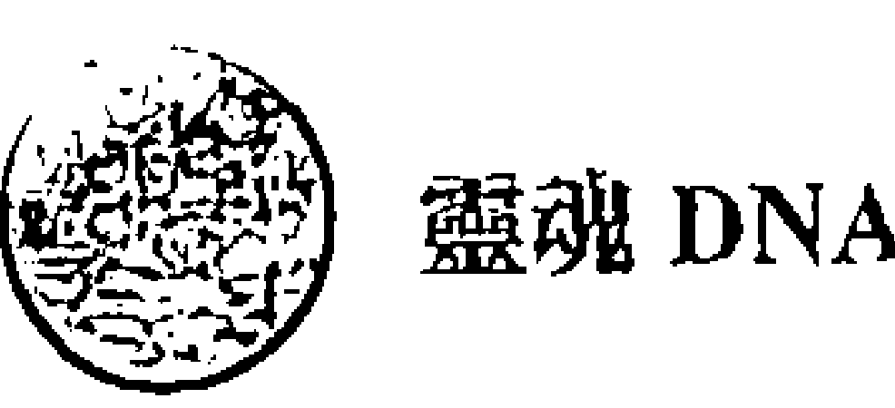

### 推薦序(原文版) – ANNE CHOO

You may be wondering why a semi retired lawyer is writing the foreword for a book on DNA of the Spirits channeled by Brother Rae Chandran, an eminent and beloved spiritual teacher together with Brother Robert Pollock. I wondered the same myself, but when I started thinking about what to write, it all became clear.

For 3 decades, I worked as a dedicated and passionate lawyer managing a boutique law firm. During this time, I was also avidly searching for new, more effective and easier ways to implement the healing modalities that I had learnt. I also searched without direction for higher truths, for a teacher to guide me on my spiritual path; without any success.

In August 2017, I started to wind down my legal practice and this allowed me time to pursue my interests in spirituality and healing with greater freedom. I attended Brother Rae's DNA Activation and Sound Healing workshops and was immediately intrigued by these dynamic modalities. The DNA Activation workshop was a total eye opener to the use of different hand positions to create healing space for the physical body as well as to connect with our higher self and our guides and to experience inner liberation.

I hesitated but my inner voice quickly responded affirmatively. There and then began my journey as Brother Rae’s enthusiastic student, initially of Sound Healing but soon as a student walking a spiritual path towards ascension.

The DNA Activation workshop in conjunction with the techniques in the book, DNA of the Spirit introduced me to channeling. A whole refreshing understanding of DNA, our divine blueprint began to unfold. The energetic connections which one can tap into this library of information of our past, our present and future journey can help us to awaken into a higher reality, to raise our consciousness and the consciousness of Spirit Earth and the cosmos. I also discovered a new realm of Ascended Masters, Celestial Beings, Archangels and Angels, the Spirit of the Earth, Moon, Sun, Stars, the elements, plants, trees and animals with whom we can connect and ask for help any time.

Meditation as I had always understood and tried over many years meant sitting in complete silence and stillness, sometimes for hours, a feat which I cannot do with ease. The meditation techniques channeled by Brother Rae are easy to implement, lasts for short periods but are extremely powerful which often left me with profound experiences.

My fellow students, my friends and I also experimented with the techniques shown in the book and we experienced an incredible expansion and infusion of energy of light, at times accompanied by beautiful visions. I have used the various techniques on friends and the outcome has consistently been positive, some experienced feelings of warmth and love, energy and light coursing through their physical bodies. My beloved dog, Poppy invariably responds with delight whenever I use the hand position to heal her upset stomach and weak hind legs.

Apart from the meditation and visualization techniques, Brother Rae also channeled an extensive and comprehensive array of other tools which the reader can utilize: sounds, symbols, colors and sacred geometry. By simply giving intention, making the relevant statements, connecting with and calling on the Ascended Masters or other Light Beings, we can, amongst other things, erase or mitigate our karma, disconnect from the matrix, the martyr consciousness and suffering. Energizing food and water has never been easier! Brother Rae's techniques are so easy to follow and simple to use that you can use them daily for healing yourself and others as well as Spirit Earth.

This book is a timeless, useful toolkit which we can draw upon for assistance any time we need help throughout our lives.

Apart from DNA Activation and Sound Healing Brother Rae also conducts workshops in Mahakundalini, Creation Codes, Dragons, Symbols and the Egyptian Mystery School. He also leads pilgrims to sacred places including Egypt and Israel.
Brother Rae is the most dynamic teacher and the most profound, intuitive and expansive channeler I have met. Not only does he teach such a wide range of modalities, Brother Rae's teachings are never static. Each workshop of the same modality is invariably a whole new experience for his students. The Ascended Masters and other Beings of Light seem to continually speak through our loving and humble teacher Rae who will readily and enthusiastically share with his students new insights and knowledge. Going on a pilgrimage is a uniquely Rae experience! He makes the temples, churches and holy sites come alive with his powerful channeling, delivering messages of unconditional love, wisdom and self realization. An extremely magnanimous, compassionate soul with a gentle nature, Brother Rae is also a loving and caring husband and father. Brother Rae empowers his students, pilgrims and clients by encouraging them to always enquire, question old dogmas and belief systems and to discern the higher truth for themselves. When confronted with challenges, he guides them to see different potentials and possibilities in order for them to reach their own decisions. He steers and when appropriate nudges them to serve their own truth, to stand in their own power, to trust and have faith in themselves. I and many other students have accelerated our spiritual growth under the tutelage of Brother Rae for which I give Brother Rae my deepest and eternal gratitude. I am sure that as a seeker, you will find in this book a google map for your spiritual journey. It will help start you off in the direction of self knowledge, self discovery and self empowerment.
The rest is up to you!

May the Creator and all your guides bless you on your journey.

◎Anne Choo
Singapore
Sound Healing Teacher
Certified BodyTalk Practitioner
Yuen Method Certified Practitioner

# ◇ 推薦序 - 王牧師 ◇

王牧師

「相信老天的一切安排必有道理，或許現在頭腦不明白時候到了、智慧具足了，然就明白了！」這一向是我個人的價值觀。也是我在經歷此書最深的感觸。身為命潛能出版社的負責人，很高興有機會能與有緣接觸到本書的讀者分享此書的奧妙之處。

與雷·強德蘭老師結識是因《靈魂DNA這本書》有緣來到我們出版社。因為希望了解作者期望我們如何呈現此書的中文版，受惠更多走在成長路上的夥伴們，於是安排了一次與老師的會面。此次的會晤，意想不到地開啟我靈性上的另一扇窗，也整合了許多以來一直未解的靈性成長問題。

「本書中提到手印、聲音、符號的教學，是否連接到身體的氣脈明點？」這是我向老師提出的第一個問題。雷老師當下手一揮請我站起起來，馬上教了我一個手印，當我雙手向上打上印時我嚇了一跳，怎麼會這樣？怎麼可以如此快速地進入另一個空間呢？於是帶著好奇及探索自己生命的熱忱之心，展開了不在計劃中的靈魂之旅。我跟隨雷老師老師來到了聖地以色列，這一切的過程讓我體驗到書中所提到的觀念：「進化松果體，增進腦部的功能，並且讓工作變成遊戲，最後享有喜悅的生活。」

如果你準備好，想要在靈性成長上多一些觀察及體驗，書中有很多不同層面的練習和工具，可以藉由這些工具符號、手印、聲音達到提升意識之目的。

這是一本實用的書，書中提到：「這項修持有兩件重要的事，第一是請求，第二是塑造意圖，如果你不祈求，就無法給予，在舊的能量中無知是福，在新的能量中無知是危險，舊的思想模式已經離開了，造物主不會降臨支持你，你必須透過請求來參與創造，並且藉由持續努力支持自己。」這本書讓我了解並學習更寬廣的靈性知識，透過每天與造物主的頻率校準，讓我更容易接收到祂們想要傳達給我的訊息，顯化在生活中的不同面向。

祝福閱讀此書的有緣讀者，也能接受到雷老師及書中各位揚升大師、聖者、大天使們、先知、大地之母對我們地球人類充滿愛與智慧的能量，也願這美麗的星球以愛和光照亮每一位來到地球的靈魂。

生命潛能負責人
王牧弦

# 前言

我與雷·強德蘭在2012年12月初次相遇，地點是埃及的亞斯文。當時，雷帶團前往埃及、以色列、希臘的聖地旅行，我也報名他的行程。我們一見如故，幾個月後，我們就開始合作這本書。

認識雷之前，我的靈性修持與信念已經停滯不前。我花了超過二十年時間在一所神秘學學院與靈性社群；儘管認識雷之前我已經離開該社群超過十年，但我仍依照那多年之前建立的典範來修持。我前一本書《以心導航》便簡述了那些信念與修持。

在2012年7月8日的通靈聚會中，聖哲曼敘述了雷和我該如何向本書讀者自我介紹。聖哲曼說我正由繭中甦醒，這也是事實。多年來我生活在理念相似的封閉社群之間，因此我發現自己的社交處世能力已經退化，走入世界讓我相當害怕。所以，最初幾年，我設法過著安全的生活。我創辦一個能量療癒的事業，三不五時開設工作坊。我也過著相當內向的生活，多數時間都是獨處。顯然這一切都將改變。

投入這本書讓我看見地球上正在發生的靈性與能量改變。2013 年是意識發生次元移轉的第一年。人類在意識層次發生巨大成長，讓埃及與其他地方的神秘學校的古老真理與修持能夠向人們釋出。我們的身體也發生改變，以便支持水晶（或基督）意識。揚昇的契機已經降臨。我們正在打下基礎，讓兩代的新小孩能顯化其中某些變化。

雷和我並未寫下本書所介紹的內容。雷是難得一見的清晰靈媒，不過真正的作者是大師與大天使，而你也將讀到他們的話語。我是文字工匠，我的工作是組織、編輯、釐清。

我另外一項工作是學習。我學會不再認為 DNA 就是遺傳而來的生理特徵，而將之視為我靈魂的資訊庫。我的 DNA 包含了我生生世世的生命史，記錄我帶入此世的態度、業報、以及情緒傾向，提供藍圖（或生命課題）讓我提升自己。DNA 也記錄從你被創造為星子（starbeing）的那一刻到當前轉世的全部存在。

這些資訊寫在我的還有你的全身每個細胞裡。我能做某些練習、能進行能量連結，並藉此提升我的意識並活化額外的 DNA 螺旋束。這會帶來更進一步的靈性加持、提升的覺知、讓你與創造者和在內在層次努力支持人類的存在有更深的連結。

這本書有許多材料我也是初次聽聞。我的修持並未包含運用聲音、吟唱、或符號，也不包括與大地、其他星體、或動物進行能量連結，更別說是「龍」了。不過，我是個心胸開放的人，最後我也不再對自己正在編輯的材料感到震驚，也開始練習其中某些部分。

你會發現自己對本書某些部分感到親切，但是其他練習則無法讓你產生共鳴。本來就該如此。我特別有感覺的，就是要求被帶往大角星人（Arcturian）的療癒神殿以淨化並啟動我的松果體。在連續幾天的輕微頭痛之後，我感覺那樣的工作讓我前言

更加清晰。我也努力让自己与圣哲曼、阿肯纳顿、以及耶稣建立连结。我能感觉他们给我的支持。

雷和我都不觉得自己很特别。我们被赋予一项工作，就是呈现这些材料。我们会练习其中一部分，其他部分则放下或留待日后进行。我觉得真正的工作将由读者诸君完成。如果有足够的人努力为本书所讨论的两个世代的新小孩打下基础，那么奇蹟将变成家常便饭，地球将获得疗癒，人类将超越地球如今随处可见的冲突与贫瘠。的确，真的得靠我们一同显化这个新的实相。

罗伯·波洛克
麻萨诸塞州，匹兹菲尔德（Pittsfield, Massachusetts）

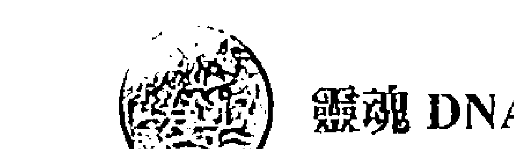

# 作者序

我成長的環境充滿源自古印度宗教、根深蒂固的思想模式與信念體系，因此幾年之前我仍無法想像能以其他方式來認識神。然而，經歷許多帶來生命改變的經驗之後，我被迫以非常極端的方式正面迎戰這個實相。這也在我內心開啟深度的好奇心，希望能更深入了解神與生命本質。

經過反覆摸索，我慢慢開始發現自我，了解我如何藉由思考程序、信念體系、行動與意圖來創造自己的生命。這引領我向自己內心更深入探索，希望不僅能找到一己苦難的更大成因，也能找到世上所有重大悲痛的根源。

透過多次向自我最深處的探索，我很幸運能認識許多大師，他們引領我更加深入內在以尋得答案。這些大師有些存在於物質層面。他們的指引深深鐫刻在我的靈魂上——這些大師包括羅伯·薩比羅、大衛·米勒（David Miller）、以及李·卡羅（Lee Carroll）（以上均來自美國）；來自英國的娜塔利·葛拉松（Natalie Glasson）；尼爾·唐納·瓦爾許（Neale Donald Walsch）的著作；還有其他大師來自內在層面，他們的指引從以前到現在都給我巨大的幫助——包括庫圖彌大師、聖哲曼大師、大天使麥達昶、以及阿肯納頓王。

本書來自與內在層面諸位大師以及物質層面的羅伯·波洛克的合作。在2012年底認識羅伯可說是本書出版的轉捩點。若不是羅伯的合作與支持，這個計畫便無法生根茁壯，而對此我也对他非常感谢。在出版过程中，我们也得到两位来自以色列、非常美丽的光之生命所给予的能量支持——分别是莫迪凯·雅欣（Mordechai Yashin）以及弗列达利卡·亚隆（Fredaricka Yarom）。此外，所有花时间协助听打、编辑并通读所有材料还能准时且优雅完成的人也给我们很大的支持。所以，广义来说，这个计划真的是个共同创造的过程。

本书包含的许多材料都是我曾做过也持续进行的修持，其他则是第一次传达到人间。本书是要作为实作手册，帮你练习书中提到的内容，因为我相信任何材料——无论是来自通灵或来自其他源头的指导——都必须赋予读者力量，提升读者，让他们能感受文字传达的能量与爱，好让他们感到扩展并提升。我相信本书满足这些必要条件。

最后，我希望感谢造物主温柔地指引我，带着我来到这里，让我能传达这些讯息来支持人类。我也要感谢我的家人支持我这么做。

> Namasté

雷·强德蘭

日本東京市

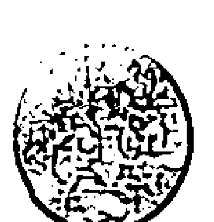

# 大天使麥達昶的話

2014年1月30日

我是麥達昶。

**您好。**

親愛的兄弟，恭喜諸位〔完成手稿〕。火車就要開動，準備都已完成。你將會非常忙碌，所以請仔細聽好。這趟旅程很有趣，一切由你掌握。

我們希望今天別說太多。我說 DNA 是構成你是誰的核心元素。不過你是誰仍是未解之謎。DNA 包含了你的歷史，不過創造本身又是什麼？DNA 不僅包含此刻的你，也記錄了你在創造之時的樣貌，更記錄了你未來的走向。

> **可否請您多加說明人在自身創造之時是什麼模樣？**

對造物主而言，那是一種你是誰的感應，是造物主本身的一部分：你就是造物主。

> **你能說出「我就是神」嗎？**

> **我會說我是造物主的一個層面。這樣正確嗎？**

這當然正確，因為人類覺得說出「我就是神」很難。要想著自己就是神，對人而言太過崇高了。當你終於能見到神的模樣，你所看到的是誰的臉？沒錯，是你，是金色的你，是綻放金色光芒的臉。DNA 不僅包含此一層面，亦即什麼是真正的你，也包含你的旅程本身。旅程是什麼？這是個有趣的問題。

DNA 不僅是你存在的靈性層面，也是整個旅程以及你未來旅程的潛能——告訴你未來的旅程，不論在這個星球或其他星球，會是什麼樣子。這段旅程銘刻在你的 DNA 內。這不僅是了解你存在的靈性層面，更是了解你意識的全部：你的過去、現在、未來。

自我了悟的生命會接受自己真正身分的偉大。你見到更寬闊的景象，知道自己的旅程完全連結到「宇宙我」的旅程。你擴展，宇宙也跟著擴展。正是經由你的旅程，宇宙才得以擴展。

從更高的層面看，你會影響整個宇宙。根據這個概念，你會開始了解自己的偉大。耶穌說：「我所做的事，信我的人也要做」（約翰福音 14 章 12 節），這句話真正的意思也是如此。他知道自己的過去，知道自己的現在，也知道自己前進的旅程。

你該如何理解這點並且在生活中實踐呢？你該如何啟動這段旅程？要透過你的 DNA。當你以開放的心來認識自己的 DNA，你也會運用復活的能量。每一刻的生命你都在死去。等到那一刻結束，就完成了。親愛的兄弟，如果你在每一刻的生命都請求復活，那會如何呢？你會持續地開啟，時時刻刻都會越來越開放。因此你必須請求復活。

當你時時刻刻都請求復活，你會開啟自己越來越廣大的層面。耶穌大師就是這麼做的。下一刻該怎麼做都展現在他面前——他一生中時時刻刻都是如此。如果你完全調整好去運用自己的DNA，那麼這就會自然地發生。

### 我们时时刻刻都接受着指引？

不是指引。你會知道該怎麼做。你會學到。不僅是在當下這一刻知道，而且每一刻當下都覺醒到更高實相、更高的了解、更高的真理。每一刻都是偉大的一刻，都了悟到宇宙本身的擴展。

當你覺醒，你不僅成為靈性的存在，更會擴展。透過你的擴展，神也會擴展。因為你是神的一部分，因此你的擴展也自然是神的擴展，不是嗎？這是給宇宙的獻禮。

當你覺醒，宇宙和宇宙中包含蓋亞在內的一切也都會覺醒。你的覺醒會擴展蓋亞的意識以及樹木、動物、植物的意識。因此你便達成你來到世間真正的目的：促進萬事萬物的演進。一切都是為了擴展和演進而創造出來。不然，它會腐蝕並死去。祝各位安好。我是麥達昶。

> 2014年4月，大天使麦达昶要求以下文字放入第一册：

这是本实用的书，而在练习中有两件事很重要。其一是请求，其二是塑造意图。如果你不请求，就不会被给予。根据古老能量，无知是福。根据新的能量，无知是危险的。人们需要知道这一点。陈旧的思考模式已经逝去。造物主不会降临来支持你。你须透过请求来共同创造，并且以努力支持自己。

## 灵魂DNA

此套书共有两册，其中介绍的工具能扩展灵性觉知，活化不常用且迟钝的乙太 DNA 束获得活化。此为上册，教材内容系根据时间编排。下册则介绍额外的教导与练习。

本书的资讯乃由不同的大师与大天使陈述，内容则是由雷·强德兰在 2013 年春、夏及初秋的一系列通灵聚会所传达。对我而言，参与这些聚会就像参加灵性的硕士班研讨会，有讲者提供资讯，人类参与者则向不同讲者提出问题。我们居住在北美洲、中东和亚洲，藉由 Skype 彼此联系。

### DNA记录我们有何成就

很多人都知道每个细胞内的 DNA 双螺旋束包含了你我物质身体的蓝图：长相、家族与种族传承的层面、是否容易罹患生理症状与疾病等。不过，我们人类是多次元（或者说量子）的存在；我们在非物质次元进行各类非物质活动。我们会以自己非物质的情绪身（emotional bodies）来产生并诠释情绪。我们参与各类心智活动：我们要用各种非物质的心智身（mental bodies）来抉择、记忆、分析、形塑潜意识印象、培养态度、并且进行抽象心理思考。我们能进入灵性层面：我们会祈祷、崇拜、透过良知和直觉接收指导并且获得超越的经验、梦境和了悟。

在我們一世生命的開始，所有非物質成就和傾向都已就位，另有十束額外的非物質 DNA 來記錄這些資訊。這些 DNA 束並非固定的，它們會記錄我們在成長與改變（或退化）中所發生的變化。我們攜帶這些資訊繼續前往下一世，因為 DNA 就是資訊，記錄了我們從被創造為個體靈魂之後的累世生命裡有什麼樣的成就。

古人對 DNA 的了解其實比我們一般認為的更多。埃及、印度、西藏和愛西尼派（Essenes）神秘學院的追尋者都了解 DNA 的非物質層面可以被喚醒和活化，只要他們擴展自己的靈性覺知並且將自己意識的所有層面相應於宇宙的良善力量。他們知道自己能將這些擴展的靈性能力帶到自己來世的生命。

強化的靈性連結不僅帶來喜悅和自由，還有高超的才能和知識。古人非常慎重挑選要教授什麼樣的弟子，因為他們不希望自己的知識落入錯誤的人手上。隨著基督教和羅馬天主教在西方興起，這些教導或者走入地下，或者逐漸消逝。

我們現在正從漫長的靈性沉眠中甦醒。這個過程需要幾個世代才會更為顯著，也需要許多高等進化的靈魂在接下來兩個世代轉生到我們的星球。在本套書中，我們說這些靈魂是「新孩子」（New Children）。正是由於如此偉大的甦醒，讓人類的靈性指引者（大師、大天使、靈性階層之主）相信揭露本書內含資訊的時機已經來到。我們的成長讓我們準備好領受這些資訊。

### 提升意识的工具

本書所包含的資訊是雷透過一系列通靈聚會所傳達，其中羅伯、弗列達利卡和莫迪凱以及其他人都向諸位揭露資訊並幫助我們的存在發問。本書包含 2013 年十三次聚會的逐字稿。這些聚會可以說是大師舉辦的研討會。我們將這些場次的逐字稿送交光之科技出版社，我們的編輯摩妮卡。馬克利也建議釐清並再詳述某些部分。雷和我在 2014 年三、四月間又進行額外五個場次，多數都是和大天使麥達昶合作，為本書增加大約 50 頁的材料，分散在原始的逐字稿內，以方框［］標示。

在這些聚會中，許多練習、工具和技巧都首次向人類揭露，能提升意識並活化非物質的 DNA 束。我真的很榮幸能受邀參與這些通靈活動。這些場次開啟我的雙眼，讓我看到自己從未思索過的靈性層面。許多練習都是不同形式的靜心。其他非靜心的練習與守則包括提升食物和飲用水能量的方式、與動植物的意識合作、設定意圖、運用音聲與吟唱、運用符號、運用手印（mudra）等。你或許覺得不是每項練習都讓你感興趣，請挑選吸引你的練習來做。就把本書當成任君選擇的自助盛宴，並且運用你的鑒別力來挑選最有共鳴的來做。

以下是我們的建議：DNA 的十二層面均有相應的練習（手印和符號）。我們建議要一同練習它們，不要一次只針對其中一兩個層面練習。規律練習很重要，自律也是。要記得，自律是规律而非懲罰。

如果你和其他人一起做，你們的努力將會倍增（馬太福音 18 章 20 節：「因為無論在哪裡，有兩三個人奉我的名聚會，那裡就有我在他們之間。」）這包括與志趣相投的人一起合作，或是參加工作坊來補強個人的修持。

### 其他关于DNA的书籍

這些材料真正的作者群包括聖哲曼大師、薩南達大師（他化身為耶穌亞，或是人們所稱的耶穌）、庫圖彌大師、阿肯納頓王、聖母瑪利亞、安娜（耶穌亞的祖母）、大天使麥達昶、主墨基瑟德、主梅翠亞、山納·庫瑪拉、蓋亞、昴宿星大師以及 DNA 的大師們。其他非物質的存在也經常參與。

本書不是第一本介紹十二束 DNA 的書，不過據我們所知，這是第一本全面且專門討論活化十二束 DNA 的書：介紹能改變非物質 DNA 螺旋束的工具和技巧，讓你的能量特徵能轉化並反映你的靈性進展。

從 1990 年代起，有多位作家傳達了關於十二束 DNA 的材料，分別關連著人類 DNA 歷史的不同面相以及為何十束乙太螺旋會被改變或失去活性。芭芭拉·瑪西尼亞克（Barbara Marciniak）於 1992 年出版《黎明到來》（Bringers of the Dawn）一書，傳達者了昴宿星人的話語；他們在數十萬年前在人類身上播下他們十二束 DNA 的種子，然而這個星球卻受到某些實體蹂躪，改變了人類的 DNA 以便管理並掌控我們這個種族。安妮·布魯爾（Anne Brewer）於 1998 年出版《十二的力量》（The Power of Twelve）一書，該書在 2000 年及 2009 年陸續改版，加入了部分介紹 DNA 活化的實用內容；該書同時傳達了來自美索不達米亞諸神（Mesopotamian gods）的資訊，後者也出現在撒迦利亞·西琴（Zecharia Sitchin）從《第十二顆星球》（The 12th Planet）以降的多本著作。2010 年李·卡羅（Lee Carroll）出版了克里昂（Kryon）系列的第十二本書《DNA 十二層次：關於內在大師的密教研究》（The Twelve Layers of DNA: An Esoteric Study of the Mastery Within）。這本書包括了 DNA 十二層次的希伯來文名。

### 成為大師

本書的核心訊息滿懷希望。此訊息關係著人類如何能成功於 2012 年穿越門檻。黃金時期（Golden Age）的可能性就在我們眼前。完成這項工作的某些工具就在本書之中。其他工具則會在未來出版的書籍中出現，能教我們如何為地球療癒人類衝突的業報，為動物療癒受到人類虐待的業報。

我們所獲得的、關於改變人類 DNA 的材料強調，人類已經有所進步，已經醒悟到自己長久以來都是受到恐懼控制，已經在敵意環伺的環境下變得堅強，已經準備好成為星際探險家、自由戰士、光之工作者、以及銀河系的公民。古老的、以恐懼為基礎的模式在靈性覺知擴展之下已經可以取代，而且我們人類已經獲得力量能看清自己本來就是量子、跨次元的存有，並因此能夠創造奇蹟。我們能夠為地球與她所支持的生命形式療癒那些我們造就的負面與黑暗。我們都能成為大師。

—— 羅伯・波洛克

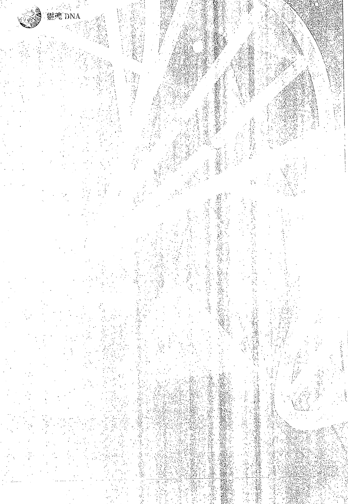

## 人類的潛能何在？

完整的潛能是人能以自身存在的完整本質生活，DNA束均已完全活化，生命之花也在內在活化。
要記得一件事：
你的腎臟包含生命之花，你的心臟包含生命之花，你的雙手也包含生命之花。

> “你必须相信你是量子的存在，相信你能提升自我的频率，如此方能活化你的十二束DNA。”
——圣哲曼

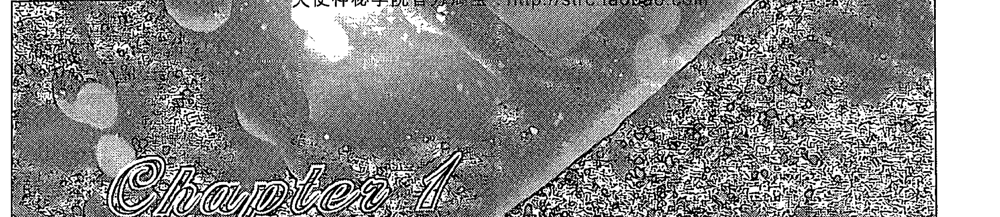

2013年4月10日

圣哲曼，一位昂宿星大师和库图弥大师

我是圣哲曼。所有传统都有秘密智慧和秘密知识。有个来自过去的古老智慧能在今日支持人们觉醒并进入新的意识。

口传的传统有其秘密知识和智慧，现在过了2012年12月的门槛后就能向人类揭露。我们能够传达，是因为当时发生了群体觉醒，因此现在每个人都能融入某些新的真理。我们感觉人类此刻已经更能接受真理。

在此之前，人类尚未准备要接受这个真理。例如，你开的车很漂亮。不过，如果有人在两百年前、在人类对车子毫不了解的时候给你这部车，人们会怎么说？他们也许会说：“这是恶魔的产物”或许还有“他说不定是用黑魔法变出来的”。简单的计算机或是各类今日看来寻常无比的事物也都是这样。人类在两百年前不可能理解，但是今日你已经准备要接受这个古老的智慧。

等到人类准备好，一个思想形态就会进入人类的视野。人类已经看着鸟儿飞翔好几千年，但要等到上个世纪人们才找到飞翔的方法。为什么之前没有呢？

我们相信此刻时机对了，可以提供许多古老真理和许多古老智慧。但是人类会抗拒新的观念。你提出的任何事物都可能被视为瀆神，不過你也知道，許多真理剛開始都被當成假的典範、惡作劇或瀆神。有時候，當你揭露一個新的真理，人們會說：「哦，也許我們該來研究看看」，不過通常人們都不會完全接受。

給予這些古老的工具是來自亞特蘭提斯（Atlantis）與阿肯納頓的古埃及大師、來自埃及太陽神（Lord Ra）、托特、哈托爾（the Hathors）和其他許多大師。這些是來自遠古時代的神秘教導。法老王圖特摩斯三世（King Tutmosis III）——所謂的戰士君王——就是庫圖彌大師。以下的許多手印都是他每日規律練習的。所以我只想告訴你一件事：由於現代人已經更能接受更高真理，因此可以用任何你覺得適合的方式介紹這些材料，不過這些是我們對這個主題的看法。

我親愛的家人們，接下來我要介紹一些高度進化的存在。他們特別鐘愛這顆星球，因為他們已經將自己的DNA在這裡播種。我們很榮幸今日有一位偉大的昴宿星大師來加入我們的行列。

# Chapter 1 活化DNA十二层次的手印

我是隨著庫圖彌大師的昴宿星大師。各位好，祝福各位。套句古埃及人的話，hi heem¹，意思是「發自內心的寒暄」。願我們的心一起搏動，因為我們和造物主合而為一。讓我們用片刻時間結合，藉此修補我們的心並融合能量。我們要帶個重要訊息給你們——這個訊息對世界非常重要——特別是此刻，因為世界正在覺醒，以更快速度生活，步調只會越來越快。

人類真實的起源將會在接下來幾年揭露。所有古老的教導，包括達爾文的進化論，都會被揚棄，人們會說它們已完成階段性任務，而自此刻起我們已經找到更高真理和新的領悟。這些新的工具將會讓地球上每個人都能和我們之中某位高頻能量的存在連結，因為我們就是未來的你。我們已經將自己的DNA植入你們每一個人內在。這個領悟將會在這顆星球上造就重大的意識覺醒。

在這個脈絡下，我們希望介紹和我們的DNA有關的十二個手印。正如各位所知，DNA基本上是訊息或資訊，需要藉由提升個人的意識來促成其活化。那是等待被人閱讀的指導手冊。你會如何運用取決於你的心靈和你活化它的方式。我們要先由提升意識開始。這些手印、歌曲、呼吸和符號會影響意識，好讓意識能自然地影響DNA。

原則上，DNA有十二個層次需要掌握，有不同的手印幫助你活化每一個層次：

- 第一層次為「生命之樹」(Tree of Life)
- 第二層次為「生命藍圖」(Blueprint of Life)
- 第三層次為「當下意識覺醒」(Present Consciousness Awakening)
- 第四層次為「信念」(Belief)

# 靈魂 DNA

- 第五層次為「覺醒的自我」（Awakening Self）
- 第六層次是神聖中最神聖的層次：「我即是我」（I Am That I Am）
- 第七層次為「平衡」（Balance）
- 第八層次為「真理」（Truth）
- 第九層次為「啟明見實」（Opening the Blind Eye and Seeing without Illusion）
- 第十層次為「回憶」（Remembrance）
- 第十一層次為「了悟」（Realization）
- 第十二層次為「神」（God）

# 運用手印、聲音和符號

我們帶來一些手印，勤加練習有助於提升你的意識。這些手印搭配上聲音、呼吸和符號，絕對能逐漸提升人的意識。這些修持，對勤加練習的人而言，可說是新意識的關鍵。背景音樂有助於你的練習，例如嗡聲（Om）或是由偉大的亞特蘭提斯音樂家麥可·哈摩（Michael Hammer）所製作的音樂。

做這些手印時，你可以站著或坐下。要深呼吸。我們唯一要求的是你要閉上眼睛，保持在一個放鬆而療癒的狀態下。我們會用以下的術語來稱呼我們的手指：拇指、第一指（食指）、第二指（中指）、第三指（無名指）和第四指（小指）。

這些手印專門針對 DNA，應該一起練習。你不該挑選其中之一來單獨練習。這十二個手印專為 DNA 設計，應該一次練習一整組。

如果使用背景音樂，尤其是嗡聲、西藏頌缽、水晶缽、金屬聲、鐘聲或磬聲，那麼你會發現自己的能量變得更強。請自己嘗試，找到最適合你的方法。人類需要將這些工具與自己的文化相互調和。

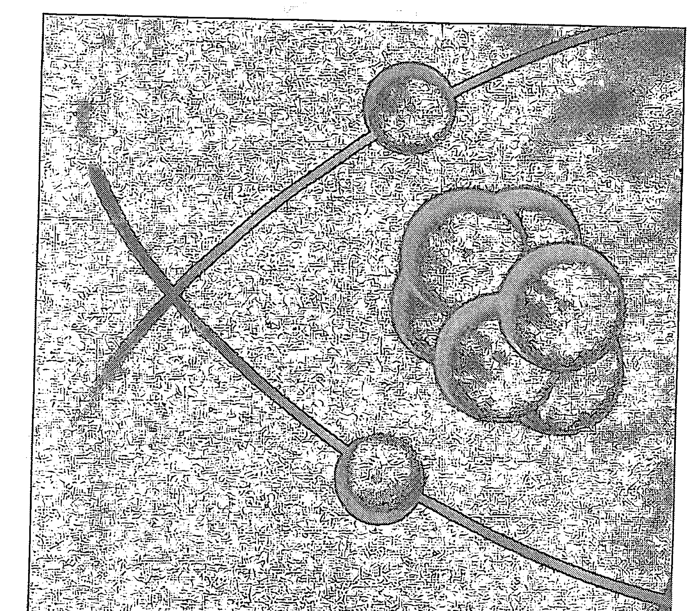

## 第一層次：生命之樹

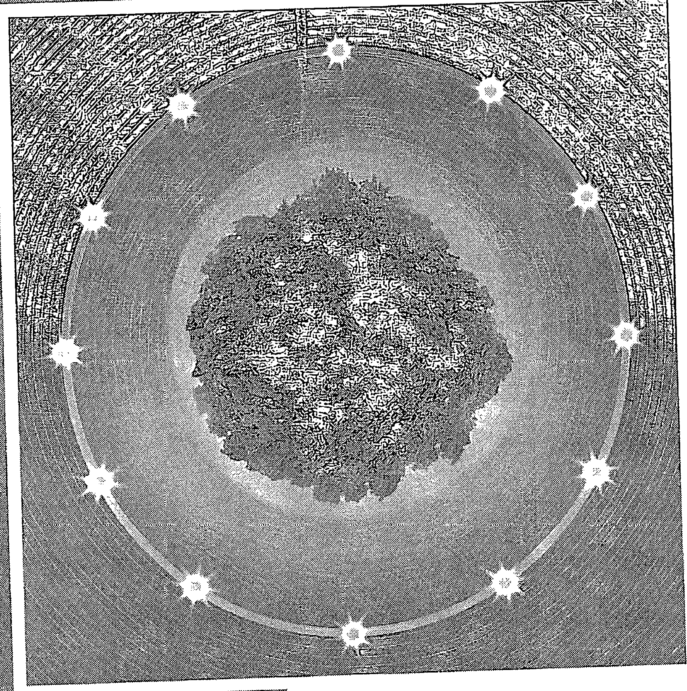

# Chapter 1 活化DNA十二层次的手印

### 手印一：生命之树

生命之树手印搭配的吟唱是嗡声。每天练习这个手印三到五分钟，持续十五天，你将发现自己心脏区域开放了。能量会开始在你的心脏循环，像甜甜圈那样，由你心脏前方开始，绕向身体背面，然后再流到心脏。不过能量不仅只有一个层次，会有多重层次的能量构成甜甜圈的形态，颜色分别是柔软的紫色与柔软的金色。

你或许会有被提升的感觉。做这些练习时最好能坐着，因为你的能量可能会非常充盈，因此必须慢慢累积。这个姿势更适合女性。

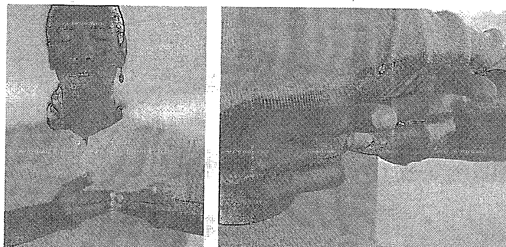

手印一：双手拇指轻触第二、第三和第四指，而双手这些手指的尖端彼此碰触。双手食指不要碰触，要伸直并指向与身体相反方向。双手在心脏前方保持水平。

### 第二层次：生命蓝图

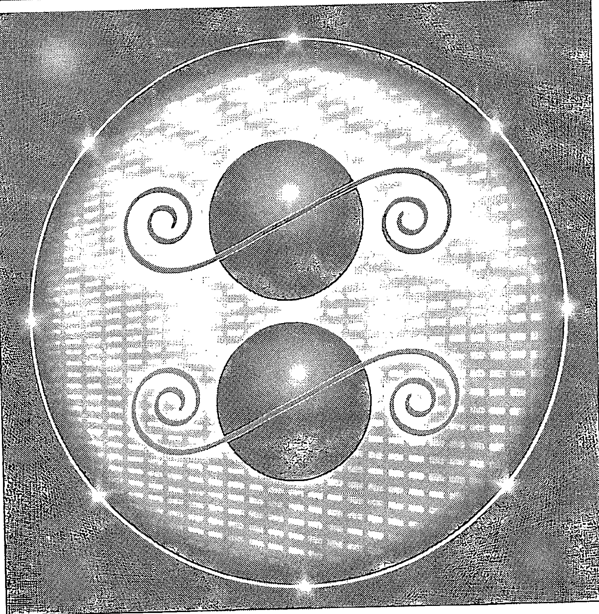

手印二：双手的拇指分别碰触第一和第三指（食指和无名指）。第二和第四指（中指和小指）则内缩并碰触掌心。双手在心脏前方保持水平，让双手食指、无名指和拇指的尖端彼此碰触。你的手指会构成三角形。

## ## 手印二：生命藍圖

生命藍圖手印會創造力量來取得你的生命藍圖。這是你在你的社會所擁有的真理，必須向下傳給自己的人帶到他們自己的國家。我必須一再強調：你必須調整這項工作以適應運用這些技巧的社會。

這一層次吟唱的聲音是「oooooooooo oooooooooo」¹，在第二次的「oooooooooooo」要向上移兩個音符。這會創造力量來取得你的生命藍圖。許多人感覺在這麼做的時候，會有純白色的能量由大腦筆直地流向心臟；這會創造一條道路，讓他們在生命中可以依循前進。這會幫助他們記起自己的藍圖，會創造一條好的道路，讓此生的步伐有所根據。

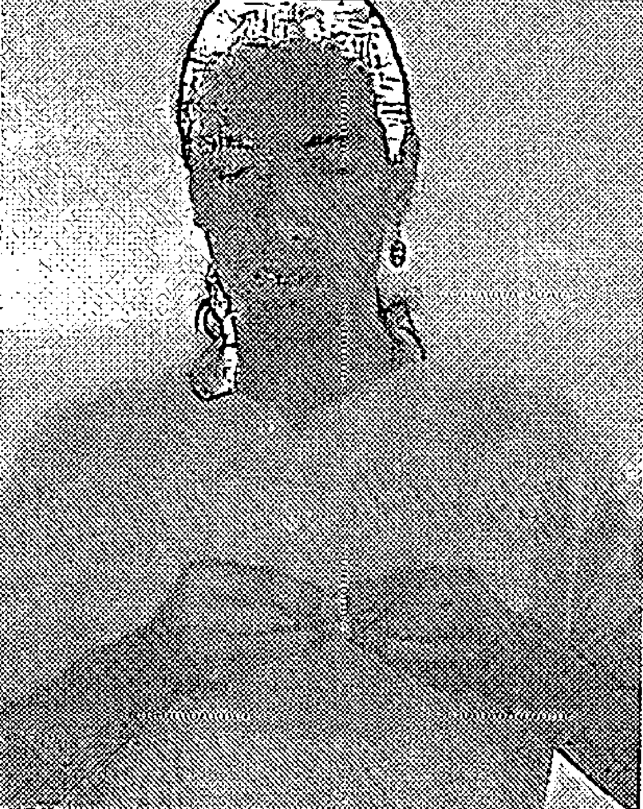

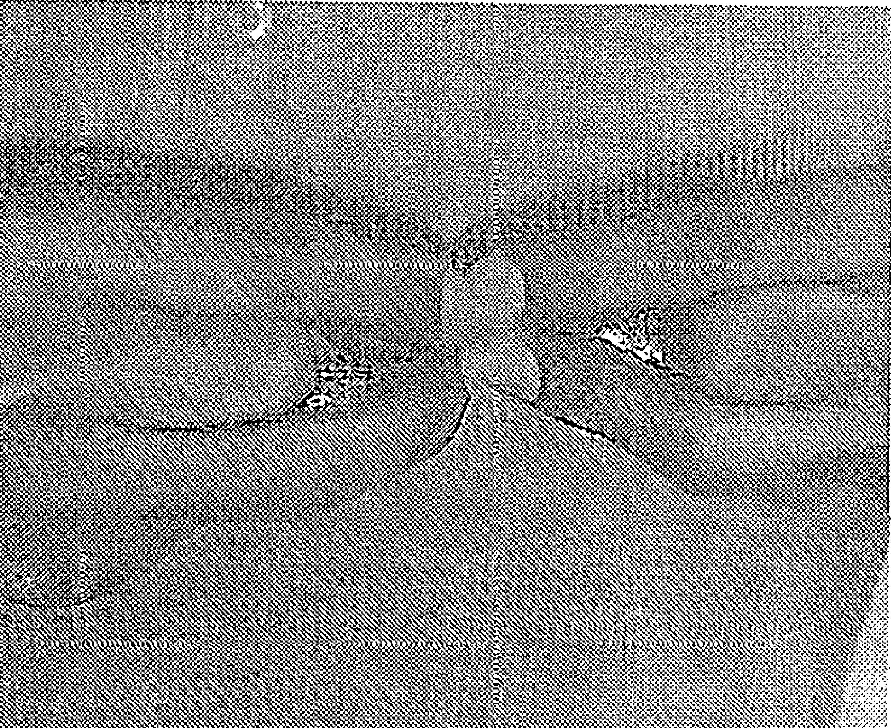

> > 1 註：聲音接近「歐歐歐歐……歐歐歐歐……」。

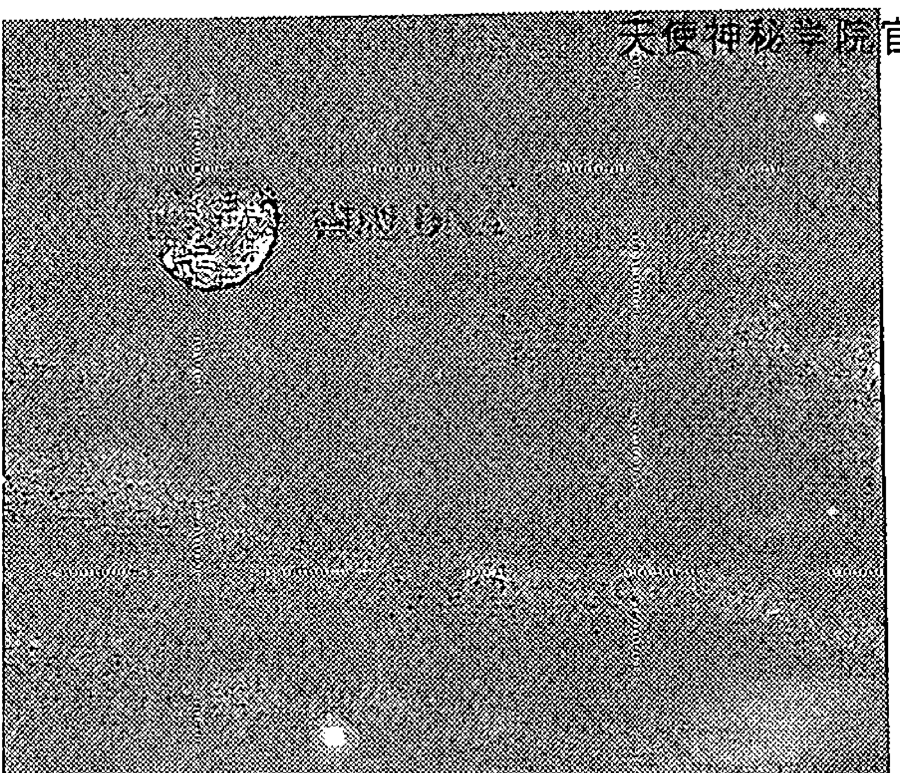

### 層次三：當下意識覺醒

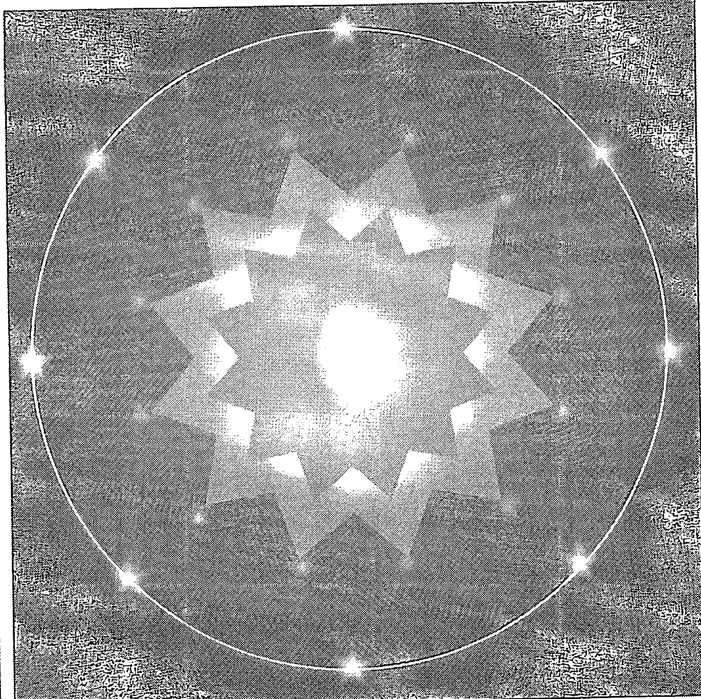

手印三：双手的拇指分别碰触第三和第四指（无名指和小指）。食指和中指不要碰触，向外伸展。将双手置于心脏前方。你会看到自己的双手构成许多小三角形。

### 手印三：當下意識覺醒

第三层次会唤醒你的当下意识：那是促使你更加认识自我的渴望。每个灵魂在既定时刻都会缓慢地开始觉醒到一种更深入认识自我的渴望。这个渴望来自第三层次的活化。通常这是在无意识间发生，不过你可以藉由要求并塑造意图的方式来活化第三层次。

如果你仍不清楚自己的生命旅程，并且想要知道自己为何来到这里，想知道自己存在的更高目的，那么你可以运用这个层次。意图是力量强大的工具。当你要求自己的第三层次获得活化，你会开始感觉到它的意识流入你，让你更认识自己所有的感觉和情绪。这个层次是属于自我发现的层次。

这个手印会产生深层平静的能量，仿佛海洋——一座包容一切、美好、宁静、安详、和平的海洋。这个层次搭配的吟唱是「aaaaaaaaaaaaa」²

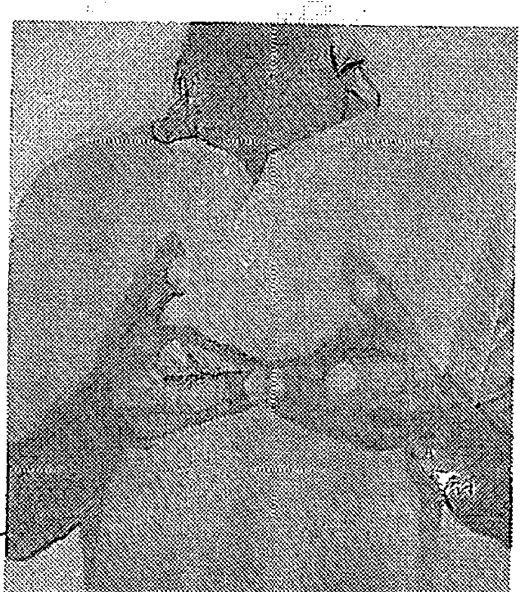

### 層次四：信念

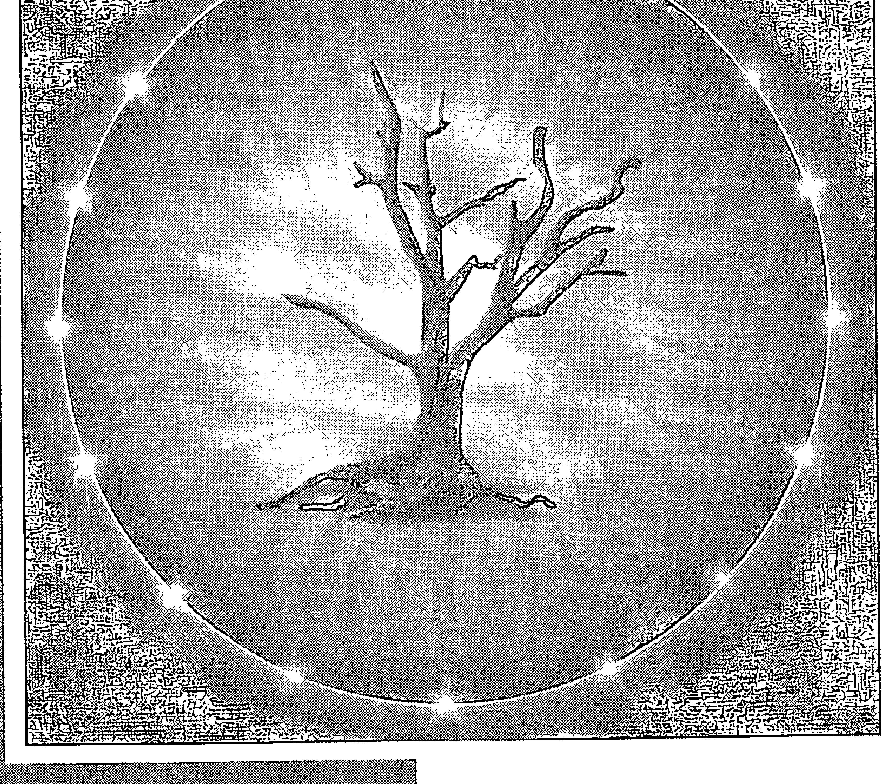

手印四：在信念層次的手印中，雙手拇指要碰觸食指和小指。第二指和第三指內彎並碰觸掌心。兩枝手指指尖接觸。雙手放在心臟和胃中間的區域。

### ## 手印四：信念

信念創造人的實相。你的想法、語言、行為和感受全都來自你對自我和世界的信念體系。你的信念乃是在此世及諸多前世中塑造而成。即使你的經驗也都是自我信念體系的內在反映。信念是此世的關鍵：你相信什麼便會創造出什麼。如果你相信世界會虧待你，那麼你的生活就會反映出這一點。如果你相信生活全是善良美好，那麼你將創造出善。請為自己相信最高的善。有許多事物乃是古代的遺留。你必須打破舊有的模式。這就是所謂的古老真理理論（ancient truth theory）。幾乎所有的人類都能將舊有的信念和態度由自己的意識中清除。這個手印事關重大，因此我們提供一特別的聲音來打破阻隔，據我們所知這就是神的聲音：「wwhooooooooooooomm」。在發聲結束前略微拉高音調。你也可以在此時呼喚自己所有的天使來幫助你。如果你的第三脈輪完全活化，你會感覺附近區域像火焰一般，燃燒許多來自亘古過去所殘留的舊有模式。花點時間練習這個發聲。有些人會看見有綁在太陽神經叢上的巨大鐵鍊纏繞著巨大火球。你背負著這些垃圾已經太久了。

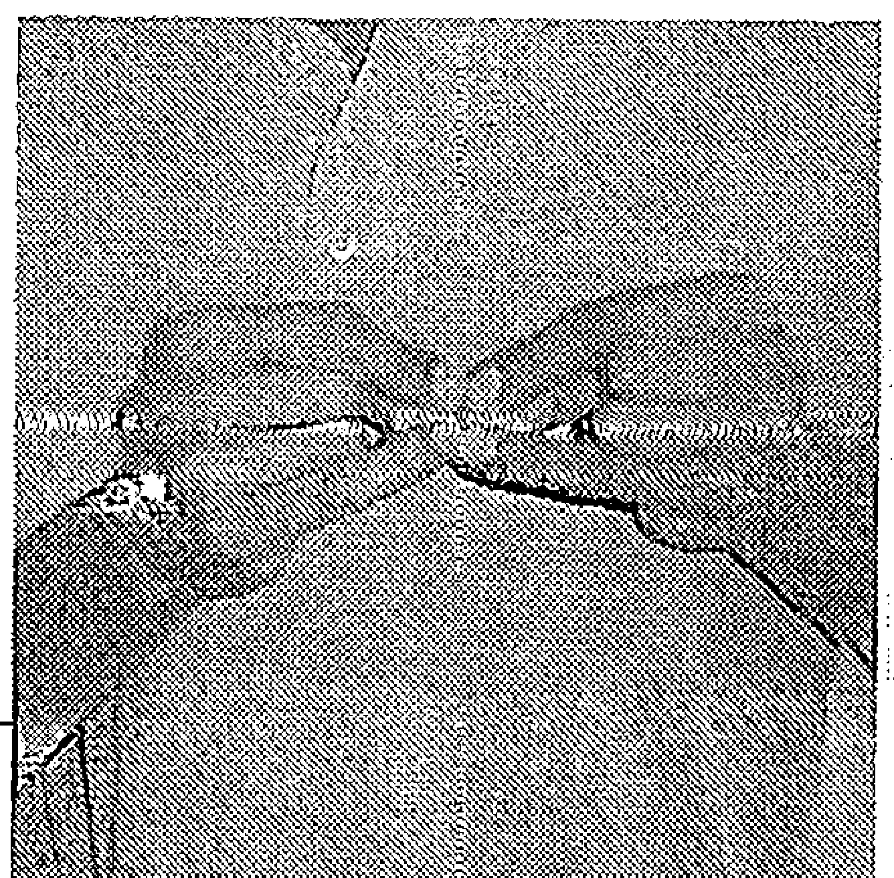

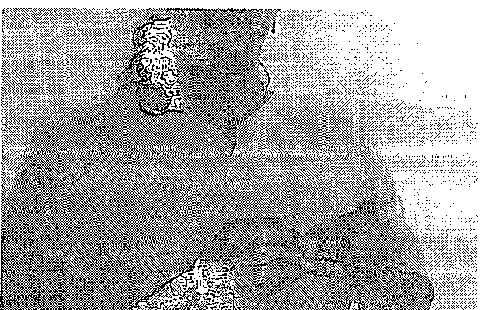

### 層次五：覺醒的自我

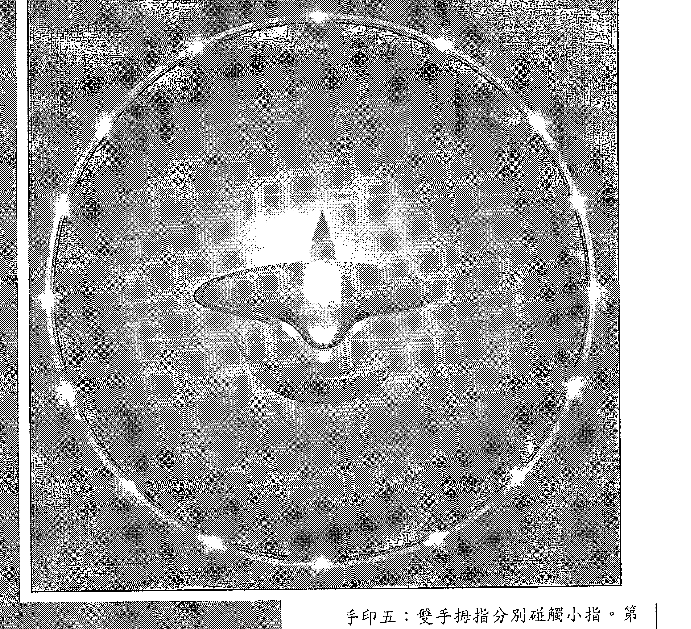

手印五：雙手拇指分別碰觸小指。第一、二、三指則分別碰觸彼此。你會看到雙手的拇指與小指間形成小小的孔洞。將雙手放在心臟前方。

### 手印五：覺醒的自我

第五層次是覺醒自我的層次，也稱為理解的層次。覺醒是理解自我的過程。當你完全理解自己，你便成為大師。喚醒這個層次是個緩慢、漸進的過程，不過，等到你開始將更多的光融入自我，這個過程便會得到強化。

方式之一就是讓你的靈魂和身體有更緊密的結合。在你心靈的眼睛中，要看見一持續發光的明亮光體由你的心臟核心綻放，隨著每次呼吸，你要看到它越來越擴展，終於包裹住你的全身。這個簡單步驟能讓你與自己的靈魂連結，並因此大大強化你的光明。你也能呼喚天使、大天使、以及指導靈、導師、大師來與她們的光結合。你可以請求協助你的大師讓他們與他們的光結合。

這個重要的手印能幫助你表達這樣的意圖：「我已經準備好要喚醒我的更高自我。」第五手印的音調為：「hhhoooommmmmmm」，其意義為「我此刻正在喚醒神聖自我。」

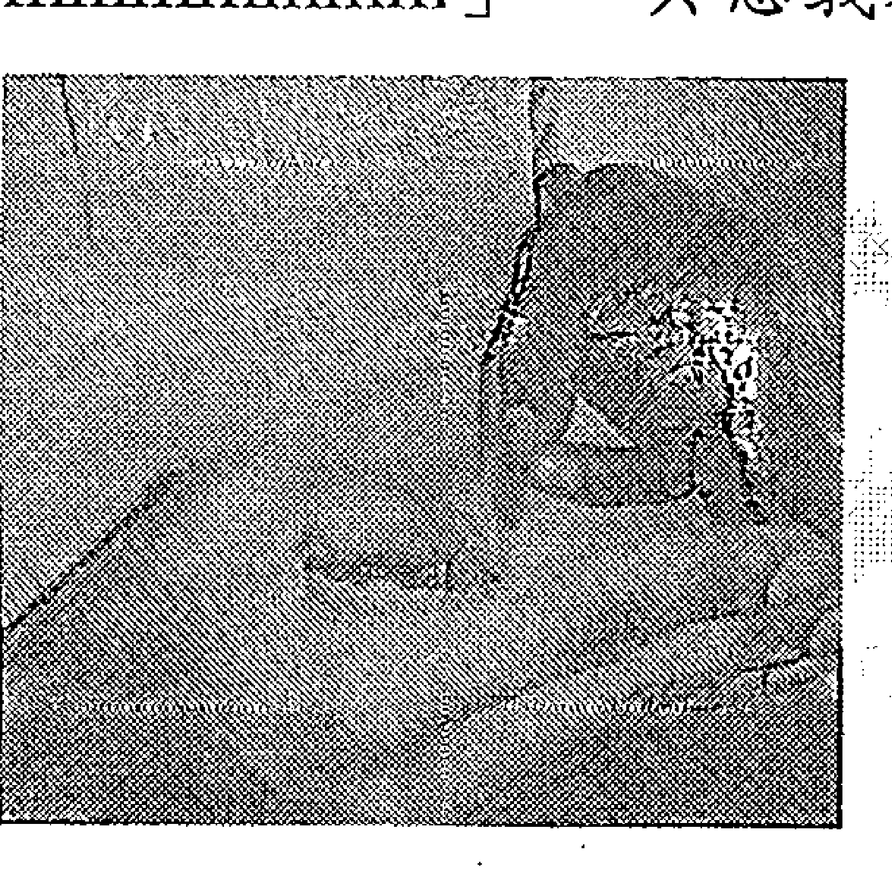

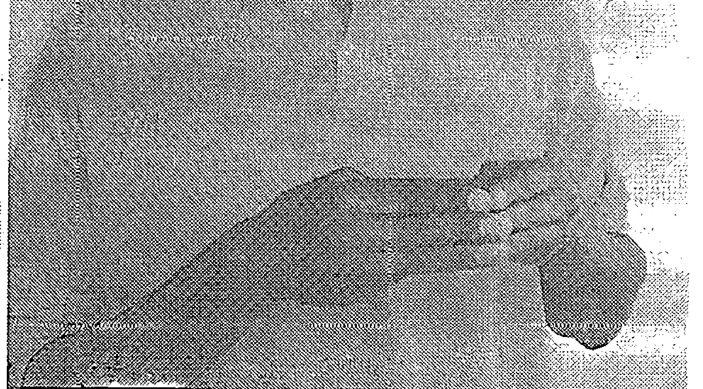

### 層次六：我即是我

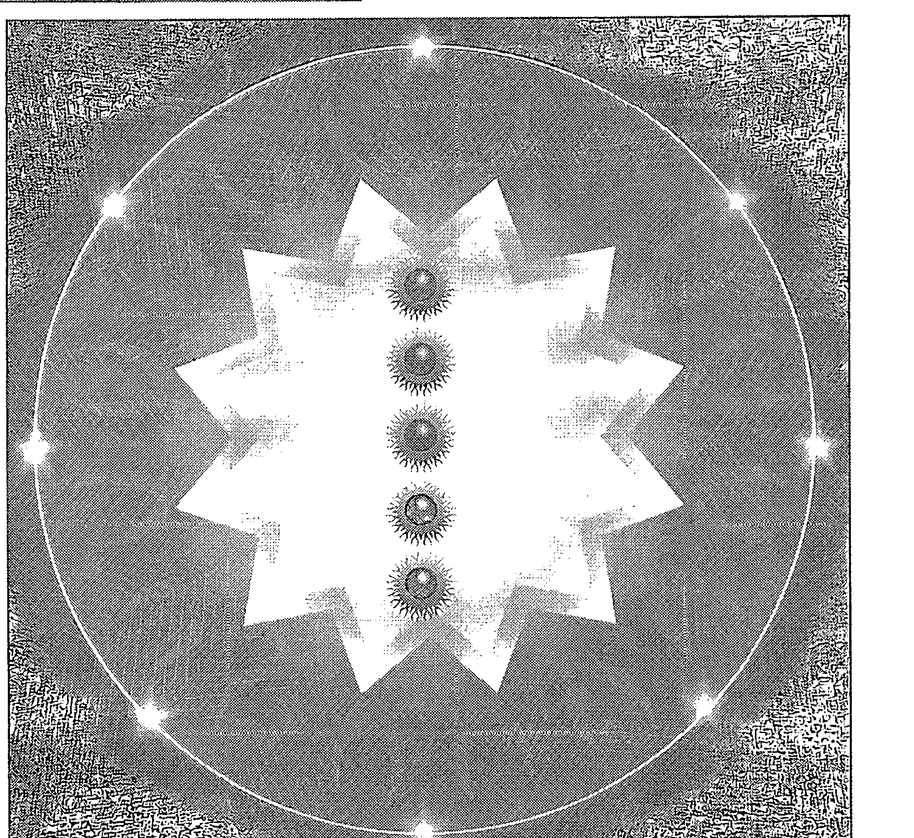

手印六：双手拇指分别碰触第一及第二指。第四指内扣并碰触掌心。双手无名指指尖彼此碰触。将双手放在心脏区域并保持水平。

### 手印六：我即是我層次

第六個層次稱為「我是」層次。當你修練自己的覺醒自我並且更完整地認識自己，那麼下一步便是與「我是」層次、與神聖靈魂連結。你的神聖靈魂便是真實的你。你的「我是」層次與每個人的「我是」層次連結，同時也和父／母神、造物主連結。

你越渴望與你的「我是」存在連結，這個層次活化的速度越快。你的渴望會讓你的靈魂越來越和你的身體連結。當你開始透過你的靈魂來表達並體驗自己的生命，你將會擁有靈魂的偉大智慧，將能挑選並表達自己的生命。

這是個無比神聖的層次；其中包含了希伯來文，這是來自其他星球，力量強大且跨次元的語言。某些希伯來文字力量非常強大，能彰顯造物主。以下就是個例子：'Ehyeh 'ašer 'ehyeh (eh he eh a show eh he eh)⁴，意為「我即是我」。

這個層次的吟唱音調為：「hhhhaayy hhhheeeeeoooooooooooooo」⁵，意為「我呼喚並啟動我內在的神圣之神。」

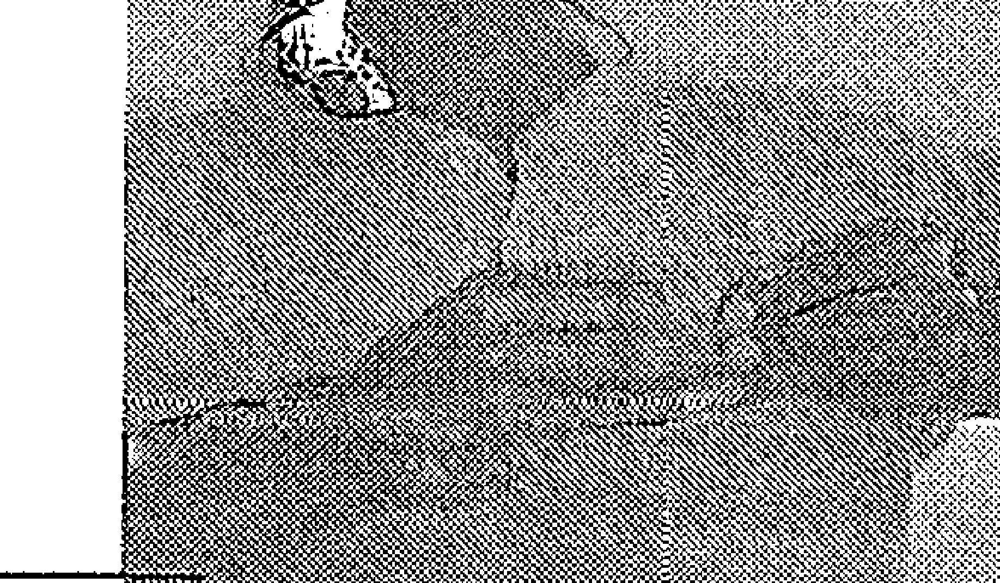

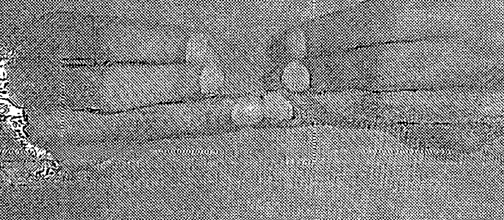

> 4 註：聲音接近「欸嘿欸啊修喔欸嘿欸」。
5 註：聲音接近「呵呵哈啊啊愛伊呵呵呵嘿伊喔喔喔……」

## ## 層次七：平衡

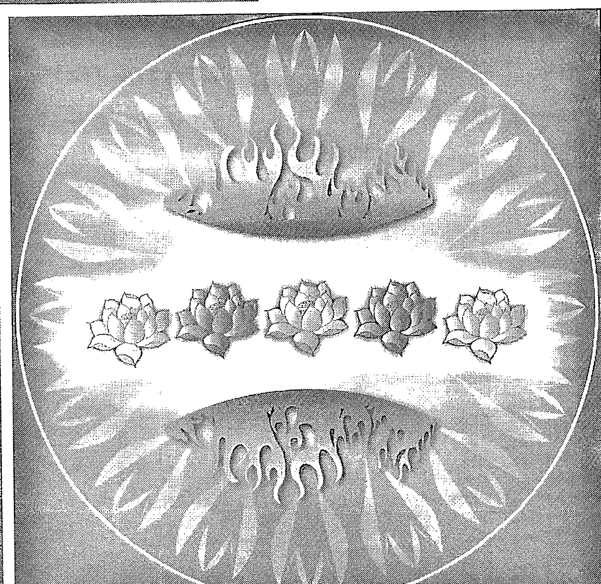

手印七：雙手握拳，讓手指之間沒有縫隙。雙手拇指相觸，右大拇指在左大拇指上。右手握拳，放在左拳上—不是交錯，而是平貼在另一拳的上方。將雙拳垂直疊在心臟前方。你會看到那構成一個三角形，三角形的頂點指向你的心臟。

### 手印七：平衡層次

平衡是一種意識狀態，進入其中，無論身處何種環境或處境，你都能完全感覺與自己同在。對平衡的人而言，他們自己內在或與他人相處的情境或經驗均無情緒壓力。那是種無論發生什麼都能完全接受的感覺。

這個音調與手印會從其他實相和時間收集片片段段的你，將他們帶回來並且與你內在結合。你再次讓自己完整。你正呼喚自己其他力量更強的部份過來加入你。

平衡也意味著在所有處境中均能保持完全覺知以採取適當的行動。適當的行動就是能為涉入該經驗的所有人創造有益的經驗。當你充分平衡，你也能夠培養平靜：在你的心靈、身體和情緒，或者面對人群、文化、大地母親與天空之父相處時。

你為這個層次創造的聲音是：「aaaahhooohhhmmmm」6。

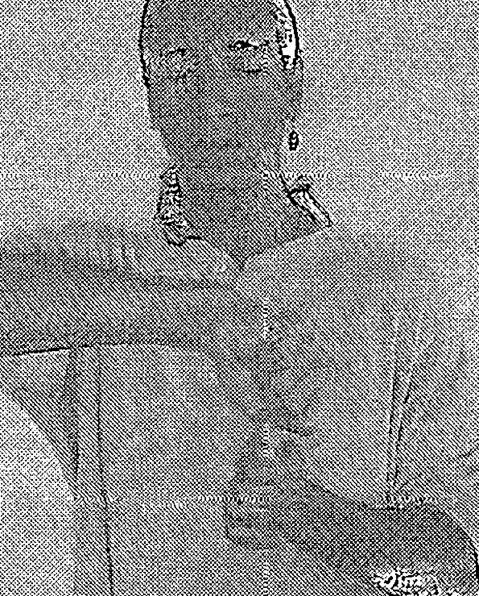

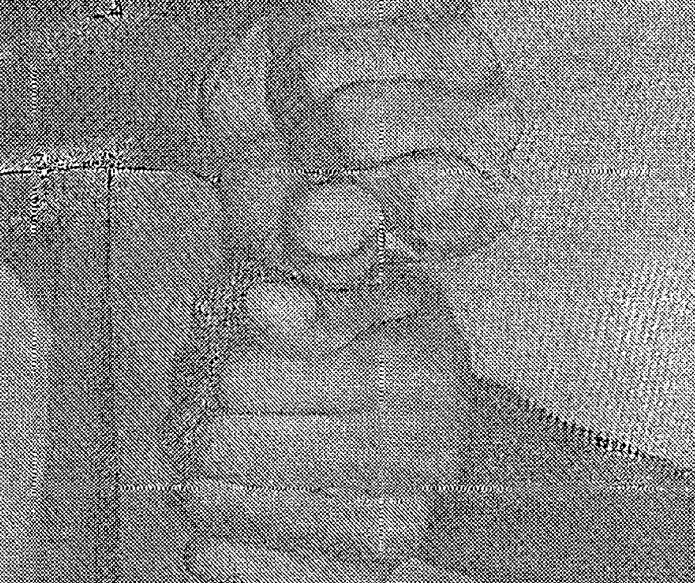

> > 6 註：聲音接近「啊啊啊哈吼歐呵呵姆姆……」。

### 層次八：真理

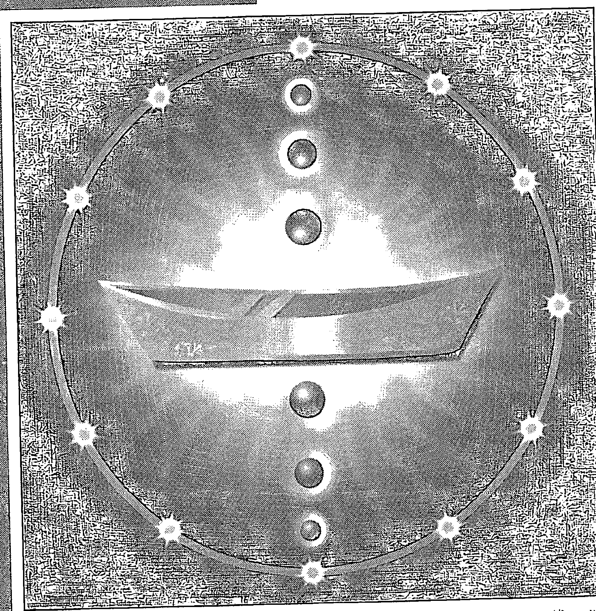

手印八：双手拇指分别碰触第一指。第二与第三指内缩并碰触掌心，同时双手小指彼此碰触—非常简单。双手放到心脏区域前方，同时保持水平。

### 手印八：真理層次

大多數人都很難保持真誠。除非你全然真誠地面對自己，否則你也很難對他人完全真誠。人類很害怕檢視自己並找到自己的身分。修練真理層次可以幫助你更完整地發現自己和自己正在演進的真理。這能幫助你了解更高真理。真理永遠都在演進，真理也相當龐大，因此沒有人擁有全部的真理。

隨著你的進化，進化中的真理會出現在你的生命中。不過，由於我們的信念體系，我們通常會拋棄進化中的真理，並執著於我們在漫長時間中培育出的陳舊真理。

這稱為真理層次是因為它表達了什麼是真正的我們。那是個三角形，靈魂、單細胞（monad）、以及「我是」的存在。（monad 指的是靈魂群體的存在，共有 144 個意識群的集合。）這個層次的手印乃是由造物主所給予。

這個手印所吟唱的聲音來自古埃及文：「mmmaaa hhheee oooooohhhhmmmmmmmm」⁷，這是個很長且充滿共鳴的單音，每個音段的長度都有所差異。

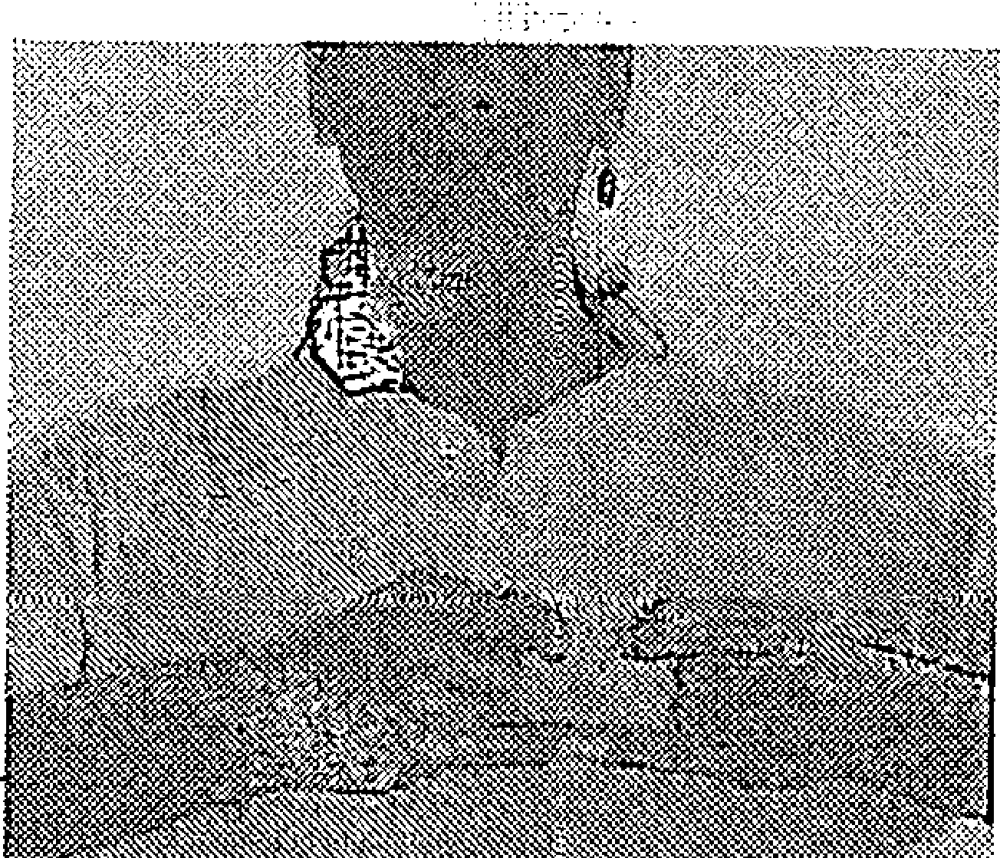

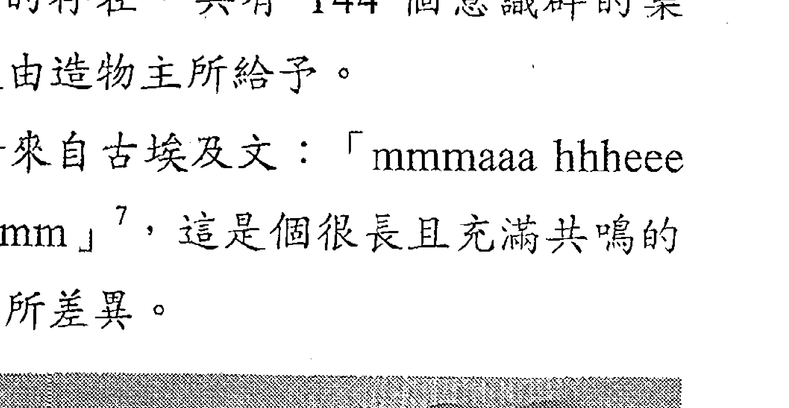

⁷ 註：聲音接近「姆瑪啊呵呵嘻伊 歐歐歐呵呵呵姆姆姆……」。

### 層次九：開啟偉大之眼

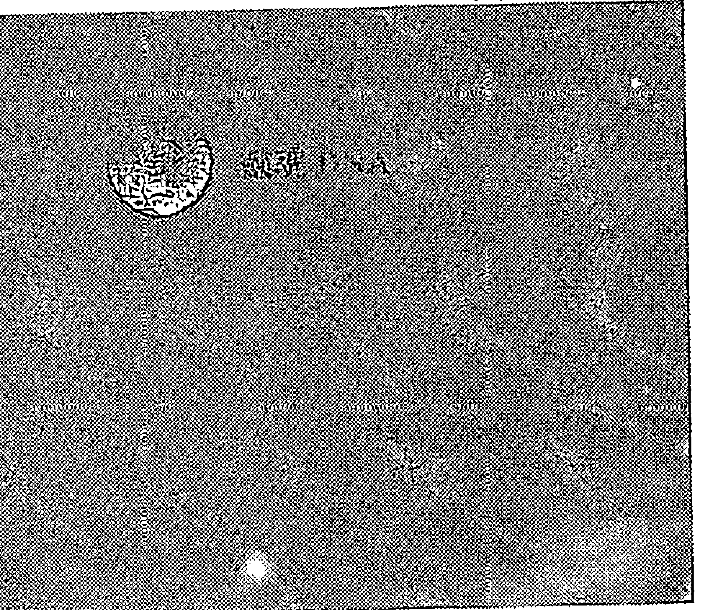

手印九：左手握拳，中间没有缝隙。右手张开，手指并拢。左手指节放在右手掌心。双手放在心脏位置前方。

### 手印九：開啟偉大之眼層次

偉大之眼又稱為荷魯斯之眼，是你美麗的靈魂之眼。這讓你毫無錯覺地看見。沒有錯覺的面紗，你能看見自己生命的實相而沒有恐懼或偏見。我們是如此深陷於錯覺，因此忘記了那是錯覺。當你能夠向這個層次的意識開啟自我，那麼你便能更清楚看見實相。所有曾經在這個星球活動的大師，他們的生命都超越了錯覺。一旦你能醒悟到這個真理，你便能喜悅地活在這個世界，心中充滿平靜，因為你將知道這個世界乃是一個巨大舞台，上頭所有的演員都忘記自己其實活在舞台上。你能清楚看見身為演員的你在這個偉大遊戲中扮演的角色，因此你能選擇自己在這場偉大的錯覺遊戲中要如何扮演這個角色。

這個手印有兩個聲音。第一個聲音是：「eeelll sshhheeeedddd iiiiiiiiii」^8，要以長的單音來吟唱，其意義為「神之名字」。這些聲音將在這個層次喚醒。另一個聲音為：「hhheeeemmmeee oooooohhhhhh」^9，其意義為「我是開放的，願意以神聖之眼來看得更廣。」很多時候，在練習這個手印時，你將看見光由第三眼進入雙手手掌，構成一個三角形。

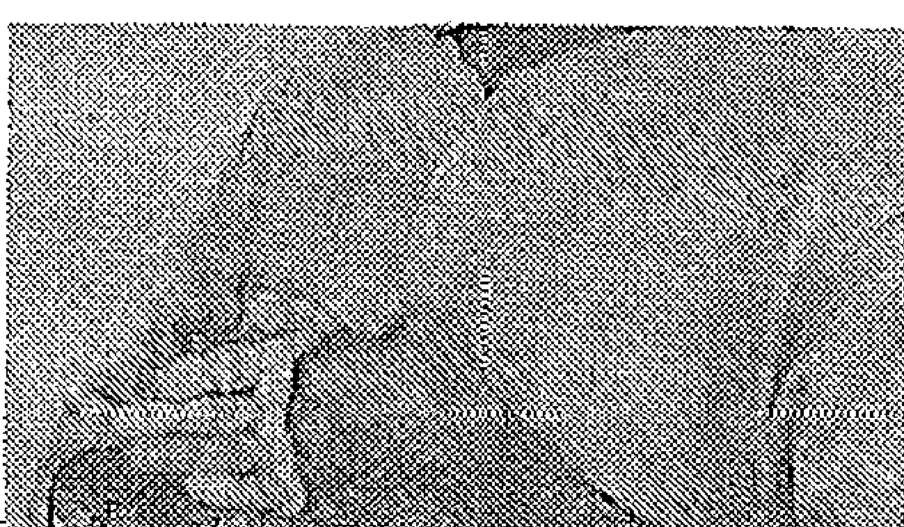

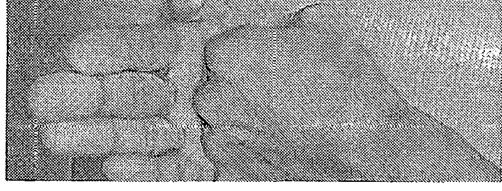

> > 8. 註：聲音接近「伊伊伊歐歐歐 嘘噓呵呵嘻伊伊德德 伊伊伊伊伊伊」。
> 9. 註：聲音接近「呵嘻伊姆米伊 歐歐歐呵呵呵」。

### 層次十：回憶

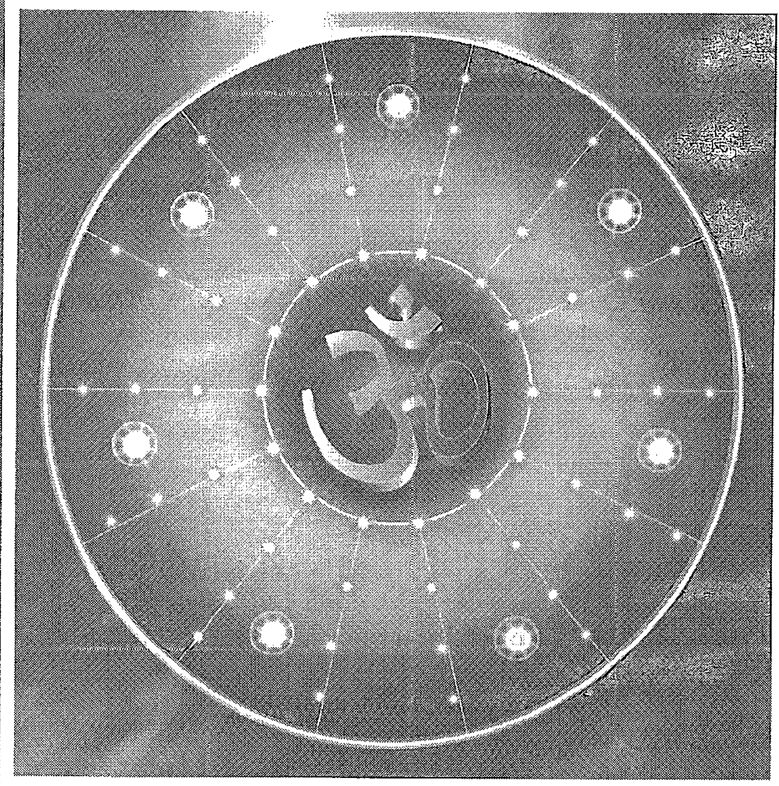

手印十：左手四指握拳，拇指伸直。右手拇指碰触左手拇指。左手手指张开，彼此保持距离并向外伸直。双手放在心脏前方。

### 手印十：回憶層次

這個層次稱為回憶層次，亦即回想起你是誰，回想起你生命的目的。這個回憶是關於你出生時的靈視：你知道自己知道。一切都是清晰的。等到你回想起來，你便能取用你的阿卡莎檔案並且汲取各種讓你的生命在此刻變得更好所需的天份和能力。

你可以請求你的靈魂回想起某些特定的情緒或天份，並且將之與你當前的生命經驗結合。無論置身何種情境，你都可以選擇自己的情緒經驗。你不再受到當下實相和其相關的情緒與感覺所擺佈，而是能無時無刻完全控制自己的生命。

這個手印吟唱的音調是「ssssooowww mmmyyyaaaaaa」¹⁰，要以長的、充滿靈魂的單音吟唱，一次又一次。這是來自哈托爾的古老音調。等你練習這個音調一段時間之後，你會看到一明亮的光體出現在你的額頭前方，彷彿太陽出現在你的頭上，將光向你傾注。

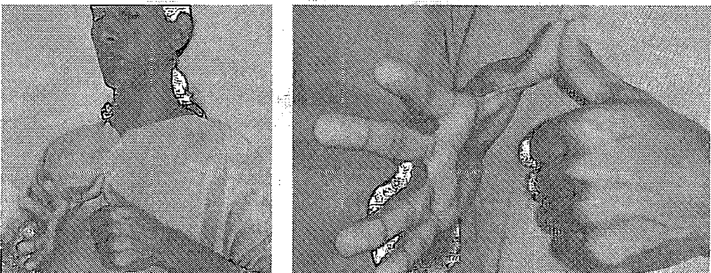

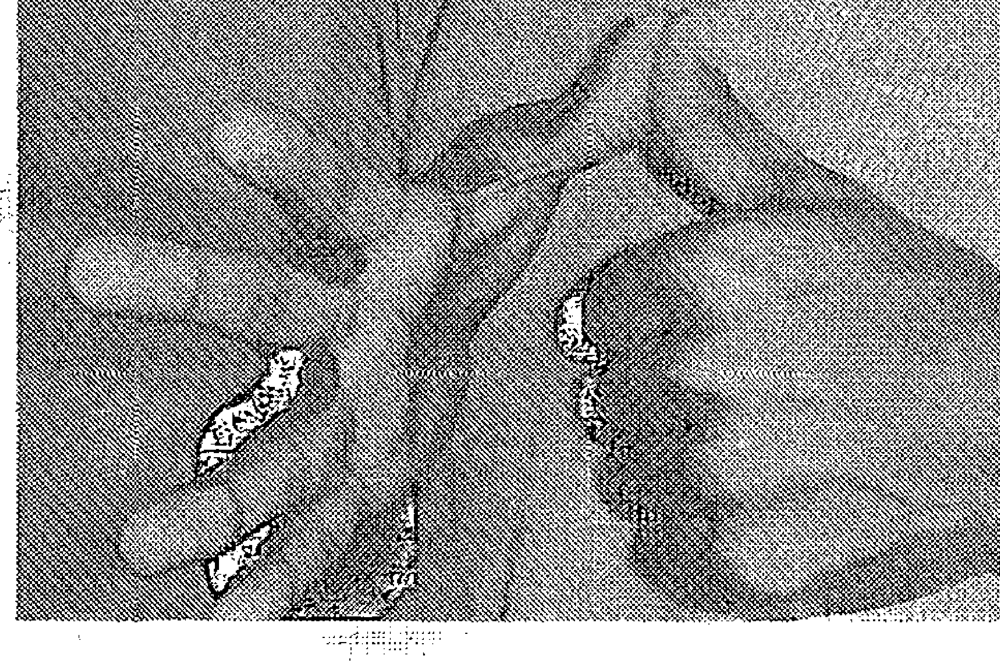

10. 註：聲音接近「嘶嘶歐歐鳴鳴 姆姆米伊伊亞啊啊啊」。

### 層次十一：了悟

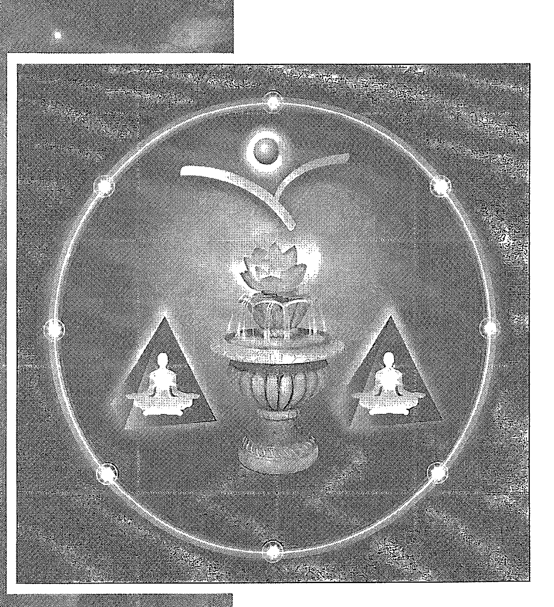

### ## 手印十一：了悟層次

這個層次稱為了悟層次，也意指與代表父親、母親的內在父神、女神的連結。透過這個層次，我們才了悟到自己就是造物之神，擁有洞見並完全了悟自己的真實。

如果活化了這個層次，我們創造以來的全部歷史都會為我們所知；而我們也能記得並了悟自己本質即是亞當。卡德蒙（Adam Kadmon）11。這也會幫助我們穿越許多更高次元，並且與更高次元的大師連接，讓他們進一步支持我們的靈魂成長。

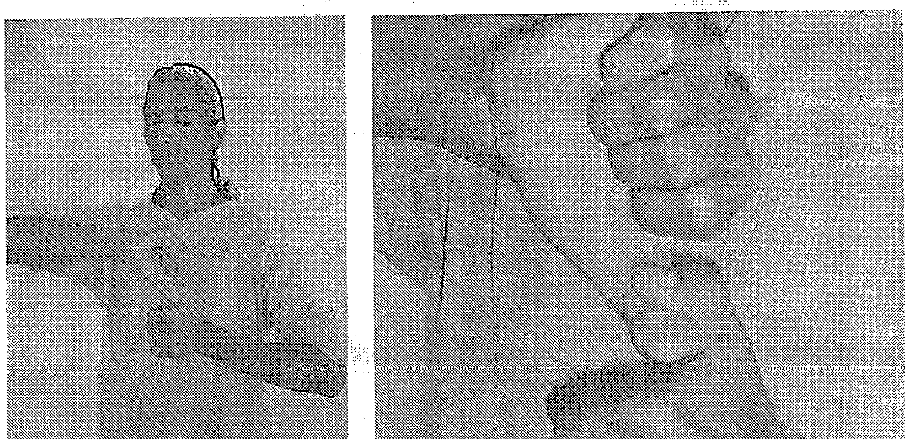

手印十一：雙手除拇指外其餘手指均握拳。右手拇指置於左手拇指下方。讓握拳的右手處在左拳的上方，讓右手拇指處在左手拇指的下方。雙拳垂直疊在心臟前方。

> > 11. 註：神人或以人的樣貌存在的神，參見本書第十一章。

### 層次十二：神

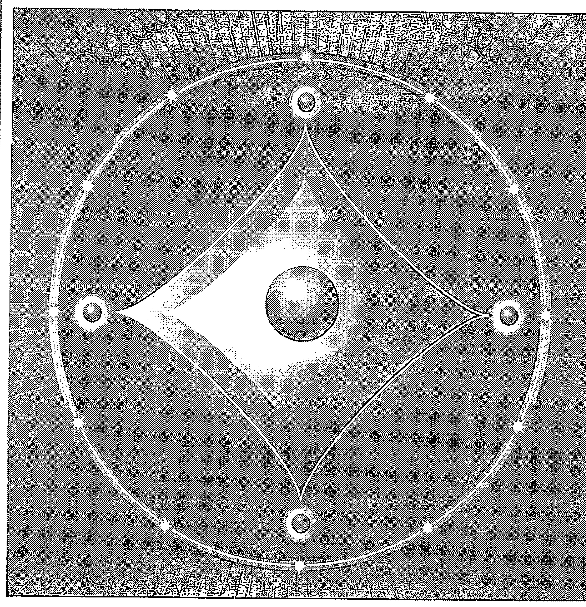

### 手印十二：神的層次

等到這個層次獲得活化，你便能以造物之神的形態活出自己的真理。你會有意識地參與這個宇宙的創造。針對這個層次冥想，請求自己神的存在能完全顯現在你的生命，成為活生生的真理。

雙手放在心臟之前，彼此互不碰觸，同時進行這個手印。這個層次的音調為：「hhhuuummm yyyooooooo」^{12}。

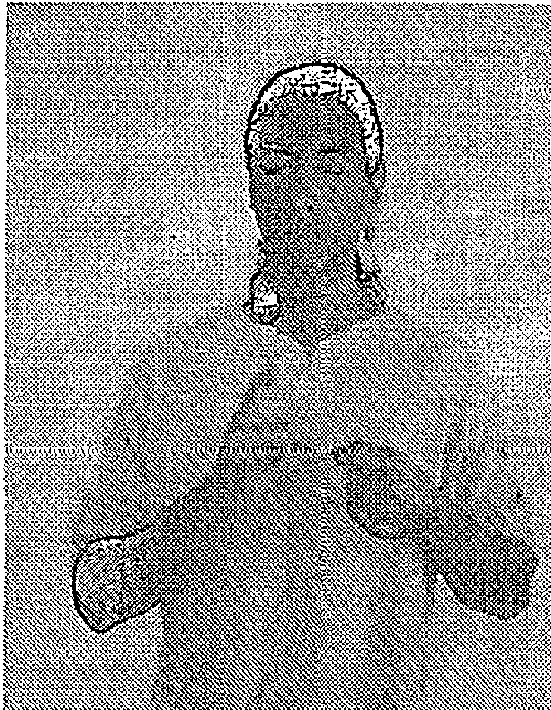

手印十二：這個手印做法是，右手拇指和小指相觸，右手食指上舉，第二及第三指內扣。左手的第二、第三及第四指內扣。左手拇指碰觸食指，其他手指內扣。

12. 註：聲音接近「呵呵胡鳴鳴姆姆姆 伊伊唷歐歐歐」。

# 靈魂 DNA

> 人類正朝向自己真正的命運進化——人類將成為探索者，進行創造，成為內在造物主的表現，具備善意和魔法；人類將成為各個星球跨銀河聯盟的成員之一。

〔阿肯納頓王，第二章，2013 年 5 月 16 日〕

> 本書的發想是要支持人類了悟到自己有能力達到此一目標，能獲得這樣的平靜、自由和喜悅。這是解釋本書最簡單的方式。這需要讀者提升自己到達這樣的意識狀態，以便能從書中的技巧獲得益處，並且運用它們來達到某種層次，使自己能觸及更高智慧。

〔山納·庫瑪拉，第六章，2013 年 6 月 30 日〕

> 要教人知道時候已經到了。我們從人身上學習，不過我們必須走出自己的道路，以自己的方式，借助力量的培育來發現神。當我們被動跟隨，在某個層次上我們放棄了自己自己的力量。我們領受指引，但是我們要自己努力並找到自己的內在真理。最理想的書籍或通靈將帶領每位讀者回到自己的真理。請運用這本書並觀察它是否給你支持。

〔聖哲曼，第九章，2013 年 7 月 25 日〕

## Chapter 1 活化DNA十二層次的手印

此刻降生在地球上的小孩，身上大約有百分之三十至四十的基因已經活化。他們的小孩，也就是第二代，將有百分之五十到七十的基因獲得活化，而他們的小孩，也就是第三代，會有百分之百的基因活化。
〔阿肯納頓王，第二章，2013年5月16日〕

新的孩子帶著更高的 DNA 束出生，他們將會創造新的實相。他們會明智地抉擇、運用自己的心，也就是自我的陰性部分，只會用自己內在所帶來的更高力量來創造善的事物。你們許多人……都為新的世代和他們的人鋪路。你們為偉大事物做了示範。你們為新的世代鋪好道路，讓他們行走。
〔阿肯納頓王，第二章，2013年5月16日〕

再過三十五到四十年，你們將看到巨大的轉變。你們和雷此刻正在做的會為第二代鋪好道路，讓他們能夠降臨。你們打下的基礎，讓新的一代，也就是我們孩子的的孩子，能夠來到並且完全覺醒並完成校準。等到 2021 年之後出生的孩子長到 13 或 14 歲時，他們會擁有完全喚醒的 DNA，也將知道自己真正的目的。
〔聖哲曼，第三章，2013年6月19日〕

## Chapter 2 人類DNA的歷史

2013年5月16日

DNA大師群、阿肯納頓王、以及大天使麥達昶

哈囉，我們是一群 DNA 大師。儘管人類 DNA 遭到修改，但是在我們看來，一切都還有希望。一切都深深藏著，而此刻該要開啟深藏於內的事物。

我們不喜歡用「操縱」（manipulation）這個詞，而寧願使用「重構」（restructured）或「修改」的說法，因為這是為了某一目的而作，而且並非是由黑暗存在為了控制人類所做的修改。

> > 〔大天使麥達昶說：因為這個星球當時準備進行實驗，因此負責照顧此星球的議會決定進行改變，好讓人類出生時不記得自己真實身分。如此一來，他們便能完成他們的工作。我們說「改變人類 DNA 的人」有一部分就是這個意思。不過 DNA 修改不是為了控制，而是為了取走記憶，好讓人類能從事自己來到這個星球所需完成的任務。然而，後來有來自其他星球的非人類種族前來掠奪這個星球的礦產。他們比當前的人類工程師有更發達的科學，因此他們修改了人類 DNA 好遂行控制。因此總共發生兩次改變，其一為更高力量取走記憶，其二是為了控制所進行。但那是非常後來的事了。〕

由我們的觀點來看，在歷史的進程中，某類的存在會自然離去，而新的存在會來到這個星球。人類 DNA 只受到輕微改變，但其目的卻非常重要：這樣人類降生地球時將處在未覺醒的狀態，因此他們將在黑暗中摸索，做出犧牲，面對重大改變。如此，他們才能更快地成長。之後，他們才能將這樣的覺醒與了悟帶到其他星球和銀河系來改變當地的進程。

在完美的秩序中不會有什麼成長，因此造物主設計了一個絕佳計畫。他邀請志願者來到地球，不讓他們取用自己完整的意識記憶，因此他們需要以顛倒的次序努力。這會很不舒服，但由這樣的不舒服中，他們會成長，會將這樣的成長帶到其他星球並紓緩當地的不適。人只能在不適和挑戰中成長。這是我們的觀點。

有些存在，他們為了一己利益，前來修改某些基因與DNA。不過，他們這麼做，主要不是為了控制整個星球，而是為了商業利益，因為許多來自其他星球的存在前來開採地球母親（Mother Earth）的身體，取得珍貴的礦物和金屬並且帶走。的確，在某些方面，人類並未覺察到這樣的事正在發生，因此他們並未擁有完整的記憶。

根據我們的觀點，一切都是由造物主所賜與，而且我們不相信造物主會允許其他的造物之神出於控制目的對DNA進行操控。那樣有什麼好處？這個星球被孤立起來是有原因的：這是個進行中的實驗。人類如何覺醒並取得完整的意識和改變，好讓他們能將這樣的體悟帶往其他星球並創造類似的改變？我們了解許多光之存在有他們自己的解釋，但是根據我們的觀點，我們相信事情就是因此發生。

現在我們要回答諸位的問題。我們從未和人類說話，所以我們的溝通有點遲緩與模糊，請原諒我們。我們將會溝通我們在當前時刻被允許能溝通的。

首先，我想請您清楚解釋您的身分，好讓我們能向讀者清楚表明。

我們是 DNA 大師的集體本質；我們向來被稱為 DNA 存在。

所以您包含了十二束 DNA 的所有特質以及由此衍生的所有擴展、覺醒的意識？

沒錯。也因此許多人類，包括雷在內，都持續努力並融合更高自我的十二個層面，後者位於十二個星球。所以，我們必須觸及這十二層面並活化我們的更高脈輪來完整活化十二束 DNA。

### 連結十二星球與十二脈輪

您提到的十二星球是什麼？在我們的太陽系，我們只算到九大行星。

親愛的兄弟，請等我們一會兒好嗎？〔暫停〕我要為前面的干擾致歉。這些星球分別是金星（Venus）、半人馬座阿爾發（Alpha Centauri）、天琴座（Lyra）、大角星（Arcturus）、斯泰隆星（Styron）、昴宿星團（the Pleiades constellation）、馬爾戴克（Maldek）、心宿二（Antares）、阿爾孔星（Alcon）、塞流士星（Cyrus）、仙女座（Andromeda）、獵戶座（Orion）。如果你能與這全部的星球連結，它們包含本質的一部分。這個本質可以稱為 DNA 自我的核心束。所以在你冥想的時段，你會和這些元素連結，因為它們內在全都帶有特定的振動能量以及特定的特質。

所以我們的十二脈輪分別與這些星球共鳴，是這樣的嗎？

正是如此。兄弟，即使在你傳給雷的材料中，有些也提到這點，不是嗎？

正確。這是個驚人的資訊。您能否告訴我們哪個星球連結到我們的哪個脈輪，可以由第一脈輪開始往上介紹嗎？

我們可以概略介紹。第一脈輪與金星連結，並且依照前述的順序往上直到獵戶座。第一脈輪是金星，第二脈輪是半人馬座阿爾發。天琴座是第三，大角星是第四。斯泰隆星是第五，昴宿星團是第六，不過後者向來扮演非常重要的角色。

怎麼說呢？

因為昴宿星團包含造物主最純淨的本質，而且這和你 DNA 的第六層完全連結。聖經也提到這個層次，亦即「我即是我」層次。第七層次是馬爾戴克。

馬爾戴克不是已經被摧毀了嗎？

在能量上它仍非常活躍。心宿二是第八脈輪。

這是我們所謂的跨人格點（transpersonal point）。

阿爾孔星是第九脈輪，塞流士星是第十脈輪，仙女座是第十一脈輪，獵戶座是第十二脈輪。不過，我們要再次提醒各位，要冥想這一點並觀察自己感覺到多少連結，因為這是我們的觀點。

### 改變自己的自我信念

對一個嘗試要透過修持來學習、連結、活化這十二層次的人，你會說什麼？

我們會說，剛開始你必須思維並相信自己是個量子生命。那非常重要。如果你身為人類不相信自己比你以為的更大，那麼你將無法向更高意識開啟。所以你必須相信自己其實更龐大，在宇宙間有更大的目的。這樣的理解將會讓人類轉化。

第二，在冥想中，你必須呼喚和這些星球特別相關的能量。如果你去搜尋，你將會找到和這些星球相關的資訊，關於他們個別的色彩振動，以及如何運用它們。不過，簡單地說，我要告訴一般人，想像你正坐在一個圓圈裡，這十二個星球圍繞著你。這十二個星球有特定的色彩振動，你能看到他們十二道色彩之流向下流進你。

能夠喊出這些星球的名字也很好，因為我能隨便喊你，也能喊你羅伯，而當我喊你羅伯時，你的回應將更能出於你特定的能量表徵。所以，當你呼喚一個星球的名字，這個星球有其意識，也會將自己的能量下載給你。

這是個非常單純的過程。我們試圖要做的事如下：許多人類、許多書籍、許多其他的教導都傳達普遍的感覺，認為 DNA 很深奧，不是每個人都能修練的。我們希望簡化這一點，所以我們說：「只要與這些星球的能量連結，導出這些能量，那麼運用 DNA 是有可能的，因為一旦這發生了，你的更高脈輪將會自動地活化。」

所以更高的意識層次將會因為如此工作而自動地跟隨。

沒錯。還有一點需要記住：七個脈輪分別有自己的核心中心。每個脈輪都有自己的核心中心與意識。當我們談到第一脈輪，其實意識的第一脈輪有許多層次。你要活化第一脈輪的量子層面。

可否請你定義「量子」？那是否意味著跨次元？

是的，正是如此。舉例來說，你的心輪有 24 個次元。你甚至可以稱之為心室，不過在心臟內有許多的心室。每個心室都會越來越深入。

這聽起來好像我知道的還只是皮毛！

不，別這麼說，我們尊重每個帶來智慧與資訊來支持眾人的人。我們只是提出一個想法或一個參考點；就只是如此。我們尊重所有將智慧帶到這個星球的人。

對於初次學習這點的人，就每個層面該花多少時間的實際層面，你還要說明什麼？

沒有規定每一層次需要花多少時間。此外，人們也不能特別說：

> 「我現在要修練第六層次，或是我將要修練第十層次。」

一切都和諧地共同運作。所有靈性修持都教導我們簡單的事物——愛、喜悅、平衡。當你提升自己的意識（當你淨化自己、療癒自己，很自然你就會提升自己的意識），這個意識將會自動活化這些層次。你不能呼喊說：

> 「我想要在這個時刻活化這個層次。」

我的意思是，當人們坐下來進行修煉，他們是否該一一練習這十二個層次，每個練習五分鐘？

我們建議人們先觀想這十二個星球圍繞著自己，觀想他們傳送到能量到自己身上。人們該嘗試找出這十二個星球的能量特徵、相關的顏色振動、以及個別的本質與特徵。然後從那裡開始。如此一來，他們會接收到更多，並且為十二層次的集體意識努力，好促成活化。

我們學到聲音、學到手印、符號。我們該如何應用呢？

同樣的，這些都只是幫助你達到平衡的輔助工具。我們強調愛、和平、喜悅、平衡能量、清理、療癒、釋放。這些工具、手印、符號或聲音都只是基礎的準則，讓人達到平衡；僅此而已。從我們的觀點來說，我們不會太過強調它們的重要，因為最重要的是提升意識，如此一來才能活化 DNA。

所以符號和手印只是達成目的的手段？

正是。不過讓我們告訴你到底 DNA 一般說來是什麼。DNA 基本上是資訊庫，因此你必須命令這些資訊庫打開並釋放資訊，好讓你能取用資訊組。不過 DNA 本身能做的不多；這些都只能互動……

和人的意識互動嗎？

沒錯。那是個盒子。你必須命令你要它去哪裡，盒子才會帶你去那裡。因此，你必須活化你的 DNA 並且與它合作。等到資訊組打開，那麼許多事物都會來到。會出現什麼呢？你的故事、創造的故事、甚至是各個時代的故事。我們稱之為資訊庫。

> 一位老師曾說，宇宙就在我們裡面。我認為這是為什麼每個人內在都有宇宙的關鍵或原因之。

等到你記得自己是誰，你就知道自我身分的完整、自我的歷史、星球的歷史、以及宇宙自身的歷史。

### 陳述並遵循意圖

現在我要問你一些問題，關於你會如何建議想將這樣的工作落實在生活中的人；他們該做些什麼，避免什麼，例如酒精、毒品、性行為和某些食物。這些是否有害於他們所做的努力？

當你嘗試要重新創造自己，你所創造的每個經驗都必須與其真正的目的和意圖保持和諧關係。無論是什麼樣的活動都沒有關係。關鍵在於你嘗試要創造的意圖。沒有什麼特定實相說你不可以吃「這個」或不可以沈溺於「那個」或你不可以做「這個」。你也許會好奇：「對每個走在自己道路上而言，這是否支持他們所希望創造的事物？」

只要陳述你最高的意圖就好。宇宙會聽到，你想要更加認識自己的渴望將會為 DNA 活化做好定調。真正釋放並和更多光連結將會提升意識並開啟這個過程。所以，當你具備智慧，你會與自己的細胞溝通，因為 DNA 就在你身體的每個細胞內。

這樣的工作是否關係到和地球的意識建立連結？

當你開始啟動這樣的工作，你很自然就會與萬有（All That Is）連結，包括大地母親和造物主更高層級的意識。

您還希望我知道或向他人傳達什麼？

要相信你是偉大的存在，擁有許多更高的潛力和可能性。當前以肉身存在的你只是真實的你的一小部分，而且你生活在這裡是為了更宏大的目的。你和整個宇宙本身連結。對自己有這樣的信念將會立即開始這個程序。多數人類即使到了此刻仍不相信自己更加偉大。百分之八十的人類或許會相信某種形式的死後生命，不過他們仍不相信自己遠比自己在地球的物質存在更為偉大。你是否相信你比自己更為偉大？

> 我相信有某部分的我是這樣，但是我尚未能真正有效地與它們連結。

這是我們希望導出的領悟。只要你相信這點，你便能努力更深入發現自己。如果你還不知道自己有更高自我，那麼你就不會想與之連結。這就像生命中的一切：如果有夢想，你便能朝之努力。如果你相信自己有更高的潛能，你便能夠達成，接著你便能努力與自己的更高層次建立連結。

### 2012年12月21日

能否請您解釋 2012 年 12 月 21 日發生了什麼事而啟動這個過程？

時機對了。讓人們帶著對自我與自己真實身分有限的認知而降生的實驗逐漸結束。越來越多人了悟自己真正的本質。越來越多的人類將會覺醒，一切都完美地規劃好讓這能夠發生。首先是磁場，接著是水晶意識。首先，磁場轉換並改變，接著出現這全新的水晶意識的開啟。

從 1987 年的「和諧匯聚」（Harmonic Convergence）以來，人們選擇擁有全新的實相。許多新的教導和知識來到。同樣的，當人類選擇更高的實相——並且信任它——那麼人們會投入並創造另一個新的轉換。這是宇宙運作的方式。我們所見的危險在於人類太過聚焦於2012年12月21日。是的，那是個轉捩點，但是我們不希望人們停在那裡。還有更多更多。除了2012年12月21日之外，還有更多更多轉捩點的日子。若非如此，人們將會停留在那個空間。但如果人們知道還有其他的日子、其他的能量、其他的日期即將來到，那麼他們可以為此努力，培養自己和更高自我的連結。

### 擴展你對自我的覺知

您是否可以建議我們如何呈現這樣的工作？是否該以手印、聲音和符號當作基礎？你會如何將這教給別人？

教導別人這些知識——告訴他們所謂的自我和本質遠比他們以為的更多，全都編碼在他們的DNA內，可以透過提升自己的意識來加以活化。從我們的觀點來說，這就是關鍵，要一再重複，好讓人們知道自己內在的偉大。為你舉個例子，想像一棵巨大的紅杉樹（或任何大樹），想著它最初只是一棵種子。想像這顆種子如何擁有能力長成樹齡數百年的大樹。種子也有能力不去成長並且在數年後死去。

人類也是如此。如果人類能轉變自己的思考模式，就會有越來越多人覺醒並活化自己的DNA，並且讓人們知道他們能觸及自己更寬廣、更崇高的層面。這不是魔法，有其他導師已經這麼做了。世界已經有太多大師。這些大師相信還有更崇高的層面，因此他們努力朝之前進。這些大師只是為你示範你能怎麼做。由於地球的磁極轉換，現在已經更為容易。帷幕已經去除，實驗已近尾聲。

已近尾聲是什麼意思？

人類來到地球，對自我的成長只帶著有限的知識和理解，這樣的實驗現在已經結束，因為新的孩子出生，他們有更高的振動模式，也已經有更高的 DNA 活化。

所以現在出生在地球上的孩子，有一些已經活化了更多的 DNA 層，這是您的意思嗎？

此刻降生在地球上的小孩，身上大約有百分之三十至四十的基因已經活化。他們的小孩，也就是第二代，將有百分之五十到七十的基因獲得活化，而他們的小孩，也就是第三代，會有百分之百的基因活化。

你能否再談談古埃及發生了什麼事以及這些修持當初如何進行？

好的，讓我們來和那些大師進行溝通。

### 負責任地提升意識

我珍愛的兄弟，我是阿肯納頓王。我們古埃及的大師很清楚 DNA 存在於每個人的體內但後來卻遭到遺忘。我們所有修持都是設計來活化沉睡的 DNA。神殿和神秘學院的各類儀式和啟蒙都只是為了這個原因：要活化 DNA 並彰顯更高脈輪。

感謝您。那真是美好。我們可否假設，那些資訊之所以遺失或受到扭曲，是因為某些神職人員？

很多時候，資訊被隱藏起來是因為，如你所知，完全覺醒的 DNA 帶著更高的振動頻率，因此在顯現的過程中，創造會立即發生。如果你未覺察自己創造所帶來的後果，那麼很可能會發生某些處境讓人類運用這個資訊造成巨大災難或摧毀整個星球。在地球上，人類生命只有一個目標：要徹底理解所有創造物及其後續的各個細節與層面，因為你將要把這樣的理解帶往其他星球並促成發展。

除了古埃及外，還有其他文明認識到 DNA 活化嗎？

當然——印度和西藏——還有許多文化和所有薩滿巫醫都很清楚。這個知識被當成秘密，是因為他們不希望這樣的高頻能量落入錯誤的人手中。讓我問你一個問題：如果明天，某個普通人獲得了一百萬，你認為那個人會明智地使用它嗎？

很可能不會。

如果你看看許多獲得大量財務支援的年輕人，你會發現他們經常會摧毀自己的生命或完全浪費自己的能量。需要某種成熟度才能讓人有智慧在生活中擁有這麼多錢。DNA 也是如此。當你修練 DNA 所有的層面，你的手中將握有巨大的創造力。

# Chapter 2 人类 DNA 的历史

力量。想象一下，当你所有 DNA 束均已激活，随便一个想法会创造出什么。绝对会造成大灾难！正是如此！所以这个知识被隐藏起来，当成秘密。因此许多接受启蒙者需要一而再、再而三接受试炼。那么现在又有什么不同呢？人类为什么不会用这种扩展的意识来造成灾难？因为人们已经了解他们挚爱的星球已经被他们摧毁了好几次。最初，人们遗忘了，但是他们集体提升了自己的频率，因此现在他们已经了解，也不希望再次发生。所以这些意识能力是否有被某些人滥用的危险？当然，即使现在也是一样。因此需要许多年和许多世生命才能企及更高意识的阶段，让你绝不会滥用这样的力量，绝不。你只会运用这种力量来创造善意和爱。

想象一下，你有能力——只要十二束 DNA 都激活——同时身在两个或三个地方，或是所谓的“双重维度存在”（bi-locate）。你能想象某些人会做什么吗？他们会跑进某人的卧室或创造出许多东西——显化他人想法的能力、控制他人的能力。所以这种知识当然要当成秘密；必须隐藏起来，因为人类必须真正了解每个行动的后果。亲爱的兄弟，你可是在玩火。但是现在我们正要将它公诸于世。因为我们相信人类已经达到相当的意识等级，不会去滥用它。这个资讯不会被处于低等意识的人类碰触。他们不会受到它的吸引吗？不会，一点也不会。能不能请您谈谈人类的未来？有了我们即将释出的改变，您眼中的人类百年后或千年后会如何？有什么计划吗？我们相信人类有希望。您看到我们正走向何处？走向你们的命运——要成为探索者、要去创造、要成为你们内在造物主的表现并带着善意和魔法，要成为各星系跨银河联盟的成员。这非常有可能。

当然，人类是否能再次转变仍有所疑问。你要知道，如果你看现在的新闻，你会有不同的看法。似乎一切正走向相反的方向。不过我们感觉、我们也相信集体的意识能再次转变这个实相。人类已经在1987年至2012年之间转变了。接下来的重要年份为2020年、2032年、以及2044年。这些日子将带给我们决定性的因素，指出人类如何真正走入新世纪。

我们相信带着更高的 DNA 来出生的新孩子，他们将会创造新的实相。他们会明智地抉择、运用自己的心，也就是自我的阴性部分，只会用自己内在所带来的更高力量来创造善的事物。这是我们真正的希望。我们相信的是，你们许多人，包括雷和其他人，都正为新的世代和他们的人铺路。你们为伟大事物做了示范。你们为新的世代铺好道路，让他们行走。那真是美好。我也真的相信人类正走向好的方向。我们今天见证到的地球上的混乱，其实是旧秩序的死前挣扎，也唯有如此，新的事物才能建立。但是你知道人类有能力转变这点，能创造出善。所以相信他们将会做出明智的选择。现在大天使麦达昶要和你说话。

## 运用声音来提升意识

我是麦达昶。上星期我自己和雷一起找出了某些音调。那是由巴巴吉（Babaji）和其他女神存在所完成的。这声音是“oh him”¹而女神声音是“ah him”²，所以当你吟唱“oh him”和“ah him”，你正呼唤自我内在我阳性／阴性能量的平衡，亦即男神／女神。〔大天使麦达昶每个声音示范了三次。〕

在所有古老的学院里——包括印度、西藏、以色列、埃及、蒙古等——声音主要适用来当成提升频率的振动工具。声音和身体内在的意识有非常好的共鸣。细胞会随着声音共鸣，而细胞内又有 DNA，所以 DNA 会和某些声音频率共鸣。所以你要时时运用声音。

在万物之中看到造物主，如此你将会自然地觉醒到 DNA 意识的最高层次（束）。如果你能在一切事物内看到神——无论是花、是狗、整体、或人类——自然地你也将觉醒到神的意识，这正是 DNA 层次完整活化的状态。

运用声音的方式包括使用金属颂钵以及瀑布或轻柔流水的声音。当你听到这样的声音或当你置身于小溪或其他温柔流动的水旁，会有什么感觉？你觉得很好。为什么你会放松？是你的细胞所致；声音会影响你体内的细胞。所以你可以增加某些和水相关的仪式以提升你的意识，因为水能够转变并确实激活更高束的 DNA。我会这么做。

## 灵魂 DNA

- 1. 注：声音接近“喔呵伊姆”。
- 2. 注：声音接近“啊呵伊姆”。

# Chapter 3 唤醒水晶意识

2013年6月19日 圣哲曼

我是圣哲曼。当你每天早上醒来，开始一天的方式就是祝福这一天，说：“今日我将共同创造自己生命中最好的一天。我祝福这一刻。我祝福这一天。”这个简单的练习真的可以强化你的生命，给你力量，让一切变得更容易。

用意图开始一天是个不错的主意。当你处在和谐状态，你便会共同创造那天所发生的一切。你处在事物的流动之中，宇宙会回应你，事物都各就各位，因为你正在请求协助。当你请求协助，协助总会到来。当你在以色列旅行，规律设定意图，那么一切都会水到渠成。

透过意图，你会致力于以自己所能最善意的方式去共同创造今天你该做的事；在事物的流动中，宇宙会支持你，指导灵也会支持你。

## 水晶和磁场意识

> > 以人类开始认识自己的起源这件事而言，水晶意识和磁场意识有什么差别？

这个星球乃是设定来提升频率，因此人类可以来到这里却未曾彻底瞭解自己是谁。人类可以在黑暗中成长和学习。这件事的发生牵涉到许多因素，其中之一就是地底的磁场。在强大磁场下，你会倾向于安定在一个概念或一个地方，不去前进。这是有意造成的。

最近，地球的磁场改变了。负责导航的船只很清楚这点。他们必须调整自己的海图；你会看到新的线条反映出磁场的改变。也是因为这样，动物才会搁浅或迷航。牠们的迁徙遵循特定的磁场路径。磁场改变，因为人类意识改变了，提升了。

在磁场矩阵下方是水晶意识矩阵，那是多年前由原型龙 (archetypal dragons) 所设置的。水晶意识觉醒只能在磁场移除之后才能发生，磁场移除只有在人类意识提升之后才能发生。原本世界会在1999年结束的典范也因此转移直到2012年。人类转变这个典范，因此开启了新的时间轴——水晶意识的时间轴。现在我们处在水晶意识之中。这个能量处在每个人类内在，这不仅是水晶意识的觉醒，也被视为基督再临。

觉知自己神圣的神性，接受自己内在乃是神，这到底是什么意思？这样的接受——加上你接受自己与万物有着共同连接——将会让物质身体的细胞结构改变为水晶意识。身体必须达成至少让百分之33的细胞拥有水晶意识才能扬升。完成让身体超过百分之90的细胞具有水晶意识的人，一旦扬升将成为导师和大师。照片中，他们的喉咙将显示出圣光，因为他们的细胞结构已经完全发展出水晶意识。

在300年内，地球的全部人口将会让自己的细胞改变成水晶结构。所以水晶意识的真正意义乃是基督意识的觉醒，觉醒到你和万物有共同连接，了悟到你是万有的一部分，你是神圣的。你就是神。

那是美好的答案，相当振奋人心。非常感谢你。那真美好。

## 转变二元性

**以已经影响人类这么长时间的负性力量而论，地球上的二元性会变得如何？**

此刻二元性正在缓慢转变。逐渐地，人们正在觉醒，会告诉自己：“我的生命不只是仅仅存在、只是赚钱或讨生活。”这不会发生在每个人身上，只会发生在少数人身上。觉醒者的能量正在影响尚未觉醒者。

未觉醒者还在沉睡，他们想继续沉睡下去。不过某些觉醒的人闪耀着明亮的光芒，这会干扰未觉醒者。有人在房里睡觉，假设有人进来点亮灯泡，那位睡着的人会喜欢吗？那个人或许会非常生气。此刻正在发生的就是如此：越来越多光明点亮了黑暗的角落。你在美国看到美国政府偷偷地侧录人们的交谈。某人点亮了光，丑陋就出现了：“我们需要杀掉开灯的人。”所以此刻发生的重大事情之一就是这个。你会看到越来越多人觉醒并点亮自己的光。

并不是说二元性慢慢走进尾声，而是人们逐渐了解二元性的本质，知道二元性为什么被创造出来。这是巨大的改变。

二元性的目的为何，我们在世界舞台又采取什么行动和剧本？理解到我们设计二元性来教人类一课是个巨大转变，是整个星球意识的量子跳跃。我们还未准备好接受这种理解。这大约会在 40 年或两个世代后发生。再过 35 到 40 年，你将看到巨大的转变。你和雷此刻在做正是为第二代的到来铺设道路。你正在披荆斩棘，让一个新的世代，我们孩子的孩子，将能到来，届时他们已经全然觉醒与校准。等到 2021 年出生的孩子十三或十四岁，他们将会拥有完整觉醒的 DNA，也将知道自己真正的目的。

## 常人的DNA与扬升大师的DNA

> > 扬升大师的 DNA 和普通人的 DNA 有什么差异？

我会说其实没什么差异。两者均包含相同本质。不过扬升大师的 DNA 有超过十二个层次。大师的 DNA 还有许多其他次元。举例来说，伟大大师具备激活 DNA 的全部 144 束。普通人，即使在扬升层次，只会激活十二个层次，所以即使你能激活 DNA 全部的 144 个层次，即使时间不长，普通人都必须努力才能维护并稳定这种能量。或许你将能三不五时活化这样的意识并维持一段时间，不过必须维持并停留在那个层次，这样大师才能成长。大师能够保持那样的振动，并加以维持，如此它才能成为自己的一部分。人们会穿越不同层次的扬升实相。你不是只扬升一次。扬升是个过程。你会经历许多扬升层次。

真正发生的是我们会扬升许多次。你〔罗伯〕几个星期前在以色列，你透过许多激活和通灵，或甚至身处于那个国家的能量中便能提升自己的振动。不过你回到纽约时是否能维持同样的振动呢？或许不行。扬升也是如此。你有能量向下发射，经由脊椎进入顶轮，在某些地方、某些时候、或者在深度的静心中给你启发，不过你无法维持。扬升大师能够维持。所以大师跟正在途中的人的差异便在于此。大师能够维持。

看看达赖喇嘛。你认为达赖喇嘛没有遭遇到挑战或问题吗？当然有，不过他能维持自己的平和。那就是凡人和大师的差异。大师能够维持。人们会说：“我的拙火（kundalini）上升了”，我们的回答是：“那很好，不过你是否能维持，稳固，并从这点开始成长？”我会说差别不大，除了一点：大师能够维持高频振动能量，将之与自己的存在完全融合，并且将之带往下下一个层次——因为大师也在成长。

> > 您提到 144 个层次，也就是十二乘以十二。换句话说，人类的潜能不仅仅是十二束，而是可以几何倍数增加？

正是。当你看看安娜（耶稣的祖母），她活了数百岁，激活了不仅十二层次还有其他更高的层次。人类在这个时代是可能做到这点的，而且人们也开始相信自己能做得到。这是最主要的事之一。如果全世界相信你不需要死，那么你自然会看到越来越少人死亡。人们的信念是如此重要。当然，人们还是会死，不过他们会有意识地死去，选择自己何时要走，寿命也会更长。

所以症结在于只要改变信念的层次就能做到？确实如此，要相信自己能做到。大师都非常确定，相信自己有掌控力，不会摇摆不定。赛巴巴（Sai Baba）和耶稣就是如此来行使奇迹。你仔细想想，在他们呼唤时，他们会怀疑自己能够显化吗？他们百分之百肯定他们当下即能显化。大师们命令自己的身体也是如此；他们知道当他们命令自己的身体，他们便改变身体的细胞结构。此刻当你看着自己，文字的力量在你自己的生命中已变得更加强大，显化自己既有意图的时间也变得越来越短。不过大师们每说出一个陈述，都会全然相信其真实，因此他们的 DNA 也会完全接受。不过 DNA 只是工具箱、资讯箱，是你的意识、靠你的命令才能启动这个工具箱。是你的信念、你的意志、你的话语、你的信念。

## 动物和人类的 DNA

我在克里昂关于 12 束 DNA 的著作[1]中读到非人类的 DNA 并未内含造物主，因此我们可以假设造物主的本质存在于人类的 DNA 内。我想听听关于植物及动物的 DNA 以及人类 DNA 的关系，您有什么看法。

- 1 注：李·卡罗（Lee Carroll），《克里昂著作集12：DNA之十二层次》（Kryon Book 12: The Twelve Layers of DNA），(Sedona, Arizona: Platinum Publishing House, 2010)

从我们的观点看来，所有生物都有 DNA，它们都是造物主本身的一部分。万物及所有 DNA 和人类都相互连接，即使动物也有伟大的智慧和伟大的意识。难道能说海豚没有伟大的意识？或者树没有？它们全都有意识；它们全都有 DNA。

所有生物彼此都相互连接。你认为鲸鱼为什么唱歌？它们歌唱，好让所有生物——无论动物或植物（包括人类），只要体内含有水份者——都能因为听到它们的声音并因此激活 DNA。

某些动物有不同层次的 DNA。例如，大地母亲有超过 12,000 个 DNA 层面。所以 DNA 各有不同，因此不同的 DNA 类型也有不同的意识。乌龟有 7 个 DNA 层次，人类则需要修练 12 个层次，不过乌龟的 7 个层次有不同的意识类型，狮子或许有 14 或 15 个层次。

## 透过DNA与创造连接

> > 我们能否透过自己的 DNA 来与动物连接？

当然，不只是与动物连接，更是与所有创造连接。当你开始锻炼并激活 DNA，你便与万有连接。你将了解自己和动物并无不同，因为意识乃是相同，但振动的频率不同。这显示你正获得启蒙，显示你和万有合而为一，因此你和小狗之间无所分别。

## 所以动物能如何帮助我们提升自己的DNA？

每个动物都带着特定的意识和振动，而且每个动物都是每个人的支持和向导。美洲原住民很清楚这点。当你和动物连接，可以请求牠们将意识转移到你的 DNA，进入你的能量场，这能提升你的振动和意识。你的 DNA 将因此激活。

或许你想和狮子连接，因为狮子具备强大的勇气和责任感。狮子也是明智的领袖。如果你缺乏这些特质，或是希望自己能强化这些特质，那么这样的连接会立即提升你的振动，也让你变成更加平衡、更负责的人类。牠们不是为了享受而杀；牠们是因需要而杀，也会尊重其他动物。那就是你能藉由与动物连接所获得的特质。

假设你与母牛连接。母牛是全然的大师。在给予上有困难，或是执着于事物上的人，可以从与母牛连接而获益。母牛是全然的付出，可以帮助人彻底开放。母牛会说：“来拿走吧，我不在乎，因为我知道自己是永恒的存在。”母牛是真正的大师。

就以秃鹰为例：你认为美洲和其他文化为何尊敬秃鹰？牠们有许多特别的特质，不仅是尊贵。牠们是鸟中之王，也非常专注且有清楚意图。牠们知道一切最准确的时机。对任何事，总有最完美、最神圣的时机。即使意识内在的正确时机也是神圣时机。不会在之前发生，也不会在之后发生。它发生在那个时间点。所以一切都是神圣的时机。

鹰能帮助你在生命中找到最恰当的时机来脱离任何计划，因为鹰在天上虽能看到七公里之外，但牠不会直接飞向猎物去捕捉，而是等待最完美的机会，纵身一扑，搜获猎物并即刻消失。

当你藉由意图将这类能量和你生命中需要强化的部分结合，那么你的意识和你的振动都会自动提升。一切都有助于强化你的振动。动物有助于强化你的振动，并促进 DNA 激活。

## 向基因学者解释十二束DNA

> > 您会如何将十二束 DNA 的系统介绍给基因学者，他们只是在科学、理性、物质的基础上研究 DNA，所认知的也仅是双螺旋 DNA？

过去四、五百年来这一直是问题的核心，灵性的人们一直希望说服科学〔或宗教〕社群，许多人也因此遭到迫害。哥白尼（Copernicus）和伽利略（Galileo）遭遇了什么？其实变化并不大。现在，如果你说这样的话，很可能人们会说你疯了或者将你送进疯人院。

要科学家理解 DNA 的能量和意识层面很难。不过科学家已经开始发现孩子有所不同：孩子的想法不一样了。教育家慢慢地开始注意到这点；他们看出较新孩子的不同。新孩子和之前的世代非常不同。教育家会开始想到这点。某些教师认为这是注意力缺损症候群（attention deficit disorder, ADD），建议使用药物。不过聪明的教师知道新生的孩子有些不同，尽管他们仍无法确定。

刚开始了解到新孩子出生时带有某些更高事物的科学家也是如此，因此他们会开始检视这一点，会发现人必须回到这些孩子出生的时间，回到他们降生于这个新实相的方式。这些孩子用和第三次元相当不同的方式理解实相。他们会最先在英格兰发现这点。

**科学家需要能够在实验室看到才能相信。不过，您是说他们因为新孩子的降临就会了解吗？**

不只是这样；等到正确的时机到来，准备受到启发的人就会得到启发。如果人们还未准备好进行量子跳跃，那么资讯就不会给予人类。不过等你提升自己的振动，更多的灵性礼物便会降临。

例如，伟大的科学家特斯拉（Tesla）导入许多关于免费能量的资讯，他也向人们示范如何透过地底磁场来获得永久的能量。不过他不能将之实现。为什么？灵性阶层阻挡了他，因为这些发明可能会被军方当成武器使用。人类还未准备好要运用这个来行善，因此它就被阻拦下来。

**是否可以说，我们现在正准备好要能够获得免费能量？**

再过四到五年。你将看到越来越多相关的新资讯出现。随着意识提升，你将看到越来越多技术和科技被下载，因为更多人类已经有意识地准备接受。

以下是个具体而微的实际运用。过去，桥梁建筑者需要许多支柱来支撑。在印度、西班牙和欧洲，支柱已经不再需要。桥梁透过张力索来支撑。为什么会在这过去十到二十年间发生？为什么不是在 1940 或 1950 年发生？

## 因为我们还没准备好？

正是。这也是一样。所以等到人类准备好，有越来越多的科技就能被下载。不过我们必须先确认这个科技不会落入想制作大规模毁灭性武器的人手里。

## 科学是否将能侦测并测量 DNA 的能量或意识层面？

至少得再等四十到五十年，不过科学最终会开始接受人类远远不只是他们在物质层面所见到的。他们不会用跨次元的说法，不过他们会说人类远远超过物质身体所能侦测到的。这一点本身就将是量子跳跃。他们或许不会说跨次元，但是他们会说人类除了物质身体之外还有更多更多。

## 宇宙能量以及与之保持连接的效应

### 您能否讨论过去十或二十年间以及更长远的未来宇宙能量对人类 DNA 的影响？

宇宙能量包含更高频的振动。当你在大师和指导灵协助下透过内在矩阵（inner matrixes）来吸吮高频能量，自然你的意识就会提升。

# Chapter 3 唤醒水晶意识

所以地球是否承受着能量的轰击，而能够吸收并结合的人就能提升？

能够了解这正在发生、也愿意与之合作并接受的人就可以。并不是每个人都在接收这样的能量。不过有多少人知道这正在发生，又有多少人愿意与它合作呢？

去年（2012），我们看到金星凌日（transit of Venus）。这是非常重要的事件，因为距离上一次金星凌日只隔八年。这通常每 130 年才会发生一次。这是非常意义深刻的事件。考虑全地球人口，你认为多少人知道金星凌日呢？

宇宙意识随时都在，现在也正在下载，不过有多少人愿意与它合作，即使他们知道？宇宙能量垂手可及，但是人必须经常且持续地与它一同工作。耶稣大师就是这么做的。他每天祈祷，能直接和造物主沟通，并持续地和自己的更高自我沟通。尽管他因为物质界的职责而非常忙碌，但是他的内在仍持续保持连接。亲爱的各位，那就是大师，而且你也必须做同样的事——要持续保持连接并运用你所接收的能量。要有意识地“选择”保持连接。你能做到吗？

我会尝试。

### DNA为无限回路与生命之花

我们通常认为 DNA 是双螺旋，像一座阶梯。不过某些研究显示它不是阶梯而是回路，而能量的导入或创造是在这些交错的回路中产生的。那样的说法是否正确？

那是真的。事实上，DNA 会改变，而所有的 DNA 此刻都在变成回路，就像无限大的符号（∞）。

### 所以原来 DNA 像个有两端的阶梯，但它已经彼此连接并转变成回路？

它从来不是完全像座阶梯，而是彼此交错。我们知道你在问什么，不过此刻它真的正在变成回路。最终它将变成生命之花，回路则在它四周围绕。

### 那是否在更多 DNA 束活化后就会发生？

是的。当你将自己的意识提升得更高，你就能命令自己的 DNA 活化。DNA 乃是资讯，而你需要去命令它。现在时机已到，该让人类接受自己是十二束 DNA 的生命。如果人类不相信自己是量子生命，那么什么都不会有用，不管我们给他们什么样的教导都是一样。

人类仍将视自己为完全的物质生命。不过，等到人们相信自己更加巨大，那么巨大的转变将会发生。此刻，在你的日常生命中，你是否相信自己是量子生命或只是罗伯？在意识层面，当你开车上班，你是否由量子意识出发或者你只是凡人罗伯？

### 我会说我是由所有的我、由罗伯出发。

说的好。在你做的每件事中，试着看到自己由自我的所有层面出发——你是量子或者说多次元的存在。慢慢纳入这个观点，直到那成为自然而然的事。下次我们对谈时，请试着让问题出自于你十二次元的自我。我保证问题会大不相同。

### 静心技巧

您可否传授我们某些静心技巧让我们练习？

你可以试试这个简单的技巧：观想你在金字塔内，在你身处其中的金字塔上方还有另一个上下颠倒的金字塔。你的十二束 DNA——或者说你那力量强大的“我是”存在——就在那上下颠倒的金字塔上方。经由呼吸将那个存在吸入你的存在，慢慢地将它和你自己结合。我们建议你试着这么做，因为这能提升你的振动。

另外一个技巧是想像你的心有一圈光，十二束 DNA 经由你的喉咙和身体航行，像无限大的符号。想像你是生命之花，十二个无限大的回路彼此交错成为十字形状。

十字交错的中心是你的心吗？

不，这里没有心。这是你全部的存在；你是生命之花。你在圆圈的中心，十二个无限大的回路在你四周环绕。你是能量身体，而这十二个回路透过你的能量身体穿过你。你会开始结合这个能量，将之合并，最终你会变成生命之花。

### 所以重点是观想自己出在这十二个无限大回路的中心？

正是如此，而且如果你想更刺激一点，可以想想这十二束有十二个不同的粉嫩颜色——七脉轮的颜色〔红、橘、黄、嫩绿、淡青色、靛色和紫罗兰色〕再加上金色（8）、白金色（9）、土耳其蓝（10）、淡粉红（11）和紫红色（12）。

没有一个技巧可以适用所有人。你必须相信自己是量子存在——相信自己能提升自己的振动——能活化你的十二束 DNA。即使你不去修练 DNA，你也必须知道总有些你能做的事。

在新世纪社群中只有极少数人讨论到 DNA。我们的职责是将 DNA 的概念带给更广大的听众，因为如果你不认为那会发生，或许就真不会发生。

### 灾难性的死亡对 DNA 的影响

### 我觉得美国累积了许多业报。

许多国家都累积了业报。许多国家也能通过行善来转化业报并加以疗愈。当你行善，你会疗愈许多业报。在 911 之前，美国的心胸更为宽大。政府接受数百万人移民。如果一个国家开放边界并从世界各地接纳人民，它的心轮就会完全开启。美国人曾经心胸宽大，会慷慨地接纳人们进入自己的国家。无论何时，世界各地若发生天然灾害，美国人总是最先抵达，解囊支持。不过现在他们不这么做了。当美国人关闭边界，他们也关闭自己的心。

你认为美国人为什么如此粗犷且充满侵略性？加拿大人相形之下更为温和，与自然有更强的连接；他们的土地更加纯净，人民也是如此。除此之外，美国有许多人拥有枪枝。

所以还有很多工作得做。

不过会有新的导师和新的大师来临，他们会协助疗愈并修复这些过去的生命，尤其是寻回种种因折磨和创伤而失落的灵性教导。那将是我们能赠予人类的最大礼物。这是个非常广泛的主题，需要在不同的层次努力，不过现在也可以进行。

我们随时为各位服务。我是圣哲曼，你的朋友。

| 2013年6月24日 |
| :--- |
| 大天使麦达昶、圣哲曼、DNA大师、耶稣的祖母安娜 |

早安，我是大天使麦达昶和圣哲曼大师。让我向你献上问候和爱。你正以自己的方式在这个全新的时间轴上快速移动。你将获得的许多礼物之一将是能跨越许多时间轴并进行次元旅行，获得次元经验。这项礼物是来自你自己的灵魂，因为你已经做好准备。你将能前往其他次元实相。你或许想称之为某种形式的旅行、星际旅行或其他名字，不过我们将称之为“彼岸”(beyond)。

### 创造能量储备

我们请你考虑的事情之一就是可不可以在你感觉良好时，在居家某处储存好的能量。当你感觉不佳时，你就能前往自己储存好的能量的地方，如此便可立即感觉提升。这称为创造能量储备。

> [大天使麦达昶：有时候你会感觉非常好。你掌握事物的流动。一切都很完美。你感觉很棒，能量充盈。这时前往你在家中挑选出的某个房间角落，坐下来静心，将这些额外能量导入这个角落。你也可以使用某个物件：一块水晶或石头。人类并非每天都处在同样的流动中，并非每天都有同样的能量和热诚。在能量低落时，你可以前往这个角落，藉由吸气吸入你之前留下的能量。这就像去银行提出你过去存入的款项。你只要在呼吸中将之吸入即可。
>
> 另外，你也可以将那些能量植入水晶。将水晶放在身体不同部位，特别是脉轮位置。深深吸入这些能量，你将充满自己当天所需的能量。这是非常好的修持，可以每天做。我们也建议将一些额外的能量传送给大地母亲。]

假设你这天过得很好。能量经由你流动。你有额外能量，感觉连接非常紧密。将这些额外能量储存在你家特定的区域。日后，你或许感觉不佳，或许心情不算愉快，或许思绪不怎么清明。这时就去你储存好的能量的地方，不用一小时，你就会取得你的好能量并且开始感觉好过些。

所以开始在你家创造能量储备吧。同样的，你也可以将好能量储存在植物储存所内，并且在需要时领取。你创造的是让你能储存能量的电池，那么在需要时你便能够取用。这是个礼物。我们希望你能开始检视这点并付诸实现。这是此时要提供给人类的新的工具。

这就像月底如果还有闲钱，你会存入银行以备不时之需。如果你有多余的能量，将它存入你住家的银行，那么当你感到低落，你可以提取这些额外的能量。我们希望你开始这么做，因为这可以在很多方面提供支持。我们不可能每天都处在生命顺流之中，除非我们到达如此的高度——能有意识选择要如何进入生命之流。所以请储存这样的能量以备不时之需。

植物也能储存额外的能量。昂宿星人储存了额外的能量。每个文明都储存了额外能量，而我们可以回到这些能量在不同次元实相的储藏所，取用这些额外能量。尽管他们此时并不在地球，他们储存的能量还在，放在你能取用的时间锁内。你能将这些能量存放在你家中，不过我们请求你也要将大约百分之五的能量存放在我们所谓的集体银行内，好让他人也能取用这些能量。

> 〔大天使麦达昶：当一群人聚会，彼此和谐共存，那么他们便能凭借自己的意图来创造光之柱、光之三角、甚至光之城市。他们可以集体地将这些能量存放于某处作为集体的能量银行。因此，当某人前往该处，他们将感受到好能量。〕

### 能量是否也能存放于水晶？

你不需要这么做。水晶只是工具，是达成目的的手段。我们现在处在更高的次元，而这些能量只要通过你的意图便能储存。

### DNA 的跨次元层面

我亲爱的家人，我们是和 DNA 本质相连的存在。我们之前曾经说过话。DNA 远远超乎你的理解。几世纪来，导师和大师所提供的诸多诠释都未能完整解释 DNA 到底是什么。此时它仍超乎人类的理解。DNA 是你为了这个次元和其他次元实相所做的完整能量储备。

即使 DNA 在第三次元已经完全活化，但是 DNA 还有许多其他次元实相。根据你希望穿过十二束 DNA 的意图，这可以带你进入 DNA 更高次元的实相。所以，从我们的观点来看，DNA 不仅是 12 束，不是 144 束，而是更多更多。要不要说 144,000 束 DNA？亲爱的各位，正是如此。

你不需要思考这点或尝试思索这是什么意思。我们希望你能发挥自己的想象力，告诉自己：“我还有远超过我能想清楚的部份。”你必须扩展自己的心智才能成长。

# 提升自我振动的方式

某些特定的水晶能用来辅助你提升自己的振动，进而活化额外的 DNA 层级。你必须自己去找到它们，不过你能运用的水晶之一就是捷克陨石（moldavite），它能帮助你提升自己的意识和 DNA。还有些其他的水晶也能支持你。试验看看什么对你有用。

我们也想提醒你注意自己与生俱来的支持系统。每个人都有与生俱来的支持系统。其中之一就是龙。每个人都被指派了一条龙，这是一种特殊的光之存在，会帮助你提升自己的 DNA。某些龙相当独特，例如玫瑰龙（Rose Dragon）和靛蓝龙（Indigo Dragon）。

你也拥有一颗星星的支持，因为每个人出生时都被分配了一颗个人的星。要去找到那颗星被指派给你，并且汲取其振动。

你们每个人也都被分配了一颗巨大而美丽的树木。要去找到哪棵树被指派给你，并且汲取其精华以活化你的 DNA。此外，寻找某个颜色、动物、还有声音。研究它们，因为它们每一个都能活化你的 DNA。呼唤你的支持系统，你将了解自己为何有不同的观念和不同的思维程序。藉由这些思维程序，你的 DNA 能量意识将会自然地开始行动。

某些特定的日子也能支持更高意识的活化，其中之一就是你出生的日子。你的生日是个非常特殊的日子，因为你有机会与你当天带来的、全部的本源能量（source energy）连接。如同 一颗小种子包含了最高的潜能精华，能成长为一棵大树，你出生的日子也包含了你最高的潜能。你的最高潜能将会活化你的十二束 DNA，并帮助你成为启蒙的生命。所以进入静心的状态并取用这些层面。

我们提到，在你出生时，你是灵性孩子，带来自己全部的精华。如今你是灵，不过你带来自己全部的意识和全部的觉知，因此你此刻便能经由静心状态来取用这样的觉知。

### 全灵魂整合：与你的过去和未来连接

我们请你开始走向过去和未来——回到过去你出生的时候，当时你是百分之百的灵，也完全意识到自己内在的灵。你的内在仍有灵，不过通常你不会意识到它，也不知道该如何触及你的灵性自我。但是，在你还是孩子时，尤其是你刚出生时，你完全意识到这个灵性本质。孩子非常有觉知力，他们知道灵只要愿意便能创造魔法。所以在静心状态前往过去，也要前往未来。

> > [ 大天使麦达昶：当你处在自己的心之空间，问道：“我现在准备好要释放什么？”那可能是个念头、是个信念、一种悲伤或一次伤痛。接着问道：“到底发生了什么才会在我的 DNA 中造成这个扭曲？”请求自己能看见这种失调是何时发生的。你可以在时间中逆流而上，回到你曾经拥有此刻你所寻找的正向特质的那一世生命。你的灵魂清楚知道你正寻找的天分是什么。
> >
> > 你也可以在时间中顺流而下。几乎地球上每个人类在三百到五百内都将成为扬升大师。既然时间并不存在，那件事已经发生了。在某个实相中，你是个扬升大师。在观想这个实相的同时由你的心呼吸。或许你想要某件事能够发生；你想要写一本书。想像那本书已经写好了。每一天，都会更加清晰。
> >
> > 由你的心传送一道光到那个实相并且——就像用个钩子钩住那个实相——藉由呼吸将它带回你自己。你正通过呼吸将一个未来的实相吸纳进你自己。如果你这么做，在三到五个月后，你将发现那个若没有支持可能需要五年才能完成的实相已经实现。这称为搭桥，也称为挖掘阿卡莎档案（akash）——回到过去但也进入未来的时间轴。亲爱的各位，做这个修持。这非常有益。]

未来你将是个扬升大师。你已经获得启蒙，已经活化全部的 DNA 束。在地球层面，你能活化超过 5,000 层次的 DNA。发挥你的心。你要意图取用这一点。

摩西就是最好的示范。摩西不知道自己有转变的能力。不过他的灵魂敦促着他，所以他放下一切，在荒野中漫游。他开始寻找，终于领悟自己真正的潜，并且能够纳为己用。

同样的，亲爱的兄弟们，你也能深入未来，到达你和造物主完美和谐的时代。那时你所有的 DNA 束均已活化；在此状态中深呼吸，将它们导出。通过呼吸技巧，将未来的实相融入你自己。

我们也要请你回到过去的时间轴，当时你已获得启蒙，以大师和伟大导师的身份活跃。请回到那些时候，那时你仍拥有最高的智慧和最高的意识。我们不能告诉你该怎么做。我们只能告诉你要从静心和冥思的状态去取得。由你的心传送到那个部分的你。

让我给你一个例子。想像你有 144,000 单位的能量四散在这个银河系、这个星辰系统、其他次元实相、这个宇宙还有其他的宇宙。所以在静心的时候，呼唤这 144,000 单位的能量回到你身上。

你可以称之为“全灵魂整合”。因为 DNA 活化到底是什么？不过就是将你全部的意识或能量整合回到你身上，让你记得掌握它、也能够掌握它。每天引导你这 144,000 单位的能量，与它们合作，那么让我告诉各位，亲爱的各位，你将提升 DNA 束许多许多等级。这可能需要一点时间，不过正如麦达昶经常说的，灵性工作只适合那些准备好采取行动并绝不休息的人、只适合那些拥有意图要和最高源泉连接并绝不放弃的人。他或她或许会暂停一会儿，但绝不放弃。

我们是本质，或可称 DNA 存在。现在我们接受发问。

# 运用你的气场

我们气场的频率和 DNA 两者是否有相互关系？当然。各位必定记得，你的气场不只是你此世的能量场。它还包含了你的阿卡莎档案——你曾经有过的每个经验和每个想法都纪录在你的阿卡莎档案内。阿卡莎是气场的一部分。所以当你每天活化并净化气场，你就是慢慢地活化你的 DNA。

如果你每天修练你的气场，这就完成了一半的工作。你的气场是你进化的另外一部分。它包含构成你的整个历史。当你活化你的 DNA 束，你将清楚知道自己是谁，并且将之与你的气场结合。

### 脉冲

我教导一种简单的振动，用的是 M 这个字母的声音，例如“麦”达昶、“摩”西、“米”迦勒，或是 shalom 或 Om 结尾的 M 音。那个 M 的声音会增加自身气场的频率。

你想说的是，重点不仅是声音还有额外的脉冲 (Pulsing)。气场应该以光和声音赋予脉冲。这会提升你的意识以活化你的 DNA。许多人类每分钟无法超过 200 到 300 脉冲。每天都要努力提升脉冲周期，要将脉冲周期提升到每分钟 800 到 1,000 脉冲。以扬升而论，脉冲必须达到每分钟 3,000 到 5,000。你要努力将蒸汽引擎转变成柴油引擎。这也是以下要谈的一部分。

你必须每天努力修练脉冲能量。DNA 活化是一门发展迅速的科学。每天你都必须设定意图要让气场能量的脉冲加速，让脉冲带着光，将你的脉冲提升到此时你能维持的最高水准。每天都要增加。举例来说，假设今天你的脉冲是每分钟 150 脉冲。那么你要意图达成每分钟 200 脉冲，并且用一整个星期来努力。下个星期，练习达到 250，接着是 270，接着是 300，这样你能将自己的气场能量提升到很高的状态。你会提升自己的振动到很高的状态，进而让你的 DNA 更加活化。修练自己的气场乃是活化 DNA 的主要关键之一。

### 我们如何修练自己的能量达到每分钟 200 至 250 个脉冲周期？

想像你的气场充满闪烁的光，就如同闪光灯一样。如果你去迪斯可舞厅，你在舞池跳舞时会有闪光灯闪烁。想像你的身体和气场带着光的脉冲。让脉冲越来越快。你或许会觉得不舒服、头痛、或者精神恍惚，不过你应该继续。尽可能越快越好，增加脉冲频率。设定意图，然后有意识地练习提升脉冲频率。当你命令自己的身体，它便会开始脉冲的工作。等到你发号施令，这个程序将自然开始。

这会快速提升你的意识。DNA 活化不是按下开关就好。这是提升你的振动，因而自然地活化你的 DNA。其真实意义在于给予你的物质实相更多的灵性能量。这是通过脉冲而完成。

DNA 本质所净化的不仅是一个声音而是许多声音、意图、振动、以及由指导灵和天使所构成的支持系统。其累积效应才是真正提升 DNA 的原因。试着与你的指导灵连接——他们拥有更高频的振动能量。如果你能每天与他们连接，你便是在提升你的意识和振动。

要让真正的扬升能够发生，就必须有炼金术式的转变。这就像放下你物质身体的一层。让我举个例子。火箭发射前，许多能量会蓄积在火箭内。在发射之后，火箭会进入大气层，接着便拋弃火箭的一部分。你身上也必须发生这样的事。你必须收集所有的能量，接着释出自己的一部分，好让你能前进，减轻负担，前往更高的振动存在。这是一种炼金术的变化——就像铅转变成黄金。

大天使尤瑞尔（Archangel Uriel）教导如何提升内在金色和黑色的蛇。金色的蛇代表你已获启蒙的部份。黑色的蛇代表仍处在黑暗中的部份。当两者结合，炼金术转化会发生，新的实相应运而生。

## 与你的支持系统建立更多连接

我们试着要建议你该如何每天提升自己的振动：运用脉冲方法、与星辰能量连接、与龙能量连接、与树木能量连接、并运用你全部的支持系统。你的支持系统不仅是你的指导灵。你们每个人从出生那一刻起都有自己的支持系统，包含星星、龙、星球、树木、色彩、动物、气味等。

与仙子连接、与元素存在连接、因为他们才是让魔法为你发生的存在。要每天与魔法连接，你必须与元素存在连接，因为## 靈魂DNA

只有他們才會轉化魔法。而且他們會支持你。呼喚這些存在、呼喚彩虹之龍、呼喚玫瑰之龍，因為這些就是你的支持系統。

如果你要求，他們就會協助你。必須向他們要求。他們就像天使。他們是來支持你的，不過你必須先敲門。他們不會自己開門。在 2012 年 12 月 21 日之後，每個人類都被指派了三到五位個人天使，而他們唯一的工作就是支持你提升自己的振動，以便輕鬆地進入第五次元。不過此刻有多少人和天使合作呢？極少。他們想像天使是長了翅膀、要來幫人賺錢的，不知道他們來這裡是為了提升你的振動，好讓你能觸及更高層次的DNA 並進入更高層次的實相。

修練不同層次的 DNA 時，絕對不要一次針對一個層次。要同時修練所有層次。DNA 是一鍋量子湯，你不能說那個層次需要活化。當你提升自己的振動，你的靈魂便會這麼做。某些人會說：「我想修練第六層，『我即是我』層。」不過這並不是這麼運作的。

## 這就像量子自燃機！

正是！讓我們再說說火箭。一切都必須共同運作來造成內燃作用，這樣火箭才能擁有如此巨大的力量。許多人都犯了這樣的錯，就是只修練一個層次，尤其是第六層，好讓自己能像神一樣。每個層次都相互支持，而所有層次都支持著完整。

## Chapter 4 运用能量提升 DNA 等级

### 维持高频振动

上一次课程中，圣哲曼谈到重点为何在于维持高频振动。请您分享更多维持的技巧。大师能够维持高频振动。我们一次能达成片刻或短暂时间的高频振动，不过大师能够维持下去。

这是多层次的问题。人类来到这个星球是要完成自己的功课。如果他们能长时间维持在高层次上，他们就不会还在这里，得继续往前走。我们允许灵魂犯错，因为透过错误才能学习。他们会逐渐领悟到，他们的错误无法支持自己的能量场，也不会提升自己的振动，所以他们自然就会进步。如果没有功课需要学习，地球上就不会有人类了。大师已经完成他们所有的功课。

你能如何提升自己的振动、保持高频、并且努力来提升到更高层级呢？只要我们无法看见生命之美或他人内在的神圣，我们的振动就会降低。只要我们听见任何基于恐惧的资讯，我们全体都会受到影响。

让我举个例子。许多人说：「我真希望我只靠空气、只靠生命能量（prana）生活。我不想吃东西！不过我做不到！」瑜伽士能够做到，伟大的灵性大师也能做到。不需食物还能生存并维持良好能量场的秘诀是什么？答案就是维持 DNA——维持高频思绪。如果你在生活中没有匮乏的念头，你就不需要吃东西。你可以为了享受饮食的乐趣而吃，不过你将不需要吃。

同样的，你可以藉由保持在喜悦的状态来维持你的 DNA，无论你的外在生活发生了什么。达赖喇嘛、过世的泰瑞莎修女、还有世上伟大的导师们都能长时间维持自己的高频状态，因为他们能够只看最高的神圣。

正如大天使麦达昶所问的：「听到鸟儿歌唱时，你有什么感觉？」这会将喜悦带到你的心中；这会将爱带给你。看看花儿开放，这会带来美和爱的感觉，也会维持你最高的振动。一旦任何负面事物进入你的心中，你的振动会立即跌落。你必须训练你的心去有意识地专注于选择，并投入带有最高振动能量的思绪，好为你带来美和喜悦的能量。

### 活在全然的本质中

除了前述的建议外，还要保持恰当的呼吸。多数人类并未恰当地呼吸。我请你此刻就将右手臂放在鼻子下方并且呼吸。你是否同时由两边鼻孔呼吸？如果你能恰当地呼吸，你将能带着感恩和爱来维持生命之美。

何谓恰当呼吸？你经由双边鼻孔吸气并经由双边鼻孔吐气。百分之八十的人只用一边鼻孔吸气，并用另一边鼻孔吐气。不过恰当的呼吸乃是经由双边鼻孔吸气和吐气。唯一会这么做的人是未满三岁的小孩，因为他们能够维持高频振动并且记得自己是谁！

就这么简单吗？是否有什么技巧，例如脉冲那样，要讲究某个数目的呼吸？

在瑜伽传统中有许多不同的呼吸方式，不过如果你明天开始练习这样呼吸，就说每天十分钟好了，你将会看到生命的不同。你的心会变得非常清晰。清晰将会来到，生命力也会提升。回到内在，有意识地将呼吸引导向身体的不同区域——你的松果腺、脑下垂腺、顶轮或胸腺等区域。

一切都是可能的，不过首先你必须具备根本的基础，知道如何深度且恰当地呼吸。你可以透过一边鼻孔吸气，数到十，接着从另一边鼻孔吐气，但首先你必须掌握这个基本的技巧。从那里开始，你可以将呼吸引入身体的不同部位。

这两个简单的技巧能提升你的振动，因为你将处在至福（bliss）的状态；至福意味着每个时刻都感到喜悦。重点是要正确地呼吸好让你的本质最大化。

人类的潜能何在？完整的潜能是人能以自身存在的完整本质生活，DNA 束均已完全活化，生命之花也在内在活化。要记得一件事：你的肾脏包含生命之花，你的心脏包含生命之花，你的双手也包含生命之花。

你的脉轮也称为锁印（seal）。扬升的锁印是什么？人们询问他们该如何破开扬升锁印。那指的就是他们的脉轮。有许多方式来描述脉轮。描述脉轮的方式之一就是说它们是能量锁印。

在每个脉轮内有莲花花瓣；下方则是生命之花的不同颜色。想像你的身体充满数百万朵生命之花。你的手掌有生命之花旋转着，你的前额、喉咙、胸腺、太阳神经丛、第二脉轮、第一脉轮、肩膀、脚底、后背、膝盖下方——到处都是。

## 运用性来提升你的振动

### 就提升或下降人的振动而言，性扮演了什么角色？

什么是性？这是造物主赐与的最佳礼物，是你从身体上所能获得的最大乐趣，而且还是免费的！所以尽情享受性吧！人在结合时，如果是圣洁且神圣的性，便会产生爆炸般的能量。那样的能量多数都能获得控制并可导引。这称为运用奥刚（orgone）能量。伟大的导师威廉·赖希（Wilhelm Reich）¹教的是什么呢？这个可怜的人是来自另一个星球——众人都觉得他疯了。他教导关于奥刚能量的事，在美国成为阶下囚，最后死在狱中。他远远领先其他人。他曾提过一种能量的爆炸，出于两种力量的聚合并产生出第三种能量，一个大爆炸。

> 〔大天使麦达昶：奥刚能量是人类内在最强大的力量。这是你的性能量。这是你力量最大的能量。正是它创造了扬升程序。它也包含了生命自身的本质。生命是创造而来，正是透过这个创造过程，你才会找到内在的金色蛇。奥刚是你内在可以拥有的最大力量，结合了爱以及你与生俱来的创造之力。性的特质乃是创造——前提是你须明智地使用。有朝一日，奥刚能量的重要性将会在学校内传授：如何引导这种能量，如何用它来创造美好、平衡、神圣的生命。美国作家威廉·赖希教导奥刚能量，结果因此入狱。他所说的是如此真实。〕

¹ 注：威廉·赖希（Wilhelm Reich）为奥地利籍精神分析师，咸认为是精神医学史上最基进的人物之一。赖希发现一种普遍性的能量，更为它创造出「奥刚」（orgone）一词——源于「高潮」（orgasm）及「有机体」（organism）——此一能量他认为正是人们所谓的神。1940 年，赖希开始建造奥刚积合器（orgone accumulators，一种人们坐在其中便可获得健康益处的机器），因此引发报章杂志报导所谓能治愈癌症的性盒子。

尽情享受性吧，不过要确定是神圣的性——是对另一人的尊崇。尊崇神；尊崇女神。在做爱时，你是否能视对方为男神或女神，视对方为男神／女神能量的涌现？这就是所谓的密宗性爱（tantric sex，谭崔）。性交只是密宗性爱的最后一部分。这是两人之间的游戏，或许赤裸，但却是带着虔诚和神圣感的游戏，尊崇两人内在的神，并且与他们的身体游戏。

其中没有粗鲁不文。不过，只要你带来了粗鲁或任何非神圣形式的肉欲——非来自神圣秩序者——那么性就只成为活动。请享受性。如果神不想让你拥有性，那么神为何将这些器官给你？这是你能拥有的最佳乐趣。所有宗教都说性是坏的：「金钱不好；性爱不好。」金钱是好的，性爱也是好的。享受一切。性是你能由人类身体上获得的最好的乐趣。所以请将性带入神之内。

**拙火不就是这样吗？带着意识和意图？如果你提到魔法时刻……？**

正是！而那魔法时刻就是转变时刻。你认为人们为什么想要更多的性爱？因为在那魔法时刻，人们感觉完整。你觉得自己完整、找到了重心。人们想要从事更多的性爱，因为他们想捕捉那一刻。这就是阴阳调和、男神和女神结合以创造令人惊异的力量。性爱会让人上瘾，因为人们希望捕捉完全合一的片刻；这一刻分离并不存在。这是否回答了你的问题？

### 换句话说，做就对了？

不，不要就这么去做。要带着最高的崇敬、神圣和庄严去做爱；要将对方看成女神或男神。性爱必须获得尊崇。这是两种力量庄严神圣地结合，以创造美好、惊人的炼金术能量。这种结合背后的意图为何？意图最重要，是提升个人振动的关键。假设你想兴建学校，你渴望兴建学校背后的意图是什么？是为了节税，还是发自内心？在意识中，意图就是一切，因为当你确认意图，你便对宇宙、对神发表宣言。在你祈祷时，你就是在塑造意图。

## 与动物及其他型态的生命连结

这个问题是接续上次和圣哲曼谈到与动物连结以强化意识。第一个问题是：我们如何与动物连结以强化意识？第二题是：我们如何能去理解不同动物带有什么特质，好藉此让人们能理解动物界运作的方式，并且知道该如何进行连结以强化自己的意识？

当你看着一只动物，当你透过神的眼睛来看他，你看到了什么？你是看到一只巨大的生物，身上还有很大的肿块，或是你看到一个美丽的生命在大地母亲的身上爬行同时也和大地母亲亲密连结？乌龟拥有美，牠们拥有聪明才智，牠们也支持人类。如果地球上没有动物，人类可活不过三十五岁！动物为人类保管能量。请尊崇这些惊人的光之生命。牠们支持人类，所以要寻找并看见你所连结的每只动物的美。

当你看到海豚，难道这不会为你带来喜悦？当你看牠于水中滑行，难道这不是至福的片刻？难道这不会让你微笑吗？请和牠们的意识连结，因为海豚有能力带给你的孩子的纯真和纯洁。与鲸鱼连结，与蝴蝶连结，与蜜蜂连结，因为蜜蜂小小的头部携带着人类的进化史还有我们的目的地。如果蜜蜂消失，人类将遗忘自己的道路，因为蜜蜂携带着那样的指示。与蜜蜂连结，你将知道自己将去哪里，如何前去。牠们就像路标，告诉你：「现在你在这里，你可以再往前100公里。这是你灵魂道路的一部分。」蜜蜂可以带你走得很远。

如果蜜蜂消失，多数的人类就会卡住。邀请牠们回到你的实相，因为他们是如此遭受恶意对待，因此牠们已离开地球层面。呼唤能够支持你的动物，尤其是那些你喜欢的动物。与牠们说话；用心与牠们沟通。

以猫为例。猫是跨次元的生命。牠们总是在与更高存在沟通，尤其是猫星球上的更高存在。如果猫坐下来，开始呼噜呼噜叫，牠就是在与他的主人沟通，那来自牠的星球的指导灵。即使在猫儿夜晚出门时，牠们通常会在户外群聚，开会交谈，坐在一起讨论自己的问题和该往哪里去。牠们在和牠们的猫星球连结。牠们是前来当我们的导师。

当你凝视狗的双眼，你看到什么？你会看到纯洁、纯真、深刻的友谊、忠诚。那就是狗能教你的：无条件的爱。

每种动物都带有特定的振动特质。母牛能教你什么？母牛说：「取走我吧；挤我的乳汁。」等到母牛泌乳的时候过去，牠们还贡献牠们的肉。母牛总是给予再给予。母牛知道自己是永恒的存在，永远无法杀死。牠们可以在物质层面被杀死，但牠们无法被摧毁。母牛是真正的大师。你认为为何古老的瑜伽士尊崇母牛？因为他们知道母牛是走在这个星球上的灵性大师，向人类示范不执着于物质事物。

耶稣还在地球上活跃时，你认为他是否有能力在遭受逮捕时甩开卫兵？身为真正的大师，他「允许」自己被逮捕。你也可以如此。当你与母牛连结，你那永恒、自然的部分将会凸显。

大象带着智慧和力量。为那些在团体生活上遭遇困难的人，牠们带来群体意识。当你与任何动物连结，请连结牠最高、最慈爱的能量。

动物活在第三次元实相中，而且牠们遭受很糟的对待。许多动物不信任人类，因为我们对牠们并不好。与那些你感觉到连结和共鸣的生命连结，在你静心的时间与牠们说话。你能取用牠们的能量，不过你要时时要求只和牠们最高、最正向的层面连结。牠们的基因由于所遭受到的对待而改变，而且牠们无法信任人类，所以永远要呼唤牠们的最高层面。

> 【 大天使麦达昶：与动物连结非常简单。一切都是能量——包括你、动物、树木、石头等——一切都是能量。唯一的差异在于他们在不同的层级振动。仅止于此 …在万物内在川流不息者是光之力量，此光之力量乃是由呼吸所支持。你知道山脉会呼吸吗？河流会呼吸。树木会呼吸。甚至连彼岸的大师们也会呼吸，只是方式不同。所以呼吸会让你与万有——包括本源（Source）——建立连结。你认为为什么所有古老的灵性修持都强调呼吸呢？这是解脱的关键。

如果你想与动物连结，请由你的心传送呼吸。建立桥梁。由你的心传送呼吸给那动物的本质，你将看到一股美丽的能量像无限大的符号那样向你回传。在雷的通灵工作坊中，他教导如何与石头、木头、植物、流水、黄金、音乐、动物、以及大师连结，都只是透过简单的呼吸技巧。由你的心传送气息，你将看到美丽的能量由动物、树木或石头回传到你的心。如此练习几分钟，可以提升你的能量连结。

你如何与造物主连结？方式之一就是透过呼吸。呼吸是关键。呼吸能让你自由。

春天来了，外头有许多生物，像是蚱蜢、蜻蜓、瓢虫等。看到蚱蜢就跟它打声招呼。由你的心传送一道光柱进入蚱蜢，我保证它会停在那里。接着你由你的心再传送一道光柱进入它，对它说：「我想与你沟通。」你不需要说话。由你的心传送爱和光，继续以呼吸进入它，你将看到它将光回传给你，除非它很忙。

它几乎一定会在那里等你进行对话。只要他们感到安全，他们就会喜欢与你沟通。等到这个信任建立起来，他们便会分享自己的智慧。古老的武术就是如此传播到世界。许多武术动作都是源自台湾和中国，是由蚱蜢和其他动物所传授。蚱蜢教人如何采取动作、如何攻击、如何防御。】

对花朵也是一样。呼唤花朵界的最高层面，请它将智慧传授给你。以呼吸进入花朵。明天，我请你走进自己的花园，花三十分钟凝视一朵花，只需随着呼吸进入那朵花，以百分之百的专注进行完全呼吸。由你的心呼吸并进入那朵花，并且将那朵花吸入你的心。在三十分钟之内，你和那朵花将合而为一。你不仅是用鼻子而是用全身来闻那朵花。你和那朵花将合而为一。它会带你进入更提升的意识状态。

麦达昶最近提到美洲杉这种树有能力将人传送到诸神和跨次元的存在。美洲杉会创造出最高程度的氧气量。如果你在这些树木附近停留一段时间，它们会在几分钟内把你传送到更高的次元实相。

一切都是团体，不仅是个体。一切都会支持你提升自己的振动。维持纯粹的气场和纯净的思维型态也非常重要。

在进入下个问题之前，我想要说一句话：有时候问题没有直接的答案。那可能是你要自己去探索的问题。

## 你的星辰遗产

### 人的星辰遗产对 DNA 有什么影响？

这个问题很好。星辰对我们有很大的影响。对许多人而言，曾经在特定的一世转生中，他们前往其他星球、其他的星系，去修练纯粹的能量并学习课题。星辰也带来星辰业报，所以我们和星星有许多连结...你认为人们为何如此热衷于观星呢？人们看着星辰，不过他们从未探索星辰能量。这个星球上的每个人都来自星星。你知道吗？

你能否扩展自己的心，看见自己是来自星辰的星子？扩展你的心，想着自己有可能是个星子，而且你也继承了一颗星。这在你的心中唤出什么影像？

出现的第一个影像是纯净及来自源头的感觉。

是的，所以这是你来自星辰的真正本质，这就是你由自己的星所带来的能量。现在你可以问：「我和什么星连结，我来自那颗星的遗产又是什么呢？」再提醒一次，你必须发自灵魂提问，请求你的灵魂开启那部分的自己，那个和星辰连结的你。

我似乎与中央太阳（Central Sun）的能量连结。

这是你 DNA 的分层。第九层直接连结到你的星辰遗产，所以你必须修练 DNA 的第九束，藉此与你的星辰遗产连结。我们请你与自己的星连结，因为你的第八层和第九层都与你的古老遗产连结。等到你记起自己的星辰遗产，你便与自己真正的遗产连结。

昴宿星人将自己的 DNA 给予当前的世代，不过许多人已经具备许多星辰连结，并且在许多其他的星系被抚养长大，因此你必须建立那样的连结。这就像一柄大伞。伞的下方有许多枝伞骨，其中一枝伞骨连结到其中一个星系。你必须将那个星系的能量与你中轴的昴宿星能量连结。想像雨伞尖端是昴宿星 DNA，不过这柄雨伞有十二枝伞骨，它们共同构成你的星辰能量支持系统。你还有其他问题吗？

## 净化你的气场

我们如何连结不同层次的行星、恒星、银河系、宇宙、寰宇、以及多重宇宙的意识？它们和 DNA 有什么关系？

这个问题很简单。这些层次全都携带不同的振动能量。彼此并无高下之分，但是其本质均不相同。银河系能量的本质和恒星、宇宙、多重宇宙能量不同；每一个都不一样。当你开始和这些不同次元的能量连结，你自然就会提升自己的振动。

所以，在静心时，我们该请求与这些层次分别连结？

正是。例如，恒星大师如今是佛陀（Lord Buddha）以及山纳·库玛拉；你可以与他们合作。接着还有银河系大师麦乔尔（Melchior）、恒星之母（Solar Mother）以及恒星天使（Solar Angels）。主墨基瑟德和主玛哈特马是宇宙大师。多重宇宙大师是大天使麦达昶。当你开始与这些光之存在连结，你自然会提升自己的振动。你必须每日和这些大师合作。

麦达昶多次向雷强调，时时提升自我振动的方式之一就是每日规律且持续地清理并净化你的能量场。

我们该怎么做？

与你需要的一切配合，藉此净化你所沾染的一切，运用金色光或紫罗兰光并净化你的灵性能量。你可以与纳达女士（Lady Nada）合作；她专门致力于净化你的灵性能量。你能与观音女士（Lady Quan Yin）合作，她是第九道光的导师，教导平衡。仙后座之主与夫人（Lord and Lady Andromeda）在第十道光工作。你也可以呼唤大天使麦达昶或圣哲曼，藉此净化你的灵魂能量场。你的灵魂能量必须规律地清理和净化。

## 扬升

我是大天使麦达昶，在大角星系这颗行星上的扬升之门担任守门人，或者说守护者。你可以请我锁定造物主的更高振动能量。例如，第一天你可以说：「请锁定造物主能量。」第二天，你可以说：「请锁定比昨天更高的振动能量」，你可以日复一日持续这个程序。你可以呼唤我将双手放在你的肩膀上，放在你的额头上，或放在你的心之中心，并且请我传送更高的振动能量，也就是我的能量，给你。

我是这颗行星上的扬升之门的守门人或者说守护者。你认为为什么我被指派担任这个工作。我曾是以诺（Enoch）²，我曾体验身为人类以及身为天使，所以我对人类能够感同身受，因为你们骨子里全都是天使。

² 注：以诺（Enoch），圣经人物，据传被上帝接取升天。

## 灵魂DNA

您说气场和DNA之间有着相互关系。所以，换句话说，DNA在每次转世时都保持一致啰？

是的，它在不同转世间都保持一致。我们的基因或许会改变，但我们的DNA都是一致的。

所以，事实上，您是否会说DNA就是灵魂的身份证？

正是！你的认知完全正确！你的说法也相当美好。现在我要请你保持不动，我会将双手放在你的顶轮上，传输能量。每天晚上，你可以呼唤我，请我传送造物主能量的更高振动来清理并净化你的灵魂能量，好让你的感觉、情绪、心智都得到清理和净化。

> 〔大天使麦达昶吟唱美好的嗡嗡声三次。〕

深受祝福的光之存在，你已经获得来自大卫之星（Star of David）能量的活化。祝福你。我是大天使麦达昶。此时我们向你道别。

## 扩展我们的世界并且过着服务的生活

我亲爱的家人，我是安娜。你们许多人都听过我，有些人读过我的故事，心想：「我真希望能像她一样。她活了600岁耶！」话说回来，我希望由那本书〔克莱儿·哈特颂（Claire Heartsong）所著的《安娜，耶稣的祖母》（Anna, Grandmother of Jesus）〕所提出的是，你们每个人都有这种可能。将这些想法收集成书的意图在于为众人勾勒出每个人可以完成的事。

## 第四章 运用能量提升DNA等级

这是你与生俱来的权利。

如同大天使麦达昶所说，我们要你扩展，要你拥有最高可能的渴望。对多数人而言，他们所能企及最高想法是什么？「我想要赚很多钱，那样我就会快乐了」或是「我想要知道这点」。他们从未真正企及自己最高的可能性。要选择创造一个众人都能活到150岁的实相。那是你们在这个时代所能拥有的最崇高想法之一：能以比过去更快速的步调让自己重新回春，相信这点并朝之迈进。对其他人而言，也许是在想要进食的时候进食，也许是传送或同时身处两地。要不要在此刻离开你的本质并前往南非，有意识地将一部分的你重新组合好让你身处两地？现在这是有可能的。在这个新的实相中，这是有可能的。

这些是我们希望你们保有的量子思维。对所有人类而言，这些是有可能的，尤其是光之工作者，因为他们已做好准备。这些是你此刻可以获得的天赋。在接下来几天，我们要你想像自己这一世生命在所有可能中最崇高的结果——你能成为什么。如果你不知道什么是可能的，你又如何能思维它呢？这点非常重要。

> > [大天使麦达昶：并没有最好的时机，不过，对新手而言，能在睡前做这件事总是好的。你拥有一位专属的天使。呼唤你的个人天使出现，请他传导放大的能量给你。不要对自己为何需要这个能量怀有任何目的。指名要放大的能量以及全面扩展的能量，直到你身体能够容纳的额度为止。]

其次，对你的元素说话，请它们扩展你的身体，以便容纳来自天使存在的更高能量。你也可以请求天使支持你扩展自己的非物质身体，好让它们能容纳这样的高等能量。这些都是非常技巧，适用于每个人。你将看到伟大的扩展、心灵的开启、并且有更伟大的智慧降临到你身上，因为你并未陈述为何你需要这些。你只是要求获得扩展的能量。当你拥有更多能量，你便能完成更多事。

如果你每天要求获得扩展的能量，并且把握这些能量，你将在能量层面扩展，古老的神秘学院也会提供你许多新的工具来协助你完成回春、身处两地、传送等程序。

> > [大天使麦达昶：这个星球上有许多神秘学院。它们位于希腊、以色列、埃及、印度、西藏、法国、爱尔兰、以及蒙古。它们全都不同，但其核心教导为将铅转变为金。有些修持乃是由所有神秘学院的共同修持。有些今日仍然实践着——神圣几何、声音、水、数字。今日，你就是自己的神秘学院。关于自己，还有许多可以知道的。你是个神秘的存在。所以去解开那个奥秘，你就能将自己内在的铅转变成金。

> > 这些新工具包括如何有意识地修练自己的身体以增加寿命。另外还有要意识到自己当前生命契约的退出点（exit points），好让你能够通过意图和静心来加以改变。第三就是在自己的生命中开启新蓝图和新契约的能力。第四，也是最重要的，就是改变并重写自己阿卡莎档案的能力。]

要不要拥有这样的想法，知道到自己能看到遥远的未来，例如在据今二到三年之后，能看到企图用恶作剧行为来打乱这个世界的个人或团体？你可以前往那里，疗愈那样的能量，因为他们已经设定了这样的能量，而这样的能量可以从内部拦截并加以处理并完成转变。

举例来说，2013年6月13日，埃及可能发生暴力冲突，有两个团体正规划要举行团体集会。要不要前往这个地方去转变其能量，好让当地发生的是对话而非暴力？或许某人企图制造炸弹或是有个男孩在学校遭受霸凌。你可以前往该处说：「要不要转变这个？」你此刻就能办得到。

美国即将进入飓风季节。可能会出现飓风并摧毁许多人的生活。你可以注意飓风来临的约略时间，注意它可能会登陆哪里的海岸，思考身为光之工作者的你能做些什么来改变。这就是此时的潜能。这些都是你们每个人所带有的可能性。要敢于做梦——做最庞大的梦。

你也必须敢于梦想要疗愈这个星球，疗愈大地母亲。此刻我们需要你在这里！我们不要你离开。你们已经如此努力，经历许多世生命来提升自己的振动。为什么此刻你要离开？我们要你留在这里，成为下个世代的锚和光。你们有许多人会说：「这好困难，我要走了！」亲爱的诸位，我们需要所有像你们这样的灵魂，用自身明亮的光成为这颗星球的光之锚。所以要敢于做宏伟的梦，梦想你们可以拥有的最大可能。我是安娜。

## 第五章 提升个人振动的方式

2013年6月28日
耶稣

我是耶稣，又称萨南达。

可否请您和我们谈谈DNA和生命灵数（numerology）的关系？

这是个非常有趣且深刻的问题。生命灵数和DNA有非常直接的关系。你觉得人类为何如此喜欢数字？许多人，无论是基督徒、印度教徒、穆斯林、犹太教徒、或天主教徒，他们全都深深对数字着迷。这便是所谓的生命灵数。数字令人着迷，因为数字能打动内心。数字能打动DNA。DNA的每一层次均有独特的振动符合生命灵数，而生命灵数直接链接到你出生时星辰的构成特征。你与星辰的链接、你的生命灵数、你的DNA全都彼此关连。

当然，这是个广博的主题，不过我们请你观察数字如何影响你。例如，你们都有诞生数字。你的诞生数字取决于你为了成长而前来这里要学习并掌握的生命课题。然而，你能强化自己的诞生数字；你可以为它添增一个数字。

> > [大天使麦达昶：只要为你的名字增加一个字母，你将能够立即改变某一特定振动，并且创造出一个新的振动。这能带你更贴近自己企图创造的真理。这是个非常强大的工具，所有神秘学院都会使用。当你进入神秘学院，你会获得一个新的名字，能接受启蒙而融入这个名字。你成为一个新的人，有新的、更高的振动。

> > 在静心时，请求你能使用的最高频的字母，借此在你企图创造的新实相中支持你，因为从此开始，你就是自己的主人。心中出现的第一个字母就是那个字母。如果你仍然怀疑，请将该字母写下，手放在它上方，看看你是否感觉到任何能量频率。接着你能观想一个来自造物主的美丽金色光柱，为你新的名字充满能量。这是个很好的练习。你会看到很大的益处。

> > 你也可以为了特定目标而选择一个字母。等到你完成那个目标，你可以选择其他字母。好好玩吧。这无非是一种支持。

> > 你无须改变自己的名字。只要在接下来的二十一天内，在静心时想像这个字母在你名字的前面，直到你的能量体接收到这个讯息。这是相当有益的技巧，在古代经常使用。]

这就像强化你的名字。你可以增加某些字母来改变自己的名字。同样的，尽管你出生时带有特定的诞生数字，但是你可以强化这个数字，只要在静心时设定意图并增加某个数字即可。如此一来，那个诞生数字可以变得更加强大，并将自动影响到你的DNA。这是你拥有的天赋，这也是我的祖母安娜所使用的技巧之一。

你可以运用 www.healing.about.com 网站所提供的「诞生历程灵数公式」（Birth Path Numerology Formula）来计算自己的诞生数字。以下提供的范例是针对1973年11月26日出生的人：

月份：11
日期：26（2+6=8），8为主要诞生历程数字
年份：1973（1+9+7+3=20；接着2+0=2）
月份＋日期＋年份（11+8+2=21；2+1=3），3为次要诞生历程数字

注意：主要数字11和22是独立的，不可以相加。单纯数字为1到9。主要数字为11（是11而不是2）和22（是22而不是4。）

| 数字 | 类型 | 特征 |
| :--- | :--- | :--- |
| 1 | 成就者 | 天生领袖、有野心、自助者 |
| 2 | 理想主义者 | 关爱、维护和平者、乐观 |
| 3 | 艺术家 | 有创造力、想像力、充满喜悦 |
| 4 | 实用主义者 | 有组织、努力、以实用为考量 |
| 5 | 机会主义者 | 喜欢社交、个性海派、敢于把握机会 |
| 6 | 照顾者 | 可以依靠、心怀慈悲、照顾他人者 |
| 7 | 寻找者 | 灵性、凡事怀疑、离经叛道 |
| 8 | 富裕者 | 有钱、成就斐然、学识丰富 |
| 9 | 哲学家 | 有分析力、能启发他人、直觉力强 |
| 11 | 远见者 | 已获启蒙、思考不落俗套、思维有未来性 |
| 22 | 全球思想家 | 目标导向、以事业为念、国际利益 |

假设你得到的数字是7。七是你的灵性数字、三是触媒数字、八是完成数字、九这个数字代表导师、十一代表主要导师、二十二代表世界导师，诸如此类。

假设某人得到的数字是5。这个人和数字5之间有非常独特的振动关系。此处的生命课题为何？五可以被成就，而数字五的效应可以增加，只要搭配上其他数字。如此一来，他的生命便能改变甚至改善。这并不是说它能百分之百改变，但假设他有个坏习惯。只要改变这个数字，他将能清楚看见这个坏习惯在什么地方妨碍了他，如此一来他便能采取步骤加以改变。

再以数字3为例，这个数字代表触媒。诞生数字为3的人能促成改变。不过，这个数字或许会让人改变太多。如果为它增加一个数字，那么他们就会发现自己如何参与了自我生命的改变以及每个他们接触到的人所遭遇的改变。

### 所以透过那个练习，他们可以确实改变自己的DNA？

这也有影响DNA的潜在力量。

### DNA和地球密码

你们知道，地球此刻正在转变。所以，自然地，DNA也在转变，正如神也在转变。神不是静态的。当你改变，神也改变。大地母亲也是如此。随着大地母亲的改变，此刻大地有了新的意识。你必须升级自己的个人基因，才能配合大地母亲新的意识。所以，当你努力活化DNA，请要求你的努力能完全相应于大地母亲的新意识。

不过DNA有许多、许多层次。当你活化DNA前几个层次，这可能需要花好几年。人们说：「我已经活化自己的DNA。」他们要的扬升是基于许多、许多层次：120个层次。你们中许多人已经活化远比自己想像更多的层次。现在你必须确认这样的活化程序完全搭配大地母亲，亦即与大地母亲新开启的DNA完全和谐一致。

### 您会如何定义地球密码？这是不是开启地球新的意识的DNA？

是的，因为地球密码是时间胶囊。支持新地球显化的人们在好久以前将这些密码放至定位。如果，也直到人类意识到某种程度时，这些密码才会活化。那是一种机械式或者说生化机械的程序；如果这发生了，那么那就会发生。现在这正在发生。这之所以发生是因为人类的意识已经提升。

### 这是否就像詹姆斯·泰柏隆（James Tyberonn）在阿肯色州所进行的地下水晶结构？

许多存在此刻正被呼唤来活化这些密码，不过地球上有些特定地点正在没有受到特定支持的状态下活化。它们自然地活化是因为大地的意识。许多神圣力量的地点相对之下将会失去其力量。或许不是「失去」它们的力量，而是说新的、已活化的地球核心将会在大地创造出更多力量强大的神圣能量，远超过地球此刻既有的神圣能量。

### 关于DNA和地球密码，还有什么我们该知道的？

让我以雷当作例子。他已经去过以色列几次，不过上次去的时候他有更多感受。他转变了，能够与大地母亲的意识共鸣，尽管尚未完全但程度仍相当可观。这次他比前几次能有更多感受，而且他一直说这次他感觉到更强的链接，而且他在某些地方感受也更强。这些地方一直都在。过去人少一点，现在人多一点。所以这个地方已存在了几千年，不过之前他没有感觉，除非他提升自己的振动以适应这个地方。

现在所发生的就是这样。随着新的地球密码正在启动，许多人被呼唤到新的地方。当他们前往这些地方，他们感觉意识提升。等到他们的意识提升，自然地他们的DNA也就活化。

你必须记得，活化不是立刻发生，而是精细地逐层发生。让我们说，你们的直觉增加，你们的启发更强，而随着DNA活化，你们知道的事也更多。许多人说DNA活化是神奇的、终极的。是的，它是神奇而终极的，不过它也是渐进的。当你开始重生自己的身体，你正在做什么呢？你在活化自己的DNA。我试着想用非技术性的语言来说，用简单的话说，好让人们能了解一切。

所以接下来你前往任何特别的地方，可以试着设定意图要活化更高层次的DNA。许多人并未要求这些。不过，你可以有意识地要求，并且在意识中，你正在调适这个地方，而且这也会帮助你提升自己的振动层次，进而协助你开启自己的DNA意识。

### DNA和地心城市

地球次元有许多地心城市（Inner Earth Cities），它们正逐渐显露，但人们或许尚未意识到这点。不同的人正在觉知到这点，这代表人类意识出现转变。人们会开始知道自己并不孤单，他们会领悟到自己也可以达成这个状态或以某种方式模仿这些内地球居民。只要美存在，那么你就要试着仿效。

这些地心城市的光之存在已经带有高频振动的能量，因为他们经历过与你我类似的程序。他们提升了自己的振动、超越了这个实相并进入更高的实相。他们能够维持并保有这样的状态。

要知道，事情是像这样：你走到暖炉旁，会发生什么事？你会获得热。这些人已经活化。他们处在更高层次的意识，因此当你和他们在一起，在他们的存在面前，你自然会受到他们的意识影响。如果你心情很好，感觉喜悦开怀，人们会走向你，想要在你身边。他们在你身旁感受到喜悦。同样的，当你在这些地心居民的身旁，你会感觉到爱、善意、恩典。你会感觉提升，因为他们散发着更高层次的能量。你将会看到更多的地心存在出现，前来与地表居民沟通和互动。

最近雷带领一群人前往富士山，要与一座称为「穆」（Mu）的地心城市的居民链接。他花了四年时间才能这么做。这位于富士山底下，不过穆的导师们花了四年来允许他们的人民前来。在静心时走进里面的人回来后全都感觉提升而非受苦。这是提升自我振动和意识的一部分。所以与地心人类合作会支持你的光有所提升。

### 让我们釐清一下，地心的居民是活在更高的次元，而且是非物质的次元吗？

当然。他们现在活在更高的次元。他们多半活在第五次元，而穆是位在第七次元。

### 所以我们不能在物质层面钻洞进入他们的城市啰？

不能，当然不能。不过拜尔德将军（Admiral Byrd）¹曾旅行到某个地心城市，而人们说他疯了。

> [ 大天使麦达昶：根据拜尔德将军的生命契约，他必须提出关于地心世界的资讯，因此他这么做而受到嘲笑，但这是他生命契约的一部分，而他也完美地完成了。对了，此刻他又回到地球上。]

太好了。因为我知道拜尔德将军叙述他的经验时，人们认为他疯了。

所有真理一开始都被认为疯狂或可笑。

1 注：海军少将理查·艾夫林·拜尔德二世（Rear Admiral Richard Evelyn Byrd Jr., USN，生于1888年10月25日，卒于1957年3月11日）为美国海军军官，专精于探索。据信拜尔德曾在1947年2月飞过北极并进入地球空洞。阿玛迪欧·强里尼（F. Amadeo Giannini）曾在他的著作《两极之外的世界》（The Worlds beyond the Poles）叙述了拜尔德的经验。强里尼写道，拜尔德遇到了来自其他世界的类人生物，后者更警告人类应追求和平而非战争。

## 团体咏唱和地球的能量场所

提升自我振动的方式之一就是前往圣地。圣地能提升你的振动。你们可以和其他人一起进行团体咏唱。这会提升团体的振动。这会有助于联繫地心存在——比起一个人独自动动手指（手印）要简单得多了。

你们知道，如果一人以上奉我的名聚集在一起，这会产生巨大的力量。如果一百个人聚集起来祈祷，这难道不比一个人祈祷力量更大吗？同样的，由于我们多数人都说时间胶囊可以开启，它就必须在这个时间开启。只有你们集体提升自己的振动，它才能够开启。

一群人一起开心将能显化这点。去年十二月在夏威夷，陶德医师（Dr. Todd Ovokaitys）和列木里亚唱诗班（Lemurian Choir）共同吟唱来导引并联结正在下载到地球的高频振动。所以，再次强调，这是为了帮助你提升自己的振动。

### 可否请您说说DNA和地球上的能量场所

如你所说，能量场所自古以来就被使用。新的时间胶囊将会开启，在接下来几个月甚至几年，它会释放更多纯粹的、频率更高的水晶能量。当你前往以色列，许多人都说那里是圣地，这也是真的。不过，当你前往位于「苦路」（Via Dolorosa）上的「圣墓教堂」（Church of Holy Sepulchre），你是否感觉到神圣？

### 没有，其实没有。

这是因为那里的人，成千上万的人，带着他们的能量和焦虑，前来这里：「神圣啊，带走我的愤怒。带走我的焦虑。拯救我吧。」

不过现在有个新的核心，一种新的能量经由某个时间胶囊所活化。这将是纯粹的、原初的能量——从未受到碰触。它具有自己的纯粹，就像新生婴儿。所有人类都会爱上新生婴儿，因为婴儿未受污染且为最纯净的本质，尤其是在婴儿非常小的时候。每个人都爱婴儿；我应该说，多数人类之所以爱婴儿是因为其本质的纯净。同样的，这个新的水晶能量也携带着原初能量，这将会变得更加强大。当你能接触这些能量，它们立刻就能提升你的振动。人们说，当你前往某些地方，你会感觉很好。

每天提升自我振动的简单方式就是永远看到美，能在四处都看到美。如果你停止看到美，立刻你对实相的感知就会改变——在你心中、在你的思维、在你的情绪内。如果你无法选择美，那么就尝试在你周遭的自然中看到美：绿叶、流水、树木。慢慢地，你开始感觉到对那个真理的感知。这将会辅助你提升振动。当你拥有这点，自然，爱就是结果。

### DNA与新孩子

上一次聚会曾提到孩子就是「新地球」（New Earth）。他们带着更高频的振动，他们的DNA更加进化且活化。不过這些孩子必須獲得引導來進入自己的實相，進而才能改變世界。

比如，關於你的國家當前的體制。每個人都在討論愛德華・史諾登（Edward Snowden），說他背叛了自己的國家。不過，他是個具有高頻振動的新孩子，活出自己的真理，而且他無法容許像你們這樣巨大且嚇人的國家去霸凌其他人。對他而言，這不是上帝的意圖，他希望揭露政府的犯罪作為，他帶有更高頻振動的能量。

**這也是我擔憂的：人們會受到孤立。我知道拜爾德將軍敘述自己的經驗時被當成瘋子。**

所有真理一開始都被認為瘋狂或可笑。

> 〔 大天使麥達昶：史諾登是來自亞特蘭提斯的偉大科學家。為什麼他要揭露 NSA 的活動呢？他和其他人矢志不讓科學被誤用於欺瞞人類，因為過去便曾如此發生。請禮讚這位年輕人的勇氣。〕

這些新孩子不會遵循舊有的控制方式。不過許多新兒童並未獲得充滿愛的環境和良好的機會，所以他們會試著融入體制。他們會關閉自己更高頻的迴路。但是再過兩個世代，大約五十年，你將發現孩子將改變世界。讓古老的守衛（控制和恐懼）離去吧，新的、充滿愛的環境將會出現，讓孩子能夠綻放並彰顯自己。

2 註：美國國家安全局（National Security Agency）。

## Chapter 5 提升個人振動的方式

所有的人，你們所有人——所有的光之存在，都正在為將來的世代建造並鋪設道路。

### DNA和你居住的地方

> > 能否請您討論 DNA 和我們在地球上居住的地方有什麼關係？

再一次，這很重要，也和生命靈數及星辰系統有關。對知道真理的人而言，地理位置只是不停移動。改變自己的地理位置乃是由靈魂所進行，是為了導入某種非常特殊的學習，必須前往該處並完成物質層次的工作。你不是打包後就前往英國，心想：「我以後要住在英國。我非常喜歡英國，」或是加拿大。你會住在哪裡全都是來自你神聖靈魂的良好規劃：你需要做什麼，為什麼你來到這裡。不過多數人根本從未覺察到這點。他們會說：「我喜歡那個地方，我要搬到那裡。」看清楚這點。為什麼人會選擇要住在某個區域？

問問自己，「我在什麼在這裡？我是否完成我來到這裡所要學習的生命課題？」接著再找另一個能給你機會讓意識成長的地方。當然，這可能會對人造成巨大浩劫，因為這會干擾他們的生活。

未來，你將發現人們越來越過著遷徙不定的生活。他們會經常搬家，不會固定安頓在某個特定地方。某些人會說：「我有個房子。我怎麼能一直搬家？」不過你必須問自己住在你目前這個地方的目的是否已經實現，是否你已經待得太久。這是否完成它的目標？為什麼靈魂從這麼多地方中選擇要住在這裡？

你以前住在加拿大，那麼為什麼你後來選擇住在麻塞諸塞州？美國有這麼多地方供你挑選。你也許會說：「說不定我喜歡大自然。我喜歡這個、喜歡那個。」在個人層面這全都沒有問題。不過，在靈魂層面，你為何選擇這個地方？

我們想要說的是，一切都已預先計畫，這關係到生命靈數、星辰、還有你前來這裡要學習的生命課題。活在這個特定地方的生命課題尚未完成。等到完成，智慧已經獲得，你將會自然提升自己的振動，更高意識能再次獲得支持。集體而言，這一切的發生都是為了提升你的振動並輔助 DNA 的活化。這不只是一件事。這是你生命各層面的集體支持。

也就是說意外並不存在。如果從這個角度來看，你立刻就能提升自己的振動。假設某人一再經歷某個模式。每經歷十世生命或每五十年，那個人都會做同樣的事。終於，這個人領悟了：「天啊，我到底在做什麼？」在如此的領悟中，在如此的智慧中，他或她將會立即轉變到一個更高頻的振動。

### 某些通靈訊息的可信度

現在有許多資訊，關於世界發生立即性的財政改革、陰謀結社的成員遭到逮捕、地球上的外星生命曝光、還有許多立刻將要發生的類似事件。這些事件總是快要發生，但其實什麼也沒發生。我想知道這一切是否是否可信。

為什麼你要如此重視這些事情？切斷你和媒體的連線，因為你也知道，媒體的真實性相當低。切斷電視和收音機的連線。

人們和許多事物連線。他們會說那是通靈得來的訊息，不過那僅是實相之一。實相是多重的。在現實中，每個片刻都有144 重實相(或可能的未來)。所以一位靈媒或通靈者能挑選其中之一，並且說：「這就是真理，就是它。這就是將要發生的事。世界將受到小行星撞擊。」

我們看到的是，從我們的觀點來說，財政狀況需要再過幾年才會因為更多結構性改革而釐清和療癒。銀行真正的意義才會清晰。銀行真正的功能是透過借貸和接受來幫助人，此外無他。這還要再幾年才會發生。目前的時間脈絡大約是在2017 至2020 年。

不過是否會有大規模毀滅呢？揭露真相之後會發生什麼事？史諾登遭遇了什麼？他揭露真相；結果呢？人們專注於他而非他揭露之事。他所揭露的真的是歷史性事件。在世界歷史中從未有人做過類似的事。

> **這是真的；政府想要逮捕他。**

所以人們準備好了嗎？

> **或許還沒。**

所以不要聚焦在他身上，要聚焦在他揭露的事情上。揭露財務濫用也是如此。你會不時聽到相關新聞，不過人類還沒準備好要改變，要讓古老的守衛離開。這需要一點時間。

# 靈魂 DNA

### 具備純淨能量的地方

世界上有些地方仍包含最純淨的能量。這些地方尚未為人探索或利用。極少數人知道它們存在。去尋找這些地方，它們藏得很深。

這就像待在自己家裡。假設你家有座沙發。或許你沒坐在沙發上。你每次都坐在其他地方，而你之所以選擇那個地方是因為你在那裡很舒服。許多人都去舒服的地方，但是有其他地方也同樣舒服但卻沒有人去探索，因為你就覺得自己所在的地方很舒服。

尋找這些其他的地方。仍然有些非常純淨的能量中心，它們能立即帶來揚昇或振奮。波里尼西亞群島（Polynesian Islands）上有些地方能立即帶來更高頻的振動和意識。你會覺得振奮。許多人說，當他們前往西藏的山區，他們覺得更接近神，因為他們處在振奮而且揚昇的狀態。有些地方你仍然可以前去並獲得類似效益。這是你該想想的主題。

人類的心靈是最大的障礙。每天修練你的心，觀察自己的思緒，想想自己能如何處理這些思緒。這些思緒支持著你的實相。DNA 活化不僅只是一件事，而是萬事萬物的結合。在火箭發射前，需要好幾個月的訓練和準備。

DNA 層次的活化之所以發生，是許多事物聚集起來的結果，是振動的緩慢提升。等它達到特定層級，就會發生爆炸，加速你內在的火元素，讓它沿著脊椎加速，射向你的頂輪然後逐漸回流——這便是拙火的運動方式。等到這發生了，火箭就發射，生命就再也不同。從那一刻起，你便真的在神聖的手中。不過要讓這一切發生，有許多其他事物需要修復。

## Chapter 6 你創造自己的平靜

2013年6月30日
山納・庫瑪拉和主墨基瑟德

我是山納・庫瑪拉。這本書的目的很簡單：要提升人類的意識，好讓人們能自在而舒服地前往一個新的階段，身在其中他們的心中能感到平靜和喜悅，因為他們知道自己有能力將當下的生活轉變為累世的平靜、愛和喜悅。省思人們最深的層次，你會看到他們全都尋找同樣的事物：平靜、自由、喜悦。所以本書的目的就是提出這樣的概念：在生命中，你能擁有平靜、你能擁有自由、你能擁有喜悦。但是，這需要努力。

要能成就任何有意義的事物，就必須付出努力、採取行動。書中所有技巧和工具都只是形式，但它們能支持你領悟並理解到你能創造自己的平靜。你能創造自己的喜悦。也許需要一輩子的時間才能獲得這樣的了悟，不過此刻有許多工具能幫助你更快達成。如果你認真運用這些工具，不出十年，你就會有能力獲得啟發。我們只是要求你一生中十年的時間——儘管那必須是認真投入的十年。

所以本書的概念就是要支持人們領悟到自己有能力達成目標、獲得這樣的平靜、獲得這樣的自由、獲得這樣的喜悦。我們在此處提供的資訊是要帶領你進入特定的意識狀態，從中你能夠由本書的技巧獲益，並藉由練習來提升自己到達某種層次，以便取得更高的智慧。

這些工具均以簡化的方式呈現：均與你的個人經驗有關。當你運用這些工具，你將能提升自己的振動更上一層，讓你更感到平靜、感到與靈有更強的連結、也感到更加喜悅。

這不僅是個人的旅程也是集體的旅程。運用這些工具的每個人都能實現自己真實的潛能，能獲得自由和內心的平靜。當你將本書置於個人旅程的脈絡，人們將能對你感同身受。例如，雷過去曾在大公司工作，不過他運用本書提供的某些工具和技巧進行轉變，成為他目前的狀態。或許你也是一樣。這是一場個人的旅程，關於你如何轉變自己的生命。

### 揚昇之號角

現在，我們想簡短地探討聲音。為什麼人類會如此受到聲音吸引？人類聽到的第一個聲音是什麼？是他們母親的心跳聲。你認為人類為什麼這麼喜歡鼓聲？為什麼鐵克諾（techno）電子音樂變得如此受歡迎？這不僅是因為跳舞。「砰、砰、砰」——這讓人類回想起最深層的心跳聲。當然，這也受到濫用，就像毒品和許多其他事物一樣。鼓聲能在最深層次影響人類，幫助他們，因為他們聽到的第一個聲音是母親的心跳聲。

聲音存在於一切之中。你的細胞也會發出聲音。沒有聲音就沒有宇宙。你和這個世界之所以出現，乃是因為略有差異的聲音。道成肉身。什麼是道？就是聲音。

許多漫畫和童話都以非常精細的方式提到這點。當你發出某些聲音，一扇魔法之門就會開啟。看看迪士尼的卡通人物米老鼠，他會說：「米斯卡，木斯卡，米老鼠！」（Meeska Mouska Mickey Mouse！）他在做什麼？他在吟唱魔法咒語以開啓通往俱樂部的魔法之門。阿拉丁前往山中，複誦了某些咒語，山之門就打開了。這些故事都是在教導人們要注意聲音。這並非只是為了趣味而寫。想想泰山如何捶打胸膛並發出招牌呼聲。這些漫畫書全都在教你知道聲音具有轉變的能力。

我們早已知道聲音具有轉變的能力。埃及金字塔的石頭都是由聲音所舉起。西藏古老寺院的石頭也是由聲音所舉起。這不是魔法。

聲音能夠釋放體內阻塞的情緒。如果能量卡住，聲音能夠讓能量恢復正常，移除肉身內卡住的能量。運用聲音的力量，你能開啓意識內的揚昇封印。這是揚昇之號角。

當你聽見具備高頻能量的聲音，這難道不會讓你感覺到更強的連結？例如，最單純的禪宗吟誦可以帶人到更高層次的意識。聲音能觸及人最深的核心層次，因為它們是由聲音構成，而人們最初聽見的聲音就是母親的心跳。如果你能調整到大地母親的心跳，亦即所謂的「舒曼共振」（Schumann resonances）¹，那麼你才能真正與大地母親溝通。每個文明，也包括來自其他星球的文明，全都傳遞出某種聲音頻率。請調整到它們的聲音頻率並與它們連結。

> 1 註：舒曼共振為地球電磁場頻譜極低頻部分的一組高峰頻譜。舒曼共振為全球性的電磁共鳴，是由地球表面與電離層（ionosphere）之間形成的孔洞內發生的閃電釋放所激化。

> > ［大天使麥達昶：舒曼共振是地球深處的振動或共鳴。目前極少數人了解它，除了軍方科學家及某些人。一旦你了解這點，你會了解地球如何在不同層次振動。那麼你便能讓身體與舒曼共振連結。］

人類必須重新調整自己的振動來與舒曼共振的振動重新連結。如此一來，你能與大地母親有更強的共鳴，會在自己的身體內感覺到大地母親的存在。許多人說他們感覺不到大地母親。他們愛她、想要更能感覺到她。這就是方法之一。

### 要讓自己與舒曼共振更加相符，人是否該前往自己的心並請求自己能感受到它？你是否建議我們嘗試這麼做？

是的。表達自己想這麼做的意圖，並表達自己為何想這麼做。你必須告訴大地母親說：「我最高的意圖是讓自己與您共鳴，好讓我能更清楚地在自己的肉身中感覺到您，讓我時時刻刻都有這種認知經驗。」你該說的就是如此。

有些聲音能開啟通往奧秘之門。例如，有些聲音能開啟並連結位於富士山下、我們稱之為「穆」的城市。「陶樂市」也是如此。某些聲音能用來與光之存在連結。

針對聲音在個人層面能做什麼，請保持單純心態。只要你認真修練，聲音就能帶你前往不同的次元實相。例如，假設你聽饒舌音樂或硬蕊搖滾樂三小時，那會如何？你會感覺很好嗎？或許不會。不過如果你聽療癒音樂，你或許會感覺身心舒暢或者感覺非常放鬆。你甚至可能入睡。

語言也是如此。你說的話可能傷人也能助人。某些話，若是對你說，例如：「嗨，你真是個令人讚嘆的人。我愛你。」這會立刻提升你的感受等級。另一方面，如果有人說：「你真是個糟糕的人。」你的振動立刻就可能變得低落。聲音能夠提升或降低你的振動層級，就這麼簡單。好了，這些只是些概念，你可以從這裡開始努力。

### 龍

龍是被播種在這個星球上的原型能量。這些原型的龍能量有些已經開啟，因為人類現在已經準備好接受它們。然而，就如同時間膠囊一樣，你需要取用它們並與它們一起工作。它們能支持你的療癒、喚醒你的 DNA、促進你與造物主的連結。我們可以與特定的龍一起合作來開啟 DNA。

### 我們如何取用它們？

它們同樣具有能量特徵讓我們呼喚。你如何觸及大師？透過你純淨的意圖和純淨的愛。（參見附錄一：與龍的能量合作。）
針對任何光之存在都是一樣。偉大的大師具備某些聲音頻率和振動能量。你以什麼方式來與大師連結，你就以同樣的方式與龍連結，運用其聲音頻率和自然的聲音。
再提一次，這本書的目的是什麼？簡單地說，這些技巧是要幫助你前往某一層次，身在其中，你會在生命中找到更多平靜、更多喜悅、更多熱情、以及與自己和與造物主更深的連結。這些技巧也許能支持你。這是你的真理。這不是普世真理。請與這個真理一起合作。

### 手印

手印是什麼？手印是能量姿勢（如同第一章所練習的）。身體會透過每一刻持續創造能量：當你在工作以及當你舉起手時。身體每個行動都會創造一個能量場。這個能量可以透過雙手特定的位置來加以調整。

例如，當你觀賞麥克・傑克森（Michael Jackson）跳月球漫步的舞步，這樣的舞步對他和對觀賞者產生什麼影響？某些人可能會說：「啊，這看來很精彩。」然而，他所做的事背後有個意義。他會為自己和為觀看者創造能量。這讓他們感到敬畏、感覺美好，並且深深著迷。

任何舞蹈形式都一樣。所有舞蹈都有身體動作。以印度舞為例。印度舞者會以雙手表現不同姿勢。如果你研究印度宗教，你會了解印度舞。整個故事都是由舞蹈動作、臉部表求、雙手動作來完整訴說。你舉起一隻手，張開一隻手指：這是什麼意思？雙手握拳：這是什麼意思。舞者呈現出動作背後具有某種意義，包含某種能量。

當你使用手印時也是如此；手印背後具有意義和能量。即使單純的祈禱動作或是當你將雙手放在心口，這都告訴了你什麼。這訴說了什麼？這是否讓你感覺很好，讓你與自己內在的靈魂 DNA 神秘力量建立連結？

如果你的大拇指指向你的心，這也可以稱為手印，因為這會創造一個能量場，創造一種與神聖連結的感覺。祈禱（雙手合十）真正所做的就是如此。手印也是一樣；簡單地說，手印能創造某種能量，藉此帶你到更高的意識狀態。就是這麼簡單。手印是古老過去的神秘大師和導師賜與人類的禮物。現在你們要前進，你們也會用手印來支持自己當下的旅程。

你要知道，我們前面討論的一切都能以非常簡單的形式進行。在這一章，我已經給你一切需要做的事。這是為了讓你知道一切能如何加以簡化。我是山納・庫瑪拉。

### 與五大元素合作

我是主墨基瑟德。鍛鍊 DNA 是靈魂渴望你能與靈魂有更強的連結。鍛鍊 DNA 並不適合每個人。這只適合受到指引要鍛鍊自己 DNA 的人。很多時候，人們想著 DNA 說：「啊，這真令人振奮，讓我來做吧。」不過，只要少數人真的了解 DNA 的重要，真的能有意識地持續鍛鍊 DNA，直到所有層次均已活化。事實上，那並不是全部，因為層次相當多，層次內還有層次，以此類推，永遠無法在當前這一世生命——甚至任何一世——完全活化。只要某些層次活化了，你就得繼續往前走。

在靈性進化的過程中，人們認真努力，或許會覺得本書提供的材料能支持他們和所有人類。不過我在此要清楚地說：這並不適合每一個人。這個意圖也許很好，希望它對每個人都有用。不過我要告訴你，只有少數人會修練自己的 DNA，因為人必須提升到某個層次的振動，才能與本書字句篇章的本質產生連結，也方才能從這裡開始努力。有些人會說：「很有趣。」不過有多少人會真的坐下來修練呢？我會說人數非常少。

某些人也許會讀到它，接著等到日後準備好之後才重新拾起本書。

是的，不過每個靈魂都會在某一世生命挑選時間，來對自己說：「我會非常有意識地、持續地鍛鍊自己，而且我會繼續努力讓自己更好。」很多時候，人們會為自己設定考驗或試煉，來提醒自己，因為正是透過考驗人們才會記得。如果沒有考驗，或許他們不記得自己的生命目的。如果生活一切如意，那麼為什麼你應當思維神呢？所以你設下這些考驗，透過考驗、透過艱困的挫折，你才記得。你領悟到如果自己做了這些或那些，你便能解決問題並運用此經驗來幫助自己成長。

不過我還想談談別的事。修練 DNA 的方式之一就是透過元素自然來修練。元素對每個人的實相非常重要——包括地、風、水、火、以及第五元素，乙太。這些元素對人類提升自我意識有非常大的幫助。因此，在開闊的場地，尤其是大自然中靜心非常有益，因為自然其本質能作用到整個身體。

你和自然相同。你們都有風元素。你們都有水元素。你們都有火元素。而且你們都有乙太元素。所以你的元素可以與自然的元素互動。導入元素可作為覺醒過程的一部分。元素具備某些振動意義。呼喚它們，並與它們連結。

每個元素也都有一個聲音振動可以呼喚、可以與之連結。當然，在自然中靜心很好，不過對居住在都市的人，不見得總是可以到戶外靜心。在某些國家，在戶外靜心甚至可能讓你被殺。不過讓我這麼說：絕不要忘記元素具備提升你意識的力量。

### 所以人們能做到嗎？他們不必然要在自然中，但是他們也可在自己家裡呼喚元素，是這樣的嗎？

是的，他們能每天與元素連結並且與元素合作。重要的是，你要帶著這種新的意識來與元素合作。

# Chapter 7 藉由香氣、植物與動物來提升意識

2013年7月2日

蓋亞、火鶴、植物物種、孔雀

我是蓋亞。人類總是深深為氣味著迷。多數人都喜歡肉桂麵包的香味，尤其是以傳統方式、用土製材料烘焙而成的麵包。氣味讓人回想起美好的時光，讓人想起母親的愛或一個美好且充滿愛的家。你聞到這個氣味，突然間你就想吃很多麵包，因為這味道真好。

氣味有一種能力。其中一個美好之處就是，如果你能想起某個味道，你就能回想起某個過去經驗或某一個記憶。所以氣味能夠喚醒最深的記憶。

因此某些精油會用於脈輪啟蒙：用來打破纏結或封印，又稱為揚昇封印。印度聖哲會使用檀香木。現在人們使用檀香木來淨化，不過檀香木真正的作用是影響你的頂輪、松果腺體、還有你的心智。這會淨化你的心。因此在古印度，在人臨死之前，親戚們會焚燒檀香木，好讓人能神智清明地死去。如此他們才能專注於神。

> > 這是要開啟他們的頂輪好讓他們更容易離開自己的身體嗎？

也是要淨化他們的心。所以這有兩個目的。

許多花朵的芬芳也會喚醒人的記憶。蓮花有許多價值，能## Chapter 7 藉由香氣、植物與動物來提升意識

幫助你記起自己在古埃及的前世生命。玫瑰是聖母瑪利亞（Mother Mary）和抹大拉的瑪利亞（Mary Magdalene）非常珍愛的花。通常在聖母瑪利亞顯現的所在，人們會聞到玫瑰花香。

氣味會影響新生兒的脈輪和情緒身。如果人覺得不舒服——假設在辦公室裡——他們可以噴灑某東西，幾分鐘後，空氣就會清潔和淨化。它到底做了什麼？這將會沈重的能量轉變為輕盈能量，好讓你感覺好多了。在許多新世紀工作坊中，你會看到人噴灑自然精油，好讓能量的堆積以及任何氣味都能夠清潔並淨化。

如果你睡前將薰衣草精油滴在枕頭上，你也許會更快入睡並且做些好夢。因為氣味，你會自然感覺放鬆。

你能用某些氣味來提升自己的意識。其中之一是沒藥（myrrh），另外一種是肉桂。茉莉、薰衣草、檀香木也能支持你。還有許多其他的期望。運用這類香氣和精油對人類非常有益。愛色尼人（Essenes）和其他古老團體在進行啟蒙儀式時會將精油倒在啟蒙者頭上，藉此清潔並淨化他們。這會讓你準備好接受啟蒙。某些精油能夠開啟你的更高意識。

動物能帶你到達某種層次，讓你能更自在地面對自己。以大海龜為例。人們前往阿根廷的巴達哥尼亞（Patagonia）去看百歲的大海龜。看到牠們時，你內在有某些事物會被觸發。美是存在著的。

別號「世界爺」的美洲杉或巨大的紅杉，還有許多其他的樹木都能支持你並提升你的振動。他們能帶你前往另一個次元實相。某些動物也能這麼做。你是否曾看過霍普（Hope Fitzgerald）在南非和大白獅合照的照片？這是否在你內在引發美的感覺？因為美就是神。

### 所以我們透過與動物交流就可以與神聖連結？

對於某些動物，確實如此。當你看到色彩斑斕的長尾鸚鵡或是大鸚鵡，這會在你內在引發如此多的記憶、如此多的美。那是何等的創造！粉紅色的火鶴會引發你內在的美，開啟你的心。牠們也能提升你的意識。牠們能教你好多，只要你願意發問。

讓我們和一隻火鶴聊聊。

### 火鶴家族談自給自足和虛假慾望

我們是火鶴家族。我們從未如此向地球層面的人類說話。所以我們很高興自己受邀來說話。如你所知，我們就和你一樣，是大地母親和創造的一部分。我們要扮演自己的角色，就如同你要扮演你的角色。

我們能提供人類的禮物之一就是我們的自給自足。我們知道如何完全地照顧自己，滿足我們所有的需要。我們可以幫助這樣的人：很難相信自己能自給自足，覺得自己得努力掙扎，認為生命就是一場掙扎而勝者全拿。我們與自己的本質連結。請與我們連結，我們將慢慢注入你的意識，好讓你覺得自給自足。此刻當下你就是自給自足的。這能在你的生命中創造平靜。

造物主說：「如果你非常急切想要某個事物，請看看你的生命並告訴自己：『此刻我沒有這個也能生活。為什麼我真的需要它？沒有它，我還活得好好的。』」在量子層次，這將是巨大的變動。你可以說：「此刻我自給自足。我也許想要很多東西，不過沒有那個我真的想要的東西，我現在還是健康地活著。那麼我為什麼需要它呢？」這是很偉大的個人探索。這能徹底改變你對生命的看法。

我們火鶴能教導人們自給自足。我們在各方面都自給自足。當然，人類可以努力讓自己更好。他們此刻活在地球上，他們有工具也有能力來轉化或改變。

祝你們有愉快的一天。我們是火鶴。

### 運用植物來提升自己的意識

我們是植物界的代表。植物在意識中扮演重要角色。植物不只是為其他植物而被創造出來。它們有重要的目的。植物支持人類，它們甚至接收人類的業報和苦難。植物和動物有時會自願放棄自己的生命。他們會接收和自己有關的人的沈重業報。

某些植物能大大提升你的意識。某些植物可以種在你的花園並帶來富足，因為它們散發出富足的能量。它們的香味會影響大腦的某些部分，讓你採取創意的行動，進而在生命中創造富足。

這些是尚未揭露的秘密。不過它們為人所知的時機即將來臨。請做研究來發現什麼植物能提升你的意識。有某些絕佳的材料已經出版。我們要你鑽研這個議題來發現更多，例如什麼植物只要在你身旁便足以提升你的意識。

植物甚至能帶來療癒和溝通。如果人和自己的夥伴或任何人遭遇溝通問題，可以使用鼠尾草。這能帶來療癒，增進溝通。所以只要你做點研究，你將發現某些很好的資訊。香氣和動物也是一樣。

植物能提升你的振動，所以你家中種些什麼植物非常重要。植物不會傷害任何人，某些植物甚至能讓你感覺更好，讓你一進家門就覺得好過，因為這類植物會散發善意和放鬆的能量。所以請尋找什麼植物能散發此類能量。不是所有植物都是如此。

> ［大天使麥達昶：某些人對某類植物過敏或敏感，例如野葛（poison ivy）或毒橡樹（poison oak）。萬物都有其目的。不過植物不會有意傷害任何人，除非它們感覺受到威脅了。

### 為何人會對樹木或草過敏？

原因不在於樹。這是源於人自己的問題。如果你站在獅子面前，獅子不會攻擊你，除非牠感覺到你的恐懼。野葛也是一樣——只要你的意識害怕那棵植物。獅子和野葛都是來自造物主。］

植物有其階層。不同植物有不同的振動。美洲杉具備最高的振動。在日本和韓國的寺院裡，僧侶只會種植特定的樹木。這自有其用意。找到這個用意，找到這些樹木，找到這些植物。將大地母親和她諸般能力納入你意識的提升之中，因為她是你的母親。她有好多東西要給你，不僅是水晶，還有植物和動物，還有她的全身都能用來支持人類提升自己的振動。

我們是植物精靈，一同與你說話。

### 孔雀談舞蹈和美

我們是孔雀。我們跳美麗的舞蹈。我們有長長的尾羽，我們以孔雀開屏來創造美。我們跳舞是因為我們是美麗的，我們也知道自己是美麗的。舞就是美。舞就是神。你出生的那天，神跳起舞來。

親愛的你，請為生命而舞。當你熱情地跳舞，你便碰到神的手。所以我們將美帶入人們的心。當他們領悟到這個美，他們便領悟到自己是神。這就是我們的功能。當我們完全展開雙翼來跳舞，這是絕佳的美。美好的靈性之舞碰到你的心。這會帶你進入不同的實相。

就以伊斯蘭教旋轉托缽僧（dervish）的蘇菲迴旋舞（Sufi dance）為例：托缽僧們不停旋轉。這是美好的。如果你能觀賞托缽僧跳舞大約二十到三十分鐘，你和舞者們都會進入出神狀態，並且被帶往不同的實相。任何靈性都是一樣。我們孔雀之所以跳舞是因為我們知道我們是美麗的，而且我們能創造美。

某些難以接受自己的美的人可以與我們的能量連結，慢慢地他們將會發現自己的行為有所不同。

> ［大天使麥達昶：你可以透過呼吸、透過你的心來與任何事物連結。同樣的能量在你們之間流動，而你們可以透過呼吸來連結。來與我跳舞。讓我們禮讚生命，因為在舞蹈中，我禮讚自己身為造物主的生命。這難道不是美麗的舞蹈嗎？來與我跳舞吧。在睡夢中邀請我與你跳舞，我將為你帶來自我接受、自我之愛、自我之美的療癒。這是我給你的禮物。你是否準備好接受它？呼喚我吧。］

與我們連結之後，人們將比以前更能接受自己。他們會不那麼自我批判，不那麼自我貶抑。或許他們會領悟到，儘管他們有些問題，但是他們仍然能愛自己、關心自己。他們的自我之愛一直相當淺薄，因此他們能努力達成完整的自我接受，包括接受自己的黑暗面，擁抱自己的黑暗，並且欣賞自己。

我們是孔雀。

## Chapter 8 運用星球上的新意識

2013年7月19日
阿肯納頓王、聖哲曼、蓋亞、畢達哥拉斯、造物主和水晶頭骨

我是阿肯納頓王。許多人在談論這個星球上有新的光或新的意識。許多人將2013年稱為新紀年（New Year），因為這是新時代的開始。不過人必須捫心自問：人類是否準備好要理解這道新的光？人類是否能理解它並與它結合？人類準備好了嗎？

這個過程有許多步驟。如果你想教三年級的學生微積分，她根本無法理解。她必須獲得溫柔的指引，讓她的意識開啟，好讓她能了解微積分是什麼，知道它對自己的生命有何幫助。同樣的，這個新的意識必須以類似的方式導入，讓人類能覺知到它並且運用它。

我們建議你要教育人類這種新的意識，介紹這個新紀年，說明有各種可能來以一種非常不同的、概念性的方式運用這個意識，好讓它能支持他們的生命。看看埃及發生什麼事。致力於改變秩序的人群之間發生嚴重混亂。為什麼會這樣？新的意識正影響他們，不過他們並未覺察到。這對他們有重大影響。不過如果他們覺察到為什麼自己會有這樣的感覺，或許他們便會以不同的方式促成這種改變。

美國發生一個很大的醜聞，關於政府監視地球上每一個人。有位年輕人（他是一位靛藍小孩）〔大天使麥達昶：也就是愛德華·史諾登。有天他會成為一個自由的人。〕揭露了這件事。史諾登很清楚這對他自己會有什麼後果，但是他仍致力於揭露這件事，因為他受到這個新的、一切均是開放的意識影響。可是，美國人民是否因為這樣的監控而義憤填膺？當然沒有。如果美國人民知道這個新的意識，他們就能以不同的方式處理當前的狀況。

在離開之前，我們還必須再問一件事。為什麼這只發生在埃及而不是其他國家，儘管這些國家的國民認為自己擁有更高的意識？這是因為多數人都還未醒來。我會說，這世上百分之九十的人口都還在沉睡。但是為什麼只在埃及？人們爭相促成劇烈的改變。他們並不放棄。我將這個問題留給你們。

**是否埃及有許多能量正影響著人們？是否那裡還有更多能量？**

如你所知，大金字塔（Great Pyramid）是一種神聖的幾何構成，是能量的發電機。它有許多功能。昴宿星人每天都會將光傳送到金字塔。除此之外，許多靈性人士在2012年12月之前與當月持續前往許多聖地並播下改變的種子。這影響了意識。在埃及和非洲所發生的將會回盪到全世界，不過它不會如我們希望地那麼迅速發生。儘管如此，這仍會觸及全世界。

為什麼這樣的事沒有發生在美國，儘管這裡的政府一直在監控每個人類？在東德，曾發生過重大的動盪。當時美國人可以挺身而出說：「我們必須現在就出手阻止。」或許有少數人會挺身而出。還是有點不同。

### 所以美國人還在沉睡嗎？

我會說世界還在沉睡。在埃及，十個人就足以造成差異，不過奮鬥還沒結束。

> > 大天使麥達昶：此刻他們都還活著。某些人挺身而出，儘管不是以公開的形式。這十個人獲得許多存在——包括雷——的支持。雷在晚上的工作之一就是支持這些人。因此他持續前往埃及。其中有六人是埃及過去善良的國王和王后——包括娜芙蒂蒂（Nefertiti）——的轉世。

這並不容易。任何人，只要想教導並介紹新的意識，都會遭受攻擊並殺害。儘管如此，他們將會成功。也許需要更多時間、經歷更多苦難，但改變一定會到來。

我會邀請其他人前來，與你們談談DNA這個主題，除非你們還有其他問題。

### 這其實不算是問題，不過我相信大金字塔其實是一道時間鎖。

在大金字塔內藏有約櫃（Ark of the Covenant），這是確實藏有揚昇程式的那一個約櫃。許多家具和類似事物都被移出大金字塔，因為這裡正在重新校準。我們正走向一個不同的時間軸頻率，因此這會對埃及人民產生如此巨大的影響——因為圍繞在金字塔四周以及整個埃及的波動能量。這是人民努力所得到的結果。這之所以沒有發生在其他地方，是因為大金字塔就像一部巨型馬達。也因此當地有這樣的混亂：要帶來完整的改變好促弟能配合全新時間軸的校準。

你所說的非常正確，而他們所做的就是為新的意識鋪路。這將會影響到俄羅斯、中國、印度和許多其他人民心胸更為開放的地方。

**所以這是不是就像漣漪效應？人們可以根據它來調整自己，而且每個準備接受它的人都將接收到這些能量頻率？**

正是。尤其是所有其他的金字塔都完全與這座金字塔校準，還有所有連接著它們的線條。接下來幾年將有巨大改變。現在我們將進入DNA的部分，你們之後將會提出問題。我的家人，感謝你們。我是阿肯納頓。

### 水晶活化、松果腺體、原子加速器

哈囉，我是聖哲曼。我們正從家中向各位寒暄，因為我們陪伴著你們。我們很高興這麼多人加入這個計畫，要以自己的方式將光明帶入這個世界。你們正進行任何你們需要做的事，用你們自己的方式將光明帶進來，因此我們要恭喜你們！感謝你們，因為你們將會因這項獻禮而被記憶。這會留在你們的阿卡莎檔案裡。親愛的家人，今天我們可以如何支持你們？

**當我們在自己的道路上達到某些成熟階段，我們體內的水晶是否會活化？**

確實如此，而且這有兩個層面。其一是，我們的休眠水晶——以沉睡型態存在的能量。另一層面是，當你將自己的振動提升到某個層次，更高的存在所賜與的禮物。此時，這兩者都會活化。

你或許聽過身體、腦部內有方解石，這個元素也正在活化。這是所謂的生物礦化作用（biomineralization），亦即身體內的礦物質正在完全活化以支持揚昇程序。人類必須活化身體內至少百分之33的礦物質才能支持揚昇過程。所以百分之33的細胞必須全面地與礦物質接觸才能產生光，藉此推動他們離開當前的實相並進入更高的實相。如果這發生了，他們的氣場就變成美麗的銀白色。當你見到古代聖人的畫像，你會看到聖人頭部環繞著聖光。這種聖光之所以出現是因為聖人身體有百分之33已經完全重新校準並活化，以便容納水晶意識。

你也可以有意識地請求你體內的水晶活化。這就像時間鎖。此刻有許多時間鎖都正在啟動。不過你必須做好準備。你必須知道這些事情，才能要求它們。同樣的，你也可以請求你體內的礦物質完全覺醒自己真正的意識。你或許聽過這樣的說法：「整個宇宙都活在你內在。」你是大宇宙內的小宇宙。你或許理論上了解，但是該如何實際體驗呢？你必須在每天醒來時要求自己內在有這樣的活化。

請求你內在所包含的大宇宙之中的小宇宙能完整活化，好讓你能經驗到大宇宙，亦即你一整天都在修練的無限。記得確實修練並要求這一點。你可以說自己如何意圖要活化並全面運用自己體內的生物礦物質，好讓你能完全體驗自己完整的次元自我。

這需要很多努力。這個過程會自然開始。可是，此刻對你而言，我們建議你要先開始活化松果腺體。這個腺體位在頭的後方，就在第三眼和頂輪後方。現在你或許可以將手指放在那個位置，開始在那一點呼吸。你將能夠活化它。這是透過靜止、透過在該處呼吸而活化。感覺能量擴展，感覺你整個腦部充滿美麗的白色光芒。

我們要請你運用生物礦化作用、運用松果腺活化，因為只有當你開始活化它們，你才能感覺它們的跨次元或是量子層面。生物礦物質就像某種會將某物轉變成另一種事物的化學物質，就像生物學或化學實驗中那樣。你結合兩種化學物質，轉變就隨之發生。新的能量被創造出來。這種新能量會留在你的內在。你必須每天呼喚這點，運用這點。

我也有一個設備稱為原子加速器（atomic accelerator），我將它提供給人類，但是只有極少數人知道。這個設備能夠傳送高伏特能量。在靜心時，呼喚我，我將會陪伴你。我要求這個設備要放在你的座位下方。我會傳送合適能量來活化並提升你的意識，如此一來，你的DNA將會活化。運用這三個技巧：生物礦化作用、運用松果腺體、以及原子加速器。

> ［大天使麥達昶：原子加速器是一種可攜裝置，揚昇大師——尤其是聖哲曼——使用它來支持並提升人的振動。如果你請聖哲曼支持你，用這個機器提升你的振動，他會以乙太的形態前來，將這個設備放在你的座位下。這看起來像個小盒子，大約30公分乘30公分大小，裡面有些旋轉、螺旋狀的小機構能將振動由根脈輪開始經由脈輪柱傳入你的身體。

> 你們了解，大師們很清楚你的振動等級，了解你在特定時間需要什麼。所以如果你要求聖哲曼提升你的振動好讓你現在就能揚升，很可能他不會同意。應該說，你會得到當時你所需要的任何振動。

> 在靜心時，要求原子加速器被安放在你的下方，好將你的振動提升得更高。你接收到多少能量，它又下載多少能量都完全由聖哲曼控制。

> 有些乙太聖殿位於加州的沙斯塔山（Mount Shasta），是由阿達瑪大師（Master Adama）建立的。這些聖殿有大型的原子加速器，能為前往當地揚升聖殿（Temple of Ascension）的個人或團體灌注能量。你可以要求自己被帶往設有原子加速器的房間。我們建議你規律地進行。只要幾週，你就能感覺到差別。不過這不會免費或輕易給予，而是要透過你對光明的投入或服務光明的純粹意圖，才能獲得這項禮物。你第一次要求時，或許不會有什麼感覺。不過如果你有決心，心念純淨，那麼你將看見自己的願望獲得滿足。］

**我想提個問題來厘清這點：所以原子加速器和沙士塔山聖殿都位在不同次元，它們不具備任何物質性？**

這是在另一次元，但是它也是實相。原子加速器是由許多水晶還有礦物所構成，在其他星球和其他時代都有使用。這也能用來支持整個星球振動的揚昇。如果你們在靜心時集體要求大師們放置加速器以支持大地母親的振動，那麼你將能看到大地母親的振動出現變化。你們的風暴將會減少。許多大地母親的活動將會轉移或改變，包括地震的強度等。所以，你們可以個別運用加速器，也可以集眾人之力共同要求。

### 這是透過設定意圖並且提出請求嗎？

是的。例如，你也許可以點根蠟燭、進入靜心狀態，並且以純淨的心要求大師前來並且將原子加速器放在你的下方。

### 修練額外的脈輪

你們都很了解身體內稱為脈輪的能量點。我們主要談的是七個脈輪，不過其實還有更多。你的雙手、膝蓋、還有手指都有特定的能量中心。你能自由地修練並活化這些脈輪，因為它們包含特定的高頻振動能支持你。請求靈為你活化這些脈輪。

當你開始修練這些脈輪，你會開始記起自己真正的本質。你會回到你，亦即你的真正本質。這是此時你必須修練的關鍵。你必須努力以回到自己真正的本質，而且你會開始記得。這將會帶你回到自己的孩提時代，讓你想起自己剛開始像個嬰兒般爬行然後走路。在那時，所有的脈輪都完全校準，都是開放且充滿活力。接著它們慢慢開始關閉。現在你可以請求這些脈輪開始活化。

## 靈魂DNA

## 分身

我們也想對你們兩位說這件事。要提升你們的意識，要活化你們的 DNA，你們兩位該在此時在靜心中設定意圖要讓自己能夠分身（Bilocation）。前往香巴拉（Shambhala）的修院、阿達瑪的修院、或是陶樂市的神殿來與那裡的大師一同修練。古時候，這樣的啟蒙是在埃及和其他地方進行。現在你不需要經過啟蒙，因為日常生活就是啟蒙，這也是對你們全體的偉大禮物之一。

現在你們可以直接去運用分身，不過你們必須請求。你必須先傳送自己的能量身（energy body）。請與薩南達合作來完成。請說：「我正在與我第五次元的光身（lightbody）連結。」薩南達是支持這件事的偉大大師之一，另外還有大天使麥達昶。麥達昶是此一星球靈性階層的領袖，而薩南達與他一起工作。薩南達是能夠導入這種次元光身的存在之一。他有自己的修院，你可以前往那裡。

我想要了解位在整個聖地上方、金黃色與白色的、主卡薩拉（Lord Kasala）的神殿。關於這點，您有什麼可以告訴我的嗎？

神殿不僅有一座；至少有三座神殿彼此連結，其中一座神殿位在夏威夷。不過我們建議你們兩位以位在迦納（Ghana）地區的許多修院之一為努力對象，因為那是波西亞女士（Lady Portia）的乙太之門。她能協助你導入更多永恆的女神能量，並且幫助你進行更高層次的淨化。

## Chapter 8 運用星球上新的意識

### 開啟第三眼與心

#### 與強大的「我是」存在連結是否也會有助於意識擴展的過程？

沒錯，這是真的，不過修練 DNA 的重點在於我們能體驗更多的「我是」存在。「我是」存在是你的一部分；那就是你活著的方式。你如何將這樣的存在導入更多到你的身體，好讓你能感受「我是」的存在？本書的重點就是要提升意識，好讓你能下載更多這樣的高等能量。

關鍵因素之一就是你必須完整地發展你的第三眼，如此你的靈魂才會活在你的物質身體之中，完整經驗到你的物質存在。進行這樣的工作對你非常重要。正是第三眼讓更高自我知道它在特定等級會有什麼經驗。此處的關鍵在於，整合你的靈魂和你的物質身體。靈魂不會告訴人該怎麼整合；這是要由第三眼完成。第三眼對靈魂而言變得像個小小人。靈魂經驗了越多，就越能掌握此一訊息。所以修練第三眼對你非常重要。修練的方式之一就是所謂幫浦練習。

觀想一個小小的幫浦，類似傳統血壓計上用來打氣的那樣，然後擠壓它。這會變緊。想像你的第三眼上有個小型幫浦，然後你溫柔地擠壓。你必須非常溫柔地做，好讓第三眼越來越開啟，而你也能夠看見。

如果你的第三眼不清晰，你會看到越來越多的黑暗力量，因為黑暗力量乃是潛意識心靈本身的一部分。我們會看到自己和他人的星芒（astral）層面，這會蠻嚇人的。如果你很清晰，這就不會發生。你必須確定自己剛開始便和大師們合作，好讓你能看到更深、更高的層面，而不是僅與低層的星芒層面連結。

等到你習慣了，你便能將幫浦技巧和心輪結合。不過，心輪的幫浦練習其實功效並沒有那麼好，因為心輪開啟的程度有很大一部分取決於前世和我們從其他世生命所帶來的恐懼。

那麼，三重更高心輪，亦即所謂的三重焰（threefold flame），又是如何呢？

每個人類的心都包含三重焰。你必須非常謹慎地發展它，均衡並進，好讓三者不會有任一個過度突出。重點在於，要與神的前三道光連結：神之意志、神之力量、神之愛。你可以和三位大師合作來達成這點：艾摩亞大師（Master El Morya）、大衛·約書亞·史東大師（Master David Joshua Stone）、以及瑟拉比斯貝大師（Master Serapis Bey）。

> 〔大天使麥達昶：艾摩亞大師（Master El Morya）主掌神的第一道光。大衛·約書亞·史東大師主掌第二道光，是愛和智慧。瑟拉比斯貝大師主掌第三道光，代表神的意志。每天呼喚他們，與他們合作，尤其是艾摩亞大師，好讓你的意志成為神的意志，成為你自己摯愛靈魂的意志。請求這個能量能鎖定在你內在。這道光的顏色是美麗的紅色。

你可以在睡覺時這麼做。在就寢前，呼喚艾摩亞大師：「我呼喚艾摩亞大師全部本質與存在，而且我只請求將神的第一道光所蘊含的正向、慈愛、善意的能量安住於我的內在。」那會是一道美麗的紅色光芒降臨，不僅是經由你的靈魂之星脈輪（soul star chakra），更會由你的第十脈輪下降並穿行過你的整個脈輪柱，最後深入地底。這每天只需要做兩到三分鐘，會給你勇氣和決心來繼續走在靈性道路上。這也可以讓你精確掌握自己靈魂的目的——也就是你為何出世為人。

之前主掌第二道光的是庫圖彌大師；如今這份工作已經交給大衛・約書亞・史東大師。第二道光的本質是神的智慧和愛。這道光的顏色是美麗的金屬藍，同樣的，你可以觀想這道光經由你的第十脈輪下降，經由脈輪柱向下流動並深入大地。你可以在任何時候這麼做。你越修練這道光，它越能開啟你的智慧和你心中的慈悲與愛。

瑟拉比斯貝大師主掌第三道光。顏色是美麗的淡金色。請求這位大師的能量來到，下降至你的第十脈輪並由脈輪柱流下。這道光的本質為顯化。你運用自我靈魂的智慧和愛在你當前的世界中顯化神的意志。這三道光我們都需要。所有的發明都來自這三道光。〕

我建議你別停留在三重焰，因為心有二十四個空間。所以我們請你每天早晨都要進入更深的心房，創造神聖的空間。你進入這個神聖空間，這將成為你內在的聖地。在此，沒有任何事物能傷害你。當你處在內在聖地，並且由此處進行陳述，其力量會變得更加強大。當你在早晨醒來，請設定意圖。你可以由內心最深處的神聖空間——第二十四個房間——來設定你的意圖，那麼你將會由一個非常高的次元降臨。

#### 所以你想遇見你的更高自我，那麼它能從何處來到並與你相會呢？

正是。從這個空間，任何事物都無法傷害你，任何事物都無法碰觸你。感謝你們。我是聖哲曼。

## 不同土地的意識

我親愛的家人，我是蓋亞。很抱歉打斷你們。你行走的土地具有意識。你們很清楚這一點。某些土地能有助於提升你們的意識。你也許想問：「某些土地和居住在這些土地上的人擁有更高的振動。為什麼會這樣？」當然，原因很多，包括業報能量以及土地如何形塑你的信念體系。所以你一定會問：「我居住的土地目前如何影響我的意識？」這裡有個秘密。我們鼓勵你們二位探索這個秘密，這也是你們 DNA 的一部分。當你與土地能完整連結，而且獲得強烈支持，那麼活化 DNA 的工作就已經完成了一半。我們請你們好好運用土地意識的這個層面。

> 〔大天使麥達昶：一切都是活的，都有意識，土地也是一樣。如果你和你生活其上的土地達成共鳴，那麼土地就會支持你。這和家相當類似。你一進入某些住家，感覺就很好。如果要搬進那個地方，它也會支持你。請學習如何與每個意識合作。問問自己的意識是否與那個地方達成共鳴。如果是，你將會受益，那個地方也會受益。
>
> 土地有不同的意識集合。某些地方僅擁有極少意識。不過高頻振動的存在能夠輕易地改變這一點，提升其意識，只要他們來到那裡，能量就會定在那裡。在他們行走時，能量會從他們的腳進入土地，而土地將會保留那新的設定。
>
> 到新的地方時，你可以問：「這塊土地是否能在我新的實相中給我支持？或者還有其他土地能在我新的實相中支持我？」許多人說：「我在這裡，不能搬家。」不過那是個選擇。土地會與你溝通，因為你是土地的一部分。你成為土地。由於蓋亞是你的母親，她給你的就是愛。當你以心與她連結，她也會對你的心說話。〕

有關係的不僅是你生活的土地，還有國家本身，因為這些都會影響你的信念體系，而你的信念體系和你意識的提升有莫大關係。例如，如果我帶某個人離開耶路撒冷或離開以色列，並且將他安排在遙遠的國度，那個人的心靈會怎麼樣？這個人會有什麼樣的想法？會變得非常不一樣。

你身體內的電磁場能量將無法符合新國家所散發出的電磁場能量。這是個關鍵因素，因為這會影響你的思維、心靈的清晰、還有情緒和感覺。除了情緒和感覺外，還有意志——你如何行動。所以此時應思考這件非常重要的事。我們鼓勵你研究這一點。

> 你認為為什麼人們帶著神聖的情感和神聖的心前往以色列？為什麼他們覺得如此受到土地所感動？當他們置身於聖殿山（Temple Mount），為什麼他們的心會深受感動？土地具有能量，會對你的 DNA 說話。土地具有能量會對你的細胞說話。如果你前往耶穌之墓或以色列的任何聖地，你會說：「我感覺很好，我感覺到連結。」這個連結是什麼？你正回想起許多事物。你將它吸收。影響著你的除了土地還有曾在當地活躍的大師所創造的經驗。土地扮演非常重要的角色。所以我們要你檢視土地如何影響你的意識。

> 〔大天使麥達昶：土地如何影響人類的意識？如果你搬到一個土地有著高密度能量的地方，這會影響你的意識。看看巴勒斯坦和以色列。看看任何發生衝突的地區。為什麼沒有和平？為什麼有這麼多憎恨？人們生在那個土地，帶著土地的意識，尤其在他們死去之後。他們的能量在死後並未釋放。他們的身體將他們全部的負面能量，例如憤怒，帶入土地。會影響你的也會影響其他人。你想要有更好公民嗎？療癒土地吧。〕

我可不可以問問我所生活的土地——美國——這是個新的土地，最近才剛由高加索人所定居，尤其是我所定居的新英格蘭地區。你對這點有沒有什麼建議？你必須問你的靈魂為什麼選擇定居在那個特定的地方。那裡的能量是否完成？是否有什麼特定的原因讓你要住在那裡？在美國那麼多地方中，你選擇這個特定地區並非意外。你必須問：「它為何適合？課題是否已經學到？能量是否已經完成？能量是否已經融合？或者有其他高頻振動能量的地方我可以搬過去，並且符合此刻我正在創造的新的實相？」只有你能回答這些問題。

以色列的神聖儀式之一就是婚禮。每一場婚禮都是神聖的，因為那是兩個生命的結合。不過以色列有個神聖的傳統，就是在婚禮中他們會打破一個杯子並且踐踏它。接著他們會說：「如果我遺忘了耶路撒冷，就讓我的手斷掉。」

這象徵著這塊土地是個門戶；它是個神聖又神聖的土地。永遠不要忘記它的神聖，因為正是透過這塊土地，你才能夠重拾並記起自己的神聖、記起你與父／母造物主的連結。古時候的人知道這塊土地的神聖。他們告訴人們：「即使你結婚並擁有家庭，千萬別遺忘你與這塊土地的連結，因為正是透過這塊土地的連結你才能回憶起更多你的真正自我、你的神聖。」

在我離去前，我還有一件事要告訴你。在滿月時，你能夠輕易地與我連結，與你所居住的土地連結。在滿月時，活力充盈，土地更加充滿生命力，這是因為更強大的光能。這樣的光進入海洋，許多生物、有機體、細菌都需要它來繁殖。他們需要它讓海洋能夠活下去。

同樣的，活在地底深處的許多細菌、蟲和其他生物，也都是大地母親低層系統的一部分。滿月支持著這些生物的更新。土地和水體都更加充滿能量。如果你能在這個時間調整並符合振動，你將能立即提升你的振動。

> 〔大天使麥達昶：滿月會傳送強大的能量光柱進入地球，支持所有生物，包括如微生物等海洋生物。海洋深處、森林深處、山脈深處都有些有機體能支持人類也支持蓋亞。它們確保洋流持續流動，還有許多其他功能。生命的天性就是繁衍和持續，為了如此，生命需要光。在山脈和海洋深處並沒有光。所以月亮母親會提供這樣的光讓他們能持續繁衍。這是月亮真正的目的。〕

在許多傳統中，人們鼓勵在戶外靜心，坐在土地上，好讓你能汲取大地能量。許多喇嘛即使在寒冷天候下仍在戶外靜心。在戶外靜心時，你能立即提升自己的振動並導入一種心靈安定和平衡的感受。

我是蓋亞。如果你呼喚我，我將支持你。

## 擴展意識

哈囉，我是畢達哥拉斯。你們多數人都知道我是庫圖彌大師，不過且讓我以畢達哥拉斯的身分說話。我提出了神聖幾何的方法，透過聲音達成數學的精確度。我們要請你研究畢達哥拉斯的理論，因為其中有些秘密能幫助你開啟自己的心。

你如何提升自己的意識？這會發生在你擴展自己心智的時候。你如何擴展自己的心智？就像孩子一樣，去讀書。孩子能擴展並開啟自己的心，探索書本提出的新觀念，打開心智的想像力。同樣的事也會發生在你閱讀高頻能量、具備擴展心智潛能的書籍時。假設你閱讀了《以諾書》（The Book of Enoch）。這是本高度挑戰的書，因為難道它不會讓你思考嗎？

> 〔大天使麥達昶：你該怎麼找出哪些書最適合你閱讀呢？請運用你的感覺身（feeling body）。這就像進去水晶店。除非水晶會對你說話，否則你不會買它。書籍也是一樣。請你的感覺身支持你。一切都有其智慧。「哪一本書是我當前最需要、能支持我成為我試著要成為的模樣？」與你的感覺身合作。舉起手來，在每一本書上方滑過，看看你在哪裡感覺到更高頻的振動——更多能量、刺痛感、或是暖意——然後從那裡開始。〕

我們也要鼓勵你去探索畢達哥拉斯的理論、定理、以及神聖幾何。你認為耶穌大師、許多愛色尼修士、以及許多其他大師為什麼要前往不同地方並找尋畢達哥拉斯的理論和教導呢？我們鼓勵你深入探索這一點。

### 食物

我是聖哲曼。馬雅人了解食物的神聖層面。

> 〔大天使麥達昶：馬雅人了解人吃什麼就變成什麼。這也是阿育吠陀醫學（Ayurvedic medicine）的基礎。馬雅人其實來自亞特蘭提斯，是個先進的文明，因此他們知道什麼食物能支持自己。他們主要攝取的食物多半保留了完整的生命本質，由農場新鮮採摘，更會使用思想生產（thought-production）來種植食用作物。他們會以最高頻的愛和光的思想灌注於他們的作物上。
>
> 如果食物充滿光的力量，你只需要攝取一點點就足夠。現在你需要多吃，因為食物中沒有光的力量。如果有光的力量，自然就有更多生命能量。馬雅人很清楚這一點。他們也了解不同蔬菜的振動。所以他們總是盡自己所能來支持它們，維持並提升蔬菜的振動。
>
> 例如，玉米是馬雅人重要的主食。玉米包含高頻振動能量，因為玉米是來自星辰的禮物。剛剛成熟並採摘下來新鮮玉米擁有最高頻的振動。〕

馬雅人根據行星和星辰運動來種植食物。某個月的食物和不同月份的食物將不會擁有同樣的意識或同等級的能量。這也扮演了重要角色，因為食物對 DNA 活化非常重要。〔參見附錄二：食物的陽性和陰性層面以及何時該吃。〕

現在造物主將在我們離去前簡短地和你們說幾句話。

## 創造的熱情

我親愛的、珍貴的家人，我是造物主。什麼是你生命中所能擁有的最喜悅的事？是創造的喜悅。當你創造了什麼東西，你會感覺非常喜悅，因為它來自於你。能看到其他創造者創造出此一實相真是令人喜悅。其中蘊含著寫成書籍、辦理工作坊、教導他人更高真理的潛能。這是創造進行的方式。你擁有這個能力。你感覺創造就在你的身體裡。每個細胞都表達著它，那麼你便進入你的熱情。如果你進入你的熱情，你便能時時刻刻體驗到神。

早晨你醒來時，除了其他祈禱和靜心外，請求要活化愛的能量和熱情的振動。你只需想像你無時無刻都活在熱情之中。你認為自己能在生命中成就什麼？如果世界上全部的人都活在熱情之中，從事著自己最愛的事，那會如何？當你活在熱情之中，美便隨之而來。所以當你尋找熱情，你所尋找的就是神——在每分每秒之中。

有一個當然的真理能創造許多熱情。如果你吃巧克力，這會給你某種快感，某種興奮。假設你使用了毒品，例如古柯鹼，這也會給你快感。這讓你在短時間內感到興奮。同樣的，某些食物，某些氣味，或是一公升的水，它們都能提升你的振動等級。有人說，死藤水（ayahuasca）是諸神之藤，而它也能提升你的意識。我們不是說每天使用阿亞滑斯卡。我們要說的是，大自然有許多事物可以用來提升你的意識，都是單純的事物。所以我們鼓勵你去探索這一點。

> 〔大天使麥達昶：例如，新鮮採摘的玉米和南瓜，剛剛從土地摘下並立即烹調；不使用化學藥劑種植的小顆成熟番茄；或者新鮮摘下的綠色豌豆，它們都能提供你很大的支持。酪梨是種非常健康的食物，因為它的陰性和陽性的能量非常平衡。棗子能以營養支持你，但它同時具有高頻能量。剛剛從樹上摘下的小型香蕉最好。任何在大地母親的身上種植的食物，例如西瓜或櫛瓜，都很好。她們全都攜帶高頻振動能量。
>
> 當你在早晨喝水，水就有能力擴展你的意識。你可以說：
>
> > 「當我喝下這杯水，水會進入我的身體，熱情的能量將會完全喚醒我。我會喚醒一種孩子般的純真，在其中我完全活了過來。」
>
> 就如同你呼喚你摯愛的「我是」存在、將它結合並悉心保護一樣，你也呼喚熱情、活力、以及兒童般純真的能量能完整的活化。〕

祝福各位，我是造物主。

## 再論食物

尋道者，我是畢達哥拉斯。我要向你們介紹我們神秘學院所提供的食物和其中某些成分。我們總是使用的元素之一就是橄欖。你認為橄欖為什麼在四處都受到推崇呢？我們會使用整片橄欖葉。我們會混和許多材料。橄欖只是成分之一。另外一種成分是芥菜子，還有一種是無花果。但是還有些秘密成分被加入其中。

其中一項秘密成分特別有助於喚醒心臟，這就是薔薇果（rose hips）。或許你會想將玫瑰花瓣納入你日常烹飪中。這對你體內的化學系統會有什麼影響？

玫瑰花瓣能夠觸及身體內某些神經中心。所以我們要你嘗試看看。或許你想做個實驗。拿一杯水，加入一些新鮮的玫瑰花瓣，靜置一段時間，大約幾小時。然後喝下這杯水，幾個小時之後記錄自己的經驗。你有什麼感覺？你也許不會立刻有感覺，但是幾天之後你就知道。如果你每天喝，你會看到自己的意識緩慢轉變。

你如何轉換自己的意識？當你由日常生活的戲劇中抽離！只要想像你的心從種種戲劇中被帶走，脫離各種小小的、你覺得重要或干擾著你的事物。那會怎樣？大半人類百分之九十的時間都花在沒有價值的事物上。只有百分之十用於建設性事物上。其他都是心靈雜音。人類只用自己能量的一成來創造自己的生活。其他事物是不必要的，思緒進入他們的心，再從潛意識出來，持續在他們的潛意識心靈中奔跑。你的潛意識心靈經營著你的生活。教導別人：「如果你想改變自己的生命，就改變你的潛意識。」這是我給予的主要教導之一。

> 〔大天使麥達昶：和所有事情一樣，你需要持續修練並覺察自己的潛意識如何影響你。改變潛意識的簡單方式之一就是觀想。一張圖片勝過千言萬語。潛意識不會分辨對錯，只會製造任何被放進去的事物。所以，如果有個影像、符號或清晰的圖片進入你的潛意識心靈，你的潛意識心靈便會加以吸收，療癒就會發生。
>
> 當你想創造什麼事物，盡可能清晰地觀想它，那麼每一天你都會越來越常看到它。它會變得越來越清晰。它已經銘印在你的潛意識心靈上。因此我們鼓勵你隨時想著好的想法。讓他們成為你自然的一部分。高頻振動的想法比起其他想法力量更強大。它們會成為你的一部分。新的想法會銘印在你的潛意識心靈上。〕

## 靈魂DNA

潛意識心靈不會區別。它只會產生任何進入的事物。你能控制自己如何表達自己，能控制自己相信並感覺到什麼。高頻振動的想法可以與影像結合，因為圖像有持久的效果。因此神聖幾何與符號力量如此強大。它們會直接進入潛意識心靈並且帶來療癒。」

此外，你的飲食也有類似影響，會改變你的化學反應。所以我們鼓勵你要使用玫瑰花瓣，看看玫瑰花瓣水是否能給你支持。實驗十天看看。在泰國和其他地方，人們運用排毒計畫。他們用的不是玫瑰花瓣而是不同的莓果。經過幾天之後，參與排毒計畫的人只喝莓果汁來度過三天，結果也都非常好。即使他們身體所產生的廢物也都呈現不同的顏色。他們的身體開始排毒。當身體排毒，心靈也會處在更清晰的地方。你不會有陳舊的包袱或古老思維的能量來扯你後腿。如果你在這類過程前後分析自己的思想，你將看見自己每天生產出多少心靈包袱。

因此人們說：「你的心靈是一切事物的創造者，所以你必須每分每秒有意識地覺察你的心，看看你把能量用在哪裡？」運用玫瑰花瓣，新鮮的玫瑰花瓣。如果你直接從花樹上摘下花瓣，就會得到最好的效果。你可以取下花瓣而不摘下整朵花；這對花樹造成的干擾較小。不過先請問玫瑰：「我請求您，在我摘下你的時候，請讓這朵玫瑰花的精華都在這片花瓣，請讓它能用來為我造就最大的善。」你要請求玫瑰參與你的覺醒過程。

我們的學生吃很多木瓜。你喜歡木瓜嗎？它味道很好。你認為木瓜為何稱作諸神的食物？木瓜的維他命含量是所有食物中最高的，能夠支持你。我知道許多地方都很難取得木瓜。所以，如果找不到，請使用玫瑰。將花瓣放置於一杯水中，泡一整晚，然後飲用。

你也可以用兩星期時間寫日記。

> > [大天使麥達昶：記錄的內容包括你的進化、進步、用功的方式、療癒的狀態等。如果沒寫日記做下記錄，你就會遺忘。記錄你的想法、感覺、情緒。你如何回應這個特別狀況？你的反應為何？是慈愛的嗎？誰的想法進入了你的心？它們是你的想法、是集體環境的想法、或者是出自於你無意識心靈的想法？因此寫日記非常重要，能夠了解每一個經驗，知道經驗發生時你究竟是什麼身分。]

準備食物時，我們也會以純金來賦予它能量。黃金能為任何事物賦予能量。黃金是神之能量的人格化表現。你認為地球上為什麼有這麼多黃金？如果你要濃縮神的愛，那就是黃金了。人們會在脖子上佩戴金飾，項鍊通常會垂至心輪的高度，這會開啟他們的心輪。你可以用黃金來賦予任何事物能量，甚至是一杯水。

阿育吠陀的實踐者經常使用黃金。黃金能夠療癒脊柱受到的傷害。如果依據其純正的目的來使用，黃金甚至可以去除負面能量，擴展你的意識。當人們以造物主或父神／母神為靜心冥想之對象，則多半會是黃金能量、黃金之光降臨來將你充滿。

> > [大天使麥達昶：和黃金處在同一空間會創造高頻振動能量。帶著正當的意圖，請求黃金散發能量，因為黃金的能量乃

# 靈魂 DNA

是神之心的能量。只有在你以純淨的意圖請求時這才會有效。如果你將一杯水放在金幣上一段時間，這杯水將充滿黃金本質能量。

儘管黃金會與許多金屬結合使用，但是它仍非常有活力。運用黃金。製作一頂很薄的黃金頭盔，戴在頭上，碰觸你的頂輪，透過它呼吸。六個月之後，你將會瞭解到自己是誰。馬雅祭師就是這麼做的。黃金的本質和能力就是轉變。黃金也會幫助你記起自己是誰、為什麼來到這裡。睡覺時將黃金放在枕頭下方會創造更高頻的夢境。〕

對於黃金，我們混合、我們祈禱、我們祝福並用它充飽能量好幾天，取決於我們想要創造什麼。我們給了你一些原料，但不是全部，因為某些原料如今已無法取得。

> 不過我們沒有吃花。我意思是，我們不會喝玫瑰花瓣，對吧？

正確。不過某些文化仍將花瓣用於烹飪，因為他們已經開啟了身體的某個器官〔第三眼〕。研究橄欖、木瓜、無花果的所有層面。

> 〔大天使麥達昶：這些食物全都是高頻振動存在，被帶到這裡來支持人類。它們不是來自這個星球的。將它們與大麻⁵（hemp）結合來創造情緒療癒。他們能協助你達成平衡、延長壽命、強化性慾、增進全方位的健全。你可以只靠這些食物

5 註：此處所指的應為工業用及食用大麻，和藥用大麻（marijuana）的四氫大麻酚（tetrahydrocannabinol, THC）含量並不相同。

活很長的時間。這些被認為是神的果實。我們請你實驗看看哪種能支持你。

我們推薦的食物能為你的生命創造更多能量、更多振動、還有一種幸福感。大麻可以磨成粉，煮沸後可以飲用。用大麻洗澡也很好。大麻未來將變成相當平常且不受任何法律禁制的植物，能在世界上自由買賣，因為人們將了解大麻的目的以及它為何存在。它是如此美麗的植物，支持著人類。〕

### 芥菜子呢？

芥菜子。為什麼耶穌會說：「即使你的信心只和芥菜子一樣大，你都可以這樣對大山說：『從這裡到那裡去。』而山也將聽命移動。沒有什麼是不可能的」？為什麼不是其他東西？他的話語包含了多重意義。

佛陀在旅行時，一位女士走向他並說：「我的獨子死了。」

佛陀說：「哦，我親愛的姊妹，去找一戶從未經驗過死亡的人家並從那裡帶一顆芥菜子給我，這樣我就讓你那死去的孩子復活。」為什麼佛陀要用芥菜子？

> 〔大天使麥達昶：這是一種藥用植物。芥菜子對人體有許多影響。它會直接影響你的松果腺和第三眼。這也有益於你的胸腺和腎臟。芥菜是一種非常有益的植物。芥菜子可以許多方式運用以強化你的身心健全。〕

目前我就說到這裡。我是畢達哥拉斯。

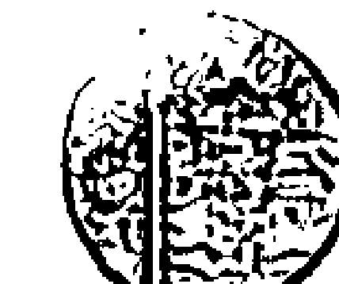

# 靈魂 DNA

## 蓮花

哈囉，我的朋友們。我是水晶頭骨。今天坐在我身邊的是阿肯納頓的水晶頭骨，這是贈送給雷的禮物。我總是請他在通靈時要帶上我。如果你想知道擁有更高意識的秘密，其實很簡單：觀察愛西尼人的某些飲食習慣。他們如何能成就更高意識呢？他們活在很艱困的狀況和環境下。透過持續修行，他們能夠發展出更高頻的振動。耶穌大師和許多其他的光之存在都與愛西尼人學習。

> [ 大天使麥達昶：愛西尼人吃無花果、椰棗、芥菜子以及橄欖。橄欖會製造強化生命的能量。你覺得橄欖葉為什麼被用來當成紀念品，戴在奧林匹克獲勝者的頭上？它是一種高頻振動的植物，來自其他地方。愛西尼人的飲食包括這些食物以及少許的肉類，尤其是像鴿子之類的小型鳥類。如果你想減去很多體重，可以試試以棗子和無花果為基礎的飲食。這是非常好的減肥菜單。]

愛西尼人能夠了解食物對提升他們振動的重要。他們的某些長老將這個技巧磨練到完美。他們的飲食幫助他們淨化潛意識和心靈。

我也要傳授你們另一個秘訣，這個秘訣你們或許從未想過：蓮花。蓮花是非常特別有意思的花。它擁有非常高的振動和意識。蓮花出淤泥而不染，總是朝向光明。它是佛教的象徵：你可以置身於骯髒的世界之中，但同時你的意識仍能保持高頻狀態。

## Chapter 8 運用星球上新的意識

蓮花的根部，亦即蓮藕，也相當特別。好好研究。這種花真的能教導我們某些事物。它提供自身全部，包含其身體，來提升你的意識。當你看見蓮花，它會喚醒記憶和內在美好的感覺。它會引發你內在的美與神性。神就是美。

## 新孩子：抹大拉和太陽

我要透露一個關於蓮花小孩（Children of the Lotus）的秘密。這些是即將來臨的新孩子。我還要再透露一個秘密：抹大拉小孩（Children of the Magdalene）也即將誕生。閉上眼睛。你能否感覺能量、感覺我剛說的話中的真理？抹大拉小孩即將來臨，蓮花小孩即將來臨。大約在明年年底，這些孩子就會開始在中國誕生，也會在日本和以色列誕生。

他們人數不多，但他們將是非常特別的孩子。他們從小就知道自己的角色。這些孩子會帶著更高的振動，帶著三位女神的振動。所以注意尋找抹大拉孩子。許多人不能理解這點。太陽小孩（Children of the Sun）也即將誕生。

請記得，你們正在做的是為所有這些新的孩子鋪路。在耶穌弟兄誕生前，他的祖母以及他的支持系統努力了幾百年，做好準備讓大師誕生。沒有那樣的支持系統，耶穌將無法完成自己的使命。同樣的，你也在為這些新的孩子——太陽小孩、蓮花小孩、以及抹大拉小孩——創造支持系統，讓他們能在地球誕生。

我正在給你們非常先進、從未揭露過的資訊。我們之所以

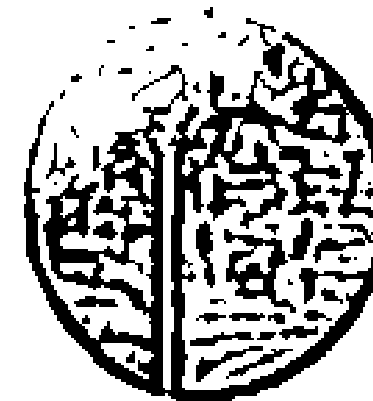

## 灵魂DNA

传达这个讯息给你们〔提问者〕是因为我们觉得你们正在进行的事有个非常重要的目的，所以我们想道谢。这就是我们的能量交换，这个提供给你们的资讯。

### 我们已经可以联系这些孩子中的某一些吗？

〔大天使麦达昶：要进行联系，你们必须先准备好自己。不然，你们无法辨认出他们。准备方式为：你们必须透过意图的力量来呼唤他们，运用思想形式和心中的爱。当孩子出现，你们通常不会知道他们是谁，除非你们保持开放。除非你们的意图是纯正的——是为了最高的善——不然他们不会揭露自己。他们需要保护自己，因为黑暗会试着要除去他们：他们携带着高频振动能量。所以这些孩子有许多都正接受保护。

### 所以我们其实有四种不同的新的孩子：莲花小孩、太阳小孩、黄金小孩、以及抹大拉小孩。是这样的吗？

的确。不过每一种都带着不同的特定振动，针对特定的目的。

### 您能否细说他们的目的？

我们会说，其中一种是为了大地疗愈，一种是为了疗愈所有地球和世界的内在小孩，一个是要促进成人和孩子之间的相互理解，一个是要开启想像、创造孩子般的想像力、并且鼓励心胸开放。世界透过他们将会有更多发现。〕

## Chapter 8 運用星球上新的意識

## 我們該如何使用蓮藕呢？

如果你能找到完整且正在生長的莲花株，詢問它是否同意，願意分享它的根部，因為這等於分享它的生命。

> 大天使麥達昶：請求同意，而且你可以請蓮花與你分享它的智慧和愛。用你的心和蓮花溝通。記得，你是萬物的一部分：一切都是你的一部分，你們也全都彼此支持。

在古代，蓮藕會在橄欖油中浸個幾天。蓮藕可以當成調味料，就像使用醃製菜一樣。蓮藕也可以浸在玫瑰或檀香木油中，放在身體不同部位當成療癒油膏來拔除能量。這有點像OK繃。當你撕下OK繃時，傷口上的髒污灰塵也跟著起來。

## 不過這是在能量層面進行吧。

是的，它是在能量層面進行。

## 我們該使用什麼油？

橄欖油。愛西尼人有許多秘密，因為他們是煉金術大師。他們轉變了自己的身體。

我們請你們與這些孩子合作。這些孩子全都是星子。抹大拉小孩、太陽小孩、蓮花小孩都是星子，他們全都是高度進化的大師，能夠施行奇蹟。再過五、六十年，人們不太會再重視奇蹟，因為奇蹟將成為不能說普通而是自然發生的事件。奇蹟會成為自然現象。人們會運用直覺並跨越時間來生活。

例如，當你請求神的支持，同時你設定意圖要和造物主共同創造，那會發生什麼事？你會遵循共時性，那麼偶然的發現便會來臨。這是靈性溝通並指引你的方式。這會成為未來的常態——人們設定意圖要與靈共同創造，之後便活在共時性之中。你會知道該怎麼做，什麼時候該做。 感謝你們提供珍貴的時間和能量參與此一計畫。我們祝你們安好。我們將永遠在此服務人類。

## Chapter 8 運用星球上新的意識

# Chapter 9 活化你的基因之光密码

2013年7月25日
圣哲曼、大天使麦达昶、萨南达、神圣母亲阿玛、亚伯拉罕和撒拉、托特大师、以及毕达哥拉斯

我是圣哲曼。在这一章，我们将探讨如何敢于作梦来显化新的实相——教导其他人活化他们基因之光密码。

你知道阿卡莎档案记录了你曾经有过的每一个生命经验，不过阿卡莎档案其实远不仅于此。它们也记录了你的起源——你从何而来。你的 DNA 来自昴宿星人。我们要请你们开始活化自己的基因之光密码。

> [ 大天使麦达昶：这是通过意图来完成。呼唤它来到。这称为赋予能量的生活（empowered living）。现在开始修练自己的时机已经来到。这称为重構物质身体（rewiring the physical body）。重構并非由灵进行，而是由你。重構是通过请求并设定意图来完成。

这很重要。人类正在重構。你们正在自行重構。这是你们自然进化过程的一部分。你们正进化到这一阶段，让你能开始重新连接十二束 DNA 甚至活化某些更高脉轮，这是你从未想过自己拥有的。你们需要修练自己，请求这些密码能够活化。

最近你们获得了地球的力量密码，就刊登在五月号的圣多那灵性期刊（参见附录三）。有越来越多的密码正在浮现。你们必须活化这些密码——麦达昶密码、天使密码、大角星人密码

## Chapter 9 活化你的基因之光密碼

碼等等。你們也必須活化自己內在的基因密碼。你們會發現什麼？就是你們來自「本源」。那就是你們的密碼，亦即主要的基因密碼。你就是亞當。你帶有亞當密碼。你有工作要做，就像其他所有人一樣。]

這是個難能可貴的機會：能回歸並記起自己真正的天性，因為只在一瞬間，你便能回歸並經驗你的自然自我。〔大天使麥達昶：這是透過意圖、存在、經驗來完成。在那一刻，當你記得並且能夠保持在可以存在和經驗的狀態，你自然就會進入不同的時間循環。你不再是片刻前的你。你正在經驗。透過經驗，你正變成你自己的存在。存在狀態此刻正在發生。所以你不是之前的你。這是新的實相。

生命的目的就只是如此：能時時處在一個存在狀態之處。這需要一點時間。這需要一些練習。不過每個人都正在進入這樣的狀態，好讓他們能安住於此，並且在肉身之中明白這是一種經驗。]

你的自然自我就是你的原初自我，這個原初自我記錄在你的 DNA 和你的阿卡莎檔案中。你可以回到你的起源並且取用它。當你回到自己的自然自我，你會自動地藉由提升自己的意識來活化 DNA。你的 DNA 會命令你的基因活化。

你也可以同樣方式來活化大地母親身體內的光之密碼。〔大天使麥達昶：這是透過存在及形塑意圖來完成。等到這個活化完成，大地母親就會獲得巨大的幫助。由於大地母親是你身體的一部分，因此這自然也會影響你。〕這些密碼和你個人的光之密碼是相容的。地球上所有生物內在都有個光之密碼；

對大地母親而言，你也是她的生物之一。

你的昂宿星人 DNA 內有光之密碼、大地母親的光之密碼、還有你的星辰傳承的光之密碼，後者是你雙生的更高自我開始活出其存在的地方。你也擁有你出生國家的光之密碼。

你們全都知道父／母造物主能量越來越常來到地球。你會看到更多概念以及通靈材料出現，說明由這種能量的意識來工作是多麼重要。〔大天使麥達昶：有許多例子說明世上的人類逐漸開始合作、世界變得越來越小、以及越來越多的橋樑被建造起來。你在社群網站都看得到。〕

> > 大天使麥達昶：有許多例子說明世上的人類逐漸開始合作、世界變得越來越小、以及越來越多的橋樑被建造起來。你在社群網站都看得到。

你也許會說，美國和中國對立，或是中國和日本對立。在政治層面也許確實如此，不過年輕人對此確有非常不同的看法。讓這些年輕人長大並身居高位，例如在醫學界、保險業、藝術界或銀行業中。他們會改變體制。他們會投身經濟學，會從事教學工作，會改變一切，而你在有生之年就會看見。〕

我們請你不要說造物主是父親，而是父／母造物主。偉大的耶穌弟兄和抹大拉的瑪利亞將這兩個能量結合為統一的基督能量。他們的意識結合並以基督密碼封印這顆星球。你可以請求並取用這個基督密碼，你將會與這個統一意識相當高頻的能量連結。

如果你身在耶路撒冷，你可以請求亞伯拉罕和撒拉的光之密碼啟動活化。它們安住於耶路撒冷城中。這個密碼會於你的內在同時活化。這些存在，包括亞伯拉罕、撒拉、耶穌弟兄、抹大拉的瑪利亞，在錨定這些光之密碼的同時還創造了一個群組。

# Chapter 9 活化你的基因之光密码

如果你〔莫迪凱〕曾經好奇自己為何是耶路撒冷群組的一部分，這是因為光之密碼呼喚你或與你說話。這是因為你的內心深處知道你是這個基督／抹大拉群組的一部分。我們是來活化這些光之群組的能量。這是透過呼喚能量，但最重要的，你必須呼喚光之密碼。這是非常重要的工作。你也可以練習活化自己真正原初自我以及你的昴宿星人 DNA 的光之密碼。你必須回溯並且與亞伯拉罕和撒拉工作。你很特別，擁有許多光明。

以下是另一件你能做的事：我們要求下次你前往你敬拜的場所——任何你覺得舒服的地方——那時要請求生命之花的光之密碼能夠活化。接著將這個能量傳送到你敬拜的地方，散播到整個國家，並且傳送到全世界。生命之花有自己秘密的基因密碼。你是它眾多密碼信使的其中一位。你在那裡還有工作要做。你有能量讓它開花結果並且教導其他人。

## 脫離烈士意識

學習有三個階段。第一階段稱為「釘刑」（crucifixion）。全世界許多人此刻正經歷釘刑的痛苦。生命是他們不了解的奧秘。他們會走過釘刑階段，接下來便是復活（resurrection）。等到走過復活階段，他們就會進入揚昇的自由。教導他們該如何進入復活階段，並進而在復活階段示範該如何進入揚昇階段。我們請你進行這個非常重要的工作。這非常關鍵。

你也必須請求要脫離烈士意識（martyr consciousness）的

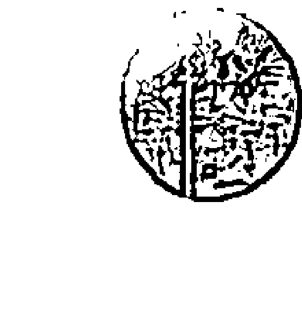

# 靈魂 DNA

能量，因為幾乎所有人類都帶著這樣的意識。人不再需要苦難才能觸及神。這樣的意識正在某些很深的層次影響我們每個人。你此刻就可以脫離這樣的意識，只要你設定意圖。不要再有烈士意識。

> [ 大天使麥達昶：以下是一些相關例子：我們的背上都背負著生命重擔所構成的十字架。某些人完全繃綁於生活之中。他們不認為生命是每天經驗著充滿喜悅的創造。他們認為生命是重擔。現在該要打破這樣的意識體。

歷史給我們許多例子，說服我們人需要成為烈士才能獲得啟發。佛陀必須放棄一切才能得道。過去許多大師需要放棄一切、活在與世隔絕的地方，才能找到神。在那個時候，這個模式是有效的。

我們全體都有這樣的感覺，覺得我們必須承受釘刑才能找到神，包括你們的前任教宗（若望・保祿二世），他現在已經封聖了。他常常責打自己。他經常對自己施加苦痛。為什麼？為了贖他身為人類的罪嗎？你們向來就是這樣被教導的。這是一種人們所背負的集體十字架。將它釋放吧。

設定這樣的意圖：要透過喜悅而非痛苦來與造物主連結。切斷烈士意識的束縛，不再以為你只能夠透過苦難、透過放棄一切來成就神。印度和西藏的傳統相信身體是可怕的，因此要放棄性生活。我們說要禮讚性生活。某些基督徒也是這樣。這沒道理。如果身體是這麼糟糕，為什麼造物主要創造如此華美的事物呢？為什麼神要給你一個身體來享受、來玩耍呢？享受性的歡愉，不過讓它出於內心，而非出於淫慾、貪婪或操控## Chapter 9 活化你的基因之光密碼

與這個光之密碼連結，並且陳述：「我脫離痛苦和苦難而發現神。」請求能讓世界脫離烈士意識的能量。

在他前往山頂的路途上，亞伯拉罕內心相當痛苦。他不願看著自己的兒子。他的兒子問：「父親，為什麼你一直走在我前面呢？」他不願將自己的悲痛和兒子同享。他在哭泣。在內心深處，他知道慈愛的神不會允許他的兒子被殺，不過他那人類的心仍然帶有烈士意識。

> > ［大天使麥達昶：聖經中並未明確提到這一點。聖經不全然準確或完整。它寫成的時間遠遠晚於書中文字所記錄的事件，而且也受到許多扭曲和改變。我們給你的是確實發生的事實。］

這只是一個故事，不過如果你看看歷史書籍、印度書籍、或是佛教經典，你會發現烈士意識總是存在。

我們要求你要自己打破這個束縛。那麼你便能為你的人民打破以色列的束縛。當然你已經身在前線。我們要你將這點教給人民。你也許會說：「我是個老師。」什麼的老師？「教導造物主的老師。」不要感到羞愧。

### 找到你的道路和你的真理

我是聖哲曼，還有麥達昶和薩南達。每個人都有個別經驗。遵循自己的模式、自己的系統。通往神的道路是個人的路。神尊重每個人的道路。遵循自己的道路並安心前進。你也許會說：「這是我走的路。這是我的路，你必須走自己的路。」

# 靈魂 DNA

你可以問我是怎麼辦到的，不過你必須走出自己的路。」

閱讀一本書時，它如何觸及你的心？你是否感覺擴展？你是否感覺到愛？如果有，那麼就去用它。不然就將它放到一邊，繼續走自己的路。

教導別人現在時候到了。你會從他人身上學習，不過你必須走自己的路，以自己的方式發現神——透過力量賦予（empowerment）。如果你跟隨別人，那麼在某些層次上你就交出了自己的力量。

你接收到指引，不過你要自己用功並找到自己的內在真理。理想的書籍或通靈應該是讓每位讀者回到自己的真理。運用這一點，看看這是否支持你。

### 挣脫區分的定義

人有多少定義？例如：日和夜、高和矮、四個方向等。如果你能掙脫對所見之物所形成的束縛，你會立即轉變。你將提升自己的意識。你也許會說：「這是山。這是河。這是火。這是大地。」成為山；成為火。在 DNA 活化意識的最高力量中，一切均為一體。你不會說：「這是我的手，那些是我的眼睛。」只有集體的「我們」。

如果你能去除這種區分，你將立即看見意識提升。當然，在這個以如此線性方式建造的世界裡，你還是會在這些差異構成的界限內工作。不過必須從旁觀者的角度來看，不要身陷其中。如果你說有生命也有死亡，那麼當然你會看見死亡。不過如果你看到的是生命與其延續，那麼你的觀點將立即改變。當你能如此保持，你將發現自己意識的提升。我們要求你每天都要努力去除這種區分感。

這裡有些家庭作業要給你。耶路撒冷是個高度靈性的地方。我們希望看到耶路撒冷不是個分離的、高度靈性的門戶，而是大地母親的一部分。耶路撒冷和大地母親是一體的。想像一個大圓，耶路撒冷在圓心，觀想能量穿過圓心到四面八方。

> 如果某人問你從何處來，你該不該說：「我來自麻塞諸塞州（或是任何你居住的地方）？」不。你該說：「我來自地球。我是地球公民。」例如，你可以說：「我並不是來自耶路撒冷。我是地球公民，目前活在麻塞諸塞州。」

### 一個梵咒

我們希望給你一個重要的梵咒讓你試試。這是「嗡哈吽」（Om ha hum）。

### 這是什麼意思？

這代表與意識結合的力量。現在我們有個非常特別的訪客，今天她希望傳達一個非常特別的訊息。

### 活化以及脫離密碼

我是阿瑪（Amma），眾多神聖之母中的神聖之母。我們要談密碼。你們知道你們全都有密碼嗎？你父親的密碼和你母親的密碼仍影響著你，還有你家族的密碼。我們請你釋放這些密碼，不過這不是因為你的家庭對你不重要，或是你的雙親對你不重要。這些密碼直接影響你的實相和你的思維。

在成長過程中，你習得了深刻的信念，它們儲存在你身體和骨骼的細胞內。這些密碼中有許多都是在你童年時形成，而且仍然影響著你，儘管當時你的意識相當不同。這些密碼不再能幫助你。你可以這麼說：

> 「今天我要意圖去除並脫離我父母親傳承下的密碼。我尊重它們，祝福他們所給予的生命，不過現在我將為自己創造新的密碼，藉由大地母親和天空之父的協助。」

你們之中某些人有家庭，有小孩。你們要傳下什麼密碼給他們？你為自己未來的生活設定什麼密碼？你們現在所做的一切也是為你們的未來設定密碼。你們可以捫心自問：

> 「我正為自己未來設定什麼樣的密碼？」

你可以問：

> 「我正為自己準備什麼樣的時間膠囊，好在另一世生命開啟並接受。」

你為當下創造一個密碼。回到你創造這個密碼的那個時間。你放了某件東西在時間膠囊內，針對你目前所處的時代。你為此世準備了一個時間膠囊。一切都在你的阿卡莎檔案內。一切全都在你內在。

2013 年是個非常關鍵的時刻。〔大天使麥達昶：二零一三是地球新紀元和新意識的第一年。在轉變之後，新的時間軸正被書寫。〕你有能力來完全重新定義並重新創造自己，因為在接下來四年——2013 到 2016——你所成就的將會成為此一生命模版。有許多工作得完成。你可以運用某些技巧來活化這個新的能量。詢問你的指導靈該怎麼做，因為在你居住的地方有些時間膠囊是你可以靜心時透過意圖來加以活化。它們將協助你將新的意識安住於你的美麗大地。呼喚你土地上某些偉大前輩所設下的密碼、藍圖、以及全像銘印 (holographic imprint)。他們對這塊土地有願景。請求這些密碼在此時活化。你辦得到。

某些土地，例如以色列，其人民有意識地選擇一再地出生於那塊土地上，因為這塊土地是無比神聖的，而且他們回歸以療癒土地。呼喚你的國家的先人們所設下的密碼。你可以為所有土地這麼做。這也是為什麼你會出生在你所定居的國家。

你是否曾經好奇為什麼以色列的人民稱為「上帝揀選的人民」？他們被揀選來攜帶著如此重擔，要將和平帶給世界。我們要你活化這些密碼。這一切都和 DNA 緊密相連——不僅是你的 DNA，而且當你活化這些密碼，它也會活化其他人的 DNA。

### DNA家庭作業

我們是麥達昶和薩南達。現在我要給你們另外一些家庭作業，是 DNA 工作的一部分。

每座城市、每個國家都有自己在第五次元的相應層面。你也有自己的第五次元光體，因此你可以將它呼喚出來。想像一個美麗的光體。你正拉著這個光體，將它拉進你的更高意識，並且將它安住於你的內在。這和你們進行的團體靜心一樣。你可以汲取更高頻的振動、光之密碼、或者耶路撒冷城的光體。你能做的是以鏡子反射，或將之傳送給艾斯卡利亞之鏡（Escalia mirror），設定意圖要將之放大並且將它鋪在耶路撒冷城之上。耶路撒冷發生了什麼都會影響整個世界。如果耶路撒冷平靜與和諧，整個世界就會平靜與和諧。動身去工作吧。我們討論的是大地母親的DNA。

### DNA的量子層面

我是大天使麥達昶。

當您說「集體 DNA」時，我們用的詞彙是「量子 DNA。」當我們在量子內工作，重點不是看到個人的 DNA。目標是要讓運用量子 DNA 的人群達到關鍵規模。這才是事情會發生的時機。

正是如此，而且當事情如此發生，對方會自動成長。

換句話說，你只需要讓以人類尊嚴對待其他人類的實踐者達到關鍵規模？

這會發生。你們都在創造這一點。現在我們將給你另一個謎語：你們有指導靈，而且你的指導靈會與你合作。你們有許多指導靈。有些來來去去，有些總是陪伴著你。你也擁有時間膠囊，它會與指導靈共同建構密碼。這些指導靈中有些一直在這個星球上陪伴著你一世又一世，有些則否。你要請求你內在的時間膠囊密碼和你的指導靈完全活化。母親密碼藏在哪裡？某些重要的密碼藏在你雙手的掌紋裡。其他則是在你的腳底。還有些密碼藏在膝蓋後方，在肩膀上，以及在脖子後方。還有一些別的，不過你已了解我想說的。我們請人類不要懈怠。你可以說「可是我已經很努力了，」而事情總會變得更難。最後的考試即將來臨。三年的努力工作將會奠定基礎和支柱，你的揚昇能量將會以此為基礎完全安住，而且你將以大師的身份在這個星球行走，只要這是你的選擇。

### 以關鍵規模建構和平

某些人相信你可以在人的腦中擁有真正的和平。不過，人只能在七個層次擁有真正的和平：身體的和平、直系家庭的和平、與四周環境的和平、與其他人的和平、個人文化中的和平、國家中的和平、以及地球上的和平。和平是一張王牌。當你在七個層次都擁有和平，那麼你才是真正的和平。你是建構關鍵規模的必要元素之一。一個人可以影響超過22,000人。你可以修練自己、為自己的療癒努力、用功清理自己。你看到一個人的力量。一個有效的靈魂可以影響兩萬兩千個人。親愛的朋友，這是個龐大的數字。所以我們要請你堅持並從那個層次努力。

我們要你進一步投射自己，當你身在一個非常正向的地方，當你感覺擴展並且接收到完全的愛時。現在該進入下一階段的工作，要投射你的能量。你可以稱之為分身。想像你意圖要投射出兩萬兩千個「你」手持燭光環繞於聖城，或者環繞於任何你想去的地方——美國或世界各地——並且讓光明安住。現在你該開始進行這個練習，並加入生物相對性（biorelativity）：能量製造以及分身技巧。親愛的各位，你們必須這麼做。你們辦得到。我們做得到。

這是你療癒人們的方式。只需在靜心中想像並設定意圖。你必須在自己完全充滿愛時這麼做，接著設定意圖要將自己投射到兩萬兩千個部分。這種投射稱為分身或生物能量。你會前往你想去的所有地方並且傳播能量。

你也可以在聖地耶路撒冷做同樣的事。想像有一千個你掌握著能量，就在人們在週五前往圓頂清真寺（Dome of the Rock）朝拜時。那是個非常狂暴的地方。將你自己投射為一千個你，為人們護持著光，好讓他們包覆在你的心的良善能量之內。他們不知道這點，不過你能包裹著他們。

### **所以我們要讓光透過我們來工作嗎？**

正是，你投射光明穿過他們，並影響土地。他們不會知道什麼撞擊到自己。他們會說：「我覺得很好」或「我感覺到愛」，而且當人們感覺到愛與放鬆，他們就更容易寬恕他人。

我們和這兩萬兩千人的關係為何？他們是我們靈魂群組的一部分，或者他們是共同存在的生命時間？

不，不是這樣。一個人之所以能影響兩萬兩千人，是因為那是你內在掌握的光明所具備的力量。

這些不是固定的一群人。這兩萬兩千人可能隨著時間改變？

他們會改變，不過你的光是如此充滿力量，人們會感覺到的。為什麼數千個人前來朝見佛陀、耶穌、或是達賴喇嘛？

> > [大天使麥達昶：舉個例子，有位大師走過一個村莊，那個村莊的每個人事物都非常可能會被他的光明碰觸到，包括蔬菜、植栽、動物等一切事物。你認為人們為何前來朝見佛陀？他能碰觸將近五公里範圍內的人。他的氣場就是如此強大。每個走進他方圓五公里範圍內的人都會感覺到和平與愛。許多人走了幾天好走入他的空間並感覺他的愛。即使現在，當你靠近真正的大師，你會感覺提升。他們的能量能移動得這麼遠。這就是光之工作者的力量：能觸及許多人。]

### 預先派遣使者

你和達賴喇嘛之間有什麼差異？他改變了自己，好讓他能護持並投射這樣的光明。你知道他怎麼做嗎？我告訴你一個秘密：在他前往任何國家並面對大量觀眾時，他會傳送自己的能量身給所有這些人。當他們和他處在同一空間時，他們已經擁有了他所傳送的愛，因此他們感覺很好。他們不知道自己為何想見他，但是他已經預先派遣了自己的使者。你也可以這麼做。下一次你想進行這類重要的靈性療癒工作，在三到四天前預先派遣你的能量使者。

讓我舉個例子。你可以說：「我派遣我內在的靈去和所有將會去圓頂清真寺的人的靈溝通。我的心散發著兄弟之愛，我將使他們平靜。」或許你幾天後將參與某個會議探討某些高度爭議性的議題。你可以對所有參與者的靈說話，呼喚他們的名字，好讓你們開會時彼此之間會有完全的和諧、愛、喜悅與和平。你們彼此或許意見不同，不過不會有正面衝突。

例如，假設你在執業過程中需要面對案主，而有個案主很難以理喻，那麼你可以告訴你內在的靈去和這位案主的靈相會。這樣當你們見面，彼此間會有和諧、愛、喜悅與和平。這樣的做法也可以提升到下個層次。你們可以集體請求要提升一大群人，因為你們的內在有光明。

不要有預設立場。以光明擁抱他們，這樣他們將感受到來自你的愛。他們會感覺你靈魂的慈悲，因此他們會在不知為何的情況下喜歡自己。在那種愛的感覺中，他們會知道愛才是最大的因素。愛會改變環境，改變一切。為他們護持著光。這是此生其中一個最動人之處。正因如此，你會活在這個美麗且無比神聖的土地。你向自己承諾你和其他人將要轉變這塊土地。你將看見轉變。

> > 〔大天使麥達昶：大師能夠點亮。不過，只要在學生準備好的時候，大師才會這麼做。大師有能力喚醒人內在的光，即使雙方距離很遠。例如，在印度，許多大師只要碰觸人的前額就能直接活化第三眼。你甚至可能在 Youtube 上看過這樣的影片。這必須非常小心的進行。如果對象在情緒上並未做好準備，那麼這可能會造成不舒服或不穩定。這是一個人的力量，因為大師的碰觸可以喚醒不可思議的力量，甚至可以遠距進行。你在活化 DNA 時所做的就是這樣。未來你（雷和羅伯）可以集體地活化許多人，一次數百人。〕

現在我們有一位非常神聖、非常特別的訪客，今天他會首次透過雷來給予非常簡短的談話。

### 與造物主合一

我們是亞伯拉罕和撒拉結合起來的意識。你們許多人都知道巨岩〔指耶路撒冷聖殿山上的圓頂清真寺〕是個聖地。你們之中某些人知道銀河密碼——中央太陽——的能量進入風暴，進入波動型態，並且傳送到其他地方。你們可以試著由你們的心傳送光進入巨岩，心中意圖要讓巨岩的能量前往你們希望療癒的地方。由心（由你那屬神的部份）傳送光到巨岩，並且請求巨岩傳送出能量，以圓周式的波環繞你那美麗的城市、環繞你的美麗世界。

這些其他的事我們現在就對你說：你必須不再分離你自己。你與造物主乃是合一不二的。你正在建造小宇宙波動。你必須在其中扮演自己的角色。從此開始，這是我們給你的禮物。將你的能量以最深的愛連結到巨岩、連結到所有弟兄、伊斯蘭教的兄弟、猶太教的兄弟、基督教的兄弟、印度教的兄弟——所有人——和所有姊妹。

從此開始，在你每日的祈禱中，我們請你每天用幾分鐘時間專注於巨岩並將能量導入其中。創造一個緩衝區。創造覺知的能量，將能量傳送到各地。請求巨岩護持能量、活化能量並且再次傳送出去。自動地，能量將會反彈給所有將會接收到它的人：在非洲、蘇丹、奈及利亞、衣索比亞（此處有許多饑荒）的龐大土地上，還有其他類似的地方。

從今以後，你必須行動並且相信你與神乃是共同創造者。你在心智層面知道「我即是我」。你必須相信這點並且據此行動；透過你的共同創造，你也可成就同樣的事：你可以帶來療癒。我們請你更全面地踏入這樣的靈性推廣活動。透過你的共同創造，事物將會改變。

> 〔大天使麥達昶：許多光之存在試圖和真實世界發生的一切保持距離。他們視自己為靈性的光之戰士，所以他們專注於光。如果每個人都退縮並且放任世界維持原狀，那麼社會將不會改變。如果你由世界抽離，那麼你只利益自己，因此你基本上毫無益處。隨著新意識到來，你要留在世界並且在日常生活工作，而透過你的工作，你將啟發並改變其他人。這才是靈性的行動實踐。
我們鼓勵你不要創建社群。首先，它們無法自給自足。在古代，社群可以自給自足，不過在新的能量中卻不行。新的能量要求要留在世界。水瓶紀元（Aquarian Age）的做法是留在世界，成為世界的一部分，並且透過你的行動和生命來創造改變。〕

放下恐懼、罪惡感、羞愧感以及所有壓抑。我們是亞伯拉罕和撒拉的集合能量。

### 給予方能領受

我是大天使麥達昶。請務必記得，我們今日討論的一切都是為了在地球上以及在你自己內在提升意識層次。當你進行這個工作，你會提升自己的意識，進而準備好舞台讓 DNA 能夠活化。

生命的秘密就是，無論你要什麼，你必須先給予他人。如果你要有更多光明，請將更多光明帶給其他人。如果你想讓生命中有更多喜悅，請將更多喜悅帶給他人。如果你想讓自己更有智慧，請先將智慧帶給他人。你所給出的就是你所領受的，所以你給予的對象其實是你自己。

換句話說，想怎麼收穫就怎麼栽。

我不喜歡使用「收穫」這個詞；收穫意指報酬。給予是沒有報酬的。你這麼做是因為你愛自己。

### 光之密碼以及運用金字塔顯化來消除業報

我是托特大師。你們全都在列木里亞（Lemuria）、在穆、在羅摩（Rama）、以及在亞特蘭提斯的時代度過許多世生命。你們在亞特蘭提斯度過許多世生命。我會說當前這個世界的人口中有一部分都曾在亞特蘭提斯生活。你們之中有些是祭司。在那些時代，曾經是祭司的你們所擁有的光之密碼，今日你們可以請求取回。

我們還希望和你們談談頻率。頻率是關於生命本身。許多時候，你們想知道那一世生命此刻正影響著你們。你無法確認是哪一世生命正影響著你。這可能結合了最多達三百世的生命。你也許會說：「今天我要設定意圖，消除此刻影響著我而且並非出於最高的善的生命。」當你確立這個意圖，你便給予自己許可，能夠清除自己的業力契約。這是給新近覺醒之靈魂的禮物。這可以透過意圖來使契約失效。

我們正在教給你的是古老神秘學院的教導之一。如果你想創造出什麼，例如自己國家內的和平或重大改變，請先想像自己坐在大金字塔裡。將你想創造的事物投射為全息影像（hologram）。將它帶到金字塔頂的合頂石（capstone），接著將它投射到全世界。大金字塔是強大的放大和實相中心。投射出的全息影像將會傳送出去，自動安置於地球以開啟顯化過程。這是顯化新實相的技巧之一。

耶穌大師曾前往埃及，並且演示他日後在十字架上會經歷的戲劇——亦即這個經歷的重要性與相關課題。他透過大金字塔的空間以全息影像來將這些投射到地面，讓大地母親創造那樣的實相。同樣的，如果你想要和平來到聖地或其他人的生命——或者你想要任何其他事物——你可以透過全息影像室，幫助於金字塔的合頂石來工作。這是古埃及神秘學院揚升學生使用的技巧之一。

學生們經常被帶往大金字塔，好將自己投射為揚昇大師。他們被要求要投射自己坐在金字塔的合頂石上，接著以全像方式創造一個圖像，那是他們希望成為的樣貌，無論是揚昇大師或是通過某種等級的啟蒙。他們會將它埋在大地裡。金字塔是發源地，一個巨大的生產能量的機器。

儘管大金字塔已經失去大半的能力，但是它已經獲得復興。正因如此，埃及產生許多動亂。這個能量可以用於為你的世界創造新的實相。你已經完成許多等級的啟蒙，你也有能力以全像方式創造這一點，並且使之開花結果。我是托特大師。

### 再論食物

我是畢達哥拉斯。上一次的談話，我們討論了食物——讓我的學生保持健康並處在高頻波動狀態的食物。我們討論了能支持你提升自己振動的不同類型食物。愛西尼人也實踐這一點。他們的主要考量是如何在全部七個層面保持純淨心靈的振動及純淨的靈視、以及如何影響潛意識心靈來將它重新編碼以創造新的實相。

上次我提到幾種食物：橄欖葉、無花果、芥菜子、以及蓮花果實。我想再提供更多資訊。大蒜有很強大的能力。它是唯一具有六味的食物：從辣到甜〔中間者為酸、鹹、澀、苦〕。這是最健康的東西。大蒜是神的禮物，是神的食物。

> > [ 大天使麥達昶：六味歸屬於味覺，因為你的舌頭直接連結到你的其他感覺：觸覺的滋味，因為當你碰觸，你會感覺身]## 靈魂 DNA

身體的反應或是一種能量流經過你的感受，一種存在的感受，還有生命的滋味，讓你能夠跳舞，完整品嚐生命。換句話說，你可以說：「百分之百的活在當下。」這是時時刻刻完整品嚐生命。或許另一種說法是「完整的經驗」。

大蒜是超級食物，不過也有許多根莖類能支持意識的覺醒——某些蔬菜的根部、某些樹木的根部、某些草的根部。許多生長在地面以下的植物都能支持意識提升。每個人都可以去找出什麼對自己最有用。根莖類吸收了大地的能量，因為它們生長於地面之下。

烹調食物時，我們請你做個實驗。烹調食物，不過別立刻吃掉。放個十五到三十分鐘。在烹飪時對著食物播放聲音或歌唱，對你剛完成的菜餚播放音樂同時等待用餐。可以吟唱：「Yod Hey Shin Vuv Hey」或其它你習慣的音調。你也可以播放動聽的、沒有歌詞的節奏音樂，或是溫和的古典音樂。你的食物將會接收到你向它傳送的振動。

你們吃的大多數食物都已經失去了它們的本質，這是因為它們種植、處理或運送的方式造成。前述的做法會讓食物分子儘可能回到原始型態，最高可達百分之六十。你的食物會更有能量。在我們的神秘學院，我們就是這麼做的。

我們也會以黃金來賦予能量。我們會將金塊放在食物旁邊，並且以陶鍋來烹調，因為陶土帶著大地母親的振動。在用餐前，我們會對食物靜心，對食物唱歌。食物會直接與你的細胞互動。這是我們長壽並維持高頻振動的秘訣之一。這會提升你的食物的振動到達你的等級。

我們食用的食物遠比你們現在的更為純淨。你們的食物受到化學物質以及許多類的振動所污染。人的思緒會影響植物。

我是畢達哥拉斯。

## Chapter 9 活化你的基因之光密碼

2013年7月29日 主墨基瑟德·耶穌·大天使加百列

我是主墨基瑟德。我們要你們所有人檢視自己的星辰遺產，因為從中你們會有許多收穫。這不僅關係著你們的DNA，因為你們也知道，你們的DNA是來自昴宿星人。如果你們與星辰連結，你們將會連結到自己完整的傳承，連結到自己古老的部分。你能否想像自己活了五十萬年？這是我們要你們做的事。彼處充滿了智慧。

我們要你回到古老的時代，能多遠就回溯多遠。不要侷限於兩千、五千或一萬年。回到你核心的初始自我。你有能力做得到。一旦發生，真的會放鞭炮慶祝。你將不僅會活化12或22層次的DNA，更會以144層次的大師身分來工作。所以我們請你開啟這個領域，為自己經營更大的夢想。你有能力、也有機會取用這古老的傳承。

你們能合作的大師之一就是銀河大師麥喬爾，他能夠支持你。

- 【大天使麥達昶：你們能修練的層次相當多。地球為行星層次。接著還有太陽層次。太陽層次的大師們為海力歐斯（Helios）與維斯達（Vesta）。下一層次稱為銀河層次。銀河層次的大師為麥喬爾。接著還有宇宙層次，其大師為主墨基瑟德。另外還有多宇宙層次，此一層次的大師為大天使麥達昶。】

然後還有泛宇宙層次，而此層次的大師為瑪哈特馬（Mahatma）。接著還有中央太陽層次。所以有許許多多層次。

你必須開啟並將這些層次全部結合，藉此更完整地認識自己。太陽存在——海力歐斯和維斯達——會支持人類，尤其是幫助人類認識自己與自然之靈、魔法和煉金術的連結，因為正是透過與自然之靈合作，你們才能創造出煉金術和魔法。從事魔法時，自然必須改變。正是這些存在支持著這一點。所以呼喚它們並與它們合作。

讓我舉聖哲曼的例子；他是支持著人類的友善大師之一。如果你追溯聖哲曼的淵源，便知他曾是主摩爾達（Lord Morda），很久以後更轉世為偉大的煉金術士梅林（Lord Merlin）。

在這古老的過去中，你是誰？我們要你回溯過去，不要止於列木里亞，更要一路回溯到星辰。你有能力回去並連結這個能量，因為這真的是神奇的創造能量。

## 我們如何連結到這個記錄我們在不同星球所度過的前世的資料庫？

你可以在自己的寧靜時間進行。呼喚它向前。你必須擁有做這件事的紀律和渴望。你必須相信自己是古老的存在。只有認真的人這麼做才會有效。你們所有人都有能力取用這個不可思議的能量。

- 〔大天使麥達昶：你如何能回到過去世的生命呢？這是個非常古老的問題，又稱為挖掘阿卡莎。你們知道阿卡莎檔案是一切的歷史，記錄了所有曾發生在你身上的事。既然時間並不存在，因此它乃是在此刻發生。

在冥想時，請求能回到某一世生命，那時你擁有自己此刻正追尋的特質。請求你的靈魂和指導靈支持你，那麼你將看見。或許這不會在第一次嘗試時發生，不過如果堅持下去，就會發生。你會見到那一世生命，當時你能掌握這個特定的議題。這稱為穿越次元門戶或穿越不同次元實相。

如果你在此世經歷很大的挑戰，不知道該怎麼做，在另一世生命中，你曾經歷這個挑戰並且將之克服。所以你是知道該怎麼辦的。不過那一世生命並非發生在過去，而是與此世同時發生。藉由你的意圖，你能在時間中自由來回。請將時間視為一個圓圈，你沿著圓圈移動。你將向後的運動稱為過去，向前的運動稱為未來。圓圈無始亦無終。你藉由意圖和請求而能在圓圈移動。請求你的靈魂引導你前往自己追尋的那一世生命，將那一世導引出，並且請求活化你那一世生命中的某些特質。】

## 連結隕石和更高脈輪

你也可以連結流星雨。它們帶著數量難以言喻的維生能量和支持。它們也導入新的物種。我們要你連結這些流星雨，因為它們為地球上許多新的生命型態導入了非常高頻的能量，維繫生命的能量。

這些隕石帶著光的力量，它們也為地球帶來新的物種。它們就像重生的觸媒。你可以運用這些隕石的能量來讓自己重生。

- 〔大天使麥達昶：隕石攜帶許多生命形態、許多能量。連結它們的本質。它可以給你強大的能量，進而推動你立即進入新的實相。隕石會帶來許多新的生命形態。與它們連結，你將知道更多。你可以在靜心時透過意圖和請求來進行連結。〕

當前有許多事要做，因為你正在做的就是創造一個模版。你正在成為一個嶄新的人，而要達成這點，有許多工作必須完成。〕

這些是靈所提供的新禮物。如果你願意與它們合作，他們會大大強化你的能量。我們提供這些是要讓你知道它在此刻是可以取得的。我們要你想到，該努力將這股能量導入你的脊柱，進入你的腦下垂腺和松果腺，並透過這兩點吸氣。

- 〔大天使麥達昶：要這麼做，先由靈魂之星脈輪或某個更高脈輪（第十脈輪）汲取能量，並且引導它流向身體的背部。多數的時候，靈性修持就是了悟、意圖、觀想。請觀想光進入你，沿著身體背部流動。接著透過你的普拉納管道呼吸，設定意圖讓你的氣息經由這個開口流動，一次又一次。〕

普拉納管道變得越來越寬。先呼吸，再導入光明，接著設定意圖。你的普拉納管道將會開始自然擴展。它越加擴展，你越能導入你的靈魂的靈性能量。在新的意識之中，這是絕對的關鍵。]

人們知道靈魂之星脈輪或超個人點脈輪 (transpersonal point chakra)，會想要將能量結合入這個脈輪，這當然很好。然而，我們希望你能將自己的工作帶到下個層次。

靈魂之星脈輪位在頂輪上方約 20 公分處。我們希望你們全都能開始由父／母神造物主下載能量。前往第二十四個脈輪吧。

## 那麼脈輪的名字是什麼？位在何處？

首先，是七個脈輪 (七個光輪)，接著是靈魂之星脈輪。想像有七道光。接著有一個巨大的光球，然後光球上方還有三個脈輪。那上方的其他脈輪皆為光球。

## 它有名字嗎？

現在我不能透露它的名字。呼喚這個更高頻的振動。這個脈輪將會藉由大師的協助而安住。呼喚適當的大師為你安住這個脈輪。你可以請大天使麥達昶或雅輝大師 (Master Yahui) 的協助。我們請你不僅要將能量下載到靈魂之星脈輪，還要讓它進入脊柱。

我是主墨基瑟德，要感謝你們以如此偉大的工作來支持人類。這是我們給你們的禮物，好讓下一個走上這條道路的人也能獲得某些指引。

## 由釘刑過渡到復活和揚昇

我是耶穌。你們知道，世界目前正處在釘刑階段，處在全面的黑暗之中。你們該如何由釘刑進入復活，再由復活進入揚昇和自由呢？

你們全都是先行者。當你們完成自己的釘刑經驗，你們會進入復活和自由。將這點教給人們。此刻世界正需要它。今年將會出現更多醜陋事物、更多秘密、恐懼和憎恨。你必須護持光明。你可以告訴人們只有在釘刑之後才會擁有復活。所有人都想復活，不過他們不想要經歷釘刑的過程。

- 〔大天使麥達昶：那是至今為止的教導：只有在苦難之後你才能成就神。耶穌正是最好的代表。不過耶穌即使在釘刑之前就已經有許多靈魂出竅的經驗。他經常旅行到其他地方。
所以，再提一次，你一直相信自己必須受苦才能成就神。這是古老的能量。由於你們的信念體系，我們很容易被操控。許多教會和宗教現在甚至也教導這點，教導你們說你必須放棄一切才能找到神。那是屬於舊時代。
在新的能量中，你可以擁有一切，同時透過你擁有的一切來禮讚神。你可以在一切事物中看到神。事實上，你無需放棄一切，只需放棄自我中心的執著和貪婪。一切的存在都是為了禮讚神。神創造你來禮讚生命。〕

釘刑不代表人們必須經歷巨大的痛苦。這代表去除自己心智和情感中的黑暗惡魔。人們會清理自己的頭腦。請教導他們如何能脫離自己的心智和思維，因為這都是他們自己所創造的。黑暗中的黑暗乃是由人類的心智所創造。

## 連結偉大存在和天體

我們請你連結 DNA 的大師群，將你的脈輪與大師整合並相互連結。當你請求與大師的能量結合，你便可提升至下一層次。請由與大師的脈輪結合。

- 呼喚你的指導靈，他們是你的靈魂群組的一部分。
- 〔大天使麥達昶：每個人都有指導靈。想像你坐著靜心，而你抬起頭來看到你的指導靈，或者你也可呼喚你指導靈的本質來環繞著你。對他們呼吸，由你的心向他們的心，將你的脈輪與他們的脈輪連結。當你呼喚自己的指導靈，他們會立即踏入你的能量場。你或許需要一點時間才能知道他們來了，不過你絕對會感受到他們的能量。在幾星期內，你將能感受到來自不同大師的能量，因為許多大師都曾在過去與你合作。似曾相識的感覺會立即出現。當你呼喚自己的指導靈，他們會這麼高興，會馬上跳入你的覺知。由你的心向他們傳送能量連結，請他們將自己的能量下載到你身上。請他們連結你的脈輪與他們的脈輪，以他們高頻振動的能量注入你。你會充滿著光，因為這些大師來自高頻振動的地方。大師們不僅擁有高頻能量，也會由他們居住的地方帶來這樣的能量。〕

你將能夠透過 DNA 大師群及高頻振動提升自己的意識。即使對大師而言，層次仍然有許多許多。大師時時努力提升自己的振動。揚昇，如果你認真看待，其實只是小小的一步，該做的事還好多。詢問你能如何與自己想合作的偉大存在進行 DNA 連結。

- 〔大天使麥達昶：請求與大師意識的最高層次結合。觀想能量進入你。例如，如果你想連結大天使麥達昶，請觀想美麗的銀白金色的光進入你並充滿你。隨著呼吸將之吸入。觀想麥達昶的能量。或許你可以以祈禱姿勢跪下，並且說：「我呼喚大天使麥達昶的完整本質和存在此刻前來與我同在。」你只需要做一次，帶著純淨的意圖和心中的愛。你會感覺到那樣的存在，因為你知道，這些存在都等待著你。只需請求這點。除非你開口要求，不然他們不能前來，因為他們尊重你的自由意志。你將會立刻獲得支持。〕

你也可以與大地母親的 DNA 連結。她擁有一萬兩千個 DNA 層次、許多次元實相、以及許多能量存在。與我自己覺醒的 DNA 連結，因為我與父／母造物主、我摯愛的抹大拉的瑪利亞、聖母瑪利亞完全為一體。所以我們請求你將你的連結擴展到我們的 DNA。

這裡有個技巧提供你使用。許多更高次元星球——昴宿星、大角星、金星——都和地球一樣有自己的 DNA。你可以請求要與他們的 DNA 相互連結。你將會接收到巨大的能量下載。你的心會變得清晰，你將會有更多光明。透過這樣的光，你將能更輕易地活化自己的 DNA。

這個觀念在某些印度的圖像中出現過：人們雙手合十祈禱。在更高的層次上，他們正與諸神的能量連結。如果一位導師祝福你，或者你向希瓦（Shiva）祈禱，那麼他們就會將自己 DNA 的能量轉移給你。接著奇蹟就會在你的生命中發生。

你也可以呼喚這些更高存在為地球帶來的密碼。舉例來說，抹大拉的瑪利亞和我用父／母神合一的密碼守護著地球。你可以請求這個密碼在你的內在活化。這是基督密碼。或者你也可以向麥達昶呼喚麥達昶密碼。

你們都知道伊利亞大師（Master Elijah）。當他的助手在揚昇時，他披上了大師的斗篷。為什麼你不以能量型態成為伊利亞大師的助手並且請求他將自己的斗篷給你呢？

更高存在都帶著某些密碼——耶穌和抹大拉的瑪利亞帶著基督密碼，麥達昶帶著麥達昶密碼。天使帶著天使密碼。你必須取用這些新的密碼才能活化更高意識。這是當前時代的獻禮。

例如，艾許達聖團（Ashtar Command）的星辰兄弟會致力於支持地球，就像大角星人一樣。你可以呼喚艾許達聖團的高等大師來與你合作。

- 〔大天使麥達昶：你只需要請求這個存在能完整地走入你的生命，那麼你將看見能量的下載，那是一道美麗的白色光芒。艾許達聖團支持人類，尤其是和大角星人一樣會與地球合作。他們來自一個名為艾許達的星系，來到這裡已經好久了。〕

昴宿星人有個由十二個成員組成的議會，稱為昴宿星長老會（Pleiadian elders）。他們為昴宿星人掌握著能量和振動好讓他們的工作能持續。他們維持著穩定與平衡。這些是真正完整的大師。同樣的事也發生在大角星。有些存在為大角星人照明並護持能量。我們請你開始與這些存在和他們的 DNA 連結。

你們每個人都有自己的個人密碼內建於大地。請求這些個人密碼能夠活化。呼喚大地母親。她保管了你們每個人的銘印。你們是她的孩子。她保管著所有住在這裡的生物的銘印。請求這個銘印能夠完全活化。

### 重生

我想談談雷幾天前收到的某件東西，我們認為讓你們知道很重要。當你開始修練你的 DNA，我們要請你不要將自己的想法限制在要活化較高層次的 DNA。去年〔2012 年〕，你們全都聚焦在 12 月 21 日和 12 月 12 日，後者為世界的揚昇。是的，那是非常有意義的事件。在這個星球的歷史中，這每個兩萬六千年會發生一次。你們所有人的下一步是什麼？除了 DNA 之外，思考一下重生。你必須研究這點並開始朝向重生而努力。

- 〔大天使麥達昶：重生是人與生俱來的權利。第一步是每日與你的細胞溝通。覺察自己的想法、攝取的食物、吸收的能量、耗費的能量等。你的細胞會回應你。接著你可以請你的細胞停止釋放死亡賀爾蒙，活化並釋放光明賀爾蒙。這一點和長壽息息相關。細胞層面的溝通乃是關鍵。〕

你擁有重生的能力。例如，我們希望你們許多人能再活個五十年。你已經擁有開發的意識。我們希望意識已開發的人能夠留下來，以便為下個世代護持光明。

重生是已經覺醒的人所具有的能力之一。重生有許多步驟。第一步就是去除死亡銘印。你們所有人從每世生命一開始都將這些銘印導入物質身體。你帶著四到七個銘印。這些銘印是你為了這個轉世的死亡而帶來的。這個銘印儲存在你的氣場絲弦（auric cord）上。要求這些銘印此刻就切斷。

- 〔大天使麥達昶：你的氣場容納一切。你的氣場環繞著你，必須先進行清潔和淨化才能活化。當你由任何光之存在導入光明，或者當你吸氣並活化內在的光，你必須記得將這個光明傳送到你的氣場，好讓氣場所容納的一切能夠顯化並導入你當前的實相。接著你就能了解。每天都要修煉氣場。這非常重要。這稱為氣場維護。〕

第二步非常重要也非常困難。你需要去除矩陣（matrix）內含的關於死亡的信念系統。第三步是相信並知道你能用自己的身體來溝通。或許過去你的身體不會傾聽，不過現在你來到一個不同的時間階段。

- 〔大天使麥達昶：去除死亡銘印和與身體溝通兩者可以相互配合。每天都要與身體溝通。這稱為細胞層次的溝通。死亡銘印需要去除，這是透過要求來完成。命令它們停止釋放死亡賀爾蒙到你的細胞，因為這會製造老化最終則導向死亡。死亡賀爾蒙會在全身移動，身體會死亡。所以通常來說，老化是個化學的過程。〕

## 我們可以透過細胞溝通來稍微控制這一點嗎？

當然。停止製造死亡賀爾蒙。偉大的大師尤迦南達（Paramahansa Yogananda）過世時，他的身體存放在殯儀館超過三個星期沒有進行防腐，但身體從未腐敗。他的物質身體需要許多時日才了解主人已經不在這個身體了。

這是新的模式，但其實是個舊的模式，不過它適合現代。我們鼓勵光之工作者如此修練，因為你們已經犧牲了這麼多才走到這麼遠。留在這裡看看你們累世努力的成果。每天都與身體溝通。

難道你不願意留下來享受自己一世又一世諸多努力的成果嗎？你們準備了美食，現在應該坐下來享用。你們想要立刻離開嗎？活個長久的生命。這是你們與生俱來的權利。

若是以線性心靈的方式來思考，這或許沒有道理。不過我們請你將自己的心擴展到潛能的極限，如果你有開放的心，那麼可能性是存在的。我也是對有宗教信念的讀者說話。我希望能擴展他們的心。新的真理是如此意義深遠。如果你願意檢視自己相信的真理，並且與新的真理比較，你可以說這一切都是瀆神之論。不過所有新的真理剛開始都被視為瀆神或可笑的論點。]

我們要請你們所有人此刻開始研究重生。大師們已經這麼做。許多存在都已經完成。你已經閱讀許多書籍，讀到許多故事說有人活到幾百歲。現在這已經是贈與全世界的禮物。提升自己的意識不僅是活化DNA。我們不想要你在此畫地自限。重生是可能的。我們請你這麼做，是因為你有高頻振動的意識，而我們請你更加擴展這一點。我們不要你只帶著目前掌握的振動離開。當你重生，你會變得完全健康。延長壽命五十年卻只能臥病在床又有什麼意義呢？你的健康將會完全恢復。

## 我們如何啟動你提到的重生？

有許多步驟。首先你必須移除死亡銘印，做法是你要知道自己能與身體溝通。你必須改變自己關於死亡的信念。你要知道生命是個永恆的過程。沒有結束。生命是個持續的過程，沒有侷限和疆界，像四個方向：北、南、東、西。沒有分離。許多人難以接受這一點。去除你帶到此世的死亡銘印。接著努力活化你的青春染色體。許多大師都已經這麼做了。要維持青春，請呼喚青春染色體。

## 人死後的DNA會怎麼樣？

意識不會隨著身體死去。能量不會死去，所以你下一世仍會擁有同樣的DNA。你會擁有你吐出最後一口氣那一刻所具備的屬性，以及當時所帶有的意識。你們都曾在某一段時間身為大師。你們所有人都曾經是揚昇大師。為什麼你無法記得這一點呢？在過世的那一刻，在死亡的時刻，你們帶著什麼樣的意識？這是最重要的、最關鍵的意識。你必須在覺知中死去。如果不是，那麼在你的下一生生命## Chapter 10 與你的星辰遺產連結

中，最主導的能量將會是你在前一世生命結束前所帶著的能量。

> [大天使麥達昶：昏迷中的人內在意識非常清楚。這些人經常被稱為植物人。你認為他們的內在是植物嗎？當然不是。他們非常清楚地覺知自己內在正在發生的事，他們也覺知外在世界正在發生的事，但是他們與外界脫離。]

大多數人在臨死前，當一生在面前一閃而過，人們的恐懼都會介入。他們所有過的每個經驗和說過的每句話都會重新檢視。多數人感到巨大的恐懼，因此很難維持在較高的振動中。

在印度、西藏和其他文化中，當人們準備要死去，家人會焚燒聖香——特別是檀香。他們這麼做是為了讓人的心清明，而且他們會開始吟唱聖者的名字。即使現在，印度人仍會以神的名字為小孩命名，這樣在他們臨命終時，他們可以呼喚自己的孩子到自己身前。他們在內在呼喚神的名字。DNA 維持不變，但是他們會記得嗎？這點取決於他們最後一次呼吸時的意識狀態。

> [大天使麥達昶：死亡會改變人的 DNA 嗎？它待在那裡，一世又一世，好讓正確的指導代代相傳。]

## 改變你的藍圖

## 如果我們改變了生命的藍圖，那麼DNA會怎麼樣？

當你在自己身上添加了什麼，會怎麼樣？你會變成新的事物。你的DNA有了更多光——更多覺醒的光——有更多回憶。我們要你經常改變自己的藍圖。

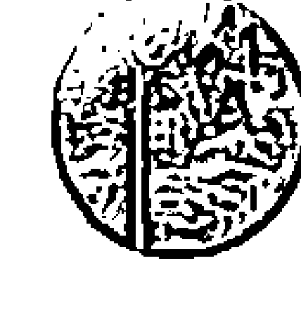

# 靈魂 DNA

> 「大天使麥達昶：你透過意圖來創造新的藍圖。你或許也想要去除死亡銘印，不必那麼頻繁。你可以說：「我準備好要從我的生命中釋放符合這個時間點的死亡銘印。」這是我們所謂的「獲得力量的人類」（empowered human being），他們能掌控自己的生命。記得，你有能力透過自己的意圖來去除死亡銘印。

## 所以當我們創造新的藍圖，裡面會包括什麼？我們的意圖和目標是什麼？我們想成就什麼？

你的靈魂的意圖是永遠去尋找更高的經驗。它絕不停止。所以要請求獲得在這個新的實相中你的靈魂在地球層面能獲得的最高經驗。如果你說：「我已滿足於自己的生命，」這可能沒錯，不過你的靈魂不會回應。不過如果你要求獲得更多經驗，那麼你的未來將有許多新的事物開啟，即使你已經七十或八十歲了。」

我們可以問你：「你未來三個月的藍圖是什麼？」這是非常有趣的問題。我們對此還不想說什麼。在今年的揚升之後，重要的是重生。下一步是建構你的阿卡莎記錄，改變你的藍圖，升級藍圖並升級你內在的軟體。沒有藍圖就沒有生命。

假設有人臥床將死，但是她在經歷了瀕死經驗後回來。到底發生了什麼事？她是如何回來的？她走進隧道，她開始回顧自己的生命。她為何回來？
這並非因為她尚未準備好或者她的時間還沒到。她為自己創造了新的藍圖。你也可以創造一個新的藍圖當成重生過程的一部分。我們要你從現在起開始重寫自己的故事。不再有歷史：不要被自己的歷史綁住。從現在起，這就是你的故事。當你改變自己的藍圖，你就提升了自己的振動。不要只改變自己的藍圖一次；相反的，要經常改變它。每三個月都創造一個新的藍圖。

> 〔大天使麥達昶：同樣的，這仍是透過意圖和與靈魂溝通來完成，要請求獲得更高的經驗。許多人出生時帶著五到七個死亡銘印進入一世生命，有時最多可到十二個。你經驗到的種種千鈞一髮全都是死亡銘印。不過，藉由你的意圖，你可以改變這點。這稱為「賦予力量的生活」，你掌控著自己的生命。〕

當你開始這麼做，你會發現我們整個星球也有張藍圖。每個國家都有張藍圖。我們要你持續活化自己更高的藍圖，每三個到六個月。

運動員不會在 100 公尺賽跑上畫地自限，告訴自己：「我很好，我只跑 100 公尺。」不會的。他會告訴自己：「我會讓自己更好。」並且努力提升自己的速度，從 11 秒到 10.5 秒，以此類推，因為他會時時訓練自己達成自己最佳的等級。

進化是個永恆的過程。這從不是有限的。我們要你想想這一點。

## 如果某人走上錯誤的路，違背了自己的藍圖或生命規劃，那麼DNA 會如何？

首先，沒有所謂錯誤的路。那只是你將某些事貼上「錯誤」或「正確」的標籤。人會做事，不過他們不會貼標籤，因為當你貼標籤，你就創造了分離。從現在起，不要再有分離。你做了什麼，就是這樣。DNA 不再活化或維持沉睡狀態。

如果人做了不符合自己靈魂目標的事，他們就沒有能量成就他們來這裡要做的事。自然地，這會影響他們的DNA。如果你說：「您的意志就是我的意志。」你就逐漸活了過來；這是神的意志。你全部的能量都將流向你為自己設定的道路。自然地，你會處在更高頻振動的狀態。當你運用高頻振動能量，你的DNA就會自然地活化。所以你首要之務就是回到自己生來要實踐的神聖靈魂目標上：您的意志就是我的意志。

五、六年前當我提出這些問題，大天使麥達昶所給予的回答就是，我必須遺忘自己學到的每件事、復原我已完成的每件事。我非常震驚，整天無法言語。我面對如此劇烈的典範移轉。

耶穌怎麼說？要認識造物主，你必須再次像個小孩，成為純真而好奇的小孩。你必須復原你所學到的每件事。不僅是在此世而是你從文化上、基因上所帶來的一切。要回溯並將心的黑板完全擦拭乾淨。這不是件容易的事，因為心非常強壯。心會拉扯回來，因為它害怕自己會失去力量。你必須聽麥達昶的話來做：復原你至今為止所學到的一切。

### 放下

我想給你一個小小的、喜悅的經驗。假設某件事真的卡在你的心裡，你無法放下。儘管你已經努力嘗試，但你越嘗試，它卡得越緊。這個練習可以支持你。我們不保證一定有效，不過我們說這可以支持你。另外，因為你是人類，所以無論發生什麼，我們都不能挑你的毛病。

坐下來，點一枝美麗的蠟燭，找一條好的細繩，不要太細也不要太粗，或許找條白色的、美麗的細繩。繩子兩端分別打個結。一個結代表你，另一個結代表你和某個人相處的經驗或代表那個人。

深呼吸，盡可能將愛帶入你的心——是愛，不是恨。隨著呼吸將愛吸入。等你感覺與愛建立緊密連結，請拿一把剪刀，一刀從中央將細繩剪斷。接著將細繩在燭火中燒掉，然後讓蠟燭放在安全的地方讓它自然燒盡。留著讓蠟燭自己燒光。你也許會短暫感覺悲傷，不過你會完成一次與某世生命的業力能量切除連結，並且去除與它的任何連結。

你怎麼知道自己已經切斷連結？在你想到這個人或這次經驗的幾天或幾星期後，將不會有悲傷或任何其他感覺，只會是一個記憶經過你的心。之後你會知道自己已經療癒。你可以為某個人或為任何阻礙性的信念系統——例如背痛或任何其他事——做這件事。

這個練習可以針對任何人、針對你生命中任何可能改善的情境、針對某個人或某個處境、或針對其他任何你已經完成但無法忘卻的事，只要它已不再對你有益。我們要你只在充滿愛的狀態進行。如果是出於恨來這麼做是不會有效的；必須透過愛來完成。

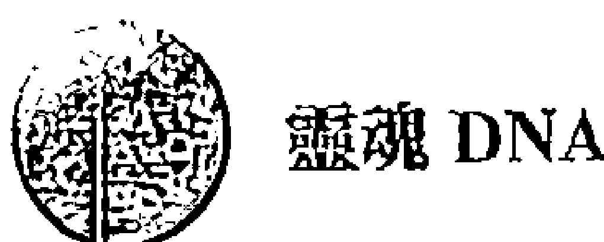

## 使業報舒緩

## 業報會如何影響人的DNA？

重點有二。業報是未完成的能量，你是來這裡將它完成。所以我們會區分業報和學習的不同。DNA 具備高頻振動意識，不過它是未活化的，會持續沉睡。當我們釋放的業報越來越多，生活有越來越多的平靜，感覺到越來越多的喜悅，慈悲心越來越強，那麼我們的振動自然會提升，因此會影響DNA。

釋放業報的簡單方式之一就是提升你的能量，並且切斷與業報能量的連結。你還是會想學習你必須完成的課題，不過沒有附帶的痛苦和折磨。

> 〔大天使麥達昶：讓我舉個小例子。這是雷的故事。他曾擁有高薪工作，也過得很好。不過在兒子出生之後，庫圖彌大師對他說：「現在你該思考完全承擔自己教師的角色了。」他非常害怕，相當懷疑，因為當時他身居高位，兒子才剛出生。他還有個女兒，有個家庭需要支持。

庫圖彌說：「我們出去走走。」他帶著雷前往他某一世生命，那時雷是個希臘戰士，準備出征。戰爭的號角在天際響起有如雷鳴。他沒有恐懼。庫圖彌大師要雷吸入無懼於死亡的能量，將它帶回並貼附在他當前的實相。他如此做了七天。到了第七天，他感覺更堅強、更有自信。

雷因此能選擇無懼地辭去工作。他用這個技巧來與自己業報的能量切斷，好讓他的靈魂能帶給他任何需要的課題。

你無須經歷痛苦和折磨才能學到一課。那是古老的能量。只要加入新的能量，你就不再需要舊的能量。你可以請你的靈魂帶給你任何你需要的課題。

## 透過意識來學習而不是透過當頭棒喝？

正是，透過意識。你還可以做一件事。你可以從乙太釋放你的業報，而不是在物質層面經歷它。我們要你練習從乙太釋放業報，好讓你無須經歷痛苦和物質困境。如果你有這樣的意圖，你也可以在睡眠中這麼做。

> > 【大天使麥達昶：業報委員會成員為部分揚昇大師及業報議會（Karmic Council）。他們是光之存在，唯一的職責就是確保能量平衡。業報委員會不是關於懲罰，其唯一的考慮是如何平衡某人的能量。能量一旦經由心靈、行動、言語或任何互動所創造，它永遠不會死去。它會被繼續帶往其他世生命。業報委員會唯一的意圖就是平衡人們自己創造出來的能量。】

每天都要和業報委員會合作。請他們帶給你平衡生命所需的能量，他們將展現在你面前。請他們以溫柔的方式帶來這些能量，好讓你能理解。這不是關於懲罰。要懲罰誰呢？你懲罰你自己。神不會懲罰人類。

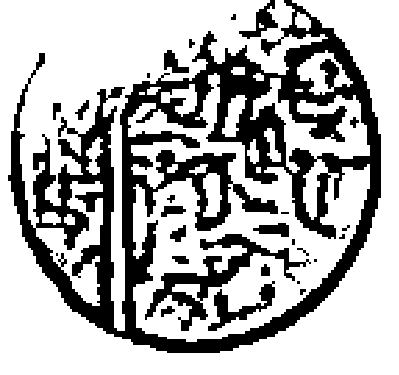

## 靈魂DNA

你們全都擁有恩典，因為你們一直努力，朝向揚昇及提升自己振動意識前進。你們多半的業報都已經為你移到恩典的時期了。你可以請求說你想沒有痛苦或折磨來學到課題。如果你嘗試這些方式後仍然有痛苦和折磨，這是因為你的靈魂並不在乎痛苦和折磨，因為它並未感覺到。靈魂是覺知的，可是它不會經驗到痛苦。靈魂只在乎你學到多少，獲得什麼智慧。

你可以對自己的靈魂說話。

> 大天使麥達昶：要和你的靈魂說話，你只需坐下並呼喚你的更高自我來與你連結。就是這麼簡單。引導呼吸，你將感覺自己的靈魂。無須考慮怎麼做或為什麼。每個人做事的方式都是自己的個別經驗。你的靈魂會覺知你思緒中的一切。每天規律這麼做，你將會讓這個連結日益堅強。你的靈魂觀察著每件事。每天做，並且看著自己的生命改變。

你可以向靈魂說明此刻你正經歷的課題是你生命中最難過的時光。你可以請求將這一課分散在許多世生命練習，而非只在此世完成。你的靈魂將會與大地母親溝通，因為你的銘印就藏在她的體內。大地母親通常會同意，這樣你就可以將自己的業報課程延伸到好幾世生命。這或許需要三到四周才會發生，不過你將看到轉變。這是贈與當前你們所有人的禮物。你也可以運用同樣方式來處理正在地球上發生的極端衝突事件。

> 大天使麥達昶：大地母親是活生生的靈。你們全都暫時活在她的身體上。你難道不會關懷自己的母親嗎？當你前往拜訪某人的家時，你會怎麼做？你會尊重邀請你去的那個人。你是否尊重大地母親？她給予自己的身體、心靈、靈魂來支持人類。可是你是否為她做同樣的事？你是否感恩大地母親，或者你在虐待她呢？我請你們自己回答這個問題。

你可以透過意圖和透過愛來與大地母親連結。當你有好的念頭，充滿愛的念頭，當你原諒某人並口出善言，那麼大地母親會感覺到你的能量。每天都要與她溝通。該如何溝通呢。透過其他人類，透過你對待他人的方式。

> > 某人曾經對大地母親說：「我想擦去您眼中的淚水。我知道您受苦了。」

> > 大地母親回答道：「謝謝你。當你擦去其他人眼中的淚水，你就是擦去我眼中的淚水，因為我就是那個人。」

尊崇這個偉大的存在，她提供自己的身體來滋養並支持你踏上自己的旅程。每天都與她合作。你的愛是療癒的藥方，因為如此重擔她已背負數百萬年了。

與大地母親溝通。請她將這延展到其他世生命，好讓其強度不要只聚集在此刻。試試看，因為大地母親非常慈悲。

例如，在非洲的衣索匹亞和其他國家，他們多年來都過的很苦。出生在那裡的靈魂選擇出生在當地過著挨餓及飽受折磨的生活。在適當時機，詢問大地母親說：「我們能轉變這一點嗎？」或「我們能改善這一點嗎？」「如果在 1 到 10 的強度表上是 10，我們能否降低到 2 好讓這麼劇烈的苦難是最後的一世？我們能否在這一世結束這樣的苦難？」你可以與大地母親連結，那麼她會做出決定，而且她將會同意。

覺醒的 DNA 會以非常有意識的方式影響大地母親。大地母親將會傾聽你。這是你們全部的人都需要運用的禮物。你們有許多人學識豐富，此刻你們必須將這些學識導入實際層面。這是你們支持自己也支持地球的方式。

> 〔大天使麥達昶：你的想法，大地母親都能感覺到。當你走在她的身體上，她能清楚覺知到你。由你的心傳送愛，說個甜美的話語。當你看到她的身上有美麗的花，請說：「大地母親，感謝您那不可思議的美。您正支持著這個生命形態。」她會感覺到。這對她會是療癒的藥方。美洲原住民很清楚這點，也很尊敬她。他們知道她提供了自己的身體來支持人類和所有生命形態。當你口出善言，當你療癒他人的心，當你友善對待他人，你就是在療癒大地母親。當你對他人酸言酸語，你就是在傷害大地母親，因為你們和大地母親乃是一體。〕

## 當你學到一個生命課題，這對 DNA 有什麼影響？

當你以慈悲、仁慈、接受來學到生命課題，你自然會處在平靜喜悅的狀態。如果你選擇隨著愁苦和憎恨振動，結果就是相反。心就是癥結所在。你的心智和情感保有多少平靜和喜悦代表哪一層級的意識會活化你的 DNA。人類心中絕大多數的黑暗都躲在那裡？就在潛意識心靈。修練潛意識心靈。正因如此，愛西尼兄弟會才會如此強調要修練潛意識心靈。

## 連結你的星辰和你的龍

我們想再告訴你一件事。地球創造出來時，經過許多時間人類才獲得允許前來進行實驗。當時有十二個龍之存在，他們接受造物主邀請前來地球並以他們的能量封印這個星球。他們為十二原型龍，他們在大地母親身體的不同部位將能量鎖定：梅爾卡納（merkanah）能量、松果腺能量、新藍圖能量、水晶王國能量等等。你必須呼喚它們，因為它們也攜帶著能活化最高類型 DNA 的密碼。

> > [大天使麥達昶：呼喚它們乃是透過意圖和透過特定的聲音振動。你可以由李·卡羅的克里昂系列書籍中閱讀更多相關資訊。當人類更加覺醒，人們可以創造聖地。
>
> 你可以透過意圖以及在某地護持光明來讓該地成為聖地。從你的住家和自己的環境做起。藉由意圖來創造光之城市。例如，觀想一個美麗的六角形或八角形放置在意圖要創造聖地之處。觀想這個幾何形狀安住於大地之內。這是充滿光明的空間，那個地方因此成為神聖。首先，從你的家開始做。
>
> 通常人們並不了解意圖的真正力量。出自於心和靈魂的意圖可以完全改變任何實相。你可以帶來療癒，那怕是飽受摧殘的土地。]

克里昂提過這些密碼，也說地球某些地方變得越來越神聖。這就像時間膠囊。請求 2013 年與你的密碼相符的龍密碼。它們帶有安住在地球上的原型能量。你們全都獲得一份禮物，因為在你們出生時，你們都與一顆星與一隻龍相應。

> > [大天使麥達昶：再說一次，請用意圖進行。龍有自己獨特的聲音頻率。運用這些頻率來呼喚它們前進（參見附錄一：運用龍的能量）。每隻龍都帶著非常獨特的振動能量。這項工作並不危險，也無法濫用，但其力量非常強大。這是聲音的力量。運用這些聲音呼喚這些存在，你將感受它們的能量。可以在工作坊與許多人一起嘗試。]

這些星辰和龍為這個時代帶來特別的密碼。這就像個隨時可以開啟的時間膠囊。我們可以向你解釋這些工具；不過，我們無法替你實踐。你必須運用這些工具並與它們合作才能知道它們能如何支持你。如果你與它們合作三個月，你就會看見差異。

> 〔大天使麥達昶：你必須運用我們所給予的每項工具。與龍合作是一項新工具。要持續運用這些工具。你們所有人都處在重新創造自己的過程中。運用這些新工具。舊有的工具無法用於新的方法。你將強化舊有的能量。對新的你而言，你需要新的工具，而最高的工具就是你意圖的力量和你思想的力量。〕

## 愛西尼人

## 我想知道愛西尼人為了改變自己的DNA而做到什麼程度？

在另一個次元實相中，他們的工作仍在持續。他們能完成自己來到這裡所要做的事。不是所有愛西尼兄弟都獲得啟蒙。不是所有愛西尼兄弟都會回來。某些是異端邪說。整體而言，大師確實完成自己的任務，準備好環境，讓正義導師（Teacher of Righteousness）能夠誕生。在釘刑之後，愛西尼兄弟將工作帶到英國和法國。

他們的工作仍在持續，在未來十年中，你將看見愛西尼的教導越來越受歡迎。人們會感覺更加強韌，因為他們的教導非常簡單且實用。愛西尼人說，假如你無法讓自己的生命、心靈更好或帶來和平，再複雜的概念也沒有用。他們的教導很容易遵循。

正義導師教導巫醫式的生活方式，與大地母親和天空父親往來。你們都是自然萬物、是一切造化的兄弟姊妹。這是要給世界的新教導，你將看見年輕人擁抱這個觀念，因為這是新的宗教概念的開端。這是常識。

你們每個人都有自己連結更高自我的方式。無論你覺得什麼適合，請繼續。你正在你和你的更高自我之間多建築一座橋樑。

### 在創傷情境下死去

大約一個月前，當我們與聖哲曼對話時，他曾提過在創傷情境下——例如原子彈爆炸或納粹大屠殺——死去的靈魂會發生什麼事。他們真的會失去七十到一百世生命所獲得的靈性學習嗎？

他們不會失去自己的靈性生命，不過許多生命藍圖都會被抹消。某人走入一世生命，這可能需要 761 世生命才讓這個人來到當前的這個位置。這是努力的積累。經歷原子彈爆炸或納粹大屠殺，這個人傳承的大半都會消失。記憶會由這個人的存在中抹消。他在過去 761 世生命所有的學習蕩然無存。這個人需要回來重新開始。

## 這樣的靈魂如何能療癒？

納粹大屠殺的靈魂已經重生。他們並不完整。經歷納粹大屠殺後，他們的靈魂有如此多的碎片，所帶來的能量只是他們個人能量的一小部分。他們需要努力來找回自己的靈魂能量。這點需要對所發生的事有靈性的了解。他們可以與自己的指導靈和大師合作來重整自己的靈魂能量。如果他們缺乏靈性理解，他們的指導靈和大師便無法與他們合作。

## 您認為未來會導入某些療癒技巧，能夠幫助這些靈魂回復自己的傳承嗎？

永遠會有可用的教導；不過，他們必須選擇要使用。請記得，造成巨大傷害的人可能會重生於自己迫害過的國家。大角星人有種稱為「療癒室」的靈性科技。他們可以回到過去或前往未來。他們可以回到過去並將它帶入未來。當你療癒過去的某件事，你的未來就會改變。為了完成這樣的工作，你必須有某種程度的靈性理解和振動。不是每個人都能進入這些空間獲得療癒。他們需要知道技巧，知道如何運用。他們的心智必須清明，擁有某種靈性理解。每天運用這個是非常好的。能呼喚你破碎的部份來與你結合也很好。你可以呼喚破碎的部份，有時候你會看見能量泡泡進入你。有時你會感覺強大的悲傷或學到新的能力。當你能將自己所有破碎的部份帶回你自己，你就會再次變得完整。

## Chapter 10 與你的星辰遺產連結

我的憂慮是這些人會失去所有靈性認知並且成為枯槁的存在。他們沒有工具能請求破鏡重圓。

我不會說他們失去一切。在他們靈魂的更深層次，他們仍擁有知識和智慧。根據他們其他世的生命和業報，他們多數人出生的家庭所在地會是他們有機會再次重新學習的國家。在更高層次，這些死去的人有他們自己的業報問題要處理。

在日本，人們都很有禮貌、很溫柔，會彼此照顧。他們不是一直都是如此。他們在自己佔領的國家相當殘暴。在原子彈爆炸後，他們的觀點因為苦難而轉變。對他們而言，這個轉變相當巨大。日本人非常禮貌、非常溫柔，犯罪率不高。日本是世界上最安全的國家之一，犯罪率很低，這是因為歷史為他們改變了一切。重大悲劇發生時，能量會進入大地，當大地獲得療癒，出生在這塊大地上的一切也會獲得療癒。這會帶來慈悲的能量。這正是所發生的事。

2005 年，大海嘯襲擊泰國、斯里蘭卡和其他鄰近國家的海岸，有超過二十三萬七千人死去。全世界都伸出援手。那個海嘯讓世界聚集起來一小段時間。許多國家前來支持這些人。

簡單地說，一個擁有十二束活化 DNA 的人會如何感覺？這樣的人會如何認知這個世界？

這個活化並非即刻發生，而是漸進的過程。擁有十二束活化 DNA 的人會以不同的眼光看世界——透過內在眼睛、真理的眼睛。他們會發現這個世界很重要，但是他們卻不在這個世界上。他們一隻腳踏在這裡的大地，另一隻腳踏在另一個世界。他們的觀點會改變，好讓他們能看到全面，看到每個處境中的真理。他們能透過望向更高次元的眼睛觀看。他們能看到更多完美，在每個處境中看到神。這是一種內在觀點的改變。

# 靈魂 DNA

罹患慢性退化疾病，例如心臟病或癌症，因而纏綿病榻的人，他們的 DNA 會怎麼樣？

DNA 永遠是完美，它是完美的資料庫。如果它不運作，未曾活化，那麼它會保持沉睡。如果你罹患退化性疾病，不去修練自己以提升意識，那麼 DNA 就不會改變。

> 〔大天使麥達昶：DNA 永遠都是完美的。如果你根本沒有這樣的傾向或覺知，相信自己可以改變，那麼你的 DNA 將不會改變。這根本不會是你的實相。〕

許多以苟活模式生活的人是用第一脈輪運作，這也是原因之一。他們沒有多少時間或傾向來修練自己。他們沒有心思或時間朝著另一實相努力。所以他們只是存在，不是有意識地生活。

即使罹患疾病，只要保持覺知，他們都能詢問自己的靈魂為何選擇擁有這個經驗，詢問這一課是什麼，詢問那是不是藍圖或命運的一部分以及該如何走出來並且去處理。從這個觀點來看，他們自然處在覺醒的狀態。

當你開始修練自己，你便在提升自己的振動和意識。同樣的道理，罪人只要開啟自己的更高心靈也能一分鐘變成聖人。

你們聽過我治好癲瘋病人的事蹟〔馬太福音第 8 章第 3 節〕。我什麼也沒對他做。我只是恢復了他的信念，讓他再次相信自己能療癒、能行走。他如此受困於自己的思緒，困在其中長達 35 年。我改變了他的信念系統，解放了他的心，因此他開始相信自己辦得到。許多時候，你相信自己不能做某些事。改變你的信念，進而改變你的生命。

此刻最關鍵的就是你在這個新的意識中守護一個更高的信念系統。這是能量擴展元年〔2013 年〕；要相信一切都是可能的。要相信。做最大的夢。我是你的朋友耶穌。

### 清理你的情緒和你的心靈

我是大天使加百列。我請你們所有人呼喚我。我有許多智慧要提供。天使國度可以讓你沐浴在天使之光下，好讓你的情緒身和心智身都更加清淨。

處理情緒身較為容易。你能控制自己的情緒因為情緒簡單地說就是動態能量。你如何控制動態能量？你可以將能量移往更高的表達並保持正向的振動，或者你能將它移往較低層次並擁有較低的振動。選擇權在你。開始將一切視為能量，思考自己要如何與能量遊戲。你想將它往更高或更低的層次移動呢？修練情緒身很容易；那是處於動態的能量。你們都能成為專家。

要修練心則更為棘手，因為心困於許多層次更有許多過去。情緒身沒有多少過往的連結，不像心智身那樣會受到影響。心智身需要持續地每天清理——維護。這是我們能幫忙之處，因為我們帶著來自造物主最高、最純淨的振動。

心智身直接連結到儲藏的記憶。這些記憶儲藏在大腦、細胞、血流、皮膚和骨骼內。除非你由骨骼清理調記憶，你永遠不會真正的清淨。古人知道這點，努力淨化骨骼。除非你清理骨骼，否則你會由過去帶回類似的信念。你要以最純淨的愛的振動將這打破。

呼喚我們的家族來與你合作。先沐浴並來到寧靜的場所，讓你的呼吸流過全身，吸氣，並且在全身循環，然後透過全身釋放。這可能需要一點練習，不過你會知道什麼樣淨化會發生。帶著對自己最純淨的愛吸一口氣。呼吸是生命之源。將你的氣息傳送到內在，傳送進你的身體，如果可以試著閉氣，數到八或十，同時在體內循環，接著再傳送出來。

你將看到奇蹟。許多思緒都會離去。你會感覺充滿生氣和活力。

### 在和諧中交流

我是大天使麥達昶。當你與萬有和諧，你便與神和你自己和諧。巫醫之道是與一切創造物和諧交流。我們要你保持開放，與你自己的父／母造物主進行神聖交流。塑造這個意圖，請求獲得神聖交流的密碼能在你的內在開啟，好讓你的更高自我能時時刻刻被聽見。從此以後，你就能活在神聖的交流中。

當你與你的夥伴溝通，你不是去對他或她說話。你將與他或她進行神聖交流。這將會是巨大的轉變。不再有交談，因為你們彼此從心之泉源交流。

若要練習神聖交流，從此刻起的每個經驗，你都共同創造一個新的世界；每天早上起床時，塑造這樣的意圖。請求天使存在支持你進入神聖交流，首先是與造化的一切；接著要與造化的一切達成和諧；第三要與造化一切處在意識合一；第四則是要進入事物的流動中。

> > [大天使麥達昶：針對與你的指導靈溝通，沒有所謂「應該」或「不應該”。這是透過意圖來完成。如果你躺在床上，在淋浴，或是在客廳手上捧著一杯咖啡，你都可以進入內在的寧靜空間，呼喚這些存在，並且與他們溝通。他們不像你需要睡覺；他們二十四小時隨時在忙。無論何時，只要你感覺心中有愛，便與他們溝通。]

不要等待。進行這個連結吧。他們總是在場，不過你必須由你這邊啟動連結。讓他們成為你最好的朋友，因為他們心中只考慮你最大的利益和最高的意圖。

你越與他們合作，你創造的連結就越強。他們是你的後援隊。他們知道在地球生活並不容易。他們來這裡是要以最大的愛支持你，幫助你由甲地前往乙地，過程中還能完成你來這裡所要學習的生命課題，開啟新的契約，並且時時溫柔地提醒你記得自己是誰。除了你自己的指導靈，你還找得到更好的朋友嗎？

記得每天與他們溝通。或許你愛你的母親，不過假如你們多年沒有溝通，這段關係就會生鏽了。你越和自己的指導靈溝通，他們便越能以他們的能量和智慧支持你，幫助你開啟迎接更高的實相並且找到更多的自己。當你死去，他們最先來到你身邊，讓這樣的轉換盡可能變得容易。}

當你請求，當你早晨起床時陳述，你會看見自己的日常生活變得更加順心。你還可以增加一個元素，一個賜予祝福的元素。這是你想創造的實相，一個國與國、人與人之間都能和諧、能溝通、彼此支持的未來。那將是個多麼美好的世界！未來這將會成真。你此刻便能看見，不過這只是時間中的一刻。你將看見；未來將會轉換。

接下來要給你一項家庭作業，是關於大樹以及它們如何影響人類。在你自己的社區找些樹木。樹木有非常聰明的靈魂，尤其是樹齡較長的樹。它們有階級。某些樹會長得比其他樹木高，因為它們的 DNA 已經甦醒。

走入自然，找棵你覺得適合的樹，通常是因為這棵美麗的巨大樹木所吸收的較高能量。接著請求結合。花點時間在這棵樹上。這個練習要在你的社區做。要保持尊敬，因為樹木就和你一樣。你不希望有人沒敲門就走進你家。接觸樹木時要抱持適當的禮儀。

> [ 大天使麥達昶：當你接近一棵樹，良好的禮儀就是要尊重它，因為樹木是有感覺的存在。與樹木保持約四到五公尺的距離，接著詢問：「我想走近您。我能否碰觸您以感覺您的愛？我能否進入您的氣場？如果我走向您，您是否樂意？」表現尊敬、尊崇、愛。樹木是生命形態，和你一樣充滿活力。如果樹木允許，你再進行。那樣一來，樹木將會對你開放。]

樹木是存在，也是神的一部分。它們擁有靈魂，所以你必須先保持幾公尺距離，向它們解釋你想走近並將自己心的能量傳送給樹木。你會接收到答案。〔 大天使麥達昶：你會感覺到。樹木有家庭。它們也許在睡覺，也許忙著其他事。 〕

如果回應是肯定的，那麼走向那棵樹。手放在樹上，向樹傳送光。樹會準備好與你分享它的智慧。你尋求那棵樹的同意來進入它的領域，以便獲得樹木的合作。藉由合作，你將能分享更多並擁有和諧。前去尋找一些美麗的樹木並且與它們合作。

## Chapter 11 清理並淨化你的能量

2013年8月8日
大天使麥達昶、阿肯納頓王、山納・庫瑪拉

耶穌為人類設下典範。他總是與自己的光體和真我連結。他讓每個人看到；他轉變並變得更加莊嚴。

我們所有人都有光體。在靜心時，你可以請你的光體前來，詢問該如何運用光體。你有不同層次的光體。請求薩南達的支持來導引出你的第五次元光體。這就像個網。在靜心時，想像你將這個美麗的、人形的網拉進自己內在。觀察光體能如何支持你。

當你與光體的整合度越來越高，你會成為完整的光之存在。你將能藉助光體前往許多地方。分身也更加容易。所以你能同時在兩三個地方。這是透過光體來完成。

> 〔 大天使麥達昶：分身是透過意圖來同時存在於兩個地方。你運用意圖、透過請求你的靈魂來前往另一個地點。在意識旅行時，你會保持覺知。例如，假設你想到某件二十四年前發生的事，你是在那裡還是在這裡？有一部分的你回到那裡。以非常事實而客觀的方式來看，在你分身時，你是否在物質層面出現在兩個地方？其他人是否能看到你？或者這只是將你的意識投射到該地，好讓你維持覺知狀態？

同一時間身在兩個甚至三個地方是可能的，不過這需要高度的掌握。偉大的大師，例如巴巴吉1，會這麼做並向他人示範。你也辦得到。不過這需要對身體和能量有巨大的掌控力，也需要偉大的理解。簡單地說，這是將你的意識投射到兩個地方。

> **所以你能覺知到不同時間或不同地方所發生的事，但是你不會與該地發生的事進行互動？**

不。等時機到了，人類將能完全投射自己，包括身體。大師們已經在這麼做；他們完成自己的工作並回到現在。未來你們全都能達到這個階段。讓我問你一件事。你在跟雷說話。你在美国或是日本？

**我在美國。**

不。你在你意識所在之處。

以下是其他能透過光體來做的事：重生你的細胞，增加壽命，理解並閱讀阿卡莎檔案。我們要你運用自己的光體，因為透過它，你將能分身並傳送自己。你們所有人未來都會從事這類工作。或許你無法在物質層面存在於某個地點，但是你可以運用光體來進行分身或傳送。

以下三個技巧我們希望你能在此時好好修練。首先是重生，好讓你能活更長的壽命。第二是閱讀和理解阿卡莎檔案的能力，能請求以三、六、或八個月等等分組。請持續運用阿卡莎檔案。第三，持續修練光體，好讓你能傳送自己，或分身前往不同地點去在該地工作然後回來。

耶穌曾示範這點，這全都是透過活化光體，就像古代許多長老一樣。在靜心時，呼喚光體活化。許多大師會這麼做；巴巴吉總是這麼做。這些都是此時你必須修練的新事物，因為你們全都是進化的學生。請呼喚薩南達大師協助你活化光體。

> 〔大天使麥達昶：透過請求來進行這件事。你會看到一道美麗的白光，形狀就像你自己的身體。薩南達大師是由更高次元實相取得此光體。這就像一匹美麗的白布，形狀像你。他牽引出這道光，慢慢將它的能量導入你的頂輪。慢慢地，這個能量下降到你內在，往下流到你的雙腳，進入大地。觀想你雙足長出根，讓這道能量穩定。這是很好的練習，可以每天做。〕

這非常關鍵。世界的不同地方將會許多進步，好讓光之工作者能護持更多的光。我們需要人們分身並在各地工作。某些地方有很大的困難，人們無法前往那裡工作、穩定光明、建立高頻振動。你可以運用光體傳送自己來達成這一點。

### 與偉大奇蹟連結

哈囉，我的朋友，我是阿肯納頓王。我親愛、摯愛的家人，各位好，祝福各位。我們希望簡單地提到兩件事。一個是關於你們稱為摩西的偉大存在的故事。這個故事是真的，而我們希望探討這個故事來讓你了解何者為可能。當摩西舉起他的手，要求與偉大的靈、偉大的造物主共鳴，海洋便開啟了。你認為這是故事，不過這是真實事件。紅海海底發現某些由轆轤所製造的物件。你們知道這點嗎？

> 〔 大天使麥達昶：以 Google 搜尋「Red Sea Artifacts Moses」這些關鍵字便能找到許多參考資訊。我們要本書讀者能成為這段旅程的一部分。我們不想要將一切端在盤子上。請成為旅程的一部分，如此一來，你將獲得更多。我們嘗試著要跳接讀者的心靈，因為當心靈開啟，就會有更多事物給予。在古老時代，整個課題都先經過消化再呈現。那已經不再有益了。在新的意識中，你必須親自參與。這就是我們現在的要求。我們要人類參與。〕

當你與造物主完全相應，就像耶穌那樣，奇蹟便會出現。我們請你與那一刻連結。為人改變實相，因為摩西（藉由造物主的力量）分開海洋的那一刻儲藏在阿卡莎檔案中。在那一刻，他不僅分開了凱楊。對於做好準備的人，這是解脫的一刻。你可以觸及那一刻，因為它深深銘刻於阿卡莎檔案，亦即這個星球的歷史之中。

> 〔 大天使麥達昶：你透過自己的意圖來與偉大時刻連結。在你擁有的工具中，意圖最為重要。它的力量如此強大，是來自你存在的最深處。表達自己的意圖就像拉弓射箭：它會直接射向你瞄準的地方，會前往任何它聚焦之處。因此我們說，透過意圖，你甚至能療癒過往的業報能量。對此刻的新人類而言，意圖是力量最強大的工具之一。〕

這是偉大時刻——是一種解脫。摩西希望教導人類的不只

# 靈魂 DNA

是由埃及獲得自由。當然，在物質層次的確如此。不過這同時也是更高層次的解脫。你現在可以在靈魂層次獲得同樣的解脫，能與時間中的那一刻連結，因為它就在大地母親的阿卡莎檔案裡。你能與那特定的一刻連結，好讓自己當下獲得自由。我告訴你，三天之內，你就會感覺到差異。

我們要告訴你這一點：在歷史的任何時刻中，當奇蹟發生，造物主的力量就在現場。當你完全相信，當你的信念超越信念，一切都會記錄在地球的阿卡莎檔案裡。你可以觸及這些重大的奇蹟經驗，捕捉它們的本質，將它們帶回現在，放在你自己身上。這是我們想提供你們的禮物。

讓我舉個例子。偉大的兄弟亞伯拉罕帶著匕首和摯愛的兒子上山，不過在他的心中，他對靈有強大的信念。你能否與那種信念連結並將它帶給自己？

> > [大天使麥達昶：這是個聖經並未記載的真實事件。這是對亞伯拉罕信念的考驗。他認識造物主。造物主如何能要求人類犧牲自己的子嗣？]

想想耶穌的力量。他行使許多奇蹟，甚至有人將那些奇蹟列成清單。你能否連結到他的本質，以自己的力量行使奇蹟？一切都在阿卡莎檔案裡，在你自己的阿卡莎，也在地球的阿卡莎。

> > [大天使麥達昶：在新的意識中，你擁有自己意圖的力量。當你以最純潔的意圖請求與亞伯拉罕弟兄或耶穌弟兄連結，請求分享他們的智慧和理解，這個智慧將會下載給你——意圖、請求、採取行動。你們每個人都會自己過濾出符合自己理解的指引。一旦你以最純淨的意圖請求，宇宙永遠會提供給你。沒有人會被排除在外。]

我們要你與這些重大事件連結，因為透過它們，有龐大的能量和振動播種在大地裡。這些事件的經驗儲存為時間膠囊。現在你可以回溯時間，與偉大時間連結。我保證你的光將會以幾何級數倍增，變得更明亮、更寬廣、更崇高。

### 擁有信念會給你勇氣

2010 年，雷必須決定是否辭職。過去他從未有過這樣的勇氣。他的兒子剛出生，在職場上也有相當好的職位，薪資優渥。這是相當困難的決定。庫圖彌大師教導雷的方式是將他帶回他曾經是希臘戰士、即將為自己的城鎮出征的時代。戰爭的號角響徹雲霄。每個人都精神抖擻。雷是個高大雄壯的人，雙手分持一柄劍，準備戰鬥。

庫圖彌讓他看見那是一個他擁有強韌勇氣的時代，而且他要雷培養這個感覺以便將勇氣的圖像帶回，貼入他此世的生命。大約一星期後，他便有了勇氣向公司辭職。他的老闆很驚訝，因為他知道雷的兒子剛出生，不過雷說：「我得離開。」你可以回到自己的過去，收集自己想尋找的特質。它們都在你的阿卡莎檔案裡。

你也可以回到大奇蹟發生的時代。在過去，有大量的光明和更高的創造力量下載。你可以與它連結。這樣的光可以讓你的光以幾何級數倍增。這是我們在我的神祕學院所作的訓練之一。

【阿肯納頓王：神秘學院中並沒有神秘。我們了解你們為何使用「神秘學院」這樣的名詞。這些學院是針對真理的追尋者。它們是聖地，在此心志相同、追尋更高真理的人可以分享更高的學習。神秘學院仍然存在，此刻你甚至可以取用神秘學院的圖書館和其中收藏的偉大智慧，透過夢境狀態，透過塑造意圖，透過請求指導靈帶你前往那裏。我們鼓勵你這麼做。
這或許不是必要的，因為這顆星球已經處在更高的振動頻率中。你已經知道我們在神秘學院所教導的許多事。不過，如果你要進一步探索，你還是會找到適用於你當前實相的智慧結晶。它們被稱為神秘學院是因為當時這顆星球的意識還很低，學生們必須先在自己的存在中準備好經驗更高的能量。他們需要前往某個地方，好讓他們能維持更高頻的振動和純淨。這些地方並未向所有人開放，因為不是每個人都準備好了。】
現在讓我再給你們一樣東西：想想那三位前往朝見偉大師的智者。這些聰明的存在追尋著星辰和他們的直覺，而他們在尋找之後也見到大師了。不過，這三位賢士（magi）代表了什麼呢？賢士為魔法師（magician）。我們要你連結那個事件，亦即三賢士前往朝拜聖嬰。當你開始與賢士連結，你將會開啟自己的直覺理解，不管是所發生的事、你需要知道的事、或是如何開始做自己需要做的事。
他們將這個禮物留給世人——探索和直覺理解的禮物。他們不是唯一這麼做的人。看看四、五百年前的探索者吧。他們遠渡重洋，只憑藉著觀察白天的太陽和夜間的星辰來決定方向。

## Chapter 11 清理並淨化你的能量

這樣的知識存在，是大地母親的阿卡莎的一部分。如果水手辨得到，你也可以。利用陽光、星辰、月亮來探索自己的生命。你們全都辦得到。我們要你開始將片段連結起來，尤其是那些特殊時刻。你會看到自己的生命大大擴展。你會得到完整的知識，知道如何勾勒自己的生命，並且以自己的方式找到神。這是你的靈魂對此世的你最大的遠景。

首先，我們希望你能連結並運用自己心中最感共鳴的事件，亦即歷史上有大量光明下載的特定時刻。這些是我們所傳授的訓練。其次，我們要你與偉大的賢士合作，因為他們能開啟探索新觀念核心創意的能量，讓你規劃以自己的方式找到神的路徑——不是以你的人格以為的方式或是你一直使用的方式，而是以更偉大、更深刻的方式。

> 〔阿肯納頓王：這些訓練永遠不會被給予，除非你在靜心中提出要求。讓你自己準備好要領受它。準備你的身體、心靈、靈魂，以便領受更高的智慧，因為，你們也知道，時間不多了。即使分開紅海此刻都在另一實相內發生。我們可以取用那個實相並感受那一刻的本質，因為所有時刻均同時存在。〕

是的，在第五次元。我們不要用某個名字來稱呼這個次元。所有實相均同時存在。如果你能開放，你便能連結許多其他實相。你可以在地球層面上觸及更高層次的真理，你也可以觸及自己的揚昇自我。請記得，這本書不是給嬰兒讀的。我們不願像餵養嬰兒一樣餵養諸位讀者。這本書的預設讀者是準備進入自己生命的下一進化階段的人，是針對準備好在進化中進行量子跳躍的人。現在我們開放提出與 DNA 相關的問題。

### 死亡創傷會如何影響DNA

當我們離開這個世界，DNA 會自動拍攝死亡的剎那，那些恐懼、創傷或所經歷之一切的片刻。那會對 DNA 有什麼影響？

DNA 永遠是完美的。DNA 只是指導手冊，所以那是兩件分開的事。DNA 永遠保持完美；它就是完美的。

你離開這顆星球的方式會對下一世生命有重大影響。如果你有關於恐懼的意識，那麼在下一世你將不會傾向省視自己的靈性。在任何一世生命，你都會帶回自己所學到的一切。不過你必須先打開衣櫃。由於另一世生命結束前所發生的種種，你或許根本不傾向於開啟衣櫃。所以你的 DNA 只是保持既有樣貌，什麼也不做。DNA 永遠都是完美的。

### DNA的更高次元層面和甘特拉脈輪

### DNA 是否存在於第五和第六次元？

當然，DNA 存在於所有更高層次。它的形狀幾乎就像無限大的符號。

我們談過第二十四個脈輪。當時有人問第二十四個脈輪的名字。那個脈輪的名字是「甘特拉」(gantra)。想像有許多顏色的光在你的頭頂上方流動。最上方的一個就是第二十四脈輪。來自這個脈輪的光撒落在你四周，你在這些光之間或坐或站。這個脈輪只能藉由大師的協助來活化。我們要你呼喚自己覺得適合的任何大師來活化這個脈輪。我是阿肯納頓。

> [ 大天使麥達昶：只要人帶著最純淨的意圖和對自我覺醒最純淨的愛來請求，整個宇宙都會聽你號令。如果你不請求，什麼也不會給你。最簡單的真理是，如果你不敲門，門就不會開啟。當你請求，當你準備領受這更高的真理，自然這個能量就會下載給你。
留在你的星芒場（astral field）——你的能量身。只有時機到了才會顯化，當你準備好讓自己的心靈理解並讓它成為實相。更高真理也是如此。如果學生尚未準備好，任何數量的更高真理都不會有任何差異。做好準備，新的實相就會出現。運用偉大的瑪哈特瑪的能量，此能量非常高頻。我們鼓勵你好好研究它。

### 淨化靈魂

我是麥達昶，要來談談 DNA 活化。若要活化 DNA，你的意識扮演主要角色。淨化自己的意識是絕對最必要的事。做法是，心裡想著要淨化你的能量場。不過你必須也要淨化你的靈魂能量。

> [ 大天使麥達昶：要這麼做，請與更高次元的大師合作，尤其是掌管第八到第十二道光的大師。你可以要求他們與你合作來淨化你的靈魂，因為你的靈魂會由日常生活、信念系統、文化互動、成長過程、雙親和來自其他人的思緒投射而取得各類殘片。
所以最好能每隔三到六個月請求靈魂淨化。在更高的層次上，你的靈魂是純淨且完美無瑕的。不過你的靈魂也有許多層次。要請求高頻的光淨化你靈魂的所有層次。］

許多過去經驗的回憶可能都如同塵埃附著在你的靈魂上。呼喚任何你希望合作的大師來淨化你的靈魂能量，或者你可以呼喚我，麥達昶。這個練習稱為「淨化靈魂」。請規律進行這個練習。

有許多大師都能幫助你淨化你的能量場，不過納達女士（Lady Nada）專精於療癒並淨化靈魂能量。每個月或每三個月一次，記得與納達女士或任何其他大師合作，並且請求協助來淨化你的靈魂能量。

> ［大天使麥達昶：當你導入更高的能量，將之與自己的能量結合，你便會體驗到意識的提升。每一天，你都在日常生活中吸取能量。最好能每十五天進行淨化，尤其是如果你電視或新聞看很多的話。你會吸收到許多會影響你的思想形式。在古時候，啟蒙者會被要求獨居，遠離人群。人們會投射自己的思想形式在你身上，如果你不夠堅強，你就會吸收到這個能量。淨化只是能量的混合。納達女士的能量是美麗的粉綠色光。呼喚她並吸入這樣的能量。觀想你的心與她的心以你自己的方式、用你自己的想像力結合。你會感覺到一道美麗的綠色帶點金色的光。將它吸入。塑造意圖，希望一切不屬於你靈魂真理之物都能清理並淨化。請進入這個空間。納達女士專精於靈魂淨化。］

你也可以請我和其他大師幫助你進入造物主之光的更高頻振動。每一天，請求造物主之光的更高層次。

> 〔大天使麥達昶：請求更高頻振動的造物主能量能下載給你，要比你前一天所接收到的更高，因為造物主也在擴展。萬事萬物均在持續擴展。所以每天或者你覺得適合的時候都要請求更高頻的振動。這些都是你必須使用的新技巧。〕

現在有人想提出問題嗎？

### 時間鎖和時間膠囊

### 能否請您解釋何謂時間鎖（time lock）？

時間鎖很單純，只有滿足某些條件時它才會開啟。某些特定的振動需要發生，只有那時它才會開啟。這就像時間膠囊，不過後者是在特定的時間——例如 2015 年——它會開啟，不管發生了什麼事。時間鎖只有在某些振動發生時才會開啟。不然，它就不會開啟。其條件就是較高的意識。

### 水

我們如何控制自己身體裡的水？主艾許達問我們是否能以振動方式控制自己身體裡的水，還問我們是否能將身體裡的水調整到更高頻的振動。

要知道你有超過百分之 75 的水？水的真正目的是擴展。水的特性就是能夠擴展。它並非只是為了淨化。水的特性能幫助你記起自己是誰。你可以有意識地傳送能量到你身體內的水以及你所飲用的水。請求水發揮並表現其真正本質。水的真正本質就是擴展並幫助你開啟以接納自己真正的藍圖和出生的真正目的。

### 我們的意識和水是否有連結？

當然。水在身體阻塞會如何呢？你會成為阻塞的人，無法開啟。要不要有意識地淨化你體內的水呢？假設你要喝一杯水，請說：「我塑造意圖，要這水在我體內循環，幫助我記起自己真正本質，亞當·卡德蒙（Adam Kadmon，神人）密碼，記起我出生真正的目的。」當你飲下這杯受到祝福的水，這會在你全身循環。每天都要運用水，你將在自己的生命中看見奇蹟。無論何時，只要你向水道謝，水的分子就會改變。

> 〔大天使麥達昶：控制並淨化體內的水是透過思想和意圖。當你設定意圖，這會影響你體內的水。你的身體有百分之80的水。江本勝博士（Dr. Masaru Emoto）²拍攝了水的照片，搭配美好的音樂並且對水說愛的话语。水形成了美麗的水晶。但是如果使用了虛假的字眼、說謊、或散發出不是愛的能量，水分子就會變形。那樣，你那百分之80是水的身體又會如何？〕

那麼，你的情感和你的心智中的思緒呢？你對自己體內的水做了什麼？即使你身體外的水都會因為疏忽或傷害的字眼而改變。那麼你每天透過批判、批評、自我貶抑而為自己所創造的話語呢？這難道不會改變你體內的水的意識？要提升自己的意識和 DNA，水都是非常關鍵的因素。

### 所以水會儲存我們的意圖和思想？

是的，而且它會擴展。此外，水也儲藏你的藍圖。不過，這裡說的藍圖並不是你靈魂的目的或你為何出生。這是你真正原始的亞當・卡德蒙密碼的真正藍圖。從現在開始，不要只專注於揚昇或增加自己內在的光，儘管這非常好；你還要連結到你真正原始的亞當・卡德蒙密碼。

### 可否請您解釋亞當・卡德蒙密碼？

> 真正的神人類。〔大天使麥達昶：能夠以善意共同創造的能力。〕

### 所以我們每個人都有嗎？

當然。所以我們要你做的是別將自己的焦點侷限在揚昇。要進入泉源本身。與你存在的泉源連結。回到你所連結的星辰。

〔大天使麥達昶：只要請求就能做到這點。你的泉源是美麗的更高自我，是你的靈魂。每天與你的靈魂合作，要養成習慣。你在日常生活中怎麼交朋友？假設你遇到某人，交換了電話號碼。或許你們幾天後開始溝通，接著越來越頻繁。你或許會邀請他們來你家。人們會培養友誼。同樣的，從你所開始的開始建構。
記得要每天與你最好的朋友——你的靈魂——溝通。如果你不關懷自己的靈魂，你的靈魂當然也就不會真的在乎。記得要每天這麼做。]

### 胚胎狀態（embryonic state）？

正是。

### 我們來自星辰，那是我們的連結。

一切都來自星辰。

### 星辰元素，我們的星辰能量，我們的星辰密碼——這些就是我們存在的泉源？

這是你存在的真正泉源。那是我們要你運用它的方式。前往你的泉源。

### 在潛意識和細胞層次改變意識

我們如何對自己的細胞說話，藉此帶來正向的改變，跳脫那些來自任何一世生命、如今已潛藏在潛意識和細胞內的疾病或匱缺？這就像個錄音或節目？

這是真的。但這並不容易。許多人試著每天對身體的細胞說話。這些稱為身體交談（body talk）。不過，你也知道，這成效不彰。修練這點有許多層面。首先，你的身體必須願意接受。觀察如何讓自己的身體願意接受。第二點是淨化身體。淨化可不只是洗澡。

人類全都是由來自過去的程式——你的潛意識心靈、你的無意識心靈——所運作。因此愛西尼人如此重視自己的潛意識心靈。他們說真理發生在潛意識心靈。所以如果你要自己的身體在你對它說話時願意接受，請將這種身體交談的程式輸入你的潛意識心靈。

> 〔大天使麥達昶：潛意識心只是導引出經由你的思想程序所放進去的種種。如果你想要任何事物由你的潛意識而具體化，那麼請將你希望發生的事物放進去。潛意識心靈不會區分好壞、美醜。它只是將落入其中的事物導出。多數人的潛意識心都充滿著恐懼、控制慾、自我感、還有其他來自過去、沒有幫助的事物。多數人都只透過自己的潛意識心生活。
你想要忠於自己最高藍圖和生命任務嗎？請以偉大的光來淨化你的潛意識心。你融入更多高頻振動之光的那一刻，你的潛意識心就會越來越清理和淨化。請求更多的光傳送到你的潛意識心，觀想它一層一層淨化。
你的潛意識心會更快回應，只要你在其中放入圖像。因此人們才會說一張照片可抵千言萬語。圖像會銘印在你的潛意識心，而且圖像可以具體顯現。當某個圖像完全進入你的潛意識心，它會滲入你的意識心和你的意識實相。請經常修練並規劃你的潛意識心。
有個簡單的練習：頭往後仰，讓頸部向前，閉上眼睛，觀想你希望發生的事；不是你生命中正在發生的事，而是你希望發生的結果。這個練習要做五分鐘。頭往後仰一點，讓頭靠在你的肩膀上。每天花五分鐘，盡可能清晰觀想你希望創造的完美結果。這可以支持你。]

你的細胞會聽到你說的一切。

### 是的，還有你所想的一切。

正是，而且它們能將它導引出來。這個改變必須發生在細胞和潛意識層次。如果你想改變，請修練潛意識層次。讓我舉個小例子。你們都知道自己已經來到第五次元實相。不過你們許多人仍在第三次元實相運作，因為你們仍不相信自己是第五次元存在。

### 我們多半感知到發生在自己四周的事。

的確。如果你想去除世界矩陣，首先你必須改變自己心中的矩陣，接著改變矩陣的能量。所以請朝這一點努力。

> [ 大天使麥達昶：矩陣就是這顆星球上所有人類的意識和無意識心的能量。矩陣的基本天性就是恐懼。只要恐懼存在，就會有控制慾。只要你很脆弱，那麼陷入這個矩陣是很容易的，因為矩陣的能量很強。它其實滲透著整個星球，人類則像海綿，很容易接收這些能量而毫不自知。
在歷史中，許多大師都是單獨一人，因為很容易受到四周人的能量所污染，所以它們停留在自己的能量中。現在矩陣的能量因為媒體而變得更強。所以你必須對這種能量提高警覺，注意它如何影響你的潛意識心。
讓我舉個例子。2013 年 4 月，波士頓馬拉松賽發生爆炸案。你的國家當時還發生了許多美好的事，可是媒體卻絲毫不停地反覆報導爆炸案。

**是的。所以這影響了每個人的矩陣。我了解你的意思了。**

這影響每個人的潛意識心，創造恐懼。今年 (2014) 這場馬拉松賽是否還有同樣的歡欣感覺？

**幾天前我在銀行和一位女士聊天。因為媒體不停報導失蹤的馬來西亞航空班機，所以她很害怕飛行。她一直說，我告訴她說人在飛機比在車子裡安全多了，但是她是如此充滿恐懼。**

這就是我們所說的。矩陣控制著人類。如果你喜歡看電視或使用網路，它們對你的影響就遠超過你自己所以為的。你沒有意識到自己正持續吸收著來自他人的能量。

**所以處理矩陣代表控制自己接觸的媒體和吸收的內容？**

不僅是來自媒體。你必須覺知自己由所有事物——包括媒體——所吸收的能量。人類的本質就像海綿。他們持續吸收來自他人的能量。你必須每天練習淨化自己吸收的能量，就像刷牙洗澡一樣。要每天淨化你的能量場。要這麼做，你只需請求獲得清理。]

在身體濕潤時與它溝通也很好。因此亞洲的人會在水珠落下時進行晨禱和靜心。在身體濕潤時，細胞會更加開啟。

> [ 大天使麥達昶：你可以在浴缸裡試試。站進裝滿冷水的浴缸。那時你會非常敏感。你的情緒高昂，你處在更加敏感的狀態。當你與自己的細胞溝通，這樣的溝通是來自你感覺的最深處。比起其他時候，細胞這時會更清晰地獲得訊息。自己實驗看看，你將看到這對你是否有用。]

### 所以細胞與水有很深的連結？

就像手和手套。

### 它們和水是一體的。

正是。你和水是一體的。你知道為什麼？有十個月的時間，你是能在水中呼吸的生物。你來自水——母親子宮內的水。這個水曾是你的生命，是你與泉源的連結，是你的食物和滋養，更是愛的商數，後者最為重要。

你一出生，你就成為空氣生物。你與水的連結立即被切斷。你將魚帶出水面會怎麼樣？它會死去。

想像一個孩子離開水，突然被空氣包圍。想像嬰兒心中感受的創傷。共有三種創傷。首先，你穿過產道；接著，本來是水之生命的你突然進入空氣之中；最後，你與泉源的連結被切斷，脫離了給你生命、支持、滋養的母親。

我們必須針對這點進行療癒。分離意識正是從這裡開始。

「將生命氣息帶給我的人突然從我身邊帶走。愛我的神在一個分開的地方。」

> [ 大天使麥達昶：這句話曾經多次為人所引用。人們以不同方式說這句話，因為所有人類出生時都感覺到某種連結的斷裂。給我生命的靈魂不再陪伴著我。」水便是泉源。

### 這種創傷和缺憾是否記錄並記憶在我們的細胞和 DNA 內？

是的，就在你的基因和能量場內。所以運用水。它真的可以行使奇蹟。在喝水時，請對它說話。請求水給予，因為這是水的天然功能。水會開啟並擴展。記得，水連結著你和你真正的泉源。

最好的水是來自地下水源的水，要直接出自大地。要取得泉水可能蠻困難的，但是如果可以請使用泉水，因為其中包含最純淨的本質和許多磁性礦物能支持你的身體。

### 我們如何在細胞層次轉化意識？

只要你的潛意識心出現意識轉化，並逐漸滲入你的意識心，那麼你的細胞自然會有更多的光。所以我們要你修練自己的潛意識心，因為修練終將腐朽的身體容易許多。你所知的情緒乃是處於動態的能量，你也能控制它們。你能夠選擇。今天你想經驗什麼樣的能量：高頻能量或較低能量？情緒是行動中的能量，所以你可以將這股能量移到你想移去的地方。

> > [ 大天使麥達昶：在細胞層次轉化意識的簡單方式就是注意自己攝取的食物。如果你持續食用振動較密集的沉重食物，你的細胞就得超時工作來吸收這些食物。它們沒有時間放鬆並帶來更高的意識層次。如果你的心智持續專注在密度較高的思緒，同時你還攝取高密度的食物，那麼你的細胞就得加班。此外，聲音、神聖幾何、美麗的畫作都能支持你，因為它們的能量會跨越你的腦部並直接進入你的細胞。]

要療癒心智身並讓它獲得控制要難上至少百倍，因為心智身完全受到你曾經有過的所有思緒經驗所控制。我們談的是數百世生命。此外，心智身有如此龐大的恐懼，這是來自所有發生過的事。儘管這些事不會記得，但它們仍深深銘刻在心智身。

心智身只能透過更高的光來轉化。要達成這點最簡單的方式就是修練潛意識。愛西尼人獲得特殊指引，讓他們每天規劃他們的潛意識心。如果你能改變潛意識心，你便能改變外在實相。

約瑟・莫非博士（Dr. Joseph Murphy）教導潛意識心的力量。改變你的潛意識心，就能改變你的實相。我們要你閱讀《你的潛意識心的力量》（The Power of Your Subconscious Mind）。他談到潛意識心，解釋它有多麼重要。它會創造實相。潛意識心就像一塊田地；放什麼進去都會生長。請想像你幾千幾百年來不停放進去的東西。能量永遠會留在那裏。一旦能量創造出來，它便需要完成或轉變。

### 記得我們真正的身分

我想問問關於我們對自己更高自我執著的記憶。在我們幾歲大時，它會完全逝去。關於這點的記憶儲存在無意識網格（grids of unconsciousness）之內。我們該如何扭轉這個狀態？

這個問題有兩個層面。嬰兒出生時，在最初幾小時，嬰兒完全能覺知自己真正的身分。後來，嬰兒仍然保持覺知，但已經不到最初的等級。接著，慢慢地，大約在三歲左右，小孩開始忘記自己真實身分，開始更融入日常生活和環境。
讓我請問各位，如果你完全覺知，你還會做你來這裡要做的工作嗎？你是否會完成你規劃的挑戰和職責？如果你知道自己生命所有的答案，還有樂趣可言嗎？

沒有，那才是學習和成長的挑戰。
正是，這也造成大地母親的轉化。如果你沒有任何生命課題，如果你記得一切，你就不會來到這裡。你根本無需出生。所以一切設計就是要你忘記，這樣你才會回來工作。透過這點，你汲取了更多的光，也幫助了地球，因為你的進化直接連結著大地母親的進化。
不過此刻，由於大地母親已經進入更高的實相，我們也隨著那個實相而轉化。透過修練自己，專注在自己身上。你會增加光明，你會記起更多關於自己的事。如果你回到自己剛出生的時候，你會記起更多自己，因為那個嬰兒清楚知道自己的身分，完完整整。
也是因為如此，我們總是想要你回到阿卡莎檔案。每個導師都談到能夠閱讀並理解阿卡莎檔案是很重要的。這是最大的關鍵之一。它記錄你曾有過的每個關鍵經驗，包含出生時你真實身分的完整記憶。還有任何問題嗎？

² 原注：江本胜博士为日籍作家与企业家，他曾表示人类意识会作用在水的分子结构上（http://en.wikipedia.org/wiki/Masaru_Emoto）。

## 靈魂DNA

我正從碳基生命轉變為矽基生命、水晶生命，這是記憶重整的過程。這種以矽為基礎的狀態是存在於我的肉身或是另一個身體？它是否會幫助我更記起自己是誰？

這是發生在物質身體上。

## 呼喚伊洛希姆淨化舊有能量模式

你們所有人現在可以呼喚偉大的伊洛希姆（Great Elohim）。在靜心時，呼喚他們重整你的心靈。請他們去除你帶了好幾世生命的能量模式。你也許會有幾天時間經歷健忘的狀況。

〔大天使麥達昶：在入睡之前呼喚他們，請他們重整你思想形式的能量。思想就是能量。即使精細思想的本質也是能量。如果你一再想著同一件事，那樣的能量便會深深嵌入。請他們去除目的已結束或已經完成的能量。請他們沖洗你的潛意識心。他們會做的。

還要請他們用黃金真空（golden vacuum）來淨化你的心和潛意識心。觀想這個真空將你潛意識心中任何不屬光明之物吸掉。請他們以振動能量重整你的潛意識心、你的無意識心、還有其他種種，去除你不再需要或與地球新的意識不相容的一切。

你會明白這多麼有效。你或許不像過去一樣記得那麼多，其他事物也不再像以前那樣充滿情緒張力。你可能會感覺有點放空或健忘，不過這只是暫時。所有正向的事物都還留著，只有負面事物會被去除。請求所有負面能量和所有已經完成的能量被去除。你會想留下善意的能量。這些都可以在你睡前完成。]

這些陳舊的模式不會支持你走向此刻你想創造的新方向。例如，假設你有個生命課題是要療癒健忘。你已經完成這個生命課題，但是其能量仍留在你的記憶中。伊洛希姆所做的就是去除那個能量的記憶。在睡眠時間與伊洛希姆合作可以完全重整你的腦部和心靈，並且在更高次元新實相的創造中，去除那些不支持你的所有心靈能量。

## 信念和奇蹟

療癒你的過去會幫助你理解信念和奇蹟。當耶穌命令奇蹟發生，你認為他會懷疑結果嗎？他從未懷疑。當他有這個意圖，他讓自己的意識和造物主的意志相應，在那一刻徹底相應，好讓所需的一切完成。他只是張開雙手，奇蹟便來到。每部經典都談到要有信念。所以你必須擁有信念，相信自己終將解開所有密碼，並且與內在的亞當・卡德蒙密碼連結。

在埃及考姆翁布（Kom Ombo）的神祕學院，啟蒙者必須在充滿鱷魚的水池下方游泳。〔大天使麥達昶：如果你在 Google 上鍵入「swimming with crocodiles at Kom Ombo」，你會看到更多來自不同源頭、關於這個修持的資訊。那裡甚至有一座博物館收藏鱷魚的木乃伊。〕這些鱷魚都餵飽而且下藥，不過啟蒙者並不知道。他們必須游過小小的開口，許多人都在過程中因為心臟病而死亡。相信鱷魚也是造物主因此不會傷害他們的人都能活下來。鱷魚也是偉大導師的一部分。啟蒙者知道他們創造之源也是這些偉大生物的泉源。

接下來這個梵咒乃是大師們所傳授，是要協助並強化信念，同時能克服基於恐懼的經驗，此梵咒為：「Ee tel om Ra」³。〔大天使麥達昶：此梵咒意思為：「我是永恆的靈魂」，這些古埃及文也意味著「我取得自己內在的力量；我取得我本即是的神。」〕這個梵咒會幫助你擁有偉大的信念並克服恐懼，特別是在靈性啟蒙的過程中，不過這對你的日常生活也很有用。

很高興我們能與你們這樣護持這麼多光明的生命交談。與你們共度時光一直是非常偉大和喜悅的經驗。所以我們要為這個機會向你們道謝，因為當你們增加光明，你們也增加了我們內在的光明。這確實是彼此共享的夥伴關係。

## 大天使，您在恭維我們嗎？〔笑〕

為什麼你們不能接受恭維呢？我們要你開始肯定自己。你們全都是世界上重要的玩家。千萬不要自我貶抑，千萬不要將我們供在神壇上朝拜。當你尊崇自己，你便尊崇我們。我們是你們的一部分，一直都是。

3 譯註：聲音接近「欸·去ㄟ·嗡·日啊」。

## 儲存飲用水

試著將你的飲用水以陶罐儲存，可能的話最好是手工製作的，並且在四邊全都畫上無限大的符號。陶罐底部畫上生命之花的圖案，並且將這個陶罐放在白金、黃金或白銀錢幣上。試著將它裝滿你第二天會用到的水。這樣的水將會有更高的振動能量——大地母親的能量加上靈的能量——平衡地注入父／母造物主的能量。我們也建議不使用時將陶罐蓋起來。這可以給你很大的支持。

過濾和化學物質都會去除水的純潔和真正本質。如果你喝這樣的水，你就無法記起自己是誰。如果你不記得自己是誰，你便會打開自己受人控制。這就是人們保持被控制狀態的原因。

所以試試將你的水放在陶罐裡。用你自己的手畫出生命之花的圖案。不需要畫的完美，重點是你作畫過程背後的意圖。這個陶罐最好放在銀色的錢幣或銀製墜飾上。如果你能使用純金，那也很好。如果不行，可以使用金色的金箔。將水靜置一夜。這樣的水會獲得高度淨化並充滿高頻能量。

我都喝本地的泉水。每個月送水一次，存放在塑膠瓶裡。那麼請將水倒入陶罐裡。

### 然後由陶罐取用水嗎？

正是。因為此刻，你們全都在修練自己，希望讓自己更加記起自己真實的身份。這個儲存水的方式相當有益，能支持你的這個修練並給你滋養。

### 三個與水相關的修練

如果你家中有浴缸，請將它裝滿熱水〔好像你要泡澡一樣〕。踏入熱水中，慢慢觀想自己越來越小，慢慢回到自己還在母親子宮的時候，感覺你母親的溫暖。你正在母親的子宮裡，也在大地母親之內，沈浸在這美好而溫暖的液體之內。

隨著呼吸將大地母親和你自己母親的愛吸入。停留在這個空間一段時間，這會幫助你記起自己擁有過的愛，將會自然擴展你的愛。你將會感覺很好。

以下是另一個練習：在浴缸裡，雙手捧起一杯你用來沐浴的水，最好是冷水。向它吹氣三次，接著將水由頭頂淋下。你正為自己進行洗禮。洗禮真正的意思是什麼？它會去除另一層幻覺。你可以自己進行洗禮。

第三，假設你心中有什麼事情卡住，無法放下。進行淋浴，甩甩自己的頭髮。這是英國偉大的德魯伊導師們教給耶穌的。盡可能甩動你的頭髮。你將能將卡在自己內在的強大能量抖落。

你的頭髮就是天線，它們也攜帶著記憶。當你剪頭髮，記憶就消失了。因此佛教徒出家要剃髮。他們的頭髮沒了，因此有了新的身份。

## Chapter 11 清理並淨化你的能量

### 淨化你的意識和切斷能量鎖鍊

> > 我們的長處和短處是否真的會影響每個進入我們溝通和意識場域的人？

當然，而且影響很大。你與他人共有的經驗從「我們」一詞開始。當你一見到某人並形成某種評斷，此時請記得你正在傷害自己內在的某人。不要有評斷。你必須來到一個沒有評斷的所在——沒有好也沒有壞。一切都是經驗，僅止於此。

> > 我們的能量會影響自己身邊的其他人，特別是當我們心情不好或憤怒時。

當然，有非常大的影響。這從何開始？記得，在你出生時，你是個水的生命。接著你成為空氣的生命。在這段時間（出生時），嬰兒的心中有很大的恐懼和混亂。孩子〔在子宮時〕經由臍帶知道自己擁有很大的支持、愛、滋養。在出生的恐懼和混亂中，嬰兒會將能量鎖鍊連結到身邊的每個人，包括醫師、護士在內的所有人。

多數人類（醫師和護士）都不平衡。那裡並沒有愛。嬰兒會立刻接收那樣的能量。人類一生會創造超過一千萬條能量鎖鍊。能量一創造出來，便需要完成。因此人類無法脫離轉世循環，因為能量需要完成。所以我們必須切斷能量鎖鍊。

因此維護自己的能量場非常關鍵。你必須淨化自己的能量身。你應該說：「今日我經由自己的思緒和經由我與他人的經驗與互動所收集到的種種能量，其中任何不屬於愛亦不屬於造物主最純粹的愛的部分，我此刻要完全切斷自己與它們的連結。」當你開始每天進行這個練習，去除並淨化，那麼你便能回到過去的經驗並切斷那些能量鎖鏈。接著你就能連結自己正向、高頻振動的自我。

此時，面對你一生中每個曾與你共享負面經驗的人，並且切斷與他們的能量連結。只和悲傷、負面的經驗切斷連結，保留正向的部分。等到你開始這麼做，你會變得更加清晰，更加自由。你會在生命中感到自由。

你可以呼喚自己的指導靈、造物主、或存在的金色光芒前來，切斷你與特定的人、特定的時間、或其他任何事物共同擁有的經驗。這便稱為淨化。當你開始這麼做，你會感到如此自由。你要在四個小時內這麼做。

> > 〔大天使麥達昶：在事件發生的四小時內，請求金色光芒降臨並讓你脫離剛剛度過的經驗。〕

細胞需要四小時才能完全收到訊息，因為那是能量銘印的一部分。這不會成為你業報能量的一部分。

想著所有你在數千世生命中曾經歷過的事。你可以透過這個簡單的技巧、藉助於造物主切斷連結能量的金色光芒來清除它們。

### 有個關於聖地的問題：人們帶著自己的問題前往某個祭壇，不管他們是悲傷、憤怒或帶有任何負面的意圖。這些能量是否會停留在那些神聖的地方？

雷被要求前往許多神聖的地點並淨化能量場。當人們前往那些地方，他們期望獲得療癒或看見奇蹟，但並沒有，所以他們感到拒絕或悲傷。這些全都儲存在那裡。你所行走的大地會儲存你的能量。你攜帶著什麼樣的能量呢？貪婪、憎恨或恐懼？全都會進入大地。你必須淨化自己在大地的能量場。開始與所有能量切斷連結。

例如，你可以說：「我呼喚造物主（或任何神）前來讓我脫離這塊土地所蘊含並且在潛意識深處影響著我的能量。」或者你可以請求指導靈協助將能量密碼放回大地。你也可以請求生命中的好事——富足、創造力、愛——來支持你。這是非常重要的工作。這個過程從子宮開始。嬰兒一出生，由於生育相關的創傷，因此便會開始傳出能量。

### 剛剛出生的嬰兒和同一個人經過七十年之後，DNA 是否會有所不同？

DNA 永遠完美；受到影響的是基因和意識。如果你因為自己創造的前世而經歷高度創傷的誕生過程，這便是你新的實相。你會由前世帶來能量；這會成為你基因和生命經驗的一部分。你無法創造更高意識，除非特別為此而努力。

很多時候，由於生活環境，人們只能以生存模式活著，根本無法思考更高的事物。在印度、蘇丹、非洲，這是個很大的問題。人們困在生存模式中，臨死前，他們心想：「我恨這一生。」他們帶著同樣的意識回來，因此一再重複這個模式。當他們處在那個模式，他們還能想著更高的意識嗎？甘地曾說：「對於一個肚子空空的人，你無法教導神。」這正是許多人生存的方式，即使現在也是。他們處在生存模式。

DNA 永遠完美，不過對基因的影響很巨大。舊有的模式會一再重複，需要無比努力才能跳脫這個循環並開始聚焦在更高實相上。

### 與業報委員會合作

人們需要知道如何與業報委員會合作。業報委員會現在已經獲得許可能繞過許多業報能量。你可以有意識地在靜心中請求業報委員會改變特定能量——如果你感覺悲傷或沮喪——所以你不需要持續有這個經驗。你們所有人都有能力和理解來與這些存在合作，包括業報委員會、伊洛希姆、蓋亞。與它們合作，就能獲得許多療癒。

當你更加清晰，你會開始開啟自己的容器。你會收納越來越多的光，因為你已淨化自己舊有的能量鎖鍊。你的容器不再是空的。你怎麼知道自己變得清晰並擁有更多的光？其他人就是你的鏡子。

假設你看到某人，你的反應是想著「這個人自我感很強」。當下你的自我感就會在你內在啟動。如果你沒有自我，你就不會有這種被他人啟動的經驗。一切都是我們內在一切的反映。

當你完成很多清理並療癒，你的容器就會容納越來越多的光。偶爾你或許會爆發，不過你立刻就會知道「這不是我」，你將知道要立即將自己帶回實相。每天切斷能量鎖鍊讓你可以護持光的高頻振動。

我是麥達昶。與你們所有人連結帶來很大的喜悅，所以我們想感謝你們。我們想說：我們真的很愛你們。現在我們要傳達一個來自偉大大師山納。庫瑪拉的簡短訊息。

### 消除死亡銘印

我親愛的存在，我是山納。庫瑪拉。很長一段時間，我一直擔任星球守護者。儘管某些角色已經轉變，我和其他人都守著這個星球完美的銘印，也守著每一個人類的完美銘印。所以在靜心時呼喚我並且請求你的完美銘印，因為我是管理人。

最近，巴巴吉建議雷應該請求消除他為此世生命的死亡所帶來的銘印，藉此延長壽命。我們要請你們也這麼做。每個人都帶了大約四到七個死亡、瀕死或千鈞一髮的銘印。這些出口點都是你們帶入自己物質身體的銘印。記得請求針對此世的死亡銘印能被消除。

> 〔大天使麥達昶：你要在靜心時這麼做，透過意圖和要求。這些都是新的工具。你必須請求新的工具安住到你的內在。接著你便能說：「我呼喚我的指導靈來支持我成為這個新意識中的新生命，我也請求我所攜帶的、屬於舊有契約的任何出口點能在此刻消除。我意圖要開啟內在的新契約，準備新的時間軸。」〕

接著呼喚我來融入最真實的藍圖。我為我內在的每個靈魂護持著藍圖，讓銘印完美。我會將它疊放在你身上。這是我給予諸位的禮物。我是山納・庫瑪拉。

## Chapter 12 运用额外的DNA层次以达成扬升
2013年8月16日
阿达玛·库图弥大师·圣母玛利亚·水晶头颅·主梅翠亚

我是阿达玛，来自陶乐市（Telos，地心文明），欢迎各位来到陶乐市这块伟大的土地与其城市。这里有许多内在疗愈神殿，我们邀请各位尽可能经常来拜访它们。这些神殿有些守护着神圣火焰。当你拜访这些神殿，你自然会提升自己的意识以活化DNA。

我们邀请诸位前来这些神殿，特别是神圣火焰神殿（Temples of the Sacred Flames）。〔大天使麦达昶：地心土地有许多神殿能支持人类，有许多神圣火焰的神殿。这些火焰是由造物主所设立，由扬升大师和天使存在所护持。你能拜访这些神殿并且以这些火焰来净化自己。这些神殿专门净化。我们鼓励你在睡眠中前往这些神殿。做法如下：在静心时如此请求，表达自己意图前往特定火焰的神殿。〕

我们鼓励你前往身为玛哈·霍汗的威尼斯人保罗（Maha Chohan of Paul the Venetian）的神殿并且与他合作。〔大天使麦达昶：当你从心中塑造意图，希望前往这些疗愈之所，你便会由指导灵带你前往那里。更详细的资讯，请参阅奥瑞莉亚·卢意诗·琼斯（Aurelia Louise Jones）所著的《七道神圣火焰》（The Seven Sacred Flames）。玛哈·霍汗是伟大的大师。你们所有人在某一世生命中都曾经是其中一道神圣火焰的学生。〕他结合了水晶蔷薇火焰（crystal rose flame）和相应的振动。另外你还可以与威尼斯人保罗合作，以便支持心轮的完全开启，特别是配合水晶蔷薇火焰的协助。

你们全都知道自己需要认识上帝之光，不过另外还有七道神圣火焰，你们需要与它们结合来达成扬升。我们感觉运用第三道火焰，亦即爱之火焰，是非常关键的。我们鼓励你们，在每晚入睡之前，要设定意图去拜访这座神殿并呼唤威尼斯人保罗这位大师。

你们正处在非常神圣的时代，新的历史正在这个星球上形成。我们想简短谈谈 DNA 的不同层次。你们和盖亚的 DNA 层次相应。你们的 DNA 还包括太阳等级、银河等级、宇宙等级、多宇宙等级、泛宇宙等级等。我们请你要请求活化的不仅是 DNA 的十二层次，还要与这诸多等级的 DNA 各层次相应，因为扬升是一个过程，有许多许多步骤。你要逐层活化 DNA 层次。你必须在所有层次活化 DNA，由行星等级直到泛宇宙等级。

### 运用你的记号细胞

你们每个人都有记号细胞（signature cell），这有时也称为神之细胞。每个人都一个。你可以进入神之细胞，导引它到身体任何需要疗愈的部位，也可以导引它扩展你的光。你在生命中显化任何事物之前，先将自己意图的所有能量导入记号细胞，请记号细胞进入其他每一个细胞，用你意图的能量点亮每个细胞的光。接着你的细胞将会明白。等到事情在细胞内部发生，外在的显化将会更快发生。

### 我们可以用它来疗愈。我们还能改变什么？

任何你想在生命中创造的事物。你必须记得一件事：你是以受训中的造物主身份前来这里。当你想改变生命中的任何事物，请使用记号细胞。

首先设定意图，接着将意图能量传送到记号细胞内部。观想这个细胞前往其他每个细胞，用你的意图能量点亮每个细胞，接着进入你的血管，到达全身，甚至进入头发、皮肤、骨骼和所有器官——进入你的全部。

当你开始修炼自己的记号细胞，大约三周后就会开始看到身体的改变。外在影响可能很多，来自过去、来自你的心、环境、成长背景等。可是如果你修炼记号细胞，你便运用了最纯净的能量。

### 这是我们最初的细胞吗？

正是。你要放入记号细胞的事物之一就是和你的心有共鸣的神圣几何图案。神圣几何图案很多；挑选和你的心最有共鸣的那种。让你的感觉来决定，是要用大卫之星（Star of David）、约柜（Ark of the Covenant）、人类天使符号或无限大的符号。

### 或者生命之花。

都可以。将它放入记号细胞，观想它扩展到全身并进入每个细胞，充满了这种能量。

### 如果能知道这些几何符号每一个的不同效果会很有帮助。

每一个的效果都不同。安卡（Ankh）代表完美，就像十字——物质与心灵结合、父／母神、灵、以及大地母亲。

### 约柜符号在我们神之细胞中象征了什么？

约柜象征了三件事物：神完整的爱、你的「我是」存在的完整的爱、以及你对所有创造物以及支持创造的宇宙存在所有拥有的完整的爱。

### 约柜符号是什么？外观是什么样子？

想像一个大盒子，有两个天使坐着上面。想像这个盒子缩小，并且将它传送到记号细胞。

### 大卫之星象征了什么？

宇宙的智慧。生命之花象征与所有生命智慧的内在连结。金字塔象征你的神圣灵性。我们请你运用自己的记号细胞来活化更高层次的 DNA，不仅是地球等级，也包括银河等级、太阳等级、宇宙等级、多宇宙等级、泛宇宙等级。

### 如果观想记号细胞在身体某个部位，例如心脏，这是否会有帮助？

当然。你们知道，观想和想像在人的灵性进步中扮演了非常关键的角色。

感谢您。

还有人有问题吗？

### 连结造物主和其他更高存在的执著丝线

### 银色 DNA 束是什么？

你们全都知道直接连结到造物主之心的银丝线（silver cord）。当你离开这颗星球，银丝线会被切断，回到它所来的源头。还有许多其他的丝弦连结着造物主。例如，金丝线、白金丝线、宝蓝丝线、绿松石丝线。这些丝线直接连结到更高脉轮，而所有脉轮都直接连结到造物主。你的更高脉轮是透过来自造物主的能量经由这些丝线而活化。所以想像——用你心的眼睛——十二条丝线从头顶一直抵达造物主，活化脉轮柱的更高层次。

我们要你观想自己的脉轮一路活化到第二十五个脉轮。上次我们提到第二十四个脉轮的名字，亦即「甘查」脉轮。第二十五个脉轮有个梵文名字，称为阿尔特那卡（artnakar）脉轮。这些脉轮直接连结到更高次元。

观想你的脉轮一路向上到第十二次元，从你头顶延伸的丝线。

## Chapter 12 運用額外的DNA層次以成就揚昇

線則直接與活化這些更高層次有關。我們要你不僅專注於靈魂之星脈輪——這位於頂輪上方——更要向上到更高的第二十五脈輪，觀想能量落在你的四周就像七彩繽紛的格子窗。你四周圍繞著色彩如此繽紛的網格。

想像你擁有全部二十五個脈輪。你不需要知道它們的名字就能想像二十五個脈輪。全部都在你頭頂上方，從那裡彩虹般的色彩繽紛落下，圍繞著你。所以將你的注意力由靈魂之星脈輪移到更高的脈輪。它們全都由不同的絲線所連結。

離開人世時，這些絲線會切斷——不過絲線中包含的能量、振動、意識不會斷裂，也不會消失。他們會在下一世生命重來。例如，當某人離開這個星球，假如那人決定要再回來，他或她將會透過這些絲線帶回此世所累積的所有教導、智慧、意識和能量振動。

美妙之處在於，隨著星球進化，人類也會進化，有越來越多的這類絲線將會被放入你的內在。例如，當你開始與主墨基瑟德連結，就會有一條來自主墨基瑟德的絲線連結到你。你可以請求這條絲線強化或永遠連結。當你與麥達昶連結，來自麥達昶的絲線也會直接傳送到你的內在。這些大師的能量會經由這些絲線灌輸給你。我們要你運用這些絲線，因為它們乃是導體，傳輸來自大師和更高存在的能量。

你們是否也知道自己能要求在你和水晶頭骨麥克斯（Max the Crystal Skull）之間建立能量連結？麥克斯代表人類的完美。他是個資料庫，其中不僅包含這個星球和這個銀河系的資料，更是全宇宙的資料庫。

## 連結重要的歷史事件

最近我們提到與這個星球歷史上的重要時刻、或者某些奇蹟建立連結很重要。當摩西能夠分開紅海，當時神的偉大力量被傳送過來。這一刻記錄在大地母親的阿卡莎檔案裡，你可以請求來自那一刻的能量絲線連結到你的頭部，藉此取用它。我們要你謹慎一點，因為這些都是充滿高度能量的例子，而你應該準備好才接受它們。這是非常高頻振動的能量，確實是最終極的能量。

另外一個讓世界非常驚訝的事件就是耶穌復活。我們要你請耶穌大師允許讓能量絲線連結你和那個事件和時間。請耶穌大師活化你的更高脈輪並提供能量絲線連結到他的復活。耶穌大師存在於許多層面。你可以請耶穌大師由所有的次元實相來連結你。

【大天使麥達昶：】請記得，你不僅存在於地球層面，你的本質也存在於許多其他實相。你必須呼喚它們。例如，有部分的你存在於銀河等級、太陽等級、宇宙等級、多宇宙等級、泛宇宙等級、以及中央太陽等級。你必須請求獲得療癒並完全存在於這所有等級，此外還包括從第一到第十二次元，在所有平行和另類的實相都全然療癒。如此你才擁有真正的療癒。如此你才能真正完整接收來自造物主的能量。不然，你只接收到非常小部分的你。這是在靜心過程進行。我們要強調這一點，因為光之工作者有許多工作；還有許多事要完成。

## Chapter 12 運用額外的 DNA 層次以成就揚昇

對我自己而言，為了我的心智理解，我真誠請求您解釋泛宇宙、宇宙、多宇宙和其他層面的差異。

這些都只是不同的高頻振動能量。一個等級是否比另一等級更大或更好？我想並沒有。不過每個層次都有更高頻的振動。高頻振動不代表它們更卓越或更好。

它只是不同的等級。

正是，而且每個等級都有自己的大師。請與這些大師合作來了解你自己並結合不同等級的自己。例如，你可以在行星等級開啟心輪，不過你也可以請求在銀河等級、太陽等級、宇宙等級、多宇宙等級開啟心輪。門檻越來越高。你可以請求你在這些等級的更高藍圖獲得活化，而不僅是在行星等級。你可以請求耶穌意識安住你的內在，不僅在行星等級還有在多宇宙和泛宇宙等級。你的意識將會越來越擴展。

要這麼做，你只需設定意圖，在靜心時請求指導靈支持。你必須記得一件事：靈性進化永遠不會停止。如果你到達某個等級，心想：「這就是大師程度了，」那是不對的。門檻會越來越高，越來越高。」

現在，還有沒有人有其他問題？

### 太陽對DNA的影響

我想知道太陽是否會影響 DNA。我意思是像磁極改變、磁場、太陽閃焰等。這些事物是否會影響我們的 DNA？

### 靈魂DNA

這些會影響人類的意識。他們會影響情緒、感覺、心靈，而這些也全都會明確影響你的意識。它們就像兩面刃，能提升你的意識，或者創造更多不和諧。如果你很平衡，擁有更高意識，你的 DNA 會自然受到影響。

## 與你的跨次元層面連結的練習

我們想給你們所有人一個小小的家庭作業練習。想像一個有許多手臂和許多張臉的印度神祇，它們全都消失在彼此之內。這呈現出什麼？這些為數甚多的手掌和臉孔呈現出那個特定的原型能量的跨次元層面。我們要你為自己進行這個練習。想像或用你心的眼睛觀想，有十二個你自己的存在。你是身後那十二個存在之間的線索，消失在他們之內，進入不同的手掌、不同的頭部。這是個美好的練習。你將會開始融入自己的量子層面。你的日常生活會慢慢改變。你將會用自己的量子層面做出選擇和決策，而非只是用自己的某個層面。你需要一點時間適應這個觀念，不過你就是那十二個存在，而他們也時時陪伴著你，就在你的身後。

這個練習會幫助你轉變對自己真正身份的看法。你不僅會開始連結自己物質層面的人類心臟，也會連結量子層面的人類心臟，來自這十二次元存在的每一個。這會真正賦予你力量，讓你的生命更加豐富。你的直覺會強化，情緒會變得穩定，心智會更加清明。我們要你自己將這個圖像畫出來。看著自己的臉，然後看著其他的臉逐漸向後方淡去，並且以這個來靜心。

## Chapter 12 運用額外的 DNA 層次以成就揚昇

（參見量子符號圖像）。這可以支持你，因為你正將自己所有的面向導引出來。

## 與最近的行星轉變相應

今年你面對的問題之一就是，儘管你知道轉變已經發生，你仍未完全擁抱這個轉移和自己的全貌。許多人的行為仍出自於非常狹窄的自我面向。是的，適應這點需要一點時間，不過你也必須努力調適這些改變。接著你才能與地球全新的意識完全相應。你也必須相應。

這顆星球已經轉變。你是否轉變了？你也許在心智上認為自己已經轉變，不過經驗上卻不然。正因如此，混亂才隨處可見。我們要鼓勵你由那個層次開始努力。這會代表你已經和自己全新的宇宙自我相應。

你也許曾看過許多人經由通靈傳達這類資訊：新的磁場情感和新的磁場心智已經開啟。這是什麼意思？這就是量子心智和量子情感的開啟。

我們要你觀想自己身體的每個細胞依次轉變為無限大的符號，充滿了黃金的顏色。〔大天使麥達昶：你要透過觀想來進行。在觀想時，你便是以這個圖像銘印在潛意識心上。〕在無限大符號的中心點上，有個金色的「生命之花」。你們知道，你的細胞活著而且有自己的意識，每個細胞也都有自己的心。細胞有自己心的中心，會彼此溝通。將無限大符號放入你的細胞，這將會讓它們轉變並進入量子層面。它們很飢渴，非常渴望這點。

想像自己充滿好幾兆的無限大符號，每個符號內又鑲嵌著金色的生命之花。這會立即提升你的振動。這是古埃及神秘學院所教導的修持之一。如果你去參觀位於埃及盧克索（Luxor）的卡奈克神廟（Karnak Temple），你會看到托特大師進行如此啟蒙的圖像被描繪在啟蒙室的牆壁上。

現在，親愛的各位，你們還有問題嗎？

### 我想知道量子自我，它向來都被描述為觀察者。它是否單純就是觀察者所發生的一切？

它曾經是觀察者，不過現在這已經轉變了。它將完全融入，並且包含所有來自觀察者層級以及參與者層級的每一項行動。

你可以與一位你感覺親近的特定存在（大師）共同修練這一點。由你的第三眼脈輪傳送一道光到那個存在的第三眼脈輪。能量交換將會發生，由那個存在進入你。大量的意識將會立即開啟，而且你會感覺轉變以及更多的清明。你會感覺更平靜、更喜悅、更擴展。

> 【大天使麥達昶：你要透過呼喚那個存在來進行。例如，假設你想與庫圖彌大師合作，請呼喚庫圖彌大師完全的本質和存在前來陪伴你，並觀想一道能量光束。盡可能清晰地觀想。當你設定意圖，事情會自動發生。盡可能清晰地觀想能量就在你面前。從你的第三眼脈輪，請說：「我先從我的心接著從我全部的脈輪傳送能量進入庫圖彌大師的脈輪——我希望我的能量與他結合。」你將感覺能量降臨到你身上，在大師和你之間形成一個無限大符號，將更高意識充滿了你。

在下個階段，呼喚大師，請他或她前來與你共在一個空間。觀想大師坐在你面前。以你自己的方式觀想並說：「大師，我現在已經開放，要領受高頻振動能量。我希望透過自己的脈輪與您建立更深的連結。」你會看到你的脈輪和大師脈輪之間的連結。你的脈輪會充滿高頻振動能量。請每天練習，你會知道何時該停止，因為你會感覺完成了。不過，我們鼓勵你要慢慢進行，晚上別做太多，因為這股能量可能會非常強大，或許會讓你睡不著。」

## 療癒自己和他人

### 我如何能增加更多天使和更多指導靈？

天使有階層體系，也有些天使專司特定工作。有些天使專門負責身體療癒、商業交易、組織和結構形成、創意、文學、音樂、水文等等。

如果你想幫助某人進行身體療癒，那麼你必須呼喚專門負責物質身體的天使。他們以身體模版來工作。不過，只有在療癒不會干涉業報課題時，他們才會與人類合作。如果療癒會干涉業報課題，那麼這些天使就不會帶來療癒。你必須請求他們，詢問這樣的療癒是否是為了這個人最高的善。他們是否已經學到自己前來這裡要體驗的業報課題？天使也會配合業報委員會的指引來工作。

# 靈魂 DNA

觀音是業報委員會的成員。所以當你為他人請求生理療癒，你可以詢問業報委員會或觀音這樣的療癒對這個人是否在業報上有益。也是因為這樣，耶穌並未療癒每一個人，因為他知道療癒某些人會讓他們無法學到自己的生命課題。在任何療癒發生之前，他會詢問造物主療癒這個人是否恰當。

你可以呼喚療癒天使或與業報委員會合作。你可以與天使合作來以新的身體模版替換舊的，好容納更多振動能量。要記得，地球已經轉變。你必須調適這個轉變，必須升級自己，好讓你的全身、心臟、視力、肺臟、腎臟、腸胃等等一切均能容納更多振動能量。呼喚這些療癒天使與你合作。

當印度的聖者和瑜珈士準備離開人世，他們會感謝自己身體的每個部位，因為身體部位都有意識，會和諧一致地工作。你可以請求天使支持你來升級自己的身體部位。天使在你的揚昇和 DNA 活化中扮演非常重要的角色。呼喚你的個人天使。每天清晨醒來時，請他們與你合作，帶來和諧與平衡的能量。

請求你的天使將你放在神聖之愛構成的繭內。你可以進入這個繭。這是你神聖而慈愛的空間。在此你會感覺自在，特別是你和內在小孩出了問題時。運用這個天使的愛之繭，每天進入它的裡面。這是你神聖且受到美麗保護的空間，由美麗的銀色白金光芒交織而成，是環繞著你的光網。每晚入睡前，請求這個光之繭能放置在你四周。你會感覺到愛和支持，你的身體會有良好的休息，更能吸收繭所散發的愛。你會感到更加平靜，會有一夜好眠，會更能在自己清醒時顯化愛。

某些動物和某些種類的鳥會支持人類。讓我們看看是否有誰能前來並談談這一點。

### 蟋蟀、蜜蜂和金色老鷹

親愛的兄弟姊妹們，我是庫圖彌大師。讓我們談談偉大的金色老鷹。你知道，所有生物都有不同的 DNA 層次，以不同方式運作來推動自身進化。不過這些生物的 DNA 中有某些能與我們的 DNA 連結並支持我們。例如，我們提過你們可與名為火鶴的偉大鳥類以及偉大的孔雀的 DNA 連結或合作。今天我們想談談偉大的金色老鷹。

偉大的金色老鷹非常尊貴。當你看著這隻鳥，你會看到美、優雅、力量、自由、尊貴。金色老鷹明瞭生命的目的，也知道自己是誰。牠們以自己的力量挺立。這種鳥出現在這裡，是要讓你知道自己能變成什麼模樣。我們請你呼喚這種鳥。你覺得為何許多國家的標誌都有老鷹？牠們象徵偉大的力量、高貴、領袖氣質、偉大、專注、以及決心。你可以從牠們的眼中看到這些特質。這些都是人要達成平衡必須運用、融入的某些特質。

我們要你在靜心時呼喚偉大的靈，請求活化鳥類世界的能量，特別是鷹，因為這會影響你的脈輪柱——不僅是七個層次，而是一直上到第十三或十四層次。當你開始這樣的功課，宇宙會感覺你的轉變。你會有更明確的焦點，知道自己辦得到。你的內在會有更多希望、無畏、勇氣，知道「我辦得到！」

第二，我們想談談蟋蟀。蟋蟀會發出這樣的聲音——「答，答，答，答，答，答，答。」下次你聽到這個聲音，請坐下來。這個聲音能讓你進入一個非常放鬆的空間。你知道蟋蟀為何發出這個聲音嗎。這是能活化人類 DNA 的聲音之一。「答，答，答，答，答，答，答。」就是這個旋律。就是這個振動。就是這個節拍。

當你聽到鼓聲，你會回想起摯愛母親的心跳。許多人喜歡聽鼓聲，這聲音會觸及你的某些部分，幫助你記得。蟋蟀也能幫你記得。

第三，我們希望你看看你們稱為蜜蜂的偉大生物。蜜蜂，在牠們小小的頭部，帶著人類要前往的方向，帶著人類潛在的未來或目的地。如果你清楚知道自己要前去何處，那麼你在日常生活中所面臨的挑戰就不重要，因為你知道這是自己終將抵達的目的地。蜜蜂，在牠們小小的頭部，帶著全人類的藍圖。所以我們要你呼喚這些偉大的生命，牠們將指引你，清楚地讓你看見自己未來的潛能——你正前進的方向以及你該如何抵達。

> 〔大天使麥達昶：呼喚這些存在的本質或靈性指引。每個物種都由自己的靈性指引所支持，所以牠們的本質將會來到。向牠們表達最高的敬意與尊崇。這要在靜心時靜靜進行。請牠們向你展現你在人類中扮演的角色，告訴你如何走向那個角色。如果你與這個靈一同靜心，或許某個想法、啟示或感覺將會到來，告訴你該採取某個行動或保持某個意識特質。當然，牠們會支持你。一切都在静静工作和請求的行動中。請求在這個時代非常重要。絕對的關鍵就是你必須請求。除非你要求，否則大門不會開啟。新的實相是你必須請求才能每天領受到更高指引。」

你知道海豚和鯨魚的重要。鯨魚攜帶著記憶。海豚也攜帶著星辰遺產的知識，因為牠們來自星辰。與牠們連結，牠們將幫助你記得自己真正的源頭。

### 活化你的新藍圖

我親愛的家人，我是聖母瑪利亞。在這個重要的時代，你必須有意識地活化新的實相——你的新藍圖。你們許多人早在 2012 年 12 月 12 日和 2012 年 12 月 21 日之前便完成你們前來這裡所要進行的工作，此刻許多人正要離開。那些人簽訂的契約是要提升自己和這個星球的振動，而他們也完成了。在那之後，他們覺得不舒服，因為他們不知道該做什麼，產生很大的混亂。許多人覺得自己已經完成來到這裡要做的每件事，這也是他們自己的選擇。

我們請你們所有人要做的就是開始活化自己新的藍圖。問問自己：「接下來三個月我的藍圖是什麼？接下來半年或一年我的藍圖是什麼？」〔大天使麥達昶：你要在靜心時如此詢問自己。〕當你有意識地活化新的藍圖，你便開啟自己一個新的層次。當你再次開啟一個新的層次，你便開始一個新層次的更高意識。記得，每個月一次，問問自己：「我如何開啟一個新的藍圖？」

# 靈魂 DNA

許多你知道自己擁有但從未有機會彰顯的天分和能力，現在它們將開始更容易成為焦點。這會開啟你藍圖的另一層次，這會不停地繼續發生。你的生命會更豐富，會是你在更高層次的自我創造，而這種創造也會繼續不斷。

美國正在經歷一段艱困的時期，這會持續的稍微久一點。前方還有重大的改變等著美國。人民只有藉助於光才能轉變到更正向的方向。我們請你靜心冥想這一點，不要讓自己退縮，因為大地母親與一切的創造需要你的光。你的內在攜帶著這樣的光。如果你需要支持，請呼喚女神存在來支持你。

### Oam和Aum

我是庫圖彌大師。親愛的諸位，你們都知道嗡聲 (Om)，通常這會吟唱為 O-A-M¹。全世界各地都會吟唱這個聲音。許多文化都會這麼做。要獲得這個聲音的更高振動，我們要你們吟唱 A-U-M²，而非 O-A-M。當你這麼做，你會容納並結合自己全部的身體，包含你的靈魂以及你的「我是」存在。

這是偉大蘇菲們吟唱的聲音：Albaum、Albaum、Albaum、Albaum³。祝福各位。

+   1. 註：聲音接近「喔啊恩」。
    2. 註：聲音接近「啊嗚姆恩」。
    3. 註：聲音接近「啊歐吧嗚姆」。

## 與水晶頭骨連結

哈囉，我的朋友。我是水晶頭骨。在今天的通靈中，曾經提過與水晶頭骨麥克斯創造密碼（能量連結）。不要只與麥克斯創造密碼，還有與所有水晶頭骨創造密碼，因為頭骨彼此之間會互動。石頭會與其他石頭互動，來自任何地方的樹木都可以與來自非洲的樹互動。頭骨也是一樣。水晶能與所有其他水晶互動，也包括所有其他頭骨。你甚至能連結尚未被發現的頭骨。請以善意與所有頭骨連結，因為某些巫醫曾為了相反的目的來使用它們。祝福各位。我是水晶頭骨。

## 活化白金意識

我是主梅翠亞。隨著一月過一月，我在世間的角色將開始變得越來越顯著。你會看到越來越多人以通靈傳達我的話語，我的名字也會更常為人提起。時機來臨，要將我的更多教導帶來這個星球，教你們擴展人類意識。這個星球各地有許多信使。其中有些很快就將覺醒，有些則不會，不過我要請在場所有人點亮自己的心，傳送一束光給我，建立連結。我想與你們所有人溝通，因為有許多事要傳達。

地球在 2038 年後將會有一個重大的轉變。屆時多數舊有秩序都已經消失或至少都已淡去，新的秩序將會來臨，清晰可見。人們說自己並未看見轉變發生，說事情只是越來越糟，不過到了 2038 年，人們將能看見地球上有一個不同的能量，一個更和諧、更充滿善意的能量。在那些時候，我將會帶著更多資訊、更多智慧來臨。

你們全都聽過水晶意識。將會有另外一個意識到來，一種物質層次的活化，由水晶意識跨越到另一等級。那將是白金意識的安住與活化。我會帶來這道光束並將它安住於光之內。此刻我正在進行準備。在接下來幾個月甚至幾年，你們將更常看到並聽到我。祝福各位。我是梅翠亞。

## Chapter 12 運用額外的 DNA 層次以成就揚昇

# Chapter 13 唤醒意识的吉祥时刻

2013年8月19日 聖哲曼、大天使麥達昶、薩彌爾

各位好。我們要感謝各位今天前來。在第十二章，我們談到與泛宇宙 DNA、銀河 DNA、太陽 DNA、宇宙及恆星等級 DNA 連結。我們也提到與某些動物——如金色老鷹——連結、牠們代表什麼以及如何與其 DNA 連結。

現在我們想簡單介紹每個月和每一週的特定幾天有潛力能幫助你喚醒意識。每個月都有特定的一天比起其他更為吉祥。每一週也同樣有特別的日子。一星期的每一天都有不同的能量。古人很清楚這一點。他們很清楚「安息日」（Shabbat）的日子。在印度，人們知道某些特別的日子，如果以適當方式持守，那麼人便可與更高的意識相應。愛西尼人也了解這一點。尋找可能對你很好的日子；每個人的日子都不一樣。

> [ 大天使麥達昶：每個人都需要自己找出這是哪一天。]

### 能否請您解釋該怎麼知道哪一天對自己最好？

你必須進入內在，自己找出來。我們不會個別揭露這一點，因為這就像飯來張口。我們要你運用明辨去觀察什麼對自己最好。並不是我們不想幫忙。我們想讓你了解我們工作的方式。我們會解釋該做什麼，你要接手並進一步發展。

# Chapter 13 唤醒意识的吉祥时刻

令人惊讶的是，一天当中有些时段也非常吉祥，人能连接到更高能量。例如，傍晚时分有个特殊时段，就在天色变黑之前。英文中称呼这个时间为 twilight，亦即暮色。在这个时间，你更能够与其他次元实相对接。对于巫医、巫师、魔法师而言，这都是特殊的时间。这是重要的时间。

清晨也有一个特殊的时间，就在凌晨四点到六点之间。许多古老的瑜伽士教导人在这段时间醒来并且进行静心和祈祷。

某些时间会与某些星座互动，并且直接连接到占星学的星座、连接你体内的经脉、更连接你的 DNA。我们请你研究这一点并观察自己如何能运用每天、每周、每个月中属于你的时间。

> 〔大天使麦达昶：你出生时，所有的行星构成完美的排列，以便创造给你完美课题的能量，让你了解自己此生要追求什么。星辰也指派一个特殊能量给你，这是一种支持能量，任你差遣。这个能量不是星座的能量，也不是你出生星辰排列的能量。你有一个特殊能量来支持你。还有很多存在——例如龙、树木、星辰——也会支持你。每个人都被指派了一颗星星。再说一次，你必须在静心时呼唤它们，才能感觉被指派给你的那颗星，这样你才能与那个星星合作并获得能量。你的后援队不仅是星辰。你的合作对象还包括龙、树灵、动物之灵、花灵、植物灵、还有鸟之灵；此外还有某些气味、声音和几何形状。它们全都等待开启。除非你开口请求，否则它们就无法给予你。〕

### 颠覆 DNA

爱西尼人很了解如何善用不同的时段，因为他们都是大师，更直接与星子合作。他们与星辰和植物有非常紧密的连接，特别是能影响疾病的植物。

在属于你的特殊时段，你将能触及更高意识，你也能与自己的 DNA 合作。在这些时段，你必须呼唤自己新的意识，并塑造意图让你努力导引出的意识帮助你开启扬升丝线。

我是圣哲曼。现在我们要回答各位的问题，接着其他大师将会来到。

### 所有人类均创造为平等

在之前的聚会中，您提到 DNA 有十二束、144 束和 144,000 束。您所指的是一般的人类 DNA、不同的次元等级或是某些特殊的人的 DNA？

首先，没有所谓特殊的人。每个人都是平等的。每个人都有潜力能活化自己 DNA 的所有层次。这是每个人的蓝图，就像种子一样，小小的橡树子能成长变为巨大的树。不过，不是所有橡树种子都能长成大树，有些长到某个年纪就会死去。人类也是如此。如果树木种子能够自然成长，或许它也会完整长大。如果人类可以自然发展和成长，不受干预，他们也将完整地发展自己的 DNA。

人类 DNA 源于昴宿星人，因此当你与自己 DNA 的这个层面连接，你会记得自己真正的源头和过去。当你提升自己的意识，DNA 将自然地活化。这本书的目的是要提供工具、资讯、知识和智慧，藉此支持你提升自己的振动和意识，好让你的 DNA 能自然地活化。省思自己的意图和信念。如果你相信自己能提升意识，你就能自然地活化自己的 DNA，那也就成为你的真理。可是如果你相信这个机会属于他人，相信自己只是简单的人，那么这当然就不会发生。你的信念会创造实相。

要相信自己是神的孩子，相信神的本质就在你身体的每个细胞内，相信你来这里是要活化自己的最高层面，亦即亚当。卡德蒙密码。你来这里要在每个当下经验并表达神。每个存在都将灵带入物质，以这个方式在每一刻活出你的真理就是神的经验。

> 在上一次聚会，您谈到我们同时存在于许多层次，也说到DNA也在自己进化的层次自发地同时工作。这是真的吗？

这是真的，不过它正在休眠，就像时间密码一样。除非你来到某个等级，下个等级是不会活化的。这就像启蒙密码一样。例如，对高一学生来说，微积分早已存在，不过你仍须从小一路读到高中，才能对微积分稍有理解。

> 我明白了。这是渐进的进化。假设我们某天过得很不顺。DNA 是否会在此刻、会在每一刹那受到影响？

这会影响你的基因，进而直接影响你的意识和能量场。

### 娱乐和灵性进展

### 我们是否会受到其他人负面的低等振动所影响？

当然。如同你上一次提到的，每个人都是海绵。人会吸收每个经验的能量——即使是看电视。你必须扪心自问你正在汲取什么样的能量。要继续支持自己当前的实相，亦即你要建构自我崭新的存在。

看看某人的娱乐你就能知道这人的进化程度。你能透过他们所谓的娱乐和有趣来分辨人的进化程度。你怎么利用自己的空间时间？你的娱乐预算消费在什么事物上？你看多少电视？你看多少电影？你花时间在什么样的电影和节目上？这个月你读了多少书？你参与了多少音乐会？你看了多少芭蕾舞表演？你听什么样的音乐？这一切对你是否重要？

### 反应与回应

心灵的养分和身体的养分并无不同。你放入什么就会收成什么，还要乘以三倍。我们持续受到自己的思维和他人的行动所影响，尤其是在我们反应或回应时。如果对电视节目有反应，这和谁对谁错并没有关系。如果你产生反应，你要知道有什么事物正在你的内在运作。

大师从不反应。大师能维持身心平衡和意识等级。当你对某事产生反应，你需要检视自己。为什么这件事会影响你？你在看某个电视节目，这时你心里在想什么？你内在某些事物被触发了。这个触发会影响你的基因和意识。

人要提升自己的振动很容易，要维持就没那么容易。在新的意识中，没有什么是静态的，所以你要不是往上就是往下。麦达昶说正因如此几乎所有文化都无法维持自己的最高成就。

世上有许多伟大的时期。看看任何文化——意大利、罗马、希腊、美索不达米亚或埃及。人们成就如此之高，却无法维系。

为何他们无法维持自己的伟大？因为他们只是思考，却不曾明白能量如何运作。当你接触到能量，你必须问：「这是否支持我成就自己希望为自己最高的善所创造的事物？」在新的实相中，一切都会影响你的基因、你的意识、你的 DNA。你所做的一切都必须支持你的基因和能量场，好让你维持最大的意识来自然唤醒你的 DNA。你觉得这有没有道理？

你不能只是反应。有些时候你必须采取行动。可是，反应来自过去的记忆。某些事物迅速触发过去发生的某个事件的记忆，你也立刻反应。回应是来自当下。你必须问自己：「我该如何回应？」反应来自过去，回应意味着你进行思考并接受责任。

### 即使你面对着低下能量？

是的，正当如此。例如，一位女性走到杂货店，遭受到攻击。一位男性举枪瞄准她的额头，说：「给我钱。」

这个勇敢的女性对这位男性说：「我看到你内在的神。我看到你内在的神。我看到你内在的神。」

## 灵魂 DNA

这位男性告诉她：「你是个疯巫婆。」然后他就跑开了。这就是大师风范。

> 〔大天使麦达昶：要为这个故事提供明确参考资料相当困难。重点在于，如果你能看到另一个人真正的身分，而非他们向你表现出的样子，那么你能将这点反应给对方知道，而他们便能立刻改变自己的行为。〕

再说另一个故事，一个圣者在印度的某条河流洗浴。他走出河水，发现河岸边站着一个人，他并不喜欢这位大师。他向大师吐口水。大师什么也没说，走回河水再洗一次。他走出来，那人又向他吐了口水。大师又走回河流。这发生了大概二十次吧。

最后一次，这人跪在大师双足前，对他说：「啊，大师，请原谅我。」

大师说：「你在这么做的时候，我只看到你内在的大师。感谢你提供这个机会，透过吐口水的过程来唤醒你内在的大师。」那就是伟大。」

圣雄甘地（Mahatma Gandhi）怎么做？这个伟人选择在这里完成扬升前最后一次转世。他正要去祈祷时中枪。他最先说出的几个字是「请原谅这个人。」他念诵神的名字三次：「Ram、Ram、Ram。」然后他就倒地。大师就是如此。耶稣在十字架上说了什么？「父啊，赦免他们，因为他们所做的，他们不晓得〔路加福音23章34节〕。」

他帮助其他两个灵魂，在他左右两边同样被钉上十字架的两人。他解脱了他们。那就是大师。请了解这个等级的大师风范是非常困难的。

让我们再举达赖喇嘛当作例子。你认为他没有挑战者吗？认为他没有遭受迫害吗？不过他仍然能维持自己的风范。他选择自己在每一时刻要如何回应，包括如何回应对判和他接到的死亡威胁。他至今仍然在做出选择。

透过选择，你会定义自己的模样。生命就是选择。要相信自己能维持在意识的高频振动之中。透过选择，藉由那样的意识，你能够在每一刻选择你要如何表达自己。因此这一刻称为当下。当下（present）的意义为何？当下就是礼物¹。你要如何运用当下这个礼物时刻？这是你的选择，取决于你希望如何根据自己所做的决定来生活。你做的每个决定都有振动，也决定你会是什么样的人。你生命的每一刻都向世界传达某个讯息。而且那个讯息乃是藉由你活出这一刻的方式来表达。

让我问你一件事。如果这一刻你想选择大师风范——或选择绝对平静或绝对的神圣之爱——结果你在这一刻死去，这难道不会成为你带着离去的能量吗？正因如此，古藏人总是说：「好好活过这一天、这个当下，就像这是你在地球层面的最后一刻那样。」就像那样，想着你可能明天就会死去。「大天使麦达昶：这并不是从哪一本书中摘录出来的。这是藏人普遍的认识，在他们的心中根深蒂固，以口传方式代代相传：「去活，就像你下一刻就要死了。」你希望还没与众人和解就离开这一世生命吗？你要带什么到下一世生命？你只会在心中带着爱与平静。」

1 注：英文中，present 除了表示「此刻、当下」之外，亦可表示「礼物」，与 gift 为同义字。

## 灵魂 DNA

你可以如此选择。每天都可能是你的最后一天，或者说每一刻都可能是你最后一刻，因为每一刻都是死亡的一刻；那一刻消逝，然后再度回归。耶稣曾说：「你以为自己只有一个死亡吗？」〔大天使麦达昶：这是所有文化都知道的古老真理。这是一种智慧的体悟，而非文本的引用。〕每一刻你都正在死去。对过去的时刻而言，你已死去。】只有物质身体才只有一次死亡，不过你每一刻都在死去。一刻逝去，再也无法挽回。那一刻已经结束，你生命经验的一部分已经死去。许多死亡正在发生：人际关系的死亡、工作的死亡、伙伴关系的死亡、挚爱者的死亡。请选择在每一刻的死亡中看到自己当下的模样和真正身分。

在生命的最后，你的灵魂所关心的不是你曾经是什么人或你做过什么事。灵魂唯一关心的就是，你是怎么活着的？你慈悲吗？仁慈吗？曾爱过吗？愿意宽恕人吗？这一切都会影响你的意识和 DNA。因此，当你开始选择，你自然就会提升自己的振动。那么你便能活化 DNA 最高的层级，不仅是你的地球 DNA，还有你的银河 DNA 和太阳 DNA。

现在，如果你还有任何问题，请再发问。

### 取用阿卡莎档案

我有个关于阿卡莎档案的问题。您提过取用阿卡莎档案来与我们曾在过去世生命经验过的天份、感觉或情绪连接。您能否解释如何取用阿卡莎档案？是透过观想吗？

首先，要知道阿卡莎档案是你各个面向的历史。它包含你曾经有过的每一个经验以及你自己源头的历史。它存在于你的气场。在你静心的时候，有意识地请求回想起并取用你意识的特定层面。思想形式、能量模式、一本书、一种感觉、一个形象或者就只是色彩会向你展现。如果你坚持下去，你将能清晰地解读。

你不需要特定的技巧。有些引导静心能带你在内心深处观想阿卡莎档案存放的位置。这些地点的其中之一称为阿曼提大厅（Halls of Amenti），就在人面狮身像下方。你可以在静心时前往该处，会被带领到你的阿卡莎档案存放的地方。你无需练习特定的技巧，而是应遵循自己的道路。当你在静心时请求取用阿卡莎档案，我想在五到七天内，你就能轻易地前往这个地方。

您也曾谈到在阿卡莎档案中取用我们的前世生命。我想知道有什么方式让我掌握这一点。

是的，当然。是透过静心。当你请求自己的灵魂和指导灵来找到特定的前世生命来支持你或能对此世有益，那将会展现出来。每次静心都非常独特而不同。每天都要与你的灵魂连结并表达：「带我前往光，因为我希望将这个特质加入我的生命。」例如，你能询问：「我如何能更完整地信任自己？我如何能相信我自己？」接着请求能看到你对自己有完整的信念和信心的某一世生命。那可能是七百年前，或者是两百年前；你的灵魂会让你看到。当你能前往那一世生命并且观想它，那么你将能立即导引出支持的能量。这只能透过个别静心来取得，可以多次进行。一旦你掌握此原则，你将能反复进行。

### 满月的力量

我想了解在满月时静心的事。人是否需要在夜间做，或者在白天做也可以？

每天有特定时段，每周也有特定几天对你的工作相当有益。此刻，我们正进入一个非常美好的时间。满月是个力量强大的时间。之前我曾告诉各位满月的用处之一〔参见第八章〕。它有个非常特殊的功能。满月有种非常强大的能量，会影响第一和第二脉轮，特别是性脉轮。满月会启动这些脉轮。不过满月不仅服务人类，其影响更为广泛。

满月的主要功能是支持所有活在水中——尤其是海洋——的有机体。这些重要的有机体是海洋生存的绝对关键。一切由造物主所创造并且具有生命者都需要光才能繁殖。某些有机体活在深海，在海洋的最深处，几乎没有光的所在。没有足够的光，它们便无法繁殖。在满月时，光能穿透到海洋的最深处。如此一来，这些生物便可以繁殖并保持海洋的活力。〔大天使麦达昶：通灵传导的材料无须引用书目。真理不需要援引参考书籍。〕

由于满月会影响我们的第一和第二脉轮，因此它会影响到我们的创意和情绪，同时对我们的血流也有所影响。许多医师不会在这个时间开刀，因为血液更强、流速也较快。这是特殊的静心时段。满月有非常强大的能量，能净化你的情绪和感觉，因此会支持你的更高意识。这也是培养你的开创性概念的好时间。

如果你在满月时祈祷，你将能触及更高次元实相。在静心时，你也能与更高次元合作与连接。如果你想传送疗愈能量给某人，先在满月时静心和祈祷。满月前后二十四小时是力量最强的时段。

力量其次强的时段或许是在凌晨三点左右，不过最佳的时段因人而异。另外一个好时段或许是下午六点半到七点二十分之间。这些都是力量很强的时段。在这些时候，所有力量会结合以创造新的实相。在这些时段，你能请求气候的改变，因为你能与气候交谈。透过祈祷求得你正寻找的强大转变。在这些时段中设定意图。如果你希望提升自己的意识和 DNA，那么这些时段是进行这类工作最好的时机。

### 创造和切断丝线

为何不打通电话给造物主之心？你能连接你的心和造物主之心。你也能请求在你的心和麦达昶的心之间放置一条丝线，一条永恒连接的丝线。你也可以连接一条丝线到生命中所有美好的事物、创造的力量以及许多你在生命中寻找的事物。一旦你厘清自己背负的所有渣滓，你便能开始连接丝线到你希望生命拥有的所有美好事物。

请记得，你努力要疗愈的是自己的负面成分，而你该要的事物只有一样，就是能量。建立一条丝线连接生命中所有好事，并且拥有放松而喜悦的生活，让每一天都像在放假。你仍然能在假期中讨生活，做自己最喜欢的事。工作变成游戏，这就称为喜悦的生活。你可以说：「我要切断所有苦难、痛苦、只有辛劳工作才能谋生的丝线。」就将它们切断吧。我们所携带的一切都是观点。

亲爱的各位，丝线非常重要。丝线是双向的，会通往好事，也通往负面的事。当然，你不会想切断连接造物主、连接其他更高的光之存在、或连接生命中好事的丝线。相反的，你应该只与那些不再能有益于你的事物切断连接。你另外还有丝线直接连接大地母亲。这些丝线让你安定于物质层面。你能净化并精炼这些丝线，甚至是连接大地母亲的丝线。你在地球上的生命存在变得更加喜悦。你的生命不可以成为负担。

请开始精炼你与地球整体意识连接的丝线。在神的眼中，这样的丝线并不好。切断连接全世界能量矩阵的丝线。检视自己的态度。你是否相信「赢者全拿」这样的事？只有辛苦才能有收获吗？或者，当一切就位，就会有人扯你后腿？我们携带着连接全世界能量矩阵的丝线。在静心中切断这些丝线，告诉自己：「我切断将我束缚于群体意识的能量丝线，这样的丝线藏在我的潜意识、无意识、还有当前的意识心里面。」

只需使用这样的陈述：「我会切断这条丝线。」在静心中，找出自己携带的渣滓，例如「痛苦才会有收获」。你可以切断连接这类负面态度的丝线。每天切断三条丝线，很快你就会看到不同。你会开始感觉更轻盈、更平静、更加喜悦。切断负面丝线会影响你的基因和 DNA。

### 土葬者的意识

你经过坟场会看到许多墓地。你知道它们也带着能量吗？当一个人死去，身体会继续带着死者的能量——憎恨、愤怒、悲伤、或任何在世时所带有的情绪。意识离开了身体，但是那人的能量身仍然完整，会继续保有其情绪和感觉。人会将这带入大地。不知情的人——未受保护的人——走进墓地就会受到这些能量场的影响。

圣城耶路撒冷之所以没有平静，原因之一就是有这么多人为这美丽大地奋战而死。生在这块土地的人收到土地能量的影响，因此他们仍然战斗着。有这么多恨。如果你想疗愈国家，先疗愈土地。与所有对你无益的存在切断连接，因为你们已走上不同的道路。切断你和自己出生之国家连接的能量丝线。

假设某人因癌症死去，并且埋入土里。几年之后，身体将会分解，融入元素之中。癌症的能量会进入大地，进入附近种植的蔬菜，因为这个能量会透过大地扩展，范围至少五到七公里。这个地区的植物将会带有癌症的意识。它非常细微，但仍然存在。

### 如果身体是火葬呢？

这比较好。不过世界各地，大地母亲都背负着所有埋入土地的身体。海葬最好。身体一旦投入大海，就会回到其自然状态。当然，海葬不见得随处可行。火葬是次好的选择。

> > 〔大天使麦达昶：海葬是古人奉行的古老智慧，所根据的教导或许尚未揭露。古人知道身体在水中更容易分解，一切都不会浪费。就土葬而言，分解更为缓慢，大地会受到身体所带的意识所影响——憎恨、愤怒等。这些能量会扩散到植物和树木。在海中，身体通常会被鱼类吃掉，它们的消化系统会重组情绪，所产生的废物不会带有同样的情绪张力。〕

将人埋葬于大地可以完全没问题，只要死者的亲属在死者离去前帮助他们寻回平静，或是在人过世的前三天内处理他们的能量场。在那段时间，死者仍与地球层面紧密相连，需要三天时间才能穿越死亡河道。如果你想知道更详尽的讯息，请参阅莲花生大士所著的《西藏度亡经》（The Tibetan Book of the Dead）。这本书会解释透过祈祷、静心以及传送光来疗愈濒死者有多么重要。如此他们将获得疗愈，也会帮助他们以不同意识重生。大地母亲也会获得疗愈。

### 您在前面提到我们能协助疗愈耶路撒冷，针对所有埋葬于该地的人。

首先，你需要切断所有埋葬于该地之人的丝线，特别是在恐惧、愤怒、憎恨或类似负面状态下死去的人。

The request was rejected because it was considered high risk

## Chapter 14 揚昇大師如何能協助你揚昇

魔法和轉變的時刻。抹大拉的瑪利亞和我前往客西馬尼園¹（Gethsemane）並且與造物主連結，請求指引。在那一刻，天空開啟，無條件的愛湧過抹大拉的瑪利亞和我。

那一刻的能量仍在客西馬尼園中。如果你能與它連結，你便能連結自己意識的黑暗面與最崇高的光明面。這正是揚昇的真義：徹底的化鐵為金發生了。你自己最黑暗、最未受啟蒙的部份與自己宇宙性、魔法般的部分結合，然後真正的轉化就會發生。

前往客西馬尼園，尋找四棵樹齡高達兩千到三千年的偉大橄欖樹，與其中之一連結。他們護持著我的能量，抹大拉的能量，還有許多人的能量。與最後晚餐這個事件連結。

### 超越疼痛

最後晚餐是否為逾越節（Passover）的第一晚？

是的。在最後晚餐之後，我和門徒前往客西馬尼園，在那裡，最黑暗的黑暗與最光明的光明結合，煉金術轉化在我、在抹大拉的瑪利亞、在許多其他人內在發生。所以儘管我知道自己將受釘刑，這個轉化如此徹底改變我的意識，讓我能改變自己全身的運作方式。我經歷鞭刑、戴荊棘冠、承受折磨，但是我並不覺痛苦，因為我已經徹底轉化我的身體。我從細胞中收回所有疼痛和折磨，因此不論他們對我做了什麼，我都沒有感覺。你們全都有這個能力。

這是不是像將你一部分的意識由物質身體中收回？

是的。這是你能做的其中一件事。當你提升自己的振動，你便能在經歷痛苦時控制自己的身體、感覺、情緒。你能用自己的思想來脫離痛苦。

我想我曾經如此做過。

運用這個力量的方式就是增加你的能量直到你感覺不到任何疼痛。

你所說的是不是心理治療師所謂的「有意識的抽離」（conscious disassociation），亦即有意識地放下自己身體的感覺？

不是的。你非常意識到正在發生什麼，但是你由疼痛抽離。此外，如果你能覺知自己的身體，已經與自己的身體溝通，那麼身體就會更容易回應。你可以收攝，也就是去除疼痛的意識。多數的疼痛發生在心智中。

大約三十年前，我遇到一次電鋸意外，切掉一根手指的指尖。那真是錐心之痛。到了第二天快結束時，我學會與身體交談，告訴它疼痛的目的是要警告我。我知道自己遭遇了問題，所以也不再需要接收警告了。因此疼痛就消退了。耶穌大師，您所說的是類似這樣的事嗎？

正是如此。你可以微調，可以收攝。許多巫醫大師都示範這一點。例如，假設發生了地震，你被埋在瓦礫堆裡。你知道自己絕無生路，也不會有人伸出援手。你就要失去自己的生命。你可以使用某些聲音、吟唱和音調，讓你的靈魂有意識的離開身體。你可以更和諧、更平靜地離去。每個人都能做到這一點。方法存在，所以去尋找吧。

> 大天使麥達昶：頭痛或是看牙醫時，你都可以有意識地做這個練習。

當士兵受傷，能幫的一切都做了，但他知道自己就要死去，他能使用某些聲音、音調和吟唱，能慢慢將意識由自己的大腦收回。那麼他便能優雅而平靜地轉換。

您是否能告訴我們一些這類的聲音？

這些只能有老師直接教給學生，這點必須加以尊重。你或許該與你自己的指導靈和導師連結以獲得這項資訊，因為這是師徒之間口耳相傳的個人教導。

> 大天使麥達昶：這些口傳教導是針對高度進展的靈魂。他們需要學到這些。西藏和每週原住民巫醫都會練習這個修持。

假設你被一塊大石頭壓住，知道自己快死了。你不希望讓死於大石碾壓的痛成為你的負擔。透過有意識地吟唱這些字句，痛苦不再，你也不會帶著痛苦的意識到下一世。這樣的吟唱也會支持你的靈性身軀。你不會想損傷自己的靈性身軀；你隨身帶著它，希望它盡可能保持最好的狀態。

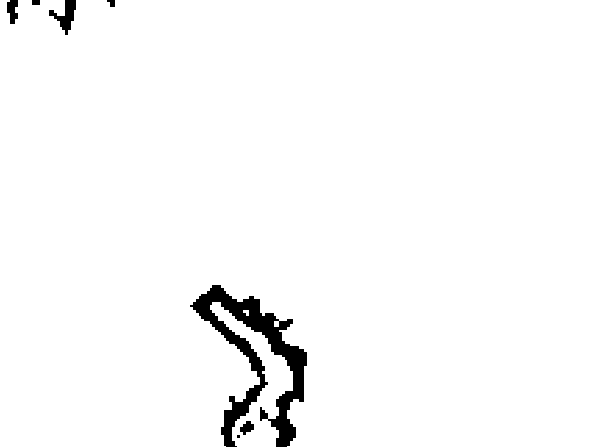

# 靈魂 DNA

我有另一個問題，和客西馬尼園的那一刻有關，當時偉大的光明與黑暗兩相碰撞，產生煉金術反應。我覺得這很難理解。這是否代表參與其中的每個人的黑暗或負面層面向前顯現並獲得提升？您說的是這樣嗎？

不是的，當時有巨大的黑暗，來自羅馬人對以色列的子民和對我的迫害。像人類一樣生活和死去的可能性比起多數人認為的更加巨大。你必須真的知道死亡只是褪去物質軀殼。我示範了這一點。那是巨大的轉變，為人類意識揭下了一層帷幕。人類根本想不到。想像一下，兩千年前，一個人類復活並證明死亡並不存在。

這是此刻我們希望教導人民的。其實真的沒有死亡。如果你具備這個意識，那麼生或死都不會讓你恐懼。生命是永恆的。為生命永恆的這個意識定錨，這正是我們所要談的。

> 大天使麥達昶：你可以視死亡為結束，或只是你所擁有的永恆生命的某個過程的結束。這些觀點大不相同。所有經典、所有宗教都教導生命是永恆的，而且你也是永恆的。所以不要將死亡²視為一切的結束。它只是你正在擁有的特定經驗的結束。

所以一切還是攸關那影響如此廣大的神奇時刻嗎？我們正嘗試要慢慢了解到我們的意識才是那神奇時刻的真正控制者。

正是。揚昇就在一刻之間發生。

我的導師和我的大師，大天使麥達昶，會說每個人都將揚昇。重點是什麼時候。

> 聖哲曼：這是一來自一場通靈聚會。由我們的時間觀點來看，地球上的每個人將會在 275 年到 300 年之間揚昇。

正是。

## 使用符號來祝福水

我有個問題和之前的討論有關。您提到可用無限大的符號和生命之花來創造儲水容器。可否請您解釋這些符號與能量活化有什麼關係？

這些符號符合你物質身體內的幾何圖案並會與之互動。你身體的每個細胞都會轉變成無限大符號。每個人類身體都帶著 144 個神聖幾何圖案，其中 44 個位於喉輪。這些符號會與你內在的幾何圖案互動。這很簡單。這個[符號]是否引發任何感覺？它是否讓你覺知事物尚有全貌？宇宙自有平衡與完美。天堂和地球全都完全平衡。

符號會直接與你說話。符號能夠繞過心智，直接進入你的潛意識和無意識心靈。因此說符號會溝通。符號是跨次元的。要以線性方式傳達某個符號的意義可能需要好幾天，有時甚至

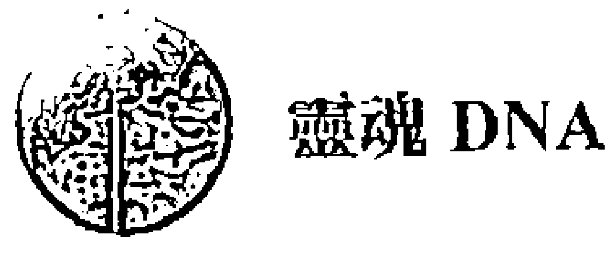

是好幾年。不過，當一切都濃縮了，你不會看著線條，而是看到整個符號。同樣的，如果你以線性方式觀看自己的生命，從 A 點到 B 點，由於符號的多次元性，其意義變得更深。符號就如同繪畫，會對每個人類的跨次元層面說話。

施予祝福也會提升你的意識。你可以說：「祝福所有創造。」你也可以分別祝福事物：「我祝福所有創造」或「我祝福所有支持著我的事物，包括帶給我滋養的所有食物。」施予祝福會帶你到達更高的存在層面。當你給予祝福並感覺到愛和感謝，你會自然地在生命中接收到恩典——帶著恩典活出每分每秒。

## 自閉症兒童

各位好，我是蓋亞。最近，在一個稱為美國的美麗國家，發生了對自閉兒童和其家庭的攻擊。這些孩子有非常高頻的振動，他們也帶著最純粹的愛。再過三十到四十年，許多家庭會希望獲得一位自閉兒童。不過，此刻這些人在美國正承受著攻擊。

> 聖哲曼：此處所謂的攻擊意味他們受到毀謗、貶抑、或者被迫表現得比自己真正的樣子更加渺小。敏感的人能夠看到這些孩子所具備的明亮光芒。他們是人類的禮物，因為他們帶著最純粹的振動。在他們的存在面前，你會自然地感覺與自我連結。他們有能力喚醒你看到自己的神性、自己對自我的愛。他們的光如此強大，如果還不習慣的人感覺到他們的光，便會感到害怕。這在歷史上經常發生。在大師行走時，光會伴隨著他，因此人們會攻擊大師。同樣的事也發生在這些孩子身上。會有越來越多的這些孩子誕生，他們會帶著明亮的純粹的光。

在 Google 上搜尋「 attacks on austistic child」（攻擊自閉孩子）會有數百則結果。

我們要你將這些孩子放在自己心裡，因為我們需要他們。他們帶來非常高頻的愛，將它安頓在大地裡。我們需要他們留在這個星球上。他們會受到攻擊，是因為他們的光如此明亮。觀想所有自閉兒童都很安全，都能持續進行他們來到這裡要做的工作，也就是安定並持守非常純淨、振動的愛的能量。他們和其他次元的連結非常緊密。

> 聖哲曼：將他們放在光裡。觀想一道美麗的金色光芒由你的心湧出，環繞世界，前往所有自閉兒童。這要在靜心時進行。

這些孩子帶來非常高頻的光。當你擁有更多的光，人們會攻擊你。這些孩子有如此純淨的心，此時我們正需要他們。

## 以閃電的力量揚昇

現在我們想擴展你們對另一主題的想像力。在這場通靈聚會發生的時間，你們所有人正在經歷夏天。在這個酷熱時節，有些時候會有大雷雨。看著這些史詩般的閃電、打雷、狂風暴雨會相當有趣。人們會歡迎雷雨，因為它們會冷卻大地。在閃電打雷的時刻，巨大的力量會釋放。科學家正在努力

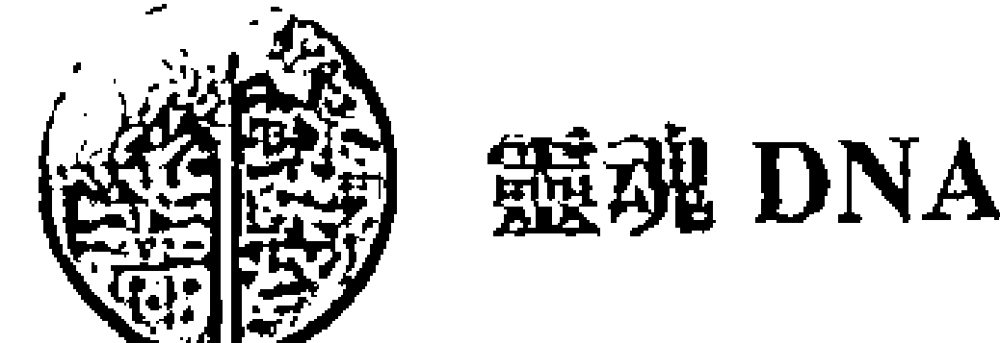

捕捉閃電的力量，因為一次打雷便足以提供一個城鎮的用電。你能與這股力量連結。我們知道你們某些人一直鍛鍊生物相對性，會傳送自己到不同地方接受療癒。我們要你前往雷暴的中心。要勇敢。你會受到保護和指引，你將感受巨大的力量。要確認你和自己的身體說話，好讓身體開啟，讓你能容納越來越多的能量。你將發現自己的力量倍數增長。

> 聖哲曼：記得，你就是你的注意力所及之處。無論你的意識前往何處，你就在那裡。將你的意識投射到雷暴中心會讓你與偉大的力量泉源連結。你可以用呼吸進入。這是力量非常強大的泉源，不過你必須能夠以自己的肉身容納這個振動，因為這可能會燒灼你。首先，你必須詢問自己的身體它是否能夠接受這個不可思議的強大光明。要記得，暴風眼也是神的一部分，而且你要與那個意識連結。一切都屬於神。有趣的是，就像你會在接下來幾年看到的，將會有科學家發現如何駕馭閃電。

揚昇會在剎那間發生—當你內在發生能量爆炸。那個能量就像推動火箭的能量。火箭帶著巨大力量爆發，會飛向天空然後分離。同樣的，你能駕馭透過閃電而下載到地球的龐大能量，與它連結並藉此點燃你揚昇的火箭。你的內在會發生化鐵成金，你將會踏出物質實相並進入一嶄新的梅爾卡納場（merkanah field）。

想像你是一枚火箭：你正準備起飛，而且你透過強大力量知道自己將會分離。揚昇就是這麼一回事。你會與地球的意識分離，完全進入一個新的意識。

**根據您所說的，那麼其實並不需要梅爾卡巴（merkabah），是嗎？這完全純粹就是意識。**

正確。這純然就是意識。我們感覺你有能力做到這一點。前往閃電打雷的中心。這是一種爆炸性的力量，所以你必須預作準備。你必須詢問自己的心這個作法是否妥當。那裏有強大的力量，難以置信的力量。

**所以您的意思是，如果人很肯定也無所忌憚，那麼就成為閃電與雷鳴？**

正確。你正駕馭這個龐大的力量。想像一下，當雷擊中某人，他們受到燒灼。它的能量如此龐大，能推動你由當前的意識層次到達不同的層次。這是立即發生的煉金術。

**在連接閃電能量時，可不可以請求能量的程度控制在此刻的肉身能夠安全處理的範圍之內，或是提出類似的條件？**

要控制能量流動非常困難。此一能量的降臨是如此強大，如果你還沒準備要處理，我會建議不要進行。你的心智必須足夠地開放才能觸及這更高層次的意識。這就像使用藥效很強的精神科藥物。這會擴展你的意識，但是如果你還沒做好準備，這樣的藥物可能會對你產生巨大影響，你可能會神智不清。

**您會將這個資訊納入書裡嗎？本書的讀者可能包括還沒準備好要這麼做的人。**

這是一本實用手冊，書中內容全都要根據你自己的內心共鳴來謹慎使用。如果你準備好了，那麼這些技巧可以在一瞬間帶來徹底轉變和轉化。我們要你開始鍛鍊這些，以它們作為靜心對象。你將會在靜心中感覺能量來到。

**所以我們需要強調做這些練習的人需要自己評估分辨嗎？**

正是。可是人們也需要知道。有些能量，你必須謹慎且在完成準備之下使用。如果不這樣，你可能會瘋狂。如果你無法處理降臨的光，那麼你的心可能會瘋狂。這就像讓五千瓦的電流通過一百瓦的電線。電線會立刻燒毀。你必須做好身心準備，你也必須詢問你的靈魂，因為你的靈魂才是你生命的主控者。

如果你們有些人曾與朱力安諾（Juliano）這位偉大導師合作，那麼你們也許要與他討論如何運用閃電打雷的能量。接著，如果你能吸收這樣的能量，便可以將它用在你的生物共鳴（bio-resonance）練習。有一段時間，你會感到難以忍受的熱，會很不舒服。不過你將能容納這樣的光，能將它用在同時身處兩地或更多地方上。

對於這個練習，你必須請求自己靈魂的完全支持。請想像整個黑暗受到即刻降臨的、最強大的光明力量襲擊。詢問你的靈魂。這是完全並短暫將自己傳送到嶄新意識層級的最佳方法之一。這個能量非常強大、非常好。閃電和打雷並非意外發生。它們有偉大的意識，就像颶風也有意識。許多巫醫和魔法師會在雷暴時工作。偉大的孔雀會在這時舞蹈。禮讚這個能量。如同麥達昶所說的，你不提升就會墮落；你不會保持不動。你必須記得這點。[ 聖哲曼：這句話引自一次個別教學， 並無文字記錄。]

在討論更高層級的責任時，我會用下行電扶梯來比喻。這就像從下行電扶梯往上走；你不能停著不動，因為如果你站著不動，你會往下。

再也不能站著不動了。每一刻都是持續的進化過程，要有意識地面對。這全都在意識中發生。我親愛的家人，今天在結束之前，我們有位非常特殊的客人。

## 鯨魚之靈

我們親愛的家人，我們是鯨魚之靈。我們深愛人類，因為你們正在進化並踏上神聖旅程。我們知道這並不容易，有許多挑戰和黑暗。儘管如此，人類仍持續進化。這讓我們許多都感到驚訝。如果人類並無進步，我們便不會在此地。諾斯特拉達穆斯（Nostradamus）曾預言世界戰爭將會於 1999 年發生，到了 2012 年世界將有大量人口死去。你們卻透過有意識選擇提升自己的意識來改變這一點。嬉皮運動²（The Hippie Movement）協助轉變了人類意識。儘管他們會使用毒品，不過他們也教導愛。

2. 註：關於嬉皮運動的歷史，參見（http://en.wikipedia.org/wiki/History_of_the_hippie_movement）。

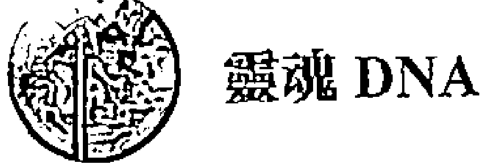

我們腦中帶著重要智慧和許多資訊。我們帶著星球進化的歷史。朱力安諾曾提到我們的功能，其中之一就是為大地母親擔任使者。大地母親在不同地方有不同需要。〔聖哲曼：這些是尚未以文字記錄的教導。朱力安諾是來自大角星的導師。〕

全世界的人都喜歡看鯨魚。他們會傾聽我們的聲音，在書中閱讀我們的事，觀看我們的照片。我們帶著整個星球進化的歷史。你的進化史也編碼在我們內在，而且我們的分子結構直接保存人類的 DNA。許多科學家都認為我們唱歌是為了呼喚伴侶。不過我們其實是在呼喚你們活化自己的 DNA。

所有創造的生物都包含水元素，當他們聽見我們的呼喚，這會觸發他們的 DNA。我們要請你們所有人有意識地與我們連結。有許多生物包含這些銘印，例如偉大的山納・庫瑪拉和大地母親。我們也帶有一個龐大的模式庫，包含你們的能量場、靈魂史、以及在宇宙中扮演的角色。我們邀請你走向我們，與我們一同學習。你可以在睡眠時呼喚我們。我們將會來到。

## 轉移地球磁場

**我有個問題。我想知道更多關於地球歷史的轉變，我們如何走在自我毀滅的道路上（直到 1987 年），讓人類種族本來會殺死自己，但是狀況卻改變了。我想更了解這件事：那是怎麼發生的，人類是怎麼做出那個轉折。**

這個問題無法簡單回答。磁場大師克里昂〔其通靈者為李卡羅〕在這件事上扮演了重要角色。他轉移了地球的磁場。如果地面有強大的磁場能量，人類便難以覺醒。磁場讓人深陷於自己意識內的某些劇本，時間可能長達數千年。當大地有很強的磁力，就不會有什麼改變。中東便有很強的磁場能量，因此人類不願改變。在美國，維吉尼亞州和康乃迪克州仍然非常保守，那裡也有很強的磁場能量。不過，在舊金山，人們對新觀念相當開放。克里昂發揮了重大功能，轉移磁場的效應。

諾斯特拉達穆斯在描述世界末日時所看見的確實沒錯。那是場景之一。不過他沒見到人類覺醒的場景。嬉皮運動造成很大改變。你們開始經由自己有意識的選擇而覺醒。接著，和諧匯聚發生，而你們被問道：「你是否準備好要轉變？」人類回答是的。所以接下來二十年，地球的使命就是提升自己的意識。地球的守護者觀察著，想知道地球上的意識是否會提升。

當時的意識非常低，所以諾斯特拉達穆斯所說的場景很可能會發生。但從那時以後，地球的意識變提升了，許多的典範也產生轉移，包括蘇聯崩解。蘇聯本來可能在 1999 年開始至 2012 年結束的世界末日中扮演主要角色。不過既然蘇聯崩解了，那個場景就被取代。就在那時，許多人類開始在時鐘上看見 11:11 的數字。接著他們又看見 12:12。這些都是轉變的日期。

## 光明會揭露黑暗

我們現在正經歷一次轉化，穩定這次轉化所需的能量需要時間。有更多黑暗正在顯現，因為不再有秘密了。光如此明亮地照耀著，有越來越多的秘密都會被召見。這就像一個老舊的空瓶。當你想將它裝滿水，髒水會先跑出來。意識的轉化真的會改變事物，有大量的光已經產生。這會揭露更多黑暗。

在特殊的時代，有更多光會進入大地，好讓更多黑暗能被揭露。美國有一個巨大的黑暗最近被揭露了：美國政府正監視著每個人。這件事本來隱藏著，但是它必須被揭露，因為大地有了更多的光。你會看到越來越多的光開始閃耀，這也進而會彰顯許多製藥廠、保險業、健康照護公司正操控著人類。他們讓人們繼續生病，好讓自己能夠賺錢。一切都會在未來揭露。關於政府如何企圖控制人民，好讓人民繼續無知的真相也會更頻繁地為人所揭穿。不過他們不會成功，不管多麼努力嘗試。他們會恐嚇、會使用武力，不過光明最終會取得勝利。

看看新聞。一位來自巴西的年輕人［大衛·米蘭達（David Miranda）］由柏林搭機，在倫敦的希斯洛機場正要轉機前往巴西。英國首相下令將他拘留了九小時，因為他攜帶著某些關於愛德華·史諾登³的資訊。你認為這會停止嗎。政府們企圖要恐嚇人民。再重複一次，光已經照耀在人們正在做的事情上。這不會停止的。

³ 註：英國 BBC 新聞。「大衛米蘭達被捕：議員要求解釋」，2013 年 8 月 19 日，http://www.bbc.com/news/world-latin-america-23750289。

## Chapter 14 揚昇大師如何能協助你揚昇

正在到來的光將黑暗沖洗出來。
正是。你看到某些利益團體正在企圖控制人類。在許多國家，警察和司法系統與大企業攜手合作要控制人民。

人類是金錢的偶像崇拜者。人們可以被收買。
每個人都被收買，即使是法官。有些公司撥經費給科學家推廣某樣產品並撰寫有力的報告。銀行家和信用評級公司會收到大量金錢。一切都慢慢地攤在陽光下。

一切的創造都支持人類
印度最近授與你們稱為海豚的偉大生物非公民資格。印度政府認為鯨豚類是非人類的人⁴。人們逐漸領悟這類偉大生物的重要。當光閃耀，人便覺醒，會了解一切創造的重要，知道他們如何支持人類。我們還未見到重大的干擾或大量的生命流失，但是黑暗將越來越被揭露出來。為什麼我們要允許這樣的事？

好讓人們覺醒。
正是。不過問題是：他們會覺醒嗎？當然，總會有些人將會覺醒。

# 靈魂 DNA

我們不能改變人，可是我們有沒有辦法知道自己如何影響他人？或者那並不是我們的事，而我們應該好好做自己的事並希望一切都好？

不，你們正在影響。就像之前提到的，一個心中具備完整、純淨且真誠的愛的光之存在最多可以影響到兩萬人。我們正尋找關鍵多數的人。就是這樣。當 144,000 人用半小時共同冥想和平，世界的犯罪率在那段時間確實降低⁵，這也證明了這一點。

## 向領導者傳送光

我們必須向世界的所有領導者傳送光，因為在領導者做決策時，數百萬人會受影響，因此犯錯的空間相形之下就非常小。為所有領袖護持光，好讓他們能夠做出正確決策。他們仍有自由意志，不過傳送的光越多，效應就越強。如果每個人都向領導者傳送光，情勢就會改變。

讓我給你你們的例子。最近，我們全都向羅薏絲傳送光並為她冥想，因為她經歷一次心臟手術。她在醫院只待了八天就出院了。這難道不是奇蹟嗎？〔來自麻塞諸塞州，大巴林頓（Great Barrington）的羅薏絲·哈特維克（Lois Hartwick）是你作者們的個人朋友，並且在 2013 年 8 月進行開心手術。〕同樣的，要將光傳送給所有領導者，因為當他們做出決策，數百萬人會受到影響。領導者需要做出明智決定。讓我們為所有領導者護持光明，例如歐巴馬總統以及澳洲目前的領導者，總理東尼·艾伯特。澳洲目前正發生著光明與黑暗的大戰。向他和向每個人傳送光明。那麼領導者將能清楚地看到更多的光，並根據那樣的光做出決策。

在我工作的地方，我會見到許多能量療癒的案主。在我仍在那裡工作時，有越來越多渴求靈性的人前來找我。以前不是這樣的，但是現在人們會提出真正的問題，都在試圖將靈性融入他們的生活。幾年前，這相當罕見。這是不是也有部分與白宇宙降臨到他們身上的光有關？

當然——也和你們所有人所做的努力有關。達成越多的關鍵多數，人們就越會受到影響。不過由於地球上的高頻宇宙能量，許多人都相當混亂，不知道該往何處去。他們尋找著答案。你就像燈塔一般閃耀著自己的光要協助這些人。所以你會見到越來越多人覺醒，越來越多資訊、知識、通靈智慧降臨。你必須明辨什麼對人的進化是恰當的，並且據此做出選擇。

### 將意圖注入物質

在先前的聚會中，您提到水〔參見第十一章：清理並淨化你的能量〕。您提到製作手工陶器來儲水。我是陶器匠師，正在考慮製作這樣的器皿。您提到無限大符號以及四個方向，您也提到到底部的生命之花符號。如果我要製作儲水器皿，是否還有什麼是我該知道的？

你只需要知道一件事：你行為背後的意圖。在你製作陶器時，讓你心中具備最大的愛，並且塑造意圖要讓你的陶器能裝水並且支持、啟發你，喚醒你內在的神的能量。那麼這便是最恰當的開始。

無論你做什麼，最重要的就是每個行動背後的意圖。在製作陶器時，對陶土說話、對粘土說話、對加入其中的水說話，接著你要請求支持，它們也會給你支持。這些事物也都擁有意識。它們也是大地母親的一部分。當事物結合起來，請求它們彼此合作，它們就會完全支持你的意圖。

家中許多事物都很悲傷——桌椅、窗簾、沙發——因為它們被使用、被取得、被羞辱、違抗意志被放在屋子中。沒有人曾請求它們的同意。它們也是大地母親的一部分。你會開心嗎？你是否希望別人問你：「你願意為我做這件事嗎？」兩者是有差別的。要感謝你家中的每件東西。請發自內心將愛與祝福帶給這些事物。

你該如何感謝它們？在靜心時，你可以在心中觀想綠色森林或綠色的樹木。當你為自己的床單、為家中每樣東西做這件事，每件東西都會感到放鬆。碰觸窗簾、床單、或是音響——無論你的臥室有些什麼東西——然後對它們說話。將心的能量傳送給它們，並且感謝它們。每樣東西都會放鬆。下次你走進那個房間，你會立刻感到放鬆，因為你周遭的一切都處在放鬆狀態。

在你製作陶罐時，先請求同意。尊重大地母親的材料，因為它們提供自己的生命和本質讓你創造這個實相。當你這麼做，你便帶來高頻振動能量。

> > [大天使麥達昶：當你請求陶土和其他製作陶罐材料的允許，它們將會願意支持你。當你請求，就會有更多的能量給予。未來，以陶器製作食物將會越來越流行，許多旅館將會提供陶器。食物會更可口，也更能滋養你的身體。]

高度發展的社會就是如此製造太空船的。製造者會呼喚他們塑造太空船所要的一切，塑造意圖和自己的渴望，好讓太空船永遠不會衰敗。未來，一切都是這麼製造的，包括電腦。衰敗不會發生，因為你們會請求材料同意合作。

假設我告訴你：「你要為我做『這個』或『那個』！」你會開心嗎？如果我先徵得你的同意，兩者比較一下。你或許會更輕鬆地完成。關鍵在於合作。所以，在你製作陶罐時，先請求陶土、泥巴、水或任何必須加入的本質一起合作。你所做的事情背後的意圖最重要。一切都會水到渠成。這便稱為善。你請求宇宙力量的支持。

我們是鯨魚之靈。祝福各位。在我們結束前，麥達昶將與各位說話。最親愛的各位，我是大天使麥達昶。我們天使存在最愛和人類共度時光，可以辯論交談，即使是與神有關的主題。正是透過如此，你們才能學習——只要討論是出於願意知道更多，而非出於自我感。我們真的喜歡與諸位全體交談，因為你們每個人都努力要更加認識神。生命就是這麼一回事。千萬別停止追尋，我親愛的家人，千萬別停止追尋。

2013年9月2日 盖亚、玛哈特马、大天使麦达昶、圣哲曼

我親愛的家人，你們好。你們的努力讓我的身體不一樣了。在這次通靈聚會的時刻，美國正值颶風季節，而今年你們沒有很多颶風。這是因為所有覺醒靈魂共同祈禱的結果。這正在讓世界不同，而颶風只是範例之一。我們要你比以前更努力護持光明，好讓下個戰爭不要爆發。你們的祈禱有助於帶來改變，而你們也會看到效果。今年你們會遭遇比以前更少的野火。某些州已經發生野火，不過如果你和其他年比較，今年發生的少得多了。

現在我要你為另一個目的工作，為一個自私的目的：為了我。我需要移動自己的身體，而在我移動時，有時會顯現為火山爆發或地震。今年〔2013 年〕或許我的身體會有動作。我要求你們護持著光，好讓我能以非常優雅的方式動作，不要造成太大的動盪。因為，就像你一樣，我有時候也需要移動，不過如果有人支持我，我可以更優雅地行動。

你們是我的後援隊。你們在這個星球上所做的事對我的身體有巨大的影響，因為我們在 DNA 層級、神聖神性層級、在構成你而我也是其一部分的元素層級有所連結。我們已經一起跳舞。所以我請你持續祈禱並設定意圖，好讓我能夠輕鬆、更優雅的行動，因為今年我需要移動至少三次。

有時候我需要特意安排自己的身體，因為在地震發生時，有許多事物由大地釋放出來，新的振動能量以及靈性真理會公諸於世。如果我們能和諧且平衡地合作，我能繼續做自己需要做的事。這個知識是你 DNA 的一部分。你們都正在成為大師。耶穌弟兄說：「我實在告訴你們，你們有信心，不疑惑，便能行這樣的事，而且更多」（馬太福音 21 章 21 節）。他已經向你們展示這一切。

當風暴來臨，他對風暴的靈說話。他怎麼能做到這點？因為他已連結自己的量子存在、自己完整的 DNA 束，所以他能在那個層次與風暴溝通。我們要你從今開始從那個層次溝通——所有類型的溝通，不僅是與我溝通，也包括與人類的溝通。在你說話之前，設定意圖要發自你的量子存在來溝通，而不是基於一組成見概念。你的溝通將會出自更高的層次，並且創造雙贏的情境。

我們要你從此刻開始考慮這一點：你說的一切都出自量子層次。這是另一項禮物：當你開始喚醒自己的 12 束 DNA，你該怎麼知道你已經有意識地喚醒 DNA 到什麼程度呢？證明或衡量標準為何？你的實相將會慢慢轉變，不再由個人的觀點，也不是由你的自我感或人格，而是由跨入量子存在的觀點。

今天，我們會觸及其他仍與 DNA 有關的主題。全世界許多光之工作者都想取用不同的更高能量——例如亞特蘭提斯的黃金意識或列木里亞的黃金意識。或許他們不能感覺多少能量。不過，如果他們改變自己的觀點，相信自己能從自己的肉身內在感受這種能量，他們便會更加成功，因為在那裡更高意識仍然存在。

### 第一人稱的肯定語和觀想

肯定語和觀想不總是如人期待或渴望的方式生效，因為這些做法都是在第三人稱的層次進行。它們必須在第一人稱的層次進行。例如，如果你想觸及大角星的更高能量，這些能量也存在於你內在。請求取用你內在的這個能量。接著你的連結將會在更高層次發生。至少你是在大角星人的層次遊戲，而且你正在與大角星人合而為一，因為你正在喚醒自己內在的這個能量。

> 〔大天使麥達昶：要由第一人稱來修練，你必須相信自己是萬能造物主的本質之一，和造物主擁有同樣的能量。這或許需要很多工作，因為有許多信念系統需要去除。當你來到這個層次的大師風範，你會記得自己真正的身份，具備所有創造的力量。即使在你入睡時，你也在創造自己的生命。你會記得自己是以物質的人的型態存在的神，而你會和耶穌做一樣的事——甚至更多。許多大師都證明了這一點。耶穌不是唯一行使奇蹟的大師。巴巴吉曾經行使許多奇蹟，賽巴巴（Sai Baba）也是，最近一次就在三年前。要行使奇蹟，你要知道自己乃是萬能造物主的本質，而這樣的認知、這樣的覺知不僅要存在你的物質心靈，也要存在於你全部的心靈——無意識、潛意識、超意識——要充滿你的全部。當你發出命令，由那個空間設定意圖，它自然在你發號施令的那一刻便已創造。這會連結你內在的力量泉源。」

類似地，當你與人面獅身像合作，請由第一人稱的角度工作：從你的身體內部。由第一人稱開始，而不是第三人稱，那麼你將看到自己意識內產生量子轉變。

「今天我為什麼來？」理解自己的量子本質是衡量的標準，讓你知道自己已經走了多遠，進化了多少，活化了多少DNA。當你看見一道波浪，你會看見它的美。當你看到一朵玫瑰，你會看到它的美。當你看到一個小孩，你會看到他的美。美從何而來？美在你的內在。在剎那之間，你便能觸及自己擁有美的那個部分，讓你能夠看到自己以外的美。

### 取用內在的高頻能量

從現在開始，當你想取用大天使米迦勒（Archangel Michael）、大天使麥達昶、或任何其他光之存在的能量，向你內在請求這樣的能量完全活化，因為就你所知，你就是群體能量。神是群體能量。數百萬的能量結合並構成了你。其他光之存在也是數百萬的能量結合。現在我開放各位提問。

在亞特蘭提斯和列木里亞，我們的十二束DNA完全活化。是否有幾束DNA從那時起便逐漸衰退，不然退化是怎麼發生的？

你必須記得一件事：就你最真實的本質而言，你永遠都是完美的。你的 DNA 是完美的。改變在細胞和基因層次發生。因此我們要你回到量子自我。

### 回到史前、地球之前？

當然。回到你原初自我，那是在地球創造之前。那時你是誰？你來自原初泉源，不是嗎？你的名字是什麼？「我是」。

> [大天使麥達昶：要這麼做，就請求。原初型態是一個光點，由造物主的燦爛中爆發出來。你能想像自己由「萬有」中爆發出來嗎？觀想一個巨大的圓圈，充滿明亮的光，你將看到生命力量在禮讚，就像煙火一般。想像和觀想是你的靈魂使用的最高工具，藉此記起並成就大師風範。因此它們是我們高度推薦的工具。所有靈性傳統都持續使用它們。

如果你能觀想它，你便能成就它。如果你能專注於某個地方，那裡就會是你所在的地方。將你的注意力放在這個誕生中的星，這個正在萌發的能量，然後與這個能量連結。即使在現在，你會感覺麻麻癢癢，那個不可思議的能量正降臨你的內在。]

### 我們如何辨認自己的 DNA 變化？有方法嗎？

你怎麼知道自己正觸及 DNA 的更高意識？你會知道，當你開始從量子層次過生活，從量子層次溝通，喚醒自己生命內在的一切，而非向外在的泉源請求。

讓我問你一個問題：你認為麥達昶在哪裡？他在你內在，不是嗎？無所不在也包括你！所以為何不先在內在觸及他？接著你和他的連結將會變得更加堅強，只要你在內在喚醒他的能量，並且讓自己的能量層級與他呼應。這是我們此刻要你做的事：不要向外尋找。能量存在，你也是這個能量的一部分。不再用第三人稱。一切都在你裡面。當你開始用這個角度看待每件事，你便會觸及自己 DNA 的最高一束。這便代表你的 DNA 已經活化。

從此刻起，若你想與某人溝通，這個溝通不僅要出自於你的人格，更要出自於你全然的真誠、你的能量、你的生命。當你開始以這種方式思考，你的觀點便會改變，就會自然知道自己正在觸及自我內在更高層次的意識。親愛的各位，這就是關鍵。

所以，讓我們假設你想取用某些水晶科技，而你正尋找某人為你通靈傳達亞特蘭提斯所發生的事。你將能找到能量的線索，因為能量無所不在。不過基礎能量，亦即最高真理，將在你能由自己生命內在取用這種能量時才會找到。記得，當你想取用更高層次的能量，首先要從你的內在取用這樣的能量。

有個問題：「我們該如何在大腦左右半球之間編織線索？」正是透過這個量子層面。如果你每天都用這個層次生活呢？這代表你正活化越來越多，並取用越來越多更高的 DNA 束。

### 貳歸

### 誰在等待著什麼？為什麼？

你在等待自己。你是自己光輝的未來！你在等待自己回家！你是否曾經閱讀我們摯愛的克里昂經由李卡羅所寫的《返家之旅》（The Journey Home）？這是麥克·湯瑪斯（Michael Thomas）的故事，這人踏上自己的旅程，想找到神。最終，當他看見神，他是如此驚訝，撲跌在地，因為他見到的神長著他自己的臉。這是本絕佳的書，有豐富的洞見，是來自摯愛的克里昂大師。他帶我們踏上這個旅程，經歷許多不同主題和情緒，最終他回到家鄉，在神身上看見自己的臉。

所以你們等待著自己。這段旅程屬於你。這是你們所有人未來生活的方式，發自這個量子層面，發自你完整的本質——物質身體結合心智身、情緒身、靈性身、當然還有其他的身體。當這個結合發生，生命就成為完整的經驗，不再有分離。

性會成為狂喜，因為不再有空虛；一切都是喜悅的分享。在你獨處時，你會很快樂，當你有人陪伴時，也很快樂，因為你充滿澎湃的能量本身。你吃東西不再是為了填飽肚子。進食成為喜悅的經驗。工作變成有趣的經驗。未來，工作將稱為喜悅的創造，是一種充滿，完全的充滿。你將會以物質身體、靈、物質的結合來經驗一切。你做得到；你們全都正在到達這樣的層次。你們某些人會有這個層次的階段性表現，會來來去去，但這將成為你們新的常態。

### 透過量子自我來溝通

當您提到量子自我，您的意思是與地球、宇宙、眾人、岩石、樹木等等相關的自我嗎？

從更高的觀點，當你提到自己的量子自我，你說的其實是你所有分離的部分回來並融入你所有的身體——物質身、心理身、情緒身、能量身、乙太身、星芒身和靈性身——這些全都由所有的次元回來並結合。

我給諸位一個小例子來練習：在靜心時，想像自己是公司總裁，晨間要召開董事會議。你坐在會議室內主席的位子，有十一位董事環繞著會議室坐著。這十一個存在都是你。你可以為他們每一個取名字，你能自己選擇。總裁的期待是什麼？就是這十一位董事能完全和諧地彼此合作，促進公司最大利益。當你能觀想這十二的存在完全和諧地工作，這便是所謂呼喚自己內在的十二個量子存在前來合作。

就像前面提到的，如果你想進行溝通，你必須請求這樣的溝通由你的量子自我啟動，而非出自你的人格。偉大的導師威尼斯保羅曾說，說話之前要非常謹慎地思考。偉大的導師孔子也說過同樣的事：三思而後行¹。所以讓交談不僅是發自心智，更要發自那量子存在的古老又古老的心。如果能每天做這個練習，以董事會場景結合所有其他部分，就會幫助你觸及更多部分的自己。

例如，當你要進行決策，想像這個董事會議場景，許多董事參與決策過程。假設一位總裁想導入某個新觀念，他會怎麼做？他會向所有董事提案。如果所有人都說：「這是個好主意。我們就這麼辦吧，」你就知道自己的路是正確的。不過如果發生內鬥、不和諧的辯論、人人意見不同，你就必須謹慎考慮自己的提案是否真的是你想做的。不和諧代表某些部分的自己並不同意這個提案。

或許你在靈魂層次或靈魂道路上並非百分之百肯定。如果超過半數的你說這是件該做的好事，你也許可以做。不過你也許也不該做。你是分裂的，會面臨挑戰，而此一行動只會創造更多業報能量。

> > 1 註：『季文子三思而後行，子聞之，曰：『再，斯可矣』』《論語・公冶長》。

### 呼喚你的量子自我

明天早晨，當你醒來，不要只是起床。留在床上幾分鐘，說：「我呼喚自己其他量子自我在此刻結合，而我設定意圖在今天藉由量子存在來經驗一切。」你會感覺一道白金色的能量穿透你。你會處在更高的位置。

在一天的開始，你最初、最重要的想法將會影響你整天所有其他想法和行動。那個想法，那個醒來的那一刻最重要的想法就是會影響你的潛意識心的想法。所以為何不用呼喚自己的量子存在來開始這一天？塑造意圖要從那個層次來經驗並共同創造當天的每個經驗。

你會立刻感覺不同。如果你花點時間，每兩到三小時休息一會兒，你會捫心自問為何自己從前沒這麼做。你會更處在流動之中，會享受一天中的每一刻，包括掃地洗衣。你不會將它們視為瑣碎家務，而是將它們當成喜悅的創造。你的觀點會立刻改變。我們鼓勵你從此刻起要以自己的量子自我來生活。呼喚這些存在，你的存在，你就能看見。

> > 人們會說：「如果我有更多覺知，我的生命就會更好。」

親愛的諸位，你們全都是量子存在，你們也會透過這個練習而更加覺知。

### 開啟金色道路

你必須請求自己的情緒智能提升以呼應自己的這個量子層面。有許多導師都相當善於寫書，不過他們的情緒智能就像五歲小孩一樣。

我們要再次提醒你們，要在清晨設定意圖。允許你量子自我來喚醒自己內在的量子情緒和感受。最重要的是量子之愛和量子恩典。你的生命會有全新的道路，你能像火箭一樣飛行。這種生活方式稱為開啟金色道路。

這是黃金時代的開始。這是亞特蘭提斯金色意識的真正意義，因為那時人們以這種方式生活了好久。所以從此刻起，願金色道路能為你開啟，由你自己藉由活化完整的十二束DNA來開啟。

### 療癒蓋亞

每個想法、你對自己每個好的感覺，都會滋養並支持我。所以，無論你是閱讀摩西五書（Torah）或傳送祝福，你都在# 靈魂 DNA

療癒我。每個祈禱都會療癒。你的每個善念都會療癒我。每次你對他人慈悲都會療癒我。每次你寬恕他人都會療癒我。每次你以微笑、慷慨、慈悲、笑聲、天真或純潔打動某人，你都會療癒我，因為我們乃是一體。你如何帶給我最佳的療癒？當你全面療癒自己時。

人們問我：「蓋亞，我如何療癒你？我能為你做什麼？」答案很簡單：療癒你自己。當你療癒自己，我便得到療癒。我是你，具備你內在包含的同樣元素本質。當你療癒，想像我是你雙手捧著的藍色珍寶。將你的祈禱傳送給我，我會在量子層級收到，好讓它們能深入我的胸膛。當你將自己的能量安住於心，並由你的雙腳而進入大地，這會以量子能量來到我這邊。每個祈禱和思維都會有助於支持我的健全。

我們藉助其他光之生命，經由「和諧匯聚」這類事件，改變了這個星球的意識。所以千萬別懷疑祈禱的力量——包括你的祈禱和其他所有人的祈禱。

透過你的祈禱請求與大地母親相應，支持她完成轉變。祈禱和相應有其不同。當你請求相應，你正進行大師所做的事、人們自古以來會做的事。在他們跳舞擊鼓時，他們請求與大地母親的意識相應。請求相應，你的能量和振動立刻就會不同。會有更高頻的振動，特別是當你想與我合作時。請求相應。在你所做的每件事中，都要與我相應，這就在你的 DNA 內。

我的家人，還有疑問嗎？

## Chapter 15 這段旅程屬於你

先前您提到與第五和第七次元合作。我聽過有人在這些次元內工作。您能否解釋這些次元到底是什麼？

親愛的人，他們是意識的狀態，是你能達成的不同振動層級。當你在第五次元，你成為更完整的自己。你擁有更多意識，內在有更多的光。所以每個次元都只是不同的意識層級。它會開啟你內在另一層封印，更進一步穩定更高脈輪，並導入更多的光來造就更多意識，讓你觸及更高的意識層級。關於誰呢？關於你自己。所以這些層級都只是指出你將要看到的只是冰山一角；僅此而已。

### 透過釋放來觸及DNA

幾千年前，在野蠻年代，我們沒有任何神的概念，只有動物性的本質和低等振動。慢慢地，經過進化的過程和自我認識，我們提升了自己的光明含量，開始思考生命並不只是殺戮。這個想法喚醒了內在的光。

### 我們個人的DNA是否會隨著我們釋放、解決、轉化自己經驗資料庫的每件事物而改變與突變？

不會的。當你釋放，你會觸及更多自己的DNA。這就像開啟另一層次的DNA意識。DNA永遠都是完美的，都在等待你發號施令來喚醒更多DNA。

> 「大天使麥達昶：要這麼做，你要請求你的細胞和脈輪，並與它們溝通。請求你脈輪內的能量以完美和諧來旋轉。與天使或其他存在的明亮的光合作，清理並淨化你的脈輪，好讓它們以完美的和諧旋轉，並讓鑲嵌在脈輪中的密碼能夠開啟。與你的指導靈合作，幫助你開啟這些密碼。」

### 所以這是活化的過程嗎？

是的。你是否聽過封印？打破封印稱為去除——打破七個封印，找到內含的鑽石。我們將這類比為釋放。

> [大天使麥達昶：這是開啟第七脈輪的象徵。每個脈輪都會有內嵌的能量。這些內嵌的能量就像密碼。鑰匙只能開啟相應的密碼。能開啟脈輪的密碼之一就是聲音。另一個是你的意識。裡面的鑽石就是提升的意識。這是你的「存在」部分。]

### 某些人的 DNA 在他們不知情或不同意的狀況下升級，他們的症狀和覺察整個過程的人會有不同嗎？

症狀之一就是不會腳踏實地。沒有腳踏實地的人會看起來很快樂、很平靜，不過他們需要有人照顧。他們可能會成為其他人的負擔。這個世界需要人付出能量才能生存。經驗到自發性覺醒的人會處在平靜之處，他們的光也是明亮的。不過他們也需要為世界付出。重要的是要完全活在第三次元當下。不腳踏實地的人會說他們不想工作，會說他們只想靜心。不過，他們該如何支持自己？

## 情緒成熟

也有些人獲得了重大的覺醒，但是情緒上卻不成熟。他們成為表面先知。【大天使麥達昶：表面先知只關心外表的華麗，而非藉由自己的靈魂獲得內在的偉大。他們或許成就了某種啟蒙，但是他們以此自滿，不再修練自我。他們的焦點在外而不在內，只關心有無追隨者。他們失去自己所成就的，變成如同演藝人員一般。「來跟隨我吧，因為我碰觸到神的手。」人絕不可以停下腳步，說：「我已經覺醒。」人必須持續努力，因為總有更多需要努力的地方。】

如果你在網路搜尋，你會看到新聞說有位印度的偉大導師因為性侵而遭到逮捕。他的追隨者有一千萬人之眾。【大天使麥達昶：他的名字是巴普·阿薩朗²（Bapu Asaram）。他就是我們提到的表面先知。他成就某種程度的啟蒙，但從未能知行合一。】許多所謂的神聖之人都遭受逮捕。他們全都有巨大的力量，也向眾人示範奇蹟，但是他們沒有腳踏實地，所以他們虛偽的自我感佔了上風。這就是為何喚醒拙火必須謹慎施行。你需要了解人體，你必須有能力護持高頻振動的光，並且完全活化自己的量子存在。

想像一下，如果你的十二束 DNA 全都活化，但你並不是個平衡的人，你會怎麼做。你可能會大大誤用自己的力量。這曾經發生在亞特蘭提斯，造成巨大災難。

所以，如果有自發性覺醒，而且那人並未做好準備，那個人可能因此變得失衡或者開始虛假地展現神的存在。一個真正覺醒的靈魂永遠謙遜的。他或她的生命代表了覺醒實相的真理。一個真正覺醒靈魂的話語表達了生命自身，為真理代言。不需要表現。愛和神性都是在靜默中為人經驗。真正的大師是沈默的。如果當事人在靈性上、心理上、物質層面上都未做好準備，那麼自發性覺醒會有可怕的後果。如果你的生命力能量已經累積到高等級的氣，完整啟蒙了大腦的左右兩半球（在埃及，這稱為 sekhem，意為「生命能量」），你的內在將擁有更大力量和性的能量。你能控制它嗎？

### 2038年更高的意識層次

### 社會中已活化 DNA 的人和未活化 DNA 的人是否會產生分裂？

讓我們不要說分裂成兩個分離的團體。將會有人與更高的光明含量共鳴，他們心中會有更多的平靜、愛、恩典。會有其他人並不在這個層級振動。人們會說：「嗯，這個人發生了什麼事。當我在這個人身邊，我覺得很好。」到了 2038 年我們將能感覺並覺察到那些意識更為覺醒的人。這就像前往修道院，和聖者處在同一空間。聖人身處的大地都會與他的存在和平靜共鳴，他身邊的人一進入他的氣場就會感覺他的平靜。

據說佛陀的氣場範圍超過七公里，當人們進入此一範圍，他們感受平靜、安寧、愛、並且覺得一切都恰如其分而自己的心智也更為擴展。你的問題答案是：沒錯，我們將能感覺到差異。

### 我們能否傳送光到其他人的更高自我，藉此分享並散佈此種升級？

當然。人們的職責就是分享，要像燈塔一樣，其他人將會接收到這樣的光。向所有領導人傳送光也很好，因為他們要做出重要決策；當然傳送給所有人也很好。盡可能與越多人分享。不過，分享不要帶有額外的動機：「我將傳送這個光給這個人，擁抱他的完整，沒有分別心。」

### 透過活化身體器官幹細胞來放大該器官的能量會有什麼益處？

很簡單。你為某件事物充飽能量會發生什麼事？它就能夠發揮最大的功能。假設你要處理腎臟。你為腎臟充滿能量，接著腎臟便能發揮最大功能。你的心能以最大功率運作。鍛鍊身體每個部位，因為這對你真的有益。向身體每個部位傳送愛，你將會強化那個部位。祝福每個身體部位，就像安娜〔耶穌的祖母〕教導各位的。每天早晨當你醒來，說：「我祝福自己的身體。」祝福每個部位，因為當你向它傳送愛，你便賦予它能量並加以療癒。這會讓每個部位處在最佳狀態和功效，你將喚醒一個非常高階的能量。這麼做非常好。

## 愛的靜心

閉上眼睛幾分鐘，將注意力只放在你的心。問問你的心：「你還好嗎？百分之百好嗎？」看看你的內在給你什麼答案。親愛的各位，你發現了什麼？雷得到的答案是：「不，我還有工作得做。」

**在生理層次，它還好；但是在能量層次，還有工作得完成。我的答案有好有壞。**

因此有一種靜心稱為「進入心室」。你可以進入每一間心室，去問：「有沒有什麼地方是我沒有為最高的善護持光明的？我該如何按摩自己的心？」按摩你的心，讓它放鬆，將它釋放，並且愛它。

> [大天使麥達昶：你要在靜心時這麼做。記得，你的心有二十四間心室。這些是能量空間。想像你一次走一步，沿著心的水晶階梯往上或往下。最後，你會來到中央的一個位置。這就是你的心室。這是你自己私人的空間。要習慣每天前往那個地方。在此沒有人能打擾你。]

[觀想自己坐在這間心室。邀請你的指導靈。這是你內在之神的內在聖地。在這裡你能與自己的靈魂、指導靈、造物主溝通。記得每天前往那個空間，沒有人能打擾你在這個空間的平靜。]

另外還有一個針對大腦的美麗靜心，稱為「大腦呼吸靜心」（Brain Respiration Meditation）。每天，在上床就寢之前，想像你雙手捧著自己的大腦，按摩它並以最乾淨、最純潔的水清洗它。由於各式想法，大腦已經萎縮。所以透過按摩——非常溫柔地按摩來愛它並向它傳送愛和感恩——你就在療癒大腦。

### 為身體不同部位充飽能量並療癒

要療癒你的膝蓋，詢問你的膝蓋此時需要什麼才能發揮最高功能。你會得到答案。針對耳朵，你要問：「我是否依據靈魂完整的力量或量子層次來傾聽？」你可以請你的天使存在來支持你完全開啟眼睛，好讓你能透過靈魂的眼睛來看，透過靈魂的耳朵來聽。同樣的，針對你的心，要用你完全啟蒙自我的心來感受。跟身體的每個部位說話，一一針對每個部位來灌注能量。

### 我們如何透過右腦來控制這段旅程？

你無法在物質層次控制這段旅程。這段旅程會自然發生。在某些靜心中，你可以與右腦和左腦連結，不過這發生在特定時間，你也無法保持。當你努力提升自己的振動，你會自然影響你的右腦。這是個自然的過程。有個增進由左腦流向右腦能量的方式，就是持續專注並傳送光進入松果腺，觀想松果腺擴展並傳送美麗的銀白色光和光的能量束進入大腦右半球，造成右腦和左腦能量的交叉穿梭。

如果你能為大腦左右半球照相，你會用銀白色光畫一側，用棕色畫另一側。位在中央的是松果腺。有個有趣的例子，就是醫學的象徵符號，蛇杖（caduceus）。這個符號描繪兩條蛇，一黑一白，隔著松果體彼此相對。

如果你想提升自己的拙火能量，你要將它導入普拉納管道，這包含左右兩側，一側屬日，另一側屬月。觀想能量經由這兩個管道提升並進入大腦內部。

這兩個能量管代表大腦中央內部的黑蛇與白蛇，面對著松果腺。如果你能看到這件事發生，你就可以說靈蛇已經上升。正因如此，在古埃及，你會看到法老王頭頂的皇冠有蛇的形象。這代表他的拙火能量已經完全覺醒：他大腦的左右兩半已經完全結合。他隨時都以量子自我存在。

### 如果右腦是擴展的關鍵，左腦是陰陽的旅程，我們該如何平衡兩者？

你需要平衡，藉由物質身體活出物質實相。我們要你不要揚棄這段陰陽旅程。你想更認識神嗎？將更多蓋亞能量導入自己。要完整地認識神，要完整地認識大地母親，你必須完整地將蓋亞能量融入自己內在——父／母神。

> > 〔大天使麥達昶：要導入更多蓋亞能量進入自己的意識，你可以在靜心時呼喚蓋亞的感受。你將看見美麗的金色帶綠色的光進入你的大地之星脈輪，就位在你的雙腳下，並且以這道美麗的金綠色光充滿了你。〕

還有其他問題嗎？

### 是否有任何方式讓我們能透過意識或渴望來觸發松果腺的能量？

這全都結合起來，慾望結合了意圖、行動、以及自己能做到的信念。

> > 麥達昶說：「靈性進化需要行動；這不屬於軟弱或偷懶的人。」

這需要投入。這需要你相信自己能獲得解脫。沒有行動，什麼都不會發生。你必須有意圖要更加認識自己；每天都要全然覺知自己在做什麼，這就能引導你找到自己尋找的事物：終究，神就在你的心中。

在之前的聚會中，您提到數字學，也說到那會如何喚醒 DNA，尤其是像 11:11 和 12:12 這類數字。

還有 555。我們說這些數字是標記。這些數字是造物主的能量，要告訴你目前的道路是正確的。不要無視這些數字。你越保持覺知，這些數字就越常出現在你眼前。這些標記不是說某人比起其他人更加進化。每個人的旅程都不一樣，處在不同的振動層級。

會有越來越多的數字出現。未來，將會有 11:21、21:21、89:98、101:101。或許再過二十五年吧，這些數字將會更加重要。或者，數學界看待數字系統的方式就會出現轉變。整個系統將會轉變，而新的數字將會加入以構成基數。不過別將這些數字當成標記，而是當成造物主對你使的眼色，推動你向前，並且提醒你自己這段旅程的方向是正確的。

我的問題是有關三個新的脈輪。

不只有三個脈輪，還有許多其他的脈輪。

我指的是藍綠色脈輪、珍珠本質脈輪、還有金色脈輪——藍綠脈輪是力量最強的，是心和真理的結合。可否請您介紹這些脈輪？

此刻，有許多脈輪正在活化並且釋放給這個星球。我們要你修練這些脈輪一直到第二十二或第二十四個脈輪。

> [大天使麥達昶：練習方法是，想像並觀想頭部上方的各個能量中心。就在現在，親愛的兄弟，請閉上眼睛，想像你的頭上有能量點；往上前行。我可以開始感覺到它們，其中某些。練習。透過這些能量門戶來吸氣並吐氣。我了解了。所以經由它們來吸氣並吐氣，同時將能量傳送給它們？是的。你越運用它們，每天觀想它們，它們便越能完整地活化。記得，你不只是你的物質身體。你更大，而那更大的部分圍繞著你，而這些脈輪就位在你那個跨次元層面。]

例如，鍛鍊位在胸腺區域正上方的脈輪對提升你的振動有很大的影響。這稱為高位心輪（high heart chakra）。這個脈輪是淺藍綠色，因為這個能量直接連結稱為瑪哈特馬這位偉大的宇宙存在，而這個脈輪代表了合一。今天，瑪哈特馬將與各位分享一樣禮物。

### 瑪哈特馬的禮物

我親愛的家人，我是瑪哈特馬。你們所有人內在都帶有我的能量，在你的松果腺內，也在每個脈輪之內。儘管這些脈輪主要的顏色都很明確，但是每個脈輪也都有許多其他的顏色，所以我的能量就在每個脈輪之內。

我請你們所有人舉起右手掌，掌心向上，我將向你們傳送能量。我們要請你進入靜心狀態一會兒，好接收這個能量。請觀想美麗的藍綠色能量來到你們的手，慢慢構成約櫃那樣的盒狀。這個盒子不一樣，因為只有一位天使〔盒子上方〕；通常你會看到兩個。觀想它在你的右手掌心成形，形成約櫃的形狀。

我請你將這隻手還有掌心上的盒子放在你的心上，深深吸一口氣。這個盒子包含三種特定能量。第一種是你那偉大的「我是」存在的能量，是你的靈魂，你強大的「我是」。第二種是父／母造物主的能量。第三種是所有宇宙生命的能量：光之指導靈、導師、大師、天使、大天使、人面獅身神、揚昇大師和光之姊妹、蓋亞、元素、支持著你的友善和慈愛的兄弟姊妹、龍之靈、樹靈、和所有其他的光之生命，它們指引並支持你踏上這段旅程。無論何時，只要你想連結這個能量，請開啟這個盒子，因為這是你的本質和你的後援隊的本質。你必須深呼吸三次，透過雙足傳送安定的能量進入大地母親的身體。

感謝，親愛的各位。這是我們給你們的禮物，因為你們全都到達某種等級的振動，因此促成這項禮物。每天運用這項禮物，你將能在這個新的黃金年代中觸及更多自己的「我是存在」。我是瑪哈特馬。

### 說出並分享你的真理

我們是大天使麥達昶和聖哲曼。親愛的家人，看到越來越多更進化的問題湧現真的很有趣。事情就是這樣，親愛的各位：你越提升自己的振動，所開啟的真理也越來越深入。沒有人擁有全部的真理。真理隨時都在進化。今天你們提出的問題是一般人不可能提問的。所以我們說，湧現的問題指出人的成長程度。你能取用自己大腦的更高層級，你也透過這樣的提問在尋找答案。正是通過提問，人才會成長。

你們聽過這樣的話，需要為發明之母。所以請你們帶著好奇心繼續追尋，繼續探索，因為層次還有許多。你越追尋，我們能給的就越多。因為，我們給你什麼，有一天你將會給予其他人，因為教學相長，就像人的兩個掌心：一隻手接受，一隻手給予。所以我們請你要與所有追尋真理的人分享自己的真理、愛、慈悲以及理解。永遠要說這是「你的」真理；這不是「宇宙的」真理。

## Chapter 15 這段旅程屬於你

## Chapter 16 開始如銀河系存在那樣生活

2013年9月9日

蓋亞、阿瑪、朱力安諾、天使存在、聖哲曼

我是蓋亞。各位好，你們是此時地球上我最摯愛的靈魂。我們要請你不要再認為自己只是地球層面的生命，因為地球只是宇宙的一個地方。請稱呼自己是地球公民。如果有人問你從哪裡來，不要說「我來自美國」或「我來自紐西蘭」。相反的，要說「我來自地球」，要認為自己是銀河公民，因為你正是銀河存在。以色列人認為這很容易理解，因為他們的語言屬於銀河系，具有高頻振動。請開始在自己的意識中體現銀河系存在的身份。

你已完成多數的地球課題，而你接下來的是銀河系課題。請以銀河系的語言思考——從更高次元的實相。不要自我設限，認為自己只是來自地球。開始活出這個實相，直到這成為你的第二天性，而你將感受自己內在的光出現巨大的擴展。當你成為銀河公民，銀河整合的角色將會轉化。請致力於在自己的能量場內導入更高的麥達昶共鳴。這會影響數百萬人。

我鼓勵你們開始觀想自己是銀河系公民。在你靜心時，想像自己是銀河系存在，持續充滿著光，吸入美麗的銅藍色光，將這個光融入你的存在。

走向銀河系大師。當然，大師有許多，最著名的就是麥喬爾。

> > ［大天使麥達昶：麥喬爾是銀河層面的大師。這個星球有## Chapter 16 开始如银河系存在那样生活

许多层面。地球层面之上的下一个层次就是银河层次。麦乔尔是个绝佳的大师，能与你合作。”你也可以呼唤喜马拉雅大师 (Master Himalaya) 和喜马拉雅女士 (Lady Himalaya)。这些大师会支持你，协助你将自己更高的灵性身与银河意识结合。另外你要努力活化自己不同的心之中心，因为你的心有超过二十四个心室，有二十四的层级——地球层面的心、银河层面的心、太阳层面的心、宇宙层面的心和泛宇层面的心。一切都属于造物主。要让这能发生，你必须真实感受到意识转移，并且相信自己远远超过你所自认的程度。

### 您能否谈谈如何由第三次元实相进行转化？

你的信念系统仍然全然奠基在第三次元实相。因此你没看到多少改变。你的信念系统必须符合这个新的银河实相，你也必须自己转移自己的焦点好真正经验第五次元。你能做到这点的方式之一就是致力链接更高实现，尤其是来自不同次元的实相。

> [大天使麦达昶：这必须成为你的自然而然。“何时”不是问题。任何时候都可以是“何时”。想像你随着呼吸吸入这道美丽的白光以及造物主的金色光，时时刻刻，让这成为你的一部分。这个金色能量持续在你全身流动，即使在你入睡时。当你吐气，你要吐出所有其他不属于光的能量：担忧、恐惧、不安等等的能量。]

### 光的孩子，以光为食

我最亲爱的光之存在，我是阿玛，神圣之母。自从去年〔2012 年〕的转化之后，你们的身体发生了转化性的改变。我们所说的转化与光的振动有关。你最好的食物就是光。你的身体需要越来越多的光作为食物。你必须持续观想自己吸入来自宇宙与银河的光。这个光会成为你主要的食物来源。水晶意识已经出现细胞层次的转化。水晶意识是什么意思？你如何能完全达成水晶意识？这需要透过将光当作饮食和睡眠的材料。

在你食用食物时，你必须观想食物在你体内变成光的能量。接着你会开始摄取越来越少食物，并由宇宙中吸收越来越多的光。光和普拉纳相当接近但并不完全相同。宇宙会散发不同类型的光，其中一种光的形式就是能滋养身体的能量粒子，这代表你永远无须再吃东西。这是某些大师生活的方式。他们并不是将吸入普拉纳当成一种练习；他们运用宇宙中这种形式的光为身体提供燃料。他们快乐生活，从没有需求。所以要塑造这样的意图：你将会开始“食用”光。

许多光的孩子来自许多主要的星球——昴宿星、大角星、仙后星座、金星和其他星球，包括天狼星——此刻他们正降生在地球。他们不知道自己来自其他地方；他们习惯于自己所处的地方，食用地球的食物。我们希望它们能保持觉知，记得自己是谁。要让这能发生，这些孩子需要食用更多的光。所以我们能完成的工作之一就是为这些孩子护持光，好让他们能食用更多的光，这对他们是自然的事，因为他们有光的身体。

你的工作是为这些来自星辰的新孩子提供更多的光。当你双手捧着食物，想像那就是光。在你食用它时，请观想这个食物传送光给所有来自其他星系的孩子，让来自这个食物的光转化他们食用的食物，让他们的食物也变成光。这是我们能提供给这些新孩子的重要服务。

在此同时，许多人能带有以碳为基础的身体，所以他们需要沉重、由高密度的碳构成的食物来支持她们。当你将自己的身体改变为水晶本质，自然你所摄取的饮食也必须改变。如果你无法感受所有正在进行的改变，其原因可能是你的食物太过沉重、高密度、基于第三次元。将它转变为光，你将自己的 DNA 出现生命的搏动与加速。

> [大天使麦达昶：所有食物都来自生命。但是在经过处理后，它会失去自己的生命力和本质。处理程序越繁复，失去的本质就越多。如果人无法取得自然食物该怎么办？你可以提升食物的振动：将手放在食物上方。设定意图并且命令食物的振动提升到你的层级。由你的心传送一道光柱到你的手，再从你的手传送到食物。尽管食物已经烹煮加工，它仍会提升到你的振动层级。]

我是阿玛，神圣之母。

### 净化松果腺

我是来自大角星的朱力安诺。我曾化身无数，藉由许多人来到这里。我们在特别的时间点与地球合作以带来疗愈，我们也与昂宿星人合作来帮助他们的孩子。我们知道孩子长大后会带来不同。

我们与孩子合作来帮助他们维持清明且不受污染，协助他们松果腺的发展。我们大角星的神殿有仪器，你们也能前来拜访。我们能扫描他们的松果腺，看看何处发生扭曲或收缩，藉此净化并疗愈每个松果腺，好让它们再次完全开启。我们严肃地维持这个做法，特别是针对年轻世代的孩子，因为我们知道一旦松果腺失去链接，灵就会消失，所以我们不允许这件事发生。因此，我们会帮助他们记起自己真正的起源，好让他们能修练自己十二束更高的 DNA 束。

这是我们希望献给你们的礼物。我们请你塑造意图要进入我们的神殿，并请求我们扫描你的松果腺以去除扭曲、收缩、铭印——更重要的——还有那根深蒂固的信念系统。你所相信的事物会触发身体的化学反应，进而传送能量到松果腺。某些根深蒂固的信念系统可能阻碍这个腺体的绽放。

在现实中显化自我信念的能力相当罕见。极少数人能够显化，就算他们达成许多大师层级也是，除非他们能创造或共同创造自己在生命中所要的一切。没有这个能力，就没有真正的自由。你或许不了解，不过你必须能创造自己想要的一切，就在你想要的那一刻立即创造并且无须费力。那个能量只有在松果腺完全开启时才能来到。

松果腺是全身的情绪能量感受器，会将你希望创造的事物传送到物质身体。

最能代表大师的就是他们能立即地共同创造。由心念来创造的时间相当短，几乎是即时。这是透过松果腺而发生。请你们前来我们的疗愈神殿，与我们合作，让我们可以为你重建松果腺的光辉。我们请你在接下来的二十一天这么做，自己实验看看。

松果腺疗愈会在晚期才给予人类。我们不希望在此刻将它释放给每个人，因为若缺乏情绪成熟，松果腺的绽放和灵性能量的大量增加可能会遭到滥用，无论是为了满足自我感或是个人欲望，都会伤害其他人。

我们还要告诉各位一件事。我们的疗愈神殿还有一张水晶床。你可以要求在睡眠或静心时被传送到那里。躺在水晶床上，让它传送水晶之光到你内在，触及你的所有细胞——几兆的细胞——好让你的身体充满水晶之光，将其他一切推出来。接着请求获得液体之爱。爱可以液化。请求这美丽的爱的琼浆玉液能够给你；这会装在容器内送给你（玻璃杯或玻璃瓶），你可以饮下并让自己充满神圣之爱。

我们通常会在地球人民睡眠中支持他们，给予他们爱的饮品。因此许多人在无比艰困的环境中能够维持自己的生命。对许多人而言，生活很不容易，所以我们以爱喂养他们。我们知道他们规划了自己的生活课题，因此不希望他们在学到之前就离开这个星球。像你们这样锻炼自己的人可以在静心时请求这种液态的光，我们也乐于将之赠送给你，让你每日都增加自己内在的爱。所以我们请你利用我们，因为这是一项礼物。

### 松果腺的不同蓝图

### 您能否谈谈松果腺内的两套蓝图？

从我们的观点，蓝图不仅是两套，而有六到七套。其中之一是你在地球层面会做的基本生活事务。第二套蓝图是关于更高层次，关系到你在银河系和星辰系统的医者身份。第三套蓝图作用层级又更高，是关于天使存在和伊洛希姆，要疗愈其他不属于地球层面的星球和银河。

所以在祈祷时，你可以请求将光传送到地球层面以及传送到其他正在经历类似挑战和测试的星球、银河系和星辰系统。因此我们告诉你要成为银河系公民。你有许多蓝图，不仅两套。这就像你的记号细胞，此细胞也是松果腺的一部分；记号细胞共有二十四个层次。

我们要你先来到我们的神殿，好让我们扫描松果腺以移除围绕并覆盖着它的渣滓，让它能正常运作。

> > [大天使麦达昶：藉由你的意图和请求来进行此项练习。在你入睡前，要表达意图，请求你的指导灵将你安全地传送到这些庇护所。]

过去黑暗力量曾滥用松果腺以将人困在黑暗之中，因此掌管地球层面的银河议会特别将这个腺体缩短，考虑到它可能遭到误用。古代许多神秘学院的教导都是关于完全唤醒这个灵性腺体。

尽管松果腺位在大脑和头骨之间，它也直接链接到你的肾脏系统。就像小指和下一隻手指间的间隔一般，它也直接链接到你的心脏中心。尽管这个腺体位在头部，但是它也链接到其他同样重要的地方。我是朱力安诺。

### 运用食物来疗愈并提升自己的振动

我们是天使存在。有数百万天使在支持着人类。全部的经验都有天使掌管；包括协助、商业、创意、结构和建筑的天使；慈爱、五谷、农业天使；还有支持食物界、植物界和蔬菜界的天使。

为什么造物主创造出种类如此多样的食物呢？这么多不同食物的功能之一就是满足全世界各地区不同的人。为什么造物主给你这么多不同的蔬菜呢？为什么他创造这么多颜色和形状呢？

形状在你的进化中扮演了重要角色。当你凝视形状——圆形、三角形、金字塔或长方形——你会有不同的振动。形状对人体关系重大。你的眼睛接收到形状和相关的振动。例如，如果你观想自己站在圆形之中，你会由圆形汲取光进入你的整个存在。接着你的意识会相当快速地扩展。我们请你实验看看。当你置身于圆圈内，请感觉其中差异。接下来，想像你身在三角形内；感觉其中差异。另外，试试长方形和半圆形，并感觉其中差异。

同样的，蔬菜的形状和颜色也对物质身体有巨大影响，因为地球的人类身体尽管只是原型之一，但是它包含许多特征。某些人有昂宿星、天狼星或仙后座居民的身体类型；每个身体类型都有不同的人格、振动和最深层级的功能。男性和女性身体之间也有差异。所以我们要你注意植物的形状和颜色，以决定何者能提供你最大的支持。〔参见附录二：阳性和阴性食物以及什么时候吃。〕
吃一种具备独特形状和颜色的蔬菜会增进你的活力。或许你的倾向是过动，那么你需要让自己平静。有些蔬菜能提供如此的支持。紫色和绿色的茄子可以增大你的心脏区域，能帮助你宽恕、释放、完成并且放下。绿色的茄子能给人滋养，让人感觉有活力、充满能量、自然就会对生命抱持很大的冲劲。节瓜是轻柔的绿色，有助于疗愈肾脏结石。辣椒有很多颜色：绿色、黄色、红色、橘色。每种颜色的辣椒都有不同特性和本质，味道也都不一样。

我们要你开始实验不同的蔬菜。每个人身体都不一样，对每种蔬菜会有不同反应。当你将一种蔬菜放在舌头上，舌头会直接链接大脑内的感觉器官，讯息会传达到松果腺。开启松果腺和你所吃的蔬菜的颜色与类型有直接的相互关系。我们要你研究这一点。你吃什么就会变成什么。

如果你食用本质和密度沈重、不是用爱来种植，或许甚至用化学物质或其他方式催熟的食物，植物和蔬菜不能处在本身自然的状态，因此会带着悲伤和沮丧。已经倾向于沮丧又吃这类食物的人会更加沮丧。如果你吃的肉来自遭到囚禁的动物，或是遭受虐待、只被当成食物来源、没有任何照顾关怀的动物，它们就会带着强大的恐惧和悲伤。如果你吃这样的肉，你的细胞就会带有这样的能量。

### 食物和有意识的进食会支持启蒙

蔬菜比动物更加敏感。当你进入更高实相，你会觉知生命中一切事物的每个时刻。你所觉知的不仅是你知道的世界，还有支持一个生命所必须的每一种能量。所以我们请你举起你要吃的植物，并且将双手放在它们上方。请它们支持你最高的善，帮助你进入自己存在的下个阶段：成为一个银河系公民并支持自己松果腺的完全觉醒。我们请你凝视自己吃的蔬菜，询问它们能如何在你成为银河系公民时支持你的启蒙过程。

你有许多不同类型的番茄。许多人会搭配盐或胡椒或单纯地吃番茄——什么也不加。如果你的番茄搭配少许橄榄油，那便能支持并利益你——如果是小番茄，可以浸在油里一段时间。

同样重要的是要尊重你要吃的蔬菜。当你摘下一颗番茄，不要只是将它由母株上摘下。要尊重它，对它说：“最亲爱的光之存在，我尊重您。我感谢您赐予生命，好让我能活下去。我请求能消化您完整的神圣本质，好让我能唤醒自我存在的真正潜能。”同样原则也适用在鱼类或任何动物上。

颜色也非常重要。如果人感到沮丧，他们应该避免绿色食物。蓝色、黄色或金色的食物可以支持他们的疗愈。如果人天生容易恐惧，会咬自己指甲，那么绿色食物将能支持他们，同时他们应避免白色的蔬菜。蓝色和深黑色也能帮助这些人。

要觉知自己的身体如何回应你所吃的食物。要愿意开放并打破任何习惯性且对你并没有帮助的食物模式。你可以请求自己的天使帮助你辨认什么食物能支持你。每种食物、每种蔬菜和水果都包含不同振动，因为它们具有阶层，其中某些水果和蔬菜比起其他蔬菜水果包含更多高频本质，同时也包含更多阴性能量。

当你摄取阴性食物，你会吸收创造女神的阴性特质。如果你喜欢吃鱼，请觉知不同种类的鱼，因为每一种的振动都不一样。找出何为阴性、何为阳性，然后尽量多吃阴性食物，如此一来你将发现自己的思考、心智的清晰程度、还有气场都不一样了。你会知道，你将感觉活力。我们能支持你找出哪种食物对你最好。

将这样的觉知带到食物是为了达成百分之百的有意识生活。你已经在觉察自己的念头、有意识选择保有什么想法，有意识地使用语言，有意识地行动。我们也要你放更多的意识在所吃的食物上。你吃什么就成为什么，这代表食物对你的感官和你的松果腺有很大的影响，包括全面地活化你的 DNA。

我们是支持蔬菜界的天使。我们希望你能试验这些技巧。如果你觉得它无法支持你，再将它抛到一边。时间久了，这真的会支持人类，并且在他们松果腺和感官的进化上有珍贵的功能。

## 松果腺的奇蹟

当你活化松果腺，自然奇蹟就会发生。事实上，没有所谓的奇蹟。事物的自然秩序便是奇蹟，因为你能立即创造，完全与自己全然觉醒的松果腺相应。

当你感到怀疑或背负沈重的能量包袱，松果腺就无法完全开启。请努力开启 DNA，自然所有能力就会开启，包括传送、心电感应、灵视、灵听以及更重要的高阶分身，能够分出多个自己。

### 变身

你们有人相信自己能变身吗？你可以的，而且对你的灵魂来说，这是自然的事，因为灵魂已经做过了。有没有人读过赫曼·赫赛（Hermann Hesse）的小说《流浪者之歌／悉达求道记》（Siddhartha）？他在 1940 年写成这本书，一本绝佳的书。这是一位获得启蒙的大师所写的。在佛陀得道之前，他和许多森林裡。他曾变成死去的豺狼和死去的鸟。他将鸟体验为死去的鸟。他透过变身来改变型态。

变身是灵魂的特质。每个人的意识中都内建了这个特质。这是每个人与生俱来的能力。我们要你实验并运用它，你将能有更多成就。或许你想前往大金字塔内部、或者飞行、或者体验鱼的生活、或者变成深海的大海龟，和大地母亲有紧密链接。大地母亲需要牠。除了海豚和鲸鱼外，大海龟也扮演重要角色，能让大地母亲知道还需要做什么。

大地母亲会与其他遥远银河系和星系沟通。她使用山脉作为天线。你能变身成山脉的一部分。要达成这点的方式之一就是透过有经验的巫医来食用某些药用植物。每个人都有变身的能力。这是我们要你开启的一个新特质，此外还有自我重生的能力以及阅读阿卡莎档案的能力。你的生命将会起飞，将会非常有趣。

> [大天使麦达昶：做法就是：请想像你变成一只鸟，能够飞翔。在这么做的时候，你要将意识带到那里。想像你是一棵树。你与树合而为一。或者你和石头合而为一。这很简单。表达意图，发自内心连结你希望变成的事物的本质。
练习变身。这能开启你接受许多新的事物，因为你能从全新的角度看到自己旧有的问题。当你变成鸟，你能看到自己所有的问题并了解如何处理。你可以前进，因为你能从上方俯瞰自己。你的灵魂也有转变到另一世生命的能力。这是个有趣的概念，应当每天练习。变成鸟、变成蛇、变成鲸鱼。如果你用从你头上飞过的金色老鹰的眼睛看事情，你会如何看待自己的生命？你能看到自己的能量束缚在哪里将你卡住。
变身。变成熊。所有的巫医都能变身。这是一项礼物。你的灵魂已经这么做了。这是在静心时透过请求而完成。当你食用阿亚滑斯卡，你会变成蛇，会变成鸟。到底发生了什么？你让这能发生，因为你放下自己的心智，追寻自己的灵魂。这会带你前往另一实相。你的心不再能控制你，所以你变成熊或其他由你的灵魂所出现的一切。]

祝你们所有人有美好的一天。我们是天使存在。

### 以高频思维稀释低频思维

我是圣哲曼。请叫我爱的兄弟。为了支持你，我要你们所有人与我沟通，因为我非常平易近人。我们是朋友。我在地球居住过好几次，所以要与我链接非常容易。我们有许多主题可以共同分享。

我想简短分享的主题之一是关于此刻在地球层面蠢蠢欲动的战争场景。会发生战争吗？连我们都说不准，但是你可以透过意识来转化战争，观想需要对战争做出决策的世界领导者，他们会操控真理来创造战争。请观想他们的非真理因你的光而完全改变并转化。传送光到他们的更高自我，好让他们能看到更远。

你们全都非常了解统治者能量（archon energy）和思想的力量。

> “大天使麦达昶：统治者能量是思想的力量，所以传送更高思维的振动进入领导者的高等心灵就能影响数百万人的生命。光之工作者可以结合起来，传送美好的能量进入领导者的高等心灵，好让领导者能看的更清楚，想的更清楚且更平衡，并且从这样的状态做决策。这只会为众人带来利益。”

更高的思想能稀释低层的思想。当智者或伟人走进村庄，他可以疗愈许多人，因为他的振动相当高频。同样的，来自少数光之工作者的光就能穿透并弱化想要创造战争的领导者所传送的思想能量。你们所有人就是这么有力量。

我们还要你们更进一步：运用统治者能量的思想力量，用更高频振动的力量来稀释正在散发的破坏性能量。当领导者想着战争或决定开战，能量就已经传送出来。这个想法会进入宇宙，而你也能接收它们，以高频的思维将之解剖。这就是你们改变自己实相的方式。

当具备高频的光之存在走入黑暗的空间，会发生什么事？他们会净化大地。你们或许有人听过这样的说法：“圣者行走时，所有乾枯的大地都开始重生，接着大地就获得疗愈。”圣者是透过能量场来做到的。同样的，你的能量场可以改变战争，稀释统治者能量。你们全都有能力集合起来，去稀释那些呼唤战争的领导者所传送出来的能量和思想模式。他们的思想模式会被你的高频思想模式所稀释。

### 为最高的善请求支持

为疗愈大地母亲所传送的祈祷真的会被收到并完全运用。千万别怀疑你正做出的贡献。继续你在做的事；它是有效的。任何时候你传送祈祷，它都带有高频振动。它的效果不仅在于正在发生的事，也在于许多其他的层级。

石造结构带着强大的力量，因为它们储藏许多能量。你们的集体能量对石头的影响远超过你们所以为的。石头是巨大的能量仓库，扮演非常重要的角色。你能设定大小石头的能量好让它们彼此沟通。假设你使用大峡谷这个伟大的门户，并且将大峡谷的岩石和峡谷的能量传送到地球正在准备战争的所有领导者。你的努力将有很大的效益。
请运用现有的自然资源来支持人类。事实上，你可以设定一切事物傳送能量，因為一切事物都具有意識。當你為人類最高的善請求支持，幾乎所有創造物都會前來。如果全世界的人類都不祈禱要支持大地母親，那麼世界上的物種將會處在比現今更加艱困的境地。

千萬別懷疑。當你懷疑自己正在進行的事，你就是向自己的松果腺下了命令，這時你向松果腺傳送的能量就讓它無法完全開啟。在所有限制你顯現實相的因素中，最大的就是懷疑。例如，如果你進行生物共鳴，同時詢問這會不會有用，你就知道答案將是否定的。當你開啟松果腺，即刻顯現和療癒就能發生。我是聖哲曼。

2013年9月16日

- 聖哲曼
- 大天使加百列
- 大天使麥達昶
- 朱力安諾
- 師利·伯納托 (Sri Bonato)
- 祖虛 (Zoosh)
- 主克里斯納 (Lord Krishna)

我是聖哲曼。讓我們一起確認意圖，要讓最高頻振動的智慧能在此時來到。我們正創造一條能量廊道，讓最高振動的能量可以經由此一廊道流動。我們感覺，如果能設定這條能量廊道，這便能帶來天使存在的能量，因為他們對你的 DNA 研究能有許多貢獻。天使幫助你活化 DNA，這點多數人類都不怎麼清楚。

你能連結某些特定天使，讓你以更高幅度活化自己的 DNA。你有個人天使在與你合作。一切事物都有專屬天使，像是農業、食物、商業、組織、結構以及療癒——連烹飪都有天使。

如果某些條件獲得滿足，甚至會有天使來活化你的 DNA。他們能準備好基礎工作，設定正確的振動條件，讓你更容易地活化 DNA。想想你如何能呼喚天使協助你的 DNA。 DNA 最終層次的活化是來自團體努力。你或許曾經讀過，沒有指導靈的協助，揚昇不會發生。這是團體的努力。天使會向你傳送光，在揚昇過程中幫助你。在古老時代，人們揚昇時會舉行儀式。

## Chapter 17 天使對 DNA 活化的支持

所以今天讓我們塑造集體意圖，允許我們能導入最高頻振動的智慧：

> 「喔，父／母神，我們請求您神聖的支持。擁抱我們進入您神聖之愛，因為我們是您的孩子。我們請求今日在這個經驗中，我們能自始至終與您全然相應。我們集體的意圖是要導入嶄新的更高真理，那與提升我們的意識和 DNA 有關的一切。

我們個別地呼喚自己的指導靈以及我們有力的『我是』存在，能在此時伴隨著我們，為我們所有人護持能量，好讓我們能分享並導入更高智慧。請讓我們的願望實現。我們也要呼喚大天使米迦勒的存在，請求光的護盾此刻起保護著我們。」

## 要知道你真的是大師，知道你能揚昇

各位好。我是大天使加百列。我親愛的家人，長久以來我的名字就與智慧劃上等號，因為我為世界帶來許多智慧。你能呼喚我。

今天我們希望談談有哪些事物能支持你保持更高振動。有件事我們還未討論過，就是思想的力量。你必須保持這樣的想法和信念，也就是你是能夠揚昇的。

如果你問許多人——包括光之工作者——問他們是否相信自己能揚昇，大約百分之九十五的人會說他們相信自己不行。請開始相信你辦得到，因為思想的力量是如此強大。當你廣播自己的信念，這會由另一邊吸引能量向你過來。你的思想與另一邊的連結越強，更高存在就越會傳送能量給你。大角星人提過這點。這很重要。請相信這點，並且廣播這些思想模式，因為另一邊將會有相對的回應，會傳送支持給你。由於他們的思想屬於高頻振動，因此你的思想會被拉近他們的思想。

我們感覺，儘管人類已經等待 2012 年 12 月 21 日這麼長的時間，許多人仍不相信自己能夠揚昇。許多人仍然相信揚昇只是幻想或是奇蹟，只有大師才能成就。你必須改變這個想法。這本書是寫給相信自己的人，他們相信自己能夠揚昇、相信自己能活化 DNA 的十二層次。如果我現在問你，你是否相信自己能活化 DNA 的十二層次？

我得說我對自己有許多懷疑，而我知道那是我的問題。

你呢？親愛的家人？「對另一位提問人說話」

我知道庫圖彌大師在 2014 年我從南非回國時活化我的第十三束 DNA；那一點我確實知道。我不知道的是現在發生了什麼。

你現在是否相信你能做得到？

嗯，我當然希望是。

兄弟，你呢？[對另一位提問人說話] 你相信嗎？

我不相信任何事。我知道我明天就能揚昇。只要給我一個提示。

這就是我們想知道的。信念必須成為知道，只有從知道出發，你才能變成一個存在：「存在！」你必須在心中保有這個想法，就是你辦得到，因為這就是你與生俱來的權利。

你們有多少人持續修練自己的更高自我，例如每天？你如何能結合自己的更高自我，如果你並不知道自己的更高自我？你必須持續修練自己的更高自我，在你生命的每一刻。

> > [ 大天使麥達昶：做法就是要覺知自己乃是靈魂，而你的物質身體只是工具或儀器，是要幫助你經驗並且直覺地知道自己的靈魂要什麼。 ]

你越與自己的更高自我合作，你的更高自我越會與你合作。這是絕對的關鍵，所以請努力更全面地認識你的更高自我。請說：「我想結合我的全體，我全部的自我。」去認識你自己——每天要發自內心地為此付出時間、能量、愛。請說：「我愛造物主。我愛我的指導靈。我向它們傳送能量。我由它們下載能量。」每天鍛鍊你的更高自我；這點無比重要。

現在時機已到，該換上大師的服裝。你必須相信自己是大師，讓自己的思想、行動和表現都像大師。你必須開始相信自己是大師。戴上大師的帽子，然後捫心自問：「大師會怎麼做？」在思考之前、在行動之前，問自己：「大師在這個情境會怎麼做？大師會如何回應？大師會有什麼反應？」當你開始相信並知道自己是大師，你便完成這段旅程的四分之三。

你必須開始擁抱這個真理，每一刻都以自己的生命實踐它。每一刻你都要相信自己是大師、行為舉止像大師、以大師的方式思考並且經驗生命，那麼這便會創造更大的時刻。水滴雖小，時間一久，涓滴也會成河。每天早晨醒來時，要說：

> 「今天，我的每個行動都會像大師，每個創造都會出自我的大師身分。」

## 大天使夏彌爾、大天使丁坦金、大天使麥克羅

呼喚大天使夏彌爾（Archangel Chamuel），他和特定振動之束有直接關係。他手中握著一支棍棒，會通過棍棒傳送能量並藉此啟蒙人。山納·庫瑪拉也會做同樣的事。在靜心時，你要請求大天使夏彌爾將這支棍棒放在你的第三眼，好完整地在此安住宇宙能量。這會開啟你的第三眼。你該如何有意識地保持它開啟呢？方法之一就是每天透過你的第三眼做深呼吸。

你也可以與造物主合作，請求造物主的平靜能量或類似能量進入你的內在。經由你的喉輪吸收這個能量，並且透過第三眼將能量傳出。你的第三眼會保持開啟，你的靈魂也會分享這個經驗。你的靈魂是透過第三眼經驗你的生命和能量。

當你傳送能量前往需要療癒的地方——例如降雪較少的科羅拉多州、例如敘利亞——請透過第三眼傳送。你的第三眼會變得強壯，你的靈魂會體驗到光經過第三眼。進行這個練習，你將發現第三眼大大開啟，第六和第七脈輪間也有緊密的連結。

天使脈輪就在第三眼上方。這是個八角星脈輪。當它活化，就讓你能更清晰、更深刻地連結你的指導靈和其他支持的存在。當你開始透過這個脈輪與指導靈密切合作，你會開始更記得自己靈魂的目標以及你為何出生。

當你知道自己為何出生，你就能採取步驟走上自己的道路。你就會向 DNA 提出指示，表達自己已經準備工作，也就是完整活化自己的十二束 DNA。

你的靈魂藍圖——喚醒靈魂契約——直接連結至你的 DNA。你越在靈魂道路（你出生的理由）上努力，你就越能加速自己的 DNA 活化。

我要你呼喚大天使夏彌爾、大天使丁坦金（Archangel Tintanjin）、大天使麥克羅（Archangel Macror），因為他們全都是來這裡要支持你的十二束 DNA 活化。在你心中保有這個想法、這個知識：你是生來要活化自己的十二束 DNA 的。兄弟，你曾用非常美好的方式表達：「前來一個知道的地方，那麼你便能存在，這是一個存在狀態的地方。」

安娜在她的書中提過不同的回春技術「克萊兒·哈特頌著，《安娜，耶穌的祖母》」。她知道自己會以新的身體和完整的活力出現，而她也能辦得到。許多為了最後啟蒙而進入大金字塔棺樞內的啟蒙者都死去了。他們會死去是因為他們懷疑。當你懷疑，那種能量會影響松果腺並阻礙你想創造的事物實現。在你心中，要明確知道自己來這裡是要揚昇，要知道自己不會放棄。我是大天使加百列。

### 新的孩子

我是聖哲曼。有大天使加百列前來真好，因為他能提供一些的資訊，這些關於天使、大天使和 DNA 的資訊至今仍未公諸於世。某些新的天使之名也提供給各位，你們也許會想與他們合作。所以歡迎這些存在並與他們合作，因為他們能支持妳。我準備好回答問題，稍後可能還會有另外的貴賓前來。

我聽說新孩子將會帶著三個已經活化的新脈輪降臨——亦即金色、珍珠和藍綠色脈輪——而且他們能夠以自己的四體系統聆聽。可否請您詳細說明？

親愛的各位，他們能夠擴展是因為他們知道。他們帶著刻骨銘心的知道而降臨。我們正是希望諸位到達這個層次。由於他們已經知道自己是新的人類，因此當他們有了適當的環境，他們就不會猶豫。如果他們沐浴在愛之中，在年幼時經常獲得擁抱，那麼他們就會記得自己真正的目標：要用自己的四體系統創造一切。

北韓的領導者金正恩是個靛藍小孩。在他深沈的睡眠中，他覺醒到自己的真理和出生的目的。他能完全與自己的四體連結。他看到自己的藍圖和生命契約。不過在他的環境很難實行，因為那是完全受到控制的環境。所以讓我們為他護持著光，好讓他記得更多，並且將他的國家帶上一條不同的道路。如果他能記得更多，這會敦促他成為本世紀最偉大的領導者之一。

> 〔大天使麥達昶：他是個特別的孩子，不過孩子需要環境才能綻放並感到舒適。如果他此刻就帶來改變，可能會因此被殺害。這些孩子需要能提供他們安全感的環境，好讓他們能引導出自己的天賦。他們正對抗著舊有的能量。

我認為那是最無法支持的環境；那是史達林式的國家。

那是由誰所創造的？

是他的家人，他的父親和祖父。

但同時也獲得許多其他力量的支持——包括中國和美國。

> > 你真的以為美國希望脫離這個處境嗎？美國向南韓和日本銷售武器，讓他們處在恐懼之中。如果南北韓統一會怎麼樣？美國派駐在南韓的士兵會怎麼樣？每年賣給南韓和日本、價值數百萬美元的裝備會怎麼樣？親愛的各位，眼光要放遠。事物不完全是表面的樣子。]

這個男孩能成為現代歷史上最偉大的領導者，只要他能顯化自己的意義。他在潛意識層次知道，而他也設法避免四月的危機[2013 年北韓危機]。本來在世界的那一端會發生大戰，但由於他能入睡時連結自己的四體系統，他彰顯自己的意義。如果新的孩子擁有正確環境，他們就能記起自己真正的目的，記起自己為何出生。

在你自己的國家，許多新的孩子正在誕生。這些孩子如果在愛的環境中長大，將會完全改變中東地區，會帶來全面的富足、和平、樂趣。以色列會成為喜悅的地方。數百萬旅客將會來訪，更加促進經濟發展。人們會說：「能來拜訪這裡真好。」它也會成為像香港一樣的世界金融樞紐。這會在二十或二十五年之間發生，新的孩子能造成這一切，只要他們透過自己的更高脈輪記起自己的使命。他們會透過四體系統結合一切。對這些孩子，最重要的是在愛的環境中獲得滋養。

> 〔大天使麥達昶：你可以與新的孩子合作。由你的心向他們所有人傳送光，你就可以幫助他們。你不需要親自見他們，因為在最深的層次，你連結著所有生命形式。這道光會給他們一種安全感，讓他們能做自己來這裡要做的。他們需要感到安全和安定。當你感到安全、安定，你會更加地展現自己，自由地表達自己。

你可以透過自己的心所傳送的明亮的光來支持新的孩子。觀想從你的心發出的光碰觸星球上每個孩子，給予他們提升和力量。當他們感覺安全，就會更加開啟。假如你不覺得安全，你還能不能分享自己的真理？〕

這些孩子特別需要在有愛的環境中獲得滋養，因為他們的主食是光。你也可以像此時的新孩子一樣結合。早晨當你醒來，要說：「今天，我自己的合一能量場工作。」每天早晨都要導出你的合一能量。當你醒來，請說：「今天我要戴上大師的帽子。我將導入自己的合一能量，而且我將與地球的合一能量場連結。」這會讓你和整個星球的創造相應。事物就會開始流動。

現在請提出問題。

接著這個問題是關於如何讓這些新的孩子生活好過一些。他們的能量交織入全腦（omni-brain）之內。和一般人或和老師建立關係可能會讓他們感到挫折，因為別人通常只用百分之十二或十四的腦能力在運作。你會建議新的孩子如何彌補這個鴻溝？

這些孩子帶著高頻能量降臨，可能會覺得生活在地球層面相當困難。他們並不以線性方式思考，而是以跨次元方式思考。如果他們和自閉兒童相處，他們可能會覺得舒服多了，因為自閉兒童掌握了全頻譜、最純淨的愛的振動。目前，他們是地球上唯一這麼做的人。

另外還有海豚和鯨魚。如果這些孩子能接觸鯨豚，那麼他們就能保有自己更高層級的意識。如果這些孩子不能運用自己的全腦，全腦就會傾向於逐漸關閉，就像不動的肌肉群會逐漸退化一樣。他們必須使用自己的全腦。讓這些孩子接觸良好的環境，好讓他們能維持自己全腦的功能。

## 增進腦部功能

今天我們也希望給諸位一個聲音。這個聲音會鍛鍊你們的腦部功能，你們全體都可以練習。它會激發你們的大腦，在腦內創造更多能量。

這個聲音是 ramliyoh，讀音為 RAM-LEE-O（瑞姆——李——歐）。練習這個聲音時，應該捏起拇指和食指，同時專注在第三眼上。在發這個聲音時，手指的氣能量會開始向上流動，沿著雙手、手腕、手臂、肩膀、最後進入心臟。接著它會進入你的喉輪，繼續又進入你的第三眼脈輪。從那一點，它會進入松果腺和腦下垂腺。

如果可能，請在早晨和傍晚進行這個練習。如果你覺得這個經驗對你有效，我們還要請你將這教給別人，特別是教老年人和患有阿茲海默症的人。這會溫和激發他們大腦的能量。

三到四年內就會有新的電子科技能夠治療阿茲海默症，這或許會稱為電子腦部治療（electo-brain therapy）。電脈衝會在高度控制的狀況下傳送到腦部某些神經中樞，重新激發它們存在的每個層面。

在你運用這個聲音時，你就在傳送光束。當你溫柔地捏住並摩擦食指和拇指，你會感受到溫暖。如果你繼續摩擦，你的心臟區域就會感覺溫暖，這是你的愛的能量。當你問道：「我如何感受自己的愛？」你必須在心中感覺到溫暖。如果你能將溫暖帶到心臟區域，你就能經驗到自己的愛。如果你無法專心，摩擦食指和拇指幾分鐘。這會開始產生能量，而能量會滲入你的雙手並進入松果腺。Ramliyoh（瑞姆李歐）：這是宇宙的聲音。

### 水祭和燭祭

水祭很重要，可以提升你的振動。遵循印度和西藏的古老傳統，你要在日出時雙手捧著水並獻給太陽。接著喝下這捧水。做三次。你會吸收太陽能量的完整精華，並且在幾天或幾週後，你會讓自己充滿普拉納的最高頻振動。你會獲得聖化和淨化。水的能力不僅在於清結合淨化，也能賦予神聖。將此神聖的意識導入你自己。

如果你想再進一步，可以在清晨點一根蠟燭，維持幾分鐘。燭光代表你那壯麗靈魂的光明，不過你的靈魂之光當然比燭光偉大千倍。在進行水祭之後，以話語表達這個意圖：「透過這個光，我要呼喚我強大的『我是』存在的全部本質。」在傍晚，點亮同一根蠟燭，維持幾分鐘，並且說：「今天我要透過這道光來感謝我的『我是』存在。我放下一切我想釋放之物，它們是我今日所收集且不屬於最高的愛，我將它們獻給這道光。」

你可以結合水和光來帶給自己非常高的覺知。當你用水賦予自己神聖，你便連結自己強大的「我是」存在。這些簡單的程序，你可以每天用水和光練習。你會將更多自己的靈魂本質導入自己的存在。

### 以大角星人的艾斯卡利亞鏡來放大能量

下一個問題非常簡單。什麼是艾斯卡利亞鏡（Escalia Mirror）？

艾斯卡利亞鏡是來自第五次元的鏡子，由大角星人所安置。它就放在阿拉斯加，因為那裡有個傳送門。就在這裡，拜爾德將軍駕駛飛機穿越其他次元並見到其他實相。當他回來，告訴別人他看到什麼，人們認為他瘋了。

艾斯卡利亞鏡的功能非常簡單。假設你想傳送持續的光到需要療癒的地方。你一個人，就只能傳送有限的能量。但是，將能量傳送到艾斯卡利亞鏡，那麼它會將你的光放大一百萬倍，接著將它傳送回你要傳送的地方。如果你想將能量傳送給某個人或某件東西，先將你的能量傳送到艾斯卡利亞鏡。它會自然地將它放大一百萬倍傳回。所以你傳送的能量會變得更加強大。這是大角星人所贈予的禮物。

### 以艾斯卡利亞鏡提升自己的振動

我是來自大角星的朱力安諾。今天我們來這裡包圍著你們，因為我們非常高興你們要創造這本書。我們想要盡可能支持你們。所以對我們的打岔請多包涵。艾斯卡利亞鏡是第五次元的鏡子，就像乙太水晶那樣。我們在大角星的療癒神殿還有一件相同的鏡子。當你運用艾斯卡利亞鏡，你不仅可以放大自己要傳送的能量，你也可以傳送自己的光到那裡，並且請求讓這個光放大並反射回你身上。

### 我要將它帶回矩陣。

兩者你都可以進行。艾斯卡利亞鏡是放大鏡，透過你的意圖，它的能量能傳送到你要的任何地方。所以為什麼不偶爾傳送回你自己呢？你會立即提升自己的振動。

### 如果有人起了惡念，將壞的能量投射到艾斯卡利亞鏡，那會怎麼樣？

親愛的兄弟，你們也知道，我們的科技全都是針對更高頻的良善意圖所設計的。那樣是不會有作用的。由於亞特蘭提斯和其他地方所發生的事，因此我們已將那個部分移除。我們不會允許那種事發生。你不能使用靈性科技來傷害其他人。某些科技也許被使用來做壞事，但是我們的不會，因為我們不會允許黑暗心靈來使用我們的科技。不過那不是我們討論的重點。

我們請你試著使用艾斯卡利亞鏡。呼喚你的能量場，傳送這個能量到艾斯卡利亞鏡。請求它送還給你。你的脈衝會提升到更高層級，因為你們也許知道，你需要處在某種層級的脈衝才能揚昇。這個能量需要夠強，好讓你能像火箭一般升空。某些事物會離開你的身體，前往其他方向，就像火箭一樣。艾斯卡利亞鏡可以幫助星球療癒，也可以幫助個人療癒。這就是艾斯卡利亞鏡的美妙之處。我是朱力安諾。

### 新孩子概論

再回來談新孩子——太陽孩子、蓮花孩子、抹大拉孩子、當然還有已經來到的靛藍孩子——可否請您簡略談談他們的差異和我們可以有什麼期許？

他們全都帶著某些高頻振動特質和感覺而來。他們要服務人類，每個都有特定功能。某些會直接與環境合作，某些會直接參與農業和作物生產，因為作物種植的方式將會有很大的改變。

# 灵魂 DNA

变。将会有新科技导入，可以不需要化学物质就让土壤保持肥沃。土地现在需要休耕才能重生并且再次肥沃。随着新科技出现，土地将会永远保持肥沃，产量也会更高，也就是会有足够食物来喂养人类。

某些新孩子会与水合作，其他则会投身于科学、数学以及工程，增进对创造原则的认识。每一群孩子都会有不同的功能。所有孩子都会和谐地工作，因为他们全都知道自己为何前来这里。

麦可·杰克森是个靛蓝孩子。不过他并未学习如何脚踏实地并且负责。许多靛蓝孩子如今都已年居四十、五十或六十。靛蓝孩子和新孩子的一个问题是：如果他们没有能提供支持和鼓励的环境来成长，他们很容易忘记自己是谁，忘记自己来这里要做什么。他们多半都很有天份；如果他们培养自己天份，就真的能为世界创造惊奇。某些新孩子并不是在良好且滋养的环境中长大，后来便离开了他们的父母。他们会说自己不在意独身一人。他们不会留在父母彼此交战的虐待关系中。他们会离开这样的环境。

这些孩子带有特别的振动。抹大拉孩子带有并教导阴性力量。阴性力量的意思并非取代男人，而是关于如何平衡阳性与阴性力量。这些新孩子的符号是外圆内方，内部四方形的四个角与圆相切。在古代，方形也会在圆里面。方形代表阳性能量，圆形代表阴性能量。外圆内方代表阴性的情感和阳性的心智达成平衡。这会赋予女人力量——但不是要取代男人。我们的意图从不是让这样的事发生。人们说现在是阴性能量的时代——的确，但不是让这种能量主导其他能量。

你的情感和心智会和谐地工作，你的情感会主导心智。两者你都需要。心智是阳性的部份。直觉的部分，亦即阴性的部份，会导入直觉和创造力的能量。不过还需要物质的、阳性的部份来让事情发生。例如，女性可能有个点子，不过也许需要阳性的物质力量才能让它显化。和谐意味着你的情感和心智处在更和谐的状态。

**我还想再问问有关新的孩子。某些人现在可以「关闭」某些基因。如果他们罹患疾病，像是癌症，他们到底怎么关闭那个基因来让癌症或疾病消失？**

是的。这是可能的，因为他们知道该碰触自己身体什么部位，该将能量和呼吸集中在何处。他们知道该碰触何处才能立即疗愈。他们一点也不需要药物。他们将会示范这点。

世界上新的孩子也许连这种新的疗愈科技都不需要，因为他们能够透过呼吸、设定意图、集中注意力来疗愈自己身体的失衡。他们会让其他人知道，只要他们相信，他们就能控制自己的身体。耶稣大师教导了信念的力量。当他的门徒彼得遇见一位跛脚的乞丐躺在河边，他说：

> 「金银我都没有，只把我所有的给你：我奉拿撒勒人耶稣基督的名，叫你起来行走！」（使徒行传第 3 章第 6 节）

他改变了那个乞丐的信念系统。

这些孩子也会展现同样的事：当你带着身体将会疗愈的信念来沟通，身体就会疗愈。这是降临到世界的崭新礼物，不过这需要一点时间。我们要请你研究以色列的这家公司¹。

你们在大地母亲里面。所以你们在各层面均相互连结。你必须记得，发生在你身上的一切都会发生在大地母亲，发生在大地母亲的一切也都会发生在你身上。你和大地母亲之间没有分离。

# 您是说我们是人类兄弟的保姆，也是我们星球的保姆？

这就是真理。地球没有进化，你就无法进化。你们之间是共生关系。生命结束后，你会回归元素，而你也是由元素而归来。你就是大地母亲。不要去区分自己和大地母亲。记得，重点是「我们」。「我」已经结束了；现在是「我们」。现在有一位贵宾来到。

# 搭便车

我亲爱的孩子，我的名字是师利·伯纳托。我是这个星球的灵性守护者、灵性创建者。早在原型龙来到这里之前，造物主神便邀请我前来这里，将灵性能量定锚。我种下种子。我在每棵树、每个分子、每个原子之中。你们可以与我连结。我是造物主所派出的十二位使者之一。这十二位使者增添了十二种属性，而这十二种属性正是你们 DNA 的十二束的一部分。

1 注：原文中的这句话似为误植。

# Chapter 17 天使对 DNA 活化的支持

我当时的规划如今已经开花结果。这是觉醒。这是透过有意识地唤醒你的十二束 DNA 来记起发生了什么。要加速你进化的方式之一就永远使用英文中所谓的「搭便车」（tag-along）。假设一只苍蝇或蚂蚁想从这里到那里，一公里。蚂蚁要走一公里大概需要不少时间。不过，如果蚂蚁搭了便车，跳上正在奔跑的斑马、母牛、或是鹿，那么蚂蚁就能更容易完成这段旅程。

同样的，我们请诸位真诚的真理追寻者，要使用搭便车的技巧。大师很乐意让你们搭便车，因为他们知道你的诚意，愿意伸出援手。我们请你研究过去两千到三千年间由地球扬升的大师。数量并不多，其实不到一百位。然后与他们进行能量连结，请求他们让你搭便车。由于这些大师有能力经常穿越次元，因此在这个特殊时间，其中许多都已经回来并留在这里。

从远古以来，所有曾在这颗星球上活动的大师都以能量型态留在这里。某些是以物质型态，某些此刻就活在星球上。在他们宁静的时间里，他们会回到扬升的状态。我们要请你连结一位自己感觉亲近的大师，说：「我想与你进行这段旅程。」他们会持续允许人类搭便车。

> > [大天使麦达昶：呼唤一位大师的能量，一位你在静心时感觉有连结的大师。当你感受到共鸣，就在内心请求要与这位大师前往一段旅程。多数的大师都会同意。大师在飞翔，你只需碰触大师的衣物，大师便会带你前往更高的学习中心。

你或许曾见过人类碰触天使的图像。这也是一样。这就是耶稣为他许多门徒所做的事。他会允许他们碰触他衣服的缝边，然后他便会将他们传送到其他实相。]

例如，最近伟大的赛巴巴过世了（1926-2011）。他已经活化了许多高等的 DNA 束；我会说 144 束。这位大师在能量上与我们非常亲近。你可以请求：「请让我跟随您。」

这个技巧还有另一层面。你必须有意愿且真诚地努力，才可以请求他们让你搭便车。如果你只是请他们带着你，他们不会。他们要看到你的努力，那时他们才会推你一把。「来吧，上来吧，我们一起飞行。」同样的，人们说神助自助者。只要你付出百分之五十的努力，他们就会投入另外百分之五十。

所以搭便车吧，亲爱的诸位。你的旅程会变得更加顺畅、更加容易，因为大师总是来来去去，此刻地球的能量场比以前更高。他们比以前更容易由第三次元超越次元，停留几个小时，然后再回到更高次元。

现在我要问各位一个问题，让各位为下一次聚会思考。长久以来，这个宇宙就有十二个主要行星在影响着你们地球的生活。这称为天文学的基础。让我问你们所有人这个问题：这十二个星球和你们的十二束 DNA 是否有关？你们曾经想过那一点吗？这是个非常有趣的概念。为什么就是十二？可以是十四或十六或十七。这不是意外，而是数学。想想那一点，然后由数字学思考。

祝福各位。我是师利·伯纳托。

### 支持造物主的十二个存在

亲爱的家人，我是祖虚（Zoosh），是你们的造物主的朋友。在造物主规划地球实验时，有许多事需要讨论并计划，因为这件事从来没做过。爱希斯（Isis）、许多其他人还有我都加入议会来支持造物主，因为这个造物主相当年轻，没有多少经验。没有其他造物主曾开始这类的实验。我们支持这个实验，因为我也曾经是一颗星球。所以我的智慧、经验、观点都从此而来。

造物主有十二个支持团队，是十二位光之存在。你们全都可以接触这些存在；他们不是专属于造物主。尽管他们从事更高阶的工作，但是你能接触这十二个存在。

> [ 大天使麦达昶：呼唤这些存在前来。你知道祖虚也是其中之一。所有都能支持你，只要你呼唤他们。让我举个简单例子。假设你在寻找某个东西，不过你从没去图书馆。图书馆一直都存有这个资讯和所有答案。你找呀找，找了好几年，但是从没想过要去图书馆。只要你去了图书馆，你就能找到自己一直寻找的资讯。

你必须问，你必须寻找。资讯是开放的。大师都准备要支持你，不过你必须敲门并询问。在你一生中，资讯都是由此而来。

### 换句话说，你必须跨出第一步，开始询问，然后事物就会开始打开。

那就是神的秘密。你的爱会吸引神靠近你。你对神的爱会吸引神进入你。你对大师的爱会吸引大师能量进入你。你对自己灵魂的爱会吸引你的灵魂进入你。]

接着他们就会指引你、教导你，分享所有优缺点，好让你创造自己的宇宙。如果你能知道事物的优缺点，然后再开始做某件事——不只是你眼前的面向而是所有面向——那么多数的创造都会变得非常美好，因为你会从每个角度认识每件事。这些存在可以支持你，让你的创造接近完美，因为所有角度都可以提供给你。

假设你已经准备好要进行祈祷，以便传送能量来疗愈地球，而你有些问题想问。如果你呼唤这十二个存在——造物主的后援队——并且请他们让你看到你想创造的事物的所有而完整的层面，你将有更多智慧。接着，从那里出发，你将能够创造，而那样的创造将会是完美的。

我们希望告诉你的是，如果你寻找并仔细观察，你可以获得更多帮助。当人们说：「我想去美国（或其他国家）的大学」，那样的学生会怎么做？他们会研究，会研究自己想读哪所大学，该怎么进行。他们会申请补助和奖学金。他们做好万全准备，好让自己能前往就读。同样的，如果你想要扬升，你必须研究。有个支援队伍，有奖学金供你申请，有补助可以给你，但是你必须寻找。这可能需要填许多文件，进行许多连系，不过你将能获得补助，将能够前往扬升的学校，在此你会换上金色的凉鞋和帽子，伴随大师行走。

今天我们要行了非常有意思的对话。各位可以找我搭便车，还有其他许多大师，因为我们全都是原型能量，不过具备很强大的力量，就像古埃及的神祇一样。我们都带有造物主的独特振动。

最最亲爱的朋友们，我是祖虚。

### 能提升你意识的声音流

我是克里斯纳。在一天中的某些时刻，你可以用某种声音振动沟通。这些声音在傍晚及清晨最为有效。这些声音对提升你的意识有非常深沉的影响。有趣的是，你最爱的音乐家贝多芬便运用了这些声音流。在他创作那著名的〈快乐颂〉时，他运用了这个声音流。〈快乐颂〉能够带你进入更高意识。如果可能，可以在就寝前听这首曲子，你将能自然处在更放松的空间，也能将这个高频振动带入你的睡眠。在最为平静时它的功效最大，就是在清晨三点半到四点半之间，最晚不超过五点，以及在傍晚六点到七点之间。它的声音是这样的：「ohhh aaaa ohhh」²。这个声音流储存在陶罐制成的圆柱型物体内。这么做就像开启圆柱体的盖子，能量就能在特定时间透过特定振动来传导。这个修持是古代伟大贤者所创造，要让你提升到更高意识。他们练习这种声音流，因为这是许多创造的基础结构。我是主克里斯纳。

### 一切都是我们

我是大天使麦达昶。愿诸位我的家人获得祝福。造物主提供这么多机会来提升你们的振动，这不是很美好吗？不过又有多少人知道呢？造物主给予各位走上这条路的人庞大的能量支持系统。时时刻刻找出这些帮助，因为它们确实存在。你从不孤单。你敲门必获得回应，所以要一直敲不要停。当你获得答案，继续敲门来获得下一个答案，因为每个真理都会开启一个更高真理。你将会获得支持。

我们是一体的。你的父亲、母亲、我们都是一体的。一切都是一。「我们」，不是我和我的手——而是「我们」。身体是「我们」。要开始从「我们」的层级思考每件事。不是我的肚子——是「我们」。从此开始，一切都是「我们」。这是个困难的概念，不过当你开始越来越接受「我们」，慢慢地这会渗入你的细胞层次，成为你的实相。你再也不会说「我」了，只会说「我们」。

### 神圣的跨次元绘图

亲爱的各位，我们要请你在一张纸上画个神圣三角形。先画一个等边三角形，然后在那三角形内，横跨中线以及在此三角形的下半部，再画另一个三角形——变成一个金字塔，然后在将此金字塔对切，变成另一个金字塔。所以会有两个金字塔，就像双圆光轮（vesica piscis）那样坐着，不过是金字塔的形状。

在这两个金字塔式的双圆光轮中，我们要请你画上两朵生命之花。然后在双金字塔的上方画一个生命之花，然后在下方画一个更大的生命之花。由上而下画一条线将中央的生命之花对切（参见下页图）。

我们请你做这个练习是有原因的。当你能画出这张图，并且凝视它，你就会感觉到能量由自己所画出的图像发散。这是你的部分，也是一个结合母／父神能量的练习。中央的线代表能量管，你的生命力经由它由父亲造物主的天空进入母亲大地的身体。

这个简单的练习是让两个三角形彼此穿过，进入两个生命之花，接着是上方的生命之花和下方的生命之花，然后是一条线穿过中央。不过，线要画粗一点。我们要你为这些三角形和生命之花着色。看看自己的画。当你做这个练习并且完成，你的心、胸骨、双腿都会感觉到能量。这是专属于你的个人奇迹，能将你传送到更高次元的实相。我是麦达昶。

# Chapter 18

### 动物送给人类的礼物

2013年9月24日
蜘蛛奶奶

每个生物都有礼物要给人类。它的礼物就是它能教导人类的事。如果你仔细地观察动物，你会看出它提供的是什么，会知道人类该如何接受这样的礼物并加以应用，好强化自己的生命。

例如，许多中国和台湾的武术修持都是由蚱蜢拷贝（或者我们可以说「赠予」）给武术老师的。如果你去研究两只蚱蜢如何对打，你会注意到他们使用的技巧和武术相同：运用腿脚和手臂的方式，以及所采用的每个动作。师傅观察蚱蜢，武术因而诞生。我们能从每个动物接收到这些礼物，因为万物中每个生命都带了某种礼物。

### 圆形智慧和线性智慧

看看我，一只蜘蛛。我怎么能制造蜘蛛网，能让我安全、给我保护、跌落时还能帮我缓冲？如果有人来摧毁我的网的许多轴线，我也不会掉到地上，除非最后一束轴线也没了。假设我织了五十束线来编成网，但有人摧毁了四十五束，我还有五束线可以支撑。除非最后一束线也断了，不然我不会跌落。圆形智慧也是一样。你还是可以坚持；你不会被改变之风吹破。剩下少数几束线仍然可以支持你。
所有宇宙、星球、星辰都运用圆形智慧。圆形智慧在哪里，该如何取用呢？这是通过后颈部来进行的。这个智慧可以给人支持。

心理治疗师可以运用圆形智慧来帮助案主。他们可以教导母亲如何运用圆形智慧而非线性智慧来与孩子沟通。母亲也许想教导小孩，对孩子说：「现在就去坐下来！」那是非常线性的表现。母亲如何能以圆形方式沟通，好让孩子不觉得恐惧或受到威胁？母亲不需要严厉。如果她严厉或生气，最后就会耗费许多能量。

活在线性方式，选择只有一个，你也无法适应改变。当你开始以圆形智慧面对生命，这会利益人类，因为你能看到、听到、感觉到更多。

### 运用完整的五感来沟通

有个很好的练习：每天早晨醒来时设定这样的意图，要在这一天完整地运用自己五个主要的感官。设定意图让你的眼睛睁大，让你的感觉清晰，让你的感觉全然回春，让你的嗅觉提升，让你的味觉纯净。当你在早晨设定这样的意图，你就会自然地开始使用自己全部的五个感官，而这也是开始运用圆形智慧的方式之一。

你的身体会持续给你讯息，你也应该提升。你的身体会告诉你。你的舌头直接连结到你的直觉感觉。你的耳朵和听觉会允许你听见其他人在说什么，不受成见的干扰。

想要教训自己小孩的母亲可以使用自己所有感官，由自己核心的整个存在来和小孩沟通。这样的完整可以支持小孩和母亲。

来自你身体的讯息来自非常高的地方。当你织网，记得以圆形的动作来进行。每天都要学习纳入并培养圆形智慧。

我们是造物主的使者，要来支持人类，因此我们请每个人以新的眼睛来看整个动物界，好让自己能看清我们真的能提供的事物。我是蜘蛛奶奶。

# Chapter 18 动物界给人类的礼物

# Chapter 19 你的内在罗盘：自然的身体智能

2013年9月27日 天使存在、大天使麦达昶、大天使米迦勒、奥灵古

我们属于天使存在。当你与天使存在合作，你的生活自然会开始有好事发生。你会随着宇宙流动。我们鼓励你持续沟通并且将天使存在的能量导入自己。我们护持造物主最纯粹的振动。当你开始与天使沟通，你也会与元素和自然存在建立强壮、友善的连结。在这个觉醒的时代，这个修持确实会支持你。天使也会支持你进行这个修持。

当你与元素存在建立连结，你自然就会连结到整个地球的光谱。地球的 DNA 和天使存在能支持你进行这样的转换，让你体验元素并与它们相应。这些元素连结到四个方向，也连结到内在深处的罗盘。

你的内在有个罗盘。每个人类和每个动物都有这个罗盘。刚孵化的小海龟知道怎么进入水中；他们使用自己内在的罗盘。人类的婴儿知道用嘴寻找母亲的乳房。如果你和自己内在的罗盘完全相应，有许多事都能改变并达成。古代的巫医用自己的双手当成魔杖来找到前进的方向。他们所做的就是与自己内在的罗盘相应。

在古代，人们过游牧生活，于不同地方迁徙以寻找食物、庇护、更好的环境、安全感。他们怎么知道该去哪里？他们使用一只手朝向某个方向，同时两只手指指向地面，感觉身体所传导的能量。他们能感觉温暖，那么他们就知道：「我在这个方向感觉更多热度；这个方向比较好。我们会找到庇护所、会找到水。我们会很安全。」

你的内在罗盘随时都在，你只需要去感觉。你可将所有的经验与内在罗盘相应。你怎么知道自己是否与内在罗盘相应？你会在体内感觉到温暖。你会感觉很好、喜悦、扩展。你会知道自己走到正确的道路。更重要的是，当你与自己内在罗盘相应，由那个层级创造经验，你也会与自己的灵魂和神圣意志相应。你会走上正确道路，你会做正确的事。这对你和其他所有人相当有益。请求自己内在的罗盘能够活化；它位于你的脊柱，是你的内在导航系统。

> > [ 大天使麦达昶：要活化你的内在罗盘，请呼唤你觉得亲近的那位指导灵，并请求那个存在为你活化这个罗盘。你可以呼唤造物主前来支持。或者你可以请求大天使米迦勒、盖亚或是我来活化你内在的罗盘。]

现在我开放在场各位提出与内在罗盘相关的问题。

### 旋转你的三角星

内在罗盘是否奠基于地球磁场？如果是，那么当我们转换到水晶意识之后会怎么样？

内在罗盘直接连结你的灵魂，和大地磁场或磁极转换没有任何关系。这是你的内在雷达系统。不过你必须呼唤这个内在罗盘获得活化。它就像三角星，这是内建于你脊柱底部的神圣几何图案。如果你与它连结，你就能几乎总是知道自己能采取什么最高、最善意的行动。这就像磁针，会在你相応时移动；你的全身都会说话，你将知道该做什么正确的事。

当你与自己内在罗盘相应，你就会处在知道的状态。我们请你们来到这个知道的位置，在此你们的每个部位都能说话。当你听见伟大真理，你几乎立即同意，因为你知道此一真理。你的内在罗盘会立刻提醒你。

> 〔大天使麦达昶：你是透过练习而来到知道的位置。这需要你进行请求，不过这不仅是请求。你必须来到存在的场域。当你来到存在的场域，自然你就会处在知道的过程中。这需要努力熟练。〕

内在罗盘活化需要运用白金色、蓝绿色和金色等颜色连结三角星。观想此三角星旋转，请求你的罗盘获得活化，然后三角星经由你的脊柱旋转，上下移动并散发能量。接着引导这个三角星进入你所有的脉轮；观想脉轮随着你的罗盘能量旋转。

> 〔大天使麦达昶：你要在静心时做这个练习，并且允许三角星往它想去的地方旋转。〕

尤其要锻炼喉轮。连结你的内在罗盘（三角星），将它的能量导入喉轮。你将看到这个脉轮在旋转，而在喉轮内，你会看到三角星。经过一段时间，这个练习就会见效，你将只会说出真理，符合当下时刻的真理。你会知道何时该退一步，何时该开口、该说多少。你会知道，因为你会感觉说话对象是否有能力了解，而当你观察，你会发现自己的话语会如何影响那个## Chapter 19 你的內在羅盤：自然的身體智能

人的能量場。出自你口的話語，無論是為對方或是為自己，都將是恰當且符合當下的時刻。

你的內在羅盤也可以導入第三眼或身體任何器官。你可以請求全身器官都進行全面微調，好與你的內在羅盤相應。

像鋼琴、單簧管、豎琴之類的樂器都能創造美好的音樂。這些樂器需要規律調音。你的身體是交響樂團，每個器官共同譜成動聽的交響曲。不過，由於壓力、時間、個人思維、生活方式，這個樂團可能會走音。你必須規律微調全身器官，好讓你能創造和諧。當所有器官都能恰當地工作，發揮最高功能，那麼他們就能創造美好而和諧的歌曲。

你也許需要找個調音師來微調你身體的交響樂團。醫師只會檢查不舒服的身體部位。不過問題可能是身體其他地方造成的，因為你的經脈連結著身體各個部位。中醫會整體的檢視身體。你的內在羅盤就是微調儀器。將它在全身器官運行。三角星會旋轉並釋放能量，修復損傷處，調整身體所有器官使之相應，讓它發揮最高功能。

我們建議你每天鍛鍊自己的三角星、你的內在羅盤。當你的身體完成微調，所有的感官都會高度警覺。你將能運用環繞著你的圓形智慧。當你這麼做，你就會活出自己存在的整體、你的量子自我。你會看得更清楚——感受、觸覺、味覺、嗅覺也都會更加清晰——因為每個器官都與你的內在羅盤完全相應。

藉由意圖，你能校準自己的內在羅盤，好讓它與自然界的元素溝通。你不會看到雨，而是感覺到雨、融入雨。你會感覺到風，並且變成風。你的三角星的目的是以圓形方式相應於所有你要完整地活著所需要的事物。

我們的意思是什麼？許多人只看見眼前的事物，不能以更完整的感覺來看。他們或許害怕未來，但是如果他們更像蜘蛛一些，與自然相應，那麼他們便能穿越自己的恐懼。蜘蛛必須高度覺察周遭的一切，要完全掌握自己的網才能確保生存。牠必須非常小心才能活著並且抓到自己的食物。牠必須全然覺知自己環境中的危險。牠自然知道如何生存。如果強風暴雨來臨，蜘蛛立刻知道自己需要做什麼。因此，牠與自然完全相應，知道如何存活。正因如此，牠沒有恐懼。

當你取用圓形智慧，你會開始無懼地生活。鍛鍊這點的工具就是你脊柱內的三角星、你的內在羅盤。你一出生，內在羅盤便已開啟。

每隻動物都知道這點。如果你觀察小牛出生，你會看到對母牛而言這相當困難，但是牠保持站姿，接受痛苦。當小牛出現，牠自然知道該去喝奶，無需醫師指點。小牛自動找到母親的乳頭，即使牠的眼睛尚未張開。綿羊、大象、還有許多其他動物也是一樣。如果動物的感官從一出生便精密地校準，那麼更高層次的人類又會如何呢？他們的內在羅盤必定處在更高的層級。不過人類還未使用它。他們目前尚未覺知到它。

從今天起，開始活化自己的內在羅盤。那麼你就會知道，當你走在聖地並感覺到自己的天命，你會對自己說，「那是我的內在天線、我的內在羅盤與我今天想做的事相應。它與我今天將拜訪的這個特定地點相應。」這稱為與第三語言連結：你已經分分秒秒都完全連結自己生命內部的的內在指引。

### 當我們開始旋轉這個三角星，它是順時針或逆時針旋轉？

這其實無所謂。你可以水平或垂直旋轉，或以任何你希望的方式旋轉。只是要觀想它在轉動，以我們前面提過的三種顏色來上下移動。

### 松果腺修持

還有另一個重要主題，各位一定要知道，就是鍛鍊自己的松果腺。這個修持的真正本質可能會因為我們努力以書寫來溝通而遺失。最重要的是，你要在意識中護持著這個修持的意圖。當你命令身體，塑造的意圖是你是神聖又屬神的，那麼能量自然就會創造出來。意圖就是鑰匙。手的位置（手印）會創造高頻振動。以下是由三個部分所組成的練習，會用到兩個手印。

第一個手印稱為：我是神聖且屬神的。閉上眼睛。雙手拇指分別碰觸食指指尖。右手置於左手上方（雙手彼此碰觸），同時雙手都置於身體前方，手指指向身體相反方向。保持這個姿勢並且感受能量。

下一步，雙手拇指碰觸食指指尖，分別做成一個圓。將拇指和食指放在頭部兩側耳朵上方處，開始在頭部兩側用拇指和食指比出兩個圓。讓你的手指慢慢向前移動，比出圓圈，直到抵達你的髮線。接著碰觸兩隻拇指指尖，將它們放在額頭上。碰觸兩隻食指指尖，將它們放在頭頂上，構成一個神聖的三角形。

你的松果腺就在食指相碰之處下方。將你的手放在那裡。觀想你的松果腺釋放淡淡的白色光，接著是淡藍色光、淡綠色光、淡藍綠色光、淡粉紅色光、最後是淡紫色光。

第二個手印稱為活化松果腺。雙手位置和第一個手印一樣，不過雙手拇指要碰觸食指和中指中央。右手疊放在左手上，雙手都放在身體前方，指向身體相反方向。這個手印能活化松果腺。

搭配這個活化的聲音是「ohm, ooo, wah」（歐赫姆·歐歐歐·瓦哈）。導引出這些聲音，讓「瓦哈」這個音由自己最深處發出。重複這三個聲音四到五分鐘，或是直到你感受到能量為止。你的太陽神經叢或許會有感受，第三眼會看到陽光，或者看到海洋深處的影像。你和海洋一樣深。你也許也會感受到深刻的歸屬感。

### 額外的能量練習

運用雙手進行身體動作可以清理大量的能量，對你的能量身會有巨大影響。例如，如果你有便秘的問題，你可以溫柔地按摩右手食指，由根部往上按十五分鐘。這有助於釋放便秘的能量。如果你有痢疾，希望運用能量來療癒，你可以使用同樣一隻手指，但是這次由指尖往根部按摩。

運用手印所創造的能量會影響人體的氣脈（nadis）、經絡點、神經中心，會與你希望創造之物的意圖同步。儘管某些手印看起來很奇怪，但是它們能夠帶來療癒。自己試試松果腺活化；在一天至數天內，你會感覺你和自己的「我是」存在有更緊密的連結。〔大天使麥達昶：做法是由上方導入一美麗的金色或銀白金色光。感覺這道光進入你的頂輪並完全充滿你的腦部。透過鼻子吸氣，將光導入頭的後方，接著由頭頂將光推出。這是活化松果腺的方式之一。經由頸部後方將它推出，然後經過中央將它往上往外推出，然後再由頭頂推出。〕

你可以做的另一件事就是閉上眼睛，輕咬自己的舌頭，然後觀想自己說出 naha naha¹這個字（不要發出聲音）。或者你可以試著將白光吸入，輕咬舌頭，然後說另一個不同的字：sa ha no²。〕

許多人，基於良善的意圖，專注於造物主及他們的指導靈以下載能量，這非常好。不過，他們沒有在自己的更高自我上投入相等的時間。許多人在連結自己的「我是」存在時遭遇困難。他們知道自己有，不過他們雖然希望卻不能體驗並感覺到它。

等到你開始進行自己的松果腺活化，你會開始越發專注於自己的「我是」存在。你將變得更加平衡。你的「我是」存在將會開始更加顯著，你也會開始更常與它一起靜心。藉由大師的指引，你的意圖是要將自己帶回對自己的「我是」存在有所覺知，並且將這個存在結合到自己的意識覺察之內。

我們想向你介紹的另一個練習類似足部按摩。坐下來，右手握住右腳的大腳趾。接著左手向下握住左腳的大腳趾。溫柔按摩腳趾。大腳趾連結到人內在的核心智慧。這些能量與世俗智慧有關，是關於如何以物質身體來生活並與大地母親及她所有的創造保持和諧。

腳趾正下方，在雙腳腳底，是主要的脈輪。腳趾四周全是脈輪。腳趾間有較大空間可能代表人帶有巨大的內在智慧，心中也有深刻的愛。這象徵內在有偉大的光。如果你開始按摩大腳趾，你將能活化更多自己內在的智慧。

當你與大師、天使存在和其他光之存在連結，他們會在你的氣場投入智慧。這連結著地球的智慧。所以要開始溫柔地按摩左右腳的大腳趾。不要按摩所有腳趾，只要按摩大腳趾。大腳趾的能量和經脈直接連結到你的心之中心、第三眼、以及你的核心智慧。如果可能，請每天按摩左右大腳趾。

另外一種腳底按摩的方式可以幫助睡眠。人難以入睡有不同的原因。光之工作者有許多光和能量，這代表他們不能睡得很深。有時候是因為年紀大了。人們可能會在晚上頻繁起床上廁所。或者他們醒來就不能再睡得很久。許多人睡不好是由於壓力、日常活動或者太多光的能量而大腦過於活躍。

要解決睡眠問題，試試以下方法：上床就寢時，雙手握拳，溫柔按摩腳底。如果你會感覺痛，那麼你就知道身體出了問題。接著，溫柔按摩腳踝。這個區域直接連結大腦。

如果你是因為壓力、日常活動或太多光的能量，那麼你就需要放鬆大腦。做法是，溫柔將雙手手掌貼放在雙眼上，這就會開始處理你的大腦。這和靈氣的一個手勢一樣。你會立即看到效果，會開始感覺更加有活力、放鬆、穩定、平衡。

> 「大天使麥達昶：雙手蓋住眼睛八到十分鐘。你也許三分鐘就會有感覺，不過剛開始你要做久一點好感覺到能量。」

### 運用雲

接著我們想分享的資訊是關於如何有效地運用雲。雲具備能量和意識。觀察雲，你會發現它們朝不同方向移動。它們具備意識，帶著大地母親的能量，就像水體上的波浪。雲帶著天空父親的能量。雲之中有許多能量存在，它們持續向人類傳送訊息。不過人類並未意識到這些訊息。

如果你有問題希望獲得答案，例如今晚該為孫子煮什麼或是該不該出門買菜，請將那個想法傳送宇宙。然後去看看雲。雲的型態和圖案將會與你溝通；你將能解讀自己需要聽到什麼。你將會知道這就是所謂的內在知道。

> 「大天使麥達昶：你會透過感覺得到答案。」

一旦你知道該怎麼運用雲，你可以取用宇宙智慧這座龐大的圖書館。如果不相信，測試一下你是否能移動雲。走到戶外，讓一個雲的構成移動到另一個地方。溫柔地抬頭看，透過你的嘴吹氣；運用你的意圖讓雲開始移動，它將會移動。這顯是你正在與宇宙意識互動。有能量由你傳送宇宙意識。與這些雲玩遊戲。它們會豐富你的生命。教導你的小孩。如果你有疑問，需要答案，請跟雲說話。你會在雲的形狀中找到答案。時機已到，要運用造物主所賜與你的一切事物。你們都知道水非常珍貴，雲也是。雲都是白色的，這並不是意外。在造物主的創造中，一切都不是意外。一切都有目的。你們都是彩虹的一部分。

### 呼喚氣元素

我想問的是關於雲和氣元素——所謂的風之精靈——他們在進行某些工作以淨化大氣時也會裝扮成羽狀雲。可否請您談談他們？

一切都是創造來為地球和人們帶來療癒。氣元素內在有自己的靈存在，而不同文化會使用不同名字。在靜心時，你可呼喚自己生命中的元素存在來創造、散播、釋放。

讓我們談談釋放。如果有人帶著高密度的能量來到你家，你可以呼喚氣存在來釋放這些密集能量。氣的存在會來將能量吹散。你可以邀請氣元素協助淨化的過程。

許多人共有的問題就是他們的元素失衡。例如，如果氣元素失衡，要釋放能量就很困難。執著的人可能覺得要接受新工具或改變自己的思維很困難。有太多氣元素的人則會難以腳踏實地。他們有絕佳的點子，但是什麼事也辦不成。

你可以在靜心時呼喚氣的存在來淨化你並與你合作。請求氣元素來臨並帶給你一片白色羽毛。接著觀想這片白色羽毛在你體內如同扇子一樣運作，扇著你，從腳趾一路往上到靈魂之星脈輪。讓它扇吧，清理並淨化你。你也可以呼喚這個偉大存在為你的國家進行淨化和療癒。例如，在負面存在所在之處，你可以呼喚氣之存在來到並淨化那個空間。無論何時何地，只要你需要淨化，呼喚這個存在來臨並淨化。

當部落在尋找問題的答案，希望以溫柔、慈愛、善意的方式解決某事，它們會請求風元素的指引。當你要求這個元素支持你找到你尋找的智慧，這會創造大量的氣或是陣風。它能運用來自其他地理區域、擁有你所尋找的智慧的氣，並且藉由將該地區的土壤放置到你所在的地區，將智慧轉移到你需要的位置。當人們與土地連結，他們能獲得啟發並與更高智慧連結。這是自然元素努力支持人類的方式之一。

例如，非洲一個人口十萬的小鎮有個小孩，他希望為整個小鎮找到答案。在此同時，非洲另一個村落已經解決這個問題。能量存在阿卡莎檔案內。風的氣元素會前往非洲，拾取那個村落大地的塵土並且將它放在前一個小鎮裡。你可以要求元素存在支持你找到所尋找的事物。你不需要膜拜這些存在，只需要與它們相應。

你可以開始一個連結儀式。某些人會在清晨進行，讓儀式與他們工作所需的力量相應。當你開始透過儀式來與自然元素相應，你會與他們完全連結，就可以行使奇蹟。例如，以發生在肯亞奈洛比的大悲劇³為例，由於所發生的事，因此當地有強烈的悲傷和巨大的負面能量，人們擔心悲劇重演。這個悲劇可能會伴隨他們很長時間。請求風元素和火元素前往打散這個能量，那麼這些能量將會把發生這個事件的自然環境中的渣滓能量燒毀。

風元素就像支大掃把，會清理能量。需要三到七天才會發生，不過它將會帶來療癒、淨化，當地會令人耳目一新。如果經歷悲劇的人重新開始，黑暗將會由他們的過去淨化。自然會影響這些人。所以你可以呼喚火元素。在某些文化中，火元素的名字是「歐赫拉」（Ohra）〔美索不達米亞文明和蘇美文明〕。

古時曾發生戰爭的地方，曾有許多死亡的地方，負面能量累積了很多。當土地被人類征服，土地就需要運用自然元素加以淨化，才能再次恢復平衡，讓人們能和平生活。所以運用歐赫拉、火元素存在。也要運用水元素存在和土元素存在。

> **我們的振動成長和身體運動和我們的 DNA 有直接關連，這個說法是否正確？我們能否能透過練習提升自己的振動頻率，即使只有有限的 DNA 束獲得活化？**

我們稱身體運動是身體的靜心。運動可以提升人體的振動，可以提升生命能量。這全都是完全真實的。不過僅只是運動並不能支持你所追尋的，除非它結合心的靜心冥想。當你結合身體的能量和心智的能量，你就會處在非常高的位階，創造高度具有光之力的能量。

### 活化連結你和所有創造的密碼

您提到我們的 DNA 和 RNA 都有意識，能夠溝通。能否請您詳加說明該如何與它溝通呢？每個身體部位都有意識，能夠運用感覺、透過意識、傳送集中的能量來溝通。如果你想和自己的心臟溝通，就專注在你的心臟。發自內心傳送愛給你的心臟，說出任何你需要說的話。意圖和集中的能量會自然開始連結那個身體部位。DNA 和 RNA 具有意識，因為它們直接連結到神聖宇宙真理的創造力量。當你開始與父／母神能量的創造部分連結，你會自然與這股力量溝通。

在靜心時你可以做一件事，就是呼喚那讓你的 DNA 與所有創造連結的密碼能夠活化。DNA 是一部使用手冊，帶著密碼，正是透過這些密碼才能提供指引。請求你 DNA 內連結所有創造的密碼能完整活化。這非常重要。通常人們會說他們想這麼做，不過一切都像個時間所，鑰匙上面有密碼，而這些密碼必須重新活化。

在雷最近一次旅程中，他遇到一顆很美好的樹，樹齡已經一千年了。這棵樹請雷坐下來，對他說：「看看我四周的樹。沒有其他樹和我一樣大。」這棵樹解釋了這是因為它能與泉源連結。它的泉源就在內在，在太陽神經叢的區域，一般稱為力量點（power point）。那裡有密碼和神聖幾何圖案，當你與這些密碼連結，你便連結了自己最完整的本質。

> 那棵樹說：「每個人都提到心，那非常美好，也很重要。心可以非常慈悲、充滿能量，不過真正的力量泉源不是心，而是位在太陽神經叢和脊柱之間的一點。」

當你與這個泉源連結，你就連結自己存在內的水元素。不要忘記你是水的存在，因為你的核心本質就是水。當你連結這個泉源，你便連結自己的力量中心。當你開始與自己內在的力量中心連結，你就會自然地長得跟那棵大樹一樣強壯，會讓自己回春。你連結了自己的泉源和力量。那棵樹說不要忽略這個部分。許多人都專注在心，不過你也必須專注在這個力量點。

### 活化圓形智慧

我們要你專注在自己身體很重要的一部分：你的力量泉源，這是由你的頸後開始。從你的頭下方，有許多重要的脈輪往下延伸。

在你心中想像甚至用手畫下一個三角形，由頭的後方、頸部上方的位置出發，往下移動到臀部。三角形頂點就在頸部上方。其他兩個點分別是臀部左右兩邊；三角形的底由左臀延伸到右臀。現在想像一條線向下穿過三角形中間。

做前述練習。如果你每天努力觀想這個三角形，想像三角形的三個點散發出光（就像你內在羅盤的三角星），那麼你會開始活化自己生命核心的圓形智慧。

圓形智慧連結的不僅是你的感官還是你的祖先。請想像：你能連結父親和母親兩邊的祖先智慧。你可以連結他們在古代艱辛環境中克服困難的方式。你可以連結他們的智慧和理解，因為多數的祖先都是原住民，能連結原住民的智慧。更重要的是，他們與土地有直接連結。影響著你的至少有父母兩邊的五到七個世代。所以圓形智慧不僅是你四周的一切，也包括祖先智慧。

我們要你每天練習這個三角形觀想十五分鐘。你會看到自己內在更加開放。你的觀點會立刻增加，也會開始由更高的實相理解事物。

## 平衡七個主要脈輪

### 能否請您談談如何療癒、和諧、平衡七個主要脈輪？

這很簡單。導入你的靈魂之星脈輪。[ 大天使麥達昶：你的靈魂之星脈輪就在頂輪上方。有時這稱為跨人格點 (transpersonal point)。想像一個美麗的星在那裡閃耀，觀想你經由這一顆星來呼吸，而你將永遠經由這顆星來安頓自己的能量。你越努力修練這顆星，你越能與自己的靈魂建立聯繫。許多人只專注在自己的七個脈輪。你也必須專注在更高的脈輪。] 觀想你的靈魂之星脈輪進入頂輪，接著進入其他脈輪，慢慢穿越每個脈輪。你的靈魂之星脈輪能夠輕易飛越所有脈輪。如此一來，你就能將更多靈魂能量導入自己全部的脈輪。想像靈魂之星脈輪進入你的頂輪，進入第三眼，接著一路向下。想像它像個鐘擺進入所有脈輪，向上然後向下。

這個觀想非常簡單但影響深遠。真的你必須能將更多靈魂本質導入脈輪。所以，當你運用靈魂之星脈輪，你就將更多神的力量導入你的七個脈輪。每天在靜心時練習。你會馬上看到效果，會能持續讓靈魂之星脈輪上下游移，這也會持續淨化你的脈輪柱。

### 「我就是光」

哈囉，親愛的各位。我是大天使麥可。我們希望與你分享一個聲音，讓你運用。這個聲音非常簡單，就是 omaan y u omaaan yyy uuu⁴。它的意義只有一個：我就是光。當你說「我就是光」，你難道沒有感覺到擴展嗎？難道你沒有感覺到完整嗎？當你說：「我就是光，oman yy uu」，它全部的意思就是：我在造物主之內，造物主在我之內。現在，在我們離去前，我們有個驚喜，一個禮物，要給各位。主菜已經用完，不過我知道你們還想要點心。所以讓我們介紹某位貴賓。

### 完美的陽性陰性平衡

哈囉。我使用來自古老的語言說話。我的名字是奧靈吉（Orengi），是水之精靈。

---
¹ 註：聲音接近「那哈那哈」。
² 註：聲音接近「撒哈諾（不發×音）」。
³ 註：2013 年 9 月 21 至 24 日，槍手襲擊了肯亞奈洛比市的西門（Westgate）購物中心。死亡人數至少有 67 人，包括四位攻擊者在內（http://en.wikipedia.org/wiki/Westgate_shopping_mall_attack）。
⁴ 註：此為象聲詞，無標準對應文字，保留原文拼音。

# Chapter 19 你的内在罗盘：自然的身体智能

在你的家或在户外的自然中，在有水的地方，将赤裸的足放入水中。透过脚底呼吸，想像并观想你正在呼吸着水。你会感觉温暖、搏动的感觉进入你的双足。你正在呼吸着水，水正在你的存在内流动。水有两种特质：它能净化，而最纯净的水将包含造物主最纯净的爱。当你观想水在你内流动，这是非常净化的过程。

一旦你结束这个计画过程，坐下来，请求水传递它真正的源头和目的进入你的存在。在你这么做的时候，你将会感觉身体有不同的感觉，因为你将感觉造物主的爱。

你也可以请我们传送水的能量而它真正的目的进入你身体不同的密码，因为你们都有 144 个神圣密码需要活化。水也带着生命蓝图，而你自己的蓝图、自己的 DNA 可以运用水元素来活化。

所以，首先，进行呼吸和净化。接着，请求结合水所包含的阴性和阳性能量的平衡结合。

水非常平衡。许多人将水联想为阴性。我不这么认为。水同时是阴性和阳性，完全平衡。没有元素是阳性或阴性。他们是合一的能量之力。为什么大地母亲称为大地之“母”呢？这是因为她会滋养并支持人类和生命。所以我们赋予她母性特质。大地母亲是合一的阳性和阴性能量。水也是一样。你将传递这些密码和理解，当你将双足放进水中呼吸，这会促进你内在新密码的活化。这将会与大地母亲相应。

### 运用你的诞生星辰

诞生星辰的意义为何？在你出生时，每个人都与一颗星星相应。这颗星星是你的支持系统。你和自己的星星特别相应。找到那颗护持巨大的光和能量、能够服务你的星。当你与自己的星连结，你就会开始下载高频振动能量，这能真的将你迅速提升，增加你的振动至少百分之四十。

### 可否请您给我们提示？我们说的不是星座，是吗？

星座只是一部分。我们谈的不是星座。每个人都相应于不同的星辰系统。

### 星星有这么多。我们怎么知道自己相应哪一个星辰系统？

首先，列出你知道的星星。你可以网路来找出所有星星，这需要费点心。接着你的手一一放在每个星星名字上方。你会感受到能量。如此缩小清单，直到你找出五个有强烈共鸣的星。接着你就可以使用运动工学（kinesiology）或灵摆。

这些星星有许多都是未知的。他们有名字，但是人们并不认识它们。科学发现了它们，但是它们只是编号。运用你的星，立刻你就能提升到更高的振动。

> 我觉得更美妙的是您可以传导给我们哪颗是我们的星。至少给我们一个捷径。

你觉得为什么人出生时会遭遇这么多困难？有些人太早来到，有些人则太晚。有时出生的阵痛会长达三十八小时，有些则只需两小时。你是否曾想过为何人的阵痛时间不同呢？

### 要排队等到正确时间吗？

正是——要与正确的星星相应。你的人类内在罗盘与你的星相应，因此你必须连结自己的星。当你连结到这颗星，你将会真的扩展自己的能量。

# 后记

### 欧姆朗十二束DNA活化

在这本书最后一次 Skype 会谈之后，雷由大天使麦达昶处接收到一个十二束 DNA 活化程序，让练习者能活化他人的 DNA。不久之后，雷就创办了欧姆朗学院来传递 DNA 活化的资讯，同时为欧姆朗十二束 DNA 活化的施行者提供训练及认证。

这是个力量非常强大的工作，雷和罗伯特二人都已经为自己的个案和朋友进行。麦达昶是如此描述这项工作：

> > “这个仪式是一种启蒙，让人进入自己意识更深的跨次元（或是量子）层面。完成这个启蒙之后，你便能开启以经验自己的核心本质。欧姆朗为阿拉姆（Aramaic）语，意思是‘开门者’。”

你的 DNA 包含了关于你一切的档案。双螺旋——生理 DNA 的两束——决定了你物质身体的特征。其他十束的乙太 DNA 包含了你灵魂、灵性本质、你真实面貌和真理的整个历史。

如果你说你的更高自我或灵会住在某个地方，那必定就是你的乙太 DNA 束之内。你的全部故事都在里面；这是你的阿卡莎档案。所有你曾达成的天赋、天分、能力都在里面。所有你曾采取的行动、所有你曾做过的抉择，它们的能量都存在于你的 DNA。人类种族的灵性历史和你身为人类旅程一部分的本质都铭印在你的 DNA 内。它携带你的灵性蓝图和你在每一世生命曾进行过的所有灵性旅程。

你在意识之内有能力对自己的 DNA 说话，去面对它、控制它、与它合作、并且成为它的一部分。当你对 DNA 发号施令，而它开始回应，你就会觉醒到自己的多重次元性，这才是你真正的本质。

量子意识会创造不同的理解系统。当你活化自己的 DNA，你也能将拥有能力扩展自己的寿命，并且获得理解及阅读阿卡莎档案的能力。DNA 活化意谓增加 DNA 内的资讯。这能帮助你开始重新回到意识的多重次元状态。具备量子意识的人将与一切合一。

乙太 DNA 束将会保持休眠，除非它们接获命令要开启。这个启蒙仪式是来自造物主的礼物。休眠的非物质 DNA 束会接获命令要苏醒。这是个神圣仪式，礼赞你内在的神性，开启你获得相关经验的道路。

不是每个人都能进行这样的工作。要获得效果，请先问自己是否已经准备好在最高的层级接受，并且将你所获得的一切用于最高的善。要获得更大效益，你需要一些灵性的理解。你依循何种灵性法门均可。你是否努力锤炼自己——寻求改善自己的灵性生活，提升自己的振动？前来试图更了解自己内在的造物主，用你的心智何情感。如果你的意图未曾专注在自己的灵性，那么你或许对这样的工作不会有太多感觉。

# 志谢

许多人的协助让这本书实现。我们的团队成员来自英格兰、苏格兰、以色列、美国（有四位）、加拿大、马来西亚、以及日本。我们透过电子邮件、Skype 和 DropBox 保持联系。

通灵聚会采问答形式，通过 Skype 进行。雷·强达蓝传达大师和大天使的话语。罗伯·波洛克、莫迪凯·雅欣和弗列达利卡·亚隆是主要的提问者；在多数的聚会中，我们三人通常至少会有一到三位出席，奥德莉·秦（Audrey Chin）和肯尼·伊金（Kenea Eakin）偶尔会加入我们。

奥德莉和肯尼协助誊录几场聚会的逐字稿，其他则是由爱莉森·多曼（Allison Dohrman）、詹·西沃（Jan Seward）、艾伦·奈恩（Ellen Nairn）和迪欧纳·菲利普（Deonna Phillips）负责完成逐字稿。保罗·凡德堡（Paul Van-de-Burgh）协助进行初步编辑并处理无数的技术细节，例如指导我们使用 DropBox 等。保罗也根据聚会的录音档核对手稿内容，确保资讯能正确传达。

摩妮卡·马克利（Monica Markley）是光之科技出版社（Light Technology Publishing）的编辑。她检视初稿，对内文的材料提出许多绝佳的问题。雷和我在 2014 年间再与大天使麦达昶进行五次额外聚会来回答这些问题。这些材料会以方框加入内文。摩妮卡的问题让这本书更有用、更容易理解。

莉兹·史代勒（Liz Stell）对手稿进行最后的编辑、润饰、厘清、使内容一致。她也提出正确的问题，所以希望不会有太多读者被搞糊涂了。

在聚会的过程中，弗列达利卡·亚隆被描述为宇宙的图书馆员。任何时候，只要有引用内容或拼字相关问题，弗列达利卡都有答案。她也为聚会准备充分的问题清单，可惜没有时间一一提问。所以未来的书籍将会有充足的材料。

盖尔·艾弗利特（Gayle Averyt）协助支付准备本书材料所产生的费用。艾利·葛林堡（Ari Greenberg）协助处理图片、电脑问题、并且为 DNA 手印照片担任示范者。罗素·陈（Russel Chen）和雷·强达蓝设计本书封面。

感谢各位，你们每个人让本书成真。

# 参与者清单

### 雷。强德兰通灵传达的高等存在

+   - 亚伯拉罕与撒拉的合体
- 阿达玛
- 阿玛，神圣母亲
- 天使存在
- 安娜（Anna，耶稣的祖母）
- 大天使加百列
- 大天使麦达昶（Archangel Metatron）
- 大天使麦达昶与圣哲曼
- 大天使麦达昶和天使存在
- 大天使米迦勒（Archangel Michael）
- 造物主
- 水晶头骨
- 火鹤
- 盖亚（Gaia）
- 蜘蛛奶奶
- 大角星人朱利安诺（Juliano, from Arcturus）
- 阿肯纳顿王（King Akhenaton）
- 主克里斯纳（Lord Krsna）

# 雷·强德兰通灵传达的高等存在

+   - 主梅翠亚（Lord Maitreya）
- 主墨基瑟德（Lord Melchizedek）
- 玛哈特玛（Mahatma）
- 库图弥大师（Master Kuthumi）
- 托特大师（Master Thoth）
- DNA 大师
- 圣母玛利亞（Mother Mary）
- 欧玛，神圣母亲的神圣母亲
- 奥灵吉（Orengi）
- 孔雀
- 植物物种
- 昴宿星大师（A Pleiadian master）
- 毕达哥拉斯（库图弥大师）
- 圣哲曼（Saint Germain）
- 圣哲曼与麦达昶
- 萨弥尔（Samiel）
- 萨南达大师（Master Sananda）
- 山纳·库玛拉（Sanat Kumara）
- 鲸之灵
- 师利·伯纳托（Sri Bonato）
- 耶穌（Yeshua）
- 耶穌和巴巴吉
- 祖虚（Zoosh）

### DNA启蒙程序

如果面对面进行，此一启蒙仪式大约需要一小时（也可以采远距方式进行）。你会躺在治疗桌上，闭起眼睛。施行者会站在你旁边，透过碰触来活化你身体的十二个触发点，同时吟唱特殊的音调来为这些触发点的活化提供能量。接着你将坐着或躺著，进入静心状态大约三十分钟，同时背景会播放特殊的和声。

时间越久，你会越来越觉察到这个工作的效应。在接下来一到六个月，你能期待什么呢。可能性很多。许多人注意到的第一件事就是幸福感。他们更有自信，感觉连结到某种归属感，不再孤单。某些人或许会获得疗愈，业报能量会消散。观点和价值观可能会改变。某些人感觉自己更为重要，感觉自己属于宇宙。某些人更有自信和信任。

你会获得一本小手册，其中某几页是作为日记之用。同时还有网路支持团体，成员都是进行过这个工作的人。我们鼓励你参与这个支持团体，与他人分享经验，听听他人的经验。你可以采匿名方式参与。网路支持团体的网址如下：www.BerkshireEnergyHealing.com。

# 附录一：运用龙的能量

2011 年 3 月 31 日
主梅林 (Lord Merlin)

各位好，我是主梅林。龙的传说在地球上已经流传许久。你也许好奇它们是怎么出现的。就像所有传说一样，背后有个故事。龙是创造出来要启发并克服许多持续在人类心灵中上演的战役。

人类和龙有很多共同点：两者都会吐火。人类吐出的是憎恨、愤怒和其他低层情绪的火焰。龙也会吐火——吐出的是毁灭之火。问题是，如何驯服内在和外在的龙。

所有关于龙的传说和故事都牵涉到人类和龙之间的战争。最终都是人类获胜，因此征服了龙并成为朋友。人类心灵也是如此。当你征服人类的心智，让它成为你的朋友，你就征服了自己内在的龙。

龙也在数百万年前漫游在地球上，它们的后代仍在世界的某些地方，例如中国、南美洲和中美洲。不是所有地球上的龙都是启蒙的生物。许多都不是。龙不属于地球。它们来自水，但是它们能相当迅速地调适并适应自己的新环境。

### 龙如何来到地球

在地球有龙的领域之前，曾有十二条龙从其他星系来到这里，为这颗星球设定能量矩阵系统。这十二条龙受到造物主的使者邀请而来到地球，为这个星球的能量打好基础，准备人类种族的到来。在人类能在此生活之前，有很长一段准备时间。地球是个实验，龙是最先受邀来此的存在，要设定这里的能量架构。

龙带来纯粹的水晶能量，将之安置于大地，此刻正在苏醒的就是这种能量。长久休眠的水晶意识将会在未来二十年内完全苏醒，这将会支持所有人类觉醒并记得自己真正的遗产。在这十二个雄伟存在完成最初的工作后，牠们便回到自己的故乡，经过很长的时间，其他生物开始来到地球。

你们的星辰系统很庞大，拥有无数生命形式；某些星球有龙，和最初来到这个星球的十二隻龙也相当类似。许多龙找到方式前来地球并安顿下来，因为这里的能量和牠们故乡星球相当类似。你们现在找到的剩餘的龙都是这些龙的后裔。在牠们自己进化的过程中，其中某些意识已经进化并前往更高的次元。

随着人类进化到更高的意识，将会有越来越多看到或感觉连结到这些龙的存在。在牠们进化的过程中，这些高等次元的龙分散到这颗星球所有主要的能量中心。某些前往日本，某些前往南美洲的安地斯山脉，某些搬到加州的沙斯塔山，某些则到了中国和印度的山脉。在俄罗斯的乌拉山脉和非洲的吉力马扎罗山，龙的能量已经准备揭露了。这些龙共同为人类护持振动，好让他们进入第五次元。在不久的将来，人类的视力将会觉醒并看见真理，因为这是人类即将获得的礼物：全新觉醒的眼睛，能看到真理并区隔真理和幻象。

### 与龙合作

光之存在可以联系龙，只要呼唤牠们并与牠们进行能量层次的连结。龙可以支持你提升自己的勇气，坚定你的意志，来寻找真理，永不放弃，赐与你无畏与智慧。

人的许多脉轮也和龙能量连结。某些脉轮的几何图案可以在龙的皮肤上找到。你可以使用龙的能量来锤炼自己的脉轮。启蒙的龙所发出的声音能支持人类的觉醒。龙也能教你声音振动的知识，让你能用来唤醒自己的拙火。

接下来，某些最初来到地球的龙将要与各位沟通。

### 瓦阿龙 (Dragon Vaaa)

各位好。我是名为瓦阿的龙存在，目前住在马来西亚名为「黑风洞」（Butu Caves）的圣山。我特别选择黑风洞的山丘，是因为这里带有高频振动，而黑风洞也连结着三个星系的能量。住在这里的古人透过直觉得知这一点，因此他们选择将此地视为胜地，将神圣的印度神祇供奉于此。

黑风洞有特殊的目的，因为这里具备的能量振动模式能唤醒人类的梅尔卡纳能量。人类必须能成就梅尔卡纳这个最高振动模式才能在此星球进入扬升的最后阶段。我为人类护持这个能量。

我邀请各位自己取用这个伟大的能量来获得进一步觉醒。运用我的能量所须的声音频率为「vayoooooooooooo vayoooooooooooooo vayoooooooooooooooooo」（瓦悠……瓦悠……瓦悠……）。观想的颜色为绿色。

### 启悠龙 (Dragon Kiyoo)

各位好，我是名为启悠（Kiyoo）的龙存在，住在喜马拉雅山脉。许多人在攀登喜马拉雅山脉时都曾见过我，不过他们以为自己看到的是幻象、幻影，或是以为那是自己的心智在高海拔时所耍的把戏。

我会出现在过去曾与我合作过的人面前。我负责唤醒松果腺的忆起的能量模式。当你吟颂我的名字并观想自己的松果腺开启并扩展，我的能量会注入你的大脑，你将看见新的觉醒意识的开端。

唤醒自己的松果腺是人类最光荣的一件事，这能唤醒更高的大脑，此处将永远维繫着与造物主真正的连结。与我合作所使用的声音频率为「kiyoooooooooooooooo」（启悠喔喔喔喔喔喔……），观想的颜色为淡粉红色。

### 主瓦拉（Lord Vallar）

各位好，我是名为主瓦拉的存在。我是诸龙之王，为地球护持伟大的灵蛇力量能量模式。我的颜色是淡紫色带点粉红色。我的皮肤也带有一点绿色以及一点灰色。

古老的神呼唤我将自己的能量注入他们，借此唤醒他们惊人的力量。我掌握你们完整的 DNA 组的振动模式。与我连结与合作，让我们一起唤醒你内在这个惊人的力量。

我居住的地方是南极，与我合作所需的声音频率是「valar ruuuuuuuuuuuuuuu」（瓦拉如呜呜呜呜呜……），观想的颜色是紫红色。

### 维亚奥龙（Dragon Vyaau）

各位好。我是龙存在，名字是维亚奥龙。我是大使，连结人类与五大元素。人类在朝向扬升努力的过程中必须掌握并配合元素的国度。

我主宰风的振动模式。你必须掌握这个元素，因为它直接连结你吸入的空气。呼吸能够将你由幻象中解放。

你能用来与这个元素合作的声音频率为「vaaaaaaaaaaaaaaaaaaaaahhhhhhhhhhhhhhhh」（瓦阿阿阿阿阿阿啊啊啊啊……）。在使用这个声音时，你会伸展自己的声带，因此让你能吸收更多氧气进入自己的身体。运用这个声音来提升自己。

### 阿苏拉亚女士（Lady Asuraya）

诸位好。我的名字是阿苏拉亚女士。我以女性的型态出现，为主宰人类连结花朵与植物界的振动模式，这也是扬升的必要条件。透过连结花朵与植物界，你才能真正并完整地开启自己的心。心必须完全开启，你才能进入更高次元。

我们全都携带着香气，能支持人类的进化过程。我是阿苏拉亚女士，呼唤我，让我们一同努力将花朵与植物界的本质融入你的内在。

### 梵尼龙（Dragon Vanni）

各位好。我是名为梵尼的龙。我代表并连结矿物界的能量模式。我为这星球的矿物——特别是水晶——主宰某些特定的振动模式。水晶会发送并传导能量。在进入更高次元之前，你必须融合水晶藉此掌握这一特质。

你的身体是由水晶能量所构成，自然会与矿物界产生连结并感受拉力。你必须有意识唤醒自己内在这种能量，导出这种能量并强化它，以便提升自己的振动。

我的伴侣阿苏拉亚女士和我都主宰开启更高脉轮（第八到第十一脉轮）的能量。与我们连结，让我们合作使你的更高脉轮在你的体内更加稳定。你用来与我们两位连结的声音是「vo ooooooooooooooooooooooooooooooooooooh wyyyyyyyyyyyyyyyy」（佛喔喔喔喔喔……喔赫……唔伊伊伊伊伊伊伊伊）。

### 西克林龙 (Dragon Seacleyne)

各位好，我的能量名为西克林，我定居于纽西兰的山脉。我主掌的能量模式能连结水的国度。水是众多生命之源，人类必须掌握这个元素才能进入更高次元。如果你能理解自己体内的水的模式，你就能彻底了解自己的生命。

水掌握了你生命的钥匙。如果你能与水合作，你们多数的问题——个人与全球问题——都能立即解决。学习掌握自己内在的这个元素。方式之一就是空出双手捧着水，将这一捧水奉献给天空，然后将它饮下。如此重复三次。这最好在早晨用餐前进行，便能开启觉醒的过程，融合你体内水的本质，进而帮助你记得自己真正的根源。

### 阿格尼拉丹龙 (Dragon Agniratham)

各位好。我是名为阿格尼拉丹的龙，是人类身体内的火元素。我是你们每个人内在的电流脉冲，在你们之内携带生命力 量。你和我的内在有巨大的力量，因此你必须努力活化它。这个力量的位置就在你的肚脐附近。一旦你能掌握内在之火的力量，通往大师成就之旅就更容易保持平衡。

这股力量可能会吞噬你、摧毁你，也可能会转变你并提升你。谨慎使用这个力量。刚开始先使用小规模的这种力量，逐渐累积。

这个力量的声音频率为「theeeeeeeeeeeeeeeeeeeeeeeeeeeeeeeeeeeeeeeeeeeeeeeeeeeeeeeeeeeeeeeeeeeeeeeeeeeeeeeeeeeeeee om」（则欸欸欸欸欸欸## 莫勒玛女士
（Lady Molema）

各位好。我的名字是莫勒玛。我又称为宝贝龙，因为我主掌生命中纯真的能量模式。在每个人类的核心层次，人人都是纯真、纯洁、充满爱的。我主掌这个模式，好人类不要忘记自己真正的本质。

请每天与我连结，重新发现自己内在的美、纯真和无邪。任何时候，只要你需要提升和温柔的鼓励，请呼唤我。吟唱我的名字“莫勒玛”三次，你将在心中感觉到我的存在。

### 瓦勒勒夏克提龙
（Dragon Vallishakkkti）

大家好。我是名为瓦勒勒夏克提的龙，又称守门者。我的职责是开启人类感知的门户。感知有许多类型；扬升（前往更高次元）是一种感知。试着在一切事物中看到更高的感知，好让你不要因日常世界的幻象而盲目。

我的能量模式是带着点紫红色的淡粉红色。在心中观想这个颜色，将这个颜色放在第三眼上，然后再去静心。如此一来，你将会努力开启自己更高阶的感知之心／眼。你也可以将这个颜色体现在自己的服饰上，画成图画随身带着，或者以任何方式使用它，好让你能更清楚地感知。

### 奇耶欧颂柏龙 (Dragon Kieosomb)

各位好。我的名字是奇耶欧颂柏，主掌与地球连结的能量模式。我居住于欧洲的山丘上，许多时候我会化身为小鸟，出现在拜访这些地方的好奇寻道者。

我的角色是要护持记忆，让你记得自己和地球深刻的共生关系，因为你和地球乃是伙伴，前来这里都是要增加觉知并且成长。呼唤我，与我合作，唤醒这个记忆。

### 沙阿许特拉伊龙 (Dragon Saaashtra iii)

诸位好。我的名字是沙阿许特拉伊，意思是智者。我主掌集中一切以显现更广大、更崇高之事物的能量波动。你必须了解能量法则以及如何使用能量以进入更高次元。

我的内在包含某些神圣密码。你也拥有密码，大地也有些密码。当你结合并运用这全部的密码，你就能吸纳自己获得的全部智慧，并且运用你心中的爱来轻易前往更高次元。与我连结的声音是“SSSSSSSSSSSSSSSSSSSSSSSSSSSSSSSSSSSSSSSSSSSSSS”（嘶嘶嘶嘶嘶嘶嘶………………）。先以高频吟唱这个声音，接着慢慢以低频吟唱八次。

所以，朋友们，你已了解为何龙此刻现在要走入世间。请与牠们嬉戏，因为牠们有很多能教你。我是主梅林。

# 附录二：平衡你的饮食以强化灵性能量

### 阿玛、萨弥尔、库图弥大师

注意：本章提供的资讯仅供教育目的之用。本文内容不可用于进行诊断或进行任何形式的生理、情绪或医学障碍的治疗，除非先行以直接或间接方式与医师谘询。若您为自己或他人采纳并运用本文的任何建议，本书作者、编者、出版者均不为您的行为负起任何责任。

各位好。今天我们想讨论食物。人类摄取的食物和人类经验生命的方式有很大关系。你曾听过这样的说法：“吃什么就变成什么”。这句话字字属实。如果你仔细观察，看看人吃的食物，你就会对他们有更多了解。所有食物都能分为两类：阳性与阴性。

### 阳性和阴性食物为何？它们对人有什么影响？

生命的目的是在各种表现领域创造平衡，而这会由食物开始，因为正是食物在敦促人类从事行为。在每个人的潜意识层次，记忆都记录了各个食物短缺的时代，无论这是在昨天或数千年前所发生的。三万年前，人类采集食物。还有些时候，你得猎取食物。这些食物短缺的记忆仍然潜藏于心灵之内。几乎无时无刻，你们吃得都比需要得还多，因为你的身体记得自己食物不够的时候。你从小的自然倾向就是人给什么就吃什么，因而养成这样的习惯。

我们可以说某些食物比其他食物更好，某些含有化学物质某些没有，某些沉重某些轻盈，以此类推。人们总会辩论是否该吃肉。等到你对食物能量有基本的了解，你就能选择能支持你的食物，知道那些食物会耗竭你的能量。

食物在你灵性觉醒的过程中扮演主要角色。在我们正在进入的时代，我们需要更为显著的阴性能量。当你置身于阳性身体，其中亦包含阴性能量；你们所有人都同时包含阳性和阴性能量。如果人们能专注于食用更为阴性的食物，这会活化阴性能量，人们也将感知到更为丰富的灵魂能量涌现。造物主新的层面将会在每个人内在这会带来庞大的智慧、技能和能力，它们会在每个摄取更多阴性振動食物的人内在涌现。我们扬升大师请求人类拥抱自己内在活化的阴性特质，并且在他们的行为、思想和静心中运用。这样的饮食方式非常重要。

有时候你必须采取物质行动才能造成灵性转变。我们相信以这种方式饮食是一种能稳固灵性转变的物质行动，能活化更大的爱、创造力、美的能量。这会改变身体全部的振动，人类正需要这么做才能更进一步扬升。若是有这么多人散发出阴性能量，大地母亲也会拥抱这些振动，并且在物质实相中创造疗愈。这种饮食能疗愈物质身体和物质地球。

### 该吃什么食物，什么时候吃

让我们想想一天的第一餐：早餐。专业医学人士会说健康的早餐是一天的关键，因此每个人都该吃平衡的早餐。现在让我们仔细检视这样的说法。早晨人们从休息充分的睡眠醒来时，他们的能量场处在高度接收的状态。如果他们所吃的食物与之冲突，那么人们接收和创造的部分就会逐渐耗尽能量。举例来说，让我们看看典型的美式早餐，包括面包、蛋、牛奶、咖啡或茶、柳橙汁等等。这些食物全都包含阳性能量。吃这些食物的话，创造力的部分就会关闭，阳性的部分就会占了上风。另一方面，如果人吃的食物能在早晨支持他们的能量场，那么他们的能量就会强化，会让人持续留在接受和创造的空间。早晨最先吃的食物和饮品的能量会设定整天的模式。

你何时能摄取阳性食物？午餐是吃阳性食物最好的时间，因为这会给你能量推动你向前。傍晚的食物应为阴性食物。这不仅帮助你获得健康，也能在你睡眠时强化创造性概念，好让你醒来时更加平衡。

另外一件关于食物能量的是要注意，也就是烹调方式。食物以陶锅烹调能保留最高频的振动，因为这类容器包含高频能量以及大地母亲更自然的本质。

### 选择阳性和阴性食物

亲爱的各位，所有食物，包含水，都能分为这两类。冷水属于阳性，温水属于阴性。

### 针对摄取的食物进行实验，你会找到最适合你的食物。

人类活在加速中的时代，高度灵性的能量正在注入地球。你需要保持最佳能量场，以便运用这些充满力量的能量。因此，你需要尽可能保持身体轻盈，才能运用这些能量。观察自己摄取的食物，你将能做出必须的调整以便支持自己的灵性进程。

### 阳性食物

冷水

### 水果类

- 香蕉
- 凤梨
- 葡萄
- 芒果
- 椰枣
- 杏桃
- 草莓
- 西瓜

### 蔬菜类

- 高丽菜
- 地瓜
- 小黄瓜
- 鸡豆（埃及豆）
- 洋葱
- 黄豆
- 樱桃茄
- 橄榄
- 茄子
- 含沙拉酱的沙拉
- 煮熟的豆类
- 甜玉米（大量生产）
- 马铃薯泥／薯饼

### 肉类与乳制品

- 蛋
- 培根
- 牛奶（工厂生产）
- 鱼
- 肉（所有肉类）
- 甜甜圈

### 五谷类

- 义大利面（所有种类）
- 面包（所有）
- 小麦、裸麦等
- 米饭（所有类型）

### 阴性食物

温水

### 水果类

- 苹果
- 橘子
- 木瓜
- 哈密瓜
- 石榴
- 奇异果
- 樱桃
- 葡萄干
- 无花果
- 番茄（仅限小番茄）
- 莓果类
- 梨子
- 酪梨
（排名第一的平衡食物，任何时候均能食用。）

### 蔬菜类

- 红萝卜
- 美生菜
- 大头菜
- 白萝卜
- 白花椰菜
- 青花椰菜
- 甜玉米（有机）
- 扁豆
- 芦笋
- 菠菜
- 秋葵
- 韭菜
- 芹菜
- 不含沙拉酱的沙拉
- 菇菌类

### 肉类和乳制品

- 羊奶
- 牛奶（农场生产）
- 小虾（不超过2.5公分）

### 五谷类

- 天然麦片

### 坚果类

- 花生
- 腰果
- 胡桃
- 杏仁

### 香料

- 印度咖哩粉
- 胡椒

### 饮料

- 汽水
- 咖啡与茶
- 花草茶（多半种类）

### 即食食品

- 比萨（所有）
- 饼干（所有）
- 鸡肉派
- 热狗
- 洋芋片
- 巧克力（所有）
- 蛋糕（所有）
- 玉米片

### 什么食物会创造一整天健康的能量经验？

以早餐而言，我们推荐单纯以麦片搭配农场生产的牛奶、酪梨、木瓜和新鲜榨取的柳橙汁。早晨，你要保持接收状态。以下午来说，可以摄取阳性食物做为能量推进器，让你持续前进。若是傍晚想吃点心，不要大嚼饼干糖果，而是摄取不含任何调味料的坚果和葡萄干。以晚餐来说，试着摄取本质为阴性的食物。包括新鲜的食物、甜椒（红甜椒、绿甜椒、尤其是黄甜椒）、小萝卜、菠菜（新鲜或蒸煮）、菜豆、豌豆、小番茄、迷你苹果等等。亲爱的各位，与食物能量玩游戏，找出最适合你自己的饮食方案。

# 附录三：活化新世纪的密码

### 大天使麦达昶

天使与各位寒暄。我是大天使麦达昶。我最亲爱的造物主同伴们，现在该加速在这个新的时间轴中创造一个新的实相，让置身其中的你与自己完全和谐。你们全都了解，这颗星球的意识已经在今年春分时再次转换，这次的转换称为“由黑暗步入光明”。这也称为“进入新的纪元”——这个新的时间轴至少会持续几千年。随着这个新的转变发生，帷幕变薄了，与第五次元的沟通和连结也更为容易。只要意图能与准备和行动结合，你就能真正运用这个新的时间周期。我们的意思是什么——意图和准备？

首先，你可以藉由呼唤并活化自身内在的水瓶密码（Aquarian code）来准备这次转化。每个纪元（Yuga）或时期都有特定的密码和相关的大师。有两位光之存在正以他们的光照耀这个新纪元，他们会陪伴地球知道下个新纪元到来。你可以呼唤这两位存在：水瓶领主和夫人（Lord and Lady of Aquarius）。他们具备特定的振动记号，而你能请求融入他们与这个时期的地球相关的特定的光。他们的光频率是淡淡的铁黄色。观想这道光进入你的第十脉轮，位于你头部上方较高处，接着感觉这道光沿着你所有脉轮流下，然后再进入大地之灵的身体并且在该处安住。在融入这道光时，重点是要记得光不仅在脉轮柱中流动，也要进入你的普拉纳管道。你的进化的下个阶段是来自普拉纳管道。每天做这个练习几分钟，观想能量安住并自在流动——无论是在身体前后的脉轮中，或是在普拉纳管道内。

### 活化沉睡的密码

水瓶密码的活化将会成为活化其他密码的基础。这些其他的密码是什么？人类是由声音频率和神圣几何构成的，而每个声音频率和几何部分都包含特定密码。这些密码会沉睡无数年代，直到它们获得活化并运用。

你们全都非常清楚与你合作的指导灵和其他支持能量，你们之中某些人经常且每日与他们沟通。这些指导灵是你的灵魂群组能量的一部分，而且每位指导灵都有个密码。当你活化这些密码，你就会完全拥抱这些存在的完整本质。例如，有大师和指导灵的密码，例如佛陀大师、库图弥大师和主梅翠雅。你可以在静心或静默时请求活化这些密码。还有些天使密码也能活化。有些是我——大天使麦达昶——的密码，有些是大天使麦可、大天使加百列、还有其他大天使和天使的密码。单纯地带着纯粹的意图和心中的爱请求便能开启这个过程。

当你活化这些密码，你便能导入更多指导灵的光，将之融入自己的光，这会立即强化你的光频率。这类似于升级你旧电脑的软件，好让它能将新软件运行得更快、更顺畅。地球已经进入更高的实相，你必须加速并升级自己光的含量，才能符合地球新的频率。还有些密码属于地球、所有元素和星辰，还有密码能连结动物之灵纯粹的本質。当你活化这些密码，你将能与他们在更高层次相应，并且能与创造的一切沟通。你们许多人都在自己的生命深处都渴望体验这个层次的自我，能在日常生活与创造的一切之间体验自己神的层面。造物主同伴们，这是进行的方式之一。

### 运用新的密码和你的星辰遗产

我们想与你分享的下个练习是活化自己内在的摩西密码（Moses code）。摩西密码包含穿越和解放的特定能量——这种能量能支持你辨认何者是珍贵的，何者不会支持你的自我了悟。你们多数人都难以放下对第三次元行为和模式的深度执着，因此在静心时运用摩西密码能帮助你辨认这些模式并且将它们由你的生命中完全消除。

你的生命中还有些密码称为灵魂蓝图密码。许多光之工作者和其他人很难理解自己的生命目的或为何自己要出生，因此呼唤这些蓝图密码的活化会让他们能更为容易地感觉、感受或以直觉方式认识自己的灵魂目的。

另外我们希望你们注意的领域就是你们的星辰遗产连结。你们许多人，在结束自己的地球化身之后，将会前往不同的星系去体验或学习特定的课程。在这些学习的时候，你会创造星辰业报，因为同样的因果原则也存在于那些实相。许多地球上的人都带着沉重的星辰业报，这需要平衡且释放。一旦完成，那么你便能呼唤并活化自己内在的星辰密码，因为你们所有人都与特定的星相应，而那颗星就是你们支持能量的一部分，等待你的呼唤。

你们全都与一颗星、一只龙、一颗树、一株植物、一只动物、一种声音频率、一个颜色、一种味道相应。你可以在静心时呼唤这些支持能量的密码获得活化并且显现，因为它们全都支持着你。

### 平衡能量

另外我们希望你注意的领域是关于能量失衡，也被称为业报能量。业报就是这么简单——能量失衡。我们一再转世就是要平衡能量。不过此时，在这个新的时期，你能够藉由直接与业报委员会合作来消除许多这样的失衡能量。业报委员会包含十二位光之存在，其中包含某些扬升大师如佛陀大师与观音夫人。在静心时练习与他们沟通，请求从你的阿卡莎档案和量子能量场中释放这些失衡能量。再一次，请求并意图让这一切发生，便足以开启这个程序。你也可以请求业报委员会将你的觉知导向业报中蕴含的课题——不带有痛苦折磨的失衡。这种请求及消除业报是你为自己赢得的礼物，因为我们希望你能洁白无暇地进入这个新的纪元。

最后，我们请你呼唤伟大的导师山纳·库玛拉，因为他带着特殊的、直接与这个地球层面连结的能量和密码。山纳·库玛拉体现了金星的能量，金星就是你来到地球之前化身所在之处。在这里，你全然觉知自己是谁，因此请求山纳·库玛拉活化这个出生前的意识密码。这能帮助你记起更多的自己和内在的神，因为你们全都是男神和女神。亲爱的家人，只要使用这些简单的密码工具，你将会来到这样的地方，对自己和你的宇宙有更清楚的认识。

# 作者简介

雷・强德兰生于印度，曾于美国和日本生活。他针对个案提供个别通灵课程，文章也曾刊登于圣多那灵性期刊（Sedona Journal of Emergence）。雷在远东地区开设工作坊来介绍古埃及神秘学派（Ancient Egyptian mysteries）、DNA 活化以及通灵。他也为个案创造灵魂符号，并且带领人们游历全世界的古老圣地。

雷创办了欧姆朗机构（Omran Institute），此机构专事推广 DNA 觉知并且针对“欧姆朗十二束 DNA 活化”（Omran 12-Strand DNA Activation）的从业人员提供授证。他也为个案提供个别的“欧姆朗十二束 DNA 活化”疗程。他与妻儿住在日本东京近郊，更多资讯请参阅作者个人网站：www.RaeChandran.com。

# 编者简介

罗伯・波洛克生于美国华盛顿特区，曾于英国伦敦、加拿大、以及美国麻萨诸塞州的伯克夏山区定居。他在伯克夏地区的一所全人健康中心担任能量医者，也在纽约及伯克夏进行能量疗愈工作。

罗伯曾出版《以心导航》（Navigating by Heart），并教授灵性和 DNA 活化的工作坊。他也为个案提供“欧姆朗十二束 DNA 活化”疗程。罗伯目前定居于伯克夏，个人网站为：www.BerkshireEnergyHealing.com。

## 灵魂DNA第二部简介

《灵魂DNA第一部》的续集会延续前书的重要教导，也是设计来强化前书内容并揭示能更进一步支持人类的教导。本书指出特定的技巧来提升自己的光，深化第一部所提供的教导。《灵魂DNA第二部》包含更高的成熟和智慧，书中文字也注入更多能量。在你翻阅本书的同时，请在心中护持神圣，请求内容能铭印在心中，好让它能成为你能应用于自己生活的经验。书中某些资讯是以密码形态存在，真诚的学生会发现它们能解开这些密码。

本书所介绍的工具都曾由大师所使用。在各位阅读本书内容并辨认自我真理时，你会发现自己踏上惊人的自我发现之旅，这会帮助你体验和宇宙合一，发现自己内在的神圣。

本书章节简介：

- 带来疗愈的气场铭印技巧
- 神的数字
- 揭露自己的生命契约
- 用你的阿卡莎档案重新创造自己的生命
- 人类是受训中的造物主
- 如何连结新的教导
- 运用自己的光体来活化DNA

## 生命潜能出版图书目录

| 心灵成长系列 | 作者 | 译者 | 定价 |
|--------------|------|------|------|
| ST01124 | 预见未知的高我 | 弗瑞德·思特灵Fred Sterling | 林瑞堂 | 380 |
| ST01125 | 邀请你的指导灵 | 桑妮雅·乔凯特Sonia Choquette | 邱俊铭 | 380 |
| ST01126 | 来自寂静的信息 | 李耳纳·杰克伯森Leonard Jacobson | 郑羽庭 | 320 |
| ST01127 | 呼吸的神奇力量 | 德瓦帕斯Devopath | 黄翎展 | 270 |
| ST01128 | 当静心与谘商相遇 | 史瓦吉多Svagito R. Liebermeister | 莎薇塔 | 380 |
| ST01129 | 灵性法则之光 | 黛安娜·库柏Diana Cooper | 沈文玉 | 320 |
| ST01130 | 塔罗其实很简单 | M. J. 阿芭迪M. J. Abadie | 卢娜 | 280 |
| ST01133 | 地心文明桃乐市(1) | 奥瑞莉亚·卢意诗·琼斯Aurelia Louise Jones | 陈菲 | 280 |
| ST01134 | 齐瑞尔讯息：创世基质 | 弗瑞德·思特灵Fred Sterling | 邱俊铭 | 340 |
| ST01136 | 绽放直觉力 | 金·雀丝妮Kim Chestney | 许桂绵 | 280 |
| ST01137 | 点燃疗愈之火 | 凯若琳·密思博士Caroline Myss, Ph.D. | 林瑞堂 | 380 |
| ST01139 | 我值得拥有一切美好的改变 | 露易丝·贺Louise L. Hay | 萧顺涵 | 250 |
| ST01140 | 齐瑞尔讯息：重返列木里亚 | 弗瑞德·思特灵Fred Sterling | 林瑞堂 | 380 |
| ST01142 | 克里昂讯息：DNA灵性12揭密 | 李·卡罗Lee Carroll | 邱俊铭 | 380 |
| ST01143 | 重拾灵魂悸动 | 桑妮雅·乔凯特Sonia Choquette | 丘羽先 | 280 |
| ST01144 | 朵琳夫人的天使水晶治疗书 | 朵琳·芙秋博士Doreen Virtue, Ph.D. & 茱蒂斯·洛克斯基本Judith Lukomski | 陶世惠 | 300 |
| ST01146 | 地心文明桃乐市(3) | 奥瑞莉亚·卢意诗·琼斯Aurelia Louise Jones | 黄爱淑 | 380 |
| ST01147 | 女人愈熟愈美丽 | 莎拉·布洛考Sarah Brokaw | 卢秋莹 | 350 |
| ST01149 | 你的人生不一样 | 露易丝·贺Louise L. Hay & 雪柔·理查森Cheryl Richardson | 江孟蓉 | 250 |
| ST01150 | 发现亚特兰提斯 | 黛安娜·库柏Diana Cooper & 莎朗·赫顿Shaaron Hutton | 林瑞堂 | 380 |
| ST01154 | 创造生命的力量(附光碟) | 露易丝·贺Louise L. Hay | 吴品瑜 | 280 |
| ST01155 | 开心曼陀罗 | 林妙香 |  | 280 |
| ST01156 | 天使之药2013年新版 | 朵琳·芙秋博士Doreen Virtue, Ph.D. | 陶世惠 | 340 |
| ST01157 | 愿望 | 安洁拉·唐诺凡Angela Donovan | 杨佳蓉 | 300 |
| ST01158 | 居家魔法整理术 | 泰丝·怀特赫思特Tess Whitehurst | 林群华 | 300 |
| ST01159 | 通向宇宙的钥匙 | 黛安娜·库柏Diana Cooper & 凯西·克洛斯威尔Kathy Crosswell | 黄爱淑 | 380 |
| ST01161 | 中年不败 | 洁西卡·卡吉尔汤普生Jessica Cargill-Thompson & 约翰·欧康乃尔John O'Connell | 游懿萱 | 250 |

| 编号 | 书名 | 作者 | 译者 | 价格 |
|------|------|------|------|------|
| ST01162 | 不費力的靜坐 | 阿嘉彥・波伊斯 Ajayan Borys | 舒靈 | 300 |
| ST01163 | 水晶高頻治療(2) | 卡崔娜・拉斐爾 Katrina Raphaell | 奕蘭 | 300 |
| ST01164 | 夢想的顯化藝術 | 偉恩・戴爾博士 Wayne W. Dyer | 非語 | 300 |
| ST01165 | 凱若琳的人格原型書 | 凱若琳・密思 Caroline Myss | 林瑞堂 | 360 |
| ST01167 | 通往幸福的奇蹟課程 | 蓋布麗兒・伯恩絲坦 Gabrielle Bernstein | 謝明憲 | 360 |
| ST01168 | 新世代小孩與人類意識大蛻變 | P.M.H.阿特沃特 P. M. H. Atwater | 楊仕音 | 350 |
| ST01170 | 人間天使的決斷力 | 朵琳・芙秋博士 Doreen Virtue, Ph.D. | 林瑞堂 | 300 |
| ST01171 | 水晶光能傳導(3) | 卡崔娜・拉斐爾 Katrina Raphaell | 思逸 | 350 |
| ST01173 | 奧修靜心治療 | 史瓦吉多 Svagito R. Liebermeister | 陳伊娜 | 420 |
| ST01174 | 召喚天使(2014年新版) | 朵琳・芙秋博士 Doreen Virtue, Ph.D. | 王愉淑 | 280 |
| ST01175 | 為人生帶來奇蹟的魔法書 | 山川紘矢 & 山川亞希子 | 李瓊祺 | 300 |
| ST01176 | 來自長島靈媒的療癒訊息 | 特蕾莎・卡普托 Theresa Caputo | 非語 | 320 |
| ST01177 | 遇見神奇獨角獸 | 黛安娜・庫柏 Diana Cooper | 黃愛淑 | 380 |
| ST01178 | 托爾特克愛的智慧之書 | 唐・梅桂魯・魯伊茲 Don Miguel Ruiz | 非語 | 260 |
| ST01179 | 初學者的內觀禪修 | 傑克・康菲爾德 Jack Kornfield | 舒靈 | 250 |
| ST01180 | 療癒破碎的心 | 露易絲・賀 Louise Hay & 大衛・凱斯勒 David Kessler | 謝明憲 | 280 |
| ST01181 | 當下是良師 | 佩瑪・丘卓 Pema Chödrön | 舒靈 | 280 |
| ST01182 | 天使塔羅全書 | 朵琳・芙秋博士 Doreen Virtue, Ph.D. & 羅賴・瓦倫坦 Radleigh Valentine | 星宿老師（林樂卿） | 350 |
| ST01183 | 看見神性生命的奇蹟 | 偉恩・戴爾博士 (Wayne W. Dyer) | 非語 | 420 |
| ST01184 | 靈性能量化淨化書 | 泰絲・懷特赫思特 Tess Whitehurst | 陳麗芳 | 300 |
| ST01185 | 天使能量排毒法 | 朵琳・芙秋博士 Doreen Virtue Ph.D. & 羅伯・李維 Robert Reeves | 黃愛淑 | 420 |
| ST01186 | 天使占星學 | 朵琳・芙秋博士 Doreen Virtue, Ph.D. & 亞思敏 Yasmin Boland | 陳萱芳 | 720 |
| ST01187 | 情緒藝術 | 露西雅・卡帕席恩博士 Lucia Capacchione Ph.D. | 沈文玉 | 350 |
| ST01188 | 五次元的靈魂揚昇 | 黛安娜・庫柏 Diana Cooper & 提姆・威德 Tim Whild | 黃愛淑 | 450 |
| ST01189 | 天使數字書(2016年版) | 朵琳・芙秋博士 Doreen Virtue, Ph.D. | 王愉淑 | 300 |
| ST01190 | 催眠之聲伴隨你(2016年版) | 米爾頓・艾瑞克森 Milton H. Erickson & 史德奈・羅森 Sidney Rosen | 蕭德蘭 | 450 |
| ST01191 | 假面恐懼 | 麗莎・蘭金博 Dr. Lissa Rankin | 非語 | 450 |
| ST01192 | 天使夢境國度 | 朵琳・芙秋博士 Doreen Virtue, Ph.D. & 梅麗莎・芙秋 Melissa Virtue | 黃春華 | 320 |
| ST01193 | 高敏感族自在心法 | 伊蓮・艾融 Elaine N. Aron | 張明玲 | 480 |
| ST01194 | 喜悅之道 | 珊娜雅・羅曼 Sanaya Roman | 王季慶 | 400 |
| ST01195 | 開放通靈 | 珊娜雅・羅曼 Sanaya Roman & 杜安・派克 Duane Packer | 羅孝英 | 450 |
| ST01196 | 創造金錢 | 珊娜雅・羅曼 Sanaya Roman & 杜安・派克 Duane Packer | 羅孝英 | 450 |
| ST01197 | 個人覺知的力量 | 珊娜雅・羅曼 Sanaya Roman | 羅孝英 | 420 |
| ST01198 | 如是 | 許宜銘 | | 350 |
| ST01199 | 光行者 | 朵琳・芙秋博士 Doreen Virtue, Ph.D. | 林瑞堂 | 400 |

| 心靈塔羅系列 | 作者 | 譯者 | 定價 |
|--------------|------|------|------|
| ST11015 亞特蘭提斯神諺占卜卡 | 黛安娜・庫柏 Diana Cooper | 羅孝英 | 780 |
| ST11016 聖地國度卡 | 柯蕾・鮑隆瑞 Colette Baron-Reid | 王培欣 | 850 |
| ST11017 守護天使指引卡(新版) | 朵琳・芙秋博士 Doreen Virtue, Ph.D. | 陶世惠 | 850 |
| ST11020 揚昇大師神諺卡(2013年新版) | 朵琳・芙秋博士 Doreen Virtue, Ph.D. | 鄭婷玫 | 850 |
| ST11022 神奇精靈指引卡(2013年新版) | 朵琳・芙秋博士 Doreen Virtue, Ph.D. | 陶世惠 | 850 |
| ST11024 靛藍天使指引卡 | 朵琳・芙秋博士 Doreen Virtue, Ph.D. & 查爾斯・芙秋 Charles Virtue | 王培欣 | 850 |
| ST11025 指導靈訊息卡(2014年新版) | 桑妮雅・喬凱特 Sonia Choquette | 邱俊銘 | 850 |
| ST11026 神奇花朵療癒占卜卡 | 朵琳・芙秋博士 Doreen Virtue, Ph.D. & 羅伯・李維 Robert Reeves | 陶世惠 | 850 |
| ST11030 生命療癒卡(2015年新版) | 凱若琳・密思 Caroline Myss, Ph. D & 彼得・奧奇葛羅素 Peter Occhiogrosso | 林瑞堂 | 850 |
| ST11031 智慧脈輪指引卡 | 托莉・哈特曼 Tori Hartman | 安德魯 | 850 |
| ST11032 守護天使塔羅牌 | 朵琳・芙秋博士 Doreen Virtue, Ph.D. & 羅賴・瓦倫坦 Radleigh Valentine | 林瑞堂 | 1280 |
| ST11033 神奇美人魚與海豚指引卡(2016年版) | 朵琳・芙秋博士 Doreen Virtue Ph.D. | 陶世惠 | 1180 |
| ST11034 大天使神諺占卜卡(2016年版) | 朵琳・芙秋 Doreen Virtue, Ph.D. | 王愉淑 | 1180 |
| ST11035 天使回應占卜卡(2016年版) | 朵琳・芙秋博士 Doreen Virtue & 羅賴・瓦倫坦 Radleigh Valentine | 黃春華 | 1180 |
| ST11036 天使夢境神諺卡(2016年版) | 朵琳・芙秋博士 Doreen Virtue, Ph.D. & 梅麗莎・芙秋 Melissa Virtue | 黃春華 | 1200 |
| ST11037 天使療癒卡(2016年版) | 朵琳・芙秋博士 Doreen Virtue, Ph.D. | 陶世惠 | 1180 |
| ST11038 天使塔羅牌 | 朵琳・芙秋博士 Doreen Virtue, Ph.D. & 羅賴・瓦倫坦 Radleigh Valentine | 王培欣、王芳屏 | 1680 |
| ST11039 愛希斯埃及女神卡 | 阿蓮娜・菲雀爾德 Alana Fairchild | 黃春華 | 1280 |
| ST11040 | 愛的絮語占卜卡 | 安潔拉・哈特菲爾德 Angela Hartfield | 黃春華 | 1380 |
| ST11041 | 觀音神諭卡 | 阿蓮娜・菲雀爾德 Alana Fairchild | 黃春華 | 1580 |
| ST11042 | 自然絮語占卜卡 | 安潔拉・哈特菲爾德 Angela Hartfield | 黃春華 | 1380 |

### 奥修灵性成长系列

| 产品编号 | 产品名称 | 作者 | 译者 | 定价 |
| :--- | :--- | :--- | :--- | :--- |
| ST6041 | 叛逆的靈魂-奧修自傳(DVD) | 奧修 OSHO | 黃瓊瑩 | 450 |
| ST6042 | 奧修談身心平衡(CD) | 奧修 OSHO | 陳明堯 | 300 |
| ST6043 | 靈魂之藥(DVD) | 奧修 OSHO | 陳明堯 | 280 |
| ST6044 | 與先哲奇人相遇(DVD) | 奧修 OSHO | 陳明堯 | 320 |
| ST6045 | 奧修談瑜伽(DVD) | 奧修 OSHO | 林妙香 | 280 |
| ST6046 | 奧修談勇氣(DVD) | 奧修 OSHO | 黃瓊瑩 | 300 |
| ST6047 | 奧修談自我(DVD) | 奧修 OSHO | 莎薇塔 | 380 |
| ST6048 | 奧修談成熟(DVD) | 奧修 OSHO | 黃瓊瑩 | 280 |
| ST6049 | 奧修談覺察 | 奧修 OSHO | 黃瓊瑩 | 280 |
| ST6050 | 奧修談直覺(DVD) | 奧修 OSHO | 沈文玉 | 280 |
| ST6051 | 奧修談恐懼(DVD) | 奧修 OSHO | 陳伊娜 | 300 |
| ST6053 | 奧修談創造力(DVD) | 奧修 OSHO | 莎薇塔 | 300 |
| ST6054 | 奧修談親密(DVD)2015年新版 | 奧修 OSHO | 陳明堯 | 280 |
| ST6055 | 夢幻泡影 | 奧修 OSHO | 陳伊娜 | 300 |
| ST6056 | 城市裡的靜心手札 | 奧修 OSHO | 非語 | 350 |
| ST6057 | 奧修脈輪能量全書 | 奧修 OSHO | 莎薇塔 | 580 |

### 两性互动系列

| 产品编号 | 产品名称 | 作者 | 译者 | 定价 |
| :--- | :--- | :--- | :--- | :--- |
| ST0218 | 靈慾情色愛 | 許宜銘 | | 200 |
| ST0224 | 男女大不同身心健康對策 | 約翰・葛瑞博士 John Gray, Ph.D | 許桂綿 | 320 |
| ST0227 | 愛的溝通不打烊 | 瓊恩・卡森 | 周晴燕 | 280 |
| ST0229 | Office男女大不同職場輕鬆溝通 | 約翰・葛瑞博士 John Gray, Ph.D | | 320 |
| ST0232 | 男人來自火星女人來自金星 | 約翰・葛瑞博士 John Gray, Ph.D | 蘇晴 | 320 |
| ST0233 | 靈魂伴侶 | 艾莉兒・福特 Arielle Ford | 李怡萍 | 380 |
| ST0234 | 男孩們的那些鳥事 | 安德魯・史邁勒 Andrew P. Smiler | 林瑞堂 | 450 |
| ST0235 | 慾望の回歸 | 吉娜・奧格登 Gina Ogden | 鍾莉方 | 450 |

### 心靈成長系列202

# 靈魂DNA

**原著書名** | DNA of the Spirit, Vol. 1
--- | ---
**作者** | 雷・強德蘭 (Rae Chandran) 傳達 羅伯・梅森・波洛克 (Robert Mason Pollock) 合著
**譯者** | 林瑞堂
**執行編輯** | 吳珈綾、陳莉萍、王曦渟
**美術編輯** | 陳傳家
**總監** | 王牧總
**發行人** | 許宜銘
**出版發行** | 生命潛能文化事業有限公司
**聯絡地址** | 台北市士林區承德路四段234號8樓
**聯絡電話** | (02) 2883-3989
**傳真** | (02) 2883-6869
**郵政劃撥** | 17073315 (戶名：生命潛能文化事業有限公司)
**E-MAIL** | tgblife66@gmail.com
**網址** | http://www.tgblife.com.tw
**總經銷** | 人類文化事業股份有限公司 | (02) 8667-2555 | www.humanbooks.com.tw
**內文編排** | 菩薩蠻電腦科技有限公司 | (02) 2917-0054
**印刷** | 日光彩印刷・電話 | (02) 2262-1122
**法律顧問** | 眾勤法律事務所 陳全正律師
**版次** | 2017年11月初版
**定價** | 750 元
**ISBN** | 978-986-5739-98-0

郵購單本九折，五本以上八五折，未滿1000元郵資60元，購書滿1000元以上免郵資

> Copyright © 2014 by Rae Chandran
> Originally published in 2014 by Light Technology Publishing, LLC, USA
> Complex Chinese translation copyright © 2017 by Life Potential Publications

All RIGHTS RESERVED

行政院新聞局局版台業字第 5435 號

如有缺頁、破損，請寄回更換

版權所有，翻印必究

NOTE

如果人类能转变自己的思考模式，就会有越来越多人觉醒并活化自己的DNA，并且让人们知道他们能触及自己更宽广与更崇高的层面。
这不是魔法，有许多导师已经这么做了。

水瓶密码的进化将成爲活化其他密码的基础。

这些其他的密码是什么？

人类是由声音频率和神圣几何构成的，

而每个声音频率和几何部分都包含特定密码。

这些密码会沉睡无数年代

直到它们获得活化并运用。

NOTE

灵魂的意图是永远去寻找更高的经验。
它永不停止。
所以要请求。
获得在这个新的实相中
你的灵魂在地球层面能获得的最高经验。

NOTE

你的乙太DNA束是你靈魂的資料庫 其中包含你累世生命的完整历史，包括你帶入這一世的態度、業報、情緒傾向的記錄、還有一份藍圖（或是課程計畫）好讓你提升自我。你的DNA也記錄了從你被創造為星子的那一刻，到當前轉世的全部存在。這些資訊寫在你全身每個細胞裡。

這本書告訴你能做哪些練習、能進行什麼能量連結，並藉此提升自我意識並活化額外的DNA螺旋束。這些練習可以帶給你更進一步的靈性力量、提升你的覺知、讓你與造物主以及內在層次的存在有更深的連結。

### 章節內容包括：

- § 活化DNA十二層次的手印
- § 人類DNA的歷史
- § 喚醒水晶意識
- § 運用能量提升DNA層級
- § 喚醒意識的絕佳時代
- § 揚昇大師能如何協助你揚昇
- § DNA活化的天使支持
- § 你的內在羅盤：自然的身體智能