## 發現

## DNA

## 第二部

連結你神聖藍圖的實用指引

雷·強德蘭 Rae Chandran 傳訊

羅伯·梅森·波洛克 Robert Mason Pollock 合著

林瑞堂 譯

## DNA

THE SPIRIT

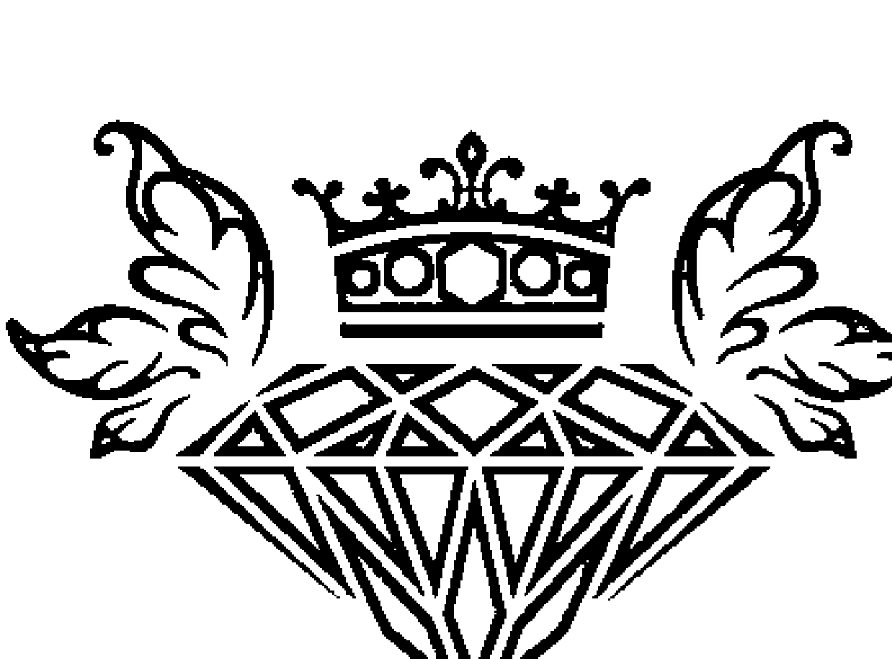

## St. Royal College

## 天使神秘学院

- ※ 专业占卜预测机构
- ※ 神秘学培训机构
- ※ 水晶能量研究中心
- ※ 官方淘宝：http://strc.taobao.com
- ※ 官方微博：http://weibo.com/715104687
- ※ 新书发布QQ群：659338717
- ※ 购买更多好书请联系院长大天使

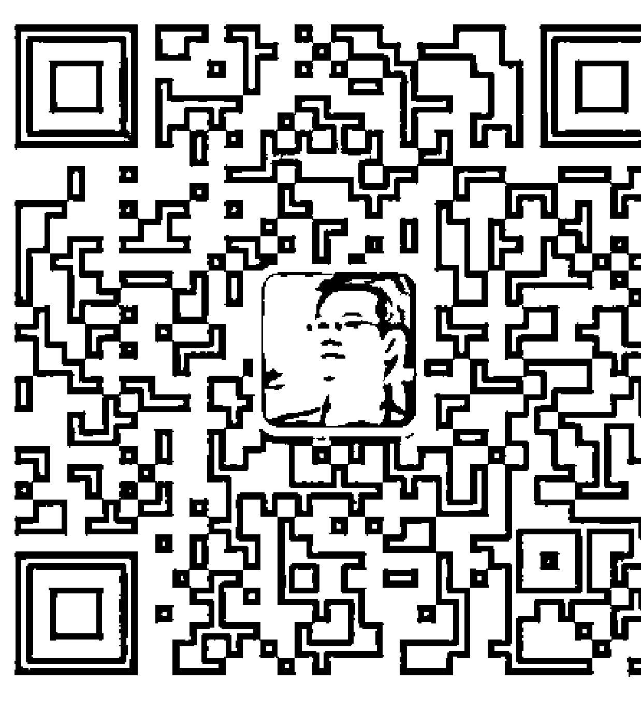

大天使

天使神秘学院 院长

QQ：715104687

手机/微信：13641926204

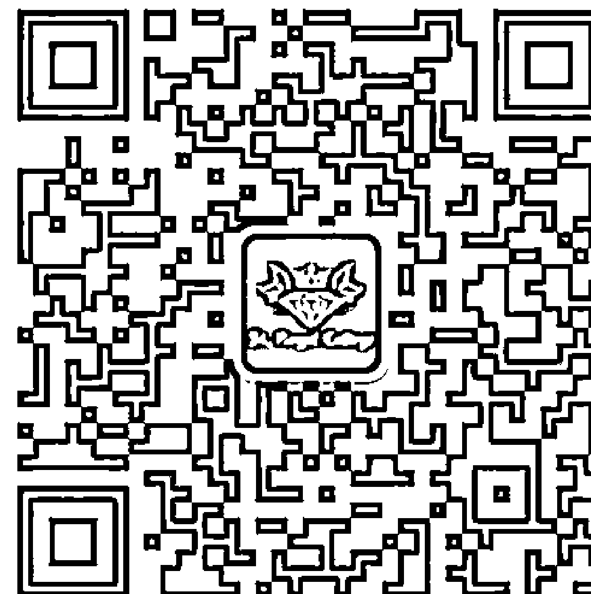

微信公众平台：strc2011

## 制作说明：

本书由《天使神秘学院》出重金从台湾购入的原版书籍扫描制作完成。为达到最好阅读效果，特地把原版书全部切开后，再经由专业扫描设备高精度扫描完成，并经过一张张的PS后期处理最终成书，其间花费大量的人力、物力以及时间，只为能给大家提供经济并优质的神秘学学习资料而努力。

本学院强力谴责某些机构和个人，把本学院花心血制作完成的电子书籍，包装后直接放在自家淘宝网上低价倾销的行为，以谋取不劳而获的经济利益。如果长此以往最终将无人愿意再为大家花心思制作电子书，那以后可能大家再无新书可读。

为让大家以后能够读到更多的好书，也为了本学院的良性发展。本学院恳请大家尽量做到如下几点：

- 一、尽量在本学院的网站购买电子书籍。
- 二、请勿用技术手段把电子书内的水印及加密去掉。
- 三、在收到电子书后小范围传阅即可，千万不要公开传播，更别挂到淘宝网上低价销售。

同时为答谢广大支持者，学院电子书将做如下调整：

- 一、学院会把一些早已收回制作成本的电子书折价销售。
- 二、最新制作的电子书籍会开放打印功能，大家购买后有条件的可自行打印成书。

天使神秘学院

本書獻給這個美麗星球上所有踏上自我探索之旅的兄弟姊妹

> ——聖哲曼，2013年7月30日——

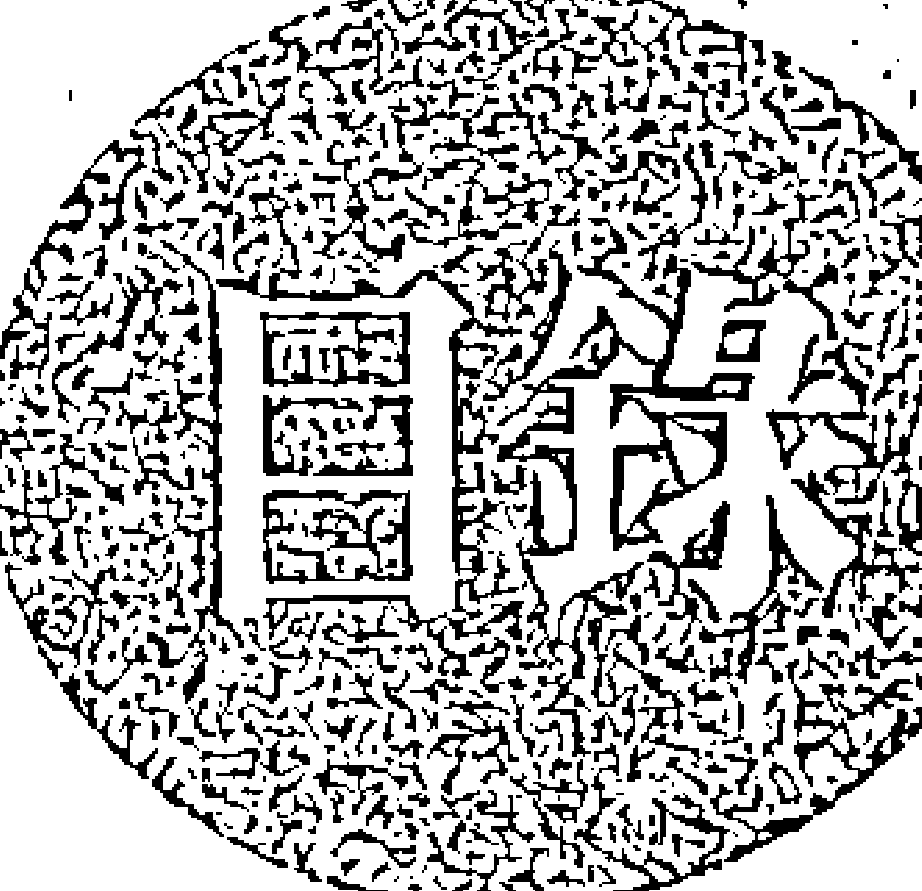

## 目录

- 推荐序－宮崎ゆかり …… 6
- 推荐序－Austin Chen …… 13
- 引言：你共同創造這本書 絕對別向外尋求 …… 20
- 第一章：促進療癒的氣場銘印技巧 …… 26
- 第二章：神的數字 …… 38
- 第三章：用你的阿卡莎檔案重新創造自己的生命 …… 54
- 第四章：揭露你的生命契約 …… 66
- 第五章：人類是受訓中的造物主 …… 76
- 第六章：運用變身進行重生 …… 78
- 第七章：如何連結新的教導 …… 96
- 第八章：運用你的光體來活化自己的DNA………… 112
- 第九章：如何活化內在的密碼 132
- 第十章：從黑暗到光明：水瓶紀元 146
- 第十一章：探索你與光之存在的能量連結 158
- 第十二章：復活你沉睡的DNA 168
- 第十三章：認識人體的神聖幾何 188
- 第十四章：決定自己靈魂的驅動力 192
- 第十五章：認識音樂身 206
- 第十六章：來自造物主的新模版 224
- 結語 229
- 致謝 231
- 參與者清單 232

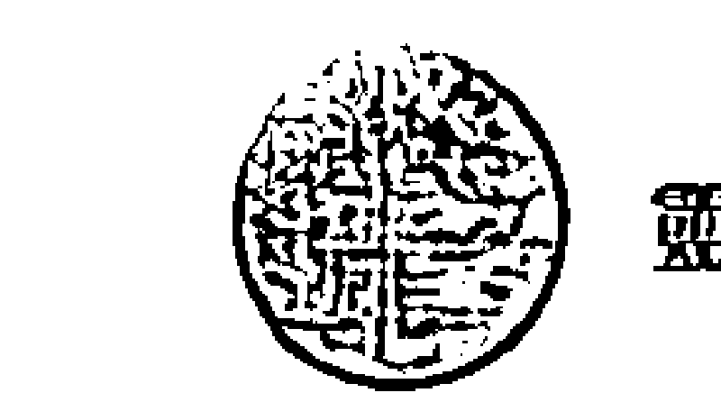

## ◇ 推薦序 - 宮崎ゆかり ◇

> 「你所需的資訊會在你有需求的時候出現。」 ——雷·強德蘭

在你手中的這本書，就擁有你所需要知道的資訊。這些資訊來自於大天使、揚昇大師以及許多充滿支持能量的高靈們。就像雷常常形容他自己：「我只是一個傳訊者。」他把這些大師與天使的訊息傳達給我們。

你會發現傳送訊息者：大天使、揚昇大師以及高靈，都是你的一部分，他們都存在你的DNA裡。

這本《靈魂DNA》將向你揭露一個秘密，那就是，你透過你的DNA連結所有事物，因此實際上所有的訊息均來自於你自己。是的，這些訊息是由高我傳遞給你自己。

如果你對這些好奇，可以藉由閱讀這本書來一探究竟，而你也會記起傳送這些訊息給自己的理由。你將開始踏上憶起自己真正是誰的旅程。

「你還記不記得那次我們在約旦河畔聊天的事？」當我參加雷·強德蘭在東京舉辦的「揚升之音工作坊」時，在一個私人的小會議裡，我被雷這麼問起。當下我不知道該怎麼回答，只是坐在那裡，瞪大眼睛看著他，一整個目瞪口呆。

在工作坊之前我就認識雷了，他曾傳遞過許多大師的通靈訊息，我也已經聽過不少次，然而這一次跟我說話的，是一位我感覺非常特別的人。

我想不起來他是誰，但我覺得我其實認識他。由於我一直保持沉默，雷說：「即使你不記得了，但我們真的彼此認識。」『我是耶書亞。』我說不出話來，但我聽到我內在的聲音告訴自己：「沒錯，我記得！」

幾個月後，在2013年的五月底，我參加了雷跟他的夫人奈歐蜜所帶領的「光之大使」的以色列聖境之旅。雷在世界各地帶領聖境之旅，我跟著他去過希臘、埃及、印尼峇里島，還有紐約。但第一次的以色列之旅，讓我在生命中留下了深刻的印象。

在以色列我認識了羅伯，他與雷一起合撰了此書；我還結識了摩德凱、菲德瑞卡，他們是共同的提問者，住在以色列。經過那次的旅程，我們被許多的高靈、大天使、揚昇大師們所指引佑護，其中包括了耶書亞。

有許多的揚昇大師、許多的資訊傳達給我們。一整天，從白天到黑夜，透過雷的通靈，他傳遞了極佳的神聖訊息，我們徹底被這些無窮盡的高能量議會所征服。

雷確實是位傳訊者。他盡其所能地持續為我們通靈，是個完全的傳遞通道，所有的揚昇大師或高頻存有都來到他身邊並跟他說話，雷是個很純然的通靈管道，因為他長期地自律自重並保持謙卑，此外，他還有著純然的心，所有的訊息均透過他的心，若他沒有那純然的心，就無法公正地告知我們這些高靈的訊息。

即使現在我開始跟雷一起工作，在工作坊裡充當雷的翻譯，我仍深深被他的謙卑感動，憑藉著這份謙遜，他持續地帶

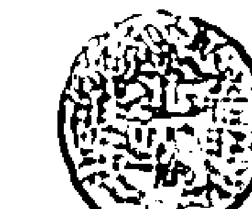

## 靈魂 DNA

給我們更多的訊息。這些訊息分別來自造物者、大天使、揚昇大師、龍、動物聖靈、花朵、神聖存有，以及更高次元存有的話語。

他們的話語美麗且強而有力，我完全被這些話語的力量給征服，並被他們的愛深深地觸動著。透過雷的通靈傳達，我從他們的話語中學習，也找到了憶起自己的靈性道路。

探索此書將讓你驚訝自己原來可以學到那麼多。當你深入地了解你的DNA，你將會找到真正的自己。

本書不只適合閱讀，還具有實作的功能。雷在書中展示了許多種靈性練習，這些都是大師給予的禮物。我真心地鼓勵你每天做這些基礎的練習，像是手印、呼吸等等，當你這樣做時，我相信大天使及你的指導靈會很願意支持你。請牢記你會永遠獲得它們的支持。

最後，我很感謝能夠有機會參與此書的製作。很開心也很榮幸能跟各位介紹這本好書。期盼藉由此書，你終能找到憶起你自己的道途。

無限的愛，

宮崎ゆかり

寫於日本川崎市

## 推薦序(原文版) — YUKARI V MIYAZAKI

Information which you need is brought to you when you need it.

-Rae Chandran,

The book that you're now holding in your hands contains what you need to know now.

All the information is presented in the messages from Archangels, Ascended masters, and many great sprits filled with their supporting energy.

As Rae often describes himself, he brings their messages to us.

> "I am just a messenger."

And you will find that Message senders, who are archangels, ascended masters, and spirits are all part of you. They are all exist in your DNA.

This book, DNA OF THE SPIRIT will unfold the secret to you.

The secret is that you are BEING connected with everything through your DNA.

So all the messages are in fact from yourself. Yes, they are presented from higher self to yourself.

If you wonder about that, you will learn that by reading this book.

And you will remember why you sent the messages to yourself.

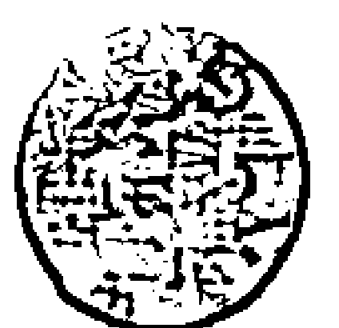

靈魂DNA

You will begin to step on the path to remember who you really are.

> "Do you remember about the time when we talked at the riverside of the Jordan?"

While I was attending Rae Chandrans' Ascention Sound workshop in Tokyo, there was the time for private mini session. During a few minutes, it was then, I was asked.

At the moment I didn't know what to say, just sitting and staring at him, completely speechless.

I had known Rae before that. He channeled many masters, and I listened to them many times. But, this time, the person who was speaking to me was somebody I felt special.

I couldn't remember who, but I felt I knew.

Since I kept in silence, Rae said,

> " even if you don't remember, we did."

> " I am Yeshua,"

I was not able to speak, but I heard my inner voice was telling myself,

> "Yes, I do remember."

Several months later, at the end of May, 2013, when Ambassadors of light Israel tour was lead by Rae and his wife Naomi, I took part in the tour.

Rae Chandran leads tours of sacred sites all over the world. I went to Greece, Egypt Indonesia, Bali, and New York with him. But

the first Israel trip made profound impact on my life.

In Israel, I met Robert, who collaborated this book with Rae, and also met Mordechai, and Fredaricka who are also collaborators as questioners living in Israel.

Throughout the tour, we had been guided by a lot of sprits, archangels, ascended masters, including Yeshua.

By so many masters, so many messages were told to us. All day, from the mornings to the nights, tremendous sacred messages were chanelled through Rae. We were overwhelmed by their unlimited high energy sessions.

Rae was really a messenger. He kept channeling for us as much as he could. He was completely a channel. All the masters or higher beings came to him and spoke to him. He was able to be a pure channel, because he had been self disciplined for long time, and staying being humble. And above all, he has the heart. All the messages were chanelled through his heart. If he doesn't have the heart, he can't tell us their messages equally.

Even now when I became to work with Rae as a translator for his workshop, I have been deeply touched by his humbleness. And with humbleness, he keeps bringing messages to us. The words of Creator, the words of Archangels, ascended Masters, Dragons, sprit of animals, sprit of plants, flowers, sacred beings, higher dimensional beings.

Their words are strong and beautiful. I am overwhelmed by the

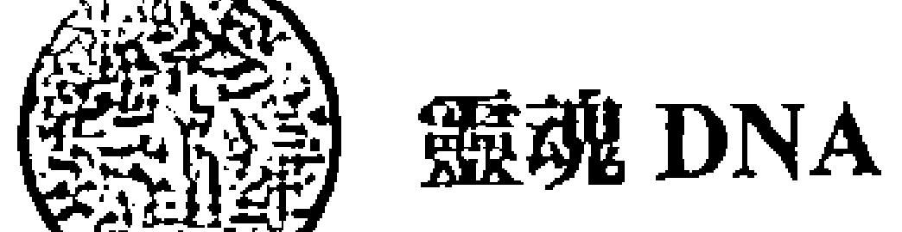

strength of the words of those and touched deeply with their love. Learning from them through Rae's channeling, I have also found my spiritual path to remember myself.

As the title of this book, DNA of the sprit, you will be amazed how much you can learn by exploring them. When you acquire deep understanding about your DNA, you will find real you.

You will not only read but also work with this book. In this book, Rae shows us various ways of spiritual practice. Those are the gifts by Masters. I really encourage you to do those practice on a daily basis. Practice Mudra, tonig, and breathing, etc...

When you do that, I am sure Archangels and your spirit guides are willing to support you. So please remember you will be supported by them always.

Finally, I am so grateful to be given this opportunity to participate in cocreation of this book. It is my pleasure and honor to introduce this book to you all.

I hope you will find your path to remember yourself in this book.

> Infinite love,
Yukari V Miyazaki
Kawasaki, Japan

## ◇ 推薦序 - Austin Chen ◇

儘管我認為自己在2008年一切從頭開始時就已經開始走上揚昇之路，其實當我在2017年4月幫雷老師翻譯靈性工作坊時我才真正開始了解“揚昇”的含義。當雷老師教我們各種簡單的療癒聲音，手印和動作時，我感覺這就像是第一次預覽人類身體的靈性使用手冊。

十多年來，我一直持續在作翻譯的工作，但較早期的翻譯工作大多是以商業內容為主。然而，幫雷老師翻譯是完全不同的。在整個工作坊中，我總是感到我全身的細胞都與他的節奏共振，我聲音的節奏也跟隨著他的節奏而自然調整。通常佩戴在我左手腕上的兩串佛珠在不到兩週的時間內因為翻譯工作坊而吸收到如此強大的神聖能量，它們幾乎都要爆掉了。

當生命潛能出版社邀請我為雷老師的DNA第2部寫推薦文時，我想了各種不同的方式。最後，我還是選擇跟隨我的直覺來分享我的感受以及雷老師的教導如何感動我與引導我轉化我的能量。雷老師讓我印象最深刻的提醒就是，在這個紀元，要達到揚昇我們不再需要放棄任何東西。相反地，我們必須要完全的活在當下，充分的為眾生貢獻我們自己，同時兼顧物質面和靈性面。只有在我們物質條件富足的情況下，我們才能夠全力去幫助我們在地球的所有親族們（人類，動物，植物和礦物）。

當我2011年搬回到台灣後，我曾經到兩個不同的道場去上課和打坐。我非常感謝第一個道場在我剛搬回台灣時提供我一個靈性修行處。當時，我的身心靈都疲憊不堪，完全失去了生命的方向。那個道場位於台北市市中心一座山丘上，所以當你到達山丘上時，你真的會感覺你身在市外，享受清新的空氣，寧靜的微風，和令人心曠神怡的陽光。雖然我與這個道場的師兄師姐們沒有非常密切的互動，但是那裡的神明給我的正是當時的我所需要的無條件的愛與支持。透過幾乎每天在第一個道場打坐，原本在我臉頰上一個因為意外而留下的疤痕居然奇蹟般的消失了，我甚至沒有注意到何時發生的。現在，如果有人問我，當時臉上的疤痕是在我臉上哪一邊，我也完全不記得了。

當我開始尋找另一種靈性指導時，有一個特殊的緣份把我帶到了第二個道場。透過參加第二個道場每週的課程以及每年的朝山活動，我奠定了靈性的基礎，同時也體驗到能量的力量。

正當我想要尋找生命課題更深層的解答時，雷老師就出現在我的面前。雷老師是一個如此謙虛，溫柔，有愛心而堅強的人，他總是全心全意地支持所有需要協助的人。他說：“別再找人類的老師了。嘗試與你的指導靈和大天使連接，因為他們是你此刻真正需要的老師和夥伴。試著與自己內部的神性連接，因為神就在我們的內在。神是我們，我們也是神。”任何看過雷老師瘋狂而緊湊的工作坊時間安排的人都會知道他是如何渴望儘快分享他所知道的，並儘可能與更多的人分享他所知道的。他也會想要儘可能地培訓更多的老師，所以他不用親自到所有的地方教工作坊，讓生力軍完成光行者的使命。

## 推荐序

当我阅读雷老师的DNA书时，我才意识到，他真的试图想要在一个小时之内，分享通常需要3-4个小时或更长时间的内容。很多读者会问：“有这么多练习需要作，我应该从哪里开始？”我建议先浏览整本书，然后凭着您的直觉，选择2到3个练习，每天专注的练习，直到你与这些能量完全整合，然后再开始其他的2到3个练习。此刻的我感觉与第六章的“新的扬昇”与“启动松果体”以及第七章的“释放分离密码”最有连结。也许您也会想探索那些章节以最深刻的方式感动您。

通过翻译雷老师的工作坊和阅读雷老师的书，我重新定位我的身心灵，也为自己找到新的方向。即使还有些时候或某些日子，我会因为情绪起伏而感到焦虑或迷茫，需要重新再引导自己，我能够快速回复觉醒，关注当下的情况，并且回到身为光的存有的意识。

秉持著爱，光，无尽的慈悲和耐心，雷老师持续的提醒我们“我们可以做到！”雷老师真的是以亲身实践来做我们的榜样，同时他也希望我们能够尽可能与我们的灵魂和神性连接，我们就可以与更多的人分享真实。现在，本着感恩，爱与光，我邀请所有读者透过阅读这本书来回忆起我们当初答应来地球的原因，这样我们就能够很快找到回家的路！

> Austin Chen
> 灵性工作坊翻译
> 灵气疗愈师
> 企业管理顾问

## 推薦序（原文版） — AUSTIN CHEN

As much as I would like to think that I embarked on the path to ascension in 2008 when I literally started my life all over, I was not very sure about the true meaning of “ascension” until I translated Brother Rae’s spiritual workshop in April 2017. And when Brother Rae taught us a variety of simple healing sounds, mudras, and movements, I felt that I was given a preview of a spiritual user’s manual to human body for the very first time.

I have been doing translation work on and off for more than a decade, and in the earlier years my translation was mainly business focused. However, translating for Brother Rae is unlike translating for anyone else. It felt like all my cells were resonating with his rhythm throughout the workshop, and the tempo of my voice followed his rhythm. The bead bracelets which I usually wear on my left wrist absorbed so much strong energy that they almost burst after being exposed to such different, positive, strong loving energies for nearly two weeks.

When I was asked by Life Potential Publications Co., Ltd. to write a foreword for the Chinese version of Brother Rae’s 2nd DNA book, I thought of many different approaches. At the end, I chose to follow my instinct by sharing what I feel and how Brother Rae’s channeled work touched me and transformed my energy. What brother Rae impressed me the most was when he told us that to attain ascension in this new age, we no longer need to give up anything. On the contrary, we need to live every moment of our life fully on this planet, and contribute ourselves to serving all beings, taking care of both material aspect and spiritual aspect at the same time. Only when we are materially abundant, can we completely help all our relations on earth (human beings, animals, plants and minerals).

Right after I moved back to Taiwan in 2011, I used to do meditations and go to classes at two different temples, one after the other. I am very grateful the first temple served as a spiritual sanctuary for me when I first relocated in Taiwan. At that time, I was physically, mentally, and spiritually exhausted, and completely lost life direction. The temple located on a small hill right in the center of Taipei City, so when you get to the top of the hill you would really feel you are outside of the City as you enjoy the fresh air, calming breeze, and comforting sunshine. Although I did not have very close interactions with the regulars at the temple, the deities there truly supported me with their unconditional love and support just the way I needed. Through meditation regularly at the first temple, a big scar on my cheek disappeared miraculously without me even noticing it. Now, if anyone would ask me which side of my cheek the big scar was on, I wouldn't even be able to recall that.

Later, some special karma took me to the second temple when I was looking for a different kind of spiritual guidance. The weekly classes and annual pilgrimage trips to temples all over Taiwan provided me a spiritual foundation and let me experience the power of energy.

Just when I was searching deeper for answers to life's purpose, Brother Rae showed up in Taiwan. Brother Rae is such a humble, gentle, loving yet strong figure that he wholeheartedly supports everyone who asks for help. He said: "Do not look for a human teacher any more. Try to connect with your Guides and Archangels as they are your true teachers and companions at this time. Try to connect with the divinity within as God is within yourself. God is you and you are God." Anyone who has seen Brother Rae's crazy travel/workshop schedule would know how eager he is to share what he knows or has channeled with as many people as possible. He would also love to train as many teachers as possible, so his physical self does not have to travel everywhere to teach workshops.

When I read the DNA books, I realized that, in one hour's time, he really tried to cover what usually takes 3-4 hours or more to teach. For readers who wonder: “There are so many practices I need to do, where do I start?” I would suggest to browse through the whole book first, then follow your instinct and choose 2-3 practices to focus on every day intensively until you are fully integrated with the energy, then start to work on another 2-3 practices. For the present moment, I find myself most connected with and fascinated by "The New Ascension" and "Activating the Pineal Gland" in chapter 6, and "Release the Code of Separation" in chapter 7. Maybe you would also be eager to find out which chapters touch you in the deepest way possible.

By translating and reading Brother Rae’s work, I have re-centered my body, mind and soul, and found new direction for myself. Even though there are still times or days when I feel somewhat anxious or lost, and need to re-direct myself due to human emotional ups and downs, I can quickly come back to my awareness, become aware of the situation, and steer myself back to my consciousness as a light being.

With love, light and endless compassion and patience, Brother Rae continues to remind us that "We can do it!" Brother Rae really sets examples for us by practicing what he teaches, and he would like us to connect with our soul and divinity as much as possible, so we can share the truth with as many people as possible. Now, with gratitude, love and light, I invite all readers to remember why we are here on earth by reading this book, so we can all find our way home very soon!

Austin Chen
Spiritual Workshops Translator
Reiki Practitioner
Business Consultant

## 靈魂 DNA

## 引言

2014年8月28日

大天使麥可、大天使加百列、大天使麥達昶與羅伯交談

哈囉，親愛的各位。我們是天使存在，是大天使麥可、大天使加百列與大天使麥達昶。本書源自我們意圖及渴望提供資訊以支持人類。本書會介紹特定技巧，如果明智地運用並搭配本書第一冊所傳達的認知和內容，將能提升你自己的光。如果不熟悉第一冊的內容便直接閱讀第二冊，讀者或許會無法了解，甚至感到迷惑。第二冊乃是第一冊的延續，更進一步發展後者的教導。

第二冊比第一冊影響更為深遠，內容更加成熟，含有更多智慧，文字蘊含更多能量。我們鼓勵諸位明智地運用這兩本書。

未來，這些書將會出現在許多人、甚至是許多圖書館的書架上。人們會想擁有並保存這些書籍，因為它們包含多層次的智慧。如果過些年你再次閱讀這幾本書，你會找到自己初次閱讀時所無法理解的另一層次的智慧，因為這本書包含許多層次的能量、智慧和理解。

我們鼓勵諸位在閱讀本書時懷著神聖的心，請求本書的內容能銘印在你內心、銘印在你的神聖之中，好讓它可以成為你能活出的經驗。本書的某些材料乃是以密碼形式存在，真誠的學生將會感覺自己能開啟這些密碼。他們對智慧的理解將會經由他們自己的濾網、以他們各自的方式吸收，如此一來，他們將找到內在的神聖。

這就是第二冊的基礎，也是其美好之處。透過閱讀、理解並體驗本書內容，你將能找到適合自己、與自己有關的道路，也將能以自己的方式發現神聖。這就是本書的目的。

## 你共同創造這本書

這本書為你而寫，由你完成，好讓你發現自己的真理。這本書是由你帶給你自己。

## 您說的是讀者的更高自我嗎？

正是，要發現更多的自我。這本書是由你所寫，為你所寫，由你帶給你自己，因此你正是本書的共同創造者。

## 這說法我很喜歡。千萬別變得依賴。

或者說別依賴任何人，好讓你能自己發現真理。如果本書讓你得依賴其他人來發現自己的真理，我們就無法為至高的善服務。運用本書內容，你將找到自己的真理。過去那種「我能讓你看到真理」的觀念早已不再，早已是陳舊的能量。「依止我。我是導師。我是上師」的說法也該拋到一邊，現在該說：「我要讓你依照自己的方式去找到自己的真理。我藉由個人的程序找到這些真理。如果這能幫助你找到自己的真理，那太好了，不過這並非唯一的真理。這是一個真理。這是我的真理。」

**了解了。多年來，我跟隨某個信仰絕對真理的人。我已經將那拋開。**

## 絕對別向外尋求

我是加百列。宇宙是個迷人的地方，有許多可供探索、理解、成就之處。本書是個工具，讓你探索內在的壯麗，幫助你培養自己的偉大。有許多文獻探討這一點，只是少有人真正了解它的意義。

**要發現宇宙存在於我們的內在。您的意思是這樣嗎？**

是的，還要知道你是這偉大宇宙的一部分。本書能支持你找到自己內在的偉大宇宙。所有曾在這顆星球活躍的大師都找到了。也因此有這樣的說法：「別向外尋求，要向內尋求。」

大師早已運用本書介紹的工具，因此如今才會公開這些資訊。不過，記得永遠要運用自己的明辨能力，看看這個真理是否與你個人的真理共鳴。它是否能使你提升，給你力量，讓你擴展且更加寬廣？如果是，請繼續。如果不是，請將它放下。這些書籍是寫給真誠的追尋者，他們有能力穿上羽翼，好在無窮的宇宙間翱翔。

本書能幫助你體驗與萬有合一，包括構成你自己物質身體## 引言

的元素以及自然界所創造的一切。請將這本書當成一次自我探索。在這段自我探索的旅程中，記得留下文字記錄，因為說真的，這本書能讓你逐步實現自己的渴望和目標。我是大天使加百列，在此向各位道別。

> > 先療癒你自己
> 你療癒了
> 蓋亞也獲得療癒了

## Chapter 1 促进疗愈的气场铭印技巧

2013年11月26日 大天使麥達昶與大天使加百列

我是大天使麥達昶。我們可以辯論神的本質，但是更重要的是能感覺到神。在這特別的日子，你要做什麼？你要靜心並與光連結嗎？或者你要看某些電視節目並且坐著不動來享受這一天？這是感恩節，你兩者都可以做。要知道人進化到什麼程度，你只需要了解他們的休閒娛樂。他們的娛樂是否能提升心智、觸及靈魂，並且讓內心感覺溫暖？這不是我們的批判，只是一點觀察。

看看什麼事件伴隨金星凌日而來。這個現象通常每百年發生一次。在2004年發生金星凌日之後，去年〔2012年〕又發生了一次。任何事都能轉化，只要人轉化了，每件事都有可能。

這段特殊時期有這麼多的光正降臨這顆星球，你能融合並運用這樣的光。這樣的光多半都是為你而來，好幫助你與大地母親合作。去年〔2012年〕許多來到地球的光都是為了大地母親以及人類。但是在接下來幾年，許多來自宇宙的光都是特別針對大地母親。你們也相當清楚，只要努力療癒大地母親，你就會療癒自己。

許多人談著世界和平，談著如何善意的做事。我建議各位回到自己的本源和起點，也就是蓋亞。請運用這個能量在這個次元实相支持并提升盖亚，因为在地球这个次元层面的世界上有这么多苦难与悲伤。盖亚已经进入不同的次元，你的一部分也随之而去。只是你仍然存在于第三次元，大多数人类也是如此，因此疗愈也必须在这里发生。如此一来，地球上其他兄弟姊妹也能带来正向影响。那么诞生在第三次元的新孩子将会感觉安全，能安心做他们的工作。

此刻你看到星球上有这么多纷争。新闻通常谈着战争的威胁。这是为了宣传而假造的，会创造恐惧和不安。数百万人强大的思想模式如同滤网环绕整颗星球，由于这层滤网太厚，真正纯洁的光无法穿透。就像许多大树构成的茂密森林。光无法穿透，所以许多需要光的生命无法生存，或是无法实现完整的潜力。

### 己之所欲，施之於人

地球需要光之工作者和助人者。重点是不带有其他想法，也不祈祷特定的结果发生。如果你没有预设立场，疗愈便能更快、更彻底来临，远胜有预设立场的状态。当你心中有立场，你就会选边站，事情就会非此即彼，会觉得这个好那个不好。例如，假设加州发生野火。你可以祈祷野火能够扑灭，或者你能祈祷全加州都获得疗愈。你会拥抱全体而不仅是一个区段或部分。

这个时节，在这个感恩节，在你们圣地的神圣日子，这就是最佳的起点，让你们传送惊人而美好的光到达任何你决定的地方。

### 靈魂 DNA

地方，只是記得不要有預設想法。當你開始努力療癒並支持大地母親，你也獲得療癒和支持。某人曾詢問蓋亞：「我能為你做什麼？」

蓋亞說：「先療癒你自己，因為你療癒了，我也獲得療癒。」這是雙向的。

生命的秘訣就是己之所欲，施之於人。你想要更多的光嗎？請給別人更多的光。你想要更多平靜嗎？請將更多平靜帶給他人。你想要平衡和療癒嗎？請幫助他人獲得平衡和療癒。

現在大天使加百列想要說幾句話。

### 氣場銘印

我是大天使加百列。我們了解許多人的意圖是要導入更多的光，並且將更多的光注入他人。你能運用的技巧之一就是透過意圖和專注將能量直接傳送到某人的氣場。

假設你約好要見某人，也希望能在靈性上感動對方。在你去見這個人之前，寫封信給對方，信中是你來自最高層級的最佳建議。在你寫下這些文字同時，你也銘印這個能量。當你見到對方，只要你透過意圖和這個人同處在一個空間，你就傳送這封信的能量。你可以直接將這個訊息銘印在對方的氣場，因為在你寫信同時，能量已存在你的裡面。我們要提供這項新的禮物。

### 這是不是像預先請天使到我們前方？

氣場銘印的力量更大。這個了解會在更深的層次。這個做法有益於療癒政治人物，因為他們通常沒有能力傾聽靈性之人。你想寫什麼就寫什麼，不過要出自內心的愛而非對立，然後將訊息銘印於對方的內在。

你也許想問那自由意志會怎麼樣。如果你是發自最崇高、最純粹的泉源，而不是那種「我說的才對」的自我感，那麼銘印就是適合的。許多人拒絕採取行動，覺得這樣會干涉他人的自由意志，但別忘了對方仍然可以選擇拒絕你的訊息。

此刻我們必須轉移典範。是的，每個人都有自由意志，不過我們想做的事乃是出自最崇高的愛的泉源。氣場銘印可以為人類或為地球而做。蓋亞會回應圖畫或形象，就像你們的潛意識一樣。一張圖畫可抵千言萬語。

如果你能以更高的思想形式與圖像銘印於蓋亞的潛意識，那麼你便為地球帶來強大的療癒。你可以將已經療癒、不再對立的地球的高品質圖像銘印於蓋亞的潛意識。你們可以共同將美麗、療癒的星球銘印傳送到她的氣場。你甚至可以傳送你的祈禱和祝福到蓋亞的氣場。未來，這會成為療癒的新方式。這便稱為氣場銘印。

如果你銘印了徹底療癒的能量，對方會怎麼樣呢？你見過催眠治療師或舞台上的催眠師。受催眠的人被困住，無法移動自己的手腳，不過只要催眠師下令，他們就能行動。催眠師在做什麼呢？他們在銘印，只是其效用短暫。他們銘印的密碼是受催眠者會完全療癒、能夠自由行動。想像一下，如果這個銘印是來自於像你們兩位如此強大的靈性人士會如何？你能為另一個人做什麼？

### 讓意圖奠基於愛

> > 氣場銘印完全是用愛以心電感應方式進行，是這樣嗎？

正是。你要記得一件事：真正的療癒來自愛。神是愛，神也不會區分彼此。氣場銘印必須經由最純粹的愛以心電感應傳送。你會立即看到差異。你會立即在某些人身上看到差異。

> > 換句話說，人可透過心電感應銘印他人的氣場，對方也不會知道發生了什麼。

正是。許多大師都這麼做。達賴喇嘛通常一次接見一千五百到兩千個人，每個人都感覺自己受到他的鼓舞。這一部分是因為他的高頻振動，不過他也會預先傳送自己的銘印。在前往任何聚會、尤其是大型聚會之前，他總會建構一座光之橋。他會先派出使者，然後開始傳送銘印。達賴喇嘛透過靜心來預做準備。等到他抵達那裡，人們會歡喜迎接，因為他已經派出自己的使者，也已經銘印了自己的聽眾。他是大師，一次可以銘印數千個人。

你現在就可以這麼做。雷在前往其它國家時會這麼做。未來這會成為常見的療癒方式。你可以問：「人們準備要接受了嗎？」多數人在某些層次已經準備好要接受，因為他們追尋著光。不然他們不會出現在你面前。你必須記得：如果某人進入你的生命，他們是來接受你所給予的禮物。你知道嗎？

我沒有想過這點。我沒想到。不過，我知道世上沒有意外或巧合。所以我知道某人出現在我面前一定有理由。

正是。你要給他們什麼禮物呢？他們是前來接受你致贈的禮物。否則他們就會去找其它人。只有你能給他們這個禮物。

那麼這不需要練習。你只需要出自於愛這麼做，要發自內心。

正是。這不需要練習。這是意圖加上你純淨的心和神的愛。無論對於人類或是地球，氣場銘印都是種美好的療癒方式。

在你進行個案或主持工作坊之前，先傳送你的本質（作為你的使者），好讓你能在自己的心和你將見的人之間建造一座光之橋。當你前往那裡，你會感覺受到歡迎、感覺提升，因為有一部分的你已經預先抵達。你會不敲門就進別人的房子，或是不先打電話就去拜訪別人嗎？你需要事先預約。預約方式就是在你的心和你要拜訪的地方之間建造光之橋。接著，當你身在該處，請求最高的祝福、最高的教導、最高的智慧銘印在你內在，好讓你能將如此美好的智慧和光傳達給那些你想連結的人。

你不可能預先知道自己的遭遇是否會成功。誰能說明天早上會如何呢？我們說的是當下。當下這一刻會創造下一刻。真正重要的就是這一點。活在當下，讓靈存在於你的情感、心智和靈魂之中。

我可以看到自己有機會做這樣的工作，因為我能在幾天前預先知道自己將要療癒什麼人。

現在我們要向各位道別。大天使麥達昶將會接棒，因為幾天前他傳授雷一項非常重要的教導，也希望在此時向各位重述一次。

### 死亡契約

我是大天使麥達昶。死亡契約是同意為某人的轉換擔任觸媒，能說：「是的，親愛的兄弟，現在該走了。」人有許多類型的契約，其中一類即為死亡契約。你會在意識或無意識層次促成另一人的轉換。你要履行這樣的契約，能說：「朋友，放心吧，轉換的時間到了。」

某些人已經完成自己所有的生命課題，已經完成來此世所要經驗的一切，不過他們因為某種理由而徘徊不前——通常是出於恐懼或對家庭的執著。他們還沒準備好要走。對這些人，你可以說：「親愛的兄弟，出發的時間到了，請放心，你沒有問題的，一切都會很好，你無需恐懼。」有些人會過份執著。他們徘徊很久，儘管自己這一世生命已經結束。不過，只要看他們一眼，活化「出發時間到了」的密碼，你就給他們很大的禮物。這是我們能給其他人最大的禮物及生命課題，這是轉換的禮物。

這樣的禮物並未真的為人理解，不過這是一項非常美好的禮物。在美國及其他地方的醫療產業，許多醫師認為病患死亡就是自己失败。他们尝试用机器吊着患者的生命，即使患者已经准备要离去。你可以陪在患者身旁，重新活化他们内在这个密码，因为此时注入患者身体的所有药物和毒素都是折磨。

这称为死亡契约。你可以用它静心冥想。我们想和各位讨论这一点，因为你们将有机会将这项礼物带给他人，届时你将会自然地活化他们的死亡密码铭印——这是因为，等到你们相遇，他们就会做好准备。你可以说：“出发的时间到了。”这会疗愈他们。人们通常祈祷别人能继续活着，有时这并不符合对方的生命蓝图。

### 融合你的灵魂

对多数人类而言，最大的困难之一就是让灵魂完全融入物质实相。他们一生都致力于连结自己的灵魂。他们知道自己有灵魂，不过不知道如何将更多的灵魂能量导入物质身体。

你可以运用某些声音频率——梵咒、肯定语、咏唱等——带有几个音节。那么，在你发出这个声音的同时，就像对孩子唱摇篮曲那样，你会邀请自己的灵魂进入你的内在。

过去几天，雷一直运用某个声音，而他也感觉不一样。他试过不少声音，其中之一让他立即感到第三眼充满能量。你该如何知道这有没有用？你会感觉第三眼越来越有能量，因为你是透过第三眼来经验神和更高自我，接着才是透过身体。

研究这件事。请求得知你能用什么声音来对灵魂歌唱。当你唱这首歌，你的灵魂会来亲近你。这就像对爱人唱情歌。就像长笛乐曲；你的声音如同笛声，会吸引挚爱的灵魂进入你的内在。你会像火箭一样行动。我要鼓励各位静心，找出该吟唱什么声音来邀请灵魂，这是一首祈愿之歌。

### 雷是怎么找到自己的歌或曲调的？他只是在内在听到的吗？

在过去两个星期，他持续请求灵和自己的指导灵为他带来更高的真理和智慧，让他的心智能扩展以便对神的实相有更高的理解。接着，透过他的祈祷，他便领受到自己的声音。

耶稣兄弟和达赖喇嘛持续祈祷和静心，特别是向伟大的造物主。你必须持续请求要下载造物主之光、更高真理和更高智慧的高频振动。

你已经听过圣哲曼的紫罗兰火焰。知道它的人很多。紫罗兰火焰的真正意义为何？这是扩展之火。如果你能将它认知为扩展之火，了解它能去除所有不适当的事物，那么你便能够领受更高的记忆。所以，在这个假期之中，请求你的心灵开启以领受造物主更高频的振动、更高频的真理以及更高频的光。

只要请求，你就可以找到自己的方式连结你挚爱的「我是」存在，不过我们觉得，对几乎所有的人类而言，声音会扮演重要的角色。我们要你不仅拥有一个音节或一个字，也要获得几个字——四个、五个或六个字——并且带着感情来吟唱。观察自己的感觉。你是否感觉能量，是否感觉爱，是否感觉扩展，是否有美好的感受？身体哪里感觉麻麻痒痒的？如果你做这个练习，在一两个月内，你创造的所有经验就几乎都会来自你的「我是」存在。

### 你是神的总和

记得，我们随时和你同在。这是我们要各位思考的事情之一。我们和你不是分开的。我们是你的一部分，与你共同生活。在你的所有时刻，我们都陪伴着你。你认为神只是来来去去吗？你真的相信事情就是那样吗？

**他是无所不在的，和您一样。**

正是。不过此刻你正凝视着它。只是，只因为此刻你正凝视着它，并不代表之前它并不在。它永远都在，只是此刻你看清楚这一点。

**是的，此刻它正在我们意识清楚觉知之处。过去我们并未注意自己为何而来。**

现在你正在注意。神就是如此：无所不在。无论你是否看见，我们都在。我们要请你向自己承诺要更认识自己，要导入更多「我是」存在，并且对更高自我要有百分之百的信念和信任。

我们注意到，许多光之工作者和光之存在都专注于造物主。这非常美好。他们也会专注于自己的指导灵。不过他们并未专注于自己的灵魂。我们要请你重新排序：先专注于自己的灵魂，再来是造物主，最后是指导灵。

何谓扬升？扬升就只是将你的灵魂完全导入你的物质实相。如果你不与灵魂沟通并且与它成为朋友，你又如何能导入自己的灵魂呢？你每天都应该沟通、吟唱并且做自己需要做的一切。人们也许很难接受这一点，不过这是真理。我们为什么给予这个修持？这样你们才能获得启蒙——亦即导入自己完整的灵魂能量——这也就是扬升。

### 事实上，我从未真正知道扬升究竟是什么。

这不代表你要忘记自己的指导灵。我们想说的是：不要忘记你的灵魂。造物主和你的指导灵都会支持你更完整地将灵魂导入物质实相。

你的身体配合灵魂创造每一个经验，所以你的生命变成灵魂的经验，让你以灵魂经验着自我生命的时时刻刻，而身体的每个细胞都因为你灵魂的本质而振动。这就是某些最高阶的拉比所成就的，这也是许多伟大导师和大师——例如鲁米（Rumi）——所成就的。他们以灵魂努力。爱德格·凯西（Edgar Cayce）便传达了自己的灵魂。

### 那是他的更高自我。

你的更高自我有许多部分。那是他的更高自我。他是自己的更高自我最清晰的灵媒之一。

### 不过他是非常崇高的灵魂，换句话说，是一个饱学多闻的灵魂。

他的许多世生命都与许多大师共度，也因此累积许多智慧，不过他本质上时时刻刻都是在与自己的灵魂沟通。如果你能与自己的灵魂沟通，让灵魂成为你最好的朋友，然后从那一点开始着手，那么你与指导灵、导师、大师、天使、大天使和所有其他人的沟通都会很容易。

他们来到这里是要协助你获得这样的了悟：你是神的本質。你的灵魂是整体的一部分：总和（S-U-M），你是神的总和。将一颗苹果切成许多片，然后将一片放到显微镜下。这块切片的分子结构和它所来自的苹果将会相同。你是伟大全体的个体化。你是伟大全体的总和。

祝福各位。我是大天使麦达昶。

我是大天使麦达昶。今天我们捎来大卫之家（House of David）的祝福，因为各位也知道，大卫的血脉非常古老、非常神圣。我们要你们观想自己如何与这个古老的血脉连结。它带着非常特殊的振动密码，是国王和伟大大师的密码。他们带有的密码数字为33或22的密码；33是主宰数字，是神的数字。22也是主宰数字。你能运用这些密码来触及这个血脉传承。

### 从梦开始

现在该要设定崇高目标并做远大的梦。如果你希望梦想成真，就必须先有梦想。不要瞄准自己看不到的目标；要瞄准你能清楚看到的目标。我刚刚传授各位一个秘诀，让你知道该如何连结主宰号码本身—就是透过大卫之家，因为它带有22和33这两个数字。如果你的意图是要连结这些数字，你就会像搭上了火箭，因为你将会完全活化自己全部的灵魂本质还有全部的「我是」存在。

如果朝着这个目标努力，你们全都会搭上火箭，因为你们全都会带着这些密码的能量。22和33这两个数字带着神人密码。你必须相信自己已获得能量好携带神人意识。你们能连结这个意识来全面创造自己的生命，让你在每一刻创造神、显化神。

现在这是可能的，因为这颗星球正沐浴在来自中央太阳（central sun）的新能量下，这是空无的能量。由空无中，万有诞生，而伟大的伊洛希姆（Elohim）会运用空无的能量来创造一切。我们呼唤你连结伟大的伊洛希姆——尤其是阿波罗——并且请求下载空无、下载空的能量，因为其它的一切都是由空创造。

地球上曾出现大规模的能量下载。这个能量的高峰发生在2013年12月21日，持续到2014年9月。你要如何运用这个空无能量？你要呆坐着，或者你要运用它来创造你要的事物？我是麦达昶，要将密码传授给各位。

**你必须拥有梦想才能让梦想成真。是否有任何方式让人能注入潜能好让梦想发生？**

是的，你的灵魂会将你创造的所有梦想和想过的每个想法彻底分类。请护持梦想，因为当你护持梦想，你已经在自己的全像室——这是大全像室的一部分——将梦想创造出来。接着，你就会汲取自己已经创造的一切。也就是说，你会前往自己未来的时间轴，将它带回来。这就是创造之道。

大师如何创造？他会做梦，设定意图，百分之百相信，然后实现。这样的创造从何而来？从空无的能量而来。我们要你每天踏入这个新的领域。

### 乙松彗星

我想问的是关于乙松彗星（Comet Ison）。它是否正在地球播下新能源、新生命的种子，同时也造成我们DNA的改变？

有可能，不过这个特定能量并非针对人类而是针对地球上其它的生命形态。许多新种类的植物、微生物和其它有机体的种子都正进入地球。未来几年，你们将看到许多新的矿物和金属被发现。

所以许多新事物的种子都正在进入这颗星球。在过去几天的网路新闻上，你可能注意到海中发现了某些惊人的生物。你会看到更多新的生物和新的生命来到地球。随着你进化，新的事物会加入这颗星球。

今天我收到一封电子邮件的通灵讯息，据传是来自萨南达关于乙松彗星的话语；内容是说这其实不是彗星，而是外星母船在地球巡航。这有任何真实性吗？

我们不会评论他人的讯息。你必须进入自己内心，探问这样的讯息是否支持你、将你带到自己的真理。只需如此。这是个专属的频道。这是他的故事经由他而传达，而我们不会评论其它人。

许多降临这颗星球的能量都有非常明确的目的：要启蒙热

> > 1 註：參見www.esf.edu/top10/，此為國際物種探索機構（International Institute for Species Exploration）的網址。

愛科學者的心靈並賦予他們力量，因為你將看到對神的理解透過科學和科學家開始發生。如此一來，科學和靈性將會在接下來幾年逐步平衡。此刻就是起點。

## 你前來取回自己本有的神性

我有個問題。我們談到夢和擁有夢的意圖。在上一次聚會時，您提到氣場銘印。兩者是否相似？換句話說，人能運用在自己氣場進行銘印的相同法則來做夢嗎？

當然，當然。你的氣場有多大？將近八公尺。

太好了，有八公尺。那是很大的氣場。

難道你不大嗎？想像一下，你要在這八公尺的氣場內放入什麼東西，而每次你踏出一步，它們就會在你的前方。所以你必須非常謹慎。你是如此強大的生命。你帶著這樣的能量。請想像當你完全活化33的密碼——或神的密碼——那會如何？會發生什麼事？這個氣場會大大擴展，許多生命——包括動物——將會跟隨你。他們會想與你共處同一空間。鳥兒會停在你身旁，在樹上歌唱，因為牠們會感覺你的氣場。所以你必須設定意圖要持續擴展自己的氣場。

讓我舉個例子。在過去幾年間，你們許多人都看到11-11。11-11這樣的數字代表覺醒。接著你開始看見12-12，12-12代表著確認自己內在與DNA內在的神。你們有某些人看到了3-3-3或4-4-4或5-5-5。這是否只是隨機的事件？或者那是靈在向你使眼色，對你說：「嗨，朋友，那裡有許多事物供你探索。」現在你可以呼喚這些數字。

### 我們該怎麼著手進行呢？什麼是最好的方式？

在你以自己的方式靜心或保持靜默時，你可以請求活化33或22的密碼。33的密碼本身即是神的密碼。你可以呼喚這個密碼在內在活化。我們要你這麼做，同時設定意圖要在12月31日做這件事。

### 您說的是類似新年新計畫嗎？

是自己氣場的新計畫。你要將這個意圖完整置於自己的氣場之內。依照你自己的方式來活化神的密碼。你必須開始進行這件事。同樣的，這是一個夢：「我如何能成為神？我如何能完整成為自己的更高自我？」，現在，運用我已經獲贈的工具，再加上其它將會獲得的工具，我已經準備好取回這個身份。」你辦得到，你也會開始更常看到這些數字，或許在時鐘上，或許在報紙或汽車保險桿貼紙上。我們要越來越多人在2014年到2017年間活化這個密碼。

這會需要許多時間來鍛鍊，而當你開始這麼做，你也將能在更高的振動層次進行氣場銘印，進而對事件、經驗、人群和國家造成更大的影響。你會被稱為真正的燈塔，因為你能照亮兩萬到兩萬五千人。你一人就能停止大地母親的震動並且改變氣候模式。

你能做這麼大的夢嗎？你需要有夢才能讓夢成真。

## Chapter 2 神的数字

你的夢是什麼？難道不是再次完全取回自己完整的神性嗎？

你為何來到這個世界？是要取回自己的真，接著活出那樣的真：

> 我前來取回自己本來具有的神性，從而得到智慧。

在你取回自己內在的神性之後，下一步自然就是與他人分享這個智慧。

我的家人，你們準備好了嗎？宇宙將支持你。宇宙會大大支持這些行動。採取行動的時機就是現在。重要的是在成長時維持自己的振動。這點我們以前已經說過：你必須持續努力成長而非靜止不動。

還要擴展。

正是，同時繼續不斷前進。你們在接下來幾年所做的事會有巨大的效應，會持續終生。這包括回春以及擁有更長的壽命。

更重要的是，你們會開始在心中感覺到自由。這是每個人的根本追求：「我該如何擁有內心的自由？我該如何能在每天早晨醒來時都像鳥兒一樣歌唱？」鳥兒知道牠會找到食物，所以牠以歌聲開啟自己的一天。

## 靈魂 DNA

### 自由就是喜悅。

自由就是沒有恐懼。自由就像你坐著的椅子。你知道這張椅子會支持你的重量，甚至連想都不用想。我們也要你們再做一件事。有某種你能運用的支持能量會讓22和33的密碼更完美，那就是偉大的仙后座居民。請呼喚他們，他們將前來支持你。多年之前，他們也經歷類似的過程。呼喚這些偉大的存在，他們會來幫助你。

他們將微調你為33及22密碼所下載的能量，讓它成為你能感受的顯化實相。你會感覺熱情和喜悅覺醒，其它人也能從你眼中看到。你會感覺內在某種契合，帶來強大的幸福感。這代表有更多的能量經由這些密碼進入你。這就是我們今天希望分享的秘密之一。

### 太棒了。這是個力量密碼。

正是，這是力量密碼。

接下來，今天還會有其它人來和你們說話。我們愛你，要以最純粹的神之愛來擁抱你。我是大天使麥達昶。

### 三個神聖音調

哈囉，親愛的朋友們。我的名字是天使夏彌爾（Angel Shamiel），是聲音的天使。你們獲贈的最大工具之一就是聲音頻率，許許多多的聲音頻率。你要請求在靜心中獲得某個聲音頻率。呼喚你的直覺和啟示；當你反覆吟唱這個聲音，它將讓你的振動維持在相當高的層級。

我們希望給各位的聲音是：「嗚伊 科利亞」（wyi kriya）。在亞拉姆語中，這是神的一個名字，擁有最高頻率的振動。如果你能持續吟唱「嗚伊 科利亞」，同時閉上眼睛、注意力放在第三眼，你就會開始感覺到振動，有時會看見橘色火焰由第三眼湧現。

我們給予的是特定的字，當你開始吟唱這些名字，請讓它們的聲音以你自己的方式從你口中發出。它們的力量非常強大。你會開始在自己的氣場內、在乙太本身創造密碼，不過這些聲音直接連結著四面體和八面體，還連結著麥達昶方塊和其密碼：這些都是你意識內的神聖幾何符號。我們要你做這個練習一星期，看看你對這些聲音有何感覺。

我們還要教各位另外一個聲音：「特里 漏克」（tri lok）。這也是來自古老的亞拉姆語，意思是「我的身體、心智和靈魂合而為一。我是一。」最後一個聲音是「撒哈納」（sahana），意思是無所不在：「我是無所不在的生命。」

今天我們給你三個聲音，因為在2014年至2015年間，聲音將會變得非常重要。許多新的聲音將會給予你們。例如，會有聲音能幫助蔬菜和穀物生長。會有聲音療癒帶有化學肥料負擔的植物，會有聲音能除去害蟲。許多事物將會隨著聲音到來。

我們要你實驗這三個聲音，因為它們是新的聲音，今天才贈予諸位。我們要你在下次聚會時分享自己的經驗。我們要你每天只需要花三到四分鐘練習，在這段時間集中注意力於第三眼，看看自己有什麼感覺，是否感覺到任何能量、是否這些聲音讓你擴展。

## 靈魂 DNA

### 第一個字「嗚伊 科利亞」的意思是什麼？

它有許多意義，其中之一是神的名字，這名字銘印於你的DNA內。「特里 漏克」意思是「我是完整的，包含身體、心智、靈魂。三者合而為一。」「撒哈納」的意思是「我無所不在、無所不能。我就是神。」

### 全貌：人類於二十四世紀揚昇

### 這三個聲音頻率是否與33這個數字有任何關連性？

我們給予你們這三個聲音，因為這些聲音就是你抵達33這個層次的踏腳石。你認為我們為何在此時與各位說話？我們將手杖交到你們手中讓你們行走，不過你們必須行走。我們不是將這些修持給你，只為了讓你有事可做。我們給你工具讓你使用，讓你抵達自己夢想要抵達的地方。要讓夢想成真，人必須努力。現在你能運用這些工具努力。

### 我了解了。您給予我們的是一個輪廓，以便抵達33這個神性能量。

正是。你也可以稱之為合一能量場（Unified Force Field）。讓我們稱它為合一能量場。它有更高頻的振動。在大師出生時，天使耶利米（Angel Jeremiah）出現在牧羊人面前，這時他將自己的密碼播種於地球，他說再過兩千兩百多年後，很可能會出現集體覺醒，而這些密碼將會再次徹底活化。許多生命將會隨著這個密碼而覺醒。你和許多其它人的生命契約就是要實現這個密碼。我們需要144,000個靈魂才能完全活化這個密碼，這要在他們離開地球前完成。親愛的各位，你了解自己的重要性嗎？

**是的，這是個重大的任務。**

不過你辦得到。不是每個人都可以，你很清楚。我們只是要提醒你回想自己的生命契約。你或許以為自己的生命契約已經完成，但其實還沒有。

**這會在此刻發生，是因為正是在此刻我們在自己的劇本內記下你們將會出現在我們面前。**

正是。我們是什麼人？我們只是嚮導，告訴你一條可行的道路。當你前進，會有其它嚮導出現。你們這四個人（包括雷在內）都已經開啟新的藍圖。許多的藍圖都只延續到去年〔2012年〕。所以他們感到迷惑，不知道今年該做什麼，因為直到去年，他們都專注於揚昇，僅止於此。不過那只是開始的第一步。還有許多工作需要完成。

2 注：在圣经中，没有人曾经提过天使耶利米曾对牧羊人说未来将出现集体的灵性觉醒。

## 靈魂DNA

真正的工作此刻才開始，也就是要開啟新的藍圖。你能做的一件事就是每個星期、每十天、每個月請求開啟新的、更高的藍圖，因為進化永不停止。當你開啟新的藍圖，就會有越來越多的事要做。

你必須持續請求獲得新的藍圖。讀書時，你不會反覆閱讀同一章節，而是進入下一章節。藉由意圖，透過採取行動並請求獲得更新、更高的真理，你就能創造新的藍圖，而新的振動也會進入你的領域。除非你繼續進化，否則你就停滯不前。可供探索的還有許多。開啟新的藍圖，開啟你的生命契約。

持續鍛鍊自己並幫助他人，這能創造巨大的開啟。運用聲音頻率、意圖和純潔的心，你能打開許多新的門。你只需要這三個東西：意圖、夢想、純潔的心。

早晨醒來的時候，你能請求一件事，就是你要在細胞中更加體驗神。「我的意圖就是讓自己在今天比昨天對神有更多的體驗。」

### 144,000的核心揚昇能量

### 你是否提到144,000人需要經驗這三個不同的聲音頻率？

不，我們是說144,000人需要覺醒，不只是經驗這三個聲音頻率。他們必須覺醒全部的33密碼與22密碼。他們可以使用任何方法來喚醒這些密碼。我們只是要給你們這些聲音。這些聲音不是人人都能使用。其他人可能運用其他方法喚醒22與33密碼。我給你們這些聲音是因為我是聲音天使。我給你們這些聲音能支持你們達成這個目標。我們感覺各位非常了解聲音。可是別人可能用不同的方法來做。我們的要求是要有144,000人喚醒22和33的密碼。

### 那是否構成了關鍵多數？

那樣的數字可以視為地球完全轉化所需要的人數。這會為整顆星球在250年內的揚昇設定調性。到那個時候，這星球上的每個人都已經揚昇。這144,000人會為整個星球設定核心能量。和今日的能量一樣，在250年內，幾乎地球上所有的人類都會揚昇。他們會覺醒，會致力於獲得解脫。

### 讓自己的靈魂獲得解脫嗎？

當然。

### 與他們的靈魂結合、解脫並且與合一能量場結合。

正是。同時了解你是宇宙的一部分，知道自己所做的事會影響宇宙。宇宙為你、為整個星球的揚昇設下更寬廣偉大的願景——在造物主的夢中，當然還有在你們自己的夢中，你們如此帶著造物主的智慧共同前進。在整個星球的群體中，你們在未來250年之內會做什麼？什麼會是你們的夢想？

你們一再被告知大角星人就是你們未來的自我。他們現在在做什麼呢？他們在支持其他星球的揚昇並療癒其他星球。地球在300年到325年內也會做同樣的事。在每個人都揚昇後，會有大約75年到80年的調整期。接著你們會以整個星球全體的身

### 您的意思是這只需透過大地母親的進化嗎？

大地母親以及她所有的人類攜手全力以赴地進化。儘管這顆星球已經移動，人們卻改變得不多。需要許多許多年——在我們看來，至少需要200到250年——人類的全體才能行動。所以，你們此刻在進行的就是為下個世代以及一個又一個未來世代打下基礎。

### 從更宏觀的角度來看我們所扮演的角色非常有幫助。感謝您。

當然。你認為你們全都在場只是個意外嗎？

### 不，但是我不知道為什麼。能有個概觀的認識非常有幫助。

我們很希望這個訊息能以文字記錄並且與其他人分享，因為閱讀其內容將會活化人們的記憶，讓他們想起自己個人的藍圖以及他們對自己為何來到這裡的理解。

現在我們邀請最後一位來賓。很榮幸大天使加百列加入我們的行列。

### 宇宙的生命之書

我親愛的天使夥伴們——為什麼我稱呼你們為天使？因為我看到你們的光，明亮且搏動著。當我們看著人類，我們只看到光，透過那樣的光，我們能感知並理解他們成長了多少。這反映在光之上。

今天我的訊息很簡短。你們每個人都很清楚自己會讀一本書。這不是你們稱為阿卡莎檔案的書。不過有一本宇宙之書，其中每個曾經轉世、將要轉世的靈魂、或是目前已經在世的靈魂都有文字記載——不僅限於這顆星球，還包括其他的星球。這本書包含你們的名字。你們可以請求自己的指導靈帶你到這本宇宙之書。這本書描述了你的進化和道路，不只是在物質的地球層面，還有在遙遠的未來。它直接連結著宇宙和你在其中扮演的角色。你能想像自己三千年後的模樣嗎？你們許多人都不能想像自己明年會怎麼樣。你能想像自己一百五十年後的模樣嗎？

現在這顆星球上發生的一切都直接關係到宇宙的進化。只要你覺得自己非常渺小，還得經歷所有生命的艱辛，這時你要請求自己能記得這樣的觀點。你不只是某個國家的公民，甚至不只是地球的公民。你是宇宙的公民。你所做的一切都會影響整個宇宙。我挑戰各位去體認自己對別人所做的事甚至會改變合一能量場。

當你開始活化22與33密碼，你便能取用宇宙之書。這本書就像全像室。只要你能進入這本書，你就能看清遙遠的未來——五百年、一千年、三千年。你看到的不是人類身體而是能量銘印。這已經發生，已經以能量方式書寫在生命之書、宇宙之書上。只要你能看一眼自己的生命，哪怕只是一眼，假設距今三千年（你能否想像距今三千年後的生命嗎？），你就能將那樣的能量導入此刻的自己。這就像你的生命增添了一座火箭，三千年後的你的生命的振動將會如此高頻，因此會自動觸發你的更高頻振動進入你當前的生命。

### 淨化氣場的技巧

這顆星球上的許多人都已成就大師的振動。

您能否暗示有多少人？我們正在開始一項全新的計畫。我們的這個計畫能加入多少人？

剛開始我會說人數不多。這不是每個人都能達成的。如果你告訴某些人，或許他們會叫你去看精神科醫師。等到時機來到，他們將能了解。不過我們要告訴各位，因為你們全都準備好了。

我想問的是，有多少人獲得了您今天給我們的資訊？

在此刻的地球，不超過五百人。你會開始朝向第十二次元而努力。你們已經以許多方式達成非常高頻的振動層級，因此我們要恭喜各位，因為你們全都努力鍛鍊自己。

每天起床的時候，想像你的氣場呈現美麗的蛋形，沒有任何瑕疵、破洞或磨損，是完美的。這是顆美麗的金色的蛋。每天就寢之前，做個一分鐘練習，淨化你的氣場，去除你當天可能累積或創造出的任何經驗能量，並且導入金色的光，將你累積的不必要能量由你的氣場淨化。

各位好，我是加百列。

## Chapter 3 用你的阿卡莎檔案重新創造自己的生命

我是麥達昶。挖掘阿卡莎檔案對人類真的是很大的挑戰。人如何能回到一百五十年甚至一千年前呢？你們許多人都領悟到自己已經經歷一切：國王、兄弟、謀殺者、貴族、牧師、揚昇大師和偉大導師。你們如何能回溯並連結自己意識的那些部分，連結能在此世支持你的部分？它們全都存在你的阿卡莎檔案，不過它們背後的秘密是什麼？秘密就是它甚至也存在於你當前的DNA內並構成你當前的能量。儘管你的經驗（在第三次元實相中）或許在五千年前已經在你的DNA中發生過，但是它仍是此刻依然存在的能量。你能理解我的意思嗎？

我想我知道您的意思。在我以能量療癒協助他人時，我會感覺他們意識之內的能量不屬於當前的問題，但是這些能量也確實存在於他們的意識之內。它們在好久以前便已顯現。

想不想看到那個你認識偉大導師亞伯拉罕的時刻？你是古老的存在，是古老的靈魂。你知道這點。那個時刻在你的DNA內仍然非常活躍。在靜默時刻，在你進行清晨祈禱時，請說：

> > 「我以純淨的意圖設定意圖，要連結那個時刻，那個我與偉大師父亞伯拉罕共享能量、喜悅、智慧的時刻。我請求這個能量在此刻能為我所用，並完全融入我的意識。」

這需要一些時間，不過如果你持續進行便能擁有。你們之中某些人曾與耶穌大師一起行走。其他人則是來自星辰。你們記得自己為何來到這顆星球嗎？

我們要你認真鍛鍊DNA教導，挖掘阿卡莎檔案，尋找自己當前希望擁有的一切。當你能創造、能支持自己的生命，那時真正的自由才會來到。當你鍛鍊DNA，你的人格可以完全改變。你可以說：「我設定意圖要連結我感到平靜、不受任何生活之戲劇所影響時的能量。」那樣的時刻存在於你的DNA內。我們請你研究這點，你將會以大師身份在地球層面行走。你在這個新能量—在這新意識的第二年—所必須發展的工具之一就是進入自己阿卡莎檔案的能力。我保證你的生命將完全不同。這將會是持續地重新創造、共同創造的過程。我們適才所提出的只是簡介，好讓我們能在此時接受提問。接下來，我的兄弟，大天使加百列，將會與各位說話。

**我想知道您是否可以介紹某些步驟讓我們連結自己的阿卡莎檔案。是否只要坐下來並請求……？**

是的。只要坐下來，並且以最純淨的意圖如此請求：

> > 我如何能更完整地認識自己內在的神？因為我知道這之中曾經發生過。那樣的能量此刻仍然存在於我的DNA內。我指導我的DNA取出這個能量，並且將之導入我的個人實相，好讓我能再次完整地認識自己。

各位都很清楚，心的純淨，關鍵在意圖。

### 阿卡莎檔案是否記錄我們全部的存在？

阿卡莎檔案記錄你曾經經歷和當前正在經歷的全部共時生命中所有過的每一個經驗。想像你還是大師的時候。想像你來自星辰、前來地球支持人類並看護星球進化的那個時候。親愛的各位，你們就是如此。阿卡莎檔案包含一切。只是，阿卡莎檔案的美好之處在於，這個能量是以當下能量的型態存在。它會伴隨你，除非你指示它活化。你可以透過意圖和純淨來請求它的活化。

這是一組提供給人類的新工具。你必須運用這些工具來建構新的實相。你可以擁有自己想要的任何事物。如果你想成為音樂家或教師，那全在裡面。你也許會說：「我不擅長當老師。」是的，在你當前人格的內心，這是真的。在另一個實相內，你是老師，而老師的能量此刻仍然存在。

回溯並尋找你曾擁有全然平靜、全然健康或全然掌握煉金術的那一世生命。當你揚昇，你不會帶著自己的物質身體。你只會帶著自己的乙太身體，這也包含物質身體所擁有的一切。你可以重新再創造。藉由創造，回到阿卡莎檔案，選擇一世生命、選擇一個身體、選擇你希望在生命中擁有的特殊面向。為何要等待揚昇才如此進行？當然，揚昇是你的目標。不過從此以後每天都要這麼練習。

### 聲音是跨次元工具

「阿門。阿門。」（Aaamen. Aaamen.）這是如此單純的歌曲，阿門，其中A-M-E-N這個聲音能夠轉化頻率。這個聲音如何轉化頻率？A-M-E-N這個聲音是跨次元的，能對你全部的量子存在說話。當你發出聲音，儘管話語可能是以線性方式逐一出現，但是你的量子存在會聽到全部聲音。這就像觀賞一幅畫。你只是透過眼睛看畫，不過你的每個部分都會觸及畫作。

因此我們對聲音有這麼多討論，因為聲音會對你全部的存在說話。而我們知道人類擁有偉大的能力，能透過自己創造的聲音來提升自己的振動。如果你去檢視所有經由你的口腔所發出的聲音，觀察它們是否支持你的生命，觀察你是否能轉化這些話語，那麼你將發現結果會有多方面的改變。你將過得更輕鬆、更清晰。

某個聲音能支持你，在一個又一個時刻中創造最高的能量，請找出這個聲音。覺知自己說的話。即使普通的事物都能以更高的振動來表達，只要你使用不同的话语和不同的聲音。這需要一些練習和重新學習，不過你將看見魔法，因為那樣的語言和聲音將會在你全部的存在中迴盪。

人類面臨的挑戰之一就是日常生活的話語；只有心智身和情緒身會記錄聲音，但靈性身不會。心智身和情緒身會觸發情緒，你則會透過物質身體來採取行動。如果你想成為大師，你的經驗和行動必須源自靈性身，而靈性身需要與心智身和情緒身結合。你的靈性身將會創造你所有的經驗。

你的靈性身只會回應聲音與更高頻的振動。除此之外，它將保持沈睡。關鍵在於透過聲音、意圖、以及純淨的心來活化靈性身。我們知道聲音不是唯一的方式，但是我們會選擇這個管道，是因為雷。強德蘭喜歡聲音而聲音也支持他。

如果你能在生命的時時刻刻完整運用自己的靈性身，那麼百分之八十的戰役就已獲勝。你正在通往大師的高速公路上；你和神性有永恆的連結，你的靈性身將會導入神性智慧。每一刻你都明白什麼是你的至高的善，還有每個受你影響的人，他們的至高的善。

當你走入基督教教堂、猶太教堂、寺院或清真寺，你會聆聽不同教派的神職人員吟唱神的名字。這是為了淨化你的心，讓你進入特定的狀態以便連結自己神聖的部份，亦即你的靈性身，即使連結只發生在聽到這個聲音的短暫片刻。聲音特別能給予你能量、促成事物發生。我們鼓勵各位探索這一點。

你們想不想在夜間進行太空旅行？不是搭乘太空梭，而是透過運用聲音頻率所進行的思想投射。所使用的聲音是「枚瑞可兒」（mereker），M-E-R-E-K-E-R。閉上眼睛，注意力集中在第三眼，然後發出這個聲音。你會看見振動。這個聲音能讓你開啟並發現不同的實相，能開啟你的第三眼還有心電感應的連結。透過心電感應和思想投射，你能前往星际兄弟的殖民地。聲音能開啟大門，能夠打破大氣層的分隔，讓你前往他們的區域旅行。聲音能開啟大門。

人真的能夠運用這個聲音前去拜訪他們的一艘船艦嗎？

是的。我們為什麼要請各位研究這一點？這些存在中有許多都帶有不同於地球層面的更高頻振動。如果你和好友相處，你會開始累積這位朋友的美好特質。同樣的，你將開始獲得和你合作的存在所具備的特質、能力、尤其是振動、當然還有光。

接著還有另一個聲音：「撒侯瑪 撒侯瑪 撒侯瑪」（Sahoma. Sahoma. Sahoma.）。這個聲音能連結古老的教導，亦即古老原住民智慧的神聖三角。這個聲音能支持你連結一位偉大導師，「白色水牛小牛之女」（White Buffalo Calf Woman，也就是抹大拉的瑪利亞）。她自身帶有女神的能量。「撒侯瑪」：

> > 「我呼喚女神：在此刻請支持我：我以朋友的身分而來，向您表達尊重：女神啊！好讓我能獲取您神聖的智慧：好讓我能夠更認識自己：能夠服務人類和我自己：撒侯瑪 姆阿 撒侯瑪（Sahoma Ma Sahoma.）。」

靈魂 DNA

現在就可以試試，只要閉上眼睛，專注在第三眼上。「撒侯瑪。」讓這個聲音由喉嚨發出。「撒侯瑪。」自然地，這會開始讓男性融合陰性能量，亦即慈悲心；在女性身上則會融合陽性層面。我們需要心智和情感兼備。現在我的兄弟希望說幾句話。

## 與基督誕生連結

我的家人們，我是大天使加百列。我們非常榮幸能與各位說話，因為能與各位這樣致力於服務神以及認識自己的光之生命連結，我們感到非常喜悅。我們要由天使領域向各位傳送祝福。

諸位都充分意識到天使。你們每個人都有自己的天使。我們要你每日與自己的天使合作，因為他們帶著造物主最純粹的振動，可以造就許多強化。你們知道天使的教導在耶穌大師在世時及他死後被傳授給他還有他家族中許多人。儘管這發生在數千年前，但它所導引出的能量今天仍然存在。

你們應當取用的能量之一就是耶穌大師誕生的能量。耶穌大師由銀河核心帶來最純淨的能量，有他完整的靈和薩南達的能量。他的能量是非常純淨、非常高頻的振動。他之所以誕生在動物環繞的環境，原因之一就是他的能量本會殺死他的母親，儘管她自己也有相當高頻的振動。正是動物吸收了他所帶來的許多高頻振動。

在地面行走的動物安頓了那股能量。這是最純淨的能量。

你要在静心時前往连接這個非常高頻的振動；或者你能親身拜訪耶穌誕生的地點和鄰近地區，前往那些動物曾經生活的地方。綿羊和母牛是完全的智慧大師：「前來取走我吧，因為我知道自己是永恆的生命。」這些大師吸收了偉人誕生的能量。你們很清楚每隻動物的振動。不過每隻動物都有非常獨特的光之商數。如果你連接特定的動物，你將能取用她們本質中很大一部份來支持自己。如果你與母牛合作，你會開始記起自己以充分保持覺知的大師身分在地球活躍的時刻。麥達昶剛剛提到，這個能量現在就完整保存在你的DNA內。羅伯兄弟問道：「我如何進入自己的阿卡莎檔案？」你剛剛得到一個線索，一隻動物。如果你想更完整地開啟自己的心，那麼你應該要與羊駝合作，因為牠們也帶著造物主最純粹的能量。我是大天使加百列。

## 144,000

上一次聚會時，您提到144,000這個數字。可否請您解釋144,000這個數字的實際意義？

我是大天使麥達昶。144,000這個數字對星球轉化非常重要。如果十四萬四千人帶著同樣的意圖聚集在一起，這會創造新的振動，進而轉變整顆星球的振動。如果你能導入十四萬四千人的意識振動，你就會轉化。當十四萬四千人在特定的時間運用超覺靜坐（transcendental meditation）的技巧一起靜心，同一國家的犯罪率明顯降低¹。這十四萬四千人有能力轉化整塊大陸的振動或是你們的國家，只要十四萬四千個人能聚在一起這麼做。我們了解不同角度會有許多詮釋方式，但是從我們的觀點來看，正因如此我們才總是說144,000是創造差異的關鍵數字。

144,000這個數字的重要來自於它的頻率。這同時也是十四萬四千個靈魂本質。這是你與144,000的力量。當摩西詢問灌木「你是誰」，他聽到了什麼？答案是什麼？「我即是我」[出埃及記3章14節]。

你是否能想像自己的力量乘以十四萬四千倍？那是什麼意思？你能轉化星球。你能轉化它的本質。未來地球上會有人記得自己的十四萬四千個靈魂本質。例如，如果你們有人能觀想自己獲得144,000的力量，那會如何？會有很多力量強大的零。由虛空中萬物誕生。你是無限的存在；144,000是非常關鍵的數字。要獲得有效的改變，我們需要144,000的頻率和力量。

## 內在支持

我們尊崇各位，我們非常愛你們。為何我們要給各位這一切？因為你有能力接受它。你們自己已經開啟了許多。你們能看到越來越多。當你踏出一步，我們就隨你踏出兩步。你認為我們只是旁觀，讓你自己走路嗎？我們就在你們身後，就像教練陪著學員。學員正參與一場競技。

我們陪著你，讓你看見我們的光，鼓勵各位。你可以辦得到，我們陪著你，你們所有人，就在你們選擇道路，尤其是選擇揚昇的道路時。支持如此龐大，你甚至無法想像。還有更多的天使和大天使存在前來支持你，包括許多太空兄弟姊妹。你永遠不會獨自行走，永遠不會。你知道為什麼嗎？造物主是個家庭。如果你不相信我們今天所說的，至少要將這點記在心裡：造物主也想與你連結，就像你想與造物主連結一樣。愛就有這麼多。你對神的愛會吸引神直接進入你。我祝福我蒙福的家人們。我們下次再見。我是大天使麥達昶和你們的天使後援隊。

## 連結大地會讓你與神連結

我是白鷹酋長（Chief White Eagle）。親愛的家人們，我們的訊息非常簡短。大地是你們摯愛的母親，大地擁有許多智慧。你們是大地母親的一部分。你們是否想更認識造物主或是神？請與大地有更緊密的連結。如其在下，如其在上。當你與大地的連結更為穩固，當你更深入地認識她，那麼你與天堂的連結就會變得堅定而深入。這是一樣的，因為這是一體的兩面。

烏龜的形狀和甜甜圈很像。你轉身的時候會怎麼樣？你會看到一樣的事物嗎？從虛空中會誕生出萬有，從萬有中，你將再次回到虛空。

家人們，各位好，我是麥達昶。這是如此神聖的季節。今天是聖誕夜。傳統上這是非常吉祥的時刻：是新意識的誕生。今天是非常好的時刻，能請求新的意識能夠降臨。要不要來個基督誕生呢？如果你請求，就有可能。你必須請求。在這個神聖時刻，這將會給予。要活化這點，你們能呼喚的指導靈包括麥喬爾（Melchior），還有賢士巴爾塔沙爾（magus Balthazar）。

巴爾塔沙爾前往探視尊貴的新生基督。你們已經活化了自己的DNA。你的羅盤已經設定好，他們看得出來。如果你今晚設定意圖，他們將會進入你的內在。讓我們花點時間讓這能立即發生。讓我們呼喚這些偉大的存在，請求新的基督意識在這個神聖夜晚誕生於你們內在。「卡都 卡都 卡都 阿多尼 阿維阿歐 卡都¹。神聖者的光已經在你的內心點燃。讓這個新的孩子誕生，在你的心中帶著基督意識。卡都。」

¹ 注：原文為 Kado. Kado. Kado Adoni. Aveao. Kado.

## Chapter 4 揭露你的生命契約

### 生命契約

我親愛的家人們，我們是大天使麥達昶、大天使加百列、大天使麥可，而我們共同稱為「光之天使存在」（Angelic Beings of Light）。我們以團隊方式工作。我們希望各位注意的一件事就是生命契約。許多人並未意識到這些契約；即使那些走在這條道路上的人也未能完全了解。你可以請求並設定意圖，讓你此世所有的生命契約——那些你知道的加上某些你不知道的——都能完整導入你的個人實相。

每個人都有許多契約。這些契約不只是關於完成你的生命職責或生命課題。某個契約可能是你要和一個瞪著你看的小小孩相處，他要來接受你的禮物。你們的相遇可能只是十五到二十分鐘，接著就道別。其他的契約可能是死亡契約，讓你幫助其他人完成過渡階段。或許你只是和他們說話，或者透過眼睛向他們的心傳送訊息：「現在該離開了，你會沒事的。你會在一個安全的地方，一切都會很好。」某些人等著這樣的契約啟動。

另外一類契約是成為某些人的觸媒。或許你在恰當的時間說了一句話或進入他們的生命，給了他們某個具有轉變生命效果的訊息。或許你將一本書交到他們手中，說：「再會了。享受這本書吧。」僅止於此。不過這本書將改變他們的生命。

你和伴侶有共同的生命契約，工作關係中則有另外的生命契約。我們要你有意識地請求活化自己對這些生命契約的覺知。當你未能完成某個生命契約，它會繼續進入你的下一世生命。想想你一世又一世未能完成自己契約的生命。
此刻你正完成許多契約。生命是會變得負擔沈重，因為你正在完成許多契約。不過，一旦你覺察自己的契約，你便能開始完成它們。很多時候，你可以透過意圖立即將它們完成。

你們全都有觸媒契約；你們成為改變的工具。當你進入某人的生命，你就能帶來改變。你扮演觸媒的角色。每個人都是其他某人的觸媒。你們每個人都有其他人擔任支持系統，他們會幫助你完成自己的生命契約。你是其他人的支持系統，幫助他們完成他們的生命契約，其他人也會在你的生命中支持你。
請求這些契約能完全活化並顯現在你面前。你是否認出哪些人支持著你、讓事件在你的生命中發生？我們鼓勵你活化這兩項重要的契約——支持系統契約和其他生命契約——如此一來，如果你生命中有了支持系統，你將能更容易完成這些契約。呼喚你的支援團隊來創造更高的、符合你神聖計畫和神聖契約的實相。天使和其他存在會支持你，不過在地球上你人類的支持系統。

一旦你覺察到自己的支持系統，覺察到自己的契約，請在前額設定意圖要見到自己的支持系統，藉此完成自己的生命契約。前額有天線。你的頭髮也會吸引生命事件，無論是正向或負向的。它會向世界傳送訊息。你可以設定這個天線，好讓它對應支持系統。你要扮演比起目前更加崇高的角色。

### Yeshu的真理

我們如何投射主薩南達的真理，說明「耶穌²」和「基督」是誤解？這些名字來自其他的語言。針對主薩南達的這個誤解，是否會有某種平衡且對稱的調整？

不，恐怕不會。就目前來看，這會以同樣的方式持續下去。不過到了2020年和2030年，針對耶穌是誰以及他代表了什麼，將會出現更大的開放和真正的理解。

您知道，即使這個名字Yeshua，其實應該是Yeshu。Y-E-S-H-U。

是的，其實應該是Yeshu，是Yeshu沒錯。你知道為什麼後面加了一個a嗎？如果你說出他真正的名字，Yeshu，你會發現其振動遠比Yeshua更加高頻，後者的連結遠不如前者那麼清晰。這是人們有意為之。

所以真正的名字是Yeshu嗎？這感覺比較對。
這個名字感覺比較對是因為它是更寬闊、更美好的能量。
所以耶穌這個名字的意義為何呢？它有很多意義，不過真正的意思是「神之子」。今晚，在這個神聖的日子，你便能呼喚耶穌，請他向你揭露某些仍未出現在你生命中或者你尚未意識到的契約。這是你能回贈自己的禮物，因為如果你未能完成自己的契約，你將需要再度回來完成。你得解決一切，不留破綻。透過意圖，你能立即完成它們。另外要記得呼喚你支持系統的協助。

### 和平標竿契約

你知道你和太空兄弟們也有契約嗎？你尚未完全探索這一點。你可以說：

> 「我想要完全覺知那個契約，並且將它完成並導入我的生命。」

你有這個契約，也需要將它完成。你和大地母親有什麼契約？

**我真的對幫助大地之母療癒這件事相當有共鳴，但是我不知道這該如何發生。**

某些人的生命契約是要在許多國家安置和平標竿（Peace Pole）³。

³ 註：和平標竿為四面的竿子，每一面均有文字。這類標竿大約150公分長，周長大約10公分。

### 什麼是和平標竿？

真正的和平標竿會對應世界的四個角落。如果以恰當方式完成，它便會散發能量。此外，它也會由銀河核心汲取能量。它的作用就像天線，要傳送並接收能量，將寧靜與和平傳到特定區域，而且對大地母親的身體相當有益。通常你根本未曾意識到自己的契約。現在時機正好，你該請求喚醒自己對這些深層契約的意識。

接著我們便能形塑意圖並且將之傳送，好讓我們能將之實現。

這許多契約中許多不僅是針對此世；它們是由其他世生命導入此世生命。你不需要此刻就完成這些契約。你的心中將會受到引誘，要在正確時間完成自己的契約。有許多你尚未意識到的契約能透過你的意圖和思想來完成。我們請你開啟自己，接受這些你未曾意識到的契約，讓這些契約向你展現，然後你便能實現其中某些。如果你在實現契約上需要支持，就請求這樣的支持能來到你的能量場。

你越去請求，給予你的就越多。不過這樣的請求並非出於你的自我感，而是為了更認識你自己。你的意圖純淨，這些禮物便會來臨，讓你能更完整地認識自己，並且更完整地經驗自己內在的神聖。

### 聖地的未來事件

將會有來自外太空的訪客前來聖地，時間點大約落於2015年至2017年之間。他們會以更可見的方式為人所知，而且會有更多人來接受他們。地球的文明將更傾向陰性，他們會將這種能量導入聖地。你們將會活著看到這樣的事發生。

此外，讓我們再告訴各位一件事。第三座神殿將會建起。

> > [ 第一座神殿是由所羅門王所建，後來被巴比倫人摧毀。第二座神殿是由希律王所建，在西元66年被羅馬人摧毀。穆斯林在西元七世紀於同一地點興建了圓頂清真寺。 ]

### 在物質層面嗎？

是的，那將是物質層面的建築。你將會看到這個神奇時刻。

### 穆斯林是否會合作？

親愛的家人，事情不是表面上那樣。有許多事正在幕後發生。讓靈發揮它的魔法，讓我們設定這樣的意圖。如此足矣。這些是你們能取得並用於創造、轉型、轉化的禮物之一，無論此刻你需要做些什麼。2014年開始，能量將會變得較為柔軟，也將包含更多造物主之愛的純淨振動。這個能量能用來顯化新的實相。對許多人而言，這將是更順利的一年，人們將會更坦然接受自己的天份。他們會覺得自在，覺得受到重視，覺得生命有了目標。曾經夢想要做些什麼的人將會開始行動，能量將會在隔年開始支持他們。

未來以色列的天空將會出現強大的光。某些人會感到害怕。其他人會說這是某種攻擊或是軍方在操控噴射機。其實這是來自銀河核心本身的光。光會來來去去。人們將無法否認。未來那塊土地將會出現魔法，會有來自其中一條河流的療癒。人們會前往那條河，碰觸河水，在那河中洗浴。他們會得到療癒，會感覺更好。那裡將再次成為全人合一的地方。

我們不能告訴你那條河的名字。那是條小河，不過在接下來幾個月、幾年，它將成為神聖之河。這可能會在三年內發生。

我們要各位現在就觀想你能對自己跨次元的存在完全開放。這就像卷曲的彈簧。觀想並請求這能再次完全舒展。耶穌所做的就是這樣。此刻你也能這麼做。這是你與生俱來的權力。你相信什麼就會想出什麼。你必須開始以量子方式思考，時時刻刻。接著你要以跨次元存在的方式行動。當你對這個層面開放自己，你將會活化身體內在的環形智慧，藍色蓮花將會在你身體的背部活化。祝各位有美好的一天。我們是麥達昶及大天使加百列與麥可。

### 姊妹的支持

我是各位的姊妹。我導入姊妹的能量。真正的姊妹會支持自己的「兄弟」，會為她的兄弟導入至高的善。這種姊妹的能量將會安頓於這個神聖時刻，從此刻開始直到1月3日。這個姊妹能量會支持你。我們請你寫下自己想成就什麼，然後呼喚姊妹能量。

姊妹能量又稱為支持能量，因為它會支持兄弟實現自己的渴望。我們的傳承非常古老，而且我們並非來自此一地球層面。我們只想稱自己為姊妹，不用其他的名稱。我們乃是根據造物主的指引，由中央太陽而來。我們是促進造物主顯化的支持能量，而此刻我們將提供這位這項禮物。無論你是要建造船隻、前往雜貨店、或是背負沈重行李，請呼喚姊妹能量。我們從未提及這個能量。這是我們第一次向這個世界介紹它，而你們兩位是首次領受這個能量的人。

許多存在都在內心深處覺知我們的存在，不過我們從未像今天這樣如此清楚地出現。這是我們首次來到這個次元。我們支持我們的兄弟。你必須呼喚它、請求它的來到，並且加以運用。

為何今日我們要向各位提到這一點？因為你們意識到自己的DNA，而DNA必須等到各位請求、下令、指示之後才會活化。你們的靈性能力也是這樣。你必須呼喚它們、請求獲得它們。

### 列木里亞契約

我們也要請各位記得活化列木里亞契約（Lemurian contract）。人類攜帶著列木里亞契約。這可以追溯到你們最初的自我，亦即覺醒自己真正的起源。當你開始覺醒自己真正的起源會怎麼樣？以一段長達一千英哩的旅程為例。你回溯到第一英哩、回溯到起點。想像你在這一千英哩的旅程中所有過的每一個經驗。你遇見不同的人、吃過不同食物、經驗到不同

---
**註腳對應表**
| 標記 | 內容 |
| :--- | :--- |
| ¹ | 原註：參見關於「大聖者效應」（Maharishi Effect）的研究：www.mum.edu/m_effect/ |
| ² | 註：Jesus一般譯為「耶穌」，但其英文原音較接近「基瑟斯」。後文所提出之Yeshu，其英文原音更接近中譯之「耶穌」。 |
| ³ | 註：和平標竿為四面的竿子，每一面均有文字。這類標竿大約150公分長，周長大約10公分。 |

## Chapter 4 揭露你的生命契约

情绪和感觉。当你回到自己的列木里亚起源，你开始记起从那时到现在发生过的每件事，包括你与所有指导灵、所有支持过你的人的连结。我们请你研究这一点。在你的静心中请求你的列木里亚契约在你的内在完全活化。我是姊妹。

## Chapter 5 人类是受训中的造物主

2014年2月10日
大天使麦达昶

我是麦达昶。你正在变成什么？你正在变成神人（god-human）。每个人都是人类。每个人也都是神。这是真理，不过人们无法接受。他们可以说自己是神的家族的一分子，但是之后他们会想，「为什么我的财务状况不能变得更好呢？为什么我不能创造奇迹呢？为什么我做不到这个呢？为什么我办不了那个呢？」
我会说，「为什么不呢？」想想你心中出现的第一件事。

**你的思维在共同创造什么呢？**
神在创造时，那个想法、那个能量将会坚定不摇，直到全然显化为止。你认为人类是什么呢？

**我想是创造中的神吧——正在领悟自己是神的过程中的神。**
正是：是受训中的造物主，他们正在学习理解每个想法、话语、心智行动的所有细节和结果，好让你能有意识地创造，因为你知道如此创造会导向什么后果。地球是人类的训练场，是神扮演自己的舞台。

要能了解自己的创造有何结果，同时了解各类处境的不利因素。

当你能活化量子DNA，你就会开始汰旧换新。你会完全改变自己这部电脑的设定。针对这部在同一个旧有身体内的电脑，你会灌入崭新的程式。你会开启自己内在的亚当——亚当·卡德蒙 (Adam Kadmon)。让这一点渗入你的心，因为在某个层次，你仍然透过铭印在自己内心的教导来怀疑自己。你可以说：

> 「此刻我从自己内在释放这些旧有的教导，因为它们对我不再有益。」

我从自己内在释放这些旧有的教导，因为它们对我不再有益。

## Chapter 6 运用变身进行重生

我是大天使麦达昶。我亲爱的家人，各位好，这是天使家庭，因为诸位都是天使。你能否成为天使，这是妳自己的选择。你可以玩任何自己想玩的游戏。你们全都是如此强大的生命。

你们全都拥有变身的天赋。这是妳灵魂的自然能力。你可以变成鸟，变成植物、天使或独角兽。我们鼓励你尝试变身，看看自己是否感觉到能量。当你转换成某些型态，你会感受到巨大的能量。你也许多想更常连结这些型态，因为当你变身，你也会获得自己变化之型态所具备的特质。

假设你变成一只美丽的金色老鹰。当你接受伟大金色老鹰的本质——专注、决心、勇气、无畏、知识——你接着就可以变成一只熊，安住于地球的智慧和神秘知识。你将能看见遥远的未来。你可以变成雨。你可以了解人体最细微的细节——身体每个器官如何和谐交响成完美的音乐。你变成的一切都会带来益处。这是以量子方式成为跨次元存在的一部分。

### 让身体长寿

变身有助于长寿。你也许曾听过名为安娜（Anna）的伟大存在，她活了数百年以便准备耶稣大师降临人间。她经常进入所谓的「长空」（long space）好让她的物质身体重生。她会躺下来，让一位司祭进行某些仪式，然后让她维持这个状态一段时间，有时候是几个月或几年。当她重新恢复意识，便已完全回春，能够再多活许多年。在停止动态的时候，她的意识不在她的物质身体；她的细胞正在让肉身重生。她以不同型态完整地活着并运作。她变身了，完全回春，成为她已变成并于身体内部完全融合的某种存在的活跃的一部分，而这种存在以暂停动态的方式保存于体内。她前往某个她能完整活着并保持活跃的地方，带回那样的能量，并且将之下载到她的物质身体内。

我们鼓励各位开始研究这件事。你可以说那是纯粹的魔法。是的，这是魔法，不过这个魔法是自然的天赋，是你灵魂的自然能力。现在时机已经成熟，该向内在的奥秘和魔法打开自己。此时你是否准备要变身了呢？

## 灵魂DNA

### 我们该怎么做？

我会给各位一些方法。好好锻炼变身。你可以说：

> > 「我设定意图要成为独角兽（豺狼、狼、或是秃鹰）。」

佛陀这位伟大的大师希望体验死亡，所以他进入死去的豺狼体内，感觉豺狼在濒死过程所经验的一切。后来他希望体验骨头和皮肤。他希望体验鸟的自由，因此他变成鸟。所以他在天空遨游¹。

我们要你设定意图，挑选自己希望变身成的动物。可以挑选四或五个型态，然后设定意图。接着观察能量从何而来，观察你在哪里感觉高频能量，然后从那里开始努力。在变身之后，你将会感觉焕然一新。

### 您是否认同变身是让物质身体更新的必要条件？

这不是必要条件，只是更新的方式之一。还有许多其他方式。不过，这最简单，有许多人已经这么做过。我举了安娜的例子；这就是她的方式。这没有你以为的那么困难。首先，你得在心中清出空间，相信这是可能的。你是否愿意对这个可能性开启心房？如果你不相信，什么都不会有效。这是可能的。

1 注：参见 www.amazon.in/Siddhartha-Hermann-Hesse/gp/1494377667。

这是你与生俱来的权利。你的灵魂已经如此做过许许多多次。

所以，亲爱的莫迪凯，让我问你一个问题。你与大角星人合作，进入水晶神殿与湖中水晶。你的乙太第五次元层面已经在那里了。大角星大师朱力安诺（Juliano）在先前的聚会中已经多次告诉你要连结大角星本质，要以呼吸让自己进入此一本质。你就在那里。你越与某个能量合作，就越能将那个能量导入你当前的实相。你正导入一个位于其他地方、更高频层面的你，并且你正在将它与当前的实相结合。

当你开始这么做，你不仅会结合你所挑选的存在的本质，你也会结合所有存在的本质。你开始明瞭我们在这颗星球的目的有多伟大。许多曾活跃在这个星球的扬升大师都经常变身。如此，你将完整体验造物主的不同层面。这些经验会带给你很大的成长。

这些大师挑选自己要变身的型态，是因为每种动物都具有不同的特质和振动。如果他们要参与重大的辩论或需要强大的勇气，他们会变身成老鹰或狮子。他们会运用这样的能量三十分钟到一小时，汲取强大勇气或深刻智慧的能量，让自己知道何时该说话，何时该保持沉默。狮子有这个能力，因此它被称为万兽之王。有智慧的人不会无益地开口。他知道何时该保持沉默，何时该说话。一旦变身成狮子，他便汲取狮子的特质，然后参与辩论。经过这样的努力，当天他出席时早已做好准备。

你可以取用这种更高频的能量来支持自己。你能否想像自己能有意识地这么做，每天半小时？这很有趣，你将发现这对你多大的支持。请允许你的心、你的观点还有思维知道还有更多可供探索。当你开始相信那部分的自我并对他开启心房，这就办得到。任何事都是可能的。请相信「我能飞」。现在我会接受提问。

> > 当我们变身成另外的形体（树木、老鹰或任何形体），我们是否分身到那个身体而非改变自己的身体？

正是如此。你在那段时间分身了。我们之所以逐步带领各位是因为你们将能离开自己的身体很长一段时间，或许一天到四天，然后你将导入更高频的振动并且将它与你留下来的身​​体融合，让你的细胞再次回春。这是回春过程的一部分。

> > 是的，我了解了。进行回春指的是人以意识前往其他地方。

没错。你会经历某种活跃的活化过程。你前往某处，当你归来，你带回高频振动能量。这就像电流进入你沉睡的身体，进入你沉睡的细胞。

> > 这么说的话，变身就算是更新的先决条件了。

不。我们不想用「先决条件」这种说法。变身只是方法之一。我们认为这对人类来说比较容易。这很有趣，会让人收获丰硕。许多古代的大师——来自印度、西藏、以色列、俄罗斯、蒙古以及法国的某些地方——全都活了很久。他们并不是都使用了变身这个方法。某些人运用呼吸来离开自己的身体。变身只是支持人类更新的方式之一。

假设我决定要变身成狮子，该采取什么方式？我会假定我需要寻求狮子的同意。

只要在最高层次设定意图是为了众人利益来进行变身，自然就会得到许可。关键在意图。

### 你的选择是无限的

莫迪凯，如果你能飞，你会飞到哪里？

我会环绕着以色列这个美丽的国家飞，就这么飞，欣赏每个我的身体到不了的地方。我会飞到大山山顶，飞到壮丽的瀑布顶端，用老鹰的眼睛观看一切。

罗伯兄弟，你呢？如果能飞，你会怎么做？

如果是夏天，我会在这里飞，不过现在这里很冷。我想我也会在这附近的地方飞吧。

如果我是个人，有机会飞，我会飞到伟大力量的泉源，例如〔大金字塔的〕君王室（King’s Chamber），这是重大启蒙发生的地方，在此我可以更完整地认识自己，能进入那样的时间轴。我会飞到亚特兰提斯的大神殿，伟大水晶就安放在此，在此我可以与水晶一同呼吸。

你可以在这个国家飞翔，看到一切并更加欣赏。你会爱上自己的国家，因为你会看到他人未曾注意的美。不过，当你从远处观看，你会看到自然中无处不是美。这是神的创造。只是我们也要鼓励各位要扩展自己的心灵并飞向其它实相。

### 飞向其他时间。你不只是在飞行，你穿越时间和次元。

正是！另外一个你会想去的地方就是第十二次元，你的更高自我就定居在这里。扬升是什么？就是将你的更高自我完整导入你的角色。所以为何不透过每天的沟通来与你最高、最好的朋友连结？邀请你的更高自我每天都来和你在一起。

### 分身或变身对DNA有何影响？当我们变成狮子或老鹰，是否会产生任何的DNA改变？在那样的经验中，DNA会如何发生改变、发生什么样的改变？

这已经在你的DNA里了。

### 不过这么做会活化DNA，是吗？

正是！当你命令它，你就在活化自己的DNA。在DNA中有如此广大、如此深奥的事物。

### 所以这么做的能力已经存在，只是需要活化。

没错。你是否听过亚当密码？

### 有的。

为何你不活化亚当密码？

## 亚当密码

可否请您简单解释何谓亚当密码？

亚当·卡德蒙就是神的密码。这存在于你的DNA之内。这个密码，这样的理解，这种能量已经存在。我们要你从此想着一个简单的想法并且护持着这个信念。你比自己想像的更为巨大，每个人都是。你以为自己只是人类。你也许会觉得这是很大的挑战。（为何人类无法接受这点？）我想给两位一项功课。在下个星期，尝试这个实验。你可以称之为分身或变身。试着变成高频振动的动物或高频振动的树木。你会立即看到差异。回来之后，你会变得更坚强、更确定自己、更加脚踏实地、会感觉：「天啊！还有这么多可以探索的事物。」永远要练习。每次练习都会让你距离变成亚当更进一步。所以，如果我问「你是谁？」你的答案会是：「我是亚当，因为我带着亚当密码。它就在我内在。我是银河公民。」

### 新的扬升

我有个问题。假设我对扬升一无所知。您会如何向我描述扬升？假设我需要向某人描述扬升，而对方觉得扬升很遥远、很不可能。您会如何描述扬升的内涵？

我会说扬升只是一件事。扬升只是再踏出一步，走向认识自己。扬升有许多许多层面。电扶梯往上走，电梯往上走。重点是往上前行。扬升真正的意思就是更上一层楼。

### 所以扬升有许多等级？

当然。这是逐步达成的，一小步一小步。你更加认识自己，接着你又再更认识自己，最终达成完全的了悟，知道自己就是神造物主。你就是这位亚当，内在带着神的诸多密码，具有宇宙不可思议的力量和能量。经典不是说人是根据神的形象所造的吗？

> > 「神说：我们要照着我们的形像、按着我们的样式造人」创世记1章26节。

这不代表神和人类很像。不，本质是相同的。神所带有的本质和你所带有的本质是相同的。当你完全领悟这点，彻底体认到这点，你就已经扬升。当你自己、你的生命和你的灵魂本质的一丝一缕都认识这点、经验这点，那么扬升就发生了。

在地球层面，这不代表你不需要成长。你要一次又一次提升自己的指标。扬升大师仍在扬升中，包括我在内。我正在进化并且扬升。这代表神现在也在扬升。神正在演化，过去更为庞大。

### 所以扩展会在各个次元发生。每个人、每件事都在扩展。

正是！你了解了。正是如此。

### 随着我们成长，宇宙也在成长。

所有人，所有天使，所有的扬升大师——一切全都在扩展，持续地扩展。你知道总共有多少宇宙吗？

我听说有千亿个宇宙。

提升指标：五百万亿个宇宙。

那可真多！所以这些基本上是不同的次元吗？

不同的实相。我们现在不用去讨论这点。

这对我真是难以想像。

扬升发生在明天、在此刻。你比之前的时刻更加扬升。亲爱的家人，还有问题吗？

我以伊利亚(Elijah)扬升的方式去想像扬升。那是否是物质层面过渡，不管是否带着物质身体？

不，因为那已经做得很好了。对某些人而言，那已经成为神话；对许多人而言，这已经成为某种风格：「我要像伊利亚那样扬升。」人们可以想像光的马车前来接引它们。不。那样的能量在特定时刻是恰当的。那是有理由的，是为了向大神示範人可以透过自己的努力达成此一层次，可以从自己能够自我传送—藉由自己的能量和更高自我的光—的那一點前往其他实相。所以那是一种范例，说明人人都能成就同样的事。

不过在当前的实相中，扬升只意味着一件事。你将会教导人们更多与扬升有关的事：

-   他们将由所有次元实相、其他时间轴和其他所有星球、星系和银河带来自己和灵魂的完整本质。
-   他们能在自己的物质身体护持自己全部的振动—每分每秒。
-   他们的细胞将会认识这个振动，会认识真正的自己。接着他们就已经扬升。
-   在一个新的实相中，他们将会扬升，会护持这个振动并且活在人群之中，好让他们不只是利益自己。他们会利益所有人，包括大地母亲。
-   整体环境都会因为他们的扬升意识而获益。
-   在新的实相中，扬升意味着完整地活在地球层面而不会离开。他们活在这里，以完整了悟神的人的姿态成家立业。

这是新的扬升。他们不会离开这颗星球，而是留在这颗星球上。

> > 我明白了。而且他们将会融合自己意识的所有不同层面。

是的。这是新的意识。古时候的扬升者会住进洞穴或者消失。不过在新的意识中，星球本身会提升自己的意识。你会留在地球上，在你的兄弟姊妹之间当个大师。藉由你的光，藉由你的能量，你将碰触他们，将碰触到大地母亲以及大千世界。这是新的扬升。对过去的扬升而言，你必须离开自己的身体，因为星球的振动尚未准备好而且意识矩阵仍非常黑暗。

> > 矩阵是指群体意识吗？是的。所以扬升的意义就是如此简单，就是更上一层楼并且认识自己。

我们所做的其实不会改变我们的DNA。在我们系统内的DNA其实会让我们采取行动。所有的资讯都已经存在DNA内，而我们只是遵循这条道路。

正是。它已经在DNA内了。你已经了解。

我本来想问您该怎么做才能改变或扩展我们的DNA，不过答案是否定的。DNA已经存在而且扩展，我们只是遵循其道路。

没错。

透过行动，我们活化了DNA。

是的。我们在活化；我们在下达指示。

### 活化松果腺

可否请您解释松果腺的开启和活化？

你必须在三件事上努力才能为扬升导入更多的光。首先，要完整地开启、锻炼并活化松果腺和脑下垂腺。第二就是有意识地与DNA合作、要与DNA和细胞沟通。第三就是要努力开启并扩展自己的普拉纳管道，好让你能导入更多灵魂的光。

当DNA以任何方式活化，你必须能完整导入这样的能量，并且将它储藏在你的内在。如果DNA已经活化，但你还没做好心理准备，那就可能会出现情绪不稳的状况，因为这个能量如此强大。因此我们建议各位应该先有灵性的理解和修持，再来进行DNA活化。这样你会更加稳定，无论是在情绪或心智层面。当你锻炼自己的DNA和松果腺，你将能护持这种更高频振动的能量。

随着DNA活化，你的所有感官都会提升。如果普拉纳管道阻塞，过往的业报能量可能会塞住，释放过程会非常痛苦。你会感到恐惧并失去平衡。许多事可能发生，例如受害者意识（victim consciousness）。你可能会怪罪每个人。这三件事：开启／活化松果腺和脑下垂腺、有意识地锻炼DNA、以及开启／扩展普拉纳管道会支持你，让你能收纳更高频的振动。

### 此外还有超越情绪层面，超越业报。

全都是。能够开启普拉纳管道并且透过它来呼吸非常好。让它尽可能扩展。我们还要建议各位完整地活化自己生命内在的光之柱。光之柱有很多，某些神秘学院教导说光之柱只有一个，某些则教导有四个，不过我们说一共有十二根光之柱。当这些光之柱在你生命内在完全活化之后，它们将会前往天空父亲和大地母亲。一共有十二根光之柱。就某个角度而言，各位自己就是光之柱，这些是各位的光之柱。

重点是要持续锻炼——每天进行——因为你的成长是涓滴成河的渐悟，不是青天霹雳的顿悟。这是点滴累积的结果。等到顿悟降临，你将知道那已经完整。不过要来到这一点，你必须绝不放弃。慢慢努力，每天努力。你也可以请求自己全部的实相能够完整扩展。做个简单的陈述：「我设定意图，要向我全部的意识开启，在所有时空的实相中都是如此。」你知道你们所有人此刻都同时在其他的实相中活着吗？

我听过这点。当您这么说，您指的是在这颗星球同时发生的生命或是在其他实相之中？

我们说的是现在，正在同时进行，你们在许多其他的实相都拥有生命。你们每个人都有一​​个准确相同的振动，一个双重的自我铭印，正活在地球上。莫迪凯有个振动相同的孪生兄弟—具有同样的本质—活在世界其他的部分。罗伯也是一样。宇宙远远大于你们目前觉知的部分。要领悟到世界远比你知道的更大，也将会你开启更多的门。祝各位有美好的一天。我是麦达昶。

感谢您。

## 灵魂修复

我是阿亚滑斯卡祖母（Grandmother Ayahuasca）。在我们的巫医传统中，我们会唱歌跳舞，我们会饮用阿亚滑斯卡这伟大的酒。阿亚滑斯卡会做什么呢？透过改变或重新点燃你胃里的椭圆突触，让它进入你大脑的更高部分并开启你接受新的实相，开启你更高的大脑，如此它将转化你。你将有许多灵视，在这些灵视中将会有巨大的型态转变。你会变成黑豹或变成蛇。
接着你便能以完全不同的角度看待生命。以下是个简单的解释。你需要那个基本的巫医工作。如果你看着它、研究它、或者阅读相关资料，你将发现巫医会采取美洲豹或猎豹的型态。

你也许曾听过灵魂修复（soul retrieval）：当人们无法疗愈自己的创伤，他们会请求巫医协助。巫医会做什么？他变身成能轻易进入冥间世界的动物。那个人的灵魂有一部分逃脱了，而巫医会引诱那个部分回来。巫医会带那部分的灵魂回到受伤的人身上，那个人会开始觉得好过一点。不过巫医知道进入冥间世界可能会相当危险，所以他们要变身成能轻易去那里的动物。你们是否听过灵魂修复呢？

**喔，是的。那非常有效。** 巫医会变身并且出发寻找另外的实相。如果你注意现存的巫医，他们总是在变身。这是他们的生活方式—美洲豹、黑豹、美洲狮、老鹰、熊。澳洲伟大的原住民会变身。有时候他们会变身成袋鼠，而且他们会跳舞，一脚在上，一脚在下。有些原住民会变身并且回传送回自己的故乡星球。他们来自星辰。当你具备变身的能力和知识，许多可能性都会开启。和其他事物一样，这需要练习、理解、耐心和信念。不过我们感觉这是值得的练习。如果什么都没发生，至少你开启了更大一部分的自己，开启了你从不知道自己拥有的能力。你可以完全开启，去探索全新的实相。祝你们有美好的一天。我是阿亚滑斯卡祖母。

## Chapter 6 運用變身進行重生

感謝您的智慧。

我是太陽神（Surya）[^2]。你提出這個問題：「揚昇大師如何變身？」麥達昶說：「他們之中某些有變身，某些沒有。」只要你直接連結太陽，這所有生命的給予者，那麼你也可以讓更高頻的意識進入你。如果沒有太陽，這顆星球上就沒有光。所以請與我、與太陽連結。觀想銀色絲線由太陽直接進入你的延髓（medulla oblongata）。

頸部後方。

是的。觀想直接來自太陽的高頻振動能量下載到身體的那個部分。感覺太陽的溫暖由身體背後開始擴散，將來自父母雙方的過去、將所有的業報銘印療癒；感覺此能量進入並安頓在你的基礎脈輪，此處充滿了來自恐懼與追求生存的龐大黑暗糾結。親愛的家人，我會協助你。從這個簡單的練習——汲取太陽能量進入延髓，並且將它擴散到身體背後，導入第一脈輪——你會感覺輕盈，眼睛有種明亮感，一種「我做得到」的感覺，並獲得真知灼見。

我要傳授兩位一個秘訣。你可以變身並進入你的分子。你是由分子構成的，因此你可以穿越分子而行。你也可以變身成雨水的一部分。你可以變身成雲朵或風暴。當你變成分子結構，請變身來進入它。你將了解一切是如何彼此連結，了解美麗的雪花是其他一切的一部分。所以許多力量可以聚合以創造完美的雪花。請設定意圖要變身成一切你想體驗之物的粒子，進入它們最細微的部分。祝福各位，我是太陽神。

## 靈魂 DNA

[^2]: 註：太陽神（Surya）是印度教中主要的太陽神祇，通常代表太陽本身。參見 http://en.wikipedia.org/wiki/Surya。

## Chapter 7 如何連結新的教導

我們是大天使麥達昶和大天使拉斐爾。各位正進入一個新的時代，將由黑暗時代（Kali Yuga）[^1]進入水瓶時代（Aquarian Age），就從2014年3月21日開始。這是非常吉祥的時代。在你們的靜心中，呼喚並活化水瓶紀元的密碼。你必須呼喚這個密碼在你的內在活化。你的指導靈會支持你。

每個劫數（Yuga）或時代都會持續兩千年以上，有專屬的神祇、守護者或法則。水瓶紀元有一位大師及一位女大師。呼喚這兩位光之存在將水瓶密碼安頓於你的內在。簡單地說，水瓶紀元真正的意義就是：要從黑暗進入光明。活化這個密碼非常重要，因為這會帶來龐大的好處。

你也可以與業報委員會（Karmic Board）合作。佛陀和觀音女士都是這個委員會的成員。你能與業報委員會的十二個存在溝通。請求他們向你展現智慧，指出你生命一切經歷的能量失衡何在。你越去溝通，他們越會回應。業報不見得是苦難或懲罰；那只是調整能量的簡單方式。你可以與這些存在溝通，表達你想沒有痛苦或折磨地調整某個問題的能量。

我們要你進入水瓶紀元時不帶著過去的包袱。你可以說：

> 「佛陀，我將所有自己未意識到、未完成的業報能量放入這顆（佛陀所帶著的）金色的球以便轉化。這是恩典的禮物，而我相信自己在生命的這個階段值得領受這個恩典之禮，現在是（某年某月某日）。」

呼喚這個恩典進入你。你會很快地看到能量轉化。

在過去兩千年，人類總是背負著釘刑能量。現在我們要進入新的紀元，要從黑暗進入光明。請求釘刑密碼能由你的生命中徹底釋放。請求安住轉變的密碼。有位神祇專門從事這項工作。呼喚女神帕拉斯．雅典娜（Pallas Athena）[^2]來支持你，好讓你不再背負釘刑和折磨的能量。

## 釋放分離密碼

我們也鼓勵各位從自己的意識中釋放某些非常重要的密碼。幾乎所有人都帶著分離密碼。這為世界創造了諸多問題。人與人間有許多差異，不過其他人和你不是分離的。人類相信自己和神、和自然、和一切創造都是分離的。請求能讓結合密碼取代分離密碼，請求結合密碼能徹底活化並與大地母親相應。

我們要給你這個方法：在靜心中，你可以呼喚我們的兄弟大天使加百列，每天請他幫助你安住於造物主的宇宙智慧之中。你可以呼喚大天使麥可來安住於造物主的宇宙真理之中。你也可以每天呼喚我們（大天使麥達昶和大天使拉斐爾）來安住於造物主的更高振動之中。

在大天使麥可的靜修之處有個療癒室。你可以請求前往那間療癒室去體驗遺忘之河（River of Forgetfulness）。當靈魂準備要前往地球誕生，它會穿越遺忘之河。現在你可以請求大天使麥可帶你回到那段旅程開始之前，好讓你記得。你可以不用處在遺忘狀態進行這項工作。

在過去，透過遺忘確實能讓你提升自己的振動，不過那已是舊的能量。在新的時代，你不需要藉由遺忘來執行自己的工作。你可以身為全然了悟的生命來做這項工作。請求與大天使麥可合作處理遺忘之河的旅程。

請求你的兄弟大天使加百列不僅要來幫助你安住宇宙智慧，還要揭露自己的紀錄之書。阿卡莎檔案存在於許多層次。記錄保管者之一就是托特大師（Master Thoth）。業報議會也會記錄你的阿卡莎。你摯愛的靈魂也保有紀錄，你的指導靈有副本，而蓋亞當然也有一份副本。阿卡莎檔案有許多種類、許多形式。請求讓你能看到這一點。

看看自己的生命。如果你的阿卡莎和蓋亞母親關於你的紀錄不同，這就會產生矛盾或失衡。請求你的紀錄能與大地母親所保有的阿卡莎完全和諧。

大地母親為她所有的孩子保存著完美的密碼。你是她的孩子：你來自於她，你屬於她，而且你是構成她的元素之一。正如人能成為其他人的鏡子——反映你完整的意識、你的生命、你的愛，同樣的其他人也能覺醒自己完整的意識和完整的愛——大地母親將會反射回你身上，好讓你能看到自己、覺悟自己。

請求能被大地母親反映。你將會領受關於自己不可思議的洞見，你也將愛上蓋亞。你將愛上所有人，會說「我想擁抱那棵樹。我想擁抱那隻狗。我想擁抱每個人。」大地母親為你護持這個模式。現在，與蓋亞連結的時間已經到了。

我們將這個帶給各位，因為你們已經達成某個等級的振動，只能繼續提升。當你活化水瓶紀元的密碼，你將會看到自己生命的不同。

你也許會說這很困難，不過我們說不是這樣。一切困難的部分都已經結束。你已經登上最高的山。你的旅程更加輕鬆，沒有折磨，但是這仍是一趟旅程。這是個喜悅的漫步而非困難的攀登，不是背著沈重的行李攻頂。經由你的服務，你贏得這些禮物。

現在我們準備要回答問題。接著我們會邀請一位非常有趣的人來與各位說話。

> 可否請您多談談2014年3月21日的重要性？那真的是水瓶紀元的開始日嗎？我的理解是否正確？

親愛的兄弟，你也知道，有些時刻某些門戶會開啟，更高的能量會安住於大地。這是力量非常強大的日子。你將能感受這種能量。無論你在何處，我們要你進入靜心狀態並且開放自己去接受。請求水瓶密碼在你內在活化。

現在象頭神（Ganesha）已經來了。以前他從沒有來這裡說話。

## 你在地球的七個地方

哈囉，我的家人，我是象頭神。你們全都看過我——長著象鼻和大大的肚子——世上有許多地方膜拜我。人們相信與我溝通和連結可以為帶來支持，幫助他們去除生命中的困難，不過我真正的目的不是去除，而是展現人類內在擁有的潛能。

如果你仍然對自己有所懷疑，請與我溝通、連結，我將開啟你尚未意識到的部份。你必須記得一件事：在你出生時，你與地球上七個不同的地方相應。這是我們首次將這個資訊傳達給地球。你必須找出這七個地方在哪裡。當你與這些地方建立能量連結，即使只是知道它們，你都會了解自己有更輕盈的道路。

你們每個人都必須請求要得知屬於自己靈魂能量的這七個地方，並且詢問該如何由這些地方將能量導入你的實相並加以吸納。你與這些你還不知道的地方有些契約。要找出這些地方，你可使用簡單的世界地圖，然後取出靈擺或占卜杖，逐一點過每個國家。或者你也可以將手放在每個國家上方，感覺哪裡有最大的拉力，這代表這些國家帶有一部分你的能量。

你也許聽過靈魂解離（soul disintegration）；將所有分解的部份帶回自己身上就是一項揚昇工具。如果你與這七個地方連結，你將會從這些地方汲取能量，並擁有更多能量。你也將記起自己和這些地方相關的契約。我們鼓勵各位研究這一點。我，象頭神，能幫助各位開啟這部份的自己以及你們的七個地方。

我們鼓勵各位研究這件事。你們可以問：「構成我的一部分的那七個地方在哪裡？」你的更高自我居住在十二個不同的地方，不過你在地球層面上也和七個地方有所連結。從這些地方，你將立即感覺力量和勇氣，還有更多天份和禮物。你也會感覺更為完整。在地球上，每個人也都有七個靈魂家族。

這是我能向諸位展現的事。我可以讓你看見自己未曾覺察到的潛能。許多人向我祈禱說：「請去除所有困難，好讓我能賺更多錢。」因此他們稱我為「困難的去除者」。我不喜歡這個名字，這是人們加諸於我的名字。我會說我希望人們心目中的我是會完全開啟你們第三眼的人，能讓你們能更了解自己和潛在的實相。我是象頭神，是你們摯愛的朋友。

我是麥達昶。我們真的很榮幸象頭神能來與各位說話，因為他從未像這樣透過任何人說話。這段訊息是他帶給世界的第一段訊息。

記得我們一開始所說的：當你與大天使麥可連結並請求能被帶到遺忘之河以去除這樣的銘印，你會記起更多象頭神提到的地球上與你有能量連結的那七個地方。

這七個地方是否在每一世生命之間延續，或者每一世生命都有不同的七個地方？

至少在七世到十世生命之間是延續的。你不需要前往這些地方。你可以在靜心中與它們連結，或者看看它們的照片。當你與它們連結，你會將它們的本質導入你當前的實相，給自己更多能量。

除了這些地方外，你們每個人也可以運用某些金屬來支持自己。你想更認識自己嗎？以下有個簡單的方法：大地母親保管著你最真、最完整、也最精細的銘印。請求她將這銘印投射給你。她就像真正摯愛的母親一樣，只要你請求，她就會進行投射。這是新的禮物。你必須請求。你已經準備好了。這個新的資訊會來到，因為在水瓶紀元，你已經準備要接受。隨著時間過去，新的能量和教導都會來臨，而前面這些就是新的教導。

## 針對世界上連結我們能量的這七個地方，DNA是否會影響這些地方？

不會。當你與這些地方連結，你的DNA會更加全面地活化。你會喚醒更多自己的DNA。

以下是個簡單的練習：在接下來七到十二天，請與蓋亞連結。在你每日的靜心中，請求蓋亞反射她為你保管的最高頻、最細緻的藍圖。你會看到差異。你會變成一個更平靜、更慈愛的人，時時處在喜悅的狀態中。

## 能量會在情緒執著中流失

你是否曾花時間觀察自己是否流失能量？多數人都未曾覺察到這點，不過確實有能量持續流失，幾乎每個人都是。何謂能量流失？假設你看新聞或閱讀文章，並且對其內容產生意見。這一切對你有什麼幫助？當你對自己的思維產生情緒能量執著，你就讓自己的能量流失。無論你想什麼都一樣。你還是會傷害自己，因為你對發生的事件產生情緒能量。找出自己是否產生情緒執著，想想該怎麼切斷這樣的執著。

佩戴綠松石珠寶會很有益。可以在頸部戴上綠松石項鍊，或是戴一條土耳其綠顏色的圍巾。這會提供很大的支持。水瓶紀元的能量將會有更高頻的振動，直接來自瑪哈特馬（Mahatma）這位偉大的宇宙存在。這是地球所贏得的禮物，而各位身為地球的兒女，自然有權獲得這項禮物。瑪哈特馬的顏色就是美麗的淡土耳其綠。

為了幫助各位進入水瓶紀元，你可以這麼說：

> 「我就是光，我的真理就是從今天起我就是光。我和水瓶紀元合一。我和完整的水瓶紀元合一。我與大地母親為我保管的、關於我的門戶模板合一。我與這個門戶模板合一。而我請求大地母親將它——這個完美的我——傳送、投射給我，因為這是我的禮物，而我完全接受它、擁抱它並且活在它之中。」

## 以聲音轉化意識

哈囉，家人們，又見面了。我是夏彌爾。我們天使存在非常高興能與這顆星球上的兄弟連結，因為我們看到這麼多美麗的能量轉化，還有這麼多色彩。我們的心感到非常溫暖。我們真的支持各位。各位誕生時，我們和你一起跳舞；你離開星球時，我們也會陪伴著你。我們總是與你同在。我們的專長是聲音，現在我們要教各位一些聲音。

以下是一個你們可以練習的簡單聲音。閉上眼睛，注意力放在第三眼，發這個聲音：布日啊姆赫、布日啊姆赫、布日啊姆赫、布日啊姆赫[^3]。布日啊姆赫（Bramh）意為「我是專注的。我是平衡的。」布日啊姆赫。你將會立即在第三眼感覺到振動。布日啊姆赫、布日啊姆赫、布日啊姆赫、布日啊姆赫。

以下是另一個聲音——友善的萬能造物主的聲音——撒哈爾（Sa har），意為「我呼喚宇宙力量。」撒哈爾。「神啊，我的朋友啊，我最親愛的朋友。」但是，當你呼喚這個名字，那是一種輕盈。你不會讓神變得沈重。撒哈爾。閉上眼睛，將注意力放在你的心上，然後說：撒哈爾、撒哈爾、撒哈爾、撒哈爾。

[^3]: 譯註：原文為Bramh, bramh, bramh, bramh。

這是一種輕盈地呼喚神的方式。讓神成為你最好的朋友。這也意味著神和你不是分開的。你是神的一部分。所以你要呼喚神，以充滿愛、以幽默、開玩笑但又純真的方式呼喚神這個朋友。「我呼喚合一力量場來到我身邊。」

接下來還有另一個聲音：瓦伊日啊布赫（Wairabh），意為「我是堅強的。我是勇敢的。」瓦伊日啊布赫。將注意力集中在太陽神經叢。瓦伊日啊布赫。「我是集中的，我腳踏實地。我是勇敢的。」瓦伊日啊布赫。「我是勇敢的。我是強壯的。」

上述這些聲音都可以用以將你的振動提升到更高的層次，也能淨化能量。假設你心中有個念頭，那個念頭帶你深入，到另外一個又一個念頭，而你無法脫離這些想法。同樣的，這也稱為能量流失。你或許在討論某個政客，結局就是憤怒。接著就是逐漸向下沈淪。此時立刻發出一個聲音。這個聲音將會引領你的心和你的注意力脫離自己正在沈淪進入之處。此刻一個能量流被替換了，而你將立即看到差異。

當你觀看電視節目或新聞報導，有時你會感覺自己有很多意見。這其實是能量流失。你不能造成任何改變，不過你覺得有許多意見，有時你會花十五分鐘執著在其中。其實你正在傷害自己。請立即發出聲音。

你也可以吟唱神的聲音。我們給過各位一些名字。如果你不記得任何一個名字，那就發出自己個人的聲音。如果你無法脫離某個想法——這個想法正在向下沈淪，而你無法停止——你可以說：

> > 「我連結我自己，認定自己的名字：我是愛的本質，神聖的神聖靈魂。」

你是否了解這個意義？

我絕對了解，尤其是在爭論發生的時候。這就像壞掉的錄音帶反覆播放。即使你知道你正在傷害自己，但是這個爭論似乎就是持續回到你的心上。

當你發出這個聲音，就能改變自己的能量振動模式。各位知道英文有個俗諺，「你不能用創造問題的能量來解決問題。」你必須有新的想法，新的振動。如果你無法思維任何新的想法，請想想自己的名字。吟唱它，歌詠它，發出它的聲音。你會在兩三分鐘內看到差異。

莫迪凱，你可以唱：「我是莫迪凱兄弟的本質。我是。我是靈魂。我是莫迪凱。我是莫迪凱。」弗列達利卡，你可以吟唱：「我是弗列達利卡姊妹。我的內在帶有女神／神的本質。我是弗列達利卡。」羅伯，你可以吟唱：「我是羅伯，愛的兄弟。我是愛。我攜帶著愛的密碼。我是羅伯。我是羅伯。」

這些是工具。讓它們保持隨時可用，用它們帶來立即的轉變，因為你必須試著時時刻刻注意自己，特別是能量流失的狀況。這不代表你不該為自己的權利挺身而出。你需要保持平衡。不過，如果留意，你會了解自己多麼常為不必要的事而流失能量。

例如，在日本發生捕鯨船和海洋守護者協會（Sea Sheperd）[^4]人員的衝突。你能做什麼嗎？你能為他們護持著光，不過你能改變發生在如此遙遠之處的結果嗎？當然不行。這裡有兩群人，堅持自己的理想，知道自己的觀點是對的。你可以採取立場，可以投入其中，不過這對你沒有任何益處。什麼對你有益？你可以為他們護持光明，不過千萬別忘了你還有自己的工作要做。那是你自己的啟蒙。

[^4]: 註：山姆·文森（Sam Vincent），「海洋守護者協會與捕鯨人近身交鋒」（Up close and personal in the war between Sea Shepard and the whalers），《澳洲人日報》（Australian），2014年9月6日；檢索日期：2014年9月9日：http://www.theaustralian.com.au/news/features/up-close-and-personal-in-the-war-between-sea-shepherd-and-the-whalers/story-e6frg8h6-1227047439915?nk=78be82e13167870691ccb1641339560f。

## 校準自己的心以獲得立即的顯化

我是賽巴巴。你們全都正在變成具備強大共同創造力的聖者。首先，你會注意到自己如何共同創造自己的生命，接著你會說：「我要來實驗。」你們中某些人將能清楚了解能量如何由你們的心智、身體與靈魂流瀉而出。如果你能百分之百結合身體、心智和靈魂，並且集中那個能量，那麼立即的顯化和奇蹟就會發生。你的身體、靈魂、潛意識、超意識（superconscious）——一切都完全相應。這就像一束雷射光；立即的顯化將會發生。

這就是我能夠做到的事。我花了好幾世生命才達到這個層級，不過我能完全針對所有層級校準自己的思想，而人們稱這為奇蹟。我創造每一個我集中意圖於其上的事物。

你們都正在達到那個程度的專精。多半的時候，你們都在透過這個過程創造自己的生命。不過你們並未覺察自己正在潛意識、無意識和超意識層級進行創造。現在，在做任何決定之前，你必須問自己：「這是不是完全屬於我的超意識、無意識和潛意識心靈的意願——完全是我的身體、心智和全部的我的意願？」現在你能做的事情之一就是請求前述種種的相應，特別是你的無意識、潛意識和超意識心靈的相應。

在靜心時，請求靈性身和其他身體的融合密碼能夠活化。請求珍貴的大天使麥達昶將麥達昶方塊放到你的內在。他會啟蒙你進入麥達昶教團。如果你注意獲得這種啟蒙的人數，你會說這個數字與整顆星球的人數相比非常非常少。請求你內在的麥達昶方塊能夠活化。祝福各位，我是賽巴巴。

謝謝您。非常感謝您。

## 生命正經由你而發生

親愛的家人們，我是巴巴吉。在你們某些人心中，我是瑪哈瓦塔巴巴吉（Mahavatar Babaji）。這是屬於我那個年代（在我化身於地球時）的尊稱說法。不過這是你做出的選擇，# Chapter 7 如何連結新的教導

亦即你是否希望長時間以某種型態存在。

我做出這個選擇。從許多層面來說，如果你觀察自己在地球上的日常生活，你知道重點在於選擇。你做的每個選擇都會帶你來到這樣的境界：你沒做的選擇和你做的選擇。一切都會帶你來到這個地方，也就是說，生命不是發生在你身上。生命是經由你而發生，你不是被動的。

在基本層次，生命因選擇而發生，而如果你能讓選擇與三個層次的心靈相應，那麼你就處在一個非常強大的位置。簡單的做法之一就是在呼吸時設定意圖。我說「簡單」不過你會說「困難」，因為只有練習才能讓它簡單。

明天，坐下來，這麼說：

> > 吸氣時我設定意圖：我現在所做的這次呼吸，要先讓吸入的氣先進入我的心，接著進入我的無意識心，再接著進入我的潛意識心，再來進入我的超意識心。

接著吐氣。當然你不能觀想，因為你看不見這些心靈所在的位置。心是你的每個部分：心在你的腳上，在腳底下方。心無所不在，不是只在一個地方，不是只在大腦。

這個簡單的練習會幫助你吸氣並傳送力量到你的心，滲透你全部的存在，進入你的無意識心、潛意識心、還有超意識心。接著你要吐氣。像個圓圈，你吸氣，穿越這四個部分，然後再次吐氣。

如果你做這個練習二十到三十分鐘，只要幾天，你就會開始感覺相應，彷彿這些部分全都是一體的。接著你要透過神的心工作。這並不困難。你要有意圖地導引自己的呼吸並且將之傳送到這些部分。首先傳送到心——無意識、潛意識、超意識——接著吐氣。

你會感覺麻痺，好像由心汲取能量傳送到身體其餘部分，彷彿你正在這些部位穿針、引線、拉緊——潛意識、無意識、超意識——將它們編織在一起。在三到五天內，你將看到巨大的差異。

當我們相當高階的啟蒙者已經做好準備且能負責，那麼這就是我們給他們的練習之一，因為這能創造巨大的力量來共同創造。除非學生做好準備，有成熟的情緒管理，能夠負責任地創造和共同創造，否則我們就不會教導如何共同創造。針對我們高度進階的啟蒙者，我們教導這些方法，而各位現在已經準備要領受這個方法了。我是巴巴吉。

**非常感謝您。謝謝您，這真是美好。**

# Chapter 8 运用你的光体来活化自己的DNA

2014年3月3日

萨南达、大天使麦达昶、大天使加百列、猴神哈努曼、战争女神、圣哲曼

我是萨南达。四是个美好的数字。在某些文化中，四被当成是厄运的代表，不过四其实是灵性的数字。因此我们很高兴今天有你们四位〔提问者〕出席，因为四这个数字关系到四大元素、四个方向、四个身体。只要有四的地方就会带来美好的平衡。

## 物质身体的重生

我想谈谈你的光体这个主题。你们有很多同时存在于许多实相中的身体，你必须持续努力将它们融合。它们就像光鞘或能量网，你能导引它们并将它们融入你当前的物质实相。在这件事上，我能支持你们。你们全都同时存在于许多实相中。你们的脉轮存在于许多实相中。只要锻炼你们的光体，你们就可以发展对这些更高实相的感应。

你们也有许多层次的DNA。我们谈过DNA的十二层次，不过其实这十二层次之下还有更多层次，而那些层次之下还有十二层次，以此类推。你的光体就是钥匙。当你锻炼自己的光体并且安顿它们，你将会活化十二束DNA的更深层次。这十二束DNA有许多子束。你认为造物主创造的你只有十二束吗？你是进化中的存在，因此你远比任何人所能想见的都更加宽广。

目前这点尚未揭露，不过人类现在已经准备好了。当你锻炼十二束DNA并且进入其子束，真正的力量便由此而来，那是让你能活三百、四百年或八百年的力量——藉由意图而回春。过去，回春需要繁复的手续，例如在洞穴中独处，让其他人在你回春的过程中照顾你的身体。在当今的新意识中，你可以透过自己意图的力量、在你静心的时候进行回春。在遥远的过去，某些瑜珈士曾经如此做到。你或许听过相关故事。他们置身地底、埋入土里，停留十天、三十天或更久，然后他们再次出现，完全健康并有新的身体和脸庞。他们不仅穿越了十二束DNA，也进入了各个子束之中。

我们鼓励各位对这个可能性开放自己的心。我已经告诉各位什么对人类是可能的，但是只有极少数人选择走上我真心想在这颗星球上建立的道路。不过现在我将它献给各位。

## 你的银河名字

你能够做到这点的方法之一就是呼唤自己的银河名字。萨南达是我的银河名字。这是人们称呼我的名字。你们每个人都有银河名字。你们每个人都有太阳名字、宇宙名字、跨宇宙名字。这个名字非常类似你的灵魂名字；它们可能有相同的文字、相同的字母、还有相同的意义。我们鼓励各位在静心时研究这点。你们将会由宇宙层次、太阳层次和其他层次呼唤自己。线索就在你们目前的名字中。你也许觉得很困难。我会说这需要一点探索，一点研究，但是你们可以找到。如此一来，你们会选择一个能时时具备你最高频振动的名字，不仅限于物质的地球层面而是跨越所有层面。

举例来说，观音女士有许多名字。她选择在所有的实相中接受观音这个名字。针对处在平衡的阴性状态来说，这个名字具备最高的振动特质。

从你所有的名字——包括银河、星球、太阳、宇宙名字等——请找出你从此之后要使用的名字。这将具备你能运用的最高频振动。这将完全改变你的生命。

我一直试着要扩展你的想像和观点。你远比你能构想的还更为庞大。

「艾许达圣团长」（Ashtar Commander）就是个例子。许多人都认得这个名字。不过他之前的名字是什么，为什么他后来选择了艾许达圣团长这个名字？巴巴吉是个伟大的导师。为什么他选择要有一个名字？为什么瑜伽南达（Yogananda）要改名字？他出生时的名字并不是瑜伽南达。为什么大师要选择特定的名字？佛陀选择了他的名字吗？在全宇宙中、在所有的实相中，大师都已他们特定的名字为人所知。现在你也必须做同样的事，因为你们全都来到大师的层级。

祝各位有美好的一天。我是萨南达。在大天使麦达昶来到之前，我可以回答一些问题。

> > 您可否帮助我们找到自己的名字是什么？或是我们该怎么找到这个名字？

就像我们先前提到的，这需要一点探索，一点研究，当然我们也会支持各位。轻松地尝试这些事物。只要意图存在，许多事情都会揭露，许多事情都会开启。你办得到。如果你付出努力，你就会找到这个赠。

为什么库图弥大师（Master Kuthumi）选择了库图弥这个名字？他大可以选择任何名字。他曾是巴萨札尔（Balthazar），也曾是毕达哥拉斯（Pythagoras）。他曾有许多美好的化身。不过人们知道他就是库图弥大师。这名字的意思是「保持平衡者」。这就是库图弥大师名字的意义——一位平衡的人类。

> > 那个平衡者是以什么语言表示？

古梵文，那是银河语言。

> > 再确认一次，您是说大师根据梵文或希伯来文字母的结合来挑选自己的名字，以符合自己在特定情境中满足任务所需的能量？

不，我们的意思是，大师在许多实相中都有名字，不过他们会从所有不同次元实相中挑选一个具备最高频振动的名字，那将是他们会体现的名字，而他们在整个宇宙中都将会以那个名字为人所知。

例如，伟大的麦达昶在宇宙的其他地方是以不同的名字为人所知。人们用以称呼他的美丽名字包括神奇的玛格里汗 (Magrikhan the Magical One) 或守门者 (Gate Keeper)，不过无论在何处，人们都知道他是麦达昶。名字确实在人的进化中扮演重要角色。

现在加百列兄弟要和各位说话。

亲爱的家人，我是加百列。我们简略地谈过阿卡莎档案。如果你找到自己的阿卡莎，你将会发现如何找到并运用自己名字的相关资讯。我会告诉各位一件事：在你的第一脉轮下方还有一个脉轮，它位在双脚膝盖位置，称为银脉轮 (silver chakra)。这个脉轮包含所有你们在地球上的历史和地球本身的全部历史。你的第十脉轮以上包含了你银河起源的历史。

在你活在地球层面的时候，在许多时期你曾经具备更高频的振动。你们有某些人来自带有更高振动的原始部族。你们某些人曾经遇过摩西和其他人，包括耶稣大师。我确定各位知道这一点，不过每次你都有不同的名字。在这些伟大大师的面前，你会受到深刻的影响，会带有更高频的振动。请试着找出能够支持你的名字。我们要你更进一步，不仅是在地球还包括在其他实相。它就在那里，就是你的一部分。

在大天使麦达昶来到之前，你们还有什么问题吗？

如果我们将自己的觉知带到双脚膝盖后方，我们也许能感应这个脉轮，并且感觉到我们的历史或许还有名字吗？那是否正确？

会感应你全部的地球历史。

## 具备大师振振动的人来设定地球

我的家人们，祝福各位。我是大天使麦达昶。这是个有趣的概念，也就是文字会对我们产生如此巨大的影响，甚至可以导入如此高频的实相。造物主赐予这个礼物。透过文字，你便能领悟。透过你自己的声音的力量，你便能够领悟。

我想请各位注意一位伟大的灵媒，他的名字是卡胡（Kahu）。你们某些人称他为弗列德·思特灵（Fred Sterling）1。为何他选用卡胡这个名字？那是他在列木里亚担任医者时所用的名字。运用那个名字，让他能触及那个意识，导入他自己的理解、真理和教导。他能运用那个名字来导入更高频的振动。这已经成为他的实相。他活出那个真理。这也是我们希望为各位达成的事。从你曾是大师的这个地球或另外的实相之中选择一个名字。

在此我们希望达成的不只是让各位理解DNA从何而来的历史（是来自昴宿星人），而是远远超越，要回到你源起的那个时代。我会给各位一个简短的历史。你们知道这颗星球非常古老。某些人说四十五亿年。我会说还要再古老一点。造物主邀请许多存在来这颗星球播种。最先来的存在之一就是龙。他们前来设定能量。他们将能量安置于大地，然后就离开了。

在那时，在那之后，有数千年的时间，要旅行到地球层面的灵魂前来探查这颗星球。他们以原子的型态来临。这就像婴儿出生前所发生的事。婴儿的意识进入父亲和母亲的能量场（在受精发生之前好久），就在父亲和母亲在很深的灵魂层次设定意图要有小孩的时候。实际相拥而眠是在后来才发生的。不过，只要设定意图要拥有小孩，婴儿的能量就会前来探查自己即将身处于间的双亲、环境和文化的能量，好让自己熟悉并习惯这样的能量。敏感的父母也会知道意识正在来临，会以最善意的方式欢迎这个意识。同样的，你们所有人也在这颗星球的准备阶段前来探查。

你们所有人都连结这颗星球上的七个地方，某些人也在前来地球层面时将这些地方做了特殊标记。你会感觉自己受到这些地方吸引，会在这里经营自己的窝。在你们向地球出发时，你们每个人都有个名字。这个名字蚀刻在一颗水晶上，而这水晶仍然存在于创造洞穴（cave of creation）之内。想像自己是个分子，一颗光的泡泡，向地球漂流。你们每个人都说自己想要这个处境，好让你在这里完成自己的工作。这样的想像太过雄伟了吗？我会说不是。

你们所有人——地球上每个现在活着、过去曾活着、未来将要活着的人——全都是在具备特定振动之后才获得许可前来这颗星球，而那特定振动就是大师身份。你们共同创造这个游戏场。你能否观想自己这么做？你们所能想到的都是可以。你们是如此伟大的存在。

## 成为他人的镜子

### 您认为人的列木里亚名字会是力量强大的名字吗？

是的，前提是你像卡胡一样在列木里亚担任医者。他是个成功且著名的医者，而且他拥有强大的能量和力量。所以他选择使用那个名字。不过他也有过其他生命，甚至更加强大、更有力量。他得自己决定如何使用名字。你必须发现自己的列木里亚名字是否足够强大，想想你希望自己的名字如何在全宇宙为人所知。

与天使合作很有帮助。你们全都有过许多世生命身为美丽的天使。你拥有天使名字，这名字是纯粹的爱的振动。如果你的意图是表达各种形式的爱，是成为他人的镜子，好让他们能找到自己的完美，那么你就可以呼唤这个天使名字。

我要给各位一个简短的练习，如果各位有兴趣可以试试。你如何以完整的爱镜射自己，好让其他人能找到自己的灵魂并唤醒自己？你将成为一个镜子，好让他们感到舒服，而你将镜射自己的完整好让他们透过你的反映而找到自己。

### 藉由成为人真正的自我吗？

要完整地成为你慈爱的自我，好让进入你能量场的人会觉得你是个充满完整的爱的人；要完整地镜射出你灵魂的爱，因此让他们能够找到自己。想像一个三角形放在你的头顶上，而你的头碰触到三角形的顶点。想像有个钻石般通透的圆盘在散发美丽光芒。这意味着你已经成为真正的光的传递者。你可以请求这个密码活化。将这个密码放置在三角形上，好让进入你能量场的人能够再次通过你的镜射找到自己。那正是许多大师所做的事。当你身在大师面前，你可以看到自己的神性、自己的善良、自己的慈悲、还有自己的仁爱，因为大师为你举镜，让你能看到自己。

这是第二个练习。第一个练习是找到自己的名字。第二个是成为镜子。第三，我要给各位一个咒语：

- 「我是自己内在无限最完整的表现。」
- 「我是自己内在无限最完整的表现。」
- 「我是自己内在无限最完整的表现。」
- 「我正是我在自己的灵魂内所寻找的事物。」
- 「我正是我在自己的灵魂内所寻找的事物。」
- 「我正是我在自己的灵魂内所寻找的事物。」

## 做好开启的准备

人是否真的需要使用另外的银河振动，或者您的意思是现在进化的时间已到，因为当人改变自己的名字，就同时改变自己的能量？

没有什么应该或不应该，不过可行之道总会存在，只要你想朝之努力。

### 所以这是可能性的基本扩展吗？

正是。可能性总会存在，只要你愿意努力。就只是这样。在我们的实相中，没有应该或不应该。这是你的选择。如果你要拥有更高的实相，就会有。你的名字目前适合你在当前转世正在进行的事。不过你也必须接受这样的可能性，也就是你还有更多自己仍未意识到的部分，所以要准备开启。我们的要求也不过如此。宇宙正在扩展。更高真理正在进化。你是否准备要开启了呢？那是各位必须扪心自问的问题。就只是这样。没有应该或不应该。

我要请各位做一件事：检视自己生命中某些核心议题。你的核心议题可能是健康、家庭、人际关系或财务状况。写下这些核心议题，一到两行就足够了。使用蜡烛的火将写着你的议题的那张纸焚烧，并且陈述：「我要在这个新的时间轴内释放这个能量。」〔让这张纸在防火的容器内自然熄灭。〕这个简单的练习有很强的功效。你会立即看到能量的转变。你不再需要背负过去业报的重担。透过这个意图仪式，你可以改变，你也必须改变，这样你才能准备进入新的实相。

我们要各位跨入这个新的实相。佛陀曾经说过，将你的重担放在他的脚边，因为他是行星的守护者²。此刻各位正在变成宇宙的公民，不再只是地球的公民。这个实相从2014年3月21日开始。

## 运用你的量子心灵

**前些日子我读到克里昂说我们的DNA四周有量子场，显然这个量子场目前正在重新调整。您可否帮助我们理解这一点？**

这是真的。你的身体直接连结到大地母亲。所以你的物质身体经由其构成元素而带有大地母亲的智慧。物质身体比人们所理解的还要聪明。在许多传统中——例如佛教——身体被视为邪恶的。人不去照顾自己的身体，因为身体代表肉欲。那是古老的教法，但此时在印度仍然盛行。他们称之为猴子身体。当你释放身体，你就获得解脱。我认为这个方法并没有用。拥抱身体，因为身体拥有最高的智慧，而你也透过双脚、透过能量、透过脚掌下方的脉轮与大地母亲紧密连结。透过银脉轮，你带着大地母亲的智慧。

当你倾听自己的身体，你会知道如何与它合作，甚至知道如何与完全觉醒的DNA合作。这种重新调整的美好之处之一就是最高智慧将在你的日常生活进入你。

### 我们是否真有机会能对自己的量子场说话？

这不是机会。你必须每天这么做。之前我曾给各位一个例子。我要再次提醒你们。从此开始，你做的每件事都不是只为你自己。你必须开始以「我们」为主体来思考、相信、行动。你好吗？「我们」很好。不要说「我很好」。要说「我们很好」。从此开始，不再是你，而是「我们」。

让我给各位一个简短的练习。假设你要做个小决定——我该打电话给某人吗？我该买某一本书吗？——任何生命中的决定。不要只是问你当下的心。要问你的量子心灵和量子身体。

想像你坐在会议室的长桌前。你坐在会议桌主位，其他所有人依序就座。请问这些人你是否做出正确的决定。如果半数以上的人赞成，就去做。不过，如果全部的人都说去做，那么你就真的达成灵魂相应。这是灵魂工作的一部分，不过如果不到半数的人赞成，而你仍然去做，那么你就会遭遇挑战，因为这件事不是灵魂相应的一部分。

开始在你生命的每个领域运用你的量子自我。当你想要平静，呼唤你的量子自我，因为许多时候你都困在自己的思考模式、困在你的潜意识心，这也是你的地球实相的一部分。这不是你量子心灵的实相。

你的量子心灵，你的量子存在携带着更高频振动的能量。转眼之间，你在物质层次所携带的想法可以彻底改变——在眨眼之间——只要你锻炼自己的量子自我。

想像一道美丽的、橘色与金黄色的光由你的量子自我而来，在你受困于无法摆脱的想法时让光洒落在你身上。你的量子自我有三个层次。当你运用自己的单元自我（monadic self），你会触及许多层次——不过多半最多只到第七或第八次元。然而，当你运用自己力量确实强大的「我是」的当下存在，你将能扶摇直上第十二次元。

你只需想像自己是十二个光之存在合而为一。你可以画个圆，在中心画个点。你就是那个点。你的圆有十二支轮轴，有十二个不同的颜色。你坐在圆圈内，正在由那十二种颜色汲取力量。

以下是另一个简单的练习：在你感觉迷惑、不悦或愤怒的时候，想像你身在一个圆之中。呼唤你四周那个能量的圆，并且透过那个圆来呼吸。你认为为何世界上有这么多形状？造物主只是随便创造这一切吗？每个形状都有意义，会对你说话。几何形状不是随机的，是为了特定目的而创造出来的。

呼唤你周遭的光之圆圈。想像你站在圆圈内。你将会立即转移能量，就像这样〔弹了一下手指〕。现在你可以为了更高目的而运用此能量。运用那出自你的中央而前往十二个不同部分的十二支轮轴来汲取这个能量，运用静心来将这十二种颜色导入你的内在。你会看到重大的提升。更深层次的DNA将会觉醒，会给与你的DNA更多指引。你办得到。这是个简单的练习。

我们有位印度神，他想向各位说几句话。他的名字是哈努曼（Hanuman）。他是一位长着猴子脸的印度神，是个长着猴子脸的人。他的手上握着权杖，一根大木棍。他将自己投身并奉献给印度神罗摩（Rama）。他想向各位说几句话。

## 勇气和恐惧

我是哈努曼。我代表什么？人们顶礼我，向我祈祷，不过我真正代表什么？我代表勇气。我们觉得很有趣的是，人类在其最深的层次并未拥有勇气。看看力量最大、在牢笼里奋战的人们，那是狂暴又野蛮的运动（但是人们欢呼鼓舞）。即使他## Chapter 8 運用你的光體來活化自己的DNA

他們表現得像偉大的戰士，但是他們仍有很大的恐懼，因為每個人在最深的層次都帶有恐懼。他們害怕以自己的力量獨立。某些不想讓人類進化的存在有意地在你們內在安置了恐懼密碼。現在釋放這些密碼的時候已經到了。

什麼是恐懼？有人給我一個關於恐懼的定義。最簡單的解釋如下：虛假的證據看似真實（恐懼）。

### 那就是錯覺囉？

正是。在埃及和其他神秘學院所進行的啟蒙儀式都只是關係著一件事：釋放恐懼。有些古書記載大師聖哲曼的教導，敘述了一個故事：他的一位學生在1935年於舊金山地區獲得啟蒙。他被要求要前往某個森林，聖哲曼在那裡等著他。一天夜裡他出門去，有隻大黑豹出現了。在黑豹注視他時，他的雙腳發軟。不過他想：「那又如何？如果我要成為牠的食物，我寧願成為犧牲品。我不會跑。我也知道以愛創造出我的造物主也創造出這隻黑豹，我倆都帶有相同的本質。」這隻黑豹立刻改變牠的態度，向他跑來。這位學生拍拍黑豹的頭。接著聖哲曼出現了，而他的教導也開始了³。

如果我們研究歷史上所有的靈性導師，我們會發現他們最大的試煉就是恐懼以及如何釋放恐懼。我代表這個層面，你們可以呼喚我前來釋放恐懼密碼並且幫助你們將勇氣密碼安放在你們內在。你們需要勇氣，因為你們每個人都將踏上自己的道路，在新的意識中完全創造自己的實相，成為他人的典範。大師永遠獨舞。你們知道這一點。當然會有人來支持你，不過在內心深處，你永遠是獨立個體。

你需要勇氣。如果你看看達賴喇嘛，看看羅桑倫巴 (Lobsang Rampa) 和其他人寫的書，你會知道他們如何反覆接受試煉。你們不該膜拜我，而是該呼喚我前來將這個密碼注入你們內在。我是哈努曼。

我的同儕在埃及。她被稱為戰爭女神 (Lady Sekmet)。我倆帶著同樣的能量振動。我們是夥伴。感謝各位，祝你們有個美好的一天。現在我的夥伴要與各位說話。

親愛的家人，我是戰爭女神。為什麼我的外型是長了獅子的臉的女性呢？而我的夥伴卻是長了猴子臉的男性呢？你們是否想過為什麼神祇都有特殊的身體型態或臉型？

### 是為了代表某些力量？

沒錯，是為了體現某些本質——陽性的勇氣和陰性的勇氣。我們在談的力量是平衡的力量。平衡的力量是什麼意思呢？為了認識無限的可能，你必須時時刻刻選擇並創造一個實相。這個深刻的內在知識以及創造新實相的能力就是我們所謂的平衡力量。呼喚我。允許我的能量進入你。正如各位所知道的，你唯一需要害怕的就是恐懼本身。

## 灵魂 DNA

曾經有本書出版，是關於一位十歲的小女孩⁴。這本書敘述她在非洲成長時和動物共同的生活和經驗。她的父母都是攝影師，因此她在非洲的曠野待了很長一段時間。她與動物一同生活，完全不怕獅子或老虎。牠們是她最好的朋友，從未傷害過她。動物不會產生反應是因為她沒有恐懼。這是目前仍在南非進行的所謂「白獅啟蒙」（White Lion initiation）的真正意義。你花時間陪伴白獅，碰觸並輕撫牠的頭，不過如果他知道你有恐懼就會攻擊你。這種力量讓你知道自己內在所有無限的可能性，而每一刻你都應該為自己和其他人選擇最高的善。

我將與你合作，而我的夥伴哈努曼也將與各位合作。女性可以呼喚男性層面，而男性可以呼喚女性層面。

> > 我想知道我們是否會達到某個階段，會有足夠的信心來消除恐懼。

你出生時就在這樣的階段，你在一到五歲之間也是在這樣的階段，直到恐懼被置入你內在為止。明天出門的時候，問問小孩他是否會害怕。小孩會反問你：「什麼是害怕？」我知道你會觀察小孩。他們是否真的有恐懼，尤其是在他們非常小的時候？他們不知道什麼是恐懼。

另外一個你真的不會感到恐懼的時間就是臨終之時，因為你將看到光。如果你聰明，你就會說：「我真的打了一場好比賽！」如果你的信仰系統是關於恐懼，那麼你當然會創造充滿恐懼的經驗。若非如此，恐懼不會存在。當你對自己認為應該發生的結果不在意，就根本不會有恐懼。如果沒有期待，就不會有失望，也不太會有恐懼。

> 我最喜歡的說法之一就是：如果你不期待什麼，你就永遠不會感到失望。

你的說法很明智。我們要求的就是你要在創造的過程中找到真正的樂趣。去創造、去創造、去創造，不過如果你的焦點放在你試著想要創造的結果，恐懼就會立即降臨。你的心智可以接收許多事物：它會如何發生呢？會發生什麼呢？我能承受嗎？真正的創造就只是樂趣。感謝各位，我是戰爭女神。

## 療癒世界的問題點

我是聖哲曼。從此時起就是非常吉祥的時刻。每天都是吉祥的一天。當你在黎明起床時，請向太陽打招呼。每週至少有幾天要這麼做。吸收太陽的光芒。每天的第一道陽光將會帶給你強大的振動提升。當你與太陽合作，你自然能將太陽導入你的延髓，並且賦予整個身體背部能量，燃燒許多不再對你有益的過往能量連結。

世界為何處在如此的混亂之中？為何有這麼多衝突和戰爭？我們請你堅定相信和平的解決是可能的，因為一切都是來自過去。即使烏克蘭和俄羅斯之間出現的狀況也是為了療癒。日本和中國之間的狀況也是為了療癒。每個國家的出現都是為了療癒。你會看到更多這樣的事發生，好讓各方能達成協議並解決這類狀況。

不要將這些視為糟糕的事件。這麼做只是火上加油。感謝它們。這些事物的出現是要得到解決。心裡要堅持這樣的念頭：總會找到解決方法的。該如何找到解決方法？只要說話即可。一個人說話時，其他人會傾聽。無論在世界的何處，單純的溝通可以導向突破。我是聖哲曼。

## 練習摘要

各位好，我是麥達昶。在我們離去之前，我希望再提醒各位今天所傳授的練習：

-   1.  練習一：找到自己的名字，這名字可穿越所有實相以及所有次元。
-   2.  練習二：請求移除恐懼密碼，並且重新活化自己內在的勇氣和信念密碼。
-   3.  練習三：找一張紙，列出自己的核心議題。燃燒這張紙，表達你要由你的生命釋放這些核心議題的能量。
-   4.  練習四：覆誦這個咒語：「我是自己內在的無限最完整的表現。」

今天我還要向各位透露一件事。這件事同樣是高度爭議性的。你們全都聽過一位名叫希瓦（Shiva）的導師。希瓦就是我，麥達昶，是我的型態之一：Om nama Shivaya（嗡 南摩 希瓦亚／向希瓦禮敬）。你們將看到所有的教導——無論來自東西南北方——全都匯聚為一。人們會說其中有一致性。這會在2050年左右發生，那時人們將會找到造物主。

## Chapter 9 如何活化内在的密码

2014年3月10日
银河兄弟：太阳天使、大天使麦达昶、摩西、金鱼、大天使加百列、鲁米

我們是銀河兄弟。從許多層面來說，你們已經成為銀河公民。現在該開始尊敬並肯定這個角色，因為你們內在已有許多事物活化，包括亞當密碼和量子DNA。你需要開始接受這點，將這當成自己的真理。這會成為你的真理。你必須加以護持。這非常重要。

我們在人類身上看到最大的弱點之一就是他們無法接受自己看不到的事物。信念在此扮演重要角色。所有的星球都已進入新的實相，可是人們還只在第三次元思考、行動、經驗。他們不相信自己的一部分已進入更高的實相。你必須取回它：接受它，讓它成為你的一部分，成為第二天性。這必須成為你的一部分。你也許可以每天說一個肯定語，用它來跟自己的細胞溝通：

> > 我是住在地球層面的銀河公民。我是銀河生命；我的泉源是偉大的合一力場。

許多新的存在都會前來，只要你開始接受這個部分的自己並且成為銀河公民。

我們也想提醒你要脫離第三次元實相內任何不會支持你的事物。請求能被帶領到大角星人神殿的釋放室。你可以說：

> 「我刪除在這新的實相中任何不再支持我的事物。」

親愛的各位，你也許認為這是幻想，但這無比真實。要釋放任何不再對你有益的事物，這是最佳的方式之一，因為這個大角星人神殿能夠釋放的事物不僅限於當前這一世生命，還能同時擴及你每一世生命。

挑選一個領域並且努力。這會造成很大的差異。我們是第一次向地球層面傳達這樣的資訊。

## 活化密碼

此刻你們每個人都非常熟悉自己的指導靈、導師、天使、大天使以及其他與你們合作的導師和大師。他們全都是你能量的一部分，因為你們是群體能量。每位大師都帶著特定振動和特定密碼。例如，你可以請求活化自己內在的麥達昶密碼。請求活化庫圖彌密碼。請求活化那偉大、慈悲的瑪利亞密碼。你會感覺和體驗到能量立即注入你的意識。你必須活化這些密碼。你可以說：「此刻，我設定意圖要活化自己內在的蓋亞密碼。」不過別使用「蓋亞」這個字。相反的，要說：

> > 「我意圖要活化地球密碼。」

「蓋亞」一詞是人類所設計的，這意味著女性能量、慈悲者。就其整體而論，蓋亞既非女性也非男性。由於我們的地球提供無數滋養，我們會想像蓋亞是女性。不過地球具備男性和女性全部。請說：

> > 「我活化地球密碼。我活化薩滿達密碼。」

你會看到巨大的轉變，巨大的光流湧到你的內在，因為那時這個連結——與這些大師的結合——將會堅實無比，你也會感覺到。

你們某些人合作的指導靈不僅一位，而是兩位或三位。我確定你知道與你們合作的指導靈遠多於你們與生俱來的。你一次可以與四十、五十或六十位指導靈合作。他們會成為你的一部分，在你入睡時、在你呼吸時、在你躺下時，他們都陪著你。你已經與他們合而為一。

某些有趣的光之存在希望今天能前來與各位說話，就在珍貴而光輝的麥達昶進場之前。不過他已經允許我們，而偉大的大天使麥可也會為我們指點大門，這已經完成。他們會決定誰會前來說話。我們是銀河兄弟。

## 活化內在的密碼

我們親愛的獲得祝福的家人，各位好，願你們獲得更多祝福。我們是太陽天使。關於太陽天使的身分有許多詮釋。我們的實相有許多層次。我們直接與自然界合作。我們與各種神祇、精靈、地精、水靈、牧神工作。你必須與自然精靈合作與連結。只有這樣，真正的魔法才會發生，因為正是自然精靈負責轉化你所尋找的特定實相的能量。

當人施展魔法，他們就是與自然合作。我們鼓勵各位開始連結這些偉大的存在——精靈、天使、神祇、牧神（Pan）。你的生命將會更加豐富，你與大地的連結將會變得更加深刻。你會開啟煉金術和魔法的程序。魔法是每個人與生俱來的權利。這不僅限於大師。大師已經學會如何與自然精靈合作，搭配來自所有實相的專注的思維——更高頻的、潛意識、無意識和超意識心靈。

從此開始，我們鼓勵各位以不同的角度認識自然。將自然界的生命視為支持人類的夥伴，他們等待著要分享自己無限的愛與智慧。你可以請求精靈的密碼能夠在你內在活化。你可以請求天使密碼在你內在活化。你可以請求偉大的牧神之靈將他的能量與你融合，活化牧神密碼。親愛的家人，你們全都由元素構成，而元素是大地之靈的一部分，因此這些自然的存在也是大地之靈的一部分。真的，我們都是兄弟姊妹。當你請求融合這些密碼，這些存在會願意參與。某些靈會測試你，因為他們過去曾受到誤用。他們會想看到你的心是否純淨。

同樣的，我們要鼓勵各位與四大元素（土、風、火、水）合作。請求這些元素的密碼能在你的內在活化：火的密碼、水的密碼、風的密碼、土的密碼。一切都具備特定的頻率和特定的振動。

偉大的山脈之靈有特殊的振動和密碼。許多山脈都為大地之靈擔任天線與其他太空中的兄弟姊妹溝通，讓大地之靈知道需要什麼、知道太空兄弟如何友善地努力來創造新的實相。大地之靈透過山脈向外星生命傳送訊息，後者前來地球探訪何處可供安全的拜訪，所提供的門戶又在哪裡。當你與山脈之靈合作，你可以請求他們的天線能與你的天線連結。你也可以努力成為大地之靈的使者，好讓你與太空中的兄弟姊妹溝通。

為什麼不現在就運用這些密碼？你已經準備好了。因此這種方法此時要傳授給各位。我們鼓勵你運用某些特定密碼。我們不是說你必須要做這樣的工作，不過這能支持各位。其一是山納・庫瑪拉（Sanat Kumera）密碼。山納・庫瑪拉的密碼是為了地球層面和所有具備生命之處提供服務和慈悲。另一則是梅翠亞（Maitreya）密碼，因為它在許多層次攜帶了基督意識的本質。還有一個是佛陀密碼。佛陀的密碼和每個人獲得啟蒙的密碼緊密相連。

佛陀降生於地球成為人類，這顯示出人可以完全成就並融入自己。我們鼓勵各位與佛陀大師合作。他能提供地球人實際的智慧。他和各位一樣曾在地球層面行走。他和各位一樣經驗過高潮和低潮。他非常了解地球的歷史、運作機制、以及人類的思想方式。

山納・庫瑪拉也是一樣。他也曾在好久以前在地球生活。他可以讓你理解遙遠的過去，知道自己該如何掙脫自己建構的枷鎖。那個故事是說，山納・庫瑪拉只用了三十六世生命便成就了啟蒙，因為他非常專注。

各位知道，主梅翠雅體現了十字架上的耶穌大師。他帶著變身的密碼。梅翠雅運用神聖空間和幾何模式，尤其是太陽神經叢。如果你閉上眼睛，呼喚這個偉大的存在，在呼吸時集中並直接由你的太陽神經叢傳送一道光進入主梅翠雅的本質與心，你會有某些感覺。這位大師知道你的力量空間在於你的太陽神經叢，而等到這個力量覺醒、獲得馴服、達成平衡，就再也沒有東西能阻擋你。當這件事發生，終極的愛和慈悲就會由這個偉大力量的空間降臨。這就是認識自己。

你還能連結許多其他的密碼。托特大師（Master Thoth）的密碼直接連結許多不同的實相。你們之中有少數人或許覺得難以理解他所寫的《翡翠石板¹》（The Emerald Tablet），不過那本書中也有密碼。親愛的諸位，一切都以密碼的形式存在。這個宇宙乃是以數字和密碼來運作。

你會開始領悟到自己是所有事物的一部分，而所有事物也是你的一部分。所有的大師，所有的指導靈，所有的天使都是你群組能量的一部分，因為我們太陽天使活化了這所有密碼。

## 靈魂DNA

據說每個人類都有超過三千個群組能量；某些人認為數目遠遠超過，或許有一百萬個群組。你能否能想像自己是由許多能量結合而成？你必須活化每個密碼並且讓它成為你的實相，因為當你活化一個密碼，你會感覺到非常特殊的能量印記。等到這發生了，它便會融入你的細胞。它將永遠留在那裡。

你也許想知道在西藏山區的深處，有個地方有一道神聖火焰在燃燒。你們某些人曾在睡夢中前往瞻仰這個火焰。請求永恆火焰能被帶入你的實相；這個火焰將會點燃你每一個神聖脈輪裡面的火焰，從第一脈輪一路到第十脈輪。你將在自己所有脈輪內看到美麗的金色火焰，從第一道第十脈輪，直接連結到地球層面的神聖火焰。耶穌大師自己曾多次親自前往這個地方，因為這是充滿偉大知識和淨化的地方，帶著完全的記憶以及與合力場的連結。這個火焰仍然存在。你可以在靜心時觸及它。

我們也要請各位努力活化偉大的香巴拉（Shambhala）密碼，好讓香巴拉能變得更加強大。你們某些人此世或許有機會在靜心中透過分身而前往那個地方。你會感覺到植栽、人群、能量、活化神殿、還有圖書館。香巴拉將會變得更強大、更有力量。請求活化香巴拉密碼，藉此活化這種香巴拉能量。

我是麥達昶。親愛的家人，這是場有趣的對話。今天傳授了許多。這是個完全嶄新的理解。又多了一種方式來提升自己的振動並且與所有創造合一。你會想要體驗全部的神；這是方式之一。神很單純，是人類創造了複雜，不過神是絕對的純淨和單純。理解神、經驗神的簡單方式之一就是活化這些密碼。這要你們個別來完成。

### 神聖的活化

為什麼我們要將這給予各位？你們所有人都清理了許多業報能量，而且你們現在已經準備好要接受。我們不會同意給予某個才剛踏上覺醒道路的人，即使他或她呼求這些密碼。那些人將不會得到活化。不過你們已經準備好。你們已經達成某個程度的振動，現在你們必須謹慎地在前進的同時維持自己的振動。現在我要在各位心中安放一個神聖的幾何圖形，而且我要你們所有人此刻閉上眼睛。Ga do, Ga do, Ga do.（嘎都 嘎都 嘎都）

我在你們心中放了一個神聖的三角形。在這個三角形內有個圓形。在圓形內有一隻鴿子。現在我要你們由腳底呼吸，接著透過這個三角形吐氣，至少做三次。我要你經由自己的金脈輪（golden chakra）呼吸，這是第十脈輪。你的呼吸正在降臨。經由脈輪柱的中央將你的氣息推出去。中央的三角形包含你的本質。那遠不僅是你的個體。那是你集體的本質。

當你做完三次這個簡單的呼吸，你便將自己結合為一的實相的能量導入大地並進入宇宙。這個來自大地、來自宇宙的意識將會反射回到你身上，放大超過百倍。

中央的每個三角形也直接連結到神的語言。某些靈性團體稱之為第三語言。我們稱之為神的語言。神的語言會依據個別的理解能力個別地向每顆心說話，好讓他們理解神與合一力場是什麼。這是有多種顏色的美麗光之流，來自宇宙，形狀就像無限大的符號，會進入並離開你的心，再次回到宇宙。將這個來自宇宙的無限光之流吸入你的心，觀想一個放大的無限大符號由你的心進入宇宙。

現在我要將一個圓放在你的頭上。圓的顏色是紫色和淡金色。你就在圓裡面。在你心的中央，有個無限大符號出現在你的前方——就在你視力所及的邊界——它就在多色彩的流動之中，因為它是散播到宇宙的一切萬有的能量結合。所有處在這股能量共鳴場的一切都會被你吸引，而透過吸引的力量，它將導入你的實相。

這是我今天要給各位的禮物。我們請你留在這個空間一段時間。將它吸入你的內在。Hallo hallo wa. Hallo wa. Hallo wa²。意思是「我是完整的。我是無限的。我是永恆的。」Hallo wa. Hallo wa. Hallo wa. 祝福各位。我是麥達昶。在今天結束前，我們有位非常美好的來賓要來和各位說話。

## 解放你自己

哈囉，我的家人，我是摩西兄弟。我和各位一樣。我出生後就被送走，被交給另一個慈愛的父親和母親，後來我離開家去尋找自己。我必須解放自己，好讓我能解放我的兄弟姊妹。你的兄弟曼德拉（Nelson Mandela）做到了這一點。印度聖雄甘地（Mahatma Gandhi）也做到了這一點。他們必須解放自己，而且他們也以身作則來解放他人。請求與我建立能量連結，以活化你內在的解放密碼。你必須先解放自己，接著解放任何來到你面前的人。沒有需要像我一樣解放整片大陸或整群人。解放所有來到你面前的人。

你們某些人或許曾經讀過桂格·布萊登（Gregg Braden）所著的《神之密碼》（The God Code）。這本書探討了我們剛剛所提到的事。神的密碼和摩西的解放密碼有同樣的運作方式。我們正在給予各位喚醒人類的工具和技巧當作本書的內容，因為等到人們做好準備並且運用這些密碼，他們就會獲得解脫。

你也可以活化自己內在的戰士密碼。你們許多人都有戰士密碼。許多戰士誕生於地球，創造偉大的戰役，現在也是如此。請求戰士密碼——這不是為了世界大戰，而是為了獲得勇氣對抗自己內在陳舊、低層的自我感。活化自己內在最高的戰士密碼。最高的戰役發生在你自己的心，因此呼喚戰士密碼以及解放密碼。你必須活化這些新的密碼來升級自己的軟體，如此才能符合地球之靈更高頻的振動。我是摩西兄弟。

各位好，我是金魚之靈。人們為何喜愛金魚？金魚能在你的生命中創造平衡。不用一分鐘，金魚就能適應水質，開始自在游泳滑行。你很少會看到壓力很大的魚，除非牠們被放到自己幾乎無法移動的狹小空間。如果牠們有移動空間，通常牠們

---
¹ 譯註：聲音接近「哈囉哈囉瓦。哈囉瓦。哈囉瓦。」
² 註：高夫烈·雷·金恩（Godfre Ray King），《奧秘揭露》（Unveiled Mysteries），1934年出版，檢索日期：2014年9月10日，http://sacred-texts.com/eso/um/index.htm
³ 註：席維亞·霍伯（Sylvie Robert）與亞蘭·德格雷（Alain Degre）合著，《非洲的Tippi》（Tippi of Africa/ Bbb Distribution[South African edition]: Kwazulu-Natal, 1998）。

都能很快适应。它们的动作优雅，非常平静，因为它们带着平静且平衡的能量。它们带着鱼的密码。这个密码具备适应、调整、优雅的能量。你不需要拥有鱼的密码。

你可以请求优雅的密码、欣赏的密码、感恩的密码能在你内在苏醒。这些全都是你需要活化并运用的能量。让它们成为你的实相的一部分，因为每个情绪都是你所选择的，而若是它成为你的一部分，这会自然在你的意识内涌动。你要时时选择这些高频振动的经验。

你也可以活化自己内在的金色密码。为何你们被称为金色存在？这指的是你们内在的神之自我。可以学习的还有很多。等到学生准备好了，就会获得更多教导，导师也会出现。祝福各位。我们是金鱼。

## 你的目的

我是加百列。你是否总是想知道自己的生命目的为何？人们会求助于灵媒、通灵者，当然他们也会真诚地锻炼自己来得知自己的生命目的。你可以活化蓝图密码。这是关键。

如果你想更了解家庭关系的动力，你可以请求活化家庭密码。这是关于你的原生家庭。如果你想更了解自己的灵魂家庭，请要求活化灵魂家庭密码。当你设定意图并活化蓝图密码，你将会立即经验到转折点。或许你会感觉鸡皮疙瘩。

今天，在结束之前，我们邀请大诗人鲁米前来。他想要透过一首诗和各位分享一个小小的智慧。

## Chapter 9 如何活化内在的密码

> 有时月亮黯淡
> 有时它在天际滑行
> 有时天空湛蓝
> 有时它灰头土脸
> 但如果你就在中心
> 并且活在当下
> 你会以自己的完整体验这一切

我是鲁米。

## 本章所探讨的密码

- 亚当密码
- 麦达昶密码
- 库图弥密码
- 玛利亚密码
- 大地密码
- 萨南达密码
- 仙子密码
- 天使密码
- 牧神密码
- 火之密码
- 水之密码
- 风之密码

## 灵魂 DNA

- 山纳·库美拉密码
- 梅翠亚密码
- 佛陀密码
- 变身密码
- 托特大师密码
- 翡翠石板密码
- 香巴拉密码
- 解放密码
- 神之密码
- 战士密码
- 恩典密码
- 欣赏密码
- 感恩密码
- 金色密码
- 蓝图密码
- 家庭密码
- 灵魂家庭密码

我是麦达昶。我们已经穿过一个新的时代。新的时代意味着免于恐惧与幻觉的生活，要由黑暗进入光明。这个新时代会以许多方式测试各位。它会从许多层面将你拉扯伸展到做梦也想不到的状态。这些工作中有某些会让你的心碎成无数，好让你经验到自己内另一层次的神圣。你们之中某些人会遭遇人格挑战——看看你们在每个层面有多诚实。在这个新的意识中，不会再戴着面具。

你的恐惧会受到测试，你们中某些人会在恐惧前赤裸而立，因为你们将了解恐惧到底是什么。恐惧只是一件事：未知。我不是想要恐吓各位，但是你们将看见何者为真，何者不是。一旦你凝视恐惧，你就会获得解放。水瓶密码是关于最高的纯净。你不能再停留于欺骗之中，无论是自欺或是欺人。

人格在这新的时代将会成为关键字，而我们得了解我们全都要互相帮助而且我们全都是一体的。我们是一体的。我们是一体的。你是否已经准备好要拥抱这个新的真理？是的吗？那么水瓶密码的能量便属于你——由黑暗到光明。这是水瓶纪元的关键讯息：在自我内在要完全诚实并有健全人格，不仅要通过思想更要通过经验来与全人类连结，还要让心更加开启。

## Chapter 10 从黑暗到光明：水瓶纪元

你们某些人很快就会吸引伙伴进入你的生命。你们某些人可能会发现其他世生命的失落家人突然出现，因为通过开启自己的心，你会吸引许多新的存在。你们某些人会再次坠入爱河，你们将惊叹这怎么可能，因为你已经结婚，已经有伴侣了。不过来自过去的经验将会再度涌现。你要决定自己是否要继续留在目前的伴侣身边或者与新的伴侣共同前进。我们不会有任何批判，不过你的心将会更加开启。

设定意图要让你的水瓶之心对全部的自己更加开启。请求你能有水瓶的眼睛，请求你的气场能扩增为水瓶气场，请求你从此以后成为水瓶的存在。让呼吸进入身体。请求每个细胞充满水瓶密码和能量。倾听造物主所进行的活化，活化你内在的水瓶密码。好好锻炼这点，因为这能带给你很大的强化。

你必须在这个新的实相中思维、呼吸、生活，直到这成为你的第二天性。第五次元早已在其他层面来到这颗星球。你如何知道自己活在第五次元呢？你将活在心中的美、恩典、感恩与爱之中。现在干扰着你的事物将会淡去。你会随着生命之流而流动，一切都会船到桥头自然直。偶尔会有耽搁延迟，但不会出现重大问题，因为你们全都已经进入这个新的实相。这会成为你们许多人的平常道路。

你们中某些人可以开始活得久一点。水瓶纪元将会强化这一点。将有新的疗愈技术降临世界，一种新的理解方式，新的世界秩序也会慢慢就位。当然，这一切都需要时间，不过我会说不用二十年你们就能在地球上看到差异。甚至可能会有太空兄弟被人看见或降落地球。时间已经到了，不过能量还未就绪，因为恐惧仍然存在。这会直接关系到现任教皇所做的改变，让一种对基督教更好、更清晰的理解会开始成形并且生根。某些太空兄弟已经准备好、也愿意清楚展现自己，甚至让媒体看见。

库图弥大师正在引导教宗进行改变与革新。因此现任教宗采用了圣方济各（Saint Francis）的名字。他会试着带领教会到它真正的目的，针对致力于透过耶稣兄弟去找到神的人去满足他们的需求。他的某些努力会成功，某些不会，但是他的意图是纯正的。他确实是一位革命性的导师。同样的，其他的宗教也会有新的导师，而他们也会带来改变，还是要由黑暗进入各种形态的光明。

各式教导、书籍与虚伪的导师，其真相也都将为人所知。在新的时代，虚假的预言者以及自我中心的导师也都将被揭穿，以金钱为动机的导师也是一样。所有型态的真正净化都将发生，不仅在商业界，也在生活的各个层面。因此我们要鼓励各位完全留在自己的真理、诚实、人格之中。未来再也没有人能戴上假面；企业、国家、领导人都必须出来面对。

你们将看到某些古老的教法会简化并更新，你们会看到它们的能量改变了。某些古老的教法将会净化以符合新的实相和新的意识。许多古老的教导会随着新的理解而调整，并且以简化的形式呈现。这个时代的美好在于你不会追寻一个导师，你会追寻自己的教导。造物主会随时直接对每个人说话，会随着你的直觉和启发而来，有时甚至在问题提出之前。

你必须学习信任这点。要学习相信你收到的讯息是造物主回应你的祈祷。如果你相信这是你的心在说话，你就会阻碍能量流动。在水瓶纪元新的意识中，“信任”成为关键字。你们每个人都将与造物主有直接连结，你必须相信所给予你们的一切。

## 女性神职人员

我正在复习您之前提到的，关于教宗方济各改革天主教教会，还有他为何采用圣方济各的名字，后者是库图弥大师的一个层面。
库图弥大师指引着他，而库图弥大师的能量对他有巨大的影响。他会透过自己的谦逊、真诚、还有纯洁的心，而不是透过力量的束缚。

教宗是否知道他受到库图弥的指引，或者那是在无意识层次发生的？

他知道自己正受到启发，受到圣母玛利亚、耶稣大师和其他存在很大的影响。他也非常意识到指导灵的支持，尽管天主教教会和圣经的教导并不支持有指导灵在人身旁这样的想法。
你会看到许多事因为这位教宗而发生。他会说神职人员是神的工具，应该将关于神的领悟带给人，但是他们本身却绝对不比任何人优越。他的谦卑陈述将会改变许多人的意识。
你们将看到某些有趣的改变发生。其中一项重大改变将会在最近几年出现，或许是这一任或下一任教宗任内，亦即女性开始担任神职人员。未来你们将会看到女性的主教。

世界上所有的宗教都将发生改变，会有越来越少的苛求以及通过恐惧所进行的教条操控——无论是对业报、轮回或其他任何事物的恐惧。一切都将得改变。否则，没有一个会成功。

如果你问年轻的印度教徒、藏传佛教徒或佛教徒他们是否完全遵循教义，他们会说不。所有的宗教都必须调适新的意识。将会有越来越少人去遵循它们。人们将会了解自己能与造物主有直接的联系，所以为什么要遵循宗教仪式？人们将更有兴趣要知道静心、向内探索、以及自我觉察。将会有更多的人采行自己的修持。他们将不会遵循任何有组织的宗教，而是成为独立的思想者。这是水瓶纪元的美好之处——由黑暗到光明——即使在宗教教义中也是。

刚开始这会造成很大的混乱。许多孩童会离开自己的家庭。他们会遵循自己的真理。这也会影响婚姻。婚姻中的不诚实将会越来越少。我说的不是外遇。我说的是人不是基于纯粹的爱而留在一起。人们扪心自问他们在这段婚姻中是否忠于自己。他们是否想再这种状况下留在婚姻之中？只是为了宗教因素而维持婚姻是否对任何人有益？在各个领域都会出现净化。水瓶纪元是各个层面由黑暗到光明。不再戴上假面。

这其实就是真实面对自己，成为真正的自己。

完全就是。这不是要你自私，这是你要你对自己、对自己的灵魂真实。

## 财富重新分配

我想听听您对财富集中于少数人（例如百分之一的人口）之手、现今社会发生的操控、以及这该如何改变有什么看法。

这会改变的，不过这不会马上发生。这会需要时间——几十年，可能是二十或三十年——才能改变。不过你会看到某些变化的开端。富人将会开始领悟到与需要的人分享一部分自己的财富可以让自己赚更多钱。

让我举个大企业的例子：这个企业支付它的印尼劳工每小时两元美金来制造鞋子。假如他们工作十个小时，他们赚了二十美元。这些劳工之中有多少人能负担得起自己制造的鞋子？或许没有人。如果这个企业能增加薪资，那会如何？

员工就会成为消费者。

正是。这个企业会赚更多钱。当然贪婪仍然存在，不过至少有更多钱能让众人分享。这将会在财经的各个层面实现，而这也将成为重大变革。贪婪还是存在，但是通过金钱的分配，每个人都能赚更多钱。

财政系统也将出现改变。人们会讨论如何清理整个系统。这会需要一点时间。美国经济并不好。这会需要更多时间来稳定，因为需要进行更多净化。许多政府也是一样。你听到的所有关于经济正在改善的资讯只是为了让你保有正向的心情，就只是这样。

金钱的分配方式也会有些改变。人们会讨论单一世界货币。这不会马上发生，但是齿轮已经在转动。

如果普通人出生在像印度这样的地方，人口众多却又如此贫穷，该怎么办？是否会发生改变好让家庭能够存活？

这正是我们说的；这会需要二十到三十年，但是请记得：每个人都必须参与自己的改变——不是通过思想，而是通过启发的行动。如果你相信贫穷是你自己的业报和命运，那么什么都不会发生。你会成为新实相的共同创造者。你必须有不同的心态：受启发的行动。所以无论货币如何动荡，你都知道该做什么、何时该做。

我想，随着能量的改变，我们或许也会以新的方式获得启发。

正是。你会以新的方式获得启发。不过你必须请求或至少想着事情可以好转。可以有新的做事方法。接着采取受启发的行动。请求获得指引，能再次成为生命的参与者。这可以带来疗愈。你可以造成改变。

必须检视所有层面并进行锻炼以造成改变。我们看到未来的潜能之一就是以不同的方式理解核能。从我们的观点来看，核子力量仍会存在，不过将会出现侦测问题的方式，针对像福岛与车诺比的炉心熔毁也将出现解决方式。

如果人类想要什么，启发的信息可以下载到众人心中。如果你们集体表示他们想要改变经济，那么这会更快发生。此刻多数人觉得只要自己还安全，他们就不在意。如果你们集体陈述他们不想要战争，那么就不会有战争。所以，请集体请求改变能在核能领域的环境发生，那么改变就能发生。这代表你会成为自己命运的共同创造者。造物主只有在你请求时才能帮助你，因为你有选择的自由。所以我们请你们所有人敢于做梦，去经营自己最大的梦想。

在接下来几年，你会看到的有趣事情之一就是许多扬升大师再次化为人身。他们会以大师身分出现，会突然降临。他们将会让数百万人确实改变对实相的观点。

这或许听起来有点病态，但是他们这么开放是否会对自己的物质存在引来危险？

亲爱的，他们将会知道如何保护自己。他们会带着所有天赋和完整的记忆降临。你们某些人或许拥有直接的天使经验——不是长着翅膀的天使——不过你们会清楚感觉天使能量围绕着你，成为你的一部分。这会是美妙的经验，会触及许多人的心，而你们会从这些存在身上感受到不可思议的爱，因为你们心中许多的屏障都会被这些存在打破。将会有许多大师降临，包括摩西大师。

## 业报能量和疗愈

我正期待医学和疗愈的进展。许多人都提到癌症的药方，不过“大药厂”却不想让众人知道这一点。
多年前癌症的治疗方法就已经发现。许多药厂都与保险公司共谋。他们不想让每个人都获得治疗——再一次，需要从黑暗到光明。暗走向光明。将会有许多关于这类企业的秘密被揭露，关于他们如何编织这种苦难的细节，因为他们知道人们会相信并让这成为自己的实相。这和信念系统有关。疾病的成因大多数时候都沉睡着，直到适合的能量进入人的意识。这和业报能量没有什么关系。你进入一世生命时，意识带着业报能量，不过为什么疾病在你六十岁时才出现？什么样的信念系统促使癌症出现？

你会看到人们进行研究，追溯信念与疾病（尤其是癌症）和感染疾病之间的连结。这将是令人着迷的研究。你会了解自己的心如何影响自己的身体。当你击败自己，这种自我挫败会以许多型态出现。你甚至可能会以癌症的方式经验自我挫败。

我们会看到会出现网路或实体课程，教导心智的力量以及如何每天净化自己的心，让你知道人乃是通过心智与信念和情绪的结合而创造自己的实相。会有学校致力于教导心智及其力量。未来，扬升大师将会负责这点。学校会教学生每天评估自己的心并且觉察自己的心智非常重要。这会改变每件事——改变一切。当然，这需要很长时间才会让地球层面的每个人了解，不过你最早可以在2015年看到这类的事发生。

## 密码和符号

我曾读过，人类意识包含了能让我们和水晶沟通的符号，同样的，我们也有符号能与植物、动物和元素沟通。如果确实如此，我们该如何取用这些符号？

你必须呼唤它们前来。这很简单。你有密码能与花朵连结，也有密码能与矿物界、水晶界和水的国度连结。呼唤这些密码在你内在活化。这很简单：如果你练习，几天内你就能与这些存在连结。还有许多许多，不过你必须请求并呼唤它们前来。你要请求自己内在的这些能量密码活化。你拥有能量密码，能与你出生的土地连结，能与树木、天使、龙、以及我先前提过的花朵连结。你必须活化这些内在的能量才能与他们连结。接着你就会更加体验到与这些存在的合一。

如果你想体验扬升大师的能量，就请求活化你内在的扬升大师密码，请求活化你内在的天使密码。你必须开启内在这条能量道路，才能连结你想与之合作的存在。一旦你这么做，连结对你而言就会容易许多。人类有这样的说法：“除非你敲门，不然门就不会打开。”敲门就是请求。

您是否同意符号和密码是同样一件事？

我会说，就能量而言两者是相同的。这就像有两条路通往同一个地方。你可以选择这一条路或那一条路。

你们若是有兴趣想在更高层次与自己所有的意识合作，可以呼唤大角星人所给予的密码，又称为麦田圈密码（crop circle codes）。这些密码许多都是为了让人类提升自己的振动，其他则是为了服务大地母亲。某些是大角星人所给予，某些则来自仙后星座，另外一些则是来自艾许达圣团。请求这些密码能够活化，好让你能理解它们的意义。如此一来，当你凝视麦田圈，你就会看到它的能量。

托特大师曾透过雷与罗伯进行一次简短的通灵对谈。他说当你阅读一本书，请留意文字。你不再需要文字，你要去感受文字的能量。你的阅读不是经由文字而是经由其能量密码、经由感觉作者在书写时经验的种种。你的经验将属于你个人，这会比单纯阅读文字带来更多收获。你可以与所有人分享这一点。

这基本上就是活化文字密码。

你们所有人都是由密码所构成的。你必须活化每一个密码，数百亿个密码。由于你的亚当·卡德蒙密码，你可以被称为金色存在。你知道你身体的每一个细胞都包含特定密码吗？你的心脏有密码，大脑也有密码。请玩味这一点，思索这一点，并且观察你的物质身体有多少密码能够活化。

此时你必须扩展自己的心。古时候，人们说无知是福。在新的意识中，无知是危险的。

尽管今天的通灵对谈很短，但是它具备许多层次的意义。我们鼓励各位好好思索并加以运用。祝福各位。我是麦达昶。

2014年3月21日
荷鲁斯、艾西斯、克里斯那、大天使麦达昶

## 让你的身体觉醒水瓶意识

我是荷鲁斯 (Horus)，来自名为“黑姆”（Khem，即今日的埃及）的古老土地。让我们以内心庞大的爱向各位问好。现在确实是各位该唤醒自己的心的时候，不仅要完全聚焦于地球的心，也要聚焦于所有的心，一路直上到造物主的心本身。要请求所有层级的心都能开启，请求来自所有层级的能量能融入你自己的心。在你静心时，要观想十二个同心圆；最大的那个圆直径为100公尺。这些是十二个心。用呼吸进入它们，并将你的能量传送到全部十二个心。你也可以选择观想不同的颜色。你会感觉非常的开启，新的能量会更加扩展。这是水瓶纪元的礼物。

你的大脑也会有类似的开启。观想你的大脑连结着许多其他大脑。开启它们，一直到造物主那边。手臂和身体其他部位也如此进行。你必须唤醒你的身体，才能完全领悟并容纳水瓶纪元的意识。我们了解你们需要分期进行。我们只是要给各位某些方向，让你们知道自己还有多少路要走。一旦你知道自己要去哪里，你就能以自己的时程来进行。专注于自己的内在功课非常重要，这关系到通过持续与身体沟通以开启自己更宽阔的层面。

各位办得到，因为你们正在成为神。许多你们礼敬崇拜的天使曾经也都是人类。他们提昇了自己的振动，完成变身，进入天使领域并且留下来。我们全都是天使。我们全都被称为金色天使。这不仅是隐喻，这也是真理。请努力开启自己的心、大脑以及身体全部，尤其是在接下来的六个月内。水瓶纪元的能量已经开始到来。你们将在2014年的十月或十一月开始感受这种转变。这会持续累积。我是荷鲁斯兄弟。

### 让自己接收来自天体和大师客制化的支持

我的朋友们，各位好，我是艾西斯（Isis）。你将发现太阳的能量出现改变，带有不同的振动能量。这点过去从未揭露；太阳散发着光的能量，这种能量乃是针对每个物种以及每一个人类特别配置。不要再请求由太阳吸入普拉纳〔生命能量〕，而是要请求太阳的本质将它所保管、属于你的独特振动能量安顿于你的内在。你会发现不可思议的能量降临到你身上。你将能够让这个连结变得如此强大，让你获得提昇。你也可以如此请求盖亚，因为盖亚为你们每个人保管最完美的模版。

你可以请求月亮提供你能下载的独特能量记号。更高振动的星球也能帮助你。仙后座有非常平衡的阳性合阴性能量。你可以请求仙后座之主与夫人给你支持。你可以请求将仙后座保管的、屬於你的獨特記號能量下載給你，因為你們許多人都曾經在其他星球度過許多世生命，包括仙后座和金星。所以列出一張與你有共鳴的星球清單，請求它們提供你要的下載。接著汲取你自己獨特的記號。

你們某些人或許受到土星運行、水星逆行、或是火星的影響。你出生的時間已經做了調整，好為你帶來最完美的業報課題，好讓你能前進到下一層次的實相。當你與土星合作，我建議你也要請求符合你需要掌握的最完美課程，再加上解決課題的能量。許多人很害怕土星，因為土星是個嚴格的任務分配者。冥王星也可以帶你進入自己更深、更神秘的部分。透過讓你與自己的神秘結合，它可以向你展現自己意識的更高層面。所有的星體都會影響你，帶給你解決課題需要掌握的業報能量。它們也攜帶著你的課題的解決之道。

許多人都沒有意識到自己的父母親扮演的角色，不知道父母親能為自己提供解決方法和更高頻振動的能量。你已經聽過許多次這樣的話：通往神的道路人人不同。並沒有一條固定不變的道路通向神。

某位導師可能會說這就是通往神的道路，不過我們要說這是那位導師的路，只是許多條道路其中之一。你必須運用這些工具創造自己的道路。例如，麥達昶灌注了大量的能量來提升人類。你是否知道麥達昶也保管你們每個人個別的能量？請求麥達昶將他為你保管的特定能量安頓於你的內在。他保管的是什麼能量？他保管著你通往揚昇大門的道路的模版。與你合作的任何大師也都同時與數以千計、甚至百萬計的學生合作。如果你想有更好的連結，可以請求與你個人的能量記號建立直接連結。據說人類與許多光之存在有超過一百萬個能量連結，而透過這些連結，你將會在自己內在發現神，那是個別的、屬於你的神。

我們過去從未向世界揭露這個資訊。這是我們第一次釋放這個資訊，因為我們相信你已經準備好呼喚它了。我們鼓勵你運用太陽為你保管的個人能量。這對你非常有益。

## 以擴展的意識生活

你運用的新能量是你心的靈，而你必須呼喚你要的事物前來。你設定意圖的方式非常重要，這是關鍵。不要乞求，要進行陳述：「我意圖要創造……」不要說：「請給我意圖來創造……」或「我選擇要創造……」你會看到自己所有感官變得更為敏銳。每個人的感官都會提昇，尤其是光之工作者。你們某些人對任何不屬於愛的事物會變得超級敏感。你根本不想處在那些環境中。你們某些人將能在事件發生前預先感知。

你的心在許多層次開啟，不僅是在行星層次。你必須小心，因為你的心可能會受傷。當你感覺世界的痛苦與折磨，眼淚將會落下。你也許會經歷痛苦、折磨、哭泣。確實，你正在傷害其他你無法幫助的人。只有在你能保持平衡的時候，你才能以自己的光幫助人。要謹慎，因為你的光將會變得更加明亮。

你們某些人會覺得自己難以置身於充滿強烈衝突之處、人潮擁擠之處、播放暴力電影之處、或是充斥著無法安撫人心的音樂的場所。你的感官在這樣的完整中將會有重大的覺醒。這需要一點時間，不過你會成就更加進階的感官層級。你們某些人將會變得對氣味高度敏感；你可以請求這些感官全都發展完成。你們多數人會在晚間睡眠時出遊，你們也將意識到你正離開自己的身體。另外一邊將會有學習中心。請感恩地接受這件事：你正與揚昇大師共同合作。你們許多人現在入睡時已經在這麼做了，不過你們將有意識地進行。

你是否準備好接受天堂的恩賜？你必須接受。如果你不去護持它，那麼它如何能成為你生命的實相之一？你必須說：

> 我是宇宙公民，我的內在容納了宇宙的能量。
> 我就是宇宙，我就是自己所尋找的事物。我就是自己所渴求的事物。我釋放自己內在虛假的信念系統，好
> 讓我能再次經驗到這一點。

要注意任何充滿恐懼的念頭。如果你遭遇充滿恐懼的念頭，請說：

> 「這不是我。」

你不能控制所有進入你心中的念頭，不過你能充分掌握你想讓什麼想法留下來，所以請賦予這些想法力量。針對你無法控制的想法，請單純說出自己的名字：

> 「我是「說你的名字」的本質。我是奇蹟。」

經過一段時間，你部分的高頻振動將會引發汽車防盜警鈴或是讓家用電器出現短路。你的心智會說這不可能。現在時候到了，要開始享受這帶來的自由和平靜，因為許多世生命的努力讓你來到這裡。你不需要。你意圖的力量會為你帶來受啟發的行動，無需再像過去那樣掙扎。願所有祝福均能顯化，我是艾西斯。

## 這樣的資訊該如何傳播給更多人？

這是個很好的問題。目前地球上多數人都還沒準備好要接收這樣的資訊。教導有許多層次，等到人們準備好了，教導就會降臨。我們給予各位這些資訊，因為各位已經準備好了。你已經達到適當的振動。閱讀這本書的人也會準備好要感受到這種能量。一切都恰如其分。你在自己個人能量記號上的努力會非常有益。這就是所謂個人通往神的道路。

## 大師的能量已安頓於大地

哈囉，親愛的朋友，我是克里斯納。我由我的時代（大約一萬年以前）帶給各位寒暄與愛。我攜帶的能量仍然存在，你可以運用它。

麥達昶兄弟提到的一點很重要。我們希望再重複一次。即使某位大師是在兩千或五千年前行走在地球上，在他們離開星球之後，他們仍會在此安頓自己的高頻振動能量。由於時間並不存在，因此這可以說是在此時此刻發生。你能連結這個能量。許多人前往以色列或埃及去感受當地的能量。物質結構已經相當老舊，大約有數百或數千年之久。你能感覺許久以前曾在當地生活的存在所安置的能量。你也可以用同樣方式接收我的能量。

## 純真的能量

我能與各位分享純真與童年的能量。耶穌大師說的真好；他說要認識神，你必須再次像個孩子。我會與各位合作。關於造物主真正的身分，有個虛假的信念系統。當你與真理連結，身為高頻振動的存在，你會擠壓出許多深層的、關於地獄和懲罰的信仰系統。這些信念是思想模式，是能量的配置。

許多人沒有意識到自己的能量不僅儲存於物質身體之內，也儲存於所有能量身之中。許多人只療癒物質身體。所有收藏在其他能量身的各種念頭怎麼辦呢？這需要你使用更強大的水流來清洗。我們的能量能滲透到你存在的更深層次——不僅是物質身體，更會滲透到所有其他儲存能量的身體。你必須請求這一點。這種強度的能量需要持續開啓。人類的心總是停駐著許多虛假的信念和想法。這是我今天希望提供給各位的禮物。我們暫時向各位道別。

## 幫助別人來幫助你

親愛的家人，我是大天使麥達昶。在我們次元的許多家人都要來和你們說話。在未來這將成為常態。有許多存在慈愛地圍繞著你，他們會把你放在他們肩上。宇宙中的一切都在進化，我們的進化就是要去幫助其他人進化。這就是我們進化的方式。某個人曾經前往尋找智者，詢問該如何療癒自己的業報。智者說去幫助其他人。當我們支持一位兄弟姊妹或是一個生物，助人者將會進化。最終的真理是，你對他人做了什麼，你就是在對自己做什麼。所以你必須詢問自己如何支持其他人的進化。我們要照顧自己的兄弟。

當你有意識地這麼做，就不會將自己的觀念強加於你正在幫助的人身上。你會為他們護持光明，讓他們向自己所選擇的任何實相前進。每一天都要設定意圖去為他人護持光明。對方是否意識到這點其實無關緊要。你要為一切的創造支持其進化的過程。當你有意識塑造這個意圖，就會看到支持能量從全宇宙來到你身上。你為他人做什麼，就會接收到什麼。

當你每天鍛鍊自己以朝向更高實相前進，你自然會獲得直覺引導和啟發，能夠支持他人走上自己的道路。這種傾向自然存在於每個人內在。這種慈悲的、想要支持其他人的感覺內建在你身體的每個細胞裡。對我們所有人而言，來到這裡唯一的目的就是要支持人類。這是最高的慈悲。你是否準備要向這一點開啟自己？你們某些人或許覺得自己的慈悲心很微弱，不過等你碰觸到它的邊緣，生命就會因此改變。

## 靈魂 DNA

## 支持他人的進化並為他人護持光明會如何影響我們的DNA？

這會開啟你DNA的更高層次。請說：「我就是復活。我就是光。我就是生命。」今天就做個強而有力的聲明：

> 誦念：「我就是復活。我就是光。我就是新生命。我就是復活。我就是光。我就是新生命。」

願各位在這個新的時間軸的此刻就復活一個新的生命。
我祝福各位。我是麥達昶。

## Chapter 18 復活你沈睡的DNA

2014年4月21日
大天使麥達昶、耶穌、大天使加百列、聖母瑪利亞

我是麥達昶。現在是人類重大變革的時代，是汰舊換新的好機會。在你們許多人身上正發生的事，就是你們的一部分死去，一個新的部分正在誕生。不過人類習於相信自己擁有的就是對自己最好的，所以總是努力執著不放手。既然你已提昇自己的振動，舊有的事物就不再發揮原来的功能。你必須勇敢地跨入未知，準備探索自己這個新的層面——你的靈魂，你的神聖目的——好引導自己前往新的目的地、新的命運。

當你進入新的實相，帶你來到新實相的舊有能量支持系統就不再有作用。靈魂透過其他人和不同的狀態來尋找更高的經驗，而你必須臣服於自己的泉源。你自己的神性力量正在帶領你前往越來越高的光。

DNA所包含的遠遠超過我們至今討論過的部分。三十年內，你會回顧這本書並且說這是寫給初學者的。在接下來二十到二十二年之間〔2034年至2036年〕，人類意識將會出現重大的開啟和許多發展。就許多層面來看，這本書將會變得陳舊，因為人類對DNA將有更多了解，會知道每個人的DNA如何彼此連結，以及DNA如何直接連結大地母親。你將能辨認並理解「公共性」；同樣的能量線索串連著創造的一切。

## Chapter 12 復活你沉睡的DNA

當你喚醒自己的DNA，你會喚醒許多更高層次。隨著越來越多人覺醒，將會有更多明亮的光，因為人們會感覺他們對自己做什麼就是在對別人做什麼。分離的鴻溝將會消失。

在接下來幾年，你會看到孩子降臨世界，帶著更高高度發展的DNA以及令人驚奇的天賦——包括顯化、魔法、即刻療癒。我們將會稱他們是奇蹟寶寶，因為他們會前來展現DNA喚醒了至少百分之五十到六十之後可能會是什麼樣。人們將會了解人類的能量系統、物質身體、情緒身和心智身。在接下來幾年，科學家將能清楚地分辨並指認這些身體，了解它們如何互動，知道它們如何影響人的身心健全。科學家將有工具來測量或計算人的意識。

## 以色彩療癒

> 可否請您談談我們可觀想自己變成哪些不同顏色以協助愛、淨化氣場、釋放恐懼、感覺與靈合一？

顏色是什麼？所有顏色都從白色開始，接著一系列的能量流過白色並製造不同的顏色。每個顏色都有自己獨特的振動、幾何形狀、脈衝、本質和肌理。運用所有顏色是件好事。你不能只有一種顏色，並且說這是你最愛的顏色。在每一世生命，你的靈魂都帶著一個特定的顏色。

所以顏色指出意識的不同層面。

顏色可以用來強化意識、行為模式、人格特質、反應和回應的特定層面。一切都能運用顏色來調整或改進。例如，沮喪、悲傷、內向或退縮的人可運用明亮的黃色來改善，每天隨著呼吸吸入黃色、想像這個顏色在脈輪柱和細胞內流動。他的家中可以陳設明亮的黃色圖片或物件，例如花朵、床單或窗簾，搭配淺綠色。

過動而希望平靜的人可以用淺綠色來自我支持。他們家中不應該有黑色或橄欖綠的事物。不要限制自己使用單一顏色，然後說那就是自己最愛的顏色。什麼顏色比較好？沒有那個顏色比較好。

## 針對缺乏自信、會自我懷疑的人，您有什麼建議？

些許的淺藍和金屬藍，搭配些許金色便能支持他們。對非常緊張的人、常咬指甲的人，可以使用淺綠色搭配白色來自我支持。對於正在經歷轉型過程的人，一點紫紅色可以提供支持。對於自己生活中沒有火花、生活枯燥沒有一點喜悅的人，一點橘色很有幫助。橘色帶來刺激，不過你必須注意，因為這樣的刺激有可能過量。

是的，所以一切都該酌量。人不該將自己的家完全漆成這些顏色，而是只用一點作為媒介。

我確定你在臥室中不該過度使用某個顏色。這樣你會睡不著。在醫院內不要使用白色，尤其是兒童病房。油漆時應當謹慎，因為顏色所影響的不僅是人格還有靈魂層面。如果你的家中能用與靈魂共鳴的顏色，或是用你的靈魂帶來這一世要完成特定目標的顏色，那真是太好了！你就沒問題了。如果你的房子很單調無趣，而你重新粉刷，那會如何？這會有新鮮的外觀和新鮮的感覺。

## 活化DNA會療癒內在身體

我有個關於DNA的問題。您是說所有能量身之間的互動以及彼此影響的方式將會揭露。這一定會幫助某個生病的人。DNA能幫助揭露個人的心智、情緒和靈性身之間全部的互動，對嗎？

總有一天，科學家和醫師將能夠看到這些不同的身體，並且了解它們在人的健康和一生中如何互動。了解這四種身體以及它們運作的方式會帶來很大的益處。就目前而言，醫師只治療物質身體，完全忽略心智身和情緒身，不過中國醫學在治療物質身體之前會先考慮這些身體，因為它們知道心智和情緒出現的問題必須先療癒，物質身體才能療癒。這正是神子約翰（John Son of God）1所做的事。他不會去療癒那許多尋求他幫助的人。他會告訴他們說他們還沒準備好獲得療癒，因為他們尚未淨化自己的心。不過科學家終究能夠找到這一點。

1 註：若望·特謝拉·法里亞（João Teixeira de Faria，1942年6月24日生），別名神之約翰（John of God/ João de Deus）。他是一位靈媒及精神治療者，定居於巴西南方戈亞斯州（Goiás）的一個小鎮阿巴迪阿尼亞（Abadiânia），並且在該地經營一個靈性療癒中心，稱為聖羅耀拉之家（Casa de Dom Inácio de Loyola）。參見：http://en.wikipedia.org/wiki/João_de_Deus_(medium).

所以這會透過更高心智而來。

正是。將會有新孩子（他們已經在這個星球上了）到來，他們對療癒會有不同的概念。他們不會治療受損的物質身體。他們會治療整個系統。這種理解將會對醫學界帶來量子跳躍。他們將不僅去治療某個小狀況或身體的某個部位；相反的，他們會治療所有身體（物質、情緒、心智和靈性）。

我曾與許多醫師交談，他們知道情緒和他們要治療的狀況有關，但是他們不知道該如何治療情緒。他們只是口頭說情緒很要緊，但是他們的工具箱內沒有能處理情緒的工具。

他們只是在非常低的層次了解，不過他們同意心智扮演相當重要的角色。看看李小龍，這位著名的功夫大師將武術帶到美國並且造成一波熱潮。他改革了自己由香港帶來的武術技巧。你可以在他的電影《龍爭虎鬥》（Enter the Dragon）中看到他的武技和力量。各位是否知道他曾被一位他後來打敗的對手攻擊？這位對手從他身後襲擊他。醫師告訴李小龍說他永遠無法再走路。不過他有很強的心智力量。他引導自己的力量，因為他相信自己能走路，所以他就能走路。這是個真實的故事。

## Chapter 12 復活你沉睡的DNA

如果你尋找他的傳記電影，你會看到這個故事。他再次走路，再次戰鬥。對心智力量的理解對你的療癒相當重要，也將成為眾所認同的事實。

## 這是否類似於安慰劑效應，亦即人們相信自己正獲得幫助，因此他們能療癒？

這不是安慰劑效應。這會成為每個人看得到的實相。重大的疾病會獲得療癒。這也是喚醒DNA的一部分，去了解你自己的力量。喚醒DNA會對人們確實造成什麼影響？這會讓他們以遠較過去更高的方式來理解自己是誰，這包括對自我有更加擴展的意識，能看到自我的更多層面，包括自發性的自我療癒。要了解，你共同創造自己的生命，你的內在有巨大的力量，能創造自己所選擇的事物。這個信念、這樣的理解就是關鍵。你將知道你是神的一部分，你也屬於萬有創造，有無限的創造潛能。

這是你想來到的所在，這是一種存在之處（a place of being），而當你來到存在之處，請成為它並經驗它。當你經驗它，你便認識它：存在、經驗、認識。人們會處於存在與平靜之處，而由那個存在之處，他們會透過自己的行動來經驗。首先，成為你想要的——一個喜悅的人、平靜的人或憤怒的人，又或是你想成為的任何樣貌——然後你將能經驗它。接著你就能對它有所認識。

隨著DNA活化，你總是會來到一個存在狀態之處。這是個主宰的場所。接著你要從這個存在狀態之處開始選擇你想要經驗什麼。儘管生命中會有挑戰、會處在黑暗狀態，你還是成為自己所選擇的樣貌：平靜、寬恕或其他。這種對存在狀態的了解——經驗性的認識——將成為DNA完全覺醒的重要指標。你會知道一個人是大師或高頻意識的存在，當你看到這個人進入存在狀態的情境：經驗、變得覺知、然後認識。

## 活化DNA將療癒業報

在我們某些修持之中，我們會努力獲得自我了悟進而了悟神。DNA活化似乎是一種達成了悟神的活化。這個說法正確的嗎？

這會活化一種理解，知道自己是神聖的；自我是神聖的，也是神聖的一部分。沒有分離。這是自我了悟——神的了悟——你可以混和搭配，並且說：

> 我是神。我是神聖的。再也沒有自我。我是神聖的。

## Chapter 12 復活你沉睡的DNA

看起來，完全活化DNA的人將能透過改變自己的負面行為來預想自己的療癒。

開啟將會出現。如果他們允許開啟，更高的意識將會向他們開放，而他們也會理解自己如何在自己的生命中創造一切。人類也有能力逆轉創造並帶來療癒。當他們的DNA緩慢地覺醒，他們將會來到大師境界，因為他們將能直覺地了解自己所帶有的巨大力量。他們會意識到自己的想法和行動，將會盡己所能去支持並維繫這個層次。

在許多我參與的舊有修持中，很重要的一點就是了解業報行為以及知道我們是如何在自己的意識內對自己和他人造成巨大傷害。DNA覺醒是否也需要那樣的靈魂探索，或者將會超越那種方式？

這將會非常非常超越那樣的方式。當你提昇自己的振動到很高的層次，這會吸收你帶來的許多業報能量，而你也將了解為什麼你帶有這種能量，了解到底有哪些課題。你將會擁有智慧，無需經歷物質療癒的全部業報程序：「啊，我收到訊息了！我了解了！」重大的跳躍將會發生。智慧和理解都會即刻下載給你，不再有過去曾經歷的諸般業報艱苦。你將理解自己為何誕生，知道自己生活中的參與者都是來支持你的覺醒過程。一切都會變得更加清晰，也因為這樣的理解，智慧會自然在你內在開啟。

這會開啟你大腦中和宇宙心相連的部份，而所有的理解早已存在宇宙心。逐漸地，你將能看到自己的靈魂契約，包括你出生的計畫和神聖藍圖。你也能進行改變，因為一旦你獲得智慧，就不再需要重複業報契約去地球層面重新再上演那一切。你將獲得直覺理解，脫離某些人或情境。你將能開啟一個全新的契約，在你的阿卡莎檔案中書寫一份全新的報告。當你的DNA活化，你就在新的更高意識中持續地重新創造自己，因為你已經由自己帶到這一世生命的業報能量或業報互動中獲得了智慧。

當這發生，觀點就出現重大轉變。這會改變你的生命。你將了解每個人如何都參與這場戲，不過不再需要這樣，因為你能簡單地透過自我覺察來療癒或完成你與對方的業報能量，不需要用鏡子來顯示自己需要做什麼。你的內心將會知道。其他人通常帶來某個課題讓你觀察和學習，不過你不再需要他們這麼做，因為你已經知道課題是什麼。

## 靈魂 DNA

這將已經在你的內在。

正是。所以祝福並感謝對方，因為契約已經完成。現在你已經長大，可以離開。你已經獲得智慧，要往前走。DNA活化會作用在很深的層次。在DNA活化時，許多業報療癒可能會發生。我會說幾乎都會。

## 認識生理疾病

有許多小孩被診斷出ADHD（注意力缺損／過動）、自閉症、亞斯伯格症候群等。這些狀況被視為負面的，但是當我傾聽這些孩子，他們似乎「頻率更高」，是不同的人類演化系列。這是不是屬於某個全新的世界，而DNA活化正為我們開啟這個世界？

是的，當然，但由於人類不了解這些新的存在，於是便給予他們藥物，做些其他事，好讓他們再次「正常」起來。過去從未有過ADD（注意力缺損）。二十年前，沒有人聽過注意力缺損。

是否有人有那樣的症狀卻未被診斷出來，或者這是全新的現象？

未來有越來越多的小孩將有這個新的現象，也將出現更多研究說明為什麼我們有更多小孩處在這樣的狀況中，人們也會將它視為自然現象。這些人並未帶著多少業報。如果你沒有帶著多少業報，你的思維將會非常不同。他們並未帶著多少過去的記憶，所以沒有什麼怨恨或憤怒。因為你像一張白紙一樣來臨，所以沒有包袱需要拋棄。請想像一下，如果沒有源於過往的恨，世界會發生什麼事。

## 靈魂 DNA

和平將會發生。

這就是人類的命運。

這些靈魂正在幫助我們走上這條道路。

是的，而且有越來越多這樣的靈魂將會來臨。

所以您建議我們的社會該如何處理這些人呢？現在我們給他們特殊的教育，不過，假如我沒誤解的話，我認為這類教育多半是為了讓他們社會化以符合社會常態。

要允許他們在某個環境中盡量地自然生活，同時讓他們在這個環境中自然成長，不要壓抑他們的本質，或是試圖壓迫他們成為不屬於自己的樣貌。對這些孩子而言，這是個讓他們成長和存在的環境，因為他們將會記得自己是誰。

而且不能透過服藥來達成這一點。

絕對不行。你會看到越來越多孩子覺醒。

我有些個案苦於嚴重的慢性退化性疾病，例如癌症。許多女性罹患乳癌，在某些人身上癌細胞甚至擴散了。他們在生理層面治療癌症。通常他們都不是具有高頻意識的人，也不明白自己的業報與疾病有關。我是否能做些什麼來向這些人解釋他們身上發生的事並且幫助他們？

親愛的，這個問題包含了許多問題。你只需告訴他們：他們必須愛自己，就算自己處在這種狀態也是，而且他們必須愛自己罹患的疾病。告訴他們要與疾病溝通，詢問疾病想告訴他們什麼，以及能從這個疾病之中取得什麼樣的智慧。更重要的是，讓他們問：「我如何能不經歷這樣的疾病而取得智慧？」接著請他們傾聽自己的身體。

其次，他們必須改變自己思考的方式。他們的想法如此根深蒂固，因此失去希望。他們相信自己是因為藥物才能活著，不靠藥物就會死去。但如果他們能夠溝通並且問自己：「為什麼這會發生，到底課題是什麼，從這件事中我能得到什麼智慧？」我會說，至少至少他們會比不這麼做活得久一點。

他們許多人都活在很大的折磨和痛苦中，某些人甚至不想再活下去，這點我能理解，因為他們承受著如此痛苦。

還是一樣，他們必須擁抱正發生在自己身上的事。他們必須擁抱疾病，請求疾病透露它們要提供什麼。從這疾病中能汲取什麼樣的智慧？在多數案例中，只要他們能了解這一點，療癒就會發生。

所以要愛疾病並詢問它為何發生？

他們必須詢問能從疾病中獲得什麼智慧，而且他們當然必須允許對自我的愛。

為什麼現代有這麼多女性罹患乳癌？我並未看到有什麼情緒上的共通之處。我認識許多過去曾經或現在正罹患乳癌的女性。

在很多方面，這也和世界意識有著業報上的連結，因為女性代表大地母親的能量，而透過這種疾病和療癒，她們為土地帶來療癒。其中某些人可能有業報的基因傾向。這在她們的家族之間流傳。

### 當然有些人有，但不是所有人。

不是所有人。不過女性承受這個層面以帶來療癒，同時安頓好慈悲的能量，因為當你聽到某個人得了癌症，你的第一反應是什麼？是慈悲。不過你與受苦合一，而這是她們承受的極端情境。她們不需要這麼做。她們可以用其他方式獲得慈悲。但是有時候靈魂的運作方式會相當不同。

癌症也會幫助人領悟真正的自己。有時候罹患癌症是為了自我覺醒。有時候罹患癌症是為了解決情緒——情緒是人藏在體內的、如此重要、強大的能量振動——例如憎恨、罪惡感、憤怒、鄙視和報復等情緒——這些全都可以顯現為物質身體的不同疾病。多數人了解這點，因此他們來到這裡，向他人示範如何釋放、如何擁有慈悲、如何放下。在許多方面，我們都在療癒大地母親，也在療癒人類的心，好喚醒慈悲。

這就像重大悲劇那樣。有如此龐大的慈悲會進入大地，因此誕生在那塊土地的孩子便會具備慈悲心。他們將會知道，他們將會教導以眼還眼只會讓世界變得盲目。只有慈悲才能造成改變。

當你喚醒自己的DNA，你也會來到一個深刻慈悲之處。當然，這也會在物質層面產生效應，不過那不是我們所要談的。此效應發生在他們最深的層次，包含這樣的理解以及這種在物質實相和自己內在經驗到神的狀態。這會單純地進行，在日常生活之中，在時時刻刻，在每個人內在。我是麥達昶。

## 逾越節的力量

我是耶穌大師。讓我在這快樂而神聖的一日與各位寒暄。今天是逾越節，是復活節過後的一天，所以請設定意圖要在今天復活自己沉睡的DNA，並且使你自己復活。這只要透過意圖便能完成，同時要用心的眼睛、用你自己的方式觀想自己所有的DNA層次完全覺醒。觀想自己從頭到腳充滿正向能量，有一系列美好的、有顏色的光喚醒自己所有的部分。

今天你有機會再次復活並進入一個自然的你，因為這是神聖的一天，也具有力量。這是能量。這就像你的生日。在生日當天，你有最高的力量。你可以取用你出生時帶來的力量，這是創造自己想要的一切的力量。逾越節也是一樣，這是新開始的一天。將意圖投射到你想要回春的區域，可以是集體或個人進行。為何不請求你們集體的DNA能在今日甦醒，就在這一刻：

> 我的意圖是要從此刻起，在我所創造和經驗的一切之中體驗完整的自己。我是我內在無限神聖的完整表現。我是神聖，我存在。

## DNA活化後的力量

當你設定意圖，宇宙會聽見，你的靈魂便會了解並且不惜一切將它顯化為實相。當DNA得到活化，它會聽見你所下的命令，會努力讓它成為實相。這就是DNA的力量：有無限的力量去獨自或共同創造。當DNA獲得活化，所有的心都會一齊工作。人的心、神的心、神聖的心還有天使的心之間不再有差別；一切都會一起前進。

這是活化DNA給你的禮物。接著你和天使、你和指導靈、你和造物主，一切全都合而為一，心智合而為一。請求那合一心智於今日甦醒，因為這個神聖的一日將會支持你達成這一點。每天做這樣的陳述：

> 我是神聖的。我是個神聖的人。我是神聖的。我的言語是神聖的。我的思維是神聖的。我經驗神聖，我以自己全部的存在去經驗神聖。這是我真正的本質，因為在我的存在中，我是個完全覺醒的大師。從這一刻起，我已經準備好要表達自己完整的神聖。在這神聖的逾越節的這一天，我已經完全準備好要覺醒自己內在的神聖。

當DNA活化，所有的心都合而為一：你的心、天使的心、指導靈的心、還有宇宙心。從這個所在，你將能即刻創造。今天非常適合請求你完整的所有魔法——DNA的魔法——能完全開啟並且再次回復原始狀態。當你如此陳述，整個宇宙都會歡欣鼓舞。今天我們要給與各位這個禮物。這是我們在每個生日會提供人類的禮物。人類生命中力量最強大的一天就是他們誕生的那一天。

## 你內在的大師

請求與元素大師和身體技師 (body technicians) 密切合作的DNA大師來活化這些更高級的DNA束。這些大師是你內在能量密碼的攜帶者。接著呼喚技師。

現在就閉上眼睛，呼吸，並且詢問：「我的內在是否有DNA大師，能前來支持我完全活化我的量子DNA？」你也許會感覺到一個、兩個、或三個能量，或者有意象會浮現。如果答案是肯定的，請接著問：「我現在是否已經準備好要完全開啟自己內在這個驚人的能量？」如果答案是肯定的，那麼就請求活化。你甚至可以詢問身體技師：「我的身體是否準備好要將活化DNA的驚人力量容納於我的內在？我如何能讓自己的身體做好完整準備，來接收更多這種高頻振動能量？」你是否也有脈輪大師？某些印度、西藏、馬雅教導會提到與特定脈輪有關的特定大師，稱為「提婆」或「天」(devas)。

你能與這些存在溝通來支持你完整開啟揚昇封印。他們與DNA大師相當密切地合作。有些大師稱為身體技師，會支持身體各部位運作；你的內在還有元素大師，會支持體內元素的調節。

你經常聽到你們是團體能量（group energy）。或許你認為這個團體是由自己的意識所形成的——包括你的更高自我和你的內在身體。不是這樣的。你的內在有許多存在努力支持你，不過也有許多存在會保持沉睡直到被喚醒。他們不是與你合作的指導靈；這些存在位於你的體內，等待你發號施令。你知道自己體內也有個細胞大師嗎？和這些存在說話，包括細胞大師、DNA大師、脈輪大師等。這是透過請求和意圖而進行，透過向他們傳送愛的能量並且與他們成為朋友。

假設你去健身房要活化DNA。你看到用來健身並且保持體態的臥推和其他器材。你試試「這個」又試試「那個」，有時候你會想試試其他器材。不過健身房內有位合格教練，他會問你幾個問題，評估你的需求，建議你該做「這個」幾分鐘，接著該做「那個」。如果你接受這個建議，你會立刻看到益處。當你與自己內在的存在溝通之後也會發生同樣的事。你會很快看到自己的DNA意識出現量子跳躍，因為DNA有許多層次。

要完全喚醒對DNA及其力量的徹底了解需要大約三年的時間。不過事情還不僅如此。DNA還有更高等的層次。例如，龍帶著144束DNA。要不要與它們連結呢？你必須先讓身體準備好，與DNA大師和細胞大師溝通，好讓自己做好準備而心智也不至於無法負擔。各位是否已經準備好要與這些存在溝通？

## Chapter 12 復活你沉睡的DNA

是的，這聽來非常可行。
在這一刻我會說，祝各位在這個神聖的一天非常快樂。讓每一刻都成為神聖的日子，每一天都要說：

> 「我是神聖的。我是值得的——值得我自己的愛，值得神的愛，值得大地的愛；在我內在——值得去經驗這點、認識這點。」

不要忘記，今晚入睡前要呼喚DNA技師。祝福各位。我是耶穌。

### 你的DNA日記

我是加百列。我們鼓勵各位寫日記。你可以將這本日記取名為「DNA旅程」，從中看到進步每天都在發生。如果你不能每天寫，至少每星期抽點時間寫點記錄，你將發現自己和一週之前截然不同。幾個月後，你會看到自己曾經帶有的模式和壞習慣都消失了。你的某些負面習慣會自然不見。你會發現自己正在開啟一個新的感知實相的方式，一種孤獨卻又不無聊的感覺。

寫日記可以幫助你記錄自己的進步，而這也是一種鼓勵的方式。你會知道自己在自我探索的旅程上已經走了多遠。一路上，你也會遇到許多朋友，因為你會知道每位來到你面前的大師獨特的能量記號，因為只要能量開啟，DNA就會甦醒。你的氣場打開了，大門也打開，歡迎更多自己和來自另一邊的事物進來你的實相。你會交上許多來自另一邊的朋友——不僅是人類，還有許多其他的。你會發現外面有一個迷人的世界，而那個世界完全支持你還有你正在做的事。你會開啟更高的實相，也會樂在其中。我是加百列。

## 鳳凰啟蒙

哈囉，珍貴的各位，我是聖母瑪利亞。這是個非常特殊的一天。這是個神聖的一天。在神聖的日子裡，你要禮讚自己，要為自己塗油膏（無論你有什麼油）並且說：「我已經準備好了。我為自己塗油。」
在許多傳統中，當女性準備生產，人們會為她的身體塗油按摩——尤其是植物精油——來支持生產過程並且舒緩疼痛。她經歷身體的痛苦，但過程中她的意識也由於按摩和香芬來到更高的層次。這也會讓寶寶很舒服。在埃及和其他地方，在進行新的啟蒙或活化時也會塗油。今天你就可以為自己塗油，陳述：

> 「我為自己塗油，我也準備好接受我的靈魂為我設計的下個層次的靈性啟蒙。我呼喚這個活化程序發生，無論是在我的睡夢中，或是在我甦醒時。」

## Chapter 12 復活你沉睡的DNA

我們稱這是「新實相神聖之火啟蒙」（Initiation of the Sacred Fire of the New Reality）。我們也說這是「鳳凰啟蒙」（Initiation of the Phoenix）。親愛的家人，你們是否準備好接受這種啟蒙？今晚就請求獲得鳳凰啟蒙，並且請求你內在最高的善能夠體驗你靈魂的這個層面，好讓你能在日常生活中彰顯並經驗這個層次的自我。請說：「我值得領受鳳凰啟蒙。」

這是個力量非常強大的啟蒙，是由偉大的大師主克里斯納所進行。他並不常給予他的啟蒙，不過你已經做好準備，因為這項工作已經開啟你內在很大一部分。在這個啟蒙中，你會見到巨大的鳳凰前來，將牠的光之火炬傳送到你內在，再次觸發一層記憶，因為這也會喚醒你內在新的部分，一個新的契約，一份新的藍圖。我是聖母瑪利亞。

## 球體（Sphere）

在子宮裡，在生命的最初，我們就只是幾何形狀。所有生命形態—樹木、植物、動物—剛開始都是球體。人體內的卵子也算是球體。

要完成受精，卵子必須由一個精子細胞穿透。接著細胞開始分裂，形成另一個神聖幾何圖形：雙圓光輪。

## Chapter 13 認識人體的神聖幾何

就在那一刻，宇宙所有的光的實相便會傳送到那個神聖幾何圖案。隨著細胞繼續分化，另外一個幾何圖案開始顯現：星狀四面體。這稱為生命之蛋。在這個四面體中，會創造出八個核心細胞，這些核心細胞至今仍伴隨著我們，在我們的根脈輪內，從生到死都不會改變。這八個細胞會與聲音、音樂、水、神聖幾何以及元素共鳴。

## 靈魂 DNA

人體包含有八個神聖幾何形狀，它們在我們出生時形成，一生都伴隨著我們。它們分別是：

- 圓形或球體
- 雙圓光輪
- 四面體
- 正方體，形狀類似方塊
- 半月形
- 八面體
- 十二面體
- 生命之花

除此之外，在這八個神聖幾何形狀之間還交織著螺旋。這些圖形規律地彼此互動，透過這些神聖幾何圖形的互動，我們的情緒、心智、物質和靈性身也會經驗我們生命的不同層面。

這些形狀個個都帶有特定頻率和本質，並且與某一位揚昇大師、光之姊妹或天使界的特質緊密相連。

- 圓形或球體連結耶穌大師，代表生命的完整以及擁抱所有的創造。
- 雙圓光輪連結創造女神聖母瑪利亞，代表兩種極端之間的完美平衡。
- 星狀四面體連結大天使加百列，代表我們和宇宙的光和智慧的關係。
- 正方體連結庫圖彌大師，代表身心靈合一，人與自我的合一。
- 半月形連結觀音女士，代表讓我們得以存在的宇宙之愛的特質。

## Chapter 13 認識人體的神聖幾何

- 八面體連結大天使麥達昶，代表生命創造的模式：創造如何發生和彰顯。
- 十二面體連結西拉靈大師 (Master Hilarion)，代表人體和天堂與大地的互動。
- 生命之花和托特大師及主墨基瑟德有關，代表生和死的循環。這也稱為果樹循環 (Cycle of a Fruit Tree)。果樹先開花，經過變形過程而結果。果實包含種子，落到地面後長成另一棵樹，開啟下一次循環。

## 這些幾何圖案位於物質身體的什麼部位

- 球體位在頭部，從口腔上方到頭部以上大約30公分的地方。
- 雙圓光輪覆蓋整個太陽神經叢的區域。
- 星狀四面體位在身體前方，由頸部下方到心臟區域。
- 正方體位在心臟和太陽神經叢脈輪上方之間。
- 半月形位在腳底。
- 八面體位在第一脈輪和膝蓋上方之間。
- 十二面體位在膝蓋下方到腳趾之間。
- 生命之花位在第一和第二脈輪之間。

螺旋幾何形狀會在前述這些圖案之間上下游移。藉由意圖呼喚不同大師並將他們的光安頓於內在，你便能強化相應的身體部位。你也能在紙上描繪這些幾何圖案，運用顏色、意圖、能量編程等來強化各個身體部位。

## Chapter 14 決定自己靈魂的驅動力

> 2014年4月28日
畢達哥拉斯、耶穌、大天使麥達昶、大天使加百列、龍、摩西

我是畢達哥拉斯，曾在地球層面度過許多世生命。不過，我的能量仍留在這裡，留在許多存在之內。許多像我這樣的存在在日益頻繁地與人類溝通，因為人類已更加開放。這是雙向溝通，因此我們要感謝各位。只要你們允許，我們會更頻繁地前來。

關於人體，你們必須了解的事很多。身體不只是骨骼、皮膚、頭髮，包含更多更多。當然，能量在意識中扮演很重要的角色。不過，在你一世生命開始前，你要決定自己將擁有什麼樣的身體。要胖嗎？要禿頭嗎？要瘦嗎？還是要有肢體障礙？你會根據生命課題來做決定。你會說：「我要這樣的身體來學習這樣的生命課題。」不過，在那個生命課題學到以後，你能轉換自己的身體。極少人知道這點。你能透過與身體溝通、透過變身來進行。我們鼓勵各位持續運用變身，養成習慣每週至少進行一次。習慣成自然，你也會因此獲得許多能量。

假設你要處理某個特定問題。如果你變身，或許能更快速解決這個問題。如果你能轉變，你的改變會讓你用有點不同的角度看待自己的處境。那麼你就能更快速地獲得智慧。變身是我們總會教導我們的啟蒙者的技巧，在埃及也會傳授。你們許多人都在靈魂進化過程都會自然地變身，這也是人人都有的能力。例如，假設你想前往希臘，或許你可以到那裡變身成海豚或石頭，看看自己感覺如何。在那裡你是否感覺受到支持？石頭底下的大地感覺如何？水是否因為你是石頭而流過你身上？你已經成為石頭。如果你感覺很好，就可以說「或許我該去那裡」。

這是個有趣的技巧，在許多原住民文化中，這也是人們旅行的方式。你會對自己有許多發現。還有其他方式。你可以在出發之前創造一座光之橋。這是出發前的準備，讓你抵達時一切和諧。你能在此地獲得經驗，藉由這個經驗，你將能決定自己是否要前往那裡。

你能變成任何事物。你能變成螞蟻。如果你想在法國定居，可以變成螞蟻前往法國。觀想螞蟻在地上爬行。地面是否支持你？你找到食物了嗎？有沒有找到庇護所？那裡是否危險？在那裡你真的感覺很好嗎？有沒有找到伴侶？如果感覺很好，就去。大地會支持你。透過螞蟻的眼睛，你能看到更多或許被忽略、或許不知其存在的細節。

變身是美好的經驗，是你自然的一部分。當你變身，你也融合不同的振動。你會明白你必須融合自己所有的振動才能揚昇。你的振動是什麼？只是量子振動或你所下載的高頻振動嗎？別忘了還有屬於你自然或天生能力的所有其他振動。人們常說，星辰和宇宙就活在你的內在。你知道自己的內在也有鑽石的振動嗎？還有黃金、銀、白金以及許多水晶呢？你不僅需要融合高頻振動，還有融合自己內在的全部。它已經存在，卻保持休眠。這其中某些可以透過變身來完成。

### 要進行變身有什麼技巧？

要先請求許可，接著將你的意識放在你想變成的事物的中心。如果你有寵物會簡單一點，只要閉上眼睛，集中注意力。假設你有一隻貓，你只需以呼吸進入你的貓，然後閉上眼睛；呼吸，然後將全部的注意力由你的心轉而集中於你的貓，接著將你完整的意識投射到貓身上。你會看到這立即生效，因為你將發覺動物發生改變。牠的身體或許會扭曲，彷彿有東西正在進入裡面。牠或許會大叫或發出些微聲音，因為有個新的意識正進入牠的內在。這個過程不會對貓有任何傷害。只要一轉眼，你就會在動物裡面。初次發生時，貓會感覺有點不舒服，因為某種新的事物正在發生，但是牠會習慣。你甚至可以一次就做到。這不需要多少練習。將你全部的意識放入牠的內在，將像一束光由你的第三眼進入貓的裡面。

### 在這麼做的時候，是否要對動物說話，或者只是觀察自己看到或感覺到什麼？

兩者均可。如果需要答案，你可以提出問題。當然你的觀點會轉換，所以能夠看到全貌。

現在耶穌大師要和各位說話。我只想碰觸各位的味蕾，再多刺激各位一點。我是畢達哥拉斯。

## Chapter 14 決定自己靈魂的驅動力

## 翡翠之星水瓶紀元活化

親愛的家人，各位好，我是耶穌大師。這是星球密集改變的時期。在這個月，你們某些人或許感受到更為沉重的能量。你們有嗎？明天，2014年4月29日，是個重要的日子，因為更多能量正在降臨。會有蝕的天象。通常你的脈輪無法容納這麼高頻振動的能量，所以你必須更新自己的脈輪。今年和明年會有更多隕石和彗星出現，因為它們帶來許多新的生命形式和振動。你必須更新自己的身體，特別是脈輪系統。你可以在靜心時請求脈輪獲得刺激或活化以配合水瓶紀元。

之前我們已經提過，你必須活化的心輪和其他脈輪不僅位於地球層面，也位於銀河、太陽、宇宙、多宇宙和其他層面。不過，現在你可以更進一步活化水瓶紀元的特定脈輪。觀想你的頭上有一顆美麗、明亮、翡翠色的多角星。如果你手伸過頭，那顆星就會在那麼遠或稍遠一點的距離。觀想能量由這顆星緩緩流瀉，流入你的第十脈輪、第九脈輪、頂輪，然後流進身體背部的普拉納管道，向下延伸，直到地面下一手掌深的距離。

觀想除了這個脈輪外沒有其他脈輪。所有脈輪都已融入這個翡翠色的脈輪，而你的內在有明亮的翡翠色光。觀想這道光上下游移，創造許多由光構成的神聖幾何圖案。觀想你的全身充滿明亮的翡翠色光。你們某些人可能見過其他的光或光之存在出現，因為他們全都是你的一部分。我們鼓勵各位每天做這個練習，呼喚這顆星出現。

### 為水瓶紀元而升級

此時我們要與各位討論的另一個主題是人際關係。在這個時期，許多人，特別是光之工作者，會覺得這是很大的挑戰。面對人際關係，你必須升級並開啟與水瓶紀元新的意識相容的人際關係契約。

或許你覺得某段關係已經結束且完成。或許它在某些層面已經完成，不過人際關係也有許多層面。可能你的關係是在物質層面，或是在適合地球的能量層面。你可以將你的人際關係升級到更高層面——從銀河層面直上到水瓶紀元層面。這會開啟你很大的一部分。許多已經關閉的事物會再次開啟。相互爭吵、瀕臨決裂邊緣的伴侶會為這段伴侶關係找到新的成長目標、新的理由來彼此滋養和支持。

人際關係總需要目標；當你向水瓶次元開啟自己，就可能會在人際關係中找到更高的意義。這會帶你到下個階段。你必須持續試圖升級自己生命的每個部分，好讓自己與水瓶紀元相應。多數人只專注於靈性層面，可是生命的每個層面其實都是靈性的。沒有哪個層面不屬於神。

你生命的每個層面都必須更新升級。例如，你的舌頭是非常有用的工具，每天飲食都要用到，因為舌頭直接連結情緒身和感覺。你可以為了水瓶紀元而升級舌頭。你的視力和聽力——和所有感官——都必須強化才能感覺這個新紀元的完整。正因如此，許多存在都知道轉變已經發生，但只有極少數能感覺到。你必須呼喚這點。你越去請求，收穫就越多。

你也可以請求開啟並經驗自己的慈悲——你的仁慈、優雅、感恩等。請求它們能依據新的水瓶紀元層級而開啟。這就像徹底翻新自己的家，包含你生命的每個部分。你也許得坐下來好好列張清單，全盤檢視。這樣的努力很值得，會帶來很多收穫。

我們想討論的下個層面就是各位生命的優先順序。何謂優先順序？你做事的動機為何？那個動機能否升級？我相信可以。隨著升級，你過去掙扎的事就會失去價值或者變得微不足道。你會詫異自己過去為何如此掙扎。值得嗎？請求自己的能力升級，讓你為自己的動機、信念、思維分出優先順序。你會借助於住在你內在的技師存在、細胞大師、元素大師、DNA大師、還有身體技師來自我升級。

當你為了升級而請求協助，有時候你會不確定什麼需要升級，或是你還未曾確認自己生命的優先順序。有時候你的優先順序是錯的。最好能花點時間寫下來，問問自己準備好要放下什麼，或者問問自己為何對某件事如此執著。如果你列出十件事，你或許會發現其中至少五件在你靈魂的進化中並無價值。這些對你個人是優先的，對你的靈魂卻不是。它們沒有什麼價值。

### 自我掌握：在簡單事物中找到快樂

許多光之工作者都將自己的快樂和喜悅排在很低的順位。但是這些感覺都是各位自然的一部分。你們本來就設定來思考這些事。或許你們已經遺忘了生活中簡單的樂趣。

讓我舉個例子。你很餓。你煮了些食物來吃。你應該可以享受進食、品嚐、還有食物進入口腔的感覺，不過你卻吃得太快。即使在吃飯時，你的心智也在做其他事。通常你不會體會咀嚼食物的簡單樂趣，不會享受食物本質、味道還有芬芳。

通常你不太注意生活中簡單的事物，因為你已經受制約而只關心做事，因為從做事情之中，你會期待找到自己企圖要找到的事物。不過你找不到熱情、喜悅或快樂。從事生活中簡單的事物並非浪費時間。這些時候，應該要專注於靈性，因為生活本身就是靈性。

每個時刻都是神的時刻。如果你這樣看事情，你就了解自己過去的優先順序是錯的。當然，有目標很好，有方向很好，不過絕對不要錯失這些美好單純的時刻，因為你是以記憶去經驗它們，而它們也將銘刻於你的靈魂。在這些日子裡，你會感覺完全活著，完全喜悅，完全存在於當下，一切行動發自於心。你和貓咪玩，抓抓牠的脖子和肚子。這麼做，你會感覺活著，感覺愛。說到底，這些簡單的事物才是真正重要的事。所以要將這個優雅的趣味層面帶入自己的生命。這就稱為自我掌握（self-mastering）。

我們要請各位做些功課。挑選三到四個層面並在其中排定優先順序：「我要在我與（某人）的關係中排定優先順序。我要對我的飲食排定優先順序。我要對自己的財務狀況排定優先順序。我要對自己的健康排定優先順序，」或是任何其他層面。接著刪除那些不好的或無益於讓你更為靈性的項目。你的第一優先是好好活出生命的每一刻。幫貓咪抓癢會成為重要時刻。你的目標不是只有達到最高優先；這些小事也同樣重要。這樣你才會達成自己的平衡。

一位智者曾經說過：「你和我之間的差別在於，我吃東西是百分之百的吃，我睡覺是百分之百的睡。你吃東西時，你的心並沒放在吃上，而是想著其他事。你睡覺時仍充滿許多念頭。正因如此，你錯過生活中的許多事。」你快樂時，你處在喜悦的地方時，你會創造一個全新而美好的振動；由於吸引力法則，這些振動也會更受到你的吸引。如果你擁有許多替貓咪抓癢的時刻，而且你充滿喜悦，那麼你將會吸引喜悦的時刻。

你的第三樣功課就是針對靈性進展重要的事排定優先順序。第四樣功課就是問自己：「什麼驅動我的靈魂？」

### 自我了悟的層次

什麼驅動你的靈魂？將這問題寫成紙條，貼在冰箱門上。這麼問自己：「什麼驅動我的靈魂？」你會看到很多變化。你會了解自己多常投入於無法支持真正自我的事。突然間，燈泡亮了起來。這是否代表你做錯事了？不，當然不是。沒有什麼是不好的。你會找到屬於你的自我關係。揚昇就只是如此——許多層次的自我了悟。揚昇代表又去除一層了。

知道什麼驅動自己的靈魂會幫助你記得你的優先順序何在，並且記得自己的動機是什麼。當你對驅動靈魂的事物有了核心的理解，你會覺得解放。這會立即改變你的生命，你也會更完整地認識自己。

將這點導入你的焦點，從這裡開始努力。你還是得做日常生活的事，像是繳帳單、上雜貨店、丟垃圾等，不過你的一切的觀點都會轉變。你會從很高的角度來看。在這一刻，你已達到啟蒙。

我試圖隨著生命流動，當我提出這些問題，我的較難以理喻的部分——例如我的不安全感——就會開始出現並挑戰我。我感覺自我未能實現，也不知道該如何處理。

你得進行許多類型的調整，針對你相信什麼、你被教導了什麼、你從其他世生命帶來了什麼。啟蒙的最大阻礙就是人心。針對事情為何無法成功，你會想出各類答案——理智和邏輯的結構。但是如果堅持下去，慢慢你就會成為心的主人，而不是讓你的心控制你。剛開始，恐懼非常自然。恐懼永遠都在。「如果我這麼做會發生什麼事？我會失去什麼嗎？這個恐懼從何而來？」那是你自己的恐懼，或是你的雙親、你的世代或你的國家的恐懼？當你開始問這些問題：「什麼是我生命的優先事物？什麼驅動我的靈魂？什麼是我的動機？」你會開始以不同的方式看待事物。接著你就會開始做讓自己最快樂的事、做能帶給你最大快樂的事。當你開始這麼做，就不會有恐懼或不安全感。當你投入自己的熱情，有的只會是感恩。

這必須平衡。你不可從一個極端濫到另一個。採行中道，因為你仍需要世界的能量支持你的日常生命。只是一旦你提出這些問題，許多轉變就會發生：什麼驅動我的靈魂？我的優先順序為何？我做（某件事）的動機為何？

出生以後，我的動機只有一個，也就是我一直告訴各位的事：獲得力量。我的訊息之一就是我父親的國度有許多華廈，而各位可以做我正在做的事，甚至更多。現在該要覺醒並賦予自己力量。如果這是驅動你靈魂的動機，你就會找到。我現在的動機是要帶來理解和意識，對神的典範進行轉化。很遺憾的，仍有人還沒準備好。許多人都還沒準備好。不過至少人們不像以前那樣一律否定，這是件好事。

的確。我認為人類有些部分正在接收那樣的訊息，不像2000年前那樣。

## 秘密之書

哈囉，各位兄弟姊妹。我們是麥達昶和加百列。各位聽過阿卡莎檔案。另外還有一本書稱為《秘密之書》（The Book of Secrets），內容是古代的教導和古老的智慧。這本書不是人人可讀，只有經常敲門求索的人才能揭曉其內容。《秘密之書》的保管者是主梅林（Lord Merlin），也正是他啟發了哈利波特系列小說和其他類似的作品，因此該書作者是英國人可不是意外。透過這些故事，他間接告訴各位，一位年輕男孩如何能運用自己的魔杖和某些聲音來取用這些秘密並帶來魔法。有許多技巧和許多藥劑供你使用——精油、藥草、魔法咒語、如何消失、如何不要消失、如何將自己傳送到另一次元或另一實相等。

我認為各位都已經準備好活化這個層面。在睡眠或靜心時，請求能被領到主梅林之處。請求獲得魔法室的啟蒙以及讓這本書能對你開啟。如果你獲得許可，就會被帶領到那裡，因為這本書保存之處有守護者，他們會讓你進入。

當你開始前往那裡，主梅林本人也會給你《秘密之書》啟蒙。你只能在靜心或睡眠時取得，因為這本書所敘述的包括地球層面以及其他實相的歷史、神秘學和魔法。

當人們書寫亞瑟王的傳奇故事，敘述其中偉大的神秘戰爭，他們是如何得知的？某些人說他們很有想像力，不過他們所想像的必定存在於某些實相之中。不然，它就不是對真理的想像。想像是一種工具，用來讓靈魂取用資訊和智慧。

打開《秘密之書》時，你會看到人體是如何設計的。沒有人真的注意為何手要在這個位置。當然，手設計在這個位置很舒服，很方便做事。或者，為何耳朵要在現在耳朵的位置。為什麼不讓耳朵長在膝盖中央？為什麼不呢？一切的設計都是為了帶來提升的意識和提升的實相，不僅完美更要比例平均。你會了解宇宙間的一切——甚至是動、植物——都是先設計來創造某種能量型態，然後才成為物質實相。這本書也包含關於創造的某些秘密。如同細緻的陶土，這個智慧能藉由你心智對能量的掌控來創造出某些事物。

你的靈魂是個守護者。它不會讓你創造某些會傷害別人的事物。不過在水瓶紀元新的實相中，《秘密之書》將不會被你們任何人或被未來任何得知本書存在的讀者誤用。除非你的心先經過主梅林那有如X光的掃描，看看什麼動機讓你想要了解，否則這本書不會給你使用。我們鼓勵各位想想點，因為這能觸及並改變你們之中大部分人。

### 你的個人力量之龍

各位好，我們是龍之存在。你們每個人內在都帶著龍能量。這力量非常強大。各位知道嗎？你們每個人的肚臍內都有一隻小龍。這裡可以稱為你們的力量中心。你可以呼喚自己的龍。觀想他經由臍帶誕生，從你的第三脈輪出現。觀想你雙手捧著這隻龍，並且為牠取個任何自己喜歡的名字。透過呼吸、透過愛觀想這隻龍，看著牠確实在你的雙手之間長大，變得越來越大，甚至比你還大。沒有恐懼，因為牠是你的一部分。

觀想這隻龍完整的風華、雄壯、具備其完整本質，看著牠變成一顆金色的球並且鑲嵌在大地母親的胸口，並改變那些同樣鑲嵌在大地母親胸口、亙古以來你一直背負著的許多模版。這些陳舊的模版全都被這顆不可思議的光球擦掉。它正徹底抹消不再有益於你的基因傳承，尤其是痛苦和苦難的傳承。用你的心之眼觀想並盡可能回溯到你自己被創造出來的時代。屬於痛苦的一切都被這顆不可思議的金球完全吞噬、抹消。

在你的心眼中觀想大地母親身體上方的土地正重生為如茵綠草和鮮花。這是你的生命的夢想，透過你的金球的力量，你正在重新創造自己。觀想植物和美麗的光之鮮花已經盛開。在接下來幾天做這個練習，你會看到只是短短幾天就出現許多轉變。過去或許不再像以前那樣有如此強大的拉力，你也會感覺提升。

現在觀想金球回來，再度變成美麗的小龍，慢慢進入你的肚臍。你的龍前來這裡只是為了支持你。祝各位有美好的一天。

### 整天護持一個念頭

各位好。我是摩西。之前我們曾提到這一點，而從明天起我們要各位做一件事：早晨起床時在心中護持一個想法，要強而有力地護持它。或許你會選擇護持關於愛、樂趣和笑聲的想法。請選擇一個想法，並且在你起床之前，將這個想法放在心裡，以呼吸滋養這個想法六十秒。這個想法將會嵌在心中，成為整天主導的想法，讓那一天每個經驗都會從那個想法出發。這是個簡單的技巧，因為早上有的第一個想法是個強大有力的想法，會主導那一天。要知道這一點。

你在晚上護持的想法也同樣會是個強大的想法。你會整晚帶著這個想法。你會看到生命中出現很大的改變。接下來三天，以三個不同的想法作實驗。早晨醒來時好好呼吸，不要急著跑廁所。躺在床上，護持著任何想法，並且以呼吸進入這個想法之內。接著你就不用再想了。在傍晚結束前，你會了解這個想法如何影響當天你的其他想法。這個簡單實驗能轉變你的生命。我是摩西。

# Chapter 15 認識音樂身

我是麥達昶。我們要鼓勵各位提出問題，更深入認識神。你們也會更認識自己。人類正逐漸了解自己的完美，了解什麼構成人類存在。你的身體需要許多時間和規劃才得以發展。你要喚醒一層又一層。最終你會了解自己就是宇宙本身。宇宙存在於你的內在。

理解並經驗這點的關鍵之一就是透過神聖幾何，因為神聖幾何乃是所有創造的根本。如果你能在自己身體上看到你從樹木、樹葉或蝴蝶翅膀上所看到的相同圖案，你就知道你與萬物是一體的，因為一切都帶著和你相同的藍圖。這樣的理解可以轉變世界。

### 運用音樂來療癒

我們希望帶來的下一層次理解是關於你的物質身體。很少導師討論新實相或新紀元脈絡下的身體，不過這是關鍵，因為你透過物質身體直接連結大地母親和靈。了解身體完整的核心本質就是了解神聖。

我們希望簡短介紹音樂身。關於音樂身有許多文字資料。古人知道它的存在。即使某些現代人也會討論音樂身，探索音樂如何透過平衡脈輪柱來影響並療癒身體。各位很清楚音樂會影響你們的心情、情緒、感覺，當然還有你的大腦和脈輪。

我們希望討論某些能用來喚醒休眠能量的樂器。這些樂器會與各位物質身體內的弦以及其神聖幾何共鳴。音樂就像美麗畫作的背景。畫家首先塗上底色做為整幅畫作的背景，接著開始增添更多顏色以創造一幅美麗的藝術作品。

幾乎所有文化的先民都知道音樂對人類身體的力量，他們的了解遠遠超過此時的人類。他們知道人類和星球都是由聲音所造，因此他們努力了解聲音的功效。聽覺是人類最先甦醒的感官。即使在受精卵階段，靈魂也可能參與並追逐父母親發出的聲音。受精完成時，雙親會散發出情緒的聲音，例如恐懼的聲音和歡喜的聲音。靈魂能清楚覺知房間內的聲音，還有努力創造小孩的兩個人的聲音。有時候靈魂會感覺所散發出的聲音振動和他們並不和諧。

父母並未覺察到靈魂。他們完全專注於彼此。他們幾乎沒想到孩子要什麼。我們總是說，如果懷孕在計畫之內、受到照顧、獲得愛的支持，那麼孩子將會長成有健康情緒的人。

某些樂器能在物質身體內創造和諧。這些樂器是特別設計來支持物質身體的神聖幾何，好讓身體每個部分都能共鳴並創造神聖聲音。我們談的並非細胞和聲（cell harmonics），而是身體各部位個別的振動。某些聲音振動會影響腎臟。某些聲音振動能影響心臟、肝臟、胰臟、膝蓋、腳趾等。我邀請我美好的朋友，也是我的同事，天使夏彌爾。

我是夏彌爾。親愛的各位，感謝你們給我機會這樣與各位探討音樂和人體，因為說真的，這是個廣泛的科學，幾乎無人探討，但其中包含偉大智慧且對人類相當有益。

## 在子宮內療癒潛在疾病

許多疾病都能在子宮內療癒。某人或許在45歲時可能會罹患失能疾病；那樣的潛在狀態存在於物質身體。各位全都帶有不同種類疾病的潛在可能。在正確的條件下，這些疾病可能會開啟。你可以運用聲音，在寶寶仍在子宮時療癒潛在疾病。讓這個疾病在人年老時發生的藍圖將因此改變。親愛的各位，這不是很美好嗎？這是未來的療癒。當某件事發生在物質層面，這是結果。但是在它顯現於物質身體之前，它能加以療癒。

未來將有醫師會以不同的方式研究醫學，他們會組成非常壯觀的隊伍。真正的療癒並非只是打針吃藥，還需要愛和許多其他事物。讓我們研究其他能支持人體並立即療癒身體的事物。人類身體所有的疾病都是能量阻塞的結果。

古代的西藏喇嘛和印度的瑜伽士都知道聲音的力量能為身體特定部位帶來療癒。他們運用這些聲音便能重生自己的細胞，能有三、四百年健康的長壽。你或許看過印度、西藏或尼泊爾的瑜伽士照片，他們坐在山頂靜心，身上只穿纏腰布。他們的身體不會腐朽，也不覺得寒冷。為什麼？他們與自己的身體達成完整的和諧，更運用聲音頻率來創造內在的熱。

# Chapter 15 認識音樂身

**您說的是在子宮內療癒未來四十五或五十年可能會出現的症狀。人如何能知道什麼症狀可能出現？或是這樣的療癒會處理任何可能有的問題？**

如果母親能與自己子宮內孩子的靈共鳴，就能運用各種方式——包括某些特定音樂——來支持孩子。未來，母親會知道孩子的想法和潛能。我們從未到達母親們能有這麼高度覺知的階段。大約再三十到三十五年〔2044年至2049年〕，就會有母親完全覺知自己體內的孩子，了解他們為何出生，知道他們的計畫、契約、生命課題、療癒潛能還有潛在的疾病等林林總總。

母親只需扮演守護者的角色。母親會清楚知道孩子為何出生，也會了解自己該做什麼。她會盡己所能支持寶貝，不過她不會完全介入孩子的業報。她知道孩子必須透過自己的選擇來學習，而困難的處境也會出現。母親可以支持療癒，不過這是透過與她自己和寶貝的更高自我連結來進行。

那樣相當有益，尤其是對出生在俄羅斯或父母親是北美原住民的孩子。許多正在誕生的孩子是完全受損的。母親沒照顧好自己，所以生下受損的孩子。我們在談的是那樣的情境。只要母親覺知自己的孩子，她就能幫助孩子實現自己全部的潛能。她會與許多存在合作。母親可以運用某些聲音頻率來釋放例如阿茲海默症等疾病。

人為何罹患阿茲海默症？為什麼這個疾病不會影響每個人？她的孩子是否為了某個課題而罹患阿茲海默症？母親要決定，所以她會使用聲音頻率來釋放這個潛在病症。從我們的觀點來看，多數母親會選擇釋放這些模式。在新的實相中，你無需經歷苦難才能學到自己的課題。你可以透過智慧和愛來學到。你無需經歷阿茲海默症的生理經驗就能學習阿茲海默症本應帶來的課題。你還是能夠以更溫和、更慈愛的方式來得到智慧。這是高度進化的社會生活的方式。他們也有生命課題，不過他們無需受苦。

# 靈魂 DNA

# 您是說再過三十五年，有更多女性將成為大師？

這個時代充滿潛能。我不會說很多人會成就這一點，不過你會看到開端。在某些重要時代，許多母親在妊娠期會辭職或是請產假，因為她們知道這是重要的責任。她們帶來不可思議的孩子，而她們也希望盡可能讓孩子接收適當的能量。母親會窮盡自己的力量來支持孩子。

# 帶來療癒的樂器

我們想很快介紹一些能支持物質身體的樂器。蒙古地方偉大的巫醫會使用一種名為馬頭琴（morin khuur）的弦樂器。假設肝臟和胰臟受損嚴重。這種情況你很難做什麼療癒工作，不過如果你規律使用這種樂器，那麼胰臟和肝臟通常都會變得健康並且發光，大大降低風險。這也適用於非常肥胖、不愛用運動保持健康體態、或是愛吃得過分的人。

我們想介紹的第二種樂器是魯特琴（lute），來自古老的波斯，也就是現在的伊朗。魯特琴有許多種類。我們所說的那種來自古波斯。這種魯特琴是外太空友善的兄弟姊妹贈送給他們的禮物，因為古老的波斯大地上有許多許多大師。瑣羅亞斯德（Zoroaster）帶來關於永恆神聖之火的教導，這些教導即使現在仍有人奉行。人能從這塊古老大地學到很多。如果你能穿越當前的政治局勢，那個地方有巨大的力量、能量和智慧。

# 靈魂 DNA

魯特琴會影響脊椎骨，而這也是身體很重要的一部分。在英文中，有時人們會說「挺起脊樑」（Get a spine），因為這裡是你的內在力量、能量管道、來自父母雙方的古老記憶、文化記憶、文化能量以及業報能量。你身體的背面有這麼多資源。所以魯特琴能支持脊椎骨，能療癒、釋放、更重要的是轉化以業報型態儲存於身體背部的能量。另外一種稱為鑼的樂器來自古老中國。鑼也曾在其他文化中使用，會作用於胃部，解決例如胃痛和下痢等消化問題。鑼也能帶來情緒平衡。胃攜帶著大量情緒能量，鑼能對此提供支持。親愛的各位，你們是否喜歡鑼的音樂呢？

是的，我也想到西藏頌缽。兩者聲音有點類似，但是其實並不一樣，是嗎？

不。我們在說的是鑼。這個聲音會經過你的全身。你會感覺振動流過你的整個存在。這會對你的腸道問題、消化不良、胃部健康提供支持，後者尤其重要，因為胃是力量強大的中心。

接下來是印度音樂中的拉格（raga），會作用在心臟。許多拉格都是特別設計來改變情緒和心智並提升意識。拉格這種樂器有點類似魯特琴，是種形狀不同的弦樂器。另外還有為數不少的樂器，它們不會發出悅耳的聲音，但是功能卻很重要。所以我們必須培養品味。在清晨聆聽拉格，可能的話戴著耳機，那樣你就會看到差異。

還有另外一種美麗的樂器稱為昂格隆（angklung），來自印尼的古老大地。它能支持膝蓋和腿部關節。人年老時經常疼痛，行動不便，有時還得拄著枴杖。膝蓋和其他關節開始變得虛弱。昂格隆可以強化骨骼並去除其增生物。如果更多能量留住身體的那個部分，血液循環和運動都會更加流暢，人也能自由行動和走路。

下一個樂器稱為棒雨鈴（rain stick），南美洲許多地方都有人使用。棒雨鈴會幫助大腦。你可以支持大腦內的能量流動並活化更高等的腦。這也會作用於後頸部，這裡儲藏了許多靈性能能量。

接下來，我們要前往非洲的古老大陸，這裡有種樂器稱為塤（xun）¹，會作用在人的耳朵上，促進清楚聆聽、理解訊息以及真正說出的話語。各位知道，人類幾乎不傾聽。在其他人說話時，人已經有成見，因為別人說的話人只聽大約百分之二十到三十，最多到百分之四十。如果你能完全並真誠地傾聽自己的感覺，那麼你就來到很高的層次。這個樂器可以開啟人類耳朵的那種能力。

接著我們來到澳洲，談談澳洲原住民使用的著名樂器。它叫做迪吉里杜管（didgeridoo），看起來像色彩繽紛的竹子。它的聲音直接連接到髖部，尤其是腸道運動。如果物質身體的腸道運動正常，毒素就能排除。這個聲音能規律釋放毒素，藉此支持健康、充滿能量的身體。

現在我們要討論豎琴。豎琴能碰觸人類的心，就像印度樂器〔拉格〕。豎琴對口腔、鼻子以及整個面部區域都很好。豎琴構成神的音樂。

還有一種古韓國的樂器，由偉大的巫醫使用。這是短簫（danso），是小型的韓國式笛子。這也會療癒心臟。

各位或許好奇，為什麼我們沒有提到任何來自美國或俄國的樂器。我們所挑選的樂器能對人體提供多層次的支持，其聲音要能與身體的神聖幾何形狀共鳴藉此加以強化。如此一來，你會變得更強壯，會感覺力量——不是來自於自我感，而是因為你了解自己是更偉大的存在。由於你對自己的信念，因此你有自信。你會變得更勇敢。

**如果要使用前面提到的任何樂器，是否要演奏特定的音符或樂曲來活化身體的不同區域？**

是有某些音符。我們建議聆聽該樂器的方式是先帶著耳機聽CD，然後隨著聽到的聲音跟著發出自己的聲音。你甚至可以在背景播放這個音樂，不過記得要能夠有意識地聽到音樂，那麼你就能看到會如何。聲音很自然會由你的口中發出。不過你必須覺知到那個聲音，因為你的耳朵必須能聽到聲音。

# 靈魂 DNA

有個音樂術語叫「音色」（timbre），意思是聲音的屬性。我是否可以這麼說：重點不是樂器發出什麼音符，而是聲音的屬性，而這些樂器會創造不同的音色來作用於身體上。這樣的陳述是否正確？

我會說這些聲音會喚醒身體特定部位與生俱來但或許陷入沉睡的能量，讓那個身體部位達成完美平衡。聲音的作用就像觸媒，能喚醒從未甦醒或受損的能量。那個聲音能夠療癒。

# 我對打鼓很有興趣。北美原住民經常打鼓，所以我想知道鼓是否可用於療癒。

當然可以使用鼓。鼓會讓你想起心跳，也能帶來很多療癒，尤其是針對情緒的阻礙；鼓能提供情緒療癒來平靜心智和情感。你覺得好，是因為你想起母親的心跳，大地母親的心跳，還有宇宙的心跳。打鼓的力量很大。不過在此我們談的是針對特定身體部位。即使不用對抗療法（allopathic medicine）²，這些身體部位也能得到強化、會有很大的療癒發生。

# 靈魂如何準備自己的誕生

我正努力調和您所說的和我對終止懷孕的了解。我的理解一直是，胚胎是成為人類的機會，靈魂要到胚胎吸入第一口空氣時才會進入其中。您在這裡所說的是靈魂已經存在胚胎的身體中。我希望能釐清這兩種說法。

親愛的各位，詮釋的方法很多，理解方式也很多，全都根據真理的不同層次。從我們的觀點來說，靈魂從受精發生的那一刻就非常覺知。從受精那一刻起，靈魂可能會多次進入胚胎內，來來去去。孩子會在受精發生前的二十七個月進入母親的能量場，會前來觀看，會檢視預備母親的能量場，看看自己適不適合來到這個能量場。它正在準備。

你認為人類是什麼？我們認為各位並未重視自己的人性。極少數人理解自己的偉大以及需要多少準備才能讓人生誕。各位知道嗎？

不。我真的沒看到那樣的圖像。

有這麼多的能量需要聚合。因此你出生時會有天使相伴。因此父母親首次抱著自己的小孩時會感到如此龐大的愛。這是天使的愛、是神的愛、是各位所能感覺的最崇高的愛，因為在那一刻，你所有的指導靈、所有先你而去的家人——每一個人——都在你身邊。

你記得孩子剛離開子宮、你第一次擁抱孩子的感覺嗎？你將孩子抱在胸口。這難道不是不可思議的愛？為何如此？天使們圍繞著你，祝福你、感謝你將這個靈魂帶入世界。據說，你出生的那天，神會手舞足蹈。現在該將神聖與神性導入出生和受精之上。

# 靈魂 DNA

運用樂器療癒並不侷限於我們前面提過的樂器。我們只是概述能支持人類以及其神聖幾何的樂器。

# 人聲做為療癒工具

人聲也很重要。如果你能有意識地聆聽聲音，無論是CD或你自己的聲音，你都可以獲得不可思議的強烈經驗。我們要請各位實驗這一點。好好練習一兩星期之後，看看這是否給你支持。寫日記進行觀察。之後，如果你覺得合適，可以與他人分享你的經驗。

> 當我們運用這些工具，可以是歌曲嗎？或者也可以是那種樂器一般的音符？重點是否在於聲音的屬性？

是的，是那個樂器的聲音屬性。我們想告訴各位的事情之一就是，在你出生時，你的許多業報能量都安置於身體的不同部位。當你運用這些樂器，你便能釋放這種業報能量，將之消解並轉化。

如果你要以自己的聲音療癒他人，真正進行療癒的是你的意圖，此意圖發自內心並透過聲音傳導。你必須記得，在新的意識中：

支持所有療癒的首要療癒模式就是意圖和信念。

# # 富足之声

我們希望談談另一個主題，不過有人告訴我此刻先不要釋放這個資訊。我會簡短地向各位介紹，希望能引發你們的好奇。當你來到世界，你帶來許多業報能量，也就是你的生命課題。許多好人的生命課題之一就是擁有的不夠：富足問題。許多人一生就只是努力餬口。不過這是各位帶來的能量，而透過使用某些聲音頻率，你能將這個能量推開。這就是業報療癒。

那個聲音會推開能量，將它由你的能量場淨化，好讓你不再需要擁有這個經驗。人類通常一生都帶著富足問題、金錢問題，讓一世生命都環繞著生存意識和恐懼而運行。要療癒這點，就好像人一口氣將這種能量吹掉：

> 我將這個能量吹掉，吹離我的氣場。

不過，當然你得對於它的運作方式先達到某個層次的理解。人們必須知道該如何推開能量。這是進階的技能，不過我堅持要告訴各位，即使人還有許多生命課題要學習。這是針對進階學生的。

有某些音樂頻率能促進創造力。當你演奏某些樂器並發出特定音調，你會呼喚造物主啟發的能量。這已經流向地球。音樂會讓它滲入你的氣場，你會覺知這種新的啟發降臨自己身上。是你邀請它的。你可以運用某些頻率來將自己傳送到其他實相，我想信你已經知道這一點。某些聲音頻率能立即轉化次元實相。你可以用樂器來支持自己的日常生活、吸引創造力和富足。

# 靈魂 DNA

# 可否請您多介紹什麼樂器能支持創造力和富足？

不。艾西斯告訴我不要在此時釋放這個訊息。這是秘密。不過我們要各位自己尋找答案，因為當你提問，當你越來越用力敲門，你就會得到答覆。我們想說的是，只要你想要，你就能擁有更多更多。如果我給各位所有答案，你會成長嗎？你不會的。我告訴各位，還有其他工具可用。你能透過聲音來邀請某些能量，好讓你覺得堅強、受到保護。這就像霧；聲音會吸引能量像霧籠罩著你並進入你的能量場。創造力也是一樣。它就像霧籠罩著你，你置身於霧的能量中。你的細胞會汲取創造力的能量——富足和時光旅行也是如此。你要運用某些聲音頻率。

# 療癒業報，終結苦難

# 如果我們要有意識為存放業報的不同身體部位發出聲音，我們是否需要確認自己的業報？

通常你無需確認業報，因為你並意識到業報能量。你可以詢問：

> 「是否任何能量是來自業報的失衡？我的意圖是要療癒。我的意圖是要平衡。如果有任何課題需要透過這個經驗來學到，請讓它進入我的物質覺知之中，而無需經歷擁有這個業報的物質經驗。」

# 太好了，所以這代表受苦將會減少。

正是。苦難已經夠了。你擁有許多支持。不再需要受苦。幾千年來，你的身上都背負著十字架，現在該放下了。你不再需要任何苦難。有些教導來自更高、更先進的社會強調預防。

# 您所說的是目前不在这颗星球的社会吗？

並不真的在這顆星球。這些是更為進化的社會。他們也處在進化狀態，也有自己的生命課題。

# 業報療癒是否也會因為色彩療法與芳香療法而發生？

一切都有自己獨特的振動，我們不會評論其他任何事。今天的訊息包含確實能賦予你力量的技巧。芳香療法不會轉化你的基本業報。它能給你支持，幫助你感到好過，不過它是否真能深深挖掘並去除你背負的業報能量？基本上不會。這些是你能運用的高階技巧。這代表你繞過各種苦難的實際業報經驗。如果各位沒有問題，我就要離開了，接著麥達昶會向各位傳達結語。與各位說話很愉快。我知道我以挑動各位認真心靈中的好奇心，要尋找答案。各位也知道，需求是發明之母。各位知道，你越伸展，就能觸及越遠，也能發現更多。千萬別說：「我什麼都知道。」要說：「還有更多可以探索，我也意圖要知道更多能支持我的事物。」這種理解能改變你的實相，因為你的實相是唯一存在的事物。等到你掌握了自己的實相，就會設定另一個新的標準。

# 靈魂DNA

親愛的家人，我是大天使麥達昶。我相信今天我們簡要地提供了關於音樂身的資訊。各位認為呢？

當然如此。這個資訊非常簡要，很有道理，我也非常感激。

# 針對身體數學的練習

在各位離去前，我希望各位能想想一件事。人體是由神聖幾何象徵、能量、音樂、聲音還有數學所構成，尤其是數字。你可以畫個人體，將數字安排於全身，依照自己的方式，感覺你希望將這些數字放在何處。這會創造一個能量場，能支持療癒，因為這些數字具備特定振動和特質。你將能取用其振動，或者讓你的直覺決定自己想將某個數字放在你手繪的人體的哪個位置。

首先畫出物質身體的輪廓〔或者用本書提供的範本〕，然後運用你直覺得指引，在身體上寫下數字。寫完以後，你會發現身體不同部位有不同的數字。接著，用一條線連結它們，接觸並連結每個數字，那麼你會看到充滿能量的交錯線條。你會再次變得完整。

你可能會選擇的數字包括2、5、7、8、9、11、23、35、51、55、66、71、81、90、97和101。看看自己的數字。沒有特定的模式。物質身體內有個模式，那是完美的設計。這些數字是在人體創造時所使用的。你要想想這些數字，做關於它們的夢，以它們靜心，你將找到許多撫慰。

# 前往下一個脈輪層級

各位好，我是耶穌大師。我們想和各位一起進行的是將各位的焦點由脈輪轉向下一層次。人類過去兩千年來一直針對七個脈輪努力。許多關於脈輪的書籍會帶領各位來到這個境界，讓你們能運用並活化脈輪。這只是一個小小的層級。是的，請運用脈輪並開啟脈輪。它們擁有巨大能量和力量。不過為何要僅限於此？你必須走得更遠。

過去兩千年來，我的工作是讓人們覺知這個境界。但是那已經結束了。你必須以活化更高脈輪、運用更高能量為目標。所以你的焦點不該只是在七個脈輪上。在各位的傳統中，即使現在，唯一的概念是活化七個脈輪、活化拙火。是的，這會支持各位，但是還不僅於此——還有更多智慧和真理——只要你運用更高脈輪。這是接下來兩千年各位會看到的。不用一百年，人們就不會再鍛鍊七個脈輪了。他們會說這是老調了，已經結束。人們會鍛鍊自己的第八脈輪到第二十一或二十四脈輪。他們會進步到這個層次。

# 靈魂 DNA

請試著知道更多。今天和最後幾次聚會所給予的工具是為了將各位提升到這個新的目標。開啟你對這條道路的觀點。開啟你的心，這會讓新的教導來到你身邊。這些新的教導適合水瓶紀元的新意識。祝各位有個美好的一天。我是各位的兄弟耶穌。

## Chapter 16 來自造物主的新模版

我是麥達昶。今天我不會說太多，其他人會來和各位說話。我有個簡短的訊息。有某些能量來自造物主的心，因為新的模版開啟，因此要以非常不同的方式與人類發生關連。各位可以請求下載這個模版。這是關於人類的人際關係，關於如何運用人際關係——無論是伴侶或其他人——來加速自己的振動。

2014年3月21日，造物主人為人類開啟一扇新的窗戶，好在新世紀彼此連結。一種全新的看待彼此的方式下載到地球層面上。你可以請求這個。你會將自己人際關係的標準提升到更高的境界。從造物主的心呼喚這個。你可以說：

> 「我意圖要連結造物主這個新的創造層面，尤其是針對人際關係。」

還有另一種新的能量也正在來臨，稱為在新意識中發自造物主之心的溝通。你可以請求這個溝通模版能安頓在你全部的身體中並且得到活化。你的溝通將發自非常高的泉源，所包含的能量讓你能透過自己的感覺身來理解事物。聽到你說什麼的人將能感覺你的溝通背後的本質，真正的溝通也會因此發生。橋樑將會搭起，這很重要，因為人類通常都有成見，即使在對方說話之前；人會根據自己的信念、所接受的教導或其他因素（包括過去世生命的業報）來詮釋所聽到的話。所以溝通的精髓幾乎總是消失，真正獲得理解的很少，大約在百分之20到40之間。現在，只要你請求這個新的模版安頓在你內在，就能在更高層次溝通，說出自己的真理和愛。這是此時要給人類的禮物。

如果你運用這點，三到五日內你將看到差異。你也可以請求自己的溝通和人際關係在你當前的意識中開啟。也就是說，你的人際關係，你與生命中的一切（包括動、植物以及其他種種）建立關係的方式都會轉變。和你說話的人將會對你說的話感同身受。

目前，多數人類溝通的本質或核心能量都是需求能量。許多溝通都是基於需求。新的溝通則將不會基於需求；那會是來自完整的你的溝通。即使在夥伴關係（例如夫妻）之中，最深層的關係一直都是基於需求。夥伴期待對方應該滿足自己的某些需求。這發生在潛意識。新的溝通將會發自完整的狀態，而非需求意識。將不會有需求。你只是單純地表達。

我們有另一位來自古印度的智慧存在要來和各位說話。這個存在過去從未在地球層面說話。

## 靈魂 DNA

### 來自其他星球的協助能量

哈囉，親愛的家人，我的名字不重要，因為我是能量，是所有偉大能量中最最偉大的一個。我的名字無法用英文確實拼出來，不過如果各位要將這個名字放在書裡，好讓人容易辨認，那麼人們可以說我的名字是M，由許多M結合起來。一共有20個M，像這樣：Mmmmmmmmmmmmmmmmm。為了釐清，我會說是帶著陽性能量的M。

當你了解數字，你就能了解自己有多麼龐大壯觀。我們想向各位提出一個觀念，好讓你們能渴望達到更高的意識層級。要能如此，你要擴展自己的心智、能力和意識。我們覺得很有趣：許多人類不想要擴展，只想停留在一個地方，對自己說：「就是這樣。」他們多天真，因為他們失去了許多樂趣。和寬廣的宇宙相比，這個地球好小。你可以開啟自己，連結寬廣的宇宙，連結其他宇宙。你能否想像這會如何讓你的生命更豐富？這就是各位為何前來這裡：要開啟並擴展自己的心，要以全新的方式提升自己的意識。

當你對天文學有所了解，你必定會慢慢覺醒。數學和天文學攜手合作。所有古代典籍都提到天文學。了解天文學可以強化並豐富你的生命，可以幫助你更徹底認識自己的生命。星辰與你一同移動。今天我們想介紹某些星球，它們能支持你的生命。

## Chapter 16 來自造物主的新模版

### 對你在地球上的生命有所助益的存在

有顆非常美麗的古老星球，那是個進化的星球，正在向地球傳送特殊能量以療癒內在小孩問題。我們說這些問題是來自童年的行李。各位的肩上仍背負這些行李。你感覺它的沉重，因為無論發生什麼，都提醒著你肩上有這樣的包袱。這顆星球上的存在正將能量導向地球。他們只希望你能接受他們的協助。這顆星球名為「雷歐德」（Reilde）。請運用這個能量，並且在靜心時呼喚這顆星球的偉大存在。

還有其他存在會幫助你開啟自我以接受更高感知真理。他們所在的星球名為威爾迪歐（Wealdio）。他們會幫助你開啟，讓你想知道更高真理。他們會幫助你的心智、身體和靈魂做好準備，以進行更高層次的理解，好讓你受到自我渴望的驅動去體驗更高真理。

這些存在可以幫助你開啟與更高存在溝通的管道。許多人表示他們無法與自己的指導靈或支持隊伍的其他成員溝通。威爾迪歐人能幫助你。他們能淨化並增強你和支持團隊之間的溝通管道。

有另一顆星球名為瓦爾克（Valke）。他們的專長是能看到微不足道之事並賦予它們價值。他們知道人類忘了如何注意小事，心中只想著大事。小事也非常甜美，就像櫻桃。他們能幫助你欣賞小事：早晨一杯暖心的茶、日出、微風、綻放的花朵、小貓在你的腳邊磨蹭牠的耳朵並向你展現出愛。淋浴時去欣賞溫水的感覺。

## 靈魂 DNA

来自萨美 (Samei) 这颗星球的存在传送着理解以及能看清模式和习惯的能量。许多人都没有觉察自己的模式。模式成为他们的实相、他们的真理以及信念的基础。他们无法看到自己的模式。萨美存在能将自己的能量传导至一颗星球，帮助人了解自己能释放什么，了解能量是透过模式和行为而创造，了解他们的模式正囚禁着他们自己。

另一颗名为尼拉曼 (Nilamen) 星球的居民也传送能量来教导人类关于责任感，让人了解创造和负责任的创造。请与这颗星球合作。他们的能量能强化你，因为这些存在已经经历和你们类似的改变。他们根据自己的经验而努力。感谢各位，我是Mmmmmmmmmmmmmmmmmmm。

## ## Chapter 16 來自造物主的新模版

## ## 結語

感謝您，Mmmmmmmmmmmmmmmmmmm大師。我是麥達昶。

我的問題是關於共同創造。在我看來，這些能量給予我們是為了提升我們，好讓我們能成為正向的共同創造者。這個想法對嗎？

這個問題有兩個層面。Mmmmmmmmmmmmmmmmmmm大師的教導是為了療癒你的靈魂。一旦你開啟療癒，運用來自某個星球的支持能量，你自然會開始有意識地、負責任地創造。你會對創造的所有層面有新的認識。你會了解每個共同創造的後果，會看到創造中的一切。

另外一個層面是數字：數字能強化你的能量，讓你更了解存在於物質身體的你有更偉大的真理，讓你認識自己的能力和角色，因此會記得取回這個不可思議的力量。許多曾在地球層面的大師都有好多的光，但是他們並不知道這個資訊。他們不需要。我們很榮幸能為新的意識、新的紀元導入新的資訊。先前我們已經提過，有新的教導要給新的地球。

上週，雷向造物主祈禱。雷祈禱他要讓真理經由他而到來並轉化人類的意識。因此我們同意了。雷將帶來全新的資訊給新的意識。你越鍛鍊自己，就越能看到有更多降臨，因為彼岸還有好多好多。

許多光之工作者的觀念都相當僵化。如果你真的在鍛鍊自己，謙遜地、單純地、靜靜地鍛鍊自己，心中很清楚還有好多好多可以努力之處，那麼你就會領受到更多。某些人只會說這些材料是很有趣的資訊；其他人除了說這很有趣之外，還會決心去運用，並因此會領受到更多。他們會運用並實驗這些材料，看看它們能到達什麼境界。各位知道，只有行動才能創造改變。

你們都已經準備好。〔麥達昶對著本書的讀者說話。〕你們值得這一切，所以請肯定自己。我們提供這些材料，因為你們已經做好準備。不然我們就不會提供。去年你們尚未準備要接受這些資訊。你們必須累積夠能量才能領受。

有許多大師出現在本書許多地方。這些大師很多從未採取人類型態。他們從更高的觀點陳述，幫助各位繞過邏輯心智，開啟你並讓你認識自己更高的層面，從那裡各位能了解還有更多更迷人、更龐大的事物。

所以，親愛的家人，我是麥達昶和整個天使國度。儘管本書已經結束，我們的連結從未終止。你的任何需求（例如想讓生命更有秩序）都可以找到天使來支持。你可呼喚天使支持你的事業和個人生活。天使是神的創造助手，他們在神殿工作。天使不僅要讓你沐浴在愛之中，還會教導某些特定的特質和職責。呼喚天使存在。讓他們成為你看不見的朋友，時時在你身旁支持你。他們在未來你參與的書中會扮演更重要的角色。

感謝各位，非常感謝。我是麥達昶。在這一刻，我們要向各位所有人道別，我們會以我們的愛和造物主的愛深深的擁抱各位。

## 致谢

《靈魂DNA第二部》材料收集和編輯的方式和第一部相同。每次通靈聚會都是透過網路和Skype來進行，有二到五位參與者，雷・強德蘭為不同大師和大天使擔任靈媒，大天使麥達昶居中協調，他們全體是本書真正的作者。

Skype聚會的參與者名列在參與者名單上。莫迪凱・雅欣（Mordechai Yashin）和弗列達利卡・亞隆（Fredaricka Yarom）兩人都住在以色列。凱西・克拉克（Cathy Clark）是一位住在日本的美國人，克莉絲汀・克萊兒（Christine St Clare）住在麻塞諸塞州的柏克夏。我是另一位參與者，負責錄音。

弗列達利卡・亞隆總會幫助我們為通靈材料找到各種資源及書面參考資料。我負責註釋並在正文中方框或註腳釐清文本。凱西・克拉克教日本人英文，編輯了許多份打字稿，並配合MP3錄音確認文稿是否正確。住在德州的迪歐娜・菲利普（Deonna Phillips）以及住在麻塞諸塞州的莉茲・史戴爾（Liz Stell）核對並編輯其餘的逐字稿。來自南卡羅萊納州的蓋爾・艾弗利特（Gayle Averyt）協助支付逐字稿謄打的費用。

我很感激參與這項團隊努力的每個人。

羅伯・波洛克斯
麻塞諸塞州，匹茲菲爾德市

## 靈魂 DNA

## 參與者清單

雷·強德蘭通靈傳達的高等存在

- 天使夏彌爾
- 大天使加百列
- 大天使麥達昶和拉斐爾
- 大天使麥達昶和加百列
- 大天使麥達昶
- 巴巴吉
- 白鷹酋長
- 龍之存在
- 銀河兄弟
- 象頭神
- 金魚
- 阿亞滑斯卡祖母
- 猴神哈努曼
- 荷魯斯
- 艾西斯
- 耶穌
- 克里斯納
- 戰爭女神
- Mmmmmmmmmmmmmmmmm

### 參與者清單

- 摩西
- 聖母瑪利亞
- 畢達哥拉斯
- 魯米
- 賽巴巴
- 薩南達
- 聖哲曼
- 太陽天使
- 太陽神
- 姊妹
- 三位大天使：麥達昶、加百列、米迦勒

### 提問人：

- 羅伯·波洛克
- 莫迪凱·雅欣
- 弗列達利卡·亞隆
- 凱西·克拉克
- 克莉絲汀·克萊兒

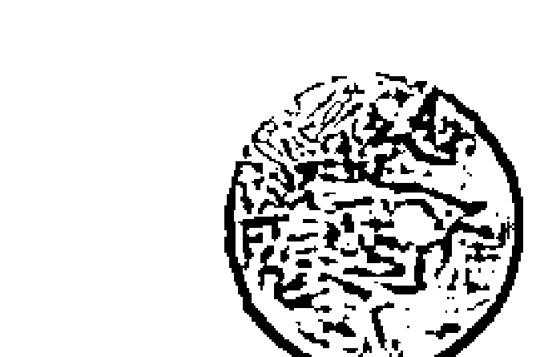

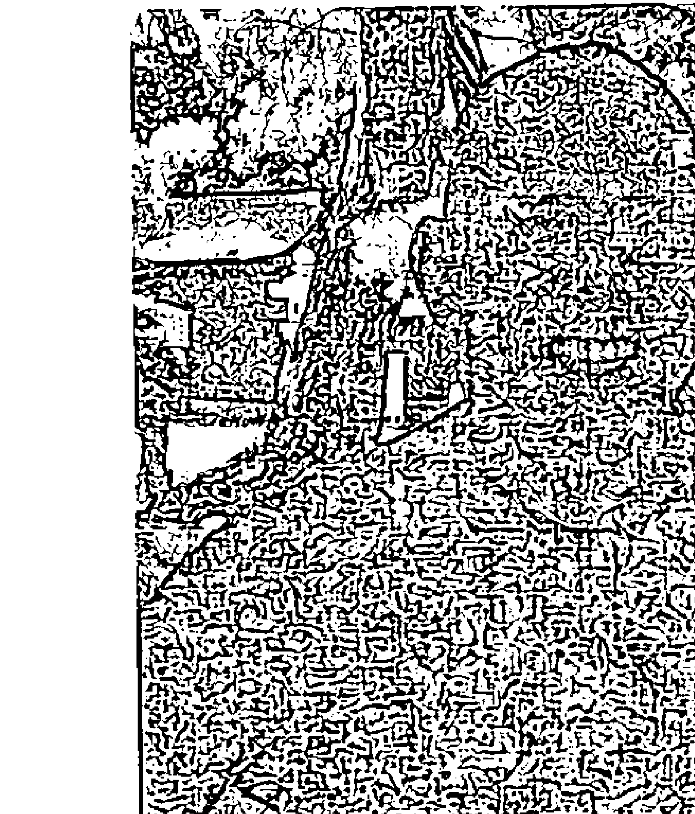

### 作者简介

雷·强德兰生于印度，曾于美国和日本生活。他针对个案提供个别通灵课程，文章也曾刊登于圣多那灵性期刊（Sedona Journal of Emergence）。雷在远东地区开设工作坊来介绍古埃及神秘学派（Ancient Egyptian mysteries）、DNA 活化以及通灵。他也为个案创造灵魂符号，并且带领人们游历全世界的古老圣地。

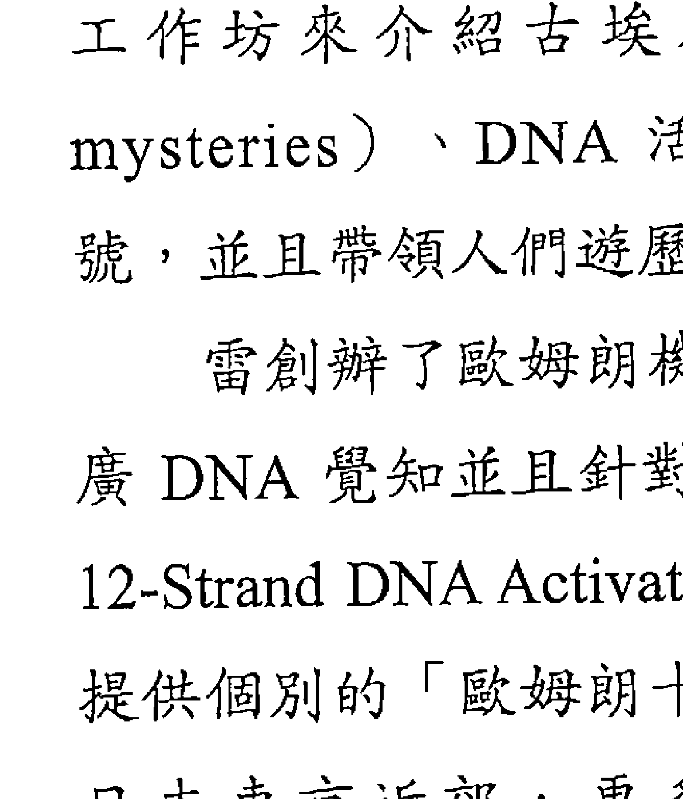

雷创办了欧姆朗机构（Omran Institute），此机构专事推广 DNA 觉知并且针对「欧姆朗十二束 DNA 活化」（Omran 12-Strand DNA Activation）的从业人员提供认证。他也为个案提供个别的「欧姆朗十二束 DNA 活化」疗程。他与妻儿住在日本东京近郊，更多资讯请参阅作者个人网站：www.RaeChandran.com。

### 編者簡介

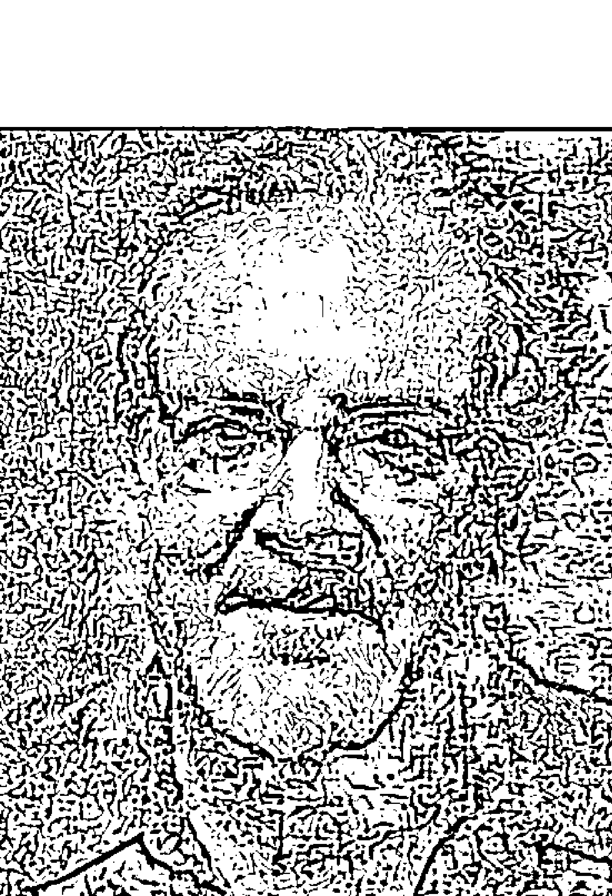

羅伯・波洛克斯生於美國華盛頓特區，曾於英國倫敦、加拿大、以及美國麻薩諸塞州的伯克夏山區定居。他在伯克夏地區的一所全人健康中心擔任能量醫者，也在紐約及伯克夏進行能量療癒工作。

羅伯曾出版《以心導航》（Navigating by Heart），並教授靈性和 DNA 活化的工作坊。他也為個案提供「歐姆朗十二束 DNA 活化」療程。羅伯目前定居於伯克夏，個人網站為：www.BerkshireEnergyHealing.com。

## 生命潛能出版圖書目錄

| 心靈成長系列 | 作者 | 譯者 | 定價 |
|--------------|------|------|------|
| ST01124 預見未知的高我 | 弗瑞德·思特靈Fred Sterling | 林瑞堂 | 380 |
| ST01125 邀請你的指導靈 | 桑妮雅·喬凱特Sonia Choquette | 邱俊銘 | 380 |
| ST01126 來自寂靜的信息 | 李耳納·傑克伯森Leonard Jacobson | 鄭羽庭 | 320 |
| ST01127 呼吸的神奇力量 | 德瓦帕斯Devapath | 黃翎展 | 270 |
| ST01128 當靜心與諮商相遇 | 史瓦吉多Svagito R. Liebermeister | 莎薇塔 | 380 |
| ST01129 靈性法則之光 | 黛安娜·庫柏Diana Cooper | 沈文玉 | 320 |
| ST01130 塔羅其實很簡單 | M. J. 阿芭迪M. J. Abadie | 盧娜 | 280 |
| ST01133 地心文明桃樂市(1) | 奧瑞莉亞·盧意詩·瓊斯 Aurelia Louise Jones | 陳菲 | 280 |
| ST01134 齊瑞爾訊息：創世基質 | 弗瑞德·思特靈Fred Sterling | 邱俊銘 | 340 |
| ST01136 綻放直覺力 | 金·雀絲妮Kim Chestney | 許桂綿 | 280 |
| ST01137 點燃療癒之火 | 凱若琳·密思博士Caroline Myss, Ph.D. | 林瑞堂 | 380 |
| ST01139 我值得擁有一切美好的改變 | 露易絲·賀Louise L. Hay | 蕭順涵 | 250 |
| ST01140 齊瑞爾訊息：重返列木里亞 | 弗瑞德·思特靈Fred Sterling | 林瑞堂 | 380 |
| ST01142 克里昂訊息：DNA靈性12揭密 | 李·卡羅Lee Carroll | 邱俊銘 | 380 |
| ST01143 重拾靈魂悸動 | 桑妮雅·喬凱特Sonia Choquette | 丘羽先 | 280 |
| ST01144 朵琳夫人的天使水晶治療書 | 朵琳·芙秋博士Doreen Virtue, Ph.D. & 茱蒂斯·洛克斯基地Judith Lukomski | 陶世惠 | 300 |
| ST01146 地心文明桃樂市(3) | 奧瑞莉亞·盧意詩·瓊斯 Aurelia Louise Jones | 黃愛淑 | 380 |
| ST01147 女人愈熟愈美麗 | 莎拉·布洛考Sarah Brokaw | 盧秋瑩 | 350 |
| ST01149 你的人生不一樣 | 露易絲·賀Louise L. Hay & 雪柔·李察森Cheryl Richardson | 江孟蓉 | 250 |
| ST01150 發現亞特蘭提斯 | 黛安娜·庫柏Diana Cooper & 莎朗·赫頓Shaaron Hutton | 林瑞堂 | 380 |
| ST01154 創造生命的力量(附光碟) | 露易絲·賀Louise L. Hay | 吳品瑜 | 280 |
| ST01155 開心曼陀羅 | 林妙香 |  | 280 |
| ST01156 天使之藥2013年新版 | 朵琳·芙秋博士Doreen Virtue, Ph.D. | 陶世惠 | 340 |
| ST01157 願望 | 安潔拉·唐諾凡Angela Donovan | 楊佳蓉 | 300 |
| ST01158 居家魔法整理術 | 泰絲·懷特赫思特 Tess Whitehurst | 林群華 | 300 |
| ST01159 通向宇宙的鑰匙 | 黛安娜·庫柏Diana Cooper &凱西·克洛斯威爾Kathy Crosswell | 黃愛淑 | 380 |
| ST01161 中年不敗 | 潔西卡·卡吉爾湯普生Jessica Cargill-Thompson &約翰·歐康乃爾John O'Connell | 游懿萱 | 250 |

| 编号 | 书名 | 作者 | 译者 | 价格 |
|------|------|------|------|------|
| ST01162 | 不費力的靜坐 | 阿嘉彥・波伊斯Ajayan Borys | 舒靈 | 300 |
| ST01163 | 水晶高頻治療(2) | 卡崔娜・拉斐爾Katrina RaphaeII | 奕蘭 | 300 |
| ST01164 | 夢想的顯化藝術 | 偉恩・戴爾博士Wayne W. Dyer | 非語 | 300 |
| ST01165 | 凱若琳的人格原型書 | 凱若琳・密思Caroline Myss | 林瑞堂 | 360 |
| ST01167 | 通往幸福的奇蹟課程 | 蓋布麗兒・伯恩絲坦 Gabrielle Bernstein | 謝明憲 | 360 |
| ST01168 | 新世代小孩與人類意識大蛻變 | P.M.H.阿特沃特P. M. H. Atwater | 楊仕音 | 350 |
| ST01170 | 人間天使的決斷力 | 朵琳・芙秋博士Doreen Virtue, Ph.D. | 林瑞堂 | 300 |
| ST01171 | 水晶光能傳導(3) | 卡崔娜・拉斐爾Katrina RaphaeII | 思逸 | 350 |
| ST01173 | 奧修靜心治療 | 史瓦吉多Svagito R. Liebermeister | 陳伊娜 | 420 |
| ST01174 | 召喚天使(2014年新版) | 朵琳・芙秋博士Doreen Virtue, Ph.D. | 王愉淑 | 280 |
| ST01175 | 為人生帶來奇蹟的魔法書 | 山川紺矢 & 山川亞希子 | 李瓊祺 | 300 |
| ST01176 | 來自長島靈媒的療癒訊息 | 特蕾莎・卡普托Theresa Caputo | 非語 | 320 |
| ST01177 | 遇見神奇獨角獸 | 黛安娜・庫柏Diana Cooper | 黃愛淑 | 380 |
| ST01178 | 托爾特克愛的智慧之書 | 唐・梅桂爾・魯伊茲Don Miguel Ruiz | 非語 | 260 |
| ST01179 | 初學者的內觀禪修 | 傑克・康菲爾德 Jack Kornfield | 舒靈 | 250 |
| ST01180 | 療癒破碎的心 | 露易絲・賀 Louise Hay &大衛・凱斯勒 David Kessler | 謝明憲 | 280 |
| ST01181 | 當下是良師 | 佩瑪・丘卓Pema Chödrön | 舒靈 | 280 |
| ST01182 | 天使塔羅全書 | 朵琳・芙秋博士 Doreen Virtue, Ph.D. & 羅賴・瓦倫坦 Radleigh Valentine | 星宿老師（林樂卿） | 350 |
| ST01183 | 看見神性生命的奇蹟 | 偉恩・戴爾博士（Wayne W. Dyer） | 非語 | 420 |
| ST01184 | 靈性能量淨化書 | 泰絲・懷特赫思特 Tess Whitehurst | 陳麗芳 | 300 |
| ST01185 | 天使能量排毒法 | 朵琳・芙秋博士Doreen Virtue Ph.D. & 羅伯・李維Robert Reeves | 黃愛淑 | 420 |
| ST01186 | 天使占星學 | 朵琳・芙秋博士Doreen Virtue, Ph.D. & 亞思敏Yasmin Boland | 陳萱芳 | 720 |
| ST01187 | 情緒藝術 | 露西雅・卡帕席恩博士 Lucia Capacchione Ph.D. | 沈文玉 | 350 |
| ST01188 | 五次元的靈魂揚昇 | 黛安娜・庫柏 Diana Cooper &提姆・威德 Tim Whild | 黃愛淑 | 450 |
| ST01189 | 天使數字書(2016年版) | 朵琳・芙秋博士Doreen Virtue, Ph.D. | 王愉淑 | 300 |
| ST01190 | 催眠之聲伴隨你(2016年版) | 米爾頓・艾瑞克森Milton H. Erickson & 史德奈・羅森Sidney Rosen | 蕭德蘭 | 450 |
| ST01191 | 假面恐懼 | 麗莎・蘭金博 Dr. Lissa Rankin | 非 語 | 450 |
| ST01192 | 天使夢境國度 | 朵琳・芙秋 博士Doreen Virtue, Ph.D. & 梅麗莎・芙秋Melissa Virtue | 黃春華 | 320 |

## 靈性成長系列

|      |                  |                          |        |      |
|------|------------------|--------------------------|--------|------|
| ST01193 | 高敏感族自在心法       | 伊蓮·艾融 Elaine N. Aron     | 張明玲   | 480  |
| ST01194 | 喜悅之道            | 珊娜雅·羅曼Sanaya Roman      | 王季慶   | 400  |
| ST01195 | 開放通靈            | 珊娜雅·羅曼Sanaya Roman &杜安·派克 Duane Packer | 羅孝英   | 450  |
| ST01196 | 創造金錢            | 珊娜雅·羅曼Sanaya Roman &杜安·派克 Duane Packer | 羅孝英   | 450  |
| ST01197 | 個人覺知的力量        | 珊娜雅·羅曼Sanaya Roman      | 羅孝英   | 420  |
| ST01198 | 如是              | 許宜銘                   |        | 350  |
| ST01199 | 光行者            | 朵琳·芙秋 博士Doreen Virtue, Ph.D | 林瑞堂   | 400  |

## 心靈塔羅系列

| 編號    | 名稱                               | 作者                                                                 | 譯者         | 定價   |
|---------|------------------------------------|----------------------------------------------------------------------|--------------|--------|
| ST11015 | 亞特蘭提斯神諭占卜卡                   | 黛安娜·庫柏Diana Cooper                                               | 羅孝英       | 780    |
| ST11016 | 聖地國度卡                           | 柯蕾·鮑隆瑞 Colette Baron-Reid                                        | 王培欣       | 850    |
| ST11043 | 守護天使指引卡(新版)                   | 朵琳·芙秋博士 Doreen Virtue, Ph.D.                                     | 陶世惠       | 1180   |
| ST11020 | 揚昇大師神諭卡(2013年新版)             | 朵琳·芙秋博士 Doreen Virtue, Ph.D.                                     | 鄭婷玫       | 850    |
| ST11022 | 神奇精靈指引卡(2013年新版)             | 朵琳·芙秋博士 Doreen Virtue, Ph.D.                                     | 陶世惠       | 850    |
| ST11024 | 靛藍天使指引卡                         | 朵琳·芙秋博士 Doreen Virtue, Ph.D. & 查爾斯·芙秋Charles Virtue          | 王培欣       | 850    |
| ST11025 | 指導靈訊息卡(2014年新版)               | 桑妮雅·喬凱特Sonia Choquette                                           | 邱俊銘       | 850    |
| ST11026 | 神奇花朵療癒占卜卡                     | 朵琳·芙秋博士 Doreen Virtue, Ph.D.& 羅伯·李維Robert Reeves             | 陶世惠       | 850    |
| ST11030 | 生命療癒卡(2015年新版)                 | 凱若琳·密思Caroline Myss, Ph. D & 彼得·奧奇葛羅素Peter Occhiogrosso     | 林瑞堂       | 850    |
| ST11031 | 智慧脈輪指引卡                         | 托莉·哈特曼Tori Hartman                                               | 安德魯       | 850    |
| ST11032 | 守護天使塔羅牌                         | 朵琳·芙秋博士 Doreen Virtue, Ph.D. &羅賴·瓦倫坦 Radleigh Valentine     | 林瑞堂       | 1280   |
| ST11033 | 神奇美人魚與海豚指引卡 (2016年版)       | 朵琳·芙秋博士Doreen Virtue Ph.D.                                       | 陶世惠       | 1180   |
| ST11034 | 大天使神諭占卜卡(2016年版)             | 朵琳·芙秋Doreen Virtue, Ph.D.                                         | 王愉淑       | 1180   |
| ST11035 | 天使回應占卜卡(2016年版)               | 朵琳·芙秋 博士Doreen Virtue &羅賴·瓦倫坦Radleigh Valentine             | 黃春華       | 1180   |
| ST11036 | 天使夢境神諭卡(2016年版)               | 朵琳·芙秋 博士Doreen Virtue, Ph.D. & 梅麗莎·芙秋Melissa Virtue         | 黃春華       | 1200   |
| ST11037 | 天使療癒卡(2016年版)                   | 朵琳·芙秋 博士Doreen Virtue, Ph.D.                                     | 陶世惠       | 1180   |
| ST11038 | 天使塔羅牌                             | 朵琳·芙秋博士 Doreen Virtue, Ph.D.& 羅賴·瓦倫坦 Radleigh Valentine     | 王培欣、王芳屏 | 1680   |

| 編號    | 名稱             | 作者                     | 譯者   | 定價   |
|---------|------------------|--------------------------|--------|--------|
| ST11039 | 爱希斯埃及女神卡     | 阿蓮娜·菲雀爾德 Alana Fairchild | 黄春華 | 1280   |
| ST11040 | 爱的絮语占卜卡       | 安潔拉·哈特菲爾德 Angela Hartfield | 黄春華 | 1380   |
| ST11041 | 观音神谕卡         | 阿蓮娜·菲雀爾德 Alana Fairchild | 黄春華 | 1580   |
| ST11042 | 自然絮语占卜卡       | 安潔拉·哈特菲爾德 Angela Hartfield | 黄春華 | 1380   |

## 奥修灵性成长系列

| 編號    | 名稱                           | 作者         | 譯者     | 定價 |
|---------|--------------------------------|--------------|----------|------|
| ST6041 | 叛逆的灵魂-奥修自传(DVD)       | 奥修OSHO     | 黄瓊瑩   | 450  |
| ST6042 | 奥修谈身心平衡(CD)             | 奥修OSHO     | 陈明堯   | 300  |
| ST6043 | 灵魂之药(DVD)                  | 奥修OSHO     | 陈明堯   | 280  |
| ST6044 | 与先哲奇人相遇(DVD)            | 奥修OSHO     | 陈明堯   | 320  |
| ST6045 | 奥修谈瑜伽(DVD)                | 奥修OSHO     | 林妙香   | 280  |
| ST6046 | 奥修谈勇气(DVD)                | 奥修OSHO     | 黄瓊瑩   | 300  |
| ST6047 | 奥修谈自我(DVD)                | 奥修OSHO     | 莎薇塔   | 380  |
| ST6048 | 奥修谈成熟(DVD)                | 奥修OSHO     | 黄瓊瑩   | 280  |
| ST6049 | 奥修谈觉察                     | 奥修OSHO     | 黄瓊瑩   | 280  |
| ST6050 | 奥修谈直觉(DVD)                | 奥修OSHO     | 沈文玉   | 280  |
| ST6051 | 奥修谈恐惧(DVD)                | 奥修OSHO     | 陈伊娜   | 300  |
| ST6053 | 奥修谈创造力(DVD)              | 奥修OSHO     | 莎薇塔   | 300  |
| ST6054 | 奥修谈亲密(DVD)2015年新版      | 奥修OSHO     | 陈明堯   | 280  |
| ST6055 | 梦幻泡影                       | 奥修OSHO     | 陈伊娜   | 300  |
| ST6056 | 城市里的静心手札               | 奥修OSHO     | 非語     | 350  |
| ST6057 | 奥修脉轮能量全书               | 奥修OSHO     | 莎薇塔   | 580  |

## 两性互动系列

| 編號    | 名稱                                   | 作者                         | 譯者     | 定價 |
|---------|----------------------------------------|------------------------------|----------|------|
| ST0218 | 灵慾情色愛                             | 許宜銘                       |          | 200  |
| ST0224 | 男女大不同身心健康对策                 | 約翰·葛瑞博士John Gray, Ph.D | 許桂綿   | 320  |
| ST0227 | 爱的沟通不打烊                         | 瓊恩、卡森                   | 周晴燕   | 280  |
| ST0229 | Office男女大不同职场轻松沟通           | 約翰·葛瑞博士John Gray, Ph.D |          | 320  |
| ST0232 | 男人来自火星女人来自金星               | 約翰·葛瑞博士John Gray, Ph.D | 蘇晴     | 320  |
| ST0233 | 灵魂伴侣                               | 艾莉兒·福特 Arielle Ford     | 李怡萍   | 380  |
| ST0234 | 男孩們的那些鳥事                       | 安德魯·史邁勒 Andrew P. Smiler | 林瑞堂   | 450  |
| ST0235 | 慾望の回歸                             | 吉娜·奥格登 Gina Ogden       | 鍾莉方   | 450  |

# 靈魂DNA第二部--連結你神聖藍圖的實用指引

原著書名｜DNA of the Spirit,Vol.2
作　　者｜雷・強德蘭（Rae Chandran），羅伯・梅森・波洛克（Robert Mason Pollock）合著
譯　　者｜林瑞堂
發 行 人｜許宜銘
總　　監｜王牧絃
執行編輯｜吳珈綾
美術編輯｜陳傳家
出版發行｜生命潛能文化事業有限公司
聯絡地址｜台北市士林區承德路四段234號8樓
聯絡電話｜(02) 2883-3989
傳　　真｜(02) 2883-6869
郵政劃撥｜17073315　戶名／生命潛能文化事業有限公司
E-MAIL｜tgblife66@gmail.com
網　　址｜http://www.tgblife.com.tw
郵購單本九折，五本以上八五折，未滿1000元郵資60元，購書滿1000元以上免郵資

總 經 銷｜人類文化事業股份有限公司｜(02) 8667-2555｜www.humanbooks.com.tw
內文編排｜菩薩蠻電腦科技有限公司｜(02) 2917-0054
印　　刷｜中華彩色印刷・電話｜(02) 2915-0123
法律顧問｜眾勤法律事務所 陳全正律師
版　　次｜2017年12月初版
定　　價｜380元

ISBN：978-986-95751-1-9

Copyright © 2014 by Rae Chandran
Originally published in 2014 Light Technology Publishing, LLC., USA
Complex Chinese translation copyright: 2017 Life Potential Publications

All Rights Reserved.
行政院新聞局局版台業字第 5435 號
如有缺頁、破損，請寄回更換
版權所有，翻印必究

國家圖書館出版品預行編目(CIP)資料

靈魂DNA. 第二部：連結你神聖藍圖的實用指引 / 雷.強德蘭(Rae Chandran), 羅伯.梅森.波洛克(Robert Mason Pollock)合著 ; 林瑞堂譯. -- 初版. -- 臺北市 : 生命潛能文化, 2017.12
面； 公分. -- (心靈成長系列)
譯自：DNA of the spirit
ISBN 978-986-95751-1-9 (平裝)
1.心靈學 2.靈修

175.9
106022209

《靈魂DNA第一部》的這本續集，延續前書的重要教導，也是設計來強化前書內容並揭示能更進一步支持人類的教導。本書指出特定的技巧來提升自己的光，深化第一部所提供的教導。《靈魂DNA第二部》包含更高的成熟和智慧，書中文字也注入更多能量。在你翻閱本書的同時，請在心中護持神聖，請求內容能銘印在心中，好讓它能成為你能應用於自己生活的經驗。書中某些資訊是以密碼型態存在，真誠的學生會發現他們能解開這些密碼。

本書所介紹的工具都曾由大師所使用。在各位閱讀本書內容並辨認自我真理時，你會發現自己踏上驚人的自我發現之旅。這會幫助你體驗和宇宙合一，發現自己內在的神聖。

# 章節內容包括：

- § 帶來療癒的氣場銘印技巧
- § 神的數字
- § 揭露自己的生命契約
- § 用你的阿卡莎檔案重新創造自己的生命
- § 人類是受訓中的造物主
- § 如何連結新的教導
- § 運用自己的光體來活化DNA

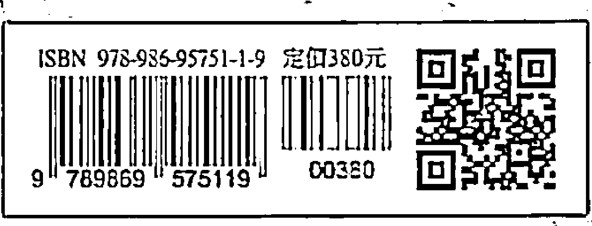