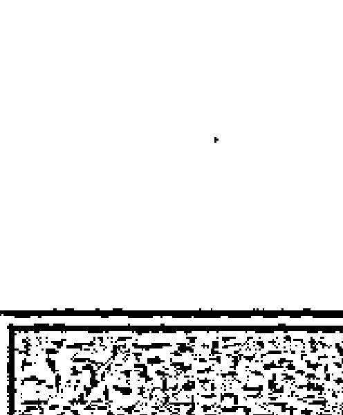
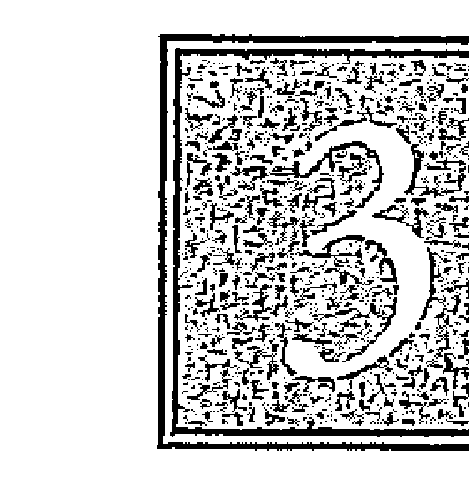
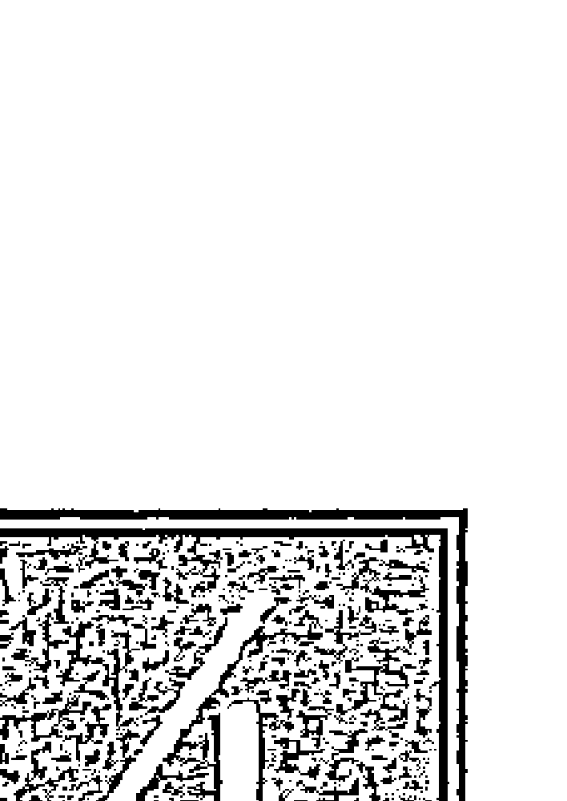
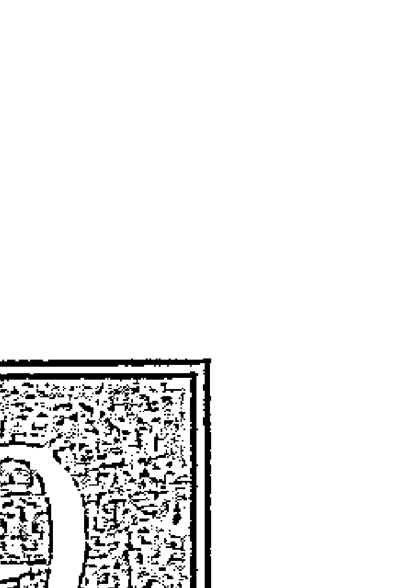
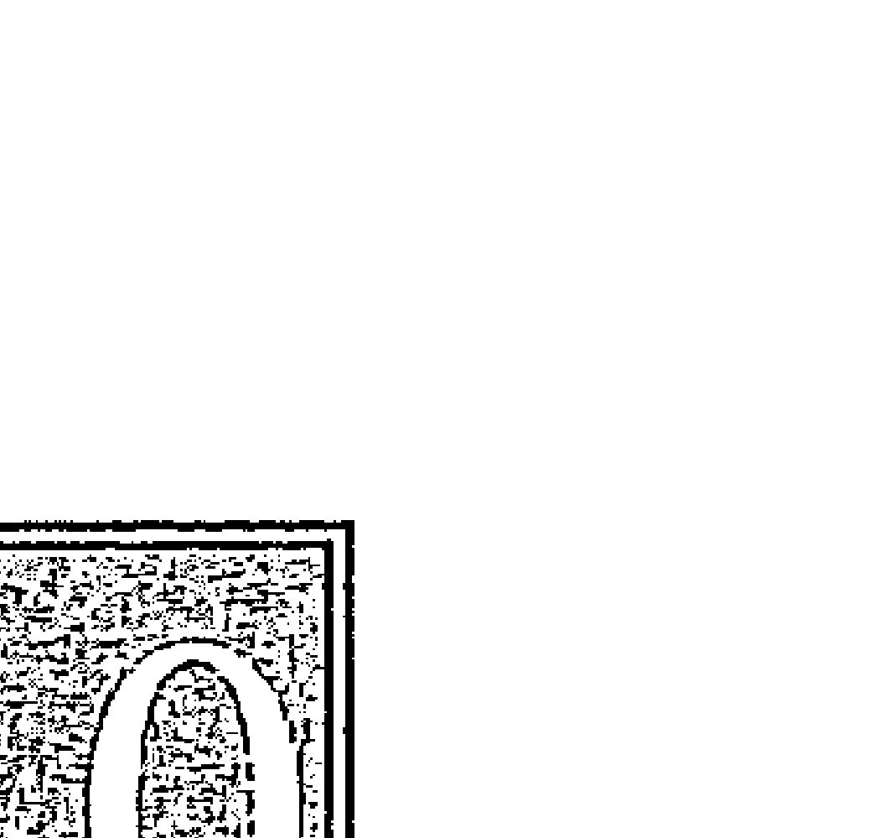
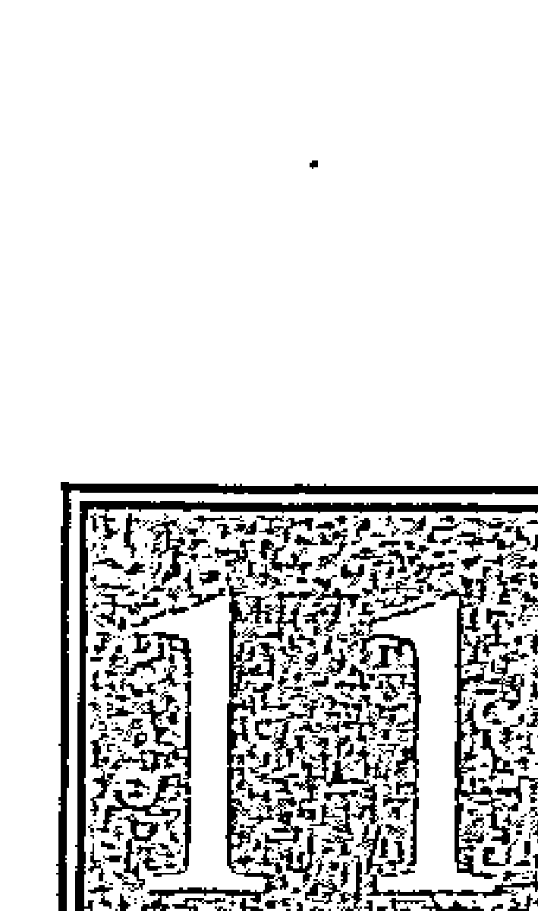
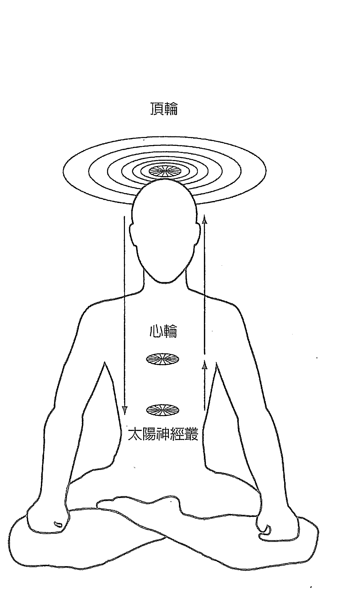
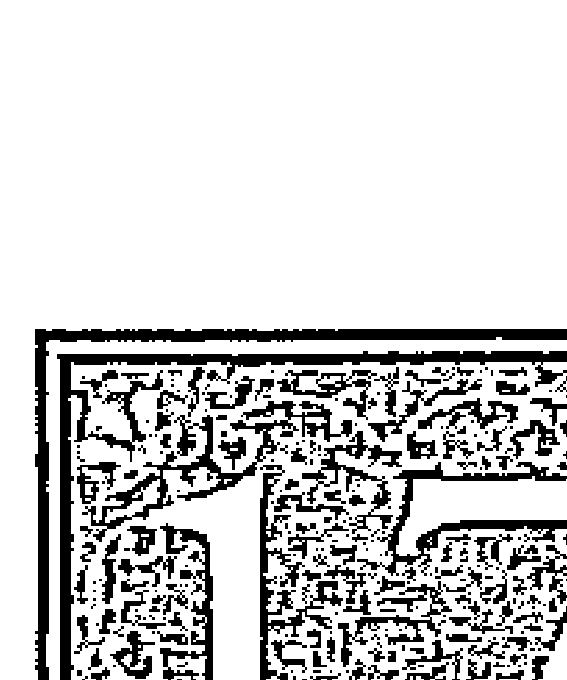

# SOULOFT 無條件之愛
珊娜雅·羅曼 Sanaya Roman 著 羅孝英 譯

# ~ 謹獻 ~
這本書獻給所有接觸靈魂並開啟心輪的人
為你們因此對人類做出的貢獻

歐林與珊娜雅

Thank you for all the love you are adding to the world
Sanaya & Orin

# 啟程
讀這本書，你會展開一段發現、探險和成長的靈性旅程。接觸靈魂和開啟心輪，會是你做過最重要和帶來最大轉化的旅程。當你開啟心輪，你能接收來自靈魂的一切禮物，諸如寧靜、堅強、清晰、喜悅、力量、光和願景。你能學習像靈魂一般無條件地愛與接納自己。

當你開啟心輪，你做出對全人類重要的貢獻，你為世界增加能幫助人類開啟心輪的愛能振動。人類所面臨的一切問題——飢餓、戰爭、貧窮、犯罪、無家可歸和環境破壞，當足夠多的人接觸靈魂並開啟心輪時，便能獲得解決。屆時人們將合作、分享並一起為全人類謀福利，而解答會被發現。

我，作為一個嚮導，提供書中的資訊，幫助你踏上旅程，體驗所有在你之內等待開展的愛。就像許多旅程一樣，只有在你回來之後，你才會了解你已完成多少事，與你踏上旅程時有多大的不同。這旅程始於愛也終於愛，因為愛是宇宙最強大的能量。

# 目錄
- 啟程 5
- 譯序——踏上愛的旅程 羅孝英 11
- 序——活出靈魂的質地 15
- 引言 19
- 如何使用本書 26
- 第一部 與你的靈魂融合
- 第一章 預備你的人格 31
- 第二章 踏上靈魂次元的旅程 39
- 第一部 開啟你的多重心輪
- 第三章 與你的靈魂相見 49
- 第四章 與你的靈魂融合 59
- 第五章 活出靈魂的生活 67
- 第六章 預備開啟 79
- 第七章 開啟心輪 85
- 第八章 靈魂連結 95
- 第九章 愛的寧靜 107
- 第十章 愛的合一 121
- 第十一章 愛的意志 135
- 第十二章 臣服於愛 149
- 第十三章 喚醒靈魂之愛 165
- 第二部 開創靈魂的關係
- 第十四章 吸引靈魂伴侶 181
- 第十五章 發現關係的更高目的 195
- 第十六章 創造你想要的關係 205
- 第十七章 化解愛的阻礙 217
- 第十八章 探索愛的新方式 231
- 第十九章 改變或釋放一段關係 245
- 第四部 接受和散發愛
- 第二十章 愛的慶典 261
- 第二十一章 愛的轉輪 273
- 第二十二章 散發愛 283
- 如何教導《靈魂之愛》 297
- 生命的下一步是什麼？ 303
- 歐林的書和錄音課程 305
- 關於作者 307
- 繼續你的旅程 311
- 感謝 313

# 譯序
## 踏上愛的旅程
《靈魂之愛》是一本處理關係的指導手冊。靈魂活在真正的關係中，人類則活在頭腦的關係中。每一個人得先和自己建立靈魂的關係，才能逐步向外擴展與萬事萬物的靈魂關係。《靈魂之愛》是一本探索無條件愛自己的書，歐林會在書中提醒我們千百回。當你看書，你踏上一個擴展自我之愛的旅程，從這裡，《靈魂之愛》接手。靈魂之愛寧靜，靈魂之愛合一，靈魂之愛堅持。靈魂是宇宙心智的具體展現，當人們處於靈魂的能量會感覺寧靜，獲得滋養，具有領導力，展現喜悅、豐盛和力量。《靈魂之愛》這本書教導我難以計數的事，我最大的成長便來自於閱讀、分享和教導《靈魂之愛》，對此我衷心感謝。我自小便是個性疏離又渴望合群的人，很難平衡。最喜歡泡在能量和靈性的空間中思考，那讓我感覺最自然和舒服，然而即使最好的朋友或父母也無法了解我，因此我對夏荷蓮

## 【靈魂之愛】
靈魂伴侶，便開始認真練起功夫，果不然，靈魂伴侶開始一一出現在我的生活中，中，甜蜜但令人迷惑，直到我在一九九九年開始閱讀《靈魂之愛》這本書。在拜讀《靈魂之愛》的過程中，我面對和處理所有的關係：婚姻、愛情、親子、友情和團體關係。在靈魂之愛中，我看見我的小我認真地以一種無比的韌性，挑戰我無條件地愛自己，挑戰我消融愛的阻礙，願意愛人並接納人們的愛，挑戰我加入光的社群一起工作的能力。為此我感謝生活中所有讓我看見並轉化小我的因緣際會，謝謝你們包容我、愛我，參與我們的戲碼，讓我們有機會成長彼此。如此我踏上認識自己和轉化關係的愛的旅程。這本書每看一回便成長一回，甜蜜呼？辛苦呼？冷暖自知。最重要的是，如此我們能建立與靈魂這個重要的能量源頭縝密而直接的連結，這一點會讓選擇這麼做的每一個人獲益匪淺。是如此，現在我開始享受靈魂伴侶的關係。《靈魂之愛》支持所有追求靈魂成長的人，獲得真正美好的愛的關係。我的經驗確如此，《靈魂之愛》是我最喜歡的影集之一，它每每讓我思考靈魂之愛何時才能彌漫整個星球？人類的智慧何時可以用來專注於和平與和諧？我並不失望，因為在這個美麗的星球上，已經有很多人準備好要用不同的觀點生活，以光和愛處理所有的業力戲碼。《靈魂之愛》

書中提供處理業力戲碼最好的內在工具。

翻譯《靈魂之愛》的過程中，在我能轉譯書中的訊息之前，常常會進入昏昏欲睡的狀態，它會持續到我能獲得足夠的理解為止。當你閱讀這本書，也許你會碰到這種狀況。但是，不妨把它當作是靈魂與你整合的時刻，一段你放下頭腦的時間。

邀請你踏上愛的旅程，分享並傳播你的靈魂之愛。

# 序
## 活出靈魂的質地
珊娜雅：歡迎你閱讀這本書。如果它是你的第一本歐林書，我為你能加入心輪開啟的行列，並學習更多靈魂之愛的內涵感到喜悅。如果你讀過歐林其他的書，那麼我很高興有機會在你踏上靈性成長的下一段旅程，再度與你相逢。

這本書是由一位非物質存在的指導靈「送」給我的，他稱自己為歐林。人們常會問歐林是誰。我問過歐林。歐林的回答是——他是誰並不重要，重要的是他帶來的訊息以及這些訊息對你而言是否有用。他希望你把焦點放在你和你的成長，而不是他。

我體驗的歐林是一位具有宏偉的愛、智慧和慈悲的高靈。他從不告訴人們去做什麼或如何生活。當他被問到這些問題，他只提供建議和想法，幫助人們看見更多選擇。他帶來一個不變的訊息——宇宙是友善的，它有無限的豐盛，每一件事情都是為了我們的益處而完美地發生，即使我們並不總是明白為什麼，我們仍可以選擇透過喜悅而非痛苦來成長。他鼓勵你只接受那些代表你最深存在的想法，而放下其他不是的。

## 靈魂之愛
歐林告訴我他是一個光的存有。他說他和我們一起工作的原因，是因為這段時間人類正在經歷重大的轉變與覺醒。歐林曾在地球生活過一世，他明白在地球空間生活的許多挑戰。他說他現在「居住」在靈魂次元和更高的國度。他來這裡的目的之一是服務人類。他的服務是提供人類一條靈性成長的道路，幫助人們向他們的大我和靈魂伸展。他在本書中提供你開啟心輪的方法，讓你活在靈魂的愛、寧靜與合一的韻律中。

我是在一種放鬆而警醒的知覺狀態中傳達歐林的訊息。我完全在現場並清楚什麼是我的想法，什麼是歐林的想法。當歐林與我同在時，我並非處於出神狀態，我的聲音沒有改變，我也沒有失去意識。歐林說他透過一種更高的心電感應方式和我溝通。他傳送意象給我的靈魂和大我心智，然後才被我的意識接收為訊息。歐林說雖然他的能量和光開放給所有呼請他的人，但是在我有生之年，他不會透過其他靈媒傳遞訊息。

歐林的話語只能表達我體驗感受的一部分。在文字之外還有豐富的感覺、畫面和啟發，超乎言語所能形容。我感覺與他的接觸讓我擴展進入一個光和喜悅的世界，透過歐林，我體驗到一個有著更高理解、更大知覺、慈悲和愛的世界。每一個人都有能力到達這種知覺狀態，它關乎聆聽、開放，並允許你擴展超越對自己的認知，認同成長含納更廣的角度。你們許多人在做喜愛的事時會體驗這個狀態，而感覺比一般的知覺狀態更清明、睿智、有靈感。有些人稱這種擴展狀態為通靈、靈感、創意思考、直覺洞見或知覺擴展。

幾年前，在我完成《靈性成長》——地球生活系列第三本書之後，歐林告訴我他想寫一本名為《靈魂之愛》的書——靈魂生活系列的第一本書。靈魂生活系列教導人們如何活出他們的靈魂。在《靈魂之愛》中會教導人們如靈魂般地生活，開啟心輪和創造與靈魂的關係。

《靈魂之愛》聽起來似乎是很美妙的題目，而我也一直期盼開始書寫。然而，歐林似乎有另外的想法。我開始和杜安·派克 (Duane Packer) 一起教授創造豐盛的課程，也教人們如何與指導靈連結。這些課堂中教導的訊息都蒐羅在《創造金錢》(Creating Money) 和《開放通靈》(Opening to Channel) 書中。在《靈性成長》出版後，歐林和杜安的指導靈達本，希望我們開始教導一門關於靈性轉化，名為「開啟光體」的新課程。這個課程教人們如何擴展意識以經驗更高次元的光。於是人們學會如何把更高次元的光帶進日常生活中，運用它來轉化自己的身體、情緒、心智和生活。

我一直很好奇歐林什麼時候才會開始寫《靈魂之愛》這本書。每當我問起，歐林只是要我繼續透過開啟光體擴展意識。開啟光體增加我對靈魂的精細能量、更高次元和光之靈的感知敏感度。幾年之後，歐林終於告訴我寫作《靈魂之愛》的時間到了。

## 靈性成長
我和歐林進行數百次的通靈帶出這本書的資訊；其中有一些資訊也來自歐林長達十年的冥想、談話和教學。當歐林和我一起為本書工作時，我們花很多的時間冥想。我們與所有想開啟心輪和連結歐林與我的人們的靈魂連結。在我通靈和寫作時可以感受這種連結的喜悅。在靈魂次元，你們都像我的家人一般出現過。我認識你們之中的一些人，我也許不知道你們的臉孔和姓名，但我認識你們靈魂的美麗與光明。然而，還有更多我未曾謀面的人。當我透過書中的過程與我的靈魂連結和開啟心輪時，我的生活有了很多改變。雖然我認為自己寫這本書之前的生活已經很好，然而我了解我能過得比想像的更好。當我感受靈魂的力量、臨在和愛，我開始對自己和宇宙有愈來愈大的信任與信心。開啟心輪教導我用新的方式愛人，我比以前更能支持別人。當我與人們的靈魂連結，我開始擁有更美好的關係。

我期待在你閱讀這本書時在靈魂次元加入你。當你繼續閱讀這本書，我的靈魂會出現在你被引導連結的靈魂團體裡。我們將加入更多的人，一起會見並與靈魂融合，開啟心輪並呼請偉大的高靈們開啟全人類的心輪。在你閱讀這本書，踏上開啟心輪美妙的旅程中，我的愛始終與你同在。

# 引言
歐林問候大家！當你繼續往前，你並非只是閱讀一本書，你也踏上了一個轉化的旅程。你會開始一段美妙的探險，遇見你的靈魂並學習像靈魂一樣的愛。當你閱讀並向靈魂的愛與智慧開放，會發生許多美妙的改變。你種下了也許在數週或數月之後才會成長、擴展和開花結果的種子，有些也許會立刻萌芽，而其他則隨著時間展現芬芳。在第一部「與你的靈魂融合」中，你將進入你靈魂所在的靈魂次元，接受光之靈的能量傳送，幫助你和你的靈魂相會和融合。當你能覺察靈魂的美，你會知道自己是多麼特別、獨特與完美的人。你會發現如何汲取靈魂的愛、光、意志、力量和臨在，而創造生活中美妙而有力量的改變。在第二部「開啟你的多重心輪」，你將與靈魂融合，開啟你的三個心輪。第一心輪在心臟附近，我稱它為「主要心輪」或是「心輪」。第二心輪是頂輪的核心，在你的頭頂中央，我稱它為「頂輪」。第三心輪是太陽神經叢，靠近你的肚臍，我也稱它為「太陽神經叢輪」。

## 靈魂之愛
當三個心輪一起運作，你表達一種睿智而寬廣的愛，我稱它為靈魂之愛。靈魂之愛是遍及宇宙的愛，一種穩定而恆常的愛能，也是宇宙終極的本質。靈魂之愛是一種合一的狀態，在那裡你接納也被接納，你愛也被愛，並感覺與你所是的更大整體連結。

## 透過接觸靈魂，進化並擴展你的愛
當你的心輪開啟，你用擴展的愛改善關係，並用智慧和支持的心來愛。你從靈魂平靜、慈悲和親愛的寧靜狀態行使一切。你亟願愛，放下一切阻擋愛的想法、感受和行為。你無意介入權力鬥爭，你釋放愛的阻礙，並始終如一地表達靈魂之愛。

在第三部「開創靈魂的關係」，你學習像靈魂一般地愛並創造靈魂的關係。你明白如何運作靈魂磁性的愛來吸引靈魂伴侶，你探索發現和實現關係的更高目的，你學習運作關係的宇宙法則去創造你想要的關係，你發現新的方法來愛自己和別人。你加入靈魂來改變關係中不再有益的面向。你也許會選擇放下，或降低你和那些無法回應你的愛的人的關係，而吸引真正能回應你的愛的人。你能擁有親愛和支持的關係，它們全都豐富並滋養你的生命。

在第四部「接受與散發愛」，你將在愛的慶典中呼請偉大的高靈們，汲取他們的愛光與愛，預備你心輪的開啟。你需要的只是要求並開放接受我的愛的傳送。在你接受傳送時，確定你願意認識你的靈魂，並以靈魂去愛人。

在你繼續閱讀本書之前，閉起眼睛花幾分鐘和我做內在的連結。我會送給你特別的光與愛，預備你心輪的開啟。你需要的只是要求並開放接受我的愛的傳送。在你接受傳送時，確定你願意認識你的靈魂，並以靈魂去愛人。

如果你要接受我或其他光之靈傳送的光、能量和愛，你需要做的只是要求。在我們的世界，時間和空間並不存在，我們會覺察每一個與我們連結的人。任何時間你想接受我們的光能傳送，你可以在心裡發出意願。你可能會感知我們的能量或沒有任何感覺。我們在你的靈魂的指引和同意下，送光給你的靈魂。

認出你的靈魂是你的一部分。你的靈魂居住在靈魂次元。一個比地球空間更接近合一、本源、神、女神、一切萬有的光與振動的世界。你的靈魂融入靈性，靈性是遍及一切並給予與靈魂生命的意識，就像靈魂遍及你的一切並給予你生命一般。你的靈魂提供靈性接觸你的管道，是你的人格和靈性之間的橋樑。

你的靈魂並非你的心智、情緒和肉體的總和，它是指導和建構各種能量體的智能。它保存生命輪迴的本質，並維持建構你此生生命的原型。它具有心智或智能的品質，聰慧而有創意。它能吸引物質並在你的物質世界創造各種形式。它居住在更高的靈性次元，帶給你那些空間的光與愛。

每當我談到你的靈魂，請明白你的靈魂並未與你分離。它是部分的你。當你接觸你的靈魂，你會愈來愈認識自己；你的意識將擴展並經驗靈魂更大的光、智慧與愛。

你的靈魂是光，它的具體形式是愛，是靈魂次元的大師。為了成長和完成它的更高目的，你的靈魂必須成為你在物質次元的大師。它的目的之一是學習如何把光送進你的人格、心智和情緒，在其中建立靈魂層次更高的光與韻律。你的人格是存在地球空間的你的靈魂對地球空間的熟悉，來自於你和它的合一，以及你明白和實現靈魂目標與目的的能力。

在其他書中，我交互地使用『大我』和『靈魂』兩個名詞。在本書中將進一步定義「大我」為那個知道並實現你靈魂目的的自我。當你的人格充分發展、整合、進化，它會成為一種工具，透過它，你的靈魂得以實現目的。於是它不再只是人格，它進化成你的大我。然而，心智、情緒和肉體的融合——成為大我，並不等於成為你的靈魂。你的大我是一個完美的工具，透過它，你的靈魂得以在地球空間表達自己。作為你的大我，你實現靈魂的目的，而非依從人格的欲望。每一次你與靈魂合一並實現它的目標，你就是你的大我。

要達到開悟之境，你不能坐等你的靈魂來接觸你，為你做所有的事。你的靈魂處於一種深沉冥想的狀態。它大部分的注意力向上對準靈性次元，對準神純然的光，直到你準備召喚它的注意。雖然它不斷傳送靈魂的能量波給你，它對你的工作會在你對它發展知覺時改變，然後你能運用它激發、淨化和轉化你的能量，獲得靈性的成長。

你是那個必須吸引靈魂注意的人。你可以透過意識擴展、追尋大我、靈性成長和開啟光體來吸引靈魂的注意。你展現內在生命的意願和意圖可以吸引你的靈魂。當你有意識地連結你的靈魂，並繼續吸引它進入你的生活，你的靈魂會開始投入更多的注意力和能量給你。當這種情況發生時，你的靈性成長將突飛猛進。你從地球空間向上伸展，你的靈魂從靈魂次元向下實現。當你與你的靈魂融合，你能吸收它內在和周圍的一切靈性知識，讓你的生活更美好。你的靈魂知道人類和全體生命的神聖計畫，明白你在計畫中扮演的角色。你的靈魂向下送出光，透過你在地球的意識體驗到自己。你的人格對它愈有回應，它愈能成功地透過你展現。你的靈魂透過你實現它的更高目的，精鍊送光給你所在的形式和物質的世界。當你與靈魂融合，傳送它的能量到你的生活，你便以一種寶貴的方式為人類服務，你傳遞靈魂的能量。透過與你的靈魂接觸，你能把愛、光、美麗與喜悅傳送給別人。

接觸你的靈魂和悟道高靈來加速你的靈性成長。當你繼續閱讀並接觸你的靈魂，你會被指引呼請光之靈的協助。這些光之靈包括大師、愛的高靈、天使和悟道高靈。所有你受到指引去和他們一起工作的光之靈，都是進化程度很高的高靈。他們可能以男性、女性或許多其他的形式出現。你也許感覺他們是閃耀的光或像是天使。他們可能以你知道的特定人物或臉孔出現。他們是已臻至完美的存在，不再需要以地球的肉身輪迴。

光之靈可以生活在靈魂的世界，因為物質世界已經沒有吸引他們的事。他們的目的之一是服務人類的進化。他們不要你虔誠信仰，相反地，他們希望你用愛和服務來協助他們。光之靈只為光明和善意的力量工作，他們為人類提供保護的能量場。

我會建議你在不同時間呼請他們的幫助，例如你在呼請靈魂、與靈魂融合及開啟心輪的時候。如同你們的世界，我們的世界裡也存在許多助理和老師。做那些接觸靈魂和開啟心輪的步驟，並不一定需要呼請光之靈的幫忙，然而和他們一起工作會讓你的覺醒之路更輕鬆、更充滿喜悅。

光之靈透過心電感應接觸他們提供幫助的人。他們從不剝奪你的自由意志，干擾你的生活，或要求你盲目的服從。他們引導和建議，只在你要求幫忙並開放接受的時候才會來到你身邊。他們提供某些想法和意見給那些準備接觸他們的人——那些把焦點放在接收這種訊息、能量或知識的人。雖然這些高靈出現在這裡是為了幫助你，他們不會拿走你的功課。當你要求，他們會提供你支持和引導，等著隨時給你愛。

# ◆ 如何使用本書
讀本書有許多方法。讓你的靈魂透過你的感覺和渴望告訴你什麼方式適合你。你可以利用本書與你的靈魂相見並與之融合，讓你在靈性成長上大步躍升。你可以運用這個資訊，改變你愛的方式，並改善你和所有認識的人的關係。你對本書的收穫，與你的企圖、承諾和投入多少時間與能量運用你學到的過程有關。

你可以讀完整本書或閱讀部分。因為本書提供一套循序漸進的系統來接觸靈魂，並開啟多重的心輪。若你第一次能逐章閱讀，會帶給你最大的收穫。本書分成四個部分，每一個部分都教導你新的技巧，但前面的章節為基礎。你想用多久時間探索哪一個部分都可以，你可以用幾天、幾週或幾個月的時間停留在相同的地方，想繼續時再繼續。或者，也可以一氣呵成地讀完它，再回頭探索特別有趣的主題。

內文中重點句子是書中的主要重點，你可以在閱讀時利用它們，體驗它們帶給你的擴展和成長。也可以在讀完書後再次閱讀，體驗這些步驟為你的生活造成的轉化。

每一章後面都有「靈魂遊戲」，複習那一章的主要過程。讀完一章之後，練習這些步驟能強化並加深你對所學技巧的熟悉度。每一天你都可以挑選一或多個「靈魂遊戲」，或選擇最吸引你的那些遊戲來練習。幫助你強化與靈魂的連結、表達靈魂之愛的品質，並改善你的關係。本書的句子經過設計，以營造特殊的韻律和停頓，讓你在讀書時能體驗靈魂的精細能量，因為靈魂的韻律會緩和你的呼吸。探討這些文字所引導的能量空間，也是培養對靈魂更有感知能力的方法。讓那些跳出來的想法代表靈魂的訊息。當你向靈魂開放，它會找到方法和你說話。當你讀完本書，做過每個練習之後，你可以隨興翻閱它，把那一頁訊息當作靈魂對你的指引。讓讀書的過程，教你如何吸收和整合新知識與新體驗。你在閱讀本書時做的每一件事都是對的，請以你學習和成長的方式為榮。捕捉你對自己的每一分批判和責難，用讚許自己的正面想法來取代。靈魂之愛的一部分是愛和尊重自己。不管你是否有強烈的正向體驗、細微的開啟，或並沒有顯著改變，都讓你的體驗對你而言是最恰當和完美的。當你讀本書時，運用想像力去觀察、描繪、想像或感覺那些畫面。別擔心你的觀想或意象是否正確。想像、感覺、描繪或觀察你的靈魂和心輪，並沒有對或錯的方式。要能夠接收靈魂和光之靈的能量而得到益處，覺察發生什麼事並非必要。善用想像力，花時間去描繪、感覺和探索。你的想像是一種創造力，它能影響物質並在你的世界產生具體的結果。當你繼續閱讀，你會學習如何遇見你的靈魂，並與它融合、開啟心輪並做靈魂連結。閱讀時一邊在心中觀想將帶給你靈魂的體驗，並幫助你開啟心輪。除此之外，我準備了錄音課程引導你經歷書中的許多過程，這些錄音內容有我和許多光之靈對你的能量傳送。關於靈魂之愛和開啟心輪還有更多的內容可探索。利用本書激發你的內在知識並幫助你發現真理。你可以在觀念的實用性和生活的應用上接納它們。以歷史的角度來說，某一段時間被認為最完美的真理，當未來繼續被揭露時，在日後也許只是更大的真相之片段。書中涵蓋的內容對現在而言十分完整。但是，當時往前推進，而人類的準備允許更高、更擴展的畫面出現時，本書將歸為更大完整中的一部分。閱讀時請超越文字直接體驗我所傳送的能量，這會讓你能立即了解更大的實相。

# 第一部

### 與你的靈魂融合

- 你的人格踏上一段旅程
- 靈性太陽的光是嚮導
- 靈魂次元為目的地
- 在悟道者的殿堂
- 你召喚你的靈魂它即出現
- 光之靈幫助你與靈魂融合
- 你浸潤在靈魂的愛、意志和光中
- 你的靈魂臨在
- 成為你生活的一部分



### 預備你的人格

你的大我接觸次人格，預備與靈魂接觸，給次人格新願景，開始齊心合作。你已經準備好踏上美妙的發現之旅，對自己和靈魂做更多的學習。重要的是為你的人格預備這個探險，像是預備任何旅程一樣。如果你要去一個首次造訪的新國家，你會準備適當的衣服和裝備，換好那個國家的貨幣，為語言不通的情境做準備，騰出時間，調整心情迎接旅程中的喜悅和挑戰。現在你預備加入一段進入靈魂次元的旅程，在那裡遇見並和你的靈魂融合。你會熟悉一個由光構成的世界，學習用心電感應傳送的意象為語言，並且以愛為貨幣。你需要暫別你的日常生活，騰出時間進入靈魂次元的國度。就像許多旅程一樣，也許只有在你回來以後，你才會理解從你踏上旅程開始，你完成了多少事和這之間有多麼不同。加入靈魂次元的旅程並與你的靈魂相見，可能會造成生活的許多正面的轉變。也許起初你並沒有明顯的改變，然而，與靈魂連結會擴展你的意識，最後改變你的思考、感覺、生活和與人互動的方式。

在你連結靈魂之前，重要的是花時間去看看你對這件事的任何恐懼、懷疑或擔憂。

為了解決你的懷疑或憂慮，你可能會見並進化你不同面向的人格。你的人格由許多部分組成。例如，你有個凡事順從的自己、叛逆的自己、像父母的自己、像孩子的自己、自信的自己、害怕的自己……等等。我稱呼這些自己為「次人格」或人格的成分。

你在年少時形成大部分的次人格。他們以你兒時的眼光決定什麼對你而言最好、你身處的環境和擁有的目標。

你的次人格為你持有的畫面，與你現在想要創造的事物，也許會有好幾年的落差！

當你創造了新目標，必須讓你的次人格跟上你的現況，好讓他們能與你一起達成你的目標。他們也許看起來是在阻擾你的新目標，只因為他們仍然在幫你實現那個你不再想要的舊目標。

對於每一個你想做的改變，也許有一個或者更多的次人格，需要你去溝通你的新計畫，並且要求他們加入來創造這個目標。

任何時候你若感到抗拒與靈魂接觸或對你的目標的抗拒，花時間找出任何需要被聽見或進化的次人格的恐懼、疑惑和憂慮，如此你才能得到他們的通力合作。他們可以從抗拒你想要的事物，轉而積極地協助你達成。

要接觸和進化你的次人格，從放鬆你的身體開始。深吸一口氣，平靜你的情緒，讓頭腦安靜下來。想像你正坐在一個美麗的大草原。你是你的大我——睿智、全知、慈悲、冷靜而專注，這是和你的靈魂合作，將靈魂的智慧帶進每一個人格部分的自我。如果你只能假裝是你的大我也無妨，透過想像，你能更加認識並成為你的大我。想像你像大我一般地思考、感覺和行動。讓草原上的寧靜與和諧穿透你的存在。嗅嗅空氣中花朵的芬芳，感覺微風的輕撫。當你準備好，邀請那個為了準備與你的靈魂相會，而需要你特別注意的次人格進入草原。這可能是因為正在努力達成其他的目標，所以才抗拒與靈魂接觸的次人格。想著這個人格，或召喚任何想被你聽見的次人格出現。看著這個次人格從稍遠的距離出現，向你靠近。閉上眼睛並注意他的模樣。他是男性還是女性？他有多大年紀？他如何穿著？如何行動？盡可能觀察所有的細節。讓他愈來愈靠近，直到他能與你交談。他一直都想和你說話，現在他對你願意和他談話感到快樂。問問他的名字，他想告訴你什麼？花些時間聆聽。你可以暫時放下書本，閉起眼睛，盡可能地探索這個次人格。感覺你作為你的大我對他無條件的愛，用你的愛擁抱這個次人格。

告訴他你要帶他到山頂上去看你更大的生活視野。牽著他的手向山頂前進。你們可以散步、舞蹈或飛向山頂。美麗的陽光照耀，具有轉化力量的光線，開始改變你的次人格，注意他如何在愈高的地方變得愈加美麗。

在登上山頂的過程和接受偉大的陽光照耀時，這個次人格已經開始成長和改變。當你們抵達山頂，讓他看見整個地平線上開闊綿延的山谷。讓他看見你的生活有多少是超過他過去的了解。

要求你的次人格幫助你創造你的目標

作為你的大我，你轉身面對你的次人格。問他正在為你創造的好事是什麼？所有的次人格都想幫忙，即使他們看起來是在反抗你。他們也許根據你過去的目標或持有的畫面來為你做事。感謝這個次人格試圖為你做的一切好事，他想被聽見、被欣賞，感覺他因為你的認同和感謝開始變得更美麗。告訴這位次人格你現在的計畫和目標，例如與你的靈魂融合、開啟你的心輪和擴展愛的能力。問這位次人格是否對你的計畫和夢想有任何恐懼。和他談一談，讓他安心。肯定他仍會在你的生活中扮演重要的角色，要求他幫助你創造你的新計畫和夢想。當他對於「你想成為誰」有新的理解時，觀察他如何軟化、成長並改變。告訴這位次人格，如果他願意，你將呼請一位光之靈來進化他。這位光之靈也許多是一位大師、天使或指導靈。這位高靈完全明白如何進化你的次人格。當你的次人格同意，一位光之靈將加入你，他十分樂意來幫忙。問候這位高靈，並感謝他的到臨。以你的大我身分，要求這位高靈協助你。他把你的次人格帶到一旁，並送給他特別的療癒能量。這位高靈送愛來療癒次人格的恐懼，讓他能夠與你合作達成你的目標。觀察你的這個自我的進化與改變，他變得更加美麗與成熟。給他充分的時間接受光之靈的療癒。當療癒完成，這位高靈把次人格交還給你。感謝美麗的光之靈——這位大師、天使或指導靈，謝謝他的協助，他領受你的謝意而離開。看看現在你的次人格變得如何？他看起來幾歲？有什麼改變？在心裡問他是否願意支持你實現你現在的目標、願景和夢想。這是重要的一步，繼續和這個人格溝通直到他同意和你合作。要求他保持創意，並提供你至少三種方式支持你達成新的目標。你不必知道這些方法為何。你將發現創造你的新計畫和夢想變得更容易。感謝這位次人格的合作，你們現在正同心協力創造你的新生活。

想像你的次人格站在你的面前，轉化成一個光的象徵。拿起這個象徵放進你的心，與它融合，你和你的次人格合而為一。在與你的次人格一起接觸靈魂、開啟心輪，並實現你的願景、希望和夢想時，感覺你心中新萌生的光。

### 靈魂遊戲

### 讓人格面向與靈魂相遇

你可以會見那些抗拒與靈魂接觸的次人格，使其進化來預備踏出這一步。如果你感覺自己抗拒接觸靈魂，或拒絕做那些你知道對自己有益的事，請認出並使那些相關的次人格進化。你可以選擇處理具有以下信念或感受的次人格，來預備與靈魂的接觸。

- 相信他們會失去力量或掌控，或不再被需要。
- 害怕生活會改變，即使是變得更好。
- 害怕靈魂的接觸讓你變得大力量，害怕有力量。
- 認爲要活出靈魂的生活需要太多努力，因爲不可能成功，所以不必嘗試。
- 擔心如果你改變和成長人們便會不愛你，或害怕變得不同會被排斥。
- 不確定接觸靈魂是最高的目標，也許應該等待更好的事。
- 擔心如果像靈魂一般生活，你會不切實際而一事無成。
- 感覺不配得到接觸靈魂所帶來的愛，不知道如何接收那麼多的愛。
- 認為他們就能做所有的事，而不需要你的靈魂。


### 踏上靈魂次元的旅程

你用靈性太陽的光擴展意識前往靈魂次元。在這裡，觀察每個片刻你如何變為更美麗而完美的光。

你已經準備好在靈魂次元與你的靈魂見面和融合。什麼是靈魂次元呢？實相有許多空間，從你生活的物質空間——地球，到一切事物為光所造的更高次元。在地球空間，生命力、時間、物質、事件和能量以特定的方式出現，形成你知道的實相。在靈魂次元，時間具有同時性，光有不同的特質，而物質不以你們知道的方式存在。

你可以藉由意識擴展來感知靈魂次元和你的靈魂。有許多方法可以擴展你的意識接觸靈魂次元，包括進入冥想狀態、運用聲音和唱頌，或是透過指導靈的幫忙。所有的方式都包含達到身體放鬆、情緒平靜和心智清明的狀態。接下來談的是一種進入靈魂次元的方法。你不需要記住所有的步驟，唯一重要的是，你造訪靈魂次元的意圖和你對靈性太陽的感知。對準靈性太陽的光是一個很有力且有效的方法，擴展你的意識進入靈魂次元。什麼是靈性太陽？它是太陽的靈魂，人們也稱它為太陽的心。它支持靈魂次元所有的生命，如同你們的太陽支持地球空間所有的生命。

靈性太陽是一個浩瀚、宏偉的存有，它的能量進入許多高次元並照耀地球空間。它是靈魂次元所有意識的總和，包含靈魂次元以下所有的空間，也包括地球。靈性太陽是蘊藏一切美、完美和愛的光。想想你們的太陽，想像靈性太陽就像這個物質太陽，但是更為美麗與光輝燦爛。因為它是太陽的靈魂，你需要用內在眼睛和想像力去看它。如果你無法感知或覺察它，你可以在心中用一個象徵代替它，然後在你前往靈魂次元的旅程中專注於它。總之，你只需要想到靈性太陽，它便能擴展你的意識並引導你進入靈魂次元，你不一定需要能夠觀想或感覺到它。

呼請靈性太陽用它的光包圍你

進入靈魂次元是擴展而非移動的旅程，只要你進入靈魂次元，便能與你的靈魂相見和融合。你可以把知覺對準靈性太陽，開始進入靈魂次元的旅程。問候這位充滿生命的愛的存有。想像一道愛能從靈性太陽直接射入你的心輪——它在你的心臟附近。這道愛能是那些救世主從他們開啟的心輪傳送給人類的能量。它帶有磁性的愛可以吸引一切。靈性太陽發出的愛是一種撼動人心的力量，引導人們回到光愛世界靈性的家。把你的身體擺在舒服的位置，調整姿勢，讓你感覺放鬆。用內在的眼睛向上看，把視線對準靈性太陽。放鬆下巴和眼睛周圍的肌肉。注意你的身體，放鬆每一個緊張和繃緊的區域。放下你的外在世界，覺察你的內在思維和感覺的世界。放下你對每天的生活和下一步計畫的憂慮。繼續放鬆，並運用你的呼吸向上進入靈魂的次元，深深地吸一口氣，輕鬆地，想像你吸入靈性太陽的光，然後緩緩地吐氣，想像你對世界送出靈性太陽的光。重複幾次，讓你的呼吸帶你進入更大的放鬆。

想像你的脊柱是能夠保存光的中空管道，呼請靈性太陽的光充滿你的脊柱。繼續吸收靈性太陽的光，直到這個管道變成閃閃發光的光柱。光從光柱散發到你的身體周圍，形成一個光蛋環繞著你。

讓你的光繼續向外發送，一邊想像你能感知周遭所有的物體和生命的光。你的世界裡每一樣事物都是振動的光。閉起眼睛想像如果你能看見每一樣事物的光，你的環境看起來是什麼樣子？這麼做，你便開展了於三次元形式與物質的世界裡，體驗精細光能的能力。

### 吸取靈性太陽的光進入你的DNA進化肉體

當你吸入靈性太陽的光，送一道光進入你的身體細胞核心中的DNA。想像你在進化你的生命密碼，好把你帶進你的下一個進化層次。DNA提供建構身體的密碼，當你聚焦於靈性太陽的光，你身體中新生的細胞，會由含納更多精細光能的物質組成。

為了體驗靈魂次元和你的靈魂，你的情緒必須非常平靜、穩定而流暢。你的情緒就像許多振動且環繞、穿透你的肉體的光粒子。你可以想像當你在一般的意識狀態下，你的情緒是快速振動的。它們會回應你四周的情緒能量。除此之外，強烈的情緒或恐懼會引起情緒體的劇烈振動。為了平靜你的情緒，你要像剛才一樣保持和緩的呼吸。想著靈性太陽，讓它的光線觸碰你的情緒體快速振動的粒子，直到它們變得平靜。如果有任何讓你感到激動的擔憂、煩惱或感覺，想像靈性太陽的光流進它們，感覺你的情緒體的振動粒子逐漸平靜。你會想在平靜流動的情緒狀態與你的靈魂相見並與它融合。藉由創造清明流暢的心智狀態，你能繼續擴展進入靈魂次元。強烈的情緒靠意志和堅定回復平靜，思想的改變則靠堅持。吸入靈性太陽的光，看著想法流進你的腦海。如果你有很多想要釋放的想法，想像你在吐氣時送走它們，讓所有老舊、局根或濃密的想法被你的吐氣帶走。若有任何僵固的想法不斷重回你的腦海，在呼吸時吸入靈性太陽的光，用靈性太陽的光包圍這些想法，把它們轉變為光。把這些化為光的想法用呼吸送到外在的世界。無論你有什麼想法，都能保持寧靜，你能把進入腦海的想法轉化為光。你的心思意念像清澈的高山湖水，如同明鏡一般反映天空和太陽。

### 用靈性太陽的光擴展意識踏上靈魂次元的旅程

專注於上方的靈性太陽。讓它吸引你向上進入那個不可思議、充滿靈魂次元的美麗光輝的世界。當你環顧四周，你看見到處都是閃耀的移動光點，彷彿置身於光之海中。你的意識擴展，它是流動的光。你能悠遊到任何地方，在點點光點之間游走。你變成光點之間的空間，你在承載光點的空間中移動。你可以打滾、舞蹈、跳躍。你可以在剎那間擴展進入無限，也可以在剎那間收縮成微小光點。你可以在剎那間擁有一個光點，又同時是大海本身。這是一個無窮無盡、由光構成、擁有無限空間而時間並不存在的靈魂次元。在這裡你最能清晰地感受你的靈魂，因為這裡有放大的靈魂能量。靈魂的世界不知憂愁痛苦，它只知道愛、喜悅與極致的快樂。靈性太陽的光從靈魂次元向下、向外流入地球空間。當能量向下流動的同時也向上回流，帶引全體的生命回家。當你在靈魂次元，想著靈性太陽的照耀，接受它溫暖的射線照進你的存在。感覺它的歡迎、它的愛和它的喜悅，它的每一個層次都是轉化的光。

## 第2章 踏上靈魂次元的旅程

看見自己變成更美麗而完美的光

保持你對靈性太陽的知覺，直到能強烈地感受它。當你觀察靈性太陽，發現它如何不斷地變為更美麗、完美的光。當你觀察它，看見你也變成更美麗、完美的光。你內在的靈魂的目的：成為更美麗、完美的光。運用靈性太陽的光，你能在你的生活、意識和靈性道途上創造深刻的改變。靈性太陽是宇宙中最強大的力量之一。盡可能經常在你清醒或睡著的時候，以及生活的其他時光想起靈性太陽的光。如此會增加你覺察光與散發光的能力，這麼做你會在生活中創造許多美妙的改變。

### 靈魂遊戲

### 踏上靈魂次元的旅程

運用以下一種或數種方式連結靈性太陽，擴展你的意識，預備你踏上靈魂次元的旅程，你在那裡遇見並與你的靈魂融合。

- 問候靈性太陽這位充滿生命力的愛之靈。接受他直接送進你心輪的一道特別的光，開啟你的心輪。
- 呼請靈性太陽並創造一個靈性太陽的光蛋環繞自己，把自己浸潤在靈性太陽的光中。
- 當陽光照在你身上時，感覺陽光含藏了靈性太陽的光粒子。想像靈性太陽的光粒子正進入你的身體。
- 吸氣時，吸入靈性太陽的光；吐氣時，將靈性太陽的光送進每一個身體細胞核中的DNA。
- 吸氣時，吸入靈性太陽的光來平靜你的情緒。吐氣時，將靈性太陽的光送進任何混亂、負面或濃密的情緒，持續這麼做直到你感覺平靜。
- 用靈性太陽的光包圍你不想要的想法直到它們轉化為光。每次當這些想法出現時你都這麼做，直到除了光之外，它們不再存在。
- 觀察靈性太陽不斷變為更加美麗、完美的光。觀察自己如何一樣地正在變為一道更加美麗、完美的光。



### 與你的靈魂相見

在靈魂次元悟道高靈的殿堂，呼請你的靈魂出現。當你進入靈魂中心的寶鑽，它為你展現它的靈性光輝。與靈魂相見的時候到了。從找到一個舒服的姿勢開始，讓你完全放鬆。想著靈性太陽的光，想像它溫暖的光線灑落你身上。深吸一口氣，吸入靈性太陽的光。想像靈性太陽的光穿透你的身體，放鬆它觸碰的每一個地方。繼續吸入靈性太陽的光，直到你被靈性太陽的光蛋所環繞。加光給你的情緒，使之平靜。吸氣時把靈性太陽的光送進你的想法，吐氣時想像老舊、限制的想法離開。讓你的頭腦變得安靜而清明。感覺靈性太陽的光照耀你，把你向上吸引進入靈魂次元，直到你在一片光海之中。在靈魂次元玩一會兒。

靈魂次元有一個地方，我稱它為悟道者的殿堂或簡稱光殿。那是已開悟的高靈們，像是大師和光之靈，為人類的益處工作的地方。他們用許多方式幫助人類，例如傳播愛、喜悅、和諧、和平和希望。你會在這裡第一次遇見你的靈魂，因為這裡提供的幫助讓接觸靈魂更容易。

也許你想像中的光殿有門牆，有房間，實際上它由光構成，並無形體。這裡的高靈為了讓你感覺或看見它而創造出形體和形狀。每一次你來這裡看起來都不盡相同，因為它由不斷變化的光影所組成。你甚至不感覺那是一個地方，也許只發現它是光，或從你想到它時感覺到愛和內在寧靜而認出它。

你受邀進入這座光殿。在靈魂次元，藉由想著你要去的地方，你可以到任何地方旅行。你透過想著它並維持造訪這美麗崇高之境的意圖，便能抵達光殿。在你到達時觀察它看起來或感覺如何？你也許會看見、感覺或是想像這裡的最高存有，他們心充滿純淨的愛。你感覺非常平靜、安詳、快樂而自由，在這美妙之境，你感覺安全與被愛。

### 與其他在此開啟心輪的人的靈魂相見

在光殿中，一位光之靈招呼並引導你進入巨大的光殿庭園。你環顧四周，注意在這裡和你一樣準備接觸靈魂的其他人。在閱讀本書的過程中，你會常常和他們一起工作。他們有些是你的朋友或親人，有些是你未來會遇見的人，其中許多人和你一樣正在讀這本書。有些人也許永遠不會碰面，你只會在靈魂次元加入他們。此外，你在這裡和許多將在此生相遇的人種下美妙友誼的新種子。相遇時你會認出他們，那是一種熟悉而美好的感覺。他們是與你有共同興趣、走在相似道途的朋友。同頻共振的人形成團體一起成長，會讓團體中每一個成員獲得更多力量。送愛給這裡的其他人，觀察你們一起共同創造的美麗光影。

加入在此協助你的光之靈 與靈魂相會的典禮即將開始。因為靈魂次元是個時間不存在的地方，你任何時間加入，都恰好在典禮開始的時刻。團體的成員愈多，呼請靈魂相見的力量愈大。悟道高靈們發出呼請，要求幫忙人們與他們的靈魂相見的光之靈們現身。你可以看見成行成列的光之靈不斷加入，直到你們被他們的美麗光芒所包圍。他們幫助你放大你對靈魂的呼聲。他們自願和你一起工作，只要你要，隨時提供幫忙。此外，還有許多其他的光之靈來這裡加入你。感覺他們對你的愛，以及在這個重要時刻前來幫助你的喜悅。如果你需要他們幫忙你呼請你的靈魂，現在就提出要求。

## 第9章 與你的靈魂相見

## 【靈魂之愛】

### 送出呼喚靈魂的聲音

你可以發出內在的音調呼請你的靈魂，有一部分的你明確地知道怎麼做。你曾經發出這個音調很多次——在你每一次要求更大的勇氣、智慧、愛和幫助的時候。在那些時刻你的靈魂會出現，與你的光融合，增加你的內在知識、力量和勇氣。現在，你有意識地呼請，你要求它長駐你的意識，並在日常生活中建立更多靈魂的展現。

找到你可以從內在深處發出的靈魂音調，用這個音調傳達你的意圖，並告訴你的靈魂——「我準備好了」。它也許是一種感覺、一個音調或聲音。向內或大聲地發出這個音調。你可以練習OM（嗡）或是其他的聲音。呼請靈魂的方式並無對錯，不必擔心你發出的聲音是否正確。光之靈正在幫助你放大對靈魂的呼請。你的靈魂會知道你想見它的意圖，它會聽見並出現。當你的靈魂聽見你，會開始向你顯現回應你的呼請。觀察自身靈魂的接近，感覺上像是從遠方逐漸靠近你，直到在你的面前出現。認出這一刻的力量。感覺當靈魂把注意力投向你時，一陣能量和接觸的感受，它對於你呼請並預備與之連結感到歡喜。觀察你的靈魂是如何地有力量、宏偉與美麗。感覺它的廣袤和它的愛。它是你的一部分！你的靈魂是一個細緻、美妙而神聖的存有，對你有無盡的愛。送出你的愛，並開放接受靈魂對你的愛。你的靈魂是偉大的愛、智慧和智能的化身。盡你所能地觀察你的靈魂，注意它所有的光影和顏色。無論你能觀察或感受什麼都是最完美的，甚至即使那感覺像是你假裝的。或者，你可能完全沒有感覺或看見任何事。不論你是否能覺察，你的靈魂都能和你一起工作。

看見你的靈魂是一個巨大、閃耀的光球。中心是一團美麗宏偉的光，被瓣膜狀的花瓣所遮蔽。有十二片瓣膜環繞著它，三片為一落，一共四落。它們並不是瓣膜，而是能量漩渦，環繞並遮蔽靈魂中心宏美壯麗的光。靈魂中央的光看起來像是一枚光明燦爛的寶鑽，它是靈魂生命的源頭，靈魂的本源、靈性。當你的靈魂進化，這些瓣膜會放出彩虹的光澤。當你的靈性開展到達某個階段，瓣膜會完全打開，這道宏偉燦爛的光將完全展現。

現在，你呼請了你的靈魂，它將允許你伸展你的知覺進入它的中央寶鑽。你的靈魂讓它的瓣膜變得更透明，顯露一道宏偉壯麗、燦爛炫目的光，令人無法直視。用內在的眼睛觀察你靈魂中心的寶鑽，觀察它的光和綻放的能量。起初你也許只能瞥見些許光澤。然而每次你想到它，你可能會發現自己看見、感知或感覺更多。

你可以想像自己變得非常微小，你正注視一團龐大的明光。把你的知覺送進靈魂中央寶鑽的核心深處，用你的意念來移動。那光明無窮無盡，因為你已經旅行進入無限。你與本源合一，與靈性合一。當你進入靈魂中央的寶鑽，你也許發現自己擴展進入一個更高的意識狀態，你也許感覺自己漂浮在一個超越時空的無限世界中。

### 移動你的知覺進入靈魂核心的寶鑽來轉化你的意識

當你的知覺完全進入靈魂的寶鑽中，你也許會體驗非常深度的寂定，如此深沉也許只能維持很短的時間。沉浸在無限光海的寂定之中，讓它穿透你。這道靈性之光的力量能轉化你的每一個層次。當你觀察靈魂核心的無盡光明，它會為你的意念帶來清明，讓你與存在的本質連結。你可以常常進入靈魂的核心寶鑽與之合一。每當你想到、感覺或感知它，你在轉化你的意識。

你已經和你的靈魂相見並調和於靈性之光中。當你主動地連結靈魂，你的靈魂將更積極地和你一起工作。感謝所有提供協助的光之靈，我們將結束這段旅程。任何時候你需要協助來呼請你的靈魂時，你可以請求光之靈的協助，他們會樂於幫忙。

## 第3章 與你的靈魂相見

### 進入靈魂的寶鑽

你可以選擇下列方法，帶著遊戲的心情練習，以持續擴展你遇見和感知靈魂的能力。

-   對悟道存有的光殿，做更多的探索和發現，至少再一次進入光殿，吸收那裡所展現的和平、愛和喜悅。
-   再一次連結你在光殿中遇見的靈魂，感覺他們對你加入的喜悅，接受他們溫暖的關懷，送愛給他們並接受他們的愛。感覺當你以這種方式加入一個團體時，滿溢在你周圍的光與愛。以團體的方式工作，強化了每一個人接觸靈魂的能力。
-   練習呼請你的靈魂。發出內在的音調或大聲地發出OM（嗡）。請求光之靈放大你的呼請，對你呼請靈魂和得到它的回應更有信心。呼請你的靈魂，它是一個活生生的愛的存有，開放去接受它對你的愛，送愛給它。
-   會見你的靈魂，盡力去觀察和感知它。注意它的光，感知其臨在，感覺它散發的愛。
-   感覺靈魂中央宏偉壯麗的寶鑽。用你的想像進入其中，感覺那裡的和平和寂定，讓這種寂定穿透你的存在。
-   進入靈魂的寶鑽，吸收它的能量。連結靈性——你存在的本質，為自己充滿能量。



### 與你的靈魂融合

你的靈魂送出光、愛和意志進入你的人格，你認識自己為靈魂。

你已經與你的靈魂相見並準備進入下一個步驟，與你的靈魂融合。找一個舒服的姿勢，讓你感覺更放鬆。想著靈性太陽並召喚它，讓它形成一個光蛋環繞著你。呼吸時吸入靈性太陽的光，平靜你的情緒，將靈性太陽的光加入你的想法，看著它們轉變為光。吐氣時，送出靈性太陽的光，並讓所有陳舊、濃密、不夠擴展的想法，隨著你的吐氣釋放出去。你的頭腦變得愈來愈安定和寧靜。讓自己輕鬆地向上提升，進入靈魂次元，進入一片光之海，美麗的靈性太陽在你的頭頂照耀。想著悟道者的殿堂，直到你感覺自己在那裡。它看起來也許不像你上次看到的樣子。感覺你周圍的寧靜和愛。注意微風輕拂過你的皮膚，注意周遭的美麗景色，聞聞花朵的芬芳，讓你栩栩如生地感受殿堂的一切。一位光之靈等著你出現，招呼你，引領你進入光殿庭園的中央。這裡即將為你和許多準備好與靈魂融合的人，進行連結靈魂的儀式。請你問候所有在此等候的人，感覺他們對你的愛與接納，認出這些人與你的合一與共同目的。許多光之靈前來幫忙你，你看見成群結隊的光之靈從更高的光次元來到這裡。整個氛圍再次變為一團燦爛炫目、閃耀生輝的光。靈性太陽的光照耀，照亮全體生命。幫助你呼請靈魂的光之靈回來了；還有一群幫助你的人格與靈魂融合的光之靈也在這裡。在任何時候你感覺你在抗拒你的靈魂，或想與你的靈魂融合，並增加你對靈魂臨在的知覺時呼請他們。讓你的思緒平靜下來，深吸一口氣，發出呼請靈魂的音調。你可以請光之靈幫助你放大你的靈魂音調來呼請它。你與靈魂連結的時間到了。感覺靈魂的出現像是天使的輕撫。感覺靈魂的寧靜與愛的展現，感覺它對你的歡迎，對你輕柔的接納與愛。它對於你想與之融合感到非常喜悅。當你的靈魂準備將你融入時會再次問你：「你準備與我融合了嗎？」在你踏上進一步旅程之前確定你準備好了，雖然你的靈魂永遠是你的一部分，但從未以這種方式與你融合。你的靈魂能量非常強大，當它加入你的能量，將改變你的生活。如果你還沒準備好，請先處理你的次人格，直到你能回答：「是的，我準備好了。」

當你準備好，你的靈魂靠近你，開始緩慢地，對你十分尊重地環繞你。讓靈魂的光球輕柔地包圍你，核心的寶鑽環繞你的心輪。你可以花些時間閉上眼睛，儘可能充分地體驗這個融合。感覺你完全浸潤在光中，觀察你周圍出現的光影，找到一個圖案，讓你置身其中。感覺這麼做你正在變成靈魂的光，因為靈魂就是光的組合。

### 讓靈魂的高頻光能與人格的光融合

用你的每一次呼吸，讓靈魂更靠近你，開放去接受它的光。想像你靈魂的光與人格的光融合。起初也許有些不相容的摩擦感，因為人格的頻率與靈魂的頻率不同。當融合進行，你開始因靈魂的光而變得璀璨光明。呼請協助人格與靈魂融合的光之靈，讓你與他們連結。

## 第41章 與你的靈魂融合

## 【靈魂之愛】

### 感覺靈魂照亮你的道路

當更多靈魂的光流入你，感受它的力量，讓光和能量流穿透你。在你繼續之前，花些時間感覺靈魂的力量。開放接受靈魂的能量，最能幫助你達到新的光明層次。

感覺靈魂的光和能量以脈動的方式穿透你。想像它的光如此巨大，總是為你照亮眼前的道路，讓你看見並遵行。它讓你看見你所有的光，你和人們的光。感覺你的靈魂之光為你照亮最高的道路，並在你的周圍創造光明。接引靈魂的光進入你的頭腦，讓你的靈魂帶給你新的思想、意見和創意靈感。

你的靈魂淨化它碰觸的一切。當它以淨化的光浸潤你，你內在的較低能量轉化為更高的狀態。當淨化的光穿透你，體驗它轉化的力量。吸引靈魂的光進入你身體的每個細胞和原子。想像每個細胞和原子中心的微光開始綻放光明，閃耀著靈魂的光輝。

讓靈魂的愛穿透你，如此你能明白和表達它的愛。感覺靈魂之愛的本質灌注你的心輪，你吸收靈魂的愛並擴展愛的能力。感覺靈魂喜悅和快樂的情緒，和平與寧靜。你的靈魂是無限的，沒有邊際，充滿創意和智能。你的靈魂能帶你遠遠超越你以為可能的生活，把你提升到更高的境界，擴展你思考和創造的能力。花些時間吸入靈魂擴展的能量，讓你釋放限制，認出無限的潛力。

你的靈魂與宇宙心智相連，知道你生命的更高目的，每次當你與靈魂融合，你能吸收這個知識。要求你的靈魂穿透你，揭露更多關於你生命的更高目的。

### 從靈魂的眼睛看看你自己看見你存在的美麗

當你逐漸成為你的靈魂，讓你的知覺擴展進入靈魂的意識。在你擴大知覺進入靈魂的「身體」時，你可以想像自己變大。擴展進入靈魂的意識，直到你能用靈魂的觀點感受生命。你也許沒有感覺變化，或者，你開始覺察細微的變化。作為你的靈魂，觀察你和你的生活。你的靈魂永遠只看見美、完美和愛。當你透過靈魂的眼睛看看你自己，認出你有多美。

恭喜你完成了！你已經和你的靈魂融合。不管你是否能感知這個結合，你的靈魂開始加入你，並以一種美妙的新方式和你一起工作。感謝光之靈送給你的禮物和對你的幫助。

## 【靈魂之愛】

你也許想重複這些步驟幾次，對於成為你的靈魂獲得更清晰的感受。發生的事比你所理解的多得多。你種下了許多種子，許多美好的改變現在會發生，開始時也許很幽微，但會陸續在你的生活中出現。

### 靈魂遊戲

### 與你的靈魂融合

從以下的靈魂品質選擇一項來體驗，讓它在你與靈魂融合時穿透你。

-   臨在 —— 如果你感覺寂寞、疲憊和壓力，或是感覺你沒有力氣去做你必須做的事，與你的靈魂融合，感覺它療癒與愛的臨在。
-   愛 —— 如果你對自己或別人有批判的想法，或你想感覺更多的愛與慈悲，要求你的靈魂用愛將你填滿。
-   光 —— 當你需要看清楚最高的道路，或是在一個情況中感知光，呼請靈魂的光為你照亮你的路。
-   淨化 —— 如果你想放下舊有的形式，釋放較低的能量或提高你的振動，開放並接收靈魂淨化與潔淨的能量。
-   擴展 —— 當你想擴展你的心智，昇華你的情緒或向新的想法開放，讓靈魂擴展的能量流穿透你。
-   意志 —— 在你做重大決定或提供別人指導和諮詢前，讓靈魂的意志穿透你，讓你與大我意志合一。
-   喜悅 —— 當你感覺負擔、疲憊、沮喪或不知所措，停下來，與你的靈魂融合，讓它的喜悅穿透你，在你一天的行動中發出靈魂的喜悅音調。

## 第5章 活出靈魂的生活

讓靈魂的力量、愛、光、意志與臨在，成為你日常生活的一部分。

你已經與你的靈魂融合並感覺它的臨在。現在你知道如何取得靈魂無限的力量、愛和光。你對靈魂最有力量的體驗，可能會開始在你接觸靈魂的冥想狀態出現。一旦你完成這個過程，你可以學習在平時呼請它，感知它的臨在，並把它變成你生活的一部分。

透過練習，你只要想著你的靈魂便能呼請它，融入它，並體驗它的臨在。與你的靈魂整天融合，會大幅增加你活出靈魂般生活的能力。和你的靈魂一起工作，是你踏上開悟之旅的重要步驟。

你可以從幾次平靜而均勻的呼吸，嘗試不進入靈魂次元來進行靈魂連結。觀想靈性太陽的光充滿你。讓它幫助你的情緒平靜和頭腦清明。想著你的靈魂，呼請它的到臨。感覺它環繞你的身體，開始與之融合。你可以暫停這本書，練習呼請和融入你的靈魂，直到你能想像或感覺它出現。

你們有些人會發現，認出靈魂的臨在很容易，因為你已經有感知精細能量的體會。你們有些人剛踏上靈性成長的道路，或對於冥想或感知精細能量的體驗不足，可能需要更經常練習與靈魂融合才能感受靈魂的臨在。即使你無法覺察靈魂的臨在，請你繼續呼請和融入它。你並不需要能感覺、看見或聽見你的靈魂，才能得到接觸靈魂的好處。

你也許發現你對靈魂的感知能力每次都不同，某一次感受很清晰，但下一次卻全無感受。有些人首次接觸靈魂的經驗很強烈，而發現之後的幾次接觸不那麼戲劇化。你和靈魂一起工作一段時間之後，你可能對它的臨在感覺熟悉而不再強烈。你對靈魂的感知和你融入靈魂的狀況有關。例如，在你開始的時候擁有平靜而流動的情緒，比較容易感受靈魂的和平與寧靜。多數人累積了與靈魂在各種不同的環境中融合的經驗一段時間之後，感知靈魂的能力會不斷增加。

### 觀察你在不同環境對靈魂的體驗

以下是一些建議，關於何時呼請和體驗你的靈魂。你可以在不同情況下與你的靈魂連結，以學習更多關於靈魂的事，以及它的臨在如何讓你的生活更美好。經常做靈魂接觸，讓它的臨在、力量、光、愛、意志和其他品質，成為你生活的一部分。

吸引你的靈魂，在不同環境中感覺它的臨在穿透你。在繁花盛開的公園、在大自然、在家中、和朋友在一起時、在人群中、公共場所或靈修場合，與你的靈魂融合。在你曬太陽時做靈魂連結，探索你對靈魂的覺察和感知力如何隨著環境與情境改變。

在不同的情緒狀態融入你的靈魂。在你感覺美好與平靜，和你感覺迷惑、疲倦、害怕或高度情緒化的情況下，與你的靈魂連結。注意你的感覺是否有微小的改變。好的感受也許會放大，苦惱的情緒也許會變得更流動與平靜。

### 注意你在不同的人周圍對靈魂的體驗

注意你在小孩、家人、朋友、生意夥伴、熟人和陌生人身邊時，對靈魂的覺察能力。當你和靈修老師在一起時，連結你的靈魂。注意你對靈魂的體驗，是否隨著你周圍的人而改變。探索你和人們相處的經驗是否在你與靈魂融合後改變，你可能發現你的心打開並能以新的方式表達愛，也許你能以愛回應，而非防衛或害怕。或者，談話主題或能量開始有正面的改變。你也許經驗到，你的觀點從聚焦在自己和你的生活，改變為更覺察你的行動如何影響別人。你也許發現自己更慈悲和關心別人。你也許更願意聆聽而不再堅持你的方式，你選擇和平而非衝突。你可能選擇以睿智而成熟的愛來服務人們靈魂，而非滿足他們人格的一時需求。

在你從事不同活動時，想著你的靈魂並融入它。在冥想時連結你的靈魂；在日常生活動中加入它，在你做家事、開車、閱讀、寫字、遊戲或看電視時，注意什麼改變了。在你的行、住、坐、臥中連結你的靈魂。享受它！帶著遊戲的心情和發明的精神，想辦法體驗和認識你的靈魂。把靈魂變成你日常生活的一部分，而非只有在特殊情況才連結的對象。

以下是一些當你與靈魂融合時可能發生的體驗。你也許有或沒有下述的經驗，就讓你的任何體驗都是最完美的。有多少人就有多少種認識靈魂的方式。

### 感覺靈魂的信心、勇氣和喜悅

當你加入你的靈魂，你也許會體驗許多對自己的正面感覺。你可能感到更平靜、自信和勇敢。當你在困難的情況下呼請靈魂，它的力量和臨在會改變你對自己和環境的感受。

與靈魂融合也許會增加你對尺寸的敏感度。你的知覺可能從你的身體超越身體的範圍。你也許感覺你的靈魂在你的身體之內環繞著你，或在你的身體之外，或者既在內又在外，無論什麼都很好。觀察你的身體是否感覺不同或有任何新感受。有些人在與靈魂融合時很想睡，有些人卻感覺特別警醒。

當你連結你的靈魂，你也許會體驗更精細的光的品質。你可能感知或想像金色、白色的光，或更多光環繞著你。你可能用內在的眼睛看見靈魂呈現為一團閃耀的光，或呈其他光特質。你可能會注意到你周圍出現更宏偉的光，或感覺更開放和更多的愛。當你與你的靈魂融合，你可能感覺好像變成一團巨大的光或光的天使。

當你會見並與你的靈魂融合，你可能感覺像是一個許久未見的好友或家人重聚。你可能對你的靈魂擁有難以言喻的細膩體驗，即使你的感覺不同，卻無法形容。用你的想像認識你的靈魂。你的想像是非常重要的工具，可以幫你了解你的靈魂。你的想像也是一種創造力，能作用並改變那些精細能量和你對它們的感知方式。

常常想起你的靈魂。練習從靈魂的角度看你的生活，即使那看起來不太真實。加入你的靈魂會改變你對問題的觀點。你的優先順序會變化，對人格而言看似重要的事，在靈魂出現時也許無足輕重。你也許會用不同的方式思考，或有新的洞見或領悟。當你計畫或思考未來時，加入你的靈魂，看看你對問題的想法或觀點有無改變。注意任何想法的擴展，注意那些可能出現的新創意。

問你的靈魂：「什麼是你今天的目標和目的？」

要活出靈魂的生活，你要開始想像你是你的靈魂，思考並問自己：「我的靈魂會怎麼做？什麼行動能反應靈魂的目的和目標？」在心裡問你的靈魂：「我如何開放接受你更多的愛與能量？我如何能幫助你達成目標？我如何更有效率地與你合作？」你也許收不到具體答案，但是這麼問會吸引更多資訊進入你的腦海而產生新的洞見或了解。

如果你發現你不記得要與靈魂融合，或感覺你對靈魂接觸的抗拒，繼續處理你的次人格。也許你的某個次人格認為，若每一件事都是靈魂做的，它將不再被需要。它也許覺得可以完成所有的事，而不需要你的靈魂。你的次人格必須是你活出靈魂旅程的一部分。這是你和你的人格共同的探險合作，參與的是你全部的次人格和你的靈魂——你向上伸展，你的靈魂向下延展。當你進化你的次人格，它們會和你一起旅行，不斷成長與擴展，直到被轉化。

### 接受靈魂對你的愛

暫停一會兒，開放去接受靈魂給你的愛。在接受靈魂的愛時，對自己說：「我值得愛，我讓無盡的愛進入我的生活。」當你接受靈魂的愛，你培養接受的能力。你接受愛的能力愈大，愈能擁抱宇宙和你的靈魂要給你的禮物。注意並感謝你所擁有的美好事物，感謝會讓你從靈魂和宇宙吸引更多的好事。開放接收靈魂的愛，記得經常這麼做。你的靈魂知道你是偉大美妙的存有，它愛你的人性也愛你的神性，它無法批判你、生你的氣、對你失望或憤怒。它慶祝每一個你愛自己的時刻，明白當你愛和尊重自己，你便靠它愈近。你的靈魂愛你、接納你，毫無例外！

## 第6章 活出靈魂的生活

## 活出靈魂的本質

用以下的方法，深入或加強你對靈魂的體驗。

今天練習幾次與靈魂的融合，留意任何能讓你分辨靈魂臨在的細微感受。

在情緒平靜和不平靜的情況下與你的靈魂融合，觀察你對靈魂的體驗如何隨著情緒改變，注意你與靈魂的融合又如何改變你的情緒狀態。

挑選一個新環境做靈魂融合，體會你在不同的環境中對靈魂的感受有什麼不同。

今天至少一次，在行動前暫停一下，與你的靈魂融合，問：「作為我的靈魂，這個情況我會怎麼做？」

開放接受靈魂對你的愛，對自己說：「我值得愛，現在我允許無限的愛進入我的生命。」

對於來自靈魂和宇宙的禮物表達感謝，如此會增加你接受的能力。

如果你因為任何理由對靈魂融合感覺抗拒，認出並處理那個抗拒的次人格，請求光之靈幫助你與靈魂融合。

# 第二部

## 開啟你的多重心輪

你將心輪寶鑽與靈魂寶鑽融合
光從心輪向上流進頂輪
你明白愛的寧靜與合一
靈魂啟動太陽神經叢的隱藏光點
你明白靈魂愛的意志
你提升太陽神經叢的能量進入心輪
向愛臣服
光在你的三個心輪之間循環
你的愛如同靈魂一般

### 預備開啟

透過學習心輪的知識和開啟的方法，你預備開啟心輪。

你現在已經完成靈魂的接觸，你可以加入靈魂來開啟你的心輪。這麼做，你踏出開悟之道重要的一步。當你學會愛，靈魂能給你許多其他的禮物，因為宇宙相信你會善用它們為你和人們創造美好的事物。當你的心輪開啟，你能以傳送愛到人類的悟道高靈那裡來接收愛。你成為愛的源頭，並為自己吸引許多改變世界的機會。

在本書中，我們將運作三個心輪來增加你體現靈魂之愛的能力。我在序中提到，第一心輪在你的心臟附近，我稱它為基本心輪或心輪。第二心輪在你的頭頂中央，我稱它為頂輪。第三心輪是太陽神經叢，在你的肚臍附近。心輪、頂輪和太陽神經叢是我所謂的三個心輪，請參考附圖。當這三個心輪被開啟時，靈魂的能量在其中循環，你便能體驗靈魂之愛。

你有七個主要中心，包括本書運作的三個心輪。人們稱它們為脈輪、精微能量中心和生命之輪。這些中心並不存在肉體中，它們是精細能量，存在你的氣場或乙太體。這七個中心始於你的脊柱底端，向上排列直到頭頂的頂輪。

這七個中心有許多功能，由靈魂的能量流所構成，是靈魂能量的接收器和傳送器，有一些中心支持肉體的生命與活力，另一些中心則發展你的更高意識。

在橫膈膜以下有三個中心，這三個包含太陽神經叢在內的下層中心，作用於三次元世界形式與物質的能量，被稱為下層中心，主要影響你的物質生活，諸如你如何創造實現、你的人格、你和這個世界及周遭人們的關係。心輪位於上層與下層中心之間，來自上方和下方的能量都通過它。心輪上方是包含頂輪的三個上層中心，這三個上層中心主要影響你的智能和精神生活。

有許多能量體系存在，對於每個能量中心的功能定義不一。不同體系對於相同中心，常有不同的品質、功能和意識狀態的描述。對於這些中心的功能並沒有正確的分類方式。關於這些中心和它們的功能是個龐大複雜的主題。我在這裡強調的是，那些能夠開啓你心輪的品質。也許你會發現其他體系定義每個中心的功能和我不同，如果有這種情況，請你去發現其中對你有用的資訊，善加利用來更了解自己。

### 與靈魂融合來開啓心輪

開啓心輪有許多方法，透過愛的行動、慈悲的想法和選擇與他人合一的感覺，而有意識地進化。你藉由表達靈魂之愛的包容、寬恕和無條件的愛而開啓心輪。團體工作、對人類的愛和服務，也是開啓心輪很有力量的方式。你度過每一天、待人接物、說話、行動和生活的方式，都在逐漸打開你的心輪。

你可以藉由與靈魂連結和練習靈魂之愛的品質來開啓心輪。你可以學習在心輪間循環能量，將三個心輪連結起來，幫助你體驗和表達靈魂之愛。

在接下來的幾章，你將學習與靈魂融合來開啓心輪。你學習在三個中心間導引能量，而這個過程也象徵你運作能量中心的方法。當你利用這些意象，保持開啓心輪的意圖，你便能啟動這些中心。你可以運用我給與的意象，也可以保持創意讓你的靈魂指引你最適合的方式。開啓心輪並沒有什麼對或錯的方法。除了觀想之外，你還可以感覺或感知它們。信任你選擇運作心輪的方式，是對你而言最好的方式。

## 靈魂之愛

如果你無法看見或觀想你的心輪也無妨，這並非開啟它們的必要步驟。運用它們和表達愛的意圖，會自然地進化你的心輪。和你的靈魂一起檢視每個步驟，當你感覺對的時候再進行。如果它和我的指示不同，永遠遵循你的內在指引。讓你和你的靈魂決定什麼時候再進行。如果它和我的指示不同，永遠遵循你的內在指引。麼對你最好。除了學習在心輪之間引導能量，你將學習靈魂之愛的品質，並練習它們來開啟你的心輪。每一項品質，例如磁性或透明度，都包含靈魂之愛其他的元素。這是因為所有的品質都擁有相同的本質——靈魂之愛的本質。我把靈魂之愛特定的品質，歸屬於特定中心。你可以把每一個心輪看成靈魂全相的一部分。每一個心輪都擁有靈魂完整的能量和全部的品質。然而，某些中心比其他中心更容易讓你體驗特定的品質。我選擇你最容易感受和經驗的品質，來讓你練習每一個中心。然而，你的目的是能體驗靈魂之愛的所有品質為完整的體驗——體驗靈魂之愛。當你散發出靈魂之愛，也許會有某種提升的感覺。有些人覺得這種提升像是一個「啊哈！」——一種釋放或更大的愛的感受。你也許會有某種身體知覺，像是減輕緊繃感或發現你的態度轉變，這些都是心輪開啟的指標。當你練習靈魂之愛的品質，你或許會或許不會即刻改變你保持愛的能力。改變通常會漸進而細微地發生。快速成長並非必要，重要的是以適合的速度成長。開啟心輪不需要你永遠保持愛與完美。每一個你感覺和表達愛的片刻，都帶你更接近你的靈魂並開啟你的心輪。即使只有在你閱讀時，練習這些品質也會對你的心輪加光，而更加開啟它。當你的心輪開啟，關於「心」的課題會增加，這包括你否認或隱藏的痛苦。如果你發現功課來得太急或是開啟得太快，請暫時停止開啟心輪。在這些時間開放接受靈魂對你的愛，並呼請你的靈魂幫助你釋放過去，向愛開放。帶著冒險、發現和探索的心情練習靈魂之愛的品質。練習靈魂之愛並非只有一種「對」的方式。放掉批判，別擔心你是否正確地依從我的指引。你的靈魂對於喜悅和遊戲有了不起的能力。讓你表達靈魂之愛的經驗愉快而好玩，讓它們帶出你內在那個喜歡探索和嘗試新鮮事的小孩。保持創意，運用想像力，在你連結靈魂展現靈魂之愛時，發現更多靈魂之愛的品質和表達方式。

頂輪
心輪
太陽神經叢

## 三個心輪

### 開啟心輪

愛之靈加入你們，你的心輪寶鑽與靈魂寶鑽合一。你準備好用一種幫助你開心輪的特別方式，與你的靈魂融合。開始旅行進入靈魂的次元。呼請靈性太陽，用它的光環繞你的身體。呼吸時吸進靈性太陽的光，並讓你的情緒變得平和與寧靜。把靈性太陽的光加給你的想法，看著它們變為光。吐氣時送出靈性的太陽的光，讓所有陳舊、濃密或不夠寬廣的想法，隨著你的吐氣離開。用靈性太陽的光擴展你的意識，並旅行進入靈魂的次元，直到你抵達悟道高靈的光殿。在光殿中，一位光之靈招呼你並引導你進入光殿的中庭。許多的光之靈在那裡，包括那些幫助你呼請和融合你的靈魂的光之靈。開啟你的主要心輪的儀式正要開始。

### 歡迎愛之靈進入你的生活

你用內在的眼睛環顧四周，問候其他抵達這裡準備開啟心輪的人。感覺這裡的愛和因你們的聚集所形成的美麗光影，送出你對每個人的祝福。光之靈請你們所有在此的人圍成一個圓圈，空出中間的地方。一種深刻的寧靜籠罩每一個人，然後一位偉大的高靈在圓圈的中央出現。這位高靈從更高的世界降臨，開始時只是閃爍的光，然後愈來愈清晰可見，出現具體的形貌。這位高靈並無性別之分，他的男性與女性面已合一，他以特定形貌出現，只為了幫助你認出他的到臨。感覺、感受或想像這位偉大的高靈加入你的團體。從他身上綻放巨大的光芒。他已是開悟的高靈，擁有完全開啟的心輪。他在這裡支持你做靈魂接觸並開啟你的心輪。在本書中，我稱呼他為「愛之靈」（Being of Love）。有好幾種愛之靈，包括愛神、慈悲大師、聖愛天使、女神，和其他沒有名字的高靈。誰會出現在你面前，會因為你是誰和支持你的高靈而不同。這些高靈對人類懷有偉大的愛，他們選擇慈悲之路。選擇慈悲之路的高靈們深愛著人類，即使他們可以揚昇到更高的世界，他們卻願意留下來幫助人類。他們會留在這裡直到所有的人得到自由。

感覺那位和你一起工作並教導你更多靈魂之愛的愛之靈。 這位高靈會在你開啓心輪的過程支持你。這位高靈是愛的最高定律的化身，他是你心輪完全開啓時的典範。愛你、教導你和幫助你開啓心輪，是他的目的之一，他為此感到喜悅。
如果你對表達靈魂之愛有任何問題，邀請這位愛之靈進入你的心輪，為你展現你可以表達愛的方式。花時間停下來，問候這位高靈。用內在眼睛儘量觀察這位高靈，注意他閃耀的心輪和散發的光芒。想像他招呼你，感覺你對他而言是多麼的特別，以及他有多麼愛你。
這位愛之靈會送愛給你的心輪，為它預備接受更多來自靈魂的愛。在這位愛之靈能夠對你傳送能量之前，你必須先要求。你可以說：『我請求你的愛能傳送，我會打開我的心去接收它。』
說完後，保持安靜，閉上眼睛，開放去接受這位愛之靈的能量。直接把他的第一次傳送接收到你的心輪，你也許感知到它的振動、光、愛或聲音。然而，你不需要看見、聽見、感知或感覺什麼，才能讓這個傳送開啓你的心輪。當你接收送給你的愛與能量，感覺你的心輪愈來愈閃爍愛的光輝。
接下來，這位高靈送愛給你，讓你明白不論在哪裡，你永遠是安全、受保護和被眷顧的。這一波的愛為你呼請高靈和天使成為你的「隱身守護」，確保你永遠安全。對自己說：「我無論在哪裡都是安全而受保護的。」並接收這個第二波的愛能傳送。

### 觀察你心中的美麗寶鑽

你準備好加入你的靈魂去開啟你的心輪。你可能感覺心輪就在心臟附近（如圖）。
如同你的靈魂，你的心輪中央有一個美麗細緻的中央寶鑽，被十二片瓣膜環繞，三瓣一落，總共四落。有些全開，有些微開，有些像玫瑰花苞般緊閉。寶鑽隱藏在未開的瓣膜中。當你的心輪開啟，所有的瓣膜打開，它的中央寶鑽將閃耀完全的美麗。
你的靈魂和愛之靈會幫助你觀察你的心輪寶鑽。當你用內在眼睛看著它，感覺就像走進內在的神聖空間。想像心輪的中央寶鑽是一枚擁有許多切割面的鑽石，從它的內部傾注耀眼的光輝，每個切面都散發彩虹的七彩光澤，如此美麗，只要看著它，你便感覺更加完全與完整。想像這顆寶鑽開始緩慢旋轉，綻放閃耀、璀璨的光澤。感覺愛的本質從這顆寶鑽流出，每一面都散發不同的愛的品質。
送出呼請靈魂的音調，直到你感覺它的臨在。問候你的靈魂，感覺它的溫柔、關懷和它對你的愛。它非常高興你呼請它。你將以有助於心輪開啟的特別方式與靈魂融合，

## 第7章 開啟心輪

心輪間的移動

## 靈魂之愛

愛之靈會幫助你。看著你的靈魂向你靠近，直到它停留在你的頭頂上方。它輕柔地下降，通過你的頂輪直達心輪。感覺你的靈魂如何充滿愛意而溫柔地與你融合。

將你的心輪寶鑽融入靈魂的寶鑽

你的靈魂從上方下降到你的心輪，直到它的寶鑽環繞你的心輪中央的寶鑽。你的靈魂寶鑽比心輪的中央寶鑽要大得多，你的心輪寶鑽完全沒入你的靈魂寶鑽。你的靈魂做了許多精微的調整，直到你的心輪寶鑽完全被靈魂中央的寶鑽所包圍。在兩顆寶鑽結合時也許會有特別的一刻，你感覺像是對上了或是一陣提升，當它發生時甚至你會有一種身體的知覺。在這個結合中，你的靈魂激發你的心輪內部潛在的愛能。你的心輪寶鑽變得更加明亮美麗。你的心輪寶鑽的瓣膜以更加開放來回應，如此你的心輪寶鑽的燦爛光明更加清晰可見。

兩顆寶鑽存在的次元不同，你的心輪寶鑽開始和靈魂寶鑽和諧共振。你幾乎可以用內在耳朵聽見它們發出的音調，彷彿兩顆美麗水晶同時發出精純的音頻。它們的音頻交融，創造出聲音的交響曲，如此美麗、有力量而深刻，能療癒和撫慰它觸碰的一切。這個音調把愛送進你身體的原子和細胞，它的旋律進入宇宙，像是一道愛的光束，滋養它碰触的一切。

### 邀请爱之灵进入你的心轮

你可以邀请爱之灵进入你的心轮，帮助你表达和体现灵魂的爱。有了这位爱之灵的临在，你可以体验到你散发灵魂之爱的能力不断精进和心轮的持续开启。要把这位爱之灵带进心轮，请想象自己变得很小，观察你的心轮宝鑚，仿佛它在你面前变成巨大的灿烂光鑚。你邀请爱之灵进入心轮宝鑚的中央，感觉爱之灵进入你的心轮。你可以想象一个很小的爱之灵站在你的心轮宝鑚的中央，你的心轮变得愈来愈美丽，闪耀著爱的光辉。尽可能仔细地观察，然后变回你原来的大小。你可以在想要的时候邀请爱之灵进入你的心轮，也可以要求爱之灵长驻你的心轮。吸收这美妙的爱并让爱之灵帮助你开启心轮

### 旅行进入心轮宝鑚的光中

的你。想象你的心轮就是你存在的核心，你的真我，那个睿智、宁靜、寬恕、包容和慈悲的你。在你的心轮宝鑚与灵魂宝鑚融合时发出的光，消融、转化和进化你内在那些无法反映真我的能量。它解除擔憂、緊張、害怕、負面和任何阻擋你認識靈魂之愛的一切。你的靈魂透過你的心輪灌注它的生命能量給你。想像靈魂之愛從你的心輪流進你的心臟，進入你的血液之中，想像靈魂閃耀的光輝，透過你的血液流動，將純粹的愛循環你的全身。這一條愛的河流透過你的動脈和靜脈流動，潔淨、活化並恢復你的青春。你的靈魂把它的生命力帶進你的身體的每一個部分。感覺這像是靈性的生命之流，純粹而完美，穿透了你的身體。想像這個愛與能量的循環自由地流動，碰觸你的每一個部分。當你的靈魂活化你的心輪，你會充滿能量與活力。練習融合你的靈魂，重複不斷地把心輪寶鑽和靈魂寶鑽結合。熟悉這個步驟產生的細緻感受和意象。感謝加入你的愛之靈，花一些時間感知這位愛之靈的心輪。觀察你的心輪，想像它變得像是愛之靈的心輪一樣。想像你的心輪瓣膜打開，它的中央寶鑽變得愈來愈清晰可見。你的心輪寶鑽和靈魂寶鑽一起發出一個愛的音調，感覺靈魂之愛從你流出，進入你認識的每一個人。

### 靈魂遊戲

### 開啓心輪

從下列的方法中選擇一項或更多項來開啓你的心輪。

- 進入光殿，觀察你的心輪寶鑽，它是擁有許多切面的鑽石。當你注視它，想像你進入內在的神聖空間，它是如此美麗，注視它，你便感覺更加完全與完整。
- 接受愛之靈的能量傳送來開啓你的心輪。確認當你接收這個能量時，你已經準備好要在你的日常生活中表達更多的愛。
- 當你感覺害怕的時候，對自己說：「我是永遠安全而受保護的。」感覺愛之靈呼請高靈和天使來協助你。
- 連結你的心輪寶鑽和你的靈魂寶鑽。常常練習，想像它們對準時的契合或提升，用你的內在耳朵聆聽它們一起創造的美妙音調。
- 每當你想感覺愛或表現更多愛的行為，邀請愛之靈進入你的心輪。注意你感覺和表達愛的能力是否有改變。
- 今天覺察你的心輪發出的燦爛明光超越你的身體，用愛觸碰你身邊的每個人。
- 如果你感覺生病、疲倦或想要更多能量，將你的心輪寶鑽與靈魂寶鑽融合，想像靈魂之愛從你的心輪流入你的心臟，進入你的血液，活化並恢復你的青春。

### 靈魂連結

光從你的心輪發出，照亮別人的心輪，與上方的靈性太陽一起，形成靈魂連結的光三角。進行靈魂連結是一種開啟心輪的方法，並對別人表達你的靈魂之愛。它是一項重要的技巧，你可以用來改善關係。我會指引你和別人形成某種光的圖案來做靈魂連結。你可以先在心中練習與不在場的人連結。有了足夠的練習，當你和人們在一起時，你會輕易地、自動地和他們連結。你進行靈魂連結的模式或使用的意象並非不能改變。你可以先照著書中的內容練習，然後調整出適合你的運作方式，你還可以改變、增加或創造新意象。

## 靈魂之愛

靈魂連結是一種散發愛的方式。感覺起來散發愛好像你在「送」愛給別人，然而你並非真的送出愛，透過共振法則，接收同時發生。你也許有這種體驗，當你和快樂的人在一起，你突然感覺快樂起來。對方並沒有送快樂給你，而是你開始與他的快樂共振。你感受的快樂並非別人的，而是你自己的。你可以選擇或不選擇體驗快樂。同樣地，當你進行靈魂連結，你並沒有送能量給對方，你散發靈魂之愛的各種品質，因為你感受到它們，如果別人也感受到，那是因為他們與你散發的愛的品質共振，並選擇去感覺。在你和別人的心輪之間創造一條光的連線。想像你要連結的人在你的面前，讓他的影像逐漸消失，直到你看見他的心輪像一團明亮閃耀的光。呼請你的靈魂，看著它從你的頭頂中央進入你的心輪，觀察你的心輪實鑽與靈魂寶鑽結合。在這個結合中，想像你的主要心輪散發明亮、閃耀和鑽石般的燦爛光澤。想像從你由心輪發出一道光觸碰對方的心輪。你可以用任何適合你的畫面來觀想。有些人想像一道光或感覺一條光索、光絲，或有寬有細的光帶或燦爛的光線，從他們的心輪流洩出來，連結別人的心輪。你也許感覺一陣光或是穩定的光束，從你的心輪發出，連結對方的心輪。也許你感覺心輪變得，發出光觸碰對方的心輪，重要的是感覺你和對方心輪的連結。我用光的連線象徵心的連結。你可以選擇適當的畫面或意象，提醒自己和別人在一起時做心對心的連結。其實，不用意象也行。感覺心的連結或意圖，是靈魂連結最重要的第一步。

### 與別人的靈魂連結

靈魂連結的第二個重要元素是，在做心輪連結時對你和對方的靈魂保持覺察。如此，你加強和自己的靈魂連結。你明白你和人們的靈魂連結，比你們的人格關係更重要。當你連結別人的靈魂，你會更容易做那些尊重他們靈魂的事，而不會被他們的人格欲望所影響。

和你選擇傳送愛的人再一次做心的連結，盡可能探索你感知他的靈魂時的感受。你可能以各種方式體驗對方的靈魂。當你連結他的靈魂，你可能感覺更多的愛、慈悲或和平。你也許對自己的靈魂有更強烈的體驗，你也許注意到更多的光。

仔細探究你們之間的靈魂連結，觀察和你們的人格關係有何不同。放下你們的人格問題，欣賞對方靈魂的光與美。如果你沒有任何感受也無妨。想和對方靈魂連結的意圖，就足以讓靈魂連結發生。

看見靈性太陽在你們的頭頂照耀

靈魂連結的最後一個步驟，是你們用光連結彼此的心輪時，觀想靈性太陽在你們的頭頂照耀。這麼做為你們的關係帶入至高合一的光與愛，讓你們與更高的目的連結。它為你們的互動加進靈性太陽的光，為你們的關係帶來更多和諧、美、平衡與清晰。你專注於靈性太陽的每一刻，擴大了你們愛的潛能。在你做靈魂連結時，想著靈性太陽在兩人的頭頂照耀，讓你更容易體驗你的靈魂並散發靈魂之愛。用一道光連結你和對方的心輪，注意你們頭頂上方的靈性太陽。觀想一束光從靈性太陽下來，穿越你的頂輪，直達你的心輪，然後透過你們的心輪連結到達對方的心輪。你在你們之間形成光的三角形，靈性太陽是三角形的頂點，你們連結心輪的光是三角形的底邊。靈性太陽的光在三角中循環。當你用光連結彼此的心輪，感覺你的靈魂和對方的靈魂，把靈性太陽的光帶進你們的連結，如此即是靈魂連結。

雖然我用靈性太陽作為指引你們關係的更高光源，你可以用任何對你有用的更高光源替代。或許是一顆星星，一位高靈——諸如天使、光之靈、大師、神、女神、一切萬有……等等。最重要的是在進行靈魂連結時，感知一個比你們的靈魂更高的光源來指引你們。靈性太陽和諧、平衡、提升你們的能量，並吸引你們向上對準光。當你們做靈魂連結時，你可以先用靈性太陽作為指引關係的光源，然後再嘗試其他不同的光源。

### 在你做靈魂連結時
邀請愛之靈進入你的心輪

做靈魂連結時邀請愛之靈進入你的心輪，幫助你改善關係。你可以要求這位高靈在你想像感覺或表達更多愛時，出來幫助你。愛之靈可以在你處境困難、需要力量、勇氣或像靈魂一般地去愛時幫助你。

和你選擇的人做靈魂連結，用一道光連結你們的心輪，連結對方的靈魂，想像靈性太陽在你們的頭頂照耀。邀請愛之靈進入你的心輪，注意當你這麼做有什麼改變發生。

想像你如同愛之靈一般地愛、思考和行動。問自己：「我，作為一個愛之靈，會如何對他表達靈魂之愛？」—讓愛之靈用溫柔、智慧和慈悲激發你愛的能力。你做出愛與智慧的行為，並非滿足人們的人格，而是支持他們的靈性成長與進化。

### 注意你的能量

可以了解你的愛是否被接受

你現在已經練習過靈魂連結，你將學習一些發送愛的能量法則，預備你發送靈魂之愛的各種品質。你在稍後的章節會探索這些品質，這些法則教你能量如何運作——你知道如何分辨對方是否選擇與你的愛共振，如何增強你發送的愛，以及何時停止。

和你選擇的人做靈魂連結，想像一道光連結你們的心輪。靈性太陽在你們的頭頂照耀，感覺你和對方的靈魂，發送愛給他——一種提升、平撫和安慰的愛。透過觀察自己，你會能明白對方是否接受你的愛。注意你的感覺、想法和能量，如果對方接受你的愛，你們的靈魂連結會讓你感覺更開放、擴展、喜悅和愛，你可能更容易感知和接觸你的靈魂。

不要倚賴人們的反應來判斷他們是否接受你的愛，人們有可能沒有任何可評量或觀察的外在方式回應你的愛，也可能會用更親愛、更開放的行動或改變作為回應。比人們的反應更重要的是，你體驗靈魂和發送靈魂之愛的能力增加。當你發送愛時感覺愈來愈喜悅自在，你就明白對方在共振你送出的愛。

### 當你的愛被接受增強你傳播的愛

當別人回應你的愛，有幾種方式可以增強你傳播的靈魂之愛。當你做靈魂連結時，你能透過完整地感覺你發送的愛的品質來增強你傳播的愛。此外，你可以從心輪發出幾種不同品質的光到對方的心輪，來加強你傳送的愛。例如從你的心輪送出一道帶著溫柔、撫慰和肯定的光，加上粉紅色，同時讓你的心輪變得璀璨光明，或實驗性地加入光的脈動。

當你增加你發送的愛，有些人或許不僅會回應它，還會加入它。你會有一種向上盤旋的感覺，知道它發生了——你會感覺更多的喜悅、光和愛。這是靈魂連結的報償：你連結的人回應你，並與你發送的靈魂之愛產生共振的快樂。當它發生，你改變你和人們認識靈魂和開啟心輪的能力。今天選一個對的時間練習和很多人做靈魂連結，增強你發送的愛。

### 明白何時該停止發送愛

到了某一個點，你必須停止靈魂連結，此時你已經送出所有對方能運用的愛。這有可能在你開始做靈魂連結時便發生。人們有時候會共振並回應你的靈魂連結，此時你們之間的能量建立。然而，總有一刻你們的連結完成，而到了該停止的時刻。透過觀察自己，你會明白停止靈魂連結的時刻。也許是繼續下去不再感覺愉快或輕易，也許你就自然停止，沒有理由，或是你感覺在嘗試、催促或努力要達成連結。當這些發生時，繼續做靈魂連結會讓你感覺疲憊，因為你的能量無處可去（雖然對方可能感覺不錯）。當靈魂連結不再感覺輕易時，停止它，明白你已經送出適合此刻所有的愛的能量。

別期待特定的成果來肯定你的靈魂連結是否有用。你無法預期成果，無法預測它發生的時間或形式。靈魂連結並不創造特定的結果或保證的成果，因為你無法知道別人如何回應你的愛。當你做靈魂連結，你做的是靈魂對靈魂的內在工作。在這個層次工作，會為你和你的關係帶來正面而有力的改變，雖然這並非你這麼做的理由。

你可以不利用你剛學習的靈魂連結的意象來送愛給別人。這些步驟教你如何在更高光源的指引下，和別人建立心和靈魂的連結。一旦你學會用這個連結方式，你可以選擇運用它，或是創造自己的意象，或是直接發送愛而不用任何連結的意象。探索你自己的方式和人們達成崇高而親愛的連結。你連結的對象不需要知道你在連結他們，你是在更高光之源的指引下，送愛給他們的靈魂。當你用這個方式與人們連結，你改變的是你和你的實相，而不是他們的。你在建立愛的基礎，讓它在稍後實現為愛的行動、語言和行為。如果你想教別人如何與你做靈魂連結也很好。那麼他們能在你改變你的實相時，也為改變他們自己的實相工作。藉由靈魂連結送愛給別人是安全的。你無法透過連結來掌控別人；你也不會因別人對你的靈魂連結而被影響或控制。當你發送靈魂之愛，你散發精細而美麗的愛的能量。人們可以用他們想要的方式運用這個能量，也可以完全不理會它。傳送靈魂之愛是一種能量禮物，它能讓人變得更堅強而有力量，並提供人們開啟心輪和認識愛的機會，如果他們選擇這麼做。

使不使用或回不回應人們對你傳送的靈魂之愛，選擇在你。當人們傳送靈魂之愛給你，他們在送給你支持的愛，你可以用它來提升和擴展，感覺更睿智、有活力和愛。感謝人們和你連結時送給你的愛，回送你的靈魂之愛。

## 第8章 靈魂連結

### 靈魂遊戲

### 靈魂連結體驗

用一道光連結你和人們的心輪，想像靈性太陽的光在頭頂照耀，從你的頂輪進入你，在你和人們之間形成光的三角形。練習和人們一起進行各種活動時做靈魂連結，從下列方法中選擇幾項體驗靈魂連結。

- 做靈魂連結並想像你是你的靈魂，觀察你的感覺、言語或反應有沒有任何改變。
- 做靈魂連結並感知對方的靈魂。觀察你對他們的感覺和想法，以及你想採取的行動和想說的話有無不同？
- 做靈魂連結時注意靈性太陽的光。觀察靈性太陽如何增強連結中的和諧、美麗、平衡與清明。發現每一刻你們的連結如何變得更為美麗與完美。
- 在各種情況邀請愛之靈進入你的心輪，注意在這些情境中當你像愛之靈一般去愛時，你的行動、思想和感覺如何改變？
- 對幾個人做靈魂連結和發送愛，觀察你的能量，盡可能停留在擴展和提升的狀態。
- 若今天有人自動浮現你的腦海，放下其他想法，和他們做靈魂連結並傳送靈魂之愛給他們。

# 项目计划

本项目旨在开发一款新的移动应用。团队目前共有5名成员，计划在3个月内完成首个版本的开发与测试。

- 完成需求分析
- 设计用户界面
- 开发核心功能

| 任务 | 负责人 | 截止日期 |
| --- | --- | --- |
| 需求分析 | 张三 | 2023-10-15 |
| UI设计 | 李四 | 2023-10-30 |

目前，项目进展顺利，所有任务均按计划进行。下一阶段将进入密集的编码和集成测试环节。

> > “确保项目按时交付的关键在于清晰的沟通和持续的进度跟踪。” —— 李四

```javascript
function calculateBudget(hours, rate) {
  return hours * rate;
}
```



## 愛的寧靜

體會靈魂之愛的磁性、放大、通透、接納和無條件的品質。明白靈魂之愛的寧靜。 本章練習靈魂之愛開啟主要心輪的寧靜品質。寧靜來自你像靈魂一般地愛。你吸引 愛而非費力求愛；你放大愛而非反應愛的匱乏。你對周圍能量保持中立透明。你接納並 允許人們做自己而保持愛的流動。當你像你的靈魂一般地愛，你無條件地愛，不求任何 回報。 當你閱讀本書，你有機會和特定的人做靈魂連結，發送靈魂之愛的品質給他。你可 以發送靈魂之愛的品質給相同或不同的人。對同一個人發送靈魂之愛是很有力量的，因 為你種下為關係創造正面改變的種子。如果你做靈魂連結時，你選擇一個人而另一個人出現你心中，你也要和後者連結。在你練習某個靈魂之愛的品質時想到他，一定有重要的靈魂理由。也許有關於這個品質的事情需要療癒，或是這份關係將進入新的層次。在完成之後，如果你仍覺得想要與原來那個人做靈魂連結，你可以繼續這麼做。

你可以對團體或個人發送靈魂之愛的品質。你的心輪透過團體覺醒、團體之愛和團體活動而開啟。在二十一章你將學習對團體，例如家人、朋友和同事，創造愛的轉輪。

在學會如何對團體工作後，你可以再練習一次這一章和後面章節的愛的品質，並在適合的時候將它們運用在你的團體工作上。

安靜下來，要求你的靈魂告訴你，誰是它想做靈魂連結來進化關係的人。這個人可以以與你做靈魂連結練習的人相同或不同。讓他在你心中出現。如果沒有人出現，想一個你希望改善的重要關係，和他做靈魂連結來練習各種靈魂之愛的品質。

### 明白愛是宇宙中最強大的能量

你的宇宙中存在許多種能量，包括別人的意志、欲望和情緒，要你做他們想要你做的事，你的靈魂引導你行走你的人生道途的能量，以及靈性太陽引導全體回家的能量等等。你活在能量的世界，隨時都在經驗能量並受周圍的能量所影響。

## 第9章 愛的寧靜

沒有什麼能量比愛更偉大。當你學習像你的靈魂一般地愛，你為你的生活帶進宇宙最大的力量。愛創造奇蹟，療癒傷痛，潔淨所有較低的能量。愛是給不完的，因為你給得愈多，收到得愈多。當你選擇愛，你為自己和別人創造最高的益處。

奉獻愛永遠是正確的選擇，愛可以轉化、淨化、中和、提升、擴展、連結、和諧、平衡、放大、吸引、接納，並為你周圍的能量添加光明和美麗。你可以用愛來轉化，或對人們的情緒和思想保持透明，中和負能量並與全宇宙的生命和諧共存。宇宙所有的能量對愛都有正面反應。

### 成為愛

把愛帶進不斷成長的生命循環
體驗靈魂之愛的寧靜，從調整呼吸、充滿靈性太陽的光開始。平靜你的情緒，藉吐氣釋放你不要的想法。你已經知道如何呼請你的靈魂並與它融合，你不需要進入靈魂次元便能這麼做。除此之外，你只要想著與你的靈魂融合，你的心輪寶鑽便與你的靈魂寶鑽結合。現在，呼請你的靈魂，感覺美麗的臨在輕柔地環繞你。它的寶鑽從你的頭頂進入，環繞你的心輪寶鑽。當兩個寶鑽結合時，你感受到提升或「對準」的感覺。想像兩個寶鑽結合時，美麗的光從你的心輪射出。覺察你的靈魂像是一團閃耀的光球環繞著你。

當這兩個寶鑽結合，靈魂之愛開始湧進你的心輪。想像你的心輪因愛而閃耀，愛開始從它溢流出來，把你包圍在愛的能場中。愛從你的心輪寶鑽散發，超過你的身體。從心輪發出的愛的能場有許多特徵和品質。心輪發出的靈魂之愛有磁性而且通透，它能放送大愛，接納並允許愛，讓愛自由和無條件地流出。當靈魂處於寧靜核心，它知道的只有和平與安好。你的靈魂明白不需要害怕、抗拒或煩惱。你的靈魂明白愛是宇宙最偉大的力量，它知道如何去愛。

### 為自己吸引愛和一切美好的事物

你的靈魂寧靜，因為它明白如何吸引愛。你的靈魂無須為愛掙扎努力，它恆常處於豐沛的愛中。你可以體驗靈魂之愛的磁性品質，並為自己吸引愛和所有的好事。感覺這個從心輪發出的愛的能場的磁性品質，想像愛的磁力線像漣漪從你的心輪向外盤旋，為你吸引各種形式、面向和表達方式的愛。當你散發靈魂之愛，你吸引人們展現內在的美與愛，以及所有宇宙必須給你的好事。

人們做很多事的目的在交換愛。你被教導必須行為良好和滿足別人的需要來贏得愛。你也許對於設定界限有問題，認為如此會傷感情或拒絕他們的愛。如果你認為愛只有在你贏得或值得時才會到來，那麼是你體驗靈魂之愛磁性品質的時候了。

思考你與靈魂連結對象的關係。你做那些你不真心想做的事來贏得他的愛嗎？你會懸在做你認為他要你做的事，想著如此他會愛你，完成你的目標、渴望和方向嗎？如果你不做那些贏得他的愛的事，你認為他的反應和感受會是什麼？

感覺你的心輪，充滿了靈魂磁性的愛。並非是你說的話或做的事，而是愛——你存在的本質，吸引人們留在你身邊。用靈魂的愛充滿你的心輪，和你選擇的對象做靈魂連結，發送磁性的愛給他，感覺你的愛具有多大的磁性能把愛吸引回來。

把你們的靈魂連結轉變成一段宣言，為你定義這段關係。你可以說：「我為你獻上靈魂之愛，那是我能送給你最重要的禮物。我吸引這段關係最高和最好的部分。」如果可以，再加上：「我不再為贏得你的愛而努力或掙扎，不再為了贏得你的愛而猜測和滿足你的需求。我尊重你滿足自己的需求的能力。」花一些時間想起他那裡收到所有的愛。欣賞你對愛的磁性，認出你輕鬆而自然地吸引愛的一切方式。

感覺吸引愛和努力求愛的不同。當你吸引愛，你停留在你的存在核心並接觸你的靈魂。愛從你流出並為你吸引愛。你不再把注意力放在猜測人們的需要和心情，為了以特定的行為得到他們的愛。當你吸引愛，你不再做你不想做的事來讓別人愛你。反之，你會去做那些愛自己的事。當你吸引愛，你不再倚賴某一個人為愛的源頭，你能從任何地方——所有的地方接收愛。你的寧靜來自你明白你能經驗豐盛的愛，透過散發靈魂之愛而吸引愛，以一切愛的形式和表達。

### 放大而增加愛

在這一章和接下來幾章，你會得到許多宣言的建議，你可以在心裡說給自己或對方聽。它們幫助你把你發送的靈魂之愛化為語言，你可以加以修改、更新或修飾，把它們變成肯定句，去指引你在每日的關係中表達靈魂之愛。當你在心裡說這些話，注意對自己和你的關係產生什麼不同的感覺。當你在心中說這些話，你散發不同的能量，不管人們是否明白，它對你造成的提升將正面地改變你的關係。靈魂之愛的寧靜來自它放大愛。你的靈魂明白，它永遠能在每個人和每種情況發現愛。當你放大愛，你可以在所有看似被埋葬、匱乏或隱藏的地方看到愛。即使你周圍的人都不知如何表達愛，你也能以愛的方式行動。你能幫助人們喚醒他們心中沉睡的愛，即使最困難的情況都含藏愛的種子，只等著萌芽生長。

想像你在清朗的夜晚到戶外看星星，一開始什麼也看不見，然後你發現了最明亮的星辰，當你繼續觀察，更多的星星開始映入眼簾，直到你看見滿天星斗，這很像靈魂放大愛的過程。花一些時間讓你的靈魂放大和點亮你內在未醒的愛，就像你看見滿天星斗的過程，想像你能看見內在更多的愛。認出所有你已表達和體現的愛、慈悲和仁慈。當你放大你內在的愛，你有更多的愛可以給別人。

融合你的靈魂，並體驗心輪寶鑽和靈魂寶鑽結合時，從你的心輪散發的愛的能場。和你選擇的對象做靈魂連結，感覺靈魂之愛從你的心輪流進對方的心輪。注意靈魂之愛放大愛的品質。想像你愈來愈清楚地看見，在你自己、你的關係和對方身上出現的愛。

認出對方所有已展現的和正要展現的美麗與美好，忽略你不喜歡他的任何部分。

用一個宣言聲明你放大愛的決定，例如：「我會在靈魂層次工作來增強我們的愛。現在我放大愛，如此我們會體驗愛的新品質和新表達，用新的方式來愛，為關係的新領域注入愛。」每次你專注著，並把對方內在和你們關係中的美麗與美好帶出表面時，欣賞並對自己讚嘆。

如果你和某人爭執，你感覺被拒絕或被視為理所當然，或者你認不出別人的美好或發生的狀況有什麼好事，你可以做靈魂連結，並專注於靈魂之愛放大的品質。如果你們之間有問題，在你做靈魂連結時想著這個問題，並散發放大美好與光明的靈魂之愛給你們的關係。繼續在靈魂層次工作，直到那些掩埋、隱藏和逸失的愛出現為止。這個方法可以增加你愛的能力，讓你更輕易的知道做什麼愛的行動。如果你覺得自己愛上別人，你也可以做靈魂的連結，並傳送靈魂之愛放大的品質給他，把你們的關係帶進新的層次。你可以要求愛之靈進入心輪來幫助你放大愛。在內在的層次工作，只有在適當的時候採取行動。放大和增加你和人們之間的愛，並不意味你需要更常與他們互動或吸引他們更靠近你，你可以增加你們之間的愛並選擇更常或更少相處，或保持不變。

### 散發透明的愛

靈魂的愛寧靜，因為它透明。你的靈魂提供愛，但不增添任何自身的色彩給那個能量。它的愛清澈流出，不干涉也不被它觸碰的能量改變。你的靈魂對於任何不是愛的能量保持通透，它選擇和什麼能量共振。你可以體會通透的愛的寧靜，那是一種完全不被抗拒的愛，它既不增添任何自己的頻率，也不受其他人們的能量所影響。

想像你和你選擇連結的人在一起，你有多愛他？你嘗試用你的喜好或感想法的色調影響或改變他嗎？他有時候會抗拒你的愛？讓你的心輪充滿靈魂之愛，感覺愛的能場從你的心輪發出。專注於靈魂之愛透明的品質。想像靈魂之愛透明的波動，從你的心輪流向你做靈魂連結的對方，你並未干涉或改變他什麼。成為愛的本質，一種接觸全體生命而不干預或增添任何色彩的愛。思考一個你很想干涉或想在你們互動時用你的能量影響他的情況，想像你對他散發靈魂之愛透明的品質來替代。你愛他，但不試圖用你的感覺或想法影響或改變他。你可以創造一句肯定句對自己說：「我用透明的愛來愛你，我不以我的情緒、慾望或需求影響你。」想起一些你曾展現這個品質的時刻，給出愛而不企圖影響或改變他。當對方抑鬱不樂時，你能在你身旁保持中立嗎？對於他對你持有的強烈意見和期望，你有多透明呢？當你們相處或你想在強烈的情緒中保持平靜時，散發靈魂之愛的透明品質。用一句話指引自己，在你要對他的情緒起反應時提醒你，你可以說：「我對於不想互動的情緒保持透明，我選擇我想感受的情緒。」暫停一下，發送透明的愛給對方。讚賞每一個你選擇想要的感受，保持核心、平靜和情緒透明的時刻。確定你可以感覺你要的感受，不論別人的情緒如何。

### 在你接納和允許時感受愛的寧靜

靈魂之愛是寧靜的，因為它接納。它接受宇宙本來的樣子，讓事情以本來的方式發生。你的靈魂並不活在二元世界，它接納好與壞也接納高與低。你的靈魂愛人們，無關乎他們如何生活、行動、穿著、說話或舉措。你的靈魂不樹立圍牆，反之它透過接納融化阻礙。你的靈魂接納人們本來的樣子，無論他們對於生命的信仰、意見或展望如何。

當靈魂之愛從你的心輪流出，體驗它接納的品質，感覺你的靈魂對你和你的各種存在面向的接納。感覺靈魂對你所有的習慣、特徵和人格的接納。如果有任何內在的聲音批評你，那並非來自你的靈魂，而是來自一個需要被愛的次人格。不管你是誰，你如何行為或你說什麼話，你的靈魂愛你和接納你本來的樣子。

想起你選擇連結的對象，想像你接納並允許他作自己。回想那些你接納和喜愛的事，認出你是一個多麼有接納能力的人。在你們做靈魂連結時發送接納的愛給他，直到你能接受並喜愛他更多方面的行為、談吐、感覺和行動。用一段宣言肯定你接納的愛，例如：「我愛並接納你是誰。我允許你如你所願地感覺、行動和作自己。」感覺當你發送接納的愛時的寧靜。

如果你抗拒接納別人，請你發現並進化那個想接納別人的次人格。從愛並接納這個部分的你開始。當你能愛人們並接納他們本來的樣子，你不再需要寬恕或批准人們做什麼或如何生活。即使你不贊同他們的行為，你還是可以愛並接納他們。接納並不表示允許人們虐待或傷害你，也不是要你停留在有害的關係中。你可以在靈魂層次愛和接納人們，但是選擇不出現在他們周圍。注意當你發送接納的愛時你感覺有多麼寧靜。你停止與一切人和事的掙扎、抗拒和鬥爭。你為你相信的事工作，而非對抗任何人或任何事。你愛自己、接納自己，你明白靈魂之愛的寧靜。

### 無條件地愛自己和別人

靈魂之愛的寧靜，是因為它沒有條件。你的靈魂愛而無所求，無須接收任何事物為回報。靈魂之愛是一種存在的品質，一道閃耀光明，提升、平撫和安慰任何位於它的影響範圍的一切。它的愛慷慨而自由地流出，它從不計較人們值得多少愛。你的靈魂提供愛而不需要感謝、認同、讚美或回饋。靈魂的愛不因為人們的行為或反應，而有所變動或增減。你的靈魂給與愛時，並不在乎人們如何用它或是否用它。感覺寧靜，來自於付出不求回報的愛。從接受靈魂對你的愛來體驗它無條件的愛。你的靈魂愛你而不求回報，不管你接近或遠離它，它都愛你。它的愛就像一條河流，是一道永遠在那裡等待你汲取的流。和你選擇的對象做靈魂連結，發送無條件的愛給他。你對他有期待嗎？像是認同你或要求他做出特定行為你才完全地愛他。當愛流通你的心輪，用一段宣言來表達你無條件的愛，例如：「我無條件地愛你，我愛你無須任何回報。」想想你對他付出無條件的愛的時刻，認出你的愛多麼寬厚無求。看見你的能力擴展，你能在更多環境散發無條件的愛。當你散發無條件的愛，你會感覺寧靜，因為你不需要人們做任何事回報你的愛。當你大方而無條件地給出愛，你接收靈魂的豐足，因為你付出的愛將倍增回來給你。

### 靈魂遊戲 ❖

### ❖ 享受愛的寧靜

在各種情況和不同的人做靈魂連結，體會愛的寧靜。在你與靈魂融合，將你的心輪寶鑽與靈魂寶鑽合而為一時，選擇一種或更多靈魂之愛的寧靜品質來練習。

以磁性吸引愛，接受來自每一個人和每一個地方的愛。當你散發靈魂之愛的磁性品質，發現你為自己吸引了什麼。

- 讓靈魂放大你內在的愛。當你散發愛，聚焦在靈魂之愛放大愛的品質，放大人們內在的愛和在你們之間一切可能的愛。
- 聚焦在靈魂之愛的透明品質。散發愛而不添加任何個人的色彩。對於任何你不想共振的能量保持透明。
- 體驗靈魂之愛接納的品質，接納你遇到的所有能量而不抗拒和批判。當你體會靈魂接納的愛，允許人們和環境以它們本來的樣子出現。
- 表達無條件的愛，無須回報的愛。當你自由地給出愛，體會你的寧靜。
- 邀請愛之靈進駐你的心輪，注意你發送靈魂之愛——磁性、放大、透明、接納和無條件的品質——的能力有何變化。
- 愛和進化那些不想表達靈魂之愛的次人格，它們感覺靈魂之愛太費力或別人不值得這麼多的愛。

## 第10章 愛的合一



### 愛的合一

你的靈魂激發你的心輪。光從你的心輪向上流進頂輪。你的意識擴展，你明白愛的合一。

你在與靈魂連結，並練習靈魂之愛的磁性、放大、透明、接納和無條件的品質時，體會愛的寧靜。你已經準備好開啟頂輪的心——我稱為頂輪，來體驗愛的合一。發自頂輪的愛調和各種不同的能量，考量每一個行動對全體生命的影響力，並讓每一個部分與整體連結。愛的合一讓你和別人之間的光影圖騰更加美麗，透過你的每個起心動念、每一句話和每一個行動。當你的頂輪開啟，你會在生活中展現更多慈悲，和更強烈的為世界服務和加光的欲望。

## 【靈魂之愛】

靈性老師們稱你們的頂輪為千瓣蓮花，因為有近千瓣膜或能量漩渦從它發出。頂輪看起來像是一朵倒放的花，花瓣向下對著你的心輪，花莖向上伸展到更高的次元。你的頂輪內部有它的下層所有中心的對應。當你進化，你提升所有頂輪下方中心的能量到頂輪，直到千瓣蓮花活化開啟。你的頂輪最核心的部分，看起來如同心輪中央那個被十二片瓣膜環繞的燦爛光鑽。當你的心輪開啟，你的頂輪的心會被激發而更加活躍。當你散發愛，為整體的福祉工作，感覺你與全體生命合一，你的靈魂會灌注更多愛給你，你的頂輪會開啟。

觀想一道光從你的心輪向上流進頂輪

你可以連結靈魂來激發你的頂輪。呼請你的靈魂到來，觀察你的心輪寶鑽與靈魂寶鑽合而為一，感覺當這兩個寶鑽結合時的能量提升。為了激發你的頂輪，你的靈魂開始增加送進心輪寶鑽的光，光從你的心輪寶鑽向上流動，像噴泉一樣向上注入你的頂輪。觀察光從你的頂輪迴流你的心輪，當你吸氣，想像你把能量從心輪吸進你的頂輪，吐氣時，讓能量迴流到你的心輪。如果你喜歡，在能量從心輪提升到頂輪的過程，你可以發出OM（嗡）的聲音。

探索這兩個中心互動的方式。從心輪發出的光激發並開啟頂輪中相應的部分，從頂輪回應的光平衡並擴展你的心輪，讓心輪所有的能量變得更美麗。流動於心輪和頂輪之間的光，是你的第一個心輪間的連結。

### 擴展進入合一的狀態

連結你是其中一部分的生命之網

寧靜是你從心輪表達愛時，愛的基本品質；擴展進入合一是你的頂輪開啟時，你所體驗的愛的基本品質。當你的頂輪激發，你的意識會擴展。你更感覺與合一、靈性及一切萬有的連結。你對於進化的向上和向下螺旋中，你周圍所有次元的生命能量更有知覺。

愛的每一種面向在你的頂輪開啟時都會更擴展，包括你感覺寧靜的能力。當你能察覺你是這更大的宇宙的其中一分子，你的愛會更有智慧、更寬容。當這個中心開啟，你會被貢獻所吸引。以更擴展的知覺和更廣博的愛，進入更高的能量流，與周圍的能量保持和諧，並充分分享天時與地利，你成為支持和服務你所屬團體的愛的力量。你做的每一件事都增添愛，而為你帶回這個世界必須為你提供的好事。

### 「靈魂之愛」

想像你對池塘丟一顆石頭，漣漪向外擴散，觸動每一個地方。作用在一個區域的能量會向外移動到其他區域。就像池塘一般，你有影響力，也被周圍的能量所影響，包括地球與其他次元的能量，你屬於全體生命合一的一部分。

當你連結你的心輪和頂輪，體驗那種進入靈魂次元的旅程中，藉由聚焦於靈性太陽而擴展意識，從感覺你和家人的連結開始，吸引靈性太陽的光並擴展你的知覺，感覺你連結所有你愛的人、你的朋友和你認識的人。繼續激發你的頂輪，讓你充滿靈性太陽的光。放大你的知覺納入你的街坊鄰里、你居住的城市和你的國家，擴展你的知覺直到你包括全世界的人。繼續吸收靈性太陽的光，並利用從心輪發出的光激發你的頂輪，感覺動物王國之中所有的動物，感覺你和全體植物的連結，擴張你的知覺包括礦物王國。

繼續擴展你的意識範圍，想著靈魂次元和那裡所有的靈魂。放眼望去，看進光之海，看見光之海中的點點光點，那是人類的靈魂。探尋地球的靈魂，它是光海中一個宏偉壯麗、巨大閃耀的光團，請你觀察他們美麗的靈魂，你也許會注意到他們的靈魂光輝如此巨大光明，如此清晰可見，就像燈塔一般。

你現在已經擴大你的知覺，含納更大的宇宙，這是你存在的生命之網。你仍然是單獨的個體，但是你的意識擴大了。感覺當你感受和這個更大的生命團體連結時，你的意識有多巨大。每一次你連結頂輪和心輪，你便擴展進入合一的狀態。每一次你感覺和生命之網的連結，你的頂輪便開啟。

### 調和你和你心愛的人的靈魂音調

愛的合一擴大了每一個部分與整體之間的和諧，它把分歧的能量帶進更大的流動與同時性之中，調和彼此。想著靈魂次元所有靈魂，每個靈魂都有一個音調，演出獨特的旋律。每個靈魂的音調和音頻與整體和諧交融，創造美妙的交響樂章。想像你可以感覺你的靈魂音調。它彈奏的美妙旋律與其他所有靈魂的旋律和諧交融。每當你的頂輪因愛而變得更加閃耀，你便更能和每一個人以及全體生命和諧交融。

連結你的靈魂，讓靈魂之愛和諧的品質穿透你。用你的內在耳朵，聆聽你的心輪寶鑽與靈魂寶鑽調和時發出的美麗樂音。讓這悅耳、平衡、和諧的能量，從你的心輪進入你的每一個次人格，將它們調和到合一的狀態，讓它們與自身也是其中一部分的更大世界相連。發出你的靈魂音調，用內在的耳朵聆聽，你的靈魂以它的音調和旋律，加入全體靈魂合奏的交響樂章。感覺你與這個宇宙中的全體生命交融。

愛和連結更大的團體很重要；愛和尊重團體中每個獨立個體也很重要。當你在靈魂次元，呼請你選擇做連結的人，感覺你們兩人的靈魂以合奏的方式，擴大你們之間的愛與和諧。

調和你們的靈魂音調，用內在的耳朵去聆聽兩個靈魂音調交融時的美妙旋律。

想像你們的關係，與你們認識的每個人以及宇宙的全體生命和諧交融。如果你無法調和你們的靈魂能量，請先感覺你們的靈魂各自調和和它們與全體生命的靈魂，在這個層次感覺你們之間的和諧。

在你感覺你們兩個靈魂之間的和諧之後，讓它向下滲透到人格的連結，先做靈魂連結，感覺彼此的差異逐漸消融。你可以說：「我欣賞你的獨特和特別。我會找到我們在靈魂之間的和諧，並將它帶進我們的人格連結。」

做靈魂連結，然後把和諧帶進你們有差異、摩擦或歧見的地方。再者，告訴自己：「我會發現我們的差異對我們的關係提供的禮物，我會更注意我們共同而非不同的地方。」花一些時間去認出你為彼此創造和諧的方法，肯定你為所有關係創造和諧的能力不斷成長。

### 加入你的靈魂
讓你和人們之間的能量更美麗

愛的合一為它碰觸的所有能量、人和生命力創造更多的美。想像你是你的靈魂，你在靈魂次元旅行。你為你到的每個地方增添美麗。你連結、聚合並增加團體的融合。你可以想像所有靈魂的光，形成光的馬賽克或曼陀羅——一個美麗、複雜的光圖騰，不斷變化。不管你在哪裡和做什麼，你都在為整體的圖案增加美麗與光明。與你的靈魂融和，當你的靈魂激發你的心輪和頂輪，想像你內在所有的光圖騰變得更美麗，包括在你的細胞、情緒和心智中的光。你可以像你的靈魂一般工作，讓你與人們之間的光與能量的圖案變得更美麗。與你選擇的對象做靈魂連結，想像靈性太陽的光從你們的上方照耀。觀察在每一個片刻，你的靈魂透過變成更加美麗、完美的光，來實現更高目的。想像你也一樣，正在變成更美麗、完美的光。當你觀察上方的靈性太陽，感覺你們之間的愛變得更加美麗與完美。你不需要在心裡說任何事。只做靈魂連結並以靈魂對靈魂的方式工作，為你們之間創造更多愛、美麗與光明。如此你在實現你的大我的一部分：發現光、吸引光和為人們發送光。

如果你想改善和某人的關係，卻不知道該採取什麼步驟，你可以在靈魂層次運作，讓你們兩個人之間的光圖騰變得更美麗，或隨時在這個層次工作來改善你的關係，這麼做能設定讓美妙的改變發生的狀態。當你在靈魂層次把你和對方之間的能量變得更美麗，它會創造正面的改變，讓你更有能力產生充滿愛、滋養與和諧的關係。你沒想到要改善的地方，可能會變得比你想像的更好，而有挑戰的地方會以你無法想像的方式解決，因為你的靈魂充滿創意和智能。讓你和周圍全體生命的靈魂之間的光，變得分外美麗來結束這個運作。想像每一個你到的地方，你為它增加美麗、秩序與和諧。你強化與合一狀態的連結，並覺察你是其中一部分的生命網絡。

### 從人們的視野看他們的生活

感覺你的靈魂的慈悲

當你擴展進入合一的狀態，並體驗你和生命之網的連結，你感覺慈悲的能力會增加。當你體認你和人們的合一，你會對他們的痛苦感到慈悲，即使顯然他們因為採取不智的行動而痛苦。你能進入人們的心，並透過他們的眼睛了解他們的生活。你不再是個局外人，對別人批判、非難或感覺分離。透過你的慈悲，你有強烈的欲望想幫助別人擴展他們的意識，讓他們與靈魂的智慧連結。只有在你穿上別人的鞋子，並透過他們的眼睛來看他們的生活，你才能明白如何幫助他們。因為他們會感覺你的愛，而更願意對你打開心門，允許你對他們的生命和靈性成長做出貢獻。

想像你旅行進入靈魂次元的合一狀態，找到你選擇連結的人的靈魂。和他的靈魂連結，感覺你們在這個狀態的合一。想像從他的眼睛看出去，他的生活像什麼。當你用他的而非你的觀點來看他的生活，感覺你的心向他開放。什麼是他的需要、挑戰、目標和感覺？你明白他已經盡力做好他知道的一切。他的行為並非針對你，它們通常是基於他的情緒、需要或過往經驗而生的反應，也許你不贊同他的行為或處境，然而，你仍然可以給予適當的了解、同情和幫助。

當你和別人在一起，用這些話來肯定你的慈悲，你可以說：「我和你是一體的，我已經是個仁慈、體諒和慈悲的人。」想起你表現仁慈、體諒和慈悲的時刻，認出你並未與你分離，我了解你，我同理你。當你和別人的一體感增加，慈悲會是你自然和正常的反應。你會與人們做靈魂連結或連結他們的靈魂，詢問你如何在靈魂層次幫助他們？你不會想幫他們免除行為的後果，或拿走他們需要的功課。你會像你的靈魂一般，發送和給予靈魂之愛。當你繼續開啟你的頂輪並擴展知覺，你會覺察智慧和愛的行動，幫助人們。

### 練習忘我

對別人的生活和他們關心的事保持覺察

當你感覺和生命之網的連結，你獲得更寬廣的視野，在其中，你、你的生活和你在意的事，不再是宇宙的中心。當你進入合一的狀態，從人們的眼睛看他們的生活，你更能覺察別人的實相。當自私轉變為無私，你放下造成分離的自以為是，反之感覺你們的合一。如此你能在人際互動中體驗更大的和諧與平靜，因為你不再用個人的觀點詮釋他們的行為。你覺察他們更大的生命畫面，從了解他們是誰和正在學習什麼的角度來看他們的行為。

今天練習表達靈魂之愛的忘我品質，把焦點放在別人而非自己，享受並注意它的結果。別想著人們會給你什麼，想著你能給他們什麼。
當你碰見你選擇連結的人時，與他做靈魂連結，放掉你對自己的在意，覺察對方的實相。發現任何你想談論自己的衝動，不談你關心的事或你達成什麼，反之，談談對方，只有當你談論自己能對他有好處時才說。你做到的時候恭喜並讚美自己，認出所有你把自己的需要放在一邊的時刻，在你幫助和服務他們的時候，感覺你們的合一。

### 對全體生命提供愛來貢獻合一

當你想改變、為世界加光、做出貢獻和服務的欲望增加，你便知道你的頂輪正在開啟。你想貢獻的欲望並非來自時尚風潮，或因為它能推升靈性或想追求個人的名聲。它也不是因為你多愁善感，想改善別人的處境只因為不想為他們難過。幫助他人不是出於同情，而是靈魂接觸的結果。

服務和支持別人，是一種靈魂之愛從你流向世界的愉快表達。你願意服務是因為那感覺很自然，帶給你喜悅，而且是一種讓你表達內在滿溢的愛的方法。你的服務不一定表現出來。有人在靈魂次元工作，發送愛來服務，有些人努力創造改善人們的生活環境。認出所有你為這個世界加光和為人們做出的貢獻。

如果你不知道要如何貢獻，繼續與你的靈魂融合，開啟你的心輪。先在內在層次工作，認出所有你為這個世界加光和為人們做出的貢獻。當你的靈魂接觸增加，你會為自己吸引更多機會來創造改變。

每一次你擴展自己的愛，與人們和諧相處，並為你周圍的能量增添更多美麗、秩序與光明，你的頂輪便開啟。你明白你是生命之網的一部分，你的愛會擴展而反應你對合一的覺察，你的慈悲和尊重他人實相的能力會成長，你能進入別人的心，而變成一股善的力量與愛的源頭。

### 體驗合一的面向

從下列方法挑選一種來開啟你的頂輪，體驗能量從心輪提升到頂輪時，你體驗的各種合一的面向。

- 今天至少一次，擴展進入合一的狀態。覺察你是其中一部分的生命網絡。感覺你和整個進化的上下螺旋的全體生命連結。
- 發出你的靈魂音調，想像它與所有靈魂發出的音調調和成美麗的旋律。
- 和另一個人調和你們的靈魂音調。想像你們的關係與更大的宇宙保持和諧，而你們也是那更大宇宙的一部分。
- 把你在靈魂層次創造的和諧帶進生活的關係。做靈魂連結並發送和諧的品質，看看這樣做如何軟化生活中有摩擦的地方，讓你們更親近彼此。
- 做靈魂連結，注意力放在上方的靈性太陽，感覺光變得愈來愈美麗而完美。想像你們兩個人之間的能量也變得愈來愈美麗，看看這麼做如何改變你對他的感覺、行為和反應。
- 做靈魂連結時，從他的觀點體驗生活，表達你的靈魂的慈悲、同情與諒解。
- 做靈魂連結時，把注意力放在別人的生活上，而非你自己的，享受它並注意練習忘我如何改變你對自己的感覺。



### 愛的意志

你的靈魂愛的意志成為愛的欲望。你表達靈魂不變、柔軟、持久和耐心的愛。

當你連結你的靈魂，並練習愛的寧靜與合一，你便開啟你的心輪和頂輪。接下來你要體驗靈魂的愛的意志，在人格層次你感受它為愛的欲望。當你用靈魂的愛的意志去增強你愛的欲望，你可以在以往不能愛的情況中表達愛，你不試圖感覺愛，愛會成為你的自然反應。

你可以藉由連結靈魂，激發太陽神經叢中的隱藏光點，來體驗靈魂的愛的意志。這個中心有一個明亮光點和一個正在開啟的隱藏光點，由十片瓣膜環繞，這個隱藏光點位於太陽神經叢明亮的白光之中。兩者都影響你表達愛的能力，因此我把它們放在心輪的下方。許多人的亮點被過度激發，使得太陽神經叢成為人類最活躍的中心，這個亮點包括自我、欲望和個人意志，從這裡疏離感、自大和自我中心的感覺開始產生。大多數人的隱藏光點是黯淡而未開啟的光，而大部分人還不能發自靈魂的意志去愛。很多閱讀本書的人有較為活躍的隱藏光點，因為這個光點的活動會吸引你回到靈魂，回到愛。

### 觀察你的靈魂送光去激發你的隱藏光點

當你準備激發太陽神經叢中的隱藏光點，與你的靈魂融合，連結你的心輪寶鑽和靈魂寶鑽。觀察你的靈魂送出能量給你的心輪，直到光從你的心輪發出，向上流進你的頂輪，感覺你的頂輪變得非常明亮。你擴展進入宇宙的合一狀態，與全體生命連結。你的靈魂接下來預備啟動你的太陽神經叢中的隱藏光點。看見你的太陽神經叢是一個被十片瓣膜環繞的寶鑽，這個寶鑽由兩個光點構成，一個明亮光點和一個正在進化的黯淡光點，隱藏在那個明亮光點的中央。把注意力放在那個隱藏而正待開啟的光點上。加入你的靈魂送出愛的意志去啟動那個隱藏光點。發出OM（嗡）的聲音並看著你的靈魂送出愛的意志，從你的頂輪進入太陽神經叢中的隱藏光點。送進頂輪的意志能量看起來像是閃耀的光點、光線或光瀑。想像那個隱藏光點在靈魂愛的意志灌注下逐漸發亮，增加你愛的欲望。練習幾次，直到你感覺或能夠想像：你的靈魂從頂輪輸送光進入你的太陽神經叢的隱藏光點。練習這個能量移動，讓你能在不同的情況和時間重複這麼做，增加你以愛的方式行動、說話和思考的欲望。你不需要強迫自己去愛，相反的，你可以連結你的靈魂，激發那個隱藏光點，讓靈魂愛的意志穿透你，增加你愛的渴望。

連結心輪和頂輪的光）。當光從你的頂輪進入那個隱藏光點，你完成了心輪間的第二道連結（第一道連結是

### 感覺靈魂永恆不移的愛

你的靈魂的愛的意志十分穩定、可靠且永遠都在，你的靈魂無論在任何環境中都堅定於愛，沒有任何心情、想法或感覺能動搖靈魂愛的意志。花一點時間去感覺靈魂恆常地愛你，它不斷傾注愛給你。想像自己就像靈魂愛你一般恆常、穩定，不因情緒或想法而改變。

從今天開始觀察你的內在對話，捕捉那些你批判或不愛自己的想法或感覺。然後，連結你的靈魂，它把愛的意志從頂輪送進你的隱藏光點中，強化你的能力，讓你能恆常地愛自己，改變任何不愛的想法為愛的想法。你愈能毫不動搖地愛自己，愈能體驗人們對你恆常的愛。

想著你做靈魂連結的對象，你對他的愛有多麼恆常穩定？你願意為他付出愛的意願是否隨心情或興致改變？當靈魂愛的意志啟動你的太陽神經叢中的隱藏光點，你連結靈魂之愛恆常、不移和穩定的品質。和他做靈魂連結，並發送恆常穩定的愛給他。用一段話宣告你願意發出恆常而可靠的愛。你可以說：「我承諾始終如一地愛你。」想像你像你的靈魂一般地愛——永不墜落、始終如一。

認出你如何始終不移地愛他，即使在最艱難的時光。愛的光輝也許明亮，也許黯淡，但總是在那裡。想起所有即使你想抽回愛卻仍奉獻愛的時光，認出你的愛已經是多麼恆常，想像你堅定不移地愛這個人的畫面。

想一個你過去曾經暫時收回愛的情況，演練一種新的回應方式。連結你的靈魂，它送出愛的意志給你的太陽神經叢中的隱藏光點。看見你依愛行動，即使對方已經表現出非愛的行為。想像你感覺平靜、和平，對他的情緒保持透明。當你展現靈魂愛的意志，你的愛不會隨著他的行為或反應而改變。你愛他，不論你感覺如何或生活出了什麼事。

如果你感覺不想去愛某個人也無妨，你可能只能愛他的靈魂而非他的人格。因為你也始終如一地愛自己，如果他的行為會傷害你，你可以選擇不出現在他的周圍。你可以尊重你自己、你的靈魂、你的道路和你自己的生命，而同時保持對別人不變的愛。不強迫你自己去感覺或做任何事，包括愛某個人！繼續做靈魂接觸，並加入你的靈魂去啟動那個隱藏光點，只有在你感覺對的時候表達你的愛。

### 放下對人們的慾望

體驗靈魂之愛的柔軟

靈魂愛的意志還有一個品質是柔軟，它的愛溫柔地流出，提供與邀請而非強迫或控制，它以尊重、溫和和不侵犯的態度去愛，尊重人們的選擇和道路。體驗靈魂之愛對你的柔軟。你的靈魂總是溫柔仁慈，從不命令或批判你，提供你新的存在方式，但是讓你決定是否要依循這些新的道路和選擇。在接下來的幾小時或幾天，觀察你如何對自己行使意志。

如果你發現你在勉強或逼迫自己做某件事，停下來！你不需要逼迫自己做什麼或表現什麼行為。加入你的靈魂激發那個隱藏光點去增加你愛自己的意志，溫柔地對待自己，帶著尊重與愛，記著你曾經這麼做的美好感受。

## 【靈魂之愛】

你的靈魂從不加諸它的意志給別人，它對人們沒有欲望也沒有期待。你的靈魂給別人自由去做吸引他們的事。思考你做靈魂連結的對象，你曾經強加你的意志要他做你想他做的事嗎？你對他有任何欲望嗎，即使是他有好處的事？你可以增加自己像靈魂般去愛的能力——溫和、柔軟，不以期待和欲望強加它的意志給別人。如此，你給別人免於回應你的欲望的自由，你相信他們的靈魂和整個宇宙會為他們帶來最美好的一切。加入你的靈魂，在它送出愛的意志來啟動你的隱藏光點時，讓靈魂之愛的柔軟穿透你然後流向對方。和他做靈魂連結並發送一種柔軟、溫柔、不侵犯的愛給他。放掉你想他應該做或應該是如何的畫面。想起一次你懷著愛心放掉對他的欲望的經驗。讚美自己所有表達柔軟溫和的愛，而不強加你的意志的時刻。創造一段宣言來幫助你釋放對他的欲望，你可以說：「我放掉對你的欲望和期望，你有自由遵循你的內在指引和智慧。」花一些時間想想在你的生命中出現的人，你對他們有什麼欲望？認出你對他們每一個人曾有的一個強烈欲望。然後，想像你放掉這個欲望的感覺。加入你的靈魂，在它送出愛的意志進入你的太陽神經叢中的隱藏光點時，和每一個人做靈魂連結，發送柔軟、溫和和不侵犯的愛，來釋放這個欲望。如此，你讓自己免於失望的痛苦；人們也能放下任何深藏心中對於你強加的意志或欲望的反感。當你用靈魂之愛的柔軟去愛別人，你讓他們有自由遵循他們的靈魂道路，和靈魂對於他們活出生命的指引。

感覺你的靈魂對你和人們們永恆不滅的愛。你的靈魂愛的意志經久不滅。你的靈魂承諾於愛，它的愛持續而堅定，它視每一種情況為奉獻愛的機會，從不放棄愛人。感覺你的靈魂多麼愛你，它會如何繼續它的愛。

想想太陽，它就在那裡，縱有烏雲遮蔽或在地球的彼端照耀，它總是恆常、穩定而持久的出現。你的靈魂的愛恆常、穩定而不朽，就像太陽。你或許可以、或許不能感受它的愛，端賴你的情緒烏雲是否遮蔽它，然而它的愛總是在那裡。

和你選擇的對象練習，靈魂愛的意志的恆常與承諾的品質。加入你的靈魂，在它用愛的意志激發那個隱藏光點時，和你的對象做靈魂連結，送給他永恆持久的愛。不管你們之間的外在關係如何，你都能愛他，不管他在或不在你的生活中，他是否愛著別人或他有沒有回報你的愛。創造一個肯定句，諸如：『我像靈魂一般愛你，不管你做了什麼或如何行為。』

[靈魂之愛]

用永恆不滅的愛愛人，並不表示你要待在他們身邊或和他們保持永遠的關係，你並不需要出現和持續投入能量，它意謂著沒有事情能阻止你像靈魂一般地愛他們。你也許不喜歡或不贊成他們的行為，然而，你可以把人和行為分開，像你的靈魂一樣，用持續、堅定和永恆的愛去愛。

### 體驗你的靈魂的耐心 耐心地對待你自己和別人

靈魂愛的意志是非常有耐心的，它和整個宇宙的時機協調無礙。想像你是太陽，你的光照耀整個太陽系。你不斷地傾注溫暖的光，數百萬年來觀照行星的演化，你讓所有的生命依自己的速度生長，照著自己的時機發展。當你的靈魂送光去激發你的隱藏光點時，感覺靈魂的耐心如同太陽，它永遠有耐心。你的靈魂會讓你以舒服和適合的速度成長，沒有一點急迫或匆忙。

在接下來的幾個小時或幾天中，注意你對自己的任何不耐煩。如果你發現對自己或對成長的速度感覺不耐煩，保持耐心！記住你不需要一次改變一切。你能憑著耐心、堅定和毅力帶來持續的改變。大部分的成長是漸進的。以你感覺舒服和適合的速度成長。

## 第11章 愛的意志

時間對你的靈魂並無意義，達到開悟的過程和目標一樣重要。從較低振動移進一個較高振動是很大的挑戰，要求的是不變的意圖去維持靈魂的更高振動，並建立新的習慣。把靈魂的耐心延伸給自己，讓事情以它們自己的時機發生。抱著更有愛心的企圖，每天用一個小行動表達靈魂之愛。原諒自己表現不是愛的行為。愛你自己本來的樣子，並尊重你所有的感覺，是靈魂之愛一個很重要的面向。

想想你選擇的對象，你對他的改變或成長感到不耐煩嗎？你是否曾經催促或逼迫事情以更快的速度發生。加入你的靈魂，用愛的意志去激發那個隱藏的光點。像太陽一樣，耐心而平靜。當靈魂的耐心穿透你，放掉任何不耐煩或匆促的感覺。做靈魂的連結並送出耐心的愛。你可以在心裡說：

> 你依照自己的時間成長和改變，我放掉要求你配合我的時間表的任何需要。

去愛並欣賞你曾對他表現耐心和體諒的時刻，認為自己是一個有耐心、平靜而體諒的人。

藉由原諒自己和別人來表達靈魂的寬恕。

靈魂愛的意志寬宏大量，它原諒人們做的任何事。對你的靈魂而言，寬恕是很容易的。

## 【靈魂之愛】

的，因為它明白有些人就是無法更有愛心，無論是對你或對他們自己。你的靈魂從不感覺被侵犯，因為它了解人們只能用對待自己的方式對待你。做點努力為他們的行為創造好的動機。他們通常不想傷害你，人們因為缺乏自尊或自信而表現出非愛的行為，他們的心輪尚未開啟。別期望那些傷害你的人會承認他們做的事並予以道歉，原諒他們就像你理解孩子的不懂事，有一天他們會開啟他們的心輪。體會靈魂的寬恕從原諒自己開始。當你的靈魂送出它的愛的意志進入你的隱藏光點時，寬恕你曾經做過如今仍耿耿於懷的壞事。讓靈魂柔軟、恆常和寬恕的愛流進你，原諒自己，接受靈魂對你的愛。你能為別人提供來自靈魂的寬恕。想著你選擇的對象，他有沒有什麼仍然讓你感覺生氣或心煩的事？如果你準備好釋放這些感覺並體驗靈魂的寬恕，和他做靈魂連結，並加入你的靈魂散發寬恕給他。你可以做一個宣告像是：「我原諒你那些讓我感覺侵犯的事。我釋放任何造成我們疏離的自憐和責備。我寬恕自己，為那些無法對你提供愛的時間。」憶起那些你愛他和寬恕他的時刻，回想事後你感覺的平靜。認為你自己是個願意寬恕的人，不對人們沒有愛的能力感覺侵犯。寬恕並非你需要做什麼或採取什麼行動，它是一種不批判和不責怪的態度。寬恕不等於赦免或贊同別人的行為，也不表示你的優越。寬恕別人釋放你內在的負能量，讓你能像靈魂一般地愛。每一次你選擇愛，你便是贏家。當你寬恕，你的身體更健康，對自己感覺更好，有更多能量給你自己和你的生活。如果你寬恕別人卻做不到，別勉強自己。先寬恕你的無法原諒。然後，加入你的靈魂，送光給你的隱藏光點。感覺靈魂的愛穿透你，直到你準備好原諒他。給自己需要的時間。原諒別人，並不表示你需要聯絡他們或採取任何外在行動。寬恕是帶給你平靜的內在態度，它是你選擇感受放下仇恨、憤怒、害怕或罪惡感之後的寧靜。

### 在你所到之處散播善意

### 在愛中行動

在你所到之處散播善意來展現靈魂愛的意志。和你遇見的每一個人做靈魂連結，感覺你和靈魂的連結並感知別人的靈魂。像陽光一樣，把愛帶給你遇見的每一個人。散發靈魂之愛給陌生人和一般熟人，就像你送愛給心愛的人一樣。在言語和行動中表達愛，不管別人對你做了什麼。送出微笑，不期待別人的微笑。感覺靈魂的愛，如此你能愛人而不論他們的行為如何。如果你們說你的壞話或誤解你，練習以愛的方式思考他們，寬恕他們的行為，慷慨地愛他們。明白不能表達愛的人往往承受很高的壓力或緊張，或正在經歷他們尚無法和平處理的問題。對於那些很壞和會傷害人的人，別把焦點放在他們的那些特質，反之注意他們內在光明和美好的地方。你也要感謝那些很難去愛的人進入你的生活，因為他們提供你新方式去體驗靈魂愛的意志和開啟你的心輪。說正面的話，用你的言語和行為鼓勵周圍的人。享受愛的傳播，因為你給出的一切都會倍增回來給你。認出你是一個多麼有愛心的人，你已多麼經常為人們提供愛和美好的心意。

### 靈魂遊戲

### 表達愛的意志

加入你的靈魂，連結你的心輪和頂輪，觀看你的靈魂從頂輪把愛的意志送進你的隱藏光點。練習它，直到你能輕鬆地做到。運用下列任何適合的步驟表達你的靈魂的愛的意志。

- 接受你的靈魂穩定、堅定和恆常的愛。觀察你的內在對話，改變任何對自己的負面想法。

- 注意你運用意志強迫自己做什麼的時刻。停止催促自己。感覺靈魂之愛的柔軟，給你自由去做你想做和喜愛做的事。

- 發現你強加自己的意志給別人的時刻，藉由注意你是否期待別人做出特定的行為，為自己充滿靈魂愛的意志去放掉那些慾望。

- 透過靈魂連結，更新你和某個你可能已經遺忘的人之間的愛，感覺你對他的靈魂恆久不滅，超越時空的愛。在整天之中感覺你的靈魂的耐心。對自己和別人仁慈與耐心，覺察並放掉對自己的任何不耐或匆促。在今天寬恕自己那些感覺做錯或可以做得更好的事，感覺你的靈魂對你始終如一、絕不動搖的愛。在今天原諒人們對你做的任何不尊重你的事。做靈魂連結並送愛給他們的靈魂。在你去的每個地方散播愛和好意，尋找你可以送出愛的情況和人。

### 臣服於愛

提升太陽神經叢的能量到心輪，它被吸收轉化為愛。你捨去較低而選擇較高的事。

當你把太陽神經叢隱藏光點的能量提升到心輪，你已經準備好做第三個也是最後一個心輪間的連結，這是你放下阻擋你表達靈魂之愛的感覺和欲望，而在個人意志和想像力之間做的連結。這些阻擋你的感覺和欲望來自太陽神經叢中的明亮光點，那裡是情緒、欲望、人格、自我和個性的溫床。我稱隱藏在太陽神經叢中的點為「太陽神經叢」或「隱藏光點」，而把那明亮的點稱為「未進化的太陽神經叢」或「明亮光點」。

當你用靈魂愛的意志激發那個隱藏光點，它會發光，開始對明亮光點產生作用，吸收亮點的能量。接下來你提升那個隱藏光點到心輪，這會讓你更有能力——放下那些讓你和別人以及靈魂之愛分離的情緒和欲望。當那個隱藏光點開啟，你的太陽神經叢會進化，你的情緒會變得平靜而流動，你沒有恐懼、憤怒、沮喪、寂寞、自憐或怨言。你的每個想法、知覺和信念，都支持你愛自己和別人。你不再想控制別人，也不允許自己被別人的情緒和欲望所控制。你為你的生命負責，放下權力鬥爭和衝突，化批判為欣賞，化需要為合作與支持。你的想法、言語和行動都利益眾人，你體驗真正的力量，並非凌駕別人的力量，而是群體的愛、團結與合作的力量。

你的太陽神經叢像是接收站，為你蒐集你周圍物質世界的能量訊息。它記錄人們的想法和情感、集體信念，甚至動植物王國的能量。在這個中心的直覺，帶給你關於物質世界而非靈性世界的洞見和資訊。你們許多人有感應的能力，你感覺別人在這個中心的情緒，而把它們當作自己的。透過提升太陽神經叢的能量到心輪，你可以改變這個情況，而能保持平靜歸於核心，用慈悲和愛來感知別人的情緒，而不當作自己的。當那個隱藏光點啟動，你會用它去感知人類和你所服務的團體的需要，而把你的時間和能量投入創造最大益處的地方。

### 提升隱藏光點到心輪

現在開始提升你的太陽神經叢的能量到心輪，轉化為靈魂之愛。加入你的靈魂，看著你的靈魂寶鑽與心輪寶鑽結合。觀察光向上流進你的頂輪，直到你感覺一道光連結你的心輪和頂輪。注意你的靈魂送出愛的意志，從你的頂輪進入太陽神經叢的隱藏光點。當這個隱藏光點變得愈來愈活躍，觀察它開始和那個明亮光點互動並吸收它的能量，你增強愛的意志和放下的能力，放下阻擋你去愛的一切。提升太陽神經叢的隱藏光點的能量到心輪，想像你的心輪是一顆閃亮的星星或一輪小太陽，在你的太陽神經叢上方照耀，吸收從下方升起的能量。當你把太陽神經叢的能量提升到心輪時，可以發出OM（嗡）的聲音，光從太陽神經叢的明亮光點流到隱藏光點，然後向上流進你的心輪。反覆這麼做直到你感覺光從太陽神經叢進入你的心輪，你可以觀察這個能量繼續向上進入頂輪。你是否發現或感知那個隱藏光點並不重要，重要的是當你想放掉非愛的感覺、想法和回應時，你能用想像力提升太陽神經叢的能量到心輪。當你把太陽神經叢的能量提升到心輪，你便建立了第三個也是最後一個心輪間的連結。

### 體驗並愛你的感覺

要向愛臣服，从辨认你的情绪、心情、欲望和想法——是否来自太阳神经丛的明亮光点——开始，这些是让你感觉自己不好、否定你的力量或让你和别人疏离的情绪和想法。当你感觉害怕、愤怒、罪恶、羞耻、烦躁、紧张、担心、忧虑、沮丧、自我怀疑、怨怼、批判、自怜、嫉妒或其他负面情绪，你知道它们来自太阳神经丛的明亮光点。继续感受这些负面的情绪，会干扰你的太阳神经丛和降低你的生命活力。要转化它们，你必须愿意感觉和认出它们的存在，带着这个认知，用灵魂爱的意志激发你的隐藏光点，让你能爱你的感觉，而非否定、压抑或让它们控制你，那么你便能把太阳神经丛的能量提升到心轮，感觉爱的宁静。

从以上提到的负面情绪，或此刻你最近感受的情绪中，选择一个适合的情绪来转化。加入你的灵魂激发那个隐藏光点，增加你爱自己和你的感觉的欲望。把太阳神经丛的能量提升到心轮，增强你放下的能力，放下那些非爱的想法、感觉和情绪。你可以爱你的任何感觉，就像爱一个渴望安抚和拥抱而非排斥的孩子。你能明白爱的宁静，并体会灵魂对你和你的感觉的接纳和无条件的爱。

## 第12章 臣服於愛

若你無法愛你的感覺、轉化負面情緒或保持愛心和喜悅也無妨。透過太陽神經叢的明亮光點，你可以感覺來自你的情緒體不斷輸出的情緒能量，你周圍人們的需求和渴望，以及你居住的城市、國家、世界和全人類的情緒天候。原諒和愛自己那些無法平靜、接觸你的靈魂和對別人表達靈魂之愛的時刻。你的靈魂接納並深愛你，它對你的愛始終如一、永恆且充滿耐心。如果你能愛自己現在的樣子，你會更快成長。

有一些感覺十分強烈，要轉化它們為愛，你必須重複運用靈魂愛的意志，激發你的隱藏光點和提升太陽神經叢的能量到心輪。如果你需要額外的幫助來改變特定的感覺，你可以邀請愛之靈進入你的心輪。當你和你的靈魂一起工作，提升太陽神經叢的能量到心輪並愛你的情緒，它們會很快地釋放你，你會感受你的感覺，愛它們並讓其離開。

### 把太陽神經叢的能量提升到心輪轉化為愛

學習辨認——何時人們的行為發自他們未進化的太陽神經叢的能量。你可以加入你的靈魂，體會靈魂愛的意志，把太陽神經叢的能量提升到心輪而明白靈魂之愛的寧靜。這麼做能改變任何互動的本質，把你的部分掙扎、痛苦、不安或緊張，轉化為諒解和愛。

從輸贏或對錯而非合作的觀點思考的人，是在太陽神經叢的明亮光點運作。還有其他例子，像是出於自我中心、恐懼、防禦、占有、嫉妒或控制的行為、指控、責怪、攻擊或威脅……等等，都是出於太陽神經叢明亮光點的行為。注意你和人們在一起的感覺。如果你覺得自己低落、被貶抑、被嫌惡，那麼對方對你或你的回應，都出於太陽神經叢的明亮光點，這才是事實，即使對方告訴你他很愛你。信任你的感覺，正在告訴你真相。另外，你的身體也會告訴你，是否在未進化的太陽神經叢的能量中。你也許感覺肌肉緊繃、喉嚨卡住或胃部糾結，或發現自己屏住呼吸或呼吸緊縮，或者你會感覺不自在或不舒服。

### 從現在起宣告你不再被別人對你的欲望影響

那些用未進化的太陽神經叢來愛你的人，會試圖控制你，或許用憤怒、失望、罪惡感、批判、冷淡、漠不關心或譴責，來讓你做他們想要你做的事，或者試圖以收回他們對你的愛來控制你。你也許會發現，遵循你的道路而不做別人要你做的事是一種挑戰。你可能是一個慈悲而有愛心的人，你想完成人們的心願來讓他們高興。將這種美好的慈悲擴展給自己，你的安好和你的生活比討好人們的人格更重要。

當你開啟心輪並體會靈魂之愛，你對人們和自己的愛會增加。你會用愛和堅定回應人們的行為，清晰地表達你想如何被對待。靈魂之愛會去愛人，但並沒有要求你停留在充滿敵意或不受支持的環境。你可以遠離一個人，但是帶著愛這麼做。

你可以提升太陽神經叢的能量到心輪，停止回應人們的欲望、期待、需要和渴望，與你的靈魂連結，要求去看清楚，你在哪裡活出別人的欲望而非你的渴望。對方試圖用某種方式限制或控制你嗎？他要你做出特定的行為來滿足他的人格欲望嗎？認出何時你回應了他未進化的太陽神經叢能量，把那個能量從你的太陽神經叢提升到心輪，做靈魂連結並發送透明的愛給他。你可以對自己說：「我遵循我的靈魂對生命的欲望，而非活出你對我的欲望。如此我為我們創造擁有更高、更摯愛的關係的能量。」明白你自己是那個掌控你的生命和時間的人，認出所有你確實遵循更高指引和你的心，而非別人對你的期望的時刻。

### 選擇愛

### 放下傷害的慾望

要臣服於愛，你需要注意自己任何會讓你做出非愛情為的情緒、心情或想法。你也許必須放掉驕傲、自大、我行我素、優越感或對人們的控制；你也會想放下那些讓你感覺不如人、卑劣或懷疑自我價值的感受。你會想要鍛鍊自己正面思考，即使感覺受到傷害。你會想透過你的言語、行動和想法創造和諧的環境。

檢視你的心情和感覺，即使你正在體驗自己的負面情緒仍能愛人，用靈魂愛的意志激發那個隱藏光點，把太陽神經叢的能量提升到心輪，臣服於愛，以仁慈回應你周圍的人。想起幾次你這麼做到的時刻，回想你感受的美好。

如果你感覺人們們傷害你，你可能會想報復，希望他們也感受你被攻擊、批判、蔑視、拒絕、誤解和失望的痛苦。當你被傷害，你可能會憤怒以對、收回你的愛或以某種方式報復。

如果別人似乎要傷害你，請從認出和感覺你的痛苦開始，別強迫你用愛的方式感覺或行動，直到你轉化痛苦為止。把你從太陽神經叢感受的情緒提升到心輪，如此你能感覺愛的寧靜。想起那些你放下正當的報復而用愛來回應的時刻。在每一次你選擇用愛來回應別人非愛的行為時，讚美自己。再者，原諒那些你無法或不想表現愛的時刻。一旦你連結靈魂，你會感覺靈魂的慈悲，你會諒解有些人並不了解如何表現仁慈或體貼。他們的反應並非針對你，只是反應自己的恐懼和過去。有時候人們說出傷人的話或做出傷人的事，是因為他們對自己的感覺不好。你的靈魂從來不會感覺被冒犯，它了解無論人們做出什麼非愛的行為，都只是反映他們是誰，而非你是誰。想著你做靈魂連結的對象，在過去數週，即使以最輕微的方式，你是否曾有傷害他的慾望？為什麼你如此感覺？你的心情不好或被強烈的情緒佔據嗎？或者你撿拾了他的濃密情緒？你認為他意圖侮辱或傷害你嗎？注意什麼事觸發你的非愛反應。在你做出傷人的事之前停下來，花些時間愛和尊重你的感覺。別說服自己離開那種不愛的感覺，愛你的感覺，聆聽、感覺它們，把它們提升到心輪，轉化為愛。暫別這段關係或創造距離，直到你能以愛回應。在你轉化感覺時先分開一陣子，這比守在一起做。

【靈魂之愛】

當你想要保持平靜與愛，卻發現自己呼應了別人的壞心情而做出傷害的行為，不需要感覺虛弱，認為你是受害者或怪別人「給」你不好的能量。原諒自己尚未開悟！把太陽神經叢的能量提升到心輪，感覺靈魂之愛的寧靜。想起那些你在人們的負面能量中，保持平衡和歸於核心的時刻，肯定你有力量選擇你想要的感受。

如果你周圍的人被強烈的情緒佔據，做靈魂連結，感覺你和他們的靈魂。在你說話或行動前，對自己說：「此刻我選擇和平與愛。」繼續把太陽神經叢的能量提升到心輪，放下任何你想以不是愛的行為來回應的衝動。保持恆常的愛和消除一切傷害的欲望，要求很大的自我覺察和持續的注意力。不傷害別人，是開啟心輪最大的挑戰也是最重要的步驟之一。

> 對自己說：「此刻我選擇和平與愛。」

### 用靈魂之愛轉化憤怒

要臣服於愛，你必須釋放憤怒。憤怒是所有需要轉化的情緒中，最有挑戰性的其中之一。憤怒是打或跑反應中的「打」；恐懼是打或跑反應中的「跑」。我已經在許多其他的書中談到轉化恐懼。憤怒是造成許多疏離情緒的根源，諸如惱怒、優越感或理直氣壯、自憐甚至沮喪，沮喪是轉向自己的憤怒。每個人一天中總會生氣幾次，可能對自己、對社會或對信念和你相反的人，或者對朋友或心愛的人生氣。想想你今天的感覺，何時你選擇感覺憤怒？

憤怒是一種力量，是能讓你離開引起你生氣的事物的能量。有時候憤怒是好事，例如它讓你急於離開傷害你的情境。當你進化，你將不再需要強烈的情緒迫使你行動。你會出於靈魂冷靜和平的智慧來行動，出於憤怒的行動取走你真正的力量。只有當你從靈魂寧靜、廣闊和摯愛的觀點說話和行動時，你會對你做的事和說的話感覺很好。當你帶著靈魂的愛行動，你會體驗真正的力量——愛的力量，宇宙中最強大的能量。

從認出你的憤怒開始。有時候當你浸潤在別人的憤怒中，你會選擇憤怒。如果你的憤怒是因為這種情況，你可能反應的是你過去尚未解除的痛苦。你可能因為你和宇宙之間的不和諧，或你對自己或生活的感覺不好而生氣；或者你感覺憤怒，是因為你認為人們沒有以你應得的方式對待你。

停下來並在你的怒火上揚時認出它，別責怪人們讓你生氣。如果你感覺憤怒，加入你的靈魂激發那個隱藏光點，增加你愛的慾望。提升太陽神經叢的能量到心輪，放鬆進入靈魂之愛的寧靜。讓能量向上流進頂輪，擴展進入愛的合一，體驗靈魂的智慧、慈悲和諒解。即使你待在憤怒、攻擊、防衛和太陽神經叢未進化的人身旁，你也能感覺愛的寧靜。選擇你要的感覺，無論你周遭有什麼情緒、想法或能量。你對你做靈魂連結的對象有任何隱藏或明顯的憤怒嗎？把太陽神經叢的能量提升到寧靜。你想要的生活。回想一個你轉化憤怒並從冷靜、清晰和摯愛的狀態行動的時刻，回想你何憤怒，我對自己的生命負責。」選擇不當一名受害者，反之，肯定你有力量創造任何你想要的生活。對自己的感受有多美好。轉化憤怒是很有力的步驟，會帶給你對自己和對人們正面的關係改變。

### 釋放煩躁以愛替代

煩躁是一種強烈的情緒，那些太陽神經叢正在開啟及能量敏感度正在提升的人，容易經驗這種情緒。很多人在對周遭不和諧能量的敏銳度增加，而尚未學會加入他們的靈魂，並把太陽神經叢的反應提升到心輪時，會感覺煩躁不安。就像你待在煩躁的人身旁的經驗，煩躁是會傳染的。當你轉化任何你感受的煩躁為愛，你為人們提供一個大禮物。喜悦和興奮的態度，是一種有益人群的愛的貢獻。如果你感覺煩躁或你周圍有人煩躁不安，和你的靈魂融合，並把太陽神經叢的能量提升到心輪，直到你感覺靈魂之愛的寧靜。原諒自己沒有用歸於核心的方式，回應周圍的能量，做靈魂連結並發送透明的愛，原諒人們的煩躁，保持冷靜，送出各種靈魂之愛的品質環繞他們，例如磁性、接納和放大愛。

### 尊重自己設定範圍

尊重你的時間、需要和你的靈性道路——當你發現無法設定範圍，分辨哪裡是你的終點和人們的起點，當你把別人的感覺當成自己的，提升太陽神經叢的能量到心輪。憶起那些你確實設定範圍而人們仍然愛你的時刻。

藉由發送靈魂之愛，你能處在和平寧靜的愛的狀態，不管周遭人們的情緒如何。從這個愛的狀態，你會做出對自己和你的靈魂有益的事，而不是別人要你做的事。別人是否改變或回應你的愛並不重要。每一次你給出愛，你便開啟你的心輪。下決定是否繼續留在不尊重你的人身邊，相信你所有的關係都可以是摯愛、支持並豐富你的生命的。

### 靈魂遊戲
### ◆ 增加臣服於愛的能力

從下列選項選擇一個或幾個環境，練習提升太陽神經叢的能量到心輪，增加你臣服於愛的能力。

-   ◎ 研究和觀察你今天的感覺和心情。提升一個負面的情緒到心輪，轉變為愛，感覺愛的寧靜。
-   ◎ 觀察人們對你和對彼此的互動，偵測其中未進化的太陽神經叢能量。把太陽神經叢的能量提升到心輪，感覺靈魂之愛的寧靜，發送透明的愛。
-   ◎ 注意你的身體，找出那些不明顯的未進化的太陽神經叢的能量。注意你是否讓你的身體緊張或限制你的呼吸；把它們當成信號去提升太陽神經叢的能量到心輪。
-   ◎ 找出你最容易對人們的什麼情緒起反應，在冥想中練習改變你對這種能量的反應。
-   ◎ 察當你處於這種能量時，你保持平靜的能力是否改變。
-   ◉ 注意你是否對別人的欲望比對自己的欲望更容易回應。提升太陽神經叢的能量到心輪，並遵循靈魂的欲望。
-   ◉ 當你在某人身旁，認出任何你想要用的非愛的方式行動、說話和思考的衝動，以愛替代。
-   ◉ 發現什麼事件、人或情境最能讓你憤怒或心煩。提升太陽神經叢的能量到你的心輪，把憤怒或煩躁轉化為愛、慈悲和接納。

### 喚醒靈魂之愛

光在你的三個心輪之間循環，提升你到靈魂之愛的狀態，你能覺察遍及宇宙的愛。

你已經連結了你的心輪、頂輪和太陽神經叢。當你連結這些中心，在其中循環能量，並練習靈魂之愛的品質，你會體驗一種愛的擴展。你體驗到一種愛的狀態，在其中正確的行動、言語、想法和行為，會自然地流動。人們稱這種狀態為宇宙意識、合一意識、基督意識，與活在與神聖源頭的連結中。處於這種狀態，你感覺與全生命的網絡合而為一。你能展現靈魂的更高理想，像靈魂一般服務別人，並像你的靈魂一般具有群體意識，能接收並散發悟道高靈們的愛，我稱這是靈魂之愛的狀態。

為了以光連結你的心輪，和更完全進入靈魂之愛的狀態，請你呼請你的靈魂，與它融合。感覺你的心輪寶鑽和靈魂核心寶鑽的結合，感覺愛的寧靜。你的靈魂從心輪送給你很多光，光從你的心輪升起向上到達你的頂輪。如果你喜歡，可以發出OM（嗡）的聲音，擴展進入愛的合一，感覺那個你也是其中一部分的更大宇宙。當能量和光在你的心輪和頂輪之間流動，你建立了心輪之間的第一個連結。

一邊發出OM（嗡），一邊看著你的靈魂送出愛的意志，啟動那個隱藏光點，強化你愛的慾望。如果你覺得能量從你的頂輪進來，通過你的心輪，直達那個隱藏光點也無妨。利用這個頂輪和太陽神經叢隱藏光點的連結，你建立了心輪之間的第二個連結。

看著這個隱藏光點吸收明亮光點的能量，發出OM（嗡）的聲音，將太陽神經叢的隱藏光點提升到心輪，如此你完成心輪之間的最後一個連結，你增強放下的能力，放下那些讓你和你的靈魂之愛分離的情緒、慾望和回應。

### 在你的心輪之間循環光

現在能量和光在你的心輪之間循環，你可以用任何你想要的方式，觀想光在你的心輪、頂輪和太陽神經叢之間形成（見本章附圖）。你如何觀想這些中心並不重要，重要的是能量上下流動時的感受。

在你吸氣並把能量從心輪提升到頂輪時，感覺靈魂的臨在。你的頂輪連接和平衡你全部的中心，它創造中心之間光和能量的模式，並調和它們的運作。吐氣時，看著你的靈魂送出愛的意志，從你的頂輪直達太陽神經叢中的隱藏光點。當你再一次吸氣，把能量從你的太陽神經叢提升到心輪。每一次能量通過你的心輪，你的心輪寶鑽便變得更明亮，更美麗，繼續提升能量直達你的頂輪。在下一次吐氣時，把能量一路送到那個隱藏光點。你可以利用這個呼吸循環或直接觀想光和能量在它們之間流動，來連結你的三個心輪。能量和光從心輪向上流入頂輪，然後以一種美麗而連續的運動，一路優雅地向下進入你的太陽神經叢，然後再次向上提升到心輪。能量在心輪之間流動，循環不已。把靈性太陽的光帶進連結心輪的能量循環中。想像靈性太陽的光在你的頭頂照耀，從你的頂輪進入你，逐漸下降進入太陽神經叢的隱藏光點，然後上升到你的心輪和頂輪。讓靈性太陽的光在你的心輪之間循環。靈性太陽的光讓心輪間的連結更加美麗，能量向上進入頂輪，下降到隱藏光點，然後再上升回到心輪。邀請愛之靈進入你的心輪，注意這麼做如何改變你對靈魂之愛的體驗。愛之靈為你示範全然開啟的心輪，幫助你體驗下一步的心輪開啟。當愛之靈加入你，觀察你的心輪因為愛而變得更加燦爛，感覺心輪之間的能量運動愈來愈流暢和美麗。你可以想像愛之靈感受的寧靜來體驗愛的寧靜，感覺你進入合一，因為愛之靈連結於合一，讓這個你和愛之靈的連結，強化你的愛的意志和你臣服於愛的能力。

觀察你的心輪變成一個金黃色的光球

想像非常美麗的光在你的心輪之間自由地流動，均勻而流暢。當光在你的心輪間流動時，你可以發出聲音或在心中發OM（嗡）。你看著振動、閃耀的光點上下流動，逐漸發出七彩的光澤。脈動而帶電的光在你的心輪之間流動，愈來愈快，直到你再也跟不上，所有的心輪連結在一起，能量和光在其間流動。當它發生，你的主要心輪因靈魂之愛而點燃，它的寶鑽變成金黃色的光球，熠熠生輝，燦爛奪目，閃耀光明。如同燦爛的太陽，光芒四射，旋繞而出，擴展超越你的身體數尺之遠。花些時間感覺你此刻的主要心輪變成什麼樣子，感覺它的絢爛與美麗。

### 連結遍及宇宙的愛

當你開啟你的心輪，你更能覺察遍及宇宙的愛，它又稱為宇宙的愛之海。當你的能量在心輪間循環而能感受它，你只要想到它便能認出它。從你的窗口向外看出去或環顧四周，想像你能用內在的眼睛看見愛的能場，一種活生生的愛，穿透萬事萬物，所有的物件、人、植物和動物。這個愛的能場是神、女神、合一、源頭和一切萬有的某個面向。它可以被視為一種光的振動能量場，被感受為純粹的愛。這個愛的能場具備靈魂之愛的所有品質，甚至更高的品質。它接納而允許，放大並調和一切。它透明、穩定、恆常而持久，美化所有的能量，它擴展、統合並連結。花些時間暫停一下，並感覺這個貫穿一切龐大的愛能，感覺它的活力、知覺和愛。你也許曾疑惑：「宇宙是友善的嗎？它是支持我還是反對我？」明白宇宙是絕對且無條件地支持你！遍及宇宙的愛永遠都在，為你和你的更高益處工作。它是愛的神聖本質。讓光在你的心輪間循環，融入愛的臨在，讓它擁抱你，開展你。它永不止息地把你推向打開你的心的體驗和關係，從不停歇地為你工作。當你連結你的靈魂，開啟你的心輪，並覺察遍及宇宙的愛，你讓自己從忘了你是誰的無意識中甦醒。你不可能離開這個愛的能場，因為它是你的一部分。你為愛所造，當你開啟心輪，你會覺察、醒悟和明白自己是一個愛之靈。你並非變為愛，因為你已經是愛。你在釋放那些將你的愛掩藏的能量，你在重新連結那些明白如何去愛的自己，你在憶起你和光之靈的連結和你所是的愛的力量。當你的心輪因為靈魂的光而愈來愈美麗，遮掩你內在的愛的一切會脫落，直到你成為靈魂之愛清晰的接收者與傳送者，你成為你本來就是的愛之靈。

### 運用你的想像力
### 創意地連結你的心輪

有多少人就有多少種體會心輪之間光能流動和連結的方式。如果你無法觀想、感知或感覺能量在心輪間的移動也無妨，你只要意圖連結你的心輪並想像你這麼做，便已足夠。你的想像力是一種創造力，會作用於你的能量中心，改變並影響它們一起運作的方式。吸氣時想像光和能量向上流動，吐氣時想像光和能量向下流動——這是一種很有力的方式，去連結並開啟你的心輪。

如果你能看見連結心輪的光，探索它的顏色；此外，你可能會聽見內在的聲音、嗡聲或音調。每一個人對顏色和聲音的感受不同，因為它們會包含你特殊的靈魂顏色、振動和音調。有些人在連結心輪時會感受某種脈動、振動或感官知覺。你可能有或沒有任何身體的感覺，可能體驗到更大的愛、寧靜、擴展，或任何你已學習的靈魂之愛的品質。

你也可能體驗到視野的改變，彷彿你可以同時從身體外部和內部觀察自己連結心輪。也有一些人在連結心輪時沒有發現任何事，在之後幾個小時或幾天才感覺到效果。許多人說，當他們在心輪間循環能量時，感覺自己更有智慧，更中立、更完整和完整。他們對於取悅別人的性格不那麼在意，而對於尊重別人靈魂的行動有更強的感受，更有勇氣拒絕做那些別人要他們做而他們不想做的事情。無論連結心輪時你有什麼體驗都無妨，別期待連結心輪能讓你開悟或完全有愛心，這麼做會幫助你踏上心輪開啟的下一步。它幫助你連結遍及宇宙的愛，如此你會對自己和別人感覺付出更多的愛。你對靈魂之愛的體驗，可能會隨著你的心情、你周圍的人和你的處境而改變。你也許在冥想時，會對心輪之間的能量流動和連結有比較強烈的感覺。你也許只是發現，自己選擇用更有愛心的態度來說話和做事，卻對在心輪之間流動的光沒有知覺。你或許並沒有什麼可以辨認的體驗——是來自開啟和連結你的心輪。繼續在你的心輪之間循環光和散發愛，明白這麼做你就在開啟你的心輪。現在你已經學會如何連結心輪和在其間循環光和能量的方式，在冥想中練習它，直到你更能輕易地感覺連結心輪的光和運動。當你在心輪之間循環光和能量，你會吸引你學習到的任何一種靈魂之愛的品質，或同時體驗所有靈魂之愛的品質。開始熟悉心輪連結會帶給你的靈魂之愛的狀態，你可以用全體生命和諧的方式行動、說話和施展對全人類的愛，你會對個人和團體做出深刻的貢獻。發自靈魂之愛的行動能減少人們的痛苦。僅僅透過你的出現或你的例子，你開啟的心輪，會提供人們開啟心輪的機會——如果他們選擇如此。

### 預備和人們碰面前
### 在你的心輪之間循環能量

在你連結心輪並喚醒在你之內遍及宇宙的愛時，探索靈魂之愛的可能狀態。一天之中練習在各種情況和不同型態的人做靈魂連結，練習在各種心情和環境下用光和能量連結心輪，就像你之前練習連結你的靈魂一樣，在各式各樣的人身旁、在各種場所和不同的情緒狀態這麼做。注意當你平靜和情緒強烈時，連結心輪是容易或是感覺挑戰。感覺你周圍遍及宇宙的愛，汲取它的力量去強化你愛的能力。
早晨起床時花幾分鐘在心輪之間循環能量，直到你感覺你的主要心輪變成閃耀的光，超越你的身體之外數尺之遠。覺察你內在的愛，感覺遍及宇宙的愛環繞著你。然後，想想一天之中會遇見的人，和他們做靈魂連結，想像靈性太陽的光芒照耀你們。如此你設定讓更高的連結可以發生的空間。當你完成之後，注意你對和他們的互動有沒有任何新的洞見或感覺。如果你預期有挑戰，或有感覺或表達愛的困境會發生，邀請愛之靈進入你的心輪。你在他們身邊時重複這些步驟，注意這麼做如何幫助你表達靈魂之愛。

你可以在許多不同情況循環心輪的能量，並和人們做靈魂連結，在你想體驗靈魂的寧靜、感覺連結、擴展你的愛、強化你愛的意志和放下不是愛的想法和感受時這麼做。

在心輪間循環光，會讓你更容易明白什麼是愛的行動並能採取它。當你遇見困難的處境，例如身旁有行為脫軌的孩子、緊張的工作環境、和家人或朋友之間的問題，或人們發出任何強烈而失衡的情緒能量時，讓能量在心輪間流動。當你在愉快而充滿愛的氣氛中也要連結你的心輪，在靈性場所體驗你開啟的心輪，會讓你更容易感知你的靈魂和光界的高靈。當你經驗循環心輪的光所產生的愛，你能透過想起這個過程，或是直接進入你這麼做所體驗的靈魂之愛的狀態，而重新創造它。任何你想加深對靈魂之愛的體驗時，在心輪間循環能量。

### 服務人們的靈魂而非人格

大部分的人會用美好的方式回應你的靈魂之愛的光澤。通常你會經驗和人們之間愉快的互動，並收到許多美妙的愛的禮物為回報。然而，並非所有的人都會正面回應靈魂之愛。有些人可能毫無反應，有些人可能以非愛的行為回應。如果這種情況發生，千萬不要覺得你做錯了什麼。你發自靈魂之愛的行動，未必總是能取悅人們的人格。別讓你被人們的反應控制。如果你確定自己依靈魂之愛行動，對於別人因此不愛你或不喜歡要感到釋懷。就像有時候為了孩子的益處，可能必須限制或拒絕他。你的行為或許不受歡迎，但是你知道你的行動出於愛——為了帶給他更高的益處。當你像你的靈魂一般地愛，你不再有興趣取悅別人來愛你，你會想支持他們，但這不一定會取悅他們的人格。有時候像靈魂一樣地愛人，意謂著採取他們不喜歡或不贊同的行動，比如說態度堅定或設定界限。如果人們只在你做了他們想要你做的事才愛你，他們提供的不是真正的愛，而是尚未進化的太陽神經叢的能量。保持耐心，當時間過去，人們通常會認出你的智慧，欣賞你的勇氣，給出支持他們得到力量的愛，即使他們無法體會，你也能擁有來自明白你是在尊重並服務彼此靈魂的平靜。

### 愛此刻的你

當你閱讀並練習靈魂之愛，你可能會有幾種反應。你可能感覺被啟發而更常表達靈魂之愛。然而，某一部分的你也許對於表達這麼多的愛感到不知所措或顯得叛逆。你也許會發現一個害怕的次人格出現，因為這麼有愛心讓你顯得脆弱和容易受傷，或發現一個怕別人占你便宜的次人格，也許有一個次人格覺得這樣的愛太費力，或是有一個次人格看到自己可以表達多少愛而感覺沮喪，這些都是正常反應，去愛並進化這些必須被聽見的次人格。

在這裡展現的願景是，如何像靈魂一般地愛。觀察你如何回應一個新願景，接受啟發或是用它來批判自己不夠好。別讓愛的行動變成你的另一個「應辦事項」。愛人們，因為帶給你平靜和喜悅，因為感覺很好。接受此刻的你，包括那些不是愛的感覺和想法。

請你在任何能夠的時間連結你的靈魂，感覺靈魂之愛。每一次你會更有能力在變化更大的環境中感受愛，一段時間之後你將無須試圖或勉強自己便能感受愛。也許你需要幾年，甚至一生或是幾世，才能像你的靈魂一般恆常地體會靈魂之愛。每一次你表達靈魂之愛，你便開啟你的心輪。



### 心輪間的移動

### 喚醒靈魂之愛

連結你的心輪來喚醒靈魂之愛，與你的靈魂融合。深吸一口氣，把能量從你的心輪提升到頂輪，吐氣時，把靈魂愛的意志送進你的隱藏光點。再次吸氣，把太陽神經叢的能量提升到心輪，然後到頂輪。做幾次這個循環。用下列的一個或數個方法，增加你體會靈魂之愛的能力。在心輪的循環加入靈性太陽的光，讓它們合作的方式增添美麗與完美。想像愛之靈在你的眼前，請它傳送能量進一步開啟你的心輪。體驗心輪之間的能量循環愈來愈快，直到你看見你的主要心輪變成金黃色的光球，散放光芒，超越你的身體範圍數尺之遠。感覺遍及宇宙的愛，用愛包圍你。肯定宇宙是友善的，它永遠為你工作，帶給你更高好處。

-   從靈魂之愛的狀態，傳送愛給你現在能想得到的最多的人。在你做靈魂連結時，從你存在的本質送出愛。
-   進入靈魂之愛的狀態，並想想你今天會遇見的人，這麼做，你設定了空間讓更高的連結得以發生。

# 第三部

## 開創靈魂的關係

- 你吸引靈魂伴侶和其他的人進入你的生命
- 你探索關係的更高目的
- 你學習並遵循關係的宇宙定律
- 你加入靈魂去消融一切愛的阻礙
- 你發現新方法來愛自己和別人
- 你釋放或改變關係的形式以符合愛的新振動
- 你和每一個人都處在最合宜的關係中

### 14 吸引靈魂伴侶

你的心輪閃耀著靈魂磁性的愛。你在靈魂次元連結靈魂伴侶。

當你打開心輪並練習靈魂之愛，你也許想在生活中吸引新的朋友或愛人，他們能回應你的愛並符合你新層次的愛，或想在生活中擁有和你深刻連結的人，分享相同的道途和目標，並建立靈魂的關係。我稱這些人為靈魂伴侶。

大部分的人不只擁有一位靈魂伴侶。你可能和朋友及心愛的人是靈魂伴侶。靈魂伴侶可能是生活伴侶、互相珍惜的朋友、孩子或心愛的人。靈魂伴侶或許是與你行走相同的靈性道路和世界服務的夥伴，或者是承諾成為父母的人，或你支持和陪伴成長的對象，例如你的孩子。

【靈魂之愛】

你的靈魂伴侶可能和你一起學習相同的功課，或者，他藉由讓你更認識自己和提供你打開心門的方法，幫助你的靈性成長。靈魂伴侶可能是前世和你連結深刻，而你們想再續美好前緣的人。當然，這也可能是你們第一次一起在地球生活。

決定吸引一位年長、年輕或同齡的靈魂

我定義靈魂年齡為——人們能透過人格表達出來的靈魂之愛、靈魂意志、靈魂目的與靈魂之光的數量。靈魂年齡反映人們活出靈魂的程度和人格對靈魂的接受度。在以下的例子裡，靈魂年齡是相對的。你可能是很老的靈魂，你的伴侶也是老靈魂，但比你年輕；或者，你和一個比你年長的靈魂在一起，但你自己也是一個老靈魂。若你想為親密關係吸引靈魂伴侶，先決定你想吸引的是比你年輕、同齡或是年長的靈魂，你也可以把這個選擇留給你的靈魂。

和比你年輕的靈魂建立親密關係，提供你許多發展教學、服務和激勵能力的機會。年輕的靈魂給你機會傳遞你的學習並認出你的成長。作為一個老師最大的報酬是，年輕靈魂願意成長並向你學習。然而若年輕靈魂不願改變或成長，你可能會感覺耗竭和挫折而非能量充滿。如果你們的靈魂年齡差距太多，你可能會徒勞無功。

## 第14章 吸引靈魂伴侶

和年輕靈魂在一起的關係，給與你機會培養耐性和慈悲的靈魂品質。你會如何激發別人的力量，而非取代他們對生命的責任、解救他們或拿走他們的功課。你會發現如何和視野不如你宏大的人相處，你的挑戰在於保持愛心、謙卑、寬恕和仁慈。年輕靈魂有時候會對年長靈魂感到威脅，因而企圖打擊老靈魂的信心和力量來讓自己感到自在。如果你決定加入一個年輕靈魂，要確定他想要的是你必須給與的一切並樂於改變和成長，如此，你會發現和年輕靈魂相處、觀察他的進化是一件很有收穫的事。你們大部分的人選擇同齡靈魂的關係。和同齡靈魂在一起，通常你們會以相同的速度成長，學習相同的課題。同齡靈魂的關係可能極度喜悅也可能衝突激烈。你的挑戰是學習靈魂之愛中愛自己的品質。你愛自己的程度決定你愛對方的能力，他會為你反射你的許多人格特徵和品質。同齡靈魂的關係很可能非常親愛甜蜜，因為你了解自己就可以了解對方。你需要保持柔軟，讓對方進入你的心。你學會愛自己不可愛的地方來愛對方。你的收穫會是放下責備和自憐，明白你只能從對方收到你能夠給予自己的一切。你的挑戰是平靜你的情緒和清楚彼此的界限。與年長靈魂相處有不同的挑戰。你也許認為和年長靈魂在一起最容易，因為他們的慈悲、體諒和給予你的靈性光輝。和年長靈魂在一起，你的角色是學生。你的挑戰是成長，並放掉任何來自太陽神經叢的未進化反應。如果你的伴侶的靈魂超越你太多，你可能會被要求以太快的步調成長。在這種關係中你有機會學習愛自己，不批判、不比較或感覺自己不配得、不夠好。年長靈魂通常會對人格反應保持中立，給你非人格的智慧的愛。對你而言這可能並不舒服。年長靈魂給你的禮物可能和你期望的形式不同，所以你必須把焦點放在接受事物的本質，而非期待特定行動、言語和行為。你會和一個比你高瞻遠矚的人相處，你需要學習信任自己，發展內在願景，學習何時領受別人的智慧和指導，何時做自己的主人。 年長靈魂會在關係中付出很多，很好相處，他會教導你許多事，為你的生活貢獻許多寶貴的智慧、洞見和觀點。他們以自己的生活和思考生命的方式為榜樣，幫助你成長。就像任何關係一樣，與年長靈魂相處的關係有很多好處，也有很多挑戰。

### 放掉靈魂伴侶可以滿足你任何期望的想法

如果你想要吸引一個作為靈魂伴侶的生活伴侶，你可以擁有一段持續數週、數個月或數年的靈魂伴侶關係，時間和你們的連結品質與重要性無關。你或許和某人是共度一生的靈魂伴侶，或者，在幾個月或幾年之間，你們就已經學習並完成這段關係的更高目的。別用關係的長短來衡量關係的重要性。

另一個幻象是，只有一個靈魂伴侶是你真正的生活伴侶。你也許曾經和你的生活伴侶是靈魂伴侶，彼此關心愛慕，一起成長。外在關係的結束，並不表示它不是靈魂伴侶的關係。當擁有靈魂伴侶的時機成熟，你可能同時有幾個對的靈魂伴侶。你在任何特定時間吸引的人，會依據你需要學習的功課和你選擇的更高道途而改變，它和你的靈魂伴侶是否準備好與你在一起也有關係。

在任何靈魂伴侶的關係中，你需要放掉的幻象是，有一個完美的人等著你，只要和他在一起，他會實現你的每一個期望和滿足你的每一個人格欲望。別期望你理想的靈魂伴侶是一個永遠有愛心、容易相處，同意你說或做的每一件事和給你舒適生活的人。有時候你也許會體驗這樣的靈魂伴侶，但是其他時間，他可能用一些未進化的方式表達愛，挑戰你如靈魂一般愛的能力。靈魂伴侶永遠會帶給你成長和許多開啟心輪的機會。

有時候這種成長過程輕鬆愉快，有時則不然。靈魂伴侶的關係，提供你美妙的機會在靈魂的層次工作。

### 決定吸引靈魂伴侶是否是你的下一步

在你吸引靈魂伴侶之前，你會想加入你的靈魂去發現是否這麼做是你的下一步。當你融入你的靈魂，想像它照亮你的道路，讓你輕易地感覺未來的路。在心輪之間循環能量，吸氣時把能量從你的心輪提升到頂輪，然後吐氣，把光送進那個隱藏光點。再一次吸氣把太陽神經叢的能量提升到心輪，然後到頂輪。不斷進行這個連結心輪的光循環，讓你充滿靈魂的愛與智慧。要求你的靈魂幫助你明白，此刻吸引靈魂伴侶是否是你的下一步。從這種擴展、睿智和愛的狀態，接收此刻吸引靈魂伴侶是對的的感受。

如果你對於此刻是否適合吸引靈魂伴侶沒有清晰的感受，或你曾經嘗試卻沒有成功，請你調整你的次人格。看看是否仍有恐懼或次人格，以某種方式抗拒靈魂伴侶的關係。也許有一個次人格不相信擁有彼此滋養和充實的靈魂伴侶關係是可能的；也許有一個次人格害怕新關係會耗費你太多精神，為生活帶來衝突困擾。加入你的大我來進化你的次人格，要求協助與合作。如果你仍不確定吸引靈魂伴侶是否正確，先別這麼做。檢視什麼是你的下一步，請你的靈魂幫助你，認出你可以在哪裡投入時間和能量。只有在你覺得這是你的下一步並感覺很對的時候，才進行吸引靈魂伴侶。

### 在靈魂次元遇見你的靈魂伴侶

當你準備好會見你的靈魂伴侶，請你對準靈性太陽的光，讓它將你提升到靈魂次元。呼請你的靈魂，與它融合。感覺光之海中無數靈魂的璀璨光明。想著你想要呼請的關係，例如生活伴侶、摯友或小孩。你想吸引的是年長、年輕或同齡的靈魂伴侶？或者，要求靈魂的智慧為你吸引一個最適合你此時遇見和一起成長的靈魂伴侶。你的靈魂完全知道如何呼請靈魂伴侶，加入你的靈魂送出對這個人的靈魂的呼請。你會看見在光之海中一個靈魂回應你的呼喚，逐漸向你靠近。暫停一下，閉上眼睛，享受此刻的美，那個連結與相認的感受。溫暖地招呼他並感覺他的回應。你正和一位靈魂伴侶的靈魂在一起，即使這一切似乎只是你的想像。他的靈魂和你在一起顯然很愉快，注意這個人的靈魂有多麼美麗、宏偉。發現和一位能放大你的光、互補你的進化和與你一起學習與成長的人在一起，是什麼感覺。想像你們倆一起發出的靈魂音調，相互交融形成一曲美妙的交響旋律。散發愛給這個人的靈魂，接收他的靈魂送給你的愛，感覺你們在一起形成的美麗圖案，把玩和享受兩個靈魂在一起的快樂。在你的心裏問這個人的靈魂是否已經準備好與你相見。他是否還需要時間為你準備，或者預備很快和你碰面？答案可能不會以言語的形式出現，它可能以內在感覺、感知或了解出現。問你自己也問對方的靈魂，你需要做什麼來預備這個人進入你的生活。如果你已經準備好遇見他，而他也準備好見你，那麼邀請你的靈魂伴侶進入你的生活。

### 吸引你的靈魂伴侶

當你準備好召喚這個人進入你的生活，你可以透過你的磁性心輪這麼做。讓你的靈魂將你的心輪寶鑽充滿愛，如此你的心輪散發強大愛能磁力的磁石。感覺你的心輪寶鑽是何等美麗，具有磁力吸力，璀璨光明。與你的靈魂伴侶做靈魂連結，充滿活力的愛之流從你的心輪寶鑽向外傾注，把這個人吸引到你身邊，呼請他進入你的生活，你可以加上任何畫面或感覺來呼請你的靈魂伴侶。

感覺你和對方的心輪正在開啟。不管你們是否在物質世界相逢，此刻你們有了靈魂次元的連結，你們可以開始發展靈魂關係，像兩個靈魂般在一起。在靈魂層次調和你們的關係，會讓你們對彼此更有磁性吸引力，通常會吸引對方更快地進入你的生活，並以更高的基調開始你們的關係。你們可以選擇經常在這裡相見，讓他成為你生活的一部分，建立彼此之間的愛，那愛將在你們相會時湧現。你可以在靜默沉思或任何你想到的時間和他做靈魂連結，在心輪間循環能量並傳送各種靈魂之愛的品質給他。複習前面靈魂連結的練習，這一次把你的靈魂伴侶當成傳送愛的對象反覆練習，這麼做是在和這個人建立靈魂的關係。

## 第14章 吸引靈魂伴侶

相信靈魂伴侶確實存在並會出現 一旦你吸引你的靈魂伴侶，你會想探究有什麼阻擋這個人在你的生活出現的信念。 信念是你對於實相本質的結論，信念或者會抵銷心輪的磁性工作，或者會鞏固你的磁力，並幫助你吸引靈魂伴侶到你的身邊。 放掉你對自己送出的負面訊息，像是「不會有人像我一樣進化又和我趣味相投。」或「我很難認識新朋友」。如果你已經做能量工作吸引生活伴侶，但尚未得到，放掉任何真愛難尋、你不可愛或身邊沒有適合的單身男性或女性的想法，你是否還有任何認為靈魂伴侶並不存在的信念呢？ 對這些局限的信念工作，改變它們。告訴自己有和你一樣進化的靈魂，遇見靈魂伴侶很容易，等等……捕捉每一個關於你為什麼不會遇見或吸引靈魂伴侶的負面想法，把它變成你可以擁有靈魂伴侶的正面肯定句。

【靈魂之愛】

你可以對所有的源頭開放接受愛，來預備親愛的靈魂伴侶關係，並增加你對靈魂伴侶的磁性吸引力。接受比你允許自己擁有的更多的愛，練習從任何地方——從朋友、寵物、孩子和生活中的每一個人——接受愛。讓人們愛你，當你學習接受愛，你對你的靈魂伴侶更有磁性吸引力。

### 做那些讓你感覺有活力的事

### 對你的靈魂伴侶保持吸引力

一旦你呼請你的靈魂伴侶，別讓你的生活停下來等待靈魂伴侶出現。你的生活中有什麼你認為要等待靈魂伴侶出現才能開始的事？現在就去做！去郊遊、露營、旅行和跳舞，去上課、培養新嗜好並擴展你的意識，做任何讓你充滿活力的事。自問什麼是你認為有了靈魂伴侶才會擁有，因而非要靈魂伴侶不行的事。你能從別人那裏接受的只有你能給自己的那麼多，靈魂伴侶無法讓你完整，他會反射你內在的任何空洞而非填滿它。

如果你想要一個朋友、配偶或孩子給你更多的愛，現在就為你的生活帶進更多愛。

## 第14章 吸引靈魂伴侶

當你在靈魂次元遇見你的靈魂伴侶，邀請他進入你的生活，你也許會發現你們彼此相見之前需要一些時間。在這個片刻，你的道路尚未與他的合一，卻與你的靈魂合一。此刻也許一個非靈魂伴侶的關係對你而言，比靈魂伴侶能帶給你更多成長。保持耐心，當你和對方都準備好了，你們的靈魂會安排你們相逢。繼續進化你們的靈魂連結，和對方的靈魂一起工作，做那些你受到吸引的事。用你的磁性心輪吸引人們 除了吸引靈魂伴侶之外，你能和你的靈魂一起運作你的磁性心輪，吸引各種人進入你的生活。他們或許不是你的靈魂伴侶，可能是一個醫生、修理工、老闆、員工、簽約人、老師、贊助者、室友或任何你會和他們產生特定關係的人。從想著你要吸引的人開始。盡你所能想像關於這個人的一切：他有什麼技能、才智、創意、靈性開展、慈愛的態度、誠實和正直、親和力、時效性以及在你的生活中出現多久等等。想著你想要的結果，觀想這個人能和你一起達成它。當你對這個人和你希望他有的品質有概念後，與你的靈魂連結。讓你的心輪寶鑽與靈魂寶鑽結合，要求你的靈魂用磁性的愛充滿你的心輪寶鑽，直到它像是一顆磁石一般。和這個人做靈魂連結，感覺你的心輪之間的連結，感覺上方靈性太陽的光把你們一起吸引到更高目的，要求並邀請這個人進入你的生活。如果你有潛在人選的名單，而你想決定對於達成特定目的，帶誰進你的生活最好，你可以和每個人做靈魂連結。在你的想像中感覺，你對他們做靈魂連結時哪一個人的感覺最好。沒有正確或錯誤的選擇，每一個人會給你不同的功課和成長途徑，當你發現有一兩個人在這個層次特別吸引你，用靈魂之愛磁化自己，做靈魂連結，然後邀請這些人進入你的生活。

### 靈魂遊戲

### 吸引靈魂伴侶

從下列的生活領域中，選擇你想工作的項目，吸引一個靈魂伴侶。

- 與你的靈魂融合，要求它協助你明白，是否吸引靈魂伴侶是你的下一步。如果不是，探索什麼是你的下一步。
- 如果吸引靈魂伴侶不是你的下一步，探索你如何成長來預備擁有靈魂伴侶的關係。
- 找到並進化那個不確定想要一個靈魂伴侶，或是他的恐懼阻礙你吸引靈魂伴侶的次人格。
- 檢視你對於吸引靈魂伴侶是否有需要改變的信念。創造一段關於關係的正面宣言，常常重複它。
- 在靈魂次元加入你的靈魂伴侶，以兩個靈魂的遊戲方式來加深你們的連結。歡迎你的靈魂伴侶進入你的生活。
- 在靈魂次元進化你和靈魂伴侶的關係。在你們做靈魂連結時送出各種靈魂之愛的品質，接受對方靈魂的愛。送出一個心電感應的訊息，接收對方的答案。在你們以靈魂的方式在一起時保持創意。
- 想想那些你等待靈魂伴侶而延宕未做的事，下決心現在就做，如此你能增加自己的活力，並對靈魂伴侶有更大的吸引力。

### 15 發現關係的更高目的

對於你的開悟之道和活出靈魂的生命而言，關係是非常重要而必須進化的領域。它們是讓你練習開放你的心並表達靈魂之愛的地方，回饋並為你反射你正在開展的內在品質。關係給你機會像你的靈魂一般愛人，為你顯現所有你仍需工作以獲得靈魂的平靜、愛和喜悅的地方。每一個你奉獻愛而非關閉心房的選擇，都讓你更靠近你的靈魂。關係能幫助你培養成為領導者、老師或治療師的品質。你和別人的連結，給你機會體驗並發展靈魂永無止境的仁慈、寬恕與智慧。

你把關係帶進合一，嵌入宇宙的畫面中。你把靈性太陽更高目的的光帶進關係中。

和朋友及心愛的人建立靈魂關係，會帶給你許多收穫。喜悅存在於人們的心和諧交融，以及他們對準更高目的的時候。深切的渴望與人親近是人類最基本的需求之一，不論是親子、愛人或摯友之間的親密。當你所有的關係都讓你像你的靈魂一般地愛時，你會感覺生活的愉快、安全和極大的喜悅。當你開啟你的心輪，你會放下任何對於人親近、被傷害或被人們的負面影響的恐懼。你能選擇體驗人們的美好和宇宙的友善，選擇活出喜悅並釋放關係中的痛苦掙扎。

為了建立靈魂的關係，你能做的最重要的一件事，就是做靈魂對靈魂的工作。當你做靈魂連結，把焦點放在你和對方的靈魂並散發靈魂之愛的品質，你便是在做靈魂對靈魂的工作。所有表達於外的愛，都源於你們之間存在於靈魂層次的愛的本質。

### 明白你所有的關係都有更高目的

為了建立靈魂關係，你會想要更明白你們在一起的更高目的。你和人們因為靈魂的理由進入關係。你們在一起可能是為了擴展愛的能力，並經驗你們必須為彼此帶來的成長。你們在一起可能是為了完成某件你們單獨無法完成的事。你們在一起可能是引導一個孩子成長並讓自己成長。

### 發現某個重要關係的更高目的

選一個對你而言特別的人運作以下的過程，你也可以繼續和你選擇做靈魂連結的人一起工作。安靜片刻，讓你想要在後面的章節建立靈魂關係的人進入你的腦海。整個過程你可以和同一個人進行，或出現在你腦海中不同的人連結。當你對某一個人完成這個過程後，用它來探索你對每一個重要關係的更高目的。

當你有了心中的人選，呼請你的靈魂。和你的靈魂融合，並將你的心輪寶鑽與靈魂寶鑽結合。連結你的三個心輪，讓能量和光循環其間。深吸一口氣，把能量從心輪提升到頂輪，感覺愛的寧靜與合一。吐氣時，加入你的靈魂送出愛的意志進入那個隱藏光點。再一次吸氣，把太陽神經叢的能量提升到心輪，臣服於愛。想像能量在你的心輪之間循環，直到你感覺自己進入靈魂之愛的狀態，覺察你的心輪像是一輪燦爛的光球。

和你選擇的人做靈魂連結，感覺對方的靈魂。看見你們與全生命合一的和諧。連結遍及宇宙的愛，感覺你周圍所有的愛。想想你們的關係為你周圍的人增加的愛，想像靈性太陽傾注它更高目的的光給你們。

為了更進一步地探討這段關係的更高目的，問你自己和你的靈魂以下的問題：我們要一起學習、創造和為這個世界帶來什麼？這段關係要教導我們什麼？我們正在開展什麼靈魂品質？這段關係如何幫助我們的內在更強壯、完全與完整？我們在一起的靈魂目的是什麼？要求你的靈魂指引你對這個人的靈魂有何貢獻。你要送給他最重要的禮物是什麼？你在教導他什麼？你向他學習什麼？花時間審視你投入這段關係的時間、愛和能量。當你透過靈魂的眼睛來看，你會發現你最重要的貢獻——心的禮物。

在你做靈魂連結時，專注於靈性太陽的光，並讓它更高目的的光為你照亮這段關係的靈魂理由。運用靈性太陽的光，為你們揭露更多，什麼是你們要一起孕育創造或彼此學習的事物。承諾你會發現並完成這段關係的更高目的。每天花時間做靈魂連結，把更高的目的帶進你們的關係。

當你要求你的靈魂告訴你，關於這段關係的更高目的，你可能會收到一種感覺、象徵或新的點子。你的靈魂用很多方式對你說話，它可能透過洞見、夢境或你的閱讀，告訴你這段關係的更高目的。你也許會在未來，一個你最沒有期待的時刻——例如沐浴或放鬆時，收到訊息。或者你會在某個特定時間，甚至不知情的情況下，直接做出反映你更高目的的行動。

每當你和人們在一起，即使只是普通的熟人，和他做靈魂連結，想像靈性太陽在你們的頭頂照耀，如此幫助你們實現這個互動片刻的更高目的。你和這個人在一起的更高目的也許就是散發愛。

### 為你所有的關係創造靈魂的願景

有一個方式可以實現任何關係的更高目的，說給自己聽並寫下它們。當你寫下關係的更高目的，你創造一個讓你記憶和前進的願景，這個願景會協助你憶起你們在一起的靈魂目的，甚至在你被生活瑣事淹沒的時候。願景宣告幫助你實現關係的潛能，學習你的課題並增加你們可以展現的光與愛。你愈專注於關係的真正目的，你的關係便愈有收穫和成就。

為了發展更高目的的願景，想著你選擇的人，和他做靈魂連結，在你們之間流動靈性太陽更高目的的光。讓一個關於你們在一起的更高目的的想法浮現腦海。如果此時出現的是感受、思維或能量感也無妨，讓那個成為你的願景。用文字寫下你們在一起的更高目的。挑戰自己擴大這個願景的可能性，讓它包括你想要的本質和要培養的品質。任何關係都有許多你可以持有的美妙願景。信任那進入你心中的想法是最適合你專注的。如果什麼也沒有，你可以用以下的願景開始。設計自己的願景，保持創意，享受樂趣！

## 關係的可能願景和肯定句：## 【靈魂之愛】

- 這段關係讓我們的靈性成長，並實現我們的更高目的。
- 這段關係支持我們的靈魂接觸、靈魂之愛與靈魂成長。
- 我明白你和我的內在以及這段關係的美好、堅強與美麗。
- 我們是工作團隊，一起實現共同的目標和願景。
- 我承諾一起完成我們的工作。
- 我接觸靈魂和做靈魂連結加深我們的關係，讓外在形式因內在愛的本質而生。
- 我透過喜悅而非痛苦掙扎，學習關係中需要學習的一切。
- 我承諾保持靈魂的連結，無論我們的關係有何變化。
- 我們的關係啟發並激勵我們，讓我們更堅強並成為我們能成為的人。
- 我以尊重你的本質和帶你更靠近你的靈魂的方式，滋養並引導你的開展。

當你對反射靈魂目的的關係形成願景之後，把你的願景宣言放在你經常看見而被提醒的地方。每次當你注視你的願景宣言，你為它加入能量，如此它會在你的生活實現。如果可能，和你連結的對象討論你的願景並一起修正它。

符合你自己關係目的的願景。在你和這個人做靈魂連結時，送出通透和接納的愛，如此對方對於改變和符合你的願景不會感到有壓力。

利用這個願景作為努力的目標，不必責怪自己沒能擁有它。願景成為實相需要時間。當你創造願景，你創造的是未來的關係，你在擴大關係帶給你愛與喜悅。

### 信任你有能力創造靈魂的關係

當你探討並創造更高目的的關係願景，你會想發現阻擋你實現願景的信念。也許有這些信念讓你閉鎖在陳舊的關係應對，或阻止你體驗關係的全部潛能。如果對於實現更高目的關係願景，對你而言是個挑戰，或你發現不管你做多少靈魂連結，那些不想要的關係模式依然重複，或你想改變卻總是故態復萌，那麼探討你對關係的信念。

保持安靜並連結你的靈魂，要求它告訴你哪些信念需要改變，以實現關係的更高目的。靈性太陽在你的頭頂照耀，幫助你把光帶進那些需要檢視的信念中。你可以檢視你過去和現在的關係經驗，讓這個為你顯現更多關於你認為關係是什麼的信念。它們有重複的模式嗎？如果是，你可以問：「對於人或關係，我相信什麼而讓這些經驗在我的生命之中發生？」這些是你可以轉化的關係信念。

例如，你可能相信關係開始時最美，之後每況愈下。你也許相信你會對孩子重蹈你的父母的覆轍。你也許相信美好的友誼並不存在或維持關係是費力的事。你也許相信自己的不可愛，或你的條件太高不可能達到，或對方沒有興趣和你建立靈魂關係。當你改變你的信念，你便轉化你的經驗。

如果你發現一個自我設限的信念，你可以告訴自己相反的狀況來改變它，把它變成正面的敘述。例如，你發現自己相信「關係永遠無法讓我滿足」，把它改成「我能創造心滿意足的關係」。找到那個阻擋你和某人建立靈魂關係的信念。與你的靈魂融合，感覺它的臨在，並在你的心輪之間循環能量，思考這段關係的更高目的。你可以完成下列句子：「我相信與（某人）的關係很難創造更高的目的，因為……」和他做靈魂連結並想像你們兩人與更高的目的連結。對自己說一段正面的話，例如：「我相信我們可以一起完成我們的更高目的，因為……」當你與他做靈魂連結時，彼此靈魂相連，把注意力放在探索和活出你們關係的更高目的。你可以和生活中的每一個人，創造收穫豐富和心滿意足的靈魂關係。

### 靈魂遊戲

### ◆ 創造關係的靈魂願景

為每個重要的關係創造靈魂的願景。從與你的靈魂融合開始，在心輪間循環能量，做靈魂連結，感覺你的靈魂和對方的靈魂。感覺靈性太陽增強你們關係的更高目的。從你們所屬於的更大宇宙來觀察你們的關係。

為了發現關係的更高目的，問你自己和你的靈魂以下問題：「什麼是我們要在一起學習、創造和帶給這個世界的事情？這段關係教導我們什麼？我們正在培養什麼靈魂的品質？這段關係如何幫助我們的內在更堅強、更完全與完整？我們在一起的靈魂目的是什麼？」與下列的關係對象，創造更高目的的靈魂願景：

- 你最愛的人。
- 一個特別的孩子——例如你的孩子、孫子、姪子或姪女。
- 你的父母、祖父母、阿姨或叔叔。
- 你的兄弟姊妹。
- 你最好的朋友或其他朋友。
- 同事、老闆或員工。
- 其他生活中重要的人。

對每個關係至少寫一項更高目的的願景，肯定你相信自己有能力創造這個更高目的。

### 16 創造你想要的關係

依循宇宙的關係定律，創造任何想要的關係。外在是內在的反射。

當你專注於關係的更高目的，發展願景並檢視你的信念，你在創造一個靈魂的關係。你可以學習和遵從宇宙的關係定律，採取下一步來創造靈魂的關係。當你了解並遵循這些法則，你可以創造你想要的關係。

你也許嘗試在生活中發現或創造完美的愛。純粹、清明和真正的愛存在靈魂的層次，存在靈魂之間。即使是最善解人意的人，也不總是能依你的人格所想的方式愛你。

可能有人很接近，但是總有地方你感覺不完全被愛、了解或欣賞。有了這個認識，你會更體諒和寬恕別人，明白人們沒有辦法完全讓你滿足。

你可以停止尋找完美的人來愛，或停止試圖改變和你在一起的人，要他們取悅你。相反地，你可以檢視你在關係中的體驗如何，和反射什麼你內在發生的事。

### 明白你想要的本質

當你擁有那個本質，你可以不拘形式。宇宙的關係定律之一是：創造你想要的關係，你必須專注於創造你要的本質，而非特定形式。什麼是本質？它是一種感覺，一種靈魂品質，你要的是靈魂的愛。當本質消失，沒有任何形式有用；當本質存在，很多形式都有用。例如，你要的本質是一種關懷和親愛的關係，你認為如果有人帶你出去，花時間陪你——特定的形式，你就能經驗它。然而，如果這個人和你有著美妙的愛的連結，很多形式都有用，即使是待在家裡。但是，如果這個人約你出去卻毫無愛意，那麼「出去」的形式不會給你你所要的。

### 當你擁有那個本質，你可以不拘形式

人們往往對於別人必須用什麼行動展現愛，有特定期望。你或許希望你的孩子幫忙家務、用心、聽話或以特定的行為取悅你。你或許希望你的朋友定期探訪你、回你的電話或花時間陪你。你也許希望你的配偶或伴侶給你更多經濟支持、送你驚喜的禮物、帶你去特別的地方或聽你說話。

沒有外在形式能給你持續的喜悅，人不會永遠快樂。當它的某些欲望被滿足，它會列出新的清單！當你開放接受你想要的本質而非期望特定形式的愛，愛會來自任何人、每個人，帶給你真正的喜悅和持續的快樂。

問自己：「在這段關係中我要什麼感覺和愛的品質？」也許是寧靜、柔軟、連結或和諧的感覺。在你的心輪循環能量，加入你的靈魂，帶給自己這些感覺和愛的品質。

深吸一口氣，把能量從心輪提升到頂輪，感覺愛的寧靜和合一。吐氣時從頂輪送光給你的隱藏光點，強化你的愛的意志。再一次吸氣，把太陽神經叢的能量吸入心輪，臣服於愛。感覺遍及宇宙的愛環繞著你，強化你表達愛的能力。

想著你選擇的對象，和他做靈魂連結，並散發你想在你們的關係中體驗的靈魂之愛的品質。要求你的靈魂協助你接收內在的洞見，關於能支持你體驗這些愛的品質的新相處方式。當你想像這些愛的品質在你們的關係實現，它們就會如此。當你在關係中創造靈魂之愛的品質，符合的形式和結構會自然演進。

超越你想從這個人接受愛的特定方式，注意他是否以你未覺察的方式給你愛。人們通常不會因為想傷害你或取回對你的愛而否定你的需要，人們想要的方式給出愛。即使你要求，他們可能還是無法用你期望的方式表達愛，因為那不是他們熟悉的行為，可能看起來不自然，或者他們無法相信那對你的重要性。藉由不再需要以特定的形式接受愛並發現你們之間的愛的本質，你可以和人們更親近。

認出所有的人給你愛的方式，它也許是你從未注意或認出的方式。感謝人們為你提供的每一份愛的禮物，別用態度或外表判斷人們對你的愛，以在你們之間的愛的感受來替代。

### 相信你創造理想關係的能力

一個創造渴望關係的重要原則是，你必須相信你能創造你想要的。你需要放掉任何受害者的感覺，包括自憐、責備或認為某人阻礙你得到你想要的事物。你埋怨別人讓你的生活不順利嗎？你感覺有人阻礙你前進、不給你自由或造成你的生活問題嗎？拿出你創造理想生活的真正力量！回想你放棄成為受害者或責怪別人，而採取行動創造你想要事物的時刻，回想你對自己的感覺有多好。告訴自己你擁有開創任何想要實相的力量，而你願意為此負起責任。

想著你選擇的人，你曾經因為關係或生活的不順利責怪他嗎？你感覺你的生活有任何方面因他而受害嗎？如果沒有，恭喜你！你為自己的生活負責。如果你真的為這段關係受苦，激發你的隱藏光點去體驗你的靈魂的愛的意志。和他做靈魂連結，並發送寬恕、柔軟和不變的愛給他。把太陽神經叢的能量提升到心輪，去降服你對這個人的任何負面感受，感覺愛的寧靜並散發一種接納的愛。

你可以對自己說一段代表內在力量的宣言，例如：「我不再為我的不快樂或任何其他的事責備你，我為自己的快樂負責。」

別試圖改變別人來讓自己快樂。加入你的靈魂，肯定你有創造想要的關係和生活的力量，現在就開始採取必要的步驟這麼做。

調整並進化任何感覺沒有力量去創造想要的關係的次人格，發現是否有任何害怕自己有力量，或不相信可能擁有支持而摯愛的關係的次人格。

### 專注於你想要而非你不要的

在關係中創造你想要的事物，你必須知道你想要什麼。大部分人知道他們不想要什麼，卻發現思考他們真正想要什麼很困難。停止注意或抱怨那些你想要卻沒有的事物，別耽溺在過去的傷害或記住那些別人讓你失望的時刻，反之，想起那些你感覺被愛和支持的時刻。別想著這個人做了你不要他做的事，反之，想想他做的那些你喜歡和欣賞的事。你的想法和行動吸引人們的特定行為，如果你總是想著人們如何引起你痛苦，他們會收到你發射的意象，並創造更多相同的事來活出你的意象。任何時刻，只要發現你有負面的想法，或感覺心煩、憤怒或疏離——因為這個人沒有給你你要的東西，立即改變觀點，把焦點放在你們的關係中順利的部分。利用這麼做來體驗靈魂觀點的生活——看見和平、完美與美麗，明白一切安好，並篤定整個宇宙都在為你工作。

想著你選擇的對象，注意你對這個關係的想法。你想到的是你們之間的問題，或他做的你不喜歡的事嗎？要創造你想要的關係，改變這些想法。在你的心輪之間循環能量，進入靈魂之愛的狀態，感覺你連結整個宇宙的愛。從這個愛的狀態，思考你在關係中想要什麼。

「不要不理我。」

「我喜歡你聽我說話和注意我。」

讚賞人們表現你喜歡的行為。如果可以，說出你想要的愛的本質，例如：「我想在我們之間體驗更多喜悅、和諧、愛、溫柔……」做靈魂連結時發送這個品質給對方。

### 把別人的行為當作鏡子

發現他們的行為在告訴你關於你的什麼事？

一個非常重要的關係法則是：你無法改變別人，你只能轉化自己。你不能逼別人做特定的行為。懲罰、退縮或試圖要人們做你想要的事，會增強他們的抗拒。它把你的力量交給別人，讓人們而不是你自己成為滿足你的需要的源頭。你無法讓別人改變，然而你可以修正你對人們的反應。你可以開啟心輪並改變你的知覺、信念和想法。你可以放掉要求別人改變行為的需要，反之愛並接納他們。當你這麼做，你會感覺那個你擁有的讓事事如意的最大力量——改變自己的力量。

你曾經想要某人用某種行為取悅你嗎？加入你的靈魂激發太陽神經叢中央的隱藏光點，強化你的愛的意志。要求你的靈魂增加你愛的能力，如此即使你被對待的方式並未改變，你能接納並愛這個人。提升太陽神經叢的能量到心輪，並放下你對這個人的欲望或期待。放下任何你企圖改變他的權力鬥爭。問你的靈魂這樣的問題：「我如何能改變我對這個人的行為的感受？我如何用不同的方式回應？」讓洞見和新的理解進入你的心。和他做靈魂連結，並發送透明、放大和接納的愛給他。下決定改變你自己和你對這段關係的看法。感覺你的靈魂的力量、光和意志通過你，給予你必要的力量和勇氣，改變你自己和生活。

回想一個你接納某人的行為，結果你們之間的愛增長的例子，想起你停止爭鬥和企圖改變別人時感受的內在平靜。當你改變對別人的行為反應，你們的關係會轉化，對方的行為也許會改變，然而你不期待他以這個回報你的接納與愛。當你放棄讓別人改變的需要，你解除他們對你的抗拒，這讓他們更容易表現愛的行為。放掉對結果的需要。你只能改變自己，當你改變你的認知和行為，你的關係會自然地反應這些變化，然而你不能預測你的關係或人們如何改變。即使你離開一段特別的關係，你仍需要改變你對此類行為的反應，否則你很可能在新關係中碰到更多相同的行為。你需要改變你內在吸引這類行為的模式，你也許需要和你的靈魂一起工作，放掉受害者的信念，更珍惜自己，專注於本質而非形式，並遵從關係的宇宙定律，那麼你會吸引以新方式回應你的人。

### 透過改變自己改變關係

### 16 創造你想要的關係

關係法則之一是，人們為你反映你內在上演的戲碼。別人對你的行為反射某些你正在對自己做的事。你可以藉由把所有關係中發生的事看成你的內在反射，來創造你想要的關係。你或許認為只有對方的行為改變，你們的關係才會改善。當你學會把別人的行為看成反射你的內在的鏡子時，你可以利用你們之間發生的事更了解自己。

人們用你對待自己的方式對待你，例如，有人反對你，你可以探索，你如何以某種方式也在反對部分的自己或你的靈魂。也許你反對你的深層衝動或不顧你的感覺。如果有人不理你、忽視你或批評你，探索你如何不不理睬、忽視或批評自己。

有人對你樹起高牆，問你自己在生活中的什麼地方也樹起了高牆。

想一個你很想改變的別人待你的方式，和你的靈魂融合並問自己：「這個人對待我的方式，反射什麼我對待自己的方式？我要對方糾正的態度和行為，如何反射我必須做的自我轉化？」感謝對方創造這種處境提供你更認識自己的機會。加入你的靈魂，感覺愛的意志活化你的隱藏光點。把太陽神經叢的能量提升到心輪，釋放任何責備與憤怒，做靈魂連結並散發柔軟、寬恕的愛。下決心改變這個人反射你的內在模式，如此，你不再需要對方為你反射這個行為，他也有自由以新的方式行動。如果這個人的行為不改變，你可以選擇與能反射你對自己的新方式的人相處。

### 認出你在關係中每個當下的選擇

每個當下你都在做出決定——你是否表達靈魂之愛和創造理想關係的選擇。沒有一個選擇會太小而沒有影響力。愛人始於對每一個當下的選擇、行動和決定，保持更大的知覺。偉大的關係並非透過巨大的事件來創造，它們透過每天許多對於仁慈、愛與寬恕的小選擇來建立，在不和諧的地方創造和諧，用言語療癒和激勵別人。你可以擁有為你的心帶來喜悅和讓你充滿歡笑的關係。你會經驗人們用關愛的眼神注視你，你能創造你想要的關係！

### 靈魂遊戲

### ◆ 踏出創造關係的第一步

創造你想要的關係，來自改變自己，你的外在世界反射內在世界。從下表中選擇一種方式改變自己，踏出創造你想要的關係的第一步。

- 思考你想在關係中經歷的靈魂之愛的品質。做靈魂連結，發送這個品質給你的對象。
- 如果你正在經歷你不喜歡的處境，確定是你選擇這個體驗，如此你肯定自己有力量改變它。
- 在關係中專注於你想要而非你不要的事物，感謝並認出對方給你愛的所有的方式。
- 反省一個別人對待你而你不喜歡的方式，探討它反映什麼你對待自己的方式，下決定改變這種對待。
- 如果有任何戲碼在你和別人之間上演，要求你的靈魂幫助你認出，並改變它所反映的內在。
- 想一個你希望別人做的改變，送給他接納的愛，並改變你對這個人的行為的認知。
- 花些時間，選一段關係，認出並感謝其中正在發生的至少五件好事。



### 化解愛的阻礙

放下那些讓你無法以靈魂之愛來愛自己及他人的事物，你在所有情境中發現愛。

當你練習靈魂之愛，你在學習一種新的能力。很多時候你會記得展現靈魂之愛的品質，有時候你也會忘記。你可能會碰到一些很難接納或愛的情況，你或許想到用更高的方式行動，但仍然選擇表現舊的、非愛的行為。恆常穩定地表達靈魂之愛是很大的挑戰，開啟心輪要求你對愛保持持續不斷的焦點。

你不需要完美地展現靈魂之愛。如果你度過很糟的一天，沒有愛的感覺或在特定情境下無法表達靈魂之愛，不必為難自己，重要的是你的進步。欣賞自己展現靈魂之愛的每一刻，在每個做不到的時刻原諒自己。

### 「靈魂之愛」

你可以從感覺靈魂對你的愛開始化解愛的阻礙，從發現並釋放你不愛自己的任何想法或感覺來寬恕和愛自己。注意你是否批評、批判或責備你現在的樣子。你愛別人只能和愛自己一樣多，要常常記得接受靈魂對你的愛。

### 有意識地覺察你的關係

化解愛的阻礙，要求你對你表達的想法、言語和行動保持覺察。想著你選擇連結的對象，你對他的本質、存在和靈魂有多少覺察？當你和他相處時，你對自己和保持愛的意圖又有多少覺察？

化解愛的阻礙和創造靈魂的關係，不需要你和人們形影不離，然而它的確要求你對人際互動保持更高的知覺，如此你會愈來愈能始終不移地表達靈魂之愛，不受你的感覺或人們的行為所影響。

觀想你想創造靈魂關係的人，他如何度過一天？你對他真實的生活有多少覺察？做靈魂連結並連結他的靈魂，透過他的眼睛去感覺他的實相。今天你能送給他什麼愛的禮物？觀想你這麼做，讓你對你的關係有更多的知覺和意識。

### 正面地看待關係

為了化解愛的阻礙，你會希望以讚美、支持和幫助取代批判，支持的態度幫助人們發揮潛能。想想你被讚賞的時刻，你對自己的感覺有多好，你多想做得更好。為了放下對人的批判，首先你必須放下對自我的批判。想一件你總是自我批判的事，和你的靈魂融合，連結你的心輪寶鑽與靈魂寶鑽，深吸一口氣，把能量從心輪提升到頂輪，吐氣時，把靈魂愛的意志送進太陽神經叢中央的隱藏光點。再一次吸氣，把太陽神經叢的能量提升到心輪，吸收靈魂之愛的溫柔與耐心、和平與寧靜。當你把太陽神經叢的能量提升到心輪，放掉任何以非愛的方式威脅自己的需要。在這愛的空間中轉變自我批判為欣賞，想想你曾做過的好事和你的進步。想著你做靈魂連結的對象，你對他有任何批判嗎？從靈魂之愛的狀態創造一個愛的訊息，送給他你的愛和支持。你可以在心裡說：「我放下對你的批判，我接受你是誰，我愛、支持並認出你內在的美好。」你可以再加上：「我欣賞你，愛你，因為……」盡可能想出你對他的欣賞，認出他已經走了多遠，而不把焦點放在他還有多少路要走，發現他內在的美與善。認出你多麼有能力專注於人們的善良和美麗，確定你願意更常這麼做。

每一次當你發現別人的錯誤，或認為他們可以做得更好或應該注意什麼的時候，問自己：「我對別人的批判如何適用於我自己？」即使你不認為你對別人的觀察和你或你的生活有什麼關係，也請願意去探索它們的相關性。把別人當作自己的一面，自問：「我是否正在做我批判的事？」仔細檢視你的生活。你批判別人的那些本質，通常是你正在培養的品質，你或許有相同的問題或以不同的方式表現。

當人們表現你喜歡的品質和行為時，讚美和肯定他們，人們會在你讚美的地方表現得更好。尊重你和人們內在的光、正面思考和談論關係，凸顯那些美好的事情，那麼會有更多幸福降臨。

### 轉化衝突，臣服於愛

即使最好的關係也可能有衝突。如果你和某一個人發生爭執，和你的靈魂融合，吸氣時把心輪的能量提升到頂輪，吐氣時加入你的靈魂，送出愛的意志去啟動你的隱藏光點。想像那個人內在刺激你的太陽神經叢亮點的負能量，被你的隱藏光點吸收並提升到心輪。如果情況嚴重到你想不起這些步驟，只要反覆把太陽神經叢的能量提升到心輪。

## 第17章 化解愛的阻礙

直到你能感覺靈魂之愛的寧靜就好。與其認為對方的能量負面，不如想像它們是純粹的能量禮物，你能運用它們在你的心輪之間循環，而更加開啟你的心輪。靈魂次元並沒有好能量或壞能量的區別，它們只是能量，是你用能量的方式決定是否對你有用。

你可以把愛的寧靜帶進任何你和別人有衝突或意見不合的地方。從加入你的靈魂開始，送出愛的意志進入那個隱藏光點，然後把太陽神經叢的能量提升到心輪，直到你想著那些衝突仍能感覺靈魂之愛的寧靜為止。做靈魂連結，感覺你和對方的靈魂，散發寧靜、接納和透明的愛，創造一段為你帶來平靜的宣言，確定你對愛的互動的渴望，例如：「我釋放我們之間的任何衝突，我開放接受所有可能的愛，我放下我內在阻擋我們的愛的一切。」

承認任何你不愛他的感覺，別強迫自己感覺愛他。繼續提升太陽神經叢的能量到心輪，直到你釋放任何以非愛的行為或言語傷害對方的慾望。愛並進化那些仍感到憤怒和受傷的次人格，別陷入任何情境或結果。專注於發現這個人內在的光而非黑暗，覺察那個以愛構成和充滿這個情況的遍及宇宙的愛。

### 加入對方的靈魂 化解愛的阻礙

你們的關係或許某時候會感覺動彈不得，或無法表達靈魂之愛。從明白這種情況只會短暫發生開始，事情將會改變。你們常常設定似乎無解的情況，以便挑戰你進入更高的層次，運用你從不知道的內在資源找尋答案。愛別人提供你許多的成長機會。

你可以靜待事情發生來離開你卡住的地方，或和你的靈魂一起工作，開啟你的心輪，並把靈魂之愛帶進這個情況來轉化它。與其放棄或陷入僵局，不如與你的靈魂融合，讓能量在心輪間循環，感覺靈魂的寧靜，擴展並進化你的愛並與靈魂愛的意志合而為一。

提升太陽神經叢的能量到心輪，去轉化和淨化存在你和對方之間的濃密能量。

做靈魂連結，連結對方的靈魂。要求你們的靈魂一起合作尋找雙贏的解答，相信雙贏的辦法確實存在並會出現。

如果你對眼前的情況感到焦慮，反覆把太陽神經叢的能量提升到心輪，直到你能感覺靈魂之愛的寧靜。當你平靜時，散發靈魂之愛和諧、慈悲和耐心的品質。邀請愛之靈進入你的心輪，並發送這種精細的愛給對方。

如果可以，原諒對方，探索這個情況如何提供你開啟心輪的機會，並讓你更接近你的信任。問問這個戲碼反射什麼你內在發生的事，問自己如何改變而能解除這個戲碼。信任你們的靈魂會從更高的層次帶來解答，只有在你愛你要做的事並感覺正確時採取行動。繼續保持對關係的正面思考和談論，想像最高和最好的事情發生在你們之間。

### 在你的脆弱中體驗力量

要擁有愛的關係，你必須打開你的心並願意保持脆弱，你不會想築起高牆把人關在門外。這道牆關住你甚於阻擋別人。你必須拆掉你擺在你和人們之間的牆，才能擁有靈魂的關係，因為牆是愛的阻礙。練習即使在很困難的情況下也要敞開心，如此會開啟你的心輪，並讓你更接近你的靈魂。

當你願意保持脆弱，你沒有需要抵抗的事。你不需要道歉、為自己辯解或和人們保持距離，你接納你是誰。你不試圖活出完美的形象，期望別人對你有更好的看法。你不再感覺卑劣或優越，你知道來自讓別人看見你不完美的力量，你明白你本來就是一個可愛、值得和美好的人。

當你能保持脆弱，你放下驕傲，如此在你和人們之間創造更多愛。如果有人因為你感覺受傷或憤怒，你可以問自己和對方，你如何改變你給愛的方式來療癒這段關係。你願意誠實面對自己，承認你沒有愛心的時候，而你願意保持和平。你檢視使你和人們分離的想法、信念和感覺是什麼，而你願意改變它們。你心中有足夠的安全感，明白不完美和沒有愛心也無妨。你能原諒和接納自己，如此對別人更加敞開與柔軟。你可以支持和鼓勵人們對你保持開放和脆弱，想起那些人們解除抵抗，放下驕傲，搭起橋樑而非圍牆的時刻，當人們願意表現脆弱時，你可能會感覺非常愛他們、接納他們。回想你感覺脆弱而別人愛你和體諒你的經驗。帶進你選擇的對象，認出你曾在你們之間築牆的地方，認為如果你表現真正的你就不會被愛的地方。你可能保護自己，或試圖活出你認為更值得愛的形象。或者，一個你讓對方生氣，而你需要開放聽見他的抱怨，並修正行為和療癒關係的地方。你一邊想著那個你樹起圍籬的事，一邊在你的心輪之間循環能量，看見你自己變得柔軟而脆弱，沒什麼需要抵抗的事。你對自己慈悲，也對別人慈悲。想像你放下防衛，願意讓别人看見你是誰。創造一段你能對自己重複和反映這個決定的宣言。你可以說：「我給你信任、開放和毫無防備的愛，我願意讓你看見真正的我。」

要求你的靈魂幫你拆除你樹立在心中的牆。你可以用一道環繞心輪的牆為象徵，想像你的靈魂散發愛消融這道牆。此外，如果以下的話適合你，你可以對他說：「我想知道如何以你喜歡的方式愛你。我開放聆聽我如何更能表達我的愛。」

當你開放和保持脆弱，不再需要防衛或保護自己，你便能消融愛的阻礙，對方如何行動或是是否接納你的謙虛和脆弱都不再影響你，你肯定了自己的價值，你允許真實的你被看見，並拆除圍繞你的心阻擋你表達靈魂之愛和開啟心輪的牆。

### 放下拯救別人的需要

你可以放下拯救別人的需要而化解愛的阻礙，你能像你的靈魂一樣愛人，允許人們為自己的生命負責。照顧别人、擔心他們的生活、解決他們的問題，會佔據你很多心力和情緒，讓你沒有能量用在自己的生活和靈性道路上。當你停止解救别人，你解除任何你的幫助時，你可能會變成一個犧牲者，而他們繼續創造相同的問題或期望，並要求你繼續解救他們。

學習認出——何時你幫助別人是因為你覺得他們無力解決自己的問題。當你有一種助人的衝動去「解救」人或取走他們的功課時，停下來！你可能會發現你幫助別人的慾望，事實上來自你要自己感覺更好的需要，並讓你免除對他們的關心或憂慮。假設人們有能力解決他們自己的問題，即使你不知道他們如何可以。當你的靈魂想要幫助人，它從不干涉他們的生活。它讓人們擁有自己的想法，依他們的選擇生活，從他們的錯誤中學習並獲得他們自己的成功。

你的靈魂明白，讓人們為自己和生活負責，是成長茁壯的重要方式之一。它知道人們要費很大的功夫，無論多麼困難和不愉快，才創造他們現在的環境，如此從中學習和成長。體驗他們的行為的後果，提供人們改變他們生命的動機。解救別人會讓他們虛弱而非強壯。

更重要的是，提供幫助他們生活順利的工具，而非從他們創造的特定問題中解救他們。如果你不確定，你的幫助是在解救他們還是增強他們的力量，自問你的幫助是否給他們改變生活的工具，或只是讓他們暫離反覆出現的問題。他們想辦法改變造成現況的想法和信念，或者仍扮演期待別人解決問題的受害者？當人們扮演受害者角色，期待別人幫助卻不採取行動增加自己的力量，幫助他們通常只是解救他們。當人們努力脫離困境並為自己造成的挑戰負責，你的幫助會讓他們有力量。

想著你選擇的對象，與你的靈魂融合，並要求它告訴你，是否在哪裡取走了這個人的功課，解救他的問題或為他的生活負擔太多責任？做靈魂連結並散發透明的愛，在心輪之間循環能量，專注於將太陽神經叢的能量提升到心輪。創造一段作為愛的指導原則的宣言，例如：「我解除拯救你的需要，我把對你的生命責任還給你和你的靈魂。我這樣做，是肯定你有一切內在力量、資源和智慧解決你的問題。」體驗靈魂寧靜的愛，一種無須做任何事的愛。放下你對他的任何慾望，允許他做他選擇的事。回想一次你拒絕解救別人、沒有你的幫助他也很好的記憶。如果你還是很想解救某個人，或不確定你的幫助會讓他虛弱或強壯，與你的靈魂融合，請它告訴你在這種情況下它會怎麼做。

### 以靈魂之愛幫助別人

當你知道人們有困難、受苦或面臨生命威脅或絕望的處境，你可以為他們做的最重要的事是——與你的靈魂工作，要幫助處於這些情況的人做靈魂連結並散發愛。請求他們的守護天使、靈魂或愛之靈去協助他們，如果他們陷入絕望或險惡的情境，運用創意傳送諸如門戶或光的通道的意象給他們，讓他們發現出口，或其他有幫助的意象。用光和愛包圍他們，肯定他們擁有一切力量、智慧和勇氣，處理他們創造或置身其中的情境。行為。靈魂之愛並非總是柔軟親切，有時候你能採取的最高行動是堅決而非讓步，是讓人們找到自己的解答而非解決或取走他們的問題，即使他們的人格可能無法感謝或欣賞你讓他們承擔自己的行為後果，他們的靈魂會歡喜他們能從生活情境獲得成長的機會。

當你拒絕解救人們，並以散發愛來回應他們的情況，讓人們從解決自己的問題中，獲得自信、力量和內在的堅定。

如果完成所有的內在工作之後，你仍感覺強烈的行動衝動，那麼就去做吧！此刻你的行為來自你們的靈魂連結，這會是一種靈魂的衝動，而非解救或取走人們功課的人格反應。你的靈魂雖然不拯救，但它永遠和人們的靈魂一起合作，增強人們提升意識的能力，去發現和遵循他們的更高道途，成為更完美的光和服務他人。

### 靈魂遊戲

### 消融阻礙、演進關係

想一個你想透過化解愛的阻礙來演進關係的人，與你的靈魂融合，做靈魂連結，然後依照下述的一個或幾個建議去做。

- 為你們的關係帶進更多意識。在接下來的幾小時或幾天，注意你對關係的想法，以及你做的選擇是否反映你想創造的實相，它們是正面、支持和慈愛的嗎？
- 在心裡或用言語告訴對方你愛他和欣賞他的事。
- 想一件你批評別人的事，自問：「我對他的批評是否也是我對自己的批評？」
- 透過用靈魂愛的意志激發你的隱藏光點，把太陽神經叢的能量提升到心輪，轉化衝突。
- 做靈魂連結並要求你們的靈魂為你們找出雙贏的解答。
- 如果有任何你對別人築起高牆的地方，想像你的靈魂散發愛消融了這道牆。
- 保持柔軟，問心愛的人：「我如何用讓你快樂的方式愛你，我開放聆聽如何用更好的方式表達我的愛。」
- 在你幫助別人之前，自問是否支持他變得更有智慧、更強壯？或者只是意圖從他的行動後果解救他，然後做靈魂連結並散發靈魂之愛給他。

### 第18章 探索愛的新方式

你加深與靈魂的連結並深深連結別人的靈魂。你發現並遵循你獨特的愛的道路。當你開啟你的心輪並做靈魂連結，你會在關係中體驗新的洞見、觀點和感覺，你對關係的願景也許會改變。過去你和人們產生關係的方式可能不適合改變中的你。你對關係的期望，可能隨著你的價值觀變化和目標與夢想的擴大而改變。你對接觸靈魂的渴望也許不斷增加，你希望以不同的新方式和人們在一起。此刻你為關係創造了願景，你學習關係的宇宙定律並化解愛的阻礙，你準備好發現新的方式去愛自己和別人。當你開啟你的心輪，你開始能在生活中覺察你和每一個人那種「對的關係」。想像你所有的關係順暢如意，並給予你機會像你的靈魂一般地愛人。「對的關係」首先建立在靈魂的層次，透過靈魂對靈魂的接觸。當你完成靈魂層次的工作，你會發現與人們相處的新方式，能支持你表達靈魂之愛並實現關係的更高目的。

### 行走你自己的道路
### 放掉那些不屬於你的

探索你從父母那裡學到的關係模式，是讓你開放愛的新方式，並釋放舊有模式重要的一步。你可以對那些不能帶給你好處的關係模式放手。你的父母有某些關係模式和生活方式是很有價值的，你會想要沿襲它們；然而也有模式不適合你，無法讓你表達你內在覺醒的愛，你可以釋放任何你沿襲父母但不再適合你的習慣、模式、願景和目標，選擇你自己的存在方式。你可以用和你父母不同的新方式和別人相處。

因為你對父母深厚的忠誠與愛（即使你外在表現對父母的叛逆或抗拒），你們許多人都不允許自己擁有比父母更美好的生活或關係。你也許無意識地限制你讓自己擁有的喜悅、愛、成功與豐盛。或者，你也許活出你的父母對他們的生活的夢想和慾望，卻非你自己的慾望或靈魂道路。

你可以比你的父母體驗更多愛、喜悅與活力、你可以擁有更好的關係、更開放的心，以及不同於父母的靈性道路。你可以從與靈魂融合開始，在你的心輪間循環光與能量，進入靈魂之愛的狀態。深吸一口氣，把心輪的能量提升到頂輪，感覺靈魂之愛的寧靜，擴展進入愛的合一。吐氣時加入你的靈魂並從頂輪送光激發你的隱藏光點，增強你愛自己的意願。吸氣時把太陽神經叢的能量提升到心輪，放下別人對你的生活的欲望或期待——如果你並不想遵從它們。

從這個充滿智慧、擴展、寧靜和愛的狀態，與你的母親做靈魂連結，你是否認識她或她是否還在世都無妨，你可以連結你的生母或生活中其他重要的女性模範，感謝你從她那裡收到的一切禮物。

想像你是個孩子，牽著這位女性的手，一起走在一條光的道路。感覺，到了某一個點之後，你們原本相合的道路一分為二，你走上自己的那條光之路，與她分離，帶著所有你想保留的禮物和收到的愛，告別不屬於你的愛的道路的一切習慣和模式。溫暖的陽光在路的盡頭照耀，映射夕陽西下時滿天的金光，當你繼續向前，這陽光放大了你的道路上所有的靈魂品質、願景和夢想，它幫助你釋放任何不屬於你的道路的一切。看見你的母親走在她自己的向光之路，兩條路也許並行，也許方向不同。此刻你們各自堅定地在自己的道路上走向光明。

在你和母親完成這個過程後，和你的父親或任何重要的男性模範重複這個過程。謝謝你從他那裡收到的一切禮物和愛，釋放屬於你的父親的任何夢想、目標和人格模式。遵循你專屬的愛的道路，看見你踏上自己的路，走向光明。

### 對靈魂的節奏保持覺察

### 培養獨處的時間

透過探索你願意花多少時間給人們，以及花多少時間和自己獨處，你可以發現新的方式去愛。當你愈靠近你的靈魂，你想和人們在一起的時間可能會改變。你也許發現自己已珍惜獨處的時間，用來補充能量、冥想、和你的靈魂連結或就是單純地在。花時間獨處，聆聽你的內在自我，感覺平衡很重要。如果你想花更多時間獨處，別認為自己不對或懷疑你的關係有什麼問題。想起一次你安安靜靜地和自己獨處的時間，憶起你感覺多好。只有在寂靜的片刻，你的靈魂有最好的機會送給你能量和想法。

若你要求獨處的時間或做一些不包含他們的活動，有些人可能會感覺威脅。你可能對於給自己更多時間感到背叛和罪惡感。你的配偶、子女和朋友，對於想要你花多少時間給他們可能有許多期待。停止感覺你必須滿足別人對於你的時間的要求，准許自己花必要的時間獨處，你可以用新的方式來愛。想像你有一個能量庫，有一個尺標可以讀出能量庫的度數。花一點時間閉上眼睛，讀出你的能量庫的度數。請你的靈魂告訴你，可以做什麼事情為你的能量庫充滿能量。花多少時間獨處能讓你重新充電？你的時間可以用來做什麼讓你精力充沛、充滿活力的事？想一次你真正滋養和照顧自己的時間，回憶之後你增加了多少能量和愛可以給別人。明白當你照顧自己，你送給人們一個禮物——一個放鬆、有活力、充滿能量的你。

和你選擇的對象做靈魂連結，在心裡先謝謝你給你自由做你想做的事。你可以在心裡說：「謝謝你給我時間和空間，讓我做我需要做的事來感覺平衡、與我的靈魂連結、為自己充電，以及體驗我自己的節奏和道路。」注意你想獨處的衝動，這些可能是你的靈魂呼喚你接收它的光、喜悅、意志、臨在、力量、愛和其他品質的時刻——為了讓你的生命更美好。

處理任何你所擔心的——花時間獨處就會失去對方的愛的次人格。花時間和自己在一起，做你愛做的事，體驗你的靈魂讓你進入合一，以及創造更加和諧的宇宙關係的幫助。即使你的孩子還很小，獨處和補充電量仍然很重要。連結孩子的靈魂，感謝他們讓你獨處。在你需要的時間裡想辦法安頓他們。當你的能量庫充滿，你有更多的光、愛與能量可以給他們。

讓人們做他們想做的事，用一段宣言提醒自己這麼做。你可以說：「我讓我生命中的每一個人活出靈魂的節奏，做他們感覺平衡和充滿能量必須做的事。」進化和愛任何抗拒給別人他們想要的自由的人格。和那些覺得如果你讓人們自由，他們便會離開、疏遠你或占你便宜的次人格談談，進化他們，人們只會因此而更愛你。

### 對自己維持崇高和正面的形象
### 要求別人也這麼做

探索新的方式去愛，藉由改變你對心愛的人持有的形象，想辦法改變他們對你持有的形象。透過對彼此維持崇高和正面的形象，你能放掉那些把你帶回老舊關係的模式，發現新的相處之道。

當人們基於過去的習慣而非他們現在的樣子，對彼此持有過時的畫面和形象，關係會變得不再活躍。你可能因為進化和成長而想和某人保持距離，然而對方卻沒有認出或不想承認你的改變。當朋友、父母、孩子、配偶或其他你心愛的人，以你過去而非現在的樣子看你，你很難表現新的行為。當人們為你持有崇高的形象，相信你甚至你尚未實現的潛力，他們送給你美妙的禮物。思考你選擇運作的對象對你的看法。他對你持有崇高的形象嗎？這個人相信你的潛力或總是提醒你的錯誤？你喜歡他反射給你看的自我形象嗎？如果不喜歡，更新你的形象。在別人對你持有正面形象前，你必須先對自己持有正面的形象。感覺靈魂的臨在。想一個對方為你投射負面形象或持有過時認知的生活領域。在心中想像你希望對方持有的形象。連結你的靈魂，然後傳送這個新形象給他。你可以在冥想或與他接觸時這麼做。如果你發現他說話或對待你的方式不符合你的新形象，做靈魂連結並傳送你希望的新形象給他。當你做靈魂連結，想像靈性太陽的光和你的靈魂之光，消融他送給你的負面意象或過時形象。他可能不會在你這麼做的時候立即改變對你的認知，然而最重要的是你持續對自己保持正面的意象。你會想要用行動和言語活出你的新形象，而非回復舊有的行為，強調別人心中對你的過時概念。認出自己和別人的偉大。你也許需要更新你對心愛的人持有的形象。想著你做靈魂連結的人，你對他持有什麼需要更新的形象嗎？至少在一個地方認出你對他保留的舊形象。想一個你可以為他持有的新形象，做靈魂連結，並傳送這個新形象給他。你可以在心裡對他說：「我現在用這樣的方式看你，我將為你維持這個正面的看法，幫助你成長和進化。」承認自己會認出並轉化你對他持有的其他負面形象。

超越並更新你為別人持有的形象，認出人們內在的偉大，從認出你自己內在的偉大開始。加入你的靈魂，感覺它的美麗和光明。思考所有你曾表現的美好的靈魂品質，回顧你的生活，注意你如何總是感覺有一件特殊的事要來這裡完成。你知道你內在有偉大的種子，只等待適當的環境萌芽。回顧你如何在每一刻變得更美麗而完美的光。

想起你選擇的對象，和他做靈魂連結。邀請愛之靈進入你的心輪，幫助你看見他最高和最好的地方。想像靈性太陽在你們的頭頂照耀，幫助你感覺或更清楚地看見這個人內在的偉大。想像遮蔽這個人的靈魂之光的一切脫落，直到他的燦爛光明照透每一個層次。感覺存在這個人內在的愛的潛力，即使他還不能持續地表達愛。要求你的靈魂顯示給你這個人內在的靈魂品質，此刻它們是等待萌芽的光之種子。專注於這些光之珍寶，對於你所感知的任何陰暗毫不在意。憶起你們第一次見面時，你如何認出他內在的潛力與偉大。注意當你專注於他的潛力與偉大時，更新你對他持有的形象如何打開，並擴展你們之間的能量。

### 堅持你的靈性成長

你可以藉由對自己說一段肯定的話，加強你的決心，認出這個人的美好與美麗。例如：「我喜愛並認出你內在的偉大，然而我也愛你那些尚未進化的部分。」認出這個人內在美好的一面，即使你們正在爭執或他的情緒不好或不開放接受。

專注於人們的美好，將幫助他們在生活中實現並帶進那些好的品質。當你認出人們內在所有的美好與光明，你會發現他們在行為中表達更多的愛。當你看見別人在內在的光，你幫助人們明白並表達這個光。

堅持你的成長和靈性進化，增進你的自我之愛和擁有更多的愛給別人。當你成長，你可以對關係做出更大的貢獻，你有能力採取行動並做那些讓關係成功的事。你會專注於更高的目的，你的視野擴展，你擁有信心支持你的關係成功。

當你堅持你的靈性成長，你不斷地獲得對自己更大的信心和信任，更能設定範圍和有能力散發恆久、穩定的愛。當你對你的生命活力投注心力，你不再害怕一段關係會妨礙你成長、擴展和完成你的更高道途和目的。你會視關係為你的更高道路的一部分，能貢獻你的生命活力，並提供機會讓你透過學習愛而成長。

常常連結你的靈魂，讓它告訴你如何在靈性上成長。相信花在冥想、連結靈魂、轉化次人格、開啟心輪和做內在工作，是你可以運用的最寶貴時間。把你的日常活動變成表達愛的靈性練習。

在心裡對你心愛的人說：

> 「我支持你追求開悟。」

支持別人的成長很重要。當人們的靈性成長，他們有能力以新的、更高的方式愛你，即使這不是支持他們成長的理由。想著你選擇的人，讓光在你的心輪之間循環，進入靈魂之愛的狀態。擴大你對對方的成長、成功和開悟無條件的支持。從你的心底，希望你心愛的這個人快樂、圓滿和成功。花一些時間觀想這個人的開悟。讓內在訊息從你流向他，說：「我衷心支持你開悟。」處理那些害怕對方快樂圓滿時，也許將不愛你或不需要你的次人格。你能給別人的最偉大的禮物之一是，為他們的開悟保持願景。

### 研究和學習關係的技巧

花時間學習實際的關係技巧來創造更好的關係。藉著聆聽錄音課程、讀書、看影片或上課等途徑，發現新的方式去愛。關係提供你打開心的機會，滋養和培養你的關係，讓它們反映你內在的靈魂之愛。尊重你的關係為你的開悟之道和你開啓心輪的工具。

### 第18章 探索愛的新方式

### 靈魂遊戲

### ◆◆◆ 選擇愛的新方式

與你的靈魂融合，從下列方法中選擇一個新方式去愛自己或別人。或者，運用你的創意想出更多的新方式去愛自己和別人。

-   ◎ 想一個你的父親或母親的關係模式，決定你是否想擁有這種模式。如果不是，和你的靈魂一起工作釋放它。
-   ◎ 用你的內在眼睛觀察你的能量庫尺標，它有多滿呢？保持安靜，要求你的靈魂給你想法如何讓你充滿能量。
-   ◎ 要求你的靈魂告訴你，它希望你多常與它融合，以接受它想給你的所有禮物。明天、下週和下個月，你的靈魂想和你接觸幾次？
-   ◎ 想一個你希望心愛的人對你持有的形象。穩定地維持這個形象，在你們做靈魂連結時傳送這個形象給他。
-   為你心愛的人想一個正面的新形象，做靈魂連結時傳送這個新形象給他。
-   認出彼此成就偉大的內在潛力。看見這個人的靈魂之光照澈任何遮蔽它的光的事物。
-   在心裡或對你心愛的人說：「我衷心支持你開悟。」在今天把相同的想法傳送給一個完全陌生的人。
-   對自己說：「我以全部的存在支持我的開悟。」堅持靈性成長讓你有更多的愛給人。

## 第19章 改變或釋放一段關係

你的靈魂吸引；你的靈魂放下。美麗、美好的，成長；無益於靈魂的，放下。

當你加深你與靈魂的接觸，並開啟你的心輪，你會發現你的生活改變。過去的事件或關係模式，也許會重新浮現讓你檢視它。你擴展的愛和改變的自我形象，或許讓你對現在的情況、關係或人們對待你的方式不再滿足。當你放掉那些阻擋愛的道路的態度、想法、信念和能量，你對關係的渴望會改變。這可能是個讓你離開過去、離開你所創造的情境的時機，你的靈魂會以新的願景、夢想、目標和渴望充滿你。

當你的靈性成長，你的關係也許會以支持你的方式改變。人們可能會和你一起進化或以不同的方式成長。他們也許仍在擴展，只是成長的方向或速度與你不一致。

## 【靈魂之愛】

當你的心輪開啟，你開始療癒內在感覺不被愛或不被接納的地方。當你感覺愈來愈完全與完整，你會渴望那些摯愛和支持，豐富並滋養你的關係。你拒絕再參與任何讓你感覺自卑、傷感或扮演受害者的戲碼。你不想這些感覺，並且不再把自己放進產生這些感覺的情境。你不想待在生活無奈或總想把你拉進不斷上演的難題和戲碼的人身邊，也不想處於那些總是抱怨卻不採取行動解決問題的人周圍。反之，你希望周圍的人生活如意、對世界有貢獻、持續成長和接觸靈魂。

有時候你想改變或離開與某人的關係，因為你已經學到你們在一起要學的每一件事。也許你們已經完成在一起的更高目的。有時候你需要釋放掉人們，因為他們會傷害你，你必須和他們保持更大的距離或不出現在他們的周圍。你也許準備好放掉沒有用的老舊關係，並找到讓彼此不斷成長、完成更高目的和展現更多愛的新關係。

尊重你們的靈魂連結

不管你們的外在關係有何改變

在你釋放、改變或降低你和某人的關係之前，加入你的靈魂並連結對方的靈魂。承諾尊重你們的靈魂連結的美麗與堅定，不管關係外在的形式有何改變。如果你正在決定是否改變或放下你和某人的關係，請你想著這個人，和你的靈魂融合並和這個人做靈魂連結。你們的靈魂關係是你們之間最重要的關係。與對方的靈魂調和並散發靈魂之愛，不管外在的關係如何，肯定你對尊重靈魂連結的承諾，在心裡對他說：「無論我們的關係如何改變，我承諾和你的靈魂關係。」

### 釋放對你不再有益的關係

你的靈魂具有磁性，它能保持通透讓能量穿過它，也能拒絕它不要的能量。它有能力驅除不適合的能量，例如那些遮蔽和取走它的光的能量。想想磁鐵如何工作，它的一端吸引某種能量，另一端則排斥這種能量。你也許認識一些人，他們還沒有能力排除不適合他們的本質的能量。他們可能選擇和意志力強大、操縱他們的生活的人建立關係。別責備或批判這些人的受害者情結、沒有能力劃定界線或缺乏個人意志，他們可能看起來無力保護自己和心愛的人。了解他們正在學習重要的靈魂功課——如何驅離和拒絕某些能量。有時候人們吸引操縱他們生命的人，來挑戰他們劃定界線的能力，讓他們變得堅強。你最能幫助他們的是，為他們保持一個對準他們存在本質和內在光明的穩定焦點，如此幫助他們覺察自己的本質。保持一個清晰的意象，看見他們拒絕並送走那些掩藏或熄滅他們的光的能量。接納和愛他們，而非咒罵或責備他們的軟弱。感覺靈魂之愛的寧靜，並散發一種接納、柔軟和通透的愛。

透過與你的靈魂融合，強化你自己的力量，拒絕和釋放那些不適合你的能量。感覺你的心輪寶鑽和靈魂寶鑽連結，回想與你的靈魂融合，而讓你的心輪充滿靈魂之愛而具有磁性的感覺如何。這一次，想像你的靈魂以不同的方式運作。你的靈魂改變它的磁性，送走那些不適合它的能量。從心輪之中的愛的核心，你的靈魂驅散那些比你的振動更濃密或更低階的能量。想像你讓自己從那些你在宇宙中接收卻不再適合你的能量釋放。你可以感覺能量從你的各種層次離開——身體、情緒或心智。任何你接收別人的而不適合你的模式、習慣或能量，都被你的靈魂釋放。

想著那個你創造和他的靈魂關係的人，要求你的靈魂幫助你，釋放任何你得自這個人而不再適合你的能量。你的靈魂絲毫不差地明白，要接受什麼能量和對什麼能量保持透明或驅散，它永遠都在變化為更加美麗而完美的光。與你的靈魂融合，讓它送走那些你從這個人收到的不適合你的能量，例如特定的想法、感覺或信念。做靈魂連結，感覺存在你們之間的靈魂之愛綻放的純粹光明。

接下來，對你想改變關係的那些人，重複相同的過程。當你釋放那些不再適合你的能量，你也許需要對彼此保持更大的距離，不見面或只有完成在特定目標時見面。當你在這個內在層次釋放那些不再反映你是誰的能量，外在的關係和展現會改變。無論關係如何改變，記得要愛對方的靈魂。

### 去發現——是否改變生活會改善你的關係

在你結束或改變一段關係之前，檢視你這麼做是因為這段關係不順利，還是因為你的生活不順利。有時候人們想要離開一段親密關係，是因為他們的生活壓力太大，而離開那段關係，似乎是結束那種不順利的生活唯一的辦法。有時候人們離開關係，則是因為生活乏味或缺乏活力。向內觀照並自問：「如果我的生活快樂，或者如果我的生活壓力小一些，喜悅多一些，我還會想要離開這一段關係嗎？」

有時候人們想從關係中抽離，因為他們沒有別的辦法劃定界線和釐清範圍，他們覺得必須離開這段關係，才能從別人的期望和要求中解脫。自問：「如果我能設定範圍，不再感覺必須達成這個人對我的期望，我還會想要離開這段關係嗎？」當你學會設定範圍，決定是否改變你的關係。當你和你的靈魂一起工作，釋放那些不適合你的能量，你或許會面臨是否完全離開、部分抽離，或留下來想辦法改變關係的抉擇。如果你無法決定，不必對自我做負面的批判。對一段長期的親密關係而言，離開或改變都是重大的決定——特別是在它影響很多人的生活時。有些人停留在關係中，即使愛的本質已經消失很久了，因為他們覺得沒有足夠好的理由離開。或者，他們感覺並沒有內在或外在資源支持他們離開。有時候人們留下來，是因為害怕孤獨或害怕傷害對方。也許你會為決定是否該留下或結束關係反覆不定，精疲力竭。如果你的情況，花一些時間進入靈魂之愛的狀態，連結對方的靈魂，檢視這段關係的更高目的，決定你是否已完成這些更高目的。問問是否還有任何你們必須在一起創造或完成的事，要求你的靈魂告訴你，是否停留在這一段關係之中是你的更高道途。或者，要求知道這段關係是否已經完成而到了改變的時候。你也許不會立即收到答案，然而，透過你的夢境、感覺和事件的開展，你會開始更明白你需要做的改變。你也許會承諾留下來，想辦法改變，探索這條路是否可行，處理那些阻礙你擁有親愛關係的信念和模式。在你再次考慮去留之前，給自己幾個月時間讓事情改變。停止你對自己的內在戰爭，下決定稍晚再做抉擇。當你決定留下，到了某一點你會明白，這個選擇是否是你的最高道路和靈魂的欲望。

### 不必覺得你需要理由來改變關係

許多人留在關係中或等待改變，直到他們能找到足夠好的理由讓他們這麼做。你不需要為你的離開、花更多時間給自己或改變關係找藉口。事實上，如果你離開的理由是對方讓你受挫，你最好不要告訴他，那可能讓你們兩者都感覺失敗。相反的，像你的靈魂一般看待任何改變，認出你已經成功地完成你們在一起學習的功課，你們已經實現在一起的更高目的。現在是踏上一條新道路的時機，發現對你們兩者更好的新關係。

如果你感覺這段關係已完成目前的形式，用一段宣告說明你希望如何看待這個轉變。你可以說：「我用愛釋放我們的關係，它是成功的，它已經完成了目的。」想想從這段關係開始，你變得如何更愛自己和別人，思考你學習和成長的一切。

視你的關係為一種成功，在所有的改變中記著這個想法，如此當關係變化，你會感覺成功。有些人相信成功意味永遠在一起，而把關係的改變或結束視為失敗。你可以重新定義成功，例如：成功地撫養家庭、成功地做你想做的事、學會你們要一起學習的事、在某些地方達成靈性進化等等……視你所有的關係為成功，即使是你選擇離開的那些。你改變關係是因為它是對的，因為它的時機已經到臨，以及你的內在深處知道那是一件最好的事。

### 當你改變關係時

### 接收靈魂的堅強和勇氣

有時候你知道離開或改變關係的時間到了，然而你找不到內在的力量和勇氣這麼做。你可能覺得對方倚賴你，擔心沒有你他無法應付或生存。你可能對這段關係有深刻的忠誠度，即使痛苦不堪和不尊重你是誰。你可能害怕單獨或感覺有關係比沒有好。你也許缺乏離開的資源或害怕對方的反應。你的伴侶、配偶或朋友可能是很好的人，你怕離開會傷害他們。你也許感覺你的離開、退出或改變關係，會讓對方生氣甚至傷害你。

從觀察你害怕離開或改變關係的理由開始，找出一個理由，寫下它，然後把它變成一段正面的敘述。例如：你說：「我害怕離開或改變這段關係，因為它可能會傷害對方。」把它改成：「我相信做符合我最高益處的事，也會為他創造最高的益處。」用你正在遵循最深的內在智慧的想法，取代你對於尊重靈魂或你的需要會讓你變成壞人的恐懼，如此你給對方成長和進化的機會。人們對於離開或改變關係的共同恐懼是：怕完全失去對方，怕無法找到更好的人來愛，怕孤單，怕沒有人愛你，怕沒有錢，怕對方活不下去。你也許在等待和希望對方改變，活出你對關係的夢想而非面對真實的關係。花些時間認出你的恐懼，寫一段你能不斷對自己複誦的正面宣言，肯定你有力量創造你想要的一切。當你能肯定自己的力量，你會更有勇氣採取你需要的步驟。你也許認為對方不會讓你離開或改變關係，你可能害怕離開或改變關係的後果難以承受。如果是這樣，加入對方的靈魂，並要求你們兩人的靈魂幫助你離開或做出必要的改變。如果你的親密關係是易怒或暴力的人，把太陽神經叢的能量提升到心輪，直到你能感覺並散發愛的寧靜。拒絕成為受害者，對自己仁慈。你的生活和對方的生活一樣重要，肯定你的自由，對自己說：「我是自由的，我會做對我和我的生命最高和最好的事。」如果感覺你沒有需要的資源去離開或改變關係，常常呼請你的靈魂的力量。要求你的靈魂和你一起工作，為你創造你需要的資源，例如顧問、幫手、工作、經濟支援以及任何你需要的事物。

### 要求你的靈魂幫助你

### 以愛和諧的方式釋放關係

如果你已經決定要離開或改變關係，在靈魂層次和對方工作。就像你對父母所做的觀想一樣，想像你們一起走在一條光的道路上，而現在你們的兩條道路分開了。靈性太陽的光在你們的頭頂照耀，每一刻你們都在變得更加美麗而完美的光，現在你需要走上不同的道路，繼續你的成長和進化，進入更大的光。看著你們的兩條路，當你們分離時，你們的路看起來如何？例如，是否重疊一段距離，然後各自轉入不同的方向？
離開或改變關係可能是很有挑戰的一段時間。提醒自己訴說或思考對方的好處，如果對方試圖讓你有罪惡感，或你想轉換你的負面情緒，提升太陽神經叢的能量到心輪，任何你感覺你在反應自己或對方未進化的太陽神經叢能量時這麼做。
記住，你正在降低或改變你們在人格層次的糾結。你仍然可以愛他的靈魂。要求你們的靈魂幫助你們，讓關係以最和諧、親愛和平衡的方式改變。想像分手或轉變輕易發生，把你們的關係視為一種成功，想想你們一起完成、學習和創造的一切，以及你所提升的自愛和愛人的能力。

### 原諒那些離開你的人

關係的改變，有時候是別人的離去或減少與你碰面的時間。當你成長和改變，人們會以不同的方式回應。有些人認為你增加的光和內在力量高興，有些人不會注意，或沒有發現什麼改變。有些人會感到威脅並試圖控制你，不讓你改變。有些人會抽離，因為他們尚未準備好呼應你更高、更清晰、更平衡的愛，他們需要繼續停留在仍然保有你已經學會的功課的關係中。如果這樣，他們大概會離開這一段關係，甚至另外找一個能夠重複你們過往關係模式的人在一起。這個人能夠教導他們你不再能教他們的事，因為你已經學完這些功課了。

如果有人準備離開你或已經離開，保持疏遠、行為冷漠或拒絕你，別執著於你能說什麼或做什麼來留住他。思考對方的行為如何反映你內在發生的事？問問自己是如何早已離開這段關係的？也許你早就已經無心經營或你們已經好一陣子沒有見面了。你或許對這段關係有許多疑慮，或早已收到內在訊息，改變或離開這段你並不熱中的關係。

與你的靈魂融合，療癒被遺棄的痛苦或離開一段關係，並利用這個痛苦為開啟心輪的機會。把任何受傷的感覺從太陽神經叢提升到心輪，進行療癒和釋放。邀請愛之靈進入你的心輪寶鑽來幫助你，把痛苦消融於讓心輪瓣膜更加開放的光中。肯定你是一個可愛和值得愛的人，你並沒有做錯任何事讓這個分離發生。即使很難想像，對方的離去或許是你們兩人而言最好的一件事，它創造讓你在你們的新關係中更容易愛他的環境，給你和配得上你的新境界的人產生新關係的自由，並讓你有更多時間投入你自己的生活和認識你的靈魂。記得並肯定沒有任何事物會離開，除非更好的事物到臨。你的內在擁有你需要的一切，去創造美好和親愛的靈魂關係。

### ◆ 靈魂遊戲 ◆

### ◆ 去改變或釋放關係

從下列的活動中選擇一項來運作，以愛的方式改變或釋放一段關係。

> ◆ 在心裡對這個人的靈魂說：『我承諾和你維持靈魂的關係，無論我們的關係發生任何改變。』

要求你的靈魂為你揭露更多你必須做的改變，以便和人們維持正確的關係。你需要做一些簡單的改變，完全結束一段關係或做一些居於其間的變化嗎？

> ◆ 思考：『若我對生活感覺既快樂又興奮，我仍然想改變或離開這個關係嗎？』

如果你在等待足夠好的理由離開或改變關係，肯定你可以這麼做而無須解釋你的決定或有什麼理由。

◆ 回想你如何成功地做到你們在一起創造和完成的事，視你的關係為一種成功。

-   如果你要離開或改變一段關係，要求你的靈魂幫助你以摯愛、平靜與和諧的方式這麼做，觀想這個改變以平和的方式發生。
-   如果有人離開或抽離你的生活，而你感覺憤怒或痛苦，將這些感覺從你的太陽神經叢提升到心輪來療癒和釋放它。

### ## 第四部

### ## 接收和散發愛

加入愛的慶典
呼請偉大存有們開啟全人類的心輪
接收並散發他們的愛
創造愛的轉輪
將更高的目的與和諧
帶進你與家人、朋友和團體的關係中
加入光之靈
散發愛給需要的人
自我之愛、靈魂之愛、團體之愛
人性之愛、生命之愛
滿布一切次元

### 愛的慶典

你們聚集成團體，呼請偉大存有們的祝福力量，開啟全人類的心輪。

你們許多人想知道，如何幫助人類面臨巨大的挑戰。有時候這些撲天蓋地的挑戰如此巨大，並不是一個人就能改變。然而，確實有一件重要的事你可以做——它有用並且能創造不同：你可以加入人們一起呼請偉大存有們，請求祂們送愛和協助給人類世界。你可以接收偉大存有們的愛並成為一個光點，偉大存有們的愛，能透過這個光點流入人類的世界。你能散發愛給朋友、心愛的人、認識的人和團體成員，你能教孩子愛，並以你的言語、行動和行為成為愛的典範。

那些偉大存有們，包括大師、光之靈、開悟者和更高的存有。當足夠的人渴望人類的進化並呼請祂們的協助，祂們會感受呼請的振動而回應。這些偉大存有們的力量十分強大，祂們瞬間的能量就能帶來巨大的改變。透過愛、光和能量的傳送，祂們能激發和加速人類的進化。無論何時只要你們準備好接受祂們的幫助而進化，祂們都會送出能量來提升人類。當人們加入彼此為全人類而非個人利益呼請祂們，祂們能創造巨大的好處。因為你們具有自由意志，偉大存有們無法為你做任何事情；你必須選擇利用你接收的能量帶來創造改變。

### 在靈魂次元加入愛的慶典

以下的典禮我稱為愛的慶典，你將加入人們的靈魂，一起呼請偉大存有們幫助人類開啟心輪。你可以把偉大存有們的愛接引到你的心輪，進一步開啟它們，並將偉大存有們的愛散發給全人類，幫助人們產生愛與合一的意識，它將引導人類發現世界問題的解決之道。

愛的慶典在靈魂次元舉行，這裡因為時間並不存在，你可以在任何時間加入它，而剛好在它開始的時刻。在這裡幫助偉大存有們開啟人類心輪的團體，它的力量會因成員的加入而增加。所有在這裡的人，都是偉大存有們對人類送出的愛的接收者和傳送者。

為了加入這個呼請偉大存有們的愛的慶典，你要向上進入靈魂次元的光殿。當你進入光殿的庭園中央，呼請你的靈魂，感覺靈魂愛的臨在。在你的心輪之間循環能量，進入靈魂之愛的狀態。感覺愛的寧靜。深吸一口氣，把能量從你的心輪提升到頂輪，感覺你和所有靈魂的和諧；吐氣的時候，加入你的靈魂激發你的隱藏光點，增加你對人類和全體生命的愛的意志。再一次吸氣時，把太陽神經叢的能量提升到心輪，然後到頂輪，放下那些阻礙你去愛的慾望。
看著你心輪之間光的循環愈來愈快，直到你追不上它的運動為止。在心輪間循環的光，最後變成一道帶電、閃耀、燦爛無比的光。你的基本心輪變成一團巨大的光，超過你的身體範圍，你充滿靈魂之愛，感覺你和遍及宇宙的愛的連結。
和這裡的所有靈魂相見，你可以從問候正在讀本書和參加這場愛的慶典的靈魂開始。你們一起創造一道美麗、閃耀、燦爛輝煌的心輪之光。想像你連結每一個人的基本心輪，每一個在這裡的人都給你愛並與你做心輪的連結。你可以觀察每一次你來到這裡，團體的規模如何成長，因為每一天都有更多人開啟他們的心輪而加入你。
這裡有數百萬為人類帶來覺醒的人，我稱他們為光工作者。你從靈魂次元的光之海望出去，可以感知其他光工作者的靈魂，當你想到他們，他們便在光海中展現閃耀的光。

點。邀請地球上所有光工作者的靈魂加入你，一起呼請偉大存有們為人類開啟心輪。感覺成千上萬人回應並加入你，你們形成了一個巨大的團體。你並非孤單地想要一種更美好、慈悲、合作、與地球和全體生命和諧共存的生活方式。當那些有相同感覺的人結合在一起，改變將會發生。感覺這個為呼請偉大存有們而在靈魂次元聚集的團體的力量、能量和光，邀請任何你想到的人加入你，你的朋友、家人和心愛的人的靈魂，和這個逐漸變大的團體的每一個人做心輪的連結。

### 呼請偉大存有們開啟人類的心輪

愛的慶典正要開始。所有在這裡的人一起發出呼請，請求偉大存有們幫助人類。感覺你對全人類的愛。從你的存在深處，為地球上的每一個人渴望更好的生活。在你和人們一起為人類的更大益處工作時，發現你們巨大的愛的能力。你對全人類的愛和你對人類進化的渴望，召喚了偉大存有們。現在在場的每一個人，集中精神請求偉大存有們幫助人類。每個人放下個人欲望，專心想著對人類的愛與關懷。

偉大存有們開始聚集，光之靈、大師和開悟存有們先出現。你看著光之靈從許多更高的次元前來，包括那位支持你與你的靈魂融合和開啟心輪的愛之靈。現在與你們每一個人一起工作的愛之靈，都加入了這個慶典。與你連結的愛之靈問你：『你已經預備好踏出這一步嗎？你預備要展現超越你已知的愛嗎？你準備好透過你的思想、行動和言語，成為別人愛的源頭嗎？你準備好透過愛全人類和全體生命來開啟你的心輪嗎？要運用偉大存有們送出的能量，你需要願意盡力表達愛、智慧與慈悲，練習靈魂之愛的品質並成為愛的典範。當你準備好了，請說：『我接受這個為人類貢獻的機會。』』

所有的人一起呼請更進化的偉大存有們出現。愛之靈發出一個愛的樂音，涵蓋許多音程及和弦。這樂音如此豐富，跨越許多次元，碰觸所有的靈魂和每一個人的心。更高的光社群隨後加入，讓這個呼請變得更強、更有力量。加入這裡的每一個人一起呼請偉大存有們，傳送強大能量幫助人類開啟心輪。你可以發出OM（嗡）的聲音加入這個呼請。這個團體呼請的意圖是如此強大，吸引了偉大存有們的注意。觀察他們聽到這個團體的呼聲，而把焦點對準你們。

一段深刻而漫長的寂靜發生，彷彿宇宙停止呼吸，時間暫停。偉大存有們聚集他們的愛，要傳送給所有參加愛的慶典的人，透過你們，這愛將抵達人間。

## 【靈魂之愛】

偉大存有們開始傳送愛。所有的大師、愛之靈和開悟存有加愛給這個傳送。一陣磁性而閃耀的愛，送給願意接受這個機會的你們，把它接收到你們的基本心輪，讓這道強而有力的愛能在你們的心輪之間循環，你進入更深的靈魂之愛的狀態。你與遍及宇宙的愛合而為一，並明白自己作為一個愛的存有的能力增加。

接下來偉大存有們送出一陣放大的愛，增加你內在所有等待出現的愛。他們送出的能量放大由你帶給人類的特別頻率，如此你更明白你要送給人類的獨特的愛的禮物。對自己說：「我認出並尊重我內在的愛，我明白它是帶給人類最重要的禮物之一。」

偉大存有們送出另一陣愛的能量，幫助你認出每一刻你周圍的愛，強化你和遍及宇宙的愛，以及你內在所有的愛的連結。把這一陣愛的傳送接引到你的心輪，對自己說：「我在每一個片刻發現愛，我行走在愛的道路上。」當你增加你在每一個情境和片刻發現愛的能力，你能幫助人們開啟他們的心輪。

偉大存有們再一次送給你一陣愛的傳送，增加你此生的愛的潛力。接收這個愛，對自己說：「我向我的愛的潛力開放，每一刻我接收和傳送愛的能力增加。」渴望增加你的愛的潛力，讓你為人類和全體生命成為更強大的善的力量與愛的源頭，認出這是你的更高目的的一部分——接受光並為別人傳送光。

偉大存有們送給你最後一次愛能傳送，幫助你釋放過去。如果你帶著任何羞愧或罪惡感，如果你對曾經做過的不崇高和沒有愛心的事感到不安；或是擁有任何痛苦或不快樂的記憶、自我批判或遺憾，你可以把這些交給偉大存有們，讓他們為你轉化。如果有任何情境在你的腦海盤旋不去，你希望自己能做不同的事或說不同的話，放下它們。當你釋放痛苦，你增加讓每個能夠運用的正面能量。

> 對自己說：『從今天開始一段愛的新生命。』

把你的手放在心上，接收偉大存有們的能量傳送，釋放你的過去和任何因之而生的痛苦。當你接收他們的愛，對自己說：『我此刻以愛釋放過去。』偉大存有們擁有巨大的慈悲，他們承擔你的痛苦並將它轉化為愛。接收他們回送給你的愛，用愛充滿那些裝滿痛苦的地方。當你把過去交托給偉大存有們，並接受他們的愛能傳送，你心中封閉的地方打開，有更多的愛可以為人類付出。

當你的心輪開啟，想像你揭開面紗，讓你的家人、朋友和你認識的人，看見你的內心光輝。你們很多人發現，周圍的人不知如何回應你時便隱藏你內在的光與愛。現在是揭開面紗，讓那個睿智、摯愛而慈悲的你被看見的時候了。想像如果你願意讓人們完全看見你是誰，你會如何對人類做出更大的貢獻。每一個認識你的人看見你的內心光輝，想像自己象徵性地褪去層層外套、毛衣、衣物，展現你內在的愛與光。當你接收偉大存有們傳送的愛，你的心輪變得前所未有的明亮閃耀，它變成一團美麗的光，一顆小星星或太陽，燦爛光輝向外超過你的身體，以它發光的愛觸碰周圍的每一個生命。

### 當你加入其他光工作者感覺你獲得的力量和光

此刻，你充滿偉大存有們的愛，送愛給在這裡和你在一起的所有光工作者，並接收他們回送的愛。想像你和所有光工作者存在於完美的和諧中，你的工作幫助他們的工作，他們的工作也幫助你的工作。每個人都在那個偉大計畫中扮演自己的部分角色。當你連結其他光工作者，你接上了透過這個連結能夠得到的愛與支持。你在靈魂次元做了重要的連結，這會為你的生活帶進許多美好的人。有足夠的人便能創造不同，而這個世界，因為你們，已經開始變得更好。

你已準備好散發偉大存有們的愛給人類。想像愛從你們的心輪盤旋而出，送給那些最能接受它的人。愛的光輝點亮了全世界。起先只有一些心輪開啟，然後愈來愈多，直到一層心的光澤環繞整個世界。愛遍布全世界，將地球包裹在粉紅色的愛的光澤中。人類面臨的大部分問題，諸如戰爭、貧窮和飢荒，有足夠的愛便能解決。當更多的人開啟心輪，貪婪將轉變為分享，競爭將轉變為合作，人們會開始負起責任解決人類面臨的問題。人類的改變會從內在改變開始——透過接觸靈魂與開啟心輪。

人類面臨的危機正在教導人們合作，並藉此提供人們開啟心輪的機會。在愛的臨在逐漸變強之際，人類正在開展的是團體的意識。許多人開始覺察到他們是更大的整體的一部分。在人們解決他們面臨的挑戰時，人們將創造共同的願景，一起合作去實現它們，並採取將整體利益放在任何個人或個別國家需求之上的行動。

欣賞你正在做的事的重要性，以及所有在這裡接收到的偉大存有們的愛，並將它散發給全人類的人，你在接受扮演人類進化過程中更重要的角色。這個過程將在某個時間達到臨界多數，將有幾百萬人的心輪開啟。正面的改變會比你們想像的更快發生。感謝偉大存有們的回應和支持。發出最後一聲的OM（嗡），想像人們的心輪開啟，愛散布在世界的每個角落。

### 靈魂遊戲

### 加入愛的慶典

常常回到愛的慶典呼請偉大存有們，接受他們傳送的愛。每一次，與你的靈魂融合，在心輪間循環能量，體驗以下所列的部分或所有步驟。

1.  旅行進入靈魂次元，進入光殿之中。和這裡所有團體的成員做心的連結，包括所有正在讀本書的人、所有的光工作者和其他人。
2.  加入所有在光殿中的人，發出 OM（嗡）的聲音，一起呼請偉大存有們。當他們回應時，接收他們磁性和光明的愛到你的心輪。接下來接受他們傳送的愛，放大你帶給人類的特定的愛的頻率。對自己說：「我認出並以我內在的愛為榮。」
3.  接受偉大存有們對你的傳送，讓你在每個片刻發現愛，並強化你與遍及宇宙的愛的連結。對自己說：「我在每一刻發現愛。我走在愛的道路上。」

> 接受偉大存有們對你的傳送，讓你在每個片刻發現愛，並強化你與遍及宇宙的愛的連結。對自己說：「我在每一刻發現愛。我走在愛的道路上。」

- ◎ 吸收能增加你愛的潛力的傳送。對自己說：「每一刻我接受和散發愛的能力都在增加。」
- ◎ 接受能幫助你釋放過去的能量傳送。感覺你心中封閉的地方打開。對自己說：「我現在釋放過去，我從今天開始一段愛的新生命。」
- ◎ 散發愛給人類，讓愛從你的心輪盤旋而出，送給那些最能接受它的人。看見更多的心輪開啟，將整個地球包圍在粉紅色的愛的光輝之中。

## 第21章 愛的轉輪

你形成愛的轉輪，為你連結的每個人帶來靈魂之愛、和諧和更高目的。

你創造與每個人的美好關係。

你學會如何做靈魂連結、在心輪間循環光與能量，進入靈魂之愛的狀態。你呼請偉大存有們，接收他們傳送的愛到你的心輪，你現在已經準備好學習如何透過愛的轉輪，同時與許多人做心的連結。創造愛的轉輪是一種方法，能散發靈魂之愛給一群與你有連結的人。當你和團體在一起或任何你想到他們的時候，都可以形成愛的轉輪。你可以在你去的任何地方和你周圍的人形成愛的轉輪，帶給他們愛與和諧。你可以用愛的轉輪為團體帶進更高的目的。

你可以藉由創造愛的轉輪，提升和擴展你和人們形成的光的圖案，把它們變得更美麗。你可以擴展進入愛的合一並與遍及宇宙的愛合而為一，讓人們獲得這種愛。你能用你的傳播，幫助人群中和你共振的人創造彼此之間更高、更流動和更和諧的連結。

### 接受你的家庭送給你的愛的禮物

你可以和你的每個家庭成員形成愛的轉輪，把更高的目的、和諧、平靜與愛帶進你和家人的關係中，你能提供那些準備好的人進一步開啟心輪的機會。你們可以在祖先們的愛中聚集，並把這個愛的本質送給未來的世代。

進入靈魂次元和你的靈魂融合。俯瞰整個光之海，呼請你的家族成員的靈魂：你的孩子、父母、兄弟姊妹、配偶或伴侶、祖父母、外甥姪兒、伯叔阿姨等等。不要分辨哪一個靈魂是誰，想像所有的靈魂應你的呼請出現，形成一個圓圈環繞著你。感覺這些人的靈魂，然後注意他們的心輪。

在你的心輪之間循環能量，當你把心輪的能量提升到頂輪時，感覺愛的寧靜，擴展你的愛。觀察你的靈魂激發你的隱藏光點，強化你的愛的意志，愛你的每一個家族成員。把太陽神經叢的能量提升到心輪，釋放任何權力爭奪。當你的心輪綻放更美麗的光輝，想像你融入遍及宇宙的愛，它把愛帶進萬事萬物。想像光從你的金黃色的心輪光球射出，碰觸圓圈中每一個人的心輪，彷彿你是轉輪的軸心。光從你的主要心輪發出，連結每一個人的心輪，形成了轉輪的輻軸。感覺靈性太陽在你的頭頂照耀。呼請它的光，觀察它送出一道光通過你的頂輪到達你的心輪。靈性太陽的光，從你的主要心輪進入圓圈中的每一個人，為你和每一個人的連結注入更高目的的光。它幫助你的靈魂美化你和每一位家族成員之間的能量圖騰，讓它們變得更美麗、和諧和充滿愛。

透過這個轉輪發送靈魂之愛的品質，諸如接納、放大或透明的愛。想著那個由你帶給人類的特別的愛的頻率，對所有的家族成員送出你的愛。發送你從偉大存有們接收的愛給他們，想像他們每個人都充滿愛和快樂，送出對你的支持與祝福。你也送給他們支持，並為他們保持成功、圓滿和開悟的願景。

你能在靈魂次元傳播愛給你的祖先的靈魂，並接受他們的愛。呼請他們的靈魂，想像你的祖先加入愛的轉輪，送出他們在靈魂狀態學習的一切精華。接受他們對你的愛，你是他們參與創造的未來世代的一部分，開放去接受他們的禮物。

感覺你的族系特有的愛的本質，那是你們選擇出生在這個家庭的理由之一。呼請你的未來世代的靈魂，和他們形成愛的轉輪。發送你的家族傳承的愛的本質給你的未來世代，送給他們——祖先送給你的愛的禮物。想像你的家族——過去、現在、未來，正在創造一個美麗的光圖騰，那是由你們每一個人的靈魂之光所組成。要求你的靈魂和靈性太陽的光，消融任何遮蔽這個光的事物，如此愛的本質在每一個世代都能更清晰而美麗地展現。

### 與所有的朋友創造美妙關係

你可以和朋友形成愛的轉輪，以擁有更和諧、滋養和親愛的連結。在靈魂次元呼請所有朋友的靈魂。靈性太陽的光在你的頭頂照耀，送出一道光從頂輪到你的心輪。愛和光從你的主要心輪流進你全部的朋友，形成一個愛的轉輪。如果和朋友有衝突，送出靈魂愛的意志，激發太陽神經叢中的隱藏光點，把能量從你的太陽神經叢提升到心輪。

下決心和所有的朋友體驗靈魂的寧靜，並停留於愛的核心，無論他們的或你的生活發生什麼事。挑選並發送幾個你想更常在朋友之間體驗的靈魂之愛的品質，例如寧靜、擴展、愛或慈悲。發送寬恕給每一個人，感覺來自接納和無條件的愛的寧靜。發送偉大存有們的愛給所有朋友，幫助他們開啟心輪。擴展進入合一並感覺遍及宇宙的愛環繞著你，如此把這份連結提供給與你形成愛的轉輪的每個人。

### 運用愛的轉輪提升團體能量

當你形成愛的轉輪，那些能夠回應你的愛的人會更靠近你，直到你的周圍都是能接受你的愛、和它共振及符合它的人。你能與所有的朋友擁有美妙關係。呼請未來朋友的靈魂，想像他們加入愛的轉輪。送愛給每一個人並接受他們回送給你的愛，你接收的愛讓你能給出更多的愛。當你形成愛的轉輪，你會吸引能夠接受和回應你必須提供愛的新朋友，進入你的生活。

你可以和你所屬的團體形成愛的轉輪，散發靈魂之愛給他們，例如社團、社區、運動隊友、同事或宗教團體，他們可能是你的社友、鄰居、員工、老闆或同事。你可以在你獨處、冥想、開會、宴席或參加任何聚會時，和他們形成愛的轉輪。

運用靈性太陽的光形成愛的轉輪，在你想和一群人的更高目的連結，讓你與團體成員之間的圖案變得更美麗時這麼做。創造愛的轉輪去提升和進化團體的能量，如果你覺得適合，你可以傳送你從偉大存有們接收的愛給他們。你可以形成愛的轉輪，幫忙你的團體實現你們聚集的靈魂上的與現實上的理由。連結你的靈魂，在心輪間循環能量，進入靈魂之愛的狀態。感覺靈魂寧靜、無條件、接納和透明的愛，感覺你的靈魂如何提升、擴展、統合和連結所有的能量。讓愛的意志變得更強大，把太陽神經叢的能量提升到心輪，將任何權力鬥爭轉化為愛。接收靈性太陽的光到你的心輪，並透過愛的轉輪把愛散發給人們。想像你和這個團體的所有連結，將反映你現在有能力接收和發送的愛。

別期望任何立即或可度量的結果。然而，注意在接下來幾天或幾個星期的時間，你自己或你和團體成員的關係有無變化。你也許會發現你和團體的關係有了美妙的改變，注意任何團體效益、人際合作的能力和團體目標的清晰等等的轉變。

如果你想運作愛的轉輪，為困難的環境或情況帶來和諧，然而沒有任何改進或轉變，你會知道你為團體加入的愛已經到了它能保留的極限。你需要決定是否繼續和這個團體保持連結，在事物本來的狀況中尋求和平。或者，你可以發現並加入其他能夠回應靈魂之愛或與你的目的更一致的團體。

### 和鄰里與城市中的每一個個人保持和諧關係

和鄰居及城市的每個人，形成愛的轉輪，保持和諧的關係。和每一個與你住在同一條街道或區域或建築物的人，做心輪的連結，透過愛的轉輪發送愛給所有的鄰居。在心中送出你的祝福，不管你對他們的感覺如何，希望每個人都過得很好。在各種時刻，例如你出門或回家的時候，花些時間和所有鄰居形成愛的轉輪，發送靈魂之愛給他們。與你生活的城市或地區的每個人形成愛的轉輪，從愛的轉輪發送靈魂之愛和靈性太陽的光，你讓你和所有居民的靈魂形成的光圖騰，變得更加美麗。那些接受你的愛的人的靈魂，會回送愛給你。你的愛透明，它會通過那些不能接受的人而不加入任何屬性或你的能量給他們。當你和城市居民形成愛的轉輪並送愛給他們，你為自己吸引機會認識新朋友、擁有更好的互動，並完成靈魂奉獻愛的目的。

你可以在每一個你去的地方形成愛的轉輪，為它增加光與愛，並和你周圍的每一個人保持和諧。當你在商店、餐廳、戲院、機場、醫院或任何公共場所時，和人們形成愛的轉輪；當你參加研習、會議或任何聚會時，形成愛的轉輪。永遠記得讓靈性太陽在你的頭頂照耀，如此你從一個比你或你的靈魂更高的源頭傳遞能量。你可以邀請愛之靈進入你的心輪，對人們發送這種高頻而精細的愛，特別在你周圍的人或情況，需要更多和諧、愛、療癒和平靜的時候。發送你特殊的愛能頻率給人類，感覺遍及宇宙的愛環繞著你，提供人們這個能量，讓他們對連結這個完美的愛的臨在更覺察。你也許不會立即看見你和人們形成愛的轉輪的效果。有時候你會發現人們的美妙回應，有時候只是你內在的愛、寧靜和擴展的感受增加，表示你的愛被接受了。形成愛的轉輪是一種與宇宙和諧共存，並為你的團體加光的美妙方式。當你做靈魂連結並形成愛的轉輪，你種下愛的種子，它們會依自己的時間發芽、開花，也許需要幾天、幾週或幾個月時間，讓這種改變成為你的實相。你的關係會變好，對於它並沒有一夜之間改變不必擔心。每一天，每一刻，你會做出新的選擇，最後展現在你的人際關係上成為可見、明顯和正面的改變。重大的改變，常常是成千上萬個小的行動和決定的累積成果。保持耐心，明白你散發的靈魂之愛，必然會在你與人們的關係上造成重要而正面的改變。

### 靈魂遊戲

### 形成愛的轉輪

從以下的人挑選一個團體來形成愛的轉輪。

- ◎ 你現在的家人、祖先和未來的世代。
- ◎ 你過去、現在和未來的朋友。
- ◎ 你所屬的團體，例如辦公室、運動隊員或教友等等。
- ◎ 你的消費者、客戶或學生。
- ◎ 你的鄰居和你所在區域與城市的居民。

與你的靈魂融合，結合你的心輪寶鑽與你的靈魂寶鑽，形成愛的轉輪。在你的心輪之間循環光與能量，直到你的主要心輪散發愛的光輝。看見光線從你的心輪發出，觸碰團體每一個人的心輪。

- ◎ 專心想像靈性太陽通過你的頂輪進入團體中的每個人，讓你和人們之間的光的圖騰變得更美麗。
- ◎ 發送不同品質的靈魂之愛，例如放大、透明、柔軟、持久、接納與和諧的愛。
- ◎ 發送偉大存有們的愛給團體。
- ◎ 連結遍及宇宙的愛，把這份連結透過愛的轉輪提供給團體。
- ◎ 把愛之靈帶進心輪，傳送這份精細、進化的愛給人們。

## 第22章 散發愛

你加入愛之靈與光工作者一起散發愛，當你散發愛給人們，你成為更美麗、完美的光。

你接受偉大存有們的傳送，並形成愛的轉輪散發愛給人們，你已經準備好與大師、開悟高靈和光之靈們一起工作，為人類、有需要的團體、孩童和其他王國散發愛。和光之靈一起工作，散發愛給那些正在進化或有需要的人，是開啟心輪最有力量和最快的方式之一。

要加入光之靈散發愛，你不需要形成愛的轉輪。你不再是轉輪的中心，接收和傳遞愛給別人。反之，你加入其他光工作者，協助光之靈們散發愛給各種團體、全人類和其他王國。當你加入那些幫助特定團體的光之靈時，你能散發靈魂之愛，讓光之靈引導你的愛到它發揮最大效益的地方。你能在任何時間和光之靈們一起散發愛。你可以在每天的冥想或任何需要協助的時間散發愛，例如地區或全球性的危機發生時。當你完成散發愛的工作，問問有什麼適當的外在工作，可以讓你已完成的內在工作轉變為形式。內在工作無法取代必要的外在行動。先做靈魂工作散發愛很重要，因為這麽做你可以更輕易地發現適當的外在形式和行動。有時候在你完成靈魂對靈魂的工作之後，並沒有什麼行動或外在工作需要發生，有時候會有許多行動等著你。

### 在世界危機發生時加入光之靈散發愛

你可以送愛去幫助那些正處於地區或國際的緊急狀況的人，諸如戰爭、地震、火山爆發、火災、洪水或颶風侵襲。如果你想提供幫助，花些時間安靜下來，散發靈魂之愛給那些牽涉其中的人。連結你的靈魂，在心輪間循環能量，進入靈魂之愛的狀態，感覺你和遍及宇宙的愛的連結。聯合所有協助這個特別危機的光之靈和光工作者，想像靈魂# 第22章 散發愛

之愛通過你的心輪，灌注所有被這個危機影響的人。你的愛會被加入靈性能庫，幫助這個團體的大師和光之靈們，會引用你的愛到真正需要的地方。

如果你正在災區或面臨緊急情況，你用同樣的過程與你的靈魂融合，把任何恐懼、焦慮或其他你從環境中吸收但不想要的能量，提升到心輪。在心輪間循環能量，進入靈魂之愛的狀態，接收光之靈和光工作者，對每一個受這個情況影響的人，散發冷靜與撫慰的愛。感覺永遠臨在的遍及宇宙的愛，告訴自己：

> 「無論在哪裡我都是安全而受保護的。邀請愛之靈進入你的心輪。在你接收愛之後，散發愛給每一個在那裡需要支持和安慰的人。連結所有正被傳播的愛，是保持平靜的好方法，明白你是安全而受保護的——無論周遭發生什麼事。」

到你的社區，以任何召喚你的方式做實質的幫忙。群體事件如洪水、火災、地震或戰爭，提供許多練習愛的機會。人們在這些情況通常更容易開放接受愛，也更能表達他們內在的愛。

如果你需要幫忙，或損失財產或家園，練習接受愛並讓別人幫助你。明白每一件事物的離開是因為有更好的要來。肯定發生的事有更高目的——即使你還不了解。保持好事會因此而發生的想法，發現其中一切的美好。

### 散發愛去改善那些需要幫忙的情況

你可以和光之靈們一起工作，散發愛給那些需要協助、支持或鼓勵的人。或者，你可以要求指引，哪裡是你的靈魂之愛可以發揮最大效益的。有些光之靈正在幫忙支持人們與他們的靈魂融合；有些光之靈在散發愛給所有開放接受的心；有一些光之靈在驅散纏繞地球的恐懼和負面思想；另一些光之靈則在產生愛與合作的新想法；還有一些光之靈正在從靈魂次元倡導世界和平或解除饑荒。

你可以送愛給許多團體。你可以散發靈魂之愛給醫院的病人，或那些生病、瀕死或受苦的人。你可以散發靈魂之愛給無家可歸、沉溺毒品或受虐的人。如果你被某個慈善機構召喚而想提供重要的協助，送愛給這個組織。想像你的心磁性的光，幫助這些機構吸引一切所需的愛、協助和資源，實現它們的更高目的。你可以加入光之靈，散發愛給任何團體，作為你開悟道途的一部分，那是一種很有力量的方式，開啟你的心輪。你也或許想要散發靈魂之愛給一個團體，那麼加入光之靈這麼做。

### 用靈魂之愛環繞兒童

此刻這個星球有許多兒童，每一刻都有更多嬰兒誕生，你的愛能讓他們的生命不同。用靈魂之愛包圍所有的兒童，幫助他們發現並完成生命的更高目的。花一些時間，閉上眼睛，想著全世界的小孩。加入你的靈魂，讓光和能量在你的心輪循環，只要想著他們便能播送你的愛。觀想你加入其他光工作者，在心裡送出一個給兒童和新生兒的訊息：「我們歡迎你並感謝你為這個世界帶來的光。我們知道你是誰，並支持你創造你的更高目的。你並不孤單，你是美好的光工作者團體的成員，我們在這裡用愛環繞你。」當你用愛、支持、鼓勵和保護環繞他們的靈魂時，送給他們任何你覺得適合的訊息。

當你和孩子在一起時，做靈魂連結，花些時間感覺他們的靈魂。在心裡告訴他們，你認出他們是誰並散發靈魂之愛給他們。注意孩子如何回應你送出的內在訊息，他們也許會深吸一口氣，看著你的眼睛，或以某種方式開放接收你送出的愛。即使沒有特別明顯的變化，你傳送的愛和對於他們是誰的認知，對所有的兒童是一個很棒的禮物。

### 透過愛人類來實現你愛的潛能

為了成為偉大的存有們可以運用的光點，你的愛必須包容而寬大。當你擴展你的愛給全人類，你增加你為更廣大的人群做出貢獻的能力。練習表達寬大與包容，給你遇見和想到的每一個人。抹去「我們」和「他們」的概念，捕捉每一個你對人們貼上「他們」的標籤，認為他們與你不同的想法。想像每一個你標示為「外人」的人是你的朋友，包括不同文化、宗教、種族或國家的人，那些與你持有相反信念和意見的人，以及與你不同的人。如果這些人都不再是外人而是朋友，這個世界會變得如何？他們全都會變成彼此相愛的人。你們擁有巨大的愛的能力，你也許會發現，用你的愛包含全人類比你想像得更容易。

花一些時間去想一個信念和你相反的團體。你能散發你的愛給這個團體的成員，即使你不同意他們的觀點嗎？你能打開胸襟，感覺你們共同的人性和相同的日常憂慮嗎？

如果你對散發愛給這些人有困難，想像你在靈魂次元連結他們的靈魂，看看你能多麼輕易地在這個層次調和、連結、擴展並加光給你們的關係。

思考你的生活和活動，在什麼地方——例如工作場所、社團或你的家人和朋友圈中，你創造了「我們／他們」的分別？看看你如何放下讓彼此分離的阻礙。不必強迫自己感覺愛和包容，愛任何讓你與別人分離的感覺，持續將它們提升到心輪。

加入光之靈，散發愛給全人類，並感覺你和全人類的合一。觀想每一個人都變得更有智慧，更有愛心，更連結他們的靈魂，因為這都是正在發生的事。與其對人們的行為喪失信心，不如看見所有的人都在做他們知道最好的事。他們尚未完全開啟心輪，也無法覺察遍及宇宙的愛。練習愛人類，愛人們的錯誤和軟弱，也愛他們的力量和美麗。當你學會愛人，你將更能輕易地愛自己。

### 協助動物王國進化

有一些人的更高目的是幫助其他王國，例如動物王國的進化。你可以運用相同的連結技巧，散發你對人類送出的靈魂之愛給動物。動物具有靈魂和心輪。你可以和牠們做靈魂連結，連結牠們的靈魂，並播送你學過的靈魂之愛的品質給牠們。

除了散發愛給個別的動物之外，你可以對整個動物王國工作。或者，你可以針對特定的族群工作，例如熊、貓、狗、鳥、海豚、鯨魚、農場或實驗室的動物、蝴蝶、爬蟲類或昆蟲。你可以要求你的靈魂告訴你，哪一個族群的動物最能從你的愛中受益，或是你的道途的一部分。從思考你想對什麼種類的動物工作開始。用你所學的方法，加入協助動物進化的光之靈和光工作者。如果你選定要工作的動物種類，要求加入與這種動物密切聯繫，並為牠們的進化工作的光之靈。想像愛從你的心輪向外盤旋而出。你送靈魂之愛給這些動物，幫助牠們進入下一個階段的進化，減輕牠們的痛苦和磨難，並轉化牠們的恐懼。如此，幫助牠們的光之靈，便能把你的光與愛用到效益最大的地方。想像你看見一個支持……

有一些人的更高目的是，幫助植物王國的進化。植物藉由創造新的品種和展現更大的美來進化。與你的靈魂融合，進入靈魂之愛的狀態，加入和植物王國密切合作，協助它們進化的光之靈，花一些時間送愛給你的地區所有的花草樹木和植物。留心你周圍的植物，注意它們為你的生活和這個世界增添的美。伸展你的意識到更遠的地方，感覺全世界的植物。更進一步擴展你的意識，直到你碰觸植物王國的靈魂。加入光之靈，散發愛給植物王國的靈魂。當你傳播靈魂之愛給植物王國，用愛和生命力環繞它，想像它的……

### 用你的愛擁抱地球的靈魂

花一些時間感覺你對地球的愛和連結，想想高山和沙漠、海岸和草原。觀想地球的岩石和礦物，它的海洋、湖泊、河流和大氣層。行星地球是多麼美妙的生命體！感覺地球的靈魂，它是一團巨大、閃耀的光，比任何一個人的靈魂大得多。招呼地球的靈魂並散發愛給它，感覺它回送給你的愛。問它是否有任何你可以在靈魂層次提供的幫助。在你送愛給地球的靈魂之後，讓想法自由流動——關於你能做什麼改變，活出與地球更加和諧的生活。

### 散發愛給偉大的存有們

花一些時間感謝光之靈、大師、開悟者和偉大存有們，對你和全人類恆常、堅持和穩定的愛。每一次當你想到他們所做的一切，送出一份感激和謝意。現在就這麼做。閉上眼睛，連結你的靈魂，在心輪間循環能量，感覺當你加入遍及宇宙的愛時，在你周圍所有的愛。讓你的愛從這個愛的能場散發出去，送給所有堅定地散發愛給人類的存有們，感覺他們的關懷、慈悲與奉獻。每天感謝他們或記得常常這麼做，觀察你的心輪、你對靈魂的體驗和你散發愛的能力有什麼變化。接受所有因為你散發的愛而回來的禮物。

此刻你擁有一切需要的工具，和生活中的每一個人擁有對的關係。你明白如何進入靈魂之愛的狀態，連結遍及宇宙的愛。從這個狀態，你可以在行動和言語中體驗人們的和諧。你可以服務和支持人們變得更強壯、更睿智和更完整。你成為善的力量和光的源頭。當你能持續穩定地表達靈魂之愛，其他所有靈魂要送給你的禮物即將到來。表達靈魂之愛為你的靈魂開了一道門，讓它能夠送給你願景、洞見、啟示和知識的禮物。你能接上靈魂的更高力量，因為你能被信任為全體的益處使用它們，而不會傷害自己或別人。

和人們在好的關係中擁抱愛，並不意味你的每一件事都會很完美，你周圍的人會永遠愛你。它意謂的是你永遠能愛，不會被別人的混亂所影響，你不會被別人內心尚未打開的地方所衝擊，因為你會在自己的心中保持平靜。無論發生什麼事，你都能體驗愛。靈魂之愛不只是你如何行動，你會變成溫暖而滋養的太陽。你變成照亮道路的明燈。你成為敞開靈魂大門的寂定、療癒的愛和撫慰人心的柔軟。你明白你是遍及宇宙的愛的一部分。你的愛能鬆開任何恐懼、限制和過往的枷鎖。你的愛開啟通往未來的門戶、釋放隱藏的潛能，增添讓所有好事萌芽、開花和存在的光。下決心與這個世界的每一個人和平相處。感覺你與全生命的合一。對宇宙說：「我愛你，我就是你，我與全生命和諧。」明白你是愛的存有，是靈魂、是靈性，這就是你。

### ◆全面散發你的愛◆

從以下的團體挑選一個或任何一個你心中浮現的團體。要散發愛，與你的靈魂融合，在心輪間循環能量，連結遍及宇宙的愛，加入與這個團體一起工作的光之靈和光工作者。想像愛從你的主要心輪盤旋而出，加入那些要被送給需求者的愛。當你加入人們一起散發愛，你在做出你對人類覺醒最重大的貢獻。現在選擇一個團體來散發你的愛。

- ◎ 正遭遇地區或世界危機的人。
- ◎ 有需要的人，例如住院、瀕死、受苦或無家可歸的人，或是任何此刻進入腦海中的人。
- ◎ 詢問光之靈現在要幫助什麼團體來替代你的選擇，送愛給在你詢問後浮現於腦海的團體。
- ◎ 對眾人有影響力的人，如世界領袖、靈性老師等等。
- ◎ 全人類，包括所有的孩童。
- ◎ 動物王國。
- ◎ 植物王國。
- ◎ 行星地球。
- ◎ 大師、開悟者和偉大的存有們。
- ◎ 讚賞自己，為你散發的愛、你的成長意願，和你心輪開啟時對全人類的貢獻。

# 如何教導《靈魂之愛》

歡迎你辦課程，形成讀書會，和別人分享本書的運用過程。當你閱讀本書，你已經在靈魂次元遇見許多和你一樣正在接觸靈魂和開啟心輪的人。因為你做了這些內在連結，此刻你會有一種衝動想看見這種內在連結變為外在形式。和人們一起冥想、分享和呼請開悟高靈，可能對你的覺醒是重要的過程，也是你對世界貢獻的一種美妙方式。

你活在巨大改變與轉化的時代，人類正在快速地覺醒。千禧年間的團體工作是主調。在對人類開悟的協助中，團體是開悟存有們為個人提供幫助的最好機會。沒有一個單獨的個人，可以完全接收祂們的巨大能量，只有當你加入人們一起呼請偉大存有們，祂們能送給你更完整的愛、光和能量。許多開悟存有只能以團體呼請的方式上達，這是為什麼你們要在靈魂次元加入愛的慶典或其他聚集。

你不需要成為《靈魂之愛》書中法則的大師，才能教學或是組成研習團體。你需要的是，承諾在日常生活中探索並運用這些愛的工具。花幾分鐘保持靜默，讓你的靈魂告訴你，是否適合邀集人們一起探索靈魂之愛，注意爾後數日或數週出現的洞見。探索你想在團體中扮演的角色，你想要領導、企劃或加入現成的團體？

當你感覺你想召集或尋找一個團體時，進入靈魂次元與潛在的團體成員的靈魂相見。在你的心輪之間循環光，並保持靈魂之愛的磁性品質，和這些靈魂形成愛的轉輪，散發由你帶給人類的愛的品質。邀請能呼應你的光並想成為團體一份子的人，進入你的生活，運作靈性太陽的光，把更高的目的帶進你和其他成員的連結中。如果你想加入現成的團體，在靈魂層次要被指引到這些成員身邊，並和他們形成愛的轉輪。

當你完成這些內在連結後，為團體的聚集創造一個更高目的的願景。除了研讀《靈魂之愛》之外，你可以為團體聚集訂定更明確的更高目的。你的更高目的可能是接觸靈魂，開啟心輪，創造靈魂關係，吸引靈魂伴侶，以及接收並散發愛給人類和各種團體。寫下你的願景。當你和這些你用磁性吸力吸引來的團體成員的靈魂，建立愛的轉輪時，看著這個願景，為它充滿能量。

和你的靈魂一起決定團體為課程或共讀形式、聚會次數、每次多久和什麼時間。你可以在閱讀本書後決定研習的重點，例如接觸靈魂、靈魂連結、開啟每一個心輪、在三重心輪間循環能量、創造靈魂的關係、吸引靈魂伴侶，並和偉大存有們一起工作。當你和參與者的靈魂建立愛的轉輪後，耐心地讓課程的形式演化。一旦你決定課程的更高目的，明白進行的形式和研習的內容，追隨你的內在指引採取行動。你可能被吸引到社區書店張貼課程資訊，或邀集朋友共讀。繼續與你的靈魂融合，形成愛的轉輪，用磁力吸引學生並信任課程將在時機到臨時成形。

我希望你們有自由發展課程的形式，因此我不設定任何課程架構的原則。然而，我對於大幅強化團體的連結確實有一些建議，你可以用自己的智慧，判斷這些步驟對你的團體是否適用。

建議你在每一堂課開始時，要求你的團體成員與我做內在連結，要求我的能量傳送。讓與靈魂融合和連結光之靈與靈性太陽，成為每一堂課的重點。課程最好由冥想開始，由你或團體成員引導，或放一個我的冥想錄音。開啟你的心輪和創造靈魂關係的冥想錄音課程，是為本書設計的冥想，可以在團體聚會時做。有些人的課程設計是每一堂課一個冥想，先做冥想再討論彼此的體驗。最好在冥想後再談論和分享，因為此時你們的人格會反映更多你們的靈魂連結。

為了進一步發展你們感覺和表達靈魂之愛的能力，你們可以一起練習「靈魂遊戲」。你可以要求人們，在參加課程前先讀過書的章節或在團體活動時朗讀它。每堂課結束前花些時間散發愛給全人類和你們選擇的團體，傳遞你們獲得的能量。當你送愛給人們，你將更能接收來自開悟存有們的愛與能量。

作為團體領導者或發起人，你要針對你的課程運用和練習書中靈魂之愛的品質。盡力展現包容、寬大、不批判和愛。與團體每個人做靈魂連結，讓你們的人格關係從這個內在的連結開始進化。如果成員間有人格挑戰發生，利用這些機會體驗愛的力量。做靈魂連結並提升太陽神經叢的能量到心輪，轉化任何衝突或挑戰。成為你想像中最好的領導人。尊重你對課程參與者的承諾，諸如課前的預備、準時開始和結束，並如期開課。要求參與者和你一樣。如果你是課程的參與者，請同樣遵守這些建議，並送愛和支持給你的團體領導人。

作為團體領導人，你會發現人們丟出他們的問題並期望你擁有答案。與其提供答案或解決之道，不如鼓勵你的團體成員透過與他們的靈魂融合，並要求指引來接收答案。與其給建議，不如鼓勵他們，問他們：『如果你的靈魂在你的處境中會怎麼做？』

在你們用本書上課或共讀時，我確實有幾個希望你們尊重的要求：在教導時盡可能符合書中的內容；不改變心輪的意象或品質。我要求你們不把書中的任何過程錄音或公開傳播（你錄製的內容或靈魂遊戲的練習僅供個人使用）。

我和光之靈們送愛給你，我們會在你連結人們成為光與愛灌注的焦點時加入你。你決定形成團體時，能量便會送給你並協助你，你只需要求並開放接受。在你成為教師、發起人或團體成員的旅程中，每一步我們都與你同在。記住你的學生也是你的老師。我們歡迎你在愛的道途同行，並期待與你們保持靈魂的連結。

歐林

◎後註：
如果你想為你的課程買書或配合本書的錄音冥想，請上歐林中心網頁。歐林配合本書的每個部分做了各種冥想引導，例如：「靈魂之愛——開啟你的多重心輪」可用於書中的第一和第二部分。「創造靈魂關係」的錄音課程可以用在書中的第三部分，而「愛的慶典」的冥想則可用於第四部分。
歐林中心的網頁是：www.orindaben.com

珊娜雅

# 生命的下一步是什麼？

你已經讀完本書並踏出靈性旅程的重要步伐。如果你想知道下一步是什麼，花些時間保持靜默，要求你的靈魂對於接下來的靈性成長提供指引，詢問什麼地方的成長將幫助你在日常生活展現更多靈魂的光、愛與臨在。

假如你要加深對靈魂的體驗並進一步開啟你的心輪，你可以重複閱讀那些召喚你的章節，練習那些吸引你的靈魂遊戲。另外，歐林有許多冥想錄音，幫助你更直接體驗你的靈魂和心輪開啟時的光與愛。

歐林在這個時間出現的更高目的，是為人們在各種生活領域提供一條靈性成長的道路來服務。祂藉由書籍和錄音課程，協助你開啟心輪、創造靈魂的關係、吸引靈魂伴侶和運用靈性太陽的光，在靈性上成長，學習通靈、創造繁榮與豐盛、認識靈魂的喜悅、發展個人的力量、靈性成長、成為大我等等。

當你翻閱歐林的資訊，看看什麼吸引你的心，讓你想遊戲和探索，把它當作靈魂的訊息，告訴你關於下一步要在哪裡投入能量，而讓靈魂能透過你表達更多的愛與光。無論你選擇在什麼領域或用什麼形式幫助你成長，堅持你的靈性成長。讓充分發揮你的天賦潛能和擴展你的意識，成為生命的優先要務，因為那是你送給自己最大的禮物，也是你對合一——那個你原本就是的狀態，做出的最大貢獻。

# 歐林的書和錄音課程

除了書籍以外，歐林還有許多冥想錄音課程。歐林感覺在你的心放鬆、開放的狀態聆聽冥想引導，是已知最有力和有效的一種方式，為生活創造持久的改變。當你聆聽時，你會和你的靈魂、大我、意識和潛意識一起工作，而在任何你專注的地方創造正面結果。

歐林謹慎地選擇字眼、意象和過程，幫助你達到擴展的意識狀態，在那裡你能更容易接近內在所有的智慧、愛與光明。在這些更高的狀態中，你可以從更大的角度檢視生活，接收許多洞見與啟示。當你聆聽，你踏上美妙的光之旅，探索心思意念的豐富和不可思議的內在體驗。歐林希望每一個冥想都提供一種愉快、好玩和輕鬆的方式，轉化你的意識並增加你的能力，去感知指導靈的精細能量、接收光之靈的能量和認識、體驗你的靈魂。

為了幫助你體驗更高的光次元和聆聽歐林的冥想，珊娜雅和一位天使指導靈莎提雅（Thaddeus）一起創作音樂，希望能帶給你靈魂次元的旋律、和弦和音樂。這些音樂的目的是，幫助你從物質的束縛中解脫，療癒你的情緒體，喚醒你的較高心智和進入靈魂更高的振動。這些音樂的節奏能放鬆你的身體，緩慢你的呼吸，開啟更高知覺狀態的門戶。當你聆聽並擴展進入一切你可能到達的存在狀態時，莎提雅的音樂加上歐林的聲音和能量，引領你體驗美妙的光、喜悅、幸福、寧靜和愛。

# 關於作者

珊娜雅寫這本書的時候，已對歐林──這位不存在於時間中的高靈──通靈超過十五年。作為加州大學柏克萊分校的資優生，珊娜雅研習形上學許多年。透過書籍、錄音冥想和研討會，歐林提供成千上萬的人，一條靈性成長、接觸靈魂和擴展意識的道路。

珊娜雅和歐林一起寫作《喜悅之道》(Living with Joy)、《個人覺醒的力量》(Personal Power Through Awareness) 和《靈性成長》(Spiritual Growth) 等書。並和達本的靈媒杜安·派克博士，共同寫作《創造金錢》(Creating Money) 和《開放通靈》(Opening to Channel) 兩本書。

珊娜雅目前和杜安一起進行「開啓光體」和靈性成長的研討會，並和杜安一起寫作「開啓光體」的內容，以及歐林靈魂生活系列的下一本書「靈魂願景」。她創辦期刊《誕生於光中》(Birth Into Light)，寫作靈性成長文章和光的遊戲以及歐林的錄音課程和書。

籍資訊。珊娜雅定居在美國西北的太平洋岸（譯註：本書出版時間為一九九七年）。

## 請注意！

珊娜雅和歐林投入時間和能量於團體工作，感覺這是為人類創造改變最有力量的方式。為了提供人們這個團體工作的機會，珊娜雅和歐林以及杜安和他的指導靈達本，共同主持協助人們開啟光體和靈性成長的研討會。珊娜雅並不提供個別諮商，如果你想接收歐林和珊娜雅的能量，在每週的週日冥想加入他們。

## 在週日冥想加入歐林

珊娜雅：全世界有許多人研讀歐林的作品，我想感謝你們全部的人對歐林的支持，並提供你一個延續我們靈魂連結的機會——邀請你在週日早晨在內在空間加入歐林和我。歐林和我會冥想並加光給你——如果你要求並開放接收它。體驗成千上萬的人在內在空間一起冥想時可能發生的光和轉化，為你所專注的任何生活領域帶進靈魂的光，加深你和光之灵以及其他光工作者的连结。欧林和我會在加州時間上午九點十五分至九點半傳送光給加入我們的人（或在你的地區時間上午九點十五分至九點半加入我們，我們一起將創造環繞世界的光）。更多資訊請至 http://www.orindaben.com/ 了解。

## 加入我們的全球冥想

加入歐林和杜安的指導靈達本和我們的全球連線。我們請每一個人一年至少一次，加入我們呼請偉大存有們要求他們對人類的協助。成千上萬的光工作者，會在這段時間聚合於內在空間，呼請並接收偉大存有們的能量，他們是開悟的光之靈擁有最高的光的力量。祂們在更高的光次元工作，傳送非常巨大有力的能量，幫助人類做出正面的改變。我們一直在呼請偉大存有們幫助我們開啟心輪，轉變匱乏的思想為豐盛，並透過喜悅而非痛苦掙扎成長。

歡迎你訂閱歐林中心的電子報：http://www.orindaben.com/pages/newsletters

## 繼續你的旅程

當你讀完這本書，做過靈魂接觸，開啟多重性輪，你完成了一段成長、探索和轉化的美妙旅程。就如同許多旅程，當你回來，你也許發現你對生活的觀點更擴大、豐富、充實。你對生活中擁有的一切和你是誰，有更大的感謝與欣賞。
你從旅程中帶了許多禮物回來，它們包括與你相見的存有們送給你的愛的禮物，現在已被你帶在心中；有些是你頭腦增加的眾多內在意象；有些是療癒的工具和技巧；有一些禮物是歌曲，你可以聆聽在心中演出的喜悅與寧靜的旋律。
你現在已經和踏上旅程之前的你不同，你的世界變大了，你對自己是誰有新的願景並擁有對自己和別人更多的愛。你帶回許多可以和別人分享的愛的禮物。你可以重新經驗你的旅程，回顧並憶起所有的美好時光和你曾造訪的獨特風光，你可以探索並整合你帶回來的愛和一切的豐富。每一天你對於你所學的內容會有新的洞見，明白這個旅程將永遠持續豐富並擴展你的生命。

## 感謝

感謝所有閱讀歐林的書、聆聽他的錄音課程和參與研討會的人，謝謝你們支持他的工作，並分享歐林的愛與希望的訊息給人們。此外，感謝所有透過歐林在本書中教導的靈魂連結，而在靈魂層次加入我的人，我經常感受到你們的愛和支持。

十分感謝杜安和指導靈達本，教導我開啟光體使我獲得寶貴的價值，感謝你們對這本書的貢獻。

衷心感謝愛德華·亞潘 (Edward Alpern)，陪伴我與歐林工作所花的時間，還有維持能量空間、紀錄、處理無數事物上的協助。

感謝霍爾 (Hal) 和琳達·魁墨爾 (Linda Krame) 的願景、寬容以及對歐林工作的支持。除了一起工作的美妙經驗之外，他們的生命帶給我啟發，他們的友誼是珍貴的禮物。也謝謝同事珍·菲力浦 (Jan Phillips) 和米克·勞斯 (Mick Laugs)，在出版工作上的許多貢獻。

感谢我的姊姊黛柏拉（Debra）美妙而充满灵感的封面绘图，它描绘了心轮的能量。她的天赋让她创作出向内伸展的作品，能触碰到我们的灵性，观赏它便能提升我们到更高的状态。

感谢南希·卡列腾（Nancy Carleton）的建议和善巧的编辑，感谢琳达·米瑞尔（Linda Merrill）的编辑协助和大卫·杜提（David Duty）的打字工作。感谢乔安·强森（JoAnn Johnson）和葛萝莉亚·朵日尔（Gloria Dozier）对欧林中心（Lumin Essence）办公室工作的费心。她们为我和许多人的生命带来光，让我有余裕完成这本书。

特别感谢我的家人和朋友给予我学习灵魂之爱的机会。我的母亲在我写作这本书的期间过世，她教导我爱是我们送给人们最重要的礼物。感谢我的父亲寇特·史密斯（Curt Smith）和所有的兄弟姊妹、侄儿、侄女对我的生活的贡献。

我想感谢加州雪士达山的妮拉·佩恩（Neera Paine），她卓越的身体工作和能量调整，在我的写作期间给予我极大的支持。也感谢卡萝·艾瑞克森（Carol Erickson）智慧的建言。特别致意给拉乌娜·胡芬思（La Uma Hufnmes），她与我一起在高次元的游历中开启了许多门户。

欧林常引导我阅读特定书籍，确认他给我的讯息或厘清他要我传达的精微细节。爱麗斯·貝利（Alice Bailey）的書非常的寶貴，由衷感謝露西絲（Lucis）基金會提供世人閱讀這些書的貢獻。我高度推薦愛麗斯·貝利的每一本書。

深深感謝所有的書商和他們的員工、所有熱愛生命和致力書店經營的負責人和員工，他們愛的服務讓這本書有機會到達你的手中。

最後，給我所有的家人、朋友、學生和工作同仁，你們是我的靈感泉源和老師，我送給你們光和祝福。

珊娜雅·羅曼

## 生命潜能出版圖書目錄

| 心灵成长系列 | 书名 | 作者 | 译者 | 定价 |
|--------------|------|------|------|------|
| ST0111       | 如何激發自我潛能 | 山口 彰 | 鄭清清 | 170 |
| ST0125       | 平靜安穩 | 匿名氏 | 李文英 | 180 |
| ST0131       | 沒有你我該怎麼辦？ | 米勒 | 許梅芳 | 130 |
| ST0133       | 天生我材必有用 | 米勒&梅特森 | 鄧文華 | 210 |
| ST0136       | 一個幸福的婚禮 | 約翰·李 | 區詠熙 | 260 |
| ST0137       | 快樂生活的新好男人 | 巴希克 | 陳蒼多 | 280 |
| ST0139       | 通向平靜之路——根絕上癮行為的新認知法則 | 約瑟夫·貝利 | 黃春華 | 180 |
| ST0140       | 心靈之旅 | 珍妮佛·詹姆斯 | 侯麗腸 | 200 |
| ST0142       | 理性出發 | 麥克納 | 陳蒼多 | 200 |
| ST0143       | 向惡言惡語挑戰 | 詹姆絲 | 許梅芳 | 220 |
| ST0144       | 珍愛 | 碧提 | 黃春華 | 190 |
| ST0147       | 揭開自我之謎 | 戴安 | 黃春華 | 150 |
| ST0149       | 揮別傷痛 | 布萊克 | 喬安 | 150 |
| ST0151       | 我該如何幫助你？ | 高登 | 高麗娟 | 200 |
| ST0153       | 電視心理學 | 早坂泰次郎&北林才知 |  | 200 |
| ST0154       | 自我治療在人生的旅程上 | 羅森 | 喬安 | 200 |
| ST0155       | 快樂是你的選擇 | 維拉妮卡·雷 | 陳逸群 | 250 |
| ST0156       | 歡暢的每一天 | 蘇·班德 | 江孟蓉 | 180 |
| ST0159       | 扭轉心靈危機 | 克里斯·克藍克 | 許梅芳 | 320 |
| ST0160       | 創痛原是一種福分 | 貝佛莉·恩格 | 謝青峰 | 250 |
| ST0161       | 與慈悲的宇宙連結 | 拉姆·達斯&保羅·高曼 | 許桂綿 | 250 |
| ST0165       | 重塑心靈 | 許宜銘 |  | 250 |
| ST0166       | 聆聽心靈樂音 | 馬修 | 李芸攻 | 220 |
| ST0167       | 敞開心靈暗房 | 提恩·戴唐 | 陳世玲/吳夢峰 | 280 |
| ST0168       | 無為，很好 | 史提芬·哈里森 | 于而彥 | 150 |
| ST0172       | 量身訂做潛能體操 | 蓋兒·克絲&席拉·丹娜 | 黃志光 | 220 |
| ST0173       | 你當然可以生氣 | 蓋莉·羅塞里尼&馬克·瓦登 | 謝青峰 | 200 |
| ST0175       | 讓心無懼 | 蘭達·布里登 | 陳逸群 | 280 |
| ST0176       | 心靈舞台 | 薇薇安·金 | 陳逸群 | 280 |
| ST0177       | 把神秘喝個夠 | 王靜蓉 |  | 250 |
| ST0178       | 喜悅之道 | 珊娜雅·羅曼 | 王季慶 | 220 |
| ST0179       | 最高意志的修煉 | 陶利·柏肯 | 江孟蓉 | 220 |
| ST0180       | 靈魂調色盤 | 凱西·馬奇歐迪 | 陳麗芳 | 320 |
| ST0181       | 情緒爆發力 | 麥可·史凱 | 周晴燕 | 220 |
| ST0182       | 立方體的秘密 | 安妮&斯羅波登 | 黃賓敏 | 260 |

| 编号 | 书名 | 作者 | 译者 | 价格 |
|------|------|------|------|------|
| ST0183 | 給生活一帖力量——現代人的靈性維他命 | 芭芭拉·伯格 | 周晴燕 | 200 |
| ST0184 | 治療師的懺悔——頂尖治療師的失誤個案經驗分享 | 傑弗瑞·柯特勒 & 瓊恩·卡森 | 胡茉玲 | 280 |
| ST0185 | 玩出塔羅趣味 | M.J.阿芭迪 | 盧娜 | 280 |
| ST0186 | 瑜伽上師最後的十堂課 | 艾莉絲·克麗斯坦森 | 林惠瑟 | 250 |
| ST0187 | 靈魂占星筆記 | 瑪格麗特·庫曼 | 羅孝英／陳惠嬪 | 250 |
| ST0188 | 催眠之聲伴隨你（新版） | 米爾頓·艾瑞克森 & 史德奈·羅森 | 蕭德蘭 | 320 |
| ST0189 | 通靈工作坊——綻放你內在的直覺力與靈性潛能 | 金·雀絲妮 | 許桂綿 | 280 |
| ST0190 | 創造金錢（上冊）——運用磁力彰顯財富的技巧 | 珊娜雅·羅曼 & 杜安·派克 | 沈友娣 | 200 |
| ST0191 | 創造金錢（下冊）——協助你開創人生志業的訣竅 | 珊娜雅·羅曼 & 杜安·派克 | 羅孝英 | 200 |
| ST0192 | 愛與生存的勇氣——自我關係療法的詮釋與運用 | 史蒂芬·吉利根 | 蕭德蘭、劉安康、黃正頤 梁美玉等 | 320 |
| ST0193 | 水晶光能啓蒙——礦石是你蛻變與轉化的資產 | 卡崔娜·拉斐爾 | 鄭婷玫 | 250 |
| ST0194 | 神聖占星學——強化能量的鍊金術 | 道維·史卓思納 | 張振林 | 250 |
| ST0195 | 擁舞生命潛能（新版） | 許宜銘 |  | 220 |
| ST0196 | 內在男人，內在女人——探索內在男女能量對關係與工作的影響 | 沙微塔 | 莎加培雅 | 250 |
| ST0197 | 人體氣場彩光學 | 喬漢娜·費斯林傑 & 貝緹娜·費斯林傑 | 遠音編譯群 | 250 |
| ST0198 | 水晶高頻治療——運用水晶平衡精微能量系統 | 卡崔娜·拉斐爾 | 弈蘭 | 280 |
| ST0199 | 和內在的自己玩遊戲 | 潔娜·黛安 | 黃春華 | 200 |
| ST01100 | 和內在的自己作朋友 | 潔娜·黛安 | 黃春華 | 200 |
| ST01101 | 個人覺醒的力量——增強心靈感知與能量運作的能力 | 珊娜雅·羅曼 | 羅孝英 | 270 |
| ST01102 | 召喚天使——邀請天使能量共創幸福奇蹟 | 朵琳·芙秋博士 | 王愉淑 | 280 |
| ST01103 | 克里昂靈性寓言故事——以高層心靈的視界，突破此生的課題與業力 | 李·卡羅 | 邱俊銘 | 250 |
| ST01104 | 新世紀揚昇之光——開啟高次元宇宙奧祕與揚昇之鑰 | 黛安娜·庫柏 | 鄭婷玫 | 300 |
| ST01105 | 預知生命大蛻變——由恐懼走向愛的聖魂進化旅程 | 弗瑞德·思特靈 | 邱俊銘 | 320 |

| 書號 | 書名 | 作者 | 譯者 | 定價 |
| :--- | :--- | :--- | :--- | :--- |
| ST01106 | 古代神祕學院入門書——超感應能力與脈輪開通訓練 | 道格拉斯・德龍 | 陶世惠 | 270 |
| ST01107 | 曼陀羅小宇宙——彩繪曼陀羅豐富你的生命 | 蘇珊・芬徹 | 游琬娟 | 300 |
| ST01108 | 家族系統排列治療精華—愛的根源回溯找回個人生命力量 | 史瓦吉多 | 林群華、黃翊展 | 380 |
| ST01109 | 啟動神祕療癒能量——古代神祕學院進階療癒技巧 | 道格拉斯・德龍 | 奕蘭 | 280 |
| ST01110 | 玩多元藝術解放壓力 | 露西雅・卡帕席恩 | 沈文玉 | 350 |
| ST01111 | 在覺知中創造十大法則 | 弗瑞德・思特靈 | 黃愛淑 | 360 |
| ST01112 | 業力療法——清除累世障礙，重繪生命藍圖 | 狄吉娜・沃頓 | 江孟蓉 | 320 |
| ST01113 | 回到當下的旅程——靈性覺醒道路上的清晰引導 | 李耳納・傑克伯森 | 鄭羽庭 | 360 |
| ST01114 | 靈性成長——與大我合一的學習之路 | 珊娜雅・羅曼 | 羅孝英 | 320 |
| ST01115 | 如何聆聽天使訊息 | 朵琳・芙秋博士 | 王愉淑 | 220 |
| ST01116 | 天使之藥 | 朵琳・芙秋博士 | 陶世惠 | 350 |
| ST01117 | 影響你生命的12原型 | 卡羅・皮爾森 | 張蘭馨 | 400 |
| ST01118 | 啟動天使之光 | 黛安娜・庫柏 | 奕蘭 | 300 |
| ST01119 | 天使數字書 | 朵琳・芙秋博士 | 王愉淑 | 250 |
| ST01120 | 天使筆記書 | 生命潛能編輯部 | | 200 |
| ST01121 | 靈魂之愛 | 珊娜雅・羅曼 | 羅孝英 | 350 |

| 美麗身心系列 | 作者 | 譯者 | 定價 |
| :--- | :--- | :--- | :--- |
| ST80001 | 雙人親密瑜伽——用身體來溝通、分享愛和喜悅 | 米夏巴耶 | 林惠瑟 | 300 |
| ST80002 | 花草能量芳香療法——融合陰陽五行發揮精油情緒調理的功效 | 蓋布利爾・莫傑 | 陳麗芳 | 320 |
| ST80003 | 圖解同類療法——37種常見病痛的處方及藥物寶典 | 羅賓・海菲德 | 陳明堯 | 250 |
| ST80004 | 圖解按摩手法——體驗雙手探索身體的樂趣 | 柏妮・羅文 | 林妙香 | 250 |
| ST80005 | 水晶身心靈療方 | 海瑟・芮芳 | 鄭婷玫 | 360 |
| ST80006 | 五大元素療癒瑜伽——整合脈輪的瑜伽體位法 | 安碧卡南達大師 | 林瑞堂 | 380 |
| ST80007 | 樹的療癒能量 | 派屈斯・布夏頓 | 許桂綿 | 320 |
| ST80008 | 靈氣情緒平衡療方 | 坦瑪雅・侯內沃 | 胡澤芬 | 320 |
| ST80009 | 西藏醫藥 | 拉婓・福得 | 林瑞堂 | 420 |

| 健康种子系列 | 作者 | 译者 | 定价 |
| :--- | :--- | :--- | :--- |
| ST9001 | 身心合一 | 肯恩·戴特沃德 | 邱温 | 250 |
| ST9002 | 同类疗法I—健康新抉择 | 维登·麦凯博 | 陈逸群 | 250 |
| ST9003 | 同类疗法II—改善你的体质 | 维登·麦凯博 | 陈逸群 | 300 |
| ST9004 | 抗癌策略 | 安·法瑞 & 戴夫·法瑞 | 江孟蓉 | 220 |
| ST9005 | 自我健康催眠 | 史丹利·费雪 | 季欣 | 220 |
| ST9007 | 21世纪医疗革命：自然医学 | 黄俊杰医师 | | 320 |
| ST9008 | 灵性按摩 | 莎加培雅 | 沙微塔 | 450 |
| ST9010 | 脑力营养策略 | 蓝格 & 席尔 | 陈丽芳 | 250 |
| ST9011 | 饮食防癌 | 罗伯特·哈瑟瑞 | 邱温 | 280 |
| ST9012 | 雨林药草居家疗方 | 阿维戈 & 爱普斯汀 | 许桂绵 | 280 |
| ST9014 | 呼吸重生疗法——身心整合与释放压力的另类选择 | 凯瑟琳·道林 | 廖世德 | 250 |
| ST9016 | 让你年轻10岁、多活10年 | 戴维·赖伯克 | 黄文慧 | 250 |
| ST9017 | 身心调愈地图 | 黛比·夏比洛 | 邱温 | 320 |
| ST9018 | 灵性治疗的艺术 | 凯思·雪伍 | 林妙香 | 270 |
| ST9019 | 巴哈花疗法，心灵的解药 | 大卫·威奈尔 | 黄宝敏 | 250 |
| ST9021 | 逆转癌症——恢复生命力的九大自愈疗程 (附引导式自愈冥想CD) | 席瓦妮·古曼 | 周晴燕 | 250 |
| ST9022 | 印加灵魂复元疗法——跨越时间之河修复生命、改造未来 | 阿贝托·维洛多博士 | 许桂绵 | 280 |
| ST9023 | 灵气108问——以双手传递宇宙生命能量的新时代疗法 | 莱丝蜜·宝拉·贺伦 | 欣芬 | 240 |
| ST9024 | 印加巫士的智慧洞见——成为地球守护者的操练与挑战 | 阿贝托·维洛多博士 | 奕兰 | 280 |
| ST9025 | 灵气为你带来丰盛——远离匮乏、体验丰盛的42天灵气方案 | 莱丝蜜·宝拉 | 胡泽芬 | 220 |
| ST9026 | 不疼不痛安心过生活——解除你的疼痛 | 克利斯·威尔斯 & 葛瑞姆·诺恩 | 陈丽芳 | 280 |
| ST9027 | 印加能量疗法(新版)——一位心理家的萨满学习之旅 | 阿贝托·维洛多博士 | 许桂绵 | 300 |
| ST9028 | 灵气心世界——以抚触与觉知开展生命疗愈 | 宝拉·贺伦博士 | 胡泽芬 | 280 |
| ST9029 | 印加大梦——萨满显化梦想之道 | 阿贝托·维洛多博士 | 许桂绵 | 320 |
| ST9030 | 声音疗法的7大秘密 | 强纳森·高曼 | 奕兰 | 270 |
| ST9031 | 灵性按摩——品尝静心与能量共振的芬芳 | 莎加培雅 | 沙微塔 | 450 |
| ST9032 | 肢体疗法百科——身心和谐之旅的智慧导航 | 玛加·奈思特 | 邱温 | 360 |

## 靈魂之愛
### ——開啟三重心輪、踏上轉化的旅程

原著書名／Soul Love
作　　者／珊娜雅・羅曼 (Sanaya Roman)
譯　　者／羅孝英
總編輯／黃寶敏
執行編輯／郎秀慧
行銷經理／陳伯文
發 行 人／許宜銘

出版發行／生命潛能文化事業有限公司
聯絡地址／台北市信義區 (110) 和平東路三段509巷7弄3號1樓
聯絡電話／(02) 2378-3399
傳　　真／(02) 2378-0011
網　　址／http://www.tgblife.com
E-mail／tgblife@ms27.hinet.net
郵政劃撥／17073315 (戶名：生命潛能文化事業有限公司)
郵購單本9折，五本以上85折，未滿1000元 (折扣後) 郵資$60元，購書滿$1000元以上免郵資

總 經 銷／吳氏圖書有限公司・電話／(02) 3234-0036
內文排版／普林特斯資訊股份有限公司・電話／(02) 8226-9696
印　　刷／承峰美術印刷・電話／(02) 2225-7055

2009年 9 月初版
定價：350元

ISBN: 978-986-7349-98-9
Copyright © 1997 by Sanaya Roman originally published
in the USA by H J Kramer Inc.
This edition arranged with H J Kramer Inc
through Big Apple Tuttle-Mori Agency, Inc.
Complex Chinese edition copyright: 2009 Life Potential Publications

ALL RIGHTS RESERVED
行政院新聞局局版台業字第 5435 號　如有缺頁、破損，請寄回更換
版權所有・翻印必究

國家圖書館出版品預行編目資料

靈魂之愛／珊娜雅・羅曼 (Sanaya Roman)著；羅孝英譯. -- 初版. --臺北市：生命潛能文化, 2009.09
面； 公分. -- (心靈成長；121)
譯自：Soul Love: Awakening Your Heart Centers
ISBN 978-986-7349-98-9 (平裝)
1. 心靈學  2. 靈修
175.9 98014534