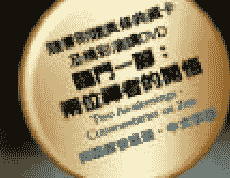
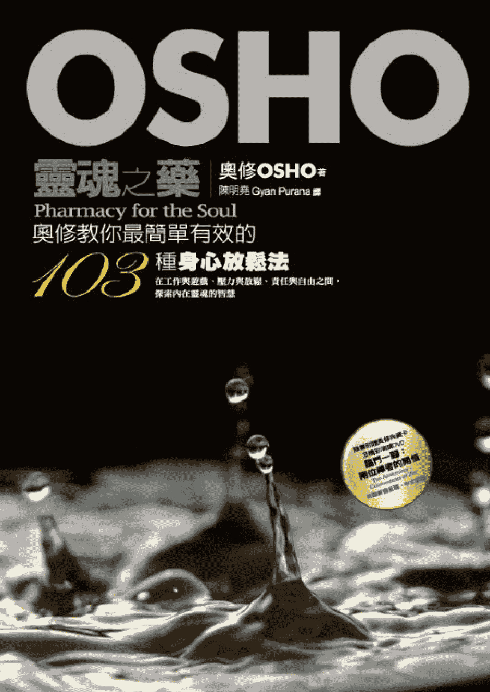
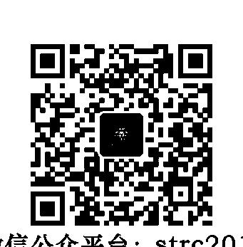
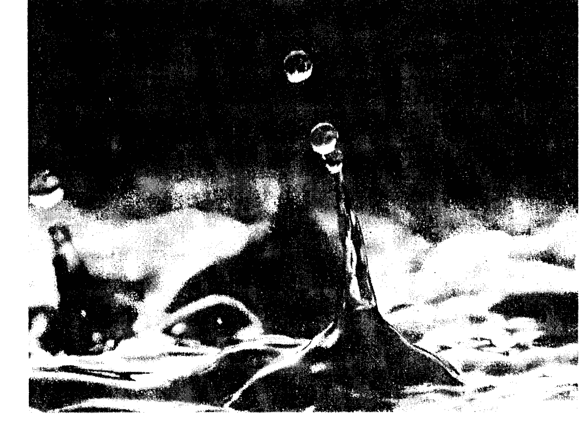
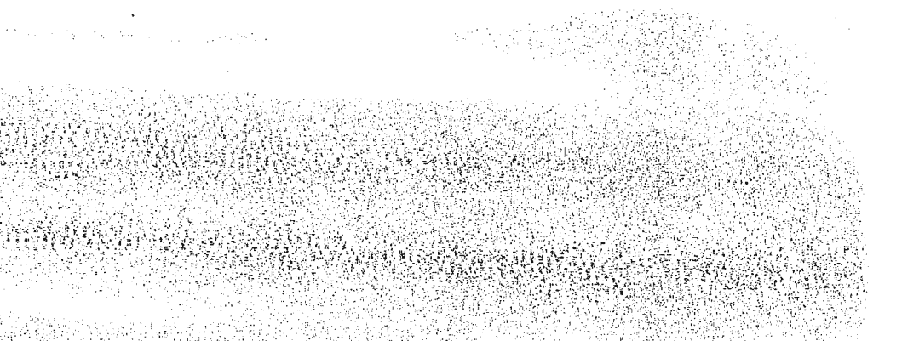
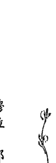

## 靈魂之藥

奧修OSHO著  
陳明堯 Gyan Purana 譯  

Pharmacy for the Soul  

奧修教你最簡單有效的  

## 103種身心放鬆法  

在工作與遊戲、壓力與放鬆、責任與自由之間，探索內在靈魂的智慧  

  

  

  

## 天使神秘学院  

- 專業占卜預測機構  
- 神秘學培訓機構  
- 水晶能量研究中心  
- 神秘學資料庫  
- 官方微信：strcdts  
- 微信公眾平台：strc2011  
- 讀書交流QQ群：  
  - 占星塔羅占卜師交流群：814594478（加入密碼：PDF）  
  - 神秘學其他綜合群：659338717（加入密碼：PDF）  

  

微信號：strcdts  
天使神秘學院  

天使神秘學院 院長QQ：715104687  

  

微信公眾平台：strc2011  

## 製作說明：  

本書由《天使神秘學院》出重金從台灣購入的原版書籍掃描製作完成。為達到最好閱讀效果，特地把原版書全部切開後，再經由專業掃描設備高精度掃描完成，並經過一張張的PS後期處理最終成書，其間花費大量的人力、物力以及時間，只為能給大家提供經濟並優質的神秘學學習資料而努力。  

本學院強力譴責某些機構和個人，把本學院花心血製作完成的電子書籍，包裝後直接放在自家淘寶網上低價傾銷的行為，以謀取不勞而獲的經濟利益。如果長此以往最終將無人願意再為大家花心思製作電子書，那以後可能大家再無新書可讀。  

為讓大家以後能夠讀到更多的好書，也為了本學院的良性發展。本學院懇請大家儘量做到如下幾點：  

- 一、 盡量在本學院的網站購買電子書籍。  
- 二、 請勿用技術手段把電子書內的水印及加密去掉。  
- 三、 在收到電子書後小範圍傳閱即可，千萬不要公開傳播，更別掛到淘寶網上低價銷售。  

同時為答謝廣大支持者，學院電子書將做如下調整：  

- 一、 學院會把一些早已收回製作成本的電子書折價銷售。  
- 二、 最新製作的電子書籍會開放打印功能，大家購買後有條件的可自行打印成書。  

天使神秘學院  
2019 年 1 月  

## 靈魂之樂  

Pharmacy for the Soul  

奧修教你最簡單有效的  

### 103 種身心放鬆法  

奧修OSHO著  

陳明崑 Gyan Purana 譯  

  

## 目錄  

## 前言——從靈性的藥櫃中抓藥  

## 第一章 放開來  

- 身體的診斷  
- 釋壓處方  
- 解除武裝  
- 自由落地  
- 清理喉嚨  
- 放鬆肚子  
- 像樹木一樣舞動  
- 先緊繃，然後放鬆入睡  
- 無聲的寧靜  
- 讓能量流動  
- 改變性能量軌道  
- 咬指甲的意涵  
- 只要說『是』  
- 笑走煩惱  

13 14 17 19 20 22 24 25 25 27 29 31 32 35  

## 第二章 頭腦的治療  

- 頭腦的診斷  
- 治療處方  
- 享受你的頭腦  
- 改變頭腦模式  
- 誦念「嗡」  
- 留心你的「不」  
- 從頭部移往心  
- 內在的新聲音  
- 為頭腦換檔  
- 享受心的悸動  
- 霎那的靜止  
- 混亂的清理  
- 解開內在的喋喋不休  
- 二十四天的決定  

## 第三章 心的藝術  

- 心的診斷  
- 愛的處方  
- 愛的喜悅  

## 第四章 領悟本  

- 綻放心花  
- 讓你的愛像呼吸一樣  
- 呼吸你所鍾愛的  
- 當二合為一時  
- 有意識地握著手  
- 用充滿愛意的眼神去看  
- 與自己談戀愛  

- 療癒處方  
- 性格的診斷  
- 內在的光  
- 給喜悅一個空間  
- 你還在這裡嗎？  
- 找到自己的聲音  
- 觀照空隙  
- 感覺自己像神一樣  
- 重新活出童年  
- 記住內在的那個人  
- 月下跳舞  

- 71  
- 72  
- 74  
- 75  
- 76  
- 77  
- 79  

- 80  
- 80  
- 90  
- 90  
- 91  
- 95  
- 96  
- 98  
- 100  
- 100  
- 103  
- 104  

## 第五章 清晰的眼界  

### 生命的診斷  

### 靈性處方  

### 沒有污染的眼光  

### 讓旭日充滿你  

### 想像神在看你  

### 注視月亮  

### 光的源頭  

### 第三眼靜心  

### 把思慮送往牆壁  

### 變成一頭動物  

### 金色的霧  

## 第六章 情緒打理  

### 情緒的診斷  

### 心靈處方  

### 智取頭腦的慣性  

### 改變憤怒的模式  

### 深入「不」  

### 解開猛虎的鎖鏈  

## 第七章 性與關係  

- 親密處方  
- 關係的診斷  
- 肯定的法則  
- 注意情緒三次  
- 察覺間隙  
- 不要悲傷，要憤怒  
- 「是」的咒語  
- 快樂的聊  
- 營造你獨有的世界  
- 推倒萬里長城  
- 從肚子微笑  
- 運用想像力  
- 狂喜之境  
- 接受負面  
- 像狗一樣喘息  
- 月亮與日記  
- 痛苦中的太極拳  
- 危機的斡旋  

## 第八章 連結身體與頭腦  

- 從寂寞到單獨 189  
- 釋放負面能量 185  
- 是最初也是最後 182  
- 變成愛的浪子 181  
- 享受分開的時光 180  
- 狂野起來，同時觀照 179  
- 性能量高峰 177  
- 等待最佳時刻 176  
- 波浪與海洋 175  
- 愛的交流 173  
- 牆與門的實驗 172  
- 牆與門的實驗 170  

  

## 第九章 安住颶風眼  

- 從精疲力竭中復元 221  
- 丟出頭腦的垃圾 219  
- 好好睡個覺 216  
- 吃你所需要的食物 213  
- 吸菸儀式 (1) 207  
- 吸菸儀式 (2) 210  

- 意識的診斷 224  
- 靜心處方 223  
- 深入大地 220  
- 從腳底開始呼吸 223  
- 覺知丹田 230  
- 晚上的避風港 235  
- 創造保護的能場 236  
- 平衡的行動 239  
- 活在此地 239  
- 凝聚自己 241  
- 平衡內在的天平 242  
- 想像內在的佛 243  
- 發現零點 246  

## 前言——從靈性的藥櫃中抓藥  

現代人都知道壓力與身體疾病之間的種種關係。美國的家庭醫師所處理的病例，據估計有三分之二是壓力問題，按照美國疾病防治中心的統計，美國人的死亡人數有一半低於六十五歲。預計到了二〇二〇年，全世界十大醫療問題中與壓力有關的將囊括半數。不過就現今的環境而言，人們很難同時在擋不住的工作、家庭、社群需求，以及要休息與放鬆之間善加平衡。我們常用晚上喝一、兩杯酒，或偶爾吃安眠藥來應付面臨的壓力。《靈魂之藥》在此提供了各式各樣簡單的、無須化學藥物的技巧來處理壓力的症狀。你會在書中找到各種療法，從緊繃的頭痛到失眠、常見的隱約不適，或是很具體的問題，例如戒菸、改變你與某人的關係，或是食量的改變。因為要使生活更和諧——在工作與遊戲、壓力與放鬆、責任與自由之間取得平衡，並非只是與壓力對立而已，那也是探索內在靈魂的智慧，它知道我們需要什麼，也會告訴我們怎麼得到，如果我們願意花時間去傾聽的話；《靈魂之藥》這本書經過特別的編排，閱讀後也能有這種了解。每一個人都是一無二的個體，且對自己的生命有責任——而且與同樣獨一無二的他人共舞著，所以有時會踩到對方的腳、造成困擾。學習如何愛得更好、處理得更好，就是我們要學的功課，這些都會為生命帶來更多平衡、歸於中心，以及和諧。  

有鑑於大多數人實在沒時間或機會騰出一個小時或一天來靜心，所以本書選擇了只需在睡前或清晨醒來的幾分鐘進行的技巧，且特別顧慮你所需要的隱私，這些技巧也有很多可以在辦公桌前、公車上，或在公園時進行，而且沒人知道你正在忙什麼；也有與伴侶共同進行的技巧，可為你們的關係帶來不一樣的親密感。  

最後，對如何從這個特殊的藥櫃抓藥，有點小小的建議：這些技巧的目的是好玩，不妨嘗試一下，樂在其中，找那些吸引你的去試驗；真誠地試驗，但不要嚴肅。不是所有技巧都適用於每一個人，所以奧修建議任何技巧皆可先嘗試三、五天——通常這就夠你去感覺它是否適合你、適合你的性情。  

編輯莎莉多·妮曼 (Sarito Neiman)  

## 給讀者的話——  

本書所有的建議及教導，並非要取代你原本正在進行的醫療、心理治療、或精神分析等治療；本書目地亦不在於替代任何專業醫療行為。對於你的身體醫療和精神上之問題，本書並不提供任何醫學上的診斷或處方。書中部分靜心練習會有較為激烈的身體活動，假如你不清楚自己的身體是否可以負荷較大的運動量，請事先徵詢你的醫師之意見。  

## 第一章 放開來  

### 以釋放與放鬆來解除緊張  

### 身體的診斷  

意識不可能反對身體，你的意識與身體是一體的，它們不僅不會敵視彼此，而且在各方面都會相互支持。當我對你說話時，不必告知我的手，它也擺出某個姿勢，我和我的手有一份密不可分的同步性。你走路，你飲食，這一切表示你是一個身體與意識構成的有機整體。折磨身體同時又提升意識是不可能的，身體需要被愛——你必須成為它最好的朋友。它是你的居所，你必須將裡頭的垃圾清除乾淨；切記，它日以繼夜地服侍你，即使是睡覺，你的身體也不斷在為你工作，消化你的食物，將它們轉化成血液，將老舊的細胞代謝掉，把新的、新鮮的氧氣帶進身體——這些竟能在你沉睡時進行！這一切都是為了你的生命，為了使你存活下去，可是你卻如此不知感激，甚至不曾感謝過你的身體，相反的，你們的宗教還一直教你折磨它：  

> 「身體是你的敵人，要擺脫身體、擺脫對它的依戀。」  

我當然知道：你比身體來得更廣，而且沒有必要依戀身體。但愛並不是依戀、慈悲也不是依戀；你的身體絕對需要愛與慈悲，需要這樣的滋養。而且，有了更好的身體，意識就更能成長，它們是同一個有機體。這個世界需要一種全新的教育，它的基礎是：將心的寧靜——換句話說，就是靜心——引介給每一個人，而且每一個人都要樂於憐惜自己的身體。因為除非你憐惜自己的身體，否則不可能憐惜別人的身體。身體是個活生生的有機體，完全不會傷害你，打從娘胎開始，它就一直服侍你，也會一直服侍到你死了為止。你想怎麼做，它就會怎麼做，即便是不可能的事，它也不會違背你。這種生物機制是不可思議的，這麼順從又有智慧。你若察覺身體的一切機能，你會大吃一驚。你從沒想過身體一直在做的事，它是這麼神奇、這麼奧秘，但你不曾洞察它，不曾用心去熟悉自己的身體——卻修言去愛別人？這是不可能的，因為出現在你面前的別人同樣是身體。  

身體是整個存在裡最大的奧秘，這個奧秘需要被愛，它的奧秘、它的機必須被密切探究。不幸的是，宗教向來都反對身體，但這也明白地透露著：一個知悉身體的智慧與奧秘者，永遠不會掛慮傳教士或神，他會在內在找到最大的奧秘，而身體的奧秘也正是意識的神殿。當你覺察到你的意識、你的本性，那個高高在上的神就不存在了，只有這種人才值得其他人、其他生命尊敬，因為他們自己就是奧秘；換句話說，每個人的獨特性富饒了生命。發現自己內在的意識，就是發現通往終極的鑰匙，可是沒有一種教育教你愛自己的身體、悲憫自己的身體，也沒有一種教育教你如何深入它的奧秘，更無能教你如何深入自己的意識。身體就是意識的入口，是進入意識的踏腳石。  

### 釋壓處方  

### 解除武裝  

你全身上上下套著一層盔甲，那不過是件盔甲，它並沒有緊抓著你，而是你緊抓著它。因此只要察覺到，便能完全拋掉它。這件盔甲是死的：如果你不帶著它，它就會消失；但你不僅帶著它，而且還不斷在使它滋長、茁壯。  

每個小孩都是那麼流暢、沒有任何僵滯，他整個人就是有機的統一體，頭既非位高權傾，腳也不是無足輕重，事實上對他而言，孰高孰低是不存在的，分別是不存在的。但種種分別會漸漸出現，然後頭就成了主人、老闆，整個身體被劃分成各個單位，有的單位為社會採納，有的則否；有的單位會危及社會，所以必須完全抹煞它們，問題完全出在這裡。  

因此，你必須注意的是，身體哪裡受到框限。  

只要做這三件事情，第一：不論是走路、坐著，或者沒在做什麼的時候，就深深地呼氣。重點要放在呼氣而不是吸氣，所以深深呼氣——能呼多少氣，就呼多少氣、呼出去。從嘴巴慢慢地呼氣，愈久愈好，因為那會使呼氣更深；當體內所有的氣都拋掉時，身體會吸氣，而不是你去吸氣。呼氣要緩慢又深沉，但吸氣就要迅速，這會改變胸部附近的武裝。第二：做一些跑步是好的。不必太多，一英里就夠了。想像身上的重擔從雙腿散去，彷彿脫落了一樣。如果你的自由被過度圍限，如果你被使來喚去，不能自由揮灑，那麼你的腿部會像套上盔甲一樣。所以去跑步，跑的時候也要將重點放在呼氣。一旦雙腿重獲新生，呼吸就會流暢自如，你也會充滿流暢無比的能量。第三：晚上脫衣入睡時，想像自己不僅脫掉衣服，也脫掉身上的盔甲。要好像真的脫去那件盔甲，脫掉它，然後好好做個深呼吸，彷彿解除了裝甲，無牽無掛、沒有束縛地睡覺去。  

### 自由落地  

每天晚上，讓自己頭往後垂，放鬆、靜靜地坐在椅子上。你可以在脖子後墊個枕頭，好讓自己呈現休息、沒有緊張的狀態。然後鬆開你的下巴——只是放鬆，這樣嘴巴便會微開，接著由嘴巴——不要用鼻子——開始呼吸，但不必改變呼吸的狀態，照它本來的樣子、自然地呼吸。這種呼吸剛開始會有些混亂，不過會漸漸沉澱，而且變得很淺。呼吸將變得很微弱，這就是目的；嘴巴保持張開，闔上眼睛呈休息之態。  

接下來，感覺雙腳開始鬆弛，彷彿雙腳的關節已鬆開、然後被拿走了一樣。去感覺它們真的已經離開你的身體——接著想像自己只剩下上半身，雙腳已經不見了。  

再來是頭：想像你雙手的關節已被鬆開並拿走，甚至還聽到「喀啦！」關節斷掉的聲音，你已經不再是你的雙手，它們已經死了，被拿走了，只剩下軀幹。  

然後開始想像你的頭，想像它也被帶走，想像你被砍頭，身首異處。然後就讓它鬆在那裡：不管它怎麼轉，向右或向左——你什麼都不必做，就讓它鬆在那裡，它已經被拿走了。  

此時的你只剩下軀體，去感覺你就是這麼大的一個形體——只剩下胸部與腹部而已。  

至少進行二十分鐘，之後再睡覺。這項方法只能在睡前進行，起碼做三個星期。  

那麼，心神不定的狀況將得到安頓。將身體這些部分當成是分開的東西，只剩下本質的部分，如此，能量便會整個移入本質的部分，本質的部分將放鬆下來，而且能量會再度流向你的雙腳、你的雙手與你的頭，不過這回能量將是均勻分布的。  

### 清理喉嚨  

如果你從小就不能如實表達自己——若你不能暢所欲言，那將無法去做你想做的事——因為那股沒表達出來的能量會卡在喉嚨。喉嚨是表現力的中心：它不只是吞食食物的中心，也是表達的中心。但很多人只用它來吞食，這只使用了一半的功能，更重要的另一半始終遭到棄置。所以，想要更能表達自己，你就必須去做幾件事情。你若愛一個人，那就對他說任何你想說的話，即使那些話好像很愚蠢，但有時愚蠢是很好的。隨興說些浮上心頭的話，別打退堂鼓，如果你愛他，那就不必顧慮什麼，不要控制。若有些生氣的話想說，那就十足狂暴地說出來——因為只有冷漠的憤怒是邪惡的，但火熱的憤怒絕對不是……冷漠的憤怒才有危險。這就是人們受到的教導：憤怒時要保持冷漠，但那份毒素會滯留在你的系統裡。有時因為種種情緒怒吼或做類似的事是很好的。你可以每天晚上只是坐著，然後開始搖擺，以這種方式做：當你擺到一邊時，屁股的那一側會壓住地面——隨即用力坐回去——然後再往另一邊搖擺，以此類推，但一次只能接觸一側，不能使屁股兩側同時接觸地面。這是一種非常古老的方法，能敲打源自脊椎根部的能量。  

如果覺得喉嚨裡有什麼東西、有什麼能量的話，那麼你就能掌控這股多出來、滿出來的能量。這是因為你比較不去控制，所以能量多到無法控制時便決堤了。在第十五分鐘到二十分鐘進行這個階段。  

搖擺進行十分鐘後，開始吟：「阿拉……阿拉……」每擺到一邊的當兒就吟一聲「阿拉」。漸漸地，你會感到能量多出來了，而且「阿拉」的聲音會愈來愈大。如此進行十分鐘後，這一刻會出現：你會幾乎咆哮地吼出「阿拉！」然後開始流汗，因為能量是如此沸騰，而且幾近發瘋地吼著「阿拉！」這時水壩已然潰堤，你已經瘋了。  

這兩個字實在太棒了，一模一樣的字母！從一頭吟是「水壩」（aab），從另一頭吟則是「瘋狂」（baa）。你會愛上這個練習，它是怪誕的，不過你會愛上它！然後一天做兩次——早晚各做二十分鐘。  

### 放鬆肚子  

每早排便時以乾的粗毛巾摩擦你的肚子，把肚子往內壓、用力摩擦它。從右邊開始畫圓圈——繞著肚臍畫圓圈，但別碰到肚臍——用力地劃圈，這才算真的按摩。把肚子往內壓，按摩到所有的腸子。在每次排便時進行這個步驟——一天可以進行兩、三次。  

其次是：在日出後與日落前的時間裡——絕不要在晚上——盡可能深深地呼吸，能進行多少次就進行多少次。你的呼吸狀況愈好，你的呼吸就會愈深入。只要記住：從肚子呼吸，不是從胸部呼吸，這樣吸氣時，膨脹起來的是肚子而不是胸部。你吸氣時肚子會膨起來，呼氣時肚子會縮回去，別理會你的胸部，彷彿不關它的事一樣。只要用肚子呼吸，那麼肚子會像整天都被輕輕按摩一樣。  

你看小孩呼吸的樣子……那就是正確、自然的呼吸方式，肚子一上一下的，而且胸部完全不受空氣進出的影響。所以小孩的能量完全凝聚在他的肚臍附近。  

但我們已逐漸失去與肚臍的聯繫，愈來愈掛在腦袋，呼吸也變淺了。白天時，只要你想到，就盡可能將呼吸帶進來——讓肚子派上用場。  

每個人睡覺時都能適當地呼吸，因為頭腦並沒有在那兒干擾，此時肚子會一上一下，呼吸也會深化，不勞你去使它變深。只要保持自然，呼吸就會深化，自然的呼吸必然導致深層的呼吸。  

### 像樹木一樣舞動  

可能的話，到空曠的戶外去，站到樹叢裡，變成一棵樹，讓風兒吹過。認為自己是一棵樹的感覺，會讓你大為茁壯、備受滋潤。你能輕易地進入最原始的意識狀態，這種意識依然是樹木擁有的：與它說話，擁抱它。如果不可能到戶外，那麼就站在房間中央，想像你像一棵樹——這時正下著雨，迎面吹來一陣強風——然後開始舞動，像樹一樣舞動會使你流動起來。唯一的問題是：學習保持能量流動的藝術。這會成為你的鑰匙：每當能量卡住時，你都能迎刃而解。

## 先緊繃，然後放鬆入睡

每晚睡前站在房間中央——要站在正中央，讓自己的身體僵住，盡可能繃緊，彷彿就要迸裂，這樣做兩分鐘，隨後再放鬆地站著兩分鐘。重複這樣的緊繃、放鬆兩、三次，然後才睡覺。

身體要盡可能緊繃，然後什麼都不必做，那麼內在的放鬆就會愈來愈深。

## 無聲的寧靜

有一種寧靜只在你毫無控制時出現，一種降臨的寧靜；所以要記得——控制會扭曲你的能量。頭腦是什麼都想控制的大獨裁者，它會拒絕它控制不了的東西，否認它的存在。

每晚睡前做這項靜心。坐在床上、熄燈——結束一切該做的事，因為靜心後就要睡覺，此時什麼都不必做，因為之後就不能有「做者」（doer）的存在，只要放鬆、然後入睡，因為睡覺也是一種降臨——你無法控制它。睡覺有一種幾近靜心的品質——寧靜，寧靜會在睡覺中降臨。這就是為何人們苦於失眠——因為他們連睡覺都要控制，所以才有困難。睡覺不是你能支配的東西，你只能等待，你只能處在放鬆與善於接受的心境。

所以， 這個靜心結束後就放鬆地睡覺，保持其中的連貫性，讓這個靜心繼續在你裡頭流動，那個震動會整晚存在。早上當你睜開眼睛，你會發現自己完全不同地睡了一覺，有一種品質上的改變，不只是睡覺而已：有一種比睡更深的東西出現了，有一種你不知如何歸類的東西向你示現。

這個靜心很簡單，放鬆身體、閉著眼睛坐在床上，想像自己在山區迷了路。這是個黑漆漆的夜晚，天上覆蓋著厚厚的烏雲、沒有半點月光，連一絲星光都見不著——一片烏黑，甚至看不到自己的手。你已經迷失在山中，找不到出路，而且危機四伏——隨時會掉進山谷、跌入深淵，撒手歸西。所以你戰戰兢兢地摸索著、帶著全然的警覺，因為太危險了，一個人會在高度的危險中非常警覺。

## 讓能量流動

這種想象只是要創造出險峻的情境：所以你會極其警覺，連針掉到地上的聲音都聽得到。突然，你來到斷崖前，而且感覺前頭已經沒路了，也不曉得前面有多深，於是你拿了一顆石子往前丟，看看它有多深。

等著石頭落地的聲音，繼續等、仔細聽，可是你並沒有聽到——前頭彷彿是個無底深淵。只是不斷等著聲音出現，你的心中就升起極大的恐懼，因為這樣的恐懼，你的覺察當然會凝成一團火焰。

讓這樣的想像活靈活現，把手裡的石子往前丟，然後等著，你一直等著聲音出現，屏息以待，可是卻沒有聲音，只有全然的寧靜，讓自己在這樣的寧靜中睡去；讓自己在無聲的寧靜中睡去。

能量總會流往愛的對象。

所以每當覺得能量有任何阻塞，訣竅就是使它流動。找一個愛的對象，什麼都可以，那只是藉口而已。你若能滿懷愛意地撫摸一棵樹，能量就會開始流動，因為能量會往有愛的地方傾瀉，就好像無論海在哪裡，水始終會往下流、往海平面流去。

所以無論愛在哪裡，能量總會往「愛的平面」流去，不斷往那裡移動。按摩也有效，如果你滿懷愛意地按摩，那就有效，什麼都有效。

帶著深深的愛與關懷拿起一顆石頭，閉上眼睛，感覺自己給與它莫大的愛——感激這顆石頭的存在，謝謝它接納你的愛。你會突然發現：悸動、能量流動起來了。爾後，你會慢慢不需要任何對象，真的——只要你出現愛某個人的念頭，能量便會流動；再來就是連那個念頭都不需要，光是愛，能量就會流動。

愛就是流動，每當不愛，我們就會凍結。

愛是溫暖，如果有那份溫暖就不可能凍結；當愛不在，一切都是冰冷的，你會開始跌至冰點以下。

記得一件很重要的事：愛是溫暖，恨也是；漠不關心則是冰冷的。因此，連憎恨也能使你的能量流動，那就是為什麼生氣後會令人感到莫名的愉悅、快，因為某些東西釋放掉了。憤怒很具破壞性，但如果透過愛來釋放，那將變成創造性的——不過表達憤怒還是比沒有釋放來得好。冷漠便沒有流動，所以任何能夠融化你、溫暖你的事物都是好的。不是按摩在流動，而是你的關懷、你的愛在流動。對石頭試試看，按摩石頭，看看會發生什麼事；然後再滿懷愛意地按摩一棵樹；當你覺得有什麼發生時，靜靜地坐下來，繼續嘗試。記起某個你愛的人，某個男人、女人、小孩或一朵花。只是記起那朵花的念頭，突然間你就看到：能量正在流動。在愛特定的對象、人物。充滿愛意、靜靜地坐著——不是然後連那個念頭也要拋掉，到時候只要心懷愛意、靜靜地坐著，你就會體會到它在流動。如此一來，你就領悟了那把鑰匙，愛就是鑰匙，愛就是流動。

## 改變性能量軌道

挺直地坐在椅子或地板上，打直脊椎，但要保持放鬆、沒有緊張。慢慢地、深深地吸氣，別急，緩緩地、沒有間斷地吸氣。你的肚子會先鼓起來，繼續吸氣，接著是胸部鼓起來，最後氣會滿到頸部，然後盡可能將氣憋住一會兒——只要不是硬撐就好，然後呼氣。呼氣的過程也要很緩慢，只是順序相反：當肚子的氣吐光時，將肚子往內縮，以便排出所有的空氣。如此進行七次。

然後靜靜地坐著，開始覆誦：「嗡……嗡……嗡」，覆誦「嗡」能將注意力帶到兩眼之間的第三眼。把呼吸全忘掉，繼續以一種昏昏欲睡的方式重複「嗡……嗡……嗡……」，好像母親用搖籃曲哄嬰兒入睡一樣，嘴巴要閉起來，因此舌頭會頂住上顎，整個注意力會集中在第三眼。進行兩、三分鐘之後，你會覺得頭部已經完全放鬆；當頭開始放鬆，你會立刻感到內在的緊繃也消除了，緊張已經消失了。

然後將注意力帶到喉嚨，繼續覆誦「嗡」，但要把注意力放在喉嚨。如此你將發現你的肩膀、你的喉嚨和臉部開始放鬆，緊張如釋重負地消失了，你會覺得自己好像失去重量。

然後更進一步，把你的注意力帶到肚臍，繼續覆誦「嗡」。你會愈來愈深入、愈來愈深入，最後來到你的性中樞，這個過程頂多只要十至十五分的時間，所以慢慢來，別著急。

到了性中樞時，你的全身會放鬆下來，同時覺得彷彿有靈氣或某種光明圍繞著你。你充滿了能量，不過這能量卻像一座水庫，滿載著能量卻無一絲漣漪，然後安坐在這個狀態中，想坐多久就坐多久。

結束這個靜心後，你會覺得很享受，這時停止誦唸「嗡」，坐著就好。如果想躺下也可以，不過姿勢一改變，這個狀態會消失得比較快，所以坐一下、多享受一會兒。

這個靜心的要點就是，如果身體因任何原因而過於緊繃時，就做這個靜心，它能使你徹底放鬆。

當能量太多而不知如何是好時，你會開始咬指甲或抽菸，這兩者是同一回事——不管是咬指甲還是抽菸，你會做任何能令自己忙碌的事，否則太多能量會讓你受不了。如果有人責備說：「這太神經質了！」那麼你就會更壓抑那股能量。可是人們竟然連咬指甲的自由都沒有——指甲是你的，但卻不能咬它們。所以人們找來一些狡猾的方式，嚼口香糖……這類隱微的方式，那就不會遭受太大的反對，抽菸不可能受到太大的反對。可是咬指甲比較稚氣，但也不過爾爾，可是你甚至不敢去嘗試。

## 咬指甲的意涵

嘗試這個方法幾個星期，你會大感詫異：咬指甲的行為竟然自行消失了，現在你有了更有趣的事可做——誰還要咬指甲？可是要隨時注意事情的起因，永遠不要太關注事情的表徵。

## 只要說「是」

「不」是我們的基本態度，為什麼？因為「不」讓你覺得自己是要角。因為母親能說「不」，所以覺得自己是要角，自我得到滿足，被拒絕的小孩則自我受創。「不」能滿足自我，是自我的食物，所以我們才訓練自己說「不」。

環顧四周，你會發現每個人都在說「不」，因為「不」使自己有權威感——你是重要人物才能表示拒絕。說「是的，先生」會使你低人一等，你會覺得自己是某人的下屬、是無名小卒，只有那些人才會說「是的，先生」。

「是」是正向的，「不」是負向的。

切記：「不」是滿足自我的，「是」則是發現自己的方法；「不」增強了自我，「是」消除了自我。

先知道自己能否說「是」，若不能，那就不可能說「是」，只能說「不」。但我們處世的方法是先說「不」，就算說「是」，也是因為受挫使然。

找一天試試看，立誓在二十四小時中的任何情境裡，你會以「是」做為開始，看看會帶給你多麼深刻的放鬆，那可能只是一些稀鬆平常的事——如果小孩說要去看電影，他就是想去，所以你的「不」並無意義；相反的，你的「不」會成為一種誘惑，你的「不」會變成一種吸引，因為當你增強自我，小孩也會增強他的自我，他會試著對抗你的自我，而他知道如何將你的「不」變成「是」，他曉得那種轉變之道，只要稍加努力、堅持，你的「不」就會變成「是」。

在二十四小時中，試著用各種方式，以「是」做為開始。你會發現這很困難，因為「不」馬上就出現了！「不」總是在任何狀況中先出現，這已成了習慣，所以別這麼做，用「是」做為開始，看它帶給你什麼樣的放鬆。

正向的思考意謂著從「是」開始思考，這不表示你不能說「不」，只是以「是」開始：從「是」的頭腦開始你的看法，不行的話再說「不」。這樣你會發現，很多時候你並不會說「不」，但若從「不」開始，你也找不到很多你會說「是」的時候。起點意謂著已經完成了九成，你從起點開始渲染每一件事物，甚至直到終點。

正向思考意謂著思考，而且是以感同身受的頭腦思考。因此，以說「是」的頭腦思考吧。

## 笑走煩惱

靜靜地坐著，從你的存在最深處咯咯地笑出來，整個身體彷彿都在咯咯笑或大笑，用笑來擺動你的身體，讓它從肚子擴散到全身——手在笑、腳也在笑，瘋狂地笑。如此進行二十分鐘，就算笑得很大聲、很吵也無妨；如果安靜無聲，那就有時安靜、有時喧囂，如此進行二十分鐘。

然後躺在地板上，攤開你的四肢，俯臥。如果天氣暖和，也可以躺在草地上，那比地板的效果更好；若能全身赤裸，那就更好了。和大地連結，全身都躺在地上，只要去感覺大地是母親，你是小孩，浸淫在那種感覺中。

笑二十分鐘，然後躺在大地上、與大地深深連結，與大地一同呼吸，感覺與它是一體的。我們來自大地，有一天也要回歸大地。經過這二十分鐘能量補給後——因為大地會給你很多能量，所以跳舞的品質將完全不同——跳二十分鐘的舞……什麼舞都行。把音樂打開，跳舞。

如果不方便在戶外進行，或是天氣很冷，也可以在室內進行。或是天氣晴朗但很冷，那就加條毯子或另謀他法，持續進行下去，那麼六至八個月後，你會發現一場巨大的改變自然地發生了。

## 第二章

## 頭腦的治療

## 馴服頭腦，並且偶爾把它丟掉

## 頭腦的診斷

頭腦不過是一部生物電腦，剛生下的小孩沒有頭腦這種東西，他裡頭並無喋喋不休的活動，要使他的頭腦運轉起來，大約要三至四年的時間。你會發現女孩較早學會講話，她們更喋喋不休，是品質比較高的生物電腦。頭腦需要資訊的哺餌，這就是為什麼若要回溯一生，男人會卡在四歲，女人會卡在三歲，在此之前的記憶是一片空白。你活過那些歲月，出現過許多事情、發生過很多事件，但似乎都沒留下記憶，所以你記不得；但你卻能清楚記得三、四歲時的事。

當他們能造句時，他們會滿心喜悅、一次又一次地造句；當他們能問問題時，看他們多喜悅！因為一種全新的機制開始在他們身上運轉了。頭腦從父母、學校、小孩、鄰居、親戚、社會、教堂……各處蒐集資料，到處都是資料來源。你一定見過小孩牙牙學語、複誦同一個字眼的樣子，當他們能問問題時，他們會無事不問。他們對你給的答案沒興趣，記住！注意看小孩問問題的樣子，他感興趣的不是你的答案，所以別給他一大串來自《大英百科全書》的答案，小孩對你的答案沒興趣，他只是在享受能夠問問題的狀態，一種全新的機能出現了。

他就是這麼蒐集、不斷蒐集……然後開始閱讀……蒐集愈來愈多的文字。

在這個社會中，寧靜不會獲得報償、言語才會，你的表達能力愈好，你就會得到愈多報償。你們的領導人是哪些人？你們的政客是哪些人？你們的教授是哪些人？你們的教士、神學家、哲學家是哪些人？可以這麼說：他們是表達能力極佳的人。他們能意涵深遠、語重心長、前後一貫地使用語言，在人們心中留下深刻的印象。

我們所處的社會完全被那些能言善道者所統治，很少人注意到這點。他們也許什麼都不懂，也許沒什麼智慧，甚至連聰明都談不上，但確定的是：他們善於要弄文字，精於此道，而這能帶給他們聲望、金錢與權力——無所不有。因此每個人都致力使頭腦充滿大量文字、大量思想。

任何電腦都能打開或關閉，但你無法關閉頭腦，因為它沒有開關。神並沒有一套創造世界、創造人，然後為人的頭腦創造開關的藍圖。頭腦沒有開關，所以從人出生就開始運轉不停，直到死亡。

你會為此詫異：那些了解電腦的人與了解人腦的人有一個奇怪想法：如果將腦袋從頭殼取出，用維生裝置使它存活，那麼它會如往昔一樣喋喋不休，才不管現在已經脫離那個曾深受其苦的身體，它會繼續做夢、幻想、恐懼下去，不斷地投射、盼望，企圖成為這個、那個，完全沒察覺現在什麼事也做不了，它過去所仰賴的那個人已經不在了。

你可以用維生裝置使這個腦袋存活千百年，但它還是會繼續喋喋不休，一次又一次重複同樣的事，因為我們還沒能力教它新的東西；一旦能教它新東西，它就會重複那些新東西。

科學界流行著一種觀念：如果愛因斯坦的腦袋也隨著他死去，那是極大的浪費，所以若能救活他的腦袋，然後移植到別人身上，那便能繼續運轉。因此不管愛因斯坦是否還活著，這個腦袋會繼續思考相對論、太空星體與種種理論。這個觀念就像人們在生前捐血、捐眼球一樣，所以人也能捐出他們的腦袋，好讓腦袋保存下去。如果人們認為某些人的腦袋很出色、品質很高，那麼就移植它們，避免浪費。

這些喋喋不休的東西就是我們的教育，這根本就是錯誤的教育，因為它只教了一半——教你如何使用頭腦，卻沒教你如何停止頭腦，好讓它放鬆——因為就算你在睡覺，它也繼續運轉著，不知道睡覺這件事。它不斷地工作了七十年、八十年。

不過，為頭腦裝上開關、在不用時關掉它是可能的——這就是我們稱之為靜心的東西。靜心有兩種幫助：給你不曾體驗過的安詳、寧靜，還能使你領悟自己——給你因頭腦一直喋喋不休、以致現在還不可能發生的領悟；頭腦始終令你忙碌不已。

其次，靜心能讓頭腦休息。若讓頭腦休息，那它做起事來會更有效率、更聰明。這能使你一舉兩得，使頭腦與你的存在同時受益。只要學到使頭腦停歇的方法，學會對它說：「夠了，現在去睡覺！我醒了，別為我操心。」

需要時才使用頭腦—— 這樣的頭腦就是清新、年輕的，充滿了能量與活力。那麼你說的話就不只是空洞的骨架，而是洋溢著生命、充滿了影響力、真理與誠意，富含深意。你說的可能是同樣的文字，但休息過後的頭腦已經凝聚許多能量，它的字字句句會成為一把充滿力道的火炬。

世上的那些天縱英才，不過是知道如何讓頭腦放鬆、凝聚能量的人。所以他們一開口便擲地有聲、舌燦蓮花，不必依據任何證據或邏輯——光是那股能量便能影響人群，而且人們總知道他是有料的，雖然無法確切地道出他究竟是誰。

讓我告訴你天縱英才是什麼，那是我自身的領悟。一個不眠不休的頭腦注定疲弱、愚鈍、不善表達，還有某種程度的優柔寡斷。頭腦最多有實用價值而已，如果是上街買菜就有用，頂多如此。於是，無數能成為天縱英才的人，還是一副貧瘠、不善表達的樣子，他們說出來的話沒有任何影響力，也沒有半點威力。

如果有可能——確實有可能，讓頭腦靜下來，有需要時才用它，那麼它會以旺盛的活力出現，它已經凝聚了那麼多能量，因此說出的每一句話都會徹底、直接穿透人心。人們以為那些天縱英才的頭腦受了催眠，其實不是，他們確實充滿力道、十足鮮活……始終是繁茂的春天。寧靜為頭腦、為你的存在，打開了永恆不朽——那些屬於喜樂與祝福的宇宙。所以我才堅持：靜心是根本的宗教，也是唯一的宗教。其他都是多餘的，其餘的一切是可有可無的形式。靜心就是根本的、最根本的，不可能再從中劃分出什麼。靜心帶給你兩個世界，給了你神性的、神聖的彼岸，也給了你此岸。這樣你才不貧窮而是富裕的，但不是金錢上的富裕。有各式各樣的富裕，但就富裕的範疇而言，金錢上的富裕是最低等的。容我這麼說吧：有錢人是最窮的富人——就窮人而言，他們是最富有的人，但就創造力的藝術家、舞者、音樂家、科學家而言，他們是最窮的富人；可是就終極醒悟的境界而言，他們甚至不配稱富有。

靜心給你本性最深處的世界，使你達到終極的富裕，同時也給你相對的富裕，因為它使你頭腦的能量釋放給你特有的天賦。我的體驗是，每個人都帶著特定的天賦，除非一個人完全活出自己的天賦，否則還是錯過了什麼，他會一直覺得好像少了什麼。

讓頭腦休息——這是它需要的！而且就這麼簡單：只要覷照它，就能使你一舉兩得。

慢慢地，頭腦將學會靜默，一旦它曉得靜默，就會變得充沛有力，那麼言語對它而言就不只是言語，言語將是前所未有的富饒，既精確又有品質——所以能像箭一樣正中目標，語言至此已經越過邏輯的阻礙，正中核心。

這麼一來，頭腦便是擁有無窮力量、為寧靜所使喚的僕人。這種人才算主子，每當有需要，主子就會使用頭腦，也能在不需要時將它關機。

## 治療處方

## 享受你的頭腦

別企圖中止頭腦，它是你天生就有的，別想停下它，否則你會瘋掉。那就像企圖使樹木不長葉子，這樣樹木會瘋掉，因為葉子是它本有的一部分。

所以第一件事情是：別企圖中止你的思緒，它一點問題也沒有。

其次是：光這樣還不夠，還要享受它。和它玩耍——那是個美妙的遊戲，陪它玩，享受它、歡迎它，你會因此更加警覺、更加覺察。不過這種覺察不會直接出現，也不是一種以努力達到的覺察。如果你試圖變得覺察，那麼頭腦將困擾你，你會對它生氣，覺得頭腦很醜陋、一直喋喋不休，你想靜下來，但它又不許你這麼做，所以你就對它產生敵意。

這不是件好事，這會使你分裂成兩半，你與頭腦便成了兩造，開始產生衝突與爭執。所有的爭執都是自毀，因為能量被你浪費掉了。我們沒有太多能量可以自我對抗，這些能量必須用在喜悦上。所以，開始享受思慮的過程。讓自己看看思慮之間有何細微的差異，看看種種思緒如何轉折，看看它們如何演變、有何牽連。這真是奇觀——只要小小的思緒就能帶你到天涯海角，而且仔細一瞧，根本看不出其間有何關聯。享受頭腦，讓它成為一場遊戲，不疾不徐地陪它玩，這就會讓你驚訝：有時只是享受它，思慮之間的美妙空隙就會出現；你會突然發現有隻狗在吠，而你的腦海什麼也沒浮現，沒有出現一連串的思慮，狗繼續吠著，你也繼續聽著，沒有思慮出現。頭腦會出現細微的空隙，但那不是你的作為，而是自行出現的，這樣的空隙就是美的。在那些細微的空隙中，你會開始觀照到那個觀者——自然而然地。然後思慮再次出現，你也再次享受它。輕鬆地進行下去，別著急，覺察會降臨，但不會直接出現。觀照、享受，看著思慮行進轉折，就好像千姿百態的海浪一樣。頭腦也是海洋一片，思慮就是波浪。不過人們能享受海上的波浪，卻無法享受自己意識裡的波浪。

## 改變頭腦模式

想改變頭腦積習已久的模式，呼吸是最好的方法。頭腦裡所有的習慣都與呼吸的模式有關，改變呼吸的模式，頭腦便能立即產生改變，試試看！

每當你看到判斷出現、自己又陷入舊習慣時，立刻呼氣——好像藉著呼氣把那個判斷拋出去。深深地呼氣、肚子往內縮，當你呼氣時，感覺或想像整個判斷被你丟出去。

然後深深地吸入新鮮的空氣，如此進行兩、三次。看看會怎麼樣，你會發現煥然一新，舊習慣不會再占據你。

所以用呼氣作為開始。當你想要納入什麼，以吸氣開始；若想要去掉什麼，以呼氣開始。同時看看頭腦如何立刻受影響，你會馬上看到頭腦已經走掉，取而代之的是一股清新的和風，你已不落窠臼，所以不再重複舊習慣。

這種方式對所有的習慣都有效。例如抽菸，如果有抽菸的衝動，而你又不想抽，那就立刻深深呼氣、將衝動丟出去；然後吸入新鮮的空氣，你會發現衝動馬上消失了。這是改變內在的一個非常重要的技巧。

## 誦唸「嗡」

當你覺得周遭有太多煩擾，或者頭腦很紛亂時，就誦唸「嗡」（aum）。

讓此成為你早晚的功課，以舒服的姿勢靜坐，雙眼微開、朝下看，緩慢呼吸，身體不動，每次至少誦唸二十分鐘。默唸「嗡」，不必出聲，閉著嘴唇將更有穿透力，舌頭也不要動。迅速地覆誦「嗡」——嗡、嗡、嗡、嗡……快速、大聲地唸，但不要出聲，只是去感受它遍佈全身的震動，從腳到頭、從頭到腳。

每一個「嗡」會落入你的意識，好像石子掉進池塘一樣，泛起的漣漪將延展到每一個角落，「嗡」的漣漪會不斷延展、觸及全身。

然後有一刻會來臨，那是最美的一刻，屆時的你不再覆誦些什麼，一切都停止了；你會突然察覺自己不再誦唸，萬念止息，享受它。如果思緒又出現，那就再次誦唸。

晚上的誦念要與入寢時間相隔至少兩小時，否則你會睡不著，因為這將使你非常清醒，好像早上剛醒來、睡了一頓好覺一樣，毫無睡意。

快速地誦唸，你將找到自己的節奏，兩、三天後，你會發現適合自己的速度。有的人適合非常快速——「嗡嗡嗡」，聲音幾乎重疊在一起；有的人適合很慢的速度，所以狀況因人而異。感覺不錯的話，就持續進行下去。

## 留心你的「不」

頭腦向來是持負面態度在運作，頭腦的功能是否定，說「不」。注意看你一天裡說了多少次「不」，減少它的額度；注意看你一天裡說了多少次「是」，增加它的額度。漸漸地，你會發現自己的「是」與「不」有了改變，你的性格起了根本的變化。看看自己有多少次能輕易地說是，但你卻說了不；也看看自己有多少次不需要說不，但卻說了不……有多少次你可以說是，但你要嘛說不、要嘛沉默不語。

只要說『是』便違反了自我，『是』使自我吃不消，自我的食物是『不』。說『不、不、不』，你的內在便形成極大的自我。

你可以到火車站看看：售票窗口可能只有你一人，但售票員會開始做其他事，看都不看你一眼，他就是在說不，起碼要讓你多等一下，所以就假裝很忙，或許盯著收銀機或什麼的，反正硬要你等就是了。這帶來某種權威感，顯示他不是泛泛的售票員，他可以讓人在那裡等待。

出現在你腦海的第一個東西是『不』，『是』幾乎很難。唯有當你無可奈何時，你才不得不說是。只要留心看！讓自己成為說是的人，拋掉說不的狀態，因為『不』是滋養自我、茁壯自我的毒素。

## 從頭部移往心

感覺才是真實的生命，思慮則是假的，因為思慮始終是關於什麼，從來不是真實的東西。思考酒不會使人醉，酒才會使人醉；你可以繼續想酒的一二，但光想永遠醉不了，你必須親自飲下，這就是透過感覺的活動。思慮是假的活動，是活動的替代品，它給你一種有所發生的幻覺，但其實什麼也沒發生。因此要從思慮轉移到感覺，最好的方式是：從你的心開始呼吸。在一天之中，只要想到就深呼吸，愈多次愈好，只要深呼吸。感覺它敲擊你的胸部中央，感覺好像整個存在向你傾注、傾注到心的所在處。這個地方因人而異，通常在靠近右邊的地方，它與肉體上的心臟無關，它完全是另一回事，是微妙層次的身體。一想到就深呼吸，至少進行五次。吸氣、讓空氣充滿你的心，在吸氣途中感覺存在從你的心灌溉你，活力、生命、神經、本質——一切都傾注進來。然後深深地呼氣，也是從你的心開始呼氣，感覺所有給過你的都倒回神聖、存在。多做幾次，但每次要做完五次深呼吸，這能幫你從頭移轉到心。你會愈來愈敏銳、愈來愈察覺到以往不曾察覺到的東西。你的嗅覺會更好，你的味覺會更好、觸覺會更好；你的視覺會更好、聽覺會更好，一切都會更具強度。因此，從頭到心，你的每個感官會頓時熠熠生輝，你會感到生命開始在你身上悸動，馬上就要躍動、流動起來。

## 內在的新聲音

你的內在有一種恆久不墜的喜樂之音，每個人都有，只要靜下來便能聽見。但頭腦是那麼嘈雜，所以才聽不見心中那平靜的、細微的聲音，的確是非常細微、非常平靜的聲音。除非你完全靜下來，否則永遠聽不到，而且它連結了你與存在。一旦你聽到，你就知道從哪裡與存在碰頭、連結與交會；一旦你聽到，要進入它就很容易，這樣你就能全神貫注在它上面，輕易地溜進去。進入它就能恢復你的活力，帶給你無比的力量，使你一次又一次地鮮活起來。

如果能一次又一次地進入內在的聲音，你就不可能錯過神性的線索，你可以活在人世，也能與神性連繫。一旦你學會了這個竅門，即使在人聲鼎沸的市場，你也能繼續聽見它；知道它在便不難聽見它，這麼一來，世間的紛擾就阻擋不了你的傾聽。問題只在於：你必須聽過它，因為你不曉得它在哪兒、它是什麼或如何允許它發生。你只要愈來愈寧靜。靜靜地坐著，每天有空時就坐上一小時，什麼都不必做——只要安坐，然後聽。沒有任何意圖、沒有想知道它們的意義，只是到處聆聽，毫無理由地傾聽。它就在那兒，需要你去傾聽。慢慢地，頭腦會靜下來，不再解釋聽到的聲音——不再企圖理解它，也不再思考它；突然間，整個形勢轉變了。當頭腦靜靜地聽著外在的聲音時，一種非外在的、源自內在的新聲音也會被聽見；一旦聽過它，你便掌握了那條線索。只要循著那條線索，愈來愈深入。你的存在有一口深遠的井，那些知道如何進去的人，活在一種完全不同的境界與實相裡。

## 為頭腦換檔

一個人應該不斷更換他的活動，因為腦袋有許多不同的中樞。例如算術時，腦袋某個部位在運轉，而其他部位停轉；後來你又朗誦詩詞——此時原本停轉的那個部位運轉，原本運轉的部位停轉。這就是為何學校要每四十、四十五分鐘就更換上課的科目，因為頭腦中的每個中樞一次只能運轉四十分鐘，然後就會疲倦、需要休息，而且最好的休息就是更換科目，好讓有的中樞運轉、有的可以休息。因此，持續改變的作法是非常、非常好的，能豐富你的生命。你做一件事時往往耽溺其中，瘋狂地追逐其後，但這是不好的，做事別讓自己過於沉迷；全神貫注，但始終要做自己的主人，否則你會變成奴隸，這就不好了，就算當靜心的奴隸也不好。如果你無法不做某件事，或只是勉為其難不去做它，那隻表示你還不曉得為頭腦換檔。因此要這麼做：

## 享受心的悸動

當你在做什麼的時候——譬如你正在靜心，而靜心後又想做些其他的事，那就盡可能深深呼氣，進行五分鐘，然後讓身體自行吸氣，你不要介入。感覺自己把頭腦、身體裡的一切都丟出去，覺得很安適。只要五分鐘，然後再去做其他事，屆時你會感到自己已經變了。

你需要這五分鐘的空檔。開車的換檔過程一定要先打到空檔——儘管只是一下子，但卻是不可或缺的步驟。司機愈熟練、換檔的動作就愈快。所以挪五分鐘的時間給空檔，這時什麼都不做——只要呼吸、只要存在。不久之後，你就能逐漸縮短空檔的時間，一個月後可縮短成四分鐘，兩個月後可縮短成三分鐘，以此類推。

這一刻將在不久之後來臨：只要呼一次氣就能結束你手邊的事情——這樣就能完全結束，然後繼續另一件事。

人可以從三個不同的中樞運作：一個是頭，另一個是心，最後一個是肚臍。如果從頭腦運作，你會編造愈來愈多的思想，那些非常不真實的東西是用來做夢的，它們只給你承諾，從不兌現。

頭腦是偉大的騙子！不過它很善於哄騙，因為它會投射，給你烏托邦、無邊的欲望，一直不停地說：「明天就會發生。」可是永遠不會發生——腦袋不曾有過發生，腦袋不是事情發生的場合。

第二個中樞是心，它是感覺的中心——人藉由心而感覺。此時的你比較靠近源頭，雖然不是源頭，但是近了。你在感覺的時候比較紮實、比較穩健，此時比較可能有所發生。頭腦不可能發生什麼，心則稍微有可能一點。

但甚至連心都不是真實的，真實的比心來得深，它在肚臍處，肚臍是存在的核心。

思考、感覺與存在——就是這三個中心。

感覺愈多，你的思考就愈少。別與思考對抗，因為那會引發了另一種思想，對抗的思想。這麼一來，頭腦永遠是贏家，所以就算你贏了，頭腦也是贏的：如果你輸了，那麼你就真的輸了。不論如何，頭腦都是贏家，所以絕對不對抗思想，那是徒然的。不要對抗思想，將能量移向感覺。唱歌，不要思考，愛，不要空談哲理，讀詩，不要讀散文。去跳舞，去看大自然，不管你做什麼，都用心去做。譬如，透過你的心去觸碰一個人，由衷地觸碰，讓你的存在悸動起來。當你望著某人時，別只是目光呆滯地看著，把你的能量用眼睛傾注出去，你會發現內心馬上有事情發生。唯一的問題是：要不要去嘗試。心是一個被忽視的中樞，一旦你給與關注，心就會開始運作。當它運作，原先移往頭腦的能量便自動移向心，心比較接近能量中樞——能量中樞就是肚臍，所以事實上，把能量提升到腦袋才是困難的。因此要讓自己愈來愈有感覺，這是第一步。一旦跨出這一步，接下來的第二步就非常非常容易。先去愛——那麼旅途便完成了一半，就像從頭移往心那麼容易，從心移往肚臍甚至更容易。在肚臍的你只不過是一個存在，純粹的存在——沒有感覺也沒有思考，如如不動，那裡是颶風眼。

## 剎那的靜止

其他一切都在動：腦袋在動、心在動、身體也在動，一切都在動、流動不止。只有你存在的核心、肚臍的中心才是不動的，它是輪子的軸心。

每天至少靜靜地坐一小時，地點不限——河邊或花園，只要沒人打擾的地方就行。放鬆全身的肌肉，別緊繃，闔上眼睛、告訴頭腦：「繼續忙你的！你愛怎麼樣就怎麼樣，我會觀照、看著這一切。」

你會詫異的：片刻後，你會看到頭腦完全不轉了；片刻後，你會發現頭腦出現剎那的靜止，不必假手你的想象力，那個空隙就能讓你感覺本然的實相，但這些片刻稍縱即逝，然後頭腦又再運轉起來。

你不會在頭腦開始運轉、思緒奔騰、意象開始流動時，便立刻察覺，只可能在一會兒、幾分鐘之後才察覺到頭腦又在轉，察覺到自己迷失了，這時就回過神來，再一次告訴頭腦：「繼續忙你的，我只是一個觀者。」然後頭腦會再出現剎那的靜止。

## 混亂的清理

這些片刻是無價的，是實相的黎明，是實相的初次瞥見、頭一扇窗，雖然是微不足道、稍縱即逝的小瞥見，但你已初嘗實相的滋味。不久之後，你會漸漸發現那些空隙愈來愈大，只要你非常警覺。

當你非常警覺，頭腦便不再運轉，因為警覺本身就像暗室裡的燈火，燈火一亮，黑暗就不在了。你在，頭腦便不在——你的在就是頭腦的不在。當你不在，頭腦就開始運轉，你的不在就是頭腦的在。

讓混亂存在，別企圖理出頭緒，別企圖解決它，因為怎麼做都是惘然的，你只要看著。

每晚睡前可以做一個靜心——放鬆地坐著，閉上眼睛，感覺身體放鬆著。若身體開始往後仰，就讓它仰，也可能向前傾，也可能是胎兒在子宮裡的姿勢，如果你覺得喜歡，就變成這個姿勢，變成母親子宮裡的小孩。

然後什麼都不必做，只要聆聽你的呼吸，只要聆聽——氣吸進來、氣呼出去，氣吸進來、氣呼出去。不是用講的，而是去感覺吸氣、呼氣，這能使你感到莫大的寧靜與清淨。進行十分鐘或二十分鐘——最少十分鐘，最多二十分鐘——然後睡覺。

## 解開內在的喋喋不休

如果你的內在一直講個不停，原因一定出在那裡，這時不要壓抑，要允許它。
允許它，它就會消失。它想告訴你什麼，你的頭腦想跟你講話。有某些你不曾傾聽、從不在乎、漠不關心的事情想與你連結，你可能不知道那是什麼，因為你始終在抗爭，說那是瘋狂的，想制止它或把它轉移成別的東西，但所有的轉移都是一種壓抑。

可以在每晚睡前這麼做：面對牆壁坐著，開始講——大聲講，享受這個過程，與它同在。如果你覺得有兩種聲音存在，那就讓雙方開講，你可以贊同這一方，然後從另一方給出回應，也看看你創造了一場多美的對話。別企圖控制場面，因為你不是在與任何人說話。如果你會瘋掉，就讓它瘋掉，別像電影審查員一樣修剪任何片段，因為這樣就錯過了要點。每次進行四十分鐘，至少做十天，絕不要對抗這個過程，把你的能量全數投入。十天之內，那些你不曾聽過的東西，那些想對你訴說的，或者你已經知道但不想聽的東西，都會一一浮現。傾聽，事情就會結束。開始對牆壁說話，全心投入，將燈光熄掉或調暗。如果你想吼叫或想生氣，那就生氣、吼叫，因為唯有觸及感覺才算深入，如果頭腦只是像錄音機一樣重複話語是無用的，真的東西並不會浮上檯面。與你的感覺和姿勢對話，好像真有個人在那裡似的。二十五分鐘之後，你會整個人熱起來，接下來的十五分鐘將美妙無比，你將樂在其中。十天後，你會發現內在的喋喋不休已漸漸消失，還能了解一些你不曾了解過的自己。

## 二十四天的決定

生命的決定是好的，但只是頭腦的決定就不好了；只是來自頭腦的決定將永遠猶豫不決，頭腦始終自相矛盾，總是別有選擇，所以一直繞來繞去，從這一頭繞到那一頭。頭腦就是這麼在製造衝突。

身體一直都在此時此地，頭腦從不在此時此地，這就是衝突。你只能在此時此地呼吸，不可能在明天，也不可能在昨天呼吸，你必須在這個片刻呼吸，不過你可以思考明天、昨天的事情，因此身體在當下，但頭腦一直在過去與未來之間觀望。於是身體與頭腦便有了裂痕，身體在當下，頭腦從不在當下，所以永遠無法相遇、永遠沒有交集。因為這樣的裂痕，焦慮、痛苦與緊張就出現了。所以你是緊張的，這樣的緊張就是煩惱。

頭腦必須被帶到這個片刻，因為沒有其他的片刻。

因此，當你太牽掛於未來與過去時，只要放鬆、注意你的呼吸，每天至少一小時，只要坐在椅子上，放鬆、闔上眼睛，讓自己很安適。然後開始看著自己的呼吸，不要干涉它，只要看著、留心看。它會因為你的觀看而愈來愈慢、愈來愈慢。如果平常一分鐘呼吸八次，那麼會開始減為一分鐘六次、五次、四次、三次、二次；兩、三個星期內，你的呼吸會變成每分鐘一次。
當你達到一分鐘呼吸一次的時候，你的頭腦就更靠近身體了。
這個小小的靜心將帶來這樣的片刻：呼吸會停止好幾分鐘。三、四分鐘過去了，但你只呼吸了一次，屆時你會與身體和諧一致，首度知道當下為何，否則當下仍舊是文字。頭腦永遠無法知道，也體驗不到當下，因為頭腦只曉得過去和未來，所以當你說「當下」，頭腦只會將它了解成某種介於過去與未來之間的東西，但一點體驗也沒有。
所以用二十四天、每天一小時的時間，放鬆地進入呼吸，讓呼吸自行發生；當你行進時，它也自行發生著。慢慢地，空隙會出現，那些空隙會使你初次瞥見當下。因為這二十四天、二十五天，一種決定會頓時出現。
決定的發生是一種非物質的狀態，最重要的是它出自哪裡——它是什麼不重要，重要的是從哪裡來的。如果是從腦袋來的，那便會引來痛苦；但若是來自你整個存在的決定，那你就永遠、永遠不會後悔。一個活在當下的人不知何謂後悔，他不曾回首什麼；他絕不會改變往事與過去，也絕不會安排他的未來。從腦袋來的決定則是醜陋的。「決定」這個字眼意謂著把你隔絕開來，所以不是一個好的字眼。它意謂著把你和存在割離，而這就是頭腦不斷在做的事。

## 第三章

## 心的藝術 | 滋養你愛的潛能

## 心的診斷

頭腦造就了各種技術的進步——而我們以為那就是全部。整個教育、整個文明都著迷於頭腦，因為我們已深陷腦袋而無法自拔，

心能給我們什麼？沒錯，心無法給你了不起的技術，無法給你偉大的工業，無法給你金錢；心能給你喜悅、給你慶祝，給你對美、音樂、詩的莫大感受。

心能帶你進入愛的世界，最後還能帶你到祈禱的世界，不過這些都不是商品。你無法藉由心來增加銀行存款，無法用它來打一場大規模的仗，也無法以它製造原子彈或氫彈，你無法以心來毀滅人。心只知道如何創造，而頭腦只知道如何破壞；頭腦是破壞性的，但我們整個教育深陷在頭腦裡。

我們的大學，我們的學校都在毀滅人性。自以為在服務人群，但實際上只是在愚弄人們罷了。除非人能平衡，除非心與頭腦同時成長，否則人會繼續痛苦下去，而且痛苦會持續擴大。我們愈汲汲於腦袋，就會愈忽視心的存在，會愈來愈痛苦。我們為世界創造了地獄、創造了愈來愈多屬於地獄的東西。
天堂屬於心，但實際的情況是：心已經完全被遺忘，心的語言失傳了。
我們曉得邏輯，但不曉得愛；我們曉得數學，但不曉得音樂。我們愈來愈習慣於塵世的生活方式，似乎無人有勇氣走入未知的途徑、走入屬於愛的、心的迷宮；我們太習於散文的世界，彷彿詩的世界已然不在。
詩人已經死了，然而詩人卻是科學家與神祕家的橋樑。這座橋已經消失了。橋的一頭站著那些極富力量、影響力，準備要摧毀整個世界、所有生命的科學家；另一頭則稀稀疏疏地站著幾個神祕家——佛陀、耶穌、查拉圖斯特拉、卡比兒，就我們所了解的力量而言，他們完全是軟弱無能的，但又有一種全然不同的無比力量——可是我們完全不知道那種語言。詩已經死了，詩人的消失是史上最大的災難。
我所謂的詩人指的是畫家、雕刻家這些人。人類富創造性的一切全成了生產更多商品的行動，創造性已不再吸引人，生產力成了生命的目標。我們對生產力的重視已經取代了創造性：我們談論的是如何生產更多東西。生產能給你東西，但無法給你價值；生產能使你外在富有，卻使你內在貧瘠。生產不是創造，生產是非常庸俗的，每一位愚夫愚婦都會，你只要學會其中的技巧即可。

詩已經死了，也不再有詩人的存在，那些號稱詩的東西幾乎全是散文，那些號稱畫的事物多少都有點精神錯亂。你看看畢卡索、達利或其他畫家，多麼病態！

畢卡索是天才，但卻一身不健康與病態！他的畫不過是種精神上的發洩而已，這對他有幫助，好像一種嘔吐一樣。如果你的胃出了問題，嘔吐能緩解你的問題，這改善了畢卡索的狀況。如果他不能作畫，他一定會發瘋，畫能幫他不至於精神錯亂，他把自己的病態釋放到畫布上。但那些畫的買家是怎麼回事？竟將他的畫掛在臥室？他們會因此侷促不安。

我所談的是一種完全不同的創造力。泰姬瑪哈陵……只要在滿月的夜裡看著它，你的內在就會出現絕美的靜心，或者是卡修拉荷（Khajuraho：譯注：位於印度中央邦）、柯納拉克（Konarak：譯注：位於東印度奧立莎邦）、布里（Puri：譯注：位於東印度奧立莎邦）的廟宇——只要對著它們靜心冥想，你會詫異自己的性慾竟被轉化成愛，這些廟宇才是創造力所展現的奇蹟。

歐洲的大教堂是塵世對天國的嚮往，只要看看那些偉大的創作，你的心勢必升起美妙的歌曲，或是出現極大的寧靜。人已經喪失了詩意、創造的動力，或是說被抹煞了。我們太關注商品那些玩意兒，一心只想製造更多、更多的物品。生產關注的是數量，而創造力關心的則是品質。

你必須將你的心帶回來，你必須再次察覺到自然的事物。你要再次學習去看那些玫瑰、蓮花，你要與草木、岩石與江河有所連繫，你要再一次開始與星辰說話。

## 愛的處方

### 愛的喜悅

每當你愛，你就是喜悅的；每當你無法愛，你就無法喜悅。喜悅是愛的作用之一，如影隨形地跟著愛。

所以要愈來愈充滿愛，這樣你就會愈來愈喜悅。別擔心你的愛能否得到回饋，那根本不重要。無論有沒有得到回饋，無論對方有沒有回應，喜悅都會追隨在愛的身邊。那就是愛美妙的原因，那是它本有的結果、本有的價值，喜悅不必仰賴他人的回應，喜悅完全是你的東西，任何對象都沒有差別，你可以愛一隻狗、一隻貓、一棵樹或一塊石頭。

只要坐在石頭旁邊，讓自己充滿愛；同它說說話，親吻它，躺在它上面。感覺與它合而為一，你會突然感到一股能量在震動，感到一股能量竄動。你會感到石頭那裡有愛傳向你，你這邊也有愛傳向石頭。你會感到兩者之間有脈動、交流。那個交流讓你整個存在都充滿了能量，使你感到喜悅。

出——你會因此感到極大的喜悅。這塊石頭也許沒有回饋什麼——或許有，但這不重要。因為你愛，所以你喜悅；有愛的人就有喜悅。一旦曉得這支鑰匙，你就能無時無刻喜悅；如果你無時無刻地愛，你就不需要再仰賴愛的對象，你會愈來愈獨立——因為即使沒有對象，你也能愛，你能愛圍繞著你的空無。獨自坐在房裡，你就能把愛充滿整個屋子。即使身陷囹圄，你也能立刻將它變成廟宇，當你傾注愛，那裡就不再是監獄；

若沒有愛，即使廟宇也會變成監獄。

## 綻放心花

有時心像花蕾而不是花朵，不過花蕾可以變成花朵。你可以進行一種在空腹時做的呼吸法，在尚未進食前或飯後三小時進行。把體內的氣全吐光——深深地呼氣，將肚子往內縮、吐出所有的氣。當氣全部吐光時，盡可能憋住、愈久愈好，憋住兩、三分鐘，三分鐘最好，那很困難，但不用多久你就能辦到；此時你會極度渴望空氣，然後空氣會如湍流將敞開你的心花。

## 讓你的愛像呼吸一樣

你需要能夠穿透心的事物，只要你願意，你就辦得到。一回最多進行七次這樣的呼吸，一天之中可以做上三至五回，甚至更多，這無所謂，記得空腹時才做，這樣你才能完全把氣吐光，然後憋住、愈久愈好。別害怕，你不會死的，因為只要身體撐不住，你便無法再憋下去，這時空氣會馬上湧入。不用多久，你就能憋住呼吸三分鐘，屆時那股湍流將敞開你的心花。

如果囤積呼吸的氣息，那你一定會死，因為氣息會污濁、會腐敗，囤積它會使呼吸失去原有的生命力與質地。愛的情況也是如此，愛是一種呼吸，每一個刻都會更新它自己。所以只要你的愛卡住了，呼吸停止了，那麼生命也失去所有的意義。這就是人們的處境：頭腦是那麼跋扈，足以左右心的走向，甚至使心充滿占有欲！心根本不曉得何謂占有，但心已被頭腦玷污、毒化了。所以要記住，與存在談戀愛，讓你的愛像呼吸一樣。吸氣、呼氣，但讓它像愛在進进出出一樣。不用多久，你會在每一次的呼吸間創造出愛的魔力。那會成為你的靜心：呼氣時就是去感覺將愛注入存在；當你吸氣時，存在便將愛傾注給你。你很快就會感到呼吸品質的改變，這時呼吸開始變成某種你完全不知道的東西，那就是印度人所謂的普拉那（prana），生命——呼吸不只是呼吸而已，不光是氧氣而已，而是另有東西存在，那就是生命的最終本質、神聖的自性。若我們邀請，它就會隨著呼吸蒞臨、停留。所以，讓這成為你的靜心、你的技巧。靜靜地坐著，呼吸、呼吸愛；你將被感動，你會感覺內在開始有了一種歡呼。

## 呼吸你所鐘愛的

對呼吸的體驗必須愈來愈深刻、細微、仔細、留心與覺察，看看你的呼吸如何隨著你的情緒在變化，或是情緒如何隨著呼吸在變化：譬如，當你害怕時，注意呼吸發生的改變。爾後找一天試著將呼吸改變成你害怕時的模式，你會訝異，如果將呼吸變成害怕時的模式，害怕會立刻出現在你身上。當你深愛著某人時，注意你的呼吸模式；握著你愛人的手，擁抱你所鐘愛的，同時注意你的呼吸。然後找一天，靜靜地坐在樹下，以同樣的模式開始呼吸。建立那個模式，重複同樣的形態，彷彿你正擁抱著你所愛的在呼吸，你會驚訝：整個存在都成了你所鐘愛的——你的內在也會升起極大的愛，它們是一對的。注意你的呼吸，最重要的是呼吸裡充滿愛的韻律，這將會徹底轉化你的存在。

## 當二合為一時

愈來愈注意你充滿愛的片刻，警覺一些。看看你的呼吸是怎麼改變的，看看你的身體是如何振動的。只要抱著你的愛人實驗看看，你會感到驚訝。找個時間與愛人互相擁抱、融入彼此，坐在一起至少一小時，你會訝異這真是一種最令人心醉神迷的經驗！

這一小時中什麼都不要做，只要投入彼此的懷抱，融化、融入對方，那麼你們的呼吸會漸趨一致，那種呼吸好像兩個軀體共有一顆心一樣。你們會一起呼吸，當你們一起呼吸——這不是你的努力所達成的，而只是因為感到那麼多的愛，所以就出現了那樣的呼吸——那是極美妙、極珍貴的片刻，它們不屬於這個塵世，而屬於遙遠的彼岸。

你會在那些片刻中首度瞥見靜心的能量，屆時的你是詞不達意的，無法以語言表達，到了那樣的深度時便能證明它不可言說的境界。

## 有意識地握著手

帶著警覺與你的朋友握手，看看你的手是否流露溫暖，不然你只是握手而沒有絲毫交流、沒有半點能量交換。事實上，你可以完全漠然、冷冰冰地與人握手，沒有震動也沒有悸動，沒有能量流到朋友身上，但這豈不是擺出空洞、無能的姿勢，白忙一場？

所以當你握手時，要注意內在是否有能量在流動，而且要引導能量，把能量帶出來，讓能量流動。

一開始那只是一種想像的練習，但能量會隨著想像出現。你可以這麼做……有時你可以測一下自己的脈搏，接著利用幾分鐘的時間，想像自己的脈搏愈來愈快，然後再次測量，你會發現它真的變快了。想像帶給你一個開頭，替能量開道。

所以當你握著別人的手時，要有意識地握著，想像能量在那兒流動，那麼你的手會溫暖起來，也會充滿歡迎之意，於是有莫大的改變。

## 用充滿愛意的眼神去看

當你看著某人時，用充滿愛意的眼神去看；當你望著某人時，用眼睛把愛傾注給他；當你走路時，把愛散放到周遭。剛開始那只是想像，不過一個月之內就會變成真的。別人會開始覺得你變得比較溫暖，只是靠近你就覺得非常舒服——有一種幸福感。

有意識地這麼做：對愛更有感覺，散放出更多的愛。

## 與自己談戀愛

稍微嘗試一下……只是獨坐樹下，開始與自己談戀愛。忘了世界，只要與自己戀愛；事實上，靈性的探尋就是一樁與自己戀愛的探尋。塵世是一樁與別人戀愛的旅程，靈性則是與自己戀愛的旅程。

靈性是非常自私的——它是自己的探尋、一樁探尋個人意義的旅程。它是內在的慶祝、品嘗自己，這種滋味會在內在發生……只要你耐心一點、探尋一會兒。感受你的獨特性，在自己的存在中慶祝，因為：

>「如果我沒生下來，那我做什麼？如果沒了我，那我還能怨歎嗎？向誰怨歎？」

你就在這個存在中，光是這個事實，光是這樣的意識、覺察到自己「在這裡」便能讓你嘗見喜樂之境——只要在你這裡、更多些慶祝。讓這種滋味潤澤你每一個毛孔，允許自己被這種悸動洗滌。如果你想跳舞的話，就跳舞，想笑的話就笑、想唱歌的話就唱，但要記住自己的核心，讓屬於快樂的春天在你裡頭流過，而不是從外頭流過。

## 第四章

### 領悟本性 | 探尋你的本來面目

## 性格的診断

有必要了解性格（personality）這個字眼，它源於面具（persona）這個字意。從前，古希臘戲劇中的演員會戴上面具，那些面具就叫persona，因為演員的聲音從面具後發出來，sona就是聲音的意思。這些面具出現在觀眾面前，聲音則由面具後方發出，於是演變成性格這個字。

每一種性格都是假的，不管是好的性格、壞的性格、聖人的性格、罪人的性格——全部都是假的。你可以戴上美的面具或醜的面具，但並沒有差別。你的本性（essence）才是真實的。

性格也是成長不可或缺的一部分，就好像被釣上岸的魚再次跳回大海一樣，魚兒將初次知道自己一直活在大海裡，初次知道「大海是我的生命」。

尚未被捕上岸的牠或許不曾想過大海這回事，也許根本忘了大海這回事。想，你必須先失去它。

要察覺天堂的存在，你得先失去它；除非失而復得，否則你無法領略它的美。

亞當與夏娃一定得失去伊甸園，這是自然成長的一部分。只有離開神的花園，亞當才有變成基督的一天——他才能迷途知返。亞當離開伊甸園就像魚兒被捕上岸，而耶穌就是跳回大海的魚兒。

譬如，原始人與年幼的孩童有很大的共通點，他們很美，很自發、自然，但完全沒察覺自己是誰，他們沒有絲毫覺察的能力。他們喜悅地活著，但他們的喜悅是無意識的。他們一定要先失去，變得文明、有教養、充滿知識；他們必得有文化、文明、宗教；他們必得失去所有的自發性，必得遺忘所有的本性，然後有朝一日突然懷念起那些東西。這是必然的過程。

這種過程發生在世界的每一個角落，而且是蓬勃地發生，因為人類首次變得這麼文明化。

愈文明的國家，無意義感就愈深，愈落後的國家還不會有那種感受——不可能，要出現內在的空虛、無意義、荒謬感，一個人必須非常文明化。因此我完全贊成科學，因為它幫助魚兒跳回大海。一旦待在酷熱的岸邊、炙熱的沙灘上，魚兒會開始乾渴，以往牠不曾乾渴過，牠頭一次想念起周遭的海洋，想念那份清涼、賜予牠生命的水，但現在牠卻瀕臨死亡。

那就是文明人、富教養者所面臨的情狀：他正在垂死。於是極大的探詢出現了，他想知道該怎麼做、該如何再回到生命的大海。

落後的國家——例如印度，就不會有這種無意義感。即使有一些印度的知識份子將之形諸文字，那也不具深度，因為那種情境無法與印度的心智起共鳴。有些印度的知識份子寫了與齊克果、沙特、亞斯培（Jaspers）、海德格……如出一轍的無意義、荒謬的東西，他們只是讀過這些人的作品或到過西方，然後就開始談起無意義、噁心、荒謬，可是聽起來很假。

我必須對印度的知識份子說：他們的話很假，因為那根本不是他們的感受，而是借來的。他們只是在講齊克果、尼采的東西，而不是自己的親身體驗。他們並不是真的知道齊克果在說什麼，也沒有深陷同樣的苦惱，這種感覺是外來的、陌生的，他們就像鸚鵡學人說話一樣，講的是一回事，但整個生命所呈現的又是另一回事，他們所講的與呈現出來的完全背道而馳。

很少有印度的知識份子自殺，我還沒聽過這種事，但有很多西方的知識份子自殺。很少聽說印度的知識份子發瘋，但這是西方很普遍的現象，很多西方的知識份子都瘋了，真正的知識份子幾乎免不了發瘋，那是他們的生命經驗。

文明沉重的包袱令人無法承擔，他們幾乎快窒息、無法呼吸，連自殺都像是解脫；如果無法自殺，那麼發瘋似乎也是個逃避的辦法，發瘋起碼能忘掉所有的文明，忘掉一切藉文明之名所行的蠢事。發瘋是一種逃避文明的管道。到處都是文明，性格的過度發展已經成了監禁，知識份子幾乎被毀了，不過，感覺到生命的全然無意義也是一種抉擇：要嘛選擇自殺，要嘛成為桑雅士（sannyas.. 門徒）；要嘛選擇發瘋，要嘛選擇靜心。那是個重大的轉換點。

所有的性格都是假的，但內在的本性一點都不假，那是你與生俱來的，而且永遠都在。

有人問耶穌：『你知道亞伯拉罕（譯註：《聖經》人物，被尊崇為以色列和其他幾個民族的祖先）嗎？』耶穌說：『亞伯拉罕存在之前，我就存在了。』

這個陳述真荒謬，但也有很大的意義。亞伯拉罕的年代幾乎比耶穌早了三千年，耶穌竟然說：『亞伯拉罕存在之前，我就存在了。』他說的是本性，他談的不是耶穌這個人，而是基督；他談的是永恆的、宇宙的東西，不是談個人的東西。

禪者說，除非你領悟了父母未生時之本來面目，否則你無法悟道。這個本來面目是什麼？即使你父母親還沒出生之前，你就有了，而且一直到你死亡，屍體燒得只剩灰燼，什麼也沒有——屆時你還是會擁有這個本來面目。

這個本來面目是什麼？這個本性——稱靈魂、精神、自性都行，這些字眼指的是同一件事。你如本性一般出生，不過社會如果沒有賦予你性格，你會一直像隻動物，有些人的遭遇正是這樣。

譬如，北印度的喜馬拉雅山附近曾經發現一名十一歲的小孩，他從小被野狼帶大，是個狼童——被狼帶大的人類。當然，狼只能給那小孩狼的性格，這種事發生很多次了，狼似乎能扶養人類的幼童，牠們似乎擁有某種對人類幼童的愛、悲憫。這些幼童沒有任何人類社會注定給與的腐化，他們的存在未受污染，只有純粹的本性，他們就像海裡的魚——不曉得自己是誰。一旦被野獸扶養長大，想再給他們人類的性格就很難了，那是個艱巨的工作，這些孩童幾乎全在這種過程中死去，他們學不會人類的方式，因為為時已晚。他們已經定型了，已經有了固定的性格，他們已經學會如何當一匹狼；他們沒有任何道德觀念、沒有任何宗教觀念，他們不是印度教徒、基督教徒、回教徒，他們不會操心有關神的事情——他們根本沒聽過這個人。他們只曉得過野狼的生活。唯有當你執著於性格，性格才會成為阻礙。性格必須被跨越：它是階梯、是橋樑。別真的在橋上蓋起房子，要越過那座橋。人的性格是不完全的。一個比較好的社會不僅給與孩子性格，也會給孩子擺脫性格的能力，這就是現在所缺少的：我們給小孩性格，密不透風的性格；那小孩的人類本性還在，不過卻有狼的性格，可是從不給他們擺脫性格的方法。那好像給小孩穿上盔甲，但完全不給他任何卸下盔甲的念頭，也不告訴他們，如果有一天長大了該如何擺脫這些盔甲的方法。

古代中國婦女的纏小腳習俗，正是我們對待人類的作法，這些婦女從很小開始就要纏腳，好讓她們的腳丫永遠長不大，以便一直維持小腳。小腳深受愛戴、備受尊崇，只有貴族世家才供得起這種行徑，因為這樣的婦女根本不可能做什麼事，甚至無法好好走路，那麼小的腳無法支撐身體，是殘廢的腳，所以要有人攙扶才能走。就算現在的窮人也沒有這種能力，小腳是貴族的象徵。

我們可能會嘲笑這種習俗，但我們何嘗不是如此。當今的西方女人穿著荒謬的鞋子在路上走——鞋子後跟非常高的高跟鞋！這在馬戲團裡倒是無所謂，可是高跟鞋不是用來走路的。不過高跟鞋受到推崇，因為穿著它走路顯得很性感，女人的臀部會更突出，因為不好走路，所以臀部就比平時扭得更厲害。但沒關係，這是被接受的，不過這種習俗也會被其他社會嘲笑。

全世界的女人都在使用胸罩，普遍認為這是一種傳統與習俗。事實上，胸罩能使女人的外表更性感，能賦予身體沒有的曲線，讓乳房突出而不下垂，讓自己顯得很年輕。傳統社會的婦女堅持穿胸罩，認為這樣才虔誠、正統，這只是在愚弄自己——因為胸罩是性感的手段。

就如胸罩一樣，有些原始社會也使用一些奇怪的手段：把女人的嘴唇弄得更大更厚。女人從很小開始就在嘴唇上垂掛重物，好讓嘴唇變得更厚、更大，這是女人性感的象徵——又厚又大的嘴唇當然更能親吻——有些原始社會的男人還為自己的生殖器戴上特製的護套，讓它們看起來更大，就像女人戴胸罩一樣。現在我們會笑這些愚蠢的民族，其實是半斤八兩——即使全世界的年輕人都穿著緊身褲——那也不過是在展現自己的生殖器罷了。一旦事物被廣泛採納，就不會有人注意到箇中蹊蹺。

文明不應該嚴密到滴水不漏。擁有某種性格是絕對必要的，可是你要能輕易地戴上、卸掉那個性格——好像脫去棉製的衣服而不是鐵製的盔甲；棉製的衣服才可行，這樣你就能穿上、脫掉它們，不必一直穿在身上。

這就是我所指的有所領悟的人：他活在自己的本性中，但就社會而言，他還是帶著某種性格在活動。他能使用性格，是自己本性的主人。社會需要特定的性格，如果你將本性帶進社會，那會為自己與他人惹麻煩。人們無法了解你的本性，你的真理對別人而言也許是痛苦，你的真理也許會使人困擾不已，沒有這個必要！你不需赤裸裸地面對社會，你可以穿上衣服。但一個人應能在自己的房裡脫個精光，與他的小孩一同嬉戲；一個人應能在夏天的早晨裸著身體，在花園的草皮上悠閒地喝茶。沒有必要在你的辦公室裸體，沒必要！衣服完全沒問題，沒必要在每個人面前暴露你的身體，這又是另一個極端——暴露狂。一個極端是連睡覺時都無法不穿衣服，另一個極端是耆那教的僧侶或印度教的婆度（sadhus）赤裸地出現在市場中。奇怪的是，這些耆那教和印度教徒竟然拒絕西方女人，因為西方女人露出手臂、服裝不整。來到印度的西方人發現，像印度這麼熱的國家很難穿太多衣服，對西方人而言，打領帶、穿大衣的印度人是很蠢、很荒謬的！這對西方不成問題，因為西方氣候寒冷，領帶可以保暖，不過這在印度根本是自戕。在西方穿鞋子與襪子是正確的，但印度呢？不過人們就是喜歡模仿，他們成天穿著襪子與皮鞋在印度這個酷熱的國家走來走去。西裝與印度也不相稱，合身的長褲、大衣、領帶、帽子——這會使你顯得很滑稽。印度需要的是寬鬆的服飾，不過也沒必要走極端，光溜溜地跑在路上、一絲不掛地騎著單車上市場，這會惹來不必要的麻煩。

一個人應該要自然不造作，但我所謂的自然不造作的意思是：處在社會時、需要時便戴上性格，那就像潤滑劑一樣有幫助，因為社會上還有無數人，人與人之間需要潤滑劑，否則人們會不停發生衝突，產生摩擦，潤滑劑能幫助你的生活更順利。

與別人在交流時，性格是好的；不過與自己交流時，性格則是阻礙。當你與別人連結時，性格是好的；當你與存在本身連結時，性格則是阻礙。

## 內在的光

每個在母親肚子裡的小孩都充滿了光，那是一種內在的光明、內在的成長。可是當小孩生下來、眼睛一睜開便看到這個世界，看到五顏六色的光線與各式各樣的人，然後情勢就完全改變了。他變得過度投入外在世界，忘了往內看；因為太過專注於外在，所以就漸漸地忘了往內看，把內在的光明徹底忘了。

在靜心中，一個人必須再次連結內在光明的源頭。你必須把世界全忘了，往內走，向內轉、與內在協調一致，彷彿世界已然不在、消失了。每天至少用一小時的時間，徹底忘了世界，只是成為自己。如此一來，那熟悉的體驗會漸漸甦醒。這一次你將領悟它的非凡，因為你已經看過這個世界，已經活過、經歷過、飽嘗過這個世界的悲喜，你已經知道這個世界是什麼。現在，你可以徹底忘了它，往內走，往內看。

五顏六色的世界，你已經見識過各式各樣的噪音，內在的寧靜與純淨的光明現在看來將是全然不同的體驗，此時將百般地潤澤你、賦予你活力，它就是你的甘露源泉。

所以你可以在每晚或清晨做這個靜心，或者其他時間也可以。比較容易忘掉這個世界的時刻——要嘛在夜深人靜之時，當路上的交通停歇、人們都睡著的時候，這個世界便會自行消失——這時擺脫它比較容易；不然就在眾人還沉睡中的清晨。當你見著內在的光明，你便能在任何時候看見它，就算只是剎那的瞥見也能給你莫大的放鬆。

## 給喜悦一個空間

你可以從夜裡開始：只要靜靜地坐上一小時，往內看、往內觀，等待光明的進現。終有一天會進現的，你不必去創造，只需再次發現它。

知道是非常根本的事，那不難，不可能是難的，你只要捨棄某些東西。你不用去學什麼知道自己的玩意兒，只要捨棄一些東西。

### 首先，你必須捨棄對事物的興趣。

第二，你必須捨棄對思慮的興趣。

那麼第三就會自行發生——觀照。

關鍵在於：第一，開始觀察事物。靜靜地坐著，看著一棵樹，只要留意，別思考，別說：「這是哪種樹？」別說它是「美的」或「醜的」，別說它是「青翠」或「乾枯」的。別在它的周圍製造思慮的漣漪，只要持續看著那棵樹。

這可適用在任何方面，你可以觀看任何事物。只要記得一件事：當思慮出現時，將它擱在一邊就好，將它推到一邊去，繼續看著那個事物。

一開始會很難，不過只消一陣子，間隙就會出現：沒有思慮的間隙，你會在這種簡單的體驗中遇上絕妙的喜悅，但並沒有發生什麼事，只是思慮不在而已。

樹木在那裡，你在那裡，你們之間的空間沒有思緒的阻隔，突然，極大的喜悅就莫名其妙、毫無理由地出現了。此時的你已學會了第一個奧祕。

接下來是更細微的方式。事物是顯著的，所以我主張以事物作為開始。你可以坐在自己的房裡，繼續觀看一張照片——唯一要記住的是不要思考它，只是沒有思慮地看著，慢慢地，這種觀照就會發生。毫無思慮地看著桌子，不久之後，桌子在那裡，你在那裡，你們之間便沒有思慮。突然間，喜悅就出現了。

喜悅是無思無慮所產生的一種作用。喜悅已經在那兒，被許許多多的思慮朦朧蔽在後面；當思慮不在時，喜悅就浮現了。

從顯著的事物開始，然後當你覺得上軌道之後，你就可以開始感受思想消失的片刻，只有事物在那裡，那麼就可以進入第二階段。

現在閉上你的雙眼，看著任何念頭經過——對這些念頭沒有任何思慮。

某些面孔會浮現在你腦海的螢幕，或有烏雲移動，或出現任何事物——只要沒有思慮地看著它們。

這比第一階段困難一些，因為事物是顯著的，思慮是細微的。但如果第一階段發生，那麼第二階段也會發生，只是需要時間而已。繼續看著思慮，一阵子后……可能几个星期、几个月甚或几年后发生，那要看你的强度，看你全心全意的程度而定。终有一天，思虑会突然不在，只剩下你，届时极大的喜悦将出现，比第一次——只剩下树木在那里，思虑消失了——所出现的喜悦还要大上千百倍，千百倍！你将被无边的喜悦淹没。

这是第二阶段，这个阶段发生之后便能进行第三阶段——观照那个观照者。现在已经没有客体，事物被抛掉了，思虑被抛掉了，现在只剩下你，只要留意这个观照者，成为这个观照的观照者。

同样地，刚开始会很困难，因为我们只晓得观看些什么——事物或思虑，起码思虑也是可以观照的。但现在什么都没有，完全空无一物，只剩下观照者，所以你必须转向你自己。

这是一把最奥秘的钥匙。你只要继续单独下去，安住于这样的单独中，那么这一刻就会发生，一定会发生。如果前两个阶段已经发生，那么第三阶段一定会发生，你不必担心。

这个发生使你首度知道喜悦是什么，那不是发生在你身上的事，所以也无法被带走；那就是你真实的存在，它就是你的存在，现在已无人能夺走，已不可能失去，你已经回家了。

因此你必须摆脱事物、思虑。先观照显著的，再观照细微的，最后再观照那个超越显著与细微的超越者。

## 你还在这里吗？

> > 从前，黄檗禅师（Obaku）每天都问自己：『黄，你还在这里吗？』
> 
> 他的弟子说：『如果外人听到你这么说，他们会以为你疯了！为何要这么做？』
> 
> 他会说：『因为我在晚上完全忘了这回事……头脑很寂静，没有梦也没有思虑……所以早上醒来就必须再次提醒自己：黄在这里。不然我要问谁？我只能问自己：『黄，你还在这里吗？』
> 
> 而他的回答会是：『是的，主人！』

你必须深深尊敬自己。不是覆诵着罗摩和克里希那的名号，最伟大的戒律就只是问你自己——叫自己的名字并问：“你还在这里吗？”别担心别人会不会听见，然后说：“是的，主人！”如果你能常常这么做，你会为伴随来的宁静大吃一惊。当你说：“你还在这里吗？”接着说：“是的，主人！”那么宁静便接踵而来。那也是对自己本性的认识——有一天，你会得到更多的尊严与感激，太阳会再次升起，总有一天，你会再见到玫瑰花绽放。这不是什么人的专利，只因为生命太饱满了，所以才不停地润泽你。

## 找到自己的声音

开始感觉你的喉咙升起一种声音，一种呜咽、呻吟或嗡嗡声。感觉那声音泛起的涟漪，如果有感觉，那就继续下去，别觉得不好意思，也别将它压回去。如果它开始使你摇晃，那就让自己摇晃，让声音将你占据。有一种非凡的声音就像你存在中的水库一样，有时它想泄洪。除非泄洪，否则你无法感觉轻盈；你要协助它，它想要诞生，你要被它占据，这是唯一协助它的方式。
我们的存在基本上是声音构成的，那是人类最古老的洞见之一。
除非你参与，否则你自己的声音便无法运作起来；光是听无法使它运作，你必须动起来、活起来，所以开始诵吟这样的嗡嗡声。每天一大早，赶在五点、日出前半小时或一小时起床，诵吟嗡嗡、呜咽或呻吟声。这些声音不必有任何意义，它们必须只是存在，不必有任何意义，你只要享受它们，这就是意义。你应该允许身体摇晃，让此成为日出的礼赞，然后在太阳升起时结束。
那会使你一整天保有一种特定的韵律，你会从一早就很协调，而且发现这一天有着不同的品质。你会更有情、更具爱心、更慈悲、更友善；暴力变少了、愤怒变少了，野心与自我也变少了。
如果你觉得想跳舞、那就跳舞，想摇晃就摇晃，重点是不要控制，要让声音控制你。

## 第四章——领悟本性

## 观照空隙

开始这个小小的呼吸静心。坐在垫子上，好让臀部略高于你的膝盖，挺直你的脊椎，晃动你的身体，直到你觉得完全平衡为止；接着开始微微地转圈，转小圈、小圈，去感觉什么样的位置恰当，当你觉得这就是能使脊椎最挺直、最平衡的姿势，此时你已和地心连成一直线，那就将下巴稍微往上提，好让你的耳朵与肩膀位在同一直线上。然后闭上眼睛，开始观看自己的呼吸。先吸气：感觉空气从鼻孔进入，跟着空气往下到臀部的底部，当你完全吸满气时，会出现这一刻、只是短暂的一刻：空隙出现了，之后你会开始吸气，但吸气与呼气间有短暂的间隔。这个间隔有莫大的价值，那是一种平衡、一个暂停。然后呼气接着出现，体内的气整个往上涌出。同样的片刻会出现在另一个极端，当气完全吐光、吸气开始之前……同样的空隙出现了，观照那个空隙。

先用几分钟时间看着呼吸的来来去去。不要以特定的方式呼吸，只要自然地呼吸，不必深呼吸，完全不用改变呼吸的样子，只要看着。

一、两分钟之后，当你能看着它来来去去时，开始数息，每吸一次气就数一次，呼气时不要数，只要数吸气的次数。从一数到十，然后重新开始，
再从一数到十，从一到十。有时候你会忘了看着呼吸，那么就回过头来再看着它；有时你会忘记数息或数过头——十一、十二、十三……那就回过头来，再次从一开始。

有两件事必须记得，观照——特别是观照那两个空隙，它们分别位于顶部与底部。那个空隙的体验是你，是你最深的核心，是你的存在。其次，不断数着你的呼吸，不超过十，然后重新开始，只要数吸气的次数。

这些事情有助于觉察，你必须觉察，否则你会开始数呼气；你必须觉察，否则你会数过头。这些只是帮助你保持警觉的手法，一次至少要进行二十分钟，每天可以进行二十分至三十分钟。

如果你享受这个静心，那就继续下去，这能给你极大的帮助。

## 感觉自己像神一样

“我是神”的想法对你有很大的帮助。 开始以这种方式活着，像神一样走路，好像你是神一样地走着，你会 突然发现身上的能量有了很多改变。像神一样坐着、言谈举止如神一般，但 始终要记住你是神，而且别的人事物也是神。看着一棵树，仿佛它是你创造 的，你是神，那棵树也是神。

很快你就能了解到，一旦这种气氛被你营造出来，而且变得根深柢固， 你的呼吸会不同于以往，你的爱会不同于以往，你的说话与链接会不同于以 往。这种气氛会改变你周遭的一切。

## 重新活出童年

一个小孩需要种种的保护，可是迟早会不需要那些东西，但那些保护变 得根深柢固、继续发挥影响，而且这种根深柢固的结构早晚会与意识发生冲 突。所以只有两条路可走，一是不允许意识成长，这样你就完全自在了，不过那样的自在像是死亡，而且代价很高。另一种可能是：打破结构。如果你对这个结构保持友善、了解、爱心与感激的态度，因为它帮助你成长、一直保护着你，那么事情就会变得很简单。怒，什么都不需要，那些都会对领悟产生不必要的阻碍。你可以做两件有帮助的事。一是每晚睡前坐在床上，把灯熄掉，变回一个小孩，凭你的记忆，看你 能想象到多小年纪——也许是三岁，因为那似乎是记忆的极限，超过这个限度我们就忘记、几乎完全遗忘。变回三岁的小孩，周遭一片黑暗，孤零零一个，开始哭了起来、晃来晃去并胡言乱语——发出任何声音、任何无意义的字眼——任何事情都在发生，摇晃、哭泣、笑，疯狂起来，让事情出现。你会讶异：许多声音开始降临、浮现，你很快就会进入状况，这会变成一场激昂的静心。如果叫喊出现，就叫喊——没有任何对象、没有任何理由，只是纯粹享受其中的乐趣。如此进行十至十五分钟。然后入睡，带着一个小孩的单纯与天真入睡。这能溶化整个包覆在心周围的结构，使你再次成为一个小孩。这是晚上要进行的部分。白天时……譬喻你在海边奔跑、捡贝壳或彩绘石头，或者在花园里再次变成一个小孩，追蝴蝶，每当有可能的时候就忘记自己的年龄——开始与小鸟和动物嬉戏；每当你遇到小孩，就与他们玩在一起，别像大人一样。一有机会就躺到草皮上，感觉自己像个阳光下的赤子，一有机会就脱个精光，让自己再次像个小孩。最重要的是与你的童年再次链接。你必须回到记忆里去，你必须去到根源，因为唯有回到事情的根源，否则它们是不会改变的。所以只要做两件事。这必须成为每晚的静心，你会为此诧异：你是多么的放松，而且睡得那么深、那么平静。早上你不会觉得又经历某些梦魇，从一身冷汗与紧张中醒来，不，相反的：你会彻底放松、放开，再次像个小孩，一点也不拘谨。然后，别在白天错过任何变成小孩的机会。你只要站在卧室的镜子前、像小孩一样扮鬼脸；坐在浴缸里、就好像孩子一样地玩水，或是拿点玩具鸭之类的东西在里面玩，你会因此发现数不尽的东西。

重点是：开始重新活出童年。

宝藏就在那儿准备绽放，只不过环境不对，所以必须为自己营造出合适的环境。

## 记住内在的那个人

始终记得身体里的那个人。走路、坐着、吃饭，一举一动、任何时候都要记得那个没有在走路、坐着、吃饭的人。所有的作为都只是表面上的，超越一切作为的就是本性。所以要在作为中察觉到那个无为者、在动中察觉到那个不动的。

## 月下跳舞

在圆月下跳舞，在圆月下歌唱，你很快就会发现自己身上浮现了一种不同的存在，那不是你的性格——而是你的本质。月亮会将它引出来，只要你意识到。月圆之夜跳舞是最美妙的静心之一，没有目的，只是与明月共舞，让明月穿透你。跳舞时的你是纤弱的、更敞开的，如果你真的醉在舞中——舞者消失，只剩下舞——那么明月便会穿透你的心，月光就会直抵你存在的核心。你会发现，每一个月圆之夜都会成为你生命的里程碑。

## 第五章

## 清晰的眼界 | 超越表象的艺术

## 生命的诊断

哲学意谓着与真理有关的思考、『对知识的喜好』。可是印度的东西完全不同，我们称之为达显（darshan），达显的意思不是思考，而是看（seeing）。你的真理不是用来思考的，它必须被看见：它已经在那里，你不必去哪里找，不必去思考，你必须中止思考，这样它才能从你的存在浮现。你里头潜藏着光，需要空间才能开展、充满你的存在。它不只是充满你的存在，而且开始从你的存在散发出来。你的生命完全变成一种美，那种美不属于身体，而是从内在散放出来的、一种属于意识的美。

## 灵性处方

## 没有污染的眼光

你的眼光决定这个世界的样貌。我们并非活在同一个世界，因为我们看事情的方式不同。有多少人就有多少世界，所以才有冲突。因此爱人发生冲突、朋友发生冲突——因为两种眼光不可能意见一致。他们有一致也有抵触，他们试着要去控制、支配对方。其实这起因于观点的不同，而且为了胜负、对错而不停地争斗。当你往内转，第三眼就出现了。你的双眼将交会于内在深处的一个点，它们永远不可能在外在交会，不可能的。你看得愈远，它们就离得愈开；你看得愈近，它们就靠得愈近；当你闭上双眼，它们就变成了一了，单一的眼光能够如是地见到实相。那是无看之看，不必任何媒介的看，那是一种没有染着的看。所有的七彩霓虹都合而为一，再度成为一片纯白。人们非常热中于美丽的眼睛，这还不如对事物有更美的观看方式；不是拥有漂亮的眼睛，而是拥有美妙的眼界。美妙地看，看那个完整的、没有分裂的、永恒的一，这就是我所谓“美妙地看”的意思。这是可能的，这是我们能理解的，只因我们不曾尝试。我们完全没有注意到它的潜力，不曾去实现它的可能性。这份潜力依旧像粒种子，这个第三眼仍然是个种子。一旦你的能量进入、注入第三眼，它就会绽放，变成一朵盛开的莲花，你的生命模式便顿时改头换面，你会完全变一个人，不再相同；你不可能再一样，世界不可能再如以往，景物依旧，人事已非，你已经达到单一眼光的境界了。愈来愈闭上眼睛静心冥想，让自己更往内看。刚开始比较难，你只会遇到一片漆黑，因为我们根本忘了往内看的方式，那种方式已经被忽略、遗忘了。但旧习性的壁垒会逐渐瓦解，你将能感觉、领会、探触；你会慢慢适应，届时就能看到。

刚开始是漆黑一片，就像从炎热、艳阳高照的户外走入没有光线的屋子，刹那间什么都看不到，接着眼睛会适应，慢慢地，屋子里不再那么黑暗，而是渐渐亮起来。内在的状况如出一辙。所有的东西会一度晦暗不明，但若是坚持下去，若是秉持耐心——这就是静心，如果你继续挖、不断地挖，终有一天会遇上你的能量源头。届时，黑暗将立刻消失，只剩下无边的光明，如此宏伟、如此璀璨，你甚至连想都没想到过。

## 让旭日充满你

对某些人而言，太阳可能是个绝佳的唤醒者，不过那要视情况而定，同样的太阳可能令某些人发狂。你必须找出恰当的时刻，因为你无法注视高挂在天上的太阳，这样会使眼睛受伤。清晨日出之际的太阳——印度称清晨的太阳为小太阳，和煦的小太阳，
你可以注视它一阵子，尽可能吸收它的能量。你必须找出合适的时刻，因为你无法注视高挂在天上的太阳，这会使眼睛受伤。只要啜饮它，细细地啜饮它，对它敞开，醉在它的能量里。慢慢地，无论何时，你也能在闭目时见到太阳，届时你就进入内在冥想日落、太阳下山之际，你也可以再次注视它。转入内在主体。当你闭着眼睛也能看见太阳，当你自己就能够想象时，就不必冥想外在的太阳。此时内在的太阳就会上场，因为任何外在的同时也是内在的，外在的与内在的是极其一致的。内在的太阳必须被激发、被挑战，一旦它活络起来，你会见到生命自行产生改变，看到自己浮现极大的能量，看到那里有某种取之不尽的东西，任你怎么取用都没有竭尽的一天。一旦碰到取之不尽的源头，生命便是富饶的，这样的人不晓得贫瘠为何；就内在而言，他的生命是富饶的，那无关外在，而且几乎没有例外，无论成功、失败、贫穷、富有，这样的人还是神色自若，因为他晓得『我的根本能量就在里头』，他晓得『我的根本宝藏依旧不受外界影响』。

唯有当我们没有察觉内在，外在便是重要的。当我领悟了内在，外在便开始萎缩，不再重要。所以你可以是乞丐或皇帝，一个人的外在可能一败涂地，但他的内在还是成功的，毫无埋怨、创伤，无论什么遭遇，他的快乐都是全然的。

那才是真实的东西。

## 想象神在看你

想象神在看你是最古老的方法之一，神在看你——这能彻底改变生命，一旦这种念头根深蒂固，改变就会暗自发生。突然间，你就不会再做某些事，因为那对看着你的神是荒谬的、愚蠢的；而某些你不曾做过的事也会得心应手，因为神在看。
这是一种技巧，为自己的存在营造新情境。七天后，你 will 开始察觉细微的改变：你的走路姿态变了，你走得更优雅、更优美，因为神在看你。你不是孤单的，因为在场的神性始终伴随一旁。想象一下：如果有小孩从钥匙孔偷窥浴室中的你，你会赫然警觉起来，立刻改变；完全变一个人。清晨独自散步时，如果街角突然蹦出一人，你也会马上产生改变。有人注意你的时候，你会变得更警觉、更觉知；有人看着你的时候，要昏昏欲睡或无意识是不可能的。如果“感觉神在看你”变成你存在的一部分，你会发现自已有了莫大的觉知。所以你必须保持警觉，只要静静地坐着，闭上眼睛，感觉神性在四面八方看着你。只要认出浮现在身上的新觉知变成一柱火炬。吃饭的时候也好，说话的时候也好，记住“神在看你”，那你将见到自己并非言不及义，你会看到自己所说的话愈来愈有意义、愈来愈深远、愈来愈富诗意，你的话中会有前所未闻的乐音。如果你爱着一个朋友，那你会发现那份爱有祈祷的品质，因为神在看。这么一来，任何事物必成恩典，每一种事物都可可谓是神性的事物。月圆之夜影响人的意识有如炼金术。在下次即将满月的五天前开始——至少五天——只要在夜里坐着等待。这五天，每晚等待一小时，满月那一夜至少等待两、三个小时。不必做什么，只要待在那里，敞开自己，如果有事情发生，那你就是准备好了；如果没有，那也没什么好担忧的，没有必要感到挫折，因为那无关你的作为。发生了也不必觉得自己做了什么伟大的事，这样下次就不会再发生了。发生了就心存感激，没发生就继续等待。从每一个月圆之夜开始等待，别欲求什么，因为那会扰乱、毒化整件事。这是通往彼岸的门，只要开始等待……抱着极大的耐心，别忙、别急着要它发生。那不是你能控制的，你只能以一种非常间接的方式邀请它来临。

## 注视月亮

吸口气、唱首歌，静静地坐在夜里——等待它，与月儿一同摆动，看着月亮，感觉被她盈满，感觉她灌溉着你；跳点舞、唱些歌，然后再等待。让月圆之夜变成特别的静心之夜，这是有益的。

## 光的源头

静心冥想外在的光与内在的光，让光明成为你的伙伴，沉思它，并且冥想它。

只要看着、注视天际出没的星辰，看着日月的出没，或房里闪烁的烛火。有时只要闭上眼睛，探索内在的光明。

终有一天，你会遇上它的，那一天就是伟大的发现日，没有任何发现能与之比拟。从那天起，你是不朽的。

## 第三眼静心

身体应该放松到足以使你忘了它，这就是重点，能使你忘记身体的姿势
就是对的。所以当你忘记身体时的姿势就是对的姿势。只要让自己舒舒服服的，尽可能自在，然后抛掉静心必须是怎么舒服的旧观念，那根本就是愚蠢的。

用三分钟的时间按摩两眉间的第三眼，掌心的凹陷要放在第三眼上面，然后朝上摩擦，要很慢、很轻、很有爱心地摩擦，感觉你的内在想打开一扇窗。第三眼是一扇窗，这种摩擦能带来帮助。如果三分钟之后你的能量没有被打动，那就开始顺时针方向摩擦。

有两种人，某些人的第三眼藉着朝上摩擦便能打开，某些人则是朝下摩擦才会打开，前者比较多，所以先朝上摩擦。

然后想象两眉间的第三眼真的有个小亮点。你可以在那里点一个bindi，这是印度妇女戴在第三眼的小饰品，把饰品戴在那里，好让自己感觉第三眼的位置。然后闭上眼睛，看着那个亮点，想象有个燃烧的蓝色星点，然后朝上看，好让眼珠也往上吊。

事实上，那个特定的点并不重要，重要的是眼珠必须往上吊。当眼珠往上吊，身体便会平静下来，这就是你沉睡时的状态，同样的眼珠位置也有助静心，所以这只是一种帮助眼珠往上吊的手法。坐在椅子上比坐在地板上更容易使眼珠往上吊。别盘腿，让脚掌平放在地板上。

不要用闹钟，只要把时钟放在身边，当你想看时间时，你可以睁开眼睛看，然后再闭上，这样就不会有半点干扰。不要用闹钟，也不要请人在六十分钟后敲门叫你，因为这会产生冲击，使你整个系统感到不适。
尽可能穿着宽松的衣服，裸体最好，否则不要穿内衣，只穿长袍就好。
如此进行一小时，如果能进行两小时更棒，这是很好的。如果办不到，那么进行一小时亦可，不过至少要一小时，时间愈长愈好。

开始这么做：每天坐在墙壁前面一小时，眼睛半睁、注视墙壁，这样你就能看到鼻尖；紧靠着墙壁，这样你就看不见别的事物。

放松下来，如果有思想出现，只要持续看它们在墙壁和你之间游移。
你不必担心它们是什么，幻想、梦境、任何东西……都是无意义的。继续感觉它们就在墙壁和你之间。

不用很久，大约两周后，你就会觉察到什么是观照。

## 变成一头动物

动物有较多移至第三眼的能量，因为它们的身躯是水平的。人垂直地站着，他们的能量必须对抗地心引力，所以很难往上提升，即使提升到眼睛的高度都难。打开第三眼需要极大的冲力，那就是为何许多瑜伽学派使用倒立，来创造这种能量的冲力。

但我不大喜欢这种方式，因为这种冲力可能太大了。只适合极少的情况，不然会伤到许多细微的神经。这些神经一旦受伤便很难再生，一个人可以这么达到第三眼的洞见，但就其余的聪明才智而言，他会变得愚钝。

像动物一样行动很美，这不会迸现太大的能量，这样的能量不多也不少，而且还很恰当。如果像狗一样地爬、一样地喘，喘息能促进喉轮发展，而喉輪就在第三眼正下方；一旦喉輪發揮作用，能量就會開始從喉輪移向第三眼。

動物界，因為他的脊椎是垂直的；有時再變成動物是好的，這能使你再次與整個過去、整個遺留在你身上的東西深深連結起來。如此你就不再疏離，而是整個動物王國的一部分。

這能大量釋放你的自發性能量，你會比較不擔憂，比較沒有思慮，你會變得更像動物。他們只是存在那裡——不會回想過去、思考現在，也不會考慮未來，只是存在這裡、當下……完全保持警覺、準備對一切反應，沒有半點思慮。

## 金色的霧

就寢之前熄燈，閉著眼睛坐在床上，放鬆身體、感覺整個房間充滿了金色的霧……彷彿金色的霧從四處降臨。只要閉著眼睛想像一分鐘——金色的霧正在降臨，幾天內，整個房間將在你眼中熠熠生輝。

## 第五章——清晰的眼界

接下來是吸氣，感覺將金色的霧深深地吸進心底。你的心只是空無的處所，金色的霧注入、盈滿了你的心。

然後呼氣：感覺金色的霧離開，你的心又空掉了，裡頭空無一物。金色的霧充滿了心，充滿了你的內在，然後又清空你的內在——就好像呼吸一樣，吸氣時充滿內在，呼氣時又清空內在。

如此進行五至七分鐘，然後入睡。但始終要在空無之下入睡，不要在充滿金色的霧時入睡；清空自己再睡。你會進入一種完全不同品質的睡眠——更空無、自己更不存在的睡眠。早上當你睜開眼睛時，你會去到完全不同的國度，彷彿消失了一樣。

早上起床之前再靜坐一會兒，重複這個過程五分鐘，但當你下床的那一刻要充滿著金色的霧。入睡時要空無，但下床時則盈滿了金色的霧。

離開床鋪時盈滿了金色的霧，那麼你一整天會感覺全身流動著微妙的能量、金碧輝煌的能量。在夜裡清空自己，在白天盈滿自己：讓白天盈滿，夜晚空無。

下一個步驟是：只要保持觀照。金色的霧進入你，你是個觀照者，盈滿你的心，你也是觀照者；你的心清空了，你還是觀照者。你兩者都不是：不是白天也不是黑夜，不是空無的也不是盈滿的，你只是觀照。

## 第六章 情绪打理 | 成為情緒世界的主人

### 情緒的診斷

痛苦能給你很多快樂無法提供的東西。事實上，快樂會帶走你許多東西。快樂帶走你有過的一切，帶走你有過的地位，快樂把你毀了！痛苦滋養了你的自我，但快樂基本上是一種無我的狀態。

問題出在這裡，關鍵就在這裡，這就是為什麼人們發現快樂是那麼困難，也是無數人決定痛苦地活著的理由，因為那使你的自我非常的具象化。

痛苦給你非常具體的自我。痛苦你就在，快樂你就不在；你會在痛苦中經驗到具體形象，但在快樂中消失無形。

如果有了這種了解，事情便一目瞭然。

痛苦使你格外特別，但快樂則是普遍的現象，毫無特殊之處。草木是快樂的，動物是快樂的，鳥兒是快樂的，除了人以外，整個存在都是快樂的。

痛苦使人變得非常特別、不同凡響。

## 第六章——情绪打理

痛苦使你备受瞩目。每当你痛苦，你就会得到照顾、同情和爱，人人会开始照顾你。因为你怎能伤害一个痛苦的人？怎能嫉妒痛苦的人？怎能与痛苦的人为敌？那未免太卑劣了。

痛苦的人需要别人的照顾、爱和关注。痛苦里的投资是很大的：如果妻子不痛苦，那么丈夫可能会忘了她；如果她痛苦，那么丈夫就不会忽略她。

如果丈夫痛苦不已，那么全家人，妻子、小孩都会在一旁担心他，这给他很大的安慰，使他不孤单，他会觉得自己拥有家人、朋友。

当你生病、沮丧、痛苦时，朋友会来探望你，他们会安慰你、慰问你；当你快乐时，同样的朋友反而会嫉妒你。当你非常快乐的时候，你会发现整个世界都把你当敌人。

没有人喜欢快乐的人，因为快乐的人伤到其他人的自我，别人会开始觉得：「你变快乐了，但我们依旧在黑暗、痛苦和炼狱里踽踽独行。当我们还这么痛苦的时候，你竟敢这么快乐！」

这个世界是由痛苦的人组成的，没有人敢与全世界为敌，那太危险、太冒险了，因此還是擁抱痛苦比較好，那可以把自己留在群眾中。快樂，你會變成一個個體；痛苦，你會變成群眾的一份子——變成印度教、回教、基督教的一份子，變成印度人、阿拉伯人、日本人的一份子。

快樂？你曉得快樂是什麼嗎？是印度教、基督教、回教所謂的快樂嗎？快樂就只是快樂而已，那是另一種境界，你不再隸屬人類頭腦創造出來的世界，你不再屬於過去、不再屬於醜陋的歷史，你不再是時間的一部分。當你真的快樂、喜樂，時間會消失、空間也會消失。

愛因斯坦說過，以往的科學家認為有兩種實體（實際存在的事物）存在——空間和時間，但他認為這並非分開的兩個實體，它們是一體兩面的。

因此他創了一個詞叫「空間時間」（space-time），這是個單一的詞，意謂著時間只不過是空間的第四個面向而已。

愛因斯坦不是神祕家，否則他會再引介一個實體——超越的，它既非空間亦非時間，我稱這個實體為觀照（the witness）。一旦這三者都有了，你就擁有整個三位一體（trinity），你就有了整個三神說（trimurti）的概念——三個面向的神。就此而言，你現在已有了這四個面向——實體有四個面向：空間占了三個面向，第四個面向是時間。可是還有其他的面向，無法被稱為第五個面向，因為它並非第五個面向，它是整體、超越的。當你喜樂，你就開始進入那超越的；既不是社會的，也不是傳統的，完全和人類的頭腦無關。只要深入你的痛苦，留心看，你會發現原因出在哪裡；接著再深入那些片刻，有時允許自己沐浴在喜悅中，看看這兩者有什麼差別。你會注意到一些狀況：痛苦時的你是個循規蹈矩的人，社會喜歡這樣，人們會尊敬你，你會受到極大的尊崇，甚至成為聖人，因為你們的聖人都是痛苦的，他們的臉孔、眼睛全描繪著痛苦。因為他們痛苦，所以極力反對喜悅，他們把一切喜悅譴責為快樂主義，盡全力將喜悅譴責成罪惡。他們痛苦，所以也樂見世人跟著一起痛苦。事實上，他們只會在痛苦的世界裡被視為聖人——在一個快樂的世界裡，他們必須住院診治，施以心理治療，因為他們是病態的。

我看過許多聖人，也深入研究過你們的先聖先賢，他們有百分之九十九是不正常的人，有精神官能症甚至是精神病，但他們竟受到尊崇——記住，痛苦是他們受尊崇的原因。那些偉大的、長期斷食的聖人只是在折磨自己，談不上什麼睿智。斷食只會在剛開始的幾天、幾週很難，但第二週後就會很容易，第三週之後，想吃都難，第四週你就會把吃這回事忘得一乾二淨。那不再是難事一件，身體已經可以享受吃它自己，不再有消化方面的問題，因為已往拿來消化的能量現在完全跑到腦袋去了，此時你可以思考更多、精神更集中，把身體及其需要忘得一乾二淨。但這些行徑只是孕育出痛苦的人與痛苦的社會而已。深入你的痛苦，你會發現一些基本狀況：痛苦使你受到敬重，人們會對你更友善、更有同情心；如果你痛苦，你就有更多朋友。這是個非常奇怪的世界，有些錯誤是很離譜的，事情不該如此，應該是快樂的人有更多朋友才對；可是快樂會引來嫉妒與不友善。人們會覺得受你欺騙，覺得你擁有他們配不上的東西，快樂？你憑什麼？所以人們千百年來學得了一種隱微的機制：壓抑快樂、表現痛苦，這已經成了我們的第二天性。

你必須徹底拋掉這個機制。學習如何快樂起來，學習去尊重快樂的人，更關注快樂的人，這將對人性產生極大的幫助。別過度同情痛苦的人，如果有人身陷痛苦，幫助他但別同情他，別給他一種痛苦是有價值的想法。而是明白讓他知道，你幫助他「不是出自敬重，只是因為你痛苦」。你不是在做什麼，只是試著幫他脫離痛苦，因為痛苦是醜陋的。讓這個人感覺痛苦是醜陋的，它不是什麼美德，也不是在為人類做什麼偉大的祈禱。

要快樂起來，尊重快樂，幫助人們了解快樂才是生命的目標。每當你見到喜樂之人，要尊敬他，他是神聖的。每當你遇上一個喜樂的、充滿慶祝的聚會，就視它如聖地一般。

## 心靈處方

## 智取頭腦的慣性

覺得悲傷嗎？那就跳舞，或去淋浴，在水柱下看著悲傷從身上溜走，好像渾身的暑熱散掉一樣。感覺水灑在你身上，感覺悲傷有如汗水與塵垢一樣被洗去，看看有什麼發生。

試著將頭腦帶入它無法故技重施的情境。

什麼都可以，事實上，千百年來所發展出來的技巧，目的只是把頭腦從舊模式岔開而已。

譬如，只要在憤怒時做幾個深呼吸，深深吸氣、深深呼氣，只要兩分鐘，然後看看你的憤怒在哪兒。你混淆了頭腦，它無法將兩者產生關連。

「何時開始？」頭腦會問，「有人能同時憤怒又深呼吸嗎？這是怎麼回事？」

任何事情都可以，但絕不要重複，這是重點。否則你會一悲傷就跑去淋浴，頭腦把它變成習慣，兩、三次後，頭腦就知道：「現在沒問題了。你是因為悲傷才淋浴的。」那麼淋浴就成了你悲傷的一部分。絕不要重複，要持續困惑頭腦，保持創新與想像力。

你的伴侶說了些使你生氣的事，而你總是想打他或拿東西丟他，但這次換個方式：向前擁抱他！好好地吻吻他，也讓他一起困惑！你會一頭霧水，他也會一頭霧水，事情便突然轉了一個大彎，你會因此看到頭腦只是個機制而已。也就是為何新事物一出現，頭腦便不知所措、無計可施。

敞開門扉，迎接清新的微風。

### 改變愤怒的模式

你可以無限地釋放自己的狀況，但若基本模式沒變，那些狀況還是會再累積。釋放能量沒什麼不對——那很好，但也沒什麼價值。

東方的方法與西方完全不同，不像瀉藥，相反地，它們將你提升到模式之上。東方不怎麼擔心被壓抑的能量，它的興趣是創造了這能量的模式，那個壓抑了能量，使你憤怒、悲傷、沮喪與神經錯亂的內在機制。必須破除的是這個模式，釋放能量很容易，但打破模式則很困難，那是個艱巨的工作。現在嘗試去改變它。每天用十五分鐘的時間，任何你覺得不錯的時間，關上你的房門，然後憤怒——但不要釋放掉。不斷迫使憤怒出現，到幾乎發狂的程度，但別釋放掉。不要展現出來……甚至不要搥枕頭，盡可能壓制住。你瞭解嗎？這剛好是傾洩的相反。如果覺得胃部出現緊張，好像要爆炸似的，那就將胃往內縮，盡可能使它緊繃；如果覺得肩膀緊張，那就使它們更緊張，讓整個身體盡可能緊張，幾平像座火山，怒火中燒，但沒有釋放出來。要記住這個重點，沒有釋放、沒有展現；別打東西，肩膀會因此得到釋放、鬆弛下來。讓自己怒火中燒十五分鐘，好像到了一百度的沸點。十五分鐘後，你會來到一個頂點。調好鬧鐘，在鬧鐘響之前，竭盡所能地燃燒。當鬧鐘響完之後，靜靜地坐著，閉上眼睛、觀看正在發生的一切，放鬆身體。進行兩個星期，這種系統加熱法能強而有力地瓦解你的模式。

### 深入『不』

每晚嘗試這個方法六十分鐘。前四十分鐘先變成負面的（否定），盡其所能地否定。關上房門，在房間四周擺些枕頭，關掉電話，告訴身旁的人一小時內別打擾，在房門上掛上「完全獨處一小時，請勿打擾」的警告牌。盡可能把房間弄得昏暗不明，放些陰鬱的音樂，感覺一片死氣沉沉。

坐著、感覺一肚子的負面情緒，把「不（No）」當成咒語一樣覆誦。

回想過去的情景——回想你非常晦暗、死寂的時刻，你只想自殺，對生命完全沒有熱情的時候，而且要誇大，將周遭徹底營造成這種情境。你的頭腦會出來擾亂你，它會說：「月兒這麼圓、這麼亮，這麼美的夜，你在幹嘛？」

別聽它的，對它說等一下再來吧，這次你要完全擁抱負面的，虔誠獻身於負面。

## 解開猛虎的鎖鏈

肯定者與否定者是兩極，當你深入否定者，那麼肯定者便會油然而生。

生命是如此浩瀚的現象，想支配它是不可能的；如果真的想支配它，那必須將它削減到最小的程度，這樣你就能支配，不然生命就是狂野的。生命就像雲朵、雨水和風、草木和天空一樣狂野。

在晚上開始靜心，感覺自己完全不像個人，你可以選擇任何喜歡的動物。如果你喜歡貓，那很好，如果你喜歡狗，也很好……或者老虎，公的或母的皆可，只要你喜歡。只要選一種，不過要堅持下去，成為那隻動物。四腳著地在房裡游移，變成那隻動物。

用十五分鐘的時間，盡可能去享受這份幻想。如果你是狗，那就汪汪叫，做出狗的行徑，要真的去做——享受，完全不要控制。狗什麼也不控制——狗意味著完全的自由，所以不管發生什麼，就讓它發生，半點控制都不要，要真的變成一隻頑劣的狗——用十五分鐘的時間在房裡到處遊盪、亂吠、跳來跳去，連續七天——這是有益的。

太世故或太有教養可能會毀了你，你需要多一點動物的能量，太多文明會使你麻木不仁；些許的文明是好的，但太有教養則是一種危險。你應該隨時保有成為動物的能力，如果你學會狂野一點，你的問題會悉數消失。

所以，從今天開始，享受它！

### 危機的斡旋

每當外在出現類似壓力的狀態——這是生命中常見的——那時想直接深入靜心很難。可以用十五分鐘的時間做些解除壓力的活動，這樣你才有辦法進入靜心，否則是不可能的事。

- 第一，只要靜靜地坐上十五分鐘，想像世界完全是一場夢——這也是事實！把整個世界當成夢一場，裡面並沒有什麼是重要的。
- 第二，記得萬物遲早會消失，包括你在內。你不會一直在這裡，你不可能永遠在這裡，沒有一種事物是永恆的。
- 第三，記得你只是觀照者，你眼前掠過的只是一場夢、一場電影。記住這三件事——整個世界是一場夢，萬事萬物必將消逝，連你也不例外。死亡一步步逼近，唯一的實相是觀照，因此你只是觀照。放鬆身體，然後觀照十五分鐘，然後再靜心，那麼你便能順利進入靜心。

當你覺得能順利進入靜心時，就要停止這種觀想，不然會變成習慣。那只能用在靜心出現困難時，如果你每天都這麼做，那很好，不過久了就會失去效果。所以這只能像吃藥一樣使用，當事情出了問題或變得棘手才用，那就能消除障礙，使你放鬆。

### 痛苦中的太極拳

當你覺得陷入痛苦之際，要緩緩地進入，不要太快，要像太極拳一樣慢。

當你覺得悲傷，閉上眼睛，讓畫面非常緩慢地移動。緩緩地、慢慢地進入悲傷，從四面八方細細端詳、觀察正在發生的事。要很緩慢地進入，這樣你會花上半小時——你會詫異，你將能清楚目睹自己的行為過程。

### 月亮與日記

有時月亮會對一個人產生很大的影響，所以要注意、運用這個時機。根據月亮圓缺作日誌，至少兩個月，從新月那一天起開始記錄你一整天的感受，然後是第二天的感受、第三天、第四天……每天都要記錄，直到滿月那一天；然後月亮又開始變缺，持續記錄。最後你會看到一種韻律——你的心情跟著月亮在變動。一旦確定自己的心情變化週期，你就能根據這個週期行事，你可以預知明天將如何，然後事先準備。如果是悲傷，那就享受悲傷，沒必要與之對抗；不僅別對抗，反而要運用它，因為悲傷也能派上用場。

### 像狗一樣喘息

只要你覺得肚子好像打結了，那就走一走、像狗一樣喘息，讓舌頭掛在外面，這能使你的通道暢通。如果你能喘上半小時，你的憤怒會曼妙地流動起來，渾身都浸淫在裡頭。

有時可以試試看：對著鏡子狂吠、咆哮！只消三個星期，你就會有非常深刻的感受——憤怒會得到釋放，一旦憤怒消失，你會感到自由無拘束。

### 接受负面

一個人也要學習與自己存在裡負面的部分共處，唯有如此，他才能變成完整的。

大家都要正面的部分。你只接受快樂，拒絕不快樂，但你是兩者兼具的。當一切順心如意時，你就飄飄欲仙；當一切停滯不前時，你就覺得身在煉獄。但這兩者都要被接納，因為生命就是這麼一回事：生命包含了天堂與地獄兩者。天堂與地獄這種區分並不屬實，因為沒有天堂就沒有地獄，它們是共存的；某一刻你身在天堂，下一刻你又受困地獄。

認識自己的負面是必要的，要放鬆地與它相處。那麼有一天，你會驚訝地了解：負面的部分使生命更有味道。負面的東西並不是多餘的，它為生命增添了風味，不然生命將是乏味的。只要想像一下，你一天比一天更快樂、愈來愈快樂……然後你還能幹嘛？而那些不快樂的片段會再次給你趣味、探索與冒險，使你重拾胃口。你必須與自己的整體共處，接受所有好的與壞的。你不可能擺脫什麼，沒有人能擺脫什麼，一個人只能學習慢慢容受一切。那麼黑暗與光明便形成一種和諧，這才是美的，生命因為對照而和諧。所以也要去經歷這些片刻。別製造問題，別開始想：「該怎麼樣才能靜下來？」焦躁不安的時候就焦躁不安！不快樂的時候就不快樂，別小題大做——就讓自己不快樂，不然你還能怎樣？那有如氣候：夏天就是天氣熱，你能如何？天氣熱的時候就讓它熱、流汗；天氣冷的時候就打冷顫、享受！慢慢地，你會看到兩極之間的關連，你領悟這兩極的那一天就是徹悟與真相大白的一天。

## 狂喜之境

喜樂如雲霧般朦朧，變幻無常、難以名狀。喜樂非短暫非長久，它是永恆；但它不是死的，是非常、非常鮮活。它就是生命本身，不是靜態、是動態的，不斷在改變。那就是喜樂自相矛盾之處：永恆且不停改變，每一刻都是新的也永遠是原來的。一方面，一如往常，另一方面，你會在每一刻感到狂喜與振奮，使你無時無刻驚喜。所以喜樂非常模糊，你無法說它是短暫的還是長久的。

開始去感受你周遭的喜樂之雲。

靜靜地坐著，感覺有雲朵圍繞著你，放鬆在雲中，幾天後，你會覺得像真的一樣……因為喜樂就在那兒，只是你還沒感覺罷了，它就在那兒。每個人都活在喜樂之雲中——只要認清這個事實，就這麼多。

我們天生就有喜樂，那是我們的光環、我們的本質、我們的天性。所以有時候只要靜靜坐著，放鬆，感覺自己浸淫在周圍的喜樂之雲中，雖然變幻無常，卻又常伴左右。當你開始沉浸當中，你會愈來愈喜樂。當你完全迷失當中，某些珍貴的片刻會降臨：那時你消失了，只剩雲存在。那些片刻就是三托歷或三摩地。那些初次的瞥見遙不可及，但卻源自真理。

一旦有了種子，樹木必將出現。

### 運用想像力

如果你有很強的想像力，而且可以有意識地使用這個能力，那將給你很大的幫助；如果你不能有意識地使用，那會變成阻礙。一個人必須使用自己所擁有的能力，否則它會變成路障。你必須跨越你的能力，將之轉化成你的踏腳石。

開始做三件事。

- 第一，盡可能想像自己很快樂。一週內你會開始感到沒有緣由地快樂不已，這就證明了你的潛力。所以第一件事是：在早上，想象自己快樂無比，以一種非常快樂的心情起床，容光煥發、充滿生氣、殷殷企盼，好像那天有什麼完美的、無價的事情就要展現或發生；以一種非常正向、充滿期待的心情起床，感覺今天將是不凡的一天——有某種特別的與不凡的事情在等著你，事情已經離你很近了。無時無刻記住這個念頭，七天內你就會發現：你的模式、風格、振動完全改變了。
- 第二，晚上入睡時，想像自己落在神的手中……彷彿存在在支持你，彷彿在祂的呵護下睡著。想像自己在那樣的畫面中睡去。持續想像那個情景，然後讓睡意發生，那麼想像就會進入你的睡眠，之後兩者會重疊。
- 第三，不要想像任何負面的事，因為具想像力的人如果想像負面的事情，會促使它們實現。如果你認為自己快要生病，那麼你就會生病；如果你想像某人就要來侵犯你，那麼他就會來侵犯你。你的想像力會創造出那種情境發生。

先從早晨與夜晚的想像開始，記得，整天都不要想像任何負面的事。如果出現負面的念頭，馬上變回正面的，立刻拒絕負面的，將它們丟到一邊。

## 從肚子微笑

每當你無所事事坐著時，放鬆下巴、嘴巴微開，開始用嘴巴呼吸，但不要深呼吸，讓身體自己呼吸，那麼呼吸會變得愈來愈淺、愈來愈淺。當你覺得呼吸已經很淺，而且嘴巴開著、下巴放鬆時，你全身會感到非常放鬆。屆時開始感覺一種微笑——不是臉部的，而是彌漫你整個內在的微笑。這是辦得到的，那不是嘴唇上的笑，而是彌漫於內在、一種存在上的笑。今晚試試看，你就會知道……因為那無法用言語表達。不必用嘴唇、表情去笑，只要彷彿肚子在笑一樣，肚子正在笑。那是種微笑、不是大笑，因此非常溫柔、嬌弱與纖細，好像一朵開在肚子上的小玫瑰，全身上下都彌漫著它的芬芳。一旦你知道這種微笑，你就能隨時快樂起來。每當你錯過快樂時，只要閉上眼睛，再次抓住那種微笑，它就會出現。白天時，任你想抓住幾次都可以，因為它始終在那裡。

## 推倒萬里長城

許多人畢生的一切都點到為止。如果你憤怒，那也點到為止；如果你悲傷，那也點到為止；如果你快樂，那也點到為止。有一條看不見的界線，界線以外的世界是你不曾去過的；一切都停在那裡，然後就打住了。這幾乎成了自動化反應，因此到了那條界線時，你馬上就打退堂鼓。每個人都受到這種教導——你只許生氣到某種限度，因為超過了會有危險；你只許快樂到某種限度，因為超過了可能會自殺。每個人都被訓練築起自己的萬里長城，不曾逾越，牆內是你唯一的空間、唯一的自由，所以當你開始快樂或喜悅，萬里長城就會擋在前頭，因此你必須時時警惕。去做一件很棒的誇大試驗，那是西藏最古老的方法之一。如果你覺得悲傷，閉上眼睛、誇大悲傷，盡可能潛入它，跨越它的限度。如果你想嗚咽、呻吟、哭泣，那就去做；如果你想在地上打滾，去做，反正就是要跨越平常的限度，進入你不曾到過的地步。誇大是因為你一直活在一種界線、一種不變的疆界內，那你成了你固定不變的慣例，除非你跨越，否則永遠察覺不到那道界線。那是你習以為常的頭腦的一部分，所以你只會生氣，但你察覺不到它的限度，除非你跨越那限度。如此一來，你會察覺那道疆界，因為前所未有的事發生了。所以誇大你的悲傷、憤怒、嫉妒，在那個片刻誇大任何你感覺到的，特別是快樂。快樂時別以為就那麼多而已，要繼續下去、突破它的限度，歡舞、歡唱或蹦蹦跳跳，別吝嗇！一旦你學會突破限度，學會如何超越界線，你就會活在全然不同的世界，屆時你將知道這輩子錯失多少東西。你會一而再、再而三碰到萬里長城這道壁壘，但不久後你會知道如何擺脫——其實它不在，只是你以為它在。

（此处空页，已省略内容）

些細節，甚至想起當時錯過的東西，但你的頭腦有這些紀錄；無論你錯過與否，頭腦都不斷記錄著。你會感覺當時沒有察覺到的細微差異，當你的意識凝聚在那個片刻，那個片刻就會重現，你會開始感覺到新的東西，你會突然察覺當時錯過的東西，頭腦全都記錄下來了。頭腦是非常有用的僕人，是很能幹的。到第七天時，你會清清楚楚地看見它們，你會覺得自己從未如此分明地瞧見一個片刻。七天後進行同樣的事，但多出一樣東西。在第八天時，感覺空間環繞著你，感覺靈性的氛圍在離身體三英尺處環抱著你。到了第十四天你會幾乎身在完全不同的境界，雖然你知道出現在三英尺外的，是完全不同的時間與空間。第三週再帶進更多的東西：活在這個片刻，被這個片刻環抱，然後觀想一種沒有空間的狀態。譬如，被離你三英尺的至善、神性圍繞的感覺很棒，所以現在想像一種狀況：有人羞辱你到了忍無可忍的地步，可是有一道圍籬是羞辱無法跨越的，好像所有的箭都射不穿、只能散落於牆外；或回想某些悲傷的時候：你很感傷，可是那悲傷的感覺無法跨越圍繞在你四周的透明圍牆，只能散落於牆外，永遠碰不到你。在第三週時你會看見——若前兩週進行得正確的話，那麼任何事物都無法跨越這三英尺的界線，什麼都無法穿透你。 第四週後繼續保持這種靈性的氛圍。你可以到喧囂的市場與人交談，但持續將此狀態放在心上。你會極其振奮，帶著自己的世界走入塵世，那個你獨有的世界不斷跟著你。 那能使你有能力活在當下——因為事實上，你不斷被數不盡的事物轟炸著，它們奪走了你的注意力，如果沒有一層保護的氛圍，你將很容易受傷。有一隻狗在吠，你的腦海突然被拉到那個方向，狗浮現到記憶中，現在很多狗從過去的記憶跑出來：你的朋友有一隻狗，所以你想到那個朋友，而他的妹妹正是你的舊情人。於是愚蠢的劇情再度重演，當下的狗吠聲竟能帶你回到過去的情景，或許也會把你引到未來，這是無法解釋的。每一種事物都能牽扯到任何其他事物，非常錯綜複雜。所以人需要有一層能保護他的氛圍。儘管狗在吠，但你還是待在自己身上——鎮定、沉著、平靜、歸於中心。

把那層氛圍帶在身上幾天或幾個月，當你發現已經沒有的時候就拋掉它；一旦你知道如何待在此時此地，一旦你享有此時此地的美妙、享有無比的喜樂，你就能拋掉那層氛圍。

### 快樂的腳

笑的時候要用整個身體去笑。你必須了解，只用嘴唇笑、用喉嚨笑，是不會很深入的。

讓自己坐在房間中央的地板上，感覺笑仿佛從腳尖浮現。先閉上眼睛，感覺你的腳出現了笑的漣漪、很隱微的漣漪；然後來到肚子，這時更明顯，肚子開始震動與搖晃；然後將它帶到你的心口，讓它盈滿你的心；然後再把它帶到喉嚨與嘴唇。你可以只是用嘴唇和喉嚨笑，發出笑聲般的東西，但那不是笑，也不會有所幫助，它會再次變成一種機械行為。
笑起來的時候，想像自己是個小孩，想像小孩的具體模樣。小孩笑的時候會在地上打滾，如果你也想這麼做，那就在地上打滾，重點就是完全投入，全身投入比笑聲更有意義，一旦進入狀況，你就會了。
可能有兩、三天，你無法察覺這樣的笑是否在發生，但它會發生的。將它從最根部帶出來——就好像樹木開花一樣，花來自根部，然後綻放；你不會在其他地方看到她，唯有當她出現在樹木的頂端，你才見得著她；但她是從根部來的，從地下最深處的根部來的，她來自深處。
同樣的，笑也應從腳往上移動，讓整個身體被它晃動，感覺那份震動，和震動配合，別僵在那裡，放鬆地配合它。剛開始就算誇張些也有幫助，如果覺得手想要搖晃，就讓手更搖晃，這樣能量才會開始蕩漾、流動，然後開始打滾、笑。

晚上入睡前做十分鐘，然後再睡覺，同時也成为早上醒來的第一件事——可以在床上進行。讓這成為你睡前最後一件事與醒來的第一件事。晚上的笑會引導你的睡夢，你的夢會變得比較喜悅、比較爆笑，所以也能促進你早上的笑，營造笑的背景，然後早上的笑也會引導一整天的狀態。
早上你所做的第一件事——不管是什麼事——會引導一整天的狀態。
如果你的第一件事是生氣，那將引起連鎖反應。第一股怒氣會引導到第二股怒氣，然後再引導到第三股怒氣，你會覺得很易怒——覺得任何芝麻小事都在危害你、羞辱你。事情會接二連三發生，而從笑開始的的確是最棒的，但要很全然。從早到晚，只要有機會就——笑，別錯過了！

### 「是」的咒語

我教你們對生命說「是」，去愛、去愛人。沒錯，到處都是荊棘，但也沒必要去算有多少荊棘，別理它們，冥想玫瑰花就好。如果你對玫瑰花的靜心愈來愈深入的話，那麼玫瑰花也會愈來愈深入你，荊棘會開始萎縮。有一天，當玫瑰花完全佔據你，世上就不再有任何荊棘。
開始將你的能量放到「是」上面，讓「是」成為你的咒語。每晚睡前覆誦「是……是……」與它融在一起，隨著它搖擺，讓它從頭到腳遍佈你整個存在，讓它滲透你。覆誦「是……是……是……」讓這成為你睡前十分鐘的祈禱，然後再入睡。清晨一早再做一次，坐在床上、第一件事也是覆誦「是」，至少進行三分鐘，深入那種感覺。無論何時，只要你出現負面的感覺，無論如何都打住它；如果你能大聲說「是……是……」那很好，不然至少能默默地說「是……是……」。用三週的時間實踐這種「是」的咒語。

### 不要悲傷，要憤怒

憤怒與悲傷是一樣的東西，悲傷是消極的憤怒，憤怒是積極的悲傷。很難使悲傷的人憤怒，如果能使悲傷者憤怒，他的悲傷將立刻消失；很難使憤怒的人悲傷，如果能使憤怒者悲傷，他的憤怒將立刻消失。

所有的情緒基本上是對立兩造的延續，男與女、陰與陽、陽剛與陰柔。
憤怒是陽剛的，悲傷是陰柔的，所以如果你與悲傷一致，要轉為憤怒就不易，但我希望你這麼做，把憤怒引出來、表現出來，即使看來很蠢也無妨；就當自己是個小丑，把憤怒引出來！

如果你能在憤怒與悲傷間流動，那麼兩者會變得一樣容易，這樣會使你成為超越的，你將有能力觀照；你可以站在幕後看著這些遊戲，然後超越兩者。但首先必須可以在兩者間輕易游移，否則你會傾向悲傷——當某一方是沉重的時候，超越是困難的。

不要將思慮帶進來，就把它當成運動一樣，你可以將它當成日常運動，不必等它出現，每天你都要生點氣，那生氣就會變得比較容易。所以讓自己跑跑跳跳、嘶吼咆哮，把憤怒引出來。一旦你能毫無理由地引出憤怒，你就會變得很快樂，因為現在你是自由的；不然憤怒還是受情境所左右，你仍不是它的主人；再說，若無法引出它，那要如何拋掉它？

剛開始似乎有些笨拙、奇怪或難以置信，因為你一直認為憤怒源自別人羞辱，那不是真的，憤怒始終在那裡，只是有人給了它傾洩的藉口。
你可以給自己一個藉口：想像一個你會憤怒的情狀，然後生氣。你可以對著牆壁說些什麼，很快地，牆壁也會對你說話！只要完全瘋起來。你必須讓憤怒和悲傷平起平坐，讓它們平分秋色，這樣兩者便能互相抵消，你就能擺脫它們。

葛吉夫稱此為「狡猾者的方式」：使內在的能量陷入衝突與交戰，好讓它們互相抵消，這樣你就有機會脫身。

### 察覺間隙

真實的就在文字、思慮、欲望以及感覺之間的空隙和停頓裡。無論哪裡都有停頓，睡著或醒來之際，在身體與靈魂之間——那裡有空隙。當愛轉變成恨時，有個停頓的片刻是沒有愛也沒有恨的。在過去邁向未來之間有個停頓——過去已不在、未來尚未出現的那個片刻，那些非常短暫的片刻——就是當下、現在，小到不能算是時間的一部分，它小到見不著，也無法再分割，那個停頓無法分割，以數不盡的方式出現在每一個片刻。
你從這種心情變換到那種心情，可是你就這麼平白地走過，我們從早到晚不知遇過多少次間隙，但竟能一直錯過它們，這真是奇蹟。我們從未細察那個停頓，我們已經學會了不去看它的詭計；它是那麼細微，來了又去，但我們不曾察覺，間隙一直都在那裡。我們只察覺到那些已然不在的事物，那些已經成為過去的事物；不然就是一直注意那些未來的、即將出現的事物，可是當間隙出現時，我們又試著不去看它們。當憤怒出現時，你不去面對它，稍後你才後悔；而當它迫在眉睫時，你感受到它，而且很煩惱怎麼又來了。但當憤怒真的在這裡時，你突然變得又瞎又聾、沒有覺知、無意識。那個停頓異常微小，若不能完全警覺，你就會不停錯過。憤怒是那般微小，唯有完全的警覺才能領略。當一個思慮消失，另一個思慮出現時，這兩者間有一個沒有思慮的間隙，那就是真實的東西。我現在給你這把鑰匙，你必須用這把鑰匙在自己的存在上下工夫。在睡覺時，試著去看你已經不是醒著但又還沒睡著的那個停頓，那個片刻會出現，非常隱微的片刻，但不會停留很久，就像一縷輕煙、一陣微風，一出現就消失了。但若領略它將使你訝異，你已遇上生命中最偉大的寶藏。

即使是出其不意地經歷到，你也會深受其利。它的某些芬芳會繼續留在你的存在，即使你沒有察覺。不過要從此刻警覺起來，慢慢地，那個竅門就會出現。

佛教有一種特殊的方法，他們稱為「注意三次」。如果有問題出現，譬如如突然感到一股性衝動、貪婪或憤怒，那麼就要注意這情緒三次。如果憤怒在那裡，鬥徒就要在內在說三次「憤怒……憤怒……憤怒」，只要完全注意到它，這樣就不會失去意識。就這麼簡單，然後繼續做自己的事，不隨著憤怒起舞，只是單純地注意當下的感覺三次。

這是非常美的，你意識到憤怒、注意到憤怒，憤怒就消失了，因為只有當你是無意識的時候，它才可能掌握你，如此注意三次能使你內在變得異常清醒，故能與憤怒保持距離。你可以將它客體化，因為它在那裡，而你在這裡。佛陀告訴他的弟子說任何方面都能這麼做。

一般而言，所有的文化與文明向來要我們壓抑問題，不用多久，你將漸漸意識不到它們——因為你是如此無意識，以致於把情緒忘了，以為它們不存在。可是相反的方式才對，要使情緒完全被意識到，在有意識與注視的過程中，它們便煙消雲散。

### 肯定的法則

有一種法則名為「肯定的法則」。如果你深深肯認定些什麼、完全又徹底肯定它，那它就會變成真的。這就是人們深陷痛苦的原因，因為他們肯定了痛苦！不過這也是人們快樂的原因——但只有少數人，因為只有這些人察覺自己對生命做了什麼。一旦他們肯定喜悅，他們就會變得喜悅。

讓此成為你的要旨：停止肯定負面的，開始肯定正面的。

只要幾週，你就會訝異自己掌握了一把神奇的鑰匙。

譬喻，你很容易悲傷，那麼在每晚睡前靜靜地、深深地對自己說以聽得見的音量說——你會喜悅的，事情將這麼發生，事情已經在發生了。你已經度過了最後的悲傷……告辭了！重複這個過程二十分鐘再睡覺。然後早晨剛醒過來、恢復意識時，別睜開眼睛，繼續重複上述的過程二十分鐘。看看接下來的一整天有什麼改變，你會詫異：有一種不同的質地圍繞著你。七天之內你會看到你所肯定的帶給你什麼結果。慢慢地、慢慢地將一切負面拋掉。一週選擇一種負面的東西，把它拋掉，同時選擇一種正面的東西，接受它。問題全在我們如何選擇。地獄全是你的思慮創造的，天堂也是。你怎麼想，你就是什麼樣子。當你了解這一點——思慮創造了地獄與天堂——那就能跨出進入無念的最終一躍。你可以超越地獄與天堂，但是要記住，超越天堂比超越地獄更容易，所以先從負面的移向正面的。這好像是而非，但放掉美的的確比放掉醜的更容易，醜的會纏著你不放。放掉富有比放掉貧窮容易，放掉朋友比放掉敵人容易，忘掉同伴比忘掉仇敵容易。
把地獄變成天堂——西方的宗教不曾超越這一點，但東方已經嘗試過了——然後連天堂也要拋掉，因為正面的思慮還是思慮。
開始肯定無念、沒有思慮，那麼終極的就會發生。

（此处空页，已省略内容）

## 第七章

### 性與關係 | 學習與人共舞

### 關係的診斷

雖然人們生活在一起，可是從不曉得親密無間是什麼，你們不曉得親密無間卻常年生活在一起。放眼望去，世人共同活著，沒有人獨自活著：丈夫與妻子、妻子與丈夫、小孩與父母、父母與朋友，人人都活在一起。生命在親密無間下延續，可是你曉得親密無間是什麼嗎？你雖然和妻子生活了四十年，卻可能沒與她共同活過一個片刻。即使做愛的時候，你也在想別的事，你不在那裡，做愛只是件呆板的事而已。

我聽說穆拉·那斯魯丁和他老婆去看電影，他們結婚至少二十年了。那是一部激情的外國電影，當電影散場時，他老婆說：「那斯魯丁，你從不像電影中的演員那樣愛我，為什麼？」

> 「難道你瘋了？你知道那麼做要給多少片酬嗎？」

人們毫無愛地繼續活在一起，因為唯有得到酬勞時你才會愛，但是這樣你要如何去愛？這樣的愛成了市場上的商品，那已經不是一種關係了，不是親密無間，也不是一樁慶祝。你無法快樂地與別人生活，頂多是在容忍別人罷了。

> > 穆拉·那斯魯丁的老婆壽終正寢，醫師說：「那斯魯丁，我必須老實告訴你，該是坦白的時候了。你老婆已經救不活了，病情超過我們的控制，你要有準備，別苦了自己，接受這事實，那是你的命運，你老婆就快死了。」那斯魯丁說：「別擔心，如果我能與她一起痛苦地活那麼多年，那麼再受苦幾個小時也沒什麼問題！」

我們頂多是在容忍，只要是容忍，你就是在受苦，你與別人的親密無間是種折磨。那就是為何沙特說他人是地獄……因為和他人在一起只不過是受罪而已，他人成了束縛，他人成了控制，他人開始製造難題，然後你失去自己自由，他人成了一種必須容忍的例行公事。如果你只是在容忍他人，你怎能曉得親密無間的美妙？這種事從沒發生過。

婚姻幾乎從未發生過，因為婚姻意謂著一種對親密無間的慶祝，而不是一張執照。

祝親密無間，當你不再感覺他人是他人、你是你的時候，親密才會發生。

兩個人不再真的是分開，連結兩者的橋就出現了，某種意義上，他們是一體的；身體上他們依然分開，但卻不是分開的，他們之間有一座橋，那座橋給與你親密無間的瞥見。

那是婚姻中最稀有的一件事。人們會活在一起是因為他們無法單獨活著，切記：因為無法單獨活著，所以他們才活在一起。單獨活著很不自在，單獨活著很不經濟，單獨活著很困難，這就是他們活在一起的理由，這種理由是負面的。

有個男人快結婚了，有人問他：「你向來都反對婚姻，這次怎麼突然改變心意？」他說：「冬天快到了，人們說天氣會變得很冷，中央暖氣系統超過我的預算，討個老婆比較划得來！」就是這個邏輯，你和別人活在一起是因為比較舒服、方便、經濟、廉價。單獨活著非常困難，可是老婆有許多用途，可以是管家、廚師、傭人、護士——有這麼多用處，她是世上最廉價的勞工，為眾多事務操勞全無報酬，那是一樁剝削。婚姻是一種剝削的制度而非親密無間的狀態，那就是為何它無法綻放幸福的花朵，不可能，以剝削為基礎的東西要如何誕生狂喜？你們所謂的聖人不斷說：你的痛苦是因為活在家庭中，活在這個世界中，他們說：「離開一切，棄俗！」他們的邏輯好像是對的——不是因為棄俗是對的，而是因為你錯過了親密無間，不然的話，那些聖人便錯得一塌糊塗。

一個曉得親密無間的人已經領悟了神性，一個真的結了婚的人已經領悟了神性，因為愛是最偉大的一扇門。但你們對親密一無所知地活在一起，這麼活了那麼多年，完全不曉得生命為何。你沒有根地漂泊在生命的大海中，只是從一刻擺到另一刻，完全沒有品嘗過生命給與你的，你不是生下來就能品嘗生命，也不是天生就能領悟生命的。

生命透過分娩而來，但智慧、經驗、狂喜則必須從體驗中習得，這就是靜心重要之處。你必須去掙得，你必須往那裡成長，成熟到某種地步，唯有如此，你才能領悟生命。唯有當你成熟到某種地步，生命才會對你敞開；但人們無知地活著、死去，從不曾長大、成熟過。

成熟是什麼？只是性徵上的成熟不代表你成熟了。如果問心理學家，他們會說一般成年人的心理年齡大約只有十三或十四歲，儘管你的身體不停地成長，但心智卻停在十四歲，也難怪你的行徑如此愚蠢，這就是你一直活得渾渾噩噩的原因──一個沒有長大的心智一定會時時刻刻犯錯。

不成熟的心智始終將責任推給別人。不快樂時，你會認為每個人都帶給你地獄，「他人就是地獄」，我認為沙特的這番主張非常不成熟。如果你成熟，他人也會變成天堂，你的樣子就是他人的樣子，因為他人只是一面映照你的鏡子。我所謂的成熟是指內在的健全，唯有當你停止推卸責任，當你不再說是他人給你地獄，當你開始了解自己才是痛苦的始作俑者，這種內在的健全才會出現。該負責的是自己，無論發生了什麼，那都是自我的；這是邁向成熟的第一步。你覺得悲傷，這是你自找的嗎？你會備受困擾，但你若能抱持這種態度，那麼遲早會停止很多作為。這就是所謂的「業」的原理，責任在你自己身上，別說是社會的責任，別說是父母的責任，別說是經濟環境的責任，不要把責任推給任何人，該負責的是你自己。一開始，這會是個沉重的負荷，因為現在你無法再推卸責任了，可是你要去承擔……有人问穆拉·那斯鲁丁：“你为何如此悲伤？”他说：“老婆坚决要我戒赌、戒烟、戒酒、戒玩牌，而我也全戒了。”那人说：“那你老婆现在很高兴囉？”那斯鲁丁说：“问题出在这里，现在她找不到事情好抱怨了，她开始讲话，但找不到可以抱怨的事，她找不到什么该我负的责任，而且我没见过她如此不悦。我以为只要戒掉这一切，她就会高兴起来，但她不曾这么不快乐过。”如果你继续将责任推给别人，那么他们就会做尽一切你要他们做的事，最后你将以自杀了结，因为到头来不会有任何理由让你推卸责任。所以犯些错是好的，那能使别人快乐。如果真有个完美的丈夫，妻子会离他而去；你要怎么支配一个完美的男人？你若不想有这种下场，那就继续犯些错事，这样妻子就能因支配你而高兴！有完美丈夫的婚姻注定是破裂的；你会反对一个完美的人，因为你无法谴责他，你无法纠正他。我们的头脑喜欢将责任推给他人，头脑喜欢抱怨，那使我们觉得轻松，因为这样我们就不用负责、不用扛担子。但这种推卸责任的代价是很大的。你并不是真的不用扛了，而是愈扛愈重，只是你没有察觉而已。

许多人活了七十多年，也活过生生世世，但完全不晓得生命是什么。他们是不成熟的、不健全的、不归于中心的，只活在边缘地带。

你的边缘遭遇他人的边缘便会发生摩擦，你若继续认为错在别人，你就是活在边缘。一旦你领悟到：“我的存在责任在我，无论发生什么，我都是事情的起因，那都是我自我的。”那么你的意识会突然从边缘转向中心，届时你会首度变成你自己的中心。

这样将实现很多事情……因为你能抛掉任何你不喜欢的，采纳任何你喜欢的；任何你认为是真的东西，你都能遵循，任何你觉得不真的东西，你也能不遵循，因为现在你已经归于中心、根植于自己。

# 第七章——性与关系

头，让自己完全封闭，就像莱布尼茨所说的“单子”（Monad），没有门窗的原子，完全封闭在自己里面。你会开始冒汗，开始颤抖、焦虑起来，你会觉得自己好像快死了，好像被埋进坟墓。别担心，进入这种状况，把这种紧绷、退怯和畏缩带到极致。

然后急转直下，看着房门——让门一直开着——然后变成那道门，开始感觉自己变成一道门，不再是墙壁。任何人都不用敲门就能进进出出，毫无障碍的通道。放松，放松全身和感觉，扩展，此时你还是站着，但感觉自己扩展开来，把整个房间都充满，感觉你的能量涌出房间、流进花园。就是让能量涌出，感觉外界也进入你。

用十分钟的时间成为墙壁，紧绷、竭尽所能的紧绷。抛掉所有敞开的念

用十分钟变成墙，二十分钟变成门，然后再睡觉。持续做三个月，第三周之后，你就能感到敞开不已……不过要继续进行下去。

我两者都给你——墙与门，你会觉得这种对照进行起来比较容易。

一旦你了解自己的能量，变成墙与变成门的能量，你就能察觉到美妙

以眨眼睛，不过要继续洞察对方的眼睛；如果身体开始晃动——它将会晃动——就允许它晃动。无论发生什么事，要记住别放开彼此的手。十分钟后，双方都闭上眼睛，让晃动继续十分钟。然后再站起来一起晃动，握住对方的手十分钟。

这能深深地混合你们的能量。就是这样坐着十分钟，尽可能深入对方的眼睛并且晃动。然后闭上眼睛十分钟，继续坐著、晃动，只要感觉能量将你占据了。然后站起来，睁开眼睛、晃动，几乎像在跳舞，不过要继续双手交叉、握住对方的手。

每晚都这么做三十分钟，连续十天，如果感觉不错，早上可以再做一次。每天可以做两次，但不要超过两次。

# 波浪与海洋

你会在海边见到无数的波浪，你从没看到海，你总是看到波浪，因为它们浮在表面。但每一个波浪只不过是海在波动而已，海经由每一个波浪

动。记住海、忘掉波浪——因为并非真有波浪这种东西存在，只有海才是存在的。
只要有空，和你的朋友坐著，你的爱人、妻子、丈夫或任何人，甚至陌生人亦可——只要坐著，不带任何想法、洞察彼此的眼睛，试着不带思虑、洞穿对方的眼睛，很快地，你会察觉有波浪在交流，一片海洋展现在你身上。深深看进对方的眼睛，因为眼睛是一扇门，如果你没有念头，只是凝视对方的眼睛，波浪很快就会消失，海洋将被揭露出来。
先与人们这么做，因为你与他们的波动最接近。然后再与动物——他们与你稍离远一些，然后再与草木——它们离你更远一些；然后再与石头。
如果你深深地洞察眼睛，你会觉得那个人消失了，那个人不见了。那个人背后有某种远阔无垠的现象，那个人只是某种未知的、潜藏在背后的现象在波动而已。
试试看，这会变成很有价值的领悟。只要你有任何分别心，要知道那时你活在肤浅的表面，所有的分别都是肤浅的。

# 等待最佳时刻

深入看，别被表面所朦骗，那么你很快就能察觉四处都是海洋。你会看到自己不过是波浪，你的自我只是个波浪。自我背后潜藏着无以名状的一。

做爱之前，先静静坐在一起十五分钟，双手交叉、握住对方的手。在昏暗的灯光下坐著，感觉彼此的存在。使彼此进入和谐状态的方法是一起呼吸。当你呼气的时候，对方跟著呼气；当你吸气的时候，对方也跟著吸气，只要两、三分钟，你们就能够进入状况，仿佛是同一个有机体在呼吸——不是两个分开的身体，而是同一个身体。同时洞察彼此的眼睛，不带侵犯的、非常柔和的凝视。

花一点时间享受彼此，与对方的身体玩耍，除非时刻自行降临，否则不要做爱。不是你在做爱，而是你突然发现自己在做爱；等待时刻降临，如果没来也不必勉强。若没做爱就睡著了，那也很好。用一到三天的时间，等待时机降临，它一定会出现的，当那个时刻出现，爱就会变得更深，会变得非常...

常、非常宁静，是一种广阔无垠的感觉。可是要等待，不要勉强。爱必须是一种静心，是必须被珍惜、慢慢品尝的，如此，你的存在才会被爱深深充满，它会淹没你，使你不复存在。届时不是你在做爱，而是你就是爱，爱已经成了围绕着你的巨大能量。爱已经超越你们俩，你们俩都消失在爱里面。然而你必须等待。等待那个时刻，很快地，你将熟谙个中诀窍。让这份能量累积，让爱自行发生。不久后，你会察觉那个时刻出现了，你会开始看到爱的征兆、前奏，接下来，爱就会毫无困难地发生。

# 性能量高峰

每天早上睡醒后，站在房间中央，开始震动整个身体，变成那个震动！从脚趾头一直震动到头顶，感觉就像高潮一样……仿佛那给你性高潮。享受它，灌溉它，如果你觉得想出声音，那就发出声音，如此享受十分钟，然后用干毛巾摩擦全身，淋个澡。可以每天早上进行这个活动。

# 狂野起来，同时观照

在狂野的时刻保持观照，这样的话，狂野便没什么危险，这样的狂野是美的。真的，唯有狂野之人才是美的。一个不狂野的女人不可能是美的，因为愈狂野，她就愈鲜活，就像林野间奔跑的老虎或野鹿，就是这种美，但问题是不能变得无意识。
所以这个方法、这个过程的要旨就是成为观照，是转化性能量的过程。
进入性，但保持警觉，无论发生什么，观察它、洞悉它，一点都别错过。身体、头脑以及内在能量的任何发生，都会创造一个全新的圆，身体的电流会以一种新方式、新循环运行；现在身体的电流已经与伴侣合而为一，内在的圆已经出现了──你能够感受得到；如果够警觉，你就能感受那个圆。你也会感到自己有了生气勃勃的能量。
保持警觉，你很快就能察觉圆圈已经形成，思虑愈来愈少，就好像枯叶从树上掉落一样。头脑因思虑的消失日趨空无。

保持警醒，不久你就能看到你是谁，但却没有自我。你无法声言“我”，某种比你伟大的事物已降临在你身上，你与你的伴侣都融入那股伟大的能量。但这种融合不可以是无意识的，否则就错过了要点——那只是没有转化的性行为，很美妙，没什么不好，但不是一种转化。如果是无意识，那么你始终只是发情而已，你会一次又一次地想拥有这种体验，这种体验本身很美，不过会变成你的日常习惯。每次的体验都会创造出更多的欲望，然后你愈是尝到甜头、你就更加欲求，这就成了一种恶性循环。你没有因此成长，只是在轮转而已。你若保持警觉，会先见到身体上的能量改变；其次是思想从头脑脱落，再来是自我从心消失。你必须仔细注意、观照这三件事，当第三件事发生时，性能量就变成静心的能量。现在你不再是性欲的，或许你与爱人睡在一起，你们的身体在一起，但你却不在那里——你已经进入另一种全新的境界。

# 享受分开的时光

爱是一种你与别人之间的关系，静心则是你与自己之间的关系。爱是向外的，静心则是向内的。

爱是一种分享——但如果你一开始你就没有这种感觉，那你要怎么分享？拿什么分享？静心给你东西分享，当你与别人连接时，静心能给你转化能量为爱的品质。

静心只是与自己连接的方法而已，如果你无法与自己连接，你怎能奢求与别人连接？因此，第一种基本的爱是爱自己，然后才可能有第二种爱。但人们匆匆忙忙就进入第二种爱，完全不晓得第一种爱是什么。

如果你思念着所爱的人，那么就把她／他放在心上，写下美妙的情书……别管这些情书是真是假！只要让它很美妙、很动人：写写诗，每天晚上都为你所钟爱的奉献一小时的时间，从十点到十一点，熄灯，坐在床上，开始想你钟爱的人，感觉她。

# 变成爱的浪子

在你的想像中亲吻她、拥抱她，让自己意乱情迷─别人永远无法如你所幻想的那么美，真实的人绝不可能这么美，或如凤毛麟角般稀有。真实的人迟早会丑态百出─但幻想则是那般美妙。

当能量往上移动，性能量便转化并产生质变，如此一来，性的需要就会愈来愈少。向下流动的能量会变成性，向上流动的能量会变成爱。别等待，给别人愈多爱，只要成为爱的浪子，只要给朋友甚至陌生人爱，即使是草木或岩石，也要以爱相待。

坐在一块石头上，就好像在爱抚它一样，你会发现，如果你用深深的爱触碰它，石头会给你回应。你几乎能马上感受到─石头有了回应，不再是一块石头。用深深的爱触碰一棵树木，你会赫然发现那不是一厢情愿的爱，不只是你在爱它，它也在回应你，与你共鸣。

因此，无论你在做什么，只要满怀着爱意，即使吃饭也很有爱，很有爱

心地咀嚼食物。洗澡的时候，用深深的爱、感激与敬重，接受洒在身上的水——因为神圣无处不在，万事万物都是神圣的。当你开始感到万事万物的神圣，你不会再渴望爱，因为到处都充满了爱。

# 是最后也是最初

每当你与某人在一起时，始终记得，也许这就是彼此最后的相聚。所以别将时间耗费在琐事上，别制造无关紧要、微不足道的纷争与冲突。死亡降临时，一切都不重要了，有的人会说一些、做一些使你生气的事——这时只要想到死亡，只要想这个人正在死，或者你正在死，那么他的行为又算什么？他也许根本是无意的，也许只是你自己的诠释而已。事情有百分之九十九源于个人的诠释。

记住，每当你和某个人在一起时，他就不再是旧有的那个人了，因为一切都在不停变动。你无法踏入同一条河流两次，你也无法遇见同一个人两次。虽然你再三见到自己的父母、兄弟姊妹与朋友——但他们必然跟以前不

# 释放负面能量

同。没有事物是固定不变的，你变了，你不会是同一个人，别人也不会。如果能记住这两件事，爱就会从中绽放。

与人相见时，每每像是初次见面。与人相见时，每每像是最后一面。

事实正是这样。那么这份短暂的相遇便带来莫大的满足。

一开始，爱总是美妙的，因为你不会引进破坏性能量，一开始，你会引进正向能量——伴侣双方会灌注正向能量，事情会非常如意。但不用多久，当负向能量开始泛滥，那些如意的爱便烟消云散。一旦正向能量划上句点……正向能量薄弱得很，但负向能量却锐不可当。正向能量势单力薄，所以当爱情的蜜月结束后，负向能量就会出现，地狱之门便大开。但令人费解：事情为何落得如此田地，这么美的关系怎么会触礁呢？

若一开始就能警觉，那这份关系便能存续下去。因此，把你的正向能量

注入关系，记住，负向的迟早会出现，届时你就要自行释放它们。 把自己关在房里释放负向能量，没必要把它们丢给别人。 如果你想嘶吼、咆哮、愤怒，关到房里去愤怒、摳枕头，任何人都无权对他人行使暴力，别人又没有对你怎么样，所以何必对他们丢东西？最好是把这些负向的全倒入垃圾桶。 如果你能警觉，你会诧异它们竟能被处理掉，一旦释放了负向的，正向的会再次洋溢。 双方的负向能量只有在关系发展很久之后才能一并释放——当关系已经很稳定的时候，这也能当成治疗的手段。当双方已经非常、非常警觉，非常正向，仿佛融为一体，能够相互容忍——不仅是容忍，而且能运用彼此的负向能量的话，他们一定也能同意共同释放负向能量来治疗。 那么我的建议是：让情况变得很意识，不要陷入无意识，要从容不迫。每天晚上挪出一小时来与负面相对，让此成为一场游戏，这比任意发飙来得好。人们无法那么警醒，人没有一刻是警醒的，不过你们可以在这一小

时中坐著，来与负面相处，那这就是一场游戏，变得像一场有益健康的运动。一小时后，你将卸除负向能量，没有残余的毒素可以带进你们的关系。

第一阶段：负向能量必须独自释放。第二阶段：负向能量必须在特定时间，你们俩都同意一起释放它们。第三阶段：这是当你很自然的时候才能达到的，因为届时不会有恐惧。这时你可以是负向的和正向的，而且两者都很美——但唯有在第三阶段才办得到。

如果在第一阶段中你觉得愤怒已经不再出现——坐在枕头前，但却没有愤怒。愤怒可能会出现好几个月，但有一天你会发现它已经变成无意义的行为，你已经无法再单独愤怒了，此时第一阶段就算结束。不需要等待对方的第一阶段是否也结束了，如果答案是肯定的，那么第二阶段就可以开始。届时用一、两个小时，早上或晚上随你选，从容不迫地成为负向的，那是一齣心理剧，非常不带个人色彩。

你不必狠狠地攻击——你在攻击，但不是在攻击谁，只是在丢出负向能量。你不是在责难人，不是说：“你这个恶人”，而是“我觉得你很可

恶”。不是说：“你侮辱我”，而是“我觉得受侮辱”。这两者完全不同，那是个从容不迫的游戏。“我觉得受侮辱，所以要丢出我的愤怒，而你离我最近，所以请当成我丢出愤怒的藉口。”对方也同样这么做。这一刻会出现：你会再次发现这种从容不迫的负面行动，不再具任何作用。你在那儿坐了一小时：但什么事也没有，你的伴侣也一样，此时第二阶段便告结束，现已进入第三阶段——这个阶段就是生命整体。现在你可以是负面的，也可以是正面的，你已能自发地行动。

爱就是这么变成婚姻的。

# 从寂寞到单独

人们以为孤单的时候一定会悲伤，这完全是错误的联想与诠释，因为所有的美始终发生于单独，绝不会发生在群众中。除非你待在绝对独处、单独的境界，否则超越的绝不会发生。

外向的头脑在你四周安置了各种限制，说孤单会使你悲伤，而且使你深

信不疑，所以要行动、与人聚会，因为与人共处就是快乐的一切。那不是真的，来自与人共处的快乐很肤浅，而单独时的快乐则深远无比、欣喜不已。光是“寂寞”这个字眼就能给你某种伤感，别叫它寂寞，叫它单独、叫它独处，别叫它孤立。错误的眼字会引来麻烦，要称之为静心——这也是事实，当它发生的时候，要享受它。唱唱歌、跳跳舞，或只是面壁静坐，等待事情发生。让它成为一种等待，你很快就会领悟到不同的品质。它一点也不悲伤，一旦你体尝过单独的深度，所有的关系都变得肤浅。即使爱也无法如单独这么深远，因为即使是爱都还有他在场，有他在场会使你向周围、次要的部分靠拢。没有人的时候，甚至连个人的念头都没有的时候，此时你是完全单独的，开始沉潜、没入自己。别害怕，刚开始会像死亡，阴沉会笼罩你。悲伤会笼罩你，因为你总以为和人在一起、在关系中才会快乐。只要再等一下，让它潜得更深，你会发现一种宁静出现了，一种里头有舞蹈的静止……一种内在的不动之动——空

无、同时也是盈满的；矛盾的有了交融，冲突消失了。

静静地坐著，放松又警觉，因为你在等待，某种东西就要降临。面对墙壁坐著，墙壁是很美的，此刻你已无处可去了——无论你往哪看都是墙壁，你已没有去路；墙壁不要有装饰，让它一片素净。当没有半点东西可看时，你想看的兴趣就会渐渐消失。藉着面对空白的墙壁，你的内在会升起同样的空无与明白，与墙壁相同的另一种东西会出现——那属于无念的。

保持敞開与欣喜，微笑，有时可以哼出声或摆动身体，有时也可以跳个舞，但是要继续面对墙壁，让它成为你静心冥想的对象。

你终有一天要与自己的寂寞达成协议。一旦你面对它，寂寞就会转换色彩和质地，会完全改变风味——会变成单独，那么你就不是孤立而是独处。

孤立中含带着不幸，独处则是无边的喜乐。

# 第八章

## 连接身体与头脑

锻炼健康与健全的方法

# 身心的诊断

穆拉·那斯鲁丁在法院里当证人，他察觉自己所说的每一句话都被法院书记官记录下来。因为他讲话的速度愈来愈快，最后书记官飞也似地跟著记录。随后那斯鲁丁突然说：“哎呀！先生，别写这么快，我没法子跟你。——”

我完全不按时间行事，因为我已了解自己的身体，我能了解它的需要，也习得很多倾听身体的诀窍。如果你也能倾听、关注你的身体，你将形成一种不能称为纪律的纪律。

我从未强迫自己遵从任何纪律，我一生尝试过各式各样的事物，我不停地经验，为的是感觉什么才能与身体完全协调。

曾有一段时间我很早起床——清晨三点就起床，然后又变成四点、五

点，现在则是六点起床，然后维持了许多年，我慢慢发现这才适合身体，因此你必须很敏锐。

时下的生理学家认为人在睡眠期间，有两小时的体温会比平常低两度，可能在凌晨三点到五点，或两点到四点，或四点到六点，因人而异，但体温一定会下降两度，这两个小时是睡眠最深刻的时刻，如果你在这两个钟头之间起床，那你会整天恍恍惚惚的，或许你睡了六、七个钟头，但也无济于事。

如果你在两个小时内起床，你会整天疲倦不已，充满睡意、呵欠连连，会觉得少了什么，更是心神不定，身体处在不佳状态。

如果你能睡过那两小时，确实过了那段时间才起床，那就是适合你的起床时间，即使只能睡这两个钟头，那也够了，这样就不必睡上六、七或八个小时。如果你能在体温下降的两小时好好睡一觉，那将使你彻底快乐与自在，整天都感到优雅、宁静、健康、健全与幸福。

所以每个人都要注意那两个小时，别遵循任何来自外在的纪律，因为那些纪律可能对原创者是好的……某些瑜伽行者会在凌晨三点起床，那一定适

合他们，可是跟著在三点起床的追随者却整天浑浑沌沌的，就因无法遵循这个平常的纪律而自责起来。他们很努力去实践却达不到，因此以为他们的师父很卓越、很伟大，只有那名师父不浑沌，所以这项纪律只适合他。

你必须找出适合身体的方式，适合身体的便适合你。一旦你找到那种方式，你就能轻易地任其发生，毫无勉强，因为那与身体是协调的，所以没有半点强迫、奋斗与努力。

吃饭的时候，注意看什么食物才适合你；人们不停在吃著各种食物，所以才会乱七八糟，头脑也惨遭波及。永远不要遵循任何人的纪律，没有人与

你一模一样，也没人能说什么适合你。

我只给你一条纪律，那就是自觉的、自由的纪律。你要听从自己的身体，身体有着不得的智慧，如果你听它的，你会永远正确；如果你不听它的，继续强迫它什么，你永远不可能快乐，你会不快乐、生病、病恹恹的，

始终心神不定、心烦意乱、不知所措。

这是一项长期实验，我吃过各式各样的食物，然后一步一步排除所有不# 第八章——連結身體與頭腦

適合的。現在我只吃適合的東西，所以我的廚師很困擾，因為她每天都要烹煮幾乎一模一樣的食物給我吃，而且無法相信我怎能不停地、不停地享受它們；吃下肚也罷了，但怎麼還能享受？

如果適合你，你可以持續不斷地享受同一件事，這對你並非一成不變的事；如果不適合，那就會帶來麻煩。

星期四那天，穆拉·那斯魯丁回家吃晚飯，他老婆端上一盤烘扁豆，那斯魯丁把那盤烘扁豆摔到牆邊，吼著說：

「我恨透了烘扁豆！」

「那斯魯丁，我搞不懂你，」他老婆說，「星期一你還喜歡吃烘扁豆，星期二你也喜歡烘扁豆，星期三你也喜歡烘扁豆，然後今天星期四你突然一反常態說你恨烘扁豆，這太矛盾了！」

人通常無法天天吃同樣的東西，原因不在千篇一律，而是它不適合你。

某天你能夠容許它，某天你又覺得無法忍受。你怎麼可能每天忍受？如果它適合你的話，那就沒問題了，你可以一輩子都享用他，每天享受，因為它帶給你和諧；它就是適合你，與你相符。 你不停在呼吸，那是同樣的呼吸；你不斷在洗澡，洗的是同樣的水；你每天都會睡覺，同樣的睡覺。可是這些都是適合你的，所以沒有任何問題，完全不能說是枯燥無味的事。 一成不變是你對事情的看法，如果你與自然和諧共存，你就不會擔心昨天怎麼過了，你不會把它扛在腦袋裡。你不會拿昨天和今天比較，也不會投射你的明天，你只是活在此時此地，享受這個片刻。 享受這個片刻與事物的新舊無關，享受這個片刻與和諧與否有關。你可以每天變換新的事物，但若不適合你，那只是不停奔波、永無寧日而已。 我的任何行動都沒有勉強，一切都是自發的。藉由這種方式，我漸漸察覺身體的需要。我始終傾聽自己的身體，不曾將頭腦的方式硬加在身體上。 如此的話，你會擁有一個更快樂、更喜樂的生命。

## 健康處方

## 在健康時與身體連結

與身體連結意味著一種深刻的敏感性。你也許根本沒感覺到身體，只有在你生病的時候，你才真的感覺到它。頭痛時你才感覺到你的頭，沒頭痛時你就和頭沒有連結；腳痛時你才會覺知到你的腳。唯有在事情出了差錯時，你才會察覺到。

如果一切都沒問題，你會一直對身體不知不覺。事實是，當一切都沒問題才是連結的時刻，因為當事情有差錯時，是經由疾病、某些錯誤在連結，少了健全與安適感。

你透過頭痛與你現在的頭連結，可是那不是和頭而是和頭痛連結——唯有當頭痛不在、當頭很健康的時候，你才可能與頭連結。

然而我們幾乎失去這種能力，當我們沒問題時反而與身體毫無連繫，所以我們的連繫只是一種緊急措施。頭痛出現了，需要某些治療、吃藥，必須有所行動，所以你才連繫、行動。

試著在健康無恙的時候與身體連繫。

只要閉著眼睛、躺在草地上，去品嘗不斷從內在湧現的幸福感；躺在小溪裡，讓溪水碰觸身體，讓每個細胞冷靜下來，感覺那份平靜進入你的內在，滲入一個又一個細胞，潛入你的身體。身體是一種偉大的現象，是自然的一大奇蹟。

坐在陽光下，讓陽光滲透你的身體，當它進入你，深入你的血液、骨髓時，感受它的溫暖。太陽是生命的泉源，所以閉起眼睛，感受當中的發生，讓自己保有警覺、觀照及享受的心情。

不用多久，你會察覺一股非常細緻的和諧、內在不停流瀉著美妙無比的樂音。這樣，你就與身體有了連結，否則你只是扛著一具臭皮囊而已。

要對身體愈來愈敏感，傾聽身體的聲音，它一直在傾訴，但你過於偏袒頭腦，不曾傾聽它。只要頭腦和身體起了衝突，身體幾乎每每是對的，頭腦則否。因為身體是自然的，頭腦是社會的；身體屬於這個無垠的自然，頭腦則屬於某個特定年代、地域的社會；身體根植於存在，頭腦只是表面上的波動而已。可是你向來都聽從頭腦，從不聽身體的，因為這種長久的習慣，你與身體失去了連繫。

## 在動中靜心

讓你的靜心愈來愈屬於動態的。

譬如，跑步可以是一種很美的靜心，游泳可以是一種很美的靜心，跳舞也可以是一種很美的靜心。覺知必須加入行動，行動必須加上覺知——這就是你需要的配方。跑步，但帶著完全的觉知去跑，保持警觉。

在行动中保持警觉既自然又容易。当你只是静坐在那里，事情当然陷入昏沉。躺在床上很难保持警醒，因为整个情境有助于昏睡；但在行动中当然无法昏睡，你必须以更警觉的动作。你可以成为一个熟练的、专门的跑者，这样就不需要警觉，身体像一具机器、机器人持续在跑，这就错过了要点。如果有时觉得跑步已经成了无意识的习惯，就抛掉它，换成游泳。如果游泳又变成无意识的习惯，那就跳舞。

重点是记住：行动只是为了营造觉知的情境。能创造觉知的行动是好的，如果行动无法再创造觉知，那就失效了。换一种能再次警醒的活动，别让任何活动成了无意识的习惯。

绝不要变成跑步专家，要像业余的一样，这才好保持警醒。

你可以在任何行動中進入完全的靜心境界，跑步是那麼美妙，你可以完全浸淫其中。這時你和所有元素都有連繫——和太陽、空氣、大地與天際都有連繫，你與存在保有連繫。跑步時，你的呼吸自然會很深入，會開始按摩你的丹田中心，這個中心其實就是釋出靜心能量的源頭，在肚臍下面兩英寸的地方。當呼吸深入時會按摩到那個中心，使它活躍起來。

當你的血液純淨，沒有被任何毒素與垃圾阻礙時，它將是一片鮮紅、生氣盎然，充滿了喜悅，而且每一滴血都在你裡頭跳著舞——此時正是領悟靜心的適當當時機，你不必做它，它就會發生！

迎著風跑步是絕佳的情境，跑步是一場舞蹈，所有元素都加進了舞蹈。
跑步時你不可能思考，如果你還在思考，那就是沒有好好跑。當你完全浸淫在如此的行動中，沒有多餘的能量讓腦袋轉下去，思慮停止了。

在跑步，思考就停止了。你會深深地根植大地，所以腦袋無法再運轉；身體
你會在靜心中不斷遇上這些在跑步時出現的片刻，你也會在跑步時不斷遇上這些在靜心中出現的片刻。不用多久，這兩種方法將合而為一，到時候

# 告訴自己放鬆下來

放鬆就是放鬆、沒有集中的狀態——正好是精神專注的相反。我會給你一種可以在夜裡進行的方法。

睡前坐在椅子上，讓自己很舒適，想怎麼坐就怎麼坐，閉上眼睛、放鬆身體。

> > 從腳趾開始感覺到頭頂，看看哪兒有緊張；如果膝蓋緊張，那就放鬆膝蓋，撫觸它，告訴它：「請放鬆。」 如果你覺得肩膀緊張，撫觸它，對它說：「請放鬆。」

不用一個星期，你就可以與你的身體溝通。當你開始與身體溝通，事情就會很容易。

身體是不能硬來的，你可以說服它。你不能與身體對抗，那很醜，是暴力的侵略，任何衝突都會引發更多的緊張。因此，不用陷入衝突狀態——讓舒適成為你的標準。身體是存在美妙的恩賜，與它對抗就是反對存在；我們長住在這座神龕中，它是我們的廟宇。我們活在裡頭，必須小心翼翼地照料身體，我們對它有責任。

所以用七天的時間……剛開始似乎有點荒謬，因為沒人教過我們對自己的身體說話——但你會見到奇蹟。所以第一件事就是：放鬆地坐在椅子上，隨你喜歡，關掉燈光或保持昏暗皆可，但是不要燈火通明。然後告訴身體：「這二十分鐘內不會有任何打擾，沒有電話，什麼也沒有。」所以這二十分鐘內，整個世界像消失了一樣。

關上房門，穿上寬鬆、完全沒束縛的衣物，放鬆地坐在椅子上，開始感覺哪裡有緊張。你會發現很多地方是緊張的，先放鬆那些地方，因為身體沒放鬆，頭腦也無法放鬆，身體能營造頭腦放鬆的情境，身體是放鬆的媒介。

只要繼續撫觸那些地方，哪兒覺得緊張，就用深深的愛和慈悲去撫觸它們。身體是你的僕人，你沒有給它什麼酬勞——它只是恩賜；而且它是那麼複雜、複雜到科學也無法製造與它相提並論的東西。

但我們從沒這麼想要善待它，非但不愛自己的身體，反倒對它生氣。

身體是歷史最久的代罪羔羊，你可以對它為所欲為，它不會說話、也不會報復；它不會回應，不會指責你的錯誤。不管你怎麼樣，身體都不會違背你。

所以讓自己帶著滿懷的悲憫、深深的同情心與關懷，繼續去感覺你的全身，至少這麼進行五分鐘，那麼你會開始感到非常、非常放鬆，軟綿綿的，幾乎快睡著了。

接著將你的意識放在呼吸上，放鬆你的呼吸。身體是我們最外在的部分，意識是最內在的部分，呼吸則是連接兩者的橋樑。所以當身體放鬆後，閉上眼睛，看著呼吸、同時放鬆呼吸。跟呼吸說些話：「請放鬆，自然地呼吸。」你會發現當你說「請放鬆」時，呼吸就真的放鬆了。

平時，我們的呼吸很不自然，也忘了如何放鬆呼吸，我們一直緊張不已，緊張幾乎成了習慣，呼吸也一直緊張兮兮。所以就提醒它兩、三次，告訴它放鬆下來，然後保持安靜的狀態。

# 更敏感些

更敏感一點，你不可能只是某方面敏感，一個人不是全方位敏感就是完全不敏感。敏感隸屬你整個存在，所以要更敏感，那麼你每天都能感覺正在發生的事情。

譬如，在陽光下漫步的時候，去感覺照在你臉上的陽光，讓自己更敏感，那裡有一種微微的撫觸，陽光正在碰觸你。如果你能感覺到，那麼當內在的光明碰觸你的時候，你也能感覺到，否則是不可能的。

當你躺在公園的草地時，感覺那些青草，感覺那份青翠圍繞在你身旁；去感覺它們不一樣的濕度，感覺來自大地的芬芳。如果你感覺不到，你就無感覺內在將要發生的事情。

從外在開始，因為那比較容易。如果外在你都感覺不到，你也不可能感覺內在。生活中要更富詩意、少點功利；有時敏感不需你任何代價。

當你淋浴時，你有感覺到水嗎？你只是像辦公事一樣，敷衍一下就離開浴室。去感覺幾分鐘，只要站在蓮蓬頭下感覺淋下來的水，感覺它流過你，這可以變成一種深刻的體驗，因為水就是生命。身體的百分之九十是水，如果你無法感受水灑在身上的感覺，就無法感受內在本有的潮來潮往。
生命源自海洋，你身上的水分含有某種程度的鹽分。去海裡游泳，感覺外在的海水，不久你就能知道你也是海的一部分，領悟到內在屬於海的那一部分，感覺到它們。當海洋以潮汐向月亮回應時，你的身體也會出現同樣的潮汐；身體起伏著，只是你感覺不到。所以你若感覺不到顯著的事物，要感覺靜心那麼細微的事物會很困難。
你怎麼可能感受到愛呢？每個人都在受苦，我看過數不勝數的人深陷苦海，為了愛在受苦。他們愛人也想被愛，但問題是：就算你愛他們，他們也感受不到；他們一直在問：「你愛我嗎？」所以該怎麼辦？如果你說是，他們也不會相信，因為他們感覺不到；如果你說不，他們又覺得受傷。
如果你不能感受陽光，如果你不能感受雨水，如果你不能感受草地，如果你不能感受任何圍繞在身旁的事物——整個環境，那麼你就無法感受像愛或慈悲這種深刻的東西，很難。你只能感受憤怒、暴力、悲傷，因為它們很粗糙。細微的是通往內在的途徑——你靜心的狀態愈細微，你的感覺就會愈細微，不過你必得為此下一番功夫。

所以靜心不只是個特定的活動，在進行一小時後就把它忘得一乾二淨。事實上，靜心意謂著整個生活都是靜心的，不是要你二十四小時都閉上眼睛、靜坐冥想——不！而是無論身在何處都能敏感，那種敏感就會給你報償。

物。我所謂整個生活都是靜心的，唯有如此，你才會開始感受事物。

你能哭泣嗎？你能自發地笑嗎？你能自發地跳舞嗎？你能自發地愛嗎？

如果你不能，那你要怎麼靜心？你要怎麼遊戲？那很難！一切都很難，因為人已經感覺遲鈍了。

重拾你的敏感性，恢復你的敏感性！好玩一點！不嚴肅就是宗教品質，笑、哭、歌唱，自發地、全心全意地去做。放鬆你的身體，放鬆你的呼吸，再次讓自己像小孩一樣行動。

重拾你的感覺——少一點思慮、多一點感覺。生活要多用點心、少用點

# 頭腦。

有時候讓自己完全活在身體，忘掉靈魂那回事。全然地活在身體中——如果連身體都感受不到，你也無法感受靈魂，切記，回到身體。我們其實只徘徊在身體周圍，沒有安住在身體中；每個人都害怕待在身體裡，社會營造了這種根深柢固的恐懼。

回到身體，再一次動起來，像隻天真的動物一樣。

看動物又跑又跳，有時候就像牠們一樣跑跑跳跳，這能使你回到身體、感覺自己的身體，感覺陽光、雨水，還有迎面而來的風。唯有當你有能力覺察周遭所發生的一切，你才能夠感受內在的發生。

## 吸菸儀式 (1)

吸大拇指比吸菸來得好，而且還能輕易地把菸戒了。

你必須了解：以前你吸吮大拇指，不能再吸之後就選擇吸菸替代。可是你的問題不在吸菸——無論你怎麼戒都不會成功，那無濟於事，因為問題一開始就不在吸菸，而是另有其他原因，是你轉移了問題。假問題取代了真問題，這於事無補。
開始吸大拇，指，一旦這麼做，你就會停止吸菸，當吸菸消失，你就上軌道了。所以讓自己吸幾個月的大拇指，好讓延續多年的菸癮消失。用六至九個月的時間來吸大拇指，不必難為情，因為它無害。
所以先把吸菸丟一邊，用吸大拇指代替。讓自己已往回走、退回幼兒期，每天晚上喝奶，用小孩的奶瓶喝……每晚都要喝。享受，就像在喝母奶一樣，不必難為情。每晚固定享受十五分鐘，這能帶給你很深、很深的睡眠，然後帶著奶瓶一起入眠；早上當你睜開眼睛時，再拿奶瓶吸一些溫熱的奶。然後整天如法炮製，吸二到三次的奶……不必很多，只要喝一些奶就好。
先把香菸丟到一旁，開始吸大拇指；然後吸大拇指的習慣也要丟掉。再來去尋求乳房——這次是人造的奶嘴，事情將會從那裡開始消失，只要幾天的時間，你就會看到已經沒有必要：……首先你每天喝奶四到六次，然後是三次，最後只剩一次，有一天，你會突然覺得沒那個需要了……啊！這就是它必然消失的過程。

對抗菸癮絕不會成功，有無數人這麼做，就是沒人成功，因為他們沒有循著理路走。你必須用很科學的方式進行，你必須面對根本原因，那就是：你錯過了母親的乳房，你得到的滿足不了你想要的。那份欲望一直懸在那裡，它並沒有消失，那個得不到滿足的小孩還在你身上欲求。因此真正的問題不在吸菸，而是那個得不到滿足的小孩還在那裡。

當問題有了正確的處理，那麼你會初次發現自己成長了。一旦那個小孩消失，那個想吸母親乳房的欲望也跟著消失了，你將赫然發現湧現一股能量，某些被囚禁的東西已經解放了，你會成長。

一旦你知道事情的根源，它就能被根除：但你不曉得事情原委，一直和子虛烏有的幻影對抗，與幻影對抗必定失敗，不可能成功。所以把這當成為

## 吸菸儀式(2)

第二個建議是：全力以赴去吸菸，那根本不是什麼罪惡。我向你保證，有事我負責，我來扛這個罪，所以若在審判日那天見到上帝，你就告訴他保證人是我，要他來找我好了，我將作證你無需為此負責。因此不用擔心這是什麼罪惡，放鬆、不必費力去戒菸，不必，因為這沒有效。
因此我建議，你想吸多少就吸多少——只要靜心地吸它。如果禪者能靜心地喝茶，那麼靜心地吸菸有何不可？事實上，茶與香菸內含的刺激物甚至一樣，同樣引人興奮，沒什麼差別。靜心地、帶著充分的宗教品質吸菸，讓吸菸成為一樁典禮，用這種方式試看看。
不只是菸癮會消失，你也會因此轉化。某些深藏在背後的、緊抓著你不放的東西會消失；你的身體會更健康，你的頭腦會更敏銳、更睿智，任何方面都能有所成長。
期一年的成長計畫。

在屋子裡找個專門吸菸的角落，弄個小小的神壇、供奉香菸之神的神壇。先向你的菸盒頂禮，來些禱念、與香菸說說話：「您好嗎？」然後緩緩地將菸取出來——要很慢、盡可能地慢，因為唯有這麼慢，你才能覺知，別像往常一樣機械化；接著拿它在菸盒上慢慢地扣一扣，同樣不疾不徐，想扣多久就扣多久。然後再拿出打火機，向它鞠躬，它們都是神、上帝——既然光明是神，那麼打火機何嘗不是？

然後開始很慢地吸菸，好像佛教徒的靜心一樣，別像深度呼吸的瑜伽又快又深的方式，而是非常緩慢。

> >佛陀說：自然地呼吸，所以你也要自然地呼吸——非常緩慢、不疾不徐。

如果它是罪惡，那你就會很急；如果是罪惡，你會想儘早結束它，如果是罪惡，你會不願意面對它。你會一邊看報紙、一邊吸菸，有誰想面對這種罪惡呢？但那不是罪惡，所以要看著它——注意看著你的每一個動作。把你的動作分成許多小片段，這樣你就能很慢地移動。你會詫異：因為注意看著你的行動，慢慢地，你的菸癮會愈來愈少；有一天，癮頭就突然消失。

失了，你沒有以任何努力戒菸，它是自行消失的。因為你察覺到這個麻木的模式、刻板的形式與無意識的習慣，你為自己的意識創造、釋放出新能量，只有那樣的能量幫得了你，其他一切都幫不上忙。
不只是吸菸而已，生活中的一切也如出一轍：別戮力改變自己，那會為自己留下瘡疤。就算你改變了，你的改變也不過是表面上的，然後你會在其他地方找替代；你一定會另起爐灶，否則你會空虛難耐。
某些事情凋零了，因為你寧靜地覺察它的愚蠢，所以根本不必努力，它就衰頹了，彷彿樹上凋落下來的枯葉，沒有創傷，也沒有殘餘自我。
如果你是藉由努力才拋棄某些東西，那會帶給你極大的自我，你會開始認為：『我是多麼聖潔的人，因為我戒了菸。』如果你認為吸菸是罪惡，很顯然，你當然會認為戒了菸很聖潔。
你們那些聖賢就是這麼來的，有的不吸菸，有的不喝酒，有的一天只吃一餐，有的晚上禁食、甚至連水都不喝……他們都是偉大的聖人——這些是聖潔的品質、偉大的德行！

# 吃你所需要的食物

我們把宗教搞得如此幼稚，使它喪失了一切的榮耀，宗教已變得像人群一樣愚蠢。不過這依你自己的態度：如果你認為某些事是罪惡的，那麼你的美德也不過是你們的相反而已。

我要在此強調：不吸菸並非什麼美德，吸菸也不是什麼罪惡；覺察才是美德，沒有覺察便是罪惡，這個原則適用於生活中的一切。

食物有兩種類型，其中一種是你偏好、迷戀與幻想的食物，這沒什麼不對，可是你有需要認清其中的小騙局。

某些食物有極大的魅力，這魅力不是因為你了解它有什麼好處。在飯店、餐廳裡……食物的香味從中飄來，頓時就引發你的食慾，這時你不會去想那是什麼食物；但這沒什麼好處，這不是你真正的欲望。吃這種食物無法滿足你；你可以一直吃它，但什麼也沒有，沒有任何滿足——而滿足才是最重要的。對食物的迷戀是不滿足造成的。

每次吃飯前都靜心冥想一下，閉上眼睛，感覺身體要什麼——不管是什麼——此時你不會看到任何食物——不可能，你只會感到自己的存在，感到身體的需要、自己的喜好與渴望。皮爾森博士（Dr. Leonard Pearson）將此稱作「需要型食物」（humming food），這些食物在呼喚你，你會去吃、盡情地吃，但不會對它著迷；其餘的食物則被他稱為「引誘型食物」（beckoning food），只要情況允許，你就會對它感興趣，但不是你的需要，而是頭腦所營造的情境。如果你能聽從自己的需要，你就能吃的盡興，而且不會為吃受苦，因為你已經滿足。身體只需求它需要的，絕不會要求更多，這樣它就滿足了；一旦身體滿足了，你一定不會吃得過量。唯有引誘型食物才會引發吃的難題，当你看到色香味俱全的食物就垂涎三尺、大快朵颐，但那满足不了你，因为那不是身体的需要。不满足会使你不满，而不满会使你吃更多，但吃多少都无法满足你，因为一开始就没有那个需要。

第一種欲望必須被滿足，這樣的話，第二種欲望就會消失。你需要用幾天甚至幾週的時間，去感覺什麼食物在引誘你，儘量去吃那些引誘你的東西，別在乎別人的看法。如果冰淇淋吸引你，那就吃到你心滿意足為止，如此你便能立刻滿足；當你感到滿足，那個想吃更多的欲望就消失了。正是那個不滿使你漫無目的地愈吃愈多，雖然肚子是飽的，但你還是不滿足，所以才麻煩。

因此，先學習那些順乎自然的飲食方式，而且一定能學到……只是我們忘了，它就在我們的身體中。

早餐時，閉上眼睛看看自己想吃什麼、什麼是你真想吃的。別考慮那些唾手可得的東西，想想看你渴望什麼，然後把它們找來吃，想吃多少就吃多少。這樣進行幾天，你會慢慢發現，再沒有食物能誘惑你了。

其次是：吃東西時要細嚼慢嚥，別狼吞虎嚥，因為如果口腔、嘴巴能享受食物，那何不多嚼幾下？如果吃十口食物能讓你得到一口的享受，那就嚼它十幾下，如果你能完全享受這口食物的滋味，那就等於十口食物所得的。享受。所以吃東西時多嚼幾下，因為享受的感覺僅限於喉嚨以上，喉嚨以下就沒有味覺了——沒有任何感覺，所以何必囫圇吞棗呢？多嚼幾下、深入品嚐它的滋味，讓它更強烈，讓它發揮到極致。吃東西前先嗅一嗅，享受食物的氣味，因為味覺有一半來自嗅覺。聞一聞、瞧一瞧你的食物，別急、慢慢來，讓它成為一種靜心，就算別人以為你瘋了也無妨。從各個角度端詳食物，閉上眼睛撫觸，用你的臉頰觸碰，從各方面去感覺，再三品味；然後咬一小口，細細咀嚼、享受，把它當成靜心。這樣的話，只要很少的食物就能使你很滿足。

## 好好睡個覺

使你的睡眠規律——如果你每晚十一點就寢，那就準時上床就睡。第一點是規律的作息，不用多久，身體就會有種節奏。不要改變作息時間，否則身體會混淆，失去某種生理節奏。如果你決定十一點入睡，那就固定十一點入睡，無論如何都要在十一點上床；也可以是十二點，時間依你而定，反正就是要有規律，這是第一點。然後在睡前全然跳半小時的舞，拋掉身上所有的緊張。如果你會失眠，一定是你把緊張帶進睡眠，那些緊張使你睡不著。所以若十一點就寢，那就從十點開始跳舞，跳到十點半。然後淋個熱水浴或泡個熱水澡，放鬆地洗十五分鐘，全身都放鬆下來。先跳舞，拋掉一切緊張，然後洗熱水澡；泡澡比淋浴更好，這樣就能在浴缸躺半小時、十五或二十分鐘，好好地放鬆一下。之後吃點東西，熱食才好，不要冷的，像熱牛奶就很好，然後再睡覺。睡前不要再閱讀——絕對不要。把這個當成你的功課，一小時的功課：跳舞、洗澡、吃點東西，最好是牛奶，然後睡覺，關掉所有的燈光再睡覺。不用擔心有沒有睡著，如果睡不著，那就靜靜地躺著，看著呼吸；呼吸不要太深，否則會睡不著，自然而然地呼吸，繼續靜靜地看著它一進、一出、一進、一出……這麼單調的過程將很快使你睡著，任何單調的動作都能引發睡意，而呼吸是如此單調沒有變化……只是一進、一出、一進、一出……你甚至可以默唸「一進、一出、一進、一出」。這就成了一種超覺靜坐，超覺靜坐能幫助你睡覺，但覺察就無能為力了！如果還是睡不著，別起床到冰箱找吃的，或閱讀、做任何事情，無論如何都要放鬆地躺在床上。就算沒睡著，放鬆也能達成大部分的效果；如果睡覺能給你十分的休息，放鬆也能給你九分。但是別離開你的床，否則你會打亂那個節奏。不用幾天，你會發現自己睡著了。而且早上也要準時、同一時間起床。即使你整夜都沒睡著，那也無妨。早上鬧鐘響後一定得起床，別在大白天又去睡覺，因為節奏就是這樣被打亂的，這樣身體怎麼可能有節奏？別在從晚上十一點到早上六點……睡七個小時就夠了。

## 丟出頭腦的垃圾

如果白天有睡意，那就去散步、閱讀、唱歌或聽音樂，就是不要睡覺，要抗拒那個誘惑，重點是把身體帶回有節奏的循環中。

睡前三十分鐘的亂語（gibberish），很有效，可以迅速淨空自己。

這就是你平常的活動：不斷地沉思、思慮不停地轉來轉去，整夜都耗在這上面；但你能在半小時清理這一切。

亂語、胡言亂語是最棒的——只要坐在床上，熄燈、然後開始胡亂說，讓聲音出來，允許任何東西出來；不必擔心語言、文法的問題，不用擔心你說什麼，也不必擔心它們的意義，那與意義無關，愈無意義就愈有幫助。

那只是丟出頭腦的垃圾、噪音。所以什麼都行——只要開始、進行下去，但要很熱切地進行，彷彿真的在說話，彷彿整個生命處在危急關頭。你要胡言亂語，雖然沒有人在聽，但要熱切、全心投入這樣的對白。

只要三十分鐘就有效，而且徹夜安眠。

頭腦始終在累積雜音，就算睡覺的時候也不罷手，累積雜音已成了它的習慣：現在已經不知如何入睡，一發不可收拾，就是這麼回事。亂語能解決這個難題，釋放頭腦中的混亂能量、淨空頭腦，讓你好好睡一覺。睡眠中的夢與思慮就是這麼發生的，你的頭腦想以此淨空自己，好為明天做好準備。但你已經忘了如何將思慮劃下句點，而且你愈這麼做，你就會愈睡不著，因此睡眠成了一件難事。所以問題不在如何努力睡著，無為才是你需要的。放下怎麼可能以努力達成？放下是一種發生，不是你要去達成的東西；你只能營造一種比較容易使它發生的情境，頂多這樣。把燈熄了，找一張舒適又溫暖的床和枕頭，最多這樣。然後以半小時的時間，全然、熱切地投入這樣的獨白——毫無意義的獨白。聲音會出現，讓它們出現——然後它們會蜂擁而至。不久你就會發出日文、義大利文、法文以及其他你不曉得的語言，那很美，因為你所知悉的語言對淨空毫無幫助；因為你知道它們，所以你不允許事情盡情展現。你會怕東怕西的，你會想：你在說些什麼？這樣說對嗎？這合乎道德嗎？你可能為自己說的話感到內疚。但若以不知所云的聲音、以你的姿勢與熱切來進行，那就有幫助。

## 從精疲力竭中復元

用七天的時間做一個小試驗，這能使你沉澱下來，給你極大的洞見。用七天的時間儘量睡覺，讓自己吃得好、睡得飽，醒來就吃，吃飽再睡；這七天裡，不要閱讀，不要聽音樂、看電視，不要見到任何人。這七天完全放下一切事情，只用來放鬆、躺著休息。這七天將給你偉大的體驗。結束之後，任何社會狀況與任何類型的工作，你都能適應。事實上，在這七天中，你會開始渴望工作、活動，你會恨不得離開床鋪，但還是得待在床上、堅持下去。

## 第九章 安住颱風眼 | 保持沉著、平靜與一致

有幾種品質會隨著靜心的深化而成長。譬如，你會開始毫無緣由地感到愛，不是那種你所知的愛，不是陷入愛河的那種愛，那種愛注定失敗，而只是一種深情的品質；不只是對人類，隨著你靜心的深化，你的深情會開始從人類延展到動物、草木，甚至是石頭、山嶽。

如果你覺得你的愛似乎有缺憾——那表示你陷住了，你的深情應該會遍滿整個存在。你的低層次品質會隨著靜心的提升而開始消失，你無法兩者兼備，你不可能像從前一樣易怒。慢慢地、慢慢地，憤怒變得不可能了；無論如何，你都不可能再朦蔽、欺騙、剝削；你不可能受傷，你的行為模式會因為內在意識的轉變而改變。

你不可能再陷入從前常有的不幸、挫折、失敗、悲傷、無意義感、焦慮、痛苦，這一切會與你漸行漸遠。

有一刻會來臨，屆時你將發現，即使想生氣也不可能，你已經忘了生氣的語言；歡笑會比較容易。你的臉孔、眼神會散發內在光芒，你會覺得自己成了光，彷彿地心引力再也拉不住你，你已經失去重量；憤怒、悲傷、挫折這些品質都很沉重，儘管你不知道，但它們使你內心沉重，也使你冷酷無情。當靜心成長，你會覺得自己變得柔軟、善感，彷彿歡笑對你很容易，流水也變容易了，但這些淚水不再是悲傷或遺憾，而是喜悅、喜樂的，這些淚水是心懷感激、充滿感謝的，這些淚水表達了無以言喻的，它們是你的祈禱。你將初次知道淚水不只能表達你的痛苦、不幸、苦惱而已，這是我們一貫的作法，但淚水還有更偉大的目的要實現：當它們能夠表達狂喜，那將美妙無比。你會發現整體在擴展——你在擴展，愈來愈浩瀚，不是自我，而是你的意識在擴展，引人入勝，你的雙手將愈來愈廣大，足以擁抱遠方的人，距離已消失，即使遠在天邊的星辰也離你很近，因為你的意識已能展翅翱翔。這些事是那麼分明，絕不會有半點疑問。還有疑問就表示你陷住了，那

就更要警覺，把你的能量更集中在靜心上面，可是如果是毫無疑問的話……

這是個奇怪的世界，當你悲慘、痛苦的時候，沒有人說你被洗腦了，沒有人說你被催眠了；但當你面露笑容，喜悅地在街上跳舞、歡唱時，人們會感到震驚，他們會說：「你在幹嘛？你被人洗腦、催眠還是瘋了？」

這個怪異的世界，不幸是合情合理的，苦惱是順理成章的，為什麼？因為你的不幸、苦惱令人感到欣慰，這樣他就沒有那麼不幸、沒有那麼不快樂。你給了他一個同情你的機會，但這種同情一文不值。

然而若喜樂不已、快樂不已，人們就覺得不如你快樂，覺得被你貶低。他們會覺得你有些不對勁，必須譴責你，不然他們一定會想到自己的處境，這是他們害怕的。每個人都害怕去反省自己，因為那意謂著改變、轉化，去經歷某些過程。

愁容滿面的人很容易被接納，但歡笑的人很難被接納，這實在不是好現象。在一個比較好的世界、一個人們更有意識的世界裡，事情剛好相反——你受苦的時候，人們反倒會問你：「怎麼了，出了什麼差錯嗎？」如果有人見到你在路旁快樂地跳舞，也許他隨你翩翩起舞，或至少很高興看到你的樣子，但他不會認為你瘋了，因為跳舞不是瘋狂、唱歌不是瘋狂、喜悅不是瘋狂；痛苦才是瘋狂的，但人們卻接受瘋狂。

因為靜心的深化，你一定會察覺周遭批評四起，他們會說：「你一定出了什麼毛病，我們看到你獨自坐在那裡微笑。你幹嘛微笑？這不正常。」對他們而言，悲傷才正常，但微笑就不正常了。

人們發現這很難受，你對他們的侮辱沒有反應，反倒是說「謝謝」，然後就走掉了，這很難下嚥，因為這重挫了他們的自我。他想拖你下水，可是你拒絕了，只剩他在淌渾水，所以他饒不了你。

-   如果事情這麼發生，你肯定走對路了。要不了多久，那些具備了解性、有所歷練的人會開始發現你內在的改變。他們會問你怎麼回事，有什麼事情發生在你身上？他們也享有這種體驗，因為誰想身在水深火熱中？誰想繼續這種內在的折磨？

當靜心深化，這一定會發生：有人會譴責你，有人會認為你瘋了；也有人說：「很痛啊！你竟然還問我怎麼回事！」我說：「你必須證明，除非你向我證明，否則我不相信。我是你的學生！所以絕對別張揚這件事，你明天最好別把我叫到校長室，這樣你就麻煩大了。因為你必須證明你的疼痛，你必須將它放到桌上，否則就是虛構的，是你捏造出來的、幻想的。況且我沒事在你家的樹上幹嘛？我從沒幹過這種事，難道我突然瘋了不成？」他說：「聽著，我知道你要我了解什麼，但別跟人提這檔事。如果你頭痛，我會認可，但別張揚這件事，因為那是我一輩子的信條，所以你的要求我會個案處理。」我說：「沒問題，我不會跟別人說的，不過以後只要我舉手，無論是頭痛還是肚子痛——不管是否看得到，你都要讓我離開。」整個班級都為之震撼：「怎麼回事？當你一舉手，他就說：「出去！立刻出去！」然後你就可以快活一整天，不必被他折磨。但是舉手代表什麼？有什麼特別意義嗎？他為何這麼敏感？」你會知道，那遠比頭痛、肚子痛更深刻。那是靈魂之痛，你會知道的。

### 靜心處方

#### 深入大地

現代人最普遍的一個問題是，全人類都因為沒有根而受苦。如果你有所察覺，你會感到雙腳搖擺不定、猶豫不決，因為腳是人的根基，透過腳，人才能根植大地。

你可以做兩、三件事情……

-   1. 第一是：如果你靠海很近，那就去海邊的沙灘跑步；如果離海不近，那麽就不穿鞋子、光著腳丫跑步，哪兒都可以，只要是裸露的地面，好讓你的腳與大地接觸。不必多久，只要幾週，你就會感到雙腳有了極大的能量與強度。所以光著腳丫去跑步，這是第一件事。

-   2. 第二是：跑步前與跑完後，將雙腳分開六至八英寸，閉著眼睛站著。把身體的重量先放在右腳，好像只用右腳站著，感覺左腳卸下重擔，然後再把體重擺在左腳，把重量全部放在左腳，徹底釋放右腳，好像它沒事做，只是放在地面，不必負擔任何重量。

如此進行四、五次——感覺那種能量的轉換、能量的狀態。然後再把重量擺在正中間，既不擺在右腳，也不擺在左腳，也不是擺在兩腳，只是擺在中間、不偏不倚，這種平均的感覺能使你更根植大地。跑步前後這麼做將給你很大的幫助。

第三是：開始深呼吸。呼吸淺的人會覺得沒有根；呼吸必須深入你存在的最根部，那根部就是你的性中樞。人生自性，能量就是性的，呼吸應與性能量連繫，這樣性中樞藉由呼吸傳達訊息，使你有根植大地的感覺。
如果呼吸很淺、不曾深入性中樞，那麼這兩者就有裂痕，那道裂痕會使你搖擺不定、猶豫不決、渾渾噩噩——不知道自己是誰，不曉得到哪兒去，不知道目的何在、自己為何存在，覺得自己像遊魂一樣。你會漸漸失去光澤、毫無生命力——因為沒有目的，生命要如何存在？而且若無法根植於自己的能量，目的要從哪兒來？

所以要先根植大地——這是一切之母，然後再根植於性中樞——這是一切之父。一旦你根植大地、根植於性中樞，你就能完全自在、平靜、鎮定、凝聚與沉穩。

下半身對許多人而言是難題，是大多數人的難題。下半身幾乎已經死了，因為性被壓抑了千百年之久。人們害怕移動性中樞以下的部位，只是不安地活在性中樞以上的部位。事實上，許多人只是活在腦袋上，勇敢一點的人則活在中間的軀幹上。

人們頂多到肚臍，從不曾逾越，因此身體幾乎有一半是僵滯、癱瘓的，生命有一半是殘廢的。這麼一來，許多事都不再可能，因為下半身就像地基，它們是根，腳是你的根，將你與大地連結起來。所以人就好像飄在空中的遊魂，與大地沒有連結。所以，你必須回到腳。

> > 老子曾對他的門徒說：「除非你從腳底開始呼吸，否則就不是我的門徒。」

從腳底開始呼吸……完全正確，你愈深入，你的呼吸就會愈深。你本性的疆界幾乎就是你呼吸的疆界，當呼吸的疆界擴展到你的腳——不是肉體上的，而是心理上的——當呼吸幾乎到達你的腳時，你才能聲稱自己身體的存在，你第一次變得如此完整、整合、一體。

### 繼續感受你的腳。

有時候光著腳站在大地上，感覺那份清涼、柔軟、溫和；大地隨時準備給與，只要感受，讓它流過你，也允許你的能量流進大地，與大地互相連結。你若與大地連結，你就與生命有了連結；你若與大地連結，你就與自己的身體有了連結；你若與大地連結，你會變得非常敏銳、非常歸於中心——這就是你需要的。

#### 覺知丹田

每當你沒事做時，就靜靜地坐著，往內走、沉潛到你的肚子，那個中心叫做丹田，就在肚脐下方两英寸的地方，安住在那裡。那会大幅凝聚你的生命能量，你只要深入，它就会开始发挥作用，你会觉得整个生命围绕着那个中心行动。

生命源於丹田，生命也结束於丹田。我们全身上下分布着各个中心，丹田正好在身体的中央，那裡是我们平衡与根植的地方。所以当你觉知到丹田，许多事情会开始发生。

譬如，你愈记得丹田，你的思虑就会愈少，不自觉的思虑会愈来愈少，因為能量没有移往脑袋，而是去了丹田。你愈想到丹田，你就愈凝聚在那理，你会发现自己更有纪律，那是自然出现的纪律，不是勉强出来的。

你愈觉知到丹田，你就愈不会害怕生命和死亡，因為那裡就是生命与死亡的中心。

一旦与丹田和谐一致，你会活得很勇敢。勇气源自那裡——比较少的思虑、更宁静、更少涣散、更有自发的纪律、勇气，更镇定、沉稳。

### 晚上的避風港

如果你覺得左右兩難、搖擺不定，不曉得到底在哪裡，那表示你與丹田是失連的，所以你要創造那份連繫。

晚上睡覺時，躺在床上，雙手放在肚臍下兩英寸的地方，稍微壓住那裡。開始深呼吸，這時你會覺得那個中心因為呼吸一上一下，感覺能量全部聚在那裡，彷彿你不停地縮小、縮小、縮小，只存在那個小小的中心，只是一股非常凝聚的能量。這麼進行十或十五分鐘再睡覺。

你可以在過程中睡去，這能給你很大的幫助，這麼一來，那份凝聚將持續整個晚上。一次又一次，無意識會消失，只有凝聚。你不必去注意它，你也能徹夜與那個中心深切連繫。

早上當你覺得已經醒來的那一刻，別睜開眼睛，再次把雙手放在那裡，稍微壓住，開始呼吸、感覺丹田。進行十到十五分鐘後再起床。早晚都這麼做，你會在三個月內感到深深的歸於中心。

歸於中心是很根本的，否則你會四分五裂，此時的你不是一體的，而是一幅散落各處的拼圖，不是完整的。這很糟糕，因為沒了中心，你只能苟延殘喘而無能去愛；沒了中心，固然能過日常生活，但絕不可能有創造性，你只能最低限度地活著，不可能活出最高點。只有歸於中心，一個人才能活出最高點，活出極致、登峰造極——這才叫活著，這才是真實的生命。

## 創造保護的能場

每晚睡前，坐在床上，想像身體六英寸外有一股與身體形狀相仿的能場，包圍、護衛著你的全身，就像防護罩一樣。進行四、五分鐘，然後帶著那種感覺入睡。想像那股白色的能場環繞著你，任何外界的緊張都無法入侵，任何外界的思慮、震動都進不來，在感覺能場的過程中睡去。這必須是睡前的最後一件事，之後便入睡，好讓這種感覺在意識中持續，這是重點，整個手法就在有意識地想像後入睡。你會慢慢來到睡著的邊緣，此時還有一些想像盤旋在那裡，你睡著了，而那些想像也進了無意識，發揮莫大的影響力與能量。

我們不曉得如何保護自己免於他者的影響，雖然他們不在這裡，可是卻經由隱微的振動，不斷散播著自己的狀態。如果身旁有個緊張的人走過，他將四處拋擲他的緊張，並非衝著你來的，他只是無意識地丟垃圾而不自知。他是不得已的，因為負擔太重了，否則會瘋掉；不是他想要這麼做，而是多到連堤防都垮了，所以才不斷氾濫。

如果你從你身旁經過的人不斷丟些什麼給你，你又沒有保護自己的能場而照單全收……況且靜心會使一個人變得有接受性、非常有接受性，這在你單獨的時候是好的，當你周遭的人都有靜心品質的情況下，接受性是很好的。但當你待在俗世、市場時，周遭的人不但沒有靜心品質，反倒是緊張又焦慮，腦袋充塞著無以計數的事，這時你就會開始接受那些東西，因為靜心會使你很柔軟、很善感，無論什麼都能闖入你。

靜心之後，你必須創造能保護自己的能場。有時這種能場會自行發生，有時不會；如果沒有自行發生，那就要創造。這種能場三個月內就會出現，你會在第三週到第三個月之間開始覺得非常強而有力，所以可以在晚上入睡時進行這種觀想。

到了早上，頭一件事是再次這麼觀想。當你覺得已經醒來的那一刻，別睜開眼睛，先感覺你的能場在全身上下保護你，如此觀想四、五分鐘後再起床。洗澡或喝茶時也持續記在心上，然後白天覺得有空的時候，在車上或在辦公室裡沒事的時候，也可以放鬆地進入觀想，再次片刻去感覺它。

在第三週到第三個月之間，你會開始感到一種幾乎摸得著的東西包圍著你，也能夠感覺到：路過群眾的你已能不受影響、不為所動。這能令你無比快活，因為現在只剩下你自己的問題要處理，不再有別人多餘的問題了。

解決自己個人的問題很容易，因為那是你自己的；如果你一直接收別人的問題，事情會陷入困難，而且你也無法解決那些問題，因為那些問題本來就不是你的。試著創造保護自己的能場，你將看到它的作用，看到自己受到完全的保護。所以無論到哪裡，發生什麼事，你都不會被影響。

## 平衡的行動

左腦和右腦是分開運作的，人人皆然，但是當靜心深深地觸動你時，這種差異和區隔會更鮮明。獨自靜坐，壓住你的雙眼，直到開始見到光亮。別把眼睛壓傷了，只能稍稍壓痛它，只要繼續看著那些光亮，這會讓眾多事情沉澱下來。壓住眼睛四、五分鐘，接著放鬆五分鐘，然後再壓住它們。如此進行四十分鐘，然後以涼水潑灑，閉上眼睛，感受那份冷靜。連續進行十五天，這能使腦袋裡的許多事情沉澱下來，你會覺得非常鎮定、神智清明。

## 活在此地

當你意識成長，這個世界也會開始改變。你無法直接去做些什麼，因為所有的改變幾乎都是自發的。唯一需要的努力是讓自己更有意識。

開始對你所做的一切更有意識。走路的時候，有意識地走，把注意放在走路。毫無意識地走路與帶著意識走路的差異很大，宛如天壤之別。從外在可能看不出來，但內在的層次完全不同。

試試這些小作法，譬如，既然你可以機械地移動你的手，那你也能帶著很大的意識，很慢、很慢地感覺手的移動，從內在看著手移動的過程。

只是這種小小的姿勢，你就能邁向神性，因為奇蹟發生了，那是最偉大的奧秘之一，科學還無法窺其堂奧；只要你想舉手，手就會照你的吩咐去做，這是奇蹟，因為這是意識與物質的接觸：...不僅如此，物質還會聽從意識的吩咐，沒人知道連接兩者的橋樑是什麼。這是奇蹟，是頭腦凌駕於物質之上的奇蹟。你整天都在移動你的手，但都是無意識地進行，否則這些簡單的姿勢都是無比的靜心。這正是神性運作整個存在的方式。

所以走路、坐著、聽話或講話的時候，都要保持警覺。

凝聚自己

在每次呼氣時說「一」，只要在呼氣時說，吸氣時什麼都不要說。每一次呼氣都伴隨著「一……一……一」，不只是嘴巴上說，而且要感覺整個存在就是一，就是一個統一體。不要覆誦，要去感覺——以這種方式說「一」才有幫助。
每天做二十分鐘，重點是此時不能受到干擾。你可以睜開眼睛看時間，但別用鬧鐘，任何這類東西都會驚擾你，所以過程中不要有電話鈴聲，也不能有人敲門。這二十分鐘裡，你要完全放鬆，如果周遭太吵，也可以用耳塞隔絕。
呼氣時說「一」能使你非常鎮定、平靜與凝聚，這是你無法想像的。要在白天做，別在晚上做，否則你會失眠，因為那會放鬆到使你倍感鮮活、毫無睡意，所以早上做最好，不然下午也可以，就是不要晚上。

平衡內在的天平

告訴你一段老子密傳的經文，這段經文不曾以文字記載，是由他的弟子千百年口傳下來的，是一種靜心方法。
老子說：盤腿而坐，感覺內在有一座天平，天平的兩邊分別在你的左右胸附近，天平的指針在你的兩眼之間，也就是所謂的第三眼的位置，天平的橫線則位在你的腦袋裡。老子說，一天二十四小時都要意識到這座天平，留意兩邊的秤盤是否平衡，指針是否保持在中央。如果你能平衡內在的天平，你的旅程就結束了。
然而這很難，你會發現只要稍微呼吸，這座天平就會上下擺動。你在靜坐——突然有人進入房間，你的天平就搖來晃去。
老子說：「平衡你的意識，對立的兩極應該均衡，中間的指針應維持在中央。無論生活是快樂還是不快樂、光明或黑暗、榮耀或羞辱，你都要維持內在中心的平衡，不斷校正。」
終有一天，你會達到完美的平衡——沒有生命、只有存在，沒有波浪、只有大海，沒有「我」、只有一切。

想像內在的佛

- 第一是：每當有時間，每天至少找一段時間，任何時間都可以，不過空腹時比較好，空腹時的能量比較充沛，這不是指肚子餓，而是說胃部不能太飽；飯後隔個兩、三小時比較好，喝杯茶也不錯，這能給你很大的幫助。
- 第二是：進行之前洗個澡也很好，先泡個熱水澡，再淋冷水浴，淋兩分鐘即可，這可使你完全進入狀況。
- 然後喝杯茶，讓自己很舒適地坐定位位置。用枕墊坐在地板上不錯，如果不方便，或這種坐姿對你有困難，也可以坐在椅子上。
- 全身放鬆，把精神放在你的胸膛中央，位在胸骨尾端與肚子之間的地方。閉上眼睛，想像那裡有一尊小佛像，描繪出佛像的具體形狀。你可以找一幅佛像，只要兩英寸高的佛像，好讓自己有臨摹的依據。
想像它由光明構成，整個散發光芒。全神貫注在上面，好讓自己能進入這個境界……散發著光芒，充滿了你的身體。
若能如佛像盤坐在地上最好，因為你想像的東西將與你的姿勢合一。發光、整個身體充滿光明，接著光芒開始延展出身體——這只是一種想像，光芒開始碰到牆壁和天花板，然後超出屋子，繼續延展、延展，盡可能想像，讓光在十五分鐘內佈滿整個宇宙。
然後超乎尋常的寧靜會降臨，安住此境界五至十分鐘——整個宇宙充滿了光芒，而宇宙的中心就在你心中最深處。維持在這境界中十分鐘，不停地冥想，繼續感覺那光芒，感覺……感覺整個宇宙佈滿了光芒。
然後開始退回來，慢慢地——就像你延展出去時一樣慢，慢慢退回來。
最後退到你內在的佛——只剩下那兩英寸高、充滿光明的佛。
接著讓這尊佛驟然消失，重點在這裡，這是整個過程最重要的一點，讓它冷不防地消失，只剩下一個空洞的形象，好像你長時間盯著一扇窗，然後迅速閉上眼睛，這時映入眼簾的是窗戶空洞的影像。充滿光明的佛像一直在那裡，頓時，佛像忽然消失，只剩下一個漆黑的佛像，只剩反面、空無一物的輪廓，持續這種空洞的、虛無的狀態，至少五至十分鐘。
你會在第一階段裡——整個宇宙布滿了光芒——感到莫大的寧靜，你可能不曾有這樣的體驗、這麼雄偉的擴大感，感覺如此浩瀚無垠，整個宇宙都在你裡頭。
第二階段中，你會感到喜樂取代了寧靜。當佛像空掉、所有的光都消失，只剩下一片漆黑與靜默，你會莫名其妙地喜樂無比——幸福於內在油然而生——安住在那裡。所以，整個過程不會超過四十五分鐘，到六十分鐘。
這也可以在晚上睡前的床上進行，這是最佳時刻，結束後就睡覺，那麼同樣的境界會延續整個晚上，那佛像多次在你的夢中消失，那些光芒也會多次出現在你的夢裡。到了早上，你會覺得煥然一新，不只是睡了一覺，有某些比睡覺更積極的東西活現在你面前。你會更富朝氣、活力，更警醒、更敬愛生命。

第九章——安住颶風眼

發現零點

這要在睡前進行。閉著眼睛躺在床上，想像有一塊黑板，愈黑愈好，
想像上面寫著3這個數字，如此想像三次——出現第一次、擦掉，出現第二次、擦掉，出現第三次、擦掉。接著再想像上面寫著2這個數字，以同樣的方式想像三次；然後再想像上面寫著1這個數字，也是想像三次；最後想像上面寫著0這個數字，也是三次。當進行到第三個0的剎那，你會感到一陣極大的、不曾有過的寂靜。
是偉大的瞥見。
有一天，你會進入絕對的寂靜，彷彿整個存在突然消失、空無一物。那
所以，在入睡之前做這個簡單的靜心——躺在床上，但要記得結束，因為這會給你很大的寂靜。這個過程頂多兩、三分鐘就要結束，但你可能在結束前就睡著，所以要將過程結束，別睡著了——必須完成第三個0，而且別急著結束它，要慢慢地、充滿愛心地完成。

生命潜能出版圖書目錄

| 心靈成長系列 | 作者 | 譯者 | 定價 |
|---|---|---|---|
| ST0111 如何激發自我潛能 | 山口 彰 | 鄭清清 | 170 |
| ST0137 快樂生活的新好男人 | 巴希克 | 陳著多 | 280 |
| ST0144 珍愛 | 斐提 | 黃春華 | 190 |
| ST0147 揭開自我之謎 | 戴安 | 黃春華 | 150 |
| ST0149 揮別傷痛 | 布萊克 | 薩安 | 150 |
| ST0159 扭轉心靈危機 | 克里斯·克區克 | 許梅芳 | 320 |
| ST0161 與慈悲的宇宙連結 | 拉姆·達斯&保羅·高曼 | 許桂綿 | 250 |
| ST0165 重塑心靈 | 許宜銘 | | 250 |
| ST0166 聆聽心靈樂音 | 馬修 | 李芸玫 | 220 |
| ST0167 敞開心靈暗房 | 提恩·戴唐 | 陳世玲／吳夢峰 | 280 |
| ST0168 無為·很好 | 史提芬·哈里森 | 于而彥 | 150 |
| ST0172 量身訂做潛能體操 | 薩兒·克絲&席拉·丹娜 | 黃志光 | 220 |
| ST0173 你當然可以生氣 | 薇莉·羅塞里尼&馬克·瓦登 | 謝青峰 | 200 |
| ST0175 誠心無懼 | 關達·布里登 | 陳逸群 | 280 |
| ST0176 心靈舞台 | 薇薇安·金 | 陳逸群 | 280 |
| ST0177 把神祕喝個夠 | 王靜蓉 | | 250 |
| ST0178 喜悅之道 | 瑪娜雅·羅曼 | 王季慶 | 220 |
| ST0179 最高意志的修煉 | 陶利·柏肯 | 江孟蓉 | 220 |
| ST0180 靈魂調色盤 | 凱西·馬奇歐迪 | 陳麗芳 | 320 |
| ST0181 情緒爆發力 | 麥可·史凱 | 周晴燕 | 220 |
| ST0183 給生活一帖力量——現代人的靈性維他命 | 芭芭拉·伯格 | 周晴燕 | 200 |
| ST0184 治療師的懊惱——頂尖治療師的失誤個案經驗分享 | 傑弗瑞·柯特勒&瓊恩·卡森 | 胡茉玲 | 280 |
| ST0186 瑜伽上師最後的十堂課 | 艾莉絲·克蘭斯坦森 | 林惠瑟 | 250 |
| ST0188 催眠之聲伴隨你（新版） | 米爾頓·艾瑞克森&史德奈·羅森 | 蕭德蘭 | 320 |
| ST0190 創造金錢（上冊）——運用磁力彰顯財富的技巧 | 瑪娜雅·羅曼&杜安·派克 | 沈友娣 | 200 |
| ST0191 創造金錢（下冊）——協助你開創人生志業的缺竅 | 瑪娜雅·羅曼&杜安·派克 | 羅孝英 | 200 |
| ST0195 擋舞生命潛能（新版） | 許宜銘 | | 220 |
| ST0196 內在男人、內在女人——探索內在男女性量對關係與工作的影響 | 莎加培雅 | 沙微塔 | 250 |
| ST0197 人體氣場彩光學 | 衛漢娜·費斯林傑&貝緹娜·費斯林傑 | 選音編譯群 | 250 |

| 编号 | 书名 | 作者 | 译者 | 价格 |
|------|------|------|------|------|
| ST0198 | 水晶高频治疗——运用水晶平衡精微能量系统 | 卡崔娜·拉斐尔 | 奕兰 | 280 |
| ST0199 | 和内在的自己玩游戏 | 黛娜·黛安 | 黄春华 | 200 |
| ST01100 | 和内在的自己作朋友 | 黛娜·黛安 | 黄春华 | 200 |
| ST01101 | 个人觉醒的力量——增强心灵感知与能量运作的能力 | 珊娜雅·罗曼 | 罗孝英 | 270 |
| ST01102 | 召唤天使——邀请天使能量共创幸福奇迹 | 朵琳·芙秋博士 | 王愉淑 | 280 |
| ST01103 | 克里昂灵性寓言故事——以高阶心灵的视野，突破此生的课题与业力 | 李·卡罗 | 邱俊铭 | 250 |
| ST01104 | 新世纪扬升之光——开启高次元宇宙奥秘与扬升之钥 | 黛安娜·库柏 | 郑婷玫 | 300 |
| ST01105 | 预知生命大蜕变——由恐惧走向爱的圣魂进化旅程 | 弗瑞德·思特灵 | 邱俊铭 | 320 |
| ST01106 | 古代神秘学院入门书——超感应能力与脉轮开启训练 | 道格拉斯·德龙 | 陶世惠 | 270 |
| ST01107 | 曼陀罗小宇宙——彩绘曼陀罗丰富你的生命 | 苏珊·芬彻 | 游琬娟 | 300 |
| ST01108 | 家族系统排列治疗精华——爱的根源回溯找回个人生命力 | 史瓦吉多 | 林群华、黄翊蒨 | 380 |
| ST01109 | 启动神秘疗愈能量——古代神秘学院进阶疗愈技巧 | 道格拉斯·德龙 | 奕兰 | 280 |
| ST01110 | 玩多元艺术解放压力 | 露西雅·卡帕席恩 | 沈文玉 | 350 |
| ST01111 | 在觉知中创造十大法则 | 弗瑞德·思特灵 | 黄爱淑 | 360 |
| ST01112 | 业力疗法——消除累世障碍，重绘生命蓝图 | 狄吉娜·沃顿 | 江孟蓉 | 320 |
| ST01113 | 回到当下的旅程——灵性觉醒道路上的清晰引导 | 李耳纳·杰克伯森 | 郑羽庭 | 360 |
| ST01114 | 灵性成长——与大我合一的学习之路 | 珊娜雅·罗曼 | 罗孝英 | 320 |
| ST01115 | 如何聆听天使讯息 | 朵琳·芙秋博士 | 王愉淑 | 220 |
| ST01116 | 天使之疗 | 朵琳·芙秋博士 | 陶世惠 | 340 |
| ST01117 | 影响你生命的12原型 | 卡萝·皮尔森 | 张兰馨 | 400 |
| ST01118 | 启动天使之光 | 黛安娜·库柏 | 奕兰 | 300 |
| ST01119 | 天使数字书 | 朵琳·芙秋博士 | 王愉淑 | 250 |
| ST01120 | 天使笔记书 | 生命潜能编辑部 | | 200 |
| ST01121 | 灵魂之爱 | 珊娜雅·罗曼 | 罗孝英 | 350 |
| ST01122 | 再连结疗愈法——来自宇宙能量的治疗的奇迹 | 艾力克·波尔 | 黄爱淑 | 380 |
| ST01123 | Alpha Chi 风水九大封印——风水知识的源头与九大学派的演变 | 阿格尼·艾克曼&杜嘉·郝思荷舍 | 林素绫 | 360 |
| ST01124 | 预见未知的高我 | 弗瑞德·思特灵 | 林瑞堂 | 380 |
| ST01125 | 邀请你的指导灵 | 桑妮雅·乔凯特 | 邱俊铭 | 380 |

| 编号 | 标题 | 作者 | 译者 | 定价 |
| :--- | :--- | :--- | :--- | :--- |
| ST01126 | 來自寂靜的信息 | 李耳納·傑伯克森 | 鄭羽庭 | 320 |
| ST01127 | 呼吸的神奇力量 | 德瓦帕斯 | 黃翊嵐 | 270 |
| ST01128 | 當靜心與諮商相遇 | 史瓦吉多 | 李舒潔 | 380 |
| ST01129 | 靈性法則之光 | 黛安娜·庫柏 | 沈文玉 | 320 |
| ST01130 | 塔羅其實很簡單 | M. J. 阿芭迪 | 盧娜 | 280 |
| ST01131 | 22 個今生靈魂課題 | 桑妮雅·蕭凱特 | 林群華 | 360 |
| ST01132 | 跨越 2012——邀請您共同邁向黃金新紀元 | 黛安娜·庫柏 | 吳駿樺 | 360 |
| ST01133 | 地心文明桃樂市(第一冊)——第五次元姆姆尼亞的揚昇之道 | 奧瑞莉亞·盧薏詩·瓊斯 | 陳菲 | 280 |
| ST01134 | 齊瑞爾訊息：創世基賈 | 弗瑞德·思特靈 | 邱俊銘 | 340 |
| ST01135 | 開放通靈——如何連結你的指導靈 | 珊娜雅·羅曼 & 杜安·派克 | 羅孝英 | 350 |
| ST01136 | 綻放直覺力——打造你的私房通靈工作坊 | 金·雀絲妮 | 許桂綿 | 280 |
| ST01137 | 點燃療癒之火——靈性治療，最深的靈魂探索 | 凱若琳·密恩博士 | 林瑞堂 | 380 |
| ST01138 | 地心文明桃樂市(第二冊)——人類揚昇的光啟之道 | 奧瑞莉亞·盧薏詩·瓊斯 | 黃愛淑 | 300 |
| ST01139 | 創造生命的奇蹟：“我值得擁有一切美好的改變” | 露易絲·賀 | 蕭順涵 | 250 |
| ST01140 | 齊瑞爾訊息：重返列木里亞 | 弗瑞德·思特靈 | 林瑞堂 | 380 |
| ST01141 | 朵琳夫人教你認識大天使 | 朵琳·芙秋博士 | 陶世惠 | 280 |
| ST01142 | 克里昂訊息：DNA靈性十二揭密 | 李·卡羅 | 邱俊銘 | 380 |
| ST01143 | 重拾靈性悸動 | 桑妮雅·蕭凱特 | 丘羽先 | 280 |

### 光之冥想系列
| 编号 | 标题 | 作者 | 译者 | 定价 |
| :--- | :--- | :--- | :--- | :--- |
| ST13001 | 創傷療癒——十二階段解除創傷制約（書＋十二段身體創傷工作引導式練習雙CD） | 彼得·列汶 | 黃翊嵐 | 480 |
| ST13002 | 淨化脈輪引導式冥想——晨昏兩段脈輪冥想，全面提升你的靈性力量（書＋引導式冥想雙CD） | 朵琳·芙秋博士 | 陶世惠 | 480 |

### 生命學堂系列
| 编号 | 标题 | 作者 | 译者 | 定价 |
| :--- | :--- | :--- | :--- | :--- |
| ST14001 | 胖女孩的食癡童年：一個非關減重的真實故事 | 萊蒂絲·摩爾 | 林冠伶 | 250 |
| ST14002 | 死亡晚宴派對：15樁真實醫學探索 | 強納森·艾德羅醫師 | 江孟蓉 | 280 |
| ST14003 | 遇見紐約色彩的心理治療督導 | 陳澄妃 | | 450 |
| ST14004 | 記憶的照護者——阿茲海默症的侵略軌跡與照護歷程 | 安卓亞·吉利斯 | 許桂綿 | 420 |
| ST14005 | 當愛永恆：共歷死亡經驗的真實故事分享 | 雷蒙·穆迪博士 & 保羅·裴瑞 | 江孟蓉 | 250 |

| 健康種子系列 | 作者 | 譯者 | 定價 |
| :--- | :--- | :--- | :--- |
| ST9002 | 同類療法I—健康新抉擇 | 維登·麥凱博 | 陳逸群 | 250 |
| ST9003 | 同類療法II—改善你的體質 | 維登·麥凱博 | 陳逸群 | 300 |
| ST9005 | 自我健康催眠 | 史丹利·費雪 | 季欣 | 220 |
| ST9010 | 腦力營養策略 | 蘇格& 席爾 | 陳麗芳 | 250 |
| ST9011 | 飲食防癌 | 羅伯特·哈瑟瑞 | 邱溫 | 280 |
| ST9018 | 靈性治療的藝術 | 凱恩·雪伍 | 林妙香 | 270 |
| ST9019 | 巴哈花療法，心靈的解藥 | 大衛·威奈爾 | 黃寶敏 | 250 |
| ST9021 | 逆轉癌症——恢復生命力的九大自療療程（附引導式自療冥想CD） | 席瓦妮·古曼 | 周晴燕 | 250 |
| ST9022 | 印加靈魂復元療法——跨越時間之河修復生命、改造未來 | 阿貝托·維洛多博士 | 許桂綿 | 280 |
| ST9023 | 靈氣108問——以雙手傳遞宇宙生命能量的新時代療法 | 萊絲蜜·寶拉·賀倫 | 欣芬 | 240 |
| ST9024 | 印加巫士的智慧洞見——成為地球守護者的操練與挑戰 | 阿貝托·維洛多博士 | 奕蘭 | 280 |
| ST9025 | 靈氣為你帶來豐盛——遠離匱乏、體驗豐盛的42天靈氣方案 | 萊絲蜜·寶拉 | 胡澤芬 | 220 |
| ST9026 | 不疼不痛安心過生活——解除你的疼痛 | 克利斯·威爾斯 & 基瑞姆·諾恩 | 陳麗芳 | 280 |
| ST9027 | 印加能量療法（新版）——一位心理學家的薩滿學習之旅 | 阿貝托·維洛多博士 | 許桂綿 | 300 |
| ST9028 | 靈氣心世界——以撫觸與覺知開展生命療癒 | 寶拉·賀倫博士 | 胡澤芬 | 280 |
| ST9029 | 印加大夢——薩滿顯化夢想之道 | 阿貝托·維洛多博士 | 許桂綿 | 320 |
| ST9030 | 聲音療法的7大秘密 | 強納森·高曼 | 奕蘭 | 270 |
| ST9031 | 靈性按摩——品嚐靜心與能量共鳴的芬芳 | 莎加塔雅 | 沙微塔 | 450 |
| ST9032 | 肢體療法百科——身心和諧之旅的智慧導航 | 瑪加·奈思特 | 邱溫 | 360 |
| ST9033 | 身心合一（新版）——探索肢體心靈的微妙互動 | 肯恩·戴特活德 | 邱溫 | 320 |
| ST9034 | 癒癒之聲——探索諧音共鳴的力量 | 強納森·高曼 | 林瑞堂 | 270 |
| ST9035 | 家族排列釋放疾病業力 | 伊絲·盧什拉博士 & 克里斯帝·布魯格 | 張嘯餘 | 320 |
| ST9036 | 與癌細胞和平共處 | 麥克·費斯坦博士 & 派翠西亞·芬黎 | 江孟蓉 | 320 |
| ST9037 | 創造生命的奇蹟：身體調癒A-Z | 露易絲·賀 | 張學健 | 280 |
| ST9038 | 身心調癒地圖 | 黛比·夏比洛 | 邱溫 | 360 |

| 奧修靈性成長系列 | 作者 | 譯者 | 定價 |
| --- | --- | --- | --- |
| ST6001 成熟——重新看見自己的純真與完整 | 奧修 | 黃瓊瑩 | 280 |
| ST6002 勇氣——在生活中冒險是一種喜悅 | 奧修 | 黃瓊瑩 | 300 |
| ST6003 創造力——釋放內在的力量 | 奧修 | 李舒潔 | 280 |
| ST6004 覺察——品嘗自在合一的佛性滋味 | 奧修 | 黃瓊瑩 | 300 |
| ST6005 直覺——超越邏輯的全新領悟 | 奧修 | 沈文玉 | 280 |
| ST6006 親密——學習信任自己與他人 | 奧修 | 陳明堯 | 250 |
| ST6009 存在之詩——藏密教義的終極體驗 | 奧修 | 陳明堯 | 320 |
| ST6011 瑜伽——提升靈魂的科學 | 奧修 | 林妙香 | 280 |
| ST6012 蘇菲靈性之舞——讓自我死去的藝術 | 奧修 | 沈文玉 | 320 |
| ST6013 道——順隨生命的核心 | 奧修 | 沙微塔 | 300 |
| ST6015 喜悅——從內在深處湧現的快樂 | 奧修 | 陳明堯 | 280 |
| ST6016 震撼生死 | 奧修 | 黃瓊瑩 | 300 |
| ST6017 與先哲奇人相遇 | 奧修 | 陳明堯 | 300 |
| ST6019 脈輪能量書I——回歸存在的意識地圖 | 奧修 | 沙微塔 | 250 |
| ST6020 脈輪能量書II——靈妙體的探索旅程 | 奧修 | 沙微塔 | 250 |
| ST6021 聰明才智——以創意回應當下 | 奧修 | 黃瓊瑩 | 300 |
| ST6022 自由——成為自己的勇氣 | 奧修 | 林妙香 | 280 |
| ST6023 奧修談禪師馬祖道——空無之鏡 | 奧修 | 陳明堯 | 280 |
| ST6024 奧修談禪師南泉普願——靈性的轉折 | 奧修 | 陳明堯 | 280 |
| ST6026 女性意識——女性特質的慶祝與提醒 | 奧修 | 沈文玉 | 220 |
| ST6027 印度，我的愛——靈性之旅 | 奧修（附「寧靜乍現」VCD） | 陳明堯 | 320 |
| ST6028 奧修談禪師趙州從諗——以獅吼喚醒你的自性 | 奧修 | 陳明堯 | 250 |
| ST6029 奧修談禪師臨濟義玄——超脫理性的師父 | 奧修 | 陳明堯 | 250 |
| ST6030 熱情——真理、神性、美的探尋 | 奧修 | 陳明堯 | 280 |
| ST6031 慈悲——愛的極致綻放 | 奧修 | 沈文玉 | 270 |
| ST6032 靜心春與夏——奧修與你同在 | 奧修 | 陳明堯 | 220 |
| ST6033 靜心秋與冬——奧修與你同在 | 奧修 | 陳明堯 | 220 |
| ST6034 蓮花中的鑽石——寂靜之聲與覺醒之鑰 | 奧修 | 陳明堯 | 320 |
| ST6035 男人，真實解放自己 | 奧修 | 陳明堯 | 300 |
| ST6036 女人，自在平衡自己 | 奧修 | 陳明堯 | 300 |
| ST6037 孩童，作自己的自由 | 奧修 | 林群華 | 320 |
| ST6038 愛、自由與單獨 | 奧修（附演講DVD） | 黃瓊瑩 | 350 |
| ST6039 奧修談禪 | 奧修（附演講DVD） | 陳明堯 | 280 |
| ST6040 奧修談情緒 | 奧修（附靜心音樂CD） | 沈文玉 | 280 |
| ST6041 奧修自傳：叛逆的靈魂 | 奧修（附演講DVD及典藏卡） | 黃瓊瑩 | 450 |
| ST6042 奧修談身心平衡 | 奧修（附靜心開樂CD及典藏卡） | 陳明堯 | 300 |
| ST6043 靈魂之藥——奧修教你最簡單有效的103種身心放鬆法 | 奧修（附演講DVD及典藏卡） | 陳明堯 | 280 |

| 心靈塔羅系列 | | 作者 | 譯者 | 定價 |
| :--- | :--- | :--- | :--- | :--- |
| ST11003 | 女神神諭占卜卡（44張女神卡＋書＋絲絨袋） | 朵琳·芙秋博士 | 陶世惠 | 780 |
| ST11004 | 守護天使指引卡（44張守護天使卡＋書＋絲絨袋） | 朵琳·芙秋博士 | 陶世惠 | 780 |
| ST11005 | 揚昇大師神諭卡（44張揚昇大師卡＋書＋絲絨袋） | 朵琳·芙秋博士 | 鄭婷玫 | 780 |
| ST11006 | 神奇精靈指引卡（44張神奇精靈卡＋書＋絲絨袋） | 朵琳·芙秋博士 | 陶世惠 | 850 |
| ST11007 | 大天使神諭占卜卡（2009年新版）（45張大天使卡＋書＋絲絨袋） | 朵琳·芙秋博士 | 王倫淑 | 780 |
| ST11008 | 古埃及神國塔羅牌（2009年新版）（78張塔羅牌＋書＋神國占卜棋盤） | 白中道博士 | 蕭靜如繪圖 | 980 |
| ST11009 | 聖者天使神諭卡（44張聖者天使神諭卡＋書＋絲絨袋） | 朵琳·芙秋博士 | 林素綾 | 850 |
| ST11010 | 白鷹醫藥秘翰卡（46張白鷹醫藥卡＋書＋絲絨袋） | 瓦納尼奇&伊莉阿娜·哈維 | 邱俊銘 | 850 |
| ST11011 | 生命療癒卡（50張療癒卡＋書＋絲絨袋） | 凱若琳·密思博士&彼德·奧奇葛羅素 | 林瑞堂 | 850 |
| ST11012 | 天使療癒卡（44張天使療癒卡＋書＋絲絨袋） | 朵琳·芙秋博士 | 陶世惠 | 850 |
| ST11013 | 指導靈訊息卡（52張指導靈訊息卡＋書＋絲絨袋） | 桑妮雅·蕭凱特博士 | 邱俊銘 | 850 |
| ST11014 | 神奇美人魚與海豚指引卡（44張指引卡＋書＋絲絨袋） | 朵琳·芙秋博士 | 陶世惠 | 850 |
| ST11015 | 亞特蘭提斯神諭占卜卡（44張亞特蘭提斯卡＋書） | 黛安娜·康柏 | 羅孛英 | 780 |

| 兩性互動系列 | | 作者 | 譯者 | 定價 |
| :--- | :--- | :--- | :--- | :--- |
| ST0208 | 你這話是什麼意思？——終結伴侶間的語言傷害 | 派翠西亞·依凡赫 | 穆怡梅 | 220 |
| ST0216 | 女性智慧宣言 | 露易絲·賀 | 蕭順涵 | 200 |
| ST0217 | 情投意合溝通法 | 強納生·羅賓森 | 游琬娟 | 240 |
| ST0218 | 靈慾情色愛 | 許宜銘 | | 200 |
| ST0220 | 彩翼雙飛 | 雪倫·魏士德·克魯斯 | 周晴燕 | 250 |
| ST0226 | 婚姻診療室——以現實療法破解婚姻難題 | 蓋瑞·查普曼 | 陳逸群 | 250 |
| ST0227 | 愛的溝通不打烊——讓你的婚姻成為幸福的代名詞 | 道恩·卡森&唐恩·狄克梅爾 | 周晴燕 | 280 |
| ST0229 | Office男女大不同：火星男人與金星女人職場輕鬆溝通 | 約翰·葛瑞博士 | 邱溫&許桂綿 | 320 |
| ST0230 | 男女大不同：火星男人與金星女人的戀愛講義 | 約翰·葛瑞博士 | 蘇晴 | 320 |

| 書號 | 書名 | 作者 | 譯者 | 定價 |
| :--- | :--- | :--- | :--- | :--- |
| ST80001 | 雙人親密瑜伽——用身體來溝通、分享愛和喜悅 | 米夏巴耶 | 林惠瑟 | 300 |
| ST80003 | 圖解同類療法——37種常見病痛的處方及藥物寶典 | 羅賓·海菲德 | 陳明彥 | 250 |
| ST80004 | 圖解按摩手法——體驗雙手探索身體的樂趣 | 柏妮·羅文 | 林妙香 | 250 |
| ST80006 | 五大元素療癒瑜伽——整合脈輪的瑜伽體位法 | 安碧卡南達大師 | 林瑞堂 | 380 |
| ST80007 | 樹的療癒能量 | 派屈斯·布夏頓 | 許桂綿 | 320 |
| ST80008 | 靈氣情緒平衡療方 | 坦瑪雅·侯內沃 | 胡澤芬 | 320 |
| ST80009 | 西藏醫藥 | 拉斐·福得 | 林瑞堂 | 420 |
| ST80010 | 花草能量芳香療法——融合陰陽五行發揮精油情緒調理的功效 | 薩布利爾·莫傑 | 陳麗芳 | 360 |
| ST80011 | 水晶輕鬆療——與天然晶石合作，身心靈療癒不求人 | 海瑟·芮芳 | 鄭婷玟 | 360 |

| 書號 | 書名 | 作者 | 譯者 | 定價 |
| :--- | :--- | :--- | :--- | :--- |
| ST0302 | 52種幫助孩子建立自尊自信的好方法 | 達藍茲 | 蕭順涵 | 150 |
| ST0303 | 阻礙孩子成長的母親 | 金盛浦子 | 鄭清清 | 190 |
| ST0304 | 阻礙孩子成長的父親 | 金盛浦子 | 鄭清清 | 190 |
| ST0307 | 養育出眾孩子的方法 | 愛蜜斯 | 蕭順涵 | 160 |
| ST0313 | 會思考的孩子是贏家 | 勞倫斯·葛林 | 黃寶敏 | 260 |
| ST0314 | 創造孩子的快樂天堂 | 詹姆斯·加伯利諾 | 邱紫穎 | 220 |
| ST0318 | 孩子變壞了嗎？ | 史丹頓·沙門諾博士 | 邱溫 | 250 |
| ST0319 | 孩子不是你的錯 | 羅絲瑪麗·史東斯 | 邱溫 | 160 |
| ST0320 | 協助孩子了解死亡課題 | 瀟依·強森 | 陳逸群 | 200 |
| ST0322 | 激發孩子學習熱忱 | 朵娜·馬可娃&安·波威爾 | 周晴燕 | 220 |
| ST0324 | 把孩子的快樂找回來 | 賴瑞·高登博士 | 許桂綿 | 300 |
| ST0325 | 養育新世代拒絕小孩 | 朵琳·芙秋博士 | 王倫淑 | 300 |
| ST0326 | 與小猴喝茶——一個現代母親與兒子的甜蜜教養關係 | 盧秋瑩 | | 280 |

### 更多資訊請瀏覽：

[www.OSHO.com](http://www.OSHO.com)

這是一個多國語言的網站，內容有雜誌、奧修的書籍、奧修的影音與聲音的演說、英文與印地文（Hindi）的奧修文字資料庫，以及大量的奧修靜心資訊。你也能找到奧修多元大學（OSHO Multiversity）的課程表，還有奧修國際靜心勝地（OSHO International Meditation Resort）的資訊。

與奧修國際基金會聯繫請至：[www.osho.com/oshointernational](http://www.osho.com/oshointernational)

# 灵魂之药——奥修教你最简单有效的103种身心放松法

原著书名/Pharmacy for the Soul
作 者/奥修 OSHO
译 者/陈明尧 Gyan Purana
执行编辑/黄春华
主 编/王芳屏
经 理/陈伯文
发 行 人/许宜铭
出版发行/生命潜能文化事业有限公司
联络地址/台北市信义区 (110) 和平东路3段509巷7弄3号B1
联络电话/(02)2378-3399
传 真/(02)2378-0011
邮政划拨/17073315 (户名：生命潜能文化事业有限公司)
E-mail/tgblife@ms27.hinet.net
网 址/http://www.tgblife.com.tw
邮购九折，未满1000元邮资60元，购书满1000以上免邮资

总 经 销/吴氏图书有限公司·电话/(02)3234-0036
内文编排/菩萨蛮电脑科技有限公司·电话/(02)2917-0054
印 刷/承峰美术印刷·电话/(02)2225-7055

2005年4月初版 2012年3月二版
定价：280元

ISBN：978-986-6323-45-4
Copyright © 2004 by Osho International Foundation, www.osho.com
Originally published as Pharmacy for the Soul
Complex Chinese Translation Copyright © 2005、2012 by Life Potential Publications
Published by arrangement with Osho International Foundation
through Big Apple Agency

ALL RIGHTS RESERVED.
行政院新闻局局版台业字第5435号 如有缺页、破损，请寄回更换
版权所有，翻印必究

国家图书馆出版品预行编目资料
灵魂之药：奥修教你最简单有效的103种身心放松法 / 奥修(Osho)
著；陈明尧译.-- 二版.-- 台北市：生命潜能文化, 2012.03
面； 公分.-- (奥修灵性成长系列； 43)
译自：Pharmacy for the soul
ISBN 978-986-6323-45-4(平装附数位影音光碟片)
1.抗压 2.压力 3.生活指导

現代生活壓力導致各種身心疾病，身體病了，靈魂也呈現出缺口。本書提供了各式各樣簡單的、無須化學藥物的靜心技巧，幫助你處理各種壓力症狀，解除緊張，訓練沉著與平靜的心，成為情緒世界的主人。帶著你的覺察，跟著奧修進入靜心的世界，那麼你將體認到，這103種幫助你身心和諧的靜心練習，不僅是最有效的身心放鬆法，更是醫治不安靈魂的解藥。

隨書附贈奧修精采演講DVD《臨門一腳：兩位禪者的開悟》

在很多方面，禪都是特別的，它有別於其他神秘主義的法門。更加獨特的是，禪門師徒之間有許多奇怪而簡短的對話。這些對話，表面上看來似乎沒有太大意義，但在特定的情境下，卻能為一個人帶來開悟和覺醒。這究竟是如何辦到的？在這段35分鐘的談話中，奧修別具洞見，為你精闡剖析禪門對話的奧秘，與你分享內心最深的寧靜。