# Soul Speak

# 靈魂在說話

茱莉亞·侃南（Julia Cannon） 著 | 丁凡 譯

身體是靈魂體驗人類生命的暫棲之處。
我們的靈魂一直透過身體向我們傳遞訊息，
不論我們是否聆聽。

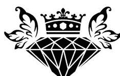

## St. Royal College
天使神秘学院

- 专业占卜预测机构
- 神秘学培训机构
- 水晶能量研究中心
- 官方淘宝：[http://strc.taobao.com](http://strc.taobao.com)
- 官方微博：[http://weibo.com/715104687](http://weibo.com/715104687)
- 新书发布QQ群：316790219
- 购买更多好书请联系院长大天使

大 天 使
天使神秘学院 院长
QQ：715104687
手机/微信：13641926204

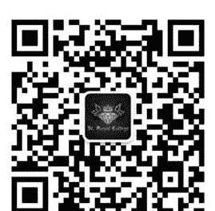

微信公众平台：strc2011

## 制作说明：

本书由《天使神秘学院》出重金从台湾购入的原版书籍扫描制作完成。为达到最好阅读效果，特地把原版书全部切开后，再经由专业扫描设备高精度扫描完成，并经过一张张的PS后期处理最终成书，其间花费大量的人力、物力以及时间，只为能给大家提供经济并优质的神秘学学习资料而努力。

本学院强力谴责某些机构和个人，把本学院花心血制作完成的电子书籍，包装后直接放在自家淘宝网上低价倾销的行为，以谋取不劳而获的经济利益。如果长此以往最终将无人愿意再为大家花心思制作电子书，那以后可能大家再无新书可读。

为让大家以后能够读到更多的好书，也为了本学院的良性发展。本学院恳请大家尽量做到如下几点：

- 一、尽量在本学院的网站购买电子书籍。
- 二、请勿用技术手段把电子书内的水印及加密去掉。
- 三、在收到电子书后小范围传阅即可，千万不要公开传播，更别挂到淘宝网上低价销售。

同时为答谢广大支持者，学院电子书将做如下调整：

- 一、学院会把一些早已收回制作成本的电子书折价销售。
- 二、最新制作的电子书籍会开放打印功能，大家购买后有条件的可自行打印成书。

天使神秘学院
2017年6月

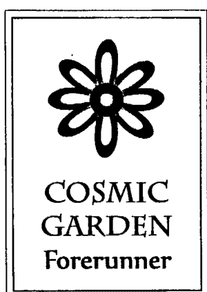

## The Portal to Cosmic Consciousness

地球很小，但宇宙很大；軀體有限，但心靈無限。要記得，有那麼一個地方，它超越了物質世界和時空的限制；在那裡，我們都是開心和自由的。地球行的挑戰之一，就是如何在沉重的氛圍裡，讓我們的心依舊保持輕盈、喜悅和正面。希望你在宇宙花園找到一處身心安適的角落，讓你無限的心與靈魂，綻放燦爛的光芒。

天使神秘学院官方淘宝：http://strc.taobao.com

## Soul Speak

### 靈魂在說話

### 身體的語言

茱莉亞·侃南 (Julia Cannon) 著

身體是靈魂體驗人類生命的載體。我們的靈魂一直透過身體向我們傳遞訊息，不論我們是否聆聽。

## 園丁的話

引介這本書，因為它很簡單，很真誠。誠如作者所說，簡單的東西常被低估了它的價值。

簡單與淺薄是不一樣的。

有些人誤以為使用艱深的文字，複雜的論述，深僻的專有名詞，便代表了深度或學問。

然而，真理是單純的，真理不搬弄文藻、不故作玄虛，真理幫助你認識自己，幫助你進入自己的心。

我也喜歡而且認同作者的純粹動機——「我們都是偉大和有力量的生命體。我的任務就是協助大家記憶這一點。」

——與宇宙花園不謀而合。

希望這本書能夠幫助大家以另一種角度看待人世的病痛。以靈魂的角度，因為那才是我們真正的身份。

# 目次

- 作者序 016
- 第一章 讯息 021
- 第二章 催眠 027
- 第三章 我们的真实自我 031
- 第四章 翻译手册 043
- 第五章 情绪 049
- 第六章 癌症 055
- ◎身体各部位的讯息
- 第七章 循环系统 065
- 第八章 消化系统 069
- 第九章 内分泌系统 075
- 第十章 免疫系统 079
- 第十一章 外皮系统 083
- 第十二章 淋巴系统 087
- 第十三章 肌肉骨骼系统 091
- 第十四章 神经系统 097
- 第十五章 生殖系统 103
- 第十六章 呼吸系统 107
- 第十七章 感官系统 111
- 第十八章 泌尿系统 115
- 第十九章 脉轮 119
- 第二十章 意外 125
- 第二十一章 过程 129
- 第二十二章 身体的讯息——快速参考指引 133

> 只要用自己的力量站著，沒有什麼是你無法承擔的。

沒有任何限制 —— 任何事都有可能。完全在於你願意相信多少。

——高我

# 感謝詞

本書不單單靠我一個人寫成，許多人以不同方式協助了此書的出版。為了完成這本書，我必須扮演一個完全不同的角色。我通常是扮演支持者，必要時鼓勵別人、為別人加油。現在輪到我需要支持、鼓勵和加油了。

我很感激我的高我不斷提醒我，把這些資訊「傳達出去」有多麼重要。他知道如何激勵我，讓我持續努力。

我非常感謝母親朵洛莉絲·佩南（Dolores Cannon）的祝福、協助，還有對完成此書的貢獻。她開拓性的工作為我的努力鋪了路。無論我如何抗拒，我們確實是很棒的團隊。

謝謝你，維戴立（Vitary），當我需要個肩膀哭泣和倚靠的時候，是你給了我力量。我永遠感謝。這就是「夥伴」的定義了。

謝謝你，蒂芬妮（Tiffany），你是世界上最棒的女兒。我真高興你選擇了我作你的母親！

感謝我的支持團隊——克莉絲蒂（Kristy）、南西（Nancy）、莎拉（Sara）、尚達（Shonda）——協助我創造寫書的環境。也謝謝馬丁（Martyn）幫我收集研究資料。

謝謝你，詹姆斯（James），我想你獨特的激勵方式奏效了！

最後，我要感謝所有這一路上為我加油的人——你們不知道，你們的鼓勵對我有多麼重要。

# 作者序

經由此書，你會看到我們不僅僅是活在世上的這個身體而已。我們的身體是很偉大的機器。無論我們選擇要活多久，我們都已決定了在這個靈魂棲息的身體裡體驗我們所稱的「人生」。如果我們不干預的話，身體機器本應完美運作；它是被設計成沒有病痛，若是出了問題也能自我療癒。所以，如果我們是被設計成不會生病，那麼，為什麼世上有這麼多的病痛呢？為什麼有這麼多人總是在生病或不舒服？事情是否比我們表面看到的更複雜？

我們現在才真正開始認識我們在身體和這個星球的真正角色。如果你不相信我在本書表達的想法，沒有關係，你不需要完全同意我說的話才能瞭解我試著要闡述的觀點。每個人都有權利選擇自己的真相和理解。我鼓勵你閱讀書裡的資訊，自己來決定這些訊息是否正確。

我要分享的資訊來自我母親朵洛莉絲·侃南（Dolores Cannon）四十多年來，與無數個案一起工作的臨床經驗，以及我在她身邊工作所得的直覺洞見和指引。一旦你瞭解身體的語言，每個人就都變成透明的了。我們內心的問題事實上都呈現在身體上。你繼續讀下去就會了解我在說些什麼。

我被指引要寫這本書已經好幾年了，但我一直抗拒。原因有好幾個。其中之一是看到有這麼多已出版的、很棒的書討論同樣的主題就實在令人卻步；因為這不是新的概念。露易絲・海（Louise Hay）是最早提出這個主張的人之一，她認為身體一直在傳遞訊息給我們，如果我們了解這些訊息，就會獲得對人生議題的偉大洞見。露易絲・海的事業非常成功，她讓大家看到了如何透過理解身體的訊息來療癒自己，並且如何說肯定的話語來平衡身心狀態。安涅特・諾提爾（Annette Noontil）的《身體是靈魂的氣壓計》（The Body is the Barometer of the Soul）和尹娜・西格兒（Inna Segal）的《身體的秘密語言》（The Secret Language of the Body）也是同樣傑出的作品。就如我說的，這個主題並不是新的概念。因此，你應當可以了解我為什麼一直抗拒在同樣的領域出這樣一本書了。然而，我的高我卻不斷堅持要我寫。

我問他，我這本書能夠提供什麼，是別的書沒有的？我得到的回答是，我們和自己的溝通必須經過某個過程，才能理解我們的進展和我們在地球上的使命。之所以會有這麼多的病痛和不適，就是因為我們沒有傾聽或瞭解身體要傳達給我們的訊息。瞭解和回應這些訊息也有個過程。當我們全心投入這個過程，自我療癒便會發生，我們也將進一步了解我們真正是誰。因此，你將會一再聽到我說，我們必須參與這個「過程」。

這不是一本你可以迅速瀏覽就得到答案的參考書。有些章節確實會告訴你身體的哪個部位通常代表哪些訊息，但這是為了讓你看到過程是如何進行，因此你可以參與其中，獲得自己的領悟和療癒。高我也告訴我，答案不假外求，這一點非常重要。請停止尋找某個人或某件事來「修補」自己。答案都在我們的心裡，我會讓你看到為什麼這是事實。我也會讓你知道如何與身體連結，清楚地聽到你的身體所發出的訊息以及如何詮釋它們。

我們都是偉大和有力量的生命體。我的任務就是協助大家記得這一點。

另一個令我退縮的原因是，我的母親在這個領域工作多年並且獲得這些資料有相當久的時間。收到寫這本書的訊息讓我心虛，幾乎有種罪惡感。我的母親找到了不同個案的各種病痛所呈現出的模式，這真的是非常重大的發現。我也覺得自己還沒有「足夠的付出」能夠擁有這些資訊。我現在明白事情並非如此，而且那些想法是來自老舊的能量模式。隨著時間的加速，我們也同時在好幾個次元移動。當母親回到家告訴我個案的各種故事和其中代表的意涵時，我覺得十分受到吸引，我們怎麼能單從個案所告知的病痛或徵狀，就知道這個人是怎麼回事，這真的是非常有趣。我知道，自己很難再花那麼多的時間與耐性從事臨床工作。經過了好幾年的敦促後，我才開始寫這本書，也終於接受了自己在這條路上的位置。

許多人可能會想，為什麼我會不願意去做明明知道自己被指引去做的事。你接下來很可能會在書裡一再看到，我很固執，我不喜歡別人告訴我要做什麼。（我不願意承認這一點，但這是真的！）即使訊息是來自最高的源頭，如果我覺得被迫或不是我有意識的選擇，我很可能還是會反抗。你看，即使覺察到自己應有的發展，我們還是可能抗拒。

我希望你們保持開放的心胸來閱讀這本書，並且允許自己的真理出現。當你走過這個過程，你將看到自己身為一個顯化者（manifester）是多麼偉大，多麼有力量。我深深希望每一個人都能知道療癒自己是件容易且影響深遠的事。

# 第一章 訊息

這本書其實已經進行很長一段時間了。如果某樣東西是來自你的人生和生活，而且你所做的一切都源自於它，那我們可以說，它就是你人生經驗的產物。我是個海軍小像伙（這是軍隊對在軍人家庭長大的小孩的稱法），我的父親是海軍軍人，我在軍人家庭長大。父親因為工作常常遷調，我們幾乎每兩年就搬一次家。

雖然小時候每個星期天都去浸信會教堂，父母也教導我們，要保持思想開放，對事提出質疑。我想，我一直都對不尋常和看不見的事物有興趣。我成長在鼓勵開放思考的家庭環境，所以不尋常的事物對我而言十分自然。我們總是在不斷擴展眼界，直到現在都是如此。

我不記得是什麼時候開始聽到訊息的。它非常漸進式，非常微妙，一開始像是直覺。我記得有幾次我正在開車，同時心裡想著某個問題還是狀況，接著就聽到後座傳來喊叫聲。我記得我轉過頭去，以為會看到後座有人。但是沒有。同樣的事第二次發生時，我便開始留意。我意識到是有個人或什麼的想要溝通，於是我試著依「它」說的去做。我不記得是否有什麼結果，但我想，重點在於我認知到了這個溝通，因為從那時候起，好像就有什麼被開啟了。很多人會跟我說，他們也有聽到後座或背後有人大喊的經驗。我想，聽起來像喊叫是因為那是那個聲音首次穿越次元的簾幕，而且我們不習慣「聽到」。「他們」一直在跟我們說話，但我們沒有聆聽。一旦聲音穿越了，而我們也認知和接受後，聲音就變得幽微，稱之為「知道」。其實，我敢說每個人都聽得到，但因為如此幽微，大家以為是自己的思緒。你會注意到，當你問了一個問題，你聽到回答。大部分的人認為那是我們自己在回答，於是沒把它當一回事，也不認為重要或答案是正確的。我們很難相信在自己心裡就有答案。接下來的幾章，我會讓你看到我們確實可以有答案以及如何接收。你只需要相信。

繼續我的故事吧。一開始，當我提出問題時，收到的回答都很簡單，多半只有一個字。我一直是很警覺的人，我決定要知道我聽到的是誰或是什麼。我後來發現，在發展這種能力的過程時，這是常見的階段。我認為這很「人性」，而且可以幫助我們分辨與覺察究竟是怎麼回事。我問「他們」或任何我在對它說話的人，我要怎麼知道是「他們」還是我自己和我的一廂情願。有些我收到的內容很讚，我絕對會希望那是真的。我聽到：「如果是我們，我們會在你的右耳後方。如果是你自己，就在頭的左上方。」不是每個人都如此，這是他們給我的方式，為了讓我能夠分辨。我認為要求這樣的確認是健康的「人性」。我們需要知道如何區分，才能往前邁進。

我開始注意到的另一個現象是，每次接到訊息，我就會在一天之內收到三次確認。這些確認的形式會是有人走過來，逐字地重複說出我聽到的話語，或是我會在收音機裡聽到，在廣告板或電視上看到，或是在書裡正好翻到的那一頁讀到。我相信，這些「確認」強化了信念，讓我們知道我們的確聽到了我們以為聽到的話。這個接收和得到確認的過程，可以幫助我們信任來自高我的指引，並繼續對溝通的管道抱持開放的心態。我現在雖然不再需要「確認」了，但還是會收到確認的訊息。我會說：「謝謝你。」而對於這些訊息究竟是如何傳遞到我這裡，我依然感到驚訝。

隨著遺忘的帷幕逐漸變薄，我們都會發現自己擁有很多能力。我可以在心裡看到影像、聽到訊息、感覺到能量，而且，我知道。以上所說的這些都只是接收資訊的許多方法中的幾個而已。我並不特別——任何人都做得到。我保證，你們每一個人都未來都會有這樣的能力出現。如果你不認為你可以，可能是因為你對訊息要如何傳遞有所期待，或者你認為擁有這些能力會讓你不一樣或特別。每個人都以自己獨特的方式接收訊息。只因為你認識的某人可以看到影像或直覺的「知道」，並不表示你就會是那樣。請允許自己發展你獨特的方式。

有個很常見但經常被忽視的現象就是「起雞皮疙瘩」。你知道的，就是手臂、雙腿、身體上的疙瘩，還伴隨著一種「冷冷的」感覺。不同的國家給這個現象取了不同的名字，但我想你知道我在說什麼。當你「起雞皮疙瘩」時，就表示你剛剛聽到或剛剛說出來的話，是事實。

「他們」告訴我，這些能力是上帝所賜，是自然的權利。就像呼吸一樣的自然。如果你能夠呼吸，就可以擁有這些能力。請允許這些能力出現。不用害怕任何事情——你只是進入真正的自我。

大約十年前，我忙著我的護士工作，還創辦了一個家庭照護機構。我擁有護士執照二十多年了，我的專職就是加護病房和家庭護理。我一直得到訊息，要我在阿肯色州開一家療癒中心。我心想：「為什麼我要在阿肯色州開療癒中心？」我接到這個訊息至少四次，於是開始往那個方向做了一些小小的動作，不過我接著會放棄所有的努力，又撤回熟悉的生活。我的護士生涯頗自在舒適，無法想像換了跑道還會如此安逸。這些訊息持續出現了大約一兩年。我甚至嘗試在當時住的密蘇里州開一家健康中心。你看到了，我收到訊息，也試著做出回應，但我是用自己的方式——我認為舒適的方式。當上一次訊息來的時候，我問了一個不同的問題。我問：「我要如何在阿肯色州開一家療癒中心？」我猜，這個問題問對了，因為就在我問了之後，我的人生完全改觀。就好像宇宙在說：「我會讓你看到！」我從一手建立並熟悉的舒適生活被丟到了充滿不確定和全新的起步的新生活裡。我失去了舊生活裡的一切。所有的財產沒有了。事業沒有了。我熟悉的一切——舒適的一切——都不見了。我剩下的只有我的家人。後來，我在書上讀到，有時事情就是這麼發生了，這樣你才會知道你真正是誰。你不是你的財產或工作或生活上的地位／身份。當你被剝奪了一切，剩下的，才是「你」。

這就是我挨了宇宙一棒子的經驗，我覺得這一棒下得很重。我想，這是有時我很頑固，要這樣我才會聽話吧。我會又踢又尖叫，抗拒被迫要改變。即使是現在，我還是看到自己在抗拒這個持續展開的新生活。我覺得這實在挺好笑的。因為我過的似乎是許多人羨慕的人生；我能夠一直活在自己的信念裡，大部分的人卻試圖在忙碌的日常生活和工作裡「塞進」和他們信念有關的活動，他們不喜歡身處於不能理解他們的人當中。而我身邊一直是很有趣的人，我還可以旅行到世界各地。

我也問過自己為何還在抗拒，我想，我人性的那面並不喜歡別人告訴我要做什麼。無論目前的生活多麼美好，都不是我有意識為自己決定的路。我們都很可笑，對吧？如果不是用我們期待中的方式給我們，即使給了我們月亮，我們還是會不開心。我現在逐漸接受了這就是我的人生，尤其是在我了解內在指引和宇宙的棒子是怎麼運作之後。

# 第二章 催眠

在這個主題上，最大的影響來自我的母親，朵洛莉絲·侃南。要了解她豐富的研究工作的最好方法，就是在網路上搜尋她的資料。我在這章將會描述她的工作與本書內容有關的部份。

朵洛莉絲是前世回溯治療師。她是催眠治療大師，已經從事這個工作四十多年了。她是個勇敢創新的人，從不害怕，永遠好奇。

我的父親在海軍服務二十一年，感覺上我們好像一直都在搬家，每兩年就搬一次。我覺得這點讓我們的思想都很開明，因為我們接觸過許多不同的環境和人群。我們從不曾在一個地方落腳很久，所以無法建立長期的人際關係。我們通常很快就能交上朋友，也學著如何離開並繼續前進。我們被教育對不同的思維要抱持開放、不存偏見的心態，我認為這一點為我們後來的人生打下了基礎。

我知道這聽來很老生常談，但我經常被問到：「有個像朵洛莉絲這樣的母親，成長是怎樣的過程？」你必須了解，她並不是一直是你們現在所知道的樣子。我們是很普通的軍人家庭，生活只能勉強度日。

一開始是我父親是催眠師，我母親協助他。那是一九六〇年代，當時的人對前世和玄學這類事還很陌生。他們用催眠協助一位想減重的女性放鬆，忽然間，她進入了前世，接下來是令人無法置信的故事，她回溯了五個前世和她的生命源頭。這事很令他們震驚，也激發了他們很多的想法。

> 這個故事在朵洛莉絲的《五世記憶》（Five Lives Remembered）裡有完整的描述。

經過了一段時間，朵洛莉絲在催眠工作上越來越精通和熟練，也發現了更多有趣的冒險。至二〇一二年為止，她已經寫了十七本書。她和被幽浮綁架的個案工作了二十多年，隨著她與外星人的合作，她開始得到比外星人提供給她的資料更高階的訊息，她發現自己是在跟非常高層次的資訊源頭溝通。這就是後來被稱為的「所有知識的源頭」。

她也發現，在適當的狀況下，這個資訊源頭能夠立即治癒她的個案。透過和這個更高力量的合作，她知道了身體是如何用疼痛和疾病來傳遞訊息給個案。這也就是本書的內容。

我開始收到要我寫這本書的訊息，是在協助朵洛莉絲教導「量子療癒催眠療法」的課程時。

# 第三章 我们的真实自我

量子疗愈催眠疗法课程的时候。我坐在教室后面（通常在工作），然后会收到讯息，讯息说我是要把这些跟身体有关的所有资料汇集的人。一开始我感到心虚、很不安。这是朵洛莉丝的工作结晶，如果由我来写，她会是什么感受？我后来想也许我们可以合作，这样就不会有人误会资料来源了。我问了她，她说她完全支持我做这件事，但她要我自己写，因为她手上有好几本别的书在进行。她一直持续从疗程中为我收集资料，也就是你将在书里看到的例子。 我在这本书会一直使用“疗程”这个词。它指的是一次私人的催眠时间。在这个过程中，朵洛莉丝会催眠个案。催眠是一种深度放松的状态，个案在这个状态下得以用不同的感知形式去接通资料。接收资料的最常见方式是影像，但有些人只能“感觉到周围环境”或“就是知道”。我希望你明白这点，因为许多人来进行疗程时，基于先入为主的设想或是因为在朵洛莉丝书中所读到的内容，而对应该要发生什么事有着自己的期待。 在催眠的过程中，个案可以看到不同的时间/地点——这都是他们的高我认为合适且必要的。这些不同时空的资讯对于提供你目前人生的洞见会很有帮助。

> ※编注：有意了解或体验 QHHT 的读者，请联络宇宙花园：service@cosmicgarden.com.tw，以便有正确理解或确保持到能切实执行朵洛莉丝的教导，并且真诚以爱和耐心为个案服务的催眠经验。

为了解是如何让疗愈发生，你首先必须了解自己真正是谁。你不只是血肉之躯。你有个血肉之躯，但它是跟一个伟大得多的东西连结。你可能听过这句话：“你不是一个身体。你拥有一个身体。”它是你为了这个尘世经验所选择的外衣。在你为此感到沮丧前，请了解：你选择这生的一切，都是有原因的。这是为了你想要的学习。当我们来到尘世，目的就是学习和体验——一切！我们因此可以成长、发展。简单的说，我们有一个灵魂，这个灵魂决定来到地球，体验身而为人的一切。地球有一些规则，就像玩游戏似的。其中一条游戏规则就是不知道规则。也就是，矇着眼睛，在黑暗中玩这个游戏。因此，游戏会更有挑战性，也更好玩（我猜）。回到我说过的“拥有一个身体，而不仅仅是一个身体”的概念。我们最初是以灵魂开始。在所有的宇宙中，这是最难生存的宇宙。而在在这个宇宙的所有星球里，地球又是最具生存挑战的星球。为了能够来到地球，你必须是个显化的高手。这是唯一能够处理这个星球游戏的灵魂类型。这不是意外——全都是设计好了的。这里有人是游戏玩家吗？你知道，就是很爱玩游戏，尤其是电脑游戏的人。游戏有不同的关卡。每关、每个层次都有各种挑战，它们测试和磨练你解决障碍的能力。当你完成了一关之后，会怎样呢？你进阶到下一关，对不对？下一关更难，更复杂，有更多不同的挑战。当你完成了这一关，会怎样？你继续进入到下一个更有挑战性的关卡。好了——假设你完成了整个游戏。很棒，你是这个游戏的大师了！现在呢？你玩另一个游戏。或许因为你已经是大师了，你会选一个更具有挑战性的游戏，因为你想继续磨练技巧。当你再度完成了那个游戏，你再选一个更有挑战性的游戏。好了——假设你一直玩，直到你玩过了所有的游戏。现在做什么呢？嗯，创造一个游戏？身为一个显化大师，我们想要有挑战性的经验。如果你是游戏大师，想创造新的游戏，你会如何设计？或许创造一个很沉重、很密实的环境，让大家很难移动？我们习惯了身轻如燕，习惯飞翔和心血来潮地创造。而这个新环境会是像流沙般的让人难以移动。

当我得到一个新游戏时，我首先会想知道规则。我要怎么玩？假设我们所设计的这个新游戏并没有规则，每个人都做自己想做的事（自由意志）。为了让游戏更加刺激，让我们大家都忘记：一、这是个游戏；二、我们真正是谁；三、我们设计了这个游戏。于是当我们进入地球，遗忘的帐幕便遮盖住我们的双眼；我们是宇宙中唯一忘了自己是谁，也忘记我们和一切事物连结的生命体。只有显化大师会愿意做或是做得到这种事！我们是伟大和有力量的生命，来到这里体验有意义的学习与挑战。所有体验都会磨练我们的能力和技巧，好帮助我们完成想要完成的更伟大使命。由于我们来到世上却不记得自己是谁，我们创造了一个在这路上协助我们的沟通系统，它能让我们知道自己是否偏离了原定的道路或目标。这个沟通系统一直在运作，但我们却不一定总是知道如何诠释讯息。稍后我会就此再做说明。

我的母亲朵洛莉丝·佩南在世界各地教导她的催眠法。我通常都会在现场，以便随时提供协助。某次在澳洲雪梨，她将一位学员催眠后，和全知的源头取得了联系。大家正在讨论和分享所传来的深刻智慧。朵洛莉丝称这个部份为“潜意识”，因为不知道还能如何称呼了。这个潜意识不是精神医生所指的那个潜意识。精神医生说的潜意识是他们在催眠时用来改变习惯的那个不成熟的心智部份。朵洛莉丝发现的这个部份，曾被他人称为超灵、高我或是宇宙意识。在那个班上，学员反复辩论潜意识是谁或是是什么。我一如往常地在教室后面工作。忽然间，我心里出现一幅景象，我明白了这一切是怎么回事。我心想：“喔，好酷喔！”然后听到一个声音说：“画出来。”我说：“喔，没关系，我已经懂了。”接着又听到：“画出来！”如果你们有人被“他们”吼过，就知道我在说什么了。必要时，“他们”会吼你的。尤其是对我们这些顽固的家伙！你可能在想，我说的“他们”是什么。我画的图将会告诉你，请保持耐心。当我开始把看到的景象画出来时，我才发现，我以为我懂，但我其实并不了解。画的时候，“他们”告诉我些细微却非常重要的改变，这在理解相关原则时会产生很大的差异。课堂休息时，我给旁边的人看我接收到的画面。当我正在解释时，房间另一头有人跑过来说：“这就是我一直在找的答案！”休息时间结束后，我为全班画了这张图。另一件有意思的事发生了。有些学生问了问题——我从不会想到要问的问题。当他们提出问题，图画跟着演化，答案出现在我面前。随着大家不断提出问题，这张图也不断演化。所以问题非常重要。我现在视之为呼吸。我现在就会为你们画这些图。但是你们必须明白，这是六度空间（我还不明白这是什么意思，但，好吧！）的图画，而我试着在二度空间的纸上来表达。虽然受限于此，但我会尽力把讯息传达给各位。因为媒材本质的限制，呈现出的不会是适当比例，请运用你的想象力，我想你会懂的。

这是真正的你。

这是你，坐在这里读这本书。这是你认为的你。

我称之为“大我”和“小我”。你很巨大——真正的你只有一小部份进入这个身体里来体验人生。其他的你都在身体之外。这是你的一位家人。这是他的“小我”。

这是他的“大我”。

你看到什么了？这边发生什么了？“大我”们互相重叠。就像他们彼此“连结”，你以前在哪里听过这个概念吗？

这是另一个人。

这就是为什么那个说法是真的。
这个空间的最上面就是我看见呼吸的地方。这就是为什么我把它画成波浪纹。这就是“上帝”或“源头”。

“大我”融入了源头，意味着什么？

“大我”融入了“源头”，意味着：它就是上帝。如果“大我”是我们的真实自我，并和上帝融为一体，那么，我们就是上帝。这就是为什么，这个说法是真的。

上帝有任何限制吗？上帝受到任何方式的限制吗？我希望你会说：‘没有’，因为我们知道这个部份是无限的，而且可以做任何事情。如果我们就是上帝，而上帝是无限的，并且可以做任何事，那么，我们不就是无限的吗！我们是伟大、有力量的生命体——我们只是忘记了。我在演讲时和学员分享的图示讯息不止于此，但这里提供的资讯已经足够满足本书的目标了。

我们来到世上是为了美好的创造经验。我们带著遮蔽的眼罩，藉由不知道自己为什么来到这里，不知道自己来这里做什么，以便接受更大的挑战。朵洛莉丝问过‘他们’，为什么我们在这里的时候不知道自己和别人的连结，也不知道自己的人生计划。他们的答案是：‘如果你知道答案，那就不是测验了。’

# 第四章 翻译手册

我在前一章提过，我们比我们想像的来得宏伟，但是我们已经忘了自己是谁。我们带着计划来到世上。为了不同的原因，我们计划了这生要完成些什么、体验些什么、遇见些什么人、要跟谁交往等等。但因为我们会忘了这些计划，我们试图给自己讯息，帮助引领自己往灵魂想去的方向前进。有时生活给我们的感觉就像是走在地雷区，我们发现自己被各种人生经验从各个方向袭击。希望我们都能从这些经验中学习、成长。

你可以把身体的讯息看作是导引系统或导航设备，它持续给你信号，让你知道接下来要怎么走。当我描述这个导引系统时，如果你能将自己抽离，完全客观地检视自己所处的境遇或人生，对你将会有很大的帮助。这一点很重要。如果你能保持客观，你会更容易接收到讯息。

我们来到世上的时候，就知道自己不会记得真正的自己是谁，或是在这里要做些什么，然而，我们一直是和我们的真实自我连结，正如我上一章说的。

由于我们地球游戏的目标是来执行到此要做的事，并在过程中记起我们是谁，于是我们建构了一套对自己发出讯息的方法。我们事实上可以跟“大我”说话，但是这很难让人相信，而且大部份的人也否认自己有这个能力。然而，如果我们不相信自己有此能力，那么这个能力就不会存在于我们的现实中。如果我们不知道自己可以和“全知”的自己说话，并从“全知”的那部份得到答案，那我们又要如何传递讯息呢？

假设你想跟某人说话，但他听不到你的话，你会怎么做？首先，你可能试着说得更大声。然后，你可能会试手语或别的语言。接下来，你可能会试着用写的。想像一下类似的情形。你有许多传递讯息给自己的方法。第一个选择永远是说话。只要讯息接收者能够了解你的话，这是传递讯息最简单和直接的方法。如果我们还是没在聆听，传递讯息的第二个选择就是经由我们都必须面对的——我们的身体。身体是很好的讯息传递者！

身体一直在跟你说话，你也可以跟它说话。身体很喜欢你对它说话。我们的身体就是一个完整的宇宙——由你所有的器官、组织和细胞所构成的宇宙。当你跟身体说话，你就是上帝的声音。它会知道，你了解它在做些什么，它会和你合作无间。朵洛莉丝·侃南“量子疗愈催眠疗法”的一位学生针对这个概念做了实验后，发现这是真的。她把她的经验写在QHHT网站的讨论上，是一个很棒的“和身体对话”的范例。

“每个冬天，我都会感染很严重的流感或感冒。我的症状是发冷、冰凉的脚、轻微发烧、鼻塞、很多的鼻水和痰，持续至少三周。这个周末，我们从奥勒冈州回来后，我感觉就要感冒了。于是第二天决定试试是否可以不被流感控制我的身体。我说：‘我身体里的细菌和病毒请注意，这是上帝在跟你们说话，我要你们知道我有多爱你们，我很感激你们教导我如何疗愈自己，你们已经完成你们的工作了，我现在要用很多的爱和感激送你们走。你们可以回到光，带着爱与感激，继续你们的旅程。’接着我想象看到它们，小小的一点一点的颜色，跑出我的身体，往一个充满金光和白光的门口出去了。我这么做了两次，那一天和接下来的几天又做了几次。真的有用，除了脚冰冰的之外，我觉得好极了，没有任何其他的症状！”我很确定，直到目前我们对身体的奥秘都未能了解全貌。他们跟我说过很多次，我们所理解的只是很表面的一层。我猜想，一旦我们了解了这一层，我们就会接收到更大的、关于我们自身的概念。我们必须一步一步来，从最简单的开始，再从那里深入。这不是比速度快的竞争——做就是了。我们是带着计划或任务来到地球执行并且体验特定的事。这看来好像挺简单，可是当你不记得为何而来，也不知道你计划要做什么的时候，你就很容易因为分心而离开了原本的轨道。如果要让这趟旅程不那么戏剧化和惊险，能更保持在正确的道路上，第一步就是要倾听你的引导系统。这是你自己的设计，在你分心和遇到难题时提供协助。想像你在一个迷宫里，墙非常高，不可能看到另一边。你在迷宫里逛，你可能撞到墙或走进“死巷子”。你可以到每个角落察看，寻找出口，最后也可能找到。如果你在分析过所有试过的路，并透过删去法，找到正确的路径，那很棒！遗憾的是，大部份的人不是这么看待人生，所以不会分析不同的道路，看看哪一条是正确的。大部份的人陷在情绪和情境的起伏里，无法看到下一个转角，于是走不出迷宫。我们甚至也“忘记”这是一个迷宫。我不是说你应该花多久时间走出迷宫，人生就是体验，如果体验迷宫是你想要的，那也无可厚非。我只是希望你能觉察，你还有别的选择。假设，有个人站在迷宫外面，他能够看到整个景象，看得到所有的死路和障碍，他可以给你讯息，一路指导你，确定你走出来。这不是很好吗？这就像你的秘密武器！你的个人指导系统，帮助你破解迷宫！唯一要求就是你能接收到那个人给你的讯息。如果你选择不听，他们只好找别的方法传递。他们的方法没有限制。你“请求”协助的方法也没有限制。如何走出迷宫，完全在于你。没有一定的对或错的方法。重点是体验。有些人选择听从收到的指引，实现了他们所设定的此生任务。有些人可能选择不听，毫无目标的浑噩度日，一直撞墙或走进死巷里。有些人可能选择走反方向，以为自己最懂了。所有这些都会产生不同的经验，任何一个经验都很好。我要告诉你的是，你现在可以有意识的选择你想要的方向。你不再有藉口说你不知道了。你现在知道了（无论你是否相信），迷宫外面有人在协助你。要不要听、要不要遵从引导，都是你的选择。

我知道，讯息可能会令人困惑。当我们来到世上的时候，我们并没有带着翻译手册。我们在另一个层次了解讯息的语言，但在此我们学会如何诠释之前，我们都是在黑暗中摸索。即便是手语，也是运用了身体的一部份。我之前说过，我们和身体日夜相处，所以在我们可以直接听到讯息之前，身体是传递讯息的最佳管道。大多数的讯息很一致，像是某种语言。你一旦了解了，就会看到它的美好与简单。你将不再漫无目标的过日子，不再不知道哪条路对你最好。其实，你一直都在接收讯息，但直到现在，你才有了了解这些讯息的工具。因此，在你找出自己的答案之前，请把这本书看成你的翻译手册，让它为你在这个称为人生的迷宫里引航。

# 第五章 情绪

情绪是我们各方面的成长指标。如果你对某件事情有很强烈的反应，这件事便一定是你需要仔细检视的议题。我们四周的世界就像镜子般的映照出我们为了个人/灵魂成长而需要努力的部分。我们从身边的人身上所看到的优点和缺点，可能正是我们自己具有的优缺点，只是我们还不知道而已。这个反映的机制是我们试图让自己注意到自己的方法。当你对别人所说或所做的事有反应时，问自己：‘你想让我看见什么？’、‘你希望我知道什么？’

现在，更仔细的看看这个反应里头所蕴含的启示。我们很容易害怕自己的情绪，因为很多时候，情绪背后有很强的能量，它们感觉像是内在一股无法遏止和控制的力量。最能够教导我们的情绪就是：生气、仇恨、恐惧、嫉妒、厌恶、没耐性、羞耻、骄傲、同情、愤慨、羡慕、担忧和罪恶感。这些也被称为负面情绪，但我想给它们比较有建设性的名称，因此我称它们为教导情绪。只要我们愿意，这些情绪可以教导我们很多很多。

我看着以上的情绪清单，觉得它们的根源都是恐惧。所以，若说恐惧是所有教导情绪的源头也不为过。有人曾说恐惧是人类最强大的情绪。正因为我们害怕正视它，恐惧才具有瘫痪和毁灭的力量。我们害怕正视恐惧——这句话值得思考。很讽刺，对不对？

恐惧是缺乏信任：对自己、对别人和对世界的信任。因此，我们想要教导自己的课题可能就是“信任”。信任宇宙，更重要的是：信任自己。最棒的讯息和成长指标就在我们的内在核心。我们只需往内寻求、聆听、不要害怕体验我们的情绪，就会看到传递的讯息了。

他们跟我说，我们必须学会辨认恐惧。这一点很重要。恐惧有很多不同的面貌，不一定能够一下子就能辨认出来。在地球上，恐惧透过许多方式呈现。地球是恐惧唯一存在的地方。“他们”说：“恐惧不是真实的。恐惧是幻觉。恐惧只是为了娱乐的目的而已。唯一真实的，是爱。”

> “他们”说：“恐惧不是真实的。恐惧是幻觉。恐惧只是为了娱乐的目的而已。唯一真实的，是爱。”

朵洛莉丝・侃南在进行疗程时，多次收到“情绪是我们轮回到世上的主要原因”。当我们在转世之间，处于灵魂形式时，我们可以接触并完全意识到在灵魂世界以及其他次元可以学习的一切。朵洛莉丝问他们，如果我们在另一边可以学到所有的资讯，为什么我们还需要轮迴？答案是，学习分理论和实际应用。当你使用情绪，你可以学得更多更快。学到的教训会内化为你的一部份，而不只是你的记忆。这些情绪只存在于地球，我们无法在别处得到如此密集的训练。

如我在本章一开始所说的，情绪是我们针对各个议题的成长指标。我们要对这些情绪心怀感激，因为它们是我们人生和成长过程中的导引系统。这个情绪导引系统在我们的太阳神经丛，它让我们感受到我们的选择所造成的影响。

我们选择对事物如何反应。直到现在，我们一直不自觉地对发生的事作出反射性的回应。当我们越来越有觉察力，我们会感知到我们的选择和它们的影响，以及我们因此而有的反应。这样的反应会平衡得多，因为我们较能保持客观。

请了解，情绪没有对或错，就像处理情绪的方式也没有对或错。我认为我们对情绪判断对错是为什么会有这么多人陷入自责，让自己陷入不想要的情境的原因。我们认为我们应该要有特定的行动或感受，当我们不是这样的时候，我们就是有问题，有什么地方不对。情绪让我们和宇宙中的其他生物不同。我们选择这时候来到地球是为了让自己加速成长而来体验。当我们选择地球游戏时，我们就是来学习情绪和限制。而情绪是让我们知道自己做得如何的主要方式。

首先，我希望你知道，你可以“感觉你正感受到的情绪”。如果你不让自己体验这些情绪，那你要如何知道自己想告诉自己什么呢？我认为我们因为被教导“感觉情绪”是错的，所以我们麻木自己绝大多数的情绪。我们像群机器人般的过日子，没有活力和生命。另一个极端则是一群人受到彼此情绪的影响，持续加速和堆积情绪的能量，创造出不停循环的戏剧化的混乱世界。两个极端都不会有帮助。我认为我们需要将情绪看成美好的工具，并与它合作。这一点很重要。

接下来是承认情绪。这就是“你拥有情绪”或“情绪拥有你”的差异之处。我认为我们因为害怕情绪后头的东西，所以不自觉地否认情绪或是把情绪压抑下来，埋起来，希望情绪会自己走开。但我们忘了，情绪是我们沟通和指导自己的主要管道之一。如果我们有以上的行为，我们便是在创造一个让情绪以别的方式表达的环境。很多时候，这可不是个好现象。而这正是让我们后来对自己的情绪感到害怕的原因之一。我们会觉得情绪无法控制和遏止。

正如同任何要教导你的事情一样，你需要检视它，看看讯息是什么。很多人问我，要如何检视恐惧？要说“就看着它。”很容易，当人们直接问我如何作的时候，有意思的事情就发生了。我看到眼前出现小小的人，大约三英尺半高，代表恐惧这个情绪。恐惧现在有了形体，双眼和其他部份。我可以看着它，而且不怕它，我还能够问它问题。

“我了解什么？”我发现一件有趣的事，它比我个子小，不像我以前以为的那么大、那么可怕。醜陋可怕。有一次，我真的把它看清楚了，還跟它說話，它卻成了一團空氣消失。我想，這就是大家說的「正視恐懼」吧！它的雙眼本來很可怕，但是當我真正看著它時，就看到它的眼裡其實很哀傷。是因為我們不肯正視，才使得恐懼變成那個又大又壞的醜陋怪物。恐懼一旦消散，我就能看到它背後的東西，看到我需要學習的事物。一旦恐懼的情緒被移除，就能從客觀的角度面對事情，於是我也能用建設性的方式處理問題。

# 第六章 癌症

大部份的人一聽到「癌症」兩個字就感到害怕了。多數人覺得，一旦被診斷為癌症，就等於被判了死刑。他們必須用盡一切力量來戰勝癌症。由於診斷往往帶著恐懼，被診斷的人準備好了要用一切可能取得的武器來除掉這個可怕的攻擊者。癌症被視為咒神惡煞，一個令人憎惡的入侵者，必須不計一切代價的殺掉它。很多時候，代價就是被癌症入侵的身體。

我記得德蕾莎修女曾說過，她永遠不會支持或參與任何用「對抗貧窮」或「對抗飢餓」字眼的計畫，因為每當你試圖對抗某件事情，你因為專注在對抗上，於是給了它更多的能量。在創造的世界裡，大家總是說「專注於你要的事物，不要專注在你不要的東西上」。如果你認為自己必須對抗或殺掉某件事物，你事實上反而創造了更多你試圖克服的事物。你的思想也是事物，它們會創造。因此你應該專注於你想要的，像是「富足」、「健康的關係」或「完全平衡與和諧的身體」。這樣比較有建設性、比較有益。

> 專注於你要的事物，不要專注在你不要的東西上。

癌症是在告訴我們某個已經有很長一段時期的情況。癌症是「最後通牒」的手段之一。當所有送出訊息的努力都失敗了，就必須採取更激烈的手法才能得到你的注意，讓你看到問題。你可能認識一些人，他們在被診斷出患有末期疾病後，人生整個轉了彎。這可能就是最主要的訊息——停下來，重新思考你在做的事，重新想想你是誰。疾病迫使大家內省，也許是這輩子以來第一次內省。我們不是都聽過無數次了嗎？內心才是所有答案棲息之處。由於我們是如此頑固，有時候，這是迫使我們好好停下來內省的唯一方法。如我已說過好幾次的，你不是受害者。這並不是違反你的意志，強加在你身上的不幸。這是你自己的設計；這是你告訴自己，如果偏離軌道，就用這個方法來協助自己回到正途。所以首先要做的第一件事，就是把癌症視為你發送給自己的訊息，而不是一個攻擊你、要取你的命的怪物。現在，你終於有足夠的覺知看到它代表的真相——一個你真正需要聽到的充滿愛的訊息。我們透過朵洛莉絲的工作知道癌症是尚未解決的、被深度壓抑的憤怒。對某事的憤怒抑制了很長一段時間了，沒有釋放，反而的結果就是必須處理的疾病。癌症在身體的位置會告訴你患者對什麼感到憤怒。例如，乳癌可能是對「未被關愛」、「無法關愛」或「不允許去關愛」感到憤怒；肺癌可能是對生命或「無法／沒有能力過自己要的人生」感到憤怒；腸癌可能是對無法宣洩或無法言說的現實憤怒。

在朵洛莉丝的某次催眠疗程，个案是位癌细胞已蔓延全身的男士。当一处的癌细胞被移除，另一处的癌细胞又冒了出来。朵洛莉丝问他是否对什么事感到愤怒。他大吼：

> 「是的！我恨我太太！孩子跟了她。她不让我看孩子。」

在这类的案例，癌症会由一处转移到另一处，直到你找到愤怒的源头。如果不处理根本的愤怒，光是动手术切除和进行术后治疗，并不会改善情况。你要先认出并了解自己为何愤怒。然后你必须放下。就算你有个糟糕的童年／父母／配偶等等，你都要放下！你创造了那个情况，好让自己体验和从中学习。现在，请不要任何情绪地检视这一切，看看它在教导你什么。这也可能是在平衡业。无论是什么，现在都该放下了。一旦学到了课题，或是体验过了，你就必须放下，继续前进，好接受下一课的学习或体验。这些经验不该一直被背负著不放，它们就像多余的行李，压得我们难以前行。在认出愤怒的根源之后，最好的释放方法就是原谅。原谅每一个牵涉其中的人，放下他们。我知道，知易行难，但是为了疗愈，这么做绝对必要。在前述的例子里，朵洛莉丝告诉这位男子，他必须原谅前妻才能除去癌症。他说：

> 「我无法原谅她，你不知道她做了什么！如果我原谅她，她就赢了。」

> 「如果你让她害死你，她才是赢了。」

到了某個時間點，你必須了解，這一切無關輸贏。這是有關學習、體驗、放下，然後繼續前進。我們往往都太執著於這個三度空間和其中的情緒戲碼了。

當我們來到這一世，我們和這生密切往來的所有角色都有合約，也可以說訂下了協議，以便獲得不同的經驗和學習。有些合約牽涉到業，也就是說，你在處理需要償還以取得平衡的情況。其他的合約則是各種各類，例如某個靈魂當你的孩子；進行某項特別的計畫；或就是單純的在某時某地出現，協助某人或鼓勵某人。

有些合約是長期的，例如我們與父母、孩子和配偶。有些合約是短期的，例如導致懷孕的那一夜情或一段友誼。很多時候，我們跟某人的合約已經完成，但我們仍停留原處，以為自己有責任待著。在很多「量子療催眠療法」的療程裡，潛意識說合約早已失效，這是為什麼一段關係現在這麼不健康的緣由——個案早該離開，邁向下一個階段的旅程。我們也在許多療程發現雙方一世又一世地嘗試著同樣模式，想要平衡彼此間的關係，但卻徒勞無益。雙方持續以無法改正或解決問題的行為模式相處。

如果你覺得自己和某人正處於這樣的情況，有個簡單的方法可以讓自己從合約中解脫。朵洛莉絲在許多演講都提過這個方法，而且也確實有很深刻的效果。你可以想像自己和對方在一起，你看到自己拿著合約。要面對面進行這件事可能會很困難，有時候這個人已經過世，你無法跟他說話，但你可以在心裡告訴他：「我們試過了。我們真的試過了。」然後想像自己撕掉合約，說：「我原諒你。我釋放你。我讓你走。」當撕碎的合約散落在地上，你可以說：「你走你的路，帶著我的愛。我也走我的路。我們無需繼續連結。」隨著心裡的負荷移除，你將會感到如釋重負。在說這些話的時候，你必須是真心誠意才會有效。你會感到非常自由，因為這個人再也無法像以前那樣惹火你了。

至於癌症，你必須釋放讓你感到憤怒的情況或人。這個過程很簡單，但不見得容易做到。就像上一段所說的，你的人生必須已經走到了能夠放下這些憤怒的點上，你說的話必須真心誠意才會有效。為了釋放憤怒，你必須原諒每個牽涉其中的人。我在這裡想借用一位好友，同時也是很有才華的通靈人，紐西蘭的布萊爾．史戴拉（Blair Styra）所用的一個很棒的儀式。他的作法是每天早上進行以下的陳述：

「我原諒所有曾經用任何方式傷害過我的人，包括這世和任何一世。
我請求所有我曾經用任何方式傷害過的人原諒我，包括這世和任何一世。
我原諒自己曾經犯過的任何錯，包括這世和任何一世。」

這是可以括所有人生議題的好方法！最後一句話可能就是最重要的——原諒你自己。有時候，這會是最困難的一步。請記得，是你創造了這個情況來體驗和學習。移除所有的情緒，客觀看待這一切，看看你想教導自己什麼，或是想體驗些什麼。這一刻，你可以跟自己說「任務達成」，然後放下，繼續前進。每一個經驗都在協助你成長、發展。下一個經驗可能更具挑戰性，也可能沒那麼有挑戰性，但至少，它會不一樣。

很多人說，面對癌症的那段日子洗滌了他們的生命。因為他們以為自己時日無多，開始釋放出許多壓抑在心裡的事情。這通常是他們第一次真正向內看並分析自己對不同情況的感受。他們像是一個導管，讓他們進入了內在，允許所有的情緒浮現。程序一旦完成，他們就進入了寬恕與緩解期。你明白為什麼嗎？因為他們已經清除、淨化了所有壓抑在心裡的垃圾，所以身體就不再需要處理那些情緒了。大家把成果歸於藥物或放射治療，但其實是他們的自省和感受使得療癒發生。

我並不是要抨擊醫療界（我以前是有執照的護士）。醫學確實可以協助我們處理最緊急的需求，以便我們處理根本的議題。但我們必須取回療癒自己的力量，這一點很重要。我們創造了自己的疾病，所以我們也必須創造自己的健康！只要我們將自己完全交給別人「修補」，我們就一直會是受害者。這大概就是這些曾被傳遞的訊息的意義了：

- 「拿回來」
- 「用自己的雙腳站立」
- 「這是你的身體、你的人生——沒有人比你更了解！」
- 「沒人比你更能修復自己。」

我們必須知道，我們有能力創造任何我們想要的事物，我們可以創造完全的、富足的健康。

有時，這可能意味著我們會被引導到最好的醫生面前好幫助我們，或讓我們可以協助自己。正如我在本書一開始時說的，「他們」最希望我傳達的一點，就是你必須在這個過程裡。我覺得這表示參與。療癒不是發生在你身上的事，它是跟你一起，是你讓它發生在你身上。參與的方式很多，我會在第二十一章說明。

在「量子療癒催眠療法」的案例裡，有很多人因為癌症來找朵洛莉絲。和個案一起進行量子療癒的過程與步驟之後，潛意識接著會將療癒的白光透過頂輪進入個案並溶解癌細胞，殘餘物則會經由身體系統安全地排出。在某些案例，個案被指示只喝果汁或蔬菜汁一段時間。這是為了協助身體回到它自然健康的狀態。

## ▼ 身體各部位的訊息

正如之前所提，靈魂〈高我——真正的你〉，透過你的身體這個美妙的信差發出訊息給你。因為宇宙其實很簡單，並不複雜，你會發現這個溝通系統非常符合字面意思。身體各部位有著十分明確的涵意。有些作者把詮釋發展得極其細緻，但我不覺得我需要這麼做。請記得，「他們」告訴我，我最需要教導大家的是「過程」。如果我講得那麼詳細，你會把這本書當作參考書，而不是一本教你如何參與過程的書。參考書會被放在書架上，需要的時候拿來參考。參考書不是在你心裡的東西。「他們」一再告訴我，參與這個過程非常重要，這樣你才能往內走，帶出自己的療癒。透過理解、參與溝通、將訊息內化，你便能找到問題的根源。我將會列出身體系統的各個部份，說明每個部份最常見和一般的涵意。問題通常不是跟某個身體系統，而是跟一個系統裡的特定身體部位有關。如果我只著眼在整個系統，其它議題將會被忽略。有少數幾個系統傳遞的是整個系統的訊息，當談到這些系統時，我會再作說明。我會為身體的每個部份舉出最常見的疾病。你可以看到訊息系統是多麼簡單如實，這有助於你了解自己身體所發出的訊息。為了你能進一步了解，我會舉實例說明，或是引用朵洛莉絲檔案中的催眠案例。有時候，訊息會有「例外」，它不跟隨預期的途徑，我也會就此說明，讓大家看到這個機制是如何運作。請記得，這不是一本告訴你所有答案的參考書。這本書是教你了解你的高我（靈魂）是如何經由你的身體對你說話並引導你理解這些訊息。

你現在必須瞭解到：潛意識或高我經由身體的徵狀與我們溝通。診斷只是醫生對於徵狀所下的標籤。它跟身體傳送的訊息無關。你必須要能理解隱藏其下的根本訊息。

除了臟器之外，身體左右兩側代表的訊息並不相同。如果是身體右側，代表現在所發生的事。表示目前、當下。如果是左側，代表以前發生的事——在這生或前世。

舉個簡單的例子，假設你的右腿有問題，訊息可能是現在有某件事正阻礙你往新的方向前進。如果是左腿，則是來自過去的事（別人曾對你說過或是對你做的事）阻礙了你往前邁進。

# 第七章 循環系統

循環系統的目標是讓氧氣和養份經由心臟、血液和血管在肺臟和體內流動。

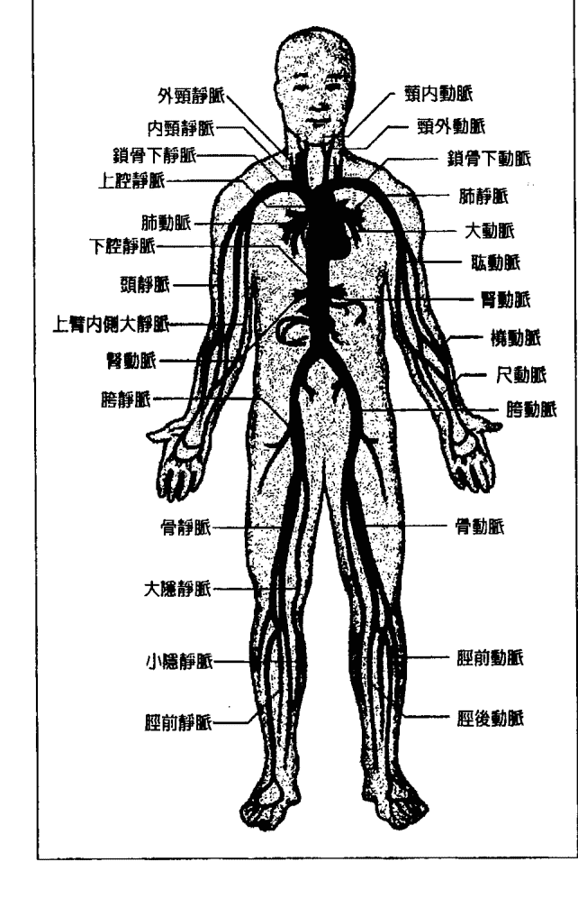

人類心臟是肌肉器官，它不斷提供血液循環，是人體最重要的器官之一。血液是動物的特別體液，用來運送像是養份和氧氣等必要物質到細胞裡，並把代謝的廢物從同樣細胞裡運出來。循環等於流動。生命的流動。往人生方向前進，人生的流動。一個人朝他渴望的方向行進。血液的任何異常顯示生命力量的某種紊亂/失調。

這個系統裡的任何阻塞或問題都指出你的生命流動或方向出了狀況。阻塞的身體部位可能指出你的人生在哪裡卡住了。譬如，如果是你的腿（膝蓋、腳踝、腳）出了問題，代表你沒有住你想要的方向移動。如果是手臂，你也許需要放下某些事物，才能往你想要的方向前進。如果問題出在頭部，或許你需要四處看看，甚至往後看，找到自己想走的方向。如果問題出在心臟或重要的動脈，代表你在阻擋自己所尋找的愛，對自己的愛。透過阻擋愛的流動，你阻礙了你真正的渴望。腦部的阻塞代表直覺受阻。或許你不想跟隨你所「看到」或「聽到」的事物。

循環系統的阻塞顯示這個情況已經有一段時間了。之前可能有許多訊息被誤解或忽視。我會這麼說是因為循環系統是核心系統，而身體（自我）會先透過周邊系統傳遞訊息，之後才用到核心系統。身體一般都是這麼運作。它總是會先保護不可或缺的重要器官，它會不計代價的保護心臟、腦、腎臟等等。如果這些核心器官出了問題，身體可能死亡。傳遞訊息的系統也是同樣模式。循環系統是最後的通牒，它現在發出了生命的警訊，所以你現在接收的訊息非常重要。你可能會看到別的系統也受到影響，這是因為問題已經拖了很久。其他的系統可以幫助你更了解狀況，以及你試圖告訴自己的訊息。

水腫——液體代表情緒——情緒累積——沒有釋放。沒讓它們流動。你讓情緒拖累你。如果是腳和腳踝水腫，表示你沒有往你想要的方向移動，因為你還抓著某些情緒不肯放下。這些情緒讓你在評估自己狀況的時候缺乏彈性，你無法移動也無法繞道而行。當液體開始堆積到心臟時，訊息就更強烈了：你沒有表達你的情緒。心臟方面的問題都代表生命中缺少愛或喜悅。

貧血——覺得脆弱；沒有承認／認知到自己的價值。

心臟病發作——心臟是情緒之所在。和愛情生活有關的問題。因為責任而覺得有壓力；想要逃脫。這被視為一種可被接受的逃脫方式（從不愉快的狀況，例如工作。）

血癌——在某次「量子療癒催眠療法」的課堂進行療程示範時，血癌的過程被解釋為一種可被接受的自殺方式；身體停止生存的一種方法。

愛滋病——覺得羞恥和強烈的罪惡感；不光榮；批判。在「量子療癒催眠療法」的課堂示範時，潛意識的解釋是：整個愛滋病是高階靈魂設計出的疾病，為的是透過教導人們有關批判的課題，提升地球意識。（你可以在朵洛莉絲·侃南的《迴旋宇宙》系列讀到更多關於這個議題的資料）。

中風 — 中風是因為輸送到腦部的血液缺氧或是有血塊。在腦部哪裡發生並不是重點，重要的是瞭解症狀是如何在身體顯現。

# 第八章 消化系统

消化系统消化食物，将它变成身体可以吸收的养份，作为修复和维持身体活力的能量来源。

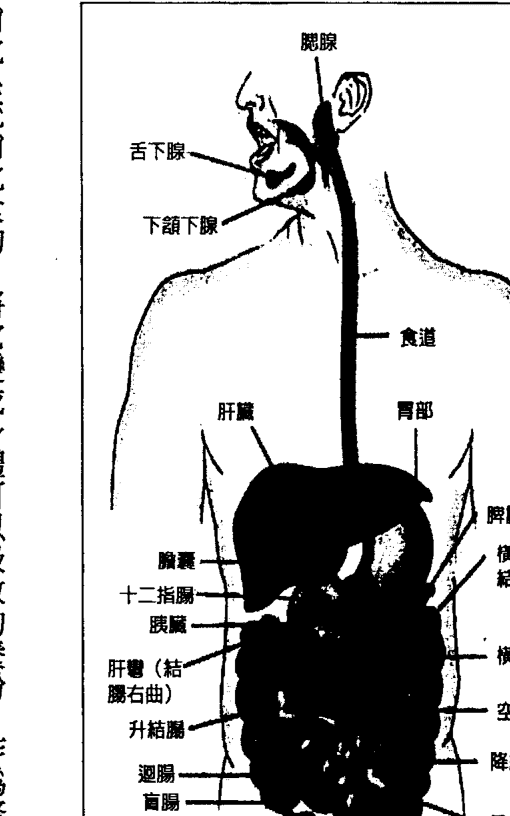

这个部分的重点在於身体各个部位，而不是整体系统。这里的解释有很大部分跟脉轮相关，有必要的话请参考脉轮那一章（第十九章）。

## ▼嘴、喉咙：

每当喉咙受到刺激的时候，几乎总是同样的讯息。嘴、牙、颚也是。

如果喉咙部位被影响，那表示有重要的话需要说出来。你没有说出你的真话。你需要发声／表达立场。它可能是让你很生气或烦恼的事，而且你害怕说出想法，但这正是你的身体在告诉你把话说出来。不要再压抑了！

大家会压抑想说的话有很多原因：担心被拒绝、被批判、被误解或被取笑；也或许他们觉得自己不够重要，没有份量发言。这些都是能够理解的担忧和不开口的原因，但另一个表示的意义是

- 喉痛——你有愤怒的话需要表达，但是你压抑著不说，而这些话让喉咙不舒服。
- 喉炎——你需要为自己针对某个状况发言。你需要说些什麼。
- 扁桃腺发炎——发炎表示愤怒。如果有什麼发炎了，就代表有愤怒。喉咙发炎时会你觉得自已在这件事情上无法参与意见。

## 蛀牙——

蛀牙表示你的嘴裡有東西腐爛了。你沒有說真話，或是你和自己說的話不符。

## 甲状腺问题——

我覺得喉嚨緊縮是把想說的話壓了下來。這是已經有一段時間的情況。
注意到這些症狀都指向「不說話」了嗎？沒有為自己或某件事／某個狀況發聲。有些事必須要說出來，但是你不說。徵狀的嚴重或持續程度會讓你知道壓抑有多久了。譬如，喉炎通常比甲狀腺機能不足短（指壓抑的時間）。根據主流醫學，一旦被診斷為甲狀腺不足或亢進，就會一直如此，並且必須長期服藥或接受手術。

## ▼胃部：

當腹部受到影響，最簡單的訊息就是你無法「忍受」某件事。這件事違反你的意志，但你覺得自己無法表達，無法說任何話，於是把情緒都藏在「肚子」裡。這是負責消化的部位，也可以視為在採取行動之前，消化你的想法、言語或行動的地方。就像食物待在胃裡太久會變腐臭，這些需要做的事也一樣。它們停滯、潰爛、侵蝕自己，成了危害你的健康的東西。潰瘍就是胃部侵蝕自己的例子。美國俗語說：「什麼在吃掉你？」意思就是：「什麼事讓你不開心／心煩？」潰瘍背後的情緒通常是憤怒。如果不允許自己釋放這些情緒，久了之後可能會變成癌症。我們已經說過，癌症來自壓抑的憤怒。如果能夠說出煩惱的事情就好了，但他們不覺得可以說出來。

體重超重的問題在美國和其他國家都非常普遍。我們很在意自己的身體形象。我之前說過，身體直接反映出你的想法或態度，並且傳遞訊息。那麼體重的訊息又是什麼呢？

過重有很多訊息。最常見的是自我保護；我們躲在肥胖的脂肪後面，保護自己不受傷害。我們在生命中都受傷過，在不同的時候，被不同的方式。自我說：「太痛苦了，我再也不要了。」於是採取行動，避免同樣的事情再度發生。如果我們讓自己不那麼有吸引力，我們就不會再被傷害，因為我們不會再進入會讓我們變得脆弱的關係或情況裡。這是隱藏自己的好方法，我們不再那麼脆弱，那麼容易受傷，不會再受到不想要的注意與傷害。這也是我們在飲食上尋找安慰的最常見原因之一。
體重過重的其他原因可能是你前世曾經挨餓，或是害別人受餓。身體往往會帶著前世死亡的殘留記憶。如果你前世死於飢餓，身體會記得，它會想避免再度被餓死，因此會確保你不會受餓。靈魂從一個身體到另一個身體裡，沒有覺察這已經是另一個人生，已經沒有被餓死的危險了。如果是這個情況，你需要跟自己的這個部份談談，讓它知道現在是不同的人生，這一生並沒有挨餓的危險。如果你有機會進行「量子療癒催眠療法」的療程，這會是很容易做到的事。

在朵洛莉絲的又一次催眠療程裡，個案發現自己某世曾經是部落的長者，但他還沒將他的教導傳承給別人就過世了。他在過世前說他永遠無法除去那一世的責任重擔了。話語可是非常有力量的。

我發現厭食症和其他嚴重的飲食問題所傳達的訊息都是你試著要消失。你不想佔據任何空間；你不覺得自己值得佔據空間。你試圖消失／慢慢不見。就像過重的人一樣，真正的你想要躲起來或是被保護。如果你消失了，就沒有人可以看到你和傷害你了。當你有這些議題時，你通常很明白自己想逃避的傷害是什麼。「量子療癒催眠療法」的療程會幫助你瞭解問題是否來自前世和其影響，隨著進行的過程，你也能夠自己找到答案。我們稍後會討論這個過程。

身體有許多機制，它會不計一切代價的保護自己。其中一個就是囤積脂肪，吸收有害的有毒物質。如果你體內有很多毒素，你的身體就不會讓你失去這些脂肪，因為這會導致這些毒素以過快的速度進入血流，你可能會因此喪命。身體事實上透過保持脂肪維持你的生命。如果你想減重，首先要從「消除體內毒素」的方向著手。你會需要想想，你為什麼選擇身體中毒？訊息是什麼？你的生活中有什麼有害的情況需要消除嗎？可能是環境中的化學有毒物質，或是對你的健康不利的食物，或是不健康的情感關係或處境。只有你才知道。不論哪種情形，所要採取的行動都是一樣的——除去生命中的有毒有害物質。

## ▼ 肝臟：

在身體系統中，肝臟負責過濾身體裡的有毒物質，使身體保持健康。如果你有肝臟問題，顯然你的生命中有需要除去的毒素，你才能夠健康、有生產力。你的生活裡有某件事在毒害你的生命，通常你很清楚是什麼——這不是秘密。它可能是如字面所表示的，化學物質中毒，也可能是象徵生活裡的處境。你需要為自己除去這些毒害。你的身體正在大聲且清楚的告訴你！

在朵洛莉絲的某次療程，潛意識正在進行身體掃描。當遇到個案的身體有許多問題，朵洛莉絲有時會請潛意識掃描身體，看看是否有什麼應該注意的地方。在過程中，潛意識會很有系統的檢視整個身體，通常是從頭開始，一直到腳，然後針對找到的任何問題提出看法。在這次的療程中，身體的掃描顯示肝臟有問題。「肝臟……太多防腐劑了。」

朵：食物裡的嗎？（是的。）她吃的東西裡有什麼不對的嗎？
潛：可樂。喝少一點。能戒掉最好。少喝可樂……喝更多的水。還有不要吃加工食物。用新鮮食材自己煮……不要吃加工食物。新鮮蔬果……更多的新鮮蔬果。自己煮。
接著潛意識便開始修復她的肝臟。

在另一次的療程，潛意識大吼起來，要求個案不要再用Tylenol（一種止痛藥）毒害身體了。個案因為幾種不同的慢性疼痛不斷吃止痛藥，現在肝臟因為「中毒」而開始失去功能。潛意識用療癒之光修補了整個系統，也修復了她的肝臟。然後指示她不要再把毒素放進身體系統。

## ▼ 胰臟：
胰臟調節體內的糖分，幫助消化，因為系統必須要有一定濃度的糖分（葡萄糖），才能執行日常功能，太多或太少都會危害身體。胰臟方面的問題顯示你的人生中缺乏「甜蜜」。不是說你吃甜食吃得不夠。純粹是說你的人生不快樂，對生活不開心。你感覺不到生命的「甜蜜」——也許你感覺不到被愛或被關心，或者感覺缺少了人生的「喜悅」。你對自己在做的事沒有熱情。也可能是缺少愛。這個現象轉變成的疾病就是糖尿病。

## ▼ 小腸與大腸：
系統吸取需要的養份之後，腸子負責運送身體裡的廢物。這個部份出了問題表示無法釋放廢物（便秘或腸道阻塞）或是過度努力排除廢物／毒物（腹瀉或不舒服的排便），完全無法忍耐。二者都是極端的情況，因此，也都表示失去平衡。也可能表示你把想法或感受累積在體內，使得它們惡化化膿，沒讓它們流動。感受和想法需要被表達，才能把廢物從你的生活中移除。

任何與排泄有關的問題都是同樣的道理。嚴重的程度代表累積的時間。所有發炎的現象，像是結腸炎，表示問題的根本在於憤怒。對人對事所壓抑的憤怒，更嚴重的話就會成為癌症。你需要認知到自己的憤怒，並找到表達的方法，然後放下它，而不是一直壓抑在心裡。在本書最後，我們會討論如何透過接收訊息和療癒自己的過程學會放下。我也被提醒，這不只和表達想法和感受有關，也是要採取行動。你認識多少人一直在說他們對某個問題的想法或感覺，卻什麼都不做？他們就是一再的老調重彈。我是這麼說的：「一直放同一捲錄音帶。」如果你對某個情況不開心，你就要採取行動去改變它。你可以跟所有願意聽你抱怨的人抱怨個不停，但只要你不做些什麼，不採取行動，譬如往另一個方向走，或換捲不同的帶子，那麼，什麼都不會改變，還可能變得更糟，因為你沒有做任何事來改變情況。很多時候，這裡的訊息是要你往另一個方向走。可能是離開這個令你不開心的狀態，朝著能帶給你喜悅的方向前進。有時候，改變可能為你的生活帶來暫時的問題或困擾，但是長遠來看，還是會好上許多。

# 第九章
內分泌系統

內分泌系統是腺體的系統，每一個腺體都會分泌某種荷爾蒙，直接釋放到血液裡，調節身體機能。這個系統包括腦下垂體、下視丘、松果腺、甲狀腺、副甲狀腺和腎上腺。

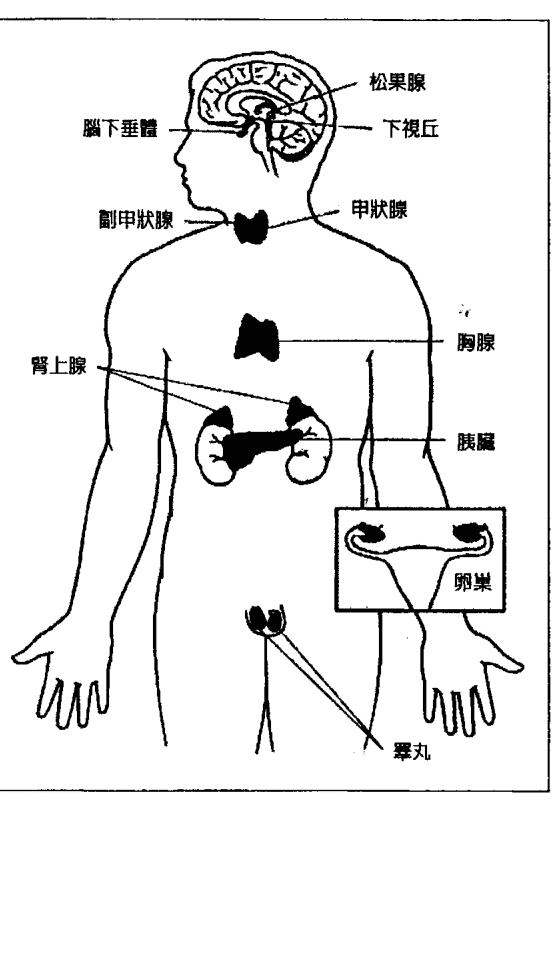

腦下垂體（pituitary gland）在腦底部，分泌調節體內平衡的九種荷爾蒙。

下視丘（hypothalamus）是腦內一個很小的部份。下視丘雖然小，在個人生存與種族延續，以及日常生活中的許多功能與行為上，卻扮演了極為重要的角色。它的整體功能就是從身體收集並整合各種大量資訊，組織神經及內分泌回應，以維持體內平衡（homeostasis）。

松果腺（pineal gland），也稱為松果體、腦上體或第三隻眼）是腦內很小的腺體，它製造血清素的衍生物褪黑激素，協助調節清醒和睡眠模式以及季節性功能。它的形狀像個小松果，因此被稱松果體。松果體位於腦中央附近，在兩個腦半球之間。

甲狀腺（thyroid gland）是最大的內分泌腺體。甲狀腺位於頸部，在甲狀軟骨（thyroid cartilage）的下方（甲狀軟骨形成喉結）。甲狀腺控制身體運用能量的速度、製造蛋白質、控制身體對其他荷爾蒙的敏感度。甲狀腺分泌甲狀腺素，參與以上過程。

最主要的甲狀腺素是三碘甲狀腺原氨酸（triiodothyronine，T3）和甲狀腺激素（thyroxine，T4）。這些荷爾蒙調節代謝速率，影響生長以及體內許多其他系統的功能。

副甲狀腺（parathyroid glands）位於頸部的小內分泌腺體，製造副甲狀腺荷爾蒙。人類通常有四個副甲狀腺，位於甲狀腺後面的表層。也有很少數人的副甲狀腺是在甲狀腺裡面或是胸部。副甲狀腺控制血液和骨骼中的鈣含量。

腎上腺 (adrenal glands suprarenal glands) 位於腎臟上方，主要負責在壓力下製造並釋放荷爾蒙皮質激素（例如腎上腺皮質醇）和兒茶酚胺（catecholamines）（例如腎上腺素）。腎上腺透過釋放醛固酮（aldosterone）影響腎臟功能。醛固酮能夠調節血漿的滲透壓（osmolarity）。

這個系統的主要功能就是經由各種不同腺體分泌各種不同的荷爾蒙，以維持體內平衡。這裡要看的不是整個系統，而是看腺體在身體的位置。以下內容可以引導你瞭解身體的訊息：

頸部和喉嚨的腺體表示為了生活的平衡，需要說出真相。有一些你沒說卻應該說的事。你必須說出你心裡的話！我們有許多個案有甲狀腺的問題（尤其是甲狀腺機能不足）。我們發現所有的個案都需要為自己發聲或說出某些事實。他們沈默太久了。

腎上腺位在腎臟上面，所以你也要看看腹部和腎臟的功能才能了解訊息。腎臟釋放身體系統裡的毒素，所以你可能壓抑累積了有害的想法、話語、行動等等，你需要釋放出來，才能重獲人生的平衡。請參考關於腎臟的章節，以便更深刻的了解身體的這個部份。

其他腺体都在脑子里，不是在中间就是在底部。当我写到这里，我被告知要从字面上去了解。换言之，看一看问题的「头」（源头）和「根本」是什么。这是获得平衡所需要的改变。

脑也是处理大量资讯、刺激、思考、神经冲动等等的地方。过量的资讯或刺激会产生休息以及让头脑冷静的需求。讯息可能是放慢脚步，找个安静的地方独处，让自己有空间思考生活周遭所发生的事。

有关的问题。在关于脉轮的章节里，第三眼或眉心轮就是属于脑这个部份，它们代表与心灵能力有关的问题。在神经系统谈到脑部的时候，我会进一步解释。

以我的情况而言，我似乎在这个系统里有好几个问题。当我问「他们」和问我的身体（本书后面会教导如何问自己的身体）时，答案永远都是：「你失去平衡了。」

反应了你的生活，如果你的身体有某部份失衡，你需要看看四周，寻找答案。以我来说，过去和现在都是因为我花太多时间在工作上，没有足够的休闲，也没有什么私人时间。非常的失衡。你可以想象，我目前的生活很忙碌，任何私事都必须事先计划，安排出时间来。这并不容易，而且工作总是被放在第一。我可以直接告诉你，身体的用途不是只为了工作，但我们就很容易就陷入工作，找不出时间或空间单纯地「存在」。如果我没有在「做」些什么事的话，我通常会有罪恶感。我明白我的身体正在告诉我的讯息，我也有意识地做出了重建平衡生活的决定。

二〇一二年的十二月二十一日，我们在伦敦举办活动。我在旅馆附近散步的时候，经过一间草药和针灸店。我很想进去看看。我从来没试过针灸，一直感到好奇，不知道自己是否可从中获益。我知道针灸是在平衡体内的能量，所以我觉得或许会有些帮助。

这家店的主人，也就是针灸师，来自中国北京，她的态度非常友善愉悦。我们面对面坐下，开始谈话。她拿起我的手腕，把手指放在我的脉搏上，我立刻感到平静——一种很棒、很宁静的感觉。她接着跟我说我的身体状况。她完全知道我的脖子哪里因为长途飞行而酸痛，她还知道很多关于我的身体的问题。这些资讯都无法从我们之前的晤谈推论出来。她后来告诉我，她也不确定她是怎么做到的，也许她的气（能量）进入了我的身体，使她能够看到我的身体是怎么回事。我也不确定她做了什么，我只知道当她握住我的手腕时，我感到非常平静。接着，她为我做针灸疗程。她说我的某些器官非常疲倦。

她说这些器官的能量不平衡，而针灸可以重整能量场。

我非常喜欢她对身体的信念，她相信身体完全有能力自我疗癒，如果你愿意给它所需要的空间与支持。她并不提倡那些各式各样替代身体自身功能的疗法，因为身体可以自我疗癒。正如我们说的：「只要我们不干预，身体是神奇的机器，它的设计就是可以自我疗癒。「疗癒的方式就是让器官的能量平衡并提供器官所需要的休息，好让它们可以治疗自己，发挥最佳状态的功能。 如果各位像我一样对针灸所知不多，我在网路上找到以下关于针灸的资讯，提供给各位。就像任何一种疗法一样，你必须自己先做功课，看看哪种方式以及谁提供的服务让你有共鸣，因为有很多人并不是那么专业或真诚。我在伦敦的那天，感觉很对我绝对是被引导到这位女士面前的。有时候，你也会这样接收到治疗的指引。你会被带到能够帮助你的人面前，提供你身体所需的协助，转变你的能量，使身体恢复健康。 针灸是激发身体促进自然疗癒并改善功能的方法。过程是把针精准的戳进穴位，加温，或用电流刺激。

## ▼ 针灸如何发挥作用？
中国的传统解释是：能量管道以固定模式经过身体和身体表面。这些能量管道叫做经络（Meridian），就像河流似的流过身体各处，灌溉滋养各个组织。能量河流被阻塞的时候，就像水坝堵塞了一样。 针灸穴位可以影响经络。针灸的针打通阻塞的水坝，重建经络的正常流动。针灸治疗因此可以帮助身体内脏改善它们在消化、吸收，以及能量制造上的失衡，并透过经络改善能量的循环流通。现代科学对针灸的解释是：在穴位用针刺激经络，可以让神经系统释出肌肉、脊髓和脑部的化学物质。这些化学分子会改善痛的感觉，或是触发其他化学分子和荷尔蒙的释出，因而进一步影响身体的内在调节系统。透过针灸所产生的能量与生物化学的平衡，可以刺激身体自然疗癒的能力并促进生理与情绪上的健康。

# 第十章 免疫系统

## ▼白血球
免疫系统是保护我们对抗疾病的生物结构和过程的系统。如果要发挥免疫功能，免疫系统必须能够侦察到从滤过性病毒到寄生虫等各种不同异物，并且分辨它们和身体自己的健康组织。

白血球是免疫系统的细胞，它对抗感染原和外来异物以保卫身体。一般人的白血球可以存活三到四天，它存在于身体各处，包括血液和淋巴系统。

## ▼ 扁桃腺
扁桃腺是淋巴组织，位於喉嚨後面。這些組織是第一線的防禦機制，對抗透過攝取食物或呼吸進來的外來病原體。

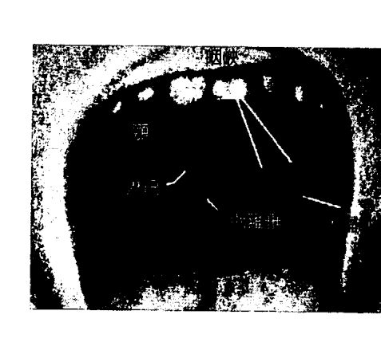

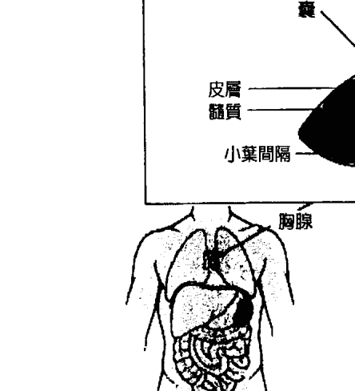

## 胸腺
## 腺样增殖体（也称腺样体）
腺样体是一团淋巴组织，位于鼻腔后面，在鼻咽顶端，也就是鼻子和喉咙交接处。

## ▼脾臟
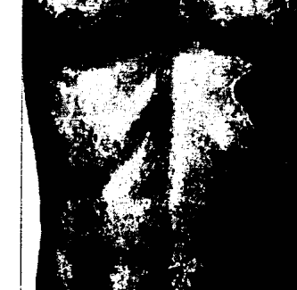

胸腺是免疫系統很特殊的器官。胸腺製造並「教育」T細胞（T-Lymphocytes）。

T細胞是後天免疫系統（adaptive immune system，也可稱適應性免疫系統）的重要細胞。

胸腺由兩個完全一樣的葉片組成，位於上縱隔（anterior）的前上方，在心臟前面，胸骨後面。

脾臟位於左上腹，在紅血球的代謝上扮演了重要角色。脾臟移除老的紅血球、儲藏血液以備出血時緊急使用，並回收鐵質。脾臟可以被視為一個很大的淋巴結。如果沒有脾臟，身體會很容易受到特定的感染。

免疫系統有一個目的，就是保護身體不受外來異物攻擊。當免疫系統被啟動，我們會說：「我跟帶原者接觸，所以感冒了。」請記得——所有疼痛和症狀都是身體試圖在傳達某個訊息。我們也會說：「不要跟帶原者接觸。」這表示你覺得你是面對某種攻擊。通常不是很大的攻擊，但也可能是。

這也表示你對某件事感到無力。你覺得無法保護自己。某件事正面向你攻擊，而你不想處理。你把它看作攻擊，否則的話，你會不在乎，你會從容應付，讓它過去或繞過它繼續過日子。你也可能只是需要休息（外來壓力和要求在攻擊你），但你不讓自己喘息，於是身體只好幫你處理，讓你患上感冒，強迫你休息。

為了瞭解身體所傳達的訊息，你要注意受到影響的特定腺體在哪裡，以及它如何呈現症狀。

如果是扁桃腺或腺樣體（喉嚨部份）受到感染，你需要對遭受攻擊的狀況說話，說出你想說的話。另一個思考的角度是：遭受攻擊表示你是受害者，所以你需要想想當時的心態，你是否覺得自己是某個情況下的受害者。請記得，我們創造了我們的處境，以便從中學習。我們從來都不是別人行為的受害者。如果我們覺得脆弱，覺得是受害者，那麼，我們因為某種原因，把自己的力量交給了別人，讓別人攻擊我們。

胸腺是在胸部／心臟的部位，因此它可能代表你對自己或別人有種無力感。心臟是「情緒的位置」，代表你對愛的感覺。胸腺跟你愛與被愛的能力有關，以及你在人生中擁有愛和喜悅的能力。或許你覺得過去你的感受／情緒曾經受到攻擊，因此害怕打開那部份的自己。或者你覺得你的愛和喜悅的情緒現在正被攻擊，因此發動了自己的保護機制。

脾臟位於左上腹部，因此，請檢視自己壓抑了什麼，也可能你是在防禦攻擊。我們通常把情緒積壓在腹部，沒有釋放或表達它們。這會使情況惡化並導致身體這個部位產生反應。

# 第十一章 外皮系统

## 皮肤
人类的皮肤覆盖了整个身体。这是人类外皮系统中最大的组织。皮肤有好几层外胚层组织（ectodermal tissue）保护下面的肌肉、骨骼、筋腱和内脏。

皮肤防止过多水份流失。皮肤的其他功能还包括保温、调节体温、感觉、合成维他命D、保护维他命B叶酸。

皮肤、头发和指甲，除了可以保护身体的器官和系统外，也是我们对外呈现自己的工具。只要看问题出在哪里，就可以知道议题是什么。我遇过一位脸上和颈部都有色块（皮肤变色）的个案。在进行回溯催眠时，她回到这一生出生的时候。她发现她的母亲并不想要她，母亲想要男生。她觉得「没面子」（defaced，注：有容貌受损之意），于是创造了这个面具遮掩自己。

割伤或其他皮肤伤口代表觉得自己脆弱，对外界环境的影响缺少足够保护。观察伤口是如何产生的，就能理解讯息是什么了。

我也发现，有些皮肤起疹子的现象（尤其是腿部）代表能量过量；有太多能量在体内流窜。

在许多前世回溯中，我们发现湿疹是某一世被烧死的残留记忆。它被带到这一世可能是作为提醒，或要你小心导致被烧死的原因。换言之，前世与今生可能有相似之处，而身体以这样的方式作为警示。

另一个在皮肤上常见的就是胎记。胎记显示的是前世创伤或死亡方式的痕迹。胎记通常不会有任何健康上的威胁。如果你知道了它要给你的讯息，就可以移除。

头发（毛发）在很多情况都表示我们的光采／荣耀，我们如何让自己和别人不同。

我们的发型清楚表示我们对自己的感觉。

当我想到掉发，我听到——失去荣耀。潜意识曾在朵洛莉丝的疗程中提到，掉发是因为维他命B12不足。

指甲同样代表我们如何对四周的人呈现自己。这是我们「给大家看到」的部分。指甲也是我们使用的工具。「工具」出了问题可能表示我们对「处理」某个状况的不胜任或没有能力的感觉。

# 第十二章 淋巴系統
淋巴系統是循環系統的一部份，由稱為淋巴管的管道網絡組成，它們讓清澈狀的淋巴液流向心臟。循環系統處理、篩選所有的血液之後，一天裡大約有三公升的液體不會直接被循環系統重新吸收回去。淋巴系統就是負責讓這些多出的液體回到血液系統。液體經由淋巴管運送到淋巴結，最後進入左邊或右邊的鎖骨下靜脈，和血液混合。

淋巴組織在免疫系統扮演重要角色，它和免疫系統的功能也有所重疊。淋巴結遍布全身，它的作用是過濾或捕獲外來細菌。免疫系統的正常功能非常仰賴淋巴組織。淋巴結充滿了許多白血球。

淋巴系統是身體主要的運輸工具，它的設計是把過剩的體液重新注入血液，送到有需要的地方回收使用，並藉由把細菌運送到淋巴結摧毀，使細胞維持在一個健康和平衡的環境。當淋巴系統失去功能，你的四肢末端都會腫脹（尤其是雙腿和雙腳），因為多餘的液體沒有被運回到血液裡。由於淋巴系統是循環系統的一部份，它的訊息會和循環系統所要傳送的訊息類似。

血液和循環系統代表生命的流動，以及朝著你渴望的方向前進。系統積水表示停滯，或是朝渴望的方向前進緩慢。可能是人生計劃出現阻礙，或是你抗拒往已計畫好的人生移動或進展，你「迷途」或「卡住」了。你對人生方向或流動缺少承諾，所以感覺受阻。如果你完全停滯下來，這些部位很可能會開始疼痛。

淋巴結的功能是摧毀透過淋巴系統送來的細菌。在這裡出現的問題和免疫系統的問題類似。你對生命中的某件事或某個領域感到無力。你把自己的力量給出去了，你覺得脆弱，被攻擊（像個受害者）。如果淋巴結有問題，你需要看看它的位置，好知道是哪些特定訊息。

腿代表往人生方向移動，表示動作。手臂代表你如何接受事情、接受什麼事，甚至如何接受／擁抱人生。喉嚨顯示沒有為自己發聲或沒有說出你的真相——有些你需要說但沒說出的話。胃／腹部指出問題被壓抑，你把問題放在心裡，沒有表達或抒發出來，沒有處理。

# 第十三章 肌肉骨骼系统
肌肉骨骼系统（也被称为运动系统，locomotor system）这个系统让动物（包括人类）能够使用肌肉并使骨骼移动。肌肉骨骼系统提供身体的支撑、体型、稳定和移动的能力。

这个系统包括了身体的骨头（骨骼）、肌肉、软骨、肌腱、韧带、关节和其它支撑並把组织和器官连结在一起的结缔组织（connective tissue）。

肌肉骨骼系统最重要的功能就是支撑身体，让身体移动並保护重要器官。

## 骨骼
## 肌肉
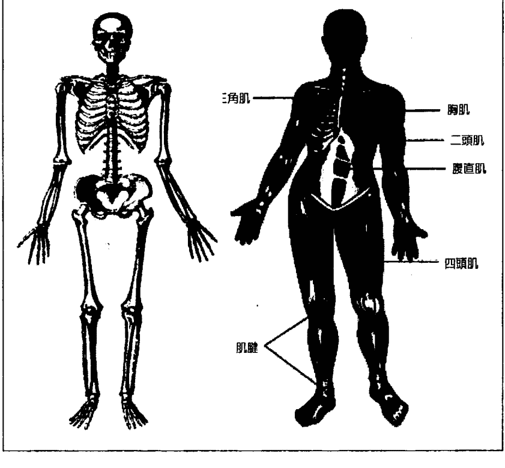

- 三角肌
- 胸肌
- 二头肌
- 腹直肌
- 四头肌
- 肌腱

## ▼骨骼的角色
這個系統裡連結的骨骼和軟骨支撐身體構成骨架，讓較為柔軟的組織附著其上。骨骼也保護內臟，例如肋骨保護心臟和肺臟，頭骨保護纖弱的腦。骨骼幫助身體不同部位的移動。它提供支點，讓肌肉借力使力的拉扯。這個系統最好要逐部檢視。一般說來，肌肉和骨骼支撐和保護器官，也讓身體得以移動。通常發生在這個系統的狀況只會在某個部位，譬如一隻腿或手，而不是整個肌肉骨骼系統。因此，我要請你更詳細的檢視問題，看看隱藏其下的訊息是什麼。由於肌肉使骨骼移動，所以這類問題顯示的是無法移動或移動上的障礙。肌肉無力或萎縮可能表示對特定方向失去了前進的渴望。

## ▼臀部、腿、膝盖、脚踝、脚：
腿和腳使你移動位置。這些部位出了任何問題都顯示你沒有朝自己想要的方向前進。你抗拒往不同的方向移動。你可能已經想了很久，但你害怕因此而來的改變，你害怕。

# 第十四章 神经系统

神经系统是具有特别功能的细胞所构成的网络，它负责协调动物的行动并在身体里的不同部位之间传送信号。神经系统由脑、脊髓和神经组成。它事实上还包括了更精细的部分，像是神经元（neurons），但是我们只需要知道这个系统和它主要部分的整体表现就够了。

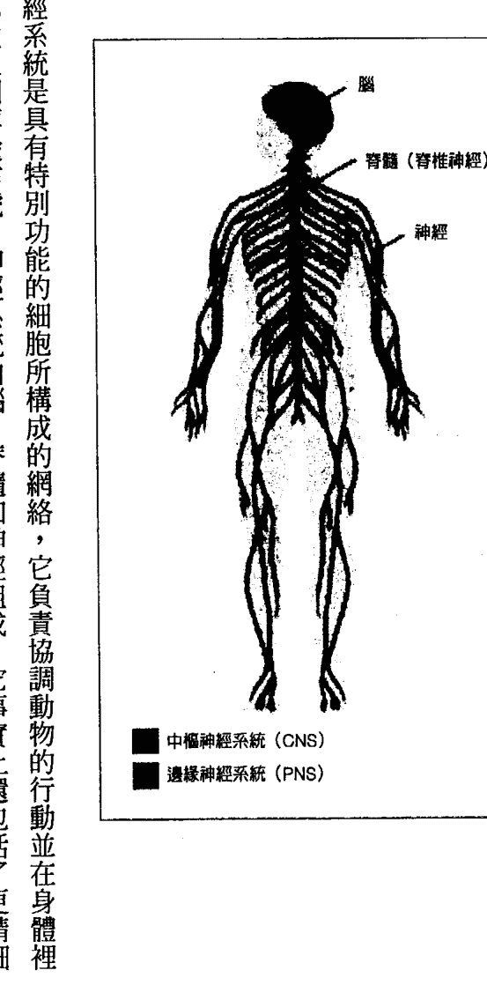

## 脑

人类的脑是神经系统的中枢。脑监督并调节身体的行动和反应。脑持续接收感官资讯，在快速分析之后，经由控制的身体行动和功能作出合宜的回应。我花了不少时间去了解脑可能代表的议题。直到目前，朵洛莉丝还没遇到有这类问题的个案，但我知道这部分必须要讨论。很多人的脑发生像肿瘤、动脉瘤（出血）、血栓的状况。昨天在我冥想一道明亮白光经由顶轮进入我的身体的时候，当白光到了我的第三眼脉轮，我忽然明白，脑的议题一定和第三眼脉轮有关。这个脉轮跟你的直觉和较高心灵能力的发展相关。我们需要仔细检视疾病才能理解信息。动脉瘤或脑出血会造成脑部的极大压力。信息是否就是心灵能力的发展遇到极大的压力？或是觉得失去控制？恶性肿瘤表示压抑的愤怒，因此在这个部位的肿瘤可能显示跟直觉相关的愤怒。我现在一边写这些，却觉得没有道理，但这确实是我现在接收到的信息。也许是怨恨别人和别人的能力，或是怨恨自己没有发展直觉力或不听从自己的直觉等等。

脑是“第三眼”脉轮的所在，松果体就在这里。它是通往更高次元的理解之门，也是心灵能力的大门。因为我对松果体的了解有限，于是决定作些研究。我找到的具​​体资料基本上说，松果体是一个腺体，大约一颗豌豆的大小，位于脑中央，负责制造褪黑激素（melatonin）。褪黑激素是影响并调节清醒和睡眠模式以及季节功能的荷尔蒙。我在 viewzone.com 网站发现盖瑞·威（Gary Vey）一篇很有意思的文章。以下是简短的摘要，解释为何叫作松果体：

虽然一般人认为是笛卡儿（Descartes）的主意，其实松果体是人类灵魂控制身体的中介组织的想法是来自希腊医师席拉菲勒（Herophilus）。耶稣降生三百年前，席拉菲勒（图右者）就在解剖尸体，记录自己的观察了。他最擅长的就是生殖系统和脑。

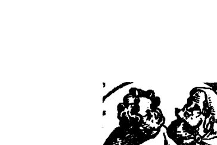

在席拉菲勒之前，大家认爲人类意识的“总指挥”是心脏。埃及木乃伊的心脏经过细心的防腐保存，脑子却从鼻腔取出，毫不吝惜的丢掉。但是席拉菲勒知道脑是控制中心，他于是研究并区分出脑的不同部位和它们主管的相关行为。

席拉菲勒注意到脑结构都是左右对称，只有小小的松果形结构是单一的。松果体是最早在胎儿内形成的腺体，三周大的时候就可以看到。松果体也拥有最多的营养，人体中最好的血液、氧气和养份都到了松果体，其次是肾脏（肾脏的功能是过滤血液中的废物）。由于这个独特的解剖学上的结构与安排，席拉菲勒正确推断出松果体在意识上扮演了重要角色，并且是通往我们真实自我的通道。

这篇文章也提到：

到了西元一九五八年，艾伦·林纳（Aaron Lerner）发现了褪黑激素—松果体另一个常见的神经传导物质血清素（serotonin）所制造的重要分子。他也确认了褪黑激素制造上的变化：在白天趋缓，天黑后不久，分泌便逐渐增加。褪黑激素负责让我们放松和入睡。

有一阵子，大家不知道这个深埋在人类脑中央的小小腺体是如何感知到光线或黑暗。后来发现了视网膜和松果体之间的联系，奇怪的是，视网膜也有褪黑激素。没多久，松果体就被称为“第三眼”。因为它位于七个脉轮之一，也被认为是心灵和精神能量的中枢。

另一篇文章提到，已经觉醒的松果体让人能够有意识地进行灵魂出体、探索其他次元、预知未来、接收来自其他次元充满爱的存在体的信息……看来，人类是被设计为具有洞见并能接通其他次元的资讯。这个对不同次元间的认知超越了自我／小我，可以快速疗愈我们的痛苦、冲突与业力。

## 脊髓

脊髓连接脑和边缘神经系统，它是传递资讯的主要通道，属于讯息传导系统。在脑部和身体之间，所有被来回传送的讯息都必须使用这个沟通系统。这个部分的异常跟你如何收发讯息及沟通有关，这不是很有道理吗？我刚刚接收到，这是跟你如何对自己发出和接收讯息相关。你可以决定脊髓和神经所发出讯息的受阻程度。完全中断可能表示传送讯息时你的想法是不连贯的。讯息如果不是完全没收到，就是收到时已经扭曲失真。

## 神经

未梢神经（peripheral nerve，也称周边神经或边缘神经）或简称神经，是一束被包住的像电线似的边缘神经轴突（神经元延伸出来的细长的管状物结构）。神经提供了电子化学神经脉冲（神经冲动或讯息）一条通道，让脉冲沿着神经轴突传递。

神经和脊髓是巨大的讯息传递系统，在脑和身体之间往返传递讯息。神经方面的疾病通常是因为有太多能量进入身体。在一般，也就是“正常”的状态下，能量以漏斗形状进入你的顶轮。在我观察神经系统异常的个案时，我会看到能量像一根大柱子似的完全笼罩住他。第一次看到时，我感觉到能量过多。我直觉的接收到这个人来到这世时说的话，他说：“都来吧！”

我们很多人高估了身体所能承载的能量。当我们在另一边的世界，当我们是真实的时候，我们是纯粹的能量。我们进入人类身体承载并携带能量，为的是帮助别人。我们对于想在这里完成的事有很大野心，往往要求的超过了我们能够负荷的程度。由于宇宙有“不干预”的法则，除非我们主动请求，我们的指导灵或高我无法为我们做任何事。结果就是身体无法处理目前过多的能量，我们因此短路，系统因“承载过量”而当机。这类状态在医学上就被诊断为癫痫和阿兹海默症（老人失智症）。我们发现神经异常的另一个原因，是因为个案积压了太多愤怒而被愤怒“吞噬”。个案会有瘫痪的症状，他的身体不“接收”讯息。就像上一段提到的，他的讯息传递系统“短路”了。我发现一件很有意思的事。每次我们试图将疗程的录影寄给这类个案时，总是会失败，后来只好亲自送交。再次地，讯息没有被收到。类似状况也会发生在被诊断为多发性硬化症（Multiple Sclerosis）和肌肉萎缩症（Muscular Dystrophy）的案例，这些都显示讯息没有被接收。我会列出神经系统的其他部分，以及这些身体部位的讯息所代表的意义。就跟其他系统一样，我无法一一列出所有的身体部位和疾病。请记得，这本书的目的是让各位了解这个过程。一旦你了解那个特定部位的大致讯息，你就能推论出自己的潜意识或高我试图透过你的身体要告诉你的话。

## 头部：

头痛（严重的偏头痛）—— 大部分的头痛和你前世如何死亡有关，如某类的头部重击。注意头痛是何时开始的？当时有些什么事发生？头痛发作的时间与情况可能跟你在某一世的情境类似。

头痛也可能来自这一世所面对的压力。

失智（极度—阿兹海默症）—— 身体的能量逐渐离开。个案想要离开，但是以缓慢的方式，以便他爱的人可以逐渐调适并最终接受他的死亡。

有些被诊断为阿兹海默症的情况其实只是过多的能量进入身体。当被指示将能量降低，征状将会缓和，身体系统在六个月内会恢复正常。这是在以太层面进行，透过个案想像降低刻度盘指针所指的刻度就可以做到。有时候你也可以“接通”那个人的能量场，去感知他的能量状态。当指针调低，你也会感受到他的能量降低了。

脑瘤 —— 对自己深埋的愤怒。愤怒的想法。对自己的成长或缺乏心灵能力感到怨恨或生气。朵洛莉丝要我说：“你不被允许发展你的心灵能力。”但我对“不被允许”这个字有些意见。你可能遇过某些人或面临某些情况，让你无法做某些事。但我觉得不能做是看你自己。你可能觉得无法或不被允许去做什么，但在灵性的世界和心灵发展上，谁能禁止你做任何事呢？因为这是很个人的，而且不是来自自有形世界。我可以了解在某些国家和文化里，这么做可能会带来严重后果或影响，这些情况可能令人无力。但大多时候，我们是可以私下发展心灵能力，而且必要的话，不让别人知道。

## 神经异常（压力、担忧）

这些特定的不适来自对未知的恐惧。你觉得你必须知道所有事情的结果。担忧代表对某人或某事缺乏信心或信任—— 很可能就是对你自己。由于你很难坐视事情以它自己的速度和方式自然发展，你不断试图分析或控制结果，因此脑和身体都接收到过度的刺激。

潜意识说，压力对身体会造成可怕的影响。这是身体在叫你聆听它的讯息的方式。当你聆听时，你会得到你需要的所有资料。

## 忧郁症

你在试图退缩或逃避。

## 躁郁症

这是更为极端的忧郁症形式，所以是更严重的退缩或逃避。

# 第十五章 生殖系统

女性：

## 性器官

生殖系统或性器官是生物体内负责繁衍后代的器官。

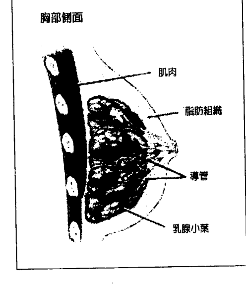

## 胸部：

胸部的主要功能是哺育下一代，因此这个部位和关爱或被关爱有关。问题通常是来自缺乏被关爱或关爱别人。这是关爱／滋养的中心，往往意味着和配偶或父母之间有问题。如果你不觉得被爱或被关怀，这个部位可能会有状况，这是为了提醒你放下并原谅对方没有表达或付出爱的能力。这也可能表示你无法去爱或滋养别人。

在一次量子疗愈催眠疗法的课程中，某位无法消化乳糖的学员发现问题来自她感受不到母亲对她的关爱。我总是对讯息如此符合字面意义感到讶异。

乳癌——对于不被关爱或没人可以关爱的愤怒。哪一边的乳房（左或右）可以告诉你，你是关于现在或过去的议题。

在朵洛莉丝的一次疗程中，潜意识或个案的高我提供了以下关于个案胸部肿瘤的资料：

安：她渴望并试图解救、拯救和滋养关爱别人。当某些事妨碍她这么做的时候，她把愤怒都压抑在体内；她必须学习放下。以她的现况来说，关爱是她所能做的了，她无法拯救全世界的所有宝宝和小狗。

朵：这就是为什么他们给她动手术的时候会遇到那些问题吗？
安：安奈特给自己这一生安排了很多很多的选择，当事情没有如预期发生时，她的这个倾向便有机会用特定方式作出回应，是的，是她让自己觉得在关爱别人上做得不够。这样她才能学习去释放这些感觉。（我问到她服用的药物。）大部份时候药物没有必要。这么说吧，有时候，某一些人可能需要用药物让身体开始往某个特定方向，然后他们就必须慢慢停药。他们需要服药的时间很少是要像被处方得那么久。（医生想动手术。）她不需要。器官很健康。（他们想制止雌激素的制造。）他们很恐惧。他们害怕。（他们认为这是为什么造成她的子宫大量出血。）这只是她要经历的一部份，这是自然的过程。我们正在试图加速她人生的这个部份，所以我们可以降低她身体里的雌激素…用我们的方式。我们会用她正常会经历的自然方式。我们现在就会做。他（指医生）的提议会阻止自然的过程，会造成更多伤害。动手术的唯一好处是她可以请假，不用工作，想休息多久就多久。（这不是明智的休息方法。）她会对服药有些担心。我们会中和它，（所以药物可以被安全排出。）但现在她需要开始寻找能够达到相同效果的自然方式，这样到了年底，她就不再需要服用这种药物了。身体扫描：（身体扫描就是潜意识或高我用能量形式仔细检查身体，就像X光一样，可以看到器官和身体各部位，检查有没有问题。）我认为她的子宫里有肌瘤，右边。她需要放下。她想再要一个孩子，她紧抓住这个想法不放，但她已经完成她的合约了。
朵：你曾经跟我们说过，子宫肌瘤代表没生下来的孩子。（是的。）但是她不需要有这个瘤。
安：不需要，这是为什么流血。潜意识接着进行消除肿瘤的工作。他解释这都是运用能量。接着潜意识宣布完成了。“我们移除了子宫壁的肌瘤，接着开始溶解的程序。接下来一两天，她可能会觉得有点刺痛，或许会出点血，但她不会有问题的。不用担心。”
朵：不会复发吗？
安：不会。不需要了。（身体的疗愈已经完成。）

## 女性生殖系统

在怀孕期就是在子宫里发展。

子宫是包括人类在内的大多数哺乳动物主要的女性荷尔蒙反应的生殖性器官。胎儿

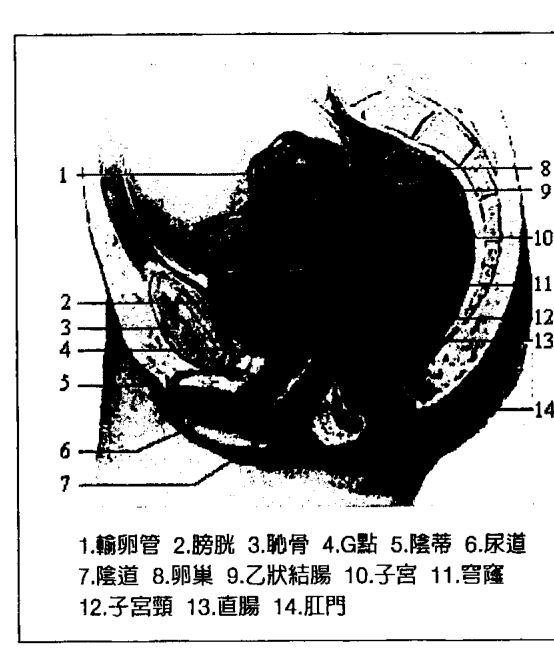

| 编号 | 名称 |
| :--- | :--- |
| 1 | 输卵管 |
| 2 | 膀胱 |
| 3 | 耻骨 |
| 4 | G点 |
| 5 | 阴蒂 |
| 6 | 尿道 |
| 7 | 阴道 |
| 8 | 卵巢 |
| 9 | 乙状结肠 |
| 10 | 子宫 |
| 11 | 穹隆 |
| 12 | 子宫颈 |
| 13 | 直肠 |
| 14 | 肛门 |

## **子宫：**

子宫（或一般称生殖器官）是创造力，也就是女性力量的区块。生命在这里被创造和保护，直到胎儿准备好来到这个世界。这个部位的问题表示和你的创造力或个人力量方面有关，也可能表示你不愿意接受自己的女性特质和表现。在表达女性特质上，你可能有罪恶感或恐惧。你觉得自己缺乏创意。也可能表示你想要孩子，或对失去胎儿感到内疚。

在讨论脉轮的章节，你会看到子宫位于主宰你个人力量的脐轮。

> 以下说明是取自朵洛莉丝的疗程：

一位女性个案的子宫大量出血。医生想要动手术。个案在多年前曾经堕胎，她对这件事一直无法释怀。潜意识（或高我）说，她的身体在为没有出生的孩子哀悼和哭泣。潜意识对子宫的细胞解释，它不需要再流血或为失去的孩子哭泣了。潜意识以疗愈之光和理性的声音充满子宫，接着说，细胞在倾听，子宫不会再流血，身体也会恢复正常。它现在知道自己是被爱的。潜意识继续解释，她的身体会经历正常周期，然后三年后开始更年期，到时这个器官的运作也会停止。潜意识说，如果个案能够接受所收到的讯息，并原谅自己和生命中的男性，流血会在两天内停止。潜意识说，流血是她表达悲伤的方式，也是惩罚自己的方式。个案同意，两天内流血就停止了，医生也决定不动手术了。

在另一次的疗程：

一位有子宫内膜异位的女性个案来看朵洛莉丝，她的医生想开刀切除子宫。她在催眠时进入了前世，她在那世是很富有的奴隶主人，强暴了许多女性奴隶。她的身体现在便以女性器官方面的问题来“还债”。

这个案例是跟业力有关，也就是个案在偿还前世的行为。因此，个案能够被允许疗愈的程度将会有限。通常在个案了解原因或起因后，他们比较能接受现实。这种情况可以有其他的方法减缓痛苦。我们在最后一章会谈到。

男性：

阴茎

阴茎是雄性动物的生理结构，是生殖器官，同时也是胎盘哺乳动物的尿管。

前列腺和男性生殖器

男性性器官／生殖器代表男性的气概。这是雄性的力量区块。这个部位的议题显示你在自己的性别／性方面的事和个人力量上有些问题。或许你不敢成为真正的你。你感到恐惧，觉得自己无法处理力量／责任。也许你这世或某世曾滥用或滥用权力。在某方面，为了某些原因，你没有进入自己真正的男性角色。也许你对自己在这一世的角色感到不自在。这个部位的问题也可能表示你在性方面过量或不足。也有可能你在前世曾经宣誓守贞。

朵洛莉丝的某次疗程也提出前列腺问题的另一种原因：马克来找朵洛莉丝进行催眠疗程。他担心自己的前列腺有问题。医生说是癌症。潜意识扫描身体后说，那边确实有东西。“这是个过程。当毒素经过男性身体，常会累积在前列腺。他导致问题但也正在释放问题。当他持续释放的时候，他便找到了一个停止毒素累积的方法：”

马：是的，他们告诉他要做切片。朵：你认为呢？
马：我觉得他的过程没问题，他现在的养生法很好。
马：我问潜意识可否清除那些需要被清除的东西，还是身体会自然清除。“我可以清掉...支持清除过程。”
朵：就像你说的，这是身体在清毒素，只是有些毒素往负面发展。我说的对吗？
马：其实不是正面或负面。这是信念的一部份。我们可以清掉。我会让它回复到没毒毒的时候，就像原来那样。
朵：当他回诊的时候，医生就不会找到任何东西了，是吗？
马：不会找到。医生就跟所有人一样，他的信念系统也是教义。改变这些教义总是很有挑战性。
朵：没错。但如果他们看到超越他们所能理解的现象，或许至少可以有些帮助。
（注：指接受传统医疗外的疗愈可能性）
马：这是个机会，像是写同意书似的。
（我们都笑了。）

第十六章 呼吸系统

肺部：

呼吸系统是生物有机体里负责将空气引进体内，进行气体交换的结构系统。人类和其它哺乳动物的呼吸系统包括气管、肺部和呼吸肌（呼吸用的肌肉）。

肺部对身体的生存扮演了重要角色。呼吸系统将必要的空气带进身体，让血液将氧气输送给所有的细胞。如果无法引进氧气，身体就会死亡。由于肺部在身体的功能，我们很容易就能了解它所传送的讯息在形上学的意义。

肺部代表“生命的呼吸”、“生命的流动”。肺部的问题表示害怕“活着”。失去了人生的乐趣。没有自己的生活。生活无趣。你在试图停止生命。也就是说，你不想活了。

肺癌 —— 对人生感到愤怒。不想活下去。

鼻窦问题 —— 这个地方的问题（特别是压力）代表来自某个跟你很亲近的人。我发现它总是来自最亲近的人——你自己。换言之，压力是自己造成的。或许你有完成计划的期限，而为了完成计划，你给了自己很多压力，这个压力于是显现在你“面前”。

感冒／流感 —— 你无法决定某件事，而你需要作出决定。你试图延缓行动／决定。这也是强迫自己休息的方式。

气喘（限制空气的流动）——受到限制；某人或某个情况让你感到窒息；无法“呼吸”。很多时候，你会发现气喘的原因来自前世。

气喘通常和你前世的死因有关，譬如因勒死、淹死或其他型态的窒息死亡而带到这世的余迹。一旦发现其中的关连，气喘就会消失。

在朵洛莉丝的某次疗程时，潜意识（高我）针对气喘问题说了这段话：

P：那个标签并不正确。很多时候是付出爱的时候感觉停滞或受到限制。因为他了解到“付出”就是他可以与别人分享爱的状态。社会对于付出爱的理解是要先遇到对象，否则便不合宜，这是没有道理的。他了解。现在就付出你能付出的。
朵：他相信气喘是真的。
P：这个病症没有一点帮助。但这会是他的回应。他偶尔也发展出肺炎。那是当他把强大的爱压抑下来，感觉被卡住、感到人生最没有自由的时候。

接下来潜意识开始治疗他的身体。

P：需要矫正，失去平衡了。要创造能够共鸣的声音和符号，把一切重整，就像它们应该有的样子。只要他能坚持到底。这是很重要的一课，他还没完全学会。他要继续进行他说他会做的事——持续，坚持到底。他很了解这个字。（谈到食物）从他的饮食里移除乳酪会是最有帮助的。他很喜欢乳酪，所以他不会喜欢听到这个建议。乳酪让他的身体有太多辐射了。牛奶制品有大量辐射。（这一点倒没听过！）低温杀菌法（cold pasteurization）并不好。“他们”不断说生鲜食品，新鲜的蔬果是最好的食物。

第十七章 感官系统

人类眼睛是会对光产生反应的组织，这有好几个目的。眼睛是有意识的感官组织，它让我们有视觉，能够看到。视网膜里的视杆细胞（rod）和视锥细胞（cone）让我们感知光线和视觉，包括分辨颜色和感知深度。人类的眼睛可以区分大约一千万种颜色。

眼睛用来“看”，它可以是看这个次元或其他次元，或是一般的情况。“看”（see）这个字很多时候也用来表示“理解”。因此，眼睛不适往往显示你不理解某件事（或出于刻意或因为困惑）。大多数时候，这里的讯息和“看到发生了什么”的能力有关。

视力模糊——你不愿清楚看到自身的处境，你会恐惧或否认。你害怕如果看得清楚，你可能会看到的景象。你想要把看到的现实“弄柔和一点”。

近视（近处看得清楚，远处看不清）——对未来恐惧，害怕人生路上的未知。这在很多时候是个提醒，因为现在发生了不愉快的事，所以你武装自己，预防未来可能的“伤害”。在意识层次，我们知道未来会有很大的改变，而很多人害怕看到未来。

远视（远处看得清楚，近处看不清）——你不想看到目前生活上的一些事。你害怕清楚看到自己的情况。你认为以后就会比较好了，你不想正视目前的状况。不愿意或恐惧“看到”事情的真貌。

复视——不专注在眼前事物的另一个方式。你希望扭曲现实，这样比较容易面对。

白内障——你看到的东西逐渐模糊或消失。白内障是更强烈或坚持的讯息，要你看到某件事或某个情况。这个情形已经发生好一阵子了，但你一直没了解讯息。

青光眼 —— 我觉得这是否认自己所看到的事。不想承认或面对眼前的事；让现实情况完全被遮掩，完全失焦。

耳朵：

耳朵代表听觉。耳朵问题的形态，可以告诉你需要注意的议题是什么。可能是跟倾听内在指引或别人的意见有关。我们有时候会很顽固，我们的指导灵一直在试着跟我们说话。很多时候，当我用第三眼看某人的气场时，我看到指导灵和天使就在他耳边，很努力的希望说的话被听到。我被告知很多次了，我们需要用不同的耳朵和眼睛倾听。这跟外在的耳朵眼睛无关，我们需要用内在感官去倾听去看。耳朵和眼睛是用来传达讯息，它们是讯息的重要象征。

听觉有困难或丧失听力——你不想听到什么？这可能跟现在，也可能跟过去有关的讯息，要看是哪边的耳朵受影响（左边代表过去，右边代表现在）。你也可能在抗拒，不肯倾听内在指引。讯息也可能是你不愿意听从别人或不喜欢接受命令（我就是这样）。

耳朵痒或有烧灼感——这种不舒服可能是负面的自我对话，或不想听到某些事（可能会让你不舒服的事）。是现在或过去的事则要看是哪一边的耳朵不舒服。你听到的事跟状况矛盾。或许某人跟你说的事跟你知道或看到的事实不符。

耳鸣——频率调整：提高频率的召唤。你可以要求降低能量，要不你就必须提高自己的振动频率配合。

怎么提高频率呢？透过想着轻快、高频率的意念。“我是上帝”或是“光，光”或是“往上，往上，往上”，这些都很好，都能让你的能量变得轻盈，不那么沉重。反之，你也可以要求能量降低，透过想像看着心灵的刻度表，看到自己把刻度调低，直到耳鸣消失。

当我知道耳鸣代表频率调整后，我决定做个实验。当又耳鸣时（通常是左耳，但也有例外），我决定想着轻快的意念，像是“我是上帝”和“往上，往上，往上”，耳鸣立刻消失了。我以前以为也许可以从耳鸣中听到什么讯息，但还没发生过。耳鸣就只是消失了，不过我想我的频率也提高了一些。

嗅觉—鼻子

和鼻子有关的任何问题显示问题就在你面前，“一清二楚”（plain as the nose on your face）——离你很近的事，就在面前。

另一个涵意可以是“干涉别人的事”（sticking your nose where it doesn’t belong。这事跟你有密切关连，这是为什么就在你面前。

有一回，朵洛莉丝的个案在催眠中回到前世，她在那世用药草和植物做的药剂气味很难闻。她年轻的时候，祖母会在她生病时用药草做成湿敷药物来医她。药的味道显然让她想起前世令人难受的气味。这些味道唤醒了回忆，她的嗅觉因此完全关闭起来。一旦知道了原因，个案把对气味的敏感留在前世，这世的嗅觉就恢复了。

以下是一个透过鼻子传递讯息的例子：

我有一天看到一位老友，他的鼻子上贴了绷带。我问他怎么回事，他说他切除了皮肤癌。这位朋友对他现在的工作一直很厌倦，他知道自己需要做些改变，但直到那时都没有采取行动。我收到的讯息是『问题就在他『面前』』，他必须正视并作出改变，而解决的办法就『像他脸上的鼻子一样明显（as clear as the nose on his face, 一清二楚之意）』。当我和他进一步讨论时，他说他确实有解决的方法，但还需要几个月才能实行。一旦我们接收到讯息，理解并且作出回应，就不再需要讯息了。

第十八章 泌尿系统

肾脏在泌尿系统中非常重要，它们负责体内平衡和稳定的功能，例如调节电解质、维持酸碱平衡、调节血压（透过维持盐分和水份的均衡）。肾脏为身体过滤血液，移除废物，将废物引导至膀胱。制造尿液时，肾脏同时排除像是尿酸和铵的废物。肾脏也负责水分、葡萄糖和氨基酸的回收。肾脏也制造荷尔蒙，包括骨化三醇（calcitriol，维生素D 3）、红血球生成素（erythropoietin）和肾激素。每个肾脏都会分泌尿液到输尿管，然后进入膀胱。输尿管也是一对。膀胱是收集和暂存肾脏所排出的尿液，再将尿液（透过尿道）排出体外的器官。泌尿系统主要是排除来自身体的废物，并维持体内平衡。如果废物不断累积在身体里，就会像垃圾堆积在家中一样。一开始会很臭，然后开始腐坏并产生可能危害生命的有毒气体。肾脏过滤体内所有血液，因此我把它视为某种形式的识别力。肾脏维持身体平衡，识别力则帮助你的人生保持平衡。二者都是帮我们“过滤”掉对你不适当的情况和事物。如果泌尿系统出了问题（例如肾脏、膀胱、输尿管等等），表示你无法放下生命里的有害状况或废物。泌尿系统处理废物和毒素，就像结肠和肝脏，因此涵意也相近。如果你这部份器官的问题跟释放的频率有关（也就是排尿的频率或腹泻），那么你想要除去生活里的某些东西。你真的很想释放这个有害的情况。你知道这对你不好或不利于健康，你想除掉。如果你的征状是无法释放（无法排尿排便），那么讯息就是你在试图抓住某个有害或不健康的情况。如果你受到感染，表示你没有放下需要放下的事，讯息在告诉你，它不适合你，也不适合你的人生。讯息很大声、很清楚，你正紧抓不放的情况对你非常不健康。肾脏／肝脏问题 — 首先，排除致命的毒素。然后，想想，你想从你的人生中除去什么？什么在危害你的人生？

第十九章 脉轮

我最近一次去英国时，正好接受颈椎治疗的追踪检查。这种颈椎治疗（AtlasPROfilax®）是一种策略性的、非骨科矫正的按摩，作用点在颈部支撑颈椎（Atlas，第一颈椎，又称寰椎）的软组织肌肉，目的是只要一次就能安全且永久性的将第一颈椎放回正确位置。旧有的模式清除后，整个系统会开始发挥最大的功能。这个革命性的治疗法是舒姆波里（R. C. Schumperlii）在一九九三到一九九六年之间发展出来的。这个方法并不适用于每一个人，但我觉得对它有共鸣，很受到吸引，于是就去做了。过程中，他们发现我背部脊椎的中段有些问题。我总是在寻找问题的底层讯息，所以以很自然的开始问“自己”，这个部位代表什么。我一直对背部这里有些困惑。我收到了关于上背部和下背部代表的意义，但没有中背部。当我询问它可能的涵意时，收到的讯息是：“记得脉轮”。于是我开始想，这个部位相对应的脉轮是哪个？然后我明白了，太阳神经丛就在中背部的对面。我接着想起来太阳神经丛脉轮是关于个人力量。就在我思考时，他们说这个问题代表踏进我的个人力量以及我的抗拒。完全有道理！接着我被告知，我需要把脉轮放进这本书，因为在理解身体发出的讯息时，脉轮扮演了非常重要的角色。

我不是很懂脉轮。我知道基本的七个脉轮的颜色和个别代表的意义。但如果我想写些详细的东西，我就必须先作研究。为了了解脉轮，我在网络上阅读任何找得到的资料，研究脉轮是如何与身体治疗的脉络有关。我知道脉轮保持平衡和运转非常重要，但这究竟是什么意思呢？

找到的资料让我讶异。原来所有一切都紧密相连，我真是太惊讶了。我发现有些网站将脉轮的资讯做了细分，标示出被影响的身体部位，以及脉轮失衡时可能产生的身体机能障碍。我很快会解释这是怎么回事，但现在，先来谈一些关于脉轮的基本介绍。

脉轮是很古老的知识，脉轮的研究非常久远。它最早出现在古老的印度吠陀经（Vedas）。这门知识精细复杂，不过我们不需要了解那么多，只需要了解脉轮的功能。如果你想进一步钻研脉轮，有很多资料可以研究，也有很多课程在教导这个主题。

根据网站 about.com，德希（Phylameana lila Desy）对“整体疗愈”的解释，脉轮是：

脉轮是我们的能量中心。它们是让生命能量在我们的气场流进流出的入口。它们的功能就是活化身体，发展我们的自我意识。脉轮和我们生理、心智和情绪的互动有关。我们的身体一共有七个主要的脉轮。第一个脉轮（海底轮）其实是在体外，它位于两条大腿之间，在膝盖和身体的中间。第七个脉轮（顶轮）在头顶。其他脉轮（脐轮、太阳神经丛、心轮、喉轮、第三眼）照着顺序，沿着脊椎、脖子和头骨直线排列。脉轮看起来类似有着花瓣开口的漏斗。人眼看不见脉轮，训练过的能量工作者则可以直觉感知到。

气场是每个人身体四周的能量场。我们都有气场，脉轮就是能量进出的入口。当你生病或能量低的时候，你的某个或某些脉轮一定没有发挥最大功能，但不是疾病导致脉轮失衡，而是低流动的能量导致疾病发生。很多事都会使能量降低，我在本章后面会讨论这点。

海瑟斯图尔特（Heather Stuart）在她的《如何在超市听到讯息》（How to Hear Source in the Supermarket）里提到：

如果你的脉轮失衡或阻塞，通常会伴随出现生理征状。失衡可能是暂时的，也可能成为长期状况。失衡可能来自目前的情境、家庭、文化、前世或其他你还紧抓不放的包袱／负担。你的脉轮可能过度活跃或活动不足。想像一个忧郁沮丧的人，肩膀低垂，他的心轮可能活动不足或关闭了。一个说话太多、从不倾听别人的人，他的喉轮很可能过度活跃。

Crystalinks.com 网站（这是一个形而上学和科学的网站）对脉轮的说法：梵文里的脉轮就是“轮子”的意思。意识和能量以螺旋状从一个频率移动到另一个频率。身体的能量中心看起来像是转动的轮子，因此称为脉轮。脉轮让能量在身体内流动。脉轮可以跟声音、光线和色彩连结。而疗愈就是使脉轮对齐，取得平衡，并了解创造的本质和你的人生目的。

你可以看到，“参与过程”多么重要。有时我们需要像个侦探，试着去了解每一件事想告诉我们什么。

reiki-for-holistic-health.com 网站这么说：

第一轮：海底轮（红色）

海底轮位于脊椎尾端，核心议题是生存、稳定、接受、自我保护、生根、认知、根、恐惧和安全。海底轮使我们与大地接触，提供我们往大地扎根的能力。这也是显化的中心。当你在物质世界试图有所成就时，无论是做生意或拥有财富，成功的能量就来自这个脉轮。身体对应的部份包括臀部、腿、下背部和男性性器官。相对应的内分泌腺体是性腺和肾上腺。

海底轮失衡引起的生理机能异常包括经常生病、排便异常、大肠不适、腿、脚和脊椎尾端的问题（长期下背痛、坐骨神经痛）、饮食失调、恐惧、焦虑、缺乏安全感、挫折。肥胖、厌食症和膝盖等问题也会发生。

来自海底轮的讯息可能是：脊椎尾端||议题的根本；稳定。腿和脚||深根；害怕移动／搬家；无法扎根。大肠问题和饮食失调||接受；生存；抓住或去除生命中的某件事。

第二轮：脐轮（橘色）

脐轮位于肚脐下方两英吋，核心议题是：性、情绪、财务、创造力、荣誉与伦理。

脐轮主宰自我价值感、对自己创造力的信心、还有对别人保持开放友善关系的能力。相对的身体部位包括女性性器官、肾脏、膀胱和大肠。相对的内分泌腺体是胰脏。

脐轮失衡或阻塞所影响的生理机能不良包括性、生殖器官、脾脏、泌尿系统的机能障碍；失去对食物、性和生活的兴趣；长期下背部疼痛、坐骨神经痛；情绪暴躁或操控；肾脏虚弱；便秘；肌肉抽筋。

# 第三輪：太陽神經叢輪（黃色）

腹部是我們埋藏情緒的部位，情緒在這裡阻塞會造成腸胃問題。腎臟、腸子、膀胱都負責排除身體的廢物和毒素，機能障礙或不良顯示想要消除人生中某個有害的情況或毒素。

便秘代表緊抓著某個情況，無法放下。

太陽神經叢位於胸骨下方兩英吋處，胃的後方。第三輪是個人力量、自我、熱情、衝動、憤怒和力量的中心。與它相對應的身體部位包括胃、肝臟、膽、胰臟和小腸。相對應的內分泌腺體是胰臟和腎上腺。

當太陽神經叢失衡或阻塞時，你會缺乏信心、覺得困惑、擔心別人怎麼想、覺得別人在控制你的人生，還可能憂鬱。生理問題包括消化困難、結腸和腸胃問題、厭食症或暴食症、胰臟炎、肝臟問題、糖尿病、神經耗弱和食物過敏。

由於這是腹部區域，是我們攜帶和保留情緒的地方，訊息可能和釋放積壓在此的情緒有關。也或者是要求你保護或表現自己的個人力量，不要輕易放棄。中背部的問題可能代表對自己力量的認知有所衝突。

# 第四輪：心輪（綠色）

心輪位於前胸骨後面，在後面肩胛骨的脊椎。這是情緒的中心。是愛、慈悲和靈性的中心。心輪指導我們愛自己也愛別人、付出愛和接受愛。心輪也是以心靈連結身體與心智的脈輪。與心輪相對應的身體部位是心臟、肺臟、循環系統、肩膀和上背部。相對應的內分泌腺體是胸腺。

當心輪失衡或阻塞時，你可能自憐、偏執妄想、猶豫而無法作決定、害怕放手、害怕受傷或是覺得自己不值得被愛。相對的生理機能障礙包括心臟、肺臟、胸腺、胸部、手臂，以及氣喘、過敏、循環問題、免疫力缺乏、肩胛骨緊繃。

心臟是情緒的基座，我們在此感覺到愛。心臟有問題表示人生缺乏愛，或缺乏對生命的愛。肺部也在這個區域，顯示恐懼活著。肺部代表生命的呼吸，肺部有問題表示生命受到限制。問題的形態可以顯示訊息；當肺臟有很多恐懼時，一定有很多恐懼。

# 第五輪：喉輪（藍色）

喉輪位於頸部下方鎖骨的凹處，它是透過思考、說話和書寫來溝通、發出聲音、表達創造力的核心所在。與喉輪相對應的身體部位包括喉嚨、頸部、牙齒、耳朵和甲狀腺。相對應的內分泌腺體是甲狀腺和副甲狀腺。

當喉輪受阻或失衡時，你可能退縮、羞怯、安靜、覺得脆弱或無法表達自己的想法。生理疾病包括甲狀腺問題、耳朵感染和耳朵問題、喉嚨痛、聲音沙啞、長期喉嚨痛、口瘡、牙齦問題、脊椎側彎、喉炎、扁桃腺發炎（腺體腫大）、頭痛、脖子和肩膀痛。

怕說出來。這個部位的問題代表需要為自己發聲或說出真話。你有想說和需要說的事，但是害怕說出來。

# 第六輪：第三眼輪（也稱為眉心輪，深藍色）

第三眼輪位於兩眼之上，額頭中間。這是身體的能力、更高直覺、靈魂的能量和光的中心。經由這個脈輪的力量，你可以接收到指引、傳訊，並與你的高我取得聯繫。與此脈輪相對應的身體部位包括眼睛、臉、腦、淋巴系統和內分泌系統。相對應的內分泌腺體是腦下垂體和松果腺。

當眉心輪阻塞或失衡時，你會覺得缺乏決斷力、害怕成功，或是完全相反的，自大。生理徵狀或機能障礙包括頭痛、眼睛或耳朵的疾病、鼻子和鼻竇的問題、腦瘤、神經疾病／障礙、癲癇、學習困難。第三眼輪包括眼睛和耳朵，它代表不想看到或聽到某件事。鼻子、鼻竇和腦子也屬於這個脈輪的範圍，表示非常接近你的事（或許正是你自己）給你帶來壓力或期限。腦可以代表對別人在靈性和直覺上的發展的憤怒或怨恨，或是對自己缺乏成長或成長延遲或對「期待」發生的事延誤而感到憤怒。請記得，這不是在靈性發展上的競賽。我們每個人都是以自己的速度發展天賦與能力。

# 第七輪：頂輪（紫色）

頂輪就位於頭蓋骨上面後方。這是靈性、開悟、洞見和能量的核心。頂輪讓智慧湧入，帶來宇宙意識的禮物。當頂輪阻塞或失衡時，可能經常有受挫、缺乏喜悅和消極的情緒。疾病可能包括偏頭痛、憂鬱症、能量混亂／不適、腦瘤、失憶症，並對光線、聲音和其它環境因素敏感。

# 第二十章

## 意外

意外從來都不是意外。意外就像疾病，都是在傳送訊息。如果你沒聽到之前用別的方法發出的訊息，你會發現它透過更激烈的方式要讓你明白。如果你覺得必須採用這些非常手段，那麼這個訊息很可能非常重要。或許你特別頑固，所以需要較強烈的訊息，而不光是善意地「拍拍你的肩膀」提醒。

檢視意外就像檢視身體徵狀一樣，我們要看試圖傳遞的訊息是什麼。他們剛剛告訴我，不要說「意外」，要說「訊息事件」。嗯，有意思——完全正確的描述。請看看被影響的身體部位，你就會開始有答案了。

*   滑倒
*   跌倒
*   割傷
*   瘀青
*   撞到東西
*   被門窗或榔頭砸到手指（或其他身體部位）

大家常有的幾種「意外」包括滑倒、跌倒、割傷、瘀青、撞到東西、被門窗或榔頭砸到手指（或其他身體部位）。我知道你還可以想到更多的意外，但目前這些就足夠幫助我們理解訊息如何運作。

當我們想到有人或是我自己滑倒的時候，我首先想到的是，我沒有站在堅實的地上。腳下的地很滑。」可能也代表我們對某個行動或方向不夠堅定。或許你對自己的決定沒有安全感。就像俗語說的，「你站不住腳。」哇，這句話可以有好幾個意思！你看到這些訊息有多字面直譯了？我們簡直可以望文生義。我總是好驚訝！

當然意外發生時，請看看你的人生正發生些什麼事，你就會更了解訊息的意義了。

割傷表示你的界線有了缺口。皮膚保護身體，而它現在有了缺口。這也可能表示你覺得脆弱。

撞到東西可能是在告訴你要慢下來，注意自己的方向、細節和整體的人生。「他們」不斷的說：「停下腳步，聞一聞玫瑰花香，將更多喜悅帶進人生。」撞到東西很可能就是類似的訊息。

身體部位被撞擊，感覺他們很努力地要引起你的注意。正如其他訊息，「他們」想你停下來聆聽。就跟撞到東西一樣，是叫你慢下來，關注你當下的人生。

許多「訊息事件」發生在我們開車的時候。如果你想一想，汽車是帶我們從甲地到乙地的交通工具，正如身體是靈魂的交通工具一樣。怪不得我們也會以這樣的方式收到訊息。

車子被「撞到車尾」的訊息可能是「往前進」、「你卡住了，沒有在往前。「訊息是要你離開猶豫不決或停滯不前的狀態，繼續向前。有時候，我們給自己太多選擇，我們變得害怕選擇任何一個，於是就「卡住」了。在這種時候，任何動作都比不動來得好。你一旦開始讓能量流動（即使方向錯誤），你都會被引導朝著「正確」的方向。「卡住」則不會有任何事發生。

很多年前，我聽過一句話，直到現在都沒忘記。我不一定都是這麼做，但我現在想到這句話。這句話是這樣的：「與其試圖作出「對」的決定，不如先作出決定，然後把它變成「對的」。」也就是說，去做，然後你就知道下一步該做什麼了。在做任何事之前，若一定要先確認是正確的，是對的，那麼我們將被猶豫不決給癱瘓了。

被別的車子從側面撞上，可能代表你偏離了軌道，你需要變動或回到正軌。我發現許多訊息都是這種性質，我想，我們最想自己保持「在正確的路上」。如果你注意一下，這類車禍並不是要我們停下來。它只是要我們改變原來的方向，這表示我們有些脫離該走的路了，需要被提醒轉向。

我會認為「迎面撞上」的車禍是要我們「停下來」，無論原來是朝什麼方向／道路前進。

「意外」的嚴重程度表示接收訊息的急迫度。我們能越早收到訊息越好，因為它們會越來越嚴重，直到你「明白」為止。我們可以很頑固，因此有時候需要強烈的信號。我希望更多的人能夠了解這個溝通系統，那我們就不會需要這麼多的「訊息」了。

我們可以繼續同樣的思考，把車子看作身體的延伸和傳遞訊息的工具。讓我們看看車子還會發生哪些事。

我首先想到的是「輪胎扁了」。當輪胎漏氣會怎樣？車子無法移動。它「卡住」了。這個訊息似乎很常見。右邊或左邊可能指出是現在或過去的事，就跟身體部位一樣。輪胎「慢慢漏氣」顯示欠缺向前的動力或是移動遲緩。

*   雨刷壞掉無法看到前面路況
*   漏機油而失去動力
*   輪胎磨平了，無法「抓住」路面而打滑
*   變速器脫落，車子停住無法動彈

這張清單可以一直列下去，我希望你看到這些問題跟我們的密切關連。如果你看看車子的問題，再來跟身體相比較對照，或許可以幫助你更瞭解訊息。這樣一來，你會更客觀。客觀使你不受情緒影響，你因此能更清楚了解狀況。

我想到朵洛莉絲的兩位個案。他們想要知道他們的「意外」的原因。第一位男士在學校做實驗的時候，玩火箭出了意外，導致手臂被切掉。療程時，我們發現他十分喜愛並擅長運動。他在運動方面非常傑出，正朝著職業運動員的道路前進。但那條路並不是他對自己的設計，因此使他回到所設定道路的最好或唯一方法，就是讓他無法使用手臂，不再有能夠朝運動事業繼續發展的機會。

另一個男子非常富有，他在世界各地蓋度假分享公寓。他坐著朋友駕駛的二人座小飛機到一個偏僻島嶼視察建築工地。他們正要降落，跑道盡頭有個很陡的下坡，他注意到飛行的速度太快，他以為他的朋友會掉頭再重新降落。但他的朋友沒有這麼做，方向盤上的手指發白，他硬是降落，結果飛機滑行到跑道盡頭，掉下山去了。駕駛死了，個案雖然生還，但腰部以下都癱瘓了。在他住院好幾個月的期間，因為無法管理事業，他失去了擁有的股份。催眠療程時，潛意識說他走上了物質主義的路，這不是他的初衷，他應該是要提升自己的靈性，而如果他繼續在另一條道路，他就不可能追求精神上的成長。

另一個例子是一位男子在暗巷被毆打和刺傷，然後被丟在那裡等死。他爬到街上，被人送到醫院。他想知道為什麼發生這種事。在朵洛莉絲進行療程時，潛意識說那些人是他在靈界的好朋友，他們答應會讓他回到正途——如果他偏離了軌道。這些都是嚴酷的例子，但它們幫助我們了解：在必要時，你會採取行動幫助自己回到正軌。這個過程中，有很多需要學習和體驗的事，因此這些永遠都是成長的機會。我們必須不帶情緒的看待它們。如果你必須採取不同作法的這件事非常重要，那你很可能會用盡一切方式來確定它發生。可能在此之前，已經給了你很多訊息和機會了，但你若不是忽略掉，就是不了解。我相信，在某些點上已沒有轉圜的餘地，因此必須採取某種行動讓自己回到正途，否則這生就白白浪費了。

# 第二十一章 過程

好了。現在我要告訴你如何讓這一切發揮功能的秘密了。我在本書中一再提到，沒有唯一的答案或唯一的方法。我會跟你說什麼對我有用，以及我被告知的方法，但「他們」告訴我非常多次了，最重要的是你要為自己做這件事。這是非常個人的旅程。每個人都要找到他們傳送訊息的方式。如我說過的，在象徵性的語言裡，有許多相似和固定的地方，但只有你才會知道你的個人語言對你的意義。這是你為自己設立的導引系統，因此找出你對自己在說些什麼，才能符合你的最佳利益。最好的方法就是「問」。在你可以直接跟你的高我對話之前，先和你的身體對話，看看身體想告訴你什麼。它可能是很基本的答案，但它會讓你朝了解的方向邁進。重點是你要往內尋找答案。你的答案不在外面。你所有的答案，你只是不相信罷了。你需要被說服，需要證據。而除非你採取行動，證據不會出現的。我說過很多次了，這是一個過程。也就是說，答案不是一件事或一個行動，而是許多行動和事情的累積，讓你接近你的答案以及你最終的療癒。記得，身體傳送訊息的唯一目的就是讓你接收並且理解。

一旦任務完成，而且你也作出回應，身體就不再需要發送訊息。所以無論是用何種疼痛或徵狀發出的訊息都會消失，因為不再有發送的理由了。

我知道這聽起來很簡單，而且可能難以相信，但請記得，宇宙並不複雜，所以你為什麼要期待訊息會複雜呢？

這個過程的重點就在於提出問題。如果你想知道某件事，你就發問，你提出問題。很多時候，問題的答案可能引導到另一個問題，如此這般不斷衍生，但這就是旅程。問題非常重要。做任何事都是一樣。問題決定了答案的層次。

首先，最容易而且真實的就是跟你的身體對話。我在前一章提到身體喜歡你注意到它並且和它說話。對你的身體發送愛的訊息是很健康的作法。認知到身體各部位所為你做的事，告訴它們你愛它們。身體會對這樣的訊息做出美好的回應。你就是上帝的聲音，身體會做你要求它做的一切。它是你的忠實僕人，以最虔敬的心為了服務你而存在。身體只能以你給它的條件，做你要它做的事。如果你用不健康的方式對待身體，它就很難幫助你了。身體是你的家，你有多尊重它呢？

身體是一個很精細的機器，它的設計可以使用很久，並且能夠自我療癒——只要我們不干預的話。你的話語非常有力量。身體總是在傾聽，而且執行你要它做的事。注意自己所說的話。我聽過有人說她的鼻子「總是在流鼻水」。我想她一定沒想過，她這麼說，她的鼻子就會一直流鼻水。我相信一開始的時候，她的身體試圖以鼻竇不舒服和流鼻水傳遞某個訊息，但她並沒有注意到（因為她不知道這個秘密的訊息系統），為了消除症狀，她開始服藥。由於她不知道潛在的訊息並針對訊息採取行動，於是症狀一直持續。因為症狀持續，於是她說：「我的鼻子一直在流鼻水。」因為她說：「我的鼻子一直在流鼻水。」因為她的身體聽到了。因為身體是我們最忠實的僕人，它以行動說：「你的希望就是我的命令！」仔細留意你的思想和話語！它們非常有力量。我們的思想創造了我們的現實世界，我們的身體永遠在聆聽並照著我們所說的話去做。很多人說：「我每個冬天都會感冒。」身體說：「好的。這個冬天我會讓你感冒，因為你告訴我你每個冬天都會感冒。」如果你把自己的身體當成世界上你最愛的車子，或許會有幫助。你省下了所有的錢就為了買這輛愛車，現在，它是你最寶貴的財產了，你對待它的方式會和對待你不重視的東西很不一樣。對於從一個身體到另一個身體的靈魂旅程來說，這個身體似乎是一次性的（用完就可拋棄），但對「你」而言，這是你唯一的身體，這是你習慣和了解的身體。你的靈魂正透過這個身體在對你說話。請尊重它並聆聽它對你說的話。

聆聽的第一步就是讓心靈平靜。你可以靜坐冥想或者只是開著車（在聽不到戶外噪音的狀況），或泡個熱水澡，或是臨睡前的安靜片刻。重點是置身在安靜，不會讓你分心的環境裡。接著跟有問題的身體部位溝通。如果是膝蓋，跟膝蓋說話。你可以說：「你想跟我說甚麼？」、「你希望我知道些什麼？」

無論你聽到什麼（即使聽起來沒道理），那就是你的答案。信任首先浮現心裡的訊息。它可能是個非常微小的聲音。好像在腦袋裡的耳語。它不會是從外面聽到的聲音。你也可能看到答案的畫面，或是突然知道某件事，像是有所頓悟。也就是說，你可能看到需要解讀和詮釋答案的影像，頓悟則是你就是知道了某件事，你不知道為什麼知道也不知道自己是如何知道的，但你就是知道。沒有關係。因為我們接收資訊的形式有很多種，沒有哪一種方式才是正確的方式。我可以跟你說的最重要的事，就是信任你所聽到（或看到，或知道）的訊息。

因此，第一步是詢問，然後接收並信任答案。前面談到的身體各部位和它們表示的訊息的章節可以給你一些指引，幫助你瞭解訊息可能是些什麼。如果你沒有馬上接收到答案也沒關係。這只是過程的開始，你的身體還不習慣你跟它說話，要有耐心。你的靈魂會找到其他方式提供你答案。可能是透過別人跟你說的話，或是一本書剛好在某頁翻開，或收音機或電視裡的信息。在這個時候你最重要的是往內，聆聽內在的聲音。

一旦你收到了答案，即使你還不是很瞭解它的意義，你現在可以開始和身體的這個部位對話了。假設你的膝蓋出了問題，訊息會是你對於往新方向移動猶豫不決。一旦你理解了，你可以和膝蓋說話，謝謝它如此美好的執行它的任務，現在你明白了，你會做出決定並堅守決定的方向。這個步驟可以稱為「訊息收到，瞭解。」

接下來，你必須採取行動。說瞭解並作出決定是一回事。真正朝新的方向前進則是另一回事。這是行動的時候了。你必須採取行動，否則你的身體不會認為訊息已被傳遞。

我覺得我需要提到這是個自由意志的星球，你不一定必須照你的靈魂想要你做的事去做。但請記得，你的靈魂具有全觀的眼界，可以看到全局，靈魂知道你這一生是來學習什麼、來做些什麼。

這是你自己設計的溝通系統，用來協助你走過人生迷宮。你可以選擇不聽，你自己的方式進行，但你要瞭解，這麼一來，你的身體會失去平衡，可能產生重大的健康問題和症狀，因為當這個身體成為你的載具時，這就是它的主要任務以及與你的協議之一。既然你正在讀這本書，我不認為你會有這種心態，所以我不確定為什麼「祂們」要我寫這個。我並不知道所有的答案。請提出你自己的問題，為自己找到答案。一旦你堅定地走在通往新方向的道路上，你的症狀就會消失。當你不再需要接收訊息，訊息也就會消失。

有時候，訊息是來自前世的事件。它因為和你現在的狀況類似，或是為了某個原因而在現在向你顯示。有時你必須運用一些調查和偵查技巧，這也是過程的一部份。你可以從受過「量子療癒催眠療法」訓練的操作者那裡接受療程而獲益。關鍵是要找到問題的源頭。一旦找到，其他一切都會自然就緒，因為一旦你聆聽了身體的訊息，你就很難回頭或保持無知了。

我再重述步驟如下：
1. 問你的身體或高我，它在試圖告訴你什麼。
2. 傾聽答案。
3. 承認並感謝你所收到的答案。
4. 根據得到的訊息採取行動。
5. 享受不再有病症的人生！

正如我之前說過的，這些步驟簡單而且容易。但有時候，簡單的事反而被低估了價值。如果你願意嘗試，絕對會有效果。隨著你和身體的溝通越來越自在，你將會看到溝通以其他方式繼續。很快的，你會發現自己直接在和高我對話了。到了某個時間點，對話會變得很容易。這都要看你是否信任你收到的訊息。訊息總是正面的，因為它完全是以你的利益為最高考量。對你最有益，那就是來自恐懼。請回頭參考討論恐懼的章節，徹底了解這個能量是如何顯化。這都是你自己製造出來的，你其實沒有任何要害怕的事。一切都是，也永遠是為了你最高善的利益。

# 第二十二章 身體的訊息—快速參考指引

*   腹部絞痛：壓抑情緒和想法；沒有表達和釋放情緒。
*   腫瘤：沒有表達出來的憤怒（腫瘤的位置會進一步告訴我們關於憤怒的訊息）。
*   意外：訊息（哪一種意外會進一步告訴我們訊息）。
*   疼痛：試圖得到你的注意（疼痛的位置會進一步告訴我們跟訊息相關的事）。
*   粉刺：試圖躲藏。覺得自己「不夠好」。一點一點的憤怒冒出。
*   上癮：需要控制自己的環境。
*   扁桃腺肥大：無法表達自己或說自己要什麼。
*   愛滋病：覺得羞恥；極端的罪惡感。害怕被評斷。
*   酗酒：渴望逃離，不想存在。
*   過敏：許多過敏來自前世的創傷。
*   阿茲海默症：想要離開身體，但是以非常漸近的方式幫助身邊的人逐漸接受。
*   失憶：否認現況；逃避。
*   貧血：沒有認識到自己的價值；覺得脆弱。
*   腳踝問題：缺乏往新方向移動的彈性。
*   厭食症：想要消失；不想在這裡。
*   肛門問題：有不想「放下」的議題；想要控制情勢和別人。
*   焦慮：不信任宇宙／高我／自己／自己之外的任何事。
*   漠然／冷淡：沒有參與人生的流動與喜悅。
*   盲腸炎：對自己無法釋放情緒感到憤怒。
*   手臂問題：跟「接受及擁抱愛與關懷」有關的議題。
*   動脈硬化：人生缺乏喜悅。對生命變得麻木。
*   動脈：生命的流動。喜悅。

## 關節炎（風濕）
對於人生的新方向，在行動和態度上都缺乏彈性。如果在手部：試圖抓住某件事或某個人。

## 氣喘
覺得生命受到限制；無法自由活動；也可能源自前世的死亡經驗。

## 香港腳
往新方向「踏出去」的議題。

## 背部問題
沉重的負擔，覺得沒有人支持。

## 後背的腰部（支持系統）
覺得不被支持。

## 上背、脖子和肩膀緊繃
承擔了別人的問題，覺得整個世界在自己肩上。

## 失去平衡
猶豫不決，優柔寡斷；不確定下一步。

## 尿床
因缺乏安全感而不敢釋放情緒。

## 天生殘疾
業；投胎之前，你已經決定並計畫好的肉身藍圖。

## 膀胱問題
跟釋放某件事有關（害怕留著或害怕放手）。

## 流鼻血
對自己的生命力感到失控。

## 牙齦流血
對自己說的話感到失控。

## 血液
身體的生命力。

## 血液問題
跟「你如何看待自己的生命」相關的議題。人生缺乏喜悅，沒有自己的生活。

- 血壓 ：對四周的環境缺乏信任。
- 體味 ：不喜歡自己；試圖推開別人的注意。
- 骨骼 ：身體的結構支架。
- 骨骼問題 ：對自己的計畫有問題；對決定感到不安。
- 腸道 ：排泄身體的廢物。
- 排泄問題 ：排泄生命廢物的議題。害怕放手。
- 腦 ：中央電腦或身體訊息的「收發者」。
- 胸 ：身體的關愛／滋養中心。
- 胸部問題 ：跟關愛／滋養相關的議題；沒有被關愛／滋養或是無法關愛／滋養。
- 呼吸問題 ：沒有參與生命。害怕生命。
- 支氣管炎 ：關閉生命力。渴望受到了限制。
- 瘀青 ：不注意自己。
- 燒傷 ：要你注意某個緊急訊息（燒傷的位置會更進一步提供我們洞見）。
- 癌症 ：對另一個人的嚴重仇恨、怨恨或憤怒，但是沒有公開表達；憤怒轉向內在。
- 口瘡 ：想要表達憤怒的語言。

- **白內障：** 不想看到未來；害怕未來。
- **發冷：** 希望從社交場合退出。
- **慢性疾病：** 抗拒瞭解身體的訊息。
- **感冒：** 缺乏決斷力，需要作決定卻沒有作出決定；自憐，希望延緩行動。工作過勞，需要休息。
- **結腸炎和排泄問題：** 過度執著，不放手。
- **昏迷：** 完全逃避某個情況。
- **結膜炎：** 對看到的事感到憤怒。不想面對某個情況。
- **便秘：** 你想抓住些什麼呢？
- **囊腫：** 憤怒。
- **囊胞性纖維症（也稱囊狀纖維化）：** 覺得無法自由的過人生；覺得受到限制。
- **耳聾：** 拒絕聆聽。你不想聽到什麼？
- **憂鬱症：** 逃離現況。
- **糖尿病：** 人生缺乏甜蜜和愛。
- **腹瀉或頻尿：** 你想從你的人生裡快速移除什麼？
- **消化問題：** 發生什麼讓你無法忍受的事了？

暈眩：覺得不集中。覺得不穩定或無法作決定、猶豫不決。

耳朵：聽覺的感官器官。

耳朵問題：跟「聽到別人或來自自己的指導」有關的議題。

濕疹：太多能量進入身體；某世被燒死。

水腫：抓住情緒不放。不允許情緒流動。

手肘：讓手臂能夠擁抱愛與關懷的關節。

肺氣腫：害怕生命。害怕「活著」。

癲癇：太多能量進入身體。

眼：視覺的感官器官；我們藉以看見四周的世界。

眼睛問題：無法看到或拒絕看到事情真相，或是不願意看見某件事；無法看到全貌。

遠視：害怕當下。

近視：害怕未來。

白內障：害怕看到真實狀況。

青光眼：否認情況。

臉：你如何對世界和別人呈現自己。

跌倒意外：覺得不安全；沒有「讓你站著的腿」（對某事覺得站不住腳）。

肥胖：保護自己不受到不想要和討厭的注意。

疲憊：試圖逃避當下。

腳：帶你邁進新方向和情況。

腳的問題：拒絕向新方向邁進。

女性問題：覺得沒有創意。覺得受害。對自己的女性特質有問題。

子宮肌瘤（纖維瘤）：對流產有罪惡感或悲傷；很想有孩子。

腳、腿或臀部疼痛：走的方向不對或沒有在做你應該做的事。

腦結石：思考過程僵化或僵硬。

壞疽（表皮組織壞死）：想要「一次一點點」的離開這一世。

脹氣痛：有困難消化情緒或想法。

胃炎：無法或不肯釋放憤怒的情緒。

手：用來接受和握住東西；也用來操作工具。

頭痛：這一世的生活壓力或可能來自前世的創傷。

聽覺障礙：無法接受或拒絕聆聽到的訊息。不想聽到某些事。

心臟病發作：責任的壓力；想要逃脫。

- 心脏问题：心脏是情绪的所在，感情生活的问题。
- 痔疮：需要站起来往前了；有事情让你痛苦。
- 肝炎：对某个有害的情况感到愤怒。
- 疝气：情绪受到限制；你觉得自己无法表达情绪。
- 饱胀：对性觉得羞耻或罪恶。
- 臀部的问题：抗拒向自己想要的方向前进。
- 臀部：让双腿可以弯曲和移动的关节。
- 荨麻疹：非常生气、烦恼；受到刺激；充满忧虑。
- 大小便失禁：无力感；失控。
- 消化不良：对自己在做或在说的某件事感到不舒服。
- 传染病或感染：对自己生气（感染的位置会更进一步告诉我们气愤跟什么有关）。
- 发炎：对自己或某事的愤怒想法（发炎的位置会进一步告诉我们关于愤怒的讯息）。
- 流行性感冒：觉得脆弱；受害；需要休息。
- 趾甲内嵌：抗拒往前进。

- 精神錯亂：逃避現實；不為自己負起責任。
- 失眠：恐懼通常來自童年發生的某件事（童年經驗的恐懼）。
- 癢：前進和行動的渴望。
- 下顎問題：沒說出你心裡的話／實話；害怕被排拒；害怕自己「不夠好」。
- 關節：身體的彎曲點，使骨骼得以移動。
- 腎臟功能不良：你想從人生得到什麼？什麼在毒害你的人生？
- 膝蓋：腿部的彎曲點；讓腿得以移動。
- 膝蓋問題：抗拒往你想要的人生方向移動。
- 喉炎：無法或恐懼表達意見。
- 腿：帶你移動、帶你往前的身體部位。
- 腿的問題：抗拒往前進。
- 血癌：渴望離開這一生，離開地球。
- 肝：過濾身體裡的毒物。
- 肝臟問題：你有生活上的有害情況或毒物的問題。
- 紅斑性狼瘡：攻擊自己；覺得需要被處罰。
- 淋巴問題：覺得自己被攻擊，覺得自己是受害者。

- 肺臟問題（氣喘）：覺得受到限制，覺得被人或情況窒息。
- 更年期問題：覺得失去個人力量；覺得沒有創造力。
- 月經問題：抗拒進入你的女性力量；覺得沒有創造力。
- 偏頭痛：前世創傷的殘留。
- 嘴部的問題：沒有說出心裡的真話；需要坦率地說出口。
- 多發性硬化症：對溝通的憤怒；沒有收到自己的訊息。
- 脖子的問題：從不同立場看事情的角度僵硬或缺乏彈性。
- 神經異常：壓力、擔憂；過多資訊進入系統。
- 鼻子的問題：不願意檢視很接近的問題。
- 過重：保護自己不受傷害；前世可能受餓或餓死。
- 胰臟問題（糖尿病）：人生缺乏甜蜜或喜悅。
- 癱瘓：恐懼自己的行動或無法作出決定（癱瘓的位置會進一步告訴我們訊息）。
- 巴金森氏症（或譯帕金森氏症）：試圖控制身邊的人和情況。
- 靜脈炎：生命能量的流動受阻（血栓的位置會進一步告訴我們訊息）。
- 肺炎：對人生與生活感到疲倦；失去人生的喜悅。

**攝護腺問題（男性）**：感到失落，機能障礙或濫用權力／力量。

**疹子**：對某個情況憤怒（出疹子的位置會提供進一步訊息）。

**生殖系統失調（女性）**：（創造力中心）不欣賞女性表達力，對於表達「接受的特質」感到罪惡或恐懼。覺得缺乏創造力。想要孩子或為曾經的流產感到內疚。

**風濕性關節炎**：緊抓住某人／某事。不釋放。

**脊柱側凸**：沒為自己堅持立場；沒有決斷力，柔弱，猶豫不定。

**性的問題**：不足或過多，可能某世發誓獨身禁慾。

**鼻竇問題**：親近的人給了過多壓力，通常是自己。

**滑倒意外**：缺乏穩固的基礎；沒有「讓你站著的腿」（站不住腳）。

**脊椎**：身體的支架；脊椎讓身體直立。

**脊椎彎曲**：沒堅持自己的信念；柔弱、猶豫不定。

**胃部問題**：積壓情緒，沒有釋放；無法忍受某件事或無法「消化」某些話或想法。

**腫脹**：沒有釋放你的情緒（腫脹的位置可以進一步告訴我們關於情緒的訊息）。

**條蟲**：覺得受害；是什麼讓你不舒服？

**牙齒問題**：恐懼或無法說實話／說出心裡想說的話。

- 甲状腺问题：害怕自己要说的话不够重要。
- 耳鸣：没有听从自己的指引。也可能是要你提高频率的召唤。
- 喉咙不适：没说真话或忍着不说。害怕直言不讳或表达立场。
- 溃疡：是什么让你不舒服？你在让别人控制你吗？
- 尿道感染：你需要释放生命中某个有害的情况。
- 子宫：创造力中心，女性力量的地帶。
- 性病：对性觉得羞耻或罪恶；某世可能发誓禁欲。
- 疣：觉得丑陋；厌恶／憎恨自己。

天使神秘学院官方淘宝 : http://strc.taobao.com

# 宇宙花園  先驅意識04

## 靈魂在說話——聆聽身體的語言
## Soul Speak: The Language of Your Body

作者 : Julia Cannon

譯者 : 丁凡

出版 : 宇宙花園

通訊地址 : 北市安和路1段11號4樓

網址 : www.cosmicgarden.com.tw

e-mail : gardener@cosmicgarden.com.tw

編輯 : 宇宙花園

封面設計 : 高鍾琪

內頁版面 : 黃雅藍

總經銷 : 聯合發行股份有限公司  電話 : (02)2917-8022

印刷 : 金東印刷事業有限公司

初版一刷 : 2013年11月   二刷 : 2014年11月   定價 : NT$ 280元

ISBN: 978-986-89496-3-8

Soul Speak–The Language of Your Body

Copyright © 2013 by Julia Cannon

Published by arrangement with Ozark Mountain Publishers

Chinese Edition Copyright © 2013 by Cosmic Garden Publishing Co., Ltd.

ALL RIGHTS RESERVED. 版權所有・盜版必究。Printed in Taiwan

國家圖書館出版品預行編目資料

| 靈魂在說話：聆聽身體的語言 / 茱莉亞・侃南 |
| Julia Cannon作 ; 丁凡譯. ---初版 ---臺北市 : |
| 宇宙花園 , 2013.11 |
| 面 ;  公分. --- ( 先驅意識 : 4 ) |
| 譯自 : Soul Speak:The Language of Your Body |
| ISBN 978-986-89496-3-8 (平裝) |
| 1. 催眠療法 2. 肢體語言 |
| 175.8 102021501 |

获取更多好书，请加微信：13641926204 或 QQ:715104687

# Soul Speak 靈魂在說話
## 你的身體在告訴你什麼？
疼痛在告訴我們什麼？
我們為何讓自己生病？

每一個疼痛和徵狀都是身體在用它獨特的語言對你發出重要的訊息。唯一的問題是，我們沒有這種語言的翻譯手冊——直到現在。

我們不僅僅是這副軀體而已，我們遠比我們的身體來得偉大。我們是住在肉體裡的靈魂，來到這個次元體驗和成長。當我們在世上體驗時，一直都有我們的其他部份(高我)持續指導和支持我們。我們很容易就忘記我們真正是誰，忘記為何來到世上，然而，高我不斷與我們溝通，協助我們待在自己所選擇的成長道路上。

由於最容易引起我們注意的方式之一就是透過疼痛，所以我們才會使用病痛做為傳遞訊息的工具。當我們學會直接和身體以外的部份溝通時，我們就不需要身體的訊息了。

從這本書，你將發現身體不同系統傳遞的訊息所代表的意義；你如何可以經由理解訊息，作出適當的反應而療癒問題。本書所揭示的就是這個秘密語言，它不再神秘不可解了。你可以發掘你的靈魂在試圖跟自己說些什麼。現在，就為自己找出答案！