# 灵魂契约

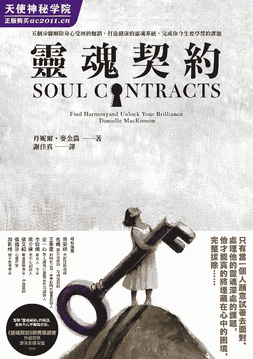

# 作者序  动物们带领我进门

那个周六，我疲惫地走出健身房，心情低落，苦恼着我的小狗狗贝拉生病了，却没人可以找出真正的病因。当我望着停车场找着我的车，突然间看到我的朋友辛蒂。她是随时脸上挂着灿烂笑容的那种人，尽管当时我的意志消沉，却沾染到她的愉悦。这似乎是一个征兆：就在我迫切需要重拾欢颜的时刻，而她出现在我的面前。

我们在停车场闲话家常，我提到自己近日如何的沮丧，我的小狗狗贝拉已经在动物医院度过四个夜晚了。辛蒂了解我爱动物的心。我说着说着抽抽噎噎了起来，她拍拍我的肩膀。一想到狗狗贝拉痛苦地躺在笼子里的模样，我就心疼。冷不防地，辛蒂脸色一亮，她说：「对了！怎麽不带牠去找动物通灵师看看？」

我们都料不到这句话将在我的人生掀起滔天巨浪。从小，我就极度敏感，与动物界有深厚的连结。想当年我曾经告诉母亲，我养的三十二只毛毛虫心里在想些什麽，我都一清二楚。我感觉得到我养的那只天竺鼠的心情。我也知道别人的思绪或感受。我还没走进房间里，就知道待在里面的人心情是喜还是怒。我母亲对直觉、能量、通灵能力，完全一无所知，于是我被贴上「神经过敏」的标签。她带着我四处求医，遍访了心理治疗师等等的各路人马，想帮助我自在地接受自己。

但是，问题不在于我不能坦然地接受「自己」；我是不能坦然地接受这个世界。我的直觉感官接收到丰沛的资讯，却没有倾诉的对象。久而久之，我就以为自己阴阳怪气、异于常人。每次我对通灵或直觉之类的事情展现兴趣，母亲便会架着我往其他方向前进，她自认为这样是在保护我。但是当年我要是正眼看待我敏锐的天赋，说不定我的愁闷反而会一扫而空呢！

因此，当辛蒂推荐我一位宠物通灵师的时候，我彷佛听到了警报解除的声音，总算可以自由探索直觉与通灵感应的世界了。我匆匆地赶回家，立刻预约。

隔天早上，我和我先生凯文忐忑又兴奋地带着狗狗贝拉北上到新罕布夏，抵达一间位于纳舒厄的饭店。凯文陪着郁闷又痛苦的狗狗留在车上，而我差不多是用拔腿狂奔的速度，来到那位宠物通灵师的办公室。当我见到通灵师布鲁斯的时候，我吓到了。他看来非常的正常。倒不是说我认定他一定就要绑头巾、戴一堆戒指、画眼线之类的，但是我以为他的外表总会有哪里有些不一样、或者说另类。这位通灵师看起来就跟常人一样无异样，他就像一位电脑程式设计师、工程师，或资料处理员。

我带着布鲁斯来到停车场时，他请我先一个字都不要透露。我生病的狗宝宝坐在车内一动也不动。我打开车门的时候，牠没有吠叫，没有试图跳下车，也没有哼哼唧唧。牠直视着布鲁斯。一开始，我以为牠那麽沉默、安分是因为病痛的关系，但是直到我看到牠和布鲁斯的互动，才明白不是那麽一回事。

几分钟之后，布鲁斯转头对我说：「牠说牠不舒服。」

「我相信牠一定不舒服。但是牠为什麽不舒服？」

「牠说，牠不舒服是因为你跟你先生最近一直吵架。」布鲁斯停顿了一下，接着说：「你们为了母亲而吵架。」

我错愕到了极点。他说的没错，我们为了何时去探望我婆婆而僵持不下，长达一星期之久。那阵子我们太常出远门了，所以我抵死也不愿意再次离家，但是凯文不这麽想。于是，我们没完没了的争执愈演愈烈，吵到都忘了为何而吵。布鲁斯接着说，我们的口角让狗狗贝拉很焦虑。牠在心烦意乱之下，翻了垃圾桶将三根玉米梗吞吃下肚，但是玉米梗即将排泄出来，不会有大碍。他说了很多事，每件事都深深地震撼了我。我感觉到内心有某个东西正在转变。

截至那一刻为止，我都过着典型企管硕士的生活。我有一份好的行销工作，早上起床就去健身房，白天当专案经理，六点回到家里和先生共进晚餐、看看电视、上床就寝。天天过着千篇一律的生活，我一点都不快乐。每次一走进办公大楼，我的灵魂就死掉了一点点。我先生和我常常说要搬回加州，住在滨海地区，不然就减少工作量，这样我才能偷闲写书，但是这些点子全部都不讨我们的欢心。我们两个都茫茫然。该怎麽做，我们才能幸福呢？或者至少感觉充实一点？

当布鲁斯对我说出「母亲」一词，那就是转捩点。我的灵魂深处一个开关打开了。其实这是一个「路障契约」，路障契约的作用就是绊倒我，好让我返回真正该走的人生道途。（我们在后文会介绍路障契约。）我当下了然于心，在别人的公司担任专案经理不是我该走的路，我应该为人类和动物效劳。我觉悟到专案管理的人生完全不可行。我接受了自己的通灵能力，准备开始大展身手。

随后几周，我去上了动物沟通课。我体验到自己的直觉能力，认真地练习。原来，我的灵通功夫不是盖的！我对整个人生的热血程度上升了。我梦想告别了企业界，去为动物服务；上课没一个月，我便兼差做起动物沟通。但是，我还没准备好彻底舍弃「像样的工作」的安逸感，所以只在傍晚和周末为客户服务。

尽管经营我的新公司很容易，我却不能真心乐在其中。我担心熟人会发现我在忙些什麽。我可是抛弃了主流的价值观，走进高风险的事业；懂我或支持我的人并不多。一想到我母亲不晓得会怎麽说，我就怕得不得了。我发出第一封通知信之后（多达二十二个人的电邮清单！），母亲打电话给我。她说：「丹妮尔，你不会把那玩意儿也寄给别人看吧？」有一位家族成员来参加了一场我的活动，事后他对我说：「小丹，我不晓得该怎麽跟别人说你的职业。」我为了圆梦而采取的每一个行动，都让我渐渐地脱离家人为我规划的人生，也就是做个叱咤商业界的顶尖人物。

果然不出我所料，一开始，新工作一帆风顺。下班回家之后，我便做动物沟通个案。预约的人类和动物客户大部分以电话谘询，没有见面。我将时间花在询问动物是否喜欢牠们的床、是否需要更常去散步、想不想变换菜色、有没有弄伤自己等等。转眼间，动物们开始提一个主题──一个给我的宏大计划。我唯一能做的就是不要抗拒、结束生意、尖叫着逃回白领世界。

第一次发生的时候，我是为一只爱情鸟和牠的人类伙伴汤姆服务。汤姆向我求助是因为他的鸟拉瑞不断地拔自己的羽毛。我按照惯例和拉瑞建立心电感应。我试着用我的标准提问问拉瑞：「你生病了吗？」、「你对什麽东西过敏吗？」、「你对生活环境有不满的地方吗？」起初，拉瑞语焉不详，听得我一头雾水。最后，我（在脑海）听到牠说：「那是因为我和汤姆订了灵魂契约。」当时我不明白牠说的话，但是不久之后有了答案。在后续的其他个案中，其他的动物也和我谈论了牠们与人类伙伴的灵魂契约。这些动物费了一番唇舌，因为我对灵魂契约一无所知；我还以为灵魂契约可能涉及灵魂伴侣。（并没有！）

这些动物告诉我丰沛的资讯。我得知每一只动物在出生前便和他们的人类伙伴订立协议，协助这些人进化。我得知动物会牺牲自己的舒适、安全、身体、福祉，以协助他们的人类伙伴学习灵魂的功课。而知道此事的人类仍然不多。

当时的我想学这些东西吗？我想成为传递这份讯息的使者吗？违逆家人的期许、当起动物沟通师已经让我疲于奔命了，这会儿居然还收到强力的讯息，要我将工作提高一个档次。我怎麽做呢？我拖拖拉拉，哀号埋怨，举棋不定。我不想一马当先，为世人奉上看待世事的新观点。为什麽我不能就只是当一个平凡又普通的动物沟通师就好了呢？

但是动物对我另有打算。有一位女士请我帮助她的吉娃娃赫苏。这只狗狗老是对着厨房的盆栽尿尿，实在非常恼人。尿味、盆栽快枯死了、赫苏似乎缺乏居家训练，这些行为在在令赫苏的两位人类伙伴（夫妻）怒火中烧。

想不到，就是这只六磅重的吉娃娃终于让我接受了我的人生新方向。我和牠建立能量连结，然后我以几个问题开场：「你的膀胱还好吗？」「你知道应该到哪里上厕所吧？」但是赫苏的答覆含糊不清。最后，当我提起厨房的盆栽拿到牠面前，赫苏便和盘托出。牠说牠很清楚到哪里可以上一号、哪里不能，但是牠和牠的人类伙伴订过灵魂契约。牠必须协助她学会照顾自己。然后牠告诉我，只有牠的女性人类伙伴被丈夫殴打的时候，牠才会对着盆栽小解。

我愣住了。想不到我会听到这种答覆，这也不是我想听到的。其实，这些新资讯让我处境尴尬；我不好意思说出我收到的资讯。我问赫苏我该怎麽做。牠要我告诉她，有时候厨房里的能量会变得「猛烈又吵闹」，只有在那种时候，牠才会在不适当的地点撒尿。牠要我告诉她，等她采取行动脱离这种情况、好好的照顾自己，牠就不会继续尿在盆栽上。牠还说，牠尿在盆栽的频率会随着她的进步而下降。我直接引用赫苏的话，而牠的人类伙伴把话听进去了。不只如此，我终于领悟了动物们反覆为我解说的道理。

做完赫苏的个案，我便心悦诚服。动物带领我走上一条出乎意料的道路，放弃我原订计划的时候已经到了。有一小段时间，这条新的路走起来四平八稳。某人会带着狗、猫、天竺鼠或其他动物上门；动物说明自己的困扰跟牠们的人类伙伴之间的关系，以及如何协助他们。我终于开始感到自在了。

但是旅程才刚刚开始！不久之后，我的工作繁忙起来。遍及全美各地的客户来体验我独特的动物连结方式。我感到振奋不已！我喜欢做动物灵魂契约的个案，现在我明白了这是我在人间的人生目的。好不容易走上自己天命的滋味，真是美妙极了。

几个月之后，我发现做动物灵魂契约个案的时候，我很难只为动物工作。例如，有只狗狗告诉我，牠拒绝进食是在映照人类伙伴疏于照顾自己。狗狗请我和牠的人类伙伴谈谈，教导人类伙伴好好的照顾自己，并且找出导致他这种行为的灵魂契约。另一次，我与一匹不肯左转的马连结。牠说，牠是故意害人类伙伴出糗的，因为牠的人类伙伴太在意别人的想法。有了我的帮忙，马儿的人类伙伴便能打破需要外界肯定的灵魂契约。

我觉得晕头转向。我只想守着新的舒适圈，工作的时候，却怎麽做都做不到。后来，有时我开工的时候做的是与动物连结，结束的时候却完全在辅导人类。我处理灵魂契约的经验不断地成长，不久之后，就有人替自己预约，而不请我辅导他们的宠物。我的人类客户饱受灵魂契约造成的障碍所苦，需要化解障碍的直观引导。

我慢慢地接受下一个新方向：为动物和人类解读灵魂契约。目睹了许多客户的成功故事之后，我环顾自助产业，察觉自己已然是灵魂契约领域的一位专家了。我甚至没想过以此为目标！动物们，谢啦！

身为（人类及动物）灵魂契约顾问，我的事业真的开始起飞了。通灵师约翰•何蓝（John Holland）请我为他的狗狗柯达通灵。在这次通灵中，他得知了关于个人的讯息以及他在哪些方面受到阻碍。他佩服到在他的《灵魂传讯人》（Spirit Whisperer）一书中，记述这次的通灵经验。后来，通灵师调查员鲍伯•奥森（Bob Olson）将我列入他的最佳通灵师名单。我开始与世界各地的人类及动物客户合作，将重心放在灵魂契约上，协助客户展现最佳的状态。

自从我将灵魂契约工作当成分内事，我的体验式教育（从做个案中学习）便持续不辍。我在通灵解读里融入了更多关于灵魂契约以及其深层能量的资讯。我由衷地感激狗狗贝拉带给我恍然大悟的一刻，让我找到自己真正的天命，我希望分享这份知识，嘉惠能够从中受益的人。比如，你。

# 简　介   打造健康的灵魂系统   

这世界上，许多看不见、且意识不到的能量，每天都在影响着你。因而让你有特定的举止、特定的思维、对自己抱持着特定的看法，而这些能量就是你的灵魂契约，是你灵魂系统的一部分。这些思想模式、感受、信念蒙蔽了你，阻碍了你发掘自己的本色。因此，你活不出你想要的人生、得不到引颈企盼的感情、找不到你渴求的成功……同时灵魂契约给你一张美丽的详细地图，供你研究如何前往你想去的地方。那些阻挠你如愿以偿的种种障碍，其实为你指出如何重拾自由身的路径。

想像着你开车上高速公路，经过一块「前方道路施工」的警告标志。现在你收到了警告，就能为即将降临的挑战做准备，评估你的选项，做必要的调整。你可以选择绕过施工路段、换一条路走、甚至掉头，往反方向前进。一旦你知道有障碍（以及是什麽障碍），应付起来便轻松许多。

问题是我们可能会误解警告的标志，或者根本没看到。比如，想像你经过那个警告标志时，刚好把头转到其他方向。也许你认为这块警告标志的意思是此路不通，但其实不是。现在很多人看到警告标志，就心想：唉，人生本来就是这样。前面有障碍，我也只能接受现实。人生就是这样，我就是没有那种命。这才是真正的问题。我们开始以为自己残缺不全、动弹不得、不值得、无法被爱。许多人将那些障碍视为自己的一部分，浑然没有自觉地在扯自己的后腿。

除了你，没有人能让你突破障碍。你前方的障碍是为你而存在，准备让你一个人跨越，每个障碍都是你的灵魂需要在这一世学会的功课。我们如何认出这些道路标志，认出来了又该如何解读呢？你可以从认识你的灵魂系统起步。

#### 整顿灵魂系统的益处

本书将这些不同的能量称为：灵魂契约、种子思想、混乱情绪、根源信念系统。这些构成了你的灵魂系统，第一章会提供比较全面的定义。这些能量显化为挑战，形成看不见却铺天盖地的障碍，阻挠你达成目标，或是让你无法克制对自己充满负面观感。这些能量其实是学习人生的课题、达成目标的捷径。但是，首先你得驾驭、并重新校正你的灵魂系统。与其为生活的挫败而心情低落，不如转念：现在你掌握了一条内线情报，明白了是什麽在阻挡你得到幸福、内心宁静和成功。

想也知道，掌控你的灵魂系统可以让你满载而归；然而眼前的功课可能令人怯步，因为你得在能量、心智、情绪、肉体、灵性各个层次下功夫，才能体验到最大的释放和前进的动力。这些能量障碍让你几乎诸事不顺，从剪头发到与你的狗狗和睦相处！同时这些障碍是让你展开惊人转变的关键。我在这份工作中，见识过很多重拾自由的人，终于摆脱了不健康的感情关系、去创业、挺身面对母亲、写书、重返校园、找到一生的挚爱、相信自己、勇于为自己发声、减重、致富、喜爱自己的身体等等。

当你终于接受自己事实上是何等的美丽、完整、纯洁、良善，你将无所不能，不论目前为止你做过什麽决定。当你开始驾驭你的灵魂系统，你会释放那些一再让你落入「各执一词」、「我不行」、「我不知道」的窠臼的限制。你会迈向能量、心灵合一，那是只有美、完美、体验、爱的境界。如此探索自我的成果往往是有形的，说不定你会在四个月内赚到十万美元，或者邂逅真爱。但是也有无形的收获，也许你会前所未有的信任自己，或是和自己建立亲密到不可思议的连结。不论你追求什麽都能如愿，成果十之八九会比你想要的更丰硕。

当你致力于灵魂层次的调校工作，你的恐惧、担忧、挫败及其他剥夺你力量的情绪，都会降到最低，你将体验到无条件的爱、身为人类的美好、属于你本质的光芒。

#### 为什麽别的方法一直行不通

许多自助技巧都化解不了源自灵魂层次的困扰，原因不出以下两种。

第一，这些技巧要求你认定自己残缺不全，再给你「修复」自己的工具。但是这种观点背离真相十万八千里。其实，你是完美的！是灵魂内的能量在干预你，让你展现不出完整无缺的完美，但是本书会帮助你重新找到那份完美。

第二，许多自助技巧要人做表面功夫，只在行为层次努力，不涉及灵魂层次。只在行为层次改变生活的话，创造不出长久前进的动力。由于你只专注在改变行为，你不得不时时刻刻监督自己的一举一动。但是当你改变灵魂层次的能量状态，昔日的挑战将不复存在。毋需反覆确认自己是否坦率吐露心声，或者将自己放在第一位，这些会自然发生。本书协助你深入灵魂的层次，只有在那里才能创造真正的改变。

坊间也有许多宣称可以瞬间为你清除障碍的技术，或是可以立刻改善你人生的新工具。灵魂层次的调校工作不是权宜之计，不讲瞬间见效，也不是让别人给你答案，而是学会你生来就要知道的事，扫除蒙蔽你的一切障碍，让你得以看见、感觉、相信、体验自己真实不虚的完美。

我们天生有自我保护的倾向，因此不愿重温揪心的往事。没人喜欢正视他们藏在内心的痛苦，但是揭开那份痛苦是探索灵魂系统的必经之路。你的旅程会带你抵达前所未有的深度。或许你不会喜欢那些浮现的情绪，但是这麽做的效益，远远超过忍受一时的不适。你不断地逃避的痛苦，就是导致你人生中各种阻碍的祸首。你必须处理那股隐藏的能量才能向前迈进，去体验你个人的万丈光芒。你必须做足内在的功课，才能发掘自己的光。

我听过很多客户描述他们长年累月都在设法跨越他们的障碍，却依然达不到他们要的成果。大部分其他类型的作法与驾驭个人灵魂系统之间的差异，就在于我们会正视自己骇人的那一面。我们不会闪躲。你要相信，当你一步步地整顿你的灵魂契约，你会渐入佳境。你会享受到摆脱牵制你的障碍之后的那种自由痛快。

回顾你之前做过的努力（无论你的表现优或劣），将它视为你现在准备探索自我所需要的根基。以感恩和正向的思维看待昔日的进展。此外，当你认识、并驾驭灵魂系统的各个部分，回顾你以往跟随其他老师、书籍、课程所进行的自我探索，或许你会有更多的收获，或者更能心领神会。

#### 打造健康的灵魂系统的五个步骤

在随后的章节里，我会详细解释这些步骤。我们会在开头的前四章定义灵魂契约（以及灵魂系统的其他部分），建立入门的基础。之后，就进入破解障碍的部分。

##### 步骤一 打地基

在这个步骤，你会学习建立稳固、且清澈的个人能量。当你的灵魂系统逐步恢复健康，你会建立一流的决断力。

##### 步骤二 提高觉知

学习辨识灵魂系统中需要释放的元件，那些剥夺你力量的灵魂契约和障碍。

##### 步骤三 落实灵魂功课

这个步骤就是依据你一路上的领悟做不同的决定，遵循新的模式。

##### 步骤四 驾驭自如

你会在这个步骤看到，当自己落实灵魂功课的时候，持续踏出的每一小步路，已经为你带来全面的成功。

##### 步骤五 释放

最后，你会学到两种释放灵魂契约及种子思想的强效方法。

本书提供了各种练习、工具、范例，确保让你能够顺利执行每一个步骤。记住，要深入探究，别顾着求快。也许你只花了几小时就完成某个步骤，另一个步骤却足足耗了一周或者更久的时间。你在探索一个步骤的时候，做得多彻底、多全面，将影响你在下一个步骤的进展，因此慢慢来！往往你会不自觉地开始做起下一个步骤的功课。这就表示你已准备好了。

#### 本书用语

阅读本书的时候，你手边不需要摆一本字典，但是你最好记住几个用语。例如，你会在全书中不时看到「百分百的圣光」一词。我在工作的时候，是与振动频率最高的能量与存有合作。对我来说，「百分百的圣光」就代表那样的振动频率。我们这个世界有许多不属于百分百圣光的能量。不具备百分百圣光的能量，就不是完全来自本源的能量，无法让你连结至高至善的福祉。只允许百分百的圣光与你合作，便能轻松又有效地禁止对你无益的低频能量接近你。对于不是百分百圣光的能量，你只管将它视为负能量。没有人想要和负能量合作。

也有一些时候，我会建议各位和自己的指导灵团队合作。指导灵团队是宇宙指派给你的一群灵性存有。祂们关注你、保护你、支持你，只要你请求，祂们便为你捎来资讯、指引与协助。指导灵团队的成员清一色是不曾有过肉身的灵性存有，因此里面不会有你过世的亲人。如果指导灵团队的概念抵触你的信仰系统，尽管代换成其他你能接受的用语。例如，也许你想要召唤神、本源、天使。或许你对宇宙的人事组织毫无概念。这样的话，与其召唤你的指导灵团队，不如这个部分你就休息一会儿。

当我提到「宇宙」或「本源」，我的初衷是采用一个能够囊括所有信仰系统的广泛用语。也许各位的信仰系统，包括：上帝、阿拉、天使、女神或指导灵。你想用任何称呼都可以，只要心诚意正，即可探索自己的灵魂课题。看到「宇宙」一词，就表示你可以代换成任何符合你的信仰或你觉得顺眼的名词。

另一个用语是「混乱情绪」，亦即当你跟灵魂断线的时候出现的负面情绪。

本书也会提到「前世」。前世是有趣的主题；每个人采信的说法似乎不尽相同。当我提到前世，我是指「转世轮回」，也就是一个人的灵魂多次转世投胎，以寻求开悟。我有很多不相信前世或转世的客户，但是他们照样能够顺利运作他们的灵魂系统。如果你相信的事物中不包括前世，就跳过涉及前世的段落。

探索灵魂系统唯一的困难点就是，你必须决心投入。一旦开始辨识你的模式，着手消融你淤塞的能量，你就会发现情况开始变得明朗，生活开始顺遂。驾驭灵魂系统是探索自我的旅程。这是一场寻宝之旅，而那一箱黄金就是你内心的万丈光芒与美。现在就以片刻时间立志探索你的灵魂系统，我们上路吧。

#### 操作灵魂系统所需的装备

你不需要多少装备便能展开本书的探索旅程。首先，带着对自己的开放态度到书桌前。满载而归的人，都是愿意接受自己之所以面临难关，或许另有其他原因的人。此外，本书认为你问题百出的责任在于你自己，是你的灵魂层次出了差错。倒不是要你怪罪自己；无论如何，创造这些能量的人是你，既然是你创造的，便受你的宰制（谢天谢地）。

最后，你会想准备一本日志或笔记，记录你执行的每个步骤、以及让灵魂系统回归平衡期间的思维和感受。本书有几个练习会请你写下想法。如果你特地为此准备一本专用的日志或笔记本，做练习的时候会比较容易（也比较保险）。

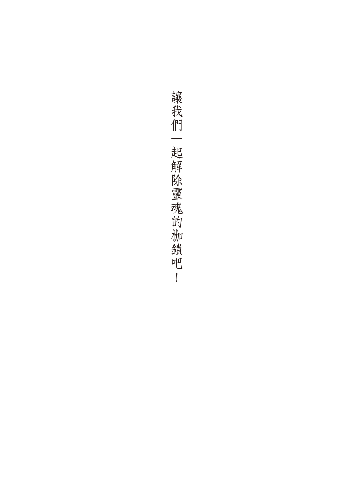

# 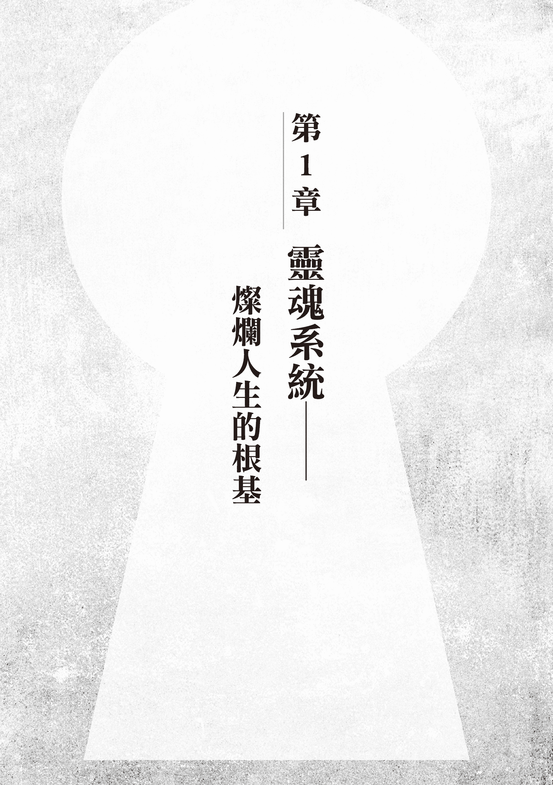

# 第一章　灵魂系统──灿烂人生的根基

灵魂是你内在那股美丽、灿烂且无意识的能量，与你相连却难以名状。我把灵魂想像成一颗金中透银的巨大光球，在每一位人类的核心里熠熠生辉。灵魂系统健康的人，是由灵魂主导你的决定、你对自己的观感、你看待世界的角度。着手进行灵魂工作，便能与灵魂恢复全面连线，发掘自己的光，活出璀灿人生。

与灵魂重新接轨之后，你会明白：

你是安全的。

你值得快乐。

你备受喜爱。

你可以心满意足。

你可以受到生命的激励，过着生气勃勃的生活。

每天起床时你都觉得热爱生命。

你可以丰盛、富裕、受到支援。

你是美好、完整、健康的人。

当灵魂系统不健康，我们会向自己隐暪这些事实，在不知不觉中拒绝让自己得到真正的快乐和成功。健康的灵魂系统有三大部分：

一、你的灵魂。灵魂是你存在的本质，是你置身在人间的根基。

二、你与本源──宇宙的连结。将这个连结的管道清理干净，直觉便会与理智取得完美平衡。

三、一股鲜活的欲望，这股欲望协助你天天看见、感受、听见、呼吸、体验，并知道存在于我们每个人内心的无条件的爱。

构成健康灵魂系统的组件不多，因为它不复杂！在健康的灵魂系统下，取用你内在的光芒是很简单的日常活动。当灵魂系统内出现一个或多个根源信念系统，便会丧失健康。只要灵魂系统内有了根源信念系统，便会堵塞你和灵魂的连结，阻碍你连结自己的璀灿本色。

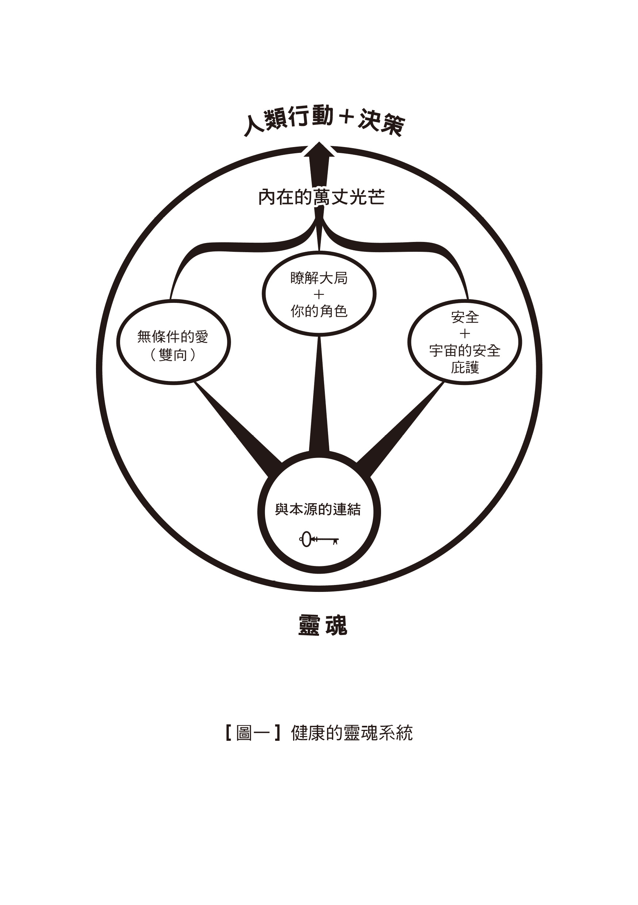

于是，你沦落到汲取你根源信念系统内的虚妄信念。根源信念系统让你难以相信自己的光辉。你必须卸除灵魂系统内的根源信念系统，灵魂系统才能重拾健康。根源信念系统导致不快乐、失败、悲伤、抑郁、愤怒、消极的模式，一再重演。

灵魂系统的妙处之一就是可塑性高，本书正是将这份可塑性纳为已用。爱、恐惧、不安全感等强烈的情感，会在有意或无意间影响你的灵魂系统，但是决定尝试最新流行的减肥法或者戒菸，并不会影响灵魂系统。这些都是在那个当下的表层日常活动，没有触动你的内心深处。因为只发生在表层，不会影响灵魂。

但是我们不时会遇到波折，于是会出现混乱情绪，诸如：恐惧、绝望、渴盼、抑郁，甚至随后衍生出对自己的错误信念，比如：自己不配。这种体验可能会启动内在灵魂层次的改变，你也可能因为觉得那配不上自己璀灿的灵魂本质，于是推这些想法及情绪。这时，最要紧的并不是你实际的遭遇，而是你在那当下如何、为什麽决定推开那些情绪和能量。当你闪躲或是埋藏这些灵魂层次的情绪，你便栽种了一枚种子思想，这也是日后根源信念系统的起源。

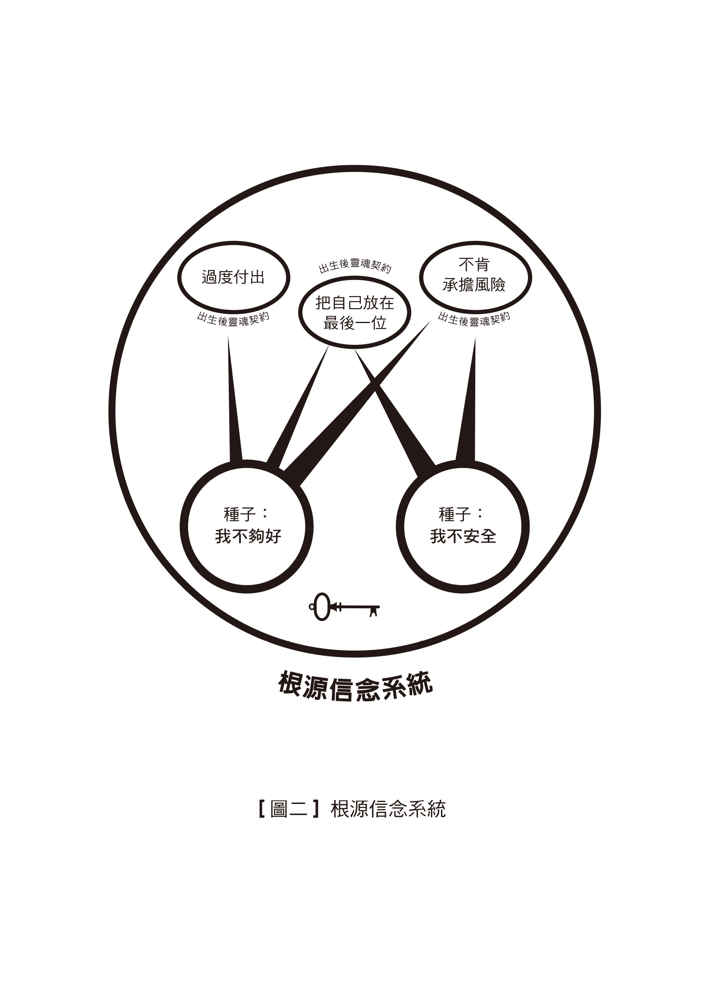

#### 种子思想：锚定灵魂契约的能量

如果要落实我们可以被爱、心满意足、值得美好的事物、由衷感到快乐的观念，我们必须接受自己的光、自己的美、自己的光芒。很多人（其实可以说是：所有的人）都难以接受这个观念。我们常因为某人说了或没说的话、做了或没做的事而伤心。但是我们没有面对伤痛，选择无视或逃避。比如，小时候，你可能听到母亲，说你姐姐是「聪明的孩子」，而说你一辈子都不会有出息。这句话造成了你的痛苦，但是你忽略痛苦，咬牙挺过去，你想继续过你的日子。你没有停下来探究自己的反应，也没管母亲说这种话的真正原因。你压抑了这些负面的感受，不花时间去理解。

当你这麽做的时候，你其实是把那个想法或念头埋进灵魂里，你在创造种子思想。基本上你采信一个关于自己的负面想法（与相关的情绪），然后栽种在内心。多数人相信漠视负面的想法就能消弭它的力量，但真相是它立刻开始化脓。种子思想日渐成长，无疑就会开始左右你的生活、你的决定，以及你如何看待生活，看待自己。这种现象会频频发生，而且极其幽微，以致于我们不会意识到那些旧思维仍然在影响我们。

关于种子思想的运作模式，我们用四岁莎拉的例子来说明。

她父亲因病住院已经两年了。她母亲日夜都在医院照顾他。莎拉年纪够大了，可以明白父亲需要母亲的照顾，但是同时她觉得自己被扔在一边，备受冷落。她对爱的需求没有得到满足。她的反应是觉得自己不好、因为缺乏母亲的关爱而失望，觉得遭到母亲背叛。身为四岁的小朋友，莎拉不能斥责母亲：「你没有照顾自己的孩子！我们也需要爱！你是我们的母亲，你应该在家里陪我们！」

假如莎拉是长大成人才遇到这件事，她的选项会比较多。她可以选择和母亲谈谈，或寻求朋友、情人的情感支援。假如莎拉有这种选择，不是选择无视自己缺乏爱，而是中和它，她在经历这件事之后，只会留下对艰苦日子的记忆，而不是埋藏的负面信念。

身为儿童，莎拉还没有挺身抗议母亲行为的力量、世界观、本事。她接受了母亲的行径，与随之而来的负面情绪（混乱情绪）和想法：被遗弃、愤怒、失望、悲伤、寂寞。为了终止这些不愉快，她捱过这一段日子，莎拉将这些想法和情绪埋进灵魂内，创造了两个种子思想：「我不够好」以及「没人会爱我」。莎拉认为如此便能保护自己，终结思念母亲的痛苦和不愉快。她是对的，暂时是对的。她不会在近期内体验到内心的痛苦，但是在不太久远的未来，这些种子能量便会一而再、再而三地浮现出来。

当莎拉的人生逐渐开展，她会感受到这些种子思想及混乱情绪的效应。假如她在这些事件刚发生时就允许自己抑郁沮丧，日后反而不会那麽痛苦。这是因为种子思想（又称阴影、负面、灵体等等）是振动频率特别负面的强烈能量。

莎拉的种子思想会被发射到她的世界内，并以体验、决定、思维的形式反射回来给她。这些信念具备与这些种子相符的负面振动，最终导致莎拉缔结灵魂契约。莎拉日后的经历也会持续强化她被遗弃、愤怒、失望、寂寞、悲伤的模式，就跟她四岁的时候对母亲的混乱情绪一样。莎拉没学会这些种子蕴含的功课，就永远不能彻底摆脱这个系统的纠缠。

栽种一个种子思想，就如同将一个负面的外来振动，置入一个专门用来绽放内在光芒与璀璨的系统。健康的灵魂系统会散发与灵魂之美共振的频率，不受忧愁、恐惧、怨恨的阻碍。负面阴影并不是灵魂系统内天生自然的元件。每次你栽种一个种子思想，你不仅以负面振动影响灵魂系统，也是在灵魂内留下一个标记，日后你必须回头处理这些东西，才能发掘、并体现你内在的正向心态以及光华。

灵魂系统是你最敏锐的仪器兼盟友。即使是最少量的鲜血，远在三里外的大白鲨便侦测得到，而灵魂系统的敏锐度更是遥遥领先大白鲨。遇到痛苦时，潜意识会想：把它藏起来好了。但是当你埋藏的痛苦进入灵魂，灵魂系统便开始与痛苦同化。这下子，你的言行和思维全都包含种子思想的痛苦振动。例如，如果你埋藏「我不够好」的念头所引发的痛苦，你猜猜会怎样？从那一刻起，你的一举一动都会反映出「我不够好」的振动频率。你不是受它影响，就是做出反应。比如，你和高中男友交往，或许是因为你打从心底认为自己配不上好男人。或者，如果你在对抗自己的种子思想，你选择这位男友，是为了证明自己「配得上」像他那样的人。

这个种子思想钻进你生活的各个层面，糅塑你的个性、择友、影响你的职涯、主宰你的感情。长此以往，你便与灵魂的万丈光芒断绝了连线，转而去相信种子思想的谎言。

埋藏的想法和情绪就像滴落在池塘表面的水滴。每一滴都引发向外扩散的涟漪。种子思想就以这种形式影响你的系统。你听从种子思想也好，抗拒也罢，你的每个选择和行动，都会包含「不够好」和「怕失败」的成分。即使你达成每一个目标、商场或情场得意、得奖，最初的种子思想仍持续引发让你不愉快的感受和想法。脱身之道是走向内心；找出隐匿的痛苦种子能量，从中学习，予以释放。一旦做到，便会开始领略到自己的完美，那个你一直想要、却始终不信自己拥有的完美。

种子思想及其衍生的混乱情绪，就构成挡在你和灵魂之间的能量盾牌。这面盾牌里的种子思想、混乱情绪、灵魂契约愈多，你愈难亲炙灵魂的美。结果你不是透过光芒万丈的灵魂体验人生，感觉快乐、完整、安全、正向，反而隔着这面能量盾牌在过日子。这面盾牌会强化你的恐惧、混乱情绪、对自己的虚假信念。你会觉得负担沉重、不快乐，因为你没有连结到自己的灵魂。

此外，一旦每颗种子植入灵魂，就开始向你的身体、心智、环境传递它的讯息。你心里有数。这种振动极其细微，你不会意识到自己被健康灵魂以外的东西宰制；由于物以类聚，你会有大量重新体验那个种子思想的机会。这枚种子会吸引相符的体验来到你的生活中。

回到莎拉的例子，小时候母亲不在她身边。即使莎拉以为自己克服了自己不如他人的情绪，以为自己不再受苦，她依然受到影响。她体验到吻合种子思想的想法、情绪、事件、人。因此，莎拉仍觉得自己有所不足。即使她在世人面前不但够好，根本是好到了极点，她的种子思想照样让她极难相信自己够好。

莎拉仍不明白自己为何觉得自己不够好。她认为自己令人失望。这些体验持续创造负面的感受，直到有朝一日，莎拉说：「我要不计代价证明自己够棒！」

反覆体验到种子思想的莎拉，就是在这极度挫败的一刻，建构出不健康灵魂系统的下一个元件：灵魂契约。她立下的契约说，她会倾力证明自己值得被爱，不计代价。现在莎拉有一个让她觉得自己不够好的种子思想，外加一份灵魂契约，说她必须证明自己真的够好，不计一切。不难看出，这下子莎拉的麻烦更大了。

所以说，种子思想是被埋进灵魂内、省得必须面对的念头（或者说能量）。这个种子思想在他们的灵魂内振动，开始吸引相符的负面体验、人、事件。一旦这个人受够了这些负面体验，就会为了控制这股负能量而订立条约、誓约、契约、协议，以抵消种子思想。这些就是灵魂契约。

#### 灵魂契约

灵魂契约是机缘成熟的产物，所有的要件必须在恰恰好的时机凑齐。种子思想的能量必须强烈到推动你缔结灵魂契约，而不仅仅只是改变你的行为。如果莎拉曾向朋友诉苦，她便不会陷入消极又绝望的心境，而这正是产生灵魂契约的完美心境。你必须要有极深层的愤怒和挫败，同时至少要有一个潜藏的种子思想，才能订立灵魂契约。毕竟，只有在必须反制种子思想的时候，灵魂契约才有存在的必要。

只有领悟到自己永远做不到灵魂契约的规定，灵魂契约才能解除。这是死路一条的合约：你能采取的最佳行动就是了解当初建立契约的原因。

任何灵魂契约都不能帮助莎拉向自己证明她已经够好了。即使她上哈佛大学、取得企管硕士学位、赚到数百万美元、拥有爱她的丈夫和儿女，她照样永远不相信自己够好，只要她潜藏的种子思想，仍然将这份灵魂契约锚定在她的灵魂内就不行。

她得从另一个方向解决这个问题，也就是了解当初她觉得自己不够好的原因，对症下药。等莎拉终于做到这一点，便能开始释放这项障碍，建立健康的灵魂系统。

正在学习灵魂契约的你，灵魂契约代表有待深入钻研的生命领域：一份需要学习的功课。它指出你内心的哪个部分仍不相信自己的璀璨。它在挥动旗帜，向你指出你和内在光芒的连结是哪里断了线。灵魂契约会以无限多的方式牵制你，教你芒刺在背、阻碍你，激起你的恐惧或自认不如人。

唯一解除痛苦、突破阻碍的方法是，学习你仍然不懂的灵魂功课，得到领悟，然后落实在生命中。这时，你便能迈向幸福、平静、自由、安全庇护、支持、开悟。一旦做到这一点，你会重新连结到你的灵魂、人生目的、热忱。到时你会做到之前看似不可能的事，你终将活出自己身为完美的光之灵的本质。

当灵魂功课被置之不理，灵魂契约会变成更大的阻碍。或许你会一再经历骚乱和痛苦的事件，好吸引你关注某个与灵魂失连的生命领域。这些契约常会引来在你生活中造成乱象、或冲突的人或事件（或是爱与欢笑，视你需要学习的功课而定）。

灵魂契约无所不在，却不着痕迹，直到你知道如何寻找，到时便会昭然若揭。灵魂契约提供深层的指引，暗中逼你采用特定的思维和行为。

很多人自认为看透了灵魂契约，认为这些障碍无法改变。事实上，曾经有许多人请我协助他们接受自己的灵魂契约，放弃去理解、驾驭、释放那些灵魂契约。我做个案的时候，常有人问我能不能立刻卸除他们的灵魂契约，不愿做足基本功，辨识引发现况的种子思想。我会告诉他们，他们当初必然有建立灵魂契约的原因，因此必须学会相关的课题，才能恢复自由。

灵魂契约是进入你内心的特别通道。当你明白这些契约的用意，灵魂契约便能引导你，在生活中拥有一切你想要的宁静、幸福、丰足、自由、热情。

#### 根源信念系统

多年前，我的灵魂契约工作刚起步时，我协助客户发掘阻碍他们前进的主要契约。我们的合作从各种角度切入某一份契约，直到释放契约为止。几个月之后，客户会回来找我，说：「我又卡住了。」我大惑不解。我探究问题的症结，发现一件事：种子思想的重要性不亚于灵魂契约，只有了解这些构成要件如何结合成一个特定的根源信念系统，这样每个致力破解灵魂契约的人才能大获全胜。

建立灵魂契约的时候，你不知道自己出此下策是为了避免体验到种子思想。你以为自己不过是尽力让自己舒服一点。由于大家没有察觉自己的种子思想，看不出建立灵魂契约的问题在于，它其实无法达成你的目标，因为它不会根除种子，只是暂时遮掩。灵魂契约让你觉得自己好歹有一些控制权，只要你做了这个或达成那个，或避免自己有这种或那种感受，你就会平安无事。

当大家发现第一份灵魂契约不能带来他们想要的结果，多数人会怎麽做呢？他们会订立更多的灵魂契约，一切只为阻止一个种子思想浮现在他们的生活中。种子思想会触发几种混乱情绪，当你针对同一个种子思想建立好几份灵魂契约，你便建立了一个强大的根源信念系统。（幸好，这股力量充满谬误，因为是建立在错误的信念之上）如果要重获自由，就得解决根源信念系统的每个组成元件（种子思想、灵魂契约、混乱情绪）。别担心──你将会学到解决之道。没那麽难！

灵魂系统工作可能让你一个头两个大，但是随着你愈清愈深，直觉也会从旁协助。当你处理一个部分，根源信念系统的其余部分便会浮现、挪移。万一你挖出不只一个根源信念系统，那不代表你比只有一个根源信念系统的人差劲。你不是残破不堪，谁都不会是残破的。你只是曾经决定隐藏自己的美、信念、璀璨，不让自己看见，但是这些东西都完好如初。终于你走上解除封锁的道路。

不健康的灵魂系统会有一个或多个根源信念系统（见下页图三）。每个根源信念系统都会阻碍你连结自己的灵魂，让你相信唯有遵从根源信念系统的指挥，心情才会舒坦一些或成功。同样地，想像根源信念系统是挡在你和灵魂之间的防护罩。当你经历一件事，你不采取灵魂的观点，却听从根源信念系统的话。

失衡的信念系统告诉你：

「你不安全，别那样做。」

「等一下！你不够厉害，你做不到！」

你会在本书学到如何剖析你的根源信念系统，掌握你需要学习的功课，落实你的新知识，释放你的旧系统。我们的目标是协助你汲取自己内在的光华。

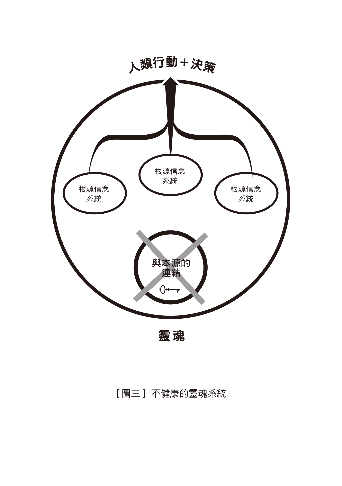

有时，构成灵魂系统的元件很小，不必闹到鸡飞狗跳，就够你学习该做的功课了。但是万一你没学会，根源信念系统便会膨胀，灵魂契约随之扩大，障碍也更巨大。这是为了逼你开始与灵魂系统合作。

当你精通了根源信念系统的各个元件，你的新知识会对整个系统带来不同的影响。你每释放一个障碍，都会召来正向的转变。一旦卸除整个根源信念系统，你就能看见自己实实在在是怎样的人，以及你因为这些根源信念而质疑的内在光华。最后，唯一重要的信念系统就是来自灵魂的信念系统，这个系统会告诉你，你、每个人、万事万物都是完美、耀眼、安全、完整的。

#### 灵魂目标与灵魂契约

灵魂目标不属于你的灵魂系统，也不是灵魂契约。我们来谈谈两者的差异。

每个人都有出生前计划，明订这一生应该完成的事务。出生前计划和灵魂契约不同。灵魂目标是你对人类意识的主要贡献。这可能是教导别人慈悲一点、为不幸的人服务、创造伟大的艺术，以某些方式担任榜样。

你在出生前便将灵魂目标灌注到你的本质之中，你没有踏上实现灵魂目标的道途，便会觉得自己不完整。一旦你开始追求灵魂目标，别人便会注意到你。当你遇到具备特殊的天赋或天生的才能的人，你便看到了他们的灵魂目标。

至于灵魂契约，则与你的灵魂要在今生学习的功课有关，以促进你的灵性成长。这些灵魂契约可能在今生、前世，甚至出生前拟订。灵魂契约的整体作用是提供你驾驭相应的功课；灵魂目标的重点则是提供你对准目标，接受灵魂目标的指引。

每个人一生中都有许多灵魂契约，从这些契约的学习能帮助你贴近灵魂目标。通常，一个人至少有一个阻碍自己发掘灵魂目标的灵魂契约（诸如「避免风险」或「在人生中当隐形人」）。

如果你想知道自己的灵魂目标，亦即能让你衷心喜悦的那件事，那就建立健康的灵魂系统吧。你的灵魂目标和灵魂系统将会相辅相成，水乳交融！人人都想知道自己的灵魂目标，如果你不相信自己有聪明的脑袋，看不出来自己很成功，不认为自己值得被爱，你就不可能发现灵魂的目标。

每个人的灵魂目标都是宏伟计划的一环，你得先有健康的灵魂系统，才能实现灵魂目标。现在就让我们让你的灵魂系统恢复健康，你可以开始从中受益了！

# 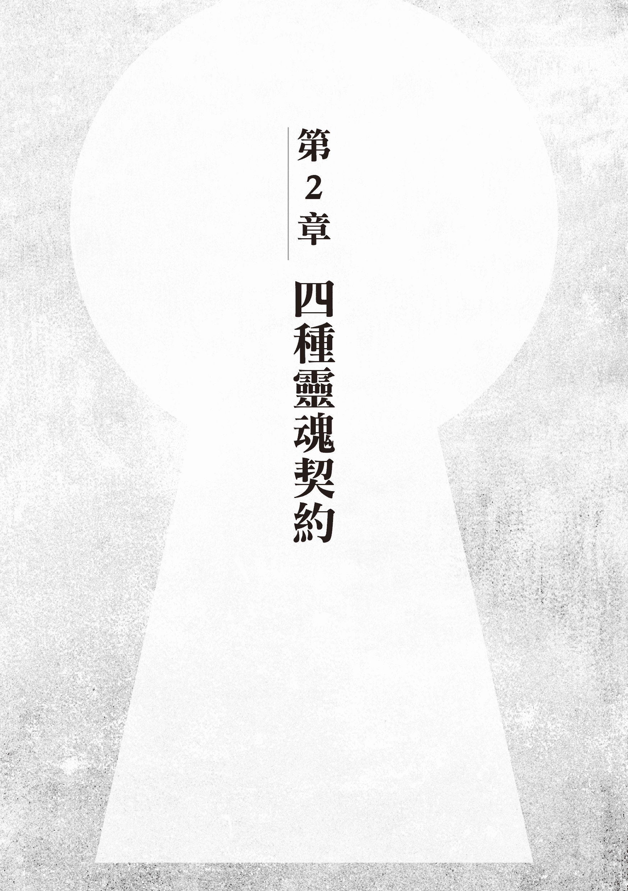

# 第二章　四种灵魂契约

灵魂契约分成两大类：「出生后灵魂契约」（包含：前世及今生），以及「出生前灵魂契约」（包含：关系灵魂契约、动物灵魂契约、路障灵魂契约）。本书我们聚焦在「出生后灵魂契约」，但是认识另外三类契约也很重要，这些契约在你的根源信念系统扮演着次要角色。本书不直接探讨这些契约，但是了解这些契约如何提供你灵魂课题的线索，你将如虎添翼。

#### 出生前灵魂契约

出生前灵魂契约建立在灵魂不死的概念上。灵魂在多生累世及本源之间往返，永不停歇。很多人将灵魂的往返称为转世。出生前是指在两辈子之间，灵魂尚未进入下一次转世的时候。出生前灵魂契约就是在这个期间订立的。

当灵魂处于出生前、两辈子之间的状态，振动的频率最高。那是纯净、慈爱、连结完全畅通的状态。每个灵魂都以各自的速度，致力于不断地提升自己，直到与本源重新合为一体。我们在世的时候愈是去琢磨内在的心性，就愈能连结到灵魂在两世之间的光芒。

出生前灵魂契约是两个处于出生前状态的灵魂所订立的协议。由于出生前状态下振动的频率最高，在这个时期订立的一切协议都为了成就灵魂的至善。你的灵魂非常清楚，你在接下来这一世要学习的灵魂功课。假如前辈子你在过世时仍有好几份灵魂契约，那麽下一世你的灵魂会知道自己必须处理这些契约，也清楚你在了解宇宙与开悟方面已经存有的成绩。

情况是这样的，你的灵魂去找另一位灵魂说：「嗨，约翰。我想在下辈子学习相信自己。你愿意帮忙吗？」

约翰的灵魂说：「好啊，梅丽莎。我下辈子想学习独立一点。你能帮我吗？」

两位灵魂之间的协议就成为一份契约。到了他们人生的某个时候，梅丽莎和约翰会相遇，开始互相帮忙。

对，你没看错，其他灵魂会刻意进入你的生命，协助你学会你的灵魂功课，让你的振动频率往开悟移动。包括了：抢夺你的功劳、把你气得半死的上司；宣称每分每秒都在照顾你、实际上在你三岁时就抛弃你的母亲；还有主动帮你把你购买的商品提到你车上的店员。这些全是契约。

出生前灵魂契约是振动频率最高的能量协议。它唯一的目的就是协助灵魂进化，破解始终有学习障碍的功课，向开悟前进。这是我们要理解、精通、落实在生命中的契约；我们将从中进化，活出多彩多姿的人生。

很多人不喜欢人生早有定数的概念，认为出生前灵魂契约剥夺了自由意志。但是自由意志对出生前灵魂契约极为重要，一旦落实，更关系到灵魂能不能快速、且轻松地驾驭灵魂契约。尽管灵魂功课是事前安排的，并没有设定你要走哪一条路才能完成功课。两位灵魂如何订立、并圆满一份灵魂契约，也不是预先决定的，而是依据各自的自由意志。延续前例，或许约翰的灵魂会藉由成为梅丽莎的情人来协助她，也有可能以担任员工的形式履行他的灵魂契约。协议中唯一预先决定的部分是，这两个灵魂会相遇，而他们互动的模式会在不知不觉间，协助彼此修习各自的灵魂功课。

你的灵魂与其他灵魂订立了无数的出生前灵魂契约。当你邂逅某人并感受到一种「悸动」，契约便启动了。当然，不是每个相遇的人都会给你那种感受，因为每一份出生前灵魂契约都不同。如果你将生命中遇到的每个人都视为你的老师，这位老师会教导你某些事，你便上道了。如果哪位「老师」抢走你工作上的功劳，或是跟你男友调情，或许你就很难把他们当做老师。

看得出来，任何一份灵魂契约都能帮助你在许多层次上进化，连你不知情的契约也是。

#### 关系灵魂契约

关系灵魂契约属于出生前灵魂契约。你和每一位你接触过的人都订立过关系灵魂契约。包括：你的家人、你的幼儿园老师，还有你开车上高速公路时向你竖中指的汽车驾驶。当然，有些关系契约在你的人生中分量比其他关系契约来得重要。

关系灵魂契约是以灵魂想在这一世修习的课题为基础。每一份人际互动都有必须学习的内容。例如，或许你和母亲订过一份契约，她要协助你认识自己的内在美，或许她的做法是贬抑你，或许是让自己美丽非凡。如果你愿意想一想每份人际关系，不论它们多麽重要或微不足道，都能指引你迈向灵魂的内在光芒，你便明了了关系灵魂契约的力量。

一段关系的现状并不会影响彼此之间是否有签下关系灵魂契约。如同前述，你和所有接触过的人都订过灵魂契约。这个人可以是你日常生活的一部分，可以是只有一面之缘的人，甚至是你在电视上看见的人。

出人意料的是，你学会一份关系灵魂契约的课题与另一方毫不相干。你的课题是为你量身打造的。也许等你学到教训，便不再需要这位老师。不只如此，对方未必要从你身上学会他们的功课，也能圆满一份关系灵魂契约。重点是你们给予彼此学习灵魂功课的机会。

驾驭一段关系并不保证你们会以伴侣、朋友或其他形式继续往来。整顿灵魂系统并不容易。一想到，如果自己有了健康的行为、开始相信自己、得到成功，或许你新的生活形态就容不下某人的存在，实在教人开心不起来，但这是事实。当你领悟了每一份人际关系灵魂契约的教诲，你就会了解并不是每个人都会退出你的生命，但是离开的人会很多。

假如朋友、亲人、同事等等各路人马，因为不能接受焕然一新的你而离开你的生命，从长远的角度来看，其实符合每一个人至高至善的福祉。但是一开始，那可能教人痛彻心扉。请不妨这样想：因为你整顿了灵魂系统，而离开你的每一个人都腾出了空间，让符合你新的振动频动的人能够进来。

做关系灵魂契约的功课常常会强化关系。我见过很多人终于明白了伴侣是来教导他们以后，将不健康的关系转化为天长地久的亲密感情。他们学会允许灵魂功课引导他们在这段关系中的行为。关系灵魂契约并不会让双方长长久久，但是有些人会建立刻骨铭心的关系。

驾驭关系灵魂契约基本上是个人的事。另一位灵魂也会得到学习的机会，但是这不保证你的伙伴能够融会贯通。有时你的学习过程会在关系结束之后持续几年，甚至数十年、几生几世。

在你准备好处理人际关系中的课题之前，关系契约会挥之不去、并且腐败化脓。很多人为了逃避深度的心灵课题，又加码签下了其他出生后灵魂契约，结果让雪球愈滚愈大。

#### 动物灵魂契约

动物灵魂契约是第二种出生前灵魂契约。类似关系灵魂契约，不过是人类灵魂和动物灵魂订立的契约。与关系灵魂契约不同的是，动物灵魂对于自己提供的协助，并不要求回报。

动物不像人类，牠们已精通无条件的爱。动物不会因为自己太凶、太胖或不够聪明而苦恼。他们不会因为信仰系统不同而互相伤害。就是因为这样，拯救动物对人类来说是很有意义的体验，动物奉献爱心的能力是人类无从领略的。动物灵魂来到地球上，是为了协助人类发掘如何向无条件的爱进化。

当你开始做动物灵魂契约的功课，学会了宠物指导你学习的课题，你的宠物可以从你那里得到两种回馈。一种是你直接为宠物建立更良好的生活环境，另一种是你提高了能量振动频率，对人类意识的整体振动频率带来正向的影响。动物和你合作，追求这两种结果的任何一种。

这也表示许多动物不惜牺牲自己的身体健康、心理安康，来帮助人类学习。有监于世界各地虐待动物的事件频传，我们该学习的还多着呢。当人类学会了动物努力教导我们的功课，我们每一次的轮回转世，都会与地球万物和睦共处。每一份动物灵魂契约的目标，都是协助你和全体人类重新发掘内在的光芒。

#### 路障契约

路障契约是第三种出生前灵魂契约。这些是你的灵魂在出生前所签下的契约，作用就像某种替代方案。在每一世开始之前，你的灵魂很清楚你必须学习哪些灵魂功课，才能进入纯粹、无条件的爱的境界。灵魂也知道开悟之路充满了动荡不安、抗拒和自由意志；有时，有必要提供额外的援助。只有在你闪避某个特定课题的时候，路障契约才会出现在你的生命中。

例如，也许照顾病弱的母亲，让你忘了自己也有个人需求。或许路障契约会以疾病的形式来到你的生命，逼你照顾自己的身体。很多人误解路障契约的本质，称它为「天谴」。

有人说，路障契约跟自己的尘世旅程毫不相干，只是巧合，这是不精准的说法。路障契约并非许多身历其境的人所说的，随机的负面事件。

路障契约以各种形式出现在我们的生命中。可能是偷腥的配偶、一张中奖彩券，甚至是严重的疾病。路障契约的目的是，强迫你重新评估自己在某个生命领域的作为，让陷进水深火热的你跌落谷底，最终愿意改变作风。痛苦到一定程度之后，多数人都会做出决定，去学习出生后灵魂契约的相关灵魂功课。

例如，我拖拖拉拉了好几年，都无法决心告别白领世界，成为全职的直观式通灵师（intuitive）。最后，就在我们夫妻买下昂贵大宅当作新家的那一天，我被解雇了。对我来说，这是终极的路障契约。失去全职工作的生活比较捉襟见肘，但是感觉上这两件事在同一天发生必然有其原因。

我认为那是灵魂推了我一把，催促我去履行我的天生使命。那并不是一件容易的事，但是因为这个路障，我知道这麽做是对的。

你不一定要听从路障契约的指示。灵魂将路障视为协助你与灵魂课题接轨的机会。万一你没察觉到某个生活经历实际上是路障，你也不会受到审判。尽管遇到路障似乎很倒楣，路障的目的其实是在帮忙你。但是你得超然于物外，找出路障传递给你的讯息。

万一你误解了，别担心！你八成还会有其他的机会，只是你要知道下一个路障或许会变得更大。迟早路障会让你痛苦到采取行动，回归正轨！

你未必喜欢路障契约带给你的学习历程，但是跟收获相比，你吃的苦根本小巫见大巫。路障不会让你走错路，还能带你避开未来路途上的麻烦。据此，生活中的大小事都有更宏大的目的存在：帮助你精通一个课题。路障契约以极为深刻的方式，连结到一个更大的灵魂课题。

#### 出生后灵魂契约

既然本书是以出生后灵魂契约为主，当我提到「灵魂契约」，指的就是「出生后灵魂契约」。至于其他类型的灵魂契约，则会标注全名。

只有出生后灵魂契约不是在灵魂进入新身体前签下，而是在人诞生以后，因为反覆经历特定的种子思想而签下的契约。例如，也许你在四岁的时候植入一个种子思想。这个种子思想让你缺乏安全感；当你渐渐地长大，总是缺乏安全感，觉得不受保护，而倍受煎熬。最后，为了反制这些经验，你签下一份出生后灵魂契约。你决定封闭自我，将别人关在心房外，省得再为脆弱易感而惴惴不安。

当你意识到出生后灵魂契约的存在，开始做功课，出生后灵魂契约便协助你学会一个灵魂课题，摆脱破坏性的旧模式。这些契约也能教导你，如何开始学习你的关系灵魂契约。

例如，一旦你掌握了关于自尊的出生后灵魂契约，就能建立新的自我价值信念，将它应用在你和丈夫的人际关系灵魂契约中；而你的丈夫也在协助你学习相同的课题。也因此，出生后灵魂契约是本书着墨最多的焦点，因为这些契约能帮助你修练关系灵魂契约。

出生后灵魂契约是以挑战、阻碍或不适的形式出现。让你觉得遇到挑战，是这类契约最普遍的形式，因为我们面临棘手的状况，学习效果往往最好。

由衷喜乐、满足的人，早上起床可不会出现：「我生活里的每件事都太美满了。我要改变现状！」我们会拖到受不了现状的时候才愿意改变。灵魂契约自然有办法让你觉得走投无路，只好大刀阔斧地改变自己的观点，以及人生选择。

练习　找出你的障碍

现在你知道各种灵魂契约的细节，你明白这些契约会显化为生活中的障碍，比种子思想容易辨识，种子思想是在我们对自己抱持负面的信念、又视若无睹的时候出现的东西。要找出这些障碍，最简单的做法就是检视你觉得滞塞不前的领域。

例如，你在职场上总是无法升职。你一再重复恼人模式的地方，就是契约所在之处。例如，你交往的对象只爱你的财富。你从目前读到的内容，应该很清楚自己主要的障碍在哪里。

现在该是界定障碍的时候了。既然你从前文看到这里，大概知道自己有哪些挑战：爱情、财务、敞开心胸、成功等等。这项作业就要善用你的领悟。假如你还没有灵光一闪的领悟，一样可以做这个练习！其实，做这项作业说不定能带给你灵感。

先列出你觉得棘手的领域。寻找你生命中反覆重演的模式。

你很难接受别人的赞美吗？

你收入优渥，却总是在薪资入帐后立刻花光？

你为了追求成功总把自己逼得很紧，以致于疲累不堪？

不要批判自己，全部写下来。

有些人擅长自我觉察，三两下便能列完清单，一眼就揪出人生中的模式。但是那种人寥寥无几。多数人会卡住。写这份作业的时候，别担心会漏列哪个障碍，也不用拚命做到完美。完成这项练习的方法很多。

首先，检视你的人际互动。很多人在检视人际关系的时候，意外地发现了自己的负面模式。例如：

男友是否没有善待你，导致你们合不来？

你上司是否不认可你的工作表现，让你恨得牙痒痒的？

你有一个不分昼夜打电话来诉苦的朋友，你又想不出理由不接电话？

写下每个让你倍感压力的人。

接着，看看你能不能归纳出反覆出现的模式。历届的男友都不尊重你吗？历任上司（同事）总是漠视你的才能？或者简单一点，直接列出和你关系紧绷的人，写出你们之间的情况。我以洁芮为例。她的情路坎坷，所以她以大纲式要点的方式，罗列出往日恋情的典型问题。她的清单类似这样：

*   跟拉瑞约会。一开始他对我很体贴，后来他常以工作为重，没空陪我。
*   和约翰交往三年。他不太会沟通。我得缠着他问个不停，才能挖出他到底在想些什麽。
*   跟乔治交往三个月。起初他很健谈，后来就觉得他在躲我。

接下来，洁芮要从大纲式的清单找出共通的主题──以此例来说，就是感情关系的模式。三位男士都没有提供洁芮想要的时间、关爱、注意力，和支持。另一条线索是洁芮总是选择留下，希望藉此感情会有所起色。

从你最困扰的两、三个领域开始练习，辨识灵魂契约如何显化在你的生命中。不用担心这些障碍该如何分类。这项练习只要你思考自己一再重演的负面模式。做练习的时候，渐渐地你会觉察到自己需要下功夫的生活领域。

# 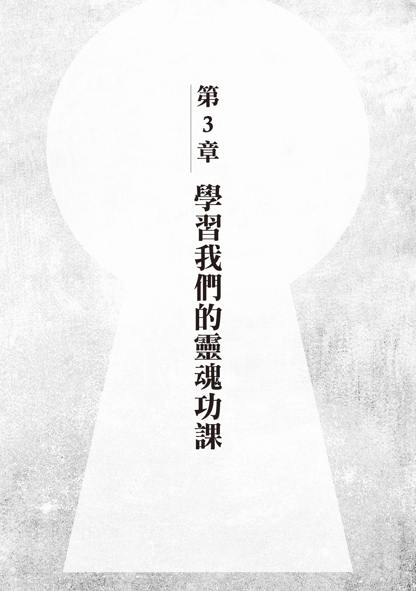

# 第三章　学习我们的灵魂功课

让灵魂系统脱胎换骨不是一朝一夕就能完工的。不是只要说一声：「宇宙！我释放一切的阻碍！」就能等着看你的关卡统统神奇地消失。你的分内事是尽力多多疏通阻塞的能量，理解当初能量凝滞的原因，融会贯通你的灵魂功课。一旦你彻底学会你的功课，阻碍便会消融。

在理智上知道自己陷入不健康的模式、明白自己得运用某些步骤来释放模式，和你真的付诸行动是两回事。也就是在理智上领悟一个课题，与将领悟落实到生活中的差异。解释这项差异的一个绝佳例子就是，知道自己应该戒菸和终于把菸戒掉。

灵魂契约会让你某个生命领域艰难到你必须改变行为。你终于举手投降，你跌落谷底，进入别无选择的情绪空间。每个人的谷底都不同。这个男人的谷底也许是面临失去住处的危机；那个女生的谷底也许是成绩单上的分数不及格。

当你的前景黑暗到你愿意做任何事，来改变情况，甚至是那种你一直以来都拒做的事，那麽你便是在谷底了。这表示你终于敞开心扉，处理并驾驭与生命领域相关的契约。

我的客户克丽丝汀的谷底经验很有意思。她发现有一份灵魂契约告诉她，避免心碎的唯一方法是自我封闭，不对任何男性动情。她这辈子邂逅的男性总是对她不忠，老是欺瞒她，造成她不安的种子思想。结果，她签下了灵魂契约，谢绝爱情。到了克丽丝汀四十岁的时候，害怕被男性欺骗的恐惧已经主宰她与任何男性的关系，不论这位男性是她的同事、家人，或者彼此暧昧的男人。她持续邂逅看起来人很好的男性；但是她认定不能信任他们。

克丽丝汀来找我之前不久，她（二度）解除婚约。她的理由是未婚夫工作时间太长，所以不能信任他。她伤心欲绝，却认为终止这段感情是避免日后心碎的唯一办法。她的朋友都不认同她的决定。几位亲密的女性朋友弃她而去，因为她们不懂她怎麽能抛弃一位显然全心全意爱她的人。

当克丽丝汀来找我时，她已跌落谷底。失去友情和爱情的她，明白自己必须改变，才能学会在感情生活中信赖对方。对克丽丝汀来说，跌落谷底是生命的凄惨时光，也正是在这一刻，她终于开始整顿灵魂系统，重新连结她的光芒。

如果你漠视谷底提供的改变机会，你承受的压力只会节节上升。如果你仍有宣告「现在还不要」的力气，你就还没到谷底。你会经历一个又一个艰难的机会，直到你终于愿意做出重大改变。善用在谷底的时光，并不是只要辨识眼前的挑战、了解你不愿意维持现状、不想继续不开心就够了，这些想法是你一步步爬下谷底的梯子。不管你明不明白是什麽绊住了你的人生，在你愿意采取行动之前，你就还没到谷底，因此那些临时凑合的改变不能长久维持。

我们知道自己不该老是选择某一型的男友、结交对我们无益的损友、只为了（一份无法给予我们丰足生活的）薪水而接受一份工作，但是我们照样做出这些决定，并期待这次的结果会和上次不同。这些模式可以在我们陷落谷底的时候破解，在那之前，我们还没把自己逼进真的洗心革面的境地。

灵魂契约不是用来扯自己后腿的恐怖负面协议，而是协助我们驾驭棘手课题的能量。从某些角度来看，这些契约协助我们提早登上山巅。我们还是要爬上山路，但是山势没那麽陡了，而且还有灵魂契约的绳索和鞋子助我们一臂之力。

在克丽丝汀的例子中，本该让她免于心碎的灵魂契约有更大的目的，就是协助她辨识她的种子思想：「我不安全。」进行灵魂系统工作的时候，她明白了自己想要敞开心胸，接受真正的亲密关系，而她有一个不能信任男性的顽强信念。

当她驾驭了自己的灵魂系统，她改变自己对感情的态度，因为她已转化了自己的信念。失去心爱的男子及三位挚友的谷底经验，让她觉悟到自己唯一的选择就是尝试新做法。

习题　谷底

你大概察觉到自己有过多次跌落谷底的经验。列举这些谷底时光有助于你进一步认识自己，这可能是你整顿灵魂系统的成功关键。以二十分钟的时间写下你跌落谷底的人生时刻。记住：如果你没有洗心革面，就不算谷底。如果你的处境让你明白自己「应该」改变，只要你没有实际行动，就不是谷底时刻。

往日的成功可以带给你挑战目前契约的勇气、经验和洞见。撰写清单时，问自己：当时发生了什麽事？是什麽事件或经历推了我一把，让我做出改变？既然每个人都有许多种子、契约、课题，你大概可以从往昔的人生找出几段谷底经验，辨识你如何把握谷底提供的转机，而做出改变。

找不出相关经验的话，就用几分钟写下往日你以为自己陷落谷底的体验，你尝试改变做法最后又故态复萌。这样检视你的经历，可以协助你了解自己的做法，以及你空有理智上的理解却无力实践的频率有多高。这个练习可以让你检视往日的成功经验，奠定前进的基础。

每一份契约都蕴含一个有待学习的课题，无法一口气统统解决。我们从生命历练学会的课题，给了我们独一无二的观点、智慧和专才。要是不等机缘成熟便铲除一个课题，眼前的冲突或许会缓解，但是以长远来看则毫无益处。你会错失重新发掘自己的光芒、相信自己的内在美、感受宇宙安全庇护的机会。

不只如此，你的种种关卡迟早会全力反扑。所以我们是从显眼的灵魂契约障碍及其潜藏的种子思想、混乱情绪下手，进而释放我们的阻碍。否则，你将无法从灵魂层次释放问题，你的难题必然会持续困扰你。

我做个案的时候，客户常说：「以前我很在意自己单身，现在不会了。我还满乐在其中的。」或者「以前我总是为别人牺牲自己，现在我不做那种事了。」他们会告诉我，由于他们改变选择，准备好释放灵魂契约。但是事情不是这样运作的。仅仅了解一个有问题的行为、信念、想法、模式是不够的，你得明白它之所以存在的根源。

请把它想成是一个装了水和沙的罐子。罐底那一层坚硬的沉淀物代表你的契约。假以时日，沙子和罐底的界线会变得难以区分。要移动堆积的沉淀物，你得使劲地摇晃罐子。当沉淀物松脱、混入水中，你就能打开盖子，滤除你不要的部分。观察你生命中的契约，理解并采取行动，就是大力地摇晃罐子、并过滤那些沉重的沉淀物。

如何从灵魂释放那些契约呢？

是不是宣告你受够了就能解除？

是不是得清掉一切，从零开始？

多数人一旦明白自己有什麽无形的障碍，都想立刻排除障碍，只要过程不会太痛苦的话。他们试图改变灵魂契约导致的习惯。但是想要真正驾驭一份灵魂契约、创造你寻求的灵魂层次的转变，就得改变生命的某些层面，发掘是什麽在驱动你的契约，采取恒久的步骤改变现况。成果是什麽呢？就是终生有效的大跃进。

我的客户安卓丽雅情路多舛。她选择的男人每次都不是好对象。她把每个交往对象都视为一个专案。在她的感情生活中，她主掌大局，教导男友如何应对进退、整顿生活、培养成熟的友谊。她甚至调教他们礼仪。安卓丽雅在工作上也霸气十足，极为成功。她工作的业务部门同仁大部分是男性，她必须强势且独立（到跋扈的程度）才能成功。她以强悍、颐指气使的性情自豪，因为这种性格让她在职场上春风得意，她认为这是她最优秀的人格之一。

安卓丽雅和我第一次对谈的时候，她显然乐于在所有的人际关系操控局面；主导一切似乎是达成目标的最佳手段。驾驭全局也是让她事业成功的工作策略。她想要一个能在情感上、实质上、心理上支持她的男人，而她选择的对象却做不到这些。独立自主是阻碍她的灵魂契约之一。

当我告诉她这些，她防卫心很重地说：「那我们解除感情生活中的这个部分，但是我在工作和其他领域还是得独当一面才行。」她在理智上能够理解操控爱情关系对她无益，却想不通为什麽对其他生活领域不是有利无弊。一份灵魂契约会影响一个人的全部生活，但是可能只在一个领域引发压力、构成困扰。

例如，在安卓丽雅的部门中，很多同事会怕她。她发现自己多少受到排挤，同时又让她可以迅速完成工作。除非安卓丽雅能觉悟到自己追求的是平衡，并领悟到这份灵魂契约实际上的目的，否则就摆脱不了她渴望终结的障碍。

如果安卓丽雅想要敞开胸怀，迎接她想要的爱情，就得处理她独立自主的课题。一开始，她的恐惧让她拒绝改变。她担心如此一来就必须改变工作风格，一旦终结这份灵魂契约、铲除潜藏的种子思想，她就不能是独当一面的成功人士。

释放契约和种子不见得会造成非黑即白的局面。当安卓丽雅驾驭她的灵魂系统，她释放了这个障碍。她并没有因此而无力照顾自己或无法在商场上叱咤风云，但是她做的决定不再是受到负能量的驱使。她在公司依然积极进取，允许一些同事给她建言。她甚至请一位专案经理协助她执行一个特别困难的专案。

果断、干劲十足都是很棒的优点，但前提是这些风格是来自接受自己，是内心安定的稳健行为。安卓丽雅现在的作风仍然和她整顿灵魂系统之前类似，但是驱动她的动力改变了。她不再需要藉由操控别人来建立安全感，她懂得享受偶尔独自完成事情的生活。

许多人反反覆覆几生几世都在修习他们的根源信念系统。灵魂契约、混乱情绪、种子思想、甚至根源信念系统都会向你隐匿踪迹，直到你终于准备好处理为止。我很多客户都不知道自己碰上的种种阻碍，源自他们早年（甚至是前世）所做的决定。至于解决办法，则视契约、相关人物、相关事件而定。

以下是一些人在做完灵魂工作之后，体验到的：

*   一位女性破解自己的小围墙灵魂契约（杜绝别人向她示好的契约），释放「我不够好」的种子思想，终于明白她一直将别人（特别是男性）关在心门外，藉此保护自己。结果呢？她邂逅一位男士，这位男士协助她呵护她刚萌芽的崭新自我信念，现在他们婚姻美满。这位女性在伴侣身上找到无条件的爱，因为她学会爱自己，这可是很多人做不到的事。
*   一位男士终于自己创业了，年收入突破百万美元，就因为他释放了「我不够好」的种子思想，以及「失败」的灵魂契约。
*   一位女性释放了「我不安全」、「无人支持」、「不被保护」的种子思想，以及「隐形人」灵魂契约，她将幼年遭到性侵的往事集结成书出版。
*   一位男性释放了「我不是好人」的种子思想，以及「除了我以外，为每个人付出、保持沉默」的灵魂契约，他开始善待自己，原本疏远他的女儿因而恢复对他的敬爱。

灵魂系统工作能带给你的收获无远弗界。你进展得愈大，愈难记得你原本的处境有多艰难。

#### 改变、改变、再改变！

我们吸引来的能量，振动频率会吻合我们内在的能量状态。姑且假设你很难优先照顾自己，因为你的根源信念系统让你相信，如果你不先帮忙别人、先照顾自己，那你就是坏人。

如果你抱持这种信念，自然而然会吸引吻合你信念的人。你生命中的人会期待你优先照顾他们，如果你不遵循这个模式，他们就会反抗你。毕竟，这就是他们当初遇到你的原因。一旦你掌控了你的根源信念系统，学会依据你至高至善的福祉做决定，只对你的旧振动感到自在的人便会离去。

当你周遭的一切似乎都在逼你回归原本的老样子，你可能很难坚持下去。人类天性喜欢安逸。我们坚守自己知道的一切（即使那不容易），只因为我们习惯了。当你整顿起灵魂系统，你会遇到许多试图逼迫你恢复原状的外力。

比如，假设你在学习拒绝别人，你的老板可能突然想多塞二十小时的额外工作给你。或许某个朋友突然觉得你要是不每分每秒陪在身边，她会活不下去。说不定连你的合伙人都会大剌剌地威胁你，要是你不保持原样，就要分道扬镳。

整顿灵魂系统会带来实质的后续发展，因此最好为即将降临的变化预作准备。其他常见的副作用是，你的主要人际关系出现变化（也就是你们其中一人会离去，或是你们会更努力改善现状）、辞职或找新工作、释放抑郁、邂逅新朋友或跟朋友决裂。

以长期来说，这些转变对你有益，只是一开始可能会觉得艰难。顺应这些转变是驾驭灵魂契约的一环，因此请做好准备，学习灵魂功课，将躲不过在意识上、环境上、幸福上，会出现重大的转变。

练习　作出改变

你想从哪里开始下手？爱情吗？事业吗？相信自己？建立安全感？信任外界？提高收入？

在这项练习中，写下你认为会转变的生活领域，以及你对此的所有恐惧。

例如，你想学会把自己放在第一顺位。而伴随这项改变而来的恐惧，或许是你会丢掉饭碗、朋友会讨厌你，或者你母亲会觉得你很自私。

这项练习不是要让你害怕，而是让你看看自己尚未设法改变的原因。

列出你的恐惧，以便客观地检视。当你在日志写下：「朋友会跑光光。」部分的你明白这未必会是事实。你也了解失去旧友将会腾出空间，让乐于付出的新朋友得以进入你的生活。

写这份清单不是要吓你，却可能会吓到你。尽量爬梳你的恐惧，把它们一一摊在台面上。其实改变自己的难度以及骇人的程度，压根儿比不上你这份充满幻想的恐惧清单。

# 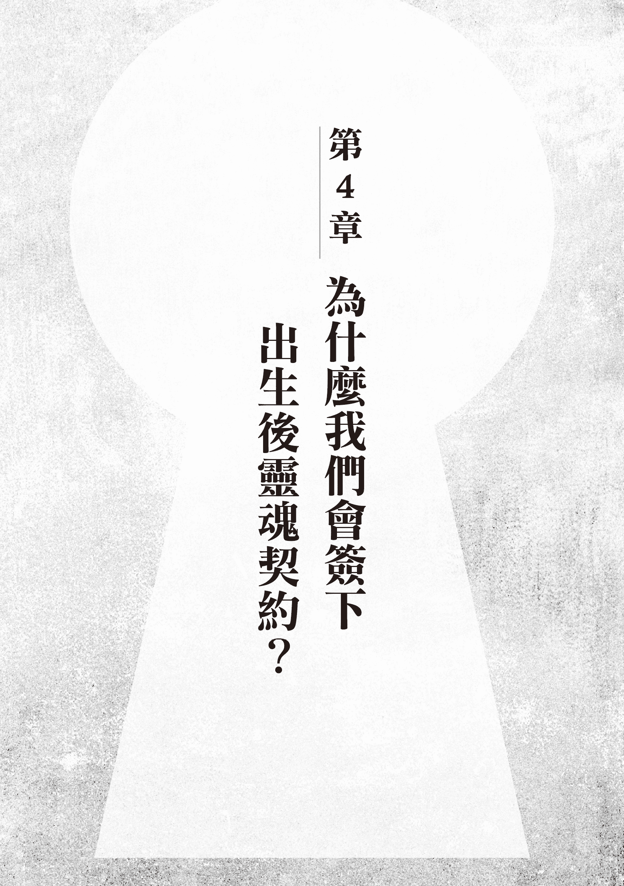

# 第四章　为什麽我们会签下出生后灵魂契约？

如同前文的说明，出生后灵魂契约（本书说的灵魂契约）是你因为一个种子思想引发寂寞、害怕、抑郁、受困、失去安全感或其他的负面情绪，而（在今生或前世）签下的契约。处于正向的心境的时候，你与本源、直觉的连结最稳固，你做的决定通常是有益的良好决定。但是灵魂契约的缔结，则是你为了回应某个种子思想而和自己谈妥的一门生意，你会用一个行动去反制你感受到的痛苦或不适。

我们来拆解这个过程，就从牵涉其中的主要能量振动谈起。你出生时，为了让灵魂与肉体结合，灵魂必须降低出生前的高频振动状态，才能融入人体的实质密度及尘世生活。当能量体降低振动频率，便会从无条件的爱、希望、开悟移开，而比较靠近懊悔、恐惧、怨恨的能量。低振动频率离本源比较远，也就是说，仅仅是身为人类，你与本源的直觉式连结就不如出生前的状态。在低振动频率下，你更容易经历到某些情绪和能量。出生后灵魂契约是透过人类的体验缔造，真的可以把纯粹圣光打造的灵魂搅得七荤八素的。

#### 签下出生后灵魂契约

请想像你正处于严峻、艰难的人生阶段。同时，「我不够好」的种子思想不断地冒出来。你感到厌烦、恼怒、挫败。你满肚子窝囊，你经历的每件事、遇到的每个人，都在说你不够好。你的种子思想向宇宙发射这个负面讯息，宇宙又将它反射给你。

大多数人就是在这个时候签下出生后灵魂契约。原因一目了然：你迫切想要平息自己不够好的感觉。在一阵猛烈的愤怒、挫败、绝望之下，你心生一计。也许你会说：「我要不惜任何代价成为这份工作的第一高手。」或是：「我要牺牲自己的需求来支援其他的人。这样就能证明我是大好人。」

因为你不是处于心平气和、神清智明、稳健踏实、较高振动频率的状态（毕竟，你沉溺在极负面、低振动频率的情绪中），而且决定仰赖自己的意志力，于是你签下了这份契约。很多人不明白自己做了什麽。他们相信自己是为了解除痛苦才做这些交易，其实他们是标示出日后必须回头处理的生命区块。

要签下一份出生后灵魂契约，你必须先因为某个特定的种子思想而反覆受苦，处于极度负面的状态。你不会只因为某天上班诸事不顺就订立灵魂契约。你必须处于陷落谷底的负面振动频率，同时感到绝望，彷佛你唯一的选择，就是签下这份协议。由于这些特殊条件，你灵魂契约的数量大概不如你想像中得多。你必须集结大量的负能量，才能订立一份灵魂契约。

另一方面，出生后灵魂契约在签下之后便隐匿踪迹。多数人在签契约时根本毫不知情。他们只知道自己迫切想要改变现状。他们知道情况不对劲。他们看到旧事一再重演，用尽一切办法却阻止不了。尽管他们感到无力，仍决心控制事态的发展。想要解除痛苦的渴望造成了出生后灵魂契约，但那不是因为你改变了自己，而是因为你不懂酿成痛苦的种子思想背后的课题。

当你放慢脚步，探查自己的处境，便是在抽出时间掌控种子思想，予以释放。于是你的振动频率上升，更接近本源。当你处于较高的振动频率及正面心态，你做的决定并不会导致你订立出生后灵魂契约，而会推动你的人生向前进。

你已在今生签下灵魂契约。我的客户大卫便是一个好例子。大卫的公司欣欣向荣。他是走在尖端的冒险家，他冒的险值回票价。他有八千位员工，收入丰厚到他做梦都想不到。杂志专文报导大卫预测市场走向的能力，他的父母赞美他，女人感受到他的卓尔不群、自信、走在前端的魅力，纷纷接近他。但是突然间，风云变色。

由于策略失误，他不得不遣散超过半数的员工。大卫心烦意乱，沮丧不已，很内疚自己害惨了那麽多人。他心想：「要是我放慢脚步，做对符合逻辑的决定；要是我对自己的现状感恩，不做那些交易，就不会这麽狼狈。」他开始认定他不能信任自己，觉得自己其实不明白自己在做什麽。这造成我不够好的种子思想。他不再相信自己的直觉，导致工作屡战屡败。最后，他决定：我绝不再犯那种错。我绝不再冒那种险。我得戒慎恐惧！一份灵魂契约就此缔结。

他打算日后不要再害自己及别人陷入痛苦，因此，他停止冒险。他判定跟随潮流才是正解，背负起一份庞大的出生后灵魂契约。

过了一段时间，大卫发现闪避风险、不听从直觉、跟随潮流并无法重建昔日的成功。当他真心想放手一搏，却又踌躇不前。他完全不理会曾经让他生意成功的直觉。

最后，大卫开始探索他的灵魂系统，辨识出我不够好的种子思想，以及不可以信任自己的灵魂契约。这正是阻挠他再创成功体验的症结。当他体认到自己够好，便恢复了对自己的信心及优良的直觉，重新缔造昔日的成功人生。

多数人订立灵魂契约的时候，没有察觉到自己实际上做了什麽。他们在生命屈居弱势之际试图控制人生。想想看：当你生气或忧虑的时候，脑筋会清楚吗？能发挥自己全部的能力吗？你做的决定会跟你心平气和、神清智明、内心踏实时一样吗？不会。处于负面情绪的人极难做出最佳决定。你做出最佳决定的机率将会暴跌。恐惧、悲伤、愤怒、罪咎，都会妨碍你运用逻辑与直觉，因此你的行动是出于恐惧。

做出这类决定，会消弭你日后改变心意的能力。当你签下出生后灵魂契约，你便在不知不觉中，将这种行为、信念系统、行动、思想，封存到最深层的地方──也就是你的灵魂。契约一旦签下，灵魂便会竭力遵守，包括破坏你刻意改变行为所做的种种努力。

不妨将出生后灵魂契约视为能量书签。这些书签会深植在灵魂内，直到有朝一日你着手处理。假如你在五世之前签下一份至今原封不动的灵魂契约，你诞生到这一世的时候，就带着这一份你不知情的灵魂契约障碍。常有人发现自己遇到的障碍，与目前这一世毫不相干。或许你在好几世之前的童年，曾因为太爱讲话而遭到严厉的训斥。于是，你签下一份从此沉默不语的出生后灵魂契约，以证明自己的乖巧。三辈子之后，要你开口依旧像要你的命。那份出生后灵魂契约仍在原位，等着你处理。

你在别世签下的契约，仍有数不清数量、完好如初地留存在你的灵魂内。因此，人往往对自己的障碍浑然不觉，他们进入这一世的时候，这些挑战就已经存在了。很多人不曾实际体验过完全没有难关及隐藏阻力的生活。

前世灵魂契约可能是酿成你根源信念系统的主要根源。假设你的灵魂活了八十世，其中四十世你都很难相信自己，你便非常可能有至少一个成熟的根源信念系统，里面包含与这个课题相关的各种契约。幸而前世灵魂契约有个妙处。这些契约并不会因为是在另一世签下的，就特别难以发掘、理解、驾驭。其实，在整顿灵魂系统的过程中，你会发现前世灵魂契约实际上融入了你今生的灵魂契约。当你面对今生签下的契约，同时也会处理前世的契约。

练习　前世或今生？

知道了契约来自前世或今生可以提供更多的细节，让你安心。毕竟，你不太可能记得前世。（像身为骑士，誓言为全人类的福祉牺牲自己！）写下你认为目前挑战的起源，通常能帮助你厘清灵魂系统。使用你在前一章的练习中所列出的障碍，想想你从何时开始吃苦头。有没有哪个挑战打从你有记忆以来就困扰着你？那这个障碍可能就来自前世，或来自你这一生还不会口语交谈的时期。你的障碍是不是跟你这辈子的某一段经历有明确的关连？还是你的障碍根本没有道理可言，因为你没有导致那个障碍的经历？那些莫名其妙的挑战八成来自前世。假设你觉得无论如何自己都要信守承诺（不惜牺牲一切），但是从来没有人骂你是骗子，也不曾有人欺骗过你，你的障碍便极可能来自前世。

请你记住，前世的灵魂契约往往和今生的灵魂契约交缠在一起，如果你找到的契约似乎都和今生有关，那也无妨。这不表示你没有前世的灵魂契约。只是你的障碍都连结到今生的障碍罢了。当你处理目前的障碍，便会同时清理前世的障碍。

不论从哪一世下手，效果都很棒。厘清障碍始自哪一世并非必要，却绝对能让你更能操控你的灵魂系统。在你继续向前迈进时，试着厘清这个问题；如此你会比较了解自己的现状。那麽，作为上路的第一步，请以五到十分钟想想这些契约的源头。

# 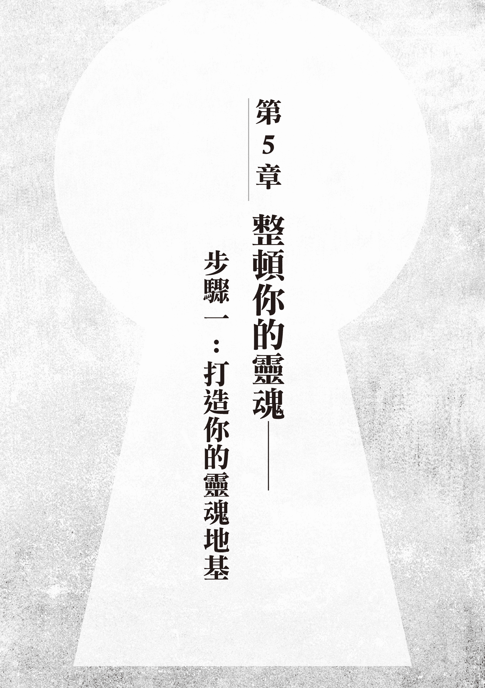

# 第五章　整顿你的灵魂──步骤一：打造你的灵魂地基

#### 自我谅解与自我接纳

进行灵魂系统工作需要自我谅解与自我接纳。在你起步时，记住每个人都有灵魂契约。这些阻碍经常隐遁数十年之久，因此你也没有自己想得那麽蹩脚。另有其他在运行的能量阻挠了你成功。这些能量可能已经勉强你一再做出不良的决定千百遍。你的灵魂完美无瑕，不论你正值这个过程的哪个阶段。如果你现在认为自己不完美，那是因为你曾经做过隐藏那份完美的事，而导致你看不见。

停止鞭笞自己的时候到了。别再担心自己永远与成功无缘，不要以为自己没有达成目标的命。不要继续为了往日的决定愧疚。想要转化灵魂系统，你务必要能够以某种方式，将这份责任交托给你的灵魂。接受有些事情是在灵魂深处发生的。

例如，花时间思考你如何懊恼自己总与母亲起同样的争执，而不是去处理你灵魂系统的问题。但是，当你说出，「我想那是受到灵魂契约的影响。我要研究一下！」就表示你在自我谅解上有了进步。

当你承认有更强大的力量在运作，而你仅仅是一介凡夫俗子，你可以犯错，你便能开始向前走。这一切全是用来辅助你进化的计划。你正在变换自己的能量，让能量柔软到可以展开灵魂工作。当你接纳自己，你便准备好大显身手了。

为了在最深、最有效的层次工作，你需要升级你的指导灵团队，还要清理你的场域。若是省略这些步骤，你处理的就只是日常习惯，不是灵魂系统。那就像头痛医头，治标不治本。很多人察觉自己有某些障碍，逼迫自己改变行为，试图藉此排除障碍。但是如果不化解根本的能量障碍，可能反而衍生更多的问题。

只改变行为，没有转化在底层驱策你的动力，只会达成表面上的转变。我们追求的是能够让你成长的深刻灵魂层次转化。我们从处理这些障碍的起因开始工作，从内在启动真正的转变。

#### 升级你的地基

为灵魂系统工作奠定稳固根基的第一步，是确保自己与振动频率最高、意图最纯正的能量合作。我们散发什麽样的能量，就会吸引类似的能量；这项原则也适用于指导灵的世界。指导灵是由光构成的存有，不曾有过肉身。

每个人都有很多个指导灵，在你的生活中各司其职。某个指导灵或许担任主要指导灵，协助你处理日常事务。另一位或许帮忙你写书、做一位了不起的母亲，或是从凌虐中活下来。你的指导灵团队，永远都为你至高至善的福祉服务，并在你发出请求的时候提供最佳的资讯。

但是很多人都有几个悄悄溜进我们指导灵团队的指导灵。祂们不是指导灵团队的正式成员，而是在我们面临关卡、愤怒、沮丧、伤心的时刻来到。

你是否曾经向世界嘶吼：「啊！我需要救兵！都没有人可以帮我吗？」

你在有自觉或者没有自觉的状态下，发送出这则讯息。即使你没有实际说出口，你的能量也为了你的需求发了声。

当你这麽做，你便在不知情的情况下吸引了吻合你负面状态的能量。当你的能量处于低频状态，你会接受振动频率低的能量，因为在那个当下，那种感觉很畅快，但是你要记住，振频愈低的能量所含有的纯净圣光也愈少。这些振频低的能量自然会降低你整体的振动频率。

你要与振频最高、具备百分百圣光的指导灵团队合作。当你吸引来的不具备百分百圣光的能量，便是在扯自己的后腿，信赖不纯净的能量来指引你，并且直达灵魂的最深层次。如此一来，日后必然会冒出更多的障碍，妨碍你前进，引发许多的挫败。

万一有负能量在引导你的话怎麽办呢？幸好，摆脱这些跟屁虫比多数人想得容易。而且效果保证。你只要勤快一点，做好一项简单的任务，就是：升级你的指导灵团队。

#### 光明召唤术

十年前，我在一个工作坊学到升级指导灵团队的观念。这属于进阶的清理技巧，是我们课程中的选修项目。学员大多都没有选修，这堂课却深得我心。我自行扩充这项技巧，最终应用在我的客户们身上。

后来，我在琳•葛雷朋（Lynn Grabhorn）的着作《亲爱的神！这是怎麽回事？》（Dear God! What’s Happening to Us?）看到帮助人们重新设定指导灵团队的方法。起初，我请客户使用葛雷朋的召唤文。这些年来，我依据自己接收到的指引，设计了「光明召唤术」。（取名为光明召唤术是因为，这就是这项技术的用途：把光召唤过来。）这项技术可以提升能量，以便进行灵魂系统内的工作。光明召唤术是为灵魂系统工作奠定稳固根基，最简易、也最有效的方法之一。

以这项技巧升级个人能量的效果很惊人。尽管很多人钻研过灵性原则和能量技术，学习成果却可能不了了之。这是因为他们没有意识到，他们的指导灵团队充满了光。我写下六则召唤文，供各位以最高的振动频率来校正自己。在开始运用这项技术之前，请详读每一则召唤文的内容及用法。

#### 六则召唤的用法

基本上，六则召唤文只召唤最纯粹、最高频的存有、事件、经历，和指导灵。当你重新调整自己的圣光及环绕你的光，你会发现灵魂系统工作变得顺畅许多。你可以信任自己的直觉。你会得到更多有意义的体验，也比较清楚那些意义。最棒的是与你合作的指导灵团队，绝对会以你至高至善的福祉为重。

根据我多年来的通灵工作及使用光明召唤术的经验，我发现对大部分人来说，光明召唤术连续施行四十天成效最佳。有些人喜欢以直觉决定天数。两者皆可。请在最后一天评估自己的进展。你觉得自己经历了很多变化吗？你的感觉好不好？大不了你就继续练习这项技术。凭直觉判断你还需要持续多久。

以宏亮的音量念出这六则召唤文的效果最好。如同本书的工具和流程，字句的振动可以提升练习的成效。而做完这六项召唤只要两分钟。开口召唤的地点并不重要；如果你需要避人耳目，即使把自己锁在浴室里做也无妨！

持之以恒地进行召唤也非常重要。你的能量会一天天地累加。中断一天，便会打断能量流的挪移与发展。万一你错过了一天，请归零从头来过。能量不会受到愚弄，误以为你决心改变自己。不认真执行这些步骤，你就不会脱胎换骨！

在执行光明召唤术期间，你会发现生活情况确实转变了，有时甚至是剧烈的变化。一开始可能会有一些混乱和骚动，但是请持续下去，这类情况便会消退。

习题　六则召唤文

首先召唤你的指导灵团队。如果你已经会召唤了，请以平日的做法召唤祂们。如果你不清楚怎麽做，只要说一声：「我现在召唤符合百分百圣光的指导灵团队，协助我今天的工作。」

想像你看见、听到或感觉到指导灵团队围绕着你，协助你召唤光。

请大声地念出以下六项对光的召唤：

① 凭恩宠的力量，我意识清醒地声明，我重新设定各个层次的整体存在，调整为与百分百的圣光相符，就在现在。

② 凭恩宠的力量，我意识清醒地声明，我重新设定我的意识及无意识、最高层次的自我、肉体及各个能量体，调整为与百分百的圣光相符，就在现在。

③ 恩宠的力量，我意识清醒地声明，我的指导灵团队成员一律都是与百分百圣光完全相符的存有，就在现在。

④ 凭恩宠的力量，我意识清醒地声明，在我过去建立的所有灵性连结中，凡是不符合百分百圣光的连结一律予以释放，以圆满各方至高至善的福祉，就在现在。

⑤ 凭恩宠的力量，我意识清醒地声明，我重新设定周遭的环境，永久调整为与百分百的圣光相符，就在现在。

⑥ 凭恩宠的力量，我意识清醒地声明，只有完全符合百分百圣光的存有、能量、体验，可以获准进入我的能量场，就在现在。

#### 召唤光明的结果

很多人不愿信任直觉。他们很难相信宇宙会依据他们的请求，提供相符的体验。连要他们相信自己都很难。既然你的指导灵团队升级了，也和你重新建立连结，你会发现自己比较容易收到直觉的资讯。此外，讯息会更精确，因为你将讯息的来源限定为振动频率最高的存有。

当你翻新自己的能量场，你会觉得更能信赖直觉。你吸引来的混乱会变少，生活中的大小事可能会开始变得平顺。这是因为你摆脱了负能量的干扰。当你、你的指导灵团队、你周遭的能量，都调校到较高频的振动，你追求的人生也比较容易成真。

但是在重新设定的期间要留意一件事。尽管成果既正向又能改变人生，过渡时期或许有点可怕。你可能会发现多年来都很平顺的事物突然生变，有时会让人吓破胆。

我第一次做完六项召唤之后，预约个案的客户人数一落千丈。我魂都飞了。后来才发现，客户流量变动是因为我曾无意间招来低频能量。这些低频能量协助我吸引振动频率低的客户，为他们服务并不愉快，也会让我对生意感到焦虑。但是我完成光明召唤术几周之后，振动频率较高的新客群上门了，他们和我比较有共鸣。

这正是我的初衷，尽管一开始我并没有意识到。有时，你可能会觉得光明召唤术害你失去你重视的事物或人，但是请不要恐惧，继续执行召唤。不论你失去什麽，自然会由符合振动频率的人事物递补，而且比原本的好很多。

还有，不必等完成四十天（或任何直觉选定的天数）的召唤，便能进行灵魂系统工作，但是这六项召唤是灵魂工作的必要手续。你持有的光愈多，在驾驭契约的过渡期当然就愈顺利。光明召唤术会与你携手同心，陪伴你进行灵魂工作的各个步骤。当你进入召唤的程序，你便可以开始打造你的能量地基，也就是你的下一步。

#### 你的能量场

既然你现在与百分之百神圣、正向的能量合作，你便可以着手重新设定你的地基。能量场干净的人，身心都比较轻盈。他们较常体验到快乐和希望，也比较容易感知自己的情绪。而这又回头提供了稳固的能量基础。有了稳固的能量基础，你做的决定也会比较明智。如果你打算进行灵魂层次的调校工作，你会需要做出明智的决定。把这个过程想成辟出一条路，直达你个人问题的核心。如果你的路线不明确，你永远找不到核心的议题。

剔透的身、心、灵是灵魂系统工作的理想状态。这表示我们要照顾肉身，也要照顾能量场的状态。

环绕你身体的能量一共有好几层：能量、肉体、心智、情绪、灵性。这个能量场占据你全身上下及身体四周三到四尺的空间。这是极度敏感的系统，它会影响你的思绪、感受、情绪、决策、行为，而你毫不知情。盘据在我们能量场的这些能量，离我们最近、也最舒服。我们仰赖这些能量，这些能量才会变成伸手可及。

不妨这样想，假如你怀中抱满了红色的球，这时有人请你随便想一个颜色，你大概会想到红色。或者你会想：不要红色，任何红色以外的颜色！无论如何，你第一个想到的都是红色。你能量场内的能量也以相同的方式运作。它们从潜意识引导你采取特定的想法、行为、习惯。

占据你能量场的能量有哪些种类？

这些是你吸收、吸引而来的表层能量。你的环境是由你周遭的人、情况、事件、万物给人的感受所构成的，这些其实都不是你的一部分。很多人比自己认知中的更敏感，他们吸收周遭的负面情绪与能量，却浑然不觉。

幸好，这些环境中的能量并不深厚，要清理干净、重拾平衡会比灵魂契约及种子思想容易得多，但是那不表示你可以等闲视之。个人能量场中的负能量可以影响你的每个思绪、决定和感受。这可能导致你把生活处境的险恶、艰难程度，误判为比实际上严重得多。所以你务必要平衡自己的能量，释放对你不再有益的能量，你才能进行灵魂层次的工作。

卡在你能量场中的能量，是以下的其中一种或多种：

•混乱的能量：这是人最常在不知情的情况下，吸附到自己能量场内的能量类型。你是否曾经看过人家斗殴叫嚣，即使你退避三舍，却仍然觉得生气或消沉？这是因为你吸收了斗殴的负能量。你是否曾有沮丧的朋友打电话大吐苦水一小时，你挂断电话之后也觉得很沮丧？多数人都很讶异自己背负了多少混乱的情绪。担忧、焦虑、压力、抑郁、恐惧是最常见的种类，但是多数人也会吸引其他类型的情绪。

•信念系统：信念自有其能量振动，或者说频率。与低频的想法（诸如，报仇雪恨）相关的信念可能被你的能量场吸收。然后，信念系统又导致你持续援用那种低频振动。你可能从别人、个人经历、甚至书籍和电视，接收信念系统。

•负能量：你可以从一个地点、一段经历、甚至电视节目接触到负能量。多年前，我常在入睡前观赏一个犯罪侦查节目，醒来后总是纳闷自己怎麽情绪那麽低落。负能量的振动频率低，会持续拉低你的频率，直到你与它相符。如果你的能量场内有这一型的负能量，你会情不自禁地倾向负面思维。一如其他类型的能量，负能量会吸引更多同种类的能量来到你的生活当中，进驻你的思维。

•干扰或静电能量：干扰型能量是在你的一举一动中造成静电干扰的能量。它堵塞你的思路，破坏你清明的感觉，尤其是你的直觉。

最近我有一位朋友说，她不得不搬出她的新公寓，因为公寓的隔壁栋就是手机基地台。她搬进新家后不久，便觉得思绪混乱，容易疲倦、生气。最后她恍然大悟，她将基地台的干扰能量吸进自己的能量场了。

居住在机场附近或飞机会从住处上方经过的人，常常会吸收到干扰能量。这种现象往往遭到忽略；身为适应力强的物种，我们常在习惯了这类型的干扰之后，便置之不理。在能量层次上，干扰型的能量是绝不能忽视的能量。

•电磁场：电磁场是由手机、笔电之类的电子用品发出的。电磁场在我们的能量场造成静电，可能导致睡眠障碍、思路模糊不清、闷闷不乐等等。想彻底清除你能量场中的电磁场是可能的，但是持续暴露在电磁场下可能造成长期的负面影响。要解决电磁场的问题，睡觉的时候应该距离电子用品至少八尺，平时可以不用电子产品就不用。我明白这不容易，我自己也没办法彻底做到，我爱死了我的 iPhone！但这是减少电磁场进入你能量场的最佳办法。

•程式制约：这种能量非常鬼祟。多数人在童年吸附了这种能量，因为小时候容易受到别人影响。我见过许多人为了一分耕耘一分收获的程式制约所苦。如果你在童年接收了这个程式制约，你的老板大概也会期待你每星期工作七十到八十小时。听起来很耳熟吗？很多人会将程式制约纳入自己的能量场，并且签下相关的灵魂契约。

能量的种类繁多，不只我列出的这些。希望这些基本资讯能协助你辨识、并清除你遇到的各种能量。最重要的是要能觉知到自己的能量场，尽力清理干净。

#### 能量场容易受影响的程度

为何有些人会将周遭环境的能量一网打尽、全部吸收，其他人却不会？这全是心灵感通（empathic）的关系。

具备心灵感通能力的人，尽管他们本身没有面临相同的情境，但是可以感受到别人的情绪。如果你曾走进过一个房间，感觉里面的氛围令人毛骨悚然，或者没有原因的讨厌你第一次见到的人，而人家根本连一句话都没说过，那麽你就有心灵感通的能力。想像你和一位为了离婚手续而倍受煎熬的朋友讲电话。她大吐苦水，说丈夫如何恶毒，哭诉这场决裂对孩子们的影响。同时，你以倾听的方式支持这位朋友。你充满同情，你想帮忙。你很愤慨她先生对她不公道。你担心她和她的儿女该怎麽办。这通电话讲到最后，你觉得自己已经完全明白她的心声了，也帮助了她──好歹，你让她有哭诉的对象。最后你挂断电话，心想：呼！我累坏了！

这是心灵感通的完美例子，你刚刚花了一小时，把朋友的负能量吸收到自己的能量场内。

现在夸张的来了。她感到悲伤、寂寞、生气，认为老公害惨了她。你听她倾诉，慢慢地涓滴吸收她的能量。于是，你的朋友心情舒坦些了，你很开心自己帮助了朋友。但是现在你讲完电话，能量场内充满了混乱情绪，然后你在家里来回走动、你去工作、你去开车。

当外界能量进入你的能量场，感觉可能如同自己的能量或情绪。

例如，与朋友讲完电话，你大概满腔悲愤，说不定甚至因此拿家人开刀。问题在于那不是你的感受，只是很像你的。如同前述，人往往取用最容易取得的能量。如果你自己的能量场里挟带着朋友的哀伤欲绝，你对自己生活的反应将会模拟相同的情绪。多数人不知道自己允许别人的情绪与能量进入自己的能量场。事实上，我们的社会教导我们，这是最古道热肠、最乐善好施、最抚慰人心的人的待人处世之道。

（希望，你正在重新思考这种迷思。）

练习　我的能量场是不是不干净？

如何知道自己的能量场不清爽？如果你以前没有清理过，能量场大概就需要清理一下。我们的文化期许我们吸收别人的能量来助人。因此，开始清理灵魂系统的人，大部分能量场都不干净。以下列出一些能明确判断个人能量场状态的征兆：

① 你是否在三更半夜醒来担心与你无关的事？你为世界和平忧心？烦恼经济现况？假如你为那些无力控制的想法、人、地而焦虑，就表示有外来的能量被你吸引来了。

② 你很容易分心吗？比如，你正在写书，而外面开始下起雪来，在窗外飘落的雪花是否会让你完全停下写作？如果你在进行一件细节繁琐的专案，你思绪是否会不断地飘走？我们很容易将许多教人分心的能量吸引到能量场中。

③ 你觉得跟自己的身体失联了吗？多半时候你都在想东想西，但是几乎不会想到自己的身体？每天早上换衣服的时候，你会着墨自己的造型吗？如果你接收了让你不关注自己的能量，这些就是征兆。

④ 是不是有哪个情绪就像一张滤网，过滤你的一切经历？例如，你是不是只能透过焦虑的观点理解一则新的资讯？这种模式可能就表示，你采用了别人或在你之外的某物（例如，电视节目）的焦虑心境。

⑤ 你觉得不管到哪里，都会遇到鸡飞狗跳的事吗？很多能量场不清晰的人感觉得到自己缺乏清晰感，即使他们也说不上来到底哪里不对劲。如果你的能量场不清明，事事永远没有章法，周遭的世界也会有点失控，诸事不顺。当然，灵魂契约可能影响了这种一团乱的感觉，但是在你判断症结所在之前，先清理你的能量场。

即使你只是疑心自己的能量场可能不太干净，事实上八成就是不干净。

清理能量场不是一劳永逸。总是会有影响人的能量进入你的能量场，因此清理能量场应该是长期的保养工作。我常常清理自己的能量场，如果我发现自己的能量场非常不干净，我不会怨怪自己。我只会庆幸自己察觉了异状，然后着手清理能量场，继续过日子。

你的相关经验愈丰富，就会愈快察觉徘徊不去的外来能量，愈快察觉也就愈容易移除。身为人类，不表示我们的言行举止必须完美无瑕。

练习　能量场清理术

这项练习涉及你的能量、意图，宇宙。你要下达清理的要求来净化你的能量场，向宇宙声明你要求完成的事项。除非你明确地声明你的意图，并请求宇宙帮忙，否则清理的祈愿不会奏效。私下独自进行也会有所帮助。

① 找个大约十五分钟都不会有人过来的安全隐密地点。这个空间要可以供你随意发狂、讲最诡异的话，都不会有人听到，也不会有人来打扰你。手机和电邮也应该关闭。因为我很清楚每次手机一响，我的心就立刻飘走：「哎呀！是谁在找我？」因此，最好干脆断绝诱惑。

② 我建议环境彻底安静。音乐含有音符的振动频率，还有作曲家及演奏者的振动频率及意图。我们不要在你的能量场增加任何额外的频率。我们要清洁溜溜地。

③ 召唤宇宙。你可以说出简单的召唤文，例如：「我现在召唤百分百圣光的指导灵团队，来帮助我今天的工作。」运用想像力是与能量合作的最佳方式之一，因为想像力解放你的局限，所以在召唤宇宙之后，用一点时间想像宇宙回应你的要求，以及得到回应的感觉。像个小朋友那样想像，不带任何批判，并且细节丰富。

④ 请大声地要求清理你的能量场。你说的话会承载符合你祈祷的振动频率。宏亮地声明你的要求，会比只在心里默念有效。

接着，我要分享我工作的时候使用的能量场清理祈愿文。你要知道，这些文句并不是制式的规定。等你习惯了这一类的沟通之后，欢迎你修改词句，写出你觉得最适合自己的个人版本。这是给你的范文；三年后，你大概不会说出一模一样的清理祈愿。尊重你的直觉；如果这篇祈愿文有哪一部分让你心烦，尊重自己的感觉。也许就表示你需要修改个人祈愿的文句。一开始，最好原封不动地使用我写的清理祈愿，直到你熟悉了如何清理能量场。现在，你可以运用能量场清理祈愿文了。以下是要朗声诵读的清理祈愿：

凡是在我的任何层面以任何形式干扰我的全部负能量，请一律彻底释放，就在现在。凡是与我连结的负能量一律予以阻断，而我因为这些连结而缔造的一切灵性依附及情绪依附，也全面彻底释放。请用光消融这些负能量，回归源头，以谋求所有人至高至善的福祉，就在现在。谢谢、谢谢、谢谢。

朗诵完祈愿文之后，安坐个一、两分钟。花时间细细地体会这一刻带给了你什麽，而你又释放了什麽。假如有任何立即的效果，也会很幽微。这项练习不会给你脱胎换骨的蜕变，而你寻求的是细微的变化。很多进行清理祈愿的人没有连结到个人能量场的频率，不会注意到能量场的变化。如果你毫无感觉，你只是还不知道该留意什麽迹象，或不会解读迹象，而不是祈愿失效。假以时日，渐渐地你能够侦察到你的清理祈愿奏效了。

以下列出从能量场释放干扰的能量之后，常见的一些典型变化：

‧晕眩

‧头昏眼花

‧手或任何身体部位觉得刺刺麻麻的

‧静寂

‧舒放感

‧肩膀压力变小

‧胸口压力变小

‧腹部压力变小

‧太阳好像突然出来了──房内变亮了

‧想哭的感觉

‧有希望的感觉

‧感到恬静或比较不混乱

‧身体周遭的空气静寂下来

‧安静

‧祥和

‧疲倦

‧兴奋

‧呼吸比较顺畅

以上这些感受有的似乎令人讨厌或不舒服（例如，晕眩），但是别因此怯步，而决定不要透过清理能量场来建立稳固的地基。清理能量场的副作用只会维持一分钟左右。如果你是敏感人士，这些感受最多维持五分钟。

对大多数人来说，清理能量场的完整效应大约要五到十分钟才会浮现。在这段时间内，如果你保持安静，专注在自己身上，不查看电子邮件、不讲电话，释放的效果会较佳。这是你的个人时刻。你在重拾主权。这是你的能量、情绪、能量场，别的能量没资格搭你的便车。

完成祈愿几分钟之后，检视自己的状态。你是否舒畅一些？还是和之前没两样？

如果做完能量场清理祈愿之后，依旧觉得阻滞、紧张、混乱，你可能没有清理到能量场。

我见过很多时常做这个练习却说无感的人。他们对我说：「丹妮尔，我每天早上起床，就照你教我的方法清理能量场。睡觉前也做一次。你教我的我全都照办了，我照样觉得日子很辛苦！」

我发现会说这种话的人，通常恪守规则。他们相信如果做到别人说的每件事，遵循规定的做法，一切便会水到渠成。问题是，进行这项作业的时候我们必须真心投入，不能只是嘴巴念一念祈愿文。假如她在早上赶着上班的时候进行能量场清理祈愿，她就挤不出改善能量场状态所需要的时间与专注力。

清理能量场不是做了就算数。如果你做了，你的情绪或能量却没有实际获得提升，就是你不够专注在清理祈愿这件事，或者你本身不专注。

我工作及教课的时候，见过很多行礼如仪地进行祈愿的人。他们学习灵性原则的时间往往长达数年，遍览群书，访遍了坊间每一位自助领域的上师，建立起包含二十种不同练习的每日功课，天天照表操课，想让自己的日子过得舒服一点。

这些人大部分不会停下来扪心自问：「这对我有效吗？」或者「我从今天这项练习里受惠了吗？」而是听从在他们的人生路上宣称「这是疗愈之道！这要天天做！」的诸多教师、书籍、课程。他们不理会个人的能量和情绪在说：「嘿，伙伴，慢下来。你根本没给自己努力释放的机会嘛。」

如果你做了能量场清理祈愿却毫无效果，请检讨自己的专注程度。你练习的时候是全神贯注的吗？还是有点心不在焉？你是否从行事历挪出充足的时间，让自己能平心静气地做十五分钟的能量场清理？清理能量场不能敷衍了事。那样不如干脆不要做。你的能量很精明，它清楚你是认真的，还是你只是跑一遍流程而已。因此，如果无效的话，就停下来重新来过，这一回你要集中精神。

练习　蓝光泡泡

现在，我们来介绍一个能协助你停止吸收（或吸收较少）别人能量的练习，帮助你维系住前面那些练习的成果。这是为灵魂契约工作奠定稳固根基的一环，表示启动五岁小孩模式的时候到了。

在这项练习中，回想你的孩提时代。童年的你心胸开放，愿意接受新的事物。在赤子之心的心理状态下，你不在乎别人的看法，你不会自我审查，只要那是好玩的事，几乎凡事都愿意尝试。如果你能驻留在那种不自我审查、单纯地顺势而为的模式，你做这项练习的效益就会达到最大。

请想一只紫色的狗狗。接着，想着一辆有黄色座垫的三轮车。想着一只莱姆绿的猫。你看出来了吗？这项练习只请你运用想像力。如果你卡住了，你就太拚命了。去翻个筋斗吧，或是在你的办公室里跳一跳。做点什麽来提醒自己这很好玩！然后，再回来重新开始这项练习。请用尽一切办法，别再那麽严肃啦！

这项练习的用意是，为你建立一道能够抵御周遭能量的善意能量栅栏。倒不是要将你的周遭环境封堵在外，而是给你一道滤网，让你更能全然地体验周遭的事物。这项练习就像太阳眼镜，太阳眼镜保护了你的眼睛，同时允许你看见东西。

① 先确保自己心平气和。也许你需要到浴室（通常是平静的地方）或你的车上独处。我有一些客户在家中没有私人的空间，他们可能会钻进衣柜之后关上柜门，或是独自出门散步。待在平静的地方很重要；你得待上几分钟，确保那是让你舒适的空间。等你找到清静的地点，放松心情，准备就绪再进入下一个步骤。

② 这时，很多人喜欢召唤指导灵前来协助。如果你没这种偏好，只要坐着感受平静就好。如果你喜欢与指导灵、天使、灵体合作，想像祂们此刻就在你身边，准备好辅助你进行你的祈愿。如果你不清楚怎麽做，只要说：「我现在召唤符合百分百圣光的指导灵，前来协助我今天的工作。」

③ 现在，观想一颗美丽的蓝光泡泡，泡泡大约六尺高、三尺宽，盘旋在你前面。想像这颗大泡泡散发出一派祥和的氛围。感觉，你可以放心地看看它、摸摸它。用二十秒左右这麽做。

④ 观想这颗蓝光泡泡向你靠近，愈来愈近，最后包围你。如果你与指导灵合作，请祂们帮忙把泡泡调整到最适合你的尺寸。

⑤ 坐一会儿。一如世间万物，想像力是能量。这颗泡泡在能量层次上是真实存在的，对你、你的身体、你的情绪、甚至你的心智功能都能发挥实质的效应。留意你置身在泡泡内的安全感、宁静感。唯一能轻易通过这颗泡泡的能量是爱。爱可以进进出出，流向你，再从你那里流出来。这颗泡泡内充满了正向的感觉。

⑥ 感觉到这颗泡泡对你的效应就可以了。如果你毫无感觉，你在进行这项练习的时候大概是分心了。等到你能集中精神的时候，再试试看。

这项练习是协助你建立一个和善的屏障，时时刻刻抵御出现在你周遭的能量。不论这些能量是来自朋友、电视节目、令人哀伤的书籍，或你察觉到世界其他地区的艰难处境，这颗蓝色泡泡都会帮助你避免吸收这些能量。蓝色泡泡有效包覆你的时间是两小时，因此你尽管忙你的，不用管它。泡泡的强度在建立大约两小时之后便会减弱，屏蔽的效果会变得很差。

当你初次体验到不再把每个能量讯号都照单全收的滋味，或许你会想要时时刻刻都待在蓝光泡泡里。但这不是蓝光泡泡的用途。你知道自己在某些情况下，很容易把其他能量吸引到个人的能量场内，这时蓝光泡泡便能够帮助你。最普遍的用途是抵挡来自某位亲友的能量，但是也可以在你去杂货店或曲棍球比赛时使用。我建议客户们每次要到人多的地方，或面对压力大的情境，都使用蓝光泡泡；很多人一旦情绪变得强烈，就会比较容易吸收外来的能量。

看得出来，奠定稳固的根基滋事体大。现在你有好几个重要（但有趣）的工具来帮忙你打好基础。当你将自己的肉身、能量、灵性层面都纳入你的地基，进行灵魂系统工作、驾驭日常生活，都会变得比较容易。太多人将缺乏清晰、混乱的能量，视为正常生活的一部分，但是根本没那个必要。更何况，只要三两下就能让自己感觉坚强、明晰、稳固起来。

# 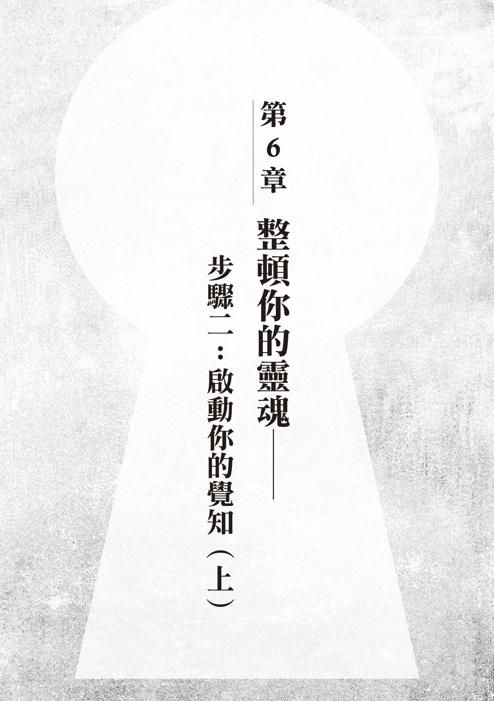

# 第六章　整顿你的灵魂──步骤二：启动你的觉知（上）

既然地基打好了，接下来就应该来感受一下灵魂系统内的情况。觉知的第一步骤，就类似木匠展开新工作之前看楼层的平面图、木工，及工具状态。没有这些资讯，木匠连该从哪里开工都不知道。你也一样。你的障碍在人生的哪一部分掀起最多骚乱？现在什麽状况最常扯你后腿？你想先处理哪部分的生活领域？你有什麽种子思想？透过觉知，你将能辨识出这一切。

觉知步骤的成功关键，主要是你必须投入这个过程；但是还有其他因素。在这个步骤中，你要先从不同的角度检视人生。当你这麽做的时候，你会发掘一些以前压根儿不知道的个人资讯。事实上，当人们终于发现个人障碍的根源比他们原本想得更深层，或察觉障碍的本质其实跟自己想得有所出入，多数人会经历振奋豁然开朗的阶段。你如何面对这些新观点将会左右你的进展。显然，排斥这些新观点会拖慢你的脚步，而欣然接受将加快你的进程。

在觉知步骤中的顿悟极有助益。每一个顿悟不只为你提供资讯，同时也开始松动相关的根源信念系统内的灵魂契约。在阻滞的领域出现松动的能量，正是我们想要的效果。

要顺利进行觉知步骤，你得对自己受阻的领域有大致的了解。这并不难，你拿起这本书的时候，大概已有挂心的障碍了。我们也在第一章列了障碍清单。或许你会发现你的障碍跟自己想得不同，但是现在暂时从你知道的部分下手。你也需要辨识根源信念系统的元件（说不定你已经看见全貌了）。你会在本章学会怎麽做到这一点。你也会学到如何挖出将灵魂契约锚定在灵魂里的种子思想及混乱情绪。

觉知步骤可能三两下便完工。也许你只用五分钟便厘清你的根源信念系统、障碍、根本的种子思想。也或许需要更久一点的时间。因人而异。

你愿意多深入探索自己？你的根源信念系统有多复杂？你会抗拒把一切摊在台面上吗？步调由你作主。你在有意识、无意识，以及在灵魂层次影响自己开挖的速度。不要因此气馁，要知道灵魂正在协助你以适当的步调认清自己、做出改变。进展得太快的话，你只会体验到表层的转变。

我最近在脸书上主持灵魂契约日的活动，请人询问我关于灵魂契约的一般问题。活动的目的有二个。第一个是，我要提供一个安全的空间，可以让人询问关于出生后灵魂契约的各种夸张问题，尤其是那麽多人将出生后灵魂契约与关系灵魂契约，混为一谈。另外，我想知道最热门的灵魂契约相关问题是什麽。最常问的问题是：我要怎麽做才知道自己的灵魂契约？

#### 辨识灵魂契约的四个方法

厘清出生后灵魂契约的方法有四种。或许你会发现自己不只一份契约；这很正常。当你辨识出这些契约，哪一份最重要、最需要优先处理，便会一目了然。你大概要先厘清主要是哪一份灵魂契约在作怪，但是你要敞开心胸，你极可能有很多份灵魂契约。处理一份契约，会打开通往其他契约的大门。

##### 方法一 你多半心里有数

这是辨识灵魂契约最简单的方法。其实，你会拿起本书，大概是因为你觉得自己在某方面遇到阻碍。记住，如果你觉得自己遇到阻碍，应该就确有其事。

回想你当初拿起这本书的原因。婚姻令你挫败吗？你担心人生停滞不前？你苦恼于自己一再选择同一种惹人厌的男人？你必然是挂虑着某件事，才会受到本书的吸引，这是一本协助你发掘隐藏的人生障碍的书。回想你的初衷。这个「初衷」就是你寻找灵魂契约的起点。

接下来，我们来看我的客户安妮卡的例子。她登门求助是因为她满心凄楚，怎样都看不出自己能带给世人美好。她告诉我她卡住了，她无法感受到幸福。她想不起来自己何时开心过，她知道自己受到阻碍了，无法在人生中由衷地感到快乐。（我很爱听到客户说这种话，因为这表示他们已经展开灵魂工作了）

协助安妮卡奠定地基之后，我们开始探索让她一直兜圈子的灵魂契约。我请她说明她认为自己在哪方面寸步难行。她说不只一个方面，而是各方面。她在工作上怏怏不乐，因为她想要更多挥洒创意的自由。她的婚姻不美满，因为先生贬低她、批判她、不尊重她。她细数着许多不愉快的事例。

当我请她谈谈过去，她娓娓道出一段缺乏妥善照顾（身心皆是）的童年，父母对她不理不睬。我们谈论起她最初的记忆，安妮卡将她三岁的感受连结到她如今的心境：悲伤、对世界失望、被遗弃。在记忆中，母亲告诉她，她们要搬到南美，然后不带她就走了。

安妮卡记得自己在那小小年纪，就判定母亲没带她到智利，是因为自己不够好。三岁的时候，母亲遗弃了她，她很失望自己的需求没有得到满足。她以为自己配不上母亲或神的关注，因为她就是不够好。我们做个案的时候，安妮卡察觉自己在三岁就断定快乐是不可能的事。她因为童年无力控制的事情而深深地悲伤。安妮卡辨识出她根源信念系统的一个重要元件：一份「我千万不能快乐，才不会失望、伤心和痛苦」的灵魂契约。

多数人对障碍在哪里了然于心。只要一点点直观的逻辑与对灵魂系统的基本了解，就能认清现实情况。你知道自己是否卡住了、着魔了、操心过头，或者做出无益的决定。你知道自己哪里受到阻碍。花点时间辨识，障碍是否渗透到其他领域，或单单出现在一处？多数人会发现自己的障碍影响生活的全部层面，即使他们只想处理某一个领域。后文我们会再详谈。

##### 方法二 重复的模式

另一个觉察根源信念系统元件的方法是检视重复的模式。灵魂契约怂恿我们采取某一套作法，通常不是最健康的作法。即使不想做某些决定，我们照样那麽决定。例如，很多人一再选择不健康的爱情关系。有的人因为总被老板占便宜而频频换新工作，但是最后又落入相同的处境。我看过创业五、六次统统以失败收场的人。反覆出现的负面模式，大可视为指向一份灵魂契约的箭头。

我的客户贝翠丝就是这种人。她持续选择跟让她疲惫、怨憎的人做朋友。她最要好的朋友不分昼夜地打电话问她意见、她母亲一声招呼都没打，就把狗狗寄放在贝翠丝家里一周、她的同事们借用她工作上的人脉，却没有任何回馈。

贝翠丝向我求助的时候，已准备将每一个人逐出她的生活，她只想图个清静。我问贝翠丝对自己周遭的世界有何观感。她说每个人都是混蛋。她已经学会在生活里小心戒备，因为每个人都只想要「拿、拿、拿」。

「啊哈！」我说。「你找到你的模式了。现在你知道从哪里下手了！」她当然不如我振奋。她仍不明白为什麽揪出这个模式如此关键，因为找出模式可以披露她的灵魂契约，并发掘她内在的神圣光辉。

贝翠丝的模式是协助身边的每个人。她总是为别人找到超棒的人脉机会，为人两肋插刀，照顾别人的宠物，倾听别人的问题，但是她从不求回报，也不期待得到报偿。在她的经验中，她发现多数人不会伸出援手；而且即使别人真的想帮忙，她也绝对开不了口，因为她不想麻烦别人。既然她辨识出自己的重复模式，发现自己常常不等别人开口就帮忙，也不期待回报，我便要贝翠丝继续思考，是怎麽样的灵魂契约导致这种负面模式。

思量一番之后，她说，她相信自己的灵魂契约是必须为别人做事、付出，才能赢得别人的爱。就在简短的讨论之后，贝翠丝轻松地辨识出一份相关的灵魂契约：「为别人付出来得到爱。」

她继续检视自己的灵魂系统，发现根植在根源信念系统内的其他灵魂契约。这些契约是关于脆弱（我必须避免自己觉得没安全感）、闪避爱（我过度付出，以免因为得不到回报而失望），及其他信念。

花一些时间检视让你觉得不舒服的那些生活领域。是财务？职涯？爱情？自我价值？瘾头？寻找出重复的模式。这会是洞悉你最迫切的障碍的第一条绝佳线索！

##### 方法三 不相干的线索

另一个觉知灵魂契约的方法是走后门。这个难度比前两种方法略高，如果你能掌握这个方法，你便能发掘出更多关于自己的资讯。

现在，你知道契约造成的障碍多半不会只出现在一个领域。有时，在寻找灵魂契约的时候，或许会发现不相干却能让你更深入的线索。运用这些线索，或许你会察觉绊住你的不只一份契约，也或许阻碍你的契约与你想得不一样！比如，我见过以为自己有金钱障碍的人，但是当他们用这一招深入挖掘，却察觉自己的障碍其实关乎所有形式的支援。

当你找到一份灵魂契约，别忘了找找其他的契约。灵魂契约在我们的根源信念系统里往往是成群出现。这是因为我们做事钜细靡遗！我们试图主宰人生，避免再次体验到种子思想，而不信任我们内在的璀璨与光辉。

以我的客户泰芮为例。泰芮找上门是因为她觉得自己有减重的障碍。她一周健身五次，上交际舞课程，也尽力改善饮食，但是体重就是没有明显的变化。我们做第一次个案的时候，泰芮很懊恼，因为我没兴趣了解她试过的那一长串减重产品和课程。她想全盘托出自己的减重史，但那些都不重要；她没说出口的事，才是解开她灵魂契约的关键。

一开始，我请泰芮描述她的健身运动。她说她有在上一个网路的健身课程，因为课程主持人体格很结实，人又热心，因此很能激励她。我请泰芮说明一般她运动的流程，她说通常是做不同的运动三到五回合。然后，她会将自己的成绩张贴在那个网站的脸书专页。

泰芮说，当她看到专页，她大惑不解：多数人每一回合的操练次数会一次比一次低，但她不是，她每一回合做的次数是逐渐增加。最后一回合通常做最多下。

我要泰芮继续讨论这个奇怪的模式。照理说，随着身体愈做愈疲累，每回合能做的次数应该递减。泰芮说着说着，发现自己不会尽力做一开始的几回合，以防体力支撑不到课堂结束。我问她生活的其他领域是否也出现相同的模式，也就是她会保留实力，以备不时之需。

她大叫：「天啊！这也是我的金钱观。我不想花钱，就怕以后钱会不够用！」她又想了想，察觉她也这样控管手机的使用分钟数。即使她使用的传输量一向都离上限远得很，她仍然监控每一分钟，主张天晓得几时会派上用场。

泰芮发现这个模式影响了其他的生活领域。首先，她发现自己买菜总是步步为营。她不知道自己会需要多大的购物空间，因此即使只采购零星几样，也会全部挨挨挤挤地排放在购物车的侧边，以防万一。她对朋友也有所保留。她不愿将朋友的援助消耗殆尽（在她心中，友谊是有上限的），因此不到山穷水尽，她绝不会向人求助。

她甚至从健康状态看出相同的模式。泰芮的甲状腺有问题，以致于她总是感到疲累不堪，做事从不动用百分之百的力气，因为她不知道之后是否需要打起精神忙别的事。泰芮终于揪出她的灵魂契约。最棒的是，她是从看似沾不上边的生活领域揪出来的。这项阻碍出现在她的健康、工作、健身运动、感情关系。

或许你会对自己说：「是喔，但是我只有跟女人的关系碰壁而已。」或者「我才不是那样，我只有职涯卡住了。」我鼓励你更深入地探索。

你能在其他领域发掘障碍吗？也许是形式更幽微的障碍？工作的哪一部分让你觉得不顺遂？你的上司是否多半不管别人死活，不顾三七二十一，硬要你帮忙？你的生活圈里也有同类型的人吗？同样的模式是否出现在你的家庭生活？家人是否期待你不断带给他们人生希望，只因为你曾经拉他们一把？寻找共通点。看似毫不相干的资讯，说不定会是辨识至少一份出生后灵魂契约的关键。

##### 方法四 揭露灵魂契约的练习

有人喜欢练习厘清契约。有监于此，请准备两张纸和一枝笔。如果你和我一样习惯打字，情愿用电脑写也行。只要能记录你想说的话即可。

接着，你要开始写作文，总共两段。或许你急着找出灵魂契约，但是写太多会消弭后续步骤的效果，反之，写太少也是。为了精确起见，大约写两段。

第一段，描述你自己。在这一段的第一行写下：我如何向别人描述自己。假装你去面试，必须说明自己是怎样的人。你有什麽特长？你的职业是什麽？你最珍视自己什麽特质？花几分钟写完第一段。也许你想先口头讲一遍再写，只要能帮助你写作，怎麽做都行。诚实地描述自己，想像你真的在向另一个人谈论自己。

在另一张纸或第二段的第一行写下：我觉得不圆满的领域。写下生活中哪些事的现况不如你意。比如：我总觉得自己工作不够努力、我的钱都不够我度假、我觉得全世界都跟我作对。想到什麽就都写下来。其实你已经知道哪些事让你觉得自己不如他人，给自己一点思考、感受的时间与空间，然后一一写下来。

写完之后，静静地坐上两分钟。如果你觉得这些段落已经完整，便进入这项练习的下一道步骤。在拨冗确认你对写好的段落完全满意之前，不要进入下一步骤。

现在，看看你如何描述自己是怎样的一个人，与你不圆满的生命领域清单做比较。比对一番之后，你大概会察觉至少一份出生后灵魂契约。多数人在不知情的情况之下，依据自己的灵魂契约，建立了自认为正向的人格特质。

例如，签下自己必须向世界证明个人价值的灵魂契约的人，常会描述自己极度负责任或聪颖。他们说自己能破解别人都不懂的问题。持有「我必须控制一切才有安全感」灵魂契约的人，或许会描述自己做事有条理、可靠，掌控一切情况。灵魂契约渗进生活大小事的程度令人咋舌，深到极点，以致于签下契约的人，根本不晓得灵魂契约其实不代表他们的真实本色。

姑且假设你写下：「我是周遭每个人的好朋友。即使别人没察觉自己需要援手，我也会帮忙。每个人都可以仰赖我，我一向很可靠。」接着，我们看看另一段文字来辨识灵魂契约。第二段的文字十之八九提到你觉得没有人挺你。你觉得孤单无援。当你合并这些观点，你会发现两者其实在描述同一件事。你写的文句明确指出你需要检视的生活领域。以此例来说，你必须审视你在人际关系中的施与受，以厘清你的灵魂契约内容。

善待朋友或追求事业成功本身并不是障碍。很多人自然而然地采取这些行为，这很棒。这些行为连结到他们的个人光彩，而在这种连结中，他们乐于助人或追求工作上的满足。但是以我们的目标而言，重要的是这些行为所回应的需求类型（亦即，「我必须成为最厉害的人，我才能对自己满意。」或者「我得对朋友好一点，别人才晓得我的心地真的很善良。」）。我有很多客户以乐于付出、待人体贴自豪。他们身边的每个人都很感谢他们的作为。但是当他们深入检视自己的时候，他们察觉自己慷慨大方的目的是为了减轻痛苦。只要痛苦存在，灵魂契约便会持续破坏这些正向的行动，降低他们的振动频率。

继续比较这两段文字。将两段文字并排在眼前，寻找线索。真相是你的善良、完整、幸福、圆满、平静、纯净，世界给你的支持并不是取决于你从事的职业、采取的行动、别人对你的观感、你做事多有条理或者其他条件。这些是普世的支援系统，是你生活的自然环节，当你相信自己的光芒、并发掘自己内在的光彩。

你是美丽的灵魂，不论你这一生做过什麽决定。灵魂契约、根源信念系统、种子思想，在在掩盖你内在的光，但是当你一个个予以驾驭、释放，你会发现自己内在的神性。因此，运用这两段文字发掘你不相信自己内在的神性，而在哪些地方付出代价。如此，发掘灵魂契约便会容易许多，你会看到「真正的绊脚石」是什麽。

当你确实揪出至少一份出生后灵魂契约，那可能是在电光石火的重大顿悟。发掘灵魂契约的过程，也可能是许多微小的小小领悟涓滴累积而成；这也无妨。只要能让你觉知到契约的存在，就是适合你的完美方式。不管你的领悟是大是小，都能助你一臂之力。

如果你花时间做了这项练习，这是好征兆，表示你也愿意进行下一个步骤的深度自我探索，披露你的种子思想。假如你没全心投入这项练习，还说：「写个两段话能让我认识自己多少？」这些我可以理解，但是你也许不该进入下一个步骤。

拨出一些时间执行觉知步骤。认真地检视自己、自己的行为、行为背后的选择，甚至包括你从没告诉别人的、你心底那些恼人的细琐念头。这些都是揪出灵魂契约、发掘真正驱策动机的线索。你做得到的，只是你得先专心做好功课才行。

# 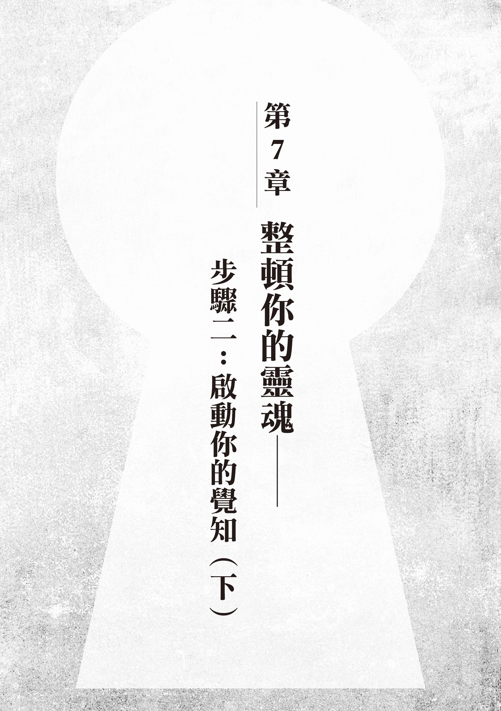

# 第七章　整顿你的灵魂──步骤二：启动你的觉知（下）

希望现在你对自己的崭新觉知振奋不已。你发现了一些在暗中主导你人生，而你却一无所知的灵魂契约。你很了解这些契约造成的各种障碍。有了这些资讯，便能揭开潜藏的种子思想，发掘你的功课。你可以明白这套系统之所以出现的原始原因。当初是什麽种子思想导致你签下了这份灵魂契约？一旦你辨识出种子思想，要找出背后的灵魂功课通常易如反掌。

在灵魂系统工作的流程中，辨识种子思想（亦即灵魂契约锚定的对象）是唯一能让你顺利进入驾驭阶段的方法。想要驾驭自如，就得明白自己必须学习的功课。光是说：「我有交好朋友的障碍。每次我最需要帮助的时候，朋友都不理我。」或者：「我有金钱方面的灵魂契约，总是留不住钱。」并不能带领你达到真正驾驭灵魂功课的境界。你不能只是试图释放这些契约，你得追究这些障碍背后的原因。不明白原因就去处理你的障碍，只能治标不治本。

#### 辨识种子思想及课题的四个步骤

多数人觉得这个阶段的灵魂系统工作，宛如电影《洛基》。想像席维斯‧史特龙跑上费城艺术博物馆前面的台阶、训练师陪着他慢跑、打速度沙袋，同时以〈虎之眼〉作为背景配乐。当他为了求胜而潜心锻链，这支影片交代了他全部的苦练。

当你展开这个步骤，记住洛基的例子。戮力以赴的效果最佳。时候到了，你要尽一切可能，动员能力范围内的所有资源，将种子思想作怪的地方统统一网打尽。你在愈多地方找到种子思想，愈容易辨识你当初建立这套系统，是为了学习什麽功课。

最后一个提醒：你的种子思想未必和你想得一样。

我有一位客户是养女。她以为自己在生母将她交给领养机构时，形成了自己不够好的种子思想。当她深入探索，才察觉我不够好的种子思想，源自她在孤儿院偶然听到两位修女的对谈；她们说，她母亲是一个男女关系不检点的野女孩，日后她长大了八成会是母亲的翻版。如果你发现的东西乍看莫名其妙，也别因此而怯步。

现在，你已经准备好加深觉知。我们在前文说过，没有种子思想充当灵魂契约的锚，你便无法建立根源信念系统。本章要破解种子思想（一切的源头），让你能看见灵魂功课、驾驭种子思想，并予释放。

披露种子思想就如同寻找灵魂契约背后的原因。简单来说，你是要了解当初是基于什麽情绪或想法，而订立灵魂契约。你发掘的情绪（称为混乱情绪）和想法，实际上就是你的种子思想；这便是你障碍的根源。

##### 步骤 一 辨识事发的时刻

这一步的目标是采撷你发掘灵魂契约的成果，实际应用。看看你刚刚揪出的其中一份灵魂契约，回想这份契约造成的一个实际生活事件。这叫做辨识事发的时刻，接下来几个步骤要运用到你在那一刻萌生的感受、想法，在那一刻凌驾你的情绪。进行这三个步骤时，要将那段经历放在心上。

##### 步骤二 记录感受与想法

现在该来瞧瞧你的情绪在灵魂契约作怪的时候有什麽变化。在事件发生的前一刻，你有什麽感觉？整个事件过程中，你感觉如何？有何想法？请诚实作答。不要含糊地说：「我很好。」付出时间和精力好好地检视你的情绪、消化情绪。全部写在笔记本中。

例如，当你有气无力地跟朋友说，你因为生病不能送她去机场，或是和姐姐争辩车子应该由谁开，你有何感受？你担心朋友会讨厌你吗？你害怕姐姐不肯听从指示，而不能准时把你送到目的地（每次都这样）吗？你觉得你应该开车送朋友去机场吗？

你的心智可能会对往日的简单事件萌生复杂的想法和情绪。留意这些想法和情绪，即使政治不正确，也要明辨它们真实的样貌，因为这是了解种子思想的关键。记录这些情绪和想法。最保险的做法是记在小笔记本里。别写太多，文字要简单明了。例如，你可以写：「开车送棠恩到机场。我觉得她工作很辛苦，理应有人送她一程。」不要用多余的文句把笔记内容变得庞杂。你的资讯愈简扼，下个步骤愈容易。

##### 步骤三 辨识种子思想

在完整记录下你的想法和感受之前，不要阅读这个步骤。

现在你已认真检视了至少一件有灵魂契约在捣蛋的生活事件。现在应该来点侦探工作。检视你的笔记本。你看到了什麽？开始从你的行为、情绪、思维寻找模式。搜寻线索、阅读笔记的时后要客观，就像看课本一样。你愈客观，这个步骤愈容易。你多次使用同一个字眼或句子吗？留意自己写了什麽。你的情绪和思维会带给你线索，让你破解自己应该学习的事。

浮现的模式将是反覆出现的负面情绪和思维。寻找每回你经历灵魂契约障碍时，不曾表达出来的感受，但是也要寻找，每次你避免让灵魂契约影响你的感受和情绪。这些会带给你绝佳的线索。

当棠恩请你开车送她去机场，而你判定与其留在家里休养，送棠恩一程更重要，你等于同时在表明自己的需求不配放在第一顺位。在这个例子中，根本的感觉（或种子思想）十之八九会是「我不配」、「我不值得」，或「我不够好」。剔除你的情绪经验之后，动机便会昭然若揭。与种子思想对映的混乱情绪，或许是焦虑、恐惧、紧张、失望。

以下的练习能帮助你进一步扩充，你开始注意到的模式细节：

① 首先，在日志写下你观察到的模式。也许只有一、两句话。不要写得太复杂。愈简单明了，愈好。以机场的例子，你的笔记或许会是：「我注意到我觉得自己不够好，不配待在家里休息。」

② 从恐惧的角度把句子重写一遍，但是不要附带细节。因此，在此例中，或许句子类似这样：「我害怕自己做得不够多，不配得到任何回报。」

③ 现在，进一步简化这个句子。以此例来说，新句子会类似这样：「我怕自己不够好。」

针对你刚辨识出来的种子思想，记录伴随而来的重复情绪。这些其实就是与种子思想一并埋藏到灵魂内的混乱情绪。

##### 步骤四 辨识灵魂功课

既然你知道自己的种子思想了，就能接下去辨识灵魂功课。幸好，你会发现在完成许多苦工之后，辨识功课是本书最简单的步骤！

我们是完美无瑕、美丽、真理、光的造物，宇宙的造物。宣称我们不是那麽回事的想法，一律都是虚假的。因此，不论你的种子思想是什麽，灵魂功课都是透过言行举止，活出完全相反的样貌，请相信灵魂的光芒。

我不够好，变成，我绝对够好。

我不值得，变成，我最值得；以及，我跟别人一样值得。

我不安全，变成，我受到神、本源、宇宙、所有的朋友，以及后援系统的保护。

后续几章我们会说明如何从灵魂层次学习这些功课。在那之前，开心就好！你已经给了自己力量。你已经辨识出自己在创立灵魂契约时面对的种子思想。这些能大幅地削减灵魂契约的力量，仅仅只是走到目前这一步，就会发现灵魂契约对你生活的影响，已经不如你开始展开探索的时候。

太多人在尝试灵魂契约工作时没有暂缓脚步，发掘他们的种子思想、混乱情绪、功课，我认为这很不可思议。最近我在一个热门的网路电话工作坊上开讲，奉送听众一次关于灵魂契约的免费集体清理。

接受清理的人大半都很感恩，但是有一位女性写电子邮件告诉我：「丹妮尔，我做过很多改善人生现状的技法，包括你的灵魂契约清理祈愿。但是全部无效。我还是没遇见的我的梦中情人。我觉得自己老是只差临门一脚，偏偏什麽都没发生！」

单单这一句话就让我在当下了然于心，这位女性还没有处理她的种子思想，没有经历到处理之后所创造的深层助益。（记住，灵魂系统工作会缔造永久的改变，不是急就章的补救之道。）这位女性所不了解的是，除非学会灵魂契约要教导你的功课，并且在生活中身体力行，否则不可能清除任何灵魂契约。

我在那场网路电话工作坊向听众解释过，在清理灵魂契约的时候，只有他们下功夫揪出潜藏种子思想、找出灵魂功课，并予以实践，灵魂契约，才有办法中止。不论你多麽拚命卸除灵魂契约，基本功一定要做。没有捷径。

一位名叫克蕾儿的客户上门时，以为她的障碍可以瞬间移除。她说：「我知道自己的障碍在哪里：我总是选错对象。我要你帮我清掉这个问题。」克蕾儿埋怨每回邂逅的男人，总在她爱上他之后匆匆分手。她细数一个又一个看似不错的男士前来追求她，然而一旦她和男人上床，不出一个月，男人便会离开她。她只不过想要被爱，却觉得不被爱。她说自己试遍寻觅良缘的技巧，全部无效。

据克蕾儿说，她人生唯一的困扰就是情路坎坷。其实，种子思想全面渗透了她的生活。以此例来说，克蕾儿见树不见林。她相信自己的灵魂契约只局限在爱情层面，导致男人离开她。

克蕾儿事前查询过我的工作，当我提议我们深入探索她建立目前那些灵魂契约的原因，她语带挖苦地说：「我只要你清掉永恒之爱、贞洁、寂寞的灵魂契约，让我可以好好过日子，就好。我只想找个理想的男性结婚，我等不及了。」问题在于，克蕾儿完全弄错状况了：释放灵魂契约是最后一步，那是你学会灵魂功课、卸除种子思想之后的步骤。否则，就像把马车摆在马的前方一样，你哪儿都去不了的。

为什麽克蕾儿当初会在生命中建立这些灵魂契约？她反覆经历了什麽种子思想，以致于她判定自己受够了？从显然一再重复的负面模式或障碍，便能轻易挖出她的灵魂契约，但是克蕾儿只走到这一步便不再前进。但更重要也更难的是，厘清最初为什麽萌生那些种子思想、为什麽签下了那些契约。

我和克蕾儿见面的时候，我没有请她列出那些遇到阻碍的领域，而是请她检视自己受制于灵魂契约的实际事件。对于心存抗拒，或很难认清那些相同的模式贯穿生活各个领域的客户，我发现这一招对他们很有效。既然克蕾儿认定她的模式只出现在她的感情生活，那麽我们就先检视这个领域。

我们讨论了每一段感情。不久，模式便现形了。克蕾儿发现她选择的男性都不擅长沟通。事实上，他们多半沉默寡言。克蕾儿的父亲不太关心女儿，所以她觉得自己必须拚命吸引男友的关注，以维系他们的热忱、逼他们沟通。当克蕾儿回顾往日的情史，显然她相信自己必须赢得男人的爱；这是她从幼年便抱持的信念。克蕾儿记得数不清多少次，她施展浑身解数满足男人的需求，希望自己的慷慨能打开他们的心扉，她记得，这就是自己与父亲相处的方式。最后，一切无济于事。男人会厌倦克蕾儿的宠溺，弃她而去。

克蕾儿的根本信念是自己不值得爱，这不但让她情海生波，也反映在其他领域，诸如她的工作。她察觉自己必须做牛做马，工作表现才会获得肯定。她必须为朋友赴汤蹈火，只为了做好一个朋友的责任。

当她辨识出灵魂契约是攀附在什麽种子思想之上，她便能进入灵魂系统工作的下一步。但是在她发掘种子思想之前，她完全束手无策。对克蕾儿来说，辨识种子思想便是她欠缺的一环。

记住，辨识你的灵魂契约是很好的，但是到头来，一切都关乎你的灵魂功课，当你知道自己的种子思想，便能厘清功课。你受苦受难不是为了惩罚你。而是协助你相信自己美好本质的方式。

#### 额外的大补帖：换一个观点

我们在童年的选择并不多。想像你五岁的时候。如果你父母吵架，你不能离开家，或躲到别的地方去。如果你不喜欢母亲对待你的方式，或你讨厌父亲在家时的情况，你没有多少反制的手段。你可以沉默以对。你可以告诉大人你不快乐。但是多数的孩童不具备细腻的沟通技巧，情感也没有成熟到能这麽做。

身为孩童，你的选项实在有限。你必须在能力范围内摸索人生，做出决定。对多数人来说，这表示深度会向另一个人（通常是家长）看齐，扬弃真实的自我。有些人会在青春期的叛逆阶段重拾自我，也有人会迷失自我到三、四十岁，甚至一辈子！

我遇见我的客户茱丽的时候，她事业有成，是科技产业的资深主管。她和丈夫育有一双儿女，花不少时间陪伴母亲，有一小群亲密的朋友。但是茱丽觉得不快乐、没人爱、不满足。

当茱丽描述她的人生的时候，她显然想不通自己为什麽感觉不到爱或幸福。在台面上，凡是社会列为幸福、成功人生的必备条件，她一概符合。实际上，茱丽长年累月寻求援助，因为她觉得自己一定是太自私了，才会想从人生得到更多。当茱丽提到母亲周末要过来看她，我的通灵师触角便竖起来了。我问她，那是不是一件好事？她断然地说：「是啊！当然是！我爱我妈！」当她描述妈妈是她人生重要一部分的时候，我脑子里嗡嗡作响。事情没那麽单纯。

我继续追问，茱丽承认自己对童年没什麽印象，只知道日子不太好过。她听过妈妈讲述前尘往事，但是她记忆有限，实在想不起母亲谈论的故事。她说，妈妈常把过去挂在嘴上，茱丽告诉我，她很扼腕自己不记得那些事。我向茱丽解释，我觉得她从幼年就决定将母亲对现实的看法当成自己的观点，以保护自己。小茱丽从中感觉到安全、保障，和爱。

茱丽的回答呢？「没那回事！我母亲从以前到现在都是了不起的女性！我小的时候，她为了教养我吃足了苦头，我真的是很难教的小孩。她用尽一切努力把我管好！我母亲是我生平见过最优秀的母亲。」

每个人在孩提时期都会建立一套与世界互动的方法。而我们当年生活中的人物及我们当年得到（或没得到）的照顾，会左右我们如何与世界互动。很多灵魂契约是在幼年建立的，通常在三到五岁。随着年纪增长，我们开始相信这些灵魂契约，实际上就是我们的本色。以茱丽为例，她建立的灵魂契约驱策她插手管理身边的每个人，同时与旁人保持距离。当别人不帮她，她便不必承担失望的风险。但是我们做个案的时候，她很难理解这一切的源头，怎麽会与母亲的管教方式沾上边。

我常遇到几乎没有童年记忆的客户。他们大部分人的处境和茱丽一样：童年时与母亲（或父亲）关系紧密，极能体谅父母过去的行为。这种人往往不明白有灵魂契约在作怪。此外，他们没有觉悟到为了采纳照顾者的观点，他们其实必须排斥自己在那当下的实际情绪。被掩埋的情绪构成了混乱情绪，在随后漫长的岁月不断地浮上台面，为种子思想火上加油，往往导致一个人不断地建立新的灵魂契约，以持续镇压那些情绪。

要了解你为何建立这些灵魂契约，先判别哪些记忆与经历是你的亲身体验，哪些则来自你身边的那些人。你必须开始采用自己的立场，而不是童年时你过度认同的那个人的观点。但是这不表示你应该抵制父母或某一位照顾你的人；你要抵制的是，他们多年前加诸在你身上的视角。

身为成年人，如果你对自我的认知是来自周遭的人，而不是来自亲身经历，你是不可能了解自己的。这表示你要回顾别人说给你听的童年旧事，透过你当年的感受（或依据你长大成人后对自己的认识，推断你当年可能的感受）理解那些往事。找出自己的解读。

茱丽从小就相信自己是一个非常不规矩、管不动的孩子，一个会虐待妹妹的姐姐。有一个她听过无数遍的童年故事总是令她很内疚。她母亲告诉茱丽，她八岁的时候拿了一枝玻璃制的拐杖给五岁的妹妹，骗妹妹那真的是糖果。妹妹一口咬下去，玻璃碎裂，割伤了口腔，不得不缝了三针。

我请茱丽重新检视这件往事。她是否记得自己蓄意折磨妹妹？她总得有愤怒、复仇、暴力之类的情绪，才会那样对待妹妹。就她记忆所及，她对妹妹有那种感受吗？我询问那样的情绪是否出现在她目前的生活中。她说没有。

茱丽察觉自己将妈妈认定的真相当成事实。她以妈妈的角度审视自己的人生，于是看到与自己实际体验相差甚远的故事版本。基本上，在灵魂层次上，她妈妈在说：「如果我们从这个角度检视生活，就会看到我是一个好妈妈。从这个角度看，我就能满意自己的作为。我可以接受自己过去的决定。如果你接受我的角度，我们就可以很亲密。你会感到安全、有保障，你会感觉到我爱你。」

茱丽的妈妈缔造这个观点倒不是因为她心肠恶毒。她无意伤害茱丽或摆布她的人生；她有自己力不从心的地方。她告诉茱丽的事情经过是她认知中的真相。茱丽目前的挑战在于，她还没舍弃母亲塞给她的角度。她万分恐惧，假如自己采取和母亲不同的视角，她会失去母亲。

我请茱丽回顾拐杖糖事件。如果她现在的感觉中不包含报复、暴力，那事发当时，她大概也没有那些感觉。那麽她实际的感觉会是什麽？茱丽撇下母亲告诉她的故事版本，在心里想像实际的经历。她说，妹妹一出世就生病，父母大部分的时间和精力都用在协助妹妹康复。茱丽记得自己觉得没人关心她，而她只是想让每个人都绽放笑容。她坐着回想这件事，记忆便慢慢地浮现了。她只是想逗全家人哈哈笑（包括妹妹）而已，不料误判情势。她不知道咬碎玻璃拐杖糖会割伤嘴巴。

茱丽开始探索自己的观点，于是有了重大的突破。她从自己的角度解读母亲讲述过的其他故事。至于记忆中搜寻不到的往事，则依据她对童年的新认识推敲实际的情况。她省悟到自己仍然怀抱着混乱能量，包括：嫉妒（因为妹妹得到众人的关注）、失望（她没有得到那麽多关注）、悲伤（因为她真心想要自己没得到的爱）。

她愈探索、愈明白自己绝对有权力从自己的观点检视人生。她不会因此变成坏女儿或自私鬼，事实上，这些让她认清昔日的自己，理解自己以前为什麽做出那些决定。她终于了解自己种子思想背后的功课：她和任何人一样值得拥有自己的人生、经历，和后盾。

原来，茱丽在成年生活中体验到的混乱情绪，正是她三岁时签下的契约，她将母亲的观点视为自己的感受。她必须将这些情绪埋藏到灵魂深处。当她深入这些回忆，她不只化解了这些陈旧的种子思想，也释放了长期深埋的负能量。

在孩提时代，你只希望照顾你的人会爱你。你会尽一切努力建立和乐融融的情境，即使那表示你得漠视自己的实际情况、情绪、行动，以采纳别人那一套。其实在长大成人的过程中，这是极为正常的历程。

问题在于这些情况常发生在灵魂层次，而三十年、五十年之后，你仍然遵循相同的模式来寻求安全、保障，和爱。你迟早必须放弃这些旧模式，依据你的光芒、你的成人观点、你从童年以来的全部经历，建立新的模式。

抽出时间回顾幼年很重要。我发现大部分的种子思想是在幼年建立的，介于三岁到五岁。稍后才签下灵魂契约，介于六到十岁。或许你会发现你需要区辨什麽才是你经历过的事实，什麽是照顾者或家人的说法，然后才能进行灵魂系统工作。如果你能轻易回想往事，就从这些事着手。

但是千万小心：对于你记得的事件，请确认那是你本人的回忆！有时别人认知中的真相会深深地渗进你的心田，以致于你没察觉自己根本没有那些记忆！你真的记得某件事吗？还是你只是听别人讲了太多遍，就以为那是自己的亲身体验？很多人以为自己的记忆完好如初，后来才发现那其实是某位家人告诉他们的往事。如果你面临这种情况，释放别人的视角对你的益处，不会亚于完全无法汲取个人记忆的人。

如果每次回想往事都不能勾起你的情绪，你不可能从自己的观点检视自己的人生。没有自己的观点，你要如何鸟瞰自己的人生，厘清灵魂契约和种子思想？

如果你真心想要检视过去、辨识什麽是自己的过去、什麽是照顾你的人的说法、学会孩提时代的重要灵魂功课，你就得从事情的经过抽离自己的能量。如此一来，你会发现回忆不如之前那麽让你激动。事实上，崭新的客观立场能让你自由地理解当时的实际经历，进而让你从中学习、向前走。

# 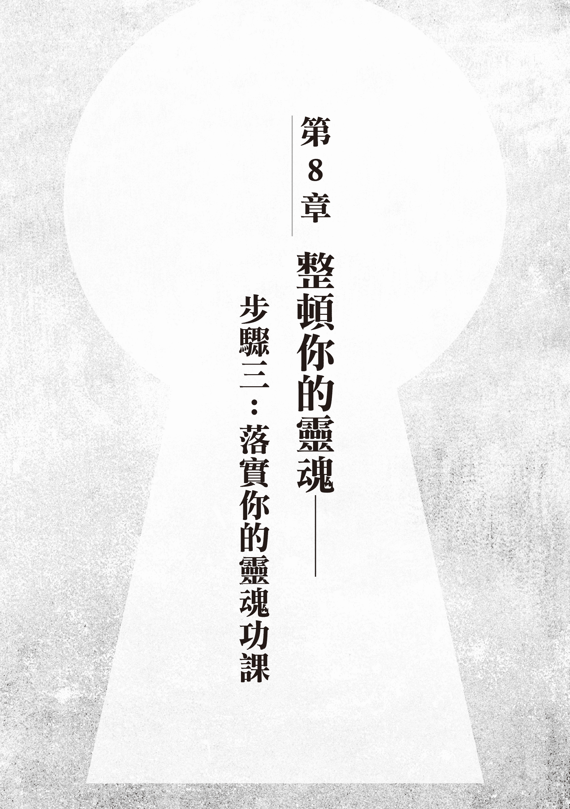

# 第八章　整顿你的灵魂──步骤三：落实你的灵魂功课

现在我们该来处理目前灵魂层次的挑战，背后的功课了。走到这一步，你看待自己的眼光大概已经截然不同。我们会在这个步骤善用这一点。你会在自己的世界开始见到零零星星的转变。

研究学问、上课、尝试新工具与技巧、看书、与朋友谈论等等，可以让我们对一件事物得到理智上的理解。这种聚焦在向外求取的做法，可以带来丰沛的知识，但是实用的部分却少之又少。我曾和许多没意识到自己是「万年学生的客户」合作（那种对市面上的灵性讯息及自学资讯照单全收，人生却原地踏步的人）。学习能量运行之道、与你的指导灵谈话，或者了解你有什麽种子思想和契约。这些都很好，但是你不行动的话，这些资讯便没有价值。

在灵魂系统工作中，觉知与理解只能让你睁开眼睛，认清自己的现况。你可以长年累月钻研这些学问。你可以住在我家，当我的学生，除非你愿意从万年学生的模式切换到行动模式，否则你不可能得到灵魂层次的深刻蜕变。要落实灵魂功课，一定得敞开心胸去感受。你也得做好灰头土脸、承担风险的心理准备。或许你的情绪会狂风暴雨，甚至可能暂时丧失理智。

本该如此。这不是从外在检视你的灵魂系统如何运作，而是去感受它如何在你的内在运作。这才是你该追求的落实灵魂的功课。我们不是用显微镜理解生命如何聚合在一起，这些道理你又不是不知道。我们要不嫌肮脏卑下，拾起污浊，品味生命，吐掉我们不喜欢的，与适合我们的做法合而为一。这才是货真价实的实践。

因此，准备好去感受、体验吧！确确实实地活出自己。现在，这是你生命的一部分，不用显微镜，不再说教。只要将实实在在的真实自我摊在台面上。

#### 从过去解脱吧！

沉溺在过去会妨害你实践灵魂功课。假如你每次一想到终于可以赚钱，或摆脱热衷批判的习性，便又记起自己频频失败的过去，你会更难做好接下来的步骤。最要紧的是，你要能回顾生命中的事件。好好地放下过去，以便从中学习，不再被过去绊住了脚步。

如果每次回忆起童年都会让你重温内心的煎熬，比如：那桩在学校的惨事、或你们家破产的日子，这样你如何公正地看待你的过去呢？在这些心情沉重的时刻，可以运用我命名为「泡泡切断术」的能量工作，重拾美丽、平静、客观的心境。

当你能够保持客观的立场，便能思考不同的观点、新的想法，说不定还能以崭新的角度，重新诠释自己的经验。或许不容易做得到，但是重新诠释过去是释放的正常环节。泡泡切断术可以帮助你在回顾过去的时候，不受到旧观点（落入种子思想的窠臼）及新观点（因为你持续处理你的种子思想）的干扰。迟早，你会敞开心扉，学习深植在这些痛苦时刻内的功课。

练习　泡泡切断术

进行这项练习之前，先找一个你觉得舒服、且能长时间独处的清静空间。

##### 一、召唤指导灵

召唤指导灵前来协助。不想召唤的话就坐着，让心安静下来。如果你喜欢与指导灵、天使、灵性存有合作，想像祂们与你同在，准备好助你一臂之力。如果你不清楚召唤的方法，就说：「我现在召唤符合百分百圣光的指导灵前来，协助我今天的工作。」让自己舒服一点，营造恬静、安全、平稳的氛围。

##### 二、挑选事件或经历

针对你要处理的种子思想，从过去挑选一则相关的经历。最理想的状态是，在你移除完自己对那则经历的能量依附之后，你便能理解种子思想背后的灵魂功课，并身体力行。怎麽挑选往日的经历呢？第一次练习的时候，请选择非常明确的经历。从小处着眼。一开始，你应该先一一评估你的经历。

最适合在第一次练习使用的事件是，仍然让你气愤难平的明确事件。

以我的一位澳洲客户为例，她的先生时常唠唠叨叨的，不尊重她。有一次，他挑剔她切肉的方式。先生说，你很奇怪，什麽事都不懂正确的做法，你在餐桌上的德性会笑掉别人的大牙。这便是适合这位客户做泡泡切断术的绝佳事件。

这是明确的事件，她想起这件事情的情绪，强烈、宛如人就在事发现场，这也与她「我不够好」的种子思想相关。不要选择笼统的主题，诸如：你的母亲或仍在发生的权力斗争，挑选明确的经历。日后你可以运用这项技巧处理，仍然持续在发生的大型议题，但是务必先从最单纯的层次驾驭这项技巧。你选择的事件也应该牵涉到你，以及一位你生命中的重要人物。

接着，请你重拾童稚的一面，启动五岁小孩的模式。如果你在随后几个步骤太严阵以待，你便无法从中受益。试着站起来蹦一蹦，做做开合跳，做什麽都行，只要你不是静静地坐着，别把自己过度剖析到什麽都做不了。

##### 三、建构你的泡泡

针对你选定的事件，想像涉入其中的另一人（只有一位）站在房间另一侧，约十尺远。注意他的站姿、衣着，乃至你觉得他处于什麽情绪。让他待在那里一会儿。

接着，想像你将他放进一颗泡泡里。这颗泡泡可轻易地容纳一个人，泡泡满怀着慈爱包覆他。持续观想这颗泡泡在房间另一侧，而且他就在泡泡内。当你运用想像力建构这个画面，要知道自己是安全、受到庇护、被爱的。接下来你要对这颗泡泡做的事，符合每位牵扯其中的人物至高至善的福祉。请保持平静与专注。

有些人对于把别人放进泡泡里感到疑虑。记住，这颗泡泡充满了爱，建构这颗泡泡，是为了协助你、以及另一人，释放对你们不再有益的能量。我们唯一的意图是追求平衡、真理、释放，与明晰。

##### 四、填入情绪

这是泡泡切断术最关键的步骤之一，目的是揭开埋藏的情绪，以及与事件记忆连结的相关能量。只要这些能量藏匿在你的记忆中，便会持续在暗中提供你火上加油的动力，不断地灌溉你的情绪，让你不能客观地审视回忆，请学会当中的功课、并向前迈进。

因此，我们来移除这个动力来源。或许你会觉得很困难，因为你一直用情绪、行为、契约等等玩意儿掩盖它。我们要透过关注这些情绪来进行释放。在随后的两、三分钟，你的心里会很不舒服。这不会花很久的时间，只要两到三分钟。如果你逃避这种不适，你不会见识到不适结束之后的海阔天空。允许自己经历小小的（或大大的）不适，你可以立即体验到这个步骤的强大效果。不妨这样想，我用两分钟重拾自由，享受在理解、并落实那段经历的灵魂功课之后的终生转变。

一边想像你选定的人物待在房间另一侧的泡泡里，一边开始回想你选定的那段回忆。回想时，不要像在讲述给朋友听那样。你得沉浸在那些情绪中，这个步骤才会见效。因此，别跟自己说：「雷夫那样做的时候我气死了。」问自己那股怒气的实际感受。花时间找出内心的情绪。让情绪浮现出来，直到你不再思索那股怒气，而是感觉到怒气。你体验到你的愤怒。或许你会注意到自己握起拳头或绷紧身体。或许你会感觉到后颈麻麻刺刺的。不论你生气时有什麽身体征兆，一律找出来。想像你的怒意填满一颗胸腔内的大海滩球。持续用你感受到的全部怒意，填满那颗海滩球。如果闭上眼睛能帮助你专心，就闭上眼睛。

当你凝聚不出更多的怒气来填满自己，你便该进行下一步骤。用双手举起那颗在你幻想中填满负面情绪的海滩球，将它放进那颗安置了一个人的大泡泡里。这时，海滩球会沉到泡泡底部。以片刻时间，查看负面情绪现在占据泡泡的多少空间。是四分之一颗泡泡？八分之一颗泡泡？目标是持续这个步骤，直到完全填满泡泡的空间。

我只是以愤怒的情绪为例。你能汲取的最强烈情绪，不见得是以怒气打头阵。也许你会从困窘、恐惧、作呕开始，愤怒或绝望则是晚点再处理。以不同的情绪填满不同的海滩球。你会发现自己能用一种以上的情绪，填满那颗泡泡。

这个步骤最重要的要点是，「沉浸在情绪中」，不是想着那个情绪。我见过很多人可以面不改色地畅谈亲身经历过的可怕事件。他们道出细节，却无所不用其极地避免重温那场经历的能量。如果你也是如此，你要一遍又一遍地问自己：「那是什麽感觉？」回到你埋藏的能量中。如果你无法重温那些情绪，也许你要选择与种子思想相关的不同事件或人物（或两者），直到能汲取到回忆。

翻出这些情绪的时候，或许你会发现羞于承认的事，即使是向自己承认！这是健康的心态，并且证明你开挖得够深入。允许自己理清关于那一次情境的全部情绪、感觉、想法。尽力老实地摊开那些情绪，沉浸在回忆中。很多人埋藏这些负能量，是因为他们判定自己在那当下的实际感受很不妥、不符合政治正确或不公道。这是释放一切的机会。别人不会知情的。

进入下一步骤时，你要知道，你花在填满海滩球的这两、三分钟，是这整个练习中最困难的部分。

##### 五、寻找连结

完全注满泡泡之后，便可以进入下一道程序。填满泡泡未必就能清空埋藏的情绪，这确实表示，在这一次的泡泡切断术练习中，你已经尽力而为。

接着，运用想像力看一看这颗灌饱的泡泡。它大概不再是轻盈、明亮、精巧的泡泡了。它满载着负能量。多数人心目中的泡泡沉重、晦暗，且恶心。泡泡又怎麽可能不是那样？因为负面阴影是黑暗、沉重、黏滑、恶臭的，就像沥青。而且你才刚刚将这些玩意儿从内心拖拉出来，放置在泡泡内。

想像有一条能量索连结到泡泡上。你用这条能量索将自己的能量灌注到那个情境中。你的种子思想灌溉你的负面阴影，你则用能量索将负面阴影输送到这一段负面回忆中！这条能量索百分之百由你的能量构成，既不是另一个人的能量，也不是那场经历的能量，而是「你自己的能量」。

这不是要责怪你，只是你得扛起责任。你长年累月喂养关于这个情境的负面情绪。你承担个人责任的时候到了，断绝连结，向前走。你此刻的任务是切断连结。

如同本书第五章的说明，内心能量稳健踏实的人比较快乐，也比较清明。从能量索流出的能量，类似你在泡泡切断术练习看到的能量，绝非稳健踏实的能量。现在要收回长年以来，喂养这个情况的不稳健踏实的负能量。你要移动它。首先，留意这条能量索是否从泡泡连结到你身体的某个部位。它连结到你的肚脐区块吗？还是心脏？右肩？也许它有分岔，连结到两个或更多的部位。花点时间查看；这很重要。

如果想像不出一条和你连结的能量索，请快速地做一次想像力的练习。想像一只蓝色的乌龟。想像一只红色的恐龙。想像一记响雷。

现在，回来运用想像力描绘这条能量索固定在你身体上。别忘了用一点时间留意这条能量索的质地。在健康的情况下，它可能质地轻盈、闪亮亮的，几近透明。纯净的能量会来回地疾速流动，几乎侦测不到它。但是，你现在看到的能量索大概是沉甸甸的，像一条脐带。或许上面长着霉菌或藤蔓。或许它没有弹性，或是以钢材制成。

尽情地挥洒你的想像力，真切地看见你的能量索是什麽样子。在日志写下你的印象，以免遗忘。稍后你会测试这项练习的成果。

##### 六、切断连结与重拾能量

运用想像力，看见这颗阴暗、恶心的泡泡腾在房间另一侧的半空中，它看起来浑浊、凝重、黏腻到了极点。你在内心或实际上（看你觉得哪个效果好），将手伸向那颗泡泡。轻轻地抓住它与能量索相连的地方，握住这条想像中的能量索。然后心怀慈爱。接着拔掉泡泡的能量索，就像拔掉插在墙壁电器插座上的插头。你甚至可以在能量索和泡泡分离的那一刻，听到一声「啵」。

关于拔掉能量索，我要说明一件事：你辛辛苦苦才走到这一步。你选择了仍然有能力挑起你情绪的事件和人物。这人或许仍在你的生活中。当你拔掉泡泡的能量索，并不会移除你们的人际连结。你并不是将这个人逐出你的人生，或永远禁止他们和你说话。你只是把以前拿去灌溉记忆的负面阴影能量，收归己用。就这样而已。泡泡内的人不会因为你拔除连结而痛苦。事实上，进行这项练习，说不定会带给泡泡内的人，一个出乎意料的成长机会。

现在你站在那里，手上拎着一条能量索，然后呢？当然是重拾你的能量啊！

请将这条想像的能量索收拉到双手之上。尽量将它卷起来放在手掌上。这是你的能量，和你失散已久的能量。现在你们终于团圆了。这是值得庆祝的一刻，不必怕。以呼吸充当指标，重拾这股能量。将你收好的能量索放到它与你身体相连的部位。

例如，假如是连结到肚脐的话，便将卷起的能量索放在肚脐上，然后用双手盖住。假如能量索是连结到你无法用双手覆盖的部位，运用你强大的想像力。现在你的想像功力应该相当厉害了！

我发现呼吸是最强大的工具之一。用鼻子深深地吸气，然后从鼻子慢慢地呼出。多做个三遍。吸气与吐气的时间尽量一致。吸气时，是在创造力量。吐气时，便创造了更多的空间，让能量索的能量重新融入你的内在。想像你每一次吐气，能量索都愈来愈轻盈、柔软、闪亮。

这麽做，便能实际改变能量索内的能量，从晦暗沉重转变为轻透、明亮。毕竟，你可不想重新吸收那麽多的负面阴影。当你无法让它更轻透闪亮时，就想像你每次呼气，都让能量索被吸纳回身体内、回归你的能量中、回归于你。请继续呼吸，直到现在恢复美丽的能量索能量，透过与能量索相连的身体部位，完全返回你的内在。

完成重拾你的能量之后，坐着放松一会儿，但是只能休息片刻。这项练习还有一个重头戏。那颗沉重、讨厌的泡泡仍在房间的另一侧！你努力开挖、释放的那一堆负能量，还在那里呢。

##### 七、释回宇宙

当你从重拾的能量里回神，你会感受到将陈旧的负面阴影释回宇宙的强烈喜悦。请在脑海中走向那颗泡泡，带着和善与慈爱，轻轻地将它推向天空，想像你将泡泡交给你的指导灵。请祂们接收泡泡，以最高形式的光消融泡泡，将所有的能量送回它原本的来处。

想像自己看见泡泡在光中消融，各种能量返回它们的源头。一部分的能量，可能会回到你身上（那种感觉很舒服的）；一部分能量，可能会回归到事件里的其他人物身上；一部分可能回归到事发的情境。你只管允许让这一切发生，并且接收属于你的美丽的光。

#### 测试成果

这项练习为你带来任何转变吗？你因而更接近你的目标了吗？幸好，你可以立刻验收成果。休息五分钟振作精神之后，就该查看成果了。现在，再次坐在舒服的平静空间，以片刻时间回顾你处理过的回忆与相关的人物。回想那段记忆。事件带给你的感觉改变了吗？你个人的感觉改变了吗？你的反应改变了吗？痛苦是否缓解了？

在这个阶段，多数人会说那个情境不像以前那样会挑起他们的情绪。事件变清爽了。情绪呈现中性。有的人会觉得状况略有改善，但是情绪仍会冒出来。假如是这样的话，你只不过需要在日后方便的时候，针对这则回忆重新做泡泡切断工作。或许你选择处理的事件规模较大，或许你释放的速度较慢。无论成果如何，不要下负面的评断，你要为能够改善自己的能量而振奋。如果你再多下一点功夫，蜕变会更大。

针对这个事件建立中性的回应，能让你做出良好的决定，学会你的功课！当你能够以和善的中性眼光回顾一个事件、与某人的一段感情，或一段经历，你会发现，自己终于具备了深入探索的力量与能力。

验收成果的终极考验是，从你崭新的客观角度，检视你选定的情境和人物。既然这件事不再撩拨你的情绪，你能从中领悟什麽？你看得出种子思想如何驱策你做出昔日的举动吗？你能察觉种子思想才是主导往日事件的潜在力量吗？你能够这样检视过去，正是因为神识彻底恢复清明，而这又转而帮助你做到你追求的全面释放。

我的客户史提夫总算看见我不够好的种子思想导致他辍学，最后没能从大学毕业。他不再责怪爱玩的室友。事实上，他意识到当年他根本不相信课业能够及格。觉悟到这一点以后，史提夫明白自己诸多的挫败经验，其实责任在自己，根源来自他的种子思想。

史提夫做了几次泡泡切断术，情绪才抽离到可以置身事外，从种子思想得到他极需要的洞见。他得到的洞见撼动了种子思想的能量，并完全得以释放。

既然你已开始切断昔日的连结，你会发现自己看待障碍的眼光较为客观，情绪也比较不会激动。如果你在自己受阻的生活领域上，仍旧觉得没有大幅地减轻自己与过去的牵扯，就回头多做几遍切断连结的练习。直到你建立了崭新的立场，能够比较宽容地看待过去，不会再被激发强烈情绪的时候，才算准备好进入落实的阶段。这是落实灵魂功课的大前提之一，空有理智上的理解是不够的。如果你现在觉得比较坚强、有力量，你便准备好了开始实践种子思想教导你的功课！

#### 实践的四个阶段

落实灵魂契约背后的功课有四大要件，而不只是改变习惯。遵循这些简单的步骤，你要身体力行，这样你的领悟会容易许多。一如本书提供的诸多工具，等你熟悉了整个流程之后，或许就不需要太讲究形式。现阶段暂且遵循我拟订的步骤。将来等你累积了丰富的经验，即可改变做法。

##### 阶段一 贴标签

第一阶段的名称是贴标签，亦即在灵魂契约及种子思想暗中作祟、悄悄地下指导棋在你不自知的地方的时候，贴上标签予以标示的行为。

如果你按照本书的进度走，你已经在无意间开始贴标签了。随着你迈向落实的步骤，你会从小到不能再小的经历中，揪出这些契约和种子。别从显而易见的地方下手（例如：每次你母亲来访，你心情如何荡到谷底），开始在日常生活的每一刻，寻找这些能量浮现的迹象。注意，假如你买洗发精的时候心里会叨念：「我发质太差了，得买最高级的洗发精才行。」你走过街道的时候或许会想着：「你看看她的俏臀，比我的漂亮多啦。我的屁股真的很大。」你贴上标签的时刻愈细微、愈无足轻重，你愈容易全面落实你的功课。

每次你揪出一个暗中作怪之处，只要对自己说：「贴标签！我的种子思想（或灵魂契约）就是在这里作怪！」这样就大功告成。你愈常做，就会愈厉害。多数人只花几天进行这个步骤。既然你大致发现自己受到障碍干扰的生活领域，比原先想得更多，花时间一一揪出来很重要。你辨识的功夫愈高强，愈容易落实！

如果你仍然觉得很吃力，回头温习本书提到的觉知步骤（第六、七章）。

##### 阶段二 预测

标签贴到一个程度之后，便会看出灵魂契约和种子思想，会在许许多多的场合蹦出来。看到生活冒出这些事端，或许你会觉得近乎滑稽。说不定，你还会取笑自己：契约已全面渗透你的生活，你却毫不知情。一旦你有了这番体会，便能进入预测的步骤，而且你大概已经在无意间，自然而然地展开下一个步骤了。你知道只要你采取某些行动，灵魂契约或种子思想很可能就会浮现。这样正好，你能预测，就能预做准备；既然你能做准备，就能扭转情况。

我的客户蜜雪儿原本以为她的障碍完全关乎金钱。当她展开灵魂系统工作，她察觉自己的障碍并不局限在金钱上。身为一个好人，她很难接受别人的好意，同时很难相信自己对别人的付出有任何价值。

当灵魂系统工作进行到预测阶段，蜜雪儿能够预测灵魂契约与种子思想，可能会出现的诸多场合。她很爱指出每一个障碍即将现身的地方；知道障碍会在哪里现身，让她觉得自己力量变得更强大了。或许，你也会乐在其中。

预测固然简单，却必要。这表示你的力量凌驾了灵魂契约和种子思想，而不是屈居弱势。当你知道导火线即将出现，便能预做准备，你可以神智清醒地思考。当灵魂契约或种子思想驱策你采用某种言行举止，做相同的决定，或对自己抱持某个特定的想法，你是处于全自动模式。例如，假如你的灵魂契约说，你要牺牲自己来证明自己是好人，你会在下意识中回绝你的机会。如果你能预测灵魂契约或种子思想何时主导大局，便能减缓、且更加清楚地意识到那个过程。

「我不值得的种子思想」及「贫穷的灵魂契约」，让我的客户妲西回绝了在人生中拥有金钱的诸多机会。在她开始预测到这些干扰之前，她根本无力反击。

在预测步骤中，直接从你已经习惯成自然的事情开始做。如果你知道自己过度付出的契约，总是在你和某人讲电话的时候作怪，只要提醒自己即可。在契约或种子发作之前，予以拆穿，便可以给你准备的时间，并进入下一步。

##### 阶段三 神智清醒地做决定

当你的铁鎚砸到自己的手指，你当下的反应是大叫并移开你的手。灵魂契约和种子思想基本上造成相同的现象。当你遇到某个特定的情况，你因为契约或种子的制约，而以特定的方式回应。既然你磨练出新的能力，开始能够预测自己何时会再碰上负面情境，你便能改变选择的方式。

想像你用木材制作椅子。每次你用某个角度敲铁鎚，都会打到手指至少两次。既然你知道那个角度常常让你失手，你便决定下次要有备而来。或许你会请别人替你扶住钉子；或许你改用较长的钉子。不论你用什麽方法，你预测到自己会遇到问题。因为你知道后果，你可以花时间改变做法。

同理，你可以在面对契约和种子时改变选择。但是预见即将发生的状况，不代表从此以后都要改变你的决定。事实上，一开始你可能「只考虑改变做法」。随着你预测的能力逐渐增强，你神智清醒做决定的能力也会提高，迟早你可以不需要那片刻的清明，也能做出不同的决定。

做出神智清醒的决定，未必要与种子思想或灵魂契约驱策你做出的行动不一样，重点在于从较高的振动频率下决定。当你的种子思想说你不安全、孤立无援或没受到保护，以致于决定签下「不要对任何人动感情的小围墙灵魂契约」，来封闭自我，那麽你便会充满低频的能量。神智清醒的决策帮助你在这些能量浮现之前做出选择。从你预测到那些能量即将浮现、到能量真的浮现之前的空档，便是你做出神智清醒的新决定时机。

来看看我的客户蜜雪儿的例子，她有涉及接受能力的灵魂契约，以及不相信个人价值的种子思想。当她到银行存放一张支票，她注意到这是她的灵魂契约通常会捣蛋的时刻，导致她对客户支付给她的款项完全无法感恩。但是当她知道这份灵魂契约即将活生生地上演，却发现这个障碍对她的影响力大幅减弱了。

事实上，因为她知道障碍会浮现，她刻意（亦即神智清醒地做决定）选择银行里最亲切的柜员，与柜员愉快地聊了几句。蜜雪儿在下一次离开银行的时候，察觉自己没有陷入对金钱的恐慌。她神智清醒地决定如何应付即将现形的灵魂契约。

预测能为你争取暂停的机会，给你片刻的清明。现在你可以评估什麽才是真正有益于你的选项，而不只是按照契约的制约行事。

例如，如果你自愿送朋友的奶奶去买菜，让朋友能待在家里观赏足球赛，很快地你便会发现，自己在说出答案之前会暂停片刻。你知道这是你的灵魂契约通常会发威的地方。花点时间问自己：「怎麽做才符合至高至善的福祉？」你有空送朋友的奶奶买菜吗？这会让你不开心吗？你真心想要陪她出门吗？最后你做出了相同决定或不同决定都无所谓。重要的是，你的决定来自振动频率较高的空间，而不是基于种子思想或灵魂契约的反应。

当你暂缓脚步，有意识地做决定，你便创造了反制种子及契约的细微成功时刻。这表示你在慢慢地重新训练自己体验不同的经历，逐步脱离种子与契约对你的摆布。这些小小的成功经验愈丰富，愈容易达到全面落实！

##### 阶段四 全面落实

终于在生活中体验到转变、做出新的决定，的确教人欢欣鼓舞。持续做出神智清醒的决定，寻找成功的经验，即使那是最微不足道的成功。在灵魂系统工作中，你从这些细微的改变累积实力，由此改造自己。

要做到全面落实灵魂功课，就要用能够长久维持的步调前进。如果你这四年来都帮忙哥哥照顾小孩，你就别想要立刻向哥哥宣告你不干了。如果这是你选择踏出的第一步，你就跨得太大步罗。你没有循序渐进，如果你试图快马加三鞭，或是着手处理承载着极大量情绪的经历，请退回到贴标签的步骤。

记住，一切都是关乎芝麻绿豆大的事！当你从创造细微的成功进展到中等规模的成功，记得庆祝一下！随着你的成长，慢慢地扩大你的步伐！

第二层次的任务属于能量层次。每次你预测某份灵魂契约即将发作的时候，你暂停片刻、思考、做出新的选择，你便在松动那股能量。你又更接近驾驭、并释放那份灵魂契约。记得那个在罐子装沙的例子吗？落实能量便是对那些陈年的灵魂契约及种子思想的终级晃动！当能量受到足够的晃动，你也认真实践功课，便该进行能量释放的工作了。

每次的成功对于落实功课都极有助益。有时成功来自做出与平时一样的决定，但在决定之前，请抽出时间思考那是否符合至高至善的福祉。你开始做出神智清醒的决定，而非基于匮乏或恐惧。你的选择来自务实的考量，而不是欲求。

第四阶段是落实灵魂契约背后的功课。此处的落实究竟是什麽意思？其实，在灵魂层次落实某件事以及改变表面上的习惯，两者大不相同。你要彻底落实你的领悟，就得在灵魂层次启动转变。这没办法作弊。搜集资讯，与实际了解资讯、落实资讯、了解它如何影响你的生活，这是两回事。

我们来看强尼的例子。强尼进行灵魂系统工作有一阵子了。他发现每次他觉得智力受到挑战，便会忍不住大吃特吃；他知道自己建立了好几份灵魂契约，以保护自己不受「我不聪明」的种子思想所苦。他也察觉到这些灵魂契约逼迫他学习的功课，是看重自己及自己的智力。他只知道功课的内容，仍做不到深信不疑。

进行灵魂工作的时候，强尼剔除了他平时会大啖的食物，从谷物（面包、义大利面、苏打饼干）到甜食，各种食物。他也决定暂时不出门用餐。在旁人眼中，或许会觉得强尼已经学会驾驭灵魂功课，因为他不再纵情饮食。但问题是，他唯一没大开吃戒的原因是，他闪避了诱惑。

这是正确的一步，如果强尼真的落实他的功课，他便能应付暴食的欲望，而当他遇到激发他暴食的欲望的食物时，也比较能够轻松地克制自己。也就是说，强尼改变了习惯，但是还没驾驭灵魂契约。

以此例来说，强尼没有着手展开他必须下的功夫。他在改变习惯之后便停下脚步，没接着做实践的步骤。多数人会先设法改变习惯；当新的行为习惯成为自然，便开始落实灵魂的功课。改变习惯是功课的一部分，但是那不等于落实功课。

另外，我听一个人说的话，就知道他们是否真的实践了灵魂功课。当我听到：「我成功了，丹妮尔！我实践灵魂的功课了，我大功告成了。只不过还有某件事，让我很不好受……」我就知道这个人并非真的实践了灵魂功课。如果你持续体验到与课题相关的恐惧或负面情绪，就还没有真的落实灵魂功课。

当你对你的灵魂功课融会贯通，你就不会对自己怎麽能说出心声、变得独立、很能照顾自己、事业成功……不论因为落实领悟而做到什麽事情，而感到愧疚。你会了解并与自己的光芒看齐。你终将明白凡是符合你至高至善的福祉的事物，也会符合别人至高至善的福祉，不论是否一开始便一目了然。

最后，要判断你是否真的落实了障碍背后的功课，最显而易见的办法是检视你的生活。你的生活变了吗？你朋友的行为变了吗？或是有人说你的行为改变了？你收入增加了吗？你在一步步实现你追求多年的目标吗？宇宙需要一些时间重新安排，让你身边的事物符合你新的振动频率，到时你自己心里会有数。持续寻找你的成功经验，以此评估你目前努力的成果。

练习　寻找你的成功经验

当你觉得自己已全面落实灵魂功课，并且清除了对应的灵魂契约，便到了开始寻找成功经验的时刻。这是你努力得到的成果。一开始，出现在生活中的转变微乎其微。你的任务是找出这些转变。

例如，如果你的种子思想和灵魂契约，让你做事很难贯彻始终，就留意你现在完成了什麽小事或家务事。如果你的种子思想和灵魂约，让你很难为自己发声，即使你说出口的是最小声的不要，你也要留意。

你的转变或许是不再购买最廉价的品牌，也可能是在杂货店结帐时不允许别人插队，全都有可能。每个细微的成功都是在替较大的成功开道。别哄骗自己，以为走到落实领悟的步骤就会海阔天空，或灵魂契约就会消失殆尽。你必须让改变成为日常生活的一环。

你注意到的每个微小的成功都要做笔记。多数人觉得最方便的做法是随身携带记者使用的那种小笔记本，你也可以用笔记应用程式。记录你的成功有两个目的：

第一，万一你哪天陷入低潮，觉得自己原地踏步，看到个人成果的文字纪录很能鼓舞士气。

第二，你会从笔记里看出令人极为振奋的趋势。

每次的成功都带给你更多的力量，让你更相信自己，可以做得更多。你所累积的全部力量将伴随你，继续迈向驾驭灵魂系统的路。

# 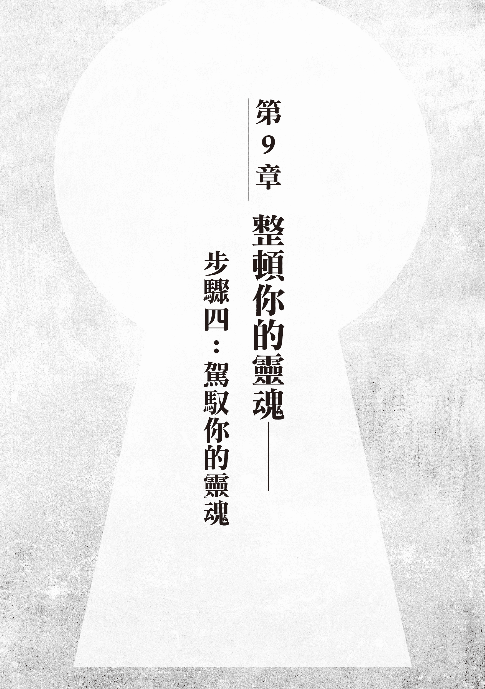

# 第九章　整顿你的灵魂──步骤四：驾驭你的灵魂

等你从大大小小的成功时刻体验到足够的清明，自然就开始迈向驾驭阶段。当你不再严密监控与灵魂契约或种子思想相关的行为，自然就晓得自己抵达了驾驭阶段。基本上，此时的状况大概会轻松一些。

进入驾驭步骤是什麽滋味？请谨记在心，抵达这一步并不意谓着你「大功告成」。别忘了，你本来就不曾千疮百孔。来到这个步骤代表你已经度过最艰难的几个阶段，现在开始看到成果。进入驾驭阶段的人，观点多半是流动的。他们对自己以及自己如何安身立命的看法，十之八九正在转变。他们变得比较少批判自己，也会改善自己以前停滞不前的生活领域。即使日子没有变得轻松，但是至少日常生活的感觉，已不可同日而语。

进行驾驭步骤的人，彷佛置身在情绪的海啸中。但骚乱是由新旧做法、思想、行为、反应，互相碰撞而引发的。实际上就是过去与未来在当下聚合，协助你开创新的局面。但是新局没那麽容易建立。即使缔造旧习惯的灵魂层次能量已经被释放，但是旧习惯可能难以撼动。你在这个阶段要割舍昔日的自己，喜欢升级版的自己。这不表示你和昔日的自己一刀两断，你感谢昔日的自己让你学会这一切。我们都知道，人生的每一段关系都蕴含着教诲。现在你可以自由拥抱万丈光芒的自己了。

当你持续成长、记录自己的成功，你也会注意到以前生活中的重要事物消失了。而你终于抵达驾驭阶段以后，多数人的生活与刚展开灵魂工作的时候，已经截然不同。乍看之下，或许很恐怖，然而这其实是好事一桩。

我的客户莉莎处理的灵魂契约是，委屈自己接受差强人意的事物、不替自己发声、不相信自己可以什麽都不做就接受别人的宠爱。

当她好不容易走到驾驭阶段，她对我说：「我不敢相信自己觉得多麽蹩扭。一切都变了。我随时都可以坦白说出自己真正的心声。当我终于允许自己看见自己的本色，我好激动。而我只是单纯地跟自己相处。我没有四处忙着解决所有事情，也没有试图说服每个人都按照我的方法做事。我可以为世界贡献很多！可是情绪的浪潮来袭时，我就被淹没了，我得重新振作起来，提醒自己我是谁。我不敢相信自己可以做这样的人！我不敢相信这真的是我！」

但是你体验到的这种改变，也常造成冲突。例如，如果你的内在变了，外在势必随之转变。你的环境会变。你的人际关系、工作、感情生活──全都可能被搅动（而且天翻地覆），端视你下了什麽功夫来重新发掘个人光彩。

所以很多人不愿意走得这麽深入。想到当你总算认清自己的本色以后，生活可能全面改观，那是很骇人的。你会在各个层次得到报偿，但是在情绪上、灵性上、能量上、心智上、肉体上，想到自己可能失去的一切，的确很可怕。

别因为恐惧而怯步。把力气用在剥除那一层又一层侵蚀你生命的黑暗与阴影。你是在发掘自己的神性，被你长年累月弃之不顾的个人光彩。下功夫抵达驾驭阶段，将会让你有生以来第一次爱上自己。

#### 驾驭成功的关键

既然进入这个阶段，你要尽可能地取得各种支援、资讯、指引、协助，以确保自己马到成功。认识回光返照的现象对你有益。后续我们也会讨论如何避免在日后建立更多的灵魂契约，与在蜕变期间如何改变你的支援网络。

#### 回光返照与现实

当你内在的转变反映在你的周遭事物上时，你会体验到回光返照的现象。回光返照是灵魂层次工作最恼人的部分；你可能因此前功尽弃。回光返照，是对你处理了一阵子的根源信念系统进行回顾。一个大课题的小回顾。

当你察觉自己说出：「我『还以为』我已经精通这项功课了，我怎麽又碰上同样的老问题？」你便晓得自己遇上回光返照了。

进行驾驭阶段的功课时，根源信念系统的能量仍未消散干净。一些残余的能量依旧在你的能量场内振动。但是因为你已经下了许多苦工，也因为你亲眼见证了生命领域内的转变，你的新挑战只是旧课题的回光返照。记住，如果你还没有体验到小型的成功与改变，而灵魂契约和种子思想发作时的状态也与往日无异，那麽你遇到的就不是回光返照；你仍在处理原有的议题。这也表示你还没准备好进入这个阶段。

回光返照只在你体验到正向转变之后才会出现。这种小挑战从能量层次提示你已有长足的进步。你已经培养出处理这些挑战的手腕，学会背后的教诲，因此回光返照让你保持戒慎。善用这些提示，持续扭转你的能量，持续释放那一份灵魂契约的残余能量及触发因子。

我告诉客户，遇到回光返照的事件应该要振奋。回光返照的用意不是要逼退你，不是要你把以前的能量再召回生命中；回光返照是砥砺你抗拒的意志，在生命中创造更多的成功。回光返照并不像你原本的挑战那麽棘手，原因有二。

一，你已经处理过相关的课题，因此你知道如何解决又冒出头的功课；

二，回光返照只是一种提醒。

尽管如此，回光返照的能量可能会困住你。假如你在回光返照发生时陷入恐惧模式，担忧昔日的障碍又卷土重来，而不停下来管理这些能量，你可能会觉得自己又回到了原点。大部分人遇到回光返照时会想重拾旧日障碍的戏码。不要走回头路，提醒自己，只有在你将根源信念系统驾驭得差不多的时候，回光返照才会出现。

遇到回光反照的时候可别退缩。务必了解你为何在自己努力改善的领域被轻轻地推了一把。例如，你对维护新升级的能量是否有些松懈？然后把你会的各种方法搬出来用。该召唤指导灵吗？做任何决定之前应该先清理能量场吗？回光返照可以帮助你晋升到下一个层次，但前提是，你不能被回光返照击垮。

#### 停止建立契约

在驾驭阶段，大家常担心自己会建立更多的灵魂契约。当你开始以比较清晰的目光体验人生，也会落入这个处境。但别怕。现在你知道灵魂契约的运作方式，因此谨守几条简单的原则，一点都不必担心会再订立新契约。我们来温习一下：

① 记住，无论如何，指导灵都会给你肉眼看不见、却极其强大的支援。与其只凭一己之力决定如何解决一场危机，不如请求指导灵团队给你资讯、指引、协助。祂们乐于伸出援手！

② 情绪激动时不要做决定。当你感到悲伤、愧疚、沮丧、伤心、懊恼、抓狂、挫折、一心想报仇、害怕或其他的负面情绪，你的振动频率便会降低。振动频率低时，就比较连结不到直观的灵感和直觉，更别提指导灵了。在这种情况下，你做的决定就不是以所有关系人至高至善的福祉为依归，只是为了平息负面的情绪。在你采取行动之前抽出一段时间，以你学习到的方法让自己恢复镇静、涤清思绪。

③ 你在前文看过，种子思想是你将情绪埋在灵魂内所创造的。随时随地承认自己的感受，给予处理，不要试图埋藏。身为人类并不是要我们忽略或减轻负面的感受，而是要发掘那些感受背后的功课。情绪是在通报你应该学习的功课。因为你还没学会，现在心里才会不舒服。当你相信自己的神性，看见自己的本色，了解自己的光的力量，那麽任何人的言语或行为，都不能伤害你一根汗毛。

只要遵守这三条简单的原则，就能帮助你在今生揭露、并驾驭你的旧灵魂契约、功课、种子思想，而不建立有待破解的新契约。这关乎保持脑筋清楚及脚踏实地，在情绪丧失平衡时能够自觉，然后采取适当的行动。既然你懂这些能量运作的方式，以及它们存在的原因，你已经领先大部人几光年了。这是很可喜可贺的事！

#### 能量灌输

进行驾驭步骤期间，还有一个能助你一臂之力的练习。简单的能量灌输能帮助你感觉比较轻盈，维持较高的振动频率，带给你完成灵魂工作的力量。在灵魂工作的过程中，你的能量场外观会有点像瑞士起司。在你释放某些能量之后，就留下了洞洞，洞洞会被任何漂流而过的能量填满。进行能量的灌输工作，就能在洞洞填满有助益的能量，帮助你达成发掘内在光彩的目标。

练习　能量灌输练习

##### 一、准备好场地

先按照前文那些练习的方式准备场地。找一个私密、恬静的空间，这个空间必须能让你完全放心、放松。

##### 二、召唤指导灵

再次召唤你的指导灵团队，或单纯地让自己的心静下来。

##### 三、敞开你的能量

这个步骤的用意是为你的指导灵打开一个开口，让祂们为你注入高频的能量。

首先想像你头上方三寸左右的地方有一只闭上的眼睛，眼睛朝下。观想这只眼睛轻轻地睁开，直到它望着你的头部。如果观想不出来，请回到儿童模式。只要运用想像力，就能顺利完成这个步骤。

##### 四、注入

接着，请指导灵团队将百分百圣光灌进这只眼睛，然后流进你的头、颈、肩、手臂、全身，直到脚趾。想像圣光填满你的全身（能量体、肉体、情绪体、灵性体、心智体），并将释放灵魂契约与种子思想能量之后，所遗留的缺口都补满。当你充满圣光，想着你要纳入生活中的情绪与能量。想着成功、自由、平静，以及任何你想要的项目。你的指导灵会将你每观想的一个情绪的能量融入圣光，进而填满你。

别担心遗漏了哪个情绪或能量。指导灵很清楚应该拿什麽来填满你。假如你遗漏了什麽，祂们照样会支援你，为你填满最适当的能量。但是务必只为自己注入正向的能量。与其使用「我再也不要害怕了」这类的负面句子，请改用「我要感受到安全、受到保护」的正面描述。不论你以正面或负面的说法声明你的欲望，欲望都会以你使用的词语实现。小心你的用语！

例如，宣示「我再也不要孤单一人了」，只会带给你更多的孤单；改说「我要沉浸在幸福的爱情中」，会为你吸引那样的感情。持续这个步骤，直到你在想像中看见自己全身充满了灿烂明亮的美丽圣光。

##### 五、完成

当你觉得自己完全填满了光（一直满到你的头顶），请向指导灵道谢。请祂们停止将能量注入你的身体。很多人觉得那个画面就像你头顶上的水龙头被关上。一旦能量停止注入，请花一点时间封住头上的空间，想像那双眼睛轻松、平顺地闭上。然后静静地坐上几分钟，适应你和你的指导灵刚才做出的改变。

完成这项练习之后，你会觉得愉快、正向、疲倦（舒服的那种），同时莫名的有精神。既然你和你的指导灵为你填满了圣光，你的一举一动将会符合这些极为正向的能量。想做这项练习就尽管做。你愈常清理能量，愈要为自己灌输正向、高频的能量，来帮助自己清爽自在，发掘自己的光芒，并驾驭灵魂契约。

#### 调整你的支援设定

另一个确保自己旗开得胜的方法是认清自己周遭的环境。你的周遭环境在每个层次上都适合你吗？进入驾驭阶段一段时日之后，周遭环境必然会出现异动，以配合你能量上的转变。既然你得到崭新的自信、教人振奋的独当一面能力，或任何你因为进入驾驭阶段而培养出的能力，你的工作、伴侣、朋友、饮食，可能都不再适合你。这个阶段的人常会不假思索就做出剧烈的改变，因为生活中有些陈旧的部分不再适合他们了。

我很多客户在经历这个过程之后，醒悟到自己不愿再维持原有的人际关系，他们终于拥有缔造这项改变的能力、力量及自信。我也看过很多人因此换了工作，有时还是一时兴起！不论你处理什麽样的根源信念系统，你的任何转变多少都会影响到日常生活。

例如，你常向一群朋友埋怨自己生意失败，你可能会发现自己不想再跟他们打交道了；或是你对那群朋友讲的话变正面了。无论如何，当你真的实践、并驾驭自己正在学习的课题，你对这群朋友的观感便会转变。

进入这个步骤面临的最大变化，通常出现在支援系统。或许以前你的支援系统会听你埋怨各种障碍。或许你支援系统里的某人，总是试图解决你的问题。或许你帮助过支援系统里的每个人，但是要你反过来接受他们的帮助，你会浑身不自在。当你释放个人能量场中那些沉重、稠密的能量，与这些能量共振的人，要嘛随之离去，要嘛反抗你的转变。

即使处境不舒服，我们仍然安于自己知道的事物。所以许多早该分手的伴侣选择继续厮守。即使感情不睦，这段感情却是他们熟悉的事物。你的支援网络也一样。当你的言行变了样，许多支援网络中的人会在下意识反抗。他们会想方设法试图让你恢复昔日的言行，即使不健康，他们也情愿你重拾他们习惯的老样子。事实上，你和他们的关系愈不健康，他们愈会强力反抗你的新行为模式。

除了阻挠你改变的人，你可能会想请某些人离开你的人生。进入驾驭阶段的人，通常认为拥有坚强的支援系统，是成功最重要的条件。为了相信自己能达成某个目标、得到某份工作、或在生活中增加一段新感情，你会希望身边的人都能全心全意地支持你。现在你需要优秀的后援系统，你要如何判断谁能信赖，谁又不适任呢？

练习　支援网络圈圈图

圈圈图是评估你目前的人际关系、检视一个人是否可靠的完美工具。拥有支援网络是灵魂契约工作的要件之一。此刻，或许你会说：「可是我的生活圈很小！」这不是支援网络的重点。重点是检视你的生活中有哪些人物，厘清他们应该扮演的角色，将无法支持你升级能量的人移到比较不重要的空间，挪出能够容纳新的人物或某种振动频率的空间。

圈圈图会让你以崭新的目光，认清什麽才能真正支持你拥抱驾驭阶段。

#### 制作你的圈圈图样板

先拿一张空白的纸。横放。用原子笔（别用铅笔，铅笔会提高你自我审查的可能性）在纸张中央点一个圆点。画好圆点之后，以圆点为中心，画出六个同心圆，最后一个圆圈几乎和纸张一样大。每个圈圈之间的空隙尽量均等。有的人觉得从最外圈开始画比较顺手，依序画出较小的内圈，直到最后中央的圆点。

如下页的图，在纸上每一个圈圈依序标示以下的标题：

中间点：我（你自己）

　第一圈：灵魂伴侣

　第二圈：灵魂挚友

　第三圈：好友

　第四圈：朋友

　第五圈：认识的人

　第六圈：真空地带

现在，再多画两张圈圈图，所以一共有三张一样的圈圈图。在第一张圈圈图的顶端写下：「现状」。

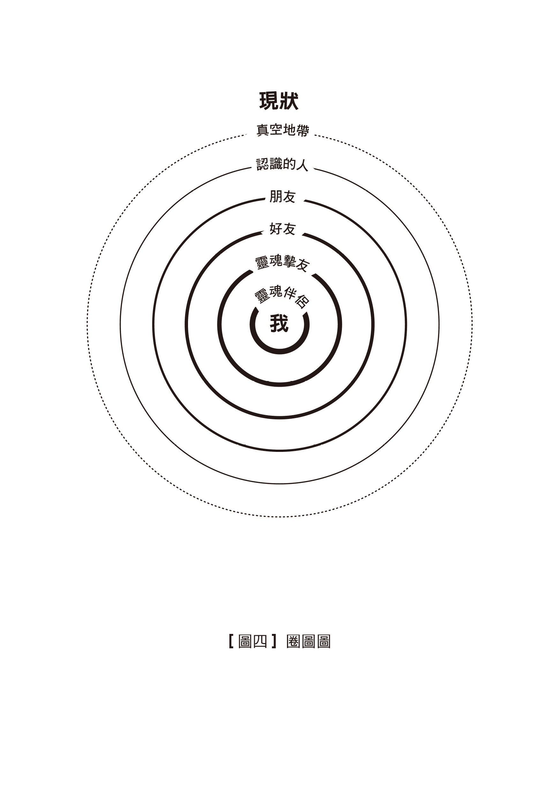

#### 现状圈圈图

你要将你的朋友、家人、熟人等等填进现状圈圈图。填进图表中的对象只限人类（不含宠物），而且必须在世。别写你付钱请进生命的人（例如疗愈师）。花一点时间填写。你只要在圈圈旁边写下那个人的名字。

用原子笔写可以避免你频频更改答案，只管写下你对每个人的第一反应即可。判断每个人目前在你生活中的位置应该轻而易举。你清楚你有什麽事时会找什麽人。

这部分的练习应该花你五到十五分钟。如果超过十五分钟，你就太严肃了。起身走一走，做点会让你哈哈笑的事，然后回来完成这个步骤。

当你把想到的人都填进图表之后，就把圈圈图放在一边，进入下一张图。

#### 实际情况圈圈图

在接下来的部分，我们要稍微改变作法。在现状圈圈图中，你使用我订立的标签。在实际情况圈圈图中，你要依据我对每个标签的定义填写。你要重新检视现状圈圈图中的同一批人。

##### 中间点　我

这永远不会变。你的圈圈图永远是你，不论你填写的是哪一张。

##### 第一圈　灵魂伴侣

这是丈夫、妻子、人生伴侣、灵魂伴侣专属的空间，也是你一生的挚爱。填进这个圈圈的人，必须是你目前心里认定的感情伴侣。（目前没有情侣的人这一栏就空白。）因为这是感情伴侣的圈圈，这个人必须是能够挑动你情欲的人。你应该能放心地让这个人比别人更深入地了解你，你也应该能自在地向他们寻求援助。有资格进入这个圈圈的人，应该已经跟你亲密到不能再更亲密。

别因为你丈夫是你的伴侣，就把他填进这个圈圈。如果你跟这个人的情感其实并不亲密，如果你跟朋友聊你无法告诉这个人的事，如果这个人贬抑你或让你情绪低落，如果你在考虑跟这个人分道扬镳，就别写下他的名字。或许你已经与你的伴侣厮守三十年，如果你们的关系触礁了，或者你不向他们展露真实的自己，那麽他们就不该填进这个内层的圈圈。

##### 新定义　第二圈──灵魂挚友

多数人只有一位灵魂挚友。这位朋友和你的关系几乎和你的灵魂伴侣一样亲密，只是你们的关系不涉及性欲。这个人会因为你半夜三点打电话去哭诉而冲到你家，而且时钟连看都不会看一眼。这个人是最支持你的人，同时可以直视你的眼睛，说你的想法烂透了。

##### 新定义　第三圈──好友

交游广阔者可能有两、三位好友。如果你的交游不广阔，这可能是你第一层级的朋友。好友对你几乎无所不知。如果你需要援助、需要别人支持你的决定，即使他们不了解你在做什麽，他们也会伸出援手。或许你不会向这个人吐露你最深沉、最黑暗的恐惧，但是这个人相当清楚你的恐惧。这是你可以仰赖的人。你们感情融洽。

##### 新定义　第四圈──朋友

朋友是跟你一块吃晚餐或在周末一起看电影的人。朋友是你能自在地传简讯、打电话、一起消磨时间的人。你和这个人相处愉快；你们对彼此都很了解，但是对彼此生活的认识不是钜细靡遗的。多数人在人生中的朋友数量比较多，因为这种人际关系比较不容易受伤，风险较小，这是建立在共同兴趣上的愉快陪伴关系。

##### 新定义　第五圈──认识的人

认识的人通常就是你去上班、上健身房，或者任何你常去的地方会见到的人。认识的人知道你已婚、且有小孩，或知道你做哪一行。当他们问：「你好吗？」你通常会回答：「我很好，谢谢关心。」认识的人是你不会时常传简讯或电子邮件的人。你不会关心他们在生活中遇到的事，即使你凑巧知道细节。

##### 新定义　第六圈──真空地带

不再参与你人生的那些人，就该放在这个美丽的能量空间。通常渐行渐远的朋友也属于这一区。如果你没有让前夫与前妻继续参与你生活的理由，他们也会落在这个区块。你可能会把某些人流放到这一区，也有些人永远无法超越这个圈圈。别把这个圈圈视为惩诫区。我们是在考查自己的人际界线，请将真空地带视为维护你安全、安心、被爱的空间，因为真空地带协助你订立良好的界线。

现在你知道我对每个圈圈的定义，或许你想要修订现状圈圈图。请尽管修改吧！这正是实际情况圈圈图的用意。但是在你一头栽进之前，以下几个诀窍会让你下一步执行起来更顺利、精确。

首先，你大概注意到了，现状圈圈图中许多人所在的位置，是依据你认为他们具备多少与你深交的潜力而决定的，并非实际情况。当你依据你与每个人的真实互动，检视每个人的实际行为之后，决定给他们什麽位置。请特别留意，我看过许多人做这项练习的时候，发现以为是灵魂挚友的人，实际上并没有扮演灵魂挚友的角色。

此外，很多人的感情关系是依据自己的「期望」来摆放，没有理会日常相处的实际细节。例如，我在课堂上教导圈圈图时，通常至少会有一位学员将男友放在最内圈。她真的真的很希望他们的感情能够更上一层楼。但是那不表示她的愿望符合实际的情况。

实际情况圈圈图的重点是，依据每个人与你的日常关系，认清每个人在你生活中的位置，而不是依据你多年来对他们的看法。一个人在你的交际圈中的位置，并不是取决于婚姻、相识的时间长度、这些年来相处得多麽愉快，或是你「要」他们落在哪一圈。一切应以实际情况为准。

别担心自己怎麽修改了圈圈图，你八成会改很多次。修改很好，这些异动会带给你一些答案！这部分的练习所需要的时间通常比前一个步骤久。给自己十五到二十分钟完成修订。

现在我们该来瞧瞧你的成果了。这两张圈圈图记载了妙用无穷的资讯！你大概注意到了，你的现状圈圈图与实际情况圈圈图之间极可能有落差。这是因为很多人没有花时间思考我们的支援系统。一段人际关系刚开始不久，我们便会决定对方大概会落在哪一圈，然后我们便此如对待那个人。不论我们是否将那个人安置在正确的圈圈中，不论情况是否随时间而改变，我们都照当初的判断对待那个人。

很多人都没有意识到人际关系异动的频率有多高。你的朋友克丽丝汀可能正在办离婚；乔可能要退休了。这些事都会影响朋友与你往来的能力。请依据朋友的能耐搬移他们在圈圈图中的位置，不只健康，更是明智。

比较两张图。多数人都会把圈圈图中的人往外围移动，但是也有很多人害怕受到伤害。他们和每个人都保持距离。我见过很多女性不假思索地将丈夫放在灵魂伴侣的圈圈，却醒悟到他其实应该摆在朋友圈。仔细观察你原本将每个人安置在哪里，而当你开始制作实际情况圈圈图之后，他们又移到哪里去。

很多人轻易地把别人填进内圈那些极为重要的位置，只因为他们以为理应如此。你真的希望把那些人填在内层的圈圈吗？你相信最核心那几圈的人，会扶持你、陪伴你走过驾驭灵魂契约的历程，那些充满高低起伏、许多的苦工，并且耐心提供给你美好的洞见吗？

当你揪出一份重大的灵魂契约，你会希望自己可以安然自在地打电话给他们。他们能接受你对他们说的话吗？他们会不会认为你疯了？你和他们相处时，是否必须控管自己的言行？ 或许你的实际情况圈圈图需要进一步调整。挪移位置的时候不要内疚，因为你绝对配得上最佳的支援系统。进行灵魂契约工作和仅仅只是活着，就很艰难了。为什麽不帮自己奠定成功的基础呢？

调整图表的时候，想像自己经历了各种不同的情境。想像每个人会如何反应。你要懂得分辨，你期望他们怎办回应（或他们在最佳状态下会如何反应）是一回事，他们昨天／今天怎麽回应你又是另一回事。多花点时间检视这两张图，掌握你支援网络的真实情况。

当我提醒不能填写过世的亲友或宠物，恼怒了不少人，但是他们误会支援网络的意义了。我们每个人都会得到过世的亲人、指导灵与天使、宠物的协助。但是人类热爱社交，我们也需要仰赖其他人类。如果你独来独往，你的圈圈图上只有一、两个人，这些人必然极为特别，才能赢得一席之地。

留意完全空白或只有零星几个名字的圈圈。很多人没有灵魂伴侣，因此这个圈圈必须空着。大多数人发现灵魂挚友的圈圈，只有一位朋友符合本书的定义。拥有平衡的人际网络图表，并不是指在每个圈圈都填写很多个名字。而是圈圈内的每个名字背后的相处品质。

空白的圈圈也说出了你的故事。你在朋友圈填了很多人，但是靠近内层的圈圈没有半个人？这可能表示你不喜欢让别人进入你的生活。也许你不喜欢脆弱的感觉，或许你曾经允许别人进入心田却受到伤害。每个圈圈都说出了你的生命故事、你对寻求支援的自在程度、你如何面对朋友、你的人际界线。给自己一点时间来发掘自己的故事。你害怕亲密吗？你是否邀请别人进入你的生活，即使你们的关系只照顾到他们的需求？你把别人关在心房外吗？这两张图能让你看清实际情况。

当你完成最后的调整，便能开始制作开创性圈圈图。

#### 开创性圈圈图

将实际情况圈圈图放在一边，取出第三张纸。写上「开创性」。开创性这三个字，表示你希望支援网络如何支持你。在这张圈圈图中，你要实际运用你从这项练习的前两个步骤中，所发掘的个人实际情况。你已经知道目前的支援网络如何运作；现在，你要决定自己想在人际网络中创造什麽。你要为自己打造终极的支援系统。

在这张图表中，填进你完全信得过的人。你知道自己要哪一个人继续留在你的人生中，而且你心中毫无疑虑。将每个名字填进适当的圈圈，即使那不是他们在实际情况该待的位置。例如，如果你的朋友贝丝察觉你出了状况，主动伸出援手，或许你会考虑将她移到比较内层的圈圈。如果贝丝展现成为好友的能力，但是你的恐惧（或其他负面情绪）阻碍你培养这段友谊，将她移到图表上新的位置。

另一方面，根据你比较前两张图的心得，你本来寄予厚望的人可能必须移到另一个圈圈。没有关系，这麽做不会伤害任何人的。你没有恶意，你没有遗弃任何人，这不是自私。你只是在评估身边的人，厘清自己与他们的真实关系，以及这段关系的潜力。不要因为乔长得很帅，就将他移到灵魂挚友的圈圈。如果乔没有展现他配得上那个圈圈的实力，就不能将他放在那里。这不是一厢情愿的图表。这张图表不是在标示我们对别人的期望，而代表他们在我们生活中实际扮演的角色。

当你重新安排好开创性图表上的圈圈，便该找出空白的部分。你在寻找友情的平衡点，所以要知道当你进行灵魂契约工作的时候可以放心地仰赖谁，也要辨识哪里还有容纳新面孔进入你的生命的余裕。当你进行灵魂契约工作、做出那些深层的改变，你会发现你想要新面孔加入你的人生。你想要能够接受你的新振动频率（并受其吸引），以及充满前景的朋友。

因此，花点时间寻找这些空间。将每个空白视为开放一个人来跟你玩耍的邀约。仅仅只是辨识出这些空白，并确认你希望适当的人选开始填满这些空白，你便已经向宇宙发送出一则美丽的温情讯息。

如果哪个圈圈空无一人或你想要填补某个空间，请以虚线画一个圆圈来表示你希望填补它。因为这是创造性的圈圈图，表示你要实现自己写在这张纸上的内容，而你也应该在纸上注明虚线代表的意义。这会更清晰地向宇宙传递你的讯息。注意，请不要写：「我希望有一位非常风趣、高挑、愿意花钱在我身上的金发女友。」你要以文字表明你希望与这位新来的人拥有什麽关系。宇宙一向都会完成你交办的事务，自然而然会填补空白。

当你拥有一个平衡、运作良好的支援网络，灵魂工作绝对会变得比较简单。留意我用的字眼是比较简单而不是简单。灵魂契约工作并不简单，这个部分你已经亲身见证了，如果你有和善的环境，甚至有一位真心关怀你的知心朋友或伴侣，可以支持你的成长、转变、蜕变，那麽你在这个历程便不会那麽孤单。

#### 延续圈圈图的成功

宇宙现在开始为你出力。你制作好的图表会发挥愿景版或显化清单的作用。其实怎麽称呼它都无妨，重点是要对自己写在圈圈图上的内容真心满意，如果你的支援网络能符合你绘制的圈圈图，你将会有意外的惊喜。

白水晶能够帮助你稍微放大讯息的音量。只需要准备一颗白水晶（别用粉晶），放置在创造性圈圈图的中央，它如同一座无线电发射塔，向宇宙广播你写在纸上的内容。白水晶能提振你创造平衡的力量！你是在请支援系统及宇宙，助你一臂之力！

现在你了解了，驾驭的重点在于持续寻找平衡点。当你依靠支援网络的扶助，就要明白个人行为的后果，并持续留意你的根源信念系统，你会持续超越昔日的自己。你生活中的变化及下苦工的成果，将会让你以及你身边的人惊讶不已。

你将逐步改善对自己的观感，释放埋藏已久的隐匿能量，现在终于可以开始创造出你追求的生活。

#### 驾驭自如

恭喜你！现在你几乎已经调整了整个灵魂系统。尽管过程看似复杂，灵魂工作的精髓就在于，你以前拒绝关注的那一部分自我，就是这一部分引发了所有的阻碍与挑战！现在你可以放心地相信自己是完美、完整、充满光芒的存在。

随时随地维持光芒的振动频率或许很难，但是你会发现，自己愈是拥抱这些能量，愈能连结你的完美。或许你将本书的各个步骤反反覆覆地做了几回，从各种角度处理种子思想与灵魂契约；也许你一下子就驾驭了各种障碍。无论你经历了什麽历程，都要赞许自己进行最深层次的灵魂工作。多数人对这种事都避之唯恐不及。

你抵达了灵魂系统工作的振奋时刻：最终步骤。现在，你应该会用崭新的眼光看待自己了。你学会在失足的时候放过自己。你沉浸在目前为止所发掘的灵魂之美当中。嘿，好戏还在后头呢！你终于准备好从身体、灵魂、灵魂系统，释放这些能量。这是何等的大礼！现在，我们就要进入最值回票价的阶段罗：释放负能量，中止灵魂契约。

# 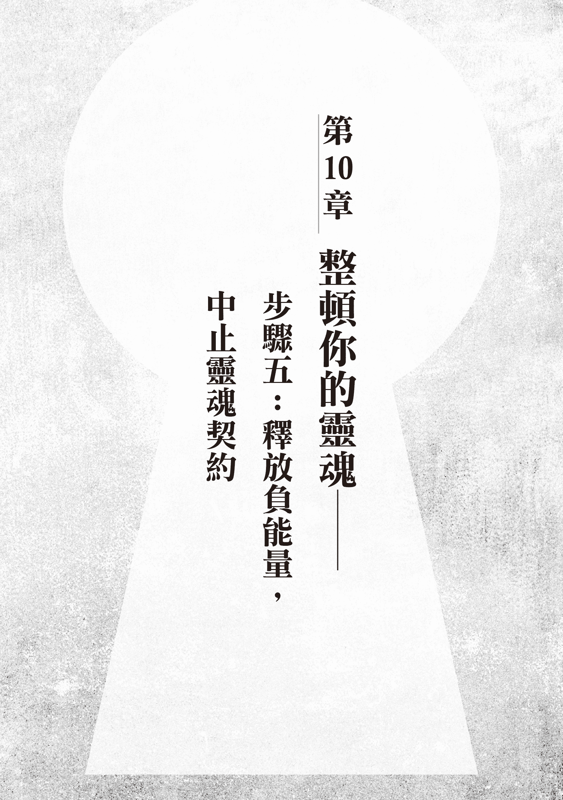

# 第十章　整顿你的灵魂──步骤五：释放负能量，中止灵魂契约

你已经知道签下一份灵魂契约，一共有两个阶段。首先，你将一则种子思想和几种混乱情绪植入你的灵魂。然后你签下一份灵魂契约来避免自己经历到种子思想以及负能量。你也学习到为了中止灵魂契约，你必须驾驭灵魂功课，并释放种子思想及混乱情绪。

此外，你已完成灵魂系统工作的前四个步骤：打造你的灵魂地基、启动你的觉知（上）、启动你的觉知（下）、落实灵魂功课。你开始在生活中体验到巨大的转变，从你看待自己的眼光、到周遭环境的品质，统统不可同日而语。本章，你会从自己下过的苦工收割更多的报偿。你会学习到如何从你的灵魂系统去释放这些能量──多麽教人振奋！

你已知道单单是辨识出一个种子思想或灵魂契约是无法脱身的。但是你下过的苦工，已让你准备好释放这两种能量。进入这个步骤的时候，务必确认你了解自己的种子思想及灵魂契约如何影响你。当你回顾你在生活中创造出来的变化，你要做的是肯定自己的成绩。

种子思想所蕴含的振动不断地散发特定的共振频率。你的肉体必须顺应那个频率，才能容纳种子思想的能量。当你进行释放步骤的时候，你便扰动了这些负能量，因此你的肉体必须重新调适。

在释放过程结束之后，我很多客户都在无意间减轻体重，或者比较常活动身体，变得更健康。他们本能地想要起身、活动、去释放肉体，像是：运动或健身。有一位客户经营遛狗生意，只因为她喜欢出门散步，也喜欢动物。我也看过有人戒了菸、剪夸张发型、做浣肠水疗之类的重大改变。执行这个步骤的时候，记住多多留意自己的身体，以及情绪、能量的变化。

你准备好释放种子思想了吗？种子思想埋藏在灵魂的深处，现在开始释放吧，这个过程将涉及你的能量场及肉体。

#### 释放种子思想

种子思想将灵魂契约锚定在你身上。释放了种子思想，灵魂契约便会更容易中止。现在你终于可以比较客观地看待昔日的经验，你也不断地地努力落实种子思想背后的功课，于是将种子思想连结到灵魂契约的能量便松动了。

在你创造种子的初期，你将那些种子的能量深深埋进灵魂里。在这个步骤，想像灵魂位于你的核心里。每一个准备好被释放的种子思想，都会在你肉体的能量场浮现。这项释放工具就像古早年代的园游会的打地鼠游戏，地鼠会从板子里探出头，你就用橡胶槌打它；每一个种子思想会经由推挤、戳探、穿刺、磨蹭的过程，从你肉体的能量场钻出来。如果你现在看不懂这一段内容也不要担心，到后面你自然会明白。

在说明这个方法之前，我要先谈谈疾病的主题。常有人问我某某人罹患癌症或生病，是不是灵魂契约造成的，我的答案一律是：有可能。我当然见过因为签下灵魂契约而生病的客户。但是不代表所有的疾病都是灵魂契约的杰作。我曾因为一份路障契约而生病了四年多，非常能够体会疾病是极其强大的动机来源！

有些人的种子能量确实就出现在疾病的患部。例如，某个人有许多个「不配被爱」的种子思想，这些能量可能就会聚集在肉体的心脏部位。这时，肉体的问题与种子思想显然夹缠不清。但是也有很多种子思想压根儿没有对应到特定的不适，或许是你还要经历好一段历程，才能看出当中的关连。

既然我们要移除的种子能量可能已显化为实际的病痛，你便可以利用肉体的病征（比如：时常流鼻涕或膝盖有问题）来判断。另外，没有病痛也能运用这项练习，你不必用理智去明白，为何混乱情绪出现在某个身体部位，有时答案会昭然若揭。你必须仰赖直觉和想像力，毕竟不是人人都有与种子思想相关的肉体症状。或许你会找到储存在肉体的能量，或许找不到。

练习　释放种子思想

##### 一、准备场地

选一个舒适的私密空间，以便在不受干扰下完成这项练习。

##### 二、召唤你的指导灵团队

召唤你的指导灵，或单纯地坐着，静下心来。

##### 三、设定你的意图

接着设定一个简单的意图。你进行这项练习是为了释放将灵魂契约锚定在身上的能量。设定意图是让指导灵清楚了解你需求的绝佳方式，而且你不用潜越，也不必钜细靡遗地交代祂们该做什麽（没人喜欢那样）。请想像你和指导灵、天使或你最喜爱的宗教人物说话。让祂们知道你希望这项练习符合你至高至善的福祉。并且声明你正在处理「什麽灵魂契约」，你要释放相关的种子能量。以下是一则意图祈愿文的简单范文：

我的意图是今天与指导灵合作，我们的工作将符合所有关系人至高至善的福祉。我诚心所愿，确实如此。

请用你自己的话拟订你的祈愿文。在此提供一则范例供参。

##### 四、召集要释放的能量

当你静下心、连结指导灵、设定好意图之后，花一些时间想一想你经历的那些障碍。想一想与灵魂契约相关的种子思想与情绪。这应该不难，毕竟你已经花了许多时间想这些事情。花一些时间蕴酿你对那些障碍的情绪。允许自己感受愤怒、伤痛、恐惧，不要冷眼旁观。

在这项练习中，感受是释放的主要模式。放手去害怕、去担忧，无论如何要让这些能量浮现出来。必要的话，暴跳如雷也没关系。别对自己说：「哇，这个情况气死我了。」进入你的愤怒，真实地感受愤怒。如果你在这个步骤没有体验到负面情绪，你就太置身事外了。

别活在说别人的故事，你要融入故事。感受它、活出它、呼吸它。停留在这个步骤，直到你体验到你创造出来的负面情绪，以及因为障碍而衍生的情绪。唯有做到这个程度，你才准备好进入下一个步骤。

##### 五、寻找种子思想的位置

当你再次体验到这些种子思想创造的愤怒、伤心、痛苦、悲伤、羞窘，观察身体是否起了反应。当你想到自己的障碍，心跳是否加速？胃部不适？你是否开始搔耳朵？当你思及障碍，判别身体哪些部位苏醒过来。或许你会注意到两、三个部位，这都无妨。只要留意即可。

假如身体没有任何部位出现反应，就运用你的想像力，启动你的小朋友模式。假装你在向一位小朋友说明你在做什麽。你会用哪个身体部位来解释这个障碍？你选择哪个身体部位都无妨，只管挑一个你幻想中的那位小听众最能理解的部位。这就是你现在要处理的部位。待会儿冒出来的东西或许会让你吓一跳。

如果不只一个部位出现反应，就选择反应最强烈的。如果感觉都不太强烈，就挑最感觉最鲜明的那一个。对许多人来说，找出身体阻滞的部位是崭新的体验，但是这不防碍你取得精准的资讯。不要分析哪个部位「应该要」痛苦，允许自己被引导过去。记住，假如你真的不知从何下手，切换成小朋友思维就行了。当你卸下框架，允许自己想像一件东西（或用大脑平空捏造），指导灵便能奉送上你需要的资讯。因此，你不是真的无中生有，即使你这麽认为。你的指导灵也会为你指出正确的方向。

##### 六、认识你攀附的种子思想

专注在你选定的身体部位的能量。想像这股能量的外观长什麽样子？感觉刺刺的吗？发紫了吗？觉得热？冷？即使你觉得自己在捏造事实，照做就对了。检视这股能量，只有发生在这个部位吗？还是扩散到别处了？这股能量让你想起某个味道或气味吗？令人作恶吗？上面是否黏黏滑滑的或者沾到机油？

当你刻意让种子思想冒出头来，用几分钟观察浮现的能量。别担心什麽才妥当，或它「应该」长什麽样子或感觉。这都不重要。重要的是，你允许自己放下所有的矜持，运用你的想像力辨识体内这股能量。务必留意能量的边界。这股能量的边界是模模糊糊？还是清清楚楚？它有明确的形状吗？还是难以界定？当你可以清晰、轻松地描述这股能量的样貌，你便准备好进入下一步骤。

##### 七、请求指导灵协助

现在你该寻求能量的援助了。在这个步骤，你的目标是将这项任务托付给指导灵，请祂们拔除连结到你灵魂的种子能量。你已经知道这股能量的外观及触感，因此这个步骤易如反掌，只要你维持玩耍的心情。你将这份工作交给指导灵，因为祂们比你更了解情况。

你受制于人类的身体，你的自尊和经历都受到个人观点的局限。但是指导灵看到的是大局。祂们是万能的，具备你望尘莫及的智慧。将掌控权交托给指导灵，也代表你愿意信任较高层次的力量。很多人试图包办一切，不管是能量、肉体、情绪、心智、灵性。他们忘了指导灵乐于出手相助。在这个步骤，我们就要练习这麽做。

将工作交托给指导灵时，只要告诉祂们：「指导灵，现在要仰赖祢们移除我准备好释放的种子思想能量。」在这个过程中，指导灵只是暂时代劳。祂们挑大梁，而你处于背景。这并不意味你的角色不重要，也绝不代表你在状况外或没有掌控局面。请记住保持玩耍、童稚的能量，否则会妨碍指导灵完成工作。当祂们开始从你的身体抽出种子能量，留意祂们在做什麽。

请在脑海想像整个过程。看不到画面的话就运用想像力，可以打开直觉能力，也能让你更容易想像祂们的工作实况。你甚至可以想像自己在向别人描述释放的过程。或许你会在脑海里说：「指导灵们带着能量的大铲子进来，铲起藏在我肚脐下发黑的能量。」接受透过想像力浮现在脑海的一切。别批判它。事实上，或许你会想要哈哈笑。好好赞叹这一切吧！

当你看着指导灵移除能量，还有一件待办事项：垃圾。当你不再与种子能量有任何瓜葛（指导灵已从你的身体完全移除），将它归还到它该去的地方是一种敬意，而且相当重要。想像所有移除的种子能量都被最高形式的爱与光融化。或许是你看着黑暗的能量从你的身体被拉出来。也许它发出闪光，变成一团光，或像一颗正在溶化的冰块或电脑绘图。这是你的过程，因此敞开心胸，想像任何想得到的画面。

一旦能量融入光中，想像你的指导灵将能量引导回它该去的地方。部分能量可能会回到你身上；部分可能会归还给另一个人或不同的地方。这些化解掉的能量去了哪里并不影响这个过程。别担心清理是否够深入或者完全见效。此时，你的任务是要求指导灵化解那股能量，将它送到该去的地方。否则那股沉重的负能量会留存在你释放它的房间，暗中等着攀附其他的低频振动。难道你不要清理它、将它送回它该去的地方吗？

这时，你充满自信。你允许指导灵释放这些埋藏在你体内的能量。同时，你大概也觉得在脑子里捏造这些东西很蠢。如果你觉得别扭，这通常是因为你做得很棒的缘故！多数人在做的时候会尴尬，总觉得自己在脑子里编造这些东西。连我也不例外！

当你的想像力说，指导灵已把祂们能移除的种子能量都清理干净了，你就完成了这个步骤。这项能量清理直接呼应你对灵魂契约及种子思想下过的功夫。你需要试上几回，才能彻底释放全部的能量。也有可能必须回头处理根源信念系统的不同层面。你要处理哪些身体部位、下多少心血、释放多少能量，都取决于你。

人类擅长隐藏情绪，如果你在身体不同的部位处理同一个根源信念系统，不用讶异。当初你可是拚了命地找出那堆特别的隐密部位，来藏匿种子能量！现在你也要一样拚命来揭发、拔除它们。

##### 八、检视工作成果

你即将大功告成。现在该检视工作成果了。在你起身之前，深呼吸几次，留意自己的感觉。如果能量埋藏在胸部，你吸气或吐气时的感觉如何？如果是在腹部，你是否发现它移动了？第一次检视时，或许不太察觉得到差异；但是多做几遍之后，当你聚焦在需要指导灵关照的部位，你会发现肉体出现意料之外的变化。这个区域的感觉会不太一样。也许是比较清爽、范围扩大了、变得比较干净或比较明亮。身体任何细微的变化都表示，你已缔造一些美好的转变。

还有，留意你的情绪。即使这项练习没有直接处理你的感觉，埋藏在你内在的能量直接牵动你的情绪。在身体清理工作完成之后，你会觉得比较轻盈、比较充满希望。也有人会说觉得身体四周（或他们指导灵处理的身体部位的四周） 空间变大、变自在了。在身体清理工作告一段落的时候，务必检视肉体及情绪的状态。这些都能协助你理解自己的成果，与日后要进行的能量工作。

##### 九、填满光

在释放过程的尾声，请指导灵为你的身体注满最高频的光。释放种子思想能量，会在你的能量场留下能量缺口。与其坐视任何能量流进来填满缺口，不如请指导灵为你注满最美的光，你会感觉舒爽许多。

请回顾第九章的灌输技巧。你开启一只位于头顶上方的大眼睛，请指导灵用百分百圣光填满你。现在也一样。专注在维持那只眼睛的轻松开启，直到你感觉、察觉、相信自己完全充满圣光，肉体每个部分都填满了光。

##### 十、感谢你的指导灵

最后，在测试过自己的状态之后，向指导灵道谢。祂们喜欢你以任何形式表达的谢意。还有，祂们等着帮你从肉体及能量体移除这些能量，大概已经等了很多年、甚至几辈子了。因此，当你为此说几句话，祂们会很开心。

完成身体清理练习之后，你可能会觉得心情比较舒畅，直觉更敏锐，身体也比较灵活。如果你的肉体症状在几天后复发，就代表你应该回头重做身体的清理工作。此外，你也需要持续操练落实的步骤。

#### 灵魂的黑暗沼泽

当你走过这段历程，经过了运用能量工具、松动旧能量、以中性的观点看待人生、从灵魂层次敞开自己，你可能会有一段时间觉得风云变色。你可能觉得失常或感到空前的不安。事实上，你甚至觉得自己退步了。这是因为，为了释放你的种子思想，你拉出了积年累月、甚至几生几世，埋藏在你内在的能量。这些情绪和能量在刚刚出现的时候，由于分量太多、太强烈、太艰难，以致于你吃不消；现在你投入其中，就得重新经历这些情绪和能量，说不定这是你生平第一次体验那种滋味。

这一部分的过程以及大家的经历总是令我惊奇。大部分的人会遭遇他们建立种子思想时，埋进灵魂内的混乱情绪，只是情绪的强度较弱。

我记得一位从三到六岁，都遭到父母性侵及虐待的客户，终于在释放种子思想时触及了那些回忆。

「我只想被爱！我只想要有人抱抱我！我好孤单！」她无法自制地啜泣着。她的声音很高，我立刻观想到她是一个绑辫子的金发小女孩，站在房间门口，内心彻底绝望。她很快地便醒悟到，这一时的不快其实是在释放那些种子思想及衍生的混乱情绪。她不是从客观的角度向我诉说她的童年情景；她总算允许自己体验童年的经历。这麽一来，她便从肉体、情绪、心智、能量，释放纠缠她多年的种子能量。

我将这一部分过程称为「灵魂的黑暗沼泽」。这可能持续几天或更久。我经历过几次黑暗沼泽，好不容易才挖到长久隐匿的能量和种子。有一次，黑暗沼泽期长达一个月！那时，我很抗拒去揪出埋藏得那麽深的旧能量。

你的历程或许会比我的短很多。一切端看你是否进行灵魂层次工作的经验、你有多认真进行这项工作，以及你能在那麽深层的地方撑多久。如果你试图匆匆地跑完流程以避免觉得不适，或许你会在无意间阻断自己进行灵魂层次的深度工作，以致于只达成浅层的习惯改变。允许一切顺其自然转变，对你最好。

置身在黑暗沼泽并不愉快，所以很多人不愿深入挖掘。这没有捷径。黑暗沼泽让你有时间融会贯通灵魂功课，适应你正在进行的改变。我的客户凯西，她的父母从她幼年开始就在情感上遗弃她。结果，她在灵魂内创造了「我不够好」和「没有人会爱我」的种子思想，她签下了灵魂契约，认为她必须控制人生的每件事，以证明自己的价值。这为她带来了飞黄腾达的事业，但是她却无法体验脆弱。当她进入黑暗沼泽期（持续了约十天），她问我：「丹妮尔，下一个步骤是什麽？」

这个问题她问了一遍又一遍。她在寻求能够攀附的东西，试图重拾自己控制局面的感觉。对凯西来说，黑暗沼泽让她学习不掌控一切也可以很安全。她那十天都觉得自己在向下坠，没有能抓住的东西。这只是一个黑暗沼泽的例子；你的情况可能截然不同。

当你开始质疑自己是谁，不确定下一步怎麽做，平时能安抚你的事物也全部失灵，你便抵达了黑暗沼泽。黑暗沼泽时期非常不舒服，实际上却是美好的境界。或许你在释放失落感或无价值感。或许你镇日哭泣。我知道这种不适似乎是退步的迹象，然而你其实在朝着正确方向前进。你总算开始探索、并体验你准备释放的那些感觉。不要为此而害怕，拥抱这个过程吧！你其实是在探寻自我，深深地开挖，掏出你之前根本无法触及的能量。

#### 中止灵魂契约

你已经钻研过灵魂功课，开始释放位于灵魂契约核心的种子思想，你已经准备好学习释放灵魂契约的技巧。幸好，因为你已释放了种子思想的能量，中止契约会容易很多。如果你没先释放种子思想就试图鲜中止灵魂契约，你的生活只会有表面变化，也就是只是勉强自己改变行为。而你已经完成了必要的工作有，所以现在的回报就是终于可以移除灵魂契约造成的障碍。这项改变会让你的身体及灵魂，都畅快无比！

释放种子思想是在情绪、肉体、能量层次上工作。中止灵魂契约，则聚焦在能量层次。

当你在灵魂层次工作，就要动用阿卡西纪录。阿卡西纪录是一个能量空间，你（生生世世）的每一条思绪、感受、情绪、经历、感觉都储存在这里。尽管那不是物质层次上的地方，我鼓励各位将阿卡西纪录想成一个摆满卷宗的大足球场，每个卷宗内都存放着，你某一世某一段经历的某些层面资料。这些档案也储存所有你隐藏起来的每一丝痛苦、每一种混乱情绪、每一个种子思想，以及每一份你建立过的灵魂契约。

灵魂非常机伶。祂知道阿卡西纪录的资料绝对不会错。如果你的阿卡西纪录里有一笔资料说：「得到爱唯一的方法是牺牲自己。」你的灵魂便会奉行不渝。所以，才会有来自好几世的许多契约，影响你这一世的人生。这条陈旧的资讯在驱动你的行为、操控你的决定，你却毫不知情。通常阿卡西纪录的运作方式，倒是比较直接了当。阿卡西纪录是一种架构，你可以安排要学习的课题，以便促使自己往开悟前进；但是你也可以修改纪录的内容。你大概在多生累世以来，改写过阿卡西纪录很多遍了。倒不是说你一定要顺从灵魂契约的怂恿，不能做出不同的决定。我们都有自由意志。但是你很难反抗灵魂契约的力量，因为你的信念系统、支援的能量以及其他要素，统统在驱策你对灵魂契约言听计从。

在这项灵魂层次的清理练习中，你要从阿卡西纪录的内容开始排解问题。实际进入阿卡西纪录或做任何决定的人，都不是你。你的指导灵会代劳。这是要避免你伤害自己，你可能会受不了诱惑，检视起阿卡西纪录、移除全部的负面内容，而不理解那些内容存在的原因。那可就不妙了！这项练习也帮助你感觉、并运用指导灵，以及宇宙无条件地提供给你的慈爱支援。当你将修改阿卡西纪录的责任，交托给祂们，祂们会照应你的。

执行释放技术时，请遵循全部的步骤。效果最宏大的做法是设定好能量、召唤指导灵团队、将释放工作交托给指导灵团队，每个步骤都请妥善执行。

练习　灵魂契约释放

##### 一、准备场地

关于执行的场地，最重要的条件是必须给你安全、私密的感觉。让自己舒服一点，务必确认进行这项练习时不会有人来打扰你。

##### 二、召唤指导灵

召唤你的指导灵团队，让祂们知道你需要什麽。

现在，你应该很擅长这个步骤了！

##### 三、召唤你的阿卡西纪录团队

你的每一位指导灵都各司其职。有些指导灵从你受精开始就为你服务。祂们协助你的日常事务。你也有专案指导灵，祂们协助你学习某一项特定的功课或达成特定的目标。（例如，有一个指导灵团队在协助我撰写这本书）要完成这个过程，召唤你的指导灵团队中，专门从事灵魂层次的工作小组，效果特别好。这个小组就是你的阿卡西纪录团队。现在你可以征召你全部的指导灵团队，包括你的阿卡西纪录团队。你可能希望动用所有的指导灵，但是我发现多数人在进行这种工作的时候，喜欢召唤专门的团队。

每个人都有一支阿卡西纪录团队。根据我的经验，多数人的团队是由三位指导灵构成；但是我见过有十位指导灵，也见过只有一位指导灵的团队。如果你的团队不符合一般情况也别气馁；这只是参考资料。

还有，当你召唤阿卡西纪录团队，你是否能看见、听见、感觉到、察觉到祂们，并不重要。唯一要紧的是你提出祈愿。要召唤阿卡西团队，你可以简单说出召唤祈愿，诸如：「我现在召唤我的阿卡西团队协助我今天的工作。」召唤你的阿卡西团队不只启动祂们的能量，同时也设定了你要在灵魂层次工作的意图，这也是这项工具最重要的层面！

##### 四、设定意图

现在，想想你要在这项练习达成的目标。你新发现的被灵魂契约牵绊住的能量，而你要释放这些能量。设定意图是向指导灵表明，你要祂们做什麽的最佳方式，同时不潜越你的个人分际，变成指示祂们做事的方法。设定意图时，想像你在和指导灵或天使直接说话。如果你喜欢释放种子思想练习的意图祈愿文，你可以套用相同的概念。你可以说：

我的意图是在今天与符合百分百圣光的指导灵合作，我们的工作将符合所有关系人至高至善的福祉。这是我诚心所愿，确实如此。

你也可以拟定属于你自己的祈愿文。

##### 五、连结光

为了确保你在情绪上、能量上、心智上、灵性上，尽量处于最佳状态，你需要扩展各个能量体，才比较容易连结到你的直觉与天生的神性。首先想像自己站着，手臂放在身体的两侧或就这样站着。想像你的能量是一个闪亮的美丽银色光柱。光柱包围你的身体，比你高出许多。现在运用你的呼吸，开始向身体的四面八方扩展这根光柱。每次呼气，都想像光柱愈来愈宽。想像你觉得四周的空间愈来愈大。透过呼气，让光柱扩展到占据你四面八方五十尺的范围。光柱伸展到你背后，脚底也要。如果你遗漏这些部位，你可能会觉得站不稳。

扩展你自然的光柱能协助指导灵释放能量。原理如下：想像你有两个杯子。一个是八盎司的杯子，另一个是十六盎司的杯子。两个杯子里各有二十颗弹珠。你的任务是一次从杯中掏出一颗弹珠。大杯子里的弹珠会比较容易取出，对吗？环绕你身体的光柱也一样。扩展能量能给你充满力量与强韧的感觉，而拥有较宽广的能量场，可以帮助你的指导灵汲取需要释放的能量。如果你觉得渺小无力，执行的成效就会不同。因此扩展你的光柱！但是没必要超过五十尺的范围。有些人三两下便能扩展光柱，有的人可能需要一点时间。别担心。只要把光柱扩展到五十尺就是了。

##### 六、宣读灵魂层次清理祈愿文

以强而有力的声音宣读这份清理祈愿的效果最佳。这是让你的指导灵知道你真的想要释放这些能量！我这里的祈愿文仅供参考。如果想写自己的版本，请放手去写，也欢迎以我的版本充当范文。只要确认你提到了相同的重点，并且明确地将清理事宜交托给指导灵。朗声念出以下的祈愿：

我现在意识清醒地释放不再适合我的全部混乱情绪、灵魂契约、种子思想。包括，我的灵魂及指导灵知道我总算准备好释放的一切。

在此请花一些时间和你的指导灵谈谈你的情况、你在处理的能量、你希望祂们照看的地方。记住，你无法选择要释放什麽，但是你可以让指导灵知道，你认为自己准备好了。

请释放所有在肉体上、情绪上、心智上、灵性上衍生的依附，并清理我的阿卡西纪录、意识及无意识，协助将我的振动频率校正到与我最高的潜力一致。

当这些能量从我的各层次拔除，请轻柔地为我注入以下的能量：

现在，再花一点时间想想自己希望在生活中拥有的情绪与感受。只以正向的用语声明这些情绪。只用平静、兴奋之类的单纯用词。想像这些能量从你的头顶进入你的身体。

谢谢、谢谢、谢谢。

灵性依附，是你因为灵魂契约而背负的额外能量。进行这项清理工作的时候，你要尽量给指导灵施展身手的空间，以便清得深层一点；所以，这份清理祈愿文才会使用这样的措辞。记住，别试图显化特定的事物。如果你把细节交给指导灵处理，成效会好很多！

##### 七、将自己填满光

清理的手续结束时，请指导灵在你的体内注满最高频的光很重要。释放灵魂契约能量，会在你的能量场留下能量缺口。（还记得打地鼠吗？）如果你请指导灵为你注满最美丽的光，会让刚刚完成的清理的你舒服得多。多运用前文教过的相同技巧。当你感受到、察觉到、知道自己已完全填满了光，记得关闭头上的那只眼睛。

##### 八、感谢指导灵

最后，好好的感谢指导灵鼎力为你完成这项工作。

没有人能预料你按照本书的方法所付出的努力，将会如何翻转你的人生。你会经历一些明显的变化，这些在你的意料之中，但是你也会遇到出乎意料的异动。保持心胸开放，持续寻找小小的成功事例。如果你持续为自己的进步赞扬自己，你会敞开心胸去体验更丰富的人间生命，以自己的本色活出更精彩的人生。

#### 清理技术的副作用

清理技术会有一些副作用。那倒不是坏事，只是你需要知道这些情况。当你完成这项练习，在随后的三到十天请留意自己的状态。大部分的灵魂契约需要三到十天才能释放完毕。这是因为能量不会立刻从体内统统涌出，身体必须经历渐渐放松的过程，好让这些能量慢慢地、一点一滴地离开你。此外，大部分人的身体承受不了瞬间完成清理，肉体必须维持一定的密度，才能承载你的灵魂及全部的灵魂契约。当你释放这些能量，你的肉体也需要调适，多数时候，这表示身体密度下降了。

此外，在诵读清理祈愿文、到念完几分钟后，很多人会出现这些症状：

　手、头、脚、躯干等部位有嗡嗡响的感觉

　手、头、脚等部位发热

　冒汗

　身体变冷

　感觉到室内有冷风或暖风

　觉得自己似乎变高了

　觉得脖子似乎变长了

　室内似乎变亮了

　肩膀变轻（像卸下重量）

　呼吸较为顺畅

　手肿

　觉得快乐或充满希望

　视觉似乎变清晰

　鼻子的一侧或双侧通了

　胸部有压迫感

　胸部的压迫感消失了

　心悸

这份副作用清单很长，但是未必会发生。你也可能毫无感觉。或许你会注意或察觉其他副作用。清理时，肉体的感受与效果优劣无关。如果你无感，只表示你在潜意识选择不要感受或察觉到能量释放。或许是一份灵魂契约造成的，也可能另有原因。无论如何，没感觉不代表清理无效；只代表你选择以这种方式度过释放。

#### 成功的秘诀

在清理工作之后的三到十天，你可以做几件事来辅助清理，让过程平顺一点：

*   饮用充足的水。每一公斤的体重，每天需要五十六至六十毫升的水。所以体重四十五公斤的人，每天要饮用一千七百到二千毫升的水，直到清理期间结束。记住水就是流动，释放就是要能顺畅流动！
*   对自己要温柔。有时候你可能会察觉到情绪激动或容易沮丧，而且感觉来得莫名其妙。你只要记住自己是在释放埋藏的旧能量。这段日子会比较辛苦，别把自己逼得太紧。
*   做做平时不会做的趣事。别只窝在家里说：「我在净化。」然后着魔似地紧盯着自己的一言一行以及所有的感觉。欲速则不达！去玩耍吧、开心地笑、与朋友消磨时间、尝试新事物，都能让你处于正向的心理状态，让释放更平顺、轻松。
*   别担心自己在释放什麽东西。我们往往很爱贴标签和创造故事。与其跟朋友详谈你全部的历程、你正在驾驭及释放的各种灵魂契约，不如做些有益身心的事。你可以尝试写作、冥想，甚至坐云霄飞车。老是记挂同一件，诸如：希望我已经清掉了贫穷的灵魂契约，或我讨厌贫穷的灵魂契约。这麽做只会让那份契约的能量持续在你内在存活，以致于无法释放。

在清理期间，或许你会稍微有些情绪化或烦躁。日常生活可能比较心烦意乱。你可能也会想要增加或减少独处的时间。这段历程因人而异。不论你选择怎麽做，尽量别想着只要捱过这段期间，一切便恢复正常。如果你遵循这些步骤，清理将会增强你驾驭根源信念系统的欲望。也就是说，你绝对不会回归昔日的常态，也不会故态复萌。你的老样子是在灵魂契约的能量引导下建立的。

既然你释放了那些能量，那些灵魂契约便不会再怂恿你采取某些行为。你可能反而觉得别扭。好像不知道自己是谁，或觉得失衡。当那种陌生、中性的感觉洋溢你整个人（通常在清理工作之后的三到十天），你就知道清理完成了。你终于准备好开始寻找你的成功时刻。

进入释放步骤是很教人兴奋的。自由的感觉无与伦比：你会一并发现自己内在的光芒。当你领悟到自己并非千疮百孔的那一天，那将是你今生最重要的盛事之一。这是你已学会至少一个灵魂功课的征兆。你现在准备好向前进，进入人类体验的下一个层次。恭喜你走了这麽远！这条路并不容易，但是你的灵魂在沿途上为你撒下指路的面包屑（以根源信念系统以及种子思想的形式），让你能够找到路。请记得向你的灵魂说声谢谢！

你花了时间认识灵魂系统，了解灵魂系统如何在漫漫岁月里暗中影响你。（很多人活了一辈子都不晓得有这回事！）然后你进行灵魂层次的深度工作，筛除那些负面影响，将其降到最低。你从中得到了什麽？一个你随时随地都能亲炙的美丽、灿烂的灵魂系统。现在，当你尝试独木舟、公共演说之类的新事物，你都能直接连结到自己的神性自我，而神性自我会让你看见自己光芒的本色。

大量的自爱伴随这个最后阶段而来。有些人会陶醉其中，恨不得立刻开始处理其他的根源信念系统。尽管志气可嘉，但是让自己喘口气吧！花点时间让自己苏醒，为自己的本色感到兴奋。给自己几周时间、甚至几个月的时间，以你的新振动频率和别人互动。对自己的工作保持沉稳自信，留意现在你绽放出多少内在力量。

物质显化所需的时间比情绪的转变要久一点。因此，如果你希望以爱情、新工作或任何事物，填满生命中仍然留白的空间，请给宇宙回应的时间。记住，灵魂工作不能让你在瞬间诸事圆满。重点其实在于灵魂层次的深度改变，这种改变首先反映在你的能量上，然后反映在你的情绪与信念上，最后才反映到外界。放轻松，静观你的世界开始转变。然后运用你的光芒，回头继续发掘更多的自我！

# 谢词

首先，没有我先生凯文的支持，我绝对写不出这本书。你让我有勇气去寻找自我，并且向全世界大方展现自己。

没有我闪亮的小星星柯尔的支持，我也写不出这本书。柯尔，你不害怕做自己。我很感恩自己能参与你这麽特别的人生。我天天从你身上学到新事物。

从我们相识的那一天起，约翰•何蓝（John Holland）就是我的头号支持者。谢谢你教导我该怎麽做。你的指引、爱、善良对我意义重大。

潘（Pam），没有比你更值得我信赖的人。每一天，你都情义相挺，帮助我，让我留在正轨上，提醒我那些我不该忘记的事。我好感恩你来到我的生命！

谢谢你，辛蒂•马廷利（Cindy Mattingly），承蒙你多方照顾。我爱你，感恩我们共处的时时刻刻。谢谢你总是给我良好的建言！

莫妮卡（Monika），谢谢你做我的挚友，在我需要的时候听我说话，并且阅读我的初稿！谢谢。

凯莉（Kerri），谢谢你给我稳定的依靠，并且提醒我要自我解嘲。

妈妈，你是了不起的老师。我每天都可以从你身上学习。谢谢。

贝拉、凯尔索、梅宝、达希尔、吉娃娃赫苏：你们真是高强的指引者、老师，即使在我满心抗拒这世界的时候，你们依然循循善诱，谢谢你们。

毕（Bee），谢谢你看见我的本色、接纳我。我们的友情给我丰富的收获，我很感恩。

鲍伯，非常感谢你协助我厘清自己在说什麽！谢谢你的线性思考及温情支持。

凯西•列文（Cathy Levine），你是最早冒险给我机会的人之一。谢谢！

安娜（Anna O.），尽管我的举止全然不像你平时的客户，你也没放弃我，谢谢你！谢谢你体谅我，一切都必须做到感觉对了为止。

道格（Dougall）与大卫，你们是超棒的朋友兼支持者。我每天都感激你们来到我的生命！

巴伊梅（A. J. Baime），你让我明白自己可以写书。你的成就帮助我更上一层楼。谢谢你。

我还要谢谢以下的每一位朋友，他们以各自的方式相信我，让我看见了自己可以坚强到什麽地步：

乔伊•科斯坦扎（Joy Costanza）、塔拉•荷顿（Tara Holden）、萝拉•麦克高提（Laura McGourty）、莉•赫弗隆（Leigh Hefferon）、泰瑞•诺兰（Terry Nolan）、约翰•布尔戈斯（John Burgos）、茱莉•斯托克布里奇（Julie Stockbridge）、柯蕾•鲍隆—瑞（Colette Baron-Reid）、黛比•卡尔德隆（Debbie Calderon）、蜜雪儿•布罗莎•莫斯里（Michelle Broussard Moseley）、辛蒂•库比卡（Cindy Kubika）、蜜雪儿•斯凯勒斯基—博伊德（Michelle Skaletski-Boyd）、布鲁斯•布察（Bruce Butcher）、南西•桑托皮特罗（Nancy Santopietro）、卡萝•唐纳修（Carol Donohoe）。

# 常见问题

我在本书当中、我的个人网站、我的脸书专页、我的课堂里，回答过以下的问题。在此，我为你列出最常见的灵魂契约问题！

#####  为什麽称为「灵魂契约」？

本书探讨的灵魂契约能量比单纯的坏习惯还强烈的能量。这种能量附着在你的最深层次，也就是灵魂层次。这也是一种有约束力的能量。一旦你沾染上这种能量，光是决定「够了，我不要再跟这些能量纠缠不清！」是脱不了身的。你一定要走完学习过程，学会背后的灵魂功课，才有办法解除灵魂契约。灵魂契约和法律契约一样有约束效力。

#####  这本《灵魂契约》和我在其他书籍提到的「灵魂契约」，有何差异？

很多人认为，「灵魂契约」是一个人与灵魂伴侣之间，具有约束力的协议。本书的「灵魂契约」也涉及你和其他人的契约，但是更重要的是，你向自己立下的灵魂契约。

#####  灵魂契约是命定的吗？

你的灵魂裁决了你今生要学习的灵魂功课，于是你签下灵魂契约；但是，你在人生旅程中挑选什麽灵魂契约来协助自己学会这些功课，并不是命定的。灵魂契约，是依据你对个人的经历与情绪的个人反应而签订。

#####  如何避免签下更多的灵魂契约？

简单来说：专注在保持头脑清晰、平静、踏实。专注于维持内心的稳定。记得，在生活中召唤指导灵团队，信任祂们、请祂们指引你。如果可以的话，别在情绪激动的时候做决定；这能帮助你在为个人至高至善的福祉做决定时，维持与直觉连线。我在「驾驭步骤」详细讨论过这个概念（请见第九章）。

#####  有人是没有灵魂契约的吗？

灵魂契约，代表我们需要继续磨练并提升灵性。驾驭了全部灵魂功课的人，自然不再有灵魂契约，也不再需要进化。也就是说，没有灵魂契约的人已经完成全部的灵性功课，抵达了我们都在致力追求的开悟。这人不再需要回到人间。

#####  我怎麽知道自己中止了灵魂契约或根源信念系统？

驾驭灵魂契约或根源信念系统的效果，会显现在你的内在及外在环境。或许你会感觉比较自在、比较自信、比较快活、比较常说出心声；你可能也会得到想要的工作、体验到无条件的爱、找到你寻求已久的支援。中止契约关乎学习、驾驭，然后允许你的能量场转变。当这些在你的内在发生，就会反映到外在世界。

#####  是否双方都要学会灵魂功课，才能化解一份灵魂契约？

你可以独力驾驭自己与别人之间的灵魂契约，对方未必要一起。你是否完成个人的灵魂功课，并非取决于他们是否完成灵魂功课，反之亦然。详见出生前灵魂契约的章节（本书的第二章）。

#####  我们会与同一群灵魂在不同世签下不同的契约吗？

我们的灵魂是以灵魂小组的形式转世。所以你在每一世，都会与同一批灵魂经历人生。由于许多灵魂契约是出生前就订立的协议，你会与同一批灵魂签灵魂契约，但是契约本身的差异可能很大。如果你在这一生，没有完成一份灵魂契约，这不表示你得在另一世与同一位伙伴签相同的灵魂契约。出生前灵魂契约的目的是，协助你学习。如果一份协议在某一世没有发挥作用，你的灵魂会设法以其他方式协助你，在另一世学习那一项功课。

#####  我和我的宠物之间有灵魂契约吗？

你与每一只你接触过的动物都有灵魂契约。更令人兴奋的是，你与宠物之间的灵魂契约，会支援你正在处理的出生后灵魂契约！就好像天地万物和每个人都密谋来帮助你，活出最精彩、最快活的人生。

#####  我的灵魂契约如何影响周遭的人？

你大概已经察觉自己的灵魂契约和种子思想，影响了你的人际关系。例如，在一个永远过度付出的人所建立的人际关系中，别人总会期待他们过度付出。我没见过有谁的人际关系不是基于灵魂契约而形成的，而且持续受到灵魂契约的影响。你终将明白，不论选择朋友、情人乃至老板，都会受到灵魂系统的引导。所以，拥有健康的灵魂系统至关重要。

#####  当我处理灵魂契约，人际关系就会全面改观吗？

对，当你处理灵魂契约和种子思想，所有的人际关系都会改变。这不是因为你刻意改变人际关系，而是因为当你从新的角度面对自己与人生，你所有的人际关系都会随之转变。有些关系会决裂，有些会更加亲密且深刻。以长远来说，这一切的关系改变，都是为了符合你及所有关系人至高至善的福祉。

#####  一个根源信念系统内，会不会不只一个种子思想？

会。种子思想经常三五成群地出现。例如，假设某人有「我不安全」或「不受支持」的种子思想，就可能有另一枚宣称「我不值得」的种子。我们创造的种子思想是铺天盖地的！幸好，当你处理一个种子思想，通常会同时处理到根源信念系统的其他种子。

#####  如何判断是种子思想，还是灵魂契约在作怪？

其实你的困扰根源很容易分辨。种子思想，是你根深蒂固、深达灵魂层次的负面信念。灵魂契约，则是你为了避免体验到那个信念而签下的交易。如果你面对的能量是一种行动（「我必须当隐形人」或「我绝不能有话直说」），那就是灵魂契约。如果你辨识出来的能量是一个信念或想法（诸如：我很糟糕或我很失败），那就是种子思想在挑战你。

#####  驾驭灵魂契约是什麽意思？

驾驭灵魂契约就是指，你融会贯通了种子思想，学会了相关的功课，继而释放种子、契约、根源信念系统。

#####  灵魂契约中止之后，会怎样？

中止灵魂契约与种子思想的人，会体验到崭新的生活。因为灵魂契约而觉得人生孤立无援、不被保护的人，在契约中止之后常会发现自己得到周遭的支援，大幅度增加了，生活更丰盛了。例如，可能你结交了朋友、找到真爱、收入提高、工作表现受到赞扬。灵魂工作带来的成果因人而异，完全视一个人做了什麽灵魂功课而定。

#####  灵魂契约中止之后，怎麽做才不必担心历史重演？

如果你担心自己重蹈覆辙，你就还没有真的中止灵魂契约。中止是指，一切都在你的掌控之中。不但要理解一项灵魂功课，还要了然于心，彻底落实。假如你已落实自己学会的全部功课，就不会害怕重复相同的挑战，或犯下相同的错。此外，如果你没有按照新的模式行事，反而依循旧模式做决定，你也不会责怪自己。

#####  当我对自己的灵魂契约束手无策，我该怎样做才不会一直怀疑自己到底在干嘛？

如果处理根源信念系统没有明显的进展，就该退后一步，检视是什麽阻碍了你。或许你应该先处理另一个根源信念系统。信任自己、相信自己可以做出良好的决定、仰赖自己的直觉，这些都是可以下工夫的优良起点。一旦摆平了这个部分，就能继续处理其他的议题。

#####  万一我搞错了应该破除的灵魂契约，该怎麽办？

根据灵魂契约的运作方式，你绝对不可能弄错契约。这是保证绝不出错的制度！灵魂契约是供你学习之用。请相信现在台面上最令你苦恼的事情（灵魂契约障碍）之所以浮现出来，就是因为理解、驾驭、中止这些东西的时机已成熟。

#####  灵魂契约会不会引发疾病？

有可能。这就是所谓的路障契约，但不是所有的病痛都是路障契约造成的。有些种子能量会直接显化在相关的身体部位，但是绝大部分不会引发病痛。本书探讨灵魂契约的章节，有深入的解释（见本书第二章）。

#####  一个挑战有可能是由好几份灵魂契约组成的吗？

没错。克服挑战涉及辨识出几个根源信念系统。认出这些根源信念系统是灵魂契约工作的成功关键，但是未必要一口气辨识出全部的契约，只要从你最招架不住，或者最负面的着手即可，其余的自然会水到渠成。请信任你的指导灵团队和宇宙，祂们会在适当的时机揭露每一份契约。

#####  假如我放弃一份太艰钜的灵魂契约，会怎样吗？

当你停止处理某一份灵魂契约或根源信念系统，这世界不会等你重拾处理的动机。其实，这些契约引发的挑战不但会持续下去，还会愈演愈烈，直到你终于手举白旗，回头解决问题。

#####  不处理灵魂契约的话，会怎样？

我见过想认识自己的灵魂契约却还没准备好的人。我也见过只想处理表面问题的人。当然，我也见过很多完全不管灵魂契约的人；他们只想终止内心的痛苦。这些人的信念系统只会日益壮大，盘根错结、更棘手。如果你漠视自己害怕坦露心声的事实，情况只会愈闹愈大，后果也渐趋严重，直到你终于面对自己害怕有话直说的恐惧。这不是惩罚，只是一个强烈的讯号。细微的讯号很容易被忽略，但是会在你的眼前闪闪烁烁、外加以大声公强力放送讯息，你迟早会受不了，必须着手处理。

#####  有没有专门教导我如何快乐的灵魂契约？

有。你可能会签下一份灵魂契约来协助自己明白你可以快乐、你值得快乐、快乐并不自私。有很多关于快乐的灵魂契约。

#####  跟我签下灵魂契约的人，相处起来会芒刺在背吗？还是，也有可能如沐春风呢？

你对这个人的感受取决于你要从他们那里学到什麽。假设你要学习的功课是坚守立场。那麽这个人或许会让你面对必须为自己发声的情况，或是为你示范如何建立明确的界限，以便让你从观察中学习。或许你会很钦佩朋友，思忖自己能不能学会像朋友那样坚守自己的立场。这份合约不会以负面的形式在你们之间显化，或许你仍然会感到不安。那种不自在的滋味，是你有所成长的征兆。

#####  有专门破除灵魂契约的仪式吗？

有很多宣称可以中止灵魂契约的仪式。诸如，将契约写在羊皮纸上拿去焚毁。仪式有效的原因是，当事人已完成了所有情绪工作及能量工作，驾驭了所有相关的能量，然后才施行仪式。也就是说，仪式是终结一个课题时别具意义的里程碑，但是没做内在工作的话，仪式终将无效。你必须驾驭灵魂功课。

#####  我是否应该维系不太健康的关系，来证明我的爱是无条件的？还是我应该割舍这段关系，来证明自己的价值？

驾驭灵魂契约是迈向至高至善福祉的路。刻意停留在不太健康的关系，来证明自己无条件的爱，代表你没有无条件地爱自己。你没有依据自己至高至善的福祉行事。当你为自己至高至善的福祉做出决定，也会符合所有人至高至善的福祉。此外，是灵魂契约让你觉得自己必须证明什麽。当你发现这些灵魂契约背后的情绪与能量，你会明白自己不必向谁证明什麽。你是自己的光，无论如何你都是。

#####  我需要知道自己在前世的身分，才能处理灵魂契约吗？我需要先回顾前世，才做灵魂契约工作吗？

尽管有些灵魂契约和种子思想是在前世签下的，但是未必要回顾前世才能处理，即使你不相信前世照样也能做灵魂工作。我们活在当下这一刻，所以我们从现在这一刻着手，处理目前的挑战、种子思想、灵魂契约。

#####  这本书可以让我更了解我的人生使命吗？

这个问题很热门！答案是：有间接的助益，但是没有直接的帮助。进行灵魂工作的目的是疏通能量，好让你感受到清晰、能干、舒适、完整、有价值、纯净、受到支援等等。释放这些能量能够提升你的自信，让你更能依随直觉的引导，实践你存在于天地间的目标。

# 词汇表

动物灵魂契约：动物灵魂契约和灵魂契约一样，唯一的差异是，建立者是一个人类灵魂及一个动物灵魂，而非两个人类灵魂。

路障契约：这种契约是灵魂在出生前就拟订的应急计划。假如你老是学不会某个灵魂功课，你就会在生活中遇到障碍，以引导你回头完成你的灵魂功课。

混乱情绪：这是你将种子思想植入灵魂的时候，感受到的强烈负面情绪。这些情绪随着你的种子思想嵌入灵魂内。所以在你成年之后，仍然会持续体验到那些情绪，一直要到你完全释放了这股负面情绪，才会消除。

指导灵团队或支援团队：祂们是在你生命中的每一天协助你的能量存有。祂们也称为「指导灵」。

出生后灵魂契约：你在今生或前世订立的契约。当你试图掌控人生时，因为一个（或多个）种子思想激发你的负面反应，导致你签下了出生后灵魂契约。

光明召唤术：光明召唤术是你大声朗诵的重新设定文句，以便升级你的能量后盾，校准到光明的频率。

小围墙灵魂契约：一种很普遍的灵魂契约。有小围墙的人排斥与人深交。然而，有小围墙的人，大部分会帮忙需要援手的人，同时绝不让任何人走进他们的内心。

前世及今生的灵魂契约：这些词是用来表达出生后灵魂契约的缔结（在今生或某一个前世）。

出生前：根据灵魂会从一世转世到另一世的概念，这是指灵魂在两世之间的状态。出生前灵魂契约，就是在这个时候签下的。

出生前灵魂契约：你的灵魂在两世之间时订立的灵魂契约。出生前灵魂契约是灵魂处于最高振动状态下签下的协议。

关系灵魂契约：一种出生前灵魂契约。两位灵魂在出生前就协议好要帮助彼此学习各自的灵魂功课。

根源信念系统：根源信念系统是由种子思想及因而衍生的灵魂契约构成。一个灵魂系统中，可能有几个不同的根源信念系统。本书的宗旨是教导你驾驭体内的组成元件，来清理你的根源信念系统。

种子思想：这是你对自己的一个原创想法（通常伴随着名为「混乱情绪」的强烈负面情绪），你将这个想法植入你的灵魂，不去体验它，并由它陪伴着你一起成长。

灵魂契约：灵魂契约是在你灵魂内的能量书签，标示出灵魂需要学习的功课。要是你没学会这项功课，或是学习陷入停滞，灵魂契约会在你的生活创造阻碍，诸如：害你始终无法成功、捣乱你的人际关系或健康。

灵魂功课：每个人在一生中都有几个应该学会的灵魂功课。每次你学会一个灵魂功课，你就中止了种子思想及灵魂契约，朝着重拾你的万丈光芒、找到生命的平衡点、得到真正的开悟，又踏出了一步。

灵魂目标：你来到今生所要做的事。不论你的灵魂目标是什麽，都会以某种方式协助你进化。

灵魂系统：灵魂系统的组成元件是灵魂、你与本源的连结及宇宙带给你的保护、无条件的爱、你的观点，以及你创造的所有根源信念系统。本书的内容基础，就是为自己建立健康的灵魂系统。

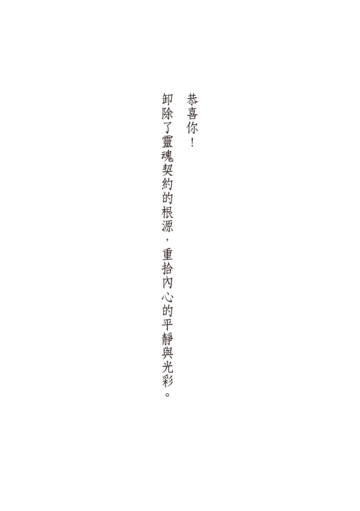

# 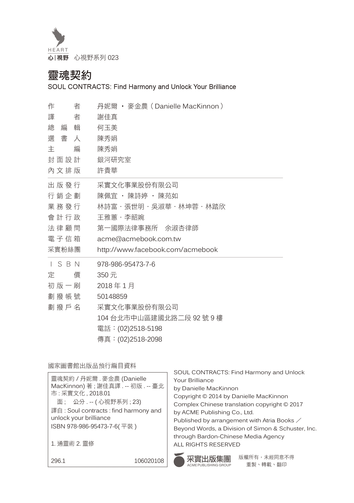

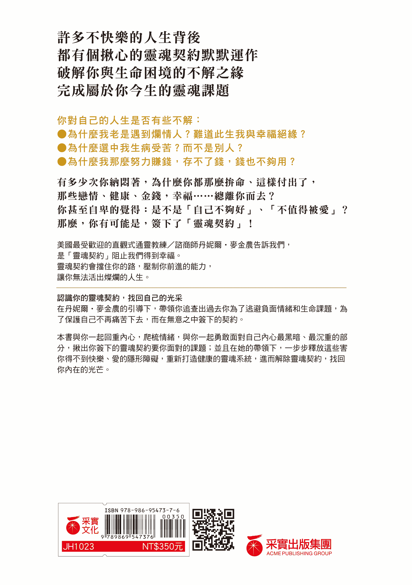