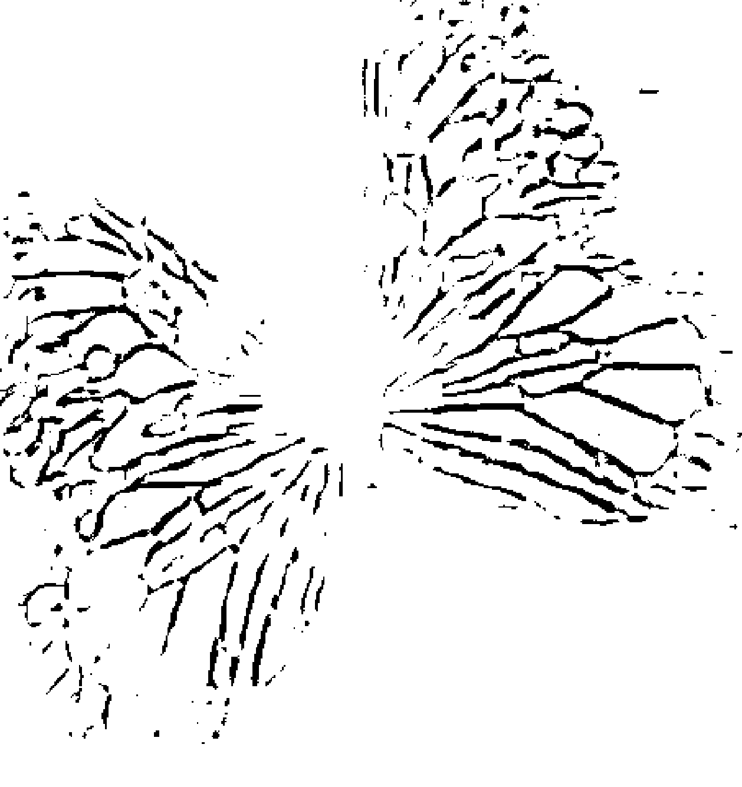
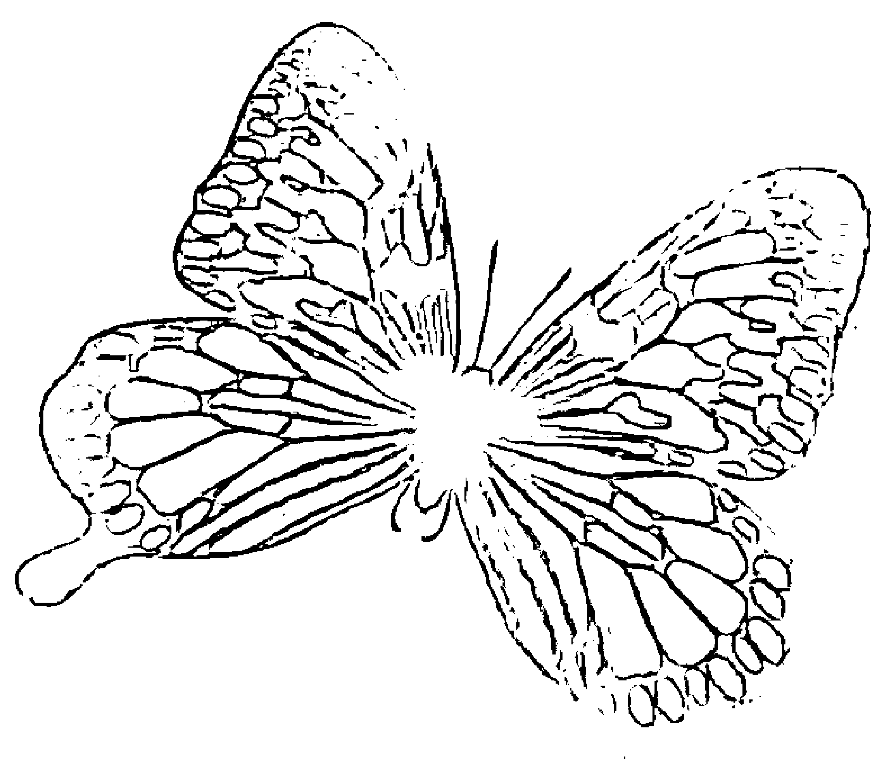
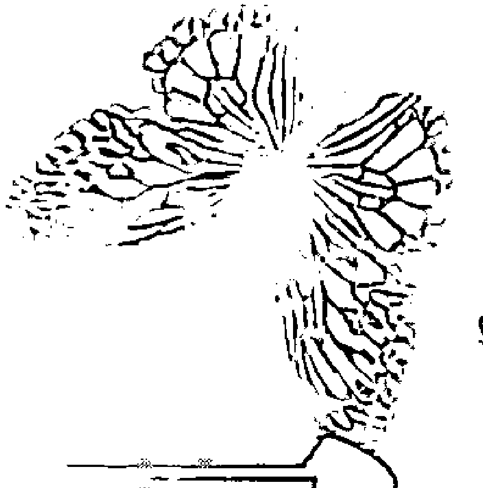
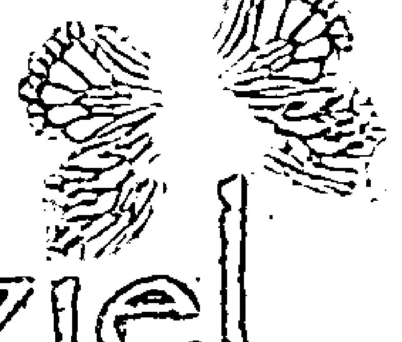
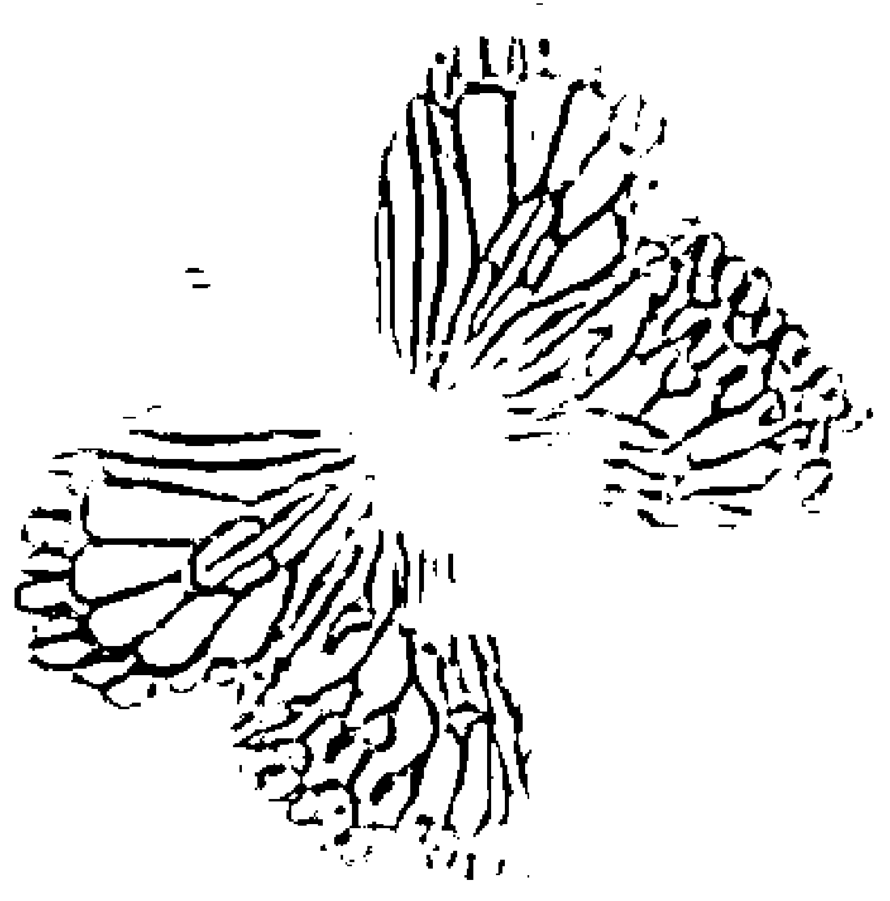
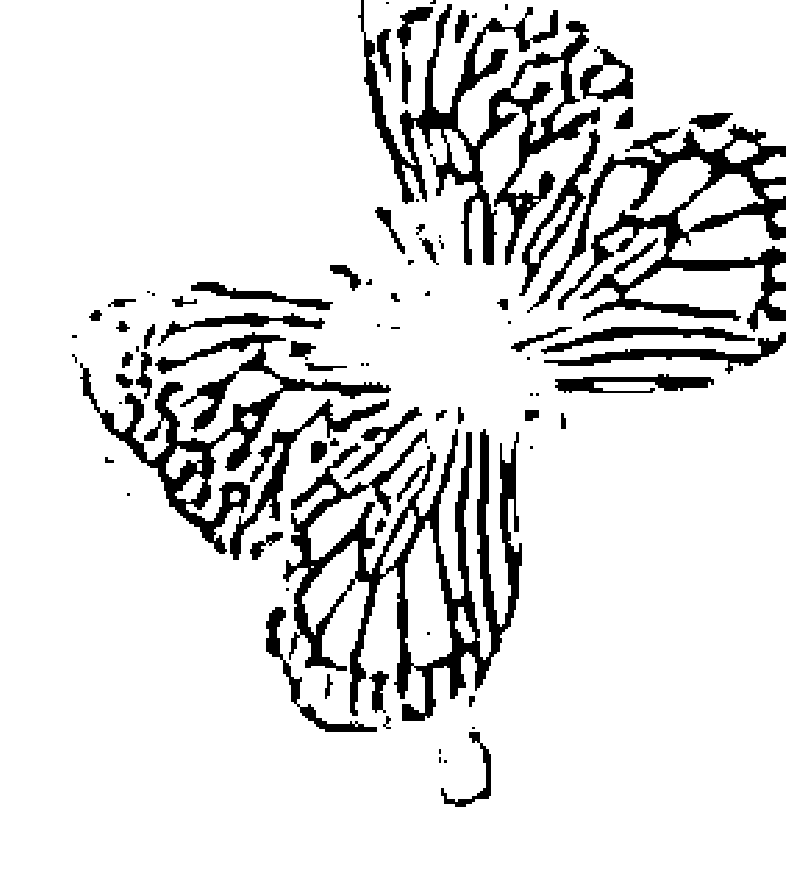
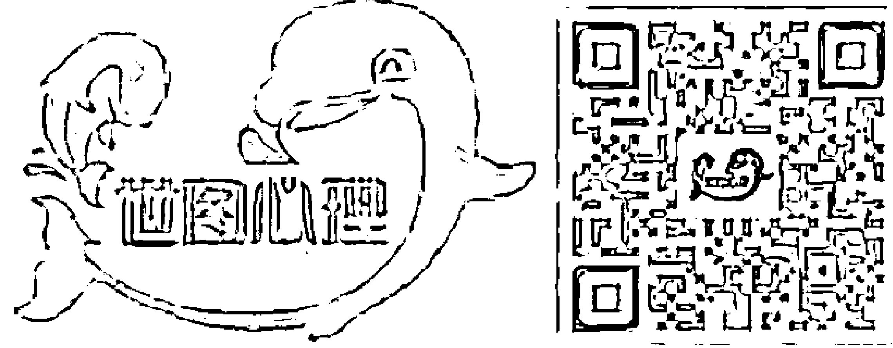
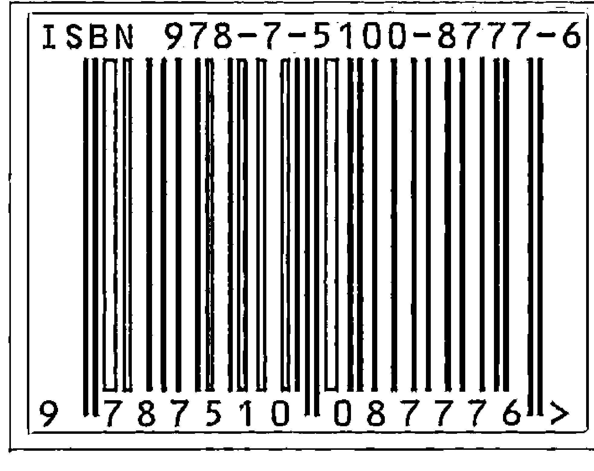
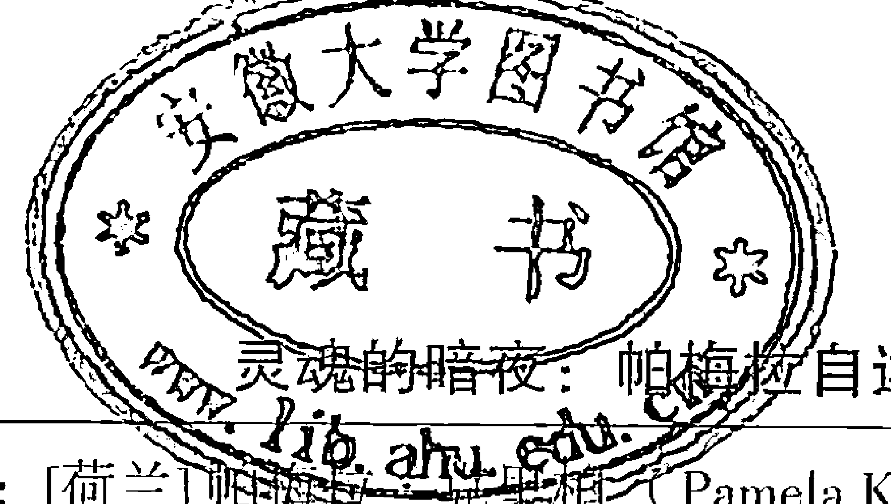

# Nacht van de ziel

### 灵魂的暗夜

# 帕梅拉自述和约书亚的传导

帕梅拉·克里柏（Pamela Kribbe）著 艾琦 译

身心灵作家张德芬倾情推荐
真正的灵修在于诚实地自我觉察。
直面自己的恐惧，
并对自身的情绪负责。

蜜思图书出品

## 内容简介

全书包含两部分。第一部分是帕梅拉罹患精神病的经历，第二部分是约书亚针对“灵魂的暗夜”所做的传导。灵魂的暗夜通常出现在灵性觉醒之前，对帕梅拉而言就是陷入了躁狂和抑郁，完全的绝望。然而，人只有体验到了极度的黑暗，才会迎来最终的光明。

## 精彩书摘

直觉远比灵视力或者其他超自然能力更珍贵。

直觉是一种冷静持续的觉知，不受心情及外在刺激的影响。情绪则恰恰相反，它往往比较激烈，容易导致焦虑与不安，而且历时短暂。

真正的灵性观念自始至终都会助你与物质实相、你的地球人格、你的人性以及周遭的人们建立与保持联结。

责任编辑：黄秀丽 于 彬
装帧设计：刘 岩

ISBN 978-7-5100-8777-6

上架建议：心理学、身心灵 定价：45.00元

### 灵魂的暗夜

帕梅拉自述和约书亚的传导

[荷兰] 帕梅拉·克里柏（Pamela Kribbe）著 艾琦 译

世界图书出版公司
北京·广州·上海·西安

## 图书在版编目（CIP）数据

灵魂的暗夜：帕梅拉自述和约书亚的传导 / （荷）帕梅拉·克里柏（Pamela Kribbe）著；艾琦译. —北京：世界图书出版公司北京公司，2014.10

书名原文: Nacht van de ziel

ISBN 978-7-5100-8777-6

-   Ⅰ．①灵… Ⅱ．①克…②艾… Ⅲ．①心灵学—通俗读物 Ⅳ．①B846-49

中国版本图书馆CIP数据核字（2014）第 241349 号

Nacht van de ziel © 2014 by Pamela Kribbe

Simplified Chinese edition copyright © 2014 Beijing Word Publishing Corporation

All rights reserved

**灵魂的暗夜：帕梅拉自述和约书亚的传导**

著 者: [荷兰]帕梅拉·克里柏（Pamela Kribbe）
译 者: 艾 琦
责任编辑: 黄秀丽 于 彬
封面设计: 刘 岩
出 版: 世界图书出版公司北京公司
出版人: 张跃明
发 行: 世界图书出版公司北京公司
(地址：北京市朝内大街137号 邮编：100010 电话：010-64077922)
销 售: 各地新华书店
印 刷: 北京博图彩色印刷有限公司
开 本: 787 mm × 1092 mm 1/16
印 张: 18.5
字 数: 160千
版 次: 2015年1月第1版 2015年1月第1次印刷
版权登记: 01-2014-0189

## 译序

迄今为止，这是我翻译得最苦的一本书。这种“苦”并非文字层面上的，已经翻译了几十万字的来自帕梅拉或者说约书亚及玛利亚的讯息，熟悉感与亲切感如同香醇的红酒，翻译起来既享受又备受启迪，更别说那心有戚戚的共鸣感，以及莞尔一笑时酒窝中浮出的那朵桃花了。这种苦，源自情绪层面。

翻译本书第一部分——帕梅拉及亲友分别描述她所经历的灵魂暗夜——的那段时间，我自己也比较忙和累，在疲惫的激流中挣扎，力图不被吞没。随着翻译的展开，我逐渐或者说很快沉入帕梅拉的能量世界，等我反应过来，似乎已经深陷其中，无法自拔。心情还好，就是疲劳，累得什么都不想做，甚至不想翻译，又欲罢不能。我的状态随着帕梅拉的故事起起伏伏。她患上抑郁症，最终被强制住院，住进了医院的精神病科。我的疲劳也日渐严重，并开始出现幻听。自救的方法是，翻译一段自述，随着文字沉下去；再翻译一段约书亚传导，随着文字浮上来，借由约书亚的讯息获取力量，努力维持平衡。最终，我还是随着帕梅拉在医院的脚步声开始好奇：精神病房是什么样子呢？心中竟然有一丝丝的向往：在那里多好啊，可以静静地一个人坐在房间中，什么都不用做，不累！

译完帕梅拉的自述，又开始翻译帕梅拉的先生格里特的文字，讲述那段时间他自己的亲身感受。那种痛，那种无力感，还有充满绝望的希望，或者说隐约带着希望的绝望一瞬间击垮了我。我飞快地合上笔记本电脑，放在一边，不想让它被决堤的泪水冲走……“这个冬天好冷”，我在心中一遍遍地重复着格里特的话。一周后，我病了，带着惊讶却不意外的目光倒下。我本就容易被他人的情绪感染，更何况翻译本身就是一个用心感受的过程。

话又说回来，每个人都是受眷顾的，我自然也不例外。自始至终，冥冥中都有神奇的力量在陪伴着我。记得深受自传感染而不自知时（只觉得累，无边无际的累，以为只是过于忙碌所致），我使用的在线词典上忽然闪出一个心理测试的广告：测测你是否患有抑郁症。我心中一动，点击进入。测试完毕，结果是：你患有中度抑郁症。看到结果哑然失笑，虽然知道自己并未患上抑郁症，但自己的一些表现确实符合抑郁症状：累，累得什么都不想做，渴望独处（难怪有人说与抑郁相反的并不是快乐，而是活力）。这对我来说是一个提醒，提醒自己关注身体发出的信号，不再像往日那样视而不见。因着不断地要求自己去做“更多”，付出“更多”，我已经渐渐脱离了精力充沛的状态，与帕梅拉一起进入灵魂暗夜只不过是“雪上加霜”而已。

翻译过程中，因着帕梅拉的描述，也更因自己当时的疲惫状态，在我对精神病院心生好奇甚至跃跃欲试之时——某人一向喜欢当实验兔子，电视上忽然出现了一段发生在精神病院的“喜剧节目”，短短的10多分钟，却彻底地满足了我的好奇心，我也算如愿“体验”了一下精神病院的生活。想去精神病院转一圈的念头如冰雪般融化，那里实在是不好玩！

上述这些只是翻译本书期间所发生的一两次“巧合”，细心留意与列举的话，估计可以满满地写上几页吧。

后来见到帕梅拉，简短地对她讲述了翻译经历，眉飞色舞地讲到精神病院那一段时，她也哈哈大笑。人生亦是如此，许多时候，虽然身处其中时心中盈满痛苦与忧伤，走出来之后再回首往事，往往只是笑笑而已。苦楚也罢，莞尔也好，都是一笑。这也是人生的魅力之所在吧。

帕梅拉的文字深深地触动了我，如前所述，书中最感动我，使我泪流满面，最后不得不暂时放弃阅读的，是格里特对那段时间的描述。帕梅拉以自我觉察的方式事后回忆着写了这本书，其中不乏检视与理智的色彩；格里特则直接引用了他当时与朋友之间的邮件。记得翻译他的文字时，遇到了“zuster”这个词。荷兰语中，姐姐和妹妹都是“zuster”。我写邮件问他指的是他的姐姐还是妹妹，并顺便提了一下他那段文字的感人。他回答了我的问题后，接着说：“我们现在的生活真是太美了！”听到他的话语，再回想他当时所描述的情节（这真是惨不忍睹。救护车到来之前，我们必须把她留在家中，而她则试图逃脱。我妹妹把所有的钥匙都拿在手中。我抱住帕梅拉，紧紧地抱住她不放，时间变得如此漫长。她大声喊着求我放开她：“放开我，让我走，我立刻就走，你再也不会见到我。永远也不会再见到我！”当然，我不肯松手。），心中油然升起一种感动，更是信任。是的，一切都会好起来的。生命的本性与目标就是美好与成长，虽然会有一些外在尤其是内在的因素带来短暂的遏阻，但生命的脚步是不会停息的。而我们需要做的，只是不再试图掌控人生，带着信任，顺着生命之流怡然而行。

一切都会好起来的，记得第一次见到帕梅拉时，她刚刚走出灵魂暗夜不久，那时的她，体重已经恢复正常，看上去神采奕奕，已经没有任何“病”过的痕迹。一切都会好起来的，刚刚翻译完这本书的我，也已经走出了那无边的疲惫。不仅如此，我还在学习设定界限，呵护自己。帕梅拉曾经忘记设定界限，忽略了灵魂借由身体发出的信号，我亦如此。

我想，可能许多人都如此。

> 玛利亚曾说：“你们往往觉得忙碌，有数不清的事情要做都是因为外在的因素，然而，选择权确实在你们自己手中。尽管每天忙碌不已似乎并不是什么开心的事，但人们会对此上瘾或形成习惯。因为这样的话，他们就无须去面对那些使自己不舒服的（内在）感受。”

愿与本书的读者们（能够手捧此书亦非偶然）一起感受这番智慧的话语。

我不相信“苦寒”是“梅香”的必要条件，但我相信，只要对生命充满信任，苦寒之后自是梅香。灵魂暗夜并不是生命的尽头，而是柳暗花明又一村的前奏，是即将离弦之箭那短暂的“后退”，是出生前的阵痛。此时此刻，无论你感觉自己正一点点地坠入灵魂暗夜，还是正处于灵魂暗夜之中，请相信，浓浓夜色滴落的声音正是黎明仙子的叩门声，她就在门外，等着我们开启门扉。
行至水穷处，亦是乘云而起，浴火重生之时。

## 目录

译序

中文版序

### 第一部分 灵魂暗夜

-   第一章 痛苦与恐惧 / 003
-   第二章 日记撷录 / 009
-   第三章 抑郁症与精神病 / 035
-   第四章 康复与重生 / 045
-   第五章 灵魂如是说 / 053
-   第六章 身边之人如是说 / 061
-   第七章 灵魂暗夜：灵性经历还是精神病史？ / 079
-   第八章 关于深度抑郁症及精神病的建议 / 085
-   第九章 灵修上的赘疣 / 093

### 第二部分 关于“灵魂暗夜”的灵性讯息

-   第一章 灵魂暗夜时分的导师 / 107
-   第二章 面对自己的黑暗面 / 115
-   第三章 重生于新地球 / 119
-   第四章 超越时间的次元 / 125
-   第五章 走出迷雾 / 131
-   第六章 台风之眼 / 137
-   第七章 生命之河 / 143
-   第八章 恐惧：通往新事物的门户 / 151
-   第九章 光之工作者的使命 / 161
-   第十章 最高的给予 / 171
-   第十一章 璞石成玉 / 177
-   第十二章 内在法官 / 183
-   第十三章 疗愈旧有创伤 / 191
-   第十四章 高度敏感与男性能量 / 197
-   第十五章 重获新生 / 203
-   第十六章 一切万有与芸芸众生 / 211
-   第十七章 光之工作者的助人之道 / 217
-   第十八章 疾病与情绪 / 225
-   第十九章 新纪元已经到来 / 233
-   附录 关于12个前世的回溯

### 第一部分
灵魂暗夜

## 第一章 痛苦与恐惧

2009年春，我开始感到胃部不适。那时，来找我咨询的人很多。对于那些带着疑问来找我的人，我总是感到很难拒绝，因此，我每周安排的咨询都偏多。所谓偏多，是就我自己的承受程度而言，因为我每周只能做三至四次个案咨询。每次咨询的能量强度是如此之大，我都需要很长时间才能恢复过来。咨询过程中，我借由直觉与咨询者建立能量层面上的联结，我往往不知不觉地去与对方一起感受浮出水面的痛苦、恐惧与孤独。而且，我总是竭尽自己的一切力量，将自己完完全全地投入与对方的联结与沟通之中。我是一个地地道道的完美主义者。大多数情况下，咨询的效果都很好，顾客很满意，我也因此备受鼓舞。然而，我却筋疲力尽，在这一天接下来的时间里，几乎没有精力去做任何事情。我疲惫不堪，像被挤干的海绵，必须好好地休息一天，才能重新回归生活，回归自己。

除了提供咨询服务，我与先生格里特还定期举办工作坊，这也需要我投入大量的精力。高度敏感以及对失败的恐惧联手将我击垮。4月一个周六的清晨，我和女儿劳拉——那时她7岁——一起坐在一个室外儿童乐园里。忽然间，我感到食道一阵刺痛。当时我想，或许这只不过是胃酸倒流而已。可是，疼痛是如此剧烈，服用几粒甚至整包胃药都没有作用。我开始担心自己出了问题，于是周一看家庭医生。他给我开了抑制胃酸分泌的药，并嘱咐我好好休息。我遵照医嘱取消了一些个案咨询与工作坊。十天后，药物似乎开始发挥作用，我的身体开始好转。尽管如此，恐惧、紧张、焦虑却一直如影随形，徘徊不去。

我不敢对人们说“不”以给自己空间。我所进行的咨询工作不正是自己真心想做的吗？每周三至四次咨询也并不多啊。我对自己的责任与能力充满了评判，评判的背后则是对“受拒”的恐惧：假设我真的赋予自己所需要的空间，人们是否会因此离我而去？

此外，为公众演讲或讲课对我来说亦非易事。虽然与会者很多，集会进行得往往也很顺利（进行传导时，常常有一股充满激励的能量之流承载着我；而且，与会者那温暖的集体能量也使我感到欣慰），然而，会前的一两周我则时时感到恐惧与紧张，心中充满抵触。这种感受一点点地蚕食着我，使我备受煎熬。在公众面前讲话本就不是我的天赋，我在大学做助教时就对此深怀恐惧。我天生内向、腼腆，而且内心深处又害怕遭受到拒绝：我的工作（通灵传导）并非平常之事，是否会遭到他人的怀疑与奚落？尽管如此，我还是觉得自己必须这样做，因为有一股能量在诚挚地激励着我。除此以外，我还有众多其他的理由，比如许多人都希望或请求我这样做，我不能使他们失望。那时我以为，演讲是著书之人应尽的责任，而且人们对演讲的积极关注也使我欣慰——这是对我的首肯。现在再回顾那个时期，我认识到，我当时之所以忽略自己的生活节奏与承受极限，主要有两个原因，一是害怕受拒；其次“我理应如何、必须如何”的虚妄观念左右着我。或许，对我来说，公众讲话应是一个耐心积累、循序渐进的过程，这样我才能有时间逐步战胜恐惧。

时间渐渐流逝，已是2009年5月，我依然感到自己很不稳定，胃部依然不适。雪上加霜的是，此时又传来了母亲身患乳腺癌的噩耗。还记得那天她打电话过来，告诉我这一消息。她的话仿如晴天霹雳，令我平时所具有的承载力似乎于一瞬间崩溃。我试着不去过度地同情与怜悯母亲，这并不是她想要的，对她也没有什么帮助。这一点，我做的比想象的要好，也许那时的我本已无力再承受更多。令人欣慰的是，那段时间我开始于内在与外祖父进行联系与沟通。他在我出生之前便已撒手人寰，我从未见过他。我从他那里不断接收到积极正向、充满鼓励的讯息，并把这些讯息转告给母亲。母亲对此持开放的态度，而且她自己也亲身体验到父女之间那美丽又深刻的沟通；尽管他在世时，他们之间的关系并不是那么融洽。令人庆幸的是，母亲最终成功地接受了手术，以无比的勇气与乐观走过恢复期，战胜了癌症。

而我的状况则不断恶化。剧烈的胃痛卷土重来，我所使用的药物收效甚微。我极其注意饮食，避免一切会产生胃酸的食物。也因此，我不断减少进食，日渐消瘦，夜不成寐。我焦虑不安，无法正常思考，因着胃酸倒流，喉咙整夜地痛。疼痛使我无法入睡，不仅如此，疼痛的程度更是日益加剧。平日的午觉再也无法弥补夜间失眠所导致的睡眠不足。我以前一向是沾枕即眠，一觉到天亮。而现在，“紧张”则成了我的身体基调，使我难以入眠。我也尝试着使用过一些替代性药物，比如缬草、褪黑激素及草药，不过它们并未起到什么作用。

2009年夏天，我开始经历“恐慌发作”。这对我来说也是前所未有的。以前我都是因为某一具体原因而心生恐惧，例如，畏惧即将到来的公众演讲，并因此产生恐惧；演讲过后，恐惧自行消失。而现在，这些恐慌发作却是不期而至，没有任何缘由。突然间，恐惧出现，在我的体内漫延。我浑身震颤，心悸，胃部肌肉紧绷，喉咙不适。而且，每天发作不止一次。一段时间后，恐惧甚至占据了我的肩胛、双臂与双腿。在这种肉身之痛的折磨下，时间在缓缓流逝。

家庭医生为我开了镇静助眠药。吃药后，我似乎也放松了一些。一片药能够带给我三至四天的安宁，这对我来说是一种短暂的解脱。真正击溃我的则是内心的愧疚感，我为自己需要使用此类药物而内疚不已。医生对于诸如此类的药物持保守态度，我也对它们心怀抵触，因为它们只是人为地压抑与遮盖了我的恐惧。不仅如此，此类药物还会使人上瘾，令人难以摆脱对它们的依赖。各种“灵性评判”不断地浮现出来，身边的人更是强化了我的愧疚感：“你必须全然地体验发生在自己身上的一切，而不是借助药物来人为地压抑它们。吃药只能消除表面的症状，根本无法追根溯源，解决本质问题。”简言之，“吃药就意味着灵性层面上的失败”。因着诸如此类的评判——来自他人也来自我自己，我吃药时，感到越来越沮丧，越来越觉得自己是一个软弱的人。我对自己的评判几乎彻底抵消了药物原有的积极作用——短暂地减轻或消除内心的恐惧与紧张。

事后 再回顾那一时期，当时我也完全有可能不假思索地吞入大量的药片，而且用药量会越来越大。如果它们真能让我好好地睡上一觉，再帮我稍微放松一些，那些负面作用又算得上什么？严重失眠最终可能会导致精神失常以及抑郁症，说不定我会因此而彻底垮掉。所幸的是，那时我的情况还没有这么严重。回首往事，2009年的夏天还不算是黑暗时期，虽然那时恐慌发作、严重失眠以及肉身之痛持续地折磨着我，但我依然心存希望，依然与他人保持着有意义的沟通与联结。不过，这一时期，我取消了所有的个案咨询和工作坊，完全停止了工作。对于当时的我来说，唯一的事情就是挣扎着度过每一天，还有每一夜。不久以后，我又患上了过度换气综合征。过度换气综合征是因为（胸部）呼吸频率过快，导致吸入的氧气过量，而患者的症状却是缺氧的感觉。有那么几周，我深受其苦，甚至到了无法外出散步的程度。这使我异常沮丧，因为亲近大自然，在大自然中散步是我的最爱。我的呼吸问题日渐严重，已经无法进行腹式呼吸，只有平躺时，呼吸才能稍微平缓一些。

这几个月中，我依然与我的指导灵还有约书亚保持着联系，依然能够对他们的能量敞开，聆听他们那积极正向、富于激励的话语。与此同时，身边的亲朋好友对我也有着很大的帮助。首先，我的先生格里特一直耐心地与我沟通，不断地鼓励我。此外，一位疗愈师朋友间或为我做灵性疗愈与咨询。我每周还接受一次专业按摩。这一切都对我颇有助益。虽然我的胃部不适、恐惧与紧张、失眠以及过度换气综合征并未因此而减轻，这些帮助与陪伴却带给我希望与鼓励。

2009年的7月和8月，我每天都记日记，试图通过写作来整理思绪，获得关于恐惧的洞见。一般情况下，我以对话的形式进行写作，向我的指导灵或灵魂提出各种各样的问题。下一章撷录了我那段时间的一部分日记。

## 第二章 日记撷录

### 2009年7月1日

今天弗兰卡（我的一位疗愈师朋友，www.sol-terra.nl）为我做疗愈，之后，我看到如下的画面。伴随这些画面而来的，还有强烈的情绪。

我看到出生前的我身处在光与爱的氛围中。在某一时刻，（他们）做出我再次轮回地球的决定。一位指导灵陪伴在我的身边。他很亲切，名叫巴特赫罗梅斯（Bartholomeüs），我称他为梅斯。他浑身上下散发着爱与智慧的能量。梅斯说我无法阻止这件事情的发生，因为“此刻重返地球”是我生命韵律的一个重要篇章。我需要在这一生中完成一些事情，需要去面对与消除旧有的忧伤与恐惧，而地球生活有助于我达成这一目标。他邀请我放下旧有的怀疑与不信任，重新学着相信在物质世界生活的美丽与神奇。

我对这一决定心怀抵触。这一决定来自生命本身，来自宇宙。梅斯并未强迫我，不过，我知道自己必须遵从这一安排。一只温暖的手轻轻地向前推了我一下。而我则满心抗拒，畏缩不前。我不想轮回地球！

为什么不想呢？因为我不想被地球实相之帷幕遮蔽甚至禁锢。对我来说，地球实相充满了暴力、威胁、侵犯、孤寂与凄凉。我想要继续享受自由，继续感受和谐的氛围，继续飘舞于幸福与极乐之中。然而，有一股力量将我吸向地球，我一路挣扎着，身不由己地渐渐接近地球，内在的某一部分对前来引导我的光紧闭门扉。我的心中充满了愤怒与抵触，我不愿意，我就是不愿意！

此外，我还看到，灵性次元中，几位女性围成一圈，帮助我为地球之行做准备。画面中，我是一个婴儿，天使般的她们抱着我，带给我温暖的爱，并柔声告诉我她们对我的信任。婴儿的我想要拥抱她们的爱与信任，然而，我的某一部分已经将自己隔绝起来，她生气地站在一旁，拒绝聆听。这一部分的我不愿意轮回地球，她满心痛苦，愤怒不已，失望至极。她毫不掩饰自己挖苦、批评的态度，她想要报复，并希望自己的决定能够获得认可。然而，她的身边冷冷清清，空无一人。她孤身只影，如同一间幽暗阴森、四壁皆空的囚室——远甚于人世间的囚室。一旦你自己的精神将你禁锢起来，成为你的囚室时，你就会放弃生命，不再允许它带给你惊奇与美好，为你展开全新的人生画卷，并助你与过去和解。

就这样，我踏上轮回之旅时，已经把自己完全隔绝起来，将那几位想要疗愈我的女性挡在门外。沉入地球实相时，我感觉自己如同一片凋零的秋叶，毫无生气地缓缓飘落。我根本不想来！进入属于我的胚胎时，那种感觉很是不舒服，就好像浑身上下都沾满了黏糊糊的沥青。我最后的一线希望——那自由的氛围——居然也被夺走。我被牢牢地囚禁在这一身体里，濒于窒息，石化！我感觉通体冰凉，寒冷刺骨。我不想石化，不想！可是，这恼人的一切还是发生了：我变成了有血有肉的身体。我无助地在母亲的子宫内翻转、扭动，我实在不想来这里，更不想出生！然而，我那幼小的身体还是不断地成长、发育，完全违背我的意志！它不断地长大……

拒之门外，觉得自己受了伤害，愤怒不已，心中除了抗拒还是抗拒。冷漠将我笼罩，我拒绝人生对我的呼唤，厚厚的迷雾将我与物质世界隔开。

我出生的时刻到了。子宫内的运动越来越剧烈。我惊慌不已，不知所措，不过就是不肯出生。我已经习惯了子宫内的生活，虽然我在那里感到并不舒畅，但这毕竟给我了一些安全感。出生过程历时很久，我不肯顺从，因为我于内心深处彻底抵触地球上的生活，这种抵触感推迟了我的降临。当我终于呱呱落地之时，那强烈的日光使我无法承受。与此同时，我也感受到母亲的情绪，感受到这一难产经历带给她的恐惧与惊慌。我深感愧疚，我真自私，因为自己内在的抗拒而伤害了母亲……我内在有着一种敏感的“东西”，它把这一切都印刻在我的记忆中。

### 2009年7月3日至5日

### 与地球母亲的对话

我：为什么我的胃这么不舒服？
地球母亲：你制造胃酸是为了抗拒与防卫。胃酸是一种防卫工具。你感觉外界刺激以排山倒海之势向你袭来，而你无法很好地应对与整合这些刺激。胃酸在此扮演着起落杆的作用：将这些外界刺激挡在外面，到此为止，不许再向前一步。
我：就是说，我未能持守自己设定的界限，因此胃酸帮我做到这一点？
地球母亲：对，没错。
我：保持自我，让一切外界刺激自来自去，不因它们而失衡，为什么这对我来说就这么难？
地球母亲：你努力去满足他人的期望，想要获得他们的首肯与欣赏。你的内在有一个渴望得到认可的小女孩。孩提时期，你决定以母亲为参照，因为她是在各个层面培养你的那个人。从做出这一决定的那一刻起，你开始逐渐偏离自己的中心。而且，这一问题至今依然悬而未决。

她对你的首肯重于一切，其他的一切都处于次要地位。你也将这一习惯带到了日后的（亲密）关系中。因着这一倾向，你不断地将他人的评价置于自己的需求之上。“他或她对我的看法如何？在他或她的眼中，我做得够好吗？”远重于“我自己的看法是什么？我想要什么？”在你的咨询工作中，这一模式也一再地上演。你为了获得他人的首肯而竭尽全力，很少自问：“这是我想要的吗？这是否适宜于我？”

我：就是说，我内在有一种自动模式，我以他人的看法为准则，将他们看作评判我的法官。难道这是我为了逃避直面自己的孤独或忧伤而采取的生存机制？

地球母亲：确实可以这样说。当初，你带着对生命的愤怒投胎，根本不愿意在地球上生活。也因此，你对生命没有任何信任，而信任永远是“不偏离内在中心”的基础。你出生的那一刻，强烈的外在刺激将你压倒。你没有建立起信任的基础，以面对之后出现的各种新刺激。对你来说，一切都是那么可怕，那么令人厌恶，那么危险。由于缺乏内在基础，你紧抓貌似能够带给你一定安全感的外在事物不放，这一外在标尺便是你的母亲。

你出生时便没有“中心”，或者说，你并非“真正的自己”，因为你的一部分，本可以对生命说“是”并为你世界观的形成打下坚实基础的那一部分，与生命隔绝开来。在这一生刚刚拉开序幕之际，你的意识觉知便充满了恐惧与惊惶。你在黑暗中盲目地寻找一束能够让你依赖与寄托的火炬。你于内在缺少这一火炬，因为你的灵魂之光并未真正地伴随你一起踏上地球之旅。后来，你才找到了自己的灵魂。

我：我的灵魂与我的地球人格之间是否存在着某种分离？

地球母亲：你无法有意识有觉知地感受自己的灵魂。怨恨与失望将你屏蔽起来。只有纵身跃入物质实相才能打破这一屏蔽。你无法在灵性次元中做到这一点，因为在那里你并不是透过分离出来的人格（自我）生活。在那里，你与“一切万有”、与你的灵魂有着更强的联结。然而，也正因为如此，你无法体验与解决积储起来的情绪。

我：嗯，这我理解。我想更好地理解自己的这个自动模式。为什么我遇到一个人时，总是立刻将自己置身于对方的情境，就好像我内在有什么“东西”直接跃入了对方？这是同理心吗？反正我总是自动地用对方的目光来看我自己。我能够感受到对方的期待，与此同时，我则害怕自己无法满足对方的期待，害怕自己做得不够好，未能完全感受对方的感受，与对方同在。明确设定界限乃至双方之间可能会出现冲突，诸如此类的想法对我来说是根本无法忍受的。因此，我与对方融合在一起，希望获得对方的好感，而同时又害怕自己做不到这一点。这就是我的自动模式吗？

地球母亲：这一自动模式是：你为了他人而牺牲自己。对你来说，他人占据主导地位，他或她可以主宰你的感受与看法，你则根据他或她的期望来不断调整自己。这就是你的模式：你调整自己，以适应他人。

我：这种调整与适应使我失去了自己，偏离了自己的中心。

地球母亲：对！而且关键问题是，这明明是失去自我，你却认为这是好事。你认为，这样你就是一个善良、可爱的好女孩，会因此而获得首肯。就是说，你脑中有一个谬论：“失去自我是好事，是善行，这样做能够解决我的问题。”

“失去自我”的诱人之处在于，你会感受到短暂的和谐，就是说，你感到自己是受欢迎的，因为你获得了他人的认可。能够得到你的证实，知道你与他们同感同受，这对许多人来说都是一种慰藉。因此，他们不会阻止你按照“牺牲自己”的运作机制行事。他们希望也喜欢和你在一起。

我：什么时候一个人才能意识到“牺牲自己”并非善举，而是一个虚妄的运作机制呢？

地球母亲：当你一直牺牲自己，直到因此而深受其苦之时，就会意识到这一点。你可以长期对此执迷不悟，比如深陷某一亲密关系之中，但你内在毕竟有一些不肯自欺欺人的因素。你与R（一段持续了四年的爱情）的关系就是一个很好的例子。你因为爱上了M，而从与R的关系中清醒过来。对你来说，这仿佛是“偶然”发生的。然而，这是你的灵魂的安排，是你的灵魂为你吸引过来的。

我：我还记得，离开R对我来说是一个极其艰难的决定。那时，我在能量层面上与他紧紧地黏在一起。我终于下定决心与他分手时，我们正在厨房，我第一次不再顺由他的能量，给了他一个完全出乎他意料的回答。我大声清晰地说：“我决定离开你。”就在那一瞬间，一种能量上的突变强烈地震撼了我。一个环绕着R的球形能量场忽然闪电般地飞向我。我知道，这是我的能量，是我的共情以及对他的认同；是我为了能够获取他的肯定而付出的一切。如今，这一能量又回到我的身体。忽然间，我感觉自己变得异常坚强，浑身充满了力量。我好像刚刚从深度麻醉的状态中清醒过来，再次觉知到自己的存在，不再害怕与他分手。那也是尘埃落定的一刻，我去意已决，离开了他。

之后我还有过一次类似的经历，不过程度比较轻。那次，我决定辞去自己所进行的义工工作。做义工的那段时间，指导我的人对我横加干涉，态度极不友好。终于有一天，我公开对她说：“我决定离开。”此言一出，我如释重负，有一种特别轻松、终于获得解脱的感觉。

地球母亲：是的。那一刻你体验到了坚定地立足于自己中心的感受，“我认为，我觉得，我希望”。不仅如此，你也采取了相应的行动。这对你具有一定的疗愈作用。有时，你需要长时间地否定自己才能实现这一突破。也因此，这一自我否定阶段并不是毫无意义的，它使你逐渐认识到，你再也无法继续这样下去。这一自我觉知的时刻对你来说弥足珍贵，这一突破会使你终身受益。与R分手对你的内在成长起到了关键的作用。从此以后，你再也没有将专制、惯于掌控他人的人吸引到自己身边。你开始结识柔和、内向的伴侣，他们的性格使你能够更加坚定自己的立场，而不是依附于一位性格强硬的人，并迷失在他的能量之中。

我：我是不是在咨询工作中以及与顾客的关系中也陷入了同样的陷阱？

地球母亲：是的。在某种程度上，确实如此。你过于牺牲自己，过于努力。你追求完美，也因此不必要地过度付出。你所需要做的其实并不像你想象的那么多。你往往以为自己必须带给人们他们所需要的答案，以帮助他们解决问题。然而，这并非他们真正的需要。他们真正需要而且你也能够带给他们的是能量上的转化，恐惧转化为信任，不确定感转化为内在觉知，自我否定转化为自我理解。然后，从这一新的空间，这一充满信任与自我欣赏的空间，重新看一看自己所面对的问题，自行找到解决问题的方法。你为他们提供的是转化能量的机遇，而不是解决问题的具体方法。

我：如果我有意识地去这样做的话，我的胃部不适就会减轻吗？通过降低对自己的要求就可以？

地球母亲：对，没错。

我：真的就这么简单？

地球母亲：对。因为这样做的话，你就不会流失能量。当你试图去解决他人的问题时，你将重心移向他人，并在这一移动过程中失去自我。这时，你往往倾尽一切努力，不仅运用自己的大脑帮他们思考，还运用自己的第三眼来帮助他们确定方向。所有这一切尝试、努力与付出都导致了你胃部——第三脉轮所处的位置——的紧张感。然而，你需要做的根本不是为他们解决问题，而是让他们看到，他们有能力自己解决问题。

我：许多人都认为，我具有灵视力，能够看到他们自己所看不到的事情。我不是很喜欢这一点。就是说，我这个具有灵视力的人知道他们所不知道的“客观事物”。这意味着，解决他们问题的方法来自外在，比如：“我是否该辞职？是否该结束这段关系？”等。然而，真正的答案总是来自内在，我希望自己能够在这一层面上工作。

地球母亲：确实如此。你必须解释给人们听，对他们说明，你不会具体告诉他们是否该做某事，也不会具体地为他们指出人生之路。你会于内在层面上帮助他们，告诉他们该如何面对恐惧与负面能量，如何面对自身的情绪，如何脚踏实地地生活，如何设定界限，以及如何与自己的直觉和灵魂建立联结等诸如此类的事情。这才是你的工作领域。

我：嗯，是这样的。被看作“传达神谕的人”，我对此真是厌倦透顶。

地球母亲：那好。现在好好地感受一下，你对此厌倦透顶！

我：我对此也很生气。

地球母亲：为什么？

我：我认为人们在我这里寻求答案是一种幼稚的行为。与此同时，我又觉得自己能力有限，无法提供他们想要的答案。这时，我就会心生恐惧，害怕自己会失败，害怕人们说：“你才不是真正的通灵者呢！”

地球母亲：你想当一个“真正的通灵者”吗？

我：我不知道。我想要帮助人们自内向外地解脱与觉醒。不过，我确实偶尔有利用自己的灵视力帮助过他人（告诉他们在生活中具体怎样做），他们很是高兴。我为他们的感激而满心愉悦，难道这是我逐渐执着于此的原因？因此我不知不觉要求自己必须要做一个优秀的通灵者？其实，我本来对此毫无兴趣。这一生中，我一直对哲学、心理学和灵性思想深感兴趣，对内在生活的规律性感兴趣。

我与约书亚的合作与此有着很好的衔接。

地球母亲：是的。这才是你真正想做的，是你进行自我实现的领域。你无须为了他人而扮演通灵者的角色，卸下这一责任负担吧！你认为这是他人对你的期待，认为自己应该为他们充当这一角色。尽管如此，你对此半心半意，因为你害怕自己没有这个能力。一方面，因着这一恐惧，你觉得自己必须要竭尽全力，必须要更加努力地工作；另一方面，你又因此而感到气愤与烦恼，觉得人们向你提出此类问题实在是愚蠢。然而，正是因为恐惧，人们才绝望地向你提出一个迫切的人生问题：“我该如何做？”也恰恰就在这种情况下，“立足于自己的中心”才是正道，不要任由他人透过第三脉轮将你拽离中心，不去满足对方希望得到某一具体答案的迫切需要，这并非你的任务。

我：当人们如此迫切与绝望地恳请我时，我往往会有一种窒息、僵硬或者说瘫痪的感觉。约书亚透过我来回答问题时，总是专注于帮助人们创造能量上的转化，而不是给出具体的建议，一切都进行得非常顺利。然而，我自己回答问题的时候，却总觉得自己没有这个能力，觉得自己应该给出更具体的回答。因此，心中常常徘徊着一种不确定感，唯恐令对方失望。

地球母亲：这种恐惧与不确定感对你的第三脉轮造成了一定的影响。约书亚的回答帮助人们回归自己，而你则试图将他们揽入怀中。约书亚的能量为你创造了能够立足中心的空间，而你内在那个满心恐惧的小孩却认为自己不可以这样做：“我可不能如此强大！更不用说将所有这些能量都揽为己有！不能这样！否则我会遭到惩罚的！”这就是你那内在小孩的想法。“贬低自己，迎合他人”已经成了她的习惯。

我：如果我想在工作上开创新局面，就必须将这一内在小孩的能量进行转化，对吗？我必须敢于做一个坚强与独立的人。

地球母亲：是的，这部分内在小孩的能量之所以存在，与你来地球轮回的方式有着密切的关系：你带着满心的抗拒来到了这个世界。这一否定自己、努力去获取他人认可的内在小孩存在的根源在于：你踏上轮回之旅时缺乏信任。如果你能够解决这一问题，建立起对地球生活的信任，对当下的地球生活说“是”，就能够从中获得力量。你的内在小孩会因此获得宁静，而你也变得更加坚定，无须再在他人身上苦苦寻找温暖与安全感。你明白我的意思吗？

我：嗯，谢谢你。而且，通过积极正向的方式（建立信任）而不是负面的方式（比如与恐惧做斗争或者纠正内在小孩的心理）来解决这一问题，这个想法不错。那我如何才能建立信任呢？

地球母亲：借由接纳当下的自己。你无须去刻意改变自己。我并不是说你必须用“这里很美很好”等话语来说服自己放下对这个世界的抵触。所有形式的说服都是一种抗争，要接纳自己的抵触感，以理解之心拥抱这一感受：“我很理解你对地球生活的抵触感。我不会评判你，我爱你，全然地接纳你。”

我：嗯，我开始写这篇日记之前已经试着这样做了。那一刻，我立刻感受到自己踏上轮回之旅时那强烈的忧伤、孤独与愤愤不平。虽然当时我心中百感交集，却只说了一句：“哦，我可爱美丽的小女孩。”说话对象正是那个阴暗、固执的存有——抗拒轮回的我。我泪流满面，并用内在之眼“看到”那个阴暗的存有身上开始散射出明亮的绿松石光。她内在的某一部分似乎被触动，开始渐渐消融。我在身体层面上也感受到这一点，就在我的胃部。

地球母亲：你开启了她内在的某一部分。嗯，这是好事。你已经解决了一部分问题，也完全能够解决剩下的问题。解决方法就是：以一颗理解之心看待自己。“抗争”永远不是解决问题的方法。

我：解决这一问题以及建基于其上的生存机制——“自我牺牲”——是一个循序渐进的过程，对吗？这期间我能重新开始工作吗？我得休息多久呢？

地球母亲：这尚是未知。要顺其自然。恢复之前，你是不需要工作的。

我：最近这几年，每次举办工作坊，尤其是大型集会之前，我总会感到恐惧与紧张，这种状况是否会减轻呢？

地球母亲：会的。要有信心。这一阶段的经历会使你于内在层面上学到很多东西。

### 2009年7月8日

今天我又感受到了与约书亚的联结！前些日子，他是如此遥远。我害怕他的能量，他的能量是如此强大且直指人心。而且我怕他会评判我，因为我为了自己的病症而沮丧忧郁，整日清泪涟涟。刚刚我出去散步时，忽然感到他就陪在我身边，像兄长一般，对我没有一丝一毫的评判。他对我说，他不会评判我，我可以有任何情绪，无论是恐惧、孤独还是忧伤；他全然地接受我，如我所是的样子，接受这个驻于人类肉身的我。这使我深受感动，他终于又回到我的身旁。

我也“看到”了关于未来的一个画面。刚刚，我连续两次抽到塔罗牌“死神”，它意味着新事物的开端。约书亚的沉静与自我觉知使我感到，我自己也要向这一方向发展，亦即，在我所进行的咨询工作中保持沉静与自我觉知，并于内在专注于适宜自己、自然流动的事情，放下其他的一切。心中不再充满烦恼、怀疑与喧噪。坚守自己的中心，不再执着于他人的反应与看法。真正地信任希望流经我的能量，而不是认为自己必须去无中生有地创造它们。这也曾经是我的恐惧之一，我害怕自己所传导的讯息其实都是源于自己的创造，因此我必须竭尽全力，做好这一切。然而，事实并非如此，我进行个人传导或者举行工作坊时，总有一个高于我的能量存有陪伴在我的左右，我能够随其而行，放下所有的一切，而只是臣服。

在上次的工作坊（5月16日）上，这一能量就非常强烈。传导时，我真切地感受到基督能量的承载，我臣服于它。不过，工作坊的前一周，我的心中却充满了恐惧，而且这一恐惧异常强烈。工作坊后，再回顾这之前的感受，就好像经历过死亡恐惧一样。

我：亲爱的约书亚，我为什么生病？

约书亚：你生病前很长一段时间，一直收到各种各样的信号——透过你的胃及情绪，它们提醒你，你的负荷已经超过了你的承受能力，你无法再这样继续下去。你心中充满压力，害怕失败，唯恐自己做得不够好。你已经被拽离自己的中心，失去了与地球的联结，第三脉轮失衡。这一脉轮（太阳神经丛）攸关你是否照顾好自己，是否坚信自己的力量与心中的真相，而且不会因为各种外在影响而变得步履蹒跚。第三脉轮主管“个人力量”，当你传导超越人类次元的能量时，“个人力量”是不可或缺的。就是说，传导时，你必须坚定地立足大地，保持自我。作为传导的管道，你对此心怀忐忑，由此而生的恐惧希望能够得到你的重视与疗愈。冰冻三尺，非一日之寒，你早已超过自己所能承受的界限。而这期间，恐惧一直在试图提醒你，希望能够获得你的关注。这也是你疾病染身的原因。不过，事情尚未达到积重难返的地步，现在你已学着为自己留出时间，以重新回归自己。虽然疾病迫使你这样做，但你也于内在感受到了这一必要。其实，几个月之前你便已感受到这一点，不过你不肯承认与面对。你内心的感受完全被来自外界的主意与想法淹没：不断地举办工作坊，安排各种各样的事情。而于内心深处，你真正想要的是安宁，现在你得到了自己真正想要的。

我：我以为“向往安宁”是不好的，因为这是想逃离红尘。

约书亚：渴望安宁意味着渴望平衡，这是再自然不过的向往。你内心深处的真正向往绝不是逃离红尘，恰恰相反，它是在向你展示，你的灵魂希望于哪些面向彰显于这个物质实相。

### 2009年秋

### 与“高我”的对话：我对轮回心怀恐惧的缘由

我：我害怕这种痛苦，怕自己无法承受。

高我：你的自由意志永远占据主导地位。以正面还是负面的角度来看待这一痛苦，这完全取决于你。从正面角度看的话，你会对其说是，接纳它，赋予它空间及意义。由此，它会变得不那么绝对，也不会压倒一切。

现在请看一看，你如何理解这一痛苦，它对你是否有什么作用？

我：它迫使我回归当下，与自己同在。这样我才能更加耐心与慎重。我也因此看到更多美好的事物，看到身边的人们对我的爱。现在我对人们也少了一些评判与不信任，对他们更加开放。

如果我再次陷入绝望，觉得自己再也无法承受之时，我该怎么办？

高我：走向这一绝望，带着意识觉知进入它。你的觉知之光会起到疗愈作用。不要忘了自己是谁，你是上帝意识的彰显，是天使，要看到自身之光。我就陪伴在你的左右。

我：你是我的“高我”吗？

高我：是的，我已经超越了你所在的地球实相。我是你，但也大于你。我是你的灵魂，你是我的众多彰显之一。

我：我的病症是自己的选择吗？

高我：你任其进入自己的生活，因为你想从中学习成长。你想学习更多地安住于身体，更深地扎根于地球实相。你想学习全然地安住于爱中，战胜对轮回地球的恐惧。

现在你很想从病痛中解脱出来。不过，不要死死地紧盯着它。它迟早会消释的，不要担心。爱与支持就在你的身边，也在你之内，这一切都在做工。

### 灵魂的暗夜

请感受一下那正在不断积聚与增强的力量，要参与这一过程，而不是将自己置身于外，不停地问：“这一切何时才是个尽头？”要一直置身其中，这将为你带来珍贵的礼物。

我：这一病痛会为我开拓道路吗？

高我：你的臣服会为你开拓道路。一旦你臣服，对生命说“是”，信任它，就会有一条路在你面前自行展开，将你引向崭新、珍贵的生命事件。

我：昨晚我觉得自己信心十足。静静地仰望星空，我的心中安宁沉静，虽然当时身体之痛依然很严重。

高我：是的。那时你与我有着很强的联结。我能够帮助你纵观全局，因为我比你看得远。这并不是说我比你“高”，而是因为我和你处于不同的次元。我不受限于时间与空间。昨晚你能够联结上这一更加广阔的视角，也因此变得宁静。现在你又开始感到烦躁与恐惧，不过这并没有什么。这本就是人类经验的一部分，要接纳它，允许自己有恐惧感，这并不是什么禁忌。

我：可是，这一经历又有什么价值呢？这实在是太难受了。

高我：现在请深入走进内在。恐惧之所以使你感到难受，是因为你在试图抵抗它。恐惧是请求帮助的内在呼唤，以开放之心对待它的话，你会听到一个人正在哭泣与呻吟。你可以试着走向这个人——你的一部分，静静地聆听。你看到什么了吗？

我：是的。我看到一个在地牢里哭泣的女子。地牢上方紧靠屋顶的地方有窗户，不过她无法隔窗向外看，这些窗户太高了。她一直看着窗户，内心充满孤独，大声呼唤帮助。

高我：这就是你自内向外所看到的恐惧，是你备感孤独、希望解脱的那一部分。现在请走向地牢，缓缓降落其中。你是一个天使，完全能够做到这一点。

我：我用自身之光照亮这间牢房。她惊恐地瞪大双眼看着我。

高我：她还不是很清楚你到底是谁。告诉她你是谁。

我：我是你的天使，来帮助你。

高我：她有什么反应？

我：我看到了她眼中的希望。我向她伸出手，她接住了我的手。

高我：紧握她的手，让你的光流入她。

我：我感受到了这一流动。不过我双脚落地的方式不是很像天使，这样有问题吗？

高我：没问题。你是另一个次元的存有。她是你的一部分，完全生活于地球实相的那一部分。她会帮你“铸成”双脚的。

我：她如何才能做到呢？她现在可是筋疲力尽，形槁心灰，正疲惫地躺在我的怀中，希望自己能够离开人世。

高我：你问问她就是了。

我：她说：“我要和你在一起。”她想让我将她纳入心中，从此以后再也不分离。

高我：现在试着让你的光流经她的全身。

……

我：嗯，我试过了。头、肩膀、双臂和胸部都进行得很顺利，可是在第三脉轮所处的部位遇到了阻塞。那里有一块灰黑色的东西，阻碍了流动。那是对死亡的渴望。

高我：对，确实如此。自内向外地去感受它，它说什么？

我：我看到一个房间，一个阴暗、布满灰尘、四处都是蜘蛛网的房间。房间里还有骷髅。那里弥散着恐怖、阴冷与令人不悦的气氛。我听到一个声音对我说：“那就打扫一下吧。”我拿起放有清洁剂的水桶，开始进行大扫除。过了一会儿，我问是否能有人帮我一起清扫。话音未落，三个穿着工作服的女性出现了。她们还开了个玩笑，大意是：天使也能打扮成清洁女工的模样喔。我们一起清理房间。我看到，这个房间的上方也有窗户，暴雨敲窗。慢慢地，窗户变得明亮，水晶般晶莹。光线洒进我的房间，真是太好了！房间的四壁也被清洁干净，还有一扇木制的门！接着，房间中忽然出现了一个壁炉，炉膛中火苗欢跃，那是太阳神经丛之火！壁炉前的地板上铺着一块红色的地毯，上面有三把木制摇椅，椅子上是厚厚的靠垫。柔和的光线透过窗子映入房间，为房间晕染出缕缕温馨。我在这里感觉很自在，这是我的家。我感觉壁炉前的我非常苍老，不过坐在这里倒是相当舒适。我看到地板上铺着灰色的地砖。现在，这一房间已被打扫得干净整洁，这是我的家。

高我：我也能过来陪伴你，与你在一起。现在试试看，光能否流过第三脉轮？

我：好了很多，那里已经有一些通道开启。虽然还不是很顺畅，但是我看到光流入我的腹部、海底轮与双腿。至少已经能够流动了。

高我：很好！

我：还有什么堵塞呢？

高我：这个，我们留待下次吧。

我：好的。

* * *

几小时后。

我：我又来找你了。我觉得每一天都像一周那么漫长，发生了那么多事情，而时间又过得那么慢。

高我：你在抱怨。

我：是的，没错。难道不可以抱怨吗？

高我：当然可以，你做什么都可以。不过，抱怨会使你偏离积极正向的能量流。最近你确实经历了不少事情。你正处于一个充满挑战的时期，这并不是什么坏事。有许多问题需要你去面对与解决，如果你能够理解其内涵与意义的话，这未尝不是一件好事。你正在为自己创建一个全新的范式。你想放下许多旧有的东西，就是说，来一次彻底的大扫除。你内在的某些部分非常希望能够这样做，它们渴望更多的自由与喜悦，希望能够更加深刻与充实地彰显于地球。请试着觉察与认知自己内在的这些部分，如此这般，你就能够更加容易地面对浮出水面的恐惧与痛苦。

我：嗯，我感受到了这一点。上午和你沟通之后，我又看到了一些画面，想与你分享。

清扫完房间后，我躺在沙发上，观想那个支离破碎的我正坐在壁炉前的摇椅上。我的心中萦绕着一种温馨的感觉。我开始按摩她的右脚。我清晰地看到它从一只干瘦、衰老的脚逐渐转变成皮肤白皙、涂有红色指甲油的脚。然而，当我开始按摩她的左脚时，我却抓不住它，它总是从我的手中滑脱。这时，我看到，她身体的左侧悬有一朵愤怒的乌云。我感到这是来自我在亚特兰蒂斯某一世的旧有能量。那一世的我是位男性，我以前在进行回溯疗愈时曾经看到过他。他浑身散发着傲慢的能量，这是心智高度发达的亚特兰蒂斯人所具有的典型能量。我感受到，轮回前，他曾与一些灵魂商量好，要一起成就某一事业。这一事业好像是“将地球提升到一个更高的层次”。不过，这些灵魂为了达成目标所采取的方式与手段颇有操纵与强迫的色彩。我们其实是一群夸大狂患者，不过自己却并未认识到这一点。一群灵魂共同做出了一个约定，我则是其中之一。（如欲更详细地了解亚特兰蒂斯，请参见www.pamela-kribbe.nl上“亚特兰蒂斯的传承”一文）

我将注意力转向我那一生的最低谷——同时也是我权力的最高峰。我看到，我与他人一起操纵地球。我们运用第三眼来呼唤强大的精神力量，并借此来掌控、影响地球上的元素。不过我们严重失手，地震的灾难从天而降，我们也自食其果。我被淹死，迷惑不解地死去。怎么会地震？这不可能！我大为震惊，根本不相信自己的行为会导致这种后果。

显然，那一世的迷惑与傲慢——我们智高才广，比别人懂得多得多，肯定能够轻而易举地完成这件小事——至今依然伴随着我，深藏在我之内。否则的话，我的左半身不会携有这一愤怒的能量。因为这种迷惑与愤怒，我的左半身不肯与地球建立联结。

我意识到，这一生中，我也时时觉得自己超越了地球实相，好像我过于精微，这里并不适合我生活；好像我的进化程度高于地球实相。我心中确实有着一种傲慢，而且我也知道这种傲慢并无立足之地，我和其他人一样，都是一个有血有肉的人。现在，被疾病与恐惧困扰的我，更加清楚地认识到这一点。

我在这一系列的画面中也看到了你，我的“高我”。你对我说，让我回到那个男人即将轮回地球的时刻。那时，确实有那么一个短暂的片刻，他清楚地看到，自己去地球轮回不是为了强迫与操纵，而是真正地融入地球实相。他那一生的真正意愿是放下傲慢与固执，学着臣服于未知，在地球上体验“纯朴”。这才是他轮回地球的目的。现在我认识到了这一点，他亦如此。

我必须放下这部分自我。这也是基督能量的本意：众生之间全然的合一与平等。每一个生命都是上帝神奇创造的独特展现。每一棵小草都是无比的珍贵，和其他生命一样享受着温暖的呵护。这是我那一生视而不见的事实与真相。我们自命不凡，自以为是宇宙的大师。

我看着这个男人——那一世的我，问道：“你明白了吗？”他回答说：“是的。我感觉自己正落入一个空旷无垠的空间，那陪伴我已久的安全感正在离我而去。”

高我：问问他“失去安全感”是怎样一种感受？

我：真可怕！在这浩瀚、未知的宇宙中，我感觉自己是如此渺小，心中充满了恐惧。

高我：问问他，对这个宇宙有何感受？它有着怎样的氛围？

我：浩瀚、强大又充满了不确定性。

高我：嗯，宇宙远大于他。不过，所谓的强大，是因为他感受到了宇宙在他身上施展的力量？

我：不是，我并不觉得如此。我很自由，不过却同时感到一种“空无”，难道是因为过于自由？

高我：好好地体验一下，体验这一“空无”。

我：这里没有任何评判，只有成长，还有开放。

高我：你是否感受到某种联结？

我：我看到一棵树，我紧紧地依附其上。我感受到一种联结，不过这棵树似乎正在休憩，安逸地享受着我无法拥有的确定性与安全感。

高我：你就是这棵树。

我：什么？我可不觉得如此。

高我：进入它，沉入树根。

我：在那里我感受到一种全然的存在与臣服。有一天我也能如此臣服吗？怎么才能消除所有这些恐惧呢？

高我：接纳这些恐惧，臣服于它们。就像这棵树一样。不要抗拒。这棵树拥有信任，它说：“我接纳所发生的一切，随缘而动，随遇而安。”

正因如此，这棵树能够以一颗臣服之心生活，细雨润土也好，狂风暴雨也罢，当然还有艳阳高照，它都能够淡然面对。

你可以试着将自己的恐惧看作一场猛烈的暴风雨。任其尽情地挥洒，让生命尽情地展示其力量；任其在你之内做工，让清理自行发生。你唯一需要做的只是臣服，只是静静地存在。

我：我只需要说“是”。

高我：“是”是开启所有门户的金钥匙。“是”就是生命本身。它美丽又伟大，会带你回归自我。

我：那我现在再重新试着按摩一下左脚？

高我：是的。

我：好像我的左脚还是不允许我碰触它。它异常苍白，有一半隐藏在阴影中，依然带着愤怒与抵触。不过，如果我的手与它保持一定距离的话，倒是可以在它的周围游走。

我看到一片青草地，我的左脚小心翼翼地踏了上去。

高我：很棒！它毕竟站上去了。

### 2009年秋

### 与华人指导灵庞诺游的对话

下面记录的是我与一位华人指导灵的对话。几年前我与他相识，不过，到目前为止，我尚未在我的网站上发表过他带来的讯息。

［格里特的网站上有几篇我传导他的灵讯，见www.gerrit-gielen.nl上“面对恐惧”（Omgaan met angst）一栏的文章（均为荷兰语。——译注）。］

庞以一位老年华人的形象出现，他所带来的讯息以及他释散的能量，都有着明显的东方色彩。

关于他的身份，2005年我们第一次见面时，我们的对话如下。

我：你能介绍一下自己吗？

庞诺游：或许从我的言谈话语中你更能了解我是谁，而不是根据我对自己的描述来了解我。

我：你在地球上生活过吗？

庞诺游：生活过。我在地球上轮回过多次。

我：你看上去像一个华人大师。

庞诺游：哈哈，我可不想当大师。当大师实在是无聊至极。当学生有趣得多。将获得的新洞见化为己有，这种感觉何其美妙！我想永远地做一个学生。

在灵性圈子里，人们过于看重大师。哈哈，对于一个大师而言，“大师身份”乃是他的“死穴”。成为大师后，他就不再前行，老朽而死。想成为人们眼中的大师，这种渴望不啻为一种“求死愿望”。

如果你真的热爱生命，就会希望能够不断地学习，对新事物敞开心扉。不满足于仅仅运用既有的知识，对新知识充满向往。

我：你好像不喜欢我询问你的身份？

庞诺游：然也，我确实不喜欢诸如此类的问题。吾乃何人并不重要。自命不凡的陷阱比比皆是，这对人类以及灵性存有均如此。

我：什么？！我以为你早已不在意这些了。难道不是吗？

庞诺游：天晓得！何人能告诉你答案呢？我吗？估计我对此的解答并不会太可靠吧。

我：咱们的对话真好笑。

庞诺游：是也。不过，我的言辞话语中可是透着严肃。谈论自己的身份、成就以及所谓的大师级别，是极其危险的事情。也可以说是无聊之举。

这会将人们的注意力带离真正重要的东西：讯息本身。对了，有一位哲学家，你知道他的，路德维希·维根斯坦，他就讨论过“可言传”与“只能展现无法言传”的事物之间的区别。（德语是“sagen”相对于“zeigen”）

从某种意义上讲，“大师品质”是一种自然而然的展现（zeigt sich），并不能言传。因此，如果你想知道你阅读的某段文字或者某个与你交谈的人是否具有“大师品质”，那就感受一下这段文字或者这个人所展现出来的能量。不要去管其使用的具体词汇，而要看你的感受如何。

你是否感受到慈爱、柔和与美好？

又是否感受到正直与开放的能量？

一旦被其触动与感染，你是否感到快乐与轻松，是否重新燃起对生活的热情？

有此感受便足矣。

无须再去探究更多。

* * *

2009年秋，我和庞诺游又有了一次对话，主题是：痛苦与恐惧。

我：我很害怕，而且身体疼痛，我该如何处理这种情形？

庞诺游：“处理”这个词带有“采取某一行动”的色彩。你无须采取任何行动，唯一需要做的——也是唯一能做的——就是接纳它。向善发展，趋向绽放与健康，这本是生命发展的自然趋势。你只能短暂地阻止这一自然发展。生命总能重获力量，继续前行。此处，我指的是那流经一切万物、亘古不朽的生命。要信任这一生命之流。如此这般，你就不会误入歧途。

如果你试图去解除这些痛苦，就是在毫无必要地逆流而行。因为你是在评判这些痛苦，并想要消除它们。你吃止痛药，这样就不会感受到痛，然而，这也恰恰证实了这些病痛或者恐惧的客观实在性。痛苦与恐惧其实只是阴影。如果你的目光能够超越它们，就会看到它们周围那广阔的天地。而如果你紧盯它们不放，就在它们周围筑起了一道道墙。它们可能会因此而成为一座森严的堡垒，身在其中的你无法再看到美丽的蓝天。不过，无论这一道道墙如何坚固，它们都仅仅存在于你大脑的幻相之中。真、善、美都实实在在地客观存在着，它们就在你的身边，不断地轻叩你的门扉，希望能够将你轻揽入怀。请给它们一个机会，不再抗拒它们。过度地规划与掌控自己的人生之路，过于努力恢复健康，这样做只会将它们拒之门外。

你的身体完全知道该如何恢复。何不问问它有何意愿？

我：它想要休息，各种简单的运动，时时洗一个热水澡。它想要在大自然中散步，想要我放下各种期待，专注于正面的事物。它想要我保持勇气。

庞诺游：再问问身体，你的胃又因何如此？

我：我的胃说：“各种各样的外界刺激使我失衡，我经受得太多，已经无法再正常工作。”它尤指恐惧与不安全感等刺激。

庞诺游：问一问你的胃，如何方可恢复平衡？

我：不要总想同时进行多件事情，循序渐进。不匆忙做决定，尊重自己的直觉。

庞诺游：清楚明了，对不对？

我：我在学着不再像以前那样急躁，没有耐心。

庞诺游：急躁乃是不顺流而行的表现，是僵化生命能量之举。急躁就是说“不”，对自然之流、对一切万物的自然韵律说“不”。比如你的身体，它需要一定的时间才能恢复健康，而你则很难接受这一点。你觉得自己已经从病痛中学到了功课，心想：“好了，该启程前行了！”（微笑）这也是一种急躁的表现。或许你的病痛还想带给你一些你自己尚不知道或者尚未彻底体验的东西。请给你的病痛一个机会，接受它想要带给你的礼物。所有的病痛都携有一个或者多个礼物。秘诀就是保持信任，将病痛看作指路牌，为你指出方向，带你走向真、善、美。

我：这个想法倒是不错。不过，我承受病痛之苦的时候，又该如何保持积极正向的心态呢？

庞诺游：肉身之痛并非你想象的那么严重。然而，你对此胡思乱想，导致恐惧，不必要地加重了对病痛的感受。肉身之痛只不过是你身体的某个部位疼痛不适，仅此而已。面对病痛的方式多种多样。比如，你可以有意识地关注它，进入它，全然地接纳它。如此这般，你就不会出现分裂。你与病痛合一，而不是将自己置身于病痛之外。这样，你也不会与其抗争，由此，痛苦便会自行减弱与消散。原因很简单，抗争会导致痛苦。另一种方式则是，尊重病痛，与此同时，将注意力放在身边的事物上。就是说，将病痛看作一种感官体验，同时着手进行能够触动、感染自己的事情。比如写作（就像你现在一样）、散步或静坐冥想。具体做什么并不重要。不过，有一点要注意，亦即，不要因做这件事而脱离自我，要与病痛同在。一旦你脱离自己，为了外在某一事物而失去自我，你的病痛就会试图吸引你的注意力，不断地提醒你，由此成为干扰发射机。而你，则会对自己的病痛心生愤怒，试图与其抗争，痛苦亦由此而生。

我：也就是说，无论怎样，关键都是“关注”与“安住”？

庞诺游：对！关键就在于接纳已经发生的事情。有时，这看起来仿佛很难，因为你已经习惯于时时脱离自己，脱离当下，好像“当下”会铐住你一样。然而，事实恰恰相反，解决问题的方法就在当下。那一真、善、充满爱的能量流借由“当下”流向你，不安住于当下的话，这一能量流永远也无法抵达你。如果你与自己的病痛和恐惧同在，就对“疗愈”敞开了大门。那么，疗愈便是迟早的事。

我：就是说，这是一个关乎“等待”的问题。

庞诺游：这是一个关乎“信任”的问题。你可以默默地等待，不过也可以自问一下：“那个真与善的我想借此告诉我什么？让我感受到什么？”

我：我得到的回答是：你很勇敢，不会轻易放弃。

庞诺游：那就认真感受一下这句话。你能否感受到自己的勇气？

我：我也立刻感受到自己的恐惧。

庞诺游：这没什么。或许你对自己的勇气与伟大心存恐惧。

我：为什么？

庞诺游：因为，这样的话，你会为自己开创很大的空间。而你所受过的教导则告诉你不应这样做。

我：我羞于自己的伟大？

庞诺游：更确切地说是抑制。

我：我想这是因为，我害怕黑暗的力量会将我吞没。

庞诺游：恰恰相反。黑暗永远无法战胜光、美与善。它们永驻你的心中，要敢于任其闪耀。它们并不遥远。请聆听它们的呢喃，就像花朵聆听阳光那样。关注并滋育它们，它们自会成长，并清晰地呈现在你的大脑、你的意识觉知之中。你是神之永恒精神的独特彰显。

## 第三章 抑郁症与精神病

最终导致我崩溃的是那种“什么都帮不了我”的感觉。虽然我的服药量越来越大，不过胃部还是很不舒服。后来我去医院检查，被确诊为胃炎。家庭医生曾为我开过各种各样（抑制胃酸分泌）的药，我也悉数服用，都没有什么效果。各种替代性治疗方法也无济于事。自己或者通过他人进行的灵性咨询及疗愈虽然会带给我一些积极正向的见解，但相对于持续的病痛与恐惧，以及因严重失眠而导致的令人恼火的疲劳感而言，只能起到短暂的作用。2009年11月起，我的情况恶化，罹患抑郁症，陷入毫无前景可言，也不再有任何希望的境地。

这一年的9月份我还曾举办过工作坊。这是一系列工作坊的最后一期，参与者均为女性，整个系列历时将近一年。这一年来，我们从陌生人变成了朋友。也因此，这是我唯一没有取消的工作坊。那是美好的一天，举办工作坊时，我切身地感受到人们对我的理解与支持。不仅如此，我们还接收到地球母亲带来的美丽讯息（“从心灵到腹部”，见www.pamela-kribbe.nl）。工作坊之后连续的几天，这一温暖的能量依然陪伴着我。不过，就在这之后，我坠入了无底深渊。我觉得自己在工作上前途渺茫，而且心中也没有任何灵感来创造前景。我实在无法接受这一切。病痛犹在，恐惧犹在，还有恼人的失眠。已经4个多月了！而且，我觉得自己已经尝试过所有能想到与做到的方法，与内在小孩沟通，与指导灵沟通，以及按摩、作画、回溯疗愈、瑜伽、游泳、草药、西药，还取消了所有个案咨询，停饮咖啡、茶与酒，严格控制进食……我已经束手无策，走投无路。

### 灵魂的暗夜

我感到内在既空虚又荒芜，人也变得消极，整日沉默寡言。渐渐地，恐惧缓缓退去，取而代之的则是令人窒息的死亡气息，一切都变得毫无意义。使我备受折磨的恐惧终于渐渐消退，我竟然丝毫不觉得高兴。我已经没有任何感觉，仿佛已经失去了“感受”的功能，心如死水。这对我来说，还是平生第一次。相对而言，我算是一个较易落泪的人，优美动人的音乐或感染人心的电影总会使我泪眼盈盈。而现在，我甚至无法再流泪！仿佛我再也无法感受到任何情绪，死人一般。

与此同时，我则日渐焦虑，思维混乱。各种念头与想法如野马脱缰般从我脑中疾驰而过，这使我精疲力竭。不仅如此，这些想法也变得越来越负面。比如，我是一个糟糕透顶的人，凡事皆以“自我”为出发点，而且长期以来一贯如此。所有那些曾让我感到满意的事情其实都是建基于虚荣与傲慢之上……那时我所有的思维活动都只有一个目标：把我以前所做的一切都冠之以罪名，彻底否定它们，以证明自己是一个“低等受造物”，根本不配活着。

我大脑思维能力的退化也明显地表现在日常生活中。我几乎无法专注于外在的任何事情，比如读报和看电视。看懂报纸或者电视上的内容对我来说忽然变成了极其费力费神的事情。这仿如迎风骑车，每蹬一圈都得竭尽全力。报纸上短短的几行字，我则必须集中一切精力才能看懂。不仅如此，我似乎也出现了记忆障碍。记得有一次我与女儿一起玩记忆力翻牌游戏，我竟然一张都没有翻对！我已记不住任何事情。

从哲学角度来看，当时的我可谓是“令人惊讶”。因为一方面我几乎连报纸上寥寥几行字都读不懂，而另一方面，我的大脑却能在短短的两分钟之内无可指摘地推论出我是一个缺乏动力与目标、彻头彻尾的蠢物。而且我会专门挑出自己以前引以为豪的事情作为证明这一点的事例。比如，我曾经战胜各种恐惧开办了自己的咨询室，而我的大脑思维则不遗余力地抹杀这一切：我在咨询过程中把自己的想法强加在别人头上，而那些人是如此天真，竟然相信了我的话！这一切只是说明了我的虚荣，根本没有任何意义与价值。我就这样蛮横、无休止地评判着自己的过去，所有我曾经感到骄傲或高兴的事情，如今被摧毁一切的“评判铲车”夷为平地。我写的几本书也未能幸免，尽管读者对此反应热烈，写给我一封封热情洋溢、充满感激的信件，而我却认为这一切都是做表面功夫，都是“自我”在作怪。

雪上加霜的是，期间我又罹患精神病。精神病的通常定义是“一种心理疾病，患者与（周遭社会眼中的）现实（完全）脱节”（引自荷兰语维基百科）。这是一个泛泛的定义，许多病症都可以被涵括其中。至少，我那时无法依此确定自己的症状是否就算是精神病，因为我不了解这一定义的具体内涵。我还清楚地记得，有一天早晨，又是一夜未眠——或极轻的睡眠——之后，我感觉自己异常清醒，这绝非自然的清醒状态。之前的几个月，我一直觉得疲惫不堪——失眠的正常反应。而现在，我觉得自己处于一种清晰、警觉的状态，不过是那种紧张、迫促的清晰与警觉。那天早晨，我去拜访一位朋友，她的工作是帮助与指导精神病患者。碰巧，她那段时间睡眠也不好，我们常常探讨各自的失眠情况。那天她问我：“昨晚你睡得怎么样？睡了几个小时？”记得我当时沉默不语，也或许含含糊糊地嘟哝了几句话。我不想告诉她自己脑中那种怪异的感觉，我对此感到羞惭。我想死守这个秘密，不告诉任何人。而与此同时，我也意识到，自己对周围的人隐瞒了一件极其重要的事情。我心里明白，我已经跨过了某底线，情况很糟糕。

脑中那种不正常的清晰以及疲劳感的奇异消失一直持续了很久。清醒与睡眠之间的界线亦已变得异常模糊。我每晚都能够睡上几个小时，不过，这是一种非常奇怪的轻度睡眠，时时还伴随有栩栩如生的噩梦。后来，在我恢复健康之后，才知道自己当初的两种病症都有其心理学术语。而在当时，我并不知道自己已经出现了精神失常。第一种病症被称作思维奔逸：患者思潮澎湃，联想迅速，想法一个接一个地涌现出来，没有停歇。各种想法就像机枪发射子弹一样冲进一个人的头脑，你根本无法控制其速度。思维奔逸常常出现在躁狂症患者身上，处于躁狂状态的人，可能有正面（欣快，心满意足）或负面（忧郁）的表现。我的表现则是负面的。如高速列车一般从我脑中穿梭而过的想法无一例外均是负面的：厄运、凶兆，还有为什么我的人生会陷入困境的各种铿锵论据，以及充满恐惧与绝望的想法。

除思维奔逸以外，我还患有关系妄想症。关系妄想症患者坚信周遭环境所发生的一切事情都与其有关，认为他所看到的一切都是由自己引起的，对自己具有一定的意义。根据荷兰语维基百科的定义，关系妄想症是“一种心理疾病，患者认为很稀松平常的现象或者日常生活中所发生的任何事情都与其有关系。通常，关系妄想症患者具有一定的偏执性格基础，就是说，认为周遭事物的意义及作用对自己都是负面与有害的。”

比如有一天，我正走在街上，看到一个骑车人的自行车忽然爆胎。他咒骂着推车继续前行。我立刻就非常肯定，自己就是爆胎的肇因。我的“恶”以及我的有毒能量间接地导致了爆胎。我真自私，竟然出门散步！我本该老老实实地待在家中，这样就不会造成各种各样的损害。

再比如，有一天，我正躺在家中的沙发上，忽然听到外面呼啸而过的警笛声。于是，我立刻认为这是对我的警告，告诉我不能睡觉，否则就是对女儿不管不顾。只是，过了片刻，我还是疲惫地闭上了双眼。而这再次证明了我是如此恶劣与自私。

## 第一部分 灵魂暗夜

将周围所发生的一切都看作对我的警告，这使我疲惫不堪，自我认知也日渐减弱。而与此同时，我又在绝望无助地寻找人生的意义，因为对我来说，人生已经不再有任何意义。一切有意义的事情都已随风而逝，消失殆尽。我已经停止了工作，因为抑郁症与精神病，我与身边之人的关系也名存实亡。

我与先生格里特的关系本来充满了赏识、爱与愉悦，如今却沦落成赤裸裸的敌对关系。我生活在自己那迷失与失常的精神监狱里，“谈论自己以及自己的感受”已超出了我的能力范围。而我的行为对他来说则是无法理解的。我不再与他沟通，几乎不再进食，也不再照顾自己，将所有人都拒之门外。我的身体急剧消瘦，自杀的念头时时在脑中徘徊，挥之不去。我觉得，我的家庭没有我反而会更好。不仅如此，我与女儿劳拉的关系也逐渐演变成彼此抗争的关系，意见不合乃至激辩争吵已成家常便饭。事实上，作为母亲——这个时时需要做出抉择的角色，我已是一个彻底的失败者。

我已经失去做任何决定的能力。一旦我需要做出抉择，大脑就会空白一片，瘫痪一般。甚至“是否洗澡”这样一个简单的决定，对我来说都比移山还难。我常常坐在床边，一思考就是一刻钟，以制定一个方案：穿哪件衣服，这有什么象征意义；是先打开冷水阀门还是热水；戴哪个颜色的浴帽，这又有什么象征意义；诸如此类的想法泉涌而出。即使最微不足道的一件事也会使我陷入进退两难的抉择困境。对于一个能够正常思维的人而言，这简直是无法理喻或者说无法想象的。然而，对于一个患有精神病症、思想如断线风筝的人来说，这却是不折不扣的现实，每天都要面对的现实。“这么简单的事，直接去做就是了”对他们来说根本就是不可能的。处理事情的基本能力以及下意识地自动做事的能力都受到了严重的影响。

在患有关系妄想症的同时，我心中又多了一种恐惧，那就是害怕将自己的精神病症“传染”给他人。我看到自己的记忆力与理智正在逐渐崩溃，心中害怕我的先生与女儿也会被我传染。比如前面提到的记忆力翻牌游戏，当时我发现劳拉也表现欠佳，不如平时翻对的牌多。也许她只是累了，或者觉得无聊，我却非常肯定地认为，她已经被我传染，大脑也不再健全。

就这样，我整日纠缠在“自我评判”与“自我削弱”的怪圈中。日常生活也处于“停滞”状态，家中一片混乱。格里特试着维持日常生活的运转，不过，到了2010年初，局面已无法维持。我感觉自己到了山穷水尽的地步，生不如死。这种感觉并不是情绪层面上的，而是一种认为自己“已与生命完全隔绝”的知觉。我已经彻底失去感觉——无论正面或负面的感觉都没有，陷入了深度忧郁的状态。私下认为，身患抑郁症并不是感觉沮丧、阴郁或忧伤，而是越过了某条底线，不再有任何感受，因此，甚至有失去“人性”的危险。还记得，有那么几天，我的身体感受到一点寒冷（那一年的冬天酷寒冰冷），走进房间时又感受到一丝暖意，当时我想：“呀，我又有感觉了！”然而，那只不过是身体层面，而非情绪层面上的感受。

对我来说，人生确实不再有任何乐趣或意义。白天，我漫无目的地在市里乱走。我脑中有一个虚妄的想法，就是，我必须离家远走，然后，有那么一天，我会在路边失去生命，永远离开这个世界。自杀的念头时时在我脑中徘徊，不过，我又觉得自己很软弱，无法付诸行动。我也从未对别人提过这些自杀念头。

我已是骨瘦如柴，出现了严重的进食问题。患抑郁症前我体重58公斤，一年之内，体重减轻了大约16公斤。最初，体重减轻是因为胃部不适，进食很少。陷入忧郁之后，则有一个曾乱舞多年的魔鬼探出了头：从十多岁起就一直纠缠着我的进食障碍。这一切都始于我12岁那一年，那时我对自己没有信心。虽然我看上去并不胖，但是我觉得自己很胖，（因此）也很丑。我试着节食减肥，却发现这并非我想象的那么容易。以前，我很少想到食物，开始节食后，却感到它们对我有一种神秘的吸引力——因为这是“禁忌”。减肥效果令我大失所望。最初我还能够坚持着节食一段时间，不过最终还是开始大吃特吃，尤其是糖果。与“进食”有关的念头时时占据我的头脑：计算卡路里，制定理想的节食方案，因自控力差而备感惭愧，暴食一番之后又开始节食……我一直在节食暴食的死循环中挣扎，长达15年之久。

19岁那年，跨入大学校门后，我发现了一些关于进食障碍的文献。对我来说，能够从心理角度，而不是节食角度来面对这一执着，也是一种解脱。我阅读了女性主义作家苏茜·奥巴赫（Susie Orbach）的著作，书中将“长胖”解释为女性为自己争取空间的扭曲行为。那些敏感、善解人意、有着“付出过度”之倾向的女性试图通过（过度）进食来收回自己的空间。我甚至发现了一本记录通灵讯息的书［作者是桑·范麦耶尔（Sun van Meijel）］，书中对进食障碍的探讨带给我许多崭新的洞见。它将对进食所采取的模棱两可的紧张态度解释为对肉身生活模棱两可的紧张态度。此外，患有神经性厌食症被解释为难以臣服于轮回地球、居于肉身的生活。一个时而暴食、时而节食的人，对肉身生活的态度也是时而接纳、时而拒绝的。我从上述两种描述中都能看到自己的影子，颇有心有戚戚的感觉。

后来，一位占星师告诉我，根据我的星图以及她自身“高度敏感的感受力”，我的进食障碍本是无法避免的，这与我从前世带来的沉重业力有关。几年后，我于2000年进行回溯治疗时，发现我的前世是一位犹太女性，在纳粹集中营中饥饿而死（见附录）。我相信自己的进食障碍确实与这一前世有着一定的关联（第六章“身边之人如是说”中格里特对此也有所阐述）。

即将步入30岁的那几年，我的进食问题才有所缓解。我对它的关注也比以前大为减少。我开始接纳自己，如自己所是的样子，并将注意力转移到学业——哲学——上。哲学让我着迷，也使我感到充实。虽然进食问题依然存在，但我已经不再执着于它。

2009年底深陷抑郁症期间，我不想再存活于世间。我决定停止进食——因为并未想到其他离开人世的方法。这个“决定”并非我深思熟虑的结果，而是因为精神失常而冒出的念头。我非常肯定，没有我，我的先生与女儿会过得更好。脑中一个愤怒且权威的声音使我坚信，我不应再继续吃喝。继续吃喝只证明了我是多么的软弱与自私。事实上，这个告诉我最好不要继续活下去的声音正是多年前那个告诉我必须减肥的冷酷声音。连续两天，我不吃不喝。第二天即将结束之时，我吃了几口布丁，不是因为饥饿，而是因为紧张不安，我需要甜食来短暂地消除紧张。我已经习惯用食物来缓解情绪上的不稳定，对我来说，这也是一种心理上的滋养与温暖。此后的一段时间，我在进食上时断时续，即使吃东西，也是在没有人的时候偷偷进食。因为我根本就不该进食，进食是懦夫的表现，是脆弱的表现。原因很简单：毋庸置疑，我最好不要再吃任何东西。

“不许进食”的内在禁令以及那愤怒、强硬的声音与外界给我的建议格格不入。格里特每天都劝我吃些东西。而我，骨瘦如柴，停经已有8个多月，每次格里特说我饮食失常时，我都会报之以恚怒，坚决否认自己有这个问题。是否进食已是我唯一能够掌控的事情，如果有任何人想要干涉的话，我都会义愤填膺地“捍卫自己的唯一权利”。我们陷入了令人精疲力竭的抗争，对格里特与我都如此。

终于，格里特决定采取行动。他通过家庭医生安排我强制入院，入住一家医院的精神病科。我对此持坚决的抵抗态度。我坚信，根本没有任何人能够帮助我，迟早我会消失在某个治疗机构之中，一去不复还。就在那时，我又患上妄想症：歪曲并怀疑任何人对我说的任何话。最终的结果是，他们把我绑在救护车中，送到了医院。

当时，我觉得医院接收我的程序与方式很荒诞，不仅如此，我觉得这是对我的侮辱。那么多医学专业人士忽然出现在我的面前，与我面对面。然后，护士为我抽血验血。我惊讶地盯着自己细细的胳膊上毕露的青筋，而我，似乎已经飘浮在身体之外。精神病医生将我确诊为“精神病性抑郁症”。我发自内心地认为，这实在是荒谬至极。那时的我根本不知道自己的行为完全符合某一精神病的症状。我只是简单地认为，自己是一个极其恶劣、卑鄙的人，我的行为与疾病没有任何关系，这只是我那不可救药的罪恶以及自私品行所导致的结果。我甚至很惊讶，那些医生竟然没有看到这一点。此外，我那带有妄想症色彩的思维也有些困惑：他们为什么要为我治疗？这对他们有什么好处？为什么不把我扔到大街上，从此再也不用为我浪费时间与精力？这岂不是对他们更有益？可是，他们并没有这样做，而是为我安排了专属于我的房间，为我提供安眠药，甚至还有一日三餐！

## 第四章 康复与重生

虽然入院之际，我感到的只是恐怖、厌恶与耻辱，而且最初的几天，我脑中只有一个想法，那就是，如何才能逃出去。可是，入院治疗却为我带来了转机。尽管我觉得医院的治疗方式颇为荒诞，但有一点让我感到欣慰：我无须做任何事！这里的人都知道：我病了，没有能力做任何事情。我的生活空间缩减为一个房间和一张床。这对我来说，是极大的解脱。不用再做任何事，我也就不会一次次地失败，不再做失败的母亲、失败的妻子、失败的人。这让我卸下了心中的重担。而且，令人神奇的是，入院第一晚，吃了一片安眠药后，我竟然连续睡了6个小时！我陶醉于幸福与感恩之中。此外，在医院里，我再也不必为了是否吃安眠药而烦恼不已。吃药本就是住院生活的日常节目，吃就吃吧，我悉听尊便。恢复正常睡眠，这对我来说，简直是上帝的恩赐。而且，我又能体验到临睡前那种昏沉、困倦的感觉了。以前，因为身体处于持续的紧张状态，我的睡眠极其不正常，噩梦一般。

显然，入院治疗对我起到了积极的帮助作用。我迈出了康复的第一步。不过，这并不能消除我对那里的厌烦，尤其是白天。精神病科是一个怪异、不自然的地方，那里的病人整日无所事事，而且周围都是一些与自己一样精神失常的人。我在那里的每一天都感觉度日如年。那里不提供心理咨询，药物是主要的治疗手段，目的是使人们尽快恢复基本的生活节奏。尽管如此，这很适合我进行最基本的恢复。除了安眠药，医生还给我开了抗抑郁药，其副作用有：昏沉、心跳加速、口干等。当时，我对服用这些药物心存厌恶，不过，现在回头来看，这些药很可能对我起到了很大的帮助作用。如今，我也相信，抑郁症以及精神病与失常的大脑化学反应过程有着一定的关系，如果可以的话，也需要在化学层面上进行治疗。我放下了对“药物治疗精神病症”的评判。

入院初期，我依然深受关系妄想症的影响，而且具有强烈的偏执倾向。也因此，我将医院的护士视为敌人，认为他们想伤害我。随着时间的推移，我的思维也渐渐转入正常。此外，我又开始流泪，或者感到忧伤。不过，我依然很害怕，害怕自己再也无法走出精神病治疗机构的大门。与此同时，我也为自己失去的一切而悲伤不已，比如我的家庭与工作，还有在大自然中悠然散步的美妙感受。虽然我的思维方式依然带有强迫、怀疑与负面的色彩，但我不再打算逃离医院，脑中也不再出现自杀的念头。

### 重生

我重返人生的那一刻到了！入院两周后的一个清晨，我对生活又重新燃起了希望。这种希望像是一种悸动，又像是初生的火苗，而且它胜过我心中的耻辱感，因所发生的一切而产生的耻辱感。虽然我知道人们对我的情况——我“疯”了——都心知肚明，但我还是想要重返生活，重新与人们建立联结。这一生命的希望之火是一个重要的突破点，我感觉自己又重获新生。

我对自己那些充满评判的念头说：“管你呢！”而针对我那种“我不好，我能力不够”的感受，我坚决地说：“那又如何？我还是想要生活！”我做出了选择，从此以后我要允许自己真真正正地做人，一个有优点也有缺点的人，一个“自我”与“心灵”混合在一起的人，一个并不完美，但会不断学习与成长的人。身患抑郁症的那段时间，隐藏在内心底层的自我评判相继浮出水面，而我，却深深地相信了这些想法。现在，我重新站起来了，又能够选择那些对自己比较积极乐观的想法。其实，对自己正向与柔和一些，这一选择与其说是我自己的主观决定，倒不如说是来自内心深处的洞见。我决定回归生命的拥抱，这一对生命的选择如恩典之波，在我体内流过。

至于导致这一转折与突破的原因，我觉得并不容易确定。一方面是身体层面上的恢复，比如恢复正常的睡眠与进食模式。此外，药物起到了助我“回归现实”的作用。有很长一段时间，我完全生活在“头脑”中，几乎与身体完全脱节。罹患抑郁症期间，我觉得身体异常僵硬，没有生命气息。动作上也显得比以往笨拙，缺乏流畅性。睡眠与饮食恢复正常后，我的举止与动作也逐渐恢复自然。除了这些身体层面上的变化，精神层面上也存在着一定的突破。令我深感惊奇的是，在我精神崩溃期间，人们一直对我充满信心。我的家人几乎每天都来医院探望我；还有我的朋友们，他们一直关心我，信任我。即使在我已经无力再做任何事情的时候，他们依然真诚地关心我，爱我，这对我是如此殊胜的体验。透过我所扮演的角色，妻子、母亲、朋友、灵性心理咨询师还有作者，他们所看到的是我，珍视的也是我，我这个人。他们那充满爱的目光告诉我，我内在的“某些品质”值得他们这样对我，虽然我尚在怀疑自己是否真的拥有这些品质。身边的人们对我那真挚的爱与关心帮助我走出羞耻感，对生命之美以及真正的友谊重建信心。

我终于从绝望、恐惧与自我憎恨的噩梦中悠悠醒来。抑郁症的迷雾逐渐散去。在我身边的人眼中，我的恢复简直神速。住院三周，我就获准出院。不过我对此感觉迥异，罹患抑郁症与精神病期间，时间的脚步是如此缓慢蹒跚。每一分钟都如蜗牛般迟缓，每一天都是如此漫长，仿佛没有尽头。我并未意识到，自己# 灵魂的暗夜

恢复得如此之快。

出院回家后，我白天精神都很好，而且很快就着手进行各种各样的事情。不过，夜深人静之际，还是时时会有负面念头在我脑中狂舞：我的恢复其实只是一种假象，我在欺骗大家，事实上我还是和以前一样的恶劣与罪孽深重。“他们怎么就看不到呢？”我对此深感奇怪，“他们真的这么天真？”此外，罹患精神病的那段时间，我所持的某些想法也与大家截然不同，为自己感到自豪，好好照顾自己，这在大家眼中都是好事，而患病的我却认为这是彻彻底底的自私、自欺与自负。我认为自己根本不配被呵护，而且必须以此为准则生活。

### 轻度狂躁

最终，正面的想法还是战胜了负面的念头，我甚至进入了一种持续的欣快状态，精神病学将其命名为轻度狂躁。我感觉自己又重获新生，心中怀有强烈的感恩之情，而且觉得自己精力充沛，浑身上下充满了力量。这是一种趋于狂躁的心境，这种状态下，一个人忙碌又亢奋，自我感觉甚佳，而且备感幸福。而真正患有躁狂症的人则与地球完全失去联结，不再有现实感，脑中常常出现各种各样的画面与幻觉。“轻度狂躁”这一术语用来描述那些虽具有躁狂症倾向，但还没有跨出安全区域的人：他们依然能够正常生活、工作与学习，没有过激或极端的行为。我之前曾有过身患躁狂症的经历，不过那时并没有精神病医生出现在我的生活中，也因此没有正式的诊断。那是2001年，我平生第一次接受回溯疗愈的那段时间（作者从2000年秋开始接受回溯疗愈，历时半年左右。——译注），我所看到的一系列画面深深地撼动了我。对前世的强烈体验以及所进入的深度出神状态，使我与现实生活完全脱节。不过，我根本没有任何不好的感觉，恰恰相反，我从未有过如此愉悦、安乐的感受，仿佛自己已经完全超越了地球上的一切黑暗与沉重。我处于一种狂喜与欣快的幸福状态，估计吸毒后那种很“High”的感觉就和这差不多吧。我真想每时每刻都处于这种状态，直到有一天，我变得心猿意马，整日都有无数个念头从我脑中急驰而过（这也是思维奔逸，不过那些念头都颇为正面）。不仅如此，我还患上了严重的过度换气症。关于这一点，我将在后续章节中详细探讨此类愉悦反应是否属于灵性体验——亦即合一与开悟的真实感受——时再进行详细描述。

走出抑郁症又患上轻度狂躁的那几周，我很是享受这种状态。不过与此同时，我也知道这种状态并不正常。我对以前曾体验过的欣快感记忆犹新，这种心境状态虽然很诱人，但毕竟不具备现实性。曾经经历过的躁狂症为我上了很好的一课，因此，这一次我能够在几周之后就重新稳定下来，找回内在的安宁。

## 精神病治疗的效用与局限性

如今，回顾自己身患抑郁症与精神病的那段时间，让我深感遗憾的是，这些当初我一无所知的精神病知识本可以对我有极大的帮助。如果那时我已经具备这些事后才学到的知识，可能在患病初期我就明白自己到底是怎么一回事，或许也就不会为此深感羞耻，也不会因此而迟迟不肯寻求帮助。我依然清楚地记得，复查时，我第一次听到医生提及“关系妄想症”时的情景。他向我描述这一病症时，我立刻就认出那些症状，它们曾经日夜纠缠、折磨了我好几个月。如今得知竟然还有专门描述它们的医学术语，我真是惊喜交加！忽然间，我更加理解自己所经历的一切。我在一个怪异的幻想世界中生活了如此之久，如今终于有人告诉我人们已经对此相当了解，这是精神失常的症状与表现。如果我那时对此有所了解的话，或许会对自己当初那些虚幻的念头与画面少些执着，并从疾病——已被医学界认知与确认——的角度来看待这一切。我说的是“或许”，因为一个人罹患精神病的时候，根本无法确定他/她是否能与自己的幻想保持一定的距离，从而认识到它们只不过是幻想而已。尽管如此，我依然认为，以我现在所掌握的知识，如果精神病或抑郁症复发的话，我会比以前更有应对能力。我们常常听到“精神病人被不公平地贴上一个个标签，病人的个体性完全受到忽略”的说法。毋庸置疑，此类事件确有发生，而且过于理性的科学思维方法更是让情形变得更严重。然而，得知自己所遭遇的危机并非只是自己独有的疯狂经历，而是已被医学界认知且能够得到治疗的疾病，病人或许会因此而感到释然吧。至少，这给我带来了极大的解脱感。诊断、标签以及知识并不一定总是起着束缚与限制的作用，它们也会扩大觉知，助我们以更加宽阔的视野来看待自己独特的经历。

这是否意味着我仅用寥寥几个关于精神失常的医学术语就能诠释自己这灵魂暗夜般的个人经历，亦即，我患了精神抑郁症，然后因着药物治疗而恢复了健康？我心里很清楚，如果仅仅如此描述我的经历，那实在是片面了。恢复健康后，我的生活以及意识觉知都发生了彻底且不可逆的改变，恐惧减少，更多的感恩与喜悦，还有内心深处的充实感。整个经历使我于内在深层得到了磨炼与解脱。我感觉自己与灵魂的联结更强，也发自内心地感激自己能够轮回于地球，能够拥有这样的人生。如今，我的人生充满了使我备感充实、喜悦盈心的人和事物。

我的灵魂暗夜，确定感的彻底崩溃，使我从顽固的旧有负荷中解脱出来。单纯从精神病学的角度能解释这一切吗？虽然我再也不想坠入抑郁症的地狱，但我无法否认这次深度危机确实使我重获新生，受益终生。我只能用灵性措辞来描述这种内在的重生或者说蜕变。精神病学的词汇在此处显得如此苍白，它们无法描述“灵魂”，描述人们称之为“我”的那个无形无相的源头——它是一切生命意义的终极核心。由此，我想到一个我非常感兴趣的问题，亦即，该以何种方式来描述诸如抑郁症、躁狂症以及精神病等比较极端的心境状态？精神失常？或者（亦是）蜕变性的、意义重大甚至令人觉醒的经历？我自己所遭遇的灵魂暗夜就暗示出这一经历绝不仅仅是“患上了精神病”。我要说的是，从另一个视角——灵魂的视角——来看的话，我们会获得完全不同的理解与洞见。就是说，这一经历并不仅仅是负面的（疾病，心理失常），它也是一个意义深重的门户，通往新事物的门户。

那么，我的灵魂如何看待这一经历呢？又以何种灵性观念来诠释这些意识的极端状态呢？我将在下一章中详细讨论自己因何将这一灵魂暗夜看作一次意识转化之旅。这一旅程中，未知与黑暗登上舞台，已知的一切逐渐隐退，旅程的终点则是新生。不过，在这一过程中，触及核心、迫使你完全放下既有确定感的出生之痛是不可避免，也是必不可少的。我以对话的形式——与我之灵魂的对话——记述了自己对于这一灵魂暗夜的看法。这是一场内在的对话，我的地球人格向我的灵魂提出林林总总的问题，有时，得到的回答完全出乎我的意料。尽管如此，它们却带给我许多崭新的洞见。正如下一章所展示的那样，我的地球人格倾向于认为某些知识或者方法本可以防止我坠入深渊，而我之灵魂对此却有着截然不同的看法。在她眼中，这次坠入黑暗的经历是我内在成长的必经之路。

# 第五章 灵魂如是说

我问灵魂，自己因何会有这样的经历，得到的回答是：黑暗或无明的一切迟早都会被带入光中。人类的潜意识中沉睡着许多恐惧与负面评判，它们之所以能够如此长久地存在——有时甚至是必须存在——是因为万事万物都有其自然的韵律与空间，都有属于它的时间与地点。灵魂不会让你一下子去面对自己内心深处所有的恐惧、绝望与被遗弃感。不过，“在有生之年逐一地与这些意识的潜在层面建立联结，直到它们能够被当下之光疗愈与转化”也确实是灵魂的愿望与意图。灵魂的目标是将无明转化为觉知，并因此学习与成长，从而不断地扩展意识，更深入地感受到与一切万有，与上帝的联结。

灵魂不会将眼光局限在一次人生。她与所有的人生——她过去、现在与将来的每一次轮回——都保持着联结。这对于人类思维而言乃是无法理解之事。尽管如此，我们在日常生活中确实可以体验到与灵魂的联结，并能感受到，还存在着一个更广阔的视野，人生的道途从中缓缓铺陈开来。在这一道途上，你会遇到一些人、情境以及仿佛来自外在的影响。从内在层面来看，你将这些人和事物吸引到自己身边来。你的灵魂替你将他们吸引过来，因为与这些外在刺激的互动会助你获得更深层次的自我洞察。这些外在刺激并不一定都是令人愉悦的，不过，那些令人不快的事件也完全可能是灵魂对你的促激，邀请你去面对并超越自己脑中的幻相，或者内心深处的恐惧。

我的灵魂对我说，我迟早都得直面自己对于受拒的恐惧，以及对于地球生活的恐惧。至于这一切将如何发生并不是事先注定好的。不过，我通过做自己喜欢的事情（写作、举办灵性工作坊）证明了我确实“想要生活”。换言之，我借此展示了自己“依从灵魂愿望而行，放下对地球生活的旧有恐惧与抵触”的意愿。如果一个人从事令自己充满活力且备感充实的事情，其内在最深处会漾起喜悦与生命力的涟漪。一方面，生活会变得更加轻松与喜悦；而另一方面，内在所有那些与光对抗的能量也都被唤醒。就我个人来说，旧有的恐惧、对他人的不信任以及对地球生活的抵触，这一切黑暗与无明的能量都因我依心而行的决定而纷纷浮出水面。“依心而行”是我的强烈渴望，我已无法再绕道而行。与此同时，这也迫使我面对自己内心底层的恐惧。

因此我所经历的恐慌发作、抑郁症以及精神病都是不可避免的？必须以如此强烈的方式进行？难道没有其他的途径？我向自己的灵魂提出了这些问题，下面我们之间的对话。

**灵魂：** 有若干个可能性，你的经历只是其中之一，是疗愈与转化旧有创伤——也包括源自其他轮回经历的创伤——的可能方式之一。

**我：** 难道还可以采取其他不同的方式？从地球人格的角度来看，这些经历实在是糟糕透顶，可怕至极。因此我很想知道是否还能以其他方式化解旧痛，这对我很重要。

**灵魂：** 确实可以采取其他不同的方式，不过，其激烈程度与冲击性并不逊色于你的这些经历。

**我：** 那我这一生必须面对的、最艰难的一点是什么？

**灵魂：** 你对生命的抗拒，对轮回地球的抵触。

**我：** 因此我患上抑郁症，感觉自己与生命完全脱节，如同死人一般？我“拒绝生命”的那一部分正是透过这一病症来彰显自己的？

**灵魂：** 你的抑郁症源于业已凝固的愤怒，因着对“臣服于生命”的深层恐惧，你拒绝生命。没有内心深处对生命的信任，没有对生命所带给你的一切——痛苦、喜悦、忧伤、快乐、恐惧、勇气与生命活力——的全然接纳与臣服，你是无法生活的。你曾经因着累世的情绪创伤而精疲力竭，并对生命说“不”。在你呱呱坠地，开始这一世的地球生活之前，便已做出了说“不”的决定。虽然这一抵触感并非源于你当前的这一生，它却希望能够在这一生中得到疗愈与转化。

**我：** 我明白你的意思，也感觉到了这一点。不过，我还是很好奇，是不是我本可以在某些方面采取不同的措施或行动，这样就不至于跌入如此绝望的深渊？比如，我本可以早一些减轻工作压力，这样胃病就不会恶化到这种程度，恐惧与失眠可能也不会这么严重。再比如，在日常生活中，我本可以早一些聆听身体与情绪发给我的信号，这样也不至于摔得这么惨？

**灵魂：** 你为什么没有这样做呢？为什么没有聆听身体与情绪带给你的讯息呢？

**我：** 我确实收到了身体发给我的信号，提醒我说，外界对我的关注、希望我提供的帮助以及忙碌的日程已经超过我所能承受的极限。那时，我也非常渴望能够静一静，能够有自己的空间。不过，我要么忽略这些信号，要么一拖再拖，因为我觉得那些是我应该做的，义不容辞。我想，这其中可能隐藏着对“受拒”的恐惧。看来，这一恐惧胜过我聆听自己身体的能力与勇气。

**灵魂：** 你本可以采取哪些不同的行动呢？

**我：** 更加有意识地面对自己的恐惧，看透它们，不让它们左右我。选择聆听灵魂的话语，而不是恐惧的声音。

**灵魂：** 你那时能做到这一点吗？

**我：** 这……让我想想。你是说，那时我还无法超越自身的恐惧，因为那时我还没有在意识层面上创造出空间，所以需要先体验受恐惧引领的生活是什么样子的？只有遭遇过这一灾难性的经历之后，才能超越恐惧，选择聆听灵魂的话语？

**灵魂：** 总结得不错！那现在呢？现在你能否聆听灵魂的声音？

**我：** 嗯，现在确实比以前有所改善。我不再像以前那样不敢或者不肯说“不”，也不再像以前那样难以接受自己“与众不同”的一面。经过这次灵魂暗夜，我不再像以前那样过于认真，也更加接受本然的自己，不再整日与理想中的自己做比较。这为我带来了极大的解脱。此外，我更加享受生活，也不再像以前那样总是试图改变自己。我现在从事的依然是自己真心喜欢的工作，不过我选择了更加适合自己的方式。我不再进行个案解读，尽管我以前很喜欢这项工作，不过现在则觉得“够了”，不想再继续进行下去。我热爱写作，举办工作坊也是一项使我备受鼓舞的工作，当然，工作坊的节奏不能太快。我性喜孤独，很享受一个人独处的时光。早晨独自一人带着狗在大自然中散步，这对我来说是最幸福、最快乐的事情之一。“与人会面”则常常使我感到紧张有压力。当然，这些会面也可能带给我激励与启迪，尤其是与志同道合的人相见，不过对我来说，中间必须穿插有安静与独处的时间。最初，我不肯承认这一点，试图做一个“本不是我自己”的人。如今，我终于明白，我完全可以做自己，而这正是灵魂试图通过情绪感受以及身体信号为我指出的方向。

**灵魂：** 就是说，这一灵魂暗夜为你带来了新的洞见。借由这些洞见，你超越了旧有的恐惧，也因此，你现在能够更好地聆听灵魂的声音？

**我：** 是的。恐惧的声音已经失去了说服力。现在我更多依循灵魂的声音而行，也因此心中充满了喜悦，还有无尽的感恩。不过，我还是有一个问题：人们说，磨难并非灵性成长的必经之路，这也可以以充满喜悦的方式进行，是这样吗？我们能避过灵魂暗夜吗？

**灵魂：** 你现在正是以喜悦的方式成长。因为更加听从灵魂的话语，所以你能够更好地保持平衡。不仅如此，如果有什么使你失衡的事情发生，你能够更快地觉察到这一点。你正走在觉知自我、认知自性的道途上。这就是在喜悦中成长。

然而，在磨难中成长也是人生的一部分。你在一生中，也需要面对自己那些黑暗的面向，它们并不一定以欢快、喜悦的方式呈现在你的面前。如果你不明白自己为什么会遭遇某些事件，觉得自己被抛入无尽的深渊，而且连根救命稻草都没有，那么可以说，你就正处于灵魂暗夜之中。而对灵魂暗夜的抗拒则导致了磨难与痛苦。抗拒来自需要改变与转化的那一部分，来自你内在充满恐惧、犹疑与不信任的那一部分。那一部分导致了你所感受到的痛苦。一旦你信任出现在你生活中的转变——即使这对人类理智而言尚是无法纵观全貌之事，就会走出暗夜，迎来黎明的曙光。理论上讲，如果你立刻以信任的态度看待呈现在你面前的一切，信任其含义与意义，就无须再经历灵魂的暗夜。然而，在现实生活中，几乎所有人心中都有恐惧、愤怒与不信任；都对“失去”或“伤痛”心存抵触。因此，灵魂暗夜往往是人们重获新生，重新以截然不同的方式来体验生命的唯一途径。灵魂暗夜中，你所有的恐惧、不信任或者苦楚都被彻底放大。这为你提供了一个深入透彻地体验这一心境状态的机会。你自由落体般地沉入深渊，不断下落，直到某一刻，你决定再也不能这样继续下去了，你已经无法承受这一切，必须做出改变。走出深渊是迟早的事，你内在充满抗拒的那一部分终将折腰，臣服于某一更宏大的力量，对爱敞开门户。

**我：** 这时，黎明就会翩然而至。

**灵魂：** 此时，抗拒让位于臣服，黑暗消融于并不以恐惧为基础的更宽广、更伟大的意识之光中。这是充满慈悲的一刻，是那个“习于抗拒的旧我”放手的时刻。

**我：** 对我来说，这发生在我重燃生活热情的那一刻。不过，当时我的感觉是，我内在的什么力量做出了这一决定，仿佛那一决定自行出现于我的内在。这更像是一个自发的过程，而不是我刻意做出的决定。它好像越过了我的直接权力或掌控，就这样自行发生了。

**灵魂：** 越过了“旧我”的权力和掌控。

**我：** 在那一刻，“旧我”忽然放手了。不过，这似乎不能催促或强迫，该发生时，自会发生。

**灵魂：** 对，也不对。你确实无法催迫这一时刻尽早到来。不过，你却可以借由不断地沉入黑暗，越来越远离“真我”来做准备。到了某一时刻——你无法预测或安排它什么时候到来，时机就成熟了。那个“习于抗拒的我”俯首放弃，你踏上回归真我，回归中心的道途，并重新对灵魂之光敞开门扉。这一切都会自行展现。一旦你敞开心扉，放下恐惧或抗拒，灵魂之光与喜悦立刻就会充满你的内在空间。你会觉得这是自己得享奇异恩典的一刻。有宗教信仰的人可能会认为这是上帝恩德显现的一刻，是奇迹。然而，正是此前的内在变化为这一时刻奠定了基础。

**我：** 药物（抗精神病药物）能缩短或者缓解灵魂暗夜吗？

**灵魂：** 如果一个人已经踏上回归之路，药物能够起到一定的帮助作用。在他抵达“最低谷”之际，内在就做好了“放弃抗拒”的准备，这时药物能够在某种程度上帮助他恢复。你就属于这种情况。在医院服药，这对你来说正是时候。而那之前，你服用药物则效果甚微，因为那时你尚未做好改变的准备。

**我：** 这听起来很奇怪，不过回首往事，我并不觉得当初被强制住院是什么不好的事。那时确实应该采取措施，我于内在层面很清楚这一点。当时局面已经失控，我越来越焦躁不安，常常对格里特说：“我必须离开。”虽然我指的是“离开家”，但我那业已脱轨的头脑指的是必须离开这个世界，必须被清除。然而，我的自我，那个“自傲的我”则竭尽一切努力反抗，不肯住院，也因此，他们必须将我捆绑起来，送我入院。现在，我却觉得，我于内在深层将这一事件——强制住院——吸引到自己身边，而且也于内在准许它发生。因为我再也无法承受那一切，并于内在做好了经受羞辱——被强制住院的羞辱——的准备。这一羞辱确实可怕，但更可怕的则是，我一直处于那种令人难以承受的状态，将自己还有我深爱的人都拉入泥潭，而且越陷越深，情况越来越糟糕。如今我认识到了这一点。不过，那时的我可并不这么认为。但这确实解释了为什么我那么快——几天之后——就妥协了，不再拒绝住院治疗，也不再拒绝进食和吃药。这是否也是我很快就康复的原因？

**灵魂：** 住院治疗期间，你的自我受到了毁灭性的打击。曾经的秘密被公之于众。你被强行送进一家医院的精神病封闭病房，住进了“疯人院”，并被确诊为精神病与抑郁症。大家都对此一清二楚。对于“自我”——那个充满恐惧、不信任与抗拒的我——来说，再也没有比这更可怕的事情了：她的骄傲与顽固的抵抗被击得粉碎。接下来，你看到，人们并没有评判你，而是支持你，真诚地欣赏你，这使你备感解脱。你所体验到的并不是“受拒”，而是人们对你的接纳，如你所是的样子。你之“自我”所做出的基于恐惧的推断在事实面前毫无立锥之地。这个饱受创伤、对生命充满敌意的“旧我”渐渐死去，为崭新的事物，为重获新生让出了空间。

**我：** 哪些因素起到了决定性的作用呢？是他人对我充满爱的呵护，我因此与生命重建了联结；还是我决定要欣赏与珍视自己（尽管我非常清楚地知道曾经发生的这一切及其对身边人的影响），也因此能够接受他人的爱？

**灵魂：** 决定性的一步在于：你放弃了抵抗。这一刻发生在你住院的那段时间。他人对你的呵护与爱也起到了积极的作用，但至关重要的一步则是：你决定敞开自己。没有你内在层面上的准许，“臣服”只是空谈。他人能够鼓励你，并透过关怀来助你一臂之力。不过，决定还得由你来做，这是人的自由意志。也因此根本不存在治疗精神病症的“通用处方”。臣服与回归真我的那一刻因人而异，每个人都有其独特的方式与节奏。

## 第六章 身边之人如是说

这一章中，我请先生格里特还有一位闺蜜执笔，讲述他们对我经历灵魂暗夜的感受。如何与一位“将自己隔绝于世的人”沟通呢？身边有一个身患抑郁症或者其他严重精神病症的亲友，自己能够做到不失衡，也不是一件容易的事。他们在这一章中主要描述了自己在此期间所经历的冲突与挣扎。

### 格里特如是说

描述伴侣身患精神病与抑郁症的情形，这实在是难以落笔。心中虽有千言万语，却不知从何说起。这是一个循序渐进的过程，最初，我只是偶尔发现情况有些不正常，比如一些怪异、不合理的行为。“正常”与“不正常”之间并没有明显的界限。帕梅拉罹患精神病的后期，亦即她被强制入院之前，情况则恰恰相反：极其偶然，我们能够进行几句正常的谈话，她的举止看上去也算合理，不过绝大部分时间都不是这样。仿佛她的灵魂，她那善与美的部分正渐行渐远，留下的只是一些不良性格，一个忧郁、愤怒的人格阴影，仿佛有什么阴暗的能量将她接管，所有的性格缺陷都被极度放大。这对我们的女儿劳拉和我来说是一个难以理解的残酷现实。尤其对帕梅拉而言，这种生活更加地狱一般。

最后那段时间，家中冲突四起，硝烟弥漫，从早到晚，天天如此。从早晨为女儿准备面包开始，无论我做什么，帕梅拉都表示异议。而如果我对她的意见表示赞同的话，她立刻就会改变看法。有时，这甚至会演变成身体上的冲突。一整天下来，无论我做什么，她都持反对意见。而她自己，却已经无法再做任何事情。只要她试着做一件事，立刻就觉得自己做得不对，然后试着换一种方式来做，就这样一直换下去，没有穷尽。她的自我形象也出现冲突，矛盾重重。一方面，她觉得自己很坏，品质低劣；而另一方面，她的自我又异常膨胀，认为一切都与她有关。她将自己看作宇宙的负面能量中心：她所做的任何微不足道的小事都能在其他地方引起重大灾难。我那些毫无恶意的行为则是为了刻意伤害她，因为她是一个品行恶劣、罪孽深重的人。

一个很严重的问题是，帕梅拉几乎不肯再吃任何东西。她已变得瘦骨嶙峋，我们所有的劝导与努力都无济于事。而从另一方面讲，进食对她来说又是一种无法摆脱的困扰。她在厨房里存了满满一抽屉的剩饭——就好像它们是奇珍异宝一样。当她看到我打算把这些发霉的食品扔掉时，立刻大发雷霆。

如果你问我：如何帮助一个根本不肯接受任何帮助，并认为你所做的一切都充满敌意的人？我如今的回答是：你根本就无能为力，一切都是徒劳，直到情况严重到必须强制住院。设身处地地为对方着想，试着保持理智并采取合理措施，根本就是无谓之举。这只会使你变得筋疲力尽，烦恼不已。就我迄今为止的经历而言，我认为，还是尽量安排好自己的生活，照顾好自己，试着维持日常生活的正常运转。这是你所能采取的最佳措施。

下面摘录了一些我在那段时间写给一位朋友的邮件。透过这些邮件，你能够对我当时的感受与体验窥豹一斑。

2009年12月12日

你问我们近况如何，坦白地说：不好。帕梅拉患上深度抑郁症，整日沉默寡言。我最担心的是：她几乎不再进食。不过，她把劳拉照顾得很好。

2009年12月19日

我下载了你录给帕梅拉的文档。一份来自好朋友的爱的礼物，谢谢你！

我希望能够说服帕梅拉听一听这段录音。目前，她几乎无法对任何积极正向的东西敞开。她的世界充满了黑暗与负面的能量。今晚她说自己是一头怪兽。帕梅拉帮助了世界上那么多的人，却完全无法帮助自己，这真是奇怪。她也无法再写作。仿佛她的意识觉知将一切美丽、良善与正面的东西拒之门外，以能够完全彻底地体验负面能量。正如你所说：她正在体验自己最沉重的情绪。每次我想和她谈谈，她要么掉转头不予理会，要么说根本就没有谈话的必要，因为话已说尽。

我越来越相信，她患有饮食失调症。她几乎不再吃任何东西，也无法也不肯解释这到底是为什么。我整天都在劝说她稍微吃些东西，却徒劳无功。感觉冬去春来之际，家中的情况或许会有所好转。可是现在，她怎么也得吃点东西，这样才能度过这一艰难时期。

2010年1月9日

谢谢你的祝福。是啊，我们的女儿都8岁了。对劳拉来说，今天是快乐的一天。不过对帕梅拉并非如此。本来就不是很喜欢热闹，现在更是如此。

她现在已经是骨瘦如柴。今天，我终于成功地劝说她称了一下体重（最近几个月来她都坚决拒绝），只有41公斤。这相对于她的身高（1.67米）来说，实在是太轻了。我对此并不感到意外。不过，她的体力似乎还没有受到太大的影响。

我一直试着劝她进食，不过，她对此的反应大多具有很强的防卫性，有时甚至是攻击性。昨天我又劝她吃东西时，她甚至对我说：“我知道你恨我。”或许，我最好不再提进食的事，这样更利于保持良好的家庭气氛。不过，眼睁睁地看着最爱的人正在将自己饿死却一言不发，实在是难上加难之事。

刚刚认识帕梅拉的时候，我就知道她也有自己黑暗的一面。我想起，第一次看到她吃饼干（在荷兰，饮咖啡或茶的时候，基本都有一块饼干或巧克力相伴。——译注）时，我脑中忽然闪过一个念头：她有厌食症。9年后，这一念头竟然变成了现实。我们相识不久，她也出现过明显不正常的行为。还记得，我首次见到她的父母时，看到他们很正常，而且对我也很友好——现在亦如此，我暗自长舒了一口气，放下心来。

随着对她了解的加深，我越来越看到她那些优秀与非凡的品格：她那美丽的天使能量，她的友善，她的谦逊，还有她那高度的灵性。不过，她一直感到难以享受生活。而现在，那黑暗的能量又卷土重来，她则被完全地吞没其中。

尽管如此，最近这几天来，我还是看到一些好转的迹象，仿佛她开始对我敞开心扉，虽然只是一条细细的窄缝。今天上午我坐在她身边，默默地将手放在她的背上，心中想着我们一起度过的那些美好时光，回忆我们结婚时她的模样：不可思议的美，美若天仙！忽然间，她的身体震了一下，好像有什么事情发生，我感到有一股积极正向的能量在她体内流动。

后来，我们终于进行了一次真正的交谈，这对我们来说已是久违之事。她告诉我她感觉糟糕透顶。我试着安慰她，对她说，春天来了以后，一切都会变好的，我们又能一起去开心地散步。可是，现在依然是寒冷的冬天。这个冬天好冷。

2010年1月16日

谢谢你为我们所做的一切。我希望你的能量能够抵达她。几天前，艾斯特（我的妹妹）和我一起与帕梅拉进行了一次严肃的谈话。迄今为止，她一直否认自己有饮食失调问题。不过，现在我觉得，她似乎在慢慢地改变看法，开始认识到这一点。昨天她盯着一片面包看，我问她：“你为什么不吃呢？”她回答说：“我怕吃了以后还是会觉得饿。”这说明了她的想法是多么的怪异。我试着让她明白这样并不是很明智，她似乎有那么一点理解我的意思。她吃下了那片面包，然后我们一起去了一家便餐店，她在那里又吃了一些东西。

今天，我们又因为进食发生了冲突（在某一时刻，她甚至气得开始打我）。不过，睡觉前，她答应我会试着多吃一些东西。我私下认为，帕梅拉的抑郁症及饮食失调症与她的前世有关。在那一世，她是一位犹太妇女，最终被饿死在纳粹集中营。我非常肯定，她脑中不断警告她不许进食的那个声音与那一前世有着一定的关联。她有一个妄念，那就是，如果她吃东西的话，就亏待了其他的人——尤其是劳拉。

我们的一位朋友将自己与帕梅拉调谐，然后她这样描述自己当时的感受：“无法独自承受的忧伤，来自极深层的悲痛。”这就是帕梅拉现在的状况。

我会搜索一下关于你提到的巴赫花精疗法的资料。不过，我觉得可能无法说服她服用。

2010年1月28日

帕梅拉当然需要帮助，尤其是专业人士的帮助。不过问题是，她不肯接受任何帮助。她独自躲在自己的黑暗世界中，拒绝任何向她伸出的援助之手。只要她肯接受帮助，最大的问题便已迎刃而解，也能够展开治疗。不过，迄今为止，只要我提及此事，她都坚持说自己不需要帮助，有时她的态度甚至会变得异常激烈。

我觉得我们是在和时间赛跑。一方面，她开始慢慢对我敞开心扉；而另一方面，她又吃得太少。我不知道这还能拖多久，估计“强制住院”是迟早的事。我担心她会对医院或者精神病院的环境充满敌意，如果是这样，那么“强制住院”对她也不会有什么益处。

她渐渐认识到自己患有饮食失调症，今天她甚至说自己对饮食有一种执着。她的一些话使我更加确信自己关于“前世影响”的推测。比如，她告诉我，如果被别人看到自己进食，心中会升起一种耻辱感。还有，帕梅拉说，她害怕家里的食物不够，如果她吃东西的话，劳拉会吃不饱。

此外，我怀疑是否有什么陌生能量侵入了她的生物能量场（aura），这一怀疑也得到了验证。我告诉她这一猜测后，我们进行了一次很短的灵疗，然后她也意识到了这一点。后来我们又做了一次灵疗，发现是一个男人。他被我们逼退，不过并没有完全消失。

帕梅拉的父母也了解我们目前的情况。她母亲和她谈过好几次话。她当然为帕梅拉担心。她试着信任帕梅拉自己的决定，不过也同时鼓励她寻求帮助。

你写信给她，这是个好主意。你的能量对她有益，我想她会读你的信的，不过不是很肯定她是否会回信。

2010年3月1日

情况基本没有什么变化。帕梅拉还是吃得很少，并拒绝去看医生。她的一些行为真是充满了迷失与不理智的色彩，有些像边缘性人格障碍。很明显，她正在经历一场深刻的心理危机。

好消息是，她又开始写邮件了——包括写邮件给你。而且，她也开始编辑一篇传导讯息。希望这些事情能够使她的头脑变得清晰一些。

希望她能完成写给你的邮件，不过我不是很肯定。

今天我又打电话给我们的家庭医生，告诉他帕梅拉的现状，也希望他能给我一些建议。不过他这周去度假了。

我开始做心理准备，为“没有帕梅拉的生活”做准备。如果这样继续恶化下去的话，“强制住院”是不可避免的。不过，春天已经不远了，希望情况会出现好转。

2010年3月14日

很遗憾，我又有坏消息告诉你。现在帕梅拉已经不住在家中，她在一家医院的精神病科。

最近几周，她的行为越来越不正常。我决定违背她的意愿，联系我们的家庭医生。他来到我们家，帕梅拉的父母还有我妹妹也在场。帕梅拉拒绝了家庭医生让她去专科诊所的建议。遭到拒绝后，家庭医生决定请“危机处理小组”参与。他们于周五（3月12日）来到我们家。他们试图说服帕梅拉，不过她不肯跟他们走。于是，危机处理小组的人致电法官，获得了“强制入院治疗”的准许。

这真是惨不忍睹。救护车到来之前，我们必须把她留在家中，而她则试图逃脱。我妹妹把所有的钥匙都拿在手中。我抱住帕梅拉，紧紧地抱住她不放，时间变得如此漫长。她大声喊着求我放开她：“放开我，让我走，我立刻就走，你再也不会见到我，永远也不会再见到我！”当然，我不肯松手。

救护车终于到了，她也安静下来，仿佛接受了这一现实。我在救护车中陪着她，将她送到医院精神病科的封闭病房，独自一人回到了家。

现在，我和劳拉两个人在家，不知道帕梅拉是否还会回来，回到我们身边。不过，我内心深处感到，我过生日时（5月26日），帕梅拉会和我们在一起的。
谢谢你为我们所做的一切。

2010年3月27日

帕梅拉住院已经两周了，她的进步很快。她又开始进食，体重也开始增加。她的头脑日渐清醒，人也冷静了许多。而且，帕梅拉也开始编辑一篇传导讯息。我希望新的英语译文会很快问世。还有，医生允许她这个周末回家。和两周前相比，情况真是有了很大的改善。
如果她能够保持这种恢复速度的话，估计几周后就能出院回家，或许更早。然后，我们就可以开始疗愈这个家了。尽管经历了这些风风雨雨，劳拉有时会出现紧张的情绪，但是一切都好。
希望帕梅拉很快就会给你写信。

帕梅拉住院将近三周之后，获准出院。之后，她很快就停止服药。我觉得她已经完全康复了。她的恢复速度之快，真是不可思议。

> “2010年春，一切都会变好”，我的这一预感竟然成为现实，真是神奇。就好像我刚刚从一场噩梦中醒来，晨曦洒入房间之际，一切又恢复了正常。不仅是我，帕梅拉的父母也觉得这是奇迹。

自始至终，我都觉得我们必须诚实地面对所发生的一切。我们都是人，都有遭遇困境的时期，也都有感到恐惧与犹豫的时刻。我们所从事的是灵性方面的工作，因此，诚实地面对自己的经历更是至关重要的。
借由谈论或者运用文字来描述自己的经历，我们或许能够帮助那些有类似经历的人。不仅如此，我们也比以前更加理解那些遭遇过心理危机的人。
现在一切都过去了，我们的生活又步入了正轨。当然，我常常回顾曾经经历的一切，并试图以自己的人生观来解析其中的意义。

我相信轮回。人们曾经经历过多次人生，以积累各种各样的经验。每一次人生都是独特的：融入一个新的地球人格，并带着自己独特的世界观进入一个独特的文化环境。每一次轮回遇到的挑战都不同，有时候甚至是极为激烈的挑战。灵魂借由每一次人生来丰富自己，获得成长。不过，有些人生则以“整合”为主题。在此类人的人生中，物质条件相对比较丰富，个人能力比较强，也拥有关注自己、与自己同在的时间与空间。

确实，目前许多人都在努力使自己变得完整。他们将源于前世的所有能量融合在一起，从而使自己能够更加完整地扎根于地球——前所未有的完整。我在这方面为人们提供辅导，这一辅导课程称作“借由整合前世能量来变得完整”。我亲眼看到许多人在这一过程中挣扎，其中也不乏各种各样的心理问题与精神压力。

有些前世以非常黑暗的方式走向终点。忧郁与绝望是如此强烈，甚至死后依然有阴影相随。比如，死于纳粹集中营，所有的自尊、对人性的信任、对上帝的信任、对“善”的信任都荡然无存。你可以试着想象一下，想象有这么一个四处漂游、空荡荡的灵魂，一个已经没有任何自尊、不再知道什么是光的灵魂。

如何才能使其获得整合呢？如何将这样的阴影带回光中？帕梅拉的做法是重新化作这一阴影，一步步地坠入深渊。然而，在我们眼睁睁地看着她失去自己的同时，一个早已将自己遗忘，四处飘荡的阴影也逐渐被意识之光充满。我对所发生的这一切的解释是：帕梅拉又找回了业已遗失的一部分人格，并成功地将其整合。

回顾往事，我感觉，我们三人——帕梅拉、劳拉和我——在某一深度层面上做过约定，约好要在这一时期一起经历这一过程。劳拉的年龄已经足够大，能够应对这一切。而且，作为一个孩子，她这一时期自始至终都表现得非常稳定。她知道妈妈有些不正常，并尽可能地坚持过自己的生活，不受帕梅拉怪异行为的影响。我则辞掉了外面的工作，这样能够全天候地留在家中。虽然我们两个都没有固定工作，但令人欣慰的是，我们的收入一直足以维持生活。尽管我心存恐惧，但我内心最深处一直知道或者说感到“一切都会好的”。

### 闺蜜如是说

出院两年后，我开始着手写这本书。我的好朋友安娜玛丽·德弗利泽将她那段时间的日记摘录寄给了我。日记中穿插有她与一位指导灵——曼纽尔（Manuel）的对话，文中楷体字部分是她从他那里得到的讯息。安娜玛丽是一位灵性教练（www.bureauhartwerk.nl），因着她的工作经历，安娜玛丽拥有接触精神病患者的丰富经验。

2010年3月2日，星期二

我与几个人一起，为帕梅拉、格里特和劳拉营造了一个光之环。我们燃起蜡烛，祈请帮助、支持与鼓励。最近这段时间，我们一直都在这样做。

> 曼纽尔：亲爱的，许多指导灵与希望提供帮助的存有们都已经做好了准备。帕梅拉、格里特与劳拉是被佑助的，尽管他们自己在日常生活中并没有体验到这一点。帕梅拉的这段经历对她具有弥足珍贵的价值：她一路下坠，落至最低谷。帕梅拉天性就不喜欢与人打交道，也不想在地球上生活。然而，她——在灵性层面上——也为自己设定了传播光、真相与纯洁的任务。最近这几年，她为此付出了一定的代价，这也包括身体层面上的代价。高频能量流经她的身体，这对她的影响很大。也因此，她需要相当一段时间才能恢复。在精神层面上亦如此，她需要双倍的时间与精力才能回归平衡。
她最终会重新站起来的，以她自己的方式，还有适于她的节奏。她将能够真正地做自己。帕梅拉的词典里没有“享受”“起舞”“歌唱”与“欢跳”之类的词汇，而且她对“脚踏实地地在地球上生活”尚心存抵触，也暂时不具备这个能力。然而，尽管她在人性方面比较脆弱，但她携有强大的宇宙力量。要有信心，信任这一力量，信任帕梅拉。我们将她环绕在光中。人间的一年，对我们来说只是一瞬间。她会恢复的。

我将自己调谐于帕梅拉。她想要以自己的方式进行：现在她并不想采取什么实际行动。我有些担心。

### 3月5日，星期五

我好奇帕梅拉是否感受与接收到我们传给她的爱的能量。我看到，我们这几个光之工作者运用与奉献自己能量的方式是如此不同。

> > 曼纽尔：亲爱的，只有在帕梅拉决定接收时，才会收到。

每个人调谐于帕梅拉的方式都不同。你也看到了灵魂的活动，及其与物质实相的合作（或者缺乏合作），看到了自我与灵魂力量之间的关系。矛盾与冲突正是出现在这一层面上，你们不见得总能感受到它，不过它实实在在地影响着你们的日常生活。是否继续前行，这由帕梅拉自己做主。她可以选择运用自己的实际权利：“拥有幸福”的权利，尤其是“在物质实相中幸福生活”的权利。她完全拥有选择的自由，她会做出这一抉择的，请不要担心。

### 3月13日，星期六

帕梅拉住院了，危机！GGZ（荷兰精神卫生保健机构。——译注）！我们为帕梅拉和她的家人营建光之环已经有相当一段时间了。我太吃惊了，她的处境真糟糕！

### 与格里特的邮件往来

亲爱的朋友们，

帕梅拉现在的状况不是很好，昨天她住进了蒂尔堡伊丽莎白医院的精神病科。

她一直抑郁，而且开始出现异常行为。她越来越忽略自己，拒绝所有的帮助。此外，长期以来，她几乎不再进食。

家庭医生认为帕梅拉的情况已经极其严重，因此决定给GGZ的危机支援中心打电话。最终的结果是，她昨天被救护车送到了医院。

如果你们想要支持帮助她的话，她现在的地址是××××。她也带着手机，电话号码是××××。

谢谢你们的帮助，还有这几个月来你们传送给她的光。我相信，对她来说，你们的帮助与光正是一颗颗闪烁在暗夜——她正在经历的暗夜——中的星星。

致以温暖的问候，
格里特·吉伦

亲爱的格里特，
谢谢你与我们分享这一消息。

我很挂念你们，当然也有你，格里特。我想，此时你一定感到无力又无助。我们并不是仅仅送光给帕梅拉，也送光给你。

我为你们祈祷，用我的爱陪伴你们。
我可以给她打电话吗？还是发短信更好？
其实我更想去看看她，不过，她愿意见我吗？
我发自内心地祝福你们，祝你们心中充满信任与光。
格里特，希望能够有人聆听你的感受与担心。如果我能帮上什么忙的话，请尽管告诉我。

安娜玛丽

亲爱的安娜玛丽，

你当然可以给她打电话。她在那里感到很孤独，听到你友好的声音，她一定很开心。

温暖的问候，

格里特

2010年3月14日

和帕梅拉通了电话。她听起来小心翼翼的，声音颤抖、含糊，心不在焉。不过感觉上还好。很开心她并没有拒绝我。我这是为自己吗？将此看作一种确认，确认我能够以一颗光之工作者之心对她有所帮助？

曼纽尔：亲爱的，你这是为了她。你感到开心，是因为她允许自己进一步敞开心扉。

亲爱的，你天生就对他人——对帕梅拉——心存敬重，你不会超越界限，做得过度的。

谨小慎微地觉醒，这正是你所感受到的。虽然脆弱，但是，新生命的嫩芽正在拱出地面，小心翼翼地拱出地面。

2010年3月16日

今晚去探望了帕梅拉。见到她真开心，开心得不得了。她看起来很是脆弱。不过，我还是感受到她内在有一股力量。对她提出的那些问题，我的回答还算可以吗？

曼纽尔：是的，亲爱的，你回答得很好。不要用怀疑来折磨自己。不用担心，她现在被照料得很好。她的内在——内在深层——有一种冲动，想## 灵魂的暗夜

要重返这个世界的冲动。想要走出地狱，回到地球上的天堂：“Stairway to heaven”（通往天堂的阶梯，英国摇滚乐队Led Zeppelin的一首代表作。——译注）。你在病房看到劳拉画的画，探视结束后，开车回家的路上，又在收音机中听到这首歌。

首先，她需要一个人静静地休养，需要规律的生活与绝对的安宁。然后，她就会踏上重返人生的旅程。

帕梅拉的经历深深地触动了你，你感觉自己与她有着很深的联结。

### 发给“光之环”参与者的邮件

亲爱的各位：

我去探望帕梅拉了。得知她住院的消息后，我发邮件征得格里特的同意，给她打了电话。然后，又去医院看了看她。

看到她时，我忍不住哭了。她是如此羸弱，坐在精神病科那严酷、冰冷的房间中。

我们一起喝了咖啡。帕梅拉给我讲述了住院前的情况。她说，很希望能够对下一步发展有个清楚的了解。她希望不要住院太久，她很想回家。

我看到她内在有一股力量。当我提及此事时，帕梅拉小心翼翼地说，她确实于内在深处感受到这一力量。

真高兴她允许我去看望她。这次探望使我深受触动，我很是挂念她。

爱的祝福～ 安娜玛丽

### 弗兰卡的回复

亲爱的各位，

安娜玛丽，你能去看她，真好！你做得很好！

昨天有许多粉色的能量（疗愈的能量）环绕着她（借以替代之前那种不稳定、支离破碎的生物能量场）。她的脚部需要红色的能量。帕梅拉看起来很疲惫，脆弱不堪。尽管如此，我信任她，信任她自身的力量。

我们将能量汇聚起来传给帕梅拉和格里特，这样很好。尽管这样做也有一部分是为了我们自己，以面对自身的“无力感”，但我的感觉是，我们借此送给她“信任的礼物”，这是对地球，对人类，对她的信任。

春天的脚步渐近，愿这会促进帕梅拉的成长（当然，还有我们的成长，哈哈）。

周末愉快！爱的问候，
弗兰卡

### 艾尔斯的回复

亲爱的朋友们，

安娜玛丽，你能去医院探望帕梅拉，真好！我刚刚和她通过电话，一次感人至深的交谈。最后，她依依不舍地挂断了电话。
我们互道了5次“再见”。我们约好要保持联系，通信或者打电话。我将于两周后去医院探望她。她现在对“沟通”持开放的态度，也告诉我，我们上一次举行的“光之环”仪式对她很有帮助。又能感受到她内在那坚强又温柔的番红花（经过寒冬的洗礼，于早春盛开的花。——译注）能量，这真令人欣慰！
也送给你们春光明媚的祝福～
艾尔斯

### 2010年3月17日：写给玛莉斯卡的邮件

玛莉斯卡，你好，
昨晚我去探望帕梅拉了。看到她，我哭了。她是如此孱弱与无助。尽管如此，我还是感到她内在有一股力量。此前我们最后一次见到她时，我并未感受到这一力量的存在。仿佛，住院这一事实使她惊醒，激起了她“我不要这样”的意识。虽然这是一种小心翼翼、胆怯的苏醒，但她毕竟醒过来了。她迟疑地对我说，她感到内在深处蛰伏着一种力量。

她见到我说的第一句话是：“我这次可是摔得够惨的。”

她住院的病房真是冰冷、严酷。

帕梅拉告诉我，留在医院是她自愿的选择。不过，她也怀疑医院是否真能为她提供适当的治疗。

我和她讨论了这一点。她婉转地问我是否觉得住院治疗对她有好处（她非常渴望回家）。当然，我并不是很清楚她住院前的情况，也不知道格里特对此有什么想法。不过，我还是谨慎地对她说，最好她住院的时间不要太长。

先简单地说这么多吧，以后再详谈，我会给你打电话。

该吃饭了！

我的朋友，再见！

安娜玛丽

3月18日，星期四

伤心欲绝，精疲力竭，几近崩溃。

黎明的曙光已现。许多佑助者环绕在她的身边。她还需要一定的时间才能彻底康复，不过，已经有了立足的基础。帕梅拉于内在深处做出了恢复健康的决定，也就是说，她已经迈出了回归生命的第一步。她会得到最适合她的帮助。

帕梅拉非常渴望回家，回到格里特与劳拉身边。回归生命的愿望这一幼芽拱出了地面。不过阻力犹在，这一阻力就是阻止她去相信，去信任的恐惧。

（她必须直视“存在”之伟大性及其亘古的智慧，它们将会成为她的盟友。）

这还需要一段时间。“空匮”将让位给新的意识觉知，使她备受困扰的猖獗的恐惧也会因此而失去存在的空间。

“我会回来的，安娜玛丽，我会回来的。”她于内在对我说。

曼纽尔：亲爱的，你对此非常上心。帕梅拉的身心健康深深地触动了你。这一周，你们在灵魂彼此联结的层面上相遇。无人需要对对方负责。是否选择光，是对方的选择。也因此，请放下恐惧，帕梅拉的身心状况并不取决于你。要把属于对方的钥匙放回他们自己手中。

来自内心深处的爱？这就是钥匙？

曼纽尔：亲爱的，你要知道，每个人都拥有爱。你只需做自己。除“存在”以外，你无须做任何事。

我哭了。

### 3月23日，星期二

帕梅拉会重新站起来的！虽然她依然脆弱，但是我明显感受到她的坚定以及强大的内在力量。

今天又去医院探望了她。

帕梅拉本就不适应社交场合。她现在所处的环境既冰冷又严酷，缺少协商与真正的沟通。她在那里不会得到滋育。希望她很快就能出院。

从现在开始，帕梅拉将以她自己的方式行事。她将重新找到自己，重建与自己的联结。帕梅拉无须担心自己与劳拉的关系，劳拉对她非常忠诚。

不久的将来，帕梅拉将能够做自己，全然地做自己！她携带着天与地的能量，从现在开始，她的地球能量也将重获平衡。

曼纽尔：你深爱着帕梅拉。

有一股轻柔的推力在激励她向前。

上帝的孩子们，要坚持走自己的路，对自己忠诚。
亲爱的，不要当老师或者学生，要做一位朋友。

### 3月26日，星期五

帕梅拉？她的嘴角隐约着一抹微笑，眼中浸满深深的忧伤，而与此同时，又闪耀着期待的光芒，对新生活、新未来的期待。她会重归生活的！她已经迈出了回归的第一步。一切都会好的！

## 第七章 灵魂暗夜：灵性经历还是精神病史？

从精神病学的角度来看，确实可以将我的经历描述为一种精神疾病，这一经历还伴随有失常、错乱的大脑过程。而从灵性角度来看，观点却截然不同：这一经历是我灵魂成长之路的一部分，是一种内在需求，是将黑暗与无明带入意识之光必需的途径。尽管精神病专家更倾向于认为，这是不幸地遗传到了“精神敏感”，或者外在刺激引起的心理失常；而从灵性角度而言，这是某一“整体”的重要组成部分，是提高自我觉察，与灵魂融合的一段必经旅程。

哪个观点是正确的呢？它们真的互相矛盾吗？这一生中，我经历了两次极端、越界的意识状态。第一次是躁狂症（大约10年前），第二次则是精神抑郁症。这两次极端的意识状态都伴随——同时或者提前发生——有积极正向的内在转化，而且这些转化对我的人生有着永久的影响。这两次经历中，都有可以称之为“精神失常”的症状出现，然而，也都出现了灵性意义上的重生。下面我想具体地描述一下这两次经历。

2001年，我接受回溯疗愈，了解到自己的若干前世之后，出现了躁狂症。我很容易就进入了出神状态，看到许多关于前世——磨难重重的前世——的画面。我首次进入“我之灵魂的次元”，借由重新体验自己的众多前世，我意识到，我，帕梅拉，其实只是我的灵魂所彰显的众多个“我”之一。一个存有，亦即我的灵魂，承载着所有这些个“我”。出神过程中，我感到自己渐渐变成了“我的灵魂”，感觉自己变得远比平时更宏大、更宽广，这一体验带给我强烈的解脱感与丰盛感。重新体验前世会唤起强烈的情绪，不过也会使零散的拼图块组合起来，助我们揭开谜底。我对这一生的自己有了更深的了解。

接受回溯疗愈前，我曾经参加过“开发直觉力”与“解读生物能量场”的学习课程。学习过程中，我主要面对了来自这一生的尚未消化的感受与体验。这一过程为我带来了巨大的转变与强大的力量。而接受回溯疗愈时，我被一下子抛进灵魂的次元，开始失去与地球、与当下生活的联结。比如，我不断问自己：“我是谁？”这并不是一个抽象的哲学问题，而是尖锐、急切的哀号：“我到底是谁？！”然后，我感受到，“帕梅拉”并不能代表这一切，她只是我的灵魂的一个人格片段。我是我的灵魂。然而，这一宇宙能量是如此宏大，我无法将其纳入日常生活之中。就这样，我带着持续的喜悦与欣快感，一遍遍地向自己提出诸如此类的问题。我陷入了一种陶醉与兴奋的状态，感觉又回到了“自己的怀抱”，意识觉知也获得了极大的扩展与深化。

这一期间，我遇到了格里特，我的先生。我们互通邮件，我很快就感受到，我们之间有一种神奇的彼此认知与亲密的联结。我决定与当时的男友分道扬镳。一个月后，格里特与我首次会面，而我于内心深处早已知道，他将会成为我的先生。后来，这一直觉得到验证。这并非迷乱的大脑因一时冲动而产生的念头。迄今为止，我们在一起已经十多年了，拥有幸福、稳定的关系。也就是说，当时我那种狂喜与极乐的意识状态并没有导致我做出错误或疯狂的决定。而且我相信，我那时的极乐感受并不是什么虚妄的幻觉。然而，随着时间的推移，情况有些失控，变得令人无法承受：我整日心猿意马（思维奔逸），开始出现过度换气综合征，以及无法控制的拙火体验（火一样的能量沿着脊柱上行，心轮部位的感受尤其明显）。还有一次，甚至出现了令人不快的幻听：深更半夜，我听到阳台上传来其实并不存在的金属般的声音。显然，我那种极乐状态干扰了我的身体与精神。

回顾往事，我认为，当时我正处于一个加速的觉醒过程，不过无法将正在经历的一切完全融入日常生活中。正如人们所形容的那样，我“飘出去”了。那时我也常常对自己说：“这种感觉实在是太好了！我永远不要再回到下面。”下面是灰暗、沉重的物质实相。从精神病学的角度来看，或许我正在“遭受”躁狂症的“折磨”。那时的我从未听说过这个术语，不过，事后来看，我的经历确实部分地符合这一病症。然而，另外还有一部分，精神病学术语以及病理现象并无法描述它。从灵性角度看，我在成长的道途上向前跨出了一步，真实的一步，内在的一步；这是迈向更深的自我洞察以及与灵魂更深的联结，迈向新生活的一步。与格里特确定关系后，我很快就搬到蒂尔堡，与他住在一起。搬过去不久，我怀上了我们的女儿劳拉。这一影响深重的改变将我从罹患躁狂症的状态拉回了地面。

虽然我所经历的极乐体验终究不能算是平衡与切实的体验，但我认为，这一时期对我来说可谓是珍贵的突破，带我走向人生的新阶段。我觉得，回溯前世时我所体验到的与灵魂的深度联结，导致了我与格里特的相遇。事实也确实如此。我在网上搜索也对轮回感兴趣的志同道合之士，并因此遇到了他。不过，我之所以这么说，还有另外一层意思，亦即，我在能量层面上将我们的关系以及我们的合作吸引到了我的身边。与格里特的相遇使我感受到，有人能够于灵魂深处认识我，理解我。此外，我们在灵性与哲学方面也有着共同的兴趣。也因此，我踏入这一工作领域也是顺理成章之事，这是满足我灵魂愿望的工作。简言之，在许多层面上，这一新的开始都可以说是重获新生。而我那时所经历的极端意识状态正是这一新生的预报。这与出生前的阵痛有着异曲同工之妙。如果单独去看阵痛的话，我们看到的只是一位痛苦呻吟的女性；而如果将阵痛看作新生命降临之前的预告，那么，这就不是什么病症，而是某一美丽与伟大的事件的前奏。

我于2009年10月到2010年春所经历的精神病与抑郁症，最终也导致了新生。这一时期，我并未体验到灵性层面上的突破，反而是与自己的灵魂、与灵性的完全隔绝。尽管如此，在这一时期却有至关重要、不可或缺的事情发生：我的自我——充满恐惧与不信任，抗拒生命的自我——彻底浮出水面。它完全地将我的意识觉知困在其中，将我吞没。那时，我仿佛也不再继续成长，因为我已经没有觉察负面情绪的内在空间。我已与这些情绪化为一体，我就是它们。接着，我与灵魂之间的对话（第五章）中所描述的机制开始运作。然而，即使你不再成长，被完全困住，生命也不会静止不动。如果你不提高的话，就会坠落。磨难会变得越来越深重，直到你再也无法忍受。就在这一时刻，改变与成长再次成为可能。就我而言，在山穷水尽的那一刻，我放下了充满羞耻、骄傲与控制欲的那部分自我，终于臣服，并因此而绝处逢生。

如第二章中的日记摘录所描述的，我带着对生命的憎恨开始了这一生。也因此，我长期无法与地球、与人生建立良好的联结。我的地球人格一直携有愤怒、蔑视物质生活、恼恨、讥讽与傲慢等情绪。究其根本，这些情绪源自那些尚未被理解与化解的轮回之痛。对前世之痛的记忆就像未被疗愈的伤口一样，溃烂化脓，遏制或者说屏蔽了真正的喜悦与充实感。

我觉得，这一灵魂暗夜助我消除了一部分轮回之痛。之所以说“一部分”是因为我现在不再那么轻易地使用“彻底解决”或者“完全放下”之类的词汇。我充分意识到，一个人的内在有着许多并不为人知的情绪层面。我们一生中并非只有一次获得重生的机会。恰恰相反，人生在世，会有很多循环。我们以各种各样的方式一次次地进入内在的黑暗世界，又一次次地浴火重生，从而将所学到的知识整合起来，并借此成长与享受。也因此，我的这一次重生并不是终点站。然而，我真切地感受到，这一经历使我更加接近上帝，更加接近我的内在神性。

10年前，借由回溯疗愈真切地体验自己的若干前世时，我进入了我的灵魂次元。我感觉自己进入了一个浩瀚且神秘的空间，在那里寻找真正的我。这一探索之旅不仅引人入胜，还极具疗愈性。透过自内向外地认知与了解自己的灵魂，我获得了对人生、对自己更宏大、更宽广的视野。也因此，我能够比以前更加理解与欣赏自己。我的工作与（亲密）关系也更加充满活力。可以说，那时我迈出了从自我到灵魂，从小我到大我——它经历了次次轮回，是今生的我的源头——的一步。在这个以回溯前世为起点，历时多年的内在成长过程中，我一直对轮回转世、多重人格、内在小孩以及源自前世的旧有创伤与潜在天赋都深感兴趣。借由持续不断地进行自我探索来实现自我提高，这对我有着相当的吸引力，也使我感到备受激励与启迪。

10年后，经过第二次重生，我感觉自己深受另一次元的吸引，这是上帝或者说“一切万有”的次元。第一次重生后，我在感受层面上初次结识自己灵魂的次元。而现在，我对于“继续探索灵魂次元，借由发现并疗愈旧有创伤来进行自我提高”的愿望远不如以前那么迫切，似乎觉得这样已经可以了。我感觉，现在有一扇门对我敞开，它通往远大于我的灵魂，远大于任何一个灵魂个体及其独特成长经历的次元。这是“一切万有”的次元，言语根本无法形容它，它却承载着一切的一切。此外，我尤其渴望宁静：与“一切万有”亲密相伴，平静地臣服。不仅如此，我“想要知道”的愿望不再那么强烈，也不再热衷于阅读各种灵性书籍——极少数资料除外。我也不再于外在寻找“明师”，约书亚的内在陪伴足矣。他的能量是通往“一切万有”的桥梁。当我在林中散步，静静地体会大自然的美丽与完美秩序时，最能感受到自己与上帝，与“一切万有”——用任何言语描述它都显得苍白无力——的联结。

如今，我能够真心诚意地为自己的地球生活而感恩，并从中获得充实感。我不再像以前那样不断地做计划、规划未来，而是更加专注于珍贵的当下时刻，能够从容自在地享受它们，而不是试图紧抓不放。我感觉，如果现在就必须离开地球的话，我会带着“我在这里度过了充实的一生”的觉知离开。地球实相中确实存在着爱、美丽与真实，我亲眼见证并亲身体验到了它们的存在。

我的灵魂暗夜确实是一场可怕、惨痛的经历。尽管如此，现在我也认识到蕴含于其中的灵性意义。这是一次纵身跃入黑暗的成长之旅，也因此，阳光变得前所未有的明媚。

## 第八章 关于深度抑郁症及精神病的建议

根据自己罹患抑郁症与精神病的亲身经历，我有一些建议与那些感觉自己也处于类似境地的人分享。这些建议完全基于我自己的经历，并不能取代医生、精神病专家或其他专家学者的建议。此外，我的建议主要针对那些对灵性成长感兴趣，也因此阅读此书的人。

泛泛而言，从灵性角度看问题的人，也常常以不同的方式对待精神病、抑郁症以及其他精神方面的病症。一言以蔽之，他们倾向于以灵魂的目光看待这些症状，不愿将它们单纯地看作失常或疾病。对我来说，从灵魂的角度来对待这些精神失常的症状使我受益匪浅。我私下认为，单纯地以神经生物学的科学方法来诊治这些症状是一种毫无必要的简化（将精神降减为脑化学过程），有害无益。此外，我也看到，高度专注于灵性的人有时会完全忽略自己的身体。他们走向另一个极端：精神并不受限于身体，恰恰相反，身体完全受控于精神。我觉得，这与纯科学的治疗方法一样，都是片面的。我如今的观点是，精神病学的治疗方法及药物确实能够起到一定的帮助作用。我们可以从多个不同的层面来对待精神失衡。尤其在严重失衡的情况下，身体层面扮演着至关重要的角色。

举例而言。一个人满脑子幻觉，以为自己是天使，不受限于时间与空间的物理法则。针对这一情况，一位全然专注于神经生物学的专家或许会说：“很简单，这个人脑部化学功能失常，因此产生幻觉。这和糖尿病或肝病一样，都是身体层面上的病症。”而单纯从灵性角度来看，则可以这样说：“这些幻觉说明这个人高度敏感，具有超自然能力，比如通灵等。他较高的几个脉轮已经完全打开，因此，他与上天——或者说地外次元——建立了联结。他所‘看’到的视像中蕴含着珍贵又真实的讯息，我们应该慎重考虑是否该将这一切单纯地看作精神失常的表现。我们不能用药物来磨掉这一非凡的天赋。”

你看，这两个相互对立的观点都片面地看待精神失衡的症状。以前的我比较倾向于第二种片面的看法。我对精神病学心存偏见，几乎是无条件地选择灵魂的视角。现在，我觉得曾经的自己很天真，而更倾向于将二者都纳入考虑之中。如今的我认为，上述那位时有幻觉的人或许确实具有凭借直觉来“观看”的宝贵能力。但是，对他来说，至关重要的是，回归自己的身体，脚踏实地地驻身于肉身之中。达成这一目标的方式与方法有多种，精神病学所使用的方法也是其中之一，不能将其排除在外。

我身患精神抑郁症的时候，各种灵性方面的帮助在我身上都铩羽而归。我依然相信灵魂的存在，以及肉身虽会消亡但灵魂永存等。然而，那时我心中塞满了“我很坏，罪恶深重”等想法与念头，对各种灵性帮助紧闭门扉，无论是灵性咨询与疗愈，还是我自己所进行的内在工作，都如此。完全陷入抑郁症与精神病漩涡之前的几个月，我尚能偶尔凭借与内在小孩、我的人格片段体、高我以及约书亚建立联结而走出低谷。可是，坠入漩涡之后，我失去了上述所有的联结。我于内在逐渐石化，并因为“什么都帮不了我”而灰心丧气。回顾往事，可以说，那时我需要的是“另一种形式的帮助”，确切地说，我需要身体层面上的帮助，以重获最基本的“安乐感”：至少能够睡上几个小时，大脑也能够稍微安静一下。很可能，只有精神病医生，只有药物，才能为我提供这一帮助。

我已经陷得太深，其他方法对我都不再起作用。我的头脑已极度狂热，完全失去了控制，任何替代性疗法都无法帮助我。我脑中充满了对他人的不信任以及消极悲观的看法。如果格里特买回一束鲜花给我，我总想将它们踩得粉碎，因为我认为这是他对我的嘲弄。而且，我也无法再面对鲜花的美丽，它们只是验证了我多么丑恶与死气沉沉。期间，接受按摩或者其他疗愈服务对我来说都是不可能的事。根据这些情况推测，住院及药物治疗对于当时的我来说很有可能是唯一的出路。

如果你从未经历过精神上的严重失衡，可能很难想象处于这种境况的人，其思维方式是何等的奇异、古怪与疯狂。深陷其中之时，这个人偶尔也会感到自己不对劲，却无力自拔。回首往事，我会给自己如下几点建议：

### 认识到自己已经越过了某一界限

精神失常患者可能会出现下列症状。这些都是我自己亲身经历过的。当然，除此以外，还有其他各种各样的症状，你可以通过阅读精神病手册或者咨询专家来获知全貌。其目的在于，当你越过了某一条线时，能够及时认识到这一点。

### 关系妄想症：

认为任何事物都是一种提示或征兆，都与自己有关。身边所发生的任何事情都是一面镜子或者一个信号：所发生的一切皆因己而起，自己是始作俑者。执着地在一切事物中寻找征兆及意义，而且深陷其中无法自拔，即使因此变得精疲力竭亦无法止步。

### 偏执性精神病：

极度不信任他人，认为人们所说所做的一切都带有敌意，或者有着不可告人的目的；不敢信任任何人。认为一切都是针对自己而来的，都隐藏着阴谋诡计。

### 灵魂的暗夜

### 被害妄想症：
认为每个人都居心叵测，想要加害自己。

### 思维奔逸：
思潮澎湃，联想迅速，大脑异常清醒。这种清醒让人很不舒服，是一种顽固的警醒。无法控制自己的想法与念头，睡眠质量差，却不觉得疲惫、困倦或迟钝。根本无法暂停脱缰的思绪，稍微放松一下。

### 内心麻木：
感觉内心已死，完全麻木或石化。无法快乐起来，也不再哭泣。不再有情绪上的波动，甚至感受不到任何情绪。对自己感到异常陌生与疏远，也觉得自己与他人——那些富有生命力的人——完全隔绝。

### 欣快感：
欣快感是躁狂症（狂躁型精神病）患者常常体验到的极乐感。它与前面几个症状的区别在于，患者（最初）将其看作积极正向的感受。这和强烈的爱情有得一比。而且，你仿佛开悟一般，觉得自己能够洞察一切，理解一切。不过，问题在于，你在很大程度上失去了自己，并逐渐失去与地球实相、与他人的联结。你飞得过高，往往无法轻柔、平稳地落地。真正的开悟不会使你脱离地球实相，而是助你更好地立足于社会，使你对他人变得更加柔和与友善。

如果你有上述（部分）症状，请认真对待，及时寻求帮助。

心理失调与精神失常，抑或情绪低落与抑郁症之间的界限并不是很明显。什么时候才算是精神失常呢？私下认为，精神病学所列举的病症在许多人身上都有所体现，只不过程度较轻，还不能算作失常而已。比如，许多人对他人的动机都持不信任态度。再比如，你认为某个人对你没有好感，或者在背后说你的坏话，而事实并非如此。不信任发展到极端，就是偏执性精神病，将所有人的行为一律看作对自己的攻击。到了这种程度，就属于精神失常的范畴了。可是，谁能确定二者之间的分界线究竟在哪里呢？

再举一个例子。许多灵修之人都相信“共时性”，仿佛“偶然”并不存在，其中总是蕴含着某一讯息。我想，宇宙有时确实会透过貌似“偶然”的事件来向我们传递讯息。“共时性”确实存在。尽管如此，我依然觉得灵修圈子里的人有些过于看重“共时性”：街上捡到一元钱，或者天空中漂浮着一朵形状特别的白云，这些都不是偶然的，都是宇宙带给我们的重要讯息。如今我认为，坚信一切事物之中都蕴含着重要的讯息，这也是一种轻度的关系妄想症。这是一种幻觉，因为你身边发生的许多事情与你并无任何干系，你从中所看到的“更广泛的联系”其实只是一种错觉。如果诸如此类的幻觉并不严重，倒也没有什么危害性。不过，真的罹患关系妄想症的话，你不仅自己深受其害，与他人的关系也会受到严重的影响。可是，二者之间的分界线又在何处？

从哲学角度看，这一分界线并不存在；而从现实的角度来看，它又确确实实地存在着。当你的生活变得一团糟，心中痛苦不堪，再也无法维持基本的日常生活时，就在心理上越过了某一界限。这时，至关重要的一点就是扪心自问：“我是否有些精神失常？”这会助你看清自己到底处于何种境地。如果当时我对精神抑郁症的若干症状有所了解，或许我就能认出它们，也因此少些怪异与羞耻感，也可能会早些寻求帮助。

### 寻求他人的帮助

允许他人帮助你。如果你已经越过界限，便已置身于困境。这时你已然在很大程度上失去了自己，甚至无法依靠自身的力量走出沼泽。因此，寻求专家的帮助是明智的选择。即使你觉得他们根本不理解你或者根本无法帮助你，也要放下羞耻、愧疚或骄傲，迈出寻求帮助的第一步。或许你会觉得这样的话自己在他人心中的形象会一落千丈，或者感到难以与他人谈论自己那些极其可怕或者怪异的想法与情绪，尽管如此，还是要寻求帮助。

不这样做的话，你可能会被禁锢在自己的地狱之中，陷入恶性循环，日益严重地受困于负面情绪，以及执着的想法与幻相。无论你有何种经历，这都是“人性的一面”。在这个世界上，有人与你有着类似的经历；也有人对你的经历与体验拥有一定的知识与洞见，你确实能够得到帮助。而寻求帮助的第一步就是：与他人分享自己正在经历的一切。

与精神失常患者（躁狂症或抑郁症）沟通的最大障碍是，因着脑中的幻相，他们为自己创造了一个封闭的世界。在这个世界中，他们认为自己对周遭事件做出反应的方式是唯一正确的。他们透过有色眼镜来看待身边所发生的一切，比如坚信他人蔑视自己；再比如认为自己是最睿智的，他人尚未发展到自己的认知程度等。他们对事实的诠释是如此“直线思维”，根本容不得任何形式的对立观点存在。罹患精神失常的人往往坚定地认为自己的观点是正确的，他们完完全全地生活在象牙塔之中。如果你发现自己在观察世界的过程中，狂热地以某一僵化的模式来诠释所有的事实，就要敢于承认这一点。认知与直面这一点需要勇气与力量。然而，“我是对的”所带来的满足感与“孤立隔绝”的痛苦相比，是如此苍白。因此，要敢于承认自己的执着，允许他人进入自己的世界。

### 对药物治疗持开放的态度

对“身体状况会影响精神状态”的可能性持开放的态度。抑郁症、躁狂症以及精神病都不单纯是精神层面上的体验，它们往往伴随着身体上的症状，比如身体的物质失序状态或者脑部失衡等。慢性睡眠障碍、精神过度紧张、吸毒或者极其强烈的情绪都会严重影响大脑功能，甚至导致精神病、躁狂症或者抑郁症等。或许你认为自己的经历是独一无二的，也或许你觉得自己不同于整个人类，然而，脑部生物化学功能失常却很可能是你有那些极端情绪与想法的缘由之一。

对医生建议的药物持开放的态度，放下关于吃药的教条与禁忌。灵修之人往往对传统医药心存偏见。确实，我们无须对医生建议的所有药物都点头称是，并高道一声“阿门”；诚然，我们在聆听医生建议时，也要尊重自己的理智与直觉。然而，这并不排除“经验丰富的精神病学家能够助你重建平衡”的可能性。

没有人愿意把吃药当作乐趣。抗抑郁药等精神药品可能会导致令人不适的副作用；长期服用镇静药则会上瘾。然而，私下认为，如果一个人明明罹患深度抑郁症或者严重的精神失常，却因着可能的副作用而拒绝用药，这就是荒唐之举。此外，我们在灵修圈子中常常听到这样一种说法：抗抑郁药会抹平情绪，因此阻碍灵性成长。这是不恰当的。问题是，这个人处于精神上的极端危机中，情绪严重失控，已经无力再积极主动地自救。此时他就像一个悬在峭壁上的人，他随时都可能坠入深渊，摔得粉身碎骨。此时，你会因为“他必须学着自己爬上来”而不肯伸出救援之手吗？这实在是荒唐。

药物并非仙丹神药，它们往往只能解决一部分问题。走出精神错乱的地狱后，从心理与灵性疗愈的角度来审视与面对自己的某些人生课题，这当然是有益之举。然而，深陷抑郁症或精神病的漩涡之中时，最重要的一件事就是：至少能够保障日常生活中最低限度的休憩与安宁，以能够回归地球生活。这往往以“恢复最基本的机能”为起点，诸如充足的睡眠、规律的饮食以及对自己身体层面上的呵护。精神失常患者的意识觉知往往极度专注于头脑，重新回归身体则是康复的第一步，药品能够为此提供（暂时的）帮助。

## 第一部分 灵魂暗夜

## 第九章 灵修上的赘疣

我于1997年获得博士学位并从此告别高等学府后，思维方式发生了彻底的转变，对在那里占据主导地位、过分依赖智力与理性的方式心生厌恶。因此，我开始关注各种与此相左的方式与方法，阅读了许多灵修与玄秘领域的书籍与文章。借由学习解读生物能量场，再加上对我影响深重的前世回溯，我踏入了一个对我深有助益的新世界。从进入大学深造的那一刻起，直到获得哲学博士学位，我在理性的王国生活了整整10年之久，而基于直觉与感受的方式对我来说仿佛是沙漠中的吗哪（manna：圣经中以色列人经过荒野时所获得的神赐食物。——译注）。很长一段时间，我对那个自己多年来活跃其中、奠基于智力与理性的思维框架心存抵触，认为这种看待世界的方式目光短浅、傲慢自大，且偏离核心。

时光荏苒，15年过去了。我创建了自己的灵性咨询室，遇到并结识了许多参加我们工作坊的人，也相继出版了好几本书。这些书以我传导的讯息为主体，已被翻译成多种文字。透过我的咨询工作以及读者来信，我对灵修圈子中的思维方式有了近距离的接触与了解。而在此期间，我对纯理性思维方式的轻蔑也日益减少。如今，我认为，严谨、理性的精神在灵修圈子中恰恰能够很好地派上用场。我时时看到这个圈子中出现一些天真怪异得令人瞠目的理论与观念。不仅如此，一些高度敏感、关注灵性成长的人，因为缺乏冷静清醒的头脑以及严谨的审视态度，有可能在这些所谓的灵性观念影响下“越过界限”，甚至会陷入精神病或躁狂症的境地。

这一章中汇总了一些打着灵修旗号，在我眼中实乃赘疣——就是说早已偏离了灵修之路——的态度与观念。私下认为，这些脱轨的态度与观念可能会导致精神失衡，尤其是对那些高度敏感、情感脆弱的人而言，更是如此。此外，这些赘疣会使人们对“灵修”产生误解，造成负面印象，并阻碍“成熟且能融入社会的灵修”的进一步发展与成长。

### 心生轻蔑

灵修圈子中的人往往感觉自己与众不同，觉得那些不相信灵性观念的人根本不理解自己。因着“觉得自己被误解”的情绪，人们常常用“傲慢”作为武器来保护自己：“我比他人更好，或者更加超前，因此他们无法理解我。”这种轻慢的态度会于外界唤起抵触情绪，较易引起带有敌意的反应，陷入恶性循环。

这一恶性循环的存在并非总是因为灵修之人“有意地”表现出傲慢自大的态度。我看到，许多高度敏感的灵修之人都因为偏离主流而备受折磨，他们与同事或朋友之间没有契合点，无法与他们分享自己在灵性领域的体验，常常是“话不投机半句多”，并因此备感孤独。此外，如果你已然陷入这一境地（孤寂、没有信心、寻寻觅觅冷冷清清），就很容易被某些灵修教义感染。它们告诉你，你其实并非泛泛之辈，不同于那些普通人。这使你感觉甚好：你毕竟属于某一群体，甚至是精英群体！此处的陷阱是，你真的开始相信这一幻想，并因此更加脱离社会，逐渐失去与地球实相（也包括你自己以及你的情绪与感受）的联结。在极端情况下，这甚至会导致精神病或其他精神失衡的病症。

我想，真正的灵性观念自始至终都会助你与物质实相，与你的地球人格、你的人性以及周遭的人们建立与保持联结。真正的灵修意味着脚踏实地地立足于社会，没有分别心，慈悲为怀。比如约书亚，及其地球人格耶稣。他是为了带给人们一个全新的、形而上的灵性概念，或者前所未有的信仰体系吗？并非如此！他带给我们的讯息既不是理论，也不是世界观，他想让我们认知“心灵的价值”。他所使用的语言极具普遍性，浅显易懂，观念各不相同的人都能够理解。这是爱的语言。他宣讲人与人之间的平等性、相互之间的理解与同理心、内在之光，以及勇气与真诚。每个人都能听懂他的话，也因此，耶稣至今依然活在人们的心中。

真正的灵修既不荒唐，也非精英之举。私下认为，在本质层面上，一个人的灵性程度与其世界观并没有什么关系。即使一个对“灵魂的存在或者人死后的生命”深表怀疑的人，也有可能是非常灵性的。比如，他的言谈举止表现出深度的慈悲与友善。在我眼中，真正的灵性关乎于心灵的普遍价值。

有一点很重要，那就是能够认识到，当你从灵性角度来看待这个世界时，可能会因此与周遭社会产生一定的冲突。那么，如何才能以成熟的方式对待这一切呢？

首先，要认识到，人们看待世界的方式各不相同。每个人都有权自由地决定自己愿意相信什么，又不愿相信什么。

其次，有必要认真地考虑一下，你愿意与一个世界观截然不同的人保持何种程度的关系（私人及工作关系）？一旦你明确地知道这一关系在情绪层面上对你有多重要，就能够做出终止还是保持这一关系的决定。如果你想要继续保持这一关系，那就多关注你们之间的共同点，并透过这些共同之处创造喜悦。不要试着去改变对方或者对方的信念，你完全可以和一个与你世界观迥异的人建立深刻、愉快的关系。

私下认为，灵修之人于外在世界所遇到的抵触，部分源自他们自己传播灵修理念的方式。此处，我一方面指的是人们宣讲灵修观念时那种毋庸置疑的坚决态度，此外还指的是这些灵修理念有令人难以接近的一面。强硬绝对的态度会导致人们排斥的心理，这是显而易见的。如果一个人狂热地说服你，“迫使”你相信他的正确性，这样做不仅不会起到“邀请”的效果，反而会使你心生抵触。心平气和地讲述自己的观点，完全赋予人们“自行得出结论”的空间，这样才更具说服力。此外，我还看到，当前许多灵修理论常常使用令人费解而难以接近的“行话”。比如，尚未入门的人并不了解“扬升”“第五次元”“双生灵魂”以及“脉轮”等词语，如果一个人将诸如此类的词汇挂在嘴边，洋洋洒洒地道出，却不给予一定的解释，他人就会感到一头雾水，不知所云。

“行话”有时也是有用的：使用简单明了的术语来命名涵盖面广、无法一言以蔽之的现象。以“高度敏感”为例。如今，这个词开始获得广泛的了解与运用，借以描述某类尚未被归纳的现象。这一术语的引入唤起了全新的讨论，使得那些一直被忽略的现象获得了应有的关注。那么，诸如“扬升大师”“激活DNA”“紫色火焰”以及“星体攻击”（astrale aanvallen）等词汇又如何呢？我觉得，此类术语不仅不会提高讨论的清晰度，反而会使人更加迷惑。此外，这些术语是否有其明确的定义呢？还是只可意会，不能言传？仿佛你必须加入某一特殊群体方可进行诸如此类的讨论。我认为，真正具有灵性价值的理念与想法，也完全可以借由日常用语来阐述与表达。真理的表征之一就是“简单”。

### 盲目相信有通灵能力的人

令我时感惊讶的一点是，灵修之人一面对科学与传统医药持严格的审视态度，另一方面却不假思索、毫不迟疑地接受替代性治疗领域中各种值得推敲的断言或者极端的言辞。常常有人快乐激动地向我展示各种各样的物品，比如宝石、项链、几何形状以及经过“照射”而具有特殊保护作用或疗愈功能的物件等。如果细问其运作机理，回答却常常是：某个具有通灵能力的人这么说的。某个人通过与灵界的沟通“获知”这个物件具有特殊的疗愈功能。不仅如此，网上各种各样的预言、关于2012的种种说法以及阴谋论比比皆是，颇有泛滥之势。虽然形式各异，但它们也往往都是透过通灵获得的。

这到底有多可信呢？先说明一下，我并不否认替代性疗愈方法与用品的重要性。我自己也多次体验到宝石的精微功用，而且灵性疗愈确实可以助人回归自己，认知与运用自身的力量。然而，我对当今“灵修市场”上林林总总的疗愈方法与物品并不敢苟同，也常常对依靠通灵获取的讯息表示怀疑。如今，我自己也是“通灵书籍”的作者，将我从指导灵那里获得的讯息编纂成书。因此我非常理解，我对这一点的怀疑会引发人们的疑问：“你自己不也在通灵吗？”然而，正是因为我自己也进行通灵传导，从“灵性次元”获取讯息，所以才能充分认识到这条路上会有多少陷阱。我相信真正的通灵传导确实存在，人们确实能够透过直觉来获取珍贵有力的讯息。不过，有一点非常重要，那就是：以严谨、理智的态度对待通灵讯息，并将如下几点纳入考虑之中：

- 灵性与灵力：具有通灵能力并不代表灵性发展程度高。
- 直觉与灵力：从灵性层面看，直觉（每个人都拥有这一能力）远比灵视力或者其他超自然能力更加珍贵。
- 传导者的特质：无论如何，通灵讯息或者通过其他超自然能力获得的讯息总会经过传导者——其人格特性及心理——的过滤。

下面，我对上述观点逐一进行讨论。

### 灵性与灵力

在许多灵修圈子中，那些能够“看到”什么的人备受尊崇，比如能够“看到”生物能量场、前世或者已经往生的人等。人们以为，拥有这一能力是其意识成长与内在发展的结果，仿佛灵性成长必然会导致超自然能力的提高。然而，具有灵视力并不一定就代表高度发展的内在意识。并不鲜见的是，一个人什么都能“看到”，却根本不知道该如何面对这种情况。比如这个人可能会失衡，因为这些讯息使其心生惧意或者引发了强烈的情绪波动。再比如，这个人或许会运用其灵视力为自己谋私利，并试图操纵他人。换言之，人们能够以各种各样的方式面对与运用自己的通灵能力。

上大学时，我与一位好朋友一起去算命。算命人让我们带上自己的照片，以便她借此为我们预测未来。这位女士在自家的客厅接待我们。她坐在桌边，用手抚摸我们的照片，还时不时地走进厨房搅动一下炉火上咕嘟作响的汤。她颇具说教性地告诉我们，作为年轻女性在生活上都应该注意哪些方面。说教过程中，她时而也会“看到”些什么，比如她预测了我未来的伴侣、他的性格以及我们将来的孩子是什么样子的。她的预测也含有相当具体的细节，其中的一些细节事后确实得到了验证。其准确性虽然令人印象深刻，但这并不说明这位女士的灵修程度有多高。事实上，我们找她算命纯粹是出于好奇，与灵修根本没有任何关系。

真正的灵修在于诚实地自我觉察，直面自己的恐惧，并对自身的情绪负责。灵性导师与灵性咨询师能够在此助你一臂之力，不过这种帮助并非具体地告诉你未来会如何，外在的世界又怎样。好的咨询师会助你进行深刻的自我觉察，鼓励并敦促你信任自身的力量与智慧。他们运用自己的直觉力来帮助你走近与回归自己；他们能够感受到你内心的痛楚以及你正在逃避的事情；他们拥有开放的心态以及对“人性”的切身了解。此外，灵性导师所告诉你的一切其实都是你早已知道的。算命者则不然，他们宣称自己知道你所不知道的事情，就是说，他们能够借助自己的特异天赋来获取你没有的知识。然而，真正的灵修从不以“特异天赋”为关注点。比如耶稣，他的特别之处并不在于他所具有的超自然能力。或许他确实具有这些能力，然而，他被看作灵性导师的原因在于，他启迪与激励人们认知自身的内在之光。触动人们心田的是他的智慧与清晰的意识觉知，以及他所散发的充满爱的能量。

若干年后，我获得博士学位，告别了高等学府后，拜访了一位能够阅读生物能量场的人。她传递讯息的方式与那位算命者截然不同。她将意念集中于我的心灵、感受、生存机制以及天赋上。她的讲解充满智慧，连贯一致，也具有相当的心理学深度。这次咨询对我来说颇为激烈尖锐，迫使我面对自己的问题；而与此同时，我也觉得从中获得的讯息非常真实可信。就好像她在我面前举起一面镜子，让我痛苦却清楚地看到自己那些需要审视的性格特质【她叫优柯·范索莫伦（Joke van Someren），www.jokevansomeren.nl】。优柯给我的印象既坚强有力又充满友善与关切，她所携带的灵性意识深深地吸引了我。此后的一年半，她一直是我的灵性老师，我参加了她举办的各种课程。优柯运用自己的通灵能力来为灵性成长服务。她的灵性并不在于“能够看到他人的生物能量场”的能力，而在于她的智慧、丰富的心理学知识以及明确的沟通方式。

结论：如果你透过通灵渠道获得了某些讯息，至关重要的是，要根据其内涵的质量来审视它。这一讯息是否使你的思路与感受变得更加清晰明了？是否带有推陈出新的能量？是否充满启迪？又是否展示了心灵的价值？此外，你的感受与理智是否都告诉你这是有用的讯息，能在日常生活中对你有所助益？这些都是判定是否相信这一讯息的尺度。至于你是如何获得的这一讯息，借由通灵渠道还是其他方式，这并不重要，因为这与信息的价值没有任何干系。

### 直觉与灵力

每个人都具有直觉力。我们做任何决定时，都会“咨询”自己的直觉。理智上的权衡往往并不会起到决定性的作用。你最终会做“觉得这样感觉很好”的## 灵魂的暗夜

事情，而这一“好感觉”并非只是一时的冲动，或者瞬间即逝的情绪。这是一种“觉知”，是无法用逻辑来分析诠释的“我就是知道”。我们已经习惯于将理智与感觉区分开来，其实，我们应该将其分成理智、情绪与直觉三部分。我们平常所说的“感觉”常常既指情绪又指直觉。事实上，它们根本就是两回事。直觉是一种冷静持续的觉知，不受心情及外在刺激的影响。情绪则恰恰相反，它往往比较激烈，容易导致焦虑与不安，而且常常历时短暂。约书亚在一次传导中说：“情绪是你的孩子，直觉则是你的老师。”直觉是灵魂的呢喃，情绪则是内在小孩的话语。

直觉是否是一种通灵能力呢？是超自然的吗？私下认为，进行这一讨论并没有太大的意义。事实是，几乎所有从事某一专业的人，都在自己的专业领域发展了一定程度的直觉力。举例而言，经验丰富的理发师往往对什么发型最适合某一顾客有着准确的感觉；大厨脑中忽然闪出一道新菜的做法；作家电光火石般地灵机一动，下笔如有神；演员于关键时刻的即兴表演；心理治疗师眨眼间将所捕获的非语言讯号转译成有价值的讯息。直觉并非什么特异功能，每个人都拥有这一能力。

直觉具有珍贵的灵性价值。信任自己的直觉就是保持与灵魂的联结。遵从直觉会带给你喜悦与灵感。敢于更加信任直觉，超越恐惧，这是灵性成长之路的一部分。直觉并非仅为少数人所有的天赋，每个人都要发展与珍视自身的直觉力。这并不是说，你必须具有通灵或者其他超自然的能力，借由直觉获得讯息的形式多种多样，诸如感受、冷静的觉知、灵光一闪、电台正在播放的一首歌，或者一次感人至深的谈话等。直觉是人之天性的一部分，当你从通灵者那里获取讯息时，请也咨询一下自己的直觉。它会准确地告诉你这一讯息是否对你有益。直觉来自你的灵魂，是灵魂的呢喃，你无须依赖通灵者获取来自自己灵魂的讯息。

### 传导者的特质

关于这一点，我在之前出版的几本书以及我的网站上已经进行过详细的讨论，因此，此处仅简单地谈一下。作为通灵管道的传导者是人不是神，他们都有着自己的文化背景与个人经历。纵使他们内在成长的程度非常高，也放下了各种恐惧，敢于信任自己的直觉，也依然有犯错的可能。而且，通灵讯息总会经过传导者的过滤。这并没有什么不好，这使得每个传导者都有其独特的视角与风格。不好的是“否认自己对这些讯息的过滤”，这是向他人承诺自己根本无法实现的纯净性。

通灵讯息或其他“来自更高源头”的讯息的读者或听众也应负起责任，自行决定是接纳这些讯息，还是将其置之脑后。进行这一判断时，要以自己的直觉为基准，如果你对某些讯息并没有清楚明了的直觉，那就运用自己的理智来进行判断。如果这一讯息充满了强迫性与说教性，或者含糊缥缈，根本不切实际，它往往也是毫无价值的。此外，你的身体也常常会向你发送明确的信号：它的反应是放松、喜悦与欢欣鼓舞，还是迟疑、恐惧与无聊？

### 过度的女性能量

我感觉，在灵修圈子中，有一种文化日益蔓延，亦即，在某些方面女性能量发展过甚，极其重视人与人之间的联结、同理心、光、爱以及一体性。这听上去非常美好，现实却不尽如人意。现实生活中，你毕竟是一个有血有肉的人，欠缺理性的愿望、黑暗的情绪以及并未体现出合一意识的社会，这些都时时困扰着你。私下认为，这种情况暂时还不会彻底改变，同时体验光与黑暗是“人的命运”（此处作者使用的是法语“La condition humaine”，这是一部法语小说的书名，作者安德烈·马尔罗。——译注）。尽管关于2012年令人欢欣鼓舞的预测不绝于耳，尽管我们正迈向一个黄金时代，但我们目前依然生活在光明与黑暗交错的情境之中，也需要去勇敢地面对这一切，就在此时此地。

在我眼中，有弹性、切合实际的灵修形式首先会关注一个人的现实境况。成熟的灵修方式不会试图超越，不会迫不及待地改变或改善真实的人性。这样做既不现实也不明智：抗争往往反而使其变得更加强大。当代灵修圈子中，人们过于强调人性的“可塑性”甚至是“可造性”，比如，一些人认为，净化消除自己黑暗的面向，在这一生中彻底解脱因果之锁，斩断轮回，这不仅是可能的，也是应该的。而且，你必须要抓紧，否则的话，如果你在某一日期（以前是2012年12月21日）之前未能做到这一点，就无法一同进入新纪元。在新纪元中，我们一起生活在金钱业已消亡的社会，也不再无止境地掠夺自然资源，每个人都能够自由喜悦地绽放。真是美妙至极！我本人赞同这一美丽的愿景，本书后半部分的通灵传导中，新地球的概念也时有出现。尽管如此，我认为，许多灵修之人对待这一理想愿景的方式并不切合实际，比如努力宣扬尚无法扎根于现实的“大同社会”。此外，令人遗憾的是，许多灵修社团（公社、灵修村以及团体合作等）都因内部权力斗争或者自我膨胀的人相互之间的冲突而搁浅。那些高高在上的理想终因忽略赤裸裸的现实（即，我们的恐惧、进攻性的心态以及骄傲自满等，一言以蔽之，人性）而幻灭。

就社会整体而言，可以说，女性能量正在不断增多。从20世纪60年代起，人们逐渐开始重视与珍惜女性特质，女性也开始活跃在公共领域中，过时守旧的大男子主义日渐暗淡。这是一个积极正向的发展趋势。阴阳能量的平衡有益于人类社会的进步。不过我认为，灵修领域则会得益于与此相反的发展趋势，亦即男性能量的提高。此处，我指的并不是那种老式的大男子主义，而是诸如明确、严谨、现实的品质，以及敢于将自己的灵感彰显于当下的能力。

过度的女性能量会导致虚幻缥缈、温柔迷人的理想主义，这不仅脱离实际，还有害无益。我在灵性咨询工作中，常常遇到高度敏感的女性，她们难以设定界限，并因此长期深陷于疲惫不堪、怠惰消沉的境地，感觉自己彻底迷失了方向。她们能够轻易地与他人建立“灵魂层面”上的联结，高度理解与包容身边的人，却无法充满活力与激情地走自己的路。私下认为，如果你也有此问题的话，男性能量会对你很有助益。它能够助你说“不”，使你不再“给予过多”，并好好地呵护自己。借由接纳男性能量，你会感到自己得到了更好的保护，更加脚踏实地，更加富于行动力。这看起来仿佛不言而喻，非常合乎情理，然而，许多人都感到难以拥抱自身的男性能量。其中一个重要的原因就是，在某种程度上，男性能量已被看作禁忌。许多人认为它缺乏同理心，不注重人与人之间的联结以及一切万有之间的一体性，也因此，“它没有灵性”。我从事灵性咨询工作已有十多年，我发现，这一谬论是灵修圈子中最顽固的错误看法之一，而且持此看法的人多为女性。

从本质上讲，女性能量并不比男性能量更加富于灵性。男性能量并不一定充满攻击性，女性能量也并不一定就是温柔可爱的。处于平衡状态时，它们互补互生，缺一不可：二者互相需要，相得益彰。我想，能否在个人以及社会层面上均衡地诠释与接纳男性与女性品质，在某种程度上决定了一个专注于灵性成长的人是否成熟，是否能够脚踏实地地融入社会。至少，在灵修圈子中，我们可以试着不再单方面地颂扬女性能量且一味地蔑视男性能量。

本章旨在列举一些灵修上的赘疣，最严重的时候，它们甚至会导致精神上的失常。我曾不止一次地看到，人们因着缥缈浮夸的灵修观念，与现实生活完全脱节，失去了在地球实相中的根基与现实感。真正的灵修既简单又平凡，会加强你与地球实相的联结。它邀请你拥抱自己人性的一面，并同时看到他人的人性。真正的灵修与理智或常识并没有任何冲突。我的感觉是，最好能在二者之间建筑起更加坚实的桥梁，将灵修更好地融入于社会。如此这般，灵修会成为人们开放地检视人生问题——关乎每个人的人生问题——的一种形式。各种教条与假想的“保障”也因此失去市场，为“惊奇”与“幽默”腾出空间。这就是我眼中成熟且富于人性的灵性修习。

## 关于“灵魂暗夜”的灵性讯息

## 第二部分

## 第一章 灵魂暗夜时分的导师

我是约书亚，我是你们的兄弟和朋友，来这里支持你们，并感受我们之间的联结以及我们的一体性、相同性和平等性。请不要认为我高于你们，我是你们中的一员，与你们是一体的。

你们的地球之行是为了寻找真正的自己。或许你认为在天国更能找到真正的自己，因为那里充满了善和美——纯洁的振动，因为那是和谐、爱与联结的国度，与充满烦恼、孤独、恐惧和分离的地球相比，在那里岂不更能感受和认知真正的自己？

尽管如此，你还是来到了这里，有意识地做出了沉入这一物质次元的选择。你的灵魂已经选择和接受了这一人生，带着目标和使命毅然来到这里。你知道在这里你会发现一些在天国无法找到的东西，你能在这一物质实相中体验到的“感受深度”——感受上的丰富和深刻——是无法在天国找到的。确实，正是地球实相的二元性——光与黑暗之间无尽的转换——深深地吸引了你，你希望来这里体验这一切，因为只有跃入物质实相——拥有血肉之躯——并于其中体验人生呈现给你的一切，才会有灵魂的觉醒。这一觉醒是如此深刻和令人满足，你愿意不惜一切地去体验它。

地球上的生活能够带给你们真实和深刻的体验，具有无限的价值。或许你并不相信这一点，并于心中暗忖：“话虽这么说，但我宁愿生活在一个和谐、宁静的次元中，在那里一切都简易顺畅，在那里我可以自然而然、无须任何努力，就能体验合一和联结。”这是完全可以理解的，你所向往的正是家的能量，是真正的你。对家的渴望、乡愁并不是什么坏事，只是你要意识到一点：你来这里就是为了将合一感、归家感以及真相带给地球，在这里彰显家的能量。

在这里，在地球上，你们将实现这一切，这是一个珍贵的地方。我非常理解你们有时因为这里的黑暗与恐惧而拒绝人生，不过这里也同时充满了未知的机遇，这里的人生丰富多彩。看一看地球上各种各样的生命形式——人类、动物和植物，在这里，生命希望互动、渴望互动。而在天国，从某种意义上讲，存在着更多的分离，就是说，各个次元彼此隔离。在天国中，频率不同的次元都有其各自的“领域”，而在地球上，不同频率的能量交融、混杂在一起，光与黑暗、恐惧和爱、各种生命形相以及不同的灵魂层次都存在于地球上。

而你，来到了这一能为你提供各种体验的丛林，以找回你神圣的内在本性。请感受你这一行动、这一旅程的力度和强度，能够踏上这一旅程需要极大的勇气、毅力、信心和信任。你的目标是成为二元世界的导师。所谓成为导师指的是你们认知和体验过这里所有的能量形式，这个物质次元中的黑暗与喜悦以及幸福和创造力等，在某一时刻，你们熟知这一物质次元的所有能量形式，也因此能够理解和包容它们。从此你的心中有一个宁静与合一之处，你能够经由这一寂静中心看待这个世界的一切。

你越频繁地回归这一宁静与合一的中心——它其实是你的内在本质，就越能够在地球上拥有更多的喜悦和光耀，从而能够在混乱和负面能量之中如如不动地静处于内在的寂静中心，如此这般，你就成了二元世界的导师。因此，所谓“成为导师”其实是拥有一种柔顺、寂静、开放的能量，成为导师是你们的目标，也是只有在这里才能够实现的目标。你们无法在一个完美、合一的次元中学习、成长为导师，只有在充满阻力和对立的次元中才能发现和发展这一导师特质。因此，导师与权力和控制无关，与你们对“导师”这一概念的传统理解无关，既不高高在上，也与任何等级观念没有任何干系。成为导师意味着放下、不带任何评判地观察和看待一切事物以及回归内在那寂静与开放的中心。觉察一切，全然接纳一切，在暴风雨中找到寂静的中心——飓风中的寂静中心，这就是一个导师的风范——拥有极其淡定、宁静的能量。由此，你根植于大地，坚定地立足大地，骨盆沉稳，对天国敞开心灵与双臂。这就是你们在人生中试图寻找的平衡。

实质上，你们的旅程是一次精彩的冒险之旅。当然，我也知道你们在一生中的许多时刻并不觉得如此，因此，今天我们讨论的重点就是“灵魂暗夜”，你们一生中感到内在生命被恐惧、怀疑和忧郁遮蔽的那些时刻和时期。首先我想说的就是：要尊重灵魂的暗夜，尊重人生中可能出现的暮色苍茫的时刻——有时其前兆仿佛是源于外在的剧变或者颠覆你人生的危急情况。作为人，你的第一反应或许是抗拒：“我不能这样，不可以这样，这样不对。”也或许你被恐惧笼罩：“我无法做到，我没有能力承担这一切，这远非我力所能及之事。”请注意，这些都是评判：我不可以这样，这样不好；或者我做不到，这超出我的能力范围。恐惧和抗拒中充满了评判，这完全符合人类的特性，你会发现自己也不例外。而正是这一评判的过程——评判出现在你人生之路上的一切——使你更加举步维艰，使你感到窒息和绝望。尽管如此，抗拒或恐惧的出现却是正常的，不要去抗拒它们，重要的是你能够在某一时刻放下评判，放下这一评判的恶性循环。

所谓的灵魂暗夜指的是：你的人生中发生了某些糟糕的事情，而你则以恐惧和/或抗拒来应对，因此你无法跟从生命之流——生命赋予你的一切，不能或不想接纳出现在你面前的机遇，而是全身紧绷、抗拒，停滞不前。你拒绝顺应生命之流，从而导致了灵魂暗夜的出现。

为了帮你们更好地理解因何会出现灵魂的暗夜，我想先转个话题，谈谈你们在人生早期便被灌输的观念：情绪有好坏之分，正面或负面之分，愤怒、恐惧、嫉妒等是坏的，快乐开心、听话可爱和尽力而为都是好的。你作为一个孩童的种种感受和情绪都被淹没在各种评价之中，这些评价从孩童时期就伴随着你，而价值和力量同样蕴含于负面情绪之中这一点却遭到否认。人们不鼓励一个孩童去认真对待自身的情绪并感知其中蕴含的讯息。恐惧被轻描淡写地驳开：你去尽力克服吧；愤怒则被看作叛逆或不听话的表现。人们在希望与不希望看到的情绪之间划出了明确的界限，这严重地影响了一个人，而当他尚是一个脆弱、敏感的孩童时，更是如此。

严控情绪会导致一个孩童不敢再信任其“负面”感受。当他愤怒或反应激烈时，会努力压抑这些情绪，因为他知道周围的大人不会赞同他这样做。当他感到强烈的恐惧时，他会试着鼓励自己以压抑恐惧，而有时也会因此压抑自身的敏感。童年时期发生的很多事情会导致一个人成年后对自身的情绪和感受持一定的不信任态度，他认为某些情绪是好的，另一些情绪则是负面的，在与他人交往的过程中必须要掩饰这些负面的情绪和感受。

那么，如果现在有什么糟糕或激烈的事情发生，它挑战你的自信，使你不得不自己去应对，你又会如何呢？这时你不得不去面对各种强烈的情绪：恐惧、惊骇、慌张、忧伤、愤怒、抗拒和绝望，整个一个负面情绪的漩涡。你对这些负面情绪的第一反应是：我不可以这样，我必须抑制它们，这样不好！由此你更加强化自身的痛苦和折磨，陷入更深的黑暗。因为，第一时间涌出的感受和情绪——恐惧、忧伤和惊骇——并不是什么坏事，这本是你对人生遭遇的自然反应，如果你顺应它，也就是说接受它且对它说“是”，就会为你带来疗愈，使你感到自己已经开始恢复和复原，因为在气愤、忧伤、感到被遗弃或异常恐惧的时刻，如果你依然对这些感受说“是”，你至少在关注自己，与自己同在。事实上，你是在告诉自己：“是的，我非常理解你此刻的感受和反应。”因为，你对自己忠诚，与拒绝、逃避或试图掩饰自己的强烈情绪相比，你会立刻感到自己更加坚定和刚强。拒绝自身的情绪和感受，只会使你违心地遗弃自己，这反而会使你感到无助，被负面情绪的漩涡吞没。

因此，你们童年时期被灌输的各种观念并不会助你度过灵魂的暗夜。当你们觉察到自己以恐惧、评判或抗拒来应对强烈的情感和情绪时，要明了这并非你的自然本性，这种应对方式是他人教给你的，也就是说，存在着改变的空间。而那些危机时刻恰恰为你提供了选择的机会，这其实是你之灵魂对你的终极呼唤。面对最痛苦、最强烈的情感和情绪时，要能够允许你的灵魂走近，对自己的感受说“是”，全然地拥抱自己——即使你感到异常的沮丧和糟糕，以这种方式“与自己同在”就是你在这些黑暗时刻最需要的。

在情绪激烈的危机时刻，压抑或消除情绪并不是解决办法。有时你周围的人会试图这样做——带着帮助你的愿望和目的，他们试图弱化或淡化你的情绪，对你说世上还有比这更严重的事情，但这并不是解决问题的办法。解决方法是：面对和接纳这些情绪。真正帮助你的人会试着鼓励你去面对这些情绪，不逃避，与自己同在。不评判自身的恐惧和抗拒，也不去试图解决和消除它们，这就是我刚刚提到的导师风范。比如说，你感到深度的恐惧袭身，这恐惧可能有着某一具体的原因，而有时也可能毫无来由，这是一种模糊却侵蚀一切的恐惧。此时此刻，一个导师会与恐惧同在，静静地感受它流过自己，而不做任何事——从表面上看起来如此，不抗拒，不去思考分析，不去试着化解它，只是静静地与它同在。

相对于抗拒恐惧，还有评判恐惧以及逃离恐惧，这一切都不要做，要去承受它，承载它。一旦做到这一点，你的内在就会出现一个开放的空间，正如婴儿通过产道需要经历强烈的阵痛一样，你可以选择全身紧绷地与阵痛作战，也可以无为地顺遂阵痛，每次阵痛之后，产道都会变得开阔一些，以使新的生命出生。

其中的艺术在于：顺应阵痛而不是抗拒它。而如果你以头脑——大脑思维——来审视这一切，你或许会想：“这岂不是毫无意义？我根本什么都没有做。”你虽然貌似什么都没有做，却有一些事情自行发生。如果你在感受到恐惧——或其他一些强烈的情感和情绪——时能够与自己同在，就会创造出一条产道——新的物质实相由此而生，你意识的某一部分不再受制于恐惧、愤怒或绝望，你的意识觉知因此获得扩展。而且，你内在的某一部分在觉察——只是静静地觉察，这一正在觉察的部分就是你内在深处的核心，在这一核心中，你就是自己的导师，而这里所说的导师角色指的不是监督和控制，而是接纳。

你们在人生中遭遇的问题常常是对整个轮回进程失去了全面的视野，因为我刚刚探讨的问题在你们的旅程中不止出现过一次。你们不断地演练，就像河流一样，缓慢不懈地冲刷它流经的河床，以使更多的水流通过。人生亦如此。比如你感到有恐惧袭来，你于内在能够觉知恐惧，接纳恐惧，由此，你内在的某一部分不再受控于恐惧。如此这般，你又冲刷走一部分河床，使水流更加顺畅。然而，你的人生中，依然会出现感到被恐惧挟制、无能为力的时刻，不过也会再次出现你能够以爱和慈悲接纳自身感受的时刻，而且这种时刻可能会越来越多。

这就是你在灵魂暗夜时分所能做的事：有意识地觉察却不评判，静静地聆听内在情感的流动。这并非一件容易的事，无法时时做到，身处混乱和狂风暴雨之中却保持宁静需要很强的内在力量。请肯定和称赞你能做到这一点的那些时刻，你来这里是为了学习，逐渐了解真正的自己，逐渐发现和找到内在的导师。要有耐心，这个过程需要时间。有时你所走的路仿佛没有任何前景，但你正在做的是一项极其特别与神圣的工作，你正在开拓道路，以使灵魂能量流入这个世界，这是一项神圣的工作。请不要放弃，你并非孑然一身！

我理解也了解你的痛。有许多人与你同行，请感受这一集体的力量，你们一起在这条路上一步步前行。这些人和你一样，也生活在地球上，你能够经由心灵与他们建立联结。这一集体力量正在地球上做工，越来越多的人感受到这一力量，也有越来越多的人正在寻找这一力量。我请你们信任这一力量，在困难的时刻感受这一力量。你并不孤单！

## 第二章 面对自己的黑暗面

我是约书亚，曾是地球上基督意识的承载者。我将基督能量带到你们中间，正在阅读这些文字的你深受其触动。如今，你与他人一起共同承载着基督能量。那么，基督能量是什么样的能量，它能为这个世界带来何种不同呢？

基督能量的出发点是人与人之间的平等与手足之情，一旦这一能量在你心中觉醒，你会将他人看作某一整体的一部分，真切地意识到人们之间的一体性与平等性。能够认知与体验这一点，对你来说意义深重。你的意识会获得极大的扩展，能够穿透各种表面上的“差异”，在他人眼中看到自己。你不再评判他人的行为、言语与外表，而是与其本质核心建立联结，你们的本质核心本就是彼此相连的。借由从自己的核心来观察对方的核心，你会将二者同时激活，创造出灵魂层面上的联结，心与心的联结。这就是基督意识。

基督意识已经进入地球实相。我只是其承载者之一，没有任何一个人能够完全承负起基督能量，它远大于我。这是一束意识流，向所有想要且能够承载它的人散发着光芒。这是一个能量场，由众多开放之心组成的能量场。随着每个人心灵的觉醒，随着你心灵的觉醒，这个能量场在地球上的强度与广度都会增加。当你逐渐扩展自己的意识觉知，放下各种评判，体验到人们之间的一体性时，这一能量场也会因此而增强。

然而，放下评判，扩展意识，这往往并不会自行发生。作为人，你甚至很少意识到自己心中充满评判且处于“分离”的状态。人类社会中，一个人的身份往往取决于与他人之间的“差异”，你的地球人格常常以“比别人特殊，比他人优异”作为获得认可的标准。而为了真正获得心灵上的觉醒，一个人往往需要经历一场危机，才能颠覆性地改变自己的思维与行为方式。我们可以将此类危机称为“灵魂暗夜”。

对他人敞开心灵的程度取决于你对自己有多大的爱心。只有先对自己敞开，你才能以一颗开放之心接纳他人。对于许多人而言，他们对自己紧闭心扉，自身的一部分躲在紧锁的铁笼之内。社会习俗、评定善恶的规则以及深度的无价值感则是构成这一铁笼的栏杆。这是全体人类所继承的集体遗产。无论其童年幸福与否，社会上关于“人类之罪恶”的顽固思想总会对每个正在成长的孩童带来一定的影响。这些影响并不仅仅来自他们的生长环境，这也是一个自内而外的过程，该灵魂的前世记忆也会在某种程度上影响这一孩童。对于基督意识在地球上的觉醒来说，隐藏在你们所有人内在深处的“无价值感”是其最大的阻碍。灵魂暗夜则使这些旧有意识的锁链浮出水面，也因此，打破这些锁链才成为可能。

生活中出现危机时，你会面对内在某些激烈、痛苦的情绪。恐惧、愤怒、绝望或忧伤可能会将你掌控，使你失衡。你内在是否具备接纳这些情绪的基础呢？大多数情况下，你并不具备这一基础，并因此真正地陷入危机。你坠入深渊，感觉自己无依无靠，连一根救命稻草都没有。你在深刻的痛苦情绪中挣扎，心中充满了无力感，没有任何人和事物能够助你打破这一“自由落体”的状态。“无价值感”也会于此时浮出水面，它是你缺乏基础的根本原因。这时，你也就抵达了黑暗的中心，来到夜色最深处。你几乎无法接受外在的帮助，因为你不能接受任何东西，你觉得自已不配。

建立“自尊自重”的基础，无条件接纳本然的自己，这一切都必须由你自己来完成，无人能够替你做这件事。如果你在这方面依赖他人，比如你的父母、朋友、老师或上师，这一基础就会如沙中筑塔，脆弱不堪。只有你才能为自己打造这一基础。我希望能够帮助你迈出这一步，牵着你的手一起前行。不过，我不能逼迫你，只能邀请你。能够体验与拥抱自身价值的只有你自己。只要你以这种方式对待自己，就与我建立了联结，与我所带来的能量——基督能量——建立联结。

基督能量远大于我，它将你我都涵纳其中。基督能量就在你的内在空间的边缘，在那里静静地等待你。它在你之空间的边界，在你受困于评判或恐惧的地方，等待你，召唤你。它让你看到，你完全可以扩展自己的空间，接纳那些自己一直排斥的能量，允许其流入。基督能量就在你拒绝排斥、无法接纳生命礼物的各个角落向你发出邀请。我是基督能量的信使，向你伸出邀请之手，邀请你走出局限。请拉住我的手。

想象你正与我一起在沙漠中行走。四周空旷无垠。你脚下是广袤的大地，头顶是辽阔的蓝天。感受一下大自然的力量。经过长途跋涉，你又累又渴，可是两手空空。放眼望去，一片荒芜的空旷，没有任何饮品与食物。恐惧与迷失涌上心头，你两眼茫茫，看不到任何明确的路径。你能看到我吗？我也在那里。纵使你并未看到我，也请跟随心灵的指引，与我一起寻找。我想要带你去一个地方。

随着时间的推移，夜幕降临，沙漠中漆黑寒冷。现在，请找个地方坐下来，小憩一下。你又累又冷，精疲力竭，满眼含泪，你觉得自己已经落入山穷水尽的地步，不知该如何是好。你已迷失道路，失去方向。请感受一下我的存在，对我敞开心胸。我身边有一个人，他希望你能够看到他，就在这沙漠的深处。这就是你的“阴影”，你的黑暗面（心理学家荣格将每个人都有的、自己不想碰触的“黑暗面”称为“阴影”。——译注），是你承载恐惧与黑暗情绪的那一部分。你的阴影希望能够获得解脱，希望得到你的关注与接纳，希望与你同行。灵魂暗夜将你带向自己的阴影，带向你不断压制与抗拒的那一部分。直面自己的阴影使你感到害怕，感觉自己受到了威胁，因此我陪伴着你，陪伴在你的身边。

请继续观想：漆黑的深夜，你独坐在漫漫沙漠之中，感觉黑暗中除你以外还有一个生命体。静静地感受其存在。不要害怕，我就陪伴在你的身旁。请这个生命体来到你面前。或许你最先看到其目光在黑暗中闪烁。看入他或她的双眼，并提醒自己，这一生命体携带着你的痛苦与恐惧，他或她对你的害怕远超过你对他或她的害怕程度。长期以来，他或她一直被拒之门外，被迫生活在黑暗之中。你的阴影很是羞怯，不敢轻易现身。你必须向其表示你的欢迎，请他或她走出来，走到你的面前。你能够做到这一点。敞开心灵，轻声呼唤他或她。带着慈悲与怜悯之心呼唤这个饱受痛苦、排斥与寂寞之折磨的生命体。你的阴影正如一个长期脱离人群、失去温暖与手足之情的流浪者。

我就在你的身边，在寒冷的暗夜中升起一簇篝火。让我们三人一起围火而坐。握住我的手，并将另一只手伸给你的阴影，让我们三个手牵手，围坐一圈。感受一下，看看你能否将自己的阴影带入我们之中。如果你对其表示欢迎，他或她会一步步地走近你，因为他或她渴望你的接纳。你的开放之心使你们之间的融合成为可能。一旦你接纳他或她，接纳这一流浪者，这一无家可归之人，就会有神奇的事情发生：回归自己，回归自己的家园。

让能量在我们三个之间流动，我正陪伴着你，保护你，带给你慰藉。我在你们之间架起桥梁。我并不是你外在世界的人、事或物，我就在你之内。让这一能量静静地在我们之间流动，使我们融合在一起。一旦你与自己的阴影和解，就会变得完整，脚踏实地地生活在地球实相中，以开放之心对待一切生命。你的心中会有爱自己的空间，而且你能够与他人分享这一空间。基督能量由此在地球上闪耀。

## 第三章 重生于新地球

我是约书亚，向你们所有人问候。我带着喜悦来到你们中间。我们是彼此的兄弟姐妹，一起将新的意识之波带给这个世界。请自内而外感受一下，你是火炬手，携带着内在之光的火炬。想象一下，你手中的火炬在黑暗中闪耀着璀璨的光芒。

请看一看自己正在传播的光。你最先照亮的是自身的黑暗。呱呱坠地之时，你就成为这个充满恐惧、幻相与不信任的世界的一部分。轮回于地球，你所面对的挑战是：保持自身之光；此外，纵然从小到大来自外在社会的教育对你影响深重，但依然不会忘记自己真正是谁。这是多么艰巨的挑战啊！而你，来到这里，在这里高举着火炬，这是多么殊胜的事情。你毕竟“通过了”！或许你会想：“我为此付出了极大的代价。”也或许你并不同意：“我根本没有通过，心中还是充满了寂寞与被遗弃感。”然而，我们正看着你，看着高举火炬的你。我并非孑然一身，“我们这一边”许多志同道合的朋友正站在我的身边，其中也包括你的指导灵。我们看着你，你是火炬手，要有信心！

一生中，你首先需要面对自身的黑暗，于内在层面直面自身的恐惧以及那些你仿佛无力应对的事件。然而，正是这些痛苦的情绪与事件推助你与自己的内在智慧、与你的核心、与你的内在之光建立联结。正是在灵魂暗夜时分，你的真我之光得到展现。外在的任何人和事物都无法引领你度过灵魂暗夜，只有你的内在之光才能够做到这一点。灵魂暗夜迫使你回归自己，你所执着或依赖的所有外在的人和事物都将黯然褪色或消失不再。只要你看到自身之光，你的灵魂就会更加沉入地球。

灵魂暗夜将你带至谷底，然而，山穷水尽之处，有可能是柳暗花明之时，是你重获新生的时刻。新生后的你变成了一个完全不同的人。你手中的火炬变得更加明亮。而且它不仅照亮了你自己，也会照亮这个世界，照亮他人的前行之路，尽管你自己可能并未认识到这一点。

光的传播是一个自然发生的过程，并非刻意的行为。深陷于灵魂暗夜中的你失去了“一部分自我”，由此为臣服与慈悲腾出了空间。灵魂暗夜中，你切身体会到爱与慈悲的真正含义。只有在全然崩溃之际，你才会理解援助之手的力量，才会看到评判如何使一个人变得软弱无力，并体会到友谊的意义。没有评判的无条件的爱能够疗愈一切创伤。它是助人重获新生并疗愈伤痛的力量。一旦你被这一力量触动，就会变成一个不同的人，能够过上依心而行的生活。那个充满恐惧、备受禁锢的自我将臣服于新的现实，亦即，在灵魂引领下以一颗开放之心看待生活中的一切。你成为一个光之工作者，为新纪元的诞生贡献出自己的一分力量。

关于新纪元，我想告诉你们，它业已抵达地球。种子正在萌芽。不要去关注遥远的未来，迷失在不切实际的理想中。美丽的大蜕变已然开始。新地球借由你们渐渐苏醒，你们是通道，是新时代的产道。不要被周遭社会的混乱与负面能量误导，要专注于你内在那崭新的能量。新地球是你们创造的实相，因着你们的信心、信任与勇气，外在世界自会跟随你们所展现的内在之光发生改变，除此以外别无可能。长久以来，你们一直在等待这一“应许之地”。不仅是这一生，你们在地球上轮回的生生世世都在这一承诺、这一新地球愿景的引领下生活。你们与新地球有着心灵层面上的联结，在那里，你们最终能够体验到归家的感觉。

生活中，你越遵循灵魂的愿望前行，这个世界觉醒的程度就越高，越会与你、与你传播的光同行。不要低估自身之光。请认真地感受一下，想象你正身处美丽的大自然中。你席地而坐，静静地体验大地的宁静与和谐。你感受到自己与盖娅——地球之灵魂——之间的联结。请感受一下，盖娅也渴望转变，渴望意识的成长。她希望地球上的万物能够更加和谐地生活在一起，希望能够借由与人类、与你的联结来实现这一愿望。

请在你的想象中为地球之灵魂赋予某一具体的形相。或许进入你“眼帘”的是一头鹿、一匹狼、一位天使或者一个精灵。看一看最先出现在你“眼前”的是一个什么样的生命体。问一问它都有什么愿望？希望在进化成长之路上达成什么目标？问问地球的灵魂，此时此刻你都能为它做些什么？能够以何种方式帮助它，助其成长与进化？

感受一下，看看你得到的回答是否与你内心深处的愿望相一致。盖娅对你的期望与你灵魂轮回的愿望并不存在差异。静静地感受一下，她希望从你这里得到的，与能够滋育你、启迪你，使你感到宁静的能量完全一致。新地球生活的特征之一便是，你与地球之灵魂盖娅有着紧密、充满活力的联结。借由与地球建立联结，与自己的人类本性建立联结，你的灵魂便能够完全沉入并彰显于地球实相。

新地球人类能够脚踏实地地在地球上生活，他们尊重地球本身的韵律，尊重自身以及外在世界的自然本性。请感受一下，新地球的能量正经由你的双脚逐渐流入你的身体。当你经历并走出灵魂暗夜后，你的心灵完全敞开，能够接受新地球的能量。灵魂暗夜往往将一个人带到新世界的门槛之前，邀请其臣服于新能量。这也同样适用于光之工作者的灵魂。我在此处真诚地呼唤你们。你们已经走过了漫长的旅程，已在地球上轮回过多世。生生世世中，你们都一直在试图保持火炬的光焰，经历过受拒、恐惧与孤独。很可能，这些深刻的感受至今依然折磨着你，就在你站在新纪元门前的时刻。

我想解释一下其中的缘由。这是因为你目前正面临着挑战，挑战你放下旧有的负荷，告别旧时代，带着开放与轻松的心情进入新地球。当你被激烈的情绪吞没，并因此陷入灵魂暗夜之时，请不要认为自己未能过关，是个失败者。旧有伤痛之所以在此时浮出水面，是因为它们希望能够得到疗愈。只有当你珍视它们带给你的礼物时，才能放下旧有的负荷。真正的告别旧痛意指带着全然的爱放下。源自这一世以及你之若干前世的痛苦与创伤需要你的祝福，这样它们才能获得释放与疗愈。只有这时，你才能踏过门槛，像天使——本质上，你就是一位天使——一样自由轻盈。

因此，当灵魂暗夜降临之时，要对其心存尊重。灵魂暗夜不仅将你那些黑暗面向呈现在你的面前，也同样使你看到，你已经变得如此坚强，已在内在之旅上走得很远。你正站在新地球的门槛之前。不要忘记，你永远大于自己所经历的痛苦、恐惧、悲伤与抑郁。你完全有能力从中解脱出来，有能力祝福这些迷失的能量。就是说，你向它们伸出双手并告诉它们：“我全然地接纳你，理解你。我不会抗拒你，我允许你的存在。你使我想起曾经的旧时光，以及我那时跌宕起伏的人生经历。”不要忘记，正是这些人生的浮浮沉沉使你变得更加智慧，并因此能够对爱敞开心灵。由此，爱、勇气与慈悲真真正正地进入了你的生活。

如果你感到难以接纳与祝福那些使你备受折磨的负面能量，你可以将其想象成一个寻求帮助的孩童。当你深受恐惧的困扰，或者不停地自问人生是否真有意义时，你可以试着将这些念头想象成一个绝望的孩童。让这一孩童来象征你最深重的情绪，其脸上的表情清楚地展示出你内心深处的感受。以中立的态度静观这张瘦小的面孔。感受一下自身的力量，然后向这个孩童伸出手，祝福他或她。感受一下自己的身份，你是这个孩童的父母与指导灵。这是你与自身那些黑暗情绪之间的真正关系。灵魂暗夜邀请你伸出手，牵起这一携有你那些黑暗情绪的孩童的手。他或她需要你的帮助。请辅导、安慰与鼓励这个孩童，与此同时不要忘记自己的身份，你是深爱着他或她的父母，是比其目光更远、能够看入新纪元的睿智的指导灵。

如果你能够采取父母及指导灵的视角，基督能量就诞生于你之内，慈悲与理解的能量会流过你的心灵。你开始放下各种旧有的负荷。基督意识于你的内在觉醒，带你走出禁锢，跨过门槛，进入新纪元。你一直珍藏于内心深处的理想终于开始以适合地球实相的节奏与韵律转化为现实。灵魂暗夜几乎是你踏入新纪元前不可或缺的一步。曾经的那些无力感、抗拒、恐惧、忧伤或者愤怒都纷纷浮出水面，以便再次得到你的关注，充满爱与理解的关注。如此这般，你就能够疗愈与释放那些旧有的能量，并将日积月累的经验与智慧带入新地球。

## 第四章 超越时间的次元

我是约书亚，基督能量在地球上的代表，它如今已经诞生在许多人的心中。你可以将基督能量想象成光芒四射的太阳，并想象自己正走向太阳的中心。观想一轮耀眼的金日就在你的前方，你借由意识进入它，缓缓地、从容地进入它。感受太阳能量场那无穷无尽的力量，感受其中心处的深度寂静与安宁。在这巨型火山的中心，你能够感受到金色的阳光如何自然而然、不费吹灰之力地从那无穷无尽、无始无终的生命源泉——它赋予太阳以形相——中散射出来。

你也是一轮太阳，你的灵魂是太阳。你也来自某一无穷无尽、无始无终的生命源泉，正在宇宙中散发着自身的独特之光。请与自身的太阳力量建立联结，让其流入你；臣服于它，尽情地沐浴在温柔、呵护的阳光中。阳光不会灼伤你，而是温柔、爱怜地将你轻拥入怀，带给你温暖，使你忆起自己真正是谁：一个不限于时空的永恒的生命体。

借由与自己的中心，与自己的内在太阳建立联结，你就能够在日常生活中不再迷失于时间的幻相。每当你沉溺于过去或未来而且相信它们能够左右你的时候，就与自己的真实本性失去了联结。你忘记了那个赋予你生命且一直承载着你的源头是超越于时间之外的。这一源头在时间的次元之外，并不受限于时间。

在时间的次元内，你是一个有限且会灭亡的生命体。你有着血肉之躯，它出生于某一时刻，也终将消亡。你的许多想法与情绪都深受父母、他们的经历以及你所成长的文化环境影响。你是你所处时代的产物。尽管如此，你内在的某一能量则是超越了你所在的时间次元的。你只能通过感受来发现它，理智与思维在此毫无用武之地。通过“安住当下”你便能发现这一能量。

“当下”并不属于时间的次元，时间在“当下”完全消融。你看，你根本无法定义“当下”，在你谈论“当下”的一刹那，它便已飘然而过。“当下”并非可以测量的时间段，既不是一分钟，也不是一秒钟。“时间尺”无法捕捉到它，因此“头脑”也看不到它。通常来说，我们能够计算及计数时间，每天有24个小时，每周有7天，等等，时间对于人类的大脑思维来说是可以计算的。“当下”则超脱其外。“当下”并非“过去”与“未来”之间的片刻，它属于另一个层次。活在当下并不是外在的（比如墙上的时钟），它是内在事件，是一种存在的方式。

如果你全然地安住于当下，就处于与自己灵魂联结的状态下。你被带入一个自由无限的次元。你也不再是某个时代或文化的产物，而是一位创造者，是一个灵魂。当你有意识地体验自己的内在时，就是安住于当下。比如，安住于当下的你体验到美好与愉悦的感受，不过也有可能是面对内在深处那些痛苦或忧伤的情绪。只要你不带任何评判接纳它们的存在，你就暂时地超越了时间。你带着全然的意识觉知体验这些情绪，完全活在当下，处于太阳——你就是这太阳——的中心。在这里，你是自由的；所有的改变都始自你的内在核心。

如果你试着学习活在当下，不屈从于总是试图掌控与监督的头脑，内心的恐惧就会逐渐减弱。只有在你偏离中心的时候，恐惧才能够主宰你。那时你认为自己很渺小，认为自己是受害者，受害于过去对你影响深重的外在力量，以及将来那些可能会出现的阻力。借由超越时间，你就能够超越恐惧。在没有时间性的“当下”，你能够意识到自己真正是谁：你并非一个只能软弱无奈地陷入过去或将来的人，而是那个能够创造且重新创造过去与未来的人。

过去与未来都不是固定不变的。并没有什么“超级协调力”在调控你的人生，使你的人生按照某一预定方案进行。请记住：生命是无限的；你是无限的；一切你能够且想要体验的经历都会出现在你的人生之旅中。不要相信“有外在力量支配你的人生”等诸如此类的观念。

在这一过渡时期，各种各样的预言比比皆是。时间被看作始于现在、指向未来的一条线，在这条线上固定着某些即将发生的事件。然而，真是这样吗？未来真的是一条线且线上固定着某些事件，正如尺子上的刻度一样？抑或，这只是一种颇为狭隘的时间观？

想象你身处太阳——亦即你的灵魂——的中心。在这一完全静止的中心，时间并不存在，存在的只是永恒。尽管运动与变化始终都在进行，太阳的烈焰充满了动力，然而，其中心则是无限的寂静，那承载一切的寂静。你可以将这一高深莫测、无法定义、柔和却能浸入一切的存在称为上帝。言语此时总是显得异常苍白。不过，重点在于，你意识到自己就在上帝核心之中。身处这一核心的你是永恒的，不受时间局限，无始无终。

你所是的太阳向宇宙中散射出金色的光芒，而且你存在于每一道光芒之中。借由这些光芒，你的灵魂在宇宙中以各种形式彰显自己，每一道光芒都代表你之灵魂的一个独特展现形式。你可以将自己目前在地球上的这一生看作太阳——你所是的太阳——的一道光芒。在这道光芒的末梢，你之灵魂将自己彰显成某一具体的物理形相，一个有着血肉之躯的人，一个经历出生与死亡，继承其父母的基因，生活在某一时代、某一社会环境中的人。尽管本初的你完全自由，根本不受限于时间，但你同时也是时间次元中的居民：你的灵魂居于肉身之中，这一肉身生于时间中，也会在时间中灭亡。灵魂借由其光芒在“超越时间的次元”与“受制于时间的次元”之间建起桥梁。

### 灵魂的暗夜

你的灵魂为什么要这样做呢？上帝为什么要这样做呢？这是因为，“存在”的核心深处有一种对动力与运动的渴望。上帝是一股创造的力量，静止与运动、存在与成为、知道与体验、不受时间限制与受时间限制，这些都是互相依赖的创造伙伴。这两种力量就像爱侣一般，带着彼此之间永恒的新奇与魅力共舞。你的灵魂便是这一神圣舞蹈的展现形式之一。共舞中，你时而是静立的那位，时而是舞动的一方；时而静如水，时而如火山爆发般激烈。只要你知道如何在两个极点间游动与运作，这一舞蹈就会带给你深刻的充实感。

作为人，你倾向于在时间与物质形相的极点上运作，忘记了自己内在那个永恒不朽的极点。轮回于地球，居于肉身之中，生活在物质性极强的时代与社会中时，你比较容易忘记自己的神圣本源。你成为时间的囚徒，逐渐相信自己只是一个生于时间且终将死亡的有血有肉的人。我想提醒你，你出生于一个独立于时间之外的源头，这一生的你其实只是“你所是的伟大太阳”的一道光线。

事实上，你的身体只是灵魂的临时居所，你的灵魂来地球进行独特的体验，借此丰富与扩展自己。这些体验并不是事先注定的。不过，当灵魂沉入肉身及地球人格之前，会做出一定的抉择。灵魂带着某些意愿开始地球上的一生，比如许愿要学习与深入探索某一具体课题，其意愿便是这一生的基础。这些意愿或者说“轮回许愿”会在你一生中将某些情境吸引到你的身边来。从这种意义上讲，每个灵魂在每次轮回中都有其“人生计划”。然而，作为人，你如何面对出现在自己生活中的情境则没有任何限定，这是你之自由意志运作的空间。

每一次你做出抉择，都会为人生创造出一条新的时间线。你生命中的每一刻或者说每一点，都有一个通往未来的扇形场，它由众多可能的时间线组成。你所做的选择激活了其中一条时间线，它由此成为你的未来。这一未来也不是固定不变的，因为会有新的抉择时刻出现，这些时刻都有属于自己的、由各种可能性组成的扇形场。与其将时间看作通往未来的一条直线，不如将其看作一个不可思议的巨型三维蛛网。这一蛛网的几个节点是事先预定好的，不过有林林总总的方式织成这一蛛网。我想提醒你，你就是织作蛛网的人。这一觉知能够助你激活某一使你备感喜悦与充实的时间线。借由回归太阳——你所是的太阳——的中心，你就与自己的灵魂建立了联结，并因此能够在力量与灵感的引领下做出选择，而不是受恐惧与绝望支配。你也不再像以前那样完全认同于过去。一旦你与自己的灵魂建立了联结，就能够更加独立于过去，它对你的影响也会日渐减弱。你甚至能够重新创造过去。

假设你在与父母的关系中曾经体验到诸如恐惧、无力感或者缺乏安全感等负面情绪，而且至今依然背负着源自过去的包袱，将自己看成某一凌驾于自身之上的力量的受害者。此外，假设你在人生中的某一时刻开始关注自身的灵性、意识觉知与内在成长，于内心深处渴望与自己和解。这一渴望，这一灵魂的呼唤，使你于内在层面将自己从旧有负荷中解放出来。你洞察到父母当时的行为方式以及他们这样做的原因。而且，你能够以更加广阔的视野看待他们，并意识到，从灵魂的视角来看，你们都是平等的。渐渐地，你放下了你们之间“父母与子女”的关系，并担负起对自己内在小孩的责任，成为自己的父母、指导灵与孩子。借由这一内在转化——这是你自己的选择，你就重新创造了过去。你所重建的，是对父母过往行为的看法与反应，理解、洞见以及对自身独立性的深刻认知取代了曾经的恐惧与无力感。借由对内在小孩的呵护，你认识到，你的内在力量远大于自己曾经经历过的所有伤害。一旦你认知并运用这一力量，过去的一切都无法再影响甚至支配你。灵魂的力量会真真切切地改变过去，而不仅是带来象征意义上的改变。

过去的那个你，那个孩童，至今依然存在于你之内。他或她并未消亡。尽管地球实相中的日历翻过一页又一页，在灵魂层面上，这一孩童的精神能量依然充满活力。如果你能够以当下为威力之点，带着爱与理解将这一孩童轻拥入怀，他或她就会绽放，你也由此重新创造了过去。过去并非日历上的一格，它是你周遭的精神能量以及你对所遭遇事件的“反应”的总和。构成你之过去的是你对各个事件的心理反应，而不是这些事件本身。只有当某一事件触动了你，你对此产生了明显的心理反应时，这一事件才成为你之过去的一部分。假设你的母亲过度呵护子女，不肯放手，你因此感到窒息不已。而很有可能，你的兄弟或姐妹并没有类似的感受。他们觉得母亲将自己照顾得很好，或者只是对母亲的过度呵护一笑了之，淡然面对。同样的事件可能引起不同的反应，正面、负面或中立的反应都是可能性之一。正是这些反应建构了你的过去。产生反应的过程中，总是存在着或大或小的“抉择时刻”，总存在着一个自由意志发挥作用的空间。这也是你获得自我成长与发展的空间。我想说的是，这一空间自始至终都对你敞开，且一直如此，永远如此。你总可以重新做出选择。现在，就在此时此刻，你完全能够选择重新审视自己对过去某一事件的反应，以更大的意识觉知，带着光与力量，重新对其做出反应。

你越接纳自己灵魂的太阳力量，越将其纳入人生，其光芒就越能照亮你的过去与未来。你完全能够以自由的意识觉知冲破时间的禁锢。时间并非业已翻过且再也无法改变的一页。你能够从当下这一时刻进入过去的精神能量场，去安慰与鼓励过去的自己。并不存在某一“高于你”的外在力量为你创造过去或未来。你才是你之宇宙的太阳。

## 第二部分 关于“灵魂暗夜”的灵性讯息

## 第五章 走出迷雾

我是约书亚，在此问候你们，我们是平等的。作为光之工作者，你们正在地球上开拓一条崭新的道途，一条人类意识的新路。你们借由面对与转化旧有恐惧来开辟新的疆域。他人也会紧随你们，踏上你们拓展的道路，沿着既成之路行走毕竟容易一些。而你们则是披荆斩棘、开辟这些新路的先锋。这是你们的工作，你们的灵魂决定来地球轮回之际，就做出了这一抉择。这一工作使你备感充实。虽然面临着艰巨的挑战，你却不会放弃这一使命。只有当你看到自己确实正在开创新路时，才会于内心深处感到安宁。

对于光之工作者而言，屈从于社会的专制几乎是不可能的事。一旦你遇到以恐惧、权力或迫制为出发点的人、组织与机构，抗拒感便会油然而生。你觉得自己无法融入主流，与这个社会格格不入。你对既有体制心存抵触，而与此同时，又是其中的一分子。你生于这一环境，在这种体制的潜移默化下长大，并在某种程度上将主宰这一体制的能量吸收与内化。就是说，你逐渐开始认为这种体制是理所当然的。一方面，你的灵魂告诉你应该打碎旧有的体制；而另一方面，人们心中的恐惧与评判使你不敢挺身而出。许多光之工作者都处于这两难之局。你们一只脚站在新的意识实相中，渴望探索新的疆域；而另一只脚依然站在旧世界中，因恐惧、缺乏信任以及对自己、对这个世界的苛刻评判而踟蹰不前。

这种充满恐惧的生活使你们备受折磨，这一切我都看在眼里。我看到你们的困惑，你们中的一些人甚至丧失了勇气。因此，我想谈一谈恐惧的能量，以及摆脱其桎梏的方法。我不想讳言：恐惧是一种极具穿透力的能量，它能够掌控你的大脑，并由此操纵你所有的情绪。你们生长在一个看重恐惧，甚至不断滋育恐惧的次元，也因此，缺乏能够借以正确看待恐惧的参考框架。你的意识中并不存在认清恐惧的自由空间，所以恐惧才能如此猖獗。正因为你未能看清恐惧，它才能够随心所欲地操纵你。恐惧能够自我装扮成仿佛与其没有任何干系的想法与念头。遮掩恐惧最狡猾的方法就是将其粉饰成崇高的理想：“积极参与，努力适应，这样你就会成为一个至善至美的人。”恐惧会用甜言蜜语督促你，用美丽的承诺诱引你，并用严肃认真的警告击破你的自发性。公开恐吓使人心生怯意，这是一个施展权威的方法。更能施威的则是，隐瞒自己想要操控他人的意图，让对方以为自己都是为了他好。这使得对方心甘情愿地俯首帖耳，言听计从。

你们都曾屈服于恐惧。从某种程度上讲，借由强迫、阿谀或误导对你施威的那个人正是你自己。施权者和懦弱者都同时存在于你之内，你已将他们的能量内化。这甚至成了你的第二天性，你已经无法再认出他们。而脱离恐惧的第一步就是：认识到你之内存在着一位独裁者，一位掌控与操纵你的催眠师。

作为一个光之工作者，这意味着认知自身的恐惧，重新解放与唤醒自己本初的感受与理想。冲破既有体制并非与外在世界抗争，这是一条内在之路，直面内在那些基于权力与恐惧的能量。借由从催眠性的旧有能量中解脱出来，你就会开创出一条人类意识的新道途。他人也会紧跟着踏上这条探索之路。原因很简单，你们彼此相连，是一体的。

走出内在恐惧并非一蹴而就之举，这是一个循序渐进的过程。大致可分为如下四步：

- 1. 觉察与认知内在的恐惧与内在的独裁者；
- 2. 与自己的灵感，与灵魂的呢喃建立联结；
- 3. 将灵感转译为行动，彰显自己的能量；
- 4. 直面由此而生的恐惧，回到第一步，开始新的循环。

第一步：那些并不受控于恐惧的人和事物往往能够带给你启迪，激励你认知自身的恐惧，比如一位真挚的演讲者、一件使你深受触动的艺术品、一次助你清空大脑的沙滩散步或者一场颠覆你既有生活的爱情。生命会带给你各种各样的情境，将你唤醒，助你超越基于恐惧与权力的思维模式。使你备受启迪的人与事正在呼唤你，邀请你去面对与接纳自己尚未认知的事物。通常，你所需要面对的正是惯于说“不”的内在恐惧：“这样不可以，不要飞得过高，不要做这种疯事！”至关重要的是，这时你要认识到，诸如此类的声音并非基于真相，而是基于恐惧的声音。要认知这一声音背后的恐惧情绪。

第二步：敢于与自己的灵感建立全然的联结，允许自己去感受真正的灵感所带来的喜悦与兴奋。泛泛而言，所有使你备受激励、深受触动的事物都直接来自你的灵魂，是你之灵魂的呢喃。让灵魂带给你的讯息顺畅地进入你的心田。敢于梦想，不受既有条件的羁绊，不要轻易就说：“这样不可以，那样不行。”让灵感的能量自由流动，享受这一流动。

第三步：付诸行动，将灵感具体彰显在地球实相之中。从简单的事情做起。采取具体的措施以展示你对这一灵感的认真态度。比如，写下或告诉他人自己所获得的灵感；制作或购买一样能够代表这一灵感的象征物，借此时时提醒自己，诸如一首小诗、一张画或者一件木制品，任何能够起到这一作用的物品都可以。当你这样做的时候，你会发现，恐惧又会浮出水面。一旦你想要将并不受限于恐惧的灵感彰显于地球实相，你内在充满恐惧的那一部分就会跳出来抗议。

第四步：回到第一步。觉察与认知自身的恐惧，不要评判它们。静观它们，并同时与自己内心深处真正的愿望与感受建立联结。让此时此刻触动你，感染你，将你带回最初灵感的那些人和事物重新带给你激励与启迪。依循自己的灵感而行，进行第二步。

按照这些步骤不断地进行这一循环，你就能够将自己的灵魂能量逐渐彰显于地球实相。尽管你最初举步谨慎，一点点地将自己的灵感具体化，但是，随着过程的进行，你的步伐将越来越大，越来越勇往直前。你这把迷雾中的火炬也会变得越来越明亮。

你可以将恐惧的能量比作迷雾，它确实像迷雾一样将整个人类笼罩其中，几乎无人能够将自己置身迷雾之外。若干世纪以来，人类的思维、感受与运作方式都深受这一迷雾的影响。走出迷雾并非轻而易举之事。它具有一种侵蚀与催眠的作用，人们互相滋育彼此的恐惧模式。冲出恐惧的迷雾，对世代沿袭的集体模式说“不”，这需要勇敢、明晰与振奋的精神。

希望你们知道，走出迷雾的每一步都验证了你们内在的力量与勇气。不要轻视自己，你们所有人都已在人生中做出了许多积极正向的选择，基于灵感，遵循灵魂愿望的选择。尽管如此，我也看到你们中的许多人感到气馁，丧失了勇气，因为恐惧与犹豫依然在折磨你们。此处，我想强调一下：你们越脱离基于恐惧的集体思维模式，你内在的独裁者与懦弱者的抗议就越强烈。摆脱他们的纠缠并非一日之功，他们会竭尽一切努力将你困在迷雾之中。你越走向光，他们“你不能这样，不可以这样，这样做是不负责行为，你会遭报应”的呼喊声就越高。诸如此类的事情并不鲜见，比如父母、老师与领导的警告与处罚，再比如前世中对异见者的残酷打压与迫害。恐惧对你的脆弱之处了如指掌：那些尚未疗愈的旧有创伤。

身陷迷雾之中的你，可能难以意识到自己已被恐惧催眠。此时，最重要的就是觉察这一恐惧的能量。不要去留意脑中那个声音正在说些什么，要注意其声调。它的声调中充满了焦躁、强迫与威胁，这使得你的身体感到紧张，意识则完全退居于头部。要知道，带有此种腔调的声音绝非来自传播真相的信使。你之灵魂的声音既柔和又令人心安，它邀请你、激励你，并深深地触动你，没有一丝一毫的强迫。与灵魂沟通时，你的身体会感到轻安与放松。也就是说，恐惧的能量与来自灵魂的喜悦能量有着天壤之别。如果你辨识出其中的恐惧能量，就请与这一声音的喋喋碎语保持距离。一旦你认出恐惧，就已经有一只脚踏出了恐惧的辖地。

旧有思维模式依然会时时影响你，将你带入充满恐惧与绝望的幻境，这是可以理解的。走出幻境的最快方法是：认知恐惧的声音，认出其充满威胁与强迫的黑暗基调；温柔地对待自己；原谅自己有时呈现出的脆弱，但不被脆弱主宰；放下恐惧，接纳灵感。要知道，需要一次又一次地重复这一过程并不意味着失败！这是本属于你的探索之旅。此外，有时你可能会感受到前所未有的恐惧，但这并不能说明你退步了；恰恰相反，这意味着你即将获得更大的突破！

最后，我想与你们一起进行一个简单的练习，以觉察内在的恐惧迷雾。这一练习的目的是：通过观察自己的生物能量场来看一看恐惧对你的影响程度，以及你容纳光与灵感——来自灵魂的激励与启迪——的内在空间有多大。

- 1、观想这一迷雾将全体人类笼罩在其中。感受一下其氛围、温度与颜色。感受蕴含其中的恐惧、不信任、孤寂与敌意。静静地观察它。你洞察这一迷雾的勇气越大，对此的免疫力就越强。
- 2、现在开始静观自己。你看到自己站在那里，看一看自己身体内部及周围的哪些地方有迷雾氤氲。像猫头鹰那样观察：目光犀利，洞察一切，没有一丝含糊。
- 3、问一问你的身体或生命能量场中这些有迷雾缭绕的部位，是什么羁绊了它们，为什么你的灵魂之光尚无法照亮它们，它们受控于何种恐惧？

观想一轮红日磅礴而出，阳光洒在那些被迷雾笼罩的部位上。要以充满嬉戏性的温柔方式进行光的疗愈，不要强迫，不要急于求成，轻松自在地享受太阳的温暖与光芒。

当前这一时期，越来越多的人挣脱枷锁，走出充满恐惧与压抑的旧有意识场。地球上的集体意识正在发生巨大的转变。你们的每一次解脱——从恐惧或压迫中解脱——都在为这一大蜕变添砖加瓦。你们所进行的光之工作在迷雾中开创了一条条崭新的通道，使绚丽的阳光能够照亮地球上更多的地方。

## 第六章 台风之眼

我是抹大拉的玛利亚。我们是同道之人，我与你们同呼吸共命运，是你们的姐妹。在这一纷乱的时期，我衷心地问候你们。目前，你们正在经历翻天覆地的变化，各种各样的问题以及隐含其中的黑暗面向纷纷浮出水面。我邀请你们与我一起进入混乱与危机——或许你正身处其中——的中心，进入这一充满寂静的中心。让我们一起走进台风之眼，这里是混乱中绝对安宁与寂静的一处地方。

身处台风之眼时，虽然活在世间，却不会被周遭社会的狂风卷入其中。所谓狂风，指的是那些混乱的情绪能量。如果你没有呵护好自己，对他人的能量极度敞开，或者过度帮助他人的时候，就有可能被这些混乱的情绪能量吞没。目前，地球实相中四处皆是纷乱不安的能量，这是因为人类整体正在经历一个大蜕变的过程。除此以外，你们也都处于自己的个人转变过程中，你们是人类的先锋，已经有一只脚踏入了一个全新的意识实相。也因此，你们更需要不断地回归自己的寂静中心，回到台风之眼。在那里，你们能够“存在”与“静观”，不会淹没在这一过渡时期所唤起的强烈的情绪能量中。

在台风之眼，你会找到通往另一个意识实相的门户，并由此进入慈悲、寂静与智慧的能量流，仿佛远离了日常生活中的忙碌、喧嚣与杂乱。不过这只是“仿佛”，因为你其实并未脱离生活，而是带着另一种意识觉知活在其中。你以全新的目光看待周遭的一切，不再评判，心怀理解，与此同时与它们保持一定的距离。当你觉察到他人或自己的情绪波动时，也不再立刻跃身其中，试图去照顾、解救或指挥。你在生生世世中所积累的智慧使你能够与之保持距离，不再陷入其中。目前这一时期正需要你所积累的智慧。

回忆一下你过去战胜恐惧、黑暗及负面能量的那些时刻。将这些时刻的能量汇聚在一起，感受一下你那业已成熟的内在力量。进行深度的腹式呼吸，放松，感受你内在那古老的智慧正在汩汩涌动，感受自己那成熟的灵魂能量。当你感到痛苦、忧伤或焦虑不安，感到旧有的情绪能量——它们有可能在你忘记自己真正是谁的情况下将你吞没——正在冲击你时，请呼唤自己那成熟、睿智的灵魂。接纳这些情绪能量，继续留在台风之眼，以历尽沧桑、阅历深广的老妇人的睿智目光看待这一切。

我并不是随口提起“老妇人”这一形象的。在这一危机重重的过渡时期，女性能量恰恰能够牵起你的手，将你带出混乱。成熟的女性能量既富于弹性又具有流动性，不会紧抓死板僵硬的模式不放，也不会与既有体系做斗争。女性能量不仅充满了理解与温柔，还具有敢于臣服且毅然不再回头的强大力量。这一时期要求人们彻底、决然地放下。请不要再将自己的能量聚焦于对抗旧世界或者拯救他人，要带着冷静的臣服与寂静的内在觉知专注于新世界。你之内这位睿智的女性已经见过、经历过一切，已回到了自己的内在核心。她在那里找到了宁静与自由的空间，并借此走入社会。如果你于内在找到了这位睿智的女性，也就找到了通往新地球的门户。

你之内那位睿智的女性深知照顾好自己与照顾好他人同样“灵性”，她的“施”与“受”是平衡的。请让自己置身于适合自己，与自己相谐的能量、情形与环境之中。敢于接受、认真接纳与对待真正的自己，敢于闪耀自己的内在智慧且不因此而感到内疚或羞惭。不要再一次一次告诫自己必须或应该做什么，让那些旧有的规则与戒条随风而去吧。女性能量正是借由“温柔地与新能量同行”而彻底地放下旧有能量的。

在向新的意识实相过渡的过程中，男性能量也扮演着至关重要的角色，其起作用的领域在于“辨别”与“界定”。女性能量是联结的能量，男性能量则是设定界限的能量。在这一时期，“辨别”与“界定”的能力极其重要。这并不是说以富于进攻性或竞争性的形式对待他人，而是指明确、有意识地表明自己的立场与界限。为了找到通往基于心灵的新意识的门户，你必须能够坚决明确地对那些可能将你拽回旧能量——充满恐惧或抗争的旧有能量——的人或事说“不”。现在请观想一下，想象一位智慧的男性长者出现在你的面前。你看到了什么？魔术师？印第安人还是佛陀？看一看自发出现在你面前的是何种形象，看一看他所散发出的坚定能量。他忠于自己心中的真相，敢于特立独行，他是一位领导者，而不是跟随者。与此同时，他浑身上下充满了宁静，目光中没有一丝一毫的攻击性。这就是没有“小我”的自我觉知。

这两位智慧的长者，男性与女性，都在你之内。无论你的肉身是男性还是女性，这两个智慧之源都对你敞开。轮回于地球的生生世世中，你既做过男性，也做过女性。请感受一下你那丰富的过去。因着你从多次轮回经历中提炼出的智慧，你已经足够成熟，完全能够跨入新地球。放下那些来自过去的包袱吧。我邀请你们与我一起观想，一起去新实相中旅行，体验一下新实相的能量在自己体内流动的感受，就在此时此刻。请将意识缓缓地沉入腹部，在那里找到一个宁静之点，一个开放的空间。每一次吸气与呼气，你的呼吸都会轻触这个地方。有时，你会思绪飘动，脑中飞满了各种各样的念头。这些念头会消耗你的能量，干扰你，使你分心，将你带离腹部的寂静之处。请安住于台风之眼，纵使思绪之流狂舞，你照样如如不动，安住于自己的中心，安住于腹部。

## 第二部分 关于“灵魂暗夜”的灵性讯息

灵魂的暗夜

你无须与自己的想法抗争。原因之一是，你借助想法来对抗想法，并因此陷入一个没有休止的过程。一个简单的办法是：改变关注点。“关注”本身并不是念头，而是一个空间，用“关注”来滋育内在的安宁与寂静，就能够加强它们。你所滋育的，都会成长。如果你能够享受内在的寂静，念头的风暴就会逐渐减弱。你们中的许多人都无法享受寂静，反而会觉得无所适从，仿佛受到了威胁。你们已经习惯了高速旋转、思绪纷飞的大脑，如果突然不再忙碌，就会感到空虚，仿佛坠入了黑洞。然后，你很可能会轻而易举地回到忙碌的大脑模式。只有当你敢于面对并跨入这一“空”的境地，敢于去探索体验“空”，才会从大脑的束缚中解脱出来。

对于正站在新地球门槛前的你来说，“寂静”具有疗愈的能量，能够带给你安宁与解脱感。你渴望内在的宁静。这一渴望正展示了你的界定能力，你对这个世界的忙碌与纷乱说“不”，并体验到自己对于走入内在的深度渴望。如果你跟随这一愿望，回归内在的寂静与智慧，就会将新地球带得更近。这并不仅仅是为了你自己，也是为了他人。借由顺“安宁、寂静与智慧”之流而行，你也会将新地球的能量散射给他人。你无须为此刻意付出努力，而是自然而然地为他人提供这一能量。你们中的许多人都习惯性地为身受磨难的人担忧，比如你的亲密伴侣、家人或者那些身处困境急需帮助的人，而且常常过度付出。我的意思是，这消耗了你过多的能量，你因此感到精疲力竭，大失所望甚至备感绝望。而往往，对方根本无法接受或者只能在很小程度上接受你的给予，因为你试图将新的意识觉知带给那些（尚）未准备好的人。

这一给予方式——亦即消耗并最终耗尽你的能量的方式——并不属于新地球。事实上，这是旧有的给予方式。你为了帮助他人而脱离自己的“寂静之处”，牺牲与地球的联结以及内在的宁静。新的给予方式与此截然不同。你透过“存在”或者说“陪伴”来给予，如此这般，“忠于他人”与“忠于自己”之间的对立性也如冰雪般融化。借由在台风之眼运作，你会成为他人活生生的榜样，向他人展现出内在宁静与智慧的能量，至于是否接受你带来的火花则由他们自己决定。有时，这给人一种印象，仿佛你不再帮助他人。从某种意义上讲也确实如此，你不再为对方负责，不再替他们承受情绪上的负担。然而，有效地帮助一个人绝不意味着背负起对方的负担。真正的帮助一个人指的是“唤醒他或她，使其看到自身之光，认知自身的力量”。就是说，你时时轻推对方一把。这是一种充满爱的鼓励，同时也明确地展示了你的独立性。

“必须帮助他人”或者“必须如何对待他人”诸如此类的感觉与想法是获得内在平静的最大的绊脚石之一。你们告诫甚至教会自己必须随时支持或帮助他人。如果回到台风之眼的话，便会感到内疚。羁绊你进入台风之眼的最大障碍既非“需要考虑的事情太多”，亦非“整日忙得不可开交”，而是你不允许自己走入台风之眼。你们内心深处蛰伏着一种无价值感，它一直喋喋不休地告诉你，不许违背各种准则，不许与众不同，必须要做一个可爱、友善与乐于助人的人，必须要不断改变自己以适应社会。也因此，你不断地压抑自己“激进”的一面。这才是你的问题。

从出生的那一刻起，你就渴望宁静，渴望展示自身的智慧。这是你的天性，是你在灵魂层面上早已具备的特质。呱呱坠地之时，你就已经成熟，就希望能够走入内在。作为一个成熟的灵魂，你已不再着迷于外在世界。你之所以因为过度付出而无法走入内在，是因为你没有认识到“我已经很好，如我本来所是的样子”。你试着隐藏自己与众不同的一面，将其看作需要严格保守的秘密。不仅是这一世，你在若干前世之中也曾经体验到因与众不同而付出的巨大代价。在这一方面，你曾经深刻地体验过受拒的感觉，并决定再也不让世人看到自己的不同。也因此，你那些敏感、充满同理心的面向逐渐超过了那些激进、创新与针锋相对的面向。你不断地压抑自己，使自己变得渺小。此外，敏感与充满同理心等面向很容易获得外在世界的首肯，因此，你逐渐陷入这一境地，开始过度给予，甚至因此失衡。不仅如此，你甚至认为依循内心愿望而行是禁忌，绝对不可以付诸实践，展现于日常生活之中。

如今，对于光之工作者而言，至关重要的是认识到自身的失衡并珍惜自己的内在天性。要承认并遵从自己内心深处的归家渴望。你们的“家”就在地球上，而不在天堂或者某一遥远的次元。借由真正地回归自己，沉入腹部的中心，获得内在宁静，你就能够回归家园。台风之眼就是你在地球实相的“家”。你在这里为自己充电，忆起自己的真实本性。透过不断地进入台风之眼，你会自然而然地获得关于自己人生之路的灵感与启迪。新地球是你能够完全展示自己的地方，正是借由拥抱自己之“与众不同”，你将新地球带近自己，也带近他人。

第二部分 关于“灵魂暗夜”的灵性讯息

第七章 生命之河

我是你们的姐妹，抹大拉的玛利亚。我就在你们身边，像姐妹那样陪伴着你们。我并不比你们高，我们是平等的，我深深地了解你们所体验到的痛苦与喜悦。我们都是同一个大家庭的成员。请感受一下我们彼此之间的深度联结。

我也在地球上生活过，探索与体验过地球实相，也接触过赋予我生命活力的耀眼光芒，这使我梦想与渴望一个更美丽的地球实相。光明与黑暗，这两极我都曾经体验过。它们属于彼此，是彼此的驱动机。光明与黑暗看起来仿佛是对立的两极，它们所唤起的感受似乎也是对立的。然而，二者之间存在着一个神秘的联结，它们相互依赖，缺一不可。没有与“缺乏光”——黑暗——的体验作对比，也就不可能真正体验光。刚刚走出黑暗时，光在你眼中会变得更加明亮。想一想黎明时分，太阳喷薄而出的那一刻，整个世界都沐浴在温暖的阳光中。刚刚送走冰冷长夜的你，被阳光轻拥在怀，此时此刻，你是否被深深地触动？“对立”创造活力与生命，导致运动、成长与变化。“黑暗”在你们的人生中是有其意义与作用的。

你们常常将黑暗看作光明的对立面，并不认为它是改变与成长的驱动机，而是将其看作囚禁你、使你难以行动的陷阱。陷阱中的你仿佛失去了与光的联结，仿佛这一联结已被打破。你们都了解与光隔绝、一切都了无意义、对一切都毫无兴趣的心境。其实这就是死亡。死亡的唯一方式并不是肉身的灭亡，而是心、感受与精神都停止运动，变成一潭死水。物理意义上的死亡并不存在，你们的灵魂亘古永存。所有“成住坏空”的，都只是形相。你的本体，或者说核心本质则是永恒的，不会灭亡。然而，你可能会短暂地看不到自己的核心本质，并因此于内在变得僵化、凝滞，停止运动。可以说，你在内在层面上已经死亡，心如死灰，陷入了极度抑郁的状况。这是一种异常痛苦的存在状态。

现在，请与我一起沉入这种情境，并以开放的心态进行探索与觉察。一个人失去一切希望，缩入厚厚的茧里，再也无力承受任何感受或情绪，这是怎样一个过程？一般来说，首先是某些外在事件使其失衡，那些令人无法理解与接受、使人失去确信以及彻底颠覆生活的事件，比如亲人离世、疾病缠身、失去工作或亲密关系破裂等。这些事件可能对人们产生深重的影响，甚至将人推至深渊的边缘。

有时候，黑暗也会在没有外在刺激的情况下自内向外地蔓延。蛰居在灵魂记忆中的情绪创伤重新浮出水面，前世的痛苦经历从内在深处悄悄地探出头来，恐惧与犹疑等黑暗的感受逐渐占据你的心田，悲痛、寂寞与绝望貌似没有任何缘由就在你心中徘徊。它们和那些外在事件一样，都有可能使你失去平衡。

抑郁与心死

一个人陷入抑郁，进入灵魂暗夜之前，总会有那么一个阶段，他或她再也承受不住涌向自己的情绪波涛，觉得这一痛苦、沉重的情绪之流过于猛烈，会将自己吞没，并因此带着深深的无力感将自己封闭起来。一旦你开始拒绝与逃避情绪，就陷入了困境。这些情绪想要流动。流动是情绪的本性，它们希望能够像海浪一样自由地冲上海岸。可是，你不允许它们那样做，并拒绝与它们同在。你抽身离开海浪，建起一道道堤坝，并说：“我无法这样做。我不想这样。我就此停住。”然而，将情绪拒之门外——你往往出于无力感才决定这样做——恰恰导致了抑郁。此处，我指的是那种“不再有任何感受，拒绝生命”的状态。随着时间的推移，你再也无法承受这一切，甚至不想继续活下去。

以人类的目光看，你想死掉，因为你再也无法忍受这样的生活。而从灵魂的角度来看，“你已经死了”，并觉得再也无法忍受这一“死态”，因此想要不惜一切代价结束这种状况。从本质上讲，对死亡的渴望其实是对改变的渴望，是对重新走入生活的渴望。那些想要自杀的人于内心深处渴望的是生命，而不是死亡。正是“内在层面上的死亡”或者说“心死”将他们推向极度绝望的深渊。对生的渴望导致了他们试图结束自己肉身生命的行为。

陷入抑郁之时，激烈的抵抗与极度的脆弱交织在一起。你借由“拒绝”来保护自己免受情绪之波的冲击，因为你认为自己会被其吞噬。深感无力的你，在自己周围筑建起一道道墙，躲进“不愿也不能去感受”的厚茧中。你根本不想去面对，就像鸵鸟一样把头埋进沙中。沙粒虽使你窒息，但你觉得这是自己唯一的出路。久而久之，你再也无法从沙中抬起头来。然后，在某一时刻，你彻底与感受隔绝，与生命隔绝，却无力走出这一情境，“接纳自身情绪”这一选择仿佛离你如此遥远。此时，你的抑郁便抵达了最低谷。

一方面，你无法接纳或与他人分享自己这些恐惧、绝望、忧伤与寂寞的情绪。另一方面，你知道也深深地体会到，如行尸走肉般麻木地生活是一种令人难以承受的痛苦。这是一种死亡，是对自己那充满生命活力的本质核心的彻底否定。随着时间的推移，你重新燃起“想要去感受”的希望，“麻木无知觉”的痛苦超过了“感受之痛”。这便是你获救的时刻，是你人生的转折点。这种拒绝的心态——“我不能这样，我不要这样，我想离开，我想死掉，我想立刻从这个世界上消失”——最终将你掏空，你再也无法继续承受下去。从灵魂的视角来看，从这一刻起，生命的力量开始变得强大。你根本无法将生命永远地拒之门外。长期以来的压抑使得反作用力日益增强，并终将爆发。巨浪以排山倒海之势冲上岸来，任何堤坝都无法阻挡。在某一时刻，你的内在自会出现对生命说“是”的力量，即使你并未刻意这样做亦如此。生命永远不会止息，对生命的渴望更是无法遏制的。一旦抵达抑郁的谷底，你就会创造能够为你带来转变的机遇与事件，以获得突破。

有时，自杀行为就是这样一个事件。一个人出于深度的绝望，试图以这种方式迫使改变发生。如果这一尝试失败的话，可能会因此出现一个正向循环。周遭的人终于借此认识到这个人所承受的痛苦与折磨。而当这个人看到身边的人是多么关心自己时，便可能会在一定程度上对光、对他人的理解与同情持接纳的态度。当然，也可能这个人依然不肯敞开心扉，继续抑郁下去。放之四海而皆准的突破模式并不存在。尽管如此，生命本身的推动力使人根本无法永远静止在某一意识状态下，停滞不前。

此外，如果一个人真的通过自杀结束了这一世的肉身生活，他或她一来到彼岸，就立刻面临新的抉择。在那里，他或她也将面对与体验各种各样的感受。忧伤、痛苦与恐惧甚至会变得更加清晰，更加毫无遮拦地呈现在其面前。有时，这个人死后刚刚抵达星光界，就得立刻直面自己当初百般压抑的那些感受与情绪，并可能恰恰因此而重燃生命的希望。比如，当一个人来到星光界后，发现生命其实并未终结，可能会因此而感到绝望与迷惑。抑或，当他看到留在世间的亲友们的情绪，看到他们的悲痛与哀伤，会因此深受触动。深深的感动可能会重新唤起这一已来到彼岸的灵魂对生命的渴望。这可能会导致某种突破，该灵魂因此愿意接受那些一直陪伴他的指导灵——无论在人间还是天国，这些指导灵都一直陪伴着他——所提供的帮助。只要一个人愿意接受，就总能获得帮助。

无论从哪一方面看，生命都比任何求死的愿望更加强大。生命总会重获本就属于她的权利，你根本无法杀死生命。也因此，希望永驻。请对自己保持希望，也对那些正在承受磨难的人保持希望。即使前途看起来异常渺茫，希望依然在，纵然你的头脑根本想不出如何才能柳暗花明亦如此。生命永远比死亡更强大，光明总能战胜黑暗。水流终将冲破堤坝，因为它在流动、在推动，它奔腾不息。水的力量总能胜过那些试图阻挡它的力量。

你就是那奔腾不息的河流

现在，感受一下你内在的生命推动力。你们每个人都曾经遭遇困境，也时时面临着不断重复的旧有模式。比如，缺乏自信，怀疑自己的能力，觉得自己不如别人，还有绝望、愤怒、抗拒与不安全感等。让我们一起来观想一下，这些困扰犹在，生命的能量从中缓缓流过。尽管河中大大小小的岩石看上去既坚实又稳固，但河水依然湍湍流动，岩石却在流水的冲刷与磨蚀下，逐渐变小。这一过程需要时间，不过不要忘了你是谁：你是那奔腾不息的河流。你对此的觉察越深，就越能够从河中岩石里抽出自己的能量。它们已经在那里了，你确实携有旧痛。你无须刻意去大事化了而把它们当作微不足提的事。不过，你也不需要竭尽全力将这些岩石搬出河流。你唯一需要做的只是：觉知你就是那充满生命活力的河流。

或许你会觉得这很难，因为你在一定程度上以河中石——你能量上的堵塞——来定义自己：“我无法根植地球，在地球上没有归家感；我携带着源自过去的忧伤，甚至是创伤。”你说的这一切确实都是事实，然而，请将这些看作一条宽广辽阔、气势磅礴的大河中的岩石。这条河就是真正的你，代表着你的生命力。你的灵魂如迂流不息的河水，蜿蜒流淌，行走在探索之旅上。这一生命之流对它所遭遇的岩石没有任何评判，而是将它们纳入怀中，用清澈的水流冲刷它们。你并非没有选择的权利！当然，有时你的意识会被诸如此类的岩石羁绊，并在其中停留过久。然而，你也确实能够放下它们，能够将自己的意识带入那流动的河水之中，并认识到自己是富于生命活力的意识觉知，知道自己一直都处于运动与流动之中，并未被这些岩石禁锢。你是自由的。

随着你逐渐将自己的意识觉知从这些障碍上移开，这些河中石便会更容易地臣服于水流。你放下了它们且将自己看作湍流不息的河流，因此它们反而更容易被击碎。这一河流就是你的灵魂，你无法将其紧紧地抓在手中不放。请感受一下，它正在流动，在运动，在溅出欢快的水花。观想它正流经你，气势磅礴，波光粼粼。再感受一下，你的灵魂并不因为你所遭遇的黑暗——那些看起来异常坚固的岩石——而感到困扰。它们本属于你的探索之路，是原野风景的一部分。

当你觉得自己正受困于诸如此类的岩石时，请试着聆听那潺潺的流水声。想一想那河水，它能够如此轻松地流动。你无须事必亲躬地去做所有的事情。生命自会赋予你各种机遇。有时，它会将深谷带到你的面前，但它也会自然而然将你从谷中推出。纵然你觉得自己根本没有这个能力，也不知该如何去做，但生命依然会推你向前。关键在于保持信任，即使在你觉得无可信任，仿佛生活中已没有任何保障的时候亦如此。

发生在过渡时期的灵魂暗夜

这一时期，世界上许多人都正在面对与疗愈旧有的黑暗面向，灵魂的这些面向纷纷浮出水面，希望能够得到关注与疗愈。这是为什么呢？

因为你们正在大踏步向前跨越，这是人类意识进化上的飞跃。不去面对你意识中的黑暗面向——那些累世之恐惧、不信任及悲伤——是无法实现这一飞跃的。不要害怕，以开放之心拥抱这些黑暗面向。只要能够得到你的接纳，它们就不会凝滞，这就是关键所在。纵使你觉得“我绝对不能接受这一点”，也请不要忘记，你内在深处存在着希望接纳它们的能量，这一能量会拯救你，带你向前。要信任生命。

我深爱着你们，你们是我的亲人。或许你会想：“这怎么可能？你怎么可能认识我们每一个人？”人类很难想象与理解灵魂的网络有多么宏大。一旦两个灵魂曾经相遇，这种状态就会一直保持下去，时间根本无法打破他们之间的联结。灵魂所在的次元里，时间并不存在。我们之间由灵魂的生命之网彼此相连，在某种程度上，我们共享同一段历史、同一个愿望以及同一簇意识之火。这一火苗将逐渐照亮地球。人类那正在觉醒的意识觉知将我们带到一起，共同创建新的温床，为人类意识的飞跃奠定坚实的基础。

第八章 恐惧：通往新事物的门户

我是玛利亚，约书亚的母亲。我来这里帮助你们，让你们体验基督能量的女性面向。现在，你们中的许多人都需要它，你们正在经历一场深刻的蜕变。

目前地球上生活着许多光之工作者，其中的一部分业已觉醒，亦即忆起了自己真正是谁。我们可以将地球上的光之工作者分成三组，或者说，他们分别处于上述蜕变过程的三个阶段。

第一组光之工作者尚未觉醒。他们尚未意识到自己真正是谁，也因此感到迷失与孤独。他们觉得自己与众不同，无法很好地融入人类社会。他们备感孤单，与社会疏离。这些人生活在痛苦之中，总觉得自己做错了什么。他们大多都是高度敏感的人，是梦想者，如你们所有人一样，梦想着一个全然不同的世界。其中一部分梦想更是来自灵魂深处的记忆。然而，他们无法将自己的梦想与日常生活联系起来，也因此，他们逐渐与社会隔绝，生活在自己的内心世界中。因为无法展现自身之光，无法将其扎根于地球，所以他们不快乐，甚至感到窒息。

第二组光之工作者是那些开始认识到自己真正是谁的人。他们逐渐看到自身的真正力量，认识到自己本是天使，寄居于肉身中以将光带给地球的天使。地球需要他们带来的光。一旦你认识到自己是一个不受限于物质世界的永生的灵魂，就会获得力量。或许你依然对社会感到陌生，觉得自己是局外人，但现在你感受到了与另一个世界——美丽与和谐的世界——的联结。这个世界是你真正的家园，你本来自那里。一旦你于心中认识到这一点，就无须再感到孤单。今天，我想帮你们忆起家的能量。

我在这次传导中所针对的人，那些被这一讯息触动的人，都属于业已觉醒的光之工作者。你们已经借由强大的内在力量与自己的“真我”，与自己的灵魂，建立了联结。你们知道自己的地球之旅意义重大，知道自己之所以来地球是为了创造不同。我们为你们祝福，为你们内心的意愿以及希望将光带给地球的深度渴望祝福。我们知道“在一个对你们所带来的能量不习惯，持不信任态度的实相中对自己保持忠诚”是多么不易。

在这些光之工作者中，还有一群可以称为“资深光之工作者”的人。这就是我所说的第三组光之工作者。他们已经稳步走上觉醒与意识成长的道途，数年甚至数十年来一直致力于意识的成长，也已经历了内在转化的若干阶段。他们知道什么是自内而外的转变，也越来越认知自己内在深处的情绪模式与负面信念。他们体验过放下旧有身份、对更加接近自己真实本质的崭新生活方式敞开自己是什么感受。许多正在阅读此讯息的人都属于第三组光之工作者。你们于内在感到自己已经很老，也常常觉得疲惫不堪。你们已经历经沧桑。这并不局限于这一生，也包括你们曾经走过的生生世世。我们对你们的勇气与智慧充满了敬意。尽管你们感到苍老与疲惫，你们依然是地球上的珍宝。我鼓励你们，想让你们看到自己的道途是多么有意义，这正是你们的归家之路。

一生中，你们在情绪层面上已经面对与消化了许多东西。你们允许恐惧等情绪浮上意识的表面，直面它们，并借此放下它们。你们中的许多人都曾有过灵性体验，体验过与某一更大的整体、与上帝合一的极乐感，“感觉自己被托出黑暗与寂寞的人生”的极乐感。你们中的一些人已经开始着手实现自己来地球的使命。

## 第二部分 关于“灵魂暗夜”的灵性讯息

命，亦即以各种各样的形式将光带给地球，比如成为那些希望获得内在成长的人的老师或者疗愈师。你闪耀出能够触动他人的光，即使你自己并未意识到这一点。在日常生活中的各个面向闪耀自身之光正是你们灵魂的意愿。

今天，我对所有正在觉醒的光之工作者说话，他们分别属于第二组和第三组的光之工作者。二者之间并没有明显的界限，这是一个逐渐过渡的过程。不断地自问自己到底属于哪一组没有任何意义，我们并不是来给你们打分的。至关重要的是，你们认识到自己正从心灵与灵魂的层面上致力于内在的成长。这次传导中，我希望能够助你们清楚地看到为什么觉醒的过程有时看起来如此艰难与无望。

灵性成长或者说进化并不是线性的过程，并不像一个可以拾级而上的台阶。意识成长是一个周期性的循环过程，就像昼夜的循环一样。夜间你臣服于潜意识，一些隐藏在“冰山一角”之下的潜意识透过梦境呈现出来。你在梦中时时跨出“已知”与“不言而喻”的疆界，这使你能够更深地进入内在，发现那些自己在清醒时分并未看到的感受与情绪。白天时分你在地球实相中体验各种经历，夜晚则将你拉入内在，帮你认知那些在白天未曾意识到的情绪反应。

昼夜的循环使你能够在比头脑思维更深的感受层面上整合自己的体验。你透过这一交替循环不断地整合与成长，即使你并不记得自己的梦境亦如此。灵性成长也以与此相似的循环过程进行。你们知道走入内在，面对旧有的恐惧与痛苦是怎么一回事；知道直面那些令人难以承受的情绪是什么感受。与此同时，你也体验过放下旧有负荷与负面思维模式后的解脱感，以及接纳与理解本然的自己所获得的喜悦。由此而生的自由与力量一次次地激励与启迪着你们。

你们在意识成长的领域已经是“进阶学员”，而不是“新学员”。尽管如此，意识成长的循环过程依然会使你一次一次进入灵魂暗夜。在这一阶段，又有一些“冰山”下的东西希望能够浮出水面。灵魂暗夜可能会使你感到震惊，或者怀疑自己是否真的有进步，好像一切都被颠覆，所有的“确定性”都如过眼烟云。你们中的许多人都处于这一阶段，甚至许多资深的光之工作者也陷入了前所未有的暗夜。深藏已久的恐惧希望能够得到你们的关注与接纳。尽管有时夜的黑暗看起来是如此厚重，仿佛坚不可摧，然而，其意愿是将你带向阳光——你的自身之光——更加明媚与宁静的黎明。

### 灵魂的暗夜

暗夜从何而至？你自己的个人成长周期影响着你的人生，这一周期取决于你的年龄、性别以及灵魂在这一世的轮回愿望。然而，还有一些更大的集体能量流影响着你，它们与“地球及人类的整体进程”有关。目前在集体层面上，各种能量流将旧有的黑暗能量推至表面，如果你不信任这一过程的话，极可能会觉得其速度过快，快得让人感到残酷。人类整体尚未做好放下这些旧有能量的准备，大部分人还不知道该如何面对内心深处的情绪痛苦以及可能由此而生的破坏性能量。尽管你们在这方面比较有经验，但也有可能淹没其中。你可能会感觉到内在一些既陌生又棘手的情绪激流冲击着你；或者感觉自己快要发疯了。或许你觉得自己已经越过了人生中各种最难以克服的障碍，现在却又有新的恐惧与黑暗敲门，这是你始料未及的。你对此大失所望，觉得自己已经经历了重重磨难，希望能够转入更为轻松的生活。这一新的暗夜之旅仿佛超出了你的承受范围。

我来此鼓励你们保持勇气并对自己所走的道途充满信心。目前，你们正处在一个无法控制自己成长速度的发展阶段。你们正在经历的意识成长关乎臣服与放下，而不再是进行某些灵修练习或冥想，遵从某一饮食方式，或者试图借由某种修习方式来掌控自己的生活。你们目前所体验到的恐惧是不可或缺的，这是你们放下已知的旧有能量和对未知的新能量敞开自己的必经之路。

你的灵魂希望你对这一新的能量流敞开，因为它知道这是一股积极正向的能量流。可是你的地球人格看不到这一能量流会将你带向何方。人类的头脑无法理解灵魂之流走向何处，因此，你可能会感到绝望，感觉已与自己的直觉、激情及方向感失去了联结。当你有这种感受时，请提醒自己，你并没有做错什么。“感到迷失与混乱”往往是新事物诞生的前奏，每一个新开端之前都有一个混乱与危机的时期。只有在旧事物轰然瓦解之后，才能为新事物创造空间。你觉得自己已经放下了如此之多，但是，现在对你的挑战是：放下更多。要知道，这并不是一个没有方向的无谓过程，即使在你眼中仿佛如此。请试着保持信任与臣服的心态，因为这样你就能够随顺灵魂的能量流动，这一探索之旅也会因此而变得更加容易一些。

你们是老师，正在将新能量带给地球，即使你心中充满迷失、沮丧与抑郁，不知自己正走向何方亦如此。你正在依循灵魂的愿望进行光之工作。光之工作意味着在黑暗中探索，直至灵魂最偏远的角落，却不知道都将会发生什么。你在没有指导准则，没有地图指路的情况下行走在黑暗中。你唯一能做的便是臣服于这一经历，相信自己终将从中走出；相信这一切都有其意义，绝非无谓之举。

一旦你走出黑暗，重见曙光，就会在头脑与心灵层面上理解这一旅程的意义。黑暗中总有为你珍藏的珍宝。黑暗的情绪乃是深藏于你内在、希望能够与你建立联结的那一部分。你内在的负面面向是你之内那些业已凝滞、许久未能流动的能量。作为灵魂，你已经在地球上以及宇宙其他地方轮回过多次。现在，你在地球上的生命循环业已进入尾声，你于生生世世中冻结、积累起来的最深刻的恐惧浮出水面，希望能够获得释放与自由。往往，你并不知道这些情绪创伤来自何处，但他们终将归于一处：希望得到你关注的恐惧。这些恐惧希望你能够看到它们，得到你的欢迎与接纳。它们本就是你的一部分，甚至是极其珍贵的一部分。恐惧正是你在宇宙的这个地方所进行的二元游戏的一部分。

如果你能够任其自然，不害怕恐惧，也不试图与其抗争，就会看到，恐惧其实是无辜的。这听起来颇为奇怪，因为恐惧可能会带给你“被连根拔起”的强烈感受，然而，恐惧根本是无害的。它如小孩子般无辜。恐惧常常是对未知所产生的反应。当一个孩童面对他从未见过或听说过的事情时，也常常会心生恐惧。他需要先习惯这一新事物，需要先去探索它，熟悉它，并学着信任它。从这一角度来看，恐惧是极其自然的反应，就是说，你对于未知的事情并不会立刻感到亲切，这是非常可以理解的。恐惧并没有什么不好。然而，如果你对恐惧心存评判，对其感到不舒服，甚至去抗拒它，它就会变成一股强大的黑暗力量，一个完全不顾你的意志、胁迫你、使你瘫痪的魔鬼。不要把恐惧看作敌人，因为这样你会将其变成一股黑暗的外在力量。恐惧本身并不黑暗，它只是你之内在小孩尚不适应未知新事物时的情绪反应。

亲爱的朋友们，你们是睿智之人。不要忘记自己内在核心处的神性，在那里，你宁静又慈爱，无条件地闪烁着自身之光。请借由这一核心看待自己内在的恐惧，向它们伸出手。你比自己的恐惧要伟大与强大得多。你可以像对待一个孩童那样对待自己的恐惧，告诉这一恐惧的孩童与你在一起是安全的，对其表明你并不害怕自身的恐惧。不要压抑自己的恐惧，试图消除恐惧的意愿中也蕴含着对它的评判。对抗自己内在那充满恐惧的一部分，只会使其变得更加恐惧，因为这样做你就是在告诉它，它是不好的，也没有任何价值。

恐惧是生机盎然的宇宙中不可或缺的组成部分。没有恐惧，也就不可能去探索与体验新事物。恐惧为你设定界限，将你感到安全与熟悉的人和事物标识出来。这一界限之外则是那些你尚未理解或体验的新事物。如果你能够将恐惧看作对未知新事物的标志点，就有可能放下对它的评判。恐惧甚至会带给你潜在的喜悦，因为恐惧中蕴藏着对探索意识新领域——你能够闪耀自身之光的新领域——的承诺。请信任自己的恐惧，将其看作对你之光芒的召唤与呼唤，不要忘记，你就是能够照亮它的光！如果你的生活中出现了使你感到恐惧的情境，请以开放与中立的态度看待这一恐惧，用意识之光照亮它。或许它不会立刻消失，但是，只要你不将它看作可怕的能量，就会更加放松，也因此对“恐惧之中或之后隐藏着珍宝”的可能性持开放的态度。如此这般，这一珍宝也会自行呈现在你的面前。

恐惧永远都在，它本是创造的一部分。纵使你已经高度进化，也依然存在着等待你去探索的未知面向。否则的话，宇宙将停滞不前，失去其生机与活力。就好像你住在一栋华屋之中，四周景色优美，你却只能在屋内欣赏，无法走出门外以探索周遭的景色与边界，也永远无法发现新的疆域。久而久之，你是否会于内在感到满足与充实呢？我知道，你们已经很了解自己，完全知道自己绝不会一直对此感到满足。你们天生都有着探索新事物的愿望，都是富于冒险精神的灵魂。因此，不要评判自己的恐惧，因为它毕竟是你们那最勇敢、最富探险精神的面向的一部分。恐惧是对边界的感受与体验，它告诉你何处是等待你去探索的新领域。如果你能够牵着恐惧的手走入这一新领域，就会体验到超越你当前理解范围的美丽与喜悦。秘密在于，你敢于信任未知的新事物。你永远无法提前知道自己将会发现什么，否则的话，就不能称其为新事物了。

只有接纳恐惧的实相——超越你既有知识与经验范围的未知实相，你才能欣喜地探索新世界，在更深的层面上体验爱、美丽与喜悦。因此，请伸出双手欢迎自己内在的恐惧，即使在它看上去毫无道理，你也不知其缘起的情况下亦如此。许多恐惧都来自你灵魂深处的记忆，来自遥远的前世，其中往往蕴含着获得新洞见以及意识扩展的机遇。比如，你在某一前世曾被暴力地拒绝，这一经历一直深藏在灵魂的记忆深处，如今的你则不敢去感受这一情绪负荷。如果你不去回避它，允许自己去感受被人彻底拒绝是什么样子的，就会因此对自己心生慈悲，并开始理解为什么这一生中有些事情对你来说这么难。借由认知旧痛，你可能会因此而原谅自己，不再那么严厉地评判自己。“自我原谅”能够为人带来极大的解脱感。

如果你带着信任去拥抱某一貌似糟糕透顶的体验，以开放、不评判的态度对待它，它就会为你带来崭新的洞见甚至喜悦。借由接纳自己内在那些黑暗的未知面向，你就会体验到“自我接纳”所带来的自由与轻松。

如果你在人生中体验到许多恐惧，不要忘记，转弯之处就是与此相反的能量：爱、美善与喜悦，它们并不遥远。如前所述，灵性成长并非线性的过程，并不是说你一步步地放下恐惧。事实往往是，恐惧不断增加，直至抵达某一峰值，你的人生中出现严重的危机，无法再继续维持日常生活。这时，你不得不直面自身的恐惧，再也无法压抑或逃避它，再也无法控制它。这种情况下，你仿佛已经陷入了彻底的失败，堤坝已溃，你再也无法阻止水的流动。这看起来好像是一场深重的灾难，然而事实并非如此！

恐惧希望能够冲破那些阻碍你、禁锢你的门，希望流过你。如果你能够顺其而行，它会将你带入另一个实相， 一个更加自由的实相。因此，如果你已经感觉无法再控制自己的恐惧，感觉无法理解这一切，请不要害怕！这就是你该在的地方。你正站在新事物、新能量的门前，突破点就在眼前！

接纳恐惧，不要抵抗。不要去想：“我做错了什么？我在灵修道路上所做的一切都是徒劳吗？为什么我觉得自己已经彻底迷失？我错了吗？”这些想法都来自你的大脑思维，它根本无法理解正在发生的这一切。你的头脑试着根据既有的知识与经验来理顺这一经历，然而，你所面临与经历的已经超出了自己的知识范畴。你的灵魂完全知道自己正在做什么，它希望你能在更深的层面上放下痛苦。只有当你充满信任且不去试图掌控这一过程时，才能实现这一点。你越与自己的灵魂调谐，对人生的控制就越少。你知道吗？这是如此轻松！“放下”会为你带来新的能量，使你展示出那个不受压抑的自己所具有的美丽与精细的能量。恐惧是你通往“更高形式的自己”的门户，这个“更高形式的你”希望能够彰显于地球上，就在此时此刻。

请尊重自己的内在进程，即使它貌似正在将你引向黑暗，即使它看上去是如此地不合逻辑与不可理喻。永远不要忘记一个可能性，亦即，目前你尚无法理解这一切的意义，你现在也不必非要理解其意义。随着时间的推移，你自然会看清其中的意义，会发自内心地——而不仅仅是在头脑层面上——理解这一切。请对灵魂那更大的实相敞开，成为一个意识探险者。你本就是一个意识探险者，也发自内心地想成为一个意识探险者。

我，玛利亚，以及一直陪伴着你们的众多指导灵，向你们致以谢意，感谢你们在这一大蜕变时期来地球进行冒险之旅。你们都是勇士。虽然你们时时会感到抑郁与孤独，但你们都是热爱生命之人。否则的话，你们不可能在这一时期出现在这里。

我们就在你们身边。我代表基督意识的母性能量。请感受一下这一能量的温暖怀抱。或许，在你眼中，这是一种淡粉色、带有嬉戏性的柔和能量。请允许它进入你的能量空间，这是具有疗愈性的能量。我所谓的“疗愈”并不是说消除你的恐惧。我指的是，接纳恐惧，将其看作通往另一个实相，一个更加充满爱与光的实相的门户。

做自己，简单地做自己就好。不要试着去改变自己。你本自具足。你是一个美丽神奇的生命体。我们对你们充满了尊重与敬仰。请接纳我的能量，让我来鼓励你。我并不想改变你，只想帮助你换一种方式看待自己。即使你正在与恐惧和黑暗做斗争，你依然是一位天使，一位美丽的天使！

不要忘了，每个黑夜之后都是新的一天。太阳会再次闪耀，这是必然之事，是生命自然的韵律。正像你无法阻止黑暗的降临一样，你也无法阻止黎明的到来。因此，请允许自己顺生命之流而行，你会看到，美丽的黎明也会于你的内在升起。

借由走向内在，你会帮助许多也正在内在之路上探索、寻找自由的人。你为那些处于觉醒第一阶段的光之工作者拓宽了道路，而且，他们也会帮助那些正在变得敏感、想要对自己的灵魂实相敞开的人。

我们感谢你们在这一时期所进行的光之工作。你们从不孤单，“彼岸”的我们正陪伴着你们。请接受我们的爱。能够帮助你们看到自己真正是谁，这使我们心中充满了喜悦。

## 第九章 光之工作者的使命

我是约书亚，你们的兄弟。我来到你们身边，牵起你们的手。这一时期，你们有时会感到难以信任我以及我所代表的能量：地球上的基督能量。你们正于内在唤醒这一能量，直至其像喷泉一样激涌而出，在这个世界中扩散。将有许多人跟随你们而行。这是基督能量重生的时期，我在地球上轮回时，曾代表了这一宏大能量的一个面向。

这是一个功成圆满的时期，一个循环周期业已接近尾声。现在，让我们一起回到你们刚刚轮回于地球的时刻。从那时起，你们作为有血有肉的人生活在地球上。你们轮回于人类的肉身中，采用了人类的形相。然而，事情并非总是如此。刚刚开始踏上地球之旅时，你们是光之天使，携有频率更高、更精微的能量，尚未彰显为物质形相。你们接受邀请，踏上了探险之旅，参与地球上的创造过程。

那时，你们处于“存在”的以太层面。在这一元中，你们感到彼此之间强烈的联结，感到与一切万有的合一。请观想一下，或许你会看到一些颜色，或者感受到一种高频与精微的能量。在这一能量氛围中，你们彼此之间能够轻松、毫无困难地沟通，因为你们的精神是透明与富于流动性的，你们对这一能量完全敞开。你周围的存有也和你一样。因此，你们形成一个网络，你与志同道合者像织成挂毯的丝线一样，组合成一个能量的整体。

在某一时刻，在这一网络的中心，你体验到一种深深的喜悦，这是因为你听到了来自地球的呼唤。你们被邀请去地球展现自己的创造力，分享自身的喜悦与美丽。如此这般，你们来到这一星球。那时地球已经具有物质形相，正在向三维进化。而你们尚不具备形相，依然存在于合一的次元中。

观想你从一个充满嬉戏性、自在轻松的光之次元，与志同道合的灵魂手牵手一起沉入地球实相。想象你正在让自身之光在地球实相中流动，这一星球——她是你的姐妹——欣喜地纳入你的光之能量。就深层本质而言，这一星球和你一样，也是一位天使。你们散发的光芒被地球尽情纳入，并逐渐在这里彰显。你们的“想法”极具创造力。那时的“想法”和现在不一样，既不是言辞，也不是思维结构，而是你之精神的自发展现，你们则带着发自内心的喜悦去实现它。这更像是幻想，充满自由与嬉戏性、天真烂漫的幻想。你们只是简单地构建出自己心中最美丽的形象，比如美丽的花朵或者植物。随着你们的想象，它们实实在在地出现在地球上。你们的想法如同种子，在物质实相中生根发芽，成为可触、可见的形相。你们是天使，兼具神性与童真的天使。看到生命在你们手中发芽、成长与绽放时，你们像孩童般开心地笑着。在这漫长的岁月中，你们在地球上与盖娅一起共舞，用慈爱、精微的能量以及对美丽与和谐的切身感受来滋养地球。作为天使的你们忠实地代表着上述这些特质。

在某一时刻，你成长历史中的这一篇章进入了尾声。一些其他的力量开始对地球施加影响。除了你们的天使能量，还有其他一些能量也希望能够参与这一冒险历程，参与在地球上的创造过程。在某种意义上讲，这些能量比较黑暗，因为它们仅以自己的私利为目的，并没有你们所散发出的精微的天使能量。这时，你们与地球已经建立了强烈的联结，关心地球的一切，觉得自己与其息息相关。作为地球的守护者，你们对地球上的生命有一种父母般的情感，也因此，你们感到难以姑息这些黑暗力量的侵入。这些黑暗力量的能量频率较低，且以自我为出发点。你们决心要保护地球不受这些力量的侵犯，并因此更深地轮回于形相，沉入物质世界。为了与黑暗能量抗争，你们降低了自己的频率，以便能够运用旗鼓相当的工具对抗敌人。这意味着你们从此告别了在天使次元的生活，离开了“天使乐园”。

因着对地球的关切，你们开始了与这些黑暗力量的斗争，并因此不断沉入物质实相，直至轮回为人。这一抉择是好是坏，无须定论。一方面，你们跌出天使的乐园；另一方面，你们感到难以自内而外地体验并照亮自己所处的物质世界。随着时间的推移，你们轮回为地球上各种各样的形相，直至你们决定寄居于人类的身体，从出生到死亡。这开启了一个新的轮回周期，你们轮回为人，在生生世世中自内而外地体验做人的感觉。时光荏苒，你们逐渐忘记了自己的本源，忘了自己曾是天使，具有神奇特质的天使。随着你们一次次地跃入时间与空间的幻相，跃入因具有肉身而产生分别心的幻相，你们几乎不知不觉、自然而然地忘记了自己的天使本质。你们的内在感官，对于什么是真理、良善、真相的感受也被暂时切断。你们的注意力逐渐转向周遭的外在世界、身体的需求、“自我”的不断发展与膨胀以及你们用“夸大自己”来掩饰恐惧的那一部分人格。当初你们与那些黑暗力量做斗争时，本就是为了抵抗“权力”与“掌控”的能量，如今你们自己却也开始发展与运用这些能量，开始实践且自内而外地体验这些属于三维次元的低频能量。不过，这是不可避免的，属于你们的地球之旅。恐惧还有建基于其上的贪婪、好斗性以及对“掌控”与“权力”的需求，你们体验过所有这些以“自我”为出发点的面向。

目前这一时期，你们正在超越以“自我”为中心的能量，回归自己的天使本性。你们的轮回周期业已进入尾声。许多人，尤其是我此时此地的讲话对象——你们之中的光之工作者，正在觉醒，忆起自己内在深处那精微慈爱的天使能量。你们是最先觉醒的人，是地球上的先锋，是最先拥抱心灵意识、试图超越恐惧与分离幻相的人。目前你们正在疗愈生生世世积累下来，且一直存于灵魂记忆深处的孤独、被遗弃感等情绪层面上的创伤。你们正在超越这一创伤，从而对远古记忆中那联结与合一的感受重新敞开心灵。因为你们遵从心灵的呼唤，而不是“自我”的要求，所以往往有着偏离当今社会对正常、良好与成功之标准的倾向。你们与众不同，而且你们中的许多人从出生的那一刻起就感受到了这一点。

我想要告诉你们，这一与众不同恰恰说明了你们正走在归家之路上。你们即将圆满地结束这一漫长、激烈、内涵丰富的生命周期。借由敞开心灵，以爱来拥抱内在最深处的恐惧，你会与内在天使——曾经的你——重建联结，将这一内在天使与自己的地球人格连接起来。借由忆起自己初来地球时的天使本质，你将这一高频能量与自己的地球人格整合在一起。这是基督能量抵达地球的最深刻的含义。

你们所经历的漫长轮回周期的意义与内涵在于，这是使基督能量在物质实相中生根发芽的唯一方式。你们的目标正是成为人类天使。人类天使有能力在缺乏基督之光的环境中保持这一光芒。一个频率较高但不具肉身的天使也确实可以从精神次元带给人们爱与激励，然而，只有人类天使才能将基督之光深深地扎根于物质实相，扎根于恐惧与分离占据支配地位的黑暗中心。基督之光能够穿透黑暗，因为它从不评判。作为人类天使，你们自内而外地体验过黑暗，深知所有形式的黑暗都建基于恐惧。你们有能力透过各种破坏性行为的表象，看到隐含其中的对爱与联结的呼唤。基督之光异常强大，它从不在黑暗与陌生的事物面前退却。与此同时，它也有无限的温柔，它拥抱一切，理解一切。这一温柔的力量使你能够以光之工作者的身份在地球上担负起人类天使的角色。

在这一时期，你被邀请于内在最深处成为你本是的天使。不过，这并不是说你们要成为以太次元的天使，它们像天真无邪的孩童一样在天堂的边缘起舞，在## 第二部分 关于“灵魂暗夜”的灵性讯息

不真正沉入物质实相的情况下与地球上的各种形相一起嬉戏。这一时期，你们正在成为人类天使，这并不意味着简单地回到最初的天使状态，绝非如此。这一循环周期如同一个向上发展的螺旋，你在进化的道途上向前迈进了一步。作为人类天使，你已经历尽沧桑，积累了许多经验，已在光与黑暗的二元世界中经历了各种各样的极端情况。你再也无法成为当初你所是的那个天使，原因很简单：借由你的地球之旅，你已于内在变得更加丰富，更加伟大。

最初你是一位天使，然后轮回为人，现在你则将成为一个人类天使，生活于地球这个从多方面而言振动频率都比较低的实相。在尚未被照亮、依然以“自我”为基础的能量频率之中保持且闪耀自身之光正是你此行的目的。“在这种能量之中感觉与众不同”正是你能够完成使命的保证。就是说，你根本无须去克服自己的“与众不同”，恰恰相反，你最好去拥抱它，将其看作自己最真实的一部分。你们中的许多人往往很难接受自己的“与众不同”。随着心灵的不断敞开，你们变得更加敏感、脆弱且容易受伤。你们已经打开了最高的几个脉轮，希望能够与自己的宇宙本源、自己的天使本质建立联结。你们中的许多人都渴望归家，并认为“家”就在位于彼岸的光之次元。“家”不可能在地球上，你们中的许多人都持此看法。

尽管如此，你们还是在这一时期来到了地球，因为这是你们灵魂的愿望。你们的灵魂曾经做出了决定，要将内在的天使能量、家的能量，彰显在与其频率尚不相符的实相中。你们灵魂的计划正是在这一世界中保持自己的不同，并借此将自己渴望的“家之能量”带到地球上。这是你们的使命，是基督之光在地球的重生。你们就是重获新生之人，当你圆满地走完这一过程后，就会成为他人的助产士。

如果你敢于将基督之光那柔和且渗透一切的力量真正地彰显于现实生活中，就会看到自身的美丽与良善。借由开放、毫无评判地散射自身之光，你会在前行之路上吸引到越来越多也同样渴望回家，且在你这里感受到家之能量的人。你的光将会触动他们，你的言辞、目光与微笑也会激励他们。事实也确实如此，你们是这一时期的先锋。正是你们这些仿佛与现实社会格格不入的独行者们，貌似脆弱与敏感的你们，与众不同的你们，才是新时代的老师、榜样与先锋。

认知自己使命的重要性，这一点是非常重要的。你们在这一时期生活在地球上具有至关重要的作用。这张挂毯，你作为一根线与其他志同道合的灵魂共同织成的这张挂毯，在地球上并不是明显可见的，不像你以前在光之次元时那么容易感受到。地球次元并不是那么透明，流动性也不那么强。尽管如此，你确确实实是这一网络的一员，与地球上那些志同道合的人联结在一起。他们和你一样，也非常渴望回家。你们都带着将家的能量深植于地球的决心来到这里。我们的希望寄托在你们身上，请接受我们的鼓励，接受我们从“彼岸”送给你们的光，就在此时此刻。

请感受一下我们的光与温暖，我们敬重你们的勇气。我们看到你们在这一时期所承受的压力，也看到你们有时因高度敏感而失衡。你们不再知道该做些什么，甚或已经失去了热忱与激情，也不知道该何去何从。这种情况可能出现在你们的工作或（亲密）关系中，也可能出现在生活的其他面向中。你们的地球之旅往往是孤独的旅行。请记住自己真正是谁，这样你更能立足于世界，坚持自己的目标。你是地球的守护者之一，是创造天使之一，为这一星球的发展、成长与绽放付出了自己的力量。此时此刻，你真的相信自己并不该出现在这个星球上、相信这里并不欢迎你吗？你们与地球——天使盖娅——的心灵联结是如此强烈。请感受一下，她正向你伸出双手，发自内心地欢迎你。远古时期，你已经给了她如此多的爱，以及你对美丽与和谐的感受。然而，或许可以说，当你决定轮回为人，沉入物质实相之时，这一勇敢的行为是对她最大的给予。这是一段多么黑暗与艰难的旅程啊！你能想象盖娅是多么感谢你们、感谢你吗？你们踏上了这一旅程，因为你们不想仅仅自上而下地向她散射自己的灵魂之光——就像我们现在做的一样，也想借由沉入地球实相来自内而外地与她分享自己的光。你们对地球的爱是如此深厚！

你觉得地球母亲想怎样对待你带来的礼物呢？她发自内心地欢迎你，想要给予你一切——你在地球上度过快乐、舒适与充满爱的生活所需要的一切。地球欢迎你！对这一点的感受能够助你坚定地立足于此。要知道，你们来这里是为了带给地球殊胜的礼物。

在这次传导的开始，我说你们来这里是为了彰显基督意识，彰显我那时在地球上所代表的基督之光。这是你们此时此刻出现在地球上的意义。你们在生生世世中经历了二元世界中的极端面向，多次体验过光与黑暗的人生。你们既扮演过受害者，也扮演过施害者；体验过恐惧与喜悦；明了寄居肉身时所体验到的各种强烈的感受与情绪。也因此，你们的意识获得了成长与扩展，变得更加宽广与宏大。

在某一时刻，你抵达了这一旅程的某一点，或者说里程碑，你感觉自己再也无法用头脑思维来掌控人生。往往，在你感到不知该如何是好、也不知该走向何方的危机时刻，才会彻底地体验到这种感受。你意识到，一切都是未知，一切都有可能，你再也无法用理智思维来控制、管理自己的人生；你必须放下自己的评判、期待与主张，臣服于生命本身。当你决定放下它们，臣服于希望能够流经你的生命之流时，就将“领导权”交给了自己的灵魂。作为人，你可能会觉得自己没有任何依靠与保障，像断线的风筝一样。然而，这恰恰是好事，即使你觉得这让你惊慌失措，觉得一切都无法预测时亦如此。因为恰恰在这种情况下，你才会真正地敞开自己，使基督意识流经你，在你的人生中全然地展开。

这一时期，你们中的许多人都感到恐惧、迷失与缺乏确定感，好像失去了内在的指引。然而，我告诉你们，正是此时此刻，基督意识即将在你之内诞生。或许这一诞生过程并不像你以为的那样，因为你并不是立刻就拥有喜悦盈心的感觉，与其相伴的反而是恐惧、不确定感、疲惫以及过度敏感。不过，这些都是阵痛的表现。基于“自我”、总想掌控生命的旧有意识正在顽强抵抗，做最后的挣扎。与此同时，你那灵魂之流正在你的地球人格中冲刷出日渐宽广的河床，以与你人性的一面建立联结。

基督之光借此而生。当你不再评判地球生活，不再评判自己与周遭的人时，就圆满地完成了这一诞生过程。如果你真的臣服，就开始“存在”！你顺应生命之流而行，接纳生命本然的样子。当你不再评判，不再“认为”与“期望”之时，就会被喜悦之流托载而起。它会以简单轻松的方式为你指出前进的方向。如果你顺应这一喜悦之流——基督意识之流——而行，一切都会变得清晰明了，一切也都为你准备就绪。

你们常常以“好”与“坏”来评判自己，也习惯了以审视与评判的目光看待自己。这只会导致内在的不满与紧张。请对希望能够流经你的基督之光敞开自己，它能够赋予你力量，助你拥抱与接纳本然的自己，理解自己的情绪与行为，而不是一味地评判。基督之光能够激励你接纳自己的与众不同，并对此充满信心，因为这正是将你带向新纪元的指南针。你会自然而然地不再因周遭所发生的事情而情绪波荡。如果他人带着评判或不理解的态度对待你，你也会以更大的视角看待这一切。他们尚无法自内而外地理解流经你的能量，以及你的人生韵律。这并没有什么，每个人都有其独特的道途，任何人都无权对此有所评判。每个人都需要有其独特的经历与体验，以在其地球人格中冲刷出相宜的河床，从而于内在层面上对基督之光敞开自己。当你完全认识到这一点，并带着爱与慈悲的目光看到自己在这一过程中所处的位置时，就不会再觉得自己总是遭到他人评判，也不再觉得自己是如此偏离主流。不仅如此，你也将成为他人光与温暖的源泉。一旦你不再评判自己，他人就会感受到你内在那慈爱的能量，并希望能够与你在一起，因为他们也渴望能够归家。你的“不同”之处，将你与他人区别出来的特质，现在反而成了你对他人的吸引力的源泉。如此这般，你展示出自己真正的力量，以自己所希望的方式“存在”于地球上：对自己及他人都拥有一颗开放之心的人类天使。你不再害怕那些尚无法完全理解你，或者根本无法理解你的人，不再因着他们的评判、意见与期待而失去自己。在你的天使之心中，你是安全的；你内在那沉静与智慧的能量将你环拥其中。

从此，你成为一个真正的创造天使，一个不断创造的人，因为你不再被动地响应周遭社会，而是依循内在的灵感去发挥自己的创造力。你为自己的人生设定基调，确定旋律，并怀着将光带给地球的深刻愿望“存在”于地球上。因着你在多次轮回中凝练出来的“不评判”与慈悲，现在你作为地球上的天使，将光的高频能量深植于这个世界。在很大程度上，这个世界尚无法接受与跟随这一光的能量，因为它尚处于放下“基于自我的意识觉知”的初始阶段。然而，时至今日，地球上渴望一个不同的实相，渴望依心而行的生活，渴望人类之间全新的联结方式的人越来越多，因此，你们已经能够在这个社会中以光之工作者的身份进行光之工作。“闪耀自身之光，不再为自己以及自己的目标感到羞愧”的时候到了，现在你们已经能够在社会之中履行自己光之工作者的使命！

你的灵魂渴望能够在地球上拥有归家感。你与这个星球有着远古的联结，于内在深处与她紧紧地连接在一起。而且不仅与她，你与人类也有着紧密的联结，深爱着地球上的人们。或许你并不相信这一点，然而，你与人类之间的心灵联结和你与盖娅之间的心灵联结同样深刻。盖娅与人类曾经有一个远古的约定。盖娅，地球的灵魂，将希望寄托在人类身上。人类确实在地球上制造了许多黑暗，诸如大面积破坏与暴力等；尽管如此，人类心中也携有意识成长与创造力的种子，这会丰富地球上的一切生命。盖娅则寄希望于此。正在聆听我说话的你们，曾经在遥远的过去与地球建立了联结。请忆起这一联结，圆满地完成自己在这里的轮回周期。请再次成为你所是的天使，一个有血有肉、立足于这个世界、充分闪耀自身之光的天使。

请保持勇气，拥抱与接纳自己，认知自身的美丽，这便足矣！这样你就能够对我们一直都在传送给你的光、对地球以此拥抱你——她发自内心地欢迎你——的光敞开自己。要知道，有一股远大于你之个人意志的能量流承载着你，因此你会在人生中毫不费力地将自己所需要的一切吸引到身边来。要有信心，并保持勇气！高瞻远瞩，不要迷失在细节——日常生活中的问题——之中。放眼前方，因为那里隐约有着新纪元的身影。你们是先锋，是拓展通往新地球的道路的人。为此，我们向你们深表感谢与敬仰。请感受一下我们对你们的敬重，请接受我们的敬意。

## 第十章 最高的给予

我是约书亚，我曾是地球上的新能量——基督能量——的代表，这是一种认知所有人和万物之间平等性的能量或意识，是联结的能量，将合一带回地球的能量。我的目标（曾）是恢复地球上所有生命之间的关联感，其工具就是心。心创造联结，心是你可以回家之处。有回家的感觉是因为你已获得联结，与最深层的你的联结，“最深层的你”一直与一切万有保持着联结。

一切万有是无法用语言形容的，你可以想出宇宙或穹宇等词汇，但一切万有既不是物品也不是存在体。一切万有是一种存在的氛围，一个充满了无数可能性的世界。每个独立的生命都在一切万有之中有一席之地，你们所有人都是一个无穷大的整体的一部分，一切万有是永恒的，与此同时也是动态变化着的。生命一直在永无尽头的舞蹈中运动，这是展现和收回、生与死、创造与放下的舞蹈。作为人，你以男身或女身参与这一创造之舞。与此同时，在你之内存在着一个神圣且坚不可摧的内核。

想象你以现在的肉身与这个无限大的整体联结。你无法用理智来解释自己如何且为何是一切万有的一部分，也不知何处是自己的立足之地。然而，你能用心感受到你是一切万有的一个组成部分，你感到自己与宇宙的跳动之心相连，而且你无须为此做任何努力。它本就如此，是“真正的你”不可分割的一部分。

你在一切万有中拥有独特的位置和角色，找到它们并让你的光闪耀会带给你深度的充实感，这使你感到幸福和快乐。在属于你的位置上扮演你独特的角色，会激发你所能给予的“最高层面的自己”。这就是我今天要讲的：最高的给予。

你们中的许多人都希望与光之源——你内在深处所是之光的源头——联结，并因着这一源头存在，在这个世界中给予和闪耀。请自内向外地感受这一神圣源头，因为它流经你身体的所有细胞，将你体内的一切联结在一起，虽然你看不到它。感受它……感受这个承载你的活生生的神圣之流。生命本身知道哪个位置和角色属于你，请感受你希望将“最高的自己”实体化的愿望，你是光之天使，不受时间和空间的限制。你只是暂时地来这里，寄居于你的肉身之中，将你所是的光带到这个世界。你爱地球，感受它，感受你于内在深处与地球之心的联结。

请放下“在地球上生活很难”以及关于社会黑暗面的各种想法，只与地球本身联结，与这个行星的本质联结。想一想地球上辽阔的森林、水域以及广阔的天空，想一想各种动物，以及繁盛的树木、植物和花朵。与地球联结……感受她如何作为一个伟大整体的一部分，并在其中走自己的路。

此时此地，这个地球上有你的一席之地。重要的是相信你自己，相信你与一切万有的联结，相信有一条能够展现“最高的你”的人生之路。

如何找到这条路？又如何知道自己是否已在发展“最高的自己”？从下面这三个方面你就可以确定什么是“最高的给予”：

### 你最高的给予是独特的

首先，最高的你——你在地球上最高的给予——是独特的。你的贡献是各种特性和品质的独特组合，具有其独特的振动和辐射。实质上，你给予他人的是你自己，你所能给予的是你！使你与众不同的并非你从他人那里学来的某些知识或技能。你最高的给予并非来自外在，你才是起决定作用的环节。

当然，你从他人那里，从书本以及学校教育中获得了很多知识；当然，你深受文化及成长环境的影响。重要的是，你如何对待这些影响，如何使它们嵌入你的本质。因着你在人生之路上所经历的一切，在这一生和曾经的生生世世中，你才有着自己独特的光彩。你以自己的方式闪耀光芒，吸引人们的正是这一光芒，你使这一光芒闪耀在地球上的属于你的一席之地。

你独特的光是天地之品质的结合。这一生中，你是一位男性或女性，受过某种形式的抚养和教育，被你所处社会的世界观塑造成现在的你。这一切都没有什么，正是这一塑造使你能够深刻地洞察人生。因着自身的艰难经历，你深深地了解以肉身形式在地球上生活是什么感受，了解作为人在地球上都会经历哪些情感上的波折起伏。经由你自己的探索之旅，通过黑暗和光明，你走过了一条独特的人生之路。由此，你能够给予他人的也是一个独特的品质组合。

要一直在你的工作中保持自己的个性。无论你是一位面包师、教师、艺术家还是灵性治疗师，“给予最高的你”意味着在这个世界上展露且分享你独特的个性。没有你，这个世界就不是完整的。宇宙等待着你的贡献，而不是你对他人贡献的拷贝和复制，它要激励你，使你独特的能量流动。因此，使“最高的自己”实体化就意味着做你自己并展示你的独特性。

### 最高的给予也是最高的获取

其次，最高的给予就意味着你接受所能获取的最高的一切，二者互联互动，无法分割。

当你让自己独特的光闪耀，敞开心灵，并发自内心地给予时，就会体验到深度的满足和充实。你允许自己变得完整，允许自身的光闪耀，你感觉这样很好，自然又真诚。如果你将“自己”给予他人且毫无保留地闪耀自身之光，就会同时得到特别的礼物，其中最伟大的礼物就是“归家”。当你全然地做自己时，会感到与一切万有的联结——与上帝的联结，你同时回到了自己和宇宙的家。不再有对你或他人的评判，不再有导致分离的评判，你是完整合一的。

如果你在外界世界中敢于完全地做自己，就会吸引好事到你的生活中来。你所需要的物质条件以及适合你的人都会自动出现在你的生活中。宇宙佑助且滋养你，为你提供帮助你的灵魂能量具体化的一切条件。如此这般，给予之流得到了获取之流的回应，使你在人生的各个方面获得满足和丰裕。从深层意义上讲，你因着敢于让自身的光闪耀而赋予自己上述的一切。当你毫无保留地对人生说“是”时，人生也会全然地对你说“是”。

你可以将一切万有——我们都在其中扮演某个角色——看作一个巨大的拼图，我们都是其中的一个拼图块。没有你，这个拼图就不是完整的。在你这块拼图被嵌入其特定位置的那一时刻，你就对整个拼图做出了你特有的贡献，这一贡献是他人无法做到的。 与此同时，正是这一时刻，你也获得了最珍贵的礼物：你回到了家，感受到与一切万有的和谐一致，感到生命承载、佑护着你，感到自己是安全的。你了解自己做出的实质性贡献，知道一切万有接受了你，以喜悦和合一之心。在最深层的意义上，给予他人“最高的自己”就是对你自己说“是”，并接受你绽放和闪耀所需要的一切。

事实上，给予“最高的自己”意味着你不再与一切万有分离，你不再是“自我”，不再是那个被分开的“我”。 而且，“如何获得取予之间的平衡”这一问题也不再存在，它会自然而然地发生。当你能够在最深的层面完全展现自己并让自身的光闪耀时，你就是光，与此同时你也接受你所是的光，这是你们所有人都渴望的合一经验。

现在你或许会问：我该如何做？如何才能与我之内“最高的自己”合一？如何才能与我真正的光合一？那么，我现在就讲一讲关于给予他人“最高的自己”的第三个方面。

### 能够与内在最低的（能量）联结，就能够给予“最高的自己”

当你能够与你之内最低的（能量）联结时，就能够给予他人“最高的自己”。这里“最低的（能量）”是指恐惧、怀疑和忧郁，简言之，那些尚未消除的旧痛所导致的灵魂深处的黑暗。

你向内在最黑暗的一部分致礼的那一刻，你“最高的自己”就会闪耀。邀请内在最低的那一部分走近你，就是让你之光毫无评判地照耀在你灵魂的这一部分，它感到受排挤，因着曾经的痛苦经历而变得愤怒、苦楚和孤独。它生活在黑暗之中，且试图从黑暗中找出解决问题的方法，而这些方法却常常使它更加远离光明，请以慈悲之心对待它。

你在黑暗中会发展出各种生存机制以求生存，不去感受真正的内心，不去感受恐惧、绝望、忧郁和孤独。你使自己远离这些情感，你周围的世界也常常教你这样做：“要远离负面情绪，要努力，要做个有用之人！”这些要求和禁律使你于内心深处产生对自身黑暗面的恐惧，使你远离自己的内心感受。

你们所有人都深深地渴望光，渴望能够自由独立地做自己。要知道，当你愿意向你之内最黑暗、最受忽略的那部分致礼时，你就会点燃内在最神圣的光。

我现在邀请你这样做，就在此时此刻。请看看在你心中是否持续出现某一负面情绪或想法需要你的关注？要明了这一负面情绪或想法本是你人性的一面。想象你内在的黑暗部分是一个被忽略的孩童，或许你看到他或她隐藏在一个角落里，那是一个男孩还是女孩？

看一看你是否能够找到这个孩童，是否能够与他或她交流。先注视着他或她，然后慢慢地向他或她伸出手。温柔地看着这个孩童，感知它为了生存所做的一切努力。他或她的心中充满了生活的喜悦和激情，然而，这些力量却因其曾经的艰苦经历而变得扭曲。这个孩童的原始能量被困于各种各样的面具和生存机制中，由此，其生命能量开始与自身作对。现在，这个孩童被允许做真正的自己，伸出你的手，让你的光闪耀，用真诚的目光迎接他或她。

让这个孩童走近你，以它自己想要的速度。耐心等待，伸出双臂拥抱他或她，让他或她靠在你的胸口上。他或她的需要是你的关注和安慰，这才是使其放松和恢复的关键。观察当你与这个痛苦无助的孩童接触时，你是如何地闪耀着温暖、爱和理解之光，你向内在最黑暗的一面致礼的同时也展露出内在最光明的一面。你理解这个孩童的感受，这一理解具有疗愈的作用。这个身处黑暗的孩童代表了你之内承受痛苦却对此毫不理解的那部分。当你以理解和慈悲拥抱这一痛苦时，就将光照耀在曾经是负面情绪及思想之源的那部分。伸出双臂拥抱这个痛苦的内在小孩时，你就变成了人间天使。你为黑暗带来了光明，这正是地球所需要的。

地球并不需要那些高高在上地教导光之课程的圣人或智者，她需要的是那些经历过光与黑暗，且能够毫无评判地拥抱它们的有血有肉的人。如果你敢于面对和接受自身的黑暗，就成了人间天使，你的光既明耀又纯洁。生命会佑助你，你会自然而然地来到可以自如地展现“最高的自己”的地方。你无须努力奋斗，无须掩饰真正的自己，因为正是你自身独特的光彩和能量激励了他人，并将喜悦带给他人。你自己就是那光和能量！你以自己独特的方式代表着上帝之爱，因为你已经能够以理解之心来面对和拥抱自身的内在黑暗。人们在你的身上，在你聆听的方式中，体验到宽容、温柔和激励。你在地球上展露且实现“最高的自己”时所做的一切，都会邀请他人也让自身之光闪耀且相信他们自身拥有的独特力量和天赋。给予他人“最高的自己”会鼓励他们也和你一样。

## 第十一章 璞石成玉

我是约书亚，向你们所有人问候。你们本质上都是光，来地球上传播光，这一过程中你们会遇到阻碍。光与黑暗之争到底是什么？你遇到的阻碍和黑暗又是什么？

光，实质上就是对万物合一的觉知。如果你处于光中，如果你就是光，你会感受到一种无限性，感到自己是神圣整体的一部分，感到与一切生命的联结。光就是与一切万有的联结。

光的本质是无形的，不受限于任何形式。你所是的光可以无处不在，你的觉知是无限的。对这一点的体验会使你内心充满喜悦，使你忆起自己的本性：自由自在，不受局限。这是你生命的核心，你觉知的核心，请感受它。你并非你的觉知所寄居的那个形体：你不是你的身体，不是组成你肉身的血和肉，也不是你所居身体的性别或你目前的个性和性格，你大于它们的总和。作为灵魂意识，你曾寄居于各种各样的形体，曾在地球上度过生生世世，也曾居于宇宙的其他地方。虽然经历体验过各种形体，你却是一个坚不可摧、无拘无束、永不止息的意识觉知。

在意识的核心，并不存在你与这个世界的分离。你无处不在，处于开放的觉察状态。你的核心是一个开放的空间，寂静、宏大，充满了生命力。如果你认识到这一点，喜悦就会作为基础感受一直伴随着你，你有着开放的心灵并深深地感受到被宇宙珍爱。如何才能做到这一点？不是通过外在事物，而是通过你所是的觉知。“作为那个觉知”使你充满了喜悦，你感到贯穿整个宇宙的生命之流自内向外地承载着你。

要知道你随时都可以拥有这一觉知，进入内在光之核心的方法是，置身于那些使你烦恼的事情之外，远距离观察它们，知道它们虽然确实对你很重要却不能真正定义你是谁。你远大于目前所经历的事情和情感，你是体察它们的觉知，那个任林林总总的事件来了又去的觉知，这一觉知本身是坚不可摧的。

来地球轮回时，你做出了暂时将觉知联结于一个肉身——一个形体——的选择。这并非无谓的选择，肉身极具价值，你能够将觉知聚焦，使它的一部分等同于一个肉身，等同于你目前所是的那个人——女性或男性——以及你所有的禀赋和性格特征，真是非凡的表现。然而，不要错误地认为你是这些特性的集成，你是体验它们的觉知，对这一点的认知使你更加自由。

在你选择轮回——活在形体中——的那一刻，会发生光的“凝”。觉知亦如此，你的觉知出现了某种程度的“收缩”，使你忘记自己的本质——无形、无限、无终，尤其在你作为灵魂“成为”和长大的初始阶段更是如此。当一个年轻的灵魂进入形体后，会倾向于将自己完全地等同于这个形体。一个灵魂需要积累相当的经验才能在完全寄居于一个形体的同时保持觉知：“我不是这个形体；虽然我在这个形体中体验，但我远大于这个形体。”随着灵魂的成长，他会常常忆起：“现在我寄居于这一形体——这个肉身——之内，但是我的内在觉知高出这一形体，它是完整且永恒不灭的。”

为什么灵魂选择“凝结”和轮回？为什么你寄居于这个肉身？永远处于那个自由无限的觉知状态岂不更美好？请问问自己这个问题。你们中的一些人或许会轻叹：“是啊，我一直希望能这样，不再轮回，活在肉身中真是太受限了。”尽管如此，在轮回中体验正是灵魂的愿望。

轮回的艺术在于将光带给物质形体，将完整的觉知——你的本质——彰显于物质实相。将光带给物质形体，会使它获得美丽、生命和光彩。你在地球上遇到的各种生命形式——比如动植物——都是光与物质之舞以及觉知与形体之舞的产物。涵括整个宇宙的一切万有，渴望“凝结”，渴望显化为某个形体，从而体验分离，体验“你”“我”之别，体验光明和黑暗。与形体及物质共舞会为生命增加深度和层次，使无数的体验成为可能。正因如此，上帝经由各种物质形式来体验和展现；正因为如此，你居于肉身中。

你就是上帝，曾经带着喜悦做出了让你的光照耀物质实相的决定，这一决定使你成为创造者。将光带给最密实的物质形式是你内心深处的愿望，这使你感受到自我实现的快乐，远比回到那个纯粹、无形的“存在状态”更有充实感。承载且激励整个宇宙的是充满活力的上帝，它极具创造力，不断地成长和扩展。你是上帝的一部分，你轮回的选择和那无形无相的明光——你的本质——一样，都是你的属性。

密度到底是什么？物质次元常常被描绘成“密度大”：沉重、迟缓、密实，就是说无明且缺乏自由。在这个物质实相中你可能被困于各种负面的想法或情绪中，处于痛苦、苦难和恐惧之中，可能忘记自己是谁，感到与一切万有失去了联结。当你“作为人”失去了与神圣之光的联结时，就会生活在黑暗之中，你对“凝结”的体验就是：阻塞、受困和内在的凝滞。

我邀请你“沉”入内在最密实的那个层面。通常，在能量流动最不顺畅，在你最难接受自己或人生的生活领域中，你会体验到内在最密实的那一部分。你将人生的这一面向看作负担，认为它本不该存在。你一直随身携带着内在的密实能量，如颈上之石。

你可以将自己所体验到的“密实”投射在地球上，说：“这里密度大，又迟缓，还严重缺乏觉知，这一切导致了我的痛苦。”然而，压垮你的不是密实的物质实相，你的光无法照亮的内在密实部分才是你痛苦的源头，那里存在着一定程度的分裂，你摒弃了自己的一部分，这导致了你的痛苦。

想象你颈上真的挂着一块沉重的石头，看看这块石头有多大多沉，任想象自由地驰骋。这块石头中有你难以面对的情感，或许还有关于在地球上轮回的各种负面信念，比如你在这里不受欢迎，这里对“真正的你”缺乏理解，对你带来的光缺乏理解等信念。石头中有你对人生的恐惧和抗拒，它象征着内在被封闭的那部分，象征着你人生中的困局。因此，这块石头也象征着你的人生使命，你的灵魂使命本就是将光带给自身最密实的那部分。

你的人生目标就是照亮内在已经变硬、石化的那部分。呼唤你那神圣之光的不是这个世界，而是你自己。一旦你接受并拥抱这一事实，你闪耀出的光芒自然就会照亮他人，激励并邀请他们走上同样的内在旅程。不过，要先将注意力完全集中在你自己的石头上。你常常对其视而不见，你在日常生活中忙于实现某些理想和目标，这一过程中，你可能感到内在的某一部分并不合作，也感到内在有什么东西阻碍着你，带给你恐惧和自我怀疑。现在请你完全地关注内在的这一部分，跪下身来，接近这块石头。想象这块石头卧在地上，你跪下来，将双手放在石头上。让你的觉知在石头中流动，用心感受石头内部都有些什么。

问候它，提醒自己你是完整无缺的觉知，你是充满活力的光，可以完全进入石头，感受它之内都有哪些情感上的负荷。

与石头有意识的联结，会自内向外点燃神圣的光。你的觉知赋予石头生命力，它不再冰冷坚硬，慢慢地化成一块宝石。你充满爱的关注改变了石头的微观结构，仔细观察这块石头，看看它的颜色和形状。

问问石头：“你想要送给我什么？你能够送给我什么？”这块石头中充满了密实的能量，然而，当这一密实的能量被光和关爱环绕时，就会变成珍宝和礼物，当初的负担现在变成了珍宝——应以尊敬之心接受的礼物。拾起这块宝石，看着它闪耀出美丽的光芒——它的颜色和形状正适合于你。让它进入你的身体，观察它自然地移向何处。这块宝石自行来到你身体的哪个部位？这对你有什么影响？

在地球上的一次次轮回不断地邀请你转向内在最密实、最坚硬、石化程度最高的那部分，这需要力量和勇气，与此同时你也以这种方式创造美——属于有形生命的美。透过觉察内在冰冷、黑暗和石化的那部分，你创造了美丽和全新的事物。这块熠熠生辉、充满生命力的宝石是你的创造物，是你成熟的灵魂。它是觉知和物质融合的结果，是无形与有形共舞的果实。生命邀请你一次次地演绎这一舞蹈，当你在人生路上遇到阻碍时，请不要评判。将这块石头唤入你的想象，让自己“沉”下来，关注你的觉知之光尚未照亮的那部分。关爱这块石头，你充满爱的关注足以自内向外地照亮它。因你用自身之光照亮内在密实且黑暗的那部分，上帝因着你在地球上诞生。

## 第十二章 内在法官

我是约书亚。我就在你的身边，牵着你的手。你并不孤单，这一生中，一直有支持、爱与鼓励环绕着你。那个超越地球的次元——你出生前所处的次元——依然陪伴着你。你身边的指导灵一直在帮你保持着“家”的能量，尽管你并未觉知到这一点，并时时感到迷失与恐惧。现在，请感受一下，感受那些“彼岸”朋友的陪伴，他们是你的兄弟姐妹，与你有着紧密的联结，他们时时提醒你来地球的使命与目标。

当一个灵魂决定来地球轮回时，会有指导灵及导师与其同行。准备轮回之旅时，你会得到各种各样的帮助；踏上轮回之旅后，你也一直保持着与这些指导灵的联结。事实上，你远不像自己以为的那样孤单。你并不需要具体知道都有谁陪伴着你。请借由心灵与他们建立联结，让他们的陪伴带给你慰藉，而不是用头脑去追究到底是谁或什么正在佑助与陪伴你。借由感受他们的存在，你会忆起，其实你属于一个浩瀚无垠、自由无限的实相。感受一下你的指导灵都想对你说些什么，就在此地此时。感受他们所带来讯息的能量，这往往比文字本身更加重要。

指导灵看待你的方式与你对待自己的方式截然不同。你往往对自己严厉又负面，不断地谴责自己，将关注重点放在做错以及该做却未做的事情上，认为“严格要求自己”是一项美德。可是，请看一看你如此对待自己所导致的后果。你日渐萎靡，感觉自己既渺小又没有任何价值，觉得自己一无是处。这是转变的良好开端吗？绝非如此。诸如此类的评判只会使你低迷，并遏阻你接收灵魂试图传送你的讯息。只有在你认为自己“值得”拥有这些讯息的时候，才会收到它们。

现在试着比较一下，看看你对自己持续不断的负面评判与指导灵对待你的方式有何不同。观想你与他们四目相对，他们的目光中携有何种能量？这是友善与温柔的目光，充满尊重，散发出“愿与你同舟共济”的能量。你真切地感受到这双眼睛对你的关怀与认知，这使你变得轻松，自我感觉也会变好。在这种轻松自在的情况下，你对自己的灵魂敞开心胸，听其细语呢喃。

让我们再前进一步。观想你自己就是一位指导灵，是一位友善、睿智、善解人意的存有。感受一下这个指导灵——你所是的这个指导灵——开放的心态，并透过他的眼睛来看一看你的地球人格。你正以充满慈悲的目光看着自己，看一看你所散发出的能量，用理解与慈悲的目光看看自身的能量。

你能否看到自己如何在那些负面的自我评判下折腰？“总觉得本然的自己不够好，必须要改变提高自己，否则的话就会失败”，诸如此类的想法会对你产生什么样的影响？作为指导灵，你又如何看待自己那自我评判的行为倾向？许多人都认为，不断地进行自我审评与自我批判是理所当然、极其正常的事。而作为指导灵，你则感到难以与这个人建立联结，难以帮助与支持他。人们以为，为了不失去自控，就应该严格检视自己。然而，这一满载评判与强迫的内在声音并不是爱的声音。事实恰恰相反，这一声音会使你永久地陷入恐惧。

### 有用与有害的恐惧

人的一生中，会遭遇许多导致恐惧的情境。想象你独自行走在幽深的森林中，忽然间，一只熊蓦地闯入你的视野。此时，你完全有理由心生恐惧，而且恐惧会助你采取适当的行动：躲起来或者飞快地逃走。再比如，穿行马路时，一辆汽车忽然向你疾驰而来，急速升起的恐惧使你立刻退回路边。诸如此类的恐惧都是有用的恐惧。然而，那些几乎一直都在引导与支配你的潜在恐惧，以及那些业已彰显为连绵不断的焦虑与紧张的恐惧，则与实际危险没有任何关系。它们源自你对自己接二连三的评判与谴责，也因此，你最终形成了“我做得不好”的基础感受。恐惧变成“痼疾”，久而久之，甚至会影响到你的身体健康。地球生活本是充满喜悦、无拘无束的，带着持久的恐惧与压力生活完全违背了你的天性。那么，如何才能消除恐惧——你已经习惯于它对你的支配——与自我评判的背景噪音呢？

第一步是认知这一噪音的存在。你常常贬低与评判自己，却对此浑然不觉。这成了一种自动模式。你甚至已经忘记“向自己传送正向与滋育的能量”是什么样的感觉。这几乎成了刻意的行为，成了一种技巧。一个令人悲哀的事实是，你对这些负面能量已习以为常，甚至无法再认出它们。就好像身处迷雾之中的人已经意识不到自己一直都在透过这一“迷雾滤镜”观察世界。不过，你的指导灵对此深有觉知。他们清楚地看到，你身陷迷雾并不是理所当然、本该如此的事。因此，他们不断地提醒你：要走出迷雾，你会因此受益，你完全可以与众不同，可以挣脱评判与恐惧的桎梏。

这一桎梏，这一负面情境是如何形成的呢？“无价值感”已被作为基础感受世代相传。然而，是谁或者什么曾经误导你，使你认为本然的自己不够好呢？是谁让你以为必须改变自己，必须竭尽一切努力以获得他人的首肯？外界不断对你施展权力，施权者则从心存恐惧、屈从隐忍的人身上获益。那么，谁是施权者？又如何才能从他的权威下解脱出来呢？

### 权力的渊源

如果一个人觉得自己已与神性源头分离，就会产生对权力的需求。身处这一源头之中，作为承载你、保护你的“一切万有”的一部分时，你不会有匮乏感。只有在你告别这一源头，开始独自漫游宇宙时，匮乏感才会油然而生。你心中隐约有一种“失去”或“匮缺”的感受，并发自内心地希望能够驱走此类感受，抹去心中的空虚。轮回经验不足的小灵魂试图凭借权力来填补空虚。施展权力会带给人一种获得认可，能够掌握与控制生命的短暂错觉，使人感到瞬间的完整。这是心中充满胜利感的一刻，是权力带来的刺激。短暂的陶醉感会带给人“一切都很好”的幻觉。然而，一旦这些感受消失不再——它们消失的速度很快，噬人的空虚感又会卷土重来。

在灵魂觉醒的道途上，你会发现，攫取权力最终只会使你更加远离，而不是接近自己的目标。不过，认识到这一点是需要时间的。灵魂以“人”的形相在地球上生活，而人类整体已经陷入了权力的桎梏。人们要么以暴力的形式直接施展权力，要么则采取“精神控制”的间接形式。就是说，在精神上不显山不露水地影响与支配他人。宗教传统中诸如此类的例子比比皆是。一些人施展权力，另一些人则深受其害，沦为权力的受害者，逐渐远离自己的神圣本源。强权者与受害者，这两个角色是硬币的两面。它们属于彼此，互生互助，缺一不可。

在灵魂的成长之旅中，你曾经对权力比较敏感，这是不可避免的。很有可能，在一次次轮回之中，你既扮演过强权者的角色，也扮演过受害者的角色；既施展过权力，也遭受过强权者的迫害。认知并承认这一点是成熟与睿智的象征。一个成熟的灵魂能够看透自己的权力需求，并逐渐放下它。他开始认识到，神圣源头的能量就在他之内，凭借外在手段永远无法找回它。这是你，作为人，在一生中所能经历的一个伟大且真正的突破，由此，你将自己从“权力”与“无力”的痛苦循环中解脱出来。

目前，大部分人依然被禁锢在“权力”与“无力”的游戏之中。他们于内心深处渴望能够从这一恶性循环中解放出来，因为它导致了令人无法承受的痛苦与折磨。不过，只有自内向外做工，才能从中解脱。需要被打破的并不是外在的权力锁链，而是居于内在的锁链。至此，我再回到最初讨论的话题：恐惧与评判的内在声音。这些负面声音源自过去，是你过去那些经历的遗留产物。你在心理层面上，既吸收了强权者的能量，也吸收了受害者的能量。

强权者操弄权力的方式是：让人们相信他更了解他们应该怎样做，让人们以为自己是无知的，需要从他那里获取问题的答案。他为自己树立起领导者的形象，扮作他人所能够依赖的权威。施权者正是利用人们“觉得自己不如别人”的心态而获益，从中获得攫取与施展权力的空间。而受其辖制的“被施权者”则屈从于权力，至少在表面上唯其马首是瞻。此外，被施权者的心理往往已受到如此深重的影响，他甚至将施权者的能量内化，将施权者的言词、准则、指令与理想完全化为已有，这几乎成了他的第二天性。这一内化使他对施权者俯首帖耳，即使在没有暴力介入的情况下亦如此。就是说，施权者对被施权者的控制已经浸透到内心深处，根深蒂固。而与此相伴的恐惧与精神压力也变成了久居不去的“房客”。

### 将内在法官请出自己的能量场

你们中的许多人都体验过内在那个负面、强迫与评判的声音。事实上，这一声音是在地球上运作已久的权力体系的展现，这一权力体系对人类的集体心理造成了深刻的影响。目前，地球正在经历巨大的转变。越来越多的人开始觉醒，随着觉醒规模的不断扩大，整个人类社会也将被带动起来。内在觉醒终将导致外在权力链锁的断裂。奠基于权力及外在权威的旧有结构体系终将崩溃，为新秩序让出空间。然而，这一新秩序何时才能真正扎根于地球，则取决于你们于内在层面上自我解放的程度。

那么，权力及“无力感”的链锁对你的禁锢有多么严重呢？你的内在有那么一个人，他或她深受你对自己那些负面评判的折磨。你的身体备受困扰，你的内在小孩则备感压抑。那么，对你施威的那个人是谁呢？你的内在也有一个强权者，一位巡检官。现在，请感受一下，看一看你能否觉察到他的存在。他来自何处以及你何时将其内化，这些都不是很重要。你可以将他想象成一位法官。请与其四目相对。你那些负面与评判性的念头，你试图掌控生命、追求完美的行为，以及你的“不满意”与“不耐烦”都与他有着直接的关系，他是它们的源头。让这位法官出现在你的内在之眼前，看一看他或她的面部表情。他或她以何种目光看着你？这个人的能量带给你什么样的感受？这位法官是如何对待你的？这对你有何影响？以中立的态度静观这一切，静静地体验自己的感受。

这正是蛰居于你之内的权力的能量，是你于内在携带的旧有能量。这一锐利、充满评判的能量对你来说是沉重的负担，它因你否定自己、否认自身之光及创造力而产生。现在，请将这一能量移出自己的生物能量场。不要忘记，那些指导灵——你在帷幕另一边的亲密朋友——就在你的身边。他们知道你真正是谁，也清楚地看到你本初的光芒。现在，你在指导灵的帮助下，请那位内在法官立刻离开你的能量场：“我命令你离开我的能量场。”请感受一下，你已于内在做好了请其离开的准备。要带着坚强的内在力量，真诚、严肃地发出指令。

看一看此刻有什么事情发生。你是否感觉如释重负？也许你在身体层面上感受到了这一点，当然这更可能是情绪层面上的体验。如果你对能量比较敏感的话，也可以试着看一看自己的生物能量场是否发生了变化，比如能量场变大，色泽更加明亮，或者能量的流动更加顺畅等。如果你仅仅是感觉到轻松，这也很好。现在，请问一问自己：“如今这个法官走了，我都想做些什么？又允许自己做些什么呢？”

内在法官退下后，你会于理智与感受层面上获得更大的空间。你的心胸更加开放，头脑也日渐平静。你会自然而然地变得更加脚踏实地，与地球实相建立坚实的联结，活在当下。你会重新发现自己真正是谁，以及什么更适合或者不适合自己。要耐心地进行这一探索之旅，不要着急。很可能那位内在法官又会回到你的能量场之中，放弃旧有习惯并非一蹴而就之事。然而，只要你对这一内在法官保持警觉，就能够一次一次地将其逐出你的能量场。“觉察”是关键。祈请你的那些光之朋友——你的指导灵们——支持你，鼓励你。时刻提醒自己你真正是谁，唤醒并运用自身的导师能量。没有任何人比你更了解自己，更知道什么对你最有益。你才是自己的领导者。请用温柔的能量引领自己，不要忘记，你是你们称之为“上帝”的那一伟大的光之源泉的一部分。这本是毋庸置疑的，而且从来如此，也永远如此。

## 第十三章 疗愈旧有创伤

我是约书亚，我就在你们中间，诚挚地向你们问候。你们正站在新纪元的门槛前。你们都是某一伟大意识之流的一分子，不过最重要的是，你们是自己灵魂的一分子。你的灵魂如太阳，亘古闪耀着金色的阳光，其中的一缕阳光便是你。

请感受一下，感受这温暖的阳光，你就是这阳光！你是某一伟大整体的一部分。此时此刻，你也同样能够与太阳——你就是这太阳——的中心建立联结。想象你是某一道光线的末梢，开始沿着光线上行。你借由顶轮与太阳——真正的你——保持着联结。请一路上行，直到你进入这一光芒四射的光球的核心。请在阳光中尽情沐浴。阳光渐渐渗透你，充满你身体的每一个细胞。当你离开太阳核心，重新沉入此时此地的你——正闪耀在地球实相中的一道光线——时，也让这一光之能量陪你一路同行。

感受一下，你身体的每个细胞、每块肌肉以及每个器官都在静静地纳入这温暖的阳光。你的身体熟稔这一能量，毕竟是这一能量，是你的灵魂之光赋予其盎然的生机。你的身体是大地母亲的赠予，然而，赋予其生命的则是你内在神圣核心所闪耀的活力之光。某一不朽能量的一部分正寄居在你的肉身之中。

### 灵魂的暗夜

身体是灵魂的信使。你于身体中所携带的记忆并不仅仅来自这一生，而是涵括了生生世世的灵魂记忆。你之内携有许多源自其他前世的情绪，虽然你通常对此一无所知。而且，这些情绪中也往往夹杂着尚未疗愈的旧痛，亦即，情绪创伤。“情绪创伤”指的是业已变得麻木或者说石化的那部分灵魂能量。在那些前世中，来自你那神圣核心的光芒无法抵达这部分能量，也因此，它们至今依然被囚禁于黑暗之中。对如今的你来说，这一能量上的阻障就好像是“绑在腿上的重负”或“压腹巨石”，你往往能够在身体层面上感受到它们的存在。你的生命能量受到阻碍，无法自然流动，这会导致各种各样的后果，比如无法脚踏实地地在地球实相中生活，无法使梦想成真，感觉沉重或凝滞，以及身体上的不适。

你内在这些石化的部分——它们由那些尚未疗愈的创伤构成——渴望你去面对它们，用爱与智慧拥抱它们。在这个人们纷纷响应内心呼唤、遵从灵魂愿望而行的时代，各种遗留问题也都浮出水面。你灵魂那业已迷失的一部分感觉到，现在正是获得解脱与疗愈的机会。我来这里则是告诉你：“你已经做好了准备！”因为你们自己往往并没有真正意识到这一点。你们已经准备好了，已经能够于内在去转化自己这饱受创伤、可能会导致灵魂暗夜的一部分。我所说的“转化”意思是用意识之光照亮它们。

此处的“转化”并不是说你必须回到过去，重新去体验与剖析当初所承受的痛苦。请留在当下这一时刻。认知这一痛苦，邀请它来到你的面前，用你那成熟的意识之光照耀来到你面前的一切。我邀请你现在就和我一起做这件事。希望你能看到，你完全能够直面自己那最沉重、最受伤的一部分，并就此好好地呵护自己。你远大于那个蒙受创伤的你。首先你要觉知自身之光，认知自己的深层本质：光之恒星，璀璨耀目的太阳。这一本质核心散射出道道光芒，每一道光芒都是你所彰显的一个形相。新的可能性连绵不断，供你在某一实相彰显自己的灵魂能量，并积累智慧，体验喜悦。在我们一起走向你那阳光尚未抵达的一部分时，请不要忘记那个光芒四射的自己。是的，我说的是“阳光尚未抵达”，因为那些创伤依然存在，依然羁绊着这一生的你。所有未曾解决或放下的事情都会重新出现在你的面前。这并不是某一外在“上帝”的惩罚，而是来自灵魂的内在愿望，疗愈与解放这一部分是灵魂的愿望。你的灵魂深知，尚被黑暗笼罩的这一部分，需要被带回家，就像迷路的孩童一样。

要看到你的灵魂的深刻与智慧，并保持自身之光。让那个饱受创伤的部分来到你的面前。用心去感受那个出现在你面前或身边的人——或者其他形相，用平静与关切的目光看着他或她。要知道，他或她深感迷失与寂寞，甚至充满了被欺骗与背叛的情绪。他或她在黑暗中已经度过了漫长的岁月。或许他或她最初会对你有所抗拒，好像并不希望你走近。不过，不要因此而气馁。

在这一生命体面前蹲下身来，无论他或她拥有什么样的外形，又带给你何种感受，都不要害怕。无论这一生命体呈现出何种形相，孩子、流浪者、动物甚至是怪物，这都没有什么。在他或她面前蹲下身来，并保持自身之光。对这一生命体说：“我爱你，我来接你。是时候了，该回家了。我需要你，没有你我无法继续前行。”伸出你的双手，与其沟通。看着这一生命体的双眼，用你的光照耀他或她。

不要忘了，这一部分的你于内心深处也渴盼回家，尽管他或她似乎心怀抵触，仿佛并不信任你。然而，他或她的心中却有着一种不可抗拒的渴望，渴望回到温暖的阳光下。对于你这迷失与石化的一部分而言，这是走出黑暗、走向宁静的唯一途径。可能，这一部分的你需要一定的时间才肯离开囚牢，可能他/她已经以某种令人痛心的方式习惯甚至“迷恋”上了这种境遇。请告诉他或她：“你需要多长时间我就等你多长时间。”要有耐心。请感受一下，你对其有着无条件的爱，你像光之天使一般，跪坐在他或她的面前。你的心中充满了慈悲，非常理解这一迷失之人所具有的人类情绪。

感受一下，你向自己这一饱受创伤的部分伸出手，而且这一过程中，你自始至终都一直留在温暖的阳光中。请带着全然的爱拥抱他或她。放下所有的匆忙、强迫与急躁。感受一下，你是如此深爱站在你面前的这一生命体，他或她就像你的孩子一样。你对他或她充满了关切与信任。要知道，你无须与这个孩童一起承受折磨，关键在于你的陪伴——如光之火炬一般。这一“简单之举”会带来必要的不同。天使般跪坐在心已破碎不堪的孩童面前，这是你唯一需要做的。接下来，你只需信任，信任这个饱受磨难的孩童内心深处的愿望，获得解脱的自然愿望。无论他心中有多少抗拒、失望、苦闷与旧有忧伤，你的陪伴都会使这一切如冰雪般消融。你那无条件的忠诚与信任会将这一迷路的孩童带回家。而且，不仅那些业已凝固的能量会开始流动，这一重获新生的孩童也会为你的神圣核心做出其独一无二的珍贵贡献。

### 在集体层面上疗愈旧有创伤

看一看最近这几千年人类历史，你会发现，无数人的心中积累了越来越多的创伤。比如战争、审判、贫困与虐待，还有无处不在的恐惧与威胁，以及剥夺人们对自己、对自身神圣力量的信任的行为。这一切都在人们心中烙下了难以磨灭的创伤。有时，这些创伤是如此之深，根本无法在一次轮回中疗愈。你将其带到下一次轮回，并在新的轮回中重获疗愈这一创伤的机会。你的灵魂做出以新的身份再次轮回地球的选择，并在某一“机缘”的促激或推动下，重新面对与疗愈旧有创伤。在这一时期轮回地球的你们，大多符合这种情况。泛泛而言，你们这一生中注定会遇到一些人与事，借以唤醒你内在的旧痛，使它们浮上水面。这种情况下，一旦你感到强烈的内在情绪正在不断地冲击你，就面临着一个抉择：被情绪吞没还是愿意运用自身的力量超越这些情绪？这一选择就摆在你的面前。这听起来可能很令人费解，不过“畏缩不前，沉入恐惧与无能的沼泽”对有些人来说是个颇为诱人的选择。“选择自身之光”需要极大的勇气以及坚如磐石的信心。不过，我告诉你，你确实拥有这一强大的力量，而且现在就是做出抉择的时刻。

当你面对使人不堪忍受的痛苦情绪时，要知道，你最初险些被其吞没，这是完全可以理解的。你也是人，首先部分地沉入其中，在一定程度上重新体验这一旧有创伤，这本是很人性的。不过，你也可以选择不这样做。要充分认知为什么这些感受与痛苦现在出现在你的面前。它们来找你的原因是：你是它们的救星。因为你能够以成熟灵魂的光芒照耀它们，能够像善解人意的父母呵护自己的孩子那样对待它们。你们常常觉得自己无力与自身那些黑暗情绪相抗衡，但事实并非如此。这些自我否定的想法只会毫无必要地加重那些情绪的份量。要相信自己内在深处的力量，信任你那坚不可摧的内在之光。你是一位光之工作者。透过你，一个新纪元正在地球上诞生。

地球实相中的伤痛会造成深重的阴影。尽管如此，你是太阳，你所闪耀的光芒能够抵达任何黑暗的角落。用自身之光照亮黑暗，正是你之灵魂来地球轮回的目标。当你开始这一生时，你的灵魂希望能够疗愈你依然携带着的旧有创伤。与此同时，你的灵魂深知，通过疗愈这些旧痛，你会为目前地球上正在进行的集体疗愈、集体走向完整的过程做出贡献。借由找回通往自身内在之光的足迹，你会为他人开拓道路。人们会以你这个“活生生的例子”为榜样，踏上前行之路。如果你自己从旧有负担中解脱出来，为自己本初的光芒、喜悦与创造力腾出空间，他人就会受到你的激励与启迪。由此，你也为人类疗愈集体创伤贡献了自己的一分力量。能为你带来解脱的事情，也会为这个世界带来解脱。

## 第二部分  关于“灵魂暗夜”的灵性讯息

我是约书亚。两千年前我是基督意识的传播者，如今你们则高举着这一火炬。这一光之火炬会为整个世界带来改变，这个世界也非常需要改变。

你们生活在危机起伏的时期，金融、经济与环境危机一个接一个，危机的阴影时刻笼罩着你们。然而，与此同时，这也是改变的机遇。事情发生根本的改变时，以剧烈、彻底的方式放下旧有能量乃是不可避免之事。

被我的讯息触动的你们，将会为他人指明道路。是的，你带着使命在这一时期轮回地球：你想要以与众不同的方式生活，并为这个世界带来人类急需的改变。你们是新时代的老师。我正是为你们而来，将这些充满希望与启迪的讯息带给你们。我想要鼓励你们担当起老师这一角色。你们已经在地球上轮回了生生世世，从而为这一时期磨炼自己。目前，地球与人类业已做好蜕变的准备，向‘依心而行，认知一切万物的一体性’发展。若干世纪以来，你们一直于内心深处携带着这一‘合一意识’。你们曾以光之工作者的身份多次轮回地球，现在时机已到，是你们彰显自身能量的时候了。不要被那些貌似负面与不好的消息迷惑，看清隐藏其后的真谛。这是一个转变的伟大机遇。

这一时期，人类被邀请更深入地走入内在，并勇敢地面对各种危机所唤起的负面情绪与恐惧。和以往相比，人类此时更需要获得疗愈。不仅如此，他们也做好了接受疗愈的准备。你们则是指路人，是新时代的老师。请不要优柔寡断，犹豫不决，不敢展现真我的风采。因着那些前世经历，你们变得畏缩不前，不敢再展示真实的自己以及自身的内在之光。你们于内心深处激情涌动，渴望彰显自己那夺目的光彩。然而，现实中，你们将自己的真实力量隐藏起来。这与你们所携带的前世记忆有着直接的关系，在那些前世中，你们正是因为彰显自身之光而遭到排斥，甚至审判与谋杀。我能够看到你们心中的恐惧与不确定感。但是，请不要忘记自己的伟大与坚强——只要你心中充满自信。你们已经走过了漫长的旅途，多次轮回于地球，积累了丰富的经验。你们是成熟的老灵魂，也渴望能够与他人分享自己心中的智慧。请向内觉察，感受一下你与生俱来的热忱，那渴望创造不同的热忱。请不要再隐藏真实的自己。

如何才能成为新时代的老师？我所说的“学为人师”又意味着什么呢？这里并不是说传授理论以及书本知识，也不是四处演讲，或者告诉人们应该怎样做。我所指的是你带给这个世界的能量，慈悲与内在宁静的能量。如果你能够正视自己最黑暗的面向——恐惧、愤怒与不信任等情绪，能够用自身之光照亮这些黑暗的部分，就会提升自己的振动频率，并将崭新的光芒带进这个世界。而且，这一切也会显现在你的目光，以及你说话与聆听的方式上。请不要踌躇不前，甚至抑制这一能量。要尽量敞开自己，因为你是一个伟大、美丽的生命体。当你将这一能量带入这个世界时，他人会被你吸引而来。这并不是因为你知道真相，或者能够预测未来。真正的原因是，你在自己周围创造了一片安全与开放的空间，他们在你身边能够体验到被接纳感。这就是“新时代的老师”的真正含义：全然地接纳他人，接纳他们所有光明与黑暗的面向；看到人们内在的美丽、热忱与纯真，并鼓励他们认知自己这些内在的品质。

“学为人师”的内涵可能与你的想象和期望不尽相同。这关乎找到深度的内在宁静，不受外在负面因素的主宰。在某种程度上，也意指放下这个世界，不沉溺于这个世界，同时则对所有人持开放的态度。敢于让每个人都体验一下你带给这个世界的能量。活在世间，却不属于它。

为人师的形式与方法因人而异。你们每个人都有自己独特的兴趣、天赋、愿望与热忱，并以此选择最适合自己的方式与方法。你们能够以各种不同的途径来彰显自己的能量与光，具体采取何种形式并不是最重要的。希望你们认识到，你是一位老师，已经走过漫长的旅途，有着丰富的经验。我在此鼓励与邀请你们，在这一特殊时期，请不要再隐藏自己的独特品质，请与他人分享你的智慧，将你的激情与热忱付诸切实的行动。这就是“将新能量带给地球”的含义。

### 面对自己的高度敏感

你们所有人都已变得非常敏感。你们已经敞开了心扉。这一时期，女性能量以林林总总的方式透过你们重获新生，因为你们最先对心灵层面上的合一意识敞开自己，最先认识到一切万物的一体性。敞开心灵的副作用则是：你们吸收身边之人的负面感受与情绪，还有悬浮在地球大气层中的情绪能量。这一敏感性可能会成为你的负担。有时你纳入了过多的负面能量，并因此感到抑郁，没有生命力，却不知原因何在。

你敞开了心灵，内在女性能量得到发展与提升，因此，你也对周遭的能量敞开自己，极易受其影响。这是你成长过程中不可或缺的一部分。正因为如此，“拥抱自身的男性能量”对你们来说是至关重要的。此处所指的并不是传统意义上的男性能量，我想讨论的是一种全新的、更高层次的方式。富于攻击性的男性能量在人类历史上占据着主导地位，这一能量以权力为中心，试图掌控与操纵世界。泛泛而言，提及男性能量，你们心中会升起一种负面的感受，认为所谓的男性能量，指的就是压制、好斗与自私的能量。现在是重新定义男性能量的时候了。

你们需要男性能量来平衡自己女性、敏感的面向。较高形式的男性能量关乎专注、设定界限，以及清晰明了地确定允许什么样的能量进入自己的能量场。较高层次的男性能量能够保护你，使你不至于被周遭的负面能量淹没。它能够帮助你设定界限。换言之，高层次的男性能量就像一位骑士，守护着你之能量场的大门，仅允许滋育你、对你有益的能量进入。因此，请重新斟酌一下自己对男性能量的看法，并于内在找到其崭新的意义，以及你对这一能量的全新感受。你可以将其想象为一位骑士或者一位和平勇士，助你辨别周遭的人和事物是否对你有益，并将你从并不适合你的环境中带出来。

成为光之工作者与老师，一方面指的是：立足于社会，当人们有此意愿时，你愿意向他们传播自己的能量。而另一方面，这也意味着，放下令自己备感沉重与艰难的能量，且不因此感到愧疚与羞惭。上述两方面都是你闪耀自身之光的殿堂。

请珍惜且尊重自己，每天都创造一定的空间，以回归自己，感受真我。为自己创造空间可以是字面意义上的，比如在家中或大自然中开创“属于”自己的一片小天地，在这里，你感到自在惬意，能够完全地做自己。在这种宁静怡然的地方，你能够走入自己的内在空间，此乃其意义之所在。你的内在有一片空间，更确切地说，这是一种意识觉知，是居于你之内的“存在”，是你之真我的核心。言语根本无法形容它。当你寂静独处，不受周遭的声音、情境以及外在刺激的狂轰滥炸时，最能体验到这一意识觉知的存在。为了能够保持对真我——新时代的老师、光的使者——的觉知，每天都创造时间与空间以体验这一内在的寂静是非常重要的。因此，请试着在“与自己独处”和“走进社会”之间找到平衡，感受一下，哪种节奏最适合你。并运用男性能量来辨别与确定哪些人和事物才是真正对你有益的。

### 重新定义男性能量

现在是光之工作者平衡自身之男性与女性能量的时候了。你们害怕展现自身的力量，这是因为，在遥远的过去，你们曾滥用自身的力量，事后却深感后悔。彼时的记忆至今依然在你的内心深处徘徊，你再也不肯滥用自身的力量。然而，你对此做出的反应却有些极端；你为此感到愧疚与羞耻。你们对自身力量持完全排斥的态度，甚至在最简单的问题上，都不再为自己挺身而出——意指清楚地表明自己的意愿与立场。也因此，你很容易因着周遭的人和事物而变得筋疲力尽，甚至陷入抑郁的境地。“展示自身力量”并不是说你要去掌控与主宰他人，而是指和自己那与生俱来的激情与热忱、你的直觉以及你的内在觉知建立联结，并敢于在这些方面特立独行。这就是男性能量的积极力量。我鼓励你们去拥抱这一能量。不仅仅是女性能量，男性能量也同样希望能够获得重生。

女性能量助你与自己的灵魂建立联结。你借由感受来聆听心的呢喃。然而，为了能够在世间保持这一内在觉知，为了彰显自己的灵魂能量，你必须了解，处于那些与自身频率截然不同的能量之中时，该如何保护自己的女性能量，以及如何坚定地立足于内在中心并保持内心的宁静。为了能够真正扮演自己的角色——新时代的老师与先锋，你必须同时接纳与拥抱自己的男性与女性能量。

请保持勇气，不要气馁。你并不孤单。世界各地的人都与你一样，正在经历这一重生的过程。如果你在心灵层面上与他们建立联结，就会感受到，他们都是你的兄弟姐妹。地理距离、时间与空间都不算什么，国籍与种族亦然。感受一下，基督意识能量正在地球上复苏。即使你从报纸与电视上尚未看到这一点，这一能量场就在那里。请感受一下，我们是一体的。

## 第十五章 重获新生

我是约书亚，带着喜悦与快乐来到你们身边，与你们分享已经超越地球实相的次元——你们称之为“彼岸”——的无忧与自由。“彼岸”就在此时此刻，就在你们的内在，也属于你们。身处我们这一次元的指导灵正是你们之“高我”或者说“大我”——你们不受限于肉身、物质实相、时间与空间的那一部分——的反射。请回忆一下曾经的你，作为灵魂，你是多么的自由自在，可以随心所欲地去任何想去的地方。然而，在众多可能的选择之中，你选择了地球，决定来这里！以在这里尽情地体验与成长，分享自己独特的能量与品质。

你们所有人都已经走过漫长的旅程，业已走过若干世纪，经历过生生世世，甚至不仅是轮回为人类。你们渴望能够在“形相”的次元中体验，也因此，你们一次次地穿过幻相的帷幕，放弃全然的自由，选择某一形相作为载体。这是你们有意识的选择！你们选择了“局限”。所谓“局限”，我指的是人类的肉身以及在许多面向都处于幻相与无明之中的世界。你们选择了穿过帷幕，进入形相的次元，因为你们对自己充满信心。你们曾经非常自信，带着坚强的信心来到地球。你们的灵魂知道也感受到：我要在这里，在地球上彰显自己。我要立足此地，忆起真正的自己，并闪耀自身之光。

你们知道这是一个艰难的历程，知道自己将会遇到重重阻碍。现在，请与当初的信心——尽管困难重重也会成功的信心——建立联结。感受一下，在你下决心踏上地球之旅时那更大的意识觉知的品质。

你们是大师。你们于最深的本质层面上自愿做出了来地球轮回的选择，这正展现了你们的大师品质。请感受一下，这一选择中所蕴含的力量与生命力正在流经你的身体，就好像你完全不受限于这一空间，不受限于你所寄居的物质形相。你是宇宙本身的心跳，是独立自主、自由自在的。不要被这个社会所呈现给你的幻相主宰，不要受其局限与禁锢。你来这里是为了喜悦与自由地创造自己想要体验的一切。周遭社会的观点与看法并不重要，这关乎你！关乎你的灵魂之旅！

这一灵魂之旅中，你其实会经历两次出生。第一次出生，你以脆弱娇小的婴儿身体来到这个世界，受制于外在所有的影晌因素：想要成长的肉身、照顾你的父母、你出生成长的国家等。在某种程度上，在幼小的你眼中，这些外在因素自然而然地出现在你的生活中。它们不断地影晌你，塑造你。你的灵魂之光依然在你之内，然而，那些被你吸收、内化的外界影响或多或少遮蔽了这一光芒。这并不是偶然的，这是你在灵魂层面上有意识的抉择，因为你打算日后对这些影响因素采取某种行动。你想要纳入这些外在影响，以便在日后切身体验它们，并做出自己的判断与权衡：哪些因素适合我，哪些不适合？我是谁？哪些本属于我自己？哪些来自外在？借由沉入其中，你才能自内而外探索并转化这些影响因素。

你们来这里并不仅仅是为了体验，也是为了带来改变，为了带给地球充满爱、和谐与自由的新意识，许多人都渴望与需要这一全新的意识。如果每个人都能够于内心深处体验到自由，这个世界就不会有如此多的矛盾与冲突。如果你深刻地意识到自己的独立性与自身的力量，就不会去剥夺他人的独立性与力量。这正是你们想要带给地球的意识觉知。

孩童的你渐渐长大，直到某一时刻，你开始自问：我是谁？我的来源与本质# 第二部分 关于“灵魂暗夜”的灵性讯息

是什么？哪些影响因素与我灵魂的愿望相一致，符合我的生命之流？哪些因素又并非如此？这拉开了你之“重生”过程的序幕。这是你第二次出生于地球，并非身体层面，而是灵魂层面上的诞生。随着你的不断成长与长大，你的灵魂也希望能够逐渐下沉，更深地沉入物质实相。当你变得成熟，个人能力日渐提高，能够独立地感受“我是谁，什么适合我，什么不适合我”时，就能够开启这一下沉的旅程。

这“第二次出生”并不是一个自然而然的过程。这是你的自愿选择。你的灵魂会不断地轻推你一下，鼓励你开始这一重生的过程；激励你不断地去探寻自己真正是谁，又真正想要什么。不过，你也可以长时间地推迟这一过程，是的，你甚至可以在整整一生中都拒绝聆听灵魂的声音。这无可厚非，或者说，我们并不想对此做出什么评判。然而，“认知真正的自己”是人们——更确切地说是灵魂——一次次地轮回于地球，一次次地踏上这一探险之旅的原因。在充满幻相、恐惧与无明的世界中找回自己的声音与心跳，这一挑战自始至终都摆在你的面前。

此时此刻聆听我话语的所有人都已经做出了“重生”的选择。这本身就是一个令人欣喜的事实。因为，一次次轮回如逝水而过，那时你们心中并没有这一强烈的“重生”意愿，这也并不足以为怪。在这些人生中，你们被外界的影响因素淹没，也必须将这些因素更深刻地内化，才能对灵魂说“是”，在现实生活中真正地觉醒。

你们目前所处的这一时期是一个特殊的时期。许多人都在经历重生，这一新的能量正逐渐扎根于地球实相。这会对你的自我觉知产生深刻的影响，并唤醒激烈的内在过程。重获新生并非轻而易举之事。新生的是一种新的意识觉知，放下一切既有的保障与安全感的意识觉知。首先，你发现自己曾经深信不疑的保障与安全感其实都只是幻相。孩提时期，你从父母那里获得了各种各样的信念，比如该如何生活，言谈举止又该怎样等，这些教导貌似为你提供了一定的模式与安全感。如果你的所作所为符合这些教导与规则，就会得到表扬与肯定。孩童的你会为此感到开心与心安。每个孩童都需要获得肯定与安全感，希望自己是受欢迎的。也因此，一个孩童为了获得肯定而竭尽努力，这并不是什么令人惊讶、无法理解的事。不过，这一过程中，这个孩童也往往会失去自己，盲目遵从那些本与自己内在感受相悖的外在信念与想法。这就是一个人的成长过程：先与自己疏离，直到疏离到某种程度后，内在的某一能量开始站出来表示抗议。此亦“第二次出生”的前奏。

目前，你们所有人都正在经历这一过程。我们想对你们高声疾呼的是：请敬重自己！你们正在经历的是一个殊胜的过程，不要过于关注结果，也不要紧盯着之后即将发生的事情，一心想着重生或者说破茧成蝶以后会如何。在当下这一时刻，这一切并不重要，重要的是，先对自己心生敬重，敬重即将踏入重生之旅的你。

要全然地活在当下。也许当下这一时刻会有一些黑暗、沉重的情绪浮出水面。这些情绪一直备受压抑。它们或许来自你的童年，也或许更早，是在若干前世中一直沉睡不醒的情绪。当你允许它们浮现并对自己说“我不想再这样继续下去，我想在这个世界中做真正的自己”时，这些情绪就会纷纷浮出，进入你的意识范围。

这对你是一个极大的挑战。而且，你必须自己承受这一挑战，完完全全地一个人！这关乎你，关乎你与自己的联结与沟通。没有其他任何人能够替你做这件事。迈出这一步，这是你自己独立与自由的选择。此外，这也往往意味着你开始脱离自己的周遭环境。有可能，在重生过程中，某些人或者情境依然继续存在于你的生活中；然而，更常见的则是，在朋友、（亲密）关系、工作及居所等面向上，你会遭遇剧烈的改变，一些人和事物会从你的生活中消失。当你决定“选择自己”之时，你生活中的一切就会发生变化。“选择自己”首先意味着聆听自己，比如，我的感觉或直觉告诉我什么？我需要什么？我灵魂的愿望是什么？而不是我理应怎么做。切身地体察这一点需要勇气。

尽管这是你自己的选择，但是，在这一探索之旅中你并非孑然一身。你的人生中充满了纵横交错的联结之流。横向之流将你与周遭的世界连接在一起，比如（亲密）关系、工作以及生活环境等。除了将你的地球人格与这个世界连接起来的横向之流外，还存在着一个纵向轴。从身体层面来看，它始于海底轮，通往顶轮；或者说始于地球，通往宇宙。可以说，这是你的内在之轴。当你做出重生的选择时，你就会或多或少地将能量从横向轴中收回。最初你所关注的事情或环境失去了其价值与意义。你将消耗于其中的能量收回，积聚在纵向轴上。内在的探寻之旅由此起航。

在这一内在之旅中，你寻找自己与宇宙、与真我——或者说高我、灵魂以及任何其他的称呼——的联结。你的真我超越了你在此时此地的地球人格，且远大于你的地球人格。与此同时，你也重新探索自己与地球之间的联结：这里是否有属于我的空间？我可以在这里做本然的自己吗？带着我所有的犹疑、恐惧与情绪？

我在地球上受欢迎吗？这是徘徊在你们许多人心中的急切问题。现在，请认真地感受一下，地球正对你大敞双臂，问候你：“是的，我欢迎你！纵然你心中有着各种各样的犹疑、不肯定与恐惧，你是受欢迎的！”请感受一下地球对你的承载与支持。地球是一个灵魂，是精神存有。请感受一下，她的力量正经由你的双腿流入你的海底轮。此外，再同时感受一下自上而下环绕着你的宇宙能量。你随时都能够获得帮助，你在彼岸的朋友——天使与指导灵——正陪伴着你，自始至终、从未间断地佑助着你。

请感受一下，在这来自地球与宇宙的能量中，你是安全的。在你踏上内在之旅时，它们会助你一臂之力。在彼岸的我们为你们欢呼，你们都做得非常好！当你感到沮丧与忧闷之时，你以往从外界吸收的评判，那些伤害你、使你害怕的评判依然在发挥作用。然而，如果你真正地与纵向轴上的力量，与地球及宇宙的力量建立起联结，就会感觉到自己并非孤身一人，会感到自己是被佑助与承载的。有一股能量之流贯穿你的人生，助你彰显自己灵魂的愿望。这一能量之流也会为你的横向轴——你与外在世界的关系——赋予新的内涵。或许这一切并不如你所希望的那样快速，然而，要知道，那些承载你的力量拥有自身的韵律，这一韵律与人类的愿望之间往往存在着一定的相位差。要有耐心，一步步地来。这并没有什么不好。

你的心中有一股可以称其为直觉的能量流。自始至终，直觉一直都在向你发出提示或信号，告诉你做什么对自己有益，又有哪些事情不要去做。许多人都觉得难以接近自己的直觉，因为周遭有那么多的噪音阻碍自己。这些噪音基本都是来自外界的评判，你将这些评判内化，纳入自己的世界观。这些评判往往压过甚至淹没你的直觉。为了放下这些评判，了解直觉带给自己的讯息，至关重要的一点是：敢于信任自己的情绪。这是因为，你的情绪——即使它仿佛使你备受困扰——其实是想将你带回自己的直觉。那么，情绪与直觉之间又有什么关联呢？

如果你长期压抑自己的直觉——心的声音，就会出现各种各样的强烈情绪，比如愤怒、沮丧、忧伤、恐惧、绝望与疏离感等。它们是如此明显，继续忽视它们几乎是不可能的事。情绪为你铺展通往内在的路，它们是指路牌，将你带向直觉最初以柔和的形式展示给你的东西。要信任自己的情绪。尽管它们有时使你感到难以承受，但是，它们之中蕴含着你之灵魂想要带给你的讯息。如果你真的与自己的情绪沟通，聆听它们，接纳它们，就会发现，你之内在存在着一些被压抑的东西。这是你并未听到，或者尚未充分彰显的内在渴望，真正又真实的内在渴望。透过情绪之痛，你会听到灵魂的声音。

因此，为了找回通往直觉之路并最终放下来自外在的影响与评判，至关重要的是，聆听自己的情绪。看一看你一天中最常感受到哪些情绪。往往，总有一个最为强烈的情绪影响你的心情。借由有意识、毫不评判地接纳它，你就会重新找到通往直觉之路。

现在，就在此时此刻，请选出最近使你备受困扰的情绪。觉察这一情绪，它是愤怒、失望、忧伤还是绝望？欢迎这一情绪：你能在自己的身体中感受到它吗？它是否被困在你身体的某个部位？将意识专注在这个部位，对其说“是”，真诚、发自内心地说“是”。如此这般，你就会加速“重生”的内在进程。要全然地接纳自己的情绪，它的存在并没有什么不好。对它说：“我接纳你，借由对你的接纳，我会明白你想要带给我的讯息。”然后顺其自然，静观其变。看一看你能否感受到这一情绪带给你的讯息。你可以想象一个孩童出现在你的面前，对你高声大喊。聆听这一呼唤，告诉你的内在小孩，他或她完全可以自由地表达自己的想法，对其说，从现在开始你要好好地呵护他或她。

从出生于地球的那一刻起，幼小的你被交付给父母、周遭环境以及这个世界，在其影响与塑造下渐渐长大。现在，你以温柔、慈爱的方式将自己的内在小孩接回自己心中。请告诉你的内在小孩：“我们属于彼此，从现在起我要照顾你。”你的内在小孩将你带回自己的心与直觉。

情绪是回归心灵的必经之路。它们是内在旅程的起始点。如果你能够拥抱与接纳自身那些沉重与黑暗的情绪，你重获新生的内在过程就会变得更加轻松与快乐一些。也许这一过程极其激烈，甚至彻底颠覆了你；尽管如此，你依然会从中感受到喜悦。如果你对那些使你备受困扰的情绪说“是”，接纳它们，它们就会与你合作，为你展示灵魂最初带给你的讯息。这会使你备感宁静与放松！再没有任何事情比“不断地与自己抗争，违背心愿而行，不断地评判自己”更为沉重与艰难的了。我们衷心希望你们能够接纳本然的自己而重获安宁与放松。也因此，在本次传导的开始，我们就要带给你们无忧与喜悦的能量。请感受一下这一能量，就在此时此地。这一能量此时就在这间屋子里，或者渗透你正在阅读的文字中。请接受你所需要的一切，这是宇宙，也是我们发自内心的赠予。

### 灵魂的暗夜

## 第十六章 一切万有与芸芸众生

我是约书亚，我们在心灵深处有着强烈的联结。心是通道，带你走向一切万有。它是一切之源，是生命的泉源。你心中有一个开放的空间，请感受这一空间的寂静、柔和与开放。这是你与宇宙之心的联结。

你们生活在“形相”的世界。在这个世界中，仿佛一切都有其定义、界定与分别。你是一个人，男人或女人，孩童或成人。不仅如此，你在日常生活中所扮演的角色也定义了你。如此这般，你逐渐成为时空中一个被定义与限定的生命体。然而，你的心向你展示了另一个次元，一个没有定义与限定、永远开放且没有限制的次元。这就是一切万有，那个永恒不变的核心，你之真实本质的核心。无论你如何描述它，语言在其面前总是显得异常苍白。尽管如此，时时回到这一核心，这一内在的神秘之处，对你来说却是至关重要的。

这是因为，你在地球上所扮演的角色，你寄居的身体，甚至你脑中的各种想法与观念都无法定义你。借由心灵，你与自己所属的更大实相——它超越了形相与分离的实相——联结在一起，合一、自由、无限与深度的联结正是这一实相的特点。

今天我想为你们讲述“一切万有的世界”以及“芸芸众生的世界”——形相与身份的世界。作为人，你们常常将地球生命与超越地球实相的生命——彼岸世界的分别开来。试图与指导灵建立联结或者进行通灵传导时，你们往往认为，这是一个地球人在与“彼岸”的（智慧的）指导灵建立联结，以接收这一指导灵的讯息。可是，其后果是什么呢？你留在有形世界中，将自己看作处于分离状态的人，和另一个与自己分离的生命体进行沟通或者传导其讯息。你们将这样的睿智灵魂称为大师或者来自高次元的导师。不知不觉地，你们将彼岸世界也看作形相的世界，比如一个遵循等级制度的有形世界。在某种程度上讲，这种想法无可厚非。因为在地球实相之外确实存在着一个星光界，那里居住着已经脱离人类肉身的灵魂。这一世界中有着林林总总的生活、居住与思维方式，在那里，意识也具有各种各样的形相。尽管这些形相有时完全不同于你们在地球上所熟悉的形式，但在某种意义上讲，这一彼岸世界依然属于形相的世界，是芸芸众生的世界（相对于一切万有的世界而言）。

不过，还有另一个存在的层面：一切万有的层面。一切万有——你借由心灵与它相连——并不受限于时空，也不依赖于任何形相。它并不仅仅存在于业已超越地球实相的次元中。一切万有既存在于地球上，也存在于彼岸的次元中。它也存在于芸芸众生中。我象征性地说：“一切万有就在你们心中。”这并不是说，它具体地存在于你心中的某个部位。作为一个能量中心，你的心使你能够感受到自己的真实本质与真正来源：一个不具形相也无法定义的源头。与灵性次元建立联结——比如通灵传导——意味着与自己的源头建立联结。你进入一切万有的存在层面。一位导师或者指导灵能够助你建立这一联结，但他们也只是你所借助的工具而已。这关乎你，以及你直接感受到的与一切万有的联结。

当你感觉“我想要与我的指导灵沟通”或者“我想要进行通灵传导”时，最好先审视一下你想要与何种能量建立联结。或许，你会感受到某一能量，或者某一来自星光界的导师的吸引。这位导师所具备的能量使你能够敞开心扉，助你建立与一切万有的联结。然而，不要忘了，一切万有绝不依赖于某一形相或者某个人，正如我带给地球的基督能量也不依赖于我一样。更确切地说，我是其仆从，为其服务。这一充满爱与慈悲的宇宙能量既不因我而生，亦不依我而存。我是其使者，不仅如此，那时的我也是一个有血有肉的人，被我所处的时代与文化塑造的人。高度注重与依赖一位老师或大师容易误入歧途，因为无论其生活在这个世界上还是来自星光界，他或她都是有形世界的一部分，属于芸芸众生的世界！如果他或她是一位好导师，就会鼓励你，启迪你，带你走近一切万有。真正的导师不会将你“系”在自己身上，他或她会助你与自己的真实本质建立联结，与一切万有建立直接的联结。

想象你正在与一切万有建立联结，与这一无形无相、对你呢喃细语的一切万有建立联结。请认真地感受一下：尽管言语无法形容，我于内心深处却最珍惜与一切万有，与这一最神奇、最伟大的神秘力量之间的联结。一切万有之能量流既非阳性亦非阴性，既非光明亦非黑暗，既不大又不小。他超越了一切定义与分类。尽管如此，万物皆由此而生，都源于这一神圣的能量流。当这一能量流流经你的时候，你会感受到喜悦、轻松与臣服。你会完全彻底地放松，因为你感到，你所需要的一切，一切的一切，都已经在你面前。你无须去任何地方，你已经立足于属于自己的一片之地，已经被这一能量流承载。出现在你人生中的一切都是被福佑的，都能够得到这一能量流的欢迎与接纳。

进行通灵传导或与指导灵沟通时，如果你能够感受到这一能量流，就说明你做得很好。你与自己的心灵建立了深刻的联结。这就是你的目标。能够助你达成这一目标的一切都是好的工具，是有效的仪器，仅此而已。因此，不要盲目地追求形相、定义、老师或者方法，与一切万有那清晰、直接的联结才是最重要的。

走向一切万有的过程从来都是“放下”的过程，绝非“紧抓不放”的过程。一切万有不受任何限制，是完全自由的。“与其保持充满活力的联结”要求你具有专注的意识。尽管你们生活在忙碌纷乱的世界中，但是，将意识关注在一切万有那里并不需要你额外的努力与付出。恰恰相反，这需要你彻底地放松，不再强迫自己去做任何事情，不再向生命、你自己以及这个世界施展压力。诀窍就在于，可能分散你注意力，将你拖离本质核心的众生世界之中保持放松的状态。一旦你能够做到这一点，就会节省出大量的能量。你的身体也会因此受益，更加生气蓬勃。

你无法触摸到一切万有，也无法为其命名，尽管如此，它既不空洞也不虚无缥缈。它确确实实存在着，你也能够感受到它的存在。它使你的意识变得警觉与活跃。它就在这里，与我们在一起。它流经一切万物。它爱你，爱蕴含在一切万有之中。

观想一下，一切万有正在对你说话。为了能够帮助你想象，一切万有选择以某一形象出现在你的面前。它选择什么形象呢？指导灵、女神、天使、动物、孩童或者花朵等都有可能。你知道，对于一切万有来说具体采用何种形象并不重要，它会选择一个最适合你的形象。你也无须思考这是不是真的，或者这一形象是否符合你的惯常思维。这只是一个形相的游戏而已。尽管如此，这一形相却能够帮助你建起通往一切万有的桥梁。因此，请看一看，看看有什么形相从一切万有，从寂静之中升起，出现在你的面前。静静地感受与纳入这一形相所散发出的能量及光彩，体验这一接纳的过程。让纳入的能量在你体内流动。

形相的世界是有其功用的。通过身体这一形相你能够与他人沟通，能够相爱，能够将一个人轻轻地揽入怀中。形相并不一定就使你们彼此分离，“形相的游戏”也能够以充满爱的方式进行。这也是你们轮回于地球的目标：将形相的游戏，将人生——也包括你在人生中所扮演的各种角色——变成一场充满喜悦的盛宴，而不是基于恐惧的战场。

我告诉你们：享受众生世界的金钥匙在于与一切万有的联结。一切万有“脑中”并没有等级观念，它随时随地陪伴着你。在每一次呼吸之间，你都能够与其建立联结。你无须依循某一等级制度不断地提高自己，也无须先在意识进化层面上更上一层楼。你可以放下人类关于“灵性进步”的所有观念。以这种思维方式，你永远都无法理解这一神秘的力量。自始至终，一切万有都陪伴着你，它是你的基础与温床。每个人都与它联结在一起，你也不例外。它希望能够借由你以独特的方式彰显自己，请接受它的启迪与鼓励。

## 第十七章 光之工作者的助人之道

我是约书亚，今天在这里问候你们所有人，在我的心中，我们近在咫尺。我们深度地联结在一起，在某一层面我们本是一体。一切万有——将我们联合在一起的那个无法分割的意识——是一种自由、创造、友善和喜悦的能量，它是你们真正的起源和家。你们现在彰显为肉身的形式，身处时空的次元中，然而真正的你远大于这个“肉身的你”。现在，请感受这一伟大、无限的意识——你们是它的一部分。请感受你内在的神性，感受这一能量是如此的纯洁。上帝并非高高在上地站在某一等级制度的顶端低头俯视你，它是流经一切万物的能量之流：流经你们，流经地球上所有的生灵，甚至流经那些在你们的物质环境中看似没有生命的物体。上帝无处不在。

上帝并不受限于形相。它是纯洁、创造性的意识，它与时空中的物质形相联结在一起，从而以各种各样的形式体验生命。现在请感受身处这一伟大神圣的能量之流中的你：浩瀚的意识海洋中一道耀眼的光芒——它坚不可摧，为宇宙整体做出其独一无二的贡献。请感受你内在那坚不可摧的力量，它永远存在，从不会消失。你本是上帝的一部分。

你们的意识充满了神圣的创造性，你们自己选择自己的人生之路和人生经历。尽管作为人类你可能觉得并非如此，你的内在深处却有着一个创造力，它设计、决定你在人生中的一些关键事件并吸引你内心希望的经验，从而使你能够理解、成长和扩展。关键是，你们从未、也永远不会是这个世界的受害者。在“真正的你”的核心，你从未、也永远不会是无力或心力交瘁的，因为你那内在核心中的神性火花全然接受“肉身的你”所遭遇的一切，它知道你能够从各种经历中成长和学习，你的意识也会因此变得更宽广、更慈悲。

请拥抱这一内在的创造力，它将你目前的经验吸引到你的生活中。请拥抱你的整个人生——即使它充满了波折和动荡。你完全有力量好好地度过这一生。你最伟大的成就就是：尽管寄居于肉身中——不得不应对地球生活的各种要求和挑战，却能够忆起自己的真正本质。借由忆起“真正的自己”，你就使那神性火花与肉身的你建立起全然的联结。臣服于这一无限、充满创造性的内在火花，就会改变你的生活，与此同时也会改变他人的生活。

正在阅读这些文字的你们，以及感到被基督能量吸引的你们，渴望将内在之光闪耀于这个世界中。你们渴望彰显为一个光之工作者——这意味着你感受到内心的渴望，渴望传播光，渴望提高地球的集体意识。你的热情既单纯又真实，它来自“真正的你”的核心，来自你的灵魂。你的内在神性火花使你感受到这一渴望，因为分享喜悦、光和慈悲正是上帝的本性愿望。每当你因表达真正的自己而感到幸福时，你就在感受上帝的幸福，因为在心灵层面上，你与上帝本是一体。

你们经常会问：光之工作真正意味着什么？传播光或者疗愈他人到底是什么意思？今天我要讨论的就是这个问题。首先，我们需要先仔细看一看助人者与被助者之间的关系。我想指出一点：你们的社会对于“健康与疾病”或“健全与不健全”的辨别存在着一定的问题。当你因病去看医生时，你是一个“需要治疗的病人”。在你和他人眼中，医生拥有你所没有的知识，他们是专家，你很容易感到自己的健康完全掌握在他们的手中。这同样适用于精神或情感上的“疾病”。

## 第二部分 关于“灵魂暗夜”的灵性讯息

当人们造访心理咨询师、心理医生或灵疗者时，他们已在心中假设这些专家拥有更高的智慧或技能来帮助他们解决问题。对“患者与医生”或“客户与咨询师”之间关系的定义，在某种程度上，同时影响着参与双方的自我觉知。

通过限定双方之间的关系——其中一方比另一方更有知识和洞见，暗示了客户需要从心理师、灵疗者或医生那里获得一些他们自己所缺乏——或者无法给予自己——的东西。心理师被假定为完整和健康的，他们为患病或不健全的人提供光和疗愈。从这一观点上看，心理师或灵疗者比患者更进步，他们拥有一些他人所缺乏的知识或能力，并以此帮助他人。

从灵性角度上看，这一观点既虚妄又扭曲，它在出发点上便将你们引入歧途。然而，它却深深地渗入你们的社会，无论是在身体还是精神健康领域。你可以稍微留心一下，你如何轻易地就觉得自己比你所造访的“专家”渺小——无论你是为了获得医药还是灵性方面的建议，你是有问题的人，他们拥有解决问题的方法。对于那些以助人为业的人，一个普遍的陷阱就是：他们将自己等同于自己所扮演的助人角色，且无法放下这一角色。他们以这个角色来定义自己，这使得他们依赖于客户或病人，就像客户或病人依赖他们一样。那些客户可能觉得需要有人帮助、治疗或疗愈他们，而这些助人者也同样需要这些客户以维持他们助人者的形象：有知识，愿意与需要之人分享成就的更伟大的人。在这种情况下，很容易产生以权力和依赖为中心的不平衡关系。

光之工作与此截然不同。为了理解光之工作或灵性疗愈的真正内涵，你需要放下类似“心理师帮助客户”或“医生治疗病人”的传统观念，需要放下“助人就是给予他人所需要的东西”这一观念。“他人有所缺乏”这个想法对疗愈有害无益。事实上，助人的唯一方式就是使他人看到自身所拥有的疗愈力量和能力。好导师的标志是：他们使自己变得渺小而不是伟大。真正的导师邀请你唤回内在的力量，他们不会认为你是渺小的，需要他人且无法独立。真正的导师从不将自己粉饰成权威。这样做是愚蠢的。一个疗愈者的真正礼物是：使他人觉知其内在的权威，并使他人认识到他们是神性的火花，拥有他们所需要的一切知识和智慧。

真正的疗愈很简单，无需任何复杂深奥的方法或知识。我这里所说的疗愈指的是灵魂层面上的疗愈。当然，身体上的问题或许需要那些具有专业知识和技能的医疗专家来参与，然而，对灵魂的疗愈是很简单的。如果深入探寻身体或精神问题的本源核心，我们就会看到那些“感到无力又无助，认为自己毫无存在价值、不值得爱，孤独以及宿命”等信念。

其根本原因在于：人们感到与他们的神圣本质——他们所是的神性火花——失去了联结。为他人提供疗愈就是重新开启他们对“家”的回忆，帮助他们重新看到自己的完美、坚强和纯洁。

如何做到这一点呢？首先，并不存在固定的方法或药物。这并非机械的治疗过程，而是一种可以以各种方式进行的能量传输，后面我会详细讨论这一点。其次，只有对此持开放的态度，疗愈才会实现。你不能强迫他人接受疗愈，这得由他们自己决定。事实上，真正的疗愈是一种奇迹：新的意识在灵魂中诞生。这是他人自己的创造，无法预测与预定。每个人在一生中都会有“需要在光明与黑暗之间抉择”的时刻。黑暗意味着：屈服于自我评判、自我怨恨、负面想法和恐惧。光明则意味着：对善良、宽恕、喜悦和丰盛——它们都是神性的象征——敞开心灵。做何选择由你自己全权决定。即使宇宙中最美丽的天使正在召唤你放下过去，进入神的国度——这意味着与你所是的神性火花合一，决定权却在你的手中。如果你依然深深地沉浸在对自己或他人的负面想法之中，依然活在恐惧和愤怒的奴役之下，你或许甚至不会注意到这一天使的存在。事实上，疗愈天使一直在你身边，那是你的“高我”或“真我”——你的神圣本性，它正试图帮你看到“你真正是谁”。有时，在你的人生中，你会遇到一些暂时扮演疗愈天使角色的人。他们或许并未意识到这一点，但他们使你忆起“真正的自己”。因着他们聆听或交谈的方式，“真我的火花”忽然进入你的觉知，与他们相处后，你感受到无尽的喜悦，涌出无数灵感。这或许会激励你去选择光，做出服务于你之“高我”——以及你真正的生命热忱和爱——的决定。这种天使的出现或许是一个提醒，抑或是你改变人生的关键，尽管如此，是否信任并因信而行却由你决定。只有你才会使奇迹发生。

或许你在生活中曾遭遇到过疗愈天使，也或许你曾经在不同情况下做过他人的疗愈天使——即使你并未察觉，我想说的是：这就是光之工作的真正含义。光之工作不是治疗或“修复”他人，不是解决他人的问题，也不是教会他人某些技能、知识或道德规范。所有这些行为都是以“他人有一定的不足，他人渺小无助”的假设为前提。灵性疗愈彻底颠覆了传统的疗愈观念。一个提供灵性疗愈的人所能带给他人的其实是：看法上的改变。你需要关注的是他人的内在本质以及他们的完整性和耀眼的美丽，而不是他们的困难、问题和无力感。一个灵性疗愈师所能给予他人的礼物，就是使他们看到真相。如果你能够将视线越过他人的痛苦、愤怒、恐惧及自我毁灭的行为，看到他们脸上的天使之光，你就会赋予他们一件很珍贵的东西。通过看到他们的真实本质，你就是在温柔地呼唤它，使其浮出表面。洞察他人的真正力量和内在之光——即使它们并未呈现于表面，就是以其“真正的名字”呼唤他人。而最具力量、最有震撼力的就是：以其“真正的名字”呼唤一个人。

当我以耶稣的身份在地球上实施所谓的奇迹性疗愈时，我所做的只是与他人的神圣本质建立联结，通过注视和感受他人内在的神圣火花而唤醒它，是他们自己的神圣本质疗愈了他们，而不是我。我只是使他们忆起了真正的自己——这使他们重新恢复了精神上甚至身体上的健康。此类晤面并非总有疗愈效果，因为能否实现疗愈永远取决于一个人对疗愈是否持开放态度，能否行奇迹取决于他们，当你们为他人提供灵性疗愈时，也一定要记住这一点。

所有的灵性疗愈都来自内在。作为光之工作者的你，并不是在疗愈他人，而是创造一个开放、没有评判的空间，从而邀请他人以开放、慈悲的态度看待自己。你与他人建立灵魂层面上的联结，并展示给他们一个既充满信任又明晰的视野，而不是试图帮助他们解决外在的问题。这就是光之工作者的助人之道。你试着帮助他人看到自己的伟大，而不是渺小。在灵魂层面上帮助他人意味着让他们看到自己应负的责任——对他们自己的人生应负的责任。因为你以充满爱且毫不评判的方式提醒他们，他们不会把责任看成负担，反而感到被赋予权力和自由去承担责任。借由相信他人的创造力，你就透过目光和言语将他们自己的坚强反射给他们。关注他人内在的完整和无暇，就会强化它们。

只有在真正相信的情况下，你才能做到这一点。如果在某种程度上怀疑他人的自我疗愈能力，你不但没有唤醒他们的力量，反而使他们确信自己确实是软弱的。当你完全相信他人拥有解决问题的能力，并放下“他们缺你不可”之类的想法，你的疗愈力量就最强大。你们中的许多人觉得以这种方式将责任归还给他人就意味着放弃他们或者告诉他们去独自解决问题。然而，解除依赖关系并不意味着抽身而去，你依然陪伴着他们，带着对他们自身之坚强和内在力量的信任，鼓励他们超越那些他们为自己设定的限制并最大限度地彰显自己。至于他们是否且如何利用你所提供的疗愈空间，则由他们自己决定。

我知道你们中的许多人看到他人——尤其是你们深爱的那些人——受苦而心中备感难过。停止“帮助他们”、放下、将精力用于其他地方似乎是天方夜谭。然而，请仔细地思考一下，你这样坚持下去是否真的在帮助他们？如果他们一直依赖于你那友善和支持的能量，又如何肯面对他们对自己缺乏友善和支持这一事实？在灵魂层面上，你或许更增强了他们的软弱而不是唤醒他们真正的内在力量。这对你们双方都有负面的影响。

作为光之工作者或灵性疗愈师，意味着寻找彼此灵魂之间的联结。在灵魂层面上，一切存有都是平等的，没有人超前于他人。你们都是那神圣存有——你们称其为上帝或神——的神圣火花。从人类层面上看，仿佛一个人比另一人更有知识、更进化或者更有智慧。然而，从灵魂的角度来看，这种评判显得迂腐。所有的灵魂都在无尽的宇宙中旅行，都经历过各种不同的体验和成长周期。或许你目前正在帮助一个身处困境因而情感严重失衡的人，此时此刻你是提供帮助的人。然而，当这位受苦之人重获坚强之后，他或许会成为你的导师，展现出令你惊叹的深度智慧和慈悲。

提供灵性疗愈或作为光之工作者，至关重要的一点是：始终记住你和他人在灵魂层面上是平等的。一定要认知你自己的人性，并明了你和他人其实都在同一条船上。或许你为他人提供了一个光和慈悲的空间，但你并不因此而有别于他人，也不比他人更“高”或在他人之“上”，不要将自己等同于“光之工作者”这个角色。如果你内心有着助人的强烈愿望，希望帮助他人发现自己真正的内在力量，就请跟从你的热忱，做自己喜欢的事。光之工作形式各异，当然不局限于提供灵性咨询。一般来说，如果你所做的是自己真正想做的事，你就会看到自己也在激励他人也和你一样。与你心中的神性火花合一，会自然而然地将你引向适合你的工作、（亲密）关系或居住地。跟从内心的声音生活真的很简单，它就是与内心的渴望以及真正的喜悦建立联结，并依心而行。做到这一点你就是光之工作者，并不一定是因为你在“帮助他人”，而是因为你为这个世界带来你那独一无二的灵魂之歌——它激励他人也相信自己并彰显最美的自己。光，自然会闪耀，你无须刻意关注“如何在这个世界上传播光”的问题，不要刻意执着于成为至善和有益的人。试着依循你那独特的神圣本性而生活，这个世界就会因此而变得更加美好。

## 第十八章 疾病与情绪

我是约书亚。我衷心地欢迎你们。能够与你们在一起，与你们分享我的能量，我的心中充满了喜悦。你们都有着一颗勇敢的心，虽然你们遇到不少来自自己与他人的阻力与负面能量，但你们依然坚持走自己的路，并在这一过程中学习成长——尤其是内在的成长。我非常信任你们，你们的意识之光与能量改变了自己与他人的人生。尽管你们自己也时时面临各种各样的内在冲突，但你们专注于意识的成长，并因此成为协助地球意识实现转化的先锋。

今天我要讨论的是疾病与健康。你们对此有着林林总总的想法与观念，它们大多源自对你们影响深重的、科学与二元的思想体系。这一思想体系将人的身体看作一样“东西”、一台“机器”，如果其中一个零部件坏了，能够被专业“工程师”修好。可是，如果你认为自己的身体与精神及灵魂无甚干系，你就失去了对它所拥有的发言权。知道什么对你身体最有益的不再是你自己，而是医学专家。这位医学专业人士曾经在医药学领域接受过教育，也学到了一定的知识，现在他将这些知识运用在你的身上。如此这般，你与自己的身体日渐生疏，与它之间的联结也因此被切断。

从灵魂的角度来看，身体绝不是一台独立于精神的机器，而是灵魂最清楚可见的那一部分。身体并未与灵魂分离，反而是灵魂在地球的显现。灵魂是亘古永存的光之核心，它短暂地彰显于肉身，以进行学习与体验，从而不断地扩展内在经验。灵魂透过感受与你交流，感受是灵魂与身体之间的桥梁。灵魂借由感受沉入物质实相。

我邀请你们与自己的灵魂建立联结，就在此时此地。请感受一下，你的本质核心完全独立于时间、空间与形相之外。“寄居于这一身体”乃是你的自由选择。你的意识觉知为身体的每一个细胞带来了生命力，而于最深层面上，这一意识觉知是完全自由的，并不受缚于这一物质实相。你的灵魂决定彰显于这一身体，来地球度过这一生，而你的身体则使你与灵魂之间的沟通成为可能。生活于物质实相的你，有可能会与灵魂失去联结，可能被这个感觉与观念、恐惧与幻相的世界吞没。而身体则是与灵魂保持联结的最直接的门户，它是你之独特灵魂能量的载体，并一直不断地对这一能量做出响应。当你与自己的灵魂失去联结，无法再感受到它发送的信号时，你的身体迟早会以疼痛或疾病的形式对此做出反应。

从这一点看，你才是自己身体的唯一权威。疾病与疼痛邀请你去聆听、理解灵魂透过身体带给你的讯息。尽管医生能够在身体层面上为你提供有价值的建议及药物，但还存在着一个更深的层面，在这一层面上，疾病为你带来了珍贵的讯息。在我们眼中，疾病并不是负面的，这是灵魂试图与你重建联结的尝试。

你的身体想对你说些什么呢？如何才能理解身体发出的信号？在日常生活中具体该怎样做呢？在讨论这一点之前，我们需要先后退一步，看一看在与灵魂失去联结、罹患疾病之前，又有什么事情发生呢？首先发生的事情是，你与自己的感受，与流经你的情绪之流失去了联结。

用人类语言来描述的话，灵魂最主要的彰显方式便是感受，亦即你日常生活中的感受与情绪。如果你一直与自己的感受之流保持联结，并一直以开放的态度认知与理解自己的情绪，就不会出现能量上的堵塞，也无须生病。持续系统性地压抑或忽视自己的情绪会导致身体上的不适。这些情绪并未真正离去，它们逐渐影响你的身体，而你与它们却（几乎）没有任何联结，因为你对它们持拒绝的态度。你曾经做出了将这些情绪拒之门外的选择，不过，你或许已经不记得自己曾做出诸如此类的抉择。从孩提时代起，人们就教导你要控制，甚至系统性地压抑自己的情绪。如今，尽管情况已有所改变，但你们依然对蕴藏于情绪之中的强大力量持不信任态度，其背后的想法是，纯粹的情绪既危险又难以控制。一言以蔽之，或早或晚，你终将学会“必须要控制自己的情绪，以成为一个能够很好地适应周遭环境的人”。

压抑或对抗自身的情绪会为身体与灵魂带来什么影响呢？情绪本身是由流动的能量构成的。让我们以愤怒为例来进行觉察与探讨。心生愤怒之时，你会感到如火的能量在你的腹部、胸部或者喉部涌动。对于不同的人而言，这一情绪在体内彰显的部位可能有所不同。尽管如此，它却是活生生的动态能量流，其中蕴藏着明确的讯息：不，我不想这样！就在这一情绪之流流经你的时候，你做出了选择，简言之：面对还是逃避。

你们中的许多人逃避情绪，因为你已被教会一个观念，亦即，内心有情绪是不对的，不该容许自己的情绪自由流动，这包括愤怒、恐惧、悲伤、嫉妒、野心或渴望等情绪。有时，你们甚至压抑心中的快乐，只因为你们害怕会因此引起他人的注意或者抢了他人的风头。压抑自身的情绪会造成身体上的紧张，而且这种紧张会一直持续下去，因为你与他人交往时并不遵从自己内心的感受，而是依据“应该如何”或者他人对你的期望来决定自己的行为。如此这般，一个善于自控却身心紧张、业已失去自发性、离自己的真实感受越来越远的“成人”便被锻造而成。也因此，你逐渐失去了与灵魂的联结，因为灵魂借由感受来与你沟通。这些“负面情绪”——诸如恐惧与愤怒——恰恰是在提醒你，对你说，现在需要以一颗充满理解与爱的心来看看自己了。它们将那些缺乏光的地方展示给你看。而那些“正面情绪”——诸如喜悦与热忱——则是灵魂在告诉你，你正在做着适合自己的事情，正在闪耀自身之光。如果你一直不断地监察、调节与控制自己的情绪，灵魂就无法与你沟通。你会感到疲劳、忧郁，甚至罹患疾病，还满心纳闷灵魂到底想要告诉你些什么。从某个角度来看，这其实颇为奇怪，因为最初涌上你心头的那些情绪早已向你发出了非常明确的信号。只是，在它们不得不柔声或者通过疾病来提醒你之前，早有一只权威之手伸向它们。这是一只否认、评判与压抑的权威之手，而这些否认、评判与压抑最终导致了身体上的病痛。

纯粹的情绪正如波涛，它涌上海岸，抵达至高点，然后又悄然退下。每一道波涛都有其始与终，都会自然而然地返回大海。作为一个善于自控却身心紧张的成人，你已学会不随波而行，而是逆流而上，并筑起一道道堤坝来截流。波涛因此被不断击破，无法再以自然的方式涌上海岸。如此这般，情绪积存于身体之中，有违天性地长久存在下去。不仅如此，久而久之，你逐渐习惯于这种紧张与压力，反而认为这很正常——虽然这本非正常之事。“控制自己的情绪，不让他人看到自己内心真正的感受”成了你的第二天性。也因此，你“冻结”了自己的情绪，天性本该流动的能量也被“静止”住。此外，感受的“冻结状态”大多都与“思维过度”息息相关。你的脑中充满了“何为善”与“何为恶”的观念，并据此来评判自己的情绪。这些评判使你不再认真地对待自己的情绪，并最终变得麻木，无法再感受到它们。而且，这些评判逐渐演变成你内心深处的信念，它们深嵌于你的思维方式与言行举止之中，阻碍你的情绪体进行自我清理。而“自我清理”本就是情绪体的天性。你失衡之时，情绪便会出现，它提醒你，你需要与某一人物或事物实现和解。情绪本身具有清理的作用，前提则是，你真正收到了它带给你的讯息。那么，这其中的运作机理又是什么呢？

如果你允许情绪之波涌上海岸，且不建筑评判之堤来阻碍其流动，又会怎样呢？让我们来试着感受一下。你可以选择最近时时涌上心头，令你不知如何是好的情绪。将它唤出水面，并放下自己对它的评判。让这一情绪自由地流过你，看看你身体的哪一部分受其触动，并因此做出反应。带着意识觉知进入这一情绪，全然地体验它。假如你感受到愤怒，就让这一愤怒之流借由你的身体，借由胸部、胃部或喉部展现出来。或许你感觉自己想要握拳跺脚，抑或怒吼咆哮或者打碎什么东西。关注它，觉知它，允许自己全然地感受这一切。当然，你也可以想象自己正在对某一个人发怒，将自己的真实感受完全展示出来，这并没有什么。你可以运用想象来拍一部电影，任那些自发出现在你脑海中的画面成为电影的片段，即使你动用暴力，将一切都打得粉碎也没有问题。不要害怕“做坏事”，至关重要的是，你能够认知、了解自己的内在世界。了解自己的内在情绪与真实感受并不会使你成为坏人。真正的“坏”——作恶、伤害他人——往往是因为一个人一直压抑自己的情绪，直至精神过度紧张，最终发生情绪大爆炸。有意识地任情绪流动，全然地体验它，并运用想象来关注与觉察它，反而具有放松与澄清的作用。

灵魂通过感受来让你看到某些事情。只有在放下评判，任情绪之波顺畅地流过，你才能接收到灵魂的讯息。你会发现，这一情绪之波会自行抵达其峰值，又自行从你的意识海岸缓缓退却。情绪有其自然的动态特性，如果你能够以开放的心态全然地体验它，它自会在某一时刻自然而然地让位给寂静与安宁。那时，你就能够收到灵魂带给你的讯息。想一想波涛完全涌上海岸的那一刻：在海水重返大海之前，总有一个宁静的片刻，正像呼吸吐纳之间的间隙一样。这可能是觉知与醒悟的时刻。比如你忽然意识到，愤怒是在告诉你，与某一情境或关系告别的时候到了。也可能，你发现愤怒之后隐藏着深深的悲哀，只因长久以来你总是一而再再而三地看轻自己。正是因为你允许这一情绪全然且不受理智限制地流过你，并透过身体或者想象力来为其创造展现与释放的机会，这一情绪才会自行消散，为“宁静与了悟的片刻”腾出空间。因此，如果你心中升起某种情绪，也允许它的存在，那么，关键在于，任其流动，直到你完全安静下来并理解这一情绪所带给你的信号为止。这时，你就圆满地走完了这一自然的过程。

如果你所面对的是疾病或身体上的不适，那么，了解这背后隐藏着何种被冻结的情绪可能会有些困难。不过，你的身体能够帮助你发现答案。你可以从身染疾恙这件事于你内在所唤起的情绪开始，运用前面所描述的方式来探索与体验它。生病时，你会体验到各种各样的情绪，你或许会为此生气，或变得焦躁，因为你不再像生病之前那样精力充沛；或许你对因染疾而不得不依赖他人的情况心存抵触；也或许，你会感到恐惧、悲伤、寂寞甚至绝望。疾病迫使你回归自己，而且疾病所唤起的情绪也往往会为你指出方向，告诉你该于何处寻找解决问题的方法，亦即，了解何种被冻结的情绪正在透过疾病呼唤你。要敢于带着意识觉知完全沉入这些情绪之中，不要试图控制它们。仅仅做到这一点，就能够减轻身体的负担，使身体得到放松。要相信，这一染病经历会将你带回最初的情绪，那些曾经受到你排斥与拒绝的情绪。如果你感受到情绪的升起，请将它们看作疗愈的波涛，这一疗愈之波最终会为你带来新的洞见，而这些洞见对于你自内向外地了解自己的疾病，是必不可少的。

与冻结已久的情绪重建联结并非一蹴而就之事，这需要你一次次地以中立与开放的态度臣服于已然发生的事情。在某种程度上，你们每个人都是一个善于自控的成人，难于接纳内在那个富于自发性的孩童。请观想一下，你的情绪体以一个孩童的形象站在你的面前。他或她长什么样子？你最先看到他或她的什么情绪？试着举出一个你为其骄傲的独特品质。问问这个孩童他或她需要什么才能重新恢复活力，才能与你建立更深的联结？要知道，这个孩童是你之灵魂的使者，是虹架于你与你之神圣核心之间的桥梁。

你的灵魂借由你的感受和情绪与你沟通。即使有时这些情绪仿佛非常负面## 第二部分 关于“灵魂暗夜”的灵性讯息

甚至难以接受，但它们之中总是蕴藏着弥足珍贵的讯息。情绪展示出你对某一事件的感受与体验，然而，并不是说这是进行体验的唯一方式；也不是说他人就一定和你具有同样的感受。尽管如此，这些情绪希望能够得到你的关注，被你完全看到，因为它们带给你关于你之本质与真相的讯息。

让我来举例说明。假设你回忆自己以前与父亲的关系时，感受到一种怨恨。你依然对他不满，觉得自己孩提时代没有得到他的认可与爱，觉得你们之前缺乏沟通和交流。除了选择任这种情绪在内心徘徊不去，你也可以选择完全走入自己的情绪核心，与那个感觉受伤的内在小孩建立联结，让这种情绪在你之内尽情涌动。如果你愿意，也可以让你的内在小孩发怒，大喊大叫，让他或她明确地说出自己缺乏什么。如果你敢于全然地任这一切发生，这一情绪的暴风雨自会渐渐平息，并最终进入宁静的那一刻。

或许，那时你会感到，一种对父亲无法解释的温情与恻隐油然而生。你忽然意识到，无论过去曾经发生了什么，你毕竟是爱他的。也或许，你于内心深处感受到，当初他那样对你其实并没有任何恶意，他的父母与他的过去造就了当时的那个他，他在那种条件下已经尽了自己最大的努力。

只有全然地体验这些日积月累的情绪，你才能获取这一洞见，而与这一洞见相伴而来的则常常是“原谅”。请不要评判与排斥自己内心的怨怼、气恼、愤怒与悲伤。实现内在疗愈的方式就是：全然地感受内心的烦恼与不满，并赋予这些感受以空间。请信任情绪之推动力。御波而行的话，你终将抵达海滩上的寂静之地，并了悟这一切都是怎么一回事。

只是，你往往半途而废，过早地放弃。你心想：“哦，我感到恐惧，感到绝望，感到怨恨，感到失望，我不要臣服于这些情绪，因为这会使一切都变得黑暗与忧伤，那样的话，我就无法继续生活，无法继续发挥作用了。”然而，事实恰恰相反。只要你持续不断地压抑这些情绪，你就是在冻结生命之流，并无法再收到灵魂带给你的讯息。不仅如此，你也很难体验与享受生活中的善与美。

因此，你需要做的，恰恰是带着全然的意识觉知进入那些黑暗的情绪，勇敢地沉入深渊。你越有意识地做出这一选择，就会越清楚地认识到，你并不会被自己的情绪吞没。你完全能够接纳这些情绪，任其在你的身体内彰显，而不会因此沉沦，一蹶不振。这便是意识成长的艺术：带着全然的意识觉知来觉察所发生的一切，并从中找出其本质核心，那金色的核心。

## 第十九章 新纪元已经到来

我是约书亚，带着喜悦来到你们身边。我告诉你们：“我们已经到来，新纪元的序幕已然拉开！”一个全新的世界正在你们之内，尤其是在你们身边展开。新地球翩然而至。旧地球实相正在崩溃瓦解。你们在日常生活中就能够看到这一点，无论是新闻及全球性事件，还是日常生活中的小事都如此。

你看到周遭越来越多的人陷入困境。从表面上看，这仿佛是外在因素引起的，比如经济、关系或健康上的危机。这些外在事件都是催化剂，将你摇醒，迫使你走入内在，看看那里都有什么。你内在是否有一个坚实的基础，即使一切外在保障都消失不再却依然会使你感到踏实与安全的基础？抑或，你会坠入莫测的深渊，恐惧、绝望与不安全感的深渊？这便是深度危机为人们带来的影响。所有的“确定感”都如冰雪般融化，生活中的一切也摇摇欲坠，这是意识成长在这一时期带给你们的挑战。

目前，无论政治、经济还是文化层面上都在发生大蜕变。在个人层面上，人们则被邀请走入内在，深刻地体悟自己的安全感来自何处，以及这一安全感对外在因素的依赖有多深。

我在新实相中问候你们所有人，这一新实相已然诞生于你们每个人之内。此时，我正在对你们“已经进入新实相的那一部分”说话，而不是紧抓旧有恐惧、犹豫与不确定感不放的那一部分。我为崭新的你输送能量，专注于其上，助其绽放。请感受我的能量与我的陪伴。感受一下我的目光，我正看着你，看着你那最无畏、最耀眼、最充满爱的一部分。请感受一下，这一部分是如此明亮；感受一下，其实你本就知道一切，明了一切；你就在新实相中，已经立足于新实相！

你的地球人格一直携有自己的灵魂之光，请在心中感受一下这一光芒。你已经将自己的星际之光深植于地球，正在彰显自己对解脱与觉醒的内在渴望，开创新的篇章。请臣服于它，信任生命，顺生命之流而行。你并非形单影只，踽踽独行。

我们彼此相连。在基督意识的能量场中，你与我、与所有对基督能量感到熟悉与亲切的灵魂联结在一起。请感受一下我们联合在一起的力量。这一力量并非“采取措施、付诸行动”的力量，亦非“忙忙碌碌、席不暇暖”的力量，它更像使你感到轻松自在的温床，就好像你与志同道合的人一起回到了你们共同的家园。请透过心灵感受一下你的灵魂家族。你认识他们之中的一部分人，另一部分人则尚属陌生；他们中的一些人就在你的身边，另一些人则远在他乡。在荷兰，你有许多灵魂家人（此为荷兰语的工作坊，参加者基本为荷兰人。——译注）。你不再是孑然一身，独行在背离既有秩序——因为这一秩序并不符合你的灵魂愿望——的道路上。你不再是孤独的战士。

这是一个转变的时期。既有的秩序已残败不堪，“确定感”亦消失不再。人们正在不懈地寻找，尽管他们并不知道该在何处寻觅。恐惧、空虚的心无处不在。他们以前尚能够用心智来压抑的东西，现在则像散沙一般从他们的指隙间滑过。这一时期要求人们走向内在，以重新找到自己立足的基础。

你们在内在之旅上已经行走了一段时间。也因此，你们能够成为他人的榜样。这并不是说，你们需要去做些什么，或者积极活跃地改变什么。你们唯一需要做的只是“在喜悦中做自己”。而且，你们现在确实可以放松下来。我们已经到来，你们也已经抵达新实相。新地球已然来到，并将逐渐彰显自己。

长久以来，新地球一直沉睡于你们实相的边缘，就像一座建筑的边角一样。它一直无法展现出来。作为光之工作者——为新纪元铺平道路的人，你们在众多前世中常常感到自己只能躲在角落里，不被允许或者没有能力走出来，站在阳光下。如今，整个建筑轰然坍塌，光也可以自由地从各个角落中流出。现在，你们可以走出来了，你们是自由的！你们的能量备受欢迎，这种欢迎程度是前所未有的。尽管你们对此尚不习惯且不断地自问是否可以这样做，但我真挚地邀请你们：“请慷慨地运用自己的内在天赋，与他人分享你们长久以来积累起来的内在智慧。你们心中的寂静、安宁与慈悲是你们最大的礼物。请与他人分享这一切。不要再隐藏自己。”

让你的光流动，并将地球看作自己的家园，这也是你们的星球，你们的居住地。我看到，你们所有人都对此心存怀疑：这里欢迎我们吗？这个社会需要我们带来的讯息吗？对此的回答是：是的！不过，你无须刻意去参加或者举办什么社会活动，借由简单的小事彰显自己的能量即可。日常生活中，你有林林总总的方式闪耀自身之光，让自身之光流动。你可以看一看自己平日的生活环境，看一看你的能量如何流入其中。比如，你可以选择日常生活中的某一情境，与家人、伴侣或者工作上的互动均可。让这一情境自行出现在你的脑海中。你是否展现了真正的自己？是否敢于展示自己的真实面目，以及自己的知识、智慧与伟大？抑或你一直在约束自己，因着你长久以来不得不躲在角落里而产生恐惧与愧疚？

你们尚需要适应这一转变。你们中的一些人一直将新地球看作美好的未来：它尚未到来，尚属于未来；它不在此时此地，而是在别的什么地方。我告诉你们：“就在此时此刻！时机已经成熟，新纪元业已在混乱中诞生。”正是在混乱之中，在许多人陷入危机、坠入深渊之时，人们的心扉才会敞开。请进入自己的“一席之地”，不要迟疑。

该如何做呢？如何才能进入自己的“一席之地”？如何才能让自己的言行、处事与生活遵循内在觉知与灵魂愿望？新纪元的标志特征在于，在日常生活中保持与灵魂的联结，依灵魂之流而行。因此，对上述问题的回答首先就是：依心而行，臣服于为自己带来启迪与喜悦的能量。

当你发现自己正被旧有的恐惧与疑虑钳制之时，请以一颗开放之心观察它们，并同时保持坚定：“它们已经不属于我，我已经走过了这一阶段，已经跨入了新纪元的大门。当然，我完全可以理解自己的地球人格偶尔会受困于恐惧、疑虑与烦恼，但是，我不会再让自己因此而失平衡。”此外还有一个关键，亦即，觉知那些带给自己启迪与充实感，使自己感受到新地球能量的人和事物。找出这些地方、这些活动、这些人，因为它（他）们会将你带回自己的灵魂，使你忆起真正的自己。走出旧有能量的束缚，从其中解脱出来，这是完全可能的，你已经为自己开辟了道路。

我发自内心地对你们说：“请信任自己！”你们依然常常贬低自己，使自己变得渺小：“不，我还不能自由地做自己，因为我必须先解决这个问题或者做出那个改变；而且我心中充满恐惧与疑虑，我不敢肯定自己是否能够达成这一目标。”或许你确实有问题需要解决，确实想要做出什么改变，也确实心存恐惧与疑虑，但是，你将关注的焦点放在何处呢？

我将目光聚焦于你们内在的珍贵品质，那一业已闪烁着新纪元光芒的爱之核心。我邀请你们也这样做：改变自己的目光，以惊奇的目光看着自己内在的美善、勇气与智慧。你的内在之光希望能够照亮他人。认知自身的美丽光芒并非自大与虚荣，这是上帝之光。上帝并非外在的力量，而是蕴含于你之内的力量，它极具创造性，亘古闪烁，永不止竭。请拥抱这一神奇的内在力量，感受自己的尊严。请感受一下，你在这里是受欢迎的。请以慈悲之心对待自己以及他人的旧有能量，且不再受其干扰。你们已经走过了这一阶段。

这就是我带给你们的讯息。它非常简单：你们已经来到了新纪元，我们也已到来，新纪元的序幕已然拉开。让新纪元的能量在你之内起舞，流经你的每一个细胞，让你的灵魂之光闪耀。闪耀的方式既非失衡、过度的给予，亦非为变革而战。让其自行闪耀，像霞光万道燃亮天空的太阳；像自行绽放点缀春天的花朵。依心而行，不受常持异议、事事怀疑的大脑思维支配。温柔地对待自己的恐惧与迟疑，它们并不是你的敌人。一旦你专注于信任与臣服，这些旧有能量就会退去。请随顺新地球的能量之流而行。因着你们的鼓励、信心与喜悦，新地球会变得越来越美丽，越来越成熟。

## 附录 关于12个前世的回溯

在本书的第一部分，我提过几次自己在2000年所接受的回溯疗愈。可以说，这一回溯疗愈是我灵性成长的一个转折点。附录中是我当时所做的笔记。尽管13年后的今天，我会以不同的方式描述其中的一些面向，但我决定还是直接引用当时的记录。

这些笔记如实展示了我进行前世回溯时的经历，我事后唯一进行的改动是，将关于同一个前世的零散碎片放在了一起。这里的12段记录分别对应我的12个前世。我将这些记录以我“忆起”的顺序，而非历史时间顺序，排列在一起。

- 1. 简朴的僧侣
- 2. 灵性高度发展的神女
- 3. 遭受性侵的女子
- 4. 虔诚的圣经学者
- 5. 专横傲慢的女领主
- 6. 纳粹集中营的受害者
- 7. 罗马王子
- 8. 亚特兰蒂斯的大祭司
- 9. 哥伦比亚妓女
- 10. 雪地女巫医
- 11. 为正义而献身的女战士
- 12. 耶稣的信徒

### 1. 简朴的僧侣

我看到一只简陋的小船在芦苇丛中的水道上缓缓前行，并停泊在一座木制码头边。坐在船上的我年纪在40岁到50岁之间，身穿一件棕色的粗布僧袍。我魁梧壮硕，梳着僧侣发型，头有些秃，肤色苍白。我看上去很健壮，带有一些乡土气息，强健的肌肉，结实的身形，身高普通，眼窝较深，浅棕色的眼睛。我看上去并不英俊，不过言谈举止之间散发着柔和与谨慎的能量，这与我那粗壮的身体形成鲜明的对比。我坐在小船上，盯着自己的手，一动不动，心中隐约有一种被遗弃感，还有一丝沮丧。不过，这些情绪并不强烈，更确切地说，这是一种静静的、略带忧伤的“消极接受”。

码头通向一片平原、鹅卵石与绿绿的丛林。天气晴朗，阳光暖暖地洒在这片土地上，这片依山傍水的土地。放眼望去，水间的陆地上矗立着一座白色的城池。不过，我不能再回到那里，因为我已经被他们驱逐。为什么呢？

我看到一座光线阴暗，室内以棕色为主色调的小教堂。它的室内装饰并不豪华，只是一个简朴的空间，里面放了一些木椅，最前方是个简单的圣坛。一个高级神职人员站在圣坛上，他身穿整洁的白色僧袍，佩戴着闪闪发光的珠宝——那是粉紫色和绿色的宝石，还有白色与金色相间、高耸巍峨的主教冠。他站在圣坛上，我在圣坛的侧面，听他不断发出各种指令。显然，他对我们教堂的实际运作根本就一无所知。我不同意他的看法，站出来提出异议。我并非反对他理论与神学上的观点，我只是在实际运作层面上——日常管理与运作——持反对态度。

我来自一个背景简单的家庭，只受过很少的学校教育。我的直觉力很强，与大自然、土地、鸟类以及生活在这片土地上的淳朴的人们有着一种神秘的联结。我不善言辞，没有能力与主教据理力争。然而，我也有强悍与热血的一面，这使我能够面对不公挺身而出。然而，我没有语言天赋，“发怒”也不是我的性格，我天性少言寡语、安静沉稳，而且直觉力比较强。主教对我们的要求极其不合理，我既困惑又愤怒，心中充满了复杂的感受，如打翻了五味瓶。

他们对我的异议很不满，并对我说，我来自社会底层，根本不可能理解高级神职人员制定的政策。我并没有直接反对主教，而是拒绝执行他们的政策，因此，我被逐出教堂。我在附近的村子居住下来，和村民们一起生活，在田间劳动。总的来说，我觉得这样也还不错，一是我能够轻易地与大自然元素建立联结，在大自然中感到自在惬意。其次，我有着强壮有力的身体。我独自住在村外的一间小木屋中。不过，我与村民们的关系很好。他们友善淳朴，和他们在一起我感到很轻松。和教堂那些掌权者在一起，我反而觉得不舒服。

不过，我确实感到有些寂寞。我没有家庭，毕竟我已经当了这么多年的僧侣。而且，我也有些笨笨的，不知该如何接近女性。当然，我知道自己拥有某一特质，我能够与大自然中的生物建立起神秘的联结。我感觉自己有一副厚厚的躯壳，躯壳之内蕴藏着一潭明净透彻的清泉。泉水无法流出，只是偶尔会有一种特殊的“东西”借由我的双眼展示出来；就好像是温暖的阳光，带给人们慰藉与鼓励的阳光。偶尔，人们会从我眼中看到这一温暖透彻的目光。

周围的人们也知道我有这一特质，知道我会出其不意地带给他们温暖。他们只是默默地接受我带来的温暖，从不刨根究底。我可以非常柔和，不过，我不知道该如何将这一特质运用在男女关系上。不仅如此，我也有些胆怯与羞涩，虽然我心中非常渴望能够与一位女性在一起，也渴望肌肤之亲所带来的温暖。村中有一位女性，她对我很是关心。我觉得她很美，每次见到她，我的心都会变得异常柔软。她是一位平民女性，辛勤的劳动使她面带沧桑。不过，她也有一种特质，她周身散发着一种特殊的能量，她有一双棕色的眼睛，微笑之中隐约有一丝淡淡的伤感。这种伤感使我联想到动物、树木与田野所散发出的神秘能量。我们借由双眼彼此联结。我知道我们之间有一种“认出彼此”的感觉，知道她对我也有好感。然而，我不知道该如何接近她。我觉得她只是将我看作一个仅能交谈但无法建立亲密关系的僧侣——就是说一个怪人。我并不敢采取实际行动去接近她。尽管我对此感到忧伤，但我对自己的孤独感采取了消极接受的态度。在男女关系上，我并不是一个勇往直前的战士。

那一年中，我最快乐的时光就是在那个简朴的教堂中与僧侣们一起进行祈祷。每天凌晨5点，我们聚集在一起，祈祷、唱诵。有时，我会独自坐在教堂中的木椅上。晨曦透过窗子，洒入教堂，我感觉自己与神的世界有着深度的联结。教堂的安静与简单将我与另一个世界紧密地连在一起。被逐出教堂后，我最怀念的便是与其他僧侣一起进行晨间祈祷，以及独坐在教堂中的时分。有时我会划着小船，来到小教堂附近，在码头旁静静地凝视它。此时的我，心中总是萦绕着抹不去的忧愁与悲伤。

后来，我在村中寂然离世，那时我的年龄介于60岁与63岁之间。我想，我可能是死于孤独与忧伤。生病期间，村民们纷纷来照看我，其中也包括她。她来探望过我几次，我对此感到很开心。与此同时，我的心中也充满了痛苦，因为我无法向她表达我对她的爱。我是如此渴望我们彼此之间的爱，也许她亦如此。我们有时会互相凝望，深深地看入对方的眼。一天凌晨，我孤独地死在病床上。我听到窗外的鸟鸣，还有轻柔的风声。我不再感到疼痛，离开了自己疲惫的身体。我的身体很强壮，还能继续存活很长时间。但是，我的心充满了寂寞与忧伤。我轻飘飘、静悄悄地从身体中升起，离开了我所热爱的村庄和土地，离开了我的小教堂，离开了美丽的自然环境还有我默默爱恋的人。我想，这一前世应该是在中世纪早期。

我从身体中飘出，迎接我的是几位曾和我一起生活在教堂中，不过早已先我而去的僧侣。他们的陪伴与友爱带给我很大的慰藉。我继续上升，来到一个美丽、慈爱与智慧的白色世界。我在那里待了一段时间，以疗愈忧伤。我对于改革教会的愿望正是在那里产生的。我希望能够使教会变得公正，为真正的信仰创造空间，将喜悦与觉醒意识带给（普通的）人们。我相信这才是教会的使命：对弱势群体的友善、慈爱与呵护；对大自然一切生命的尊重；对人们的慰藉以及团体精神。我希望教会能够以这些价值观为中心。然而，我虽然有着真诚、强烈的愿望，却也十分幼稚，对于丑恶的面向一无所知。我以为教会中的掌权人士只不过是没有看到教会的真正使命，我能够帮他们指出来，就像孩子指给自己的父母看天空是多么蓝，路边一朵盛开的花又是多么美丽一样。那时我并不了解教会中的权力腐败，对教会高层人士幕后的交易与运作估计不足。我的天真使我能够保持自身的纯洁，可与此同时，这也是使我跌倒的陷阱，因为我低估了地球上整个权力游戏的顽固与艰难。

继续回顾这一生，我还看到，这位僧侣不敢接近村中那位女性实在是一个遗憾。如果他当初敢于迈出这一步的话，他的后半生会截然不同。这位女性极可能会接受他的爱，因为她本人也有着坎坷的经历（她已丧夫，寡居前的婚姻很不幸），而且她感觉他们之间有着灵魂层面上的联结。我觉得，他们会深爱彼此，这位僧侣也会以积极正面的方式了解性。我甚至看到他们还会生育一个孩子，尽管这位女性的年纪已经不轻。这种情况下，这位僧侣回顾自己的一生时，除了自己在教堂的经历，还有普通人的生活经历。这样的话，他在这一生结束后也不至于将注意力仅仅集中在改革教会上。他会看到，教会并不是传播爱与温暖的唯一途径。而且，有着这位历经沧桑的智慧女性的陪伴，他也不至于一直如此幼稚。

蕴藏于他后半生的承诺并未得到实现，我觉得这与他童年时所受到的教育有关。孩提时期，他便明显不同于其他的孩童。尽管他身材结实强壮，他的言谈举止却散发出一种敏感与柔和的能量。他无法和其他孩童快乐地相处，总是守在母亲身边，她的女性能量使他感到安全。不过，他母亲对此持矛盾的态度。一方面她觉得这样没什么不好，另一方面，她心中也有些着急，时时透露出这样的想法：“孩子，别总躲在我身边！独立起来，进入世界！”因着她的态度，男孩觉得求助或依靠母亲（女性能量）是不好、不可行的。这种观念也使得他后来犹豫不决，不敢接近村中那位女性。他的与众不同也是父母决定将他“送给教会”的原因。这个男孩没有反抗，顺遂了父母的意愿。

### 2. 灵性高度发展的神女

我试着追溯这位僧侣那（神秘的）灵感从何而来，就来到了一个地面橙红的大厅。我站在那里，身穿精致的蓝色裙装，身体保持着一种“冥想舞蹈”的姿势：单脚独立，身体前倾，一只胳膊优美地向前伸出。我是一位年轻的日本女子，黑色的长发束在一起，身材纤瘦。我隶属某一隐居深山、远离尘世的灵性团体。我看到自己时时出去散步，穿行在一棵棵精心修剪的盆栽树之间。我与大自然有着亲密的联结。然后，我看到我的上师的脸。他50岁左右，典型的日本人的脸，金棕色的眼睛，散发着友善、宁静与耐心的光芒。我从他那里学到了许多关于灵性与内在生活的知识。我们之间没有肉欲的吸引，我们已经学会将性欲处理与转化为富于灵性、优美雅致的舞姿。

那一生，我已经发展出深度的内在专注力。因此我能够在更精微的层面上观察大自然与人类。我们这一宗教体系（在京都？）将精神层面上的发展与身体层面上的舞蹈冥想结合在一起，以此获得平衡的发展，不受肉欲所困。在这个远离尘嚣的宗教团体中，我感到很安全，觉得自己是受保护的。这好像是公元前3世纪。那时的我与尘世几乎没有任何接触，也没有这个需求与愿望。我觉得自己的灵性发展才是最重要的，并全身心地投入其中。也因此，我进步神速。

不过，这其中也蕴含某种自私以及对平民百姓的歧视。我不明白他们整天都在忙些什么，也没有兴趣深究。我只是专注于自己的个人成长。这也是我们这个团体的宗旨。我对这个团体的权威人士没有一丝一毫的质疑，将他们的观点看作真理。对我来说，他们的世界观是不言而喻且毋庸置疑的。后来，我自己也为学员讲课，对我自己的观点坚信不疑。我逐渐变得傲慢——灵性上的傲慢，却对此没有任何觉察。我的话语充满了智慧，却缺乏温暖与慈悲。我只对那些勤奋好学的学生怀有同理心，对他们充满关切，有着无穷的耐心；也只对那些精进的上师们心存敬重。我没有性关系，也没有子女与生活伴侣。我并不需要这些，因为在这个团体中我感到安全，这是我的家。

我的死亡无异于我日常的生活模式。大约50岁的时候，我离开了人世：我有着丰富的知识，洞悉死亡的过程，不过自始至终我的态度都晕染着一种冷酷与刻板的色彩。那一生中，我在情绪层面上一直保持着“不受触动”的状态，对极度的绝望与喜悦、相爱与被弃、恐惧与悲痛等情绪没有任何了解。也因此，我在心灵层面上的发展（对身边人的爱与慈悲）落后于精神层面上的发展（第三眼）。

### 3. 遭受性侵的女子

在我接下来看到的前世中，我显然生活在艰难困苦的平民世界。我最先看到一位女性，她大约25岁左右，蜷缩在一个黑暗、肮脏的谷仓或马棚的角落。我身材苗条，不过很结实，皮肤白皙，棕色的短发，棕色的眼睛。我于腹部感受到恐惧。门口出现了一个满身泥泞的人。

透过泥泞，我看到一个男人的脸。他大约42岁的样子，棕色的眼睛，虚伪的

### 灵魂的暗夜

表情，满口黄牙，还散发着臭味。他心怀恶意，我也无法与他交流，因为他没有这个水平。我根本无法与他进行什么谈话。他好像是个监管。他来自社会底层，凭着狡诈向上爬到了村中一个还算有点小权的职位。他性格粗鲁，心中充满了烦恼与愤懑，富于攻击性。我是他家的女佣，负责做家务。我也住在他家（谷仓中）。他很喜欢将我呼来喝去，使唤我，因为他看出我在某些方面对他很轻蔑。我比他进化程度高，不过这并不是因为这一世，而是此前的一世。现在，我生活在一个妇女地位低下的封建时代。我无法脱离这个家庭。我来自一个平民家庭，在家中我几乎得不到任何关注。我天生就拥有很高的灵性发展程度以及随之而来的傲慢自大。在这位监管眼中，我这是骄傲，是对他的挑衅。

他屡屡强奸我。我感到这很肮脏，发自内心地厌恶他。我试着忘掉这一切，可是，却无法抹去内心深处的耻辱感。最初，我还比较稚嫩与脆弱，被奸污后总是感到极度的痛苦与悲伤，也根本不理解这一行为。后来——之后的几年，我于内在变得麻木与扭曲。我对他的恨越来越深，并试图在心理上操控他，报复他。他的“自我”是他最大的弱点，我试着影响与操纵他。通过间接影响他在工作上的决定，我也在他家为自己争得了一些权力。

我很寂寞。因为事实上我的生活中只有他这一个人。随着时间的流逝，随着年龄的增长，我开始希望能够从他那里获得一些爱。有时，我甚至坐在谷仓中等待他的到来。每次他来找我发泄肉欲，我都暗中希望他能够在肉体接触时对我，对我这个人，流露出一丝感情。我们毕竟已经多年同住在一个屋檐下。不过，他从未这样做过。他在干草堆上与我发生性行为，然后，站起身来，看都不看我一眼，就离开了。我继续躺在那里，满心的屈辱与失望。每一次，我都希望能够得到他的一些爱，哪怕只有一点点，因为我的内心是如此寂寞。后来，我已经不再痛恨我们之间的性行为，甚至开始暗自享受这一过程。这是一种充满矛盾的享受，屈从与权欲强烈地掺杂其中。性行为结束后，我才会感到强烈的耻辱、肮脏

## 附录 关于12个前世的回溯

与寂寞。我就像一头被捕猎的动物，心中倍感孤寂，渴望能够得到一丝丝的爱，或者至少他能够将我当人看。我一直没有生育。后来，他的夫人去世了，不过我还是仆从身份。他死后，我依然住在他们家，更加寂寞孤单。可能，我又继续给他业已成年的子女当仆人。我独自死在一间小屋中（它分为两部分，分别供做饭与起居之用），好像是心脏病突发，或者某种突然使我无法呼吸的病变。我看到自己依墙而坐，抽搐着慢慢倒下。那时我大约60岁出头的样子，寂寞又麻木。我无需向任何人告别，也没有人会想念我。我看到自己眼珠凸出，然后停止了呼吸。我离开身体后，有天使来迎接我，可是我不肯接受他们温柔的爱与慰藉。我带着一颗僵硬与扭曲的心完成了这一世，浑身散发着晦暗与忧郁的能量。我变得异常冷漠，心中不再有温暖与光，却充满了业已凝固与石化的愤怒。这一世为我留下一个危险的遗产：这一生中，唯一让我略觉“快乐”的只有掺杂着权力与掌控的性行为。我带着对性的扭曲观念结束了这一世。

### 4. 虔诚的圣经学者

我是一位年约45岁的男子。这是16世纪或17世纪。我身着白衣，系着一条金棕色的腰带。我长得有些像哈里森·福特！身材挺拔，肌肉强健，金棕色的头发，深棕色的眼睛，热忱犀利的目光。我是一个学者，是神职人员，不过也在尘世之中度过了许多时光，经常与高层人士交谈或者辩论。我对自己的宗教观与社会观充满激情与热忱，甚至有些狂热。我的智力不错，受过很好的教育（修道院，耶稣会？），天生思维敏锐。最初我住在比利时，不过，我那如火的宗教激情使周遭的人们感到不安，我的母亲也因此受到牵连。我与那里的高级神职人员产生了冲突。我看到在一个宽敞的房间中，我正在与几位当权者激烈地辩论，试图以我火一般的热忱说服他们。不过，我并未意识到他们所关心的并不是真相，而是自己的地位。从这一角度来看，我那些强烈的理由与清晰的逻辑只是显得幼稚。这几个当权者令我离开，并将我流放到西班牙。我因此满心怨恨。

我住在西班牙（西南部）的边远地区。那是一座宽敞的白色建筑，里面有一个很大的方形花园。我看到自己坐在房间中，向外眺望。夕阳下，一位年轻的西班牙妇女正和她的儿子一起玩耍。两人都是淡棕色的皮肤，深色的眼睛。吸引我的是他们的清纯，在无忧无虑的日常生活中所体现出来的纯洁的亲密感。我感觉这正是我无法触及与体会的。因着狂热的理想，我从不关注生活中那些简单平常的事情。事实上，我这一生中根本无法享受那些简单的快乐，因为我觉得自己肩负着沉重的道德使命，与邪恶做斗争的使命。这一内在之火熊熊燃烧，我几乎无法放松，不肯与他人，比如女性，有任何感受层面上的接触。我没有耐心去忍受她们的脆弱、无关紧要的情绪以及莫名其妙的行为。我心中对女性并没有敌意，我只是看不到她们的存在。这一生，我将全部的注意力都集中在精神生活上。

我在西班牙去世。那一生的最后一段时光，我既苦闷又孤寂，因为除了与以前的熟人偶尔有所联系，我几乎不与任何人来往——周遭的西班牙人除外。不过，与那位被性侵的女性不同，我对于自己的孤单并没有那么强烈的情绪反应。我只是觉得自己不被理解，并时时会因此而感到愤怒。因着内在那炽热的思想火焰，我变得麻木，感受迟钝。我并不渴望人与人之间的接触，我更希望能够获得一种满足感：人们终于认识到我是对的。

这一生，我激烈犀利，坚持原则，不过我并不是为了争夺权力，我是善意的——以我自己独特的方式。然而，我内心深处确实有一种强烈的愤怒：这是我那些激烈思想与言行的驱动力。好像我在潜意识中知道自己早就携有“邪恶的能量”，知道它已经潜入我的内在（也许是被性侵的那一生），栖居在我的腹部，就像一条盘起的蛇。如果不竭尽全力去抑制它的话，它就会悄悄地探出头来，吐出血红的信子。我想，正是这一潜意识使我变得刚烈易怒：我痛恨邪恶（我内在的邪恶），想要根除它。
一直到那一生的尽头，我都携有这些愤怒与怨恨。然而，我也意识到，那对嬉戏的母子为我带来了重要的讯息。我略带惊讶地认识到，这种日常生活中纯洁的亲密正是一把钥匙，为我开启了一扇门，让我看到自己匮乏什么。而我却一直对其视而不见。尽管我有着敏锐的头脑，但那对母子拥有一种天生的优美与智慧，而这正是我所缺乏的。这使我感到有些沮丧，也使我首次对自己心中那些神圣的信条产生了质疑。也许事实根本不是我一直以为的那样？我知道自己在这一生中再也无法找到答案。我带着交织在一起的愤怒与怀疑离开了人世。

### 5. 专横傲慢的女领主

这是中世纪后期。我又是一个性格暴躁的人。不过这一次我对教会并未抱有幻想。业已对此大失所望的我，现在将自己的“激情之火”运用在物质世界中，对那些崇高伟大的理想毫无兴趣。我住在一座法式宫殿中，拥有绝对的实权。我看到自己走在宫殿黑暗潮湿的走廊中，还看到一个为公众准备的大厅。人们围讲台而坐，我则坐在讲台上。我身穿华贵的丝质王袍，腰部、腹部与胸部都束得很紧，这正是当时流行的装束。我戴着白色的卷发发套，脸上和胸部都用粉涂得白白的。好像我很少在户外活动。我长得相当精致：细小、深棕色的眼睛，目光明亮；小巧的鼻子与涂成红色的薄嘴唇。我的头发是淡黄色的，蓬松的直发。不过我一般都戴着假发，尤其是在公众面前。

我专横傲慢，而且没有耐心。人们很怕我，不过总在背后嘲笑我。我心中很寂寞。我孤身一人，估计我的丈夫比我年长很多，已经离开了人世。那时我大约是40岁左右。我想要控制一切，因此也想要知道一切。在这一方面我相当偏执。不过，如果对外面的情形缺乏全面了解的话，也难以管理好自己的领地。一个女领主不可能无处不在，因此必须放权给一些自己信任的人。我确实有几个亲信，不过，我对他们并不是真正地信任。这些握有大权的男人只不过是想继续增加自己手中的权力罢了。我也有几个情人，在他们面前我是最脆弱的，因为在与他们的接触中，我无法完全压抑自己对爱与温暖的需求。然而，我想从那些情人——他们基本上都比我年轻——身上得到的首先是肉欲上的满足，还有赞美、阿谀与无条件的服从。作为回报，他们的社会地位得到提高。不过，我在实现承诺方面很反复无常，有时我就是不遵守自己的诺言，因为我想让他们看到，我在情感上是独立的，我才是主宰一切的人。此外，我也不敢让情人们掌握政权，以防止他们叛变。总的来说，我总是带着一副面具，很少甚至根本不会对身边的人以及宫外那些劳动者展示任何慈悲与同情。我执政手段强硬无情，不过我对自己说，我是一个公正的人。

这一世我并非自然死亡。那是一场我未能及时发现因此未能避免的阴谋叛乱。有一天，几个男人冲入我的宫殿，将我拉下王位。一方面我深为震惊；另一方面，心中又充满了无助的愤怒。我一直以来最害怕的事情变成了现实。他们将我带到宫外，愤怒的民众不停地推搡、责骂我。没有一个人来帮助我。我被带上断头台，实行斩首。浅木色的梯形直立架竖在浅木色的基座上，高悬的灰色大铡刀落在我的脖子上。我极度恐惧，不过这一过程很快就过去了。我看到自己的头躺在那里，血汩汩地流出。那一瞬间，我觉得自己还在身体之内，尽管那时我已经身首异处。我问自己：“我在哪里？在我的身子还是头颅里？”我感到自己的身体逐渐变得僵硬。这时，我向上升起，离开这里。我看到了自己一分为二的身体，以及周围愤怒的人群。

我不断地向上升。最初我没有任何感受。过了一会，我感受到对那些背叛我的人的愤怒。一个个想法聒噪不停：他们是怎么密谋的？谁是主谋？当初我该如何做就能避免这场叛乱？我完全沉溺在这些想法之中，并未注意到那些前来迎接我的指导灵。他们试图告诉我，这一世已经结束了，现在是平衡与疗愈的时间。

我尚未做好“自省”的准备，依然深陷于愤怒、恐惧、怨恨与无助等情绪之中。这些情绪也被我带到接下来的一生。在选择这一生时，我并未真正意识到自己灵魂之更大的视角。

### 6. 纳粹集中营的受害者

我死于1944年。这对我来说是一个转折点。那时，我一无所是也一无所有。没有喜悦，也没有恨，什么都没有，只是觉得自己是如此“卑劣”。我已不再是人，只是一个阴影的阴影。我寂寞地游荡在集中营里，带有尖刺的铁丝网，光秃秃的土地，多人挤住在一起的集体宿舍……一切都是那么冰冷，那么严酷。我被剃光了头，骨瘦如柴，和骷髅无异。我是女性，不过这已经无所谓了。我形如死人，他们已经没有兴趣强奸我，只是时时踹我几脚。我看到自己倒在地上，正有靴子或者那种高帮鞋踢我的头。我看到红红的血。奇怪得很，在这非人的环境中竟然能够看到属于人的红色。我失去了知觉，既不感到耻辱，也没有受伤的感觉，可以说我基本已经“不在人世”。我的生命力甚至弱于一缕轻风。

我在物质实相的旅程已接近尽头，已经最为远离自己的源头；再远是不可能的，否则的话我就“形神俱消”，不复“存在”了。我已经抵达转折点：距离“上帝”最远，心如止水。也因此，我终于又能够踏上回归家园，回归上帝之寂静中心的路。再不可能还有比这一生更为糟糕的经历，我的生命之火奄奄一息，一丝微风就能够将其吹灭。我再也无法抗争，只有臣服。如果我死了，也只不过是滑入深深的寂静而已。

离开人世的我，在彼岸得到了指导灵、辅导者以及天使们的悉心照顾与呵护。然而，过了很久，我才展示出生命的迹象。我的愤怒与仇恨也得到化解，我不再想着报复，也不再想去说服什么人。我只想待在上帝神圣的寂静之中，就这么待着，什么都不做。我所有的攻击性都消失不再，不过也不再有任何生命力。

我什么都不想做了。

* * *

我看到树林的一角，林中有一条宽阔的路。我顺着这条黑黑的路（黑色的泥泞？）一直向前。好像是秋天。这条路将我带到林中一个大坑前。坑里有许多骷髅，白色的骨头与腿，上面已经没有肉。我站在坑边，看着坑里的骷髅。

我试着观想这些骨头都属于哪些人，然后看到他们站成一排，穿着衣服、外套，背挎着包，正在互相交谈。这使我想到20世纪30年代或40年代。我看到一位身穿棕色皮衣，头戴帽子的中年妇女，略显花白的头发盘在脑后，蓝眼睛。她正在与旁边的人交谈。看上去她来自一个富裕的家庭。

接下来，我看到了自己，一位年轻妇女（大约35岁），身高中等偏上，纤瘦，略显佝偻，戴着帽子，身穿长裙，手牵一儿一女。儿子大约12岁，女儿大约5岁。我是一位犹太妇女，生活在德国，家境丰裕。我长着一双蓝色的大眼睛，有着无助（也略带乞求）的目光，黑色的短发。我是个胆怯的人，总是努力地适应他人。我一向循规蹈矩，也怕引起别人的注意。我来自一个优越的环境，这使我感到心安。并不是说我为此感到骄傲，我只是因此而感到安全。我已婚，不过与先生接触不多。他对我比较疏远，和我一样谨小慎微，而且整日忙于工作。我们有一双儿女，我的主要精力都用在他们身上。我希望他们能够有一个美好的未来，我对他们呵护有加，不过也有些过于琐碎。我是那种胆怯、紧张的人，甚至还有逃避的倾向。我很少展示自己，一贯性地隐藏自己的感受。因此，我在某种程度上是一个“扁平人物”（出自英国小说家爱德华·摩根·福斯特的《小说面面观》。——译注）。

30年代，希特勒掌权以后，我们惊惧地看着事态的发展，然而我认为自己暂时还不会陷入危险的境地。我们觉得自己是中产阶级，应该能够得到保护。我们比较单纯，没有审视批评的习惯，有涵养，修为也不错。不过，在政治方面我们相当幼稚。有一天，我们全家被抓起来了。我们被押上火车，送到了波兰的比克瑙。我被迫与先生在月台上分开，眼睁睁地看着他在人群中消失。我们都很害怕，可是我们以为总有一天还会相见。我们心想：“这一定是失误，我们都是值得信任的好公民，很快他们就会发现并改正这个错误。”我与一双儿女被推上火车。当我在催眠状态中询问被送往何处时，我看到“奥斯威辛比克瑙”（Auschwitz Birkenau）的字样。不过我说出来的是“比克瑙”。后来我搜索相关资料，发现一共有两个集中营，奥斯威辛一营地与奥斯威辛二营地（亦即比克瑙）。就是说，我在比克瑙那个集中营。抵达后，所有妇女以及她们的子女排成一排站在那里。接着，来了一些穿着绿色军装与军靴、头戴军帽的男人，他们将我们的子女一一抢走。我的儿女号啕大哭着从我的身边被拉开。我僵住了，不理解眼前正在发生的一切。这不可能是真的！他们会再把我的一双儿女送回来的。我感觉好像有一把锋利的尖刀刺透我的身体，从上到下将我切开。他们从我的视线消失以后，我跪下来，瘫倒在地。不过，我已经无法哭泣，只是发出干裂的嘶嘶声，仿佛被撕裂一般。

后来在集中营里，我们唯一的话题，整日在脑中徘徊的问题就是：我们的儿女在哪里？他们都好吗？所有的妇女都深深地执着于这个大大的问号。在这种悲惨的环境中（寒冷、饥饿、潮湿、缺乏维生素，还有用深色木头建成的冷得彻骨的集体宿舍），这也成了我们活着的动力与希望。我们必须参加劳动，辛苦地劳动，是那种强迫劳役，我不知道具体做什么（我只看到深棕色的大木棚中赤裸的尸体）。我们心中想的只是自己的子女。偶尔会有一些消息传来，时而正面，时而负面，还夹杂有令人恐怖的故事，比如虐待，还有焚化炉。我担心得不得了，害怕自己的一双儿女会出事，已经快到无法承受的地步。每每想到他们在毫无保护的情况下，生活在令人毛骨悚然又难以理解、可怕邪恶的环境之中，我就几乎崩溃。这对我来说是难以理解的。我们并没有做什么对他们（那些德国人）不利的事情啊。我们一直循规蹈矩地生活，尽量独善其身。然而，随着时间的流逝，我渐渐意识到，或许这并不是失误，而是绝对的邪恶，我们正身处其中。再也不要期冀他们有什么慈悲甚至一点点人性，还是以人类的邪恶与低级为出发点吧。他们对我们的仇恨与侵害到底从何而来？我对此百思不得其解。我在集中营里生活了很长时间。时间一天天过去，我身边的人纷纷离开人世，有的是因为生病，有的则被带走，然后就莫名其妙地消失了。

渐渐地，我们听到关于毒气室的传言。过了一段时间，传言变成了确信。颇具讽刺意义的是，我这个柔弱、怯懦的胆小鬼一直活着。尽管我已经对生活没有任何兴趣，我的身体却突然变得坚强，我顽强地坚持着。随着时间的推移，我逐渐放弃了与儿女重逢的希望。在集中营里，没有任何事情是确定的，一切都如此。不过我已变得麻木，不再有感觉，也就不再怀有任何希望。我于内在渐渐地死去。日复一日的羞辱与折磨，这并不仅仅发生在身体层面上（寒冷、饥饿以及随时都会出现的危险），在精神层面上亦如此（每天都在“你一文不值，是害群之马，根本不配活着，早该被踢死”等骂声中生活）。我行尸走肉般游荡在集中营里，像一具白色透明的骷髅，光秃秃的头，空洞的目光。我在集中营那些空旷的地面上走来走去，寻找着可吃的东西。

集中营变得越来越空。最终，我与其他三四十位妇女一起被带到毒气室。我们赤裸着身体走进一个半地下的白色空间。我在腹部感受到一种沉闷的恐惧。嗯，这一刻终于来了。我紧走几步，站在一个角落，这样我还能为自己占个地方。衣着整齐、身穿绿色军装的士兵们驱赶我们向里走。我站在角落里，像一具赤身裸体的骷髅，双肘向外撑起。我处于一种半昏半醒的状态，不过心里明白自己即将死去。有的妇女因着恐慌以及对死亡的恐惧开始大声尖叫。我将全部注意力都集中在自己所站的角落，将她们那充满恐惧的尖叫声屏蔽掉。而与此同时，我的心中也有一种同情与悲哀——我们竟然会有如此惨痛的下场。我们已经落至无法再深的谷底。不过我知道，死亡是我们唯一的出路。我们再也不能这样继续下去了，已经没有任何继续活下去的机会。事实上，我也认为自己确实是多余的。他们——这些德国人——是对的，我确实是一个卑劣的人。而且，如果我的家人都死了，我还有什么理由再活下去？

过了一会儿，喷头打开了（在天花板上，有不止一个，大约每平方米就有一个喷头），毒气从中冒出来，这是不可见的无色气体，不过我觉得我确实看到了。尽管越来越多的妇女进入和我一样的意识状态，但恐慌变得越来越强烈。大约三四分钟之后，死神敲响了门。我无法呼吸，头晕目眩。有那么一瞬间，我在腹部感受到强烈的死亡恐惧。接着，我缓缓倒下，先是跪在地上，然后蜷曲在我的角落里，死去。

空中降下一道光柱，照在我身上。我在光中升起，移向彼岸。路上，我远远地看到我的一对子女。他们身穿棕色的外衣，看着我。他们过得不错。我没有丝毫感觉地经过他们。我已经内在死去，根本没有力量走向他们。我已经不再有任何情绪与感受。我继续向上升，来到一个护理区。在那里，我接受指导灵、辅导者以及天使的呵护。我躺在高高的白色病床上，精疲力竭，虚弱无比。

我在催眠状态中看到，经过一段时间的休养，一位特别的指导灵来与我交谈。他身穿一件蓝色的长袍，站在我的面前。他的脸隐在一朵深灰色的云后，我看不清楚。不过，我知道他叫梅斯。他向我伸出双手，我也将手放在他手中，这是我们的问候方式。我们给彼此一个拥抱。我的心中升起一丝快乐。然而，我依然感到很虚弱，于是又坐回到病床上，他也在我身旁坐下来。“你经历了不少磨炼，”他说，“好好休息休息吧。”接着，他提及发生在我儿女身上的事：“在事情发生时，你无须立刻洞察与理解蕴含其中的一切。”

然后他带我走出门外。我们站在一条小径上，小径的尽头是一座白色的高山。这座山看上去就好像披着一件晶莹璀璨的白衫。梅斯指着白山说：“这是应## 灵魂的暗夜

许之地。”我忽然笑了，因为我看到这座山就在地球上！有谁能想到这一点呢？这座山正是天与地交汇的地方，这里是乐园。梅斯说：“让我们一起来创建这一切！我们需要你！”我有些不可思议地问：“我能做什么？”

梅斯回答说：“在人间传播爱。为人们指出道路。”我的内在深处升起一种温柔的感觉。

***

我看到，开始这一生之前，我处于一个充满白光的次元。我盘腿而坐，身穿一袭白衣。梅斯穿着蓝衣，跪坐在我的面前。他在鼓励我。

梅斯的鼓励正是我最需要的，因为我依然感到自己很虚弱，因着集中营里所发生的一切以及我那些一次比一次糟糕的轮回经历，我逐渐失去了内在的生命火焰以及自我价值。处于催眠状态中的我颇为惊讶，我竟然是如此虚弱无力。我完全由白光组成，身着一袭白衣。我感觉我身体的最深层面——从胸部到腹部——确实蛰居着一种力量，知识与洞见的力量。不过，这一层面之外的一切，比如我的双臂与双腿异常虚弱与无力。

我这个样子能去轮回吗？他们使我明白，我只有在地球上才能重新找回自己的力量。我对此感到惊讶。我以为在这美丽宁静的彼岸也能够重新恢复力量，以为能够在这里慢慢地彻底康复。看来事情并非如此。我看到，我即将开始的这一生的使命是重获自身的力量。耀目的黄色出现在我的面前，既强而有力又富于弹性的金黄色。如果我能够进一步发展这一力量，一切都会以其为根基而发芽、成长与绽放。我将这黄色看作一个长方形的基台与温床，形形色色的花朵在那里成长壮大，然后如天女散花般纷纷落入我周遭的环境中。鲜花与彩带如喷泉般从中升起，深蓝色、蓝紫色，还有橙色，这些都是温暖且生机盎然的颜色。

现在我观想自己真的要去轮回了。我站在那白色天堂的边缘，纵身一跃的时刻到了。我忽然意识到，其实我还是很累，依然疲惫不堪。梅斯在我身边鼓励我。可是，迟疑与忧伤兀然向我袭来。我忽然意识到，我得独自一人去轮回，必须放开梅斯的手。我不想放开他温暖的手，这使我伤心，也失去了勇气。然而，我最终还是跳了下去，像一片秋叶一样，飘飘荡荡地穿过一层厚厚的灰色迷雾，一路下坠。我很沮丧，不过倒不是特别害怕。我真的完全意识到等待自己的将是什么吗？

我静观胎儿的自己——我看到橙色与黄色的光——住在母亲的子宫中。我以观察的目光看着这一切，并不真觉得这与自己有多大关系，只是抱着一种观望的态度。不过，一旦我真的进入子宫，就立刻开始担心下一步：出生。这使我恐惧不已。

## 7. 罗马王子

我向下俯视，看到辽阔的沙漠之地，三座巨大的金字塔矗立其中。它们与大地同色，这是沙的颜色。我继续专注于这一画面，看到正有一队人穿行在沙漠中。他们身穿长袍，还有四轮车和驴（？）。我看到自己，一个坐在车中的小男孩。车子没有车篷，上面还放着几个装满东西的袋子。我向前眺望，看着我们前进的方向，就这么静静地坐着，没有什么特别的想法与期待。我们在一个有点像露营地的地方停下来休息。

我看到自己坐在一道深沟旁，双腿来回地晃来晃去。这深沟有点儿像沟渠，沟底是那种灰色的泥土。沟内尸体横陈，有的姿势怪异。我看着它们，没有什么情绪上的反应。我只是一个未经世事的孩童，没有人为我解释眼前的一切。我很好奇，于是就滑到沟底，在尸体之间走来走去，仔细研究它们。我只是把这当作一个游戏，并不觉得震惊或恐惧。这些人曾是奴隶，因为意外事故死去。他们在这里劳动时，激涌的水流从沟渠中澎湃而过。我们并不把他们的死亡当一回事，因为我们并不将他们看作人，不认为他们是我们的同类。

我继续看下去，看到18岁的我，身穿及膝的白衣，系着腰带，脚踩凉鞋。我是一位住在埃及的罗马王子。身材消瘦，卷曲的黑发，绿色的杏眼。我在溺爱中长大，自负骄纵，从不知苦难与贫穷为何物。我看到自己正用鞭子抽地。我备感无聊，也因此心生烦躁，暴躁不安。

现在，我看见自己拿着鞭子站在室外。低矮的栅栏外站着许多衣衫褴褛的人，他们在乞求食物。那一时期，饥荒泛滥，疾病猖獗。我用鞭子抽打这些人。他们乞讨的声音使我生气——而且我那时也百无聊赖，因此我才出来教训他们。我的鞭子落在最前排的人身上，留下一道道血痕。他们尖叫着躲避，却无法后退，因为到处都挤满了人。我的“虐待心理”得到了满足。我要教他们改掉这个抱怨的毛病。

接着，我看到自己走回宫殿。我来到一个宽敞的空间，正中间是一个方形的大理石泳池。这里装饰得华丽奢侈，错落有致（我看到台阶、高台以及白色的柱子）。我一走进来，就看到几个正在等待我的“老臣”。我既得意扬扬，又觉得“被抓住了把柄”。他们认为我刚刚在外面的行为是错误的，认为我行为过激，缺乏自控。现在我知道了自己的身份。我好像是一个王位继承人，已被正式册立，因为我还年轻，所以有几位老臣辅佐我。他们的任务是帮助我、教导我，直到我成为一个合格的统治者。不过，我并不想遵从他们的建议。反正我肯定要登上王位，这是板上钉钉的事实，谁也改变不了。就是说，他们也拿我没有办法。他们对此也心知肚明。因此，我依然我行我素。

我并没有什么理想与准则，也没有什么思想。我自小备受宠爱，骄奢自大，一心享受。因为财富与欢愉都唾手可得，我也很快就陷入无聊。因着百无聊赖，又变得易怒，富于攻击性。就是说，我于内在缺乏宁静，焦躁不安，从未有过满足感与充实感。而且，我也从未想过还能用享乐以外的方式来获得充实感。可能，从未有人在这一方面对我有所教导。

我在宫中几个年轻女子身上获得了性方面的享受。她们是奴隶，不过长相和穿着打扮都很漂亮。而且她们知道如何暗示与提醒我，让我觉得她们很享受与我一起的纵欲狂欢。我的性体验可以说是权力、残酷与享受的交融，一切以我的感受为中心，就是说，以我能够从中获得多少享受为标准。那些女子只是工具，好像她们自己也这样认为。可是，这些性享乐也同样无法带给我充实感，只有那瞬间的欢愉除外，而这也往往是我对内心压力与攻击性的释放。我一直透过小腹（饮食、性以及财富等感官与物质上的享受）和太阳神经丛（攻击性、残酷、权力欲）活着。心轮、第三眼以及顶轮几乎是完全闭合的。也因此，我一直觉得人生没有任何意义，这使我变得日渐暴躁。

我接下来看到的画面是，我已经年长了不少，大约是50岁的样子。我面带沧桑，皱纹纵横。我坐在一张木制王座上，这是一个凄凉黑暗的房间。我心情不好，不停地抱怨。有时我会在房间中走来走去，还不时踢一下散在地上的东西。和年轻时相比，我好像安宁了一些，不过这并不是内在旅程的结果。更确切地说，我屡经世事，也彻底体验过内心的愤怒与攻击性，现在则陷入一种强烈的空虚之中。我孤单一人，不过并不感到寂寞，因为我在感受层面上并没有这个能力。然而，我感受到了一种轻度的忧郁，就好像总有一道灰色的帘幕悬在我的面前。偶尔，我也会出去走走，以前我很少这样做。我看到自己站在王宫一个白色的阳台上。这里视景辽阔，远处有三座金字塔。我望着金字塔，它们似乎唤醒了我心中的一些记忆，遥远的记忆，来自遥远的过去。突然间，我心中一悸，我感觉自己的心脏有些不对劲！我忽然惊恐地自问：我这一生中都做了些什么？我怎么会变得如此顽固与暴力，尽管我以前……很久的以前……

## 8. 亚特兰蒂斯的大祭司

我专注于金字塔，却进入了另一个前世，遥远的前世。我看到许多白色的建筑，里面置放着各种各样的仪器，交替闪烁着红色与绿色的光。我们疾步穿梭其间。那些建筑物之间横卧着一个巨大的白色圆盘，大约六七个又直又长的通道以其为中心呈辐射状散出。这是我们的杰作。我们正在尝试与外星文明建立联系。或许这是一个接收站？我是其中的一个资深学者，水平与地位都相当高。这是亚特兰蒂斯时代。我身材修长，性情严肃，短短的黑发——近似平头，年约45岁。我既是大祭司，又是学者。我们求知欲极强，对某些方面的宇宙知识更是如饥似渴。这些知识能够帮助我们依据自己信奉的法则来重建文明。我们对这些知识所具有的意义与内涵认识不足，它们本是灵性法则与高科技的结合。我们知道如何运用仪器（好像与波及波长有关）来操纵人们的思想与想法。我们所掌握的技术与灵性知识息息相关，我们通过冥想等方式获得这些知识，也希望（不久的将来）能够从外星文明那里获取更多的知识。这与如今这种（纯物质的）单一技术不可同日而语。

我们埋头钻研知识，失去了与自然（万事万物的自然韵律）的联结，也未能看到我们那些行为会导致的后果。我并没有恶意，驱使我的也不是权力欲，而是心智对真相的渴求。我在精神与灵性（第三眼）层面上的发展程度极高，不过在感受层面上的发展严重不足。

有一天，我看到眼前的一切都在变暗，变成深蓝色与深灰色。不过最下方是一层暖黄色，黄色中，我看到一些在田野中劳作与生活的简朴的人们。只是，他们没有能力抵御我们唤起的力量。我看到，灰暗的正上方站着一位身形巨大的天使，颜色为白色及浅蓝色的天使。她站在空中，正对我们说些什么。不过，我们无法或不愿接受她的劝导。好像她在告诉我们，要以爱来平衡知识，以感受层面上的温暖来平衡冷峻的理性思维。然而，我们对此无动于衷，因为我们的精神力量发展过度，在感受层面上的发展却基本没有起步。

现在我看到深蓝色和灰色的洪水以排山倒海之势冲过来，淹没了一切，破坏了一切。一切都在这一力量的冲击下粉身碎骨，天地之间完全变成了深蓝色与深灰色。人们在滔天洪水中挣扎、沉没。我亦如此。洪水将我卷入其中，我渐渐无法呼吸。我困惑不解，不肯相信正在发生的一切。窒息后，我那业已失去生命气息的身体在水中漂着、沉下，浮上来，又沉下……我一直飘在自己的身体附近，不可思议地看着眼前的一切。我们的项目竟然以如此残酷的方式突然结束，我实在无法相信会是这样的结局！

那位天使又出现了，出现在已经变为铅灰色的天空。这天使实在是太大了，我甚至无法将头探过她那硕大的脚。对了，她的脚很宽，看起来很像人类的脚。这位天使散发出一种女性的能量，我观想自己坐在她那巨大、有茧的手掌中。她对我说：“这是一次在二元世界的试验。”然后，她以某种方式让我明白，我们所进行的项目是失败的。我感到难以置信。这位天使说：“你无法战胜二元性，不过能够体验二元性。”然而，我并不理解她的话。我在感受与情绪层面上的体验太少，无法明白她带给我的讯息。不过，我看到自己深色的衣服偶尔会变成白色。变白的那一瞬间，我忽然感觉自己是一个学生，想要学习各种新知识。这时，我变得谦卑，不再无视“事情确实与我所以为的不同”这一可能性。我聆听这位天使的话，不过因为我的感受中心基本没有开启，错过了她带给我的一部分（重要）讯息。

## 9. 哥伦比亚妓女

这一生在哥伦比亚。我看到的第一个画面是，依然是婴儿的我躺在一间小屋中。这里看起来很贫穷，小屋相当简陋。我的母亲要抛弃我，因为我是女婴，只会为他们带来额外的负担。如果我是一个男孩的话，她就能将我送给一个还没有儿子的（富裕）男人，这本是她怀孕的目的。现在计划失败了，我的母亲不想要我。她的心中充满了极度的失望、恐惧与愤怒。如果我是一个男孩的话，她就能够借助我脱离目前（贫困与痛苦）的境地。现在，她要把我送走。我看到她的丈夫（他不是我的生父，我的生父是那个富人）无助地站在那里。

我被送给了一家修女院。我看到这座修女院很大，坐落在山中，墙内是她们自己的天地，一个与世隔绝的世界。我在这里度过了安宁与平静的童年，不过也有些无聊。有一个慈爱的修女对我很好，她长着一双棕色的大眼睛，还有细腻的皮肤。尽管如此，我还是觉得这里实在是单调枯燥。

进入青春期后，我偶尔会走出修女院，好像是去买东西或者类似的事情。有一天，我正走在通往修女院的山路上，几个赶着马车的男人将我拦住。最初，他们对我说一些挑衅的话语。不知怎的，我那时也有兴趣与他们玩这个游戏。然后我被他们绑架了——其实我也没有真正地反抗。那时我大约17岁。我被他们送到妓院，这也是一个高墙内的世界。

鸨母将我接收下来，带我入行。我的第一次性经验既痛苦又充满屈辱。那个夺取我处女之身的男人并非恶劣之人，只是我根本不知道等待我的是什么，当他脱下我的衣服时，我感觉到的只是羞辱。不仅如此，整个过程也很疼痛。这次经历将我吓坏了，不过，我知道自己将继续留在这里。虽然我需要咬紧牙关坚持下去，但我也觉得这很刺激。几年后，我融入了这个团体，在其中的地位越来越高。我是一个很有自信的人。我身材高挑窈窕，有着黑色的长发、棕色的皮肤、一双棕色的眼睛和丰满的嘴唇。穿着打扮好后，我浑身上下散发着一种自然美。我既坚强，又充满自信，积极地参与阴谋与权力游戏，这不仅是针对墙内的人，也包括来妓院的客人，他们中的一些人非常有权势。

渐渐地，我与三四个握有政权的男人建立了关系。我真心喜欢他们中的一个。这是因为这个人——他已进入中年——彬彬有礼，也很温柔，而且还从未有人像他这样尊重我。我看到这个人身穿白衣，有着富有光泽的灰色头发，浅蓝色的眼睛，微黑的皮肤，体形微胖。他对我的性吸引力倒是不大，触动我的是他那淡淡的忧伤与温文尔雅的气质。他并非战士（像我一样），也不是那种头脑简单四肢发达的人。他颇具影响力，不过这是他的智力以及家庭背景带来的。我爱上了他，因为他让我首次体验到“被当作人看待”是一种什么样的感受。他对我那内在的悸动与桀骜不驯颇为动心，他想在我这里寻找女性的安全感与力量。他不善计谋，无法应对那些政治权力斗争，面临着失去地位与前途的危险。我不断地给他出谋划策，鼓励与敦促他采取行动保护自己。他天性被动，比我被动得多，不想争斗，可是，他毕竟已落入现在这种四面楚歌的境地。

情况逐渐恶化，再也不能静等着束手就擒了；冲突愈演愈烈，已经进入决定性阶段。我决定采取行动，以拯救我的情人。我失去了理智，完全违背自己的谋算天性，私下找帮手狠狠地鞭笞我情人的死对头——他也是我的客人——的两个子女。这两个孩子都被打死了。那个执行我命令的人将带着血痕的鞭子（上面还有小金属球）带给我看，我付钱给他。我不知道自己是否真的想害死那两个孩子，或许我只是想通过恐吓那人的子女来教训他一场。可是这两个孩子都因此失去了生命。好像我也被自己的行为吓住了，有些不知所措。我对这种直接的冲突与争斗并没有任何经验，其实我只会在妓院的高墙内玩弄计谋与欺骗。

我那过分的恶行唤起了这两个孩子的父亲（我情人的死对头）强烈的复仇心理。有一天，他来到我的房间，将我拖出门外。我并未意识到等待自己的将是什么，不过我知道自己已经没有任何退路，已经完全落在他的手中。与此同时，我也知道自己的行为是不可宽恕的，这是我在绝望与愤怒主宰下采取的行动。这个人将我捆起来，推进一辆车。他将我囚禁在地窖中，不断地折磨我。

这些折磨（主要是性方面的）是我最痛苦的经历，比在集中营经受的还要痛苦。他最后一次折磨我时，用火烧我那些与女性性感受有关的部位。之后，我看到自己浑身颤抖着蜷坐在地窖的一个角落，身上盖着一块毯子。我病了，好像在发烧。不久以后，我被绑在户外一个木头柱子上，在那里等死。我看到自己被捆在木柱上，在山中一个荒无人烟的小丘上，奄奄一息。天气很热，我很渴。然后，我离开了人世。接下来是无边无际的空。我处于一个昏暗的无人之地。一些灰暗的影子紧跟在我身后，追逐我，我非常害怕，不过没有任何抵抗力。我无法再保护自己，我的力量与自信都被击得粉碎。

在这一世的最后一个阶段，我的生命之火几乎被扑灭，已不再有自信与自我价值感。因此，我不再知道自己是谁，无论我做什么，想要什么，都对自己充满怀疑。我感觉，这一世结束后，我经历了很长一段时间的停滞期或者说倦怠期。因为自我价值感受到了严重的挫伤，我在接下来的若干次轮回中变得卑屈与胆怯，不再积极主动地展示与运用自己的生命之火（激情与愿望）。我只是消极被动地活着，寻找并依赖更强大的力量，比如能给我一些肯定与爱的个性强势之人，或者能让我藏身其中的社会机构。

进行前世回溯时，我看到，其实这一世也可以有完全不同的结局，关键在于如何对待我与情人之间的关系。他缺乏展现自己的勇气；我则缺乏展示自身脆弱的勇气。如果我当初能够卸下盔甲，让他看到其实我是多么脆弱，或许他会鼓足勇气，脱离他的家庭，带我离开妓院，找个地方隐居起来。那样的话，我们都选择了彼此，及时脱离了充满欺骗与阴谋的权力网。

我看到了这一世也可以有一个完全不同的生活轨迹。我们住在一间远离喧哗的小屋中，幸福地生活在一起。我们以温柔与体恤的方式体验肉体上的爱。看到这些画面时，我不由自主地哭了。借由我们之间的爱，我可以逐步疗愈作为妓女时所承受与携带的耻辱。在这一生命轨迹中，他比我先离开人世。然而，我们在一起的生活对我来说一直是温暖的慰藉。几年后，我也告别了人世。那时我正走在通往附近村庄的路上，我看到自己在几块巨石旁猝然倒下（心脏病发作），石头上站着几个正在玩耍的孩童。

## 10. 雪地女巫医

我看到一间小屋，它悬浮在空中（？），有一架铁灰色的梯子挂在它上面，所以我还是能进到屋中。我看到屋中的自己，一个胖胖的婴儿。衣着简朴的祖母将我抱在怀中。小屋四周是皑皑的雪地。这里好像是拉普兰，或者与此类似的环境，有种爱斯基摩的味道。我看到一只哈士奇，浑身雪白，有着机警的双眼。我还看到深绿色的松树丛中有一条小径，长大后我常常走在那条小路上，它通往附近的一个村庄。我的父母不在身边，祖母将我带大，我十几岁时她辞别了人世。

我看到我们在林中举行仪式的画面。那时，我已经长大成人，是一位年轻的女性。我们这12个人围着篝火坐成一圈，握着彼此的手。这使我感到温暖与合一，美好的感受！我尽情地享受着这种美好。我感受到强烈的联结：水平方向与圈中人的联结；垂直方向与上天的联结。我感觉我们正在变为火焰，也确实看到一个火之环，这是一个完美的火环；我们已经消失不再，化成了火焰。这是我一生中最幸福的时刻。火对我来说意味着：灵感、陪伴、联结，调谐于彼此，调谐于宇宙。

长大成人后，我在村中也承担起类似于巫医的角色。祖母去世后，我一个人在那间小屋中过着简单的生活。我为村民也包括村中的孩童们治病。我看到自己坐在屋中，孩子们来到我的身边，我的手在他们的头上游移，再加上各种各样的手势。除此以外我还使用草药等药物来辅助治疗。女巫医的角色将我与村民们连在一起，也带给我充实感。不过我在亲密关系方面相当谨慎，比如我没有成家。我明确地感觉到自己的与众不同，也因此，我一直小心翼翼，很少自发地展现自己。

疗愈他人是我获得激励与体验生命喜悦的主要途径。和上述那些志同道合的人一起举行仪式更是带给我极乐感。举行仪式时，我们并不进行深入的交谈，也无须分享各自的内心感受。我们借由直觉，在沉默中一起工作，仪式结束后，各自散去。

我一贯的谨小慎微表明我对潜在危险时时刻刻都保持警惕。当我问自己这是因何而起时，我来到了另一个前世。

## 11. 为正义而献身的女战士

我看到一根火刑柱，这是一根矗立在一堆树枝中的深棕色木桩。我被押解到那里。我挣扎着反抗，满腔怒火。不过，这并不起什么作用，我被宣判为女巫，这意味着死刑。

被执行死刑之前，我被关在一间地窖里，远离我的战友们。我隶属于一个反对当权者——似乎是反对天主教——的团体。我痛恨教会。我们这个团体经常聚集在一起，听一位穿着白袍的首领讲话。许多与会者都身穿白袍，我则是一身简朴的装束。我尤其热衷于政治，我为正义而战，满腔热忱地投身其中。

现在我看到自己站在几间简陋的棚屋之间。一群人站在我的周围，听我演讲。我激动地对他们讲话，想让他们认识到自己正在被利用，想帮他们看清当权者的罪恶意图，让他们看到自己备受蒙骗，应该奋起反抗。人们半心半意地听我滔滔不绝地讲着，一方面我的话验证了他们心中的怀疑，另一方面他们也为我的激烈而吃惊。他们不敢挺身而出，因为他们可能会因此而丧命。

我正站在那里游说众人，忽然来了一队士兵，将我抓走（因着我那些富于煽动性的激烈言辞）。我被带到关押囚犯的潮湿地窖。自始至终，我一直持抵抗态度，而且激愤填膺，直到被执行火刑那一天。当火苗开始舔舐我的大腿之时——我被捆着跪在地上，我才感到惊慌，忽然意识到自己是如此孤单。他们将我与我的战友们分开。方形广场上一共有三个火刑柱（除我这个以外，我右侧还有两个），广场上聚集着观看火刑的人群。我无法与其他的受害者交流，身上剧痛。烟熏之下，我无法呼吸，失去了知觉。

死后，我从身体中升起。两位身穿白衣、通体发光的存有来接我。出现在我脑中的名字是保罗（Paulus）和西蒙（Simon）。忽然间，我意识到自己在这一生中对政治的关注远多于灵性。这时，一个相对较小、代表政治的土黄色球体（有点像地球仪？）出现在我的面前。接下来，又出现了一个代表灵性、白光闪烁的大球，远大于那个代表政治的小球。我明白了，从更广阔的灵性视野来看，世上并没有黑白分明的事情，一切都有其存在的意义、目的及使命。我对此感到惊讶，不过，与此同时，这一洞见也使我释然。

我站在保罗与西蒙面前，并不是很明白他们对我说的话。不过保罗说的好像是：“光就在你之内。”他的意思似乎是，我根本无须像刚刚结束的那一生那样，无须以那种方式为光明而战。西蒙看起来更幽默一些，他欢快地笑着说：“轻松一些，不要太认真。”

我问他们是否还有什么话要对我说，他们指向自己的身后。那里出现了一个通道，以云朵为壁的白色圆形通道。我走进去，穿过通道，从另一端出来，掉入宇宙之中。广阔寂寥的黑暗之中有星光璀璨，空无却又充满了期待，浩瀚无垠。飘浮在其中的我并没有觉得不自在，不过有一丝迷失的感觉。忽然间，我开始下坠，坠向地球，落在地面一条小径上。走在小径上的我能够看到地球本身的弧线（仿佛我比地球还要大）。

我独自走在白色的小径上，它通往巨大无比的太阳。这是一个硕大的橙色圆盘，有三分之二在地平线之上。在地球上无法看到如此巨大的太阳。走向它时，我心中开始感到不舒服，好像有什么力量正在将我拉回。事后回顾，我意识到，这可能是因为我当时是独自一人。“安住”这个词在我的脑海中浮现。就是说，我一个人走向太阳是不对的，我的身边缺少同行之人。我想，或许我应该安住于地球，和其他人一起在地球上展望这橙色的太阳。这样的话，我会更有充实感。

## 12. 耶稣的信徒

最后的一次前世回溯，我再次回到“为正义而献身的女战士”那一世之后与保罗和西蒙在一起的画面。我再次看到保罗和西蒙站在那里，不过这一次他们看起来更像人类。我看到保罗在腹部以下是人类的身体，上身只是白色的光。我专注于白光，以感受其特质。他的能量敏锐、明晰（清醒）而且严肃认真，没有那种兴奋狂喜的成分，也不虚无缥缈。我问保罗是否有什么话对我说，他回答说，目前地球上正在经历一个过渡时期，我在其中能够扮演向导的角色。我问：“我应该做什么呢？”这时，西蒙开始做出各种滑稽的手势，我被他逗笑了。这是因为我使用了“应该”这个词（老习惯了！）。

然后我看到（这是保罗给我的回答），一条像虫子般蠕动着的透明通道出现在我的面前，这可以成为将人们带向新能量的通道。这就是我作为向导的工作。我将以自己的能量为人们创建一种通道，人们借此走向一个更加充满爱的存在状态。我创建通道的能量是透明的，也因此几乎是不可见的。尽管如此，它却明显地存在着。这是一种不强迫、有弹性的能量，它为人们提供空间，使人们感到安宁与安全，并以柔和的方式激励人们去爱自己。我感觉，这一过渡时期对我的影响以及我在其中所扮演的角色要大于我一直以来的想象。这就是保罗带给我的讯息。

现在，我走向西蒙。他以人类的形象出现在我的面前，在我眼中他就是一个生活在地球上的人。他是中年人，头发几乎都掉光了，椭圆脸。他带着友好的微笑看着我。我站在他的面前，心中油然升起一种熟悉感！我似乎认出了他，真切地感受到我们之间的友谊。他笑着对我说：“当时你也在，你肯定还记得吧！”忽然间，我感到没有自信，不敢去想。耶稣基督在世之时，我也在他身边？我觉得这个念头实在是狂妄自大，不自量力。不过，我还是决定看一看是否真的如此。

## 附录 关于12个前世的回溯

我先看到一个隐约着白光的方形广场，有一丝未来派艺术的气息，就好像地板能发光一样。一袭白衣的耶稣站在广场一角。我再次感到没有自信。接下来，我向他走去。我看到他的脸，还有他那半长的深色头发。我又看到他的双眼，这是一双不可思议的眼睛，它们映射着整个宇宙，从中可以看到一切。

现在我专注于我在那一世的角色。我看到自己是耶稣的一群信徒之中的一员。我站在这群人的最外边，是一位女性。这使我想起圣经中的一个故事。故事的主人公是两位女性，马大与玛利亚。有一天，她们听说耶稣将要来访。马大听到这个消息后，立刻开始清理房间，准备最好的饭菜，以在耶稣到来之时将一切都准备好。她忙着做事，竟然没有发现耶稣已经抵达。他坐在房间的一个角落与玛利亚交谈，玛利亚静静地听他说话。我感觉自己和玛利亚是同一类人，对耶稣所带来的讯息持开放的态度。

现在，我看到自己坐在一间光线比较昏暗的房间中，耶稣出现在门口。一方面，他是一位闪耀着白光的存有，另一方面也是一位普普通通的人。我站起身来向他走去。在他面前，我感觉到一种无法形容的谦卑。我感觉自己想要跪下身去，前额触地；即使匍匐在地，我依然觉得自己在他面前站得太高。我对他充满了敬仰，不过没有任何卑屈的感觉。他拉起我的手，周身散发着伟大的内在之光。他站在我面前时，我注意力集中在他的能量上，并进入其中。从外面看，他的能量闪耀着爱的光芒。身处其中之时，我则感受到一种深刻、安详的宁静。我最先留意到的是其无比的坚定。这是一种神圣的能量，在婴儿出生以及一个人濒临死亡之时，常常能够感受到这种能量。这其中没有一丝一毫的虚妄与缥缈。与此同时，这也是一种极其专注的能量，高度集中，又无比柔和，柔和中蕴藏着强大的力量。可以想象，有些人会觉得这种柔和极其强硬，因为这是一种绝不妥协的柔和。耶稣的爱是坚定不移的爱。

### 灵魂的暗夜

我没有急于与他交谈，我只想待在他的能量中，静静地感受他。一旦你感受过他的能量，就不会再与其分离，会竭尽全力以与他在一起。这好像是一种仙丹妙药，使人陶醉，却不会忘乎所以。它将人托起，从而一切都变得不再那么沉重。他永远与我们同在。他重复地对我说着一句话：“我永远陪伴在你们身边。”