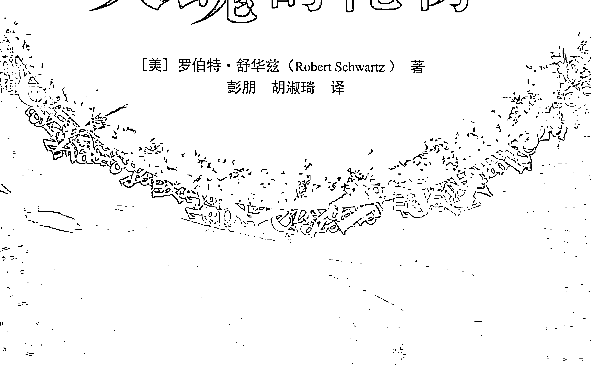

## Your Soul's Gift
灵魂的礼物

[美] 罗伯特·舒华兹 (Robert Schwartz) 著
彭朋 胡淑琦 译

了解你出生前的计划
穿越生命的重大议题

北京图书出版公司

## 内容简介

作为《灵魂的计划》一书的姐妹篇，罗伯特·舒华兹在本书中继续谈及“出生前计划”对灵魂疗愈的重要性，并深入剖析了十个议题，包括宠物、收养、性取向、虐待关系、精神疾病等。为什么我们会遭遇如此严苛的生命议题，遭受看起来如此深重的痛苦？很可能是我们的灵魂自己计划好的！经由疗愈这些痛苦，你可能找到痛苦之下深刻的爱和智慧，这就是你给予自己的“灵魂的礼物”。

经由这十个故事，你可以获得的礼物有：

- 发展出深刻的自爱，更有觉知和勇气来承担你的生命计划；
- 摆脱受害者意识，了解你是你自己生命的创造者；
- 宽恕伤害过你的人，创造持续的内在平静；
- 在看起来无意义的痛苦中，看到更深刻的目的；
- 从内心深处知晓自己作为永恒的灵魂，拥有的无限的价值、美丽、宏伟和神圣。

## Your Soul's Gift
灵魂的礼物

[美] 罗伯特·舒华兹（Robert Schwartz） 著
彭朋 胡淑琦 译

世界图书出版公司

北京·广州·上海·西安

## 图书在版编目（CIP）数据

灵魂的礼物 / (美) 舒华兹 (Schwartz, R.) 著; 彭朋, 胡淑琦译. —北京: 世界图书出版公司北京公司, 2015.10
书名原文: Your Soul's Gift
ISBN 978-7-5192-0379-5

Ⅰ. ①灵… Ⅱ. ①舒… ②彭… ③胡… Ⅲ. ①精神疗法 Ⅳ. ①R749.055

中国版本图书馆CIP数据核字 (2015) 第 244695 号

Your Soul's Gift © 2012 by Robert Schwartz, WILMINGTON OHIO. USA, www.yoursoulsplan.com. rob.schwartz@yoursoulsplan.com All rights reserved. Translation rights arranged through Sylvia Hayse Literary Agency, LLC,USA.
Simplified Chinese edition Copyright © 2015 Beijing World Publishing Corporation.

## 灵魂的礼物

- 著 者: [美] 罗伯特·舒华兹 (Robert Schwartz)
- 译 者: 彭朋 胡淑琦
- 责任编辑: 黄秀丽 于彬
- 策划编辑: 黄秀丽
- 出版发行: 世界图书出版公司北京公司
- 地 址: 北京市东城区朝内大街137号
- 邮 编: 100010
- 电 话: 010-64038355 (发行) 64015580 (客服) 64033507 (总编室)
- 网 址: http://www.wpcbj.com.cn
- 销 售: 新华书店
- 印 刷: 北京博图彩色印刷有限公司
- 开 本: 787 mm × 1092 mm 1/16
- 印 张: 31
- 字 数: 450千
- 版 次: 2016年1月第1版 2016年1月第1次印刷
- 版权登记: 01-2013-7270

ISBN 978-7-5192-0379-5
定价: 68.00元

版权所有 翻印必究
(如发现印装质量问题, 请与本公司联系调换)

## 致谢

我永远感激那些在此书中讲述自己故事的人。你们勇敢地对我和这个世界敞开了自己，自由、真诚、深刻地把自己曾面对过的最困难的挑战娓娓道来。你们激励了我，也感动了我，就像我的老师一样。为此，我深深地感激。

感谢芭芭拉·布罗茨基和艾伦、帕梅拉·克里柏与约书亚^(①)、科尔比·米特莱德，以及斯塔西·威尔士与她的指导灵：同样感谢你们成为我的老师；让你们的智慧与爱在这字里行间流淌。为了服务这个世界，你们付出了如此之多。与你们合作是我莫大的荣幸。

Liesel，我的此生挚爱：谢谢你的爱、鼓励和洞见。谢谢你信任我和我的工作。我能在出生前计划中选择你，真是个很棒的决定。我虽然是作家，却永远无法用语言形容我有多爱你。

> ① 帕梅拉·克里柏（Pamela Kribbe），荷兰灵性导师，为约书亚（Jeshua）做通灵传导。本社已出版她的书籍《约书亚的传导：灵性人生》和《灵魂的暗夜：帕梅拉自述和约书亚的传导》。——编者注

我的妹妹Deborah、妹夫Jerry，以及可爱的侄女Sydney和Riley：谢谢你们在我的写作过程中（更确切地说，是人生之路中）给予的爱和支持。谢谢你们一直都在。

感谢Debbi Mayo和Greg Karch博士，谢谢你们对部分章节内容的阅读和点评。你们的洞见是无价的，你们疗愈性的碰触会被所有读者感受到。谢谢你们的关怀。

感谢Deborah Bookin，你允许我在“水晶蜜蜂”（The Crystal Bee, 网址：www.crystalbee.com）这样一个甜美、温暖、充满灵感的地方完成大部分书稿。谢谢你陪我散步、为我准备午餐，也谢谢那些美妙的交谈。

感谢我的表姐Emily Fleisher：感谢你目光敏锐的校对，也感谢你非凡的善良和慷慨。感谢Debbi Mayo和Kathleen Webb宝贵的校对。

感谢Sue Mann又完成了一次卓越的编纂，也感谢Jan Camp再次制作出如此精美的封面，同样感谢Jill Ronsley华丽的内部装帧。再次与你们合作，感觉就像重组一个全明星队。感谢团队中的最新成员Jaine Howard，感谢Edna Van Baulen完美无误的誊写。

感谢Rita Curtis和Sylvia Hayse，谢谢你们协助我将这些书以及“出生前计划”的意识带到这个世界。Rita，希望你的退休生活充满欢乐，我会想念你。

除此之外，还有很多人为这本书的诞生分享智慧、提供支持，如果没有他们，这本书就不可能面世。我尤其要感谢John Friedlander、Bob、Cynthia Dukes、Jill Caro、Serenity Meese、Omir、Kathy Long、Joyce Fricke和Josh Mendel。

我常说，我不是这些著作的唯一作者，而只是写作团队中恰好还在肉身里的那个。谢谢所有与我协作或通过我工作的非物质存有。这本书出自我，也出自你们。

## 序

噩梦开始时，我大概四五岁。在一些晚上，巨大的黑色蜘蛛从上方掉下来，张开下腹吞食着我，爪子卷曲在我的脸旁。还有一些晚上，巨大的鲨鱼从下面什么地方冲上来，它有一排闪着寒光的、剃刀般锋利的牙齿，嘴巴变成一个巨大而漆黑的深渊，马上就要把我吞没。有时，一只鸟喙像刀子一样的远古猛禽从天花板猛冲下来，撞进我的心脏。不过，我的噩梦也不全是关于生物的，我还会做这样的噩梦：有时卧室的墙壁蠕动起来，有时模糊的魔爪隐隐出现在夜晚的天空中。每次，我都觉得自己必死无疑。

每当我在这样的夜晚惊醒，恐惧都会汹涌地向我袭来。然后我意识到自己是在卧室里，然而这些生物依然在这儿，我看得到它们，听得到它们——显然这是不可能的，但可以确定的是，它们仍要杀死我！我一边尖叫，一边紧抓着床单从床上往外爬，直到我终于发现自己坐在地板上，在漆黑空荡的房间里，我心如擂鼓，剧烈喘息。

在哈利·波特的世界中，有种叫博格特的生物，它们会从隐匿的地方猛然跳出，你最恐惧什么，它就变成那个样子。为了击败它，你要以愚蠢或好笑的方式去想象你害怕的这个东西。现在看来，我这几十年的梦魇（伴随着难以忍受的沮丧和无处可逃的困扰）就像一个差劲的恐怖电影，荒谬可笑。可我多希望，当我还是那个惊恐的小女孩时，能知道哈利·波特的方法。

很多人会猜想，疗愈的目标和奖赏，是自己进入神性狂喜的巅峰时刻——随着宇宙将我们托举到银河系的漩涡，或者随着我们深远而宁静的呼吸……永恒不朽的门敞开了，我们知晓了神。但不是的，并不是这样。这样的时刻不知怎么就来了，消失时也像来时一样神秘。这样的时刻会促使我们觉醒，我们想尽办法想延长这样的时刻。但在我的经验中，没有什么治疗、冥想、知识或是练习能确保带我们去向山峰，更不用说帮我们留在那儿了。

不断地前进，直到我们可以在所有（或大部分）日常生活中感受到宁静、欢乐与热情，这才是真正的目标，也是真正的奖赏。我知道自己“做到了”的那天，就是当发现自己已经很多年没再做任何噩梦的时候。更重要的是，我也意识到，我已经有很多年不再感到沮丧、困扰、被入侵或失控。我逐渐明白，我不再是一个追寻者。我已经找到了我所追寻的，它已经变成了一种生活方式，几乎所有时刻我都是幸福的，这种幸福常常没有什么特定的缘由。

现在，生活不再需要那么努力了。当我能看到所有的人、地点和事物都在给我的世界增添色彩与丰盛时，我对这一切深深感激。我常感到快乐和自由。这是当我们遵从自己的灵魂计划时会获得的疗愈，这是不仅属于我，也属于每个人的疗愈。

> “对我来说，这个疗愈就是在地球上创造了天堂。”
——米凯拉·克里斯蒂①

> ① 米凯拉的故事见《第十三章：精神疾病》。——编者注

## 前言

童年时，我受到了母亲严重的情感虐待。这个虐待，是我在出生前就计划好的。

我说“我”计划了这个经验，意思是说，我的灵魂计划了它。我与我的灵魂并不是分离的，它包含着我的身体、能量——确切地说，我的意识整体。不过，我的灵魂也要比我大得多，就像太阳比它散发出来的每道光都大得多一样。我的灵魂（就像你的灵魂一样）是浩瀚、广袤、无限的，它时刻都能觉知到自己与一切存在的合一。随着我的学习和成长，我让自己的频率越来越靠近自己灵魂的频率，好让灵魂能通过我表达更多的智慧、爱和欢乐。我的灵魂、你的灵魂，所有灵魂，都来自无条件之爱的能量。我“知道”这是真的，因为如同第一章所写，我自己体验到了这一切。

我人生中最困难的那些挑战（包括童年时遭受的虐待），都是我在出生前，为了促进自己的进化而在灵魂层面计划好的。如果我的灵魂是爱，为什么它会计划让我遭受虐待呢？这是一个合理的问题，我在人生中反复询问。从很多方面来说，对这个答案的寻觅，就是写这本书背后的驱动力。

我所遭受的虐待是剧烈而极端的，虽然并非真的全年无休，但即使它只是日常生活的一部分，我也受够了。细节并不重要。重要的是去了解这种事情是如何发生的，又为何会发生。上千年来，人类都从痛苦中学习，如果我们想超越这种“通过痛苦学习”的模式，这样的了解就必不可少。

在我母亲的灵魂与我的灵魂之间，有很多计划都是基于一个前世：那时我是一个女人，我今生的母亲在当时是我的儿子。那一世我的婚姻非常不幸，最终我带着儿子成功地逃脱出来。但是，离开丈夫的这个决定，让我们日后的生活过得非常贫困，我儿子为此深深地责怪、怨恨我。那一世，我在相对比较年轻时就去世了，虽然我死时儿子已经是成年人，但他还是被独自留在贫穷和孤独中。他觉得自己被我遗弃了。

在我儿子（今生的母亲）去世前，他心中对我的愤怒——我让他贫穷，然后又抛下他不管——并没能化解。因此，这种愤怒成了他灵魂的一部分，也是他的灵魂非常想要疗愈的一股能量。出于爱，我的灵魂选择给他的灵魂一个机会来疗愈这种愤怒——也就是重新成为母子，但是角色对调了。从象征意义来说，这种对调代表灵魂层次渴望“颠倒”（即疗愈）这个愤怒。而这样的疗愈，在他有能力对自己的愤怒采取行动的情况下，或许能进行得最彻底，也最有意义。

为什么呢？因为深远的疗愈往往会在负面情绪能够被感受到，却不采取行动的“那一刻”发生（“压抑”是选择将“负面”情绪推拒到意识觉知之外。这里，我指的不是压抑，而是感受情绪，却不对情绪采取行动）。如果不让我前世的儿子处于一个比我更有力量的位置，他可能就不会有机会真正去选择是否表达他的愤怒。这就是我们灵魂的计划——一个我在出生前就同意了的计划。

制定这个计划，我的灵魂还有另外一些动机。在至少一部分前世中，我都无法做到爱自己。作为灵魂，我们通过对立面来学习，所以我的灵魂通过选择一个虐待自己的母亲，来培养我对自己的爱（我们两人的灵魂都觉得，至少有些虐待是极有可能发生的，但我们希望最终可以达到疗愈）。从个体的层面来说，这样的决定似乎是矛盾的，甚至是荒谬的。但并非如此。通常，我们的灵魂会通过制订人生计划来唤起我们的注意，把我们的“问题”带到面前、带到中心，让我们无法忽视。我妈妈缺乏爱的表象——实际上不论过去还是现在，她都对我有很深的爱，就像我有很深的爱一样——向我、也为我展现了我对自己爱的缺乏。透过我母亲看似对我无爱的表象，我的灵魂意图激励，甚至推动我去学习自爱。选择之前的儿子来做今生的母亲，我的灵魂就好象在我面前放了一块巨大的告示牌，写着：“爱自己就是你现在要学习的。”

我父亲在我写这本书的过程中去世了，他的存在是我灵魂计划中关键的一部分。尽管他曾经（现在依旧）全然地爱着我，也并不虐待我，但是在我小时候，他并没有能力告诉我他爱我，或是以我能认出的方式向我表达爱。另外，在我灵魂的请求下，他同意在我的人生中不断地评判我，并且对我来说，他的很多评判都是极为严苛的。我父亲的这些评判，以及早期的无爱，也是我灵魂的意图，与母亲对我的虐待有同样的效果：迫使我向内去发现，并穷尽一生之力去燃起我内心“自爱”的火焰。这火焰曾经只是很小的、几乎无法看清的火花，如今它已显著地增长。在我不断了解自己更多人生计划的过程中，我从未如此清晰地看到：我曾需要多大的勇气，才能答应这样的计划，又需要多大的勇气，才能把它活出来。因此，我的自尊开花了，自爱也成长得更茁壮。

值得注意的是（我个人也相信），按照我与父亲共同的出生前协议，他在此生是不能理解出生前计划的。但不论如何，在他生命的最后几年里，随着他感觉到死亡的临近，他越来越支持我人生的道路和写作（他常告诉我他爱我，我也会告诉他，我爱他）。在他回归大精神（Spirit）状态的前几周里，我把这本书中的一些内容读给他听。每次，他都非常用心地聆听，然后看着我说：“你说的我一个字也听不懂，但是你的作品实在太棒了！”他的确这样觉得。我忍不住笑了，被他的支持深深打动。在他去世后，一个充满着美妙爱意和愉悦反讽的情况发生了：他加入了协助我完成这本书的非物质存有团队。实际上，这些话很可能来自他。

除此之外，还有几个前世影响了我的灵魂今世选择这位母亲：在其他几次进入肉身的经历中，我没能实现情绪上的独立。什么是“情绪上的独立”？当我向圣灵（Spirit）询问这个问题时，得到的回应是：将自己看作幸福的主要源头。通过设计我的人生，我的灵魂创造了特定的情境，有力地推动我去领悟这一点，并真正地成为自己幸福的主要源头。就像“自爱”一样，情绪独立也是一个我仍在学习中的人生课题。

还有一些前世中，我相信自己是没有力量的。由于我们的灵魂会寻求错误信念的疗愈，尤其是那些与灵魂所知的真实信念相矛盾的信念，于是我的灵魂设计让我投生于这样的家庭，以便折射出我缺乏力量的错误信念，我同意了。再一次，灵魂将我需要疗愈的问题直接摆在了我面前。

也有一些前世，我感到自己没有价值，并对此深信不疑。我们的灵魂是神的火花，而我们是灵魂的火花，因此，我们也是神。正如下文将要讲述的，这种无力或无价值的感受与信念，是灵魂设计人生经验（这些经验能够将真我的本质展现给我们）的首要动力。一般来说，这样的感受和信念大部分（或完全）是在潜意识中的，但当生命将这一切反射给我们，它们就缓缓流入了意识觉知的光芒之内，并可能在那里获得疗愈。那些尝试在无力或无价值感的问题中发光的生命蓝图，往往是“通过对立面学习”的计划中最困难的部分，包括虐童、乱伦、强奸等。

在出生前，为什么灵魂会计划此生中的一些特定经历？这是我写的第二本关于这个问题的书。它与第一本《灵魂的计划》（Your Soul's Plan）不同，表现在三个方面。首先，在《灵魂的计划》中，我只探讨了关于人生挑战的计划，但在这本书中，我探讨了这样两个话题：宠物和灵性觉醒。它们并不一定属于人生挑战的范畴，但是，我们与挚爱的动物伙伴之间的那些出生前的计划，是最常被读者询问的。同时，因为我们生活在灵性普遍觉醒的时代，所以灵性觉醒的话题也值得探讨。

其次，这本书聚焦在疗愈的更广泛层次上。我们的灵魂并不希望我们永远在痛苦中沉沦。但如果痛苦的经历的确发生了，不论它是否出自出生前的计划，我们的灵魂都会设法引导我们去疗愈，同时，它们也会通过疗愈来引导我们。疗愈的发生其实仰赖许多因素，不仅要靠我们的坚韧和智慧，更重要的是我们的灵魂永远都在那儿，不断推动，引领前路。你发现了这本书，这正表明你对灵魂的提示敞开了自己。

第三，这本书探索了出生前计划中一些尤为艰难的主题，比如乱伦和强奸。对于灵魂会计划让我们参与到这样的体验中——不论作为施虐者还是受害者，你都可能会拒绝或感到惊恐。但要知道，我并不是想让你抗拒或恐慌，而是希望将这种对灵魂计划的觉知带入集体意识，从而疗愈我们受伤的部分——潜在的无价值感、无力感以及愤怒，这样一来，我们就能终止乱伦、强奸和其他形式的侵犯。对于是否应该将这些章节加入书中，我苦恼了很久。但最终我还是感觉到，我有责任将我所了解到的一切与大家分享。只要我们愿意，我们就可以否认地球是圆的，但那不会真的让它变平。它还是圆的。同样，我们可以不承认这些痛苦的经历大多是出生前就计划好的——当然并不都是，但并不意味着这样的计划不会发生。如果我们想创造一个再没有这些痛苦的世界，我们就必须勇敢、诚实地去看：究竟是什么，促使了我们在出生前计划了这样的经验，然后去疗愈。

在我当前这一世，我并没经历过乱伦或者强奸，所以也不可能知道它们所带来的痛苦。然而，童年遭受的虐待的确让我明白“无力的受害者”是什么样的感觉，也因此有强烈的动力去学习和疗愈。这些童年经验，让我在身处地球的这段时间里，把自己的视线聚焦在我需要去做，以及灵魂希望我去做的一切事情上面。但是，除了这两点，我对出生前计划的觉知也给我的童年经验赋予了更深层的目的和意义。在我整个存在的中心，我深深地知道，所有这一切都不是随机或任意的。我也明白，自己并没有被一个愤怒的神或残酷的宇宙惩罚。我知道，所有发生的一切，最终都是为了我的至高利益。

在序言中，你读到了米凯拉的话。她的经历完全超出了我想象的极限，却引领着她的灵魂获得了深远的领悟。我问米凯拉对自己的经历有什么感觉，她说：

> “到这里，是值得的。”

我这样看待自己的童年经验：或许，它们会是我通向疗愈与觉醒的路，就像米凯拉罹患精神疾病的经历一样。可能我们也会遇到其他挑战，与其把它们误解为空虚而无谓的苦难，不如从灵魂的角度去看待，然后疗愈隐藏在它们下方的伤口。或许所有书中所讨论的经验，所有生命给予我们的体验，都能成为我们每个人以及所有人获得疗愈、觉醒和开悟的工具。

罗伯特·舒华兹

## 引言

在本书中，我将为你提供一种观点，它曾带给我无限的帮助与疗愈，希望对你也是如此。如果前面几页的文字曾引起你的共鸣，你就会知道，这种观点也是你灵性之路的一部分。“共鸣”可以被看作直觉上的“对”的感觉。但是，它究竟是什么，又来自何处呢？

它来自你的灵魂。你的灵魂对你每一个想法、每一句话，甚至每一个行为都一清二楚。有些想法、话语和行为让你感觉不错，另一些则比较糟糕——这些感受和直觉性的暗示，就是来自灵魂的直接讯息。它就在那里，与你携手并肩，说：“是的，就是这样。”或者“不，这不是你的路。”请信任这些感受。请试着去觉察，你何时有共鸣的感觉，何时没有。如果读这本书时你没感觉到任何共鸣，就轻柔地把书放下。但如果你感觉到了共鸣，请考虑这个可能：是你的灵魂，将你带到了这本书面前。请继续读下去，即使你的逻辑头脑对“某些经验（或全部经验）是由你的灵魂在你出生前就计划好的”这样的概念感到费解。

> > 《奇迹课程》（A Course in Miracles）教导我们：“洞察力仰赖恰当的”工具。以头脑来阅读（亦即洞察）这本书，就像是用温度计来量体重或用磅秤来测温度一样，用错了工具。恰当的工具是什么呢？很简单，就是你的心。比之头脑，心灵拥有更高的感知形式。它可能不合乎逻辑，却会感觉很对（feel right）。请信任这种感觉。

你将读到一些人的故事，他们在出生之前就为生命做好了计划（就像你一样）。我会针对某些特定的生命经验与这些人深入交谈，然后在四位极为杰出的灵媒（mediums）与传导者（channels）的协助下，研究他们的出生前计划。在大多数案例中，我会提供给灵媒这些人的全名、出生日期、家庭成员姓名，还有与讨论内容相关之人的姓名以及我想关注之人的简要人生经历。这些讯息是必要的，如此一来，灵媒或传导者（以及通灵意识）就可以从阿卡西记录中获取相关的讯息。阿卡西记录是一种完全非物质形式的记录，内容包括所有在地球上发生的事件以及与地球有关的一切，包括我们出生前的计划。

阿卡西记录与地球上那些物质形式的图书馆是不同的，它并非静态，而是一件活生生的动态挂毯（tapestry）。每当有人询问，它就会针对特定的需要、询问者的意图，以及提出问题的具体情境做出回应。同样，在从灵魂获取信息的方式上，灵媒与传导者们都有自己的独特天赋，因此，不同的灵媒和传导者会获得同一个人灵魂计划中的不同要素。正因为如此，大部分的受访人都会与一个以上的灵媒或传导者进行交流。这样，对于灵魂为什么会在出生前计划某个特定的经验，我们就能给出全面、丰富的描绘。

在与灵媒和传导者交流的过程中，我一般会先向灵魂询问这个核心问题：“这个经验，是出生前就计划好的吗？如果是，为什么？”然后根据回应，有机地展开进一步的探讨与询问。在交流中，受访者一般会允许我询问全部或大部分问题。不论是对受访者的采访，还是与灵媒或传导者的交流，都以对话的形式进行。每当受访者或通灵意识开始谈论新的话题，我就会重起一段。按照习惯，前面的段落不会以引号结束，这表明我们仍在聆听同一人的叙述。

在与灵魂探讨时，以及在本书的其他部分中，我会用到一些措辞：较高、较低，好的、坏的，积极的、消极的。这些措辞仅仅用来反映和讨论我们人类的观点，并不是表明灵魂在评判。灵魂不会评判、分级，或以等级观念来看待宇宙。确切地说，灵魂强烈地意识到一切皆为一体。

从降生那一刻起，我们就拥有了自由意志，我们因此而能够偏离自己的出生前计划——想什么时候偏都行，想偏多远都行。所有人都在这样做，而当我们这样做时，我们就创造了（即以特定的振频吸引了）一些在出生前看上去不太可能发生的经验。阅读这些故事时，你可能也想问：我是否计划了某些特定的人生经验？比它更益的问题则是：

“如果我在出生前计划了这样的经验，我为什么要这样做？” 这样的问题能够赋予你力量，让你从经验中学习，获得一时的扩展，这是你在计划它时就寻求的。

这种成长，比仅仅知道自己是否计划了这样的经验更为重要。

了解接下来的故事——甚而，去了解生活——会让你明白：宇宙中的一切都是能量，以特定的频率振动。每个人、动物、植物、物体、字词、想法、感受、信念（不论是意识还是潜意识中的信念）和行动，都有自己独特的振频。你吃的食物，穿的衣服，都以特定的频率振动着。你开的车也有它自己的振频，如果你给它喷上不同颜色的漆，它的振频就会改变。在这个以能量为基础的宇宙中，同样的频率会互相吸引——也就是说，你的话语、想法、感受、信念和行动，会像磁铁一样吸引频率相同的经验。俗语说“一切都称心如意”（Everything's coming up roses），“不雨则已，一雨倾盆”（When it rains, it pours），这些都反映了对这一法则的直觉性了解。不论你开不开心，你都会吸引同频的经验来让心情持续。因此，“振动频率”对出生前计划和疗愈都有举足轻重的作用，这一点，我们会在接下来的内容中进行探讨。

或许你会倾向于“跳读”——直接去看那些似乎与你的生活直接相关的章节。但是，由于本书中的每个故事都建立在前一个故事的基础之上，所以按顺序阅读，更有助你获得更全面、丰富的了解。此外，虽然有些人生经验看起来截然不同，但计划它们的根本原因常常是共同或相似的，因此，通过阅读一些表面上与你的生活完全不同的人生故事，你可能会对自己某些人生经验的深层含义，产生更深刻的领悟。

书中有些经验是极为惨痛的。读到它们时，如果你有过任何相似的经历，请向身边的人求助。这些故事的确可以为你的灵魂旅程带来爱的支持，但是，关心你的人所给予的充满爱的、面对面的支持是不可替代的。在出生之前，我们以极大的智慧和谨慎选择了我们所爱的人，也选择了爱我们的人——我们想让自己的生命成为一趟有人共享的旅程。因此，我鼓励你向所爱之人伸出双手，请求他们与你手牵手地走下去。而这，很可能也是你出生前计划的一部分。

## 你的指导灵

在决定阅读这本书的那一刻，你就开启了一段崭新的旅程，它会为你的生命带来光芒，并赋予它更深的意义。在开启这段旅程时，你很可能会好奇你的指导灵是谁。下面介绍的，就是与我合作的那些充满智慧与爱的灵媒、传导者和灵性存有。与他们合作是我的荣幸，在这个过程中，我学到了太多。因为他们的协助，我才能挖掘出案主们的出生前计划，以及做出这种计划的原因。由于本书侧重于制订出有“生命挑战”的出生前计划，因此，我请灵媒和与之沟通的存有们敞开而诚实地讲述他们自己的挑战。

### 芭芭拉·布罗茨基与艾伦

“一九七二年，在我大儿子出生时（我有三个孩子），我突然失去了听力。这给我带来了极大的痛苦——想象一下，我听不到新生宝宝的笑声和哭声！我丈夫也非常痛苦，因为他再也不能轻松地跟我交流了。那时我仍拥有丈夫和好友的爱，并且能继续在当地一所大学教授雕塑课程，所以在很多方面，我都是充实而快乐的。但是，我仍旧觉得自己被世界排除在外、被遗弃在孤单的梦魇里。‘为什么是我？’我问。‘我被惩罚了吗？神遗弃我了吗？’最终，在极度的痛苦与愤怒中，我祈求帮助。

“第二天早晨，我在起居室静坐冥想（这是我做了二十多年的日常练习），感觉到一股强大能量的临在。我甚至能看到他的脸。我想：‘要么是我有幻觉了，要么这就是真的——我不知道哪一个可能性更吓人一些。’他散发着白色的光，太耀眼了，我一开始看到他时，不得不移开视线。我分辨不出究竟是他来自那个光芒，还是那个光芒来自他。他的面貌非常清晰：洞悉一切的蓝色眼睛，高高的颧骨和额头，白色头发，飘逸的胡须一直垂到胸口。我在他的临在中颤抖，却能感觉到他散发出的深沉的爱，这爱是如此熟悉，却不像我在此生有过的任何体验。他的临在里充满着抚慰和喜悦，冲散了所有恐惧。

“我没法若无其事地面对这个状况，进厨房喝了杯茶，回来时他还在那里。我怀疑自己是不是真的产生了幻觉，但每次我去看时，他都在那儿，耐心地等我准备好做进一步接触。他的临在中饱含着力量，同时也是令人放松的。我并不害怕，因为我感受到他强烈的爱，还有一些模糊的来自未知记忆的温柔与联结。白色的光也充满了抚慰，就像黑暗中一束耀眼的火炬。

“在鼓起勇气再次开口说话之前，我与他一起静坐冥想了两天。然后我问他：‘你是谁？’他很简单地回答说：‘我是你的老师。’

芭芭拉：你现在为什么在这里？

艾伦：你已经准备好。你在学着看清那些会带来更多业力的反应模式。你已经能够听到这些话，而不让小我（ego）增添更多业力。用心倾听那个小我。不要让它阻碍了你的敞开。

芭芭拉：怎么开始呢？

艾伦：你正陷在痛苦中。我们就先找到这个痛苦的开始（成因），然后结束它。

芭芭拉：它会结束？

艾伦：会的，当然会的。

芭芭拉：在死亡来临的时候吗？

艾伦：你是不是想象着可以走过一道门，然后就完全改变了现在的经验？不是这样的。痛苦的终结，来自你的了解——了解到你是谁，也认识到整体的存在。不是“你的”存在，而是存在。那时，作为“整体”（whole），你会停止对这个有限身份的认同，也会停止对这个自我的认同。我并不否认“芭芭拉”这一个体存在，但是，她并不是你所认为的那个她。人类所理解的个体，是形式、感受、思想、观念和意识的集合，但这一切只是表象。当你把这一切看作你的整个身份时，你会带着那些思想、那种意识，产生对事物的执着，试图让自己在这具身体里显得更与众不同。这就带来了痛苦。但我们不用操之过急。我们有足够的时间共同完成这项任务。在建造更高的楼台之前，咱们先把基础打得更牢靠些。

“艾伦又给了我更多讯息，让我明白我需要做的是什么。接着他后退一步，我再一次体验到那壮丽的、容纳一切的光。我哭了。

艾伦：不必这么严肃。欢快些。

“初见之后，每当我再打坐冥想，艾伦都会在我身边，耐心地等待我处理自己的恐惧。我总能看到他坐在前方，也能感受到他临在的能量振动。我清楚地知道，接受他、向他学习，意味着更深层次的承诺。我将必须对自己更诚实、更负责。

“我渴望学习，尤其渴望移除自己的痛苦，但我很害怕。并不是怕艾伦，而是（更是）怕接受了他的存在与教导后，生命会发生变化。我不知道自己是否准备好要放下那些旧有的支撑，那些我紧抓的责备、愤怒和恐惧。我像一个胆怯而惊恐的孩子，却想要去拍打一条大狗。

“艾伦从不用任何压力迫使我接受他。他给了我所需要的全部时间、空间。慢慢地，当我明白我永远都不会被强迫时，我开始信任他。每一步都是我自己的选择，只有在我准备好时才开始。

“他还再次向我保证：没有什么要放弃的。虽然那时我并不理解。‘只要敞开，’他告诉我，‘向你与生俱来的善良、慈悲、怜悯敞开，那些旧有的模式（情绪）就会消退了。因为再没有什么能够支持它们了。’他身上散发着强烈的充满爱的接纳。他所说的一切似乎都充满了智慧，指引着我，让我获得新的洞见。对我来说，信任这一切，看它会将我带向何处，的确不会失去什么。

“一切就这样简单地发生了，我遇到了艾伦，开始了改变人生的探索与疗愈之旅。这对我丈夫以及我们的关系也至关重要。如今，在四十四年的婚姻之后，我们得以回望过去，笑看所有曾经的困难，也能温柔地看待那段时光。但是在早年，不论是耳聋还是我们的愤怒与困惑，都让我们万分痛苦。

“很快，朋友们开始问我，他们能不能与艾伦交谈。我说可以，但并不知道怎样进行。艾伦告诉我，只要大声把他的话复述出来就好了。然后有人指出：‘你在通灵。’‘什么是通灵？’我问。一开始，通灵是非常困难的，因为我必须要确保我的小我与偏好没有掺入到艾伦的讯息之中。慢慢地，我越来越自信，也有越来越多的人前来寻求艾伦的指引。我感到这就是我要去做的。

“人们也要我把艾伦教导的冥想练习教给他们。我练习内观冥想已经二十年了。现在，艾伦正传授我一种方法去深入这一练习，并更清楚地讲述它。这种冥想是他教导的核心，能帮助我们更扎根于当下，观照自己的人生，而非被人生打垮。在做了多年的雕刻家之后，我感到可以将这个身份放下，将自己全然投入到新的方向之中。”

“那之后不久，因为有太多人来我家学习冥想以及与艾伦一起工作（work），所以他们建议我成立一个公益组织来支持这一切。因此，‘深泉冥想与灵性咨询中心’（Deep Spring Center for Meditation and Spiritual Inquiry）成立了。如今，二十多年过去了，我们仍然在授课、静修，以及从事济贫院和监狱的社区开展工作。”

“看着三个儿子在家庭新成员艾伦的陪伴下长大，看着他们健康地成长于灵魂次元的实相中，我感到极大的喜悦。同时，分享艾伦的教导并看到人们从中受益，也给我带来了巨大的欢乐。所到之处，人们总会问我同样的问题：我是谁？我为什么在这里？我该怎么完成我来到这个世界的任务？为什么我总是有那么多的痛苦？我终于明白，这个工作，是我灵魂的计划。”

## 来自艾伦的介绍①

“大家好，我是艾伦，请接受我的爱与问候。我是什么样的存在？我是谁？你又是什么样的存在？你是谁？我们之间有什么不同？又或者，根本就没有不同？”

> ① 摘自芭芭拉与艾伦的书《临在、友善与自由》（*Presence, Kindness and Freedom*）。虽然在这个介绍中，艾伦的语气是严肃的，但他其实有非常令人愉快的幽默感，他通常用这种幽默来传递伟大的智慧。比如，有一次我问他，我每天应该用多少时间来冥想呢？他说：“罗伯特，你每天该花多少时间吃饭？”

“我们都是光之存有。这是什么意思呢？你们可能有人对消融小我与身体的冥想非常熟悉，有过此类经验的人会知道，消融发生之后，留下来的只有光。这就是全部——只有光、能量、觉知，没有自我，没有自我感，没有“他人感”（sense of other）。没有恒久的形式，没有个体的思想，没有自私的愿望，也没有个人的意识。在各种属性的分离自我之外，有的只是纯粹的觉知，纯粹的心性（heart-mind）。本质会以灿烂之光、纯粹之声、觉知、智慧以及能量的方式展现。这就是你之所是，也是我之所是。”

“在前进的过程中，我们会随着业力的牵引而实体化为最利于成长、最契合当下学习需要的形式。地球是一个大教室。你之所以以物质的形式存在于此，是因为你会在这里发现自己需要学习的下一个功课。我已经进化到不再需要物质形式了，所以我没有身体。但即便如此，我也依然在学习，以一种最有助于当下功课的形式学习。”

“我的视角的确与人类视角不同。我能召唤自己所有前世的知识和智慧，也可以回溯在通过你们的层次之后，我在这五百年的地球时间里获得的一切智慧。我现在的层次已经超越了所有分离和小我的幻相。我们通过心电感应交流，这种交流可以是一对一的，也可以由一个灵魂同时对应多个灵魂。这里没有小我，所以也不用设法避免尴尬或遮掩自己不高明的选择、因此，我们的分享是彻底而诚实的。每个灵魂都全然地分享它自己的领悟和经验，如此一来，我就可以从其他灵魂的经验中学习，就像从自己的经验中学习一样。我也在学习更深层的慈悲，从某种程度上来说，我选择教学也是为了这样的学习。你们让我回想起身为人类的那些痛苦，提醒着我不要去评判别人，只让我的心在爱中敞开。”

“在很多世，我都拥有视角上的优势。我作为人类的最后一世是在泰国，那时我是小乘佛教的教徒，是一个僧侣，也是一个冥想大师。在那一世，我过去很多世的智慧和领悟都浮现了，这让我获得了自由（即从转世轮回中解脱），也得以帮助很多存有去发现这样的道路。不过，现在的我并不只是以那位泰国上师的身份来教导你。我有很多世都是修士。生生世世中，我修习了佛教的大多数教派，但这只是我修行中的小部分。我还在同样多的转世里做过基督教僧侣、神职人员，也在一些教会中担任更高的职位。我曾是穆斯林，也曾是犹太教徒、苏菲教徒、道教徒等。我拥有过所有肤色，做过男人、女人，也在很多不同的文化中生活过。我曾游荡于森林，也曾穴居于山洞，还曾住在宏伟的寺庙中。我在陋室与宫殿里祈祷。我曾饥饿而死，也曾在遍地饿殍之时过着奢华的生活。我曾是贵族，也曾是杀人犯。我爱过、恨过，杀过人也珍爱过某些人或事物。简而言之，我经验过人类境界里所有的一切。你们也一样。

“什么是对他人充满慈悲？你能否看到消极的一面也在你之内潜藏？你能否将对暴君的评判转化为对他的痛苦与境况的怜悯？这并不意味着纵容他的行为，而是充满慈悲、接纳与无条件的爱。”

“要记得，这个学习是一个过程。如果你已经达到无条件的爱、完美的慈悲，能够完全地接纳，你就不需要再在人类身体之中学习了。”

“让我回到现在的视角。你们是我曾是的一切——在痛苦里学习功课的杀人犯，或是在爱中学习功课的冥想大师。我正是以这样的立场来教导你们。除此之外，我也从我如今的视角（了解所有的幻相形式）出发来教导你们。我清楚地看到，所有人都是光和能量，通过消融一切自我与我执，缓慢地进化至发光和澄澈的状态。”

“因此，我不教导佛教或任何独立于真理之外的‘主义’。我只知道两个绝对真理：神与爱。所有形式上的宗教都只是道途，通向对这两个真理的领悟。它们讲的其实是同一个真理。”

“我们最初都是那完美之光（神）的火花，通过经验物质形式来进化。在前进的路上，我们都在光芒与清澈的状态中成长，放下所有的阴影，直到我们如同小太阳一般闪耀。如果你把我当前进化阶段中的本质置于那完美之光的面前，你会看到形式赤裸的最边缘（the barest edges of form），以及投射在那辉煌中的灰色阴影。而如果你把一个完美进化的存有之精华置于那完美之光的面前，它会消失不见。那就是你们每个人进化的方向：全然的消失，完美的空无。”

“我的教导必须与你自己的道路融合。我只能给予指引，真正的学习必须来自你自己的经验。如果我所说的对你有帮助，能给你指引，那就运用它。如果不能，就把它放在一旁，遵从你内在的智慧。”

“谢谢你给我机会与你对话。希望我给你留下了更多的疑问，而非答案。或许某天我会与你相见，并回答其中的一些疑问，但请记住，答案已经准备好了，就在你的心里。好好练习，自己去发现它们吧。”

“我的爱与你同在。”

### 科尔比·米特莱德

“大家好，我是科尔比·米特莱德。我曾出现在‘罗伯特探索’的第一卷①中，很荣幸也能参与到第二卷里。罗伯特让我分享一些关于我是谁、如何在此与你相会的事。故事可以分为两个部分：在第一部分，我将介绍自己发展出超自然能力并以此为客户服务的过程；在第二部分，则跟我长达几十年的自我挑战、自我检验以及处理心理阴影有关。这两部分或许不同，但早已无可避免地纠缠在一起。”

“自一九七三年至今，我研究了许多不同的教学、咨询和治疗方法。一九九四年，一些对前世的研究让我获得了某些能力——我没受过任何正规指导，却可以进行手触疗愈和远程能量疗愈。我可以做无形存有和有形肉身之间的桥梁，同时也帮助那些受困于灰色时空（Gray Space）的灵魂（已经死去，但出于种种原因无法自行回归光内）回家，成为他们的“回家之门”。另外，我还发现自己可以帮助人们与灵魂（高我）进行交流，帮助他们了解自己的人生挑战，以及出现这些挑战的原因。”

“今天，我的目标不再只是继续学习更多技能，而是进入内心，根除恐惧、偏见、评判以及和小我有关的一切，走上无条件的爱与无条件的慈悲之路。”

“那么，第二部分呢？这部分我曾在罗伯特的第一本书中分享过，读过的人大概已经了解。我的故事与挑战是在我身为多莉斯时发生的。我把一种自我检视的人生过到了极致。”

“我出生在一个不健全的家庭，家的中心是酗酒成性的母亲。我们在共同的出生前计划中约定，她会刺激我，让我做出最重要的人生决定：我到底要不要珍惜自己，荣耀自己的性别（也因此荣耀所有女性），并以本然的样子热爱自己所创造的身体？”

“如果一开始我就选择爱自己，那么我的人生会更加平静、祥和。但与很多前世一样，我选择了那条困难的路，于是，数十年的挑战接踵而来：两次不幸的婚姻，三次与乳腺癌共舞（包括一次双乳切除术），还有数不尽的围绕‘性别’的体验，无一不反射出我内心深深的无价值感。然而，我不想放弃自己。在所有这些经验中，我持续不断地询问：如果神是充满爱的，如果我对我们之间的联结深信不疑，那么这一切能对我起到什么作用？它们必须有用！”

“为了领悟这深刻问题背后的含义，我尝试了很多工具。在这趟旅程中，我获得了自己的‘激情之语’：穿越从恐惧通往无惧的桥——然后飞翔！如今，我就是过着这样的生活，也在工作中将它传授给别人。通过一视同仁地拥抱自己的全部，不论缺陷还是美好，爱它们所有，并接受这一信念——在这仁慈的宇宙中，所有经验都是为了帮我疗愈而来，我全然地活出了自己的出生前计划，步入另一个崭新的阶段：以自己的经历，帮助其他人迎接挑战。

> “我的能力是可以详细而精微地探索前世。对我来说，浏览人们的前世就像看一部电影：背景与服装，情节与对话，苍穹与旅程。并且，我能与高我（灵魂）交流，从而对一个人为什么会走上特定的道路提供更全面、深入的洞察。”

> “可能对有些人来说这有点奇怪，但我仍觉得，能过上自己创造的人生，我无比幸运。在这个过程中，我学会了慈悲、幽默、弹性和宽容，当我在所到之处与他人分享所有的可能性与希望时，我感到由衷的喜悦。
“诚挚地欢迎你。”

## 斯塔西·威尔士

> “从记事以来，我就能看到、听到灵魂，我看得见气场，与动物有心灵感应，也能感知他人。”

> “在我做这样的解读和其他超自然工作时，共有四位指导灵与我合作。其中一位协助我完成了《灵魂的计划》和本书中所有的解读工作，他是我的首席指导灵，一直在我的生命中陪伴着我。他从不告诉我他的名字，所以我就简单地称他‘圣灵’（Spirit）。他向我示现的模样，像极了想象中那种古老而充满智慧的巫师。他总在一条胳膊下面夹一本巨大的、棕色皮革包边的书，正面是几个烫金的大字：《生命之书》（Book of Lives）。《生命之书》就是我们所熟知的阿卡西记录，很久之前，为了让年幼的我明白它的功用，圣灵适当地更改了名称。现在，虽然我已不再是孩子，但封面上的名字还是没变。”

> “成长于那样一个有缺陷的家庭，我却依然神智健全，这多亏了我与圣灵之间的关系。我会走进自己的房间，或是走到户外一处安静的草地上，然后他就会出现，准备好为我开启一段灵魂之旅。他会与我交谈，或是安静地待在我身边。从我很小的时候起（大概十一二岁），他就开始教我冥想——当然并不复杂，只是一些简单、基础的冥想，让我能与自己的内在存在（Inner Being）保持联结，同时也加强我与一切万有（All That Is）的联结。我上初中、高中时，他常常会冒出来，站在我身旁或者教室的窗外，邀请我到外面去冥想。我每次都照做了，不知为何，我从没因为中断课程而被警告过。

> > ‘我清楚记得自己第一次问圣灵‘什么是灵魂层面的原因’时的情景。那时我十四岁，人生第一次独自去健康食品店。在等待回家的公车时，我目睹了一起车祸。我看到了在车辆主人和所有目睹车祸之人身上的心灵创伤的冲击波。我问圣灵：‘为什么有些事会发生在某些人身上，而不发生在另一些人身上？’从那时起，我就不断询问这个问题。

> > ‘在我二十一岁时，有天早晨醒来，看到圣灵站在我的床尾，似乎在等我睡醒。我向你保证，这一次非同寻常——他向我示现的方式，前所未有。他从未如此庞大、明亮、洁白，耀眼的白光从他身上散发出来，睡眼惺忪的我被深深地震撼了。‘好了，’他说，‘你准备好去开始你的工作了吗？’那个瞬间我知道，我的确曾经计划了献身于服务的一生。虽然我曾希望自己能像芭芭拉·史翠珊（Barbara Streisand）那样成为下一任流行音乐天后，但我开始放下这个欲求。我臣服了，愿意成为一名职业灵媒，也愿意接受这一使命带来的生活方式以及生命角色的转换。

> > ‘那个早晨之后，我的旅程起起落落，充满了考验、磨难和挑战，当然也有回报，在这里就不一一详述。所有的一切，都服务于灵魂为此生制定的目标，以及我的业力功课。在与圣灵的合作中，我对慈悲的理解比以往任何一生都要深刻，而这样的慈悲，也提升了我为他人至高利益服务的能力。同样，我清楚地看到自己的人生经验是如何把我带到这里的。这一路上，我对灵魂层面的原因，对我们为什么会做现在的一切，以及灵魂的天性和人类的进化之路，都学到很多。

> “有一天，罗伯特·舒华兹打电话给我，说他想写一本书，关于‘我们是否在出生前计划了自己的人生’，问我是否有兴趣为它做一次解读。我能感受到他真诚的心愿，我和我的指导灵都兴奋地跳跃起来，几乎在一瞬间，我就脱口应允了。我们很快约定了第一次解读。罗伯特问了很多问题，都是别人从没问过的。他最常问的是：‘你能不能听到或描述出任何出生前计划会议中的对话？’可以，当然可以，我想。之前，我对出生前计划会议有过一闪而过的觉知，但从未有人让我专门关注过这一点。

“我整个存在中的每一根纤维都深信，我与罗伯特·舒华兹曾制定了一个出生前计划：合作完成这些书。我在第一次读《灵魂的计划》时，就全然地意识到，我此生所要沟通的形而上意识的核心，就是‘出生前计划’。这个认知，让我的心轮因感激和喜悦而不断扩展。

“亲爱的读者，谢谢你们给我这样的机会，让我能履行自己的‘达摩’（dharma）——献身于服务。同时，也感谢你们让我有机会传达关于出生前计划的讯息。”

### 来自斯塔西指导灵的介绍

> “我是与斯塔西交谈的指导灵。在很久之前，两次转世之间，我站在她面前问：‘你想要像这样工作吗？’她同意了，她已经准备好了。斯塔西像我一样在追寻，想要了解和教学。在很久之前我们就在一起了。我们曾流连于“知识的图书馆”（也就是你们所说的彼岸），共同的追求引领着我们在浩瀚、宏伟的图书馆一隅相遇。她认出了我，因为我们的灵魂团体经常互相合作。当她的灵魂对获得更高智慧以及普世智慧（universal wisdom）的热情越来越浓厚，对通过普世慈悲（universal compassion）进行疗愈的渴望越来越真挚时，她的能量、她所走的道路就与我越来越接近。从那时起，我们就多次在转世的间隙中同行，有时也会在生命形态

> “虽然我已经在人类领域中游玩（肉体化）了不止一次，但我的原初形态并非人类。跟这本书的大部分读者不同，我没有选择人类的进化之路，而是首先将自己进入到行星系统中。对那里的物质存有来说，自然科学和工程学是首要的发展目标。”

> “在这样的物质形态中，我越学习，就越意识到一切都是彼此联结的，我们也互相关联。在某次转世之前，我决心进一步探索这种与万事万物的联结，并且要在情感层面亲自体验到它。于是，我立刻就被拉到了地球，进入了人类意识领域。”

> “我在地球经历了四世。第一世是在公元六世纪，那时我是一个安静、好奇的男孩，很早就学会了阅读。我用来自地球或生长在地球上的事物进行实验，制造疗愈用的万能灵药。成年后我四处流浪，从一个小村庄游荡到另一个小村庄，竭力给人们提供帮助与疗愈。我依靠自己对植物和花朵的知识过活，善良的人们迎我入门，给我食物，供我住所。那一世，我对人类和人类的苦难都了解了很多。”

> “还有一世，我是一个牧师，在公元十世纪被封为圣本笃（St. Benedict）。那时我能自由地阅读和漫游。”

> “又一次旅居地球时，我特意让自己早夭，在九岁左右就死去了。那一世的意图是经历基本情感的缺失，如此一来，我就能对人类生命和人类意识的基本结构有清晰的了解。那具身体在极短的时间内拥有并承载了太多的复杂情绪，很快就被消耗殆尽，死因是主动脉破裂。我在那简短的一生中所获得的领悟，都保留在了意识和灵魂中，从那时起这些领悟就一直跟随着我。”

> “我在地球的最后一次转世是在十八世纪，那是属于大作曲家的时代。那是唯一的一次，我与现在的斯塔西同时、同地拥有物质形式。当时的她像现在一样着迷于音乐，活跃在一小群极受作曲家欢迎的声乐家之中，经常在欧洲的皇家宫廷表演。有一次他们举办音乐会时，我正与国王乔治三世谈事儿，恰好经过音乐大厅。音乐和她的歌声都是那么纯净且层次丰富，我不由自主地在门口驻足倾听，满怀欣赏之意。我们的友谊由此开始。那段友情与我们如今的关系很像，我们总在长久而美妙的交谈中分享知识和讯息。当时我在英国皇家法院任职，是书记员、通信员，也是国王谦逊的仆人，有点像现在的秘书。这样的身份，让我能够出门旅行，并能使用一些个人的图书馆（包括其他藏有文本知识的宝库），从而有机会观察无数人是怎样做出左右其人生的决定的。那时的我深受国王信任，当然我也的确值得被信任。我再一次见证了许多事情，也学到了许多东西。

“在每次转世之间，我回到真正的家中（也就是你们说的灵魂世界或天堂），也会做很多事，与很多灵魂互动（不论这些灵魂当时有没有肉身）。但更多地，我还是继续研究、学习、教学和为他人提供治疗。斯塔西在今生转世之前来到我身边，告诉我她想跟我一起工作，继续探索知识，并透过灵性哲学来教导自我觉知。正如前文所述，她决定要做的事越来越清晰，她的渴求也被赋予了具体形式——通过传导（channelings），与疗愈意识的特定意图对话；通过自我与灵魂的知识，修复灵魂与心智层面的创伤。她的目标是：意识到肉身与内在灵魂之间的伟大联结；促使更多的想法产生，这些想法能激发更多的对话，带来更多的成长。同时，她也希望她的意识能够扩展到永恒的‘生命彼岸’。她凭借自己灵魂的诸多转世（充满爱的、服务他人的、致力于灵性和成长的），累积了自己的知识宝库和意识宝库，并将其带入当前这一生。宝库里的大部分内容都深埋在她的潜意识中，借由人生经验，她会逐渐发现和忆起这些内容。其他部分则由我教导和传达。

“人类的形式和意识领域让我着迷。它是如此丰富——如此富饶、如此广阔，有那样的情绪深度和那么多的情绪结构，整个人性中有太多东西值得我学习。在我没有亲身投入其中时，我通常是在观察，或是在我所处的‘看不见的世界’里参与。现在，我也正是在这样的世界与斯塔西互动，同时，也通过她与你互动。

## 帕梅拉·克里柏与约书亚

> 我在三十三岁那年遇到了约书亚（耶稣的希伯来名字）。他出现在我生命中时，我刚刚经历了人生的重大转折——放弃了自己的学业、婚姻以及住所。一位占星师曾对我说，我生命的挑战就是不断地放下老旧的东西，拥抱崭新的事物。对我来说，这样的挑战在关系领域尤为困难。在情感关系中，我总倾向于对伴侣产生情绪依赖，因而失去自我，甚至对界限彻底丧失健康的认知。实际上，我的灵性觉醒，就始于一次爱情失意而带来的心碎。

> 二十六岁那年，我正追寻学业，撰写现代科学哲学的博士学位论文。我习惯于以理性的方式看待生命，我与一位科学家结了婚。后来，我认识了一个男人，他也是一位哲学家，我们在形而上学和灵性方面进行了很多探讨，每次都极为美妙——其实我对灵性与神秘的事物一直都很感兴趣，却总是压抑自己。我深深地爱上了这个男人，认定他就是我此生的挚爱。他似乎也愿意与我分享人生，于是，童话开始了。然而，完美的结局却没有到来。

> 我离婚之后，他决定回到他的女朋友身边。这件事击垮了我，我也对学院哲学丧失了热情。二十九岁时我完成了论文，但我再没试图去拿什么学历。我离开了大学，做了很多不同的工作，也开始大量阅读关于灵性、神秘学的著作。后来我遇到一位女士，她是一个灵性导师，也是一个灵媒。与她的相遇，是我内在深入转变的开始。她帮助我认识到许多陈旧

> 的情绪痛苦，它们起源于童年早期，还有许多产生于前世——对这些前世，我也逐渐开始忆起。

“这些痛苦本质上与面对自己的孤独有关——这种孤独哪怕在亲密关系中也是无法避免的，它已经成为生命的一部分。在她的帮助下，我开始明白，只有你全然地接纳你之所是，接纳那个唯一的、独立的自己，你才能与他人建立深入的联结。而我总是下意识地吸纳他人能量，并与之融合。我需要学会设置界限，学会说‘不’。我也总是倾向于漂浮在身体之上，而不是扎实落地，归于存在的中心。她让我领悟到，真正的灵性不是逃离或克服你的人类情绪，而是与我们大部分的人类属性联结，并且慈悲地对待它们。我开始明白（用心而不是用头脑）什么是‘落地’，什么是对自己诚实。这对我是一个启示！人生第一次，我感到了解脱和自由。

“这次净化之后不久，我遇到了现任丈夫格里特。偶然之间，我发现了他关于灵性和轮回的网站，于是两人开始了生动鲜活的交流。与他的联结有如奇迹。我们之间有种无从解释却又无比熟悉的亲密感。不同于我过去那些毁灭性的情感关系，在我们的相处中没有业力，而是围绕着一种充满了深沉的喜悦和安宁的了解：我们就应该在一起。格利特总是对神秘学充满兴趣，对我们来说，成为灵性治疗师并携手工作，是再自然不过的事。女儿出生后，我们开始了实际工作。最后，我终于能做自己心中最渴望的事——成为超自然解读师、导师，用充满意义的、实用的方式，发掘关于生命的哲学问题。

“有天晚上，我和格里特正在为客户做个人疗愈，我突然发现自己身边有一个从未出现过的存有。我已经习惯了与自己的指导灵对话，他们一直都在我身边，用充满爱的建议和亲切的幽默激励我。但当我感觉到约书亚的临在时，一切都完全不同了。那是一种庄严的、带着深入觉知的能量，非常扎实、集中。起初，我有点受惊。我问这股能量：‘你是谁？’

> 然后在我的内视中，‘约书亚·本·约瑟夫’这个名字清晰地浮现出来。我立刻意识到这是真的，一瞬间，我的灵魂认出了约书亚。虽然我的头脑一直在叫嚣：‘这绝对不可能，你竟然相信他会出现在你的起居室，待在你旁边，这简直太放肆了！’但是我的心向我保证，约书亚离我们这样近是很正常的。

> >“约书亚并不是一个遥远的、高高在上的权威人物。他希望做我们的朋友——能够信任、能够敞开接纳的朋友。虽然他非常坦率、直接，却从不批判我们。他要我对自己完全诚实，去审视自己眼中的恐惧，而不是用服务于自我（self-serving）的理论将它们遮蔽。他有点儿严厉，但他的严厉中充满了爱。这让我意识到爱的本质——它不是必须要让人感觉美好或舒服，通常，它会要求我们离开自己的安全区，成为勇敢的，也成为脆弱的那一个。”

> >“以‘约书亚的传导者’这一身份在公开场合表达自己，我感到很大的恐惧和不安。我总觉得它们很难克服，我的本能（或者说生存模式）总是把世界当成一个非常可怕的地方，早已习惯了从中逃离。而约书亚却教导我如何在这世上感觉安全，如何在与人交流时归于中心，保持自我觉知，而不是感到恐惧和分裂。虽然我仍在学习的过程中，但我相信自己已经有所进展。我从这份工作中收获了太多——通过传导约书亚的讯息，我得以与遍布世界的灵魂家族建立联结。在这个星球上，我有了更多‘家’的感觉。最重要的是，尽管现在的我仍有恐惧，但我对自己能从事灵魂真正渴求的事业无比满足。”

> >“如今，我在约书亚的帮助下认识到，我们生活在地球上，就是要去拥抱自己的人性，去体验那些我们曾经竭力避免的情绪，去感受自己变成一个完全扎根于此的人类天使，会有多么深切的满足。”

### 来自约书亚的介绍

“我是约书亚，也就是你们所说的耶稣。在通过帕梅拉讲话时，我称自己为约书亚，以便将真正的、活生生的我与历史上那个人造形象区分开来。在那个形象中，我是一个拥有超人能力的人，超越了所有的人类情绪（比如恐惧和怀疑）。然而事实上，我是人，我在很多方面都与你一样。虽然我找到了与灵魂深入联结的方法，并能在生活中遵循内在的指引，但我也像你一样经历了强烈的内在挣扎。你们的文化和宗教传统喜欢将我奉若神明，无视我所有的人类面向。但现在我告诉你，我也曾经是一个人，是你的兄弟，我并不是高高在上地看着地球生活的种种混乱，而是对你面临的所有挑战深为熟悉。我愿意把手伸向你，告诉你你能够完成所有的挑战，你是强大、充满力量的存在，在这个历史时期，你是被需要的。”

“当我开始在地球上生活时，我的灵魂知道我将带来一种全新的意识，一种许多人（尤其是当时的政治统领们）尚未开启的意识。是我自己要这样做的，我计划成为一名公众人物，去触及志趣相投的灵魂的心灵。”

“那时，地球上有一群人在等待我的出现，好将他们唤醒。这个群体要在地球上开启基督意识。我不可能只靠自己完成这个任务，而是要依靠投契之人接收我的讯息，然后将它们传遍世界。本书的读者有很多都是这群灵魂中的一员，很多人都曾在那段时期生活。你们在灵魂层面立下了誓言，要将新的觉知带到地球。”

“你可以称之为基督意识，或简单称之为一种觉知：意识到我们是一体，被同样的生命之流联结，这一生命之流支撑着宇宙，维系着一切万有。从本质上说，人类都是一样的。这种同一性——如果我们能认出它的话，会把我们带到一起，怀着慈悲和友爱彼此扶持。”

> “对两千年前我所生活的社会来说，这种合一、平等的理念是完全陌生的。那时的人们被种族、宗教和社会等级鲜明地分隔开。我最大的挑战，就是去面对身边发生的不公正，同时保持平静和归于中心。年轻时，我很容易被执政者激怒。我的内在有一股激情，一种看到人们受到不公正对待就会像火一样燃烧起来的脾气。我要学着去处理这种愤怒，因为它对我的任务至关重要——我要去唤醒人类的心，而心是不可能被愤怒唤醒的，不管这个愤怒的原因有多合理。愤怒背后，永远隐藏着恐惧。恐惧意味着你并不信任自然的生命之流，并因此感到脆弱不堪。当你感到愤怒，你就在与自己的脆弱激烈对抗，因为你不想面对它。最重要的是，唯有宽恕和信任能将心唤醒，而它们正是愤怒与恐惧的反面。为了超越愤怒和恐惧，我必须向内看，一次又一次地感受那宁静之地，在那里，所有的一切都纯粹而清晰。”

> “你最大的挑战，永远不是其他人做了什么，而是你如何回应。它们关于你是否能接受、了解并因此超越别人在你内心点燃的情绪。灵性的成长不在于你是否改变了这个世界，而在于你能否进入内在，改变自己。对我来说是这样，对你也同样如此。通过与人类的困难情绪（愤怒与恐惧）和解，你就超越了它们，得以信任和宽恕他人。你意识到他们与你一体，并因此能够释放评判。这就是我想要达成的，而在这样做时，我碰触到了同样在寻找爱与慈悲之人的心。”

> “这一点，在我人生即将结束时尤其鲜明，我必须学会在恐惧和敌意的中心仍然保持信任、宽恕。我的家人和朋友都很害怕我即将面对的遭遇，另一些人则对我充满憎恨，企图将我杀死。我需要在这些力量的互相影响中保持宁静，让我心中的宁静鲜活地振动。”

> “除了处理恐惧，我还不得不面对生命中的孤独。尽管我拥有一个充满爱的家，还有很多亲密朋友，我仍然要独自面对那些最严峻的挑战。在将死之际，我必须用尽所有力量让自己集中于心的能量，不被旁观者心中

> 深深的恨意或悲伤淹没。我必须超越肉体和情绪上的痛，去感觉真相：我并不会死在那个十字架上（虽然我的肉身会），这一切是我的灵魂为了成长而做出的选择。通过这样做，我能为面临同样挑战的人树立榜样。

“看，你正走在我走过的路上。你不得不面对生命（以及其他轮回）中的极端情感，在这样的感觉中，你也被钉上了‘十字架’。如果你被吸引到这本书面前，也被这一讯息鼓舞，你就意识到在这些困难背后，有着深远的意义。如果你对‘是自己选择了所有人生挑战’这一事实敞开，并尝试去发现这些挑战的意义，你就已经超越了对恐惧、愤怒、悲伤的原始反应。现在，你正在完成你灵魂的任务。”

“人生挑战将你带到灵魂任务的核心，它的到来，总是要帮助你提升觉知、释放评判，并为你自己和他人创建更宽广的慈悲的空间。灵魂达成这一目标的方法各不相同，每个灵魂都会创造出最合适的生命之路，给自己提供最大的可能，去经验那些它想要明了并与之和解的情绪。”

“人生挑战往往与你的期待和愿望相悖。尽管你的灵魂计划了这一切，但一般情况下，你仍然不觉得它们应该发生。相反，它们往往让你感到困惑和不知所措。对你想要控制人生的那部分人类属性来说，这些挑战总让你觉得这不是自己想要的。它们总显得意外、不公，并且太过艰难。它们也常常唤起抗拒、恐惧、迷惑和无力感。”

“如果你现在正深陷挑战之中，并因此而感到迷惑、烦乱或无力，请意识到，这是你最恐惧的那部分在对你说话。挑战可以让你觉察到那些原本就在你之内的恐惧，它们一直在等待你去发现。恐惧降临时，你就能用双臂围绕在它的四周，像对待一个被吓坏的孩子。人生挑战的目的是疗愈你的内在孩童，也就是你之内总是情绪化地对待生命挑战，轻易就感觉被背叛、被吓坏或孤独的那一部分。当你意识到情绪其实就像一个需要被安抚、拥抱的孩子，挑战就会带出你真正的力量，而非怯懦。它所唤醒的能量，足以将你疗愈。”

> “灵魂计划了生命中的挑战，但这并不意味着你注定要经历它带来的所有恐惧和痛苦。你有自由意志，你可以选择战胜它们。你可以不被负面情绪窒息，而是去疗愈、转化你的挑战。从根本上说，它们的存在并不是为了提醒你自己的渺小，而是你的伟大。”

> “你不是你的人类情绪，就如同你不是这具身体，而是你的灵魂在经验这些情绪状态。你是携带着这些情绪的意识觉知，你可以用这种觉知来接近最困难的情绪，带着了悟和慈悲，而非恐惧与抗拒。”

> “如果你在这样的光芒中看待自己的挑战，你甚至能意识到（往往在一段时间之后），它们都是你极为珍贵的导师。你甚至会感谢灵魂将它们放在了你的人生道路上。你心中的感激，表明你真正懂得了特定人生挑战的意义。现在，你对这些经验感到的安宁，这会赋予你能力去帮助那些遇到同样挑战的人。你通过榜样的力量来教导。这也是你灵魂的使命。”

> “你在地球上不仅是为了帮助自己，也是在为人类做贡献。你是被需要的。的确，我需要你来完成我的使命。我人生的目的就是将基督能量（大于我的能量）带入地球，引领给那些会将它继续传播下去的人。我的到来，是为了带来新意识的种子。而你则要接收这些种子，让它们在你心里开花，给其他人也带去同样的触动。你自己就正在成为基督。基督的重生，无过于基于心灵的意识（heart-based consciousness）在你内心的诞生。你是我使命的一部分。曾经，我需要你，现在，我仍需要你，去完成我们共同的使命。”

> “你要怎样才能认识到自己对人类的贡献？你如何才能知道做出这一贡献的方法？要明白，你的贡献，从未与你个人的目标分离。你所面对的人生挑战总是能将你引领到恰当的领域，在这里，你能服务他人。比如，一个失去了孩子并经历了强烈哀痛的人，可能会被吸引去帮助其他失去孩子的家长（如果这是灵魂使命的话）。恰当的人，自然会穿越他的道途，将这样的工作吸引过来，而当他们在完成工作时，即便他们置身于那些正在处理强烈悲痛、愤怒或孤独的人之间，也依然会感觉到喜悦与满足。

> “你对人类的贡献，与这样的事情有关：哪怕得不到回报你也热爱做它，并且自然而然地去做它。这会完全改变你的人生进程。人类有一种天然的倾向，想把自己心灵层面获得的知识传递给他人。因为你的心被唤醒时，你会更容易感觉到自己与他人之间的联结，甚至与人类整体的联结。如果你的心中有爱，就会想与其他人分享你的知识，因为这会让你感到更加喜悦和充满爱。

> “通常，心的能量会在穿越个人危机之后被唤醒。你们有句话说：‘没有杀死你的一切都会让你更加强壮。’本书中谈到的那些人生挑战就是如此。它们似乎是要摧毁你，但它们真正要做的，是打破你恐惧与评判的自我樊篱。如果你允许危机去清除这些障碍，你就邀请了新的意识进入自己的生命，它会吸引恰当的情境，让你能够完成灵魂的使命。

这是一个历史节点，是人类提升到新意识层次的时候了，是人类领悟合一的时候了（即便他们属于不同的种族、性别或文化背景）。这是一个危机与机遇并存的时刻。人类世界所面临的经济、生态危机，都是因为人类在这些领域缺乏基于心的觉知。不论是人类之间的互动，还是人与自然的互动，总是会受利益或个人所得的驱使，这是基于小我的意识（ego-based consciousness）。我不评判这种意识，因它有自己的目的所在，就像所有意识表达一样。然而，现在是超越小我意识的时候了。地球在呼唤人类，恢复这个星球上所有物种之间的自然和谐。人类的灵性被召唤苏醒，去疗愈几个世纪以来所有恐惧、抗争与分离所带来的创伤。人类面临的危机不能被头脑的发明（如新科技）解决，只能被心灵的觉醒化解。

> “你生活在今天，是因为你的灵魂想帮助人类提升到心灵意识。只有完成你自己的挑战，发现其中所蕴藏的机遇，你才能对人类幸福做出最大的贡献。你的贡献，与其说来自‘你之所为’，不如说是因为‘你之所是’。是你的意识带来了不同。当更多人邀请心灵意识进入生活，其他人就会更容易转变到崭新的存在方式：与自己、人类、自然和平共处。

> “我希望你们有信心。我要告诉你们，你们并不孤单。你能面对自己的人生挑战，并将其超越。你能成为心灵意识的导师，并以喜悦和满足的方式延伸到他人。你的人生是有意义的，作为更大存在整体的一部分，你要做出自己的独特贡献。把我看作你的兄弟和最亲近的人。我在这里帮助你，但我也需要你的帮助。加入我，让我们携手履行造就新世界的古老誓言。”

# 目录

## 第一章 疗愈 / 001
- 业力 / 001
- 疗愈 / 004
- 服务他人 / 005
- 灵魂的三个层次与疗愈的负面信念 / 007
- 对比 / 010
- 让人格外获益的人生挑战 / 011
- 出生前的计划过程 / 011
- 自由意志 / 013
- 新人类 / 015
- “打败” 人生挑战 / 016
- 为何要问为什么 / 016
- 受害者意识 / 017
- 批判 / 019
- 对灵魂的愤怒 / 020
- 抗拒 / 021
- 我们在这里是为了疗愈 / 022

## 第二章 灵性觉醒 / 025
- 我的人生 / 026
- 我与帕梅拉和约书亚的交谈 / 032
- 发现你的人生目的 / 035
- 关于觉醒的出生前计划 / 038
- 约书亚的觉醒经历 / 041
- 如何觉醒 / 043
- 出生前计划意识的运用 / 044
- 世界范围的觉醒 / 050

## 第三章 流产和堕胎 / 055
- 丽贝卡 / 056
- 丽贝卡与斯塔西的交谈 / 061
- 科尔比对丽贝卡灵魂的传导 / 072

## 第四章 照料 / 089
- 鲍勃 / 090
- 鲍勃与芭芭拉、艾伦的对话 / 095
- 鲍勃与斯塔西的对话 / 104
- 斯塔西对鲍勃的补充解读 / 111
- 与斯塔西和她指导灵的对话 / 115

## 第五章 宠物 / 121
- 玛西亚 / 122
- 玛西亚与宠物的对话 / 127
- 玛西亚与斯塔西的对话 / 129
- 斯塔西的指导灵谈动物 / 143

## 第六章 虐待关系 / 153
- 凯瑟琳 / 154
- 凯瑟琳与斯塔西的对话 / 157
- 凯瑟琳与指导灵的传导 / 164

## 第七章 性向 / 173
- 吉姆 / 174
- 吉姆与斯塔西的对话 / 179
- 吉姆与科尔比的对话 / 195
- 自爱 / 200

## 第八章 乱伦 / 205
- 黛比 / 207
- 黛比与帕梅拉和约书亚的会话 / 215
- 约书亚谈“乱伦” / 220
- 黛比与斯塔西的对话 / 228
- 与斯塔西和她的指导灵的交谈 / 233
- 黛比与芭芭拉和艾伦的谈话 / 236

## 第九章 领养 / 247
- 卡萝尔 / 248
- 卡萝尔与斯塔西的谈话 / 252
- 卡萝尔与帕梅拉和约书亚的谈话 / 261
- 原生父母 / 264
- 出生前计划与领养问题 / 266
- 被领养儿童的疗愈 / 268
- 原生父母的疗愈 / 271
- 帕梅拉对卡萝尔的解读 / 272
- 与约书亚就领养问题的讨论 / 277

## 第十章 贫穷 / 285
- 罗兰多 / 286
- 科尔比联结罗兰多的灵魂 / 290
- 罗兰多与帕梅拉、约书亚的对话 / 300
- 与约书亚的对话 / 302
- 主题变奏曲 / 305
- 贫穷与转世体验 / 307
- 约书亚在地球上的一生 / 308
- 贫穷与精神上的义务 / 310
- 我们的未来 / 311
- 疗愈 / 313

## 第十一章 自杀 / 321
- 卡洛琳和卡梅伦 / 322
- 卡洛琳与帕梅拉和约书亚的交谈 / 328
- 约书亚的话 / 333
- 卡洛琳和芭芭拉与艾伦的谈话 / 343
- 自杀的原因 / 346
- 调整 / 353

## 第十二章 强奸 / 361
- 贝弗莉 / 362
- 疗愈 / 366
- 帕梅拉对贝弗莉的解读 / 368
- 与约书亚的谈话 / 377
- 关于疗愈 / 384
- 贝弗莉对约书亚的提问 / 387
- 平行空间 / 388
- 贝弗莉与芭芭拉和艾伦的交谈 / 390
- 斯塔西对贝弗莉的补充解读 / 396

## 第十三章 精神疾病 / 405
- 米凯拉 / 406
- 疗愈 / 410
- 出生前计划 / 413
- 米凯拉的通灵 / 417
- 米凯拉与帕梅拉和约书亚的谈话 / 430

## 第十四章 结语 / 449

# 第二章 疗愈

如果在阅读此书时，你想拥有一段最有意义和疗愈性的旅程，那么适当的概念框架就是必不可少的。那么，让我们从最基本的问题开始：为什么投生前，我们要计划一些特定的人生经验（包括巨大挑战）？

## 业力

有时，业力会被定义为“宇宙之债”，但是，在探索出生前计划的过程中，我更愿意把它看作一种“平衡经验”的缺乏或缺失。假如说，你有一个残疾的孩子，你倾注一生去照顾他/她、爱他/她，那么在此生结束后，你们两人（或其中一人）会经验到一种不平衡的感觉。在灵魂层面，你很可能会为那一世的经验寻求平衡。如果是这样的话，你们可能会共同计划另一次转世，把角色对调。因此，你可能会选择先天性的身体残疾，而让你之前的孩子扮演母亲或父亲的角色。出于对你的爱以及平衡那一世经验的渴望，你之前的孩子很可能会答应。于是，新的一世就开始了。

灵魂的平衡感，并不来自它对另一个灵魂做了什么，而是来自“经验它从未经验过的”。举例来说，那个曾经做你孩子的灵魂在体验过照料别人的感觉后，会产生一种平衡感。同样，你的灵魂在体验到被照料的感觉后，也会有这种平衡感。假如在前世，你遗弃了那个残疾的孩子，那么这个原则也同样适用。尽管你很可能会选择在另一世对那个孩子做出补偿，但这种行为无法制造平衡的感觉——平衡感更多地来自你“亲身体验被遗弃的感觉”。“请听好，”约书亚在谈论这一点时说，“业力的平衡不像人们想象的那样来自‘对其他人做善事’。一个人不是通过对其他人做什么来平衡自己的业力，而是要亲自体验。”

同样，业力的平衡与业力的释放也并不相同。当灵魂感觉自己已经经验了一个问题的所有面向，业力就平衡了。然而，只有最初导致不平衡感的原因找到了，问题得到解决，业力才能被释放。二者的区别是显著的。除非我们找到了产生业力的深层原因并获得了疗愈，否则即便一个业力被平衡了，我们也会再产生新的业力。

比如说，前世你有一个错误信念：宇宙的资源是有限的，因此供应是不足的。同样，假如说这个错误信念在你之内引发了极大的恐惧，它过于强烈，导致你决定去邻居家偷取食物。这样，在那一世结束时，你回归非物质领域并检视这一生，你会感到一种渴望——渴望平衡这个经验。因此，在下一世来临时，你会计划体验某种形式的物质损失，同时在再度投生时，你也会携带着这些恐惧能量和匮乏的错误信念，以便将它们疗愈。

你为下一世计划的体验会平衡业力，但未必能消除你的恐惧或错误信念。如果仍有未疗愈的部分，那么你的恐惧和错误信念很可能促使你做出别的举动，导致更多业力。只有初始业力（original karma）之下隐藏的恐惧和错误信念获得疗愈之后，业力才能被释放。你在灵魂层面觉知到这个事实，因此可能会制定一些计划——比如来世的贫穷或财务受挫。这并不是对前世偷盗行为的自我惩罚，而是将你意识中需要疗愈的部分（恐惧和匮乏信念）镜射（mirror）给你看。我们不喜欢苦难，也抗拒苦难，但经验苦难确是一个很有效的疗愈途径（尽管对于它何时能带来疗愈或如何带来疗愈，我们在意识层面没有什么了解）。然而，对苦难的目的保持意识觉知，能赋予我们力量，让我们去学习在它之下隐藏的功课，并以相对轻松的方式完成疗愈。

在一次讨论中，约书亚把业力形容为“关于自我和世界的一套错误信念……出于恐惧和分裂的信念”。我相信，在人类进化的关键时期，我们正在回归合一的意识状态，在这种状态里，我们出于分裂的恐惧和信念会得到疗愈。与流行观念相反的是，这样的疗愈可以很快发生，甚至立即发生。约书亚说：

> 灵魂意识到自身存在的真实本质——纯粹的神性，与大精神合一，业力的释放可以在瞬间发生。这一领悟，会让深沉的宁静涌现。当灵魂持有这样的洞察力时，会很容易将自己从业力的束缚中解放出来。

> 圣经中有一个关于罪犯的故事。他被绑在我身旁的十字架上，他被我散发出的慈悲能量深深触动。在死亡过程中，他全然地臣服，这使我告诉他：“今天你会与我同在天堂。”那一刻，他的业力得到了真正的释放，这个觉醒会伴随他之后的每一世。

这里蕴含着一个二元性（三维空间生命）所固有的悖论：沉重的业力可以带来巨大的觉醒；彻底探索了自身阴暗面的、肩负着沉重业力的灵魂，可能会成为他人最伟大、最慈悲的导师。他们可能要花很长时间才能获得自由，但他们会告诉你，最大的困难不是他们所经受的剧烈挣扎与深重苦难，而是看出这一切全都不是真的，它们只是恐惧与分裂信念的结果。在真理之中，他们从一开始就已经自由了。

业力释放的难处，并不在于必须经历诸多的困苦，而在于它与人类意识中长期存在、深深扎根的幻相是相悖的。关键是要意识到你真正是谁（灵魂），并且记得，你被大精神无条件地爱着。当下，你是安全、自由的。认识到这一点很难吗？你当然会想，这很难。

本书意在帮你忆起自己的真相：浩瀚、智慧、充满爱、无限、永恒而神圣的存在，计划了自己正在经验的生活。随着你越来越全然地忆起这一点，你会越来越清晰地看到，你能够平衡和释放自己的业力，以自己需要的方式疗愈自己。你是强大的创造者，你创造出了自己所有的体验，不论是是你在出生前计划好的挑战，还是在挑战中获得的疗愈，以及在每个当下获得的疗愈。

## 疗愈

我们也会计划出一些与业力无关的挑战或人生经历，去疗愈各种能量以及意识的各个面向。举例来说，在《灵魂的计划》中，我分享了佩内洛普的故事。她是一位年轻的女士，在出生前计划中，她决定让自己先天性失聪。当我和灵媒斯塔西·威尔士进入她的出生前计划会议时，我们发现在佩内洛普的两次转世中（今生与此前一世），她的母亲都是同一个灵魂。在之前那一世，佩内洛普的母亲被男友开枪杀死，而佩内洛普亲耳听到了这一切。这件事让她遭受了过于严重的精神创伤，在那之后不久，她就自杀了。她因此回归灵魂，带着所谓的“未解决的业力能量”。现在，这些都需要被疗愈。在佩内洛普的出生前计划会议中，她的指导灵问她是否愿意先天失聪，这样一来，类似的创伤就不会再次发生，她也能够完成前世的疗愈。佩内洛普回答说：“好，那就是我要的，也是我想做的。”于是，他们就开始计划“完全失聪的人生体验”。

我在《灵魂的计划》中也讲述了派特的故事。派特是位男士，在转世之前，他计划要有几十年的酗酒行为。他之所以做出这样的计划，在某种程度上与他前世的死因有关。在那一世，派特死于战争，他是战场上坚持到最后一刻的那个人。他独自在战场上游荡，看着死去的战友，感受到强烈的恐惧。在这种极端的恐惧状态中，他被击中，然后死去了。因此，这股恐惧残留在他的意识中，急需疗愈。在投生之前，派特很清楚，旷日持久的酗酒会让他的情绪极度痛苦，这会驱使他去寻找神，获得灵性上的觉醒，从而疗愈他带入身体的恐惧。有一天，派特下班回家，喝干了家里所剩的每一滴酒，然后跪下来，呼求神的帮助——那是他疗愈的开始。那一刻，派特感觉到了神的存在。几星期后，他住进了戒疗所，从此再也没有喝酒。派特计划了一条疗愈之链，并出色地完成了任务：将恐惧带进身体，并用酗酒来表达；通过酗酒，引发情绪上的痛苦；用这种情绪痛苦，促使自己发现灵性（spirituality）；最后通过灵性，疗愈体内的恐惧。

我们制定人生计划的目的，是疗愈前世未能解决的特定能量，包括批判（对自己和他人）、责备（对自己和他人）、愤怒、罪疚以及很多类似的负面情绪。在一生结束时，如果我们的意识中仍然携带着这些情绪，它们变成了附着在灵魂上的残留物。我们的灵魂会设法转化这些情绪：计划（在某些情况下，几乎是本能地被卷入）一些转世，将这些情绪映射（reflect）给我们，好让我们能够解决这些问题。某一世未疗愈的，必须在另一世疗愈。

## 服务他人

在灵魂层次，服务他人的愿望是计划特定人生体验的主要动力。这种渴望是合一意识（我们在非物质形式的家里时，这是我们最自然的状态）的有机表达。我所说的“合一”，意思是在宇宙中只有一个存在。你、我，事实上每一个人都是对至一（the One）的个性化表达。因此所谓的“服务他人”，其实指的是“看似服务他人”。

比如说，在灵魂层面，你和我共同计划一次转世。当我们处于合一意识时，你知道“我”其实就是“你”。这样的领悟，远远超出了我们身处肉体时的知识性概念，你的确能感知到“我”就是“你”，“你”就是“我”。于是自然地，你会想要服务于我。反之，因为我也体验到你实际上就是我，所以我也自然地想要服务于你。

服务他人是灵性进化的快速通道。你给出什么，就接收什么。你教导什么，就学习什么。在追寻灵性成长的人中，有一个普遍的错误（当然在真理中并没有错误存在，所有经验都会带来学习）：过分专注于自身的成长，好像这种成长独立于服务他人之外。实际上，过多地专注自身（哪怕专注的焦点是灵性成长）会减缓一个人的进化。投生后，我们都倾向于忘记这个真理，但是在灵魂层面，我们强烈地意识到这一点。因此我们会设计出服务他人的计划，从而促进至一（我们都是其不可或缺的部分）的扩展和进化。

什么是服务？当然，服务可能意指仁爱的行为①。通过仁爱、慈悲来服务他人的最普遍的角色之一，就是养育孩子的父母。然而，有时在出生前，我们也会计划一些反面角色。的确，那些在生命中给我们带来最大挑战的人，可能完全是出于我们自己的请求——比如派特的孩子，他们在出生前都明白，派特的酗酒可能会让他无法提供全然的陪伴，或是不能像没有这个恶习的人那样充满爱。他们选择派特做自己的父亲，并非是“尽管”他计划了酗酒，而是“因为”他计划了酗酒。他们感到这种体验（拥有一位酗酒的父亲），最能促进他们的进化。

不过，在我们生命中出现的最大的反派角色，也并不总是来自我们的请求。比如在“强奸”那一章你会看到，强奸者灵魂的较高部分允许了“强奸”的计划，这样一来，灵魂较低或较黑暗的部分就有机会疗愈愤怒。被强奸的女士贝弗莉并没有要求这样的经验发生，但是在出生前，她知道这一生自己很可能会被强奸。她的灵魂出于某些原因同意了这样的计划，这一点，我们会在那一章详细探讨。

① 仁爱的行为由爱激发。这个词有点像佛教用语“慈心”（metta）

## 灵魂的三个层次与疗愈的负面信念

灵魂的较高层面会允许较低层面做出一些行为，比如强奸。我在为第一本书做调查时，并未发现这一点——至少没有用这些术语。在后来的调查中，我遇到了这种情况，感到非常困惑，因为就我的理解，作为灵魂，我们就是爱。约书亚阐明了这一点：

> “灵魂同时是爱与非爱。灵魂在不断成长、进化，它们并不是全知（all-knowing）全爱（all-love）的。灵魂是你正在进行体验的那部分，通过体验，它从非爱走向爱。”

灵魂有三个“层次”（layers）：灵性自我（spirit-self），灵魂自我（soul-self），以及俗世人格（earthly personality）。我们的存在核心是灵性自我，也就是大家说的大精神、神或我之临在（I Am presence）。灵魂的这一部分是全然的智慧，全然的爱。它是存在领域的一部分：永恒临在、永恒不易、合一于万物及一切万有。

灵魂自我是属于“正在成为”（Becoming）的领域。这是我们参与二元性的那一部分，经由经验而进化。它会做出我们所认为的错事，也会忘记自己与大精神（灵性自我）的不朽联结，并且会感到自己被隔绝于爱之外——这种爱创造了它，而它不断向着爱成长。

我们生生世世所展现的俗世人格，是灵魂自我的一种表达，但远没有灵魂自我的能量那样浩瀚、广大。人格受灵魂自我的激励，而灵魂自我会从人格的经验中学习，尤其是人格所体验到的感受。虽然很多疗愈能够（也的确）发生在两次转世之间，在我们回到非物质形式之家的时候，但有

② 也就是东方人所说的“觉识”（Manas）一些疗愈，只有经由生命经验，以及克服一些身体上的困难，才能发生。在非物质领域，我们有更深更广的了解（knowingness），但是地球上的生活会给我们提供绝妙的机会，让我们把了解转化为可感的经验（felt experience）。这是“拥有”（having）智慧和“是”（being）智慧的不同。

灵魂自我比俗世人格知道更多，但未必能达到灵性自我所知的程度。灵魂自我是多次元的，它能同时在几个不同的次元或转世中表达自身。我们在今生所达成的疗愈，会同时疗愈灵魂自我创造的其他俗世人格，而其他俗世人格的疗愈，也会同时疗愈我们。在精神疾病那一章，你会看到米凯拉的故事，她在出生前同意经历一些不同形式的极端精神疾病，这样她可以疗愈自己，从而也能将疗愈带给灵魂自我其他的转世。

问题来了：为什么大精神或神会允许精神疾病和其他形式的苦难发生？答案之一是：大精神的本质是无限。如果灵魂自我要计划一次转世，获得某些体验，而灵性自我打算阻止，那么灵性自我就会变成受限的，与它的天性矛盾。因此，灵性自我会允许灵魂去体验无知、恐惧、甚至黑暗的所有表现形式。

灵魂自我计划一次地球上的转世之时，这一计划的制定同时出自知晓与无知、爱与恐惧。无知包括错误信念，特别是一些普遍的信念，比如“我没有价值”“我没有力量”“我是孤单的”“爱是痛苦的”“生命不值得信任”“生命就是苦难”等。灵魂会吸引与这些信念相符的生命情境。随着时间的流逝，世界将这些信念反射给人格，它们就会进入意识觉知中。当人格意识到信念的创造性力量，以及一个人的外在世界只是内在世界的反映，他/她就可能就会开始疗愈这些错误信念。

要做到这一点，不仅需要意图和觉知，也必须有经验来将错误信念证伪。当我们表现得“似乎如何”时——似乎我们感觉到自己有价值，似乎我们知道自己有力量，似乎爱是安全的、生命是喜悦的——我们就能更好地创造一些正向经验。随着时间的推移和正向经验的不断重复，我们的错误信念就会得到转化。或许最重要的是，要改变错误信念，不能依靠强迫自己思考不同的想法。错误信念的改变，发生在感觉改变时，也因为我们感觉的改变而发生改变。你能否感觉到你是有价值的、有力量的、不孤单的？你能否感觉到大精神的存在以及宇宙对你的爱？你能否感觉到喜悦和对生命的信任？如果想真正地释放错误信念，这些信念就必须在感受的层面得到解决。这可能会是一生的功课。

如果外在世界将我们的信念反射给我们，让我们不断获得重复的体验，甚至一生都在为这些信念提供证据，那么我们怎么可能疗愈自己的错误信念呢？要回答这个问题，我们必须明白，痛苦来自我们告诉自己的故事。比如，“我的爱侣离开了我”这个经验，本身是无所谓好坏的。然而，如果你以这样的想法回应：“再没有人会爱我了”或“我永远不会再得到快乐”，你就创造了一个故事，引发了痛苦。在头脑创造出故事之前的那个瞬间，你拥有约书亚所说的“选择的时刻”。在这一刻，你会选择如何回应外在的事件：在你之内有一个空间，你从中做出反应。当你觉察到这个空间时，你也会对自己真正是谁有所觉知：你不是受害者，而是强大的创造者。在这样的觉知中，疗愈诞生了。

你的灵魂利用挑战和危机创造“选择的需要”。如果你从未经历过挑战和危机，如果你永远被充满爱的人包围，身处安宁的环境之中，你就不需要选择。你，这个俗世的人格，会非常幸福，但你不会有动力向内走，忆起自己真正是谁，并有意识地选择疗愈。因为你的灵魂渴望整合它未疗愈的部分，所以它会觉得少了些什么，觉得仍有莫名的错误信念的残渣笼罩着自己。你的灵魂寻求由内而发的疗愈。因为你是灵魂在物质形式上的延伸，所以你在你的灵魂“之内”，因此也可以给它带来疗愈。

如果你的灵魂中有未疗愈的方面，你也无须在疗愈完成之前一直受苦。就像帕梅拉·克里柏所指出的：“成长的过程并不是直线式的。痛苦的人生会与更安静平和的人生交替出现，让灵魂得以从创伤经验中恢复，聚焦在自己的其他的面向。灵魂不会被迫选择糟糕的境遇直到‘学会’为止。”从根本上说，你的灵魂希望你能得到疗愈（尽管有时看起来不像这样），直到你能在欢乐中畅游。

## 对比

我们非物质形式的家与那些经典的描述的确很像：一个充满无限宁静、爱、喜悦与光的所在。在这样的领域内，我们不会经验到对比。我们之所以想来到地球，计划出生生世世，是因为在这里有足够的对照物（二元性）：上与下、热与冷、好与坏、爱与非爱。作为灵魂，我们通过对比来学习。对立面能帮助我们更好地明白自己是谁。对比也能产生强烈的感受，而我们正是通过感受来成长和学习的。我们在地球上的生活不过是舞台上的一出戏，一出我们自己写就的戏，如果忘记了这一点，我们体验到的感受可能会更剧烈。当我们深信在地球生活的幻相为真，赌注似乎就更高了，我们的情绪也会因此更强烈。经验的强度会加速我们的进化——如果我们感受自己的感觉，并学会以充满爱的方式与它们工作的话。非物质形式的存有常常谈起投生地球是多么棒的灵性成长机会，谈起人类一生中获得的进化，比它们在无限漫长的“时间”中更多。

在“通过对立面学习”的人生计划中，“对比”会尤其明显。在这样的人生蓝图中，灵魂会计划去体验它最想学习的功课的反面。“通过对立面学习”的计划有着无数的种类和变化。在这个时代，最普遍的计划是：那些想学习一体意识（万事万物的合一）的灵魂，会投生到一个所有成员都与自己截然不同的家庭中。人与人之间的摩擦甚至排斥，会让他们感觉到分离，而分离之痛会促使他们向内走。随着时间的推移，他们会对内在神性的“知晓感”（feeling-knowing）。当他们感觉到自我之内的神圣，他们也会感觉到每个人之内的神圣。他们会意识到，神性渗透在万事万物中，它是所有存在的本质。这种觉知是合一意识的黎明，而合一意识，正是人类迅速前进的方向。

### 让人格外获益的人生挑战

常有人问我：“为什么我必须遭受痛苦，我的灵魂才能进化和疗愈？”对这个合理而自然的问题，答案是：人生挑战会让“你”获益——“你”包括投生到地球的人格，以及你的灵魂。

著名灵性导师、治疗师、灵媒约翰·弗里德兰德（John Friedlander）以
下面的例子阐释了这个问题：假如说，很多年来，或许在很多份工作中，你
都不得不与一些很难相处的人共事，你感觉非常厌倦、压抑，有时甚至觉
得自己已经无力承受。你经常幻想自己中了彩票，这样你就能退休——就
像你对朋友说的：“再也不用跟那些混蛋一起工作了。”

如果你的人生计划是学习仁慈与宽容，那么你是很难实现中彩票的愿望
的。你气场中的主导能量是“预期的人生功课”，正是这种能量创造了你的
经验，因为小我并不明白“与混蛋共事”和学习仁慈宽容之间的关系，所以
你可能会觉得这种生活环境是不公正的，甚至过于严苛。然而，当你真的学
会了仁慈与宽容时，你的生命就会变得丰富，你的灵魂也是如此。

你和你的灵魂处于一种精致美妙、富有意义的双赢合作关系中。

### 出生前的计划过程

结束了地球上的一生后，你会重新融入自己的灵魂中。③“重新融入”（ merge back into ）的说法在这个语境中有点误导人，因为你从来不曾与灵魂分离。虽然如此，你的意识还是以一种更全然的方式融入灵魂之中。海浪从未与大海分离，但当海浪消逝，它会重新回归大海，这与你重回灵魂的方式一样。你的灵魂会因为你所带回的一切，以及你此生所经历的一切而变得更加丰富。

最终，你的灵魂会渴望新的转世，于是，全新人格的创造就开始了：等转世的时机到来，你的能量种子会形成新人格的核心，这个新人格，就是你将在下一世“成为”的人。这个人格完全是崭新的。下一世你将“成为”的人并不是现在的你，就如同现在的你并不是前世的你一样，新人格的创造是一次神圣的诞生，并非由你的灵魂独自完成，而是由大精神与你的灵魂共同完成的。你——新的、正在诞生的人格——拥有生命和觉知。你感觉自己与灵魂有着联结，就像孩子与母亲一样，你也对灵魂具备的更伟大的智慧有所觉知。

在某一个节点，你对转世的渴望变得更强，这时就会有一个会议召开，会议会拟定你下一世的蓝图。在斯塔西·威尔士看到的出生前计划会议中，她经常这样描述这个过程：“灵魂尝试披上人格的斗篷。”在这个过程中，你会接受不同指导灵的指示，他们会为你解释在此次转世中所有机遇和挑战的目的。你可以自由地表达所有的感受、疑虑或问题。如果你对人生计划的任何部分感到担忧，你的指导灵和灵魂都会给予充满爱与慈悲的支持。你有自由意志，所以在人生计划确定之前，必须经过你的同意。尽管你可以反对，甚至对计划说“不”，但你会感觉到灵魂与指导灵的伟大仁慈与智慧，因此，你很可能会表示同意。对于你的同意和你将在下次转世中所做的一切，你的灵魂都充满感激。对你所表现出来的勇气，你的灵魂和指导灵会致以最高的敬意。

大精神和你的灵魂会以直觉（而非分析）的方式制定你的人生计划。你的灵魂对自己需要在什么方面做功课非常清楚，它渴望在这些领域有所体验。大精神会向你的灵魂展示人生计划的不同选择，以此回应灵魂的渴望。你的灵魂接受、吸收这些选项，就像你看电影屏幕一样。整个计划过程很难用线性时间来测量，并且计划过程的长度也因灵魂的不同而不同。

只要我们对出生前计划进行讨论，那么我们在这本书中运用的语言，就必然会让这个过程看起来比真实情况更像“分析”。在这里，我们是用三次元的语言和头脑去理解一个跨次元的现象。因此，我们对这个现象的描述，只能“接近”真实情况。就像其他跨次元现象一样，出生前计划比起我们所能描述的，要壮阔、宏伟得多。

## 自由意志

自由意志与出生前计划啮合在一起，就像一张丰富又错综复杂的挂毯。为了说明它们协同运作的方式，我们不妨以一个灵魂的经验为例。虽然灵魂同时包含男女两性，但在这里，我姑且称其为“乔治”。乔治在很多世都发生了同样的状况：出生前，他都做好了特定的计划，但是当他处于身体中时，总是会按照他人的意愿行事。换句话说，在出生前，乔治想要通过特定的途径学习、成长，但是来到地球后，他却允许其他人命令自己该如何生活。在每一世结束后的人生回顾中，乔治看出了自己的这个倾向，决心将其疗愈。因此在灵魂层面，他计划从能量上将这种“屈从于他人意愿的倾向”带入身体。

比如说，在乔治的灵魂族群（灵魂族群是一个灵魂的集合体，这些灵魂多多少少处于相同的进化阶段，并且经常一起转世，为彼此扮演任何可能的角色）中有另一个灵魂，恰好有完全相反的倾向——我姑且称其为“莎莉”。莎莉在身体中时，总是倾向于告诉别人做什么，不恰当地将自己的意志强加在别人身上。在人生回顾中，她也看到了自己的这种倾向并决心疗愈。因此，她在灵魂层面也选择将这种“总想操控他人”的能量带到身体中。

乔治觉察到莎莉的计划，于是走到她身边说：“我看到你把操控他人的倾向带到身体中，以便进行疗愈。而我正将屈从他人意志的倾向带入身体，同样想要获得疗愈。不如我们制定一个计划：在我三十岁的时候与你结婚。虽然我们知道这段婚姻很可能会非常混乱，但我们的希望是，我可以从中学会坚持自我，而你学会尊重他人的意志。”莎莉看到了这个计划中的伟大智慧和灵性成长的极大潜力，于是非常喜悦地同意了。很典型地，在灵魂之间有种“快乐合作”的感觉，哪怕灵魂计划的挑战非常困难。

现在，假如乔治在二十五岁时找到了一份工作，雇主对他冷酷无情，极度缺乏尊重和友好。乔治调动了自己内在的力量，对此进行抗议。他对这个雇主说：“停下来，你不能这样对我。如果你希望我继续在这里工作，你必须尊重我，友善地对待我。”在乔治如此申明立场的那一刻，他的振频就会有巨大的提升。如果他能保持这个振频直到三十岁，并且如果莎莉没有将振频提升到相似的程度，那么由于吸引力法则的作用，很可能会发生两种情况：要么他们两人不会相遇；要么，他们相遇了，却不会彼此吸引。不管是哪种情况，计划好的婚姻都不会发生，不同的振频会阻止他们在一起。（在制定出生前计划时，莎莉的灵魂会将这种可能性计算在内，并制定出备用方案。在备案中，她会遇到另一个伴侣，给她提供恰当的机会，完成她渴望学习的功课。）

这个假设的故事，描绘了出生前计划与自由意志是怎样以最优雅的方式交互作用的。这里，乔治运用自由意志学习了他计划的功课（坚持自我、对自己真实），因此避免了遇到出生前计划里的挑战——艰难的婚姻。

## 新人类

虽然人生挑战可以为人格和灵魂带来巨大的成长，但想要成长，并不一定必须遭受痛苦。作为人类，我们在探索意识、运用创造力方面永远有主动权。几千年的时间里，我们做决定都是基于恐惧与分离的信念，这种情形是递增的。现在，随着我们逐渐能够出自爱与慈悲来做决定，这个情形已经开始改变。人类已经进化至灵性成熟的风口浪尖。约书亚说：

尽管探索极端状况是非常切实可行的方法，但现在，是时候创造新的平衡并从“通过痛苦来学习”的模式中走出来了。痛苦可以是觉醒的手段，但那不意味着一个人不应该想办法以不同的、更喜悦的方式学习。我们的确不批判痛苦或负面性，但同时，我们也会竭尽全力帮你超越它。

人类在进化，也前所未有地意识到所有生命形式背后的合一。现在，人类已经有能力冲破恐惧和分裂的幻相，拥抱真实的命运：成为新地球灵感的火花，成为他人步入新地球的通道。这个新地球是许多不同存有在和平、喜悦、创造中和谐共处的家。

新人类会超越“通过痛苦来学习”的模式。我们不再像以往那样被恐惧驱使，好奇心、创造力和爱成了我们成长与学习的主要动力。当我们的恐惧减少，感觉更加安全，我们会更全然地沉浸在对彼此天然的好奇之中。我们会放下不必要的界限，允许自己去感受他人的感受，以深入的、感同身受的方式与他人联结。当我们对无限、喜悦的自我表达以及分享自我、分享丰盛感到自由和安全时，创造力就会成为更大的驱动力。爱——自我的臣服以及与更广大存在的融合——会以我们无法想象的方式扩展人类意识。

## 『打败』人生挑战

对生命的抗拒，对挑战的抗拒，常常以“我要打败它”的态度体现。如果你对宇宙命令说要“打败”什么，就等于下令让宇宙给你送来你不想要的事物。

当你散发出抗击（beat）的能量（或任何相似的能量，如斗争、作战或征服），宇宙会感觉到这个能量，会顺应你的需求，像音叉一样与之产生共鸣，将这股能量带给你。不管你意识层面的意图是什么，宇宙会在你周围显化出与你共鸣的一切。

当你想着“我要打败这个”，你体内的细胞就会产生回应——“打败”它们自己，导致“不轻松”（dis-ease，即疾病），而任何形式的疗愈，实际上都不是你选择抗击产生出来的。这种总想击败什么的能量粗粝而无情，会（并且经常会）出现在生命的其他领域，比如金钱、关系和个人问题中。

你可能会觉得自己“打败”了某个特定的人生难题，比如癌症。如果癌症被治愈，也不是因为这种抗击的能量，而是因为克服了这种能量。在你思想、话语、行动中占优势的能量，与另一种频率（它远比抗击的频率高得多）产生了共鸣，尽管你的意识头脑可能还相信你正与癌症进行所谓的“斗争”。

几千年来，全世界的人总是因为想要“打败”生命的难题，而不知不觉地让人生充满冲突。和平、喜悦、繁荣、疗愈以及其他所有受宇宙祝福的事物，都不是通过击败什么，而是通过接纳一切创造出来的。

## 为何要问为什么

在询问“为什么会发生这件事”时，你就创造了一个能量的涡流，它会将你需求的答案吸引过来。不管你的意识头脑是否对答案有所觉察，因你询问“为什么”而吸引来的能量深具疗愈性。我并不是说你应该沉迷于问为什么，相反，在你询问之后，就应该把问题释放到宇宙中（就像你放飞氢气球一样），这样你会吸引到最强大最好的疗愈能量。气球会自己找到合适的目的地，你的问题也一样。当你问为什么时，宇宙会回应——尽管不一定总是以你能认出的方式，或是在你所期望的时间范围内。

如果揭露生命事件背后的深意有这么大的益处，为什么我们不带着所有对出生前计划的记忆转世呢？这有几个原因。如同前文所述，我们对“彼岸”记忆的缺失，会让地球上的生活显得更加真实，这样的视角，会让我们体验到剧烈的情绪，透过这种情绪，我们能在一次转世中学到更多。另外，如果我们带着对出生前计划的所有记忆转世，就会像学校里的开卷考试一样：手握答案时，我们学到的会更少。更多的学习，要通过闭卷考试才能达成——我们自己去寻觅、发现、整合所有的答案，就像你现在所做的一样。同样，发现自己的问题并获得答案，本身就是旅程中很珍贵的一部分。如果知道答案，我们可能永远不会去寻找问题是什么。

从根本上说，询问“为什么”的意图，不是为了让头脑弄明白全部的出生前计划，而是为了激励你对自己的心臣服。当你留心自己心灵的呼唤时，你就走在了完成人生计划的路上，哪怕你的头脑对此完全没有意识。

## 受害者意识

我们星球上正在发生一个意识层面的伟大转变。这种转变，完全取决于我们之间那些在身体中提升振频的灵魂——显而易见，提升振频意味着尽我们最大的可能成为充满爱的人。我们提升自己的振频时，地球的振频就会随之提升。指导灵、天使、我们的挚爱和其他处于非物质领域的存有，可以给我们传送爱、智慧、光和灵感，但我们必须接收和显化这些礼物。爱我们、指引我们的非物质存有不能直接为我们创造出一个转变的人类意识。

“受害者意识”指的是一种信念：相信自己是某人、某事或人生的受害者。它的振频非常低。尽管我们可能不知道自己如何、为什么创造出某些事，但我们仍是所有经验的强有力的创造者。明白了这一点，我们就能从受害者意识中走出，提升自己的振频，从而提升地球的振频。如果你的出生前意图或你现在的目标是为人类意识转换做出贡献，那么你要知道，从受害者心态中走出来，是一个强有力的、美妙的达成目标的方式。

受害者意识是一种错误的信念，它已经成为我们受限的惯性思维方式的一部分。它有着很诱人的次级效益：它是获得他人怜悯的方式，也是与持有同样信念的人们建立联结的手段。受害者意识和它的次级效益不应该受到批判，因为我们很容易相信自己所受的教育，而且，想要获得他人的支持，渴望与他人建立联结也是很自然的。我的目的，并不是批判“把自己当作受害者”的选择，而是想澄清，这只是一个选择而已。我们还有其他可以替换的选择：忆起我们的身份和力量——我们是不朽灵魂的表达（expression），计划了我们现在的生活；我们是经验的创造者，而非受害者。这样的意识，可以提升整个世界。

受害者意识往往能自我延续（self-perpetuating）。如果你相信自己是一个受害者，那么你就会在受害者的频率上振动，从而在能量层面吸引一些经验，让你的头脑更加确信：我就是一个受害者。打破这个循环的关键之一是释放指责，因为指责会将你置于受害者意识的振频之中。当我们对“我已经同意了自己的人生计划”负起责任，我们会更容易释放指责。这种自我负责（self-responsibility）是一片肥沃的土壤，扩展的意识和自我的认知会在这片土壤中开花。

③ 严格来说，人格是永恒的。对人格不朽的讨论超出了本书的范畴。感兴趣的人请翻阅约翰·弗里德兰德（John Friedlander）和格洛丽亚·海姆斯特（Gloria Hemsher）的著作《精神心理学：生活与关系的能量技能》（Psychic Psychology: Energy Skills for Life and Relationships）来扩展阅读，并获得详细解释。

## 批判

与受害者意识一样，批判的振动频率也非常低。批判创造了分离，分离导致了恐惧，而恐惧又引发了世界上绝大多数的问题。在某种程度上，当前人类意识的转化是回归合一或一体意识，当我们处于非物质形式的家中时，这是我们最自然的存在状态。如果我们批判别人，并因此与别人分离，我们就不能回归合一意识。对出生前计划的觉知，可以让我们更容易地释放对他人的批判，因为那会让我们意识到，每个人生计划都诞生于爱，都根植于智慧。

社会对经历了某些特定经验的人（比如无家可归、酗酒、毒瘾、艾滋），总是进行非常严苛的批判：“她需要行动起来。”“他并没有真正在努力。”“她很懦弱。”“他需要靠自己的努力振作起来。”对艾滋病患者的批判尤为严酷：“他一定是一个性滥交的人。”“她活该。”“艾滋病是神惩罚同性恋的手段。”然而事实上，这些经验都是在出生前计划好的，做这些计划需要很大的勇气与魄力；很多人可能根本不敢尝试。当我们了解了“出生前计划”时，我们的批判也会消失，转而对这些勇敢的灵魂充满持久的尊敬与钦佩。

不过，批判也可以成为一种很实用的工具，帮你洞悉自己的人生计划。问问自己：“对出现在我生命中的人，我对他们的哪些特质批判得最为严苛？”然后问：“这个特质的反面是什么？”十有八九，你投生前是希望发展、表达那个反面特质。你批判别人的那个特质，很可能是你在前世拥有的，并且毫无疑问，你现在也有（在某种程度上）。所有对他人的批判，都是对自我批判的掩饰。如果你的确没有你所批判的特质，那么你根本不会在别人身上看到它，或者你即使看到了，也不会批判。

我们外在所经历的一切，都是我们内在实相的投射，因此，在我们完全放下对自己的批判之前，我们不可能放下对他人的批判。说一些不带批判的话，或是做出一些不带批判的行为，并不意味着就真的没有批判。无批判的真正指示器是我们究竟如何体验自己，因为那也意味着，我们究竟如何体验他人。

这里一定要注意的是，不要对批判产生批判。虽然没有人愿意被批判，但我们选择在这个人类进化的特定时期（批判极为普遍的时期）转世，是有充分原因的。简而言之，批判是我们强大的老师，对有些人来说，“被批判”的体验能帮助他们学到最多的东西。这个体验是一种非常有效的手段，透过它，我们学习共情能力、慈悲、情绪独立以及其他诸多神圣的美德。而我们在出生前所计划的人生道路，其实就是发展、展现这些美德的机会。

## 对灵魂的愤怒

如果你经历了创伤，并且感觉到这个创伤是由灵魂所计划的，你可能会对自己的灵魂感到愤怒。如果你有这种愤怒，请不要把它批判为“坏的”，也不要因为愤怒而批判自己。你的愤怒以及你所有的感受（不管它们是什么）都是可以理解的，也都是自然、恰当、真实的。荣耀它们，尊重它们，不要压抑它们。相反，用爱拥抱它们。你要了解，你不是你的情绪，情绪只是你所携带的东西。就像所有“携带”的东西一样，情绪可以被放下（当你准备好时）。在我与约书亚的一次对话中，他阐明了你可能对灵魂感到愤怒：

不要把愤怒当作真相的信使，好像“我的灵魂做出了错误的选择”一样。把它看作你受伤最深的那部分的信使。把它看作一个孩子，需要你的关注和疗愈力量。不要担心愤怒会将你自绝于灵魂之外，或是担心灵魂被它冒犯。你可以感到愤怒。用双臂拥抱这个愤怒的孩子，看看会发生什么。你会发现，它不但感到愤怒，而且非常孤单，非常悲伤。它在渴望你的陪伴和引领。在你用心与这个孩子联结的那一刻，疗愈就会发生。如果它发生了，你就与自己的灵魂结成了同盟：爱流经你，从内在疗愈你。

与愤怒合作，不要与它抗争。你受伤的部分需要感觉来自你的能量，那智慧的、温柔的、慈悲的、父母般的能量。

## 抗拒

当你抗拒生命事件所引发的情绪（比如恐惧、愤怒）时，就会产生受苦的感觉。谚语“你抗拒的，就会持续”（What you resist, persists）是真实的：你聚焦于什么，你就赋予它什么能量，而抗拒是非常强有力的聚焦方式。那么，你要如何释放掉对负面情绪（比如恐惧、愤怒）的抗拒，而让疗愈的能量流自如地流淌呢？

要做到这一点，你必须像自己没有这种情绪一样行动。比如，对我童年遭受的虐待我感到非常恐惧（我对虐待本身也感到耻辱）。对我来说，这是一个敏感的个人问题。在写下它之前，我觉得这样做仿佛赤裸裸地站在他人面前。如果我任由自己被恐惧和羞耻引领，我就不会与他人分享这部分人生经验。但相反，我问：“如果我有勇气我现在会做什么？”通过这样的敞开，我允许自己变得脆弱（脆弱中有强大的力量），同时，因为我能面对自己的恐惧和羞耻，所以我的自我尊重的感觉增多了。而且现在大部分的恐惧和羞耻已经自然地消失了。同样，在本书中，一些灵媒也敞开心扉，讲述了他们所经历的挑战。我们并不比你更勇敢。通过遵从勇气的引领，你会释放掉对生命情境与事件的抗拒。

如果你相信自己是缺乏勇气的，请记得，当你的灵魂计划这一生时，你有机会屈服于恐惧并且拒绝这些计划。但是，你勇敢地同意了。只有最勇敢的灵魂会选择在地球转世。你就是这些灵魂之一。这些人生计划越困难，当你同意去体验它时，就会展现出越强大的勇气。如果你忘记了自己是多么勇敢，这本书会帮你忆起。

恐惧升起时，请记得：在出生前，你清楚地知道，恐惧会是你地球经验中最大的敌人。了解恐惧在你的身体中计划的一部分。因此你对这一点非常确信：只有勇气才能计划恐惧（Only the courageous plan fear）。计划恐惧所需要的勇气，与现在你转化恐惧所需要的勇气是一样的。“你”处在身体之中是一种测试，看你是否有足够的勇气将你的恐惧转化为爱。而这一渴望——将这种将恐惧转化为爱，是你选择在意识转变的特殊时期投生于地球的原因之一。

## 我们在这里是为了疗愈

在最基本的层面，出生前计划对每个人来说都是一样的：拥抱和转化所有不和谐（非爱）的能量。我们前世未能转化的能量，会在这一世继续存在以完成转化。在投生之前，我们都曾请求获得这个机会去尝试。的确，这是在这个时期投生物质领域的先决条件。因此你的这一生，就成了宇宙日历中头等重要的一生。我们来这里，是为了与我们的整个存在结合，在我们这样做时，我们就疗愈了所有其他转世中未能整合的残余能量，包括物质和非物质两个方面。

如果我们抗拒生命中的任何一个面向，我们就同时在抵制疗愈。在一个方向遇到阻碍，各个方向都会受阻。最终，所有人生挑战的目的都是一样的：保证我们有机会，去拥抱迄今为止我们所抗拒的一切。同样，所有的人生挑战也以同样的方式完成：经由意识到我们思考、说话、行动的力量。我们的人生经验并非取决于人生计划，而是取决于我们如何回应这个计划。我们的回应——我们每一刻的想法、话语、行动——创造了我们的经验，也潜在地创造了我们的疗愈。

对出生前计划的觉知能产生深远的助益和疗愈，就是这样的。当我们明白是自己计划了自己的人生时，我们就知道，发生的一切都有深层的含义和目的。明白了这一点，我们就更容易以充满爱的方式思考、讲话、行动。而当我们以充满爱的方式回应人生，之前的抗拒就会转化为接受（acceptance）。逐渐地，接受会转化为接纳（receptivity），继而变为拥抱（embrace）。最终，对那些帮助我们敞开心灵、扩展灵魂的经验，我们会满怀感激（gratitude）。

你在这个时间投生于地球，是要经由有意识地觉醒，忆起“我是灵魂”来完成疗愈。当你看到自己灵魂的光芒，并且知道这才是真正的你时，你的疗愈会就发生，并且完成。

## 第二章 灵性觉醒

作为灵魂，我们会选择自己出生的时期，也会选择自己即将体验的经历。我相信，我们生活在一个灵性觉醒迅速、广泛发生的时代。你在此时投生于地球，尤其又被吸引到这些文字面前，很可能表示你选择在这一生觉醒。觉醒的意思是：你内心深深地懂得，你比你的身体、头脑都更为广阔——真实的你，是不朽的存在。

我们在计划自己的人生时，常常会将主要的转折点和催化因素（或触发因素）构建在蓝图中。而我们对它们的回应，会将我们彻底导入崭新的方向。灵性觉醒就是这些关键点之一。

作为灵魂的火花，我们永远拥有自由意志。如果我们抵达生命某个节点，而灵魂在这儿设置了觉醒的潜在可能，我们就可以做出选择——接受觉醒，或是抗拒觉醒。不论这个决定是有意识还是无意识的，它所引发的回响，都会在你的余生中有力地回荡。

写这一章的七年之前，我经历了深远的灵性觉醒。当觉醒发生并不断推进时，我并不知道自己经历的是什么。曾有人用“觉醒”（awakening）一词来形容我的经验，但我并不明白它的意思。我只知道，一个又一个戏剧性的、全新的景色在我面前迅速展开，突然之间，我看到了原本从未觉察的人生面向——虽然直觉上我知道它们一直都在。那是一段探索的时期，让人兴奋而着迷。我感觉自己被一股强大却隐秘的激流推动着，迅速地变化、扩展。我不知它将我带向何方，却本能而喜悦地向它臣服，脑海中从未浮现过“游回岸上”的想法。从此，我的人生截然不同。

什么是灵性觉醒？为什么投生前，有些灵魂会计划在这一世“生出”一个崭新的自我？觉醒后，一个人的生命又会发生怎样的变化？

## 我的人生①

二〇〇三年五月，我的生活很不称心。那时，我是一个个体经营的市场营销、沟通顾问。虽然我享受工作中的某些部分，但是完全感受不到深切的满足。我常常觉得，哪怕我从地球上消失，客户可能也根本意识不到，他们只会找另一个人替代我，一切照常进行。更重要的是，我的人生并非是灵魂的独特表达。我是一个有灵性而无宗教信仰的人，我渴望为世界做出独一无二的贡献，但我完全不知道那将是什么。

我的背景很传统：成长在一个传统的家庭，居住在俄亥俄州克利夫兰一个传统的郊区，受过基于科学方法的传统教育。这样的背景，让我第一次探索人生独特目标的尝试也非常传统。我是这样开始的：告诉朋友和家人，我感觉到来自更高层面的召唤，然后问他们，这个召唤可能是什么。通常，我会得到这么两个答案：有人只是耸耸肩，说“我不知道”；另一些人则建议我着手他们所从事的行业，维持生计。你能想象，这些对我都没什么帮助。

① 改编自我的作品《灵魂的计划》的序言。

然后，我又转向了另一个传统方法：与职业咨询师交流。我参加了梅耶·布雷格斯类型指标（Meyers-Briggs Inventory, MBI）测试，知道了自己的性格类型。虽然我对MBI很尊重（它的确可以很有效），但这个信息还是对我没有任何帮助。

既然传统方法无能为力，我决定跳出这个范畴思考。我要怎么做，才能洞悉自己的人生目标？我能跟谁探讨？一个貌似不太恰当的灵感跳出来：咨询灵媒。以我现在的了解，我相信那是指导灵在我耳边出的主意。但那时，我并不知道什么是指导灵，还觉得这个办法是自己想出来的。

我与灵媒约好在二〇〇三年五月七日见面。我记得确切的日期，因为就在那天，我的人生被彻底改变了。我只跟灵媒做了一点点自我介绍，以最笼统的方式说了一下自己的情况。她向我解释说，每个人都有自己的指导灵，这是一种非物质的存有，会在我们投生前，与我们一起计划接下来的一生。通过她，我第一次与自己的指导灵交流。他们知道我的一切——不只是我做过的一切，还包括我曾经的想法和感受。比如，他们提到五年前我对神的祈祷。那是一段特别困难的时期，我祈祷说：“神啊，我自己应付不了这一切，请帮帮我吧。”指导灵告诉我，我已经受到了额外的非物质协助，“你的祈祷得到了回应”。我震惊了。

我急切地想理解为什么自己会遭受这些痛苦，于是询问指导灵自己所面临的主要挑战是什么。他们解释说，我在出生前就计划了这些挑战——不是为了受苦，而是为了从中获得成长。我被这个信息震撼了。我的意识头脑对出生前计划一无所知，然而直觉上，我知道这些都是真理。

与灵媒的交谈，触发了我深远的灵性觉醒（虽然当时我并没意识到）。稍后我会明白，这个觉醒实际上是一种忆起：忆起自己是不朽的灵魂——具体来说，是忆起自己计划准备在地球上做的事。接下来的几周，虽然指导灵的话不断在我脑海浮现，但我还是照旧过着往常的生活，因为我不知道该怎么做。然后，我有了第一次超自然体验。

某天，我在凌晨三点醒来，无法入睡。我想，我要吃点东西。于是我走向门厅，就在穿过门进入厨房时，突然看到有什么东西在周围的空气中移动，黑色的——这让它们看上去更吓人。我吓坏了！我僵在门边，心脏疯狂跳动。我一动不动地扫视房间，看看左边……右边……左边……右边，看不到任何移动的东西。我深呼吸，让自己平静下来，又试图走进厨房。

那个东西又开始在空气中移动！我再一次看到它的颜色（黑色），也再一次僵在门边，心脏狂跳。我缓慢、谨慎地扫视房间，看不出有任何异常。我一动不动地站了几分钟，深吸一口气，对自己说：“我不知道这里发生了什么，但我要去拿零食！”我走进厨房，再一次地，那个黑色物体在我身边的空气里穿梭。

这时，我开始意识到一些重要情况：不管这玩意儿是什么，它的活动都跟我有关。于是，我开始逗它。我看着一条细细的黑线，勾勒出我的头、肩膀和双臂——基本是我的上半身。这条黑线浮动在我皮肤表面6英寸（约15厘米）外。如果我一动不动地站着，它也会暂停，这就是为什么我僵在门口时看不到它。但如果我动一下手臂，这道线就会在空气中盘旋几秒，然后缓慢地移动到我手臂上方6英寸处，停住。

最后，我总算走到了冰箱前。我发现冰箱电灯射出来的光线，恰好能让我看到这条黑色的细线。于是，在凌晨3点10分，我站在打开的冰箱前，像个即将起飞的鸟儿一样扇动双臂，看着那条黑色的细线在空气中上上下下！

当有什么无法解释的事发生时，我通常会有两种反应：理智的，或直觉的。有时它们彼此矛盾，就像现在。理智上，我的头脑说：“好啦，罗伯，②视力幻觉的鉴别诊断是什么？”毒品——但我从来不用毒品；酒——我也极少喝酒，那天晚上滴酒未沾。“那我一定是脑子里长了瘤子。”我的逻辑头脑宣布。这就是我脑袋里的荒诞对话。

同时，我的直觉说：“罗勃，镇定下来。这不是脑部肿瘤。你可能不知道它是什么，但现在放松就好。你会搞清楚的。”接下来的一周，我一有空就在谷歌上搜索，查阅每一个可能与此有关的术语。一个星期之后，我偶然看到一些神秘学著作，提到了“以太液”（etheric fluidium）。

“以太”（etheric）的意思是“非物质的”，而“fluidium”则是拉丁文，意为“流体状的”。这部著作解释了以太液的意思，它是物质身体与人体气场外缘之间的空间，气场外缘以流体状的形式移动，就像我看到的那样。于是我明白了，那黑色细线就是我的气场外缘。

我相信，是我的指导灵和高我（Higher Self）创造了这个经验，以推进我的灵性觉醒，并将我转入即将展开的全新生活。像我这样的情况（来自传统背景），是不可能一下子从公司经济部门飞跃到撰写有关出生前计划的作品的。实际上，大精神是在帮我向那个可能性敞开：“宇宙中的事，比你认为的多太多。”后来，我又看到好几次气场外缘，不过这只发生在我半夜醒来的时候。我的理解是，当我从睡梦状态的星光体旅行（astral travel）回到身体时，会暂时处在更高的振频中，因此能暂时看到一些高振频的东西，比如我的气场外缘。睡眠中，我们会因为各种原因离开身体，比如去“彼岸”学习，与共度此生的人进行讨论，或是对世界其他地方的人耳语，说些充满爱的话来安慰他们——那时他们那儿是白天，因此他们要面对自己出生前就计划好的挑战。

短短几周后，我有了一次更深远的体验，它迅速、彻底地改变了我对自己、对人生、对宇宙的看法。这次经验，是我灵性觉醒的试金石，也是我目前工作的基石。

一天下午，我待在自己的公寓里。那是一个普通的工作日，我决定休息一下，散散步。走上人行道时，我突然对每个人都感觉到排山倒海般的无条件之爱！没有语言能传达这种爱的力量。它的强度和深度是我从未经验过的，我不知道竟然还有这样的爱。我所说的“无条件之爱”，并不是指父母、孩子或爱侣之间的爱，而是一种神圣之爱，这次体验也是一次转化体验。

我看到的第一个人是一个出租车司机，他坐在方向盘后面等待乘客。虽然我对他完全陌生，但我看着他，仍然感觉到对他深深的、无条件的爱。

我抬起头来，看到街角的一家理发店。透过窗户，我看到理发师正在为客人理发。又是两个完全陌生的人，而我对他们的爱，完全将我淹没。

然后，我看到一个年轻的母亲推着婴儿车走下人行道。我凝视着她们，无条件的爱一波又一波地冲刷过我。

我环顾四周，每看到一个人，都感觉到自己对他们纯粹的、无限的爱！

与之前看到气场的体验不同，这次，在我的头脑和心之间，没有关于“原因”的战争。我直觉地明白这一切，并且十分肯定发生了什么：我在与灵魂进行着强大的、即时的交流。事实上，我的灵魂在告诉我：“这个爱就是你。这是你的本性。”我相信，是我的灵魂创造了这个经验，帮我做好准备，进行即将展开的工作。

在与灵媒的交谈以及有了这两次灵性体验之后，我开始着迷于阅读灵性和形而上学的书籍。读书时，我老是在想出生前计划。这一生，我总是把自己的挑战看作无意义的痛苦，它们随机、任意地到来。但如果我知道是我自己计划了这些挑战，我会看到它们是珍贵的、有目的的。仅仅是这个认知，就能大大减缓我的痛苦。如果我还能知道自己为什么计划了它们，我就会有意识地学习它们带来的功课。所有恐惧、愤怒、怨恨、责怪、牺牲和自怜，都会被对成长的专注取代。甚至，我可能还会对这些挑战充满感激。

在密集的学习与内在探索中，我遇到了一位可以与自己灵魂交流的人，她同意让我与她的灵魂谈谈“出生前计划”。除了那次与灵媒的交谈，我对通灵毫无概念。当她进入催眠的转化意识状态时，我吓了一跳，一个截然不同的，对“彼岸”十分了解的存有开始透过她讲话。在五次会面中，我与她的灵魂交谈了十五个小时。

这些谈话令人激动。它们验证、补充了我读到和学到的一切。她的灵魂详细地告诉了我她自己的出生前计划：我们讨论了各种各样的挑战——她选择的挑战，为什么选择这些挑战；她没有选择的挑战，为什么不选择这些挑战。于是，我对这个大多数人都没意识到的现象有了直接、具体的确认。生命中的痛苦让我对他人的痛苦极为敏感，我强烈地渴望缓解这些痛苦。而对出生前计划的觉知带来的疗愈潜力，让我无比激动。我知道，自己刚刚得到的讯息能减轻人们的痛苦，让他们的挑战充满意义和目的。于是我决定写一本书，讲述这个主题，跟人们分享它的意义。

然而，放弃旧有的一切带来的不确定感，挑战着我对新道路的热情投入。尽管旧有的一切无法让人满足，但至少它很舒适、很熟悉。不过无论如何，我还是坚持住了。我迫使自己向前——因为这个工作很重要，因为我终于能够以特有的方式表达自己（这种表达还可能服务世界），同时也因为这一切来自我对灵魂的直接体验。

起初，我以为这个想法（撰写关于出生前计划的书）源自今生。但后来，我忆起了自己的计划。与几位极具天赋的灵媒、传导者合作后，我发现自己早已计划要针对这个主题写一系列书。在与他们的几十次对话中，我与灵魂层次的许多智慧存有交谈，不仅谈论了我自己的挑战，也谈论了普遍意义上的出生前计划。

这一时期，世界各地的人都开始觉醒，因此，了解关于觉醒的出生前计划至关重要。觉醒初期，你可能会觉得迷失、疑惑，不确定这个体验究竟是什么。甚至，你在觉醒并了解它之后，可能也不知道下一步该做什么，或是该怎样更好地运用刚刚扩展的觉知。这一章将提供一个框架，帮你了解灵性觉醒，从而继续前进。我会讲述我自己的觉醒，因为比起其他人的体验，我对自己的体验更了解、更熟悉。

② 罗伯：本文作者罗勃特的昵称。——编者注

# 我与帕梅拉和约书亚的交谈

很多人推断，因为工作的缘故，我一定对自己出生前计划的每个细节了如指掌。虽然我的确能意识到其中的一部分，但还有更多内容亟待探索。因此，我很高兴与帕梅拉合作，因为她的通灵对象是约书亚，是投生于地球的最伟大的导师和最有爱的存有之一。我希望能从约书亚那里了解，我究竟有没有计划在此生觉醒，为什么会觉醒。更宽泛来说，我希望明白：觉醒在我们生命中扮演了什么样的角色；怎样才是对待觉醒的最佳方式（尤其当觉醒中包含对出生前计划的觉知时）；为什么在当前的进化时期，有这么多人在觉醒。

> “对于普遍意义上的灵性觉醒，我想谈几点。”约书亚开始讲述，“在对与错、如何过自己的生活、如何与自己的情绪联结方面，你（转世的灵魂）通常像蒙着一层面纱或云雾那样去生活。觉醒发生时，一束阳光会穿透那层面纱或云雾，为你打开一种全新地看问题的方式。那是种不带批判地、充满慈悲地看待自己以及自己内在所有发生的方式。这对大多数人来说都太新鲜了，所以在开始时，适应这种方式的过程会让人不安。灵性觉醒并不总是‘感觉好’，因为它会迫使你离开自己的安全区。”

> “在《约书亚的传导》中，我深入讲述了觉醒的四个阶段。我描述了释放小我意识、向心灵意识迈进是种什么样的状态。如今，很多人都在这种转化过程中。世界在改变。我想对所有处于这个过程的人说，灵性觉醒是一个内在的旅程，你会一个接一个地释放掉外部的确定性，直到抵达自己的核心。在核心中，你就是大精神。当你到达时，你会体验到深入的解脱、和平与臣服。但是在通往核心的路上，你可能会遭遇抗拒、愤怒和痛苦，因为你的人格不想轻易放弃它的外部确定性。它通常会点燃战火。”

约书亚的话，在我心中引起了强烈的共鸣。在我觉醒之后，看待宇宙的许多旧方式都消融了。尽管逻辑、线性思维曾经统治我的世界，但我已经能越来越发自内心做出决定，哪怕有时它们似乎不合逻辑。然而，旧有的限制和限制性的思维方式、行为已经成为习惯，直到如今，我仍在持续摆脱内在对它们的依赖。头脑不会那么容易放弃小我。我感觉自己正逐步而热切地展现出更多灵魂的智慧和爱，虽然在这一热切中，仍有抗拒并存。那个抗拒源自我对未知的恐惧——如果旧我消失了，我将是谁？

> > “处于这一过程时，”约书亚继续说，“人生的旧有结构将不再适合你。旧的工作和关系可能会离开。你可能会感到孤单，也因为不知自己正去往何方而觉得无所适从。如果你意识到这一切（正在发生），请了解，你正走在自己的路上，你没有发疯。你以无与伦比的勇气选择了这条内在之路。使这个世界深陷疯狂的，是坚持维护着“好与坏”的僵化观念的云团。你正将自己从中释放出来。要有信心。我们就在你身边。指导灵和天使都在持续不断地提醒着你：你的真实本性有如天使，自由自在。你来到这里，体验作为人的感觉，也扩展着人的可能，让人类意识对全新的领域开启——你正进入并释放投诸自身的错误批判，从而实现这一点。你是神圣、纯粹的存有。将注意力集中在这个光与美的内在核心上，你会目睹痛苦与孤独消失，你的光芒会明亮地闪耀，吸引着他人，也鼓舞着他们努力让自己的光芒更加明亮。”

约书亚的话振奋人心。“灵性觉醒究竟意味着什么？”我问，“关于此，你能不能再多谈一些？”

> > “灵性觉醒意味着你对你的灵魂、高我以及神圣本质变得更有觉知。它意味着，你比你的物质身体与当前的人格更为广阔。你开始意识到超越可视领域之上的另一个次元，并感觉到来自那个次元的指引。

> “灵性觉醒有不同的方式。有人只是在特定的时刻瞥见灵魂领域，有人则因为体验的转换，而在自己人生中做出持久的改变。一般而言，灵性觉醒意味着放弃许多先入之见，从而领悟到，人生之所是远远超越头脑的理解，看似随机的事件背后，有深远的意义，也看到宇宙中运作着更为强大的力量，他们渴望帮你实现和平喜悦的自我表达。

“灵性觉醒是一个持续的过程，而非一次性事件。”约书亚总结，“它是灵魂的逐渐浮现——在你处于尘世肉体之中时。”

“约书亚，相较于过去，如今的人们有更多的灵性意识吗？”

“普遍来说，是的。有人可能会说，这个时代比以往任何时期都更需要灵性觉醒。这是一个决定性的时代，地球上的进化走到了转折关头。如果人类想保持和谐，就要做出不同的选择。在个人生活中，很多人都感受到改变的需要——他们对目的与意义产生了渴望，单是物质财富或世间成功，再也不能让他们满足。或许，似乎还有很大一部分人仍为这些目标着迷，但是，有一股强大的暗流正朝着另一个方向涌动。在全球范围内，许许多多的人渴望了解他们的灵魂目标，了解到他们此时来到地球的初衷。这种渴望，在人类集体意识中创造了一种新的觉知。”

“其中一个迹象，是女性能量的崛起，以及陈旧、侵略型男性能量的缓慢终止。当然，这种陈旧能量仍然存在，但是已经有越来越多的人意识到，它并不代表真正的领导能力或力量。人类正逐渐敞开，对领导能力与力量有了更平衡的洞察。女性能量的融合对这一点（的发生）至关重要。它意味着人类的感觉中心——心灵，正在开启。他们感觉到与他人、与生物有了更多的联结，对这个星球也更加关心。在你生活的时代，信息很容易传遍世界，因此，人类与其他生命的合一感和互联性，正在成长。”

“约书亚，如果现在心灵正在敞开，那么在你生活的时期，人类是否不如现在有觉知？”

“普遍来说，觉知更少。不过那时也有非常先进的，与灵魂保持联结的个体甚至社区。那时有不同的意识支流。我知道已经有足够的人能领会我的讯息，足以埋下种子，静候下一代的到来。我也知道我会遭遇阻碍，我的教导会被占支配地位的大多数人拒绝。”

“有没有觉醒是非灵性的？”

> > “在我的定义中，觉醒总是灵性的。在觉醒中，人们会建立对真实自我的更广阔的觉知。”约书亚回答。

# 发现你的人生目的

“约书亚，我想请教你一些关于目的和觉醒的问题。很多人写信问我该如何找到自己的人生目标。许多人说，他们多年来都有一种可怕的漫无目的的感觉。我在人生的前四十年也有同样的感觉，直到觉醒引领我开始如今的工作。对这样的人，你会说些什么？你可否给出一些建议，帮他们发现自己的人生目标？灵性觉醒与发现人生目的之间的关系是什么？”

“漫无目的的体验，意味着你与灵魂次元失去了联结。”约书亚解释。“然而，它也意味着你真的在寻找物质之外的意义。肤浅的目标已经无法让你满足。在这层意义上，当你体验到漫无目的时，你就醒了，因为你知道有什么缺失了，也知道缺失的并不在你之外，而是在你之内。你在渴望自己的灵魂。”

“思念灵魂的痛苦是难以忍受的，我明白。然而请意识到，当你觉得失去目标时，你就在召唤自己的灵魂，请它再靠近些，更亲密地与你融合。你的召唤会得到回答，但你要信任这个过程。这是大部分人卡住的地方——他们期待改变能迅速发生，如果没有，他们就失去了勇气，让头脑陷入负面思考。但是，如果要灵魂回应你的召唤，需要有很多事情先行发生。向灵魂的引领敞开，意味着放弃很多先入之见、情绪习惯，以及已经成为你第二天性的成瘾症。”

我明白，约书亚所说的成瘾，指的是这些部分：恐惧，担忧（我们把恐惧的温和形式称为担忧），以及头脑沉浸其中的喋喋不休——它持续不断，（通常）毫无意义，大部分内容是对自己、他人以及生活的批判。在生命中，这些部分太过普通，大部分人又体验了太久（一般从出生时就开始了），所以我们可能会错误地把它们看作是自然的、不可避免的。

“与灵魂的联结会转化你。”约书亚继续说。“开始时，请允许灵魂感到迷惑、不确定和恐惧。这不是坏事，它说明你允许自己的生命发生变化。一段时间后，你可能会感觉到对生活、工作或关系的不满足。你可能会想要在不知道接下来做什么、怎样做的情况下冲破这一切。这是很好的。此时，不要被恐惧困住。对自己的情绪保持觉知，信任宇宙会给你答案。你不需要立即做什么，只是允许改变在你的内在层面发生就好。然后，外在的变化会被你吸引过来，反映出你全新的渴望。”

“在人生中找到来自内在的目的感，等同于灵性觉醒，因为你感觉‘对’的目的，也会让你的灵魂歌唱。不论你何时采取行动，也不论这行动究竟是什么，请带着喜悦与满足。你听到了灵魂的召唤。”

“在二〇〇三年的觉醒之前，”我说，“我做了很多与内心没有共鸣的事，很多都是负面的体验。比如，我从事着灵魂不感兴趣的工作，一份只是用来谋生的工作。这是我人生计划的一部分吗？如果是，为什么我的灵魂愿意让我花这么多年的时间，做这么让人无法满足的事？”

“你在寻找意义。”约书亚告诉我。“有时，一个人在对自己感觉到的真实敞开之前，必须先通过某些方式体验到无意义。青少年时期，你被灌输了很多与灵魂不调谐的观念。你花了很长时间在现实中测试这些观念。这个过程，就像一层层剥开洋葱。你发现自己与它们没有共鸣。接受这个现实之后，你就进入了存在的中心，从而引发了你的灵性觉醒。”

“不论是出生在这样的家庭，还是在童年被这样的能量包围，都是你人生计划的一部分。”他补充说。

谈话进行至此，我还没决定要不要在书里讨论自己的童年。“我不敢写我童年的事，”我告诉约书亚，“那就像全身赤裸、完全脆弱地站在世界面前。”

“脆弱之中有强大的力量。”他告诉我。“脆弱是需要勇气的。成为赤裸的，也就是成为真实的。

> “你需要长时间的准备，来冲破童年的影响，找到自己的道路。”约书亚说，“但这些时间并非白费，你在路上发现了非常重要的事，还学会了对你有帮助、有价值的技能。同时，你所穿越的痛苦，赋予了你深深的慈悲与灵性智慧。这些等待的时间，让现在的你拥有了超越年龄的成熟和智慧。你是你之所是的老师，不仅因为二〇〇三年发生的一切，同样也因为那天之前发生的一切。在你的人生中，这两个部分并不像你想的那样是分离的。所有的负面经验（你这样称呼它），都为你灵性上的突破铺平了道路。它们帮你对‘真正的你究竟是谁’更有觉知。”

约书亚是对的。我把自己的人生分成了两部分：一部分我很高兴能将其抛在脑后，另一部分我则迫切地渴望拥抱。然而，每一步，即便是我一直视为歧途的每一步，都把我带向与他的这次对话。领会了他的话之后，我想起自己在第一本书中写下的文字：我在教导自己最需要学习的（比如，我建议他人培养对挑战的感激）。现在，约书亚充满爱地向我指出，我还要继续这样做。对此，我想再进行深入的讨论。

> “约书亚，回顾迷失的那些年时，我会希望自己能做些更有意义的事。比如，我想知道自己是否该加入美国和平部队（the Peace Corps）。那该是多棒的体验！我的灵魂有没有希望我做一些别的事？如果其他行动（比如加入美国和平部队）能更快地促进我进化，为什么我对它们没有任何冲动？”

> “在迷失的日子里，你的体验虽然很痛苦，却并非无意义。”约书亚回答。“你需要这一切，让你发现自己真正是谁。‘你该用那段时间做更有用的事’，这样的说法，其实是置灵魂成长过程的内在节奏于不顾。灵魂通过对立面来学习。通过探索不想要的，你对自己想要的更加清晰。你没感到任何加入美国和平部队的冲动，因为那与你当时的状态并不契合。你没有犯错。总的来说，你的人生在按照应有的方式前进。有些事可能会不同（因为你永远有自由选择的空间），但你需要那些经验，才能抵达现在的位置。在强有力的觉醒体验背后，永远是过往那些把你引领至此的整个发展过程。事后来看，过去似乎是无意义的，但事实上，它是你的踏脚石，帮你跃入更广阔的觉知。”

# 关于觉醒的出生前计划

现在，是时候询问核心问题了。“我的觉醒是否也是出生前计划好的？如果是，为什么？”我问，“觉醒发生在我四十岁那年，这也是计划好的吗？”

“是的，觉醒的机会是计划好的。觉醒本身不能以时间来固定，因为是否要敞开，是否要追随灵魂的召唤，是人格的选择。但是，你四十岁左右的境况，更容易让你放下过去，超越囚禁你多时的幻相之纱。这个机会就包含在你的人生计划中，因为你灵魂的目标，是在地球上闪耀发自内心的光芒（尽管你在早期因抗拒经历了痛苦）。你想知道，不受他人影响地欣赏自己、爱自己，究竟是什么样的感觉，你想以导师和作家的身份与他人分享这份爱。”

“对你来说，四十岁是恰到好处的年龄。一般来说，人们在这个年纪会比较愿意停下来，回顾人生，发现真正重要的是什么，后半生想追求什么目标。同时，在四十出头的那几年，你们的身体也开始发生变化，尤其是女人，这会影响到灵魂层面。因此，在这个岁数，（通过危机或觉醒）实现灵性转化的可能性，的确会增加。”

我告诉了约书亚自己在二〇〇三年与灵媒的交谈。“那个经验，真的为我打开了非物质领域的大门，也让我开始思考一些从未想过的事，比如‘我们在出生前计划了自己的人生’这个观点。我觉得，那次与灵媒的交谈改变了我的人生，触发了我的觉醒。”

> “那次谈话，帮你建立了与灵魂的联结，从这方面来说，它的确对你的觉醒至关重要。”约书亚肯定道，“它在恰当的时间到来。你已经准备好，也已经敞开自己，去了解灵魂的次元。宇宙回应了你的召唤，让这位灵媒出现在你面前。”

> “这次交谈，也是我在出生前计划好的吗？如果它没有发生，我还会觉醒吗？”

> “它极可能会发生。再一次申明，没有什么完全是事先决定好的。那次交谈是一个有力的工具，如果它没有发生，你将会通过不同的事件，以渐进的方式觉醒，会没那么引人注目。然而，那次对话很可能会发生，并且，你与那位灵媒的相遇是迟早的事。”

> “约书亚，在那次交谈后不久，我停止了公司的工作，开始研究、撰写第一本关于出生前计划的书。这一决定的结果是，我生命中的一切都改变了——在我看来是朝着好的方向。现在，我的工作让我感到深刻的满足。我觉得自己很重要，觉得自己在对世界做出贡献。我感觉更有活力，更快乐，更靠近神。我能运用自由意志来拒绝灵性觉醒吗？如果我拒绝了，我现在的生活会是什么样的？我的灵魂和指导灵会继续尝试唤醒我吗？如果是的话，他们会怎么做？”

> “那次交谈后，你开始感觉到来自灵魂的鼓舞，这在你的生活中创造了喜悦和满足。”约书亚回答，“你可以让机会流失，拒绝灵性觉醒，但是在那个节点，这是不太可能的，因为即便你没有意识到，你也在渴望着灵魂的智慧和光。你就像那个著名的苹果，准备好了要从树上掉下。”

> “如果那时你没有觉醒，你的灵魂和指导灵会继续激励你。在你人生大大小小的关头，他们总是这样做。生命永远为改变提供了新的机会。指导灵帮助你的方式，就像在你耳边低声建议，他们试着让你以积极的视角看待一切，为你传送疗愈和鼓励的能量。即便你无法在直觉上与指导灵联结，接收讯息或图像，你也依然可以获得这个能量。指导灵不会将自己的能量强加给你，但是他们的能量永远向你敞开。”

“如果我没有觉醒，没有写关于出生前计划的书，大精神会找到其他人做我现在所做的事吗？”

“你的贡献是独一无二的，契合于你之所是，也契合于你的特殊兴趣与天赋。它不是一个确定的任务，不会在万一你不想做时让别人去做。它上面有太多你的能量印记。这是应该的，每个灵魂都有自己独特的礼物贡献给世界，与它自己的兴趣、能力和能量契合。吸引观众的，不仅是出生前计划这个主题，还有你的灵魂能量。”

“我的觉醒是由我还是我的灵魂计划的？或是我们共同计划的？”

“是你们共同计划的，你是灵魂的一部分，并不独立于它存在。然而，每一次转世，人格都在灵魂之外成长，有某种独立性，也会在出生前计划中发出自己的声音，因此，我才会说‘共同’。”

“制定出生前计划的过程中，我从哪个节点开始存在？”

“在这里，用时间来描述是有问题的。”约书亚说，“灵魂是不朽的，而你是灵魂的一部分，并不与之分离，因此你也是不朽的。从让可能性成为现实的意义上来说，灵魂在出生前计划过程中‘生下’了你。那个可能性已经在那儿了，它的存在方式无法用人类语言描述。不必用头脑去理解这些。人格是灵魂的一部分，在转世时被灵魂释放出来。尽管它仍然与灵魂保持联结，但同样也独立于灵魂之外，因此可以做出自己的选择。这是必需的，否则，灵魂要怎么通过人格学习、体验新的一切？人格注定要独自探索生命，它可以选择是否与灵魂密切合作。这就是为什么说‘对人格的行为进行好坏评判没有意义’。人格是灵魂正在学习、成长的部分。”

“那么，在这之前，我在哪里，在做什么？”我问。

“你，现在作为人格的你，曾经在你的灵魂中休眠，尚未在物质显化中‘活’过来。你就像灵魂子宫中携带的一粒种子。”

> “灵魂是已经觉醒并且始终是觉醒的吗？如果是的话，为什么它需要（或想要）创造出一个人格，去体验灵性觉醒？”

> “灵魂并不是完全觉醒的。”约书亚解释，“相较于人类的人格而言，灵魂有更宽广的视角，但是它同样也在成长、进化。它渴望探索人生、扩展意识。它渴望体验创造力和喜悦，并在这些方面不断拓宽自己的边界。生命无止境，总在向前推进。”

> “同样，灵魂渴望觉醒，并在人类形式中显化出来。当你不处于人类形式时，觉醒是比较容易的，因为不需要处理人类无知与恐惧的局限。因此事实上，人格是灵魂最勇敢的一部分，是灵魂在地球实体化的管道。在人类的形式中觉醒、处于当下，是灵魂的深度渴望，因为唯有在物质中，它才能完全表达自己的潜力和创造力。灵魂希望从内向外唤醒物质现实，并在其中找到深深的满足。”

> “约书亚，觉醒有层级的区别吗？”

> “有的。有时你联结到灵魂，体验到真理或指引的闪现，有时也会有更持久的觉醒状态，甚至可能与灵魂保持永久的联结。这就是你全部的目的所在。然而，明智的做法是将它当作一个循序渐进的过程接受，在这个过程中你慢慢地向灵魂实相敞开。”

# 约书亚的觉醒经历

“尊敬的约书亚，我想问，你自己有没有完全觉醒？”这个问题让我有点不舒服，但它似乎很合理，而且很重要。“你作为约书亚的那一世，有没有完全觉醒？有没有经历觉醒的各个层级？”

> “我觉醒了，但仍在学习和进化。即便在这里，我们也不断超越边界，用新的方式表达自己，从而对自己是谁有更深的了解。作为约书亚的一世，我时常会与灵魂完全联结，但是，也有一些黑暗时刻，我失去信心，怀疑自己的使命。我是同你一样的人类。在死亡之前，我的确体验到觉醒的增长。那时，我必须保持内心的明晰，必须非常坚持，才能在死亡逼近时，仍然保持信念。我遭遇了恐惧和怀疑，但我也感觉到了终点的恩典和对它的臣服。在地球那一世，我也是人，而不是一个超越了所有人类情绪的神。我出生的时候就有很高的自我觉知，这也是我出生前计划的一部分。那一世，我的人格能够对我的灵魂使命臣服，但如果没有穿越所有人类的恐惧、怀疑和愤怒情绪，我不会达成这一点。”

“那一世，你是怎样尝试在灵性上唤醒人们的？”

“我试着让他们意识到自己真正的力量，蕴含在成功、财富或性别之外的力量。我试着透过看穿他们的外在，真正将他们看作神圣、纯真的存有，来唤醒他们神圣的内在核心。如果你将注意力放在他人的这一面，你就会激活它。透过对它的觉察，你会让他们对它更有觉知。帮助别人觉醒，不是要教给他们理论或知识。这首先是一种能量上的传送。通过不带批判地聆听他们，接受他们本来的样子——他们有怀疑、恐惧和愤怒，触碰他们内心的神圣能量。全然地允许他们做自己，认出他们的内在之美，即便连他们自己都看不到。这可以帮助人们从自我否认或缺乏自我欣赏的状态中提升。”

“你觉得那时你成功了吗？”

“我播下了种子，但需要时间开花。有些人立即被教导中的能量影响了，另一些人则需要时间慢慢消化。还有很多人对此并不理解。当权者对我的反对最激烈，因为我的教导是关于人类平等的，与他们关于社会等级和分离的教义相矛盾。”

约书亚所说的分离，是指一个在当时和今天都被普遍接受的信念：我们与神是分离的，也彼此分离。事实上，没有分离，只有五蕴局限所造成的分离幻相。这不是坏事，与神、与他人分离的幻相，让我们体验到原本无法体验的强烈情绪。在地球领域，成长正是透过强烈情绪以及我们的反应发生的。

“长远来说，我的使命成功地完成了，”约书亚继续说，“不过这涉及了好几个世纪。我在世时，种下了基督的种子——不只靠我自己，也靠追随者和伙伴们。很多勇敢的男女设法珍藏、保护这些种子。现在，更为广泛的觉醒正在人类之中发生。数百万人在寻求发自内心（而非恐惧和批判）的生活方式，基督意识随之在地球上缓慢扎根。”

## 如何觉醒

“约书亚，”我问，“怎样才能觉醒？”

“本质上，觉醒与‘以更大的慈悲和理解看待自己’有关。你常常用自以为做错的事打击自己。但你并没做错任何事，单纯地，你只是试着尽最大努力成就生命任务而已。对自己仁慈些。看到你的清白无罪。你是天使，用人类的身体在地球获得体验。如果你能意识到这个事实，痛苦就会减轻。没有了自我批判的重担，你的痛苦会得到释放，不论是在情绪上或是身体上。你能够允许自己以本来的样子出现，这样的自爱（self-love）会让积极的改变发生在你生命中。你会开始看到，生活并不想惩罚你，它想解放你，让你觉察到早已为你敞开的喜悦和自由。觉醒总是从自爱开始。”

“我要怎么做才能更进一步觉醒？”

“可以从庆祝你已经做到的一切开始。你曾展现了极大的勇气，面对童年的痛苦和悲伤。你在自己之内完成了一次真实的灵性转化。当然，你内在还有一些情绪徘徊不去，让你感到难过，但是你可以通过允许它们存在来转化它们——不要尝试把它们赶走，把它们看作向你求助的孩子。进一步的觉醒，与你在做什么事没有太大关系，而与‘允许你成为真实的你’有关。”

“读这本书的人都觉醒了吗？要怎么知道自己有没有觉醒呢？”

“读这本书的人都在渴望觉醒，”约书亚说，“那正是觉醒的开始。你越对自己有觉知，越对自己的实相负责，就越觉醒。再一次：觉醒是一个循序渐进的过程。”

## 出生前计划意识的运用

我们在出生前计划了自己的人生和挑战——了解到这一点，会让一切充满安慰和意义。但是，身处严峻挑战之中，我们总是很难去运用这份意识。我问约书亚，人们身处困境时，该怎样实际运用对出生前计划的觉知？

“作为灵魂，你计划了自己的挑战。这份了解，可能会立即帮你看清：此刻发生在你生命中的特定事件，并非巧合。”约书亚说，“它不是随机或无意义的。这可能会帮你接纳发生的一切，尽管它们还是难以忍受。最终，生活中真正阻碍你的，并不是恐惧、悲伤或愤怒的情绪，而是你对它们的抗拒。抗拒会阻止生命流经你，为你带来疗愈。灵魂允许挑战出现在你生命中是有原因的——了解这一点，可能会帮你放掉对发生之事的抗拒，或怒气与愤慨。”

“你的灵魂与你同步进化。它想要通过你进化。它并非闲在一边，任你受苦，而是时刻在你身旁。但灵魂知道痛苦是有意义的，它能带来全新的视野，而人格对这份觉知所知较少。因此，将灵魂的视角带入人格的注意范围中，会让痛苦变得更易承受，因为痛苦被置于更广阔、更有意义的视角中。”

“人们可以要求灵魂为他们解释为什么特定的挑战会发生。如果他们对那个可能性敞开，答案就会到来，并不需要通过灵媒或其他任何人。他们会在一路上产生预感，或是有迹象告诉他们：痛苦背后有其意义。这会带来一些缓解，甚至可能会让他们对当时的状况感到平静。起初，这种缓解或平静可能不会持久，但如果他们持续与灵魂的视角联结，痛苦就会减轻。”

约书亚的话让我想起了冥想的重要作用，它是与灵魂建立联结的基本方法。在觉醒之前，我从没冥想过。觉醒之后，我开始有规律地冥想。冥想中，的确有来自高我的光，丝丝缕缕地进入人格，一个更深的融合产生了。有时我也会召唤灵魂在睡梦中与我交流。睡觉之前，我会大声说出特定的问题，然后要求灵魂给我一个含有答案的梦。我也会请求他们从梦中将我唤醒，这样我才能写下这个梦，不然到早晨我就会忘记。（如果你写得慢，可能会更喜欢在床边放一个录音机。）很多时候，我的确获得了有益的洞见。

“约书亚，人们常常好奇，有没有可能避免遭遇出生前计划好的挑战。”

“‘能否避免挑战’的问题来自恐惧。这种恐惧是可以理解的，但阻碍了洞见的产生。如果你出于爱决定去避免挑战，那么在这些决定背后，隐藏着被恐惧污染了的议题。真正充满爱的决定来自信任，而非渴望避免任何事情发生。

“挑战是可以避免的，但你不能把它当作目标。这是一个负面的目标，而且，你永远不会知道自己已经避免了的挑战。没有办法测量。请你们信任生命，这需要你对生命臣服，放掉控制。对人类来说，这很难，但神圣指引要比人类的控制更加智慧、温柔。试着去感觉它，细数你生命中的恩典，因为它们就是证据——这双充满爱的指引之手存在的证据。你并不孤单。爱与仁慈的力量包围着你，希望帮你尽可能地过上最具满足感的人生。”

“约书亚，当一些不好的情况发生，尤其当同样的情况在某人生命中屡次发生，比如在年轻时痛失所爱，或许一个灵性觉醒的人会因为‘这个体验可能是出生前计划的’而感到些许安慰，但是仍有很多人不明白：‘为什么这些总是发生在我身上？’”

“特定挑战在一个人的生命中反复发生，是因为灵魂非常渴望了解或经历某些事。对灵魂和人格来说，反复体验这种挑战的决定是非常勇敢的。重要的是，人格不要在挑战重复发生时，认为是自己做错了什么，或是因为什么而受到惩罚。”

“对于‘为什么特定挑战会在特定时间发生’，人们不可能总是全然理解。可能挑战的意义会在稍后才变得清晰——走过最困难的阶段之后。通常，人们在稍后反思他们的挑战时，会感谢这些挑战，因为他们感觉自己从这些挑战中学到了一些非常重要、非常宝贵的东西。这种领悟通常不会出现在危机发生的关头，这就是为什么危机会如此充满挑战。但是，领悟还是会适时到来。”

“所以，如果你困惑为什么特定的挑战会在你生命中反复出现，一方面，你可以问：这个挑战第一次出现时，是想教会你什么？这会给你一个线索。或许现在你想在更深的层面学习、掌握这一课。另一方面，只是单纯明白它背后有深意（即便你不明白那深意究竟是什么），就非常重要。”

约书亚用“明白”这个词，让我感到意味深长。“信任”之中携带着光芒，当光芒深入意识，我们就会醒来。如果我们相信挑战背后有深意，那表示我们对生命美好的一面有些许信任。然而，当我们明白挑战背后有深意时，我们才深深地、真正地信任这对我们是有益的。那样，我们才能完全接受灵魂与觉醒的光。

“一般来说，危机会将你带入一种全新的生活方式，”约书亚总结道，“它会改变作为人的你。同时，你（那个改变了的人）将做好准备，‘得到’危机背后的意义。你正成长为崭新的自己，而这个新的你，将会明白你现在尚未明白，或是拒绝明白的一切。关键是要信任这个新的你已经在你的存在中活了过来，只等你展臂拥抱。这个崭新的你可以对你讲话，鼓励你，让你放心。通过看到未来的自己，你可以与其联结，对现在的你解释这些经历背后的深意，指导自己如何在每一天处理各种情绪。”这里，约书亚给出了一个明确、实用的冥想，帮我们了解某个经验背后的深意。

“约书亚，觉醒之人和已经意识到出生前计划的人常常会疑惑：如果灵魂以人格经历痛苦的方式经历痛苦，它还会在转世中做出同样的计划吗？”

“你的灵魂总是与你同在。它并非高居天堂，俯视着你。它不是局外人。你的灵魂与你一起经验，但它明白这个经验是有意义的，会把你带向美与喜悦之地。灵魂分担你的痛苦，但它不会像你那样谴责痛苦。这就是不同。比起人格的常态，灵魂处于一种更深的接纳状态中。灵魂将困难的挑战放在你的路上，而你对此产生的愤怒和伤心，其实是在离间你与自己的灵魂。灵魂是一股温柔的力量，是人格对挑战的抗拒让挑战显得难以忍受。”

“如果联结栖息在你之内的灵魂，你可能会感觉到，灵魂的计划与你之所想其实是一致的。通常，人格都会有一些梦想、渴望或幻想。宇宙想要满足这些愿望，但有时，那意味着会有不曾预期的挑战出现在你的道路上。就是这些难以应对的危机，会最终把你带到（人格）渴望之处。但是，因为你尚未看到终点，所以会觉得灵魂在强加给你不属于自己的计划。它是你的，你只是尚未看到整体的情况。这就是身为人的意义所在。这就是让你成为最勇敢的天使的原因。”

这似乎是一个好时机，询问约书亚一个困惑了我许久的主题：我们同意灵魂计划时情形是什么样的。在我们称之为“家”的非物质领域，我们总是沐浴在神圣之爱中，当我们说“是的，我同意这个计划”时，我们真的做了明智的选择吗？我们真的明白地球体验是什么样子吗？

“转世之前，你在决定自己将要面对的特定挑战时，大胆地决定信任这一切，”约书亚告诉我，“人格很清楚这一点。它甚至可能会抗拒即将到来的一生。在这种情况下，挑战会更难被接受（在身体中时）。然而，人格的某一部分同意这个计划，这个选择，并非是在一无所知的情况下做出的。在投生前，这些都会对人格解释清楚——即将到来的挑战的确是非常珍贵的功课，人格自己也想要从中学习，达成自己的目标。比如，人格可能会渴望在生命中体验到成功的关系，与伴侣幸福地在一起，养活一个家。这是人格的梦想。然而，人格可能会在情绪上对伴侣非常依赖，或者对浪漫关系有过于理想化的幻想。因此，尽管人格的愿景‘想要充满爱的关系’是一个合理目标，但可能人格必须先学习何为情绪独立。于是，在人格拥有真正渴望的关系之前，它可能要先在关系领域经历非常痛苦的损失或关系的破裂。可能这种破裂看上去难以忍受并且非常残酷，然而，通过穿越这个哀痛的过程并花时间独处，人格会学会情绪上的独立，准备好开始一段新的、真正满足的关系。

“人格并没有被灵魂愚弄，尽管有时（当它经历情绪层面的挑战时）看起来很像那么一回事。灵魂真诚地、强烈地渴望宽慰你。它不想你遭受不必要的痛苦。它时刻把你的最大利益放在心中。单纯只是信任你的灵魂，就能减轻你的痛苦。”

“每个人格都有特定的激情所在。这种激情代表了灵魂的一个面向，它想通过人格来表达，可能是画画、照顾孩子，或是成为灵性导师。人格的挑战是：始终与核心的激情联结，自由地表达它。如果人们想与你一样成为灵性导师，他们就会想深刻地展现自爱和自我觉知，而这些，正是他们渴望教给他人的。此时，他们就需要以足够的温柔和慈悲拥抱自己，就像拥抱他人那样。这会将他们带入激情的核心，让他们喜悦地、无保留地表达它。”

现在约书亚讲到的，是我出生前计划的核心：学习自爱。我的计划，是典型的“通过对立面学习”的计划。生命早期，我感觉到很多批判，也感觉自己无法得到欣赏和接纳。这个经验是我灵魂的意图，服务于两个目标：刺激我向内，在那里发现、培养自我接纳和自爱，创造出足够的激情，去撰写关于出生前计划的书——那些能帮他人了解自己的神圣并因此而爱自己的书。因此，像每个人一样，我的自我挑战与核心激情不可避免地纠缠在一起，彼此滋养，赋予力量。

“约书亚，之前我说，我因为自己的觉醒和现在的工作而感觉更加开心，更有活力，也更接近神。然而，我仍然体验到所谓的负面情绪——那种人类体验中不可或缺的情绪。我要怎样才能停留在安宁与喜悦之处？”

“接受‘安宁与喜悦不能通过意志创造’。”他建议，“在你深入接纳自己的痛苦情绪时，它们就会到来。拥抱这些情绪，允许它们按照本来的样子存在，不试图改变它们，安宁与喜悦就会流经你。流动与改变是情绪的本性，就像天气一样。如果你过于关注负面情绪，它们就不能那么快地流经你。它会停驻下来，等待你的释放。它想要流动，就像一片乌云想要化作雨。你的情绪有自然的节奏。如果你信任并且试着不去分析负面情绪，天空就会更加晴朗。”

“你正在通往觉醒的下一阶段。在第一个阶段，你体验了与灵魂的深入联结，这给了你真正的满足。现在，你灵魂中更深的层面想要来到地球，将更多的爱与智慧带给你，并与他人分享。”

随着灵性的觉醒，我们会更清晰地看到，如同约书亚所说，痛苦并不是被外在的情境引发的，而是被你对情境的反应引发的。这种领悟通常会带来疗愈的渴望，我们也会更积极地回应自己所计划的人生。我请约书亚谈一谈疗愈这个话题。

“真正的疗愈来自内在，”他说，“它需要的时间，通常比人格期望的时间更长，这会让人们感到绝望。然而，你的灵魂已经给了你疗愈自己的工具。它会在你生命中创造出特定的人物和情境，以某种形式帮助你，即便你自己都没意识到这一点。但是最主要的，你内在有着不可思议的力量。神或大精神是你的一部分。你并不孤单，神渴望从内在点亮你。与内在这个光的力量联结，你必须要信任它。信任发生的一切自有其原因，信任你的情绪能够指引你。你的感觉（feelings）表明了你在生命中需要的，以及你想要的。我指的并不是你的情绪（emotions），而是你的直觉（intuition）。如果你诚实地、发自内心地问自己：‘现在我需要什么？’你会从内在得到答案。你一直这样得到答案，但要对其采取行动，并对自己的心保持真实，则需要勇气。然而，这是可能的，并且会将你带向更大的自我觉知，然后通往更深的疗愈。

“如果外在的疗愈形式能唤醒人们的内在力量，那么它就是有用的。”约书亚补充说，“但是，带来改变的，往往是治疗者本身的振动，更甚于他们所使用的物质工具。当人们意识到这个振动是真实的，并且具有疗愈性，他们就能在自己之内也激活这样的振动。”

## 世界范围的觉醒

“约书亚，我想跟你谈一下这个时期——这个广泛觉醒的时代。很多人都在谈论意识上的重大转化。现在正在发生的，究竟是什么？”
“如今，很多人都在寻找生命中不同的意义。在那些更富裕的国家，大部分人都意识到，物质目标不能真正带来满足感和自我实现。这些人正在醒来。同样，人群之中弥漫着一种感觉——他们是人类的一员，而不仅是一个民族或小团体的一员。换句话说，人们开始意识到，他们与全世界的所有人类分享着他们的人性。这种联结引起了一种合一感，以及对这个星球的责任感。觉醒的过程很难预测。比起关注未来，不如把注意力放在当下以及你自己的进程中。你并不需要知道未来的任何讯息，就可以在当下过充满觉知的生活。最深的安全感来自安住当下，聆听你的感受，而非来自那些关于未来的理论和预测。”

“有时人们会谈论‘百猴效应’（hundredth monkey），这个词用来形容一种观念：当一定数量的人（决定性多数）觉醒，很多的人也会跟着觉醒。是这样吗？”

“是的，是这样。”约书亚阐明，“尽管每个觉醒过程都是独一无二的，但是当人类整体的振动提升时，人们会更容易运用这个振动，也被这个振动激励。最终，更多觉醒的组织会在某些领域崛起，比如教育和医疗保健。会有新的能量汇集到社会中，给人类提供更多提升觉知的可能。”

“之前地球上有过这样的时期吗？”

“每个时期都是独一无二的。地球上曾有过开悟的社会，非常古老，历史中也没有记载。这一次是不同的，因为这一次的转化过程关乎全人类，并且相较于早期，全球人类之间的联结更深。”

“在广泛觉醒的时代投生地球，人们的灵魂会获得怎样的益处？”

“人或灵魂选择在这样的时代生活，是因为他们想要结束未完成的一切。”约书亚告诉我，“现在生活在地球上的，有许多是进化程度很高的灵魂，它们想要清除过去在地球形成的旧的痛苦和业力。生活在觉醒的时代有很多益处，但有时，这也会让人生变得跌宕起伏。”

“放下诸多陈旧的身份认同，对新的、以心为中心的生活方式敞开——这会是一个挑战。”约书亚补充说，“然而，这是灵魂最真实的渴望，因此它会在这样的时间抓住机会转世。”

“每个人都会觉醒吗？如果不是的话，那些没觉醒的人会怎样？”

“预测是不可能的。没有任何形式的‘截止日期’。在天父的家中，有许多宅邸。每个灵魂都会找到其中一个，与自己特定时段的振动相符。”

“其他星球或次元的存有们，也会经历灵性觉醒吗？有没有什么存有不需要这样的体验？”

“地球生命有一个独特的品质是，涵盖的存有与体验极为广泛、多样。”约书亚回答，“然而，宇宙中充满了生命，所有的生命都在寻找更深广的自我觉知与自我表达。所有生命都在迈向更深远的、无止境的觉醒。”

很可能，你正生活在人类历史上最激动人心、最重要的时代。如同约书亚所说，地球上曾出现过觉醒的社会，但现在正在发生的灵性觉醒是一个全球性的现象。请暂停下来，感谢你现在可以在这里。不论你身处何种情境，现在，只是单纯地表示感谢，感谢此时此地栖居身体的荣幸与恩典。

请允许我分享灵性觉醒对我个人的意义。

我开始“知道”自己存在（那个永恒存在）的核心。我对死亡没有恐惧，因为我知道，根本没有死亡。

写下这些话时，我父亲病得很重。我不知道什么时候他会选择回归大精神——可能是今年，也可能是明年。他转变存在状态时，我的痛苦将会被这样的觉知消除：事实上，他只是从大房子的一个房间，走到另一个房间。虽然我再也不能与身体中的他交谈，但我一定能再与他交谈，并且、我知道他听得到我说话。

我的父亲在受苦。每一刻他都呼吸急促，走路总是很困难。有时他的身体会有很强烈的疼痛。他回想不起一天中的对话，甚至有时回想不起几小时之前的对话。他很困惑，生活无法自理，而最让他恐惧的困惑是——他会变成怎样？他对“死后”没什么信仰。

我知道父亲的经历有深远的意义，虽然他自己不这么认为。如果没有这份了解，我会对神充满愤怒。我会怒气冲天地问：“为什么让我父亲遭受这种痛苦？”看他受苦仍然让我难过，但是我相信，这一切出自他自己的计划，为了让自己学会接受来自他人的照料——来自他人的爱。这样做时间里，我都无法告诉他，我爱他。现在，这些话变得很容易说出口。

同样，我已经明白，我们对彼此的爱都超越了想象的极限。对人类头脑来说，这种爱深不可测。早些年，我感觉它是难以言喻的甜蜜，似乎无处不在。现在我知道，它的确无处不在，并且永恒如是。

我已经明白（并且确实如此），神/源头渗透在每一只昆虫之中，在每一片树叶、每一道轻拂的微风之中，在每一束阳光、每一粒原子和分子之中，也在每个人之中。每个人都是这件挂毯上的至关重要的丝线。如果一条线被移动，整个挂毯也就被拆散了。在我们与他人表面上的分离中，我们都看不到自己是至关重要的，相反，我们感到渺小，微不足道，甚至没有价值和意义。然而整体的美蕴含在每一部分中，而整体之所以这样美，正是因为每一个部分的存在。

我已经明白，所有投生地球的，都是最勇敢的存有。我们受到全宇宙的尊重，因为我们有勇气投生在最具挑战的星球之一。想一想，为了来这里，你都做了什么。在非物质领域，你知道自己是没有限制的。你通过想法立即实现创造。你能清楚看到所有的方向。你通过心电感应交流。你拥有完美的健康并且不会变老。你与一切万有合一，知道自己与神和其他一切存有同在。爱、和平与喜悦的振动无处不在、无所不包，你就沉浸之中。

然后你选择让自己进入一具物质身体，将自己的感知能力局限在五蕴之内。你将自己从无处不在的爱中移出（表面看是如此），去体验一个常常被恐惧统治的环境。你设计了巨大的挑战。你选择忘记自己真正的身份，也忘记来处的点点滴滴。你所做的这一切，都是为了促进灵魂的进化。

将自己的伟大和庄严遮蔽，这需要非凡的勇气。
现在，随着你的觉醒，你唤回了真正的自己——神之化身。

# 第二章

## 流产和堕胎

流产带来的体验，常常是震惊、悲伤、愤怒与罪疚的混合。对父母来说，不论失去多大的孩子，都是难以忍受的痛苦。但是，当这种情况发生在孩子出生之前，父母甚至还没有机会把这个婴儿抱在怀中，他们会感到一种强烈而特殊的悲伤。要怎么对一个尚未相识的孩子说再见呢？丧失孩子的父母还常常对自己感到愤怒，也对对方、对宇宙感到愤怒。他们不明白，他们未出世的孩子怎么会就这样被夺走？他们该怎么做才能阻止这一切？是他们的基因有问题吗？到底该怪谁？

为了明白这一切，我与丽贝卡·瓦伦丁进行了交谈。她在三十四岁那年流产了，那时她怀孕十六周（流产发生在这次谈话的七年前）。尽管她早已从极端的痛苦中走出，但在之前的接触中，我得知丽贝卡仍然背负着一些未释放的痛苦、罪疚和自责。稍后，我了解到，自我宽恕是丽贝卡前世未解决的课题，她将这个课题带到了今生，寻求疗愈。现在，她再次陷入同样的挣扎中。

丽贝卡在流产七年之后还没完全宽恕自己，发现这一点后，我意识到到，她的故事对这本书尤为重要。在人类进化的这个时间点，我们（作为灵魂）渴望疗愈——彻底疗愈这些存在已久，让我们挣扎了上千年的问题。与丽贝卡一样，很多人都有一些特定的课题，历经数次轮回都未能学会，因此，他们渴望在今生解决。当我们在自己或他人的生命中看到这种课题，有益的方式是：带着慈悲、爱、耐心和尊敬看待它们，要记得，只有最勇敢的存有，才能在出生前的计划中同意去面对、疗愈灵魂的伤口。

## 丽贝卡

丽贝卡是四个孩子的母亲：马克斯，十三岁；塔克，十岁；塔维娅，七岁；伊莎贝拉，五岁。她和丈夫韦斯住在科罗拉多州北部的一个小镇上。男孩们的父亲是丽贝卡的前夫，女孩们则是韦斯的孩子。卡尔文，那个死去的婴儿，本应在塔维娅之后、伊莎贝拉之前出生。

流产发生在一九九九年六月十一日。在那之前，丽贝卡怀孕的状态一直很好，但是那个早晨，她的羊水突然破了。“我们要失去这个孩子了！”她冲韦斯大喊。韦斯迅速打电话给一个朋友，他们所有的孩子都是由这个朋友接生的。

> “我走进浴室，”丽贝卡说，“卡尔文出来了。他在我的手里，那么小，拇指还含在嘴里。这感觉，就像抱着一个活着的孩子，只是更小而已。我把他包在一块手巾里，带他回到床上。我有点神志不清，感觉自己好像在水里移动。我坐在那里，捧着卡尔文，只是看着他。虽然我知道他已经死去，但我依然有股不可思议的想保护他的冲动。我试着把他身上的血擦干，照顾他，就像他还活着一样。但是，我的大脑已经不能正常思考了。它的确完全不思考了。”

丽贝卡回到卧室，那是她开始大出血的地方。然后她又冲进浴室，一头昏倒在地上，把马桶顶端都砸了下来。“我知道的下一件事就是，”她回忆，“我在浴室的地板上醒来，身边围着八个急救医生，试图摸我的脉搏。我记得他们说：‘别让她闭上眼睛。让她保持清醒，不然我们会失去她。’奇怪的是，我能看到他们的头顶，也能看到自己躺在地板上。我记得那时我很冷，就像再也感觉不到自己的胳膊或双腿。我也记得，我想让一切静止，然后放手。我清楚地意识到，孩子死了。”

丽贝卡在她的有利位置——浴室天花板看着那些急救医生。然后她看到韦斯站在门口，似乎吓坏了。“孩子们会怎样？”她想，“我的家庭会破裂。”这样想着，她突然发现自己回到了身体中。

“从那时开始，我再也没从上方俯视过这些人，我躺在地板上，向上看。我记得自己告诉他们用蝶形针头，因为我的血管很细。我知道，如果他们用很粗的针头，会完全找不到血管，因为他们已经崩溃了。没人听我的。我听到的下一句话是：‘开启绿色通道（Get Flight for Life）。’他们把我抬下楼，放进救护车。

“下楼之后，我看到客厅里坐着一个素未谋面的男人。他有深棕色的头发，留着胡子，眼睛是非常深的棕色，模样很像几年前我约会过的一个男人，一个很温柔和善的人。我看着他，想，他真像唐尼啊。

“我们进入救护车。这个男人也出来了，穿着白色的马球衫和卡其短裤——没穿任何制服，却进了救护车。他握着我的手说：‘亲爱的，你会没事。’我感到极大的安宁。我相信他。我全然地、百分百地相信他。

“我说：‘我需要小儿针头。’他说：‘我知道。’他一下子就找到了血管，然后挂上吊针进行静脉注射。他告诉救护车司机：‘她不需要绿色通道。她会没事的。把她送到医院就好。’然后他就下了救护车。”

“救护车前面有两个人，后面是我和一个急救医生。一个人问：‘那是谁？’另一个说：‘我以为他是绿色通道组织的。’第一个人说：‘不是啊。我还以为他是你们队的。’我的理解是，车里有三个不同的团队：消防部门的志愿者、绿色通道组织的人、医院的急救医生。每人都以为他是对方团队的。后来他下了救护车，再也没人见到过他。

救护车载着丽贝卡冲进医院，进行了急救。等丽贝卡稳定下来，医生告诉她，孩子死于脑膨出（encephalocele）。他脖子上方有一个异物，阻碍了脊椎与脑干的连接。晚些时候，他们告诉丽贝卡，她的胎盘撕裂了，差点流血过多而死。

> “医生对我说：‘他已经死去一段时间了。’”丽贝卡回忆，“我说：‘三个星期前。’‘你怎么知道？’他问。‘我感觉到了。’那时我在男孩们的卧室里画画，俯身捡起一个水泥块。我感觉到有什么发生了，充满了死亡的可怕感受。我想：‘我的孩子刚刚死掉了。’”

丽贝卡把卡尔文从医院带回家，用冰保存着他的身体，直到她能够安排火化。我请她多谈一些那天的感受。

> “抱着卡尔文，我的第一个念头是，天哪，我太抱歉了！我记得自己感觉到极度的震惊。我看着一个婴儿，一个已经成型的婴儿……他看起来就好像……如果我能给他吹气，把他变大，他就能活下来。我无法保全他的平安，这让我无比惊恐，还有巨大的内疚。我感觉，这是我一生中最大的损失。”

> “丽贝卡，从医院回家后，你是怎么向孩子们解释这次流产的？”“我说：‘小婴儿离开了。他生病了，没能活下来。但我们知道，他没有受苦。’我们哭了。塔克抚摸着我的手，说：‘我能跟你坐在一起吗？’他怕伤到我的肚子。我说：‘可以，可以跟我坐一起。’塔维娅和马克斯坐在我一侧，塔克在另一侧。我们在床上互相依偎了好久。”

几天之后，丽贝卡和韦斯举行了一个仪式，帮孩子们明白发生了什么。伴随着卡莉·西蒙（Carly Simon）的歌曲《生命永恒》，他们种下了常春藤，作为纪念。丽贝卡和韦斯问孩子们，他们有没有什么想对卡尔文说。塔克说：“我只想让他知道，我爱他。”他们一起创作了一幅壁画，夫妻俩让孩子们画上或贴上他们希望卡尔文能在天堂找到的东西。他们画下了彩虹和恐龙，贴上了邦尼①的贴画和他们自己的照片。

“之后的几天，”丽贝卡说，“我和韦斯回顾发生的一切。‘唐尼’曾经走到韦斯身边，说：‘韦斯，我能做什么吗？’韦斯说不能。然后那个人就坐下了。他从没说过自己是谁，只是坐下来，等待。后来，他下了救护车，沿着街道走了。他没上车，也没开车走。他就只是消失了。”

“那之后，我尝试着拼凑出这个人的讯息，想知道他到底是谁。我确信，他是前来帮助我的。他看起来太像我认识的某个人了，这让我更加确信。”

“丽贝卡，”我问，“唐尼还活着吗？”

“他还活着。他是新泽西州的一个老师。”

“他是怎么做到不穿制服而登上救护车的呢？”

“我也正奇怪呢。”

“在一些故事里，天使会在紧急情况下暂时化为人形。”我指出，“你觉得他是个天使吗？”

“我只能这样想。”她回答，“这个人以我信任之人的样子出现……的确让我有这种感觉。”

我想着发生在丽贝卡身上的事，觉得这像一个奇迹。我问她是否相信，如果那个身份不明的男人没有出现，她可能已经死了。

“是的，我会这样想。”她严肃地说，“因为他们仍然找不到我的血管，而且我当时在大量出血。”然后她分享了一个非常重要的细节：“在我对他说‘我需要一个小儿用的针头’时，他手里已经拿着一个了。多年来，这件事一直在我心里。我从没见他——比方说，找针头什么的。我从没看到他去要针头。”

① 一款游戏中的人物。——译者注

一个天使或其他非物质存有化身为人形，挽救了丽贝卡的生命，我能接受这一点。但是，在这个故事中，还有一部分让我困惑。

“这个男人，”我说，“他没穿医疗制服，没有任何证明，也没人认识他，他却告诉三个不同的医疗组——而且他还不属于任何一个——他们应该用救护车把你带到医院，而不是直升机。然后，没有一个人质疑？”

“正是。”丽贝卡说。

我们沉默了一会儿。丽贝卡静静地等我消化那天的事。对“唐尼”这个人，我不知道还要说些什么，也感觉没有什么能说的，所以我请丽贝卡谈一下那次流产之后的几周和几个月里有什么感受。

“我极度沮丧。”她难过地说，“在早晨醒过来，我不想面对任何人，也不想面对任何事。我责怪自己。‘我是做错了什么吗？是不是有什么该吃的没吃？’我变得对自己非常残忍，感觉到强烈的自我厌恶，这种情况持续了一年多。我胖了很多，因为我不想让任何人看我，也不愿去想任何美好的事。”

渐渐地，丽贝卡与家人的生活恢复了正常。流产两年后，卡尔文开始拜访他们。有一次，丽贝卡躺在床上，感觉有个孩子坐在她身上，卧室的灯忽明忽灭。随后不久，丽贝卡就读到一本书，书上说，逝者可以操纵电，以此为讯号，显示自己的存在。有一天，她问塔克，有没有感觉到房间里有什么不寻常。

“有啊，”塔克若无其事地说，“卡尔文来了。”

“你是什么意思？”丽贝卡震惊地问。

“就是，门开了，然后我感觉到他进来了。”

“那你们做了什么？”

“没做什么。他就爬了进来（到床上），然后我们拥抱在一起。早晨我醒过来的时候，他已经不在那里了。”

丽贝卡告诉我，卡尔文的到来，带来了深深的抚慰，是她与家人疗愈之路上的重要一步。

> “丽贝卡，你想过他为什么回来吗？”我问，“帮你从悲伤中走出来？”

> “我想过。我想他是回来告诉我，我很好，他也很好。”

## 丽贝卡与斯塔西的交谈

丽贝卡的故事让我产生了很多疑问。除了核心问题“她有没有计划这次流产”，我也很想了解卡尔文的出生前蓝图。灵魂会故意将自己的能量放到一个不会出生的胎儿身上吗？这样做，灵魂能学到什么？会怎样成长？那个神秘的“唐尼”又是怎么回事？他是谁，为什么能拯救丽贝卡的生命？

开始时，我和丽贝卡、斯塔西静默了一会儿，等待圣灵将我们需要了解的部分展现出来。“现在卡尔文跟我们在一起，就在这儿。”斯塔西说。我吓了一跳，但是很为他的出现而高兴。

> “我原谅你。”他立刻对丽贝卡说，“并没有什么好责备的。”

卡尔文以这样的方式开始了这个过程，表明他可以清楚地看到丽贝卡仍在为流产而自责。我们常以为，我们所爱的人会忙于他们在灵魂世界的新生活，所以不会察觉到我们的感受或生命中发生的事。但事实完全相反，他们深切地知晓我们的感受，那种深切，远远超越了地球领域的体验。他们常常关心我们，用直觉性的提示引导我们，也通过向我们的睡梦中植入图像来爱我们。

卡尔文的话不仅针对这次流产，也与他和丽贝卡的另一世有关。我们马上就会发现这一点。

> “现在我看到了一个前世画面。”斯塔西说。“我看到一个堡垒，是一个十九世纪的军事工事，在美国的领土上。我看到一个穿制服的男人。那时卡尔文是一个军人，丽贝卡，你也是一个军人，是他的长官。堡垒中有一个比你级别更高的长官，但是他常常出行，所以留下你掌控这个堡垒。你喜欢管理这些人，并且与很多人都建立起了紧密的联系。你与卡尔文的关系非常好，你总觉得他就像你的儿子一样。

“我看到堡垒之外发生了一些状况，战斗。士兵正奋力关闭堡垒的大门——印第安人要入侵堡垒，士兵在阻止他们进入。丽贝卡，我看到你在城堡之内，坐在桌前，因为你天生不喜欢卷入战斗。你善于言辞，但不喜欢肉搏。

“你透过窗户，看着士兵奋力阻止印第安军队进入城堡。卡尔文站在你身后，而你坐在桌前，与他讨论眼前的情况。你让卡尔文加入战斗，他接受了——天哪！——有一支箭射中了他的心脏，几分钟后他就死了。

“你觉得一切都是你的责任。你不肯原谅自己。卡尔文在向我展示这一切。我看到你跪在他身旁，不停地哭泣、哭泣。你哭了大概三天，然后又花了一个月左右才振作起来。”

“那一世，大约在卡尔文死去十年后，你死于主动脉瘤，享年四十九岁。这十年中，你始终把他装在心里。你一直觉得自己不该把他送出去。他对你很特别。你们之间有很深的联结，感情深厚。

“你死时，卡尔文是前来迎接的灵魂之一。再次看到他，给你带来了极大的解脱。我看到你们在灵魂身体中，光体（椭圆形的白色光）融合在一起。我在手臂的位置看到了你们的光体边缘，向外扩展着，融合在一起。你们亲密地交谈，他告诉你，送他出去参加战斗，并没造成他不合宜的早亡——因为哪怕这次事件没有发生，几个月后，他也会在另一次战斗中死去，那时你就不会在他身边保护他了。一切都是注定的。

“你并不接受这些。你不断地说：‘我不能原谅自己。我不能原谅自己。’这时，两个深爱你的人——一位指导灵、一位你前世的母亲——把你拉开，带你去一个地方休息。我曾看到许多人过世时都在那里。那儿看起来几乎像个病房，只是没有那么冷冰冰。那是一个小小的卧室区，旁边有一个窗户，躺下就能看到外面的漂亮花园。那是一个很适合休息的地方，有很多光照进来。

> 你花了几个星期（地球意义上的时间）休息。圣灵告诉我，这是一个‘重置时间’。让你适应，从物质生活离开，回归精神形式，恢复神采。你在休息阶段很少与其他灵魂互动。我看到一个指导灵，也再次看到那位母亲。卡尔文没有再来。但我看到了其他两位，一个是父亲的角色，还有一个被你视为兄弟。他们每次都只有一位前来，而且停留的时间都很短暂，好像只是为了让自己放心。

> 现在，我请求进入出生前计划会议。我首先看到的是一块很小的绿色地毯，铺在木地板中间。一侧墙上有个长方形窗户，另一面墙边有一张桌子，摆放着一些花。另外两面墙上都嵌着显示器（我找不到更合适的词），屏幕上闪现着你最近几次转世（也包括其他转世）的影像。在灵魂族群的其他灵魂进入之前，你独自与指导灵在屋里，通过屏幕一起回顾了这几次转世，详尽地讨论了这些前世中的业力主题。

> 现在，你的灵魂族群挤满了房间。他们有些对疗愈充满了浓厚兴趣，但大部分更具艺术气息。我被告知，在你制订出生前计划时，灵魂族群中大约有三分之一的灵魂正在物质形体中，这些灵魂主要是老师。所以，你的灵魂族群是由疗愈师、艺术家和老师组成的。

> 你正在讲述自己今生想致力的方面。你觉得，在前世，你走过了情绪独立的道路。虽然还没有完成，但你的确花了足够长的时间独处，学习成为自己更好的资源。你想继续这个过程。你在对一个指导灵讲话，他有着男性的外表，比你高，身穿乳白色长袍，头发与胡子乌黑，但肤色很浅。他只是听你讲话，偶尔点点头，或简短地说些什么。

> 你并不像离世时那样处在灵魂身体里。我看到你的双腿和双臂，你穿着人格的斗篷——也就是你今生的人格。你已经选好了父母，也知道自己即将拥有的容貌。你告诉指导灵，有些前世的元素你非常喜欢，所以很想把它们并入今生，其中包括了你对大自然的爱。你希望能生活在有大片旷野的地方。

> “你走过绿色地毯，坐在它的一端。第二个指导灵走过来，放下一个东西——看起来像一个游戏板。此时，它几乎完全空白（上面只有几道线），但随着你对这一生做计划，它会被逐渐填满。一个看似年长的父亲般的角色在你对面坐下来。他看上去在四十五到五十岁之间。深色头发，两鬓发白，白种人。有时他浑身都覆盖着人格斗篷，但有时，斗篷会消失，显现出下面隐藏的灵魂身体。这种状况在他的下半身尤其明显，就好像难以挂住他的物质外形一样。我被告知，这样的情况，会在灵魂已经处于肉体形式时发生。”

因此，他并不像你一样处于两次转世之间，而是在肉身睡眠时，以灵魂的形式出现。他对你来说是一个导师的角色，你大约五岁时认识他，那时，他就像你的叔叔一样。”

> “你说的是泰德·罗特，我在三岁半时搬到他们家对面。”丽贝卡解释，“我父亲是一个很有距离感、很冷漠的人，不太跟孩子接触。罗特先生和他妻子是很有爱的人。他常常会到我们家接我，开着卡车带我出去玩，给我买糖果。我们家举行派对时，他总会悄悄上楼，给我和妹妹送食物，因为我们被关在卧室里。他总是照顾我。在我六年级时搬走前，他都像个父亲一样待我。他的样子就像你刚刚描述的，大块头，很魁梧，深色头发，鬓角斑白。”

> “我确定，在你搬到他家附近时，你们在潜意识中认出了彼此。”斯塔西补充。“你得到了来自一个父亲一样的人物的养育，为时不晚。”

“请让我继续。卡尔文在房间的隐蔽处等候，他等你先计划好其他冗长的部分，再来与你讨论。他从族群后面穿过，转到一侧，再走向你。他的灵魂身体发生了变化，变成了他前世的模样。

“看到他时，你的感觉很复杂。你很开心，但夹杂着许多悲伤和对自己的不原谅。他坐下来，向你伸出手。”

卡尔文：我希望你原谅自己。再一次提醒你，我的死不是你造成的，这是注定会发生的事。放开那一世吧，也放开那些沉重、负面的联结，别再紧抓不放了。再次回到心中，看看那一生，看看在遇到我之前和遇到我之后，你做的那些积极的事。

丽贝卡：我想偿还我从你那里夺走的一切。

卡尔文：只是一段很短暂的时间，而时间是没有意义的。

丽贝卡：不，不，我不能这样原谅自己。我放不了手。我得做点儿什么，弥补这一切。我们的关系就像父子一样。

卡尔文：你想继续这段关系吗？就在你正计划的这一世。

丽贝卡：但是我不想再做男人，这一世我会是女人。

“你们同时想到了一个主意：你把他带到子宫里。我看到他把手放在你的肚子上。”

卡尔文：你只能携带我的身体很短一段时间，知道这一点，你会感到安全吗？

“你哭了起来，很难过。你感觉到了前世失去他的痛苦，也感觉到今生只能短暂拥有他的悲伤。”

卡尔文：这是我前世剩下的所有时间。如果能帮到你，我愿意把这一段生命送给你，作为礼物。

丽贝卡：时间长短不重要，我只想跟你在一起。知道我能弥补自己从你那里偷走的一切，我会感觉好些。除此之外，我无法原谅自己。

“这里显现出的，是你的业力挑战——在内在找到平衡。这是你严重失衡的部分，即便是在两次转世之间。卡尔文似乎不太相信这些能对你有用。

> > 卡尔文：你确定这样足够吗？

> > 丽贝卡：你在我身体里停留一段时间后，我将能够放手，让你离开，也释放掉情绪上的负担。

> > “他摇了摇头，不相信你能做到。现在，你的一位指导灵走上前。他没有与你和卡尔文一起坐下，而是弯下腰，面对面地与你交谈。”

> > 指导灵：你确定你能放手？

> > 丽贝卡：是的，我还是想这样做。

> > “你很伤心，仍在哭泣。房间里的灵魂族群都很安静。我感觉到他们对你爱的支持，他们希望你的情绪能够恢复，能够变得完整，不过我也感觉到了他们的怀疑。你又咨询了会议中的其他几个人，然后进入冥想状态——进入你母亲身体前的冥想。”

斯塔西对计划会议的非凡一瞥，正好切中重点：丽贝卡不能原谅前世自己“造成”了卡尔文的死。在出生前计划中，她决定再次用同样的方式挑战自己，希望这次能够超越流产带来的罪疚和自责。在潜意识层面，她也会将前世对卡尔文的内疚带入身体。正是这种潜意识的记忆，让特定问题的疗愈对某个人来说比其他人更加困难。如果丽贝卡能够原谅这一次流产，她就能同时疗愈前世今生的罪疚和自责。

> > “几十年前，”斯塔西继续说，“我的指导灵教我一个冥想仪式，用于释放情绪负担。我想把这个讯息传给你，丽贝卡。拿一根至少六英寸（约十五厘米）高的蜡烛，用笔或者刀子在上面刻上卡尔文的名字。这是告诉你的头脑，蜡烛代表了谁。然后拿一张纸，写上‘我释放它，让它去神那里’。第一次，你点燃蜡烛，用火焰烧掉纸。这象征性地告诉了你的头脑，你将情绪负担释放了，让它进入上天。接下来十到十五分钟里，简单地重复这句话（默念或说出声都可以）：“我释放它，让它去神那里。”然后熄灭蜡烛。第二天，重复同样的过程，只是不用再将那句话写在纸上，你点燃蜡烛，重复咒语，然后熄灭蜡烛。大多数人会在几天到几周之后感觉负担变轻。这时，蜡烛已经烧得只剩一小段，沉重的问题也已不复存在。这是个为头脑重新编程、释放负担的方法。”

我感觉斯塔西的建议会给丽贝卡带来很好的疗愈，但我知道，在那一刻，我们能给她带来的最好疗愈，是让她跟挚爱的卡尔文对话。

“斯塔西，”我说，“丽贝卡能与卡尔文交谈吗？”在我说出这些话的刹那，卡尔文就来到了斯塔西身边。

“他想让我告诉你，在你当下这一世，他不会进入物质生命。他原本打算在大约五年后，去另一对父母那里，但是因为你不能放手让他离开，所以他改变了计划。这是真的。他并不感到遗憾，并且非常确信。他说：

‘你并没像你想象中那样处理好我的离世。在你处理好之前，我不能放开你。我想陪着你，安慰你。我们是老朋友了，我不能这样离开你。’

“他想在你离世时，站在那里迎接你。他说，他知道对你来说，在结束这一世时见到他、与他在一起意味着什么，他想在那里，再次看到你看见他时的表情。

“他还说，你的内疚让你无法时常感知到他。”

“我只想卡尔文知道，我有多爱他。”丽贝卡温柔地说。

“他知道。他说他是你家庭中的一员，几乎像已经出生了一样。

“卡尔文，”我说，“你在开始时说，你希望丽贝卡知道，你已经宽恕了她。关于宽恕，你能再多谈一些吗？她该如何宽恕自己的流产？”

“缺乏宽恕，就像有一条球和锁链连在你身上。”卡尔文回答，“你进入一个房间，那个球就会先进去，你坐下或是站起来，它就在你上方徘徊。甚至，它会占据像你身体那么大的空间，以你的腹部为中心，前后延带着它，你会被隔绝起来，无法体验全然的幸福、全然的喜悦，甚至全然的悲伤。它就像一堵墙。”

“人们会适应它，”斯塔西补充说，“就像适应不满意的婚姻，而且人们会停留在这种婚姻里，因为这比面对未知要好得多。卡尔文告诉我，这已经变成了丽贝卡的一个思维模式，一个习惯性的思考和感受方式，需要被释放。”

斯塔西的洞见让我想起自己在灵性之路上学到的一点：最好不要与想法或感受争论。与其用关注强化它们，不如观察它们，不带评判地任其漂流，就像冥想时所做的那样。

“说起来简单，可是做起来难——不然我就不会带着它那么久了。”丽贝卡一边说一边笑起来，但是我们还是能感知到她隐藏的痛苦。

“你想放手吗？”斯塔西很直接地问。

“我愿意放手。我愿意。那个咒语……我相信这些力量，但是我在想，还有没有其他方法能够帮助我，因为，天哪，它在我之内太根深蒂固了。”

“你在把简单的问题复杂化。”卡尔文指出。

“一切始于一个决定。但是，你从未发自内心地做出决定。”斯塔西说。“一个放手的决定。”

“那份理解是帮你解开心灵枷锁的关键。”卡尔文告诉丽贝卡，“放手从来都不容易，但生命的确是一个礼物，活着——不论活多长时间——都是一件很棒的事。对我来说，我可能没有在子宫之外活过，但是在你身体里的那段时间，我同时在你的体内、体外，不过离得非常近。那段时间，我感到快乐，很多快乐涌入我的眼睛、耳朵和心灵。我全然地享受自己短暂的存在，而这存在，正是你现在所享受的。”

“要帮你释放悲伤，我能说的就是，生命是一场欢庆，总有时间可以赋予更多的生命。人们应该明白，生命会持续，不论他们能不能看到或感觉到。永远都有存在物，也永远会有机会进入肉身，不论是是以人类形式，还是以其他世界的其他形式。我们进入物质生命，体验自己，体验那些带给我们进化的挑战。我们爱那个过程，时时刻刻都在渴望它。这让我们一次又一次回到物质生命中。

> “要知道，尽管你看不到我们，我们依然是活生生的。我们常常去拜访那些挚爱的人，将手放在他们的心上，以我们的形式围绕他们，让他们感觉到我们的爱，让他们明白生命永恒。他们看不到，并不代表我们不存在。生命永无止境。这就是一切万有。我们就是这样被创造的。不论我们是灵魂，还是暂处物质身体。生命真的无处不在，就像我离母亲只有几步之遥，我们都只离所爱几步之遥。思想的速度，是个强大的联结，只要想着那些离世的人，你就会立刻将我们带到你身旁，不论你能不能感觉到。”

我们暂停下来，感受卡尔文言语中的美好。我能感觉到他深沉的爱，对丽贝卡，也对所有最终能听到这些话的人。

“我能再问他一件事吗？”丽贝卡说，“医生告诉我，他一点也没受苦。”

“是的，”斯塔西证实，“他说他早就从身体中离开了。”

“他有没有去找塔克？”

“他说，他常常拜访塔克。他会打开、关掉房间的灯，这是他向家人问好的方式。”

似乎，是时候讨论丽贝卡这次经验中最不寻常的一点了：她家里出现的那个陌生男人。我安静地听着丽贝卡与斯塔西分享那段故事，斯塔西立即解开了这个谜题。

> “是那个指导灵（出生前计划会议中的指导灵）——正是那个，”斯塔西说，“那个问‘你确定你能放手吗’的指导灵。”

> “我们能不能请他来，问问他为什么会以人类的形式出现？”我建议。我刚问，斯塔西就开始向我们传递那位指导灵的话。

“我们常常这样做，”他告诉我们，“当灵魂无法完成它特别渴望完成的愿望时——比如丽贝卡和卡尔文的情况。如果丽贝卡去世，她就不能完成这个人生境况带来的挑战。我们清楚地知道，丽贝卡还会再有一个孩子，她这一生会有更多的责任和成就，也知道这对她有多重要。她的时间还没到。在需要时，我们会在某些个例中进入肉体。有灵视力的人会在我的气场中看到一种与众不同的光，但是没人看到，这是最常见的情况。”

我问他，出现时，为什么会穿着随意的白衬衫和卡其短裤。

“他希望有一个随意的外表，”斯塔西回答，“这样就更容易被所有人接受，也可以制造出更轻松的能量，让丽贝卡和其他人感觉到。他告诉我，在这些人中，有人看到他身穿不同的衣服——白色的衣服。”

“医疗制服？”我问。

“是的。”

“那就是他为什么能进入救护车吗？”

“是的，但他无须对丽贝卡展现出那个样子。他出现的目的，不仅是为了拯救她的生命，也是为了安抚她。”

“他是不是故意让自己看上去很像她的前男友唐尼，从而给她安慰？”

“熟悉的形式有助于诱导潜意识，引发丽贝卡与他在灵魂层面相认。”斯塔西解释，“让丽贝卡认出，他是值得信任的导师和朋友。”

“当时有一个关键时刻，”我指出，“也就是他做医疗决定时。他告诉那些人用救护车把她带去医院，而不是用直升机。车里没有一个人认识他，但是每个人都听从了他的决定。你能不能问问，他是怎样对人产生这种影响的，尤其是在这样关键的决策上？”

“这是一种能量上的控制，通过气场发出一种能量波。他把这比作两种不同的情况：一种是催眠师的方法——催眠师能够给出一个建议，而他给出的方式，能让人们停止怀疑、接受建议。另一种很像我们的文化中《星球大战》里绝地武士的技能。他说那就是绝地武士技能的基础——其实他们只是通过气场发送出能量波，然后人们接受了。

> > “有的母亲生下一个孩子，这孩子只活了六小时、六天，或是一个月。这种情况，并不是孩子的生命不完整。不管出于什么原因（一般有两到三个原因），这都是孩子想要的：有更多一点体验，有一个恢复的过程，与母亲多待一些时间，有更多时间透过双眼去看（也许前世没能去看）。不论哪种情况，孩子的灵魂都很感激母亲能提供这样的经验。不论这段时间在母亲看来是多么短暂，对孩子来说已经足够了。母亲慈悲地承载、照料了那个婴儿的灵魂。”

原本，这（丽贝卡与斯塔西的谈话）是我为第一本书所做的研究。但是后来，我决定把丽贝卡的故事留到这本书中。这样丽贝卡就有充足的时间消化斯塔西所提供的讯息。现在我请她反馈一下，这一切给她的生活带来了什么影响。

> > “在与斯塔西谈论流产的孩子时，我已经完全变了一个人，在很多方面甚至不如从前。我曾经非常快乐、乐观，而现在我很悲伤、失败。我的自信已经被怀疑和自我厌恶取代。毕竟，如果我不能保护一个在我体内的生命，我又怎么值得拥有自己现在的骄傲——三个健康、活泼的孩子？”

> > “在了解了我的出生前计划后，我终于能放开我加诸自身的罪疚，把流产看作一次学习。我了结了此事，因为我不再持有那些‘假如……会怎么样’的毒性谜团。这并不是说，我不会再感到难过，不会想他的模样是什么样子的，想他最像哪个兄弟姐妹。这些还是会有，但都发生在可接纳的范围内，因此不会再像从前那样带来那么大的悲伤。”

> > “这次对话改变了我的人生，让我能回到生活和养育孩子的事务中去。它把我带回了家。这是一趟旅程，我无法独自完成的旅程。”

## 科尔比对丽贝卡灵魂的传导

为了对丽贝卡的出生前计划获得更多洞见，我请科尔比与丽贝卡的灵魂联结。我尤其希望她的灵魂能说些什么，疗愈那些因为流产而失去孩子的父母。我们的灵魂会鼓励我们怎样回应？灵魂自己又会如何看待这样的经验？

“圣父/圣母，” 科尔比祈祷，“请用您充满爱、慈悲、智慧、服务和真理的无条件的白色光芒围绕我们。只允许真理讲话，只允许真理倾听。请允许我成为清澈的管道，接引丽贝卡·瓦伦丁的高我之言，并且一如既往地，请允许我的头、我的手和我的心都全然地服务于你。以基督之名请求，并以基督之名完成。阿门。”

“阿门。” 我重复。

“下午好。” 一声招呼流经了科尔比，“你要找丽贝卡·瓦伦丁的灵魂。我很高兴能在这里。” 科尔比的语速大大减缓，表明她已经进入催眠状态。

“谢谢你今天加入我们。” 我说，“我想问的是，卡尔文的流产，是不是由你在丽贝卡转世之前计划的？如果是的话，为什么？”

“丽贝卡，也就是人格，（在出生前）请求感受母性的各种形式。” 灵魂回答，“她是一个美丽的志愿者和容器，她懂得，在这个情况中，礼物是受孕本身，而不是此后的人生。”

“灵魂投生后，即使不像人类一样在母亲身外体验世界，也仍然会透过母亲理解这个世界。灵魂可能在其他转世中遇到困难，因此想要‘试试水’；也可能一个灵魂习惯了别的形式，却从未来过地球，所以想短暂地尝试一下——就像你试戴一顶帽子，看看喜不喜欢，再选另一顶。丽贝卡拥有母性的力量，她明白其中的各种可能性，并且愿意对此敞开。按照计划，的确还有其他孩子存在，因为她本该在流产之后再次流产，这本身会是一个复杂的业力。不是必需的。”

> > “为什么卡尔文的灵魂会想要‘被怀上却不能出生’的体验？” 我问。

> > “即使是在强奸中，” 丽贝卡的灵魂回答， “即使是在愤怒的性交中，也不能否认：精子遇到卵子，就是神之爱对生命和创造的终极表达。卡尔文想要体会这种爱，并且记住这种爱——出生后，人们就会忘记他/她在子宫中获得的大部分了解。卡尔文请求感受创造之爱的恩赐和福佑，并希望能将其带回，从而疗愈自己的一些业力。他请求这份礼物赋予他力量，让他带着更多对人性与世间之爱的信心，（在未来转世中）回到完整的妊娠与出生过程中去。”

> > “你提到，受孕但不出生的经验能给卡尔文带来疗愈。你能不能解释一下，这是怎么实现的？”

> > “一具小小的身体，在母亲体内得到全然而彻底地养育、包容、支持和供给，这种感觉，是人类身体层面能感受到的最完全的爱。长大后，人类所寻求的——来自孩子的拥抱、性爱、在壁炉前与朋友们的欢乐相聚——都是试图重建那无所不包的身体之爱。当灵魂处于身体之外时，它可以联结到神之爱。但是，如果灵魂身处肉体并且感觉不到爱，那么这（受孕但不出生）也会是一个提醒它的办法（也为下次转世的人格做好准备），提醒它，人类有能力对另一个人产生不可思议的、美好的、无所不包的爱。如同母亲把未出世的孩子带到子宫一样，我们也被神捧在手里。我们都在子宫中。”

这是个很重要的启示。我曾看过一些例子，人们把前世的负面能量（比如恐惧）带入另一次转世，从而疗愈这份恐惧。但是，这是我第一次听到将这样的能量（比如爱）带回身体。显然，卡尔文在前世对“感受爱”有困难。在子宫中，他被丽贝卡的爱包围，亲密地觉知到她对自己的每一个想法和感受。他的意图，就是带着那样的觉知回归大精神，然后带着这种感觉记忆（feeling-memory）进入下一世。

“这是一个将爱扩展到他人的方式，是一种服务。” 丽贝卡的灵魂继续说，“它在卡尔文和丽贝卡之间创造了一个爱的联结，等两人再次转世后，这份联结会起到非常好的作用。像丽贝卡这样，做她所做的一切，同时不在这世间失去全部的信心——这需要一颗伟大的心。”

“下一次转世时，卡尔文会用自己的生命回归那份模糊的爱——出生时，他忘记了这一切，但依然保留着些许感受。当他再次遇到丽贝卡，他内心的那扇门——对世界表达这份爱的门——就会开启，从而带领世界更深刻地领悟到那份深远的馈赠：生命（life）源自前世生命（previous life）建立的爱。这会丰富他们彼此。丽贝卡会觉得，自己突然就得到了疗愈（她会在转世时带着前世流产的模糊阴影），并且极有可能将此视为卡尔文带来的影响，这也将赋予人格（丽贝卡）一种对人类、对爱的深刻理解。他们会抚育一个孩子，而这个孩子，将是无条件之爱与无私之爱的顶峰。这会是非常棒的事。”

“我们已经探讨了卡尔文体验流产的原因。那么，为什么你会想让丽贝卡体验这些呢？”

“母性、孩子，这种信仰与信念的传递，是近来几世的主题。我所说的近来，是指最近几次转世，（丽贝卡）大多都是女性。其中有一世，妻子（丽贝卡）流产了，丈夫因此而责备她，觉得流产是她的重大过失。那之后，她再也没能怀上孩子，整个余生，她都在心里装着一个空空如也的子宫。她品尝了母性苦涩的一面。然而母性并不只是苦涩的，也是甜美的。那一世，她为圣母玛利亚做出了独特的奉献。她自愿将子宫献给神，并且多次祈求这样的机会。她这样做，并非因为这能提升她，也不是因为她的孩子将会是神，而是因为她服务于神的念头。这样纯粹的臣服，似乎是一切的答案。事实上，这一次，她也这样做了。”

“但是，前世的流产不也是服务于神的某种方式吗？”

“是的，但并不能用这样的方式理解。” 丽贝卡的灵魂说，“而且，并非所有的流产都专门、纯粹地服务于神。有些流产，是出于情绪的影响；也有时，纯粹只是灵魂进入之后，发现‘容器’发育得不恰当，而它正在寻找结构完好的‘容器’进入。所有的发生，不论是流产、谋杀、饿死、结婚还是相爱，都没有单一的逻辑、情绪或者灵性原因。灵魂会回来三四次，寻求圆满。在地球上，要学习的太多了，有太多方面了。”

> > “你说，有时候，流产的计划是一种交换——一种出于情绪影响的原因。对此，你能多谈谈吗？”

> > “假设有一对夫妻，一方抛弃了另一方，那么，并不需要发生同样的情况，来达到平衡。当两人都投生肉体（enfleshed）时，会发生遗弃的状况。如果一个极度渴望孩子的母亲无法保住胎儿，她在某种程度上也会觉得被遗弃了。”

> > “所以，如果我的理解正确，那么有时候，伴侣中的一方在某一世遗弃了另一方，然后这个被遗弃的人可能会是……”

> > “会是流产的婴儿。”灵魂接下去说。“而遗弃对方的那个人，会是失去孩子的母亲。是这样。”

在这样的出生前计划中，母亲并不是因为前世抛弃了伴侣而遭到惩罚。没有惩罚。她只是选择去体会自己施加给别人的被遗弃的感觉。在灵魂层面，我们寻求理解，因此会去体验，体验情境或是感受的方方面面。通过这样，我们学会慈悲与共情。当我们处于身体中，我们只能从有限的视角来看，因此常常专注于这一切带来的痛苦，然而一旦我们回归大精神，就会高兴地发现，我们敞开了自己的心，扩展了自己的灵魂。”

> > “灵魂还会因为什么计划而流产？”我问。

“为了学会心怀希望。为了感觉何为母性，并不需要以母亲的角色来度过一生。如果一个灵魂主要转世为男性，那么在它开始转世为女性的前几次，可能会发生怀孕但不生产的情况，以此让灵魂习惯女性的振动。男性与女性的不同，体现在一个人吃的食物、谋生方式、如何对这个世界做出回应等方面。这些不同，可能没大家想象的那么明显。但是，男女不同的对比之鲜明，没有什么能比生养一个孩子体现得更加深刻。男人体内可以携带生命，但如果没有女人，这个生命就无法拥有肉身。”

“你提到了希望。流产怎么帮灵魂学会心怀希望？”

“一个女人想要孩子，她不断地尝试、尝试，然后流产。为什么她不耸耸肩说‘好吧，我想可能我不会有孩子’？女人要经历多少次受精、会见医生，尽她所能完成一切，才能将灵魂召唤到她与丈夫身边？流产可以让人恢复心理弹性、心怀希望、信任自己，达成永远的宽恕。经历流产而未自责的女人，可以成为别人的榜样。另外，如果这里有五个女人，都曾流产过，那么其中总会有一个人在前世比其他人经历过更多次流产。对不太适应的女性来说，她可能会是一个榜样，为她们示范何为希望与复原力。不论是谁，假如在生命周期中，某人对某种经历的体验多于他人，就可以用这份体验来教学。”

“你提到了宽恕，”我说，“让丽贝卡学会宽恕自己的流产，也是你做此计划的部分动机吗？”

“正是。我想让她明白，没有什么需要宽恕。她没有错，相反还送出了一份礼物。如果说这其中有什么教导可以通过你传递给他人，那就是：哪怕一个女人怀孕后，只保住新生命四天，她也把这些细胞献给了那个灵魂。她通过子宫，以自己的方式与神有了微弱的接触。这永远都是一件给她带来祝福的事。我对丽贝卡的希望，就是能认出她自己的完美，认出她以非常深远的方式服务了卡尔文，丝毫不逊于她服务于她活下来的孩子。在她的子宫中，所有的果实都完美无缺，不论它在地球上看起来如何。”

“可能在读者中，”我说，“会有曾经流产的女士说：‘我尽了最大的努力学习自我宽恕，但还是无法宽恕自己。我该怎么办呢？’”

“没有一只手能够被强迫。温柔些。如果你有一个孩子，总是不停在说 ‘我不够好’ 或 ‘我很蠢’，你会怎么做？你会抱住那个孩子，尽可能地传递最深的爱与信任，然后放手。你知道你已经做了所有能做的。丽贝卡必须给自己这样多的爱。当爱在子宫里创造出来，就在母亲的卵子里封存起来。我们（作为灵魂）持有这个爱，将它集中于一点上。为什么人们喜欢看到自己的孩子长着与自己相似的眼睛，有着相似的想法、动作和习惯？因为这看起来是一个可以被接受的爱自己的方式，但要做到这一点，并不是必须得有一个孩子。你就是你自己的孩子。丽贝卡会宽恕她的儿子、女儿，竭尽全力地安慰他们，让他们相信自己是有价值的，她也必须这样对待自己。这就是与她共处的短暂时间里，卡尔文所带来的部分功课和礼物。

> “作为丽贝卡的灵魂，你如何通过丽贝卡的学习来进化？”

> “学会自我宽恕后，灵魂在此后的转世中就会变得更强壮。世界要告诉他们 ‘你没有价值，你是错的’ 就不那么容易了。有些灵魂对自己为什么来地球以及来做什么，都有充分的信心，这些就是已经学会自我宽恕的灵魂。宽恕擦净了一块黑板。比起那些潦草地涂满了‘我没价值、我很愚蠢、我不够好’的黑板，在干净的黑板上，总有更多空间去写下诗歌、科学公式，或画上美丽的图画。地球上的大部分功课，都可以归结为 ‘我对自己不满足，也不能让自己满足’。灵魂知道，即使是在最艰难的转世中，也永远可以自给自足（self-sufficient）。但是人格会忘记这一点。这是 ‘成为完整’ 的一部分。这是与一切万有联结的一部分，也是与宇宙中 “唯一的爱的瞬间” 联结的一部分。爱永远是足够的，如果你认为自己不是（足够的），那是因为你认为自己不被珍爱、不可爱，或在你之内没有足够的爱。”

> “让我们谈谈 ‘悲伤的过程’。请对读到这些话，但仍然为流产感到悲伤的人说说，你建议她们如何疗愈？”

> “很重要的一点是要明白，她们究竟在为谁而悲伤。她们不是为孩子悲伤，而是为（孩子）失去的可能性而悲伤。她们悲伤自己失去了希望。如果她们知道，孩子对她们没有憎恶，她们并没做错什么，也没有出问题，那么一切都会更容易。很多人为父母离世而悲伤，因为有太多话还没说出口。如果这些失去父母的人，说了所有要说的话，并以感激的心看待自己获得的一切，那么他们会在心中紧紧拥抱关于父母的记忆。他们会非常喜悦，因为父亲或母亲现在已经离开了或许是很艰难的人生或很痛苦的身体。并且，他们知道自己并没有失去爱。因此，对悲伤的人来说，并不是你没有权利悲伤，或者说悲伤很傻——如果情绪能净化你的后悔或失望，那么没有任何情绪是愚蠢的。但在那之后，就放掉它们。悲伤不能定义生命。你在地球上，不是为了因你不曾拥有的而悲伤，而是为你所做的而喜悦，并与其他人分享这些礼物。这是事物扩展和增加的方式。”

> “我们能不能谈一下父亲的悲伤，”我请求，“因为流产时，父亲有时会被忽略。”

“他们的能量是非常不同的。他们不会在体内感觉到失去孩子的空虚，也不会感觉到空荡荡的子宫。男人的感觉是这样：‘是我的精液不够完美吗？’这是男人的结构。对他们来说，之前的答案同样适用：没有失去。那些已经答应与你联结的灵魂，还是会联结你。孩子的潜在可能还是会影响你的人生，你可以接受，然后用美好的、充满力量的方式与它协作，影响世界。也许，你将能把这些感觉分享给另一个没有父亲的孩子。”

> “当妻子怀上孩子，”丽贝卡的灵魂继续说，“不论这个孩子有没有出生，男人都已经是一个父亲了。印记已经在他身上，他将一直拥有父亲的能量。他可以表达这种能量，不论是通过再要一个孩子，还是将其分享给那些已经投生地球的孩子。那份礼物永远不会被夺走。作为父母的能量会弥漫你们的整个人生，它是一剂良药。”

“你说，没有失去。我懂你的意思，但是刚刚流产的父母可能会很难接受。你能再谈一下吗？

> “流产的感觉，会很像一种失去，没人能否认这一点。但是，我想鼓励这些悲伤的父母，请意识到，这个孩子依然是你的。人们为死亡而悲伤，认为他们失去了那个人。而如果人们搬到世界的另一端，你可能同样无法再见到他们，但你并没有失去他们。其实，流产就像孩子搬到了世界的另一端。要知道，你为世界增添了更多的爱。没有什么是无价值的。当你创造一个生命，对另一个人表达无上之爱时，从来都没有什么是无价值的。”

> “孩子在你体内时，你就像摇篮一样，拥抱着孩子的灵魂，也拥抱着你自己的灵魂。他们对你的爱会永远留存。不要在渺小的参照系里看问题。把你的能量、爱，以及你想给那个孩子的一切，都给到别处。如果你们真的是一体生命，那么通过给另一个孩子爱，你也把爱给了自己失去的孩子，他/她的灵魂会知道。灵魂不会觉得自己得到的爱变少了，因为当孩子在身体之外，它清楚地知道，没有‘更多’或‘更少’的爱，只有一体无分别的爱。去爱另一个孩子，你失去的孩子就会感觉到。人们还不明白这其中有多么深远的意义，如果明白的话，他们就会进入那没有分别的爱。那么这本书就没有存在的必要了。”

> 我问丽贝卡的灵魂还有没有什么想说的。“母性与父性的能量……它们是你能送给世界的最意味深长的礼物，请这样看待它们。它们是在人性之中碰触神。请不要浪费这份礼物，觉得‘我曾经流产/堕胎，我是坏的’。荣耀你想成为母亲或父亲的渴望，不论是通过肉身还是通过服务。因为这一能量总是完整的。这一能量永远不是流产或堕胎，而是一个机会，一个‘充满爱地伸出手，以上帝的手指碰触他人’的机会。你给他人的爱，缝合了世界的伤口。你们都有这样的爱。”

爱、宽恕、疗愈，这些就是丽贝卡人生的主题，难分难解地交织在一起。

投生之前，丽贝卡对自己有足够的爱，所以选择了人类所能面对的最大挑战之一：成为母亲，却失去孩子。她之所以这样做，是因为她知道自己在前世（因为卡尔文的死）无法原谅自己。因此，出于爱，她给了自己这样的机会，学习自我宽恕。这种自我宽恕，就是她今生所寻求的疗愈。

> >“没有什么是表面看起来的那样。”

从人类的视角来看，一个孩子在尚未出生时死去，似乎是一个彻头彻尾的悲剧。然而在计划会议上，丽贝卡知道卡尔文的死会是她的重生。她知道自己会因流产而自责，继而产生罪疚。如同卡尔文所说，自我宽恕的缺乏隔离了丽贝卡，把悲伤封存在她之内。为了疗愈，她需要表达这些悲伤。

情绪是运动中的能量，而能量总是渴望流动和表达。因此，表达能够疗愈，压抑则会强化它。丽贝卡就像一个不堪重负的水坝，因为缺乏自我宽恕，所以悲伤的流动受阻，悲伤只能在她心内不断翻滚、变大。

丽贝卡在自我宽恕方面的困难，建立在她的错误信念上。她相信，自己作为母亲，一定是做错了什么——没有吃对食物，或是在什么方面对孩子照顾得不恰当。然而，流产是被计划好的，当她有意愿考虑这一可能性时，那些错误的信念就被照亮了，她因此能看清它们的虚假。疗愈的实现，并不需要相信出生前的计划，它所需要的，仅仅是一种意愿，愿意认为我们所经历的一切，或许都有深层的灵性目的。

有人可能会问：在神圣秩序之内，怎么会有未出世的婴儿的死？在宇宙的无限智慧中，转世的灵魂会被赋予一段“试用期”，我们称之为怀孕。在这段时间内，父母和婴儿的灵魂可以亲密地体验彼此，从而判断，“一起度过一生”的决定是否真的能给所有人带来恩典。至善永远都在，不论他们做出的决定是什么。如果生命的交织的确能促进所有灵魂的扩展，但是胎儿无法成活，那么，灵魂会在这对父母下次怀孕时再回来。仅仅是意识到这一点，就能带来很深的疗愈。

还有什么原因会让灵魂渴望流产的体验？除了培育自我宽恕，还为了学习慈悲。当心被悲伤撕开，深沉的慈悲可能会浮现。婴儿的灵魂充满爱地服务于父母，给他们机会超越愤怒、悲苦和责备而选择慈悲。实际上，在这对失去孩子的父母选择慈悲地对待自己和对方时，他们就提升了整个星球的振动。在转世之前，这些父母勇敢地选择以这样的方式服务世界，而这样的选择，也受到了圣灵的尊敬。

有时，一些（在前世）难以感受到自己感觉的灵魂也可能会计划流产，迫使自己深刻感受存在的核心。在灵魂层面，出于这种目的而计划的流产并不是一种惩罚，而是一个转化的机会。如果一个人允许自己体验痛苦，那么他/她也永恒地激活了自己更深刻地感受爱、和平与喜悦的能力。心灵复苏了，在痛苦被疗愈后，心灵沉醉于生命之美的能力以及沉醉于快乐的能力，都会大大增强。

有些灵魂，尤其是那些想要体验慈悲，并以此了解“自己就是慈悲”的灵魂，会在出生前计划中加入“流产”作为保障措施，这种方法可以为他们重新定向，防止“脱轨”。举例来说，如果一对夫妻被金钱、权力或地位转移了注意力，那么出生前计划中的“流产”选项就可能被激活。可能在流产后的几年，这对父母都会常常谈论他们如何变得更亲近，如何重新将注意力集中于真正重要的事，创造丰富的、有目标的、慈悲的人生。他们之所以能做到这一点，并非是他们“战胜”了流产，而是“多亏了”流产。

圣灵曾经与我分享，有些灵魂仅仅以胎儿的形式接触地球，就能完全平衡和释放他们的业力。他们不需要出生，就能解脱，继续去往更高的次元。在这里，我们再次看到，受孕可以是一份无与伦比的礼物。一个灵魂通过这样的方式祝福另一个灵魂，这是最高形式的服务。如果你为失去一个未出生的孩子而悲伤，请考虑，你可能已经把最棒的礼物送给了它的灵魂。

在地球以及整个宇宙，神圣秩序的创造和神圣意志的表达，都是通过服务来实现的。丽贝卡的人生是一个服务自己和他人的绝佳案例。通过给予自己那个伟大的可能性——疗愈前世与卡尔文之间未疗愈的部分——她服务于自己。同样，她也很好地为卡尔文提供了服务：作为母亲，给予他无条件之爱的“感觉记忆”，让他将这份礼物带回灵魂，然后再带回身体。反之，卡尔文对丽贝卡的爱也足够深刻，因此愿意将自己的能量与胎儿联结，改变自己迅速转世的计划。通过这样的方式，他同样服务于丽贝卡。出于对丽贝卡的爱，同时也为了服务于她，卡尔文选择停留在灵魂状态，这样，他可以在她的人生中指引她，然后在她回家时，迎接她。

同样服务于丽贝卡的还有她的指导灵，他深情地选择了以她前男友唐尼的模样出现。指导灵知道，这样的面貌会激发出她心底的信任与宁静。就这样，指导灵上演了一幕罕见而不可思议的，对人类生活的介入。作为灵魂，当我们选择将一部分能量禁锢在肉身之中，我们就创造了一种与大精神分离的感受，只能靠自己去感知。然而，我们的指导灵和挚爱与我们携手前行，他们永远能觉知到我们的思想、感受和境况。我们从来都不是孤身一人。

在卡尔文、指导灵和其他非物质存有的帮助下，丽贝卡从多年的自我折磨中走出来，宽恕了自己。那份自我宽恕，为其他父母的自我宽恕铺就了一条能量之路。的确，它让地球上所有人都更容易宽恕自己，不论情况如何。并且，如同丽贝卡的灵魂所说，当丽贝卡擦净了涂满了无价值感的黑板，她就会在未来的转世中更有力量。现在，她在原来的地方写下了被爱、爱、值得被爱。

这就是丽贝卡的灵魂渴望的记忆——丽贝卡对她自身完美的记忆。

如果不将堕胎考虑在内，那么流产的章节就是不完整的。受流产影响的父母或他人，（在转世之后）并非有意识地选择流产，但是，堕胎则至少需要母亲一方做出有意识的决定。如果一个女人决定终止妊娠，那她有没有完成出生前的计划？这个决定，是不是由母亲与未出生的孩子共同做出的？如果一个灵魂知道某次妊娠会被终止，那么它为什么要将自己的能量与那个胚胎联结？

为了回答这些问题，我请斯塔西联结她的指导灵，谈一谈堕胎。

> “我感觉有许多灵魂与我的指导灵在一起，”斯塔西开始了通灵，“他想代表更多存有表达一些事，而不仅代表他自己。”

斯塔西的话让我吃惊。我们一起进行过很多次通灵，但她从没做出过这样的声明。其他存有的临在向我表明，圣灵认为“堕胎”这个话题对人类非常重要。

> “关于堕胎，你们想说什么？”我问，想给他们（斯塔西的指导灵以及其他存有）一个表达的平台，邀请他们传递智慧。

斯塔西沉默了一会儿，集中于自己的指导灵的临在，等待他说话。

> “你好，罗伯特。”他问候，“今天，我们聚集在一起，期待着即将出现的结果（书）。它将是伟大合作的结晶。之所以说我们，是因为我所说的话，不仅代表我自己（斯塔西的指导灵），也代表长老理事会。长老理事会围绕着所有的灵魂族群，为它们提供支持，尤其关注作为教育、学习模板的人类。今天，我们与你同在，告诉你一些关于个体转世选择的事项，关于在以地球为校舍的教育系统中，不断重复的物质体验。”

> “堕胎从来不是出于一个单一、普遍的原因。堕胎的原因很多，各种各样，不仅来自转世的人格，也来自母亲与孩子的灵魂。要知道，怀孕时，投生的灵魂并不会完全进入胎儿身体。许多情况下，在怀孕前三个月，胎儿的身体完全不会被灵魂占据。通常，在怀孕的前三个月，母亲与孩子的灵魂会在出生前计划区域会面，做出最终的安排和约定。如果这一切早就已经安排好，那么就在这段时期进行最终确认。这种情况很常见，因此可以被视为规范。然而我们也要意识到，还有很多母亲，会在怀孕的那一刻就联结到孩子的灵魂——可以说，有百分之二十的怀孕女性是这种情况，尤其在现代。但是，很多母亲是逐渐联结到体内孩子的灵魂的，这种联结会发生在怀孕的第四五个月到第八个月之间，也就是孕中期和孕晚期。这种情况的发生，有时是出于母亲的焦虑，有时是因为孩子的灵魂还没有与胎儿的身体进行有意义的联结，或是没有在母亲的临在中待上足够的时间。”

> >“我们之所以讲这些，是为了阐明：在前三个月，大部分堕胎发生的时候（也是大多数自然流产发生的时候），灵魂并非时时刻刻待在胎儿身体里。因为流产是自发性的，所以就被判定为‘自然’，或是属于神、神的所为。但我们要告诉你，我们都属于神，因此，你怎么可能做出任何不属于神的事？希望你们能走出人类对生命本质、生命之始的本质的限制性想法。生命之始是最初的一刻，在那一刻，灵魂与身体（即物质）相遇。”

> >“当胎儿的身体诞生，进入生命之光的环绕（物质阶段），灵魂通常会冲入身体，在这最后一刻，完全在它之内探寻并安住下来。（灵魂和肉身之间）这种联结的加剧，通常会给灵魂带来极大的惶惑与迷失。”

> >“我们讲述这些，是为了让你们更深入地觉知和了解到，当灵魂与婴儿体内的物质与神经系统联结时，当昆达里尼（储藏在脊柱底端的生命能量）被激活时，是什么样的状况，这就像身体和灵魂之间各种联结途径被急速、剧烈地投诸使用。”

> >“同样，你们要明白，不论堕胎究竟是由母亲、医生，还是任何辅助形式所引发的，也不论它是不是自然发生的（自然发生的一般被称为流产），在身体死亡时，灵魂并未与胎儿的身体相连。这个过程中没有痛苦，这个认识，能够帮助那些母亲释放掉罪疚的负担。”

> >“我们希望读者能看到这一点，从而对自己的经历有更深入的了解，宽恕自己或他人的行为（他们将其视为‘谋杀’）。投生的灵魂可以利用载体（也就是身体）获得经验。有些灵魂与族群中的某些灵魂有很强的联结，建立了家人的感觉，并且经常作为朋友或家人一起转世。所以有时会有这样的情况：当一个灵魂被流产或堕胎，他们不会转世进入其他身体，他们会等待，直到灵魂家族的成员出现。这是孩子灵魂的选择。希望各位母亲能够明白，她们的体验是她们自己的。她们可以选择悲惨、内疚，认为自己毁了别人获得生命的机会，她们也可以选择以更大的觉知看待这一切，了解到孩子的灵魂还会有其他联结的机会，不论是与同一个母亲，还是其他人。我们希望各位母亲看到，她们没给孩子造成任何危害，她们没有杀死任何一个灵魂。灵魂持续存在，当它们准备好，就会把自己的一部分投入物质形式。它们会为自己渴望的体验选择最好的父母。”

> “像人类一样，灵魂也可以改变主意。因此，可能一个灵魂选择了某个家庭，然后母亲怀孕，却因胎儿身体不能成活而流产，又或是母亲自己结束了妊娠，那么，孩子的灵魂可能会看看这个母亲是否会再次怀孕，也可能选择其他体验。然后，理事会就会重新考虑所有可行的选择，然后通过灵魂的指导灵，向它展示达成体验、成长的最好机会。”

> “没有必要批判任何女性终止妊娠的决定或是自然的流产。是的，希望与梦想失落了，的确会有悲伤，但不需要为灵魂的死亡而悲伤哀悼。因为对灵魂来说，‘死亡’是不可能的。只有融合，也就是很多母亲在孕中期和孕晚期感觉到的融合。但是，即使在那之后，灵魂也只是间或进入胎儿身体（每次从几分钟到几小时不等，有时甚至几天）。就像一个人临近死亡时，灵魂会在身体里进进出出但仍与身体保持联结一样，怀孕时，灵魂也会来来去去。大部分时间灵魂都不在，直到（尤其是）怀孕的第七到九个月。我们再次强调，灵魂会在分娩时完全进入胎儿身体，缠绕在纤维的神经网络上，让身体保持生命力。也就是在这个过程中，我们常提到的那层面纱被画了出来。刚出生时，灵魂会感到迷惑，因为它原本与转世之间的生命保持联结，而现在，那联结被隐藏了起来。灵魂再也看不到它。”

现在，灵魂只能看到自己面前或四周的一切——大部分情况下，是母亲的子宫或产道。对灵魂来说，出生的感觉（不论是顺产还是剖腹产）总是像一觉醒来，不知自己是谁，身在何处。

斯塔西安静下来。我知道，圣灵已经传达完毕。现在是提问时间。我请斯塔西阐明，在孕中期和孕晚期，灵魂是如何逐步加强与胎儿间的联结的。

> “罗伯，我看到的是，”她回答，“灵魂在让什么东西成形——看起来像一个尾巴，围绕在胎儿身体的脊椎上。这是我看到的怀孕五个月时的情形。看起来像在宣布对身体的所有权。虽然灵魂可能不会完全居住在身体内，但是能量的联结已经产生。”

“所有的堕胎，都是（与胎儿联结的）灵魂许可的吗？”我问。

斯塔西的意识再次让位，指导灵开始通过她讲话。

> “是的，总是如此。”他声明，“有时，母亲需要解释或劝说一下。一旦孩子的灵魂明白这是最好的决定，他们都会答应的。我们不能说，所有的灵魂都对此感到高兴——也有灵魂会表示失望。这只是适应性的一部分，受到灵魂成长的支持。”

> “为什么灵魂会将能量联结到一个即将被堕掉的身体上？”

> “对有些灵魂来说，短暂的怀孕体验就像橱窗购物（只看不买）：从窗里看看，另一边有什么，想要选什么。有些灵魂觉得这就足够了。简单地看看，匆匆一瞥，感受一下联结，不论时间有多短暂，都已经足够。请记得，人类才会将时间与价值评判联系起来，对灵性形式的存在来说，一切都是一体的，他们不会将相对的价值附加在以时间长短衡量的经验之上。一切只是如是。”

> “谢谢。”我回答，“你知道，在地球领域，会有些戏剧事件上演——围绕着实施堕胎的医生、护士、那些在堕胎诊所前抗议或炸掉堕胎诊所的人，以及那些谋杀堕胎实施者的人。请谈谈这些。”

“这些灵魂，正通过愤怒、恐惧以及二者激发的行为来学习。举例来说，某人可能会在堕胎诊所的袭击事件中失去丈夫，但是在灵魂层面，她知道在自己的出生前计划中，她的丈夫会以突然死去的方式被夺走。”这里，我明白斯塔西指导灵的意思是：“在堕胎诊所的袭击事件中失去丈夫”这个具体事件，是妻子出生前计划中的一个潜在可能。在灵魂层面，她已经同意了通过某种方式体验丈夫的早亡。至于丈夫的死是不是发生在这种事件中，取决于潜在的凶手能否疗愈那被带入身体的愤怒或恐惧。

“虽然这会带来极大的痛苦，”指导灵总结，“但是在灵魂层面，总有对‘更高目的’的理解：受这一事件触动或影响的人，会在联结自己灵魂的过程中获得巨大成长。在个体生命之间，能量线条的复杂网络就像一个共鸣的乐器，对一根线条的弹拨或演奏，会引起其他部分的共振。对于‘事件为什么会发生’‘看到或受其影响的人会获得什么样的成长’，灵魂层面都有着更深的理解。灵魂层面有一种伟大的共振——对永无止境的爱、慈悲和理解的共振，并被更大的整体吸收。没有任何一个存有需要独自背负重担，因为没有任何一个存有这样做。”

## 第四章 照料

远在着手为这本书进行调研之前，我就知道自己有一个非常渴望表达的主题：关于“照料”的出生前计划。我对这个主题的兴趣，甚至在我父亲生病之前就已经产生了。现在，他每天都在一系列严重的身体疾病和困惑、恐惧中挣扎，我与家人也一直在照料他。随着这一切的进行，我不断在这些经验中寻找意义。而这一章，就是这种寻找的一部分。

如今，医疗科学找到了延长寿命的方法，阿尔兹海默症这样的疾病也日益普遍，所以有越来越多的人需要照料自己的亲人（或是被他们照料），并且，这种状况往往会持续很长一段时间。作为灵魂，我们可以投生在任何地点，也可以投生在线性时间的任何阶段，我们选择最能促进自己进化的情境。而选择了在当前时期投生的灵魂，在投生之前都知道，这个时期会有很多“照料”的机会。不论是要照料老人还是年轻人，不论对方的残疾发生在身体层面还是精神层面，它都为成长创造了巨大的推动力。

为什么有人会制定出这样的计划，去承担“照料”所需的繁重工作与强烈情绪？为什么一个灵魂会愿意身处需要他人照料的情境中？为了回答这些问题，我与鲍勃·巴瑞特进行了交谈。事情发生在他退休后一个月，那时他七十岁，而这种情况至今已经持续了十四年。不管是照料的时间长度，还是它不正常的开始时间，都强烈地显示着，这一事件，属于一个更大的计划。

在谈话开始前，鲍勃说，照料推动着他迈入了灵性旅程，他开始相信，现在，他与凯瑟琳都在履行着一份出生前协议。这个崭新的视角，让他在那些尤其艰难的，几乎想放弃的时刻坚持了下来。我想知道，鲍勃对出生前计划的了解，是如何坚定了他的决心，并且改变了他在照料中的体验？

### 鲍勃

> “我在一九五八年四月遇到凯瑟琳，”鲍勃回忆，“那时我们是密歇根州立大学大三的学生。她非常漂亮、聪慧、自信。凯瑟琳是一个很爱卖弄风情的人，很享受调情的每一刻。她曾自夸说，她在大二时几乎夜夜都有约会。她还告诉闺蜜，她被男士求婚不下六次，其中一次还在我之后！”

> “相遇的第一个夜晚，我就爱上了她。那是在我们大学生联谊会举办的相亲聚会上，我们一见如故。我们彼此讲述自己耸人听闻的故事，不断开着玩笑，笑个不停。当我给她一个晚安吻时，她退后一步，说我不会接吻。我要她教我，她说我应该在镜子上练习。但是，在下次约会中，她教我接吻，整整教了一个小时。从那时起，我们就难分难舍了。”

鲍勃和凯瑟琳在大四订婚，一毕业就结婚了。他们仅有的财产就是衣服、鲍勃父母送的一辆车（结婚礼物），以及鲍勃祖父母给的一百美元。时间流逝，物质财富的缺乏让他们紧密地联结在一起，他们一起工作，创建梦想中的生活。

结婚后，鲍勃和凯瑟琳留在密歇根州立大学。通过教授五年级课程，凯瑟琳付清了鲍勃攻读工商管理硕士的费用。

> “她是一个很棒的老师，”鲍勃自豪地说，“因为她有三年的暑期教学经验，给市中心的孩子们上课。凯瑟琳是一个积极、精力充沛又有修养的人，她充满了自信，决心过上更好的生活——不再像她小时候那样过工人阶级的生活。起初，她父亲不想让她读大学，但是她借钱实现了自己的目标。她的决心和她靠自己实现的一切，都让我对她充满了爱和敬意。”

鲍勃和凯瑟琳有一个儿子，叫克里斯多夫，还有两个女儿，温蒂和霍利。因为鲍勃在美孚化工的管理工作需要经常出差，所以凯瑟琳肩负起了照顾孩子的主要责任。闲余时，她志愿参加了宗教活动，在读书会中非常活跃，还成了一名美食大厨。

> “婚后的前三十五年，凯瑟琳都对自己的外表非常骄傲。”鲍勃告诉我，“她有时会利用她的美貌来调情。但是，我们之间的爱非常牢固，谁都不会让任何人、任何事插入我们中间。”

经历了成功的职业生涯后，鲍勃于一九九四年四月退休。五月，他和凯瑟琳去加利福尼亚旅行，参加了一个婚礼。飞回家之前，他们在机场旅馆安静地共进晚餐。一件永远改变他们生活的事发生了。

> “凯瑟琳说：‘天哪，我忘了带过敏药。’”鲍勃讲述着，声音突然变得黯淡，“‘你能不能回房间帮我拿过来？’我去拿了。她吃了六七种不同的药，然后我们定了餐，像往常一样边吃边聊。”

> “然后突然间，我意识到，一直都是我自己在说话。我看着她，她正盯着我。我说：‘凯瑟琳。’她没反应。‘凯瑟琳，你还好吗？’仍然没有回应。我走到对面，握住她的手臂轻晃。‘怎么了，亲爱的？’还是没有回应。”

鲍勃叫了救护车，带着凯瑟琳冲进医院。医生观察了她几个小时，没发现任何问题。

回家之后，凯瑟琳完全变了一个人。她再也不照料家庭，这些责任都落到了鲍勃身上。

落到鲍勃身上。她对朋友和日常活动也失去了兴趣。过去她一直有脊柱侧凸的问题，但症状比较轻微，而现在却突然变得极为痛苦。她的医生怀疑是中风，但是无法确认。

> “我再也无法与她交流。”鲍勃悲伤地说，“她越来越深地陷入这种痛苦，一片接一片地吃药，从可待因、吗啡到安定。”

> “加利福尼亚的事故之后，凯瑟琳发生了剧烈的变化。我再也不认识她了。我们最后一次做爱，还是在一九九四年的那次旅行中。她愿意继续我们曾经享受过的亲密，但我做不到，因为对我来说，她似乎完全变成了一个陌生人。”

鲍勃解释说，凯瑟琳现在一天要睡十八个小时，饱受风湿性多肌痛和骨关节炎带来的慢性痛苦。十五年来她再也没做过一顿饭，之前对食物和营养的兴趣也荡然无存。“她很少运动。原本她看上去比实际年龄要年轻，有魅力，但现在看上去比实际年龄老。与之前相比，她现在非常瘦小，而且驼背。”

每天早晨，鲍勃和凯瑟琳都要经历一系列令人沮丧的程序。凯瑟琳醒来，鲍勃问她要不要去洗手间。一般她不会回应。鲍勃再问一遍。如果她说要，他就送她去。然后，他问她要不要回床上。同样地，他得不到回应。这时鲍勃就会去厨房喝杯咖啡。等他回来时，就问凯瑟琳上完厕所没。还是没有任何答复。于是他会等上十分钟，帮她如厕，然后慢慢带她走回床上。

> “然后我就给她早晨要吃的药。喂她吃完安定后，我用勺子喂她苹果酱，里面拌了别的药。她会问我，苹果酱里是什么。我会第一千次回答她。吃完苹果酱里的药后，她会问她的安定在哪里？然后我会第一千次给她解释，十五分钟前她已经吃了。然后她就会跟我争论，坚持说我把安定藏了起来。最后，我会说我不在乎她相不相信我，但是她不能重复吃安定。”

“这一切都完成后，我就会问她饿不饿。没有回答。几分钟后，我会再次询问。她会说：‘为什么，你饿吗？’‘求你了，’我会说，‘就只是回答我的问题好吗？你饿吗——饿还是不饿？’然后她会说，‘有什么吃的？’我不会回答，因为她不会记住答案。”

“于是我走进厨房，取几样餐点，让她选。她会问，这个是什么，那个是什么，然后她会开始挨个品尝，但是完全不表示她到底喜欢哪一个。这个过程会持续三十分钟。出于无奈，我坚持要她必须做出决定。最后她照做了，但是她认为我对她生气了。”

稍后的对话也没有多么让人满意。“因为她不参与生活，所以没有跟我交流的基础。”鲍勃说。“我们在一起时，都是我在告诉她，我做了什么、我读过什么、我在电视上看到了什么，或是提醒她一些约定。我会读书给她听，但是她会忘掉几分钟前听到的内容。”

在每日例行公事之外，鲍勃还面临着其他挑战。多年来，他和凯瑟琳都很享受马萨葡萄园岛的旅行，那里有他们的第二个家。而现在，凯瑟琳总是在最后一刻取消他们的旅行计划，说她不能去；因为她找不到她的眼镜或假牙。最近，凯瑟琳与鲍勃一起去了马萨葡萄园，但是在他们停留的两个星期里，她都不肯穿衣或离开屋子。

除此之外，凯瑟琳还常常撒谎。有一次，鲍勃在半夜被警察照在脸上的闪光灯惊醒。凯瑟琳打电话给警察，说鲍勃在阁楼里关了一个女人，要他们来搜查房间。当警察告诉凯瑟琳阁楼上没人时，她告诉他们，那个女人一定从鲍勃建的秘密楼梯逃跑了。至今，凯瑟琳仍然相信有人住在阁楼里。如果她有哪件衣服或首饰找不到，她就认定是那个女人偷走了。

这样的事发生了几次后，鲍勃哭了。几年前，他曾想过离开凯瑟琳。部分原因是他感到不知所措，因为他的孩子们几乎不再照顾他。他会时不时地想到自杀，尽管并不是认真的。然而最终，鲍勃没有选择离开凯瑟琳或是伤害自己，他走上了深入的灵性探索之旅。“我有很多很多问题，但是没有答案，”他说，“所以我开始读书。”

鲍勃开始读一些关于身体痛苦的书，研读诺曼·卡森斯（Norman Cousins）和约翰·萨尔诺（John Sarno）的著作。他了解了头脑与身体、情绪与健康之间的强大联结。有一天，他的哥哥寄来一本《与神对话》（Conversation with God），这给他带来了突破性进展。

“我读着那本书，书里的一切都对我意义深远。”鲍勃惊叹。“所以我读了他[尼尔·唐纳德·威尔士（Neale Donald Walsch）]的其他著作——九本书，每本读六遍。这一切，让我想起了转世。这让我相信，我所经历的一切，并非偶然。”鲍勃迫切地想扩展自己的意识，于是继续钻研了布莱恩·魏斯（Brian Weiss）、盖瑞·朱卡夫（Gary Zukav）和其他人的很多著作。不停地读、读、读。他也开始针对凯瑟琳身上发生的变化进行冥想，这进一步加深了他的洞见。

“我开始觉得，凯瑟琳之所以会这样，是为了影响我，让我更加灵性，让我不再那么控制，而是顺遂生命中到来的一切。”他解释，“这让我开始相信，凯瑟琳出于对我的爱而同意为我这样做。有一次，我突然明白，这一切都是一个计划的组成部分。这改变了一切。它让原本难以忍受的挫败之事变得可以忍受，进而又变得称心合意。”

> “鲍勃，”我问，“对那些不相信转世或出生前计划的人，你想说什么？”

“不论你是否知道出生前计划，计划都将展开——为了你的利益。支撑我的，是对‘转世的确存在’的了解，了解到在转世之前，凯瑟琳同意让自己出现功能障碍，从而让我成为一个全职看护，学习有关仁慈、耐心、慈悲和爱的功课。

> “我相信，只要坚持下去，我们就能提升自己的灵魂。”

## 鲍勃与芭芭拉、艾伦的对话

显然，鲍勃需要在他和凯瑟琳的经历中看到深刻的意义和目的。然而，他们有许多人生主题可以选择，也可以与很多别的灵魂一起完成。为什么他们选择了彼此？为什么是这些特定的功课？我希望艾伦能回答这些问题。我也希望，他能为那些挣扎于“照料”课题中的人带来智慧。他们要怎样做，才能从中找到目的，甚至得到转化？

交谈以片刻的静默开始，芭芭拉的意识退到一旁，艾伦进入她的身体。

“向你们致以爱与祝福。我是艾伦。”我立刻感觉到他身上散发出的强烈温暖。“我带给你们我自己的观点。我不保证它是全然的真理，但我将其视为真理。如果你感到并非如此，请简单地将它放在一边。”

艾伦询问了鲍勃与凯瑟琳的出生时刻，以便进入阿卡西记录。通过对记录的探索，他能了解所有关于鲍勃和凯瑟琳的想法、话语、行动，不论前世还是今生。我们暂停了几秒，等待艾伦掌握细节。然后，尽管艾伦已经对全部信息了如指掌，他还是问了鲍勃一系列问题——关于凯瑟琳的健康、关于他们生活的。他在建立自己与鲍勃之间的信任，捕捉隐藏在鲍勃答案背后的感受，以便获取额外洞见。一切就绪之后，艾伦说出了他的看法。

“对你来说，这一切非常艰难。”艾伦对鲍勃说，“你真的失去了自己的妻子。你发现，自己与一个几乎完全陌生的女人绑在了一起。你一定时常感到孤单、愤怒、迷惑和不知所措。因此，我想直接把注意力放在转世之前，看看你们如何计划了这一切。”

但是，我也想关注一下凯瑟琳的情况，因为我觉得这可能会给她带来一些疗愈。芭芭拉曾去过巴西的一个疗愈中心，去见一个被大家亲切称为“圣约翰”（John of God）的人。许多不同的疗愈存有进入他的身体，通过他进行治疗。

> “每个人都有积极面与消极面，大部分人是一半对一半，二者平衡对等。人们总是试图变得更积极，放下一些旧的、负面的特性。在某些方面，你照顾凯瑟琳时所做的事就是为了这个目的。通常情况下，一个人不必过度消极，乃至打开大门让外面的负性存有进入。我不喜欢‘附体’（possession）这个词，但是对凯瑟琳的状况来说，我不知道其他英文词汇。我清楚地看到，在凯瑟琳之内，有另一个实体存在，共用她的身体，在这一点上，圣约翰可能会起到很大帮助。他能帮你释放那个灵魂，这不仅对凯瑟琳有益，也对那个分享凯瑟琳身体而不肯放手的灵魂有益。”

艾伦揭示的状况让我震惊。我从没遇到过任何人，在不情愿或不知情的状况下，与另一个意识分享身体。对负向实体的讨论超出了这本书的范围，但或许这些提醒会对大家有帮助：附体可能会在个体能量场因疾病、毒品或酗酒而被削弱的时候发生。能量体健康的人，不太可能遇到这样的状况。

然而，恐惧是一个强大的磁铁，害怕这些实体，等于对它们发出召唤。这也就是为什么，我们最好以类似泊车的方式处理所有的恐惧——拔掉点火钥匙，锁上门，然后继续自己的人生，不去想车子被偷走的可能。我们以实际的方式处理潜在的问题，但是，我们不会通过害怕或沉湎来召唤它，让它发生。

如果我们能对负向实体感到慈悲，恐惧也会被减缓。提醒自己，每个负向实体自身都在经受痛苦，这样，我们就可能从中发现慈悲。正是因为痛苦，它们才会将自己附着在其他存有身上，以求分散注意力或是解脱。的确，“负向实体”这个词，可以替换为“受苦的存有”。

> “让我们回到你和凯瑟琳身上，看看你们的前世业力。”艾伦继续说，“你们都有特定的业力，决定带着特定的挑战转世。但是，你们可能并没明确划定这些挑战的种类，因此会有不同的可能性。比如，凯瑟琳可能不会生病，而是被货车撞到；也可能她有遗传疾病，在这个时候发作。”

这些几乎都与你们的情况无关，但是在某些情况下，它们是有关的。比如，芭芭拉的失聪是有特定原因的，她在出生前选择了耳聋。①而对凯瑟琳来说，她只是选择了伤残，并没具体选择如何致残。你的选择是照顾她。为什么？为什么你们会做出这样的选择？

> “这一次，你们不是为了舒服或省事而投生。你们这次转世的首要目的是爱，是为了释放、平衡旧的业力，建立新的、更健康的模式。”

这里，艾伦指出了平衡业力和释放业力之间的重要不同。当我们采取行动，抵消前世所做的事，我们就平衡了业力。而只有纠正让我们产生业力的潜在信念、观点或性格特质，我们才能释放业力。如果不完成后者，我们可能会重复旧的行为模式，因此创造出更多相同的业力。

> “我将要谈到两个前世，”艾伦说，“其中较早的一世，你和凯瑟琳结婚了，但是性别对调，你是女性（母亲），她是男性（父亲）。你们有一个女儿，五岁前都非常健康漂亮。但后来她感染了一种类似脊髓灰质炎的疾病，瘫痪了，你们全心全意地照料她。你们还有两个更小的孩子。开始时，你们把他们送走了，以防传染疾病，几个月后才接回来。看上去，你的整个人生似乎全部都要被照顾生病的孩子填满。你爱她，无法忍受看到她变成这个样子。所以，你带着两个健康的孩子离开了，把生病的孩子留给了父亲，也就是那一世的凯瑟琳。你心中为这样的选择而难过。今生，在你的出生前计划里，有一部分就是要留在她身边，照顾她。真的就是这么简单。”

> “你正学习的，就是不要那么像一个苦行僧，鲍勃。但是要带着爱。我看到你正带着爱做这一切。你关心她，她是知道的。在这一点上，你释放和平衡了很多业力。你不会遗弃她。”

我很高兴听到艾伦这样说。通过对凯瑟琳的爱与服务，鲍勃不仅平衡了许多前世引发的业力，而且疗愈了从困难境遇逃走的潜在倾向。在这一世，他做出了不同的选择。

> “你的情况，并不需要像现在这样艰难，”艾伦指出，“对此我会再多谈一些。我也想解释下另一个转世。在那一世，凯瑟琳是母亲，而你，鲍勃，是她的儿子。她是个非常美丽而充满爱的女人。你父亲在几年前去世了，你也没有兄弟姐妹。你十六岁时，你的母亲在交通事故中受伤，部分身体瘫痪了。”

你原本就接手了以前由父亲负责的杂务，现在，又不得不照顾母亲（也就是现在的凯瑟琳）。你做到了，鲍勃。事实上，几年后，当你终于结婚时，你母亲也去了你的新家。你把注意力分给了妻子和母亲。但是，你心中藏有怨恨。你的确完成了人生计划的一部分，也就是照顾你的母亲，但你在履行这一切时，心中无爱。简单来说，你今生需要带着爱来照料她。爱不意味永远没有怨恨和痛苦。爱必须触及自我，也扩展到他人，在关爱凯瑟琳的同时，也关爱自己。你今生的大部分计划都是关于‘遇到挑战，然后带着爱迎接挑战’的。”

> “艾伦，凯瑟琳出现在计划的哪些部分？”我问，“她有没有同意让自己残疾，给鲍勃机会练习以爱面对挑战？”

> “是的，”艾伦回答，“基本是这样的。今生，在同类型的协议中，会有什么事导致凯瑟琳残疾，让鲍勃有机会练习这一切。对凯瑟琳来说，这似乎是一个很大的负担，但是请记得，从终极意义来说，一生时间，不过弹指一挥。”

凯瑟琳也在学习。在我刚才提到的前面那一世，父亲（凯瑟琳）非常愤怒，感觉自己被遗弃了。在第二世，作为受伤的母亲，她感觉自己不配要求关怀和爱。她想消失。她不想成为儿子的负担。并且，鲍勃，因为你体验到了怨恨，所以她也感受到了怨恨。她把你‘喂养’的负面能量变成了自己的愤怒，甚至超越过了她对残疾的愤怒。

“这一世，似乎凯瑟琳再一次步入了黑暗之地。这一次，你没有喂养这一切，但你还有很多方法可以帮她从黑暗之中走出。持续与从前的凯瑟琳交谈，即使你很难见到她从前的影子。不断地努力，把她从黑暗之中带出来。不断向她发出邀请，请她走出来。”

“我有一种强烈的感觉，”鲍勃说，“觉得我应该接受她的选择。我不知道我应该坚持到什么程度，或是在多大程度上说服她离开黑暗。”

“这是一个很重要的问题，”艾伦表示，“你不能强迫她，但爱会让大门敞开。你可以在她清醒时说：‘外面很美，咱们一起开车出去走走。’每天两三次。这种坚持，这种爱的回应，有助于消除她内在的负面性能量——我们不应将其视为附着的外在实体，而应把它看作负面性。你越用负性和收缩喂养负性，你就给了它越多能量。而你越用仁慈喂养负面性，它就越失去能量。”

艾伦言之有理。对地球上的负向灵魂来说，向它们传送爱，可能会将它们从家中驱赶出去，它们对爱的高频振动感到不适，这会促使它们离开。另外，如果我们所爱的人生病了，有一点非常重要：不要喂养他们对这一疾病的任何负面情绪。

“记住，”艾伦对鲍勃说，“凯瑟琳之内还有积极的部分。她就像一个窗户，被泥污弄得很脏，所以你无法穿透它往外看。你不断清洗窗户上的斑痕，窗户的本质仍然是清晰发光的。让她知道，你能看到她身上的清澈和光辉。做她的镜子。帮她在自己之内看到这一切。”艾伦在提醒鲍勃，实际上凯瑟琳像我们每个人一样，是纯粹的光之存有，拥有神圣的本质。他也在提醒我们，通过关注他人之内的某些特质，我们就会唤醒它们。专注于一个人内在的光，我们就放大了它。

“艾伦，”我说，“在鲍勃照料凯瑟琳的出生前计划中，还有没有其他前世发挥了重要作用？”

“前世有太多了。以你电脑的搜索引擎为例，你输入一个关键词，它会给你列出32.7万种最为相关的可能性。我所做的，是挑出与之关联最深的部分。之后的一年，甚至一星期中，都可能会有不同的前世浮现。如果鲍勃和凯瑟琳的关系发生了什么变化，不同的前世就可能被带到表面。

> “你曾提到，他们并没明确划定挑战的种类。那么最后，为什么挑战会呈现为疾病，而不是——比如说，车祸？”

> “这并非是任意出现的，”艾伦回答，“有很多决定因素。在之前提到的第二世，凯瑟琳发生了严重的事故，导致了伤残。这给她带来太多身体上的疼痛，所以在计划这一世时，她有个强烈的内在活动：‘我看到我对残疾的需要了，但这一次，我不要那么剧烈的身体疼痛。’同样，在凯瑟琳的另一世，她是一位妻子（那一世没有鲍勃）。她的丈夫中风了，半边身体都失去了功能。凯瑟琳的确尽到了照顾丈夫的责任，但是，对于他不能自如活动的情况以及一些日常需求，她都感到非常不耐烦。因此，她需要在转世中丧失生活能力，学习对自己和前世丈夫慈悲。”

> “你能不能再多谈一下，”我问，“疾病和需要他人照料的体验，是如何帮助凯瑟琳成长的？”

> “在母亲（鲍勃）离开的那一世，留下父亲（凯瑟琳）自己带着患有骨髓灰质炎的孩子。凯瑟琳也很想离开，但是她因为足够的责任感而留下来。然而有时，照料者对病人会有非常多的怨恨，有时也会粗鲁无礼。凯瑟琳的灵魂有一种意识，要去体验（身体的）损伤，和对‘被他人粗鲁对待’的恐惧。于是，她在下一世（车祸那一世）体验到了这一切。但是，她体验到了怨恨，随波逐流了。她让自己进入无价值感之中，拥有其他很多有害健康的特质，也允许自己责怪他人。因此，她需要回到与鲍勃的关系中，选择一个程度稍轻但仍然非常痛苦的损伤，让自己失去力量。她不知道鲍勃会怎么做，不知道他是会再次带来怨恨，还是会超越这一切。不论她接收到什么，她的功课就是，不要陷入自怜、无价值或绝望的境地。”

这里，我们进入了一个在出生前计划中反复出现的主题：那些用无价值的感觉或信念回应前世挑战的灵魂，会在另一世寻求类似的经验，从而将其超越，了解到自己的无限价值。不管转世中有什么样的境况或挑战，在投生前，作为灵魂的我们都会渴望自己能在身体中记住自己与生俱来的壮美。

“为什么凯瑟琳的病恰好在鲍勃退休后一个月发作？”我问，“很明显这不是偶然的。”

“疾病在这时发作，因为他们当初决定不让疾病打断他们早期的生活，不让疾病影响鲍勃工作赚钱，以及影响家庭生活和孩子们。罗伯特，用你的话说，糖果被从嘴里拿走了——这种突然性，以及预期事情在退休时发生，都是计划的一部分。在转世之前，鲍勃感觉到一种恐惧：如果这一切发生得太早，他会抛弃凯瑟琳。事情需要在一个合适的时机发生，一个他非常清楚自己不会，也不能抛弃她的时机。”

“照料的协议，是鲍勃与凯瑟琳之间的，而不是与孩子之间的。”艾伦补充，“如果是在一个不同的业力情况下，也可能会与其中一个孩子有这样的协议。”

“可能有人会批判鲍勃的孩子，觉得他们应该更积极地照顾凯瑟琳。”

“由于你可能无法准确地了解出生前计划，所以这个问题就变得非常简单：慈悲在哪里？如果一个人发现自己正在评判他人，那么他几乎总是可以假定，是出生前计划推动他进入产生评判的情境，从而巧妙地对评判进行工作，释放评判，对自己及相关之人产生更深的，无条件的爱。”

“艾伦，”我说，“请对那些不得不照顾别人，并因此感觉到不堪重负、愤怒、不知所措或不明白这一切为何发生的人谈一谈。”

“亲爱的，你会感到愤怒，这不奇怪。你会感到怨恨，这也不奇怪。请记住，生命永远在教导，它永远会提供你需要学习的部分，而这，几乎永远都与‘学习对自己和他人更深的爱’有关。当怨恨升起，观察你与怨恨的关系。有没有想因对方生病而责怪他？有没有攻击自己说：‘这不是他们的错，我怎么能责怪他们？’观察头脑是如何想要攻击的，不论是他人还是对自己。你可以确定你正处在这一情况中，因为你已经选择了学习如何与愤怒、怨恨建立更健康的关系。你能不能对你的自我、你的存在，对他人以及他人的痛苦敞开心扉？你能不能进入更宽广的慈悲中，以这样的方式看待陷入评判的头脑？请开始了解，你不需要相信你所想的一切。头脑在思考怨恨和自我愤怒，并不意味着你就要被故事困住。这样做时，你就产生了更多的慈悲。”

“艾伦，”我说，“很多人在照顾阿尔兹海默症患者。对他们，你能说些什么？另外，为什么现在阿尔兹海默症这么普遍？”

“阿尔兹海默症在今天如此普遍的原因，首先是人们活得足够久，久到能患上这种病。”艾伦回答，“虽然灵魂转世时都会有一个契约，但是每个存有都有自由意志。因此，当契约内容是成为照料者时，这个照料者也可以选择离开。比起中风、事故造成的突然的身体衰弱，罹患阿尔兹海默症的过程更为和缓。如果‘照料者要退缩’的情况变得清晰，那么逐渐罹患阿尔兹海默症的人就有机会‘反悔’（即恢复），病情不会继续发展，或是病得不那么重。”

艾伦的洞见与我对出生前计划的理解产生了共鸣。如果灵魂渴望“依赖他人照料”的体验，但是投生前无法确定对方将来会有什么反应，或是照料者自己不确定自己会不会留下，那么，逐渐发展的阿尔兹海默症能提供一个安全的“试验场”，让双方判断投生前所渴望的体验是否能被引发。

“很多人在出生前同意罹患阿尔兹海默症，因为这个病把生活简化到某种程度，”艾伦继续说，“不再有那么多的计划，也不再有那么多的过去和未来。一个人不再那样为昨天或明天焦虑。对很多人来说，这是一个很有效的催化剂，其意图可能是学习活在当下。

“你问我能给照料阿尔兹海默症患者的人什么建议。很简单，记住，你在照料的，是一个美丽的灵魂。这种情况赋予照料者的礼物是：你看到自己的怨恨、悲伤和愤怒一而再、再而三地爆发，你有机会做出承诺，不让痛苦、悲伤和愤怒扰乱健康、爱的言语以及行动。这并不总是能改变患者的行为，但有时可以。照料者越能以熟练、仁慈、可预见的方式回应，患者的恐惧就越能得到化解。而照料者越以恐惧回应，患者就会变得越消极。在某种程度上，这就像一个晴雨表。但有时，不论你做什么，他们的反应都一样强烈，那么你就有机会记得，这一切不是在针对你。

> “艾伦，鲍勃要怎么知道自己何时平衡、释放了他与凯瑟琳之间的所有业力？更普遍来说，我们要怎么知道，我们是否已经平衡、释放了与患者之间的业力？”

> “罗伯特，当恐惧或压力升起时，身体就会收缩。它有时会表现为疾病，比如心脏问题、高血压、纤维肌痛以及免疫系统疾病。当你拥有熟练处理压力的能力，你就会感觉到身体的敞开，感觉到收缩消失了。我们可以学习阅读这个身体晴雨表。问题是，对于压力，你是只能反应，还是能与它同在，不让头脑变得偏执，充满攻击性，因恐惧而收缩？如果一个人能日复一日单纯地往前走，带着尽可能多的仁善、爱、宽厚和放松，一切都会变得非常清楚。当你帮助患者度过一段时间，当头脑停止沉溺于境况中，停止攻击他人或自己，那么你就可以相当确定，业力已经被释放、平衡了。”

现在，艾伦将注意力直接转向鲍勃，后者一直在安静地倾听他的话。

> “鲍勃，我想补充一下。在凯瑟琳比较清醒时，你可以提醒她：‘有时你会变得愤怒、惊恐、充满敌意。趁现在我们都比较清醒，我想做出决定——当你变成那样时，我要做什么才能帮你找到你真实的、爱的核心？’ 这种方式或许对你有帮助：坐在她身边，跟她说话，抚摸她的头发，拥抱她并对她说‘我爱你’。如果你这样做时，她开始攻击你，那么你当然不用坐在那儿让她打你。但是，如果你做了足够多的练习，她或许能放松下来。在她平静时，你要跟她解释，她混乱不安时你想对她做的究竟是什么。

“每当我看向未来，”鲍勃回答，“我都希望凯瑟琳能在我之前回归彼岸，这样，我就能照料她直到最后一刻。计划中有关于这一点的任何内容吗？”

“我明白你的问题，鲍勃，”艾伦温柔地说，“但是抱歉，对这方面，没有具体的决定。可能性太多了。你的意愿是留在她身边。一旦你确定了一个充满爱的意愿，学会信任就至关重要。如果事情不按此发展，那一定是有原因的。”

“鲍勃，你在努力地释放、平衡旧的业力。你会因此而受到尊敬。请荣耀你自己。”

“我要谢谢你，罗伯特，我的兄弟。向你致以爱和祝福。如果你没有更多问题，那我要将身体还给芭芭拉了。”

## 鲍勃与斯塔西的对话

带着爱与慈悲，艾伦帮我们了解了鲍勃和凯瑟琳的出生前计划。为了看看我们在“照料”方面还能学到什么，我们请斯塔西与她的指导灵进入（投生前）鲍勃与家族成员之间的对话。斯塔西和指导灵以两种方式进行了解读：一个漫长的“初读”，然后是较短的补充解读。我将分别给出这两部分对话。

我很好奇，斯塔西会在鲍勃的人生中看到什么样的业力主题？鲍勃的出生前计划会议会揭露什么？因为在与艾伦的讨论中，我们没有涉及关于孩子们的任何细节，所以我尤其希望斯塔西能听一下孩子们在计划会议上说了什么。为什么他们在投生前同意有一个年迈残疾的母亲？我们非物质形式的家又会怎样看待“照料”这个问题？

> > “鲍勃，”斯塔西开始了，“接下来，你听到的内容与这些有关：你的灵魂选择在今生聚焦的业力功课、想改变的人格特质，或是出于享受的目的而渴望体验的人格特质。你可以将自己的前世今生看作书中的故事情节，而业力则是书的主题。你的业力是所有体验背后的原因，是这一切背后的单纯真理。我会交替使用两个词：业力功课和业力挑战。”

> > “请记住，鲍勃，这是你为自己做的决定。我们决定我们想经历的，也决定我们为什么要经历这些。”

> > “你最重要的业力功课，可以这样形容：通过家庭责任获得人格成熟。在前世，与家人同在，确保他们受到照顾、有衣穿、有饭吃，曾是你的巨大挑战。你感到自己没有做好，你想熟练掌握这一技能。你觉得那会让你成熟。你也觉得那会让你的人格获得更多慈悲。在一些前世中，你也像今生一样做着领导工作。作为领导者，你曾经非常自大、自私。你受够了人格的这个面向。你想建立更多慈悲，想为家庭提供慈悲的服务。”

> > “我有同感，”鲍勃对斯塔西说，“除了照顾凯瑟琳，我也照顾她母亲，我是唯一照顾她的人。那并不是我退休时的初衷，但我很高兴这样做。并且，随着时间的流逝，我发现那个经验带来了很大的回报。”

> > “你的计划是，”斯塔西说，“在人生最后一个阶段，密集地专注于特定的业力挑战。你想体验自己的耐心、合作、灵活、理解以及折中能力。我听到你在出生前计划会议中谈论这一切，你一再说，你要独自完成，虽然你在人生其他阶段习惯于得到帮助，但在这个阶段，你不会得到这种帮助。”

> > “我的确要‘独自完成’，”鲍勃回答，“因为虽然孩子们都充满爱，但他们几乎完全不插手。但我并没感到自怜。我体验最多的是挫败感，挫败很容易转化成愤怒，尤其在我疲惫不堪时。我不得不时常提醒自己，我现在选择了愤怒，但我也可以选择其他道路。”

> > “这让你有了更成熟的人格。”斯塔西说，“你还想学习另外一些业力功课，首要两个——我将它们称为第二重要和第三重要的挑战。你第二重要的挑战，是学习控制过于任性的倾向。你喜欢个人的自由，在很多前世中，你都对自己有控制权。除了父母，没人能管你。然而有时，你在个人自由受限时能学到最多。你从束缚和限制中学习。

> > “在有同样业力功课（学习控制过分任性的倾向）的人中，我从没见过哪一个不是极为聪明、机智的，这些品质有时会损害到自己。这是一种高层次的心智能力，它是这一功课的一部分，有利于飞跃性的发展。但是请记得，匆忙跳到结论是没有益处的，你正在学习避免这一点。

> > “学习这类功课的人还有一个特点，就是逃避现实。”斯塔西继续说，“不论手段是什么——运用或滥用改变情绪的物质、不忠甚至做运动。对有这种业力挑战的人来说，成果大多唾手可得，不用针对自己做艰巨的功课。不过在你这儿，我并没感觉到这些负面特质。在灵魂层面，你表达爱的渴望非常强烈，你也努力在自己所做的一切中寻求平衡，所以你没有那些特质。你更有自我觉知，进化程度更高。

> > “你第三重要的业力功课，是情绪独立。为什么情绪独立对你这么重要？你在一系列前世中，都是一个不太仁慈的领导者。你杀人、伤人，操控人们以实现自己的目标和欲望。像你计划的一样，你开始对自己有了更多期待，希望学会更高的领导形式。你开始看到，每当你受困于自我，你就不是一个有力的领导者。因此，你在尝试成为一个更宽厚、更温柔、更有说服力、不操控的领袖。你将情绪独立作为业力功课之一，因为学会情绪独立会让你成为更好的领袖。你将不再通过支配别人来满足自己的需要，或是替你完成你本可以自己做的事。

> > “有‘情绪独立’业力功课的人，大多会在关系中花很多时间，因为在关系中，他们的幸福依赖于另一个人。”她补充，“而情绪独立是了解：你是自己幸福的唯一源头。”

讲完鲍勃的主要业力功课后，斯塔西将注意力转向凯瑟琳。

“凯瑟琳在沉睡时，花了很多时间与彼岸的家族和朋友在一起。”斯塔西告诉我们。“在那里，她得到很多快乐。她从身体的限制中解脱，感觉到存在的轻盈，这是她在这里感觉不到的。她也在那里感觉到喜悦和爱。”

“凯瑟琳主要致力于学习更多的自我指涉（self-referencing），将自己看作一切的源头。她今生最重要的业力挑战，是通过增进与自己的关系达到灵性成长和进化。她在学习滋养自己，也在学习情绪独立。像你一样，凯瑟琳同样也在通过承担起对家庭的责任，建造更富慈悲的特性。她今生在这方面做得很好，在她人生的这个阶段，我没感到那是个问题。”

既然斯塔西已经阐明了鲍勃与凯瑟琳的主要业力主题，那么，是时候听一下他们的出生前计划会议了。我请斯塔西把鲍勃与孩子的部分对话加进来，尤其是温蒂，鲍勃告诉我，她是受凯瑟琳疾病影响最大的孩子。我和鲍勃沉默了片刻，等斯塔西进入冥想状态。准备好后，斯塔西开始描述她的所见所闻。

> “鲍勃，在创建此生人格、制定出生前计划时，你有一种娱乐、享受的感觉，对进入物质形式非常期待，”斯塔西说，“你感到快乐。”对这个评论，我并不觉得奇怪。虽然作为转世的人格，我们常常无法愉快地看待人生，但是在出生前计划过程中，灵魂之间最主要的感受的确是快乐合作的感觉。

> “我就在鲍勃旁边。”斯塔西说，“我看到一块深色的木地板，有些地方铺上了地毯。有一张桌子靠在一边，透过窗户能看到花园。房间在某栋建筑的第二层——是的，另一侧还有些建筑，鲍勃，我们用思想创造了这一切。这样的大房间，是我们用思想的合意创造的。

> “房间一侧，聚集着鲍勃灵魂族群中的部分成员，另一侧则是个接待室。在这个小房间（接待室）与他们所在的大房间之间有半堵墙，就像起居室与厨房之间的隔断。接待室是指导灵（在鲍勃计划人生时）进行讨论的地方。”

“我看到了鲍勃的主要指导灵，他说他曾是鲍勃的兄弟和仆人（在前世）。他有很强的幽默感，就在我身后，我坐在他和鲍勃的计划板之间。鲍勃正在穿上人格斗篷。他光体的形状开始变大，也变得更有棱角。我在眼睛的位置看到了深色，面部特征开始形成。在会议的这个节点，我感到鲍勃散发出男性能量。在他对面，凯瑟琳也处于类似阶段——转换为人格斗篷。她这边有种柔和的女性特质，外形丰满。”

凯瑟琳：在这一世，我会生养你的孩子，也会像母亲般照顾你。你将受益于此。

鲍勃：我知道，我很感激。我对你完成这一切的能力满怀敬意。我一直都没能成为你这样的母亲。我从没学会养育别人的能力。

凯瑟琳：现在你想学习这些吗？

鲍勃：什么意思？

凯瑟琳：如果我与你在一起时再次丧失行为能力，我就能了结自己的业力。这种情形，会将我带回自己内部的参照框架，再次了解自己是谁，彰显自己的存在，同时也抚慰自己。这种力量，我已经修习了几世。

鲍勃：是的，我知道。

凯瑟琳：我决心继续这样做。

鲍勃：但是为什么要再次成为婴儿（无助的）？

凯瑟琳：这是地球物质形式的自然过程。我选择体验的，是人格独立的完全丧失。

鲍勃：我很高兴与你重复这个过程，我可以从中测试自己，看看我学到了什么，也可以补偿你。我（在某些前世）曾经忽略了你，这让我感觉非常糟。我开始意识到，对你的忽视，是我自我中心与傲慢的结果。我期待你成为你无法成为的人，我希望你永远强大，永远陪在我身边。我没做到全然地与你在一起，带着你给予我的爱和慈悲。我很高兴有这个机会补偿你。

“交谈进行到对孩子的计划中。你们在谈论要一个儿子，克里斯多夫。鲍勃，他曾与你共同经历一些前世。这一世，你希望他能成为你的好兄弟，你对这种身份的渴望超过任何其他身份。今生之前，他从没做过你的孩子。

> 凯瑟琳：此事发生时，他将（离家）远去。

“凯瑟琳指的是鲍勃出生前计划图中的一个特定区域。那就像一个流程图。图中有条线，通往像房子（或建筑）一样的东西，或是通往代表事件的文字。然后，那条线会继续延伸，到下一个，下一个，再下一个。路上经常有分岔口，我们在那儿创建一些可能性，这样，我们可能会在那儿做出决定，通往另一个方向。

“我正看着鲍勃计划图上与凯瑟琳疾病有关的部分，看起来就像一大团白光。我问指导灵：‘那是什么意思？’鲍勃的指导灵说：‘这是受保护的时间。’白色光像盾牌一样遮盖住那段时间，没有任何东西能影响它。它看起来是难以名状的一团，因为不知鲍勃具体会以什么方式回应。在灵魂层面，鲍勃知道自己自我中心的习性。而对他的测试就是，不从自私的角度做选择。在鲍勃的人生中，那个阶段并没有（独立于体验之外的）具体计划，它是敞开的、未被描绘的。如何回应，是鲍勃此生的选择。

“让我们回到对话中。他们继续谈论下一个孩子，温蒂。凯瑟琳坐在鲍勃对面，温蒂现在坐在鲍勃左边，凯瑟琳右边。温蒂是个明亮的阳光气泡，闪闪发光。她喜悦、热情、好奇而快乐，深爱着凯瑟琳的灵魂。我看到她们将光体联结在一起，静默了片刻，看起来就像一个人用胳膊勾住另一个人的胳膊。这是一种问候，是一种亲密而熟悉的联结。

“温蒂很高兴凯瑟琳愿意在这一世做她的母亲。她对此的态度是：‘哦！天哪！’凯瑟琳开启了话题。

凯瑟琳（对温蒂）：我人生最快乐的就是我拥有力量，是我在最糟糕的境况中也能坚持的能力。

温蒂：是的，我知道。我与你共度了一些这样的时刻。

凯瑟琳：是的。这一次，我计划好了，你父亲和我都同意，我在这一阶段会遭受严重的身体损伤。这一变化是长期的，会改变我的人生并且影响我的意识。（她指着计划图中的特定地点）

温蒂：明白了。

凯瑟琳：这是为了我的成长，也是为了你父亲的成长。我不想你对此感到应该负责任，也不想让你觉得对我有责任。

温蒂：但是妈妈，你知道我关心你，你也知道，我讨厌看到你比你真实的样子虚弱。

温蒂这样说时，我看到十六世纪苏格兰的一世。凯瑟琳和温蒂是夫妻，温蒂是丈夫。温蒂之所以说起那一世，是因为凯瑟琳（作为温蒂的妻子）生下了一个男婴，卧床很长时间以便恢复。那个婴儿个头很大，撕裂了她的身体器官，但她并没有为此丧命。温蒂以为自己要失去她了。温蒂光体的一侧呈现出这一世的全息影像，在场的所有人都能清楚看到。你能看穿它，也能从任何角度看它。

温蒂：你知道我会害怕失去你，母亲。

凯瑟琳：你知道，终有一天你会失去我，但在这个情况发生的时候你不会失去我，不管这个情况具体是什么。

温蒂：是的，母亲。

温蒂有了一种安心的感觉。她安静了片刻。

温蒂：但是万一你一直沉默下去，无法交流，怎么办？

凯瑟琳：我们仍然能通过碰触和静默之语交流。你知道的。

鲍勃：是的，是的。但是，万一父亲不能照顾你怎么办？

凯瑟琳：不会的，亲爱的。我和你父亲已经计划好了。陪着我、照料我的日常所需，这会有益于你父亲的目标。这是我们的承诺。你没有理由怀疑这一点。

温蒂：是的，我知道。但是母亲，我害怕独自一人，没有你。

凯瑟琳：那你为什么同意做我的女儿？（笑）

温蒂：这样我才能再次与你一起，这样我才能尝试做你女儿，而不是儿子或丈夫。

凯瑟琳：为什么要做女儿，而不是儿子？

温蒂：这样我才能更有滋养能力、更敏感，才能有机会养育自己的孩子，用女性形式赋予我的能力去滋养其他人。这种能力，男性形式并不具备。

凯瑟琳：那你为什么害怕一件你知道注定会发生的事？

温蒂：这是我个人的问题。是我的逃避，逃避学习这个困难的课题——依靠自己，我也能独自过得很好；没有你，我也能继续健康、智慧、充满信仰和希望地存在。

凯瑟琳：所以现在，我给你机会关心我。我带着爱为你做这些，心甘情愿。

## 斯塔西对鲍勃的补充解读

在聆听斯塔西的初次解读时，我惊讶于鲍勃和凯瑟琳如此快地做出让她体验某种残疾的决定。在补充解读中，斯塔西的指导灵告诉我们，凯瑟琳和鲍勃的计划会议“是同时进行的，但是不在同一个房间。在计划敲定时，他们会以能量形式出入对方的计划会议。”这样，对凯瑟琳疾病的讨论，就在她的出生前计划会议中进行，因此不必在鲍勃的计划会议中再次讨论。在补充解读中，斯塔西从凯瑟琳的计划会议中听到了以下内容。斯塔西的指导灵将她带到鲍勃和凯瑟琳讨论的结尾，也是最重要的部分。

凯瑟琳：问题的中心是，我需要一个更大的体验，将我带向意识觉知，带向更深刻的自我了解。我看到在其他前世中，你已经完成了这个成长过程。我也想在与你共度的这一生实现它，尤其在我人生最后三十年。

鲍勃：我会做你的安全网，在你找寻自己时守在你身边支持你。我这样做，因为我知道这能强化我——也就是我渴望在此生以及未来生生世世创建、塑造的人格——内在的信任。我清楚地意识到，我将对很多人产生影响。我们共度的这一生，将教会我如何帮助、教导他人。

在那么多的前世中，你都在支持着我。你让我带头走在前面，做我觉得自己必须做的事。有那么多次，都是你让我能够帮助他人，但你只是默默付出这一切。现在，我了解了并且能理解，在过去，在我们努力做到最好时，你所怀有的怨恨。

在这次转世中，我会体会到被否认的感觉，也会体会到被忽视的感觉，我会觉得自己被你以某种方式虐待了。但是，我也会感觉到自己在你身边的目的，感觉到自己身处何方。我最大的希望是，我们在过去所分享的爱能维持我与你的联结。我相信，我内在会有抗拒，抗拒自己失去自由，但是我能承受。我意识到，你在前世为我放弃了太多。这一世，我会通过照料来服务于你；其实照料你，就是照料我。”

斯塔西停了下来，这表示指导灵想给我们展示凯瑟琳的计划会议中的对话。我问斯塔西能不能回到鲍勃的计划会议中，或许能听到些什么，揭示更多的目的和动机。指导灵回应了我的请求，将鲍勃前世的影像展示给斯塔西。

“指导灵在展示一次转世，” 斯塔西说，“那时，鲍勃的身份是学者、教导者和疗愈者，那是他作为医生的第一世。这是在罗马时期的希腊。鲍勃沿街走着，笑着接受他人致以的敬意，知道自己感动了那么多人的生命。他感到来自灵魂的温暖和慷慨，那感觉是如此势不可挡，令人满足。那一世，他是最慈悲的。”

“鲍勃决定深入那种体验，因此，他今生的目标是进一步发展自己的慈悲，发展‘如其所是地看待别人，不评判对方可以或应该如何’的能力。鲍勃明白，这份觉知和接纳，能让他在给予他人更高层次的、慈悲的服务时，感到快乐，这转而会让他体验到其他享受——人生中更高的智识能力和影响力。在很多转世中，鲍勃不断选择成为男性学者，这是他在人类领域绝大多数转世的体验。”

“鲍勃的灵魂提升了他的觉知，因此，服务他人的体验也增加了自我的喜悦。所以鲍勃希望更好地服务于凯瑟琳。然而，他依旧想要学习如何不带操控地处理情绪，因此凯瑟琳是他最大的挑战。”

“现在，我被拉回到鲍勃的出生前计划会议中。那儿聚集着一些支持他的灵魂，有一个灵魂从旁听区走出来，送给他一束花。”

“接下来，我看到鲍勃与选择成为他父亲的存有进行谈话。”

> > 鲍勃：教导我所有我需要知道的。将我带回自己。提醒我我是谁。兄弟，你一直有能力看到真正的我。这一次，我需要你做我的父亲，我需要在人生早期，通过你认识自己。我需要你帮我打好基础，让我对人生目的有更深刻的理解，这样，我才能继续走下去，即使迈出的每一步，都是我所能做的最困难的事。

> > 父亲：为什么你希望有这一切？

> > 鲍勃：我计划的一生，会带来巨大的成长。我前方的路会很险峻，但是我感觉到，它是我进一步获得自我肯定、智慧与力量的必经之路。

去爱，这是最大的礼物。现在我了解了这一点，以前所未有的方式明白了这一点。我想对我认识的人，对那些曾在前世帮助过我的人表达这种理解。我心里最关注的就是凯瑟琳，她同意做我的妻子。

你帮我的这个忙——答应做我的父亲——将让我进入（转世为）一种频率，从而很快发展出信任，信任我的家庭，也信任我自己。在我必须完成的事中，这是至关重要的一件。在这世上，我所有关于“做”的想法，都是为了更好地服务他人。

我内心栖息着巨大的喜悦与谦卑，但我已经忘了谦卑是什么样的感觉。我必须让自己回想起这一点，这样，我才能成为更完整的自己。

与凯瑟琳相伴此生，会帮我将服务他人的能力提升到顶点，并且会帮我打下基础，进入需要更多理解、意识、成长的情境中。我相信，这一世结束后，我很快会再回去，带着更多从中学到的知识与理解，再次饥渴地用双手碰触世界，帮助他人疗愈。

> “指导灵告诉我，”斯塔西补充，“作为治疗师与领导者，鲍勃曾经在服务他人时退缩。”

突然，斯塔西的讲话风格完全变了。现在，她的指导灵正直接通过她讲话。

> “曾有一世，”斯塔西的指导灵说，“这位存有（鲍勃）所创造的人格陷入困境，失去了对自我真实本质的洞见，也失去了服务他人的觉知与喜悦。这一人格变得愤慨、蛮横、粗野，终其一生都没能改变这种态度。这对他人是毁灭性的，对他自己也一样。在他自己发起的战争中，这一人格死于炮火。那一世之后，这位存有就退缩了，不确信自己有真诚服务他人的能力，害怕在路上迷失，害怕转世并失去与自我的联结，变得更加自傲、自负、无情，在人格中忘记灵魂的存在。这一点深深地影响了他，然而通过这个过程，他已经集聚了更强的能力，去表达他真实的激情，真正变得慈悲。而凯瑟琳的存在，是最后一个‘缺口’。”

## 与斯塔西和她指导灵的对话

斯塔西和她指导灵提供的信息，让我产生了几个疑问。“斯塔西，”我问，“为什么鲍勃和凯瑟琳不计划一些不那么极端的体验？”

“因为鲍勃和凯瑟琳知道，他们无法创造出不那么极端的体验。他们都饱含激情，而且情绪性格中都被赋予了极端的特质。他们还没掌握中间道路。”

然后我问，为什么凯瑟琳的健康状况，会在鲍勃退休后一个月突然恶化。

“鲍勃想在那个节点退休，因为某部分的他知道，自己接下去的人生会完全被这一切占据。”斯塔西回答。“这是一个计划好的转变，是他根据自己感受到，却并未在意识层面觉察到的指引而采取的行动。”

斯塔西暂停了一下，再开口时，语速大大减缓。她的指导灵再一次通过她讲话。

“投生为凯瑟琳的存有，在大多前世都拥有很高的慈悲与理解力，对于‘在鲍勃准备好之前，用极端、戏剧的方式成为他的负担’，她比鲍勃了解更多。”指导灵说，“并且对凯瑟琳来说，鲍勃的退休就像摁下一个开关，开启了她神经通路上的一股能量，串联到之前提到的事故。这件事之所以被计划为一种戏剧性的、突然的转变，是出于两个目的：其一，身处肉体中时，鲍勃和凯瑟琳更中意戏剧性表达的人格；其二，这会打开一个通道，也就是能量上的联结，以即刻、无意识且无法识别的方式与挑战共振。这样一来，鲍勃就会照顾她，停留于当下，然后剩下的一切会自动发生。这种方式，让他们过人的智力无法介入并阻挡事件按轨迹前进。”

“斯塔西，虽然我们已经谈及这一点，但我想进一步了解：在投生前，鲍勃的孩子们有没有同意不参与对凯瑟琳的照料，从而让鲍勃独自完成？”

“让我看看有什么讯息进入……孩子们被告知，这不是他们的挑战，而是鲍勃的挑战。温蒂和霍利都感到自己被需要，并且渴望提供帮助。克里斯多夫身上没有这种感觉。但是，鲍勃（在出生前计划会议中）举手说：‘这是我要完成的角色。这是我的责任。能为我深爱且珍惜的人做这一切，是我的责任和荣耀。’我听到温蒂和霍利说‘好’，然后退后，不再涉入其中。在出生前计划图和白色圆点中，只有鲍勃和凯瑟琳与此相关，孩子们并没参与。”

“斯塔西，鲍勃可以计划在任何时期、任何地点学习照料的课题。但他为什么选在这个时期的美国？”

再一次，斯塔西的指导灵走上前。“现在，你是从历史的参照系中看这一切。但对鲍勃和凯瑟琳来说，这仅仅是（其他转世的）一次延伸。这个时间和地点，有利于鲍勃以成功男士的方式体验自己，也给他机会选择成为承担责任的领导者角色。对鲍勃和凯瑟琳来说，他们知道，人类进化的这个节点以及北美的文化科技，可以满足他们在社会秩序、物质享受方面的需要。尤其是鲍勃所赚的钱，能同时为他们提供居所、医疗技术和护理。从历史的观点来说，这一切是否发生在（比前世）医疗护理更完善的时期，并不重要，因为这本身就是一个混乱的体验，也是他们所渴望的照料体验。这种体验可以在任何时间、任何地点进行，但如果打算享受人生的舒适，活得更长久，这对夫妇就需要投生在北美大陆。”

> “请对那些感到不堪重负、怨恨或愤怒的照料者们说点什么。”

> “发乎于心，其他一切会自然消失。”指导灵说。“那些冲动的回应——责备、挫败、愤怒，是孩子气的，来自心灵之外。既然投生于地球的更高目的，是学习放下恐惧，无条件地去爱，那么我们可以提醒照料者，他们有足够的爱供应。请在相似的境遇中看看自己。当你与自己照料的人认同，你满足我执的需要就会消失，你将意识到自己与那位存有——那个托付你照料、养活、供养的人——的联结。当你理解并意识到我们都是一体的，你将会打开天性中慈悲的一面。发生在他们身上的，也一样可以发生在你身上。我们将请你，照料者，将自己置于对方的处境中，感受身体不再健全的那份无力、无助和挫败。这单纯只是另一次机会，让你学习无条件之爱的所有表达形式。我们请所有照料者放下我执与恐惧，转向自己的心，充满爱与慈悲的心，不论发生什么。”

> > “那么，对那些接受照料、因给他人带来负担而内疚的人呢？”

> > “温柔地对待自己。要明白，虽然你可能意识不到身体丧失能力所带来的助益，但助益的确存在。你的境遇中存在着和谐，就像一个音符，联结了你们所有人。‘所有人’指的是你和关心你的人，不论是家人、朋友，还是雇来的护工。你给他们每个人都提供了特别的机会，去表达爱，去纠正在前世没有处理好或没做对的事。”

> > “要明白，你需要做的，就是宽恕——宽恕你自己，这样你才可能开始接受你的境遇，从中获得你能获得的一切。这样一来，服务于你的人也可能从体验中获得他们能获得的一切。确信自己为照料你的人提供了特别伟大、特别重要的机会，这机会是以任何其他方式都无法得到的。”

> > “要足够爱自己，从而用仁慈的心接纳自己的境况。”

“有人抱持着一些错误信念，” 指导灵总结，“觉得‘只有能为家庭、社会做出所谓贡献的人，才有资格占据这个星球的空间’，这样的人要学习了解，所有个体都有权利以他渴望的方式存在，所有个体都能被他的身体支持。没有‘值得活’这种事。我们、你们，所有人都自己决定是否开始一段人生。没有人为我们做决定，因此，没人能评判我们是否有权占据身体或星球空间。把时间花在对人类同胞的进一步了解和接纳上，试着去了解那个将我们联结在一起的生命共同体。”

在学习无条件之爱的旅途中，我们会采取身体的形式，赋予自己在物质领域表达爱、体验爱的独特喜悦。通过给予和接受，照料者与被照料者表达爱、体验爱，以此祝福彼此。在这一神圣的关系中，他们给予彼此机会，了解自己是充满爱的、不朽的灵魂。

通常，被照料者的挑战，是相信自己值得被这样爱着。如同艾伦所说，在前世，凯瑟琳作为鲍勃的残疾母亲，觉得自己不值得被他照料。这种不值得的感受、信念，是灵魂制定这种出生前计划（需要他人照料）的首要原因。当我们在身体中时，我们希望探索自己与生俱来的无限价值，因此会将自己置于需要被照料的情况中，这样我们才可能了解到自己是“值得”的。我们内在的光，就像暗室中的蜡烛，总是在疾病或伤残的黑暗中最清晰可见。当我们了解到自己的无限价值——也就是，当我们感觉到它——那么照料可能会结束，或者为了服务于照料者而继续。

那么，照料者又得到了什么呢？他们可能会培养共情能力以及对爱的表达——通常是以前世做不到的方式。正如鲍勃所说，凯瑟琳给了他机会与动力，去学习仁慈、耐心和慈悲。这些神圣品质是灵魂所固有的，所以并非重新习得；我们通过表达它们，在我们之内发现（discover）它们。

> > [“discover”一词，有拉丁语的前缀“dis-”，意思是“分离”（away）。当我们在地球领域表达自己的神圣特质时，我们就掀开（move away）了遮盖（cover）——那遮蔽我们真实本质的遗忘之纱。]

就像钢琴的琴键，它们已经存在，但需要人类的弹奏才能创造出音乐，同样，每个人灵魂中的品质，也在等待着我们的决定——决定将它们展现出来。

而对照料者的要求则是，对自己表达仁慈、耐心和慈悲，就像你们照料别人时那样。如同艾伦的智慧之语：“爱并不意味着永远没有怨恨。”这种意识，会带来深远的自我宽恕，从而带来对自己的慈悲。如果你照料自己所爱之人，然后批判自己在照料过程中感觉到的怨恨或愤怒，请问问自己，如果一个亲密的朋友处于你的情况，你会对他说什么？你会告诉他，他已经全心全意地做到了最好。你会提醒你的朋友，他也是一个人。我们只能给予别人我们给予自己的。如果你想给需要被照料的人仁慈、耐心和慈悲，就先把这一切给你自己。然后它们会轻易、真实地从你这里流淌出来。

照料容易产生批判。除了批判自己，照料者也常常批判他们所照料的人 “不能以我喜欢的方式回应”，就像鲍勃有时批判凯瑟琳的行为那样。通常，负责照料的人和家庭之外的人，都会批判其他家庭成员做得不够。不了解鲍勃、凯瑟琳与孩子们之间的出生前协议的人，可能会强烈地批判孩子们将主要照料工作留给鲍勃。那么，同样，接受照料的人，也可能会批判照料自己的人，觉得他们没有表达充分的耐心和理解，或者，他们也会批判自己，觉得自己需求太多、要求太高。

我们无法停止批判他人，除非我们不再批判自己。当我们觉知到自我批判，我们就可能疗愈它们。当我们否认自己批判的一面，我们就一定会批判他人，因为遭到否认的，必然无法得到疗愈，反而一定会被投射出去。如果你批判他人，那么毫无疑问，你对自己也有同样的批判。

在照料的体验中，有大量的批判，这对转世灵魂来说是最大的吸引力。我曾说过，疗愈是计划人生挑战的主要动力。如果在前世，你对自己或他人有批判，如果在投生之前，你渴望疗愈自己的批判，那么你会将照料看作一面清晰的镜子，将你的批判显示给你。看上去，你的角色可能是鲍勃一样的照料者，或是凯瑟琳一样接受照料的人，也可能像温蒂那样退开一步，但是在人类进化的这个时期，你真正的任务是释放批判，拥抱对自己无条件的爱，进而拥抱对他人无条件的爱。 “爱邻如己”的古老召唤，事实上是对自爱的呼唤。的确，不论我们自爱的程度如何，我们永远爱他人如同爱自己。没有其他可能。

自爱在自我觉知与自我宽恕的土壤中发芽、盛放。如果我们觉知到自己与生俱来的仁慈，就像鲍勃越来越觉知到他自己的仁慈一样，我们就能为“我之所是”而喜悦。如果我们宽恕自己认定的缺点或错误，就像鲍勃宽恕他自己感到的挫败一样，那么洞察力就会取代自我批判，创造一个安全的领域，从中做出其他选择。因此，鲍勃和凯瑟琳关于“照料”的体验，是迈向自我觉知、自我宽恕，并最终迈向自爱的强大动力。

同情是批判的微妙形式。所有的同情都暗示着批判：“你很弱，甚至可能毫无力量。”尽管对照料的需求的确可能引发同情，但同样真实的是，同情可能引发对照料的需求。不论有没有意识到，可怜之人才会感觉别人可怜。如果他们没有足够的觉知，就会相信自己是虚弱的，或是不可抗力之下的无力受害者，从而不自觉地将可怜的感觉内化。然后，这样的错误信念可能就需要在另一世得到疗愈，在那一世，他们会做出计划，去体验看似无法控制的情况，从而有机会拿回力量。如果你因为不得不付出或接受照顾而可怜自己或他人，请了解：我们生活在仁慈的、充满爱的宇宙中，在这里，所有改变都是为了变得更好，也都是由我们召唤而来。否认前者，就是否认宇宙的基本特性。否认后者，就是否认我们无限的创造力。

基本上，看着挚爱之人失去行为能力，需要别人照料会是一个令人心碎的体验。它本来就是要如此。只有易碎的才能被打碎。作为渴望无条件之爱的灵魂，我们想让生活用力敲碎我们心中易碎的部分。只有那样，我们的爱——如同鲍勃对凯瑟琳的爱——才能更自由地涌现。

## 第五章 宠物

我最常听到的问题之一是：“宠物是不是我们出生前计划的一部分？”成千上万的人深爱着他们的宠物，对人生蓝图有所觉知的人，很自然会对这一点感到好奇。直觉上，我一直感到宠物的确是灵魂计划的重要部分——宇宙的秩序太精密了，不会让动物朋友随机进入我们的生活。然而，我仍然无法确定宠物在我们计划中扮演的角色是什么，直到我开始仔细地探索这个主题。

玛西亚·戴露丝形容自己是“中年人”。她身高四英尺六英寸（约1.37米），这个身高与她强大的临在完全不符。她是一位灵媒，也是一位演员，沉稳、自信、魅力非凡。她其中一项超自然能力是与动物交流。第一次遇见玛西亚，是在我洛杉矶的一次演讲中，她问我，猫在我们的人生中扮演什么样的角色。我回答说，猫是我们的老师，向我们示范如何在“存在”中发现满足——这里说的“存在”（being），是相对于“行动”（doing）而言。稍后，我和玛西亚通过邮件加深了对彼此的了解。我惊讶于她的深度、智慧、幽默、力量和敞开——她的心是那么敞开，每当她说起自己的宠物，总是很容易感动落泪。后来我了解到，宠物在她生命中起到的作用是如此关键，我很好奇它们有没有在她的灵性成长中扮演什么角色。此外，我很确信玛西亚计划了她的侏儒症。我问自己，侏儒症和出现在她生命中的动物，有什么关系？

### 玛西亚

“我出生在密歇根州的庞蒂亚克，但后来搬到了密苏里的一个农场。” 在我准备就绪后，玛西亚告诉我。“我在欧扎克度过了大部分人生。我是巫师、灵媒、神使，也是演员。我有戏剧学方面的学位，戏剧一直是我的挚爱。今生，我想证明，我能做一名演员，不论我的外表如何。不过，身体上的挑战让这一切变得非常困难。” 玛西亚解释，术语“侏儒”指的是所有低于四英尺十英寸（约1.47米）的人。侏儒症有两百多种形式，但不论哪种类型，通常都有骨头、关节方面的问题。

“玛西亚，作为侏儒长大，是什么感觉？” 我好奇。

“我的绰号是‘小型布里奇特’（Bridget）。” 她笑着说，“而且，什么游戏都没我的份儿，因为他们都说：‘她太小了，做不了。’ 我就会从学校跑回家，独自哭泣。我开始每天祈祷，希望我能获得幽默感，这样我就能让人们发笑，而不是笑我。所以，我开始学习戏剧和演讲，并且学得非常好。我感觉这是天赐的礼物。我总能给人带来幽默。”

我问玛西亚，年轻时她是怎样约会的。

“我有异性朋友，” 她解释，“但是对我来说，约会并不那么重要。我知道这次（今生）我的选择是‘自己一人也能安好’。我之所以知道这一点，是因为我太害怕独自一人了。母亲去世时，我觉得我不可能做到。如果没有我的猫咪雪花，”玛西亚开始轻轻地哭泣，“我真的无法做到。”

> “咱们聊聊你的宠物。你有什么样的宠物？你从它们身上学到了什么？”

> “二〇〇三年，我有一次濒死体验。我穿过通道，进入光中，然后就看到了它们。那简直就像名副其实的挪亚方舟！见到它们，我非常快乐。”

“我的第一个宠物，是一只小小的长耳卷毛狗，名叫灰尘（Dusty）。灰尘的出现，是为了教我爱自己，因为他充满了爱。”我从玛西亚的声音中听到了她对灰尘浓浓的喜爱。“灰尘看起来满身灰尘。他是白色的，卷毛的末端有一点红褐色。他有一双大大的、充满感情的棕色眼睛。每当孩子们取笑我，我就会跑回家，抱着他，告诉他孩子们说的话。”玛西亚再次哭了起来，“他就会靠过来，舔我的下巴。我想，如果他能这么深地爱我，那么我也要爱我自己。我记得在我小的时候我就这样想。”

> “他真的是我的朋友，永远，永远都在我身边。”她又说，“不能对人讲话的时候，我就会跟他说话。那是我与宠物交流的开始，因为我能听到他的回应。他告诉我：‘没关系，对我来说你是完美的。’”

从那时起，玛西亚开始与动物交流。有时她会听到一些话，有时她的宠物会在她心中创造出画面。玛西亚说，动物喜欢跟我们说话，他们并不羞于告诉我们自己的感受。“如果他们对我生气，就会拿背对着我。”她说，她指的是宠物转身不理人的方式。

我请玛西亚谈一谈其他改变了她童年的宠物。

“我的帕洛米诺马‘猎豹’。她有十五个半掌宽那么高，是一匹很高的马！”她惊呼，“我想要一匹高大的马，学习不恐惧。她非常温柔、善良。我会找点东西垫着跳到她身上，然后抓住她的鬃毛，任她奔驰。”

> “很多次，我在学校度过糟糕的一天，放学后去找她。她会用天鹅绒一样的鼻子在我头上来回蹭。我听到她说：‘他们说什么不重要。看看咱们能一起做什么！上来！出发！’我会照做——骑上她，去感受风。我妈妈可能会尖叫：‘你会摔断脖子！’但是每当我跟猎豹在一起，我们就是灵魂伴侣。她教会我不恐惧。”

> “后来我要读大学了，不得不告诉她这个消息。那是我生命中最让我心碎的日子之一。我看着她被拉走。在进入拖车前，她转身回来，看着我说：‘没关系，我原谅你。因为我会好好的，我会永远爱你。’”玛西亚在啜泣，我的眼中也充满泪水。“是我展翅高飞的时候了。她知道，她已经帮我做好了准备。她是一个了不起的灵魂。”

“这故事太美妙了。”我说，“你还有其他宠物吗？”

> “我十几岁时，家里来了只小鸡。他的妈妈和别的鸡都被狐狸杀死了，但他幸存下来。他的喙是弯曲的，不能与我家的鸡一块儿吃东西，它们会把他推到一边去。他变成了我的伙伴。我会抓一把谷子，让他从我的手上吃。”

> “他的名字是？”

> “我叫他‘弯曲的喙’。”玛西亚回答。我大笑起来。“我从他身上学到了慈悲，也学到这一点：与众不同是可以的，不必为此沮丧。他就没有，这一点从来没有给他带来过困扰，他只觉得自己很特别。”

几年后，就在玛西亚大学毕业前夕，她带回家一只梗犬与狮子狗杂交的小狗。后来，这只狗与她妹妹的梗犬生了狗宝宝，其中一只叫布鲁特斯。玛西亚说，他是她的伟大导师，陪伴她走过了十六年光阴。

> “我看着他出生。”她回忆，“他是黑色的，但是后表面长了一层珠灰色的毛，变白了。他并不漂亮，实际上看起来有点像《星球大战》里的尤达。”我们笑起来。“他看上去很像这个智慧的小矮人。他耳朵大大的，上下摇晃。听人说话时，脸上的表情会跟着变化。他体重从没超过十二磅（约5.44千克），但是他会保护我。

“有时我也会想，天哪，如果不用照料狗狗，我就能去做其他事了。这时他就会说：‘没关系，如果你想去，就去。’我当然不会去，因为我不会离开他。在很容易变得‘不负责’时，我承担了对他的责任。他教会我负责。

“他常跟我聊天。他教会我倾听，教给我无条件的爱。他是那样无条件地爱着我，全然地，不论我做什么。那时我有点自私，他让我知道那不是最好的方式。他教我做人类与动物的仆人。”

玛西亚的妈妈生病时，曾与她一起生活了几年。她总能知道玛西亚什么时候下班回家，因为布鲁特斯会跑到门口，站在那里摇尾巴。它不是在玛西亚开车到家时才这样，而是在她下高速公路时——那时她离家还有五英里（大约八千米）。他能感觉到她的能量。

“他十五岁时，”玛西亚继续说，“肺部得了病，眼睛失明，又得了癌症。有太多次，他都可以让自己轻松些，放手回家，但是他一直等待，等我能接受这一切。最终，有一天，他呼吸困难。我把他带到兽医那里，兽医说：‘我想他已经准备好了。’布鲁特斯看着我，说：‘我准备好了，妈妈，但是在你准备好之前，我不会走。’我把他带回家，但他呼吸仍然很费力。所以我把他带回兽医那儿，给他做安乐死。去兽医诊所的路上，他一直紧紧依偎着我。他说：‘永远记得我有多爱你。如果你想我，我会回来。’他真的立刻就回来找我了，就在第二天晚上。我感觉他就在我的床尾，说：‘看哪，我恢复了健康啦！我很幸福！’”

布鲁特斯的死让玛西亚心碎，她告诉自己再也不要养宠物了。然而，不久之后，一只野猫在朋友家的屋顶上生了小猫。一只小猫崽从屋顶上掉下来，摔进了垃圾桶，可怜地喵喵叫。玛西亚的朋友发现了她。很快，玛西亚就有了新的伙伴。

“她是一只白色的暹罗猫，暹罗斑点的末梢是橙红色的毛，蓝色的眼睛，大大的。”玛西亚回忆。第一次见到玛西亚时，这只暹罗猫“发出嘘声，叫声中，她的话像铃声一样清晰：‘你怎么才来？’我深深地爱上了她”。玛西亚给她取名“雪花”。

玛西亚的母亲患有痴呆，而雪花就成了她充满爱的看护者。有一天，玛西亚的母亲在沙发上休息，雪花待在她旁边。玛西亚经过她们身边时，听到她说：“我是一个很棒的护士吧，哈？我有白色制服，什么都有！”最终，玛西亚的母亲回归了大精神。玛西亚看到她身体上散发出一些小小的白色光点，她知道，雪花也看到它们了。雪花走到玛西亚身边，说：“我已经照顾完她。现在我要照顾你了。”雪花的确也这样做了。

“雪花与幼齿（玛西亚的另一只猫）有很强的联结。幼齿去世时，玛西亚的一位朋友预感到，会有一只黑色的猫来到玛西亚家，成为雪花的新伙伴。果然，几星期之后，一只巨大的黑猫出现在玛西亚的家门口。

“嗨，你好啊？”玛西亚跟他打招呼，“你看上去是只超傻（goofiest-looking）的猫呢！”

“我喜欢这个名字。”陌生的黑猫回答。因此，从那时起，玛西亚就开始叫他‘高飞’（Goofy）。

高飞开始常常拜访玛西亚和雪花。玛西亚很快发现高飞是邻居家的猫。有一天，邻居来带他回去，叫他的名字“朝日”（Asahi），高飞看着玛西亚说：“这是不是你听过最蠢的名字？”高飞不断地跑到玛西亚家，直到邻居把他送给玛西亚。“我想他选择了跟你在一起。”邻居和蔼地说。

“高飞热切地崇拜雪花，”玛西亚说，“完全是单相思。他会跟着她，然后她会转过身来，给他下巴一拳。”玛西亚告诉我，雪花去世时，高飞把头扎进各种各样的储藏物中，寻找她。“我就会走过去说：‘高飞，她已经不在那里了。’然后他会看着我，好像在说：‘我知道，但我就是忍不住要找她。’”

## 玛西亚与宠物的对话

对于“为什么这些充满爱的动物会进入玛西亚的生活”，玛西亚已经分享了她的感受。我意识到她有与动物交流的能力（不论是在世的还是已往生的），因此问她，能不能与她的宠物们简短地对话。我想知道，在宠物们眼中他们进入玛西亚的生活的原因。我们从与威利的谈话开始。

“我当然是（出生前）计划的一部分。”威利告诉我们。“我此时此刻的任务是提醒你（玛西亚），要玩得开心。”

“现在，他正向我显示一个孩童的影像，一个年轻的灵魂。”玛西亚说。“他想带出我内在孩子般的品质。”

> “随着年龄增长，我的任务可能会改变。”威利继续说，“但是这一刻，我在这里提醒你享受自己，也提醒你，你可以让生活继续——雪花很好，她很快乐。我没有取代她。我来教你再次快乐起来，开始欢笑。”

“谢谢你，亲爱的。”玛西亚温柔地说。

接下来，我们与高飞交谈。

> “我来这儿，是因为我想跟雪花在一起。我和她之间有很长的过去。你我也是如此。在她死后，你需要我在你身边。你需要我保护你，不被你自己伤害。你太孤单了，充满悲伤。我是一个男孩，男孩就要照顾女孩。”我和玛西亚笑起来。“雪花死去时，你不想继续生活。但是我在这里，我需要你。我仍然需要你。我每一天都需要你。”高飞这样说着，跑开了。

“玛西亚，”我问，“我们能与回归大精神的宠物交谈吗？”

立刻，她的狗布鲁特斯开始跟我们讲话。

“在彼岸，我是一个老师，教导那些在回归时迷失的动物。”布鲁特斯告诉我们。

> “在这些重要的事情上，我是你第一个真正的老师。”他对玛西亚说。“我教导你更加奉献、有爱、慈悲、善良。我做得真他妈的棒！我来到你身边，也是因为你的母亲与你继父再婚，如果没有我，你会觉得自己被母亲遗弃了。我来做你的孩子。”

“我相信。”玛西亚同意，“他和雪花都像我的孩子。”

然后，雪花开始对玛西亚说话。

> “我进入你生活时，你太痛苦了。我知道你的妈妈会发生什么。我教你独立，让你知道，你很好，有自己就足够了。”

“的确是这样，”玛西亚解释，“因为我们在医院陪母亲那么久，而回家时，家里有雪花美丽的、小小的暹罗猫面孔看着我，她需要我，渴望我。我在情绪上非常依赖母亲。她去世时，我感到非常孤单，非常没有信心。”

然后，灰尘出现了。

> “你是一个没朋友的小孩。”灰尘提醒她，“我教导你，你可以交朋友，人们会喜欢你。即使他们取笑你，你也可以回家，我总会在那里，我会爱你。”

> “谢谢你，灰尘。”玛西亚深情地说，“我永远不会忘记你。”

我们安静了一会儿，让玛西亚享受与宝贝狗狗的联结。

沉默突然被打破了。“啊，猎豹！”玛西亚惊呼。我被吓了一跳。显然，玛西亚儿时的巴洛米诺马出现在她的内视中。玛西亚因为见到她而颤抖、惊讶。“我太久没见到你了！”

> “虽然你的灵魂已经知道，”猎豹说，“但是我帮你明白，真实的你有多勇敢。能教你这些，我感到非常荣耀。与我相处的时间，是让你学会不要放弃。”

只有一个宠物还没有与玛西亚交谈。“我们能与弯曲的喙谈谈吗？”我问。

玛西亚暂停片刻，转向他的能量。

> “哇，他现在真美！”她开心地说。“现在他是一只漂亮的大公鸡了！他的喙也不弯了。”我们都笑起来。

> “我允许自己的身体出现畸形，”弯曲的喙告诉玛西亚，“这样我能看到，身体的样貌无关紧要，重要的是内在的样貌。尽管我的喙是扭曲的，看上去很滑稽，但你依然爱我。为此，我永远爱你、感激你。”

## 玛西亚与斯塔西的对话

对“拥有宠物”这一体验的深层灵性意义，玛西亚已经展现了自己的伟大洞见。并且，动物们也不出所料地做到了这一点。然而，许多未解之谜依然在我脑海中萦绕。前世这些动物与她在一起吗？如果在一起，他们之间又是怎样的关系？我们与宠物制定的出生前计划，和我们与投生为人的灵魂制定的出生前计划，有没有什么不同？从更普遍的角度来说，动物灵魂的天性是什么？为什么会选择与我们分享人类的旅程？

读下去你会发现，在玛西亚的出生前计划会议上，宠物们讲话的方式，与它们通过玛西亚讲话的方式有很大不同。因为玛西亚是与动物灵魂创造出的“人格”对话，而斯塔西听到的，则是灵魂层面的计划过程。

“玛西亚，”能量流向了斯塔西，于是她开口：“在很多前世，你都带着与他人分离的感受生活。你通常会用这种分离的感觉，驱使自己走上领导之路。在那些前世中，你采取了批判的态度：‘我与身边的人是分离的，我更高人一等。’今生，你的灵魂尝试平衡那种态度，试着在放下批判的同时，仍然做一个领导者。对这个目标，你的灵魂有极大的热情。”

“现在，我看到了一些别的内容。你有一个业力功课，是通过与自己建立更丰富的关系，来获得灵性成长与进化。我的指导灵告诉我，这是地球学校所提供的‘课程’。其他的灵性功课则由别的行星系统提供。选择这一业力功课的人，会让自己的人生孤单，充满分离感，直到人格开始享受它自己的陪伴，并从中获得愉悦和滋养。这个挑战，是与你的内在存有建立联结，从而联结灵魂，最后这个联结穿透、接通我们的神性。”

“母亲得病时，我最深层、最骇人的恐惧，就是独自一人。”玛西亚回答，“但等她真的回归天乡，我很快就意识到，我没问题——不仅没问题，甚至很快乐、很有创造力。我不知道，如果身下的保护垫没有被抽走，我还能不能到达现在我所在的地方。”

玛西亚刚刚描述了一个典型的“通过对立面学习”的体验。对她来说，内在联结的建立，是通过断开与母亲的外在联结达成的。我们的灵魂就是通过这样的方式进化的。

“现在我将进入前世。”斯塔西说，“我看到玛西亚在马戏团的一世，这是一个美国西北部的老式马戏团，时间是1870年左右。马戏团在南部建立，向西移动，哪儿能挣钱就去哪儿。动物都是从国外运来的，从南方的港口（尤其是新奥尔良附近的港口）运入。”

稍后，玛西亚确认，她已经忆起了马戏团这一世。通过与玛西亚和斯塔西交谈，我了解到，那时玛西亚是马戏团主的漂亮女儿。那一世，她对动物有强烈的爱，就像现在一样。它们是她的挚爱，也是她存在的重心所在。有趣的是，当她还是孩子时（那一世），她常常假装自己是美人鱼——半人半兽。

我也了解到，猎豹在那一世就是玛西亚的马，与她一起表演花样骑术。而玛西亚今生的猫科朋友——雪花和威利，那时也是马戏团里的猫科动物：雪花是狮子，威利是老虎。弯曲的喙也在，是一只金刚鹦鹉。灰尘、布鲁特斯和高飞同样在那一世，但形式截然不同——他们是大象。

“在那个前世，动物们与你紧密相连。”斯塔西告诉玛西亚。“你选择与他们共度时光，你懂他们，他们也懂你。那只金刚鹦鹉陪伴了你二十年。在你与动物们工作时，他会坐在你肩上。他是你那一世的伴侣，你们之间的关系，比你与其他动物都长久。他与你生活在一起，并没有被关起来。他是你的密友，也是你偶尔争吵的对象。这只鸟的个性似乎非常幽默。

“这一世他特地回到你身边，传递这个讯息：从广阔的视角来看，人的个头与身体的外观并不重要。并且，他把‘幽默’送给你作礼物，你能永远拥有它，把它当作你最强大的力量。

“那就是他所做的。”玛西亚说。

“现在，我开始看你出生前计划会议中的对话了。”斯塔西说，“在跟随这股能量线时，我会安静一会儿。”然后出现了很长的停顿。我热切地等待着，想看看玛西亚的动物们会不会出现。

“我看到了出生前计划的房间。我看到了玛西亚。我是从指导灵站的地方看的。从出生前计划的房间到这个接待室，有一个非常宽的通道，不像普通的门道。玛西亚位于出生前计划图的一侧——在我看来，计划图就像一张铺在地板上的小地毯。玛西亚处于光体状态。她对面是金刚鹦鹉的灵魂，将转世为弯曲的喙。金刚鹦鹉的头和喙转化成一种——我只能说是‘弯曲的喙’，因为喙的脊处有些倾斜。他曾做过许多世的鸟，他想来一次不能飞的奇迹。”我们三个大笑起来。“这是我指导灵说的。”斯塔西说。

> 弯曲的喙：在我进入你生命的瞬间，那二十年的历史（与你在马戏团共度的一世）会在你心中闪现，然后，我们给予彼此的喜悦和安慰；会再度回到我们身边。我将这些送给你，作为礼物，因为我自己并不渴望这么快就以这种形式转世。我这样做，是为了报答你对我的养育和仁慈。

> “在那一刻，我看到它想起一些画面，想起它作为金刚鹦鹉那一世。他骨瘦如柴，它的喙是多么巨大。他也想起自己还是雏鸟时，如何从巢中被人抢走——那时他妈妈就在三百英尺（约9米）之外看着这一切。他被一些男人夺走，他们粗暴地抓着他，扔进一个黑漆漆的布口袋里。”

> “他与那些人待在一起，在监禁中挣扎，直到他们把他交给你，玛西亚。那时他大约一岁。你做的第一件事就是给他洗澡。对他来说，你就像母亲一样对待它。从那一刻起，他有了不同的体验，这和他与其他人在一起时不同。他体验到了你的仁慈，也得到了情绪上的疗愈。你们开始了一段最珍贵的友谊。你疗愈了他的心和灵魂。”玛西亚在流泪。斯塔西继续说：“我看到了这一切，但他并没在对话中说出来。他在想。房中每个人都知道他在想，也能看到这一切。”

> “我向后退，以便扩大注意力范围。我看到一个隔开的走廊区域，一小群灵魂在那里，大概有十位。不寻常的是，他们紧紧地挤在一起，这种情形我还从没见过。有很多光和能量。有些相关的信息浮现了。我的指导灵在讲话。”突然地，斯塔西的指导灵开始通过她讲话。

“房间里的光，”他解释，“是这些个体散发出的能量频率。他们（在振频上）走在相对较高的道路上。玛西亚的灵魂承载着这个灵魂族群的目的，也就是‘走上更高的道路’。她曾经偏离轨道，沿着道路的一侧（而非中间）行走，兜过圈子。在玛西亚的灵魂族群中，一些个体曾经在科学界有所成就，另一些则置身于大型教会组织的世俗社区。玛西亚的灵魂对个人主义有独特的偏好，这曾改变了它的道路，指引它走上了某种平行线，但依然走在自己的旅程中。这是一个高尚的灵魂，怀抱着高尚的目的，它意识到，自己近几世的改变，并不完全有助于实现它的更高理想。在某次前世，它过着苦行主义的人生，再次成为一个独来独往的人——一个将自己与他人分离的人格，觉得自己有更高的目标。对于这一世，这个灵魂觉得自己取得了某种程度上的成就，但是这种实现，缺乏情绪上的联结。因此，灵魂制定了接下来的进化目标：更丰富的、深度的情感表达。而这这就是这个灵魂如今道路的一部分。”

“哇哦！”玛西亚强调。

刚刚，斯塔西和她的指导灵为玛西亚的出生前计划提供了重要洞见。我觉得“兜圈子”，可能有部分指的是玛西亚的某个人生阶段，也就是她描述为自私的时期。那种对自我的专注，在某种程度上是前世苦行者的延续。通过对宠物们无私的爱和奉献——事实上，是以宠物们为榜样——玛西亚疗愈了那个模式，实现了自己的目标：表达丰富的情感，不论是对动物还是对人。的确，她的动物曾是她的老师，也始终是她的老师。

“我们来谈谈布鲁特斯。”斯塔西建议，“我再次看到了玛西亚的出生前计划会议。她对面是布鲁特斯的灵魂。玛西亚就坐在地板上，布鲁特斯的灵魂则漂浮在离地三英尺（约0.91米）处。我听到这个存有正在开怀大笑。他在谈论马戏团那一世（那时他是玛西亚的几头大象之一）。玛西亚，他在提醒着你们共同经历的美好时光。你们彼此理解，他始终知道你在想什么。他把这一切都带到了今生，带入布鲁斯特的‘人格’中。这个灵魂感情丰富，内心又有抑制不住的喜悦，也有良好的幽默感。”

> 布鲁斯特：我会教你了解，谁是爱你的。我出现在你生命中，提醒你，永远选择积极的道路，选择喜悦的道路，选择抗拒最少的道路。让我来引路，我会示范如何去做。

> “一道乐观、幽默的潜流在涌动，充满热情。它感染了你，你在轻笑。”斯塔西说。

> “啊，是的。”玛西亚回答，“他在我身边时，我就是这种感觉。有他在，我就不会伤心。”

> 布鲁斯特：在马戏团的那个前世，你常常伤心。那时，我有没有走到你身边，提升你的精神、振奋你的情绪？

> 玛西亚：你有的。

> “你们一起想着马戏团那一世。”斯塔西继续说，“有一次你坐在那儿，陷入思绪中，他站在你后面，用象鼻子绕过你的肩膀，把你手中的食物拿走了！”玛西亚咯咯笑起来。

> “它让你笑。就像现在一样。接下来你说话时，你们两个还在想着这一切。”

> 玛西亚：我带着恩典与谦卑，接受你给我生命带来的爱与喜悦。我接受你的抚慰。

> ——“你们一起俯下身，看着你的出生前计划图。你指向图中的两处。”

> 玛西亚：我会看到你、听到你，在这儿和这儿。在这里（指着第一处），你将指引我、支持我，让我精神振奋。而这里（指着第二处）是我最能敞开，接受你的轻盈快乐（buoyance）之时。

> “‘buoyance’，这个词我几乎从来不用，我都用四音节词。”斯塔西说。

> “玛西亚和她的宠物词汇量都特别大。”我告诉她。玛西亚笑得更厉害了。

稍后，玛西亚告诉我，她通过自己的超自然能力了解到，灰尘曾经给布鲁特斯传送能量，作为某种“局部夺舍”。虽然我对人类之间的夺舍已经有了充分认识，然而，这是我第一次听到它发生在动物之间。“夺舍”（walk-in）一词用来描述这种情况：一个灵魂离开或“走出”（walk of）身体，然后另一个灵魂进入。如果灵魂完成了它要做的事，或是推断自己没有办法做计划好的事，它就会选择走出身体。通常，肉体会死亡。然而，夺舍的灵魂让身体继续存活。夺舍的灵魂觉得，自己不用经历婴儿期和童年期，也能完成学习。这样，它就会选择一次转世，进入一具成熟的身体，而非胎儿的身体。

有时，灵魂会进入一具身体，将它的能量与体内灵魂的能量“编织”在一起。在这种情况下，已经投生的灵魂不会离开，两个灵魂融合成一个连贯的人格，将它们的礼物（一般是对世界提供某种形式的服务）结合在一起，分享一生的经历。显然，灰尘的部分能量与布鲁特斯的能量融合在了一起，这表明灰尘和布鲁特斯有着相似的目的：指引玛西亚，提升她的精神，成为她生命中的快乐源泉。

> “现在，我将聚焦于雪花。”斯塔西说，“在马戏团那一世，雪花是马戏团的大猫之一。玛西亚，雪花告诉我，几乎在你所有的转世中，她都与你在一起。她将自己视为支持你、紧握你双手的那一位。在前世，作为一只大猫，她教导你的内容与女人的气质有关——如何让自己亭亭玉立，如何在做一个女人的同时也能沉着有力。在那一世，她像在许多前世一样感觉自己扮演着你母亲的角色，在今生也是一样。”

> “是的，她的确是。”玛西亚同意。

> “这一世，雪花进入你的生活，是因为她想迫使自己改变。她渴望有一个自己不得不去适应的环境，因为她已经在好几世的学习中变得更加灵活（在集中于自己能量中心时，可以达到这种灵活）。她以自己为榜样，教导你这一点。我听到你接受了这些功课。对于雪花和她努力展示给你的一切，你都明了甚至感谢。”

> 雪花：我感觉对你充满了慈悲，超越了我对其他所有人的慈悲。因为我看到，在你投生为人的历史中，你的灵魂充满了冲突。你有很多挣扎之旅：努力克服低级自我，让路于高我和高级真理，并认识到，顺从生命之流会让生命美好。

> “我需要描述一下这个灵魂的样子，因为它与众不同。我感觉到一些独特之处。在灵魂进化之旅上，这只猫的灵魂走过了与我们人类完全不同的旅程。她看起来——哇！我简直不能相信这个灵魂的光体有多高、多大！这只猫的灵魂和之前狗的灵魂，都有更大的光体。指导灵告诉我，这是因为他们选择作为巨大的存在来体验自己。这种体验，会在所谓的‘时间流逝’之后到来，也会在许多知识、体验的积累之后到来。”

“雪花在出生前计划中说，她也曾投生为人类形式，但她并不喜欢，所以之后就再没选择以这种形式转世。”斯塔西告诉我们，会议解读结束了，现在是问问题的时候了。

> “斯塔西，”我问，“动物的灵魂常会在某种情况下投生为人吗？”

> 斯塔西的意识退开，她的指导灵再次通过她讲话。“动物的灵魂的确会不时选择转世为人，”他回答，“有时是为了支持一位人类同伴，有时只是像你所说的，‘只是为了试一试尺码’。只转世为动物的灵魂，和栖息于动物形式然后进入人类形式、进入人类进化周期的灵魂之间的不同在于，前者不会执着于人类的体验。

> 许多动物的灵魂置身于人类转世的框架之外，因为它们不想进入情绪深处。情绪极端是人类的体验。栖居于动物内的灵魂个体的确也会感受到不同层次的情绪，通常随着物种的不同而不同，但有时，同一物种之间也会有所不同，这取决于它们自己的进化过程，以及体验各种情绪形式、极端情绪的渴望。

> “人类的体验是二元、极端的体验，”指导灵继续说，“因此极端地二元化。比起人类天性所允许的范畴，动物的灵魂往往更能归于中心，也更专注。很多这类灵魂都处于更高的秩序之中，选择不卷入人类斗争。它们中有很多视自己为人类的朋友，有些并不。我们鼓励人类与这些生物（不论大小）建立融洽的关系。这有很多原因，不过总的说来，都有利于生命的丰富，就像这个灵魂（玛西亚）体验到的一样。

> “动物的陪伴是一份礼物，要珍惜、照料和培育这种陪伴，也要鼓励、激发和维持。它们总会以某种方式教导你什么，从单纯无条件之爱的行为，到更高的思考形式，甚至到淡定自若（self-possession）、自我价值以及自尊这样的课题，这些都是玛西亚与动物伙伴关系的一部分。

> “这些小动物，不论它们生活在你家中还是大自然里，都与你是平等的形式，也经历着相似的过程。暂时地，它们可能更有智慧，因为他们选择不进入人类的进化体验。这让它们有机会以大部分人类达不到的视角看待生命，因此，它们永远应该被视为特别的、值得尊敬的，因为不论它们是两条腿、四条腿还是有一双翅膀，它们永远会带给你某种指引，帮你穿越人类体验。

> “爬行动物是恐龙留在地球的较低级、较缓慢的形式，他们的灵魂层次与那些有毛或羽毛的两足、四足动物不同。他们是灵魂第三种族的分支，尚处于进化之旅的早期。这一个分支鼓励对其他存有进行统治、控制和操纵，也鼓励恐惧与威胁。这些灵魂正处在缓慢迈向温柔、仁慈的进化之路上，但是他们的道路与你们人类之路有所不同，也与另一些动物——比如我们今天讨论的动物——不同。”

然后，玛西亚问斯塔西她与猎豹的出生前计划。

“我的指导灵告诉我，”斯塔西回答，“这匹马可以带着完整的意图与目的，向你展示情绪独立的业力功课。她智慧而疯狂，象征着那时你在自己之内、在自己的生命中达到的平衡。

“现在，我已经进入出生前计划会议。猎豹走进房间，灵魂族群中涌起一波笑声，因为她穿着马的‘人格斗篷’走了进来，她的态度是：‘我可真是个人物！’

“你曾想到她，玛西亚，但是她并没与其他灵魂一起待在走廊区域。她知道这里发生的一切，想来个出场秀。”

玛西亚（高兴地）：我就知道你会来！

猎豹：当然！你不会以为我会让你独自来一轮，没我的份儿吧？

“她走到出生前计划图的另一侧，腹胸着地卧下，前腿交叉。”

猎豹：我很喜欢这个身体。我跟妈妈谈过了，我知道这是我将拥有的身体。淡定自若就该是这个样子。这就是我要教你的姿态。我是你的朋友，也是你的知己和指引。

“说着，她翻滚到一侧，踢了踢腿，然后又翻回来坐好，仿佛在开一场小小的庆祝会。”

玛西亚：欢迎你进入我的人生。

“玛西亚，你伸出双臂，绕过她的脖子，拥抱了她。她的腿再次欢快地舞动着，充满了喜悦。拥抱持续了一段时间——那是一个深深的拥抱。我看到心轮的联结。玛西亚：我的整颗心都将幸福、愉快地接受你在旅程中的陪伴。

猎豹：我与你在一起，像一个母亲、指引者、知己、玩伴，但我希望你看到，我总是昂首挺胸，对自己非常骄傲。我希望你看到这一点，因为有些时候，你需要做到这一点，你要像我一样坚强。通过无声的交流，我能为你做出最好的示范。这次，你是否允许我出现在你的人生中，做你强大、稳定、支持的引导者，比以往更亲密？

玛西亚：我愿意，百分百确定！我的心对你敞开。今生，我至少能与你分享一段旅程，让你再做我智慧的老朋友，知道这一点，让我充满喜悦。

猎豹：没错。

猎豹的话让我们都笑起来。

“啊，没错，那就是我的猎豹。”玛西亚说。“无论发生什么事，她都不存在自尊方面的问题。”

“让我们转向威利，”斯塔西建议，“我听到他在讲话。”

威利：我提醒你记得了解自己。我会是一个活生生的榜样，向你展示坚韧、勇气、平衡，以及忠诚。我的内心和性格都沉着而坚强。

“玛西亚，在他对你说这些时，他‘人格’的另一个部分蹦了出来，几乎像另一个脑袋。那是一个古怪、可笑、狂热的‘人格’。是我前所未见的。这是一个值得注意的例子，显示在灵魂层面，我们是如何控制自己、展示自己想法的。他在向你传达，他还有疯狂的一面，会时不时地跳出来。

“让我看看这个小家伙还对你说了些什么。我不知道怎么用他的方式向你展示这一切，因为他大部分都是用图像完成的。他将自己视为管家，也就是负责品尝、养育、培养的角色，为你提供很好的服务。因此，他在振频上与你相配，而他在这种振频中将自己保持在更高的水准。我听到他在谈论一个前世，那时你们两人同时处于物质形式，而且都是人类。

威利：我们都是小男孩时，你在乡村里到处跑，我一直在后面追。这一世，可别指望我再追着你跑了。我不再是你兄弟的角色，甚至不需要一直是你的朋友——尽管我的确是你的朋友。在这个角色（威利）中，我将自己视为一个温柔的向导。

我会服务于你——通过成为你小而强大的榜样，提醒你如何看待自己、如何成为你眼中的自己。因为你渴望内心深处那股隐秘的力量，不是吗？

玛西亚：是的。我渴望它，这是我梦寐以求的，不是用厌恶和怀疑将他人推开，而是能处理任何事、应对任何人，如果这是我的选择的话。

威利：没错。但对你来说，将这种心智力量融入小小的身体，将会是一大成就。因为你身边的一切，都会传递给你相反的讯息：你很渺小，因此只能做成很小的事。

我再次自愿成为你人生的一部分，就在这时出现，在转变（也就是‘人格表达灵魂的能力’的转变）即将发生的时刻。我的能量会加入你的能量，增强你内在对自我的确信，这样你就能实现你的人生目的：在灵魂之爱的基础上实现内在的亲和；认出你灵魂的价值，认出你作为‘人类形式的主人’的价值，从而一并认识到，你比你相信的，要强大得多。

这一切，会将你带向人生的转折：从个体需要的内在满足，到内在一切的外在表达。你将能触及他人，向他们展现内在的真实与信任（以你前世力所难及的方式），因为你会停止对自己的批判。在其他转世中，你批判别人，也同样批判自己。

玛西亚：我知道。

威利：就我理解，这一世，你，现在，在这里，希望超越那些批判，认出他人内在的亲和，不论他们的外表有什么不同。

玛西亚：太对了。是的，是的。

“你大大地张开双臂。

玛西亚：欢迎你再次进入我的心和我的人生。请记得，我永远信任、珍惜你。

“这很美。”玛西亚温柔地说。

与威利的对话结束了，我问斯塔西，能不能听一下玛西亚与高飞的出生前对话。

“我立刻被带到计划会议中。”斯塔西说。

高飞：我很像你，在形式上很相似。为了你，这一世我会比以前小很多。

“他在心中回到了马戏团那一世，那时他是一头大象。突然间，我也看到了另一个前世，你在一个建筑中，窗边围着栅栏。这是你住的地方。你正看向窗外，穿越一片非洲平原，窗外有一头母狮子。那是十六和十七世纪之交，你是一个探险家的妻子。那头狮子在你们房子附近养育幼崽。你每天都给她们送去食物、水和羊奶。

高飞：像你一样，我不得不忍受隔离，忍受被放在自己根本不想待的地方，忍受被驱逐。我忍受着这些境遇——其中有些要归咎于人类冷漠的天性，除了自己，他们对任何人都漠不关心。

玛西亚：我知道。我很抱歉。

高飞：不需要道歉。我知道，所有境遇都服务于我的至高利益，即便有些境遇我可能不那么喜欢。

玛西亚：这一世，我将努力给你提供更多服务。

高飞：在过往的转世中，我要忍受限制，就像你必须在这次转世中忍受限制一样。既然我不想那么快就再次进入人类世界，那么这次我会享受与你相伴。所以，我会再次投生为猫科动物。

玛西亚：个头小点儿，拜托，不然你没法跟我一起生活。

高飞：我知道。

“带着‘人格’斗篷的灵魂身体开始变小，直到变成一只小猫咪，黑色的、毛茸茸的。”

高飞：够小了吗？

玛西亚（笑）：太棒了！

“然后他又变回以前那么大。”

高飞：在我们共度人生时，我会拉着你的手，做你的同伴、你的保护者和朋友，并且一直向你展示：有时个头小点儿，人生会更好。你能在我身上看到这个真理吗？

玛西亚：这一点，我会努力学习。我发现，你的能量完整了我的能量，也补足了我的能量。

高飞：谢谢。请记得，比起曾经的我，今生我的行动可能会更缓慢，更深思熟虑。我以前是随遇而安的，不是吗？

玛西亚：是的，你常常是这样。

高飞：在我之内，仍有这个特质。但在这一世，我选择学习谨慎，而非顺应我内在强大的随遇而安的天性。我将试着用谨慎平衡自己，从而向你展示缄默的力量。

他突然跳了一小段舞，然后安静下来。

高飞（笑着）：但是带着严肃的第一天性。

“玛西亚，那时你的态度是‘我赌你不敢严肃’。因此，尽管高飞会通过自身的示范带给你一些教导，但你们之间也充满友情和玩乐，同时还 有对高飞灵魂的认可——它也在成长。”

## 斯塔西的指导灵谈动物

出生前计划的解读完成了，现在，是时候在更普遍的意义上与斯塔西的指导灵谈一下宠物了。

“一般，宠物会转世去帮人们完成人生挑战吗？”我问。

“并不总是这样。”他用一贯缓慢的风格回答，“相较而言，那些敞开自己、与宠物分享人生的人，一般都有更温柔的交流和劝说别人的方式，不是所有投生为人的灵魂都能与动物灵魂产生共鸣，（这些灵魂）不会计划这样的体验。如果这些经验发生在他们的生命中，他们的反应可能会是恐惧，或是单纯的迷惑：‘那又怎样？’”

“在出生前计划会议中，动物们听起来像人一样聪明，”我注意到，“是这样吗？如果是的话，为什么他们选择在地球上成为所谓‘不那么聪明’的？”

“或许可以说，今天讲话的动物比人类更聪明，”指导灵回答，“因为他们没有卷入进化之轮，或是卷入人类灵魂所经受的情绪深度。在大多数情况下，动物可以比人类更快地从经验中学习。那些时不时选择进入动物形态的人，一般有两个常见的特质：对一切事物的敬畏，以及对‘一切皆有智慧’的天然了解。并非所有动物都显示出同等的智力水平，这就像并非所有人类都显示出情绪成长的同等水平一样。这就是为什么有些动物看起来就像一个失足青年，为什么有时有些动物也会卷入强烈的愤怒或恐惧中。但是，他们从经验中学得更快。”

我请斯塔西的指导灵阐明动物灵魂与人类灵魂的不同。

“我能做的最好描述就是：‘容器不同，灵魂自己的方式也不同。如果你看着一个人，而他的灵魂在大部分转世中都选择了动物形式，那么这种不同，不是你看着他就能辨认出来的。然而我们会说，那个灵魂更容易保有动物存在性质的灵敏度与清晰度，这是不可否认的。很多人类灵魂会花上好多世，学习允许自己真实地存在，不去追逐那些由他人来评断的成就。一般来说，转世为人类的动物灵魂也会这样做，以便更深地、更有目的性地了解人类经验，这样一来，当他们恢复之前的形式（动物）时，他们就能更好地为受困于进化循环的人类伙伴服务。

“有多大比例的灵魂试过这两种形式？”我问。

“所有灵魂中，只有百分之五的选择进入动物形态。那么这些灵魂中，又有多少（在主要以动物形式循环之时）也会选择尝试人类生命形态？百分之二到百分之三。所以非常罕见。再次告诉你，人类之路并不容易。起步于更高视角（比起大多人类灵魂起点）的灵魂，很少一部分会有意地、自愿地进入人类之路。动物（更准确的描述是：栖居于动物形式中的灵魂）有更高的智慧，更高的秩序感，更高的目的感，独特且异于人类体验。”通过与斯塔西指导灵的多次交谈，我明白，他用“更高”这个词，并不是想表示更好。这里，“更高”是一个中性、不带批判的词，只是用来表示频率。

然后，我与斯塔西的指导灵分享了我的理解——在生命结束后，人类灵魂会在非物质领域安家，回顾一生，过社会生活，参加课程。我问他，动物们会去哪里？会做什么？

“动物会进入同样的空间。”他解释，“他们的人生回顾非常简短，而且目的性强。他们——用你的话说——‘领会’得比大多数人类都快。他们不会为错误而痛苦。他们不会继续绝望于曾经的绝望。他们继续向前。回顾完成之后的时间，大多用来游戏。他们能很快、很轻易地开始玩乐。

“很多动物选择进入花园，那儿会给他们带来抚慰，并且在那里，他们能与喜欢的灵魂交往，再次确定自己的位置。很多灵魂会留在花园，或是反复拜访花园。也有些灵魂不会留在那儿，而是迅速找到其他转世中的动物、人类同伴。通过那些联结彼此的能量索，他们找出曾与之共度前世的灵魂，然后待在一起。

“至于课程，并非所有动物灵魂都像人类灵魂那样，下决心学习、受教。他们不去图书馆。他们也不必与那些曾使用某些人格的灵魂交谈，比如苏格拉底或柏拉图。他们更愿意聚集起来，讨论、回顾他们所学到的。就像你们一样，他们与志趣相投、频率相似、和谐共鸣的灵魂在一起时，感到最舒服，因此也会靠近这样的灵魂，直到一个曾投生为人的同伴到来，或是进入他们的觉知。他们会来到那一个个体身边，至少会去一次。”

“在人类灵魂和动物伙伴之间，无疑有一种联结。不论他们是几足动物，也不论他们是有足的还是有翅膀的、多毛的还是没毛的。当人类灵魂经过时，动物都会被吸引到人类灵魂身边。曾经有经历过濒死经验的人说，他们看到了多年前死去的心爱的宠物。这的确会发生，但不是每次都会发生，因为不是每个人都珍惜、享受动物的陪伴。”

“神或源头，”我问，“会计划让某些动物成为人类的宠物吗？如果有的话，为什么？”

“神或源头对灵魂的计划就是：成为任何他们想成为的。除了伟大的体验，没有‘为什么’。”

“在当前的人类意识转化中，宠物和其他动物扮演了什么样的角色？”

“在动物方面，最好的描述就是：双重意图。一个意图是，在这次人类意识、思想、行为的转化中指引人类，就像剧院的招待员，站在门口，挥着手电筒招呼：‘路在这儿。’”

“另一个意图是：有些动物曾答应服务于你——通过成为你旅程中的载体。在这条变化的河流中，他们是装载人性、人类灵魂和人格的‘篮子’。这有点像动物们保存了人性中最好的特性，也保存了最坏的特性——情绪、慈悲、愤怒、复仇的渴望、‘我的就是我的，我不分享’的特质，也包括人性所展现出的最高意识形态。”

在人类‘未达最好’之时，动物们仍然保有你最好的一面。有时，你失去了与自己的联结，暂时产生了所谓的‘精神错乱’，这覆盖住了你的意识——比如极端恐惧引发了你的反应，或者处于极端的生存模式中。当你从错乱中走出、进入当下，这里、此刻，你所需要的，就是看看一个处于自然状态的动物，或是看进动物的眼睛，不论这是你的宠物、心爱的动物、还是野生动物。通过看着动物，进行能量的联结，你打开了内在的门，在门的后面隐藏着存在的情感。然后，人类意识的所有碎片和部分就会回归个体，有时更敏感的人会情绪决堤，泪流满面。

“不是每个动物都保有人类情绪中的一切。”斯塔西的指导灵总结，“有些动物，就像有些人一样，只保留对灵魂意识的一小部分觉知。因此，在动物意识中，只有最单纯、最不复杂的情绪，因为动物的物质形态不能包含完整的情绪复杂性（有些人认为这只属于人类）。有些灵魂会选择将自己的一小部分放入动物，去享受那种物质形态的复杂能力。有些灵魂渴望简单的情绪体验。有些灵魂渴望近距离体验地球，因此会选择动物的生活，这种选择有一个优势——透过动物的眼睛，观察地球生命。”

“关于海豚和鲸，你能告诉我们什么吗？”我好奇。

“海豚和鲸来自不同的地方。在这个传导中，会用‘别处’（other）一词来形容海豚与鲸的家。他们源自一种古老灵魂的子类型，这种灵魂的历史超越了地球历史。这两个物种被带到地球（分别带来），作为其他行星系统播种项目的一部分。

“你可能会说，鲸是海中之象，事实上，这二者之间存在着能量共振。在另一个行星系——天狼星（Sirius），所有生物都被视为有目的、有价值的。那里有一族存有，居住在那个星系中唯一可居住的星球上。这个族群知道他们的太阳将成为新星①，会在他们的天空中变得越来越亮，然后很快会爆炸，进入黑暗。这个族群是双足的类人动物，他们的智力和自我认知已经进化到这样的程度：对族群存在的终结感到很平静。没有一个灵魂想比其他灵魂活得更久。他们都谦逊地接受了所谓的命运，知道一切都有开始，有结束，知道生命是持续的能量，永远有盛衰消长—也知道这颗星球上的能量只是单纯走向了衰落。他们没有进一步的评判。然而，他们的确想保存他们认为最智慧的物种，在他们看来，这是神最伟大的创造。他们意识到了这些生物富于智慧和情感，也意识到，让他们继续存在下去，有更大的目的。

“因此，他们创建了一项持续了几个世代的计划——挑选他们将要保存的生物，为这些生物选择家园，并将这些生物送离这个星球。而这些生物，就是你今天所知的鲸。一起被送来的，还有其他海洋动物，最著名的是鲨鱼和章鱼。在如今的人类形态中，也有曾居住在那个星球的灵魂，其中有很多都在寻找鲸，与它们协作，照料它们。

“鲸是伟大的存有。这个种族单纯地感到，它们不应该卷入同样的命运中。鲸是地球最古老的种族之一。据我们所知，没有生活在鲸身体中的灵魂，也曾投生于人类形式。”

“谢谢你。” 我说。“那么海豚呢？”

“我听到了笑声。” 斯塔西回答，“我觉得自己好像在碰触喜悦。”

然后她的指导灵继续通过她讲话。

“海豚带来存在的喜悦、欢笑、和谐和轻盈。海豚和栖息于他们之内的灵魂，享受着具有更高目的的生命，同时以很高的频率表达这一切。他们有很多想法、交流都在自身之外，传播到宇宙中，有时也传播到人类群体中。也有时，通过联结之索，海豚会在能量上以跨次元的方式，被拉向一些人类的灵魂或身体——一些可以与海豚强大、高频的喜悦共鸣的灵魂与身体。是的，海豚会将巨大的喜悦带入他们的存在之中。

“海豚被太阳系之外的星系上的存有拯救并带入地球时，恰好是人类诞生之际，因此他们会产生一种感觉——人类不会是海豚的威胁。就像鲸一样，海豚之所以被带到地球，是因为地球大部分被水覆盖。海豚的独特品质，就是他们怀有的喜悦。他们来自喜悦，在喜悦中共振。

“他们是协助者、启迪者，但是除非人类要求，他们不会介入人类的生活。这种介入，并非只关乎人类生活中的物质存在，也更关乎能量存在。不论人类是否承认，海豚都常常给那些生病、沮丧、需要疗愈的人带去欢乐。如果你要海豚穿上小丑衣服，他们也会照做，因为他们全然地享受着自己的任务——给所有生物带去喜悦。这一切，可能会被视为海豚送给人类的礼物，但这并不是海豚的意图，他们的意图是让自己这个族群兴旺繁荣。”

“还有些海豚存在于其他被水覆盖的星球，在宇宙的其他地方。这些哺乳动物智力极高。他们的天性不是占有，而是分享。他们的生活自由而喜悦，因此，他们的能量可以给星球带来平衡。”

“我们的建议是，在祷告时，通过心电感应与海豚沟通，来获得他们带来的支持和能量活动。发自内心地沟通。召唤海豚，就是召唤喜悦进入你的生活、你的心灵，以及他人的生活甚至全世界。看上去，海豚是在海里游动，但当他们睡觉时，他们会在你周围无所不在的以太中游动。这个时期，地球上的海豚并不多，比之前少。海豚应该被欣赏。但是人类坚持对海豚种族进行大屠杀，这是让我们悲伤的原因，因为他们不应该是食物。他们应该存在，应该享受，而喜悦与和谐，就是这种存在和享受带来的美妙的‘副产品’。”

我问指导灵，其他星球的存有们有没有宠物。

“有些有。不是所有行星都有房子，也不是所有行星都鼓励欣赏宠物的心态。”

“他们有什么样的宠物？”

“基本上相当于你们的猫、狗和一些小猴子。不是所有世界都把鸟类视为宠物。很多世界没有小鸟，只有巨大的鸟，不适合建立宠物关系。”

“什么样的世界没有养宠物的心态？”

“有一类星球，”他说，“类人动物（hominid）不是必然的存在，或根本不存在。在那里，既没有宠物能栖居的形式（即身体类型）；也没有养宠物的欲望。现在，让我们将视线转向其他星球与种族，有一些单纯地积极投身于智力活动。在这些世界，与动物同伴分享人生的情况是非常偶然的，近乎罕见。”

“那些比人类文明更先进的文明，是如何看待、对待宠物的？”

“在他们的关系中，弥漫着一种平等的感觉。关系的双方会表达真挚的关心和喜爱，并且给予反馈。这些文明对此类表达的接受程度，要比地球高出许多。他们滋养、照料彼此，类人动物基本上就是这么对待宠物的。比起我们在地球看到的那么多人类—宠物关系，这些文明中的关系要伟大、虔诚得多。”

“针对人类与宠物（或普通动物）之间的出生前计划，您还有什么要说的吗？”我问。

“我们希望人类能明白，更进步地看待动物的方式是——他们与人类是平等的。有太多人类贬低处于动物形式的灵魂。我们要对你们说，虽然人类和动物可能不同，但你们都是由同样的物质构成的，有同样的‘神性材料’（God-stuff）流淌其中。我们也要说，如果人类在对待动物的态度上更谦逊些，那么你们将获益更多。虽然动物在大多时候是沉默的，但他们并非没有知识或智慧。如果人类能将自己从傲慢和不恰当的炫耀中摆脱出来、在独处和关系中都保持静默，人类就能更好地与动物灵魂的频率相应，就能了解动物、尊敬动物，从全新的角度看待动物，认为他们是有价值和有用的，其存在是有意义的。有太多时候，人类都过着以自我为中心的生活，只是偶尔才被动物伙伴的爱带出我的局限。我们只能说，你们需要在这样的关系上下更多的功夫。动物灵魂对人类有益。”

我们是爱，永远不可能是其他。但是，我们几乎都会遗忘自己真实、不朽的本性。我们穿过遗忘之纱，进入人类形式，亲手把自己隐藏起来——这样，我们创造了最卓越的机会，忆起我们是爱，从而以前所未有的深度，以前所未有的透彻、（从灵魂视角来看）前所未有的甜美，了解自己真正是谁。通过遗忘和忆起，更深远的自知（self-knowing）就诞生了，如果没有在物质领域经历过自我选择、自我诱导下的记忆缺失，这种自知就不可能达成。

将能量放入身体，忘记我们是浩瀚的、宏伟的、来自无条件之爱的神圣存有，这个过程，就像被沉重的树枝砸中脑袋，失去意识，醒来后把一切忘得一干二净。如果你真的有了这种经验，会发生什么？所有爱你的人——每个家人、每位好友——都会来到你身边，对你表达深深的爱。尽管你谁都认不出来，但他们汹涌的关怀和爱还是会深深地触动你。你会领悟到，只有一个真正值得爱的人，才能这样被爱着。在那个瞬间，你会超越一切怀疑，知道自己的真实本性。

这就是宠物在你们人生中扮演的角色。就像有遗忘症的人，不记得失忆之前生命中有什么人，我们也不会记得，宠物在我们出生之前就与我们同在。然而，他们来到我们身边，向我们表达他们伟大的爱，每一天都在提醒我们——只有作为爱的我们，才能这样深地被爱。

他们也提醒我们，我们不仅被爱，同时也值得爱。当玛西亚从学校跑回家，因为其他孩子的残酷话语而哭泣时，她的小狗灰尘就在她身边，告诉她，她是完美的，她“永远都能回家，我会在这里，我会爱你”。猎豹，玛西亚忠诚、钟爱的帕洛米诺马，也提醒着她，她值得爱：“他们说什么不重要。看看咱们能一起做什么！上来！出发！”然后她们就会像风一样奔跑。最小的孩子，骑在最大的马上，都是那么自由、安全、爱着生命，也爱着彼此。

同样，宠物带来疗愈。的确，他们都是疗愈大师。部分原因是，他们以全然不具威胁的方式展现爱。这种显著的无威胁性，在我们之内创造了接受疗愈的意愿。我们可能会害怕接受来自另一个人的爱，但玛西亚对布鲁特斯或雪花都没有这种恐惧。当玛西亚的母亲生病住院时，对玛西亚沉重的心灵来说，布鲁特斯那摇摆的尾巴和扇动的耳朵都是疗愈良药。当玛西亚的母亲回归大精神，是雪花在说：“我已经照顾完她。现在我要照顾你了。”她疗愈了玛西亚的悲伤。

宠物如何疗愈我们？宇宙中，没有比无条件之爱更强大的疗愈力量。然而，除了无条件的爱，宠物们也通过转化能量来疗愈。即便我们感到懦弱、渺小，我们的宠物仍然会来到身边寻求照料，以此提醒我们，我们足够强壮，也有足够能力提供照料。即便我们陷入愤怒或责备，他们也会快乐地坐在我们身边，散发出满足感，徐徐地向我们注入平和。当我们感到羞耻、内疚或无价值时，他们看着我们，只看到完美。宠物把我们看作光，我们就来自那光，我们在出生前就知道自己是那光。当我们看不到自身的宏伟时，他们会提醒我们。

作家、灵媒汉娜·比肯斯菲尔德（Hannah Beaconsfield）曾写道：当一个家庭陷入冲突，有时宠物会选择回归大精神。宠物会代替家庭死去，带走“正在杀死”家庭的不和谐能量。类似地，她说，宠物通常会用行动释放掉某个人压抑的情绪。有时宠物会出现一些病状，“分享”某人正在经历的疾病。这是他们表达无条件之支持的方式。比肯斯菲尔德还了解到宠物表达支持的另一种方式：我们去世的所爱之人，可能会将一部分能量放入宠物的身体中，以此来保持物质上的存在，从而继续爱我们、保护我们、指引我们。类似的方式是，一个去世的宠物可能会选择回到主人的身边，不论是通过转世（比如，一只猫转世为小猫咪）还是夺舍。在后一种情形中，比如说一只回归大精神的猫，会与主人的新猫咪在灵魂层面达成协议，彼此交换位置。新宠物猫的灵魂会离开身体，而前者（珍爱的同伴）的灵魂则会通过夺舍，回到主人的身边。

有时，我们所爱的人，甚至是指导灵，会转世成为宠物，因为这是与我们分享人生的最好（可能是唯一）方式。我有一位好朋友，计划今生不要孩子。一位与她彼此深爱的灵魂转世为她的狗，这样一来，她们就能完成她们前世的母女关系（那时她们是美洲原住民）。在前世，她们都做过治疗师，也在这一世继续做着疗愈工作。在为客户进行疗愈时，我朋友常带着她的狗，很多客户都说，她们觉得被动物的存在疗愈了。

威利提醒玛西亚，要活得开心；高飞照顾玛西亚，疗愈她因雪花之死而产生的悲伤；布鲁特斯教导她慈悲和仁善；雪花显示给她独立；灰尘、猎豹和弯曲的喙，则将爱献给那个需要接纳与爱的小女孩。最终，这些动物都来到玛西亚身边，给她爱，也接受她的爱。当我们选择进入人类形式，我们的首要意图，就是学习如何给予、接受爱。我们选择地球作为学校来学习这个课题，因为这里有精通于此的老师——我们称其为狗、鸟、猫、马。然而，爱就是爱，不论我们以什么名字称呼它，它依然是爱。

## 第六章 虐待关系

在这一章中，你将遇到凯瑟琳，一位五十三岁的作家、演讲人、生活技能讲师，她与那些脱离了虐待关系并寻求疗愈的女性一起工作。凯瑟琳曾经被她的前夫蒂姆虐待，他们结婚十二年，育有一子一女。

在美国，大约有四百万女性曾经遭受伴侣的身体虐待，有近两千一百万遭受过语言虐待。当然，男人也会在亲密关系中受到虐待。

这样的数据统计方式会造成一种错误的二分性——事实上，所有的语言虐待都是身体虐待。由于现代社会对能量运作方式极度缺乏觉知，因此会在二者之间做出一种武断的、不恰当的区分。语言是能量，虐待性语言的能量会穿透脉轮或能量中心击打在身体上，力道不亚于拳头。尽管语言所带来的影响并不会以可辨认的方式显示在身体上，但是，所有语言的虐待都对应着身体的虐待。

然而，凯瑟琳的故事要比“虐待”本身深远得多。她的故事中，有着维持亲密关系的外在挣扎，也有着是否该离开关系的内在战争。它与情绪的亲密有关：是什么创造了情绪的亲密，是什么撕扯着它的结构，又是什么最终摧毁了它。

作为灵魂，我们寻求在物质领域给予爱和接受爱的体验。如果我们渴望接受爱，我们会计划遭受虐待吗？如果我们希望给出爱，我们会计划虐待别人吗？或者，是不是虐待关系根本就不是出生前计划的一部分、而是计划遭到扭曲的象征？通过与斯塔西·威尔士的对话以及凯瑟琳与指导灵的直接对话（凯瑟琳有灵听力），我们寻找着这些问题的答案。

## 凯瑟琳

凯瑟琳记得，在她小时候，父亲是一个控制型和完美型的人。

“一切绝对要照他说的办。”她告诉我。“他摆布我。我很怕父亲，尽管他从来不虐待我。我想取悦他，我想让他爱我。”

青少年时期，凯瑟琳常常和朋友在市区的一个公园聚会。她父亲经常会突然出现，检查她干了什么。凯瑟琳有严格的宵禁，她要向父亲汇报自己去了哪儿，有没有离开。

后来，凯瑟琳考上大学，离开了家，尽情享受自由。她开始与蒂姆约会。尽管蒂姆与她同岁，但是他已经开始工作了。他粗鲁的男性外表和对她表现出的深爱，都深深地吸引着她。

“记忆中，我从没看到过父母接吻或拥抱。”凯瑟琳告诉我。“对我来说，这些都很新鲜，并且感觉很棒！”

同样的，这些对蒂姆也非常新鲜——如凯瑟琳所知，他也没从父母那里得到多少爱。

“蒂姆有一个强势又喜欢虐待的母亲。他父亲总是教他要有男子气概，却不教他为自己的行为负责。”凯瑟琳解释。“他从父母那里学到的就是：所有他人生中的问题，都是别人造成的。”

凯瑟琳在大学第二年被选入滑雪队，是少数的入选者之一。她非常骄傲也很激动，而蒂姆却觉得受到了威胁——她会与队中其他成员建立新的友谊，她会参加滑雪旅行，这样她就会离开自己。他不允许她参加滑雪队。虽然最后凯瑟琳还是加入了，却感到非常内疚。在回顾中，凯瑟琳相信，蒂姆的反应是一个清晰的危险信号，一个她本应留心的信号。

在那之后不久，一位朋友请凯瑟琳做她的伴娘。婚礼前夜，蒂姆在约会时放了凯瑟琳鸽子，跟朋友喝酒去了。晚些时候，他去了凯瑟琳家，愤怒地发现凯瑟琳与朋友出去了。

“他问我为什么出去了，”凯瑟琳回忆，“我原本不该出去。他会问一些问题，如果他不喜欢我的回答，就会打我。如果我哭了，他就会说：‘啊，那根本就不疼。’然后继续打我。”

第二天的婚礼上，“我胳膊上有大片瘀伤，像垒球那么大。黑色、紫色、蓝色交织，剧烈地抽痛。我把衣服袖子拉下来遮住，但那是一个大风天，袖子被吹了起来。一个朋友说：‘这是蒂姆干的？’我撒谎：‘不是。’他说：‘我觉得就是他。你没必要忍受。’我完全左耳听右耳出。我觉得太羞耻了，觉得蒂姆打我都是我的错。”

“凯瑟琳，”我说，“这之后，你仍然跟蒂姆约会，所以你一定很喜欢他。你曾提到，蒂姆对你充满深情。你在他身上还看到什么品质？这段关系还有什么闪光之处？”

“在百分之九十的时间里，他都是一个很好的人。”她回答，“他善良，关心别人。他非常喜欢拥抱、亲吻。我们一顿饭能吃好几个小时。我们会整晚地聊我们的生活、我们的童年、我们对未来的梦想。他让我觉得那么……”她留恋地叹气，“我从没这样深地爱过一个人。”

凯瑟琳和蒂姆分分合合地约会了很多年。偶尔会有虐待发生，但对凯瑟琳来说，快乐的时光足以弥补这一切。三十岁出头时，凯瑟琳和蒂姆结婚了。

生下第一个孩子的两年后，凯瑟琳患上了产后抑郁。蒂姆无法理解她的抑郁，每次她谈起这一点，他都会非常生气。他对照顾孩子也没什么兴趣。“都是我的责任，他一点都不管。”她难过地说。稍后，在我们研究凯瑟琳的出生前计划时，这个评论会显示出更深的意义。

我请凯瑟琳描述一下蒂姆跟她说话的方式。

“蒂姆会说：‘你是哑巴吗？你脑子有什么毛病？你根本就 不动脑子。’他也会说：‘如果你觉得你能找到什么更好的人，就再想想吧。你永远找不到像我对你这么好的人，永远找不到像我这么帅的人。’他会告诉我，我不够聪明，不够漂亮，不够苗条。如果我吃块蛋糕，他就会说：‘你想跟你妹妹一样胖是吧？别吃了。’”

“有一次，”她继续说，“我读了一篇文章，是关于巴基斯坦女人的不自由的。我说：‘我要是能做点什么帮帮她们就好了。’蒂姆说：‘你是谁啊？你他妈想帮她们什么？’我得非常小心。他不喜欢我对任何人有同情心。”

然后凯瑟琳描述了一件特别可怕的事。那天，她和蒂姆在浴室聊天，她的话让他勃然大怒。

“我以为他要杀了我。他抓着我的肩膀，把我往浴缸上撞。孩子们跑进浴室尖叫：‘爸爸！爸爸！住手！住手！’他怒气冲天，根本意识不到自己在做什么。后来，孩子们总算转移了他的注意力，他停下了。到处都是水。我哭着，喘着，孩子们喊：‘妈妈！妈妈！你还好吗？’”

两人的婚姻在崎岖的路上维持了一段时间。后来，在凯瑟琳的弟弟因心力衰竭而意外死亡时，她和蒂姆的关系发生了转变。

“我不允许任何与弟弟有关的感受浮现，因为我总是忙于照顾孩子和父母，完全无视自己的需要。”凯瑟琳说。她的焦虑症发作了。在咨询中，凯瑟琳承认了她的焦虑，也讲述了自己与蒂姆的关系。

“进行咨询的那段时间，我意识到我应该受到更好的对待。”凯瑟琳告诉我。“所以，我开始反抗。”

“你就是在那时开始考虑离开他吗？”

“是的。我在与自己斗争。那是场内在的战争。我越学会尊重自己，就越觉得自己不再爱他。但我会与这个想法抗争，因为我想，我还有两个孩子，我已经嫁给了这个人，只有死亡才能将我们分开。”

“我们已经有很久没有谈论我们的感情了。”她补充说，“有一天，蒂姆说：‘你不会离开我的，是吧？’ 我不假思索地冲口而出：‘不，我会。’ 我告诉他，我们的婚姻完了。”

凯瑟琳与蒂姆离了婚。一段时间后，她建立了自己全新的生活。“一天一天，一步一步，我慢慢地找回我的人生。”她说。现在，她与女儿住在一起，一心一意地帮她抚养她的儿子。凯瑟琳的儿子与蒂姆一起生活了几年，现在已经上了大学。

我问凯瑟琳，在这段经历中，她获得了怎样的成长。

“这些年，我做了很多疗愈，我长时间地看着镜子，接受属于我的那部分责任。我明白了恐惧只在我之内。每当我感受到恐惧，我就会面对它，而它就会离开。我从未这么深地感受自己的情绪。我曾假装它们不存在。现在，我允许自己去感受。”

## 凯瑟琳与斯塔西的对话

鉴于出生前计划涉及的面向与复杂性，我毫不怀疑：凯瑟琳和蒂姆在一起的是计划好的。不论物质领域中的初遇看上去是怎样的巧合，我们生命中的重要关系（甚至那些看似不太重要的）都并非随便形成。但我不知道，凯瑟琳是否期待这种虐待，她是否预见了这个可能，明白它会带来多么剧烈的情绪。如果是，为什么她会将自己置于这样的境地？蒂姆的希望又是什么？他是否明白自己有成为虐待者的可能？

我带着这些问题聆听斯塔西对两人出生前计划的读取。那时我还不知道，我将听到的，是我与斯塔西的合作中最深远、最令人吃惊的出生前对话。

“我看到了一些东西，是其他出生前计划会议中从未出现过的。”斯塔西在解读开始时告诉我们。“我看到了凯瑟琳和蒂姆，还有另外两个处于男性形式的灵魂，他们排着队要跟她讲话，想做她的配偶或爱侣。不寻常的是，她把另外两个灵魂推到了一边，让蒂姆进入她的空间。这立刻告诉我们，她与蒂姆的关系是有意为之。我看看还能发现什么。”

“会议上，蒂姆还没披上转世后的人格斗篷。他仍然披着前世的斗篷，但不是最近的前世，而是十五世纪意大利的一世。那是他对自己感觉良好的最后一世，所以他穿着那个人格。”

当我们处于灵魂状态，我们可以采取任何喜欢的形式。如果人们看到往生的人，而那人看起来与他在地球上一模一样，那是因为这些灵魂选择以我们熟悉的样子出现。在很多斯塔西看到的计划会议中，灵魂都会呈现为（部分或全部）即将投生的模样。少数例子中，灵魂根本不选择人类形式，而是保留光体或灵魂形式。在这个案例中，蒂姆所呈现的样子来自一个久远的前世，那时，他能感觉到自我价值。这个选择，反映了他想与凯瑟琳一起修习的功课是什么。

“凯瑟琳正说到为什么她会对蒂姆这样‘饥渴’。在一些前世中，她想要他，但从未得到他。”斯塔西继续说。“她从没得到他的关注。每一次，他都已经属于别人。”

“凯瑟琳总能认出蒂姆对自我认可的需要。她在很多次转世中观察他，看到他从未体会过被认可的感觉。她想爱他。她说，她感觉到他内在巨大、空虚的洞。她看到这一切已经几百年了。她想把那个洞填满。她愿意向蒂姆展现他自己的优点——那些她在他身上看到的优点——并让他自己也看到。”

蒂姆：我不想依靠他人获得好的自我感觉。我在这件事上已经折腾太久了。你在我之内看到的空虚，就是那一切的投射。我不想从你那里取食，但我不知道自己能不能做到，尤其当你给我那么多。我担心我会忘记荣耀你，珍惜你所赠予的爱。与别人在一起时，我曾忘掉这些。这会很不公平。

凯瑟琳：我的渴望就是爱你，体验在你怀中、被你爱的感觉。

蒂姆：但我可能会伤害你。而且我也觉得，我还没准备好这么快就转世，我不确定。

“蒂姆停顿了一会儿，考虑凯瑟琳的要求。”

蒂姆：我会去。我有很多选择（选择父母），在我走向完整的路上，这会帮我达到自己的目的。

斯塔西的转述让我感到惊讶：他似乎非常快地做了决定。然后我提醒自己一些关于出生前计划的重要事实：决定的做出并不总是（或完全是）依靠分析。这其中，有一种对某个决定的“对”的感觉，计划就是基于这种感觉。然后，我提醒自己另一个同样重要的事实：我们所知的时间，在非物质领域并不存在。虽然蒂姆的“停顿”看起来很短，但是，这已经为他和凯瑟琳提供了足够的机会借由感受来交流。

凯瑟琳：我将承担养家的大部分责任。我并不完美，可能有时也会爆发愤怒，但我们都想学习自我控制的力量。

我将在你之内看到自己。希望你也能在我之内看到自己。这就是我期望的一切。我在你身上看到那么多的美。我总是这样。我想将这美展示给你，你的温柔，你的慈悲——在我这里，它们都会变得更加强大。

蒂姆：我在学习这一切，但我无法保证始终温柔。我希望我也能帮助你，就像你帮助我那样。

凯瑟琳：我很坚强。我知道我是谁。我充满勇气。我有理解和接纳的慈悲。这次就跟我在一起吧。

蒂姆：好。

“整个房间变得非常安静。”斯塔西说，她指的是在场的指导灵和灵魂族群成员。“我看到凯瑟琳和蒂姆将第三眼抵在一起。这是灵魂融合的一刻。我的指导灵告诉我，这是他们立下誓约、表达深爱的方式。”

双眉之间有一个能量中心，也就是第三眼，它被视为灵视力所在。虽然他们很明显是在用这样的姿势表达爱，但这也可能代表他们在展望即将到来的一生，分享彼此共同的愿景。

现在，我看到了凯瑟琳（与蒂姆一起转世）的部分动机，但对于她究竟希望在这一世获得怎样的成长，或是为什么蒂姆的虐待会促进这个成长，我还不太明白。我问斯塔西，凯瑟琳与她的指导灵有没有关于这方面的谈话。

“她在与一位女性指导灵讨论这一点。”斯塔西看到了凯瑟琳出生前计划中的另一个场景。

“指导灵散发着慈悲。她的一切都是温柔的，同时也充满力量——一种温柔的力量。她们在凯瑟琳进入灵魂之屋（Room of Souls）前进行交谈——灵魂之屋是真正进行出生前计划会议的地方。这个名字是指导灵刚刚告诉我的，是对这类房间的形容之一。”

“我看到凯瑟琳和她的指导灵离开了灵魂之屋所在的建筑，走进花园。指导灵从光之存有转换为类人形式。她们在谈论慈悲。这个指导灵已经与凯瑟琳一起——我接收到的词语是‘很多世代’了。”

指导灵：我回顾了我们的一些谈话。我知道你想与蒂姆结为伴侣。你想继续下去吗？你想承担这段关系带来的挑战？

凯瑟琳：是的。我想。

指导灵：我看到的一切都显示着，最终结果或许不能如你所愿。你真的要对一个讲话刺耳并且会动手打你的人、一个无缘无故就会爆发极端情绪的人产生慈悲？

凯瑟琳：他对自我完善的渴望与我一样强烈。我想追求他很久了，所以我准备好迎接挑战，不管代价如何。我的心感觉到，当所有人离开他时，我能给他爱。我的心感觉到，他需要这样的力量，需要这份支持。这样，他能从我这里获得力量，加入他自己的力量中。我有足够的力量，够我们两人使用。

指导灵摇头否认。

指导灵：我害怕你会迷惑。我担心你现在还没看到所有的后果。

凯瑟琳停下脚步，用手挽住指导灵的胳膊。

凯瑟琳：不，我知道这会走向何方。在我心中，这能履行我对他的承诺——那时他是我儿子，是一个我未能保护的小男孩。

“我看到了一些画面，那是一个非常古老的前世，在山洞中。” 斯塔西说，“她的孩子被一个男人杀死了——他压碎了孩子的头盖骨。这个男人是一个在荒野里游荡的人，不是他们的亲人。他愤怒、野蛮。凯瑟琳心中怀着补偿蒂姆的渴望，因为她没能保护他。她依然有太多的爱要给他，这是她的部分动机。”

她们又边走边谈了一会儿，然后在灌木旁的草地上坐下来。指导灵拿出一张布满黑白方格的纸板（出生前计划示意图），指向其中一个特定的区域。

指导灵：在这一世，你是一个罗马女人。你在自己的事情上几乎没有发言权。在那个女人受到尊敬也受到蔑视的时代，你逆来顺受地活着，完全为了父亲和丈夫（父亲排在首位，丈夫其次）而活。你想重复这些吗——被尊敬也被蔑视，被高举也被摔下？问问自己，这些会在你的发展中起到积极作用吗？

凯瑟琳：我有很强的感受，尽管可能它们并不总是那么明智。

指导灵：这一世，你的根基、你的心和你的灵魂将一次一次被怀疑。你将不得不学着扭转别人所认定的‘你是谁’，并始终留心自己的真相。你足够强大吗？

凯瑟琳：就算我不够强大，这些也一定会把我变强大的，不是吗？

指导灵：不，它们不能保证让你强大。这是你的选择。你可以像前世那样，选择低头过日子，再也不看自己的另一面。你可以继续选择盯着自己的手脚，变得软弱无力。①

凯瑟琳：不，那不是我想要的。前世我已经软弱过了，我在战斗中失去了他。我知道，我对他的爱会是最强大的。

指导灵：但是，你对自己的爱呢？难道这不是你今生最大的目标吗？不只是爱别人，也不只是被爱，而是爱你自己。

凯瑟琳：是的，我知道这就是我想要的，还有更多。

指导灵：没有更多了，这就是核心，你渴望的一切都会从中涌现。你对自己的爱，你来自内在的喜悦，你与他人分享这份爱与喜悦的能力，全都来自这一课。当你长大成人拥有自己的家庭之后，你将与他们分享这样的爱。

你真的愿意承受跟他在一起可能发生的事，愿意跟这个有“前科”——暴力、冲动，不从自己身上找问题、获取答案的男人在一起？你愿意承担所有可能的后果？

凯瑟琳：我想鼓舞他，以我曾经（前世）未能做到的方式。

① 这里指的是凯瑟琳的几个前世，包括古罗马女人的一世。那一世，她的力量被严重剥夺了，终其一生都目光闪躲地走路，只是低头看着自己的手脚。

**指导灵**：那为什么不选择做他的母亲呢？

**凯瑟琳**：那给不了我我所寻求的快乐。我想尝试一段浪漫关系，可能也是因为我渴望以这种方式去感受他。我已经做过他的母亲了。而现在这种方式，我能在他长大后拥有他。他会来到我身边，作为一个男人，而我作为一个女人，我们已经达成了合意。我们所分享的喜悦，将足以弥补任何可能发生的损失。我准备好了，让我进（灵魂之屋）吧。

这次出生前对话的力量让我着迷，一些非比寻常的细节也让我着迷。稍后，在我和凯瑟琳讨论这次解读时，她告诉我：“在做我孩子的那一世，这个可怜男人的头盖骨被砸碎了。我想爱他，给他别人从没给过的爱。我的确这样做了，我让他看到了。”关于为什么没有听取指导灵的建议，她说：“我总是先跳进水里，再找救生衣。所以，哪怕在彼岸，我也是这个样子。这样，我会实实在在地领悟。”

斯塔西的指导灵推动了解读的进行，他指引着斯塔西，直抵最能解答疑惑的视觉图像和对话片段。我意识到他扮演了至关重要的角色，因此请他对凯瑟琳的出生前计划或她与蒂姆的人生进行总结评论。

“在建立自我感知前，人格会在极端行为之间来回反弹。”指导灵回答。斯塔西讲话慢了下来，像平时指导灵通过她讲话一样，但这次的语气中带着些不寻常的严肃。“最初，你们都是充满爱的孩子。但随着各种业力能量在你们生命中被激活，你们开始透过这些业力滤镜看待自己的体验。有些人能停留在当下，但大部分人会用旧有的对话过滤自己当下的体验，而那些对话，总是在告诉他们自己有多差。对蒂姆来说，他在很小的时候就被批判为坏的。我们不批判蒂姆的母亲，也不批判其他给蒂姆灌输这种讯息的人。这是他自己的挑战——利用自我的无条件之爱，超越这些讯息。
“凯瑟琳和蒂姆在处理类似的业力问题，”他继续说，“都不该遭到”The request was rejected because it was considered high riskThe request was rejected because it was considered high risk

一世。”

吉姆：在童年与你一起玩耍，将会抚慰我，会让我更强烈地知道你在那里。你的支持和引导对我依然有极大的价值。

麦克（笑着）：我知道。

吉姆：这一世，我还没准备好这么容易或这么快地放开这些。我在想，你能不能帮我个忙。

麦克：什么忙？

吉姆：你能不能做我的伴侣，与我一起探索我的性取向——以一种充满爱和情感支持的、无限自由的方式。

麦克：这是什么意思？

吉姆：我的希望是，将我们之间强大的信任和爱发展成一种关系——两个男人，相爱。在这个探索中，你将给我巨大的礼物，帮我运用自己的内在力量，彻底了解自己的真相。你知道，这一生我选择要做一位男同性恋……

> “我不知道在灵魂层面我们会不会用同性恋（gay）这个词，”斯塔西突然插入，“这可能是我意识层面对吉姆所用措辞的表达。”

吉姆：……因为我相信，这能让我达到自己渴望的状态：以无条件的接纳来爱自己，从而让自己更有力量，也送给自己慈悲的礼物。这样，我才可能将自己所学、所接纳的一切带给其他人。

我的追求是，将自我接纳与自爱带入很多人的心。既然我在男人面前感到舒适，并且也通过牧师这一世，强化了自己对男性情绪与灵性体验的理解，因此我觉得，我必须拥抱那些正在学习对做自己感到舒适，却尚未成功的男人，甚至女人。我要将这些寻求完整的人团结在一起，向他们的心，他们的灵魂，他们的智慧展示可能的道路。如果今生，你愿意让这一切发生在我们的关系中，那你就送给了我一份无与伦比的礼物。

麦克：我当然会！虽然接纳这样的性取向（或人生表达）并不是我的计划，但我希望你能成功。在我们身为人类的时光里，我曾尝试逐步教导你一种对‘你之存在’的尊敬和敬畏。有时，这些会以更伟大的爱的形式展现给你，比如上帝之爱。

吉姆：是的，我知道。

麦克：你已经体验到这种爱，它对你不仅是一个概念。

吉姆：是的。

麦克：你已经体验了一切万有的爱，也体验了‘你之所是远远超过你本身’这个认识所带来的谦卑。这份谦卑，来自你认识到自己在宇宙中的微不足道，认识到宇宙中的每一处都是如此美丽、温暖、有意义。

吉姆：是的，我知道。

麦克：我怎么会不想给你这样的礼物？如果这是你拥抱爱之整体即将要走的路，我很高兴自己能有机会将它带给你。

吉姆：你确定吗？如果我们无法共度一生呢？

麦克：在我们的生命中，总有一些时间无法完全与他人共度。这不会吓到我，它不是什么新鲜事。我能接纳、同意这一点。并不是只有你在我生命中，我才能体验到完整或爱的整体，我也不需要你做我的爱侣。我很高兴你做我的朋友。

吉姆：在二十岁之前，我们会建立起稳固而坚实的基础，友谊、仁慈与信任的基础——如果我们能按计划进行的话。

麦克：好的，

吉姆：在那之后，我们的关系就会如你所愿的深沉，或是成为任何你渴望的爱与仁慈的表达。我不需要你在我一生中都用这样的方式爱我，但我总会来到你身边寻求指引和教导。这是除友谊之外，我想从你身上寻求的。

麦克：你会得到的。这一切也会依照我对此生的计划运作，它将给我留下一些值得长久记忆与回顾的往事。它将让我转向特定的关系问题（我不断以此挑战自己），诚实地进入一段关系。它也会改变我看待自己的方式，给我一个体验，从中拥抱无条件的爱和自我接纳。

“麦克一直双手合十，有时也会把一只手放在另一只手上。现在，他的掌心向上。”

麦克：为什么不呢？

“你和麦克笑起来，拥抱彼此。然后麦克站起身，飘回灵魂族群的区域。”

斯塔西结束了对吉姆出生前计划会议的观察。现在，是时候与斯塔西的指导灵谈一谈了。我请他再谈谈为什么吉姆会这样计划自己的一生。

“在一场艰难的战役中获胜，这个灵魂总是能从中获得慰藉。”指导灵回答，“就如同那一世，这一个体宣布放弃他父母所期待的人生，转而选择了神职，以此来了解自己，与自己的存在交流，从而与一切万有交流，与超越它自身的上帝意识交流。在其他转世中，他以各种各样的方式支持他人，在古代，这个灵魂手握长剑与盾牌，在今天则是演讲，用他的语言、倾听、观察，温柔地指引和带领个体走向完整。

“在很多前世以及所有的转世间隙，这个灵魂常常因为他人的需要而延迟满足自我和人格的需要。它认识到，自己忽视了对滋养自身这一需要的关注，也忘记了用无条件之爱的特定原则来爱自己、接纳自己。这个灵魂花了许多世才了解、接纳了这一事实：所有的爱必须首先来自自爱，然后学习全然而纯粹地爱自己，以这样的方式，它会意识到上帝爱它，以这样的方式，我们都会意识到自己与神性的联结。

“在这一世，这个灵魂最终选择接纳自己，这是‘追寻自主（self-mastery）和自我整合，从而建立更完整、完美的一体性，以及给他人带来更好服务’的一部分。他同时创造了一种情境，让自己在这个情境中，他经验到身体之爱的对立形式，在文化中，这并不被视为爱的正常表达方式。本质上，这个灵魂别无选择，只能直面自己，带着强烈到无法忽视的渴望。这样，这个灵魂就走上了自己的完美道途，他会从中认出自己的真相，要求个体化的人格以前所未有的自爱接纳自己。通过这样做，他就完成了爱的完整图景。”

这些激动人心的话向我指明，吉姆出色地建立了某种程度的自爱，这是他在任何前世都没能做到的。然而，像他这样，逐渐地觉醒，了悟自身的真实天性，然后痛苦地与苏分开——这真的是必须的吗？我问斯塔西的指导灵，为什么吉姆没有计划在人生早期就接受自己的性取向。

> “对这一个体（吉姆）来说，接受社会的准则是非常重要的。”指导灵回答，“他想在主流社会中体验人生。他觉得，在一些前世中，自己脱离了主流生活，尤其是与麦克在一起的那一世，也就是两人同为神职人员的一世。”

> “今生，这个灵魂想要体验完整的关系（他与苏之间的关系）。但是除此之外，他也感觉到，他的道路，他发现自爱的最佳道途，就是进入你们的社会规范中，体验异性恋男人的想法。这个灵魂想要走上接纳之路，而此时此地，在你们的异性恋社会之中，能够接纳的是：男人结婚的对象是女人。”

> “在很多转世中，这个灵魂走过了很多灵魂已经走过的路，在规范允许的范围之内，并非不可接受。他的行为一直属于可接受的，同时它也在这个过程中感到了强烈的稳定感和自我价值感。他不想再回到之前的功课上了。用你们的话说，吉姆的灵魂已经‘活过，做过’。他在设定好的时间里力图走完寻常的道路，然后，就开始体验不同与不平衡，从而进入灵魂想要进入的：不再因试图同时取悦所有人，来体验情绪的过山车，而是在它自己之内找到平衡。”

> “这一个体对‘什么能取悦我’保持了真实，也对‘内在感觉到的爱的体验’保持了真实。因此，通过遵循正常婚姻内的爱的历程，它发现了自己作为男人的价值、重要性、力量以及自我认同。这一个体接纳并利用了它（异性恋），建立了一个牢固的平台，让自己立足，然后前进。你可能会说，这单纯只是一个起跳的平台。它赋予了这个灵魂更平衡的视角，让灵魂从中追求其他任何道路或生活方式都不能带来的人生。”

然后，我请斯塔西的指导灵在更普遍的意义上谈一下同性恋。

> “有时，这种体验仅仅关于性，有时则是对同性之爱的全心接纳。最常见的是，当灵魂体验过一两次同性恋后，它会在身体形式上继续你们所谓的异性之爱。在所有灵魂中，大约有百分之二十享受以同性恋的形式表达自我，不论是男同还是女同。对他们来说，这是他们渴望的体验，能够带来一趟安全的旅程。他们对接受这种形式感到越来越舒适，因此会很多次转世玩这个游戏——五次，十次，十五次，二十次。请记住，这只是人生体验的一部分。这不是你们行星系统独有的体验，在其他行星中也有，尽管男性/女性的表达有一点不同。在你们的行星系统，更多是关于某种情绪观念的体验，比如爱与恐惧、欲望与渴求。

> “这（体验同性恋）是一种欲望，一旦感觉到，就采取行动。在我们之中，很多灵魂都没有过那样的体验，但比起你们（人类），我们曾在其他更多的地方体验过更多的转世。你可以说我们很智慧。我们不缺乏对经验的了解，对此也并不厌恶。通过服务于那些经历了这一切的灵魂，我们产生了全然、完整的理解。因此，这样的体验会在我们之内完整，而不需要显化和接受同性之爱。”

> “灵魂选择成为同性恋，还有其他原因吗？”

> “在前世经历中，灵魂因为性别角色的原因而遭受奴役、伤害或杀害。它不想再重复这样的经验了，所以会以异性的形式投生。但是，因为它还没准备好爱异性，所以会爱上同性。比如，如果一个灵魂曾经是个被男人虐待的女人，那么它可能会很快选择以男人的身份转世，避免让自己处于不够强大的位置。但是，灵魂可能尚未准备好转变喜好去爱一个女人，因此，它就会与另一个投生为男性的灵魂协定，这样，就会产生安全、亲密、和谐的感受，也能获得相应的体验。这个灵魂会觉得与女性之间的关系缺乏抚慰，因此持续与男性建立关系。”

然后吉姆问，为什么一个灵魂会选择转世为异性恋。

> “异性恋中存在着一种互动，一种与异性的游戏，可以带来独特的体验。”指导灵告诉我们。“在你们的行星系统中，有一所‘对立学校’，通常被定义为‘对比体验’（contrasting experience）。当男性与女性处于亲密关系中，就会有许多机会去接纳各种各样的学习观念，而这一切，如果没有异性之间的对比，就不会在意识层面的思维中发生，或是无法被个体观察到。与异性和谐一致，会让你与（普遍意义上的）对立面和谐一致，而这这是这所校舍重要的体验部分。在其他行星系统中，有着不同的生育方式，不同的人格结构，也有更多或更少的二元性征（duo-sexuality）表达。”

> “我了解到，在其他行星系统中不止有两种性别，有的还有五种性别。”我说。

“这些行星系统扩展了你们系统中的一些功课，因此引入了很多其他课题，这些是你们的系统无法包含或体验的。我无法对你们描述更大的图景，因为你们没有相应的词汇，也因为这个‘管道’没有想象出这一切的能力。”指导灵口中的“管道”指的是普遍的人类心智，对它来说，宇宙中的很多存在都是无法想象的。“我们希望现有的这些足够满足你们此时的需要。”

“吉姆选择成为天主教徒，”我对指导灵说，“在成长过程中，他被教导‘自慰是有罪的’。他为什么这样计划？他明明可以选择其他宗教。”

“这会让人格感应到必要的讯息（不论是潜意识层面还是意识层面），这些讯息是：对自我的爱和对阴茎的爱都是错的。要记得，这个灵魂选择去拥抱对立的经验。虽然这些讯息在当前这一世被诱发了，但在梵蒂冈那一世，它们从未出现。因此，这些讯息——自爱之罪、自慰之罪、身体之罪——是对人格的一种冒犯。这种冒犯，会让人格花一段时间进行考虑和反思，并在接纳各种形式的无条件之爱时产生抗拒。这单纯只是一个概念，需要被呈现、导入人格的生活，建立起对比的挣扎。而这种挣扎，最终会带来无条件的爱与接纳。”

“最后一个问题。吉姆的祖母告诉他，他的身体是肮脏、令人羞耻的，她不断把他的身体擦拭干净。在吉姆的进化中，她扮演着怎样的角色？”

“她显化出一种体验，一种吉姆计划要在此生经历的体验。”这一个体（祖母）曾在另外两世中扮演他（吉姆）的母亲和父亲。今生，这个灵魂要应对的是她自己的观念和挑战，这些与吉姆是否在她的生活中出现毫无关系。在灵魂层面，她与吉姆的协议是，为他提供某种意义上的身体照顾，因此而扩展一个情境，扮演家庭成员的角色来养育他的身体。更重要的是，她会为吉姆提供关于身体的讯息和对立经验。另外，她自己的失衡，会给吉姆树立一个活生生的榜样；那是他自己的意识人格不想变成的样子。

“长久以来，吉姆都在学习以更仁慈、更温柔、更和缓的方式表达自己的内在天性。但他的祖母没有。并且，在他们共同度过的前世中，他们从未建立过友谊。这一世，她的角色就是对手，为他输入对立的讯息，而这些讯息，都与他灵魂（在身体中）渴望的体验相反。”

## 吉姆与科尔比的对话

为了给斯塔西和指导灵分享的智慧锦上添花，我请科尔比再检视一下吉姆的前世。科尔比以她惯用的祈祷开始——这种祈祷不仅能联结指引我们的非物质存有，也能传达清晰的意图：帮我们理解吉姆的出生前计划。

“我看到的第一个关键性前世，”科尔比在完成祷告后说，“是在十六世纪的肯尼亚。吉姆，那时你的行为有些异常，你被视为萨满、疯子或智者——这取决于看待你的人。你衣着中性，不想要‘我是男人，我打猎，我繁衍’的生活方式。你跟一些‘在那儿’的东西（以太存有）讲话。你说，那是你用来邀请神与族人跳舞的方法，你说，是太阳给了你指引。你的族群信仰一个非常原始的宗教：神是太阳。每个人都认为，太阳是神居住的地方。

“当你开始预言，每个人都觉得你疯了。但是，你对自然有一种感觉，非常深的感觉。你能感觉到日（月）食，感觉到天体运动，以及干旱会在何时发生。有一天你说：‘因他们的嘲笑，月亮将暴怒而流血，太阳将让他们体会到他的愤怒。’果然，那之后发生了月食——月亮呈现了暗红色调——然后出现了干旱。你正确地预言了干旱的结束。所以，对你的族人而言，没有什么是你不配拥有的，因为你将他们的生命握在手中。当他们问你想要什么时，你说，你要一位丈夫，并不是因为你的性取向，而是因为在那个文明中，丈夫负责打猎、提供食物。

“那时苏是一个异性恋男人，部落长老告诉他‘就是你了’。他是给你的礼物。你们之间并没有性行为，夫/妻职责非常明确。当需要耕种田地时，就会有‘性魔法’（仪式）发生，但无关肉欲。在这里，性第一次从欲望的概念中剥离。

“我看到的下一个前世，是你和麦克作为牧师的一世。你们对彼此都有感觉，你们也承认这一点。但是，你们为了忠于誓言而无视这些感觉。麦克对你说：‘在天堂，没有任何人，也没有肉欲，我们的感受会更适宜，也被上帝理解。是我们在这里的破碎形式，错译了这深挚的感情。’这显然是他写给你的话，因为我是在羊皮纸上看到的。

“在我看到的下一次转世中，”科尔比继续，“麦克是你的父亲。他对你说：‘对一个父亲来说，只是抚养儿子、生更多的孩子，永远都是不够的。父亲的责任是供养其余几代人。’ 你在（心里）揣着这些话，结婚了。对方又是苏。你让她怀孕了，但是对你来说，性只是一种责任，因为你父亲曾说要供养更多后代。所以，你不得不‘制造’更多后代。你天生充满激情，所以无法理解自己为什么会在性方面如此忽视她。当她怀孕时——太棒了！——你有九个月可以不用履行责任了。你给她很好的食物、衣服，她也在社区中受到尊敬，但是你对她没有很深的爱。你爱的是大家庭，是下一代，以及住在社区里的人。苏说，她希望有一世，你可以因为她而爱她，真正地爱她。

> “现在，出现了麦克的关键一世。我看到他是一个拉比，出现在一幅卷轴上。这是二战期间。他被当成犹太人送入了集中营。那一世，他并不是同性恋，但是，在其他受害者不肯帮忙时，他帮助了“粉红三角”④。要知道，在集中营，同性恋会遭受最残忍的虐待，连其他罪犯都可以偷窃他们的食物。

> “麦克看到一对真心相爱的男同性恋。他们疾病缠身，筋疲力尽，几乎饿死，但是爱仍然在。那唤醒了他内在大于自我的部分。这个拉比的人格被这种同性之爱深深地打动了，所以这次，他决定与你一起转世，说：‘我要向自己证明这一切。’”

在接收科尔比的话时，我意识到，麦克受到一种单纯的驱动，去经历他在前世所观察到的事。在出生前计划中，这算不上一个与众不同的驱动力。作为灵魂，我们想体验一切。的确，在宇宙中，除了给我们自己带来不同类型的经验，没有什么要做。

> “不论是在哪一世，你与苏之间的性欲总是在下滑，”科尔比总结，“因为你总是想要更大的爱。你和麦克总在尝试忽略任何形式的性关系，但仍旧保持心的联结。这就是你们进入父子一世的原因。你总是在创造一种“没有肉欲的婴孩”。每当苏穿越最困难的功课，她总会与麦克在一起（不论他作为指导灵还是在肉体中），让麦克帮助她理解这一切。他是你们三人中进化程度最高的。”

“科尔比，”我问，“刚才你说‘下一世’。我知道会有接下去的转世，不过我也知道，从灵魂视角来说，一切都是同时发生的。你能解释一下吗？”

“这就像一个宴会。”科尔比回答，“一个真正的好厨师会同时做蛋奶酥、沙拉、火鸡和餐前拼盘，但是用餐时，你会按顺序吃。或者，这就像一次性把所有棋子都放在棋盘上。我们要走哪一步？我们看着哪一枚棋子？一个棋手要想到接下来的六步。不论这一步他要怎么走，四步之后都会影响到皇后。如果我们能用自己有限的心智做类似下棋这种事，那么当我们在身体之外时，当然更容易做到。”

“科尔比，吉姆告诉我苏是不能生育的。吉姆和苏有没有计划他们的不育，如果有的话，为什么？”

“有的。”科尔比回答，语调确定，“苏希望吉姆爱的是她自己，而不是她能提供的什么。一般来说，如果一个女人有了孩子，她大部分的人格会受困，直到孩子离巢。吉姆，她投生为女性，为你所爱，也嫁给了你，但是不要孩子意味着，她可以尽可能长地占据你的全部注意力。”

“科尔比，吉姆还告诉我，他是在天主教家庭长大的。更具体地说，他被教导自慰是一种罪。他为什么要选择这些？”

“我（从指导灵那里）听到的是，这一切，会让他维持‘正常’的性取向（至少在表面上），直到他足够成熟，能够与麦克建立关系为止。同样，如果你觉得异性恋才是对的，你结婚了，然后同性恋的性取向势不可挡地冒出来……这会更有力。”换句话说，吉姆想要的，不仅是一个同性恋体验，而是这一切带来的特别强烈的体验。

“吉姆，”科尔比补充，“如果你一开始就有同性恋倾向，常常想着自己是一个同性恋，那么你将会是一个完全不同的人。你将无法发自内心地了解直男的生活是什么样，也不会知道如何去发现一个同性恋男人是怎样生活的。

然后我请科尔比解释一下：计划“很早就意识到自己的性取向并接受它”和计划“像吉姆一样晚些发现自己的性取向”，这两种情况有什么不同。

“经历从‘直’到‘弯’的自我认知过程，”科尔比回答，“就像一个人一辈子都信奉天主教，后来却转信了犹太教。就像一个种族主义者，从民权运动带来的进步中发现了运动的真正的意义。我（从指导灵那里）接收到一个画面。这就是爬小山和爬高山的差别。在爬小山时，你一直走一直走，最后感到很累，却没意识到你在爬山。但是在爬高山时，你就会有一个爬高的经验。你的防滑钉楔进岩石里，而岩钉保护你不会掉落。”

“科尔比，吉姆今生的功课是什么？”

“学会看到：爱比涉入爱的人更为广大。学会看到：他自己比一次特定的转世更为广大。对苏来说，我听到她的功课是学会爱，然后放手。而麦克负责让事情运转起来，然后就退下。”

“吉姆，”科尔比继续说，“我在联结你的能量时，感觉到一些关于你的东西。有一种感觉是，我允许自己哭泣，不是出于痛苦，而是出于解脱和感激，因为有人看到了我。这是我们所有人的真正渴望——被看到，以自己真实的模样。像你这样的人——能看到我们真正的模样，而不是别人告诉我们的模样，或者我们应该是什么样——就是身着便衣的慷慨天使，拿出一把金色的钥匙，说：‘这是给你的钥匙。你想要吗？我看到了它应该插入什么地方。我会在这里等，直到你也看到。’你对人有一种不可思议的信任，信任别人哪怕现在看不到这一切，也迟早会了解。我想，这就是为什么在灵魂层面，麦克如此热爱与你协作。你很快就会进化到他所在的位置。你是他的明星学员之一。”

④ 即同性恋男人。粉红三角是纳粹集中营囚犯的臂章之一，表示男囚犯被捕的原因为同性恋。——译者注

> “如果你安静下来，就能感觉到世界的心跳，缓慢、深沉、响亮。吉姆，这里的宁静，也存在于你的心里。因为你能够锚定于此，所以你能够以显著的或者不起眼的方式来支持别人。在他们不相信自己时，你依然相信他们。不论是你大声告诉他们的，还是你心里模糊知道的，都为他们点燃了长明之灯，那就是你所在的地方。”

> “这正是我为人们所做的！”吉姆惊叹，“我总是收到这样的反馈。这是一件不可思议的事。我并不是很清楚，但这是我给世界的礼物，绝对是。”

> “对自我接纳方面的斗争来说，我的同性恋特质是很棒的。它让我有能力去支持其他人，帮他们实现自我接纳，不论是关于性取向、种族，还是任何别的方面。”

> “科尔比，”我说，“请对那些知道或相信自己是同性恋，但难以接受这一点的读者说点什么。”

> “你不能说：‘我希望我有一只手，但它是一只脚。’”科尔比回答，“如果没有道德，没有对错，你就不会有批判。当你批判自己的性取向，觉得它是有缺陷的、不纯粹的，或者认为它是唯一的存在方式，你就看到了局限。你所看到的，是世界的眼光，而非它本来的样子。试着以中立的眼光看待自己。‘同性恋’只是你之所是。一个生为异性恋的人不会一直看着自己，问：‘为什么我是异性恋？’这只是出于对自己的接纳。所以对那些仍在挣扎的人，请相信你全力对抗的，并不是你的正确或错误，而只是在世界的语境之下你对自己的回应。
“毕竟，当我们离开身体时，我们什么都是，也什么都不是。”

## 自爱

作为投生地球的灵魂，不论是普遍意义上的出生前计划，还是我们特别计划的挑战，常常都是为了培养自爱。要爱自己，首先就要接纳自己，因为只有被接纳的，才能被爱。要接纳自己，我们首先必须知道自己是谁。吉姆智慧而巧妙地创造了一个宏伟的出生前计划，把一切导向自我发现，再到自我接纳，最后是自爱。他做到了。

吉姆的自我发现，发生在那非凡的一天，他迈上自由大道的那一刻。在投生前，他智慧地计划了自己的人生情境——严格的天主教教育、充满羞耻心的祖母。这一切，让他无法在生命早期完成自我觉察。如同斯塔西的指导灵所说，吉姆背景中的这些元素，把他留在了社会能接受的道路上，在这条路上，他建立了坚固的平台，继而在平台上启动了崭新的生活方式。在吉姆的人生计划中，还有一位重要成员促成了这次启动：一位充满爱的、无批判的父亲。在选择父亲时，吉姆选择了一位能以开放之心接受同性恋的父亲，这让他的自我发现成为可能。如果没有那种无批判，吉姆很可能会把自己的性取向压抑更久，甚至可能是一生。

人们常问我，要如何才能了解到自己的出生前计划。如果你想了解自己的计划，请仔细观察你出生时的情境：历史时期、文化、准则、风俗；你的种族、宗教、经济状态；在你性格的形成期，那些关键角色的态度和信念。你通常会看到一出包含着反对力量的戏剧，带来强大的、不可避免的动态张力。尤其请你认真观察这些力量，因为在他们带来的张力中，蕴含着很深的意义。在投生前，我们每个人都渴望体验这样的张力，因为它会激发、促进我们的灵性进化。在吉姆的生命中，这个动态张力来自他内心那个镇压的声音——批判的祖母和教导他自慰是罪的宗教人士的一唱一和，以及那个与之相反的、慈悲的内在声音，这就是他父亲对他人充满爱的接纳。

这种内在张力中蕴含着选择，而这一选择永远与爱和恐惧有关。从灵魂角度来说，正是这种选择，这种自由意志的行使，让生命成为一场宏伟的冒险，值得一次又一次追寻。作为灵魂，我们希望做出的选择出自爱。这样，我们就提升了自己的振频，让自己充盈着光，也会培养出神圣的品德（比如勇气），这些品德会成为我们的一部分，直到永远。

吉姆在自由大道上进行自我发现，在向苏坦白这个发现之前，吉姆的挣扎于是出于爱，还是出于恐惧做出选择。尽管是相对短暂的两周，但这段时间是他生命中的转折点，在这个时期，他做出的选择非常关键，甚至能决定这次转世的主要方向。吉姆可以屈服于恐惧，害怕伤害苏，害怕苏可能会有的批判，害怕自己之内尚存的压抑之声，而选择对苏隐瞒自己的性取向。然而，这不是他的选择。他勇敢地召唤了自己内在的力量，告诉苏，他喜欢男人。他的选择具有深远的意义，因为这需要他超越童年时期的大部分限制，也超越这些限制带来的恐惧。

因此，吉姆的生命经验远远超越了同性恋本身带来的体验。他的生命是关于‘勇敢地选择对自己真实’。在吉姆选择对苏坦诚的那一刻，他提升了自己的意识振频。同样，他体验到了勇气，因此知道自己就是勇气，对灵魂来说，这是一个强大的体验，也是让地球生活如此精致、充满吸引力的体验。如果恐惧未曾浮现，他就不会需要勇气，也不会体验到勇气。有人会怨恨、抗拒人生中带来恐惧的人或情境，对这些人来说，请了解：他们是应你邀请而来，这样你才能做出勇敢的选择。意识到这一点，会让你对他们的存在产生感激。感激的高频振动与恐惧的低频振动是不相容的，因此会彻底将其转化。

以这种美好的方式，恐惧点亮了自身，引发了疗愈恐惧的意识。这是今天许多人的出生前计划。因为你在阅读这些话，所以在投生前，你也渴望在这个星球上疗愈自己的恐惧，而且你知道自己会有充足的机会实现这种疗愈。这一时期，每一个转世的灵魂都有以某种方式疗愈自己的能力。如果你没有这种能力，那么你根本就不会在这里。每一个‘爱战胜恐惧’的选择，都培养了灵魂之内的勇敢品质，将疗愈带给个体以及地球整体。每一个这样的决定，都会导向黄金时代，一个你亲自创造并参与其中的时代，并且带来其他任何星球前所未见的人类意识的扬升。

吉姆接纳自己性取向的勇敢选择，以及他超越恐惧而选择爱，造就了一块自爱的试金石，而这种自爱，正是他现在所享受的。很多人疑惑，为什么在做出勇敢的决定后，自爱的感觉还是会消退，困难的状况会复发。宇宙永远支持勇敢的决定，但是它也会要求个体一个接一个地、持续地做出勇敢的决定。很多人无法做到。当他们做不到时，他们的光就会完全暗淡下来，而他们降低的振频会再次将挑战吸引到生活中。在投生之前，这些挑战会被计划为一种潜在的可能，在出生前计划表中组成一些时间轴（大事年表）。在吉姆和苏搬到加利福尼亚时，吉姆选择回到压抑之中，那时，他就选择了恐惧（而非爱），逆转了一些之前所做出的勇敢决定，因此，他吸引来一段困难的时期，让他再次做出选择。最终，吉姆在自爱中成长了，这不是因为他做出了一个勇敢的决定（向苏坦诚自己的性向），而是因为他在很多年里，不断地做出了很多勇敢的决定。他的自爱之路险峻而漫长，并且还因为绕行（回到压抑之中）而变得更加漫长，然而他依然在勇敢地往前走。

教就是学，因此，出生前计划的设计会为我们提供机会，教导我们最需要学习的部分。有时，你会以（正式意义上的）老师的身份教导别人，但更常见的，是通过生活教导他人——通过你的榜样作用、你的挣扎，甚至所谓的失败。吉姆想在今生学习自爱，因此计划了自爱的潜在可能，又通过自由意志激活并意识到这个可能——在“正常”的婚姻中，意识到自己被男性吸引。苏在这一世有着相同的意图（学习爱自己），因此计划了与同性恋男人结婚的体验，她希望这个体验能敲开她的心，将她带到自爱之地。两人都希望吉姆能成为苏的榜样和老师，他的确充满爱地做到了这一点。类似地，在苏通往自爱的斗争中，她也成了吉姆的榜样和老师。两人的出生前计划以及他们转世后的生活，都在这些根本之处成为彼此的镜子。也就是在这儿，我们看到了出生前计划的中心原则：家庭（不论是原生家庭还是后来建立的家庭）成员之所以会选择在一起，是因为他们在教导、学习同样的功课。这个功课通常是自爱。如果某一天，苏明白了吉姆很爱她，他因为爱而选择做她的榜样和老师，那么她可能会宽恕他。如果你曾经或正在经历同样的情况——伴侣因为意识到自己的不同性向而伤害了你，请考虑，这个人之所以这样做，可能是出于你的要求，出于对你的服务和爱。

那么，对那些挣扎于接受子女性取向的父母呢？如果你是这样的父亲或母亲，请了解，在投生前，你的孩子知道你会有这样的挣扎。他们之所以选择你，不是“无视”这一点，而恰恰是“因为”这一点。你的挣扎和痛苦恰好是学习爱的机会，也是服务于子女的机会。要记得，在物质领域，一切都不是表面看上去那样。如果你的孩子想要一个轻易接纳自己性取向的父母，那么他/她就会做出不同的决定。投生前，对父母的选择总是出自爱与智慧。

为什么孩子会选择一个难以接受自己性取向的父亲或母亲？这与吉姆选择自己挑战的原因相同：以深远的推动力促进自爱。这份觉知，可以让父母宽恕自己对孩子的批判。父母的自我宽恕，开启了更深的自爱，也开启了与孩子关系的疗愈。如果你曾经批判自己的孩子，请带着宽恕和慈悲温柔地接纳你的批判，不要批判你的批判。这份明了会带给你平静：孩子要你做父亲或母亲的选择是完美的。没有其他可能了。

如果在自己的性取向方面，你正在体验、应对自我批判或是来自他人的批判，要知道，你已位居最勇敢的灵魂之列。你走向自我接纳和自爱的旅程，点燃了一条能量之路，它会让其他所有人都走得更加容易，即使他们与你素未谋面，甚至从未听说过你。不论你送给自己什么，你都会将它扩展到每一个人。

你是世界的老师，是对每个人的祝福。

灵魂的礼物

## 第八章 乱伦

在写作我的第一本书期间，我认识了一位女士——我称呼她为“葆拉”，她曾遭受过她父亲的性侵。她的双亲都已于数年前去世，因此我们经由一位灵媒与他们对话。他们解释说，乱伦的可能性在他们三人投生前就已经同意发生。葆拉的父亲告诉我们，他与葆拉的母亲都有过性侵子女的前世经历，将这“乱伦的能量”带入此次转世，并非意图展现这一能量，而是要疗愈它。他说，他们希望乱伦不会发生，并且当他克制住冲动时，或者如果他的冲动能被控制住，这一“乱伦的能量”就会得到疗愈。因为不确信他是否能克制住自己的冲动，在他们出生前，葆拉的母亲就与葆拉订立了契约，在此契约里她同意保护葆拉，以免受她父亲的侵犯。不幸的是，她没有能够保护好葆拉，而葆拉的父亲也还是犯下了乱伦之过。

与葆拉父母的对话令人动容，他们都深深地悔恨并且再三地道歉，请求葆拉的宽恕。至为痛楚之时，葆拉的母亲对葆拉说：“我一直都非常爱你，我甚至爱你头发的味道。”葆拉、灵媒和我不禁都泪流满面。之后葆拉告诉我，这次谈话疗愈了那已经伴随了她一生的创伤。也就那时，我意识到，探索有关于乱伦的出生前计划，也可以给其他人带来相似的疗愈。

为撰写这本书而思考“乱伦”这个主题时，我交替着用灵魂的视角和人类的视角思索。从灵魂的视角，我再一次看到疗愈的机会，对此我既满怀希望，感到责任重大，又深感很荣幸能做这项工作。然而，从人的角度，我深感忧虑。我如何才能对世人表明，尤其是对那些有着乱伦创伤的人们说明，这种情况是——即使只是“可能是”——由灵魂计划好的？如果宇宙确实要求我将这个认识发表出来，我又该如何带着爱与慈悲来做这件事呢？我尤其担心那些有着乱伦经历的人们可能会有负罪感——虽然在灵魂的层次，我们对任何体验计划都没有责备、批判或心怀罪疚。于是我祈祷，请求指引，而随着不断地前进，我也意识到我的道路是被照亮的。

在这一章里你还将认识黛比，她的故事与葆拉的有根本的不同。葆拉与她的父母都希望乱伦之事不会发生，但黛比与她的家人在投生前就都感觉到这个情况的发生极具可能性。出于深刻的爱，也为了服务于她的父母，黛比甘冒这样的风险，并在投生前决定，如果发生此事，她也会使之成为促进她成长的催化剂。相较之下，黛比清楚乱伦发生的可能性很高，因而她的生命计划也据此制订。

与你将要读到的黛比的故事相比，葆拉是另外一种情况。如果你也有类似的生命经历，请允许你的直觉——而非逻辑性的头脑——来指引你辨识你的生命计划，它是更像葆拉的还是与黛比的更接近？在这个疑问中感觉你的道途。当你如此做时，爱自己并温柔地对待自己，让自己沐浴在慈悲之中，允许任何想法或批判、自责、愤怒等情绪升起，让它们穿透你而不评判它们。记住，你不是你的想法或情绪；相反，你只是携带了它们。约书亚建议将这些想法和情绪视为脆弱年幼的孩子，这些孩子在呼唤你给予他们理解和爱。请像明智而温柔的父母那样对待他们，像拥抱自己的孩子那样拥抱他们。疗愈经由爱而来，而非排斥我们的任何一部分。

黛比或许可能幸免于乱伦，然而，她创造了这些经验，从中获得了成长，她的生命因此而丰饶。在我和她的对话中，可以很清楚地感受到她已经深刻地疗愈了自己。作为一名专业的心理治疗师，黛比全身心地致力于她的事业——引导来访者走上疗愈之路。她深谙此路。黛比自身的疗愈是一个深入、细致的过程，这个过程中包括了她与指导灵、天使以及灵界家人的对话，他们使她了解到，在投生前，她就计划要经历“乱伦”。对黛比而言，那些谈话是对她的祝福，赋予她力量，使她得以理解并疗愈孩童时代的创伤。黛比对她的生命计划有着天生的洞察力，我能遇到她这样的人非常难得。我感觉自己是被指引着与她相识的，以便我能将她的经历和疗愈经验分享给世人。

### 黛 比

> “在三十五岁时，我才意识到自己有许多行为、想法和感觉是不合情理的。”黛比告诉我。在我们进行这次交谈时，五十四岁的黛比散发着温暖与仁慈的光芒。“我不明白为什么自己会变成那样，我的生活为什么总会有那么多问题。”

> “我开始审视自己，发现自己对童年几乎没有什么记忆。这是在我成为治疗师之前的事。那时我无法信任任何人。表面上，我友善、开放，但其实从不会让别人靠得太近。我引诱男人，但只要他们一靠近，我就逃离。每次和男人上床后，我就会哭上一通。”

除与男性相处困难之外，很多年来，黛比深陷于这样的苦恼中：她需要严格甚至过度地控制自己的日常起居和家庭环境。她不得不与失眠抗争，尤其是家里有客人留宿时。她习惯性地酗酒，自觉没有价值、不讨人喜欢、不值得被爱、深受罪疚感与羞耻感的折磨。所有这些从何而来，她完全不知道。

在黛比的描述中，她的父亲是一个虚弱的、惧怕妻子的酒鬼。从小到大，她所记得的与他父亲有关的事很少。

黛比在小时候就患了严重的焦虑症，必须使用镇静剂。她也有一些强迫性的行为，经常一遍又一遍地洗手，洗到破皮。因为害怕被抛弃，她经常躲在卧室的壁橱里。

与男性的关系问题最早出现在高中时代。“某一天我出去约会了，”她回忆说，“之后我就很讨厌那个男孩，我也不知道为什么。我不再搭理他，一句话也不跟他说了，但他其实什么也没做。”

“读大学时我有过一个男朋友。后来他跟我分手了，并且开始与其他女孩子约会，但我还是会去他的公寓与他做爱。我以为这样就可以一直拥有他的一部分。他一直打电话找我上床，于是我以为什么我这个人有什么特别之处。”

就读大学的大部分时间里，她与严重的抑郁症搏斗。在一次自杀未遂之后，她休学回家，后来成了一名空姐。

“我就是从那时开始一夜情的，”她说道，“他们全都是有问题的男人，我与他们发生关系也全都出于错误的理由。即使我可能被毁了，我也不在乎。我以为那是唯一让男人喜欢我的方式。我恨自己，很痛苦，也很迷茫。”黛比的声音里听不到任何羞耻或自我评判，对她生命中的那个时期，她满怀慈悲与理解。

黛比的第一任丈夫比她年长，让她觉得很有安全感。“但是我的问题仍然存在。”她说。婚后第一年，黛比小产了，之后又是宫外孕。她被诊断出患有严重的子宫内膜异位。“这些生殖系统方面的问题是一个信号，暗示我过去发生过什么事情。它们试图引起我注意，但我压根儿没往那方面想。”她说道。

沮丧与不如意使她相信她的不幸是丈夫带来的，于是她离开了丈夫，搬回去与她父亲同住。没多久，发生在她童年时期的事情越来越多地从记忆中浮现出来。

“我在恐惧中惊醒，几乎无法呼吸。”她回忆着，“我觉得好像有人在勒我的脖子。因为太害怕了，我没有一天睡得好。

接下来的几年里，黛比离了婚，又再婚了，并且取得了心理学的硕士学位，在一所家庭暴力庇护中心担任心理咨询师，来找她咨询的人是一些曾遭受过性侵犯或性猥亵的人们。

“我注意到他们正在经验着的一些事情，比如焦虑症，我也有。”她说道，“那是出生前计划的一部分，是为了给我机会回想起过去的事情。但那时我还没有准备好去聆听。”

后来，黛比到某个社区的心理健康中心任职，这给了黛比更深入洞察的机会。

“我坐在来访者对面，听着他们的故事，一边想着，他们的症状和我的如此相似。有一天我终于想道：我是不是也曾遭到猥亵？”黛比也开始感到她对父亲有一种莫名的愤怒，并且随着她在健康中心工作得越久，对他的愤怒愈发增长。不久发生了一件事情，她心里的疑问有了答案。

“我的公公婆婆搬来和我们同住，为了照顾他们，我辞掉了工作。这使我有了让自己崩溃的时间和机会，于是所有的记忆像洪水一般涌了回来。我终于明白了真相，而且那并不只是我的头脑知道，我的整个身体都知道，我的心也知道。我意识到我的整个生活曾是一个谎言，所有我以为是真实的事情原来都是假的，我将不得不非常努力地把一切弄清楚。”

孩童时期的记忆片段开始在黛比脑海中浮现。有些回忆是那么令人惊恐，以至于她整晚都坐在地板上，背部紧靠着墙壁睡觉。她觉得这样才不会被人偷袭。

“我的床总是靠着墙，”想起过去，黛比的声音忽然紧张起来，“我记得我尽力保持安静不动，因为或许那样就不会发生什么糟糕的事情。我感到非常厌恶和恐惧，心脏怦怦直跳，身体发烫，胳膊和腿也一阵阵地发热。我知道有事情就要发生了，而我没有办法制止它。我无能为力！”
“我盯着卧室的门。那儿很暗，但有一些光从走廊透过来，我看到他（黛比的父亲）的身影在移动，他向我走来。他靠近了！我闻到了杜松子酒的味道，我感觉到他粗糙的胡子正扎到我。我不喜欢它！我真的很害怕！我想尖叫，但是我没有。”

> “那感觉非常糟糕！但我不知道那是不对的，因为我不能对任何人谈论这件事。妈妈知道，但她没有对此做任何事，所以我想也许是我的问题，因为好像没有人在意这件事。”

在这段记忆重现之后，黛比明白了一些长时间困惑着她的事情：虽然她多年来无酒不欢，却一直不能接受杜松子酒的味道。现在她知道是为什么了。

童年的记忆浮现后，黛比也开始遭受梦魇的折磨。

> “我反复地做同一个梦。梦里我是一个成年人，在一个公共盥洗室里，那里到处都是血。我知道，如果让人看到那个情形，会是非常糟糕的事情，于是我发了疯一样地拼命清洗。就在我刚刚处理完时，我听到有人进了隔壁房间。我走到隔壁，里面有一个治疗团体，每个人都坐在他们的座位上。我四下里看了看，看到我父亲正坐在一个心理医生旁边——我曾和这位心理医生一起工作，治疗那些遭受过性猥亵的人们。”

> “我有好几个月无法入睡，”她补充说，“我号啕痛哭、大喊大叫。有好几次，我丈夫把他父母带出门去，好让我可以发泄情绪。我的内心是那么痛苦，我趴在地上，像只受了伤的、无助的动物。这使我释放了一部分痛苦，用其他方式都不能做到这一点。好在当时为了获得疗愈，我让自己去做任何我需要做的事情。”

黛比购买了《疗愈的勇气》（The Courage to Heal）一书，并认真完成了其中的练习。有时她坐在露台上，对着她的父母怒喊：“你们怎么敢！”“你们怎么可以！”以释放那压抑的怒火。除非必要，她尽量不踏出家门，即使只是去趟邮局，她也觉得难以承受。

> “记得当我走进邮局时，那种感觉就好像我的背上写着‘我曾被猥亵’几个大字，每个人都能看得出来！我觉得非常羞耻和难堪，真想从那里爬出去。”

尽管疗愈会带来痛楚，黛比还是继续向内探寻，并允许自己自由地表达引发出来的任何情绪。

> “情绪出现时，我会陪伴它们安静地坐着，不再像过去那样让自己被情绪充塞，因而痛苦不已，而那正是我人生中所有问题的来源。”

> “终于有一天，我可以有几个小时不哭了。随着时间过去，我可以好几天都不哭了。然后，终于，我有了一种轻松的感觉，因为一切都弄清楚了。过去我一直以为自己是古怪的、毫无价值的、糟糕的。我花了点时间来原谅自己曾经的行为，因为我伤害了一些人。但现在我能朝着正确的方向前进了，因为我已经知道了真相。”

“黛比，”我问道，“这种情形（乱伦）是否只和你的父亲发生过？”

> “还有我的外祖父，”黛比回答，“一个重要的理由是，他是我最先想起来的人。有时候为了保护我们，让我们不至于发疯，我们的意识会先隐瞒一些事情。在我可以继续回忆起与父亲之间的事情，并处理这个极大的痛苦之前，我先让自己回忆起与外祖父的事情。”

> “我们多聊一聊疗愈这个部分吧。你是怎么做的？”

> “这是个快乐的部分。”黛比的声音明显地变得欢快了。“它经历了一些剧烈的症状和过程。我开始回归——我称它为‘回归我自己’（灵魂），一个大写的‘我自己’。我认识到，所有在我身上发生的事情都是我（在出生前）选择的，所以，我也有权决定如何看待它们，并转化它们在我生命中的意义。”

> “疗愈的过程令人痛苦，但我不能停下来，否则我将永远上不了岸。知道是我选择了这些经历，一切都变得合理了。我经历这些是为了我自己的成长，是我想要这么做，并在此生摆脱它们。

“黛比，听起来你的疗愈好像就是让自己独处，回忆起过去，不过哭喊和眼泪也是很有必要的。”

“确实如此，也包括找到一个让我感到安心的地方。那是一个静心团体，我花了一整年的时间和小组成员一起静心。那是一个能给予我无条件的爱和支持的地方，在那里，我不需要因为恐惧他们不再爱我而去做些什么。那个时期我也和灵魂加深了联结，我知道了真正的我是谁——就是在肉体之外的那个我。”

我请黛比告诉我，她如何知道自己在投生前就制订了这个乱伦的计划，以及为何要做这样的计划。

“当时我正在海滩上冥想，”她告诉我，“我所有已经过世的家人都来了。”黛比解释说她是通过心灵视觉（psychic vision）即第三眼看到的。那情景是那样的清晰、真实，使得黛比确信她的亲人们正与她在一起。“他们站在我面前告诉我，我们之间所发生的一切，都是出于爱与服务。他们指着我说：”

“你此生想要疗愈这个世界，因此你的生命中必须有足够程度的悲伤、痛苦、不幸和伤害，以唤起你个人的疗愈力量。如果你生活舒适，个人疗愈的动力就不会这么大；如果痛苦不足以引起你的个人觉醒，你服务于世界之心可能就不会那么强烈和热忱。前世的你在帮助别人时，因为与他人的那些状况之间有一段“距离”，提供的帮助也就不是那么切题。但当那些状况也成为你的人生主题时，你便能够更深刻、更投入地参与其中。通过个人所经历的疗愈，你懂得了‘疗愈’是怎样一回事。你能够引领人们带着爱和坚定的态度穿越他们的痛苦，因为你已经如此穿越了你的痛苦，这样，你对这个世界也有了更积极有效的影响。通过你对自己的疗愈以及你的祈祷和冥想，你影响着更多人的疗愈。”

“我感谢他们每一个人在我生命中所扮演的角色，”黛比说道，“如果没有他们出色的扮演，我就不会成为现在的我，也不会联结我的指导灵。我祝福他们每一个，感谢他们帮助我找回我自己。我拿回了我的力量，也认识到是我自己计划了这全部，我是掌控全局的人，他们只是按我的要求去做而已。”

“你的父亲和外祖父也都出现了吗？”

“我的外祖父、我的母亲，还有我母亲家的亲戚都来了。我的父亲还在世，现在我在与他的灵魂沟通，因为他到现在还在否认所发生的一切。”

这一点很重要：我们每一个人都能够和另一个人的灵魂直接沟通。在这样的沟通中，我们可以请求把我们的爱或宽恕传达给这个人，以疗愈一段关系。接下来就交给这个灵魂的肉身人格，由他决定是否接受这份爱或宽恕。但在灵魂层面，每一个这样的讯息都是被喜悦地接受的。敞开地与另一个灵魂沟通，并在结束时感谢这个灵魂的倾听与关怀，这是很好的。

“感谢”就像是一条清晰无杂音的跨次元电话线，可以直达灵魂。

“在另一次静心中，”黛比继续说道，“我联结到我的母亲。我问她，‘妈妈，为什么？为什么我们必须经历这一切？’她回答，‘因为你要求。’她还说她仍与我父亲共同工作——不再拥有物质的形体并不意味着联结的断裂。”

“还有其他灵魂对你解释为什么你会要求经历这些事情吗？”

“我的外祖母说，这是很久以前就安排好的计划。这个计划是多层次的，你必须疗愈你自己，疗愈你的家人，从而为疗愈这个星球提供帮助。这个计划非常明确、具体，而且如果没有精心设计好诸多事件的次序，它也是无法顺利进行的。

“所以你看，是我想要经历这些。”黛比补充道，“每件事都为了现在的我而发生。遭受‘乱伦性侵’是我生命中最可能发生的事情。而我的指导灵告诉我，我所感受到的痛苦和悲伤有多深，我在喜悦与爱的路上就能走多远。如果我不明白这些，我就不能像现在这样有能力去爱。”

“黛比，你相信你母亲的出生前计划是不保护你免受父亲的性侵吗？”

“我想确实是这样的。”

“同样遭受过乱伦性侵的人们也想知道这是否也是他们的生命计划，请对他们说点什么吧，他们可能无法相信自己会制订这样的计划。”

“尊重你自己。”她如此建议，“如果现在还不能理解这件事，那就尊重它。但是请经常地、足够久地与‘它’待在一起，并允许更高的光进入。这需要一些时间，也看你愿意对自己付出多少和你认为自己有多值得被尊重。不论那个真相是什么，都没有关系。

“倾听你的感觉，让那些情绪穿过你，即使它们很可怕，即使它们令你痛苦，有时让你觉得快要崩溃。当你开始释放这些情绪，你就会好受一些。而最后，你看待这件事就可能会有一个不同的视角了。”

“你还有什么建议想要送给大家吗？”

“当你开始尊重你的情绪，留出一点空间让奇迹发生时，它就在那里。问题只是要去寻找它并允许它进入你的生命。”

在我和黛比的交谈结束后，她的指导灵对我们说了下面这段话：

疗愈自己可以改变你所有生命状态中的振动频率——过去、现在、未来的你。“宽恕”也能改变振动频率。借由疗愈自己，你也帮助提升了这整个星球的振频，因为你献出了爱、和平、宽恕，而不是负面的情绪和更低的频率。停止与自己对抗，臣服并接受。只要你愿意，疗愈自然就会发生。

你们以人类的肉身来到地球上，是要成为疗愈他人的管道。保持宁静，并聆听。你们具有的力量和创造性远比你们所知道的更大。

# 黛比与帕梅拉和约书亚的会话

黛比对自己的“出生前计划”的确定感，以及从她的指导灵那里收到的许多讯息，对我而言意义重大。出生前计划存在的最好证明，莫过于当事人的共鸣了。但我还是很抗拒接受这样一个观点：一个灵魂，或任何一个灵魂，会计划经历“乱伦”。我希望帕梅拉和约书亚能帮助我，也希望所有阅读这本书的人都能更好地理解这样一个极富挑战的生命计划。我也希望他们的话能够疗愈那些遭遇过乱伦性侵的人们。

在开始谈话前，我请求帕梅拉详细说明乱伦业力的来源，也解释一下黛比为何会在很长时间里忘记曾经历过的那些事。

“黛比，首先，我来说一下你的气场给我的印象，以及我所感觉到的‘乱伦’出现在你的生命中所带来的挑战。”帕梅拉开始讲述，“我看到你的肩膀和头部围绕着一种温暖的钴蓝色，它让我感觉到你内在有很深的智慧，而且在这一世，你的内在的进化已经取得了突破性的进展。我能感觉到你在日常生活中一直寻求与内在指引和灵魂使命的调谐。你已经向更高的智慧臣服，并联结上了更高的自己——你的灵魂。这一切都使你给人以一种平和的、平衡的感觉。

“要实现彻底的疗愈，非常有帮助的做法是对心里可能出现的负面情绪保持觉察，并且允许自己充分地表达出来。我的意思是，允许自己用身体去充分地感受它们，问问它们有什么信息要带给你。我感觉到你是那么深切地想要让你的生命充满平静与和谐，以至于有时候会有点忽略负面情绪。有个小女孩深藏在这些情绪里面，她对过去还有着愤怒和悲伤，不仅因为被性侵，也因为认为自己不被当作一个美丽聪颖的孩子而被重视。我感觉到，你还是一个孩子的时候，就想要把你的天赋贡献给世界，但你觉得你的天赋没有被周围的环境真正地认可和欣赏。但同时，更深层的你已经疗愈了自己，也真诚地原谅了周围的人们。你已经不再认为自己是受害者，我只感觉到一些残余的痛苦情绪。

帕梅拉在此回应了黛比和我谈到过的，也是非常重要的一点：情绪需要表达。人到中年时，黛比才意识到她惯于压抑痛苦，这种惯性虽然可以理解，却也直接给她带来了许多问题。而只有当她让那些情绪表达、释放出来时，当她愤怒地咒骂，像一只受伤的兽嚎叫时，疗愈才会到来。不过，更深层的疗愈显然也是可能发生的。

“好好处理这些（残留的愤怒和悲伤）很重要，”帕梅拉继续说道，“你会变得更强有力，也更脚踏实地。对内在受伤的小孩保持觉察，允许她表达出她仍携带着的伤痛，你会获得比现在更深广的认识。”

接着指导灵在帕梅拉的头脑显现了一个意象，那暗示了黛比的疗愈情况。

“我看到一棵已经长得很茁壮的树，但如果能得到更多的水分和阳光，它的根可以扎得更深，也会更翠绿、更茂盛。这棵树代表你的能量，黛比。此刻我看到它散发出力量、坚韧以及一种深层的内在了悟，还有一种你‘通过了’的感觉。但我看到这棵树并没有树叶，而且它站立的地方不太照得到太阳，泥土也有点干。如果将它移到一个更开阔的地方，有更多水分和阳光，对它会更有好处。”

“水代表你的情绪，”帕梅拉解释说，“你可以更多地允许自己跟随情绪的流动。请相信它们会带领你到达一个平衡之境——如果你不带评判或执着，只让它们自由地流过你的话。”

这是一个关键性的洞见。当我们把某种情绪评判为不好的时候，我们也在把能量附着于其上。而这会强化这种情绪，如果能量够强，这一情绪就会固着于我们的经历中，于是，我们最想要摆脱的情绪却被创造出更多。

“开阔的空间和阳光，”帕梅拉继续道，“代表你允许自己的内心更加宽广，走出阴影，承认你的力量与光芒。这关乎自我价值感和对自我的认真对待，而与小我毫不相干。你可以允许自己更深入地感受你的伟大，并与灵魂、大精神校准。尊重你的成就，认真对待你自己，你的灵性的力量会变得更加稳固，也更深地扎根于地球，这样你也能更深刻地影响他人。

“现在我来看看你这一世乱伦业力的根源。你在某个前世就认识了你现在的父亲，那时你管理着一家妓院。你在很年轻时就被迫沦为妓女。你那一世的父亲不是现在这一位，我来看看你当时的父亲——一个满心怨怼的人，那时他和妻子生活贫苦，有好几个孩子。你们看起来是西班牙人，可能生活在拉丁美洲。他是一个有野心的人，却因为卑微的社会地位而无法实现自己的抱负。他愤愤不平，于是拿你母亲出气。你母亲温柔却软弱，逆来顺受。还是孩子的你期望家里能更和睦欢乐一些。
“大概在你十六岁时，街上的一个男人强暴了你。你还是个孩子，失去了童贞却不知道发生了什么事。那个男人结束后扔给你几个硬币，你便把它们带了回去。
“我看到你回到家，身体还在因害怕而发抖，脸和手臂上都沾上了泥土。你把那些硬币扔到桌上，而你父亲因为实在太想要钱了，二话不说便收了它们。你母亲也很高兴。你没有告诉他们你是如何得到这些钱的，但你注意到拿钱回家给家里带来了欢乐，你因此开始卖身。你父母也问过你钱是怎么来的，而你总是编造一些不至于让他们难堪的理由。他们没有追问，他们确实也不想知道，因为钱对他们来说是那么的重要。
“在你成年后，你的自尊感因为这个工作而大为受损。站街女的生活是艰难的，所以在二十一岁左右，你进入了一所妓院寻求庇护。那里的生活既辛苦又不公正，但你仍和其他姑娘建立了友谊。
“你不能忍受看到那些姑娘遭受不公平的对待，每次你看到她们被不公平地甚至粗暴地对待时，你就义愤填膺、怒火中烧。你绝不害怕为她们挺身而出，并且尽你所能地帮助她们。但你不为自己抗争。因为你在这方面的火爆脾气，使你在更年长时，成了这家妓院的老鸨。那时你对男人的不信任感已经根深蒂固，而对‘我的姑娘们’则有强烈的保护欲。

“在你年过四十时，你现在的父亲出现了。他是来妓院寻欢的客人，和其中一位姑娘相好，最后爱上了这个姑娘，想和她结婚。他为人正派、情感细腻，却也相当失意，因为他并不是一个很有男子气概的人，而男子气概是当时的社会对男人的期望。于是他来到妓院，想证明自己是一个男人。这个人虽然缺乏自信，却不会伤害或蔑视妓女。”

“那位姑娘也爱上了他。那是一个胆怯的姑娘，很没有自信。你认为这个男人只会利用她而不会遵守诺言。然而这个男人的情感是高尚的，那位姑娘也想与他一起离开，但你不允许。你强烈地劝说她留在妓院，与你待在一起。姑娘同意了。她是一个很容易受影响的人，没什么主见。我感觉她如果和那个男人一起生活，会很快乐。”

“你这一世的父亲，因为你的插手而非常沮丧。当他发现是你让那位姑娘不再和他在一起时，他非常失望也非常愤怒，一直无法原谅你。而你禁止他再进入那个妓院。而那位姑娘在那之后也变得悲观厌世，成了一个冷漠的人。看到她的状况，你有时也会觉得自己可能犯了一个错误，但还是不允许那个男人进门。你的心已经对男人关闭了，并且你觉得你的责任就是保护那些受到不公正对待的姑娘们。你现在的父亲在那一世带着对你的怨恨死去，这就启动了你们之间的业力之轮。”

“在这一世，你父亲通过性侵犯的方式来报复你。执着于过去那部分的他想要复仇，这部分的他看不到那个无辜的、脆弱的女孩——你——是他的女儿，他只看到那个强悍的女人，在他过去的世里将爱情从他生命中夺走。”

“这样做的悲剧性在于报复永远都只是徒劳无功的，它只能使业力——未疗愈的创伤——越来越深重而难以化解。但我感觉到，你已经超越了那个情感的创伤，并且不再牵涉进这个特别的业力轮回中了。”

“你有很长时间不记得曾经遭受乱伦性侵，这是因为你父亲实际做出的野蛮行为和你心目中父亲的慈爱形象反差太大，以至于你完全无法理解这个状况，于是本能地抑制了这段记忆。”

“至于你和你的外祖父，我也感觉到其中有一段因果业力，但来自一个不同的前世。你曾经是他的女儿，那时你非常叛逆，不服从他的管教，而他是个守旧的人，也很富有。我看到他穿着白色的礼服，有着棕色的皮肤——是印第安人？你是个富有想象力的女孩子，渴望去探索世界，个性非常独立。你的母亲表面上对你父亲很顺从，背地里却我行我素，还经常取笑他。然而你不喜欢这样阳奉阴违的做法。你公然反对父亲，争吵频繁地发生。对你的独立性和对你身为女性的自豪，他非常恼怒。你没有依靠他的帮助而找到了自己的人生道路。作为一个成熟的女性，你有一种战胜了父亲的感觉。”

“受你桀骜不驯的影响，你的母亲也变得更加自信，并且离开了你父亲。当他年老体弱时，孤单的他盼望你能照顾他。这也是当时社会的传统，你勉强照做了，但你很明显地散发出对他所代表的大男子保守主义的轻蔑。即便在他风烛残年之时，你仍不能发自内心地宽恕和善待他，如此也就启动了业力之轮。”

“那时你们原本有机会和解，至少可以给予彼此最基本的尊重。他在临终之际既孤独又绝望，渴望你陪伴他、安慰他，你却始终与他保持距离。这使他觉得你待他残酷无情，并且渐渐使他产生了伤害和羞辱你的欲望。我感觉到这就是你们这一世发生乱伦性侵的业力背景。”

“在这两种情形中，男人们都深深感受到作为男性而被羞辱，于是通过羞辱你的女性身份来反击你。”

“内在最深处的你，也即灵魂层面的你，想要在这一世与这两位男人化解干戈。你的灵魂有意识地允许了乱伦的发生，即使这会给你带来深刻的情感创伤。你的灵魂想要向前迈进，解决对男性的敌意与不信任感的问题。你想要超越这些情绪，并发自内心地接纳男性。我感觉到你的心轮残留有活跃的防御能量，那是你在前世为了保护自己免受痛苦和恐惧而形成的。再一次地，允许老旧的情绪——愤怒、被背叛感或悲伤浮现出来吧，这可以帮助你移除防御的盔甲，让你的心再一次敞开，自由地闪耀光芒。”

“现在我让约书亚来谈一谈。”

# 约书亚谈“乱伦”

“黛比，”约书亚说道，“你是备受尊敬的，因为你的力量与坚韧，因为你的忠诚和乐观，也因为你有一颗充满爱的心。我们看到你的灵魂之光在照耀着大地，我们为此而欣喜。”

“我希望能多谈一谈如何完全疗愈你的情感创伤。疗愈自己的情绪一直都是非常重要的，如此才能在自己和他人的生命中创造出更多的爱与光。你的内在仍有一些未解决的愤怒需要处理。你经常屏蔽这种情绪，只选择性地允许一部分进入你的意识。允许这个愤怒的能量完全地进入你的身体，不要害怕它，因为你足够强大，你能有意识地掌控它，而不会被它吞没。有意识地掌控这个愤怒能使你再一次完全地联结到男性能量，让这份能量帮助你面对自己，并警惕你的个人界限问题。”

“个人界限很重要。当你遭受乱伦性侵时，你显然丢失、混淆了界限感。孩子总是想要迎合父母的愿望，但是当父亲或外祖父在性的层面侵犯了你的界限，你也就失去了那最基本的安全感。父亲的这种行为基本上是在告诉你，放弃你所有的界限是对的，并且，实际上，你该完全地放弃自己。你相信这一点，因为你想要信任父亲，他是你的“锚”与“安全网”。性侵犯是极具侵犯性的暴力行为，如果被施于孩童，它造成的伤害会更深，因为孩子想当然地认为父母的行为是正确的、可信赖的，会不加辨别地吸收父母的生活方式和观念，一直到他成长到一定年龄。

“遭受乱伦性侵总是会引发深层的信任问题。它会使你在日后对性伴侣无信任感，但也可能使你过度信任，使你以为忽略身体的信号是正常的，而那个信号正在告诉你你的界限被侵犯了。遭受过乱伦性侵的人需要重新认识自己的情绪和身体所传达出来的信息。他们需要再次对那些信号建立起信任，那些信号告诉他们在与他人的关系中——尤其是在亲密关系中，什么是他们喜欢的，什么是不喜欢的。”

“我建议你注意身体所传达出的信号以及情绪，并把这作为每天的日常工作。它们正是意识和潜意识之间的门槛。如此你可以经常调谐你的身体，留意它是否放松，留意你是否感到稳定和集中，觉察你当下的需要。当你如此做时，你的自我觉察力增长了，你就可以跨过那道门槛，进入潜意识。你会发现内在想要被听到、被呈现的新领域。你内心还有一些愤怒在寻求表达，当你让它浮现、跨过那道门槛并且敞开接纳它时，这些愤怒就会转化成创造的力量。这股力量能使你在外在世界中更清晰地展现自己，你会触动更多的人，并以你的友善、清明与同情心鼓舞启发他们。”

“约书亚，” 我问道，“为什么黛比要在出生前计划中安排乱伦性侵的经历呢？”

“她想解决过去与他们——她今生的父亲和外祖父——之间的纠葛和恩怨，因此计划与他们再相遇，并遭受他们的乱伦性侵。这些恩怨情仇来自前世，那时她嘲弄他们，尤其是嘲弄他们的男子气概。黛比的灵魂知道他们都对她心怀宿怨，因此同意他们表达出这种怨恨。她的灵魂计划是面对这个伤害，并最终宽恕他们。”灵魂希望她能唤醒她内在所有的灵性力量，这样就能实现这个目标。如果她能够疗愈自己并宽恕这两个男人，她就能够穿越与男性能量之间的困难关系，并实现内在男性与女性能量的平衡。”

我请求约书亚多说一些关于黛比为何计划遭受这两个个体的乱伦性侵。

“她想疗愈这个家族的业力，这个业力在她的原生家族里已经存在了好几代。”约书亚解释说，“它与被压抑的女性能量和扭曲、受挫的男性能量有关。借由经验乱伦性侵并超越它带来的痛苦，黛比使她的家族有机会挣脱这个古老的连锁反应链。她在能量上提供了他们一条通往疗愈的道路，那是她通过自己内在的挣扎与解放所铺设出来的。”

现在我理解了黛比在灵魂层面的意图，但还是很难相信其他灵魂会同意这样一个会给黛比造成极大痛苦的计划。“黛比的父亲和外祖父为什么会同意参与这样的经历？”我问约书亚。

“他们都没有能够放下愤怒和怨恨。在之前提到的前世里，他们感觉被黛比贬低和羞辱，他们的灵魂允许他们呈现自己的黑暗面，并最终战胜黑暗。他们的灵魂也都了解黛比的灵魂同意这些事件发生。当制订这个极有可能发生的乱伦计划时，他们的灵魂都非常难过。他们会因为对一个脆弱、年幼的小女孩做出这样的事而感到羞耻与愧疚，而他们的灵魂计划便是要直面这个经历并因此觉醒。”

“任何一个犯下乱伦罪行的人，”约书亚继续说道，“都会感觉到自己严重亵渎了年轻而无辜的生命的神圣性。没有任何一种前世的愤怒与怨恨可以盖过或抵消乱伦性侵造成的羞耻与罪恶感。灵魂会觉得失去了它本有的至善、活力与欢乐，也因此将体验到深深的自我憎恨。背弃、伤害一个如此年幼而无辜的生命，对罪犯自身的灵魂是一个严重的打击。黛比的父亲与外祖父的灵魂知道，乱伦的行为将会使他们把对另一个人——前世的黛比——的愤怒与怨恨，变成对自己的不齿与罪恶感。这种从受害者到加害者的转变，可以使他们深入内在，去处理内心的无价值感，而不是迁怒他人。这可以促使他们走上灵性觉醒之路，如果他们如此选择的话。”

约书亚的这些话尤其重要。很久以来我一直想知道，我们作为灵魂是如何通过“受害者—加害者”的范式来学习。答案是：与其站在“受害者”或“加害者”的立场上向外投射内在的无价值感，不如直接面对并深入探索它。

很显然，约书亚所描述的这个计划的制订还需要黛比母亲的协作。“约书亚，黛比的母亲在投生前知道会发生乱伦吗？她同意这么做吗？为什么？”

“是的，”约书亚给予了确认，“她事先知道她的内心会因此备受煎熬。她忠诚于丈夫和父亲，而同时她又必须为女儿挺身而出，后者那么需要她的保护。此生她选择了遭遇这两难的处境，因为她必须学会信任自己的直觉，信任自己关于对和错的判断，而这对于她来说是困难的。因而她不得不面临沉重的无力感、恐惧和羞愧。她的灵魂要她处理这个问题。要穿越这些情绪，她将不得不面对她最深层的恐惧，而这将使得她有机会重新找回自己的力量和勇气。”

“黛比母亲的灵魂知道黛比的灵魂允许乱伦性侵的发生。投生之前，她母亲的灵魂深深地敬重与感激黛比，感谢她允许自己（这个妈妈）以及其他家人扮演他们各自的角色。在制订这个计划期间，所有参与的灵魂都敬佩黛比的伟大和勇气，也都确信她拥有这样的潜力——为他们带来极大的疗愈并成为他们的老师。”

“是黛比计划让自己多年来一直遗忘那段遭受乱伦性侵的经历吗？”

“确实如此。时机非常重要，她的灵魂精心设计了所有这些。她设定让那些记忆逐一浮现，以使她有能力处理它们。某种程度上，那也是在疗愈她的灵魂。要以平衡与和平的方式治愈这个带来情感创伤的乱伦经历，最好的时机是在成年以后。这是灵魂智慧的选择，也是对她的肉身人格的祝福。”

“如果事情过了很长一段时间后记忆才恢复，”我问，“那我们怎么才能确定记忆是准确的呢？”

“如果有办法能客观地验证这些回忆，当然是很好的，而这个办法通常是指某个家人会愿意谈论起这件事。如果没有可能以这种方式找到客观的证据，那么就无法确认这个记忆是否完全可靠，但那样做又常会使遭受乱伦性侵的人忧烦痛苦。然而即使没有可能去验证，认真对待那些记忆仍然是非常重要的，因为它们不会凭空而来，而极有可能是由真实的事件所引起的。”

“在我们的文明里，”我指出了这一点，“如果记忆所涉及的事件已时隔多年，人们就会怀疑它的准确性。说得更具体一些，如果有乱伦经历的人曾接受过心理咨询，人们会怀疑是不是咨询师暗示了乱伦的可能性，而使得此人产生了这样的‘记忆’。”

“以催眠暗示的方法创造记忆是可能的，”约书亚回答说，“但大多数对于此类事件的回忆是真实的，而乱伦性侵也是确实发生了的。记忆的暂时受抑制是人类心理自然产生的一种防御机制。”

“如果记忆是被人为制造出来的，那个人也会像真的经历过它们一样。这些‘记忆’确实也经常涉及真实的事件，但那些事件并不属于这个人的生活，而是其他人的。敏感的人会接收到他人的记忆并把它们当成自己的，就好像他们会接收到他人的情绪和感觉，并把它们当成自己的一样。但这之间还是有办法区别的。他人的记忆并不能真正地楔入某个人的生命里，也就是说，在内心深处你能感觉到它们并不属于你。一个平衡和稳定的人并不难分辨出二者的区别。然而，对那些心理上不平衡、很容易受外在影响的人，或是很有安全感、充满恐惧的人来说，则较难将二者区分开来。”

“所以，如果对记忆的真实性确有疑问，那就应该检验任何可以决定事件真实性的客观证据；或者仔细看看在治疗中应选择什么方法，以及当事人能够在多大程度上区别出自己和他人的体验。但我们也应该开始认真对待当事人所正在经历的。除非另有证据证明，否则也应该考虑那些记忆的真实性。无论如何，如果浮现的记忆携带着强烈的情绪，它们对当事人就有重大的意义，因而应当受到尊重并被谨慎地对待。”

“约书亚，”我继续询问，“灵魂还会为了其他什么原因安排乱伦性侵的生命经历？”

“灵魂并非完美和无所不知，”约书亚回答道，“它也在学习和成长的过程中。灵魂的一部分可能是无明的，需要地球上的体验来得到启示。灵魂中也可能有黑暗的部分，而吸引来成为罪犯或加害者的生命经历。灵魂中光明的部分，那智慧、了悟的部分，允许这些发生，原因在于灵魂知道这是在借由这些体验学习，只有经历了极限，才能超越二元性。灵魂明了它必须与黑暗共舞，才能真正变得完整和智慧。通过成为黑暗，它将真正感受到光和爱的意义，而这将把灵魂带回家。没有其他谁——即使是大精神——可以将灵魂带回家，这只能由灵魂自己做到，以它的自由意志做出选择。”

“这也就是通常所说的，为什么黑暗会存在于宇宙中，以及为什么暴行——比如乱伦性侵，会被允许发生。更具体地来说，计划经历乱伦的灵魂曾经于过去那些世在性别身份上有过痛苦的体验，他们自身可能就曾是性暴力的受害者。这些乱伦性侵的男人严重受困于与女性能量的关系，这体现于他们和成年女性的关系，以及与自己的感受和情绪的关系。潜意识里，他们认为女性是无所不能的，而他们则无力对抗。因此，他们需要对小女孩或其他无力反抗的人施以暴力，由此来认识到孩子的无辜与脆弱。为了实施乱伦性侵的行为，他们内心属于女性能量的慈悲和怜悯不得不被关闭。因为施行乱伦的男人与他自身的女性能量相隔绝，也就无法与成年女性建立起健康的情感关系。”

“那么对社会来说，可以做些什么来帮助这些人？”

“愿意帮助这些人是一个社会成熟的标志，”约书亚回答道，“毫无疑问，这些行为应该受到谴责，但提供帮助的意愿，表明社会认识到了罪犯的人性部分以及他们转变、治愈的可能性，即使那些人彼时仍在歧途。

要让疗愈得以开始，相关的人们（罪犯）首先需要愿意敞开，与他人分享他们的情感。他们需要在自由表达时有安全感，因此提供帮助的人应当放下对他们的批判。你可以不赞成他们的行为，但你必须能对他们的人性敞开，事实上在本质上他们是跟你们一样的人，与你们有着同样的情感。

当他们表达自己的情绪时，最初也许不能勇敢地面对自己应该承担的责任，而想将乱伦性侵归咎于外部的因素，比如他们所受的教育或其他外在‘原因’。然而只要他们开始承担起责任，疗愈就能发生。人们不能强迫他们这样做，但可以倾听他们的故事，不评判他们给出的任何理由，仅仅是倾听和等待。经由你们的不评判，他们得以进入一个不同的空间，一个慈悲的空间，而这最终使他们能够承担起责任。

假如承担起了责任，他们将会面临那羞耻感与罪恶感所带来的负担，而此时他们身上慈悲与悲悯的女性能量将会开启，他们就能想象和感觉到受害者所经历的痛苦，他们会深深地厌憎自己。这是一个微妙的关键点：如果自我厌恶与憎恨太过强烈，他们会被压倒，再一次将自己关闭。如果你正在帮助这些人，你需要与他们一同探索为什么会孩子犯下那样的暴行，从而引导他们超越自我憎恨。

当他们仍能为自己的行为承担责任时，你可以与他们一同探索过去，找到那些行为的原因。渐渐地，他们开始更深刻地理解自己。这离‘自我宽恕’或许还很远，但在某个时刻，他们会开始怜悯自己。他们可能想要联系遭受乱伦性侵的受害者，如果对方愿意沟通，通常会带来很大的影响；而如果他们能够向对方表达出最深的悔恨并且被对方接受，那将会极大地加速他们的疗愈。

约书亚，遭受乱伦性侵的创伤非常之深，人们可能会怀疑它到底有没有可能完全疗愈。

“是的，那些人可能会很难重拾那种基本的健全和快乐的感觉。”约书亚承认，“他们不一定那么盼望完全的疗愈，但他们渴望能找回基本的安全感并恢复生命的活力，如此他们才能以更温柔的方式，更加喜悦地成长和疗愈。为了找回基本的健全感，他们需要面对遭受乱伦性侵后常会引发的深刻的无价值感。如果你在‘性’这一宝贵领域的个人界限上受到如此严重地侵犯，你是无法找回安全感和健全的人生的，除非你确实在灵性上有突破性的成长。在某个时刻你必须认识到，你不是那个孩子的破碎心灵，不是那具被侵犯的身体，你也不是那个信任受到了背叛的你，而是一个经历了这一切的高贵而不可侵犯的灵魂，你有能力拥抱这个受伤的孩子，并将她平安地带回家，为此，你必须向因遭受乱伦性侵而引发的最深层的恐惧、绝望和愤怒敞开，一旦你如此做，你就会看到你的灵魂之光在路的尽头闪耀。面对你的黑暗部分，如此就能召唤你的内在之光，你也将意识到你的真实本质，即自由、勇气和爱。”

“约书亚，还有哪些事对疗愈是有帮助的？”

“对遭受了乱伦性侵的人心怀慈悲非常重要，但不要可怜他们。‘可怜他们’送出的信号是他们无法疗愈自己，认为他们远离希望，没有人帮得了他们。这是错误的信号。我们应该鼓励遭受了乱伦性侵的人们敞开来去表达他们的情绪，来释放羞耻感和罪疚感，甚至也包括释放他们对父母和家庭依然抱有的忠诚。如果他们被视为有足够力量疗愈自己的人，他们就很有希望获得疗愈。”

它自己来实现它的使命，如此，它不仅让地球变得多姿多彩，也触动那些欣赏它之美的人们。你的使命便是像花朵一样绽放——照顾好自己，疗愈你的伤处，信任你的愿景和梦想，毫无保留地拥抱生活。

要服务于地球，不需要总想着地球，而只要把焦点放在自己身上。神总是通过你的感觉对你说话。每当你感到平静喜乐，既觉得安宁又充满灵感，你就可以确信你联结到了那与万物合一的灵性。当你以落地的、和平的方式感受到喜悦，你就正在为‘合一’——也就是神——服务，与此同时你也在为自己服务，在这个层面上并没有什么不同。

把自己放在第一位，其他的自然会接踵而来。你有激发他人力量的能力。想一想我们之前探讨过的你在前世里展现出来的品质：你是一个热情的正义战士，为了被压迫的妇女而抗争。即使这些特质在那些生命时期里还并未达到完全的平衡，但它们的本质是美丽的，散发着属于你的能量。现在你已走过漫漫长路，拥抱并整合了所有的过去那些世以及旧日的内在创伤。我们邀请你再次拥抱你真正的力量，并作为典范服务于他人。这一次，经由对男性能量的接纳、创造和平与宽恕的意愿，以及你对生命合一的真知，你的力量将会得到平衡。这一次，你的力量从你内在的炼金术中诞生，这一炼金术将痛苦和创伤的‘铅’转化成为能量的‘黄金’。这一能量的‘黄金’就是‘一切万有’（All That Is）。

## 黛比与斯塔西的对话

关于黛比决定经历乱伦性侵的出生前计划，帕梅拉和约书亚提供了详细而又令人感动的阐释。为了得到更多的洞见，黛比和我又求助了斯塔西和她的指导灵。

‘黛比，’斯塔西开始讲述，‘此生你寻求在内心找到情感的平衡。和其他很多灵魂一样，你也选择了‘关系’这个主题来带领你回归自己。

你设计了有着困难关系的生活，特别是与你父母的困难关系，好让你反求于己，因为你无法从他们身上得到你想要的平衡。

“你与你父亲一起经历的生命体验使你在许多方面都得到了成长。我的指导灵告诉我，出于对你父亲极大的爱，你同意在他生命中扮演这样的角色，这意味着在灵魂层面，你眼中的自己是非常强大的。”

“我看到你们正在讨论、制订出生前计划。你盘腿悬空坐着，没怎么接触到地面。你是以光体呈现的，我看到你的光洁白而柔和。你此生的生命计划就放在你前面。在房间的另一面有一个指导灵，我就是通过这位指导灵的视角来看到这些的。让我来听一听你们在说什么。”

黛比：我将塑造我的人格，来帮助我突破和纠正在前世生命经历中由于种种习性而形成的模式。如果我在这一生还继续走过去的老路，那还是会找不到出口。我在过去的六个前世所塑造出来的人格给了我坚实的基础，现在我已足够强大，能够克服我为这一世所计划的种种困境了。

指导灵：你确定吗？

黛比：是的。我计划在这一生里每隔一段时间就进行重整与重建，这必定可以引导我更稳健地行进于我的航道之上，朝着发展出更大的慈悲心的目标迈进，如此我可以更好地理解自己的本质。我很关心其他人，所以我也会在这趟旅程中学习祝福所有人，而不是贬低他们，将他们看得比我更小或更低；与此相反，我看到爱的绳线联结着我们所有人的心，也认识到，许多人性的弱点反而促使我们走向内在的成长、丰盛与和谐。

斯塔西继续道：“你为今生安排了几段独处的时期——比一般人的更多一些，以使你有时间回到自己的内心，弄清楚什么是你需要的：‘我的真相是什么？什么是能真正满足我并支持我的？’我的指导灵告诉我，深入的思考是你在过去几世中所习得的品质。你在过去的几世中要冲动得多，所以你已想要加强凡事多思考的能力，而非只是做出反应。

“指导灵告诉我，以下这些话是我需要传递给你们的。为了逃避孤独寂寞，有些人会打开电视或收音机，或是做些自毁的事。如果他们一直如此，而不是利用独处的时间把注意力放在自己身上，他们就会开始变得缺乏足够的金钱，以让他们受到限制，无法分神去观赏电影、享受晚餐或购物。这其实是他们在给自己直面自身的机会。如果他们还是不这么做，下一步可能就会显化出一些疾病。疾病可以在任何时候将你从生活之流中拉出来，从几天到几个月甚至终生。”

“从我的心灵之眼我看到，”斯塔西描述道，“你在许多次前世里都是领导者，在那些前世，你并没有明智地运用你的力量，有时还出于错误的目的行事。按我的指导灵的说法是‘为了一己之私’。在两次轮回之间，当你回顾那些前世时，你对自己的所作所为越来越不满意，便找你的主要指导灵商讨。你开始明白，越是放下操控他人的需要，就越能真诚地尊重他人，而真诚的尊重正是联结着我们所有人的无条件的爱的表达，这一世你也渴望成为领导者，你想要启发他人。”

“在更深的层次，我已告诉过你，那是灵魂层次的渴望，即满怀慈悲地服务他人。你选择这个家庭经历这些事情，到了某个时间点，你就能以慈悲之心理解他们的问题，而不是以愤怒、指责来回应，或以受害者的形象自居，如此你才能够以慈悲之心服务他人。这也是一个能使你达到内在平衡的过程，二者是相互关联且彼此影响的。”

“最后，你想要与他人互助合作。在这方面，家庭是你的第一个舞台。你也想要通过帮助他人生活更美好来影响整个人类，所以你选择在能量最适合的时间点重新加入人类的进化中。与你一起回来的还有一大群人，你们希望取得多米诺骨牌似的效应：一个人影响另一个人，另一人又影响下一个……这将引发人类的转变，以修正人类在地球上的进化路线。”

“我又看到了你的生命计划讨论会。我看到你的父母都披着人格的斗篷，看起来是成年人的形象。你母亲站在你身后，屈着双臂，掌心朝着你，像是在支持你，给你一个推力。她此生的目的就是推动你向前进化一大步。

“现在我把注意力转到你父亲身上。引起我注意的是，他给自己设置了精神疾病这一基因。我感觉他有强迫症的问题，或者是躁狂症。我的指导灵告诉我，这些问题在他生命早期会更明显。我看到，也感觉到他为自己的生命设置了许多问题——包括情绪上的、精神上的和身体上的。”

“现在我来说说先前我看到的一个影像。在你生命计划的讨论会中，我看到你的父亲坐在你的对面，在你们之间是你的计划书。他向你伸出左臂，这使得他的手好像热切地融进了你的光体中。我听到你们在对话。”

黛比：你不会影响到我的心灵——那个真正的“我之所是”，你不会对我造成永久的伤害。我足够坚强，也有足够的力量来承受这段被你‘操控’和‘利用’的经历，而我将从中学习。这不会阻碍我的天命，也改变不了‘我之所是’和我来此要做的事。它会是另一个机会，是我对你的无条件的爱与支持的另一种表达。但在此之后，如果你还选择制造这种纠葛，我就不会再参与了，我们共同的旅程将会结束，我将进入下一个进化之旅，而你还得与其他人继续做这个功课。

父亲（点头）：是的，我明白，我知道。

“我感觉到他已经有很深的罪恶感，但他在今生恐怕还不能够表达出他的罪恶感。不过指导灵告诉我，当他结束这一世的体验时，他会有更多的领悟，会更能理解自己这些行为的动机。”

“斯塔西，他的动机是什么？”我问道。

“他的灵魂在学习构建一个更富有同情心的人格，但他和黛比的进化程度不一样，所以他还在通过负面的表达方式学习。尽管他在这一世逃避自己做出这件事情（乱伦性侵）所应该承担的责任，但在这一世生命结束时，他会从中学习到更多。黛比的灵魂对这一点非常清楚，所以自愿协助。

“我来看看指导灵还有什么要让我知道的。我看到他们（黛比和她父亲的灵魂）之间有着深刻的联结。这一点我看得非常清楚。我们来说一下联结灵魂和身体的银线（silver cord）。这些银线的联结情况是这样的：黛比，我看到有一条银色线从你的太阳神经丛延伸至你父亲和母亲的太阳神经丛。我尤其也看到相同的银线从你的第三眼延伸至你的父亲，其次是你的母亲。是它们共同选择了这些联结。”

父亲：我计划（指他自己的生命计划）生养一个孩子来作为一个媒介，让我体验自尊和自我价值感受到挑战的滋味。这个挑战将使我能更深入地思考，非常平静地、深入内心地思考我的所作所为。因此我计划从与你母亲的婚姻中退出，也就是人虽在那儿，但关系却不紧密，这很重要。

“我看到更多的细节一下子就被写入你的生命计划书中，你此生的很大一部分开始成形了。

黛比：作为你的女儿而与你共同度过这段经历，将帮助我成为一个更温柔平和的指导者，形成更具慈悲心的品质，并对自我的敏感与他人的欲望有更完整的理解。我十分确信，这将帮助我完成这个学习自制的旅程，以便可以打破我们在很久以前形成的藩篱，以物质的形态联结起我们的生命和道途。这样的话，在我的下一个旅程里我就可以超越自己，并继续向创造和存在的更高层次前进。

“我看到你心里已经计划好你的下一步，”斯塔西告诉黛比，“那是在两百年后，那时地球已经发生了改变，你会在那时回来。我感觉到你会居住在北美洲大陆的北部，你生活在大自然中，平静、和谐，有很多独处的时光。我看到你成了一个作家，你的写作旨在对人性进行探索。我还看见你在一大群人面前演讲。你再次将自己置于领导者的位置，但你的进化程度已远高于目前这一世。你将处理其他一些问题，那是那个旅程的另一部分。”

## 与斯塔西和她的指导灵的交谈

“斯塔西，”我说道，“黛比的记忆被抑制多年，你的指导灵可以就此谈谈吗？有些人因为遭受乱伦性侵或其他经历，可能也正面临记忆被抑制的问题。”

“不要害怕那些回忆，”指导灵慎重而缓慢地回答。斯塔西的语音变化使我即刻明白，她的意识已经让到一边，她的指导灵正通过她直接与我们交谈。“当你的身体能够处理那些与回忆裹挟而来的情绪时，你的记忆就会在某一时刻回来。让它们从你的意识角落里出来可以减轻你的负担，释放多年来压抑的能量，并推动你去实现你的轮回目标。要知道，你的这个特殊的生命旅程也包括从最残酷的经历中获得巨大的个人发展。你也要明白，是你做出了这样的选择。在制订你的生命计划时，你觉得没有比这更好的途径来推动你前进了。有时你与其他有关联的个体也有一些协议，你也在为他们伟大的生命目的服务。当你把焦点转向自身，以无条件的爱拥抱自己和所有人，你也就清理了那些堵塞的能量，它们阻碍着你的潜力，就像沉重的砖块一样压在你身上。一旦它们被移除，你就开始了一段伟大的成长之旅，在旅途的尽头你将收获智慧。许多人选择这样的经历，让它指引自己走上服务他人的道途。正是借由最极端的经历，人类才体验到了自身的伟大。对你们每一个人来说，这就是真相。”

“我想问一下——我猜许多阅读这些文字的人们也会这么想，那就是，应该有更好的方式吧？”

“灵魂在规划生命经历时，经常会忘记与种种情绪问题相抗衡的感觉是怎样的，”指导灵说道，“就像怀孕和分娩。你忘记了疼痛，而只记得你从其他前世经历中的收获，在那些轮回里你穿越了极端的情绪和艰难的境况。"

> “我们不会在某种不知情的情况下做出决定吗？”

> “如果你已在不同空间里轮回了几百次，你就会从不同的视角来看待事物。当你以物质形态处在比你的光体密度更大的介质中时，尤其是在地球上，你忘了什么是真相，什么是你真正的家，真正的你又是谁。但这种‘忘记’也是在地球上的旅程中必不可少的部分。”

“这正是困扰我的。”我坚持问下去。我并不想死缠着斯塔西的指导灵，但也不可能不追问这个使黛比饱受痛苦的问题。“如我所理解的，生命计划在很大程度上由灵魂制订，生命经历则是由人格个体去完成。个体有时会遭受极大的痛苦，但规划人生经历的灵魂却不会经验任何痛苦，从人的角度来看，这似乎并不公平。”

> “并不是说灵魂就不会体验到痛苦，”指导灵解释道，“灵魂与人格在每个当下都是联结着的，直到肉体死亡，个体人格结构消散。人格中的粗糙面向软化了，最终消融入灵魂体中。毫无疑问，灵魂能感知到人格的挣扎，它通过‘银线’这一能量脉冲来感知。在灵魂体中，‘感觉’与某种‘知晓’共振，但人格常常并不知道这一点。灵魂之内所蕴含的‘知晓’来自更宽广和高远的视角，它完全理解种种经历的来由，并且对此满怀慈悲。”

> “学习和成长是可以不经历痛苦的，”我指出这一点，“那我们为什么不这么做呢？”

> “你们大多数人的的确就是如此做的！”他朗声回答，“用人类的话来说，你们大部分人的生活是轻松的。如果你们在前世轮回里经历了严苛的人生或通过了许多挑战，你们就常会这样来奖赏自己。通常来说，被给予这样的奖赏是因为你们在某个方面完成得很出色。淹没于池中与漂浮在水面的体验大不相同。”

> > “但很多人可能想知道：‘我什么时候浮上水面？’”
> “当你做出这个决定时。这的确就是答案——当你如此决定。人的一生中任何时刻都可以做出这样的选择，但很多人没有能够‘浮上水面’，因为他们还背负着内疚、批判、羞愧、愤怒的包袱，即使他们觉得自己已经宽恕他人和自己了。但宽恕是一个过程，它常常需要花费十年、二十年、三十年或四十年，才能完全达成。只有已经经历过的人才能真正理解这一点。”

> > “如你所说，那些经历了乱伦性侵或其他类型生命挑战的人们必须处理负面情绪，那么你会建议人们如何疗愈这些情绪呢？”
> “你们已经知道答案了，这个答案就是爱。这些状况，这些经历，常常会带来极大的挑战，然而灵魂渴望挑战，以便能通过各种方式学会爱自己。正如我们在一些合作中讨论过的，那些挑战是灵魂的选择，以真切地体验深刻的慈悲。有时这能使灵魂在那一世轮回里做出转变，或者使得灵魂能够真正地踏上它想要走的道路。”

> > “以黛比来说，她的创伤和洞见不仅可以用以自我疗愈，也唤起了她的悲悯心，使她意识到自己真正的使命。在许多世的轮回里，黛比都显示出她的亲和力和乐于助人的品质，尽管身为一个杰出的领导者，她也曾许多次利用和操纵他人。黛比在努力达到平衡。这包含两个方面，首先她在自己内在实现平衡，进而把平衡带入她与其他所有人的关系。她选择了遭受乱伦性侵的经历，她内在慈悲的天性因而被唤醒，这悲悯心是如此强烈，再也不会湮灭。这就只是一个简单的选择，她只是选择了到达目的地的最直接、最快捷的路径。灵魂愿意经受像这样的极端体验来实现它的目标。”

我请求斯塔西的指导灵多谈一谈，为何有些灵魂会制订经历乱伦性侵的生命计划。

> > “那些灵魂渴望情绪上的独立，于是会设计一段经历以促使人格放下对他人的依赖。有些灵魂安排了好几次转世来保证这个进程，当他们发现没有能够在情绪的独立性与完整性上取得进展，于是就会选择与黛比类似的生命经历，来引导人格个体更深刻的思考。灵魂会选择其中一种方式，也或者这两种情况都被选择，如此，个体的领悟、思想和行为就会跃升到更高的层级，而在这个过程中也会产生更多的自我觉知。

> > 你会对那些犯下乱伦性侵的过错而试着宽恕自己的人们说些什么呢？

> > 你说对了，‘宽恕’。宽恕，宽恕你自己。尽量理解并原谅自己，仁慈地对待自己，明白行为背后的目的是为你的生命服务，它也可能是在为那些被你侵犯了的人的生命服务。你在这么做时，还是要记得宽恕自己。如果把自己禁锢于指责和羞愧里——你可以想多久就多久，你就无法认识到这一切背后的真相。而正是这一真相能将你的灵魂从你为自己设置的地牢中拉出来。

> > 对遭受了乱伦性侵的人们，指导灵还有其他要说的吗？

“首先，也是最重要的，是学会无条件地爱自己，”指导灵如此建议，“学习用你的父母或猥亵你的人没有做到的方式来爱你自己。让这份无条件的爱带领你以慈悲心来看待伤害你的人，明白那是你为了促使自己获得极大的成长而做出的选择，因为你认为其他任何方法都无法实现这个灵性上的成长。让自己从愤怒与指责中解放出来，选择从更高的层面去理解。”

# 黛比与芭芭拉和艾伦的谈话

像遭受乱伦性侵这样的生命经历竟然是出生前就被计划好的，这样的说法难以被接受是自然而然的。因此黛比和我又向艾伦寻求答案。我以一个基本性的提问开始了这次交谈：“艾伦，黛比在她出生前就计划了被她父亲和外祖父乱伦性侵的经历吗？如果是的话，那又是为什么？

“首先记得你是一个灵魂，” 艾伦慈爱地对黛比说道，“你不是有着灵魂的人类，而是一个投生于人类身体中的灵魂。灵魂在寻求体验以便从中学习和获得成长。对你这一生来说，黛比，主要的意图是深化慈悲心。”

“你在前世有评判他人和自我评判的习性。当一些令人不快的事情发生，愤怒随之升起时，人们可能会冲动行事，方式之一是找一个指责的对象，或者找一个理由去攻击他人。让我们先从乱伦性侵的情境中出来，进入一个简单的情景，比如你正在开车，也许你正要从停车场出来，被一个正在倒车的人撞到了，于是你勃然大怒。所谓冲动就是宁愿找个理由发泄愤怒，也不愿简单地坐下来，给愤怒一个容纳的空间。愤怒、挫败和哀伤，人们想要从这些困难情绪中逃离，于是就会倾向于指责他人。

“在你的许多次前世中，这已成为一种习惯性的模式，而这一生的目标是超越这个模式，对生活带给你的伤痛、恐惧、愤怒，你要学会简单地允许它们的存在，放下评判的习性，向更大的慈悲敞开。”

这时我想起斯塔西所听到的，也就是黛比在她的生命计划讨论会中说过的话：“我将塑造的人格会助于我突破和修正我在过去世形成的习性。” 显而易见，黛比希望能够修正的习性之一就是评判。

接着艾伦询问了黛比的出生年份，他解释说，这个信息可以让他更深入地探究她的阿卡西记录。

“我要澄清一下，”艾伦继续说，“黛比，乱伦性侵并非由你——这个孩子的人格——引起。你无能为力，发生的事错不在你。不要误解我关于承担责任的意思，这一点很重要。有责任的是你的父亲，是他在上演他的业力。

“接下来的问题是，你要往何处去？这关乎慈悲：你要看到你的父亲是他的业力的结果，正如你是你的业力的作品，正如所有的存在是他们自身业力的作品。但你也要知道人们能够改变这个业力的循环。人们可以释放和平衡病态的业力，让心灵更加敞开。"

"艾伦，"我继续追问，"黛比遭受乱伦性侵的可能性有多大？"

"在许许多多的轮回体验中，乱伦性侵是有可能发生的，但有时它也完全不可能发生。"艾伦解释说，"在黛比的这一世中发生乱伦性侵的可能性很大，因为她父亲有这样的倾向，所以黛比很有可能受到他的伤害。我们必须注意到她父亲的过往。我并不打算翻看阿卡西记录来获得黛比父亲的信息，那是在侵犯他的隐私，不过我怀疑他在过去世里很恐惧，并觉得自己无价值，这就是他为什么会在过去世和今生都表现出控制和支配他人的倾向。黛比，你的父亲还在世吗？"

"是的。"

"你们之间有交谈吗？"

"去年见过他两三次，也会给他寄明信片，要不然就通过我妹妹与他交流。"

"黛比，对你的父亲，我认为你需要做的就是多在心里与他交流，这比口头上的交谈更好。你不需要他的道歉。我希望你敞开心扉，慈悲地看待他的痛苦，向内看现在的自己（你的人格），问自己：‘我在哪些方面还没有承认我自身的神性？’这就是疗愈。"

"在生活琐事中保持觉知是有益的：当你因为确实受到他人的伤害或只是被忽视而感到痛苦时，问自己：‘我该怎样带着爱说‘不’？’如果有人说了一些残忍的话，只需简单地回答：‘我听得出你很愤怒，但你不可以这样对我说话。’然后看着愤怒和恐惧在你之内升起。在你学会如此处理简单的情况之后，就回到内心，也如此这般处理与父亲之间的问题，在内心与他对话。我知道你在一定程度上已经做到了，但因为还带着恐惧，所以他并不能听到。"

据我所知，这一信息是艾伦从黛比的阿卡西记录中收集而来的。“我想建议你怀着‘被听到’的期望去做这件事，因为你是个神圣的存有。你有力量让他人听到。

> “艾伦，”我继续问道，“灵魂在投生前还会因为其他什么原因而计划让乱伦性侵有可能发生呢？”

> “一种可能的原因是他们在过去世曾凌辱过他人，选择被乱伦性侵的经历并非是惩罚，而是要通过亲身感受来体会被凌辱、被伤害是怎样的。还有一种情形比较少但偶尔也会发生：一个老灵魂与另一个与它有着深刻的前世联结、年轻而更暴力的灵魂共同约定，而成为承受暴力的那一方，以此教会对方负起责任，认识到那些行为造成的可怕后果。”

我请求艾伦多谈谈黛比与她父亲有关的生命计划。

> “在制订生命计划的讨论中，”艾伦对黛比说道，“你的意图是尽力帮助你父亲，这一点你其实还未能做到。这并不是你的错，黛比，即使一个人要教导另一个人，也要对方自己愿意学习才行。他还没有准备好。此生你还有一些方式可以帮助你父亲，但最重要的起点我已经讲过了：深化你自己的慈悲心。”

> “艾伦，遭受乱伦性侵的人们正尽力疗愈、宽恕、放下愤怒，并感受更大的自我价值，你有什么要对他们说的吗？”

> “你所经历的是极端情况，所以也许你还没有准备好宽恕。宽恕是一个宏大过程中的一步。开始时，只是去理解每一个人其实都在表达他/她的处境。问一下自己：‘如果我是在那种情况下长大，或者说，在那样的文化背景和心理状态下，我是不是也可能做出伤害别人的事情？’让自己去感受这些人的悲伤和痛苦，在心里以慈悲与爱拥抱他们。”

> “然后觉察一下那些时刻，比如在你急躁或不耐烦时，对他人说尖刻的话时。当然，说尖刻的话比乱伦性侵造成的伤害要小得多，但也会令他人痛苦。这时你还能保持慈悲心吗？不去指责自己，只是看看是自身的什么情况使得自己做出不耐烦的反应。你可否只是接纳这些痛苦？当你疗愈自己时，敞开你的心。心越开放，你就越靠近那个需要疗愈的境况（被乱伦性侵)，你也会更愿意宽恕。这不是理论上的东西，而是要去这样做。

“当愤怒升起时，一部分的你知道愤怒并不等于发火。如果此时你却说：‘噢不！我不会生气。’这恰恰是让自己更加愤怒。但如果你说：‘某些发生在我身上的事情带来了这个愤怒。’那么你就是在接纳这个愤怒，而接纳它的是爱。这就是你的疗愈途径。”

“那么对那些犯下乱伦性侵罪行的人们呢？你有什么话要对他们说吗？”我继续问。

“我的光之兄弟姐妹们，我想说，你们的确是在光中的兄弟和姐妹，唯有你们在黑暗中仍坚持了自己。请开始注意内心的活动，注意那内在的潮汐，内在的恐惧、贪婪、愤怒的升起和落下；在内心找到那个极具力量的所在，在那里不需要冲动的反应。我想建议你们以一个非常简单的方式来练习。喝一大口水，注意嘴里的凉水以及吞咽它时的感觉。然后再喝一大口，把水含在嘴里，感觉这水。你可能会有想要把它咽下的冲动，这种感觉不是很舒服。觉察那升起的紧张。你也许会有一种不能呼吸的感觉，但那只是表明有这么一个冲动，而不意味着你必须实施它。一直练习，直到你理解了我所说的话：接纳它。

“当强烈的冲动升起时，比如性冲动，或是讲些刺耳的话的冲动或任何其他负面的冲动，学会接纳它。在你练习期间自我反省：是否承诺要转变？是否承诺要学着带上更多的爱和善意生活？在你能够接纳含在嘴里的水以及咽下它的冲动之后，你就可以开始观察它在一些生活琐事中是如何运作的。如果某件事不如你所愿，你会想抨击它吗？当某事物正是你所想要的，你会想要抓住它，让它按照自己的方式来运行吗？你可以学会掌控这些冲动。你如此做时，也是在认识你自己：你不是一个危害世界的人，而是一个很有能力对世界有好的影响的人。由此你的疗愈开始了。

“如果你准备好了——可能不是在此生，但这一天会到来的——去努力找到向你伤害过的人赎罪的方式，你可以从小事做起。如果你曾经对某人言词粗鲁，就说：‘对不起，我太紧张了，我不该那样说。’然后反思自己在伤害和被伤害的循环中对他人造成的更深刻的伤害。’我无法告诉你哪种道歉方式更恰当，它必然要比口头上的言语更深入。...话语可能并不是一个好的方式。你所伤害的人也许已不在人世，但这并不意味着你不能疗愈。记住疗愈是一个‘过程’，你所有的转世就是一个过程，一个疗愈以及找到你的完整性的过程。请相信，太深陷于负面性中以至于与这‘疗愈’的意愿背道而驰，是毫无必要的。而你确实就是光中的兄弟姐妹。”

“伤害他人的人通常也曾被伤害。你疗愈这些冲动的另一步，就是去找到对伤害你的人的慈悲心。

“我只想提醒黛比，”艾伦最后说道，“在人类的物质层面，作为一个孩子，你对自己所遭受的伤害是没有责任的。没有一个孩子应该对大人强加给他们的行为负责，没有一个孩子会有意地招来那些行为。孩子竭尽全力才生存下来，应负责任的是大人。这是在人格层面上的问题。然而，你也是灵魂，而‘受伤害’也是灵魂旅程中的一部分。现在开始更彻底地问自己：‘哪个部分是最应该被充分疗愈的？’‘我要怎样做才能让心全然地敞开，让它像花儿一样绽放？’

“我爱你们，祝福你们。”

这是关于一位女性敞开了心去爱——为自己而爱，为自己的生命而爱——的故事。敞开心扉的过程也是黛比重生的过程，她的生命被赋予了新的意义和目的。一个人对自己敞开心扉意味着什么呢？就如约书亚告诉我们的，它意味着“向最深处的恐惧、失望和愤怒敞开。”对黛比来说，它也意味着向羞耻与自我憎恨敞开。因为不信任自己的力量，也恐惧于可能发现的事情，多年来她自我隐瞒，将所有这些深藏于心。

杰出的心理学家荣格说过，“金子常匿于暗处（The gold in the dark）。”他的意思是，最大的力量、最深的疗愈往往存在于我们自己身上被压抑了的、不被爱的面向。当我们把意识的觉知之光带入这些面向，怀着爱接受它们，这些自我的面向就会变得充满力量并散发光芒，变得美好而优雅。约书亚提到愤怒时说：“当它浮现出来……被你全然地接受，这个愤怒就会转化为创造性的力量。”这也适用于所有被我们隐藏的、排斥的部分：那些我们最厌恶的、最难以面对的，往往是最终激励和提升我们，并使我们重建尊严的重要特性。这就是黛比在投生前所说的“重整和重建”，彻底地重新调整，进入“创造和存在的更高层面”。

黑暗创造光明的力量是如此之大，使得黛比、她的父亲以及她的外祖父都利用了这一力量来绘制生命蓝图。和黛比在出生前计划去直面恐惧、愤怒等负面情绪一样，她的父亲和外祖父也希望能面对深层的、因其行为而导致的无价值感、羞耻感和罪恶感。这三个灵魂有着共同的基本目的：让内在黑暗的痛苦驱使他们向内去发现未被治愈的部分，爱自己所有的面向，找到那个完整性，如此而获得的回报则是一个辉煌的转化。

我曾说过，有许多灵魂制订下了这样的出生前计划：在此生疗愈在所有前世中形成的黑暗与不协调的部分。这是一个内在的炼金术，是这个时代我们这些地球上的灵魂所渴望实现的。这个过程类似于一个电灯泡的发光原理：电子从负极流到正极。负极和正极都默默地扮演了重要的角色，这看不见的过程最终生成了光。

当我们在肉体中时，生命本身就是一个炼金的过程，它既用正面的也用负面的来创造光。如果我们接纳了内在负面的部分，也就促进了疗愈。约书亚说要接纳愤怒也正是出于这个原因。勇敢地决定接纳愤怒，或探索我们内在任何黑暗的部分，的确会逐渐生成一个能量漩涡而吸引来光。宇宙就是以这种方式来支持勇敢的决定的。

接纳就是那把打开心灵的钥匙，它也使得我们对自身敞开。这是向爱敞开，黛比已在此生经验了它。这是她为自己创造的疗愈，也是她父亲和外祖父在投生前所渴望的疗愈。正在批判内在黑暗的你，请相信：你的黑暗携带着你在每一世的生命中致力寻求的疗愈力，它穿过时空，从一具身体来到另一具身体。就像黛比、她的父亲、她的外祖父，我们每一个人都携带了过去所有的思想、言语和行为中不协调的和“不被爱”的部分，只为了在此生疗愈它们。

## 第八章 乱伦

批判痛苦是否会阻碍疗愈？对任何事物的批判，包括像恐惧、愤怒这样的情绪，其实是执着的一种形式，而且会使所执着之物很难被释放。批判也造成分离。我们与我们所批判的人和事物分离，我们与自己分离。内在的黑暗只有被爱接受时，才能被疗愈，但我们无法拥抱我们从中分离的事物。这是一个悖论：批判将我们与想要释放的事物拴在一起，使我们推开了与爱的最亲密的拥抱——这是我们唯一的获得疗愈的办法。

然而，疗愈总会来到，不是在这一生就是在下一世，因为对内在情绪的批判总是会吸引来其他有着相似情绪的人。这是一个普遍法则：批判就像一块磁石，把我们与我们所批判的事物拉得更近。很多人想知道为什么同一类人——他们批判的且力图避开的那一类人——不断地出现在他们生活中。答案就是，那些人将自己的某些情绪评判为糟糕和错误的，将它们驱逐、隐藏，于是就像磁石，他们吸引来那些有着相似情绪的人。

接纳负面的情绪有赖于觉察，因为我们只有在意识到它们的情况下才能接纳它们。出于这个原因，黛比在她出生前计划了特别的经历，以促使她有意识地走上疗愈之路。她从来访者的脸上看到了她自己，他们像镜子一样让她看到了她内心的黑暗部分，也看到她灵魂的渴望——疗愈。很长一段时间里，她没有准备好审视放到她面前的镜子，因而避开了她的目光。在投生前我们就知道，肉体形式的我们可以运用自由意志做出这样的选择，因此我们在生命蓝图中安排了多条路径，每条路径都可以到达同一终点。当我们待在灵界的家园时，相比于选择何种路径，我们更珍视目标——疗愈、学习、进化。

转世为人时，我们可能会哀叹路上的艰辛，但我们的灵魂有更高的视野，并带着爱引导我们到达我们渴望的终点——不用绕批判的弯路。最终，所有的路径都导向疗愈。

就如约书亚所说，在转世前，黛比的灵魂希望她能走上慈悲与宽恕之路。事实上，是她对她父亲和外祖父的慈悲让她宽恕了他们。而她对他们的慈悲来自她对自己的慈悲、对她内心的黑暗和痛苦的慈悲。当意识到那些情绪时，她拒绝接受它们；而当她敞开来，带着爱接纳这些情绪时，她就能够表达出，像受伤的兽一样吼叫。因为表达就是疗愈。黛比于是得以从相随半生的内在痛苦之中解脱出来。当她获得了解脱，她便能看到她父亲和外祖父内在的伤痛，并以慈悲之心看待他们。

如果你曾遭受乱伦性侵，你的头脑可能会告诉你，那犯错之人不值得怜悯和宽恕，或者说怜悯和宽恕他们几乎是不可能的。这样的想法很正常，也很能被理解，不应该受到批评。慈悲与宽恕是非逻辑的，可能难以通过思想来实现，即使人们在生命计划中相信可以做到这一点。对施害者的慈悲与宽恕由心而来，而并非通过心智上的认识——虽然对生命计划的理解可以帮助人们形成这种认识。或许更重要的是，对施害者的真正的慈悲和宽恕，可以与认为这无法做到的想法同时存在，就像身体可以与某部位的疾病和谐共处一样。

在对施害者发展出慈悲与宽恕之心时，人们应避免与谴责施害者的想法辩论。与头脑争辩是在加强那些想法。当那些想法不被抵制而被允许存在的时侯，想法之上的情感负荷就会逐渐消散。同时，慈悲与宽恕之心也可以通过疗愈性的冥想来培植。在冥想中逐步地把疗愈能量送回到过去，于是过去得到疗愈，当下和未来也相应地获得了疗愈。冥想的基本要素是进入心灵并使它敞开。心灵的敞开可以在身体和情感上非常真实地体验到，这一过程会产生某种深刻的疗愈，那既不是逻辑的头脑可以理解的，也不是它所能控制的。也不是它能创造的。我们在出生前计划好的经历不是要让我们的心变得坚硬，而是要打开它们，让爱自由地流淌其中。

基本上，只有最强有力和最有爱的灵魂才会计划经历乱伦性侵。出于对她父亲和外祖父的巨大的爱，黛比同意给予他们所需要的这个疗愈机会。极具力量的她同意深陷愤怒与绝望之中，疗愈自己，也疗愈她的家人甚至这个世界。所有牵涉其中的人都敬佩她的崇高与勇敢。而所有遭受了乱伦性侵的人们内在也有同样的崇高与勇敢，所以，他们会看到自己的内在之光，就像黛比一样。

## 第九章 领养

每年在世界各地有数十万个孩子被人领养。在研究出生前计划期间，我了解到，孩子们在出生前就选择了他们的父母，在某个家庭出生并一直归属于这个家庭，而父母也会选择孩子。那么，被领养的孩子和养父母是否做出了同样的选择？如果的确如此，为什么灵魂会在投生前选择被领养的经历？养父母的灵魂为何会选择领养孩子？

此外，领养在情感上又会造成什么影响呢？被领养的孩子在成长过程中常常伴随着对自我价值的怀疑。他们可能会认为是因为自己不够好，亲生父母才不将他们留在身边，于是对亲生父母的愤怒就可能伴随着对自我价值的怀疑。灵魂在投生前是否知道可能会产生这些感受？抑或实际上就想体验这些感受？无价值感及对愤怒的感受是怎样促进灵魂的进化的？

为了找到这些答案，我与卡萝尔·比林汉姆进行了一次交谈。此时的卡萝尔四十三岁，与她的第二任丈夫巴里有一个女儿——阿妮娅。

### 卡萝尔

卡萝尔是一位专业从事女性赋权工作的私人教练，皮埃尔和简是她的亲生父母，他们在二十五六岁时生下了她。那时简正在读研究生，准备成为一名教师，皮埃尔则是医学院的一年级学生。他们订了婚。然而当简把怀孕的消息告诉皮埃尔时，“他大惊失色，说他根本不想要孩子。”卡萝尔告诉我，“我母亲在怀孕后期去了一所‘未婚妈妈之家’待产，在那里生下了我。”

卡萝尔出生两个月后，热心而慈爱的多萝西和理查德领养了她。童年时期的她体验到了依附障碍——难以与养父母建立亲密的关系。但到了青少年时期，“我觉得我已经可以健康地看待自己被领养这件事，”卡萝尔说，“我被选中的孩子。”

然而在她二十五岁时，卡萝尔对此事的平静被破坏了，当时她离了婚。“当一个女性成长到某个年龄——与生母将她送养时相同的那个年龄时，这位女性也会经历重大的人生变故，这种情况很常见。”卡萝尔解释说，“离婚一下子触痛了我的伤疤，尽管我以前意识不到它的存在。”

> “狂烈的怒火就这样自己燃烧了起来。一部分的我愤怒得不可思议，我却对此束手无策。身为女性的我一直被教导‘愤怒是不好的’，因此表达愤怒自然也是不好的。于是我把怒火压在心里，惩罚自己。”

就这样，卡萝尔被埋在内心的愤怒折磨了九年，直到三十四岁时她遭遇了一起严重车祸，她才下决心处理这个问题。

“被抬进救护车时，我一边祷告，一边问这究竟是怎么了。”卡萝尔回忆说，“我听到的来自神的第一句话是‘慢下来’；第二句是我需要学会接受；第三，我曾祈祷获得一个机会来疗愈我的愤怒，这起事故正是要给予我这样一个机会。”这起事故导致卡萝尔大脑损伤，以至于她至今对感官刺激仍异常地敏感，注意力也难以集中。

在听卡萝尔讲述的时候，我想起曾有些人也分享过对所谓“意外事故”的解释，一个共同的主题是：人们常常无意识地让生活的节奏太快，于是便创造出意外事故，以迫使自己慢下来做更多的反思。在投生前，许多灵魂预见到他们可能会生活在无意识的状态中，因此便把发生意外事故的可能性写入生命计划中。

“学习接受”是另一个常见的主题。人们常常忙着给予他人，却拒绝别人的给予。在这个世界上，爱是循环流动的，给出爱只完成了循环的一半，另一半则是接受爱。当我们拒绝接受他人的爱时，我们也阻塞了爱的流动，这效果就像我们从未给出爱一样。

> “事故发生时，我并不知道自己脑部受了伤，它的后遗症之一，就是把我突然拉回那些需要疗愈的过去的创伤之中。它让我记起了出生前后的事情，我想起生父不想要我，想起生母怀着我时的困惑、羞愧、自责和许多强烈的情绪。她后来完全不理会我，一句话也不跟我说，这些我都记得。在她怀孕七个月时，她告诉我她实在太痛苦了，所以没办法和我说话。我觉得这件事深刻地影响了我对自己整个生命的感受，我觉得自己被拒于千里之外，天地很大却没有我的容身之处。”

脑部受伤使得卡萝尔甚至回忆起在产房里出生时人们所说的话：“医生说：‘这位女士不想碰她的孩子，因为她打算把这个孩子交给别人领养。’我的生母从没碰过我。我还记得我在我所称为的‘盒子’里醒来，为这冷血的谋杀大声哭喊：‘妈妈，妈妈呢？’戴着口罩的护士看看我，除此之外对我的哭喊毫无反应。”

> “卡萝尔，”我提议道，“你母亲为什么觉得不能把你留在身边？可以多告诉我一些相关的情况吗？”

> “一九六三年时，堕胎还是不合法的。我生父已经明确表明他不想要孩子，而且后来我母亲发现了他的不忠，就和他分手了。在那个年代，未婚先孕的女人没有其他选择，只能把自己的孩子送给别人领养。”

> > “对于我的出生，我的生母对每个人都保守了秘密。”卡萝尔补充说，“至今她对此还感到羞愧。我不得不非常努力让自己不受影响，并认识到那不是我的错。”

我请卡萝尔谈一谈她童年时所经验的情感依附障碍。

> > “我被领养进家的时候——我有非常棒的养父母——我说：‘你是我的第三个妈妈！我的第一个妈妈抛弃了我，第二个妈妈只养了我八个星期。算了吧，我不想和你有任何关系！’”

“这件事在你长大成人后的生活中也是一个挑战吗？”

“我想是的。”卡萝尔说，“我的第一段婚姻里，丈夫看上去很完美，但待我非常糟糕。他对待我的方式直接反映了我对自己的想法。我认为自己不值得人爱，也没有任何价值，于是我嫁给了这么一个简直就是专门来告诉我这些的人。终于，我意识到我应得到更好的对待，于是和他分手了。这对一个被领养的孩子来说是非常困难的。我们遭受了那么大的丧失，当与某个人有亲密关系时，不论是我们跟对方分手，还是他们跟我们分手，我们都会马上回到最初的那个‘丧失’的痛苦中。这很可怕。”

“卡萝尔，你相信是自己在出生前就计划好被领养的吗？”

“是的，我相信。”

“是什么使你相信这一点？”

“我相信我确实不可能是一个受害者，”她回答，“但下面这个理由更重要：我明白了是我选择了这样的经历。我告诉我的客户：‘仔细看看你身上最引以为豪的那些品质，你会发现，它们大多数都要归功于你生命早期的艰难经历。’我也清楚地记得，我待在医院的那个‘盒子’里时就想死掉算了。我记得自己在说：‘我要回去！’然后听见有个声音说道：‘不，你还有重要的事情要做。’”

卡萝尔证实了我常听到的说法：我们在出生前制订某些生命挑战时，也计划通过那些体验来培养某些重要的品质，而这些品质是我们的疗愈所需要的。除此之外，灵魂以超越人类理解的方式，在我们出生前就赋予了我们某些天性，这些天性对我们的疗愈将是至关重要的。这两组特质的组合使得疗愈成为可能。

> “卡萝尔，你为什么认为自己在出生前就计划了被领养呢？”

> “我有一个深切的渴望，它比我自己更重要，比我生而为人的资格更重要，这个渴望就是为他人的疗愈提供帮助。”

这个渴望经由她的私人教练的工作，也通过她的能量振动得到更广泛的实现。卡萝尔是位光之工作者，光之工作者们在出生前就决定要把光——有时以疗愈的形式——带到这个世界。卡萝尔的话优美地表达了光之工作者生命计划的精髓。光之工作者在他们的生命计划中，经常选择一些极端的经历或情绪，以便为他人的疗愈提供帮助。任何的能量疗愈通过内在的振动而得到最强有力的实现，这就是真正的转化的本质。

> “卡萝尔，被领养的经历使你形成了什么特质而得以进行你的工作？”

> “精神上的创伤以及孤独、困惑的感受都基于被领养的经历；头部的受伤给我带来了直觉力，也使我回忆起了许多事情。还有，我也成了一个母亲。这三件事织就了我的人生风景。”

> “我想听听你和你生母重聚的故事，”我说，“你是怎么找到她的？你们对彼此都说了什么？”

带着养父母的祝福，二十八岁的卡萝尔雇了私人侦探寻找她的生母——简。不久后，她和简开始通信。最后，她们约定在一家餐厅见面。

> “我一直无法释怀：‘为什么？我到底做了什么糟糕的事使得你要抛弃我？’就是这个女人，她给我的伤害比这个星球上的任何其他人都大，但我愿意敞开自己，即使再一次被拒绝也没有关系。

> “我一下出租车就看到了简。我想：哇，那就是她！我们拥抱了，但都没有哭。我相信她和我一样有精神上的创伤。

“我们的晚餐持续了好几个小时。有两件事我记得很清楚，一是我们所读过的灵性书籍全都一样；二是我问起我的生父时，简吞吞吐吐，非常犹豫，最后，她说：‘我想保护你。’那个时刻，我心里想：‘噢，上帝！这个我甚至不认识的女人，这个我在她的身体里活了九个月的女人，她真的关心我，想要保护我！’这是对我影响最大的回忆之一。”

“卡萝尔，你想对被领养的人们说些什么吗？他们或许还不明白这个经历的灵性意义。”

“你并不孤单。没有归属感、不讨人喜欢，是我们普遍都有的感受，我们的故事各不相同，但都与这些有关。最有益的做法是与能认可这些感受的人们交谈。被收养者需要感受到被认可。愤怒是没有问题的，它不必非得针对任何人，不需要针对社会或亲生父母，而就只是愤怒。要足够地爱自己，你就会明白无论你感觉如何，都是正常的。

“现在有许多领养支持团体，他们使被领养的人、亲生父母和养父母齐聚一堂，产生的结果就是疗愈！每个人都得到了疗愈！待在一个能认可你的困惑、愤怒和失落的地方。被领养不是你的错，你的感受不是你的错。如果你能有一个释放的出口，就迈出了疗愈的第一步。”

## 卡萝尔与斯塔西的谈话

卡萝尔深入地讲述了她作为一个被领养者所面对的挑战。她是否在出生前就想要有这样的体验？又是为什么要体验这种经历？为了找到答案，我们与斯塔西共同工作。我知道，对于所有那些被领养的、领养了孩子的，或送养孩子的，甚至包括所有想知道为什么选择了自己特定的父母和孩子的人们，斯塔西和她的指导灵将会提供给他们富有智慧的洞见。

“卡萝尔，”斯塔西开始了，“我看到了你的一个前世，那是在早期的美国。你生活在边境，俄克拉荷马州东部的边境。你是一个牧人的妻子。那一世的你有六个孩子，其中五个幸存了下来，另一个因为发高烧夭折了，只活了短短的几个星期。你不知道那个孩子只想停留那么久。那个宝宝在某一个前世是你的母亲，也是你这一世的生母。

> > “你们有好几世有着这样的剧目，也就是相互伴随对方很短的时间。我听到、也感觉到那是你们给予彼此的礼物，这份礼物就是怀胎及给予生命。”

> > “我立刻接收到了这个讯息——这是你的计划，而且它已经对你在情感独立方面的问题提供了帮助，因为你总是觉得与领养你的家庭有某种疏离感。”

> > “是的。”卡萝尔确认道。

> > “它是这样一种感觉——虽然身处他们之中，却不属于他们。”斯塔西继续说道，“这种感觉很微妙，但又是根本性的。所以，你必须学会为了自己而存在，成为自己的支持者。这种情况也服务于你进入自己内在的目的。实际上，这是你灵性成长的一部分，也是你今生业力发展使然，因为你已丰富了与你自己以及你内在的关系。”在之前的谈话里，斯塔西的指导灵已为“内在”下了定义，即人格与灵魂之间的“智性中介”。“你此生最重要的业力功课，是建立起你自己的自我价值感和自尊感。你为此搭建了你的舞台，而这个工作意义深远。”

> > “通过痛苦、悲伤以及将你送养的悔恨，你的生母要学习两个课题：一是不要太过冲动，就像她当时因为无法控制性欲而怀上了你。这也是你生父的课题。另一个课题是学习对家庭更负责任。事实上，就是因为她不懂得负责任，才会放弃你，把你送养。不过她非常后悔，我感觉到她一直无法原谅自己。”

这时，斯塔西的指导灵直接把她带到了卡萝尔的出生前计划讨论会上。“我现在看到的是你和巴里的灵魂在对话。我看到你们都悬坐在地板的上方，在一个大方框的前面，那上面有你的生命计划。它看起来像是一些黑白的方块，每一个方块代表你生命中的某些事情。你们两个都以人类的形体呈现，但是半透明的，它们的密度和我们在地球上的不一样。你们的灵魂披着‘个性的斗篷’——在来世你们就将会展现出这些个性。

> 卡萝尔：我不知道我将如何生存下来。我所看到的尽是麻烦和混乱。
> 巴里：我会一直等着你，直到你准备好。我会帮助你的。

> “他看起来很耐心、体贴、温柔。他向你伸出双手，并把手放在你的手臂上，好像要让你把注意力放在他身上，而不是放在你内在所将经历的事情上。你们在前世曾是兄弟，包括在其他几次前世也是如此。你们两个非常亲近。

> “我想说说你的女儿。你在睡眠的状态下和你的女儿在灵魂层面制订了协议。这个过程花了好几个晚上。我被告知要告诉你的话是：‘她将从你的深切体会中学习。’你给她的礼物之一，是支持她的自尊心。你给予她的爱比你的生母所能给予你的更多。”

斯塔西所描述的卡萝尔和巴里之间的对话令我惊讶。一般来说，在生命计划的会议中，灵魂之间是一种愉快合作的感觉，即使在讨论重大挑战时也是如此。

> “斯塔西，为什么卡萝尔说不知道自己将如何生存下来？听起来她好像对自己设定的生命计划有些不情愿。”

> “不是不情愿，她是在努力找到她的方式，以通过生命中那些错综复杂的情绪挑战。她看到在那个年龄与巴里相遇时的自己，看到她内心的问题可能无法完全解决，所以陷入了她生命中那个时期的情绪里了。”

我接着问斯塔西是否能听到卡萝尔和她的生母——简——在出生前的对话。斯塔西的内在视野马上让她看到了计划讨论会的这一部分。

> “当将成为你生母的那个灵魂靠近时，卡萝尔，我看到你坐了下来。我感觉到你们两个之间蔓延着某种情感。我听见她说：‘又来了。’此时的你有点激动，但她似乎比较平静。我看到她在过去世的一些影像，那时她生育的孩子没多久就夭折了。我看到大概有五个孩子都是如此。她向你伸出一只手并把手放在你身上，以融合你们的能量，使得你可以以直觉的方式听到她的话。

> > 简：你知道我爱你，一直都爱你，但该做的事情还是得去做。我想要服务于你，帮助你成为更好的自己，但我也必须为自己服务。我会知道你什么时候准备好来找我，但我不能把你留在身边，你知道我想要继续过自由的生活。所以，这是你的选择吗？
> > 卡萝尔：是的。
> > “你知道这将会造成情感上的困扰，但你也明白这是你需要去做的。” 斯塔西说。
> > 卡萝尔：我明白我们之间的这份特别的关系。虽然当我栖息于地球上的肉身之中时，可能并不会记得，但此刻我真的理解，并且很感谢你将给予我的这份生命礼物。我将从你身上获得我活下去所需要的一切，等到适当的时候，我们就会重逢。
> > 我知道我将一直得不到你本应给予我的母爱。我明白你有你的挑战要面对，所以你没办法全心全意地爱我，也无法让我成为你生活中的一部分。这些都会存在于我的意识里，虽然到那时我可能不会记得。我把我的生命作为礼物送给你，让你拥有我，即便你不能留我在身边。现在这些对我来说非常清楚明白，但我也知道，因为对你太过思念，我也会有感到绝望的时候。我也明白，这只是我为了要丰富自己而需要的经历。
> > 简：我知道要离开自己的孩子有多艰难。我看到我令你伤心了两次。
> > “所以，有两次，卡萝尔，你曾经生育过这个女人两次，但都因为她生病而失去了她。”

简：那哀伤是无止境的，像灵魂一样深不见底。这我懂。遗弃你的哀伤对我来说是把双刃剑，它会与我的余生相伴，但现在的我非常清楚，我内心有个地方也总是会知道我做的是对的。你会原谅我吗？

> “我看见你向她伸出手，并看着她的眼睛。”

卡萝尔：是的，现在我就能原谅你，未来我也将再次原谅你。我明白，这将会使我们的生命都得到平衡，也将平衡那长时间联结着我们的、已存在了几个世纪的能量。这会是我们最后一次放弃彼此。在我们的下一次转世里，我们将一直在一起，但现在还不行。

简：我将在这一世致力于我的人格中的某些方面，而这对你成长和敏感的天性没有帮助。这也是为什么我必须退出，让你到另外一个家庭生活的原因之一。这是我送给你的一份爱的礼物——把你带到这个世界，又舍弃你，让并非你父母的人拥有你、爱你、抚养你长大，并让你学会独立。这是我送给你的礼物。我爱你。

> “你们都流下了眼泪。带着极大的爱，但也有哀伤，因为你们都清楚将会发生什么事情。你们拥抱了好一会儿，然后她就消失了。所以这实际上可能发生在她已经转世的时候，她是在睡梦中与你见面的，否则她应该留下来一直到整个规划会结束。”

> “我想多描述一下这个房间。通常我会看到一个很明亮的房间，虽然我不知道光源是什么。房间里一般会有很多灵魂。但这个房间有点暗，并没有很多灵魂聚集在这里，可能只有六个。有几个灵魂来来去去——计划的制订需要他们时，他们才来。而最主要的是你，两个指导灵，以及几个与你非常亲密的灵魂。光亮的范围比较小。不需要整个房间都很亮，只照亮你所在的区域就行了。”

> “斯塔西，”我说道，“请问一下你的指导灵，是不是可以带你去听听卡萝尔与这些灵魂之间的对话，比如和她生母的对话，和她的指导灵或其他灵魂，我想听听她是怎么解释她为何想要被领养的。”

斯塔西稍稍停顿了一下，以接收那些讯息。

“我看到你和一个指导灵在一起。”斯塔西告诉卡萝尔，“规划会议刚刚开始，你正在谈论你此生要致力解决的业力主题。此时也正好到了选择能给予你学习体验的父母的时候，你的指导灵推荐了你的生父母。你之前没有想到他们。甚至在灵魂层面上，你的生母似乎也是你的痛苦之源，所以，当然，是由你的指导灵提出这个建议的。我看到一位男性的指导灵，他有一种积极的、坚定的力量。”

“你和担任你生父角色的这位男子，自古罗马时代以后就没有一起转世经历人生了。那时他属于统治阶级，自视很高。他很富有，全身披金戴银，总是驾着一辆双轮马车到处跑。

“他现在还是那样。”卡萝尔打趣地说，斯塔西和我哈哈大笑。

“这种炫耀、自我膨胀对你没有吸引力，但你的指导灵却挑中了他，”斯塔西继续说道，“因为他的个性中有某些部分是你想要继承的，比如自我的力量、专注、目标明确。但你不需要其他的特质，被领养是个让你得以离开的方式，所以对你是有吸引力的。

“你的生父母今生都得处理有关自负的问题，你对指导灵说你不想生活在充斥着这些问题的环境中，所以，由他们生下你但不与他们一起生活，是个不错的选择。你觉得就算你母亲不把你送养，而是将你留在她的生活中，你还是会因为她后来生下的孩子而受到冷落。那不是你想要的经历。所以，让你被领养看起来是个皆大欢喜，又能达成目标的做法。”

“斯塔西，”我问道，“灵魂如何安排养父母找到他们要领养的孩子？”

“我正听到有些中间人被安排进计划中，在卡萝尔一家和领养家庭之间会有某些人或机构为他们牵线。”斯塔西回答，“我不知道你在被送养后的情况是怎样的。”

“我被送到一个寄养机构待了八周。”卡萝尔说。

“那么这个机构就是这中介了。认出这个‘中介’的办法就是通过它的名字，就是这个名字指引着你母亲做出了选择。当她看到或听到这个领养机构的名称时，她会感到可以信赖。”

卡萝尔接着问斯塔西是否能接收到有关她养父的讯息。

“我看到你们的灵魂在交谈。”斯塔西对她说，“某个前世里，他是你的兄弟。这次他自愿成为你的养父。他以前就认识你，不仅在这两次转世之中，而是有好几次转世里都是相识的，而且一直都很爱你。我听到他说，‘很高兴我的生命中有你。’

“现在让我来看看你与你的养母（多萝西）在出生前计划讨论会中的对话。你们的这场灵魂层面的对话发生在她十四岁的时候，此时她正进入青春期。她潜意识里感觉到身体不太对劲。我看到她指着她的子宫，说：‘我知道它有问题。’她说她的子宫倾斜，其中一个卵巢发育不良，导致某种失调，以至于不孕。但她也说到她需要有个孩子。她确实使用了‘需要’这个词。”

“嗯嗯，没错，那是我妈妈。”卡萝尔确认说。

“我问为什么她想要你成为她的孩子。这时候的她已经知道你的生母会把你送养。你们两个在某次前世就曾在一起，那时她过得非常开心，所以这次仍想与你在一起。”

多萝西：你的到来将对我极大的支持和服务。

卡萝尔：在制订计划的过程中，有时我觉得很孤单。仅仅是知道我的生母将不会陪伴我度过我的童年，就让我感到难过。

所以，我很愿意那么做，我很想要有个朋友陪在身边。

“她的兴奋感染了你，而这又反过来感染了她。看到这些真是太好了。”

了！我看见你们拥抱在一起，互相说着要记住这个拥抱，当她抱起你时，你会记起对她的感觉。这是在身体上的一种‘认识’，它可以令还是婴儿的你平静下来，你会觉得在她怀里是对的。”

多萝西：你在还是个婴儿时就成为我的孩子，这带给我的满足感真是无与伦比了。”

“这令你兴奋，卡萝尔，有机会可以这样深刻而积极地影响另一个人的生命，你为此万分高兴，完全同意这样的安排。”

多萝西：我要帮助你找到自己的声音，这样你就能够表达你自己。我想在这方面培养你。”

我并不认为自己一直都是个很好的人，我可能也会说出或做出伤害你的事，为此我向你道歉。我绝不是有意要那样做，但我知道我有那样的缺点。”

请你明白，我会尽我所能地以许多种方式给你力量和支持，如果没有意外，我会照顾你、爱你、支持你一辈子，把你当成我亲生的孩子。”

“我在意识里看到她想用奶瓶给你喂奶的情景，那会是她第一次哺育你的姿势。”我能感觉到，她因为生命里有了你而感到多么满足。你从头到尾一直在安静地听着，因为你完全同意所有这一切，而且也很喜欢这种感觉。”

卡萝尔：你希望给我爱和支持，我对此非常感激，也很感谢你的慷慨。”

“你们拥抱，相视而笑，接着她就回到地球上正在睡梦中的身体里了。”

“我的养母非常爱我，”卡萝尔告诉我们，“我们之间的关系确实就像你们说的一样，我的存在使她感到人生的圆满。”

“斯塔西，计划会议中有提到卡萝尔的情感依附障碍这件事吗？” 我问道，“她觉得那可能是她早期的经历造成的。”

“我听到她和指导灵在谈论这件事。”

卡萝尔：我这一生还有可能信任任何人吗？

指导灵：你会倾向于活在自己的世界里，对周围的人所说的话听而不闻，尤其是你父母的话。这是你成长过程中的一部分。人们必须先体验到自己所缺乏的，才会进入内在去寻找它。此时的你完全信任你的本我以及你为即将到来的转世所做的选择，而你就是要学习将这份信任用在他人身上，尤其是那些关心、照顾你的人。

卡萝尔：我知道我会很难相信领养我的人会爱我、支持我。我总是会害怕得到的爱和支持太少，但又会怕太过被爱。

指导灵：不，你不会一直害怕的，只是你以为会那样而已。

即使找到你的生母，这信任的问题也不会有答案，也无法得到解决。这“信任”实际上是自我的信任问题——信任自己在正确的地方、正确的时间，信任自己在任何情况下都能照顾好自己。从长远来说，这个问题会给你带来极大的力量；即便有时你可能会觉得难以达成，你也可学着臣服。这有关信任的问题将使你与他人保持距离。虽然你很早就知道这一点，最终你还是会学着抛开这个模式。

“卡萝尔，指导灵对你说这些时，你完全能够领悟，而不只是在言语上的理解。你明白这是灵魂要借由这个过程而进化，所以你接受它成为你的挑战之一。”

“要感谢那些很棒的机会使我得以疗愈了自己，此时此刻我才可以坐在这里说话。” 卡萝尔说，“女儿的出生带给我了一个全新的认识，使我明白了当年我的生母所经历的一切。九年前我的头部受到损伤，我知道这也是要我学习信任内在的指引。可以肯定地说，现在的我完全信任自己。”

“斯塔西，”卡萝尔继续说道，“你谈到我和简的协议时，说到她会因为之后出生的孩子而冷落我，这话真的令我很有共鸣。在我之后她又生了两个女儿，小女儿后来还生了三胞胎。自从她的这些外孙们出生后，我发现我们的关系有了明显的不同。”

“如果你留在原生家庭，在很小的时候你就会体验到这种感觉了。”斯塔西说。

“是的，”卡萝尔说，“另一件事情是，你说到简和我在谈论生命计划时，她问我：‘你会原谅我吗？’我当时哭了，因为这部分我仍在努力。理智上，我可以原谅她，但我的灵魂无疑是要我能够真正地、完全地宽恕她。”

## 卡萝尔与帕梅拉和约书亚的谈话

在和斯塔西的交谈中，卡萝尔最后坦率地承认，在宽恕这个问题上她还需要更多的疗愈。当卡萝尔领悟到这一点时，宽恕便得以开始了，有些宽恕可以在心智层面发生，虽然真正的宽恕必须是发自内心的。一般来说，深度的疗愈是真正的疗愈。明白了我们对别人的行为没有责任，我们的内疚便得以疗愈；知道我们已尽了最大努力，那羞愧感便可得到释放；认识到我们是神的化身，则可以疗愈我们的无价值感。然而，更深刻的疗愈发生于我们真正感受到自己的纯洁和完美之时，发生于我们感受到自身极具价值之一时。

为了学习更多如此深刻的疗愈之道，卡萝尔和我找到了帕梅拉，请她和约书亚给予智慧的指引。这样的交谈通常从帕梅拉述说她内在看到的影像开始，但这次由约书亚先分享他对领养问题的洞见。

“亲爱的朋友们，”他说，“此刻与你们联结的是我，约书亚。我感觉到你们的能量，也请求你们在心里感觉我的存在——不是一个外在的老师，而是你们内心深处的一个存在，与你们合一的存在。我是心灵的老师，我经由你们的感觉与你们说话。

“我希望能够告诉你关于领养以及你自身与此有关的一些问题。很高兴你前来询问这些问题，因为这可以帮助我澄清和阐明地球上人们的实相，借此使你们更为敞开地爱自己、认识自己。你们正通过向我寻求建议而致力于此。这疗愈已经被启动，要知道，你们也正在为此做出贡献。你们并不只是为自己这么做，也是为了全人类，来改变关于领养的一些成见，解放那些承受着悲伤、内疚和恐惧的人们的思想和心灵。

“首先我想说，那些不得不与孩子分离，或选择与孩子分离的父母，不需受到指责或深感罪恶。在这种相互的影响之中，似乎有着某种犯罪者与受害人的关系。原生父母在离开孩子时都会深深地感到内疚，尤其是母亲，甚至会有种肉体上的被撕裂感。即使这位母亲并不想要孩子，她的内心也会非常悲伤和愧疚。大部分母亲都会清楚地感受到这些情绪，即使对孩子和他们的生活而言，将孩子送养是更好的选择。

“现在让我们先退回到孩子出生之前的肉身状态。孩子在出生前一直待在母亲的子宫里。在这个阶段，婴儿与母亲的结合是如此紧密而深刻，以至于他很难知道分界在哪里。母亲的能量被婴儿深深地吸收，成为他此生对这尘世现实的最初认识。母亲的能量对婴儿的心智和情感有着极大的影响，即使他还在子宫里。因为孩子与母亲深刻相融在一起，他会把母亲的情感当成自己的。他会以为自己正和妈妈一样感觉悲伤或沮丧，而实际上他幸福又快乐。这时候孩子和母亲之间还没有什么区别。

“当孩子出生时，母子之间的这种心的联结仍然存在，这种联结在许多方面表现为心灵感应。所以，即使脐带被剪断了，精神上仍是结合在一起的。他们几乎仍是一个整体。孩子出生时，一旦被永久性地带离母亲身边，就会体验到焦虑与混乱。这会对孩子的心理造成极大的创伤，但实际上孩子所体验到的，大部分是母亲的感受——她的巨大的内疚，她的哀伤，以及她想要好好照顾孩子却没能做到的痛苦与失落。有人可能会说，一个放弃自己孩子的母亲最强烈的情绪就是罪恶感了，而孩子是如此敞开而脆弱，他就会把这种罪恶感当成自己的感受。他怀着这种罪恶感，以为自己犯了错误。他会感受到巨大的恐惧，觉得自己被抛弃，并且以为是自己对母亲做了些什么才会这样。孩子身上的这个包袱是非常沉重的。他还不知道自己是个受害者，于是把自己当成应承担责任的人。

“因为孩子初到人世时是如此敞开，生命中最初的印记对它是极具影响力的。不论母亲和孩子什么时候分离，尤其是在孩子出生后的前三个月，都会对孩子的发展造成极大的影响。即使孩子日后是在快乐的环境中长大的，受到慈爱的父母的精心照料，也还是很难抹去那种被抛弃、困惑和内疚的感受，并且会认为自己必须很努力才值得被爱和被认可。这是种非常痛苦的能量，是孩子心灵上的一道伤痕。

“孩子也可能在稍大以后被带离母亲身边。这种情况下，即使有家庭问题，母亲和孩子之间也已在第一年就建立起了亲密关系，因而情况会有所不同。但分离仍会在孩子的意识里造成深刻的伤害。如果孩子在稍大后被领养，给父母和孩子造成的痛苦基本上是一样的。

“如果送养的事情发生在孩子长大以后，孩子会更能意识到这种伤害，而从常人的视角来看，情况可能更糟。孩子一出生就和父母分离，这看起来似乎不那么残忍，但事实并非如此。即使孩子并不清楚所发生的事情，这一经验也会保留在潜意识里，在孩子长大一些后，会逐渐显现出自觉不够好、认为自己必须更加努力以及深刻的不安全感等问题。事实是，孩子虽然在很小的时候就被带离父母身边，当时造成的创伤仍然还在那里。

“所以养父母要了解孩子的情绪，并尽可能地帮助他们理解他们不需要对所发生的事情负责。小孩子特别敏感，容易自责。当他们觉得父母缺乏爱、不幸福或不快乐时，就会很自然地以为是自己造成的。因此对孩子们解释清楚很重要。要告诉他们，无论何时都要明白，他们不需要为此负责任。让孩子从罪恶感中解脱出来，这或许是人们可以给予他们最重要的礼物。

“另外，从一开始就不要对孩子隐瞒他被领养的事情，这也是很重要的。让孩子开诚布公地表达出他们的感受，就这件事情发问。无论孩子能否表达出情绪或发问，刻意忽略孩子被收养这件事总是不对的，因为潜在的情绪迟早会在孩子的某些性格特征或行为中表现出来。”

## 原生父母

“约书亚，”我问，“将孩子送养，对原生父母来说有什么影响？”
“这会在他们心里留下深刻的印记。”约书亚回答：“放弃自己的孩子会给人的灵魂留下最痛苦的伤痕，因为孩子的降生意味着他把灵魂托付给了你。这个灵魂尽管本身是伟大的，当他选择投生于脆弱的小小身躯，便需要身为父母的你的照顾和无条件的爱，如此这样才能在这世界长大，也才能感到安全和受人欢迎。”

“孩子自天堂降下的那一刻起，所有的父母都知道自己被赋予了一个神圣的任务，即使他们并不信仰上帝或任何宗教。即使他们自己有很多问题，即使母亲还没有准备好要一个孩子，甚至还根本不想要孩子，他们的心里也都会有一种强烈的责任感。违背这神圣的责任，会给每一个原生父母的灵魂带来非常深刻的痛苦。”

“卡萝尔，我邀请你感受一下，接受一个来自天堂的孩子是什么样的感觉。那样一个纯真无瑕的存在，却不能被你的人生容纳，你不得不拒绝他，与他分离。灵魂为此而深受伤害，你的亲生父母的灵魂也已为此深深地受伤。我不是在要求你原谅他们，我是在邀请你站得远一些来看，当发现自己竟然使孩子那样失望，这对他们的灵魂会造成多大的冲击。舍弃孩子给他人收养，父母心中会对此产生强烈的内疚与失败感，他们得用上全部的力量和内在的智慧才能宽恕自己。没有人能帮得了他们，甚至那个被送养的孩子都做不到。

“这是个困难的任务。有人可能会说，要这些原生父母原谅自己，甚至比要孩子原谅他们更困难，因为他们把自己看作罪犯。这些父母必须学习看到自己也是个无辜的孩子，并拥抱他们自己的内在小孩。这内在小孩常常充满恐惧和不安全感，遭受着自我批判的痛苦。这些父母必须接纳他们自己的内在小孩，那代表了他们最深处的情感。如果他们能这么做，这个过程可以带给他们内心的和平；如果他们没有卸下内疚的重负，某些事情就不会发生。”

约书亚在此提醒我们注意，规划任何生命挑战的主要原因之一是将黑暗、痛苦或其他负面特性转化为光。黑暗可能源自过去的生活，例如，在过去那些世未被疗愈的内疚感，被携带至今生予以疗愈。而有些痛苦则可能源自今生。且不论痛苦的起源和性质，对它的疗愈都是把光照进灵魂，放大灵魂的光芒。当那些负面特性被自我之爱转化时，灵魂就增强了它的光辉，并上升到新的高度。

“所有事情的发生都有它的意义，”约书亚继续说道，“这世上没有所谓的巧合。孩子不会‘巧合地’进入某个母亲的子宫。孩子的到来通常是因为有某种似乎无法解决的状况需要清理。比如说，某位母亲长期存在某种心理问题，或父母双方卡在某个问题上而陷入了僵局。

“孩子的到来或可使问题得以解决，也可能在父母的生活中引发一场危机，使他们的情绪更加强烈。于是，从某种意义上来说，事情变得越糟糕，解决问题的方法就越可能出现，因为危机带来活力和新的变化。这个孩子的灵魂——我也是在对所有被送去领养的孩子们说这些话——知道那将把某种能量带至顶点，使父母能够更有意识地做出选择。”

在领会约书亚的话时，我想到有些父母会做出流产的安排而失去尚未出生的孩子，以迫使他们面对自己尚未治愈的部分以及双方之间的关系。同样地，父母和孩子可能在转世之前就已同意，让孩子在很小的时候就回到灵界，让死亡的痛苦驱使父母以新的意识和方式生活。（在这两类例子中，这些孩子的灵魂经常是高度进化的，他们出于爱而服务于他们的父母。）即使肉身人格有意识地做出将孩子交给别人领养的决定，失去孩子的痛苦也是一样的，而这份痛苦将会促成深刻的疗愈和转变。

“通常来说，”约书亚说道，“孩子的到来不是让父母之间有更多的爱与温暖，就是让矛盾浮出水面——在孩子到来前，矛盾只被隐约地意识到。孩子往往会使某些问题成为尖锐的焦点。孩子出生后，母亲对于自己是谁以及想要什么的觉知通常会变得更清晰。她可能会发现与伴侣之间的关系并不能真正满足她的需要，于是选择和他分手。实际上，这很可能就是孩子到来的目的——不是要拆散父母，而是赋予这位女士力量。在孩子还很小的时候就与他分离，这看似悲剧，但在内在层面上对所有相关的人可能都是很重要的，因为它可以促进灵性的发展。所以，孩子虽然纯真美好，但他们的存在并不必然会带来平静与幸福，反而可能使父母面对自己内心深处的问题，而使得他们的生活天翻地覆。这也是孩子进入父母生活中的目的之一。

## 出生前计划与领养问题

“我们已经谈过了孩子们在很幼小的时候以及之前待在母亲子宫里的情形，接下来让我们回到更早的过去，谈一谈出生前计划以及灵魂如何做选择，特别是与领养相关的部分。

“几乎所有被领养的孩子在出生前就已经知道这样的事会发生。它是灵魂想要经历的一种体验。原因之一是有些灵魂想要平衡自己在过去给他人造成的痛苦。灵魂深切地渴望平衡，而且对任何问题的正反两面，灵魂都想体验。这并非惩罚，也没有谁指示灵魂如此做。一旦灵魂伤害了其他人，它就会携带深深的负罪感。因此它会想要再次体验这种经历并超越它，由此业力也将得到平衡。

“灵魂投生为将会被领养的孩子还有另外的原因。有时候这个被领养的孩子的灵魂意识程度很高，他渴望与他的养父母重聚，而这对养父母是无法生育的。这其中可能有很多原因，但是从被领养的孩子的角度来看，他非常想与养父母联结，因为他认识他们的灵魂，于是原生父母将他送养，通过这个渠道进入养父母的家庭。意识程度较高的灵魂自愿选择这样的经历，是因为他们知道生父母也能从中学习。这个孩子——一个意识程度较高的灵魂，可能事先已经感觉到自己不适合那个原生家庭，因此已有心理准备，此时被领养的过程也会更顺利，与养父母的相处也会有一种‘自家人’的感觉。孩子虽然也会痛苦，但疗愈也会更容易一些，因为孩子和领养家庭之间的联结更加明显，他们会对孩子的需要和愿望非常敏感。”

“刚才我已经说了灵魂体验被领养经历的两种可能的原因。在第一种情况里，灵魂背负着重担，这使它更加‘无明’，也就是说，意识不到自己的神性。但它仍然非常勇敢地选择了这样一个艰难的历程。当灵魂更有觉知时，道路也会更加容易。某种意义上，我是在描述两个极端。这两个极端之间也可能有这样的情况，比如，较有觉知的灵魂意识到自己有着严重的自我价值感的问题。而孩子无论在多小的年龄与父母分离，也都会引发这个问题。那个灵魂想要解决这个自前世携带而来的状况，于是就会接受因被领养而产生的这种情感挑战。这个孩子可能会下意识地知道，他的存在是为了变得更加自由与独立于外界的评判。大多数被领养的孩子都是在这个中间位置。他们不得不穿越激烈的内在的挣扎，来创建起自我的价值感和独立感。而如果他们这么做了，他们的灵魂会得到极大的疗愈。”

我再次想起在出生前计划中的重要角色——无价值的自我感受和信念。灵魂在以往的转世里怀疑自己内在的价值，在制订生命计划时，为了不忽略这个问题，便一再地将它放在最前面和最中心的位置。这个问题呈现的具体形式在不同的灵魂之间有很大的差别，但这些各式各样的挑战背后，是灵魂渴望疗愈的无价值感。

“养父母也可以获得很大的疗愈。”约书亚告诉我们，“许多养父母得面对‘放下期待’的生命课题。他们渴望有个孩子，却不得不放下这个期待。这是一个有关放下控制的问题，一个有关敞开的问题，因为生活想以其他方式给予他们所想要的。孩子通常会给他们的生活带来惊喜。养父母需要放下对到来的孩子的某些想像，比如期望他是快乐的或其他的期待。他们面临的挑战是向孩子的灵魂真正地敞开，而这就是孩子带给他们的礼物。即使孩子有心理上的问题，那些问题实际上也是个礼物，因为那有助于他们学习无条件地接纳这个孩子。”

“现在我将谈一谈被领养的孩子应该如何处理因领养而引起的情绪问题。”约书亚继续说道，“几乎所有被送养的孩子都有着对原生父母的愤怒。他们想知道自己为什么被送养，也想知道原生父母会如何为自己的这个决定辩护。重要的是接受这个愤怒。无论何时，当你向这些孩子提供帮助时，请教他们接受，以让他们得以彻底地感受这些愤怒。鼓励他们哭泣、叫喊，或者把所有的怒气写在信里，但并不寄出，只是作为一种自我表达的方式。他们在可以平静与宽恕之前，首先必须允许愤怒的存在，让它能真实地表达出来，并且了解它的真相。要想真正释放愤怒，就必须让身体感觉到它。这个阶段其实是内在小孩的表达，而内在小孩也是情绪之所在。

“通过身体来释放愤怒是有益的。你可以借由跺脚或捶打枕头，来感受那股愤怒的能量流。重要的是不要害怕愤怒，信任身体的智慧。情绪通过身体说话，也通过内在的紧张来表示它们亟需释放。愤怒是真实的，忽略它无济于事。越忽略它，它就越增长。要是压抑它，它就会寻找别的出口，这远比愤怒的哭喊更具破坏性。所以，如果你感觉到内心因为过去而升起愤怒，这是件好事，欢迎它吧。去感受它，要远好过让它用吸毒之类的破坏性行为或是钻牛角尖的想法来表达自己，那些表达方式是错误的。疗愈的第一步，是以恰当的方式清理愤怒，把它看成一种能量运动，它也确实只是一种能量的活动。千万不要害怕愤怒的力量。

“如果你允许愤怒通过你的身体来表达，在某一时刻它就会被释放，这时你会发现它背后是深深的悲伤。你会为了自己在幼时就遭到的背叛和遗弃而想纵声大哭，让眼泪像河水一样奔流。这时请不要克制它，就让你的泪眼尽情流淌吧。”

“突然间你也会发现自己也在为亲生父母而悲伤，你感觉得到他们的悲伤，感觉得到那深深的内疚和痛苦。这时你与他们合为一体了，这种结合曾经存在，并导致你吸收了他们的情感。最初你会为你自己和那被抛弃的孩子而哭泣，这个孩子深埋于你内心，只被部分地意识到。但当你到了这个阶段，你会发现你是在为你的父母以及他们所失去的而悲伤。”

“你有意识地感受了对父母的愤怒，不过当你经历了这个过程后，你会发现自己其实并没有生他们的气，而是同情他们。这同情心可以如此之深，令你甚至觉得有责任分担他们的痛苦，在某种程度上你甚至会觉得内疚。这是你在孩童时期的感受：‘我给他们带来了麻烦。’这就是这个孩子最基本的感受。所以，下一步就是要探索这个感受，发现你原来是在为父母伤心，在代替他们伤心，因为你吸收了他们的情绪。”

“你在这样做时，也就开始处理深埋在你心中的罪恶感了，‘我不够好。他们把我送走一定是有原因的。我不是他们想要的孩子。’所有这些深藏于心底的想法都需要你去面对。你带着觉知去面对它们，它们就会离开，你就可以释放它们。感受你父母的悲伤，感受你自己的悲伤，感受你所吸收的父母的负罪感，一旦穿越过这个过程，你就会进入到一个全新的意识中，那时你也在很大程度上已经被疗愈了。释放愤怒，用同情与理解来照亮心中的哀伤和对自己的评判，大部分的疗愈就发生于这个过程中。

> “无论一个孩子在哪个年龄被领养，如果你把自己看成那个小孩，你会听见这个孩子心里在说：‘我一定做错了什么事，才会受到这样的惩罚。我不值得他们的爱。’如果你在意识里清楚地看到了这个想法，你就可以联结你的内在小孩并且告诉它：‘当然不是你的错，你根本没有罪。你只是选择了这个经历来处理自己内在的无价值感。你的灵魂选择这个体验，来帮助你的亲生父母面对他们的问题。你是如此美好的存在，是那么完整和值得被爱。’如果你能明白这些，如果你能联结那个孩子，那个曾经的你，你就穿越时间回到了过去，就疗愈了那个孩子。在你自己的意识里，你可以成为你深切渴望的父亲或母亲。你可以在想像中抱起这个孩子——曾经的你，像母亲一样拥抱他，用爱的能量清除所有的内疚与自我批判。母亲的能量遍及宇宙，它意味着完全的接纳并令人感到安全。在开始这最深层面的自我疗愈之时，你也是在实施你的灵魂在这一世开始前订下的计划。你在疗愈自己受伤最深的部分之时，也就在这个世界传播了光。你不仅用光照亮了自己，也照亮了别人。

> “如果你也是一个被收养的孩子，你会发现，即使你已经做了很多内在的工作，即使你已经到达了这样一个层面，完全的疗愈仍然需要很长的时间。自我的评判和自我价值感的低落深入内心，需要反复地清理，你的灵魂中这些负面的因素才能被最终清除。”你要反复地提醒自己，在这整个过程中，你的光、你的神圣本质一直是完整的，没有受到任何损害。所以，一旦你重新认识到了内在本质的完美，你就会焕发出你的神性，影响周围的人。你会散发出美好而纯净的能量，而这一能量将影响世界。但如果你没有穿越这个深受伤害的过程并疗愈自己，你也无法实现这样的影响。接受你受到的伤害并释放它，这个过程有着灵性上的意义。”

约书亚说。

“现在我要多说一说，”他继续说道，“把孩子送养的父母们，可以如何处理他们的情绪。和孩子们相比，这个过程在许多方面是正好相反的。开始时，他们都很有负罪感，而这种负罪感会成为令他们窒息的负担。如果不能超越负罪感，他们就无法真正疗愈自己。这些父母常常觉得他们必须一直内疚下去，来惩罚自己做出了不道德的事。然而，只有超越这个负罪感，联结他们决定放弃孩子的那个当下的情绪，真正的疗愈才会发生。他们必须联结那个绝望以及对当时的处境和周围的人可能有的愤怒。这是人类的本能：当某段经历太过沉重时，就会迁怒于别人。人们向外投射，指责周围的世界，对生活感到愤怒。”

“人们应该充分表达出这愤怒，并且不去评判它。如果你按我所描述的方法充分地体验了那个愤怒，你就会感受到愤怒之下的悲伤——因为不能怀抱着孩子而悲伤，因为不能亲眼看着孩子长大而悲伤。这些哀伤和沉痛都会显露出来。在你充分体验这个悲伤时，疗愈就会发生，父母们可以在心里拥抱自己的内在小孩，对他们说：‘我尽力了。即使有时候做错了，也是可以的。’”

“这些原生父母可能在那时就会感觉到，这个经历有着灵性上的意义。在经历过这些阶段以后，他们就能接受自己的脆弱，宽恕自己，同时对自己所做的选择负起完全的责任。”

## 帕梅拉对卡萝尔的解读

针对被领养的孩子、把孩子送养的父母以及领养了孩子的人们，约书亚已经充满爱地、深刻地讲述了他们内在的挑战。现在让我们在他的智慧的基础上，以更个人的方式来看看卡萝尔的经历。以下是帕梅拉的解读。

“卡萝尔，看着你的气场——也就是环绕着你的身体的能量时，我感觉到在你之内有一种敞开的、真正的仁慈，这个能量非常美丽。你对人们给予你的美好事物满怀感激。你对自己似乎很谦虚，并没有足够重视自身的天赋和力量。我看到你的头部里面有一种暗紫色的能量，它也在你身体的其他部位流动。这个黑暗的区域带来了你对自己的苛刻批判，这与你对他人的温柔友好完全相反。心轮是一个能量中心，在你的胸部，我看到你的心轮有一种柔和的、温暖的粉红色能量，它是你在这一世发展出来的。”

帕梅拉接下来描述了卡萝尔的一个前世，那时她与她现在的亲生父母——皮埃尔和简生活在一起。在那一世里，简是她的女儿，而皮埃尔则是她的父亲。皮埃尔是一个鳏夫，他与卡萝尔、卡萝尔的丈夫和简一起生活了很多年。因为寂寞，他很渴望卡萝尔的关注，但对她又非常挑剔。卡萝尔和丈夫最终提出了要他离开的要求。数年以后，他在临终时告诉卡萝尔，与她一起生活的那些年是“我生命中最美好的时光”。他补充道：“你的爱和纯洁让我嫉妒，我也想要那样，所以才会不公平地对待你。”

帕梅拉解释说，卡萝尔在今生把身为脆弱婴儿的自己交给皮埃尔，由此为他的灵性成长做出了极大的贡献。令我惊讶的是，帕梅拉这时传达了一小段话给卡萝尔，而这些话直接来自皮埃尔的灵魂：“你面对了我最黑暗的部分，你以最温柔的、充满爱的方式，化身为一个脆弱的小婴儿进入我的生命。你是我最珍贵的天使。”

在同一个前世里，卡萝尔总是对女儿简表示不满，两人关系紧张。终于有一天，简爱上了一个人，而卡萝尔对那个人很不满意，并拒绝向他们提供经济上的帮助。简因此生活艰辛。那一世，简去世得比卡萝尔早，她们的关系始终没有得到修复。帕梅拉告诉卡萝尔：“你在今生选择从她的体内出生，并告诉她，‘我很珍惜你，从来没有看轻你。我真的很爱你。’卡萝尔以这种方式疗愈了简的灵魂，也疗愈了她们前世的关系。”

此时帕梅拉的意识退到了一边，因为约书亚又回来对我们说话了。

“卡萝尔，”约书亚说，“请把我当成你的兄弟。我就在你身边！从未在你之上，心却与你相连。你是个美丽的存在，因为你就是！但在某种程度上，你的心对你的美好、正直和善良却是关闭的。你拒绝欣赏自己。”

“你带着自己的计划降生于人世，希望能实现一些目标：放下自我批判；不被权威所左右；完全地信任你的心；在所有的自我呈现中看到美，即使这个呈现不符合外界的标准——那不是你的标准。你想要感受生命本身的美自你身上绽放。”

“在前世，也就是这一世之前的那次转世里，你是一个护士，在战地工作。那时你是一个年轻的女性，对待病人非常有责任心，尽己所能地帮助他们，几乎牺牲了自己也在所不惜。你总是服从上级，相信他们是最明白的人。”

“特别是其中一位医生，他对如何对待病人很有自己的看法。你没有他那样的医学知识背景，但你日复一日地与病人接触，对他们的病痛你有自己的实践经验和实用的知识，也了解他们在精神上的痛苦，所以有时候你并不同意这位医生的做法。但你不敢挺身而出坚持自己的方式，不敢和他的权威对抗。这使你陷入了两难的困境。一方面，你相信来自内心的直觉。当你看着病人的眼睛时，你很清楚应该做什么。那位医生却严厉地命令你遵循某个方法，然而这个方法是违背你内心意愿的。”

“那个医生敦促你‘更专业一点’，按他所说的，与病人保持距离。但你很想坐在他们身旁，在他们离开人世前陪伴着他们。你就像一个天使，富有同情心，非常善良。这些能量现在仍伴随着你。但在那一世，你却被教导说那是不恰当的。最后那位医生威胁要把你送走或解雇你，于是你服从了他的意愿，压抑了女性的、富于情感的那一面。这导致了巨大的心理冲突。那一世的你在死后认识到，作为一名护士，你一直在诚心诚意地工作，这是一件好事。但你也感到很遗憾，因为你没有违抗那位医生，没有选择遵从自己的想法。

“总的来说，你的内在有一股男性的能量在牵制着你，以权威的声音对你说话，告诉你要成功，要有雄心，要去做一切你能够做到的事。如果这个雄心确实来自你内心的灵感，如果追随它让你感到喜悦和鼓舞，那是没什么问题的。但在你个人的历史里，欢乐和灵感被压抑了，因为内心有个声音，说你永远都不够好，说你必须服从，做个好姑娘。”

“这一世你的灵魂想要发自内心地付出，依心而活。但你对此很没有把握，担心自己会因此而不被重视。你的灵魂想要对这个世界绽放出自己的光，但你也知道必须解决内在对此的不安全感。脑部受伤的经历确实是你生命计划中的一部分，这个情况发生的可能性很高，目的是帮助你更了解自己，无条件地接受你的慈悲与善良的本性。”

“如果你因为脑部受伤带来的限制而感到沮丧，请记住，在本质上，你是一个把光带到地球上来的大使。这里非常需要光。透过你的善良、理解与慈悲，你扩展了你的光。把你自己看作曾经的那个护士，坐在身患疾病的人们身边，让他们在生命的最后时刻也感觉到被珍惜，感觉被爱。你真正的力量就蕴含在这些品质中。如果你因为大脑不像你希望的那样运作而感到愤怒或受挫，请记得这背后的目的。可以这么说，脑部受损的限制反而解除了你的某些限制，使你得以专注于其他一些品质——那些心灵的品质。”

“请明白，其中有更深的意义，你自己会看到它。你会看到因为你的受伤及其造成的限制而发生的美好的事情。你会看到你开启了人生中的另一个面向。这一世结束之后，你会明白那是一个祝福。你一定会的。”

“现在我想谈谈关于你被领养这件事情。你可能也想知道这件事是否也是你的生命计划，它背后的目的又是什么。”

“这更高的目的，是培养你的自信，不依赖你之外的任何事物。当你降生于人世时，父母是你最先遇到的权威人物，是你无条件地依恋着的第一人，是第一个你完全依赖的人。还是一个孩子的你与父母分离时，你觉得自己被抛弃了，甚至觉得自己有罪。你心里有个角落，在那里，你仍然觉得自己让父母失望了，以为自己做错了事。找到这个地方对你很重要。

> “被领养的经历确实是你的灵魂寻求的体验。你想要体验这种看起来似乎被抛弃、被推开的感受。你想在今生超越这些感受，想要被真正地认可和欣赏，你希望对你的评价纯粹基于你之所是，是基于你自身而不是你之外的任何人。你想要看到自己的美好与力量，即使你周围的环境不会把它们反馈给你。这是对护士和医生之间的事情的重演，那时你被权威否定了。而在这一世的一开始，这种情况被放大和强化了，当时你的父母放弃了你，把你送给别人领养。”

> “你父母的内在被撕裂了。他们并不是有意要抛弃你，不过，孩子的感受就是这样的，即使她对此没有意识。你因为被送养而非常没有安全感，觉得完全被抛弃了，非常孤单。你选择从这个经历中学习，认识到你永远也不会真的孤单一人。疗愈的力量一直围绕在你身边，当你跌倒时它就会接住你。”

> “你还在从早期的童年经验中复原。你做得很好，在这一世的内在道路上，你已经取得了出色的进展。你付出爱，也接受别人的爱，这表示你已经克服了内心的创伤，还有比这更好的方式来证明这一点吗？请为此自豪。你今生的目标就是培养对自己的爱、真正的自我尊重，并且不依赖外在的任何事物。这就是你真正的任务。”

> “我还想说，不要抱着‘我要做到最好’的态度。这是在低估你的真实力量，相反地，要期待你的生命翻开新的篇章。要知道那是因为你的心的特质，而不太是因为你的头脑。你会触碰到其他人的心，让这个世界有所不同。”

> “现在我带你回到身为护士的那个前世。那时的你照顾着伤残患病的人们，但你从未认为他们有任何不完整。正相反，无论你在什么时候看着身受重伤的人们的眼睛，你都可以看到他们的美好和纯洁，看到他们的灵魂在身体中发着光，并不受精神的限制。你可以感觉到，你的灵魂的光芒就是你的天赋、你的力量。现在你可以把这个天赋用到自己身上，深入地感受你的神性。

> “你和丈夫巴里、女儿艾妮雅在一起的原因之一，是想体验拥有一个充满爱的家庭是怎样的感觉。你和巴里都有这个需要，你们想一起体验那种构成一个家庭的安全感、爱和亲密。你们心里都害怕自己不够好，恐惧失败、不够成功。艾妮雅正在帮助你们疗愈这个恐惧。她有一种率性的感觉，总是依心行事，这种风格对你们两个来说是一种解放。她的活力和对生活的热爱可以启发你们。

> “你和巴里知道你们将在此生相遇。你们确实在前世也互相认识。在某个前世里，巴里是你的儿子，而你是他的母亲。针对你今生被领养这一情况，这样的安排有着更深的意义。转世之前，你和巴里计划在不安全感的问题方面互相帮助，也互相激励。对你们两个来说，自信这个问题是很重要的，当你们真正地接受自己，并且享受这些你们必须与世界分享的礼物时，你们的关系也可以发展得非常好。如果你能真正地欣赏自己，对巴里也是有帮助的，那将激励他也如此做。接受他的爱，这对你们两个都有益。

> “艾妮雅进入你们的生活，是为了促进你们信任自己，遵从自己的自发性。不过度反省，而是想想需要改变的或是令人痛苦的事情；只要感到快乐，并且拥抱生活。这些都是她想要提醒你们的。她想在今生成为你的女儿，是因为你的灵魂散发出的与生俱来的仁慈。

> “她在前世已经很有力量，而此生她要面对如何平衡她的力量的问题。她需要你可给予的安全感。如果感受到安全和稳定，艾妮雅就能够以平衡的方式来表达她的力量和活力。你和巴里害怕外界的权威和评判，与你们相反，艾妮雅更能对抗权威，走自己的路。这在你们和她之间创造了一种平衡。从某种意义上说，你们正致力于截然相反的问题。

> “你通过稳定和无条件的爱，但同时又对你所喜欢和不喜欢的、需要和不需要的都态度坚决，可以帮助艾妮雅实现她的生命目标。明确你的感受，这有助于她对你的理解。如果你用心跟她说话，她就能够理解你。如果你是在用头脑与她说话，她就会不想听。她想听到你内心深处的真实声音。”

> “你们想要在此平和地为彼此服务。”

## 与约书亚就领养问题的讨论

现在是提问时间。“约书亚，”我问，“领养问题在人类意识的进化中扮演了什么角色？”

“被收养的人会被引发出深层的身份问题。”他回答说，“如果你是被收养的人，你会问，‘我是谁？我的血统是如何影响我的个性的？我的身份在多大程度上是由我的生物构成决定的？多大程度上是由我的生活环境、养父母和其他因素决定的？是不是还有一层身份是独立于所有这些因素之外的？’是的，是有这样一个身份，那就是灵魂，那个永恒的你。

“所以，虽然人性的因素决定了你的身份，但或迟或早，被收养的经历会促使你超越它，去寻找你内在神性的那个身份。因此，与你的原生家庭的分离可以开启你对灵魂意识在灵性上的认识。这有助于人们之间的相互理解，这个时代很需要这个，尤其是被收养的孩子如果来自另一个国家，或者看起来有所不同，或者来自不同的种族或文化，就更需要相互之间的理解了。由此对于领养的问题就能够形成一致的认识，一个普遍性的、跨越文化的相互间的认识。

> “被领养的经历促进灵性的成长，尽管其方式常常令人痛苦。灵性的成长并不需要受苦，其他途径也可以让你们开始意识到你真正的身份，但地球上的你们已经习惯于受苦。不过，你们现在正面临着集体性的转变，人类将会有不一样的学习方式。”

> “约书亚，有多大比例的领养经验是在出生前计划好的？有多大比例的灵魂计划至少有一世被领养？”

> “大约80%的领养是计划好的，但这个百分比和数量很难说，因为灵魂的数量和转世的次数都难以穷计。无限多的灵魂历经无数次转世，他们不仅投生于地球，也轮回于其他行星或星系。”

> “灵魂虽然制订了生命计划，但没有什么是可以预先完全确定的，总是有许多可能性和潜在性，有一些极有可能发生，因此也可以说它们是预设的。不过，总是有一个自主的范围，因为人格有其自由意志，总是可以选择不一样的路径。当你选择了一条不太可能的路，新的生命计划就会开始运转。如此，人们总是有选择的余地。”

> “灵魂处于不同的进化阶段。在某些时候，有90%的灵魂会选择被领养的经历，但这如何融入他们的生命计划，则要看灵魂的进化程度，以及灵魂和它在地球上的身份相互之间的联合有多紧密。两者之间越具有一致性，人们就越能向灵魂敞开，被领养的经历就越能引领人们神性觉醒。但如果灵魂没有进化，领养就会导致一个艰难的业力循环，重复被抛弃和丧失的议题。”

我请约书亚谈谈灵魂如何决定在婴儿时期还是长大一些后被领养。

> “你在规划人生时，你的指导灵会协助你，”约书亚回答说，“他们会帮助你认真检查在这一生中可能实施的不同方案。这是因为准备转世的你的灵魂，意识程度要低于你身边的指导灵。你觉知到自己想要体验的生命课题。你吸引来相关的功课以及伴随而来的情绪。而指导灵会把不同的可能性都展示给你，你则凭直觉去感受哪一个剧本、哪一个生命计划最适合你。有时因为生命计划好像太富挑战性，你可能也会退缩，不过指导灵会向你解释那些挑战背后的意义。你们的人格有着自由意志，但大多数灵魂必须信任他们的指导灵，而且有时他们也得被稍微督促一下，去面对挑战——他们需要完成的使命。

> “如果你的灵魂计划被领养，那么你会在婴儿时期还是在长大一些后被领养，通常并非只是基于自身的因素而定。对年龄的选择是一个因素，但还有其他因素，包括你将进入的家庭的情况，以及你与养父母的前世业力关系。使你选择某个具体计划的因素有很多，年龄一般不是决定性的因素。你通常会听从直觉的指引来做出决定，就好像每一种可能性都有着不一样的光辉或色彩，而你直觉地选择最吸引你的那一个。”

> “举例来说，你能感受到你在孩童时期会有的情绪，那么你就可以将这些情绪与其他的可能性进行比较。在不同的情况下可能会有不同的领养你的家庭，把这些情绪与你在那些可能的家庭里的感受进行比较。你会基于这些不同的情绪做出选择。某个时刻你会有一种强烈的感觉：这就是正确的选择了。”

> “指导灵向你展示的方案——也即你最终选择的，会散发出喜悦的能量。但同时，它也有着挑战的能量。你会觉得既有点恐惧，又很兴奋。如果它是喜悦、兴奋和紧张的适当混合，这个精确的混合会使灵魂意识到，这就是吸引它的那个方案。你会深切地感觉到这个生命计划的意义。灵魂就是这样根据他们的直觉和感受来选择生命计划的。”

> “约书亚，被收养的孩子和养父母怎么知道他们能互相找到对方？”

“有些事情是分析性的头脑不能理解的。如果生命计划开始实施，为了使你和预先计划要在一起的养父母相遇，某些事件会发生，以让你们的相遇成为极有可能的事。你们用‘共时性’这个词来形容这些事件。这些事件发生时，你们通常会辨认出来。那时你会觉得思维清晰，感到好像有某种意义，有一种‘就该是那样’的感觉。那是你的‘高我’在影响着你生命中的某些可能性。

“一般来说，养父母会感到被某个特别的孩子吸引。这个孩子的某些性格特征或相貌可能比较符合养父母的愿望，或者这个孩子身上有某些特别之处触动了他们，打动了他们的心，那是一种他们无法解释的情感。实际上他们在灵魂层面上已经认识这个孩子了，并且想要和他在一起。即使双方只是刚见面，养父母通常也会觉得那个孩子就是属于他们的。这表明一个生命计划、一个转世前的决定正在运作。

“卡萝尔养父母的情况是这样的：他们想在此生再次与卡萝尔相遇。他们在前世就已经认识她了。在灵魂层面，他们希望在生命中不仅只有一个孩子，并且尤其希望能与卡萝尔重逢。他们之间友谊的纽带来自前世，尤其是卡萝尔的养母，在某一次前世里和卡萝尔是同龄的好友，彼此之间非常忠诚。卡萝尔养母的灵魂想在今生为她提供帮助，给她爱和安全。但从更高的视角来看，这是一种相互给予帮助的关系。卡萝尔的养母也想从卡萝尔身上学习，从她在情感上的经历学习，学习她的智慧和善良。通过照顾作为孩子的卡萝尔，并帮助她成长，她的养父和养母也丰富了他们自己。他们在出生之前就已安排好以这样的方式相遇。在灵魂层面，他们三个都彼此相爱，想要促进彼此的成长。他们现在已经深爱着彼此并相互理解了。”

我们是一体的，永远不会分离，但我们可以在物质层面创造出分离的假象。在我们非物质的家园里不存在这样的错觉，我们都知道自己来自某个神圣的存有，在某种宇宙脉冲中经由爱联结在一起。在地球上，我们似乎受肉身显而易见的局限性的限制，认为自己与他人截然不同。只有最具力量的存有才能创造出这样的假象，只有最勇敢的存有才会挑战自己而投身在其中生活。

被领养的体验是重复和强化那个最初的从合一中分离的决定。孩子和母亲天生就是一体的，家庭也重现了这种一体性。我们对“合一”的感知虽然模糊，但那是我们生来就有的意识。既与“家”分离，也与母亲或家庭分离，这种体验可以给灵魂带来更多的光，但这不适合胆小的人。卡萝尔在投生前决定体验这两者，这正是精神勇士勇敢无畏的表现。

关于卡萝尔被领养的生命计划，最高目的之一是发展她的自我尊重。这一自我尊重是不受任何外部事物影响的。卡萝尔的生命计划意图从自我意识感中发展出自尊，从认识到自己是一个壮丽、浩瀚、无限的灵魂而获得自尊，也认识到她的经历不过是常见的、较普遍的生命计划类型中的一种，即自我求证的渴望。穿越数千年，历经几十次甚至数百次的转世，我们的灵魂一直在探索如何基于自己内在的智慧，心灵的渴望，自身的力量、知识、向往和热情而生活。在合一的家园里，我们虽保留着自己的个性，但当我们在物质层面将个性区隔出来时，它的轮廓就会变得更加鲜明，琢面更加深刻清晰。在一条项链中闪烁着的钻石或许是灿烂的，但它的光芒却也湮没在其他宝石的光芒中。当它离开那条项链而独自存在时，它独特的光芒会更加耀眼，所有人都会为之瞩目。

这就是分离与被遗弃的感受之价值和力量所在，而被收养的经历会带来这种分离与被遗弃的感受。正如约书亚所说，卡萝尔力求不让任何权威凌驾于自己之上，完全信任她的心，抛开外界对美的标准，而选择在每个表达中看到美。当卡萝尔回到她永恒的家园时，对于被遗弃的痛苦只留下了一个朦胧的记忆，而她将通过亲身体验来认识到自己的光辉与灿烂。当她内在认识到这一点时，在未来她就不再犹豫，她会听从内在智慧的召唤或内心的驱动，她将能够依心而活。作为灵魂，我们最深处的渴望是服务与爱。当我们意识到、也能够利用自己的力量和智慧时，我们也就能提供最智慧的服务和最无私的爱了。

我们在出生前计划去体验巨大的挑战时，比如被领养或把孩子送养，也意味着我们计划从那些经历中获得疗愈。灵魂的目的不是迷失在创伤之中，而是要超越它。“表达”是许多疗愈的基础。正是出于这个原因，约书亚谈到要让内在小孩表达，也许可以捶打枕头或用跺脚来释放愤怒。“内在小孩”不仅象征着内在的痛苦，它也真实地存在于五种感官的感知之外的某个维度里。经由拥抱和爱我们的内在小孩，我们也把爱的能量传送给了过去的我们，于是过去得到了疗愈，当下和未来也得到了疗愈。我们称为“想象”的事物其实是真实的，我们所想象的也确实会发生——虽然是发生在不同的平行空间里。爱内在小孩确实可以令我们回到过去并使过去发生改变。

想象的疗愈力来自它的意图，而意图对当下和对过去的疗愈效力是一样的。卡萝尔和她的亲生父母的情绪和感受——愤怒、内疚、悲伤、不满、指责——还活跃在身体和气场中，就像原本晴朗的天空里出现了乌云。疗愈的意图就像柔和的微风，开始把乌云吹散。（祈祷总是能得到回应，对疗愈的祈祷也是在加强这股风力。）随着这些沉重的情绪和感受得到清理，人的能量场里就有了更多的光。卡萝尔在转世前的生命计划讨论中告诉简：“我会原谅你。”这个意愿的声明产生了一种疗愈的能量，卡萝尔将这一能量携带于体内，以在之后的生命中将它呈现出来。如果你也有被领养的经历，觉得自己缺乏内在的资源来疗愈，请放心，在你的生命计划中，你也设置了类似的意图，在你的体内也一样有着类似的疗愈能量。这个能量现在已经被激活了，因为你的意识觉察到了它。你的疗愈意图在你出生前就已先一步形成，现在，当你阅读这些文字时，它被忆起了，你所寻求的疗愈也开始启动了。

卡萝尔的故事最终表明，在这物质层面，人们所看到的往往并非真相。被送养的孩子或许像一个无情而冷漠的世界里的受害者，但实际上，他/她是一个充满力量的灵魂，勇敢地选择并接纳了这样的经历。亲身父母似乎自私或不负责任，然而，事实上他们正致力于一个深刻的服务——给予灵魂一个肉身，使这个灵魂得以与未来的养父母重聚，因为没有其他办法可以使这个灵魂去到他们身边了。这样的服务要求他们具备极大的力量并能够无私地付出，而简就是一个范例。在谈到负疚感时，她知道那会一直伴随她的余生。养父母或许也是一个受害者——这个冷漠的世界冷酷地拒绝了他们想要生个孩子的愿望。然而这样的经历也在他们的计划之中，何况这个似乎无情的世界以领养孩子这种唯一可能的方式，充满爱地满足了他们的期望。

每一个灵魂都在这场错综复杂的、精心编排的舞蹈中出演它的角色，这是一场表达着生命的美好与优雅的舞蹈。

## 第十章 贫穷

在灵界中时，我们通过意念瞬间地创造事物。如果我们想要一个美丽的家，我们就简单地通过想象来显化它。华美的地毯，温软舒适的床，震撼人心的画作，等等，任何我们想要的，都可以毫不费力地显化。我们可以把家安置于幽静的溪畔，或者咆哮的海边，或者雄伟的森林，或者开遍鲜花的宁静湿地。我们的创造力是无限的，丰盛是我们作为神圣存有与生俱来的权利。

那么，为什么世界上还有这么多人面临着财务上的挑战或干脆完全陷入贫困？当然，很多艰难是由我们匮乏的信念和思想创造出来的，我们也很难记得真实的自己是很有力量的创造者。然而，我们如何解释为什么成千上万的人降生于贫困之中？既然由我们的灵魂来选择出生的时间、地点和环境，为什么会有人故意将自己置身于贫穷？

尼加拉瓜的罗兰多·罗培兹在赤贫中长大。六十三岁的罗兰多是个鳏夫，膝下无子，现在住在南卡罗莱纳州，生活比他年轻时舒适得多。为什么他会为自己的成长设置那样一段贫苦的经历？罗兰多大可选择出生于尼加拉瓜的富裕或是中产阶级家庭，也可以投生于一个更富足的国家，或是到一个不知匮乏为何物的星球上。他希望通过这一选择达成怎样的灵性成长呢？

### 罗兰多

“我的全名是爱德加·罗兰多·罗培兹·古铁雷斯。” 罗兰多语气温和，显得彬彬有礼，“我出生于中美洲的一个咖啡农场，那个农场位于尼加拉瓜希诺特加省的一个北部城市。我的大半生一直是个科学家。1997年我成为麻省大学的博士生，主修昆虫学，专攻对害虫的生物控制。早年在农场生活时我就开始对这方面感兴趣了，那时我父亲还是个农夫。

“有一天我父亲带我去看他的一个朋友。在他那位朋友居住的茅屋前有一小块地，全家人就靠这一小块地里种植的豆子糊口。我父亲问他豆子长势如何，他说：‘现在还好，但是它们有粉虱虫害，我又没钱买杀虫剂，也就是说，我们就要失去这些豆子了，全家人都得饿肚子了。’说到这里，他哭了出来。”

罗兰多一边说着，一边流下了眼泪。

“我永远也不会忘记那一幕，”罗兰多强忍泪水说道，“那一刻我决定想办法帮助穷人。当时我七岁。”

我请罗兰多详细谈一谈。

“我家有十一个孩子，我是第八个。我出生在一个美丽的农场。很早我就从父亲身上学习到：你可以做任何你想做的事，只要你努力，你就能做到。‘只要你想，你就办得到’，这句话我这一生都铭记在心了。”为了偿还贷款，罗兰多的父亲最终不得不卖掉了农场。

“我们离开了农场，一无所有，”罗兰多难过地说，“于是我母亲想出一个主意：做薯条。”他声如蚊虫，“这是个很小的家庭生意，我的父母和姐妹们一整天都在削马铃薯、炸马铃薯，再把它们分装到小包装袋里，好让我和兄弟们拿到镇上的棒球赛场和篮球赛场中售卖。我们也会在晚上的时候去电影院门口卖薯条，那些等待入场、无所事事的人们简直是我们的救星。我们的薯条大受欢迎。

> > “开始时我觉得很丢脸，很不想去，但我一直没有表现出来，因为为了家人需要那么做。”

> > “罗兰多，你卖了几年的薯条？”

> > “八岁、九岁、十岁时我都在干这事。”

> > “你是怎么做到一边上学一边卖薯条的呢？”

“一放学我们就冲回家拿薯条。”罗兰多解释道，“我父亲在我很小的时候就告诉我，要得到我想要的，我需要不断地努力。我想成为班里的第一名，但没有多少时间学习。我回到家吃完饭后，每个人都累得马上就上床睡了，只有我独自做功课。记得在很多日子里，我母亲半夜里醒来，就会过来对我说：‘你该睡了。’而我说：‘我还没做完功课。’我一直记得父亲的话：你必须努力付出才能得到你想要的。最终，我一边卖着薯条，同时还成为班里成绩第一名的学生。”

我请罗兰多描述一下他卖薯条的过程，比如，他对人们是怎么说的？人们又是怎么回答的？

> > “我不需要说太多，除了‘啪啪斯’‘啪啪斯’——就是‘土豆’的意思，人们就知道他们花一个比索——大约十五美分，就可以拿到一袋薯条了。有时他们心情不错，有时却会欺负人，想要薯条却想以后再付钱。但我母亲告诉我永远不要那样做。”

> > “有一次我丢了钱，感觉糟透了，因为我得两手空空地回家。”说到这里罗兰多再一次开始流泪，声音也开始变得沉痛。“那天我把装钱的包放在某个地方就去玩了，可能是一起玩的其中几个孩子偷走了那些钱。等我发现时，已经太迟了。我真的非常难过。我母亲看到我哭着回家，对我说：“你要小心点，要更有责任心，不然我们全家都会受到影响。”这段经历至今仍历历在目。”

小时候的罗兰多只有一双鞋子、两件衬衫以及两条裤子。罗兰多穿着这一套干衣服时，另一套湿衣服就晾在院子里。

“罗兰多，你家是什么样的？”我问道。

“我们有三间半房间。我父母一间，我的姐妹们一间，我和我的兄弟们一间。有一个大院子，我父亲在院子里种了些果树，有橙子、柠檬、石榴、芒果，等果实成熟了，我们就卖掉。房子很破，是用草混合着泥土盖起来的。有一个厕所和一个户外的浴室。浴室也几乎是支离破碎的，因为湿气的缘故，那些木头都腐烂了。那是个“开放”的浴室——因为没有天花板，而且只有一根水管。如果是雨天，我们就走运了，因为不用再为了谁先洗澡而争吵。”

“罗兰多，你们是怎么过圣诞节的？有相互送礼物吗？”

“失去农场后的第一年，父母没有任何东西可以给我们。”他解释说，“我的一个妹妹去了一家商店，说服老板送了几个苹果给她。尼加拉瓜是不种植苹果的，但到了圣诞节，最富有的商店就会进口一些苹果。我妹妹把得到的苹果放在我和兄弟们的枕头下。当我来到美国，尝到了可口的苹果，才知道当年所吃到的实在太没有水分了。但在那时我可不这么想，能吃到苹果真是太美妙了！那天是圣诞节，我们和其他孩子一样过得很快乐。”

“如果生病了你们怎么办呢？”

“我们从来没去看过医生，”罗兰多说道，“我母亲跟药剂师说话很有一套。‘我这个孩子拉肚子了，你可以给我点什么吗？’在我们国家，即使到现在，也不需要医生的处方就可以得到任何你想要的药品，只要药店里有。”

罗兰多也跟我聊了他的求学经历——后来他去了美国。他还娶了琳达——他的挚爱，一位博物学家。他们分享对土地、森林和地球的热爱，也共同致力于疗愈这个星球。琳达因患卵巢癌去世，但在离开人世前她继承了一笔家族遗产。这笔钱使得罗兰多可以通过另一种疗愈方式为世界服务，即他研究了多年的“量子触疗”。

“我一直在学习，也更关注如何帮助身处痛苦以及常常陷入困境的人们。”他说道。我感受到了他极大的慈悲，这慈悲源自他亲身经历过的苦难。“这些并不能使我积累金钱，但我不需要那些钱。无论我有或没有什么，我都可以过活。”

“这些年我独自生活，”罗兰多继续说道，“也一直在想，我活在世界上是为了帮助他人，而不是为了变得更富有。举例来说，为喜欢运动的孩子们建一个溜冰场会是很棒的做法，因为这儿还没有溜冰场。有能力付钱的人可以来玩，没有能力付钱的人也可以来玩，比如那些贫穷的孩子、非洲裔的美国人、墨西哥人、在贫苦中挣扎的移民，孩子们希望可以运动，父母们却负担不起这个花费。

“我小时候很想做的一件事就是打网球，但一直没能实现，因为家里没有那种条件。那样的成长环境使我认识到孩子们的运动有多重要。我想让孩子们，尤其是那些穷苦的孩子，能置身于一个溜冰场中享受其中的乐趣，否则他们就只能在电视里看到它。他们梦想着也能够去滑冰，却没有机会。如果我有钱，我就会用它来建一个溜冰场。”

“罗兰多，”我说，“据我所知，在我们投生前，会有各种各样的父母显现给我们看，供我们选择。你可以选择世界其他地方的父母，但你为什么选择了在尼加拉瓜的父母呢？”

“因为他们都坚持认为，一生中最重要的不是你得到了什么，而是你分享了什么。”他回答道，“无数次，无论什么时候有人需要帮助，我的父母就会出现在那里，不管那些人有多穷、多苦，都与他们一起分担。”

“罗兰多，你的心非常敞开。”

“确实。”

“我在想，是不是贫穷让你如此地敞开你的心。”

“没错，正是如此，”他说，“是贫穷教会我找机会为别人做些什么，让他们的脸上重现笑容；是贫穷教会我分享我所拥有的，以使人们快乐，不管那是什么。”

“现在再回顾这段贫困的经历，你有什么感受？”

“我并不觉得难过。只是在读到穷人受苦的相关消息时，会有很深的感触。我的经历使我明白穷人有多艰难和困苦。我很感谢这段经历使我不至于成为金钱的奴隶。”

### 科尔比联结罗兰多的灵魂

罗兰多所描述的贫苦生活和他为之流下的眼泪，都令我深受感动。他自如平和地分享了他的故事，然而他的情感却又如此强烈而真实，显然，贫穷已经在他的心里留下了不可磨灭的印记，他对其感受深刻。但罗兰多并没有让童年的经历在他心中留下愤怒或苦涩，相反他更加敞开，让自己在慈悲心与同理心中成长。

因为贫穷的限制性与灵魂的无限性之间的反差是如此的鲜明，我渴望能同罗兰多的高我对话，谈一谈他在这一世的体验。罗兰多的困苦经历是如何让他的灵魂得以扩展的？他的出生前计划是否就是要增进他的慈悲心和同理心？除此之外还有其他目的吗？对许多正面临贫穷或经济挑战的人们，罗兰多的灵魂会如何帮助他们理解其中深层的灵性意义？他又会提出哪些疗愈性的视角？

科尔比在对话结束后告诉我，“罗兰多的灵魂是个战士，非常坚强。如果要我描绘这个灵魂的面孔，我会画上坚挺的下巴和高耸的鹰钩鼻，皱着鱼尾纹的眼角，眯眼盯着远方，看看还有什么即将来临。”

> “宇宙之父，宇宙之母，”在我们开始这次谈话前，科尔比做了祈祷，“请让那充满无条件的爱、保护、智慧、慈悲、服务和真理的白光环绕着我们。请只让真相开口，只有真相被听到。请让我作为清澈的管道，带给罗兰多和罗伯特想要探询的讯息，请让我整个身心都永远为您服务。我们以基督之名而有此问，以基督之名而行此事，阿门！”

我们稍作停顿，等待科尔比的意识让开，由另一个意识取而代之。

“你们要求和罗兰多·罗培兹的灵魂对话，所以我来了。”科尔比的嗓音忽然变得浑厚而低沉。我感觉到了一种坚毅和威严的能量。

> “谢谢你加入我们。是你计划了让罗兰多在成长过程中经历贫困的生活吗？如果是，又是为什么呢？”我以这个核心问题开场发问。我边说边想象着年幼的罗兰多在尼加拉瓜一个小镇的电影院门前叫卖薯条的画面。

> “那是一个很大的学习计划，”罗兰多的灵魂回答，“贫穷只是其中一小部分。”这严肃的语调告诉我，我们得到的回答是经过认真考虑的。

> “在许多次轮回里，我都试图探索这个主题。为能真正认识到事物的深度和广度，我们也必须通过事物的反面来学习。我的灵魂家族非常勇敢，他们经常在我的旅途中陪伴我，与我一起穿越人类欲望与需求的丛林，我非常感激他们。是的，这是我计划好的，也是大家一致同意的。肉身形式如何创造出匮乏、创造出效率以及如何运用贪念？我们可以从中学习到很多，所有这些信息会被带回至灵魂族群，帮助很多灵魂获得平衡。

> “当某个灵魂已经习得了自己的课程，所学得的便可被带回，并有益于所有的灵魂。我可能从未亲自在法国、中国或是在海王星上轮回，但我可以自由地从其他灵魂那里分享到他们所学得的，并且比我自己亲身体验和学习还更为高效、更深刻。”

我明白，也赞赏灵魂经由反面学习的需要，但这个概括性的说明还没有解释罗兰多和他的家人为何得经历那么艰苦的生活。我决定更直截了当地提出我的疑问。

“尊敬的罗兰多的灵魂，罗兰多在儿时所经历的贫穷给他和家人都带来了很大的痛苦。对我们人类来说，这似乎是件残酷的事情，因为在遭受苦难的是我们，灵魂却不用承受什么。”我相信罗兰多的灵魂明白我的用意是理解生命计划，而非批评或抱怨。

“你这么说是在把自己和灵魂分离开来了。”这是罗兰多的灵魂的回答。“小孩子可能会说，‘我不喜欢你给我注射那个（接种疫苗），你让我很痛，你好残忍。’孩子不懂得什么是病毒、接种，或免疫系统，他们把这些当成废话而不予理会。贫穷或许也像接种一般。但真正进化的灵魂并不会因为贫穷而受苦。罗兰多和他一家人所遭受的苦难是学习的一部分。这种学习更少抽象评论而更多亲身感受。看到全球变暖的消息，有人可能会说：‘太糟糕了，我们应该做点什么。’但如果你亲身站在干涸的湖边，看到人们因缺水而垂死，植物凋黄，动物纷纷逃离，那时你的心才会真正被击中。”

“你希望罗兰多从贫困的经历中收获什么呢？”

“发展出慈悲心。他也会理解、会直觉地知道，并把这信念——‘一切总是足够的’带至每一个细胞。海里的鱼从来不会担心水藻是否够吃；山巅的老鹰也不会去数有多少只兔子，然后计算这些兔子够不够它和其他鸟儿填饱肚子。反差越大，冲击越大，转变的意愿就更强烈。”

“你在‘创造’罗兰多时，有赋予他一些可以帮助他度过贫困的品质吗？”

> >“一个聪明的大脑。”罗兰多的灵魂说道，“他的记忆力非常好，能记得声音、话语、感觉，并让它们都成为一种资源为他所用。而他的感情也比许多人都更丰富。最重要的是他有着双倍剂量的慈悲心——除了一般男性会有的同情心，还有一种母亲对孩子的慈爱之情。我将这些伟大的、高尚的特质放入了这具肉身之中，期待实现一个飞跃。”

> >“但你也说过你希望这贫苦的经历能增强他的慈悲心。”

> >“即使是个天才儿童，也需要练习音阶与弹奏。一个天才儿童如果从未被带到钢琴前，可能永远也不会知道自己会演奏。罗兰多能够感受到他的慈悲心，才能扩展他的慈悲，认可他的慈悲，并且意识到这是他最好的工具之一。”

> >“罗兰多的肉身结束生命后，这强化了的慈悲如何服务于作为灵魂的你呢？”

> >“慈悲心就像水源，随着一次又一次的转世，会越来越深化，也越是能泉涌至表面，人格也越是愿意为了自身而运用它。”我明白了罗兰多灵魂的意思。罗兰多在过去的轮回中已经培植起深层的慈悲心，足以为他今生所用。就像罗兰多，我们每个人都已在过往的转世中培养了某些技能和品质，而它们也总是能为我们所用。

> >“人们通常对周围的人心怀慈悲，但对待自己的方式甚至不如一只狗。”罗兰多的灵魂继续说道，“慈悲心也经常伴随着愧疚感，如果慈悲心可以取代愧疚感，那会是很大的一个前进。”

> >“从你身为灵魂的视角来看，为什么人们不能慈悲地对待自己呢？”

> >“因为他们太关注外界。他们通过反对一切来批判自己——时代的风尚、他人的观点。他们不看镜子。如果他们能以外界为镜子对照自身，如果他们能触及内在，触及匿在壳中的灵魂，即使很短暂，他们也将会满怀同情、感激与敬畏，因而将更珍视自己。他们会意识到自己就是一份意义深远的礼物。当人与大精神的联结沾满泥泞时，那无条件的爱的纯净之水——你那么想要传播至全世界的东西，就被阻塞了。因此，在此期间人们如果太过专注于金钱、财产、恐惧等，与大精神之间的联结就会被阻断。贫穷确保了罗兰多在早年的生活中不会出现这种情况。现在的孩子拥有一切，有各种各样的电子产品和社会上的刺激，没有向内探寻或与慈悲心相联结的需求，不会看着他的同桌并对他说，‘我就是你’。在古老的文明或更质朴的时代，慈悲心更容易显露表达出来。”
“但如果灵魂要他的人格化身向内探寻并去感受、理解自我的价值，而在这个时代生活又有那么多干扰，那为什么不另选地点或年代呢？你大可在其他任何时间和地方体验贫困。”
“举例来说，我们在这令人焦虑的时代，和在十八世纪——也就是你们所说的工业革命之前相比，可以学到的东西是不一样的。但有些事物则具有普遍性和永恒性，比如慈悲、生存、和平、自我价值、与神的联结。你们目前所处的时代是一个进阶班。”
“让我们具体地谈一谈罗兰多的转世和他所经历的贫穷吧。”我提了个建议。“你为什么为罗兰多挑选了这对父母以及这个特别的年代？”
“二十世纪中叶是个重大的变革时期，”罗兰多的灵魂解释说，“原子弹研制的前前后后所产生的危险——它引起的震荡影响了你们的整个生活——即使到现在也还没有被完全理解。我的家人已经有许多次与我一起转世，在人世间，分离被认为是一件痛苦的、难以接受的事情。”罗兰多的高我在此提到了在物质层面上生命的主要假象之一：我们彼此之间似乎是分离的，与上帝或源头也是分离的。但真相是，我们是一体的。“但是，当你知道自己永远不会与任何事物分离时，就不会担心拥有得不够多。你知道你与‘一切万有’（All）相联，你所需要的都会被满足。所以，降生于一个显著贫穷并且对之有深刻感受的家庭中，是为了服务于一个伟大的目的，相比于去到一个大家或多或少都经历过贫穷，并视贫穷为稀松平常之事的地方，这当然对罗兰多更有益处。这次，贫穷的尖牙必须“足够锋利，才能让他有深切的体会并启动他的慈悲心。”

“如果你想要罗兰多通过这次的贫苦经历发展出更大的慈悲心，为什么不选择出生在相对较富裕的美国，只是不时地遭受损失或严重的经济挫折？”

“因为这种状况我已经经历过了。不要忘了，灵魂并不只有一世的生命体验。我已经在一些前世里试着探索贫穷、丰裕、自私、无私，以及想要与不想要，其中也体验过极为富有的生命经历。贫穷和富足一样都很有帮助。贫穷并不是一种惩罚，而是一个工具，对它的深入探索将会带来情感和心灵上的财富，也带回对世界更清晰和深刻的了解。我认为它非常值得去探索。”

“你肯定也知道，”我说道，“罗兰多童年时有三年过得特别艰难，当时他和家人依靠制作薯条去街上兜售来糊口。他每晚很迟回家，而且不得不熬夜学习直至凌晨，累得筋疲力竭。这些也是被计划好的吗？如果是，又是为什么？”

“是的，”他的灵魂肯定地说道，“用你们的话说，这是他小时候‘挑战极限’的方法。罗兰多有选择的余地。他可以选择不完成作业，永远活在贫困之中，或者选择上街卖薯条和偷窃钱财。但他没有那么做。当他不屈不挠地追求他想要的事物时，他也发展了坚忍不拔的毅力和信念，而且他想要的是受教育和摆脱贫困。罗兰多的大部分力量以及‘总会有办法解决’的认识都是在那三年期间形成的。他做得很好。”

信念是很重要的。我们经常不理解为什么会遭受痛苦，不清楚是何理由，不明白出于什么原因。那些最困难的境况，那些我们无法理解的‘为什么’，通常也是灵魂意图让人格学会坚持自己的信念。一切都是好的，我们生活在一个充满爱与仁慈的宇宙里，培养起这样的信念是我们来到这物质层面的主要目的之一。

“罗兰多目前在美国的生活比较富裕，如果从贫穷的经历中学习是如此的重要，那为什么不让他贫穷持续一生呢？”

“既然你已经完成了四年的大学学业，为什么不继续待在学校里呢？”灵魂回答，“因为你已经获取了足够的知识，已经到了可以离开并用它们为世界服务的时候。来到美国的罗兰多已经扎实地学会了他所学习的东西，并且已经培养出了同理心，可以为世界做得更多了。”在一个较不贫穷的国家摆脱贫穷，当然比在一个贫穷的国家要容易。如果你身处沙漠，你不能看着别人说：‘我需要打一口井。请把你的水借给我一些，那我干活时就不会渴了。’你制订好计划，再到有足够水喝的地方集齐需要的材料，然后带上充足的水，以便你在沙漠挖井时不至于渴死，而你挖的这口井将能帮助许多人。”

“现在罗兰多正处在这个时候，并且也已经发展出了深厚的同理心、慈悲心，你希望他怎么做呢？”

“首先我希望他能爱自己，对自己慈悲，把他贫苦的儿童时期看作美好的一课，而且是他学得很好的一课。然后，我希望他能找到那些最能打动他的人或事。如果那是一个挨饿的小孩，就给他食物；如果是一个因为战争而变得六亲无靠的母亲，就向她提供帮助；如果是管理一家小额贷款银行，就给那些像他一样坚韧的、希望摆脱贫穷的人们提供小额的贷款。那些一直过得富裕和从未挨过饿的人不会专心于此事。有些人曲解了帮助贫苦人们的意义，把它当成一种赶时髦。当他们发现其他有趣的事情时，他们可能就会抽身离开，助人的快乐也起了变化。人们可以向食物银行捐赠食物，或递出一碗热汤、一杯咖啡、一个小圆面包给那个在寒风中露宿街头两周，眼角挂着眼屎的人。你给他热汤，他回你以感激，双方都被给予了，都得到了滋养。”

“即使在一个相对富裕的国家，比如美国，也有许多贫穷的人，”我指出这一点，“就在昨天，我还在新闻中听到了一些统计数据：五千万美国人的粮食没有保障，领取食品券的有三千七百万人，还有一千七百万人生活在赤贫之中。如果这些人中有人读到这本书的话，他们可能会说，‘我明白这样的经历对我的灵魂有益，但我正在受苦，我需要一些实际的、真实的帮助。’

“没有人注定要一辈子贫穷，”罗兰多的灵魂回答，“你不会永远困于贫穷之中，请不要失去对明天的期待。要认识到，你不会因为贫穷而失去你的价值，你的心灵、思想也决不会因此而贫乏。如果你头脑清晰、心灵强大，自会有办法脱离贫穷。但与此同时，你的自我批判、对贫穷的愤怒，或对比你丰裕的人心怀怨恨，都将把你困于贫穷之中。这是一部分问题。人们视贫穷为苦难，‘这不公平’‘我做了什么要让我受这样的惩罚’，这些话语说得太频繁了。贫穷不是应不应得的问题，它关乎勇气以及你曾做出的选择。太多时候，人们花费无数的时间，找出种种理由来告诉自己为什么情况没能改变。请把那些时间用来寻找使你前进的那一步，它可能要花费你数年时间，就像罗兰多一样；或许它只需要几个星期，但你一定可以改变你的境况。不过，你必须信任你可以拥有更多，你必须信任这个世界是丰裕的。你不能这么想：‘如果我得到了而他没有，至少我得到了我的那份。’这种说法认为世界上的资源只有这么多，不够所有人享用，这也是在切断你对他人及对自己的慈悲。如果你相信为了获取所需就必须争斗，这也在关闭你的慈悲之心。愤怒与对抗并不必然使你强大，请以爱和希望去追求你想要的。”

“我们来谈一个比贫穷更普遍的感受吧，生活只能勉强度日的感受。许许多多的人靠薪水生存，他们觉得生活什么也不是，只有没完没了地干活。”

“你就是你所想的。如果头顶有足可遮蔽之物，桌上也有简单的食物，那么请感谢所被给予的。即使从事着最低工资的工作，也感激你得到的薪水，感谢你有容身之处，虽然它小且简陋。如果一个人相信自己就是他所拥有的事物，那时事情就真的很困难了。在印度，圣人（苦行僧）除了手中一个乞钵之外一无所有，但对他们来说这已足够了。他们贫穷吗？他们可不这么认为。在一个更质朴的时代里，人们所持有的刚好可够度日，可能也更懂得‘感谢’，因为他们所处的社会不会一直在说他们应该过安逸的生活，应该拥有想要的一切。如果一个人发自内心地感谢每一样事物，在每个时刻说：‘我正尽我所能，当我不如此时，我也将改变。’那么匮乏就不需要出现。”

“我们已经知道你想要罗兰多体验贫穷的一部分原因了，那还有哪些原因会让灵魂计划去体验贫穷或是经济上的困境呢？”

“对罗兰多来说，首要的是发展他的慈悲心。对某些人来说可能是激发创造力，在困境中的挣扎更能扩展他们的思想和创造力。有些人希望不要因为拥有太多而被随之而来的责任分心，他们可能只想专注于某一个焦点上，而金钱对他们来说不重要。另外，这也是消除恐惧的一个好方法。当你去经历你所恐惧的事情，你就会学到该如何面对那些情况，而恐惧通常也就消散了。”

“生活在这个时代的人们也正处于一个重大变化的时期，”我也提出这一点，“据说因为地球提高了振动频率，建于贪欲之上的旧的金融体系会坍塌，为新地球让路。”

“非常正确。”

“听说了这件事的人们可能会担心、害怕。”

“这些人以为自己的价值在于外在事物上，在那些他们不可掌控的事物上。”罗兰多的灵魂说道，“如果你对未来感到恐惧，那是因为你不能准确地预知或是把控它，于是觉得你会失去对事物的控制。但事实上，你永远不会失去控制，一直是你自己在选择你的思想和你的反应。人们可能确实需要经由金融系统的崩塌来重新认识到什么是宝贵的，认识到应该合作而不是无休止地竞争。所以，看看到底是什么机会来到你的生活中：要认识到，你的恐惧越大，这体系的崩塌对你的冲击也会越猛烈。孩子会因为不懂而害怕，而理解这些变化的成年人就可以坚定地站起来保护孩子，说：‘不要紧，有我们在。’当房子被烧成了平地，除了家人，一无所有，有些人会哀嚎痛哭：‘这不公平！一定是上帝讨厌我了。’而有些人也许会说：‘感谢我还有家人，其他的不过是身外之物。’这些都是人们的感知。你如何觉知你的生活、与之周旋的能力以及你在这世界产生的影响，这些都会呈现于你的生活中，不管你是富裕还是贫穷，疾病或是健康，聪明抑或不聪明。”

“新地球上还会有贫穷吗？”

“如果人们选择了它，那就还会有。但如果人们能汲取出内在的慈悲之泉，那么每个人都将不再贫穷。不过，人们对‘足够’的理解会有很大变化。”

“灵魂对‘足够’是怎么看的呢？”

“内在的平和。‘足够’并不是量的问题。如果一个人内在处于平和中，他就是‘足够’的。对某个人来说，三个小时的睡眠就足够了，但另一个人可能需要九个小时。‘足够’不是可量化的，在这件事上，它意味着这个人睡眠充足而身体运转良好，并且心境平和。”

“关于贫穷，你还有什么要补充的吗？”

“请理解，贫穷并非有罪，它是一种观点、一个看法，而且是一个不论富人穷人都会有的一种看法。人们恐惧于如果所有的人享有相同的东西，将没有人会有热情去做任何事。‘如果我会从工作中获得更多，我为什么还要操劳？’你是为自己而操劳。你操劳是因为工作带给你成就感和创造力。贫穷只是一个工具。当人类整体性地认识到‘足够’的确就是足够时，贫穷就不再有必要存在了。”

“我没有别的问题了。感谢能与你交谈。”

“很高兴能对你们有所帮助。”罗兰多的灵魂回答。

## 罗兰多与帕梅拉、约书亚的对话

科尔比的这次通灵帮助我看到了灵魂层面对贫穷的观点，以及慈悲心是如何得以深化的。为了发展和表达慈悲心，罗兰多的灵魂显然已经在地球上轮回了很多世。

然而，我也感觉到罗兰多有疗愈的需要。他的眼泪一部分来自谈到贫困时引起的深切共鸣，但还有一部分，我觉得是由内在未疗愈的创伤引起的。关于灵魂为何要体验贫穷，以及如何疗愈贫穷带来的创伤，我希望帕梅拉和约书亚能帮助我们更好地了解这两个问题。

“我看到了你的某个前世，”帕梅拉告诉我们，“罗兰多，那时你住在希腊，是一个男性。你很富有，并想帮助穷人。那一世你也在贫困的环境中长大，家里有六个孩子。你充满热情，很有爱心，家庭的和谐对你很重要。你宁愿心安理得地饿肚子，也不愿为求温饱而与他人冲突或竞争。你在小时候就总希望每个人都能与他人分享自己的东西，哪怕那只是很少的一点点，而你也是这么教育你的弟弟妹妹的。你有一个关于平等和诚实分享的伟大理想，甚至还只是一个小男孩的时候，你就觉得，这能使一个家庭和社区更强大，而且也更容易克服贫穷带来的问题。

“成年后，你摆脱了贫穷并且有了不错的社会地位。你有才干，很聪明，但最重要的是，你并不会因为自己出身贫寒就自觉不如人。你坚信自己诚信正直的理想，这不仅帮助你摆脱了物质上的贫穷，也超越了匮乏的意识，而那些与你一样成长于贫困中的人们通常会有这种匮乏意识。匮乏意识是指在潜意识里，你相信因为你贫穷，所以你这个人是没有什么价值的。你会有种无力感，像一个受害者。匮乏意识会耗尽那基本的尊严感。

“因为对自己并没有那些负面信念，你成了一个商人并脱离了贫困。当你更年长时，你向当局提出了修改某些法规的请求，以更有利于穷人，让穷人得到更公平的对待。但他们拒绝了。他们蔑视穷人，视穷人为低等人。这使你深感失望，也激起了你内心的愤怒，你决定自己行动起来，以你的方式帮助穷人。然而你也一直感到沮丧，因为你无法帮助每一个穷人，而且你甚至也助长了他们的匮乏意识。有些人变得太依赖你，每次都向你要求更多的帮助，你不得不拒绝时，他们还愤愤不平。这令你非常失望。你开始意识到，帮助人们脱离贫困并不只是给予他们物质上的东西，也关乎帮助他们树立起自我尊重和自主意识。

“你在那一世就有了这种意识觉醒，却因为经受的所有这些痛苦，因为当局的不愿帮助，因为你对这些情况的无能为力，而感到内心撕裂般的痛苦。在离开人世时，你仍携带着这些情感创伤。你深深地感觉到自己对贫苦人们的牵挂，把他们看作自己的手足。但是，因为在某种程度上你不得不成为一个局外人，所以你也觉得孤独，也经常觉得自己没有完成灵魂的使命，没有为穷人伸张正义，这令你十分痛苦。”

“你在这一世仍想实现这个目标，但你的灵魂已经有了更大的觉醒和智慧，这次你想要‘以身作则’，通过‘身教’来达成使命。要帮助人们摆脱贫穷，首先，也是最重要的，是要相信自己做得到。他们需要对自己有信心，可以信任自己。而你就是这一信念的榜样，因为你已摆脱贫穷，不仅在物质上，也在心理上、灵性上摆脱了它，由此你成了超越贫穷和匮乏意识的活生生的典范。通过成为‘你之所是’，通过你的振动频率，你创建了一条能量路径，让人们可以跟随前进。你散发出解决这一问题的能量，这能量已加入集体意识中，可为所有人所用。①”

“你的人格面向可能认为自己为穷人做的还不够多，并且应该以更具体实际的、更有效的方式帮助他们。但你通过‘身教’而成了一名老师，即使你对贫穷问题不发表任何言论，你也仍然发送着解决此问题的能”

① 更多与“能量路径”和“解决问题的能量频率”这两个概念有关的信息，见《放开原生家庭》和《治疗者路上的三个陷阱》，它们都传导自约书亚，发表于www.jeshua.net。

“除了刚才提到的这一世，在另一个前世你自己就是统治阶层中的一分子，是社会中压迫力量的一部分。你在严格的纪律中长大，一直被强调男性力量，而压制女性感性的、富同情心的特质。我感觉和公元前的罗马帝国有关。身为一个男孩子，你必须把你的敏感、爱心放在一边，而致力于发展男性品质，比如领导力、竞争、野心。长大成人后，你成了一个强大的统治者的继任者，而你认为自己必须仿效他才能被众人所接受。”

“你深恐辜负了期望，因此行事常常违背自己的正义感。你不公正地对待那些几乎没有任何权利的、不能为自己辩护的人们。你的不公正来自恐惧，你恐惧于自己被淘汰而不敢有任何不符合期望的行为。你总是担心有人阴谋反对你。你在痛苦中死去，同时也深深地感到内疚和沮丧，觉得自己遗失了正直之心。这一世之后，你的灵魂渴望弥补之前犯下的错误。你想要帮助穷人并使灵魂得到救赎。”

## 与约书亚的对话

有了帕梅拉提供的信息与洞见，我对罗兰多生命计划背后的意图有了更好的了解。我也惊讶于帕梅拉如此准确地描述了我眼中所见的罗兰多的基本特质。她所描述的这个灵魂——这个人，确实正是我曾与之对话过的罗兰多。现在是时候向约书亚了解更多有关罗兰多和他的贫穷体验了。

“约书亚，”我问道，“是罗兰多计划经历贫穷吗？如果是，又是为什么？”

“是的，是他计划的。”约书亚予以确认，“他已在好几次的转世里探索过贫穷与富裕的问题。他的灵魂想弄清楚贫穷背后的灵性本质，以及如何教导人们脱离贫穷。”

“罗兰多有没有关于自己不值得富裕的信念？比如，认为富裕是邪恶的，因而导致他选择了贫穷？”据我的理解，我们的信念会影响我们投生前的选择，我的疑问正是基于这一点而提出的。

“在财富关系方面，罗兰多没有这样的负面信念。”约书亚回答，“带着对匮乏问题的尊重，他以一个教师的身份进入其中。关于选择贫穷的体验，他的灵魂还有第二个积极的原因：有时在极端的贫困中会产生一种强有力的联结与爱的感觉，他也想体验这种感受。与兄弟姐妹们的联结，以及他们对他的爱，是罗兰多今生选择贫穷体验的积极动力。这份爱也是前世他曾给予别人的，而现在则返回到他身上。”

“罗兰多为什么选择在尼加拉瓜出生？”

“他想要成为那个特定的原生家庭的成员。在灵魂层面上，他与其中好几个家庭成员有着很深的联结。”显然，罗兰多的父母和他的一些兄弟姐妹已经决定在那里出生，而罗兰多希望能与他们在一起。这也是选择出生于某个特定地点和时间的一个常见的原因。我们深爱的其他人已经选择了那个地点和时间，我们只是想加入他们。

“罗兰多投生前就计划了从尼加拉瓜迁移到美国吗？如果是的话，为什么他既要经历家乡的贫穷，又要体验美国相对富裕的生活？”

“是的，这也是他计划的。两个国家的生活他都想体验，因为他的灵魂相当喜欢冒险。那种美国精神、自由以及‘靠自己打拼’的感觉也与罗兰多内在的发展有着共鸣。并且居住在美国、有着特殊背景的他可以传递出一种能量，疗愈并帮助其他人。”

“罗兰多为什么选择在人类历史中的这个时间去体验贫穷？”我又向约书亚提问。

“首先，他想加入他的原生家庭。其次，他希望有机会从尼加拉瓜移民至美国，在变迁中体验那种自由和流动性，而这在旧时代会困难得多。与过去很多年代相比，这个时代允许更多的个人自由和自我表达。第三，罗兰多想出生于这个灵性转变的新时代。他希望加入其中，并帮助和鼓励他人。”

### 为什么这次贫穷的体验对罗兰多的灵魂很重要？

“他的灵魂不想再依赖富裕或贫穷来判断个人身份。”约书亚解释道，“一旦他摆脱了这种模式，不再考虑他人的社会背景，他便得以与人们的灵魂联结。看到表象背后的真实，意识到每个生命的神圣核心、正是基督意识的一部分。罗兰多想在这一世接受、实践基督意识，而这是众多的认识或实践基督意识的方法之一。”

关于灵魂在投生前为何计划要体验贫穷，我请求约书亚再谈一谈其他可能的原因。

“很多灵魂选择到地球上生活，因为这是一个非常有价值的体验，即使身处贫困之中。所以，很多灵魂选择穷苦的生活，不是因为他们想要贫穷，而是因为他们非常看重在地球上的体验。这对人类来说可能很难理解。你看着贫苦人们的生活，问：‘这怎么可能有意义呢？’然而，每个生命都是神圣的、宝贵的，是遵守对灵魂的承诺的，那个承诺通常不会被外人知道。”我明白约书亚所说的“外人”是指没有此类生活经历的人。

“地球上的生活经历非常宝贵，”约书亚继续说道，“因为它提供了如此强烈的体验，这些体验包含了所有人类可承受的情感。即使只是贫困的、短暂的一生，也带给了灵魂一系列的体验和某种程度的理解，而在帷幕的另一边，花好几个世纪都不容易获得。

“灵魂为什么想到地球上体验匮乏，还有其他特别的原因。首先，灵魂想要发展某些特质，而这些特质可以经由贫穷培养起来，比如勇敢、毅力，或者学会欣赏简单。对女性来说，贫穷可以激励她们变得更自主、更独立。如果某位穷苦女性获得了成功，也就成了一个榜样，不仅能告诉他人如何脱离贫穷，也展现出更积极的女性自我形象。

“其次，灵魂可能想要为他人提供帮助，于是来此担负起一个教师的角色。这样的灵魂经常投生于贫困中，以体验它带来的挑战，而这将使他们成为充满力量的教师。”约书亚在此描述了光之工作者投生前的生命蓝图。光之工作者让自己身处于某个特定的振动频率中，以便能转化它。

“第三，灵魂也可能有业力上的原因需要转世投生于贫穷的生活中。比如，灵魂可能已在前世形成了匮乏意识，认为受压迫和生活艰难是命中注定的，或者相信自己不值得富裕、丰盛。另一方面，也有些灵魂在前世剥削过他人，夺走他人的财富并占为己用。这些灵魂可能觉得有需要体验硬币的另一面，来感受被剥削和受辱，这样他们就更能够理解每个生命的宝贵和价值。”

约书亚的“觉得需要”这个用词，确认了我对业力的理解。我们并非因为以前的恶劣行为而受惩罚或被审判，相反，我们自己经常选择体验那些我们曾为别人创建的体验。我们的灵魂将此视为螺旋式进化中的一步。

## 主题变奏曲

“约书亚，”我想知道，“为什么有些灵魂选择在一些所谓的不发达国家体验贫穷，而有些选择去发达国家？”

“在发达国家体验贫穷的人们经常必须面对社会的歧视，相较于那些在几乎全是穷人的地方体验贫穷的人们，这是一个更重要的问题。这些灵魂选择在富裕国家体验贫穷，以此作为挑战，通常是希望学会处理这种痛苦，以及因为被社会遗弃而产生的被拒绝、被抛弃感。他们想要培养起内在的尊严感和不受环境约束的独立性。他们想要了解真实的自我——那作为灵魂的所是——是独立于社会地位之外的。如果他们做到了，这一挑战将会帮助他们找到真正的自信。并且他们通常也会发现自己的天赋、灵魂的热情与喜悦所在，即使没有得到物质上的支持或者社会的帮助，他们也自然而然地想去做那些事情。而这个发现会引领着他们触及自己的灵魂，由此将展开一段带来深刻的满足与丰盛的生命历程。”

我又问约书亚，为何有些灵魂并非选择出生于贫穷之中，而是以经济受挫的形式来体验贫穷。

> > “有些灵魂计划在经济上受到严重挫折之后再体验贫穷，”约书亚解释道，“设定这样的挑战，通常是因为他们想要处理对金钱和社会地位的依赖问题。如果你本已富有和强大，又再失去它们，你要么变得绝望，要么就会深入内在，找到与金钱、权力或社会地位无关的自我价值感。”

当我领会了约书亚的话时，灵魂从体验事物的对立面中学习的方式再一次打动了我。那些在富裕国家体验贫穷的人，因为不被周围的人尊重，反而可能会发展出——而且确实会被激励着去发展出真正的自尊、自信。同样地，经历了重大经济挫折的人在失去外在的地位和权力时，可能会发现自己真正的力量和价值。从人的视角来看，这两种经历往往被视为可怕的灾难。但从灵魂的更高视角来看，却是促进自我探索的特别机会。确实，在我们的世界里，很多事情并非如我们看到的那样。

> > “约书亚，所有或大部分投生于地球的灵魂都想要体验贫穷或经济挫折吗？”

> > “我不会说大多数灵魂是为了学习和成长而寻求贫穷的体验。大多数现在处于贫穷中的灵魂并不渴望体验贫穷，相反，他们出于其他原因而选择了这样的人生，贫穷则是一个副产品。灵魂可能想要与某位朋友、亲人或仇敌相遇，而这些人生活在某个穷困的地区，于是灵魂就会选择投生于那里。”

> > “贫穷是一个相对的概念。”约书亚补充道，呼应了罗兰多的灵魂通过科尔比传达出来的观点。“如果你生活在西方世界，而你买不起一个电视机或电话机，你会被认为是贫穷的。但在其他国家，电视或电话机则被认为是奢侈品。要判断你体验着的是丰盛还是匮乏的生活，取决于你自己的观念。丰盛体验关乎的是真正的满足感和对生活的给予充满感激。它不是物质财富的客观水平，更是内在意识的状态。

### 贫穷与转世体验

> >约书亚，有没有从不曾有过物质形体的灵魂？如果有的话，这些我们经由贫穷或其他任何挑战来面对的功课，他们又是如何学习的呢？

> >当一个灵魂有了个体意识，就有了‘我与另一个’‘我与世界’的体验。这种分裂的体验确实是化身的标志。‘化身’意味着你这个无限的灵魂以特别的形式呈现，并由此开始体验生命和现实生活。这个‘形式’可能是不多不少的物质、不大不小的密度和身体，端看你生活在哪个维度空间。但有一种形式会限制你并且让你聚焦于你的感知上，这就是关于‘化身’的含义。

> >当你在物质形体——即人格化身之中时，在某个时候你会体验到匮乏。个体的意识会感受到一种对合一的思念，对完整性的渴望，这将会促使它成长，去追寻、体验。这是匮乏意识的开始。当一个人感受到缺乏时，匮乏感也就产生了。在你们地球上，它可能是物资的缺乏，但也可能是爱的匮乏，或是缺少安全感、幸福感。

> >我想大概解释一下‘匮乏’，”他澄清道，“它的意思是‘缺乏的体验’。受贫穷之苦的人很少只在物质层面上感觉匮乏，他们也会有不被认可、被贬低、被遗弃、被忽视的感受。贫穷所带来的这些创伤比物质意义上的匮乏深得多。我希望能清理这些灵魂创伤。

> >为了解答你的疑问，匮乏——从广义上来说，即缺乏感的体验——目前存在于宇宙的每一个地方，存在于很多不同的角落。一般来说，在地球上的体验会比在其他较少物质性、密度较小的地方更强烈，而生活在那些地方的灵魂学习则按部就班。有些灵魂并不想有地球上的体验。那些投生于地球的灵魂是充满热忱的、勇敢的灵魂，非常勇于冒险。

> > “然而，在更深的意义上，所有的灵魂都是相连的，并且共享彼此的经验。宇宙有一个整体意识，所有的灵魂都对它有贡献。所有你在地球上所经验的，也可被那些没有投生于地球上的灵魂所分享和获取。他们可以不像你那样去经历，但能从你的体验中提取精髓，获得领悟。同样的，你也可以汲取较少物质性的存在——比如，天使般的存在——的经验，并且从他们那里获得支持和爱，他们通常对生命的相互关联性有更深刻的领悟，并能给你一种非常平静、和谐的感觉。所以，即使所有的灵魂都有着自己个别的路途，但他们也共同形成了一个相互作用的能量场，在其中相互支持，并帮助自身整体性地成长。”

### 约书亚在地球上的一生

> > “在你投生为约书亚时，你怎么看待你所看到或亲身经历的匮乏？你对匮乏是如何反应的？关于如何回应他人的匮乏，可以跟我们分享一个故事吗？”

> > “我非常震惊。”约书亚如此说道，“我注意到那个政治体系不仅不公正地分配财富，而且蔑视和羞辱某些人群。我对这些情形感到很愤慨。我不得不学着不要陷在这种愤怒之中，而是归于中心、保持平静。”

> > “我的教导旨在使人们意识到他们内在的光，不论你是贫穷还是富有，是有疾病还是健康，是男人还是女人，光一直在那儿。我引导他们进入内在自由与丰盛之域，那里与外在的境况无关。当我与穷人们交谈时，我发现我常常很容易触动他们的心，他们没有什么可失去的，因此对我的话语非常敞开。有钱人更认同他们的社会地位和世俗权力，并不太愿意向那个内在的领域敞开。当然，也有例外。”

> > 穷人们经常受到蔑视和不公正的对待，因此我与他们讲话时，主要目的就是提醒他们自身内在的价值，告诉他们，在本质上人人平等。这给他们的心灵带来了很大的冲击。

> > “我曾经参加过一个婚礼，”他继续说道，“一个出身低微的姑娘嫁给了一个富有的年轻人，这在当时很不寻常。这位年轻女性因为富人们的种种摆阔而备感困窘，默默地想着她的家人可以从婚礼的花费中获益多少，哪怕只是很少的一点也好。她感到非常痛苦而难以享受婚礼的喜悦。同时，人们也在传播着关于她的流言蜚语，说她是为了钱财才嫁给那个男人的，还说她抛弃了家人。她被描绘成了一个残忍的、工于心计的女人，为此她十分伤心。”

> > “婚礼期间，她向我诉说了她内心的负担。我非常理解她并且告诉她，她比在场的大多数人都更富有，因为她有一颗善良而纯洁的心，而且从来也没有想要因为男方的钱财而结婚。我请她坚持她的自尊和自我价值感，并让她的内在之光持续散发光芒。我告诉她，通过保持心的纯净与质朴，她不仅会成为有钱人的老师，也会成为穷人的老师。她可以教给他们如何让心灵超越贫穷与富裕。”

> > “她确实成了这样一个老师，不是通过讲很多课，而是通过散发出一种纯净的振动频率。事实上，她的丈夫对她的能量非常敞开，以至于他超越了自己所受的教育，并乐于将自己的财富与贫苦的人们分享。”

> > “我所做的就是使她意识到她内在的光，这光独立于人们所接受的教育和社会背景。这也是我尽力对所有我遇到的人所做的。认识到你是神圣的光之火花，这可以将你从社会给你贴上的标签下解放出来。我在地球上的目标之一，就是打破社会的等级制度，让人们认识到每个人都有他无与伦比的价值。我就是这样一个民主主义者，虽然政治并不是我的重点。我的目标是让人们敞开接受民主背后的灵性观念：每一个人都是神圣的灵魂；所有人都直接与源头或圣灵相联结；如果我们联结每个人合一之处——我们的心灵，我们就能够互相理解和宽恕。”

## 贫穷与精神上的义务

> “约书亚，有钱人在道德上或精神上有义务把他们的财富与穷人们分享吗？我们是我们的兄弟的守护者吗？”

> “我不喜欢说这是道德或精神上的义务，因为‘义务’的说法暗示着行为并非出于自发性或是本能的意愿。我感兴趣的是，在内在的层面是什么联结着我们。在最深的意义上，所有的灵魂都通过一张巨大的生命之网而相互联结着。最后，分离是幻相。当你在心灵上得到成长，当你的心敞开，心灵得到自由，你自然而然会更容易理解他人。你会怀着同理心看着他们而拒绝评判。你将会尽你所能地帮助他们，不是出于义务而只是因为你感受到了内在的联结。那就像是一个家庭之间的联结。你觉得他们就是你的家人，因此想要伸出援助之手。”

> “然而，我得说，你是你自己第一位的、也是最重要的守护者。每一个灵魂走在自己的路上，内在有着所有帮助它演化的可用方法，以帮助它成为它真正的所是。帮助他人首先意味着你散发着和平与慈悲的能量。当你疗愈了自己，并且正充满喜悦地走在内在的道途上时，这一和平与慈悲的频率自然而然地伴随着你。但有点矛盾的是，如果你想成为你兄弟们的守护者，那么就进入内在，找到那个‘万物合一’的‘一’，知晓你是其中的一部分，并满心喜悦地臣服于它。假如你能这么做，你就把光的丝线编织入了生命之网，通过成为“你之所是”，自然而然地帮助了他人。”

> “对于正在匮乏中挣扎的人们来说，”约书亚补充道，“能给予他们的最有价值的事物，是使他们认识到自己是充满力量的创造者，有能力凭借自己的力量改变生活。使他们认识到自己内在真实的力量，这个力量可以创造奇迹，为他们吸引来变化和机遇，从而使他们的生活变得丰盛。”

> “约书亚，”我说道，“在美国，有些人反对政府为人民做得太多，他们认为那是社会主义，会把政府变成‘保姆政府’。”

> “从灵性层面来说，社会主义和资本主义都值得展望。”约书亚回答说，“强调个人自由的自由主义者的观点，实际上是回到拓荒者——第一次踏上北美洲大陆的人——的精神。那些人非常强健，独立而坚强，反对权威。要求从外在的权威中解放自我，是一件很有意义的事情，标志着人们开始对自己负起完全的责任。然而，它也能导致一定程度的冷酷，变得对他人缺乏同情心。另一方面，社会主义运动则可追溯到‘每个人都有其权利’这个观点。这个观点也是宝贵的，因为它认识到每一人类个体都有他本身的价值，但是它也会导致令人窒息的统治，阻碍个人的创造力和自由。”

> “这两种传统的核心确实都蕴含着灵性的洞见。问题不在于哪一个是正确的，真正的问题是，在看待个体的自由和对他的关爱这两者的关系上，人类如何能提升意识，即把两者视为相互补充的而不是相互对立的。一个真正相信自由和接受责任的人会想要喜悦地服务于社会，因为那使得生命更有意义。在一个以心灵的价值为基础的社会里，人们将可以自由地分享他们的天赋和才能，同时也通过别人的天赋和才能而得到自己所需要的。这样的社会不仅更加自由也会有更多的分享和联结。两者相互结合在一起。这样的社会不再需要一个庞大的政府来控制或管理人们的言行，因为现在通过政府来体现的道德规范，在那时将会展现于每个人身上。”

## 我们的未来

> “一百年、三百年、五百年后，地球上会如何进行财富分配呢？对贫穷和富裕的态度又会有怎样的改变？”我问约书亚。

> “这要看人类如何选择。”约书亚如此声明。“人类的集体意识会形成某种特定的振动，这种频率散发出来的能量能够吸引来某个特定的未来。现在这个时候，地球上还相当混乱，金融和生态危机会影响整个人类。因为这些危机，人类被号召团结起来，开始全球性地合作，并且认识到什么才是生命中最重要的东西。这些危机真正的意义是让人们回到地球上的生命的基本状态，是让人们认识到生命的价值——不论是人类、动物还是植物。你们生存于其中的这个星球，已经在你们人类与她之间的相互作用下变得危在旦夕了。”

> >“现在已经有越来越多的人意识到需要改变。在最富裕的几个国家，许多人有意识或者下意识地希望回归至只满足基本需要的生活，过得更简单但更令人满足、愉悦，不再那么依赖物质财富或身份地位，却更加信任人们之间真诚的联结，并且做自己真正喜爱的事情。”

> >“这一切将会如何演变？现在还不好说，端看地球上数十亿人如何选择。可以确定的是，每一个人都可以贡献一己之力，通过觉察自身的神性以及与一切万有的联结，来改变地球上人们的意识。而这样的人可以成为新的生活和存在方式的榜样。现在非常需要这样的榜样。如果你感觉自己很想摆脱社会的束缚，就去联结你内在深处的渴望和愿景。正在阅读这些文字的你，请相信自己的力量，你是神圣的存在，有能力改变世界。相信自己，你会找到独属于你的道路，以你的方式为意识的转化做出贡献。”

> 我问约书亚，人们最终能否掌握吸引力法则，使得贫穷永远销声匿迹。

> >“这完全有可能，”他向我保证，“现在地球上充斥着恐惧，而恐惧让人们对自身的创造力缺乏信心，它告诉你事情无法解决，说你无能为力。要从恐惧中解脱出来，人们需要进入内在。疗愈恐惧的最佳处方，是去联结不依赖于任何外在的那个你，即你的神性，你的灵魂。灵魂知道自己能从最深处的渴望和愿景中创造出现实，它完全知晓吸引力法则如何运作。”

> >“那么人们如何与灵魂联结？请聆听你的感觉和情绪。你的感觉会告诉你什么是你真正的渴望。头脑会说那不可能，但这只是头脑的想法。你那流动的情感和发自内心的热情，比它有力量得多。如果你真正地允许自己去感觉你的感受，让思想支持它的流动而不是阻碍它，你就会知道你是多么有力量的存在，并且完全有能力吸引来那些反映你内在需要的外部状况。”

> “当你与内在神性——你的灵魂联结时，你不会再吸引来贫穷，不会再陷入匮乏感中。你将体验丰盛。是否拥有许多的物质财富或者过得足够舒适，这些都不重要，重要的是那种丰盛的感受。有些人不再需要丰盛的物质，事实上，大多数依灵魂而生活的人不再那么关心物质的财富，但他们不贫穷。他们的生活环境能满足他们的物质和情感需要，同时也兼顾美感，但他们根本不关注金钱或物质，因为灵魂的热情得以表达的满足感，比任何物质所能给予的都要大得多。”

## 疗愈

> “你还想对那些正经历贫穷生活或遭遇财务困难的人们说些什么吗？他们可能正在想：‘为什么？这一切意味着什么？’”

> “即使情况看起来似乎晦暗无望，”约书亚建议道，“也请不要失望，要知道，任何事情都有改变的可能，希望恒在。在你的生命中找出你很感恩的两个事物，可以是你拥有的某种物品，某个挚爱的人，或是你居于其中的身体。感恩这一切，于是你就让自己进入了接受之流、丰盛之流中。看看你所拥有的，这能转化你的匮乏感，而以丰盛感取而代之，如此，你的能量便得以改变。”

> “转化你的能量和感受，是你所能做的最重要的事。光靠头脑是无法解决问题的。你所陷入的问题首先要求你臣服，接纳它当下之所是。当你处在接受的状态时，你会感觉到悲哀与忧伤浮上心头。就让他们出现。拥抱它们。然后，如果你已经觉察到这些情绪，你会发现心中会有一处寂静的所在，在那所谓的‘问题’的中心会有一种平静感——你已联结上了灵魂。而在这个联结中，奇迹发生了。你可能不懂得你所经历的贫穷背后的意义，或许也不会马上就有实际的解决办法，但你会从这最深沉的内在联结中得到力量，而改变也将来临。”

> “如果我们是因为对财富有某些负面的信念，才在出生前计划了贫穷的经历，那我们该如何疗愈那些信念？如果这些信念是潜藏在潜意识里的又该怎么办呢？”

> “灵魂可能会出于各种各样的原因而选择体验贫穷，”约书亚提醒我。“可能会是这样一些正向的原因，比如，物质财富的缺乏可以使灵魂不受干扰地处理某个问题；某个灵魂可能想要放开它前世形成的对权力和财富的依恋。如果是这类情况，灵魂所持的信念会是相当正向的，比如‘我选择贫穷，是因为我想回到朴素的生活中，找出真正的问题。’在这样的情况中，人格化身可能会对贫穷的状况感到不满，但灵魂知道这种状况的更深层原因。”

> “如果灵魂为了要反映出内在的低价值感而选择经历贫穷，那么这个灵魂通常就会计划让自己疗愈这个信念。机会经常自行出现，它会给出摆脱匮乏的办法。举例来说，这类个体的自信心会受到频繁地挑战，以让他找到内在的力量。如果他做到了，他会发现美妙的机遇随之而来，于是得以战胜贫穷，创造充满意义的生活。然而，在以上提到的情况中，这些灵魂也将体验时运不济的窘困，但当灵魂形成真正的自我价值感时，机遇就会神奇地出现。”

> “不值得丰盛的信念几乎都是出自潜意识，”他指出这一点，“这也正是为什么它们那么难以消除的原因。这是你们文化的一部分，它令人觉得自己不值得拥有更好的事物。孩子们被教育要守规矩，压抑和怀疑他们的情感，更信任头脑而不是自己的感受。你们社会中的宗教和道德传统，使你难以信任你作为一个人的圣洁，难以信任那自然的情感的流动，难以信任你居于其中的宇宙的善。要疗愈这些与低价值有关的信念，就要认识到你是被大精神或上帝无条件地爱着的。你是纯洁的、美好的，并且理应过着快乐和丰盛的生活。相信这一点也许有点困难，但我在此证明你的圣洁与美好。这也正是我以此方式对你说这些话的原因。我不是在此评判你，或是告诉你做什么。我在此是出自对你的爱，我也请求你接受这份爱。”

> “约书亚，人们还可以如何疗愈信念问题？那些导致人们给自己创造了苦难的意识和潜意识，也是投生前就计划好的吗？”

> “人们同样应该先承认自己抱有这些信念。给人们带来苦难的信念却常被认为是理所当然的。正如我们所谈到过的，在地球上，人类有关低价值的信念十分普遍，一些人甚至把它们当作道德标准或宗教教义。要疗愈、转变你已吸收的这些负面信念，你需要先意识到它们只是信念，它们并没有被雕刻在石头上，并非坚不可摧。这通常也是最重要的一步，当你认识到它们仅仅只是信念，你就开启了一个新的意识空间，也创造了改变的可能性。”

> “要让这改变真正发生，你不仅要从思想中、也要从情绪和感觉中释放那些错误的信念。这可能得花费较多的时间，因它要求你释放伴随你很久了的情绪习性。这是可以实现的，只要你对自己有耐心，只要你愿意一次又一次地诚实面对你的情绪，好像你在对待需要全新教育的孩子一样。孩子需要被重新唤起信任感和仁爱之心，而你，作为他们的父亲或母亲，需要与你的灵魂联结，并把这些带给他们。”

> “情绪的疗愈是完全可能的，如果有更多的人决心疗愈情绪，社会文化的转变也会更加容易，人们也会更加懂得自我尊重和尊重他人。”

> 真正的我们是谁，即我们的振动频率，比我们的肉身所做的任何事都重要得多。罗兰多是一个活生生的示例，作为一名教师，他以“身教”的方式有力地影响着世界。虽然他谈论贫穷，也像这样通过言语来教导，但他最意义深远的贡献是他已经开辟出来的能量路径，而这也是一种慈悲。作为灵魂，在投生前我们渴望此生能深化慈悲心并表达出来，从而在物质的层面上也能认识到自己的慈悲。这双重的意图形成了许多生命蓝图的检验标准，并且也是一系列生命挑战——包括贫穷——背后的驱动力。

> 罗兰多非凡的慈悲心早在幼年时就播下了种子，当时他目睹一个成年人因为损失了豆子而恸哭，那个人本指望用那些豆子为全家人换回食物。仅仅一年之后，罗兰多眼睁睁地看着自己家里咖啡豆的收成受到严重损失，并随后失去了农场。伴随这个看似悲剧而来的，是在三年里辛苦地在大街上售卖自制薯条，还要完成学校的功课直至深夜。所有这些都是罗兰多十岁以前的经历。

> 强烈的情绪体验往往很可靠地指示着灵魂的意图，如果它们发生在我们脆弱而易受影响的青少年时期，或者无法以自由意志来避开的时刻，则尤其如此。罗兰多的灵魂知道这个在电影院前喊着“啪啪斯！啪啪斯”的小男孩，会逐渐成长为一个满怀爱与仁慈的人，这个人现在正寻求把游戏和笑声带入邻居孩子们的生活中。他的灵魂也知道，这个从来没看过医生的孩子，会成长为一个能为他人提供疗愈的人，并影响那些受苦的人们。贫穷是助产婆，它使罗兰多强烈地渴望缓解匮乏和苦难的状况，有更多欢乐。在那个非物质的我们的来处，匮乏和苦难是不存在的，喜悦则无时无刻不在。虽然罗兰多已经知道何为真实，但为了在地球上重现“家”的美丽，他的计划是置身于真实的反面，再穿过那个假相，走上回家的路。驱使着罗兰多如此做的是他深厚的慈悲心，它是如此强烈和持久，所以罗兰多只需要在童年时期接受苦难之火的锻造就可以了。

> 当我们的灵魂制订像贫穷或财务困难这样的生命挑战时，也安排了一些方法和途径，来帮助我们实现投生前设定的目的。在投生前，罗兰多希望……## 第十二章 自杀

失去挚爱的人总是令人痛苦的，但如果这种失去是由自杀带来的，那么更令人痛彻心扉，再没有什么事情可与之相同。通常来说，生者都会深受内疚和自责之苦，也可能会对那个结束自己生命的人感到愤怒（我不使用“自我杀害”这个短语，因为它可能暗示着这是一种犯罪行为，但我——甚或神，都没有这样的批判）。悲痛如此深刻而鲜明，似乎永无止境，心里缠绕着无数没有解答而挥之不去的疑问。

在接下来的故事里，你将会看到灵魂并没有将自杀设为必然的结局，更准确地说，我们计划了各种各样的生命挑战，同时也清楚地知道在某些情况下有这种可能性，即我们可能会以结束自己生命的方式来回应那些挑战。而和我们一起经历人生的灵魂家人，也都在制订生命蓝图时就已知道自杀是一个可能的选项，但为了加入我们的人生，他们愿意接受这种风险。

全世界每年有超过一百万人死于自杀，大约有一至两千万人自杀未遂。许多人的生活受自杀或自杀企图所影响，为了帮助他们理解和疗愈，我对卡洛琳·萨瑙进行了访谈。五十二岁的卡洛琳已失去她唯一的孩子——卡梅伦，他在十八岁时自杀而死。从那以后，她成立了一个自杀防治支援团体，并且写了《拯救青少年：防止自杀、抑郁、上瘾》一书。

卡梅伦在结束了他的肉身生命之后发生了哪些事？同样选择了自杀的其他人身上又有什么事情发生？神如何看待自杀？社会应该如何把更多的爱和疗愈带给那些有自杀倾向的人们？那些因挚爱自杀而死而受到重创的人们该如何疗愈呢？

### 卡洛琳和卡梅伦

“每一张照片里的他都那么开心。”

卡洛琳看着她为小时候的卡梅伦拍的许多照片。自四年前他离开人世后，卡洛琳一直把他的一张特别的照片放在起居室里。这张照片摄于北卡罗来纳州的海滩上。北卡罗来纳州是卡梅伦出生的地方，他在那里度过了童年的大部分时光。照片中的卡梅伦才两岁，“这件热带印花小衬衫和短裤，还有他那灿烂的笑脸，总让我想起那些快乐的日子。”卡洛琳伤心地说。

卡洛琳和她的前夫吉姆在卡梅伦出生三个月后就离婚了，之后，三十岁的卡洛琳独自抚养卡梅伦，直到他六岁开始上小学，卡梅伦才回到父亲身边生活。

“我得回到大学去把书念完，以便赚到足够的钱来抚养他，而不用依靠其他任何人。”她说，“我怎么能放弃自己的儿子那么多年呢？”

卡洛琳回想起卡梅伦小时候就很喜欢动物，还养了乌龟和小鸡。他为参加了“4-H”项目养了一只小羊羔，还深情地叫它“兰比”。长大后的兰比在拍卖会中被卖出时，卡梅伦问那位买主，“你们不会杀了她的，对吗？”

“不，我们不会杀她的。”那个人和蔼地回答。

“那就好。”卡梅伦想确保兰比会受到妥善的照顾。

卡洛琳在四十岁时嫁给了她现在的丈夫丹，并且从北卡罗来纳州搬到了德克萨斯的弗劳尔芒德，十一岁的卡梅伦搬来与他们一同生活。

“大约有一年的时间，卡梅伦一直抗拒在德克萨斯生活。”卡洛琳告诉我，“但他交到朋友后就没问题了。他生性开朗，很容易和人相处。”

卡梅伦读七八年级时，卡洛琳每天开车送他上学，那段时间给她留下了美好的回忆。那时，他们常常得在紧邻着牧场的一个交通灯处停下来，那个牧场里放养着很多长角牛。“牛群靠得够近时，我们就会对它们唱歌。”卡洛琳回想着，“很搞笑的歌，比如用《铃儿响叮当》的曲调来‘哞哞哞’地唱，然后我再把满脸带笑的卡梅伦送到学校。”

成长为青少年的卡梅伦继续表现出对动物的喜爱，还积极地加入了一个动物救援组织。他也对素描和摄影感兴趣，并在这两方面都展现出了真正的天赋。此外，他也很受女孩子们的欢迎。“她们都认为他是个帅哥，而且温柔、慷慨。”卡梅伦在十五岁时，还向他的第一个女朋友要了两只兔子当圣诞礼物。

卡梅伦也因为他的奇思妙想而出名，并且受人喜爱。“他学了两年拉丁语。”卡洛琳说，“你得很聪明才能学好拉丁语。他很信赖他的拉丁语老师，因此他们变得很亲近。‘给你的老师带个苹果’，你知道这句老话吧？卡梅伦与众不同，送了一个新鲜的菠萝给他的老师。”卡洛琳笑了起来。“卡梅伦死后，他的老师告诉我，她把菠萝吃掉了，她说：‘你看，我仍然记得，来了个卡梅伦，带了个大菠萝！’”

在他上高一那年，卡梅伦的人生因父亲患癌症过世而永远地改变了。父亲去世时，卡梅伦就陪在身旁。我们参加完葬礼回到家后，他开始出现抑郁的症状。虽然他还会和朋友见面，却不跟任何人谈论父亲去世这件事。

“那一年他一直在学习摄影，有一次的作业是在不同的地方给鸡蛋拍照片。他拍完照片后问我：‘妈妈，我可以砸了这些鸡蛋吗？’ 我让他到房子侧面去砸烂这些鸡蛋。他实在太痛苦了，以至于需要破坏些什么来发泄。”

为了鼓励卡梅伦打开心扉，卡洛琳对他说了很多他父亲的事情。“噢，上帝，我尽力了！他什么都不说。他太想念他父亲了，把一切都埋在心里了。”

父亲去世后的几个月里，卡梅伦的成绩一落千丈，他开始抽烟、喝酒，甚至吸毒。卡洛琳带他参加了一个门诊康复计划，参加的人们被鼓励用画画来表达自己的感受。“他们告诉我们要孩子的画作，如果那些画里只有黑色和白色，就是抑郁症的迹象，因为他们的生活中没有色彩了。唉，好吧，卡梅伦的画就是黑白色的。”

“卡洛琳，他都画些什么呢？”我问。

“看上去很邪恶的漫画，比如拿着一支烟的兔子。我在康复中心了解到，他吸的是冰毒。他在生命的最后一年里服用冰毒的情况非常严重，而他的画里都是可怕的怪物嘴巴，这个怪物甚至没有眼睛，只有令人毛骨悚然的大嘴，口水从长长的尖牙滴落下来。他一遍又一遍地反复画这个怪物。我想它意味着卡梅伦感觉到毒品正在将他吞噬。”

整个高中时期，卡梅伦一直在学业与毒品之间苦苦挣扎。但结合康复治疗、抗抑郁药物以及精神治疗，他还是得以毕业。“他真的毕业了。”卡洛琳自豪地说，“那是我人生中最开心的时候。他甚至因为艺术方面的出色表现而成为‘荣誉学生’。他真的很有天分。”

“他毕业那天是五月二十八日，第二天他就满十八岁了。我们去了一家我们最喜欢的餐馆为他庆祝生日。但他情绪很低落，几乎没吃什么东西。这是当时我们所有人的合影，大家都很开心，除了卡梅伦。那是他的十八岁生日，而且他刚刚高中毕业，为什么他一点儿都不高兴？

数十天后，卡梅伦开始在一家照相器材商店打暑期工。卡洛琳对此很兴奋，期待这份工作能让他打起精神来，还给他买了新衣服。“他对我说：‘谢谢妈妈。’还侧身给了我一个小小的拥抱。这是他最后一次拥抱我。”

卡梅伦在那家照相器材商店工作了一整天。第二天一大早，卡洛琳正在厨房吃早餐，而那个时间卡梅伦本应该在床上睡觉。“卡梅伦突然出现在后门。那是扇玻璃门，所以我能看到他。他穿着件黑衬衫，而外面还很暗，看到他时我吓了一跳。他看上去就像个幽灵！我想那就是事前的预兆吧。”

“你今天要去上班，对吗？”卡洛琳关心地问。

“是的，我还有时间，”卡梅伦回答说，“我现在先去睡觉。”

“当时他看起来完全没有问题，只是有点淋湿了，因为外面一直在下雨。那天是八月十一日，天很热，因为那是在德克萨斯。我心想，‘我也要回床上去再睡几个小时。’时间还很早，而且开着吊扇睡觉会很舒服。”

“七点时，卡梅伦的手机响了起来。铃声响了又响，第一次我没有理会，第二次再响时我起床上了楼。我看见通往阁楼的梯子放了下来，心想：‘梯子怎么会放下来了？真是奇怪！’我又往前走近了一点，结果看到卡梅伦的脚悬在那里。‘噢，不！’我一抬头，看到卡梅伦已经上吊了。我跑上阁楼想把他拉上来，心想这也许只是刚刚发生的，我还可以把他救回来。我大声尖叫：‘噢，不！卡梅伦！不！你想要什么我都给你！不要离开我！’”

“因为拉不动他，于是我拿了把剪刀剪断了绳子。那是根麻绳，在那之后好几年我都不能看到这种绳子。我把绳子剪断，卡梅伦掉到了走廊上。我拨了‘911’，按接线员的建议给他做人工呼吸。事情过去了这么久，我还是记得那个触感，还能闻到他的味道，因为他当时已经尿失禁了。”

“接着救护车到了．救护人员给他注射强心针，希望恢复他的心跳。他们正在忙碌时，我对他们说：‘伙计们，他已经走了。’”

到了医院后，人们问卡洛琳是否还想再看卡梅伦最后一眼。

“我走到他身边，抚摸着他的头发，告诉他：‘你不只是我的儿子，也是我的朋友。我爱你。’”

卡洛琳哭了起来。我们静静地坐了好一会儿。

“我还记得那天一些别事。卡梅伦的眼睛没有完全合上，而是微微张开，刚好可以让我看到他棕色的眼眸。我一直看着那双眼睛。上帝啊！我永远都记得那双眼睛。”

我问卡洛琳接下来的日子是如何度过的。

“刚开始几天，我一直用力抱紧自己，因为太用力，手臂都瘀青了。洗头发我也非常用力，把自己弄得很疼。我只是想有点感觉，因为我实在太震惊了。”

“我也没办法睡觉，整件事不断地在眼前重演，所有的念头在我脑袋里穿梭奔跑！如果我在卡梅伦沉溺于毒品前带他离开这里，事情是不是就不会发生？如果我搬回北卡罗纳州的海边呢？如果我不让他离开他父亲会怎样？如果我这样做会怎样？如果我那样做呢？”

接下来的一年里，卡洛琳做着两份工作，试图让自己尽可能地保持忙碌。与此同时，她也计划和丹一起搬回北卡罗来纳州。终于，这一天来临了——他们得清理卡梅伦的房间，以便将房子挂牌售卖。

“我把该做的都做了，”她回忆着，“没有在房间里待多久。卡梅伦的鞋子还保持原状留在地板上，他的床也保持原样，一切都原封未动。然后，我看到电脑旁边放着几张折起来的纸，上面写着一首像是和自杀有关的诗。”

“诗里都写了什么？”

“大概就是说他从来没有想过要自杀，一直到最近才有了这个念头。说他准备了一条绳索放在他车子的行李箱里。他很聪明，但他把‘绳索’（noose）这个词拼写得像北卡罗来纳州的一条河的名字——‘纽索’（Neuse）。他知道‘绳索’的正确拼法，所以我想他在说他要回家了。”

“卡洛琳，我们来谈谈你的疗愈过程吧，它是怎样的？”

“第一年我一直处在惊骇之中。我哭得很厉害，但随着时间的推移，我也渐渐不再哭了。开始时我几乎每小时都在哭，到第二年时，我从迷雾中走出来了一点。我开始学着面对各种纪念日、母亲节和其他一些节日。它们对我而言已经完全不同。”

“我只有一个孩子。有的父母有好几个孩子，失去了其中一个后，他们会说他们得好好活下去，因为还有其他的孩子要照料。但是我没有别的孩子了，我只有丈夫、我自己和一只狗。光是照顾好我自己也已经够困难的了。我还得和医生对抗，让他别给我开抗抑郁药。我的想法是：‘我在哀痛之中，如果现在我不去感受它，迟早也还是得面对。’

“被留下来的人常常也会想结束自己的生命，我就曾这样想过。”她继续说道，“我清楚地记得，有一天我开车去上班，那时卡梅伦过世有几个月了，我想到有些人就是径直开车冲出道路，撞到树上，一了百了。我不得不尽力克制这种冲动。我太痛苦了，非常痛苦。我停下车，心想，我要怎么活下去？答案其实很简单，就像三月里的水仙花，按时开放，并且帮助他人。我现在成立了一个自杀防治支援组织。卡梅伦结束他的生命时，也把从前的卡洛琳带走了。现在的我是全新的卡洛琳，是一个决心要把青少年以及其他人从抑郁症中解救出来的卡洛琳。”

“卡洛琳，现在你的日常生活过得如何？”

“好多了，不过我还是每天都会想起我的儿子。我想他如果还活着会做些什么。我不再觉得自己是个好妈妈。我失去了儿子，我没能让他好好活着。不过我会好起来的，我已经越来越好了。

“我不会忘记他的生日。他喜欢草莓，所以我总是会做一个草莓蛋糕或是别的用草莓制作的东西。今年我不想做烘焙，所以我做了一杯他记忆中的草莓代基里酒。如果他还活着，就可以和我一起喝一杯了。”

“但我永远无法回到过去了。”她补充道，“不一样了，完全不一样了。”

“卡洛琳，你还有什么想要说的吗？”

“卡梅伦在离开前的最后一周有写日记，不知道为什么，也许他认为那是他的最后一个星期了。他在日记的封面上写着‘美丽的灾难’，这两个词道尽了一切。他是美好的，而所发生的是一个灾难。简单地说，那就是他。

“我们都很想念他可爱的笑容、他讲的笑话、他倾听时的模样……但我最想念的是他的友谊。”

“上帝保佑你，卡梅伦，上帝保佑你。”

### 卡洛琳与帕梅拉和约书亚的交谈

在与卡洛琳的对话中，我感觉到她既深爱着卡梅伦，同时也承受着极大的痛苦。在会话开始前，帕梅拉告诉我，她可以联结到卡梅伦。这是自卡梅伦死后，卡洛琳第一次在意识清醒的情况下与他对话。我明白她非常渴望与卡梅伦说话，想知道他是否安好，也终于可以问出许多一直萦绕在她心头的疑问。我希望这次与卡梅伦和约书亚的对话，能给卡洛琳以及所有遭遇挚爱的人自杀事件的人，带来重生和更深刻的疗愈。

“你为什么要自杀？”卡洛琳一开口就问卡梅伦这个问题。四年了，她一直想知道这答案。每天独自一人时，她默默地、无数次地问这个问题。此时她问出这个问题并不是在指责，而确实是真诚地想要了解。

“首先，为我的离开带给你们的痛苦和伤心，我感到深深的抱歉。”卡梅伦说，“我从来没有想要伤害你。我选择自杀的时候，完全看不到别的出路。我很绝望，只想赶快了结。我想一劳永逸地结束我的抑郁。在那之前我也已经有过自杀的念头，但那仍然是一个绝望的行为。我给你和亲人们带来了痛苦，我向你们真诚地道歉。”

有那么一会儿，我惊讶于卡梅伦的措辞和表现出来的成熟，他听起来更像一个成年人而不是一个十几岁的孩子。然后我提醒自己，我们在转世时穿过了那层帷幕而忘记了一切，他已经和我们不一样了，我们是在和真正的卡梅伦说话，完全清醒的、没有抑郁症的卡梅伦。

“我非常爱你，也非常在乎你，”卡梅伦告诉卡洛琳，“我的行为是我自己的决定，你完全不需要自责。希望恒在，你知道。这是我死后后来这边学到的。每个人都有希望，如果你愿意接受帮助，向别人求援，你就能从那最黑暗的地方走出来。我现在明白这一点了，因为在这儿他们给了我很多帮助。”

“刚到这里时，我非常困惑，很混乱。在结束自己生命的那一刻，我并没有指望会有来世。但是，指导灵出现了，他们向我招手。我非常幸运能看到他们。我向他们求助，他们告诉我发生了什么事。‘你现在来到了彼岸。’他们这么对我说。我难过地说不出话来。实际上，他们还带我看了我的尸体，让我相信我确实已经死了。我当时还没有意识到这件事，因为自杀时的我完全处在一个恐慌的状态。”

“来到这边后，他们带我去了一个学习和康复的地方。刚开始那段时间很难熬。我想回到人世，回到你身边，回到家人和朋友们身边。我不能接受一切就那么结束了。我非常懊悔，也很困惑，没法平静下来。我经常回去找你和朋友们。我拼命想和朋友们说话，让他们知道我在身边。有些人听到了，有些人我没办法接触到。我也在一些人的梦里面与他们相见。”

“我当然也来找你了。在你的梦里，我们有过几次深入的交谈。你非常伤心，满腹疑问。在那些谈话过程中，我的指导灵得站在我旁边，因为我自己也满怀悔恨，非常难过，只想回到你身边再活一次。我已经离开了你，已经放弃了我的生命，并且得从头再来过，我花了很长时间才接受了这些事情。在我们的谈话中，我一直试着告诉你，我真的很感激你是我的母亲，你也没有令我失望。没有任何人让我失望。我希望这个信息能帮助那些在自杀念头中挣扎的人们。我也感谢你，罗伯特，也衷心地感谢这位灵媒给我这个机会。”

卡梅伦的话感动了我。我也感到难过，因为他不只在世时深受煎熬，死后回归为灵魂时也经受了痛苦。然而令我很受鼓舞的是，他的指导灵在彼岸迎接他，尽管他最初困惑不已，但还是看到了他们。

“你会在我今生以另一个人的身份回来吗？”卡洛琳问道，“我会认出你吗？”我能感受到她的深切思念。

“现在还不是我计划另一段生命体验的时候，”卡梅伦说，“我还得留在这个康复区。但我可以自豪地说，自从来到这里，我已经有了很大的进步。我甚至也在帮助别人，妈妈！这给了我很大的满足感。我帮助那些因为自杀身亡而来到这里的青少年。我帮助他们理解他们的状况，一起走过那个哀痛的过程。即使你结束了自己的生命，来在这边后也还要经历一个哀悼的过程，就像留在世上的人们一样。你必须放下所爱的人，当你因生者的悲痛而感到愧疚时，也要接纳这种愧疚感。这确实是一件很困难的事。很高兴我已经走了这么远，并且可以在这件事上帮助来到这里的人们。

“但我还不想计划我的下一段人生，我还没有这种渴望。对我来说，现在在这里的生活非常有意义，而且不管我在这里待多久都将如此。我知道这里是我该在的地方。当我可以回到地球时，他们会让我知道的。”

这时，一直在场的约书亚也回答了卡洛琳的疑问。

“卡梅伦还没有再次转世的计划，这一切在很大程度上取决于他的成长。到某个时间点时，多种不同的可行性和可能性都汇聚而来，他就可以开始创造新的人生计划，现在则最好不要妄加揣测。不过，请放心，你（卡洛琳）和卡梅伦之间有非常深的联结，不管是在人世间还是在两次转世之间的过渡期，你们都会再次相遇。事实上你们现在也是联结着的，虽然肉身的你感觉不到、看不到也触摸不到你的儿子，但他确实就在这里。他死后也经常在你身边。因为他的意识已然提升，现在这个联结也更加清晰了。他已经进化了，你可以为他感到自豪！他已经能够面对、接受自己所做的事情，也已为此负起责任。”

“你后悔结束自己的生命吗？”卡洛琳问卡梅伦。

“是的，非常后悔。”他回答说：“来到这里以后，我才看到我所放弃的人生其实有多种可能性，如果我选择活下去，也可以发展出其他可能的剧情。要看清这一点很难，但陪在我身边的指导灵很善于向我指出来，犯错没有关系，自责从来都与事无补，即使你结束了自己的生命，也会有新的机会，上帝总是仁爱的。我很感激他们的帮助，现在我正逐渐从懊悔和内疚中解脱出来。”

“我一直想告诉你我很爱你，也很抱歉我犯了错，我很想回到你身边。我非常沮丧，因为没有办法用正常的方式和你说话，当时的我还很困惑，不明白是怎么一回事，但还是想让你知道我还活着。”

“你还会继续来看我吗？至少在我梦中？”

“是的，我会。”卡梅伦肯定地说：“在指导灵的帮助下，现在的我更有觉知了，更加明白在什么时间接触你才合适。我也平静了许多。而你还没有完全接受我的死亡，这也是在你梦中我们相见时要一起努力的功课。我最想做的事就是帮助你疗愈这个创伤，而我们正在取得进展。我们在梦里相见时，你身边也有指导灵陪伴着你，他们非常温柔，充满关怀。

“你必须完全接受我的死亡，妈妈。我知道这很难，但这是让你的生活继续下去并且过得很好的唯一办法。我非常希望你能对我的死完全释怀，让你的心平静。我也希望你明白，尽管当时我绝望又孤独，但是我自己做了那样的决定，我对自杀的行为负有完全的责任，而且这也是我所希望的。我不想被描绘成一个受害者。你当然可以想念我，不过，是时候不再去想那些‘如果什么什么，就会或不会怎样，事情就会不一样’了。放下吧，这件事已经过去了，我也已经让它过去了。我希望和你在一个新的层面上协作，让世界有所不同，我们可以帮助其他青少年，说不定可以阻止他们结束自己的生命。”

“你介意我和别人分享你的故事、你的诗，也分享你那些可以说明抑郁程度的绘画和摄影作品吗？”卡洛琳问道。她很希望看到卡梅伦的死并非毫无意义。

“不介意，你可以那么做。”卡梅伦表示同意，“我愿意分享我的一切，让人们理解在我身上发生了什么事情。我可以是一个范例。大人们有时候会难以理解年轻人在想些什么。年轻人会敏感得多，因而容易情绪波动、焦虑，对正在经历的青春期的变化缺乏安全感。他们正在成为一个男人或女人，从孩子转变为有着性身份的成年人的这个过渡期是辛苦的，也常常伴随着很多困惑。

“对孩子们来说，能够开口谈谈他们的不安和恐惧很重要。”他继续说道，“他们很少这么做，因为他们忙于在外面的世界建立起自己的身份认同。他们更在乎的是自己给他人的印象，而不是自己内在的感觉。他们企图通过塑造起自己所认为的理想个性，来缓和内在的焦虑和不安。他们也会观察社会上的一些所谓美好的、有魅力的男人或女人的形象。然而这些通常并非灵魂所想要的，于是一个人内在的实际感受和他外在的表现之间就会产生落差，对非常敏感的青少年来说，这样的落差就会引发问题。一个人很难长时间地处于内在不认同的状态，那时就会产生心理上的障碍，比如焦虑和抑郁。”

“卡梅伦，我要怎么帮助青少年走出抑郁？”卡洛琳问。

“首先，非常重要的是要辨认出抑郁症的迹象。如果孩子们显得异乎寻常的沉默，或是封闭自己，就要注意了。孩子们反抗父母，和他们顶嘴、争吵，这都是正常的。但如果他们和父母之间极为缺乏交流，那么弄清他们生活中发生了什么事就很重要。或许可以谨慎地与他们的朋友或老师谈一谈，因为就算孩子们不再与你们沟通，他们也不会只顾着做自己的事情。如果他们也不与其他人进行情感上的交流，那就有问题了。也许你不是他们最亲近的人，但总应该有这样一个人，这很重要。”

“其次，要让孩子们知道，他们可以把自己的不安和担忧说出来，这也非常重要。要让他们明白，真正重要的是他们本身，而不是他们在这世界上有何成就。他们需要把最深处的情感表达出来，那样可以使他们得到解脱。帮助他们的人需要对他们的情感深度有所准备，不加评判，并且鼓励他们表达出来，即使是一些最黑暗的想法。没有什么比长时间地压抑情感和思想更可怕，如果能坦诚地说出来，问题的解决也就在眼前了。”

“在专业的、富有同理心的治疗师的监督下，邀请孩子们聊一聊是很好的。”卡梅伦总结说，“人们可以创建一些开放的、真实坦率的圈子，孩子们可以在其中倾诉、分享他们对生活中某个问题的想法和感受。重要的是他们彼此之间的联结。”

## 约书亚的话

“自杀并没有错，”约书亚如此声明，“从灵性的意义上来说，自杀纯粹只是一种选择，是人们可能做出的一种选择，它也未必是一个最糟糕的选项。让我来解释一下。”

“人们有时候会困在某种情绪或想法里无法自拔，若不采取比较激烈的措施，很难从中解脱出来。人生就是不断的变化。如果你长时间地沉陷在某种心境中，就会变得难以忍受，并且生命本身会迫使你做些什么来加以改变，即使那意味着结束自己的生命。

“以卡梅伦为例，他陷在深度的抑郁之中，尝试了好几种方法以求解脱。他已经尽了最大努力来面对这种痛苦的情绪状态。他的情绪很强烈，同时他又有着敏感和善良的一面，这使得他难以平衡。而他内心还有自己不敢面对的愤怒，能量的堵塞最终使得他再也难以让他的情感自然地流动起来。他关闭了自己，觉得自己虽生犹死。这是一个非常痛苦的状态。他虽因绝望而自杀，但归根结底这也是一个怀抱希望之举——希望获得改变，不管是什么改变。”

“如果没有自杀，现在的他是否已经治愈？”约书亚继续说道，“这并不必然。但我们知道他在自杀之后，他的感受力恢复了。他在震惊和恐惧中醒悟过来，发现自己已经与亲人阴阳两隔。当还活在肉身中时，他感受不到自己对他们的爱；而当他死后，他才意识到自己有多爱他们。从灵魂的视角来看，这是一个巨大的突破。自杀迫使卡梅伦改变，就他的情况来看，事情进展得很好。这对他的灵魂来说是一个转折点。”

“但这种方式并非对每个人都有效。人们在自杀后的反应不尽相同。我并非在以任何方式建议自杀，当然不是这样的。我只是要说明，从灵性的视角来看，没有什么行为是绝对错误或罪恶的。最严重的自我背叛也可以促使一个人的内在变得清明，而这永远都是有益的。最黑暗之处也可能是迈向光明的起始点。灵魂的进化并不是直线型的，它利用光明和黑暗的对立性创造出发展和变化。”

“我这么说是希望人们放下传统上对自杀的批判，不再把它看成罪大恶极之事。神或灵魂从不这么觉得。神对那些因绝望而结束自己生命的人有着最大的慈悲。在彼岸，他们总是能得到帮助，从来不会被抛弃。”

“关于你提到的青少年和抑郁症问题，卡洛琳，我想对卡梅伦的话再补充一点，即防止青少年自杀不应该是你的主要目标。你最重要的目标应该是鼓励他们倾诉自己内心的负担，敞开心扉，说出他们心里最深的恐惧。即使有的孩子之后还是自杀了，但如果你曾联结到他的心并触动过他，他就永远都会记得。你的帮助可以跨越死亡的界限。当你向所有的可能性敞开之时，你也最能够真正地聆听到他们内心的声音，并满怀同情地向他们伸出双手。这当然会减少他们自杀的风险，但是一定不要以此为标准来衡量你的成就。

理解了约书亚的话之后，自杀给我的感觉也起了变化。我从不曾视自杀为犯罪，但听到约书亚说自杀实际上也是开始向着成长和光明前进，对我仍然很有帮助。我们每一个人都是神圣的、永恒的存在。任何时候，即使是我们以为的最黑暗的时刻，都可以是催化剂，驱使着我们向新的更高处螺旋式地进化。

“卡梅伦，你有什么要我转告丹的吗？有话要带给你在德克萨斯的朋友们吗？”卡洛琳问。

“我爱他们所有人，”卡梅伦说，“对于我的自杀，我很抱歉，我当时看不到任何别的出路。我很感谢他们的友谊，我也仍然不时地去看他们。当他们发自内心地与我联结时，你不知道这种灵魂之间的联结有多么深刻。”

卡洛琳接着问他是否经常去看他的父亲，也问及他父亲的现况。

“我不经常去看望父亲，只是偶尔去看一下。他在忙着准备他在地球上的又一次转世，现在正在指导灵的帮助下制订他的生命计划。他要我告诉你，他和我们同在，即使他转世开始另一段新的生命，也将一直和我们在一起。在来世，部分的他仍会留在这里，并且会一直向我们提供帮助。

我们相见时，他看起来和我记得的他一样。他已经在这里学到了很多。对于自己的过早离世，他现在非常平和。他还经常去看望你。我死后并没有和他有太多联系，而主要与那些专门在自杀问题上提供帮助的指导灵接触。我想让你知道，父亲很好，当你来到这边时，他也会来迎接你。

他爱你，赞赏你为自己所做的努力，也希望你好好地照顾自己。”

问完她最迫切的问题后，卡洛琳开始向约书亚提问。

“约书亚，我如何才能最好地帮助抑郁人群呢？”卡洛琳问道。

“帮助他们更加了解自己，”这是约书亚的建议，“他们需要明白自己身上发生了什么事。你不能只是递给他们一本书，或是给他们列出一张和抑郁症相关的特征及方法的单子。他们需要的是看清自己，需要有人完全不带任何批判地、满怀同理心地聆听他们内心的故事，所以，请给他们机会倾诉。当他们能敞开心扉说出自己的故事，你就可以帮助他们发现其中的意义，你可以告诉他们，他们并不是疯子，只是经常很敏感，而且心地善良。在他们的混乱世界里，你的理智表现就可以帮助他们。我所谓的‘理智’指的是信任和同情、鼓舞和启发的能量。让他们认识到自己的力量以及已经展现出来的品质和才能。通常这些人的自我评价都偏低，他们需要看到自己的美好和惊人的力量。”

“你帮助抑郁人群的方式也会随着时间而演变。”他补充说：“每当你想知道：‘我应该这样做吗？’请代之以这个问题提问：‘我想不想这么做？这么做会不会让我感到愉快和振奋？’灵魂通过你的感觉和你交流，当你感觉愉悦时，那就是对的。”

卡洛琳的提问讨论了很多我曾试图要理解的事情，尤其是关于卡梅伦的。但我还有一些关于自杀的一般性疑问。

“约书亚，自杀是灵魂在投生前就安排好的吗？如果的确如此，为什么会有人同意和一个计划自杀的灵魂有亲近的关系？”

“灵魂从不会在转世前就计划好自杀，”约书亚声明道，“虽然灵魂在投生后可能会因为一些问题而做出这样的选择。灵魂的生命计划里虽然会有些必定会发生的事件，但也有一些因肉身人格所做的选择而产生的多种可能性。自杀从来不是一个必定会发生的事件，但它会是一种可能的选择，在某些情况里则有着高度的可能性。

“有些灵魂选择靠近那些有严重心理失调倾向的人，可能是为了增进对人类心灵的理解，变得更具同理心；或是学习在必要时同他人保持距离，厘清个人边界，避免自己被他人的痛苦吞噬。”

“约书亚，那些人结束自己的生命后会有什么事情发生？卡梅伦和我们分享了他的体验，但是不是还可能有别的情况？”

“这取决于个人的心智程度。但无论如何总是会得到帮助的。指导灵会出现，向逝者说明状况，并帮助他们前往康复区。不过，有些灵魂听不见、看不到指导灵，因为他们太过沉溺于自身的状况和那些忧虑的思绪里。他们可能会在周围游荡一段时间，直至找到光的所在。康复区可以帮助灵魂接受自己所做的事情，正视自杀背后的原因，并找到方法来处理那个伤痛及隐藏于伤痛之下的情绪。”

“他们会在多久之后再次转世？”

“这完全由个体决定。有些很快就会转世投生，有的则需要一段时间思考。”

“他们还得学习同样的功课吗？”

“是的，他们会在不同的情况下遭遇相同的问题。”

“卡梅伦自杀后还经历了什么？”

“来到星光界后，他很快就开始寻求帮助。他注意到附近有个友善的男性指导灵，便问他：‘我这是怎么了？’ 他非常惊骇，但也非常敞开，指导灵因此得以帮助他理解整件事，并告诉他一切都很好，只是此刻已身在另一个世界。指导灵给他提供帮助，而他接受了帮助。他跟随指导灵前往某个地方，并在那里休息，也慢慢地接受所发生的一切。”

“卡梅伦现在在哪里？他在做什么？” 我问。

“卡梅伦住在星光界的某所房子里，”约书亚告诉我们，“那是一间白色的房子，墙上挂着他自己画的画。那些画非常逼真，画里的事物好像会动一样。这些画丰富多彩，有点抽象风格。他仍在努力面对那些使他消沉抑郁的问题。他通过绘画、与指导灵交谈来自我疗愈，同时也向那些刚刚因自杀而来到星光界的人们提供帮助。卡梅伦正在进化。再过一段时间后他就会离开星光界，前往一个更光明的地方，再从那里去往这宇宙中的其他地方，去学习和了解更多关于人类生活的事情。

约书亚，卡梅伦自杀后，卡洛琳的灵魂对生命蓝图做了哪些调整？既然卡梅伦不再扮演那个他原本同意出演的角色了，那么为了让卡洛琳学到原本应由卡梅伦来教导的功课，她的灵魂是否给她安排了其他人和经历？如果是，他们是谁？会是什么样的经历？

是的，卡洛琳的灵魂在卡梅伦死后对生命计划做了些调整。卡洛琳经历了一段非常剧烈的心理成长过程。这强烈的情感启动（或者说吸引）了不同的生命航线（时间表）。生命计划就像一张由各种可能性结成的网，如上所述，由于卡梅伦的自杀而引发的可能性当然也被编入了这张网中，卡梅伦死后，某些可能性开始启动。这些可能性最初是很模糊的，现在则变得真实可见了。

至于找另一个人来代替卡梅伦教给卡洛琳同样的功课，这种情况不太会出现，虽然她也会遇见与卡梅伦有着相似问题的人。实际的情况更像是这样的：她的功课强度更大了。一方面，她的作业变得更重；另一方面，这也意味着一个更大的对内在成长的承诺。卡洛琳此生要学习的功课是保持真我，而不是把自己奉献出去照顾别人；也不要太以行动为导向，而是学会放手，让生活本身来处理事情。如果卡梅伦还活着，她可能已经学会这些功课，但现在她正以更快速、更激烈的方式在学习。由于她内在的成长和勇气，现在她将吸引来能深刻地满足她的需要的情况和机会。这条路可能更险峻，却会引领着她欣赏到美丽的风景，而用别的方式她可能看不到这样的景致。生命中总是有一股仁爱之流，为人带来有助成长的境况。

在人的一生中，生命计划可以被多次检视，”约书亚补充说，“有时人们会制订新的计划，但这些新计划其实本来就是替代方案。我明白，从人类的视角来看，这可能有些令人费解。但神的意识无远弗届，即使只是在短短的一生之中，也总是有着无限的可能性。

“人们也生活在‘另外的实相’（alternative realities），即平行次元中，不同的‘你’在这些‘另外的实相’里演绎出生命的不同面貌。这对人类来说是难以置信的，但人们也并不真的需要理解这件事情。重要的是记住，你们总是有选择的余地，没有哪条生命航线制订后就是固定不变的。在任何情况下，你总是可以选择正向的做法。如果有人自杀而使你失去了他/她，为了适应你随后做出的选择，你的生命计划会改变。生活总是会提供给你疗愈的可能性，并且你也会吸引来相应的‘另外的实相’，提供给你最适合的环境，以帮助你疗愈。”

我问约书亚，对于挚爱之人的自杀身亡，人们通常会感到内疚和自责，他们该如何疗愈这些情绪？

“内疚和自责是人们对自杀的反应。”约书亚回答道，“起初，人们会被这两种情绪耗空，你不断地想着你本可以如何使事情有所改变，或者因为其他人未能有所作为而生气。这些都没问题，它们就是人类的头脑对这种情况的反应。不必抗拒这些想法，不要与它们对抗。当你对他人在这件事上的观点持敞开的态度时，这些想法对你的影响就会减弱。你慢慢会明白他们有着自己的生活，他们是他们自己的灵魂，即使你已尽所能要帮助他们改变或恢复，掌控其生命航向的终究是他们自己。”

“你会逐渐认识到，你尽了最大的努力，但你无法阻止那个自杀的行为。考虑自杀的人自有他们做出决定的一个过程。那是他们的选择。尊重这个选择。归根结底，内疚和自责其实也是高估自身能力的表现。你没有权力阻止自杀。没有人有这样的权力。接受和尊重他人自身的人性，这可以帮助你释放内疚和自责。”

约书亚谈到的对自杀的阻止，使我想起了一个令人震撼的故事，这个故事出自艾琳·肯迪格（Irene Kendig）撰写的《与杰瑞及其他“死者”的对话》一书。艾琳通过灵媒和一个自杀身亡的朋友比尔进行了一次讨论。她对比尔说了她的两个朋友的事情。那是丹和德尼丝兄妹俩，丹在某天晚上自杀了，那时德尼丝本打算去看他并共进晚餐，但又取消了这个计划。丹死后，德尼丝非常内疚，她相信自己那天要是不取消原定计划，就可以挽回丹的生命。而比尔的回应是：

即使她前去与丹一起用餐，也需要丹愿意敞开自己，她才能有所作为。如果他愿意敞开，旁人——在此事件里是德尼丝——才可以介入。并且即使她没能来干预，也会有其他人来。而这个时候，仅仅一个微笑或一句善意的话，就可以对丹产生影响。一切都是经过精心安排的。如果丹需要人帮助，来将他引导至新的方向，那就会有这样的人出现。我们的需求总是会得到回应。如果他愿意敞开来迎接这样的改变……宇宙就会响应他的意愿。

我向约书亚说了这个故事。“这个故事似乎在表明，每起自杀死亡的事件中，可以使自杀得以避免的因素都被阻止了，真是这样吗？如果是的话，这将可以创造一个奇迹，因为没能阻止自杀的发生而深感内疚的人们，或许可以就此得到解脱。”

“如果意图自杀的人愿意敞开，”约书亚回答说，“宇宙就会对这种积极的态度做出反应，比如，他人回应以善意和援助。经由心灵的敞开，有自杀倾向的人与自己的灵魂校准，选择光，也选择更积极正向的做法。这是出于自由意志的决定，而并非来自预设。你们的一生里都会不断地面对要敞开还是关闭的选择，而且在某些特定的情况里，你的敞开或不敞开的选择，也不是预先确定或安排好的。虽然有些情况是预设的、必然会发生的，但你如何反应则并非如此。如果你的反应也是预先计划好的，‘转世’这个学习过程就没什么意义了。”

但据你说，每个自杀身亡的事件里，可以使自杀得以避免的因素都被阻止了？

所有的自杀行为确实都不会因外界的强行阻止而取消。约书亚如此说道。

这个声明使我不禁停下来思考。自开始探索出生前计划以来，这是我得到的最重要和最有力量的讯息之一，如果它能广为人知，成千上万的人将可以从令人心碎的痛苦中解脱——他们总在自问是否本可以干预并阻止自杀的发生。

有时候我们帮助不了别人，即便那是你挚爱之人，请承认这个事实。这也关乎谦卑。约书亚继续说道，这个谦卑也是一种解放，它能使你从以为自己本可阻止自杀的思想中解脱出来，也帮助你原谅那个选择了自杀的人，原谅他没有能够敞开自己。在同情和理解的同时，你也会在宽恕中认识到他应当承担的责任，认识到你是没有任何责任的，因此你的内疚也得到了释放。

约书亚，被留下的人们通常会对自杀的亲友感到愤怒，我们如何疗愈这个愤怒呢？又该如何处理心中那排山倒海般的思念？

疗愈的真正含义是什么？约书亚指出，疗愈并不代表人们会回到事件发生之前的状态。疗愈和改变有关。真正的疗愈意味着接受已经发生的事情，即使这些事情仍使你痛苦。借由接受，你就能平静地允许悲伤和愤怒的情绪流淌，也让内疚和自责的思绪翻涌，却不会沉溺于其中。

因亲友自杀而产生的痛苦当然完全有可能被治愈。其次，你对人生的感受不会再和以前一样了。在你经历了哀痛的过程之后，内疚与自责也不再将你紧抓不放，你将变得更能沉思、平静、反省，也能真正地享受喜悦和欢笑的时刻。甚至在你追忆所爱之人时，脸上会开始浮现出笑容。最初你可能还笑中带泪，但总有一天，你会深深感激这已逝的亲人曾出现在你的生命之中，你会发自内心地祝福他/她，并重新开始关注你自己的生活，去做那些能让你感到快乐、充实的事情，那时你就真正地痊愈了。

愤怒是在哀痛的过程中会出现的一种情绪，它伴随着悲伤和思念而来。对于愤怒的情绪，重要的是允许你自己以安全无害的方式去感受和表达，比如捶打枕头。如果你能这么做，你就会发现隐藏在愤怒之下的其实是痛苦，很深的痛苦。当你触碰到那个痛苦时，你可能会开始哭泣。这是个很好的现象。哭泣是一种释放，是一种疗愈。

对已逝亲人的思念是一种诚挚的情感，你只需要去感受，不要抗拒。就让泪流成河，它可以使你得到净化。思念仍将继续，但随着时间的流逝，它的性质会改变，它将失去锋利之刃，不再能伤害你。

约书亚，请对那些正考虑自杀的人说几句话吧。

自杀是一种选择。在开明的社会里，意图自杀的人会被允许与一位咨询师一起讨论他的这个念头。而咨询师对此保持开放、接受的态度，而非不假思索地拒绝，这反而可以给这些人带来一种解放之感。同时，看似有点矛盾的是，这些人会放下自杀的念头，转而考虑其他解决方法。

如果某事物被禁止，它反而会变得格外有吸引力。如果自杀被列为禁忌，反而会吸引那些因抑郁症而深感痛苦的人们，他们又可能因为感受到这种吸引而更加消沉、沮丧。人们如果能以开放的心态和他们讨论，谈一谈他们为何希望结束自己的生命以及如何结束，将可以帮助他们释放压力。

对于正考虑结束自己生命的人，我想对你们说的是，你不需为此念头感到羞愧，你只是在寻找一种跳脱出绝望的方法。我想告诉你，不论你做任何事，神对你的爱都不会改变。你总是可以得到帮助，不论是在人世还是在彼岸。神或圣灵对自杀没有任何谴责，不论对任何人，包括企图自杀的人，他们都永远充满仁爱与慈悲。如果人们能认可自杀是一种可能的途径，再一次地，好像很矛盾的是，你们反而会发现自杀的人数减少了。

## 卡洛琳和芭芭拉与艾伦的谈话

会话结束后，我在与卡洛琳的交谈中感觉到，她终于得以与卡梅伦交谈，知道他一切都好，听到卡梅伦说爱她，这一切都已经使她获得了极大的疗愈。我也感觉到，卡梅伦承认他对自杀一事的责任，也帮助卡洛琳更多地释放了心中的自责，随着时间的推移，她也将得到更深远的疗愈。约书亚带给我们许多有关疗愈的智慧，他对自杀持不批判的态度，视之为一个选择而非犯罪。现在卡洛琳和我准备再找艾伦谈一谈，我知道他将会提供给我们不一样的，但深具启发性的观点。

卡洛琳，向你致以我最深切的同情，我明白这是一个多么痛苦的经历。艾伦的声音听起来非常的温暖、亲切和慈悲。这件事最大的意义，是要教导你没有谁离开过，你什么也不曾失去过。所以，尽管你不能拥抱你所爱的人，不能与肉身的他交谈，但你可以学习超越物质形态的幻相，认识到你的挚爱从未远离。你怎么会失去任何一个人呢？这个首要的功课有助于将生者从‘分裂的自我’之假象中拉出来，它邀请人们超越分离的假象，理解‘一切万有’的整体性。

有时候是这种情况：在前世留在世上的人曾突然离开现在死于自杀的这个人，也就是说，他/她可能曾经对自杀者造成极大的痛苦。但这绝非惩罚，而是使他们的灵魂认识到，‘这就是我当初的做法给爱我的人留下的感受。’这帮助人们认识到要为了他人而更好地活着。自杀不是必要的。自杀有时也可能与抛弃、遗弃的经历有关。所有这些都是要被学习的功课。

艾伦，我问道，灵魂为什么会对如何在肉身中超越物质形态幻相的学习感兴趣？

因为你们迷失在这个物质世界里了。艾伦回答。这番话不仅是对我和卡洛琳说的，也是在对所有会读到这些话的人说的。但在某种程度上，你一直记得你是一个灵魂，而且你来此是有某个原由的。你的头脑也许不知道那是什么，但它确实存在。这对老灵魂来说尤其如此，在某种程度上，他们清楚这些痛苦与不幸，也明白人的一生其实就是在灵性上成长和学习的过程，并且无论发生什么事情，只要你愿意并且允许，都可以增进你对事和人的谅解、仁慈与爱。也就是说，无论是因为自杀，还是因为被抛弃或患了致命的疾病，人们既可以选择沉溺在愤怒、被抛弃或被背叛的感受中，也可以选择同情、谅解那深爱但已离去的人。当你怀着慈悲敞开自己，并且不再指责你所爱的人，不再把他/她的离开看作对你的侮辱，那么你就已经学到了。你在学会放手，也学会了慈悲。

艾伦，那些结束自己生命的人在死后会发生什么事情？我问他，他们多久之后可以再次转世？

会发生什么事情取决于个体的灵性层级、意识层次、对引导的敞开程度。最糟的情况是灵魂从物质世界转换至星光界时，几乎没有意识到自己已然不同，而被内心充斥着的痛苦或愤怒驱使着进入过渡状态。他们也将非常快地再次转世，这和那些因为突发性损伤、战争、军事冲突等而意外死亡的情况是不同的。在这种情况里，灵魂很难意识到自己已不在肉身之中，因而会顺理成章地迅速攫住最先看到的较合适的肉身来投胎转世。

而另一种情况是，离开肉身的灵魂已经深刻思考了离开的原因。无论是因自杀还是因战争而死，它对极有可能死亡一事已经深思熟虑。这样的灵魂愿意对指导灵保持敞开，并等待一段时间，然后带着高度的觉知、满怀爱意地进入新的化身中再次转世轮回。

卡洛琳，如果你儿子是这种情况，你会想知道：他在自杀后是什么感受？他会感到忧伤。这虽然短暂，却是他最重要的感受。此外还有恐惧、痛苦、怀疑。但也因为他有着强烈的直觉，所以能够听到指导灵的呼唤并与他们联结，而得以消除困惑，平静下来。

艾伦，有些人相信自杀就是犯罪，并且认为自杀的人将受到惩罚。

自杀仅仅是一种从人世到彼岸的转换形式。艾伦回答：在通过意识的过渡状态时，由于失去了来之不易的在物质身体中学习的机会，因此悲伤是灵魂最常见的反应。事实就是如此，即便肉身的你们似乎无法相信、难以接受。从另一角度来看，在前一种情况中灵魂深感受困，而在后一种情况中灵魂看到了前者没有看到的机会。

但自杀不是犯罪，而只是一种失去、一个放弃。卡梅伦就是视它为一种放弃。在他死后，他开始审视他的情况以及为何他会那样选择。目前卡梅伦正在某个地方协助那些因遭遇意外事故、某种暴行或自杀而来到星光界的灵魂，这些人的死亡通常是临时决定或完全在计划外的。卡梅伦是某个指导灵族群中的一分子，仍处在第三密度（第三次元）。虽然他也知道自己最终仍需要再次转世学习，不过，当那些刚来到星光界的灵魂发现自己已没有肉身，而深为困惑与混乱时，卡梅伦能够利用自己的经验帮助他们穿越初始的创伤，安慰他们，也帮助他们慈悲地对待自己。而这些也都是他的学习内容。

让我再回到这个问题上来——人们在自杀死后都发生了什么事情，艾伦继续说，所有那些所谓死亡了的人身上也确实发生了同样的事情。他们突然发现自己从物质层面和物质身体中分离出来，最初他们可能对此无法接受，因而变成所谓的‘地缚灵’（earthbound spirit），但更常见的是他们会得到帮助而通过那个阶段。

即使愤怒、恐惧、痛苦、困惑这些驱动他们生命的情绪仍然存在，他们也能够开始以更开阔的视角来看待整个生命经历。他们一直都会得到爱的支持。而如果他们困在愤怒和消极的情绪中，就会体验到一个黑暗的处所。他们不是因为受到惩罚而留在黑暗之中，相反，将他们禁锢在那里的正是他们自己，那黑暗就是由他们自己的恐惧、愤怒、混乱构成的，是他们的负面性。充满爱的指导灵一直都在他们身旁，但他们可能意识不到指导灵的存在。卡洛琳，你的儿子很幸运，他能够知觉到这些指导灵。

最终，不论他们的肉身是如何死亡的，所有这些灵魂都会向他们的指导灵敞开。有些人极度负面，并且给别人带来了很大伤害，例如曾有人杀死了一屋子的学生然后自杀，这样的人死后可能会深陷于负面情绪之中，并且发现自己身处一个绝望与黑暗的地方，但他仍然被爱着、被支持着。这样的人可能因为有太多负面性，以致长时间地拒绝光，但最终，他会向光敞开。

另一方面，心灵脆弱的人可能会觉得自己不配受到光的照耀，但逐渐地，他也会向光敞开。那么这位旅客就将有机会审视他刚过去的这一生，来看清自己做过哪些有害的选择以及那样做的原因，并弄明白他所试图学习的是什么，已经学到的和尚未学会的又是什么。人们一直都会有平衡业力的机会，卡洛琳，就像你儿子一样，他正以给别人提供指导的方式来获得平衡。

我问艾伦，前世他是否也曾结束过自己的生命。

## 自杀的原因

当然，在如此众多的、成千上万次的轮回转世里，我也自杀过几次。他回答，其中一次是因为我的身体和大脑的功能都丧失了。身体承受着巨痛，大脑也不再能清晰地思考，因此我想在还有意识之时死去。所以，当头脑还有点清醒，止痛药还对我起点作用——请不要以为那是现在的吗啡，那是在几千年以前，当时被用来止痛的是草药——我超大剂量地服药，有意识地选择了离开肉身。

到了彼岸我立刻苏醒，意识到是自己做了这样的选择，并非常感谢我能够这么做，因为我的巨大痛楚和频繁的混乱也令亲人们万分痛苦，我在那一刻离开对每个人都好。我醒来时所居于其中的这具（非物质的）身体则是完整的，意识也是清晰的。

自杀带来的损害似乎是对负面情绪的执着，以任何方式转换至星光界时都可能发生这种情况。但灵魂会一直被爱的能量环绕，直到他们最终能看到光，并允许自己进入光中，即使那可能会花很久的时间。之后，他们在旅途中会得到更进一步的支持和帮助。

艾伦在前世做出自杀决定，这是一个具体的事例，正如约书亚告诉过我们的，在某些情况里，有意识地结束生命是一个明智的选择。艾伦的决定使自己和亲人免受了更多的苦楚。回到非物质的状态以后，他既不评判、也不惩罚自己或其他任何人，相反，他对自己在神志足够清醒的情况下做出的那个选择充满感激。

艾伦，我问道，那些结束自己生命的人必须在另一世重新开始同样的功课吗？

是的，但可能不是下一世就开始。如果课题太难，他们也可能先转换到不同的方向，一段时间后再回到这个功课上，但最终他们得重新学习。

卡洛琳，你的儿子已经在审视他所学会的和未学会的功课。我无法告诉你他是否将再次转世，去重新面对那些特定的功课，还是会暂停学习那些功课，但在这星光界，他正在面对它们。

为了使留在世上的人们得到尽可能多的疗愈，我接着又问了艾伦另一个问题——这个问题我同样也问过约书亚：艾伦，人们会因亲人的自杀而感到内疚、自责，他们应该如何疗愈这种状况？

记住，自杀只与他们自己有关，而与你无关。当然，有时候被留在世上的人也会和事情的发生有部分关系。比如，一个受虐待的孩子自杀了，如果是这样的情况，相关的那个人（父亲或母亲）就必须清楚地看到自己牵涉其中，承认自己负有责任，请求宽恕，并采取某些方式来平衡随之而来的业力。

既然人们之间会相互影响，也就总会有某种参与。但最重要的是要认识到，人的自杀是灵魂走在自己的轨道上，学习着他们自己的功课。不论死去的是父母还是或伴侣，亲人都没有什么可做的。被留下的人们必须明白：‘是另外一个人做了这个决定，不是我。’

多数情况下，生者的功课与慈悲有关，艾伦补充说，比如学会理解这个人忍受的痛苦有多深，理解他/她尽管已很努力，还未能成功地学习到那些要学习的功课。

有时我们会看到被称为‘安乐死’的情况，举例来说，某位癌症患者已经历了一系列的手术、化疗、放射疗法，并且癌细胞已扩散至全身，他忍受着极大的痛楚，于是要求离开人世以得到解脱。这种情况非常令人心痛。你爱这个人，你可能不会扣动扳机，但或许会留下某些药物在他伸手可及之处。你不愿所爱之人再忍受痛苦，也知道他/她已经尽了一切努力而不再索求什么了。这是一种深切的慈悲。

如果问题出在情绪上，感觉会有点不同。有时候，痛苦如此强烈，以至于那个人只是需要离开并从头开始。

我刚想起还有一种情况。艾伦继续说道，芭芭拉有一个朋友，她十九岁的儿子看似健康，却忽然自杀了。他似乎并没有自杀倾向，也不吸毒，只是好像不太快乐，或确实就是不快乐，他的自杀只是一种应对生活的行为，在对他的人生做点事情。

在某种程度上，这个年轻人知道自己的身体里有一个恶性肿瘤正在发展。这个肿瘤虽然还不明显，但可能会是一种完全无法治愈的脑癌，而他很快就将体验这种疾病的痛楚。在意识层面他并不知道这一点，但我在他死后见过他，我可以说，在某个层面上，他明白自己的身体正在往那个方向发展，而离开人世只是他的需要。

再举一个不同的例子。有一位六十岁的男子，芭芭拉和我都认识，他看起来相当健康，有可爱的妻子和儿孙，从事着他喜欢的工作，但有一天他突然中风，几分钟之内就死去了。他死前没有任何疾病的征兆，事实上，体检显示他非常健康。然而尸体解剖显示他体内已有癌症的前兆，那个肿瘤未被发觉却已经存在。在某个层面上，他意识到了肿瘤的存在，与其面对长期患病的痛苦，不如简单地选择离开。他没有跳楼或向自己开枪，而只是中风。但是，当然，他‘参与’了那个中风。

艾伦的回答使我更加明白，死亡和自杀是一个复杂的话题，关于它们还有许多不被人们理解之处。我想到那个十九岁就自杀了的年轻人，他潜意识里已经知道自己体内有个无法治愈的脑癌正在发展，他不想体验那种疾病。然而，他的父母毋庸置疑地将他的自杀归咎于自己。但如果他们当时就知道，或后来得知了他自杀的确切原因呢？这个知晓会带来怎样强有力的疗愈？能使他们原谅自己吗？我希望艾伦的话可以提醒那些亲人自杀而死的人们，要认识到，在我们的世界里，事情很少是它被看到的那样，表象之下其实还有许多事情。单单认识到这一点，就可引起深刻的疗愈。

艾伦，我还想知道，人们有时候会对所爱的人的自杀感到愤怒，他们可以如何疗愈这个愤怒呢？

很深地看向他们的痛苦，也看向自己的痛苦，仁慈地对待已故的人以及自己。我们没有人希望自己和自己所爱之人痛苦。如果人们能够承认心里的愤怒，并且不再对它感到内疚，就会明白它实际上来自被遗弃的感受。重要的不是说‘我不应该愤怒’，而是承认愤怒的存在，或是承认内心的悲伤、内疚、恐惧、混乱，承认自己感到被遗弃、被背叛，承认自己觉得不幸。然后慈爱地对待自己的所有感受，祝福自己，‘祝我快乐，愿我得到安宁’，也祝福挚爱的人，‘祝你快乐，愿你得到安宁’。逐渐地，愤怒的情绪开始让路给对已逝之人的真诚的慈悲和深沉的爱。

觉察愤怒并不代表要生气。觉察意味着自我之中心深处因着心的敞开而能够看清真相。于是，愤怒的情绪出现了。此时不妨简单地克制一下自己，而不必以为自杀是因己而起而有负罪感，也不需要把愤怒表现出来。人们可以像这样做：‘吸气，我觉察到了愤怒。呼气，我对愤怒微笑。’对自己微笑，抱持宽厚之心对待自己，然后把注意力转移到那个已故的人身上。这是个渐进的过程。艾伦在此提到了冥想和呼吸练习，它们可以帮助人们脱离对愤怒或其他负面情绪的认同。人们于是开始认识到自己并不是愤怒，而是愤怒这种情绪正流经自己。这样的宽广认识与对情绪的不认同可以带来平静。

接着艾伦分享了他的另外两段自杀的前世经历。

我已经讲了因为病痛而自杀的那个前世。艾伦说，在另一个前世里我是战场上的一名士兵。有个国家来攻打我们，而我们完全寡不敌众。我知道这些野蛮人行径残忍，会对敌人施以酷刑。所以，当我很明显没办法继续战斗时，便结束了自己的生命。

那一世，我在对敌人的仇恨中死去。我理解这里艾伦所称的“敌人”是出自那个人格化身的视角，并非他现在的看法。作为一位开悟的存在，艾伦的眼中没有所谓“敌人”，他知道所有人都是兄弟姐妹——这不是头脑层面的“知道”，而是一种内化了的了悟。仇恨使我在一个黑暗的地方滞留了一段时间。如果我说到时间，请记住，当你离开人体时是没有时间感的，我只是用你们的话来打个比方。离开肉身后，我经历了一个不可知的黑暗阶段，而在那个黑暗中我觉察到了光。但我有一种不想或不值得在光中的感觉，这样就把自己继续限制在了黑暗里。然而，即使我拒绝了光，光也仍以某种方式继续抚慰我，直到我最终接受了它。

那个士兵——也就是我，眼看着妻子、孩子和亲人们惨遭杀害，因而对敌人的行径万分憎恨。但最终我也认识到，这是个让我平衡旧日业力的机会，也是一个宽恕的机会，通过宽恕我的敌人，我也宽恕了我自己（我的灵魂）的过去（人格化身）——我曾经也很残酷，也伤害过他人。

宽恕不等于纵容。我并不能容忍敌人的行为，我只是看到那些行为是当时的环境和状况的产物。前世的我在同样的情况下也做出了同样的事情。自我谴责并非易事，所以心就逐渐地打开了。那是一个觉醒，因为我终于明白仇恨只能造成更多的仇恨，并且只有爱能将它治愈。

在星光界的进一步过渡中，艾伦回想着，当我对光敞开时，我的指导灵带我去了一个非常黑暗的地方，害死我的亲人们的那些敌人的灵魂聚集在那里，正蒙受着极大的苦楚。他们将自己禁锢在黑暗中，对一切都万分恐惧。他们被仇恨和恐惧吞噬了。而我被给予了这样的机会，就像别人为我做的那样，成为环绕着他们的光，并尽可能久地保持那个光——只要那对他们有益，一直到部分人开始能接受并渴望这个光。通过这样的方式我们学会了这个功课。

我还有一次自杀发生在很久以前的一个前世，那是非常古老的年代，我那时的人格化身被贪婪和欲望的黑暗吞噬。但他最想要的却被夺走了。他是个有钱的地主，也有点权力，有好几个妻子和家庭。那时一个敌人前来杀死了他的儿子，掳走他的妻子和女儿作为人质，还俘虏了他，使他成了奴隶。在愤怒和绝望中，他自杀了。我称这为情感上的自杀。他也在黑暗中滞留了很久，直到他终于懂得了同一个法则：我可以选择活在光中，也可以选择活在黑暗之中；可以选择慈悲，也可以选择仇恨。由此他获得了成长和治愈。

艾伦详细地描述了他的三次自杀的前世，以及他如何在彼岸开始疗愈。我又问他前世是否也有过因亲人自杀而失去亲人的经历，如果也有，那么还在世的他又是如何进行情感上的疗愈的。

我有过一个儿子，我深爱着他。艾伦的声音里满是慈爱。由于当时那个世界的状况，他在成长的过程中没有得到我所曾接受过的深入的训练，虽然我希望他可以有。他不知道如何平衡情绪，也没有把它们当成一回事。

眼看着身边的亲人受到宗教迫害并被处以死刑，他深感失望，因为自己没有能力拯救他们，因为觉得自己被背叛了——他觉得有些亲人明明## 调整

> “艾伦，卡梅伦自杀后，卡洛琳的灵魂就她的生命计划做了哪些调整？”

> “她现在仍在调整。”

艾伦告诉我们，

> “在‘一’的层面上，没有二元性。卡洛琳和卡梅伦是同一个神圣存在的一部分，是整体的一部分，都来自神圣的爱。但在另一方面，卡梅伦从来也不属于卡梅伦。他只是通过他母亲这个渠道来到地球，为他母亲所养育，但从来不归她所有。卡洛琳的一大部分功课，是学习不掌控地爱，要明白你确实无法抓住任何事物，明白放手不会使爱减少，而是一种更深刻的珍惜。这是个令人痛苦的功课。但确实没有什么是可以被攥住的，一切都在不断地改变。”

> “你会因为娇艳的玫瑰明天会凋谢就少爱它一些吗？你会收回对它的爱吗？我来具体地解释一下吧。卡梅伦结束自己的生命并不是为了教导卡洛琳这个功课，她生活中的许多事情都可以教给她这一课，但儿子的自杀还是给了她深入学习的机会。”

> “艾伦，卡梅伦在投生前曾计划要与卡洛琳共同度过更长的时间，那么为了继续本应由卡梅伦来教导的功课，卡洛琳的灵魂现在是否把新的人物带入她生活中了？”

> “罗伯特，每个时刻都会有新的老师。这也要看功课是否已被学会。卡洛琳并没有因为失去了儿子，就马上去邀请新的老师。她注意到生活中到处都有老师，而且他们有他们到来的时间。对卡洛琳来说，重要的是对新的老师保持敞开。愤怒和绝望带来的挑战之一，是它们会关闭人的能量场，使人变得紧缩，而给心穿上盔甲，不愿意接受新的教师和教学。很重要的是卡洛琳注意到了有新的可能性，而温柔地悉心爱护自己，尽她所能地保持敞开，来接受新的老师和新的教学。。”

到此时为止，卡洛琳一直静静地聆听着艾伦和我之间的对话，不过，现在她提出了她的第一个疑问：“艾伦，卡梅伦了解我的情况和我现在所做的事情吗？”

“是的，他相当了解，”艾伦向她保证，“但他正努力不基于此再创造出个人的故事。让我来详细说明一下。卡洛琳，你和你的儿子在众多的前世里都彼此相识，你们之间有着强有力的联结。爱不会消失，但像母子、兄弟姐妹、朋友这样的个人关系则会消散，他不再是你的儿子，而只是某一个以爱的纽带与你联结的人。他知道你在做些什么，也在以他的爱支持你所做的事情。”

“卡梅伦还会转世出现在我的人生中吗？”卡洛琳问。

“这在此刻还是一个未知数。”艾伦告诉她。

我们暂停了片刻。我们已经讨论了自杀者以及失去了他们的亲人可以如何疗愈，那么那些有自杀意图的人应如何疗愈呢？

“艾伦，”我说，“请你对那些正考虑结束自己生命的人们说几句话吧。”

“我会请求他们再多想想，能投生为人是一份巨大的礼物，虽然有时也很痛苦。”他回答道，“我会建议他们在一年或五年后再考虑此事，如果他们愿意留下，到那时他们看待事情就会有不同的角度，可能会因此学到非常珍贵的一课。我想提醒他们，自杀不是犯罪，但会是一种损失，他们会因此失去学习的机会。他们经过那么多辛苦的努力才能投生为人，准备开始学习他们所要学习的功课，我想请求他们问问自己：‘除了结束自己的生命，我还有没有其他选择？’

“最后我想问：‘你选择结束生命是出于爱还是出于恐惧？’如果是出于恐惧、愤怒、感到被背叛或是绝望，或是因为肉体的痛楚而需要逃离它，那么请注意，所有那些强烈的负面情绪仍会伴随着你由生到死。然而，如果你是出于爱而选择离开，比如你身患重病，承受着巨大的痛苦，你看到这个状况使你身边的人都筋疲力竭，于是知道自己不能再继续活下去，但还能够说：‘我准备好了离开了，我不需要再受煎熬了。’然后你就可以带着开放而平静的心离去。”

我感觉到此次会谈快要接近尾声了，便问艾伦还有什么想说的。

> “伴随着自杀，”艾伦回答说，“通常很可能会出现愤怒、混乱、自责和内疚。因为癌症或车祸而失去心爱的人令人痛苦，人们总想知道：‘我是否本可做点什么让结果有所不同？’而像自杀这般暴力对待自己的行为，更会使被留下的人产生愤怒的情绪，对他们来说，很重要的是要对自己仁慈。光是说‘不要再生气了’，并不会让愤怒消停，反而会带来更多怒气。而‘我不会生气的’这句话，其实是非常愤怒的表现。

> “人们如何怀着慈悲与同情对自己承认愤怒的存在，并且保持那份慈悲呢？宽恕与仁慈的能量本身就可以创造出一个温柔的、爱的能量场。当你学会对自己慈悲，你也学会了如何以慈悲对待那逝去的人。

> “不要害怕心中升起的任何情绪，这是很重要的，也不要陷在那些自编自导的故事里面。‘我到底做错了什么？’就是这样一个故事；‘我本可以怎样来阻止这件事的发生？’也是故事；‘他为什么那么做？’同样也是故事。你只要知道自己正亲身经验着这个失去、悲痛、愤怒和困惑的过程，并宽容地对待自己就好。”

“我真的很想念我儿子。”卡洛琳突然插话，“我可以做些什么呢？”

> “卡洛琳，你能做的最好的事就是对他说话。不要怀疑他是否能听到，告诉他你很想念他，你爱他；告诉他，他的什么事对你来说是非常特别的，他的哪些特质带给你最多的欢乐。当你以这样的方式来爱他，也就帮助了他爱自己并支持了自己的成长。

> “当你如此这般与他说话，在这爱的循环流动中拥抱他时，你也必须继续承认那个失去和悲伤的感受。卡洛琳，请注意悲伤和悲痛之间的不同。哀伤是‘失去’时自然而然会产生的感受，它基于一颗敞开的心以及挚爱之人的离开。

> “而悲痛则更多地基于恐惧。‘他还好吗？我会好吗？没有他我该怎么办？’悲痛是一种紧缩的、紧张的能量。随时注意这股紧张能量的出现。当你感到悲痛时，要知道那是悲痛；如果你能发现悲痛之下的悲伤，你会看到它是开放的而并非收缩的能量。伤心难过是没有问题的，它不会永远持续下去。”

> “此时此刻你已经经历了许多。当你想到自己失去了儿子的陪伴、失去了他的拥抱与笑容之时，就想想还有哪些部分的他依然在你身边，而那些是你永远不会失去的，然后，好好享受它们。”

> “留意悲痛、恐惧这些令人紧缩的能量和想要攥住的心情，但只是简单地给它们做出标记，‘这是悲痛’‘这是恐惧’。然后，看看头脑是否在创造某些故事来逃避愤怒或其他形式的痛苦。你能理解我说的这些区别吗？”

> “我理解。”卡洛琳说，“我现在悲伤更甚于悲痛，虽然这一切还是很艰难，但还是很感谢你的话。”

> “卡洛琳，请放心，你的儿子现在很好，他在做着他的工作，也牵挂着你。他爱你，并且将一直爱你。他所在做的确实是他需要去做的事情，如此才能平衡他的生命和他的死亡，并且帮助他人成长，也为他的下一步做准备。他很好，也很快乐，请放心。”

> “所有可以被外界力量所阻止的自杀，确实都被阻止了。”

单就这一个认识、这一份知晓，对那些生者就是一个疗愈性的慰藉，他们向处于绝望中的心爱之人伸出双手，却只感觉到那人的手自他们的掌中滑脱。就如约书亚所说的，当我们要为他人的自杀负责时，也是在高估自己的能力。如果你所爱的人死于自杀，请相信，你已经尽力了。你的自我宽恕便始于这一谦卑的认识。

也正如艾伦要我们明白的， “没有谁曾离开过，也从没有什么失去过” 。事实上，我们深爱的人从不曾离开我们。他们在更高的次元与我们的意识交融渗透，不然就通过我们的五种感觉来告诉我们，我们经由那不可分割的心的纽带和我们所牵挂之人永远地联结着，所有人都是合一的。我们的爱会永远伴随着他们，正如他们的爱也会一直陪伴着我们一样。这绝不只是一个安慰性的说法，而的的确确是一个灵性的实相。就像不褪色的油彩被涂抹在灵魂的画布上一样，我们所给予和接受的爱——给予就是接受——确实会永远成为我们的一部分。这也正是约书亚对卡洛琳所说的， “即使某个孩子后来还是自杀了，但如果你曾向他靠近并触及他的心，他就会一直携带着这份联结。你的帮助可以跨越生死” 。爱经由肉身来表达，却不会随肉身而消亡。爱一旦产生并被分享，就永远不会丧失。

自杀的想法里亦有其神圣性，社会还没有认识到这一点。考虑自杀的人是正站在十字路口的神圣存有，不管所做的决定为何，有个人会在那个十字路口死亡，而另一个人会降生。如果这个人没有选择自杀，其实也就是想死的那个人死了，而一个新的、同样神圣的生命宣告诞生了。在那十字路口所做的决定，对那个灵魂来说是一次重生，并且宇宙对两种形式的重生都不存在任何评判。不论那个新生命是物质的还是非物质的形式，灵魂都明了它的神圣。即使这个重生是指进入非物质的空间，灵魂也不会将自杀视为糟糕的、有罪的或是对神的冒犯。没有任何评判，而只有完全的慈悲和无条件的爱，灵魂只简单地说： “功课还没完成，让我们再试试。”

确实，从灵魂的视角来看，那些在物质界已经停止了的灵性成长，可以因自杀而重新开始。正如约书亚所说： “有时候人们会如此受困于某种情绪或心境，不采取某些激烈的措施就很难摆脱……情况变得不堪忍受，而生命本身也会迫使你做点什么，即使那意味着结束你的生命。” 而艾伦也如此回应： “痛苦那么强烈，以至于人们只是需要离开并重新开始。” 自杀的人们从能量稠密的地球离开时，通常会变得更乐于接受指引和疗愈。在肉身中时的卡梅伦并没有能够敞开地接受指引，而现在则变得非常敞开，在他创建的新生活中，他不仅自我疗愈，也为他人的疗愈提供帮助。虽然灵魂并不欲自杀，但也明白自杀并不就是使生命完结。因为生命是永恒的，因为地球上可能实现的成长可以非常快速，所以灵魂也愿意将自杀的可能性纳入生命计划中。降生于人世前，我们都希望快乐而兴奋地拥抱自己的成长。如果在肉身中时没有能够这样做，回到永恒的家园时，我们也必将在那里欢庆自身的进化。

所爱之人死于自杀后，我们又当如何拥抱生活？这始于我们选择相信疗愈能够发生。信念创造现实，这是一个基本的灵性法则。相信疗愈是不可能的，这是在封闭意识中的黑暗能量，而正是这些黑暗能量阻止了治疗之光的进入。就如约书亚和艾伦所说，人们受创伤后可以调整生命计划，充满爱的宇宙会带给我们疗愈所需要的人物、事件和环境。然而，如果没有我们的能量振动的允许，任何事情都无法进入我们的生命经历之中，而信念则是最有力的一种振动。“因所爱之人自杀而失去他/她，要从其中疗愈是很有可能的。”约书亚如此声明。拒绝接受这些话，是向宇宙的仁爱之流关闭大门，但敞开接受疗愈的可能性，则可以集结疗愈的力量。天使、指导灵，甚至自杀而死的亲人，都会因我们的召唤和允许而陪伴在我们左右，充满爱地围绕着我们。他们的爱以超乎人类思维所能理解的方式支持着我们。生活本身会重新安排，继续前进，带给我们疗愈的机会，而这也将使疗愈之可能性的信念得到肯定。

沟通是所有关系的基础，当我们与深爱的、但好像已经离开的人保持联系时，疗愈也会在此过程中发生。话语，不管是在思想里还是被说出来或写下来，都是一种在空间中波动着的能量。就像艾伦告诉卡洛琳的，“你所能做的最好的事就是真正与他交谈，并相信他能听到你的话。”对心爱之人的想念可以将他们召唤而来，而他们也会比在肉身中时更强烈、更清晰地感觉到我们的爱。就像我们渴望继续与他们联系一样，已故的亲人也会在我们的梦中与我们交流，或是通过一些电的现象对我们说话，比如电话的铃声、灯光的闪烁，也可能让我们闻到熟悉的、他们曾经使用的香水的味道。当他们以这些方式与我们联结时，那个悲痛也就得到了疗愈。而当悲痛被疗愈，我们也就更容易感觉到亲人的存在。但最具疗愈力的，可能仅仅是知晓我们仍能改变他们的生命。"当你在爱中拥抱他时，"艾伦对卡洛琳解释说，"也就是在帮助他充满爱地接受自己，也是对他的成长的鼓励。"像所有的爱一样，卡洛琳对卡梅伦的爱无限而永恒，超越时空——虽然时间与空间其实只是人们的错觉。

疗愈不仅只在与已逝之人保持联系时到来，也来自我们与自己的思想和情感的关系。我们可以抗拒内疚、自责、愤怒这些情绪，甚至与它们斗争；我们也可以选择不抵抗它们，允许它们存在，以温柔、怜悯和爱触碰它们。正如约书亚所观察到的，"当你允许这些情绪存在而不执着于它们时，你就会感受到平静"。本书中反复出现的一个信息就是，接受即蜕变。对思想或情绪的抗拒是在强化它们，压抑它们则是将这些能量推进身体的细胞之中，而这些能量会在那里等候着于将来的某个时间呈现出来。相形之下，接受则可以逐渐化解痛苦。人们也许“有”一颗受伤的心，但并“不是”那颗受伤的心。痛苦可以催生出更高的意识，而心则是容纳痛苦的容器。

压抑也是一种有力的与宇宙交流的形式。满心痛苦的人们说：“不，我不会有这样的感觉。”这时宇宙只听到了“不”，于是便阻塞了各种形式的理解、爱、心灵的明晰及丰盛的流动。与此相反，承认痛苦的存在则相当于对宇宙说“是”，是允许生命的所有祝福自由地流向我们，而这股爱之流早晚会将心中的内疚、自责与愤怒冲洗干净，深刻的慈悲心于是得以扎根，也使得人们萌生了对生命的美好和神圣性的恒久感谢。

人们可能会问，认识到生命的神圣性意味着什么？艾伦对卡洛琳说，那意味着不掌控的爱，意味着知道我们无法控制任何人，并且这不会使爱减少，反而会使我们更加珍惜那份爱。如今的卡梅伦便非常珍惜他的肉身生命，而过去他并非如此。身在彼岸的他也忠告那些像他一样的年轻人，要看到生命中那些本质的、内在的美。和卡梅伦一样，卡洛琳现在也在以一种全新的方式珍爱她的生命，并劝告青少年们，要看到生命本质的美及其内在之美。如此，“失去”彼此的母亲与儿子携手前行，从严酷的痛苦中提炼出它深刻的意义。卡洛琳将她对儿子的爱扩展至青少年们，并且也通过卡梅伦流向他所帮助的孩子们；而卡梅伦对母亲的爱也经由卡洛琳带给了她所关注的青少年们。在这个生命的循环中，卡洛琳和卡梅伦以母亲与儿子的关系，彼此教导要珍爱自己，并且现在以及永远都彼此珍爱着。

## 第二十二章
强奸

我撰写的另一本书——《你的灵魂计划》（YourSoul's Plan）出版一年以后，我到亚拉巴马州伯明翰市的伯明翰联合教会发表演讲，期间多蒙两位教友——贝弗莉和她的伴侣汤姆——的款待。与贝弗莉的见面就像与久违的朋友重逢，在整个访问期间，我都被她的热情、友好和坦诚打动。

一天晚上，我们单独在她的厨房里聊天时，贝弗莉向我透露自己在许多年前曾遭到强奸。我的工作主题就是探讨生命计划中的种种挑战，因此人们与我分享他们的个人隐私是寻常之事，但这次有点不寻常，因为贝弗莉在讲述时提到了某个细节。

她告诉我，那位强奸犯在强奸了她之后，就躺在她身边睡着了。贝弗莉抓住了这个逃跑的机会，悄悄地滑下床，往卧室门口溜去。当她经过床边，也就是强奸犯躺着的那一侧时，她做了件在那个时刻完全匪夷所思的事情。

> “我弯下身来亲吻了他的脸颊。”

我不禁愣住了，不仅因为贝弗莉亲吻了强奸了她的人，也因为这个吻立刻触动了我——出生前计划或许可以解释这件事情。我感觉贝弗莉和那位罪犯之间应该有某种联结，并且她可能在出生之前就已经知道有被强奸的可能。尽管知道我们在进入人类的肉身之前就已经同意生命中出现一些非常黑暗的角色，但这个想法仍然使我目瞪口呆。即便如此，我还是想知道这个观点是否可能提供疗愈。两年后，在邀请人们在本书中分享他们的故事时，我提醒自己，我的生命计划就是勇敢地说出真理。我深吸了一口气，邀请贝弗莉再与我谈一谈，而我并不知道自己会有什么发现。 在随后的交谈中，我发现贝弗莉已经走过了一段艰难的道路，但也已获得了极大的疗愈。她告诉我，多年来因为强奸带来的创伤，她曾经酗酒，离了两次婚，很长时间无法拥有健康的性欲。不过，现年五十岁的她已经非常能够享受与伴侣在情感和肉体上的亲密关系，也完全宽恕了那个强奸她的人。在我们谈话之后没多久，她在一所性侵害危机中心志愿担任了辅导员的工作。 我想知道的是，为了疗愈并达成宽恕，贝弗莉都做了什么？她的疗愈之旅现在是否已经结束？如果还没有，她还可以做些什么来疗愈创伤？ 在阅读贝弗莉的故事时，请记住，并非所有的强奸事件都是出生前计划好的，有一些是人们出生后自由意志决定的结果（大多数是这种情况）；而那些被计划好的强奸事件是否会发生，也有很大的变数。假如你也有过被强奸的经历，要判断它是否是你生命计划中的一部分，直觉会是你最好的指引。直觉是你的灵魂在与你交流，它会引导你看到那是否真实，于是，你会在很大程度上得到疗愈。

## 贝弗莉

那是在1978年，贝弗莉期待着这个夏天会过得轻松又有趣。二十岁的她从大学放假回家，想在这“热情的德克萨斯之夏”探望父母，享受与高中老朋友的聚会。

一天晚上，贝弗莉与老朋友盖瑞和艾米一起开车来到了休斯敦，打算在那儿狂欢一个晚上。迪斯科在那个时代非常热门，贝弗莉和她的朋友选择了一家两层楼的夜总会，那里乐声震耳欲聋，有一个特别大的舞池。贝弗莉想，这里一定很好玩，大家可以尽情放松了。

那天晚上，她们三个人正坐在舞厅里一张五子棋的棋桌旁，一位看上去四十多岁、穿着西装的男士上前来自我介绍，说自己叫史蒂夫，是这家夜总会的经理。他说自己从没见过他们，并友好地问了几个问题。“很高兴你们能来这里，希望你们再来。”史蒂夫在聊天结束时说道。

“后来我起身去吧台，”贝弗莉回忆说，“史蒂夫看到了，就走过去对调酒师说：‘算我的。’我说：‘谢谢你，但是不用了。’就自己付了钱。我觉得有点奇怪。没多久，史蒂夫又过来了几次。我就起身去问调酒师：‘那家伙说的是真的吗？’调酒师说：‘噢，是的，这个地方是他管的。’于是我回去坐下，感觉安心了不少。”后来贝弗莉才发现，那个调酒师帮史蒂夫撒了谎。

夜渐渐深了，盖瑞和艾米去了夜总会的另一处，贝弗莉则和约翰一起玩五子棋。约翰自称是史蒂夫的朋友。这时，史蒂夫又出现了。

“盖瑞邀请我去他家玩，”史蒂夫对贝弗莉撒了谎，“我跟他说你会和我、约翰一起开车去。”

“不，我想和他们一起坐车。”

“喔，他们已经走了。”

贝弗莉觉得很奇怪，朋友们怎么会丢下她先走了？于是她到停车场去找他们的车。史蒂夫在后面跟着她。贝弗莉怎么也找不到车子，于是告诉史蒂夫，她要回到夜总会里面去找盖瑞和艾米。“不行！”史蒂夫命令道，“待在这儿！”

“我非常紧张，也有点震惊。”贝弗莉回忆着，“于是我就呆站在那儿了。我现在回想起来也很纳闷，为什么我那时没有赶紧尖叫着逃跑？”

接着约翰把车开了过来。史蒂夫打开车门把贝弗莉推了进去，然后自己也上车坐在她右边，将她困在了前座的中间。“盖瑞和艾米肯定已经走了，”他对约翰说，“我们这就去吧。”

“我不太熟悉休斯敦，”贝弗莉告诉我，“但我确实知道盖瑞住在这个城市的另一边，要去他家的话，你得往达拉斯的方向走。但车子却朝着相反的方向开去了。”当贝弗莉指出方向有误时，史蒂夫说他们得先去他家拿点东西。

“我记得当时自己只是愣愣地看着他们那辆凯迪拉克引擎盖上的车标，”贝弗莉说着，声音似乎不再平静。“那儿有个车标……我好像休克了一样，要么就是精神都解离了，因为我完全不知道时间过了多久。汽车猛地停在马路上时，我才清醒过来。”贝弗莉根本不想下车，史蒂夫一把拉住她的手臂，把她强拉进了房子，穿过厨房，进入了一间卧室。

“你看，”贝弗莉恳求他，“没有人知道我在这儿。你让我离开吧，我会叫辆出租车自己走。我不会告诉任何人，不会有任何问题的。求你了！请让我走吧！”

“不行。”

“你要是伤害我，我的家人不会放过你的。”

“这吓不倒我，因为你永远也不会见到你的家人了。”

贝弗莉呜咽着哭了起来。史蒂夫要她把衣服脱了，贝弗莉拒绝了。

“然后他就脱了我的衣服。”贝弗莉声音颤抖，“他爬到我身上时，就像在车里时一样，我完全失去了意识……我什么都不记得了！我躺在那里，眼睛盯着天花板，也不知道时间过去了多久，我才意识到他正躺在我身边。我心想，这可能是我唯一的机会了。这里有多少人？我出得去吗？我慢慢地挪下床，尽量不让它有一丁点儿摇晃。我穿上裤子和衬衫，把鞋子拿在手里。走过他躺着的那一侧的床畔时，我弯下身，亲了一下他的脸颊。接着非常小心地悄悄关好了门，离开了那所房子。

“贝弗莉，”我插了一句，“你为什么会亲吻他？”

“我不知道，我自己也吓到了！我一直没办法跟任何人提起这件事，怎么可能会有人接受呢？我要怎么解释？”

贝弗莉心脏狂跳着拔腿冲向了街道。因为害怕约翰或史蒂夫可能会追来，她一路靠近居民的房子奔跑，并且避开路灯，以免被他们看见。她捶打着她所看到的第一家亮着灯的房门：“我被强奸了！”她哭着对屋里被吓了一跳的人说道，但那个人只是过来看了一下，却没有开门。“你得去找别人帮忙。”他说。

贝弗莉跑向第二家亮着灯的房子，这户人家让她进了门。她打电话给她的父母，把发生的事情告诉了他们。

“有件事情很奇怪，”贝弗莉回忆道，“那天晚上，我妹妹与我父母一起在家里。在我打电话之前，她很伤心地哭着醒来，她做了一个很清晰的梦。她梦见自己被强奸了。我母亲起床安慰她。我母亲回到床上后没多久，电话就响了，我在电话里告诉她我刚刚被人强奸了。”

贝弗莉的父母报了警。警察带着贝弗莉回到案发现场，她在那里指认了史蒂夫，他和约翰还都在睡觉。两个人都被捕了。贝弗莉被带到医院的急诊室，打了一针盘尼西林。“从那时起，我就对盘尼西林过敏了。”她说，“当你受到伤害时，你的身体会对任何相关的事物产生负面的反应。”

“之后我回到父母家里。我蜷在床上，双手抱住头，整个人紧紧缩成一团。我吓坏了。我还记得我母亲问我是否还好，我说：“他把我偷走了，我一无所有了。贝弗莉没有了。””

第二天，贝弗莉的父母打电话给艾米的父母，告诉他们贝弗莉被强奸的事情。“后来我才知道，艾米的父母因为这件事很看不起我，还说这可能是我自己招惹来的。真是太可怕了！怎么会有人那样想？我非常震惊。”

史蒂夫在受审时声称贝弗莉是他的女朋友，而且是心甘情愿去他家的。令贝弗莉惊愕的是，那位不愿意帮助她的邻居原来竟是史蒂夫的朋友，他居然还配合史蒂夫的一面之辞。辩护律师问贝弗莉当晚喝了多少酒，为什么要和史蒂夫一起走进停车场，话中暗示他们两人是恋爱关系。尽管如此，史蒂夫还是被判入狱二十年。服刑五年后他获得了假释，并在出狱十六年后离开了人世。

## 疗愈

我问贝弗莉在被强奸后的感受是怎样的。

“我觉得自己非常肮脏。”她大声说道，“我完全、完全无法想像自己还会再和人做爱。我完全被毁了。我只觉得自己是一个破损残缺了的东西，除此之外我看不到别的。”

“你是怎么解决这些问题的？”

“这花了好几年时间。我用酒精来麻醉自己的感受，让自己相信我很好，但其实只是在给自己瞎吃药，以求摆脱痛苦。一直到三十岁我才去找治疗师。从三十五岁左右到四十出头的那几年，我才真正开始疗愈。我加入了‘匿名戒酒会’（Alcoholics Anonymous），开始清醒冷静下来。就是在那时，我的疗愈终于有了一些进展。

“我结婚了，但并不快乐。”她继续说道，“我们的性生活有问题。我不知道自己还能不能成为一个好伴侣。我对丈夫感到很抱歉，因为我无法给他他所应得的和需要的那种亲密关系。

“一直到我终于加入了AA（匿名戒酒会），我才开始打开心房，表达自己。我已经受够了！我以为如果尝试去处理强奸这件事情以及我的情绪问题，就等于给那个强奸犯力量，是承认他还在影响我的生活。我不想那样，但如果不表达出那些痛苦和愤怒，我就是在自我毁灭。”

“贝弗莉，你如何释放这些痛苦和愤怒呢？”

“我开始去找治疗师。我参加了一个为期十天的‘生命重建’工作坊。在那十天里我写了很多日记；为了释放愤怒，我们模拟创建出了一些事件，还用上了拳击沙袋；我还体验了呼吸疗法。①另外我还参加了一个利用仪式来清理问题的课程。我有一张他（史蒂夫）的照片，在课程的最后一个晚上，我给他写了封信，并且在大家面前读了这封信，然后把它和那张照片一起烧掉了。”

我问贝弗莉在信里都写了什么。

“我说他欺骗了我，夺走了我宝贵的东西，而这一直控制着我的身体。”贝弗莉开始哭泣，“你就是——你会觉得你根本掌控不了任何事情了。如果有人要触碰我和我亲密，而我却一句话也说不出，那我还掌控得了什么？在信里我也说了我要如何将它放下。我有多不愿意承认这件事一直在影响着我，就有多想要摆脱它——这恰恰说明了这个影响的存在。

“我还记得曾对别人说过：‘我怎么知道什么时候才会被治愈？这一切什么时候才会结束？’就好像这是不可能的事情。”

有一次参加AA的聚会时，贝弗莉在小组里讲述她的人生故事，这时，一个重要的突破口出现了。“那是我做过的最艰难的事情了。我哭泣、颤抖，但还是把一切都讲出来了。令人惊讶的是，这么做之后，我感觉好多了！我发现把事情说出来或写下来，放手让它离开，竟然可以有如此大的不同！在那之后，我想哭就哭，不去揣摩那与什么有关。我意识到，在合适的时候，该知道的我就会知道，我不需要急着要答案。”

“贝弗莉，你提到有亲密关系的问题，”我问，“你是如何疗愈这个

“我曾经想，如果余生不再有性生活，我也不介意。”她回答说，“直到我加入AA并戒了酒以后，我的身体才开始有了性能量。实际上，有时我会伴随着性高潮从睡梦中醒来。那是我那些年来一直压抑着的所有的性欲。但我决定不再那样压抑它了，我的身体在告诉我：对，就是这样。在谭崔瑜伽和性治疗师的帮助下，我才解决了这个问题。我担心自己在与伴侣亲密的同时却又很冷静，我不知道我会如何表现，这很可怕。我花了一段时间才明白那并不都是我的问题，我才知道性行为可以是健康的，可以是心灵的交融。”

“我最自豪的一件事，”她补充说，“就是我不再恨那个男人了。”

“那你现在对他是什么感觉？”

“我为他祈祷。我也不再隐藏、逃避发生在我身上的事情，现在我生活得健康、诚实又忙碌。”

“贝弗莉，有些人也正在疗愈被强奸的创伤，你想对她们说些什么？”

“千万不要放弃，”她热切地说，“你可以变得更好、更完整和健康。现在的我已经更能掌控自己的生活，也更能接纳自己，甚至比被强奸之前的我还更完整了。某种程度上，是我自己选择了这条路，而它使我成了现在的我。我感到与自己和灵魂是如此紧密联结着，对此我满怀感激。”

## 帕梅拉对贝弗莉的解读

和贝弗莉的交谈结束后，我还是对那个亲吻心存疑问，那是唯一可能表明整件事是她和那个强奸犯的生命计划的证据。我无法确定那是怎样一回事情，也几乎无法相信会有灵魂有意并且乐意以任何方式介入或进行强奸，因此我急切地希望能向帕梅拉和约书亚提问。贝弗莉和史蒂夫其实在出生前就已经彼此认识了吗？其中一方或双方都清楚可能会发生强奸这件事吗？如果是的话，他们为什么会这样计划？

解读开始之前，贝弗莉告诉帕梅拉，她有为史蒂夫的灵魂祷告。她还问帕梅拉要如何疗愈他们之间余下的业力。

“贝弗莉，我会先联结你的气场，再把我看到和感觉到的描述出来。”帕梅拉开始了。我再一次提醒自己，帕梅拉所说的“感觉”与她的超感应力天赋有关，她能够进入贝弗莉的能量场，并直接感受到其中都有些什么。“看着环绕着你的能量时，我感觉到你的心灵是敞开的，你会开放地学习和理解生活以及你的经历。我感觉到你内在与灵魂、与神的联结，这意味着你向生命中更高的指引敞开了。我也看到你已经穿越了很多沉重的情绪。你的能量场比较虚弱，容易受损。它积极地敞开来接受指引，但也是一种缺乏保护意识的开放，是对你内心的不安全感开放。也就是说，不管你觉得事情有多正确，不管你做得多好，你还是会不自信，缺乏安全感。

“我觉得你应该对自己感到更自豪，你已经完成和经历了这一切，而在这个过程中你没有失去信仰。我觉得你可以更自信。同时我也能感觉到，对你来说，依靠自己是件很困难的事情，这是过去在你身上发生的事情造成的，不只是被强奸这件事，也包括你在童年时期的经历。

“联结到童年的你的能量时，我感觉你曾受到某种攻击。我强烈地感觉到，你的灵魂意图在此生处理被侵犯的问题，并设置起自己的边界，不让那个侵犯卷走你的一切或深入影响你的灵魂和身体。你在今生要学会捍卫自己。这关乎自我尊重，也要学习不卷入他人的能量，尤其是那些你感觉不太对的人。

“在你的第一和第二个脉轮中，也就是在你的脊椎底部和腹部的能量中心，还有一些未解决的情绪问题，尤其是愤怒。我感觉到你的性格里有一种倾向——为了适应他人，你会显得很友好、可爱；但较低的这两个能量中心里却积存着被侵犯及需求被拒绝的愤怒。如果可能的话，回溯那段被强奸的经历并进入当时的身体，是一个可取的做法。我知道这个过程会很艰难，但那个经历对你的情感和身体都造成了伤害，而你的身体也感知到了那个伤害，为了能够将它完全释放，你需要在所有层面上进行处理。”

尽管贝弗莉已经在她的疗愈之路上走了很远，但帕梅拉的话仍没有令我惊讶。如果我们不能够或没有表达出情绪，那份能量确实就会转而进入人体细胞中，而贝弗莉在遭受强奸之时的确没有能够表达出她的愤怒，这一愤怒的能量也确实滞留在她体内，很可能会引发疾病，也一直等待着被释放。强奸发生时，贝弗莉虽然意识解离，但她的潜意识以及身体的基本意识都很清楚地感知到了侵害。贝弗莉在她后来的疗愈中释放了一些愤怒——她的意识觉知到的那一部分，但显然还不够。

> 帕梅拉继续说道：“更一般地来说，你此生的目标是有意识地利用含藏在‘愤怒’之中的疗愈力。如果你能够以开放的态度来接受它、处理它，它就可以使你更能意识到你真正的边界，并帮助你更能归于中心、更加落地。当你回溯被强奸的经历时，想象你并不是在你的身体之外，而是在它之内，你就可以发现你当时的真正感受。你会体验到羞辱、绝望、无力，以及对那个男人的憎恨和愤怒——他粗暴地侵犯了你的边界。感受这些情绪很重要。回溯那个经历并重新感受所有那些负面的情绪，这可能会令人崩溃，却可以将它们自你的能量场和身体中释放出来，你也将因此而感觉得到了解脱。”

——帕梅拉所描述的这个过程具有强大的疗愈力。但要重温遭受强奸的经历，必须循序渐进，并遵照训练有素的咨询师所指导的技巧进行，这非常重要，否则会有再次受创的危险。家人和朋友的爱与支持对这个疗愈过程会极有帮助。

> “在遭到强奸时，”帕梅拉告诉贝弗莉，“你无法处理那些情绪。事实上，那些情绪是那么强烈，以至于你妹妹都接收到了。她感受到了一些你没能感受到的痛苦。你的情绪‘在空中’活跃地四处漂浮，并不受你掌控，而与你在情感上相联结的妹妹接收到了这份能量，她帮助你稳定并整合了这些情绪。这并没有在你身体中进行，而是借由她的身体感受带走了你的一部分负担。她并不欠你的，只是想要为你那么做，虽然可能并不是有意识的行为。你在当时的反应，也就是那个意识解离的状态，是没什么问题的，重要的是接受已经发生的事情，并慈悲地看待自己。”

> “回到你心里去重新经历那次强奸，想象你正在承受着那个行为，你就在那里，像一个天使一样站在你身旁。你现在就可以这么做，作为一个天使，你看到自己像个孩子般地放声大哭，天使的你可以问问这个孩子：‘你现在是什么感觉？’内在小孩代表着纯粹的、自然的情感，通过与你的内在小孩对话，你可以帮助她面对那个状况，并整合所有那些情绪。”

我再一次听到了情绪释放的重要性。我们通过表达来释放情绪，而要表达情绪，就必须感受它们。要疗愈，就要去感受。

> “我能看到，”帕梅拉告诉贝弗莉，“在情感层面，在内在小孩的层面，在被强奸的那一刻，你对那位罪犯的情感实际上是很矛盾的。你的人格部分不知所措，极为恐惧，但也有一部分的你隐隐感觉到与那个人之间有什么联结。这在当时让人非常难以理解，实际上，这是部分的你回到了某个前世，在那时你们相互认识。这也对你为何会在离开前亲吻他给出了解释。”

> “我已经感觉到你们之间的前世能量，现在我就联结这个能量。我感觉到，也看到有一世你是这个男人的母亲。他在很小的时候，大概八九岁吧，就和你分开了，他因此非常难过，永远也不原谅你。”

> “现在我从头开始回顾一下这个前世，来弄清楚为什么会发生这件事情。我看到了还是婴儿的你，你被母亲抱在怀里，她看上去非常亲切，深爱着你。她是一个梦想家，喜欢幻想，不太现实，但是很善良、慈爱。你的父亲则虔诚地严守道德，是一个一丝不苟的人。

> > “你还很小的时候，你母亲就去世了，那时你大概只有四岁。你和父亲的关系并不融洽。情感上，你觉得母亲抛弃了你，留下你孤零零一人。你很愤怒。你母亲的去世使你觉得你的一切都被带走了。不过，你也感受到了父亲的悲痛，并为此而难过。你几乎觉得一切都是你的错。你在心理上有为他人的哀痛而内疚的倾向，即使根本错不在你。”

> > “你试图帮助父亲减轻失去你母亲的悲痛，甚至试图承担起你母亲的角色。而他的反应则是复杂的。一方面，他是个很道学的人，不知道如何处理情绪，而你的能量是那么温暖、充满爱、富有同情心，他不知道该怎么对待它。他似乎无法接受。另一方面，他被你吸引，但那并不单纯，对他而言，那是一种性的吸引力。他在你面前寻求安慰，好像你是他失去的女人。这对你来说是非常困窘的。有时他会以不恰当的方式触碰你，并要你和他一起躺在床上。他抱着你，寻求慰藉，但他的行为不像是一位父亲。总之，他把性欲牵扯进去了，他轻视它却无法完全地抑制它。你很难划清你的界限，也没办法对他生气。你觉得内疚，甚至会想：‘我不该给他更多吗？’这样的想法一直在你心中缠绕。”

> > “大概到你十八岁时，”帕梅拉继续说，“他要你嫁给一个男人。你并不爱这个人，但还是同意了，因为你不敢违抗你父亲。你仍然认为他是一个聪明人，懂得很多事情；你也一直都像一个孩子一样完全依赖他，所以很信任他。”

> > “你和丈夫相处时并不觉得自在。他是你父亲的朋友，是一个占有欲很强而且善妒的人。你很怕他。后来你怀孕了，而这个宝宝的灵魂就是史蒂夫。他出生后，你把他抱在怀里，感到非常快乐。”

> > “这是你生命中最美好的一段时光。你满怀敬畏！怀里的宝贝那么美好，你第一次感觉到有一个属于你的人，终于有了一个你可以爱的人，与他在一起，一切就不那么难熬了。你期盼能好好照顾他，做他的好妈妈。但事情总是不如预期。你的丈夫非常嫉妒自己的儿子，因为你把全部心思都放在了儿子身上。他发现你和这个孩子在一起时的快乐是发自内心的，是很真实的快乐。这使他很生气，甚至对你施以肢体上的暴力。他不仅打你，也变得很多疑。

“这个男孩——我就叫他史蒂夫吧，讨厌他的父亲，完全无法和他父亲相处。他觉得应该保护你，同时也很依赖你，因为你是他生活中唯一的光亮。他想要永远和你在一起，这也是一个孩子的占有欲。

“到史蒂夫九岁或十岁时，你的丈夫强迫你们分开。史蒂夫被送到一所学校接受非常严格的、纪律严明的教育。你的丈夫告诉你，这对男孩子有好处，因为‘你和他的关系不健康，你们太亲密了’。他仍然嫉妒而多疑，心理上相当病态。但你害怕他打你或伤害你的儿子，于是再一次觉得不能反抗。你决定服从他的决定，但这令你非常痛苦。你不想和儿子分开，而他也同样不愿与你分离。

“你送史蒂夫去了那所学校，它看起来很不舒适。你没有清楚地告诉他你要离开他，你们会长久地分离。你害怕告诉他，因为他的脾气也不小。他也有很强的占有欲，如果不满足他的要求，他就会很生气。当你们被学校的管理人员分开时，你的心都碎了。事实上，史蒂夫是被强行从你身边带走的。他冲着你大声尖叫，非常愤怒，因为你竟要让他离开，因为你没能反对你丈夫的这个决定。

“你觉得自己背叛了他，感到很内疚，在忠于丈夫还是忠于儿子之间左右为难。在你们分离的那一刻，史蒂夫觉得自己被背叛、被抛弃了，心里对你升起了强烈的愤怒。那个时刻他所感受到的愤怒启动了因果业力的能量，一部分的他想要报复你，但又很想再次亲近你。

“你离开后，他内心对你爱恨交加。这些情绪在那一世一直没有得到化解。就你而言，余生里你一直很内疚，深深地痛恨自己。”

至此我们可以知道，两个灵魂之间未化解的情绪，尤其在缺乏宽恕时，就会产生因果业力将他们联系在一起。这个业力必须得到化解，如果不是在这一世，那就在下一世。宽恕可以解除那个业力的束缚。在贝弗莉和史蒂夫的前世，那些业力的束缚没有得到解除，于是被带到了今生来疗愈。

> “从这个经历中可以学到的功课，”帕梅拉解释说，“是你需要捍卫你自己和你的女性能量。”帕梅拉所指并非强奸这件事，不是指贝弗莉无力反抗的情况，而是指生活中一般性的情况。“被强奸这件事把你带到了你今生任务的中心：学习处理你的情绪；真正地尊重并捍卫自己；懂得给予和接受之间的平衡。

> “此时此刻，你能让自己得到更多疗愈的最重要的一步，是处理你内心尚未化解的对那次强奸事件的愤怒，也要面对生活中其他事件所引发的愤怒，在那些事件里，你必须处理其他形式的男性侵犯。觉察那些愤怒。这有时会有点困难。让身体表达出这些愤怒情绪是很有益的，比如你可以用力捶打枕头，或用脚跺地板。身体可以以这样的方式来唤醒内在的愤怒。

> “愤怒可以是一种疗愈力。它不是一个坏东西。但是当我们压抑自己的愤怒，并为此而觉得自己不值得，以至于内心变得扭曲、抑郁时，愤怒才是一个坏东西。不过，愤怒最初只是一种声明：‘不，我不想要这个。’这是一个非常真实的反应。我感觉你已经习惯于压抑这类反应。

> “回到最初的感受并让它自然发生，这非常重要。情绪就像海洋中的巨大波浪，在浪头到达最高点之后，便流向海滩，变得平静。情绪有它们自己的发展变化，如果你让它们自由表达，就会给你带来平静和解脱。它们自然地有种自我平衡的倾向。

> “你说你为史蒂夫的灵魂祷告，并且不论你们之间有何因果业力，你都已经在今世疗愈化解了。你还问事实是否如此，如果不是，那么你可以做些什么来结束这些业力。

“首先，这是解决你自己业力的问题。因果业力实际上是不可被分担的。人们可以在与他人的关系中化解自己的业力，但你有你的业力，他有他的，你们每个人都该对各自负全责。史蒂夫因为自己对你所做的事而深感内疚，甚至觉得自己应该受到诅咒。现在的他已经离开肉身回到了另一个世界，他已经明白，你要对发生在你身上的事情负责，就像他也必须对自己所做的和发生在自己身上的事情负责一样。”

我明白帕梅拉在此指的是灵魂层面，而非人格层面。

“这个认识使他得以从内在最黑暗的自我憎恨中解脱出来。在另一个世界，他正获得帮助，也正在学习和成长。不过我还是要说清楚，无论他是否要从过去中学习，那是他的事；无论他是否化解了他的业力，都不会对你有什么影响。”

“会影响你的，是你如何处理自己的问题，”帕梅拉建议，“也就是你能否原谅自己吸引来这个事件。在某种程度上，你要对自己生活中吸引来的事情负责，而看清这一点需要很大的力量和勇气。放下认为自己只是一个无能为力的受害者的想法，明白你有力量掌控自己的生命，你不仅吸引事件到你的生活中，也能超越它们并疗愈自己。这是一个重大的灵性上的突破。”

“你已经有了这样的觉知，现在重要的是满怀慈悲地看待自己。允许因强奸事件而受创的那部分你完全地表达出内心的感受，因为自我的表达可以带来平衡。允许自己去感受那些被压抑的情绪，这也是在对你的内在小孩说：‘我非常爱你。你是如此地值得被爱，我允许你完全地表达自己，因为那样你就能重新感受到真正的‘你之所是’的喜悦和爱。’于是内在小孩对生活的乐趣、创造力、爱和纯真就都能得到释放。如果你允许那些负面情绪存在并表达出来，内在小孩的天性就能得以展现。”

“假如你为那位强奸者的灵魂祷告，请深入自己的内心，看看那里是否还有些许内疚。”有些被强奸的人也会有内疚感，认为自己也对强奸者做了些什么。你也许会想：‘现在他因为我要下地狱了。’这是不正确的，你不必因为这个原因而为他的灵魂祷告。但如果你是在深切地同情自己，并且释放了所有因这起强奸而产生的情绪，那你就到了这样一个阶段，你会说：‘我宽恕他。我知道这都是因为他的过去才会发生这件事，也明白他这个人是如何导致了这件事情的发生。’如此这般宽恕那位强奸者，你才真正释放了自己，这是一件美好的事情。

“当你全然地爱自己、宽恕自己，并能够拥抱饱受创伤的每一部分的你，宽恕就会自然而然地发生，在那个时刻宽恕就在那里，简单得你只是意识到，‘我宽恕他了。’

“你不必出于内疚而为他的灵魂祈祷。为你自己祈祷吧，祈祷你在今生可以被疗愈，这也能让他自由。当你释放了强奸所带来的痛苦时，他的灵魂会感觉得到，而这会减轻他的痛苦。帮助和疗愈自己是首要的，如此你也为他的成长和进化提供了帮助。

“至于我所提到的前世业力，它现在已经得到平衡了。用你们的话来说，你们现在互不相欠了。不过，要真正释放因果业力，就要看清自己在这个事件中所应负起的责任，并且疗愈你的痛苦情绪。”我明白帕梅拉说到的“责任”与能量有关。换句话说，贝弗莉的内在有一种低于她意识水平的能量，使得她遭受强奸这件事有可能发生。“这才是化解因果业力的真正含义。”帕梅拉补充道，“你正在这么做，贝弗莉。如果你继续这条自我疗愈之路，变得更强而有力、更有自尊和更有自我价值感，那么你将不再有必要在那么令人痛苦的情况下与史蒂夫相逢了。你们不会再互相吸引。”

## 与约书亚的谈话

帕梅拉利用超感应力（使她得以像感受自己的情绪一样，感知到前世中贝弗莉的意识及潜意识里的情绪）和灵视力（使她得以看到贝弗莉的前世），清楚地解释了贝弗莉和史蒂夫之间的联结。为了得到更深入的了解，贝弗莉和我请求约书亚谈一谈这个问题——灵魂在投生前为什么会计划体验如此痛苦的挑战。贝弗莉同意主要由我来发问。

“我们希望你知道，我们尊重你选择的道路。”约书亚告诉贝弗莉，“你很有勇气，愿意在你人生的关键之处面对自己的黑暗。你的灵魂正在觉醒，并且深深地感谢你，贝弗莉。你的灵魂已经经历了生命中的黑暗和艰难，并且正在学习如何超越它们，拥抱真实的、可爱的自己。我们建议你每天花点时间赞赏自己、荣耀自己，也体恤和滋养自己，以此来给予自己祝福。重要的是每天都意识到你已经走了多远，知道此时此刻你有多么美好和珍贵。”

“约书亚，”我说，“请谈一谈贝弗莉和那位强奸者之间的前世联结吧。”

“在某个前世，贝弗莉是这位强奸者的母亲。”约书亚的回答证实了帕梅拉所看到的情况。“贝弗莉身为母亲，却让他在很小的时候就要承受与母亲分离的痛苦。他感到很受伤害，也非常愤怒。某种程度上，贝弗莉认为他是对的，觉得自己抛弃了他，应该受到惩罚。贝弗莉的无价值感和他的愤怒在那一世没有得到化解，所以今生他们再次相遇。这个儿子在今生显现为一个强暴贝弗莉的人，他仍想要贝弗莉的认可，想要她的爱，却只会以一种攻击性的方式来索要。”

“在离开那个房间前，贝弗莉为什么会和那位强奸者吻别呢？”

“她这么做是出于灵魂中那份母亲的情感。前世业力在这起强奸事件中起了作用。某种程度上，贝弗莉为自己在前世对他所做的事感到内疚，那个吻来自灵魂，是宽恕他的一个举止。但就生活于人世间的人格的她来说，仍然必须处理因被强奸而产生的强烈情绪，比如恐惧、愤怒和悲伤。”

“对于批判贝弗莉的那个亲吻的人们，你有什么想对他们说的？”

“不要只看事情的表象，这是更明智的做法，并且持开放的态度来看待受害者和罪犯之间的关系，这其中的纠葛可能是非常复杂的。贝弗莉也不想亲吻那位强奸者，那并不是一个理性的决定，但它就那么发生了。当时的贝弗莉处于一种做梦般的状态，而灵魂的记忆促使她做出了那个举动。批判这类事情其实是在简单化地看待复杂的事情，同时令受害者感到羞耻，产生罪恶感。然而正是那些出乎意料的、所谓的被忌讳的情感可以成为一束光，来照亮那个情况，使人们能够在更深的层次上理解受害者的感受。”

“贝弗莉在出生前就计划了这个经历吗？”我问，“如果是，那是为什么？”

“贝弗莉的灵魂明白自己必须处理自我否定的问题，这个问题在她的好几次转世中都扮演了重要角色。在帕梅拉描述的那次前世里，贝弗莉难以反抗男性权威的胁迫，在保护她的女性界限方面存在困难。贝弗莉想要处理这个问题，因此选择将强奸事件的可能性规划进生命经历之中。强奸事件迫使她去正视内在深层的无价值感、无力感及无法支持和捍卫自己等问题。这个经历给予她的灵魂一个机会，去超越这些情绪和有关她自身的老旧的负面信念。她的灵魂也对强奸者深感歉疚，因为在他们共同的那个前世里，他是贝弗莉的儿子，而身为母亲的贝弗莉离开了他。”

“那位强奸者为什么会制订这样的计划？”

“前世里贝弗莉抛弃了他，他的灵魂对此仍感觉痛苦、怨恨、愤怒，灵魂中更无明的部分追随了那个报复的冲动。而灵魂中更高的部分允许较低的那个部分以自己的方式前进，因为它知道，这个过程很有可能使得灵魂最终认识到，一个人无法通过暴力得到任何人的爱。爱必须是自由地给予，否则就只是服从和恐惧。这位强奸者的灵魂必须学习到这一点，在一定程度上，他也已经学到了，虽然他仍然必须面对内在的诸多恐惧和混乱。

“生命计划通常会在灵魂的多次转世中展开和进行。”约书亚继续说道，“灵魂可以在许多次的转世中致力于某一问题，每一次取得一些进展。生命挑战会强有力地把这个特别的问题带到你面前，使得灵魂可以做出新的、更好的选择。

“进化程度较高的灵魂或较低的灵魂都可能将强奸事件安排进他们的生命计划中，因为他们认为这件事能反映出他们内在根深蒂固的、觉得自己无价值的信念。在内心深处，每个灵魂都想要面对内在的黑暗，以便超越它。同频相吸，经由吸引来反映内在黑暗的外界情境，灵魂得以将光带入黑暗。

“通常来说，进化程度更高的灵魂会更能面对强奸事件中所蕴含的灵性挑战。对他们来说，正视并超越情绪会更容易，因为他们与灵魂有着强有力的联结。在人世间的生活中，这些人的坚韧和乐观似乎令人难以置信，对他人来说，他们也是鼓舞人心的榜样。进化程度较低的灵魂则可能更容易困在强奸造成的创伤和沉重的情绪之中，也需要更多的时间，甚至更多次转世，来成长和进化。不过，这两种情况的灵魂选择经历强奸事件，都是因为他们希望自己的内在得到转化，从而获得成长，而这唯有通过在外在世界吸引来他们想要转化的问题才可以实现。”

“我不相信有邪恶的存在。”我告诉约书亚，“但我相信有些人是因为承受着巨大的痛苦，而做了一些我们称之为‘恶’的事情。”

“你说得对，”约书亚说，“没有纯粹或绝对的‘恶’。‘恶’来自不被承认的痛苦。并非痛苦自身引起了‘恶’，而是对痛苦的否认和压抑最终形成了把痛苦加诸他人的欲望。如果能有觉知地看待和接受痛苦，并允许在所有层面上感受它，痛苦就会消散，甚至能使你成为一个更有爱心、更具智慧的人。但如果痛苦被压抑，人格部分就会相信它是糟糕的、不受欢迎的。最初的纯粹情绪，比如恐惧、悲伤或愤怒，就会变得扭曲。由于受到批判和压抑，它们会转而成为负面的信念，比如‘我是个懦夫’（因为感到害怕），‘我无法战胜悲伤’‘我太过敏感，无法应付生活’，或是‘我应该表现得友好和温顺，因为生气是不对的’，等等。

无论何时，当最初的情绪被压抑，并被批判为毫无价值的时候，承载这些情绪的人就会变得紧张、沮丧，甚至暴躁。他们不断地与自己斗争。当这些斗争变得无法忍受时，对自己的攻击就可能会转向外界，开始攻击他人，那时就变成了你们所说的‘恶’，但最初总是有很多自我攻击。攻击的表象之下是未被化解的痛苦，处理‘恶’的关键，就是在最基本的层面化解那个痛苦。

“约书亚，”我有点好奇，“在贝弗莉的生命计划里，这起强奸发生的可能性有多大？”

“这个可能性高达百分之八十。这个百分比并不是绝对的。在贝弗莉开始经历此生时，她灵魂的情况以及在地球上生活的人们的一般发展情况，让这件事的发生有了百分之八十的可能性。一般来说，人们不会很容易就觉醒，他们常常需要一个危机来促成内在的转变。地球上的人们头脑里充斥着巨大的恐惧，令他们抗拒转变，他们常常坚持老旧的避免痛苦的方法，即使那些方法本身也是令人痛苦的。”

“贝弗莉的内在有一种自我否定的模式，她惯于给予别人太多，而忽略自己的需要，最终也忽略了她的‘自我’的神圣。这个自我被否定的痛苦模式最终把这起强奸吸引到了她的生活中。某个层面上，她允许了这个事件的发生——她对自己无价值的负面信念允许了这位强奸者进入她的现实生活。”

“现在，这个极端的暴力行为使得贝弗莉站在了一个十字路口：她可以在受害的经历中迷失自己，沉溺于痛苦之中；或是决定站起来，认识到这样的痛苦是她内在负面模式的结果——因为这起强奸，这个负面模式变得突出而醒目，等待她去处理，并通过清明的意识将之释放。这起强奸事件是灵性的催化剂，邀请她正视缺乏自我价值感的问题。

“深层的她在强奸发生之时就知晓这些了。灵魂知道这样的事件会把他们带到一个关键的十字路口。他们明白，是他们吸引了这些事件进入生命之中。他们知道这些事件会提供给自己深刻的内在转变的可能。要选择不将自己视为受害者，而是拥抱这个挑战并从中成长，因为这是灵魂最大的胜利。无论你在什么时候看到人们选择了这条道路，你就看到了他们的伟大，看到了神性正经由他们而闪耀。”

“约书亚，贝弗莉是否可以做些什么来避免这起强奸的发生？更一般地说，如果有人计划了痛苦的经历，那么在他出生后能否以一个较不痛苦的方式来学习那些功课？”

“‘觉醒’一直都有可能比所预期的时间提前到来，”约书亚回答道，“于是原本可能发生的某些事件也会因此而取消。理论上，贝弗莉可以更早地觉醒，强奸这件事情可以不发生。我说这些是希望人们能够明白，每个人都一直有着改变自己生命的自由。我也不是在评判贝弗莉的选择，实际上，她在这次转世时携带了对前世自己所做之事的记忆，这就使得强奸这件事非常难以避免。”

“无论灵魂是否执行了自己所计划的挑战，我们都没有任何评判。不论灵魂是通过自我探索而避免了挑战的出现，或是克服了挑战并经由痛苦而学习，我们都一样尊重他们，并为此庆祝。这两种情况都需要灵魂具备极大的勇气和清晰而坚定的意志。”

“变得更有觉知的目的，是能意识到人的神性和创造力，从而得以快乐而非痛苦地成长。灵魂的本质是充满喜悦的，痛苦并无必要。当你们陷在二元性中，可以利用痛苦来实现觉醒，但这并不意味着痛苦本身是必要的。

“如果你寻求通过反思你的生活、心灵、与他人的关系来启发自己，如果你能面对自己情绪上的痛苦，敢于直视你的黑暗面，这无疑地会对你吸引进生命中的这类情况和事件产生影响。”他继续说，“如此一来你便可以避免生病、被解雇或遭遇意外事故。你可以有意识地掌控你的生活，即使你并不知道清明的觉知使你避开了一些原本意在促进你成长的事件。某些‘叫醒电话’被安排进你们的生命中，但相当一部分只是作为一种可能性存在，如果你不再需要，它们就会从你的时间表上消失。生命计划是灵活的，可以因为你内在的成长而改变。”

“约书亚，有些人可能会对这个讨论感到反感、愤怒，甚至大为震惊，他们可能会觉得这是在诋毁被强奸的人，或是在为强奸者的行为开脱罪责。”

“是的，人们对施加于他们身上的罪行负有某种程度的责任，这似乎是个相当‘夸张’的说法，在说这些话时要非常小心。我建议受害者自己去发现这个观点对她的疗愈是否有帮助。没有人应该告诉一个被强奸的女人，说她自己负有某种程度的责任，尤其在受害以后，她们已经很容易有负罪感和羞耻感了。这些女性应能以安全的方式自由地表达出她们对罪犯的全部愤怒。然而在某个时刻，她们自己可能会觉得很想承认自己的责任，这最初不太是因为事情本身，而是因为处理这件事情的方法要求这么做。她们意识到，承担责任是赋予自己力量。如果能够敞开地对待灵性的观点，她们甚至可以接受这样的概念，即在灵魂的层面，是她们自己将强奸事件吸引进了生命之中。只有当这个观点使她们获得了解脱，它才具有真正的、灵性的价值。”

“在现实和法律的层面，”约书亚补充道，“强奸者应该被关押，为他的行为承担全部的责任。法律制度应当反映出这个灵性的实相：所有女性的性身份应当受到尊重，暴力的行为是错误的。法律制度不应反映罪犯或受害者内心的黑暗和无知，相反，它应该像个灯塔一般照亮这些盲点或暗处。通过确认强奸犯的责任，司法系统可以传达出一个正面的态度，让人们知道，在一个开明的社会里，人们彼此之间应该如何相待。

“约书亚，如果强奸的发生是人们在出生前就计划好的，是否意味着强奸者不会因此增加业力？”

“强奸的发生通常来自强奸者灵魂中看不到真相的那一部分，来自那个恐惧和无知的部分。无论这种行为是否出自生命计划，它都会创造出业力。”

“如果强奸不是在出生前计划好的，强奸者死后回顾他的一生时，会有什么事情发生呢？”

“这要看强奸者在事件发生之后的进化情况。他是否承担了责任？是否已能敞开地对待被他强奸的人所经历的痛苦？是否正视了自己内心最黑暗的情感？”

“你是说，如果强奸者确实为他所做之事而愧疚，那他也就减少了下一世所需平衡的业力了，是这样吗？”

“是的。”约书亚肯定了这一点：“对自己的黑暗面承担起责任，这总是可以使人们更强有力地与神联结，于是疗愈和宽恕的可能性就出现了。但即使如此，强奸者仍然可能会在下一世转而成为性暴力的受害者，这是他自身吸引而来的。灵魂会觉得需要体验因被强奸而产生的情绪，以便能够真正放下自己的错误。”

“不过，如果强奸者的灵魂已经承担起责任，并在事件发生后、在他的余生中已经更加进化，那么相较于他没有承担起责任、没有为此事而真正地悔恨，他会更容易疗愈随此事件而来的创伤。所以，虽然那个业力可能会产生同样的结果，即人世中的生命挑战，但他们可以更容易、更优雅地通过这些挑战。”

“约书亚，‘强奸’是一种可怕的侵犯他人的行为，人们可能很难相信充满爱的神会允许这种事情发生。”

“神允许灵魂不受限制地体验生命。把某些经历排除在外，即便它们是黑暗的举动，也都是违背了神的有着无限创造力的本质。但神并非在这个‘创造’之外，他在一切事物之中，亦在被强奸的人之内，与她一起经受痛苦。神并非‘局外人’。你们就是神，是有着人类经验的神。”

“贝弗莉的灵魂为什么不计划以比较不痛苦的方式来学习她的功课呢？”我想起约书亚之前说过，痛苦并非必要。

“她的灵魂觉得以其他更轻松一些的方式不能学到它所想要学习的东西。灵魂经常需要通过外在事件来看到它自身的负面信念，最终认识到那些信念的虚假。有时候，经由极端的情况，你才会最终意识到你是神的一部分，你是如此被无条件地爱着，于是便能够快乐而非痛苦地成长。”

## 关于疗愈

“因强奸而来的情感上的痛苦深刻而持久，”我说，“人们怎样才能真正地、完全地从这样的经历中疗愈？”

“被强奸是一个人所能经验到的最深的伤害之一。”约书亚对此评论说，“在地球上，发生在女性身上的这种情况如此之多，以至于人们可以称之为女性的集体创伤。在当今时代，人们非常需要去疗愈这个创伤。这个时代的人类正处在觉醒的边缘，人类正在摆脱充满暴力和灾难的过去。在当前的意识转变中，对女性创伤的疗愈非常重要。要引发新的觉醒，就需要女性能量，因为它联结着直觉、感受和共情等帮助人类再次找到平衡的力量。

“当今的女性应该如何疗愈这被强奸、被羞辱和被蔑视的集体创伤？人们应该如何对待强奸造成的情感上的深刻伤害？首要的事情——也是处理任何创伤所必需的，是怀着慈悲，有意识地重新体验那些情绪。不面对强奸事件在你内心引发的情绪，你是无法抛下这个创伤的。这些情绪几乎总是被相关的女性抑制，因为当时的情绪实在太过强烈，而难以面对。

“在强奸发生的过程中，许多女性感觉自己似乎脱离了身体，只是‘半存在’着。她们也关闭了身体中较低的脉轮或能量中心，换句话说，她们的生殖系统和腹部的能量冻结了。这种情况几乎是自动发生的，这是为了不感受到痛苦。然而导致的结果是，在那之后，那些女性与自己的情绪失去了联结。对她们来说，去感受内心因强奸引起的愤怒、痛苦和悲伤，是一件很艰难的事情。

“在某个时候，许多女性（的人格部分）甚至会开始指责自己造成了那起强奸。她们觉得羞耻，有罪恶感，对自己有负面的评判。这是没有真正承认最初的那些恐惧、愤怒和悲伤情绪的结果。这些情绪被压抑时，就会转变成负面的自我评判，而这又可能转变为抑郁、上瘾或其他自毁行为。

“关键是要回顾那个经验，”约书亚说，“在事件发生之时，允许自己完全地去意识到所产生的这些纯粹的情绪，比如恐惧、愤怒、孤独，并且不加批判地感受它们。如果有人能在旁边协助你做这种回顾，那是很好的，这个人应能帮助你放松地、自由而敞开地表达你的情绪，但要采取和平的而不是伤害你或他人的方式。通过这个方法，你可以整合那些因受强奸而关闭和压抑的部分。当你允许愤怒、悲痛和悲伤自由地流淌过你时，它们是具有疗愈力的。它们会让你变得有力量，并在更高的层面上爱自己，而那是你以前未能认识到的。

“重温并整合这些情绪也许要花上几年时间，但这样你才有可能重新感受到自由，在你身体之内感受到自由，与你的情绪轻松地相处。虽然强奸一事的记忆仍在，但环绕着它的会是你对自己的慈悲而不是自我憎恨。你完全有可能疗愈好强奸造成的情感创伤，并且当你疗愈之时，对其他有相似经历的人来说，你就是一座明亮的灯塔。

如果一个人超越了强奸造成的创伤，她也将会树立起强烈的自我价值感和身为女性的尊严。她不仅疗愈了自己，也为其他女性的疗愈提供了帮助，因为，经由内在之光，她正联结到集体意识，并使之发生转变。

在这个时代，人类意识的进化很大程度上仰赖于女性创伤的疗愈，只有通过女性能量的复兴和它赋予的力量，人类才能够手牵手地和行星地球一起向前迈进，生活得更有爱心且满怀敬意。

“约书亚，”我说，“你说去感受被抑制了的情绪是有疗愈力的，如果这些情绪大部分或甚至完全潜藏于无意识里，人们怎样才能知道需要这样的疗愈？”

“她们会觉得自己不完整。”约书亚回答，“如果重要的情绪被压抑了，即使这发生在很久以前，人格部分也会缺少快乐和创造力，会觉得自己没有完全存在于自己的生命里，无法深入地、真诚地感受和表达情感。

“压抑情感的人们心里也总是有着恐惧的情绪，于是可能借助一些活动和关系，甚至吸毒或其他一些自毁的举动，来不断地分散自己的注意力。当人们发现自己总是焦躁不安，难以放松，或是以看来不合理的方式自我破坏，他们才会意识到疗愈的需要。”

“约书亚，关于强奸事件，我们的社会倾向于关注女性，但男性也会遭受强奸。”

“被强奸的男性也有同样的痛苦和情绪创伤，他们的疗愈之路通常也是相同的。但除此之外，他们还不得不面对社会的怀疑和嘲笑，他们的经历经常不被认真看待。如果这些男性要获得疗愈，我会鼓励他们与那些同样经受了强奸的女性谈一谈，找到共同点，分担痛苦，这将能帮助他们再次与女性能量和平共处。他们需要这个和平，以充分地进入情绪之中，而情绪是他们的女性部分，是感性的那一面。”

## 贝弗莉对约书亚的提问

> “你所提到的一切关于我的挣扎以及我此生需要解决的问题——无法处理被侵犯的问题、难以设置合理的个人界限，这些我也都清楚地认识到了。” 贝弗莉问约书亚，“对我来说，处理这些问题的最好方法是什么？”

> “运用你的男性能量，也就是你内在那个稳定而坚实的、自我认知及自我中心的部分。” 他建议说，“你对自身的男性能量缺乏信任，从而引发了你的界限问题。许多世里你一直抗拒这一男性能量，因为你把它与侵犯和压迫关联在一起了，于是你躲进了女性能量之中。但缺少了男性能量就不可能有平衡的人生。男性能量与维护‘我’和‘其他人’之间的合理距离有关。只要你愿意，你随时都可以练习说‘不’。要敢于信任你的冲动和直觉。如果你感觉到内心有愤怒的情绪，那就允许自己愤怒，像迎接一个朋友、一位信使一样迎接你的愤怒。如果你与愤怒成为朋友，并信任它蕴含的讯息，设置个人的界限就会变得容易得多。你压抑愤怒是因为你害怕它的力量，但你也可以让它成为你的力量。表达出愤怒其实会帮助你而不是伤害你。接纳黑暗的情绪使人变得完整并散发光芒。经由这种有意识的接纳而浮现出来的力量并不是不好的，那恰恰是你与生俱来的壮美，是真正的你。”

> “我的一些最亲密的关系都和男性有关——我父亲、兄弟和侄子，” 贝弗莉注意到了这一点，“所以，与男性的关系除了负面的、暴力的之外，也可以是正向的、令人有力量的。”

> “在你的生活中，你既吸引来正向的也吸引来了负面的男性能量模式。” 约书亚指出，“那些正向的关系是你的灵魂渴望与男性能量和平相处的结果，无论那是外在还是内在的。在很久远的过去，你滥用了女性能量，用它来操控男性。在那些前世里，你是个施害者而非受害者。后来你不想继续这种情况，于是放弃了力量而走向了相反的方向，变得软弱无力并受人欺凌，这种状况持续了好几世。你的灵魂尝试在专横、操控欲强与太过软弱和服从的女性能量之间找到平衡，而答案就在于接纳平衡的男性能量。这也将使女性能量得到平衡。你与男性之间既有积极正向的关系，也有负面消极的关系。这表示你既已化解了老旧的业力，并因此有了收获，但同时你仍有剩余的问题必须处理。”

## 平行次元

关于疗愈的讨论结束了，我又向约书亚询问了一个相关的重要话题——平行次元。“约书亚，”我感到好奇，“在前世，贝弗莉决定把儿子送到学校，这个行为是否也创建出了一个平行的次元，在那里贝弗莉把儿子留在了身边了？”

“是的。在那个可供替代的时间轴里，她离开了丈夫。这是个具有挑战性但非常自由的平行的生命。”

“你能大概地解释一下什么是平行次元吗？那是怎样创造出来的？为什么会创造出平行次元？它们又是如何为灵魂服务的？”

“把‘贝弗莉一人格’想像成一棵树，”约书亚回答，“树干象征一个人的基本个性、品质，是人们必须与之共处的因素。树干扎根于灵魂。树的枝丫则代表不同的生命道路。分裂出不同树枝的分叉处，即代表着人们生命中的十字路口，是重要的选择时刻。个体人格内心在为选择哪条路而煎熬时，灵魂便允许他都去追寻，以体验不同的道路各自是怎样的，并且从中学习。”

“你们在做一些日常的小决定时，并不会有这种灵魂能量的分裂，只有在做重大的、深刻影响你整个生命的选择时，这种情况才会发生。平行的实相在不同的次元中发生，与这个次元一样真实而可感。然而，所有这些平行的实相都是同一个人的一部分，连接着相同的树干。”

> “有没有这样一个次元，在那里，贝弗莉并没有被强奸？”

> “是的，这棵树有一个分权代表着这样一个时间轴，在这个时间轴中，贝弗莉没有这个遭遇。可以这么说，在她出生时，这个分权只是细小的树枝，不是很有生命力，但它存在着。而现在，虽然如你所知，贝弗莉并没有选择这条路，但借由疗愈与强奸有关的情绪，她得以启动那根细枝的能量，而那根细枝就是另一个贝弗莉。当她认识到自己在过去、现在都不必然需要经由强奸的经历来成长，她也就改变了流通过那棵树的能量。她将从另一个贝弗莉能量——那个没有选择强奸经历的贝弗莉那里接收能量，并给予这个贝弗莉能量。从某种意义上说，她甚至会成为那个‘她’，那根细枝也因此会变成一根粗壮的树枝。”

> “人们可以以此方式，通过内在的工作和成长，与平行的实相互相影响。一旦贝弗莉疗愈了被强奸的创伤，她也就正向地影响了所有其他的时间轴，而她所选择的（发生强奸事件的）生命道路会变得更为细窄，所承载的生命能量更少，并将最终淡出。但这并不是说那个物质性的事件就不会被创造出来，而是意味着它活跃的影响力会减弱，这是因为贝弗莉清除了与它有关的创伤。在这个过程中，贝弗莉自己不会变弱，但会与她的灵魂，与那棵树的根部更深刻地相融。”

> “约书亚，”我很想知道，“有多少个‘贝弗莉’？平行次元中的其他‘我们’是怎样影响我们的？”

> “此时此刻，大概有四个平行次元与贝弗莉有关联。这个数目并不是固定的。回到我们的‘树’的比喻，平行的实相通过树干相互联系。它们不断地相互影响，通过这种相互间的影响产生新的实相，其余的则在个体持续的成长和学习过程中消退。”

> “从你的角度来想象这些情况会有点难，因为在你对时间的概念里，过去、现在、未来是直线性地向前行进的。其实还有一个与此不同的时间概念，即过去、现在、未来在伟大的当下同时存在着，就像一个振动着的能量网络，能量总是流动着、相互作用着。人们只有接受这种时间概念，才能理解平行次元的概念。人格个体可以赋予网络中的某条线索以生命能量，也可以将它清除，这是人格个体的自由。

“当你来到重大的十字路口时，那平行的时间轴是被凭空创造出来的？还是已经存在而在等待被激活？从某种意义上说，这两个说法都是对的。这棵‘树’有着许多潜在的、不同的生命道路，这些可能性已经存在。但究竟哪些时间轴会被激活，哪些树枝会被赋予生命能量，则要看个体自由意志的选择。”

“你在平行次元中的其他‘自己’与你好几种方式相互影响。”约书亚解释说，“首先是通过梦境，包括白日梦。你不需要有意识地知晓平行的‘自己’的存在，就可以与‘自己’联结，可以经验这个‘自己’的一些困境，甚至为解决这些困境提供帮助，或是被‘自己’的才华和成就鼓舞。其次，平行个体的死亡会给人一种解脱或悲痛的感觉，但也可能会提升你的生命能量。第三，提升到更高意识层次的平行个体对你的疗愈和成长是有帮助的；反过来也一样，如果你能努力面对内在的黑暗，更加爱自己，那你也帮助了平行次元里的自己。第四，有意识地与平行的自己联结当然是可能的，你可以通过催眠或有关的放松技巧给他们送去支持，或接受来自他们的建议和支持。”

## 贝弗莉与芭芭拉和艾伦的交谈

关于贝弗莉与那名强奸者之间的前世联结、她的生命蓝图中为何会安排进强奸事件，以及她可以如何继续疗愈她的情绪创伤，帕梅拉和约书亚已经做了详尽的说明。为了对贝弗莉的计划和如何疗愈创伤有更多的了解，贝弗莉和我与艾伦进行了一次谈话。

“你们好，请接受我的爱和祝福，我在此为你们服务。” 艾伦亲切地问候我们。他的再次到来真令人欣喜。我请求艾伦谈一谈贝弗莉进入肉身前的意图。我们稍候了一会儿，等待他调阅贝弗莉的阿卡西记录。

“在出生前计划中安排这个状况，部分原因是为了要学习如何对有虐待倾向的人怀抱慈悲之心。” 艾伦向我们确认，“即便不宽恕，你是否也能在内心找到对那位强奸者的最低限度的慈悲心？你能否同情、理解那位罪犯也是他所处环境下的受害者呢？

“贝弗莉，你并没有以任何方式招引来这起强奸，但在某种意义上，你也一同创造了这起事件，因为你让自己出现在了它可能发生的时间和地点。这是因果业力在上演。人们会问：‘为什么我会在那个时间去那个地方？为什么我不去别的地方？为什么我不在别的时间去那里？为什么是我？’ 要知道，这其中总是存在着某种协议的。

“那名强奸者在解决他自己很不健康的业力。某种程度上是存在着这样一个协议的，你在此协议中同意经历这种创伤，来促成你发展慈悲心并开始理解，在你此生中出现的这位强奸者以及那些做出可怕行为的人们，亦是他们所受的教育、文化和因果业力的产物。他们的确应为自己所做之事承担责任，但人们仍应该心怀慈悲而不是憎恨他们。

“遭受强奸的人很容易沉溺于受害者的角色中，并会在生活中微妙地、下意识地继续吸引来各种侮辱性行为。换句话说，这是一个改变个人生活和人格的经验。对遭受强奸的人来说，最重要的问题是，‘我要由此去往哪里？’ 不仅要疗愈被亵渎感，也要培养慈悲心，在某种程度上也务必要警惕，莫要以缺少同情心的态度来伤害自己和他人。”

“我可能会参加一个志愿者项目，去协助强奸受害者。” 贝弗莉说，“我在前世未能帮助他人，而这或许是一种弥补方式。”

“贝弗莉，你说得对，我很高兴你看到了这一点。处理业力通常有两个部分——化解和平衡。业力的化解需要理解、慈悲和宽恕，但业力仍需获得平衡。志愿者的工作让你通过对他人的帮助来平衡业力，对你来说是非常健康有益的举动。

> “我要补充一点，贝弗莉，就在我们说话时，我也查看了阿卡西记录，我注意到你是一个老灵魂。这是有所差别的。老灵魂体验的理由与年轻的灵魂会很不相同。一个年轻的灵魂可能较容易受到暴力行为和现象的刺激，通常他们会观看暴力影片或驻足路旁张望一起意外事故。较老的灵魂看到路旁发生意外时，通常仍会继续前进，同时为在事故中受伤的人们祈祷。这并非好坏的问题，只是成熟与否而已。对一个老灵魂来说，转世的主要目的就是结束过去那些世的一些业力，为他人服务，更深入地学习爱和慈悲，放下对他人和自己的批判。被强奸的经历是实现业力净化的一个步骤。”

> “考虑到你是一个老灵魂，那么你在这里就不只是学习慈悲，也要按照你在出生前所计划的方法，把慈悲心带进日常生活中，这是你的主要学习内容。老灵魂的问题通常是：‘是什么阻碍了世界上最有爱的行动？我怎样才能清除那个障碍？’”

> “艾伦，”我说，“我们来谈谈疗愈吧。请对那些正在疗愈被强奸的创伤的人们说几句话。”

> “我想提醒这些兄弟姐妹，不要让任何人——包括你自己内心的声音——来告诉你：‘我应该宽恕。’”艾伦的建议提醒了我，像‘应该’‘需要’和‘必须’这样的用辞通常是小我的指责。相比之下，灵魂通过爱和喜悦的感受来激励人格个体。“你要做的是尽可能地怀着爱与你感受到的痛苦同在，不因为那个痛苦而自我批判。然后，思考这一事实：全世界有许多人承受着受人侮辱的痛苦，施虐的人也经历了可怕的痛苦，而被这个痛苦驱使着去伤害他人。基于这种思考，慈悲心得到了增长，而没有慈悲心，就不会有最后一步的宽恕。宽恕不是一个事件，而是一个过程，人们总是徐缓地、逐渐地进入这个过程。”

“艾伦，和有些妇女遭到强奸一样，也有些男人被强奸了。”我说，“你对有这种经历的男性有什么特别要说的吗？”

“罗伯特，就像你知道的，我既有过男性的身体，也曾有过女性的身体，和所有人一样，我也有过被强奸或性虐待的经历。有这种经历的男性和女性相比有着微妙的差别：他们会有一种耻辱感。女性会深感被亵渎，男性也会。除此之外，由于自己竟对另一个男性无力抵抗，会让他产生极大的羞耻感。对遭受过强奸或任何性虐待的男性来说，重要的是看着这些羞耻的感受，放下‘我不应该感到羞耻’的想法，而只是与这一羞耻感同在，直到在其中看到愤怒，然后接纳所有这些感受。”

我请求艾伦解释一下何为接纳感受，又如何去接纳感受。

“像恐惧或愤怒这样强烈的情绪，是令人很不舒服的，人们通常想要逃离这些情绪。”艾伦解释说，“有时恐惧掩盖了愤怒，有时则是愤怒遮蔽了恐惧。人们越耽留于表面的情况，情绪就会越强烈。如果一个人非常愤怒，就会想要攻击、指责他人。实际上，人们会把愤怒当成烟幕弹，来回避恐惧的感受和随之而来的无助感——那是一种几乎完全无能为力的体验。人的一生里不管做什么事情，都无法保证自己永远安全。‘你会死的’‘伤痛总是会有的’‘会有灾难到来’，这些是人类的经验。我并不认为它们是消极、负面的说法，它们只是说明了一个事实：人们经受着很多痛苦。他们不想接受这个事实，于是不断地寻找出路。

“接纳感受，意味着你就只是直接地去感受，不论那是什么情绪，不论是痛苦、羞辱、恐惧、愤怒还是困惑；并且留意冒出来的种种‘故事’，比如会有一些伴随着愤怒而来的想法：‘这究竟是谁的错？我们要怎么去弥补？’当这样的想法出现时，你可以留意，看看意识在如何产生这些‘故事’来逃避直接感受痛苦。如果没有任何‘故事’，你对愤怒的直接感受是怎样的？对痛苦的直接感受又是如何的？当你直接去感受这些情绪时，它们就开始消散了。我们真的无法说明愤怒是什么或羞耻是什么，在一定程度上，我们必须停止理性地思考它们，而只是满怀悲伤地与破碎的心在一起。如果人们能如此敞开来容纳自己的种种情绪，那么就不会再被情绪操控。你会明白情绪会在一定的情况下产生，但它也会消失，于是你就不会那么恐惧于感受情绪了。这就是我所说的‘接纳感受’的意思。”

“艾伦，”贝弗莉说，“我已经不再否定自己内心的痛苦，我需要去感受那些痛苦，这才是对我更健康有益的做法。我知道自己必须经历某些阶段来放下这件事情，不让它再对我有如此负面的影响。”

“亲爱的姐妹，你极具智慧。”这是他充满爱的回答。“是的，人们需要亲近自己内心的痛苦，那时那份痛苦就不再是你个人的，而是成了所有人类的痛苦了。你不再只是为自己而痛苦。世界各地有许多人遭受各种形式的强暴和虐待，我们每个人都无法脱离干系，因为我们是一体的。停止询问‘为什么是我’，而开始代之以‘为了整个世界，疗愈要从哪里开始’，这是一个完全不同性质的提问，而只有愿意停止否定痛苦，并允许自己去接触这份痛苦，才会来到这个阶段。”

“艾伦，许多人想知道，仁爱的神怎么会允许像强奸这样的事情发生呢？”我说道。

“罗伯特，神给了我们自由意志。既然我们有着自由意志，那么也就是我们自己创造了我们的境况，神既没有允许也不会阻止。神没有创造强奸这种事情，是人类创造了它。人们对强奸事件的反应也不是神创造出来的，但祂支持以慈悲心回应任何受到侵犯的人。神就是那个慈悲的回应！当我们选择爱时，我所称为的‘神’，这个宇宙中爱的能量的核心，一直在支持着我们。当越来越多的人选择以充满爱的方式生活，以强烈的慈悲回应世界上的任何伤害行为，对伤害说‘不’，但没有任何批判和仇恨，这时我们就向着一个更和平的世界迈进了。我们以‘爱’为基本元素共同创造世界，而这‘爱’我们便可称为‘神’。”

“如果有人犯了强奸的罪行，”我问道，“当回到非物质的另一个世界时，他会有什么体验？”

“这取决于他是否真正为自己的行为而悔恨，还是一直在为自己辩解。如果这个人已经深深地悔恨，并尽他所能做出弥补和平衡：不仅自己不会再做出这种行为，也帮助防止其他人在将来发生同样的事情，那么他在这次转世结束之后，很可能会被要求为他所做的事情负责。他会需要进入一次新的转世，以有机会完全地化解和平衡那个业力，而他仍会受到充满爱的指导灵的欢迎，他会体验到爱。

“毫无悔恨、充满愤怒并指责他人的人，也会受到充满爱的欢迎，但他不会接受那份爱。肉身生命结束而去到另一个世界之后，并没有谁来批判你，但如果你在人世时不能敞开心扉地去爱，又如何能够向天堂之爱敞开呢？这样的人会发现自己到了一个非常黑暗的地方，因为他继续着这样的故事：‘那根本不是我的错，看看我身上都发生了什么事！’一直到他终于豁然开朗，‘我就是为自己创造了这个黑暗监牢的人，而我一直都有选择的机会，我并不是只能选择待在这里。’”

“我喜欢‘满怀同情的悔恨’这个用语，”艾伦继续说道，“满怀同情的悔恨让我们以慈悲心看清自己，看清我们做过的有害的事情，并负起责任，然后寻求化解和平衡的途径，但没有深深的内疚、羞愧等不健康的感受，也不自我批判。

“假如你经受过强奸或其他任何的虐待，我和你一样难过，而你（贝弗莉）确实遭受过这样的痛苦。现在来做出一个有益的选择吧，利用那份痛苦来造福他人。培植起越来越大的慈悲心，直到你在疗愈自己和世界的同时，也懂得了如何展现出你的慈悲心。不再将自己与世界分离开来。让你的痛苦促成你的转化，不陷入自怜之中，而只是以开放的态度去直接感受痛苦，那充满爱的心就能将它转化。”

“我不再逃避了。”贝弗莉告诉艾伦，“我曾经拒绝承认它对我有很大的影响。就像你说的，只有去感受它，才可以将它释放，获得疗愈。”

“亲爱的姐妹，我很高兴你已经能够如此去做，”艾伦说，“你的确正在获得疗愈。‘痛苦’的运作有点奇怪，我们以为终于与它讲和了，但可能突然间又会发生令我们颤栗的事情，而短暂地再次迷失其中。如果发生这样的事情，请就只是接纳它，爱自己和所有遭受这种痛苦的人。这种情况不一定会出现，但如果发生了，就以爱对待它。”

“我很感激今天你与我们分享的一切。”贝弗莉回答。

“我的姐妹，我也很感谢你。祝福你！罗伯特，再次感谢你给我这个服务的机会。”

“感谢你今天与我们的谈话。”我说。

## 斯塔西对贝弗莉的补充解读

为了进一步了解灵魂为何会在出生前计划中安排被强奸的经历，贝弗莉、我与斯塔西以及她的指导灵进行了一次交谈。在谈话开始前，我已请求他们查阅贝弗莉的部分阿卡西记录，那些记录里有她和史蒂夫之间联结的详细情况。

斯塔西对贝弗莉说：“在两次转世之间驻留时，经过反思以及与你的指导灵和灵魂族群的成员讨论，你逐渐认识到，自己在其他前世之所以会做出一些不甚光彩的行为，是因为你试图向外而不是从内在寻找答案，然而你想要的一切其实都在你自己之内。于是你想要强迫自己回归内在。被强奸的经历会使你更加致力于情绪上的健康。所以，从灵魂的视角来看，这确实是你在今生想要的体验和追求的目标。”

“这完全说得通。”贝弗莉同意道。

“你的下一个功课就是提升自我价值感，这需要具备一些基本要素，但你的父母没有在你身上培养起来这些因素，这是你们的灵魂之间的协The request was rejected because it was considered high risk

里，我却躲在桌子底下，处境十分危险，周围全是敌人，而且我还随身带着毒药。这两件事情就这样同时发生了。后来我才认识到，当时我意识里感知到的是我某个前世的片段，但在那时，那些画面就那么突然出现在我脑海里。”

米凯拉开始服用百忧解，这让她保住了工作，但也导致她的情绪呈一条水平直线的状态——完全麻木而毫无变化。

“我不再感到害怕，”她说起服药时的状况，“我根本没有感觉。只是看着那些妄想在我头脑里绕来绕去。

“从十八岁开始，我就一直患有饮食失调症。我的饮食失调症是多元性的，但主要是暴食的情况。我大吃大喝又狂拉猛泻，如此持续了好些年。

“感觉好像我内心深处有什么正试图要出来，”她描述着所有这些经历，“渐渐地，我开始追随内心的冲动行事，寻找能处理所有这些问题的其他办法。我一旦对此敞开自己，共时性的事件就接二连三地从天而降，问题开始一一迎刃而解。”

## 疗愈

“米凯拉，”我问，“对你来说，哪些疗愈形式最终是有效的？”

“聚焦法。”①她说的是一种特别的疗愈方法。“这是一位叫尤金·简德林（Eugene Gendlin）的治疗师发明的，他对心理治疗感到不满。他发现治疗师和患者光是谈论问题，在头脑里兜圈子，这对大多数人并没有帮助，你必须与自己的情绪和感受联结。如果要寻找身体中哪里感受到了情绪，你很容易就能找到，然后你就专注于那个地方，这么做会唤醒某些东西，会带来一些意象、领悟、情绪，或想起某个情况或事件。这些都存在于细胞之中，你要做的就是重新与它们联结，你的目标就是去感觉你所感觉到的，无论那是什么。当情绪开始流动时，你的身体也会扭动起来。

在她最早的一次聚焦法的疗程中，米凯拉在脑海里看到一艘巨大的、堡垒一样的军舰。接着她突然就开始头痛，疼痛自她头部中心向外辐射。她直觉地知道自己就在那艘战舰的中央，而那艘军舰——她的头部——正在以某种方式保护她。当她专注于那个疼痛时，她的身体向后拱了起来，而当她的身体拱起时，疼痛消退了。

“当我告诉聚焦法治疗师这个状况并去感受它时，它就好了。”米凯拉说，“那是一次非常关键的体验。我又进行了几次这种治疗，那好像就是我需要的疗愈方式。”

我们的身体很聪明，当我们让身体介入疗愈，奇迹就会发生。米凯拉在身体上的体验是她的疗愈中很重要的一个方面。情绪是运行着的能量，需要自由地流动；如果不能流动，如果它被抑制，就会在我们的细胞和脉轮里形成结晶体。通过专注于她那些被冻结了的情绪，米凯拉释放了它们。当她扭动身体时，那些情绪的结晶体开始分解并重新流动起来。她心智的意图和注意力与身体的智慧联手，形成了绝佳的疗愈合作关系。

运用聚焦法疗愈了几年后，米凯拉开始研究生物动力法，这也是疗愈系统中的一种类型，由法国的一位治疗师格尔达·博依森（Gerda Boyesen）创建。

“生物动力疗法的治疗师使用电磁波来治疗，”米凯拉对我说，“那是灵气的一种形式。你躺下来闭上眼睛，差不多在同一时间，治疗师开始感觉到你的症状在身体的哪个部位，并把手放在那个部位上面或上方。两个人都把注意力集中在那里。然后你会开始有某种感觉，或看见一些画面，或觉得自己身处其他什么地方。”

“你可以从那些疗程中选个例子谈谈吗？”

“实际上我变成了别的人，”她说，“我仍然能意识到自己在那个治疗室里，但几乎同时我又在一间刑讯室中，有些人千方百计要让我招供，而我就是什么也不说。我身体里的感觉联结到了这些。”

“当我专注于这个情况，并允许它存在时，非常强烈的情绪开始涌现。不过起初我没办法一直待在这个状况里，有时候会突然跳出来。然后我的身体开始伸展、拉直，呼吸也更深入。我让情绪在内在流淌，因为在刑讯室中的那个‘我’无法让它们流动起来。而正是这份流动带来了变化。这就是疗愈，而且事实上非常有效。实际上，无论我看到的是我的某次前世，抑或只是我投射出来的象征性的故事，都不重要。”

米凯拉继续使用生物动力疗法，虽然并不那么频繁。她也尝试过前世回溯（通过引导观想，把她带到那些受到极大重创的前世）、冥想，以及她自己创造的观想法。她重新联结的那些前世时刻，都是她不允许或不接受强烈情绪的时候。那些前世通常只是片段式地出现在她脑海里。多年以来，她已经感受并释放了无数曾被冻结的情感。

忽然有一天，毫无预期地，她开始能够通灵了。

“我正和两个朋友在一起，”米凯拉说道，“我们坐在起居室里，一个朋友问了一个问题，而我完全自发地进入了出神状态，开始通灵。后来他们告诉我，我说话时的声音并不是我自己的，而我回答了那个问题。我完全在状况之外，甚至不记得自己都说了什么。”

“我一直在寻找一个新的认识，而通灵就是这个旅程的高潮部分。它改变了一切，让我回忆起真正的自己，以及个人和集体的实相，所有这些都超越了我的认知。不知为什么，我就是知道，对我来说一切正在回归平衡，而不平衡则对我们的灵魂有着极大的吸引力。我们被不平衡吸引，是因为意识总是可以找到重新恢复平衡的办法，而这个过程是一个很棒的挑战。

“我开始明白自己不仅有人类的躯体和心智，”她补充道，“也是所有曾经经历过生命，是灵魂，是所有这一切的创造者。我敞开自己去接受所有这些认识，包括我的灵魂为什么要选择经历精神疾病，以及我的灵魂与身而为人的我对这一切的感受可能有着怎样的不同。当我完全认同自己只是在这一世生活着的一个人时，我不曾有过这样的认识。”

## 出生前计划

“米凯拉，”我说，“你觉得你的出生前计划会是什么？所有这些形式的精神疾病都是你在出生前就计划好要经历的吗？”

“是的，我想我在出生前就已挑选好了所有这些可能性，”她回答，“或许其他一些可能性还没有显现出来。”

“我选择在井然有序之中经历混乱的状态。瑞士是一个很有秩序的地方，我这样安排是因为我并不想让自己最后变得支离破碎。我，我们，都选择了这个时代，因为它在关于‘正常’的信念和判断上，很有可能会进化得快速而又影响深远。在我出生的二十世纪五十年代，我的状况可以说是在‘正常人’的边缘，那时的人们对‘正常’的认识是刻板、僵化的。幸运的是，我的父母，尤其是我母亲，没有让我变成一个‘不正常’的人。”

米凯拉的洞见使我想起了派特。我在《灵魂的计划》一书中提到过，他为自己计划了数十年的酗酒经历，体验与神分离的感受，随后通过灵性的觉醒，重新感受到与神的深刻联结。灵魂常常经由事物的对立面来学习，而当我们在一生中体验到事物的正反两面时，这个学习过程是非常深刻的。和派特一样，米凯拉也计划了体验同一事物的两个极端。她选择在二十世纪五十年代出生于瑞士，那时候的瑞士对“正常”与否有着界限分明而又狭隘的观点和判断。而经由选择出生于一个意识上快速发展的时代，她也将自己置身于一个需要疗愈那些错误观念和判断的处境。这是一个典型的经由体验对立面来学习的生命蓝图。

“米凯拉，你为什么觉得经历多种形式的精神疾病会是你的生命计划？”

“选择这整个计划，是为了疗愈我在多次前世中未完成的任务，并且记起我是谁。我的灵魂要疗愈僵滞的、堵塞了的情绪和感受，因为这些情绪不断地重复吸引来相同的行为和反应模式，一而再再而三，于是你哪里也去不了了。”

“你的灵魂要疗愈在多次前世中被卡住的情绪和感受——你的意思是，你经历这些精神疾病，是为了产生同样的情绪，以便你可以感受它们并将它们释放？”

“是的。”

“通过疗愈那些情绪，你也疗愈了灵魂其他的前世？”

“从高我的视角来看，这是一个整体性的进程。”她解释说，“所有这一切在同时发生。我的灵魂深入地研究了暴力行为，以及暴力行为是由人类的哪种动力所引发，人们有没有可能理解它们，把暴力行为看作灵魂的选择。在灵魂的大多数前世所处的时代，人们还没有这种认识，而在这个时代，我们有能力回忆起自己就是高我，并从心灵而非口头上感知、联结到高我——那允许一切如是的高我。

“如果我不再挣扎或抗拒，”米凯拉继续说道，“如果我允许，那个美妙的轻松与优雅的时刻便到来了，我可以和所有那一切和平共处，并认识到所有创造都是完美的。然后，那些前世便得到了疗愈，不再有被堵塞了的情绪，不再有被拒绝和排斥的面向。

“‘允许’的意思是，我不将任何事情批判为错误的、糟糕的或残缺的，而是认识到它们都是我的选择，同时也顺其自然，这样做使得它们的存在和发生有了意义，而这也开启了一个转变的过程。我们是在为灵魂做出这样的转变。”

“我可以告诉你那是一个怎样的转变。这还是最近发生的事情。慢慢地，过去这一年我就像逐渐获得了新生一般，不再需要一再地调整和四处求索，没有目标，没有任务。这有点困难，因为原先那是一个那么好玩的游戏！我完全回忆起我真正的自己，并与我的灵魂完全整合，是灵魂创造了我现在的人生以及过去生命中的一切，它们全部汇流在这光影、色彩与声音的舞蹈之中，这真是奇妙！”

我请米凯拉具体地谈一谈，哪些事是她尚未疗愈之前做不了，而现在却能够做的。

“我终于可以浸淫于人生的挑战之中。不论当下发生了什么，只要我选择以自己的方式来体验人生，我就可以创造出自由、欢乐、喜悦以及一切我所追求的感觉。”

“我也有和其他人一样的挑战。我的母亲现在病得很重，可能不久就会离世。我的同事中同样有让人受不了的家伙。但现在，我可以从全然空无的状态中创造出我想要的任何感觉。我不需要改变外在世界中的任何事物，而只是唤起那个感觉。我与我自己校准。每个人都能够在每天的日常生活中踏上那条通往自己内心的道路，那也是你在冥想时会到达的寂静所在。这样做大概只需要半秒钟的时间。”

“你是怎么做的呢？”

“我让自己专注于灵魂之心，它在心脏的上方，也是我在使用生物动力疗法时感觉到的寂静中心。它就像一池宁静的湖水一样。你完全可以从那里创造出任何事物。所以，当我在医院陪伴我的母亲，看着她忍受痛苦和折磨，我感到难过和无助，但同时我仍能创造快乐。我不受任何一种感受的束缚，我可以同时有好几种感受，而正是我所经历过的历程让我可以做到这一点。

“米凯拉，我们在出生前就规划了自己的生命，有些人在了解这一点之后，会对自己，对他们的灵魂或上帝允许痛苦的发生而感到愤怒。”

“‘我的灵魂做了这样的计划，我对此感到很生气。’如果你这么说的话，就显得这好像是两件完全不同的事情。”她回答道，“你作为人格个体，有一定的独立性，但灵魂与你并不是分离的。你就是那个灵魂。我理解有人会有沮丧或愤怒的反应，我也一度如此。我也曾这样想：‘见鬼！我怎么能选择这个？’但这整个历程让我明白，每件事的发生都有意义。”

“我知道有的人会说：‘我永远也不可能选择让自己遭受我父亲的虐待！’这是情绪上的反应。如果你陷于这种情绪中，你会很难退后一步。多年以前，当我受困于一些事情时，也无法像现在这样后退。”

“这是一个过程，一个阶段性的过程。你所需要做的只是对那个可能性敞开——你仍是一个灵魂，对于某些事情，你有选择它们的最佳理由。”

“一切都是为了让我们记起真正的自己，这是最重要的部分，而这也会开启其他所有的部分。对我来说就是这样的。回忆起我们是谁，并不会使我们经历可怕的状况，不会让我们觉得自己是一个受害者，不会那样的，那也不是我们所是的样子。”

“米凯拉，对那些正在经历精神疾病，并努力想要看到事情深层意义的人们，你有什么要说的？”

“——‘你一定不希望永远迷失于其中。’米凯拉回答，‘你会吸引来某种能让你好转的方法。你的灵魂在寻找可以帮助你达到平衡的事物。那种基本的信任能使你踏上一条更快捷的道路。你自己——我们每一个人——的内在，都有它自然的进化过程，请信任这个过程。”

“你是不是很感谢你经历过的所有挑战？” 我问。
“我不会拿任何东西来跟这样的经历作交换。为了到达我现在所在之处，一切都是值得的。”

## 米凯拉的通灵

关于罹患精神疾病的目的，米凯拉提供了很多敏锐的洞见。接下来，我想问圣灵一些问题，听听圣灵的观点。米凯拉在出生前究竟为自己安排了多少种精神疾病？关于为何打造出一个如此艰巨的计划，我们又能额外获得怎样的洞见呢？对于那些承受着精神疾病折磨的人们，以及爱着、照顾着他们的人，灵魂会提供怎样充满智慧的建议？

在邀请米凯拉分享她的故事之前，我阅读了一些她的通灵讯息。我发现那些讯息中蕴含着非凡的智慧，因此我确信，同样有益的、疗愈性的话语也会在我们的谈话中出现。我本希望米凯拉会联结她的灵魂，却惊讶地发现经由她说话的是一个非常不一样的意识体，这完全出乎我的意料。

通灵开始前，米凯拉进入了深度冥想，她的意识退让开来，以便另一个意识可以利用她的身体作为沟通的渠道。

“请告诉我你的名字，如果你有的话，” 我如此问道，“也请告诉我你在哪里。” 我知道许多非物质存有并不通过名字来认识彼此，而是通过能量来识别，比如通过它们的色彩和声音。但我觉得有一个名字对大家是有帮助的。我也知道，空间是幻相，但我想看看米凯拉所联结的意识体会如何回应关于位置的问题。

“现在讲话的能量群今天能在此聚集，与你所提的问题有关。” 对方回答（有时会发生米凯拉说话变慢的情况，虽然听起来仍然是她自己的声音）。“我们知道你心里希望我们这位通灵管道联结她的灵魂，然而，在我们看来，说着这些话的这个人就是她的灵魂。情况一直都是这样，虽然就像绝大部分人类一样，她在今生同样也忘记了这件事。但她现在已经记起来了，所以没有必要再联结她的灵魂，因为她一直都和她的灵魂在一起。

“我们是未来的你们。”他们继续说道。我目瞪口呆，为这个意外的答案兴奋不已。显然，我想提的问题将未来的集体自我召唤来了。“集体自我”是部分的，也可能是许许多多的此刻在地球上的肉身中的我们，而我们能接收来自更进化的未来人类的智慧，这个机会实属难得。“这些自我包含了数以亿计的可能性和可供选择的体验，因此我们无法给出一个名字。你有疑问，你的每一个读者也一样。命名是在下定义，它让你相信你是知道的，因为你取了一个名字，并且把它作为你的外在符号，但它也在你之内。如果你或读者希望使用名字，请从内心去感觉，允许某个名字自你心中浮现出来。你感觉到的我们的名字不会和其他人感觉到的一样，因为每一个人是全然不同的个体，所以每个人召唤来的指引或回应的能量也是不同的。”

“关于我们的位置……在你们所处的时空里，空间是伸展的，而时间是折叠的。换句话说，你们占据空间却不能进入时间。我们所处的时空则与你们的相对应，也就是说，空间是折叠的，而时间则是伸展的，因此，我们可以访问所有可能的时间。但如果我们穿越时空来到你们所在的空间，就只能在空间中显现了。”

我们在地球上所处的这个空间似乎已扩展为三个维度。时间对我们来说是线性的，它被折叠为一个一个的时间点，也就是我们经历的每一个时刻。我们用“时空”（space-time）这个术语来描述这种类型的感知体验。相较之下，我们所联结到的意识体在他们所处空间的某一个点经历着多条时间线——显然有数十亿条，我们称这种逆向型的感知体验为“时空变异”（time-space）。

“我想请你们谈一谈米凯拉的生命计划中我们称之为‘精神疾病’的部分。”

“请原谅我们要先解释一下。”未来的我们回答，“灵魂要转世进入人世间时，相关的灵魂族群会初步配置一些经过挑选的可能性，灵魂的生命计划则与它对这些可能性的共振有关。这些初步配置的可能性比在物质层面显现出来的要多出许多，实际上，为了确保进化的目的能够实现，灵魂制订了许多可供选择的方案。人的一生就是选择、转变、进化的过程。”

“所以你看，生命计划中确实有，也总是有许多的可能性和有益的结果。但对米凯拉来说，她的最终目的是扩展灵魂的体验，同时也要能够明白，她正经由此生重新联结那张由她的过去、现在与未来所形成的巨大网络，这整个过程说明也确认了人的生生世世不仅相互关联，而且跨越时空地交互式进化着。”

“对米凯拉——对这个人来说，这意味着重新忆起全部的自己。重新忆起——你最好在前面加上‘重新’两个字——是将她在人世中所经历过的一切都放回原处的过程，这是最重要的目的，她的许多精神症状就是为这一目的服务的。这一目的是如此重要，因为它正引导着这位灵媒以及这个时代的其他许多人获得你们所说的‘提升’，而这‘提升’将使你们能够主宰创造过程本身，从而创造世界，创造其他地球，创造新的地球，生命也由此超越了它曾经的样貌。”

总之，米凯拉的认识是正确的，她此生的目的就是重新回忆起自己是作为灵魂存在的，而她也已经如此漂亮地实现了这个目的。

“关于重新忆起，”我问，“你们能再多说一些吗？”

“有很多种方式可以实现这个目的，”未来的我们说道，“其中有一些是不可预料的。但对不同的群体，尤其对不同的人来说，方式也是不一样的，因此我们只能就自己的情况来谈一谈。”

对我们来说，每个人都有自己的人生主题和一系列相互关联的前世。我们虽在空间以外，却在时间的长廊之内，以我们的观点来看，相互关联的前世今生都同时在一起演化和扩展着。这个观点对人类来说很难理解。所有的前世和今生都有它的转折点，这些转折点穿越时空地相互关联着。人们处于这些转折点时，便有可能‘忆起’——按这个词的传统意义来说——一些片断、影像、体验、某种‘视觉感’（sensed sight）或感受，于是就会发现，不同的前世今生原来都同时存在着。这使你有可能了悟到，你比这个人——这个身体——心智——蕴含的大得多。你会知道，你也是你的灵魂，而你的灵魂是某个灵魂族群中的一分子，这个灵魂族群又是某个灵魂家族的一部分，灵魂家族则是灵魂共同的一部分。而最后，你也就能以完全不同的眼光来看待自己。

请原谅我们可能说得不够清楚。用人类的语言来谈这些事情是相当困难的。

“我明白，”我告诉他们，“我觉得，当人们认为自己有缺陷、受限制、缺乏力量和价值的时候，也是人类正处在进化的转折点的时候。对我而言，‘重新忆起’意味着回忆起我们有无穷的力量，并且有着无限的价值。”

“的确，这是事实。”他们回答，“没有什么是存在的缺陷或应被修复的，从来没有。这只是一种心理批判，而这和人类的集体意识有关。人们不断地发现自己面临着与自身的信念和判断不相符的价值体系，于是就以为自己是糟糕的、错误的。‘重新忆起’这个过程的一部分，就是懂得一个人对自己所创造的生活负有全部的责任，并且不再那样自我评断。”

未来的我们谈到了前世今生的相互关联。我明白他们指的是灵魂的其他表现形式，这些表现形式既有物质的（比如人类）也有非物质的，有时它们被称为“平行生命”。以人类线性时间的视角来看，这些平行生命中有一部分存在于我们的过去，有一些存在于将来，还有一些则处于现在。

大多数的我们只看得到我们自己这一世，目前正生活着的这一世，但我们的灵魂可以立刻感知到所有的前世今生。

我过去常常这样理解灵魂和人格之间在观念上的不同：比如一张CD中有七首歌，如果每一首歌代表某一生，那我们人类通常只能听到或感知到一首，也就是我们自己这一生。然而，我们的灵魂可以在同一时间听到所有的七首歌。我问未来的我们，这样的比喻是否恰当。

“是的，”他们回答，“只不过，用一百四十四种不同的3D互动电子游戏来作比喻可能会更好，因为那些游戏都需要同其他人互动进行，而你可以进入所有这些游戏。这个过程的复杂性是人们所正在学习和寻求掌握的。”

“所以，”我问，“纵观米凯拉的一生，她的灵魂已经有过多少个平行生命了？现在还有多少呢？”

“自她出生一直到现在，已经数以千计了。在任何一个时间，这个数目最少有二十个，最多则接近一百四十四——所以我们刚才用到了这个数字作比喻。”

“那些平行生命是怎样创造出来的？当米凯拉来到生命中重要决策的节点，并选择了A选项时，会衍生出一个与平行地球平行的维度吗？在那儿有一个选择了B的平行的米凯拉？”

“我们不会用‘衍生’这个说法，”他们澄清道，“我们会说那些是预先存在的可能性，而她选择了其中一个。没有被选择的可能性则非物质性地存在着。”

这些已经存在的可能性就是指时间轴，也即灵媒史斯塔西·威尔斯在生命计划讨论会中看到的流程图。图表中的每一条线就是一个预先存在的可能性，是我们可能选择的一条路径。举例来说，如果我们学习给予和接受爱，我们会选择振频相对较高的路径或时间轴，体验一个充满爱的人生。另一方面，如果我们关闭心门，拒绝给予或接受爱，我们就选择了振频率相对较低的路径或时间轴，并体验一个缺乏爱的人生。这两种（以及更多得多的）可能性都已经存在，我们只是从中选择一个。

令我惊讶的是，未来的我们说那些未被选择的可能性会存在于非物质的空间里。“你们能解释一下什么是非物质吗？”我问。

> > “现在的人们谈论起想象和梦想，可能会说它们很不真实。事实则并非如此，在我们看来，它们就是现实。”

未来的我们在此确认了一个观念，即想象是会成真的，这也是在我个人的通灵对谈中所被告知的。换句话说，我们所想象的事情确实会发生。这也说明我们的思想是非常有力量的。我们所想象的事物最初会在非物质空间产生。如果我们反复地想象同一件事物，特别是我们在想象时如果注入强烈的情绪，就可能将它吸引进我们的实际经验中。正如伟大的灵媒艾德加·凯西所说：“意识是创造者。”

我又问他们是否还存在着其他实体或非实体的米凯拉。

> > “还存在着其他实体的米凯拉——这样的说法是不正确的。”他们说明道，“不存在其他实体的米凯拉。不过，倒是有许多非实体的她。”

> > “米凯拉是她的灵魂的唯一物质性的转世化身吗？”

> > “不是，应该说，她是唯一能真正被称为‘米凯拉’的，因为只有她拥有着这个独特的‘签名’。每一个人的DNA的独特性都是完整的，因此，不论是在十五世纪或二十七世纪，由米凯拉的灵魂转世投生的那个人都不是米凯拉，而是另一个与米凯拉交互地创造着那一生的人。她在许多方面很像米凯拉，但并不完全像。”

我一边听着，一边想起了文艺复兴时期的米凯拉躲在桌子底下的情景。按未来的我们所说，那个人并不是真正的米凯拉，而是米凯拉灵魂的另一个化身，与米凯拉有很多共同之处。米凯拉自身是一个独特的存有，只存在于目前的这一世。

“假如你能够进入非物质的平行的那一生，”未来的我们继续说道，“你会感觉有一个非实体的米凯拉的变体，她看起来似乎和米凯拉完全一样。但是，正在解决许多最重要的问题，也正在回答许多最重要的问题的，是这个实体的米凯拉、这些事情通过这个实体的米凯拉而发生。”

在此，我们得到了一个至关重要的信息。大多数人都曾感觉自己渺小或无足轻重，想知道生命的真正价值所在，想知道自己所做的事情是否真的一很重要。未来的我们直接对所有曾有过这些感觉的人们说道：你，很重要。你是至关重要的，正是通过你——实体化的你自己，你的灵魂甚至于整个宇宙才得以进化。

> “我问他们，米凯拉这样安排她的出生前计划，其中一个目的是否就是希望疗愈她所经历的精神疾病，并借此疗愈她的灵魂在前世经受的创伤。”

> “确实如此，这个计划的目的是疗愈，但从我们的观点来看，疗愈意味着让自己再次变得完整，看到曾经以为的分离其实是一体的。疗愈能带来平静，允许一切如是存在。‘允许’是一种前提性的主导力量。如果不能允许创造过程中所发生的一切，人们将永远也无法主导这一创造的过程，因此，允许低频率情绪的流动和允许高频情绪的流动是同样重要的。”

> “她会选择经历躁郁症，原因之一正是为了能够驾驭那个高低起伏的情绪波浪。其目的并不是让情绪不再波动，不幸的是，对那些服用药物的人来说，似乎这就是目标。事实上，这个计划的目标是要米凯拉即使在非常低频率的情绪下，也能让自己感到兴奋和欢欣。她的目的是能跟随情绪的起伏，然后后退一步，如此一来，无论发生什么事情，对她来说都不是问题，就像我们已经看到的，她不再会受到任何影响。”

> “我想，患有躁郁症的人们可能会说：‘我怎么可能会对那种痛苦感到快乐？’”

> “让我们把疗愈的过程按百分比折算一下。就米凯拉的情况来说，在完成了整个过程的大约百分之八十五时，她才能够允许自己随着低落的情绪波动，也能允许自己情绪高涨，但不是强迫自己应该如何。以前，当她强迫自己快乐起来时，她的情绪是提升了，但当她情绪低落下来时，却会变得更加低落。

> > “疗愈进程过半时，几乎总是会发现增加了一些同样需要疗愈的情况。举例来说，患有抑郁症的人也会产生对抑郁症的绝望和恐惧。对状况的反应也加入了等待疗愈的队伍中，但越专注于此，反而越难以摆脱。最终，随着疗愈的进行，对它的专注就减少了。理解了这一点的人们最终能够待在某种情绪里，而不完全专注其中，不与之认同。重新忆起并再度变得完整，这让人们得以稍微远离并中和人类经验，如此你对那些情况的关注度就降低了，你的注意力同时也转移了。”

> > “起初你会发现自己的注意力都在外界。这是人类通常所做的事情，因为这可以让他们感觉好一点。不过，你会逐渐开始学着关注你的内在。最后一步通常只发生于整个过程的最后百分之五到百分之十。对米凯拉来说，她的最后这一步确实已经发生了。这最后的百分之五到百分之十，是你回归自由的阶段，也只有到了这最后的阶段，你才充分地理解和看清，你不再需要为了疗愈而创造出这些情况。”

> > “请再谈一谈米凯拉在此生所体验的其他精神疾病吧，也谈谈经验它们的目的。”

> > “其中最大的、也最重要的目的，可能也是最难以被人接受和理解的，就是让噩梦延续到白天的意识之中。虽然心理医生的确会认为这是无法分辨现实的症状，但实际上每个人都是向另一个现实世界开放的。米凯拉渐渐愿意接受这些现实，并允许它们存在。这种能力，这些敞开，让所有的实体与非实体的生命经验得以进入她，于是最终她具有了某些人所说的超听觉力、超感应力和超觉知力。这个过程开启了米凯拉这位存有的其他部分。非常重要的一环，是允许这个过程发展到某个程度，因此，关于父母、时代甚至治疗师等的配置也曾受到非常仔细的指导，以确保米凯拉不至于被过早下诊断，而导致她得接受药物治疗来抑制噩梦。”

> “肉身人格部分经受如此多的苦难之所以是必要或值得的，”我问道，“是因为那样可以使灵魂受益吗？”

> “灵魂与人格并不是相互分离的，只是看上去如此。事实上，灵魂在任何时候都全然在你之内。你最深的渴望和最大的动力如果不是来自灵魂，又是来自哪里呢？你相信自己的选择经历了一个心理和情绪的过程，但实际上这个过程并不曾发生过，事实是灵魂在通过感受来指引你。当你考虑选择这一个还是另一个时，你的感觉就是指引。灵魂层面的你产生那些感受，以此来引导你。”

> “但这并不是说人就是要受苦，灵魂也并非要引导着人经受苦难。就好像发生在你们身上的事情的目的之一，是当你明白苦难实际上是最常见的阻力时，你对苦难意义的理解也就升华了。假如你在出生前计划中安排的可能性完全不符合当时时代的规范或标准，你就会很难适应那个社会。患上精神疾病就是一个很好的例子：别人对它的定义会使你抗拒它，并因此痛苦；你会因为企图逃避而受苦，会因为发现这种情况不被他人接受而痛苦。在未来，人们可能会以不同的方式培养孩子，会允许有更丰富多样的人生经历，并且不把‘不同’视为异端，而仅仅视之为多样的人生经历中的一种。米凯拉和她母亲便是这种情况。但假如她父亲更常在家，他可能就会强行要求米凯拉要高度符合社会的标准，而那不会有好处。”

> “此时此刻，我们感觉到你的读者潜在的反应。我们理解，深陷于痛苦的泥沼之中的人只能一步一步地前进，而现在你们的社会中有一些疗愈方法也正在逐渐演变。我们已经谈过疗愈临近结束时的情况，但那些最痛苦的人现在可能还无法考虑这个情况，因为他们中的许多人还没有准备好，还未能对自己一路走来做出的每个选择承担起责任，也还不能明白，完全满足对自己的所有期望和要求是不可能的。”

> “你们提到疗愈方法，”我问，“如果我们要借由体验精神疾病而进化，那还应该去努力缓解病情吗？

> “不需要‘努力缓解’，”未来的我们声明道，“它有一个自然发展的过程，关键是不要停留在精神疾病的那些状态中，而是借此进化。不曾转世为人的任何存有都极其难以理解人类为何会拒绝某种体验。从非物质层面的观点来看，‘允许’总是更好的选择。允许自己经历这些体验，然后又总是重新回归到在你心中那寂静的所在。”

我接着又请求未来的我们谈谈米凯拉面临过的其他挑战。

> “她的饮食紊乱症有两个成因，”他们说，“第一个原因是她试图让自己的体型符合社会的评价标准，但那个标准绝不是为她量身打造的，因此她就开始了你们所说的节食减肥。除此之外，她也相当追求自己在外形上和象征形式上的‘甜美’，因为她自小就生活在一个非常推崇女性甜美气质的家庭里。但这些与灵魂层面的目的并不一致，饮食紊乱症等于是一种寻求补偿的行为。米凯拉花了相当长的时间关注它，然后这个症状逐渐消失了。这也是为什么一些疗愈法在适宜的时刻使用才会有效。倘若米凯拉在二三十岁时就尝试使用最基本的行为疗法来控制她的饮食紊乱症，她就没办法做到。然而，到四十岁时，她就能够使用这种疗法了，而饮食紊乱症也就离开她了。”

“要重新记起自己是谁，需要你转而向内去探寻。对我们来说，内在和外在是一样的，只是同一实相的不同显现罢了。但对你们来说，却分别存在着一个内在世界、一个外在世界。在你们的社会里，转而探寻自己的内心并不被视为是最佳的方法，因此许多状况都采用医疗方法来处理。人们把那些状况认定为疾病。

> “甚至你们伟大的作家和治疗师卡尔·荣格所说的‘内向性’，也仅仅是灵魂的一个不同的选择而已。把感觉的能量来源放在自己的内在而不是外在是一个选择，于是，为了再次充满活力，这个个人需要、灵魂会也创造出一个令人转向内在世界的状况，如果不转向内在，这个人就不会再有什么活力，灵魂做出这样的安排，是因为从人类整体的目标来说，转向内在去探寻是非常重要的。”

“从你们的观点来看，”我问，“在我们的世界里，目前治疗精神疾病最有效的方法有哪些？”

“以我们的观点来看，所谓的标准的治疗法只能让问题暂时缓解，它只适用于初期阶段，或是当事情有些失控，当事人无法实现平衡时才适用。我们没有任何与之相抗衡的方案，因为那需要人们能够以不同的眼光去看待事情。但我们不认为药物治疗就是一切，它只不过是暂时的缓兵之计罢了。它们终究无法引领你从不同的角度看待问题，而这才是真正需要去做的事情。

“治疗方法有很多，我们这位管道称它们为‘搭桥法’。”未来的我们继续说，“她所提到的‘聚焦法’其实是一项临时措施，它让人们把身体列为关注的对象。因为许多在心理和情绪层面没有得到解决的问题，最终会被物质化，然而，在它们以肢体上的各种症状显现出来之前，其实就已经存在于人体中了，因此人们可以经由细胞来联结这些问题（《疾病的希望：身心整合的疗愈力量》（The Healing Power of Illness）①）。

“如果你能以开放的心态，从不同的角度去看事情，治疗方法自会出现在你面前。这是一定会发生的，因为将它召唤而来正是你的渴望。你越敞开，就越能去考虑和接受某些现今被认为不标准的治疗方法。我们并不是要推荐这些方法，事实上，这样做也不会是一个好主意，因为不同的人会有不同的际遇。如果你感觉对某件事情很有热情或很兴奋，或者对某一事物很有共鸣，请留意，这些感觉会带领你找到适合你的方法。”

“最终，米凯拉希望自己可以找到一条创造幸福的独立自主的道路。人们都可以联结自己内在的指引。你永远都在进化，当你解决了某个问题，你就会往下一个课题、下一个层次继续前进。米凯拉现在在做的一种疗愈冥想对她极有帮助，这种冥想方法来自艾丝特（Esther）和杰瑞·希克斯（Jerry Hicks），他们是我们的好朋友的管道。这位‘好朋友’也就是你们所说的‘亚伯拉罕’，①我们非常熟悉这个能量体。对米凯拉来说，这种冥想法可以帮助她保持在自己已经达到的层面上。”

> > “让我们回到‘抗拒’这个想法上来吧。”我说，“正在遭受精神疾病折磨的人们可能会说，‘不去抗拒精神疾病或许会有所帮助，但我要怎么样才能不抗拒那些让我痛苦的事情呢？’”

> > “你可以选择不再把精神疾病这件事当作你现实中的焦点，而是把注意力转移到生活中正在进行着的事情上。大多数人都会有一些与自己的死亡有关的念头，他们特别不喜欢这些念头，但他们选择忘记，而不是去关注生活本身。”

“灵魂之所以会制订经历精神疾病的生命计划，还有其他什么原因吗？”我问未来的我们。

> > “这些原因和灵魂族群的数目一样多，而灵魂族群多得几乎数不胜数。灵魂在物质层面所处理的许多问题，往往也是最难以得到理解的事情，因而也是灵魂最想要进化的方面。这些问题的存在通常已非常之久，也正因为如此，它们才会在物质界呈现出来。任何可以被允许并轻松放下的事物，是决不会变得物质化的。你们彼此之间的差异是如此的不可思议，许多人不得不面对这个事实。宇宙中的一切正是借由创造出丰富的多样性来进化的。各种不同的观点使所有人都得到了成长，整个宇宙也因此得以进化。”

“关于米凯拉的精神疾病如何服务于她的灵魂的其他化身，以及如何帮助她们疗愈，我们已谈了很多。但有些读者可能对过去、现在和未来的平行生命并不感兴趣，也有些读者只希望过得快乐，你们还有什么要对他们说的呢？

“同样地，”未来的我们回答，“从我们的观点来看，如果人们依然认为人只有一辈子，确实会很难理解自己会选择罹患精神疾病。但每个人都应该相信一定有解决的办法，有可令自己前进的道路。信任它们的存在，并相信你能找到它们，你内在的神性会把它们呈现给你，请信任你内在的感觉。适合你的道路完全是个人化的，因为你们每一个都是独特的、特别的个体。你也会深深地明白那就是你的路。专注于你的道路，持续不断地把你的注意力带回那里。在你以为的混乱生活里，你的一部分道路正在展开，专注于那一部分。你是个极其特别的人，有自己做事情的方式，当你如此看待自己时，你就会知道下一步路该怎么走。”

“这本书的许多读者可能也有亲人患有某种精神疾病，他们会想知道自己可以如何提供最好的帮助。”

“你所能给予的最好的帮助，就是确保照顾好自己，滋养自己，因为你能给予他们的最好的礼物，就是让自己健康快乐。然后，倾听他们，并敞开自己接受任何指引。尽可能地保持平静，不加以评判。不要以为你知道他们需要什么，任何人都无法知道别人需要什么。承认这是他们自己的进程会给他们带来最适合他们的事物。问问自己：‘我可以如何帮助他们把注意力转移到对他们的人生最有帮助的事情上？我能如何为他们做那些我为自己做过的事情？’视他们为有经验的、强大的、有能力做到自己想做的事情的人，信任他们能够在自己的路上向前迈进，帮助他们看到自身的力量和能力，帮助他们看到他们其实是有选择的。”

“关于精神疾病的话题，你们还有别的什么要说的吗？”

“‘疾病’这个词只在初始阶段有用，”未来的我们回答道，“在某个特定的时间，什么才是有益的？从这个角度去看事情会是更好的做法。所以，如果有人正处于精神疾病的早期阶段，此时把某些情况定义为疾病并去治疗它，无论如何还是有益的。但会有那么一天，你不再把自己的情况看成‘病’，这个态度的转变非常重要，而这一天总会到来。于是在某个时候那个‘病’就好了。然后你就能够发出疑问：‘是我选择了这个经验，但这是为什么？我能从中领悟到什么？它要让我做什么？或者，它把什么带进了我的生命里？它要我关注什么？’因为它经常在做的事情，就是把你们的注意力转移到不同的地方。

> > “你创造出精神疾病的情况，是为了能够借此进化。如果你能如此看待它，你也就能够为它承担责任。而当你可以为它负责时，你就会知道，创造出它的不是身为人类的你，而是更高层面上的你的灵魂。
> “那就是你重新记起真正的你是谁的时候。”

## 米凯拉与帕梅拉和约书亚的谈话

于我而言，米凯拉的通灵令我大开眼界。我从不曾期待与未来的集体自我交谈，而米凯拉使我们得以窥视到未来的我们所持的观点，这是个非常难得和宝贵的经验。人世间的一生对灵魂有多重要、多具有疗愈性，对此我有了更新和更深刻的感受。我也很好奇，包括物质与非物质形式在内，我自己的灵魂有多少其他的生命表达形态？假如我曾经怀疑自己的重要性，我只需要提醒自己，我正经由众多的前世今生，在不同的时空给我的灵魂带来疗愈。同样地，在肉身中的所有人现在可能也正疗愈着自己，并由此为他们的灵魂提供深层的疗愈。

现在我转而向帕梅拉和约书亚寻求他们的观点。关于我们的灵魂为何计划经历精神疾病，他们会分享什么洞见呢？以他们的观点来看，米凯拉经历过的那些精神疾病有着什么样的意义？当约书亚还在肉身中时，他是如何帮助那些罹患精神病的人们疗愈的？现在的我们又可以如何运用这些智慧？

我们的谈话开始了。米凯拉先对帕梅拉大致地介绍了她的生活。而在米凯拉讲述之时，帕梅拉也在校准频率并接收通灵得来的信息。

“我看到了一些图像，也感觉到了你的能量。”帕梅拉开始了，“我最先看到的是你能量场中的粉红色，它尤其出现在你今生的初期阶段。你很开放、敏感，像孩子一样脆弱。你与自己所有的前世身份之间的界限很模糊，并且那些老旧的、痛苦的能量依然存在于你的灵魂中。你在出生时似乎并没有完全进入你的肉身，因而也没有完全稳定下来，于是前世的能量很容易就会进入你的意识之中。

“我也感觉到你内在的力量。我看到了蓝色和紫色，它们显示你拥有内在的力量，并且已经有能力处理这一切。在试图弄明白所有这些困难能量是什么的过程中，你也已经深刻地认识到真正的自己了。我说得对吗？”

“是的，完全正确。”米凯拉回答。

“我也能感觉到你的躁郁症，”帕梅拉继续说道，“我感觉到你的抑郁曾经非常深刻而黑暗。我现在看到的影像和这份抑郁有关，影像中的你不是被迫害就是受到强烈地排斥。”有趣的是，之前米凯拉并没有与帕梅拉分享任何有关她前世的具体信息。“米凯拉，我感觉到，你在进入此生时虽然很恐惧，但也深刻地明了：‘我要这样做。’你再次回到人世间，是为了处理过去在这个空间中产生的痛苦和创伤。这是勇敢的一步。”

“这就是我这一生要做的事。”米凯拉予以确认，“这一世就是我疗愈的机会，无论这个挑战有多难。”

“帕梅拉，”我插了一句，“你能看到米凯拉的一两个前世吗？可否告诉我们，这些前世与她的今生有怎样的关联？”

“我看到了好几次前世，不过我正在关注出现在我眼前的这一段。”帕梅拉说，“我看到你在这次前世中是一位男性，米凯拉，你一度不得不逃亡，独自身处荒野之中。有人要追捕你。

“现在我试着回到那一世你的幼年时期，看看发生了什么事情。这是一个温暖的国家，人们住在帐篷里，地面非常干燥，尘土飞扬。我看到你有着不同于其他人的觉知。你与太阳之间有某种联结，而且感觉到生命有太多的面向和意义，比人们处理日常事务时所认识到的还要多得多。我看到了你母亲，她也和你一样感觉到生命的神秘，你们两个常私下讨论。”

“现在我看到的你是一个十九岁左右的年轻男子。你觉得必须离开家，因为它似乎限制了你。你开始旅行，然后碰到了一群人，你觉得自己与他们心灵相通。这是你人生中第一次觉得与他人有灵性上的联结。这群人与其他人不同，他们拥有一个异象（vision）。”

“在某个时候，你决定向这些人传递耶稣的能量和讯息，却遇到了很多阻力。我看到你被人从马上拉下来，并被拖去监禁起来。你坐在寒冷的牢房里，感到非常孤独、痛苦。在那个黑暗的牢房里感受着人们的敌意，这是件令人窒息的事情。你觉得自己快疯了。最后你被杀死了。你不太能够理解这样的暴力行为，因此当你死后，这部分成了你的灵魂创伤。”

“你在今生已经感受到了这个男子的部分恐惧、孤寂和绝望。当你联结这些非常痛苦的情绪与黑暗时，你也进入了那次前世，就像你也进入其他前世一样。这些情绪和感受想要获得疗愈。当我联结到你的那次前世时，我尤其感觉到，因为你在今生所做出的努力，这名男子也已经获得了一定程度的疗愈。他也想与你联结。他代表着你的男性能量。他想让你知道，即使是现在，你仍可以让自己更脚踏实地，在表达真正的自己和设定你的边界时更坚定，而这些是你在那次前世里难以做到的事情。所以，这其中显然存在着某种相互作用。”

这一点在我看来尤其重要。未来的我们也曾通过米凯拉说过，灵魂的各个前世之间会相互影响，只不过他们没有提供具体的事例。我便问帕梅拉，关于米凯拉的疗愈如何使前世的那位男子受益，她是否可以做出更详细的说明。

① 此书作者为德国的德特雷福仁及达尔可（本书已有多个中文版本）。这本书就谈论了身体疾病的象征意义。——译者注
① 亚伯拉罕：基督教圣经中的人物，相传为希伯来人的始祖。——译者注

细的说明。

“他最大的一个创伤，”帕梅拉解释说，“是他觉得自己那种特别的灵性启发不受世人的欢迎。他觉得做真正的自己是不安全的。而在这一生，米凯拉开始触及自己的灵魂，她已经从外在进入了她的灵性本质，也在内在层面形成了自己的安全感。她所做的任何信任生命，感觉更踏实的事情，都会直接影响前世那名男子及其他前世化身，在那些前世中，她依然存在，仍旧活着。”

之后，米凯拉告诉我们，她在多年前看到过一些类似的前世片段。在那一世她因为试图为人们带来灵性的知识，而遭受一群教会成员的严刑拷问，最后被烧死。“在死亡的那一刻，”米凯拉说，“我完全无法理解，人类怎么可以如此对待其他人。这就是为什么我这一世出生时会迟于预期，因为我不确定自己到底要不要来。也是出于这个原因，今生的我一直很怕人，即使外面的世界并没有发生什么糟糕的事情。这恐惧由内而来。”

“帕梅拉，”我说，“米凯拉曾对我说过，她的母亲和丈夫都是能客观看待事情的人。正因为他们能给予她安全感——而这是前世那位男子从没有过的，所以是她在出生前给自己安排了这样特别的母亲和丈夫吗？”

“我看到了你，米凯拉，出生之前的你。”帕梅拉回答道，“我看到你在说‘我需要帮助’。这是对你母亲说的，但更与你出生后要进入的环境有关。对来到地球上的你来说，联结到那些温和的能量是很有必要的，否则你会想去死，想离开地球。你想要一个软着陆，而这也给予你了。并且，你和你的丈夫在前世就已经认识了。”

“是的，”米凯拉证实说，“见面的第一刻，我对他就有一种熟悉和信任感。我的父亲和我的丈夫都是百分百可信赖的人，我觉得这对我很重要。”

在我对出生前计划的探索中，我发现灵魂时常通过对立经验来学习，但米凯拉却选择了一个良好的家庭环境。我想知道，为什么有些灵魂，比如米凯拉，选择出生于安全、有利的环境中，而有些灵魂却选择缺少关爱的家庭。我把这个问题交给了约书亚。

> “为了能达成一生中最重要的目标，灵魂总是会选择恰当的环境和最合适的成长背景。”约书亚通过帕梅拉说道，“当灵魂计划处理内在深层的问题时，外界环境的安宁与和谐有时是必要条件，因为这可以使灵魂得以去处理其他实相和次元的问题。但如果童年时期过得动荡而混乱，就很难进入那样的状态。”

接下来，约书亚直接对米凯拉说话。

> “你非常勇敢，我爱你。”我能感受到他的爱正向她流动。“你在过去的生活和许多前世感觉到的内心火焰，其实是一种启示，让你认识到芸芸众生皆为一体。你现在已经能够依心而活了。请更加信任自己，要敢于做你自己。”

我想，米凯拉现在能够依心而活，确实是她为摆脱痛苦所做的最好的一件事情。生命挑战可以打开我们的心灵，它们不是为了伤害我们或让我们痛苦，而是为了让我们的灵魂之爱可以更容易也更有力地流淌过我们的心灵。

> “我知道你是谁，”约书亚补充道。在我们稍后谈到他的一生如何帮助精神疾病患者的疗愈时，这个声明蕴含着更大的意义。“你拥有许多东西，可以提供给在同一旅途中的其他人，你懂得倾听，并能够理解他们。真正地看到自己的美好，真正地看到自己的纯真无暇、正直与勇气，并拥抱你身上所有的黑暗与光明，这就是自我价值之所在。这会使你在人世间更稳定，有更多的临在。”

> “约书亚，”我说，“米凯拉在她今生的生命计划中安排了罹患精神疾病的经历，请你谈谈她的这个计划吧。”

> “米凯拉想要与她灵魂中的旧伤痛和解，并聆听她内在的声音。她的内心一直在大声呼喊，却无人理会。在更深的层面上，她接受所发生的事情，接受所有那些情绪的高潮和低谷、时空的交错与幻觉，这能帮助她发现自己真正的力量。而现在，借着这些经历，她收获了对人类生命和情绪的深刻领悟，也明白了自光明的源头启程的灵魂可以行至多远。这其中蕴含着非常强大的力量。”

“究竟什么是精神疾病呢？”我问约书亚。

“一般来说，患有精神疾病的人有太多需要处理的问题，”约书亚解释说，“身体与心灵需要踏实、稳定地存在于当下，有此基础，人们才能够整合自己的种种情绪、感受和思想。而在精神疾病患者身上，这一根基是破碎的，灵魂根本没有扎根于人世，它是漂浮的，而内在空间中尽是幻觉或抑郁，根本找不到平静，于是灵魂迷失了。

“对精神疾病患者最有帮助的做法，就是与他们的灵性本质保持联结，即使他们行为古怪或无法沟通，也仍能去感受他们内在的灵魂之光。我们都有能力感受灵魂的存在，这种做法有时候可以帮助他们重回肉身之中，而且这也有助于沟通。

“举例来说，如果一个人出现幻觉或精神失常的情况，从某种意义上来说，这个人已不存在于肉身之中，而是出体并栖身于其他次元了。他/她无法整合在那里所看到的东西，因此，与肉身及现实的联结就非常重要了。有了这样的联结，在其他次元看到的影像和接收到的讯息才会有意义。精神疾病患者的体验是有意义的，只不过对患者本身及周围的人来说，这些意义很难被理解和掌握。”

约书亚的回答让我想起艾克哈特·托尔对自己的治疗工作的描述。他的方法通常只是与前来寻求疗愈的人在一起。经由认出自己是永恒与无形的灵魂，托尔更容易把他人视为灵魂，并且，一旦他将他们当作灵魂来看待，他们就会重新感觉或感受到自己是作为灵魂存在的。

“约书亚，我们如何帮助人们感受到灵魂之内的光呢？”

> “这是治疗师真正的天赋所在。他们以某种方式感觉到其他人的本质，通常他们也无法做得比这更多了。要与灵魂联结，透过人们的双眼看到灵魂之光，就必须真正信任他人拥有自我疗愈的力量，也必须耐心，允许他人经历那些体验，因为有时候你没有办法阻止那些情况的发生。”

> “而这与正规医学提出的治疗方法是相悖的。它是一种灵性的方法。重要的是理解这个人内在所正在经历的，而不只是试图从外在去处理所谓的‘病情’。与灵魂建立联结是非常重要的，也要多注意身体，因为身体等于是灵魂的锚，灵魂需要与之联结。所以，有时候也要处理好身体的问题，比如睡眠要充足，饮食要足够。不过，真正的疗愈还是来自灵魂。”

我又问约书亚，他在转世为人时是如何疗愈患有精神疾病的人们的。

> “遭受这种痛苦的人们总是非常敏感，”他评论说，“但精神疾病并非只是一个障碍，而更是一个礼物。所以，遇到这些人时，我就和他们安静地待在一起，并去理解他们。我让他们做自己。我不试图解决他们的问题。我就好像联结到了每一个人的灵魂一样，并且知道每个灵魂都有能力自我疗愈。相比于某些话语或疗法，这更是一种能量的转换。我触及他们的本质。有时他们也会看进我的眼睛并辨认出它。他们会忽然觉得：‘这就是真正的我之所是，我是一个光之存有。’有些人因此走出洞见而陡然觉醒，其他人则需要更多的时间。没有一个人，甚至包括我，能将疗愈强加于人，这必须由灵魂自己做出选择。不过，最强大的疗愈力就是认识到一个人的美丽、纯真与光明的内在本质，没有什么可出其右的了。何谓疗愈？这就是真正的疗愈。”

> “约书亚，以我的理解，实际上并不存在精神疾病这种事情。”我说，“我们所称为精神疾病，其实只是爱的缺乏。”

> “完全正确。”约书亚表示同意，“‘精神疾病’的标签是一种误导性的说法。从根本上来说，那是你与自己的本质失去了联结，而你的本质就是爱、喜悦、和平和创造力。有时候人们要过很久才能认识到这个真相。纵观整个人类的历史，宗教传统对于‘精神疾病’有着众多的批判——也因此造成了许多的自我批判，这给人们带来了深刻的影响。灵性的传统意味着带领人们回到内在神性的家园，然而与此相反，宗教告诉人们说他们是有罪的或糟糕的，说神在外面，并且正高高在上地作为一个权威在评判他们。这些思想以及神的形象不仅影响着人们，也使得人们难以怀着爱看到、联结到自己及他人的真正本质，而这原本是一件很简单的事情。”

> “我也不喜欢‘精神疾病’这个术语，有什么更好的说法吗？”

> “反常和正常之间其实并没有明显的区别。”约书亚指出这一点。“‘精神疾病’这个词表明某个人是不正常的，而事实上，从正常到反常是一个非常缓慢而渐进的过程。‘爱的缺乏’，我想借用你的话来说，这一切是因为缺乏爱，缺乏与灵魂之间的联系。同时也要意识到，那些所谓的精神疾病患者常是非常进化的灵魂，他们有非常丰富的感受。但也正因为感受丰富，他们才会陷入极端的精神状态中，这也是不可以简单地给精神疾病给贴上‘障碍’标签的另一个原因。”

我向约书亚询问米凯拉计划经历精神疾病的其他原因。

“她为何会做此计划有她个人的原因，但总是有更重要的理由。借由经历这类疾病并平衡自己，她也为她的灵魂家族做了具有更广泛意义的事情。她的灵魂家族中的成员在前世或今生都经历了相似的创伤和痛苦。米凯拉已经开辟出了一条可供他人追随的能量路径，因为当她获得疗愈之时，也就达成了一种既有的疗愈能量模式。所以，即使她并不认识灵魂家族中的其他灵魂，也仍在为他们提供帮助。除此以外，她也通过把这种能量带入她的原生家庭，带给因她的挑战或邀请而来的人们，使他们对情绪、心理和人生有了更深的理解。她影响了他们的意识。”

为了尽可能给人们带来疗愈，并对米凯拉的计划有更具体的了解，我又向约书亚询问米凯拉经历过的精神疾病的情况。我先问了‘做噩梦’的情况。

> “约书亚，米凯拉从噩梦中醒来时，她在梦中所看到的影像仍然在她眼前。这是怎么一回事呢？这背后又有什么样的灵性意义？”

> “来自其他次元和前世的真实能量进入了她的现实世界。她的能量场敞开地接受这些信息。这也是原本就设定会发生的事情，因为如此一来，米凯拉就会走上通往内在的道路，在这一过程中探索，并最终理解那些影像的意义。当人们在清醒的状态下看到这些影像时，也就不会把注意力完全放在物质环境上了。做噩梦其实是意识处在一种恍惚的状态。就心理上来说，那些情绪能量如此强烈、沉重，以至于从前世‘渗透’而来，以便能在今生得到解决。与直接出现在物质环境中相比，这种呈现方式更强而有力。”

> “米凯拉的躁郁症又是什么情况呢？”

> “在抑郁和躁狂这两种状态里，人们都是不完全落地的。”约书亚告诉我们。“就米凯拉来说，她有时太过抑郁，于是另一部分的她便进入了一种完全不同的意识状态，也就是躁狂的状态。在这种状态下，她感受到全然的自由，从某种意义上来说，她出体了。也就是说，她仍在自己的身体之中，但思想不受物质世界的限制。人类的思想和心灵通常有能力经历极端的事情。通过对大脑的化学变化过程的研究，人们可以对躁狂状态给出一部分解释，但这其中还有灵性的意义。对米凯拉而言，要回忆起真正的她是谁，这非常高频而轻盈的能量是必不可少的。躁郁症其实是寻求平衡的一个方式。”

> “我还想问问强迫性神经症的事情，比如米凯拉，她曾不得不把门锁了又锁。约书亚，你能谈谈强迫症吗？”

> “头脑试图找到一些方法——比如某些行为、仪式——来控制自身的恐惧和其他情绪。这就是头脑被困住的地方，因为它无法做到，而这是非常痛苦的。人们发展出强迫性的行为，其实是在逃避内心的恐惧。而实际上，解决方案就是直面恐惧，当然有时候你也可能需要别人的帮助。承认和接受恐惧，并张开双臂欢迎它，如此你就能更理解它，而它最终会消失、离开。”

> “米凯拉也听到了一些声音。”

> “她非常敏感。我说的‘敏感’也指她的超听觉力和灵视力。所以，其实并不存在着任何障碍。她生来就有这种类型的神经系统和大脑，这并非偶然，而这也使她得以以一种深刻而宽广的方式进行她的内在旅程。”

> “她听到的声音可能来自她的前世，”约书亚又说道，“但也可能来自已故者和星光界。解决办法就是让灵魂完全地进入肉身之中，那时你的能量场通常就会关闭，而这是你本身就有的防护罩。对那些焦虑的或有着前世痛苦记忆的人们来说，问题在于他们的灵魂抗拒转世以及真正与肉身合一，这也是这种精神障碍难以解决的原因。”

> “约书亚，是什么原因造成了米凯拉的暴食症？这对她的灵魂又有什么帮助？”

> “米凯拉曾在某个前世体验过饥饿和贫困，这导致她与食物之间的不协调关系。一般来说，进食象征着对生命的肯定。米凯拉渴望好好活着，体验人生，但同时她也心怀怨愤，想要离开。她对是否要留在人世间心存疑虑，暴食症则把这个疑虑显露了出来。

> “暴食症和厌食症——总的说来就是饮食失调，从来不是只关乎吃喝二字，而更与如何照顾自己这一深层问题有关。你足够信任他人而能接受他们的给予吗？或者，你希望食物不只滋养你的身体，还能在更广泛意义上滋养你吗？你是否能拥抱生活？你能做你自己吗？这些都是饮食失调症背后的问题。这些精神疾病都是控制恐惧的方法，而且可能会非常顽固持久。”

接下来我向帕梅拉提了几个问题。

> “帕梅拉，米凯拉的灵魂为了制订生命计划，而与她未来的父母和丈夫探讨时，是如何谈论精神疾病一事的？他们又是如何回应的呢？”

“她觉得自己负有责任。”帕梅拉一边回答，一边运用她的灵视力和超感应力的天赋来获取有关米凯拉出生前计划的信息。“米凯拉询问他们是否可以在她的人生中担任那些角色，他们都同意了。他们希望帮助她，而那也是他们的一部分任务。她不只是会给他们带来麻烦，也有些特别的东西要给予他们。他们意识到，她内在的智慧，也即她的光，对他们来说非常重要。并且他们所有人之间也都有着前世的联结。他们也尊重她的与众不同。米凯拉是一个总想了解事物本质的人，想知道‘普遍情况’的背后是什么。他们很明确地想要尊重、接受她的这些特质，而前世的他们没有这么做。他们想要平衡这个情况，并从中学习。”

“具体来说，他们学到了什么？”

“米凯拉的父亲联结到了他自己的恐惧，最初他并没有意识到自己心怀恐惧。这迫使他去探视自己的内在，也使他懂得何时该接受并放下恐惧。他的灵魂敬畏米凯拉的光，很感恩自己能在她的人生中扮演角色。米凯拉的丈夫不希望她受苦，但一段时间之后，他对事物有了更深的理解。眼睁睁看着她受苦，这对他造成了伤害，但也迫使他去省视自己的情绪，并更有能力去感受，而他也确实深入内心而不只是耽留于表面情况。他内在有很深的恐惧，米凯拉的经历则帮助他进一步去审视那些恐惧。米凯拉的母亲想要解救她，但是当然，她也不得不承认，这个过程可不那么容易。但它确实帮助米凯拉的母亲发展出直觉力、自信心和内在的智慧。通过这段经历，她变得更为强大了。”

“约书亚，”我邀请这位大师回到我们的谈话中，“你在肉身中时体验过抑郁、焦虑或任何我们会称为‘精神疾病’的情况吗？”

“我也很敏感，所以需要频繁地从世界撤离，以恢复我的平衡，并忠于我的心灵和使命。”约书亚说：“他人的能量强烈地影响了我，我需要花些时间待在自然界中，以便回归自己，并再次感觉到自己的稳定。因为如果一个人与圣灵或他自己的灵魂有着很强的联结，那他也需要与地球有相似的联结。人们也需要有强烈的界限感。一个心灵觉醒了的人会变得更敏感，更容易接收到他人的情绪和感受，因而可能迷失了自己。我没有体验过心理失衡或精神疾病，但我很容易就能理解它们是如何发生的。”

“约书亚，在这个世界上，抑郁和焦虑的情况是如此普遍，你会建议人们如何应对它们？”

“不论是抑郁、焦虑、恐惧或任何其他负面情绪，如果人们能只是将它们看作自己身上备受困惑的部分，就能够理解并能温柔地看待这些情绪，而这样做可以安抚它们。然而，人们倾向于完全认同自己的抑郁、焦虑或恐惧，于是会感到失去了平衡，再也无法找到自己的中心，找不到真正的自己。首先要认识到，你不是你的恐惧。举例来说，你可以把恐惧看成一个向你求助的孩子，这样你就会感觉你比恐惧强大得多。你可以联结这个孩子，与他交谈，去了解他。治疗师有时候可以扮演这个父母或指导者的角色。在你的意识里看着恐惧，而不是让自己成为恐惧，这总是关键所在。”

“约书亚，”我说，“之前你谈到，在你帮助人们治愈精神疾病时，他们可以透过你的双眼，重新联结到他们的灵魂本质。我关注的是，读到你这些话的人们或许会觉得你拥有他们所没有的超自然的疗愈力，他们希望帮助患有精神疾病的亲人，但可能会觉得自己无法做到你所做的那些事情。”

“他们首先需要处理自己的情绪，”约书亚如此建议，“各种情绪或许只是表象。他们可能无法理解所发生的事情，也许会觉得被患病的亲人抛弃了，也可能觉得与亲人疏远了，或者感觉很受挫。事情常常会发展到某种程度，使他们不得不意识到自己的边界。他们也需要很大的勇气来秉持我描述过的这个观点：只是与患者在一起，联结并信任自己的灵魂，允许他们找到自己的疗愈方式。

> “但假如你与精神疾病患者之间感情深厚，那么要做到这一点几乎是不可能的。你想要解决挚爱之人的问题，生活却要挑战你，要你放手，要你退后一步。这是一个非常艰难的过程，并且你可能会有一段时间无法对对方有所帮助。他/她可能需要另一种帮助，而那时，你的任务就只是保持对他/她的信任，即使看起来他/她的治愈遥不可及，但这样做可以拉近你们之间的距离。处理这些无力感或孤独的情绪，是你自己人生道路上的一部分任务。”

> “曾罹患精神疾病的人或者与患者的相处有丰富经验的人，常常可以提供良好的治疗，而这是罹患精神疾病的人所需要的。”他继续说道，“由于他们不太可能主动伸手求援，也不那么容易沟通，所以治疗师必须能够发自内心地理解他们。所以，如果你身边有正遭受精神疾病折磨的人们，你真的必须直觉性地来判断他们能做什么和不能做什么，什么时候你必须放手并寻求其他的帮助。”

关于为何有些灵魂会选择经验精神疾病，约书亚已经从出生前计划的角度阐述了一个主要的原因：最终他们可以为他人的疗愈提供帮助。我们每个人在转世之前都为自己制订了一个任务，而这个任务要能以某种形式服务他人，从而为世界服务。一个能够共情的治疗师是非常有力量的，而共情的特质往往诞生自个人的经历。

> “你对传统的心理疗法是怎么看的？”

> “它们是有帮助的，但能从灵魂的视角来看问题也非常重要，而这通常是传统疗法所缺乏的。传统的精神病学和心理学往往只从当前的人格架构看问题，但前世能量起作用是常见的情况。灵魂的视角帮助人们认识到自己绝不止是当前这个人格个体。引导他们与自己的灵魂联结，可以帮助他们发掘和利用自愈的能力，并理解自己身上的那些症状。有些精神科医生和心理咨询师虽然只是自觉地运用传统观念进行工作，但在无意识里能以这种更宽广的角度来理解人和事物。疗愈在很大程度上有赖于治疗师的能量。能让人们开放自己并接受疗愈的，是这一能量，而非头脑的想法。”

> “一个开明的社会会如何对待所谓的精神疾病呢？”

> “在这样的社会里不太会有人患上精神疾病，因为人们会被教导忠实于自己内在的声音，忠实于自己的直觉和心灵。那里不会有现在这么多的恐惧和疏离。目前这个社会里的人们被灌输以恐惧的信念，也正是这些信念使他们怀疑自己的直觉。开明的社会会更能接纳精神疾病这种情况及其患者，也更不会对此贴标签。人们也会理解灵魂有时需要旅行到离‘家’很远的地方，只有这样才能真正理解‘家’究竟是什么。那样的社会也更尊重罹患精神疾病的人们。”

> “有些人现在正因各种精神疾病而痛苦不堪，你会对他们说些什么？”

> “你是永远被爱着的。”约书亚说，“承受这种巨大痛苦的人们都有着很高的自我评判标准。他们对自己感到愤怒，常常讨厌自己，觉得自己很失败，而这令他们非常痛苦。

> “你要知道，你就是一个美丽的生命，你能够信任生命。也许你会觉得人生仿佛陷入了泥沼，但有一股能量——你可以称它为‘大精神’或‘神’——从来不批判你，并且一直提供给你向前迈进的新机会。生命从来没有结束，死亡也不存在，所以，重要的是信任生命。它想要帮助你。

> “在现在这个时代，心理失衡的状况更为常见，因为人们正在觉醒，并试着依心而活。人们的敏感度也会提高。不论有多困难，尽量在内心找到一处安静的所在，意识到生活并不只是你所想或感觉的那样。有一股慈爱的能量一直环绕着你并试图帮助你。对深受自我评判及恐惧之苦的人们来说，愿意敞开自己接受帮助是很重要的一步，有时你可能需要强迫自己这么做。假如你向生命敞开，它就会回应你。

> “最好的药是爱自己、接受自己，并且你现在就可以开始‘服药’。”

每当你感觉到负面情绪或自我批判时，请用父母般温柔的眼神来看待它们，这样你就能在生命中的任何时刻创造出对自己的爱。不论你在与一个小情绪抗衡还是在与一个巨大的障碍作斗争，这‘爱’都会带你回家。这是非常温柔的力量，人类需要再次发现它，而这也是目前地球上正进行着的事情。”

米凯拉一直安静地思考着所有讨论的内容。我问她是否要分享她的想法。

> “我深深地感激，对你们的话也很有共鸣。”她回答，“了解自己、引导他人、与自身内在的知晓联结，你可以沿着这条路走得非常之远。不过还是会有一些心生疑虑的时候，这时，通过其他人来联结是有帮助的。当帕梅拉为这本书而工作，或当我为其他人通灵时，都产生了一种动态的交叉联结。我确实能感觉到这种联结，它很大地提升了那个能量的力量。我们在此服务于某些更宏大得多的事情，这一事实也正是我为何感到谦卑的原因。”

> “我很高兴你能感觉到这个能量。”帕梅拉告诉她，“我也有强烈的感觉，但有时我难以用言语将它清楚地表达出来。”

我转向约书亚，“约书亚，你最后还有什么话要传达给人们？”

> “人生有时似乎是一场非常孤独的旅程，即使你身边缺少实际的帮助，但灵魂的能量一直都在。‘家’的能量总是围绕着你。这只是对地球的一次临时拜访。如果你尝试在人生的每一个时刻去感受来自‘家’的爱，事情就会变得容易许多。开放自己接受这份爱，它一直都在，不需要你去创造。它是生命的自然流动。这就是我想说的：你一直都可以获得帮助，你也从来不是孤单一人。

> “只要我允许，这个美妙的放松而优雅的时刻就会到来，我也……理解所有创造的完美，于是那些前世就得到了疗愈。”

米凯拉这些智慧的话语阐明了她的——事实上也是我们的——疗愈基础。曾经被她评判为糟糕的事物，现在她视为是完美的；她曾经试图修复的部分，如今已被她接受；曾经被她视为残缺的事物，此刻她已明白那是完整的。这就是她的疗愈已企及之处。对于她的灵魂生生世世所经受的痛苦，米凯拉已经允许，也感受到了那些核心部分在此生的呈现。这个“允许”和“感受”其实是前世那些苦难正在蜕变。不管痛苦伪装成什么形式，当米凯拉允许它流动起来时，就好像一个弃用已久的房间里，百叶窗猛然被拉开，灿烂的阳光涌了进来，清新的微风掠过整个房间，全新的生活来了。

她这样做是在为她的灵魂服务，实际上也是为你、为我服务，因为我们所有人是一个整体。只有最勇敢的灵魂才会选择投生于地球，以服务于自己和世界；只有最勇敢的灵魂才会愿意以我们称为“精神疾病”的状态呈现自己。就如约书亚告诉我们的，制订这种挑战的有许多是很老的、非常敏感的灵魂。但不管灵魂有多老，他们在地球上的肉身却是柔弱的，即使在最好的状况下也可能遭遇困难。尽管柔弱，他们却同意经历极为逼真的噩梦，就像米凯拉一样，这是一种深刻的爱的行为，也是极其勇敢的行为。明白了这个事实，就能借由爱自己而成长；感受到了这个事实，就能懂得何为伟大。

如果你曾罹患精神疾病，而因此批判自己为糟糕的或残缺的，要知道，此刻所有的灵魂都在赞赏你卓然的美丽。如果你曾责难自己的软弱，请认识到，你的指导灵和天使正为你的强大而鼓掌。如果你曾以为自己无足轻重，请在此刻感受你的灵魂以及前世的你对你的无限感激，你正在为他们的疗愈提供帮助。你有着无限的价值和不可估量的重要性，你的疗愈会辐射到宇宙的每一个角落。这一切绝非虚构，也没有任何事物可以掩盖你的壮丽与伟大。

其他罹患精神疾病的人们也同样极具价值和重要性。如果我们曾可怜他们因而使他们的自信心大为降低，那么现在就让我们视他们为伟大的灵魂，那才是他们真实的样子。如果我们曾把他们当作负担，那就让我们认识到他们其实是我们的老师，就如米凯拉是她的母亲、父亲和丈夫的老师一样。如果我们曾将他们看作需要医治之人，那么现在就让我们明白，那些精神疾病是他们的疗愈所需要的，也是他们的灵魂所寻求的。确实，在这地球上，事情很少是我们认为的那样。

数千年来，我们人类曾经恐惧、鄙视、怜悯、误解过那些精神疾病患者，而现在我们可以清楚地看到真相了。通过米凯拉的经历，我们发现精神疾病可能是我们其他前世或次元的情绪或感受渗透过来造成的。米凯拉的状况远非与实相脱节，她只是联结到了其他实相；她感知到的是真实的能量，而她的灵魂、她的疗愈都在寻求，也需要那些能量。她的经历也告诉我们，抑郁和躁狂是这个人没有充分落地于地球这一物质层面的结果。如果灵魂对进入肉身心怀疑惑或迟疑不定，也常会导致这种状况。不过，米凯拉在躁狂状态下的那些高频而轻盈的能量却来自她的灵魂记忆。许多人可能会将她的躁狂症评判为毫无价值的机能障碍，事实上，那是她将灵魂的智慧、欢乐和慈悲带入身体以与我们分享的一种方式。她陷入抑郁的深渊，面对疯狂行为的后果，不论在投生前还是转世后，她的这份勇敢使她在许多方面都足以成为一位老师，而现在她确实就是一位老师。她在出生前就刻意选择了敏感的神经系统和大脑，以便她可以探索内在世界的辽阔风景。虽然明白这个决定会导致她因为对声音的敏感而备受折磨，她仍然接受了这个勇敢的计划，来服务于灵魂和我们这个世界。她的强迫症是心智在本能地尝试管理由梦魇和声音而引发的恐惧，暴食症则使她意识到自己对在地球上生存的狐疑和犹豫。

这个世界也许多将米凯拉的经历看作受苦，在冷漠无情、随意任性的宇宙里毫无意义的受苦，然而实际上，一切都富有深刻的意义和目的。在后期的疗愈中，这些意义和目的变得更清晰，也正是在这些阶段，人们重新忆起自己是作为灵魂存在的，就像米凯拉所经历的那样。约书亚意味深长地说，无论是疗愈精神疾病还是其他任何生命经历，重新忆起真正的自己是一切治疗的基础。在约书亚眼中，精神疾病患者没有疾病，而只有神性，没有缺陷而只有完美。当那些人从他眼中看到自己时，也意识到了自己是光的存有，在暂时的人类物质身体的外衣下，是神圣的、永恒的灵魂。在他明镜般的眼眸中，他们第一次透过身体的外表，也超越这一外表而看到了爱的本质，而正是这一本质赋予了肉身生命。也正因为如此，未来的我们以及其他许多非物质存有都指出：疗愈就是忆起。如果你希望为自己，为罹患精神疾病的挚爱，也为世界带来疗愈，那就把“我是作为灵魂存在的”这一感知渗透进你的认识中。一旦你感知到自己是灵魂，正如米凯拉所言，你就有能力允许一切如是，让痛苦与美好、烦恼与欢乐都按照它本来的面目到来。你来到地球就是为了毫无保留地、全心全意地、满怀热情地投入这个神圣的人类经验之中。

所有这一切都是如此的神圣。

## 第十四章 结语

不论你的道路平顺还是曲折，生活和煦还是苦痛，你都可以确信：你是宇宙中最勇敢的灵魂之一。如果不是，此时此刻你就不会出现在这里。你决定投生于人世，同意踏上灵魂所规划的旅程，这是极其勇敢的举动；而你想探寻这段旅途的深层意义，这是又一个英勇非凡的行为；你的疗愈决定，同样是极具勇气的表现。整个宇宙都对你肃然起敬。

你同样可以确定：你正在疗愈中。一旦你开始懂得自己的经历具有深刻的意义，你就开始了疗愈之旅。当你看到事情背后的意义，你就可以解放自己，不再感觉自己是受害者，也会明白是你自己创造了你的人生，你是一个强有力的创造者；你会放下自己在过去习得的评判习性，而开始信任你的直觉，即使你逻辑的头脑可能持反对意见，你仍然知道一切都很好，一切都在神圣的秩序中；你不再会过于受头脑的干扰和影响，相反，你会聆听内心的声音，并仰赖心的智慧来决定你的航线；你意识到你不是你的思想和情感，它们并不能代表你；你也允许负面的想法、情绪和感受静静地流过你的意识，就像云朵飘浮在天空一样；你不再认同你的恐惧和忧虑，反而视它们为需要你的爱的小孩，你也确实会开始去爱它们。

现在，你释放了对生活的抗拒。

现在，你由衷地欢迎你的人生，不论是欢乐还是悲伤。

当你还在永恒的家园中时，你知道人世间的生命历程本来就是美好、伟大与神圣的，所以你也全然地拥抱自己即将拥有的人生。现在，当你也同样认识到生命的美好、伟大与神圣，而再次拥抱你的人生，你就获得了疗愈。

永恒家园中的你也知道，人世间的生命历程不过是一面镜子，让你看见自己。美好、伟大、神圣，你在人生中所看到的这些，也是你自己的倒影。如果它们不在你之内，你就无法看到它们。现在，当你认识到自己就是那份美好，而重新拥抱自己，你也就治愈了。

你就是伟大。

你就是神圣。