# 前世今生业力解码
从占星发现你的宿业
Discovering Your Karma through Astrology

## 靈魂的符號
## 從占星學發現你的宿業
## Symbols of the Soul
## Discovering Your Karma through Astrology
by Gina Lake
吉娜・蕾克◎著　邱維珍◎譯

## 人間閱讀17
## 靈魂的符號 從占星學發現你的宿業
Symbols of the Soul Discovering Your Karma through Astrology

作者 吉娜·蕾克
譯者 邱維珍
責任編輯 蕭秀琴
設計 陳健美

發行人 徐玉雲
出版 麥田出版
100台北市中正區信義路二段213號11樓
電話 : (02) 2351-7776 傳真 : (02) 2351-9179

發行 英屬蓋曼群島商家庭傳媒股份有限公司城邦分公司
台北市中山區民生東路二段141號2樓
電話: (02) 2500-0888 24小時傳真: (02) 2517-0999
讀者服務專線: 0800-020-299
網址 : www.cite.com.tw Email: cs@cite.com.tw
郵撥帳號——18966004
英屬蓋曼群島商家庭傳媒股份有限公司城邦分公司

香港發行所 城邦（香港）出版集團有限公司
香港灣仔軒尼詩道235號3F
電話 : (852) 2508-6231 傳真 : (852) 2578-9337

馬新發行所 城邦（馬新）出版集團
Cite (M) Sdn. Bhd. (458372U) 11, Jalan 30D/146, Desa Tasik,
Sungai Besi, 57000 Kuala Lumpur, Malaysia.
電話 : (603) 9056-3833 傳真 : (603) 9056-2833

製版印刷 禾堅有限公司
初版一刷 2005年9月
ISBN 986-7252-49-7
售價320元
※本書如有缺頁、破損、倒裝，請寄回更換。

Symbols of the Soul: Discovering Your Karma through Astrology by Gina Lake
Copyright © 2000 by Gina Lake/All horoscope charts in this book were generated using WinStar
© Matrix Software
Chinese (Complex Characters only) Trade Paperback Copyright © 2005 by Rye Field
Publications, A division of Cite Publishing Ltd.
Published by Arrangement with Llewellyn Publications, through Big Apple Tuttle-Mori Agency.

All Rights Reserved 版權所有翻印必究

## 導讀
徐清原

這是一本由一位自稱通靈的占星師所寫的占星書，這一本超越一般占星各學派研究領域的書，受到質疑是必然。但若從「解讀生命的前世宿業」這個角度來看的話，這本書倒是給了我們許多值得參考的觀念。東方的文化從來不懷疑人有前世、有輪迴，印度人更篤信生死不斷輪迴，人的一生受前世業力左右，他們相信人之所以生而為人，會投胎到這個世界，是因為受到累世的業力所影響，也許對於西方人來說會覺得太迷信，太宿命，因為西方的文化剛好相反，他們是實證主義，實事求是，對於看不見的事物，抱持著強烈的懷疑，就算你說有前世，也要你拿出證據來，也因為如此，他們所提出來的前世因果論點會比東方人來得具體可檢驗。所以這本由西方人用占星的角度來討論前世對人的影響，對現代人來說更具有參考價值。

靈修、通靈、和算命，可說殊途同歸。任何一位長期靈修的人，他們透過對於宇宙真相的長期體悟，自然可更進一步看到生命的大動能，對於生死與前世今生的看法，當然有更多超越常人的覺證。而通靈者則透過與高靈之間的對談或感應，看到更多真相。這裡指的高靈，我們可以說是上帝、阿拉、神、佛菩薩。通靈者是媒介，他們本身也許並不具任何特殊功能，他們的覺受也不必然比常人多到哪裏去，但透過與高靈的溝通，通靈者自然也

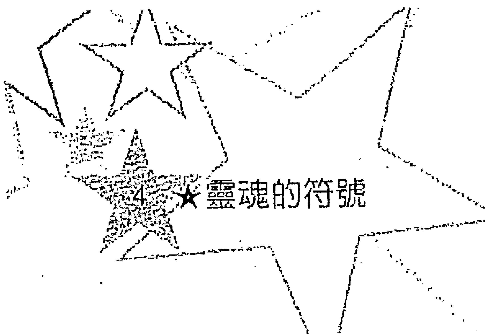

## ★靈魂的符號
能領悟到許多生命的實相，基本上通靈者所見的，大致上就是高靈的訊息，也就是高靈所傳達的宇宙真相。而長期浸淫在命理的人，同樣也會受到感召。因為人的生命現象，基本上來說就是宇宙現象的縮影，研究命理的人，透過命盤裏的符號得到啟發，如果他們更進一步的鑽研，自然也能感知那些玄妙不可知的現象，進而找到生命的實相。前世的存在與否，可能是這些人第一個必須解決的問題，到底有沒有前世今生？如果他們的答案是否定的，在命理上會有許多道理是無法獲得圓滿解決的。只要在生命裏深刻的觀察，不論從實相上、理論上或者是邏輯上，都會得到一種論點，就是世間因果的確實存在，進而得知人是有前世，受前世的影響。所以閱讀本書的時候，不妨用一種瞭解生命實相的觀點，來理解人受前世影響的各種狀況，透過這些訊息，讓我們更進一步瞭解另一個看不見的自我，藉以淨化自我。

不可否認的，這本書不是拿來閱讀就算了，基本上這是一本工具書，它是拿來測量你靈魂向度的書，透過作者所謂的靈魂符號來解讀。所以閱讀本書的讀者最好具備基本的占星學知識，如果看得懂星盤那就更好了。由於現在電腦網路十分發達，上網到一些星座網站列印你的出生命盤已不是一件難事，要記得命盤裏要有南北交點，以及一些基本相位最好。

如果從這本書的觀點來解讀靈魂的訊息，或許我們可以這樣解讀星座的各種符號：十二星座分別代表著十二種不同的靈魂基本特性（通常一個人會有兩個到三個不同的特性），十二個宮位坐

落著你所存在的時空以及你與外界互動的座標，太陽則代表著你的身心能量，月亮代表著你的感知力，水星代表著你的靈魂累世積澱下來的聰明才智，金星代表著你的愛與美的進化方式，火星代表你的肉體能量，木星代表你累世的悟性根基，土星代表著你前世的行爲所積澱下來的習氣與障礙，天王星代表著靈魂自我改變的動能，海王星代表著與靈界溝通的媒介，而冥王星代表著靈魂的欲望。這本書特別提到月交點，用月交點來看待你這世生命的任務與障礙，至於生命輪迴的真實面貌，也就是生與死所帶來的各種現象，應該不是這本書的重點，基本上這本書的重點還是放在如何瞭解這一世你可能會面對的困難以及如何處理這件事上。

這本書的另一個重點，是找到每個人生命進程中所必須面對的問題。這包含過去累世未能解決而這世必須解決的問題。在佛法的教義中，把對因果輪迴的認識視爲離苦得樂的第一步，在這本書中也特別教大家如何瞭解自己的宿業因果，不論是你欠人還是人家欠你，透過星盤的分析解讀，都可以找到答案。透過這種解讀，可以幫助那些對於自己無法理解的深沉問題，得到一種解答，進一步的瞭解自己。

一個星盤的整合論斷是一個占星師的專業，對於一般讀者而言，其實是相當困難的，在這裏我們必須先將書上幾個較爲艱深的占星概念，在這裏做個補充，否則對讀者來說，可能會是一個相當大的閱讀負擔。首先是第十二宮，星盤中的第十二宮通常代

代表著一個人的潛意識狀態，這個生活領域一般人比較容易忽略，它在現實生活中，指的是隱退的意向，也可能指到監獄；若論到前世，這裏是因果業報非常重要的指引點，一個人如果十二宮能量很強的話，意謂著這個人與這個世界的關係比較疏離，晝伏夜出，當然他受前世的影響也很大，但不一定是業障，那必須看是甚麼行星，相位如何。

再來是土星與月交點所指示的前世業力是有些不一樣的，土星比較像是已經現行的業力習氣，它可能早已變成你個性的一部分，但也可能是一種外界的障礙，但它都是十分具體可觀察的事物，例如，土星牡羊人的萬事起頭難，當這種障礙不斷在你的生命中出現時，你可以在土星牡羊人身上找到一種不認命的個性，即使是最認命的太陽雙魚座。不過有些人的土星所落入的星座、宮位及相位都相當不好的時候，這個人天生就會對這個世界產生一種莫名的恐懼感，這種無明確實是累世業力所造成，而且已經對你的生活造成相當大的影響。

月交點不一樣，月交點比較像是前世的功課（南交點）沒做完，或者是做得太過頭以致出現很多後遺症，必須在這一世獲得紓解（北交點），每個人的月交點所座落的位置都必須以對宮的方式加以觀察，特別是後天宮位所落的位置，那個位置可能是你釋放前世今生某種因果能量十分重要的領域。月交點不一定對每個人都會有十分強大的影響，除非月交點在你的命盤裏與你的內行星（也就是日月水金火等五個行星）有很重要的相位，或者它接

近命盤的四個點上（上昇點、下降點、上中天以及地底），否則對一般人來說是比較感覺不到的。還有，讀完這本書，你可能會以為土星以及月交點似乎代表的是前世的負面影響，以及今世的生命課題，這個部分如果要解釋清楚，對於作者而言似乎有點困難，畢竟她想強調的是如何透過星盤找到自己累世的宿業，進而獲得解決。事實上，土星以及月交點也一樣必須透過相位的好壞來傳達究竟前世帶給你的是善業多還是惡業多。

天王星、海王星、冥王星這三顆遠系行星，它們常扮演著世代演進的推手，只有當它們與日、月、水、金、火，這五顆星形成相位時，對於個人才會產生巨大的影響，如同我上述所說的，天王星代表著一件事物改變所需要的大動能，海王星扮演著靈媒的角色，而冥王星象徵人類生存最原始的欲望，當它們在你的命盤與內行星出現重要負面相位時，它絕對是神祕而難解的課題，令當事人難以用意志力去阻擋。我們不能完全將這部分歸因於前世的業障，但至少前世的惡業可能真的扮演了十分重要的角色。所以讀者在閱讀這部分時，反而應該更加進一步的去理解作者所提到許多狀況，或者在這些內容裏面，你可以找到你生命的解答。

這本書裏最讓我感到興趣的是有關星座的演進的部分，這是我認為這本書裏最精彩而實用的一部分，至少這個部分解答了為什麼許多太陽星座相同的人，而性格差異會那麼大的原因，也讓我們對於星座的概念有更深一層的瞭解。

## 8 靈魂的符號
這本書的閱讀方法可能無法像平常看軟文章那樣，最好一開始把它當作像食譜一樣，先將素材準備好，然後再下鍋。也就是先找到自己的命盤，瞭解占星學裏的相關符號，再針對與自己相關的文章閱讀，最後再做整合，這樣你才能真正享受到這本書的好處。

## 打開靈魂迷宮的占星之門
韓良露

在過去兩年中，我開始展開了教導深層占星學的工作，有許多學生在跟我上了六、七級課程之後，對占星學的基本原理，如星座、星宮、星相的能量都有了相當理解，也可以綜合地解讀完整的星圖後，不少學生都對占星學產生了很深沉的信仰，知道占星學足以說明生命中許多現象的來由。

但同時，也有不少學生希望能了解占星學中更奧義的部分，在占星學做為一種非凡、嚴密、超級的生命解釋系統，這種系統可以用最精細的統計定律來顯現，占星學中的奧義學，即靈魂占星學，都提供了一些更私密、隱喻卻深入核心的生命理解。

過去三個多月，我在課堂上開了十二堂的靈魂占星學的課程。在課堂上，親眼目睹有的學生一面上課一面流下了安靜的眼淚，有的學生表示多年來人生大的痛苦（不管是身體的、家庭的、婚姻的、孩子的……），竟然通過靈魂占星學找到了解釋，有的學生經驗了極大的喜悅，因為他們私心的靈魂渴求竟然被靈魂占星學中的理論宣示出現。

在我教導占星學的過程中，從來沒有像這次上靈魂占星學時這般能量高昂，班上不少的學員也上得如痴如醉，大家都經驗了極為美好的靈魂磁場的相遇與相融之感。

靈魂占星學，是教導占星的靈魂符號在個人星圖上的完整意

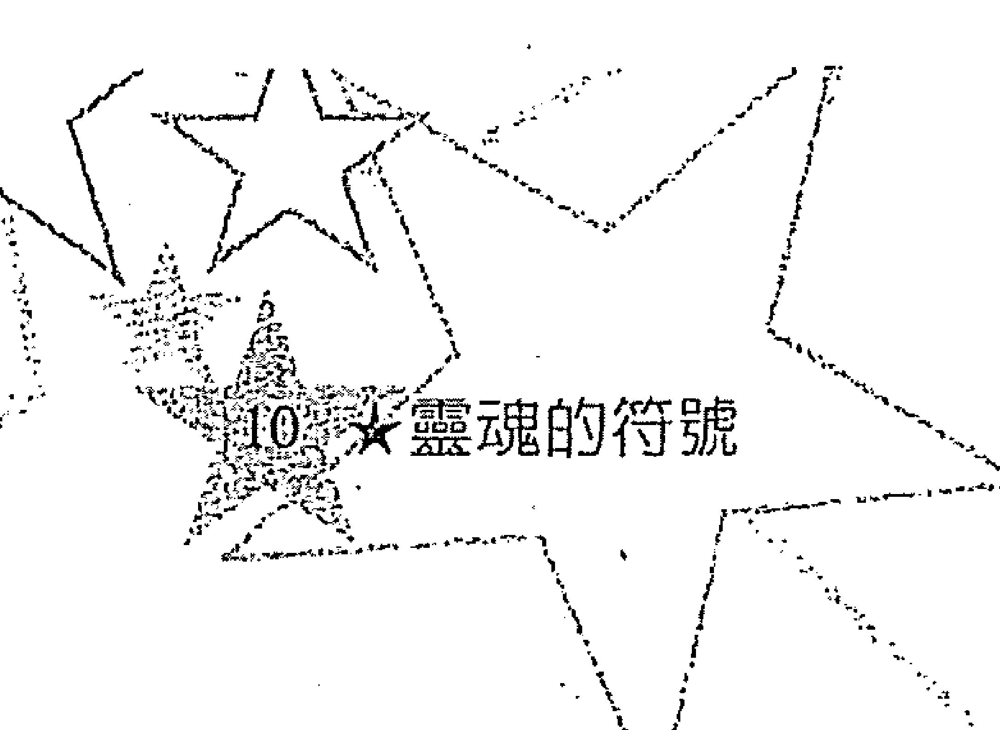

## 10. ♡ 靈魂的符號
義。這些靈魂符號，包括了南北月交，凱龍星、逆行現象、福點、十二宮、土星、月亮，這些靈魂符號所在的星座，所呈現的星象與所置身的星宮，都可以揭示一些靈魂的記憶。

了解靈魂符號，有時會產生某種通靈之感。但這種通靈不是來自某人的鐵口直斷，而是占星定律的顯現，這些定律不會因個人通靈能力的高低而有所扭曲。在我親身的經驗之中，有時極好的通靈者，會觸及個人星圖上的靈魂符號的意義，但很少通靈者能給予像靈魂占星學般全面的解釋。

在教完靈魂占星學之後，麥田出版要我為這本《靈魂的符號一從占星學發現你的宿業》作序，作者本身是執業的占星諮詢師，一直透過靈魂占星學在幫助個案。

我相信作者在實際個案輔導時，用的知識工具一定遠超過她在這本書中所呈述的。因為，任何一名被諮詢者的個人星圖都有其獨特性，需要全面地分析。

但作者限於書寫，只得介紹南北月交所在的宮位與星座，卻無法再更詳細地說明不同的星相造成不同的影響，以及在談到土星所在的星座與宮位時，並不區分土星所在的星座或土星所在的宮位的不同意義，更別說土星所呈現的星相了。

但這本書並非為專業的占星學生所寫的書，我必須說我在課堂上所教導的內容就必須比這本為大眾市場所寫的書要來得更深入（否則學生就不必來上課了）；但對於一般讀者而言，這本書卻是以呈現出一個極為神秘及有意義的世界，而這個世界卻是人

们常常有所感却找不到足够理解线索的灵魂迷宫。

这本《灵魂的符号》一书，足以当成我们打开灵魂迷宫之门，但要看见迷宫内的景象，则需要更深入的书（如南北月交、福点、土星、十二宫的专书等著），但事情总要有个开端，《灵魂的符号》的内容已经比坊间大多数的占星书要深刻许多了。

## 目次
導讀 徐清原 3

打開靈魂迷宮的占星之門 韓良露 9

前言 14

序文 15

## 第一章 靈魂的計畫 17
- 選擇出生星盤 21
- 宿業因果 25
- 解讀星盤顯示的宿債 30
- 第十二宮描述 35

## 第二章 生命的任務與課題 49
- 月交點 50
- 星盤主題 51
- 生命的任務 53
- 北交點所在的宮位與星座 54
- 生命課題 65
- 土星和南交點所在的星座 69
- 土星所在的宮位和星座位置 75
- 六種交點對軸 95
- 整合星盤的資料 97
- 案例研讀 104

## 第三章 星座的演進 111
- 演進與星座 112
- 七種角色 134
- 瞭解為什麼會選擇某個星盤 146
- 演進與主題 151
- 元素怎麼演進 156

## 第四章 星盤相位的角色和起源 167
- 相位 172
- 解讀相位 179
- 由前世衍生的相位 181
- 外行星相位 185
- 相位分析面面觀 211

## 第五章 月亮 219
- 月亮相位 234
- 月亮星座與童年環境 247
- 外行星與童年環境 255

## 第六章 探討心理／心靈的方法 263
- 安 267
- 瑪裘蕾 275
- 唐恩 280
- 結語 285

## 前言
這本書裡，有些資料並非以一般方式取得。我的意思是，書中所示的研究建議，是出於直觀；但這並不僅於此，關於出生星盤與前世的關係，有更多資料是來自通靈（channeling）而取得。這種取得資料的方式在現今已不像幾年前一樣，被全然當做是不可信、神秘、難解，雖然它還不能被普遍接受。事實上，如果說我們所知道的占星學大部分是來自人類初始時期的超自然事物，我也不會感到驚訝。當然這種說法不能得到證明，但是經由直觀取得的資訊，往往讓我們得到更豐富的知識與更透徹的瞭解。

今日的占星學已被急速的改變了；從先前的算命形態，提升為心理、心靈的工具，而占星學也本該如此。透過注入新資料、特別是透過占星學家的直觀，和許多心理學家的專心致志，才能有此提升。這本書提出的許多東西都是新的資料，你可以對這些概念加以評估，而正是這些概念向我證明了占星學之奧妙深刻。我很樂於分享你的發現，因為，分享發現也是占星學知識系統之所以能與時俱進、日新月異的原因。

吉娜・蕾克，于一九九八年春

## 序文
占星學過去長期為人所誤用、誤解和詆毀，在這個新世紀再度發揮力量，終瞭解成瞭解人的個性和靈魂經歷的工具，也就是靈魂的傳達工具，而它其實本該如此。如果我們認真地看待自己的生命，就不會把占星學拿來算命。我們不會因為占星學指出會發生某事，便深信不疑，並坐待事情降臨於身；更不會因為害怕而畏縮不前，甚至對命運的真相感到無望；聽天由命或畏縮無助只會把我們帶離現實。我們必須有自信面對未知、全心全意活在當下，而且不會聽任自我企圖掌控未來。

現代占星學，也就是新世紀占星學，提供我們一種觀點，幫助我們負責地面對自己的生命。現代占星學不但能提供訊息，也很有哲理。我們心理上的需要與問題、靈魂需要修習的課題、天賦，現代占星學都可以為我們解答，同時也提供一個方向讓我們得以瞭解生命。它向我們顯示：我們與一個更偉大的整體（the Greater Whole）——宇宙——有所聯結，人是團體的一份子，卻又是獨一無二的個體。現代占星學在解釋每個生命意義的同時，也展示了生命是充滿意義的。占星學的符號是靈魂的生命語言。占星學不只揭示宇宙的奧秘，還揭露每個人生命的奧秘。研讀占星學，我們得以窺見宇宙的奧妙神奇，以及我們在這宇宙所扮演的角色。占星學既玄妙又高深莫測，是洞察心靈、揭曉此生靈魂應

## 第16章 靈魂的符號
做之事和我們選擇的個性的工具。要瞭解心理（意即「靈魂」），就不能將它與靈魂分開來談，因爲兩者彼此相關：個性是靈魂的傳達工具，靈魂透過個性來完成目標。因此，只要是透徹地研究占星學，都會變成是心理或心靈的研究。

這裡所呈現的，只不過是一種讓我們認知到「今世的生活是受到別世與他人轉世的星盤所影響」之研究。我們比星盤表面所顯示的還要深奧！我們是有靈魂的生物，是所有經歷過的轉世之總和。星盤幫助我們瞭解今生今世的「我」是誰，也讓我們從中窺見吾人曾爲何人、又將往何處去。進行這樣的瞭解更長遠的旅程——進化旅程——的一部分。願你一路順風！

【附記】當我在文中意指「他或她」時，往往無法避免以「他」來指稱，我要爲此道歉，因爲有時同時寫出他或她會顯得過於累贅。

## 第一章 靈魂的計劃

## 18 靈魂的符號
人類長久以來，便利用占星學來瞭解自我和宇宙。早期的人類凝望星光點點的穹蒼，問著：為什麼。教人驚訝的是，人類竟也會向蒼天尋求答案？看起來似乎是如此，而占星學讓一些雖然深入卻很實際的問題有了解答。

早期的人類覺得自己與周遭所有生命都有關聯。人會把自己看做是宇宙整體的一部分，雖說是無足輕重的部分。隨著智識的增長，人類感覺到自己的重要與孤單，陷入生活周遭的各種競爭，並尋求控制這些競逐以符合自己的需求。人喪失了與生活相互依賴的感覺，占星學也成了只是另一種企圖掌控生活的工具；但無論如何，一度代表著宇宙整體的占星學，是可以再度將這種整體性呈現出來的。

我們需要回歸曾經擁有的「完整的感覺」。要做到這件事，就得和失落的部分重新結合：也就是要和靈魂合而為一，讓自己有完整且和諧的感覺。事實上，如果不這麼做，人類可能無法生存。我們目前所走的方向，是在摧毀最基本的資源與地球。如果繼續下去，人類將瀕臨毀滅。也許，在我們明白唯有通力合作才能生存之前，就會發生這樣的事。

占星學可以在這件事中扮演什麼角色？第一，它可以提供已遺失的哲理與心靈的支持。第二，它可以提供如何實現靈魂計劃、指引我們完成今生選擇要走的道路。實現生命計劃對「整體」來說，是很重要的。首先，讓我們檢視這些哲理與心靈的支持。在稍後章節裡，將以檢視星盤的方式來為各位提供指引。

占星學揭露了生命的循環本質，它證明了我們是井然有序、運行如儀的宇宙的一部分：月亮繞著地球運行，而地球繞著太陽運行，季節輪替不止。我們的生命也仿效這些循環，成為大宇宙裡的小宇宙。我們不得不承認，這種組合和循環是一個更高階層的存在，也就是一種組織力量（如果不是憑空想像的話）——一個宇宙法則。

占星學還讓人聯想到，生命在死亡後仍延續不斷。如果星盤不是一個更宏遠的演進過程的一部分，那麼它所含的意義又會是什麼？倘若生死輪迴不屬於演進過程的一部分，那麼生命又該做何解釋？輪迴解釋了生命的許多奧妙神秘之處：何以人會有不同、何以會有苦難，又何以有些人就是會比別人多受一些苦。輪迴也解釋了關於星盤的許多事，而且除此解釋外，沒有其他說法。在我們的星盤裡，有些星座就是表現得比其他星座更發達，而有些模式其運作之深刻，無法只以一世的生命經驗來解釋。

占星學也讓我們一睹這宇宙的完美與驚奇。對於任何已奉行占星學多年的人而言，占星學本身即是某個更高階層的存在之證明。再也沒有別的事物能像占星學般證實精神世界，以符號搭起心靈領域與塵世凡界之間的橋樑。占星學將神秘學轉譯為符號。

占星學也教導我們「整體論」(holism)的觀點，也就是，所有生命都是相互關聯且彼此依賴。一個完滿的宇宙，是由當中的各個部分相互結合，形成一加一大於二的力量，組成圓滿的整體，而這個大整體的力量，要比所有個別部分的總合更多、更大，而且每一個「部分」都是不可或缺的。我們的出生星盤也是如此；從每個單一部分，也可以看到大整體：「有諸上、形諸下。」人轉世投胎當時的宇宙能量，會反映在誕生星盤上。該時刻的能量可以從觀察天空和出生星盤讀出。因此，出生星盤可說是該時刻能量的圖像，也就是誕生於那一時刻的個體的化身。

這些能量就像是一種裝扮主題，代表某一世所要經歷的課題及所需發展來自這些能量的天賦。然而，我們的生命意圖要比這些能量和星盤所顯示的更為深奧。生命意圖是累積前幾世經驗與能量模式（星盤）的總和。在許多方面，我們就如同舞台上的演員：我們知道自己絕不僅止於正在扮演的角色，只不過是在這個時刻穿上屬於我們的戲服，並演出該角色的戲份而已。不同的是，演員無法選擇戲路與情節，而我們卻可以，這是很重要的差別。演員依照為他而寫的劇本來賦予角色生命，我們則是一路往前、創造劇情。生命之旅沒有劇本，我們的未來、我們的故事，是由自身的選擇所創造出來的。但，這就是全部嗎？全都是經由選擇而來的嗎？讓我們來做更進一步的探討。

我們一生有多少部分是已經決定、又有多少部分是出於自己的選擇？許多人相信，生命中有許多事情是註定的，諸如一定會發生的邂逅。不過，雖然有些事情是預先安排好，但如何發生、何時發生，卻不能預定，這得經由我們選擇的情況與事件來決定。自由意志與命中注定，在我們生命經歷交織，少數要被織入生命彩布的事件，是出於我們的選擇和我們身旁的人所做的選擇。如果你稍微停下來想想：你、別人可能做的許多選擇，所得到的結論一定是「未來並不是命定的」。我們靈魂設下要用來教導的課題，必須安插在已被我們的選擇製造出來的骨架上。靈魂得見機行事，等待適當時機履行生命課題。到頭來，預測未來就成了沒有根據，因此星盤顯示的生命課題也只是概略而已，至少可以這麼說。接下來將為大家說明如何解讀星盤。

## 選擇出生星盤

靈魂是更高自我②的傳達工具，「更高自我」也就是我們所知道的神。在更高自我的指引之下，靈魂藉由選擇星盤（選擇出生的時刻）和安排要發生的事件，來排定並交付我們生命的課題。當能量提供了必要的課業，靈魂便重返人世。一個靈魂在得到能讓其達成目標的能量之前，可能要等上數十載。然而，有時還沒有得到適當能量，靈魂就在特定的時間與地方誕生，好掌握某些機會（如：和某個對他的生命課題或業障至關重要的人士相逢，或是為了成為特定家庭的一員）。在這種情況下，便可以安排投胎轉世，而星盤會以其他方式反映出該靈魂所需要的能量。

其中一種方式便是以某種上昇星座轉世，如此可將太陽與其他行星放在適當星座所掌管（守護）的宮位裡。舉例來說，如果需要學習雙魚座的課業，轉世時卻沒有行星落在雙魚座，靈魂便可安排能使太陽或數個行星落在第十二宮（雙魚座的守護宮）的上昇星座。以雙魚上昇星座或太陽與海王星（雙魚座的守護星）呈合相的方式轉世，如此可增加雙魚能量。另一個可能則是，所需星座的守護星就落在四個基本點之一，以強化該星座在出生星盤上的重要性。

一旦轉世，靈魂必須在我們經由選擇而創造的情境中丟出功課。這件事無法依循一道嚴格的計劃來進行，因為情境總是隨著我們和其他人所做的選擇而改變。因此，靈魂的計劃必須隨著我們的一生展開，至於修習的課題會怎麼給，則看給予的時機而定。雖然如此，有些事情還是可以斷定——至少在計劃展開的某些時候是如此，因為一旦一場情境發動了，往往是按表操演。以下是靈魂如何在生命歷程運作的一些範例。

假設某甲需要學習毅力，除了選擇牡羊座或金牛座（這兩個星座都鍛鍊毅力）為星盤主要課業外，靈魂還可能安排甲遇到某個火星落在他的天王星的乙。而乙會刺激甲改變、對甲造成騷動，並挑起甲做出衝動和危險的行為。藉由讓甲遭遇到因欠缺耐性而引起負面結果，來教導他變得更有耐性。耐性可以經由各種方式來習得。重點是，靈魂所介入的，已不只是選擇星盤，而是更進一步參與創造任何需要的課題。

另一個範例是關於一對母子。前世是母子關係的兩個人，這一世仍是母子，但角色卻完全顛倒過來。在過去，做母親的因疏於照料而傷害了兒子。在這一世，前世的兒子變成母親，她可以選擇是否要關心兒子。如果她不關心孩子，那麼前世業報因果便無法平衡，也有損她個人的成長，因為犯下一個錯誤之後，再犯另一個錯誤，並不會負負得正。她會傾向於關心自己的孩子，而不是置之不理，因為前世被忽略的經驗讓她有了同情心。但是，這個孩子要如何學習他的課題呢？透過愛。雖然大多數的學習看起來都是歷經痛苦而得，但卻不總是如此。在這個例子裡，兒子（在前世忽略孩子的母親）將因為被關心而學會關心別人。我們將藉由體驗愛而學習如何去愛。

這個出生星盤的角色很單純：星盤呈現出「被選擇」的個性（或能量模式），是可以衍生出課題的個性。更確切的說，個性被選來償還業報、學習基本生命課題並完成生命任務。後面幾章將對「生命的基本課題」和「生命任務」這兩個主題做更多的探討。現在，讓我們把重心放在瞭解範例中的星盤如何被選來幫助當事人償還業報。

這個兒子的靈魂選擇了可以幫助他學習憐憫，並償還今世母親前世被傷害的業障之星盤。為了增長他的同情心與服務的觀念，他的星盤有很強的雙魚座主題。為了增加對母親的忠誠與責任感，他會在月亮與她的土星會合時再次轉世。

出於幾乎是從無盡的可能之中，靈魂必須找到可以符合業報課題、基本課題與生命任務的星盤。然而，這些課題（特別是業障），都是靈魂在選擇星盤時最優先的考量。我們剛開始轉世，往往只有一道課題與生命任務，甚或兩者相同，所以在選擇星盤上就很單純。在初期轉世的歲月裡，我們忙著學習生命的基本課題。到了後期轉世，當課題與生命任務不再相同，所選的生命任務通常是能與生命課題相輔相成的。請將這點銘記於心，這在你要分辨星盤出現的課題與生命任務時，會很有幫助。要讓更特定的課題或生命任務能輕鬆完成的方式，便是透過具有強烈主題的星盤，因為這種星盤不會輕易偏離到別的路途。具有強烈主題的星盤的人，會發現他們自己循著一條限制較多的路線而行，這讓他們有更大機會遭逢特定的人或成長所需的經歷。

更高自我透過直覺來引導，且以內在聲音道出了靈魂計劃以及生命課題。我們可能會、也可能不會注意到，但我們可以憑直覺在某種程度上得知這些訊息。更高自我是可以彼此溝通的，而且通常在希望計劃得到幫助時，便會這麼做，但人們老是忽略更高自我的存在，加上人們的選擇是不可預測的，所以每道課題都是既概略又可彈性修改的。

## 宿業因果

宿業因果通常被想做是「冤冤相報」（以眼還眼、以牙還牙）。這個想法過於單純，也未顧及人類成長與演進所牽涉的複雜過程。「種什麼因、結什麼果」（種瓜得瓜、種豆得豆）比較符合宿業的意思，但也不能十分貼切解釋此一法則的複雜性。

由於對宿業認識不清，產生了兩種誤解：一為人性本惡，二為我們必須因自身的罪受到懲罰。這兩種信念都與伊甸園之說❹有關，這個說法形成了猶太－基督教徒（Judeo-Christian）的基本思想。上帝懲罰人類的說法，是以不成熟的想法來看待上帝。宿業是一種宇宙的自然法則，也是人類演進的工具。就如同所有的生命是由愛所主導，宿業亦是如此，更不會是出於報應或懲罰。將宿業和懲罰划上等號，無異是低估了造物主的智慧與愛。

在修行的課題與宿債之間，有必要做個區別。我們都肩負要修習的課題，這是我們演進的一部分。宿債卻是肇始於造成嚴重傷害或死亡的選擇。因為宿債通常無法在一世清償，必須由靈魂在功課表裡做安排，並且是和許多其他課題排在一起，而不光是一碰到機會就安排償還。宿債也可以在決定靈魂何時轉世、採用哪種星座能量時，成爲最主要的考量。如果宿債要在特定的一世償還，便會以此形成星盤，而其他要修習的課題和生命任務就成爲次要考量。如果一項債務夠重要的話，它甚至可以成爲生命的任務。需要清償的重大債務，會在星盤中顯示出來，而較輕的債務可能會出現在星盤上。

任何導致嚴重傷害甚或死亡的行爲，都必須加以償還。清償債務不一定是經歷同樣遭遇，而是藉由學習任何必要的事情來防止舊事重演，也藉著向受害者賠償來結清宿債。既然「債務」暗指處罰或報應，「宿債」這一名詞也就根植於一些對宿業和它如何運作的誤解。因爲清償宿債不但事關賠償受害者、也涉及學習，用「功課」這一詞會更適當。教導的方式通常是讓加害人成爲受害者，藉此學習憐憫和瞭解需求，以防止類似悲劇再度發生。雖然清償債務最普遍的方式便是角色互換，這並不意味作惡者落入前世受害者的手中，成爲被害人；或是角色互換的作用在於懲罰。以下故事便描述了宿業是怎麼運作。

在前一世中，瑟蕾絲特被父親虐待，在這一世，前世的父親卻變成丈夫；人們往往會選擇一起輪迴轉世來重續因緣——即便是虐待的關係。在這些情況下，如果前世虐待的模式到下一世仍繼續，這也沒什麼好驚訝。舊事會一再重演，直到被虐者能認清這樣的事件是有害的。虐待的情形會持續到瑟蕾絲特瞭解到，她應該被好好對待。在宿業結清以前，她必須對此有所了悟。靈魂往往會讓我們儘可能從選擇中獲得最多的學習。只有在我們瞭解到負有債務，才會輪到償還宿業登場。一旦有所覺悟，如果情況允許的話，宿業便可馬上結清。

瑟蕾絲特提出控訴來反制丈夫，結果，她的丈夫因攻擊行為而入獄，還得接受心理諮商，並且須賠償金錢，而這些錢可讓瑟蕾絲特展開新生活。然而這個丈夫光是服刑和賠償傷害並不保證債務了結，這得視犯罪者在了悟後所做的改變而定。一項刑罰對某些人來說可能已經夠受的了，但對另一些人而言可能加重五倍懲罰都嫌不夠。更不用說司法審判在教化的工作上，通常是乏善可陳，有時甚至造成的傷害更甚於好處。然而司法終究是一種試圖實現靈魂計畫的社會手段，並且也真的常常實現了靈魂計畫。在這個個案裡，懲罰並未達到教化目的，所以靈魂得安排讓犯罪者有更深體悟的方法，可能會、也可能不會牽涉到受害人。宿債不見得會在受害人涉入的情況下結清，但通常受害人會在和加害人未來共同輪迴轉世裡受益。在這種情況下，這兩個人可能會再度碰頭。

另一個女人丹妮絲和丈夫離婚，這段婚姻是為了清償前世宿債，一旦宿債結清，丹妮絲便能自由自在的走向下一步。丹妮絲和前夫有幾世都在一起，這起因於他殺死了丹妮絲，得清償宿債。藉由照顧曾經轉世為殘疾人士、垂死邊緣的母親、生病的孩子、受傷士兵的丹妮絲，他學會尊重生命的可貴，這正是他要修習的課題。解除宿業並非如許多人所想像那般簡單。我們永遠都不知道，事先安排的境況是否能達到所設定的目標。「情境」在當事人轉世之前，便由靈魂安排好了，但在情境當中完成了什麼，則仰賴涉入其中的人、事、物。有時候，預計要用來清償宿業的境遇卻未能如願。當這樣的情形發生，便會解除當事人置身於其中的安排，然後在下一次機會再度嘗試。

有些人以為，和某人有宿業即意味著不管怎樣都會和那人在一起。然而，宿業並不是要我們處於不快樂或不健康的關係。不快樂通常是靈魂的需求未得到滿足的徵兆，有時候必須結束這段關係，才能達到需求。這並不是要否定承諾的價值，但是有些人以相信宿業為藉口，不願冒險做改變。在一段具有業報因果的關係裡，由當事人雙方創造出來的情境下，再也無法解除更多業報時，也許最好是分手並保持單身。如果清償宿業在靈魂的功課表裡是很重要的項目，那麼生命課題就可能需要加以調整，而這通常是可以安排的。

有時候兩個當事人最初相聚在一起的目的是出於宿命因緣，就算宿緣結清之後，他們仍決定一起發展更圓滿的愛。許多最具意義、最長久的關係都是由這種方式開始。與某人修習同樣的課題，會建立密切的連結，也往往會在宿緣已盡之後仍持續著。

塔娜在前世經歷過痛苦的死亡，她死於某個闖入家中搶劫的匪徒之手。這個經驗反映在膽怯的行為上，她非常害怕獨處。她不一定要在這一世再和殺害她的人相遇，但是她的恐懼必須加以治癒，而為了靈魂的成長，殺人者也要清償這起事件。

不論什麼時候有人被嚴重傷害，不只是加害人要學習某些東西、並對受害者作補償，被害人也要去治療並調整對事情的觀點。當事人的靈魂必須找到完成上述事項的方法，不管是透過再度相遇也好，或是各自經歷都好。

塔娜的靈魂以安排可以讓她成為女英雄的環境，來克服恐懼並建立自信。當地震撼動了塔娜居住的小村莊，她感覺到一股不曾發覺的內在力量與冷靜。在另一波地震徹底摧毀當地之前，她領導其他村民到安全地方避難。在地震發生時，藉著照顧村民的安全與投射出她的真我，靈魂幫助她體驗到自身的勇氣，在她的心靈留下正面的印記。

而前世傷害她的男人，則有不同的際遇。他需要學習不得不謀生的意義。在下一世裡，他被置於必須努力工作以養活自己的情境中。為了讓他面對勞動的工作而不再選擇搶劫，信仰虔誠的父母將被選來作爲誠實不阿與嫺習技能的勞工典範。

最後一則故事，是關於某個想要克服對馬感到恐懼的男子。這名男子有一世死於狂奔的野馬蹄下，那時正值開拓西部蠻荒的時期。他以這種死法來償還小女兒的死，他讓女兒在無人陪同下進入一欄馬群之中，因而致死。表面上看起來是因果報應，但這是為了給予該男子所需的經驗，教導他知道人類生命的脆弱。如果他能及早重視這件事，就不會讓年幼的孩子在沒人看管下隨意亂逛。人們會認爲這個父親也學到這件事了。但是因爲他將女兒的死，看作是出於孩子自己犯的錯而不是他的錯，所以他必須以別的方式來學習。他的靈魂選擇了死於馬蹄來教導他這項課題。

雖然這看似殘酷，但死亡是生命很自然的一部分，而且隱含了許多可以教導我們的東西。在靈魂演進當中，我們都會因受傷致死許多次，而重傷致死是教導深刻而鮮明事物的方式。從靈魂的觀點來說，死亡不過是永恆當中的一個階段，以及另一種教導生命課題的方法。

## 解讀星盤顯示的宿債

如果結清宿債將成為某世最重要的功課，那麼出生星盤便會指出因宿命因緣而需償還（或報答）某人；但是擁有債權或是債務都以同樣的條件顯示，我們無法單從星盤分辨箇中描述的是哪種狀況。更進一步來說，既然可能需要好幾世的時間來清償宿債，那麼同樣的債務也可能會出現在相關人士好幾世的星盤上。而既然每一世都可能償還一點債務，那麼星盤指陳的任何宿債，便是處於償還的過程中了。不幸的是，我們無法光從星盤得知這筆宿債還剩多少未償還。不過，要是有一項債務反映在星盤上，該債務在某種程度上便會影響到這一世。舉例來說，如果這項債務有一小部分仍殘存在兩個當事人之間，那麼這兩人的靈魂便可能會安排彼此再碰頭、結為夫妻，一次結清所有欠債。即便債務微不足道，還是會構成婚姻，並限定兩個人的生活，直到互不相欠。

而構成償還的情形還得視幾件事而定。招來債務的一方，會根據他或她的能力和債權人的需要，被給予償還的機會。債務可能透過某些方式促成；金錢或者物質上的賠償，或看債權人該世的需求而以其他方式償還。很顯然地，要是債權人已經很富有，那麼錢財賠償就不具有了結債務的價值，除非這個宿債很輕微。

如果星盤顯示有宿債或賠償，那麼這一宿債很可能會化成挑戰式的土星相位，或是好幾個行星落在第十二宮的情形。最有可能指陳這種情形的相位，便是土星呈四分相（九十度，又稱「衝突相」）以及與太陽或月亮對沖。土星呈四分相或與金星或火星對沖，也可能表示有宿債，但是對這一世造成的衝擊較小。雖然這些相位不是唯一可看出宿債的條件之一，不過通常都是代表債務。沒有這些相位也不一定就表示沒有宿債，然而，相位的出現只是顯示這份宿債有可能影響某一世的方向。

倘若有個或更多的行星落在第十二宮，代表可能有宿債或賠償的情形，特別是太陽、月亮、金星、火星、土星、海王星或冥王星等行星。要是數顆行星都同聚十二宮，那麼這份宿債或賠償便會在這一世扮演重要角色。第十二宮的行星及呈現的相位、落在第十二宮始點❺的星座與該星座的守護星、其他任何落於第十二宮內的星座與守護星，第十二宮守護星所在宮位加上守護星形成的相位，都能提供業報因果的資料。綜觀而言，這些構成星盤的條件，描述了產生宿業的前世情境。土星所在宮位、星座和形成的相位，將顯示這份宿債要怎麼來清償。雖然不保證債務將被償還，但是透過土星所在的星座與宮位，以及在相位上與土星有關聯的星座和宮位，將有賠償的機會。下列範例說明了如何從星盤讀出宿債。

第一張將討論的星盤 來自某位女士，她的土星落在第九宮處女座，與第三宮太陽雙魚相沖（對相），與第七宮雙子月亮成直角（四分相）。第十二宮沒有任何星座和行星，但該宮始點有天蠍座，第十二宮的守護星落在第八宮獅子座。如果有行星落於第十二宮，本命守護星所在位置就沒那麼重要。以此為例，這個星盤的宿債可能牽涉到一段親密關係，而在這段關係當中，「掌控」是關鍵主題（天蠍掌管這張星盤的第十二宮，第十二宮的守護星落在第八宮獅子座，而第八宮是天蠍座的本命宮）。我們無法得知誰受誰的掌控，要檢視星盤所屬當事人才能知道，這位當事人也許可以看出這段關係。在這個案例裡，星盤是債權人的。

接下來，從看到土星落於第九宮處女座，便可以作出這項債務可能會如何償還的假設。第九宮（譯按：俗稱遷移宮）管的是長途旅行、進修、人生觀、宗教思想等。債務人可能會藉由帶她旅行、供她唸大學，或開拓她的視野與想法來作補償。現實中，債務人這世是一名男子，不是已經給予了她上述待遇，便是將來有機會會付諸實行。土星指出了其他機會，透過這些機會，宿業便得以了結。在此案例，債務人從事低層工作（他的土星落於

> > ❹伊甸園之說：根據基督教舊約記載，人類始祖亞當與夏娃原本無憂無慮的住在伊甸園，後來夏娃受到蛇的唆使，偷吃善惡樹的果子，並拿給亞當吃。兩人因違反上帝的禁令，被趕出伊甸園。人類從此要在塵世中勞苦不息，才能求得溫飽。
> > ❺始點 : cusp ，或稱界線、宮頭。

處女座）來供養她。土星的相位也描述了相抵宿業的可能情況。這位女士的出生星盤裡，土星與她落於第三宮的太陽雙魚和水星相沖、與第七宮月亮雙子呈四分相。兩方當事人在高中透過一位兄弟（第三宮，俗稱兄弟宮）偶然相識，並且結了婚（第七宮，俗稱夫妻宮）。

該男子星盤提供了更多有關償債的資料。雖然他的土星沒有和太陽或月亮呈四分相或對相，冥王星卻與月亮相會、與金星（該男子下降星座的守護星）相沖。他的金星落於第三宮，代表高中時代的戀愛關係；冥王星和月亮在第九宮相會，描繪出先前提到的償債方式。他的土星落在天秤座，該星座也支配了第十二宮，代表宿業可能與一段關係有關。掌管第十二宮和下降星座的金星，則落在水瓶座，指出女方會在這一世突然出現（掌管水瓶座的天王星，意味突如其來的瓦解和大變動），引起他很大的痛苦（冥王星─月亮與金星相沖）。所以男方星盤比女方星盤更能說明靈魂交付的課題，因為他受星盤影響比她更深刻。

接下來是一名已逝男子的案例，他生前和一名握有債權的女子結婚。做丈夫的必須學習某些課題，而且只有在與前世被他傷害的人（他這一世的妻子）在一起的情況下，才能習得。同時，很重要的一點是，妻子從丈夫那裡獲得錢財的報償，讓她得到自信與自尊，在前世裡，她的自信與自尊在兩人相逢時受到傷害。這段關係對兩人而言都相當艱困，雖然他們共處了三十年以上。當兩人之間有宿債，便會產生強烈的連結，直到宿債結清。如果

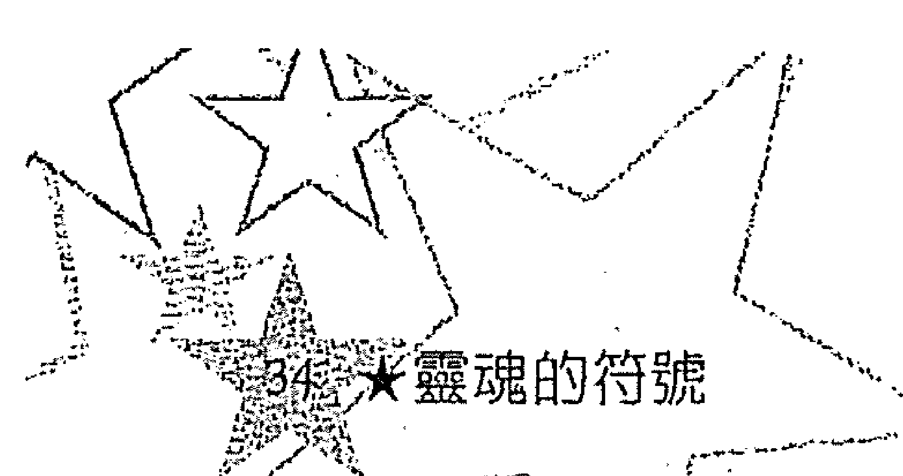

## 24 ★ 靈魂的符號

一段關係是出於業報因果，而兩人必須繼續共處，他們要嘛就是理所當然的在一起，不然就是身處的環境不贊同離婚。如果情況再也無助於償還宿債，那麼他們對彼此的約定意念將會改變，或是環境會有所改變，或者，兩種狀況都會發生。

牡羊座掌管這名男子的第十二宮，而牡羊座的守護星，落在第十宮魔羯座。土星幾乎與太陽相沖、與月亮成直角，而他的月亮又與冥王星相會。這種相位證實了宿債的可能性。如同我們前一案例所見，此外我們也會在本章描述相位的章節中看到，冥王星和土星一樣，通常都指向宿債。冥王星與月亮形成相位，宿債很可能與妻子（假設當事人是男性）或母親有關。而牡羊座掌管第十二宮，牡羊座的守護星（火星）落在魔羯座（守護星為土星），冥王星與土星產生關聯，這兩個行星、也就是前世發生的事，可能與暴力和死亡有關。這個星盤以許多條件描繪出一項宿債，並使該債務在今世更顯重要。

月亮（與冥王星相會）、太陽（月亮、太陽都與土星形成相位）分別落在該男子的第二和第六宮，指出了宿債償還方式可能要以辛勞工作和提供舒適物質給債權人。既然這筆債務顯然很龐大，那麼星盤還提供了必要的能量與動力以求得豐衣足食。火星落在第九宮魔羯座，提供獲得成就、安全感與身份地位的動能。金牛為上昇星座而月亮落在第二宮，提供了舒適物質和達到此一條件的堅持毅力。太陽與金星位於第六宮，所以從會從事醫藥方面的職業。最後，木星落在第四宮，確保他對家庭負責。

如果光看这些范例还不足以采信，那么就研究在你生活周遭的人们吧。若没能熟知当事人并拥有敏锐的直觉，是无法轻易解释星盘里的业报因果。要是你的技巧不够熟练，那么就不可强解。这些解读宿业的资料，不是要让你去描述每张星盘的宿业，而是要告诉你：宿业是怎么运作、又如何显示于星盘。如果你和别人谈起他们出生星盘所显示的宿业，千万注意不可沦于负面或说教。给予别人宿业资料的唯一目的，是要让他们更了解自己的生命课题与生命任务。如果不能达成这个目的，就别说出来。有关业报因果这一主题必须谨慎处理才行。

# # 第十二宫的描述

以下的描述是为了帮助说明第十二宫和任何可能出现在这一宫的业报因果，目的不在揭示宿业背后的详情，而是要让人明了需要学习的生命课题。请记住，这些描述并非每张星盘都适用，也不是每个人都有宿业、或是有宿债的人都可以从星盘看出来。下面的描述，是基于假定已经指出一项宿债，特别是从土星或冥王星呈冲突相位推断得出。并且要记住，若要说第十二宫是描述一些当事人所负的宿业，不如说是它陈述了发生在当事人身上的事件。而星盘显示的其他讯息，将可透露当事人是否身负宿债或拥有债权。

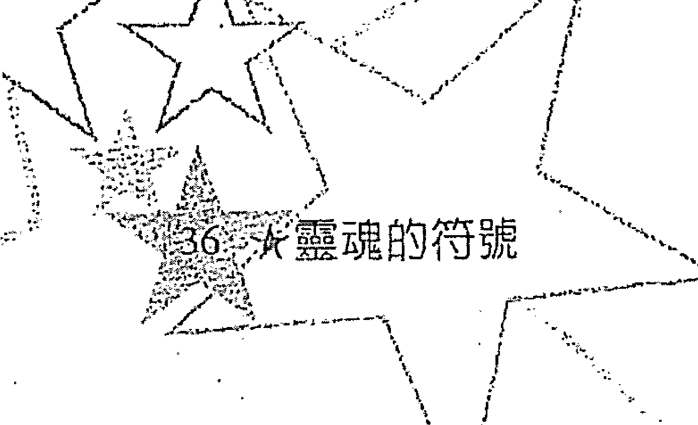

解讀的方式是按照每個星座與第十二宮的關聯來作說明：如果該星座掌管第十二宮、星座的守護星落在第十二宮、位於十二宮始點星座的守護星也落在該星座，或落在該星座的本命宮（例如，第一宮是牡羊座的本命宮，第二宮是金牛座的本命宮，以此類推）。如果有數個行星落在第十二宮，對於星座的描述便必須基於直觀來作綜合分析。以下的星座描述只是指導方針，你還得使用個人的直覺來分析星盤顯示的其他訊息，並且需和當事人談過之後，才能針對第十二宮作出解釋。

# ## 牡羊座

當牡羊座與第十二宮形成關係，宿債可能源自暴力行為讓人受傷或死亡，通常是在憤怒或盛怒之下導致暴力行為。引起盛怒的原因，可以拿和第十二宮有關聯的其他行星或星座來解釋。要是土星或魔羯座也涉入，表示可能曾經發生死亡事件。因為牡羊座往往代表了蓄意的暴力而非事出意外，這個星座可指陳最艱困的宿業。因為宿業是要花好幾世來結清，又因為宿業可能存在於償還過程的任一階段，所以宿債可大可小。

有暴力行為的人需要學習各種課題，這些課題視產生行為的原因而定，會選擇哪種出生星盤也以此來決定。當需要學習控制怒氣的課題時：可能會出現金牛、處女或魔羯的月亮；土星可能會與火星呈四分相或合相；星盤當中可能缺火象元素；太陽或火星可能和一個或更多外行星形成硬式相位 (hard aspects) ；或者，可能會加強土象與風象元素，來減緩情感的張力。

我們被激怒時，往往會看輕生命、也忽略自己毀滅的潛力。因此，當牡羊座與第十二宮形成關聯，尊重生命的可貴與脆弱可能是另一道課題。如果是這種情形，通常可以在第十二宮與第六宮發現月交點，並且透過從事醫療職業的生命任務來學習課題。

善用一個人的能量與意志，也可能是與第十二宮有關的牡羊座的另一課題。在這種狀況下，當事人的目標不只是控制憤怒，還包括了自覺，所以怒氣才不會在一開始就成形。一份強調天蠍座以增加自省的星盤，將有助於學習這項課題。強調風象元素以增加客觀性，較有可能以健康的方式來運用情緒，就如同家庭成員可作爲正面角色的模範。

過去一世曾有暴力行爲的人，也許缺乏對生命的尊重，他們可能需要學習尊敬活著的價值。如果是這種情形，靈魂所用的方法可能是在下一世提供快樂、幸福且豐裕的環境，來教導生活的美與愉悅。要改善前世暴力行爲，通常需要一個安寧、可愛且尊重生命的環境。爲了協助改善，木星可能與太陽、下降星座或是月亮相會，以增加保護與好運，或者，以其他方式形成較有利的相位。

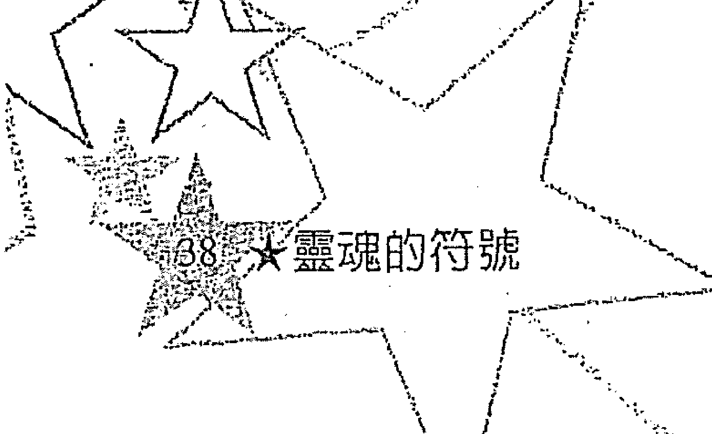

#### 金牛座

當金牛座與第十二宮形成關係，造成宿債的因素可能是偷竊、吝於施予或濫施。最嚴重的可能是出於貪婪而導致犯罪行為、進而帶來傷害或死亡。其他的可能則是因爲自己的浪費或驕奢、讓別人只能過著清苦生活而受罪，或出於自私而傷害某個人——如同《灰姑娘》的故事。也有可能是鼓勵暴飲暴食、溺愛某個人或未能灌輸正確價值觀。要改正最後面幾項罪行所花費的時間，並不像更嚴重的罪狀所需要的那麼長，但仍要做些償還。

當金牛座與第十二宮形成關係，要學習的課題有可能和價值觀有關。因爲貪婪而導致偷竊的那些人，需要學習物質並不會帶來幸福、愛或滿足。靈魂用來教導這項課題的另一種方法，就是安排他／她擁有花也花不完的錢、再加上孤單寂寞。如此可證明物質的空虛，特別是如果財富顯現不出愛。

「分享」也是另一個課題。雖然在我們能夠無私地付出之前，必須有某種程度的精神發展，而慷慨是可以被教導的。透過水象星盤來學習這項課題也是一種方法，這種星盤能增進同理心與敏感度。仁慈的家庭成員，是爲人慷慨的模範，並提供了被施予的體驗，也因此對當事人有所助益。矛盾的是，我們經由強迫而學習到的「分享」，不會比從「被給予」的角色所學到的還要多。當我們自身的需求被滿足，就會樂意施予他人。因此，靈魂通常不會以疏於照料，或討厭的環境來教導爲人著想，而是以滿足所有基本需求的慈愛環境來教學。

前世因爲暴飲暴食而受苦、或致使別人受這種苦的人，需要學習節制的好處。保守、節儉、自律與自我犧牲的星盤，也可以用來教導這件事。綜觀分析魔羯、處女、雙魚座可能有所助益。然而，雙魚座缺乏自律，對某些人可能沒什麼幫助。靈魂也可以選擇具有這些特質的家庭，或清寒的家庭來做教導。

# # 雙子座

當雙子與第十二宮形成關係，顯示前世可能濫用溝通的權力、或任意使用傳達工具，因而傷害到某人。然而決定宿業輕重的關鍵；一種是出於意外或因爲疏忽而造成的傷害，只需清償最輕的宿債。另一種可能便是當事人散布對他人名譽造成傷害的流言，不管內容屬實與否：如果他／她對衆人具有影響力，那麼宿業便更爲深重。利用媒體來打擊某人名譽是最佳例子，如果牽涉濫用權力，除了水星（雙子座）之外，冥王星或天蠍座也可能會涉及第十二宮。

正確使用溝通的權力，可以數種方式來教導。一是約束個人的溝通能力，也就是展示語言的權力。就此而言，土星可能位於雙子座、第三宮或與水星形成相位。另一個方法便是將濫用者放在有影響力的位置，如果他／她再度濫用權力，將來就有得受了；或者，他／她最後也會因某人濫用權力而嚐到苦果。

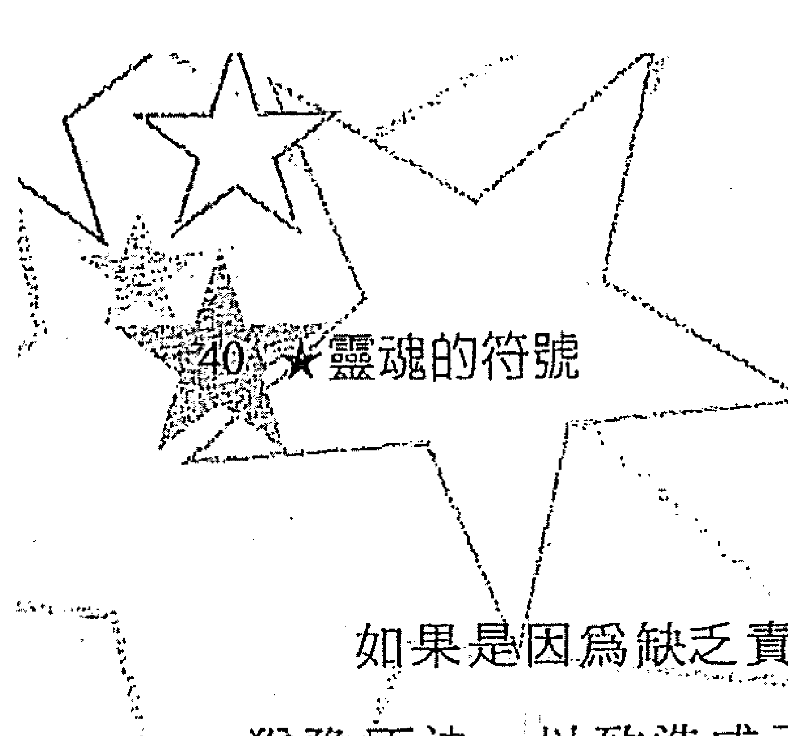

如果是因為缺乏責任感、未經審慎判斷、粗心、滿不在乎或猶豫不決，以致造成不正確使用傳達工具，進而引發傷害或死亡；可能必須清償罪過。然而並不是每個行使傳達工具導致傷害的人都會招來宿業報應，要清償什麼樣的債務則視引起意外災害的原因而定。如果要負起較大的責任、需要較嚴重的警告或學會較周密的判斷，星盤可能會出現魔羯座。如果需要更果斷，可能會有性格穩定的星座。靈魂自有辦法來發展這些特性，雖然通常隨著年齡與心智的發展，也一定會產生這些特性。

# ## 巨蟹座

當巨蟹座與第十二宮形成關係，可能會牽涉到一位家庭成員。因為家庭是教導生命課題的主要場所之一，宿業往往隨家人而來。家庭也是解除宿債最常見的場所，因為家庭關係需要相互的依賴與親密。當星盤顯示火星與冥王星也涉及第十二宮，便可能發生與暴力或身體傷害有關，甚至是性虐待，不然就是情感虐待或棄而不顧等事件。

如果是加害人的星盤，就需要學習同情與同理心，而形成的星盤也將幫助當事人學習。要教導這項課題，加害人會經歷到某種形式的依賴或無能為力。心理上的退化、殘疾和精神疾病等，不過是少數幾個極端的狀況而已，這些狀況會讓犯過者學到同情與同理心。也有比較溫和的教導方式，當然靈魂會選擇符合個人需要的情境。如果是受害人的星盘，那么将是可以帮助治疗他／她的星盘。

#### 獅子座

當獅子座與第十二宮形成關係，導致宿債發生的事件可能與濫用個人影響力或權力有關，大概是爲了自身利益而濫用。如果事情涉及讓別人付出代價來得到個人利益，在這種情況下，就必須學習更尊重他人。爲了有助於走向以獻身服務來清償債務，也許會有傾向服務的星盤。

另一種可能是，當事人利用他／她的權力來掌控他人。在這種情形之下，可能會藉由被人掌控的經歷，來學習尊敬自主與自由。當情勢反轉過來，過去的加害人就會受到更加殘暴且不道德的操控。不管這情形看起來如何，這並不是報應，而是一種有效修正一個人的態度的方法。

獅子座落在關係人第十二宮的受害者，可能身受能力不足和放棄自己的權力所苦。這通常是因爲曾受他人壓迫或操控而產生的結果。在這個案例中，星盤顯示的其餘訊息將支援當事人發展自我力量與自信。

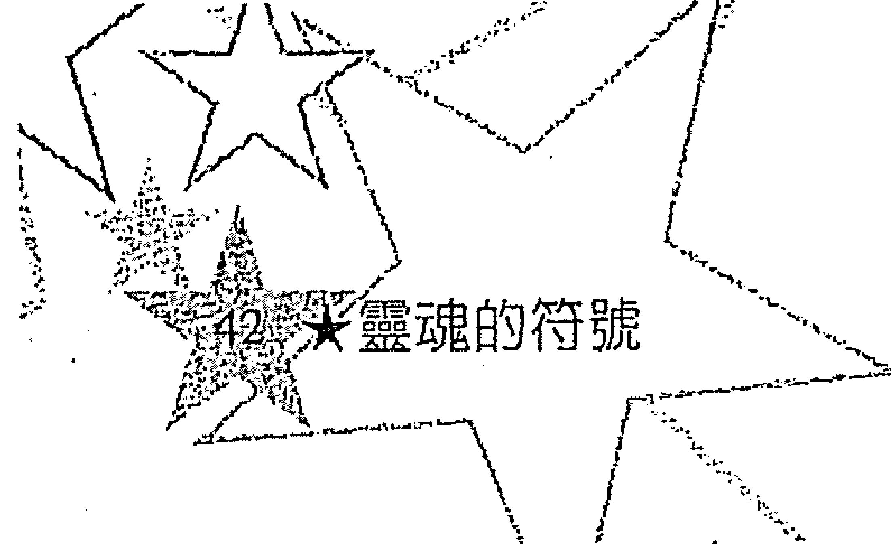

#### 處女座

當處女座（室女座）與第十二宮形成關係，隱藏在宿債背後的事實可能是奴役或苛待他人來服侍自己。然而，奴役一定會造成心理或身體上的傷害，因而需要清償。不是所有蓄奴者都欠奴僕宿債。發生宿業的目的是要修正一個人錯誤的態度或行為。如果一個蓄奴者對奴僕心存善意也能善待對方，那麼便只需要償還輕微的宿債或是沒有欠債。如果不是上述情形，就可能造成深重的宿業。

有一種很普遍的償債方法，即是讓犯過者成為奴隸或僕人，如此可給他／她這方面的經驗。然而有時候這樣只會讓當事人更輕蔑僕役。如果發生這種情形，在他／她學會這項課程之前，可能需要經歷更多世的奴役生活。有些人喜歡自以為高人一等，而不管他們一生的命運為何，這類人在位高權重時，最有可能苛待他人、也是最難學會這項課題的人。然而，每個人都會有某種比起其他課題更難修習的課業。

處女座落在第十二宮的受害人，可能會身受自尊心低落和難以掌控自己命運所苦。當身處這種情形，被選出來的星盤將會是在小心選擇下、可教導這項課題的星盤。

# # 天秤座

當天秤座與第十二宮形成關係，宿債可能涉及婚姻或其他合夥關係。如果是商業合夥，便可能是有一人不誠實、苛待或不負責任而傷害到另一方。如果是婚姻關係，其中一人會因爲伴侶的行爲而受到傷害。需要什麼來抵償宿業，則視犯過者及發生原因而定。

如果是出於自私或貪婪所造成的傷害，部分星盤將反映出需要學習更慷慨與更能合作（如果這個星盤是債務人的），可能會有天秤或雙魚座的主題。被選來教導這項課題的星盤條件會是：少數或者沒有火象元素；許多行星對沖；海王星、金星、火星、月亮會於四角之一；具有天秤太陽或天秤上昇星座；或者太陽落在第七宮。可能也會安排其他情況來教導這項課題，比如出生在必須分享與合作的大家庭裡。

# # 天蠍座

當天蠍座與第十二宮形成關係，宿債可能來自情感或性虐待。如果是加害人的星盤，他／她需要學習同理心、同情與愛。如果是受害者的星盤，他／她將需要治療。當天蠍涉及第十二宮，另一個可能便是過去從事商業行爲時，爲了追求權力與財富，不太考慮或根本就不考慮別人。有個很好的例子即是大企業剝削貧窮國家的人民，或者小型企業主通常會貪污、逃稅或幹些偷雞摸狗的勾當。

靈魂教導同理心與同情的一種方法，便是透過某些星座，特別是雙魚和巨蟹來教學。靈魂可能會安排加害人變得無能為力、依賴，以避免他／她又去剝削他人。雖然這聽起來像是懲罰，但通常是唯一能教人同理心與同情的方法。

#### 人馬座

當人馬座（射手座）與第十二宮形成關係，可能暗示了出於不負責任或粗心大意的宿債。特別是，這個配置位置表示旅行探險時犯下錯誤，導致傷害或死亡。另一個可能是人馬座的自我中心造成不顧別人的需求、並在無意中傷害了他人。因為在這些情況下造成的傷害很少是故意的，所以通常抵過只需要學著更小心、更負責。

生命教導我們需要學習的東西的一種方法，便是透過懊悔，透過其他人、司法系統，或一而再、再而三的事故來教我們學會課題。如果更加小心、擁有常識、再加上責任感，都還不能學好，那麼透過土象星座、土星相位，還有人馬生命的嘎然而止，便可輕易教會犯過者。因此，如果星盤呈現第十二宮與人馬座有關，顯示了宿債徵兆，並強調土象元素或影響極強的土星，很可能是選來相抵不負責任或粗心大意的過失。另一方面，如果星盤無助於謹慎和負責，可能意味著當事人在前世受到別人不負責任的對待。在這種情況下，會在這一世獲得補償。

#### 魔羯座

當魔羯座與第十二宮形成關係，可能代表與死亡有關的宿債。要為別人的死亡負責是很嚴重的過錯。然而，在決定債務大小、以及為了相抵債務而需要學習什麼課題，是不是出於故意是很重要的關鍵因素。位於各宮位的行星，第十二宮守護星落在的宮位和星座，以及這些行星呈現的相位，可看出發生死亡的事件。

說到殺人，我們會問：行刑者、士兵、非法墮胎者，何者會招來業報因果？有些宿業在這些實例都會發生，但這些殺人方式的情節還比不上謀殺嚴重。雖然如此，我們是活在允許行刑、爭戰、墮胎等事發生的社會，也就會招致社會共業（societal karma），這三種殺生，以墮胎的宿業較輕，因爲幾乎所有的墮胎情況中，靈魂都還未進入胎兒體內。

當有人被殺了，兇手可能需要學會尊重人命的可貴。教導這項課程的一種方法，便是讓犯過者經歷年紀輕輕就辭世或痛失心愛的人。如果不是出於故意而導致死亡。那麼就看引起死亡的原因，來決定需要學習什麼。

被殺死的人會從星盤的火象元素得到更多勇氣與自信。暴力或突然死亡一定會讓受害者留下易受傷害與不信任的感覺。因此受害者的星盤可能不會有很強的魔羯主題，這樣只會增加他們的恐懼。藉由研究星盤、並運用我們的想像與直覺，我們往往可以斷定這個星盤是屬加害人或被害人的。

#### 水瓶座

當水瓶座與第十二宮形成關係，可能代表出自突然意外的傷害或死亡的宿債，由缺乏耐性或橫死所引起。許多這類的過錯向來不需要抵償，因為負面的結果已教導了需要學習的東西。然而，有些人——特別是那些將自己的過失怪罪到別人身上的人，會需要學習更深入的課題和有助於謹慎與自制的星盤。如果是這種情形，星盤的其餘部分會證實這一點。另一方面，如果星盤是受害人的，星盤的其他組合將會是有助於自信與勇氣，而不是謹慎與耐心。

#### 雙魚座

當雙魚座與第十二宮形成關係，宿債可能來自情緒受到傷害或不受關心。與雙魚座有關的話，傷害比較不可能是因暴力或故意傷害而引起，卻較有可能是因為精神疾病、身體殘疾、精神障礙或心理退化、或藥物或酒癮，而導致無法付出關心。

抵償宿債的方式視引起棄而不顧的原因而定。如果是出於用藥或酒癮，那麼補過方式便是成為酒癮父母的小孩，這樣可以增加再度面對這個問題的同理心，使當事人能夠斷然克服這個問題。如果需要更多自我力量或實用的能力，土象元素的星盤將有所助益。然而，自我力量的強弱與靈魂年齡有關，在能夠應付這個世界之前，當事人可能需要有更多的轉世經驗。如果一個身體或精神有殘疾的人要為疏於關心負責，那麼情況會更為複雜。靈魂會分析每一種情況，來決定需要學習什麼。

受害人將必須學習不把自己看作是受害人，要做到這點，必須小心選擇出生星盤與童年環境，來平衡不值得受到關心的感覺。幸福又充滿關愛的家庭，加上火象元素的星盤，以及有利於放鬆的木星相位，可以大大的彌補這樣的傷害。

# # 第二章 生命的任務與課題

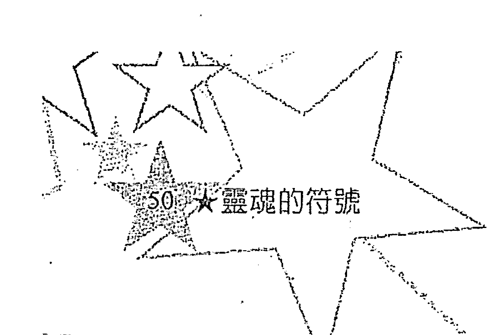

生命任務和生命課題是相互關聯的，而且不這樣看，便往往無法充分瞭解這兩者。然而，我們卻需要個別論述如何從出生星盤來看生命任務和課題。月交點是瞭解這兩者的關鍵，也是瞭解兩者之間關係的工具。且讓我們從解讀生命任務和課題顯示了哪些訊息開始吧。

### 月交點

月交點傳達了一項關於生命任務的訊息，也就是靈魂會安排哪些東西用在生命任務上，而又有哪些會和生命任務抵觸。生命任務將善用北交點星座的特質，並和北交點宮位指派的生命場域產生關聯。會橫生阻礙的條件，則為南交點宮位代表的生命場域、南交點星座，加上北交點的挑戰式相位等諸多項目呈現出來的特質。

月交點即為月球運行軌道與黃道的兩個交點，由於和月亮的關聯性，月交點與情緒、培養關係有關。月交點的推運❶，影響我們主要的人際關係，特別是家庭與愛情關係。這類行星推進通常會將新的重要關係帶進我們的生活，或移除不再適用於我們靈魂## 星盤主題

因為我們的主要人際關係與我們的生命課題、計劃息息相關，所以靈魂的課題、生命任務、人際關係之間存在著聯繫，也就不足為奇了，而這三者都可從月交點看出來。幾乎每道課題、每項生命任務，都至少會將另一關係人安排在其中。舉例來說，履行宿債幾乎總是在一段關係當中完成。個人的基本課題（下一節的主題）也需要他人來映襯。他人因為示範了新的行為，讓我們更明白自己的負面模式。即便要修習的課題是關於獨處，也是經由與獨處對照的交誼來修習。我們的生命課題與生命任務注定會和他人交纏，而他們將在我們的人生戲曲中扮演老師、配角，甚至是這齣戲的共同創作者。

星盤主題、月交點，和土星，描繪出生命任務和生命課題。出生星盤的主要星座代表了靈魂計劃的主題，這些星座的發展可讓我們看出主題為何，而主題又揭示了我們的生命課題和可能用在生命任務的天賦。在過去幾世重複選用的星座，其發展將越完美，在表現上也就越趨正面。花在某星座的時間越久，擁有的該星座能量就越調和，也越能熟練的展現該星座的特質。

> 「我們的天賦便是靈魂發展最完善星座的正面特質，而我們的生命課題和挑戰難題便是最需要發展星座所缺乏的負面特質。」這意味著，如果許多行星都落在一高度發展的星座上，那麼在該星座的才能就會特別突出。無疑地，這些天賦將被用在生命任務與用來克服難關。另一方面，如果有許多行星都落在缺乏發展的星座上，那就會不斷遭遇到關於這個星座的課題。

一個星座會表現出什麼樣子，端賴好幾個前世而不是僅僅一世的經驗而定。壓力重重的環境比較容易導致星盤主題表現出星座的負面特質，或者，至少是較缺乏發展星座的負面。年齡也是另一個因素：年紀越小越無法巧妙地將星盤主題表現出來。

我們很難斷定星盤裡的星座哪些是有問題、而哪些不是，主要線索可從土星、北交點所在宮位與落在哪些星座，以及落在第八與第十二宮始點的星座得知。這些星座和宮位都代表自前幾世發展出可能有問題的心理傾向。當然，你可以從當事人身上看出星盤主題。然而，請記住，沒有土星循環的人（這種情形會發生在二十八至二十九歲之間），可能只是出於不成熟而在某星座方面有負面表現。除了這點之外，也必須以直覺來指引你解讀星盤。

觀察上昇星座與個人行星（太陽、月亮、水星、金星、火星）：哪個宮位聚集了最多行星、哪些行星落在基本點（與上昇星座、子午線（Midheaven）、下降星座或天底（Nadir）的交會處），可以看出星盤主題。幾乎每個星盤都至少有一個重要主題，也有許多星盤擁有好幾個主題，只有少數人的出生星盤沒有重要主題卻有許多次要主題。

#### S2 大靈魂的符號

我們的天賦便是靈魂發展最完善星座的正面特質，而我們的生命課題和挑戰難題便是最需要發展星座所缺乏的負面特質。」

### 生命的任務

每個人的一生中都有一項任務必須完成。這個任務可能會、也可能不會和職業有關，不過通常是相關的。生命任務有許多種，可以是簡單如烹調食物、照顧自己，或複雜如發現DNA等，所有生命任務都同等重要。不論生命任務為何，它的價值在於讓靈魂的演化更上一層樓。雖然在轉世之前，我們無法清清楚楚的說出生命任務為何，但是可以用一種概略的方式，即透過主題與北交點，從星盤發現生命任務。

這些條件指出了生命任務，卻不曾精確詳實的揭示它，因為生命任務還未被創造出來！只有偶爾，當生命任務是延續前世任務而來時，才會在轉世之前確實安排。我們活著不是為了要實踐事先安排好的計劃，而是要透過自己的選擇來創造個人生命，並藉由這些選擇來學習。

我們假定北交點位於第三宮，並以此為例；從這個位置，我們可以知道，生命任務將是關於學習或教導，或者兩者兼具。當事人的興趣可以由星盤主題和與北交點有關的星座和宮位讀出來。舉例來說，某個北交點在第三宮、五顆行星落在第八宮的人，可能會研究關於心理學、神秘學、性或財物管理方面的學問，最後去教導別人這些事務。如果第八宮的行星有一顆是北交點星座的守護星，或與北交點形成相位，最有可能是這種情況。

#### 北交點所在的宮位與星座

北交點宮位與相關宮位，述說了將與生命任務產生關聯的生命場域。北交點星座和相關星座指出生命任務所需的特質，而這些特質也將因為生命任務得到更多淬煉。這些特質會在實現生命任務時被加以使用，也因此有了更進一步的發展。雖然如此，在某種程度上，宮位和星座位置可相互交換看待（也就是說，北交點位於第一宮和北交點落在牡羊座是很類似的，又比如，北交點位於第二宮也與北交點落在金牛座相似，以此類推）。在描述交點時，請將這件事銘記於心。

#### 北交點落在第一宮或牡羊座

這個位置指出了獨立進取的行動，對於生命任務而言相當重要。北交點落在第一宮的人必須發展獨立、主動、有個體性與領導技巧，以完成他們的生命任務。這些人的生命任務通常會要求他們要有勇氣與進取精神，還可能涉及開拓或發現。發展自我、創造出強烈的本體，對於去除前世的依賴習性是很重要的。他們要學習順從自己的驅策力與衝動，並能主宰自我的命運。他們需要自由，喜愛追求個人的喜好。如果不能確實做到進取和自我發展、仍舊依賴他人，他們將發現自己處於需要更獨立、進取的情境。

#### 北交點落在第二宮或金牛座

北交點在這個位置的人，要發展本體與看重自我的意識，他們需要意識到，自己看重的、想要的是什麼，並且創造或建立某種可以反映對他們而言很重要的東西。這些當事人需要建立某種有實際價值的東西，而且要憑個人的才能來贏得。在經濟上能自給自足非常重要。這個位置指出了發展或淬煉一項才能的需求。生命任務可能有關發展、或利用某技巧或才能，是不是藝術的才能，則要看星盤的其餘部分而定。關於這個位置，重點在於自我發展、自給自足與自我信賴，就如同北交點位於第一宮或牡羊座，不是要加強當事人的資源，就是要更能使用已發展的資源，以產生某種東西或價值。

#### 北交點落在第三宮或雙子座

北交點在這個位置的人需要學習分析並有條理地思考。虛心接納事實並投以關注，對於消弭前世的偏見和盲目信仰是很重要的。他們也需要走出「象牙塔」並學著生活在社會群體裡。在這一世，他們要學習傾聽，成為追尋者和哲學家，以傳達他們累世的智慧。他們的挑戰是將心中所領會的事物轉化為具體的說法，讓別人也能夠瞭解。當事人的生命任務可能是有關累積知識，或以教授、寫作或演講的方式來傳授知識。需要學習抑或作育英才，則要看個人的發展程度和智識資源的多寡。無論如何，生命任務將會用到當事人的理智力量與能力，並在這些方面加以發展，以進行傳達溝通的任務。

#### 北交點落在第四宮或巨蟹座

北交點在這個位置的人，要開拓並發展個人的生活領域：住家、家庭、感情以及照顧別人。當事人在前幾世為了工作或達到目標，忽略了居家與家庭，這種交點位置的安排，是希望能藉著將心力放在個人領域來改善上述情形。這一世的生命任務會是照顧別人、也接受他人照顧。他們要學習教育、孕育並支持他人，而且還要更能知覺到感情的存在——自己的感情和他人的。他們要學會身為脆弱敏感的人是怎麼一回事，並且要學著將感覺表達出來，而不是像過去幾世一樣慣於控制情勢。如果繼續忽略個人領域，這些當事人可能會發現個人的生活和工作陷入對抗狀態，直到他們能平衡為止。這些人的生命任務可能透過私人、情感的生活來發展個人領域，還可能與近親裡的某個人有關，也可能從事和心靈工作、或與情感或心理有關的工作。

#### 北交點落在第五宮或獅子座

具有這種配置位置的人，在前幾世因相信智識的客觀性和科學的方法，而扼殺了自身的樂趣、自發性與自我表達。他們將時間花在追求智識上，以致於和生活的樂趣與活力絕緣。如今他們需要依循自己的心，看重心靈更甚於智識，學習個人情愛、而不是如過去世般泛愛天下。他們也需要發展個體，追求想要的東西，而不是將心力用在他人的夢想或群體成果上、如同在前幾世那樣。他們曾經是追隨他人領導並支持那些人的理想目標的人，而這一世的生命任務將著重在發展自我、創造、娛樂、遊戲或談戀愛，這對生命而言是很重要的。

#### 北交點落在第六宮或處女座

具有這種配置位置的人有幾世都待在修道院、監獄或收容所，與世隔絕；他們迷失在異象、藥物、冥想、夢想、創作，或依賴和無助之中。從這些經歷當中他們發展出憐憫心、想像力和心靈敏感度。這一世他們需要發展實際的技巧與能力，用來處理日常職責。他們需要學習活在這個世上，得接納常規和擔起世俗的責任。他們要克服的事，便是在這個世界找到能務實地應用他們的憐憫心與敏感度來為他人服務的方法。第六宮和處女座與透過服務他人來自我發展有關。北交點配置在此指出了生命任務是關於服務，可能包括了卑微的服務工作。因為第六宮和處女座也掌管健康和飲食，另一可能便是從事醫療工作，特別是有關身體治療的工作。也可能是指需要分析、注重細節、有條理，或關於工藝的生命任務。

#### 北交點落在第七宮或天秤座

北交點配置於此的人，需要善用前幾世發展的信任、勇氣、自信與領導技巧，來鼓勵、支持他人，並給予他人力量，在人群中創造出和諧與和平。生命任務可能涉及協調、諮詢、仲裁以及與美有關的事物。當事人可能會幫助他人奮戰，或為和平而努力，或在這世上創造出更多美的事物，而不像前幾世那樣，有如戰士般的為自己奮鬥。這一世，他們不再將心力放在自己或自身的需求上，而是全心幫助他人。他們需要更能意識到他人的需求，並學習合作與分享。在其他轉世階段，他們開拓自身的力量並讓自己具有自我發展的能力。如今，他們在學習「給予他人」的力量。他們要學會變得更無私，要給予他人力量，而不是給自己力量，在實行的當中，也吸引到他們一向渴望的愛與受人關注。生命會為他們帶來與他人建立關係的機會。這便是他們在這一世發展自我的方法。這種配置位置指出：在他們成長過程中，與他人的關係扮演了最重要的角色。生命任務也許會透過與他人建立的關係或與某人產生愛侶關係來完成。

#### 北交點落在第八宮或天蠍座

北交點配置位置在此的人，從看重物質轉為看重精神，從獨掌權力轉為分享權力，從著重自我發展轉為著重夥伴關係。在這一世，他們不打算只為自己累積資源，而是分享他們的財富，藉由與他人共同合作來增加他們的安全感。他們此生任務是為了支援他人、幫助別人建立某些事物及實現夢想。他們可以依靠自己的才能與他人的資源結合而致富，而不是以單打獨鬥的方式。職業取向可能是利用他們特別傑出的洞察力和才能，將事情查個水落石出，也可能與心理學、神秘學、研究或偵探工作有關。也有可能是銀行業或投資保險。這些都是他們與他人共同合作來增加財力的方法。

此外，當事人的生命任務也可能與從事成長、性、治療、改變、危機處理、改革、死亡或轉化的工作有關。危機、緊急事件和死亡的衝擊，將帶來個人成長的可能性，情況越是惡劣他們的表現就越好。這種配置位置也需要透過與人建立關係來成長，特別是親密、性愛或任何分享資源的關係。

#### 北交點落在第九宮或人馬座

具有這種配置位置的人，需要學習跳脫邏輯性，要信任自己的直覺。他們過去傾向從書本或別人身上尋求答案，然而，在這一世，他們需要學習向內在探求答案。他們要學習信任自己，找到屬於自我的真理並說出來。他們要學習的東西，是通達更高的真理而不是真相。這是獻身心靈探求的一世，他們的生命任務可能是透過神職、法律、寫作、演說、出版、讀心術（psychic reading）或通靈，將他們發現的真相傳達給他人。許多具有這種配置位置的人，會感到有種使命感，他們這一世是要給予啟發、希望、信仰和心靈的展望。他們能看到偉大的遠景，而且有一股力量驅策他們和別人分享。撥出時間走向大自然將令他們煥然一新，大自然能使他們的心靈平靜下來，開啟更高的靈性。異國旅行也是他們拓展自我、開放知覺、發展對生命的瞭解的另一種方法。

#### 北交點落在第十宮或魔羯座

這種配置位置指出有需要投入這個世界和職場生涯。具有這種配置位置的人，需要學習設定目標並致力完成。他們在學習為自己的生活負起責任，而不是如前世般仰賴他人的照顧和認同。這一世他們要著重的是，透過工作將心力放在自給自足與自我發展上。生命任務將增進他們管理、引導並善用過去幾世發展出來的敏感度及協調能力。在這一世，他們必須成為負責全局的人，而在過去，他們傾向以自己的情緒來操控別人，如今他們在學習控制並管理情勢而不是人們。他們也要以理智的思考來平衡情緒。所從事的職業可能是生命任務的重心，而且很有可能「工作」正是他們的生命任務。

#### 北交點落在第十一宮或水瓶座

具有這種配置位置的人，需要把博愛仁慈看得比自身的慾望和衝動還重要。他們在前幾世累積了創作才能、領導技巧、堅強意志，還有熱情與決心，這一世他們需要利用這些特質，促進眾人奮鬥的目標或大眾的福祉。他們的個人意志將需要置於群體之下，或被群體利用來為眾人謀福利。他們要學習和其他人合作，以展現夢想或群體的理想。生命任務可能與某種主義、某群體的努力、新的想法、科學、工藝或電腦有關。他們可能要善用並更進一步發展理性和客觀性，他們必須貢獻給這世界的天賦，是他們的理想主義、獨創力、發明能力、新想法、對未來的看法和前衛的觀點。

#### 北交點落在第十二宮或雙魚座

具有這種配置位置的人，要發展他們的心靈意識和理解能力。他們要追求心靈的真理，要做到這點，通常需要離群索居。他們的追尋，可使他們成為心靈治療師、心靈導師、心理醫師、通靈人、藝術家、音樂家、修士或修女。他們的生命任務可能與心理、夢想、冥想或戒癮的工作有關。另一個可能便是，從事治療精神疾病或在醫院／社福機構工作，或是在其他方面服務人群。他們此生要將心靈的層面帶入日常生活中，他們的天賦是想像力、創造力、洞察力、直覺、靈感與心靈領會的能力。他們要學習去關照更宏觀的世界，相信有個更高層的宗旨就存在生活課題中。這樣將可平衡他們前世凡事擔心、浪費在細節的傾向，他們也要學習透過直覺來得到答案、而非他們在前世以理智分析來取得答案。當北交點落在這個位置，生命任務有時候會與清償宿債有關。

當北交點位於下列位置，可運用並被加強的特質概述如下：

#### 北交點落在牡羊座

具有直覺、果斷、獨立、領導能力、個體的、自力更生、自給自足、自主、勇氣等特質。

#### 北交點落在金牛座

具有努力不懈、耐性、忠誠、自給自足、足智多謀、實際等特質，對於財物和生意有極強的敏銳度，並可從事藝術相關工作。

#### 北交點落在雙子座

具有才智、溝通與寫作的能力，善於邏輯分析、熱愛學習。

#### 北交點落在巨蟹座

具有敏感、憐憫心、同理心、直覺、善良、養育能力等特質。

#### 北交點落在獅子座

有領導才能、意志力、自信、有趣、創造力、自我表達的能力、個人特色、管理技巧等特質。

#### 北交點落在處女座

有獻身服務、識別能力、實際、注重細節、有效率、組織能力、分析能力等特質。

#### 北交點落在天秤座

有無私公平、與人分享、調停能力、圓滑、建立一對一關係的技巧、能意識人們的需要、對於美與藝術的鑑賞能力等特質。

#### 北交點落在天蠍座

有自我轉化的能力、有理財頭腦、能與人親密並分享資源、自律、能洞悉別人的心思、內在力量、熱情、不達目的決不罷休、堅強的意志力、能夠處理危機等特質。

#### 北交點落在人馬座

有領悟能力、有信仰、有智慧、有直覺力及遠見。

#### 北交點落在魔羯座

有自律、有野心、努力工作、有責任感、可靠、自給自足、實際、自動自發、有領導才能。

#### 北交點落在水瓶座

有創新能力、有發明的能力、獨創性、利他主義、人道主義、能夠容忍與合作、客觀等特質。

#### 北交點落在雙魚座

有獻身服務、直覺、想像力、創造力、富同情心、理想主義、心靈的意識能力與領會等特質。

上列特質會用來完成生命任務。這些特質可能也會用在其他領域，但對於生命任務尤其重要。一般而言，北交點星座的特質和最發達星座或星盤裡的星座的特質，都會被用在生命任務上。

### 生命課題

正如同生命任務可以在星盤上看出來，生命課題也是如此。有三種功課促成了生命課題。

- 一、與宿債有關的課題（如果有宿債的話）；
- 二、之於人類演化而有其必要的課題，
- 三、需要用來消弭前世形成負面模式的課題。

我們在第一章看到如何從出生星盤讀出宿債。在第三章，我們將看到每個星座描述出人類演進的基本課題。而在這一章，我們要看看土星和南交點如何說出第三種課題，也就是消弭來自前世、根深柢固的負面行為模式的課題。請記住，這三種課題都會促成一個主要課題，而該課題將會被視為生命課題或生命中所要面對的挑戰。每次的轉世都有一道包含這三種課題的生命功課。

我們可以從分析南交點、土星和星盤主題，來讀出生命課題。這些星盤條件描述了所要面對的一項挑戰，或者較為罕見的兩、三項挑戰。如果要面對一項以上的挑戰，那麼就要歸咎於同樣的前世經驗。

關係緊張的相位 (stressful aspects)，特別是四分相，是另一種有助於確認生命課程的資訊來源。這些相位資訊十分重要，因為它們往往指陳屬於生命所要面對挑戰的內在衝突。彼此形成四分相的行星，有襯托出對方的作用，也逼使蘊含的問題顯露出來、無從逃避。這種相位（特別是外行星與個人行星之間形成的相位）揭露的問題，往往與土星、南交點和星盤主題述說的問題是一樣的。

土星和南交點都述說了前世的負面模式，通常也彼此相關，這些模式可能會妨礙生命任務。土星指出了來自前世、需要克服的恐懼或問題。而南交點則陳述了發展自前世、會干擾成長或完成生命任務的特質或傾向。

當我們解讀南交點、土星、或任何其他星盤條件，都必須將該條件所在的星座與宮位、形成的相位和相位落在哪個宮位和星座，加上掌管的宮位，來綜合解讀。大體而言，土星和南交點落在哪個星座，便代表在該星座方面產生了問題。然而，哪些是有問題的特質，而問題又有多嚴重，會因靈魂年齡和其他影響因素而有所不同。

雖然土星的星座和南交點的星座，都可能帶來問題，但會以不同方式呈現，也各自具有不同理由而成爲問題。南交點的星座形成原因，通常是我們已經歷過太多次的星座，正當該星座在發展其天賦的同時，一些負面表現也連帶深植於其中，可能還使我們忽略了這個星座的相對星座（或其他星座）。即便如此，有些較古老的靈魂，還是可以做到擁有南交點星座的天賦、卻沒有該星座的負面傾向。同樣情形也可以套用於北交點星座：該星座將會如何表現，有賴過去幾世在這個星座的經歷。北交點星座可能是關於有待發展的地方，而在較古老靈魂身上，卻代表著天賦。

無論當事人發展到什麼程度，我們必須學著正面地表現出南交點星座所代表的特性，並將這些特性和北交點星座的正面特性整合在一起。（欲知道更詳細的解說，請參考崔西・馬克斯 (Tracy Marks) 的著作《自我發現之占星學》(The Astrology of Self-Discovery)，其中的〈月亮的交點〉有如何整合相關星座和宮位的論述。）

南交點的宮位，就像它的星座一樣，代表我們曾過度著重在某個生活領域、因而損及其他領域，致使我們今世有必要著重於建立北交點的生活領域。再一次地，當事人的發展和經驗，決定了該生活領域的問題有多嚴重。對所有的人來說，南交點帶來的訊息，就是要著重落在北交點的宮位，以及將南交點代表的生活領域與北交點的事務做一番整合。

土星的宮位或星座，代表需要治療的恐懼或學習的課題，或者兩者皆是。星盤的其他部分，將會提供該做何種解釋的線索。舉例來說，某個人的土星位於第五宮或獅子座，可能在自我表達上會有困難，由於在前一世，他因為自我表達而遭受暴力對待或死亡。這一世他必須克服這種恐懼。當事人的星盤其他部分，可能會有強烈的火象條件來幫助他。而另一個土星位於第五宮或獅子座的人，則可能前世曾經濫用自我表達的能力，若是這種情形，土星便代表著關於自我表達的課題。這位當事人星盤的其他部分，將會反映出水象而不是火象特質，以幫助他發展敏感度和同情心。

總而言之，土星的宮位可視為：a、代表我們將遇到的宿業因果或生命課題。為了幫助我們學習足以平衡過去行為的課題；或只是為了去學習某些東西，我們可能會在某領域接受測試。凡是我們需要學習的，都會透過該生活領域傳送而來。因此，我們在這領域會被要求擔負更多的責任。為了想要快速進化，較年長的靈魂也可能會主動選擇這些挑戰。

## 68°★靈魂的符號

b、可能代表因為過去一世的負面經驗，對某生命領域產生的恐懼。生命會為我們帶來治療所需的東西；對於克服恐懼，我們做了任何努力，生命也會給我們回報。試著努力克服這一領域的恐懼，是非常重要的事。

c、代表與職業有關的領域，也可能與生命任務有關；如果兩者有關聯的話。

土星的星座可視為：

a、代表曾在前世產生的問題的弱點或負面特性，而這一世也可能同樣會產生問題（比如說，土星落在獅子座可能代表沒有善用個人意志。土星落在處女座則代表吹毛求疵的態度）。負面的特性可能很輕微也可能很極端，這些負面特性可能會產生更深刻的試煉或因應課程所需。造成難以解讀的原因，在於土星星座諸多負面表現的任何一項，都有可能是弱點或負面特質。

b、可能代表來自前世不好的經驗而產生的恐懼以及由此發展出來的負面特質，或是未能順利發展正面特質、因而造成的恐懼。不好的經驗可能與土星星座有關也可能無關，但都會影響土星星座的表現（比如說，土星在牡羊座可能代表無法採取行動，這是前世因為行動果斷導致不好的結果。土星在雙魚座可能表示前世曾患精神疾病，因而不敢讓心靈自由馳騁）。

c、代表與職業生涯有關的特質，也可能是與生命任務有關的特質，如果兩者有關係的話。

我們必須將上述種種可能謹記於心，並用來檢視土星所在的星座與宮位。唯一可判定土星在星盤中扮演何種角色的方法，就是檢驗星盤裡的其他條件並運用你的直覺。

### 土星和南交點所在的星座

土星或南交點所在的星座位置，述說了前世的負面特點，這些特點可能會阻礙生命任務。下列分類與上述三種可能相互呼應。

#### 土星落在牡羊座

- 弱點：濫用個人意志，跋扈、不合作、自我中心、自私、沒耐性、易衝動。
- 恐懼的事物：害怕自主，缺乏勇氣。
- 職業/生命任務：從事與科學、發明、運動、開路先鋒或軍事有關的工作。

#### 土星落在金牛座

- 弱點：濫用個人資源，浪費、貪婪、吝嗇、物質主義、享樂主義、頑固、胸襟狹小。
- 恐懼的事物：害怕貧窮、聚藏錢財。
- 職業/生命任務：從事與商業、銀行業務、農業、建築或藝術有關的工作。

#### 土星落在雙子座

- 弱點：濫用個人溝通與影響的力量。
- 恐懼的事物：害怕表現自我、覺得智慧不如人、害羞。
- 職業/生命任務：從事與溝通、運輸、寫作或教學有關的工作。

#### 土星落在巨蟹座

- 弱點：缺乏安全感、過於敏感、過度依賴、自我保護、性格孤僻。
- 恐懼的事物：害怕被丟下不管、害怕親密關係、害怕表現自己的情感或情感需求、不願付出愛也不接受愛。
- 職業/生命任務：從事與情感、居家、房地產、食物、孩童、女人或照料他人有關的工作。

#### 土星落在獅子座

- 弱點：沒有將自己的意志或權力用在好的地方，專制、武斷、嚴苛。
- 恐懼的事物：缺乏自信與自尊，害怕表達自我（包括害怕表達自己的創造力），害怕付出愛。
- 職業/生命任務：從事與娛樂、投機事業、孩童、教學或創作有關的工作。

#### 土星落在處女座

- 弱點：吹毛求疵或凡事解析過頭，杞人憂天、自我貶低、屈從性壓抑。
- 恐懼的事物：害怕生病、不敢自我肯定、意志消沉、強迫性的行為、自卑感。
- 職業/生命任務：從事與分析、服務、治療或飲食相關工作。

#### 土星落於天秤座

- 弱點：會為了與他人的關係而自我犧牲、依賴、缺乏個性。
- 恐懼的事物：害怕與他人之間的關係，害怕被拒絕、被傷害。
- 職業/生命任務：從事與諮詢、審判、美或藝術有關的工作。

#### 土星落在天蠍座

- 弱點：濫用個人力量、操控、把持、宗教狂熱、無情、不寬仁。
- 恐懼的事物：害怕親密關係、性愛方面缺乏安全感、缺乏信任。
- 職業/生命任務：從事與性、死亡、稅務、財務、研究、治療、危機處理、心理學或神秘學有關的工作。

#### 土星落在人馬座

- 弱點：偏執、武斷、熱心過頭、自以為是、盲目信仰。
- 恐懼的事物：害怕旅行或探索、缺乏信仰或可供指引的人生觀。
- 職業/生命任務：從事外交、異國旅遊、出版、信仰、法律、教學或哲學相關工作。

#### 土星落在魔羯座

- 弱點：濫用個人力量與影響力、出於貪婪與權力的動機而行動、專制、狂妄、嚴苛。
- 恐懼的事物：害怕失敗、缺乏野心、懼怕權威。
- 職業/生命任務：從事與生意、政府、管理、組織有關的工作。

#### 土星落在水瓶座

- 弱點：教條主義、不寬容、冷酷、遲鈍。
- 恐懼的事物：害怕參與、被疏離、寂寞或孤立。
- 職業/生命任務：從事與社會改革、投身人道主義的行動、科學、發明、技術、占星學、新的發想或與群體有關的工作。

#### 土星落在雙魚座

- 弱點：過度敏感、濫情、焦慮、近似偏執狂、過於神經質、心情變幻不定、沮喪、凡事否定。
- 恐懼的事物：對感情有恐懼、壓抑情感、對潛意識和超自然感到恐懼、害怕會喪失心智、缺乏信仰或精神方向。
- 職業/生命任務：從事與治療、精神健康、醫院、社會或教育事業機構、精神或靈性方面、創作或服務有關的工作。

#### 南交點落在牡羊座

自私自利、自我中心、缺乏意識到他人需要的知覺、缺乏合作精神、好辯、囂張、易衝動、沒耐心。

#### 南交點落在金牛座

耽於逸樂舒適、享樂、物質主義、貪婪或吝嗇、缺乏洞察力或心靈方面的見解、占有慾強、頑固、抗拒改變、對事情耿耿於懷。

#### 南交點落在雙子座

缺乏專注力或渙散、優柔寡斷、膚淺、缺乏眼光和慎密的做事方法、易於變動、不能貫徹到底。

#### 南交點落在巨蟹座

依賴、缺乏獨立、目標、沮喪、情緒化、沒有安全感。

#### 南交點落在獅子座

自吹自擂、自負、自利、喜歡操控他人、任性、獨斷，頑固、一頭熱、誇張。

#### 南交點落在處女座

凡事過度分析和吹毛求疵、好評判、工作至上、沉溺於工作與世俗事務、完美主義、過於著重細節、焦慮不安、憂心忡忡。

#### 南交點落在天秤座

委屈求全、優柔寡斷、缺乏獨立、過度妥協和抱怨。

#### 南交點落在天蠍座

為了他人而迷失自我、依賴、極端、製造危機與戲劇化。

#### 南交點落在人馬座

想法天馬行空而不切實際、沒有定性、沒有主見容易受人影響、小心眼、教條主義、自以為是。

#### 南交點落在魔羯座

受野心掌控、貪婪、追求權力、追求社會地位、壓抑情感、冷酷、苛刻、自私、支配慾強、盛氣凌人。

#### 南交點落在水瓶座

依賴他人、缺乏熱情與情感、漠然、不切實際的理想主義者。

#### 南交點落在雙魚座

逃避現實、沒有責任感、不切實際、過於敏感、消極、依賴、情緒化、不理性、迷惑、缺乏辨別力、容易成爲受害者。

### 土星所在的宮位和星座位置

當我們在解讀土星所在宮位和星座位置時，請務必瞭解，不是每個人的生命課題都來自前世的負面行爲。較年長的靈魂爲了成長，可能會選擇接受某種難題，而不是出於需要彌補過去的行爲或態度纔有此難題。我們同時要記住，任何已進行清償的宿業，有可能是快要結清了，所以只剩分量輕微的功課。因此，儘管最壞的情況一定會被提到，大多數人卻不見得都會經歷。最後，請務必寬心，並不是只有你纔會犯錯，我們每個人在努力著要進化之際，都犯過所有想像得到的錯誤。

土星所在的宮位和星座位置，也是生命任務和職業生涯的指針；如果生命任務和職業相同的話。不過，下列說明並未涵蓋這種情形的資訊。

#### 土星落在第一宮或牡羊座

這種配置位置指出對於自我表達或自我肯定的恐懼，這是出於前世因爲這種行爲而產生痛苦或傷害的經驗。這種恐懼會以在感情上沒有安全感、缺乏自信或勇氣、害羞、笨拙，以及無法自我肯定的形式表現出來。治療的方向要從「與他人廣結善緣」著手，因爲這能帶來自我肯定和獲得自信的機會。獨自一人的活動行爲，只會讓當事人更專注於自我、更加封閉。

這種配置位置也指出了前世可能有囂張跋扈的行爲，所以會以挫折、無法順利達成目標作爲平衡。當事人的意志被牽制，透過這些挫折，變得謙遜而且有同理心。

當土星與上升星座合相於第一宮，通常代表著困頓的一生，因而感到這個世界是不安全或不自由的。這種感覺讓人產生悲觀和失敗主義的態度，可能會成爲自驗預言，當事人必需努力克服負面想法、確信自己將會達成目標。

#### 土星落在第二宮或金牛座

具有這種配置位置的人，可能會害怕窮困、也會有怎麼樣都不夠的感覺，這是出於前世生活匱乏的經驗。當然，也可能是出於這一世出生在貧困家庭的緣故。每個人都曾經歷或將會經歷窮困。對於某些人來說，這種配置位置代表要在這一世處理這個問題。其他人則可能是要平衡前世聚財或物質主義的行為。兩種經歷——貪婪和貧窮——都可能形成「努力聚積財富」的行為、也帶來了「學習什麼才是真正有價值」的課題。具有這種配置位置的人，要學習再多的錢也買不到安全感和自尊，而這些都只能從內在得到。這些課題可能派定為先是坐擁財富、後來淪為一貧如洗，藉由經歷物質滿足的空虛或透過挫折和諸事不順的過程，來完成課題。

#### 土星落在第三宮或雙子座

這種配置位置可能象徵若干源自前世或出於今世的恐懼。當事人可能會不敢旅行，因為曾經在旅行途中發生交通意外或悲慘事件。他們可能害怕自我表達、對群眾發言或學習，這是因為曾經為了發言、閱讀、學習而受到責罰。這些恐懼可能會以口吃、害羞、學業成績不理想、或自認才能和智力欠佳的形式表現出來。

許多具有這種配置位置的人，為了要克服不如人的羞恥和自卑感，會以勤能補拙的方式來增長自己的智識和語言能力。一旦當事人克服了自己的障礙，許多人都會在學術上有傑出表現。他們會是優秀的老師，因為他們具有同情心也能瞭解學習的苦處。他們會將自己的弱點轉為優點，土星所帶來問題的情況，是很常見的。

這些人之中有人可能是前世濫用溝通的力量、或阻撓他人學習或發言，這些人將遭遇到用來彌補這種行為的課題。有時，彌補的動作是以限制當事人溝通的能力來完成，可能會以有言語或聽力上的問題、學習困難、甚至是心智低落的形式表現出來。

#### 土星落在第四宮或巨蟹座

這種土星配置位置通常代表需要注意與某個家人相處有困難，這是從前世結下的。消解這項宿業可能是生命難題中最重要的一部分。這段家人關係可能會充滿恐懼、也會因對方的冷酷和疏離引起累贅、負擔沉重的感覺。不過這個負擔卻是無可避免的。如果避掉了，那麼兩者會在相似的情況下再度碰面，直到接受負擔並完成該盡的責任。星盤出現的行星與星座會提供更多這段關係，以及誰會涉入這段關係的資料。

當這種配置位置沒有顯示出宿業關係時，便表示這是出於當事人所選擇的挑戰，通常會以雙親或當中有一人不太關心的形式表現出來。當事人的家庭生活可能是父母離婚或其中一人亡故、缺乏來自家庭的奧援或身染疾病，或只是缺乏溫暖和緊密的親情，使當事人在情感上受到傷害、覺得自己不被人愛。結果，他／她便會渴望所缺乏的保護以及情感的連結，卻又難以信任他人和敞開心胸。

在人格陶冶上選擇接受這樣的挑戰有很多理由，大多數是為了增長憐憫心和認知到家庭與正確教養孩子的重要性。當事人前世可能忽視或低估這方面的價值，或曾拋棄家庭，今世才選擇親身體驗這種感覺。

#### 土星落在第五宮和獅子座

這種配置位置指出對自我表達的恐懼。如同土星位於第一宮或牡羊座，會以缺乏自信、勇氣、自我肯定、能量與熱情的形式表現出來。這種恐懼可能源自過去有過抑制或壓迫的行為。當事人可能曾經濫用權力或自我表達，如今在這些事情上就會變得特別謹慎。

對於具有這種配置位置的人而言，這個世界是個嚴肅且預示不祥之兆的地方。他們發現自己難以輕鬆自在的享受人生。這些人通常是呆板、害羞或笨拙之輩。他們可能缺乏創造力，或無法完成創作。他們在凡事無法勝任、不被人愛的感覺中掙扎，而且不善表達情感，雖然他們渴望情感與讚譽。他們拒絕別人、也讓自己傷心，只落得更難以愛自己的下場。不過，這也是他們需要學習的事，他們必須瞭解自身的重要性與個人特質。

這種配置位置也指出一項虧欠一個孩子或所有孩子的宿債，並由此衍生出養育孩子的重擔、對他們的責任、或與孩子有關的工作。有時候產生的狀況是不願或無法生小孩；沒有孩子可能是出於宿業或是為了將能量集中在另一方向，而該方向會更符合生命任務的條件。

#### 土星落在第六宮和處女座

這種土星的配置位置指出從前世延續而來、擔憂疾病的恐懼，使當事人特別注意健康和飲食。有關健康的從業者出生星盤上，就很常見到這種配置圖。許多具有這種配置位置的人要學習將身、心合一。

這種配置位置往往也與健康欠佳有關，不是在精神便是身體出問題。我們可以從相關的星座與任何行星來辨認不足的領域。疾病或困頓可能與消弭宿債有關，這個宿債可能是、也可能不是健康方面的事。這些當事人也可以看做是自行選擇的挑戰。產生疾病或困頓的理由，並不能光就星盤來判定。疾病的嚴重程度可以從病情輕微到對生命造成威脅。推運會告訴我們疾病可能什麼時候開始，以及過程：可能是慢性疾病、也可能是病來如山倒。另一方面，這種配置位置也可能只是要教導飲食、衛生保健的方法和正確保養身體（這是生命的基本課題之一）的重要性。

對於具有這種配置位置的人，另一重要課題便是服務。許多土星落在第六宮或處女座的人，會發現自己身居卑屈的職位或從事卑微的工作，常會在工作上受到限制、阻礙、對工作不滿。他們可能會被困在不滿意的工作中，或被永無止盡的日常瑣事所擾，主要是要教他們學會謙遜與服務的價值，也要消弭對工作和日常瑣事的負面態度。他們需要讓生活更具組織性，並建立起常規，也需要學習即便是最世俗的工作，也當甘之如飴。

#### 土星落在第七宮和天秤座

具有這種配置位置的人，會因為前世生活放縱或孤單，因而對感情關係感到不安與格格不入。這類當事人渴望建立關係，卻又害怕受傷害，因而造成他們拒絕別人，或選擇讓他們感到安全的父母（比如說，程度不及他們或有問題的父母）。他們預期會受傷害、被他人拒絕，也因此讓事情走到這個地步。他們傾向建立受到限制的、沉重、令人失望或不愉快的關係。許多當事人會被嚴肅型的對象，或能給予安穩、信任和金錢，令他們感到安全的年長人士所吸引。

這些當事人會在戀愛中面對某些重要課題，並學習如何處理寂寞。從與「關係」的奮戰中，會令他們想要瞭解「人」與「關係」。他們會認真看待「關係」，甚至會加以研究、或成為這一方面的專家，有許多人成為諮商師或進行一對一的協助服務。他們也可能和年紀較大的人結婚，這樣的對象讓他們可以從容不迫的學習「關係」的課題。

這種配置位置也可能代表一種出於宿業的伴侶關係，或職業生涯裡有位具決定性的夥伴。另一方面，這種配置也可能是要讓當事人將能量集中於其他方面，因而讓他們在情感關係上有所阻礙或延遲。

#### 土星落在第八宮和天蠍座

具有這種配置位置的人通常會害怕親密關係，或難以和他人結合。他們也可能在一段關係裡，很難去付出或接受感情。這種障礙可能來自前世或這一世，在戀愛時遭到背叛或發生過其他不幸的事件。而問題的根源，可能出在虐待小孩、冷酷或缺乏親情的家庭。他們很想要與他人結為伴侶，卻又很怕釋放感情：諸如熱情、妒嫉或憤怒等情感。這些人不只在情感上害怕與人分享（他們甚至不知道該怎麼分享），連在性愛方面也是如此。這種配置位置也可能會出現性障礙，或是為了彌補自己的恐懼反而濫交。然而，他們的障礙更常以成為傷害感情的人的形式出現：諸如外遇、背叛。儘管有這些難題，當事人必須學著去信任他人、與他人分享感情。

還有一個可能是前世濫用掌控力、需要學習改正這種行為。具有這種配置位置的人有可能成為性虐待，或別種暴力形式、或情感傷害的受害者，這也許是為了消弭宿業。這樣的生命難題可能是要激發當事人學習更深奧的哲理、以及自身情緒的反應方式。「治療」和「向內在探索」之必要，可能是此生靈魂成長的一部分。

還有一種可能出現的難題，是與他人的錢財有關。他們可能會在取得離婚贍養費、繼承或稅金上遭遇困難。這也可能是宿業。最後一種可能，虧欠愛侶或生意夥伴的宿債，或是出於自願讓對方擁有債權。如果是這種情形，當事人可能會為了伴侶或夥伴負起財務重擔。

#### 土星落在第九宮和人馬座

具有這種配置位置的人，可能在前世受到來自宗教、法律、政府或教育等機構，或家庭成員的精神壓迫、武斷壓制或限制個人自由。他們也可能在這一世經歷這些事情。結果，他們會喪失信仰，或宣稱什麼都不信。許多人會從幼年就接受的信仰中醒悟，發現所信奉的宗教無法回答他們對生命的疑問，或覺得過於嚴苛而不實用。這些當事人需要去發掘屬於自己的真理、將能量用在編纂一套對他們有用的信仰系統上。他們可能研讀法律、宗教、政務管理或哲學，致力發現他們所追尋的意義。一旦著手去做了，通常會成為教導他們研究主題的教師。

這種配置位置也可能是指當事人需要改掉偏見態度、教條主義或高壓的行為。方法之一便是讓當事人親身經歷他／她對別人做過的同樣事跡，或者可能遭到精神導師或所信奉宗教的背叛、或對其感到失望。更正面的方法則是讓當事人置身於另一種文化和信仰的影響下，希望能以此開拓他／她對事物的理解，即便這樣做極具挑戰性，因爲這將動搖當事人所珍視的信仰。

#### 土星落在第十宮和魔羯座

這種配置位置指出了對於成功、自身擁有的權力或公然受到羞辱的恐懼，這是從前世自較高的社會階層貶落發展而來。當事人前世可能曾經濫用社會賦予他們的權力，今世必須戒慎不再重犯同樣錯誤。另一方面，這種配置會導致對於失敗、強烈的野心、成爲重要人物的需求、因不滿足的感覺感到恐懼，這可能是緣自於有位吹毛求疵、嚴苛又冷酷的父親或母親。要獲得成功，當事人得克服自我懷疑及由此產生的惰性。他們要放聰明些，不可使用不道德的手段去獲取權力，也不可濫用得到的權力，否則會遭到罷黜或失敗。

具有這種土星位置的人，很可能必須非常努力才能得到，並維持他們的社會地位，因爲在職業生涯裡，總是會有碰到阻礙、不順、令人失望的事情或缺乏機會的情形。然而，憑著戒慎小心、紀律、努力不倦與謙遜，仍可開創出一番大事業。當事人要將任何對權力的貪欲轉化爲從事更高遠的社會使命的動力，這才是獲致他／她想要的認可和尊敬的正確之道。

#### 土星落在第十一宮和水瓶座

具有這種配置位置的人，前世可能曾被逐出族群或團體、或被同儕排擠。這種經歷留下了感情的傷痕，使他們今世難以結交朋友或有歸屬感。他們在年輕時需要特別的鼓勵與瞭解，以建立信心並幫助他們消除害羞和社會疏離感。這種配置位置也可能是指在這一世會被其他人擯棄、並留下情感的傷痕，如果這種事發生在當事人非常年輕的時候，便會如此。

因為害怕被拒絕、厭惡群體，這些當事人可能會被鄉野或隱遁的生活方式所吸引，這種生活方式讓他們得以遠離人們，並避開被社會情勢激起對他們自尊的挑戰。為了掩飾沒有安全感，他們可能會假裝自命不凡，或告訴自己，因為自己很特別，所以才會和群體格格不入。

以更具建設性的方法善用此配置，便是融入團體或群體目標，如此可讓當事人克服自卑感或疏離感。只有面對恐懼，才能克服恐懼，而害怕面對恐懼，正是一種很容易讓人想逃避的恐懼。這些當事人需要廣結善緣、在群體中表現自我，並且擔起領導責任、以造福眾人。

另一種可能，則是朋友將會是他們成長的催化劑或是途徑。透過朋友，他們會以某種方式面臨業報因果。他們可能會因為一段友誼而被要求擔當責任，或者友誼可能會成為負擔或難題。具有這種配置位置的人，他們在群體中認識的人或交往的朋友，可能是前世就認識的人。這個位置也可能指陳會和朋友合作。

#### 土星落在第十二宮和雙魚座

許多具有這種土星位置的人，會不由自主的想去為那些被監禁的人服務。這可能是為了平息他們前世曾被監禁、依賴他人、能力不足、患有精神疾病或感到無助等經歷的恐懼。他們服務於這些領域，可能也是一種回報當他們需要依靠且感到無助時得到社會救助的方式。具有這種配置位置的人，特別是過去曾患有精神疾病者，會害怕被自己的情感所吞噬或喪失個人的主體性。潛伏於他們意識心靈表面下的，正是他們所恐懼的東西。他們藉由對社會盡責、為發生狀況的人（偏偏他們又最怕自己也會發生如此狀況）服務，竭力避免產生上述的種種可能。他們想要在這些領域服務的願望，也是出自前世曾被監禁、患精神疾病或無能為力的狀況下發展出來的憐憫心所致。

另一個可能便是宿債。許多具有這種配置的人，會有種深深的罪惡感和對他人或社會負有責任的感覺，這可能是基於宿債所致。他們可能曾經利用過精神病患、患者、或其他軟弱無助的人來得到好處。清償這種宿債的常見方式，便是透過服務，特別是在心理學或心靈方面的服務。有些人則以苦修來清償，比如成為治療師或修士、修女。具有這種配置位置的人可能需要透過抑制能力的境況下，來體驗自身的無助和軟弱，才能在社會當中發揮長才。孤立、依賴、入院治療、因精神病而住院，還有入獄，都是這項課題最極端的學習方式。透過這些體驗，我們學會了憐憫。我們也學會了有必要讓自身的意願順服於更高境界的意願。這些經歷是要用來瓦解我們的自我，幫助我們瞭解個人之外的大我。獻身服務、願意去探索內在能力到達何處、體驗與群體共屬一體，正是這些當事人被要求學習的事。

### 南交點所在的宮位與星座

#### 南交點落在第一宮或牡羊座

南交點落在第一宮或牡羊座，指出前世的生活著重在自我發展。由此產生的結果，便是具有這種配置位置的人，可能在追求自我目標上比處理人際關係還要老練。他們在很多世都是戰士、運動家、冒險家、開路先鋒，這些身份都有賴敏銳的直覺、領導力和獨立行動。這一世他們要學習與他人建立關係、合作與分享。在過去的輪迴，他們習於以自己的成就來得到愛，而不是透過關心別人的需求來獲得。今世他們必須學習為別人的需求而付出。要做到這一點，他們必須更能感覺到別人的需求，並學著與他人溝通。他們也要學習成為團隊的一員。因為他們害怕別人會讓他們喪失本體或阻礙個人風格，他們有自我保護和防禦的傾向。

在這一世裡，他們將被防止過於獨立，還要學習與他人建立關係。如果追求自我發展是為了私我，就會被橫加阻撓。他們在前幾世發展出來的獨立、強大的力量與自信，要用在促進夥伴關係或他人的福祉而非自身的目標。

#### 南交點落在第二宮或金牛座

具有這種配置位置的人，前幾世是農夫、地主、銀行家和營造師，他們以實際而確實的方式來貢獻社會。在過去的輪迴轉世，財富、享樂與安逸是他們的目標。今世他們需要增進自律，如此將能平衡自我放縱與過度追求享樂的傾向。他們這一世不可汲汲於獲取物質或只顧自我發展，而要將他們的物質資源分享出來、將能量用在瞭解與加強夥伴關係上。他們要學習分享和將自己的資源與他人做結合。這一世，他們需要學習與夥伴通力合作，而不是獨力完成。他們支撐自己的力量在今世要用來支撐別人，並且要將自己解放，以追求更高的意義與自覺。他們要克服的難題之一便是「放下」，他們此生就是要來學習這件事，以及樂於接受改變與改變可能帶來的自我轉化。拒絕改變是他們生命任務的一大絆腳石，頑固、墨守成規、謝絕他人的幫助，都是需要克服的事。他們天生就與物質世界十分契合，不過現在需要調整自己，涉入生活更細緻微妙的一面，也就是情感、心靈與心理的領域。

#### 南交點落在第三宮或雙子座

具有這種配置位置的人曾經有很多世是教師、作家、演說家或記者。他們花了很多世的時間研究人們的觀點並且收集資料、卻不問這些資料有什麼目的也不管意義為何。現在，是他們形成自己的意見、表達自身對事情的看法的時候。這一世是為了要增進他們的直覺、探及內心深處的轉世。他們從以事實來做結論進步到以心神領會來論事。在過去，過度且凡事講求邏輯的理性，以及沉溺於日常生活細節，對他們的直覺及與心靈造成阻礙。具有這種配置位置的人必須學習應用他們敏捷的心智來配成一帖哲理，並為他們知曉的諸多事情理出架構。除非將心靈活動轉向凡事用心理解並衍生一套哲學，否則他們是不會從中得到滿足。他們需要集中心思於生命更深沉的一面。

#### 南交點落在第四宮或巨蟹座

具有這種配置位置的人曾經有很多世是育幼員、家務總管，而且是待在以家庭為中心的環境裡。為了安全感和援助，他們要依賴他人。在那幾世裡，他們對於他人的認同，發展出他們在情感上的敏感性和建立關係的技巧。今世他們需要涉入外在世界，處理自己的需求，而不是繼續當照料者或被他人所照顧。這個配置位置指出了有必要將心思從個人領域轉向專業領域，並貢獻個人的敏感度與憐憫心於更宏偉的領域。這些當事人會不由自主的想走向居家生活與家庭，因為這兩者在他們眼中不像職場般那麼具威脅性。然而，除非他們能接受事業在生命裡的重要性，否則沒有辦法得到滿足。透過事業的助力，可讓他們較容易得到滿足，而且也能在追求滿足的當中，真正獲得滿足。

#### 南交點落在第五宮或獅子座

具有這種配置位置的人在前幾世裡，是藝術家、創作者、演員、領導者以及國王和皇后。在這幾個轉世裡，他們發展了才能和個體性，並以此來獲得別人的關注和尊敬。今世，他們要除去自認為很特別的想法，並將才能用在為大眾謀福利上。他們需要學習與他人合作而不是如前幾世般掌管眾人或單打獨鬥。他們還需要變得更客觀，好平衡過去易受感動和易怒的個性，以及劇烈的處事手段。在這一世裡，他們要善用自己的熱情與發展良好的意志，來幫助完成他人的夢想或眾人的目標。由於這個配置位置可能是指在過去幾世，過於著重自我發展，當事人將被禁止過度自我，也必須學習與他人分享和合作。如果是為了自己而追求自我發展，將會遭到阻撓。

#### 南交點落在第六宮或處女座

具有這種配置位置的人，前幾世是醫生、護士和其他醫療從業人員。他們是實際在為人服務。此一配置產生的結果是，他們技藝巧妙、精確、做事有效率、有組織、凡事講求至善並且注重細節。他們習於運用心智與實際的技藝來打理生活。現在他們必須發展直覺與在心靈方面的瞭解。他們凡事擔憂、企圖以強制整頓環境的手段來掌控生活的傾向，需要透過用心瞭解，並接受「生命是有目的且美好的」的觀念來做修正。這一世他們需要學習「放下、任憑神來引領」，並且認知到，儘管生命混亂、不完美、不可預知，但仍有個更高深的計劃在運作。這一世也是為了更加瞭解心智和情感在身體健康和治療上所扮演的角色。具有這種配置位置的人也常會有健康問題。除了消弭宿業的緣故外，健康問題也是提供學習超越身體、體驗心靈面向的一種方法，而這也是這些當事人來人世間走這麼一回所要學習的事。

#### 南交點落在第七宮或天秤座

具有這種配置位置的人有許多世都是對別人付出，並且與眾人合作、前仆後繼地朝著團體的目標努力，往往犧牲了自身的主體性與個人的目標。前幾世的關係可能與自我發展、勇氣、獨立與直覺的發展互相衝突。這一世，該是他們利用能敏銳感受到他人需要和建立關係的優良技巧、來讓個人目標更進一步的時候了。他們將被鼓勵從依賴他人朝向自我發展和自給自足邁進。

#### 南交點落在第八宮或天蠍座

具有這種配置位置的人傾向依賴並過度涉入他人的生活。他們在前幾世習於與他人結合，結果喪失了個人的主體性。但是沉浸於他人的關係裡，讓他們發展出洞察心理的能力，以及能夠敏銳察覺到別人的需求，現在則必須追求屬於自己的才能和資源，以及有別於與他人之間關係的自我。他們需要應用高超的洞察力和處理關係的技巧，來促進自身的發展與增加財富。現在他們得自食其力。然而，他們無法從只是為了致富而賺取錢財感到滿足，反倒是因为致富有助於關係與對生命的領會而得到滿足。

#### 南交點落在第九宮或人馬座

具有這種配置位置的人有好幾世都在追求真理與瞭解事物，但往往犧牲了其他方面的發展。他們的確有特殊的心靈與直覺意識，這是出於前幾世的經歷之故。現在他們需要與人分享他們的真理，但是得小心不可自以為是、胸襟狹小，及什麼事都覺得自己是對的。在前幾次轉世裡，他們可能將太多心思放在直覺的瞭解能力，而在邏輯的分析上便有所不足。他們今世的挑戰，是要整合這兩方面。

#### 南交點落在第十宮或魔羯座

這種配置位置代表前世將心思放在職場生涯或與工作相關的活動，可能損害到個人領域。許多具有這種配置位置的人，前幾世便是身居要職而且很有社會地位。他們習慣壓抑自己的感覺和本能，將目標和成就置於個人關係之上。今世，他們必須將心思轉向私人領域，讓他們學習之前忽略的課題。他們需要注入心力的領域有居家生活、家庭、感覺、內在生命和關心他人。生命將會透過熟識的關係提供他們成長的機會，以緩和追求事業的衝勁。雖然不一定要成為父母，但學習去養育他人卻是很重要的課題。具有這種配置位置的人，可能會害怕在他人中失去自我；但是這種恐懼卻比較像是避免與人建立關係的藉口，而不是真的對這件事有所恐懼。

#### 南交點落在第十一宮或水瓶座

具有這種配置位置的人，前幾世曾大力支援慈善家的行動，或其他人的夢想與理想。他們這一世需要去追求自己的理想。雖然會不由自主的追隨他人或傾向於被動，但這一世的任務，著重在獨立自主的行動、發展自我及更廣泛的探索。雖然這些活動對他們來說，似乎是很沒價值又自私，但卻是他們的天賦使命。他們的任務是要將從前幾世發展而來的理想主義和眼光，用來追求自己的目標、增進他們的才能並引領他人。如果他們能做到這些，便能創造出對群體組織有價值的產品，這往往也就是當事人的生命任務。這一世，是他們從群體中脫穎而出，以其個體性和才能為大眾所認可的一世。

#### 南交點落在第十二宮或雙魚座

南交點落在這一宮或此星座位置的人，需要克服逃避世界、扮演受害者、過度敏感與不切實際的傾向。他們需要從自己的內在世界走出來，將他們的同情心、直覺、心靈洞察力應用在實際的貢獻或治療工作。這是在真實世界做出實際貢獻的一世，而不是退縮到幻想、夢幻和神遊——那個他們向來熟悉的世界——的一世。生命任務與身體治療（相對於心靈和情感治療）有關的人，常會有這種配置位置，然而，他們要將所瞭解的心靈和情感知識，應用在治療或服務的工作上。反過來說，由於這兩者交點所在位置的緣故，許多人的任務，便是要去瞭解在治療中，心靈與身體之間的關係。

### 六種交點對軸

北交點和南交點呈現出一種兩極性，因為它們顯示了一件事的正反兩面、或一體兩面，將這兩者統合，可達到圓滿與平衡的境地。這樣做的目標，是要統合對軸的星座和宮位，以北交點為重心，作為這一世的指引方向和目的。統合北交點和南交點通常是生命任務最重要的部分。

#### 牡羊座/天秤座或第一宮/第七宮的交點對軸

這種對軸位置強調長久以來便存在的兩難困境：獨立與依賴。出現的問題不是個體化和發展自我、就是在合夥關係中學習分享與合作。與這種對軸有關的技能是彼此相對的，但是不見得每個對軸都會有這種狀況。當北交點落在牡羊座或是第一宮時，便需要獨自發展技能。當北交點落在天秤座或第七宮，則需要在一段關係中發展技能。具有這種配置位置的人，會視需要哪種課題來決定大部分時間會是獨自一人或處於一段關係中、直到他們學會南交點的課題為止。

#### 金牛座/天蠍座或第二宮/第八宮的交點對軸

這是另一個與「在自我與他人之間做取捨」有關的對軸。雖然和「平衡關係」的課題有關，但毋寧更接近：「發展個人才能」對上「以同等能量灌注於親密關係或他人的才能」的兩難問題。這種對軸也涉及發展和釐清個人的價值，以及統合物質與心靈、人與人之間的價值。

#### 雙子座/人馬座或第三宮/第九宮的交點對軸

這是個有關教導的對軸。具有這種對軸配置位置的人，其生命任務會是關於教導或學習，或兩者皆有，視他們發展的程度而定。他們大部分時間會用在追求知識或智慧，然後加以吸收、徹底瞭解，進而將知識與智慧傳播出去。

#### 巨蟹座/魔羯座或第四宮/第十宮的交點對軸

這種對軸顯示的問題便是「職場生涯」對上「私人領域」。具有這種配置位置的人，通常會感到被兩種方向所吸引，並且因為無法兩者兼顧而感到內疚。他們需要學習將事業與生活做個平衡與整合，並且要特別注意北交點的問題。具有這種對軸位置的人可能會覺得特別被南交點的活動所吸引，也會發現很難讓北交點的領域有起色。然而，生命會給他們機會來激化北交點的領域，直到他們能自在坦然的處理與北交點有關的活動。這個對軸也強調「自給自足」對「相互依賴」的議題，以及需要在兩者中取其一項做更多的發展。

#### 獅子座/水瓶座或第五宮/第十一宮的交點對軸

這種配置位置顯示的問題是「個體」對「群體」、「群體目標」對「個人目標」。北交點落在水瓶座或第十一宮的人，需要學習將自己的目標置於群體目標之下，或是將群體目標當作個人目標。北交點落在獅子座或第五宮的人，要開拓自己的目標，以此作爲發展個體性與創造力的方法。這種對軸也強調了「私人戀愛」對「博愛或利他」的問題，要將更多心思放在個人或他人身上，情況視配置位置而定。

#### 處女座/雙魚座或第六宮/第十二宮的交點對軸

這種配置位置代表與服務有關的生命任務。服務的內容通常與治療有關，北交點落在處女座或第六宮時，比較有可能是身體治療，而北交點落在雙魚座或第十二宮時，則較有可能是情緒治療。

## 整合星盤的資料

在我們瞭解生命任務與生命課題之前，我們也要釐清星盤的主題。每個出生星盤都有數個主題，並以星盤主要星座來表示，不過我們不是光知道這樣就好了。一旦我們找到了主題，就必須將各個主題加以整合。如果不這麼做，便可能會遺漏星盤所要訴說的內容。星盤顯示了一個人的生命意義，這意義便反映在課題與生命任務上。而將星盤資料作更進一步的整合，便能找出這意義。

每個由星座所代表的主題，都有其課題。雖然這些課題本身便具有幾分重要性，但哪些才是真正重要的課題，端賴它們是否能構成主要生命課題來決定，主要生命課題是整合所有主題的課題推論而來。生命任務也是以類似的方法推斷出來：藉由整合這些主題具有的天賦而得知。星盤主題會為你安上星座的天賦或課題，或兩者都有所涉略，則完全視星座的發展程度和你的前世經驗來決定。

> > 「整合星盤主題的課題，揭示了生命的挑戰；整合各主題的天賦，可揭露生命任務；整合各主題的課題與天賦，可揭示星盤的訊息。」將上述資料與月交點和土星的資料結合在一起，就可以得到出生星盤所要傳達的全貌。

對於需要學習什麼課題、生命任務要用到哪些能量，還有與星盤對應的生命任務，靈魂都瞭然於心。當有個星座需要特定的課題、或是轉世的當頭還未有生命任務，靈魂便能以其他方式來為星盤供應能量。選擇需要的星座來作為上升星座，或將一群行星置於該星座的本命宮，可為星盤增加能量，也可將掌管該星座的守護星放在一個基本點上。當星座不足以提供能量時，這些都是為星盤增加能量的主要方法。所以，當我們在尋找星盤主題，不但要查看星座也要查看宮位和基本點。

## 找出星盤主題

主題可由下列方式找出，依重要性排列如下：

一、個人行星所在的星座位置，特別是太陽、月亮和上升星座。

太陽、月亮的星座及上升星座，向來都代表著主題，這些主題可能會以星盤其他條件為佐證。其他個人行星（水星、金星、火星）所在的星座位置，如果在其他地方有該主題的佐證的話，也可能代表著一個主題。如果這些個人行星當中，有兩顆落在同一星座位置，便是有了一個主題。如果是一群行星落在同一星座位置，其中包含至少一顆個人行星，那麼也是有一個主題。一顆個人行星和一顆非個人行星都落在同一星座，這還不足以保證必定會有個主題，除非星盤其他地方有可佐證該主題的條件。如果有一群非個人行星落在某星座位置，那麼檢查一下，看看是否有其他佐證該主題的條件。

二、一大堆行星，特別是個人行星，都聚集在某宮位。

主掌該宮位的本命星座，在這些行星鮮明的襯托下，被強化了。例如，第一宮有一顆行星，就好比牡羊座位置有一顆行星，因為牡羊座主掌第一宮。

如果落在某宮位的行星是太陽、月亮，或是兩顆或更多的個人行星，主掌該宮位的星座，便具有幾分重要性，而且可能代表著一個主題，如果星盤其他地方有佐證該主題的條件。而該星座重要到什麼程度，則視行星落在哪一宮位以及有多少行星聚集該宮位而定。

只有個人行星（而且通常是一顆以上，除非出現的那顆行星是太陽或月亮）會重要到必須加以注意；某宮位裡出現一顆太陽或月亮以外的行星，可以為已存在的主題佐證，但就它本身而言，卻不足以代表主題。木星、土星、天王星、海王星和冥王星所在的宮位，都不能算是主題的佐證條件，除非在它們所在宮位裡，也含有一顆個人行星。

三、行星相會於一個基本點，太陽或月亮相距在十度以內。這些行星主掌的星座將被強化，還可能指出有另一個主題，但是這星座本身並不代表主題。

四、在主要相位出現的主題，特別是與太陽、月亮、上升星座或其他個人行星形成的相位。例如，許多個人行星和冥王星之間的相位，都揭示了天蠍座主題。雖然在沒有其他條件的佐證下，相位無法界定主題，但是檢查一下相位，在確認主題和斷定主題強度上，還是很有幫助。

要一覧星盤主題通常蠻容易的。在大部分情況裡，當你運用尋找主題的技巧時，將發現同樣的星座會不斷重複出現。

## 找出星盤訊息

一旦找出各個主題，下一步便是找出主題中的主題。這麼一來，便可知道星座代表的主題有哪些地方是共同的、而又有哪些地方不同。各个主题的共同点指出了天赋、也道出生命任务所在。不同点则代表内在冲突。而各个主题共有的负面特性，代表一种需要加以改善的特质。内在冲突加上需要改善的特性，即成为生命的挑战。以下范例有助于理解。

假设我们已发现有张星盘的主题是双鱼、处女和人马座。首先，我们需要弄清楚，这些星座有哪些共同点。这三个都是变动星座，所以，天赋的生命课题便是由这三个变动星座而来。双鱼和处女座都需要去服务他人，这是共同点。最后，双鱼和人马座在理想主义和凡事都想了解等方面十分类似。这些相似点便说明了哪些天赋将会用在生命任务中。

接下来，我们需要看看这些星座的不同点，以及这些不同点如何强化彼此的负面倾向。处女座和人马座在生命中各有不同处——一个是自制而实际，另一个则是外向且不切实际。而双鱼座和人马座截然不同的风格，再次说明了类似保留与外放之间的差异。这两种风格的星座，也强化了彼此没有责任感、只顾理想不问实际的倾向。

接下来，上述资料配合月交点和土星的资料，将能确认由主题所揭示的内容，不过得先整合这些资料才行。这样做便能提供我们星盘的讯息。再加上方才由星盘主题（双鱼、处女和人马座）得到的资料，可推测出主题与运用当事人的理解力来从事服务的生命任务有关。生命的难题可能是关于找到实际的目标并贯彻始终。

下一个范例的主题是天秤、处女、双子和金牛座。天秤、处女、双子座都以智识为取向（天秤和双子座均属风象星座，处女和双子座都由水星守护），而金牛和处女座都是土象星座，便有实际和理性的共同点。这张星盘的主题，便是风象／土象元素，所以天赋和课题便来自风象／土象元素。当事人可能要在生命任务中运用他的天赋，将想法转为有用的产品。至于他的生命难题，可能在开发情感与直觉（水象）、寻找灵感、弄清楚目标（火象）方面，需要外力帮助。土星和月交点的资料应该要能佐证这些结论，而且也有助于得到这些结论。利用你的直觉就整个星盘作出结论，你应该会觉得结论正确无误才对。

一旦找到了诸多主题，也分析了这些主题中的主题，便要应用直觉来找出星盘讯息。在分析星盘的阶段，所有的占星学家都会运用他们的直觉，在最后一个分析阶段，直觉尤其重要。

直觉并非智识的一部分，虽然解译直觉和传达直觉要运用到智识。直觉能够洞察到比意识思想更深沉的地方。每个人都有能力经由直觉来获得资讯，但是这种能力的发展程度则各有不同。

经由智识分析星盘之后，对于运用直觉从星盘获取更多资讯方面，在此我有些建议。

- 一、缓缓深呼吸几分钟，好帮助你平静心情并放松下来。
- 二、取来星盘，轻松自在的浏览。要留意星盘给你的任何印象。这些印象可能是来自图像、文字、身体的感应，或是一看就有这种印象。持续浏览、留意，直到你有一种「啊——哈！」（这就是了）的感觉，觉得一切尽览眼底。
- 三、从星盘中找出更多可确认直觉印象的资料，也就是运用智识检视你的直觉。通常，印象可以弥补分析的不足。这些印象若非提供你有助解说星盘的新资料、就是要让你想到没看出来的资料。

学习运用直觉的唯一方法，便是透过练习。从练习当中，你将学会哪种印象是可以信任。心智和自我会干扰直觉进行的过程，所以，要学习的第一件事，就是要分辨「思考」与「直觉印象」这两者。

更高自我通过位于胸膛正中央、即心脏右侧的心灵中心来对我们说话。学习运用你的直觉，多半就是学习将频率调成回应此中心的能量。当你作出正确的结论时，胸膛中央会有膨胀的感觉，而结论不正确时，则会有心里一沉或收缩的感觉。透过练习，我们可以轻易的学会感觉这种心灵中心，不过，练习的时候，心念和身体都要处于定静状态。

冥想可以让心念安定、平静下来，从事心灵工作需要定静的心念，因为如此心念才能让直觉传达到意识层次。在冥想时，我们从容安适的倾听更高自我的声音，这能帮助我们依更高自我的计划来生活，我们的生命会过得更平顺，也会有更均衡的成长。当我们没有倾听更高自我，便会发现自己在努力生活、愤怒，以及下一步该怎么走的迷惘中挣扎。如果我们花时间去倾听，答案就在心中。

## 案例研读

我们将以出生相差十五分钟的双胞胎出生星盘（参见第109～110页）进行研究。他们的星盘差不多是一样的，而两人的生活却有很大差异——几乎可以说是截然不同。以此为例，占星学如何解释星盘几乎一样的双胞胎之间的差异？

双胞胎是两个以同样能量转世、学习与此能量有关课题和生命任务的人。双胞胎的课题和生命任务可能会有很大的不同。不仅是因为主题与其他星盘条件所代表的课题和生命任务的范围广阔得足以包含许多可能，还因为星座会依每个双生子前世在这些星座的经历多寡，而有不同的表现。在这个案例中，一人的星盘代表天赋的星座，而另一双生子的星盘里却可能表示课题。

双胞胎出生星盘中星座的表现有明显差别时，原因可能在于灵魂年龄的不同。在这个案例里，演化较初阶的双生子星盘当中最发达的星座，可能在发展上还不及演化较完善的双生子星盘的大部分星座。演进较初阶的双生子会面临星盘里头每个星座的课题，拥有较少才能和资源。演进较完善的双生子会拥有一些才能，也比较着重在生命任务而非课题。

另一方面，双胞胎灵魂有可能年龄相仿，但前世星盘与经历却大大不同，导致他们发展方向不同。如果是这种情形，他们的才能和课题可能是互补的：一人的强处是另一人的弱处，他们要相互学习对方的长处。生在同样的家庭，接受一样的扶养教育，年纪也相同，双胞胎很适合彼此学习。在这个案例里，双胞胎中的女生很能处理关系和情感（双鱼座），男生很能表现自己的个性。因为他们有不同的短处，所以成长的领域也不一样。

星座经验的多寡和不同的灵魂年龄，说明了双胞胎之间的许多差异。在大多数社会里，小孩的出生性别对于他们如何被养育、如何看待自己以及会得到什么样的机会，有相当大的影响。在我们的社会里，男性会发现，表达星盘的火象与风象星座，要比表达土象和水象星座来得容易。而女性的情形则恰恰相反。

既然性别和养育方式在星盘星座中如何表现这件事情扮演了重要角色，灵魂在转世之前会小心的选择这些条件，便不足为奇了。如同星盘一样，性别是为了生命任务和课题而选的。在这个案例当中，男生表现牡羊座的长处——勇敢、积极、有事业心——因为他的性别而加分。女生表现双鱼座的长处——怜悯心、善良和直觉敏锐——也因她的性别而如鱼得水。

让我们来瞧瞧，如何由两张几乎一模一样的星盘解读出不同的地方。首先，我们应该注意到，这两张星盘的确有差异存在。

十五分钟的出生时间差造成两种差别：土星在男生星盘上几乎落在天顶（Midheaven）的位置，而女生的星盘则出现海王与天顶相会。火星在男生星盘是落在第四宫，女生的则在第三宫。后项差异可能不会造成太大不同，因为许多占星学家（包括我自己）把位于二或三度始点之内的行星算作是落在下一个宫位。

这些差异还不足以说明两人之间的不同。他们只能以之于世界（天顶）的关系是不一样的来作解释：男生是受物质官能刺激追求成功，而女生则是追求服务。这个差别给了我们一个了解星盘其余部分、以及星盘如何个别影响当事人的提示。

让我们从男生开始。他有好几世是探险家、冒险家、运动家。从他累世的火象星盘而来的勇气和能力，明显的表现在他这一世的才能和行为。除了年轻时在运动方面表现优异，也在广告与行销这种高度竞争的事业里功成名就。他在职场上追求权力、威望以及在工作中不受限制的表现自我。因为需要独立，使得他在极度要求合作的世界里很不快乐，最后放弃，退出市场研究这一行。他有很强的驱策力（而且向来如此），使他在想要做某事时，便能成功。

从牡羊座与人马座，可以明显看出男生很适合火象元素，但女生则不然，她的火象方面只有在土星回归后，才变得明显。身为音乐家、灵性追求者、教师以及咨商师，女生倾向星盘的双鱼座，她跟哥哥不一样，将能量用在生活里较私人、情感方面的关系与照顾他人。不过，当她将心思转移到事业，哥哥却是改将重心放在生活与家庭上。当这两个人都变得成熟了，星盘里演进较低阶的星座便开始开花结果，这是很好的征兆，意谓两人的星盘都发生了将双鱼与牡羊作整合的情形。

现在来看看他们的生命课题。如果有任何课题的话，男生是火象的课题，他要学着克制自己的能量，才不会让自己精疲力竭；而女生则要学习表现自我的火象特质。火象星座在她的星盘里，是要平衡她累世以来都是双鱼和处女座、造成了柔顺卑屈的倾向。表现火象特质是她的最大挑战之一。另一方面，男生的挑战是发展双鱼的长处：同情心、敏感、敏锐的感觉、创造力与无私的付出。正如同火象星座会强化并平衡女生的双鱼座天赋，双鱼座特质也会缓和、平衡男生的牡羊座天赋。他们各自透过体验发展较不完善的星座、学习平衡个人的天赋。

对这两人而言，统合星盘每个主题的正面特质——双鱼、双子、牡羊、人马——将能使他们完成非常不同的生命任务。他们的生命任务都与传达有关，也都需要运用到双鱼座的特质。男生可能会运用双鱼的创造力和直觉，来传达艺术之美，而女生则以直觉和传达天赋来服务他人，特别是关于精神上的需求。

至于生命难题和可能会干扰生命任务的事项，在女生这边是要克服自我否定，男生则需避免完美主义。土星和南交点落在处女座，象征自我反对和完美主义。这些特性是由截然不同的前世经历发展而来。

土星落在第九宫，也代表他们要挑战的领域，但却是基于不同的理由。男生的土星在第九宫，代表缺乏人生观的领会，没有坚定的信仰、很难信服任何哲理。他抱持怀疑的态度，也没兴趣去探究各种宗教信仰。女生却正好相反。虽然她也是在天主教义中长大，也经历过一段信仰破灭的岁月，她在很多世、包括这一世，花费相当多时间发展自我的人生观以及对事物的领会。她的挑战是将她的领会转为具体言词、传达给他人（北交点位于第三宫），而且不在人生观上墨守成规并将自己关在象牙塔里。所以，正如哥哥可以成为妹妹在实际、积极行动方面的楷模，她也可以帮助哥哥建立一种关于行动与创意表现的人生观。

做这个概观的目的，不是要详细分析这对双胞胎的星盘，而是证明心理／心灵研究的基本前提：「我们星盘上的星座，都有不同程度的发展。」至于双胞胎之间的不同点，还可以有什么样的解释？如果想深入了解占星学，就必须接受我们曾经活过好几世，而且这些前世影响了我们今世星盘的表现，这是非常重要的观点。星盘是一个更巨大计划（包括灵魂的长程目标和所有前世的课题）的一部分。如果不能认知这一点，就算可以取得有效的心理学资料，还是无法完整了解星盘所属的当事人，或者，更进一步来说，了解他／她为何选择这种个性。

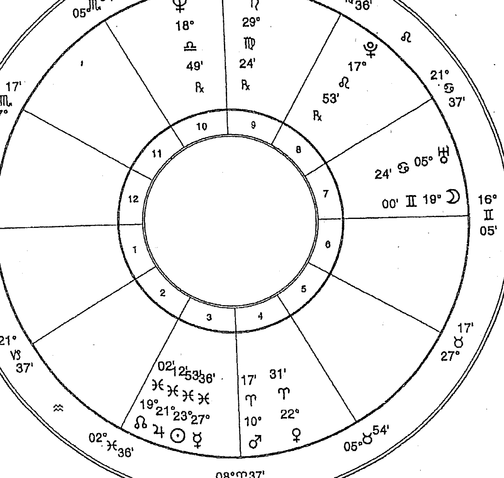
@双胞胎星盘

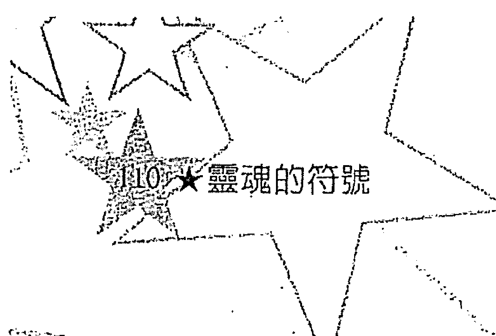
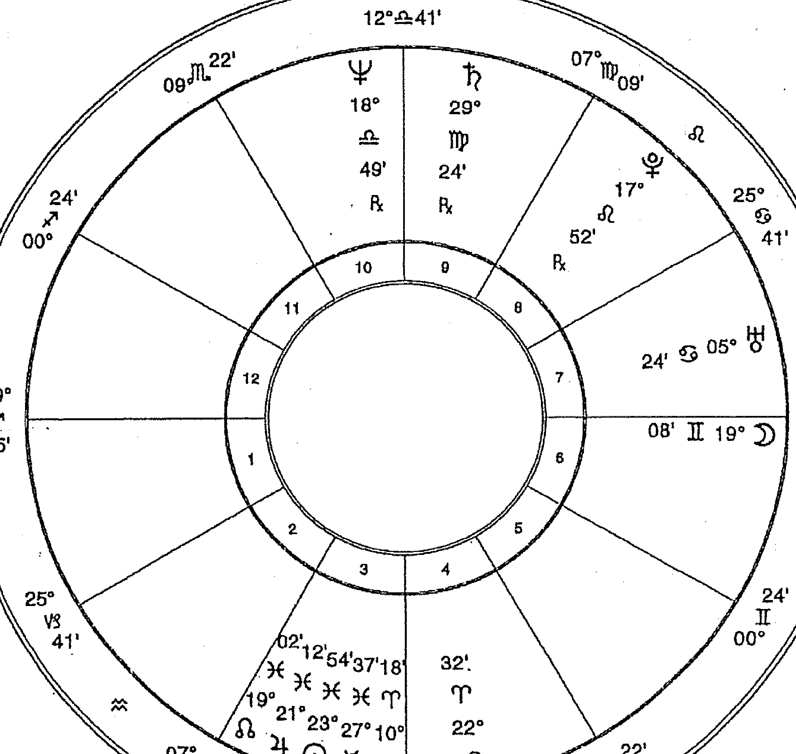

## 第三章 星座的演进

### 112★灵魂的符号

演进必须经历各式各样的经验和课题。十二个星座包含了这些课题。在完成灵魂的演进之前，都要经历并学会每个星座的课题。随着我们学会了这些课题，该星座的正面特质才能得到发展。当我们第一次经历某个星座时，将会拙于表现该星座，而且会是较负面的表现。慢慢累积更多经验后，它的正面特质比较容易表现出来，而该星座的天赋才能有所发展。渐渐地，经过许多世，在星座的表现上也有所进化，但是这种进化如何发生全视个人而定。我们并非按照排好的顺序来经历各星座，而且我们有选择的自由，也因此会有较常选择某星座更甚其他星座的情形。哪些星座会比其他星座更常被选中，也视个人而定。这样可以让我们专注于某些才能、课题或任务。

### 演进与星座

这一节将说明星座以及星座如何进化。每个星座都有根据自身问题而订定的成长步骤。如同你将会看到的，许多问题会进化为长处。请记住，这里所描述的，不但可用在太阳落于这些星座的人，也可套用在星盘里该星座占有显著位置的人身上。

#### 牡羊座

这个星座让人想到恃强凌弱的海盗与随心所想到处旅游的冒险家。牡羊座渴望冒险、新奇事物还有冒险带来刺激感与危险。他们的行动无所顾忌，而且渴求过着毫无拘束的活跃生活。然而，未发展的牡羊座不太会调节他们的能量与冲动。他们在工作过度、精疲力竭、忽视自己的感觉和突如其来的怒火之间摆荡。未发展的牡羊座是肆无忌惮、粗鲁又奇特的，这些特质再加上他们的独立自主、不愿合作的天性，往往因为人际关系带来麻烦，这点并不足为奇。

这个星座的课题包括耐心与锲而不舍。牡羊座通常会以十分艰辛的方式来学会耐心——藉由犯错来学会。虽说耐心会是种很痛苦的课题，但透过生命的情境，可让人充分学会。藉由经历了不幸事故带来的结果，牡羊座学会控制自己的能量，并将能量集中使用。当他们有所演进，他们对刺激与危险的渴望，也随之缓和许多，而且也开始将心思转向某个特定目标，这种专注，通常以较不需要体能的方式来进行，诸如从事股票投机事业，或是与人合伙做生意。

热爱冒险与刺激，让牡羊座演化出两种长处。第一种便是勇于表现自我：在无意识中，前几世克服困难、获得成功的记忆，会刺激他们勇于参与生活，将能量倾注于新的努力与想法上。他们的勇气与大无畏，让他们能完成一个接一个的计划。在这个层面上，他们以新的计划、发明、发现，为这个社会贡献良多。热爱生活、精力旺盛与保持不坠的自信，也是从热爱冒险与刺激及让人敬佩的特质而来。这种生活之乐，是来自他们面对自己的恐惧、进而克服这些恐惧。因此，牡羊座会觉得生命是美好的，即便是面对最严酷的打击，他们也不会感到无能为力。他们对于自己和打理生活的能力，有种不可动摇的信任，这是由于他们潜在感觉到这个世界的公平与正义，因而支撑起这种自信。发展完善的牡羊座具有一切胜利者的特质，也很能在投注心力的事情上获得成功。灵魂透过许多世在这个星座上的经历，发展了与他人的关系、长处与勇气，这在演进的路程上是很重要的成就。

#### 金牛座

未进化的金牛座顽固、严苛又拒绝改变。任何改变都会让他们觉得遭到迫害。既然生命是变动的，每过一天，都像是在挑战他们、要让他们变得更有弹性。他们也以需要安全感、热爱舒适与生命中美好事物而著称。他们很乐意长时间且很努力的工作，之后，往往会沉溺于感官之乐与因付出努力而得到的回馈当中。虽然他们还算聪明，但慢吞吞的态度、墨守成规，以及不愿意接受新事物的特性，很容易让人看穿下一步将会做什么，而且有时候还很无趣。未发展的金牛座还可能缺乏想象力、敏锐的感觉、眼光还有心灵上的见解。

即使是已发展的金牛座，也还是不太喜欢改变，他们的长处是由未发展金牛座的短处经过再三磨练而来：顽固变成耐心、持久；渴望物质的成就，引导他们对社会做出实际的贡献。拥有这些特质的金牛座，将任务完成得有如这是件理所当然的事，而该任务对其他星座来说，却是难以办到、甚至无法克服。已发展的金牛忠诚、殷实、工作勤奋又可靠，使他们成为社会或任何组织的支柱，文明世界的诸多建设大多仰赖他们。然而，他们还是可能将更需要想像力的任务，留给他人来完成。尽管如此，他们对于美的热爱，使金牛座具有一种细致的美感，这种美感如果是在其他星座身上，往往被看成是艺术的才能。他们是生活的鉴赏家，使感官之乐成为一门艺术。已发展的金牛座还知道如何赚钱。经过好几世获取财富与安全感的经历，让他们很容易取得物质的需要，看到别人要为赚钱辛苦奋斗，金牛座通常是百思不解。透过许多世的金牛座轮回，灵魂发展了耐心、坚持、决心，这些特质使我们能在这一世创造出某些有价值的东西，也让我们自己和他人都能过得很舒适。

### 双子座

双子座非常好奇，但是未发展的双子座，要维持他们的兴趣真是大不易啊。他们反复不定、不专心、肤浅。因此，他们倾向「样样通、样样松」，这让他们在早期的转世期间多半没什么作为。同时，他们的多变也为自己制造出其他麻烦。由于他们不费吹灰之力就能适应周遭环境和身边的人，可能因此忽视了自身的需要与目标。更进一步来说，这几世以来，都将重心放在脑力的开发，导致他们太依赖自己的头脑。他们还可能不重视自己的身体、情感与心灵。

双子座在世的时间，是为了品尝生活的开胃菜。他们的目标仅止于体验各式各样的生活经验——对任何主题都不是很有重视。时间对双子座来说，是用来收集零碎片断的资讯，这边玩一下、那边转一下，试出一个又一个的经验。像只蝴蝶似的，从这个主题或经验又飘到另一个去，每一样的停留时间都很短暂。唯有这样经过好几世之后，他们才能累积足够的知识来教导他人。已发展的双子座是老师，许多世都在提出问题并追求智识上的发展和通晓语言。

双子座在沟通传达上的才能，是最可贵的天赋之一。他们能以幽默、教人开心的戏谑玩笑，让人感到轻松自在，他们跟周遭的人都能聊上几句，其魅力几乎无人能匹敌。他们说的话不论对或错，凭着优异的表达技巧，总能让人听进去，并对他们产生敬意。双子座和天蝎座、魔羯座、狮子座不一样，他们不会想要透过言辞来影响他人，而是单纯的表现自己以及对知识的享受。他们在学习与沟通方面的需求十分强烈，因而将大部分时间都花在阅读、倾听、写作、与他人交谈上。双子座的世界充满各式各样的沟通，他们成了言辞和文字的完美艺术家。渴望知识、机智、传达他们基于无穷的好奇心所学来的知识的精湛能力，是已发展的双子座为这世界作出的贡献。

#### 巨蟹座

巨蟹座要学习去照顾、养育他人，而学习这些事最好的方法，便是被他人慈爱的照顾。以此而言，巨蟹座初期的人世时期是依赖的。未发展的巨蟹座可能会经历到不容许独立的情形，像是生病或发展迟缓。到最后，他们会获得一些行动能力来脱离这种状况，到了下一世，更会经历一种不同的独立模式。巨蟹座经历独立的转世，是基于谨慎选择而来，可能（举例来说）包括成为家庭主妇、保姆、管家的经历。要在这些情况里生存，通常有赖于能敏锐感觉到他人的感受与需求。因此，他们发展出对他人情绪有非常高的敏感性。就像《杰克与魔豆》里巨人的妻子一样，他们学习藉由满足他人的需求来操控他们，并达到自己的目的。这种缺乏权力的情形，也说明了他们为人所知的「情绪化」。牺牲自己的需求、为他人受苦以博取同情，使他们成为易怒的巨蟹。还有，从前几世残留下来的无助感，仍继续影响他们如何看待自己，也让他们想要依赖。他们需要发展独立于他人之外的个体，当关系不再或不可得时，才不会感到痛苦。

巨蟹座的长处是从早期的依赖经验演化而来。因此，他们知道别人需要什么，也能给予慈爱的回应。这些特质使他们很适合照顾别人，这也是晚期巨蟹要做的事。当他们发展到不再依赖时，许多巨蟹会将时间、精力用来建立家庭。他们以准备美味佳肴、布置居家环境，以理解的心来倾听，或仅以表现温暖、慈爱等方式，来建立家庭的关系。其他的巨蟹可能从事照护他人的职业，诸如看护或教育，或是经营民宿。从为人提供照料当中，他们找到了所需的归属感。不论从事何种行业，他们都必须得到情感上的满足和被需要的感觉。如果情感需求得不到满足，他们会觉得遭到迫害，并感到愤恨不平。即便是已发展的巨蟹座，如果他们的处境没办法满足情感上的需求，也会变得情绪化、郁郁寡欢和易怒。想要快乐的话，他们需要找到一种能给他们同等温暖与照顾（就像他们给予他人的一样）的职业。

### 狮子座

未发展的狮子座玩世不恭、喜爱找乐子，不顾他人的需求也不会去记得。他们不是不能去了解别人，只是懒得在这个演进的阶段花心思去了解而已。他们是自恋的水仙——迷恋、倾心于自己和自身的才能。也许这是必要的。如果不这样的话，他们可能就不会花时间和力气来发展自己、表现自我。毕竟，这个星座的特质就是这个样子，全副心力都放在自己身上、渴望被人注意与得## 獅子座（續）

到掌控力，他們想要出風頭，一旦成為衆人矚目的焦點，就必須登場演出！因此，慢慢地，經過累世經歷了這個星座的經驗，他們的創造與表現能力都有所發展。想要表演、表現自我的衝動，就是發展自我和（說得更白一點）自我發展的計劃。他們要發展自我，這也是演進的一部分，轉世為獅子座，就是為了這回事——發展為獨立個體而且與衆不同。很不幸的，他們對於掌控力、自利、受人注意、優越感的需求，也同樣干擾到他們建立人際關係的能力。

這個星座的優點是從早期的「以自我為中心」發展而來。獅子座最突出的特質，便是吸引追隨者並引領他們。獅子座結合人們的理由各有不同而且十分戲劇性，然而，這也使他們與衆不同。不過，他們通常會有的共同特性，是熱愛指揮與得到尊敬（這是獅子座所渴望的）的能力。是什麼讓獅子座那麼有魅力？理由之一，他們能全心全意的投入，也非常相信自己，因而感染了別人。他們的自信、樂觀、溫暖、嬉戲玩笑、發自內心的關懷，贏得了他人的心。人們很難不喜歡他們，不管獅子有多自戀。獅子座享受人生的巨大能力是有傳染力的，而且會讓人也想要獲得這種能力。所以，只要小小計劃一下，就算是最不聰明的獅子，也能讓自己贏得幫助他們完成偉大英勇事蹟的助力，雖然受到他們鼓舞的追隨者往往是出力最多的人。

獅子對於煽動與創造的需求，有好幾種形式。他們可能生兒育女，或者從事藝術、陶器、樂曲、電影、軍事戰略、發明產品、建築……更多更多可能創作的事物。不過，他們的創造並不具藝術感，除非他們的水象元素很強。這個星座的持久力，讓他們能藉由累世經驗來展現才能。在後期的轉世裡，他們通常會使用經由創造與表演而獲得的技巧來領導他人。因此，發展的獅子有卓越的才能和最高段的領導能力。

獅子座也是優秀的老師；由於他們熱愛成為聚光燈的焦點，喜愛權威、領導、受人矚目，因此許多獅子都加入這一行。他們的表現與戲劇性，讓他們成為有趣，甚至可說是教人入迷的演說者。最後，獅子座本身如孩童般的溫暖和嬉笑頑鬧，讓他們對小孩子很具吸引力。基於以上理由，獅子往往會從事與孩童有關的行業。

#### 處女座

早期的處女座在人世間扮演奴僕的角色。基於好幾種理由，這樣的角色對於靈魂的演進是很寶貴的。理由之一，苦役能提供處理經濟窘困的生活的經驗。理由之二，苦役提供了發展諸如：謙遜、有效率、周全、責任感等美德。許多世都身為奴僕的缺點，便是處女座可能無法發展自身的才能。他們將自己奉獻給別人，但不是出於像巨蟹座一樣的理由，而是為了更崇高的目的：服務。如果他們的星盤沒有火象元素或強化主體性的條件，可能會為了服務他人而失去自我，並且以憤恨、沮喪收場。

在許多獻身於服務的轉世裡，處女座所發展出來的美德會多於才能。最出眾的美德當屬「服務」，能夠因為有效率的完成任務而感到滿足，便是種美德。當我們許多世都身為處女座時，學得最好的課題便是服務。已發展的處女座另一項美德便是「謙遜」。在學會轉化最初期苦役轉世的憤恨與怒氣之後，他們成為圓滿謙虛的僕人。處女座是怎麼從憤恨躍進為謙遜？在演進的某個時候，他們瞭解到只有善意與利益衆人的工作，才能將他們從奴役的階層提升，而不是怒氣與憤恨。藉由從事利益衆人的工作，他們體驗到自身內在的價值。藉由觀察有時是虛華輕浮的富人世界，他們瞭解到，沒有人會因為自身的社會地位或扮演的角色，而有優劣之分。瞭解了「誰都不比誰優越」才會謙遜，這正是苦役最終要教導我們的事。

已發展的處女座是勤奮的工作者，能在喜悅、感謝有機會服務的心境下完成使命與指示；不過，因為他們不喜歡成為衆人注目的焦點，而且是在幕後工作，所以很少得到應有的美名。但是他們的成就卻不小。如同金牛座一樣，處女座執行社會上大量的工作，是社會的主要依靠之一。

#### 天秤座

天秤座很喜歡依戀他人，他們傾向將自己奉獻給生命中很重要的人，有時會因此付出自我發展的代價。他們很難自己做決定，也往往讓別人幫他們選擇。和巨蟹座一樣，依賴對於他們來說，是個需要解決的問題。天秤座將會發現，除了談戀愛，還得有其他事情來平衡才行，諸如職場生涯、朋友、個人目標。

天秤座要學習透過合作、分享，為關係注入和平與和諧。一段和諧的關係是值得讓人付出心血的。不幸的是，未發展的天秤座往往會將他們的理想主義，誤置於伴侶身上，為伴侶造神。這對雙方都沒有好處，然而，這也傳達了一些重要的課題。因為造神失敗，他們必須學著識人，並且不再放棄自己的力量。依賴加上理想化，便產生陷阱；天秤座就是因為想要相信、而且也真的相信他們所愛的人是完美無缺的才會受傷。如果真的遇到理想伴侶，便能減輕他們肩上的生活重擔，這對有依賴傾向的人來說，真是再好不過了。因此，他們會找個願意扮演「王子」(或「公主」)的人，好讓他們繼續不切實際的幻想，同時還可避免面對自我。這是逃避的好方法——但，這真的是逃避的好方法嗎？到頭來，空想終究要幻滅，現實開始顯露醜陋的一面，和破碎的夢一同被拋諸腦後。至於他們會怎麼做，要看發展的程度而定，不過大多數的天秤座仍會繼續尋找完美的愛情。這種情形有可能永無止盡的持續下去，或者，他們瞭解到最終還是一個人，而且必須自己做決定，而以如此冷靜的領悟做結尾。有時候，這種領悟不經過許多世的天秤經歷，是無法獲得並有所了悟的。天秤座的課題大抵而言，通常不會花太多世來學習，也許是因為這些課題太痛苦了。不過，即便是發展到最極致的天秤座，也還是會有某種程度的理想化。

從這種痛苦當中，會發展出什麼樣的才能呢？從許多世的緊密關係裡，天秤座發展出調停的技巧，而在後期的轉世裡，將這些技巧應用於談判、諮商、斡旋。當天秤座進化了，便會將他們的技巧用在工作和人際關係上。服務是誕生天秤座的目的，也是所有轉世的目標。天秤座不能光是為了自己而學習「關係」這門課題，還要能夠分享從別人身上學到的東西。已發展的天秤座是和平、友善、公平、容忍的，而且在所有星座當中，他們的社交技巧最高段。他們並非為了取悅而取悅別人，他們與人合作卻不致於凡事順從，容忍別人的觀點也保有自己的看法。最後，他們將會是自己的主人，能夠善用才能，讓自己立足於世。

#### 天蠍座

天蠍座是最致命的星座。最糟糕的情況，天蠍座可以是無情、報復、堅持到底、全力拼命。因為他們很頑固，又堅持照自己的方式過生活，所以總是想要成為做決定的人。在蠍子的愛情關係裡，這種情形尤為真切，對於他們來說，在愛情關係中成為做決定的人，真的太重要了。未發展的天蠍座對心愛的人，是全心全意的投入，而且企圖控制、操縱他們，以達到自己的目的。他們要學習平等對待伴侶，要能與人親近、信任他人，而且不再執著於所愛的人。這些課題可能很困難，因為這些課題要求我們對於那些可能背叛我們的人撤除防禦。對於未發展的天蠍座，背叛是不可原諒的行為，一旦背叛了就很難再獲得他們的信任。當一段關係失敗了，他們很難原諒對方，也很難心平氣和的往前走。他們傾向怪罪別人、找出別人的過錯並尋求報復。那麼，天蠍座是怎麼進化到強悍、老練的個體（已發展的天蠍便是如此）呢？

那些累世生而為天蠍座的人，都經歷過許多失落。當我們失去某個所愛的人，我們可以選擇如何回應，然而有些回應方式只會製造更多痛苦。天蠍座最終學會了憤恨和怪罪於無法治療他們破碎的心。到最後，他們發展出內在的力量與看待生命的人生觀，這些都有助於處理痛苦。他們學會了如何只靠自己、繼續前進，而他們在愛與失落等方面的經驗，也讓他們發展出對人類本質與生命奧秘的洞察力。當我們失去某個所愛的人，我們會想要知道：為什麼。如果是所愛的人離我們而去，我們會想知道，為什麼無法繼續下去。如果是因為死亡，我們會想知道，為什麼他／她得逝去。什麼是死亡？有神的存在嗎？天蠍座尋找這些問題的答案，而他們的磨難到最後會滋長為力量。

在天蠍座早期的轉世裡，他們想要瞭解生命，以便更能掌控生命。他們很快就會發現，生命既不能掌控也無法預知。最後，蠍子學會了雖然他們不能掌控生命會帶給他們什麼，卻能掌控自己對生命的反應。他們不試圖去掌控生命，反而學會控制自己的態度來掌握自己。這麼一來卻給予他們一種個人力量與信念的知覺。天蠍座知道他們相信什麼，也根據他們的信念來行動。他們較早期的頑固和嚴苛，轉化為後期的信念，而他們以信念來幫助他人進行轉化。天蠍座的力量在他們已臻進化時，可以有更好的發揮，因為他們現在的想法，值得他們努力推展。這也是讓他們在後期轉世裡如此有效率的原因。他們有能力影響他人，而且他們千錘百鍊的人生觀，能夠改變人們的態度與生活。這種智慧正是他們的天賦，也是他們獻給這世界的禮物。

#### 人馬座

人馬座在許多方面和雙子座很像。他們的發展途徑與要學習的課題都非常類似。他們的目標分別是知識和領悟，而兩者都是友善、無拘無束的星座。他們主要的差異在於追尋的資訊不一樣。人馬座編纂心中領會的人生觀，而雙子座收集事實。雙子座的題目可能與人生觀、宗教信仰或法律有關，也可能無關，但這些卻是人馬座要一探究竟的主題。人馬座採取什麼樣的人生觀，端賴他們的發展程度而定。進化的人馬座比較相信神秘學信仰，而有待發展的人馬座則較為傳統。

人馬座的特質便是馬不停蹄的尋覓，他們酷愛自由、熱衷旅行。這些特質，把他們從一個地方帶再到另一個地方，或是去看一本又一本的書，來尋求領會。當他們進化了，他們的尋尋覓覓通常會變得著重於讀書更甚旅行。不論是任何情況，在他們尋覓時，自由是不可或缺的。然而，自由與生活的日常要求——謀生、準備食物、照顧他人——不可分而為二，因此他們可能學不會處理這類的責任。但是對已發展的人馬座來說卻不是如此，因為他們經歷過其他的星座，特別是土象星座。他們許多世都用來自由自在的探索、進行自己能主宰的活動，而這可能有礙建立人際關係的技巧。人馬缺乏敏感性，這星座的人需要變得更能知覺到、並回應別人的感覺。最後，透過經歷水象星座，他們真的在人際關係上更具技巧。因為他們早期的探索缺乏方向與目的，可能需要學會設定目標、不急於獲得滿足。不過，早期的探索教他們學會了關於生命的事，如果他們只待在同一個地方，把注意力放在更世俗的小範圍，是不可能學會的。

已發展的人馬座很有智慧，這是來自他們經歷豐富的冒險。到了後期的人馬座生涯，早期的熱愛旅行熟化為對生命的敬重。那時，他們已經從造成對立的人生觀跨越到更寬廣、無所不包的人生觀了，這種人生觀將生命與人類看作是慈悲為懷的。透過豐富的經驗，他們品嚐了生命的多樣性，也領會了在這多樣性背後的重要原則。這種廣博的領會，是生而為人馬座的人的天賦。

#### 魔羯座

在未發展的狀態下，魔羯座是最讓人感冒的星座。未發展的魔羯座有貪婪、自私的傾向。潛藏於這個星座下的自私，不是像火象星座那種遲鈍或自我中心，而是真的不顧別人死活。未發展的魔羯座以對情感事務、關係採取冷處理，以及沉迷工作而聞名。他們生來就是要工作，沒有任何事能阻止他們獲取金錢、權力、地位和他人的認可。除此之外的事，都被拋在遠遠的次要地位。因為如此，可能有損他們的愛情關係，使他們孤單一人、情感空虛。

魔羯座會發展成有責任感、可靠、實際、有耐心和持久力，許多魔羯座是從累世在職場上打滾得到如此發展。他們也學會處理威權與權力，而且必須面對與此有關的一切道德問題。即便是未發展的魔羯座也會努力工作，讓自己成為可存活於社會的一份子。然而，他們最不感興趣的，就是愛情關係。結果，許多世都是魔羯座、並且很少生為其他星座：諸如天秤、巨蟹的人，他們可能缺乏同情心、與人維持關係、養育他人的能力。

已發展的魔羯座對這世界貢獻良多。他們有能力賺錢養活自己與他人，在勤奮工作與得到實際成就方面，也具有非凡的能力。因為他們凡事要求有條有理，所發展出的系統組織、條約和公式，能幫助社會運作得更順暢。他們建立起無形的社會結構，也建造出實體的屋宇建築。魔羯座很能適應社會，並且恰如其分的扮演社會與職場上的角色。在後期的轉世裡，他們對錢財與威望的渴望不再熱烈，這讓他們能將實用的技能，用在促進比較沒那麼自我中心的雄心壯志上。已發展的魔羯座一旦爬上高層職位，通常會運用他們受到擢昇的社會地位來進行有利社會的改革。

#### 水瓶座

水瓶座有發明的才智和創造力。他們活在充滿思想的世界裡。然而，也因為這樣，水瓶在建立生活上以及與他人關係的經驗，會傾向於依賴智識，他們也許會錯過以其他方式來體驗「關係」。最好的狀況是，他們是人道主義者，也是數學和科學天才。最糟的狀況則是冷漠、古怪或叛逆的傢伙。儘管天性很疏離，水瓶的友善態度和能接納他人，使他們能與各種不同類型的人相處融洽，也能在所有的社會情境裡適應得很好。

水瓶座的課題倒不特別困難。他們很能與人相處，或與他人合作來朝雙方目標前進；或者為了更遠大的目標，為團體利益貢獻心力，並提出新的想法來改善社會。在早期的轉世期間，他們練習與人共同合作，這是為了預備在後期轉世，讓他們可以在人群中服務。

水瓶座在發展過程中會搞不定親密關係，他們對這一領域並不在行。水瓶座涉入群體、渴望為人類服務、著重精神層面，實在沒有太多時間和精力建立親密關係或經營情感方面的生活。他們的親密伴侶（特別是伴侶如果有強烈的親近的需求），往往會發現水瓶座很冷漠，難以瞭解，而且幾乎不可能去瞭解。然而，他們的雙親為此而感到困擾更甚於他們的伴侶。和他們最相配的，便是同樣需要距離和自由的人。但是，這樣的戀愛關係並不能幫助他們獲得培養更令人滿意的親密關係的技巧。他們要歷經許多世才能在欠缺的技巧上有所進展，這點和天秤座、巨蟹座或天蠍座一樣。

但是在關係上保持距離，會有什麼好處呢？我們已看到，其他星座有些缺點經過了進化，發展成美德或天賦。水瓶座這種保持距離有個好處，那就是讓他們有充裕的時間來發展獨一無二的思想。因為他們不會特別想要投身於家庭生活與親密關係，他們可以將能量用在其他事情上，諸如社會和科學的改進。另一個好處則是有更大的寬容度，他們在接納別人方面是其他星座比不上的。這可能是因為水瓶十分獨立自主，使得他們較不在乎別人的想法和行為。

我們常常可以在社會服務的領域或政治組織裡頭發現水瓶座的身影。然而，他們最大的興趣是想些可以改善人類處境的主意，而不是像處女座的泰瑞莎修女 (Mother Theresa) 一樣去服侍大眾。雖然如此，他們還是將其他人都看作具有實質價值、值得加以關注。水瓶座在發表先進的理想與介紹新思想上，扮演了重要角色，而這些理想和想法，都是在為促使人類更進步、改善人類處境等事鋪路。

#### 雙魚座

進化到最極致的雙魚座，在精神上非常發達。這個星座象徵「超越」以及「與神性融合」。然而，除非靈魂已進化，否則不可能「超越」；在這個星座能表現出它的最高形式之前，必須要有某種程度的精神層面發展。

未發展的雙魚座很難去接受現實、應付現實。生命對於許多雙魚座的人來說，不但令人大失所望、還是個粗暴的玩笑，讓他們陷入深深的悲哀和沮喪當中。許多雙魚座會以企圖逃避生命，來展現想要「超越」的渴求，大部分都是透過嗑藥、酗酒、精神疾病或孤立等方式，而選擇哪種逃避的方式，則取決於環境的影響。父母若酗酒，那麼雙魚小孩就會有藉酗酒來逃避的傾向。若父母有精神疾病或退縮行為②時，小孩便有可能步上後塵。不論是哪種選擇，他們的目標是要逃避生命的痛苦與責任，這種痛苦和責任，有時候對他們來說是難以承受的。

雙魚座愛作夢的天性、富有想像力的天賦，讓他們傾向於沉浸在內心世界，就像他們的敏感特質和逃避主義，也會讓他們有這種傾向。雙魚座要能認知自己很敏感，學著去重視他們的想像力、卻又不會迷失在想像中，並且要將自身的創造力和直覺做具建設性的引導。當雙魚座有所進化，便很能悠遊自在於性靈的世界，這一優點可以拿來善加利用。不過，首先他們必須停止逃避他們的恐懼，接受活在世上的責任。當他們進化了，他們應付生活的能力也跟著進化。藉由經歷許多生而為其他星座（特別是土象星座）的轉世，雙魚座學會實用的技巧。一旦用來處理現實的某個能力有所發展時，他們便可將內心的想法與外界分享。他們能看見異象的天賦，可用來畫出令人喜愛的繪畫；他們的想像力可用來寫詩；他們的敏感性，可用來作曲；而他們的同理心與同情心，則可用來治療情感的傷口。

「服務」是雙魚座的天職。早期雙魚的受苦與依賴，進化為同情心和同理心。因為依賴，巨蟹座和雙魚座學到了同情和同理心，但是他們澤及的範圍卻有所不同。在雙魚座的後期轉世當中，他們將愛廣被整個世界，而不僅止於家庭成員，這種泛愛行為，還包括了藉由分享他們在宗教信仰的見解來進行治療。透過服務，他們不再有孤單與格格不入的感覺。先前覺得自己不屬於這個世界的感覺，也因為知道自己屬於另一個世界——靈性的世界——以及將靈性世界傳達給他人，而得到治癒。到達這個層級的雙魚座，往往是通靈人或靈媒。一旦學會了較早期的課題，他們對心靈世界極高的悟力，終於有用武之地。雙魚座進化到最極致的階段，會是宗教領袖和心靈導師，指導其他人瞭解自我和宇宙的本質。他們是神秘家、是宗教上師，不僅治療精神，還治療靈魂。

## 有些課題要花較長的時間學習

有些星座課題，比其他星座課題需要更多的輪迴轉世來學習。例如，在雙魚座全面性的課題可以拿來教導時，必須達到某種程度的精神發展。雙魚座出了名的直覺和精神上的能力，就要花許多世來發展，而且不到靈魂後期的轉世，是不會開始發展的。他們要達到這些能力都有所進化，否則不能迎戰雙魚座諸多課題。

牡羊座的課題也要花較多世來學。學習有耐心是夠簡單了，但學習勇氣卻要花很長的時間，如果當事人曾經恐懼過。當冒險導致災難，就可能需要許多世來跨越恐懼。為了要突破只是一次的創傷經驗遺留的恐懼，可能許多世都會選擇轉生為牡羊座。

另一個比其他星座更常被選來轉生的則是雙子座。因為心智的複雜性，以及心智在處理資料時所負的巨大任務，要發展心智的能力便需要許多世都轉生為雙子座。人類智識的發展，是永無止盡的。有些人選擇反覆轉生為雙子座，當作是發展有創意、感覺敏銳的心智（與水象星座搭配），或是發展更具邏輯、更科學的心智的方法。

## 選擇靈魂星盤

雖說靈魂不是依照既定的順序來經歷星座，但選擇星座卻有其目的。被選到的星座，是為了能繼續我們需要修習的課題和保有我們個人的偏好。而首要之務便是清償宿債。星座是為了這回事才被選擇，同時，也是為了教導我們一項或更多的基本課題。一旦學會了生命的基本課題，我們在選擇出生星盤上就會有更大的自由。在這個階段，我們的部分意識在肉體死亡之後，仍會和靈魂一起選擇星盤。所以，到最後我們便可以自行選擇星座，來完成任何想達成的目標。我們每個人都是獨一無二的，我們的進化也是如此。有時候我們會卡在某個星座，而必需留級重修，但在其他星座的課題卻迅速過關。雖然我們都要經歷十二星座的每道課題，但是如何經歷、要花多少時間，卻是依個人的選擇而定，特別是靈魂進化這件事。

我們的自由意志可說與我們的進化息息相關。如果進化只是事關學習某些課題，所有人都能以幾乎一樣的方式來學習。然而，生命的目的——造物者的用意，如果我可以如此大膽假設的話——是要去經歷所有的可能，並從這種無窮的多元來進化。除了透過自由意志，還有什麼方法可以做到這件事？而自由意志正可以讓我們去探索所有的可能。有個計劃被選中了，我們的自由意志便在其中運作。這便是人類如何演進，並實現神性的演進。我們之所以選擇出生星盤，是為了用它來學習課題、發展才能、完成生命任務，並且也是因為想要透過某些星座來經歷生命。然而這種渴望從何而來？又為什麼我們會有特定的偏好？

## 七種角色

何以每個人都有自己偏好的星座？這件事其實不是那麼神秘難測，如果我們能瞭解到，每個人都是來自神性、有與生俱來的傾向和目標，也就是有些人所謂的「角色」。在靈魂投胎轉世之前，每個靈魂都會選出能符合目標的角色，用在所有的轉世中。轉世和生命任務尤其與該「角色」有關聯。

每個角色都會有偏好的星座，因為有些星座很適合某些角色的任務和它的稟性。角色有七種，靈魂目標也有七種，而每種角色都有其風格，也有其偏好的星座。這有助於解釋，何以在星盤裡，某些星座會比其他星座更發達：這些星座更常被選中，因為當事人的角色偏好它們。那些已進化到可以自由選擇星盤的人，通常會在所選星盤裡顯現出他們的角色。因此，角色往往可以由星盤來臆測。不過，有時被選的星盤卻是用來平衡該角色的特性。

七種角色如下：修士、僕役（奴工）、國王、戰士、學者、工藝匠，和哲人。雀兒喜·昆恩·雅布羅（Chelsea Quinn Yarbro）最先在她的著作《米迦勒的訊息》（Message from Michael）裡，提出這個概念。

## 修士

當情況允許時，修士會選擇可以讓他們探索心理與情感的來世。他們對一切宗教、冥思、心理學、夢想、心靈現象，及其他能讓他們超越感官與物質世界的領域都很感興趣。因為他們有探索其他領域的衝動，有時會發現自己惹上濫用藥物與酗酒的麻煩，不過這通常只有在早期的轉世才會發生。他們最後會成為精神領袖、治療師、諮詢師、神職人員、老師，並將他們因探索所獲得的洞察與領會，與他人分享。他們很少會處於卑屈的職位，因為這種職位無法提供追求他們渴望的領悟與智慧。

雙魚座是修士偏好的星座，不過只有與火象星座呈合相時才是如此，火象星座能幫助雙魚座發展身為精神領袖或教師需要的領導技巧。人馬座是另一個偏好星座。獅子座和牡羊座也是常常被選中的星座，不過只是為了幫助他們去領悟並獲得精神的力量與領導能力，而不是為了得到物質或世俗權力。處女座不是修士偏好的星座，而修士也不會特別需要這個星座。對於這個角色，謙遜通常不會是問題，因為自我的欲求不會如在其他角色身上一樣，讓修士產生動搖。

至於修士的出生星盤，最常以火象和水象星座為主，搭配一些風象元素再加上一點點土象星座所組成。修士的星盤偶爾會包含土象星座，好幫助他們獲得需要的群眾。修士會擁有追隨的群眾，大多是因為精神的力量，而不是物質上的成功。

## 靈魂的符號

除了大量的火象和水象星座，另一個辨認這個角色的提示，便是月交點。交點最常落在雙子座／人馬座，雖然落在獅子座／水瓶座上也很常見。既然生命任務與角色通常都有關聯，分析交點位置便有助於辨認這個角色。

這個角色的生命任務會有好幾種表現形式，而且通常和給予心靈指導與助人領會有關。表現形式要看所處文化而定，可能是心理上的指導或甚至像巫師般的醫藥指導。雖然有些人在執行這些功能時，並沒有受過什麼正規訓練，但是除了未經發展的修士之外，所有的修士會讓自己以最嚴苛的精神與心靈紀律，來獲得需要的領會力。因此，在取得他們完成任務所需的教育訓練和社會技巧上，風象星座就很重要。

在風象星座方面，天秤和雙子座是最常被選中的星座。天秤提供了諮商的技巧；而雙子則給予好奇和動機，來學習成為精神導師所需要的事物。水瓶座最少被選到，因為這個星座不能讓修士擁有他們喜用的領導能力和權威。修士給予他們服務的對象安慰，並治療他們，但是修士和這些人並不在同一階級上。

天蠍座是水象星座中，除了雙魚座之外最受修士偏愛的。巨蟹座被選中的機會最少。依賴、情感牽扯、家庭責任，都無助於領導技巧，更無法給予修士足夠的自由。同樣的，天蠍座也不如雙魚座理想化。雖然關於依賴、親密、戀愛關係的課題，雙魚座一樣無法避免。

在土象星座方面，魔羯座最受青睞，因為它能助長領導能力和直覺。另一方面，金牛和處女座是最少被選擇的星座。這兩個星座對修士的工作沒有太多幫助，而且它們的課題對修士來說，並不難學會。

其他的火象星座，以牡羊座和獅子座最受青睞、也對修士有所助益。修士很少會缺乏火象星座的能力，因為他們的課題會需要火象元素。如果修士的星盤只顯現出一點點火象元素，當事人可能在前面幾世已發展出相當完整的火象天賦，所以火象在此只需要最低限度的表現。星盤裡完全沒有某元素的蹤跡，便是暗示那些特質對生命任務來說並不重要，我們在描述該角色和生命任務時，也要將這一資料列入考量才行。

## 僕役

僕役，即所謂的奴工，這個角色也有服務的目標。然而，他們的服務並不像修士一樣，只限於為他人的心靈需要提供服務。在早期的轉世裡，他們的服務是有關僕役的職責和卑屈的角色，這樣的職責和角色教導他們為了服務目的而熱愛服務。到了晚期的轉世，當他們學會謙卑、快樂的服務之後，便依照自己的選擇來服務，還可能因為他們無私的行為而聲名遠播。他們從來不冀求名聲，除非名聲能讓他們服務更多人，並為他們的生命任務增添助力。

在僕役星盤裡，常可見到處女座、雙魚座、巨蟹座、天秤座。他們的星盤通常有土象和水象星座。土象星座讓他們擁有實用的技術，以及奉獻自己來幫助他人的決心。如果他們的服務著眼於心靈活動，那麼星盤也會強調風象元素。因為水象星座能發展獻身服務所必要的同情心、愛和慈悲，水象星座是這個角色的基石。

僕役星盤沒有水象星座是很少見的。如果這是為了平衡僕役過於傾向水象的天性，而必須暫時將水象星座從星盤除去，當事人的個性還是會顯現出水象特質。每當選擇了用來平衡的那一世，火象星座便會派上用場，讓僕役獲得更多自信、變得更獨立，要不是這樣，火象星座對於僕役來說，並沒有什麼幫助。

僕役的月交點最常落在雙魚／處女座，但是落在巨蟹／魔羯座也相當常見。雙魚／處女座的對軸（axis）代表服務，而這兩者是他們最喜歡的星座。然而，巨蟹／魔羯座的交點位置也可以讓他們為人服務，特別是對家庭成員。我們很少會看到他們的北交點落在魔羯座，這種位置是為了平衡過度依賴和自我犧牲的行為。對別人付出太多不是服務，而是看輕自己。這也是他們主要的學習課題之一，即便是已發展的僕役，也會為這件事煩惱。將北交點從巨蟹座移到魔羯座，為星盤加上火象星座，都是最常用來改善這一傾向的方法。

## 國王

國王的生命任務與領導能力和進取心有關。他們的目標是自我表現、促進新計劃或新想法。他們的成就十分多樣化，而且都涉及領導能力。他們的星盤是選來增進自信、果斷、善用權力、組織能力、遠見、領會，也就是所有身為領袖需要的良好特質。歷經轉世，國王學會了好的領袖要為多數人謀福祉，而且他們也發展成對於謀求福祉極具遠見。

國王是火象元素加基本星座❸，他們選擇的星盤也反映出這些特質。最適合他們的基本星座有魔羯座和牡羊座。他們也偏好獅子座和人馬座。

除非他們發現自己要成為智識方面的領導，否則風象星座在他們的星盤並不顯著。即使智識、教育、外交在大多數領導任務裡十分重要，然而國王星盤不重視風象星座卻是不爭的事實。當外交事項占重要地位時，他們會選擇天秤座。

不過土象星座卻很有可能入選。土象星座可以提供實際的技術、邏輯和實際的方法，這些特質形成了健全的判斷力的基礎。土象星座，特別是魔羯座，能給予決心與對權力、威權的渴望，這些特質能激發強而有力的領導所需特性的發展。國王最不喜歡的星座是巨蟹、天秤、雙魚和處女座。有時國王必須在幾世裡選擇這些星座，學習分享權力、發展同情心，或者學習謙遜或其他基本課題。尤其在謙遜方面，對他們可能是個障礙。當他們輕易地就得到權力時，會很容易認為自己比別人優越。謙遜的課題是他們最大的挑戰，也是他們可能無法完全學會的課題，就算是到了後期轉世也是如此。

❸基本星座：cardinal signs，指白羊座、巨蟹座、天秤座、摩羯座，也是教導人類生存最基本元素的星座。

## 靈魂的符號

國王的北交點可能會落在獅子座或魔羯座，偶爾落在牡羊座，較少落在金牛座，雖然金牛位置也為國王所喜愛，且在大多數社會裡，金牛座累積財富的能力能讓國王有權有勢。當北交點落在牡羊座，通常象徵著在能夠領導之前，需要發展自我的力量。這對國王來說是一個預備功課的配置位置，而不是已實權在握的晚期轉世之配置位置。在晚期轉世裡，北交點通常落在獅子座或魔羯座。不過，如果他們的生命任務是有關精神上的領導能力，以此為例的話，北交點就會落在雙魚座。很顯然的，特定的生命任務會影響北交點的配置位置。

## 戰士

由於戰士和國王在目標和風格方面都很相似，他們選擇的星盤也很類似。不過戰士的目的不在領導，而是征服和開拓。對戰士來說，領導地位意味著結束。國王和戰士都是精力充沛、武斷、自信、勇氣十足，夙夜匪懈。戰士將這些特性用在開拓、冒險、征服，而且是純粹喜歡這麼做而去進行。國王只在這些事能夠達成統治地位與職權時，才會去開拓、冒險、征服。

戰士累世的目的，是要塑造他們的力量、勇氣、體力和不凡的身手。他們的生命任務與大膽的商務投機、運動成就、守衛弱小以及特別能激勵別人的英勇功績有關。他們拓展了人類所能達到的成就之極限，也因此激發出更多的成就、讓人類的能力更上一層樓。

戰士的星盤著重火象星座，盡量避免水象星座。水象星座不能幫助他們達到目標，而他們也不特別喜歡生為水象星座的轉世。水象星座必須與家庭、朋友和情感方面的問題扯上關係，這樣的關聯與他們好動、獨立與征服的天性格格不入。對戰士來說，有時候必須克服情感問題，才不會阻礙達成目標。因此，他們盡可能不多花時間發展這方面，而是全力加強能促進目標的特性。

風象星座對他們有幫助，因為能提供戰士需要的客觀性與外向性❹，讓他們抽離情緒，也遠離心生恐懼的人們，因為怯懦的夥伴會消磨掉戰士的勇氣。為了加強勇敢與冒險的精神，他們通常會選擇將天王星放在重要位置，這是戰士的特徵。

❹外向性：extraversion，指喜歡參與社交活動的性格。

## 靈魂的符號

土象星座很少出現在戰士星盤，除非是處於早期轉世時期，這類星座可以給予良好判斷力所需的常識和穩定性，以及晚期生命任務會需要的體能技巧。一旦花在土象星座的轉世已經足夠了，戰士就會避免選擇這類星座。土象星座太過於謹慎、實際，這些特性可能會妨礙他們達成非常人可企及的目標。不過，有時候土象星座正是戰士所需要，這些星座可以用來平衡他們過度熱心的天性和自以為所向無敵，並讓他們保有良好的判斷力。

## 學者

學者分析和編纂既有資料，為社會貢獻智識。他們是維持文明的關鍵所在，但是通常都與創造新思想無涉。他們的生命任務往往和研究、教學、寫作、演講、報導、建造和維護圖書館、編輯、出版、學術研究有關。他們的貢獻傾向於思想、計劃、抽象概念、分析、觀察、比較和統計學等形式。

風象星座可能是他們星盤裡最強的元素，土象星座則居第二位。風象星座讓他們可以客觀且有條理地探索思想的領域，而土象星座給予他們耐心和堅持力來努力追求智識。學者喜歡交換思想，不論他們個人支持這些思想與否。他們很少涉入主義運動，因為這可能有礙他們從事編纂和分析資料的目標。基於同樣的理由，他們也會儘可能少選水象星座，只仰賴別人為他們付出感情。雖然這對他們的父母來說，可能很教人沮喪，學者的父母可能無法有感情上的滿足，而感情豐富的人可藉由和學者交往，讓自己變得客觀，也許這就是這種關係之所以能建立的理由。

## 靈魂的符號

因為火象星座對學者並不大有用或需要，通常他們不會加以選擇，除非是為了以體能活動來平衡他們過度傾向智識。火象星座會讓他們的個性有一點好動和急躁，學者追求智識時，需要在枯燥平淡的時刻中有所堅持，而且這是常有的情形，躁動的個性會對此造成干擾。

除了雙子和水瓶座以外，處女座是他們偏好的星座。處女座能提供自動自發的精神和注重細節的特質，這都是他們工作上所需要的。魔羯座和金牛座也有所幫助，它們提供為社會完成某件事的驅策力，以及在永無止盡的資料編纂事宜中保持進度的能力。天秤座的社交能力勝過智識能力，太常選擇這個星座會妨礙工作，只有當學者變得孤僻的情況下才會選擇這個星座。

他們的北交點通常落在雙子或水瓶座，較少落在天秤座。當落在雙子座時，可能代表此生是關於研究、教學、寫作、演說或累積資料的一世。落在水瓶座，則是有關團隊或科學研究的生命任務，或者兩者皆是。北交點落在天秤座可能意味著，生命中會有一段很重要的夥伴關係。還有，正如你所想，學者的北交點不會落在處女座，因為這個對軸的生命任務最常與治療或服務有關。

## 工藝匠

工藝匠的目標是創造與自我表現。他們的創作有許多形式：美術、音樂、舞蹈、陶藝、手工藝、裝飾、設計、珠寶，以及任何能具體表現新奇的方式或風格的事物。工藝匠源自內在深處的驅策力，逼著他們進行創作、不得片刻休息，直至創作完成方可罷休。他們用與眾不同的眼光來看這世界、捕捉這世界的細微處，若沒有如此敏感度的人，根本無法捕捉到這種細微處。他們透過創作，將新奇的觀點帶給大眾，也讓我們感覺煥然一新。他們的工作可以視為屬於精神方面的領域，因為他們的創造反映了生命超凡與崇高的一面。因此，他們身負的使命相當重要，雖然這使命並不常被看作是如此。

工藝匠往往會有很強的水象或火象星盤，這兩者屬於創意的元素。水象星座讓他們具敏銳性，從無意識的領域和超越意識之間捕捉靈感，火象星座提供表現靈感的驅策力。工藝匠的早期轉世會需要土象星座，這是為了發展將創作具體化所需要的技巧與訓練。但是到了晚期轉世，土象星座會造成過度實際和因循苟且，反而無所助益。風象星座會不會出現，則要看是哪一種創造形式。如果在創作上有需要，諸如創意寫作或詩，就會要求加上風象星座，否則不會出現風象星座。

工藝匠的月交點有可能落在任何位置。不過巨蟹、雙魚、處女、金牛、獅子或天秤座，比其他星座更有可能成為北交點的所在位置。因為金星是天秤和金牛座的守護星，是最被偏好的位置，而處女座的手工和注意細節、獅子座在創作上的驅策力，也是工藝匠偏好的配置位置。

## 哲人

哲人尋求智慧和自我表現。因為他們追求真理和智慧，他們投身研究——和學者的方式不一樣——把自己當作主題，來研究生命本身。研究的方法之一便是透過行動。他們的人生舞台，就是能夠讓他們嘗試在探索當中可投入各種角色、經驗和情感的地方。這個舞台讓他們得以檢視情感與身為人類的微妙差異，而不必真正投入感情，因為投入情感並不符他們的風格或目標。

火象和風象星座，特別是雙子座與人馬座，最適合他們了，因為哲人需要自由自在的探索他們所處的環境，而且他們也不會去擔憂他人的需求。火象和風象星座對哲人很有用，這兩類星座有助於他們客觀且不囿於舊習的觀察生活。獅子座也是受青睞的星座。它鼓勵哲人探索他們的創造力和表現潛力，這也是他們瞭解自己與別人的另一種方法。水瓶座也很受青睞，因為它的獨立、容忍和對事物先進的觀點，很適合哲人的目標。不過，水瓶座樂於加入團體的傾向，對哲人缺乏吸引力。

哲人很少將時間用來探索生活中的情感與人際關係，因為他們需要自由來達成目標。他們把這方面的生活留給別人，除非感情生活與他們的目標有關。雖然如此，他們卻常常選擇天蠍座，因為它能讓哲人研究別人、也研究自己。不過天蠍座會在人際關係上產生糾葛的一面，倒不適合他們。一旦他們學會了水象課題，就會遠離水象星座，雖然他們可能還是會繼續選擇天蠍座，好讓他們在心理學的領會精益求精。哲人偶爾會選擇土象星座，來加強穩定性和責任感。他們需要學習處理日常生活的責任，這件事通常在早期轉世完成，這樣到了後期轉世，他們才能全心全力的探索。哲人的北交點最常落在人馬座或雙子座，有時落在天蠍座，最不常落在水瓶座或獅子座。他們的生命任務與教學、演講、寫作或戲劇有關。

## 瞭解為什麼會選擇某個星盤

如果我們的星盤和角色有很大的不同，感覺好像很不搭調。例如，一個戰士若有水象星盤，他會感到沮喪，但是該星盤會交付某些重要的課題。選擇一份不適合角色的星盤，通常是為了平衡某個星座的負面傾向，這種負面傾向可能因為好幾世重複選擇該星座而變得根深柢固。

有一種方法可以辨認何以某個星盤會被選中，線索就藏在主題、月交點和土星之中。當南交點的星座與星盤的主導星座差異極大時，該星盤可能是被選來平衡南交點星座的負面傾向。因為土星落在某星座，意味著對於該星座特質，不是展現太多負面特質就是正面特質展現得太少，土星落於其中一個主導星座或落在與重要主題差異極大的星座時，也表示今世有可能是用來清償的一世。以下範例將描述此一情況。

有一「國王」角色的太陽落在雙魚座，月亮在巨蟹座，土星和北交點也落在巨蟹。儘管前面幾世，他已經發展了勇氣、自信和領袖魅力，卻也變得專制、缺乏慈悲和同情心。這一世他為了學習敏感性，而選擇這個水象星盤，包含了他所不熟悉的星座。

因為前世的力量使然，他自然而然的會有領導傾向。然而在這一世，他並沒有機會領導。他被要求為他人服務，還要照顧他人。如果他企圖領導，他將被引導回服務的範疇。他的太陽和月亮都是水象星座，所以被鼓勵要將心思放在情感和個人關係上；因為他對這些星座都不熟悉，有時還會表現得比他真正演進的程度還要低。

他的土星落在巨蟹座、加上交點位置，都顯示了有學習同情和公平的需要。土星和北交點落於十一宮的巨蟹座，表示需要學習養育他人，並且要將自己當作群體的一份子（而不是群眾的領導者），為了更多人的利益來進行養育。

南交點落在第五宮的魔羯座，代表過去他太過專注於職場和領導能力。

解讀星盤時，明白選擇了某星盤的箇中原由是很重要的。在靈魂較早期的轉世，選擇的星盤是為了學習演進的基本課題。每個星座星盤都會被遇到，直到我們對所有星座都能有某種程度的掌握。我們學習星座的課題時，也發展了這些星座具有的才能。一旦我們都學會了基本的演進課題，那麼選擇星盤的理由除了清償我們的宿業之外，還會有兩個理由：我們選擇偏好的星座、或者選擇能平衡前幾世偏好的星座。如果情況屬於後者，那麼生命將會著重在學習最不熟悉星座的課題。如果是前者，我們將會加強偏好星座具有的技巧和才能，並將這些技巧和才能應用於生命任務。

總而言之，選擇星盤裡的星座有下列四種理由：

- 一、為了清償宿業；
- 二、為了平衡源自前幾世的負面傾向；
- 三、為了學習這些星座的基本課題；
- 四、為了更進一步發展這些星座所具有的才能，並善用這些才能。

要怎麼斷定上述四種可能，何者才是決定星盤的原因呢？我們已經看過如何分析基於宿業因果而形成的星盤。就上述第二項來說，要比較土星、月交點和主題的資料，而且要能揭示該星盤的目的是否在於平衡負面傾向。而第三、第四項可能的主要問題，則是：主導星座表現出來的熟練程度到達什麼地步？如果答案是：「不怎麼熟練」，那麼選擇該星盤便可能是為了學習這些星座的基本課題。如果答案是「相當熟練」，那麼就可能是為了更進一步發展，或使用這些星座具有的才能。

仍舊努力於最基礎階段之基本課題的人，幾乎不會去找占星師，注意到這點可能有助於做判斷。不過這並不是說每個去找占星師詢問的人，其星盤星座的表現都是正面的。星盤星座呈負面表現，除了發展程度使然之外，還有其他原因。心智未臻成熟、年紀小、壓力、情感受到傷害，都會是何以人們所過的生活未如星盤所示的原因。

所以，星盤裡的星座之所以被選擇，是為了讓我們發展或使用一種才能、學習課題（基本課題或宿業課題），或為了平衡負面傾向。需要平衡的傾向和需要發展／使用的才能，都與角色有關。下列說明描述了每個角色的才能，以及因為常常選擇角色偏好的星座所帶來的負面傾向。

## 星座與角色的關係

- 修士（水象與火象）：雙魚、人馬、天蠍、獅子和牡羊座。
- 僕役（水象與土象）：雙魚、處女、巨蟹和天秤座。
- 國王（火象與基本星座）：獅子、牡羊、魔羯、人馬和天秤座。
- 戰士（火象與天王星）：牡羊、人馬、獅子和魔羯座。
- 學者（風象與土象）：雙子、水瓶和處女座。
- 工藝匠（水象與火象）：巨蟹、雙魚、獅子、金牛、天秤和處女座。
- 哲人（風象與火象）：獅子、人馬、雙子和水瓶座。

## 每個角色的才能

- 修士：諮商、演講、心靈治療、宗教領導能力。
- 僕役：迅速且周到的服務、全心奉獻於工作、謙遜。
- 國王：領導能力、非凡的政治能力、演說、執行力、喜歡以戲劇化的行動引人注目。
- 戰士：軍事的專業知識、領導才能、勇氣、強大的力量、果斷、捍衛眾人發起的主義。
- 學者：學術的專業知識、寫作、演說、邏輯分析、教學。
- 工藝匠：創意上的靈感與表現、藝術才能、手工藝、精於手工並且身手伶俐。
- 哲人：智慧、博學多聞、演出、演說、教學。

## 可能需要平衡的傾向

- 修士：過於自我反省；需要發展與人建立關係的技巧。
- 僕役：缺乏主體性和自尊；需要發展主體性、自信和果斷。
- 國王：欠缺同情心、對別人不夠敏感；需要發展同情心、同理心和平等的關係。
- 戰士：缺乏同情心、對別人不夠敏感；需要發展同情心、同理心和合作。
- 學者：欠缺常識和實際的技巧；需要參與生命的日常生活面向，特別是實際的工作任務和人際關係。
- 工藝匠：缺乏人際關係技巧、不善於打理日常生活；需要學習社交技巧和遵循常規與習俗。
- 哲人：缺乏實際的專業知識；需要發展實際的技能、參與服務和日常生活。

## 演進與主題

風、火、水、土四元素在演進過程裡扮演了重要角色。土象和水象能保持穩定，火象加強我們的想像力和能力，風象拓展了我們的心靈能力和社交技巧。因此，土象和水象是人類生存的基礎元素，火象和風象則拓展了人類的潛力。

某些元素的課題需要比其他元素課題更早學會。土象元素是最能決定生存的元素，所以這類元素的課題必須先學。所以，土象星座在才剛開始踏上演進旅程的人的星盤裡，佔有主導地位。接下來要發展的便是水象元素。這類元素是與社會群體結合的接著劑、也讓社會群體能存活並進化。火象元素則是下一個，它提供尋求新想法的靈感和能量，以及表現新想法的途徑，能夠讓社會更豐富多元。最後，風象元素發展了智識，改善社會習俗並促進科技發展，讓人們不再汲汲於求生存與保持現狀，而能追求自我目標。元素大概以這種模式來發展，而且都會重疊到下一個要發展的元素：土象元素持續發展、後面接著水象元素。土象和水象持續發展，後面接著火象元素。土象、水象和火象元素持續發展，後面接著風象元素。請記住，這些都只是概略的說明，你無法靠當事人星盤裡的星座來斷定對方的發展程度。較古老的靈魂也會選擇土象星座，但是選擇的理由和年幼靈魂的理由是不一樣的。

本書使用的演進階段名稱，以雀兒喜·昆恩·雅布羅著作《米迦勒的訊息》裡的名稱。不過為了簡化起見，我將嬰兒階段放進幼兒階段裡描述，而不是分開來講。現在已經很少有處於嬰兒階段的靈魂了。每個演進的階段——或循環期——都有其目的和看待世界的方式，也有其偏好的星座或元素。本書所列四種循環期分別為：幼兒期、青年期、成熟期、老年期。

## 循環期

### 幼兒循環期

幼兒循環期是最先開始的時期。這個時期主要的情感是恐懼。幼兒靈魂什麼都怕——也理當如此。在我們演化階段當中，這個時期能用以適應這世界的生命經驗、情感資源和機制實在不多，只有最基本的智識裝備，還有一點以直覺來感知計劃的能力。土象星座會在這個時期被選用，以提供生存技能和實用的生命經驗。縱然如此，幼兒靈魂因為沒有晚期轉世的經驗和智慧，他們這時期注定要發現到生命艱困的一面，歷經磨難或錯誤。因為我們往往會在這個循環期犯下很嚴重的錯，這個階段是最艱困的循環期。

許多幼兒靈魂會住進精神病院或被關在監獄當中，因為他們缺乏智慧和資源，所以讓自己身陷困境。會住進精神病院，是因為他們無法應付現實，或因為他們已選擇今生作為學習如何應付這世界的一世。其他的幼兒靈魂可能住在與世隔絕之地或避居鄉間，在那裡過著簡單的生活，將心力放在基本的需求與家庭上。幼兒靈魂很少身處大都會、或位居需要用到複雜的組織能力或思考的職務，直到該階段晚期才有可能進入如此環境。他們沒有資源來處理這些環境帶來的壓力和迷惑。當他們發現自己身陷這些環境當中，可能會犯罪或做出反社會的行為。

到了這一階段的晚期，幼兒靈魂發展出強烈的意見，也認為其他人都像他們一樣。因為他們很難去接受不同的觀點，通常會聚集在志趣相投的團體，這種團體能夠支持他們的觀點和生活方式。許多幼兒靈魂也會加入政治團體或勸人改變信仰的宗教。他們對別人的需求並不能感同身受或敏銳的感覺到，這也是他們對事務的看法如此狹窄的原因之一。

### 青年循環期

到了身處青年循環期的階段，我們變得更客觀、較能包容、更能自我控制，也有能力在社會擔任工作。青年靈魂如何維持自己的生計，要看他們的角色和課題而定。在這個階段，也和幼兒循環期一樣，生命任務就是基本課題。要到成熟循環期，生命任務才會從課題獨立出來。

比起幼兒靈魂，青年靈魂的恐懼感較少，自我執著也較強。這是「『我』循環期」。在這一時期，自我的執著最強烈，也被自我驅策力掌控。青年靈魂探求掌控力、美、財富和威權。得到這些東西、並學習這些東西對他們的意義為何，是此一循環期的重要課題。青年循環期是在這世界獲得更多經驗、發展自我、探索許多不同個體認同的時期。這一探索，讓我們在成熟循環期，對於別人能有更豐富的同情心和更大的容忍度。

### 成熟循環期

在成熟循環期裡，我們已進步到跨越許多基本課題、並開始執行屬於我們角色的生命任務。這個循環期的主要任務之一就是將智識發展得更完全。藉由實行生命任務、發展我們的才能（成熟循環期的另一項主要目標），我們的智識得到鍛鍊、也有所精進。我們要發展哪些才能，則視角色及前世形成的偏好而定。

成熟循環期有個顯著的特徵，就是它的內向性❺。成熟的靈魂會問自己是誰、並尋求答案，來幫助自己處理這一階段的空虛和忙碌。在成熟循環期，我們感覺到生命並不僅於此，但是我們仍然無法完全體驗到，身為以神之形象為範本的人是怎麼一回事。

> ❺ 內向性：introversion，指不善於社交活動的性格。

我們所渴望的正是我們能力所不及的。這種渴望和尋覓，讓我們走向老年循環期。而不到那個時候，這種渴望往往令成熟靈魂去找精神醫師諮談、找宗教上師開示，或借用藥物、酒精，來減輕他們的焦躁。尋求從這種痛苦解脫的過程，讓我們更有智慧，也更瞭解人類的本質。

### 老年循環期

老年循環期是我們在世間演進的最後一階段。在這段轉世期間，我們從生命任務吸收的東西，通常與服務有關。我們在這一階段所面對的任何宿業課題，往往是在先前時期因為某種原因無法結清的課題，這是因為很少有老年靈魂會招致重大的宿業。和早先的循環期不同，老年循環期所從事的職業，沒有生命的品質來得重要。這一循環期的目標，是和平及心靈達到和諧的境界。為了這個目標，傳統或高度壓力的工作，可能會是絆腳石，除非這種工作符合生命任務的要求。也因為如此，老年靈魂通常會過著簡單的生活，且與大自然親近。在老年循環期，我們能夠——至少能夠——在更穩定不變的基礎上，體驗到不僅止於我們的個性、我們的身體、情感、社會地位的自己。這些關於我們的種種面，在我們身為更年輕的靈魂時，曾是那麼努力要加強的特質，到了老年循環期，則變得可以用較為恰當的觀點來看待這些，進而尋求更高的領會、更寬廣的愛，以及與生命全體合而為一。

## 元素怎麼演進

每個元素在每一循環期都扮演著特別的角色。以下描述元素如何在各個循環期及它們扮演的角色裡演進。

## 土象元素

累世發展這種元素的特質，可確保我們的存活。土象元素教導我們什麼是責任、可靠、實際、現實、毅力、耐心和謹慎。特別是魔羯座的守護者：土星，透過它在星盤推運，發展了這些特質。因為這些特質是我們生存的必備條件，土象星座是幼兒循環期最常被選用的星座，以魔羯座來打頭陣。

魔羯座在幼兒循環期和青年循環期是最有用的星座，因為它會讓人產生疑惑、害怕和悲觀的想法，因而激發出謹慎、責任感、耐心。因為舉止謹慎、有責任感和有耐心，能幫助我們避開害怕的事物，而且讓我們開始重視這些特質。在到達成熟循環期和老年循環期之前，如果我們有許多世都花在魔羯座上，這些特質便會根深柢固，就算我們的出生星盤沒有選擇魔羯座，這些特質還是會產生作用。一旦在早期轉世學會魔羯座的課題，就能為我們打下安穩的基礎，讓我們能以其他方式來成長。

透過好幾世經歷了魔羯座，完成了學習，我們要能應付基本的存活，便需透過金牛座轉世期來繼續加強幼兒循環期的實用技能。在這些轉世裡，我們致力於獲得生活上的安全感與舒適。和魔羯座轉世期不一樣，金牛轉世期對於地位和財富的關切，比不上對舒適的關切。靈魂最早期的金牛轉世期，是傾向於探索舒適的生活與生命的感官之樂。藉由幼兒與青年循環期間追求感官之樂，我們開始瞭解到，感官之樂並不是「快樂」。所以，早期的金牛座轉世期被當作「價值」的啟蒙之際，也繼續打造我們的實際技能。

處女座的轉世期，通常是在幼兒循環期間接著金牛座轉世期而來。在這些轉世期間，我們的實用技能因為智識增長而更精進，為了生存需求要用到這些技能時，也更得心應手。處女座教導我們訂定計劃、組織、節儉，這些都能讓我們不必大費周章，就可達到物質需求，並且有餘力去滿足其他方面的需求。處女座以這種方法，讓我們變得更能自給自足並可輕鬆養活自己。

土象星座因為具有生存的價值，到了青年循環期還是很重要。不過在青年循環期裡，因為要培養啟蒙階段的社會意識，魔羯座扮演的角色與在幼兒循環期有點不一樣。因此，我們開始成為擔任更多工作的社會成員。青年循環期代表社會良心的覺悟。然而，通常要到我們首次違法、繼而學會尊敬法律和學習，才會發展出這種社會良心。在這一演進階段裡，魔羯座讓我們知道法律、結構條理和自律的重要。

金牛座在幼兒循環期晚期和青年循環期教導我們忠誠、愛和家庭責任。金牛座將我們的能量集中在為自己也為家人謀求福祉的工作與產物。幼兒循環期晚期和青年循環期的金牛座通常會住在小小的社區，過著自力更生的簡單生活。在人類演化期當中，這是家庭單位開始對我們具有重要意義的時期，而且我們對於家庭的連結向心力特別強。

處女座在幼兒循環期晚期和青年循環期，被用來發展心智、手藝、注重衛生保健。在此階段，我們更能應用常識與知識來發展特定的技能，這些技能讓我們更勝任在這世上的工作。幼兒循環期晚期和青年循環期的處女座，傾向於發展諸如鐵匠、編織衣物、縫紉、編製籃器、製鞋、陶藝，還有其他對於生存有更重大意義的技能。處女座轉世期在青年循環期晚期時，加強了我們獻身服務的渴望，並且開啟服務的道路。

雖然土象星座的重要性，隨著靈魂年齡的增長而減少，但是這類星座在成熟循環期扮演了一個重要——卻有所不同——的角色。魔羯座會在成熟循環期選用，是因為它具有透過企業領導力貢獻社會的能力。應用這些技能是為了造福社會而不是為了一己之私。魔羯座在這個層級，通常可在社會與商界得到崇高地位和領導權，成為活躍的市民，為群體做出政治、經濟上的貢獻。

成熟循環期選用金牛座，是為了增加我們為其他人製造有用物品——某種能為他人提高生活水平和舒適程度的東西——的能力。這個層級的金牛座是很優秀的工作者，能藉著毅力和全然的決心，做出一番事業。這些轉世期會是金牛座的高度產能期。

處女座在成熟循環期被選來加強服務和智識上的成就。早期處女座發展出來的效率和投入，現在以各種形式運用於服務，特別是以從事治療相關職業的方式。

一旦靈魂演進到老年循環期，對於土象星座就沒有那麼需要，除非是有助於生命任務。當土象星座出現，它們的功用和成熟循環期是一樣的。

## 水象元素

下一個發展的元素是水象星座。水象星座適合用來發展情感，特別是與他人有關的感情。每個水象星座在水象特質的演進上，都有特定的目的。巨蟹座發展了令我們去養育、照顧別人的能力，天蠍座發展了我們與伴侶分享及建立親密關係的能力，雙魚座發展了我們同情他人與兼愛天下的能力。

從依賴關係當中，愛於焉而生。就演進的意義來說，這一點兒也不錯。在我們最早的轉世當中，是從最初的依賴關係來學習愛。透過被愛與受到照顧的經驗，我們愛人的能力也在成長。這就是最早的巨蟹座轉世期之目的。到了天蠍座轉世期，藉由在平等關係中探索親密與情愛，我們愛的能力又更進一步發展了。從天蠍座轉世期，我們學會樂於與伴侶公平的分享。我們在這些轉世期學會的愛的課題，成了雙魚座轉世晚期的無私之愛的雛形。以這種方式，小我之愛及這方面的課題，成了無條件的愛與利他主義的服務基礎。

在幼兒循環期當中，我們會在魔羯座轉世期之後，連著好幾世都選擇巨蟹座轉世期。在巨蟹轉世期的依賴能發揮作用之前，魔羯轉世期需要發展一些自我的力量，否則，依賴可能只會助長更多依賴、而不是獨立。如果我們不能體驗自己有能力去幫助別人，而只是一味接受幫助，將無法發展照顧他人的能力。巨蟹轉世期以另一種方式來彌補早期魔羯轉世期之不足，讓我們涉入生活裡情感的一面，這也是早期魔羯轉世期所忽略的地方，因為靈魂在這個時期都將心思放在自我保護與自我發展上。

天蠍座很少在幼兒循環期被選上，主要基於兩種理由：巨蟹座的依賴轉世期，必須先行於天蠍轉世期，而且天蠍的深沉、內省天性，並不適合幼兒循環期。雖然如此，天蠍仍是青年循環期最被強調的星座，那時的生命任務是學習信任、分享、合作和與人親密。在青年循環期轉生為天蠍座，體驗到與人之間的親密，發展出我們對於人類本質的領會。雖然巨蟹和天蠍都在幼兒與青年循環期扮演重要角色，教導我們怎麼去愛，但是不到成熟循環期，這兩個星座更深沉、敏感與直覺的一面是不會顯現出來的。

比起另外兩個水象星座，雙魚座很少在最早循環期被選用。幼兒靈魂必須以實際為重，雙魚座在「實際」這方面並不能做出貢獻。雙魚座通常在青年循環期登場，這時它是被選來發展同情與愛，而且是透過依賴來發展（就像在巨蟹轉世期一樣）。要到成熟與老年循環期，雙魚座才會被選來發展服務。

在成熟循環期，靈魂選擇巨蟹座不再是為了體驗依賴，而是為了練習照顧他人。到了成熟循環期，情勢有所改變，巨蟹經由被照顧而發展出同情心，透過憐憫與慈愛的照顧他人表現出來。成熟循環期間，巨蟹座對他人的照顧大多只及於家庭成員，可能要到老年循環期，才會擴及家人以外。

同樣的，天蠍座在成熟循環期，能夠以從前根本不可能做到的方式，在親密關係裡為他人付出。青年循環期的憤恨不平，教他們學會了愛。如今在成熟循環期，他們能夠形成令人滿意的情愛關係。天蠍是成熟靈魂偏好的星座，因為成熟循環期是心理學上的探索與自我意識的時期。在老年循環期，天蠍被選用來擴展對於心理學與自我意識的領悟，其中也包括神祕學在內。

雙魚座在成熟循環期備受重視，因為這個循環期看重的是服務與精神方面的領悟。成熟靈魂會提出許多關於生命的問題，也會比更早的循環期經歷更多焦慮、沮喪和精神上的疾病。這可能是因為他們的能量已經不受制於基本課題（包括生存課題）之故。因此，成熟循環期成長的東西是內在的、情感的與心靈的本質。人生觀是我們所追尋之物、更寬廣的領會的種子也在此時被種下。透過在這個循環期間為他人服務的行為，雙魚座在領會與愛當中得到成長。

因為天蠍和雙魚能延續在成熟循環期就開始發展建立的「愛」與「領會」，所以是老年循環期的偏好星座。天蠍和雙魚促進了我們在心靈上的發展，完成了我們轉世的目的。

## 火象元素

火象元素的作用和土象或水象不一樣。火象是靈感的元素。它行促進、激發、創造與轉化之作用。火象元素帶來了新的洞察力、新方法、新展望及存在的新方式。演進的過程裡有了火象元素，我們就能夠超越已知和已創造之物。

火象有其位置，但卻不是在演進的初期階段，要到我們學會了安穩與堅定，才輪到火象元素上場。除非我們已經有些基本的穩定性與堅定性，否則火象的特質，諸如：勇氣、外向性、獨立、直覺和體能上的力量，會有危險性。為此，火象星座通常都不會在初期循環期被選用，除非是為了要教導某一特定課程或平衡依賴的行為。我們要到成熟循環期，才會偏好選擇好幾世的火象轉世期，來開拓我們的潛力。

當我們最初經歷火象元素，表現通常會是粗劣而笨拙的。所有的元素都會是這樣。不過火象可能比其他元素更具毀滅性。這類元素是有表現性與活動性的，當火象元素在未經慎思或小心執行之下便做出行動，可能帶來毀滅。為此，我們可能會在首次經歷火象元素時，就招致比經歷任何其他元素時更多的宿業。

當幼兒與青年循環期需要火象星座的時候（雖然這很不尋常），雀屏中選的就是牡羊座，因為它具有力量和勇氣，這些特質和它強烈的自我，都有助於生存。還有，牡羊座和魔羯座一樣，都能發展出早期循環期需要的自恃和自給自足。但是在幼兒與青年循環期裡，牡羊座是助力最小的星座，因為這時的主要任務是關於家庭與團體。然而，牡羊座可能有助於將累世雙魚與巨蟹的依賴，轉化為照顧他人。獅子和人馬座在幼兒與青年循環期也不太有幫助，因為它們不能為生存與建立關係加分。

牡羊座在成熟循環期可用在一些目的上，即使生命任務無關領導能力和探索。它為我們的目標注入能量，驅策我們開拓潛能，也讓我們進而探索內在疆域，這件事在這個時候真是太重要了。牡羊座也被選用（其他的火象星座較不常被選用）來克服依賴行為或恐懼感。這解釋了為何有些牡羊座看起來不像牡羊座。當然，牡羊座也會被成熟靈魂選用，這些靈魂的生命任務與科學調查、探索、運動上的英勇表現、商業投機、創設、販賣、政治領導能力，或者發明新產品或技術有關。

領導與教學在獅子座與成熟循環期都是很常見的目標，獅子座因而成為這個循環期的偏好星座。這一時期進行自我探索和自我發展，獅子座正是此時需要的星座。許多人在這個循環期選擇了獅子座，用來發展他們的創作才能。不過獅子座並不能反映出成熟循環期內在的、心理與心靈上的傾向。除了雙魚座和天蠍座之外，成熟、老年循環期選用人馬座要比其他任何星座來得頻繁，因為人馬座符合這兩個時期對於自我發展和領會的需要。

基於同樣理由，火象星座在老年循環期間也像在成熟循環期一樣受到偏好。在老年循環期，火象星座繼續被選用來激發靈魂發展才能與潛能。此外火象星座有利於領導能力，這個循環期的目標在於貢獻與領會，我們需要這些能量來達成我們的角色使命。

許多生命任務都需要領導能力。星盤沒有火象星座，年老靈魂有可能避開領導地位和權威。

# 風象星座

風象星座在每個循環期都扮演重要角色，但是他們在幼兒與青年循環期並不像在成熟與老年循環期那麼常見。要發展智識、社交能力和理性的力量，便會需要風象星座。即使智識對於我們的生存極為重要，但在幼兒循環期裡它還是沒有別的事情來得重要。風象星座在青年循環期當中最重要，因為風象元素能夠加強家庭和團體關係。風象星座在這個循環期對於智識發展很有幫助。智識發展了，我們的意見和想法也會跟著發展，這麼一來就會讓我們與他人有所不同。在幼兒與青年循環期間，我們把自己的意見和想法當法律般堅守不逾，不太能察覺到別人的觀點。在青年循環期間，思想上的分歧，刺激了我們的思考過程，鍛鍊了我們的鑑賞力與邏輯分析能力。

雙子座是青年循環期偏好的星座。青年循環期是探索思想、人際、不同生存方式的時期。這就像是我們在人生的青年時期，發現了自己是誰一樣。雙子座比任何其他星座更適合這個循環期，因為它能提供檢視生活各個層面的好奇心與動機。在我們確定要發展某特定才能或選定生命任務之前，雙子座在這一循環期被選來試驗生活。過了青年循環期後，我們已準備好要選擇更確切的方向。

天秤座是青年循環期的另一偏好星座，因爲它能夠加強愛以及與伴侶的結合。在早期循環期學習到獨立之後，便開始在幼兒循環期晚期與青年循環期學習戀愛關係。

水瓶座在青年期不太常被選用，甚至在幼兒循環期更少被選用。水瓶座的先進與不依從習俗，在這兩個循環期無利於發展，此一階段需要守舊與謹慎來發展生存的方式，而且在情感成長上，也以家庭關係爲重。青年循環期選用了水瓶座，通常是爲了促進我們的社會良心和羣體的參與，如果我們沒有自然的發展出這些社會技能，就會需要選用水瓶座。

如果成熟循環期的生命任務是改進智識，發展傳達技能，或者在某特定主題上做廣泛的研究，也可能會選用雙子座。比起較早的循環期，雙子座在這個時期就沒那麼輕浮與膚淺了，也較能明顯看出雙子座在語言和傳達溝通方面的能力。

成熟循環期選用天秤座，通常是要發展藝術才能或美感鑑賞力，或增加愛的能力。因爲天秤座教導個人的戀愛與關係的課題，在各個循環期裡，只要有需要就會選用天秤座。天秤座在青年和成熟循環期最被強調，不過，如果有需要的話，這些課題會持續到老年循環期。有時候在老年循環期，我們會發展大公無私之愛的能力。此時，再也沒有小我之愛，生命任務佔據了我們更多的心力。然而，將愛的課題延緩修習的人，是因爲他們之前已經發展了某個特定才能或特質，老年期便需要專心學習愛的課題。

水瓶座較傾向會被生命任務與新發現、新思想、促進科技、人道改革、政治、團體共同努力有關的人選用，也傾向於在成熟循環期被選用。而成熟循環期又是加強我們的直覺和創意的時期，水瓶座也會因爲這番緣故而被選用。但是不到老年循環期，我們是不可能具有穩定而精準的直覺。

就像在青年循環期一樣，風象星座是老年循環期偏好的星座，因爲風象星座提供複雜任務所需的智識發展。水瓶座的直覺、渴望爲人類服務，以及能看出改進人類會需要什麼的能力，成爲老年循環期最受青睞的風象星座。

# 第四章 星盤相位的角色和起源

## 168 ★ 靈魂的符號

在星盤分析裡，相位只扮演次要角色，因為主題、課題、生命任務，都可以在甚至不必檢查相位的情況下就判讀出來。但是要做更明確的星盤分析相位卻很重要。相位除了能佐證生命課題與生命任務的資訊外，通常還能描述主要的心理問題，以及造成這些問題的前世境況。

有些相位是出於選擇，有些是命定非如此不可。有時候被選擇的相位，就像星座一樣是為了提供能量給生命課題或任務。而有些出現的相位，卻是反映了前幾世學到、但需要改進的行為或態度。這些行為或態度通常來自意外傷害，雖然有些純粹是壞習慣。

分析相位先要提出問題，再來關切相位的形成原因。相位是被選來幫助學習課題或生命任務，或是反映源自前世及需要改變的模式？這個問題的答案，將可決定該相位帶來的挑戰有多困難。相較於那些代表過去我們難以克服的心理問題、積習難改模式的相位等，出自我們意願所選擇的相位，其挑戰性就沒那麼大、也沒那麼明顯。一方面是基於這個緣故，也因為相位與前世模式之間關係的資料普遍缺乏，本章將特別針對反映積習難改模式的相位來解說。相位大致扮演了四種角色：

-   一、相位被選來佐證主題。它們以和星座形成的合相，外加其他條件，證實星座主題。
-   二、相位被選來提供生命任務需要的特質、態度或方法。
-   三、相位被選來當作額外的挑戰，以加速當事人的演進。
-   四、它們代表從前世就建立的一種行為或態度，或是源自前世傷害或習慣的行為／態度。

每種相位不是出於選擇，便是有必要如此，以發揮一項或更多上述功能。唯有直覺能決定是哪種作用。一個相位的力量會隨著星盤的不同而不同，並且只能以直覺來判定它的力量。

當一個相位扮演了第一種角色，那麼就只是在重述星座講述的主題，並且提供能量給生命課題和任務，具有和星座一樣的作用。當相位的形成是為了這個目的，便與主題相符合。例如，星盤有好幾個海王星相位，可能就是在佐證水瓶座主題。

扮演這個角色的相位，也提供了關於星座發展程度及星座如何表現的資料。掌管發展較不完善星座的行星，可能會形成較多的挑戰式相位：四分相（squares）、四合（inconjunctions）、對相／對沖（oppositions）、妨礙相（difficult conjunctions）。掌管代表長處的星座的行星，可能傾向形成以下相位：三分相（trines）、六分相（sextiles）、和諧相（harmonious conjunctions）。

例如，某人的星盤主題是水瓶座（由天王星守護／掌管）和巨蟹座（由月亮守護／掌管），因為這兩種星座差異很大，也就不太可能將兩者表現得一樣好。如果他／她有數個天王星四分相位，天王星會火星，巨蟹月亮落在第四宮，海王星和月亮呈三分相，木星會月亮，那麼巨蟹可能比水瓶發達。但是兩者發展的差異，可能不大、也可能很明顯。當然相位裡的星座，代表的事情往往兼含正面、負面。如果是這種情況，該星座可能是處於磨練的階段，那麼也就會有不穩定的表現了。

個人行星和外行星（土星、天王星、海王星和冥王星）形成的四分相、四合、對相、妨礙相，最有可能代表生命課題以及最困難的挑戰。如果有個相位僅由外行星形成，就不會如個人行星（太陽、月亮、水星、金星或火星）、或上升星座共同形成相位的情形般，代表了課題的存在。妨礙相也可與四分相和對相一樣，具有挑戰性。妨礙相和順相都可歸類於合相的範疇。

第二個角色：提供生命任務所需的特質、態度或方式，就提供某樣東西給當事人來說，類似於第一個角色。每項生命任務都必須有提供完成任務的技能、能量與動機等星盤條件來支援。扮演這一角色的相位，往往反映了前幾世已發展的才能和力量。例如，假使生命任務與治療有關，那麼可能會選出月亮與海王星呈三分相位，太陽會水星，木星與水星呈三分相，以此來提供從事治療職業的技能和傾向。海王星與月亮呈三分相，提供服務的熱忱和渴望。太陽會水星，木星與水星呈三分相，提供必要的心靈技能和技術技能。這些相位不是帶來挑戰的相位，不過挑戰式相位也有可能對生命任務有所助益，而且是為了輔助生命任務才會加以選用。

挑戰式相位帶來內在壓力，這種壓力可以激發我們在生命任務中採取行動或獲得技能。挑戰式冥王星相位提供渴望掌控與自我主宰的需求，並以此來轉化他人或自己。對於與治療有關的生命任務來說，這種相位是理想相位。挑戰式土星相位提供偉大成就所需的驅策力和決心。有了這種相位，我們會有很沉重的個人責任、內疚或恐懼的感覺，並且覺得爲了要讓事情有條不紊，需要做些有意義的事。挑戰式海王星帶來爲了生存於世所做的奮鬥，這種奮鬥幫助我們開始瞭解生命的意義，以及我們在更大計劃裡扮演的角色。這些相位讓我們以不尋常或不依慣例的方式來看待事情、促進新發現或新方式。

相位也可能被選來提供額外的挑戰，強迫我們更努力，驅策我們超越一般的極限，以此來淬煉我們，否則我們無從茁壯。挑戰式相位藉著提供必須加以解決或克服的性格瑕疵、問題或棘手事件來強化我們。經由克服困難得到的力量，成爲用在生命任務，或幫助他人克服類似困難的天賦。選擇比應承受的更多挑戰的人，走上了較困難的道路，但是這條路可能充滿回報與滿足。

第四個相位角色，描述了早在前幾世就建立起來而且需要改變的一種行爲、態度或方式。形成這些模式的原因有兩種。第一，該行爲或態度可能在處理傷害上曾經很有效，所以在下意識中便根深柢固。第二個理由便是基於習慣。形成習慣可能是因爲不斷重複選用同一個星座，而且沒有選擇互補星座來平衡使然。歷經累世而形成的習慣會特別難改，因爲可能缺乏動機，原因在於這個習慣不被看做是個問題。

### 相位

在界定相位之前，有件事很重要，我們要注意挑戰式／硬式相位（四分相、四合、對相、妨礙相）與和諧式或柔式相位（三分相、六分相、和諧相）之間差異有可能很微小。比如說，某個發展完善的當事人的星盤，其中的四分相和三分相之間，可能只有一點點差別。這是因爲隨著我們演進，也學會了將挑戰式的相位，以正面方式表現出來。因此，我們越是未臻演化，那麼挑戰式相位的運作也就越趨負面。

還有，挑戰式相位會帶來事件或內在衝突，端視我們如何面對改變而定：我們如何看待改變、對於改變的敏銳度，以及由內心而不是從外在環境去體驗改變的意願有多高，都會決定挑戰式相位展現的形式。每個人面對的成長方式不同，有些人以改變外在情境來回應內在衝突，有些則因外在的改變而改變內在。當然，我們都是以這兩種方式來成長，但是通常其中一種會是主導方式。

## 合相 (Conjunctions)

合相（○度相位，又稱「會」）是所有相位中最有力量的一種。它讓相關能量產生混合或相互作用。與一個合相產生關聯的能量都必須放在一起考量，因爲它們並不是各自形成作用。凡是涉及太陽、月亮、上升星座、水星、金星或火星的合相都很重要，在能量的表現上也特別有活力，這種特質在當事人個性裡顯得特別突出。

合相的作用是正面是負面，端看形成相位的行星決定。如果行星在本質上相合又相似，它們形成的合相就會加強行星的正面特質，帶來比行星各自作用更大的天賦。反之，如果行星本質是敵對或相反的，它們的合相就可能代表重大難題。在這種情況下，行星的正面能量可能比較不易釋出，而負面能量卻輕而易舉就表現出來，特別是如果兩顆行星彼此相剋——例如，火星和冥王星。然而，某個已進化的人就算是有「妨礙相」，也可以將這相位表現得很好。合相在星盤裡與其他行星形成什麼相位，又是另一種條件，這條件影響到合相如何作用。如果合相與其他行星形成挑戰式相位，就算是木星會太陽，表現出來也可能是負面的。

### 妨礙相 (Difficult Planetary Conjunctions)

| 行星    | 相位組合                                                                                                   |
| :------ | :--------------------------------------------------------------------------------------------------------- |
| 太陽    | 太陽／土星                                                                                                 |
| 月亮    | 月亮／火星，月亮／土星，月亮／天王星                                                                       |
| 水星    | 水星／海王星                                                                                               |
| 金星    | 金星／土星，金星／天王星                                                                                   |
| 火星    | 火星／月亮，火星／土星，火星／天王星，火星／海王星                                                         |
| 土星    | 土星／太陽，土星／月亮，土星／金星，土星／火星，土星／海王星，土星／冥王星                                 |
| 天王星  | 天王星／月亮，天王星／金星，天王星／火星                                                                   |
| 海王星  | 海王星／水星，海王星／火星，海王星／土星                                                                   |
| 冥王星  | 冥王星／土星                                                                                               |

### 順相 (Easy Planetary Conjunctions)

| 行星    | 相位組合                                                                                                   |
| :------ | :--------------------------------------------------------------------------------------------------------- |
| 太陽    | 太陽／水星，太陽／金星，太陽／木星                                                                         |
| 月亮    | 月亮／金星，月亮／木星                                                                                     |
| 水星    | 水星／太陽，水星／金星，水星／木星，水星／天王星                                                           |
| 金星    | 金星／太陽，金星／月亮，金星／水星，金星／木星                                                             |
| 火星    | 火星／木星                                                                                                 |
| 木星    | 木星／太陽，木星／月亮，木星／金星，木星／火星                                                             |
| 天王星  | 天王星／水星                                                                                               |

未列舉於上的合相，可能是妨礙相，也可能不是，需要以其他條件來論斷。

## 六分相 (Sextiles)

六分相（六○度相位）代表正面的潛能或機會，只要些許的努力和能量就能激發出這些潛能或機會。星盤的六分相是要加強某種傾向和勇氣，讓這傾向和勇氣在一特定方向裡發展。六分相與生命任務有關，這種相位是選來讓生命任務進行更順暢、也鼓舞走向生命任務的行動，但是該相位天賦可能不會直接應用在生命任務上。這種相位也許可以看作是還在發展中的天賦或才能。六分相位表現出來的天賦，是該相位相關星座與行星的天賦。

## 三分相 (Trines)

三分相（一二○度相位）是我們的資源。這些資源看似天賦，其實是透過前幾世的努力得來的。通常這些天賦是從先前的生命任務發展而來，因此很有可能會用在今世的生命任務上。然而，三分相表現出來的天賦會被視為當然，卻不會被認爲是天賦，特別是星盤裡有好幾個三分相位和少數挑戰相位。我們往往對於自己的優點渾然不知，要等到別人指出來才會知道。由此可以輕易推斷，我們做某些事也會同樣漫不經心，除非被情境逼的不得不使力，否則我們的天賦力量可能沉睡不醒。

三分相表現出來的天賦，是與該相位有關的星座和行星的天賦。位於三分相位的行星不會彼此衝突，而是相輔相成、產生正面的協同力量。除非相關的行星在其他方面受牽制，否則它們會顯現出最好的一面。

## 對相（Oppositions）

對相（一八○度相位）代表因爲與別人接觸或衝突，當事人可能有所成長或覺醒。對立的情況最常透過關係顯示出來，也因爲在對立中認知到更多不同觀點而帶來成長。這種相位讓當事人因爲與別人衝突，反映出一種內在衝突，因而有需要產生知覺與決心。要解決此一問題通常要靠能顧及兩邊的方式。這個相位從兩個對立的方向拉扯當事人——也就是形成相位的宮位和星座的位置，當事人必須找到平衡點。兩個對立方向都需要被承認，並且以良好的方式表現出來。不過，對相產生的拉扯並不總是充滿壓力。有時候對相表現出的兩個不同方式，很容易相互融合、整合爲一，產生兩種不同觀點或方式的綜合體——對相的天賦。

對相產生多大的壓力，要看相關行星和當事人的發展程度而定。如果行星能量有很大的差異，它們可能很難有一致且連貫的整合。如果是這種情形，當事人不是會隱藏其中一顆行星的表現，將該行星的特質投射到某人身上，就是輪流表現兩邊特質。

-   1. 特質投射：1.將自己不喜歡或不能接受的性格、態度、意念或欲望，轉移到別人身上，說是別人有這種惡習或意念，並常以本人的惡習來揣度別人，以爲這樣可以保護自己，使內心得以安寧。參見《心理學名詞辭典》，五南出版。
-   2. 在某種環境下，個體按自己的心情、動機或欲望，去知覺情境。如杜甫詩中「感時花濺淚，恨別鳥驚心」，就是在觀察景物時，投射了自己的感情。參見《張氏心理學辭典》，東華出版。

對相兩端行星的負面傾向也都會表現出來，除非這些行星能整合爲一體或找到妥協的位置。

## 四分相（Squares）

在所有相位當中，四分相（九○度相位）可以算是挑戰性最高的，因爲它們往往連結了來自非常不同的星座的能量。形成四分相位的行星會彼此干擾或阻礙對方的表現，因而造成緊張，也往往顯示出相關行星最糟糕的一面，直到緊張狀態解除。行星想要進行的目標或方向會南轅北轍，兩方的需求都難以達到，就如同相位所在的星座和宮位表現出來的一樣。但是，目標就是要找到達成兩者需求又不忽略任一方需求的方法。要做到這點雖然不是件容易的事，卻很有收穫，也會帶來特別的天賦。四分相位產生的內在衝突和外在壓力，激發我們在成長上達到要不是因爲這樣、就不可能會有大幅進步的結果。在許多最成功的人物星盤裡都可發現四分相位。

四分相位比其他任何相位，都更有可能表現出源自過去的心理問題和有問題的心理模式，特別是土星和冥王星若是牽涉在內的話。如果四分相位表現出這樣的問題或模式，可能是在描述星盤的主要難題。另一方面，有些四分相位表現出來的問題和模式，已在其他轉世期間努力轉化，只剩下一點點需要平衡。有些只是選來補充某種特定的能量。如果是後者任一情況，四分相位可能只有些微的衝擊力。

四分相位帶來的壓迫程度，也要看相關行星和星座而定。形成四分相位的行星如果在本質上相近，那麼造成的壓迫力就比不相似能量造成的還要小。偶爾會有相同的元素形成四分相位，這時形成的壓迫力會比較溫和，不過仍會連結兩個行星的能量。最重要的是，四分相位的壓迫力大小，要看當事人的發展程度與成熟度而定。

T形四分相位是很特別的四分相位，由一個對相和位於對相右角的行星構成。這個相位可能是表現一個人最具挑戰性的心理問題，以及因爲克服困難、從中培養出來的最大能力。行星與一個對相形成直角，其重要性非同小可，而且可能代表星盤的主要難題與最大天賦。

## 四合／十二分之五相（Inconjuncts / Quincunxes）

四合（一五○度或三○度相位）代表當事人心理天性上有個情況不算嚴重的困擾。不過，要是該問題在其他條件也重複出現，就會有很強烈的感受。四合不是描繪星盤的重要條件，因爲四合所敘述的相關心理問題，其他條件都會顯示。

但是在分析星盤當中，四合確實扮演重要角色。四合相位的相關行星和星座（有時候是宮位），述說了前世的一件事故，該事故將在今世產生影響。這個事故可能會、也可能不會與星盤主要課題有關，但是對當事人的心理會有顯著影響。稍後會有一些範例說明。

## 解釋相位

解釋相位便是在分析：a、相位的種類；b、相位的相關星座；c、相關行星；d、相關宮位；e、相位的形成原因與目的；f、當事人的發展等過程。

將宮位、星座、行星連結在一起的相位，描述了一種個人的特性或天賦。如果個人的特質並未反映前世一種積習已深的模式，卻是指引成長或輔助生命任務，那麼該特質對於個性就沒有那麼負面的衝擊，執行這種作用的相位可能是硬式相位也可能是柔式相位，要看需要何種能量或需要包括哪些生活領域來決定。如果四分相位的形成，是為了要連結某特定宮位，便不會特別造成壓力。三分相與其他和諧相，也用來連結某些行星、星座和宮位，但是通常不會造成什麼麻煩。

讓我們來看看相位如何有助於生命任務的範例。假設某人的生命任務要大力借重智識，星盤必須有雙子座，而早在好幾個前世裡，這個人星盤就已出現雙子座，為將來的生命任務做準備。很不幸地，他在前幾世發展出做事虎頭蛇尾的習慣。為了幫助他克服這種習慣，這一世便選擇冥王星與太陽形成四分相位，提供當事人耐力與專注力。雖然這種相位通常被解釋為代表個性剛愎，卻可能是選來增加意志力，而這正是當事人的個性中所缺乏的。因此，相位有時候代表了我們缺乏但需要的特質。

明白了為何星盤裡會有這個相位——在這種情形下，不論該相位代表剛愎自用的個性，或是選來彌補缺乏的專注力——對於瞭解該相位如何運作、會帶來多大壓力，真的很重要。在這個範例當中，冥王星／太陽四分相位並不是問題相位。這說明了，解讀相位時，以整個星盤來做考量有多重要。每個相位都必須先看看星盤其他條件與該相位有多相似或不同，才能做評斷。當然，冥王星／太陽四分相位可能只是指出了剛愎的個性，而雙子座可能只是選來平衡這種個性罷了。我們往往會因為對當事人有更多的瞭解，而知道哪種解釋才是對的。

冥王星／太陽相位落在的宮位，告訴我們當事人可能會在哪個領域遭逢這個四分相位的能量。太陽位於第十宮魔羯座，冥王星落在第七宮天秤座，當事人很可能會在事業或婚姻裡遇到強勢又有耐力的夥伴，對方可作為當事人所需特質的楷模，或透過衝突幫助他發展出這些特質。

讓我們來看看另一個範例，這次講的是相位如何被選來幫助修習生命課題。假設某人具有雙魚座的天賦，卻又缺乏分辨能力與精神上的專注力，這些都是雙魚的通病。如果生命任務需要借重雙魚的才能，那麼就不能從星盤上將雙魚座除去，但是其他星座與星盤條件卻能夠平衡雙魚座的負面傾向。例如，土星與落在雙魚的水星對沖，能使雙魚不再胡思亂想、定下心來，變得較符合實際與現實，同時又能保有它敏銳的直覺。又因為土星落在處女座，這將更能讓雙魚的直覺較具邏輯與分析能力。藉由將土星與水星及雙魚與處女座連結在一起，當事人的心智將更平衡、更有分辨能力。因為這樣的安排，當事人從中學習到的事物，將會延續到來世的生命任務。

我們已經看到，不是所有的四分相位、四合、對相與妨礙相，都是在反映一個主要的心理問題或難題。當這些相位是在反映這些情形時，便可能代表我們要克服的主要難題或生命任務的主要障礙。我們大多數的心理問題都是源自前世。下一章節將會針對這些重要的心理相位做更詳盡的探討，讓大家知道何以這些問題會產生、又如何從相位（諸如剛才所描述引導成長或輔助生命任務的相位）來分辨出這些問題。

### 由前世衍生的相位

反映前世行為模式與心理問題的相位，可能會妨礙我們發揮潛能。然而，這些行為模式與心理問題，有可能很輕微，且不致於形成問題。有些僅具有一點點影響力量，因為在最近幾世已做了修正，而有的從一開始就不是嚴重的問題。下面要講的真實故事，可幫助我們瞭解這些相位如何運作。

珍娜前一世因重傷而死亡，她是死於憤怒的愛人手中。許多嚴重的壓抑式心理問題，都是源自前世的悲劇或諸如此類的重傷死亡。在每次輪迴轉世之前，我們會選擇某些要進行治療的事，以及用來治療這些事的星盤，直到我們過去所受的傷都痊癒。珍娜的靈魂選擇要解決這個特定的傷害，從她的星盤顯現的，便是土星（死亡）與金星（愛）呈四分相位。

這件事故傷害了珍娜的自信、價值觀，還有對人的信任感。這些感覺現在呈現出來的狀態，是猜疑、嫉妒及必須佔有與掌控她所愛的人。這種行為模式仍然深植不移，也可能需要好幾世的時間才能治癒。為了幫助她治療，她的靈魂選擇了天秤座的月亮與天蠍座的太陽。這些星座配上這些行星位置，使當事人不會逃避建立愛情關係。為了要面對不安全感，珍娜會傾向去克服不安全感。讓我們來看看另一個例子。

鮑伯無法在需要擔負責任與行使權的職務上有良好表現，這是由於在前世裡，照顧他的人因為鮑伯智能發展遲緩而心存輕視。第三宮的土星和第七宮的水星、與第九宮的月亮形成T字相位，反映出這個挑戰式相位。月亮與土星形成對相的宮位，象徵鮑伯內心深處在智能方面很沒安全感。水星落在第七宮，和這個對相形成四分相位，說明了他在建立關係上會有困難。這個方位不只述說了鮑伯主要的難題，還道出造成難題的環境狀況：月亮與他的照顧者有關；土星則是關於他感到遭人背叛；水星代表他在精神上的無力。

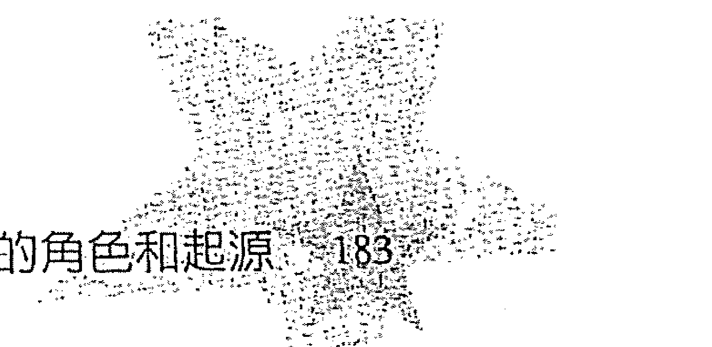

鮑伯的難題是要去克服羞愧與不如人的感覺。為了幫助他做到這件事，他的靈魂選擇了可帶來自信的火象星盤，以及土象星座形成的大三角（Great Trine），讓他能有充裕的物質生活，也因為富有而更可能受人敬重。

克理斯正值坐三望四的年齡，從來都沒有過深刻的戀愛關係。他因為前世看到自己的父母彼此折磨，在心理上留下不可磨滅的印象，影響他現今的戀愛關係，儘管這一世的父母很恩愛。這種情形表現在星盤上，即為金星與天王星呈四分相位。對他而言，與其說是害怕親密關係，不如說是他認為親密關係不可信任，也不值得多費心思。克理斯需要人、事、地各方面的配合，來幫助他學到與人親密與建立關係的深厚回報。他的巨蟹月亮與天蠍太陽呈三分相位，生命準備要給予他圓滿豐足的親子養育經驗，讓他可以克服逃避的態度。

檢視源自過去的相位之際，四合相位很值得一提。比起其他相位，性質更穩定一致的四合相位，描述了需要改正的前世習性。四合相位是靈魂企圖從心理層面平衡或移除前世不幸經歷的一種方式。相關行星與星座，述說了發生於某個前世的意外或經歷，造成心理情結。相關宮位通常描述了哪個生活領域有最明顯的心理情結，以及如何平衡該情結。有時候宮位就像行星和星座一樣，可以從中看出造成情結的情境，不過，只限於那些需要加以修正的情結的發生情境。下列兩則故事告訴我們，什麼樣的四合相位可能是源自於前世而形成。

## 184 ★ 靈魂的符號

吉姆在某個前世遭遇到一起特別嚇人的事件，他以精神疾病作爲逃避藉口。這種情形反映在他的星盤，即爲火星與海王星呈四合相位。爲了幫助他停止以這種行爲模式來處理困境，他的靈魂選擇了太陽與上昇星座都是牡羊座，希望他能由此獲得些許勇氣，並因爲果決的行爲重獲讚賞。

當約翰在前世面對了無法承受的心理痛苦，他並未放棄自我而患上精神疾病，反倒變得熱衷於宇宙意識②。不幸的是，這種行爲阻礙了約翰的成長，因爲他在那一世以宇宙意識來吹捧自己。在約翰的星盤裡，火星與海王星呈四合相位，代表他前世濫用有關心靈方面的權力（火星）。

吉姆和約翰的故事說明了分析相位的複雜性。相位在星盤上有四種作用，此外，因爲從前世衍生的相位，是源自千變萬化的事件，所以也就會有許多種解釋。解讀相位是解釋星盤最困難的部分，需要很強的直覺，特別是牽涉到前世事件與問題時。

②宇宙意識：Cosmic Consciousness，一種對於宇宙、生命、天地萬物的意識。擁護這種意識的人認爲，雖然目前擁有這種意識者相當罕見，但經過長久時間之後，所有人類都會有宇宙意識。根據Richard M. Buck (1837-1902)的看法，持有宇宙意識的人，大都是年齡介於30到40歲的男性，這些人不是發展完善、聰明、品德良好，就是有強健的體魄與熱誠的宗教情感。最具代表性人物爲：佛陀、耶穌、使徒保羅、義大利文豪但丁、英國神祕詩人威廉布雷克、美國詩人惠特曼等人。宇宙意識的經驗來得很突然且全無預兆，這種經驗讓人沉浸在一股熱情或樂觀的想像中，令人情感激越、伴隨著狂喜的感覺。在這當中，道德也好、智慧也好，都有所啟迪，彷若靈光一閃，一道清晰的概念輪廓於焉而生，天地萬物的要旨大義，全都了然於心。經歷過這種經驗的男人或女人，將宇宙看作是生生不息的存在，生命永恆，人類靈魂不朽，世界的基本法則就是愛，而且以長遠的眼光來看，每個個體的幸福也是絕對可期。所有對於死亡的恐懼、罪惡的感覺，都消失不見。人會變得更可愛、高尚。置身於這種經驗中，學到的東西比經年累月的研究更多，而且是經由研究也無法學會的東西。參見《Encyclopedia of Occultism and Parapsychology》2nd Ed，Gale Research Company。

### 外行星相位

個人行星（太陽、月亮、水星、金星和火星）與外行星（土星、天王星、海王星與冥王星）之間形成的挑戰式相位，比其他任何相位更能述說我們主要的心理問題。因爲個人行星與外行星之間的相位通常都很重要，下一個章節將根據相位的種類（硬式或柔式）、以及該種類所扮演的角色，來描述這些相位。

爲了簡化之故，將先前提到的四種角色綜合爲兩種：代表來自前世行爲模式的相位與提供所需能量的相位。其他的角色——提供額外的挑戰（這個作用就如同前世的行爲模式）與爲生命任務提供能量——都屬於這兩類，但在一開始是爲了作更大的區分，所以才分開說明。請記住，這些資料只是爲了引導解讀；並不適用所有星盤。

### 代表前世行為模式的土星硬式相位

這些相位的特點是恐懼。恐懼通常涉及土星形成相位的相關問題。這往往是非理性的恐懼，無法以現今環境來解釋，而且是深植於心中。許多具有這些相位的人甚至不會意識到這種恐懼的延續性，因為他們沒有一世不跟這種恐懼同在。這也是造成難以克服這種恐懼的原因之一。而意識到這種恐懼的人會對此感到羞愧，他們的自尊也將被這恐懼所吞噬。

挑戰式的土星相位，特別是與月亮或太陽形成的相位，屬於最難克服的相位之一。當我們的自尊被侵蝕（如此情形會隨著這些相位而來），便缺乏克服恐懼的動力。如果我們不淪為悲觀主義、負面、自卑的獵物，這些土星相位，和所有的土星相位一樣，便能讓我們變得更堅強。面對自己的恐懼使我們更強韌，而從面對的行動當中獲得的勇氣，能幫助我們面對其他恐懼。土星是偉大的導師，它所教導的大部分事物都是除了透過努力、負責、堅持與耐心（也就是這些相位發展出來的特質）之外，別無他法能習得。

說到挑戰式土星相位的特點，莫過於恐懼了。這種相位通常源自過去的外傷事件，在事件當中，我們沒有能力保護自己免於死亡或悲劇性的失去身邊的人。在這些情況下，我們可能被殺或只能在一旁無助地看著某人被殺，因傷致死在我們心中留下深深的烙痕。死亡連同我們的軟弱無助一起留下烙痕，而因傷致死的人，會在心底留下軟弱無助的感覺。而反映在星盤上的便是挑戰式土星相位，與該傷害有關的行星、宮位或星座都會形成這種相位。

我們累世以來都經歷過許多因為身體創傷而導致的死亡。靈魂的要務便是安排能幫助我們走過這些創傷經歷的來世。安排的手法是如此小心又有系統，一次只選擇治療一件傷亡事故。這個傷亡可能會反映在硬式土星相位。

挑戰式的土星相位也可能描述今生將發生的一件令人恐懼或不幸事件；可能象徵失去所愛的人（如果金星牽涉在內）、不適任或嚴苛的父母（如果太陽或月亮牽涉在內）、虐待或暴力（當火星牽涉在內）、學習或言語上的問題（當水星牽涉在內）。這裡只舉出幾個可能。因此，挑戰式相位可能代表前世的傷亡或瀕於死亡的經驗，或只是類似的經歷，或發生在今生的不幸事件。如果當事人沒由來的恐懼，無疑地，這個相位便與前世的經歷有關。若是尚未發生的經歷就沒有討論的必要。

占星學家絕不可預言悲劇事件。可以從星盤上看到的此類事件，是不可避免的、也在生命計劃中有其目的。述說這些可能發生的事只會憑添恐懼。此外，你也可能判斷錯誤。我們必須謹記在心，這些世人皆有的經驗之目的，是要讓我們更堅強。土星在此不是要教導我們「死亡為勝、我們什麼也不是」，它是要教導我們「生命可貴，而我們遠比生命更可貴」。面對我們的恐懼，從中獲得的勇氣進而超越恐懼，是額外的獎勵。

當挑戰式土星相位代表過去發生的創傷時，綜合和土星形成相位的行星、星座、宮位等條件，可以看出該重傷意外。不可否認的，進行這種綜合和判斷需要敏銳的直覺。

何從相位看出傷亡意外。

傑洛米前世不幸成爲老虎腹中物：在打獵的當時，卻被獵殺。這一經歷反映在不合常理的害怕夜晚的行爲上。雖然不是在夜間進行打獵，但在小男孩（傑洛米）的想像中，黑暗卻是他投射出來的恐懼的舞臺背景。有趣的是，傑洛米有寵物貓在夜裡陪伴睡覺會比較安心。這似乎與他的過去相抵觸。不過，靈魂通常會將令我們恐懼的任何事物，和緩的引入我們今世的經歷，好幫助我們克服恐懼。

這個不幸事件標記在傑洛米的星盤上，便是土星落於第五宮人馬座、與落在第八宮雙魚座的火星呈四分相位。土星落在第五宮人馬座，代表冒險犯難的人受到傷害，如今缺乏勇氣與自信。火星落在第八宮雙魚座指的是死亡，因爲第八宮代表死亡，火星落在雙魚座代表讓他對於勇武的能量有心靈上的領會。任何死亡都能讓我們更瞭解自己的軟弱無助，同時理解到，我們並非只是軟弱的肉體而已。在死亡的那一刻，傑洛米沒有辦法接受，他太過於相信自己的身體和知覺。這個事件爲傑洛米上了寶貴的心靈課程，從火星落在雙魚座可看出來。

在這一世，火星落在雙魚座有對其他領域——之於生命的精神方面——很敏感的傾向。這便是該相位的天賦。與土星呈四分相位，意味着在這種敏感度能發揮作用之前，會產生內在掙扎。傑洛米的情況則是對自己的男性氣概產生疑問：勇氣與強壯兼備又該是如何？到最後，他會做出「真正的強壯不在於身體的強壯，而是精神上的強壯」如此結論。

### 提供能量的土星硬式相位

這是挑戰式土星相位在星盤扮演的另一個角色。這種相位為生命提供土星方面的特質，以涉入該相位的個人行星為象徵。例如，土星與金星呈四分相位，提供對於男女關係的忠誠度和堅定不移。這種相位也可能會產生對於男女關係感到恐懼或過度認真，不過只有在有其目的的情況下才會如此，也許是為了讓當事人延後談戀愛，好讓他們能專注於生命任務或償還宿債。當挑戰式相位是扮演這個角色，就不會如同源自前世傷亡而形成的相位一樣造成壓力。以下故事可供說明。

艾伯特的生命任務與創業有關，此舉將可造福地方。在他的星盤裡，北交點落於第二宮水瓶座正代表這一任務。他還有好幾個行星落在第五宮金牛座，他的上升星座是魔羯座，月亮是天秤座。在前世，他從事生意時很不切實際，月亮會冥王星便象徵這種情形。南交點落在獅子座代表前世追求自我表現與創造的行為模式。

艾伯特這一世的挑戰便是找到讓創意能切合實際、進而加以發揮的方式。透過相位與土象星座，便能做到切合實際。上升魔羯與大部分落於金牛座的行星，形成三分相位，加強了這些土象星座的正面特質。土星與月亮以及海王星相會、與上升星座呈四分相位，更加強土象元素的性質。艾伯特能變得實際，有部分也是歸因於母親沒有給予充分照顧、使得他必須快快成長（土星會月亮、海王星）而來。

## 186★靈魂的符號

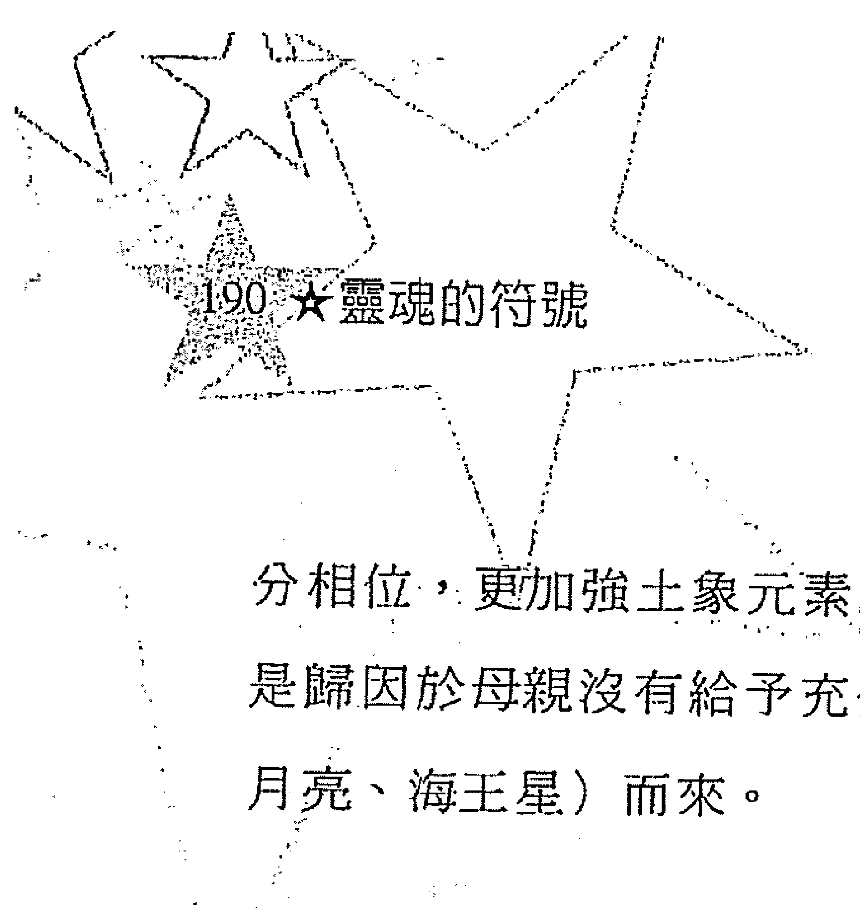

### 土星柔式相位

「柔式」或「和諧的」（harmonious）相位是三分、六分相位以及某些合相。三分相位代表累世發展而來的才能或正面特質，並以天賦的形式表現出來。不過，這些天賦的發展程度各有不同。並不是每個三分相位都代表高度發展的才能或特質，雖然它確實代表在相關行星的課題上有某種程度的成就。柔式合相也可能代表才能和正面特質，而且它的作用可能比三分相位更有力量。另一方面，它們可能只是供給所需能量。六分相位代表正在形成的才能，對於解讀星盤來說，這種相位是最單純、最清楚明白的相位。

土星的三分、六分相位和某些合相所象徵的才能，是由克服「磨難、拖延、沮喪與面對真實世界」的困難而形成。沒有人能倖免於這些磨難。不論我們發展得如何，所有人都必須面對物質世界的限制。諸如耐心、堅持、謹慎、行事周全、完成目標的成就感還有耐力等美德，都是由成功面對真實世界發展而來。

雖然有些土星的美德不經過磨難與掙扎就能發展，土星的天賦卻不是如此。預見問題、進而擬定計劃加以避開，儘管沒有報酬仍持續不懈的努力，在這不確定的世界裡自食其力，都只是這些天賦的一部分而已。透過土星帶來的磨難，我們發展出堅忍不拔，並以此發展我們的性格與才能。我們如果想要有更高的發展，就要靠土星提供的生命首要課題來促進。

土星的柔式相位綜合了這些正面的土星特質，無論是跟哪種星座、宮位或行星形成相位。例如，土星與第七宮的雙子月亮呈三分相位，讓當事人在男女關係上很忠誠。土星與落在第二宮牡羊座的金星相會，能夠給予具有藝術才能的人應有的紀律與決心。土星與落在第三宮雙魚座的太陽呈三分相位，讓充滿理想與直覺的心靈擁有專注力、紀律和切合實際。

和諧式土星相位描述了我們最能即時應用到正面土星特質的生活領域，以及可能對於生命任務很重要的生活領域。挑戰式的土星相位提供土星方面的能量，指出了需要發展的土星特質，或是代表一道課題或某種恐懼。然而，所有土星相位產生的複雜狀況，我們又該如何解釋呢？我們來參考以下範例，看看該怎麼綜合涉及土星的各項條件。

土星對彼德的星盤影響甚鉅。他的土星落在金牛座，位置就在天頂，與落在第四宮天蠍座的金星、火星相沖，又與落在第一宮處女座的月亮和冥王星形成四分相位。我們發現有一個金星加上土星的主題：金星與土星對沖，土星落在金牛座，而金牛座的守護星是金星。另一個主題是月亮與天蠍的組合：月亮與冥王星相會，冥王星守護（掌管）天蠍座；天蠍座掌管（落在）第四宫，而第四宫的本命守护星是月亮。如果我们将这些资讯放在一起看就会有如下解读：彼得将遇到成长上的难题，因为不论是亲密的情感、性爱或家庭，他都需要，而他追求的这些需求，对工作会造成很大的影响。

土星落在金牛座并与天顶相会，彼得需要在这世上有個安稳位置，一個能夠提供結構性與常規、讓金牛座特質有所發展的位置。金星與火星都落在第四宮天蠍座，與同落於第一宮的月亮／冥王星呈四分相位，他尋找的伴侶，是需要親密情感、又能幫助他在內心培養親密情感的人。他要克服的挑戰，是滿足對於家庭與情感上有親密關係的需求、發展工作的相關技能，並在克服挑戰的當中找到滿足感。T形四分相位顯示這些生活的面向——工作、家庭和自我發展——都爭相要用到他的能量。

彼得年紀輕輕就結婚，而且馬上就過起家庭生活。身為年輕男子，他在親密關係上的需求，正如行星落在天蠍座的情形所示，超越了自我發展的需求。這種情形可能會在往後造成衝突，也就是當T形四分相位推運時。月亮落在第一宮（自我主體，identity），成為T形四分相位的中心點，所以他會為滿足T形四分相位其他部分的需求而犧牲自我主體，如此作風是意料中的事。對具有中心行星的T形四分相位來說，這是很常見的情形。而既然他的月亮落在第一宮處女座，代表他的需求與其他人的需求會混在一起（特別是家庭的需求），而且會想為家庭服務，這就更不用訝異了。冥王星與月亮相會，重申了天蠍／月亮的主題，也代表在他的生命裡，對情感、性愛與家庭有很強烈的需求。這個合相，也指出了由月亮所掌管的生活領域，將會是彼得自我轉化的資源，也會塑造他、磨練他，並且教導他關於愛與信守承諾之事。所以土星落在金牛座並位於天頂，傾向於代表他會為了悉心照顧妻小而犧牲事業。

## 194★靈魂的符號

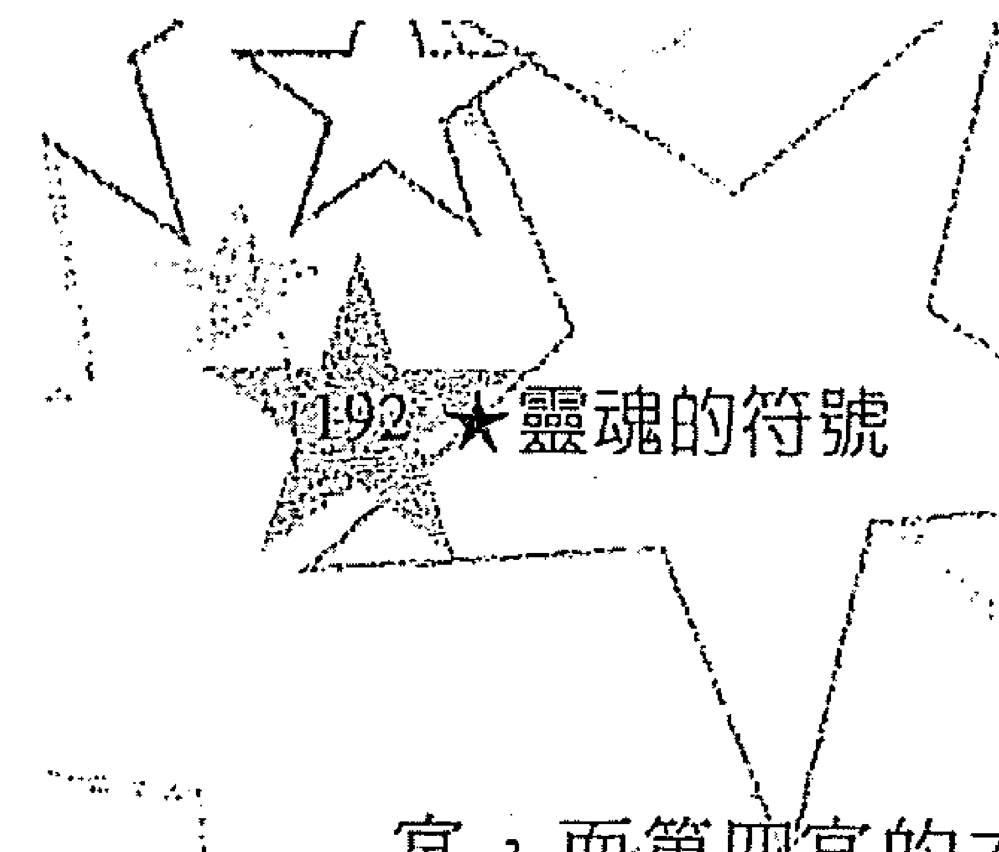

克萊兒因為中風，無法清楚說話或好好寫字，在此之前，她是一位事業有成的作家。土星是第三宮雙子座裡的星群（stellium）之一（有三個或更多行星會集於此），當中包括有月亮、水星與冥王星。這一星群既代表克萊兒的天賦、也代表她要克服的難題。土星和冥王星會為通常很無憂無慮、又顯得膚淺的雙子座，增添嚴肅感與悲觀色彩，讓她能專注一致、行為果斷，也使她在心智與情感上趨於保守。

這組星群在克萊兒童年時，帶來極大挑戰。當別的小孩還在玩著洋娃娃、騎腳踏車時，她卻想著生命的意義——死亡。克萊兒的母親在她年紀很小的時候就過逝了（土星、冥王星、月亮相會），留給她的是失敗、失落、不配被愛的感覺（土星與月亮相會）。

為了修正這種感覺，克萊兒開始藉由研究宗教、神秘學、心理現象來瞭解母親的死亡是怎麼回事。長大成人時，克萊兒能讓那些即將辭世的人與他們所愛的人們對於死亡有新的領會。雖然她所受的打擊看似出人意料、不公平，卻讓她有機會從另一種層面來體驗生命，那是種較不囿於自我、語言、狹隘思想的層面。

對於探索生命的奧秘，克萊兒一直以來都不曾稍減，只是換一種形式罷了。

凱斯是名中年男子，擁有一家成衣工廠。在經過多年苦撐之後，凱斯的事業如今欣欣向榮。他不只白手起家，還提供許多就業機會，要不是他提供工作機會，這些員工的工作可能都沒有著落。這件事對於償還積欠好幾個人的宿債非常重要。

這項宿債可從凱斯星盤裡，落在變動星座的T形四分相位看出：土星落在第二宮處女座，與落在第八宮雙魚座的火星相沖，月亮落在第五宮人馬座。土星與火星相沖代表他沒有好好保護員工，導致他們受傷。

凱斯的星盤也給予他能夠清償這項債務的資源。落在第五宮人馬座的月亮給予他創業的信心與勇氣。火星落在第八宮雙魚座使他有做生意的眼光。土星落在處女座使他做事實際且周全，金星和水星落在水瓶座更令他會去關心別人的福祉。

從這些範例應該很容易看出，解讀星盤，特別是在相位方面非常依賴直覺。雖然，在大部分情況裡相位不需要解說到這種程度。然而這些範例並非用來說明解讀星盤需要如此詳細，而是要展示相位在星盤裡的作用。

### 天王星相位

因為天王星的本質、以及它扮演了與土星不同的角色，這一## 天王星相位

章节主要谈的事情和范例，本来就会比较轻松。天王星鼓励我们超越惯常的行为并尝试新的事物。它带来刺激与接纳改变，也为它所影响的任何行星或生活领域带来冒险精神。天王星相位不论是硬相或柔相，都没有土星、冥王星，甚至海王星相位来得重要。不管是何种相位，天王星相位都会带来对新事物抱持接纳的态度。天王星相位如何表现，当事人发展的程度、星盘其余条件，才是决定的关键。

天王星相位在我们的演化当中扮演了重要且独特的角色。这种相位的角色是独一无二的，因为伴随它们而来的“接纳改变”不会一直持续，而是只有在推运的刺激下才会如此。然而天王星相位越多，这种说法就越不准。具有许多天王星相位，可能会为生命导入不断的改变与多样化，这些相位通常是为了帮助执行生命任务或学习课题。大多数人的天王星主要相位（涉及个人行星或上升星座）不会超过两个，而且要到推运时才会造成变动，否则便一直处于休眠状态。

天王星推运通常会为生命某一领域带来改变，而这改变却会影响到其他领域。事实上，有时一开始由天王星带来的改变，比起这些改变造成的影响，对我们的成长有着更重大的意义。通常占星学家会忽略或误解天王星推运的真正重点，因为他们都以为造成“改变”的事件才是重点。以下故事可作说明。

马克的天王星落在金牛座，与天顶相会，此外，星盘里就再也没有其他天王星相位。在他发生中年危机的时候，推运的天王星与他出生星盘上的天王星相冲，丢了差事之后，他不得不对自己的职场生涯再做评估。面对职场生涯的变异，他找到了改变令他不满意的婚姻的勇气与动机，而这才是真正需要发生的事。

天王星扮演的角色，是因应我们对于改变的需求而进行。天王星的配置位置与相位，给了我们“哪些领域会发生改变、箇中情形又是如何”的线索。数个天王星相位或即便只有一个包含数颗行星落于其中的合相，都指出了“改变”在这人的生命中占有举足轻重的地位，同时带来极大的成长。

### 代表前世行为模式的天王星相位

天王星形成的四分相位、对冲以及一些合相，可以代表过去的行为模式。不过柔式相位却非如此。天王星形成的硬式相位指出前世冲动、没耐性与轻率的行为。如果有这种行为模式的话，星座或星盘主题也会重申这些倾向。知道这点能帮助你理解，某个天王星相位是代表前世一项行为模式，抑或是选来平衡过度保守和压抑。奇怪的是，那些有轻率行为倾向的人们，具有火象星座、落点突出的天王星或数个天王星相位的机率很大，因为要学会耐心与自我的方法，莫过于透过负面的后果。从冲动与缺乏耐心的行为所获得的经验，教他们学会放慢脚步并更加小心。我们来看几个显示描述过去行为模式的天王星相位范例。

在库尔特的星盘里，土星与天王星都落在第五宫魔羯座，并与落在第二宫的水星呈四分相位。这个相位代表他前世因为攀岩而意外身亡。在这件意外事故之前，库尔特冒险犯难的精神有好几世都得到回报，因为他在刮着暴风雪的山中救了好几个人。此后，他便一直寻求超越人类耐力极限的方式，一而再、再而三的挑战成功，并且强化了他的冒险精神，在今生星盘里，他的天王星与水星呈四分相位就象征这种情形。而他的勇于冒险，总有一天会要了他的命。土星落在第五宫魔羯座代表库尔特的山难悲剧，以及这个死亡所残留的恐惧，使他如今变得小心且实际，以缓和他先前的鲁莽。土星反映出从事休闲活动（第五宫）的时候，库尔特会抱持不同的态度，他的灵魂计划便安排他学会克服任何残余的恐惧并记得要更谨慎。

布鲁斯努力要在事业上有所表现，他的青壮时期步调很快、也很多采多姿。不过布鲁斯在感情上却一片空白，他往往太投入工作，把时间和精力都投注其中，但在他的行为背后，却有更深的涵义。布鲁斯位于第四宫的火星和第七宫的天王星呈四分相位，代表他需要独立且不寻常的个人生活。这个相位很适合他，因为提供了迈向成功的勇气、驱策力与决心，让他有足够时间远离家庭与恋爱关系以利开创事业。这个相位也具有前世的历史。

在前世里，布鲁斯在滑雪时来到悬崖边，但是有保持安全距离。一位朋友看见布鲁斯在那里却没看到悬崖，便直接往他那边过去，因而送命。这桩悲剧对布鲁斯造成很深的影响。不过这件悲剧不但没有对他的生命造成更多恐惧，虽然可能会如此（这种情形可能会在来世星盘上形成土星四分相位），却反而让他更决意勇敢的活着。如此态度反映在天王星／火星四分相位。这种相位在他前面几世的星盘也出现过好几次，难怪他会有如此反应。

现在布鲁斯的勇气和冒险精神被用在他的生命任务上，这是很常见的情形。代表过去行为模式的相位，往往会拿来用在生命任务上，特别是天王星与海王星相位。硬式天王星相位与海王星相位通常代表某种天赋，虽然这些天赋有时会被误用。

这个故事也说明了相位并非在人的一生当中都会持续发生作用或以同样方式产生作用，它们的影响会根据我们的需要与心智成熟度而改变。当布鲁斯的职场生涯不再需要天王星／火星四分相位来加分，要不了多久便会结婚。

最后一点：布鲁斯的冒险精神尚未为他带来不幸事件，一个人会如何处理冒险的冲动，而冒险是否会以悲剧收场，端视个人的发展程度与星盘的其余条件而定。如果某个人在演化的早期就喜欢挑战死亡，便很容易造成不幸事件，因为在初期转世时期，我们较缺乏判断力。

### 提供能量的天王星相位

硬式和柔式的天王星相位都能提供一种需要的能量。前一个范例说明了四分相位除了代表前世的行为模式之外，又是如何提供独立和驱策的能量，来开启命中注定要从事的职场生涯。下个例子则说明挑战式天王星相位，也可以是有帮助的。

艾伦有个属于土象的星盘。他是老板理想的员工，这一点并不令人诧异：有责任感、工作努力加上有效率。这些特质就是他的天赋，而且对他的生命任务也很重要，就如同这些特质在前几世的作用一样，虽然他的土象天赋不需要再求进步了，但艾伦却需要多多经营工作以外的领域才能有更完善的发展。天王星落在他的第五宫、与上升星座呈三分相位，以此来帮助他逃脱个性保守的樊笼，至少让他在休闲时能放松。因为与上升星座形成的三分相位，是唯一不需要经过努力就能换取到的，这样的相位可以用來提供一种能量，如同这个案例的情况。这种配置位置让艾伦下班时能享受无拘无束的一面、并解除长时间工作的紧张感。另一方面，天王星与水星呈四分相位，为他的思想增添原创性，也吸引了其他不平凡的人来到他身边，带来更多刺激。

当天王星相位运作良好时，为星盘增添独特性、原创性、创造性、直觉与个体主义。当这些相位运作欠佳时，便会增添鲁莽、反叛、缺乏耐心与任性的特质。天王星（或水瓶座）的负面特质会历经好几世来磨练，并演进为正面特质。然而，并不是所有其他能量都以这种方式来演进。例如，土星的优点不是从土星的悲观、恐惧和气馁演进而来，却是以克服这些缺点的方式发展出它的长处。了解每一种能量是如何演进，大体上能够帮助我们决定某个人的发展程度为何。

星盘里有多少个天王星相位，可以指出天王星带来的能量是好或坏。星盘有数个天王星相位的话，除非它们都是和谐式的相位，否则可能代表一个根深柢固的问题。另一方面，数个天王星相位——包括挑战式相位，也可能代表出众的天赋。我们很难以概略的意义来解释这些相位，必须查看整张星盘并以直觉来了解每个范例。

### 海王星相位

和天王星一样，海王星的硬式和柔式相位彼此之间并没有太大差别。挑战式海王星相位可能是、也可能不是代表才能或正面特质，要看星盘的其他条件和个人发展程度而定，这些才能也许不会像三分相位所代表的才能具有高度发展的程度。就像天王星一样，海王星的负面特质会演化成正面特质。不过，类似的地方也就只有这样了。

海王星相位激发我们对于上帝的渴望，透过人类天生就要承受的痛苦、由此产生的直觉与心领会帮助我们应付痛苦。海王星相位是灵性的力量，将我们自红尘俗务牵引到直觉与心灵的领域。不过，这些相位如何影响我们，则有赖我们的发展来决定。在发展较初阶的人的星盘里，海王星相位带来逃避主义与避免负责任的特质，这就是何以它们鲜少被很年轻的灵魂选用。在年轻灵魂的星盘里，海王星相位通常象征前几世有无法处理现实的情形。如果是这种状况，星盘的其他条件便是选来加强自我的力量。在发展较完善的人的星盘里，海王星相位会促进无私的服务、自我超越（ego-transcendence）与神秘主义。在这两种极为不同的情形之间的某处，海王星相位会激发创意与音乐上的表现，为世俗与精神搭起桥梁。

### 代表前世行为模式的海王星相位

就像硬式天王星相位可能代表前世负面行为模式（也可能是天赋），硬式海王星相位也是如此，虽然柔式相位绝不可能有此象征。以下范例说明硬式海王星相位何以是因前世之故而形成的。玛格的星盘有很强的双鱼和巨蟹主题。具备这么多水象元素，很可能要么是水象天赋、否则就是水象的课题。玛格拥有很高的心灵天赋，能运用能量来治疗。在她的星盘里，海王星与太阳相会、与月亮呈六分相、与天顶呈三分相——全是和谐的相位。不过，落于第六宫的海王星与落于第三宫的火星形成四分相，反映出她在前世滥用心灵的力量。在她企图重犯错误前，就发生要为先前行为赎过的情形，这个相位也代表这一情形。要学习的课题是既痛苦又发人省思，让她对于心灵力量有了新的领会。

南茜的星盘是土象主题，虽然海王星落点相当突出，与月亮和太阳形成四分相位。这个T形四分相代表南茜前世被迫成为修女，失去了她的主體性与家庭。她从头到尾就不愿接受这等命运，后来便抑郁而孤独的终老一生。和前一个范例不一样，这个配置位置并非代表需要消除的态度，而是意味着影响南茜心理状态的事件。由此产生的结果便是南茜拒绝所有的宗教、不相信上帝。她学习到自由的价值，但也变成愤世嫉俗与宿命论之辈。在这一世，她充满了无力感与宿命论，她的土象星座并没有什么帮助。我们不得不怀疑，为什么她的灵魂会选择一个助长宿命主义而不是有平衡作用的星盘。然而，土象星盘却很适合这一世，因为她的生命任务便是要经过奋战，摆脱宗教信仰的影响，从而得到自由。南茜为某个反宗教组织工作，有助于更进一步解脱宗教束缚，同时也治疗她旧有的心理伤痕。既然她在前世无法凭个人意志决定要做什么，而在这一世里如此行事便是在赋予她自由的权力、也是在治疗她。

凯萨琳这一世是酒精药物治疗计划的心理治疗师。她的工作有一部分是帮助人们了解为什么自己会成为药瘾者。许多人借助药物都是为了满足心灵上的需求或空虚，这也是为什么匿名戒酒会“十二步骤计划”（Twelve Step program of Alcoholics Anonymous）会如此成功的原因。凯萨琳前世借助药物来处理记忆中艰困的童年，藉此让自己暂时觉得好过一点。当药性退了，她便增加剂量来麻醉知觉。前世在感觉上有负面关系的情形，是以海王星与月亮呈四分相位显现在凯萨琳的星盘上。虽然如此，她的前世却并非都迷失在仰赖药物当中；她心里明白，这种嗜好会让人衰弱不振、也试图加以克服。虽然她没有成功，但染上药瘾的痛苦，却产生了一种内在渴望，想要在这一世帮助那些有药瘾的人。凯萨琳要是没有这么大的进步，可能还是会重蹈前世覆辙，而不是成为戒瘾咨询师。

这个故事告诉我们，单从星盘不可能知道正在运作的行为模式已到达什么程度、或是否仍在运作。一个相位可能只是代表我们在前世学到的负面行为，就像这个个案一样。凯萨琳的海王星／月亮四分相位反映出前世滥用药物、同时又刺激她这一世在心灵上的寻求，就如同大多数的海王星相位所代表的任务一样。

### 提供能量的海王星相位

海王星相位代表我们与海王星能量协调与否的程度。柔式相位——三分相、六分相与和谐式的合相——代表海王星的天赋与课题只有某种程度的神秘性。挑战式相位可能也代表类似，但种类较少的才能。柔式和硬式海王星相位可以为星盘增添更多怜悯心、敏感度、直觉、同理心、无私或心灵上的领会力。不过，硬式相位通常没有提供如三分相位对于这些特质那么高的表现。下一个范例说明了海王星相位如何为生命任务提供能量。

克雷格的生命任务是有关帮助濒临绝种的灵长类动物。他花了好几年时间研究灵长类的习性与行为。因为克雷格所从事的工作，使他不习惯与人类相处，然而他却很能享受独处，因为他是那么的内向也很喜欢大自然。这些特质可以从海王星与落在第六宫的太阳呈三分相位、以及星盘的双鱼座主题看出来。他有好几世都在发展对于动物的怜悯心与敏感度。这一世的生命任务仍延续前几世类似的任务。因为他身为双鱼座的时间比身为其他星座的时间更久，对于双鱼座主题他很能适应。不过，也因为他缺乏某些特定星座的经验，他发现生命有些领域很难得心应手，特别是男女关系。很明显的，既然他的灵魂选择了展示双鱼天赋的星盘、而不要求他涉入男女关系，那么去面对不平衡发展就不是那么要紧了。无疑地，当他必须去获得缺乏的技能时，面对的时刻终将在演进的过程中来到。之后，星盘就可能只反映出最少的双鱼天赋。

### 冥王星相位

硬式冥王星相位通常述说了前世一种失落的经验，而该经验深深地影响了心理。如同硬式土星相位，硬式冥王星相位述说了需要平衡或治疗的前世事件、较少是提供所需的能量或代表一项天赋。而硬式天王星相位与硬式海王星相位的情况却恰好相反。即便这两种相位真的与过去事件有关，通常不会像土星与冥王星相位一样，透过星座、宫位和行星来述说该事件。然而硬式冥王星相位并不总是属于挑战局势，因为它们也可能代表天赋或正面特质。相较于三分相位，由硬式相位所代表的天赋，可能发展较不完备、也较难以开发。三分相位可能反映出天才层级的天赋，但四分相位则绝对不可能。

### 代表前世行为模式的冥王星相位

涉及到一颗个人行星的冥王星四分相位，是最有可能述说过去有重大失落的相位。然而，当有合相涉及一颗个人行星，而且其作用在述说过去有重大失落时（虽然不常有这种情形），该事件的冲击力很可能特别强大。对相象征的问题或事件，通常是较次要的；它们的课题往往是透过他人来学会，而且可能只是观察某个努力解决相位相关行星代表的问题的人而学会。

因为土星或冥王星以及个人行星之间形成的四分相位，通常代表着我们最大的挑战和心理上的问题，这些相位应该要以直觉来小心检视，以决定它们的意义。如果它们真的是在述说一件前世事件，潜伏的问题就可能很重大。这就是为什么这些相位应该要加以解读——而不是因为过去发生事件的细节很重要才如此做。由这类冥王星四分相位所述说的前世事件，通常是失去某个所爱的人或爱人死去。冥王星和土星都代表死亡，但代表的方式有所不同。硬式冥王星相位代表态度、信仰、感觉、想法或做事方法的转化，以个人方面的失落做为转化的催化剂。硬式土星相位更像是象征前世实际发生的死亡，而该死亡事件被催化为一种恐惧感。这是很重要的区别。牵涉到土星的情形，代表必须克服恐惧。牵涉到冥王星的情形，就表示必须继续转化。灵魂会带来持续转化的任何必要事件，持续转化甚至包括更大的失落。因此，硬式冥王星相位通常象征一种心理转换的阶段，出于更多的失落或前世的失落而产生的特别洞察力就是证明。

冥王星透过失落来教导它的课题。藉由“让我们失去所爱的人”与“爱的喜悦”做对比，失落的痛苦教我们学会了爱的喜悦。在这种教导方式里，失落是苦痛中带着甜美，失落的箇中滋味提醒我们，我们的爱、我们对于另一个人的需求是那么深切。因此，我们更愿意与他人分享、合作。冥王星和它带来的爱与失落的课题，教导我们什么是信任、亲密、分享、合作与放下。

马修为占有所苦。对于那些星盘有强烈的天蝎主题，或者有强烈或好几个天王星相位的人来说，是相当常见的情形。他的故事有助于解释，为什么常常会有这种情形。马修的占有欲，可从冥王星与金星成九十度看出，这种相位代表了前世发生的事件，在任何星盘里都是种麻烦的相位。在马修的星盘里，这个相位象征前世的妻子背叛了他。出于羞耻和悲伤，马修断绝与他人往来，在孤独与痛苦中死去。现在，为了处理这种事件带来的影响，马修企图掌控他所爱的人，而这可能完全出于对于失落深刻的恐惧。金星落在第五宫狮子座，马修有很多恋爱以及学习恋爱的机会，我们可以从第五宫／第八宫形成四分相位看出。牵涉到第五宫和第八宫的相位，应该都要做检视，以发现可能代表在情爱上有所失落的主题。这个高难度的课题，通常都反映在这些宫位当中。

冥王星呈四分相位，通常也代表了任性、严苛的行为以及意见，下一个范例会有所说明。布廉特的冥王星落在第六宫狮子座，与落在第三宫金牛座的水星形成九十度，代表前世出于一场奇怪的意外事件，他失去了自己的舌头。因为成了哑子，布廉特余生都被排斥、孤立。出于前世在沟通上处处碰壁的经验，反应了布廉特今世对任何事都要激烈的发表意见，符合传统上对于冥王星与水星呈四分相位的解释。

安德鲁在前世孩童时期，经历了一场特别痛苦的事件，从此让他在形成紧密关系上有所障碍。这种情形可以从冥王星落在第四宫金星、与位于第七宫人马座的月亮成四分相位看出。冥王星落在第四宫，象征前世失去了家人的剧变。如此事件影响到他在情绪方面的平和态度与对自己的感觉（月亮），而这样的影响也伤及他的内心。前世的情绪伤害会延续到这一世。他在情感上采取防卫态度，也以随时都会有危机发生的意识来过生活。悲剧性的遭遇，在无意识的层面留下强烈且深刻的情绪，这种情绪可以绵延好几世而不绝。结果，许多具有冥王星四分相或妨害相的人，看起来很严肃且自私。

安德鲁有可能克服这些感觉，因为星盘其他条件被选来进行这样的事。木星合上升星座，月亮落在人马座，让他的个性更有自信、更外向。他的太阳落在天秤，对于广结善缘也有加分作用。这些星盘条件让安德鲁有可能发现能让他了解自己情感的助力。冥王星与月亮形成四分相位，在安德鲁一旦克服自身心理障碍、变得既安详又快乐时，便可能成为一种资产。像这样的相位，可以开发我们最大的强处，因为克服了自身的困难就有能力帮助他人克服困难。通过冥王星的磨难，我们获得内在的力量与领会。

### 提供能量的硬式冥王星相位

当星盘需要天蝎座的能量，冥王星硬式相位被用来提供此能量。这种相位提供的能量特质，是对于神秘学与心理学方面的领会，还有专心一致、决断、强烈的情感。如果有人作风十分风象，这些相位能够提供深度与情感上的领会，平衡风象元素的肤浅与偏重理智。如果有人土象元素积习已深又很实际，冥王星硬式相位能提供领会生活奥秘的驱策力。如果有人需要持续与决断力来完成生命任务，那么这些相位也能提供这种特质。下面范例，显示了冥王星硬式相位如何提供能量。

葛雷克在职场、人际关系上都无法为自己争取权利，因为他怕得罪别人。在前几世里，他有让别人替他做决定的倾向。葛雷克的星盘有几个条件，是要用来消解这种倾向：冥王星与火星形成四分相位，牡羊上升星座、月亮落在第五宫狮子座。如果某人缺乏坚强与决断力，冥王星与火星呈四分相位可以增添这些特质，就如同这个范例所示。而现在当葛雷克展现了果决力，我们不知道这是出于他的牡羊上升星座？狮子月亮？冥王星相位亦或另一个星盘条件。当相位提供了某种能量，这些相位造成的影响并不大，而且其他星盘条件也会有类似的作用。

菲爾一生都在與疾病奮戰，現在要與愛滋病對抗。他在疾病上的傳奇經歷，包括愛滋病在內，是出於轉世之前的選擇：為了要加速自己的演進。我們有自由選擇這樣的轉世，如果我們覺得已進化到可以處理這種情況，或者能夠從中得到學習。目前為止，菲爾都能夠應付疾病所帶來的難題。而他將如何面對終極挑戰——死亡，且拭目以待。透過自身能坦然接受死亡，引發出人們對於死亡新的領會，是菲爾的部分工作。就像菲爾一樣，許多在現世面臨死亡的人，是自己選擇要作為死亡與瀕臨死亡的範例，也因此在未來，人們對於死亡會抱持新的態度來看待。這也是靈魂之所以選擇愛滋病、利用愛滋病的一種方式。大多數的疾病，如同愛滋病一樣，都是為了實現在我們成長過程中或人類計畫裡的某些目的，這是在轉世之前就選定的。

既然冥王星事關轉化，那麼冥王星也很適合掌管死亡——終極的轉化。為了讓菲爾的計畫能更順利進行，他的星盤有許多與冥王星形成的硬式和柔式相位，使他有可能開發冥王星的轉化力量。每得到一種疾病，他都設法轉化關於自己的某些東西——態度、習慣、想法等等。要是沒有疾病帶給他磨難，菲爾是不會做這些改變的。冥王星與水星呈四分相位、月亮落在第六宮，代表讓他有所轉化、也將帶領他走向罹病、死亡。冥王星與水星呈四分相位，象徵疾病對他自身情緒、對他家人產生的衝擊，他自身的感覺將永遠被改變，而家人也隨著他而有所轉化。冥王星與水星呈四分相位，象徵這些疾病影響他對生命與死亡的觀點。他可能甚至會寫下或發表演說他所學到的東西，或者以別的方式與他人分享他的旅程。這不是提供能量的硬式冥王星相位的典型範例，而是種變化的範例，既然相位不是出於要求而是被選擇，那麼這範例也可謂實現了他的生命任務。

### 柔式冥王星相位

調和的冥王星相位，特別是三分相或合相，代表因為學會了天王星的課程而得到的天賦。如同我們所見，課題通常是關於類似失落與教導我們去愛人、分享、合作、信任與放下。在我們早期轉世，愛與情慾、擁有、依賴以及勢力混淆不清。隨著我們的演進，我們在愛的能力上也變得純淨了。為了產生這種轉化，需要歷經許多轉世的親密與分享關係。冥王星的課題教導我們要更無私無欲的愛人。那些具有冥王星和諧相位的人，特別是三分相位，展現了不佔有、獨立且克制的愛的境界。然而，如同所有其他的三分相位，我們無法從星盤辨認出這種境界。有些三分相只指陳些微的天賦，有些卻像下一個範例，指陳極大的天賦。

克莉斯汀的冥王星會獅子太陽、與人馬月亮呈三分相。這種情形指出一種自我轉化的天賦，在今世應用在工作上，成為心理治療師。這些相位反應出前世透過歷經了失落以及親密關係，使她獲得洞察能力。因此，她可以幫助別人瞭解自己與情愛關係。冥王星與月亮呈三分相，顯示她在理解情感與協助他人情緒問題方面具有天賦。

#### 相位分析面面觀

每一種相位都含有星座與宮位，這些星座與宮位能更進一步描繪出相位的輪廓。行星和星座所形成的各種相位，述說了內在衝突、天賦、前世或今生的事件，而這些都即將或已經造成心理上的衝擊。涉及相位的宮位，描述了可能會被內在衝突、天賦或事件所影響的生活領域。本章節將更仔細探討相位、宮位與星座如何道出各種心理複雜情結、天賦與事件。

#### 相位述說了心理的複雜性

述說心理複雜情結的相位，通常是四分相，有時是對相或合相，偶爾是三分相或六分相。如果一個三分相或六分相代表一個事件，那麼該事件便會是輕微的問題或只是偶爾以負面方式運作。四分相最常代表心理上的問題，至少是代表對改變造成最大阻礙的問題。對相在我們的關係上表現最明顯，而且通常代表因為與他人的關係而造成的內在衝突。合相可以代表一種良好或不良的心理特性。述說心理情結的合相通常涉及彼此敵對的外行星與個人行星——特別是太陽、月亮和火星——落在同一處。由硬式相位代表的許多心理問題，牽涉到一種內在衝突，這些問題的各方面，由行星、星座和宮位娓娓道出。下列範例描繪了某些衝突。

梅莉沙的內在有兩面，彼此競逐要她投注時間和注意力。其中一面想要透過事業追求自我發展，另一面卻想透過情愛關係來讓自己更完滿。她為這種心態感到罪惡，並且覺得自己兩邊都顧不好。落在天秤座的火星和魔羯太陽形成四分相，顯示了這個內在衝突。「自我發展」與「和別人連結在一起」之間的衝突，是最常見的內在衝突。這種衝突，也可能以下列各組星座形成的相位來表示：天秤座／牡羊座，巨蟹座／魔羯座，天蠍座／金牛座，以及巨蟹座／牡羊座。人們通常會需要在自我發展與男女關係間找到平衡。除非生命任務對於某種發展的需要更甚於另一發展，否則通常都會出現這種衝突。這是靈魂確保我們能夠平衡發展的一種方式。

第二個範例是關於少見或不易解決的問題。大衛的土星和水星都落在牡羊座，與落在魔羯座的火星呈四分相，這個相位便代表這類問題。大衛的能量（火星）被土星牽制，同樣的衝突反映在星座上。魔羯座和牡羊座不一樣，魔羯座謹慎、行事前會預先計畫。這麼一來，在大衛內在產生一種推拉效應，就好像他一腳踩著油門，另一腳卻踩著剎車。大衛早上都爬不起來，也無法面對自己的責任。他沒有精力處理日常事務，更別說是長程目標。這種衝突也會以下列各組星座形成的相位來表示：牡羊座／巨蟹座，獅子座／雙魚座，人馬座／巨蟹座，牡羊座／處女座，以及人馬座／金牛座。這幾組星座的能量，通常會彼此互相抵消，而不是輪流展現。當這種情形發生了，當事人會變得停滯不前，難以達成目標。有時候，這類相位傾向於用來平衡前世太過輕舉妄動或過度謹慎。如果是這種情形就不難解決。然而，這些相位更有可能代表類似前世能量阻滯的模式。在這種情形之下，星盤其他條件將會出現使兩相衝突的其中一面突顯出來的星座，以打破這種停滯不前的現象。

最難以處理的內在衝突之一，便是內向與外向之間的衝突。在這種衝突能夠調和之前，不管人們怎麼做都會覺得自己很不真實。他們會覺得表達自己就像是在出賣自己的隱私。當他們有所保留，卻又會因介意別人的眼光而感到不滿意、不快樂。這種衝突也會以下列各組星座形成的相位來表示：牡羊座／巨蟹座，牡羊座／魔羯座，牡羊座／處女座，牡羊座／金牛座，牡羊座／天蠍座，獅子座／魔羯座，獅子座／金牛座，獅子座／雙魚座，獅子座／天蠍座，人馬座／巨蟹座，人馬座／處女座，人馬座／雙魚座，或是人馬座／金牛座。任何火象和水象或土象的組合，都會突顯這種衝突。

行星也可以和星座一樣，代表內在衝突。有些行星原本就是相沖，諸如火星和金星，太陽和月亮，還有土星和木星。牽涉到天性相沖行星的相位，會增加相位或星座代表的衝突程度。另一方面，形成相位的金星和木星，往往會減緩或消除相位的衝突性。水星的適應能力與中立性，也使得水星相位較溫和。

宮位也可以代表內在衝突。相沖的相位，連結了彼此對立、卻有可能互補的生活領域。形成相位的宮位在第十和第四、第一和第七、第二和第八，以及形成四分相的第七和第十宮、第一和第四宮，這些宮位最有可能代表衝突。這些宮位代表生而為人最基本的衝突：自己與他人。當宮位、星座和行星都述說了同樣的衝突，那麼該衝突會比這些條件各自代表不同的衝突更強烈。下列範例說明了某些更具一致性的衝突。

派翠西雅的星盤有一個大十字（Grand Cross），由落在變動宮位的基本星座形成。基本星座大十字代表在自己與他人之間的衝突，而這個衝突將會產生於想法與思想的領域。派翠西雅會既需要獨立又需要與他人建立關係，她也會想要瞭解這樣的衝突。她可能想深入研究這樣的衝突為難，並在生活裡作整合。她甚至可能成為平衡這兩種領域的專家，並教導他人如何做到平衡。

卡爾恰好是相反的範例。卡爾有個由落在基本宮位的變動星座形成的大十字。變動星座大十字代表瞭解生命的需求。因為大十字落在基本宮位，他將透過基本宮位的事項：居家、家庭、關係和自我發展來得到這種瞭解。行星落在基本宮位，會要求我們去平衡這些生命中的不同領域，這可不是件小事。透過這種平衡的行動，使卡爾更加知道如何過著更完滿、更有意義的生活。

#### 述說事件的相位

有時候相位描述一件與相關行星、星座、宮位有關的事件。事件通常以三分或六分相之外的相位來表示。以下範例，說明了星盤上顯示事件的相位。

尼克得了癌症。這種病症是他轉世之前為了成長的緣故，自己選擇的，火星與冥王星會於第六宮，象徵癌症事件。與我們所想相反，這個相位並不是顯示與別人共事時呈現劍拔弩張或難以合作的情形，也不表示尼克在前世有虐待別人的行為、所以今世要付出健康作為代價。這個相位意味著，死亡（冥王星）因一場來勢洶洶（火星）的疾病而逼近，事實就是如此，沒有第二種解釋。該相位對於尼克的生命沒有其他影響、也沒有別的意義；這個相位之前都保持靜默不語、直至現在才揭露它的意義。有些相位，就像這個例子一樣，在我們大部分人生歷程，是無從解釋其意義的。讓我們來看看另一個例子。

漢克是個努力工作、關心安全的保險業務員，卻突然死於一場意外車禍。漢克為家人買了人壽保險，他在潛意識中知道自己會死去所以有這個動作。漢克的星盤顯示，火星、冥王星和天王星分別落在第三和第八宮，形成四合的相位，指出他會突然死於橫禍。四合相位述說了前世有一場意外，而這一世必須面對該意外並有所平衡。這對漢克來說，四合相位象徵的前世事件是真實的；同時也表示了現世事件（相位有時候是這樣的）。

當要平衡過去的一項經歷，需藉由重複或幾近一樣的經歷來達成時，相位通常代表前世事件和今生事件。漢克前世在一場船難中喪生，這意外為他帶來轉世學習經歷新的自覺的安排。結果，他選擇重複這種經驗，當作繼續檢視突然死亡的方式。接下來，是沒有涉及悲劇的例子。

傑森和小他一歲的弟弟史考特唸同一所高中。史考特轉世前就協議好要幫助傑森遇到結婚對象。這項協議表現在傑森的星盤上，即金星與水星會於第三宮。代表愛情與男女關係的金星，落在掌管兄弟手足與早期教育的宮位，又與主掌這一宮的守護星（水星）在此相會。這是個很單純的例子，而許多這一類的相位，也都是同樣的單純且不涉及悲劇事件。如同所有相位，那些述說事件的相位顯示的程度各有不同。

#### 述說天賦的相位

三分相和一些合相代表天賦，而六分相則代表具有正在養成的天賦。對相和四分相位也可能代表天賦，如果這些相位能找出平衡之道的話，不過這得費些功夫，而且通常會佔用一世大部分時間。

瑪莎的音樂天賦，反映在落在風象元素的大三角（Grand Trine）。形成大三角的行星是落在水瓶座的水星（聰慧靈巧）、落在雙子座的火星（具有驅策力且更加聰慧），加上落在天秤座的月亮（敏銳且有音樂鑑賞力）。這些元素加起來，提供了音樂家生涯的基本要素。瑪莎有好幾世已磨練了音樂技能，她所擁有的技巧成了最大的長處。倘若她所擅長的部分是情感上的表現，她的大三角可能會落在水象元素、而不是風象元素。我們不必感到驚訝，瑪莎最喜歡的音樂是屬於輕盈靈妙之流——諸如莫扎特的音樂。莫扎特的太陽、金星、水星和土星都落在水瓶座，天王星則落在基本點。

赫爾布有個由風象元素形成的大三角，但這卻反映了不同的天賦。他是個科學家，研究癌症治療方法。赫爾布的大三角落在火象宮位，由天王星、月亮和火星組成。這種火象和風象的組合，在提供智識的發想與新的想法上有很強的力量。天王星落在雙子座提供了智識天賦，火星落在天秤座給予驅策力和通力合作的努力，月亮落在水瓶座讓他擁有直覺能力。這個大三角雖然不屬於水象元素，卻極富創意。

馬文是風象天賦的另一種類型。他在電子領域方面備受敬重，而且具有極好的組織能力。他的大三角是由落在土象宮位的風象元素組成，為他的智識能力注入了實際性，土星落在第二宮雙子座，讓他具有對商業的敏銳度、組織能力、以及準確翔實和實際的特性。水星落在第十宮的水瓶座，為聰明才智、實際技術以及在電子业界獲得成就的動力貢獻良多。

如同你所見，每個大三角（或三分相位）述說了前世發展出來的技能，但是這些技能不能光從星盤來判定。

## 第五章 月亮

星盤裡的月亮幫助我們瞭解童年環境對我們心理造成的衝擊。月亮描述了今生選擇的童年環境，以及我們的情感型態，這個型態是因環境而生。童年環境相當重要，因為它制約了我們的反應。我們對生命的直覺反應、如何處理情感，都是由月亮塑造而來。

正如同我們必須經歷十二個太陽星座的形式和課題，以此為演進的一部分，我們必須經歷十二個月亮星座的形式和課題。十二星座的每一種形式都是獨一無二的，也都有各自的目的。次要的目的可能是為了輔助生命任務與清償宿債，但是月亮星座主要是選來「透過星座的情感型態，從而體驗生命」。這種知覺上的多元分化，讓靈魂擁有多重的體驗，集領會之大成。

生而為人，情感是很重要的部分。情感形成了我們的心理、情緒、智識與心靈上的需求。若沒有情緒提供訊息，我們就無法分辨自己的需求，而未辨認出來的需求也就無從得到滿足。每個月亮星座對於知覺到自身需求與滿足需求的方式都不一樣。因此，有些情感型態會比其他型態更能導向健康的情感機制。較不擅長處理情緒的星座，將會遭遇能讓它們成長的課題，這就是月亮星座的目的。生命就是學習和成長，要學習和成長，就得體驗所有的人類經歷。雖然月亮星座當中，有些星座比較能傳導健康的情感機能，但不能因此就以為某些月亮星座是比較有利或不利。每個月亮星座都能提供各種可能的經驗。在經歷月亮星座方面，困難與否要看若干條件，特別是選擇該星座的目的。

### 十二種感情型態

#### 牡羊月亮

牡羊月亮將心思放在自己的需求上，也要求別人配合，卻不會依賴他人。他們給人的印象是不需要任何人（事實上也是如此），而且比大多數人更能自給自足。他們很能照料自己的需求，人際關係傾向敵對或競爭的關係，牡羊月亮會使親密關係有所困難，而另一個造成困難的理由，便是表現外向的火星與內向保守的月亮形成挑戰的配置位置。牡羊月亮的天性是要表現情感，而情感卻又是最難以言語表達的。表達情感不是件容易的事，尤其是牡羊座可能沒有耐性做好這件事。

這並不是說牡羊月亮感情更豐富；他們只是更無拘無束的表現感情而已。這是很重要的差別，因為有些月亮星座確實天生就比較多情，牡羊卻不是其中一員。雖然如此，牡羊確實自有他們表現情感的方式，而且通常是不加思索便輕率的表現出來，也因此往往造成誤置情緒、投射情緒或否認情緒的情形。牡羊月亮讓情感衝過頭、不加控制，而不經控制與分析的感情，可能變形為出於自我保護，先怪罪旁人來免於自我形象受損。因為牡羊月亮通常會以自己的感覺來責怪他人，他們最顯著的情緒便是憤怒。治療方法便是放慢腳步，在表達感覺之前先誠實的檢視感覺。一旦他們學會這件事，就能從心所欲的滿足需求。之後，他們的情緒就能作為工具而不是武器。

以正面來說，這個月亮星座是被選來平衡比較內向保守的個性或星盤。若是這種情形，這個月亮星座在運作上便會有幫助，能給予當事人以健康的方式表現自己的衝勁，否則他可能根本不會去表現自己。這個月亮星座的天賦是在情感上自給自足，以及藉由追求自己的需求來成長。

#### 金牛月亮

這個月亮星座是固定的星座，而且很難放掉負面情緒、轉換到另一種情緒。原諒別人不是金牛月亮擅長的事，就像天蠍月亮一樣，金牛月亮會記恨很久。壓抑情感是常有的事。當我們瞭解到土象元素會掩蓋並隱藏水象元素（即情緒的元素），也就不足為奇了。四元素的行為就如同我們所預期的：風助長火、土抑制火、水熄滅火、土吸收水。在此，「吸收」是關鍵詞。土象星座並不像其他星座般，在感情上有那麼多體驗。感情一旦興起，便被吸收掉了，只有一點點機會讓土象星座認識情感、進而產生影響。他們的情緒隱逸到無意識中，以其他方式——諸如夢或隱忍的方式來處理。金牛座很有耐力，而且金牛月亮很能承受情緒。金牛月亮不但沒有把情緒當作是自身需求的訊息，反而是忽略情緒、一味承受。當我們沒有能力滿足需求時，這種策略將很有幫助，但是金牛月亮可能會連可以滿足的需求都自動放棄，導致不能發揮潛能、甚至在生活上走錯方向。因為他們不知道自己的感覺，而且往往被別人的感覺牽著走，然後他們可能會發現自己為別人的夢想而活，而不是為自己。這就是會發生在無法知覺自己情緒、也無法主張追求自己需求的人的悲劇。

金牛月亮必須學著去感覺自己的情緒，要重視感覺，並且去滿足從情緒中顯現出來的需求。金牛月亮也會因為沒有隨著自身的成長和發展做改變、進而陷入麻煩，因為改變，特別是任何牽涉到他們的家庭或情緒上的生活改變，都教他們避之唯恐不及。因為金牛月亮抗拒改變（即便是正面的改變亦然），他們囿於常規，受到的苦難遠比本來應受的苦還多。

### 雙子月亮

雙子月亮以感情不一致著稱。雙子座是多變的星座，而且月亮落在「變動」的雙子座上，更是容易變來變去。他們可能這一分鐘是這種感覺，下一分鐘又有別的感覺。以好的一面來說，雙子月亮不會讓怒氣或其他負面感覺停留太久。他們既隨和又無憂無慮。雙子月亮喜歡多采多姿的感情生活，也有不專一、玩世不恭的花名。他們很難和一個伴侶安定下來，因為他們對於其他的可能還會感到好奇。對於月亮雙子來說，變化多端是生活的調味品。這個月亮星座自有他的好處，雙子月亮的理性與客觀，能做到很好的情感平衡。雙子月亮喜歡分析與討論感覺，他們會好奇自己的感覺，在發生情感時更會想要去瞭解。雙子月亮並不一定會試著去感覺情緒，卻會去觀察並討論自己的感受。

雙子月亮並不會害怕檢視自己的感覺，因為他們具有客觀性，不會被感覺凌駕。對他們來說，情感的力量並不會比興趣來得大。然而，雙子月亮一旦觀察到情感，就需要學習如何處理情感。雙子月亮不像其他星座那樣，因為情感的因素而被驅使去採取行動，但他們比較會受限於心靈方面的問題。雙子月亮天生有個優點，那就是會去尋找關於感情問題的解答。許多雙子月亮也確實學會如何以健康的方式來處理情緒。因此這個配置位置很適合幼教老師、心理治療師，還有其他教導關於情感的職業。另一方面，有些雙子月亮會藉由將情感理性化，一舉斷除情緒、將情緒置之不理。即使那些以自己的雙子月亮來分析自身情緒的人，有時候也會這麼做，當他們將理智以這種方式運用時，雙子月亮就成了不利的配置位置。

### 巨蟹月亮

比起其他月亮星座，巨蟹月亮對於居家的感覺更自在，他們最擅長的就是感受「感覺」。巨蟹月亮可能不像雙子月亮，能以言語形容感覺或是很瞭解感覺，但是他們能品嚐每種感覺的箇中滋味。對於巨蟹月亮來說，生命就是感覺。他們的缺點是缺乏客觀性，而且很容易被自己的情緒牽制。巨蟹月亮非常敏感，也很容易受傷，而且非常需要從別人身上得到情感的滋潤。他們有可能變得貧困、依附、依賴、凡事要求別人。另一方面，他們的敏感以及對別人的痛苦給予深切的同情，使他們成為優秀的照護者。他們需要去照顧他人，就像他們需要被照顧一樣。巨蟹月亮很能付出，而且對於愛有深切的體驗，只有少數星座有如此能耐。正因為能感覺到他人的感覺，讓巨蟹月亮成了完美的照護者。

巨蟹月亮不只是照護者，許多巨蟹月亮更擁有高度直覺或心靈感應。這種天賦令巨蟹月亮付出代價，他們很容易因為他人的感覺或需求而耗損自己。當他們發現別人有需求，便忙著去填補需求，但往往會為了他人、以及在扮演照護者的角色中，喪失了主體性。巨蟹月亮是心靈海綿，有吸收他人情緒的傾向，這便是他們之所以那麼心情多變的原因。他們的心情會隨著月亮波動起伏，也會隨著他人的心情而改變。

### 獅子月亮

獅子月亮需要感覺到自己很特別。渴望受到注意和崇拜，這往往使他們變得虛浮又驕傲。戀愛對他們來說很重要，因為這讓他們感到特別、獨一無二，並能給予他們渴望的「注意」。不過他們在情感上很忠誠，因為獅子座是「固定」的星座。這個月亮星座很慷慨、很有表現能力、自信、深情、大方、合群，因此也很討人喜愛。獅子月亮是天生的演員，因為他們是那麼容易表現感情。

## 226 靈魂的符號

覺，而且是非常自由自在的表現。然而，就像牡羊月亮一樣，在如何表現感覺這方面，很容易和別人產生糾紛，不過獅子是基於不同的理由。獅子表現感覺的方式，是要人家注意、要人家認可他們，就好像是在說，「我覺得是這樣，所以這樣一定是對的。」這麼做會為別人帶來困擾，而那些人可能在需求、感覺上都和獅子月亮不盡相同。獅子月亮的跋扈必然會造成與他人的疏離，即便是與他們站在同一陣線的人也是如此。

情緒和需求一樣，沒有對錯之分——情緒就是情緒。這便是獅子月亮要學習的。他們需要學習：雖然他們有自己的情緒，而這情緒也很重要，但是要被考慮的人並不只有他們。一旦獅子月亮學會考慮別人的感受，他們的感覺也就更能為人所認同。

### 處女月亮

就像金牛月亮一樣，處女月亮的情緒甚至在被發現以前，就被抑制或吸收掉了；或者，就像雙子月亮一樣，處女月亮會以科學的分析來屏除自己的感覺，因此，他們會顯得冷酷和不友善。他們並非鐵石心腸，但是他們往往讓人有這種感覺，結果，便使得他們感到疏離、孤單。和魔羯月亮一樣，他們會想要獨自一人，差別在於魔羯月亮不會像處女月亮那麼介意獨處。處女月亮會覺得缺乏與人有所連結是很痛苦的事，而且往往轉為自責與自我批判，最後甚至變成埋首於工作。處女月亮也要注意不可過度批評，免得與人疏離。不過這種情緒形式有一目的，那就是教導我們，脫離了感覺領域會是什麼樣子。藉由處女月亮我們才懂得欣賞「感覺」在生命中扮演的角色。對於心理治療師、作家及其他從事情緒有關工作的人，這一配置位置可說是再好不過了。處女月亮能釐清並領會他人的情緒，卻又不會過度涉入其中。他們也瞭解自己的情緒：冷靜且客觀的加以處理。他們對於「服務」的奉獻是無可比擬的。

### 天秤月亮

天秤月亮討人喜歡、愛好交際、甜美窩心，能與人和平共處、性情平和又有禮貌。因為天秤是風象星座，天秤月亮的情緒不屬於緊張型，所以他們可以輕鬆自在的以謙和有禮的方式表現情緒。而其他月亮星座以較強烈並放任的方式來表現情緒，可能會觸犯了天秤月亮的敏感性，他們覺得將情緒顯露無遺有損尊嚴——甚至很嚇人。天秤月亮會優雅有禮的處理情緒，如果別人沒有這樣做也會令他們不舒服。他們以滿心的柔情看待情愛關係，超猛的戀愛令他們不安，對一夜情更是敬謝不敏。他們看待戀愛是既忠誠又傳統。

情緒對天秤月亮來說不是問題，沒有任何星座能像他們那樣善用情緒。他們有兩方面得天獨厚：具有風象、月亮都有的客觀性及天秤座的甜美窩心。親切怡人是他們的優點，因為這能幫他們輕鬆無礙的滿足需求，除非月亮受到牽制。天秤月亮的舉止很討人喜歡，很受歡迎，能輕易就贏得他人的喜愛，雖然這不必然
是領袖魅力。不過，天秤月亮的浪漫主義可能會讓他們識人不明，往往會把別人當偶像崇拜，在發現對方不過是個凡夫俗子
時，會落得偶像幻滅的下場。不過，他們若是具有識人的能力，
那麼能看到別人好的一面是很可取的。

天秤月亮在處理關係上還有另一個問題：他們會將心思放在
別人的需求上而不是自己的。這一點可能會讓他們很不快樂、不
圓滿並且滿腹怨恨。當他們不快樂時，會傾向將苦水往肚裡吞，
因為他們不喜歡爭論。結果，往往當事情不對勁時，他們的伴侶
還以為一切都沒問題，而兩人的關係便在無預警下宣告結束，這
常令他們的伴侶感到錯愕。這就是為什麼有些人認為天秤月亮冷
酷無情。他們需要注意自己的需求，學會主張並維護個人需求。

### 天蠍月亮

這是另一個有可能較難搞的月亮配置位置。處於陰鬱時刻之
際，天蠍月亮會受到強烈影響，他們很容易陷入負面情緒，若沒
有其他星盤條件來幫他們振作，可能會發現自己迷失在接連不斷
的負面情緒與病態想法中。和金牛月亮一樣，他們壓抑自己的感
覺，抓著負面情緒不放。這些被壓抑的感覺有時會爆發成狂怒。

天蠍月亮也喜歡戲劇化。處境越艱困、情緒越動亂，他們就越勇健。天蠍月亮要是不被強烈的情緒所掌控，就不覺得自己還活著。他們甚至會去製造危機，只為了感受那種活著的狀態。天蠍月亮必須改掉這種需求，並學會心平氣和的看待生命。

天蠍月亮也需要瞭解，生命並非取決於他們對人生感覺如何。情緒是生命的一部分，但是情緒並非一切。天蠍月亮通常會沉溺在生命的情緒面裡，將其他面向都排除在外。天蠍月亮熱情洋溢、性感，他們要與伴侶結為一體、更要佔有伴侶。

這個配置位置的另一挑戰難題是表達情緒。天蠍月亮不太會以言語來表達感覺，甚至可能連試都不試，因為他們認為別人不可能瞭解他們，但這卻不是真的。他們也不太能信任別人，這使他們感到疏離與孤單。天蠍月亮非常敏感也害怕被傷害，所以不讓別人知道他們的感受。因為他們不向他人吐露心事，壓抑情緒便會造成內傷，製造出更多問題。

往好的一面來說，天蠍月亮有敏銳的洞察力。為了瞭解改變人們的力量，他們研究心理學和神秘學。許多天蠍月亮也是通靈人，具有成為人們生命裡一股轉化力量的能力。

### 人馬月亮

人馬月亮喜愛找樂子、樂觀、隨和、朝氣蓬勃、熱愛冒險，外加好性情。他們喜歡「吃、喝、玩、樂」，需要留意有愛玩和過度放縱的傾向。他們不怎麼喜歡處理自己的情緒或別人在情緒方面的要求，也不太容易形成親密的、情感上的連結。親密不是他們的專長。對他們來說，自由比親近或穩定更重要，而且他們也不是居家型的人。這個月亮星座很難做到忠誠不貳，因為他們不想為了有限的關係，而侷限了體驗其他事物的機會。他們最需要的伴侶就是可以和他們一起玩樂、結伴出遊的人。

人馬月亮特別喜歡戶外生活、運動和旅遊。他們以理智來解釋自己的情感，或拿自己的情感開玩笑，但他們更常以把情感放一邊的方式來處理。體能活動和運動是調適感覺很有效的方法，他們需要活動筋骨才能有心情好。不過他們不會對任何人隱瞞喜怒哀樂，人馬月亮很坦白又敢於表達，但是，就像所有的火象星座一樣，他們表現情感的方式要更細緻才好。人馬月亮缺乏敏感度和機靈。他們會不加思索地衝口說出心中感受，並期望別人會對他們粗魯的坦白有所讓步。關於這點，不要和他們妥協才能幫助人馬月亮改變。很不幸地，其他人往往懾於人馬月亮的火象個性，讓他們不為人著想又缺乏圓融的行為得逞，這樣只會令他們變本加厲。一旦人馬月亮學會了要更敏感，就能輕易贏得他人喜愛。要是能考慮到別人的需求與感覺，人馬月亮友善又熱情洋溢的舉止會很令人欣賞。

### 魔羯月亮

魔羯月亮工作努力、可靠、有责任感、保守又很克制。就像其他土象星座，他们的感受力不强，也不善于表达自己的感觉，因此他们看起来很冷酷无情、呆板、自制、严肃。魔羯月亮以努力工作和给予金钱上的支援作为爱的表现，但却很少表露出任何情爱。在恋爱关系里，他们是保守、忠诚、依赖、尽责且坚持的人。他们会在不快乐的关系和工作中坚忍不退，只是为了责任与义务。魔羯月亮把自己的责任看得非常重，因为他们不相信生命是轻松安逸的，他们也不期望如此。结果，他们会连试着去改变或改善都不愿尝试。他们习于坚持到底并忍受困苦。

魔羯月亮在感觉上有障碍，可能是出于前世或今生一段痛苦的经历，导致他们变得警戒、小心并自我防卫。他们所受的抚育教养通常很严苛无情，或是生活所需有所匮乏。魔羯月亮压制感觉、情感需求得不到满足的天性，使他们觉得自己不讨人喜欢。结果，他们相信生命将不会满足他们的需求，就算他们提出要求也一样，所以，他们的结论是：何必要求呢？他们开始觉得，爱只会带来痛苦。然而，在灵魂演化的过程中，所有人都必须经历来自情感的每事每物，包括情感无法得到满足的痛苦。

这个月亮星座教我们学会压制感觉不仅徒劳无功，比起将感觉表现出来，还要痛苦千万倍。心理治疗对魔羯月亮有好处，不过他们的自恃与沉默，使他们不太可能去寻求这方面的协助。

### 水瓶月亮

水瓶月亮有獨立、任性、固執、神經緊張、叛逆、情緒反覆、不太能感受他人感覺的傾向。他們把自己的自由看得比什麼都重要，而且很容易突然改變，這便是他們看重自由甚於一切的證明。傳統與一成不變令他們厭煩。水瓶月亮在戀愛關係與性愛方面採取不尋常與非傳統的態度，也往往會有奇異的伴侶，雖然他們對朋友很忠誠。朋友對他們來說比兒女私情還重要。而他們的愛侶必須也是朋友，並且能讓水瓶月亮在生活上仍然保有其他人際關係。他們能接受不同的人，喜歡與各種類型的人爲友。

這個月亮星座的障礙，來自缺乏情感上的深度與感覺。水瓶月亮在感覺上既冷漠又疏離。「親密」與他們沾不上邊，對水瓶月亮來說，親密關係會佔有並限制他們非常重視的自由。雖說「親密」與「情感上的深度」不是決定快樂的首要條件，但少了這兩者，還是會在戀愛關係上產生問題，特別是和情感較豐富的伴侶在一起時，便會發生問題。雖然水瓶月亮天生不喜歡建立親密關係，對於眾人倒是一視同仁的親切友愛。

就如同感情深刻的情感型態有其目的，缺乏情感深度的型態也有其目的。水瓶月亮的配置位置能讓人以某種方式來發展，要是他們的情感深刻，可能就無法如此發展。這種形式通常能發展智識、或有助於智識方面的生命任務。就算生命的情感面對水瓶月亮來說並不重要，但社交生活對他們來說卻很重要。水瓶月亮需要與志同道合的人一起參與符合他們理想的活動。他們是理想主義者，還可能為了追隨眾人奮鬥的目標，以幾乎是令人感動的方式來採取行動。因此，水瓶月亮對於戀愛關係可能沒有熱情，但是為了眾人奮鬥的目標卻可以滿腔熱血。他們的天賦在於容忍、客觀、直覺、發明、創造以及慧眼獨具。

### 雙魚月亮

月亮在這個星座起了非常好的作用，因為月亮和雙魚都屬於水象。雙魚是變動星座，所以情感深刻又容易改變。這個配置位置的優點在於它的敏感度、同情心、直覺能力和虔誠。具有雙魚月亮的人，他們將感情毫不保留的獻給上帝，造就他們高度虔誠的宗教信仰天性，以及為人服務的強烈需求。雙魚月亮比大多數人更能體驗無條件的愛。當他們善用自己的敏感度、又不會被敏感牽著走時，雙魚月亮是最可愛、溫柔親切的月亮星座。如果是已發展的雙魚月亮，還可能具有心靈方面的天賦，許多神秘學家和靈媒的月亮都落在雙魚座，或者月亮落在第十二宮。而這個位置的缺點，則是有時情感太過強烈，除非其他的星盤條件能夠彌補這個配置位置，或者當事人已有所發展。

雙魚月亮是心靈海綿，為人收拾情感、也對他人情感（包括負面的）做出反應。因為這點，加上他們的超敏感性，他們很輕易就陷入絕望、自憐或痛苦情緒。和其他水象星座一樣，他們不太容易辨識及表達自己的情感，而且他們傾向於隱藏情緒。這可能會是個問題。除非雙魚月亮能學會表達情緒，否則不能讓需求得到滿足，而問題是，他們通常不夠看重自己，所以不會去要求想要的東西，他們也缺乏去得到所想所要的實際技能，這樣一來，可能造成消極、憤恨、怒氣、沮喪，並且覺得自己是生命的犧牲者。缺乏果斷往往是他們情緒沮喪的真正原因，他們需要學會認知自身的需求，並採取行動來得到想要的東西。

### 月亮相位

月亮的相位會影響月亮的表現，可能是強化或抑制月亮星座的表現。例如，土星與雙子月亮形成硬式或柔式相位，都會令雙子月亮的表現速度放慢，讓他更深思熟慮、更謹慎。相位可以加強或平衡月亮星座的特質。天王星和牡羊月亮形成相位，會令原本就沒耐性的牡羊月亮更急躁，而土星卻可以令它更謹慎進而達到平衡。

相位影響月亮星座表現有好有壞，硬式相位並不總是有害無益，因為這些相位也可以有平衡作用。此外，硬式相位的運作通常和柔式相位很類似，特別是在那些已發展的當事人的星盤裡。

#### 與月亮形成柔式相位

柔式相位——三分、六分和和諧相——都是正面的資源，不會對我們造成阻力。最糟的狀況就是這些相位完全沒有發揮作用。我們在檢查行星與月亮的相對位置時，柔式相位也要考慮進去，因為它可以彌補硬式相位的負面影響。行星與月亮形成的柔式相位，顯現出相關行星與星座的正面特質，並且將這些特質加以融合。行星與星座的正面特質，不是會被加強就是彼此互補。例如，海王星與月亮雙魚形成三分相，能讓雙魚座表現出最好的一面。而海王星與魔羯月亮形成三分相，則以雙魚座的溫柔無私補魔羯座的不足。

柔式相位代表在他世當中發展出來的才能或屬性，我們從事的工作或要履行的生命任務，將需要這些才能或屬性。這些天賦可能是經由努力工作，或經由每天的生活試煉得來，很可能在生命任務中派上用場，並克服我們的負面特性。這些天賦能緩和比較不利的相位之表現方式，甚至能導正不利相位的能量。另一方面，我們通常都不會去重視這些柔式相位表現的天賦，因為這些天賦對我們來說，得來全不費工夫。占星學能幫助我們辨識並開發這些潛能。

#### 與月亮形成硬式相位

行星與月亮形成的硬式相位相當重要，因為這些相位指出，當我們要滿足情感需求時會遭遇到的障礙。它們代表外在環境的阻礙或自身內在的阻礙，使我們想滿足情感需求時遭到橫逆。特別是月亮與外行星（土星、天王星，海王星和冥王星）之間的硬式相位，更明顯表示這些阻礙。下列資料述說外行星與月亮之間的硬式相位，如何影響月亮星座的情感表現、進而影響它們滿足情感需求的能力。

#### 土星與月亮之間的硬式相位：

土星與牡羊月亮之間的硬式相位能緩和牡羊座的急躁。這種相位對牡羊座有好處，因為它們能讓當事人放慢腳步，而有足夠的時間獲得洞察力並控制自己的情緒。

土星與金牛月亮之間的硬式相位會加強金牛月亮的謹慎與守舊性，讓金牛座更難向前與接受改變。這些相位大部分是不利的，選擇這種相位可能有它的理由，除非它們是代表一種積習已深的剛強模式。

土星與雙子月亮之間的硬式相位通常是好的配置位置，因為它們能控制雙子月亮的易變與順應性，並且讓雙子月亮的好奇心有所節制。選擇這些相位是為了平衡過度順應，或是為了給予世人一項挑戰，一旦克服了難題就能有所成長。

土星與巨蟹月亮之間的硬式相位，會令巨蟹月亮心情更加多變、更悲觀和沮喪。這些相位會形成相當大的障礙，不過這些相位可以用來發展力量，助生命任務一臂之力，以平衡宿債或前世的負面模式。

土星與獅子月亮之間的硬式相位可能會打擊獅子的自信，爲了這種不安全感，獅子月亮可能會以更自大的行爲來做過度的補償。雖然這些當事人在表現自己方面會有不確定的感覺，他們也會覺得是迫不得已才如此，這麼一來就造成一種很不愉快的內在衝突。這些相位可能是選來平衡專制的態度，或緩和這個月亮星座過度旺盛的精力，好讓當事人更樂於扮演非領導者的角色；或者，這些相位可能是選來訓練獅子月亮的創造力或發展出某特定才能。

土星與處女月亮之間的硬式相位，令這個月亮星座更傾向孤立、陰沉與感到無能爲力。這些當事人被授與「即便不完美也要愛自己並接受自己，或是感到疏離」的挑戰。這些相位可能是選來加速成長，它們可能會令當事人變得內省，並且因爲自己所表現的美德而得到安慰；或將發展這些美德特質，當作是提升自尊或由此得到別人接納的方法。

土星與天秤月亮之間的硬式相位，可能會在男女關係中引起挫敗或阻礙。這些當事人可能會發現，不安全感妨害了他們獲得情感滿足的能力。天秤月亮對於友伴的需求，可能會因爲自認爲不夠惹人喜愛（這是他們最大的恐懼），而橫遭阻礙。這些相位可能是選來藉由讓當事人更獨立，達到改善依賴的習性。如果是這種情形，這些相位的目的就是要建立更高的自信，當他們有足夠的自信，便能擁有良好的夥伴關係。

土星與天蠍月亮之間的硬式相位，增添了悲觀主義與對於掌控和主導權的需求。因此，這些當事人很難享受人生、放鬆身心與解除自我防衛。他們會認為，生命中每件事物到頭來都會對他們的生活造成傷害。因為處境對於他們是如此重要，他們可能會使用操縱或共謀的手段來掌控情勢。以好的方面來說，這些當事人有很敏銳的理解力及推理能力，能夠深入洞察人性，並且足以擔任研究與偵查的工作。

土星與人馬月亮之間的硬式相位，能緩和人馬月亮猛烈、而且有時堪稱過度充沛的能量，讓人馬月亮能更實際且符合現實地運作。土星和這個月亮形成的相位，帶來了所有人馬月亮可能缺乏的特質，像是：紀律、現實主義、謹慎、耐心、持久等。

土星與魔羯月亮之間的硬式相位，讓魔羯更悲觀、更嚴肅。如同土星和處女月亮形成的硬式相位，它們可能選來加速成長。

土星與水瓶月亮之間的硬式相位，就像天蠍月亮的情形一樣，有助於發展既敏銳又深邃的心思。這些相位訓練了水瓶月亮的創造力和靈感，也讓他們更有條理。這些相位通常是選來輔助工作或生命任務。它們讓水瓶月亮原本就疏離冷漠的感情作風更見疏離，讓當事人的能量更能用在人道主義的奮鬥目標，而不是用在戀愛關係上。

土星與雙魚月亮之間的硬式相位好處多過壞處。它們讓雙魚座分散且捉摸不定的能量更有條理、更符合現實且有紀律。土星提供了雙魚座缺乏的大部分特質：現實主義、堅持、紀律、耐心、實際。這些相位通常選來平衡過去的負面雙魚傾向，卻也保有雙魚的天賦。

#### 天王星與月亮之間的硬式相位：

具有這幾種硬式相位的人，可能是要以此輔助他們的生命任務，因為這幾種相位增添了獨一性與獨創力。如果情況恰好相反，這些相位反而是反映前世所發展的急躁、不一致、粗魯的模式，那麼當事人便會處處受限制，直到耐心、穩定與殷勤有禮戰勝上述行為模式。

天王星和牡羊月亮形成硬式相位，加重了牡羊座缺乏耐性、衝動和剛愎的潛在可能。另一方面，這些相位讓牡羊更具發明能力，也更獨立、更有能量。

天王星和金牛月亮形成硬式相位，加強了這個固定的月亮星座改變的能力，並帶來更先進、更有創意的觀點。這種相位要克服的障礙，可能是調和想要改變的需求與想要安定的需求之間的衝突。如果其他星盤條件也指出類似衝突，這個相位便可能是在反應該主題。否則，選擇這些相位可能是為了改善當事人缺乏主動性與獨創力。

天王星和雙子月亮形成硬式相位，會令這個月亮星座更加紛擾不息，這可能很不利，除非有經常改變的需要。不過這些相位也可以是非常有發明力、極具靈感，為當事人增添創造力與獨特的想像力。

天王星和巨蟹月亮形成硬式相位，使當事人的教養形式與情緒表現更獨特且富創意。天王星／月亮的每種相位都會如此，但是以這個月亮星座最突出，因爲巨蟹是月亮守護的星座，這些當事人可能會發現自己在安全感與改變之間左右爲難，然而，兩者他們都需要。

天王星和獅子月亮形成硬式相位，會強化愛出風頭、與衆不同並自行其是的行爲，這樣可能會讓他人感到被壓制，而難以維持關係。這些相位通常是選來輔助生命任務的。如果是這種情形，星盤的其餘條件不會強調「關係」，因爲關係有礙完成目標。

天王星和處女月亮形成硬式相位，令當事人更有智慧、也更具獨創力。這種相位能讓人更機靈、友善，否則處女月亮會是一種謹慎與自制的月亮星座。

天王星和天秤月亮形成硬式相位，反映出渴望親密關係與渴望獨立之間的內在衝突，除非其他星盤條件能夠證實這一點，不然，當事人選擇這個相位可能是爲了平衡依賴的習性，並學習關於男女關係的重要課題。

天王星和天蠍月亮形成硬式相位，帶來具有直覺與破除迷信的特質。這些當事人可能是改革分子又喜好幻想——如果其他星盤條件能佐證這點，而且他們前世在改革與幻想方面又有所發展的話。這種相位讓這個月亮星座更任性，這樣可能代表在情愛關係上會有問題。

天王星和人馬月亮形成硬式相位，通常好處多多，雖然這些相位表現出來的，可能是過度誇張的想法與理想主義。只有在當事人的星盤裡有其他支持的條件時，這些相位才可能是不利的，否則它們通常是好的配置位置。

天王星和魔羯月亮形成硬式相位，可能會抑制魔羯月亮的情感表現，令他們更孤僻。然而，這些相位也能讓當事人在工作或生命任務方面更有創意，而且他們也較不會墨守成規。天王星和魔羯月亮形成的相位，能以革新與獨創的特質來平衡魔羯月亮的保守與傳統傾向。

天王星和水瓶月亮形成硬式相位，會加重水瓶月亮在情感上的疏離感與冷漠。這些相位也可能為當事人帶來創新的想法與獨特的人生觀。天王星和水瓶月亮形成的相位，能讓水瓶月亮的獨立性與原創性更為突出，但也可能使他們在建立親密關係時遭遇更多困難。

天王星和雙魚月亮形成硬式相位，可能為雙魚月亮帶來強烈的直覺與靈感，但也可能使他們的情緒更不穩定，且更容易感到困惑。這些相位可能讓雙魚月亮在情感上更為獨立，但也可能使他們更難以與他人建立深層的情感連結。天王星和雙魚月亮形成的相位，能為雙魚月亮帶來獨特的視野與創造力，但也可能使他們在面對現實時感到挫折。

### 海王星與月亮之間形成硬式相位：

事人未充分發展或是與現實脫節，這些相位才會造成問題。這些相位通常是選來輔助生命任務，但是，如果當事人與現實脫節、不切實際，它們可能指陳源自前世的負面模式。

天王星和魔羯月亮形成硬式相位，可能選來完成一特定目標，或為魔羯月亮增添更積極的人道主義態度。這些相位對於從事有關社會改革工作的人很有用，諸如律師、法官和政治家，不過在因循舊習與不因循舊習之間的內在衝突，可能會是種障礙。

天王星和水瓶月亮形成硬式相位，不是會強化發明能力與人道主義、就是會變得古怪和叛逆。不論是哪種狀況，這些當事人可能會以在他人眼中是令人討厭或可憐的方式，來實行他們的想法或理想。他們與人往來的時候，較缺乏敏感度和細心。

天王星和雙魚月亮形成硬式相位，增加了直覺能力、創造力與靈感。然而，如果發展不足或缺乏基礎，便有與現實脫節或心靈脫序、沉溺幻想的危險。

海王星與牡羊月亮形成硬式相位，通常是好處多多。它們能以同情心和照顧他人，來緩和牡羊月亮的自我中心。我們往往可以在為眾人奮鬥目標或反壓制之人士的星盤上發現這些相位。這個月亮星座的驅策力，傾向用在服務眾人而不是個人目標。

海王星與金牛月亮形成硬式相位，為這個月亮增添甜美窩心，然而也可能讓金牛月亮產生對生活更認命的傾向。這些相位通常選來加強星盤的雙魚能量，並平衡金牛月亮的物質主義和感官取向。它們對於從事關於創作的工作或生命任務的人很有用，有助於創意的表現。

海王星與雙子月亮形成硬式相位，增強直覺力、創造力與想像力。這些相位對音樂家和藝術家再好不過了，同時對那些職業或工作性質與服務或情感治療有關的人也很好。不過這些相位卻會讓這個月亮星座更不專注、也令其無法專心，除非星盤裡有其他條件能抵銷這項缺點。另一方面，這些相位也可能代表某人需要平衡前幾世的嚴苛與過度理性的作風。

海王星與巨蟹月亮形成硬式相位，增加巨蟹月亮的敏感、直覺和同情心。它們也會增加它的沮喪、依賴和情緒化。所以這些相位可以代表天賦或挑戰。

海王星與獅子月亮形成硬式相位，可緩和這個月亮星座的表現欲，並平衡它的自我中心、不知變通、遲鈍。它們還可能是選來支援一項有創意的生命任務，或者在服務或情感治療領域裡需要的領導能力。

海王星與處女月亮形成硬式相位，可能選來輔助與服務或治療有關的生命任務。而情感治療比身體治療更有可能，不過要以其他星盤條件來證實才能確定。這些相位增加這個月亮星座的接納度、博愛、同情心與直覺。

海王星與天秤月亮形成硬式相位，增加這個月亮星座對藝術、音樂與美的鑑賞力，還支援與這些項目有關的生命任務。不過，它們讓原本已經是理想主義，而且往往是不切實際的天秤月亮變本加厲，這可能會引起愛情關係上的問題。它們加重了這個月亮星座將所愛的人當神般崇拜的傾向。另一方面，這些相位可能是選來消弭無情、冷酷，或在戀愛關係中太過獨斷的傾向。

海王星與天蠍月亮形成硬式相位，增加這個月亮星座的直覺和對神祕學的興趣。這些相位可能選來輔助工作或生命任務，或只是要發展當事人的直覺和洞察力。不管是哪種情況，這些人都可能擁有少數人能與之匹敵或瞭解的深刻感受。如果其他星盤條件不能提供些許客觀性，或者當事人未充分發展，這種特質便會產生問題。

海王星與人馬月亮形成硬式相位，是適合法官、律師、政治家、公務員和從事其他類似行業的人的相位。它們能增加當事人的利他主義與服務社會的渴望。不過它們可能選來平衡抵觸社會的負面行為或缺乏實踐行動。另一方面它們讓這個月亮星座更不切實際和不負責任，讓那些發展較不完全的人增添許多問題。

海王星與魔羯月亮形成硬式相位，與硬式相位對人馬月亮造成的影響類似，不會有什麼壞處。它們加強當事人想要服務社會的渴望，同時又能平衡魔羯座的冷酷和物質主義，增加魔羯的直覺。這就是為什麼這個相位常常被選用的原因。

海王星與水瓶月亮形成硬式相位，會帶來理想主義與敏銳的感覺。這些當事人如果是已發展的，可能會是創意天才或發明家。如果是未充分發展的，這些相位會是問題，因為它們讓人更不切實際、拖拖拉拉。當事人想要逃避到精神領域或幻想領域的渴望會很強烈。如果這些相位不是被選來輔助工作或生命任務，它們則可能選來平衡過度理性的生活方式。

海王星與雙魚月亮形成硬式相位，可能是要選來幫助需要敏感度和直覺的生命任務。這些當事人通常與教養或為他人服務有關，特別是為最貧困和受壓制的人服務。問題是他們可能會是逃避主義者，或搞不清楚自己的感覺。他們甚至可能在動機和情感上欺騙自己，這樣會阻礙他們滿足需求和發展親密關係。

### 冥王星和月亮形成硬式相位：

冥王星和牡羊月亮之間的硬式相位，指出有和別人產生主導權方面的衝突，以及關於正確使用主導權的問題，這些當事人可能會想控制他人，以達到自己的目標。另一方面，冥王星可增加忍耐的力量，有助於貫徹到底。在情感表達方面，這些相位鼓勵抑制或隱藏感情，都能平衡這個月亮星座。

冥王星和金牛月亮之間的硬式相位，可能是有問題的相位，因為它們讓這個月亮星座更加強硬。這些當事人需要學習「適應改變」與「給人方便」，而這些事都被他們視為會威脅自身的穩定與安全。另一方面，這些相位會增加可供善用的驚人意志與決心。

冥王星和雙子月亮之間的硬式相位，通常不會造成問題。它們賦予這個月亮星座穩定的力量與專注力。它們也增加雙子月亮的心理洞察力與領會情感能力。

冥王星和巨蟹月亮之間的硬式相位是種障礙。因為它們讓這個月亮星座情緒緊繃、有時甚至會讓憂心忡忡的天性變本加厲。具有這些相位的巨蟹月亮，可能會威脅到他們在情緒上的安全感，而這是在意安全感的星座所討厭的事。他們要學習的課程通常是不要鑽牛角尖。

冥王星和獅子月亮之間的硬式相位，使這個月亮星座更任性、抗拒改變、渴望掌控權。在某些情況下，他們可能在前世濫用權力，另一方面這種相位可能是選來增加個人力量、驅策力和決心。這些相位指出的渴望掌控權現象，是用在好或不好的方面，就看當事人的發展程度了。

冥王星和處女月亮之間的硬式相位，對這個月亮的影響不好也不壞，因為處女座和天蠍座在許多方面是既相似又很不一樣，造成了相互抵消的效果。對某些人來說，這些相位增加熱誠、穩定的力量，而對其他人而言則是增加處女月亮注重細節、需要凡事都在掌握中的傾向。這些相位的影響究竟是稍有幫助或稍有阻礙，要看其他星盤條件來決定。

冥王星和天秤月亮之間的硬式相位，可能會引起愛情關係方面的問題，因為他們強調關係的重要性，也強化這個月亮星座的依賴性。因為關係之於天秤月亮是如此重要，他們可能會訴諸操縱的手段，不過天秤通常不會做得太過火。這種相位也會令心理上的洞察力更上一層樓。

冥王星和天蠍月亮之間的硬式相位，會加強這個月亮星座的決心、洞察力與領會能力，或是渴求權力與掌控。如果這類相位代表前世一種嚴苛、強制或佔有的行為模式，便可能會是特別嚴重的問題。另一方面，這類相位也可能帶來輔助與心理學、研究、偵查或由天蠍座掌管的其他領域有關的工作或生命任務。

冥王星和人馬月亮之間的硬式相位，增加當事人對心理學與神祕學的領會，或者至少是增加想去瞭解這些事情的渴望。冥王星為這個月亮星座無拘無束的能量，注入穩定與依賴的力量，有助於控制並集中能量，讓目標更容易達成。這些當事人會被驅策去完成他們的目標，他們通常極具領袖魅力。

冥王星和魔羯月亮之間的硬式相位，會增加出現強制行為、完美主義、冷酷或濫用權力的可能性。它們可能代表過去濫用權力或需加以治療的不可抗拒的衝動。這些當事人需要學習合作並緩和他們的衝動，他們的工作或生命任務可能與政務改造有關。

冥王星和水瓶月亮之間的硬式相位，使這個月亮星座更強硬，但對於從事研究與科學上的發現再好不過了。這些相位讓原本就難解的水瓶月亮更莫測難測，可能會在愛情關係裡引起嚴重問題。

冥王星和雙魚月亮之間的硬式相位，提升這個月亮星座的情感依賴、需要他人，以及對生命的奧祕感興趣的傾向。這種相位也提供直覺、洞察力與對神祕學的領會。若沒有其他星盤條件來做平衡，當事人強烈的情緒會很嚇人，並可能導致沮喪。

### 月亮星座與童年環境

如同我們前面所述，月亮代表了我們的情緒型態。但同樣重要的是，它代表我們與母親相處及童年環境的經驗，也代表這些經驗如何在心理上對我們造成影響。我們的童年環境、所受的教養方式和感受到的程度，在形成我們的心理狀態和建立安全感與信任感上，可謂舉足輕重。在世界各個民族裡，大都是父親在教導生存之道以及如何運用箇中道理，而母親的角色則是建立安全感、信任與愛的基礎，這個基礎讓我們能夠對他人產生健康的情感。如果這個基礎有裂痕或不足，我們將缺乏情感資源，難以面對成年後關於我們與他人的生存的任務。

我們的家庭與童年環境，都是轉世之前由靈魂選出來的，因此也能由星盤讀出。月亮與它的相位、第四宮的守護星及該守護星的相位、落於第四宮的行星及這些行星的相位，都述說了我們的童年環境。這些條件也描述了母親和她對我們關注的程度。更精確的說，它們描述了我們與母親相處的經驗以及童年的環境，雖然這些相位描述了童年環境與母親的資訊，但落在第四宮的行星對環境的描述多過對母親的描述。第四宮的守護星和月亮所在宮位，描述了母親喜歡什麼、她將能量用在何處。如果我們年幼時期受到父親或其他照顧者更多的影響，那麼月亮和第四宮也會對該人物做出描述。

#### 月亮在牡羊座

這個月亮星座的童年環境傾向於帶有競爭與衝突的色彩。衝突可能起於雙親、手足或任何家庭成員之間。這個月亮星座也代表母親對於自己的家庭、配偶，乃至許多親人，都心懷憎恨或憤怒。無論如何，家庭環境通常充滿緊張與競爭，成長於其中的當事人可能也會充滿緊張與憤怒。以正面的解釋來看，母親可能很堅強、獨立、果斷，還可能體格強健，她也會鼓勵孩子們發展這些特質。大體說來，他們身處的環境是較陽剛、也鼓勵發展陽剛的特質，即便當事人是女孩。

#### 月亮在金牛座

除非月亮受到牽制，金牛月亮的童年環境傾向於平和安穩，也能滿足小孩的物質需求。他們的居家環境很舒適，家庭經濟甚至很富裕。母親通常很慈愛、依賴，也有一手好廚藝；不過，卻很少關心孩子在情感與智能上的需求。具有這個月亮星座的人會壓抑他們的情感或根本渾然不覺其情感。生長在如此家庭的兒童，通常會依循呈現出來的模式，從物質而不是從人身上得到安適與滿足。食物與禮物成了愛的替代品，結果，他們能建立的關係，可能就是與玩具、食物或電視的物質關係。

#### 月亮在雙子座

雙子月亮聰明且以智識為取向，他們的母親也會在這方面為他們加一把勁。母親通常扮演教育上的角色，也很樂於滿足孩子智識上的需求。這個重視教育的家庭，也強調閱讀和學校作業。然而孩子的情感與物質上的需求，卻可能沒有像注重智能那麼被熱心關照。雖然母親能成為智識角色的典範，但在其他技能，諸如生活上的親密關係與管理卻助益不大，而母親也不會表現得很慈愛或情感豐富。在有些情況下，母親感覺起來比較像朋友、同儕或阿姨。

#### 月亮在巨蟹座

要為成年生活建立穩固基礎，這個月亮星座最是理想。除非月亮受到牽制，母親通常會樂於擔任母親與主婦之職。她會滿足孩子物質與情感上的需求。當我們的物質需求滿足了，我們會覺得被重視、被認可；當我們的情感需求被滿足了，便學會重視並信任感情。感情是很重要的，因為它指出我們的需求，只有需求被滿足了，我們才能身、心、靈、智各方面皆健全成長。所以，認知我們的感情在年幼時期相當重要。自我價值就是這麼建立起來的，而生而為人的價值也同時被確認了。巨蟹月亮的母親是關心孩子感情的母親，她滿足孩子物質與情感需求，這樣的作為有助於自尊的發展。另一方面，與母親的連結可能太緊密，母親會將孩子視為與自己是一體的，也可能有佔有慾，過於溺愛和保護。這樣可能使孩子難以成長，而且很難建立獨立的主體。

#### 月亮在獅子座

當月亮未受到牽制，這個月亮星座的天賦便是很有自信，也很能肯定自己。他們一生都很有自信。這種天生的自信，是母親為獅子月亮逐漸灌輸而來，也為獅子月亮未來的功成名就奠定基礎。母親的溫暖、不吝於表達情感的教養方式，讓她的孩子有了自信。她給予獅子月亮的孩子極多關注與關愛，所以孩子以為別人也會如此。如此作為有幾分像是自我推銷的行為，她將孩子看作是她的自我延伸，並由此深感驕傲，也因此衍生出關愛。她的孩子是不會有錯的，因為他／她是她的孩子。她會鼓勵小孩的創意與情感表達，她自己可能也很有創意。她是情感直接、強而有力又會搶鋒頭的母親，小孩也學會以同樣的方式來引起她的注意。

#### 月亮在處女座

處女月亮童年接受的教養可能很周全，但也很枯燥無味。母親傾向於有效率、一絲不苟，工作勤奮又有責任感，但是卻不流露情感。她是有教養的人，也非常克盡母職，而且會去研究所有最新的育兒手冊。這樣的照顧和關注可令孩子感受到、也能彌補母親的嚴肅無趣與缺乏溫情。不過，因為沒有表達情感的仿效對象，處女月亮在這方面可能會有障礙。雖然他們無法學習表達情感，但身受全心全意的照顧，往往足以讓他們建立自信，而反過來，處女月亮也會成為全心奉獻與高效率的母親。另一方面，如果母親很吹毛求疵或難以取悅，小孩的自尊心可能會受傷，這種狀況常發生在月亮星座身上。如果是這種情形，當事人會變得自我批判或愛批評別人。

#### 月亮在天秤座

當月亮未受牽制，這個月亮星座代表了氣氛良好、適合小孩成長的家庭環境。童年生活傾向於和諧平靜，母親會以提供美麗溫暖的家庭為傲。天秤月亮的家庭似乎都沒有衝突與爭執，因為他們在處理各種關係時，會以這種不訴諸抗爭的作風為典範。他們傾向於在這樣的童年環境裡學習如何談判、談和，長大後可以將這些技能應用在自己的家庭關係與工作上。母親可能愛好藝術、優雅，嫻習社交禮節。家裡可能重視文化與藝術。

#### 月亮在天蝎座

月亮天蝎的童年环境通常是既艰困又充满紧张。可能有滥用或误用掌控权与威权的情形，使当事人感到愤怒、沮丧。母亲或其他家庭成员可能是专制、操纵型的人，喜欢占有或掌控。家里往往潜伏着一股敌对或愤恨的暗流，还有种浓烈而黑暗的感觉，谁都不可以论及这一部分。其中的秘密可能包括了诸如：暴力、性虐待、药物或酒精成瘾、犯罪、心理问题或私生子等事件。另一方面，母亲可能会很关心孩子情感上的需求，并且与孩子有很强的联结。当孩子还是婴儿时，确实需要这种联结，这样做并不会有问题，但是当孩子长大了便会感到这是专制、占有式的联结。而双亲与孩子对彼此的认同都很强烈，天蝎月亮长大成人后，往往还是离不开母亲。亲子关系中紧绷的情感通常会延缓好几年。事实上，这种母亲与孩子之间深刻的心理联结可能源自前世。

#### 月亮在人马座

这个月亮星座通常代表较不传统的教养经验。母亲的教养作风属于轻松自由派。自由对母亲来说相当重要，藉由让孩子无拘无束地探索、发问、探查生命，这种开通的态度也传承给孩子。然而，也可能会使孩子较无责任感，或太过自由以至于无从发展成年期必要的内在纪律，或者母亲会丢着孩子不管、自顾自的去冒险。所以，虽说母亲是独立行动与冒险的典范，却可能无法给孩子需要的安全与稳定感。她可能缺乏责任感，比较像是孩子的朋友而不是母亲。具有这个月亮星座的人长大后住在国外，或受外国人影响是常有的事，也许是因为常常旅行的关系。军人家庭就是一个例子。人马月亮的家庭重视安稳，但是对于自由，却更为看重。他们经常搬家或旅行。

### 月亮在魔羯座

具有这个月亮星座的人，他们的童年环境有时会有缺憾之处。母亲可能因为长年卧病无法照顾孩子，而在孩子的生命中缺席，或者情绪沮丧、抑制，过于操劳而无法担负起母职。有时候是母亲早逝。另一可能则是母亲相当严苛。母亲可能不讨人喜欢、专制、严格、管束管西，只允许孩子有一点点空间像寻常孩子般地活动或表达他/她的情感。无论如何，孩子没能从母亲那里得到足够的关照。另一方面，童年的家庭生活可能是安稳、安全、有条不紊、注重责任，将孩子教养成有条有理、有纪律，让他们长大后能将这些优点有效地运用在成人世界里。

#### 月亮在水瓶座

水瓶月亮的童年環境及他們的母親，都傾向於在某些方面很與眾不同。當事人可能成長在一個對於養育孩子有著先進思想的家庭，而且比起大多數小孩，擁有更多的自由。這種自由和容忍的氣氛，讓孩子接受到其他孩子可能不會遭遇到的思想洗禮。然而，雖然這對智識有好處，小孩卻可能在親密關係上得不到滿足。水瓶雖然是容忍與利他的星座，但在情感上卻頗為冷淡。年幼的小孩需要和成年人有密切的情感互動，才能形成穩固的信任感與對自己堅強的信念。因此，水瓶月亮可能在童年就學會不去期待別人會滿足他們的感情需求。結果，當他們長大成人，對於自己想追求的情感關係，便可能不知如何表達。當受到牽制時，這個月亮星座可能代表混亂的家庭、不一致的教養方式、父母異離，或是破碎的家庭生活造成情緒上的恐慌，並影響當事人往後發展親密關係的能力。童年期數度搬遷或變動是常見的事。這些現象若不是引起不安全感，就是讓當事人學會做出最好的改變。

#### 月亮在雙魚座

雙魚月亮可能在與母親的關係上，有一些失落或遭遇困難。她可能因為心理障礙而無法照顧孩子，或者有精神疾病、藥物或酒精成癮、或是無心於母職。另一方面，也可能是藝術家或音樂家。她通常是信仰虔誠、仁慈、無私的母親。家裡可能會有宗教或心靈方面的活動。另一種情況是，雙魚月亮若不是藉由自身所受的苦楚來學會同情，就是因為母親體恤的照顧而學會。當他們被慈愛地照顧，雙魚月亮也學會以同樣方式照顧他人。然而，要是沒有受到良好的照顧，當他們長大後，可能也會像母親一樣有心理上的創傷，也可能有濫用藥物和精神疾病的傾向。

### 外行星與童年環境

最能對童年環境造成心理衝擊的行星，要屬土星、天王星、海王星及冥王星了。然而，它們的影響並不總是意味著麻煩或毀壞。從相位可以得知產生的影響是否造成困擾。例如，落在第四宮、具有良好相位的天王星，可能代表在先進的或公社家庭裡被扶養。因為這樣的環境，讓他們見識到各式各樣的人與思想，也開創了當事人的視野。當這些行星真的代表了難題，那麼該難題從情節輕微到嚴重都有可能。大體而言，當數顆外行星與月亮或與一項第四宮條件有所牽聯，形成緊張狀態，或者，其中一顆行星反覆地與月亮或第四宮條件有所牽連，那麼難題會比較嚴重。不管困難的程度為何，如果一項難題出現在星盤，將會造成一些心理衝擊。

下面的章節，述說了當土星、天王星、海王星及冥王星的影響力作用於童年環境時，它們可能帶來的典型問題。

### 土星與童年環境

土星在童年環境造成的影響會特別麻煩，因爲這個影響可能造成孩子大部分的基本需求難以滿足，而這種情形，土星又比其他行星更嚴重。孩子的自尊與他們的需求是否得到滿足，有直接關係。因爲對小孩而言，需求未被滿足便會被解讀爲「我是不重要的」。當需求被嚴重忽略，孩子會覺得他們並不存在，或者，至少會覺得自己沒有價值。當這種情形發生了，他們的需求與感情就會處於被壓抑狀態，孩子也就不再有感覺。這樣做能幫助孩子應付身處的狀況。很不幸的，孩子長大成人後，有了較多的資源來應付周遭環境，情感卻仍被抑制，因爲這種情形是自動發生，非自身所能控制，他／她只會這種處理感情的方法。當事人需要進行的心理治療，便是改掉這種壓抑的想法，如此才能喚起情感。

孩童無法滿足需求的原因可能如下：父母異離或其中一人死亡；父母爲困苦的環境、疾病、貧窮、工作職責或情緒沮喪所苦；父母吹毛求疵或講究權威、沒有溫情。家裡的氣氛傾向於籠罩在沮喪、罪惡感、爭吵、義務與負擔的烏雲中。出於必要，這些孩子會學著去否認或壓抑他們的需求與感情。他們也可能會變得非常負責、紀律嚴明、工作勤奮，因爲這是他們得到些許認可的唯一方式。當事人常會發展出強烈的防衛心理，以及一種我必須先下手爲強的態度。另一個常見的結果是，他們會認爲自己不值得被愛，而這種認知會影響他們建立親密關係的能力。當事人也可能會對權威人物產生強烈的憎恨，或者相反地，會過度順從於權威。這些模式通常源自於童年，並且會持續到成年期，除非當事人有意识地去改變它們。

有些当事人在童年就变得能自给自足，并且发展出诸如自律、抑制、有责任感与强烈的工作伦理等特性。不过，他们却会为了缺乏乐趣与自发的行为或活动而深感困扰。因为童年的经验，他们推论出“有需求”是不可取的行为，爱与需求都会带来伤害。

当事人长大后，很难相信会有任何人来爱他们，这样的想法伴随着在关系中的焦虑与不安全感，以后事情可能就会成了自我实现的预言。因为他们习惯自己设法满足需求、不叨扰别人，他们有时会吸引到冷酷的人或不能满足自己需求的人。他们乐于在物质上支援他人，当然也具有这样的本领。但在情感上，他们通常都感受迟钝。藉由在关系中保持情感上的疏离，以保护自己免于痛苦，或者可以说，他们认为这么做可以达到如此效果。

土星代表的挑战，可能情节轻微也可能很严重。童年严重缺乏照料的人想要完全恢复，若仅靠一世的时间也可能不够。不过，即便在最严酷的困难背后，都有其用意。因为这些困难，让当事人能够在某些方面有所进步，而他人在同样的方面，也许还无从领会或无法如此迅速理解。

### 天王星与童年环境

当天王星与月亮或第四宫形成不利的牵连，带来不寻常的家庭状况，或在家中发生周期性的大变动与改变。家庭生活可能是混乱或多变，或者，家庭成员可能属奇特或违背传统，使当事人未能以一般的扶养方式长大。当事人的家庭可能是非传统的家庭，诸如单亲或公社家庭，或者缺乏童年发展必要的稳定性与持续性。儿童需要稳定性与一致性来建立安全感，这就像定律一样，虽然，在变动和不确定当中也能提供安全感。从一致性以及和初期照顾者之间信任式的互动发展出来的安全感，高于从环境状况发展出来的安全感。当双亲之间关系不一致、捉摸不定且不牢靠时，问题便由此产生，就跟天王星带来负面影响一样。在这样的家庭环境中，孩子拥有太多的自由，却没有足够的条理、常规或纪律。

母亲或其他家庭成员通常很独立、特异独行、不寻常或不依照传统。他们可能更关心人道主义或致力于外务。家庭的气氛很少流露感情，除非是古怪的情绪或莫名其妙的情绪爆发。因为家里将个人自由看得很重要，如果孩子天性敏感的话，可能会感到被拒绝、遗弃与疏离。这种疏离可能会导致反社会行为，孩童可能会行为乖张、叛逆，或为了符合家里鼓励孩子表现独特的期望而衍生出问题。当这些当事人迈入恋爱关系，他们最终会觉得，这段关系可能产生变化或者突然结束。他们可能会定不下来、处处留情，他们拿不定主意：是要成家呢，还是要自由。

缺乏规范和限制往往导致当事人变得不负责任、捉摸不定、不可靠或“脆弱”。童年期的经历都会成为我们的一部分，如果我们经历了爱，就会是个仁慈的人；如果我们经历了恐惧，就会变得胆怯；如果我们被人以不可信赖的方式对待，我们也变得不可靠。所以，我们可以从月亮和第四宫，看出我们的童年环境以及母亲是哪种类型，但我们也可以看出自我和我们的自主反应①与制约反应②。

### 海王星与童年环境

当海王星对月亮或第四宫带来充满挑战的影响，童年经验可能是牺牲自我、或是有所匮乏的经验。孩子的情感需求可能会因为一下子是这个原因、要不就是其他原因而无法满足。他/她往往被要求为母亲或家庭牺牲主体性或个人自由。事实上，这可能出於宿业的需要。母亲通常是心理有障碍、精神疾病、仰赖药物或酒精、或是对孩子疏于照顾，或出於别的理由，母亲可能会逃避母职或离家出走。有时当事人会是由养父母或奶妈扶养长大。

家庭关系通常是互相牵绊或彼此依赖。在家里很难建立独立个体。个人与个人之间的分界划分得不是很清楚，而且只能拥有些微的隐私。有时候母亲和小孩之间的连结很紧密，使得小孩更难以脱离并走向个人化。也许是因为母亲希望孩子成为她的拯救者，或藉着扮演受害者的角色让孩子有愧疚感，因而得以操控他。结果孩子长大后，便相信他/她必须与别人紧紧的连结在一起才能被爱。虽然家庭也许会从旁提供支援，却不能让孩子有充分的准备来面对世界。家里有阴郁、逃避现实、沉溺于某事物的气氛。

①自主反应：automatic responses，不加思索下做出的反应。
②制约反应：conditioned responses，经后天学习而形成的反应形式。

### 冥王星与童年环境

冥王星对月亮或第四宫带来充满挑战的影响，可能是指童年环境里有掌控权的问题或权力冲突的情形，原因可能来自过度关切或管得很严的父母。冲突可能发生在双亲、亲子、甚至家庭成员之间。孩子与母亲或家庭成员之间，可能彼此都能读出对方的心思。家庭的气氛既紧张又刺激，感觉像是在檯面下暗潮洶涌。可能有家务争执，或者是母亲或其他家庭成员内心充满愤怒或怨恨。也可能有乱伦或令家庭成员感到羞耻的家庭秘密。比起其他的行星，冥王星带来心理、情绪或性虐待事件的可能性更大。如果是虐待的情形，即便被认为状况不太严重，也会在心理上造成深深的伤害。被人支配的经验，对当事人危害甚大，也导致深深的无力感或愤恨。长大后，这些当事人倾向于成为有伤害性或暴力的父母，因为他们以为与人的关系就是紧张、大起大落并且骚动不定。

如果童年时期没有经历到掌控权的争夺或受到虐待，可能会是其他类型的危机。造成的伤害要看当事人被教养方式影响得有多深。如果危机是关于父母其中一人死亡，当然会有深切的影响。另一方面，如果是像战争或是生长环境里发生的灾难、或者最初照顾者换人了，这种大变动产生的冲击较小。

### 成长的机会

土星、天王星、海王星和冥王星为童年环境带来挑战，让人发展优点、洞察力和同情心。以这种观点来看，这些行星的影响是正面的，虽然我们不能否认，这种经验也是相当痛苦的。不过灵魂并不会安排让我们无法从中成长的经验，虽然这全看我们要不要尽力让自己体验这个经历。这些挑战给我们快速进化的机会，只要这些影响是选来平衡过去的负面模式或教导某些事情，那么这些影响就是为了加速进化才被选择。因此，这些让人不好过的影响，不该被看做是恶业。生命就是成长。不论成长是藉由接受我们所需的课题或出於主动选择，结果都是一样的——得到更大的领会、滋长更广博的爱。

## 第六章 探讨心理／心灵的方法

- 一、找出主题。
- 二、找出主题中的主题。
- 三、分析月交点和土星，判定哪个主题代表了天赋、哪个主题代表要解决的挑战。
- 四、分析十二个命宫与相关条件，解读出宿业所在。

进行分析之前，我要作几点声明。首先，我要强调这本书介绍的是一种方法。因此，请把本书写的东西当成一个整体来看，进而加以应用、检视。从书里东抓一点、西凑一点来解读星盘，不但有损成效，也无法让这个方法发挥最大效益。虽然你无法马上运用自如，还是可以找有意願的朋友让你试试看。不过，仍需花时间仔细研究解读星盘的整套方法。

这套方法只提供灵魂计划大概的线索；细节则要看求助者而定。求助者应该要瞭解，“命运掌握在自己手中，是自己的选择创造出命运大势”，他们也可以凭着直觉找出需要的具体指引。算命并不能为人们加持，一旦养成依赖的习惯，将后患无穷。

大多数求助者都能凭直觉知道该怎样做，也很清楚怎样做才能快乐。在大部分情形里，占星师只是在确认关于他们已知的事。无法具体釐清自己的状况、或需借助帮忙才能釐清的求助者，也许有必要找心理谘商师商谈。心理谘商师可以帮助他们重新面对自己的感觉、从而找回出生星盘的能量。

第二，我要强调，把占星学当成谘商工具而不光用來占星解盘是非常重要的。我不建议提供一大堆占星资讯。提供大量资讯会对求助者造成过重负担，也佔用了谘询时间，然而省下这些时间可以用來帮助他们处理最迫切的问题。当占星谘商师不只是提供占星资讯、而是陈述当事人目前所关切的事，便是给当事人最大帮助了。此外，光凭一次谘询不可能讲完星盘所有的事，所以你可能要挑选对求助者最有用的部分来讲。而那些想知道星盘所有条件意义的人，可以找书来看、或是去上占星课。当然，我建议“以占星学作为谘商工具”，必须是在受过谘商训练的前提下才能这样做，而我也相信，每位占星师都应该接受如此训练。

除了遵守这样的原则，谘商师还应该把焦点放在星盘主题而不是特定的星盘条件。把谘商时间都用在特定的星盘条件（例如：解说星盘里每种行星的意义），可能帮助不大，特别是对那些已感到迷惘或身处痛苦的人更是如此。此外，前来谘询却没有什么事需要解决的人，往往来说也无法从中获益。大多数求助者都在为生命中某些事物挣扎，占星师应该帮助他们找出需要解决的事情、加以陈述。求助者的转变，会不断反映出他们关切的事，但是在你提出解释之前，请先聆听他们是如何经历转变。

当求助者预约时间谘询时，占星师要瞭解他们为什么要寻求解读星盘服务、还有他们希望得到什么样的指引。求助者找人谘询的目的是什么？在进行谘询之前先知道这点，对于占星师将大有助益，而让求助者说出谘商目的，对他们而言也有帮助。此外，我也会想知道求助者从事哪一行、对工作的满意度又是如何。有时候我会问他们的兴趣、或请他们简短地描述自己。听听这些人怎么说，向来是很有趣的事，这么做可以大概瞭解求助者如何看待自己的星盘，以及他/她最清楚自己拥有哪些能量。

有些占星师在谘商之前，可能不会询问求助者问题，因为他们认为没有任何背景资料，也可以解读星盘。许多求助者也会想知道，占星师没有预先知晓任何事情的情况下，能告诉他们什么。我有好几年在进行谘商时，都不问求助者任何关于他们的事，因为我要证明占星学是很灵验的。然而，现在我瞭解到，只是那么一点背景资料，却能让谘询更贴近当事人的需要。

如果有进行任何真正的谘商行为，就一定要与求助者建立对话关系。倾听求助者、询问他们问题、得知他们对于星盘能量与转变的经验如何等，是很重要的。谘询一开始，就邀请他们与你对话，并以他们想要的方向来引导谘询的进行，能带给求助者最大的益处。也要请他们在你讲解的当中，有任何问题或批评时，都要提出来。藉着这种做法，鼓励他们负起主动从这节谘询获益的责任。

另外，我还发现，提供求助者内含他们星盘以及关于星座、谘询方法等资料，对于帮助他们准备接受谘询也很有用处。我通常会先找出求助者星盘的主要主题，并请他们阅读关于组成星盘的星座资料。这是另一种让求助者进入状况的方式。而这也可帮助占星师瞭解求助者如何看待自己的星盘。当我们会面时，我提出的第一个问题，就是他们是否能说出代表他们星盘主题的星座、哪些星座与他们关系最密切。

在此用来做为范例的三位求助者，在我为他们进行谘询前，我除了提供他们有用的讯息外，也给予一份简洁扼要的分析。这样做会增加不少麻烦，却能让他们在会面之前先瞭解一些关于自己星盘的资料。三位求助者的分析如下。

### 安

当我与安会面时，她是二十八岁的家扶中心辅导员，专门服务行为偏差青少年与问题家庭。她的工作是提供家长与社区关于家庭暴力问题的教育。

安的星盘的次要主题很明显。太阳与南交点都落在双鱼座，是最强的主题。月亮、北交点和冥王星落在处女座，为第二主题；上升星座天王星落在狮子座，成为第三主题。

星座、行星多集中在第八宫、第二宫和第六宫。而第二宫、第八宫与第三主题无关，但是第六宫却证实了处女座主题。火星落在第十二宫始点，也就是双鱼所在宫位，佐证了双鱼主题。

木星、土星和金星落在两个基本点，加强了它们的重要性，但是它们所属星座却无从证实三个主要主题。许多海王星相位却佐证了双鱼座主题：海王星和太阳、火星形成大三角相位，与上升星座呈四分相。

透过同样的分析程序，三个次要主题也浮现出来：天蝎、水瓶和魔羯。天蝎次要主题可以从太阳和水星落在天蝎本命宫（第八宫）、冥王星（天蝎的守护星）与太阳对冲、与月亮相会，而海王星又落于天蝎座等条件看出。水瓶次要主题由几乎与月亮相会的天王星、与落于水瓶座的水星对冲，与位于基本点的金星呈三角相位所揭示。至于魔羯座次主题，则是：木星、土星都落在魔羯座，土星（魔羯座的守护星）会下降星座、金星落在魔羯座所在宫位。

下一步要看看主题中的主题。双鱼和处女代表“服务”是安生命裡的主要重心。这两个星座相当突出、加上火星落在巨蟹座，她可能有对他人付出太多的倾向，学习适可而止的给予，是这些星座的主要课题。处女座主题、天蝎和魔羯的次主题，都让人觉得她是个非常愿意奉献，而且个性严肃的人。

属于火象星座的狮子和牡羊，并不符合当事人严肃又全心投入服务的形象，代表了一种主要的内在冲突。天性自由的火象特质，与渴求关系的水象特质，在需求上有很大的不同。如此内在冲突会让她的情感总是无所适从：一面照顾他人一面又渴望拥有自己的时间，要不就是对于把时间花在自己身上感到罪恶、也担心别人不喜欢自己这样做。

牡羊座和狮子座之所以被选择，可能是要藉由这两个星座的乐天与活泼好动，来弥补安的严肃个性，也平衡她自我牺牲的倾向。对于星盘着重在双鱼座和处女座、加上北交点落于处女座，我的直觉是，她的星盘里的火象星座，与其说是代表优点，不如说是种平衡元素。还有，考虑到星盘裡的冲突程度、她的性别与尚称年轻的年纪，我猜想她的火象元素可能还没有在她身上完全发挥、或成为平衡元素。我认为这会是她的主要冲突，也是她正试图要解决的问题。

拿主要主题与次要主题做比较，两者形成的对比现象，显示出安有另一面的人格特质。处女座、双鱼座与天蝎座对人、事、物都具有好奇心。处女座寻求实际的知识，双鱼座追求心灵上的领会，天蝎座探求心理与玄密之学的理解。综合这些星座资讯，我们可以假设，寻求生命的答案是安的生命动力。双鱼和水瓶是星盘主题——当事人除了富直觉、灵感和创造力，还兼带理想主义，并且渴求透过社会改革来奉献大众。而魔羯和处女结合在一起，道出了工作的重要性、以及当事人严肃看待工作并尽忠职守的倾向。

接下来，便是分析月交点、土星和这些主题的关系。土星落在第六宫魔羯座，与同位于此的木星相会。只要土星和木星落在同一宫位与星座，就可能代表既是天赋也是挑战，而该挑战可以让天赋得以发挥。在前几世，安可能在工作上没有做到平衡，这点可以由主题裡发现的现象得到印证。她的北交点落在处女座，证实了处女座的特质：倾心于服务、也乐于服务，而这正是她的特质，并且会在这一世得到进一步的发展。南交点落在双鱼座，重申了她可能会为别人付出而失去自我。北交点落在第二宫，强调了她需要发展自己的能力，而不是仰赖他人的帮忙。太阳与北交点会于第八宫，也指出了她不善于表达自我，并且不会为了爱情关系而有所改变。

最后，我们要分析十二宫和相关条件。火星落在第十二宫巨蟹座，而巨蟹的落点就在第十二宫始点。这样的组合，很可能诉说着前世有涉及暴力的家庭成员，月亮（掌第十二宫）和冥王星呈合相也重述了这件事。月亮、冥王星会北交点，指出了今世会与代表这个相位的人有所牵连。虽然土星既没有与太阳呈四分相也没有对冲，却与金星成九十度直角。冥王星会月亮、又与太阳对冲，代表可能有宿债——负债或拥有债权——对安这一生影响很大。落在第十二宫巨蟹座的火星，加上掌管第十二宫的守护星：月亮与冥王星相会、并与落在第二宫的天王星几乎呈合相，描述了过去可能遭遇突如其来的暴力或死亡，或是两者皆有，其中牵涉到一位孩童、母亲、女子或家庭成员。还有，火星落在她的第十二宫，使得她果断坚定的能量除了透过服务他人来实现外，否则很难发挥。

平衡宿业的方式，可从落在第六宫魔羯座的土星与落在第十宫牡羊座的金星形成四分相看出。这意味着，可能是透过所从事的职业来平衡宿债。

这种相位也述说了安的工作。它指出了从事服务的职务，可能是有关暴力谘商（金星落在牡羊座，天顶位置）。第十宫的守护星是落在巨蟹座的火星，再度述说了这一主题。虽然并不是她唯一会去从事的工作，但还是有可能以其他方式为家庭、女性或孩童提供服务。而在我们的生命歷程中，向来可以有数种方式表现星盘条件，端视课题的进展与当事人的需求而定。

### 关于安的分析

安的星盘显示出献身情绪治疗的服务之强烈主题。月交点落在象征服务的星座（双鱼和处女），两者也是太阳和月亮所在的星座。土星、木星和火星分别落在双鱼和处女所在宫位，重申了这一主题。太阳和水星落在第八宫（天蝎座的本命宫），也代表敏锐的心理洞察力，以及对于心理学和生命的神秘感到兴趣。金星，也就是掌管天秤座（掌管谘询与其他一对一关系的星座）的行星，落在代表事业的宫位，代表着在安的工作上，一对一的关系相当重要。冥王星与月亮相会，重申了天蝎座的主题（冥王星掌管天蝎座），也给予安领会并转化情绪——自己的情绪及他人情绪的能力。安星盘的数个主题，几乎是在陈述关于情绪治疗、并具有这一领域的演说才能。

安的星盘有个很有趣的特点，那就是火星落于巨蟹座所在的第十二宫，也就是宿业的宫位。这可以解释为前世曾涉及一位家庭成员的暴力行为。有趣的是，安现在的工作却与家庭暴力有关。我的感觉是，安是身受暴力伤害的人，而不是施以暴力的一方，因为她从事服务他人的职业，由此层级可看出端倪。她现在用于服务他人的同情心与能力，可能是缘自前世曾经身受痛苦，因此衍生而来。

不幸的是，如同安的心里也很清楚，当一个人曾被家人虐待，那么他/她的自尊就会遭到严重损害。这是我所看到她最大的难题，虽说遭受虐待滋长了安为他人服务的同情心与渴望，但是那种受害与自认不值得被尊重的感觉，可能会影响她享受生命、体验更无忧无虑，更享受欢乐那一方面的能力。

安的上升星座是狮子座、金星落在牡羊座，无疑是选来帮助她更有自信、更能享受欢乐、行事果断。这种火象元素是她向上提升的资源，提供她迈向成功的积极动力、精神与能量，也是让她克服感到缺乏价值、受害的解药。

虽然处女月亮在服务和分析情绪上相当在行，这个月亮配置位置却也让她的严肃感、凡事以工作为重、完美主义和自我批评的现象变本加厉。太阳落在双鱼座，特别是又与南交点相会，指出了同样的自我放逐现象。所以，虽说安的双鱼太阳非常乐于看到他人的优点，却难以发现自己的长处。这是她这一世最根本的心理痛苦，而且是源自前世的虐待。

安选择了这一星盘，来平衡这个出于宿业的处境。透过为他人做更进一步的服务与情绪方面的工作，她将不再自觉没有价值、进而重新找回自尊。北交点落在位于第二宫的金星，显示出她的工作对于建立自信与自尊，是相当重要的。透过工作上的成功，将唤回她的自信与自我感觉。

### 关于安的谘商

安对于这份分析感到很沮丧，因为她觉得与其今生注定要处理来自前世的某些事情，还不如放着不管。想想她对于自己的生命会有什么感觉，就可以理解这种想法。她宁愿我说的是一些可以神奇地消除她情绪低落的事。在让安确信她的星盘是出于自身灵魂的观点所做的完美计划之后，我们便可以开始探讨让她真正不快乐的原因是什么。如同经常会发生的情况，问题不是出在灵魂的计划难以令人接受，而是这计划真的发挥作用、引起一些困难。

## 靈魂的符號

頓。然而，也只有困頓才能幫助我們將不再管用的舊有模式拋諸在後。

安過於努力工作，對別人付出太多，令她感到整個人被掏空又不被重視。所以，她生來就是要為人服務的說法，並不是她樂於聽見的，這只會觸動她前世遭受虐待、受害的感覺。她很害怕自己的未來根本沒有樂趣可言——只會有更多工作等著她。

安所忽略的另一特質：火象特質（其目的是要平衡她嚴肅、全心奉獻的一面）也清楚地浮現出來。自我犧牲不是她的火象元素會接受的事。她的獅子上升想要自由自在的活動。談到這點時，安認知到，沒有滿足這些火象元素的需求，其實就是問題所在。我們進行了一些腦力激盪：如何在即便是工作忙碌的情況下也能滿足這些需求。這讓她得以照顧到自己的另一面，否則那一面的需求，可能會一直被她看作是自私、無足輕重。

這麼一來，就能以新的觀點來看這份分析，也讓我們得以討論她的星盤所顯示的長處。在此之前，安沒有辦法認同自己的洞察力、全心奉獻、感覺敏銳和同情心有多可貴。她只能看到，儘管具備這些特質，她還是很不快樂。一旦找出導致不快樂的根源，她便能夠欣賞自己的長處和選擇的靈魂計畫。

我們要以委婉的方式來說出求助者的問題；事關敏感的項目，需以對當事人有利的方式道出；可以讓求助者用來克服難題的資源，也要讓對方清楚知道。如果能正確做到，求助者應該不會因為你所說的話而感到不快。不過，就算是非常正面的資訊，也可能引起意想不到的反應，這點我要在此先做釐清。

我並不鼓勵告訴求助者任何無助於增加瞭解的訊息，而前世的事情可能對他們沒有什麼幫助。在大多數情況下，告訴求助者前世的事不但沒有必要、也是不智之舉。這種資訊只對占星師辨認求助者目前的問題有用。在我為安解讀星盤之前，我就已經認識她了，我知道她正在苦惱，而且是早已為情緒低落所苦。我作分析都會經過判斷來進行。

### 瑪裘蕾

下一張星盤是瑪裘蕾的，我們會面時她是三十四歲的會計師。這是個不尋常的火象星盤。上昇星座和每顆個人行星（除了月亮之外），都落在第一宮獅子座。不必說也知道，獅子座就是最重要的主題。牡羊座是另一個主題，這是根據落在牡羊座本命宮的星群、加上火星（牡羊座的守護星）與太陽的位置相差不到一度等條件而看出。雙子座是第三個主題，因為月亮配置位置的關係。這三個主題——獅子、牡羊和雙子——描繪出一個個性外向、很有表達能力、獨立又充滿活力的人。

她的星盤是那麼著重在火象元素，特別是木星、金星與獅子太陽呈合相，可以確定瑪裘蕾的個性便是她最大的天賦，旁人會被她的自信和溫暖所吸引。太陽／火星／冥王星／水星組成的獅子座星群很有魅力，而且既堅強又有活力。這種星群代表某個不但能贏得他人好感、又能領導並影響他人的人。

月亮落在雙子座並不表示與獅子座的能量有任何衝突，反而輔助了獅子座與牡羊座外向、喜愛表現的天性。以星盤主題來判斷，瑪裘蕾好像沒有內在衝突。然而，她的土星和幾乎所有的獅子座星群都呈四分相，代表要發揮這些能量對瑪裘蕾而言，不是件容易的事。

瑪裘蕾的星盤著重於火象元素，也沒有土象或水象元素，我們不得不懷疑，火象元素過於旺盛對她會不會形成問題。如果不把星盤其他條件考慮進去，特別是月交點與土星等條件，會以為瑪裘蕾是自大又自私、遲鈍且不切實際的人。但是她並未表現出火象元素的負面特質，也沒有明顯展露出火象元素的個性。她很實際、負責任、敏感，而且能注意到別人的需求。以上是在與她會面之前，以我收到的資料來分析所能做出的最佳解釋。

#### 關於瑪裘蕾的分析

瑪裘蕾的星盤有個壓倒性的主題，使星盤的訊息相當清楚。但是太多行星落在同一位置，也讓分析的工作變得複雜。行星群聚的情形稱為星群。星群的作用在於調和牽涉其中的行星能量。這些能量當中，有些能量是彼此相似，並且能強化行星的正面特質，有些則是彼此敵對、或難以融合。我們將在諮商過程中，更詳盡的討論這些能量。

瑪裘蕾的星群落在火象星座，即獅子座，並且落在火象宮位：第一宮。她的上升星座也是獅子座。月亮的北交點剛好也在火象星座：人馬座，同時也落在火象宮位。她的星盤中火象元素的強度，非比尋常。這麼多火象元素，造就出一種外向、極具表達能力的個性。

當有好幾個行星落在同一個宮位時，就像她的星盤一樣，該生命領域當然會是重心。以她的情況來講，六個行星都在第一宮，代表讓自己發展為獨立和具獨特表現的人，是很重要的事。瑪裘蕾要展現自己，並且以獨立自主的方式來行動，這樣可以讓她的才能發揮出來。以行星都落在獅子座的情況來說，更是如此。獅子座需要讓自己成為領導者，也需要成為眾人注目的焦點、自由自在並富有創意的表現自我。這一世，她要學習領導能力和自我表達。她的北交點落在第五宮（獅子座的本命宮）人馬座，也重申了這一訊息。

南交點落在第十一宮，代表瑪裘蕾過去幾世可能有太多時候都是跟在別人後面走。她的火象星盤可能是選來平衡這種情形。這一世把她有的條件集中在獅子座第一宮，這麼一來，她就無法再繼續前面幾世的行為了。這就好像是她的靈魂認知到這種傾向，於是召集整個星盤的能量來消除這種行為。而北交點落在獅子座宮位，今世是她以獨立個體的身分有所表現的時候。我很想知道，如此安排是否適合她，還有，這些能量在她的生命歷程有怎麼樣子的影響。

大概從一年多前開始（編按：原書2000年出版），冥王星推運到獅子座星群，而且非常明顯，且會持續好幾年，但是瑪裘蕾在整個推運時期，遭遇挑戰的難度並不都完全一樣。推運通常在剛開始時最難熬，而這部分她已走過了，但是很明顯的，這也形成了一段重大的內在與外在轉化時期；在最重要的層次上，這是事關她是個什麼樣的人的轉化。因為落在獅子座的行星是在推進的行星，所以會著重在自我表達、獨立、創造與個人化等方面的問題。這便是要從這些事情當中，帶出她前世的問題。

冥王星是帶來轉化的行星，而它正在轉化瑪裘蕾。她可能很難面對這一時期產生的問題，因為她並不確知如何展現自己的獅子座能量。不過她也確實在這段推運期間學到了東西。過了這段推運時期，她將能在生活中，以個體的身分更具創意、以獨一無二的手法來展現自我，這將使她感到完滿。

#### 關於瑪裘蕾的諮商

進行了諮商，顯示出我對於火象元素在瑪裘蕾星盤扮演角色的假設是正確的。我們會面的時候，瑪裘蕾並不認為自己很獨立或果斷，雖然她說這種情形有在改變。她意識到自己會依賴他人的帶領，特別是依賴父親。瑪裘蕾的父親在去年過世了，這讓她瞭解到這項事實。父親離開人世，使得瑪裘蕾得面對必須自己做主的境況。這麼做讓她百感交集，一方面她感到該自己掌握生活，另一方面又為不再能事事依賴感到悲傷。對於一段剛結束的關係，她也有類似的感覺：既傷心於情緣已逝，又欣喜於新的自我的萌生。無疑的，這段牽涉到她的火象天性誕生的轉化時期，是由冥王星推運過瑪裘蕾的土星，並與獅子座星群成九十度相位激發而出。沒有人能斷言她會如何展現自己的火象資源，但是她再也不能漠視生命中的火象元素了。

這份星盤顯示出根據前世問題來瞭解星盤的重要性。瑪裘蕾在火象元素的表現，還沒有像未出現在星盤的土象、水象元素般一致。其中還有另一個暗示：她目前從事的工作是會計師，這並不是火象職業。如果我光憑瑪裘蕾星盤缺乏土象與水象元素，便假定她缺乏這些元素的特質，那就大錯特錯了。她在土象與水象特質的發展已經足夠了，在某些方面，還發展過頭了。現在她需要火象星盤，平衡累世以來由水象元素發展的依賴習性。

### 唐恩

當我們會面時，唐恩二十五歲，任職於化學公司。在進行諮商、將他的境況做更深入的講解之前，先讓他知道自己關於自己的分析會很有幫助。

#### 關於唐恩的分析

唐恩的星盤有三個主題：天蠍座、人馬座，以及處女座。看過關於星座說明的書，唐恩便可以從這三個星座中瞭解自己。天蠍、處女這兩者和人馬座有很大的不同，前兩個星座內斂、敏感，而人馬座既外向又愛表現。這樣的差異，產生了在自我表現與有所保留、獨立自主與緊密親暱之間的衝突。

唐恩的上升星座、金星和火星都在人馬座。這是他自信、友善、外向的一面。人馬座很樂觀、隨遇而安、喜歡冒險、獨立自主、熱愛自由，凡事以船到橋頭自然直為原則。他們是探險家和追尋者，總是在尋找生命的答案。

唐恩也有神秘的一面：屬於天蠍座的一面。這一面讓他對生命有很深刻的感覺、也很投入，但是將這些感覺展露在他人面前可能不是件自在的事。不過，別人會覺得他深藏不露，也會因此認為他很神秘。唐恩的月亮相落在處女座，位於冥王星旁邊，使他的情感更為深刻、緊繃，他的情感也因此而更加內斂。

天王星也很接近唐恩的月亮，他的情緒生活需要獨立與自由，這可能是他不樂於坦然讓他人解讀情緒的另一原因。唐恩需要隱私和自由，由此看來，親密關係可能會是他要解決的問題。

北交點落在第八宮，這一宮掌管親密關係，代表了他的生命任務之一，就是要在人際關係的領域上力求更進一步的發展。南交點落在第二宮魔羯座，代表他可能在前世過於追求職場與物質成就，而犧牲了個人生活。北交點落在巨蟹座也可作為佐證，這個配置位置指出了這一世應該要更進一步發展巨蟹座的特質，唐恩的星盤便是選來幫助他做如此發展。他需要發展的特質是同情心、能敏銳感受他人的需求、注意到生命裡情緒上與個人的面向，而且要把更多心思放在家庭與家人身上。

落在天蠍座的行星，使唐恩需要緊密與親暱的關係，也讓他想把更多能量放在巨蟹座代表的事物上。木星落在第四宮，這是巨蟹座掌管的宮位，也重申了親密關係的主題。這一配置位置指出了，關注到生活上私人的一面：家庭、家人與親密的情感關係，在人格成長上會有更大的進步，也能得到滿足。

唐恩的星盤強調人馬座以及落在牡羊座（另一個火象星座）的木星，顯示出火象元素的力量。這指出了源自前世的天賦，包括有企業家的本領、領導能力、創發能力、勇氣、堅強有力、獨立，以及酷愛冒險的靈魂。這些天賦是與生俱來的，可能是透過火象星座歷經好幾世發展而得。將這些火象天賦應用在工作上，對他而言很重要，但要記得不可忽略私人生活。無疑的，生命會給他機會，讓他發展生活上屬於感情、私人的一面。

唐恩的另一個挑戰領域，可以從缺乏風象元素，以及土星落在風象星座影響到第三宮（這一宮掌管與人的溝通）等條件看出。風象元素掌管智識。缺乏風象元素，特別是土星落在水象星座與水象宮位，指出了對自己在精神上或溝通能力上，多少會有不安全與不確定的感覺。處女座也許會把這些感覺誇大為能力不夠之故，因為這個星座有自我挑剔與完美主義的傾向。

因為土星落於第三宮，唐恩可能不善言詞。也許他會覺得，自己不管說什麼都無法頭頭是道，儘管他在這方面的不安全感，這幾年來可能已經減輕了一些。水星和太陽都落在第十二宮天蠍座，可能代表他在前世濫用語言溝通的力量，所以學習謹慎且謙遜的表達自己就成了很重要的事。

#### 關於唐恩的諮商

雖然唐恩想要找人解讀星盤已經有一陣時日了，最後終於因為遭到搶劫，使他付諸行動。他最近還結束了一段感情、也知道自己的工作有危機。他在找工作，但不確定是否會從事相同領域或留在原來的城市。眼睜睜的看著自己生活瓦解失序，讓他感到既無助又迷惑。

正值推運的冥王星和落在天蠍座的行星相會、與土星形成四分相，呼應了發生的事件。這個推運發出了需要一段內省時期的訊號。冥王星正在制止唐恩外在生活的進展，以此引導他去面對自己的情感，以及需要在這一世投注更多關注的部分（分析裡頭有提到）。冥王星推運迫使唐恩處理被忽視了有好一段時間的情感問題，特別是他的性別認同問題。這當然屬於天蠍座事務，而且可能是前世遺留下來的。星盤對這件事也有透露出訊息。

落在唐恩第十二宮始點的星座是天蠍座。落於該宮位之內的行星是海王星、太陽和水星。第十二宮守護星：冥王星，落在第九宮處女座，與月亮、天王星相會，與火星呈四分相。這些條件讓我感覺到，唐恩前世可能濫用溝通能力（水星落在第十二宮），也許他曾經是老師（掌管第十二宮的行星落在第九宮）。因此，他需要尊重言語的力量，並且變得更謹慎言行。天蠍座掌控了第十二宮，而天蠍座的守護星——冥王星，和火星形成四分相，濫用的力量可能也涉及性方面的事務。如果是這種情形，一些殘留的罪惡感或強制的作為，可能會導致他對性的感覺產生問題，並讓他加倍感到困惑。（請勿以此斷定我認為所有同性戀都反映了某種需要治療的需求）

這兩項問題有無關聯並不重要，就如同特定的前世影響範圍不重要一樣——或甚至是可以理解的。重要的是，只要他能瞭解：今生是解決他在性方面的疑惑、解決其他可能遭到潛藏掩蓋的問題的大好時機。我的建議是，做心理治療對目前會有所幫助，並請他轉診。我還鼓勵他不要把注意力放在生活的崩潰失序以及對這件事的恐懼，我也強調，他需要去瞭解，此時是對本人、也對自身感情有更深認識的重要轉化時刻。

占星師可將發生在求助者身上的事件重行架構，賦予這些事件新的意義。懷著新的領會與新的觀點，求助者更能面對需要完成的工作。即使占星師不是像心理治療師般，為求助者進行全程諮商，他們還是有責任在有需要的時候，幫助求助者從其他專業管道得到援助。占星師應該要能看出求助者需要的援助，並做出適當的轉診。

## 結語

撰寫本書的目的，是要告訴大家結合心理學與神秘學進行占星分析的方法。許多占星師對於占星學神祕的一面，不太能泰然處之，而他們把焦點放在心理學的一面，也許是希望讓大眾（或是讓他們自己）覺得，占星學是可被接受、更具公信力的學問。無疑的，占星學讓我們對人類心理有更豐富的瞭解，也提供了其他心理學系統無可比擬的個人心理學指引，但是占星學蘊含之豐富不僅止於此。星盤含有許多關於我們自身的神祕訊息，而我們才剛開始善加利用呢。

許多人——就算是占星師亦然——對於檢視心靈上的信仰都感到很不自在；他們認為，沒有一套心靈上的哲理，也可以過得很好。事實上，尋求生命的神祕解答，與我們日常作息有所抵觸。因此，讓哲學家和神職人員去探求哲理，會比較輕鬆。然而，漠視心靈事物的存在，並不能將它消除或刪除它的影響。瞭解心靈與物質的存在之間的關係，是我們來世上一遭的理由之一，而這種瞭解能讓我們與「真實」世界的關係更形穩固，為我們的生命賦予意義。你可以對心靈的真實性視而不見，卻不可能不失去某些東西。

占星學讓我們得以一覽心靈與物質的存在之間的關係，讓我們能瞭解他人也瞭解自己。為此緣故，我們是很有理由發自內心的感謝。然而，「瞭解」只不過是心靈路途上的一步而已；星盤無法給予我們自我的經驗。在我們做心靈的探尋當中，我們最終必須超越智識上的分析並瞭解自我的經驗，這是心靈訓練（例如冥想）的目標。冥想有種附加好處，它可以幫助我們發展將占星學演練為一門藝術所需的敏銳度。

占星學是一項心靈的工具，但是卻無法像冥想以及其他心靈修習方式一樣，讓我們在心靈上有所增長。這是很大的區別。有時候我們誤將工具當作目標。我們不只可從占星術看到如此魔力，其他的新世紀工具：像是通靈、塔羅牌和《易經》，也都可以看到。對某些人來說，這些工具成為一種逃避生活責任、躲避自己做選擇的方式。占卜工具很受歡迎，因為它們可以讓我們覺得自己「有靈性」或很特別，並且超脫日常生活的掙扎。這些工具讓我們覺得可以掌控生命，卻又不必為生命負責。占星學可能會有如此陷阱。

我們來此不是為了超脫生命。星盤藉由說出我們需要關注的地方，提醒我們這件事。每個人都有尚待解決的問題，我們來此是為了解決問題。每個人生命中都有困境，我們來此是為了從這些困頓中成長。占星術讓我們看到有這麼一個靈魂計畫，並以此幫助我們保持更高遠的眼界。同時，占星術要求我們透過主動參與、有意識的選擇，成為這個計畫的共同創造者。用這種方法，占星術成為揭露心靈面向的工具，也讓我們體認到在這世上生活、以及承擔我們所選擇的生活的責任。

## 國家圖書館出版品預行編目資料

靈魂的符號：從占星學發現你的宿業 / 吉娜 · 蕾克著；邱維珍譯 -- 初版. -- 臺北市 : 麥田出版 : 家庭傳媒城邦分公司發行, 2005[民94]

面 ; 公分. -- (人間閱讀 ; 17)

ISBN 986-7252-49-7 (平裝)

+   1. 占星術

292.22

94011217