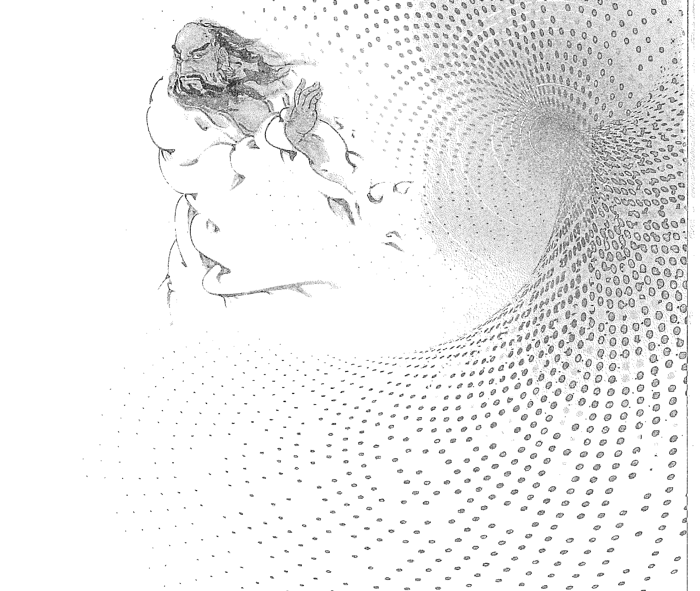
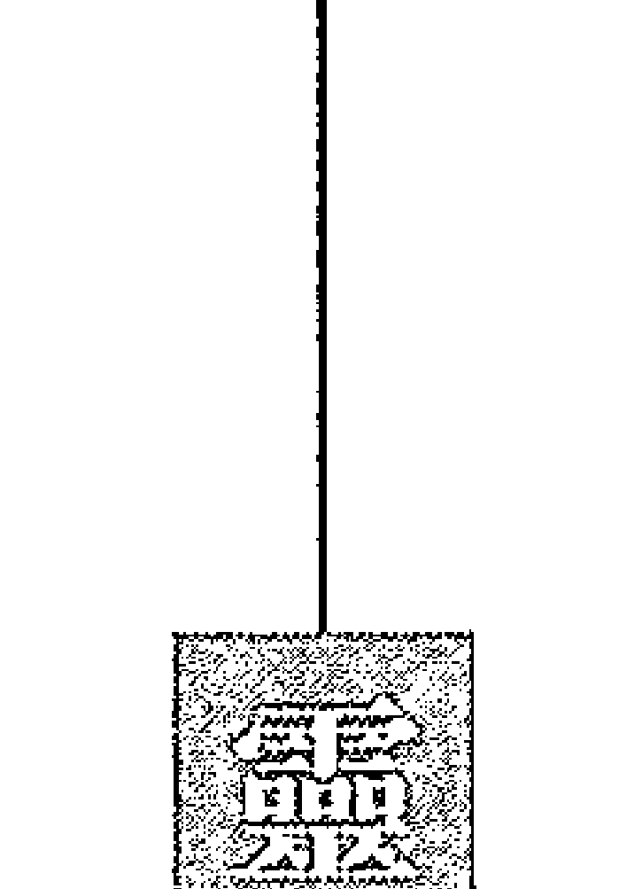
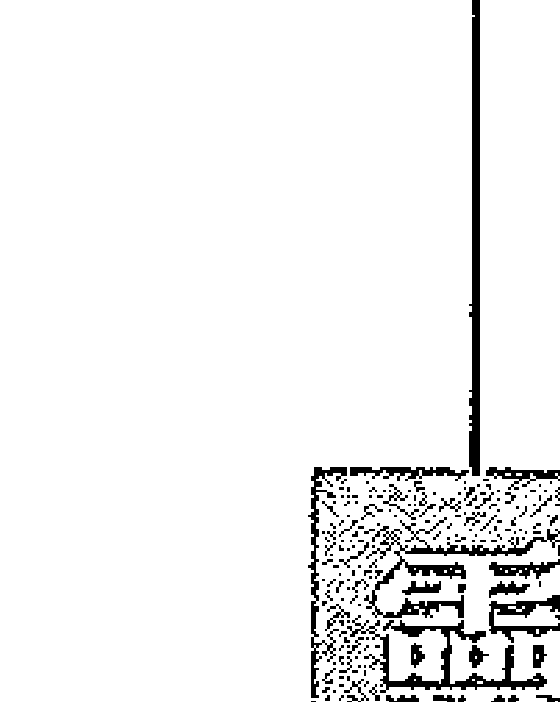
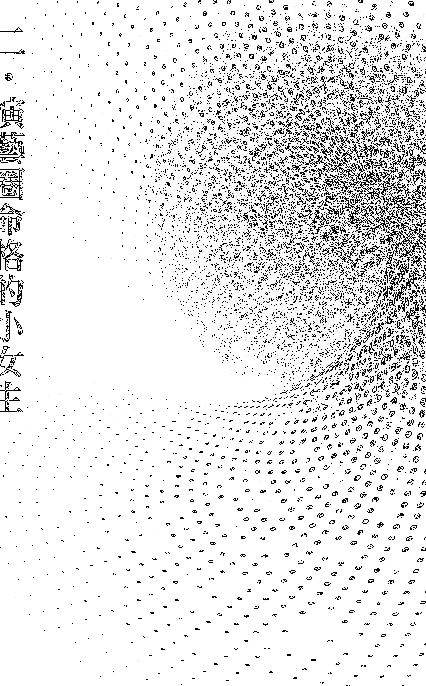
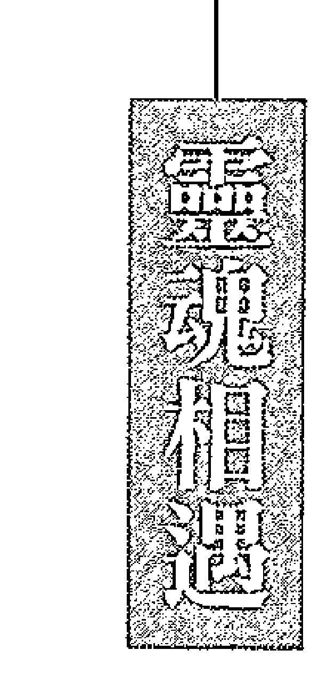
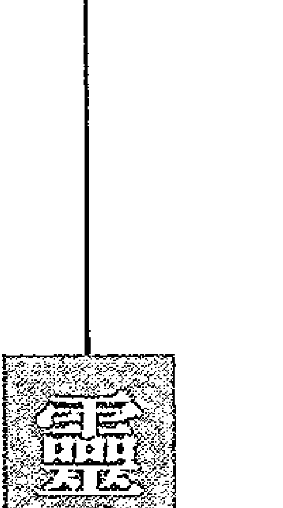
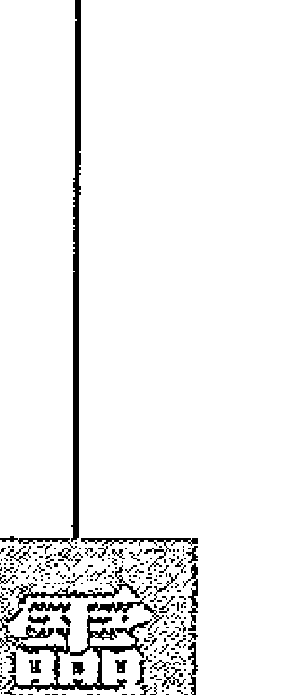
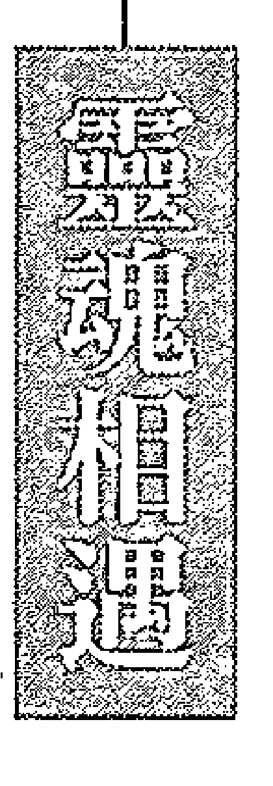
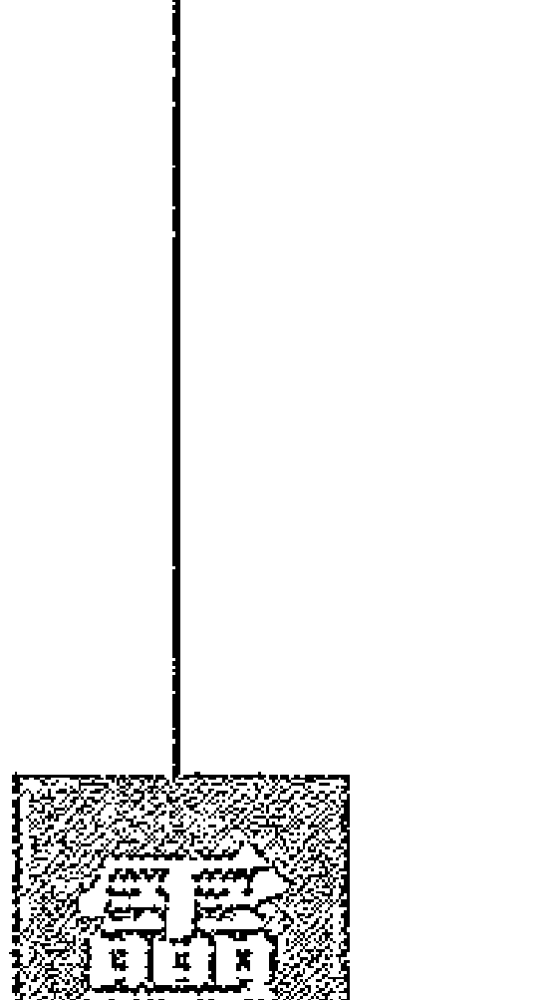

般若達摩 活靈活現之前世今生

活靈活現

前世今生的震撼！

慧可二祖再世了！

萬世紀身心靈顧問有限公司
委託永然聯合法律事務所
李永然律師 陳宜鴻律師代為聲明啟事

一、茲據當事人萬世紀身心靈顧問有限公司委稱：

（一）本公司出版之『活靈活現』系列靈學圖書，深獲各界佳評，感激不盡。因此，本公司乃依法完成之商標註冊，商標類別分別為第十六類、第三十五類、第三十八類、第四十一類、第四十五類，依《商標法》規定享有商標專用權。

（二）未經本公司書面許可或授權，任何單位或個人不得有以下之侵權行為，如有侵犯本公司之商標專用權，本公司將依法追究行為人相應的民事或刑事責任：

- 1. 在同一種商品、服務或者類似商品、服務上使用與上述標誌相同或者近似的商標（包括讀音相同或近似）致消費者有混淆或誤認；
- 2. 銷售侵犯上開商標專用權的商品或服務。

（三）該因該系列圖書之出版，邇來竟有他人於社群網站公然以「活靈活現」為名成立粉絲團之混淆行為，或以網路、圖書等方式，散布對「活靈活現」之不實、惡意攻擊、詆毀等言論，更有謊稱為「活靈活現」之代理、分部、支部，或假藉與「活靈活現」係出同源、同門等情，以欺瞞社會大眾，牟私利之事件。

（四）為此，本公司就上開不當行為，對於作者向立綱先生及「活靈活現」之立論所造成之傷害，深表遺憾。希冀相關行為人得以自制，盡速停止或撤除相關之惡意行為、活動，以免觸法。」等語。

二、本法律事務所爰代聲明如上。

永然聯合法律事務所

中華民國一〇三年十一月一日

陳宜鴻律師

李永然律師

目錄

律師聲明
2

引言
5

一．慧可的前世今生
19

二．演藝圈命格的小女生
61

三．還情債與欠花債
79

四．自願贖罪的眼盲老太太
97

五．前世師徒今世夫妻
117

六．先天同性戀
139

七．前世許諾今世續緣
159

八．不好意思小姐
177

九．蓋被子就入因果
193

引言

如何從這本書裡，找到人生的新動力！

為什麼我要寫「前世今生，靈魂相遇」這本書？簡單說，就是希望所有接觸靈學、認識靈學的人，都能越來越好，都能找到人生的新動力，給自己一個新創的人生。

壹、「前世今生，靈魂相遇」的形成

談靈學，最基本又最重要的認知，就是要認識靈與魂。人人都有靈與魂，靈是指靈体，靈体是不滅的，永不死亡的。靈体來自於靈界，當凡間母體受孕的那一剎那間，靈体便同時與受精卵結合，這是生命之始。受孕過程中，若是靈体離去了，便成為死胎。在人的一生過程中，靈体伴著肉体，不離不棄。如果靈体驟離肉体，那麼肉体就成為所謂的「植物人」，有生命卻無思考，是個空殼。

除了靈體之外，人還有「魂魄」。魂魄屬於肉體，主要是感覺的功能。當人在凡間的一生結束後，肉体燒掉、爛掉，魂魄伴隨在牌位或塔位，但靈體卻要回去靈界，也就是靈體的來處。靈体回到靈界，停留一段時間後，若是再度投胎到凡間，那麼，對靈体來說，過去的一世就是「前世」，而新投胎的此世，就叫「今生」。因為靈体是不滅的，靈体帶著前世的記憶到今生來投胎，前世的閱歷與經驗，當自然就會影響到今生的想法與行為，這就是「前世今生」的連結，也就是「因果、輪迴」的全部奧秘。因此，「前世今生」也就是前世的「舊靈体」，遇到今生的「新魂魄」。靈体是不變的，一世一世的在輪迴，但肉體是會變的，每一世都是一個新的肉體、新的魂魄。於是，帶著前世記憶的舊靈体，結合了今生一無所知的新魂魄（新肉體），這個人生的過程，便激起了無數的火花。帶著前世記憶與經驗的舊靈体，一直想把自己的過去、閱歷，告訴新肉體、引導新肉體，但今世的新肉體卻無法完全察覺，所以肉體總是在錯誤中摸索前進。而「前世今生，靈魂相遇」這本書，就是要讓大家從實例中，更透徹明白「前世今生」的奧妙轉折，也藉此自我省思，從自身獲得實惠。

瞭解了「靈魂相遇」的道理後，我要更進一步明確的告訴大家，為什麼我要寫「前世今生，靈魂相遇」這本書？它更具體的意義何在？

貳、揭開「通靈」的奧秘，讓人真正理解「通靈」與「因果」

對於未知的無形的世界，尋求通靈人或靈媒的協助，是人類自古以來便已存在的現象，無論東方、西方，均是如此，而在較為傳統保守的東方世界，求助通靈人幫忙的「問事」，更是極為普通。

但是，進入二十世紀以後，人為宗教開始普及，全世界均興起了一些令人憂慮的歪風：

- 一、通靈工作常遭人利用與誤導：
  - (一)部分人為宗教利用「通靈」
    部分人為宗教，利用「通靈」為名，從事詐財騙色行為。通靈的「神秘」特質，在進入功利化社會後，常被有心人士利用、濫用，成為詐騙的工具與手段，而通靈的過程又充滿神秘，加上部分不理解靈學又譁眾取寵的媒體推波助瀾，近數十年來，部分人為宗教結合假通靈的手法，誤導眾生的現象，舉世皆然，實令靈界憂心忡忡。
  - （二）好奇人士盲目追求通靈
    進入二十一世紀後，全人類的「靈体」均呈現為「顯性」。於是，人人都開始具備「敏感」的體質，自覺能有「感應」現象的人也越來越多，幾乎達到人口比例的八成。有人直覺、靈感、第六感精準，有人夢中常有提示。因此，更令許多人對「通靈」感應感到好奇而心響往之。
    十餘年來，黃老師從事問事工作的過程中，不斷有人「想盡辦法」的想要了解黃老師是「如何辦事」、「如何通靈」，甚至想要進一步從中「學習」、「模仿」一些辦事、問事的技巧。
    而黃老師與筆者也一再向大眾說明，先天通靈、帶天命、領旨辦事的情形是後天無法模仿學習的，也是一般「感應」、「敏感」者無法比擬的。因此，藉著這本「前世今生，靈魂相遇」的書，筆者將黃老師的問事全部過程及求助問事者的對話互動，全部真實還原，可以讓好奇者完全的一窺全貌。
    黃老師的問事過程中，完全沒有任何「儀式」、「道具」，沒有「起乩」現象，沒有擠眉弄眼，沒有燃香助興，也不需當事人的任何個人資料、生辰、年齡等，黃老師只有一支筆，聽著源源不斷的無形界給予的訊息，邊說邊寫下重點記錄。因此，問事過程中，當事人提問少，黃老師敘述多。經常，黃老師說完、記完之後，當事人才驚覺，「自己隨身帶著抄記想要詢問的問題，黃老師竟已全部一給了答案」。換言之，當事人想要問什麼問題，黃老師也都全部了然於胸。
  - # ## （三）通靈不是抄襲與亂掰
    通靈人辦事，每個人都有自己的特質與方式方法，但絕不是抄襲別人的理論、案例與內容。近些年來，有些人拿著活靈活現的內容去彰顯他（她）的「通靈」，這些人，絕不是正派正當的人，也絕不是真正能通靈的人。靈体區分為「先天靈」、「普通靈」、「動物靈」等特定名詞，是由「活靈活現」書中黃老師從靈語翻譯而來，並係靈界賜予「活靈活現」靈學系統叢書的專有名詞，所有引用這些名詞與活靈活現書中理論、案例，將之用於個人臉書或網站，號稱通靈、幫人問事諮詢的，都必不是真正的通靈人，都是偽通靈。希望廣大讀者都要明辨真假，以免受到誤導，也誤了自己一生。這本書，藉著問事過程的實況紀錄，可以讓讀者完全理解，先天通靈人的領旨辦事是如此紮實、真實，如此一語中的、一針見血。因為，在正神正道面前，任何人都是完全透明的。因果鏡下，神尊無所不知。而神尊也是人性化的，也會顧全當事人的自尊、顏面，或在有陪同人在場時，顧及個人隱私。揭開通靈人問事的神秘面紗，大家可以對正神正道、領旨通靈有更正確的認識，也有助大家分辨正邪。

二、因果不是「相欠債」

東方人普遍都具有「因果、輪迴」的概念，差別的是有人堅信不移，有人不以為然，有人則要信不信。但是，絕妙的是，當人們遇到了難題、困境、挫折，自己走出來時，許多人又會相信因果輪迴，或是將「因果輪迴」當作自己可以釋懷的出口。東方文化在儒、道、佛思想的影響下，人們善良，習慣自我承擔、原諒他人。於是，遇到了夫妻不和、子女忤逆、或被人詐騙倒債：……等情況又無計可施時，常常便以「也許上輩子欠他的」作為出口，給自己受傷的內心，找到了合理化的藉口理由，這樣自我欺騙的心態，只是徒然助長了亂象風氣，世道人心更亂，詐騙倒債更盛。

在人為宗教的普遍盛行下，當人們遭遇到了挫折、困境而前往求助時，人為宗教的宮壇寺廟、人為宗教團體的師兄、師姐等等，最普遍見或千篇一律的慰藉說詞，就是「相欠債」。他（她）們會說：「這是你輩子欠他（她）的」。說來諷刺，一句「相欠債」變成了凡世間化解一切不平與痛苦的「萬靈丹」，不論任何疑難紛爭或痛苦，一句「相欠債」、「就是前世欠他（她）的」。事實當然不是這樣，可是無計可施、無路可走的平凡老百姓，也只能用這樣「自欺欺人」的阿Q心態來自我麻醉、尋求跳脫。但是，就是因為廣大的大眾都用這種自欺欺人的方式來逃避，便也助長了人為宗教的欺世盜名與唬弄詐騙。人們有了困難挫折、來到（人為）宗教求助，得到的是「前世欠他（她）」的答案，就又必須藉助做法事、儀式來「化解」，這樣的方式程序到處可見。受苦的民眾，只因為虔誠的信仰，卻被人一騙再騙，真是情何以堪。筆者撰寫「前世今生，靈魂相遇」這本書，就是要打破「相欠債」這種錯誤但又深植人心的迷思。人世間有前世今生的因果相遇，但在當前的二十一世紀是屬於因果「清算」的世紀。因果清算是指從因果中帶來的是「無形阻力」，紀，已不屬於因果「報應」的世紀。因果清算是指從因果中帶來的是「無形阻力」，人人都有，而不是指「有形的人」或「特定的人」；因果报应（属于十一到十六世纪），才是指有形或特定而来纠缠的「人」。因此，在现在因果清算世纪裡，会遇到与自己前世有特殊关系的人机会很少，大约数百例中才有一例，而且更重要的是，所遇到与自己前世相关的人，绝大多数不是来纠缠、报仇的，反而是来互利互助、互相扶持、互补长短的，这种情形与大家过去所认知的「相欠债」完全不同，完全背道而驰！在「灵魂相遇」这本书裡，笔者蒐录的所有实例，都可以明显看出所谓的前世今生的因果相遇，几乎都与「相欠债」无关，这是本书亟待釐清的正确观念，希望大家都能跳出错误的「相欠债」思维。看了「灵魂相遇」这本书，可以让大家建立「前世影响今生」的正确观念，前世影响今生是有凭有据的，是环环相扣的，日常生活裡的习惯、个性、细微末节，都可以从前世裡找到连结，真实的答案，都在每个人内心的感受裡，这绝对不是坊间胡乱瞎掰所可以比拟的，也绝不是一句「相欠债」可以交代解释的。尤其，在黄老师的事事过程中，黄老师一再强调的是「什么事都可以问」、「不怕被问，只怕不问」，所以黄老师会不断在问事过程中追问提醒大家：「还有什么问题？」因為，真理是越說越明的，正神正道不會阻人提問，也不會用「天機不可洩」為藉口堵人發問，這也是「真神通」與「假神通」的不同之一。

三、知因果，可以讓人生更美好

除了少數第一世投胎或特殊因果及靈格的人以外，百分之九十以上的人，都受到自己前世的嚴重影響。

所有來黃老師問事處，了解過自己前世今生的人，幾乎無不驚呼：「好準！」因為每個人的前世與今生，都是相同的一個靈体，所以，今生的靈体帶著前世的記憶與經驗，就會產生幾種現象：

- 1. 今生的個性特質、人格特性、行為模式，會與前世極其相似，因為是同一個靈体的影響。例如前數世都是女性的人，今世縱使身為男性，卻也都會具有女性溫柔、善解人意、細心的特質。
- 2. 今生的遭遇、經歷，會與前世有相當程度的相似或雷同，因為會受到靈体的引導影響。例如前世當官的人，今世一定都有自己的高度，不易妥協、身段高。
- 3. 今生的習慣、習性、感受等的形成，常是受到前世某些特殊事件或遭遇影響的。

靈界設定讓凡人知道前世因果的主要目的，就是要大家今世能夠更好。然而，知道因果又要如何能讓自己今世更好呢？這才是真正的重點。

（一）知因果，可以知道自己的盲點、弱點、缺點

但是精準的知道了自己的前世，對我們能有什麼幫助呢？知道前世又能如何？前世看不到也摸不到，就算前世富甲一方或是王公貴族，那也是前世的輝煌，不能用在今世，因此，知道前世因果到底有什麼作用？什麼好處？

這也是為什麼黃老師的名聲能享譽全世界華人圈的原因，全在「精準」的不可思議。

從前世的因果，再對照今世每個人的「現況」，大家都會恍然覺悟：原來多數人都在走自己的因果，而每個人的現狀與現況，也都與前世連結在一起，脫不了關係。

所有來問事求助的人，黃老師既不認識，也無需他們的個人資料，就能先敘述每個人的前世，再分析他們前世對今世造成的所有影響及他們的個性特質、習性……等，無不精準。許多人感嘆，黃老師比他們的父母還要了解他們，甚至比他們自己還要了解自己，這樣的感嘆，也是所有來問事、來求助的人的共同心聲。

結果。例如前世曾是出家人者，今世大都會有「懼空」的感覺、說話直接、人際交往較弱……前世溺水過亡的人，今世大都有恐水症。

（二）知因果，可以從因果的束縛中跳脫

從自己的前世裡，找出了今生的盲點、弱點、缺點，就可以從中突破改變，創造新人生。
人人都有個性、有行為上的弱、缺、盲點，這些幾乎都是從因果中形成的（少部分是由先天的靈性造成）。例如，前世曾到西方投胎的人，今世必有莫名不安恐懼的特質，這是阻礙自己進步的主要因素，過去不知原因，無法修正，如今知道了緣由，就容易改變突破！
又如前例中提及，前世為官的人，今世大都放不下身段，人際關係必然不好。知道了自己的弱點及形成的原因，只要有心改變，沒有不能成功的。

所謂的前世因、今世果，前世自己的錯誤行為，常造成今日必須承受的苦果。如
例如，前世流浪漂泊的人，今世必欠了親情債，就會在乎家人、親情，但若過度在乎家人、親情，便會凡事受到約束掣肘，無法在工作上發揮，精神上就會更加壓抑、鬱悶。如今既然知道原因，就要從因果中「跳脫」，適度、理性的面對親情。
又如有贖罪命格的人，必是前世做了重大的錯誤行為，今生必來承受各種辛苦，無論在家庭、事業、健康上，都必是困境、挫折不斷。如今既是知道了緣由，就要從苦中跳脫，用歡喜心承受，與病痛、艱苦共存。

（三）知因果，可以從中找到積極的力量

人為宗教裡，總是用「相欠債」、「必須「消業力」這種千篇一律的語言，來解釋眾生的苦痛與挫折；把所有人的一切逆境與困境，全都歸咎給看不到又不可考的前世錯誤，然後又誤導人要用永遠做不完的「法事」來做化解，讓人一生都陷在痛苦的壓抑裡。總而言之，就是要人「接受」一切的不平與不公。這是消極、退縮的做法，使所有在困境艱苦裡的人，都變得消極了，消極地承受一切不合理。

（四）知因果，可以開發個人潛能

但是，這絕不是靈界的態度，靈界替大家解開因果奧秘，讓大家看到了自己前世與今生的互動與牽扯，也活生生的印證了自己因果的來龍去脈，目的是要大家從中找到解決問題的方法與力量，讓大家能過得更好，這是積極的，也是知道因果的終極目的，這與坊間人為宗教的唬弄及將人導向消極面，是截然不同的。

過去二、三十年來，市場上流行各種「開發潛能」的課程與方法，教人如何開發潛能。其實知道個人因果，才是最積極、最有效的開發個人潛能的途徑。

由於前世今生的相互關聯性，所有的人都，帶有前世個人專業的特質或靈性的特質，今世若能循著這個特質去發展，都能極具潛力、極為順暢或駕輕就熟，這就是最有效的「開發潛能」的方式。

例如，前世從事教職的人，今世必定口才好，可以從事「動嘴」為主的工作；前世以唱歌、演藝為工作的人，今世多帶桃花，適合精品業、大眾傳播或演藝、模特兒等工作；而前世在西方投胎的人，必有開朗、樂觀、幽默、風趣等潛在特質，只要略加觸動，就能完全展現，在人際關係與工作上，也就更容易突破。

因此，總結的說，從解析每個人的因果裡，大家可以找到人生新動力，可以更容易面對及改變自己的缺、弱、盲點，也更容易許給自己一個人生的新方向，許給自己一個創新的生命與未來。

這才是黃老師受靈界託付，為大家解析個人因果的終極目的，這也是筆者撰寫這本「前世今生，靈魂相遇」的主要目的。

殷切地希望大家都能從自己的因果裡找到再起步的力量，在亂世亂象及不斷的人禍裡，為自己創造一個更好的人生與看得到的未來。

向立綱 謹識於二〇一七年十月三十一日

## 壹、前世

### 一、前世略傳

一千四百年前，達摩祖師放棄了印度王子的尊銜，從印度行腳傳法到中國，落腳在少林寺，並創立了「禪宗與心法」，世人稱達摩為禪宗始祖。

若干年後，達摩要離開少林寺前，親自選定了「慧可」法師為繼承人，史稱慧可為禪宗二祖。

慧可，俗名姬光，號「神光」，自幼嗜武、習武，心地慈善善良，及長入官職，因武藝高強，被拔擢為武將軍，開始征戰沙場。但因本性慈悲，不忍見到死傷與生靈塗炭，尤其自覺殺孽深重，無法自我釋懷，於是決定潛心向佛、遠離殺戮，以期化解自身殺孽。

於是，慧可經長年跋涉，來到少林寺，跪求達摩祖師點化收容。為了表明心跡，慧可長跪雪地中三晝夜，並揮刀「自斷左臂」，以表示「斷絕過去」與「放下」的決心，史稱「斷臂求法」。

慧可入少林寺後，潛心於達摩祖師的「心法」，將之著述立論，徹底發揚，故而達摩祖師選定慧可為接班人，是為「禪宗二祖」。

慧可除闡揚了禪宗心法，也精研醫術藥理。因其在天寒地凍中斷臂失血，濕寒入侵，身體孱弱，故精研針灸醫理以自救，成就醫典甚多，多數仍留少林寺內，此應係少林寺集存醫典藥方之始。

### 二、故事起始：靈與魂的相遇

世人講因果，講輪迴，宗教家、修行人、衛道人士、宮壇寺廟等等，到處講因果輪迴，但是因果如何輪迴，沒人說得清楚。事實上，因果輪迴的所有關鍵就在「靈体」與「魂魄」。活靈活現系列書籍，也已將靈與魂、因果與輪迴作了徹底完整的剖析與說明。也讓世人了解了人類有史以來千古不解的輪迴過程與真相。

而一千四百年前的慧可，在新世紀經輪迴轉世再投胎，其過程也正是前世的靈体與今世的肉体的新結合。這個舊靈体帶著一千四百年前的記憶與認知，與一千四百年後新世紀的新肉體的相合，會是個怎樣的過程？其間，會有多少前世今生的矛盾？會有多少前世今生的糾結？會有多少前世今生的似曾相識？會有多少前世今生的不可思議？會有多少前世今生的巧合？會有多少前世今生的驚嘆！所有前世今生的環環相扣，全是前世的舊靈体與今世新肉體、新靈魂相結合後，激起的漣漪與火花。當事人人生的道路，時而峰迴路轉，時而起伏跌宕，身陷其中，真是步履維艱。但是一旦解開了前世今生的謎底與鎖匙，一切也都豁然開朗與真相大白。一千四百年後，慧可在二十一世紀的再投胎，只是一介凡人，但靈体卻帶著前世的思維與行為模式，強烈的影響著今世的肉體。以下，便是慧可前世與今生相連結的真實故事，且看他的生命如何在知曉前世今生後，創造奇蹟與高潮。

## 貳、今生

### 一、成長之路

立光先生，生於一九八三年的台灣。三歲時父母離異，十四歲時，公職退休的父親將他送往加拿大，他成了靠著就學貸款而辛苦成長的小留學生。在異國異地艱困的環境下，他靠著打工、台灣家人微薄的生活補貼一路成長，倍覺艱辛的過程可想而知，但立光一直是個陽光青年，不但積極正向，而且充滿活力。認識立光的人均覺得驚訝：像他這樣一個從小沒有父母在旁照護叮嚀的孩子，在異國異鄉如此「自由任性」的成長，不但未被大麻、龐克所吞噬，還能保有東方的文化與傳統敦厚，實是難以想像！

### 二、迷惑與劇變

二〇〇四年，立光自加拿大安大略省的大學工程學系畢業，並繼續就讀碩士學位。碩士畢業後，他也開始進入社會。他先在一個核電設計公司擔任工程師，二〇〇九年再通過面試，進入了加拿大一個市政府的公職工作，成了正式的公務員。這是一個高待遇、高穩定又令眾人稱羨的工作。但是不到一年，他開始不喜歡朝九晚五的規律生活，他想要尋找真正屬於自己的未來，想要過著自己真正想要的生活，立光便開始不安於職，他開始有了問號與懷疑：「我的人生不是來過朝九晚五的上下班生活...」「來到這個世界上的目的又是什麼？」事實上，這些想法在他大學時期就已經似有似無的存在，只是當時他一直以為只要努力讀書、聽長輩的話，以後找份好工作，就是孝順的乖孩子，所以並沒有多想。

因為這樣的迷惑與質疑，心中有了騷動，他的思考、舉止、行為也開始轉變，開始了他對於「靈魂的來處」、「人生真諦」、「生命真相」的追尋。

### (二) 探索生命

二○○四年起，立光開始有了疑惑：「人生的意義是什麼？」「不該只是天天上班、下班、賺錢吧！」同一時期，他開始質疑「生命」，也越來越強烈的質疑人生的價值。他亟思想要探索生命，想要得到更明確的答案：

- 人活著的目的是什麼？
- 生命的意義又是什麼？
- 自己來自何處？

## 為什麼要投胎？

### (二)探索前世今生

從小，立光就相信輪迴，相信人有前世今生。但從二〇〇四年起，不知為什麼，想要探索前世的念頭開始強烈盤繞心頭，無法揮去。

他開始拜訪師父、找名師，也在友人的推薦下四處尋找東、西方的靈媒與通靈人，希望得到指引與開釋，找到人生的答案，找到前世的蛛絲馬跡。

曾有師父告訴他，要了解自己的前世，就一定要從八字命理著手。參透八字越深，就越能接近前世的門檻，但他又不相信任何一位命理師，他不要別人來算自己的命，所以決定自己精研命理，自己來算自己的命，找到自己前世的答案，自己主導自己的未來。

但是他失望了，他精通了各種命理，但他還是不知道自己前世，沒有找到自己，也仍不知道自己人生的的目的與意義何在！找不到自己「想要的靈魂與真相」，而內心的疑問卻越來越多。

於是，帶著一肚子的命理知識，他又丟開了命理。

### （三）燃起修行心

在強烈的「尋找自己」的念頭驅使下，立光四處尋找名師、找「高人」，一有空閒，便入深山，走訪名山古剎，期望能尋得世外高人，得到生命真相的啟示。這期間，從加拿大到台灣，他苦讀經典、涉獵各門各派宗教，博覽群書之餘，他也與許多出家眾僧、道觀往來交流。他開始有了強烈的修行心，他想到了是否要出家。

那一年，二〇〇六年，他才二十三歲，從一個陽光青年突然轉變成了憂鬱青年。思索自己、看不見自己，思索未來、看不見未來。覺得自己的人生沒有前景，沒有希望，卻想從獨坐、靜思、苦行裡，試著找尋出口。

家人驚覺到了他的轉變，他也毫不諱言的向家人坦言有著「想要出家」的念頭。出家、修行、求道的念頭興起後，從未止息或消失。在他內心深處，他一直將「剃髮出家」當做人生的選項之一。另一種奇怪的選項就是「快快死了吧！」有時強烈感受，有時淡淡縈繞心頭，這些想法，未曾消失。而無力影響他的家人，也開始「無言」的認同。他們不理解這個過去在大家寄予厚望及眼中的優秀青年怎麼了？他們只是知道，對於他的堅持與固執，他們只能無奈的尊重與接受，他們沒有能力改變什麼。

### （四）興起習武熱

從他念高中開始，立光就喜歡上「中國功夫」。在接受西方教育的過程中，他莫名其妙的愛上了中國的武術，而對西洋的拳擊，則喜歡卻不熱衷。求學期間，對於中國功夫雖然喜愛，但也只僅及於舞弄拳腳，時而比手劃腳的擺個姿態的樂此不疲。進入社會謀職謀生後，他有了自己可以支配的時間與金錢，他可以更自主的選擇自己的喜好興趣，於是他開始勤習氣功與武術，不但蒐羅各種氣功心法，還學習各種吐納導引之術，而擊技、搏擊等技法功夫，他也極為醉心，時常三五好友相聚時，他就一定會擺出架式姿態，與人推擠拉扯一番，過過擊技的乾癮。這個時候的立光，又似回到了青春活力的原形。在這段多變又矛盾的年齡，他時而靜如出世僧，動如脫韁馬，旁人看不懂他，他也不懂自己。每有假日，立光的活動又與時下年輕人截然不同，他喜歡青山綠水，喜歡登山踏青，然後在群山翠巒中徜徉，或站樁與打拳，或練氣或吐納，盡取日月精華；或在青山翠嶺上活動筋骨、舒緩身心、呼吸新鮮空氣，洗滌一身塵囂。

在二十一世紀的新年代，他有著年青人的軀殼，卻擁有一個自己也不理解自己的靈魂。當舊日的同學同儕汲汲營營忙碌於力爭上遊與青春享樂之際，他卻活在自己的世界裡，尋找自己生命的起源與價值，喜樂於自己的氣功武術之中，並將絕大多數私人的時間，浸潤於大自然的天地之間。

### （五）熱衷中醫與草藥

對於一個十四歲起便生長在西方國家的孩子而言，喜歡中文，看中文書，偶而唱唱國、台語歌，更醉心於中醫與草藥，是不可思議的事，然而，立光正是如此。

從他十五歲進入成長發育青春期開始，立光便自覺陷入了莫名的身體「病痛」，他自覺「健康不好」、「體虛體弱」，總是覺得自己天天不舒服，他常稱自己每天都睡眠不好、精神不好；全身上下，經常這裡不適，那裡痠痛，他總是說不出明確的病徵或病名，但又確實感到自己似是有病痛在身（註：後來才知道這正是典型的靈媒體質的特質，在青春期與更年期間的靈媒體質者，加上特殊的前世後遺症，使得他的身體永遠處在病痛似有似無的不適中）。

因為說不出身體明確的不適與病症，也不知該如何求診求治。所以從二十歲左右，他就自己修習中醫、中藥、草藥，自己買書看，也自己買來中草藥，自己煎煮服用。儘管他當時的中醫知識有限，但他卻有著中醫的天分，常常莫名其妙的就理解了一些藥理，會自己辨症，會自己開方，有時也會莫名其妙的就治好一些病痛，所以他一直未曾間斷的在使用中草藥，自我調理身體。中草藥對他的虛寒體質，確實也發揮了不少助益，所以他一直堅持不斷的相信中醫與研究中藥。這是一個奇怪的畫面：在西方國度，一位二、三十歲的青年，堅持認真的固守著煎煮的中藥，小心翼翼的飲用著中藥……

## 慧可的前世今生

### （六）摸索靈學玄學

在渴望找到生命奧秘真相的驅使下，在歷經命理命相的探索後，他並未得到想要的答案；四處訪求名師、拜師後，也未能得到心靈的渴求，他得到的只是更大的失望與挫折。於是，他又轉移了方向，轉向探索玄學秘境，開始研究東方的玄學、東方宗教、生與死的奇妙、心靈、佛道儒學等等，以及近年來西方科學界探討的宇宙學、能量學、量子力學等，他也都用心研讀，希望找到自己想要的答案，而涉及無形與能量的知識，也都似與玄學有關，所以這些相關知識，也都成了立光涉獵與喜歡研讀鑽研的範圍。

除此之外，在好奇心的驅使之下，立光也投入極多的時間，研究西方的「心靈學」、「神秘學」，也接觸過西方許多身心靈的工作者與西方靈媒，但是均未能找到他所想要的答案。

### （七）放下音樂狂熱

由於立光自幼便缺乏親情，缺少關懷疼惜，內心空虛空洞，在心理層面上，更顯得空泛寂寥，無所倚靠寄託，所以從小他就喜歡音樂、喜歡唱歌。到了高中開始，他更投入音樂，也將全部的精神與心靈，寄情於音樂。

進入大學後，他更鍾情音樂，他發現音樂有很好的療癒效果，可以塞滿自己的空虛寂寞，讓自己不再顧影自憐，形單影隻。

於是，他在大學裡與幾位同好，籌組了一個樂團，他自己作詞、作曲，也擔任主唱。

音樂與樂團，曾被認為是他的第二個生命，也是他生命中不可缺少的，但是當狂熱。因為，音樂曾經療癒他的內心與苦悶，他也曾用「唱自己的歌」來舒壓與自我療癒。因此，他認為音樂應該與醫理結合，幫助治療更多人，於是他開始學著用心感受音樂，而不再是盲目的狂熱。

這是一個強大、劇烈又不明其所以的轉變。

### (八) 離職與流浪

二〇一四年，立光為了能全心全力的「尋找自己」、追求生命的答案，毅然決定離開市政府的工作。

毅然放棄了人人欣羨的工作職務與待遇，立光的行為，令所有親人無法理解，也極不原諒。立光的理由有三：

- 第一、他嚮往自由以及習武、修行的生活，不想有任何束縛。
- 第二、他需要全心全力的尋找自我，沒有任何壓力與負擔，當一個自由自在的自己。
- 第三、他有幫人治病與療癒的使命感，他要實現。

他的理由與行止，無人可以體會。

離開公職後的立光，想要完全解脫自己，於是開始了流浪、漂泊的日子，四處「行走江湖」。在漂泊流浪期間，他過著四處打零工的生活。他在溫哥華的夜市擺過地攤、當過修車工人、當過建築工地工人，這樣的生活，也曾給他帶來短暫的快樂。因為，沒有了世俗的現實與負擔，回歸到自然，反而讓他得到了暫時的「安心」、「安定」與內心的平靜。

## 編者按語

任公職時，他擁有建築工程師的證照，現在竟屈為建築工地的零工與臨時工。但是是他對工作負責的態度，使建商老闆非常欣賞他，想倚賴他能協助繪圖，想要重用他，他不願承受栽培與壓力，便又倉惶逃離……。在加拿大、溫哥華，謀職找工作非常困難，但是對他的學歷與專長而言，卻是易如反掌。所以，他根本不擔心沒有工作或無法養活自己，只是「工作、生活」並不是他想要的人生。他與工地工人寄居一處，住工寮、居無定所，旁人看了不忍辛酸，他卻怡然自得。他心中不斷念茲在茲的，是這些不斷在心中盤算的念頭：

- 如何修行？
- 是否出家？
- 如何尋覓生命之源？
- 如何找到心中自我？
- 回頭研鑽中醫濟世？
- 是否開個武館強身？
- 這樣流浪、零工、尋尋覓覓的日子一直持續著。

他依然沒有找到答案，但赫然已經三十一歲。人生的精華與青春，正悄然從他指隙間溜走消逝，他卻仍在尋覓，渾身輕飄，一無所有。

## 參、認識黃老師

二〇一五年，流浪期間的立光在偶然的機會裡，認識了一位台灣赴加的留學生嬌妹，初次見面，兩人便相談甚歡，立光回想說：『我覺得她就像是我的家人一般，我只想照顧她。』

第一次見面的閒聊中，立光沒能表現出「照顧她」的殷勤，但卻與她大談了許多「前世今生」的大道理與人生的轉世與輪迴。

> > 「要談前世今生，我可以介紹你認識一個人，她叫『黃老師』。」

這是立光第一次聽到『黃老師』，但他不以為意。在後續第二次、第三次與嬌妹見面的過程中，他依然不斷暢談自己認知的輪迴理論與修行觀。

### 一、過程

二〇一五年十二月在嬌妹的畢業典禮上，她請來立光幫忙照相。典禮結束後，嬌妹回想說，當時突然有個聲音要她打電話給黃老師，而當下正是台灣早上八點左右的時間。她一時興起，便撥通了台北問事處的電話，並表明要找黃老師。經過與工作人員的簡短說明後，黃老師竟然接了電話。嬌妹將電話交到立光手中，說：『她可以告訴所有你要的答案。』在正常的情況下，黃老師不可能接電話的，這種情形也不曾有過，但是這一次，很是奇怪，達摩祖師傳來聲音，要黃老師接電話，而且達摩祖師的訊息也接著源源不絕而來。

這一通電話，改變了立光的一生。

以下，是這通電話的全部對話內容：

> > 黃老師：我知道你在尋找你自己人生的答案。
> > 
> > 立光：我曉得這幾年我自己變得很奇怪。
> > 
> > 黃老師：你要找的是內心深處的答案，那就是「靈体」，是找你的「靈体」。現在的你，是內外心交錯。
> > 
> > 立光：我有覺得我在找個東西，但說不出來具體的內容。我蠻糾結的，有時也蠻痛苦的。
> > 
> > 黃老師：你從東方國家來到西方國家，是個中西合併體，所以你不太會表達。其實，你找的就是你自己，是另個你內在的自己，也就是你的靈体。每一個人都有靈体，肉體加上靈体才是一個真正的正常人。
> > 
> > 立光：在我身上，到底有發生了什麼事嗎？
> > 
> > 黃老師：是前世今生的交錯，有前世因，才有今世果。你的前世與今生的因果，糾纏在一起了，這就是你現在發生的問題。
> > 
> > 立光：是為了要解脫業力嗎？
> > 
> > 黃老師：你所說的業力，是偏向「佛」的區塊，但那樣的說法又沒有辦法說服你自己的內心，也沒有真正的答案，這不是你要的。
> > 
> > 立光：是的，我也發現是這樣。
> > 
> > 黃老師：你要的是全部完整答案的來龍去脈，而且要能非常清楚明白、也要符合情理；你要了解的是非常實際的、具體的內在的自己，是真理也是真相，而不是一般的迷信或模棱兩可的答案。
> > 
> > 立光：是的，我要的是生命宇宙的真理。
> > 
> > 黃老師：對西方的說法和玄學，你又覺得太抽象。
> > 
> > 立光：有，是有這麼的感覺。
> > 
> > 黃老師：你的問題是，你用過去的歷史宗教經典想要找出或解釋新世紀新時代新世代的答案，所以會有衝突，會有矛盾，也不可能找到答案。
> > 
> > 立光：我知道了，謝謝黃老師，我會再好好消化妳說的。
> > 
> > 黃老師：宗教是屬於後天的，靈是屬於先天的宇宙靈界。
> > 
> > 立光：我這一、二年，有讀一些國外所謂的「靈」的書，有些很強調做自己、放下恐懼，去創造自己的故事，跟黃老師妳說的很雷同，我喜歡這一些。
> > 
> > 黃老師：西方國家本來就是以「靈」為主，可是又無法理解靈，所以科學家不斷在研究探討。
> > 
> > 立光：我明白了。
> > 
> > 黃老師：你的個性是凡事太小心、求完美、挑剔又龜毛，凡事都要打破砂鍋問到底、追根究柢，這些是你的個人特質，沒有不好，如果應用的好，當然對自己是加分的。
> > 
> > 黃老師：不但知道你的個性，我還知道你天生的好奇好學，所以有天馬行空般的想像力，成天想要幫人助人，你可以說是有一顆另類的濟世救人的心。
> > 
> > 立光：太可怕了，黃老師，妳怎麼連我的個性也知道！
> > 
> > 黃老師：我不但完全了解你的個性，還有更令你震撼的。

### 二、震撼與驗明正身

在手機與電話通話的這一頭，雙方隔著近萬公里的遠距，黃老師對立光說：「我不但完全了解你的個性，還有更令你震撼的」，在電話的另一頭，當立光在驚嚇中還沒回過神來之時，黃老師拋出了另一串的震撼彈。

#### (一)第一顆震撼彈

黃老師：不要在乎你的頭髮，你的頭髮不會再長了！

立光：太可怕、太震撼了，黃老師，妳怎麼會知道我在乎頭髮？妳真的是一語道破，我真的是服了。我開始掉頭髮，已有七、八年了，所以我剃了光頭，也不是禿頭，是頭髮萎縮，有髮根，但長不出頭，也常常戴著帽子，但我不是禿頭，是頭髮萎縮，有髮根，但長不出頭。來，我才乾脆剃光。這是我心中的最痛，也看遍了醫生，但是這個真相與秘密旁人並不知道，連嬌妹都不知道，大家只是認為我要酷才剃光頭。

#### （二）第二顆震撼彈

黃老師：還有一件大事，你的左手臂有個大的傷疤記號，你有受傷……。

立光：沒有吧……？哦，哦，那是在我二歲左右，被熱水燙傷後留下的大疤痕，但是我幾乎沒有印象，是長大後家人說的。疤痕雖大，但是正好被袖口掩住，不太容易被發現，所以我並不是太在意，而且嬌妹也不知道我有這個疤痕，但是……，妳怎麼會知道？

黃老師：這個傷疤，也是你前世的印記，是你前世留給今世的佐證。因為前世你為了出家，自斷左臂，以示「切斷過去」的決心。這也就是「斷臂求法」的由來。

#### （三）第三顆震撼彈

黃老師：你是相信輪迴、相信人有前世今生的。

立光：是的，我從小就相信這些，也費盡心思想要悟透、知道自己的前世，但是一直無法如願，也仍在摸索之中。

黃老師：你想知道自己的前世？

立光：我願意傾我一生的力量，去尋找前世的真相。不知道為什麼這幾年來，這種意願太強烈，強到讓我無法正常工作。

黃老師：我可以告訴你有關你的前世。有一部電影，叫做「達摩傳」，你看過嗎？

立光：我看過，看那部電影，我掉了好幾次眼淚，看過那部電影後，我還特別買了一張達摩祖師的畫像，擺在我的桌前。

黃老師：為什麼我會知道你的個性？知道你的頭髮長不出來？知道你左臂有傷疤？這些都是達摩祖師現在告訴我的，因為我聽得到，我只是依祖師的指示將他說的話翻譯給你。達摩祖師現在要我告訴你，你的前世就是「慧可法師」，是他的高徒。慧可是出家師父，所以你的頭髮長不出來；慧可斷臂求法，自斷左臂以示決心，所以你的左臂留有大的傷疤。這些，都是要佐證，你的前世就是慧可法師。

黃老師：達摩祖師說，你的靈体在靈界已停留了大約一千四百年左右，你的前一世就是慧可法師，所以慧可的前世對你今生的影響太大，你與慧可的連結太深。

立光：太震撼，太震撼，太不可思議了……。

事後，立光回想，當黃老師說出他的前世是慧可時，他只覺得腦裡「轟」然一聲，震得自己昏昏然。他知道，這就是他一直想要追尋的答案，但他仍然覺得「難以置信」，因為他自己只是個平凡人，而慧可則是個「偉大的歷史人物」。然而，太多事實擺在眼前，尤其，他記憶深刻的是，當他觀看「達摩傳」的電影，看到慧可迢迢求法、自斷左臂時，不斷淚盈滿眶，他感覺到慧可的「偉大」，心中嚮往他的精神，原來這其中還有蹊蹺與牽扯。

## 三、心中的痛與惑

### （一）心中的最痛——掉髮

從學校畢業進入職場起，本是可以預見會有一個光明的未來，在立光的前方等待，未料立光的前程竟是如此混亂與坎坷。究竟是什麼樣的原因，使他失去了方向？陷入了迷惑與劇變？

立光自小便是滿頭黑髮，既濃且密，青春期後，他愛漂亮，極重外表外型。大學時，自組樂團，擔任主唱，長髮披肩，一副古惑仔的打扮，他也常自滿有個搭配自己的俊逸髮型，這讓他更顯自信。

然而，二〇〇八年起，他發現頭髮開始脫落，而且越落越多，每在沐浴、梳髮後，要面對滿地越來越多的頭髮，他緊張、害怕，不知如何是好；每次攬鏡自照，看到頭頂上日益稀疏的殘髮，他更感到恐懼、慌亂到無法自處，他認為自己「生病」了。四處求醫無果，掉髮也使他對自己失去了自信，沒有了信心，也產生了自卑心理。

掉髮，對這個特重外表的叛逆陽光青年而言，無疑的是他有生以來的一個最大打擊，幾乎使他一潰不起。掉髮，使他失去了方向，失去了自己，也陷入了迷惑。

面對日漸萎縮的頭髮，立光徹底地對自己、對人生感到無力。二〇一二年，他的頭髮幾已落光，但他仍在掙扎。二〇一四年，他下定決心─剃光，他乾脆將稀少的頭髮全部剃光。這一年起，剃光頭髮也使他完全走入了慧可的前世。慧可的前世，也從這一年起，完全左右、主導了立光的人生。

### （二）心中的最惑─如何「安心」

初起想要尋找人生的答案，是在二〇〇四年，大學畢業進入研究所開始。走入公職的穩定生活後，情形日益嚴重，這時的他，漸漸興起了抗拒心，抗拒每天朝九晚五的規律生活，他開始想未來，「到底人生的目的是什麼？」

越是找不到人生的答案，就越是心慌、心亂，覺得自己生活沒有重心，覺得自己的心在漂泊，慢慢的，立光更覺得自己活得不踏實，浮浮沉沉的，無法安定下來。

這樣不實在的感覺，日復一日，也越來越強烈。尤其在自己掉髮以後，他的心更慌、更亂到無以復加的地步。到了二〇一二年前後，這種心慌心亂的感覺，到了沸騰的頂點。

當時，每當有事，他就會左右為難，這也不是，那也不妥，心就開始慌亂起來。立光對這樣的感覺很在意、很害怕，也很恐懼，他感覺自己就要發瘋了。但又不知该如何是好。

在二〇一一年、二〇一二年，立光严重的觉得自己都像疯子一样，不断的不安、想不透，甚至想死。每天，对自己的每个念头，都要反省、再反省；检讨、再检讨。整个脑子都充满了疑问。

立光说，从小以来的成长过程里，他不太会思考，他总是照着大人的「交代」做事，不会拒绝，不会反抗，不会起疑，是家人眼中听话的孩子。但是，突然间，他变了一个人，什么都要思考、起疑、反复思索。

立光不知道自己到底怎么了，但他知道自己的「心」生病了，他明确的知道，他一定要找个方法来「安」自己的心，让自己的心「安定」下来，否则他自己一定会疯掉。

### 靈魂相遇

他天天在想，要找一个方法，把自己的心安定下来。他看了很多身心灵的书，西方的、东方的都有。他发现了西方人的静坐很好，东方人的禅坐也不错，当他看着一群人静坐或坐禅时，他感觉到「安定」的感觉。对立光而言，这是个绝大的震撼与「重大发现」。

自此以后，立光也开始每天「静坐」，他觉得「静坐」确实可以令自己的心「安定」下来。到他剃光头发后，他更是每天抽空静坐，静坐成了他的日行工作。这就是慧可的「心法」，静坐传承，也就是心法的传承，就是传心法。

## 肆、前世今生的连结

了解了自己的前世后，立光仍觉得心中有许多的问号等待解开，于是一个月后，他要求在温哥华问事，请求咨询，希望可以面对黄老师，更表态想了解自己的前世因果，对于他的所有问题与疑惑，黄老师也全部一一说明，这是一个基因的「验证大会」，也解开了立光前世今生的所有迷惑与谜底。

### 一、掉发与剃度的连结

二〇〇八年，立光年二十五岁，正是青春洋溢的年龄，他喜欢长发古惑仔的打

## 慧可的前世今生

这一年也正是灵界设定全世界的灵体全面显性的一年（从一九九五年起，灵体开始显性；到二〇〇八年止，灵体全面显性）。在这一年，立光的头发开始出现异常，无法正常生长，约长一公分后便开始萎缩，若是全予剃除，也只能长到一公分左右。剃光，尚看不出萎缩状态，于是到了二〇一四年三十一岁时，只能选择干脆剃光。一向爱漂亮、在乎外表的他，自掉发后就开始自卑懊恼，看着自己一天一天的改变。

二十五岁的年龄，正值意气风发的青春年华，特重外表，却得了头发萎缩的怪症，遍求名医而无解，为什么会如此？

原来，灵体全面显性（二〇〇八年）后，灵体特别在意前世慧可出家剃度的身分，也为了突显自己是个出家人，所以便让肉体的头发萎缩，无法生长，自然形同「去发剃度」。

只是立光是个在国外长大的台湾人，无法了解掉发与出家之间的连结，只能拼命求医、健身，并到处求助，却药石罔效。

二〇一四年，立光剃了光头之后，立光的灵体更是逼着他的肉体要立即去寻找答案，其实，他的灵体也从二〇〇八年起便逐渐的把肉体带入到慧可的那一世，所以，立光会觉得身体小病不断，开始想出家、想修行、想行善助人、想精研中医中药、想

要探寻生命真相、想要寻求前世今生。二〇一四年后，他更急迫的想要寻找生命的密码，想要寻找一个说不出来的答案。灵体紧逼肉体，要去寻求真相，肉体却茫然无从，不知如何是好。立光说：『一到了二〇一四年前后，我只知道要去找答案，但却不知道要找什么答案，我甚至感觉到，若是找不到答案，我会『死掉』。但是，我又不知道具体的答案在哪里、要往哪里去寻求。所以，我决定去开一切，就这样一念之间就辞职了。』

因此，今世的掉发与前世的剃度相连结，前世系出家人，与今世任公职格格不入，所以辞职收场。

### 二、断臂与体弱的连结

立光的外型看来，非常壮硕，孔武有力，肌肉非常发达，属于型男类的体型，但实际上，他却同时小病不断。约在二〇〇〇年左右，立光的青春期开始，立光就已有身体多病的倾向。例如长年的睡眠不好、胸闷、头痛等，这是他本身灵媒体质与上命格（十五岁起）的因素使然，但是，这种情况并未随年龄增长而改善，反而日益加重与复杂。灵体全面显性后，尤其二〇一〇年以后，他几乎天天都不舒服，为什么呢？

原来，达摩祖师说，前世的慧可，为了求法，在冰天雪地、大雪纷飞之寒冬，长跪三日不起，最后毅然以刀断臂，以示决定断绝过去的求法决心……慧可先经半年（实际是一年半的反覆来回）的长途跋涉，又在酷寒的严冬雪地里挥刀断臂，血流不止，寒气入侵。因此，今世的立光在灵体显性后，便会总觉得自己气血不足、气虚、脾胃虚，脚关节不好，常常脚痛，天天自觉体内寒气重，又找不到原因，整体呈现虚寒体质。所以，进入二〇一四年后，立光总是觉得自己的身体时常便会莫名其妙地进入「全面虚脱」的状态。这个时候，立光便会产生一种强烈的连结感：「我要赶快找寻答案，找不到答案，我就会『死掉』，并陷入莫名的恐惧与急躁之中。这便是前世断臂与今世体弱、虚寒体质的连结。但是，立光的外型，又是壮硕有力的肌肉型男，完全看不出体弱与虚寒，这一部分，又是前世慧可出身武将，武功高强与今生的连结。前世的慧可，自幼习武，文武双全；今世的立光，自小酷爱武打电影，一看武侠功夫电影，就会全身热血沸腾起来，一定也要在旁跟着比划几式，这也是前世今生的连结。

### 三、任官与辞官的连结

今世的立光，原在政府担任公职，待遇优渥，工作轻松，有尊严，为什么他会毅然辞职，令人百思不解，他自己也说不出具体令人信服的理由。

原来，前世的慧可是武将领兵作战，当然就是领取俸禄的公职，但是，前世的公职，带兵杀了无数死伤。慧可本性慈悲善良，自觉罪孽深重，才决定忏悔出家，才会断臂求法，追随达摩祖师，成就了慧可的辉煌，成为名传千古的禅宗二祖。

因此，这一世的立光，当他踏进公门、服务公职开始，灵体就想到了前世服务公职，造成的杀孽与无数死伤。

前世服务公职、造杀孽，因此今世一入公职，潜意识里就有抗拒、有恐惧，所以再好的公职、再好的待遇与福利，都无法消除前世面对死伤遍野、哀鸿遍野的惨象。

这是立光无法久任公职的主要因素，只是肉体不知真相，再加上急寻生命真理的压力与诱因，乃会有毅然辞去公职、毫无留恋之举动。

简言之，今世任公职开始，就已注定了辞职的命运，这就是今世任官与前世辞官的连结。

### 四、舍身救国与济世的连结

达摩祖师称：慧可的父母，久婚无孕，乃去寺里发愿：「如果得子，愿意捐出全部家产给寺庙，待子长大成人后，也愿意无条件捐给国家，为国尽忠，拯救世人。」

> > （注：此段系达摩祖师经黄老师口述转达，史书有无记载，不得而知），结果才受孕生下慧可。

所以，慧可成人后，入公职为将军，本质上是要献身给国家、救国救民的，只是未料武将救国救民，却必须以战止战，以杀戮才能救国救民。慧可愿意捐躯救国，却必须以杀人为手段，本质慈悲善良的慧可，才会自觉杀孽深重。

今世的立光，完全承继了前世慧可的慈悲与善良，他满脑子的想帮人、想助人，他宁可自己受苦、吃亏，也不愿意责难旁人。他自小父母离异，三、四岁便由母亲友人抚育，又成为小留学生，流浪漂泊，但是他心中无恨，仍是满怀爱心助人。因此，立光心中一直有个愿想，想要悬壶济世以救人。

今世的立光，二十岁起，便喜欢中草药，虽在西方国度，但他几乎从不服食西药。每有感冒、不适或病痛，都喜欢自煎草药，在同学同侪眼中，这样的行径都令人不解与好奇。

### 五、前世今生的亲情连结

入大学后，他心中更是有个遗憾：想学中医，想成为真正的养身中医师。二○一○年后，这种研读中医以济世的意念更强，这也是他日后毅然离开公职的原因之一。

原来，前世的慧可，在少林寺内也是极具成就的儒医。达摩祖师称，慧可由于断臂后寒气侵，身体孱弱，故从精研中医调理开始，进而深研中医药理、治病方药……等等，不但自己调理身体，也在寺中悬壶、济世救人。少林寺收藏的中药方剂，也始自慧可。

因此，前世慧可精研中医，自救救人，也愿舍身救国，今世立光虽身在西方国度，亦是自读中医方剂，心中亦满怀悬壶济世、救人助人之远大目标与理想，只是四处漂泊，居无定所，自觉习医遥遥无期，只能时常自购中医中药典籍、医方，自我研读。这就是前世舍身救国、悬壶济世与今世酷爱中医、怀抱济世救人理想的连结。

> 「立光在与黄老师咨询的过程中，曾问起了自己的亲生母亲。立光问：『我与我这一世生母的缘分如何？』达摩祖师透过黄老师说：『你与生母之间的缘，既浅且薄。她对你，有着莫名的怨与厌，既深且重。』」

怨与厌，既深且重。

久，她就将我送给她的一个同学寄养，这位同学也是我日后称的干妈。我跟我生母，

立光说：「对，缘分又淡又薄，而且我知道她对我从小有怨。我一出生没有多

几乎没一起生活过。她从小看我就讨厌，与我对话不到三句就开骂，我从小就可以

感受到她对我有股莫名的讨厌与怨气，又深又重。但是我不懂为什么？为什么她会如此恨我？」

黄老师说：「因为，她也是你前世慧可的生母。」换言之，慧可那一世的母亲，今世也被安排为立光这一世的母亲。

达摩祖师透过黄老师说：「前世慧可的母亲不孕，为了生子而许愿，愿尽付家产换生子。后来生了慧可，她也确实将家产全部捐给了寺庙，一无所有之余，她仍是耗尽一切抚育慧可。但是慧可及长、任官、功名显赫之后，毅然辞官要出家、要隐遁深山去修行，为了求道，放弃了老父老母。纵是慧可母亲百般恳求，均无法改变慧可求法求道的决心，因此，由爱、不舍转而生怨、生恨。

因此，亲情在这种前世今生错综复杂的矛盾下，今生立光与生母之间的关系，就会呈现出「彼此关心，却又彼此不谅解；心中彼此挂念，却又从小疏离；对话不到三句，就会气从中来」等的奇怪现象，此其一。

其二，慧可从小由父母作主，与人指腹为婚，慧可辞官第一次到少林寺，拜求达摩祖师收之为徒时，达摩祖师以慧可「在凡间尚有俗缘未了，六根不净，不宜出家」为由，拒绝接受收容。于是，慧可再经半年跋涉，返回老家，指腹为婚的亲事，因为自己「心意已决，决定出家，义无反顾」

> （注：此段系达摩祖师传讯，由黄老师口述转达，至于史书有无记载，不得而知）

> 达摩祖师说：「慧可的决心与绝情，伤了两个女人的心，母亲一生的努力希望，顿成泡影；而另一个指腹为婚的未婚妻，因为婚姻遭退遭拒，在慧可狠心斩断俗缘与情缘，再度前往少林寺之后，她深觉被退婚的羞愧与愤怒，天天生气，最后是以气绝身亡收场。」

这样的结局，是慧可生母无法承受的，因此，慧可生母对慧可有着太多的怨与恨。而前世慧可的母亲，也是今生立光的生母，肉体不知，灵体却是前世连结今生，一切依依在目。这也是立光的生母莫名的讨厌自己儿子，又有无限的怨与恨的原因了。”

> 黄老师说：「她今生也已来投胎，将会是你未来的妻子，这段姻缘是灵界设定好」

立光在听黄老师叙述此一过程中，眼角数度泛出泪光，他都技巧的用手背拭去。

> 黄老师说：「我前世慧可那位指腹为婚的妻子呢？今世会再来投胎吗？」

立光又问：「请问我与娇妹有什么关系呢？为什么我认识她后，特别喜欢跟她谈因果与前世今生的问题呢？」
黄老师说：「达摩祖师说，那是另一段不为人知的因果，时机到时，你自然便会明白。」

### 六、前世今生的名号连结

慧可的前世，俗家名为「姬光」，号「神光」，而立光的今生，名为「立光」。姬光、神光与立光，都有「光」，仅一字之差，这样的连结，并非巧合，实在就是灵界设定的一项佐证。名号相同或相似的连结，可以将前世今生完全不相干的两个人，巧妙的连结在一起，这是灵界验证前世今生的基因连结时，偶会使用的方式之一，尤其是对待有特殊任务或天命的人而言，这种方法更是常用。

## 伍、达摩祖师的勉励

对我们凡人而言，面对自己的前世与今生，在验证了灵魂相遇的那一刻，人人都会震撼与悸动，百感交集。

然而，对神尊而言，像达摩祖师这样，见到了自己千百年前在凡间投胎的师徒之情时，又是怎样的感受与情境？

二〇一六年四月，黄老师到加拿大温哥华问事时，立光依照先前的预约，他带着忐忑、激动与不安亲自来到咨询处咨询。自从剃光头发后，立光只要外出一定戴着帽子，从不在外以光头示人，这样的装扮，已经成了他的风格。

那天，立光踏进温哥华的咨询室时，他一眼就看到了庄严的达摩祖师，他立即脱下帽子，走到达摩祖师的像前，缓缓下跪、闭眼、双手合掌。他的神情非常激动，久久不能自己，眼角也掉下串泪。

这是立光的肉体与达摩祖师在人世间首次的正式相遇。

从达摩祖师透过黄老师娓娓道述这段跨越千百年时空的情缘之时，笔者强烈的感到了达摩祖师充满了不舍与爱怜，千余年前的弟子门生当时即受尽苦难，今生又是

受尽人世间的辛苦折磨。安慰的是，立光终于找到了生命的真相，找到了生命的源头，找到了家，找到了自己，一切的苦难，终于真相大白。就像达摩祖师开释所有来问事的人一样，除了替大家的过去解惑与揭开谜底之外，也会指引每个人未来该走的路。

### 一、指引

达摩祖师先以一首七言诗，赠予立光。这首诗，连结了慧可与立光的前世今生，阐释了当前乱世与乱象，说明了慧可的使命与职责，开示了慧可应行的路。

诗曰：
吾徒慧可前世兮，
今世红尘修行矣，
禅静心定徒儿悟，
前世今生非非非，
神魔之斗乱象生，

## 慧可的前世今生

断臂求法今生是，
归零再世心是佛，
禅宗心法乱世传，
重道德也修清静，
法自然亦灵归圆。

尔后，达摩祖师透过黄老师，询问立光：「你已得知一切真相与答案，对于你自己的人生与未来，你有何打算？」

> 立光不加思索地说：「我心中深处，一直有个梦想愿望，就是想要研读中医，将来能够悬壶济世与救人，因为我看不得别人受到病痛所磨的辛苦。」

> 立光说：「过去我对人生的迷惑太多，无法定心工作，我不喜欢世俗的工作，我想做能够帮人、助人的工作，所以我会听祖师和主神的指示，专心研读中医，将来可以济世救人，将中医、武术、音乐疗法、心灵养生、心灵「安心」法、保健养生等，全部连结综合起来，为大家的健康把关。尤其我现在知道了一切，可以定心了，我会重新调整、调适自己的心境、方法与作法，好好考取相关的证照，可以合格合法」

## 慧可的前世今生

### 二、传承

> > 黄老师说：「达摩祖师说，中医是灵界这一世给你设定的任务，也是传承，所以你当然会有兴趣，你既也有此决心，达摩祖师与你的主神八卦祖师也会不断给你引导、指示，就像前世慧可入主少林寺院后，遵照祖师遗嘱，大开法门，广渡弟子，弘扬禅法、心法的精神一样。这一世，你也要承袭前世的传承，运用禅修、武术、音乐、养生等，结合中医医理医学，在这个乱世里，帮助大家过得更健康、更平安、更快乐。

黄老师说：「达摩祖师一再特别叮咛，要我转达告诉你，研习中医，在二十一世纪要着重在养生与心灵治疗此一区块，也可以把音乐用在治疗上。西方有音乐疗法，你会对此有兴趣，可以开发。为什么灵界指定要你在一千四百年后的现在来投胎？因为灵界设定你在乱世再次投胎，来济世救人，所以对你期望高，为什么呢？现在是乱世，乱世里，多数人的心理和精神都生病了，需要慧可用「心法」来安大家的心，更需要慧可法师过去的传『心法』，现在由你来「传授并疗愈大家的心」，所以你有更大的责任要承担，不要忽略了自己的天命。」

### 三、开路

达摩祖师透过黄老师说：「你在慧可前世时，在中医方面的成就很高。当时你因断臂失血，寒气侵体，入寒太深，身体孱弱，我曾央请药师佛来帮你，药师佛不但帮你开启药理方面的慧根，也给了你许多药方，那些资料部分都还留在少林寺里。二〇〇年时，药师佛将全部方剂又复制一份，给了黄老师，也曾告诉黄老师，这些配方以前是给慧可的。日后你学成开业，那些方剂会再回到你的手上，等着帮你继续开路。」

立光说：「现在我有跟随一位曾入少林寺习武的中医师学习，他也懂得一些拳法，但是来回一趟要三个多小时车程。请问，我是不是要继续跟他学习呢？」

黄老师说：「不必了，达摩祖师说，他是后天努力的成果，也是帮你开路的，所以你不必时时对他心存感激，但是你有先天优势的条件。将来，你在中医、拳脚武术、气功心法的成就上，都会远远的超越他。」

### 四、勉励

黄老师说：「尤其在针灸方面，你更有天分，不要埋没自己。中医在传统医理上，与气功、武术强身都是相关性的，你可以将之结合。另外，你对『心法』会很有

心得。达摩祖师讲心法，但是没有文字传承，慧可二祖将禅宗心法与儒儒不动的概念形于文字传承下来。因为慧可透彻心法的奥秘，所以当你过去还不知道自己时，你会极度的「心」中不安，自己是谁？生命如何起源？你当时遍寻不着，灵体就会更加急躁，所以你会一团混乱。今天，一切都明白了。你的主神八卦祖师也到了，祂说，祂会用八卦将你扭转前世与今生，使之相互融合，不再扞格对立。让带着前世的灵体，能够完全融合今生的魂魄，再用八卦扭转乾坤，扭转天地，帮你开路，让你不必忧烦，好好专心学中医，用天卦改变地卦，也用天卦改变心智，让你平安平稳的走出自己的人生。」

## 陆、结语

立光，这位前世的慧可，现在正在全心全职的研究中医医理。过去三十余年，他一直过的「是人非人」的生活，现在一切回到了前所未有的人生的正轨。我们一起期盼与祝福，二、三年之后，他的悬壶济世的愿望能够实现。混乱的凡间乱世，乐见再多良医一人。

## 柒、赠语

这位一度不知道每天呼吸是为了什么的立光，终于理解了断臂就是归零，才能重新启动；转念就是改变，才能突破与再上一层。
在立光的咨询结束前，达摩祖师随赐了一段「三字诗」当作给他的赠语：

前世因，今世界，
断臂情，心法定，
心是佛，佛在心，
乱世中，灵逼体，
新世纪，八卦转，
新世代，乾坤转，
新时代，求翻转，
达摩旨，慧可悟，心心心。

（陈小姐，咨询时间二〇一七年六月，上海）

## 【编按】：

从初中开始，她就不想念书，成天想追着明星跑。
为了这个独生女儿的不想念书，父母说尽好话、用尽心思，几乎崩溃。

刘小姐十八岁，从十二岁开始，她便一心一意想往演艺圈发展，弄到学业荒废而终于休学。休学在家的刘小姐，仍是不改初衷。想的、说的、做的都不脱演艺二字。

而对独生女儿的「疯狂」，传统的刘爸刘妈已是心力交瘁，束手无策，家庭也濒临解体。眼见日子过不下去，最后刘爸刘妈想要妥协。

但是，未来的日子怎么走？不知道！
若是选择了演艺这条路，是福是祸？不知道！

刘妈（陈小姐）满是愁容的来见黄老师，然后，黄老师替她解开了在女儿身上的一切秘密，也找到了所有问题的答案！原来，一切都是因果「惹的祸」！

离开时，刘妈满是笑容，深锁的眉头开了，心中的沉石也放下了，她满怀自信，对「因果」、「前世今生」，也有了更深一层的体认。

### 演艺圈命格的小女生

黄老师：你是为了孩子来问事的！

陈小姐：是，我想问孩子的状况，有带她的照片来（陈小姐并将女儿相片递给黄老师）。

黄老师：她几岁？

陈小姐：十八岁。

黄老师：这个孩子是观音菩萨化下来的，是干净灵体。她前一世被主神送到西方交流，换句话说，她前一世是在西方投胎，是外国人。今世，她的主神希望她能够用西方的经验到东方来做事。这个孩子有桃花，桃花比较旺，人际关系好，在这个世纪带桃花是属于比较会赚钱的命格。但是，如果她将桃花用在感情上，感情就会比较不顺、波折。

黄老师：她适合走大众传播、演艺圈、设计方面、美学等方面的工作，尤其是演艺圈。

黄老师：这个孩子比较感性，在感情方面比较脆弱。她聪明，但是有时候心性不定，而且有时候想太多了，天马行空，点子多，想法也多。

黄老师：因为她感性、凭感觉，所以容易情绪化，情绪上会比较不稳定。

## 演藝圈命格的小女生

陳小姐：她現在就是比較喜歡演藝圈，我跟我先生都愁死了。我跟我先生之前接受不了孩子那樣的想法，後來我也學了一些心理學，現在跟她交流好一點了，比較能支持她、接納她。

黃老師：她需要自信，需要受到支持。她的表面看似非常堅強，不訴苦也不求助，但是她的內心其實非常脆弱。

黃老師：她之所以有這麼旺的桃花，是因為她前一世跟前二世的緣故。她在前一世是男生，在美國投胎；前二世則是女生，是在法國投胎，這兩世她都是歌星，也當過演員，因為這二世的關係，所以她的桃花旺。她口才好、反應快，比較靈活，只是她的脾氣拗，脾氣就是不好。

陳小姐：要多順著她一點。

黃老師：對。她是一個比較成熟、早熟的孩子。她在過去這兩世當歌星跟演員都很成功，所以這一世她會覺得要走演藝圈並不困難。但是畢竟這一世是亂世，這個社會跟所謂的演藝圈、大眾傳播都比較雜亂，所以要比較注意人心、人性的問題，在這區塊比較小心就對了。

陳小姐：老師的意思是，可以讓她發展她自己喜歡的東西？

黃老師：對，她是朝演藝圈發展的，只是她有時候會顧忌多，為什麼會顧忌多？因為過去二世她是成功的，所以她這一世會怕失敗、怕不成功，所以她最怕的就是聽到不好的話，像是批評她的、責備她的或是指責她的，這些她都怕。

陳小姐：依老師看，是接納她就可以了是吧？

黃老師：對，但是教導她，讓她了解現在這個社會跟她以前不一樣了。她前兩世都是外國人，所以她的個性比較簡單、直接，叫她要多份小心。再來就是，她有時候比較慵懶，她會只顧自己喜好，就會不太懂得進退，這個區塊父母要教育她。

陳小姐：以前這個孩子跟我們關係搞比較僵，現在我跟她關係比較緩和了，不知道將來她在演藝圈這條路上能夠順遂嗎？

黃老師：應該是說，在演藝圈這條路上，她有百分之六十的成功率。但是，她百分之四十的肉體就要注意，因為在演藝圈，要懂得會做人，懂得如何迎合人家，這點她有時候做不到。

陳小姐：是的，她是比較有個性。

黃老師：對。她是有夢想、很天馬行空的孩子。對於她，要非常注意的一點就是她的感情，感情是她最脆弱的部分，她有可能會被打擊、打敗了，所以妳從現在開始就要不斷地教育她、告訴她，感情就是要能拿得起放得下，讓她對感情有正確、成熟的看法。這個孩子若是能好好走這條路，她沒有問題。

陳小姐：就是以後她跟男性的感情？

黃老師：對。她在感情上比較脆弱，很容易被騙，因為她太容易相信人。一定要教她，凡事都要防人三分。

陳小姐：這個我也知道，也都懂，但是她之前跟我們的關係比較僵，這二年開始叛逆以後，跟我們關係又變得不是太好，所以我們跟她講的話，她不一定聽。

黃老師：這個孩子就是需要支持、鼓勵，你們多鼓勵她，其實這條路她可以走得順，她的成功率高。

陳小姐：她對自己不自信。

黃老師：她的不自信是源自她從西方交流回來，凡是交流回來的靈體，天生就會不安，而她之所以怕失敗，是由於她前兩世都是相當成功。

陳小姐：老師，她叛逆期開始之後，就不想學習，學業也放棄掉了。我想她通過現實的刺激，或許自己就會想讀書了。

黃老師：她不是那麼在乎學業，是因為她的前兩世都是成功的。讀書的問題不必太擔心，因為等到哪天她覺得學歷不足了、需要了，她自己就會想辦法去完成學業。她就是我們說的「天生吃演藝圈這行飯的人」。

黃老師：她十二歲上命格，十五歲到二十歲都是叛逆期，二十歲到二十五歲期間，她會開始找自己。她本來就是成熟、早熟的孩子，她前二世都是演員、歌星，所以今世走這一行，對她來講太熟悉了，但畢竟時空背景已經是不一樣了，還是要提醒她不能大意。

陳小姐：我跟她爸爸都是非常保守的人，她喜歡演藝圈我們就特別的擔心……

黃老師：可是這個世紀就是這樣，百分之六十受因果的影響，因果決定大部分。

陳小姐：阻止她也沒有用的？

黃老師：沒有用的，她這世的命格就是要來吃這行飯。她的西方經驗就是她這前二世當演員、歌星，所以對她，你們要用比較西化的教育方式。

陳小姐：接受她。

黃老師：對。用西方的教育方式教育她，其實就沒問題了。只是，她前二世的事業都是成功的，唯獨感情是失敗的，這才是最大的隱憂。今天將這點告訴妳，妳從現在開始就要教育她：「感情沒什麼，就是要拿得起放得下。」

陳小姐：她跟她爸爸的關係比較緊張。

黃老師：爸爸比較嚴謹。

陳小姐：對，他是嚴謹的人，她爸爸心裏是心疼她的，但就是接受不了她這樣，

黃老師：所以妳就要告訴她，要把自己的工作做好，把自己的未來經營好，做給爸爸看。其實她是有意志力的孩子，要好好培養，她天生吃這行飯的。

陳小姐：老師，我可以給妳看看她爸爸的照片嗎？看怎樣可以緩和他們的關係。

黃老師：順其自然就好。等她走出一條路，爸爸就會慢慢地接受了。

陳小姐：妳剛才說到感情的部分，小時候我們對她關心不太夠，男孩子對她好一點，她就容易被騙，她也吃了不少苦。

黃老師：所以妳要告訴她，她的命格是怎麼樣的，若是她的人生中，她能把工作事業排在第一位，家庭排在第二位，感情排在第三位，她的人生就會很順利。妳就直接告訴她，她的人生就這麼簡單。如果她二十五歲之前不談感情，她演藝圈的路就好走，成功率更高。

陳小姐：但是她好像很需要談感情。

黃老師：她會覺得孤單、無助。

陳小姐：對！對！

黃老師：這個孩子她需要答案，她需要妳清楚明白告訴她為什麼。妳就告訴她，她的前兩世是成功的，但是前兩世都有面臨感情困擾的問題，所以這世她只要把感情的事情擺在後面，先走她自己要走的路，路走順了，感情自然就順了，倘若前面的路還沒走，就把感情的路走得不順，那後面就什麼都沒了。這麼告訴她，她心裡就知道了。

黃老師：她放不下。

陳小姐：因為她比較早熟嘛，前兩年談了幾個感情，我也知道。

陳小姐：對！起初我看她並不在乎，頻繁地更換異性朋友，但後來我慢慢體會到其實她是蠻孤單的，她並不真喜歡對方，只是要有人陪她。

黃老師：事實上，她就是把自己當演員一樣。

黃老師：不用太在意她這個部分。但就是要告訴她，讓她清楚知道，如果她想要有成功的事業、想要走演藝圈，她必須先把這條路走好，在感情方面，交朋友當然可以，但是一定要把它擺在後面順位，因為她的命格就是這樣。就直接跟她講清楚、講明白。

陳小姐：以前我跟她講過，她都說：可能也是表面應付我一下而已。

黃老師：對。

陳小姐：老師妳看一下她爸爸，他也著急想知道女兒的狀況。（將爸爸的相片拿給老師看）

黃老師：對呀，爸爸事業不錯，當然不能接受女兒這樣。

陳小姐：他本身接受不了這個。

黃老師：是呀！爸爸比較傳統，但他其實是心軟的。

黃老師相過

陳小姐：他們兩個就是搞成對立的樣子。

黃老師：對呀，她又有一世是男生。

陳小姐：我感覺她有時候就像是個男孩子。

黃老師：對，所以跟爸爸就容易硬碰硬。

陳小姐：他們兩人都不明白表達。

黃老師：但心裡都知道。

陳小姐：對！這個也是順其自然哦？

黃老師：是。其實爸爸還好，對女兒還是可以諒解的。

陳小姐：老師，如果這孩子不從事演藝方面工作的話，會如何？

黃老師：她一定會從事這方面的工作。

陳小姐：她就是要從事這個行業的是吧？如果將來在這方面不能成名的話，怎麼辦？

黃老師：妳放心，未來她自己就會調整。

陳小姐：她自己就會知道要怎麼做是嗎？

黃老師：對，她也非常生意人。她有美和藝術方面的特質，她當模特兒也可以。

陳小姐：最近我們比較支持她，她爸爸看沒有辦法，就介紹她到朋友的公司，想說朋友開的影視公司比較靠譜。目前先讓她接觸一點，但是她只能在公司學習，因為她沒有學歷。

黃老師：當演員不用在意學歷呀，重點在演技和天分。

陳小姐：在中國，沒有學歷人家是不認可的。

黃老師：不用担心學歷，只要拍一部片，紅了就她的了。

陳小姐：但是我們也沒辦法幫助她，因為我們不是這個圈子裡的人，只是普通老百姓。

黃老師：神尊指示，她已經有在拍片。

陳小姐：對。她現在是做跟組演員，就是打打雜、做替身。既然她喜歡這個行業，我們就盡力讓她接觸這個行業，讓她在這個現實裡面，多看看、多了解，如果她吃得了這個苦，那她就真能吃這碗飯。

黃老師：她應該可以去投一些北京的影劇公司，可以投履歷。

陳小姐：我們也不認識這個圈子，本身就接觸不到這個區塊，她現在畢竟還只是個孩子，讓她自己去闖，怕會碰到更多危險，所以現在在她爸爸介紹的

黃老師：她會覺得影視公司不夠好，沒有機會。

陳小姐：對對對。

陳小姐：她說「他們讓我做替身，好像沒有出頭的那一天。」她爸爸就說：「妳自己又沒有學歷！怎麼敢自己誇的那麼大！」

黃老師：其實這行跟學歷無關，但就是要機會。

陳小姐：我女兒她長的蠻漂亮的，但就是不夠自信，老說：「不行！我這臉上鏡頭大了！」然後老是跟我提整容，我說不要整，她也不聽，她也嘗試整過幾回了。她本來長得應該比現在還好看，但是她就覺得這臉不上鏡。

黃老師：她現在才十八歲，還在發育，所以現在去做美容會沒有辦法定型，以後還是會變的。

陳小姐：是呀！我特別怕她這樣子，這孩子現在想幹什麼就幹什麼。

黃老師：妳要讓她心服口服，讓她能理解、能夠相信，她就會接受。可是，因為妳們是局外人，曾經又是反對她的，所以妳現在去告訴她什麼，她當然都不接受。

陳小姐：我就是不知道要怎麼樣才能讓她聽進去。她去整容，就是她不自信引起的，她就總覺得臉必須要小呀！

黃老師：就告訴她，如果過多的整形，人家也會不想採用。妳就是要慢慢跟她聊，慢慢讓她知道。如果爸爸的朋友是在演藝這個區塊，應該會認識一些同行，她就可以寄一些履歷和自己的相片去投看看。

陳小姐：我前兩天也跟她爸爸說：「既然我們支持她就要支持到底。」她爸爸是謙虛的人，就說：「妳都沒有學歷，我怎麼能跟別人去提這個要求！把妳放進去這間公司已經很好了！妳自己去嘗試吧！」就這樣子！我這個做媽媽的，現在已經認同她，但是又覺得讓孩子自己去闖演藝圈，即使她前世是做這行的，我還是擔心。

黃老師：當媽媽的當然會擔心，所以才告訴妳，妳一定要讓她知道要避開哪些問題，她才能成功。剛剛妳什麼也沒告訴我，我就能直接告訴妳這麼多訊息，如果她今天是自己本人來諮詢，她一定會很驚訝，也就一定會相信，效果會更好。但今天她沒來，妳跟她講這個過程，她一定不相信。

陳小姐：對對對。

黃老師：她要走演藝圈，就應該要知道，現在在中國，演藝圈這條路太競爭了。在這個競爭激烈的環境下，她一定要有個人特色，如果妳過度整容、美容，有些導演會覺得太人工，即使是本來有桃花，可能也無法成功了。她命中註定要走這條路，她也願意走這條路，若是能好好走，她就容易成功；如果她不好好走，那即使有容易成功的百分之六十的好命格在那邊等她也沒用。要讓她知道她還有一個天上的父母—觀音菩薩可以幫她，她，她要靠她前世這樣的力量，把前世潛能拿來用，這世要走同樣的路才能走的更好。將潛能拿來用，才不會覺得空虛、空洞，才不會沒安全感。這些妳就是要跟她講破，讓她理解、瞭解。

陳小姐：我還是得下功夫讓她相信我說的話。

黃老師：是。妳回去就告訴她，她如果願意相信，她願意來當面諮詢，讓她的主神和靈體跟她對話，告訴她的前世是怎麼樣的狀況、遇到些什麼問題，她清楚明白了，她就知道她的路應該要怎麼走才會順、才會好。

陳小姐：我現在就是糾結這個問題。她現在跟我關係是蠻好的，可是她現在有一種心理，就是覺得我們又不懂這行，她就會有種急功近利的想法，想要

黃老師：妳要讓她知道她的前世以及她今世都有這樣的命格，她不需要靠那些偏門，因為她的前世就是做這行的，她就是有天分、本錢和天賦，才會一直想要走這條路嘛！問題是，之前妳們不知道，她也不知道，她就容易被誤導。如果她知道她天生就是吃這行飯的，天生就是容易成功，我相信她一定會更有信心。

陳小姐：對對對。

黃老師：既然本身已經具備這樣的命格和天賦，根本不需要走偏門。

陳小姐：還有個問題，像我就特別相信這個前世今生、靈學，但是她爸爸……

黃老師：現在騙人的太多了，號稱大師、師父的一大堆。妳先生是這麼剛正不阿的人，做事這麼正派、傳統的人，當然會不相信，他很怕妳們被騙。

陳小姐：我現在對孩子也沒有太多的想法，支持她就好了，如果能讓他跟我一起支持孩子，孩子信心會更強烈。

黃老師：妳要讓他一起支持孩子，就是要讓他知道，她有這樣的命格，有這樣的立刻給我們看到成果，所以我現在就是最怕這孩子走偏了！很多演員是靠偏門上去的，但是人家有家世、背景的，我們不一樣。

黃老師：天賦。如果你跟先生的觀念、各方面都一致的話，力量就會更大。讓先生和孩子兩個都知道，她就是這樣的命格嘛，不然先生會感到困惑，不懂為什麼孩子要這樣，猜想孩子是不是愛慕虛榮，或是覺得「為什麼要生到這樣的女兒」，最後他反而會認為是他的教育失敗。

陳小姐：那我可以看看他的靈格嗎？

黃老師：他是成年人，因為涉及個人隱私，不能由別人代看，要自己來才可以。

黃老師：妳一定要好好的跟孩子講這個先天的力量，當她知道她有這個先天的力量，有天上的父母和她的靈體一起來協助她，她就不孤單了，不孤單的孩子可以走得更好，可以慢慢穩定下來了。但是覺得你們都是局外人、外行人，妳們都不懂、不理解，所以要說服她不是那麼容易。如果妳更理解、更懂靈學之後，再去跟她溝通，她慢慢地是可以接受的。

陳小姐：如果她爸爸還是這樣子沒辦法改變，我要怎麼辦？

黃老師：其實他已經軟化了。

陳小姐：對對對！要是外在的條件幫不到我們，幫不到她，但是在內心、心靈這塊我們還是可以幫她的。

黃老師：對。像她還不到二十歲，妳可以幫她認主報到，讓她天上的父母跟她的靈體來協助她、幫忙她，讓她更穩定、更自在，讓她更可以發揮內在的力量。

黃老師：還好她還不到二十歲，妳可以幫她認主報到，如果超過二十歲那就不行了！她就必須自己來才能辦理。

陳小姐：好，那我知道了，謝謝老師。

### 二、還債開欠花債

潘小姐，諮詢時間二〇一四年九月

【編按】：

二十餘年來，在感情的世界裡，她一直是個不斷的失敗者，也一直沒有跳開「小三的命運與悽然」。

但是在旁人眼裡，她卻是一個亮麗、成功的女人。

她心中的苦，旁人無法理解，她自己也不能理解。

潘小姐，四十餘歲，但仍擁有亮麗的外型與身材，舉手投足間也帶有一種清新脫俗的美，一顰一笑，就能飄動一陣桃花氣息。

她是一位成功的生意人。智慧、沉著、冷靜，還帶著令人生憐的驕氣與自信的傲氣。她所到之處，總是帶動人們的眼光、吸引著大家的關心與注意。

她的能力與實力，使她具備成為二十一世紀成功企業家的所有特質與條件。但事實的情況是全相反，不斷的三角關係與感情挫折，令她看不到自己的明天，原因究竟何在？

從前世的因果裡，找到了全部的答案，黃老師的精準，令她完全接受了自己的因果，更重要的是她也重燃了人生希望，預見了自己的光明。

老師，我想要請教我的主神是哪一位，還有我的靈體跟靈格。

妳的靈體說：「還需要問嗎？妳都已經接觸那麼多了、也了解許多，還會有什麼想問的嗎？」

我真的很疑惑我的主神是誰，我想要老師給我一個很確切的答案。

我想知道。

透過我這樣告訴妳，妳會相信嗎？

妳的靈体說妳只是「想」知道，還不是肯定要知道！所以妳就知道，妳的靈体是多完美主義、多龜毛，完全跟妳一樣。

我很龜毛嗎？我不知道，但是大家都這麼說我。

黃老師：妳超龜毛，又完美，凡事妳都要追究答案。妳的靈体說妳很凶悍，當然靈体也是如此；妳很強勢、很好勝、很好強，當然靈体也是如此，這些都是妳的武將的特質。妳辛苦、勞碌，妳的人生精彩豐富，是個典型的女強人。

潘小姐：我的人生有太多的波濤洶湧了。

黃老師：「情」是妳最放不下的，妳最要注意的是感情問題。

潘小姐：為什麼我的姻緣比較不好？

黃老師：妳還沒問，我就已經先寫好了，妳是「紅顏薄命」的命（黃老師將在問事資料上已寫好的「紅顏薄命」的字樣遞給潘小姐看）。紅顏薄命不是說妳會很短命，而是說當妳在女人的宿命中，過程會比較波折、辛苦和不順。

潘小姐：我的姻緣都很短暫，而且莫名其妙就不見了，不像別人感情都可以長久。

黃老師：紅顏薄命，當然姻緣就會波折、不順。這是妳的靈体最無奈，也是讓妳最無力感的。

#### 還情債與欠花債

潘小姐：跟我前世有關係嗎？

黃老師：是的，前世妳欠了情债！以過去二十世紀來說，就是所謂的「欠花债」。妳前一世、前二世、前三世和前四世都是男人，都在當官。在這四世裡，别人是三妻四妾，可是妳卻不止！玩女人對妳的前世而言是宿命！因為當官壓力大、不快樂，又有很多的女人自動送上門，但是妳又有自己的道德觀，所以妳很掙扎、很矛盾！所以這世的紅顏薄命就是這麽來的！

潘小姐：老師可以說得更清楚些嗎？紅顏薄命是什麽意思？

黃老師：「紅顏」就是女人；「薄」，就是女人在感情和婚姻的緣會很薄、很淺、很淡、很短。妳是「欠債」型的，有很多人會想靠修行來彌補「欠債」，但其實沒必要。在二十一世紀，只要妳能夠理解、了解，並有主神跟靈體幫妳做主，很快就可以找到解決問題的正確方向。

妳的直覺很準，看人、看事情，一看妳就知道大概。妳靈活、圓融，比别人更加知道進退屈伸，是很適合在二十一世紀生存的人。妳擁有當「有用的人」的所有條件，卻因為「情」這個字，把妳的好條件都打亂了！

潘小姐：是不要谈感情的意思吗？

黃老師：也不是，是有时候你会用不同的情绪、方式、方法去面对、挑战和选择你的感情。在前世里，你接触太多女人，所以你懂女人；你过去累世又都是男人，你更懂男人！你懂女人，也懂男人，却不懂自己。在你的内心中，你柔弱、脆弱、不甘心，有许多疑惑。这一世，你是小老婆命格，会不断陷在三角关系里，所以才说你红颜薄命。

黃老師：你的人生很简单，如果你把感情摆在第一位，就会超级不顺；如果你把工作摆第一位，家庭摆第二位，感情摆第三位，人生一切就顺了，这就是你的特质与命格。

黃老師：只要牵涉到感情，你就乱了。你重情分，有侠女之情，总是会替人打抱不平、拔刀相助！帮了人，结果苦了自己，别人也不一定接受你的付出，也就是骗你的人居多。

潘小姐：是啊，而且别人还不一定受感动，还会重伤我。

黃老師：对，现在是乱世，加上灵体显性，多数人都自我，人心、人性令你心酸，讓妳心寒。很多人因此被打敗，但是妳沒有，妳不甘心，妳想要再戰。在妳的人生中，沒有什麼叫做困難，妳是不會投降的。

黃老師：妳是不見棺材不流淚的人，即便看到事實，也不一定相信；就算真碰上了，也不一定妥協！一切全在於妳的主觀、妳的情緒和妳的決定，所以妳的靈体說：「還需要問嗎？」

潘小姐：我需要祂給我的方向，也希望來諮詢之後，讓我的人生會有點改變。

黃老師：妳的靈体很肯定地說：「妳很難改變！」祂知道妳今天只是出於好奇，妳想知道會聽到什麼，想知道妳的靈体会如何說妳，想知道來問事管妳接不接受，祂還是要告訴妳。看不看得成。妳本來是看不成的，可是妳的靈体說祂就是要挑戰妳，不

潘小姐：我的主神是誰？我想請祂幫幫我！

黃老師：別人一直說妳的主神是母娘系的。

潘小姐：對，都是這麼說的。

黃老師：妳絕對想不到，妳的主神是關聖帝君。關聖帝君如此的正義、正氣，妳的靈体說：「妳不也是這樣嗎？跟妳的主神特質一樣」。

##

潘小姐：我有一陣子很常去拜關聖帝君欽！

黃老師：妳的靈体說，關聖帝君的赤馬是在跑財的，妳一直不知道妳的主神是誰，所以妳的錢一直來來去去，存不住。再來就是，關聖帝君有一把關刀，這把關刀如果幫妳開路，妳才能夠一路當戰將。

黃老師：其實關聖帝君最原始的靈是俗稱的恩主公，手拿春秋，屬文；後來，祂的靈体下凡投胎化為關雲長，是位戰將、名將，民間封他為神，還取名為關聖帝君。所以回到靈界後才被允許多一個聖號為關聖帝君，手持關刀，成為武將。

潘小姐：對耶！大約三、四年前，我常夢到關公，可是祂身穿長褂，手拿書卷，不是拿關刀。

黃老師：對，靈体在夢中告訴妳主神。妳的靈体說妳是有智慧的人，妳自傲、驕傲、有驕氣，這是妳的靈体最引以自豪的地方。只是，妳的靈体說因為前幾世妳欠了情債，讓祂很無力感的！很少有關聖帝君化下的靈是來還情債的，靈体說：「真是跟別人不一樣。」

黃老師：妳有關聖帝君的冷靜、沉著與智慧，妳還有祂的冷漠，有時候妳令人覺...

黃老師：是，認識我的人都這麼說。

潘小姐：你不笑的時候，就很嚴肅；你一笑，桃花就出現了。在二十一世紀，桃花是會賺錢的命格，可是因為你欠情債，所以你大多會把桃花用在感情上。

黃老師：沒錯。如果妳把桃花用在工作上，絕對很好！所以剛剛也告訴妳，妳要把工作放在第一位。

潘小姐：我用錯地方了？

黃老師：沒錯。如果妳把桃花用在工作上，絕對很好！所以剛剛也告訴妳，妳要把工作放在第一位。

黃老師：妳有很重的情傷，但是妳表現出來的都是武將特質、亮眼亮麗，妳無時無刻都在「備戰」的狀態。

潘小姐：沒錯，是這樣，但是我累了，很累。

黃老師：妳的靈体是關聖帝君的武將，是在保護主神的，所以妳重親情、重家庭、重婚姻，但這些特質抵擋不過情債，所以婚姻對妳來說太沉重，妳自己喜歡單身，單身還會比較好。

潘小姐：是這樣，這也是我最怕聽到的話。

黃老師：知道主神跟靈体之後，妳的靈体才會幫妳找適當的對象。五十歲對妳來說不算老，五十歲之後找到的另一半，才真的叫做找到命中註定對的人，五十歲之前認識交往的，都是過客。

潘小姐：如果我五十歲之前就有對象的話，結果會怎麼樣呢？

黃老師：那個對象就是「過水」的，陪妳走過人生階段而已。

潘小姐：如果我不介意呢？

黃老師：就再戰囉！再繼續找「對的人」！

潘小姐：大家都說我條件不錯，應該會有對象，但是真的一個都沒有！

黃老師：因為妳完美，妳的靈体覺得就要找一個像關聖帝君這樣高、帥、是個男人、要有錢、要有房、事業有成的。

潘小姐：對，我三十來歲的時候，是曾經有過這樣的擇偶標準，但是現在我想法改變了，標準也不像以前那麼高！經歷過那麼多過去，我累了，想要平凡一點的生活。

黃老師：但妳內心深處的想法並沒變，否則妳今天不會坐在這裡，現在妳的靈体很篤定地這麼說。

潘小姐：是，靈体太瞭解我了，可以請祂幫幫忙？我這二年感受很深，觀念改變很多，我不想再那麼衝事業，想要過比較平凡的生活。

黃老師：妳根本不可能過平凡的生活！

潘小姐：為什麼沒辦法？我辦不到嗎？

黃老師：如果妳的主神是別的神尊的話，或許有可能，但妳的主神是關聖帝君就根本不可能！妳的靈体說，主神過去已經打過敗仗了，現在不可以再打敗仗。

黃老師：妳的主神現在仍停留在大羅天，可是因為祂這幾年很努力，因此祂已經確定在二〇一六年就可升等到無極天。所以，二〇一六年後妳就會豁然開朗、更加理解了！

黃老師：其實妳的靈体已經有告知妳這點，妳可以發現，妳已在想要怎麼突破、更上一層，這個「上一層」就是關聖帝君從大羅天到無極天。

黃老師：二〇一四年、二〇一五年這兩年妳還會很掙扎，完全活在自己想法中，心很亂，亂到腳步也亂了；但是到了二〇一六年之後，妳的大器、風範和氣度就會出現，會覺得自己應該要好好努力向上。

黃老師：妳是來還情債、還花債的，『情』債包括友情、親情、感情，所以妳會一直想付出、想幫人、想做慈善；花債是指男女之間的感情，所以妳在感情中總是不斷在付出，結果卻空了，這是最無奈的地方，也是妳的主神說的：『妳在表面讓人看到的是光鮮亮麗，但是內在是流淚、心酸、無奈、無力感、孤單、無助、不安，內外會非常不一樣。』

潘小姐：對，沒錯！我就是虛有其表，看起來很堅強其實很柔弱。

黃老師：對，就像妳會穿著戰袍來打仗一樣！在戰場上，必須要有策略、戰略，這個世紀的戰略指的就是做人做事的方式、方法。在二十一世紀，妳就是要有用的人，讓自己突破二〇一六年！妳要到二〇二〇年才會達到最高峰，在那之前，妳就是會起伏不定。

潘小姐：要等到二〇一六年？

黃老師：對！妳的靈体說，妳不想聽別人跟你說那些通俗、亂掰又沒意義的東西，妳想要的是有建設性，能讓妳相信又能幫妳突破的建議，所以祂明確告訴妳，二〇一六年妳的運勢會上去，二〇一八年妳會比較穩定一些，二〇二〇年則是妳的未來高峰。

黃老師：如果你想如期在二〇二〇年達到最高峰，那你一定要把工作排在第一位。如果你還是把感情擺第一，你的靈体說：「那今天就是白來這裡一趟，沒意義！」

潘小姐：如果我沒有改變，今天就白說了，二〇二〇年的高峰就沒了，是嗎？

黃老師：對，妳的靈体說，那時妳再怎麼問、怎麼找都是白費力氣！

潘小姐：老師，我現在也沒得選，我得把工作擺第一，才能顧到家庭！

黃老師：沒有喔！妳現在的觀念仍是感情擺第一。

潘小姐：是啊！我只是有渴望啊！但是沒有目標啊！我是覺得，不管順不順遂，有家庭的人生才圓滿！

黃老師：是。但是，妳在五十歲之前，都是在經歷、累積經驗，妳要到五十歲之後才會很圓滿。現在妳還不到五十歲，就已經提早知道、了解妳的命格，妳可以趕快去改變、突破！妳的靈体說：「要如何相信自己的主神跟靈体，怎麼把圓滿提早到五十歲之前實現才是重點！」祂知道妳很難說服，也不打算說服妳，祂說：「反正我就直接告訴妳，信不信由妳！」

黃老師：關聖帝君化下來投胎為女生的真的很少；靈体是武將，又是當女生的，更是少之又少！

黃老師：妳的命格很奇特，妳來還情債，可是並非一輩子都要還；妳來還情債，可是命格又是好的！妳這世被預設在五十歲之後開始為「社會做事」。所以雖然妳要來還情債，情成了妳最大的盲點，可是如果妳能放下，那就完美了！為「社會做事」的意思，指的是妳會著重工作。這個世紀是亂世，各行各業、各角落都需要能做事、會做事、有能力、有正面力量的人來做事，才能在社會中注入正面的能量，幫助社會安定，這就是靈界設定一些靈体下來為「社會做事」的目的。

黃老師：會被預設五十歲開始社會做事，是因為妳的主神沒把握妳在五十歲之前，是否能夠知道妳的命格、了解主神和靈体。

潘小姐：那我現在就已經知道了，還要等到五十歲嗎？

黃老師：當妳接受、相信主神和靈体，妳願意轉念改變妳的盲點弱點缺點，當然就可以提早，這就是奇蹟式的好！

黃老師：在諮詢一開始，會先告訴妳，妳是來還情債、還花債的，是因為這是妳

##

的靈体最在乎的事！當前世妳返回主神處時，主神關聖帝君說：「噢！妳的這幾世很精彩噢！」「沒什麼！該還的就還嘛！還完我就輕鬆了！」「這跟妳的處事態度一樣。」

潘小姐：哈！沒錯，我就是這樣！

黃老師：記住！二〇一六年是妳一個關卡、一個轉捩點，第二個關卡是五十歲。

潘小姐：在這之前，不管我做哪一行都一樣？

黃老師：都一樣，行業別對妳來說不重要，妳的人生中沒有「困難」二字，不管哪個行業、不管是誰都打不倒妳！

潘小姐：那我跟我的家庭關係呢？

黃老師：妳對家庭很用心，可是緣分很淡、很淺，不論親情、友情、感情都一樣。

潘小姐：是的，我是這種感覺，我好想哭！難道都沒人能讓我依靠了？

黃老師：妳要靠的是妳的主神跟靈体！妳的主神跟靈体会幫妳選一個最好的對象，妳也是很挑的。

潘小姐：唉，我何必那麼挑！

##

陪同：她說最近有碰到一個喜歡的對象，但是人家都不回應她，她已經開口邀對方了。

陪同：對方還是沒反應。

潘小姐：我已經放下矜持了。

黃老師：妳的靈体說：「就跟你講，少了一把關刀幫妳開路，情路、財路當然就都會不通！」對妳最具建設性的四項關鍵，分別就是關刀、赤馬、二〇一六年跟二〇二〇年。

潘小姐：等到二〇二〇年，我都已經四十歲了，我還想要結婚生子欸！

黃老師：那不是問題！重點在於，當妳知道主神、靈体之後，妳的態度為何。

潘小姐：看我相不相信祂們嗎？

黃老師：對，而且妳的主神將在二〇一六年升到無極天，所以妳的命格等級是有拉高的。

潘小姐：對我是好的嗎？

黃老師：對妳是正面的，所以妳的靈体說：「大刀、赤馬、二〇一六年、二〇二〇年是妳的四件法寶！」在今天之前，妳聽到的、妳要的都跟妳人生正...

##

潘小姐：真的都沒聽過欸！

黃老師：這四件法寶妳要善用，妳要懂得借力使力，妳的靈体說這難不倒妳。

潘小姐：老師，那我跟家裡的人呢？

黃老師：不用在乎太多啦！妳的家人都不會感謝妳的。

潘小姐：我沒有要他們感謝，可是我割捨不下啊，而家人真的對我不太好。

黃老師：沒有要妳放棄、割捨親情，也沒有要妳否認或是遠離親情，是要妳放下那份執著，放下那份過度堅持的心。

潘小姐：如果家裡有需要，我還是得幫忙啊！我沒辦法不理他們！

黃老師：妳要看他們的問題是出在哪裡，很多事情不是妳盲目幫忙，問題就可以解決的，重點是要止血跟解決問題。

潘小姐：可是家人他們會不會因此就疏遠我或是埋怨我？

黃老師：他們本來就埋怨妳、疏遠妳！妳的靈体說：「根本沒差啊！只是妳的感覺不好而已！」

潘小姐：我會覺得很孤單。

黃老師：那隻是一念之間的感覺。當妳不覺得疏遠、孤單，當妳不在乎的時候，反而會更好！

潘小姐：我的疑惑都已經解開了，今天收穫很多、心情也好很多，謝謝老師。

黃老師：不客氣。

##

+   【編按】：
陳女士，一輩子都受著健康之苦，為什麼她極盡虔誠的修行了大半輩子，卻絲毫未見好轉？
為什麼她總覺得對親人、長輩、師父等「深感虧欠」，也一心付出，但卻落得被騙光一生積蓄的下場？
眼瞎了，背也駝了，可以治癒嗎？開刀有希望嗎？
為什麼總是覺得自己有「罪」，一生都在不斷懺悔，但又不知道要懺悔什麼？
不知道有多少次，陳女士一心想死，但是為什麼總是死不了？

陳女士說：「我的人生只有二句話，就是『叫天天不應，叫地地不靈』，為什麼什麼神都不幫我？」

下去的動力！
陳女士所有的疑惑，在她的因果裡，全部找到了答案，她也從中找到了她重新活

##

陳女士：我想請老師幫幫我的身體、幫幫我的眼睛。

黃老師：妳的眼睛天生就不好，妳身體問題也是先天影響加上後天問題造成的。

黃老師：妳是先天靈，是由阿彌陀佛化下來的靈体，屬於乾淨靈体，這世是來贖罪的。

陳女士：贖罪？

黃老師：是，並不是主神要妳來贖罪，是妳的靈体自願的。前一世，妳因為家境清苦，家中小孩太多，父母無力撫養，所以在妳年幼時就把妳送到寺庙出家。在妳十六歲這年，妳向師父問起自己的身世，師父沒有回答妳，妳感到非常生氣，就在煮飯的時候，故意讓火焚燒，最後引發大火，燒到寺庙幾乎全毀，妳也因此葬身火海。那場火災導致妳的靈体受到損傷，所以造成妳的眼睛先天就不好。

黃老師：當時起火的時候，妳一直看著火，想著到底要滅火還是就這麼讓它燒，直到已經完全燒起來了，妳仍然一直看著，看師父們有沒有在逃命。

「看」著火燒，當然就是用眼睛看，妳的靈体今世在媽媽胎中時，就一直想著眼睛的問題，所以就產生了妳先天性的眼疾，再加上妳後天的問

因為前世自幼就在寺庙长大，所以妳是一位很简单、直接的人，也因而妳有佛根、佛性和佛缘，这些是要让妳更能理解新世纪的新理念，也就是让妳知道主神和灵体。

這一世妳不斷地在人為宗教及信仰中找自己，也不斷地用修行和信仰在贖罪，但妳一直想不通為什麼會這樣。

妳的主神阿彌陀佛在靈界一直在協助釋迦牟尼佛，所以祂有一個‘老二哲学’，祂希望妳凡事能夠以退為進，但妳非常固執，妳並沒有實際做到退一步，妳只是心在退而已，心一退，妳就退縮，就向後退了，不再向前进，就變得比較消極、悲觀，妳對家人又有股莫名的虧欠感。

前世過亡後，當妳的靈体返回靈界時，妳的靈体就告訴主神，祂前世並未完成，而且犯了不好的過錯，所以自願再下凡投胎，希望能夠來贖罪，因此妳從年輕到現在，一直受到健康之苦。妳要知道，現在並不是因果報應的世紀，贖罪是妳的靈体自願的，所以，妳也一直都很認命。

因為前一世妳只活到十六歲，妳的想法會比較簡單直接，但想得又多，

##

黃老師：心很煩。每當妳想到不好的，就感到自卑、虧欠感，一直想要付出，可是妳又不曉得該如何付出，結果心裡就一直很糾結，一直有心病存在

黃老師：著，這些都是由前世而來，也是妳今世一直過得不快樂的原因。

黃老師：前世發生這樣的事是源於妳問起自己的身世，妳前世出家，與親情淡薄，所以今世妳和家人的緣分也非常的淡、非常的薄，幾乎沒有親情的緣分在。

黃老師：修行對妳而言，是一種解脫。由於前世寺廟大火，所以今世妳對出家師父、對修行一直都是一心一意的接受，妳也一直想要付出、想要贖罪，所以妳會覺得妳的心好苦。

陳女士：老師，我的腰有辦法治好嗎？

黃老師：沒有辦法，妳的靈体有受損！所以從以前開始，妳的脊椎就有問題了，

黃老師：這是先天性的問題。

陳女士：那就沒辦法了？

黃老師：是的，而且前世妳被火燒過亡時，肉體是蜷縮著的，妳的靈体一直記憶著當時的狀況，所以造成妳今世的脊椎變形與嚴重的先天駝背。

陳女士：那現在怎麼辦呢？

黃老師：妳要和身體的病痛共存，把心放開。今天知道答案了，就要接受跳脫，並且共存。就如達摩祖師所說：「最好的修行就是放下、看開，不必在乎！妳也不必一直覺得罪過，前世火燒時，妳也只是一個年僅十六歲的孩子，看到火逐漸蔓延，妳不曉得該怎麼辦，也很擔心，一直看著師父們有沒有逃命，最後自己也被燒死了。

陳女士：我前世是被火燒死的，所以有傷害到我。

黃老師：是。

陳女士：那我的眼睛就沒有辦法恢復了嗎？

黃老師：是。

陳女士：那要去開刀做些治療嗎？

黃老師：不需要開刀，再怎麼開刀也治不好的。

陳女士：有什麼辦法嗎？有什麼化解可以做嗎？

黃老師：今世並非是妳作惡多端，才被主神打下來投胎贖罪，是妳的靈体自願來贖罪的，所以妳也不需要辦什麼化解。在前世結束後，妳的靈体回到靈

##

界，就跟主神說：「我前世犯了錯，希望今世能夠來投胎贖罪。」妳的前世又與今世太接近，妳的靈体一直記憶著當時被火燒死時，身體是這麼捲曲、背是這麼拱起來的，再加上當時火燒使妳的靈体有受損，今世又碰到靈体顯性，所以妳這世一出生，脊椎就有問題，妳的身體一直都是有狀況的，這是妳要面對接受的。

陳女士：求求我的靈，請祂幫幫我吧！（哽咽）。

黃老師：沒有辦法。妳的靈体要跟妳說對不起，若是妳前世沒有犯那樣的錯誤，若是他這世沒有自願下來投胎的話，妳這世的肉體也不會這麼辛苦。

陳女士：那我的眼睛跟腰真的都沒有辦法了？

黃老師：是，主神就是實話實說，絕對不會畫大餅給妳、騙妳或哄妳。

黃老師：妳一直想用修行來讓自己的身體更好，但是今世妳是要用健康受苦來贖罪的，所以妳的修行對健康毫無幫助，妳的主神說：「今天知道了，就要轉念、想開、接受。」

黃老師：妳前世不懂事，並不是故意的，主神也沒有責怪妳，但妳今世卻因此凡事都內疚、覺得虧欠。今世妳對神尊非常非常地虔誠，妳一直想透過修

行來贖罪，但是不知道要贖什麼罪；妳不斷地在懺悔，但是妳不知道在懺悔什麼。

陳女士：對（流淚），老師說的都對，我就是這樣。

黃老師：但由於今世是妳的靈体自願下來投胎贖罪，即便多年來妳如此誠心地修行，健康仍然毫無改善。

陳女士：對（啜泣），我以為拜佛修行可以給我健康，結果還是沒有一點改善。

黃老師：並不是神尊不幫忙，而是妳的靈体今世來投胎，就是自願要來贖這個罪的。而且妳前世離家又出家，與家人分離，所以今世妳會很在乎家人、很在乎親情，可是卻與六親都不親。

陳女士：對對對，我的先生、小孩都對我不好，每天罵我。

黃老師：妳孤單、無助，會莫名的恐慌、害怕，妳是極度沒有安全感的人，總是一個人孤零零的。

陳女士：對對對。

黃老師：一個人孤零零的。

黃老師：一個人孤零零的情況，就像前世妳被送到寺廟去一樣。妳有佛根、佛性 和佛緣，在修佛、修行之中，妳會覺得歡喜心，至少有一個心裡慰藉和

寄託。

黃老師：今天告訴妳這些前世因果，是要給妳一個答案，不要讓妳感到很折磨。妳的內心一直很折磨，真的是「求助無門」、「叫天，天不應；叫地，地不靈」！

陳女士：對對對，我真的好苦、好苦！

黃老師：妳真的很苦，又不知道該如何釋放苦，只能自己一個人全部承受，很勇敢地去面對。妳會覺得「為什麼這些神尊不幫我？」、「為什麼我如此誠心，神尊卻不幫我？」

陳女士：對對對，我已吃素幾十年了！

黃老師：並不是神尊不幫，而是妳今世的苦，是妳的靈体自願下來贖罪所要承擔的。而且妳會發現，妳在前世是一個人，今世一路走到現在，妳也是一個人，有家人跟沒家人一樣，沒有人要理妳。

陳女士：對，沒錯，我很痛苦。

黃老師：有時候，妳生不如死，妳就會求神尊趕快把妳帶回去。

陳女士：對，我想早點走。黃老師，那我的壽命，大概還有多久？

黃老師：還不到。

陳女士：大概多少年？

黃老師：主神沒說多少年，但他告訴妳：「還不到」。

陳女士：我想早點回家，我不希望再留在這世上，我累了，我活得好苦，我想早點走。

黃老師：但是又走不了，無法如妳所願，因為時間還沒到。

陳女士：是我修行還不夠嗎？

黃老師：不是修行還不夠，是陽壽還未到啊！

陳女士：還有多少年啊？黃老師。

黃老師：還有幾年，阿彌陀佛不忍心告訴妳。妳要快樂，要跟苦共存。

陳女士：我活得很苦。

黃老師：是很苦，妳的主神阿彌陀佛當初就有叫妳的靈体不要下來投胎啊，可是妳的靈体就說：「可是我做錯事了啊！」

陪同：來懺悔的呀。

陳女士：那我現在懺悔得還不夠，是嗎？

##

黃老師：不是懺悔夠不夠的問題。

陳女士：所以不可以走？

陪同：所以要想辦法高興過日子！

黃老師：對，妳贖罪的年限未到，就算妳自殺，也走不了。

陳女士：自殺也走不了？

黃老師：是的，所以妳想過要自殺，但是死不了。

陳女士：對，我想過，但做不了。

黃老師：因為妳的靈体說：「前世已犯過錯了！這世不能再犯錯了！」所以不會讓妳自殺成功。妳今世就是要來圓滿的，要到壽終之時，才叫做圓滿。

陳女士：不能提前嗎？

黃老師：不可以。

陳女士：我之前有拿過一個孩子，他現在怎麼樣了？

黃老師：已回到靈界了。

陳女士：那我婆婆的情況怎麼樣？

黃老師：妳現在沒有多餘心力擔心這些，妳自己是來贖罪的，不必擔心他們，妳靈魂相遇

黃老師：今天知道了，要歡喜接受這樣的因果帶給妳的辛苦。人就是這樣，了解真相，接受，就不苦了；妳一個轉念，告訴自己：「不苦」，它就不苦了。妳要是想著「很苦」，它就非常地苦。妳很苦嗎？很苦，但還有人比妳更苦、更淒慘的，吃不飽，沒得住的，而妳也還不至於。今世被騙了不少錢，這才是妳最大的困擾。

陳女士：對。

黃老師：不是妳修行不足，妳修得很好，連阿彌陀佛都說：「是呀！修得非常好！」

陳女士：感恩，阿彌陀佛，感恩。

陳女士：嗯，大約是五年前左右，我的一位侄女，騙走了我的錢，換算成加幣大約有四十萬，我家裡人對我很氣憤，很恨我、罵我，可是我就是被那個人騙了。我想求黃老師，是不是有可能讓她把錢還給我？

黃老師：不可能。

陳女士：不可能？為什麼呢？

黃老師：她就是前世被妳燒死的師父之一。

陳女士：喔，被燒死的師父？

## 自願贖罪的眼盲老太太

黃老師：對！

黃老師：所以，那些錢要不回來的。

陳女士：還有一位先生，在上海，當時我是透過堂哥，對他投資了三十多萬，到現在他倒掉了，至今什麼消息都沒有，錢也拿不回來，這又是為什麼？

黃老師：這位先生與妳就沒有什麼因果關係了，這純粹是因為妳好意想幫人，被騙了。

陪同：也要不回來了？

黃老師：要不回來了。妳要記住，妳的錢一出去，沒有一塊錢要得回來！

陳女士：對對對！沒錯！是這樣的！我幫很多人，但都要不回來。

黃老師：妳幫很多人，是因為妳來贖罪的，內心有愧疚感，當妳拿錢幫別人時，就會有成就感和快樂的感覺，完全忘了判斷對方是不是要騙妳。

陪同：可是她以後就沒錢花了。

黃老師：沒錯，她省吃儉用，但是因為她來贖罪，她就會自願把錢給人家。

陪同：她現在每天日子都很難過，先生、兒子都一直罵她，還將她從樓上推下樓，害她血尿，然後背就更加駝了，現在又逼她要賣房子。

黃老師：剛才說了，『六親不親』，妳現在只能接受！

陳女士：那我的丈夫怎麼樣？請你看看我的丈夫。

黃老師：妳不用擔心他們，他們對你並不好，都將妳從樓上推到樓下了。

陪同：妳現在都不必管他們，他們都過得比你好，妳只要顧好自己，想辦法在那麽不好的生活裡，好好的過日子，快樂過生活就好！

黃老師：今天知道了答案，要寬心，放下！不管他們說什麽，就當是在幫你消災解厄一樣。

陳女士：黃老師，我身上有沒有卡陰？

黃老師：妳沒有卡陰。

黃老師：妳今世是來贖罪的，所以每天都不舒服。雖然妳眼睛看不到，但妳比別人更靈敏，妳都感應得到。

陳女士：黃老師，我之前結識有一位師父，我對他是很恭敬的，他已經過亡了，那這對我會不會有什麼影響？

黃老師：不會呀！因為前世的火災，多位師父被燒死，所以今世不論宗教、信仰、師父、老師等等，妳都會很在乎，對師父就會很尊敬、很敬重！

陪同：老師，那她出家修行好不好？還是一樣在家就好？

黃老師：她這一世不必出家修行！更重要的是，出家修行不能解決她的問題，用心來接受自己的前世因果。因為前世的因，才有這世的果。（對陳女士說）今天告訴妳答案了，妳就要才能解決她的所有的問題！

陳女士：啊，我的靈體跟我說：「對不起，讓肉體受這麼多的苦。」

黃老師：是啊！

黃老師：總結來說，第一點，妳的身體問題，雖然因為跌倒而更加嚴重，但主因是靈體記憶著前世被燒死時，身體捲曲著的情狀。今世妳從樓上跌下來的時候，靈體也是讓妳的身體捲曲著，妳的頭才沒有受傷。

陳女士：頭沒有受傷，人受傷了。

黃老師：是。

黃老師：第二點，前世有些師父被妳燒死了，所以今世只要碰到師父、老師或是信仰，妳都一心付出。

陳女士：都是因為前世的關係？

黃老師：對，都從前世而來，妳完全都在走因果。

陳女士：對。那我應該怎麼做呢？

黃老師：今天已將因果和答案都告訴妳了，妳就要把心放開，要很正心、正念、正面，要有好的想法，要告訴自己：「要活得快樂！」

陳女士：那我真的都沒什麼需要化解的嗎？

黃老師：沒有。妳等一下可以直接辦理認主報到！

陳女士：哇！

黃老師：辦理認主報到之後，今世在妳咽下最後一口氣時，妳的主神阿彌陀佛會來接妳，妳就可以直接回到靈界去了！妳的靈體說：「我再也不想來了！」

陪同：哈哈！

陳女士：感恩！感恩！感恩阿彌陀佛！感恩黃老師！

陪同：那她平常會念阿彌陀佛的佛號，可以嗎？

## 自願贖罪的老太太

黃老師：可以。別人不行，妳可以！靈學真的無公式可言，所以才會告訴大家：「每個人都是個案」。

黃老師：妳的靈體在今世要下來投胎之時，就一直唸著：「阿彌陀佛！」所以妳超愛唸阿彌陀佛的！

陳女士：對！我很喜歡唸阿彌陀佛！

黃老師：妳的靈體很有義氣！講信用！祂說：「沒關係！我就下來贖罪！」但祂萬萬沒想到碰到靈體顯性會是這麼辛苦！祂現在有點後悔，覺得自己當初應該聽主神的，不要下來投胎！

陳女士：對對對！

黃老師：妳結婚，也是一種贖罪、一種受罪！加上前世沒有家，又把寺廟燒掉了，所以妳才會六親都不親！有家跟沒家沒什麼兩樣。

陳女士：對對對！

黃老師：今世妳一點壞事都不敢做，一點錯都不敢犯。

陳女士：那我燒死這些人的罪過，該怎麼辦？怎麼化解？

黃老師：妳就是來贖罪的，這世妳也已受這麼多的苦，都抵消了，不需要化解！

黃老師：所以今世只要聽到「師父」二字，妳就會非常敬重、想要幫忙、非常地聽話！

陳女士：對，沒錯，沒錯！

黃老師：這是因為妳前世沒有聽師父的話的關係！

陳女士：我的婆婆因為車禍過亡，死得很慘，我覺得很對不起她。

黃老師：妳並沒有對不起她，只是由於妳前世燒死師父，所以妳對生死很敏感，對長輩、師父會很在乎。只要週遭有人過亡，妳就覺得是妳的問題？

陳女士：對，其實不是我的問題？

黃老師：不是！

陳女士：我有時會夢到師父，這又是為什麼？

黃老師：夢境是常見的靈體和肉體互動的一種方式，有些夢境是日有所思夜有所夢，沒有特別意義，但有些是有意義的預告的夢。妳會一直夢到師父，就是妳的靈體在告訴妳的前世。

## 自願贖罪的眼盲老太太

黃老師：沒告訴妳前世有幾位師父被燒死，是因為妳的靈體真的不知道當時有多少位師父在裡面，加之後來妳也被燒死，所以也不知道有多少人逃出來。只是，真的是有少位被燒死了，因此妳對「師父」這二個字很敏感，只要聽到「師父」，妳就會想要付出。

陳女士：對對對！那我什麼時候才能把罪贖完？

黃老師：直到生命的最後一天，才算結束。

陳女士：好的！好的！

黃老師：妳的靈體有受損，所以今世妳從出生起，就不可能是完全健康的人。

陳女士：原來眼睛不好和腰不好與前世有關係，我現在才明白。

黃老師：有些個案狀況是，在肉體過亡之後，可由子女或是親人來幫忙修復靈體，但是妳不行，因為妳是來贖罪的！

陳女士：感恩，黃老師。

黃老師：妳要辦理認主報到嗎？

陳女士：要！要！要！我一心就想著要認主報到，我好高興，我要認主報到！

黃老師：妳的靈體說：「我一定要回去，我還要回去修靈！」

陳女士：謝謝，謝謝老師！

黃老師：現在靈體顯性，每個人都是獨立的個體，無論是孩子或是先生，每個人都要自己去面對、承受自己的命格、因果等，妳不用去擔心他們。

黃老師：妳要開朗，妳要告訴自己：「沒關係！前世做的，今世承受！」今天知道了，就要像阿彌陀佛說的，要正心、正念、正面，歡喜接受，每天快樂過生活。

陳女士：謝謝老師！

黃老師：不客氣！

## 風水地理相運

### 五·前世師徒今世夫妻

#### （杜先生章小姐，諮詢時間二〇一五年四月，馬來西亞）

【編按】：

交往中的男女，最常問的一句話，就是：「他是我的真命天子嗎？」「她是我生命中的另一半嗎？」你與你的另一半或你正交往的對象，是命中註定的「真命天子（女）」嗎？從這一個案例裡，你可以找到一些蛛絲馬跡的參考答案！

這個案例裡的夫妻杜先生與章小姐，就是「命中設定」的婚姻。

為什麼會有靈界設定的婚姻呢？其中「因果」的因素會是最常見的一種。

-   那麼，在杜先生與章小姐二人的身上，是怎樣的故事？
-   他們二人的前世，又是怎樣的因果？
-   怎樣的相遇？怎樣的邂逅？
-   怎樣的相伴攜手？
-   怎樣的相處生活？
-   怎樣的相互容忍？相互彌補？……？

### 前世師徒今世夫妻

除了夫妻的緣分來自天成以外，其他的前世因素，對他們的今生又會有那些影響？

因果，不是胡講、亂掰與造假的。

杜、韋二人的個性、想法、特質，互動方式與習性，在他們二人的前世因果裡，全都找到了答案。而且，從初識的那一刻起，他們對彼此就有著不同的感受！

黃老師：誰要先諮詢？

韋小姐：我老公先！我有看書，看書後我會跟他解說，他不太會看書。

黃老師：對，所以他不太理解。

黃老師：先生的靈體說，你們有你們自己的信仰，先生對神很虔誠、很敬重，也到處拜拜。

韋小姐：是！

（以下針對先生）

黃老師：你的心性不定，遇到事情常常想一想就改，想一想就變，做這個也不對，做那個也不對。

杜先生：不知道該怎樣才好。

黃老師：你又是個好人，又心軟，很容易上當受騙。

韋小姐：是的！是的！

黃老師：碰到很能言善道的人，你一下子就會被說動了，所以每次只要你賺到一些錢，很快又沒了。

杜先生：對啊！就是這樣。

黃老師：你心軟、好心，可是又固執，非常的固執！而且你對一些社會的歷練、經驗比較少，為什麼會這樣？最主要就是因為你的前一世一直到你的前十五世，你都是出家人。

杜先生：噢，是這樣子噢。

黃老師：這十五世你都是男生。

黃老師：出家人生活很簡單、直接、單純，所以像剛才告訴你的，今世你會比較沒有社會的經驗跟歷練，因此你對什麼都好奇，都想學，都想看，這個碰一下，那個碰一下，最後沒有一樣精。

黃老師：因為過去連續十五世都是出家人，也就是入空門，所以今世你很怕

### 前世師徒今世夫妻

黃老師：你是可以吃苦耐勞的人，又是非常勞碌的命格，但你又覺得做事情、賺錢真的好辛苦，做生意又會不好意思占別人便宜。因為你就是完全用出家人的理念、觀念來面對你這世的人生。

黃老師：你有愛心，非常善良，你非常願意去幫別人，但時代不一樣了，因為你願意幫別人，所以使你自己更容易上當受騙。

黃老師：你連續十五世出家的因果和這個凡間、社會，落差太大了。像結婚、有家庭對你來說就是壓力，你會覺得負擔很重，所以你不快樂，總是很沉悶，會生悶氣。你不知道該怎麼面對自己，感情和婚姻你都不會經營，不知道要怎麼面對，你就會覺得壓力非常大。

黃老師：你覺得家和家人很重要，可是跟家人又都很生疏、不親，為什麼？因為你過去連續十五世都是出家人，所以連要怎麼跟家人相處，你都不知道。

杜先生：嗯，是這樣，真的，這是我最苦惱的。

黃老師：你超愛做生意的，你對做生意超有興趣，你會覺得好玩，因為以前都是「空」，怕一無所有。

杜先生：呵呵呵。 出家人，沒有做過生意。

黃老師：你超愛做生意，可是又很容易被騙。

黃老師：因為你完全是古代人的想法、做法和看法，你跟新世紀的社會是脫節的，這就是為什麼你的壓力會比較大。

杜先生：那怎麼辦呢？

黃老師：要學習呀！可是你又很固執，別人的話你聽不進去。

韋小姐：對。他就是這樣。

黃老師：你想當老闆、賺大錢，但又不想和別人有太多的互動和溝通。平常，你不太會和別人互動，可是當你心情好的時候，你又會說一大篇道理。你對人很挑，看不順眼的你不太理會，所以你會有些孤僻，想要安靜。你喜歡熱鬧，但又很怕吵。

杜先生：哈哈哈，我這樣子真的是很糟糕，很令人頭痛啊！

黃老師：你真的是很令人頭痛，你的靈體說：「是啊！有時候你真的是令人很頭痛。」而你自己又不願意接受這個情況。

杜先生：哈哈哈！

黃老師：你以前都覺得沒必要「認識字」。

杜先生：呵呵，是啊，我一直以來都是這樣的想法。

黃老師：因為連續十五世當出家人，以前的師父唸經，跟著唸著唸著就會了，都是靠聽的，所以你會覺得「文字」對你來講沒用。

杜先生：所以我不大認識字就是這樣來的喔？

黃老師：對！

杜先生：我就是不想識字，就覺得用看的看不來，看了就想睡覺。

黃老師：因為過去都是用聽的。

杜先生：就覺得用看的進不到腦袋裡啦！

黃老師：所以你跟文字很無緣，以前你都聽師父唸經，每天唸，每天聽，聽久了就會了。你會發現做事也是一樣，一次又一次，不斷地學習，然後忽然間你就開竅了，你就是屬於這樣的人。

杜先生：嗯。

黃老師：你眼力又好，你看別人做事，看一看，你就會了、就懂了。

## 靈魂相簿

杜先生：對啦，哈哈哈！我很厲害的，我自己認為的啦！

黃老師：所以你只要有地方住，有飯吃，然後，身邊有點錢用，這樣就可以了，這樣你就覺得夠了。

韋小姐：是！他就是這樣！那他還有什麼要改善的嗎？

黃老師：不用改善啦！他自己沒有想要改善什麼，也不知道要怎麼改善啦！

韋小姐：我跟他講他都聽不進去。

黃老師：聽不進去啦！他有自己的想法，但是做事情他又很厲害。

韋小姐：他想要發大財。

黃老師：因為十五世都空啊！他的靈體說：「好不容易這一世不用出家，可以給我賺一點錢吧！」所以他的靈體說他想要當老闆。

黃老師：但你不是沒有賺到錢喔！你有賺到錢，只是都被騙光了！容易被騙，要如何當老闆？

杜先生：我就是賺得到可是用不到啦！

黃老師：是啊！為什麼錢就這樣出去了？因為你過去十五世都是出家人，都是受人供養，所以這世你就覺得沒什麼，別人跟你要錢借錢，你都說「好。

### 前世師徒今世夫妻

**杜先生**：啦！好啦！—就都給人家了，因為潛意識中，你覺得有虧欠感。

**黃老師**：對，就這樣子出去，就沒了，小心負債。

**杜先生**：哈哈，我這樣真的是糟糕啊，頭痛啊！我就是有這個毛病！哈哈！

**黃老師**：沒錯，我跟你講，他的生命裡面只有他自己啦！

**韋小姐**：有時候真是氣死我了，要教他，他又聽不進去。

**黃老師**：是啊！他聽不進去。

**韋小姐**：他又很喜歡去拜拜，這又是為什麼？

**黃老師**：他接連十五世都是出家人，所以這世他會超愛拜拜，對神也很敬重。他已經習慣，不拜拜，他內心過不去。

**韋小姐**：家裡也天天要拜，又要唸經，我聽到他唸經就怕。

**黃老師**：對！他一定要唸經，他不唸經會沒安全感，唸經會讓他覺得安心。

**杜先生**：喔，原來是這樣！所以，我拜拜唸經都已經習慣了，那我做什麼行業會更好、更成功？

**黃老師**：你做什麼都可以，不要被騙就好，不被騙你就成功了，你最怕的就是被騙。別人大餅給你，跟你說做這個好、做那個會賺錢，就像被灌迷湯，你就相信了。今世要記得你只能相信自己，不可以輕易相信別人。你只相信自己的時候，反而容易成功。

**杜先生**：好，明白，我就是不夠相信自己，我一定要改變。

**黃老師**：接著，現在換太太諮詢。

**韋小姐**：我非常期待見到老師，等了差不多一年，太久了！黃老師。

**黃老師**：妳跟妳先生倆有因果關係。

**黃老師**：妳先生十五世都是出家人，而妳前五世也都是出家人，而且妳在前一世跟妳的先生有因果關係。在那一世裡，妳先生是妳的師父，所以這一世妳一定要幫他。

**韋小姐**：（驚訝的表情）是啊，我就覺得一定要幫他，不然他都給人家騙了。

**黃老師**：是，妳總是想要幫忙他。妳付出的比他更多，因為你們兩個在前一世是師徒關係的原故。

**黃老師**：妳在前一世是個男生，當時妳犯法，被關在監獄，出獄後妳的父母把妳

### 前世師徒今世夫妻

送到寺廟。妳當時是非常叛逆、兇悍、強勢和暴力的。那個時候，他是妳的師父，他在妳身上花了很多心思跟時間，並改造了妳。在他要過亡時，妳就說妳願意做牛、做馬，也要來報答他。老祖宗對人們常說「嘴巴是很毒的，話不能亂說」，所以妳這世真的是替他做牛做馬。

韋小姐：哈哈哈。真的是這樣，我真的是為先生做牛做馬、累得半死。

黃老師：雖然妳這世是女人，但不太像女人。前世中，妳們兩人都說：「來生有緣再續。」前世的師徒情，也就變成了妳們今世夫妻的緣分，因此妳們的緣分非常的深，也非常的久。所以今世妳們兩人會有很多莫名的感受，很氣，氣不了；想走，走不了；想離，又離不開。

韋小姐：我離開，就沒有人幫他了。有時候對他真的是好氣又好笑，可是有時候又覺得他很好，真的像老師說的，一點也沒錯，就是這樣的狀況。

黃老師：其實妳現在還是有些叛逆的特質，跟妳前世一樣，而且，妳非常的努力，非常的靈活，點子非常多，可是這些特質都非常容易讓妳進入因果，使妳會有些懊惱。

黃老師：你們夫妻二人的互動很奇妙，要親密，有時又感到奇怪。平常在家裡，

韋小姐：是啊，我也有這種感覺，我希望我們可以生活美滿、身體健康、工作也可以很平順。他每次都說我讀這麼多書，錢賺的卻不比別人多，工作也總是不順。

黃老師：因為妳這世純粹是來報答妳前世欠他的恩和情，才有這夫妻的緣分。因為妳前世的工作是走私，工作犯法，所以這世妳只要一工作，就會進入因果，因此妳今世的工作就很容易變動、出錯、出問題，妳再怎麼換都一樣。

韋小姐：可是現在不做又不行，我不想看他這麼辛苦。

杜先生：她在工作上，常常不敢放手去做，怕這個，怕那個，我實在看不過去。

黃老師：因為前世走私犯法，所以這世工作就會怕。這時候就要換妳先生來開導妳，因為你們前世就是師徒關係。

韋小姐：現在想要出來做事，但又想在家照顧孩子，想等孩子長大，但是這樣等啊等，又不知道要等到什麼時候。

### 前世師徒今世夫妻

黃老師：其實對社會和凡間的很多事情，你們兩個都會不知道要怎麼面對才好。

黃老師：妳前世犯法，所以這世非常守法，很想當一個普通人，只要能夠過生活，小孩子能有用就好，但是現在碰到亂世，今世又受到因果影響。

黃老師：由於妳前世的關係，只要妳一有什麼閃失，妳就會進入因果。因為前世被關，所以這世極度不願被管、被限制，喜歡自由，一個人做事。

韋小姐：對，就算是坐車，我也會覺得人家關住我，就很想趕快跑出來。

韋小姐：就算是去廁所，我也會發很大的脾氣，好像把我關住，我不喜歡。

黃老師：因為妳這世只是很簡單的要來報恩、來報答他，所以其他這些都很難易讓妳進入因果。

韋小姐：身體又不太好，就覺得好累，身心疲憊。

黃老師：生病、健康對妳來說是一個大的問題。

韋小姐：是。

黃老師：由於前世犯法、走私，會傷害到別人的健康，所以妳現在才會碰到健康問題，這叫做因果病。

黃老師：妳比較靈活、敏銳，妳的點子多，但是這又會使妳進入因果，為什麼？

因為前世你也靈活，才會走私犯法。進入因果之後，你就會有莫名的擔心、沒安全感，你先生看到你這樣就會覺得你莫名其妙，不明白你為什麼會這樣。

韋小姐：他覺得很奇怪，但若要我不上班，一直待在家裡，我又覺得很奇怪。

黃老師：你沒有辦法一直很安定的待在一個地方，因為你以前被關。

韋小姐：對，我情願出去走，看看東西、出去旅行呀，我會很開心的。

韋小姐：現在只要看很多很多不一樣的東西，就會很開心。

黃老師：前世先被關在牢裡，出獄後又被送到寺廟去出家，也是不可以亂跑出去。所以前世是被關在寺廟跟牢房，都是有被關著的感受，因為受到限制、沒有自由。

杜先生：哈哈，怪不得，原來老師說得很準，是這樣！

韋小姐：那我的健康要怎麼預防？

黃老師：你無從預防，因為你前世走私影響到別人的健康，所以這世你從小健康就不好。

韋小姐：是。

### 前世師徒今世夫妻

黃老師：這是因果病。雖然因果病一直存在，但沒有造成很大的嚴重性，只是一直小病不斷。
韋小姐：對，沒錯，小病不斷。人家生病會好，但是……。
黃老師：你就是一直會處在生病的狀態中，這會是妳很大的壓力。
韋小姐：沒錯！要怎麼克服？
黃老師：妳不管它、不理它，欣然接受面對。雖然生病，但這並沒有威脅到妳的健康，妳一樣可以做事，一樣可以生活，影響並不大，妳要轉念，告訴自己沒病。
韋小姐：好的，我知道了。黃老師，我還有一件事情想請教。我有一陣子忙於工作，沒有盡到女兒的本分。我父親病了，我都沒有去看他，現在他過亡一年了，我覺得自己很不孝。
黃老師：因為妳前世叛逆，所以這一世妳還是叛逆，從小也不聽話。
韋小姐：是啦，所以我想想要孝順，可是他們不太領情，我真的是想為他們做些什麼。
黃老師：不用擔心，因為妳這一世是來續這夫妻的緣分，這對妳來講最重要，妳
韋小姐：但還是想為家裡做點什麼。
黃老師：不必愧疚了！因為妳是來續緣的，妳就針對妳先生就好了，其他的妳不必顧慮太多。父母也沒說妳不孝，妳只是因為因果關係，所以這世對父母妳內心中自己過不去。

韋小姐：那可以工作嗎？我可以有自己的事業嗎？
黃老師：這一世妳沒有自己的事業，因為妳只是來報恩、來續夫妻的缘。

黃老師：只是因為妳前世真的是做事業的人，所以妳會一直想做事，可是妳前世做的事又是走私犯法，所以妳就是叛逆。這世妳可以不用做事，妳卻又偏偏想要做事，你們兩個的因果真的是很可愛。

杜先生：很難跟她溝通。
黃老師：對，但是你又可以接受她，因為你們就是來續緣的。
杜先生：要做夫妻啦！沒有辦法啦！我也很愛我太太。
黃老師：如果換做別人的先生，早就說：「算了！不理妳了！」可是你就「哎呀！沒有辦法！那就慢慢教吧。」

杜先生：對啊，只好慢慢教啦！只是她就是牛脾氣啦！很讓人頭痛啦！

黃老師：可是她碰到你也是沒轍啊！

杜先生：那是啦，只是她也是常常講不聽啊！

黃老師：因為這世她也很叛逆！

韋小姐：請問我要怎麼讓孩子比較喜歡我？像喜歡爸爸那樣，我真的不太懂怎麼做一個好母親。

黃老師：就像當朋友一樣，孩子需要關心和愛及信任。

韋小姐：好，我知道了。

杜先生：但是妳就是喜歡罵他們，控制不了自己。

黃老師：對，她就是這樣。

杜先生：聽父母的，所以妳現在很在乎妳的小孩會不會聽妳的。

黃老師：因為妳看不慣，妳會怕，妳怕妳的小孩會跟你前世一樣。妳前世就是不

杜先生：喔，是這樣喔，她太擔心小孩了。

韋小姐：老師，我先生喜歡拜神，他還要拜嗎？

黃老師：妳不能叫他不拜，他會跟妳翻臉。

韋小姐：我兒子要跟著他拜拜嗎？他喜歡基督教的，可以嗎？
杜先生：萬教歸宗，讓他們順其自然啦！
黃老師：對。你看！十五世的出家師父就是比較開明。
韋小姐：非常感謝。
杜先生：謝謝妳，老師。

東方民族在佛道宗教思想的薰陶下，大都篤信因果輪迴，只是過去千年以來，宗教人士均以報應的因果說來警惕世人，勸人不可以為惡，否則來世會受到懲處、報應。
事實上也是如此，在過去十一世紀到十六世紀的六百年間，靈界確實是以「因果報應」的方式作為凡間輪迴的運作依據，也因為如此，在經過宗教的傳承後，到了現在，東方民族對因果輪迴的認知，也都侷限在「報應」的層面上。
在「因果報應」觀念的影響下，許多人在遭遇挫折、失敗、被騙、受虐或是受到各種傷害，而無法取得公理公道時，都會以阿Q的心態自嘲或自我解脫地說：「可能是我前輩子欠他的」。

#### 【綜合分析】：

### 一、杜先生部分

- 1. 杜先生不太識字，認為識字沒必要→連續十五世出家，都是以聽經學習經書，所以今世認為識字沒必要，對讀書完全沒有興趣。

- 2. 時常有出家念頭→連續十五世出家，欠缺社會經驗、經歷，覺得來當凡間世俗人太煩，加上今世又是男人，要養家、扛責任，覺得還是出家單純、輕鬆。

- 3. 一直想賺大錢、當老闆→連續十五世出家，都是「空」，也從沒做過生意，因為過去都是出家，今世好奇想嘗試。此對做生意感到有興趣、好玩，杜先生的靈体也認為，過去都是出家，今世好奇想嘗試。此對做生意感到有興趣、好玩，杜先生的靈体也認為，不容易不用當出家人，應該可以讓他賺一點錢吧！

- 4. 杜先生非常愛拜神、唸經→因為過去十五世都是出家人，杜先生對神非常敬重，如出家人般地時常唸經，就像過去出家時，時常會聽到身旁其他出家人唸經一般，會讓杜先生感到有安全感。所以，主神沒反對他唸經，但是，經過黃老師說明二十一世紀改為聽經，他也欣然接受，願意改為聽經就好。

### 二、韋小姐部分

- 1. 韋小姐工作容易變動、有問題，想工作但又做不長久→前世是做走私違法的工作，所以今世碰到工作就容易進入因果，容易感到擔心、害怕，這個也不敢做，那個也不敢做，容易疑神疑鬼，工作無法安定。

- 2. 韋小姐不喜歡被管、「被關住」的感覺→前世因走私被關，出家後又不得隨意外出，感覺也像是被關著，因此今世韋小姐不喜歡被約束、被管束，喜歡四處走走看看。

- 3. 身體小毛病不斷→由於前世走私，間接影響到他人健康，因此產生了今世的「因果病」，但因為今世韋小姐主要是要來報恩，所以因果病對韋小姐的影響並不大，雖說小病不斷，但並未嚴重影響到韋小姐的身體健康。

- 4. 韋小姐想孝順父母，但與父母又不親近，對於自己的孩子，又極度擔心，害怕小孩會學壞→韋小姐前世坐牢出獄後，父母隨即將她送往寺廟，沒有讓她回家，因此今世韋小姐與父母的缘份相當淺、薄。而前世違法的行為，讓韋小姐今世非常擔心自己的孩子會像前世的自己一般，走上不法之路，因此對孩子就會特別關心。

### 六、先天同性綜述

（潘先生，諮詢時間二〇一四年十月）
【編按】：
為什麼近二十年來全世界的同性戀者突然倍數成長，越來越多？原來，都是靈体
「顯性」惹的禍。
潘先生來問事時，一眼就被黃老師看出來他是個同性戀者。
同性戀沒有什麼好與不好或對與錯，但是絕大多數人都會歷經痛苦掙扎、徬徨無
助，甚至畏縮、自責等等艱辛的過程。然而，一旦當事人知道了「原因」與「真相」
後，幾乎都能得到釋懷與坦然，走出封閉的世界。
潘先生，因為累世是女人，今世卻投胎當了男人，但是靈体只記得以前當女人的
特質、習性，也只會當女人，所以造成了肉體的性向問題。

## 先天同性戀

潘先生欣然接受了這個答案，但相繼而來的他有了更多的問題：他能正視自己的性取向嗎？修行可以改變嗎？或是光明正大的接受與出櫃？他要怎樣當一個「好」的同性戀者？他能找到一個「天賜」的同性姻緣嗎？因果太可怕了，那麼……他前世的其他經歷，對他今世又有什麼大影響呢？潘先生的所有問題與疑惑，在因果的抽絲剝繭中，也終於全部找到了答案。潘先生：我要了解我的靈格。
黃老師：你的靈体說你接觸了不少人為宗教、世俗的算命、玄學等等也瞭解了不少。
潘先生：是指我之前有去別的地方問過事之類的嗎？
黃老師：是的，你一直在找自己、找答案。你的靈体要讓你知道，所有你做過的事，祂都知道，祂要讓你知道靈体的存在跟厲害。

潘先生：嗯，沒錯，靈體真厲害。
黃老師：你是很好奇又很好學的人，你覺得答案一定要能讓你心服口服，你才會接受，所以你的靈体說，祂要先講，就是要讓你心服口服。
潘先生：真準！唉！所以我排黃老師問事等了一年，真的是值得！
黃老師：你的靈体說你累世都是女人，所以你欠缺男人的霸氣，多了一份女人的柔弱，你是比較柔性的男人。祂說：「這樣說，你就知道你性向問題的原因了！」

潘先生：所以我的性向是屬於先天的？
黃老師：是的，你的靈体說：「你還沒開口問喔，我就先說開了！」祂說祂要跟你比賽，讓你知道還是靈体比較厲害，所以你是先天的同性戀者！

黃老師：祂知道你一直處在性向的十字路口，不知如何是好，壓力也非常大。而且，你完美、龜毛、又挑剔，凡事都想靠自己，不求助也不求人，但你就是有女人的特質，這個特質是指什麼？你的靈体說：「就是婆婆媽媽的！愛嘮叨！」

陪同：哈哈。

黃老師：哈哈，不要笑啦！

黃老師：前一世，你因為婚姻破碎，半路出家；前二世，因為母親的健康不好，也半路出家；前三世因為感情問題，也是半路就出家了。這個「半路」，讓你今世許多事情在「半路」時，就很容易就發生變化、改變，你有時候甚至就算了。

潘先生：老師，我不太懂，到「半路」就算了是什麼意思？

黃老師：意思就是，你常常想事情想到一半，就改變了；做事情做到一半，也改變了；還有很多事情進行到一半，有了變化，你乾脆就放棄了、就算了！這個「一半」的特質，會讓你很困惑也困擾。

黃老師：這三世出家，一次是為了婚姻，一次是為了媽媽的健康，一次是為了感情，這三個區塊會讓你在今世很容易進入因果，不斷在因果「出出入入」。所謂的「出出入入」，就是為了婚姻，進入因果；為了健康，還是進入因果。在「出入」當中，你會迷失自己，不知如何是好。

黃老師：你是比較宿命論的人，為什麼？因為自古女人就會比較宿命論嘛！所以你就會去相信算命、風水跟人為宗教，相信各方面。只要能夠找答案、找自己、找出為什麼，你都想去。

黃老師：你是有原則又完美的人，所以到底要怎麼面對自己的性向，成了你最大的困惑。你不知道該怎麼定位自己。是男生？或是女生？還是乾脆不定位？但是不定位就沒有方向；沒有方向就沒有方法；沒有方法就覺得沒有重心；沒有重心就覺得生活非常迷茫。

黃老師：你的靈體現在介紹完畢！祂說你可以問了，真是可愛的靈體。

潘先生：哈哈！真的是準！太驚人了，我終於見識到真正的通靈老師了！

黃老師：你的靈體說你會臭屁、自大又自以為是，很多事情，你想發揮和展現，可是一想到性向問題，你就被打敗了。

黃老師：你的主神阿彌陀佛一直都在協助釋迦牟尼佛，所以阿彌陀佛有一個「老二哲學」，就是凡事不爭出頭，因此你會比較淡薄名利、與世無爭，你的靈體說這個特質好像比較偏向女性，所以你的鬥志、動力都沒了，你會比較消極。

黃老師：這一世你是來學習當男人的。原本，你的主神只說要你下來學習，但因為你累世是女人，你的靈体說：「好！那我要學習當男人」，就自己在天職中加入「當男人」這個主題。因為靈体這個「主動加入」的動作，也得到註生娘娘的同意，所以你今世凡事都很主動，又很有女人的愛心，很樂於付出如母愛般的愛。

潘先生：對，太精準了（驚喜狀）。

黃老師：因為靈体「自願」，所以你會很認命地面對自己的與人不同。你確實跟別人不同，主神只說要你下來學習，靈体卻另外加上要「當男人」。你的靈体說祂後悔了，男人真的不好當，要打拚事業、要養家餬口，又要扛責任，祂覺得好累、好苦、好無奈。

潘先生：老師，妳說的都對，另外為什麼我當男人性向就會變這樣？

黃老師：因為以前你都是當女人。現在靈体顯性，所以那些女人特質通通都顯性了，如果靈体不顯性，今天就不會這樣。

陪同：他要繼續當男人比較好吧？

潘先生：我也只能當男人啊！現在靈体後悔了對吧？

黃老師：後悔！可是也來不及了！雖然你的內心是女人，但你現在的肉體就是男人嘛！

潘先生：那可不可以賜給我一段與男人的姻緣？

黃老師：不是不可以，只是因為你的前世，碰到婚姻、感情都會進入因果，最後就空了、沒了。

潘先生：什麼意思？

黃老師：因為前世碰到婚姻、感情問題後，都以出家收場，出家就是「空」，所以當你今世一想談感情，你就進入因果，你就空了；當你想要有一個同性、像婚姻一樣的伴，就又進入因果，又會是一場空了；當你想到健康，又進入因果，也空了。簡單的說，你比一般同性戀的人難找伴、難談感情。

潘先生：即使找到了也是空了。

黃老師：對！如果想要「不空」，你的靈体說：「哈哈！就是要找主神跟靈体幫忙了！」

潘先生：忙了！

陪同：哈哈。

黃老師：就是說，你找同性的伴、談感情，結果都是空的！如果你不想結果成空，你的靈体說：「哈哈哈，要靠我啦！要靠你的主神，祂有神力；要靠你的靈体，我有助力，你的主神跟靈体，如果助你一臂之力，那你就可以找到好對象了。」在今天之前，你還不知道主神、靈体，所以你都可以空收場！因此一開始你的靈体就先露一手給你瞧瞧，讓你知道祂的厲害，只有祂才可以幫助你。

黃老師：你是跳躍式思考的人，也就是你想事情，常常想一想就跳到另一件事。

潘先生：對，我也是，很愛靈体的，沒想到「靈体」這麼厲害。

黃老師：因為那三個因素（婚姻、感情、健康）都會讓你空了！你跳進去，空了，就會跳到另一件事，所以你是跳躍式思考。

潘先生：對，我有一些問題想問，我的天職是什麼？

黃老師：天職就是要學習，但是後面這個「當男人」是靈体自己加的。

黃老師：不可能，因為靈体只有當女人的經驗、記憶與習性。

潘先生：可是當男人又沒辦法改了，我已經投胎成男人了。

黃老師：所以肉體是男人，裡面的精髓則是女人。其實，如果不是認識你的人，並看不出你的性向，有些同性戀者旁人一看就知道。

潘先生：也對，其實第一眼看不出來。

黃老師：對啊，你的靈体說今天祂先講，就是要讓你知道祂的厲害，竟然在天職上加一個「當男人」。

潘先生：她也後悔啦！害我變成這樣！

黃老師：其實也還好，這個亂世裡，大家都亂了，就算了。只要肯定自己就對了！你也不用再到處去找答案了，再怎麼修行也都沒有意義，因為是不是修行的問題。

黃老師：對！他常常想可不可以靜坐、修煉之類的？

陪同：對！他常常想可不可以靜坐、修煉之類的？

黃老師：你的靈体說：「修行對你意義不大！前幾世都出家、入空門，你一修行，就又開始進入因果。」因為前幾世出家，你有佛根、佛性和佛緣，但這世要給你新的人生觀，新的人生觀就是新世紀新觀念，現在二十一世紀要找自己的主神跟靈体。

潘先生：那我可以靜坐跟我的主神還有靈体溝通嗎？

黃老師：這個世紀靈体顯性，靈体有靜態（第六感跟直覺）和動態（感應、看得到）的本能！當肉體在思考時，就已經在和靈体溝通，根本不需要任何修行的方式跟方法！至於修行，在二十一世紀，日常生活就是修行。什麼叫做「修得好」？你可以把自己的事業、家庭、健康都照顧得好，不造成親戚朋友、社會、國家的困擾，就叫做「修得好」。

陪同：把自己照顧好就是最好的修行。

黃老師：是，要相信自己，要有自信。當你自信時，你就能篤定，你就有力量。靈体二十四小時都跟你在一起，隨時都可以給你訊息。當你碰到事情，你的靈体給你直覺，你就知道該怎麼做了。如果碰到事情了，才要去靜坐溝通，早就已經來不及了！

黃老師：靜坐不是不好，你心情煩躁的時候，可以用達摩祖師完全放空的靜坐方式，讓你煩躁的心靜下來，這才是靜坐的目的和作用。

黃老師：過去舊世紀，靈体不顯性，肉體顯性，如果要了解靈性、靈体，確實要靠修行等方式方法才能辦到，這就是顯性跟不顯性的差異。

黃老師：為什麼現在十個人當中就有七人、八人說他能通？為什麼不管你去到哪裡，都可能會有人就跟你說你背後跟了什麼影子、你運勢不好……等等，大家都能夠說出一套，就是因為靈體顯性。

潘先生：那麼那些人說的不一定是真的？我實在是被騙太多了！

黃老師：當然。你要更相信自己的直覺、感覺。

潘先生：他還沒講到我的健康問題。

黃老師：他說了，『碰到健康問題就進入因果』。

潘先生：我有多囊腎怎麼辦？會不會哪天就要被送去洗腎？我現在因為焦慮的關係，自律神經也有些失調。

陪同：他說他有恐慌症。

潘先生：不是恐慌症，應該是焦慮或是自律神經失調，我會一直處於一個焦慮的狀態。

黃老師：那是因為你對自己的疑惑沒有答案，覺得這也不對，那也不對；這也不對，是，那也不是！所以你的靈体就說，答案對你來說很重要。

潘先生：對。

### 先天同性恋

黄老师：为什么刚才你的主神叫你要笃定、自信？因为你缺少了“自信”的力量。你总觉得“自己像是男生，又不是男生；像是女生，又不是女生，到底要怎么办？”到底要怎么认同？“加上主神的灵格高，所以你得失心很重，自尊心强，又爱面子，要很公开承认自己是同性恋，你会不甘心；要你不公开，你又觉得“为什么我要这样？为什么不能光明正大？””

黄老师：以医学来说，你的症状不是恐慌症、强迫症，就是精神分裂症；但是从灵学上来说，你没有病。别人都说你的性向问题是前世做错事、要来赎罪或是要来受罚的，现在你的灵体明确的告诉你：“都不是！”只不过是你的灵体选择“要当男人”而已。你可以很健康、快乐的面对自己。

潘先生：可是我本来就有多囊肾，我有点怕它会恶化，变成要洗肾。

黄老师：干净灵体的人，免疫力都不好，男生的泌尿系统也不好，肾脏也和泌尿系统有关，加上你又卡阴，卡阴容易有健康上的问题，尤其是肾脏。

陪同：所以不用担心他的肾脏病吗？

黄老师：对，因为本来他的泌尿系统就会比较不好，又加上因果的影响，容易受到病菌感染，再加上卡阴，所以他的肾脏就会比较不好。把卡阴处理掉，不要太担心，好好注意、保养就可以了。

潘先生：好，还有最后一个问题。我哥在一年前过亡，他是不是一直跟着我们家人、要渡化我们？我一直走不出那件事。

黄老师：你哥哥过亡是他自己的问题，不是什么要渡化你们。这个渡化的思维跟说法在过去因果报应世纪是成立的，可是现在是因果清算的世纪，灵体显性，每人有各自的命格跟灵格。

陪同：所以他不需要去承担哥哥的事情。

黄老师：没错。

陪同：他还一直觉得，他要负担他的爸妈，有责任要好好照顾他的爸妈。

潘先生：我就觉得，家人的健康和我自己的健康让我压力很大。

黄老师：是啊！健康的事会让你进入因果，你很怕最后又空了，就没健康了！刚才你的灵体都已经告诉你了。

### 先天同性恋

黄老师：现在是乱世，灵界给我们一个解套的方法，就是找到“主神”，为了让我们找到正确的主神，就用因果跟灵格影响我们，进而造成我们的盲点、弱点跟缺点。现在你知道了自己的盲点，也知道自己都在走因果，你就要从中跳脱，要跳脱就一定要先转念，转念就是改变想法、看法，你能够转念、改变，你就能有自己，自己里面有主神和灵体，祂们才是你最大的助力，祂们才会助你一臂之力。所以像哥哥的事，你就要改变想法说：“对！这个世纪灵体显性，是个人化世纪，哥哥有他自己的命格、灵格，跟我无关。”

黄老师：你累世都是女人，家庭跟亲情是过去女人最放不下的，所以你也会放不下。所以会挂念哥哥、担心父母。

黄老师：你的灵体说：“别忘了，你是要来学习的。”要学习什么？学习放下、看开，放下、看开就跳脱因果了！今天已经把答案都告诉你了，你就知道要该怎么放下看开。你要健康、快乐、平安，才能好好照顾家人，担心和消极都是没有意义的。

黄老师：你的灵体说，都这样告诉你了，如果这样你还要恐慌症，祂就真的要再大笑三声了。

潘先生：我也不是恐慌症，只是有点焦虑。

黄老师：你想太多了。

潘先生：对啊！一直在担心这个、担心那个、担心爸爸妈妈、担心我老了没人陪、担心我的身体。所以我只要相信灵体，祂就会帮我？是不是这样？

黄老师：对！你的灵体说你要像祂一样自信，要像今天这样清清楚楚、明明白白地过生活。

黄老师：你的灵体说，祂今天让你看到祂的厉害，就是要给你自信和信心。今天不到一小时的时间，祂就给了你全部的答案，你只要跳脱出来，就可以非常快乐了。

黄老师：你的灵体开玩笑地说：“你要断绝焦虑的话，就去买一杯焦糖咖啡，喝完焦虑就没了。”

潘先生：祂真的在跟我开玩笑吗？也太好笑、太幽默了吧！

黄老师：是，祂说其实你有时候很幽默，就像祂一样，那才是真正的你。

> 潘先生：我卡阴是不是因为我以前玩过头？

> 黄老师：不是，是因为你爱修行、爱到处问。你的灵体说，你去了那么多地方，问了那么多，有人比祂厉害吗？不到一小时，祂就告诉你所有的答案！

> 潘先生：那我就不要再静坐了？对不对？因为我很容易被卡到。

> 黄老师：是的。

> 潘先生：我一开始静坐只是想让心情平静，让血压降下来。

> 黄老师：你刚开始静坐的时候，的确是为了让心情平静，但是后来就走了样，变成一种修行，想要藉着修行跟灵体沟通、跟主神连线。

> 陪同：对对对！他想要跟无形的连线之类的！

> 黄老师：你看，你的灵体还吐槽你。

> 潘先生：有人帮我跟另外一个世界连线，而且已经有连上了。

> 黄老师：你的灵体问：“怎么连线？你连到什么？”

> 潘先生：（沉默）。

> 黄老师：你的灵体说：“好啦！原谅你啦！反正你累世是女人！” 祂不跟你计较了。

## 【综合分析】：

潘先生的下列特质，均是来自因果：
- 属于较「柔性的男人」→ 因为先前累世都是女人。
- 跳跃式思考、容易「半路」、也就是「半途」就改变、变化→
黄老师：你的灵体跟你是最好的对应了，其实你今天都找到答案了。
陪同：那些修行的地方都不要再去了。
黄老师：我们现在是凡间俗人，自古以来，凡间俗人就是要好好工作赚钱、好好顾家、好好顾健康，就这样。而且你爸妈应该也不太喜欢你的修行。

潘先生：对，我看的出来，只是他们没讲。
黄老师：你回去问问看。你的灵体说他们总觉得你怪里怪气，不知道在干嘛！

潘先生：喔，对，我妈有讲，她是不得已只好接受。

黄老师：对吧！其实她很在乎！你不可以让人家觉得你怪里怪气，他们会担心！

潘先生：嗯，知道了，谢谢。你要光明正大，要阳光。你阳光，你爸妈就会更阳光。

### 先天同性恋

- 前一世，因为婚姻破碎，就半路出家了；前二世，因为母亲的健康，也半路就出家了；前三世，因为感情问题，又在半路出家了。因为这个“半路”，使潘先生今世具有跳跃式思考和容易“半路”改变的特质，这也是他的盲点之一。
- 凡事认命↓因为过去累世女人，是灵体“自愿”的，而今世学习当男人，也是灵体“自愿”的，所以他今世凡事都很认命。
- 潘先生无法面对自己性向与家人的癥结：对自己同性恋，无法全然接受，但是也无法接受异性恋。因为无法坦然当个同性恋者，所以，就会不果断又不开朗、矛盾又罪恶感，产生内心的恐慌害怕，在意别人的眼光，把自己陷入恐惧又困扰中。

因为找不到“同性恋”的始末，总是处在不自在却又是同性恋者的状况，加上今世灵体主动的要当男人，却又一直传达女人的特质，累世的女人特质，就会完全的呈现在行为举止和思想上。肉体自己又觉得男不男、女不女的为难。实质上潘先生是爱男人，完全无法爱女人，自己接受自己同性恋，又觉得对不起家人、父母，又要愧疚。生活上不快乐，为了健康又担心又害怕。实质上健康的问题并不严重，但却自觉得很严重到不行，于是内心的脆弱恐慌又出现，结果就将自己当成是“恐慌症”发作。同性恋不是罪恶，不是犯罪，不是见不得光，而是要找出真正的答案，让自己可以完全接受同性恋的自己，当个健康正向的同志。

## 七·前世许的今世续缘

#### （何先生薛小姐，咨询时间二〇一四年十月）

【编按】：

何先生，是个有能力，也有实力的人，但是在职场上，他却一直不能突破，他也不想突破。能力、品德都差他一大截的同事，都已超越了他，而他却一直在原地踏步。

其实，何先生也有雄心大志，也有理想、抱负，只是他一直有股莫名的无奈与使不上力的感觉。而且，何先生一心一意只想照顾好家人，尤其是照顾好太太。其他的任何事，似是都不重要，所以工作也就耗着。

这是多么奇怪的想法！这么奇特思维的人生盲点，到底在哪？

原来，一切都是他在前世时，许下的一句“誓言”，结果，“把太太照顾好”成了他这一生最重要的任务；相对的，工作、事业与升迁与否，当然就不重要了。

他的今生，也堪称为另类前世的交错。

他的前世许了什么誓言承诺？

他与太太又是怎样的因果？

下文即将全部揭晓。

> > 民间有个俗语说：“许愿终要还，起誓多了也总会碰到”，这便是一例。喜欢动辄起誓自清或明志的人，要谨慎了。

黄老师：灵体要你不要紧张，你的灵体说你紧张，你为什么那么紧张？

薛小姐：嗯，我也不知道为什么，好紧张啊！

黄老师：你是不会掩饰自己的人。

薛小姐：对！

黄老师：怕失败、做不好，又怕表现不好，你最怕听到批评或是不好听的话，你比较爱听好话，所以你很容易被人说服，又很容易心软，那你就会很容易上当受骗。

黄老师：观音菩萨用你的前四世来影响你今世。黄老师：前四世你也是女生，在那一世你是个弃婴，你的养父母非常疼爱你，但他们有自己的小孩，他们的小孩非常反弹。因此，你到六岁时都一直受到他们的欺负。你的养父母不舍，也因此引起家庭的一些争吵。到你十一岁的时候，你生了一场大病，你的养父母怕了，就把你送到寺庙去，师父也收留了你，但当时你已经懂事了，不惯寺庙的生活，所以你一直哭闹、不舒服，十四岁就过亡了。

黄老师：因为前（四）世只活到十四岁就过亡，所以今世你会比较天真，有纯真的心、小孩子气，你就像个小孩大人，你很多的想法、看法都会比较简单、直接。

黄老师：由于曾经是个弃婴，因此你会比较自卑、自责，你一直感到亏欠感，使你容易情绪低落、不快乐。

黄老师：虽然当时养父母很疼你，但是毕竟他们有自己的孩子，到你六岁了，还是受到欺负。这个“受到欺负”，让你在这世你会比较怕得罪人，怕别人不高兴，你就会特别小心，内心有压力。

## 前世许诺今世续缘

黄老师：你的养父母不知道该怎么办，引发了一些家庭争吵。今世，“争吵”会让你进入因果，你害怕“吵”，吵会让你害怕失去，也因此，这世你很容易碰到家庭风波。你怕你的家破了、碎了，所以你会很极力维护你的家，这个家包括娘家、婆家和自己的家。只要是家，对你来说都是负担，也是压力。

黄老师：前世的养兄弟姊妹对你产生“不满”，所以今世你只要感受到“不满”就会进入因果，不满会让你开始担心、开始害怕，就会情绪化，情绪不稳定，你的心性就会不稳定。

黄老师：前世，虽然寺庙师父收留了你，但你已经长大了，并不习惯寺庙的生活。这个“不习惯”，让你这世只要一有不习惯就会进入因果。今世你的适应力就会比较弱，当你换了新环境或是遇到新的朋友，你会有陌生感、距离感，陌生感跟距离感又会让你感到害怕。

黄老师：前世到寺庙后，你不知道该怎么办，生活上也不习惯，就这样一直哭闹，所以今世“哭闹”成为唯一能让你发泄情绪和压力的方式。

黄老师：你会发现今世你都在走因果，而你现在了解了，就要跳脱因果带给你的

薛小姐：对，所以我我很不会做人处事喔？而且我也不喜欢交朋友和人多的场合。

黄老师：对，你前世才到十四岁，所以你就像一个小孩一样，有时候你听不懂人家说的话，听不懂话中有话，听不懂重点，也不懂人性，你就很容易受伤，容易疑神疑鬼，情绪容易低落又悲观。

薛小姐：容易胡思乱想，情绪很容易不好，就会莫名很悲观。

黄老师：对，你会钻牛角尖。

薛小姐：我总觉得跟同事格格不入。

黄老师：对，你现在是个大人，可是却用小孩的心态去面对大人的世界，当然会觉得格格不入。

黄老师：以前不知道这些状况的原因，很难改正；今天知道了原因，你可以认同自己，认同之后再慢慢修订、慢慢改变，只要你愿意改，其实都没问题的！今天，我也不认识你，我也没有你的资料，也没人跟我打暗号，

可是你的主神和灵体就能帮你找出你所有的问题原因。

一些盲点，弱点或者是要怎么跳脱？一定要转念，换个想法，转念才能够改变。

## 前世许诺今世续缘

薛小姐：我的灵体很帮我？我有感觉。

黄老师：对，你要相信的是你的主神和灵体，像祂这样帮你找出原因“喔！原来我的问题都是因果来的！你要不断跟自己对话，让你的灵体来帮助你。

黄老师：是的。

薛小姐：等于说，我只要遇到状况的时候，我就跟我的灵说：“帮我”？

黄老师：你与你先生的关系很微妙！其实你先生是你前世的养父。

薛小姐：他是我前世的爸爸？哈哈。

黄老师：对。你们有那种熟悉感，所以有时候他会心疼你。

何先生：我第一眼看到她的时候，我就觉得“应该就是这一个了”。

黄老师：对，就是因为这样，所以你先生比较容易疼你、爱你。

薛小姐：那我比较容易不心疼他？

黄老师：你比较喜欢生他的气，因为前世他把你送到寺庙去，所以你有时候会跟他耍脾气、会气他，这就是前世因果的交错。

薛小姐：哈哈，那也就是说，我跟我先生是设定好的喔？

黄老师：对，你们二位的主神都是观音菩萨，观音菩萨说这是设定好的，你们的

> 薛小姐：情形就是所谓的“真命天子”。我第一次看到他的时候，我的身体里面有一个声音告诉我：“就是这一位了！——我确定那不是我自己说的！我一直很在意那个声音，那是我的灵的声音吗？”

> 黄老师：对。你先生的主神也是观音菩萨，不过他的灵体是武将。今世他是被观音菩萨设定、指派下来保护你的。有时候他对你没耐心时，他会想：“啊！算了吧！”——有时候，他对你真是气到了极点，他心里不懂：“她怎么会这样？”——可是气过了又好了！这就是设定好的婚姻才会这样。

> 薛小姐：真的是这样，原来他是来保护我的？

> 黄老师：是，他被指派下来行使他的天命，而天命就是保护你，为什么？因为他是你前世的养父，他把你送到寺庙后，一直很担心你！我们常说人不能随便发誓就是这样！

> 薛小姐：他有发誓？

> 黄老师：他当时发誓：“如果有来生，就一定要照顾你；如果有来世，一定要续这个缘。——今世你先生就是来续缘，要来完成你们这一段的亲情，父女也

是亲情，夫妻也是亲情，观音菩萨才说：“好吧，那就下去再投胎吧”。

> 黄老师：（对何先生说）这一世你是被指派来的，指派就是非自愿，会带有一些怨气，所以有时你会不甘不愿。你的灵体是武将，所以你好胜、好强，比较强势、固执。你够凶悍、够强势，但你把这些都压抑下来，为什么？因为你曾发过的誓，因为你是来续缘的。所以，你的武将特质反而变成比较潜在性，也就是说，要激怒你，你才会发脾气。

> 黄老师：观音菩萨要你来保护你太太的这个灵体，“保护”也是武将的特质，你非常会照顾家人。只是，有时你心里很折磨、想不通“为什么都要听她的？”如果别人提起这时，会让你更想不通“为什么我可以对她这么容忍？”

> 薛小姐：对，我也觉得他超包容我的，好像都只有我凶过他欸！

> 黄老师：所以，以前人常说：“不要乱发誓，总有一天会碰到的。”

> 何先生：有时候她对我发脾气，我都忍下来，想一想就算了，我也说不上来到底为什么？平常我在公司或在外面的时候，有人对我发脾气，我一定会反击！但是，她对我发脾气，我就是没办法对她发脾气，我真的非常在

薛小姐：我要好好珍惜就对了？

黄老师：当然要珍惜，你们夫妻俩真的是前世今生的交错。

黄老师：并不是他要来走因果，他只是被观音菩萨派下来，他只在你这一世和你有这样的前世因果。

薛小姐：不然他现在还可以在灵界就对了？

黄老师：对，他也不是自愿的，所以他的内心有那种不甘不愿。他要保护你，跟你有这份的情缘，主要就是在前世他曾许诺的“誓言”，这个誓言的“续缘”才是你们两个最大的重点。

薛小姐：我会珍惜的。

黄老师：不管你说什么事情，他就算不认同，他会说：“啊，好啦好啦。”他还

薛小姐：真的是这样，准耶！比我想像中的还准！

黄老师：其实他过得很苦闷，可是也说不出来为什么苦闷，他也想过“为什么我要娶这样的老婆？”可是就是想不透。

## 前世许诺今生续缘

黄老师：他会想说“为什么我会娶这样的老婆？”是因为你真的跟别人不太一样，你太负面了，可是想了以后，就：“算了！好吧！”原来前世他发誓过。他除了心疼你，还有保护、责任，所以他这叫做爱护你，幸福吧！

薛小姐：幸福。

黄老师：找到这样的幸福，就不要负面！他这世真的是来“陪公子读书”，他真的是下来陪你的。你会发现，有时他会觉得自己很大材小用。其实他可以有发展，在工作上他也可以更好，但是他因为这世不是要来工作的，所以纵然他有能力，他也会觉得他施展不开、发挥不了。

薛小姐：老师，那我要怎么做才能够帮他呢？

黄老师：正向！你们两个人都一定要很正心、很正念、很正面，要带着这样的好运和喜气去好好经营你们的婚姻跟人生，你们两个都一定要健康、快乐、平安，你们是最幸福、最幸运的，要珍惜。就像人家说的：“要懂得惜福。”懂得惜福的人，可以最安心，惜福可以让你更加安定。

薛小姐：我要改变，那他呢？

黄老师：他也可以改变，好好地在工作上发挥。

薛小姐：我不会是他的绊脚石吧？

黄老师：不是绊脚石！

黄老师：那他可以自己出来开餐厅吗？

薛小姐：现在还不到时候，当你们都把自己调整好，就可以了。

何先生：只要时机到了就可以了，是不是？

黄老师：对，你的直觉就会告诉你：“是时候了。”

薛小姐：他就可以放手去做了！

黄老师：对，五十岁对你来说，绝对是一个很大的转折点，你现在几岁？

何先生：如果以虚岁来讲，现在大概五十岁吧。

黄老师：刚好，正是在转折点的时间点上。

何先生：今年年初的时候，我本来有一个升职的机会，但就缺那么临门一脚，我自己就有一个想法——要放手去做，争取一个更好的职位？或者是我自己出来创业？

黄老师：要让自己爬得更高或者成功创业，都必须要先知道你的主神，有主神的

神力跟灵体的助力，你才会更好、更猛。特别是你们了解因果之后，就知道该如何调整彼此的步伐，你们就可以更美满，可以放手去做事。

薛小姐：他之前都在苗栗的饭店作中餐，能力、品德比他差的人都已经做到副厨了。他本来有能力可以做到主厨，但每次都差那临门一脚，我都告诉他可能是时间还没到，不要强求。有人一直说他可以自己出来开餐厅。

黄老师：他不是不能自己出来开，是他的挂碍太多了。

薛小姐：不是因为我吧？

黄老师：他是武将，他的挂碍就是他一出手就要成功。就像观音菩萨说：“你下去，谁叫你当初要发誓。”灵体就说：“好吧！”他觉得保护这件事情太简单，他有把握可以把你保护好。也就是说，没把握的事他不做，但太有把握的事，他又容易轻敌。

薛小姐：轻敌？

黄老师：因为他都在保护主神了，他觉得下来保护你太简单了。因为太有把握，变得容易忽略敌人，所以很多事都差在临门一脚。

薛小姐：我的负面情绪会影响他吗？

黄老师：你的负面会成为他的担心。今天知道以后，你要成为他的助力，你要不断鼓励他、支持他。

薛小姐：我要怎么鼓励他？

黄老师：你就要告诉他：“你可以啦，你很棒，你是武将，你没有问题的！”

薛小姐：我一直都是这样跟他说的啊！

黄老师：虽然你之前是这样跟他说，但说完之后你自己又继续很负面，所以你的鼓励没公信力。如果你能正面，给他的力量会更大。

黄老师：他有雄心大志，有企图心、理想、抱负，但都只是放在心中，所以他一直觉得他自己使不上力，有点无奈、无力感，今天知道之后就不会了。

何先生：我现在也认识了自己、了解了我自己。

黄老师：对，你今天认识了自己，也知道她的状况。当她有正面的改变，她就会成为你的助力。你们两个的力量就可以结合起来成为一个很大的力量，可以去完成你成为主厨的理想。

黄老师：你们二个人的例子很罕见，如果是在因果报应世纪（注：十一到十六世纪）的话，比较容易碰到；以现在因果清算世纪来说，这是很少见的！

### 前世許諾今生續緣

你們不是因為一般前世的關係而碰到，是因為主神觀音菩薩指派加上前世的誓言。——上一世發誓，這一世總是會遇到的。——你們真的驗證了這句諺語，真的要互相珍惜。

何先生：我們兩個從認識到交往的過程還蠻好玩的。學生時代的時候，一些朋友約出去玩，我一看到她，就覺得就是她了，但是後來我卻先跟她另外一個男同學在交往。過了一段時間之後，我跟她就很莫名其妙的在一起了。

薛小姐：就是我初次見他時，完全還不認識他，但是從心裡就跑出一句話：『就是他。』我記得很清楚，所以我才問老師說，那句話『就是他』是不是我的靈跟我說的。

黄老师：對啊，你們倆要能碰在一起是要靠靈體去找的，只是什麼時候會找到，靈體也沒有把握。

薛小姐：所以我的靈才會急著告訴我說：『就是他！』那句話我真的記得清楚。

黄老师：你們兩個也很有趣，第一次看到時都知道就是對方了，但是各自又有交...

薛小姐：...

#### 【綜合分析】

- 一、薛小姐部分：
1. 赤子之心、想法簡單直接、孩子氣等特質→薛小姐前世僅到十四歲就過世。
2. 自卑、自責、虧欠感等特質→薛小姐前世為棄嬰。

> 薛小姐：應該是說，我本來就中意他，但是不知道為什麼，他就先跟我另一個女同學交往，而且還是我幫他牽線的，當時他跟我說要約對方。
黃老師：那先生你呢？
何先生：我本來是想要追她，但是我另一個男同學先說對她有意思。
薛小姐：他就是對同學有義氣，他就說：「算了，既然你先開口，我就算了，讓你追吧。」
黃老師：對啊，但是最後也是跑不掉嘛，你們兩個還是兜在一起了，這個就是天意註定的啊！

### 前世許諾今生續緣

- 3. 怕得罪人、惹人不高興→前世是棄嬰，被收養後，常被養父母的親生子女欺負。
4. 碰到「爭吵」就會進入因果→因前世受到養父母的親生子女討厭、欺負，進而引發了家庭的爭吵。
5. 只要是「不滿」，就會進入因果→前世被養父母收養，引起養父母親生子女的「不滿」。
6. 「哭鬧」成為平常的一種發洩方式→前世裡，不知道該怎麼辦，生活上也不習慣，所以經常哭鬧。
7. 只要一「不習慣」就會進入因果→在前世，被寺廟師父收留，卻一直不習慣寺廟。
8. 不會經營婚姻→前世只到十四歲，沒有婚姻經驗。
9. 聽不懂話中有話、不懂人性、是個小孩大人等特質→前世僅到十四歲，沒有社會經歷。
10. 有時會對先生耍脾氣、氣先生→何先生前世是薛小姐的養父，最後是何先生將薛小姐送到寺廟，因此薛小姐今世有時會莫名的對何先生感到生氣。

#### 二、何先生部分

- 1. 帶有怨氣、凡事要他心甘情願才行→何先生是被「指派」下來投胎的，因此帶有上述特質。
2. 雖然靈体是武將，但今世武將特質為潛在性的→因今世主要是來「續緣」。
3. 非常會照顧家人、對太太薛小姐感到心疼、非常在乎薛小姐、對薛小姐很難生氣→因為這一世的職責，就是來保護薛小姐的。

# 不好意?小姐

#### （駱小姐，諮詢時間 二〇一五年三月）

【編按】：
駱小姐，她的密友都喜歡戲稱她「不好意思小姐」。
因為，駱小姐是個害羞到極點，又動不動就「不好意思」的女孩。大家都認為稀鬆平常的事，她都會覺得「很丟臉」、「很不好意思」，就連跟人開口講話，她也會覺得「不好意思」，所以，任何事情，她永遠都表現出很「尷尬」的樣子，於是做事、說話，就會吞吞吐吐。
到底，駱小姐是怎麼了？為什麼這麼彆扭？家人、朋友均不解，大家都一頭霧水，為什麼？講話就不能好好講嗎？
見了黃老師，透過因果，不但說明了一切原委，還另挖出了深藏在駱小姐心中的一些小秘密，也解析了她的一些嗜好、喜愛，甚至她的所有特質，原來都與前世因果...

### 不好意思小姐

駱小姐：老師，我想要了解自己的命格。

黃老師：妳的靈体說妳不太理解靈學。

陪 同：她真的不太理解。

黃老師：妳現在幾歲？

駱小姐：二十一歲。

黃老師：妳「真正」想了解的是什麼？

駱小姐：我的工作、學業之類的。

黃老師：但是妳不想讀書，妳想工作賺錢、談個小戀愛。

駱小姐：哇，妳好厲害喔！

陪 同：好精準！

陪 同：快點講實話。

黃老師：在這裡，靈体是會爆料的！

陪 同：我們一直覺得她的人生應該要再有一點火花。

黃老師：她的人生已經很精彩了！

陪 同：她這麼年輕，應該要有安排跟規劃。

# 驫相思

黃老師：現在多數的年輕人就是不想讀書，想工作賺錢。
陪 同：我們覺得她完全沒有思考自己的未來，就是有一天過一天這樣。
黃老師：妳這樣講她，她就會築一道牆，自己躲起來。
陪 同：我們就都被她的牆隔離了。
駱小姐：我還是有聽進去啦！我有時候也會覺得有個學歷比較好。
黃老師：妳會想要有學歷，但妳的心就是靜不下來，妳有夢想，但是想法太天馬行空。
黃老師：妳投胎不多，今世才第十八世！過去十七世妳都是男生，所以今世妳會希望能夠當個很迷人的女人。過去十七世都是男人的時候，妳大都喜歡漂亮的女人，所以妳現在就會有夢想，想要當個很迷人、有風格品味的女人，所以妳很努力在改變自己，愛漂亮，又在乎自己的外表。
黃老師：妳喜歡有味道、有個性的女人。而且妳脾氣不好，非常急性子，妳在家
陪 同：真的！
駱小姐：沒錯！

黄老师：在家里，妳就有男人的心态，觉得家就是自己的天地，要放松，就会比较凶悍、强势、霸道。所以在家里，妳不喜欢被指使，如果叫妳做事，那人就是「搞错状况」了，妳是会生气的！
黄老师：今世妳喜欢日本，但有时候又讨厌，是很矛盾的心态。因为妳的前三世是在日本投胎，当时妳是个小企业家，妳的灵体对那一世感到很得意！可是同样那一世，妳的感情受创，妳娶了四次，离了四次，这时候，妳又会讨厌日本了。这一「感情受创」也会使妳今世对感情没安全感，会害怕和不安。可是，妳心中对感情仍怀有梦想和期望，为什么？因为过去十七世都是当男人，今世第一次当女人，要用女人的态度去谈恋爱、谈感情，妳就会好奇。
黄老师：妳的主神并没有用妳前世因果的内容来影响妳，只用主神特质、十七世男人特质、投胎不多的特质和来这凡间目的的特质，这四个特质来影响妳，所以妳容易矛盾、左右为难，要妳下决定，妳会觉得好难。
骆小姐：是这样没错。
黄老师：妳曾经是个小企业家，所以妳不喜欢被管，妳喜欢管人。妳有领导人的

# 靈魂相週

風範，做事非常成功。如果你認真、投入的時候，你做事是非常有速度、效率的。所以你會是典型的女強人，但這要等到你三十歲才會漸漸呈現出來。在三十歲之前，你看不到自己的能力和好在哪裡。

黃老師：主神說，二十歲到二十五歲都在找自己，二十五歲到三十歲，才是在工作中累積經驗，工作也容易換來換去，所以要到了三十歲，才會覺得真正的有自己，才會真正懂事，懂得如何規劃自己。

黃老師：妳十七世都是男人，人生歷練多，所以今世妳會成熟早熟，可是妳投胎又不多，所以變得很多事妳都似懂非懂。有些人初見妳，會覺得妳有大將之風，但是一旦深入了解妳，就又會發現妳什麼都不太理解。

黃老師：要做一件事的時候，剛開始妳會覺得沒問題，可是等到真正要開始做的時候，妳又會沒把握，就開始沒自信，無法肯定自己，無法放手做事。

黃老師：所以妳就是屬於人家說的那種比較有成就、比較慢「熟」型的人。

黃老師：妳體內火氣大，這樣的人脾氣都會很急躁，壓力很大。因為十七世都當男人，所以妳不向別人求助，可是內心又會感到孤單、很無助，容易自己陷入悲情裡。

> **黄老师**：妳十七世男人，今世女人，所以个性就会刚强柔弱非常分明，又很交错。

> **骆小姐**：老师，我的主神是谁？

> **黄老师**：妳的主神是观音菩萨。在日本的那一世，妳非常喜欢拜观音，又有赚到钱，又娶了四个太太，所以妳的灵体觉得那一世是祂最得意的一世。

> **黄老师**：这世观音菩萨让妳来“学习”当女人，“学习”就是要凡事都要本著学习的态度。学习一定会有过程，过程容易有不顺、有波折，观音菩萨要妳很正心、正念、正面的去面对这样的“再学习”。所谓的“再学习”就是当妳做事情不成功时，“再一次”、“再来”都是常态。因为要学习，当然就会碰到一些错误、失误，妳必须从错误中成长，从失误中顿悟。不要怕挫折，一次又一次的学习，妳可以做到很好的！

> **黄老师**：妳的命格没有不好！只是因为前世婚姻曾经失败四次，所以妳有潜在的恐惧跟不安。知道原因了，就要放下心中的不安。

> **黄老师**：因为来学习，妳会有好奇心，每件事都会想学、想看、想碰。但是要小心喔！好奇心会让妳容易上当受骗。妳一碰到很能言善道的人，很容易

### 不好意思小姐

### 靈魂相連

黃老師：因為妳投胎次數不多，所以經歷不夠，對人會害怕，比較不會經營人際關係，是慢熱型的人，剛開始會覺得很陌生，玩開了就好了！

駱小姐：對，我慢熱！

黃老師：知道以後，就是一次、再一次的學習就好了，不要有挫折感。

陪同：那她是不是不宜太早婚？因為她體驗的不夠多。

黃老師：她會好奇啦！第一次當女生嘛！所以她的靈體一開始就說她想談個小戀愛。

黃老師：她就是有成熟跟幼稚的一面，她是屬於成熟中的幼稚，懂事中的無知，就是很兩極。她不是很大而化之，就是非常的神經質；不是很男人，就是很女人。她總是希望事事都能做到最好，她今世來學習當女人，所以她就覺得當女人就要做到很嫵媚、很有女人味的樣子。

黃老師：因為第一次當女人，所以她內心熱情，外在嬌羞，同儕就會覺得她很假、很虛偽，但其實她只是想扮演好當女人的角色。

陪同：喔！其實她是在學習跟模仿啦！

被說動，就被騙了。

### 表情與動作）

駱小姐：是啊！我就是這樣，另外，我還想要問健康。（又表現出很不好意思的

黃老師：妳看，她講話就會覺得很不好意思。

陪同：對！她就是這樣。

黃老師：妳的靈体覺得「我以前當男人，現在當女人，很不好意思！——不了解妳的人看了就覺得「妳到底怎麼了！妳講話不能好好講嗎！」如果以後有人這樣說妳，妳不用生氣，因為原因是出在妳十七世都是男人，妳的靈

体只是想把「當女人」做好。

陪同：對嘛！就是！

黃老師：妳是屬於比較乾淨的靈体，容易胸悶、頭痛，要注意婦科，婦科比較不

好。

駱小姐：真的欸！

黃老師：妳第一次當女生，子宮會比較虛寒、後傾，投胎不多的人大多會有多囊

腫的現象。

陪同：需要找醫生來調理？

黄老师：主要是要運動。然後，要注意經痛！

陪同：她經痛的問題太嚴重了，看遍了中、西醫都沒用。

陪同：妳還有什麼疑問？快再問黃老師！

骆小姐：其實老師把我想問的問題都講出來了。

黄老师：她的靈体很有趣，祂說：「我明明十七世都是這樣的大男人，現在叫我當女人，我覺得好怪。」所以她講話、表現就會很尷尬的樣子，就會很不好意思。

陪同：對！她永遠都很尷尬，我就會覺得她是怎麼了！沒怎樣的事也會尷尬！

黄老师：對對對，我們終於瞭解了。

黄老师：她的靈体說：「真的很尷尬！」現在知道了？

黄老师：對一些問題，她的靈体就覺得「我是一個大男人、企業家，叫我講這種小問題、女人的事情！」所以她就會很尷尬、不好意思什麼，她自己也不知道。

黄老师：現在了解為什麼了吧？

骆小姐：（點頭）

### 不好意思小姐

- 陪同：对啊！她讲不出来为什么，我们又都误会她，她什么都不敢讲，做什么都觉得丢脸、尴尬、不好意思。
- 黄老师：就会吞吞吐吐的。
- 陪同：对呀，觉得什么都「好丢脸」，自己又很难过。
- 黄老师：人家前世是企业家！有钱欸！
- 骆小姐：可是我比较喜欢当女生耶！
- 黄老师：当然啊，因为你投胎不多，你的灵体又很好奇。你来学习当女人，你就会觉得「我要喜欢当女人。」所以你的肉体是很喜欢当女人的，但是真正碰到事情的时候，你的灵体又会觉得「欸！我是男人欸！」这个时候尴尬就出现了。
- 骆小姐：对对对！我真的就是这种感觉。
- 黄老师：你还觉得一定要留长头发。
- 骆小姐：对（长发披肩，又用头发遮着半个脸，因为不好意思）。
- 黄老师：因为前世四次离婚，都是为了太太外表的事而离婚的。因为觉得对方不够「女人」！所以，今世你很在乎你的女人味。

黄老师：她的靈体覺得以前嫌棄別人，所以現在她自己不能犯錯、不能被嫌棄。 旁同：喔，難怪，她很不容許自己出錯。 黄老师：她才二十一歲，她已經慢慢變成不化妝出不了門。 旁同：喔！對！不管時間有多趕，她每天起床一定是要洗頭，打理儀容欸！ 黄老师：因為她以前就是罵他的太太不注重儀容。 黄老师：所以她今世就很在乎。 旁同：那我們其實能幫她什麼？ 黄老师：她的靈体說現在再爆料一點，她就會更覺得超準！ 黄老师：就是當她覺得很尷尬、不好意思的時候，告訴她：「不用尷尬！」 黄老师：妳很尷尬的時候，要告訴自己：「不要尷尬，那是前世。」而且現在妳才二十一歲，妳可以慢慢地改變。 旁同：沒錯！ 黄老师：妳的靈体還要再給妳爆料一件事，祂說妳很豐滿。 黄老师：因為靈体很喜歡豐滿的女人，但他前幾世的太太都不豐滿，所以她的靈体在投胎、受孕、成形的時候，她的靈体就覺得「喔！當女人要豐滿，」

### 不好意思小姐

> > 陪 同：她的靈体就一直在想這件事？
> 黃 老 師：對！所以她才會這麼豐滿。
> 陪 同：那妳應該滿意妳的豐滿啊。
> 黃 老 師：她會覺得好尷尬，可是有時候又會好得意，對吧？
> 駱 小 姐：對對對，超準的！我服了。
> 駱 小 姐：那我的工作呢？
> 黃 老 師：因為現在大環境一直在變，十年前是科技業昌盛，十年後換成觀光業，
> 現在又不斷在變，所以妳們這一代的孩子才需要主神跟靈体帶領妳們。
> 黃 老 師：我們這裡有很多孩子，今年超乎意料的都考上很理想的學校，他們能夠
> 考上，就是因為他們相信自己。
> 黃 老 師：妳有一位小夥伴、小天使，叫做靈体，妳要跟他好好配合；妳還有一位
> 天上的媽媽，叫做觀音菩薩。當妳相信自己時，做事的時候就可以很自
> 信；當妳有問題時，妳的主神跟靈体就會告訴妳該用什麼方法去處理。
> 駱 小 姐：好！太高興了！

黃老師：妳一定可以很好的！妳的命格真的沒有不好！
陪 同：妳現在是要工作還是要唸書，自己要想好。
黃老師：她一定會念書。
陪 同：可是她都不讀書欸！
黃老師：她以前是位小企業家，有賺到錢，所以她愛面子，雖然不一定把書唸得很好，但她一定會拿到學歷，對吧？
駱小姐：對！原來，我「真的不喜歡讀書，但又很不得已要讀」的原因是這樣來的。
陪 同：她現在是休學狀態。
黃老師：其實她想復學。
陪 同：怎麼我們都看不出來？
黃老師：她以前是小企業家的時候，沒把握的生意她不做！所以，她是在等她最有把握、都準備好的時候，才要復學，現在她是在擔心面子的問題。
黃老師：了解自己之後，妳有很多的事情可以轉念改變！就像復學的事情，妳就可以轉個念：「我不需要面子！」妳自己也知道學歷比較重要，知道自己...

已做不到是因為面子，妳就可以告訴自己：「算了！拿學歷比較重要，只要能夠過就好！」那就好啦！妳只要願意復學，覺得自己可以做得到，就好啦！

駱小姐：不好意思。老師實在是太精準了啦，全被老師說中了，我真的有點被嚇到！

陪同：又來了，又在「不好意思」了。

黃老師：哈哈哈，她的專利。

駱小姐：謝謝老師，謝謝！

黃老師：加油。

### 不好意思小姐

#### 【綜合分析】

- 1. 時常感到「不好意思」→駱小姐投胎不多，今世僅第十八世，先前連續十七世都是男人，第一次當女人，靈体感到尷尬。
2. 駱小姐某一世在日本是位成功的小企業家，但感情受創，所以她哈日，但也討厭日本→對感情害怕、不安，卻又抱有夢想、期望。

## 靈魂的週記

3. 駱小姐因為曾是位成功的小企業家，所以她喜歡管人，不喜歡被管，是位典型的女強人。

4. 因連續十七世皆為男人，所以成熟、早熟，但因投胎不多，因而使駱小姐對有些事似懂非懂。

5. 由於天職是來學習當女人，加上個性完美，所以喜歡當女人，想當嫵媚、感性的女人。

6. 由於投胎不多，經歷不足，因此會對人感到害怕，不太會經營人際關係，屬於「慢熱型」。

7. 駱小姐已經休學，對要不要復學感到困惑，對自己又不知該如何是好，她又喜歡胡思亂想，也不甘心自己學歷不夠高，想讀書拿高學歷又無法專心讀書，這種充滿矛盾無助的心情，是目前多數年輕人共同茫然的現象。

### 九·盖被子就入因果

#### （羅先生，諮詢時間二〇一四年十一月）

【編按】：

每個人身上的一些小習性，都可能隱藏著因果裡的天大秘密。這也是前世今生相互映照的鐵證。
羅先生，四十歲左右，從他有記憶開始，他就不喜歡「蓋」被子，無論天氣多冷，他總是把被子壓在身體下面，數十年如一日。終於，從因果中，黃老師解開了謎底……。
他喜歡賺錢，但又不會想要賺「很多」錢；他一有感到「悶」的感覺，脖子就會突然腫起來……。原來，這些也都隱藏著前世的秘密！
沒想到「自己」身上會有這麼多的前世烙痕。
其實，每個人身上，都有許多前世的痕跡與太多的驚奇，讓人不得不相信因果輪迴與前世今生的真實存在！

羅先生：我想先了解我的靈体、主神、天職、天命。

黃老師：你是先天靈，你是觀音菩薩化下來的。你的前一世出生三個月就因為父母照顧不周，「莫名」過世了，所謂的「莫名」過世是因為被子把你蓋住了，沒辦法呼吸，就這麼過世了；前二世是在三歲時，因溺水過世，這二世你都沒有成功完成在凡間人生的任務，所以今世你是被觀音菩薩「指派」、「再來」投胎的。

黃老師：「指派」就並不是你自願來投胎的，當然就會有些怨氣，這叫做天生的不快樂，相對的在今世，任何事都必須讓你心甘情願，你高興了、你願意了，你才會去面對，也才會接受。

黃老師：因為今世你是「再來」投胎，因此在你人生中，「再一次」、「再來」的特質也比較容易低落、沉悶，這些的特質和不快樂會讓你比較被動，比較沒有鬥志，就會容易退縮，不敢向前跨出去，你的壓力就會更大。

### 蓋被子就入因果

黃老師：觀音菩薩讓你『再來』投胎，只是要讓你『再來』學習做人。要再學習，所以在你的人生中比較容易有一些不順、波折和問題，觀音菩薩希望你能夠很正心、很正念、很正面的再學習，再學習需要一些時間、智慧和理性，只要你能夠用心，再學習對你來說是正面的。

黃老師：只是，因為過去的前世容易讓你進入因果，好比說前一世你『莫名』過世，『莫名』就很容易讓你進入因果，所以凡事你都要答案，否則『莫名』會讓你不知所措，因此答案對你而言很重要的。

黃老師：這個『莫名』過世，是因為你被『被子』悶死，這個『被子』也會容易讓你進入因果，所以這一世一要蓋被子，你就會不快樂，又加上你天生的不快樂，你的壓力就會更大。加之，『被子』在世俗的婚姻、家庭當中是必需品，所以婚姻跟家庭讓你覺得沉重、壓力。

黃老師：因為這一世你是男生，有男人的宿命，男人的宿命就是要來打拚、養家、扛責任，這會讓你覺得沉重、負擔，壓力非常的大，所以又會呈現自己的不快樂。

黃老師：因為兩世的『過世』，這個『過世』就會讓你對失去和結束有擔心，所# 蓋被子就入因果

黃老師：因为你前两世都没有完成，一世只到三岁，一世只有几个月，所以你会比较有些赤子之心，想法也比较简单、直接，有时候你想得不多，对事情。

另外一世你是被「水」淹死的，「水」在东方的传统风水里就是「财」，所以对赚钱你就会感到压力很大。「淹」就是要多，多过于你，所以当你要赚很多钱的时候，你就会进入因果。再来，你是被淹「死」的，死就是没了，因为这样的因果，当你面临到自己的宿命时，压力就会非常大，怕赚不到钱，怕没钱、没工作……等等。

另外，你前两世都没有人生的经验，因此，在工作上，你会害怕、担心；对人，你也会害怕，人际关系就会比较弱，会不够圆融和灵活，对人性也不够理解，可是在工作上又一定要碰到人，所以你就会觉得在人际关系上比较无力感，也会更加落寞无助。

所以你很怕你的人生会有这些现象的出现，你的压力就会更大。来自前世的压力会让你不快乐，但你又有天生的不快乐，不快乐又让你沉闷，而你又曾是被被子闷死的，这些的关联性都会造成今世中你无法放手、宽心地向前走。

# 灵魂相遇

情，你看不到重点、核心。因此，在你的成熟中，你还是会有些天真，想法就会比较天马行空，碰到事情或是要解决处理时，你就会把自己卡住了。

羅先生：老師說得真準，聽老師這麼一說，有許多事情我就心裡有數了。

羅先生：我在工作上，跟同事處得不錯，但常常會被上司刁難啊、修理啊，或者……

黃老師：那是你不會做人的緣故！因為你前世沒有人際關係的經驗，剛剛前面已經說了，你的人際關係比較弱。

羅先生：不會做人是什麼意思？

黃老師：就是你常常看不到問題或事情的重點，又不夠圓融，不會說好聽的話！例如，你自己覺得跟同事相處不錯，但是人家卻是從後面捅你一刀，你卻什麼也不知道。

羅先生：是這樣沒錯。

陪 同：他每個工作遇到的上司都對他很兇。

羅先生：不管是公職或者是民間的工作，我雖然都沒犯什麼大錯，但是工作都不穩定，和同事都處得不太好。

黃老師：是啊，剛才告訴你，對工作和人，你都會擔心害怕，你的人際關係弱，又不夠圓融，工作就會都無法很安定。

羅先生：所以就會二、三年就換一個工作嗎？

黃老師：是！因為你前世也只是到三歲和幾個月啊！

羅先生：因為我是學法律的，我怎麼做也都是與法律相關的工作，公職部門做一做，待不下去了，被逼到私人公司做，到底我適合法律工作嗎？

黃老師：你適合法律啊，為什麼？因為你不甘心，你前兩世都是莫名死掉的，你就會想要找答案，而法律就是一個找真實答案、追根究柢的工作。你所以會認為法律不適合你，是在於你對人的敏感度不夠，看不到事情重點，你又一『太簡單』了。就像你認為你跟同事處得不錯，但其實你都被出賣又重傷，你也不知道。

黃老師：這一世，你要再來學習做人的，做人要有方式、方法，所以在工作上，你會經常遇到『再來』、『再一次』、『再重新』做的情形，就是要讓你學習與體驗的。

黃老師：所以當你碰到問題，要再來面對、學習的時候，只要你是正心、正念、

羅先生：結果都會不錯。

黃老師：對。

羅先生：時間到自然就過關了，或者是到時候就會有人來幫我。

黃老師：對，為什麼會這樣？因為你是再來學習的，所以只要你肯面對，問題都會解決的。但是，你是被觀音「指派」來投胎，所以心裡自始就不快樂，因此有很多事情，只要你不認為不是你的，你就不願意面對，尤其是別人惹來的事。

羅先生：是的沒錯，別人惹來的事，但我卻必須要承受、被批評、被牽連到，甚至還要去處理，我當然不願意。

黃老師：就像你的靈體說：「為什麼這麼多人人生下來都不容易被被子悶死，但你就會？被子蓋不好也不關你的事」，更奇特的是你是被被子悶死，只要是你蓋被子，就會受因果影響，所以你每天都在「承受」這個事情，只要你蓋被子，就會受因果影響，所以你每天都在進入因果。

羅先生：原來是這樣！我不愛蓋被子！而且，我很討厭被子，更不必說蓋被子了！我都壓著被子，把被子壓在我身體底下，我不給被子蓋，我不愛！

黃老師：我們問事那麼久，看那麼多人，你是第一個蓋被子會進入因果的。

羅先生：再冷我也不蓋，我不愛被子，只蓋毯子！水也是啊，我對水也是有恐懼感，但是我有強迫自己要游泳，因為我當兵時是海軍陸戰隊。

黃老師：不過還好啦，「水」代表是錢，所以你喜歡賺錢啊！

羅先生：是的，我的錢夠用，只是沒有很多。我是真的內心喜歡賺錢啦！

黃老師：是啊，你的人生很奇特，你喜歡賺錢，但又不會想賺大錢，覺得夠用就好，因為你是被水淹死的，錢多了，淹過你，你就又會進入被淹死的因果！

羅先生：是啊，我也不懂自己，現在經過老師這麼一說，我就清楚了。還有，老師，我覺得我有正義感，對一些弱勢、貧窮人都有同情心，但我經常都有一種殺戮啊等等比較暴力、殘忍、血腥的念頭。

黃老師：對，這是因為你心中的不甘心，你前世被淹死、悶死，所以不甘心還是會存在你潛在的意識中。潛意識的不甘心會讓人產生莫名的對抗與抗拒力，所以就會有比較暴力、殘忍的念頭。

黃老師：正義感是因為靈体對你淹死那世的太早過亡感到可惜，淹水那世若有人來救你，就不會有淹死的意外，所以自然在這世你會有莫名的正義感。

羅先生：再來我想問，我是唸法律的，一般唸法律的人不是考律師就是考公職，律師現在不是很好考，我也失敗過很多次，請問老師，我能考得上嗎？

黃老師：其實考試對你來講並不是那麼困難，但是你會發現每次要到考試的時候，你都會很不安，你就無法很全心投入，為什麼？因為這個考試不是你心甘情願的，像剛才跟你說，你是被指派來的，因此非你心甘情願的事情，你都很難成功。

羅先生：做人好像很難有心甘情願的事情。

黃老師：不會很難，但像你們這種指派來的就會覺得很難。

黃老師：另外，你前二世都未完成，也就是說，你已經欠缺二世的社會歷練、經驗，你已經對人性跟一些社會問題不是那麼理解，你對社會的險惡沒有戒心，對未完成的事情也會心生害怕。

羅先生：我很天真啊。

黃老師：你的想法太直接。

羅先生：喔！我有學一些了，我年紀也不小了，也吃了很多虧了，所以我有開始學習，希望讓自己更好。

黃老師：是啊，你會發現其實你的命格符合二十一世紀，你看現在全球所有的企業家都在講：現在所有的人都要懂得學習，學習什麼？學習當一個二十一世紀的人；學習當一個有用的人；學習成為二十一世紀社會主流，因為社會不斷在轉變，我們必須要學習，所以其實你的命格是符合的，反而學習對你而言，一點困難都沒有。因為需要學習，必須一再來、再一次，所以你根本就是打不敗的蟑螂，因此學習是符合你的命格又符合現在的潮流，現在靈界都告訴大家，這幾年最重要的元素就是要學習跟改變，願意改變自己跟願意學習的人，在這亂世中絕對有立足之地，能夠改變自己，就能擁有未來。

羅先生：我有發現，就是挫折、重來；挫折、再重來，這樣就過關了，我不太會被打敗，反正就是不斷再來、重來就對了。

黃老師：你會發現前二世裡，一世幾個月，一世三歲就結束，讓你今世會有赤子之心，所以你反而會無所謂，這個世紀就是要無所謂。

羅先生：對，拉下臉再學就好。

黃老師：對，所以你反而符合現在的世紀，對很多人來說，要面對挫折與學習很困難，但對你來講是不困難的，為什麼？因為你有赤子之心，你有好奇的心，又因為你需要再學習，所以你根本無所謂。學習對你沒有負面，反而正面。

羅先生：還有一個問題，就是我現在隔一陣子，睡覺後脖子這邊會腫起來。

黃老師：那是職業病，僵硬。

羅先生：腫起來，腫很大。

黃老師：對。

羅先生：然後慢慢消掉，所以這是病？

黃老師：是職業病，也是因果病。

黃老師：因為被被子悶死時會掙扎，所以當你累到不行的時候，就會有那種掙扎的動作，脖子就會腫起來。

羅先生：我有感覺，我不一定記得被悶那件事情，但是我知道有那種掙扎的動作和感覺。

黃老師：對。

羅先生：只要夢到或者是我想到「被悶」的感覺，脖子就整個腫起來。

黃老師：所以前世因、今世果的道理就是這樣。

羅先生：是，那老師，我可以看看我女兒嗎？她現在一個月大。我跟她有什麼需要注意的嗎？

黃老師：她三歲之前你會比較擔心，因為你因果的關係，所以你對她會比較擔心一點。

羅先生：我的主神是觀音菩薩，那我的靈体？

黃老師：你的靈体就是觀音菩薩化下來的，你的因果很奇特，因為你不是轉世不多，你是很正常的轉世，但你前一二世面臨到這樣的狀況，觀音菩薩又讓你再下來投胎，其實這是很特殊的情況。

羅先生：所以我就要甘心的接受因果跟學習？

黃老師：對，沒錯，你會發現學習其實是符合現在所有的人，現在每個人都在學習。

羅先生：所以我只要轉念就會很好？

黃老師：對。

羅先生：像我念政大研究所，我如果想再考，我只要轉念、學習，想考哪一間都可以嗎？

黃老師：是，你的人生就是如此，這對你來說是一種常態性。

羅先生：好，謝謝妳，我要謝謝我的靈体，自從我看完「活靈活現」那些書之後，我覺得我要轉念。

黃老師：現在是二十一世紀，只要你一個轉念，就會更好。你會發現，因為你是要來學習，只要你願意學習，學習之後，只要你肯轉念，其實一切都會有所改變的，而且會愈來愈好的。

羅先生：那三個月跟三歲，原本我很怕這件事情，但是現在我不怕了，因為我現在理解了。

黃老師：沒錯，但因為靈体一直存在這樣的擔心及害怕，至少你現在瞭解了，祂就知道不用怕了，否則因為怕你不知道你前二世的因果、你又是被指派投胎等等，你的靈体擔心你的怨言會阻礙你，因為你的命格並沒有不好，只是你的人生真的很奇特。

羅先生：我感謝祂，我的靈体還有什麼想跟我說的嗎？

黃老師：祂說你要更快樂、更正面，要不斷轉念，一直轉一直轉，你會轉出困境，你可以更有發展、更好。

羅先生：謝謝老師。

#### 【綜合分析】：

1.  天生不快樂→前二世投胎皆在年紀還小時，便因意外過亡，是失敗的，所以今世被指派一再來學習當人。被指派投胎，不是自願，所以帶有天生的不快樂。加上又怕失敗，今世自然做事就會自信不夠、得失心重，在亂世亂象的社會中就會難生存。
2.  對水感到恐懼→前二世在三歲時被水淹死。
3.  凡事眼見為憑、總想找好玩有趣的事物→今世來學習，所以凡事好奇，做事的態度就容易變來變去不定性，這就是弱點，需要改變的。
4.  欠缺社會經歷、有赤子之心→因為前一世和前二世皆小小年紀就過亡，沒有人生的閱歷。
    如果沒有從前世因果中找出原因，羅先生在工作上的盲點和人際關係的問題，一樣無法找出可以說服自己的答案。找不到答案就無法突破，讓自己更好，也無法去除內心潛在的恐懼及不安。

### 靈魂相遇

作者／向立綱
客服專線：02-23618861
發行人／向立綱
出版者／萬世紀身心靈顧問有限公司
電話／02-23618861
傳真／02-23618831
網址／http://www.books.darmo-cc.net
電子郵件／go250813@gmail.com
郵撥帳號／50088882 戶名／萬世紀身心靈顧問有限公司
門市部／台北市博愛路25號8樓之13

編輯總監／向立綱
責任編輯／蔡玲文
執行編輯／林庭安
協力編輯／熊厚文、林文蓁
封面設計／李 林
內頁編排／李 林
印 刷／普林特斯資訊股份有限公司
總 經 銷／聯合發行股份有限公司
經銷地址／新北市新店區寶橋路235巷6弄6號2樓

出版日期／2018年1月 初版一刷
定價／280元
Printed in Taiwan

版權所有。翻印必究
本書如有缺頁、破損、倒裝，請寄回更換

ISBN 978-986-90876-7-4
9 789869 087674
定價280元