# 灵魂相遇2

# 萬世紀身心靈顧問有限公司
委託永然聯合法律事務所
李永然律師 陳宜鴻律師代為聲明啟事

一、茲據當事人萬世紀身心靈顧問有限公司委稱：

（一）本公司出版之『活靈活現』系列靈學圖書，深獲各界佳評，感激不盡。因此，本公司乃依法完成之商標註冊，商標類別分別為第十六類、第三十五類、第三十八類、第四十一類、第四十五類，依《商標法》規定享有商標專用權。

（二）未經本公司書面許可或授權，任何單位或個人不得有以下之侵權行為，如有侵犯本公司之商標專用權，本公司將依法追究行為人相應的民事或刑事責任：

- 1、在同一種商品、服務或者類似商品、服務上使用與上述標誌相同或者近似的商標（包括讀音相同或近似）致消費者有混淆或誤認；
- 2、銷售侵犯上開商標專用權的商品或服務。

（三）詎因該系列圖書之出版，邇來竟有他人於社群網站公然以『活靈活現』為名成立粉絲團之混淆行為，或以網路、圖書等方式，散布對『活靈活現』之不實、惡意攻擊、詆毀等言論；更有謊稱為『活靈活現』之代理、分部、支部，或假藉與『活靈活現』係出同源、同門等情，以欺瞞社會大眾，牟私利之事件。

（四）為此，本公司就上開不當行為，對於作者向立綱先生及『活靈活現』之立論所造成之傷害，深表遺憾。希冀相關行為人得以自制，盡速停止或撤除相關之惡意行為、活動，以免觸法。」等語。

二、本法律事務所爰代聲明如上。

永然聯合法律事務所

李永然律師
陳宜鴻律師

中華民國一〇八年十一月一日

## 靈魂相遇——帝王將相篇

## 序言

從事靈學工作一、二十年以來，在探討前世今生的過程裡，曾經巧遇了一些前世為歷史名人或帝王將相的人。這些人的前世，都是顯赫輝煌，甚至天下獨尊，但是今生呢？他們的今生會是怎樣的境遇？由於他們的案例都頗能令人深省，於是筆者將之撰集成冊，是為「靈魂相遇之二」的主題內容。

許多的歷史人物，在千百年來的輪迴過程中，很可能就被淹沒在歷史的洪流裡。今生，他們可能只是一介凡夫，就在你我身旁，沒沒無名，對他們那些曾經不可一世的靈體而言，該是何等鬱悶與落寞！對他們今世的新肉体而言，又該是何等的矛盾與糾結！

在輪迴的過程裡，人，沒有永遠的成功者，也沒有永遠的失敗者。但是，在過去「八字定命格」的二十世紀以前，是偏屬「宿命論」的年代，人的一生成敗，在呱呱墜地的那一刻，就已決定大半，所以會有「宿命論」的曾經盛行。

到了二十一世紀的現在，「宿命」的論點已不存在，但是，靠著自我的奮鬥，又常令人覺得似是力有未逮，因為前世今生的因果又干擾著每個人這一生的順與逆。

離開了過去的「宿命論」，在這新的二十一世紀，人生要如何找到自我、創造新生？原來，現在是一個「天人合一論」的新世紀！因為靈體顯性了，光靠著肉体埋頭苦幹的奮鬥，常是事倍而功半，甚至是無濟於事，任何人都必須肉体與靈体、主神連成一線，才能善用前世因果中的優勢，摒棄因果中的劣勢，謀得成功，這就是天人合一的概念。

知前世，知因果，是要檢討過去的成功或失敗，成為今日邁向成功的動力，而不是沉醉在過去的輝煌中，或消極在今世的困頓與落寞裡。

藉著本書許多歷史名人的前世與今生，相信每一位讀者，都能從中獲得深刻的感受，也能得到個別的啟示與啟發，而且，對靈學的認知，也必又跨前了一步。

## 靈魂相遇——帝王將相篇

## 第一章 梁武帝的前世與今生

# 壹、梁武帝前世今生的連結：

# 一、緣起：

二〇〇七年四月初，一位讀者陸先生從香港寄來一封電子郵件，表示他看了活靈活現的網站，很有感觸，希望能到台灣求見黃老師，當面諮詢求助。

黃老師在看電郵的當下，便傳來達摩祖師的訊息指示：「去香港見他，他須要幫忙的。」隨後，除了約定了香港的會面時間外，還告知他，請他先閱讀一千五百年前中國南北朝時代南梁開國皇帝「梁武帝」的有關史蹟。

從事問事工作迄今以來，對來求助的人，黃老師親自主動前訪的，這是第一次。

原來，這位陸先生的前世，便是「梁武帝」。

當時的梁武帝篤信佛法，達摩祖師到中國弘法，曾與梁武帝謀面會談，梁武帝問稱，自己廣建佛寺、抄經書、供養僧侶，有何「功德」？達摩祖師認為梁武帝將善行掛嘴邊，心中有期許，所以「毫無功德」。由於雙方話不投機，達摩祖師不久便一葦渡江前往少林寺。

達摩祖師在少林面壁及傳法後，遠近馳名，梁武帝聽聞後，再遣人欲請達摩祖師返回梁國，卻為祖師所拒。

達摩祖師重情、重禮，或是這段情緣，所以才囑黃老師等主動前訪。

# 二、真相：

二〇〇七年四月十二日，在陸先生五十四歲這一年，黃老師到香港見了陸先生，解開了陸先生的身世之謎，也解開了陸先生五十四年來人生所有的困惑。

原來，靈界設定在二十一世紀的世界末日之後，從二十二世紀起，將是再一次的「盤古開天」，人類將重新開始，屆時，梁武帝的靈體（即陸先生的靈體）將被規劃為「天子」的人選之一。因此，他這一世的投胎凡間任務，便是要來體驗民間疾苦的，希望在下一個世紀，若是他再當了皇帝，他才能真正感受天下蒼生黎民的苦。唯有能了解民間疾苦與心聲的「天子」，才能苦民所苦，造福蒼生。

所以陸先生此世是來「受苦」與體驗的。
因此，陸先生在此前的人生境遇與辛苦、辛酸以及所受到的折磨與困境，當可想而知。

# 三、後續：

解開了人生的迷惑，陸先生的問題結束了嗎？還是才要開始？十二年前人生落到谷底的陸先生，知道了自己的身世與天命之後，如今安在？二〇一九年四月，黃老師又接到了達摩祖師的訊息指示：到香港見訪陸先生。

從二〇〇七到二〇一九，剛好是一輪十二年，十二年之後的陸先生現況如何？十二年來他的人生境遇如何？他的心路歷程又如何？

他如何面對前世？
他如何調適今生？

他的人生歷程，能給我們什麼人生的啟示？是正面的？或是負面的？

二〇一九年四月五日，黃老師等一行工作人員，再度來到香港與陸先生會面（會面照片詳見最後附錄章節）。在未預設主題的漫談中，從陸先生的過去到現在，經過了十二年，陸先生對自己的一生，有了更透悟、成熟的體認。他的人生歷程，對許多處在亂世裡徬徨無助，或怨天尤人、或掙扎求生的人而言，是面明鏡，也有著極佳的醒世作用。可以讓大家從相信、接受因果中，找到改變、激勵的力量。

筆者於是驚覺：原來這就是靈界指示我們再訪陸先生的目的。因此，乃將與陸先生會談過程彙整說明，陳述於后：

# 貳、重生的歷程：

一、什麼動機或原因，使陸先生在二〇〇七年找到黃老師？

陸先生回憶過去，滿臉戚容，瞬間又似蒼老憔悴許多。他說，四十多年前的七〇年代，他在美國極其知名的杜克大學完成工科碩士學位後，一九八二年回香港，到一九九五年這十三年間，在工作、事業上都一路順風，可以說是人生完美勝利組。當時他的月薪為港幣五萬元（台幣約二十萬），他累積了相當財富，也有房產。

一九九四年，他便已取得了英國國籍，當時港民普遍都有面臨「九七大限」的恐慌（註：一九九七年，香港將從英國人手中交還中國）但對陸先生而言，根本沒有任何憂心，因為他已擁有英國國籍，但是他卻「莫名其妙」的賣掉了房子，辭掉了工作，在一九九五年移民前往澳洲。

陸先生說：「這是我人生惡夢的開始，我也搞不懂當時為什麼我會做這樣愚蠢的決定。」因為「我已有了英國公民身分，為什麼還要再去拿澳洲護照？」陸先生還拿出了他的英國護照作證明。

在澳洲停留了二年，陸先生自稱是「玩了二年，一事無成」，一九九七年，取得對他一無用處的澳洲身分後，陸先生悵然回到香港，直到二〇〇七年這十年間，他沒有一個適當的工作，而且投資失敗，又遭人詐騙，前後共損失了一仟多萬港幣。

沒有房子、沒有存款、事業不順、感情挫折，沒有家，孑然一人，還要為生活奔波，極其狼狽困頓。

「從一九九五到二〇〇七年這十二年間，是我人生最艱苦、最黑暗，看不到一點希望的日子」，陸先生說：「我不懂問題在哪裡，我的心中有太多的疑問，為什麼在一九九五之前，我的人生一片光明，卻似一夕之間，墮入人間地獄。後來，看了活靈活現的書，說一九九五到二〇〇七的十二年間，人人都面臨著靈逼體的現象，我才恍然大悟，豁然驚醒，書中所寫的時限，正中我的要害，與我的際遇完全吻合。」

「在我人生最黯淡、艱困的時候，我想要尋找答案，也透過各種方式方法及媒體管道，我知道，我一定可以找到自己要的答案！結果有一天，也不知為什麼，我偶然看到了活靈活現的網站，我覺得這個網站很不一樣，我突然有個『靈光』一現的感覺，像是看到了希望，也相信我一定可以在這裡找到自己要的答案。」陸先生說，於是他便開始聯絡要求諮詢。

「可是，現在有很多網站都充滿詐騙或人為宗教的陷阱，你當時沒有擔心過嗎？」筆者問他。

「有，我也有這麼想過，可是很奇怪的，我一點都不擔心，可能是我當時已經窮極困頓，一無所有了，也沒什麼可以被騙的了。而且，我反而有個很奇怪的直覺，一定可以在這裡找到我人生的答案。」我內心堅信這一位黃老師一定可以幫我，我內心的聲音告訴我，找黃老師就對了！「找到了、找到了、找到了！」內心不斷的傳來似有似無的微弱聲音！

# 二、前世今生的震撼

在第一次與黃老師會面前約一、二週，工作人員便已告知陸先生先看一看有關「梁武帝」的生平事略，陸先生雖有懷疑自己可能與梁武帝有關，但在閱讀梁武帝的相關資料時，陸先生坦言：「並沒有什麼特別強烈的感受，只是有心中一陣痛，痛徹心扉無法言語的痛！腦中浮現模糊的皇帝影像。但是之後的一段時間，總感覺自己就像是梁武帝，而且內心有個聲音在呼喚：『梁武帝啊』、『梁武帝啊』。「當時內心的感受只有苦、苦、苦。這是絕大多數諮詢者的共同現象。畢竟，他們對自己的前世已一無所知，陸先生也不例外。

「但是，」陸先生說：「經過黃老師的解說、分析與連結後」，才赫然驚覺：「前世今生竟有這麼多的雷同與千絲萬縷的牽扯，令人不可置信。心中有驚喜、有難過，而內心念著『梁武帝啊』、『梁武帝啊』的聲音也更清晰了。」

全部諮詢過程，陸先生說：「只能用六個字形容，就是驚恐、精準與震撼。」「太精準了，太不可思議了。」陸先生說，當初內心只能用驚恐來形容：

- 第一、毫釐不差的時間落點：

黃老師說我的不順、挫折、失敗……完全是「靈逼體」與因果清算所致，她明確指出我靈逼體的時間是從一九九五到二〇〇七年，這段期間，正是我人生歷程的轉向下與最低潮。黃老師的斬釘截鐵，正中了我心中的最痛，令我驚懼萬分。是的，我內心告訴自己：完全沒錯，一九九五年是我陷入不堪的開始。

- 第二、不解亂世人性的挫折

黃老師說我前世至今一千四百多年，均未投胎，所以靈體只有前世「當皇帝」的記憶，不懂民間生活與凡間險惡。因此投資、合夥只知本著古代人的誠信與道義，才會一再被騙被詐；遇到金融危機，也完全不懂應變，不會處置，才會一敗塗地。黃老師一番解說，完全說中了我的要害與不堪，令我有醍醐灌頂的驚覺。對社會世俗的冷暖、成敗，完全毫無警覺心，也不懂成敗是什麼，只是用我的傲氣與自大心面對改變的社會。

- 第三、靈性、個性一脈相承

陸先生說：「提到梁武帝，我覺得有似遠又近、陌生又熟悉的感覺，但是心中仍有一股莫名的掙扎」，「黃老師說我固執中帶著霸氣，明知道也不願相信；一意孤行、耳根子軟，而且好奇心重又疑心重，很多事都想一探究竟，但又不敢面對。」我都完全接受承認。黃老師說：「這正是梁武帝年輕時的特質，霸氣而一意孤行，什麼人講都不相信，只信自己，固執！又充滿好奇心。」

細思梁武帝略傳，確是如此。

「但是，梁武帝到了晚年後期，因為習佛，變得憂柔寡斷、狠不下心，沒有霸氣，這完全是你人生轉折向下前後以來的轉變」，「你個性中的矛盾，完全與梁武帝相同。你很容易步入梁武帝的因果，是受到你潛藏靈性的影響所致。你的靈体所呈現的梁武帝的特質，也全表現在你的性格上。

「黃老師的一番解析，令我啞然。在我接受自己的同時，我已無法拒絕接受前世的自己，其實，我夢中見過自己是梁武帝。」陸先生說，「所以我肯定的對黃老師說，我就是梁武帝，而從前世的皇帝到今世平民的我，竟有這麼天大之別的悲戚！」

另外，黃老師說：「梁武帝的內心深處，一直有種孤獨感，又高高在上，帶著一種傲氣、霸氣，這種特質，也承襲在你的身上，你從小就有這種莫名的孤獨感，無人可說，無人可以體會，這種感受，你身邊也無人知道！」

陸先生說：「這種孤獨感，只有我知道，是種莫名襲來的感覺，掙不脫，又難以形容。難不成這是身為皇帝在集天下大權、顯赫一時、不可一世之餘，回到寢居獨處，卸下一身重負後的孤獨？」

原來，許多大成就的人或權傾一時或獨霸一方的帝王將相，內心都是孤獨的。因為人前，他們不可一世，是巨人；人後，他們也是凡人，也有凡人在凡間塵世的苦，卻是無處訴說，這就是他們內心深處的孤獨面。

梁武帝如此，陸先生也是如此！

「沒錯！這就是靈性的傳承！」「你的身上，到處都可以看到梁武帝的影子！」

# 三、能接受自己的前世嗎？

對一個落魄潦倒、一無所有的人，驟然告訴他：「你前世是皇帝」，會是怎樣的反應？他能接受嗎？

陸先生說：「我相信，也完全接受，因為我自己的霸氣告訴我，我一定是個不簡單的人。但是又覺得有些難以承受，有種承受不起的感覺。」

為什麼相信？「因為黃老師所說的每一句話，都深深擊中我的要害。腦海也是呈現了梁武帝的影像：是啊！長長的臉型和今世的我確有幾分相似⋯⋯，我許多隱藏內心深處的事情與感受，黃老師都知道，黃老師真的能與我的『靈魂』對話，黃老師也解答了我所有的問題。」這些問題「全都環環相扣，組合的天衣無縫。只有事實真相，才能有這樣合理密合的解釋；也只有全能萬能的神，才有這樣無所不知、無所不能的神力。」所以，陸先生說：「我相信。」並用半吼的聲音說：「我是梁武帝，梁武帝是我。」然後留下一串淚水。

但是，為什麼又說難以承受呢？

陸先生說：「畢竟，梁武帝是位偉大知名的歷史人物，年輕時博學多藝，是政治家、軍事家、文武雙全，成就非凡，晚年又弘揚佛法，是宗教家，我又如何與他匹配相提？」陸先生說：「而今世的我，只是一介失意失敗的凡夫俗子。」

從不太能接受到完全接受，這中間又是怎樣的過程？

陸先生說：「第一次見了黃老師的當晚，我思索整夜，有好幾個主要理由，印證了『我是梁武帝』，必須接受『梁武帝是我』:」

- 第一、我的名字，也有『梁』字，如果加以拆解來看，正是有著『文武雙全』、『一國之君』的隱喻，指的正是『梁武帝』（編按：為了保護當事人的隱私，所以不便透露陸先生的真名。）這絕對不是無意的巧合，而應是靈界早已埋下日後驗證的伏筆與證據，讓我不得不信。

- 第二、我在香港，黃老師在台灣，雙方毫無交集又絕不相識，若非靈界指示，黃老師何須千里迢迢的專程來找我？大家對黃老師求見若渴，據我在活靈活現的官網上所見，在網站上登記預約排隊要見黃老師的人已有一萬一千多名。而且，對我瞭若指掌？何況我已一無所有，是個徹底的失敗者，沒有一點價值。

- 第三、黃老師說我這一世的目的，是要來『體驗凡間疾苦』的，為下個世紀的天子預作準備。所以我必須嘗盡民間的苦，日後才能體恤蒼生黎民的辛苦，當個好天子。這樣的說法，我不得不接受。

為什麼呢？因為那十二年我真的是過的太苦、太苦了，那種刻骨銘心，難以形容，以我的學識學歷、能力、經驗等等，沒有理由過的這麼艱苦辛酸，唯一的解釋，就是這是老天的安排，老天就是要我來體驗受苦的。

第四、黃老師當時說我已『陷入消極，沒有了自信，看不到真正的自己，找不到任何方向；沒有安定感，像浮萍漂泊一般，充滿負面思想，幾乎生不如死的想要自我了斷』那樣直白衝擊的描述，確實是我當時的心境寫照。黃老師又說我『失志、失意、消沉』看不到創業的成功，屢屢失敗，沒有未來，結果就是『憂鬱而死』。話說的直接又深刻，像利刃般，但也句句實話，我看到的當時的自己，確實就是這樣！

但是，隨後黃老師又給了我一線生機：要我『把自己歸零，就能脫胎換骨，才能有個全新的自己，才有路可走！』

陸先生說：「黃老師堅定的語氣，讓我看到力量，我當時確實由衷相信，接受命運的安排，是我唯一可走的路。」因為，「我當時真的是深陷在四面楚歌，走投無路## 靈魂相遇——帝王將相篇

的窘境裡！」

所以，陸先生說：「相信之餘，完全接受也是我唯一的選擇！」

## 四、情傷與覺醒

在陸先生艱困的人生過程中，無婚姻、無家庭，孤寡一人，孑然一身，除了漂泊，還多次受到感情挫折。年紀已過半百，仍情歸無處，這是他的另一不解與辛酸。

##### （一）結婚？不婚？

陸先生問：「在我未落魄潦倒之前，我仍年輕又條件很好的時候，也曾遇到過一些條件不錯的對象，而且我的異性緣也特別好，真的不缺女友，但是為什麼我卻都沒能把握呢？」

黃老師說：「第一、這是靈界主神設定給你的命格，沒有婚姻、沒有家庭，如果你走入婚姻，一定必結必離，屆時可能又生個殘缺不全的兒女，對你『體驗疾苦』的試煉，將又要加倍的辛苦，你的靈體不忍心，所以沒有讓你走上那條路，這也是你體驗民間疾苦中，唯一做對的選擇。」

在黃老師與陸先生對談的過程中，黃老師還談到陸先生的主神傳來訊息說：「若你結婚，會送你一個健康有問題、有狀況的孩子。」

## 第一章 梁武帝的前世與今生

陸先生苦笑說：「真是驚險。」

第二、黃老師說：「你以前是曾交往過一些不錯的女性對象，但是你怕結婚，你只是怕，但卻不知道為什麼？主要的原因是你的潛意識裡，想要的是『自由』。因為前世在宮中雖然貴為皇帝，卻極不自由，被『家』、被『皇宮』圈住，無法隨心所欲，所以，潛意識裡，你怕了，一談到婚姻，你就害怕，就想避開。」

所以，黃老師說：「你的感情生活一直不順暢，沒有結婚就是由此而來。」

##### （二）紅顏知己另一章

提到情傷處，陸先生問起了他的一位紅顏知己——「蓓兒」。蓓兒是位酒店上班的姑娘，與陸先生相識多年。

陸先生問：「蓓兒與我有什麼特殊淵源嗎？或是在我人生經歷中，有什麼特別的意義呢？」

黃老師說：「你們兩人的相處亦親亦疏、斷斷續續，雙方像親人，又像情侶，又像兄妹」

「看似無情卻有情」，

「道似有情卻離情」。

## 靈魂相遇——帝王將相篇

陸先生想了一想，說：「沒錯，正是這樣。黃老師，您怎麼都知道？」

黃老師說：「蓓兒是靈媒體質，時常可以感應到一些鬼神或異象，而你的靈體又是好奇心很強（已如前述），前世修佛時，你就對能通的人與通靈現象充滿好奇。所以當你今世得知蓓兒能感應、能有強烈的感應力時，你的好奇心被激發起來，便想接近她、了解她。」

所以，黃老師說：「你們經常談論神通與感應的事情。尤其蓓兒的外婆學的是大陸內地傳統的家傳獨門術法、符法、蠱毒、小鬼都是他們運用的工具。她想控制蓓兒，召蓓兒回去內陸鄉下當獨門符法的接班人，所以用小鬼、符法等長期追蹤蓓兒的行蹤與行為，掌控蓓兒的活動與思想。」

而蓓兒又是靈媒体質，所以常能感覺自己受到無形的監控，也能約略感應到小鬼、符法等的一再糾纏與干擾。這些現象，使陸先生感到極大的興趣與好奇。在好奇心驅使之下，促成了陸先生與蓓兒的一段特殊情緣。

在陸先生多次的感情經歷裡，為什麼他只提問「蓓兒」一人？因為這一段情緣在陸先生的人生歷程具有某些特殊的意義。這不是靈界先天的設定，但卻被陸先生的靈体巧妙的運用，也起了引導的正面效用：

# 1. 梁皇寶懺的延伸意義

梁皇寶懺是佛教界無人不知又極為重要的「懺罪消災」法會，從梁武帝時期制定流傳至今，千餘年而不衰。其緣起於梁武帝在皇后郤氏過世後數月，在夢中見一大蟒蛇現身，蟒蛇自稱是皇后郤氏的化身，因為自己（郤氏）生前嫉妒心太強，也為了爭寵而害死了梁武帝的妃子，所以死後因報應而被打入動物界，極為痛苦，請求梁武帝幫忙超渡。

梁武帝於是商請國師，廣邀高僧，寫成懺悔文，替皇后辦超渡法會，數年後某夜梁武帝又夢見皇后化身為龍，來向梁武帝致謝，說自己即將返回天界。因此，梁武帝順利超渡皇后所舉辦的「梁皇寶懺」的懺文與法會，自此千餘年，流傳天下，成為佛教中無人不知的重要懺悔法會。

從梁皇寶懺的原始起源經過來看，當然陸先生在本質上與潛意識裡，是深信輪迴、報應之說的。換言之，先天本質上，他是相信佛教佛理的。從小他也隨著母親不定期走廟拜拜，但是靈界知道在二十一世紀的亂世下，宗教在凡間許多已被誤用污染，人為宗教盛行，稍有不慎便可能誤入迷信或遭受詐騙，後果不可收拾，所以陸先生的靈體一直不讓肉体過度接觸人為宗教。

## 第一章 梁武帝的前世與今生

## 靈魂相遇——帝王將相篇

蓓兒的出現，雖非靈界設定，但陸先生的靈體卻掌握住了機會，利用肉體的好奇心，因勢利導，藉著「蓓兒」的特殊體質與背景，讓陸先生看到了無形世界真實存在，也開啟了他接觸靈學的大門。

# 2. 認清了符法小鬼之危害

符法、蠱毒、小鬼等偏門民間術法，對一千四百年前的梁武帝而言，應該是一個全新的體驗。千餘年前的民間簡約純樸，實在難以想像當今世界人心的險惡與不擇手段的陰狠，若非陸先生親身目睹經歷，如何能夠相信符法小鬼的真實存在以及在民間的濫用？尤其親眼看到了符法小鬼纏身後，能夠左右人的思想意志，能夠傷害人身肉體，能夠令人精神恍惚萎靡，能夠令人行為受控、言不由衷、行不著方⋯⋯，使人失去自己，失去自由意志、受到千里之外無形的干擾、左右、操控⋯⋯，甚至造成自殘、自殺、喪失生存意志⋯⋯等等。

在目前科學文明的社會裡，仍有絕大多數人對符法蠱毒之說嗤之以鼻，認為無稽之談不可盡信等，更造成了符法邪術等的猖獗，在世界各處，在民間，已是到處可見，對社會大眾與善良百姓的傷害，也愈來愈大。這樣的社會亂象，陸先生親眼目睹了，這種體驗對他而言真是彌足珍貴。一個世紀以後，若他有幸再為天子，應當更加

# 3 · 情悟與跳脫

知道要如何正確的教化人心。

陸先生了解了他的紅顏知己蓓兒受到尊親長輩的小鬼符法的傷害後，再引荐蓓兒向黃老師求助。由於施法下咒者，是蓓兒的「直系血親」外婆，在靈界與陰界的規範而言，這是一「無解」的，再加上那些符法小鬼，是來自於歷代祖傳單傳的獨門術法，更是雙重的無解。

適逢中國實行一胎化政策，蓓兒的母親年長多病，不適合再習術法，蓓兒是外婆的唯一繼承人選，又是靈媒體質，為了不讓獨門術法失傳，於是強迫蓓兒非接不可，為了達到目的，已到無所不用其極的地步。

明明這是一個雙重無解的難題，但是一則陸先生對主神靈界的真誠接受與請託，二則陸先生主神為了彰顯靈界對他的重視與期望，三則為了提增陸先生對主神靈界的信心，於是答應幫他們化解。

蓓兒受到符法的影響，總是藉酒麻痺自己，外婆只要去到鄉下老家念咒，蓓兒就會頭痛欲裂，晚上無法睡覺，白天無法進食，情緒不穩定，無法工作，還會又吼又叫，簡直是痛苦萬分。

## 第一章 梁武帝的前世與今生

## 靈魂相遇——帝王將相篇

對於一個原本的無解題，卻要強行化解，其困難度當可想而知。這也是黃老師問事生涯中的第一次特殊例外，經過靈界特准黃老師幫蓓兒化解，才更能取信陸先生。

化解期間蓓兒也遵守靈界的一再叮嚀，不可與外婆有任何的連結，並配合斷絕與家中的任何聯繫與互動長達三年，才終於完全解決了獨門符法的問題。

事隔十餘年，如今蓓兒已嫁為人婦，也升格為人母。若非遇到悲憫善良的「梁武帝」，今天蓓兒不是早已香消玉殞，就是早已成為魔法在身的一「現代巫婆」了。

這段紅粉知己的情緣，陸先生也終於從中得到自己的領悟與跳脫。他接受了自己的孤伶伶與孑然一身，一切交給主神。

# 4·未受符法之殃

陸先生與蓓兒的長期交往，密切的互動過程中，看到蓓兒受到符術無形傷害的各種痛苦，但是自己卻得倖免，毫髮無傷，他自己也覺得不可思議。陸先生曾自嘲：「我已過得夠苦了，如果我再受到符蠱之害，肯定是活不下去的，大概是主神憐憫我吧？」

> 黃老師說：「你想錯了。」

原來，真相是：多數有天子命格的人，在要投胎之前，靈界主神均會在靈体上預先設定「擋符、擋魔令」，使他們在陽間一生不受符法蠱毒的傷害。

因為術法傷人於無形，又過於強烈，天子命格的人，身繫千萬生靈，所以才有如此規範。

這是陸先生未受符蠱傷害的真相，這也是陸先生後來深信自己「身世」的主要原因之一，陸先生自嘲：「這是嘗盡民間疾苦唯一安慰。」

## 五、「苦」字的体悟連結

陸先生這一世的人生任務，是來「體驗民間疾苦」的，所以他所承受的各式各樣的苦，就可想而知。對他而言，他對苦的感受，太深刻、太沉重、太刻骨銘心。

二〇〇七年初見陸先生時，他娓娓的說著自己的苦，語調平平淡淡，沒有起伏，沒有高低，彷彿說的是別人的事，別人的苦，但是，筆者看到了他眼中泛著淚水的餘光。只是他已麻木，已經消沉，已經不再懷抱希望，像是即將枯竭的油燈。

他說：「一九九七年回到香港後，我應徵過無數次工作，但每求職一次，對我就是打擊一次。」有的公司說：「你的條件太好，我們請不起你。」

有的面試官用懷疑的眼光看他：「你這麼高的學歷，這麼好的經歷、條件，為什麼找不到工作？你有什麼問題嗎？」

## 靈魂相遇——帝王將相篇

「每求職一次，我就要看人家臉色一次；就要聽人酸言酸語一次。」「每次求職，看著對方的臉部線條，才應徵到一半，我就幾乎想要起身走人。」「每次求職一次，回到家就是生氣很久，心情無法平復。總是懊惱自己沒出息，討厭自己放不下身段。明知不可以，內心還是會生起莫名的驕傲，不懂自己為何不會多說幾句好話，不會露點笑容！」

陸先生說：「我不懂，我長相不差，外表堂正，有經歷、高學歷、高智慧，又時下冷帥型！這樣的條件，為什麼香港無處容我？」

黃老師說：「是啊，你前世當皇帝，高高在上，如何能夠承受別人面試你，對你品頭論足？」「所以面試挫折，別人苦三分，你卻覺得十二分。」「而且『這一世你也不懂『為什麼會找不到工作』，就像你前世不懂為什麼達摩祖師說你弘揚佛法『沒有功德』一樣，你想不通，問題的『點』在哪裡！」

黃老師告訴他：「你今世的任務就是要來體驗民間疾苦的，承受各式的苦，是命中的必然。」當下，筆者看到了他胸口的猛烈起伏，隨之，也看到了他利用轉身的瞬間，悄悄的用手背拭去了眼角的淚水，輕嘆一聲：「什麼皇帝命啊？」

從靈體開始顯性的一九九五年開始，他命定的苦開始呈現。尤其一九九七年他再返回香港後，他已一無所有，房子沒了、工作沒了，錢也幾乎被騙光，大環境全都變了，不一樣了，在求職受挫，阮囊羞澀之餘，他還必須時常靠著兄長接濟。

「苦」在他的生活裡，似是與他連成一体，無法驅離，那連續十二年，他過的慘淡，唯一「苦」而已。

苦什麼？

- 苦在親情的苦
- 苦在沒有工作的苦
- 苦在高學歷失業的苦
- 苦在投資失敗的苦
- 苦在親友現實相拒的苦
- 苦在摯友相欺的苦
- 苦在情歸無處，遭人棄離的苦
- 苦在結婚與否，取捨兩難的苦
- 苦在放下自尊，卑顏屈膝的苦
- 苦在必須屈就糊口的苦
- 苦在夜枕孤眠，午夜夢迴的苦
- 苦在人看我一表人材，我卻一無所有的苦
- 苦在一言難盡，見不到終點止處的苦

陸先生，這個前世的天子之尊，何曾受過什麼委屈？何曾知道什麼是真苦？什麼是欲哭無淚的苦？什麼是為求生計的苦，什麼又是求助無門的絕望之苦？

由於前世天子的養尊處優，不知人間處處有苦，因此今世他對「苦」的感受極具敏感、深刻，承受力也較低一些，微不足道的挫折或是小苦小痛，對陸先生而言，卻有可能是深度的椎心之痛。

陸先生說：「有一次，我走在太陽西下的海邊，看著海波沉浮，感覺就像是自己人生的漂浮，甚至有了想要一了百了的念頭。這樣的念頭，還不止一次⋯⋯。」可見苦字帶給他有多巨大的重擊。

## 六、梁武帝與慧可的空中相會

二〇一九年，黃老師與筆者銜命再往香港見陸先生時，談到過去，陸先生還是一直不斷的喃喃自語，口中念著「好苦！好苦。」那種景象，令筆者突然有種「似曾相識」的熟悉感！

## 第一章 梁武帝的前世與今生

原來，筆者一年餘前在加拿大溫哥華見到「慧可」（立光）時，慧可也曾不斷喃喃自語的念著「好苦！好苦！」

梁武帝（陸先生）與慧可（立光），都是一千四百年前的同一代人物，都是一千四百餘年未曾投胎，也都肩負著特殊的任務與命格。（註：慧可是達摩祖師在少林寺的第一代傳人，參見靈魂相遇第一冊）

筆者一時興起，提議：讓慧可與梁武帝兩位「好苦」的同一年代人物，來個二十一世紀「空中相會」，不知是否會有怎樣的火花或共鳴？（在此前，他們二人都已略知對方的事蹟。）在徵得陸先生的同意後，筆者立即以視訊方式，接通了遠在加拿大的慧可，當時是香港時間下午三點，溫哥華為凌晨零時。

這是一個很微妙、又特殊的相會交談與互動。兩位千餘年未曾投胎的「歷史人物」，在二十一新世紀的相會，會有怎樣的感觸與心聲？為了維持情境的真實，筆者將當時的現場錄音節譯如下：

#### 陸先生（梁武帝）與立光（慧可）視訊

**陸先生**：你好，你是真的是沒有頭髮的哦。很帥哦。我們其實是同一時代的人吧。我看到你了！看到了慧可的本人了！哈哈！

**立光**：是啊，我們是同一時代的。

**黃老師對立光說**：陸先生說你（慧可）比較不苦，他比較苦。

**陸先生**：我五十多歲才完成認主報到，很羨慕你三十幾歲就知道要認主報到。你年輕，所以你還有大好前途。

**立光**：你五十多歲也還不老啦，我看到梁武帝了！真不可思議！

**陸先生**：立光你看起來很開心哦，比我開心哦。

**黃老師對立光說**：對呀，陸先生看到你也很開心，終於有人可以跟他比苦了。但是陸先生（梁武帝）說立光（慧可）比較不苦。

**陸先生對立光說**：寫你的那本書（註：指靈魂相遇一）我經常帶在身邊看，我出差都是帶著書出去的，今天也帶在身邊，你看，書的封面你是光頭耶！我終於看到你的真正光頭了！很好看，頭型很漂亮！

**陸先生**：你要當中醫師呀？

**立光**：對，要當中醫師。哇！我看到你拿的書了（指靈魂相遇一），封面是地！（笑聲）

**黃老師對立光說**：陸先生也是讀機械工程的，也是碩士。跟你一樣。

**立光**：是喔！好巧！

**黃老師說**：是啊，而且陸先生美國頂尖名校之一的杜克大學畢業的，並且都拿獎學金的，真的是很優秀。也是跟你一樣。

**黃老師說**：陸先生很聰明，可是他又不承認自己很聰明。

**陸先生**：如果我聰明的話，應該去美國念書後就不回來了，才不會後來受這麼多苦啊。但是這樣可能就沒辦法認主了。我的靈體最關心的事情是認主呀，你知道吧！我五十多歲才認主呀，你比我早二十年呀。所以我說你比我好是這個意思。

**黃老師對陸說**：立光年輕時頭髮很多的呀，你看他現在卻是光頭。

**陸先生**：其實他長的很帥的。光頭現在很流行啊！

**黃老師**：他更年輕的時候很多朋友說他很像香港歌星謝霆鋒。

**陸先生**：對呀。是有些像。（黃老師拿立光年輕長髮時的相片給陸先生看，陸先生也拿出自己年輕時的相片來互比年輕。）

**黃老師**：陸先生年輕的時候也很帥的。好像頭髮也是很長？（陸先生拿著自己年輕時的相片，在鏡頭前給立光看。）

**立光**：對呀，我們以前也都是留長頭髮的。只是我的髮型跟陸先生年輕的時候不太一樣而已。

**黃老師**：今天是歷史的一天。梁武帝會慧可。

**陸先生**：是吧！想不到在視訊裡見到你，寫你的「靈魂相遇」這一本書我常常拿來看，也很想看看你，今天終於見到你本人。真是太不可思議了，我看到了前世的慧可本尊。（陸先生有些激動）

**立光**：現在換寫陸先生你了，你的故事我已經有聽過啦！向老師有告訴過我。

**陸先生**：我的故事太辛苦了，真的。

**黃老師**：你們兩個的故事都很精彩，前世都是名人，然後這一世都很苦。

**陸先生**：可是老師說立光的主神說立光已改變很多了，我看你今後就不用再受苦了。

**黃老師**：是，立光改變非常多，當中醫可以幫更多人！

**陸先生**：是吧，這樣可以幫很多人，可以很開心呀，我替你高興，你太厲害了！

**黃老師對立光說**：告訴你最精彩的，陸先生以前的女朋友，什麼符法、被養小鬼都有。讓他了解民間狗屁倒灶的事情原來這麼多。以前當皇帝都不知道。

**立光**：（笑聲）對，好在你的有些苦我都沒有經歷過。我覺得自己有點幸運！

**陸先生對立光說**：是啊，所以你真的是比我幸運太多了。

**黃老師對陸說**：可是立光十四歲時就被爸媽丟到加拿大，像孤兒一樣，沒人理他，他都自力更生，靠獎學金生活，也是很苦啊。

**立光**：所以我們兩人是不一樣的苦，不一樣的過程。其實一看就知道，陸先生是很聰明的。

**黃老師**：可是還是陸先生比較聰明，因為陸先生沒有結婚。因為前世當皇帝沒自由，所以這一世要自由，沒有結婚。

**黃老師對陸說**：所以你的主神沒有給你一個真命天女。

**陸先生**：對對對，沒錯沒錯。

**立光**：所以陸先生沒有設定正緣，是吧？

**黃老師對立光說**：對。所以相反的立光的苦就是有正緣。

**陸先生**：立光有正緣呀，那不錯哦。

**陸先生**：我這個天子命格不能有後代，我的靈体怕被拖累，所以不讓我結婚（哈

**立光**：為什麼不能有後代？

**黃老師**：因為要來體驗民間疾苦。如果有後代，有家庭，他就不會去了解這麼多社會的疾苦在哪裡了。

**立光**：哦，是這樣噢。

**黃老師對立光說**：你的正緣是要讓你了解結婚有多苦、有家庭有多苦、有老婆有多苦。因為你前世沒結婚，沒經驗。

**立光**：哈哈哈哈哈。我只是以前沒有結婚的經驗，是不同的體驗嘛。不過真的是很苦。

**陸先生**：你現在做什麼工作的呀？（陸先生又再問了一次）

**立光**：我現在全職中醫。

**黃老師**：他當中醫也是達摩祖師開悟的。你們兩個都一樣，都很聰明，智慧、悟性都很高。

**黃老師**：達摩祖師建議他從事中醫，他馬上下定決心當中醫師，把機械碩士的學位放在一邊，這樣的決心真不容易。

**陸先生**：一看就知道立光有天分嘛！一定是他投胎時，他的主神沒有把他前世的經驗洗乾淨！我不同呀，我的主神將我前世的好東西、好記憶全都洗掉了呀，一點都不給我帶著下來，我什麼好處都沒有，所以我什麼都要重新學過。苦啊！

**黃老師對立光說**：他沒有看見你之前，就已經把你的主神記得很清楚了。而且你們是同一個年代的人。

**陸先生**：同一個年代，對對對。我也是大約一千四百年沒有投過胎。對吧？所以都很不習慣的。【梁武帝蕭衍距今已有一四六八年（四六四年～五四九年）】

**立光**：一千四百年，那我們兩個差不多耶。【慧可（四八七～五九三）】

**黃老師**：對啊，所以很多事情搞不清楚，你們兩個都一樣。

**陸先生**：因為做皇帝不用工作的嘛，工作拼生活是最困難的。

**立光**：我也是很久沒投胎了，也適應的很辛苦。

**陸先生**：我跟你不一樣，你當醫生，有技術嘛，我自己沒有技術，什麼都沒有，所以你比我好多了就是這樣。你當中醫可以助人又可以生活，我是真的

## 靈魂相遇——帝王將相篇

羨慕你。

黃老師對立光說：我告訴你，陸先生現在每個月薪水有港幣四萬塊，非常棒的。

陸先生：但是比起在加拿大，這樣不是很高。

黃老師：四萬塊在香港是很高耶。而且對六十五歲的人而言。

立光：算是很好的了（近十六萬台幣），比加拿大也是好很多。

陸先生：可是我一九九五年時月薪還有五萬塊。只是我靈體十二年時間，逼得我什麼都沒了。立光的靈體就沒有我這麼慘，所以真的是比我好多了。

黃老師：真的。逼得陸先生工作沒了，錢也沒了。而且你們兩個有個共同點，就是都很容易上當受騙。

陸先生：很好騙，對。我的錢也差不多被騙光了。我沒想過騙子這麼多。

黃老師：而且你們兩個都耳根子軟，又都是菩薩心腸。

陸先生：古代人沒有那麼狡猾，是現代人太狡猾了。我們又太久沒投胎，所以不懂這個人間了。我們兩個是不是很笨啊！

## 第一章 梁武帝的前世與今生

黃老師：今天真是很歷史的時刻！慧可幫達摩祖師實質的見到梁武帝。

陸先生：想不到呀，我看立光身材不錯，很健實的。我就腰常痛，可能要開刀，很痛苦的啊。

黃老師：當皇帝就是不一樣，當皇帝一直坐，所以今世腰痛是因果病。

陸先生：立光有做運動，有學武術呀？

立光：對。我有一陣子也是很喜歡武術。我有練拳啦！

黃老師：慧可，今天的前世名人相見真是歷史的一刻！你們還聊的蠻開心的。

陸先生：再見了。今天很高興看到你，今世梁武帝見慧可比較高興，前世和達摩祖師不歡而散，唉啊，真是遺憾！遺憾！

黃老師對立光說：你真的證明了你沒有頭髮，梁武帝相信了，還說你的頭真的是很光很亮。

（雙方互道再見，結束了前世名人相見歡。）

## 七、心中的豁然開朗

梁武帝與慧可視訊結束後，陸先生若有所思的提到，心中仍有幾點疑惑，想請他的主神解惑，黃老師也欣然同意居中解說。

## 靈魂相遇——帝王將相篇

問題一：凡間這麼苦，又是要來受苦，為什麼梁武帝的靈體會願意以「受苦」為目的，來投胎承受？

黃老師轉達說：梁武帝的靈體要再投胎，有幾個原因：

第一、他想再當一次天子，而且是「好天子」。他仍對凡間好奇，有許多事，他仍想不通。例如，靈體很在意的說：當年達摩祖師說他致力推動佛法，卻沒有功德；後來達摩祖師到少林寺後，他極力的邀請達摩祖師回朝，為什麼被拒？

靈體說：這二個疑惑，至今仍未「找出答案」，所以，很想再到凡間一趟，再更深的體會與感受。

第二、靈體說：要自由。靈體轉達說，前世當皇帝受到的約束侷限太多，太不自由；回到靈界，也不自由，還要檢討、反省，而且，一生未能體驗真正的「自由」，又要如何檢討反省？所以，靈體想要再投胎，當個完全自由的人，這也是靈體不讓肉體在這一世結婚的原因。

因為「要自由」，所以陸先生非常喜歡看台灣的「選舉新聞」，對政黨間的競爭、惡鬥也是瞭若指掌，這就是他內心渴求自由的一個反映。

梁武帝是位文武雙全的人，極富冒險精神，至八十六歲時，尚能領兵作戰，因為具有冒險的特質，所以不放棄機會，有機會必掌握。

梁武帝的靈體說：就像前世他派人到少林寺敦請達摩祖師一樣，他認為有機會會再將達摩祖師請回梁國，所以就決定一試，把握機會。

靈體有些自嘲的說：「前世請不回達摩祖師，所以決定再來凡間一趟，這樣才有機會來世再當天子，再來尋找真切深入的答案」；「為什麼我一個皇帝請你來，你可以不來，大家如何看我？百姓如何看我？我要下去凡間搞清楚凡人的看法。」

## 第三、靈體的「冒險精神」

## 第四、對靈體顯性的好奇

梁武帝的靈體本就有好奇的靈性，知道二十一世紀是個靈體顯性的世紀，更想親身經歷一番。

靈體說：「梁武帝那一世，做的不夠好，回去靈界後，常常告知主神：『當初如果能把肉體逼的更緊一些，一定可以做的更好』，只是在那個世紀年代，靈體的影響力太小（只有百分之四十），所以『現在遇到靈體有更大影響力的年代，還真想下去凡間投胎嘗試一下。』」

### 問題二：主神說，梁武帝再投胎的這一世，是來體驗疾苦的，所以「無命無運，到底無命無運是什麼意思？」

黃老師：在東方靈界的規範裡，對每個靈體投胎後的一生「命運」，都會有某種程度的設定。就「命」而言，每個人的陽壽是多少，可以活到幾歲，大致上都有設定，這種先天的設定，在現在精準度約有六成左右，除非肉體遇到特殊的意外或災難。有些人在問事時會問自己能活到幾歲，主神多數也都會明確的告知，因為在每個人的「生死簿」上都會記載，這就是每個人的「命」。

但陸先生此世卻是「無命」，也就是說，在生死簿裡的陽壽欄上，沒有註記。意即他此世的陽壽靈界並未先予設定，而是由靈界主神視情況而決定的。

那「無運」又是什麼呢？在東方靈界的規範裡，人有十二生肖，每個人都有自己的生肖，每個人的一生中的運勢，年年都不相同，有起有落，有時好些，有時壞些。命運起伏的根據便是每個人的生肖、八字、干支等等，這便是「流年」。

換言之，在新世紀，每個人每年的運勢好壞，可以有「流年」當參考依據，可以

前段文中提到的「正緣」也是如此。靈體在投胎前便已設定了「正緣」的對象，在投胎凡間之後，人海茫茫，為什麼被設定的「正緣」都會相遇？當然也都是靈體運作的結果。

因此，靈界一再強調要相信自己，相信靈體、主神靈體可以幫助肉體、保護肉體，也都是相同的道理。

### 參、認主報到後的改變與奇蹟

第一次見面諮詢結束後，第二天一早，陸先生來電要求認主報到，他自承一夜未眠，徹夜思索長考後，沒有理由不相信，而且，他說自己「已經走投無路，一無所有」，「只有相信，別無生路」。尤其他牢牢記得前一晚靈界無極至尊對他說的：「如果不接受，靈界會考慮放棄你這條靈的。」

多年後，陸先生仍一再強調：「我這輩子唯一做過最正確的決定，就是相信主神靈體與認主報到。」

然而，相信與認主報到之後，他還是要回到現實，要面對生存的困境！他嘗試著接受主神給他的建議：

#### 一、轉念、放空與歸零

儘管可以成天將轉念、放空、歸零這六字掛在嘴上，但現實面與行動面還是有差距的，陸先生坦承：「殘酷的現實常常瞬間就能擊潰努力許久的『心理建設』。

現實的殘忍，常能輕易的擊倒自己堆積了許久的信心。

每當受到挫折、打擊，「我還是會感到瞬間崩潰的壓力如海嘯席捲而來⋯⋯」

「我會想：為什麼會是我？

「為什麼我這麼倒楣？」

「到底我還要受苦多久？」

陸先生說：「坦白說，認主報到後兩年，我才真正開始轉念，也真正平心靜氣的面對放空與歸零。」「前面那兩年，我天天念著那六個字，但也天天活在痛苦與掙扎裡。也許以前是皇帝，不必自己思考再決定事情，所以要改變自己，真的不容易，也無從改起！」

陸先生感慨：「心之為用，說來簡單，其實談何容易。」「但是，當我真正開始轉念後，日子確實也開始發生了改變。」

## 靈魂相遇——帝王將相篇

#### 二、看到了變化

「轉念之後，我開始感覺到了不同：自己有了變化，周遭環境看來也似不太一樣了。四周的人、事、物也似不再那麼礙眼、不順眼了。」陸先生說。

「我好像不再那麼容易怨天尤人了，也不再常疾世憤俗了，以前看不順眼的人，好像也沒那麼惹我討厭了。」

陸先生說：「我開始學會了用『自嘲』來娛樂自己。也試著聽別人的意見和訴苦，試著接受別人的批評。」

「當我求職失敗時，我會自嘲：你們有眼不識皇帝，是你們的不幸，你們失去了翻身和更好的機會！不錄用我，是你們的不幸！」

對於自己不斷承受的苦，陸先生也有了自處之道。陸先生說：「中國歷代共有四百多個皇帝，我相信只要來投胎，沒有一個會好過，因為，天底下最好的職業就是在中國當皇帝了，所以再投胎不管做什麼都不好過，都比不上皇帝。」因此，「我也不是第一個不好過的。」陸先生說得有些得意又有些落寞，是苦是怨他也搞不清楚。

也許這樣的想法有些阿Q，但是，至少，他能坦然多了。

漸漸的，陸先生說： 「我覺得心境開始平和了，我開始會善用主神建議的，用

#### 三、開始與主神靈體互動

「我學會了將所有問題交給主神與靈體」，陸先生說，所以，他開始每天與主神、靈體對話。所有的想法、期望、不快、挫折⋯⋯，所有的喜怒哀樂，「我都告訴祂們」。

「反正，我孑然一身，也少有朋友，想要找人講話，我就對祂們說。」

「我替我的靈體取了個名字，『梁武帝』，我每天都對祂說：『梁武帝啊，妳要幫我這樣，要幫我那樣⋯⋯』，我知道祂喜歡這個稱呼！」

「慢慢的」，陸先生說：「我發現我的直覺愈來愈準，『梁武帝』也常常告訴我或提醒我許多事情，祂也解答了我許多的疑惑，包括我過去的所做所為，以及過去祂為什麼會幫我做這些決定等等。」

顯然，陸先生的靈體現在已經成了他不可缺少的助手，他時刻都能感覺到靈體的存在。

「順其自然」、「順天由人」、「聽天由命」等等的心態面對問題與不順。」「我在內心告訴自己，該知道的都知道了，人力敵不了天意，且把自己交給老天，交給主神吧！」

## 第一章 梁武帝的前世與今生

陸先生說：「跟我的主神和靈體對話，現在已經成為我每天的必做功課。」

#### 四、看到了奇蹟

隨著時間，陸先生說：「我有感覺到自己心境平穩許多，我也開始坦然的接受了一切。」

「過去，我擔心自己不知道可以再活幾年，擔心自己無婚無後，怕老來無人照應，擔心晚年會有憂鬱症⋯⋯等等，現在都已不再在乎在意。」

「接著」，陸先生說：「我開始看到了奇蹟，就發生在我身上。」

「從認主報到以來，愈來愈多大大小小的奇蹟，發生在我身上」。『就拿我最在意的工作而言，這些年我就經歷了許多『奇蹟』。」陸先生說：

（一）二〇一三年，我到台北去見到黃老師時，我已又失業了一陣，我說我沒有工作。雖然我被設定『沒命沒運』，但是主神還是幫我辦了『補運』，囑我不必擔心，回香港後，我就找到了工作，一直做到現在。

（二）應徵工作時，我得知老闆是內地人的土財主，一直以來，絕大多數的港人都有優越感，不願意屈在大陸強人手下做事，當時，我本是還有掙扎的，但是想到黃老師轉達主神的話說『不接觸，怎會知道民間之苦？工作之苦？』這是我真正轉念的一個轉折，所以我竟也默然的接受了。這樣的決定，是我戰勝了自己的「絕大奇蹟」。若再早幾年，這種降格的工作，我是一「寧死不屈」的，我知道這是我的轉念成功，也做到真正的放下與看開。我在自己身上，看到了奇蹟。

（三）在認主報到前那十幾年，不論什麼事，我是怎麼做，怎麼錯，認主報到後，才開始慢慢改善，而從我完全轉念後，我真的是愈來愈好。

有了主神當靠山，有靈體梁武帝當兄弟，我開始用皇帝的親和力和大家相處，更常常安慰自己：「都當過皇帝了，這些苦算不了什麼！」

今年（二〇一九），因為公司業績不佳，眼看可能被公司裁員，我請求「補運」時，主神告訴我「不必擔心」，一個星期後，我收到一筆訂單，幫公司賺了港幣參佰萬餘元（約台幣一千兩百萬）。

（四）近五、六年來，每到年終我都擔心工作不保，我的年齡又是全公司最大，但是主神每年都透過黃老師告訴我：「不必擔心。」果真年年奇蹟，我至今仍然在職，我今年已是六十五歲的高齡者，現在不但工作無慮，還是全公司最高薪，每月能有港幣肆萬元（台幣十六萬元）收入，這都是不折不扣的真正奇蹟。

從一九九五到二〇一九這二十四年來，陸先生最大的壓力與恐懼就是工作問題，擔心失業無業。但自他認主報到又轉念以來，年年都順利穩度，這是他最大的感恩，也是在他身上最大的奇蹟。

### 肆、說明與啟示

#### 一、說明

對陸先生（梁武帝）與慧可兩人都深刻感受到的「苦」，筆者仍有三點補充說明：

##### （一）陸先生的苦

陸先生今世就是來體驗「民間疾苦」的，所以他所承受的苦一定是多樣的、多方面的。而且，他對「苦」的感受會比一般人更為強烈。一方面，因為他前世是皇帝，高高在上，對苦的感覺，既無經驗，也沒有承受力；所以今世他對「苦」的敏感度很高，承受力則較低，這是必然的。

因此，他感覺「十分」的苦，對別人而言，可能只有七、八分；他覺得承受了「十分」的苦，可能別人覺得只是承受了七、八分。

但是，就是必須讓他有這種「深刻」的對苦的感受與承受，他才能體會民間的苦有多苦；民間生存的競爭有多艱辛，這也正是靈界給他靈體的「功課」。

##### （二）慧可的苦

慧可的今生，不是來「受苦」的，但是他卻是帶著靈界賦予他的某種任務與使命。凡是帶著靈界特定天職的人，這一世在現實人生的過程中，大多數都是要嘗盡各種辛苦、挫折、不順，直到他發現了自己的天職，也認可、接受了自己的天職，並且走上了靈界設定的道路以後，他的「苦」才沖淡一些，人生才看到轉機。

這是東方靈界，對帶有特定天職天命的人，常見的設定模式。

##### （三）婚姻與家庭的苦

在梁武帝與慧可的視訊對談中，提及梁武帝此世未設定婚姻，是為了讓他更瞭解社會更多樣化的苦，而慧可雖有設定「正緣」，卻是要他更瞭解婚姻與家庭的「負擔」與「辛苦」。

很多人以為，「正緣」必定是幸福圓滿的，事實上，絕大多數（至少九成以上）的案例裡，正緣的婚姻確是如此，但是也有少數特殊的例外。就慧可而言，前世出家，沒有婚姻、家庭的經驗；今世設定給他「正緣」，也有家庭；對他而言，是一項壓力、負擔與學習，這是辛苦之一。

慧可前世為了到少林寺追隨達摩祖師，不但剃髮出家，而且回絕了曾經指腹為婚的對象「嬌妹」，被退婚的嬌妹因為羞愧、憤怒，天天生氣，最後氣絕身亡（註：詳見靈魂相遇第一冊，頁五十二）。

原來慧可這一世的正緣，就是「嬌妹」，而且在這一段正緣的婚姻裡，慧可是來「還情債」的。因為慧可前世的退婚，讓嬌妹羞愧而死（同前註，頁五十二）。因此，慧可今世婚姻，雖是正緣，也必不好過，這是辛苦之一。

慧可前世距今已一千四百年，這千餘年間，慧可均未投胎，對家庭、婚姻是怎麼回事，真的是搞不清楚。而嬌妹今世也只是第十餘次投胎，對人生也是生手。兩個生手組成一個家庭，當然就會跌跌撞撞，這是辛苦之二。

因此，靈界替慧可設定的「正緣」，卻也是慧可的考題，是他必須學習、承受與跨越的。只要跨越了，一樣是幸福美滿。

這是一個特殊的「正緣」的案例。靈學的規範有原則而無公式，由此又可見，靈學的浩大精深就在於此。

#### 二、啟示

為什麼靈界指示黃老師等人在二〇一九年再度走訪香港，要將梁武帝的前世今生做一個深入的闡述？

二十一世紀的亂世亂象愈來愈加明顯可見，在天不照甲子，人不照天理，天災人禍不斷的情況下，這些年來，大家也都益發感受到了艱困與辛苦。

無論是精神上的，肉體上的，辛苦指數日益攀升，你苦，我苦，他也苦，人人都承受愈來愈高的、不同層面的苦。

這篇實例陳述，希望能給大家的啟示是：

一、讓大家知道，縱是前世天子，今世也有這麼苦的，也是要盡嘗人生百苦！什麼苦都要承受！要如何在苦中求生求變？唯有相信靈體、相信主神，再加上轉念，能轉念，就有轉變！

二、讓大家體悟：在亂世裡，再大的辛苦與挫折，也可以翻轉翻身的。重點在於：
第一、認清環境。
第二、認識自己。
第三、找對方法。

三、讓大家覺醒：不必自嘆命不如人，不必羨慕富豪權貴，靈魂不滅，因果循環，生命是生生不息的。所謂「欲知前世因，今生受者是；欲知來世果，今生作者是。」的佛偈，太宿命。新二十一世紀，只要堅持相信靈體主神，人都可以找到新生重生之路。

# 第一章 光緒、珍妃、瑾妃的前世今生

# 光緒、珍妃、瑾妃的前世今生

光緒、珍妃、瑾妃均是距今一百餘年前左右的近代史裡的悲劇性人物，所以世人對他（她）們的遭遇大都記憶猶新。珍妃是光緒皇帝最鍾愛的妃子，後因獲罪於慈禧太后而被迫投井殺害。

瑾妃是珍妃的姐姐，兩人同時被選入宮，但是珍妃美麗靈巧，極得光緒寵愛，瑾妃則外貌並不討喜，又身材較胖，而遭皇帝冷落忽視，兩姐妹的境遇大不相同。

二〇〇八年及往後一年，瑾妃、光緒、珍妃三人均陸續到黃老師處諮詢問事，瑾妃在大陸，光緒、珍妃在台灣。由於他們的前世距今均太近，所以前世對他們三人的影響均極大，諮詢的過程，也都令人熱淚盈眶。這是一段尚未褪去的歷史，筆者僅以誠摯的態度，將全部諮詢過程還原，讓大家一睹令人震撼的前世今生！

### 壹、光緒帝

二〇〇八年，一位王先生帶著太太來諮詢求助。王先生夫婦是在大學裡相識相戀而結婚，年約四十一歲。

王先生夫婦求助的原因，是王太太遭到某位私立高校校長的騷擾與不斷的黑函毀謗。王太太在某國中教書，黑函不斷寄到學校，令她困擾萬分。黃老師替她找出了原因並建議處置的方法。

由於王先生認為黃老師料事精準神奇，便在第二次與黃老師見面時，也提出諮詢的要求，希望能知道自己的因果。

以下是全部的經過：

黃老師：「你要先有心理準備，你的前世很震撼的。」

王先生：「沒有問題的。」

話雖如此，但是王先生已經露出不安又期待的眼光，並且緊張的雙手握拳。

黃老師：「面對你太太的黑函，以及別人對你太太的騷擾追求，你的感受如何？」

王先生：「我可以接受。為什麼？我不知道。我認為男女之間的多角關係是很矛盾的事，但我不會像一般人那樣緊張或計較，雖然我也會有點擔心，但不是很在意、在乎，也不會想要多麼積極地看待或處理。而且很奇怪，我對感情的感受很冷漠，沒有激情、沒有追求，總覺得怪怪的。——

黃老師：「你的前世是光緒。而且，你今生過得並不快樂。你總是悶悶的，你每天都是情緒複雜，心情低落。」

聽到這樣的答案，王先生當場愣住，靜默了數秒鐘，然後開始落淚，說：「是的，我不快樂！我只是沒說出來，我一直不知道要如何過生活，自然沒有什麼讓我覺得快樂的。」

王先生：「我過得好辛苦，工作很不順。雖然我現在在證券業落腳，但是不知道為什麼，我很不快樂。長官要提升我當主管，我總是拒絕，事後又很後悔，自己又總是莫名的對國家社會不滿。我對任何人事物都不滿也討厭到極點，但是，我表面上還是讓大家看到我的平靜。」

王先生：「對生活，我沒有熱情；對人生，我沒有希望；對家庭，我有說不出的微妙感覺。當家庭美滿時，我會覺得對不起自己；當家庭有了問題時，我又會莫名的煩躁。我曾經不想面對我太太的事，想讓她自己處理就好……。」

王先生：「所以，當家裡出了問題時，我會覺得這種事情理所當然的都會發生，所以也沒什麼。我知道自己的想法很反常，我太太也常說我怎麼是這麼怪的一個人？我太太也問我，不會吃醋、不高興嗎？我總是回答不出來，我也覺得自己很怪、很悶，而且是形容不出來的沉悶與不快樂；又覺得很遺憾，但又不知道在遺憾什麼？」

半年之後的某日，王先生夫婦再度為了太太的黑函事件一起來問事。黃老師告訴王先生：「我們找到珍妃了，她也投胎了。」王先生隨即流下眼淚，靜默了約有十秒鐘。王太太盯著王先生，神情緊張。王先生說了一句話：「她，過得好嗎？」眼眶有淚⋯⋯。王太太緊接著馬上問：「你會去找她嗎？你們會復合嗎？」黃老師：「她過得不好，離婚了，一個人帶著女兒，工作花蓮。」

## 靈魂相遇——帝王將相篇

王先生沒有答話，沉默了有數十秒鐘，突然開口說：「她應該是我『累世』以來最愛的人。我也很想她，我在等她。我心中一直在等一個人，一個不知道是誰的人」。

黃老師：「你為什麼會有這樣的想法？」

王先生：「不知道，但是只要提到珍妃，我內心就會有一種難以言喻的『生命的喜悅』。「我一直知道，自己心中有個最愛、最思念的人，我莫名其妙的在等著這個最愛的人出現⋯⋯我知道我的生命中還有一個最愛沒有出現。我愛心中的那個人，我想她、思念她、愛她⋯⋯」

談話結束後，黃老師私下問了王太太：「剛剛妳為什麼會問妳先生『會不會去找珍妃』、問『你們會不會復合』？」

王太太：「我也不知道為什麼會這麼問，我好像覺得他們兩個本來就是一對的，是該在一起的。但是，我會問是因為忽然莫名的擔心他們會復合，其實，我先生一直莫名其妙的告訴我，他的心中有個最愛，他一直在等待，卻不知道對方是誰，現在我終於明白了。」

王太太：「這也太奇怪了，我先生是『光緒皇帝』，我竟然嫁到個皇帝！」說完，便哈哈大笑起來。

## 第二章 光緒、珍妃、瑾妃的前世今生

此後，為了王太太黑函的持續糾纏與後續處理，王先生夫婦仍再數次來訪黃老師。

有一次，王太太對黃老師說：「我先生很想再問珍妃的事，但是他一直沒有勇氣開口，所以我來替他開口。」

黃老師：「好啊！可以問啊！」

王先生：「知道我前世是光緒，我感覺很震撼，我也完全認同，但是又感覺好像很平實、很正常，好像只是昨天的事情一樣。但是我自己知道，我在內心中其實是個大男人，卻又有些懦弱，內心還常聽到自己另一個聲音說：『你是光緒』，過去也常夢到在宮廷裡的景象，也常常在夢裡大哭……：我只是不敢說，所以相對的，我特別喜歡做夢，用夢境可以滿足自己已也安慰自己。」

王太太：「但是提到珍妃，就真的是刺到了他的心，所以，他也對我說，他是真的愛珍妃。以前我們在談戀愛時，他就常說他內心深處有個看不見的『真愛』，並且說她好美好美，現在終於知道是誰了。」

## 靈魂相遇——帝王將相篇

王太太：「現在竟然是活生生的事實。不會吧！歷史人物竟然是我現在的情敵！」然後王太太與王先生兩人相視，哈哈大笑！

王太太：「唸大學時，我先生就對慈禧、光緒的歷史研究得非常清楚，他也喜歡看歷史書籍。」

王太太：「我先生一直覺得光緒很可憐，看到電視裡的光緒帝，就好像看到自己的兄弟一樣，也不懂為什麼光緒帝會如此不堪！看著電視，他還會自己默默的掉眼淚。」

王太太：「大學時，我先生追女朋友就很浪漫，他沒有辦法一對一的交往，他自己也說，一定同時交往好幾個，再從中選一個，原來這就像以前他在選妃一樣！」

王太太：「我先生以前也曾說過『如果他累世中有一世是皇帝，一定是個美男子，周圍也必定有許多美女、妃子』，但是一想到自己當下的現實，只是一介學生時，他就沉默不語了。這些都是大學時候的事，到現在我還印象深刻。」

王先生：「當時，我只是覺得那些宮中的情境在感覺上很真實、很鮮活，但我又

### 貳、珍妃

在見到光緒的王先生後，過了約三、四個月，在一次問事諮詢時，遇見了珍妃。

珍妃的今世姓張，台灣埔里人，從事護理工作，已離婚，單獨扶養一位四、五歲的幼女，故而生活非常辛苦，係經友人介紹前來諮詢，以下是諮詢經過：

諮詢時，一開始，張小姐便說想要知道自己的因果與前世。

黃老師：「妳有一個令人難忘的前世。會讓妳震驚又難以相信的！」

張小姐聽了只是面無表情。

黃老師：「妳的前一世距離現在很近。」

張小姐仍是面無表情。

黃老師：「妳的前世是珍妃。」

張小姐此時睜大了眼睛，滿臉驚駭的樣子。

覺得不可能。可是，有好幾次的宮廷夢，讓我印象深刻，怕說出來會被笑，所以一直不敢說，原來我夢到自己坐在龍椅上，是真的！這太不可思議了！

## 第二章 光緒、珍妃、瑾妃的前世今生

黃老師繼續說：「光緒，我們在幾個月前也找到他。」

張小姐頓時愣住了約數秒鐘，眼淚隨即開始湧出，說：「他還好嗎？」

光緒與珍妃，當聽到黃老師說找到「對方」時，兩人的反應竟然都完全相同，就是先愣住，然後流淚，再問「他（她）好嗎？」

然後黃老師大約提到王先生（光緒）的太太遭到騷擾與黑函攻擊一事的經過，張小姐（珍妃）只是一直聽、一直哭。

張小姐：「為什麼我們兩人前世走得這麼辛苦？這一世兩人互不相識，卻還要這麼辛苦地面對個人的感情？為什麼老天要這麼作弄我們？為什麼我們這一世不能有好的婚姻？既然這一世我與他都來投胎了，為什麼不能放在一起，再續前緣？」

張小姐：「是神尊在作弄我們嗎？為什麼神尊可以這樣對待我們？」

張小姐一口氣說了七、八句「為什麼」、「為什麼」，愈說愈激動，而且一直淚如雨下，愈哭愈大聲，直到聲音漸啞，泣不成聲⋯⋯。

她的女兒只是在一旁看著媽媽，一聲不響，直到媽媽泣不成聲。

隨後，張小姐幽幽地說：「為什麼我這一世會碰上一個無賴？我要怎麼走下去？要怎麼才能解決？」顯然，張小姐的前夫仍在糾纏她。

稍稍平靜後，張小姐說：「我因為感情的挫折與折磨，所以先前也懷疑，到底我的前世是怎麼了？是前世做了什麼才讓我這一世這麼辛苦嗎？」

張小姐：「所以我曾在電腦打上關鍵字『紅顏薄命』去搜尋，結果很奇怪，跳出一段『光緒、珍妃、瑾妃的歷史故事』，當時我就覺得那是歷史的悲哀，而且這種悲是更甚一切的悲！然後，我內心又想：『該不會是我吧』？」

張小姐：「為什麼這世我會投胎？」

黃老師：「妳的主神說，這一個世紀的後半五十年，會有一個世界末日的大毀滅。下一個世紀後，人類要從頭開始，妳的下一世，已經被設定為國母的人選之一，所以今世是投胎來再體驗的。」

張小姐：「千萬不要！前世與今生，我已經受盡了感情與婚姻的辛苦，我不想再有瓜葛，不要再讓我投胎了⋯⋯！」

黃老師：「我一開始說妳前世是珍妃時，妳就很自然地說出了妳的感受，難道妳沒有懷疑過自己可能不是珍妃嗎？」

張小姐：「沒有，我一開始就沒有懷疑。因為我在電腦上搜尋『紅顏薄命』的那次，跳出光緒、珍妃、瑾妃的歷史故事時，我的腦子裡曾有奇妙的畫面，我看到了光緒與珍妃在清宮裡的景象，我曾以為那只是自己的幻象，但那個景象此後經常會浮現，已經深深的留在我的腦子裡，我已經習慣，所以一聽到老師說我是珍妃時，我就完全接受，沒有任何懷疑。」

張小姐：「所以，面對感情，我便會莫名其妙的拿珍妃處在感情三角關係的情愫來面對自己的今生，也時常影射自己就是珍妃。當想到珍妃投井而死的時侯，我就會想到『皇帝』。」

張小姐還自嘲地說：「現在找不到井，我死不了，所以只好活著受苦。」

隨後，黃老師也告訴張小姐，我們也找到了瑾妃，瑾妃是北京人。

張小姐：「如果有機會，我想當面向她道歉！」

黃老師：「但是妳這一世與她毫無瓜葛，何必要道歉呢？」

張小姐似是突然驚醒一般，說：「是喔，對啊！但我為什麼會這麼說，我也不知

道耶！其實我直覺感覺我前世與瑾妃相處不錯，應該是光緒對珍妃太好，所以我覺得對她抱歉吧！」

諮詢快結束時，張小姐對黃老師說：「黃老師，妳說的真的是太準了，前世今生真的是太可怕了。我不知道我以後還有沒有勇氣再見到妳，再聽妳談古今歷史與前世今生。」

張小姐還說：「我知道自己是紅顏薄命，人人都說我漂亮，說我有古典美，很多人建議我去當演員，年輕時也曾被星探發掘，但是，我對當演員沒興趣。我也知道自己的外在條件很好，也有古典高貴又冷傲的氣質，但是為什麼人生變成這樣，我不知道！對自己，我只有無奈。」

最後，張小姐說了一段她的椎心感受，她說：「曾經有一次，我看了一個類似的宮廷劇，當天晚上就在夢中心碎了。在夢裡，我與光緒在一起，他一直呵護著我，又勸慰我，要我相信來世一定可以再續前緣，要我來世一定要等他。醒來後發現自己早已淚流滿面：：：。」說畢，張小姐就掩面暴哭起來，哭到無法端坐而跪跌到了地上，喊著：「光緒、光緒、光緒啊，你在哪裡啊，為什麼你不來找我啊：：：？」「情境真是非常淒涼，令人鼻酸。

諮詢結束後迄今，均未再見到張小姐。或許，正如她所說，她沒有勇氣知道自己更多：：：。她知道和光緒無法再續前緣，是她心中的最痛。

## 靈魂相遇——帝王將相篇

### 參、瑾妃

二〇〇八年元月十七日下午三時，一位年約六十餘歲，身材瘦高的女性到上海辦事處諮詢。

這位女士姓楊，個性開朗，非常健談，北京人。她說，對自己的前世感到好奇、懷疑，她覺得自己一定有個奇特又與人不同的前世，認為自己前世必定是位女中豪傑。

黃老師：「如果妳知道了自己的前世，一定會覺得為什麼是這麼的悲情不堪。」

楊女士：「我是北京人，我喜歡北京，但又覺得北京很悲情。我會可憐自己，覺得自己在北京一生都是孤苦無依。雖然我的家人對我都很好，但不知道為什麼，我就是有這種孤苦伶仃的感覺。」

黃老師：「北京與妳有歷史的淵源，尤其是天安門。」

楊女士：「難怪我每次到了天安門門口，就走不進去了。我是北京人，卻走不進天安門，我不敢對別人說，怕別人笑話我。」

楊女士：「我就是走不進去，每次到了天安門門口，就有一股很強的辛酸感，我認為那是我對國家認同的一種感覺。我很愛國的，我熱愛我的國家。」

楊女士：「我每次都在想，全世界的人都來這裡，都要進天安門看看，為什麼我走不進去？到底天安門跟我有什麼關係？我總是想不透、想不通，到底是怎麼了。」

楊女士：「有一次，我一個人，我下了狠心，走進了天安門，卻是一路哭著進去的，那天遊客不多，但大家都以奇怪的眼光看我。」

黃老師：「走進天安門以後呢？」

楊女士：「突然，雙腳一軟我就跪下了，頭撞到地上，似乎看到一些宮廷景象，耳邊也好像隱約聽到『皇帝駕到』的聲音，我就一直哭，我在天安門裡晃了一天，把我這輩子的眼淚都流光了，而且天安門裡有些宮我根本不敢靠近，像是永和宮、儲秀宮、翊坤宮等幾個地方，不知道為什麼，我毫無勇氣靠近，但又很想進去看看；最後只能在宮外一直繞圈子、一直晃、一直哭。當時我一直想，到底我怎麼了？我的前世一定跟這裡有關，但是歷史到底怎麼了？」

> （編註：經查史實，永和宮是瑾妃生前的居處；另儲秀宮則是慈禧的住處。）

黃老師：「妳有沒有想過自己與天安門應該有什麼樣的關係呢？」

楊女士：「我覺得我應該前世也是宮裡的大臣，所以我這輩子也應該要為國家做

些事，但是為什麼我這一世又是女的呢？女生為國家做不了大事的，這是我一直想也覺得矛盾、想不通的地方。

黃老師：「好吧，我告訴妳，妳的前世是瑾妃，妳沒想到吧！」

楊女士靜默了幾秒鐘，沒有說話。

黃老師：「妳有懷疑嗎？」

楊女士：「我只是一直很肯定自己與天安門一定有關聯、有什麼瓜葛，我認為前世自己一定是個歷史人物，我自覺自己曾是宮中大臣，所以這一世也應該要為國家做事，但是為什麼我這一世是女生呢？女生就沒法做大事了，這是我的疑惑與想不通的。」

楊女士：「沒想到我自己想像的跟事實還是有落差，我沒想到會是這麼重要的人物。」

黃老師：「妳對瑾妃有什麼印象嗎？」

楊女士：「我是畫畫的，我見過瑾妃的像，有人說我像她，我自己覺得也是，因為我以前很胖，更像她些。只是當時我一直認為自己應該是宮中大臣而已。今天黃老師說我前世是瑾妃，我覺得自己有恍然大悟的感覺，我相

信妳說的。」

黃老師：「那妳對光緒皇帝有什麼印象嗎？」

楊女士：「沒感覺耶！可能是前世他沒愛過我的原因吧！但是，很奇怪，我多年

前那次見到瑾妃的畫像時，眼前浮起的第一個畫面竟然是『我的老公是

光緒皇帝』。剛剛老師提到瑾妃時，我還是看到了相同的畫面；現在老

師提到光緒帝，我還是看到一樣的畫面。」

楊女士：「對光緒帝，我現在的感覺是既陌生，又有一種跨越時空的愛的感覺。」

黃老師：「以妳現在的年齡，妳會說出『跨越時空的愛』這樣的話，很時髦耶，

不簡單耶！」

楊女士：「妳不提光緒，我還沒有什麼感覺，妳現在一提光緒，我就想到他一定

與珍妃有著特殊糾纏的愛。唉！辛苦了，我那『光緒老弟』。」

（編者註：黃老師見到楊女士半年多後，才見到光緒。見楊女士時，也沒料想到日

後會見到光緒，此其一。其二，提到光緒，楊女士數度稱呼他為『光緒老弟』，不知道

她何以如此稱呼。在前世，光緒帝比瑾妃大二歲；在這一世，當半年後見到光緒帝，才

知道今世的瑾妃比光緒大了二十餘歲。但楊女士始終不知道光緒今世也有投胎。）

## 靈魂相遇——帝王將相篇

楊女士：「我先生過世得早，一個小孩也大了，現在我一個人過生活，倒也安靜清閒，沒事我就畫畫。因為愛畫，早年我到日本學畫，返回大陸後，莫名其妙地遭遇到了十年的牢獄大災。那十年對我而言，像是一個時空的轉換一樣。因為在牢裡，我每天畫畫，畫的內容總是離不開歷史人物、花、牡丹等等，我喜歡有歷史背景的花園，所以那牢裡十年，我不覺得苦或冤屈，反而覺得那是給我轉換、成長與練畫的時間。因此，我現在的生活裡，可以用畫畫來娛樂自己。」

黃老師：「對過去的前世，妳能面對嗎？」

楊女士：「自從那次我走進天安門，在裡面哭了一天以後，我覺得自己脫胎換骨了，所以現在我更能夠專心畫畫，並且感受那種樂趣。每天晨起，我也都會到北京的胡同裡，到處走走散步，覺得格外親切與寧靜。」

黃老師：「妳的主神說，看到妳能夠跳脫前世的因果，看開、放下，找到自己過生活的方式與樂趣，真的是非常欣慰。」

### 肆、評論：前世今生的理想與現實

光緒、珍妃、瑾妃三人的前世今生，筆者在參與的過程中，也曾深深感受到人世間的悲歡離合與莫測。其實，最主要的原因是他們前世離今不遠，靈體的記憶特別深刻，當然感受也就格外強烈。

由於光緒、珍妃、瑾妃三人都是近代史裡的人物，大多數人對他（她）們三人之間感情的曲折與糾結，也都有著幾許唏噓。許多好奇的讀者可能會問：

- 一、光緒與珍妃在這一世裡會相遇嗎？
- 二、如果光緒與珍妃在這一世裡相遇了，會是怎樣的結果？

我們可以試著從靈學層面來探討這些問題：

就第一個問題而言：光緒與珍妃在這一世裡會相遇嗎？

基本上，在先天的百分之六十裡，他們的命格裡並沒有「相遇」這樣的設定，但後天的百分之四十裡，會是怎樣的未來，真的是無人可以預料。

但是，可以進一步的說，在後天上，他們如果都要刻意的去尋找對方，最多也只有百分之四十（後天的）的機會。所以，如果他們都不知道自己的前世，當然也就不會刻意去尋找對方，那麼，靈體相遇的機會可以說就是微乎其微了。

## 靈魂相遇——帝王將相篇

但是這種微乎其微的機會，並不表示「絕無可能」。在實務工作上，也確曾遇過，案例中，曾有二個前世感情糾纏不清的男女，今世在候車的時候不期而遇。結果雙方糾纏，極為慘烈，後來女方來向黃老師求助，才安然化解，否則一定鬧出人命。偶爾，我們會會在新聞媒體上看到一些男女情變，結果雙方刀光劍影，弄得你死我活，旁人看來，覺得不可理喻，認為男女交往，何須如此？其實，有可能雙方是在前世便有糾纏的情況下，才會造成今世極不理性的行為。就第二個問題而言：如果光緒與珍妃在這一世裡相遇了，會是怎樣的結果？這個問題有二個不同的假設：

- 一、如果雙方都不知道自己的前世與因果，他（她）們偶然相遇了，會怎樣呢？

- 雖然肉休並不相識，但是靈體相識，因此兩人相遇時，無論雙方是已婚或未婚，結果必是一「直教人生死相許」的壯烈。這種感情，常是轟轟烈烈的不顧一切。但是，這樣的感情，結局必然是好的嗎？當然，答案是否定的。在現實的生活裡，夫妻二人有經濟的問題、有子女教養的問題、有婆媳問題，有夫家、岳家、小姑、小姨等等許許多多的現實問題，這些都是夫妻生活裡感情的阻力與變數。再深厚的感情，也都會受到現實的磨損。故其結局如何？應該說是難以預料。

- 二、如果雙方都知道了彼此的前世與因果，當然這樣的相遇、相知、相守就會比較穩固，因為雙方彼此的容忍度必然更高。

因此，如果雙方是靈界設定的「正緣」，那麼雙方靈體必定更加相知相惜，彼此更能相互體諒容忍。

綜合以上的說明，可以得到大致以下的結論：

如果不是靈界設定的正緣，前世有關係、瓜葛的男女，今世的偶然相遇，因為不在先天的百分之六十的設定裡，所以受到後天與現實環境的影響極大。但是在「前世因、今世果」的定律下，前世若是善緣，今世善緣的機率必高；前世若是惡緣、孽緣，今世這樣下場的機會當然也就更高了。

### 伍、結語

大致的估計是：瑾妃約在過世後十五年投胎，光緒則是約六十年；珍妃則是約七十年。因此，在這一世裡，瑾妃的年紀是三人中最年長的，今已七十餘歲，光緒則約為五十一歲。

三人之中，最早與黃老師見面諮詢的是瑾妃，是在二〇〇八年元月。隨後在不到兩年內，分別是先見到光緒，才再見到珍妃，但是撰寫本文時，為了陳述方便，筆者將最先見到的瑾妃，放在文中最後段，並此說明。

光緒（王先生）因為處理妻子被騷擾黑函攻擊的事情，與黃老師持續再諮詢長達一年多。最後也在神尊的建議下，將事件與證物訴諸媒體與司法，才終於結束了紛擾。

光緒、珍妃、瑾妃三人之中，唯瑾妃喪偶，然後一直未婚，但是在見過黃老師後，她過得最開朗、最沒有牽掛，成日唱歌與作畫，頗能自得其樂。她並親自畫了一幅「達摩祖師」像的油畫作品，贈送給黃老師（作品圖詳見最後附錄章節）。

至於光緒與珍妃之間，今世是否有可能「相遇」？正確的說，應該是「一定不會相遇」，因為在因果中，並沒有設定他們會相遇。但是，筆者知道的是：光緒今世的太太（王太太）非常擔心王先生會去探詢珍妃的訊息，所以應該會小心預防監控的，顯然這是多此一舉，當然，這也是人之常情。而站在靈界的規範與立場，黃老師當然是不會透露雙方有關對方的任何資訊的。

# 第三章

# 曹操的前世與今生

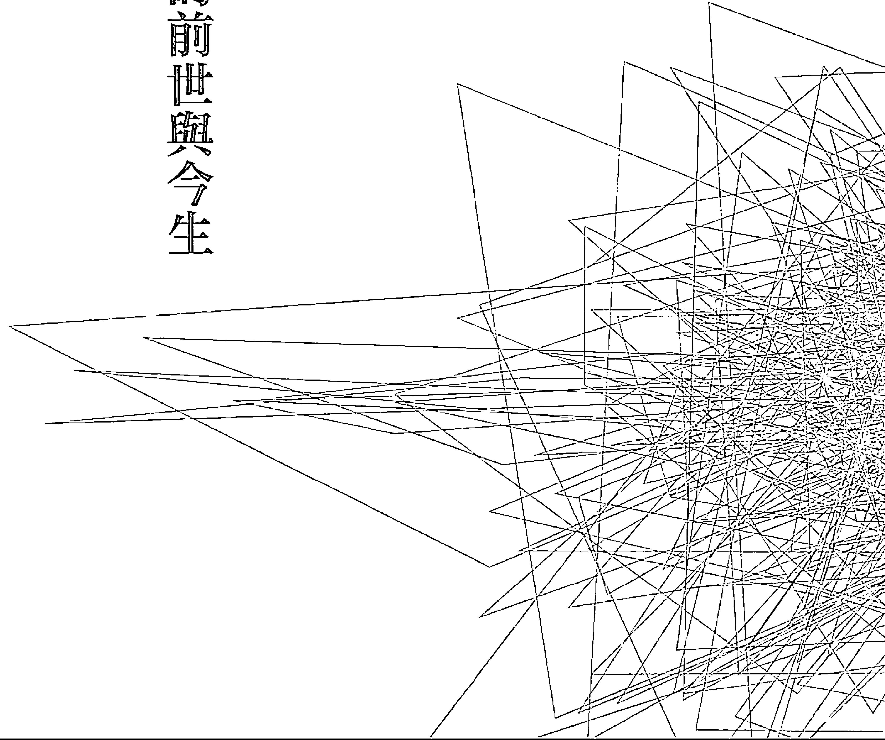

## 靈魂相遇——帝王將相篇

### 壹、前言

曹操，在中國歷史上是一位備受爭議的人物。有人說他是曠世英雄，也有人說他是亂世奸雄或梟雄。

著名史學家吳晗稱他是「當時最偉大的軍事家、第一流的政治家、第一流的詩人」。三國誌中則認為，他是一位「非常之人，超世之傑」；但在羅貫中的「三國演義」裡卻刻意把他醜化成冷酷無情、奸詐嗜殺、不仁不義的小人。

客觀地說，三國演義是「小說」，不是「正史」，所以其中有不少虛構的人物與情節，故對曹操的塑造偏向戲劇效果。只是戲劇野史對民間的影響更大，流傳更廣，所以對曹操的極端負面評價乃由此而來。

但是，不論評價正面或負面，這不是本文的目的。本文要揭示的，是一件前世今生的事實案例，也讓世人了解因果輪迴的真實存在。

### 貳、我是曹操？

#### 一、一語道破

二〇〇九年元月二十日，早上九點正，一位七十歲上下，面容慈祥的長者趙先生，準時地來到諮詢處，這是趙先生第二次來到諮詢處，第一次是約一年前趙先生帶著他的兒子來求助。一年多來他覺得黃老師是個精準又可以信賴的人，所以便親自打來電話，要求自己也要諮詢。他並且很正經的說：「我自己一個人來，請先不要告訴我的家人」⋯⋯。

趙先生坐定後，說：「我想要了解我的前世」。

但是，黃老師開口的第一句話是說：「其實你根本不相信鬼神，你也沒有任何信仰，你只相信你自己，不相信任何人，你會相信主神嗎？你可以接受看不到的主神和靈體？而且，你是個鐵齒又面惡心善的人，你真的會相信自己的前世？」

趙先生只是笑笑，未置可否。他顯得有些緊張。

然後趙先生說：「不怕老師妳笑話我，其實我自己知道，我的前世絕對是個『人物』，從小我就有這種感覺，而且我從小也一直纏著對我父親說，我的前世一定很特殊，一定是個了不起的人，但是他從來就不用我。」

## 靈魂相遇——帝王將相篇

黃老師說：「既然你這麼說了，而且你也有了你自己的認知，我今天就知道你真相吧，你的前世是三國時期裡的曹操。」

趙先生似是先震撼了一下，隨後，趙先生很得意的說：「我從小就時常做夢夢到曹操，夢中的曹操告訴我，他就是我；我就是他，所以，曹操也是我一生中的偶像，我覺得自己體內有曹操的靈魂與精神。今天知道了真相，我更得意了，也難怪我一直熱衷政治，也是政治世家。」

趙先生說：「所以我從小喜歡看有關三國的故事，但有時我又會覺得自己像劉備，所以我常常在曹操、劉備二人的角色裡打轉。但是，今天黃老師說我前世是曹操，我相信！」

接著黃老師繼續說：「前世，你是軍事家、政治家、詩人，所以今世你的工作一定與國家、社會有密切關係，你會有奉獻、服務的心，你是屬於大家的，屬於社會、國家的。你有工作狂，你這一世被設定為『政治人加企業人』的混合體。」

趙先生說：「妳厲害，妳真的不愧是傳說中的黃老師。」

黃老師說：「跟你的前世一樣，你是個有霸氣、魄力、果斷、有效率的人，直率、冷靜又冷酷，你重隱私，也有些神秘作風，處理事情快速決斷，而且堅持己見，旁人不容易影響你，唯一能卡住你的，是你的家庭，這是你傳統的一面。」

趙先生說：「沒錯，妳全說對了，我的兩個兒子是讓我最頭痛煩心的。」

黃老師：「你的大兒子是來渡化你的，你的小兒子則與你有特殊因果。」

（註：原來趙先生素來不信鬼神，但他的長子三十餘歲了，又是靈媒体質，高學歷，卻與社會嚴重脫節。這個兒子，一年前求助黃老師後，找到了答案，這也給了趙先生極大信心，因此趙先生才決定前來諮詢，所以才有兒子「渡化爸爸」的說法。另小兒子的特殊因果，另見後述。）

黃老師：「這一世你是來為社會、國家服務的，雖然你今天已擁有相當高的社會地位與名望，但是你一直不滿意，認為不如自己預期中的好，那是因為你的前世太好、太顯赫，所以你當然對你現在的成就不滿意。」

黃老師：「但是，你既是被設定要服務國家、社會，你就不可能太早退休，你是那種『做事做到死』的人。」

諮詢結束後，黃老師站了起來，準備離開，未料到趙先生突然起身，拉開椅子，當場就在硬磁磚的地面上跪了下去，並且長長一揖，說：「黃老師，請受我一拜！妳真是個了不起的奇人，奇女子，外界對妳的讚譽與傳言果真不假，我今天也真是見識到了。」

黃老師趕忙將他扶起，一直說：「不敢當，不敢當，我承受不起。」

（餘略）

後來，誠如黃老師所說，趙先生是那種「做事做到死」的人，果不其然，四年後，趙先生心肌梗塞過世，死時仍未退休。

#### 二、曹操的前世與今生

無論歷史的曹操是英雄或梟雄，但在今世曹操的趙先生身上，都可看到許多前世曹操的影子與特質。

##### （一）贖罪心態

今世曹操的趙先生，是位頗具知名的政治企業人，也是位有名望的律師，家世顯赫。他本身出身於政治世家，也曾涉足政治，更參與或投資了許多企業體，投入了許多社會公益事業、基金會、慈善團體。尤其他長年投入支持公益團體，一生扶助慈善公益活動，捐款無數，直到自己幾乎經濟拮据。他一生所賺的錢與顯赫家世的財富，幾乎大多數均用在慈善與公益上，以及幫助朋友上。

趙先生曾擔任過許多機構的要職，其中任何機構的任何財物不足，他均慷慨解囊。他不賺錢，只負責花錢，且均花在助人上，直到過亡，他的財富也幾乎用罄。

為什麼如此捐款、奉獻國家、回饋社會？他曾對黃老師說：「本質上，我不是個多有愛心的人，但是為什麼我捐款幫人，從不思考？現在我清楚了，是我的潛意識裡，對前世曹操殺人無數的一種贖罪心態吧！總覺得自己罪很重。」

##### （二）不信鬼神

趙先生素來不信鬼神，家人也都知道。他來諮詢問事，全是由於兒子的困境，當兒子找到答案後，他才在对黃老師的信任與信服下，來尋找自己的答案。但是他又怕在家人面前折損了他一向不信鬼神的立場，所以他才不讓家人知道，自己「偷偷的」前來諮詢。但是事後他也坦然對家人說他來找過黃老師諮詢，而他此後的行為也明顯的改變了過去不信鬼神的立場。

> 黃老師曾說：「曹操也是不信鬼神。」果真如此嗎？翻查古典後，發現確是如此。

文獻記載，曹操曾搗毀城陽景王劉章祠，曹操並認為，墳墓最終都是被人盜掘，所以極力提倡喪葬從簡，後來還特別設立官職官銜，專門負責盜掘墳墓來賺取軍費糧餉，所以後來袁紹討伐曹操的「檄文」中，也把曹操公然挖掘漢梁孝王的墳墓列為罪行之。

前世今生的同樣不信鬼神，當然不是巧合。

事後，趙先生也坦承：「對鬼神，我現在是不得不信！」他也說：「因為過去不信，所以曾有很多喇嘛、師父、高僧來找我，我都是一概不理，若要我捐款，更是想都別想，可是我太太卻是什麼都信，信得亂七八糟。」

後來趙夫人說，趙先生曾經將自己的諮詢經過與前世全都告訴了趙夫人，而且從此以後，趙先生每天晨起的第一件事，就是鄭重的走到窗前，雙手合十的向靈界與主神請安，直到過世前未曾間斷。趙夫人說：「見過黃老師後，他終於相信了世間真有鬼神」。

##### （三）才氣橫溢，浪漫不羈

曹操除了有政治、軍事長才外，他在文學方面也是成就非凡，他還是詩人，有著放蕩不羈的文人色彩，並有文學著作傳世。

今世的曹操趙先生也有許多類同的特質。趙先生本人便有軍事、政治的背景，也有擔任民意代表及任職軍事相關機構的經歷，他也酷愛文學，出版有關文藝作品多冊。而且，他愛唱歌，音感極佳，也唱京戲，是個文化人。

他也有浪漫色彩的一面，他經常出國，太太一身所有的衣物穿著，幾乎都是他一手包辦。趙夫人說，他在國外替趙夫人購裝時，一定是找來身材、身高與太太相似的模特兒，一件一件試穿，留下滿意的，再整箱打包帶回國。趙太太說，她自己婚後幾乎不曾買過新衣。

可見，曹操的前世與今生，也有著相同的特質。

##### （四）帝王作風

從趙先生身上，可以找到許多曹操前世的帝王作風。

1. 享盡珍饈美食

趙先生極重美食，山珍海味是他的常態飲食，可以說是「帝王級享受」，一輩子吃香喝辣。趙夫人說，他年輕時一餐可食大蝦二斤或大閘蟹七兩左右十隻。一生吃好用好，是帝王級享受。

而且，趙先生在家中吃飯，一定是分成兩桌。一桌是自己獨用，菜飯也一定是趙太太親手做的；另一桌則是給家裡其他成員吃的，菜飯則是由家中傭人所做，雖然家中成員不多，但是他一直堅持如此。他對黃老師說：「因為我怕被人下毒」，所以如此堅持。這種思維與作風，顯然就是來自於他的前世。

2. 極重儀表

趙夫人說，趙先生極重儀表，每天一定要穿好西裝才踏出臥室，進了臥室才脫下西裝，在家中客廳，他也永遠是穿著筆挺的西裝，絕對不著便裝、拖鞋。每天晨起，他一定是把自己梳理好，穿上西裝，才走出臥房。

3. 昂首直行

趙夫人說，趙先生有個很奇怪的習慣，走在路上，一定一路昂首直行，走在最前面，絕不等候旁人，與家人、友人外出，他均是如此，這便是所謂的「帝王風格」。

4. 老爺作風

趙先生在家裡是從不做事的，是標準的老太爺，他是只動口不動手的。所以家中的冷氣他也從來不會開，哪怕只是一個簡單的按鍵操作而已，他也是從來不做，都要人代勞。

##### （五）酷愛古物

趙先生喜愛古董，雖然未必能夠分別出古董的真假，但是只要喜歡，都會毫不考慮地購入收藏，所以家中珍藏骨董古物無數，也被奸商騙了不少。因此閒來走逛古董市場，一直是他的嗜好。

##### （六）風花雪月

前世的曹操妻妾眾多，今世的趙先生也是生性風流，所以喜歡風花雪月，趙夫人說：「趙先生在生前紅粉知己一定不少，也常常聽聞他如何如何，只是我從來未曾親眼目睹，或是當場『人贓俱獲』過。」但是更正確的說法，應是趙先生是絕對的大男人主義、絕對的家中權威，他的風花雪月與私行，趙夫人也只能「有限的干涉」。

##### （七）今生的矛盾

今世的趙先生，在工作職場上，與前世的曹操有著極大的相似度。趙先生在工作上有強烈的責任感，真的是「每天做事，到死方休」。而上班又幾乎都在貼錢，一生都是「求名不求財」，趙夫人亦稱他是「逐名不逐利」。

但是，在逐名的過程中，他又並不順利。雖然已具相當名望與社會地位，但是他極不滿意，他也向黃老師說：「我認為自己不應該只是如此」。但是，他又不敢「力爭上游」，這是他心中的痛與疑惑。

更值得一提的是，趙先生酷愛古劍，各式長劍、短劍、刀匕古物，他蒐集了三十餘把。原來曹操本就擅長武藝與劍術，曾在兵變時，一人擊殺十餘亂兵而得脫逃的史籍記載，難怪今世喜愛搜集刀劍（趙先生蒐集刀劍照詳見最後附錄章節）。

為什麼呢？趙先生說：「我從小夢到曹操，也愛看三國有關的故事。數十年來，每當晚上一人時，我就會在腦中想像三國的景象，每次都想著要如何把三國爭鬥的情節與方法，用在我現在的工作與職務上，來謀取更高的職務，來取得國家的更大位。」

趙先生說：「我心中盤算許多方式與方法，但最後我卻做不到，為什麼呢？因為我認為今世自己不是曹操，所以不敢用曹操的心機與狡詐來爭取功名、爭取提拔。」

簡言之，趙先生想爭功名，也盤算許多心機方法，但到臨門時，又都放棄了，只因為認為「自己今世不是曹操」。等到七十二歲了，知道了自己前世真是曹操時，也已時不我予了。

因此，趙先生一生未當真正的「大官」，雖在政壇上也有一席之地，但心中卻有著極大的不甘心。

這樣的矛盾心態，真正的癥結點是在於：趙先生有著曹操的靈，當然也有著曹操的手段與智慧，但他一直受到後世歷史對於曹操「一世奸雄」的批評，讓他處在古今的矛盾中。他有著曹操的特質與能力，卻承受不了「奸雄」的批判，所以在壓抑自己，隱藏自己的能力。他也曾對黃老師感慨的說：「我覺得自己此生沒有出息，做不」

#### 三、對政治的關心與眷念

其實，他已有很高的地位與名望了。當然，無法與他的前世相比。

前世今生帶來心中的矛盾，也造成他這一生的遺憾！

趙先生的政黨屬性是屬於典型的「老藍男」。他在藍營裡有很高的輩分與「政治地位」，但卻是屬於「幕僚型」，而非枱面上的「實權型」。他對台灣的政黨政治有很深的投入與關心。知道了自己的前世後，他曾自嘲：「難怪我會這麼關心政治、關心這個國家，原來我前世就是個政治人。」

他在二〇〇九年初訪黃老師後，連續三、四年，都有再回訪黃老師，每次都會就時局、政事請教主神，也對當下政治有許多的批判與褒貶，言談中，就可以從他身上看到他前世「政治人」的政治敏感與特質，處處都顯露出了他對國家與政治的極度關心。

##### （一）對時局與政治的不滿

二〇一二年秋，趙先生因健康問題來訪黃老師時，便毫不保留的表示，對「馬先生」的書生與謙讓做法很看不慣。他說：「大環境真的變了，我感覺到我們藍黨的『氣數已』，遲早就要失去政權。」對一些藍營的人「另組政黨」，他也極不以為然，也還特別指責○先生的不該，愧對經國先生。

趙先生說：「可能我前世是曹操的原因吧！所以我很在意國家的興亡，在意政黨的興衰。」因此，「對於一些元首的治國方式，我不能同意，尤其是對第一位民選總統，我更有意見，我懷疑他的愛國情操，但我又不能怎麼樣，只能擔心而已。」

他說：「見過『活靈活現』第一冊後，我很生氣，因為書中的一些論點，與我的看法一致，我很早前就勸過連、宋二位，要好好合作，藍營才有機會，但是他們都不聽我的，我提供給他們的政治謀略與建議很多，但都不被採納，這是我最痛心的。」

老師說：「你的主神指示，靈體的顯性世紀是自一九九五年起，以自己為主的自以為是就會愈來愈明顯，舊世紀的愛國情操，為國家犧牲、顧全大局、犧牲小我、完成大我……等等這些特質，已是愈來愈看不到了。個人看法想法已取代對國家存亡的使命感，總是以個人對政治人物的喜愛為主，跨世紀的大環境變了，人心人性也跟著變了。」

##### （二）對現實的滿腔遺憾

趙先生對時局政治不滿，又無法施展自己的「謀略」與「抱負」，所以他有滿腔遺憾。

趙先生不諱言自己很擔心「台灣的未來」，他說：「我很想幫馬先生，也提供了許多很好的謀略，但是馬先生對『有情報背景出身』的人非常防範，這是我長期觀察的判斷。」（註：趙先生的父親曾是情治界的高官）

趙先生多次感慨說，如果一國的元首是「書生型」的特質，又處亂世之中，必難治國，也必失民心，「每一想到這裡，我就吃不下飯」。他對於自己雖有很好的政黨關係，但意見卻不被採納與重視；枱面上的政治人物也都不接受他的看法、理論與計謀，感到極度的「遺憾」與挫折。

趙先生認為「藍營」正走向積弱不振，為此感到灰心與焦慮，他曾說：藍營一定要提拔中生代、培養中生代，才能跳脫過去政黨的陋習。只是後來看到中生代也都是舊的政治思維，無法突破，又倍感無奈。二〇一三年二月初，他還對黃老師說，以自己的判斷，馬先生兩任以後，他的書生特質、固執又欠缺霸氣，加上藍營百年老店的創新不足又擅長內鬥、各存私心，藍營在國會雖擁多數，卻是空轉虛耗零作為，危機明顯。他說：「基層已漸見離心崩解；高層仍在自覺良好，屆時民怨會像流水般奔散，到二〇一六年會不會失去江山？若是如此，以後想再取回政權，將會是很難很難的事，因為我接受靈界所說的二十一世紀的現在是『磁場偏綠』的論點。雖然接受的很痛苦，卻又不得不接受！」

神尊指示，趙先生的一些看法頗有見地與深度，有政治敏感度，足以印證他前世「政治人」的身分，更能突顯他在前世的曹操身分。

##### （三）疑惑與提問

知道了自己的前世後，趙先生多次毫不諱言的對黃老師提問一些政治的相關問題，他的主神也都接受他身為政治人，提問政治人的事，他只是想用自己的政治觀點，證明自己的前世正是曹操。他關心他所屬「藍營」的前景與未來；擔心藍營會怎樣牽動國家的走向？他有著忠貞軍魂式的精神，始終放不下舊式的愛國心。

二〇一三年二月初農曆年前，他再訪黃老師時，雖然當時身體健康有些不佳，他仍是懸念國事與政事，他對自己的健康完全不在乎，他的生命中只有國家、政治最重要。

他問主神：「我還有機會為藍營奉獻心力嗎？我還有可能受到藍營的器重嗎？」

黃老師說：「你年紀也大了，時代也變了，現在又逢亂世，太亂了，你就不必再勞心了。」

然後他很憂心的提出三個問題，希望他的主神能給他明確的訊息，他並請求，希望主神能將他的政治理念、看法以及對談，在活靈活現出書時節錄在書中。他說：「我一直希望能出版個人自傳，雖然已有朋友在幫我進行，但我知道不易完成，只是遺憾而已。」

主神也答應了他的請求，因為知道他即將在年內過世與靈歸圓，如此可以完成他的遺願。

（以下對話內容，均是發生在二〇一三年二月）

1. 趙先生問：「為什麼現在台灣的政治亂象如此惡化？」語畢，趙先生還深深嘆了一口氣！

黃老師轉達了靈界的訊息說：「這就是靈體顯性的緣故，不僅台灣如此，全世界皆然，二十一世紀是亂世啊！」

「因為靈體顯性，每個人都有自己的想法，都先為自己著想，都只顧自己，大家都容易固執己見，容易看人不順眼，所以你也是有你自己的政治理念，不是嗎？現在多數人都不會替別人著想，在政治上，當然就更不容易妥協，這就是政治亂象的來由。不僅台灣如此，全世界也都一樣。」老師說：「你還是用舊觀念看新世代，用老觀念看新政治，就會看不懂，這也是你和藍營的最大盲點。」

2. 趙先生再問：「藍營接下來還能繼續執政嗎？」他的愛心顯現在臉上！

趙先生說，活靈活現第一冊就說了，二十一世紀是個磁場偏綠的世紀，「從現在的政局面來看，也確實是如此，現在雖然是藍營執政，但卻是綠營的氣勢更盛，藍營雖在國會裡占有極大多數，卻處處受到制肘，什麼事也做不了，在這個世紀裡，藍營還能有大的作為嗎？」

黃老師轉達接到的訊息表示：「藍營現在的局勢，應該是到了極盛而衰的轉折點，接下來幾年會每況愈下。因此，到二〇一六年藍營極有可能失去天下，而且翻轉不易。」而趙先生對時局政治的不滿、對藍營執政中的欠缺霸氣，總是溢於言表，黃老師接訊說：「不必怨嘆什麼，現在磁場是綠營的，所以很多綠營的缺失，會輕易的就被大眾合理化了，在這樣的亂世亂象下，要突破困境與不合理，只有靠你們自己藍營理性智慧的努力、懂得團結與相信奇蹟！」

至於藍營在往後的二十一世紀還有機會創造奇蹟嗎？黃老師轉達靈界訊息說：「現在雖是偏綠的磁場，但是二十一世紀的靈學是可以創造奇蹟的。奇蹟可以創造未來，可以挽回劣勢，可以產生不可思議的力量，因為民怨重時就容易被扭轉局勢。但是如果綠營能夠有效掌握團結的力量，就容易一直執政。」

「因此，只有國、親、新三黨合一大團結，或是人民的一致團結才是你們藍營唯一的機會，大家拋棄歧見、思想歸零，放下舊政治思維，團結起來，就可能創造奇蹟。而且這個答案早在二〇〇四年就已告訴連先生的密友林先生了。」

> 「但是」，黃老師說：「對藍營而言，要團結是很難的事。因此在磁場偏綠的情況下，既是自己不能團結、創造奇蹟，也就不必埋怨天下不是自己的了。」

3. 趙先生又問：「為什麼這個世紀，靈界要偏袒綠營，弄個磁場偏綠的局面呢？」這是趙先生一直耿耿於懷的。趙先生還問：「綠營有人來找過老師嗎？」

黃老師轉達靈界訊息說：「靈界不分藍綠，靈界設定五十年偏藍，再五十年偏綠的磁場，是最公平的。現在許多藍營人士對『磁場偏綠』現象不滿，但是回想過去三、五十年前磁場偏藍時期，藍營不是也曾獨大與佔盡優勢資源嗎？所以不必因此怨嘆！但是這樣的先天設定只有百分之六十的影響力，另外還有百分之四十的影響則是屬於後天人為的努力了。所以後天肉體的作為也是很重要的。」

> 「對藍營而言，即使他們先天不足，會使他們失去政權，但在後天的部分，若是能夠三黨大團結或是得到人民充分的信任，後勢仍有可為的！」

「綠營高層多年前也曾來過，也理解他們所處的優勢。對綠營而言，即使可以預見他們就將取得天下，但是在後天人為治國的百分之四十部分，神尊也曾告誡，如果執政者能忠於國家人民、苦民所苦，執政後，當可持續不墜；若是視國家為禁臠、貪腐當道，違逆了天意與天道，縱是得到天下，也是很快就會失去天下。」

「所以，不是藍或綠哪一個政黨執政好不好的問題，而是大家要理解這個世紀亂世亂象的特質，而且，亂世一樣可以當個人英雄，平民百姓也可以當亂世英雄。無論天下多亂、執政者是誰，也只有靠奇蹟出現才是亂世的秘訣！」

##### （四）憂心時局與未來的對話記錄

從前世到今生，趙先生不愧身上流著政治人的血液。三個月後，在二〇一三年五月，他再來面訪黃老師。這是他生前與黃老師的最後一次晤談，他仍是充滿著對台灣未來與時局的極度迷惑與憂心。他的提問與疑惑不但顯現了他對政治的敏銳，也正說明了這個世紀的特質大異於過去。為了讓讀者更能理解靈体顯性與亂世亂象的不同，筆者特別將該次的對話記錄的部分內容，詳實呈現於後：

趙先生：活靈活現書中曾說：「馬先生是靈界設定的天子命格」，但他掌政以來，卻顯現出書生的善良與欠缺霸氣，為什麼靈界會設定這樣的人來任## 天子？

  黃老師：馬先生是從二十世紀跨入二十一世紀的人，二十一世紀的靈體顯性是人類有史以來的第一次改變，簡單的說，馬先生個人並沒有成功的從二十世紀跨入到二十一世紀，沒警覺到地球已進入到亂世亂象的年代。就像許多跨世紀的父母與二十一世紀的孩子存在著極大的矛盾與衝突的道理是一樣的。

  趙先生：從現在的大環境看，我認為藍營二〇一六年和二〇二〇年失去政權的機會很高，很怕會是事實，請問老師的看法呢？

  黃老師：我沒有個人的看法。但是你的主神說，你的判斷還算正確。

  趙先生：有機會扭轉嗎？有可能讓藍營二〇一六年繼續執政嗎？

  黃老師：你的主神說，幾乎沒有機會，除非奇蹟出現。奇蹟就是神蹟，但是現在的政治人物大多不信「神靈」，只信「神明」，而且只會「利用神明」，所以總是有人會說「○○神託夢給我⋯⋯」，或是到神明面前起咒發誓，多數政治人都把神明當工具。例如，常常借神明之名，說神明要某某政治人接旨或是掌天盤或靈盤，不然就是說神明指示要「政和道合一，政和佛合一」等等，把過去傳統的人民信仰，冠上與政治結合的名義。靈界眾神尊指示，亂世之下，真的是「神不騙人、人會騙神」，真是亂了、亂了。要知道唯有靈界神尊才掌天盤，沒有人在掌天盤的道理。

  黃老師：當然，政治人物也有信仰堅定的，可惜多數又流於迷信。所以二〇一六年藍營失去政權應該已是定數，無法改變，而且會輸得相當徹底，除非在二〇一四年馬先生有極重大的突破與自我的覺悟和改變。所以你愛心也沒有用啊，你該退休好好享福、照顧身體才是。

  趙先生：如果二〇一六年藍營失去政權，未來還有機會執政嗎？二〇二〇年呢？我的世家世代都是愛國的，想到這裡，我就心痛，所以我怎能輕易退休！

  黃老師：二〇二〇年台灣的政治亂象會更加劇烈。對藍營而言，若是沒有奇蹟來助，天下不會回到藍營手上。藍黨的弱點是百年政黨的老邁，老人政治的阻力、不能求新求變、不能團結，以及不知道全球已經進入到大翻轉的顛覆新世紀、不能放下二十世紀的舊思維等等，這些都是大障礙；綠黨的弱點則是在掌政後，部分人容易滿盈而驕，若是玩法亂權，招權納賄，即使有再好的磁場也是枉然。尤其是靈體顯性後，政治人物都自以為是，都只從自己的角度思考，又容易得意忘形，只聽自己喜歡聽的，然後堅持己見，難以妥協，就更會造成政治亂象的矛盾與對立，最後受苦的只是蒼生百姓。此外，因為靈體顯性，老百姓也都有自己的固執，有自己明顯喜歡的候選人，就容易造成社會的對立，也容易被人利用左右，失去客觀、陷於政治激情。

  趙先生：從神尊的開示以及我個人「曹操的前世智慧」來判斷，我預測二〇一六年將是綠營天下，如果成真，到了二〇二〇年和二〇二四年綠營繼續執政的機率就更大了，因為他們掌有國家機器與執政優勢！我這樣的看法對嗎？

  黃老師：這是你的靈體給你的直覺與靈感，基本上你的直覺是對的。這是你前世的政治智慧與靈體再發揮的靈感。二〇一六年綠營掌政機會極大，二〇二〇年綠營繼續執政的機率也高，除非藍營有奇蹟。而且到二〇二〇年與二〇二四年，應該都會有更大的政治風暴與混亂又畸形的政治競爭。

  趙先生：現在無論是藍或綠的支持者，或是政治人物或候選人，大家都很敢表達，很敢講、敢「亂講」，為了利益，也很敢顛倒是非，隨便誣賴別人，為什麼會變得這樣？搞得都沒有政治倫理了，到底他們都在想些什麼？我很無奈，也看不下去，應該是我真的老了，如同黃老師說的，我是二十世紀的老政治人，對亂世看不透、看不明白啊！

  黃老師：因為靈體的顯性，造成大家敢講、敢說，也敢於表達，部分人又喜歡亂說，並且自以為是，為了利益，就會不顧是非。二十年前，靈界就一再強調，二十一世紀是個「天不照甲子，人不照天理」的「亂世亂象」的世紀。「活靈活現」第一冊也一再如此強調，過去大家不太能理解，現在大家終於能逐漸體會了。所以不只政治如此，各行各業也都變了，相對的，亂說亂講的人更多了，詐騙集團也會愈來愈多，你可要小心，別被騙了。

  趙先生：哈哈！我是被朋友騙了不少錢，也沒還我，還騙我買了一些假的雞血石！因為我喜歡收集骨董，謝謝老師提醒，我會更小心的。這幾年來，許多中生代的青年人跟我反應：「為什麼藍營的人對好的政策的推動與是非的解釋，常常說不清楚，也難激起社會共鳴，但是對手（綠營）只要一、二句，就很容易得到許多人的迴響與認同，為什麼呢？」

  黃老師：這就是磁場的問題，因為這個世紀的磁場偏向綠營的緣故，再加上靈體顯性，敢亂說亂講的人多了，一些沒有政治條件或特質的人，也可能因為敢說敢罵而輕易的在選舉中獲勝！也就是說，許多人臉皮厚了，不在乎倫理道德了，用敢說、敢騙、敢罵的方式求生存，一般民眾聽了片面之詞，信以為真，就把謊言當真話了。

  趙先生：我發現近年來的政治人物，愈來愈多人沒有了堅定的中心思想，立場搖擺，許多候選人也都容易「變節」，為什麼會這樣呢？真的是看不懂現代的政治人，我也不得不承認，自己真的是老政治人了。

  黃老師：這也是「靈體顯性」的另一明證。這種情形在往後幾年會更加嚴重，全世界皆然。在靈體顯性下，大家都以自己為中心，更自我、更主觀，都認為自己是對的，都只看到別人（對手）對自己不公，卻沒想到自己也有對別人不義；政治人物也更容易把自己擺前面，把國家擺後面，因此，現在的候選人、政治人容易變節，也容易改變政治立場，改變顏色傾向，大家都太在意自己的感覺感受，而不管別人的感覺感受。這也將是未來國家社會亂象的一部分，亂世中政治是更畸形了。

  趙先生：這樣的現象會普及化嗎？這樣的亂象會持續多久呢？我很愛心，但是沒人在乎我的意見，把我當做過氣的政治人，想了就生氣！不過也是啦！我們老一輩的政治人比較有愛國情操；對國家忠貞不二的精神一直都在，直到嚥下最後一口氣！

  黃老師：你別生氣，會氣壞身体的！其實，在藍營與綠營裡，兩邊都有一些黨政元老或長輩的理念是不被認同接受的，這種亂象是全世界性的，也會持續一直下去直到末日來臨，所以很快的就可以看到在歐洲、美洲、亞洲各地，都會步入更大的政治混亂與經濟混亂，真是天災人禍不斷。這種全世界全球性的亂世亂象，你理解了就不會有怨氣了。

  趙先生：照這樣的說法，三年後（二〇一六年）的台灣政治選情，會非常混亂嗎？

  黃老師：是的，而且到了二〇二〇年還會更亂，二〇二四年之後也是亂。事實上，從二〇〇〇年以來，台灣的選舉一直如此，完全符合亂世亂象的特質。

  趙先生：接下來，社會、經濟、科技等層面，是否也會更亂？全世界也都一樣嗎？我現在比較擔心的是我的孫子們，他們的日子將會更苦！

  黃老師：是的，靈界給的答案是肯定的，接下來全世界的社會、經濟、科技等層面都會更亂。因此，靈界才會不斷傳達二十一世紀亂世亂象與靈體顯性的特質，就是希望在了解了亂世的原因與必然的趨勢後，大家能夠坦然以對。接受現在的跨世紀，面對亂世亂象，每個人都要更相信自己，就可以讓自己大改變、大翻轉，就可以顛覆大環境，讓自己在亂世中活的更健康、快樂、平安！許多人面對現在亂象，張眼所見的一切人事物，都不順眼，以致得了躁鬱、憂鬱等精神疾病，這樣就太不值得了。

  （筆者註：在二〇一九年的現在回顧過去幾年以來，英國公投脫歐後續的混亂，美國川普當選總統後各項政策的爭議，北韓核試爆……等等，均是亂世亂象的應然，而非偶然，應該更加令人覺悟與深省。）

#### 四、小結

  前述趙先生與黃老師的對話記錄，均發生在二〇一三年以前。今天（二〇一九年）我們回顧這六年多前的對話，不得不敬佩趙先生的政治眼光及靈界的先知卓見。趙先生，是一位在傳統舊世紀（二十世紀）出生與成長的「老政治人」，由於他的特殊前世，造成他今世對政治的特殊敏感與深入觀察，相較於其他的「老政治人」，趙先生更難得的是他對「新」世紀、「新」觀念的認知與接受。

  從趙先生對政治的關心、眷戀、熱衷以及他的專業卓見，可以看出這位前世是曹操的趙先生，雖然經過了一千八百年的時光流轉，仍是不能忘情政治，仍是惦記著權力、國家、政事。尤其，在趙先生的晚年時期，他一直更念茲在茲的就是國家與政事。他心中最大的落寞就是自己的懷才不遇，他深僉自己有一「經世治國」之才及獨到的政治卓見。因此，他多次表示，他這一生的最大的要求就是要「對得起國家」及「對得起自己」。

  因此，他一再向他的主神表示，他希望能出版一本闡述他一生政治理念的書，也當作是他此生的「自傳」。藉著這本書，要印證自己這一生對得起國家，對得起自己。他認為，這樣做是對自己國家的交代，也是對自己一生的交代，日後，當他過亡，靈體返回靈界時，也才得心安！趙先生說，這是他終此一生的唯一遺願，他的主神也曾答應協助他完成心願。

  二〇一二年秋，趙先生的健康已見警訊。他曾對黃老師說：「我已託專人幫我撰寫自傳，以便闡述我的政治觀察與理念，但是進度緩慢，很怕不能完成⋯⋯」他說：「從我的前世到今生，你們最能理解我的感受，但是我知道黃老師早已表明不再過問俗政治的立場，但不知屆時能否請你們為我的自傳題『序』？若是我的自傳無法完成，可否在『活靈活現』系列的出版中，將我的政治人生經歷，列入在案例之中，這樣也可取代自傳，作個印證與說明？」

  二〇一三年七月，趙先生心肌梗塞過世。由於事發突然，他曾託人代寫的自傳無法持續，已經不克實現，因此，在活靈活現「靈魂相遇系列二」的撰寫期間，決定實現其生前所託，將趙先生的案例列入，並將其政治理念予以個別陳述，以作為他自傳的替代！

  這是本小節（即「三、對政治的關心與眷念」）撰寫的由來始末，併此說明。

  趙先生的一生，是因果輪迴的鐵證，儘管這一世他終未能一展他的謀略長才，也一直怨嘆未能為國效力、怨嘆懷才不遇，但是他至少知道並印證了自己的前世，知道自己曾經吆喝天下，也已流傳千古，最後，他的最大遺憾也在神尊的協助下完成，他今生也應無所遺憾了！

### 參、另樁的因果糾纏

  趙先生本是不信鬼神，但是對黃老師的因果解析極為信服。認主報到後，也開始每日晨起向天際主神行禮請安，幾乎不間斷。雖然他嘴上從不多說，但每有疑難一定向黃老師請教。

  某次，趙先生拿出他小兒子的相片，向黃老師詢問：「我這個兒子有什麼問題嗎？他把自己搞得很辛苦，也給我帶來太多麻煩。」

  這時，黃老師接到神尊的訊息，告訴趙先生說：「你這個兒子的前世是三國前期的董卓。」

  趙先生頓時僵住，說不出話來。十餘秒後他才喃喃地說：「那麼，我全懂了。」

  據趙先生說，這孩子在家中與他形同陌生人，幾乎從不交談，雙方也似一直有一股莫名的敵意，毫無親情可言。他陸續地說著這個兒子的「奇怪」習性：

- 一、把自己過得像「苦行僧」一般的生活，省吃儉用到令人無法忍受，衣服穿到破舊泛白，也不肯新購。
- 二、經常酗酒，每醉必脫衣，露出肚子，橫躺街道中央，像極了曝屍街頭的模樣。住家的管區派出所已是人人皆知，因為已經處理過好幾次善後。

  原來，在歷史裡，董卓是武將出身。在東漢末年，挾持了漢獻帝，自封為相國。他生性兇殘，施行暴政，濫行殺虐，人民對他恨之入骨，他是中國歷史上總體評價極其負面的人物之一。

  因為董卓的暴虐無道，激起了全國各地組成聯軍的討伐，而曹操也是其中之一。曹操散盡家財，也組織了五千義軍加入討伐，結果董卓為部屬所殺。董卓被殺後，長安城內百姓在街道上狂歡慶祝，徹夜不眠。

  董卓屍體被拖至市中示眾，由於董卓極其肥胖，守屍官吏做了一個燈芯，放在董卓肚臍上點燃，連續燒了數日（或稱數週）才滅。

  由於這段歷史的呈現，終於釐清了趙先生父子之間相互敵視，互不往來的真相。顯然，這是一個前世為惡，今世贖罪的案例。

  因為贖罪，所以他雖生在權貴之家，但卻過不了好日子，仍然過著自虐、受苦、自我折磨的苦行僧般的生活。

  趙夫人後來陳述說，這個兒子節省到不行，每天注意隨時關燈、關電、關水，以節省一點水費、電費，三餐極其簡陋，僅以裹腹而已。買東西也均是一「便宜貨」、「路邊貨」，四十餘歲也只西裝一套而已，穿了二十餘年（與趙先生數十套西裝簡直無法比擬）。而且，他從不坐計程車，只乘公車，甚至走路，平時也都到便宜的「全聯」去購物。

  這樣的生活習性，卻又生在權貴富裕的家庭，實在令人難以想像，很顯然這是對他前世惡行、揮霍的一種自懲。

  他的酗酒與酒後仰躺街道，像極了董卓前世的曝屍市井。更令人難以置信的是，他從小便腸胃極度不好，稍有情緒、生氣、不安⋯⋯等，就要立即腹瀉。這種情形，自二歲起便已顯現。顯然，史料記載董卓曝屍時，臍中插上燈芯點燃數晝夜，所以這是他前世所帶來的因果病！

  因果如此神妙，也鐵證如山，令人不得不咋舌驚嘆！

## 第四章 周瑜的前世與今生

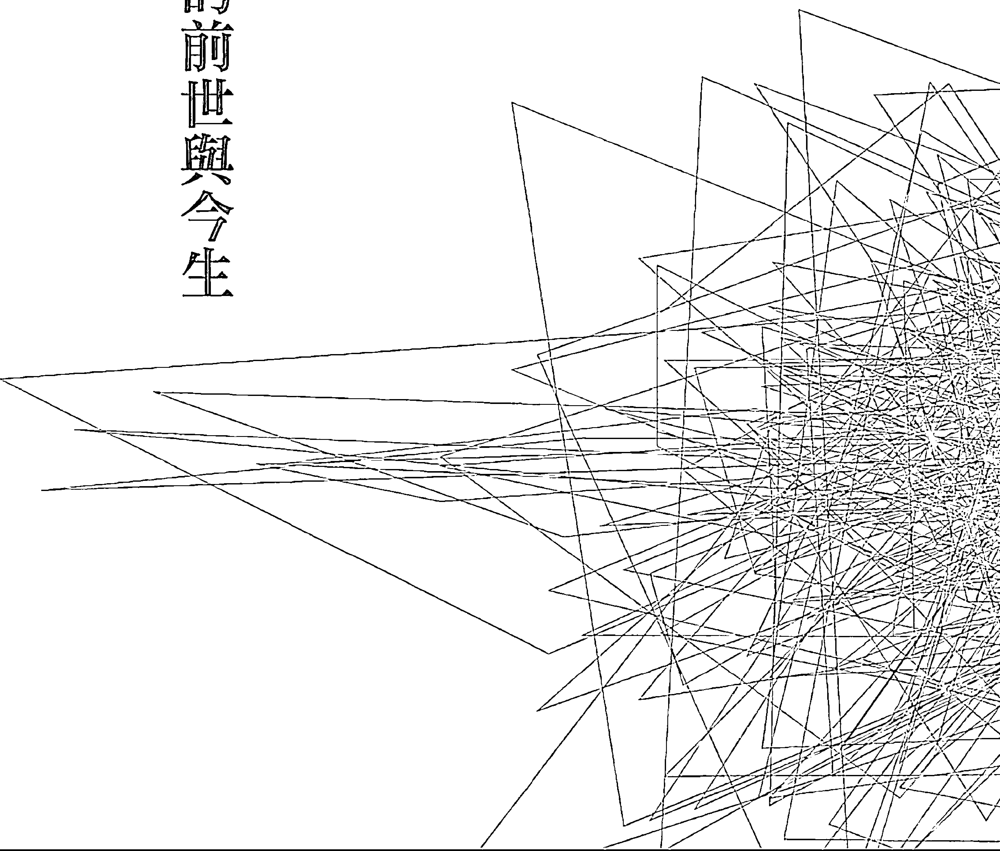

### 二

  二〇〇六年十二月三日，上海問事處走進一位三十餘歲、個子不高的年輕人。當他還在等待諮詢時，黃老師便已接到了訊息：來的是一位歷史名人，他的前世是周瑜。

### 壹、前世的周瑜

  周瑜，是三國時代的著名人物，他指揮參與的赤壁之戰，更是家喻戶曉。他的出生年代是西元一七五年，人稱周郎或周公瑾。

  在三國（魏、蜀、吳）鼎立的時代，周瑜是吳國孫權的重要統帥，是傑出的軍事家、戰術家、戰略家、政治家。因為天資聰穎、精明能幹⋯⋯，年紀輕輕就成就了大功業。他的妻子「小喬」亦是當時江東國色美女，是不少人羨慕的對象。

  不少的古代詩詞都對周瑜充滿讚美與欽佩，如大文豪蘇軾的「念奴嬌·赤壁懷古」。但三國演義中一句「既生瑜，何生亮」的曠世名言，更將周瑜與諸葛亮齊名。

  一般眾人所知的周瑜，是位二千年前的「高、富、帥」，這也確是事實。他出身名門，為官二代、富二代，身高一米八五，俊美挺拔，身材高大，是中國歷史上知名的「美男子」之一。可惜在赤壁戰後二年，便以英年病逝，年三十六歲。但卻無礙他在歷史上所留下的「英雄本色」、「高富帥」的形象。

### 貳、今生的周瑜

  二〇〇六年，余先生，是溫州人，第一次諮詢時是在上海，當黃老師揭開他的前世，告知他前世是「周瑜」的時候，令在旁記錄的筆者瞬間陷入一陣錯愕與迷惑中，一種悵然若失的感覺湧上心頭。心目中，夢幻裡的「高富帥英雄型男」瞬間崩解，也讓自己立刻回到了現實。

  初見余先生時，他給人的感覺就是：一位平實無奇的一般常態青年。不高的身材，約一米六〇左右，略顯消瘦單薄，行止一般，有些置身陌生環境的靦腆，與歷史記憶裡的「英氣逼人」、「高富帥」完全不沾邊。

#### 一、特質與阻力

  撇開歷史的情節不說，余先生有著某種與人不同的內涵。表現出來的，是他的聰穎、智慧以及他的思緒清晰，文筆流暢，文采飛揚。

  余先生在求學時代，便有口才好、反應快、企圖心強、喜歡強出頭的特點，因為這些優秀的特質，故而曾入選為全國性優秀青年代表。

  二〇〇六年他初見黃老師時，是三十五歲。因為特殊的前世，所以已經靈逼體多年，在家庭、婚姻、感情、事業、錢財等方面，都已遇到阻力，並且已經離婚。

  前世的傑出，使今世受到前世的牽絆。在靈性的影響下，他胸懷大志，也滿懷理想，但是前世、今世的時空背景已經不同，客觀的條件也已不同；加上靈逼體的干擾，他覺得自己舉步維艱、原地打轉，尤其害怕自己不成功、做不好，於是變得沒有方向，也有些意志消沉，但又不知道自己問題出在哪裡。

  黃老師說，余先生帶著前世的特質、俠士的風格與正義感、重情重義等，在二十一世紀已不符使用，而且在因果的影響下，他對自己的期許太高，但是自卑又自大、時而內外不一的想法，使他壓力也更大。因此，黃老師要他學習簡單與平凡，才能走出自己人生的道路。他不可能達到前世的輝煌，所以必須放下自我的極高要求與過度完美。簡單的說，他是前世的「受害者」，所以在知命後，要順命而行，不可好高騖遠。

#### 二、前世與今生的連結

  聽到自己的前世是周瑜，余先生的感受如何？他能接受嗎？

  余先生事後回想說：「聽到自己前世是周瑜的當下，我的第一個反應是：高興、驚訝、但又質疑：不可能！因為前世的周瑜與今生的自己反差太大，前世高大英俊，今生矮小一般；前世豐功偉績，今生慘不忍睹；而且認知中的周瑜會喝酒又通曉音律，但我今生卻是對酒唯恐避之不及，對音律也只是聽聽而已，諸如此類反差，令我自我認同有障礙。所以，我當時很難接受。」

  但是，余先生說：「在內心裡，其實我並不否定。到了諮詢結束後，我靜靜省思了一陣，已開始有了認同感。事後，我再靜心的反思了自己一些特殊的經驗與感受，也就坦然接受了。我也終於了解，為什麼從青春期開始，我就特別埋怨為什麼自己長不高、為什麼自己不夠帥、為什麼自己不是出生在當官的權貴世家？原來那時心中已經有了周瑜的影子！」

  從前世到今生，從周瑜到余先生，究竟二人還有怎樣的連結呢？

##### （一）軍事手段的運用

  在諮詢前，余先生已在社會營商，自辦小企業經營了有十年之久。余先生常喜歡把「軍事手段」用在企業的營運上。例如他常不顧外在形勢的有利或不利，偏向運用「進攻型」策略。用積極主動、大膽冒進的方式取代被動的守勢策略，而且一無所懼，像極了前世周瑜在赤壁一戰的積極勇猛。

  而且余先生說，以前自己特別喜歡下中國象棋，在對弈的時候，常會將對手當做戰場上的將領看待，再根據對方個性制定對弈策略，往往能駕輕就熟，這讓他相信自己已在謀略方面有優勢，這種謀略在經營事業時也有出色表現。

  周瑜在戰場上衝鋒陷陣，但余先生今世並不上戰場，可是在商場上，他卻感覺如同他的戰場，他依然習於衝鋒陷陣，這是余先生今世的特質之一，也是前世今生的一個連結。

  只是戰場上的軍事策略用在商場上，未必能完全得心應手。所以雖有成功，但也有挫折。

## 第四章 周瑜的前世與今生

##### （二）赤壁懷古的感動

北宋著名詩人蘇東坡的「念奴嬌，赤壁懷古」傳誦千古，其中描寫到周瑜在赤壁戰中大敗曹操，何等英雄，再以小喬的國色天香烘托周瑜的春風得意、豪情萬丈。但是瀟灑風流、聲名蓋世的周瑜今又安在？不也是被大江淘盡了嗎？

余先生說，高中時，念這首詞時他是背誦的滾瓜爛熟，在背誦過程中，余先生說：「感覺有個狀態，似是走進到詩詞的意境裡去了，非常強烈的感受。」

「想到這個經歷」，余先生說：「我就更進一步的接受了自己就是周瑜」。

余先生說：「而且，多少年以來，我只要看到赤壁之戰的電影，我必定是每看必哭，進入了那種情境，受不了。」「可能是心中深處的無形力量，把我的肉体帶到了前世的情境與情懷裡，所以，只要是有關赤壁、三國的電影，不論情節是真是假，都把我帶入到那個年代的情景裡。」

## 靈魂相遇——帝王將相篇

附·

###### 《念奴嬌 赤壁懷古》

大江東去浪淘盡，千古風流人物。
故壘西邊人道是，三國周郎赤壁。
亂石穿空，驚濤拍岸，捲起千堆雪。
江山如畫，一時多少豪傑。
遙想公瑾當年，小喬初嫁了，雄姿英發。
羽扇綸巾，談笑間，檣櫓灰飛煙滅。
故國神游，多情應笑我，早生華髮。
人生如夢，一尊還酹江月。

##### （三）前世今生的性格連結

三國演義的歇後語有一句「周瑜打黃蓋，一個願打，一個願挨」。這句典故如何來的？

原來黃蓋是周瑜的手下大將，黃蓋故意說要投降曹操，被周瑜杖罰到皮開肉綻，其實這是一個假戲，讓曹操誤以為周瑜與黃蓋不合。所以赤壁戰時，黃蓋帶著大軍假裝要投靠曹操，曹操也相信了，結果在毫無防備下，一敗塗地。

簡言之，周瑜杖打黃蓋是設計好的計謀，是周、黃二人事前即已說好串通，要誤導曹操。所以一個願打，一個願挨！周瑜打時，打得像是真的，但其實不是真的。

這句諺語，不論是真是假，但說明了周瑜的「雙面性」，一方面暴怒（打人），但心中卻是冷靜的。

余先生對此句諺語的感受極深，余先生說，他自己就是有像周瑜這樣強烈相似的特質，就是每當生氣暴怒時，自己一定也有「雙面性」的呈現：一個是暴怒的自己，一個是冷靜的自己。

也就是在憤怒中，他會很冷靜的觀察自己，也會有很冷靜的思考，然後在適當的瞬間，把握機會採取行動。

簡單的說，就是一「真真假假」的應對事情。

余先生說，每當他聽到這句諺語，他就會自我思考，反問自己：「我是否也有這樣的機智？」然後，他給自己的答案是：「有的」！

##### （四）憂國憂民的特質

受後世肯定的政治人物，都具有憂國憂民的特質。余先生認為自己尤其如此。余先生說，小學一年級時，他就曾想寫信給當時的家鄉領導，說自己很想「從政」的夢想，要為天下人謀福，高中以後，也曾想要如何具體的報效國家。

余先生還說，高一時他就想過，為了國家的經濟發展，應該要先開路造橋，當時也很想將此想法告訴地方領導。所以，高中時，他也曾覺得自己很怪，二十歲的年齡，卻有著四十、五十歲的思想，而且充滿了對社會、對國家的責任。

##### （五）好辯與魄力的特質

余先生年輕時期，非常好爭好辯，常常為了一逞口舌之快而與人爭得面紅耳赤，這與周瑜的性喜善辯亦應有所關連，余先生說，這種情形一直到他入了社會，為了营商，不斷自我克制後才逐漸改正過來。

此外，余先生說自己還有一種特質，就是「在特定情境下玉石俱焚的勇氣與不怕死的潛在力量」。所以常有人說余先生有時「皮剝了都是膽」，誠然，這應該就是來自於前世周瑜的膽識與魄力吧！

#### 三、糗事連連

余先生有著特殊的前世，所以也有著「為社會做事」的命格。他有著聰穎的智慧，適逢在大陸開放之際，所以他的主神也賦予他特殊「為國家做事」的天職。因此，他一直懷抱著高度的事業心與進取、積極的人生態度。但是，在人生的精華年齡，他卻並不順遂，為什麼呢？

- 第一．因前世的輝煌，使他有著過度的好高騖遠，一直以為自己最厲害、最行，無事可以難倒自己，於是付諸執行時，便容易陷入「眼高手低」的情境。
- 第二．前世的周瑜，是位傑出的軍事家、戰略戰術家，但今世的余先生，卻選擇了商場上的衝刺，想要成為企業家，可是卻沒有企業家的眼光與生意頭腦，只是一股腦兒的想賺大錢、想當大老闆，但又完全沒有商場上的經驗，所以雖懷抱著從商報國的企圖，但靈體卻未有此專長與歷練。
- 第三．周瑜英年早逝，死時才三十六歲。因此，余先生在三十六歲以後的人生，是沒有經驗的。而余先生來諮詢時，已三十五歲，正是邁入「沒有方向」人生的開始。因此，從諮詢與認主後的第二年開始，因為他的一個錯誤行為，使余先生一頭栽入了長達十二年的灰暗人生。

諮詢後的余先生，值得一提的糗事有三件，這三件，都有著靈學上的「教育」意義。對余先生而言，或許是個瘡疤，揭開了難免再痛一次，但是對於眾生來說卻是個很好的借鏡。

##### （一）走訪周瑜墓

可以想像的，對於余先生而言，當知道自己的特殊前世後，必然對前世的周瑜有著強烈的孺慕之情，這種仰之彌高、望之彌堅的情懷是可以理解的。於是余先生選擇了一個日子，特地前往位於安徽合肥廬江縣的「周瑜古墓」參拜與憑弔一番（周瑜墓園照詳見最後附錄章節）。

但是憑弔返回後，便覺身體極度不適，頭痛欲裂，無法入眠，似是重度感冒一般，而且求醫也是不得要領，絲毫無效，於是便以電郵向黃老師求助。

黃老師得到的訊息是「嚴重卡陰」，他的主神已告知黃老師「他去找周瑜了」，而在見到黃老師時，他的靈體也急著說出真相，說他去了周瑜古墓憑弔。

余先生承認，去了周瑜古墓後，自己就不斷的受到周瑜的魂的干擾，雖然一直想要從中抽離，但是無法成功，恍如有了兩個自己，一下子是周瑜，一下子是現在的自己，就這樣不斷的和周瑜的魂糾纏；而靈體也不斷的告訴余先生，周瑜想要回來，而且靈體也喜歡周瑜的魂。就這樣，一個肉体，一個靈體，但卻有兩個魂，所以無從安定！

原來，余先生去了周瑜古墓後，竟然異想天開的想要和周瑜的魂對話，想讓前世的自己和今世的自己可以合而為一。

所以，這就是今世的靈體，巧遇到前世的魂（人死後，靈體返回靈界，三魂則留在牌位或墓地，七魄則消失）。對前世的魂而言，久別了將近二千年，如今忽然乍見「老搭檔」，當然興奮異常，必定撲上前來，緊抱老友（靈體）不放。今世的肉体，如何能夠承受這種「熱情」，於是便陷入「嚴重卡陰」的狀態。

這種「今世的靈碰上了前世的魂」的嚴重卡陰，比起「卡厲鬼」的情況還嚴重，在黃老師工作的經驗中曾經遇過幾次。曾有一位移民歐洲的華僑回到大陸觀光，在參觀明十三陵時，也曾遇到類似情況，一病幾乎不起。不但在幾天之內瞬間滿頭黑髮俱白，而且臥病在床近十年，西醫無法診治，靠著中藥調理了五、六年才漸漸恢復（本例詳述於下一節末段）。

實務上，有些人出遊歸來，一病不起，便有可能是類似情況。只是這種機率實在太小，對余先生而言，卻是自己找來的麻煩，原本只是想思慕曾經豐功偉業的自己，未料差點不堪收拾。

對靈與魂之間的關係，余先生真是上了一堂親身經歷的實務課程，經過黃老師的處理化解後，余先生也完全印證了自己的前世也確實就是周瑜。

## 靈魂相遇——帝王將相篇

化解的過程也是非常傳神，值得一述：

在化解過程中，周瑜的魂一度不願意離開，也和閻王商討是不是可以和這一世的魂對換。閻王告訴周瑜的魂說：「現在的肉身已經不是周瑜的肉身了，長的不帥，個子也太矮，口才沒周瑜的好，腦袋也沒周瑜的聰明冷靜，要這樣的肉身幹什麼呢？」生死判官也說，「真的和周瑜差太多了，不帥！不帥！不帥！」周瑜的魂打量了一下肉身，只好甘願放棄，同意由主神領回送到靈界收魂區，這才終於結束了一場鬧劇！

##### （二）豔遇險入危機

余先生的感情世界並不順利，前世俊男配美女，流傳千古，今世的婚姻則以離婚收場，成為單親一族。

回復為單身後，當然就會想要再覓情緣。

前世高富帥的條件，娶得美人歸，自是理所當然。因此，靈體的「眼光」必然甚高，只是肉身今世只是一介凡夫，於是在情字路上，理想與現實就會產生很大的差距，形成「眼高手低」的尷尬局面。

單身男人，當然有著絕對自由的交友空間。某日，余先生結識一位從事教職的女性。女方職業「高尚」，也還文靜，一經接觸，很快就立即天雷勾動地火，進展神速。但是共度春宵後，余先生卻閃到腰，一時之間幾乎動彈不得，只好連夜用郵件向黃老師求救。

而且，余先生總覺得有些「不對」，說不出的感覺令他心中有股不安。經黃老師從因果鏡中檢視後發現，該名女性竟是「魔靈」，原本靈體早已被換。

原本以為是「豔遇」，結果竟是險入魔窟，好在發現得早，尚可「急流勇退」。對魔界而言，余先生的高靈格靈体是他們不可多得的極佳獵物！若是余先生的靈体被換，將是何等諷刺：赤壁之戰的神將之才竟然毀在魔界的女色手中。

對於余先生的靈体而言，前世是「英雄抱得美人歸」，今世卻是「英雄敗倒魔女裙」，真是情何以堪！

##### （三）心陷禁錮十二年

第三件影響余先生的重大事件，是他的「一念之錯」，讓他背負了十二年的「現世報」，坐進「無形牢獄」十二年。

二〇〇七年，大陸的經濟正在大紅大火地大步起飛，人人都在急著賺錢發財，於是各種投資、興利及金錢槓桿遊戲到處充斥，余先生當然也陷在這樣的氛圍中。

為了急著賺錢，在友人的蠱惑中及本身的疏於審思，一時失察之下，余先生將身邊一些資金交由朋友操作放利。半年之後，余先生有所警覺，便來向黃老師請示，但是已經慢了半步，他的資金部分被人侵吞，部分被人用在操作高利貸。雖然余先生並未直接參與，但卻是等同允諾，而且也未及時阻止或退出。

高利貸的金錢暴利，是民間地下錢莊「吸人血」的行為，利用弱勢族群的危難需求謀取暴利，其中又必然結合暴力、恐嚇、詐騙、黑道等等手段，實在是殘酷不堪又無道至極的人間惡行。對余先生靈體的「特殊靈格」與「高靈格」而言，本是要來凡間為國家做事，為社會興利的，現在竟然涉入如此罪惡的行為。

對靈界而言，余先生所為，是一個「逆天、逆地、逆命格」的極大惡行。於是，余先生的主神與靈界做出了「禁錮十二年」的懲處。十二年是一輪，凡人在世，遇有重大波折、失敗、運勢盪到谷底的時候，若要扭轉乾坤，必須要十二年一輪的時間，才能回到失敗前的原點。換言之，凡人在遭遇重大挫敗，想要東山再起，都需要一輪十二年的時間，才可能重整旗鼓。

於是，從二〇〇七年起，余先生開始陷入了人生低潮，如同心陷禁錮的牢獄之災。這十二年，正是余先生人生的黃金十二年（從三十五歲到四十七歲），縱然悔恨、無奈，也只能接受。

### 參、解惑

周瑜的前世與今生，應會令許多人感到些許失落與感慨。曾是風光倜儻的一世英雄，今生卻是顛仆難行！

一個高靈格、高傲、前世輝煌的靈體，何以走到今世的如此不堪？問題的癥結全在於余先生的靈体忘了身處不同世界、不同年代的疏失。靈体太過於驕傲、自負、自信、自大，忘了世紀年代的不同，於是成了「眼高手低」，但靈体又急功近利，急於表現，肉体便很容易誤入危區，一發不可收拾。

相較於二千年前，現在的人性、人心均與過去不同，古人崇尚信義、一言九鼎。周瑜古為軍事戰略專才，講規矩、方正、治軍嚴明，今日卻混處社會，從商營生，若是不知環境、不知改變，就會易遭構陷、欺矇，容易判斷錯誤、識人不明。

前世輝煌成就的人，今世多數難以超越。因為任何「偉人」、「名人」，前世的突出，均是多重因素造成。除了命格外，還有環境條件、背景條件以及天時、地利、人和等因素的配合。當靈体乍然來到今世，不同的命格、環境，若是不能体悟新世紀的特質，只想力搏前世，其結局當然並不理想。

本例裡，值得再提出說明的有二點：

### 一、今世周瑜的迷惑：

為什麼余先生在新世紀裡總有難以施展的感覺？似是也辜負了他前世的優秀特質？主要原因是：

##### （一）特殊命格的問題

余先生的靈體，今世帶著特殊命格而來，想要為國家社會有所貢獻。所以正如他自己所說：從小學生起，他就有上書層峰給領導人的衝動。他一心想要為國家做事，也想要當大官，還有著特強的責任心，凡事都想更好、速好，就怕一慢就要一來不及了。

但是他的肉体卻未能充份理解新世紀大環境的鉅大轉變，已完全不同以往，不了解當前的亂世與人心，他仍本著人性的傳統面、正義感，卻在充滿算計的社會裡，急著表現與衝刺，深恐慢了一步就要全盤皆輸。於是，肉体便在不知不覺中、在求好的壓力中走偏路了。

對特殊命格的人而言，偏路所要付出的代價是高昂的。

##### （二）特殊靈性的問題

余先生前世的優越與輝煌，使他的靈體有著與生俱來的「高傲」的靈性。但今世的肉体卻不具有任何優勢，而遠遠的跟不上靈體的「高傲」。

換言之，前世靈体具有的优势背景、出身条件，今世的肉体完全欠缺。灵体高傲，肉体却没有自信，灵体急著表现，肉体却跟不上来，没有方向。

### 二、今世灵与前世魂的偶然相遇：

讲前世今生与灵魂相遇，一直都著重在「前世的灵，遇到今世的魂」。

但在实务与理论上，却有另一种情况，就是：「今世的灵，遇到前世的魂」。

这是两种完全不同的组合，其结果当然完全不同。文中余先生前访周瑜古墓，就是遇到第二种情形。这种情形的结果就是「严重卡阴」，这也正是笔者要特别加以说明的。

人在过世后，肉体的三魂与七魄也各有去处，七魄（俗称七窍）随著肉体死亡而消失；三魂则留在牌位或墓地、灵骨塔等。

一个再投胎的灵体，与新的肉体结合后，就有了新的魂魄。如果这个灵体突然遇到祂前世的「魂」，因为灵与前世的魂本就相识，而且是一旧识又许久不见的老友，當然就會如「磁鐵相吸」一樣，一觸而不可收拾，成了「嚴重卡陰」。這種嚴重卡陰，對肉体的健康傷害很大，也很難化解，一般的驅陰大都無效。偶爾我們會在新聞版面上看到一些突來的病或重症：如出門旅遊後突然重症或倒地不起，或是突發怪症、意外，可能就有少部分是這種類似的卡陰所造成的。

在黃老師問事諮詢工作中，曾另有二件相同且令人印象深刻的案例，提出來給大家比較：

#### 〈例一〉老爺回來了：

約五、六年前，黃老師有一次赴北京辦理活動，活動結束後，祖師指示到北京胡同內的「厲家菜館」用餐，並事先告知會有事要處理。餐畢慢步前往停車場搭車時，黃老師突然喊住一位同仁陳先生，要幫陳先生在胡同邊一個住戶圍籬前「照一張相」，以示留念。陳先生經過一些推拖後照完了相，就在要上車時，不知為何，一陣莫名其妙的推擠，陳先生似是受到嚴重碰撞，上了車就是一陣天旋地轉，然後就是睜不開眼，淚水直噴、鼻水直流，全身不停顫抖，無法自控。

眾人均被陳先生突然嚴重失常的舉動驚嚇到了。黃老師只是不發一語，交待司機「開車」。車行了約十餘分鐘，黃老師選擇了一個較為空曠的路邊，囑車停下，也請陳先生下車。

此時的陳先生已呈現出類似「極重度感冒」的現象，雙眼通紅，無法視物、無法行走，須人攙扶，甚至無法挺身直立。

黃老師立刻緊急的替陳先生做了一些「處置」，並用天語、陰語做了一些說明，再將陳先生額、背拍打數下，僅僅不到一、二分鐘，陳先生立即奇蹟式的恢復了七、八成。

同行的同仁七、八人，均親眼目睹此一特殊過程，不但覺得驚悚，而且不可思議。到底其中真相是什麼呢？

事後，黃老師揭開謎底：原來，陳先生有一次前世在清朝當官，就住在厲家菜館那個胡同附近的圍籬宅院裡，官家的大宅裡有許多過世的僕役、丫環，他（她）們的亡魂仍有一些流連在陳先生前世的老宅院裡。今日突然看到「陳先生」的靈體回家了，這些亡魂看到了數百年不見的「老東家」，當然興奮不已，紛紛高呼「老爺回來了」，並且奔走相告。

眾陰圍攏「老爺」，黃老師眼看不好推拒眾陰美意，便要陳先生在圍籬旁「照相留念」，當做一個「交待」，希望借此脫身。

但是照相畢後欲上車離去時，聞訊而來要看「老爺」的眾陰愈聚愈多，眼見老爺要離去，大家急了，於是拉扯推撞，造成了「嚴重卡陰」。

幸運的是黃老師掌握全部過程，所以在離開宅院後，適時的做了溝通與處理，陳先生才能全身而退。（事後，陳先生還休息了二天，才完全恢復正常。）但是，整個事發過程在不知情者的眼中，真的就是一場荒誕不堪、難以置信的「靈異怪事」。

現在資訊發達，偶而就會在媒體上看到一些怪事新聞，例如有人突然倒地不起、突然暴斃、突然失憶失常⋯⋯等等，若從靈學探究，都是可以找到真相、事出有因的。（本案例曾於二〇一七年十一月十九日上海及二〇一八年三月十一日深圳之靈學講座中，曾由筆者列舉說明。）

##### 〈例二〉一夜白髮

一夜白髮，是中國歷史春秋末期（約西元前五〇〇年前後）的故事，事因楚國人伍子胥因受奸人所害，欲逃離楚國，逃到邊界時，楚王已下令全城捉拿通緝，伍子胥擔心受怕，又怕被人出賣，一夜之間，鬢髮全白。

同樣的事，也發生在現代，其中人物的前世也與伍子胥相關。這也是一個今世的靈体與前世的魂相關的案例。

翁小姐，現年六十餘歲，是旅居歐洲的台灣移民。二十餘年前，她與先生、家人等到中國旅遊，到了北京明十三陵參觀，進到了地下陵墓，突然昏倒休克，全身癱軟，急送醫院後，卻查不出任何病因。

但是翁小姐卻又確實「病的不輕」，莫名恐懼、無法入眠、噁心、胸悶、食慾不振、無法行動、步履維艱的需要人攙扶、渾身無力。

不可思議的是，當時才四十初頭的翁小姐，在住院期間，本是滿頭黑髮，但短短數日之間竟然全部變白。面對這種狀態，醫院也無法解釋，當然也無法用藥，因為全身上下檢查不出任何毛病。後來，翁小姐返回歐洲，靠著中藥調理五、六年，才逐漸回復正常生活。

直到二〇〇七年，翁小姐找到了黃老師，才逐漸弄清楚真正緣由：

原來，翁小姐的靈有許多次前世，其中一世是春秋時期的伍子胥，另一世則是明朝的皇族（或嬪妃），也葬於明十三陵中。

當翁小姐赴明十三陵地宮中參觀時，靈體巧遇了前世葬於該處的「魂」，於是便造成了「故人相見」的嚴重卡陰。

然而卡陰後，醫院又查無病症，住在醫院期間，翁小姐的靈體、肉体均擔心受怕，怕醫院誤診、怕回不了歐洲，怕魂喪異鄉。這種恐懼憂心激起翁小姐的靈體想到自己伍子胥那一世的境遇與情境，兩者竟是如此相像。

當翁小姐的靈體有了伍子胥當年憂心煩懼的情懷時，便產生了幾乎與當年相同的反應，幾日之內黑髮全白。

今人古事，這是一個貫穿古今的另類靈魂相遇，翁小姐幸運解開了自己一生的迷惑，但是若是不知靈學，人世間的許多真相也就不明不白了。

此外，翁小姐一病近十年，還有另一個因素，因為翁小姐是靈媒体質，本是帶有某些天職，她卻絲毫不知，所以在靈逼体的情況下，便利用這次的卡陰使她的健康發生狀況，並持續拖延。（本案例於活靈活現第三冊六十二頁曾略有述及）

### 肆、新人生的感悟與體會

余先生從二〇〇七年因歧途而使自己「心陷牢獄」，坐進了一十二年的「無形牢獄」，到今年（二〇一九）禁錮期滿，浪費了人生最精華的十二年，終於可以重得解放。

這漫長的十二年，眼見周遭友人，個個力爭上游，或是輝煌騰達，自己卻在苦蹲## 第四章 周瑜的前世與今生

  牢籠。從過去到現在，自己是如何一路走過？如何度過艱辛？余先生有著許多感受與感悟。他有心撰寫了自己一路走來的經歷、遭遇與心路歷程，是如何從靈學裡尋得了力量，特將全文附載於後。

  今年，他的禁錮牢獄結束了，我們都期許，他能有個嶄新的開始與未來。余先生也自願親筆寫下他的感慨與體悟，也得到靈界神尊的同意，刊載於後：

#### 智慧，不要再犯同樣的錯

##### 高利貸的現世報給我上了沉重的一課

  二〇〇六年底，機緣到來，我找到了黃老師，快速接受了靈學，完成了認主報到，因為靈學闡述的宇宙真相與人生真諦就是我夢寐以求要尋找的答案。正當靈學的神光剛剛照進我的世界，卻因無知與愚蠢，我的一隻腳踩進了高利貸的罪惡深淵，由此承受了難以言狀的現世報。我知道，與這些行為搭上邊的，絕不該是原本的我。

  現世報讓我嘗盡了苦頭。在主神與靈體的幫助及肉體的深刻反省中，我重新走出了自己。靈學，讓我明瞭了很多事理、懂了很多道理、悟到了很多哲理。

余先生

## 靈魂相遇——帝王將相篇

#### 1. 歧途，我坐進了「無形牢獄」

  「原來這樣也可以掙錢？」二〇〇七年，受周邊朋友影響，我將為數不多的錢交給了朋友放款。時下，正值高利貸之風盛行，我的企業同時面臨著經營困難，於是，我的良知被無知蒙上了眼，現在的我很悔恨！我真是自己無知！

  二〇〇八年四月，懷著忐忑的心情，我來到般若達摩黃老師上海問事處，向主神瞭解放款的事，卻被告知放了高利貸，須接受一輪（即十二年）的現世報，已產生效力部分的業障則無法化解，一輪中不會很好，要儘量爭取平穩。聽聞此結果，我如遭晴天霹靂！我也受到主神嚴厲的訓示，也留下了英雄淚！

> 「主神是神，為什麼就不能讓我全部化解？」我對此非常不解。主神只好打比方：孩子犯錯，是讓別人家的父母來管教還是他自己的父母來管教？我慢慢意識到：我的行為要依靈界的規範來處理！我，心平氣和地接受了懲罰，坐進了「無形牢獄」。但是心中仍有不甘、自責、愧疚，心中就是痛恨自己！

  時間，讓我明白了許多道理：人的某些行為要同時受到凡間與靈界約束；高利貸猶如「吸人家血」的非法放貸，其危害之大非自己所能想像；放貸的源頭在我這，罪責就難逃。

#### 2. 牢籠，嚴厲的現世報

  現世報之前，許多事臨門一腳時總會落空，原本就跟社會脫了節的我，如今還要承受嚴厲的現世報，就更加茫然了。每逢有令人心焦的事發生，我的情緒就會瞬間跌落，籠罩在自責與消極之中。

  今世的新業障來臨初期，我試圖通過幫助他人自救，結果擔了他人共業。曾一度自我膨脹，又招致疊加而至的新現世報，雪上加霜，苦不堪言。還殃及了親人，眼看著家人因我而承受苦楚，常常悲從中來，萬分傷痛。

  我想讓心靈療傷。從二〇〇八年下半年開始，我慢慢脫離企業，放下老闆的身分與面子，離開小鎮來到了陌生的城市，成了一個名副其實的流浪漢。

  這些年，為了生計我試著努力，往往是希望來得快，去得也快，常常萬念俱灰。我倒數著天數過日子，自怨自艾、鬱鬱寡歡。要生存、要平穩，而沉重的現世報如泰山壓頂般已令我喘不過氣。

  「男兒有淚不輕彈，只是未到傷心處！」在問事處傾訴起悲傷事，眼淚都會奪眶而出。因主神的嚴厲，我的心動搖過。正如受父母批評的孩子拗氣出走，又能跑多遠呢？誠如主神所言「愛之深，責之切」，我能接受，也能理解。在主神的恩准下，我每年以補運的方式來改善生計環境，咬緊牙度日。

#### 3. 自助，才能天助

  十二年太久，與其坐以待斃，不如轉念。我靜心品讀《活靈活現》系列書籍，瞭解靈界規範、理解靈學要點，用心領悟達摩祖師的禪修箴言，積極吸收討論區中靈友們的智慧，學習放下與改變。要改變自己的心態、想法，改變自己的全部！

  心，是什麼？缺一個模型，我就將它想像成一顆大大的，由無數層、無數顆小小心組成的無形体，它有生命，我們的意志能讓它生出新的心來。於是，讓自己的心生出歸零心，不會有隔夜仇；生出平常心，見事見人見怪不怪；生出正向心，轉念會更快；生出圓融心，人際能自如⋯⋯以修心的方式來克服自己的弱點、缺點與盲點，漸入佳境。

  經濟是重擔。我做了許許多多的事，卻無價值，也無必要。「抓不到重點」「以舊思維在做事」「原地踏步」等等成了我的新標籤，我仍未掌握新世紀的求生之道。為平衡經濟，不讓心慌，我年年做預算，天天有記帳，但大部分時間入不敷出。

  二〇一七年，我需處理公司最後一部分店面，當時並未預料到轉讓和收款的難度，經由靈體夢境的多次提醒，我積極向主神請示，最終順利地收回了財產款；摒棄了「做爛好人」的思維，在自己的專業領域又新添一筆財。兩次認真聽從主神的話，我終於擺脫了經濟窘境。「不聽主神話我是必將無路可走」「天人合一是亂世唯一的制勝法寶」，我感慨萬千。

  兩次聽話的奇蹟，我體會到了要完全擁抱主神和靈體，才能變不可能為可能。肉体不要逞能、不要自以為是、不要自行其道、不要糾結過去。能做到天人合一，就會有奇蹟。

#### 4. 正知，靈學不是迷信

  當初找到了主神，以為一切問題會立即變好。誠然，對於部分靈友而言，他（她）們做到了。我做錯了事，卻還有如前文所述「主神是神，為什麼就不能讓我全部化解？」的疑問，就不明事理了。

  承認有神，只是接近了世界的部分真相；承認有主神與靈体，只是更好地認識了自我。接受這些，並不意味著人生註定會改變。百分之四十的後天人為，依然要遵循各種規範、規則而行。

  靈學實事求是，它提供了世界的真相與事實，囊括所有人類學科與學問，無所不包，無限縝密，令人歎為觀止。

  二〇一四年四月九日，當我看到討論區裡神尊闡述「靈學是哲學論哲理」的概念時，猶如醍醐灌頂：神也是講哲學、講哲理、講辯證的！如果盲目地請求主神違背靈界規範來「罩」著你，這與迷信無異，主神更是不可能答應。亂世中，認主報到的我們更不能添亂。做個有用的人，依然要循正規、走正道。

  這些年，通過學習、實踐與領悟，我從默默承受現世報到坦然接受，正向看待，我學會了從更加寬廣的視角、哲理的角度解讀各種現象；從道的角度理解規則與事物變化背後的理；從心的角度領悟佛法的思想；以禪修的方式矯正自己的心與行，參悟「佛道雙修」的道理。

#### 5. 禪修，做一個快樂靈魂

  人生苦短，經歷了這麼多，我想做一個快樂靈魂。

  二〇一八年五月二十九日，有靈友在討論區分享了「達摩禪坐」課程的內容，我被達摩祖師的箴言深深吸引住了：「罪從心生還從心滅，一切善惡皆由心生」、「心是根本」、「由心而定」。

  我意識到：如果我能做到，將造成罪惡的那顆心揪出來滅掉，就不必再以此自責，也可以放下了，轉念與正向，要有對的心與對的路！心若錯了，路就錯，事也錯，就會煩，不會有快樂；心若對了，路就對，事會順，就會有快樂！將心提升到空的境界，主神、靈体的力量也會到來。

  感覺開竅了：心最真實，只有心能給自己真正的快樂！心外、身外僅僅是一道道風景，凡間也僅僅是靈界的試驗場。禪修，能讓心在日常生活中，一步步做起，點點滴滴修起。

  心累了，就回家，回到主神處「充電」。「滿血復活」時，回到凡間繼續打拼。由主神做引領，篤定自信，持續地修正自己的心，修正自己的行，作一個「心世代的快樂靈魂」！

#### 6. 相信，就是力量

  從無路可走到絕處逢生的期盼；從滿懷希望到突遭晴天霹靂的鬱悶；從悶悶不樂到愛上禪修；從入不敷出到安心地過日子……顛顛撞撞的我，終於跳脫了各個「泥潭」。我也最終深刻體驗到：相信主神，相信靈體，相信自己，就是力量！

  十餘年來，我二十餘次走進黃老師問事處，感覺都像是回家，回家的路上滿心歡喜，到了家裡安心開心，再次出發滿滿正能量。靈界就是一個大家庭，也是我們的大靠山，相信，就是力量！

  我的每一次轉心、每一次進步、每一次提升，無不傾注了主神的諄諄教導、殷殷鼓勵，靈界神尊們的滿滿大愛，以及黃老師問事處工作人員的熱情幫助。

  借此機會，向所有關心、幫助過我和我家人的神尊，向黃老師問事處的所有工作人員，表示我最崇高、最誠摯的敬意！千言萬語道不盡，萬分感恩！

## 第五章 朱元璋的前世與今生

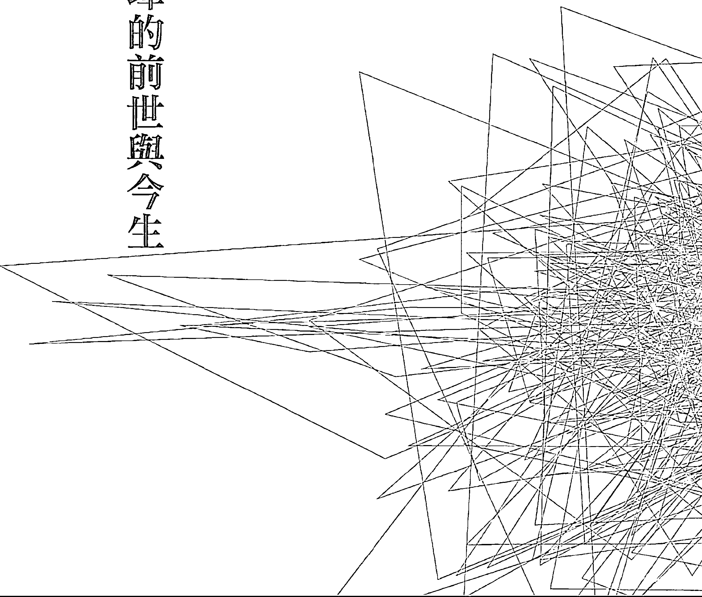

## 靈魂相遇——帝王將相篇

### 壹、無助的媽媽

  二〇〇七年四月十五日，中午十二時許，黃老師與工作人員一行前往上海辦事處上班。經過辦事處樓下時，見到一名滿臉倦容、憔悴憂愁的母親獨坐在一樓台階，狀似等候什麼，她是郭媽媽。

  當時的交通不甚方便，郭媽媽天還未亮，便從浙江搭乘渡輪，經過六個小時風塵僕僕地來到上海，為的是她那已被學校與醫生判定為精神分裂症的兒子。

  見到黃老師時，她拿出就讀高三兒子的相片說：「我想知道，我這兒子怎麼了？他生病了嗎？」

  黃老師端詳了照片說：「這孩子的睡眠不好，精神狀況也不好，精神委靡、耗弱，不能集中精神，容易恍神，經常恍恍惚惚的，記憶力也衰弱。這樣的情況，醫生會說是精神分裂或憂鬱症。」

  聽了老師一席話，郭媽媽愁容滿面的臉龐精神了一些。黃老師精準的分析，雖然短短幾句話，卻是讓她看到了希望，也起了信心。

### 貳、我的兒子怎麼了？

  到底，是什麼原因造成了郭小弟的精神狀態陷入不穩定？並且已經到了無法學習、無法正常上課，也無法與同學、老師正常互動相處的嚴重情況？

  黃老師說，這孩子的主要原因有三大部分：

  一、卡陰與無形力量的干擾

  這是影響郭小弟的最直接原因：

  （一）祖墳問題

  郭媽媽家的祖墳沒有處理好，郭氏祖先無處可去，流離失所，便跟著郭小弟，造成他的嚴重卡陰。

  （二）祖先因果債

  郭家近代的祖先裡，有人為高階將領，在近代的戰爭中，導致殺戮、死傷無數，於是造成後代子孫必須承擔的「因果債」。而郭小弟又正好到了「上命格」的年齡，所以，只佔一成的因果報應就到了他的身上。

> （筆者註：郭小弟的「來頭」不小，他有個極為特殊不凡的前世，在前世裡他殺人無數，不少忠良與冤魂喪命在他手下，因此，累積下了無數的個人因果債，也是他個人犯下的「國家因果債」。而且，除此之外，他還有祖先殺戮造成的因果債兩者的共同干擾。

  進入十五歲起，正是郭小弟「上命格」的年齡，於是受到了因果債的影響，在無形因素的干擾下，他所有肉體上與精神上的問題，開始逐一呈現，包括類似精神分裂的各種現象。

  但是，當時郭小弟年僅十七、八歲，根本無法理解這種前世今生帶來的傷害，也絕不可能接受自己特殊的前世因果，若是不能面對化解，郭小弟這輩子也就完了，正如當時郭小弟學校醫護與老師們所說的，他就是個精神分裂症的患者。

  在經過特殊的考慮後，靈界同意用另一種婉轉的說法，只告知郭媽媽部分的實情，但是對郭小弟，則只先告知是自己祖先殺戮太多造成因果債這一部分，而事實上郭小弟的先輩，也確實有人投身軍旅，為高階將領。

  二、個人體質的影響

  郭小弟本身便是屬於「靈媒體質」，這種體質的特質，就是精神、睡眠都不可能很好，容易頭痛、頭暈、胸悶，容易情緒化、負面、悲觀、神經質、想得多等等，而且脾氣不好、輸不起、不認錯⋯⋯。在青春期，尤其容易被認為有憂鬱症、躁鬱症、

  三、個人前世今生的因果影響

  郭小弟本人，有著極為特殊的前世，對他今生的行為、觀念、個性都造成極大的影響與阻力，但是由於郭小弟年齡尚未滿二十，心性不夠成熟，可能無法承受，所以黃老師略而不提，到第二年郭媽媽才得知全部真相，而郭小弟本人更是到他年滿二十歲、上了大學以後，才得知全部真相。

  （有關郭小弟的個人因素，詳見後段。）

  因此，黃老師也向郭媽媽說明，當務之急便是先處理卡陰、祖先干擾、因果債的部分，便可以使郭小弟回復相當水準，參加大學高考。至於他的人生與未來，與他的前世因果密切糾纏，會擇日另外告知。

  郭媽媽在諮詢後二個星期，便帶郭小弟前來處理了卡陰與祖先問題。之後，郭小弟恢復迅速，一天比一天穩定、正常。一個月後，他參加高考，得分比學校導師預估的多出三十分。對那些認為他已有精神分裂症的導師、校醫與專科醫師、心理輔導老師等等而言，都認為難以想像與不可思議。

  郭小弟有著特殊的前世。他的前世是明朝開國皇帝朱元璋。

  本節之所以另加敘述他的卡陰與祖先干擾的經歷，也是要讓大家明白：縱是前世貴為天子，今世投胎凡人，也是一樣受到陰陽之間的規範，若有疏失，人生也是毀於一旦。

### 參、前世今生的交錯

  這是郭小弟行止失常，無法與人正常相處的主要原因。

  上了高中以後，他在校內與同學的相處、互動開始引發問題，逐漸變成醫生眼中所謂的精神分裂症與強迫症等，其實真正的原因還是與因果密切相關。

  郭小弟的精神方面症狀的起因是：

  一、強烈的優越感

  前世是皇帝，必是「朕即天下」，所有人必須聽命於他，所以他「輸不得」、霸道、非贏不可。他喜歡指揮大家、指使大家，常想控制全場。

  可是潛意識裡，他又有著一點自卑，為什麼？因為朱元璋的出身不好，因此，帶著自卑的強勢與霸道更是不講理、令人厭惡的。所以，他在學校裡與同學、老師間的互動都發生了問題，人際交往互動產生了嚴重障礙。

  二、不能接受建議與批評

  在學校裡，他不能接受老師的糾正或批評，同學善意的建議，他也視同故意。老師說他兩句，他就咬牙切齒，想要動手回敬；同學婉言相勸，他也怒目相視，反正大家都要聽他的。

  任何事情，他一旦決定，就絕不妥協、絕不改變，他想要的東西，也非要到手不可。很拗，講不聽，就是不聽。

  這樣的舉止行為，完全顯現了前世皇帝朱元璋的特質。他的靈體仍有著當皇帝的權威與架勢，只有命令、要求，沒有妥協；只有大家聽我的，沒有我要聽你的，可是他又沒有服眾的能力與條件。

  此外，高中課業的壓力更使他極度壓抑、無法喘息。每次考試輸人，他就不服氣、不甘心，但又一籌莫展，只是嘔在心裡，無計可施。

  這樣的特質，使他在生活圈裡處處碰壁，不斷的挫折與壓抑，是使他產生憂鬱、壓迫、精神分裂等症狀的主要原因。

  就像一個當朝皇帝，一覺醒來，換了一個世界與國度，權力沒了，號令不通了，僕役也不見了，他成了凡人俗人，沒人認識他。為了活著，只能隱忍一口氣，壓抑再壓抑。於是，精神耗弱了，精神官能便都失調了，發病了。簡言之，就是他的「天子命格」與環境、同學、老師等格格不入了。

  三、朱元璋的特質

  根據史書記載，朱元璋有著極為嚴重的精神官能症或精神方面的疾病。從今日醫學角度來看，主要的疾病或症狀有：

  + （一）精神耗弱
  朱元璋常「一夜不成眠」，睡眠不好，經常失眠，因為不安全感，又憂天下局勢。

  （二）強迫性懷疑妄想
  他剛愎自用，又不信任下屬，猜忌臣子。因為害怕、不安全感，才設立錦衣衛，所以有強迫性懷疑妄想症，怕遭身邊人暗算。

  （三）恐懼症
  朱元璋殺人無數，與他一同拼搏天下的功臣，許多都被借名賜死。他出身低微，所以愈有成就越自卑，愈有疑慮愈殺生，到後來親信的忠實好友都被殺盡或遠離他，自己成了真正的孤家寡人。

  （四）典型的焦慮神經症
  後世對朱元璋的評論，認為他缺乏自信，疑神疑鬼，極度敏感，易生妄想。

  郭小弟的靈體，有著朱元璋這樣的前世特質與精神症狀，所以郭小弟上了命格後，也就更容易產生各種精神分裂的症狀。他的缺乏自信、疑神疑鬼、總覺得有人要害他，這便是「因果病」，前世種下的因。

  郭小弟帶著這樣前世的特質，又在上了命格、靈體顯性以後，並在課業的壓力下，以及因果債、祖先干擾的直接推波助瀾下，他的精神分裂症突然呈現與惡化，顯然就是理所當然的事了。

  除了前述各種相關因素外，郭小弟今世又是「靈媒体質」，靈媒体質本來就是精神相關疾病的高危險群，天生就有輸不起、不認錯、神經質、情緒化、精神睡眠不好、易頭暈頭痛、負面等等與生俱來的靈性特質。

  所有這些不利的因素加在一起，就是郭小弟病發的全部真相。而祖先因果債、卡陰、祖墳等問題，只是一個爆點與導火線。導火線拆除了，郭小弟瞬間輕鬆了，所以迅速有了相當的恢復，又在主神的協助下，大考也完全恢復正常而有了超水準的表現。

### 四、後續的輔導

  郭小弟順利完成大考，也進入理想大學，但是他的問題並未完全解決。因為他的前世特質依然存在，他的前世習性與靈體特性若是無法修正，在當前的大環境下，他仍然是難以在社會生存的。因此，郭媽媽與黃老師在後續的輔導上，也是花費了許多努力。

  郭小弟的天子特質與靈媒特質帶來今世的主要問題有三：

  + （一）天子命格與社會的格格不入
  前世天子今世入了凡間當凡人，他對所有事情都很容易「看不順眼」，又力不從心，無力對抗，就會產生極大壓力，他的承受力與抗壓性又不夠，所以總是情緒陷在谷底，他的情緒問題也都一直存在著。

  + （二）社會的適應力不足
  郭小弟困擾的問題很多。才入大學，他就擔心未來工作，擔心同學相處，擔心父子關係，擔心財務處理，擔心人際關係，擔心感情生活⋯⋯，他不會處理日常生活中遇到的許多瑣事、小事。

  + （三）凡事力求完美、求更好，又想要爭口氣，想要得到大家認同的自我要求，又使他的困境更加複雜。

  因此，郭小弟需要的是自己思想、觀念、認知等的全面調整，這是一個需要時間與耐心的輔導工作。要不斷地開導他、說服他、教育他。

  幸運的是，郭媽媽有著偉大的耐心與愛心。儘管憂心的哭泣，悲痛的絕望，一再的反覆，她還是堅信，勇敢的承受，她一直相信主神會給她力量的。她長期不斷地與問事處保持聯繫與溝通，每天不斷地叮嚀與開導，日復一日，年復一年，而郭小弟在四年的大學期間，惹是生非少不了，情緒不穩也不斷重演，但是，他也逐日進步與成熟，終於順利成長。

### 五、抗拒與認同：

  「我是朱元璋？」這個問題，在郭小弟心中的答案到底是什麼？他相信嗎？相信自己的前世是朱元璋嗎？

  筆者數度與他交流的認知是：他有時接受，有時則不接受，因為他不敢面對自己的前世，他習慣逃避現實。當他在某些時候，覺得必須「認同」才能解開一些困惑時，他相信自己曾是朱元璋；但是在某些時候，當他覺得看不到自己該有的「偉大」時，或是為了逃避或是自我隱藏，他就又不認同了。這就是靈媒体質的個性之一，也是靈媒体質的辛苦。

  換言之，他是猶疑不定的、多疑的、反覆的。然而，這種多疑不定的特質，正是史書中所載的「朱元璋的特質」。因為多疑，所以他濫殺。

  黃老師告知郭小弟前世真相，是在他就讀大學期間。當時，他思考了一陣，然後有些肯定的說：「我相信，我也接受，我就說過，我一定是個偉人，我是不平凡的人，但就是沒有人相信我。」因為他的固執、霸道、不肯妥協，他的人際關係極度不好，與人互動嚴重障礙，因為他要大家聽他的。他相信自己的個性是受到前世絕對權威的影響，所以，他相信，而且他對黃老師說，他從小就認為自己應該是皇帝，但是「不能讓別人知道，因為別人知道了會監視我、謀害我。」

  但是十年後筆者再問他相同的問題；「你相信自己的前世是朱元璋嗎？」他給筆者的答案竟是：「我不相信，我從來也沒相信過！」「我一開始就不相信！」這就是他的自我隱藏，他怕旁人對他了解太多，所以否認，這正說明了他在個性上的反覆不定與多疑。但是一面對黃老師時，他又會說：「還是當朱元璋、當皇帝好，大家都必須聽我的，我還是喜歡前世自己是朱元璋，我就是皇帝。老師呀，妳可不要隨意告訴我媽媽呀！」

## 第五章 朱元璋的前世與今生

但是，事實的真相只有一個！所謂「知子莫如母」，郭媽媽則是自始至終堅信不疑。她認為郭小弟的口氣、特質、舉止，都有著帝王之尊的氣勢與氣度，個性也有朱元璋的影子，甚至外貌面相也有七八分的神似。

至於從筆者的角度觀察，當然，毫無置疑的，他是。從前世到今生，記憶可以抹掉，但是靈體走過的痕跡是抹卻不掉的。時至今日，郭小弟身上仍有著太多前世的蛛絲馬跡可循。

一、大學期間，他曾憶及高中求學時，受到學校的「不公平」對待，不滿學校的某些處置，他曾說：「真想大開殺戒，把那些傢伙全給殺了！」而且，他曾對黃老師說過，從他念小學開始，他對那些欺負他的人，就很想「把他們給殺了！」好狂傲的口氣！這不正是朱元璋嗜殺的口吻嗎？

二、強烈的孤獨感，一直伴隨著他。從小至大，最能親密互動的人，僅他母親郭媽媽一人，此外，其他人無能得到他完全的信任。所以，他永遠感到強烈的孤獨，身邊無可傾訴之人，這也正是朱元璋的孤僻與眾叛親離。

三、強烈的防備心與疑神疑鬼，使他經常不能如同常人一般正常思考。當年他初入大學必須與人共居宿舍時，他覺得強烈的不安全感，覺得處處受人窺視，必須時時警覺防備，苦不堪言，所以後來只好在校外另覓居處。入社會後，他也想要交個女友，但是，異性對他示好，他會覺得對方另有企圖；女孩向他索個電話，他又懷疑對方要構陷自己；看到心儀的對象，他與對方多談兩句，就又懷疑為何對方對自己「瞭若指掌」。在人際交往互動上，郭小弟迄今都還不能完全正常思考與面對。

四、為了「安定感」，在郭媽媽協助下，郭小弟買了房，經過簡單裝潢後入住，但卻總覺得經過裝潢後的房子似是有人在監控他，覺得自己似是完全被透明化了。他曾告訴老師：「我的新房有被裝了竊聽器，我的手機有被竊聽，我平時上下班有人跟蹤我！」

五、迄今，郭小弟喜歡吃餅乾、冷食、生食。明知不妥，卻無法戒除。郭小弟的靈體說：前世長年征戰，在得天下之前，經常食僅裹腹，或是糧食不足，所以習於生食與冷食，且戰爭戰亂中，長年以乾糧、軍糧為生食，就像現在的餅乾一樣，所以迄今習性難改。

六、郭小弟有常年頭痛的毛病，他的靈體說，這是前世帶來的「因果病」。因為朱元璋有癩痢頭的惡疾，所以帶來今世頭痛的因果病。此外，前世癩痢頭也影響到他前世與今生的「舉棋不定」、「頭腦反反覆覆」、「疑神疑鬼」、「負面」⋯⋯等特質。換言之，靈體認為，朱元璋的許多負面特質，一部分還與他的「癩痢頭」有些關係。

這種說法，倒是很特別，也是史書中所未記載。因為明朝大興文字獄，對「頭」字很是敏感，提到光頭、和尚（朱元璋當過和尚），都可能抄家滅族或丟官，所以史書中對朱元璋的癩痢頭幾乎不敢記載。但「臭頭皇帝」卻是事實。當然，筆者不挑戰歷史、不爭究史實，只是忠實記載靈界與靈體的訊息。

# 七、⋯⋯

儘管，郭小弟對自己的「前世」，曾有認同，也有猶豫，但在去年（二〇一八年）於上海再諮詢時，他卻大方承認自己是朱元璋，他說：「我第一次見到老師時就心裡有數了，只是擔心別人知道後會嫉妒我而追殺我⋯⋯」老師告訴他：「不會的，現在是科技年代了，沒人會追殺你，只有羨慕你！」

## 肆、母子情深因果來

郭小弟與郭媽媽二人之間的母子關係非常深厚與特殊。

郭小弟從小就極度依賴郭媽媽，從小學到中學、大學，直到入社會，凡事必求助母親，郭媽媽也是郭小弟唯一的信任與支柱，所以對母親的建議也是言聽計從。一般人的成長都有一「叛逆期」，但是郭小弟在郭媽媽的扶持下，從極度叛逆到可以接受的程度，總算安然度過。

若非郭媽媽的全心投入，郭小弟應是無法平順地度過高中時期的混亂，早已成了精神病患，一生也就毀了。在郭小弟情緒不穩定的那幾年，郭媽媽動輒搭乘六小時的渡輪來向黃老師求助。母愛本是偉大的，而郭媽媽的努力與付出，也令筆者敬服。

郭小弟入大學後次年，一切漸趨平穩，一日郭媽媽來看黃老師，終於提出要求：「希望知道自己的前世因果。」她認為「必與郭小弟有些關係」。

黃老師回說：「妳總算提出來了。」

原來，郭小弟前世當皇帝時，郭媽媽是朱元璋的妃子之一。靈界提供的訊息說：「前世時，是妃子提出要與皇帝分手的，然後服毒自盡，死前與朱元璋相約：『來世再續緣』。」

### 伍、結語

郭小弟已從大學畢業，今年三十一歲，任職於浙江某國企公司，未婚。在郭媽媽的協助下，已買了一間自己的房產，生活一切正常。

從郭小弟進入大學那年，黃老師便將其前世告知，他也接受了自己的前世。自此，他也就日趨正常與穩定。當然，其間因為有郭媽媽的細心照料、開導與教育，也是重要的因素。

當年，學校老師無人相信他能考上大學，事後也不敢相信這個應該送往精神病院的精神病患能以高分進入大學。

筆者與郭小弟第一次見面是在二〇〇七年五月，他考大學前一個多月。當他知道筆者曾任公職並在大學任教的經歷後，興奮異常，一直與筆者大談「兩岸關係」。在當時那個年代，對一個十七、十八歲的大孩子而言，開口、閉口大談「國家事」，實在是非常少見，令筆者大感驚訝。當時的朱元璋統一了天下，難怪他對此有極高的興趣與知識。此外，他還有極特殊的國際觀，這些都說明了他與前世的關係。

筆者與郭小弟最近一次見面是在二〇一九年的五月十一日，在這一次見面的閒談中，他還一再提到：「希望我的國家更好，全國人民更好，大家都能生活更好。」筆者看的出來，他還是具有一「大眼光」與「全面性」的「大理想」人！

這樣的口氣與思維，比起現在年輕人的一般追求與想法，確實是有著極大的不同。

神尊的訊息說：「在前世，妃子為了成就完美的天子，付出了所有的一切，包括生命；在今生，母親為了成就優秀的兒子，也傾全力地付出一切。」

因為這樣，郭媽媽與郭小弟今世結緣為母子，郭媽媽也是傾其所有的付出，這樣無私無我的付出，神尊說要到郭小弟結婚後，郭媽媽的責任才會結束。

## 【附錄】

### 【編者註】

二〇〇七年四月十五日，郭媽媽第一次見到黃老師，她相信了靈學與因果，不到兩個月，她見到了奇蹟。郭小弟從眾人眼中的精神異常到高分的通過高考！在這一「奇蹟」的背後，郭媽媽付出了太多的辛酸、淚水與心血！

大考結束後，郭媽媽懷著感恩感念的心，將她的心路歷程呈現於紙上。郭媽媽說：「相信世界上還有許多類似這樣陷在困境中的孩子。」她希望藉著自己的親身體驗，能讓更多孩子得到幫助，所以便以投稿的方式，撰寫了本篇文章，並刊登在般若達摩黃老師問事網站，今將之轉錄於後。

### 浙江媽媽的經歷

現在的孩子是在蜜罐子裏泡大的，他們前衛、有活力，單純可愛，每個都是爸爸媽媽、爺爺奶奶、外公外婆的心肝寶貝，比我們那個年代強多了。······

剛上高中壓力不大，兒子的情緒似乎不像初三中考那樣緊張，高一比較順利，高二下半學期成績開始下降。我當時找了一位老師給他算過，說二〇〇六年流年與他的生肖相沖，容易衝動，他也的確為些小事跟我吵架，情緒激動，不像先前那樣溫順。

三上半學期，他開始要求我不要出差，但我沒有察覺到什麼不對勁。一天他去教老師那兒上課，半路上被一輛轎車撞了，⋯⋯自己的胳膊肘將轎車的擋風玻璃撞碎，然後摔倒在地，腿部多處擦傷⋯⋯。

我當時不知道這是大難臨頭的預警。期間出差到龍岩，第一天老公就打來電話說，兒子又被車撞了，這次是在十字路口停車等綠燈的時候，後面的轎車太快撞到了他的自行車，人倒沒事，⋯⋯兩次車禍，讓我有種不祥的預感。

我忙著為兒子打點，每次去普陀山都要為他請太平經，今年大年初一，還特地為他打了一場普佛，原指望兒子的情況會好轉，但情況並不如我所願。⋯⋯胡思亂想的狀況依舊不容樂觀。

我婆婆也很著急，經常來看他。一天她來找我，說他的家教老師跟她談過了，以他（我兒子）的智力水準不應該是目前的學習狀況，他的成績還能更好一些，是不是去找人問一下，到底出了什麼事？我說該找的我都已找過，法事也辦了，就是不見好轉。

為了尋找答案我在網上搜索，一天我改變搜索方式，打了「因果」二字，找到了黃老師辦的達摩網站。網站上的文章似乎解釋了我先前的許多疑問，我到處在找救命稻草，有一點點希望我都不會放過。於是我給黃老師發資訊約了面談的時間。

其實我也像其他人一樣害怕受騙上當，要不是兒子的情況已經到了「山窮水盡」的地步，我是不會冒這個險的。但我的一些經歷告訴我，說不定真有「能人」！

路上我想像的黃老師也是一位邊做法（就像巫師附體那樣）邊問事的，也不知道黃老師能不能為我兒子解開謎底？我懷著忐忑不安的心敲開了黃老師的家門。我提前了二個小時到，在我前面還有位問事的，向先生給了她一張問事注意事項，⋯⋯這讓我的信心又增加了一分。

事實也正是如此，我找到了全部答案，一半的心落了地。回到家裡，⋯⋯我是哭著告訴兒子事情的真相的，我控制不住，一方面因為兒子的事拖的太久，他的精神已經經常恍惚，讓我心痛不已，現在終於有辦法把他解救出來，另一方面就是我能感覺到他的主神一直在關注他，我告訴他的時候激動不已。他聽到這個消息第一反應是「不可思議」，除了祖先卡陰的問題他不信外（他很單純，認為祖先只會愛護子孫，不會來害他），其他的問題他都信，他知道我去廟裏（為他）辦（了許多）法事，他也為自己的精神狀況煩惱很久了，現在有解決的辦法他自然也很高興⋯⋯。

就在離去上海辦化解事項的前幾天，兒子突然又煩躁起來，說他的同學整他，…：他打電話給老師，渾身都在顫抖，情緒非常激動，老師在電話裏安慰了他，沒有多說什麼，他又打電話給他的心理老師，訴說了他的不幸，但他說的全是自己想像的，心理老師覺得怪異……。

其實我也在穩定我兒子的情緒，我告訴他，只要見了黃老師，他的困境就都會有了答案，他也答應要自己來見黃老師。

第二天，我被兒子學校的導師請到了學校辦公室，他的主任和心理老師說我兒子情況很嚴重，心理老師還給我看了兒子給她發的短信，內容是「我會認真聽課的，儘管你們瞪著憤怒的眼睛（老師在對吵鬧的學生發脾氣，他以為在說他）」。心理老師說這是典型的精神妄想症，她還介紹了一些類似學生的治療情況，希望我趕緊帶兒子去看心理醫生，她說，還有一個月的時間就要高考，如果兒子對藥物敏感的話，還能來得及儘快恢復。她還很熱心地幫我聯繫心理醫生，我婆婆也打來電話，要我說服兒子去看心理醫生。

這時候的兒子誰也不信，只信我一個人，他說他不看心理醫生，他也認為他沒病。……

我把班主任和心理老師的交談情況告訴了黃老師，黃老師也說我兒子不需要看心理醫生。我們依舊約定五月一日辦化解。化解的當天，兒子問了黃老師一些他十分困惑的問題，老師都一一做了回答，老師要他拿得起放得下，...：跟黃老師談完話後，他對未來充滿了希望，化解後也當場認主，要不是時間拖太晚了，我們還想跟黃老師一直談下去。回到賓館他還意猶未盡，一會兒看電視，一會兒拿著錄音筆翻來覆去地聽，一直折騰到半夜一點多才睡下。

經過黃老師化解之後的一個月裡，兒子的狀態一直處於明顯的恢復之中，五月六日第二次模擬高考，他說他做了一半就頭疼，總分只考了四七六分。我告訴他不要氣餒，只要用功了，不管他考得怎樣，我們都接受。這也是寬慰自己的話，要是考不好學校，如何實現他的理想呢？...：

兒子不想到學校上課，...：父子倆為了去不去上課大吵了一架，兒子一氣之下去了外婆家。我夾在中間左右相勸，只覺得現在不是在考兒子，而是在考我，考我有沒有本事既管好兒子，又擺平他爸爸，我覺得壓力太大了。

在外婆家，兒子倒是很平靜，做著自己準備的復習題。他每天去學校但不上課，而是在圖書館看書。他不願上課一方面確是落後太多聽不懂了，另一方面是不想見同學，他認為那些同學還會整他，他怕這種干擾，我不但說服不了他，還被他認為是同學的幫兇，我甚至懷疑他是不是前段時間的精神妄想症已經形成了病灶？我給向先生發郵件，談了目前的情況，問他這種情況要不要藥物治療，向先生認為不可再以「精神妄想症」論他，⋯⋯

和向先生的討論，解開了我心中的結，兒子煩的時候就跟我說話，我總是順著他說，讓他開心。他說等考完了，我要告訴他為什麼那些同學都要故意整他？他對這事耿耿於懷。天曉得我怎麼知道他憑空想像出來的這個問題？但我沒辦法，只好答應他，考完了再說。

考試的日子一天天臨近，五月二十日第三次高考模擬，他考完了對我說，媽媽我已經恢復了九成，這次考試感覺還好，沒有頭疼，果然考下來的總分五〇一分，比前幾次模擬考得都好。

六月到了，家長們都在忙著為兒女們考試打點，我也著急得很，以兒子當時的能力，想要考個好學校是很成問題的。我給黃老師、向先生發郵件，詢問要不要到廟裏打普佛或做其他的佛事、法事，給兒子助上一把，向先生回信說，不用，只要把兒子的准考證號和坐位號、考場地址告知就可以了，他們會請神尊幫忙的。

六月七日和八日的高考很快結束了,這次的考題比往屆難,但兒子卻考的很輕鬆,沒感到太大的壓力。我們則已經給他預先選擇好了學校,全是三本(三流)和大专學校,他爸認為這類學校的入門分數很低,誰都能考上。我也不敢有多大把握,我怕兒子背包袱,也不知道神尊能幫他多少,因為即便我們十分相信神尊的相助,但也要靠他自己有一定的基礎才行,若能全靠神尊,那還用努力學習嗎?當然考試前一星期,我和兒子天天向他的主神祈求,願主神來助他。

考試結束的第二天,參考答案就下來了,但兒子不肯比對答案估分數,我心裡也沒底,不知道他到底能考多少。奶奶和外婆都來看他,他也很高興,他對奶奶的敵對態度也有所轉變。

高考成績終於揭曉了,他竟然比二本線還多了十多分,也就是說他能上一所比較好的學院了,我興奮的在第一時間告訴了向先生,請他轉告我們對黃老師的謝意。奶奶和外婆聽到這個消息也都高興的不得了。最不相信他能考上二本的是他爸爸,雖然他已經從奶奶的口中知道了成績,但還是要我打開網頁給他看,當兒子的成績明白無誤地出現在網頁上時,他才放心。我去學校拿成績單時,班主任說這次他考得很好,起碼多考了三十分(一定超出了他們的想像),當然最開心的還是我兒子,內心由衷地感謝神尊和他的主神。如今他如願以償地被寧波的一所高等院校錄取，儘管未來的道路並不平坦，但我相信他一定能在風雨的洗禮中成長起來。

後記：

為感謝神尊，也感謝黃老師，我把自己的經歷寫出來與大家共享，希望有更多的人不再迷惘，也都能從黃老師或其他正派的通靈高人那裡，得到他們更好的前程與新的人生。

二〇〇七·八·十二

## 第六章 諸葛亮的前世與今生

### 壹、前言

諸葛亮（字孔明），是一位在華人世界裡無人不知的歷史人物，他是中國歷史上三國時代的蜀漢丞相，他的政治品德忠誠不二，奮鬥精神不畏艱難困苦，人格上嚴以律己，人生態度積極進取⋯⋯（節錄自維基百科）。當時及後世歷史對他均有極高的正面評價。

他是位傑出的政治家、軍事家、發明家、文學家、外交家⋯⋯。難以想像的，在時光流轉一千八百年後，我們有幸遇見了再世的他。

在二十一世紀裡，再世投胎的諸葛亮會是個怎樣的人物？會是個怎樣的光景？能否給我們怎樣的啟示與智慧？

### 貳、從巔峰到谷底的傳奇

二〇一〇年的九月，一位年約六十餘歲，溫文儒雅、雍容不俗的史先生帶著夫人來到問事處。他說：「我的人生遭遇到了極大的困境，我想知道原因，也想知道我的主神。」他接著說：「我太太在書店裡，看到了活靈活現這本書，在我們人生最低潮的時候，我相信在黃老師這裡我能找到所有的答案與方向。」

黃老師問：「你怎麼到現在才想要了解自己？現在你已負債累累，難以脫身了，太慢了吧！」

但是史先生仍然堅持信心，也不放棄任何機會。

隨後，史先生將他傳奇的人生境遇娓娓道出。

原來，史先生是一位「科技人」。台大畢業後赴美深造，一九八〇年他三十四歲時，在當時行政院長孫運璿的邀約下，返台進駐到新竹科學園區，創立了一個科技公司。短短十年，以每年淨賺超過一個資本額的速度，遠近馳名，成為一九八〇年代全球媒體的焦點。他累計賺進了無數的財富，在業界，他是聲名大噪，無人不知。也是台灣在上個世紀八十年代在電腦周邊某零組件技術發展的關鍵人物。

因為他的下半場人生，已經無憂無慮，於是在一九九二年他四十六歲的時候，他決定退休，環遊世界，享受人生。

經過了三年遨遊寫意的日子，但在幾位商界友人的鼓吹慫恿下，認為「四十幾歲就退休，實是可惜，應再出來貢獻社會」。由於對研發與再創企業体他自己已經駕輕就熟；科技研發對他而言更是輕而易舉，於是在一九九六年史先生五十歲那年，他決定復出。

史先生備妥了五千萬美金，聘用了二百位研發人員，另成立一家科技公司，預計以五至七年的時間，開創自己的品牌。

但是，未料五年一再後延變成了十四年，不但五千萬美金用罄，預算超出到一億美金以上，他已負債累累，甚至積欠員工薪水，他必須四處低頭，找人增資、借錢，甚至到了變賣家產的地步，實在苦不堪言。

史先生的生活，也從雲端跌到了谷底。

眼見史先生自創品牌的高科技產品，即將完成，明明成功已是垂手可得，但此時他卻已陷入以債養債，債台高築的窘境，有些同業還等著他宣告破產後，可以廉價收購他的成果，而不願資助。他真是到了山窮水盡、寸步難行的地步。

史先生心中有太多疑問：為什麼他會走到這種田地？他又要如何絕地逢生？他仍有旺盛的企圖心，他仍有滿懷的抱負，但是，他不知道要如何踏出下一步。

儘管史先生的事業已陷在泥沼裡，進退維谷，他也承受著排山倒海的壓力，但他在訴說自己的人生歷程時，仍是那般沉著、穩定，眼中閃爍著智慧、臉上充滿毫不退縮的堅定與毅力，他急切的等待黃老師替他揭曉答案。

### 參、答案與真相

#### 一、我是誰？

對於史先生一連串的困惑與疑問，黃老師說：「要解答你的所有問題之前，首先，你要知道你自己是誰！」

老師說：「你的前世也是位知名的歷史人物。」
他只是睜大了眼睛。

老師說：「你的前世也是位知名的歷史人物。」
他只是睜大了眼睛。

就在那一瞬間，眼前這位原本沉著、穩定的男子，突然間崩潰了。他幾乎是發出了「淒厲」的吶喊，然後放聲大哭，直到聲嘶力竭，久久不能平息⋯。他持續擦著眼淚，情緒崩潰了，完全的大崩潰！

事後，史先生說，他從小就發覺自己的「智慧」、「資質」、「冷靜」與眾不同，對科技的研發，他覺得「輕而易舉」。正如同諸葛亮所具有的發明天分一樣，所以他個人在科技上擁有的世界專利已有百餘項。

史先生說：「當我想要研發一個機器時，只要有想法，一閉眼，腦中就會立即浮# 靈魂相遇——帝王將相篇

現一個邏輯圖，我可以用腦波、意念在腦子裡畫圖，就像在電腦上製圖一樣。我的腦子裡似是有個清晰的電腦螢幕一般，只要閉上眼睛，我就可以用腦子慢慢修訂腦中的圖表。而且，在操作儀器時，哪裡有問題，我都可以察覺出來，全靠自己特殊的靈感與感應、經驗。」所以，史先生說：「我覺得自己的腦子，就像一部高科技電腦一樣，可以繪圖、修正、儲存，所以可以設計很精緻的高科技產品。」因此，當初他從美國回台首次創業時，他的精明、智慧、成就，又帶著西方的幽默，曾被廠商譽為是台灣難得一見的天才！怎能料到，第二次的創業竟然如此悽慘！

除了前述特質外，史先生還說，自己對一些市場的趨勢分析、戰略、策略、謀略還有特殊的天分；對命理、天象也有自己特殊的領悟與天分，只是他從未對人說過，也無人知曉，而他過去（第一次）創業的成功，也是靠著他這些特殊與異於常人的能力而成的。

史先生說，內心總是有個聲音在告訴他，要像諸葛亮一樣的機智多謀，尤其是要研發新產品時。因此，史先生對自己「前世就是諸葛亮」的說法，他是毫無質疑，也能立即接受。在他知曉前世答案的那一刻，他所以會放聲大哭，應該是肉体百感交集與靈体給他的壓力釋放吧！

## 第六章 諸葛亮的前世與今生

隨後，史先生的靈體透過黃老師說：「諸葛亮，你現在終於知道自己是誰了吧！」史先生又再一次的崩潰大哭，喊著：「真是太慢知道了啊！」

而且，後世史學家評論諸葛亮的一些人格特質，例如品德的忠誠，不畏艱苦的奮鬥精神，人格上的嚴以律己，人生態度的積極進取⋯⋯，在史先生身上可以說是完全複製吻合。

#### 二、失敗人生大解密

以史先生前世的精明智慧與閱歷來看，在一九八〇年第一次創業的傳奇式成功，當然是理所當然的。但是為什麼到一九九六年第二次創業會如此落難，舉步維艱，甚至就將一敗塗地了呢？

黃老師替他分析了三大癥結：

##### （一）時間點不對

史先生第一次創業的一九八〇年，是屬二十世紀。他的智慧、天分及分析、觀測（天象、命理等）等，都是他成功的主力。而且諸葛亮本是卓越的「發明家」（如連弩、八陣圖、木牛流馬、以及後人附加的孔明燈、孔明棋、孔明鎖、搭橋槍⋯⋯等），而與史先生從事高科技的研發，可說是完全吻合，所以結果能獲得爆發式的成功也是理所當然。

但是史先生第二次回頭再創業，是在一九九六年。已經進入了二十一世紀的磁場。筆者在靈學的基礎理論中也一再強調，從一九九五到二〇〇七年間，是靈體開始顯性的世紀，所以史先生的二次創業落點在二十一世紀也是靈體顯性的開始。命理、天象已不符使用，二十世紀的舊方式舊方法，也都遭遇阻力，不再適用。但史先生毫無警覺，更糟糕的是，他又遭逢二〇〇七年的全球金融危機⋯⋯。而在不對的時機點上，他又趕上了一「靈逼體」的阻力。

##### （二）科技人與靈體顯性的矛盾

科技人，相信科學，凡事要經過驗證，要看到數據與結果，才能心服口服。但是，靈學是無形的，是無法用數據驗證的；靈體更是看不到、摸不到的。所以，文明科學人，大都很難相信靈學、相信靈體。但靈學、靈體是先天的，占了百分之六十的影響力；而科學肉体卻是後天的，如今，後天的百分之四十無法研究、驗證先天的百分之六十。因此，多數的文明科學人無法接受靈體、靈學。

過去科技人只要有足夠的智慧、能力及努力，都能攻無不克，但是到了二十一世紀，科技人僅靠後天的條件是不足的。

##### （三）世紀變遷、作法未變

進入二十一世紀後，宇宙的磁場全都改變、靈體也顯性了，在這個新的亂世下，人性人心都不同以往，史先生未能理解世紀的變遷，跟隨改變，仍是秉持過去的思想觀念與作風，當然就會處處撞牆碰壁。

例如，他循著第一次創業成功的經驗與方式，一昧的埋頭、憑實力、務實又實際的想靠二十世紀的經驗取勝，卻不知新世紀的商場生存法則已有大變化，做人要圓融，要靈活，要有生意人的腦筋，要有社交的門道，才能適者生存。

因此，黃老師告訴他：過去認真苦幹的人，一定會受到老闆的賞識與提拔；但是在亂世的新世代，一昧苦幹的人，就只會被老闆視為好的勞工，而非人才，這就是改變。但是，史先生並無法及時接受認同，或是雖然接受了建議，但是卻無法完全體會，仍然還是本著人才就是必須具備「學識智慧」的傳統思維。

換言之，史先生的觀念與作風，仍一如過去的傳統，相同的方式方法，放在不同的世紀與磁場，結果卻是完全不同的。史先生太相信自己的聰明才智、經驗與科學頭腦，以為人定勝天，只知奮力前衝，遇到阻力時，又錯誤的走入人為宗教的歧路，而一直沒有找到能幫助自己的先天助力。

在新世紀裡，他忘了自己是個「企業體生意人」，也不會當正直的商場上的生意人。他還是本著經商必須殷實、篤實、重情守義，而忽略了亂世裡營商，更需要靈活、手腕、技巧、變通，要有真正生意人的本質。雖然他打從心底也接受新世紀、新觀念，卻無法落實在平時經營事業上；明知道世道不同，卻還沿用著舊觀念⋯⋯這也是多數中年人經營中小企業體的盲點，明明知道，卻做不到顛覆與改變。

### 肆、人生的下一步

史先生第一次的創業成功與第二次創業的艱困，如今已真相大白，接著，他人生的下一步要如何跨出？要如何解決當前的困境？

陷在泥沼裡動彈不得的史先生，問到了轉移陣地前往中國大陸，另起爐灶的可能性。因為一九九二年他退休之際，大陸曾向他招手。一九九六年他決定二度創業時，大陸也開出優渥的條件邀約他，因為他第一次成功的創業，使他聲名大噪⋯⋯。

眼見二度創業的台灣公司已經寸步難行，原先二百餘名的研發工程師，已剩不足一半；沉重的債務壓力也使業務幾乎陷於全面停頓。很顯然的，另闢戰場以期東山再起是個可行的方向。

幾經考慮後，史先生也決定轉移到大陸，重新起步，也請求他的主神能夠助他一臂之力。而他的主神也透過黃老師，給他幾個鄭重懇切的提醒與建議。神尊說，在這個靈體顯性，又在天不照甲子、人不照天理的亂世亂象下，要到大陸去重新起步，一定要認清亂世的大環境，用全新的思維與態度面對新世紀，若是不能徹底改頭換面，還是丟不開過去的包袱與傳統的觀念，必是仍然鎩羽而歸，因此，若是不能大徹大悟、徹底改變自己，還是會徹底大敗而不如不去。

主神提出幾個具体的建議與要求，要史先生慎重思考，有信心做到，才去。

#### 1. 要當企業体的生意人

要改變自己成為生意人，就是要能靈活、圓融、變通，隨環境變化來調整經營方向與策略；在亂世裡要有生意手腕才能爭取訂單。所謂無商不奸，在新世紀裡不是要當作姦犯科的壞人或狡猾使詐的壞人，而是要有隨時應變及靈活正確的手法。

如果只是靠著傳統經驗，實實在在的經營，是難以在亂世裡有所突破與大步發展的。企業要生存，就要會做生意，做生意就是要有狼性和狠性，因此，科技人也要自我調整成為企業科技生意人。

#### 2. 不能一味當好人

亂世裡，壞人總是踩著好人的肩膀不斷上升。因此不能一味的當好人，一味善良的想要助人；但又不能當壞人，所以要當有用的人，這樣才能在亂世的競爭下生存。

史先生心地善良，眼中無壞人，堅守著中國傳統的美德，所以在亂世中屢屢受騙。

#### 3. 不能過度重情操

重情重義重節操，是東方儒家思想的傳統美德，是要堅守的。在二十一世紀的亂世裡，這些傳統的美德，仍要將之視為我們做人的基礎，但是卻不可以將之當作處世待人一成不變的方法與準則。

史先生重情重義，善良心軟，常常為了堅持情分，而把自己陷入到了絕境，這一點也是史先生的極大弱點，所以他的主神一再叮嚀強調必須修正。畢竟，靈体已經全面顯性，大多數人都自我，老員工的想法做法也常在一夕之間改變了，已無情分可言。

例如，公司已經瀕臨破產，他仍不忍資遣員工，仍不忘四處借錢張羅來支付員工半薪，而公司卻因缺乏資金而無法運轉……。事實上，當公司財務失衡、失去動能，幾乎停止運作的時候，真正優秀的員工，多數早已另謀高就，剩下的，多數也都成日無所事事，在等待公司東山再起。而心地善良的史先生，卻念念不忘這些剩下的員工，仍在想方設法的四處借貸來支薪。

這是愚蠢好人的作法，卻也把自己帶入到絕境。神尊並明示說：「你公司衰退的這幾年，許多你的朋友，早已不把你放在眼裡，並且躲你，但你卻還在對他們重情難捨。」主神一次又一次的叮嚀再三：「要改變自己，要當個新世紀的諸葛亮！」

#### 4. 歸零才能脫胎換骨

黃老師轉達史先生主神的叮嚀：「既要到中國去重新開始，就要將今日之前的一切完全歸零，將台灣公司完全結束，才能脫胎換骨。」

神尊一再強調「要歸零，才能改頭換面，重新開始」，「重新開始，就要有新團隊、新思維、新模式」。

新團隊，就是要重新用人，才能丟掉包袱、破除情分；新思維，例如遇事保留三分，遇不對的人不可推心置腹；新模式，例如要把你過去「研發學者」的身分，轉變為企業生意人，還要給人看到你的柔軟身段與企業能力；要當個企業生意人，要用他們（大陸）的語言、文字與思維模式，完全的本土化、接地氣，才能得到認同⋯⋯。

史先生的主神一再諄諄勉勵與告誡他：「一定要有新世紀的新觀念，改變自己的缺點、弱點、盲點，若是可以做到，西進大陸才有重生的機會。」

而經過思考再三後，史先生也決定了西進大陸、重新開始。他也承諾主神：「願意改變，能夠改變。」主神也明示：「你改變了，要扭轉乾坤才能成功！」

### 伍、壓倒巨人的稻草

二〇一一年，史先生轉向大陸，並落腳在江蘇鎮江，重新起步。

新公司在起步之後，一直是步履維艱。史先生以六十五歲的「退休年齡」，重新開始，並且充滿活力幹勁，南奔北跑著實令人佩服他的精神與毅力。史書記載著諸葛亮的特質如不畏艱苦、積極進取、獻身精神、死而後已⋯⋯等等，在史先生身上，完完全全赤裸的呈現出來，這實在不是一般人所能做到的。加上了主神的「扭轉乾坤」，也讓史先生在很短時間裡，得到當地政府的支助，撥給廠房與部分資金，使他順利的在短時間內便在大陸重啟戰場。

但是，他新公司的營運，並未如預期。

他一直透過再諮詢，常常和主神溝通，主神也常常提醒他要改變，但是神尊也發現，他一直仍有許多二十世紀傳統的思維與積習，無法改變。例如過度善良的本質未變，放不下情分、心中沒有壞人、未能入境隨俗本土化，未能達到當初主神要求他「新團隊、新思維、新模式」的理想。

一次，他從江蘇趕往北京與某企業商談雙方合作的事宜。但是商議開始，他所提出的公司簡介、文件資料，大部分是繁體字，也未能使用本土的詞彙用語，雙方在溝通上使用的企業語言又有隔閡，對方因此質疑而無法認同。

史先生的主神認為，這是一個嚴重的失誤，未能做到「本土化」入境隨俗的基本要求，也在事後嚴肅的予以糾正，並且嚴厲的告誡：「為什麼你無法改變自己，當個新世代的企業生意人？你不改變就不可能成功！」主神一次又一次的提醒、不斷的告誡。

但是令神尊失望的是：在二〇一三年有位友人見到史先生創新產品的潛力與實力，決定投資四百萬美金。這筆鉅款在他公司當時起步、資金不足的窘境下，是及時之雨，可以有助公司迅速正常運轉。但是，史先生卻將這筆資金轉用於台灣，作為發放台灣公司積欠已久的員工薪水。

他沒做到主神的叮嚀：「要將資金投入在新公司，才能賺錢；賺了錢，才能償還台灣積欠的員工薪水。」卻在新公司還未成功、未賺錢的時候，就把資金挪用在償還薪水，也只是償還了一小部分，無法全部償還；而新公司又欠資金周轉，結果是弄得兩頭落空。

史先生依然放不下情分，總是心心念念「不可對不起那些員工」，「他們跟了我好多年」，「大家都有家要養」⋯⋯。更重要的是，這筆投資資金，是投資者投在大陸公司的資本股份，而大陸公司與台灣公司本就是兩個獨立的個體，他完全違背了歸零與重新開始的基本原則，沒將主神的叮嚀真正聽入耳中。

此舉不但投資人事前並不知道，也違背了神尊「不可將募集資金用於償債」的指示。事後，原投資人也覺得遺憾與失望，雙方不歡而散。

因為過度的重視情分，他在大陸辛苦的開天闢地，卻懸念著台灣公司的債務與員工生活，他的情操與善良令人感佩，但卻也是他「爛好人」的舊思維一直無法改變的證明，新世紀，舊思維成了他的致命傷。

他的舉措令他的主神失望與痛心。也是他壓倒自己的最後稻草。

### 陸、靈學新觀念的認識

綜觀史先生第二次的創業失敗，主要的癥結在於：

一、諸葛亮今世原來的本命格是定在二十世紀，因此，他第一次的創業成功，是他本命中所該有的，也是他人生的最高點，更是彰顯了諸葛亮的奇才，並可讓世人知道諸葛亮所擁有異於常人的智慧是科技起飛的推手！所以他當時的退休結束也正是他一生中最完美的句點。

因此，他在一九九六年受到好友的遊說而決定的第二次創業，一開始就背離了他的命格，充滿了未知。而他在二〇一〇年求助時，已經深陷重重債務之中，無法脫身。但是眼見自己的新產品已經研發成功，他不肯放棄，堅拒宣告失敗，他本人又一直充滿信心、毅力與幹勁，毫不認輸，也自認一定可以突破困境！

二、雖然他的命格定在二十世紀，但是今世的他，仍帶有前世諸葛亮不畏艱難、奮戰到底的決心，憑著他這股毅力決心，加上他的過人智慧，只要改變觀念、想法與做法，能顛覆自己的舊思維，再加上主神、靈体的助力，必定能夠再創人生另一個巔峰！只是萬萬沒有想到，他恃才傲物的特質難以轉化；無法用更新的觀念看待情分；科技人的本性也根深蒂固；他的過度慈悲與過度善良更遮蔽了他該有的正確判斷！終於使他的第二次創業無法完美收場。

活靈活現系列書籍，一再傳達一個重要的新觀念：當前地球的磁場已有改變，全世界都陷在苦海之中，天災人禍不斷，亂世中的人，要如何求生？

## 靈魂相遇——帝王將相篇

靈學的概念，就是告訴大家，要如何改變自己才得以在亂世中求得生存！

在靈學系列叢書裡，神尊一再灌輸大家新世紀要有的新觀念、及生存的重要法則，諸如：

- 「會做事重要」、「會做人更重要」；
- 做人要「圓融靈活」，要「臉皮厚到剛剛好」；
- 「不能一昧當好人」，也「不能當壞人」，而要「當有用的人」；
- 「世界在變，觀念想法也要跟著改變」；
- 「更新、翻轉，才能順應潮流」；
- 「學會拒絕與說不」；
- 「歸零，才能有新的開始」；
- 「願意改變，就能成功」；

一代英才的諸葛亮，在舊的二十世紀裡，他熠熠發光，輕而易舉的便創造了自己成就，造極巔峰。

但是進入了二十一世紀，未能及時翻轉改變的他，就像隕落的流星般，一道閃光，瞬間便墜入黑暗。

在新的世紀裡，即使天縱英才，若是不能洞悉環境與變局，亦是無法抗衡宇宙的磁場，這是「人勝不了天」的不變真理。

從事靈學工作以來，靈界一再昭示世人，在新的二十一世紀，唯有不斷更新、改變，才能適應生存。肉体若是無法翻轉修正，縱是靈体、神尊有意襄助，也是事倍而功半。

這是一個活生生、血淋淋，令人扼腕與不捨的實例，足堪世人共誡。

### 柒、世紀的啟示

這一世的諸葛亮，他的出生與成長是從二十世紀跨越到二十一世紀。四十九歲前屬二十世紀，四十九歲以後則是進入了二十一世紀的磁場。

二十世紀的他，證明了他確實是個曠世奇才，有著超人的智慧與能力。所以，他成功了，他在科技上的突破，轟動中、美、台三地，也曾獲得國際的讚譽與美名。因此，他在一九九二年的退休是對的，也能保有前世諸葛亮的美名。千不該、萬不該的是他聽信了朋友的建議，在一九九六年的再次創業！

結果，跨過一個磁場，來到二十一世紀的他，他如何了？

二十一世紀的他，幾乎失去一切。

若是相信他前世是諸葛亮的人，在歷史的情結上，一定難以接受這樣的結果；在情感的投射上，也必都不願意接受這樣的結局。

「一個神話般天縱英才的歷史人物的形象，就這樣破滅了」，真令人情何以堪！

但願他起伏的人生經歷與幻象的破滅，能讓世人体悟到「世紀不同了」的真理而有所警惕與改變！

今世，他的前半生印證了「天縱英明」的能力，在舊世紀可以扭轉乾坤與創造巔峰。但是，他的後半生也印證了「天縱英明」的能力，在新世紀卻必須順應靈體顯性與新世紀磁場的事實。

歸零、轉變、更新、翻轉才是二十一世紀成功的必備條件與真理。

如果他的失敗能喚醒更多人的覺醒，將是他這一世對凡世間世俗人的最大貢獻！

# 第七章、綜合評論

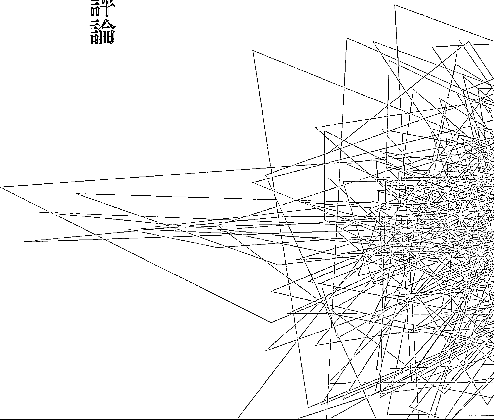

## 靈魂相遇——帝王將相篇

# 因

果輪迴與前世今生的存在，近數十年來早在全世界各地得到許多印證，也因此激起更多的人，對自己的前世感到好奇，想要探求究竟。尤其是那些今世過得順、遭逢困境、挫折的人。

絕大多數的人，對因果的了解，都存在著單純與錯誤的認知，以為一定是自己前世做錯了什麼，才會今世受到懲處，或是遇到挫折與傷害；而且東方民族多數較為宿命論，會羨慕那些天生「好命」、生於豪門權貴的人，所以會想多做好事、善事，或借著修行，希望來改變今世或下一世的命運。當然，事實並非如此！因果輪迴的安排與前世今生的設定實際上比我們所認知的來的複雜許多。

本書「靈魂相遇二」所選錄的案例，均是以歷史名人或帝王將相為主角，讓讀者看到這些歷史名人的前世今生，必定可以使大家有更多的省思，對靈學也會有更進一步的認識。

# 壹、從歷史人物的輪迴探索因果：

除了極少數第一次投胎的靈体外，幾乎人人都有前世、有因果，但是歷史名人或帝王將相，因為他們的前世一生，已經都被史學家所「定位」。所以他們的前世經歷、人格特質都已經廣為人知；現在再以他們的今生來做對比，前後對照，可以使大家對前世今生的互動、影響、運作，有更清晰深刻的体認。

因此，從本書中所列舉的梁武帝、朱元璋、光緒帝、曹操、周瑜等的前世今生的案例裡，筆者提出幾個在因果輪迴的運作裡，值得再探討的概念：

+   一、因果輪迴的設定，東、西方不同

不論東方或西方國家，都有因果輪迴與前世今生的現象與事實，但是東方靈界與西方靈界在輪迴的設定與規範上，是完全不相同的。

東方靈界比較細緻的規範並管理靈體的投胎，也有計劃的安排靈體投胎，或是設定祂們各種天職天命。在二十一世紀東方靈界還設定影響每一個靈体今世投胎的前世，換言之，東方靈界對每個靈体的投胎，都有較詳細周密的規劃。

然而，西方靈界就沒有太多的規範與設定，西方靈体的投胎，也會受著每個靈体前世的影響，但是這種前世對今生的影響，都是順其自然的，由靈体依其自身的靈性而定。基本上，西方靈界不作設定，當然，也會有少數特例與例外。

例如，西方靈界在本世紀初，也曾對凡間幾個重要國家的領導人，設定了一些「天子命格」的人去接任。而這種設定，在東方靈界而言，則是更普通常見的。

### 二、在諮詢前世因果中，為什麼偶而就會看到一些過去的歷史名人與帝王將相？

黃老師從事諮詢問事以來，在為人解析前世因果的過程中，已經相當比例的遇到了一些歷史名人。除了本書案例中已提到的人物外，另有劉備、唐太宗、陳友諒、唐伯虎、楊貴妃、杜甫、李白、凱撒大帝⋯⋯等等。

（註：這些案例中，有些靈界尚未同意公布，如陳友諒；也有人並非本人親自諮詢，如唐伯虎，是由其妻諮詢時，提問到自己先生時，才發現其夫的前世是唐伯虎。）

因此，難免會有人提問：為什麼會有這麼多的歷史人物出現呢？

其中的道理非常簡單：歷史人物的靈體，大都具有獨特、高傲的氣質。由於前世的成就輝煌，今世肉体的成就大都難與前世比擬，而靈体又很想讓肉体知道自己前世的功績成就，或想藉此激勵肉体，所以靈体就會想盡辦法引導肉体，去找到自己前世的答案。因此，在靈体顯性的影響下，這些前世曾是歷史名人的人，就會更想知道

### 三、在探討歷史人物的前世今生裡，為什麼多數的人會今世不如前世？

在實務工作上，確實發現歷史人物的今世成就絕大多數都與他們的前世成就不成比例。為什麼會有這種情形？筆者分析，主要的原因是：

（一）探詢前世因果的人，除了好奇、追求真理的目的外，多數都是對現狀不滿，想要尋找原因、尋求突破。換言之，今世輝煌騰達的人，都會認為自己「天縱英明」，比較不會想要尋找「真理」；只有現狀不好、不順的人，才會更想尋求答案與真相，這是人之常情。

（二）前世是歷史人物的人，大都是帝王將相之流，他們的成就，已經是人世間的「顛峰」等級，而靈體在凡世間的投胎，不可能世世都是顛峰的成就，因此，與前世的顛峰相比較，自然今世就會遜色許多，這種情形也是常態。

### 四、前世對今生的影響，有深有淺，其中是否有些什麼樣的原則或標準？

簡單的說，前世已是皇帝的人，今世又要如何超越？

基本上，前世對今生影響的深淺或輕重，主要的因素有二：

#### （一）看設定
也就是完全看靈界或主神的設定。有設定前世直接影響今生的，也有設定間接影響的。一般而言，今世帶有特定天職、任務的，都是設定直接影響，否則，則是設定間接影響。

#### （二）看時間
也就是看前世與今世相距的時間。相距時間愈短的，影響愈大愈深，反之則較淺。例如書中光緒與珍妃一例，都只是前一世的因果，對彼此的影響與感受就特別深。

### 五、如何正面的看待「歷史人物的前世今生」？

這應該是一個很重要的論題。

過去八字定命格的二十世紀以前，是偏屬「宿命論」的年代，人的一生成敗，在呱呱墜地的一刻，就已決定大半，所以會有「宿命論」的主張。

若是一「宿命論」的論點不存在，當然人的一生成敗就要靠自我的一「奮鬥」。但是進入二十一世紀的因果世紀，又讓人覺得，光靠肉體的奮鬥論，仍是不足的，因為前世今生的因果，又干擾著人生的順與逆。

因此，正確的說法，這個世紀應該是個天人合一論的世紀。因為靈體顯性了，埋頭苦幹型的奮鬥常是成果有限甚至無濟於事，任何人都必須肉体與靈体、主神連成一線，才能善用前世因果中的優勢，摒棄因果中的劣勢，謀得成功，這就是一「天人合一」的概念。

很多人事業、家庭、健康處處不順，就會常嘆自己「命苦」，或是見到他人天生權貴顯赫，就會常嘆「命運不公平」。其實這樣的想法、論斷才是真正的「不平」，失之客觀！

為什麼呢？

自嘆命苦，這是「人」或「肉体」的感覺，站在靈界的高點而言，辛苦、命苦的人生卻也是靈体的歷練與成長。

客觀的說，絕大多數（百分之九十以上）的人，都有過許多的前世，有些甚至數百世以上。在每個人這麼多的前世裡，都是有好有壞、有貧有富、有貴有賤；甚至有的曾是帝王，也曾是庶人；有的曾是員外，也曾是長工。在千年的時光流轉裡，每個人世世代代的角色都不相同。因此，今世不好，不必怨嘆；今世太好，也不必志得意滿。

重要的是，如何過好這一世，如何扮演好自己！因為過去的千百世，我們都已不復記憶，我們能掌握的是一「現在」，我們要憂心的是一「未來」。所以，過好當下，規劃好如何一「圓滿」這一世與未來，才是我們該努力的。

你、我每個人，都可能也有過顯赫的某一世，可能也曾是歷史名人，但是由於那曾經顯赫的一世，並未影響今生，所以我們並不知道。因此，不必怨嘆自己的平庸，也不必羨慕旁人的顯赫。把握現在，創造未來，才是靈體、肉体一致相同的目標。

### 貳、如何正確探討前世今生

儘管前世今生的事實存在已在全世界各地不斷的被學界證明，也有許多的著作出版，但所有的論述，均在強調或證明一「輪迴的存在」，但是對天地之間的運作，對靈界與凡間的互動，卻是無人能夠觸及。

簡單的說，全世界各地對前世今生的探討、研究，已經提出印證的學者、專家，雖如過江之鯽，但是他們都只印證了一「事實」，卻說不出宇宙天地之間運作的奧秘與法則，因為他們不懂靈學。

靈學，真的是太重要了，它說明了天地間的法則，說明了每個人生從哪裡來，死往哪裡去，更說明了宇宙天地間、有形無形間一切一切的真相。而「前世今生」只是靈學裡的一小部分而已。

曾經來向黃老師諮詢、問事過的人都很清楚，在分析每個人的前世今生時，黃老師接收靈界所給的訊息，像同步翻譯機一樣，侃侃而談。先談每個人的前世，再談每個人的今生。完全不需要諮詢者提供自己的姓名、生辰或任何相關的基本資料。從前世到今生，每個人的個性、習慣、人格特質、人生經驗的複製、個人的優點、缺點、盲點⋯⋯等等，都是相互連結的，就像一條鏈鎖一樣，把每個人的前世與今生緊緊的綁在一起。

但是在當今亂世亂象下，又在人為宗教的推波助瀾下，坊間到處充斥著幫人看前世、看因果的江湖術士或詐騙團體，更有一些人用八字、卜卦、易經、星座⋯⋯等等這些屬於後天的方式方法，是無法來看屬於先天的前世因果、主神、靈體靈格的，所以便千篇一律的以「你欠她」、「他欠妳」、「相欠債」等說詞，迷惑眾生。

還有一些身爲老師、教授、醫生等高端的知識分子，因為不懂靈學，把自己是先天靈而具有的精準感應與直覺，以及自己靈體所給予的「靈助體」、「靈護體」的特質濫用。自稱自己是一「通靈」，於是搖身也成了「通靈老師」，幫人「通靈看鬼神」，並且出書、演講、上電視、媒體，傳達完全錯誤的觀念，誤導了社會大眾。對於靈界而言，這是非常嚴肅的問題。有些當事人會遭到靈界給予的「現世報」的懲處，而且，所有人在過亡之後到了陰界，都會受閻王、判官審判，沒有一個人可以倖免。

歡迎大家能一起努力傳達靈學，也期盼大家傳達的都是宇宙、靈界、陰陽間的正確靈學觀念。

約七、八年前，一位時髦摩登的女性來諮詢（姑隱其名），她提問的第一句話竟然是：「請問老師，真的有靈魂存在嗎？」顯然她對靈學完全一無所知，完全不懂，但是數年後，她竟宣稱自己突然通靈了，是靈界代言人，然後大張旗鼓的到處幫人看因果與前世，真是荒謬絕倫。

更早些，約十餘年前，一位委靡頹喪的女性來諮詢，她有嚴重的幻聽幻覺，又渾身病痛，原來是嚴重卡陰，幾乎到了陰陽同体的地步，黃老師幫她處理完後，她才恢復正常。但是四、五年後，赫然看到她在媒體上大肆宣揚，說自己通靈，能斷生死，透天機，也還招來許多信徒⋯⋯，儼然已成為一派宗師。但是在電視上看到的她，明顯的又已嚴重卡陰⋯⋯。

這就是當前亂世亂象的一部分寫照。

類似這樣荒謬的事，一直層出不窮，可見對未知的無形世界，這個社會永遠有些投機敢掰的人，欺矇拐騙。所以「活靈活現」與黃老師一再要將真相傳達給大眾，就是希望大家能找到真理，不要受騙。

在現在亂世的大環境下，欺矇詐騙的情形越來越多，到底要如何分辨「真通靈」問事老師與「偽通靈」問事老師呢？最普遍常見的不同是：

- 「偽通靈」問事老師是由果找因
- 「真通靈」問事老師是由因看果

欺矇拐騙的「偽通靈」問事老師，在替人「算前世」時，一定都是「由果找因」，就是從你現在的現況（即結果）去編造你前世的原因。

例如，他須先知道你現在在夫妻不合，或已離異，他便能順理成章的編造你與妻子前世有瓜葛糾紛的故事⋯⋯。

他須先知道你子女不孝，他才能編造你與子女前世「相欠債」的故事，雙方前世如何如何糾纏⋯⋯。

所以，「偽通靈」問事老師幫人看因果，一定是要求助者先敘述自己的現況、困境、遭遇，他們便能順著求助者的現況編造「前世」的故事。

而真正靈界設定帶有「天命」的「真通靈」問事老師在解析前世時，一定都是「由因看果」。也就是一「真通靈」問事老師幫人看因果，是不需要當事人任何現況資料的，而是直接告訴你前世如何如何，所以今世的個性、特質、優點、缺點、盲點會如何；事業、健康、婚姻、家庭又會如何如何；今生的現況一定受到前世的影響，其中的關連與關鍵又是如何如何⋯⋯。

而當事人今生的現況如何（包括個性、缺點、工作、婚姻、健康⋯⋯等等），是否與前世相關，自己都立刻可以印證，立即可以判定真假。

簡單的說，「偽通靈」問事老師一定要先知道你今世的現況（挫折與不滿等），他才能編造你前世的「故事」與原因；而「真通靈」問事老師則是先說明你的前世經過（前因），再來說明你今世的現況（後果）會如何。前者是由果找因，當然可以編造故事；後者是由因看果，是無法編造的，這是兩者絕大的不同之處。當然，其中還會有一些另類的個案。

為什麼「真通靈」問事老師能夠不需要求助者的任何基本資料，就能如此精準的說出前世與今生的所有關聯與糾結呢？這就是靈學的奧妙。因為所有資訊都是來自於求助者自己的靈體以及靈界神尊（或主神）所提供，所以當然迅速與精準。

這種「偽通靈」問事老師與「真通靈」問事老師的分辨，大家若能了解牢記，就可以避開許多不必要的上當與被騙。

現在是亂世亂象的大環境，在探討歷史名人的前世今生之餘，大家若進一步的想要理解靈學或探尋自己的前世今生，或想找到自己人生的所有答案時，切記要秉持理性、智慧與直覺，才能找到正確的方向。

## 附錄

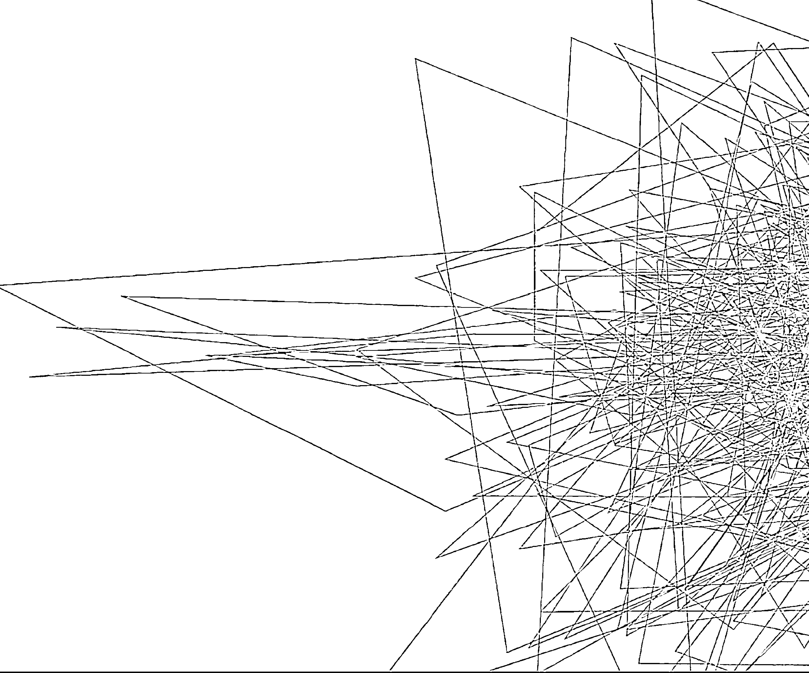

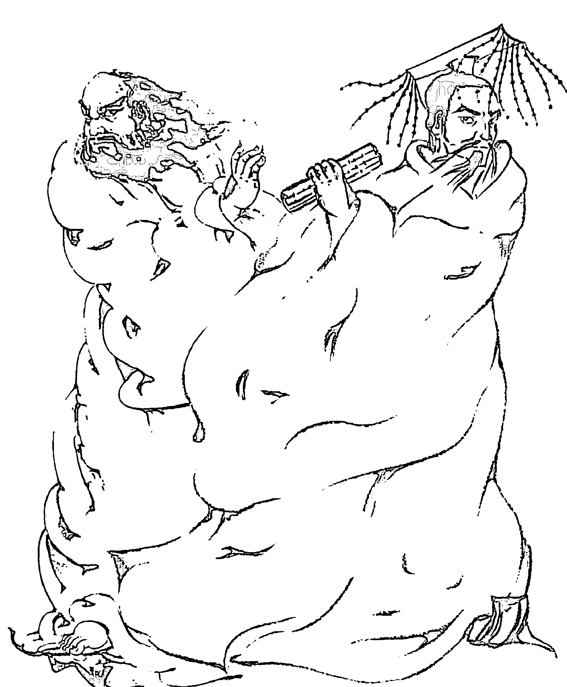

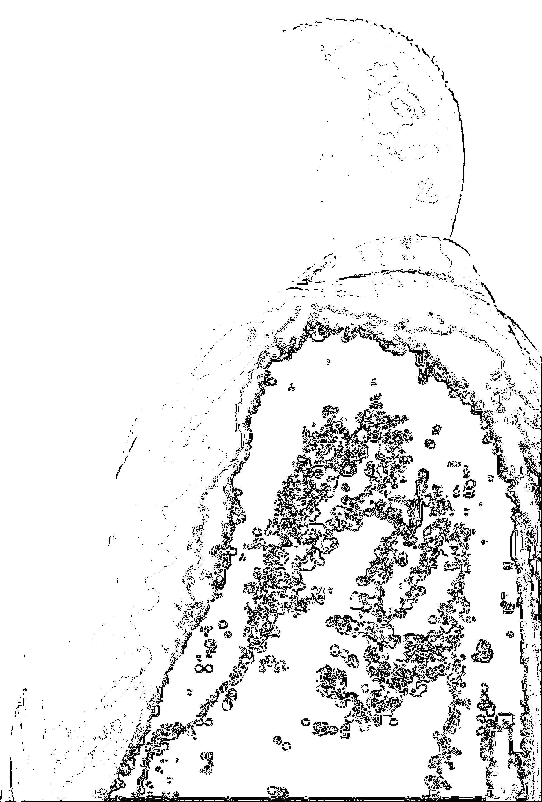

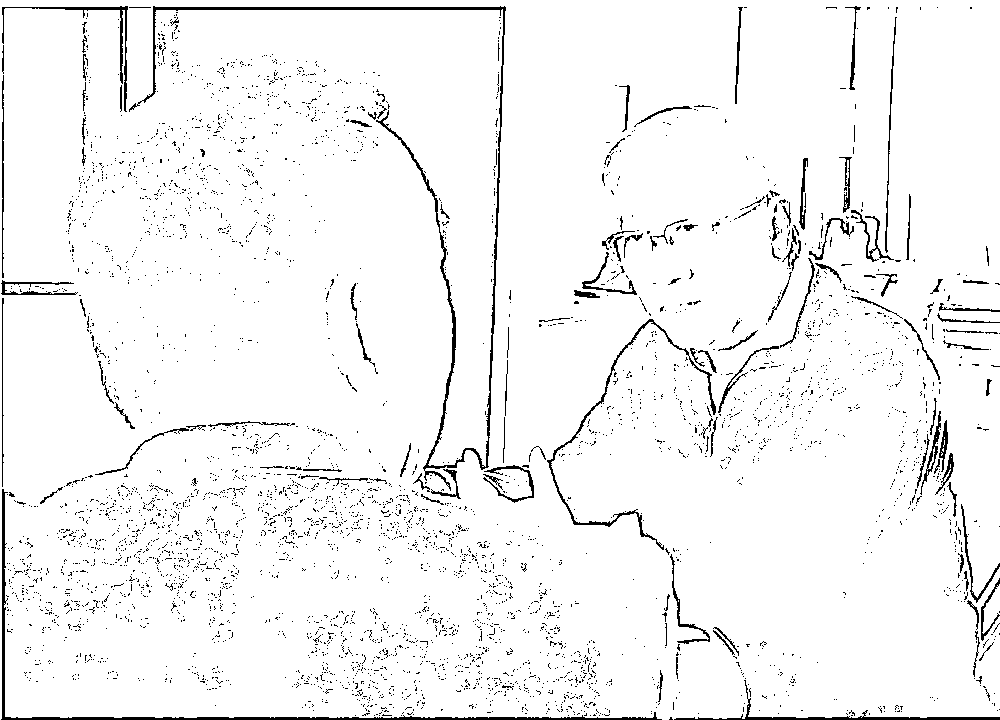

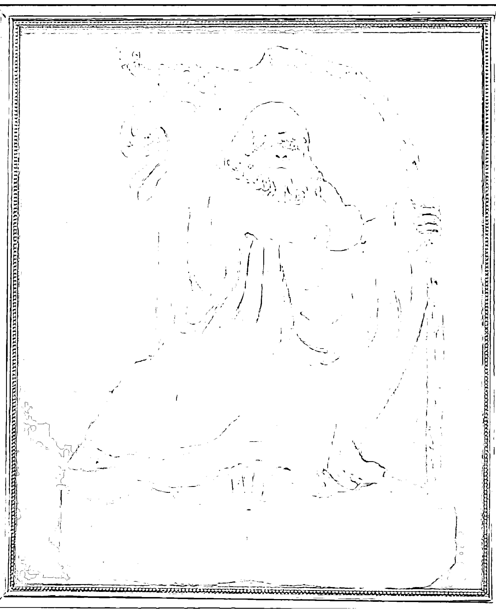

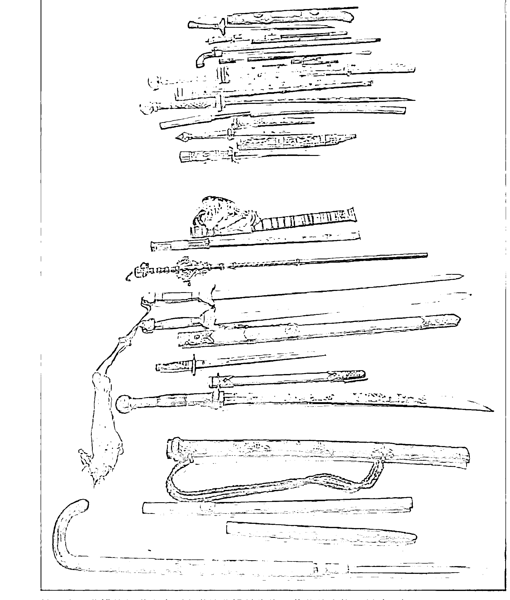

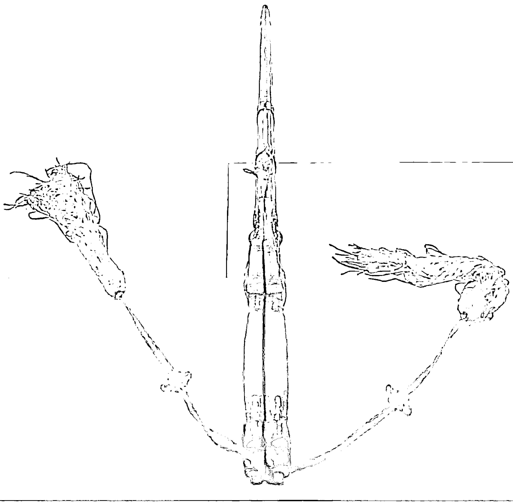

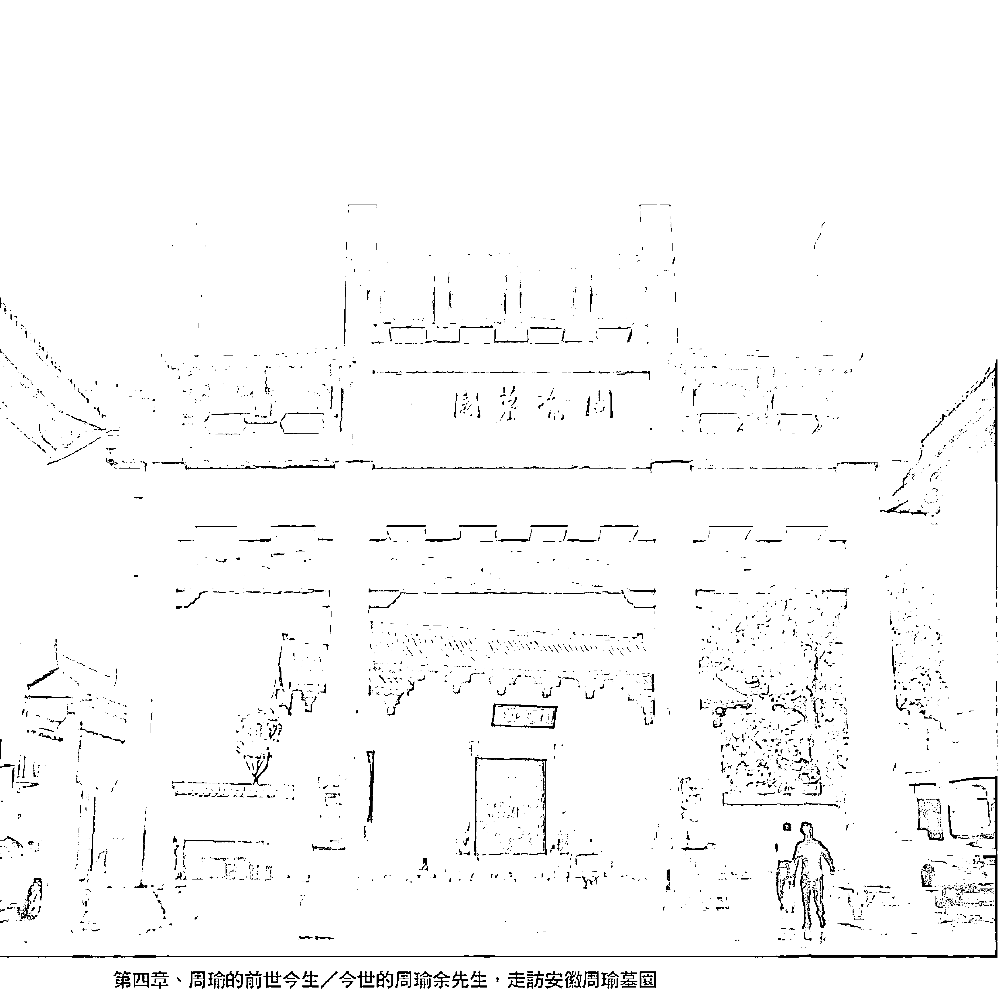
