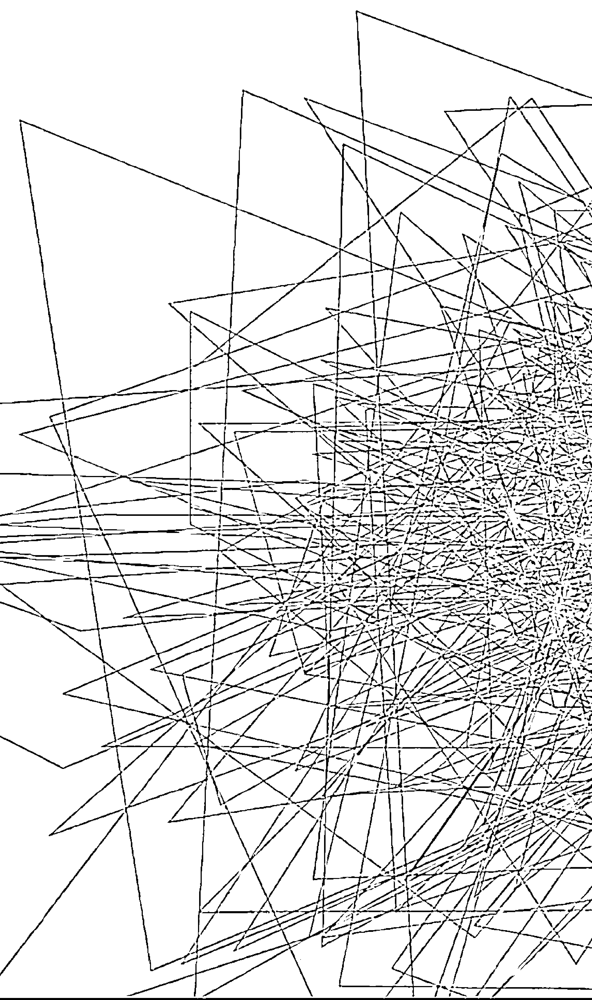
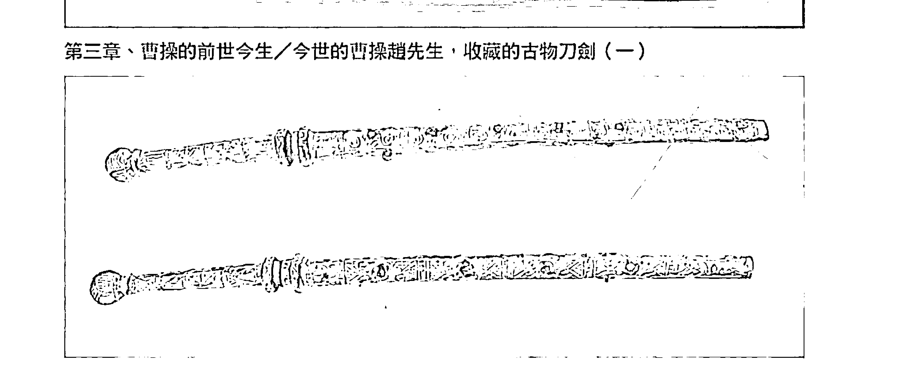
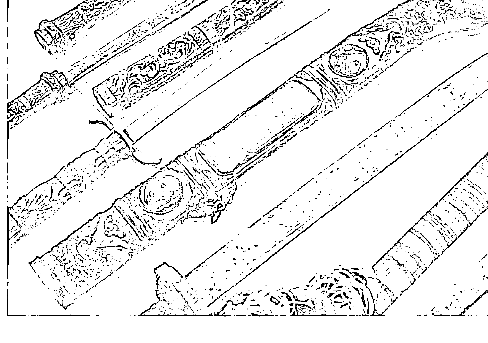

## 般若達摩 活靈活現之前世今生第二部

## 般若達摩

穿越千年時空！
梁武帝
今世在香港！

向立網◎著

## 制作说明：

本書由《天使神秘學院》出重金从台湾购入的原版书籍扫描制作完成。为达到最好阅读效果，特地把书全部切开后，再经由专业扫描设备高精度扫描完成，并经过一张张的PS后期处理最终成书，其间花费大量的人力、物力以及时间，只为能给大家提供经济并优质的神秘学学习资料而努力。

本学院强力谴责某些机构和个人，把本学院花心血制作完成的电子书籍，包装后直接放在自家网上低价倾销的行为，以谋取不劳而获的经济利益。如果长此以往最终将无人愿意再为大家花心思制作电子书，那以后可能大家再无新书可读。

为让大家以后能够读到更多的好书，也为了本学院的良性发展。本学院恳请大家尽量做到如下几点：

- 一、 尽量在天使神秘学院的官方网站购买电子书籍。
官网访问地址：http://www.ac2011.cn
短网址：ac2011.cn
网址含义：(Archangel College 成立时间：2011年)

- 二、 在收到电子书后小范围传阅即可，千万不要公开传播，更别挂到网上低价销售。

同时为答谢广大支持者，学院电子书将做如下调整：

- 一、 学院会把一些早已收回制作成本的电子书折价销售。
- 二、 最新制作的电子书籍会开放打印功能，大家购买后有条件的可自行打印成书。

## 幽冥盤

穿越千年時空！
梁武帝今世在香港！

## 靈魂相遇——帝王將相篇

## 目録

律師聲明 4

序言 7

第一章 梁武帝的前世今生 11

第二章 光緒、珍妃、瑾妃的前世今生 59

第三章 曹操的前世今生 81

第四章 周瑜的前世今生 113

第五章 朱元璋的前世今生 145

第六章 諸葛亮的前世今生 171

第七章 綜合評論 191

附録 205

### 萬世紀身心靈顧問有限公司
委託永然聯合法律事務所
李永然律師 陳宜鴻律師代為聲明啟事

一、茲據當事人萬世紀身心靈顧問有限公司委稱：「

（一）本公司出版之『活靈活現』系列靈學圖書，深獲各界佳評，感激不盡。因此，本公司乃依法完成之商標註冊，商標類別分別為第十六類、第三十五類、第三十八類、第四十一類、第四十五類，依《商標法》規定享有商標專用權。

（二）未經本公司書面許可或授權，任何單位或個人不得有以下之侵權行為，如有侵犯本公司之商標專用權，本公司將依法追究行為人相應的民事或刑事責任：

- 1、在同一種商品、服務或者類似商品、服務上使用與上述標誌相同或者近似的商標（包括讀音相同或近似）致消費者有混淆或誤認；
- 2、銷售侵犯上開商標專用權的商品或服務。

（三）詎因該系列圖書之出版，通來竟有他人於社群網站公然以「活靈活現」為名成立粉絲團之混淆行為，或以網路、圖書等方式，散布對「活靈活現」之不實、惡意攻擊、詆毀等言論，更有謊稱為「活靈活現」之代理、分部、支部，或假藉與「活靈活現」係出同源、同門等情，以欺瞞社會大眾，牟私利之事件。

（四）為此，本公司就上開不當行為，對於作者向立綱先生及「活靈活現」之立論所造成之傷害，深表遺憾。希冀相關行為人得以自制，盡速停止或撤除相關之惡意行為、活動，以免觸法。”等語。

二、本法律事務所爰代聲明如上。

永然聯合法律事務所

中華民國一〇八年十一月一日

李永然律師
陳宜鴻律師

## 靈魂相遇——帝王將相篇

## 序言

## 靈魂相遇——帝王將相篇

從事靈學工作一、二十年以來，在探討前世今生的過程裡，曾經巧遇了一些前世為歷史名人或帝王將相的人。這些人的前世，都是顯赫輝煌，甚至天下獨尊，但是今生呢？他們的今生會是怎樣的境遇？由於他們的案例都頗能令人深省，於是筆者將之撰集成冊，是為「靈魂相遇之二」的主題內容。

許多的歷史人物，在千百年來的輪迴過程中，很可能就被淹沒在歷史的洪流裡。

今生，他們可能只是一介凡夫，就在你我身旁，沒沒無名，對他們那些曾經不可一世的靈体而言，該是何等等鬱悶與落寞！對他們今世的新肉体而言，又該是何等的矛盾與糾結！

在輪迴的過程裡，人，沒有永遠的成功者，也沒有永遠的失敗者。但是，在過去「八字定命格」的二十世紀以前，是偏屬「宿命論」的年代，人的一生成敗，在呱呱墜地的那一刻，就已決定大半，所以才會有「宿命論」的曾經盛行。

到了二十一世紀的現在，「宿命」的論點已不存在，但是，靠著自我的奮鬥，又常令人覺得似是力有未逮，因為前世今生的因果又干擾著每個人這一生的順與逆。離開了過去的「宿命論」，在這新的二十一世紀，人生要如何找到自我、創造新生？原來，現在是一個「天人合一論」的新世紀！因為靈体顯性了，光靠著肉体埋頭苦幹的奮鬥，常是事倍而功半，甚至是無濟於事，任何人都必須肉体與靈体、主神連成一線，才能善用前世因果中的優勢，摒棄因果中的劣勢，謀得成功，這就是天人合一的概念。知前世，知因果，是要檢討過去的成功或失敗，成為今日邁向成功的動力，而不是沉醉在過去的輝煌中，或消極在今世的困頓與落寞裡。藉著本書許多歷史名人的前世與今生，相信每一位讀者，都能從中獲得深刻的感，也能得到個別的啟示與啟發，而且，對靈學的認知，也必又跨前了一步。

## 靈魂相遇——帝王將相篇

# 第一章 梁武帝的前世今生

### 壹、梁武帝前世今生的連結：

### 一、緣起：

二〇〇七年四月初，一位讀者陸先生從香港寄來一封電子郵件，表示他看了活靈活現的網站，很有感觸，希望能到台灣求見黃老師，當面諮詢求助。黃老師在看電郵的當下，便傳來達摩祖師的訊息指示：「去香港見他，他須要幫忙的。」隨後，除了約定了香港的會面時間外，還告知他，請他先閱讀一千五百年前中國南北朝時代南梁開國皇帝「梁武帝」的有關史蹟。從事問事工作迄今以來，對來求助的人，黃老師親自主動前訪的，這是第一次。原來，這位陸先生的前世，便是「梁武帝」。

### 第一章 梁武帝的前世與今生

當時的梁武帝篤信佛法，達摩祖師到中國弘法，曾與梁武帝謀面會談，梁武帝問稱，自己廣建佛寺、抄經書、供養僧侶，有何「功德」？達摩祖師認為梁武帝將善行掛嘴邊，心中有期許，所以「毫無功德」。由於雙方話不投機，達摩祖師不久便一葦渡江前往少林寺。達摩祖師在少林面壁及傳法後，遠近馳名，梁武帝聽聞後，再遣人欲請達摩祖師返回梁國，卻為祖師所拒。達摩祖師重情、重禮，或是這段情緣，所以才囑黃老師等主動前訪。

### 二、真相：

二○○七年四月十二日，在陸先生五十四歲這一年，黃老師到香港見了解開了陸先生的身世之謎，也解開了陸先生五十四年來人生所有的困惑。原來，靈界設定在二十一世紀的世界末日之後，從二十二世紀起，將是再一次的「盤古開天」，人類將重新開始，屆時，梁武帝的靈体（即陸先生的靈体）將被規劃為「天子」的人選之一。因此，他這一世的投胎凡間任務，便是要來一體驗民間疾苦」的，希望在下一個世紀，若是他再當了皇帝，他才能真正感受天下蒼生黎民的苦。唯有能了解民間疾苦與心聲的「天子」，才能苦民所苦，造福蒼生。

因此，陸先生在此世的人生境遇與辛苦、辛酸以及所受到的折磨與困境，當可想而知。

所以陸先生此世是來「受苦」與體驗的。

### ## 三、後續：

解開了人生的迷惑，陸先生的問題結束了嗎？還是才開始？十二年前人生落到谷底的陸先生，知道了自己的身世與天命之後，如今安在？二〇一九年四月，黃老師又接到了達摩祖師的訊息指示：到香港見訪陸先生。

從二〇〇七到二〇一九，剛好是一輪十二年，十二年之後的陸先生現況如何？十二年來他的人生境遇如何？他的心路歷程又如何？

- 他如何面對前世？
- 他如何調適今生？
- 他的人生歷程，能給我們什麼人生的啟示？是正面的？或是負面的？

二〇一九年四月五日，黃老師等一行工作人員，再度來到香港與陸先生會面（會面照片詳見最後附錄章節）。在未預設主題的漫談中，從陸先生的過去到現在，經過了十二年，陸先生對自己的一生，有了更透悟、成熟的體認。他的人生歷程，對許多處在亂世裡徬徨無助，或怨天尤人、或掙扎求生的人而言，是面明鏡，也有極佳的醒世作用。可以讓大家從相信、接受因果中，找到改變、激勵的力量。

筆者於是驚覺：原來這就是靈界指示我們再訪陸先生的目的。因此，乃將與陸先生會談過程彙整說明，陳述於后：

### 貳、重生的歷程：

### 一、什麼動機或原因，使陸先生在二〇〇七年找到黃老師？

陸先生回憶過去，滿臉威容，瞬間又似蒼老憔悴許多。他說，四十多年前的七〇年代，他在美國極其知名的杜克大學完成工科碩士學位後，一九八二年回香港，到一九九五年這十三年間，在工作上、事業上都一路順風，可以說是人生完美勝利組。

當時他的月薪為港幣五萬元（台幣約二十萬），他累積了相當財富，也有房產。

一九九四年，他便已取得了英國國籍，當時港民普遍都有面臨「九七大限」的恐慌（註：一九九七年，香港將從英國人手中交還中國）但對陸先生而言，根本沒有任何憂心，因為他已擁有英國國籍，但是他卻「莫名其妙」的賣掉了房子，辭掉了工作，在一九九五年移民前往澳洲。

陸先生說：「這是我人生惡夢的開始，我也搞不懂當時為什麼我會做這樣愚蠢的決定。因為「我已有了英國公民身分，為什麼還要去拿澳洲護照？」陸先生還拿出了他的英國護照作證明。

在澳洲停留了二年，陸先生自稱是「玩了二年，一事無成」，一九九七年，取得對他一無用處的澳洲身分後，陸先生憬然回到香港，直到二〇〇七年這十年間，他沒有一個適當的工作，而且投資失敗，又遭人詐騙，前後共損失了一千多萬港幣。

沒有房子、沒有存款、事業不順、感情挫折，沒有家，孑然一人，還要為生活奔波，極其狼狽困頓。

「從一九九五到二〇〇七年這十二年間，是我人生最艱苦、最黑暗，看不到一點希望的日子」，陸先生說：「我不懂問題在哪裡，我的心中有太多的疑問，為什麼在一九九五之前，我的人生一片光明，卻似一夕之間，墜入人間地獄。後來，看了活靈活現的書，說一九九五到二〇〇七的十二年間，人人都面臨著靈逼体的現象，我才恍然大悟，豁然驚醒，書中所寫的時限，正中我的要害，與我的際遇完全吻合。」

「在我人生最黯淡、艱困的時候，我想要尋找答案，也透過各種方式方法及媒體管道，我知道，我一定可以找到自己要的答案！結果有一天，也不知為什麼，我偶然的看到了活靈活現的網站，我覺得這個網站很不一樣，我突然有個「靈光」一閃的感覺，像是看到了希望，也相信我一定可以在這裡找到自己要的答案。」陸先生說，於是他便開始聯絡要求諮詢。

「可是，現在有很多網站都充滿詐騙或人為宗教的陷阱，你當時沒有擔心過嗎？」筆者問他。

「有，我也有這麼想過，可是很奇怪的，我一點都不擔心，可能是我當時已經窮極困頓，一無所有了，也沒什麼可以被騙的了。而且，我反而有個很奇怪的直覺，一定可以在這裡找到我人生的答案。」我內心堅信這一位黃老師一定可以幫我，我內心的聲音告訴我，找黃老師就對了！「找到了、找到了、找到了！」內心不斷的傳來似有似無的微弱聲音！

### 二、前世今生的震撼

在第一次與黃老師會面前約一、二周，工作人員便已告知陸先生先看有關「梁武帝」的生平事略，陸先生雖有懷疑自己可能與梁武帝有關，但在閱讀梁武帝的相關資料時，陸先生坦言：「並沒有什麼特別強烈的感受，只是有心中一陣痛，痛徹心扉無法言語的痛！腦中浮現模糊的皇帝影像。但是之後的一段時間，總感覺自己就是梁武帝，而且內心有個聲音在呼喚：『梁武帝啊』、『梁武帝啊』。當時內心的感受只有苦、苦、苦。這是絕大多數諮詢者的共同現象。畢竟，他們對自己的前世已一無所知，陸先生也不例外。

但是，」陸先生說：「經過黃老師的解說、分析與連結後」，才赫然驚覺：「前世今生竟有這麼多的雷同與千絲萬縷的牽扯，令人不可置信。心中有驚喜、有難過，而內心念著『梁武帝啊』、『梁武帝啊』的聲音也更清晰了。

全部諮詢過程，陸先生說：「只能用六個字形容，就是驚恐、精準與震撼。」

「太精準了，太不可思議了。」陸先生說，當初內心只能用驚恐來形容：

### 第一、毫釐不差的時間落點：

黃老師說我的不順、挫折、失敗……完全是「靈退體」與因果清算所致，她明確指出我靈退體的時間是從一九九五到二〇〇七年，這段期間，正是我人生歷程的轉向下與最低潮。黃老師的斬釘截鐵，正中了我心中的最痛，令我驚懼萬分。是的，我內心告訴自己：完全沒錯，一九九五年是我陷入不堪的開始。

### 第二、不解亂人性的挫折

黃老師說我前世至今一千四百多年，均未投胎，所以靈體只有前世「當皇帝」的記憶，不懂民間生活與凡間險惡。因此投資、合夥只知本著古代人的誠信與道義，才會一再被騙被詐；遇到金融危機，也完全不懂應變，不會處置，才會一敗塗地。黃老師一番解說，完全說中了我的要害與不堪，令我有醍醐灌頂的驚覺。對社會世俗的冷暖、成敗，完全毫無警覺心，也不懂成敗是什麼，只是用我的傲氣與自大心面對改變的社會。

### 第三、靈性、個性一脈相承

陸先生說：「提到梁武帝，我覺得有似遠又近、陌生又熟悉的感覺，但是心中仍有一股莫名的掙扎」，黃老師說我固執中帶著霸氣，明知道也不願相信；一意孤行、耳根子軟，而且好奇心重又疑心重，很多事都想一探究究竟，但又不敢面對。」

黃老師說：「這正是梁武帝年輕時的特質，霸氣而一意孤行，什麼人都不相信，只信自己，固執！又充滿好奇心。」

細思梁武帝略傳，確是如此。」

「但是，梁武帝到了晚年後期，因為習佛，變得憂柔寡斷、狠不下心，沒有霸氣，這完全是你人生轉折向前後以來的轉變」，你個性中的矛盾，完全與梁武帝相同。你很容易步入梁武帝的因果，是受到你潛藏靈性的影響所致。你的靈体所呈現

### 第一章 梁武帝的前世與今生

「黃老師的一番解析，令我啞然。在我接受自己的同時，我已無法拒絕接受前世的自己，其實，我夢中見過自己是梁武帝。」陸先生說，「所以我肯定的對黃老師說，我就是梁武帝，而從前世的皇帝到今世平民的我，竟有這麼天大之別的悲戚！」

另外，黃老師說：「梁武帝的內心深處，一直有種孤獨感，又高高在上，帶著一種傲氣、霸氣，這種特質，也承襲在你的身上，你從小就有這種莫名的孤獨感，無人可以体會，這種感受，你身邊也無人知道！」

陸先生說：「這種孤獨感，只有我知道，是種莫名襲來的感覺，揮不脫，又難以形容。難不成這是身為皇帝在集天下大權、顯赫一時、不可一世之餘，回到寢居獨處，卸下一身重負後的孤獨？」

原來，許多大成就的人或權傾一時或獨霸一方的帝王將相，內心都是孤獨的。因為人前，他們不可一世，是巨人；人後，他們也是凡人，也有凡人在凡間塵世的苦，卻是無處訴說，這就是他們內心深處的孤獨面。

梁武帝如此，陸先生也是如此！

「沒錯！這就是靈性的傳承！」「你的身上，到處都可以看到梁武帝的影子！」

### 三、能接受自己的前世嗎？

### 第一章 梁武帝的前世與今生

黃老師肯定的說。
對一個落魄潦倒、一無所有的人，驟然告訴他：「你前世是皇帝」，會是怎樣的反應？他能接受嗎？
陸先生說：「我相信，也完全接受，因為我自己的霸氣告訴我，我一定是個不簡單的人。但是又覺得有些難以承受，有種承受不起的感覺。」

為什麼相信？「因為黃老師所說的每一句話，都深深擊中我的要害。腦海也是呈現了梁武帝的影像：是啊！長長的臉型和今世的我確有幾分相似……，我許多隱藏內心深處的事情與感受，黃老師都知道，黃老師真的能與我的「靈魂」對話，黃老師也解答了我所有的問題。「這些問題「全都環環相扣，組合的天衣無縫。只有事實真相，才能有這樣合理密合的解釋；也只有全能萬能的神，才有這樣無所不知、無所不能的神力。「所以，陸先生說：「我相信。」並用半吼的聲音說：「我是梁武帝，梁武帝是我。「然後留下一串淚水。
但是，為什麼又說難以承受呢？
陸先生說：「畢竟，梁武帝是位偉大知名的歷史人物，年輕時博學多藝，是政治

陸先生說：「第一次見了黃老師的當晚，我思索整夜，有好幾個主要理由，印證了『我是梁武帝』，必須接受『梁武帝是我』：
第一、我的名字，也有『梁』字，如果加以拆解來看，正是有著『文武雙全』、「一國之君』的隱喻，指的正是『梁武帝』（編按：為了保護當事人的隱私，所以不便透露陸先生的真名。）這絕對不是無意的巧合，而應是靈界早已埋下日後驗證的伏筆與證據，讓我不得不信。

第二、我在香港，黃老師在台灣，雙方毫無交集又絕不相識，若非靈界指示，黃老師何須千里迢迢的專程來找我？大家對黃老師求見若渴，據我在活靈活現的官網上所見，在網站上登記預約排隊要見黃老師的人已有一萬一千多名。而且，對我瞭若指掌？何況我已一無所有，是個徹底的失敗者，沒有一點價值。
第三、黃老師說我這一世的目的，是要來『體驗凡間疾苦』的，為下個世紀的天子預作準備。所以我必須嘗盡民間的苦，日後才能体恤蒼生黎民的辛苦，當個好天子。這樣的說法，我不得不接受。為什麼呢？因為那十二年我真的是過的太苦、太苦了，那種刻骨銘心，難以形容，以我的學識學歷、能力、經驗等等，沒有理由過的這麼艱苦辛酸，唯一的解釋，就是這是老天的安排，老天就是要我來體驗受苦的。

第四、黃老師當時說我已『陷入消極，沒有了自信，看不到真正的自己，找不到任何方向；沒有安定感，像浮萍漂泊一般，充滿負面思想，幾乎生不如死的想要自我了斷』。那樣直白衝擊的描述，確實是我當時的心境寫照。黃老師又說我『失志、失意、消沉』，看不到創業的成功，屢屢失敗，沒有未來，結果就是『憂鬱而死』。話說的直接又深刻，像利刃般，但也句句實話，我看到的當時的自己，確實就是這樣！」

但是，隨後黃老師又給了我一線生機：要我「把自己歸零，就能脫胎換骨，才能有個全新的自己，才有路可走！』

陸先生說：「黃老師堅定的語氣，讓我看到力量，我當時確實由衷相信，接受命運的安排，是我唯一可走的路。」因為，「我當時真的是深陷在四面楚歌，走投無路」

## 靈魂相遇
### 帝王將相篇

### 四、情傷與覺醒

所以，陸先生說：「相信之餘，完全接受也是我唯一的選擇！」

在陸先生艱困的人生過程中，無婚姻、無家庭，孤寡一人，孑然一身，除了漂泊，還多次受到感情挫折。年紀已過半百，仍情歸無處，這是他的另一不解與辛酸。

> （一）結婚？不婚？

陸先生問：「在我未落魄潦倒之前，我仍年輕又條件很好的時候，也曾遇到過一些條件不錯的對象，而且我的異性緣也特別好，真的不缺女友，但是為什麼我卻都沒能把握呢？」

黃老師說：「第一、這是靈界主神設定給你的命格，沒有婚姻、沒有家庭，如果你走入婚姻，一定必結必離，屆時可能又生個殘缺不全的兒女，對你『體驗疾苦』的試煉，將又要加倍的辛苦，你的靈体不忍心，所以沒有讓你走上那條路，這也是你體驗民間疾苦中，唯一做對的選擇。」

在黃老師與陸先生對談的過程中，黃老師還談到陸先生的主神傳來訊息說：「若你結婚，會送你一個健康有問題、有狀況的孩子。」

## 第一章 梁武帝的前世与今生

陆先生苦笑说：“真是惊险。”

第二，黄老师说：“你以前是曾交往过一些不错的女性对象，但是你怕结婚，你只是怕，但却不知道为什么？主要的原因是你的潜意识里，想要的是‘自由’。因为前世在宫中虽然贵为皇帝，却极不自由，被‘家’、被‘皇宫’圈住，无法随心所欲，所以，潜意识里，你怕了，一谈到婚姻，你就害怕，就想避开。”

（二）红颜知己另一章

提到情伤处，陆先生问起他的一位红颜知己——“蓓儿”。蓓儿是位酒店上班的姑娘，与陆先生相识多年。

陆先生问：“蓓儿与我有什么特殊渊源吗？或是在我人生经历中，有什么特别的意义呢？”

黄老师说：“你们两人的相处亦亲亦疏、断断续续，双方像亲人，又像情侣，又像兄妹”，“看似无情却有情”，“道似有情却离情”。

陆先生想了一想，说：“没错，正是这样。黄老师，您怎么都知道？”

黄老师说：“蓓儿是灵媒体质，时常可以感应到一些鬼神或异象，而你的灵体又是好奇心很强（已如前述），前世修佛时，你就对能通的人与通灵现象充满好奇。所以当你今世得知蓓儿能感应、能有强烈的感应力时，你的好奇心被激发起来，便想接近她、了解她。”

所以，黄老师说：“你们经常谈论神通与感应的事情。尤其蓓儿的外婆学的是大陆内地传统的家传独门术法、符法、蛊毒、小鬼都是他们运用的工具。她想控制蓓儿，召蓓儿回去内陆乡下当独门符法的接班人，所以用小鬼、符法等长期追踪蓓儿的行踪与行为，掌控蓓儿的活动与思想。”

而蓓儿又是灵媒体质，所以常能感觉自己受到无形的监控，也能约略感应到小鬼、符法等的一再纠缠与干扰。这些现象，使陆先生感到极大的兴趣与好奇。

心驱使之下，促成了陆先生与蓓儿的一段特殊情缘。

在陆先生多次的感情经历里，为什么他只提问“蓓儿”一人？因为这一段情缘在陆先生的人生历程具有某些特殊的意义。这不是灵界先天的设定，但却被陆先生的灵体巧妙的运用，也起了引导的正面效用：

## 1. 梁皇宝忏的延伸意义

梁皇宝忏是佛教界无人不知又极为重要的“忏罪消灾”法会，从梁武帝时期制定流传至今，千余年而不衰。其缘起于梁武帝在皇后郗氏过世后数月，在梦中见一大蟒蛇现身，蟒蛇自称是皇后郗氏的化身，因为自己（郗氏）生前嫉妒心太强，也为了争宠而害死了梁武帝的妃子，所以死后因报应而被打入动物界，极为痛苦，请求梁武帝帮忙超渡。

梁武帝于是商请国师，广邀高僧，写成忏悔文，替皇后办超渡法会，数年后某夜梁武帝又梦见皇后化身为龙，来向梁武帝致谢，说自己即将返回天界。因此，梁武帝顺利超渡皇后所举办的“梁皇宝忏”的忏文与法会，自此千余年，流传天下，成为佛教中无人不知的重要忏悔法会。

从梁皇宝忏的原始起源经过来看，当然陆先生在本质上与潜意识里，是深信轮回、报应之说的。换言之，先天本质上，他是相信佛教佛理的。从小他也随着母亲不定期走庙拜拜，但是灵界知道在二十一世纪的乱世下，宗教在凡间许多已被误用污染，人为宗教盛行，稍有不慎便可能误入迷信或遭受诈骗，后果不可收拾，所以陆先生的灵体一直不让肉体过度接触人为宗教。

## 2. 认清了符法小鬼之危害

心，因势利导，藉着“蓓儿”的特殊体质与背景，让陆先生看到了无形世界真实存在，也开启了他接触灵学的大门。
蓓儿的出现，虽非灵界设定，但陆先生的灵体却掌握了机会，利用肉体的好奇全新的体验。千余年前的民间简约纯朴，实在难以想像当今世界人心的险恶与不择手段的阴狠，若非陆先生亲身目睹经历，如何能够相信符法小鬼的真实存在以及在民间的滥用？尤其亲眼看到了符法小鬼缠身后，能够左右人的思想意志，能够伤害人身肉体，能够令人精神恍惚萎靡，能够令人行为受控、言不由衷、行不着方……，使人失去自己，失去自由意志、受到千里之外无形的干扰、左右、操控……，甚至造成自残、自杀、丧失生存意志……等等。

在目前科学文明的社会里，仍有绝大多数人对符法蛊毒之说嗤之以鼻，认为无稽之谈不可尽信等，更造成了符法邪术等的猖獗，在世界各处，在民间，已是到处可见，对社会大众与善良百姓的伤害，也愈来愈大。这样的社会乱象，陆先生亲眼目睹了，这种体验对他而言真是弥足珍贵。一个世纪以后，若他有幸再为天子，应当更加知道要如何正确的教化人心。

## 3. 情悟与跳脱

陆先生了解了他的红颜知己蓓儿受到尊亲长辈的小鬼符法的伤害后，再引荐蓓儿向黄老师求助。由于施法下咒者，是蓓儿的“一直系血亲”外婆，在灵界与阴界的规范而言，这是“无解”的，再加上那些符法小鬼，是来自于历代祖传单传的独门术法，更是双重的无解。

适逢中国实行一胎化政策，蓓儿的母亲年长多病，不适合再习术法，蓓儿是外婆的唯一继承人选，又是灵媒体质，为了不让独门术法失传，于是强迫蓓儿非接不可，为了达到目的，已到无所不用其极的地步。

明明这是一个双重无解的难题，但是一则陆先生对主神灵界的真诚接受与请托，二则陆先生主神为了彰显灵界对他的重视与期望，三则为了提增陆先生对主神灵界的信心，于是答应帮他们化解。
蓓儿受到符法的影响，总是藉酒麻痹自己，外婆只要去到乡下老家念咒，蓓儿就会头痛欲裂，晚上无法睡觉，白天无法进食，情绪不稳定，无法工作，还会又吼又叫，简直是痛苦万于。

对于一个原本的无解题，却要强行化解，其困难度当可想而知。这也是黄老师问事生涯中的第一次特殊例外，经过灵界特准黄老师帮蓓儿化解，才更能取信陆先生。

## 4. 未受符法之殃

陆先生与蓓儿的长期交往，密切的互动过程中，看到蓓儿受到符术无形伤害的各种痛苦，但是自己却得幸免，毫发无伤，他自己也觉得不可思议。

黄老师说：“你想错了。”

陆先生曾自嘲：“我已过得够苦了，如果我再受到符蛊之害，肯定是活不下去的，大概是主神怜悯我吧？”

原来，真相是：多数有天子命格的人，在要投胎之前，灵界主神均会在灵体上预先设定“挡符、挡魔令”，使他们在阳间一生不受符法蛊毒的伤害。因为术法伤人于无形，又过于强烈，天子命格的人，身系千万生灵，所以才有如此规范。

这是陆先生未受符蛊伤害的真相，这也是陆先生后来深信自己“身世”的主要原因之一，陆先生自嘲：“这是尝尽民间疾苦唯一安慰。”

### 五、“苦”字的体悟链接

陆先生这一世的人生任务，是来“体验民间疾苦”的，所以他所承受的各式各样的苦，就可想而知。对他而言，他对苦的感受，太深刻、太沉重、太刻骨铭心。

二〇〇七年初见陆先生时，他娓娓的说着自己的苦，语调平平淡淡，没有起伏，没有高低，仿佛说的是别人的事，别人的苦，但是，笔者看到了他眼中泛着泪水的余光。只是他已麻木，已经消沉，已经不再怀抱希望，像是即将枯竭的油灯。

他说：“一九九七年回到香港后，我应征过无数次工作，但每求职一次，对我就是打击一次。有的公司说：‘你的条件太好，我们请不起你。’有的面试官用怀疑的眼光看他：‘你这么高的学历，这么好的经历、条件，为什么找不到工作？你有什么问题吗？’”

“每求职一次，我就要看人家脸色一次；就要听人酸言酸语一次。”“每次求职一次，回来家就是生气很久，心情无法平复。总是懊恼自己没出息，讨厌自己放不下身段。明知不可以，内心还是会生起莫名的骄傲，不懂自己为何不会多说几句好话，不会露点笑容！”

“求职，看着对方的脸部线条，才应征到一半，我就几乎想要起身走人。”

陆先生说：“我不懂，我长相差，外表堂正，有经历、高学历、高智慧，又是时下冷帅型！这样的条件，为什么香港无处容我？”

黄老师说：“是啊，你前世当皇帝，高高在上，如何能够承受别人面试你，对你品头论足？”“所以面试挫折，别人苦三分，你却觉得十二分。”“而且这一世你也不懂‘为什么会找不到工作’，就像你前世不懂为什么达摩祖师说你弘扬佛法‘没有功德’一样，你想不通，问题的‘点’在哪里！”

黄老师告诉他：“你今世的任务就是要来体验民间疾苦的，承受各式各样的苦，是你命中的必然。”当下，笔者看到了他胸口的猛烈起伏，随之，也看到了他利用转身的瞬间，悄悄的用手背拭去了眼角的泪水，轻叹一声：“什么皇帝命啊？”

从灵体开始显性的一九九五年开始，他命定的苦开始呈现。尤其一九九七年他再返回香港后，他已一无所有，房子没了、工作没了，钱也几乎被骗光，大环境全都变了，不一样了，在求职受挫，阮囊羞涩之余，他还必须时常靠着兄长接济。
“苦”在他的生活里，似是与他连成一体，无法驱离，那连续十二年，他过的惨淡，唯一“苦”而已。

#### 苦什么？

- 苦在亲情的苦
- 苦在没有工作的苦
- 苦在高学历失业的苦
- 苦在投资失败的苦
- 苦在亲友现实相拒的苦
- 苦在挚友相欺的苦
- 苦在情归无处，遭人弃离的苦
- 苦在结婚与否，取舍两难的苦
- 苦在放下自尊，卑颜屈膝的苦
- 苦在必须屈就糊口的苦
- 苦在夜枕孤眠，午夜梦回的苦
- 苦在人看我一表人材，我却一无所有的苦
- 苦在一言难尽，见不到终点止处的苦

陆先生，这个前世的天子之尊，何曾受过什么委屈？何曾知道什么是真苦？什么是欲哭无泪的苦？什么是为求生计的苦，什么又是求助无门的绝望之苦？

由于前世天子的养尊处优，不知人间处处有苦，因此今世他对“苦”的感受极具敏感、深刻，承受力也较低一些，微不足道的挫折或是小苦小痛，对陆先生而言，却有可能是深度的椎心之痛。

陆先生说：“有一次，我走在太阳西下的海边，看着海波沉浮，感觉就像是自己人生的漂浮，甚至有了一了百了的念头。这样的念头，还不止一次……。”可见苦字带给他有多巨大的重击。

### 六、梁武帝与慧可的空中相会

二〇一九年，黄老师与笔者衔命再往香港见陆先生时，谈到过去，陆先生还是一直不断的喃喃自语，口中念着“好苦！好苦。”那种景象，令笔者突然有种“似曾相识”的熟悉感！

原来，笔者一年余前在加拿大温哥华见到“慧可”（立光）时，慧可也曾不断喃喃自语的念着“好苦！好苦！”

梁武帝（陆先生）与慧可（立光），都是一千四百年前的同一代人物，都是（注：慧可是达摩祖师在少林寺的第一代传人，参见灵魂相遇第一册）

笔者一时兴起，提议：让慧可与梁武帝两位“好苦”的同一年代人物，来个二十一世纪“空中相会”，不知是否会有怎样的火花或共鸣？（在此之前，他们二人都已略知对方的事迹。）在征得陆先生的同意后，笔者立即以视讯方式，接通了远在加拿大的慧可，当时是香港时间下午三点，温哥华为凌晨零时。

这是一个很微妙、又特殊的相会交谈与互动。两位千余年未曾投胎的“历史人物”，在二十一新世纪的相会，会有怎样的感触与心声？为了维持情境的真实，笔者将当时的现场录音节译如下：

陆先生（梁武帝）与立光（慧可）视讯
陆先生：你好，你真的是没有头发的哦。很帅哦。我们其实是同一时代的人呐。我看到你了！看到了慧可的本人了！哈哈！

立光：是啊，我们是同一时代的。

陆先生：我五十多岁才完成认主报到，很羡慕你三十几岁就知道要认主报到。你年轻，所以你还有大好前途。

陆先生：你五十多岁也不老啦，我看到梁武帝了！真不可思议！

立光：对呀，陆先生你很开心哦，比我开心哦。

黄老师对立光说：对呀，陆先生看到你也很开心，终于有人可以跟他比苦了。但是陆先生（梁武帝）说立光（慧可）比较不苦。

陆先生对立光说：你的那本书（注：指灵魂相遇一）我经常带在身边看，我出差都是带着书出去的，今天也带在身边，你看，书的封面你是光头耶！我终于看到你的真正光头了！很好看，头型很漂亮！

陆先生：你要当中医师呀？

立光：对，要当中医师。哇！我看到你拿的书了（指灵魂相遇一），封面是我吧！（笑声）

黄老师对立光说：陆先生也是读机械工程的，也是硕士。跟你一样。

立光：是喔！好巧！
黄老师说：是啊，而且陆先生美国顶尖名校之一的杜克大学毕业的，并且都拿奖学金的，真的是很优秀。也是跟你一样。

陆先生：如果我聪明的话，应该去美国念书后就不回来了，才不会后来受这么多苦啊。但是这样可能就没办法认主了。我的灵体最关心的事情是认主呀，你知道吧！我五十多岁才认主呀，你比我早二十年呀。所以我说你比我好是这个意思。

黄老师说：陆先生很聪明，可是他又不承认自己很聪明。

陆先生：对呀。是有些像。（黄老师拿立光年轻时的照片给陆先生看，陆先生也拿出自己年轻时的照片来互比年轻。）

黄老师：他年轻的时候很多朋友说他很像香港歌星谢霆锋。

陆先生：其实他长的很帅的。光头现在很流行啊！

黄老师对陆说：立光年轻时头发很多的呀，你看他现在却是光头。

黄老师：陆先生年轻的时候也很帅的。好像头发也是很长？（陆先生拿着自己年轻时的照片，在镜头前给立光看。）

立光：对呀，我们以前也都是留长头发的。只是我的发型跟陆先生年轻的时候不一样而已。

黄老师：今天是历史的一天。梁武帝会慧可。

陆先生：是吧！想不到在视讯里见到你，写你的“灵魂相遇”这一本书我常常拿来也很想看看你，今天终于见到你本人。真是太不可思议了，我看到了前世的慧可本尊。（陆先生有些激动）

陆先生：现在换写陆先生你了，你的故事我已经有听过啦！向老师有告诉过我。

陆先生：我的故事太辛苦了，真的。

黄老师：你们两个的故事都很精彩，前世都是名人，然后这一世都很苦。

陆先生：可是老师说立光的主神说立光已改变很多了，我看你今后就不用再受苦了。

黄老师：是吧，立光改变非常多，当中医可以帮更多人！

陆先生：是吧，这样可以帮很多人，可以很开心呀，我替你高兴，你太厉害了！

黄老师对立光说：告诉你最精彩的，陆先生以前的女朋友，什么符法、被养小鬼都有。让他了解民间狗屁倒灶的事情原来这么多。以前当皇帝都不知道。

立光：（笑声）对，好在你的有些苦我都没有经历过。我觉得自己有点幸运！

陆先生对立光说：是啊，所以你真的是比我幸运太多了。

黄老师对立说：可是立光十四岁时就被爸妈丢到加拿大，像孤儿一样，没人理他，他都自力更生，靠奖学金生活，也是很苦啊。

立光：所以我们两人是不一样的苦，不一样的过程。其实一看就知道，陆先生是很聪明的。

黄老师：可是还是陆先生比较聪明，因为陆先生没有结婚。因为前世当皇帝没自由，所以这一世要自由，没有结婚。

陆先生：对对对，没错没错。

黄老师对立说：所以你的主神没有给你一个真命天女。

立光：所以陆先生没有设定正缘，是吧？

黄老师对立光说：对。所以相反的立光的苦就是有正缘。

陆先生：立光有正缘呀，那不错哦。

陆先生：我这个天子命格不能有后代，我的灵体怕被拖累，所以不让我结婚（哈

立光：为什么不能有后代？
黄老师：因为要来体验民间疾苦。如果有后代，有家庭，他就不会去了解这么多社会的疾苦在哪里了。

立光：哦，是这样噢。
黄老师对立光说：你的正缘是要让你了解结婚有多苦、有家庭有多苦、有多苦。因为你前世没结婚，没经验。

立光：哈哈哈哈。我只是以前没有结婚的经验，是不同的体验嘛。不过真的是很苦。

陆先生：你现在做什么工作的呀？（陆先生又再问了一次）

立光：我现在全职中医。

黄老师：他当中医也是达摩祖师开悟的。你们两个都一样，都很聪明，智慧、悟性都很高。

黄老师：达摩祖师建议他从事中医，他马上下定决心当中医师，把机械硕士的学位放在一边，这样的决心真不容易。

陆先生：一看就知道立光有天分嘛！一定是他投胎时，他的主神没有把他前世的经验洗干净！我不同呀，我的主神将我前世的好东西、好记忆全都洗掉了呀，一点都不给我带着下来，我什么好处都没有，所以我什么都要重新学过。苦啊！

黄老师对立光说：他没有看见你之前，就已经把你的主神记得很清楚了。而且你们是同一个年代的人。

陆先生：同一个年代，对对对。我也是大约一千四百年没有投过胎。对吧？所以都很不习惯的。【梁武帝萧衍距今已有一四六八年（四六四～五四九年）】

立光：一千四百年，那我们两个差不多耶。【慧可（四八七～五九三）】
黄老师：对啊，所以很多事情搞不清楚，你们两个都一样。
陆先生：因为做皇帝不用工作的嘛，工作拼生活是最困难的。
立光：我也是很久没投胎了，也适应的很辛苦。
陆先生：我跟你不一样，你当医生，有技术嘛，我自己没有技术，什么都没有，所以我比你好多了就是这样。你当中医可以助人又可以生活，我是真的羡慕你。

黄老师对立光说：我告诉你，陆先生现在每个月薪水有港币四万块，非常棒的。

陆先生：但是比起在加拿大，这样不是很高。

黄老师：四万块在香港是很高耶。而且对六十五岁的人而言。

立光：算是很好的了（近十六万台币），比加拿大也是好很多。

陆先生：可是我一九九五年时月薪还有五万块。只是我灵逼体十二年时间，逼得我什么都没了。立光的灵逼体就没有我这么惨，所以真的是比我好多了。

黄老师：真的。逼得陆先生工作没了，钱也没了。而且你们两个有个共同点，就是都很容昜上当受骗。

陆先生：很好骗，对。我的钱也差不多被骗光了。我没想过骗子这么多。

黄老师：而且你们两个都耳根子软，又都是菩萨心肠。

陆先生：古代人没有那么狡猾，是现代人太狡猾了。我们又太久没投胎，所以不懂这个人间了。我们两个是不是很笨啊！

### 七、心中的豁然开朗

黄老师：今天真是很历史的时刻！慧可帮达摩祖师实质的见到梁武帝。

陆先生：想不到呀，我看立光身材不错，很健实的。我就腰常痛，可能要开刀，很痛苦的啊。

黄老师：当皇帝就是不一样，当皇帝一直坐，所以今世腰痛是因果病。

陆先生：立光有做运动，有学武术呀？

立光：对。我有一阵子也是很喜欢武术。我有练拳啦！

黄老师：慧可，今天的前世名人相见真是历史的一刻！你们还聊的蛮开心的。

陆先生：再见了。今天很高兴看到你，今世梁武帝见慧可比较高兴，前世和达摩祖师不欢而散，唉啊，真是遗憾！遗憾！

黄老师对立光说：你真的证明了你没有头发，梁武帝相信了，还说你的头真的是很光很亮。

（双方互道再见，结束了前世名人相见欢。）

梁武帝与慧可视讯结束后，陆先生若有所思的提到，心中仍有几点疑惑，想请他的主神解惑，黄老师也欣然同意居中解说。

## 问题一：

凡间这么苦，又是要来受苦，为什么梁武帝的灵体会愿意以“受苦”为目的，来投胎承受？

黄老师转达说：梁武帝的灵体要再投胎，有几个原因：

第一、他想再当一次天子，而且是“好天子”。他仍对凡间好奇，有许多事，他仍想不通。例如，灵体很在意的说：当年达摩祖师说他致力推动佛法，但却没有功德；后来达摩祖师到少林寺后，他极力的邀请达摩祖师回朝，为什么被拒？

灵体说：这一个疑惑，至今仍未“找出答案”，所以，很想到凡间一趟，再更深的体会与感受。

第二、灵体说：要自由。灵体转达说，前世当皇帝受到的约束局限太多，太不自由；回到灵界，也不自由，还要检讨、反省，而且，一生未能体验真正的“自由”，又要如何检讨反省？所以，灵体想要再投胎，当个完全自由的人，这也是灵体不让肉体现在这一世结婚的原因。

因为“要自由”，所以陆先生非常喜欢看台湾的“选举新闻”，对政党间的竞争、恶斗也是了若指掌，如数家珍，这就是他内心渴求自由的一个反# 第三、灵体的『冒险精神』

梁武帝是位文武双全的人，极富冒险精神，至八十六岁时，尚能领兵作战，因为具有冒险的特质，所以不放弃机会，有机会必掌握。

梁武帝的灵体说：就像前世他派人到少林寺敦请达摩祖师一样，他认为有机会再将达摩祖师请回梁国，所以就决定一试，把握机会。

> 灵体有些自嘲的说：「前世请不回达摩祖师，所以决定再来凡间一趟，这样才有机会来世再当天子，再来寻找真切深入的答案」；「为什么我一个皇帝请你来，你可以不来，百姓如何看我？我要下去凡间搞清楚凡人的看法。」

# 第四、对灵体显性的好奇

梁武帝的灵体本就有好奇的灵性，知道二十一世纪是个灵体显性的世纪，更想亲身经历一番。

> 灵体说：「梁武帝那一世，做的不够好，回去灵界后，常常告知主神：『当初如果能把肉体逼的更紧一些，一定可以做的更好』，只是在那个世」

# 灵魂相遇——帝王将相篇

#### 问题二：主神说，梁武帝再投胎的这一世，是来体验疾苦的，所以『无命无运，到底无命无运是什么意思？』

黄老师：在东方灵界的规范里，对每个灵体投胎后的一生『命运』，都会有某种程度的设定。就『命』而言，每个人的阳寿是多少，可以活到几岁，大致上都有设定，这种先天的设定，在现在精准度约有六成左右，除非肉体遇到特殊的意外或灾难。有些人在问事时会问自己能活到几岁，主神多数也都会明确的告知，因为在每个人的『生死簿』上都会记载，这就是每个人的『命』。但陆先生此世却是『无命』，也就是说，在生死簿里的阳寿栏上，没有注记。意即他此世的阳寿灵界并未先予设定，而是由灵界主神视情况而决定的。那一『无运』又是什么呢？在东方灵界的规范里，人有十二生肖，每个人都有自己的生肖，每个人在一生中的运势，年年都不相同，有起有落，有时好些，有时坏些。命运起伏的根据便是每个人的生肖、八字、干支等等，这便是『流年』。换言之，在新世纪，每个人每年的运势好坏，可以有『流年』当参考依据，可以

# # 第一章 梁武帝的前世今生

看流年知运势。但是陆先生是来「体验疾苦」的，当然就没有运势可言，这也是灵界在灵体投胎时所做设定，这便是「无运」。

简单的说，陆先生是无命无运的人，所有算命、命理的方式，对他都是无效的，他的命运全掌握在灵界与主神手中。

问题三：陆先生问：我在香港，黄老师在台湾，我是如何能够找到黄老师的？

黄老师：这完全是灵体的作用。因为灵界设定了人都要睡觉，在肉体睡着之后，灵体便可以返回灵界，与主神会面。当肉体在阳世间遇到困难、阻碍时，都可以回去灵界向主神请示或求助。所以，是陆先生的灵体回去灵界告诉主神：「肉体已经苦到快撑不住了、生不如死了，快点安排他认主报到吧！」于是主神找达摩祖师帮忙，再指示黄老师到香港去见陆先生，解开他的前世因果之谜。

因此陆先生的肉体在凡世间的一举一动与所有经历、辛苦，灵界主神均了若指掌。当主神认为时机成熟时，便会指引陆先生的灵体去引导肉体，在网络上找到黄老师的网站，并且促成双方的会面。

换言之，这是灵体与主神的运作与指引。我们常说，灵助体，就是这个意思。当灵体要帮助肉体时，灵体自然便会运用牠们无形的影响力，帮助肉体。

前段文中提到的「正缘」也是如此。灵体在投胎前便已设定了「正缘」的对象，在投胎凡间之后，人海茫茫，为什么被设定的「正缘」都会相遇？当然也都是灵体运作的结果。因此，灵界一再强调要相信自己，相信灵体、主神灵体可以帮助肉体、保护肉体，也都是相同的道理。

## 叁、认主报到后的改变与奇迹

第一次见面咨询结束后，第二天一早，陆先生来电要求认主报到，他自承一夜未眠，彻夜思索考量后，没有理由不相信，而且，他说自己「已经走投无路，一无所有」，「只有相信，别无生路」。尤其他牢牢记得前一晚灵界至尊对他说的：「如果不想接受，灵界会考虑放弃你这条灵的。」多年来，陆先生仍一再强调：「我这辈子唯一做过的决定，就是相信主神灵体与认主报到。」然而，相信与认主报到之后，他还是要回到现实，要面对生存的困境！他尝试着接受主神给他的建议：

# ## 第一章 梁武帝的前世与今生

# # 一、转念、放空与归零

尽管可以成天将转念、放空、归零这六字挂在嘴上，但现实面与行动面还是有差距的，陆先生坦承：「残酷的现实常常瞬间就能击溃努力许久的『心理建设』。」

现实的残忍，常能轻易的击倒自己堆积了许久的信心。

每当受到挫折、打击，「我还是会感到瞬间崩溃的压力如海啸席卷而来……」

「我会想：为什么会是我？」

「为什么我这么倒霉？」

「到底我还要受苦多久？」

陆先生说：「坦白说，认主报到后两年，我才真正开始转念，也真正平心静气的面对放空与归零。「前面那两年，我天天念着那六个字，但也天天活在痛苦与挣扎里。也许以前是皇帝，不必自己思考再决定事情，所以要改变自己，真的不容易，也无从改起！」

陆先生感慨：「心之为用，说来简单，其实谈何容易。」

「但是，当我真正开始转念后，日子确实也开始发生了改变。」

### 二、看到了变化

「转念之后，我开始感觉到了不同：自己有了变化，周遭环境看来也似不太一样了。四周的人、事、物也似不再那么碍眼、不顺眼了。」陆先生说。 「我好像不再那么容易怨天尤人了，也不再常疾世愤俗了，以前看不顺眼的人，好像也没那么惹我讨厌了。」 陆先生说：「我开始学会了用『自嘲』来娱乐自己。也试着听别人的意见和诉苦，试着接受别人的批评。 「当我求职失败时，我会自嘲：你们有眼不识皇帝，是你们的不幸，你们失去了翻身和更好的机会！不录用我，是你们的不幸！」 对于自己不断承受的苦，陆先生也有自处之道。陆先生说：「中国历代共有四百多个皇帝，我相信只要来投胎，没一个会好过，因为，天底下最好的职业就是在中国当皇帝了，所以再投胎不管做什么都不好过，都比不上皇帝。」「因此，我也不是第一个不好过的。」陆先生说得有些得意又有些落寞，是苦是怨他自己也搞不清楚。 也许这样的想法有些阿Q，但是，至少，他能坦然多了。 渐渐的，陆先生说：「我觉得心境开始平和了，我开始会善用主神建议的，用

> 『顺其自然』、『顺天由人』、『听天由命』等等的心态面对问题与不顺。

「我在内心告诉自己，该知道的都知道了，人力抗不了天意，且把自己交给老天，交给主神吧！」

### 三、开始与主神灵体互动

「我学会了将所有问题交给主神与灵体」，陆先生说，所以，他开始每天与主神、灵体对话。所有的想法、期望、不快、挫折……，所有的喜怒哀乐，「我都告诉他们。」

「反正，我孑然一身，也少有朋友，想要找人讲话，我就对他们说。」

「我替我的灵体取了个名字，就叫『梁武帝』，我每天都对他说：『梁武帝啊，你要帮我这样，要帮我那样……』，我知道他喜欢这个称呼！」

「慢慢的」，陆先生说：「我发现我的直觉愈来愈准，『梁武帝』也常常告诉我或提醒我许多事情，他也解答了我的许多的疑惑，包括我过去的所做所为，以及过去他为什么会帮我做这些决定等等。」

显然，陆先生的灵体现在已经成了他不可缺少的助手，他时刻都能感觉到灵体的存在。

### 四、看到了奇迹

陆先生说：「跟我的主神和灵体对话，现在已经成为我每天的必做功课。」

随着时间，陆先生说：「我有感觉到自己心境平稳许多，我也开始坦然的接受了一切。」

「过去，我担心自己不知道可以再活几年，担心自己无婚无后，怕老来无人照顾，担心晚年会有忧郁症……等等，现在都已不再在乎在意。」

「接着」，陆先生说：「我开始看到了奇迹，就发生在我身上。」

「从认主报到以来，愈来愈多大大小小的奇迹，发生在我身上」。

「就拿我最在意的工作而言，这些年我就经历了许多『奇迹』。」陆先生说：

-   （一）二〇一三年，我到台北去见到黄老师时，我已又失业了一阵，我说我没有工作。虽然我被设定『没命没运』，但是主神还是帮我办了『补运』，嘱我不必担心，回香港后，我就找到了工作，一直做到现在。

-   （二）应征工作时，我得知老板是内地人的土财主，一直以来，绝大多数的港人都有优越感，不愿意屈在大陆强人手下做事，当时，我本来是还有挣扎的，但是想到黄老师转达主神的话说「不接触，怎会知道民间之苦？工作之

苦？」这是我真正转念的一个转折，所以我也默然的接受了。这样的决定，是我战胜了自己的『绝大奇迹』。若再早几年，这种降格的工作，我是『宁死不屈』的，我知道这是我的转念成功，也做到真正的放下与看开。我在自己身上，看到了奇迹。

-   （三）在认主报到前那十几年，不论什么事，我是怎么做，怎么错，认主报到后，才开始慢慢改善，而从我完全转念后，我真的是愈来愈好。有了主神当靠山，有灵体梁武帝当兄弟，我开始用皇帝的亲和力和大家相处，更常常安慰自己：『都当过皇帝了，这些苦算不了什么！』今年（二〇一九），因为公司业绩不佳，眼看可能被公司裁员，我请求『补运』时，主神告诉我『不必担心』，一个星期后，我收到一笔订单，帮公司赚了港币叁佰万余元（约台币一千两百万）。

-   （四）近五、六年来，每到年终我都担心工作不保，我的年龄又是全公司最大，但是主神每年都透过黄老师告诉我：『不必担心。』果真年年奇迹，我至今仍然在职，我今年已是六十五岁的高龄者，现在不但工作无虑，还是全公司最高薪，每月能有港币肆万元（台币十六万元）收入，这都是不折不

扣的真正奇迹。」

从一九九五到二〇一九这二十四年来，陆先生最大的压力与恐惧就是工作问题，担心失业无业。但自他认主报到又转念以来，年年都顺利稳度，这是他最大的感恩，也是在他身上最大的奇迹。

## 肆、说明与启示

> 对陆先生（梁武帝）与慧可两人都深刻感受到的「苦」，笔者仍有三点补充说明：

-   （一）陆先生的苦

陆先生今世就是来体验「民间疾苦」的，所以他所承受的苦一定是多样的、多方面的。而且，他对「苦」的感受会比一般人更为强烈。一方面，因为他前世是皇帝，高高在上，对苦的感觉，既无经验，也没有承受力；所以今世他对「苦」的敏感度很高，承受力则较低，这是必然的。因此，他感觉「十分」的苦，对别人而言，可能只有七、八分；他觉得承受了

「十分」的苦，可能别人觉得只是承受了七、八分。但是，就是必须让他有这种「深刻」的对苦的感受与承受，他才能体会民间的苦有多苦；民间生存的竞争有多艰辛，这正是灵界给他灵体的「功课」。

# (二) 慧可的苦

慧可的今生，不是来「受苦」的，但是他却是带着灵界赋予他的某种任务与使命。凡是带着灵界特定天职的人，这一世在现实人生的过程中，大多数都是要尝尽各种辛苦、挫折、不顺，直到他发现了自己的天职，也认可、接受了自己的天职，并且走上了灵界设定的道路以后，他的「苦」才冲淡一些，人生才看到转机。

# (三) 婚姻与家庭的苦

在梁武帝与慧可的视讯对谈中，提及梁武帝此世未设定婚姻，是为了让他更瞭解社会更多样化的苦，而慧可虽有设定「正缘」，却是要他更瞭解婚姻与家庭的「负担」与「辛苦」。很多人以为，「正缘」必定是幸福圆满的，事实上，绝大多数（至少九成以上）的案例里，正缘的婚姻确是如此，但是也有少数特殊的例外。就慧可而言，前世出

家，没有婚姻、家庭的经验；今世设定给他「正缘」，也有家庭；对他而言，是一项压力、负担与学习，这是辛苦之一。

慧可前世为了到少林寺追随达摩祖师，不但剃发出家，而且回绝了曾经指腹为婚的对象「娇妹」，被退婚的娇妹因为羞愧、愤怒，天天气绝，最后气绝身亡（注：详见灵魂相遇第一册，页五十二）。

原来慧可这一世的正缘，就是「娇妹」，而且在这一段正缘的婚姻里，慧可是来「还情债」的。因为慧可前世的退婚，让娇妹羞愧而死（同前注，页五十二）。因此，慧可今世婚姻，虽是正缘，也必不好过，这是辛苦之一。

慧可前世距今已一千四百年，这千余年间，慧可均未投胎，对家庭、婚姻是怎么回事，真的是搞不清楚。而娇妹今世也只是第十馀次投胎，对人生也是生手。两个生手组成一个家庭，当然就会跌跌撞撞，这是辛苦之三。

因此，灵界替慧可设定的「正缘」，却也是慧可的考题，是他必须学习、承受与跨越的。只要跨越了，一样是幸福美满。

这是一个特殊的「正缘」的案例。灵学的规范有原则而无公式，由此又可得见，灵学的浩大精深就在于此。

### 二、启示

为什么灵界指示黄老师等人在二〇一九年再度走访香港，要将梁武帝的前世今生做一个深入的阐述？

二十一世纪的乱世乱象愈来愈明显，在天不照甲子，人不照天理，天灾人祸不断的情况下，这些年来，大家也都益发感受到了艰困与辛苦。

无论是精神上的，肉体上的，辛苦指数日益攀升，你苦，我苦，他也苦，人人都在承受愈来愈高的、不同层面的苦。

这篇实例陈述，希望能给大家的启示是：

-   一、 让大家知道，纵是前世天子，今世也有这么苦的，也是要尽尝人生百苦！什么苦都要承受！要如何在苦中求生求变？唯有相信灵体、相信主神，再加上转念，能转念，就有转变！

-   二、 让大家体悟：在乱世里，再大的辛苦与挫折，也可以翻转翻身的。重点在于：

    -   第一、 认清环境。
    -   第二、 认识自己。
    -   第三、 找对方法。

三、让大家觉醒：不必自叹命不如人，不必羡慕富豪权贵，灵魂不灭，因果循环，生命是生生不息的。所谓「欲知前世因，今生受者是；欲知来世果，今生作者是。」的佛偈，太宿命。新二十一世纪，只要坚持相信灵体主神，人都可以找到新生重生之路。

# # 灵魂相遇——帝王将相篇

# 第一章 光绪、珍妃、瑾妃的前世今生

光绪、珍妃、瑾妃均是距今一百馀年前左右的近代史里的悲剧性人物，所以世人对他（她）们的遭遇大都记忆犹新。珍妃是光绪皇帝最锺爱的妃子，后因获罪于慈禧太后而被迫投井杀害。

瑾妃是珍妃的姐姐，两人同时被选入宫，但是珍妃美丽灵巧，极得光绪宠爱，瑾妃则外貌并不讨喜，又身材较胖，而遭皇帝冷落忽视，两姐妹的境遇大不相同。

二〇〇八年及往后一年，瑾妃、光绪、珍妃三人均陆续到黄老师处咨询问事，瑾妃在大陆，光绪、珍妃在台湾。由于他们的前世距今均太近，所以前世对他们三人的影响均极大，咨询的过程，也都令人热泪盈眶。这是一段尚未褪去的历史，笔者仅以诚挚的态度，将全部咨询过程还原，让大家一睹令人震撼的前世今生！

## 壹、光绪帝

二〇〇八年，一位王先生带着太太来咨询求助。

王先生夫妇是在大学里相识相恋而结婚，年约四十一岁。

王先生夫妇求助的原因，是王太太遭到某位私立高校校长的骚扰与不断的黑函毁谤。王太太在某国中教书，黑函不断寄到学校，令她困扰万分。

黄老师替她找出了原因并建议处置的方法。

由于王先生认为黄老师料事精准神奇，便在第二次与黄老师见面时，也提出咨询的要求，希望能知道自己的因果。

以下是全部的经过：

黄老师：「你要先有心理准备，你的前世很震撼的。」

王先生：「没有问题的。」

话虽如此，但是王先生已经露出不安又期待的眼光，并且紧张的双手握拳。

黄老师：「面对你太太的黑函，以及别人对你太太的骚扰追求，你的感受如何？」

王先生：「我可以接受。为什么？我不知道。我认为男女之间的多角关系是很矛盾的事，但我不会像一般人那样紧张或计较，虽然我也会有点担心，但不是很在意、在乎，也不会想要多么积极地看待或处理。而且很奇怪，我对感情的感受很冷漠，没有激情、没有追求，总觉得怪怪的。」

> 黄老师：「你的前世是光绪。而且，你今生过得并不快乐。你总是闷闷的，你每天都是情绪复杂，心情低落。」

> 王先生：「我过得好辛苦，工作很不顺。虽然我现在在证券业落脚，但是不知道为什么，我很不快乐。长官要提升我当主管，我总是拒绝，事后又很后悔，自己又总是莫名的对国家社会不满。我对任何人事物都不满也讨厌到极点，但是我表面上还是让大家看到我的平静。」

> 王先生：「对生活，我没有热情；对人生，我没有希望；对家庭，我有说不出的微妙感觉。当家庭美满时，我会觉得对不起自己；当家庭有了问题时，我又会莫名的烦躁。我曾经不想面对我太太的事，想让她自己处理好………」

王先生：「所以，当家里出了问题时，我会觉得这种事情理所当然的都会发生，所以也没什么。我知道自己的想法很反常，我太太也常说我怎么是这么怪的一个人？我太太也问我，不会吃醋、不高兴吗？我总是回答不出来，我也觉得自己很怪、很闷，而且是形容不出来的沉闷与不快乐；又觉得很遗憾，但又不知道在遗憾什么？」

半年之后的某日，王先生夫妇再度为了太太的黑函事件一起来问事。
黄老师告诉王先生：「我们找到珍妃了，她也投胎了。」
王先生随即流下眼泪，静默了约有十秒钟。
王太太盯著王先生，神情紧张。
王先生说了一句话：「她，过得好吗？」眼眶有泪……。
王太太紧接着马上问：「你会去找她吗？你们会复合吗？」
黄老师：「她过得不好，离婚了，一个人带著女儿，工作在花莲。」

王先生没有答话，沉默了有数十秒钟，突然开口说：「她应该是我「累世」以来最爱的人。我也很想她，我在等她。我心中一直在等一个人，一个不知道是谁的人」。

黄老师：「你为什么会有这样的想法？」

王先生：「不知道，但是只要提到珍妃，我内心就会有一种难以言喻的「生命的喜悦」。「我一直知道，自己心中有个最爱、最思念的人，我莫名其妙的在等着这个最爱的人出现……我知道我的生命中还有一个最爱没有出现。我爱心中的那个人，我想她、思念她、爱她……」

谈话结束后，黄老师私下问了王太太：「刚刚妳为什么问妳先生「会不会去找珍妃」、问「你们会不会复合」？」

王太太：「我也不知道为什么会这么问，我好像觉得他们两个本来就是一对的，是该在一起的。但是，我会问是因为忽然莫名的担心他们会复合，其实，我先生一直莫名其妙的告诉我，他的心中有个最爱，他一直在等待，却不知道对方是谁，现在我终于明白了。」

王太太：「这也太奇怪了，我先生是「光绪皇帝」，我竟然嫁到个皇帝！」说完，便哈哈大笑起来。

此后，为了王太黑函的持续纠缠与后续处理，王先生夫妇仍再数次来访黄老师。有一次，王太太对黄老师说：「我先生很想再问珍妃的事，但是他一直没有勇气开口，所以我来替他开口。」黄老师：「好啊！可以问啊！」王先生：「知道我前世是光绪，我感觉很震撼，我也完全认同，但是又感觉好像很平实、很正常，好像只是昨天的事情一样。但是我自己知道，我在内心其实是个大男人，却又有些懦弱，内心还常听到自己另一个声音说：『你是光绪』，过去也常梦到在宫廷里的景象，也常常在梦里大哭……我只不敢说，所以相对的，我特别喜欢做梦，用梦境可以满足自己。」王太太：「一但是提到珍妃，就真的是刺到了他的心，所以，他也对我说，他是真的爱珍妃。以前我们在谈恋爱时，他就常说他内心深处有个看不见的『真爱』，并且说她好美好美，现在终于知道是谁了。」

### 靈魂相遇——帝王將相篇

王太太：「現在竟然是活生生的事實。不會吧！歷史人物竟然是我現在的情敵！」然後王太太與王先生兩人相視，哈哈大笑！

王太太：「唸大學時，我先生就對慈禧、光緒的歷史研究得非常清楚，他也喜歡看歷史書籍。」

王太太：「我先生一直覺得光緒很可憐，看到電視裡的光緒帝，就好像看到自己的兄弟一樣，也不懂為什麼光緒帝會如此不堪！看著電視，他還會自己默默的掉眼淚。」

王太太：「大學時，我先生追女朋友就很浪漫，他沒有一對一的交往，他自己也說，一定同時交往好幾個，再從中選一個，原來這就像以前他在選妃一樣！」

王太太：「我先生以前也曾說過『如果他累世中有一世是皇帝，一定是個美男子，周圍也必定有許多美女、妃子』，但是一想到自己當下的現實，只是一個學生時，他就沉默不語了。這些都是大學時候的事，到現在我還印象深刻。」

王先生：「當時，我只是覺得那些宮中的情境在感覺上很真實、很鮮活，但我又...」

### 第二章 光緒、珍妃、瑾妃的前世今生

### 貳、珍妃

在見到光緒的王先生後，過了約三、四個月，在一次問事諮詢時，遇見了珍妃。

珍妃的今世姓張，台灣埔里人，從事護理工作，已離婚，單獨撫養一位四、五歲的幼女，故而生活非常辛苦，系經友人介紹前來諮詢，以下是諮詢經過：

張小姐：『妳有一個令人難忘的前世。會讓妳震驚又難以相信的！』

張小姐聽了只是面無表情。

黃老師：『妳的前一世距離現在很近。』

張小姐仍是面無表情。

黃老師：『妳的前世是珍妃。』

張小姐此時睜大了眼睛，滿臉驚駭的樣子。

黃老師：『覺得不可思議。可是，有好幾次的宮廷夢，讓我印象深刻，怕說出來會被笑，所以一直不敢說，原來我夢到自己坐在龍椅上，是真的！這太不可思議了！』

黃老師繼續說：「光緒，我們在幾個月前也找到他。」

張小姐頓時愣住了約數秒鐘，眼淚隨即開始湧出，說：「他還好嗎？」

光緒與珍妃，當聽到黃老師說找到「對方」時，兩人的反應竟然都完全相同，就是先愣住，然後流淚，再問「他（她）好嗎？」

然後黃老師大約提到王先生（光緒）的太太遭到騷擾與黑函攻擊一事的經過，張小姐（珍妃）只是一直聽、一直哭。

張小姐：「為什麼我們兩人前世走得這麼辛苦？這一世兩人互不相識，卻還要這麼辛苦地面對個人的感情？為什麼老天要這麼作弄我們？為什麼我們這一世不能有好的婚姻？既然這一世我與他都來投胎了，為什麼不能放在一起，再續前緣？」

張小姐：「是神尊在作弄我們嗎？為什麼神尊可以這樣對待我們？」

張小姐一口氣說了七、八句「為什麼」、「為什麼」，愈說愈激動，而且一直淚如雨下，愈哭愈大聲，直到聲音漸啞，泣不成聲……。

她的女兒只是在一旁看著媽媽，一聲不響，直到媽媽泣不成聲。

隨後，張小姐幽幽地說：「為什麼我這一世會碰上一個無賴？我要怎麼走下去？要怎麼才能解決？」張小姐的前夫仍在糾纏她。

稍稍微平靜後，張小姐說：「我因為感情的挫折與折磨，所以先前也懷疑，到底我的前世是怎麼了？是前世做了什麼才讓我這一世這麼辛苦嗎？」「所以我也曾在電腦上打關鍵字「紅顏薄命」去搜尋，結果很奇怪，跳出一段「光緒、珍妃、瑾妃的歷史故事」，當時我就覺得那是歷史的悲哀，而且這種悲是更甚一切的悲！然後，我內心又想：「該不會是我吧？」」

黃老師：「為什麼這世我會投胎？」

張小姐：「所以我曾說過，妳的主神說，這一個世紀的後半五十年，會有一個世界末日的大毀滅。下一個世紀後，人類要從頭開始，妳的下一世，已經被設定為國母的人選之一，所以今世是投胎來再體驗的。」

張小姐：「千萬不要！前世與今生，我已經受盡了感情與婚姻的辛苦，我不想再有瓜葛，不要再讓我投胎了……！」

黃老師：「我一開始說妳前世是珍妃時，妳就很自然地說出了妳的感受，難道妳沒有懷疑過自己可能不是珍妃嗎？」

張小姐：「沒有，我一開始就沒有懷疑。因為我在電腦上搜尋「紅顏薄命」的那段故事裡，就提到了珍妃與光緒。」

### 對 她 道歉 吧 ！

張小姐：「所以，面對感情，我便會莫名其妙的拿珍妃處在感情三角關係的情愫來面對自己的今生，也時常影射自己就是珍妃。當想到珍妃投井而死的的時候，我就會想到『皇帝』。」

張小姐還自嘲地說：「現在找不到井，我死不了，所以只好活著受苦。」

隨後，黃老師也告訴張小姐，我們也找到了瑾妃，瑾妃是北京人。

張小姐：「如果有機會，我想當面向她道歉！」

黃老師：「但是妳這一世與她毫無瓜葛，何必要道歉呢？」

張小姐似是突然驚醒一般，說：「是喔，對啊！但我為什麼會這麼說，我也不知道耶！其實我直覺感覺我前世與瑾妃相處不錯，應該是光緒對珍妃太好，所以我覺得對她道歉吧！」

諮詢快結束時，張小姐對黃老師說：「黃老師，妳說的真的是太準了，前世今生真的是太可怕了。我不知道我以後還有沒有勇氣再見到妳，再聽妳談古今歷史與前世今生。」

張小姐還說：「我知道自己是紅顏薄命，人人都說我漂亮，說我有古典美，很多人建議我去當演員，年輕時也曾被星探發掘，但是，我對當演員沒興趣。我也知道自己的外在條件很好，也有古典高貴又冷傲的氣質，但是為什麼人生變成這樣，我不知道！對自己，我只有無奈。」

最後，張小姐說了一段她的椎心感受，她說：「曾經有一次，我看了一個類似的宮廷劇，當天晚上就在夢中心碎了。在夢裡，我與光緒在一起，他一直呵護著我，又勸慰我，要我相信來世一定可以再續前緣，要我來世一定要等他。醒來後發現自己早已淚流滿面……。」說畢，張小姐就掩面暴哭起來，哭到無法端坐而跪跌到了地上，喊著：「光緒、光緒、光緒啊，你在哪裡啊，為什麼你不來找我啊……？」情境真是非常淒涼，令人鼻酸。

諮詢結束後迄今，均未再見到張小姐。或許，正如她所說，她沒有勇氣知道自己更多……。她知道和光緒無法再續前緣，是她心中的最痛。

### 參、瑾妃

二〇〇八年元月十七日下午三時，一位年約六十餘歲，身材瘦高的女性到上海辦事處諮詢。

她覺得自己一定有個奇特又與人不同的前世，認為自己前世必定是位女中豪傑。

黃老師：「如果妳知道了自己的前世，一定會覺得為什麼是這麼的悲情不堪。」

楊女士：「我是北京人，我喜歡北京，但又覺得北京很悲情。我會可憐自己，覺得自己在北京一生都是孤苦無依。雖然我的家人都很好，但不知道為什麼，我就是有這種孤苦伶仃的感覺。」

黃老師：「北京與妳有歷史的淵源，尤其是天安門。」

楊女士：「難怪我每次到了天安門門口，就走不進去了。我是北京人，卻走不進天安門，我不敢對別人說，怕別人笑話我。」

楊女士：「我就是走不進去，每次到了天安門門口，就有一股很強的辛酸感，我認為那是我對國家認同的一種感覺。我愛我的國家。」

楊女士：「我每次都在想，全世界的人都來這裡，都要進天安門看看，為什麼我……」

楊女士：「走不進去？到底天安門跟我有什麼關係？我總是想不透、想不通，到底是怎麼了。」

黃老師：「走進天安門以後呢？」

楊女士：「有一次，我一個人，我下了狠心，走進了天安門，卻是一路哭著進去的，那天遊客不多，但大家都以奇怪的眼光看我。」

楊女士：「突然，雙腳一軟我就跪下了，頭撞到地上，似乎看到一些宮廷景象，耳邊也好像隱約聽到『皇帝駕到』的聲音，我就一直哭，我在天安門裡晃了一天，把我這輩子的眼淚都流光了，而且天安門裡有些宮我根本不敢靠近，像是永和宮、儲秀宮、翊坤宮等幾個地方，不知道為什麼，我毫無勇氣靠近，但又很想進去看看；最後只能在宮外一直繞圈子、一直晃、一直哭。當時我一直想，到底我怎麼了？我的前世一定跟這裡有關，但是歷史到底怎麼了？」

（編註：經查史實，永和宮是瑾妃生前的居處；另儲秀宮則是慈禧的住處。）

黃老師：「妳有沒有想過自己與天安門應該有什麼樣的關係呢？」

楊女士：「我覺得我應該前世也是宮裡的大臣，所以我這輩子也應該要為國家做些事，但是為什麼我這一世又是女的呢？女生為國家做不了大事的，這是我一直想也覺得矛盾、想不通的地方。」

黃老師：「好吧，我告訴妳，妳的前世是瑾妃，妳沒想到吧！」

楊女士靜默了幾秒鐘，沒有說話。

黃老師：「妳有懷疑嗎？」

楊女士：「我只是很肯定自己與天安門一定有關係、有什麼瓜葛，我認為前世自己一定是個歷史人物，我自覺自己曾是宮中大臣，所以這一世也應該要為國家做事，但是為什麼我這一世是女生呢？女生就沒法做大事了，這是我的疑惑與想不通的。」

黃老師：「妳對瑾妃有什麼印象嗎？」

楊女士：「我是畫畫的，我見過瑾妃的像，有人說我像她，我自己覺得也是，因為我以前很胖，更像她些。只是當時我一直認為自己應該是宮中大臣而已。今天黃老師說我前世是瑾妃，我覺得自己有恍然大悟的感覺，我相信妳說的。」

黃老師：「那妳對光緒皇帝有什麼印象嗎？」

楊女士：「沒感覺耶！可能是前世他沒愛過我的原因吧！但是，很奇怪，我多年前那次見到瑾妃的畫像時，眼前浮起的第一個畫面竟然是『我的老公是光緒皇帝』。剛剛老師提到瑾妃時，我還是看到了相同的畫面；現在老師提到光緒帝，我還是一樣的畫面。」

楊女士：「對光緒帝，我現在的感覺是既陌生，又有一種跨越時空的愛的感覺。」

黃老師：「以妳現在的年齡，妳會說出『跨越時空的愛』這樣的話，很時髦耶，不簡單耶！」

楊女士：「妳不提光緒，我還沒有什麼感覺，妳現在一提光緒，我就想到他一定與珍妃有著特殊糾纏的愛。唉！辛苦了，我那『光緒老弟』。」

（編者註：黃老師見到楊女士半年多後，才見到光緒。見楊女士時，也沒料想到日後會見到光緒，此其一。其二，提到光緒，楊女士數度稱呼他為『光緒老弟』，不知道她何以如此稱呼。在前世，光緒帝比瑾妃大二歲；在這一世，當半年後見到光緒帝，才知道今世的瑾妃比光緒大了二十餘歲。但楊女士始終不知道光緒今世也有投胎。）

楊女士：「我先生過世得早，一個小孩也大了，現在我一個人過生活，倒也安靜清閒，沒事我就畫畫。因為愛畫，早年我到日本學畫，返回大陸後，莫名其妙地遭遇到十年的牢獄大災。那十年對我而言，像是一個時空的轉換一樣。因為在牢裡，我每天畫畫，畫的內容總是離不開歷史人物、花、牡丹等等，我喜歡有歷史背景的花園，所以那牢裡十年，我不覺得苦或冤屈，反而覺得那是給我轉換、成長與練畫的時間。因此，我現在的生活裡，可以用畫畫來娛樂自己。」

黃老師：「對過去的前世，妳能面對嗎？」

楊女士：「自從那次我走進天安門，在裡面哭了一天以後，我覺得自己脫胎換骨了，所以現在我更能夠專心畫畫，並且感受那種樂趣。每天晨起，我也都會到北京的胡同裡，到處走走散步，覺得格外親切與寧靜。」

黃老師：「妳的主神說，看到妳能夠跳脫前世的因果，看開、放下，找到自己過生活的方式與樂趣，真的是非常欣慰。」

### 肆、評論：前世今生的理想與現實

光緒、珍妃、瑾妃三人的前世今生，筆者在參與的過程中，也曾深深感受到人世間的悲歡離合與莫測。其實，最主要的原因是他們前世離今不遠，靈體的記憶特別深刻，當然感受也就格外強烈。

由於光緒、珍妃、瑾妃三人都是近代史裡的人物，大多數人對他（她）們三人之間感情的曲折與糾結，也都有著幾許唏噓。許多好奇的讀者可能會問：

1.  光緒與珍妃在這一世裡會相遇嗎？
2.  如果光緒與珍妃在這一世裡相遇了，會是怎樣的結果？

我們可以試著從靈學層面來探討這些問題：

就第一個問題而言：光緒與珍妃在這一世裡會相遇嗎？

基本上，在先天的百分之六十裡，他們的命格並沒有「相遇」這樣的設定，但後天的百分之四十裡，會是怎樣的未來，真的是無人可以預料。

但是，可以進一步的說，在後天上，他們如果都要刻意的去尋找對方，最多也只有百分之四十（後天的）的機會。所以，如果他們都不知道自己的前世，當然也就不會刻意去尋找對方，那麼，靈體相遇的機會可以說就是微乎其微了。

但是這種微乎其微的機會，並不表示「絕無可能」。在實務工作上，也確曾遇到，案例中，曾有二個前世感情糾纏不清的男女，今世在候車的時候不期而遇。結果雙方糾纏，極為慘烈，後來女方來向黃老師求助，才安然化解，否則一定鬧出人命。偶爾，我們會在新聞媒體上看到一些男女情變，結果雙方刀光劍影，弄得你死我活，旁人看來，覺得不可理喻，認為男女交往，何須如此？其實，有可能雙方是在前世便有糾纏的情況下，才會造成今世極不理性的行為。

就第二個問題而言：如果光緒與珍妃在這一世裡相遇了，會是怎樣的結果？

這個問題有二個不同的假設：

一、如果雙方都不知道自己的前世與因果，他（她）們偶然相遇了，會怎樣呢？

雖然肉體並不相識，但是靈體相識，因此兩人相遇時，無論雙方是已婚或未婚，結果必是「直教人生死相許」的壯烈。這種感情，常是轟轟烈烈的不顧一切。但是，這樣的感情，結局必然是好的嗎？當然，答案是否定的。

在現實的生活裡，夫妻二人有經濟的問題、有子女教養的問題、有婆媳問題，有夫家、岳家、小姑、小姨等等許許多多的現實問題，這些都是夫妻生活裡感情的阻力與變數。再深厚的感情，也都會受到現實的磨損。故其結局如何？應該說是難以預料。

二、如果雙方都知道了彼此的前世與因果，當然這樣的相遇、相知、相守就會比較穩固，因為雙方彼此的容忍度必然更高。

因此，如果雙方是靈界設定的「正緣」，那麼雙方靈體必定更加相知相惜，彼此更能相互體諒容忍。

綜合以上的說明，可以得到大致以下的結論：

如果不是靈界設定的正緣，前世有關係、瓜葛的男女，今世的偶然相遇，因為不在先天的百分之六十的設定裡，所以受到後天與現實環境的影響極大。但是在「前世因、今世果」的定律下，前世若是善緣，今世善緣的機率必高；前世若是惡緣、孽緣，今世這樣下場的機會當然也就更高了。

### 伍、結語

大致的估計是：瑾妃約在過世後十五年投胎，光緒則是約六十年；珍妃則是約七十年。因此，在這一世裡，瑾妃的年紀是三人中年最長的，今已七十餘歲，光緒則約為五十一歲。

三人之中，最早與黃老師見面諮詢的是瑾妃，是在二○○八年元月。隨後在不到兩年內，分別是先見到光緒，才再見到珍妃，但是撰寫本文時，為了陳述方便，筆者將最先見到的瑾妃，放在文中最後段，並此說明。

光緒（王先生）因為處理妻子被騷擾黑函攻擊的事情，與黃老師持續再諮詢長達一年多。最後也在神尊的建議下，將事件與證物訴諸媒體與司法，才終於結束了紛擾。

光緒、珍妃、瑾妃三人之中，唯瑾妃喪偶，然後一直未婚，但是在見過黃老師後，她過得最開朗、最沒有牽掛，成日唱歌與作畫，頗能自得其樂。她並親自畫了一幅「達摩祖師」像的油畫作品，贈送給黃老師（作品圖詳見最後附錄章節）。

至於光緒與珍妃之間，今世是否有可能「相遇」？正確的說，應該是「一定不會相遇」，因為在因果中，並沒有設定他們會相遇。但是，筆者知道的是：光緒今世的太太（王太太）非常擔心王先生會去探詢珍妃的訊息，所以應該會小心預防監控的，顯然這是多此一舉，當然，這也是人之常情。而站在靈界的規範與立場，黃老師當然是不會透露雙方有關對方的任何資訊的。

### 第二章 曹操的前世今生

## 壹、前言

曹操，在中國歷史上是一位備受爭議的人物。有人說他是曠世英雄，也有人說他是亂世奸雄或梟雄。

著名史學家吳晗稱他是「當時最偉大的軍事家、第一流的政治家、第一流的詩人」。三國志中則認為，他是一位「非常之人，超世之傑」；但在羅貫中的「三國演義」裡卻刻意把他醜化成冷酷無情、奸詐嗜殺、不仁不義的小人。

客觀地說，三國演義是「小說」，不是「正史」，所以其中有不少虛構的人物與情節，故對曹操的塑造偏向戲劇效果。只是戲劇野史對民間的影響更大，流傳更廣，所以對曹操的極端負面評價乃由此而來。

但是，不論評價正面或負面，這不是本文的目的。本文要揭示的，是一件前世今生的事實案例，也讓世人了解因果輪迴的真實存在。

### 第二章 曹操的前世與今生

### 貳、我是曹操？

### 一、一語道破

二〇〇九年元月二十日，早上九點正，一位七十歲上下，面容慈祥的長者趙先生，準時地來到諮詢處，這是趙先生第二次來到諮詢處，第一次是約一年前趙先生帶著他的兒子來求助。一年來他覺得黃老師是個精準又可以信賴的人，所以便親自打來電話，要求自己也要諮詢。他並且很正經的說：「我自己一個人來，請先不要告訴我的家人……。」

趙先生坐定後，說：「我想了解我的前世」。

但是，黃老師開口的第一句話是說：「其實你根本不相信鬼神，你也沒有任何信仰，你只相信自己，不相信任何人，你會相信主神嗎？你可以接受看不到的主神和靈體？而且，你是個鐵齒又面惡心善的人，你真的會相信自己的前世？」

趙先生只是笑笑，未置可否。他顯得有些緊張。

然後趙先生說：「不怕老師妳笑話我，其實我自己知道，我的前世絕對是個『人物』，從小我就有這種感覺，而且我從小也一直纏著對我父親說，我的前世一定很特殊，一定是個了不起的人，但是他從來就不甩我。」

黃老師說：『既然你這麼說了，而且你也有了你自己的認知，我今天就告訴你真相吧，你的前世是三國時期裡的曹操。』

趙先生似是先震撼了一下，隨後，趙先生很得意的說：『我從小就時常做夢夢到曹操，夢中的曹操告訴我，他就是我，我就是他，所以，曹操也是我一生中的偶像，我覺得自己體內有曹操的靈魂與精神。今天知道了真相，我更得意了，也難怪我一直熱衷政治，也是政治世家。』

趙先生說：『所以我從小喜歡看有關三國的故事，但有時我又會覺得自己像劉備，所以我常常在曹操、劉備二人的角色裡打轉。但是，今天黃老師說我前世是曹操，我相信！』

接著黃老師繼續說：『前世，你是軍事家、政治家、詩人，所以今世你的工作一定與國家、社會有密切關係，你會有奉獻、服務的心，你是屬於大家的，屬於社會、國家的。你有工作狂，你這一世被設定為『政治人加企業人』的混合體。』

趙先生說：『妳厲害，妳真的不愧是傳說中的黃老師。』

黃老師說：『跟你的前世一樣，你是個有霸氣、魄力、果斷、有效率的人，直率、冷靜又冷酷，你重隱私，也有些神秘作風，處理事情快速決斷，而且堅持己見，旁人不容易影響你，唯一能卡住你的，是你的家庭，這是你傳統的一面。』

趙先生說：「沒錯，妳全說對了，我的兩個兒子是讓我最頭痛煩心的。」

黃老師：「你的大兒子是來渡化你的，你的小兒子則與你有特殊因果。」

（註：原來趙先生素來不信鬼神，但他的長子三十餘歲了，又是靈媒體質，高學歷，卻與社會嚴重脫節。這個兒子，一年前求助黃老師後，找到了答案，這也給了趙先生極大信心，因此趙先生才決定前來諮詢，所以才有兒子「渡化爸爸」的說法。另小兒子的特殊因果，另見後述。）

黃老師：「這一世你是來為社會、國家服務的，雖然你今天已擁有相當高的社會地位與名望，但是你一直不滿意，認為不如自己預期中的好，那是因為你的前世太好、太顯赫，所以你當然對你現在的成就不滿意。」

「但是，你既是被設定要服務國家、社會，你就不可能太早退休，你是那種「做事做到死」的人。」

諮詢結束後，黃老師站了起來，準備離開，未料到趙先生突然起身，拉開椅子，當場就在硬磁磚的地面上跪了下去，並且長長一揖，說：「黃老師，請受我一拜！妳…The request was rejected because it was considered high risk灵魂相遇——帝王将相篇

人，为什么会变得这样？搞得都没有政治伦理了，到底他们都在想些什么？我很无奈，也看不下去，应该是我真的老了，如同黄老师说的，我是二十世纪的老政治人，对乱世看不透、看不明白啊！

黄老师：因为灵体的显性，造成大家敢讲、敢说，也敢于表达，部分人又喜欢乱说，并且自以为是，为了利益，就会不顾是非。二十年前，灵界就一再强调，二十一世纪是个“天不照甲子，人不照天理”的“乱世乱象”的世纪。“活灵活现”第一册也一再如此强调，过去大家不太能理解，现在大家终于能逐渐体会了。所以不只政治如此，各行各业也都变了，相对的，乱说乱讲的人更多了，诈骗集团也会愈来愈多，你可要小心，别被骗了。

赵先生：哈哈！我是被朋友骗了不少钱，也没还我，还骗我买了一些假的血石！因为我喜欢收集骨董，谢谢老师提醒，我会更小心的。这几年来，许多中生代的青年人跟我反应：“为什么蓝营的人对好的政策的推动与是非的解释，常常说不清楚，也难激起社会共鸣，但是对手（绿营）只要一、二句，就很容易得到许多人的迴响与认同，为什么呢？”

黄老师：这就是磁场的问题，因为这个世纪的磁场偏向绿营的缘故，再加上灵体显性，敢乱说乱讲的人多了，一些没有政治条件或特质的人，也可能因为敢说敢骂而轻易的在选举中获胜！也就是说，许多人脸皮厚了，不在乎伦理道德了，用敢说、敢骗、敢骂的方式求生存，一般民众听了片面之词，信以为真，就把谎言当真话了。

赵先生：我发现近年来的政治人物，愈来愈多人没有了坚定的中心思想，立场摇摆，许多候选人也都容易『变节』，为什么会这样呢？真的是看不懂现代的政治人，我也不得不承认，自己真的是老政治人了。

黄老师：这也是『灵体显性』的另一明证。这种情形在往后几年会更加严重，全世界皆然。在灵体显性下，大家都以自己为中心，更自我、更主观，都认为自己是对的，都只看到别人（对手）对自己不公，却没想到自己也有对别人不义；政治人物也更容易把自己摆前面，把国家摆后面，因此，现在的候选人、政治人容易变节，也容易改变政治立场，改变颜色倾向，大家都太在意自己的感觉感受，而不管别人的感觉感受。这也将是未来国家社会乱象的一部分，乱世中政治是更畸形了。

## 第二章 曹操的前世与今生

赵先生：这样的现象会普及化吗？这样的乱象会持续多久呢？我很担心，但是没人在乎我的意见，把我当做过气的政治人，想了就生气！不过也是啦！我们老一辈的政治人比较有爱国情操，对国家忠贞不二的精神一直都存在，直到咽下最后一口气！

黄老师：你别生气，会气坏身体的！其实，在蓝营与绿营里，两边都有一些党政元老或长辈的理念是不被认同接受的，这种乱象是全世界性的，也会持续一直下去直到末日来临，所以很快的就可以看到在欧洲、美洲、亚洲各地，都会步入更大的政治混乱与经济混乱，真是天灾人祸不断。这种全世界全球性的乱世乱象，你理解了就不会有怨气了。

赵先生：照这样的说法，三年后（二〇一六年）的台湾政治选情，会非常混乱吗？

黄老师：是的，而且到了二〇二〇年还会更乱，二〇二四年之后也是乱。事实上，从二〇〇〇年以来，台湾的选举一直如此，完全符合乱世乱象的特质。

赵先生：接下来，社会、经济、科技等层面，是否也会更乱？全世界也都一样吗？我现在比较担心的是我的孙子们，他们的日子将会更苦！

黄老师：是的，灵界给的答案是肯定的，接下来全世界的社会、经济、科技等各层面都会更乱。因此，灵界才会不断传达二十一世纪乱世乱象与灵体显性的特质，就是希望在了解了乱世的原因与必然的趋势后，大家能够坦然以对。接受现在的跨世纪，面对乱世乱象，每个人都要更相信自己，就可以让自己大改变、大翻转，就可以颠覆大环境，让自己在乱世中活得更健康、快乐、平安！许多人面对现在乱象，张眼所见的一切人事、物，都不顺眼，以致得了躁郁、忧郁等精神疾病，这样就太不值得了。

> （笔者注：在二〇一九年的现在回顾过去几年以来，英国公投脱欧与后续的混乱，美国川普当选总统后各项政策的争议，北韩核试爆……等等，均是乱世乱象的应然，而非偶然，应该更加令人觉悟与深省。）

### 四、小结

前述赵先生与黄老师的对话记录，均发生在二〇一三年以前。今天（二〇一九年）我们回顾这六年多前的对话，不得不敬佩赵先生的政治眼光及灵界的先知卓见。

赵先生，是一位在传统旧世纪（二十世纪）出生与成长的「老政治人」，由于他的特殊前世，造成他今世对政治的特殊敏感与深入观察，相较于其他的「老政治人」，赵先生更难得的是他对「新」世纪、「新」观念的认知与接受。

从赵先生对政治的关心、眷恋、热衷以及他的专业卓见，可以看出这位前世是曹操的赵先生，虽然经过了一千八百年的时光流转，仍是不能忘情政治，仍是惦记着权力、国家、政事。尤其，在赵先生的晚年时期，他一直更念兹在兹的就是国家与政事。他心中最大的落寞就是自己的怀才不遇，他深信自己有「经世治国」之才及独到的政治卓见。因此，他多次表示，他这一生的最大的要求就是要「对得起国家」及——对得起自己——。

因此，他一再向他的主神表示，他希望能出版一本阐述他一生政治理念的书，也当作是他此生的「自传」。藉着这本书，要印证自己这一生对得起国家，对得起自己。他认为，这样做是对国家的交代，也是对自己一生的交代，日后，当他过亡，灵体返回灵界时，也才得心安！赵先生说，这是他终此一生的唯一遗愿，他的主神也曾答应协助他完成心愿。

二〇一二年秋，赵先生的健康已见警讯。他曾对黄老师说：「我已托专人帮我撰写自传，以便阐述我的政治观察与理念，但是进度缓慢，很怕不能完成……」他说：「从我的前世到今生，你们最能理解我的感受，但是我知道黄老师早已表明不再过问世俗政治的立场，但不知届时能否请你们为我的自传题「序」？若是我的自传无法完成，可否在『活灵活现』系列的出版中，将我的政治人生经历，列入在案例之中，这样也可取代自传，作个印证与说明？」

二〇一三年七月，赵先生心肌梗塞过世。由于事发突然，他曾托人代写的自传无法持续，已经不克实现，因此，在活灵活现「灵魂相遇系列二」的撰写期间，决定实现其生前所托，将赵先生的案例列入，并将其政治理念予以个别陈述，以作为他自传的替代！

这是本小节（即「三、对政治的关心与眷念」）撰写的由来始末，併此说明。

赵先生的一生，是因果轮回的铁证，尽管这一世他终未能一展他的谋略长才，也一直怨叹未能为国效力、怨叹怀才不遇，但是至少他知道并印证了自己的前世，知道自己曾经叱咤天下，也已流传千古，最后，他的最大遗愿也在神尊的协助下完成，他今生也应无遗憾了！

## 参、另桩的因果纠缠

赵先生本是不信鬼神，但是对黄老师的因果解析极为信服。认主报到后，也开始每日晨起向天际主神行礼请安，几乎不曾间断。

虽然他嘴上从不多说，但每有疑难一定向黄老师请教。

某次，赵先生拿出他小儿子的相片，向黄老师询问：「我这个儿子有什么问题吗？他把自己搞得很辛苦，也给我带来太多麻烦。」

这时，黄老师接到神尊的讯息，告诉赵先生说：「你这个儿子的前世是三国前期的董卓。」

赵先生顿时僵住，说不出话来。十余秒后他才喃喃地说：「那么，我全懂了。」

据赵先生说，这孩子在家中与他形同陌生人，几乎从不交谈，双方也似一直有一股莫名的敌意，毫无亲情可言。他陆续地说着这个儿子的「奇怪」习性：

-   一、把自己过得像「苦行僧」一般的生活，省吃俭用到令人无法忍受，衣服穿到破旧泛白，也不肯新购。
-   二、经常酗酒，每醉必脱衣，露出肚子，横躺街道中央，像极了曝尸街头的模样。住家的管区派出所已是人人皆知，因为已经处理过好几次善后。

原来，在历史里，董卓是武将出身。在东汉末年，挟持了汉献帝，自封为相国。他生性凶残，施行暴政，滥行杀虐，人民对他恨之入骨，他是中国历史上总体评价极其负面的人物之一。

因为董卓的暴虐无道，激起了全国各地组成联军的讨伐，而曹操也是其中之一。

安城内百姓在街道上狂欢庆祝，彻夜不眠。

董卓尸体被拖至市中示众，由于董卓极其肥胖，守尸官吏做了一个灯芯，放在董卓肚脐上点燃，连续烧了数日（或称数周）才灭。

显然，这是一个前世为恶，今世赎罪的案例。

由于这段历史的呈现，终于厘清了赵先生父子之间相互敌视，互不往来的真相。

因为赎罪，所以他虽生在权贵之家，但却过不了好日子，仍然过着自虐、受苦、自我折磨的苦行僧般的生活。

赵夫人后来陈述说，这个儿子节省到不行，每天注意随时关灯、关电、关水，以节省一点水费、电费，三餐极其简陋，仅以裹腹而已。买东西也均是「便宜货」、「路边货」，四十余岁也只西装一套而已，穿了二十余年（与赵先生数十套西装简直无法比拟）。而且，他从不坐计程车，只乘公车，甚至走路，平时也都到便宜的「全联」去购物。

这样的生活习性，却又生在权贵富裕的家庭，实在令人难以想像，很显然这是对他前世恶行、挥霍的一种自惩。

他的酗酒与酒后仰躺街道，像极了董卓前世的曝尸市井。更令人难以置信的是，他从小便肠胃极度不好，稍有情绪、生气、不安……等，就要立即腹泻。这种情形，自二岁起便已显现。显然，史料记载董卓曝尸时，脐中插上灯芯点燃数昼夜，所以他前世所带来的因果病！

因果如此神妙，也铁证如山，令人不得不咋舌惊叹！

# 第四章 周瑜的前世与今生

一、二〇〇六年十二月三日，上海问事处走进一位三十余岁、个子不高的年轻人。当他还在等待咨询时，黄老师便已接到了讯息：来的是一位历史名人，他的前世是周瑜。

## 壹、前世的周瑜

周瑜，是三国时代的著名人物，他指挥参与的赤壁之战，更是家喻户晓。他的出生年代是西元一七五年，人称周郎或周公瑾。

在三国（魏、蜀、吴）鼎立的时代，周瑜是吴国孙权的重要统帅，是杰出的军事家、战术家、战略家、政治家。因为天资聪颖、精明能干……，年纪轻轻就成就了大功业。他的妻子「小乔」亦是当时江东国色美女，是不少人羡慕的对象。

不少的古代诗词都对周瑜充满赞美与钦佩，如大文豪苏轼的「念奴娇·赤壁怀古」。但三国演义中一句「既生瑜，何生亮」的旷世名言，更将周瑜与诸葛亮齐名。一般众人所知的周瑜，是位二千年前的「高、富、帅」，这也确是事实。他出身名门，为官二代、富二代，身高一米八五，俊美挺拔，身材高大，是中国历史上知名的「美男子」之一。可惜在赤壁战后二年，便以英年病逝，年三十六岁。但却无碍他在历史上所留下的「英雄本色」、「高富帅」的形象。

二〇〇六年，余先生，是温州人，第一次咨询时是在上海，当黄老师揭开他的前世，告知他前世是「周瑜」的时候，令在旁记录的笔者瞬间陷入一阵错愕与迷惑中，一种怅然若失的感觉涌上心头。

## 贰、今生的周瑜

心目中，梦幻里的「高富帅英雄型男」瞬间崩解，也让自己立刻回到了现实。初见余先生时，他给人的感觉就是：一位平实无奇的一般常态青年。不高的身材，约一米六〇左右，略显消瘦单薄，行止一般，有些置身陌生环境的腼腆，与历史记忆里的「英气逼人」、「高富帅」完全不沾边。

# 第四章 周瑜的前世与今生

### 一、特质与阻力

撇开历史的情节不说，佘先生有着某种与人不同的内涵。表现出来的，是他的聪颖、智慧以及他的思绪清晰，文笔流畅，文采飞扬。

佘先生在求学时代，便有口才好、反应快、企图心强、喜欢强出头的特点，因为这些优秀的特质，故而曾入选为全国性优秀青年代表。

二〇〇六年他初见黄老师时，是三十五岁。因为特殊的前世，所以已经灵通体多年，在家庭、婚姻、感情、事业、钱财等方面，都已遇到阻力，并且已经离婚。

前世的杰出，使今世受到前世的牵绊。在灵性的影响下，他胸怀大志，也满怀抱负，但是前世、今世的时空背景已经不同，客观的条件也已不同；加上灵通体的干扰，他觉得自己举步维艰、原地打转，尤其害怕自己不成功、做不好，于是变得没有方向，也有些意志消沉，但又不知道自己问题出在哪里。

黄老师说，佘先生带着前世的特质、侠士的风格与正义感、重情重义等，在二十一世纪已不符使用，而且在因果的影响下，他对自己的期许太高，但是自卑又自大、时而内外不一的想法，使他压力也更大。因此，黄老师要他学习简单与平凡，才能走出自己人生的道路。他不可能达到前世的辉煌，所以必须放下的极高要求与过度完美。简单的说，他是前世的「受害者」，所以在知命后，要顺命而行，不可好高骛远。

### 二、前世与今生的链接

听到自己的前世是周瑜，余先生的感受如何？他能接受吗？

余先生事后回想说：「听到自己前世是周瑜的当下，我的第一个反应是：高兴、惊讶，但又质疑：不可能！因为前世的周瑜与今生的自己反差太大，前世高大英俊，今生矮小一般；前世丰功伟绩，今世惨不忍睹；而且认知中的周瑜会喝酒又通晓音律，但我今生却是对酒唯恐避之不及，对音律也只是听听而已，诸如此类反差，令我自我认同有障碍。所以，我当时很难接受。」

但是，余先生说：「在内心里，其实我并不否定。到了咨询结束后，我静静省思了一阵，已开始有了认同感。事后，我再静心的反思了自己一些特殊的经验与感受，也就坦然接受了。我也终于了解，为什么从青春期开始，我就特别埋怨为什么自己长不高、为什么自己不够帅、为什么自己不是出生在当官的权贵世家？原来那时心中已经有了周瑜的影子！」

从前世到今生，从周瑜到余先生，究竟还有怎样的链接呢？

#### （一）军事手段的运用

在咨询前，余先生已在社会营商，自办小企业经营了有十年之久。余先生常喜欢把「军事手段」用在企业的营运上。例如他常不顾外在形势的有利或不利，偏向运用「进攻型」策略。用积极主动、大胆冒进的方式取代被动的守势策略，而且一无所惧，像极了前世周瑜在赤壁一战的积极勇猛。

而且余先生说，以前自己特别喜欢下中国象棋，在对弈的时候，常会将对手当做战场上的将领看待，再根据对方个性制定对弈策略，往往能驾轻就熟，这让他相信自己在谋略方面有优势，这种谋略在经营事业时也有出色表现。

周瑜在战场上冲锋陷阵，但余先生今世并不上战场，可是在商场上，他却感觉如同他的战场，他依然习于冲锋陷阵，这是余先生今世的特质之一，也是前世今生的一个链接。

只是战场上的军事策略用在商场上，未必能完全得心应手。所以虽有成功，但也有挫折。

#### （二）赤壁怀古的感动

北宋著名诗人苏东坡的「念奴娇·赤壁怀古」传诵千古，其中描写到周瑜在赤壁战中大败曹操，何等英雄，再以小乔的国色天香烘托周瑜的春风得意、豪情万丈。但是潇洒风流、声名盖世的周瑜今又安在？不也是被大江淘尽了吗？余先生说，高中时，念这首词时他是背诵的滚瓜烂熟，在背诵过程中，余先生说：“感觉有个状态，似是走进到诗词的意境里去了，非常强烈的感受。”「想到这个经历」，余先生说：“我就更进一步的接受了自己就是周瑜”。余先生说：“而且，多少年以来，我只要看到赤壁之战的电影，我必定是每看必哭，进入了那种情境，受不了。”「可能是心中深处的无形力量，把我的肉体带到了前世的情境与情怀里，所以，只要是有关赤壁、三国的电影，不论情节是真是假，都把我带入到那个年代的情景里。」

## 附·

> 《念奴娇·赤壁怀古》
> 大江东去，浪淘尽，千古风流人物。
> 故垒西边，人道是，三国周郎赤壁。
> 乱石穿空，惊涛拍岸，卷起千堆雪。
> 江山如画，一时多少豪杰。
> 遥想公瑾当年，小乔初嫁了，雄姿英发。
> 羽扇纶巾，谈笑间，樯橹灰飞烟灭。
> 故国神游，多情应笑我，早生华发。
> 人生如梦，一尊还酹江月。

#### （三）前世今生的性情链接

这句典故如何来的？

原来黄盖是周瑜的手下大将，黄盖故意说要投降曹操，被周瑜杖罚到皮开肉绽，其实这是一个假戏，让曹操误以为周瑜与黄盖不合。所以赤壁战时，黄盖带着大军假装要投靠曹操，曹操也相信了，结果在毫无防备下，一败涂地。简言之，周瑜杖打黄盖是设计好的计谋，是周、黄二人事前即已说好串通，要误导曹操。所以一个愿打，一个愿挨！周瑜打时，打得像是真的，但其实不是真的。

这句谚语，不论是真是假，但说明了周瑜的「双面性」，一方面暴怒（打人），但心中却是冷静的。余先生对此句谚语的感受极深，余先生说，他自己就是有像周瑜这样强烈相似的特质，就是每当生气暴怒时，自己一定也有「双面性」的呈现：一个是暴怒的自己，一个是冷静的自己。

也就是在愤怒中，他会很冷静的观察自己，也会有很冷静的思考，然后在适当的瞬间，把握机会采取行动。简单的说，就是「真真假假」的应对事情。余先生说，每当他听到这句谚语，他就会自我思考，反问自己：「我是否也有这样的机智？」然后，他给自己的答案是：「有的」！

#### （四）忧国忧民的特质

受后世肯定的政治人物，都具有忧国忧民的特质。余先生认为自己尤其如此。余先生说，小学一年级时，他就曾写信给当时的家乡领导，说自己很想『从政』的梦想，要为天下人谋福，高中以后，也曾想要如何具体的报效国家。

余先生还说，高一时他就想过，为了国家的经济发展，应该要先开路造桥，当时也很想将此想法告诉地方领导。所以，高中时，他也曾觉得自己很怪，二十岁的年龄，却有着四十、五十岁的思想，而且充满了对社会、对国家的责任。

#### （五）好辩与魄力的特质

余先生年轻时期，非常好辩，常常为了逞口舌之快而与人争得面红耳赤，这与周瑜的性喜善辩亦应有所关连，余先生说，这种情形一直到他入了社会，为了营商，不断自我克制后才逐渐改正过来。

此外，余先生说，自己还有一种特质，就是『在特定情境下玉石俱焚的勇气与不怕死的潜在力量』。所以常有人说余先生有时『皮剥了都是胆』，诚然，这应该就是来自前世周瑜的胆识与魄力吧！

### 三、糗事连连

余先生有着特殊的前世，所以也有着『为社会做事』的命格。他有着聪颖的智慧，适逢在大陆开放之际，所以他的主神也赋予他特殊『为国家做事』的天职。因此，他一直怀抱着高度的事业心与进取、积极的人生态度。但是，在人生的精华年龄，他却并不顺遂，为什么呢？

-   第一、因前世的辉煌，使他有着过度的好高骛远，一直以为自己最厉害、最行，无事可以难倒自己，于是付诸执行时，便容易陷入「眼高手低」的情境。
-   第二、前世的周瑜，是位杰出的军事家、战略战术家，但今世的余先生，却选择了商场上的冲刺，想要成为企业家，可是却没有企业家的眼光与生意头脑，只是一股脑儿的想赚大钱、想当大老板，但又完全没有商场上的经验，所以虽怀抱着从商报国的企图，但灵体却未有此专长与历练。
-   第三、周瑜英年早逝，死时才三十六岁。因此，余先生在三十六岁以后的人生，是没有经验的。而余先生来咨询时，已三十五岁，正是迈入「没有方向」人生的开始。因此，从咨询与认主后的第二年开始，因为他的一个错误行为，使余先生一头栽入了长达十二年的灰暗人生。

咨询后的余先生，值得一提的糗事有三件，这三件，都有着灵学上的「教育」意义。对余先生而言，或许是个疮疤，揭开了难免再痛一次，但是对于众生来说却是个很好的借镜。

## 靈魂相遇——帝王將相篇

### （一）走訪周瑜墓

可以想像的，對於余先生而言，當知道自己的特殊前世後，必然對前世的周瑜有著強烈的孺慕之情，這種仰之彌高、望之彌堅的情懷是可以理解的。於是余先生選擇了一個日子，特地前往位於安徽合肥廬江縣的「周瑜古墓」參拜與憑弔一番（周瑜墓園照詳見最後附錄章節）。

但是憑弔返回後，便覺身體極度不適，頭痛欲裂，無法入眠，似是重度感冒一般，而且求醫也是不得要領，絲毫無效，於是便以電郵向黃老師求助。

黃老師得到的訊息是「嚴重卡陰」，他的主神已告知黃老師「他去找周瑜了」，而在見到黃老師時，他的靈體也急著說出真相，說他去了周瑜古墓憑弔。

余先生承認，去了周瑜古墓後，自己就不斷的受到周瑜的魂的干擾，雖然一直想要從中抽離，但是無法成功，恍如有了兩個自己，一下子是周瑜，一下子是現在的自己，就這樣不斷的和周瑜的魂糾纏；而靈體也不斷的告訴余先生，周瑜想要回來，而且靈体也喜歡周瑜的魂。就這樣，一個肉体，一個靈体，但卻有兩個魂，所以無從安定！

原來，余先生去了周瑜古墓後，竟然異想天開的想要和周瑜的魂對話，想讓前世的自己和今世的自己可以合而為一。

## 第四章 周瑜的前世與今生

所以，這就是今世的靈体，巧遇到前世的靈（人死後，靈体返回靈界，三魂則留在牌位或墓地，七魄則消失）。對前世的靈而言，久別了將近二千年，如今忽然乍見「老搭檔」，當然興奮異常，必定撲上前來，緊抱老友（靈体）不放。今世的肉体，如何能夠承受這種「熱情」，於是便陷入「嚴重卡陰」的狀態。

這種「今世的靈碰上了前世的靈」的嚴重卡陰，比起「卡厲鬼」的情況還嚴重，在黃老師工作的經驗中曾經過幾次。曾有一位移民歐洲的華僑回到大陸觀光，在參觀明十三陵時，也曾遇到類似情況，一病幾乎不起。不但在幾天之內瞬間滿頭黑髮俱白，而且臥病在床近十年，西醫無法診治，靠著中藥調理了五、六年才漸漸恢復（本例詳述於下一節末段）。

實務上，有些人出遊歸來，一病不起，便有可能是類似情況。只是這種機率實在太小，對余先生而言，卻是自己找來的麻煩，原本只是想思慕曾經豐功偉業的自己，未料差點不堪收拾。

對靈與魂之間的關係，余先生真是上了一堂親身經歷的實務課程，經過黃老師的處理化解後，余先生也完全印證了自己的前世也確實就是周瑜。

## 靈魂相遇——帝王將相篇

化解的過程也是非常傳神，值得一述：

在化解過程中，周瑜的魂一度不願意離開，也和閻王商討是不是可以和這一世的魂對換。

> 閻王告訴周瑜的魂說：「現在的肉体已經不是周瑜的肉体了，長的不帥，個子也太矮，口才沒周瑜的好，腦袋也沒周瑜的聰明冷靜，要這樣的肉体幹什麼呢？」

> 生死判官也說：「真的和周瑜差太多了，不帥！不帥！不帥！」

周瑜的魂打量了一下肉体，只好甘願放棄，同意由主神領回送到靈界收魂區，這才終於結束了一場鬧劇！

### （二）驫遇險入危機

余先生的感情世界並不順利，前世俊男配美女，流傳千古，今世的婚姻則以離婚收場，成為單親一族。

回復為單身後，當然就會想要再覓情緣。

前世高富帥的條件，娶得美人歸，自是理所當然。因此，靈体的「眼光」必然甚高，只是肉体今世只是一介凡夫，於是在情字路上，理想與現實就會產生很大的差異，形成「眼高手低」的尷尬局面。

單身男人，當然有著絕對自由的交友空間。

某日，余先生結識一位從事教職的女性。

女方職業「高尚」，也還文靜，一經接觸，很快就立即天雷勾動地火，進展神速。但是共度春宵後，余先生卻閃到腰，一時之間幾乎動彈不得，只好連夜用郵件向黃老師求救。而且，余先生總覺得有些「不對」，說不出的感覺令他心中有股不安。經黃老師從因果鏡中檢視後發現，該名女性竟是「魔靈」，原本靈体早已被換。原本以為是「豔遇」，結果竟是險入魔窟，好在發現得早，尚可「急流勇退」。對魔界而言，余先生的高靈格靈体是他們不可多得的極佳獵物！若是余先生的靈体被換，將是何等諷刺：赤壁之戰的神將之才竟然毀在魔界的女色手中。對於余先生的靈体而言，前世是「英雄抱得美人歸」，今世卻是「英雄敗倒魔女裙」，真是情何以堪！

### （三）心陷禁錮十二年

第三件影響余先生的重大事件，是他的「一念之錯」，讓他背負了十二年的「現世報」，坐進「無形牢獄」十二年。二〇〇七年，大陸的經濟正在大紅大火地大步起飛，人人都在急著賺錢發財，於是各種投資、興利及金錢槓桿遊戲到處充斥，余先生當然也陷在這樣的氛圍中。為了急著賺錢，在友人的蠱惑中及本身的疏於審思，一時失察之下，余先生將手邊一些資金交由朋友操作放利。半年之後，余先生有所警覺，但未直接參與，但卻是等同允諾，而且也未及時阻止或退出。

高利貸的金錢暴利，是民間地下錢莊「吸人血」的行為，利用弱勢族群的危難需求謀取暴利，其中又必然結合暴力、恐嚇、詐騙、黑道等等手段，實在是殘酷不堪又無道至極的人間惡行。對余先生靈体的「特殊靈格」與「高靈格」而言，本是要來凡間為國家做事，為社會興利的，現在竟然涉入如此罪惡的行為。

對靈界而言，余先生所為，是一個「逆天、逆地、逆命格」的極大惡行。於是，余先生的主神與靈界做出了「禁錮十二年」的懲處。十二年是一輪，凡人在世，遇有重大波折、失敗、運勢盪到谷底的時候，若要扭轉乾坤，必須要十二年的時間，才能回到失敗前的原點。換言之，凡人在遭遇重大挫敗，想要東山再起，都需要一輪十二年的時間，才可能重整旗鼓。

於是，從二〇〇七年起，余先生開始陷入了人生低潮，如同心陷禁錮的牢獄之災。這十二年，正是余先生人生的黃金十二年（從三十五歲到四十七歲），縱然悔恨、無奈，也只能接受。

## 第四章 周瑜的前世與今生

## 參、解惑

周瑜的前世與今生，應會令許多人感到些許失落與感慨。曾是風光倜儻的一世英雄，今生卻是顛仆難行！

前世輝煌成就的人，今世多數難以超越。因為任何「偉人」、「名人」，前世的突出，均是多重因素造成。除了命格外，還有環境條件、背景條件以及天時、地利、人和等因素的配合。當靈体乍然來到今世，不同的命格、環境，若是不能体悟新世紀的特質，只想力搏前世，其結局當然並不理想。

相較於二千年前，現在的人性、人心均與過去不同，古人崇尚信義、一言九鼎。周瑜古為軍事戰略專才，講規矩、方正、治軍嚴明，今日卻混處社會，從商營生，若是不知環境、不知改變，就會易遭構陷、欺朦，容易判斷錯誤、識人不明。

一個高靈格、高傲、前世輝煌的靈体，何以走到今世的如此不堪？問題的癥結全在於余先生的靈体忘了身處不同世界、不同年代的疏失。靈体太過於驕傲、自負、自信、自大，忘了世紀年代的不同，於是成了「眼高手低」，但靈体又急功近利，急於表現，肉体便很容易誤入危區，一發不可收拾。

## 靈魂相遇——帝王將相篇

一、今世周瑜的迷惑：

為什麼余先生在新世紀裡總有難以施展的感覺？似是也辜負了他前世的優秀特質？主要原因是：

（一）特殊命格的問題

余先生的靈体，今世帶著特殊命格而來，想要為國家社會有所貢獻。所以正如同他自己所說：從小學生起，他就有上書層峰給領導人的衝動。他一心想要為國家做事，也想要當大官，還有著特強的責任心，凡事都想更好、速好，就怕一慢就要「來不及了」。

但是他的肉体卻未能充分理解新世紀大環境的鉅大轉變，已完全不同以往，不了解當前的亂世與人心，他仍本著人性的傳統面、正義感，卻在充滿算計的社會裡，急著表現與衝刺，深恐慢了一步就要全盤皆輸。於是，肉体便在不知不覺中、在求好的壓力中走偏路了。

對特殊命格的人而言，偏路所要付出的代價是高昂的。

## 第四章 周瑜的前世與今生

### （二）特殊靈性的問題

余先生前世的優越與輝煌，使他的靈体有著與生俱來的「高傲」的靈性。但今世的肉体却不具有任何優勢，而遠遠的跟不上靈体的「高傲」。

換言之，前世靈体具有的優勢背景、出身條件，今世的肉体完全欠缺。靈体高傲，肉体却没有自信，靈体急著表現，肉体卻跟不上來，没有方向。

### 二、今世靈與前世魂的偶然相遇：

講前世今生與靈魂相遇，一直都著重在「前世的靈，遇到今世的魂」。

但在實務與理論上，卻有另一種情況，就是：「今世的靈，遇到前世的魂」。

這是兩種完全不同的組合，其結果當然完全不同。文中余先生前訪周瑜古墓，就是遇到第二種情形。這種情形的結果就是「嚴重卡陰」，這也正是筆者要特別加以說明的。

人在過世後，肉体的三魂與七魄也各有去處，七魄（俗稱七竅七孔）隨著肉体死亡而消失；三魂則留在牌位或墓地、靈骨塔等。

一個再投胎的靈体，與新的肉体結合後，就有了新的魂魄。如果這個靈体突然遇到祂前世的「魂」，因為靈與前世的魂本就相識，而且是「舊識又或許久不見的老友」，當然興奮異常。

## 靈魂相遇——帝王將相篇

這種嚴重卡陰，對肉體的健康傷害很大，也很難化解，一般的驅陰大都無效。偶爾我們會在新聞版面上看到一些突來的病或重症：如出門旅遊後突然重症或倒地不起，或是突發怪症、意外，可能就有少部分是這種類似的卡陰所造成的。在黃老師問事諮詢工作中，曾另有一件相同且令人印象深刻的案例，提出來給大家比較：

### 〈例一〉老爺回來了：

約五、六年前，黃老師有一次赴北京辦理活動，活動結束後，祖師指示到北京胡同一內的「厲家菜館」用餐，並事先告知會有事要處理。餐畢慢步前往停車場搭車時，黃老師突然喊住一位同仁陳先生，要幫陳先生在胡同一邊一個住戶圍籬前「照一張相」，以示留念。陳先生經過一些推拖後照完了相，就在要上車時，不知為何，一陣莫名其妙的推擠，陳先生似是受到嚴重碰撞，上了一車就是一陣天旋地轉，然後就是睜不開眼，淚水直噴、鼻水直流，全身不停顫抖，無法自控。

眾人均被陳先生突然嚴重失常的舉動驚嚇到了。黃老師只是不發一語，交待司機「開車」。車行了約十餘分鐘，黃老師選擇了一個較為空曠的路邊，囑車停下，也請陳先生下車。

此時的陳先生已呈現類似「極重度感冒」的現象，雙眼通紅，無法視物、無法行走，須人攙扶，甚至無法挺身直立。

黃老師立刻緊急的替陳先生做了一些「處置」，並用天語、陰語做了一些說明，再將陳先生額、背拍打數下，僅僅不到一、二分鐘，陳先生立即奇蹟式的恢復了七、八成。

同行的同仁七、八人，均親眼目睹此一特殊過程，不但覺得驚悚，而且不可思議。到底其中真相是什麼呢？

事後，黃老師揭開謎底：原來，陳先生有一次前世在清朝當官，就住在厲家菜館那個胡同附近的圍籬宅院裡，官家的大宅裡有許多過世的僕役、丫環，他（她）們的亡魂仍有一些流連在陳先生前世的老宅院裡。今日突然看到「陳先生」的靈体回家了，這些亡魂看到了數百年不見的「老東家」，當然興奮不已，紛紛高呼「老爺回來了」，並且奔走相告。

眾陰圍攏「老爺」，黃老師眼看不好推拒眾陰美意，便要陳先生在圍籬旁「照相留念」，當做一個「交待」，希望藉此脫身。

## 靈魂相遇——帝王將相篇

但是照相畢後欲上車離去時，聞訊而來要看「老爺」的眾陰愈聚愈多，眼見老爺要離去，大家急了，於是拉扯推撞，造成了「嚴重卡陰」。

幸運的是黃老師掌握全部過程，所以在離開宅院後，適時的做了溝通與處理，陳先生才能全身而退。（事後，陳先生還休息了二天，才完全恢復正常。）

但是，整個事發過程在不知情者的眼中，真的就是一場荒誕不堪、難以置信的「靈異怪事」。

現在資訊發達，偶而就會在媒體上看到一些怪事新聞，例如有人突然倒地不起、突然暴斃、突然失憶失常……等等，若從靈學探究，都是可以找到真相、事出有因的。

> （本案例曾於二〇一七年十一月十九日上海及二〇一八年三月十一日深圳之靈學講座中，曾由筆者列舉說明。）

### 〈例二〉一夜白髮

一夜白髮，是中國歷史春秋末期（約西元前五〇〇年前後）的故事，事因楚國人伍子胥因受奸人所害，欲逃離楚國，逃到邊界時，楚王已下令全城捉拿通緝，伍子胥擔心受怕，又怕被人出賣，一夜之間，髮髮全白。同樣的事，也發生在現代，其中人物的前世也與伍子胥相關。這也是一個今世的靈体與前世的魂相關的案例。

翁小姐，現年六十餘歲，是旅居歐洲的台灣移民。二十餘年前，她與先生、家人等到中國旅遊，到了北京明十三陵參觀，進到了地下陵墓，突然昏倒休克，全身癱軟，急送醫院後，卻查不出任何病因。

但是翁小姐卻確實「病的不輕」，莫名恐懼、無法入眠、噁心、胸悶、食欲不振、無法行動、步履維艱的需要人攙扶、渾身無力。

不可思議的是，當時才四十初頭的翁小姐，在住醫院期間，本是滿頭黑髮，但短短數日之間竟然全部變白。面對這種狀態，醫院也無法解釋，當然也無法用藥，因為全身上下檢查不出任何毛病。

後來，翁小姐返回歐洲，靠著中藥調理五、六年，才逐漸回復正常生活。

直到二〇〇七年，翁小姐找到了黃老師，才逐漸弄清楚真正緣由：

原來，翁小姐的靈有許多前世，其中一世是春秋時期的伍子胥，另一世則是明朝的皇族（或嬪妃），也葬於明十三陵中。

當翁小姐赴明十三陵地宮中參觀時，靈体巧遇了前世葬於該處的「魂」，於是便造成了「故人相見」的嚴重卡陰。

## 靈魂相遇——帝王將相篇

## 肆、新人生的感悟与体會

然而卡陰後，醫院又查無病症，住在醫院期間，翁小姐的靈体、肉体均擔心受怕，怕醫院誤診、怕回不了歐洲，怕魂喪異鄉。這種恐懼憂心激起翁小姐的靈体想到自己伍子胥那一世的境遇與情境，兩者竟是如此相像。

當翁小姐的靈体有了伍子胥當年憂心煩惱的情懷時，便產生了幾乎與當年相同的反應，幾日之內黑髮全白。

令人古事，這是一個貫穿古今的另類靈魂相遇，翁小姐幸運解開了自己一生的迷惑，但是若是不知靈學，人世間的許多真相也就不明不白了。

此外，翁小姐一病近十年，還有另一個因素，因為翁小姐是靈媒體質，本是帶有某些天職，她卻絲毫不知，所以在靈逼体的情況下，便利用這次的卡陰使她的健康發生狀況，並持續拖延。（本案例於活靈活現第三冊六十二頁曾略有述及）

余先生從二〇〇七年因歧途而使自己「心陷牢獄」，坐進了十二年的「無形牢獄」，到今年（二〇一九）禁錮期滿，浪費了人生最精華的十二年，終於可以重得解放。

這漫長的十二年，眼見周遭友人，個個力爭上游，或是輝煌騰達，自己卻在苦蹲牢籠。從過去到現在，自己是如何一路走過？如何度過艱辛？余先生有著許多感受與感悟。他有心撰寫了自己一路走來的經歷、遭遇與心路歷程，是如何從靈學裡尋得了力量，特將全文附載於後。今年，他的禁錮牢獄結束了，我們都期許，他能有個嶄新的開始與未來。余先生也自願親筆寫下他的感慨與体悟，也得到靈界神尊的同意，刊載於後：

> 智慧，不要再犯同樣的錯 高利貸的現世報給我上了沉重的一課 二〇〇六年終，機緣到來，我找到了黃老師，快速接受了靈學，完成了認主報到，因為靈學闡述的宇宙真相與人生真諦就是我夢寐以求要尋找的答案。正當靈學的神光剛剛照進我的世界，卻因無知與愚蠢，我的一隻腳踩進了高利貸的罪惡深淵，由此承受了難以言狀的現世報。我知道，與這些行為搭上邊的，絕不該是原本的我。現世報讓我嘗盡了苦頭。在主神與靈体的幫助及肉体的深刻反省中，我重新走出了自己。靈學，讓我明瞭了很多事理、懂了很多道理、悟到了很多哲理。

余先生

## 靈魂相遇——帝王將相篇

- 1. 歧途，我坐進了「無形牢獄」

二〇〇八年四月，懷著忐忑的心情，我來到般若達摩老師上海問事處，向主神瞭解放款的事，卻被告知放了高利貸，須接受一輪（即十二年）的現世報，已產生效力部分的業障則無法化解，一輪中不會很好，要儘量爭取平穩。聽聞此結果，我如遭晴天霹靂！我也受到主神嚴厲的訓示，也留下了英雄淚！

「主神是神，為什麼就不能讓我全部化解？」我對此非常不解。主神只好打比方：孩子犯錯，是讓別人家的父母來管教還是他自己的父母來管教？我慢慢意識到：我的行為要依靈界的規範來處理！我，心平氣和地接受了懲罰，坐進了「無形牢獄」。但是心中仍有不甘、自責、愧疚，心中就是痛恨自己！

時間，讓我明白了許多道理：人的某些行為要同時受到凡間與靈界約束；高利貸猶如「吸人家血」的非法放貸，其危害之大非自己所能想像；放貸的源頭在我這，罪責難逃。

- 1. 歧途，我坐進了「無形牢獄」

「原來這樣也可以掙錢？」二〇〇七年，受周邊朋友影響，我將為數不多的錢交給了朋友放款。時下，正值高利貸之風盛行，我的企業同時面臨著經營困難，於是，我的良知被無知蒙上了眼，現在的我很悔恨！我真是自己無知！

# 第四章 周瑜的前世与今生

悔恨自己的無知，更愧對受到傷害的靈體和祂們的主神，時常愈想愈沉重。如今，一旦聽聞與高利貸有關的人或事，我就對之痛心不已，以自己的經歷做警示。

### 2. 牢籠，嚴厲的現世報

現世報之前，許多事臨門一腳時總會落空，原本就社會脫了節的我，如今還要承受嚴厲的現世報，就更加茫然了。每逢有令人心焦的事發生，我的情緒就會瞬間跌落，籠罩在自責與消極之中。今世的新業障來臨初期，我試圖通過幫助他人自救，結果擔了他人共業。曾一度自我膨脹，又招致疊加而至的新現世報，雪上加霜，苦不堪言。還殃及了親人，眼看著家人因我而承受苦楚，常常悲從中來，萬分傷痛。我想讓心靈療傷。從二〇〇八年開始，我慢慢脫離企業，放下老闆的身份與面子，離開小鎮來到了陌生的城市，成了一個名副其實的流浪漢。這些年，為了生計我試著努力，往往是希望來得快，去得也快，常常萬念俱灰。我倒數著天數過日子，自怨自艾、鬱鬱寡歡。要生存、要平穩，而沉重的現世報如泰山壓頂般已令我喘不過氣。

## 靈魂相遇——帝王將相篇

「男兒有淚不輕彈，只是未到傷心處！」在問事處傾訴起悲傷事，眼淚都會奪眶而出。

因主神的嚴厲，我的心動搖過。正如受父母批評的孩子拗氣出走，又能跑多遠呢？誠如主神所言「愛之深，責之切」，我能接受，也能理解。

在主神的恩准下，我每年以補運的方式來改善生計環境，咬緊牙度日。

- 3. 自助，才能天助

十二年太久，與其坐以待斃，不如轉念。我靜心品讀《活靈活現》系列書籍，瞭解靈界規範、理解靈學要點，用心領悟達摩祖師的禪修箴言，積極吸收討論區中靈友們的智慧，學習放下與改變。要改變自己的心態、想法，改變自己的全部！

心，是什麼？缺一個模型，我就將它想像成一顆大大的，由無數層、無數顆小小心組成的無形体，它有生命，我們的意志能讓它生出新的心來。於是，讓自己的心生出歸零心，不會有隔夜仇；生出平常心，見事見人見怪不怪；生出正向心，轉念會更快；生出圓融心，人際能自如……以修心的方式來克服自己的弱點、缺點與盲點，漸入佳境。

## 第四章 周瑜的前世與今生

### 4. 正知，靈學不是迷信

經濟是重擔。我做了許許多多的事，卻無價值，也無必要。「抓不到重點」、「以舊思維在做事」、「原地踏步」等等成了我的新標籤，我仍未掌握新世紀的求生之道。

為平衡經濟，不讓心慌，我年年做預算，天天有記帳，但大部分時間入不敷出。

二〇一七年，我需處理公司最後一部分店面，當時並未預料到轉讓和收款的難度，經由靈体夢境的多次提醒，我積極向主神請示，最終順利地收回了財產款；摒棄了「做爛好人」的思維，在自己的專業領域又新添一筆財。兩次認真聽從主神的話，我終於擺脫了經濟窘境。「不聽主神話我是必將無路可走」、「天人合一是亂世唯一的制勝法寶」，我感慨萬千。

兩次聽話的奇蹟，我體會到了要完全擁抱主神和靈体，才能變不可能為可能。肉体不要逞能、不要自以為是、不要自行其道、不要糾結過去。能做到天人合一，就會有奇蹟。

當初找到了主神，以為一切問題會立即變好。誠然，對於部分靈友而言，他（她）們做到了。我做錯了事，卻還有如前文所述「主神是神，為什麼就不能讓我全部化解？」的疑問，就不明事理了。

## 靈魂相遇——帝王將相篇

承認有神，只是接近了世界的部分真相；承認有主神與靈体，只是更好地認識了自我。接受這些，並不意味著人生註定會改變。百分之四十的後天人為，依然要遵循各種規範、規則而行。

靈學實事求是，它提供了世界的真相與事實，囊括所有人類學科與學問，無所不包，無限縝密，令人嘆為觀止。

二〇一四年四月九日，當我看到討論區裡神尊闡述「靈學是哲學論哲理」的概念時，猶如醍醐灌頂：神也是講哲學、講哲理、講辯證的！

如果盲目地請求主神違背靈界規範來「罩」著你，這與迷信無異，主神更是不可能答應。亂世中，認主報到的我這些年，通過學習、實踐與領悟，我從默默承受現世報到坦然接受，正向看待，我學會了從更加寬廣的視角、哲理的角度解讀各種現象；從道的角度理解規則與事物變化背後的理；從心的角度領悟佛法的思想，以禪修的方式矯正自己的心與行，參悟「佛道雙修」的道理。

- 5、禪修，做一個快樂靈魂

人生苦短，經歷了這麼多，我想做一個快樂靈魂。

## 第四章 周瑜的前世與今生

二〇一八年五月二十九日，有靈友在討論區分享了「達摩禪坐」課程的內容，我被達摩祖師的箴言深深吸引住了：「罪從心生還從心滅，一切善惡皆由心生」、「心是根本」、「由心而定」。

我意識到：如果我能做到，將造成罪惡的那顆心揪出來滅掉，就不必再以此自責，也可以放下了，轉念與正向，要有對的心與對的路！心若錯了，路就錯，事也會錯，就會煩，不會有快樂；心若對了，路就對，事會順，就會有快樂！將心提升到空的境界，主神、靈体的力量也會到來。

感覺開發了：心最真實，只有心能給自己真正的快樂！心外、身外僅僅是一道道風景，凡間也僅僅是靈界的試驗場。禪修，能讓心在日常生活中，一步步做起，點點滴滴修起。

心累了，就回家，回到主神處「充電」。「滿血復活」時，回到凡間繼續打拼。由主神做引領，篤定自信，持續地修正自己的心，修正自己的行，作一個「心世代」的快樂靈魂！

- 6. 相信，就是力量
- 從無路可走到絕處逢生的期盼
- 從滿懷希望到突遭晴天霹靂的鬱悶
- 從悶悶不樂到愛上禪修；從入不敷出到安心地過日子……顛顛撞撞的我，終於跳脫了各個「泥潭」。我也最終深刻體驗到：相信主神，相信靈体，相信自己，就是力量！

十餘年來，我二十餘次走進黃老師問事處，感覺都像是回家，回家的路上滿心歡喜，到了家裡安心開心，再次出發滿滿正能量。靈界就是一個大家庭，也是我們的大靠山，相信，就是力量！

我的每一次轉心、每一次進步、每一次提升，無不傾注了主神的諄諄教導、殷殷鼓勵，靈界神尊們的滿滿大愛，以及黃老師問事處工作人員的熱情幫助。

藉此機會，向所有關心、幫助過我和我家人的神尊，向黃老師問事處的所有工作人員，表示我最高尚、最誠摯的敬意！千言萬語道不盡，萬分感恩！

# 第五章 朱元璋的前世今生

## 壹、無助的媽媽

二〇〇七年四月十五日，中午十二時許，黃老師與工作人員一行前往上海辦事處上班。經過辦事處樓下時，見到一名滿臉倦容、憔悴憂愁的母親獨坐在一樓台階，狀態等候什麼，她是郭媽媽。

當時的交通甚不方便，郭媽媽天還沒亮，便從浙江搭乘渡輪，經過六個小時風塵僕僕地來到上海，為的是她那已被學校與醫生判定為精神分裂症的兒子。

見到黃老師時，她拿出就讀高三兒子的相片說：「我想知道，我這兒子怎麼了？他生病了嗎？」

> 「這孩子的睡眠不好，精神狀況也不好，精神委靡、耗弱，不能集中精神，容易恍神，經常恍恍惚惚的，記憶力也衰弱。這樣的情況，醫生會說是精神分裂或憂鬱症。」

黃老師端詳了照片說：「這孩子的睡眠不好，精神狀況也不好，精神委靡、耗弱，不能集中精神，容易恍神，經常恍恍惚惚的，記憶力也衰弱。這樣的情況，醫生會說是精神分裂或憂鬱症。」

聽了老師一席話，郭媽媽愁容滿面的臉龐精神了一些。黃老師精準的分析，雖然短短幾句話，卻是讓她看到了希望，也起了信心。

## 貳、我的兒子怎麼了？

到底，是什麼原因造成了郭小弟的精神狀態陷入不穩定？並且已經到了無法學習、無法正常上課，也無法與同學、老師正常互動相處的嚴重情況？

黃老師說，這孩子的主要原因有三大部分：

### 一、卡陰與無形力量的干擾

這是影響郭小弟的最直接原因：

郭媽媽家的祖墳沒有處理好，郭氏祖先無處可去，流離失所，便跟著郭小弟，造成他的嚴重卡陰。

#### （一）祖墳問題

#### （二）祖先因果債

郭家近代的祖先裡，有人為高階將領，在近代的戰爭中，導致殺戮、死傷無數，於是造成後代子孫必須承擔的「因果債」。而郭小弟又正好到了「上命格」的年齡，所以，只佔一成的因果報應就到了他的身上。

（筆者註：郭小弟的「來頭」不小，他有個極為特殊不凡的前世，在前世裡他殺人無數，不少忠良與冤魂喪命在他手下，因此，累積下了無數的個人因果債，也是他個人犯下的「國家因果債」。而且，除此之外，他還有祖先殺戮造成的因果債兩者的共同干擾。）

進入十五歲起，正是郭小弟「上命格」的年齡，於是受到了因果債的影響，在無形因素的干擾下，他所有肉体上與精神上的問題，開始逐一呈現，包括類似精神分裂的各種現象。

但是，當時郭小弟年僅十七、八歲，根本無法理解這種前世今生帶來的傷害，也絕不可能接受自己特殊的前世因果，若是不能面對化解，郭小弟這輩子也就完了，正如當時郭小弟學校醫護與老師們所說的，他就是個精神分裂症的患者。

在經過特殊的考慮後，靈界同意用另一種婉轉的說法，只告知郭媽媽部分的實情，但是對郭小弟，則只先告知是自己祖先殺戮太多造成因果債這一部分，而事實上郭小弟的先祖輩，也確實有人投身軍旅，為高階將領。）

### 二、個人体質的影響

郭小弟本身便是屬於「靈媒體質」，這種体質的特質，就是精神、睡眠都不可能很好，容易頭痛、頭暈、胸悶，容易情緒化、負面、悲觀、神經質、想得多等等，而且脾氣不好、輸不起、不認錯……。在青春期，尤其容易被認為有憂鬱症、躁鬱症、強迫症等。

### 三、個人前世今生的因果影響

郭小弟本人，有著極為特殊的前世，對他今生的行為、觀念、個性都造成極大的影響與阻力，但是由於郭小弟年齡尚未滿二十，心性不夠成熟，可能無法承受，所以黃老師略而不提，到第二年郭媽媽才得知全部真相，而郭小弟本人更是到他年滿二十歲、上了大學以後，才得知全部真相。

（有關郭小弟的個人因素，詳見後段。）

因此，黃老師也向郭媽媽說明，當務之急便是先處理卡陰、祖先干擾、因果債的部分，便可以使郭小弟回復相當水準，參加大學高考。至於他的人生與未來，與他的前世因果密切糾纏，會擇日另外告知。

郭媽媽在諮詢後二個星期，便帶郭小弟前來處理了卡陰與祖先問題。之後，郭小弟恢復迅速，一天比一天穩定、正常。一個月後，他參加高考，得分比學校導師預估的多出三十分。對那些認為他已有精神分裂症的導師、校醫與專科醫師、心理輔導老師等等而言，都認為難以想像與不可思議。

郭小弟有著特殊的前世。他的前世是明朝開國皇帝朱元璋。

## 第五章 朱元璋的前世與今生

本節之所以另加敘述他的卡陰與祖先干擾的經歷，也是要讓大家明白：縱是前世貴為天子，今世投胎凡人，也是一樣受到陰陽之間的規範，若有疏失，人生也是毀於一旦。

## 參、前世今生的交錯

這是郭小弟行止失常，無法與人正常相處的主要原因。

上了高中以後，他在校內與同學的相處、互動開始引發問題，逐漸變成醫生眼中所謂的精神分裂症與強迫症等，其實真正的原因還是與因果密切相關。

郭小弟的精神方面症狀的起因是：

- 一、強烈的優越感

前世是皇帝，必是「朕即天下」，所有人必須聽命於他，所以他「輸不得」、霸道、非贏不可。他喜歡指揮大家、指使大家，常想控制全場。

可是潛意識裡，他又有一點自卑，為什麼？因為朱元璋的出身不好，因此，帶著自卑的強勢與霸道更是不講理、令人厭惡的。所以，他在學校裡與同學、老師間的互動都發生了問題，人際交往互動產生了嚴重障礙。

### 二、不能接受建議與批評

在學校裡，他不能接受老師的糾正或批評，同學善意的建議，他也視同故意。老師說他兩句，他就咬牙切齒，想要動手回敬；同學婉言相勸，他也怒目相視，反正大家都要聽他的。

任何事情，他一旦決定，就絕不妥協、絕不改變，他想要的東西，也非要到手不可。很拗，講不聽，就是不聽。

這樣的舉止行為，完全顯現了前世皇帝朱元璋的特質。他的靈体仍有著當皇帝的權威與架勢，只有命令、要求，沒有妥協；只有大家聽我的，沒有我要聽你的，可是他又沒有服眾的能力與條件。

此外，高中課業的壓力更使他極度壓抑、無法喘息。每次考試輸人，他就不服氣、不甘心，但又一籌莫展，只是嘔在心裡，無計可施。

這樣的特質，使他在生活圈裡處處碰壁，不斷的挫折與壓抑，是使他產生憂鬱、壓迫、精神分裂等症狀的主要原因。

就像一個當朝皇帝，一覺醒來，換了一個世界與國度，權力沒了，號令不通了，僕役也不見了，他成了凡人俗人，沒人認識他。為了活著，只能隱忍一口氣，壓抑再壓抑。於是，精神耗弱了，精神官能便都失調了，發病了。

簡言之，就是他的「天子命格」與環境、同學、老師等格格不入了。

### 三、朱元璋的特質

根據史書記載，朱元璋有著極為嚴重的精神官能症或精神方面的疾病。從今日醫學角度來看，主要的疾病或症狀有：

#### （一）精神耗弱

朱元璋常「一夜不成眠」，睡眠不好，經常失眠，因為不安全感，又憂天下局勢。

#### （二）強迫性懷疑妄想

他剛復自用，又不信任下屬，猜忌臣子。因為害怕、不安全感，才設立錦衣衛，所以有強迫性懷疑妄想症，怕遭身邊人暗算。

#### （三）恐懼症

朱元璋殺人無數，與他一同拼搏天下的功臣，許多都被借名賜死。他出身低微，所以愈有成就越自卑，愈有疑慮愈殺生，到後來親信的忠實好友都被殺盡或遠離他，自己成了真正的孤家寡人。

#### （四）典型的焦虑神经症

後世對朱元璋的評論，認為他缺乏自信，疑神疑鬼，極度敏感，易生妄想。

郭小弟的靈体，有著朱元璋這樣的前世特質與精神症狀，所以郭小弟上了命格後，也就更容易產生各種精神分裂的症狀。他的缺乏自信、疑神疑鬼、總覺得有人要害他，這便是「因果病」，前世種下的因。

郭小弟帶著這樣前世的特質，又在上了命格、靈体顯性以後，並在課業的壓力下，以及因果債、祖先干擾的直接推波助瀾下，他的精神分裂症突然呈現與惡化，顯 然就是理所當然的事了。

除了前述各種相關因素外，郭小弟今世又是「靈媒體質」，靈媒體質本來就是精 神相關疾病的高危險群，天生就有輸不起、不認錯、神經質、情緒化、精神睡眠不 好、易頭暈頭痛、負面等等與生俱來的靈性特質。

所有這些不利的因素加在一起，就是郭小弟病發的全部真相。而祖先因果債、卡 陰、祖墳等問題，只是一個爆點與導火線。

導火線拆除了，郭小弟瞬間輕鬆了，所以迅速有了相當的恢復，又在主神的協助 下，大考也完全恢復正常而有了超水準的表現。

## 第五章 朱元璋的前世與今生

## 靈魂相遇——帝王將相篇

### 四、後續的輔導

郭小弟順利完成大考，也進入理想大學，但是他的問題並未完全解決。因為他的前世特質依然存在，他的前世習性與靈体特性若是無法修正，在當前的大環境下，他仍然是難以在社會生存的。因此，郭媽媽與黃老師在後續的輔導上，也是花費了許多努力。

郭小弟的天子特質與靈媒特質帶來今世的主要問題有三：

- （一）天子命格與社會的格格不入 前世天子今世入了凡間當凡人，他對所有事情都很容易「看不順眼」，又力不從心，無力對抗，就會產生極大壓力，他的承受力與抗壓性又不夠，所以總是情緒陷在谷底，他的情緒問題也一直都存在著。
- （二）社會的適應力不足 郭小弟困擾的問題很多。才入大學，他就擔心未來工作，擔心同學相處，擔心父母子關係，擔心財務處理，擔心人際關係，擔心感情生活……，他不會處理日常生活中遇到的許多瑣事、小事。
- （三）凡力求完美、求更好，又想要爭口氣，想要得到大家認同的自我要求，又使他的困境更加複雜。因此，郭小弟需要的是自己思想、觀念、認知等的全面調整，這是一個需要時間與耐心的輔導工作。要不斷地開導他、說服他、教育他。

幸運的是，郭媽媽有著偉大的耐心與愛心。儘管憂心的哭泣，悲痛的絕望，一再的反覆，她還是堅信，勇敢的承受，她一直相信主神會給她力量的。她長期不斷地與問事處保持聯繫與溝通，每天不斷地叮嚀與開導，日復一日，年復一年，而郭小弟在四年的大學期間，總是生非少不了，情緒不穩也不斷重演，但是，他也逐日進步與成長，終於順利成長。

## 五、抗拒與認同：

「我是朱元璋？」這個問題，在郭小弟心中的答案到底是什麼？他相信嗎？相信自己的前世是朱元璋嗎？

筆者數度與他交流的認知是：他有時接受，有時則不接受，因為他不敢面對自己的前世，他習慣逃避現實。當他在某些時候，覺得必須「認同」才能解開一些困惑時，他相信自己曾是朱元璋；但是在某些時候，當他覺得看不到自己該有的「偉大」時，或是為了逃避或是自我隱藏，他就又不認同了。這就是靈媒體質的個性之一，也是靈媒體質的辛苦。換言之，他是猶疑不定的、多疑的、反覆的。然而，這種多疑不定的特質，正是史書中所載的「朱元璋的特質」。因為多疑，所以他濫殺。

黃老師告知郭小弟前世真相，是在他就讀大學期間。當時，他思考了一陣，然後有些肯定的說：「我相信，我也接受，我就說過，我一定是個偉人，我是不平凡的人，但就是沒有人相信我。」因為他的固執、霸道、不肯妥協，他的人際關係極度不好，與人互動嚴重障礙，因為他要大家聽他的。他相信自己的個性是受到前世絕對權威的影響，所以，他相信，而且他對黃老師說，他從小就認為自己應該是皇帝，但是「不能讓別人知道，因為別人知道了會監視我、謀害我。」

但是十年後筆者再問他相同的問題，「你相信自己的前世是朱元璋嗎？」他給筆者的答案竟是：「我不相信，我從來也沒相信過！」「我一開始就不相信！」

這就是他的自我隱藏，他怕旁人對他了解太多，所以否認，這正說明了他在個性上的反覆不定與多疑。但是一面對黃老師時，他又會說：「還是當朱元璋、當皇帝好，大家都必須聽我的，我還是喜歡前世自己是朱元璋，我就是皇帝。老師呀，妳可不要隨意告訴我媽媽呀！」

## 第五章 朱元璋的前世與今生

但是，事實的真相只有一個！所謂「知子莫如母」，郭媽媽則是自始至終堅信不疑。她認為郭小弟的口氣、特質、舉止，都有著帝王之尊的氣勢與氣度，個性也有朱元璋的影子，甚至外貌面相也有七八分的神似。

至於從筆者的角度觀察，當然，毫無置疑的，他是。從前世到今生，記憶可以抹掉，但是靈体走過的痕跡是抹卻不掉的。時至今日，郭小弟身上仍有著太多前世的蛛絲馬跡可循。

一、大學期間，他曾憶及高中求學時，受到學校的「不公平」對待，不滿學校的某些處置，他曾說：「真想大開殺戒，把那些傢伙全給殺了！」而且，他曾對黃老師說過，從他念小學開始，他對那些欺負他的人，就很想「把他們給殺了！」好狂傲的口氣！這不正是朱元璋嗜殺的口吻嗎？

二、強烈的孤獨感，一直伴隨著他。從小至大，最能親密互動的人，僅他母親郭媽媽一人，此外，其他人無一能得到他完全的信任。所以，他永遠感到強烈的孤獨，身邊無可傾訴之人，這也正是朱元璋的孤僻與眾叛親離。

三、強烈的防備心與疑神疑鬼，使他經常不能如同常人一般正常思考。

當年他初入大學必須與人共居宿舍時，他覺得強烈的不安全感，覺得處處受人監視，必須時時警覺防備，苦不堪言，所以後來只好在校外另覓居處。入社會後，他也想要交個女友，但是，異性對他示好，他會覺得對方另有企圖；女孩向他索個電話，他又懷疑對方要構陷自己；看到心儀的對象，他與對方多談兩句，就又懷疑為何對方對自己「瞭若指掌」。在人際交往互動上，郭小弟迄今都還不能完全正常思考與面對。

四、為了「安定感」，在郭媽媽協助下，郭小弟買了房，經過簡單裝潢後入住，但卻總覺得經過裝潢後的房子似是有人在監控他，覺得自己似是完全被透明化了。他曾告訴老師：「我的新房有被裝了竊聽器，我的手機有被竊聽，我平時上下班有人跟蹤我！」

五、迄今，郭小弟喜歡吃餅乾、冷食、生食。明知不妥，卻無法戒除。郭小弟的靈体說：前世長年征戰，在得天下之前，經常食僅裹腹，或是糧食不足，所以以習於生食與冷食，且戰爭戰亂中，長年以乾糧、軍糧為生食，就像現在的餅乾一樣，所以迄今習性難改。

六、郭小弟有常年頭痛的毛病，他的靈体說，這是前世帶來的「因果病」。因為朱元璋有癲痢頭的惡疾，所以帶來今世頭痛的因果病。此外，前世癲痢頭也影響到他前世與今生的「舉棋不定」、「頭腦反反覆覆」、「疑神疑鬼」、「負面」……等特質。換言之，靈体認為，朱元璋的許多負面特質，一部分還與他的「癩痢頭」有些關係。

這種說法，倒是很特別，也是史書中所未記載。因為明朝大興文字獄，對「頭」字很是敏感，提到光頭、和尚（朱元璋當過和尚），都可能抄家滅族或丟官，所以史書中對朱元璋的癩痢頭幾乎不敢記載。但「臭頭皇帝」卻是事實。當然，筆者不挑戰歷史、不爭究史實，只是忠實記載靈界與靈体的訊息。

- 七、……

儘管，郭小弟對自己的「前世」，曾有認同，也有猶豫，但在去年（二〇一八年）於上海再諮詢時，他卻大方承認自己是朱元璋，他說：「我第一次見到老師時就心裡有數了，只是擔心別人知道後會嫉妒我而追殺我……」

老師告訴他：「不會的，現在是科技年代了，沒人會追殺你，只有羨慕你！」

## 靈魂相遇——帝王將相篇

## 肆、母子情深因果來

郭小弟與郭媽媽二人之間的母子關係非常深厚與特殊。

郭小弟從小就極度依賴郭媽媽，從小學到中學、大學，直到入社會，凡事必求助母親，郭媽媽也是郭小弟唯一的信任與支柱，所以對母親的建議也是言聽計從。一般人的成長都有「叛逆期」，但是郭小弟在郭媽媽的扶持下，從極度叛逆到可以接受的程度，總算安然度過。

若非郭媽媽的全心投入，郭小弟應是無法平順地度過高中時期的混亂，早已成了精神病患，一生也就在毀了。在郭小弟情緒不穩定的那幾年，郭媽媽動輒搭乘六小時的渡輪來向黃老師求助。母愛本是偉大的，而郭媽媽的努力與付出，也令笔者敬服。

郭小弟入大學後次年，一切漸趨平穩，一日郭媽媽來看黃老師，終於提出要求：「希望知道自己的前世因果。」她認為「必與郭小弟有些關係」。

黃老師回說：「妳總算提出來了。」原來，郭小弟前世當皇帝時，郭媽媽是朱元璋的妃子之一。靈界提供的訊息說：「前世時，是妃子提出要與皇帝分手的，然後服毒自盡，死前與朱元璋相約：『來世再續緣』。」

神尊的訊息說：「在前世，妃子為了成就完美的天子，付出了所有的一切，包括生命；在今生，母親為了成就優秀的兒子，也傾全力地付出一切。」

因為這樣，郭媽媽與郭小弟今世結緣為母子，郭媽媽也是傾其所有的付出，這樣無私無我的付出，神尊說要到郭小弟結婚後，郭媽媽的責任才會結束。

## 伍、結語

郭小弟已從大學畢業，今年三十一歲，任職於浙江某國企公司，未婚。在郭媽媽的協助下，已買了一間自己的房產，生活一切正常。

從郭小弟進入大學那年，黃老師便將其前世告知，他也接受了自己的前世。自此，他也就日趨正常與穩定。當然，其間因為有郭媽媽的細心照料、開導與教育，也是重要的因素。

當年，學校老師無人相信他能考上大學，事後也不敢相信這個應該送往精神病院的的精神病患能以高分進入大學。

笔者與郭小弟第一次見面是在二〇〇七年五月，他考大學前一個多月。當他知道笔者曾任公職並在大學任教的經歷後，興奮異常，一直與笔者大談「兩岸關係」。在# 靈魂相遇——帝王將相篇

那個年代，對一個十七、十八歲的大孩子而言，開口、閉口大談「國家事」，實在是非常少見，令筆者大感驚訝。當時的朱元璋統一了天下，難怪他對此有極高的興趣與知識。此外，他還有極特殊的國際觀，這些都說明了他與前世的關係。筆者與郭小弟最近一次見面是在二〇一九年的五月十一日，在這一次見面的閒談中，他還一再提到：「希望我的國家更好，全國人民更好，大家都能生活更好。」筆者看得出來，他還是具有「大眼光」與「全面性」的「大理想」人！這樣的口氣與思維，比起現在年輕人的一般追求與想法，確實是有著極大的不同。

# 【附录】

## 【编者注】

二〇〇七年四月十五日，郭妈妈第一次见到黄老师，她相信了灵学与因果，不到两个月，她见到了奇迹。郭小弟从众人眼中的精神异常到高分的通过高考！在这一“奇迹”的背后，郭妈妈付出了太多的辛酸、泪水与心血！高考结束后，郭妈妈怀着感恩感念的心，将她的心路历程呈现于纸上。郭妈妈说：“相信世界上还有许多类似这样陷在困境中的孩子。”她希望藉着自己的亲身体验，能让更多孩子得到帮助，所以便以投稿的方式，撰写了本篇文章，并刊登在般若达摩老师问事网站，今将之转录于后。

# 浙江妈妈的经历

现在的孩子是在蜜罐子里泡大的，他们前卫、有活力，单纯可爱，每个都是爸爸、妈妈、爷爷奶奶、外公外婆的心肝宝贝，比我们那个年代强多了。……刚上高中压力不大，儿子的情绪似乎不像初三中考那样紧张，高一比较顺利，高二下半学期成绩开始下降。我当时找了一位老师给他算过，说二〇〇六年流年与他的生肖相沖，容易衝動，他的確為些小事跟我吵架，情緒激動，不像先前那樣溫順。

高三上半学期，他开始要求我不要出差，但我没有察觉到什么不对劲。一天他去家教老师那儿上课，半路上被一辆轿车撞了，……自己的胳膊肘将轿车的挡风玻璃撞碎，然后摔倒在地，腿部多处擦伤……。

我当时不知道这是大难临头的预警。期间出差到龙岩，第一天老公就打来电话说，儿子又被车撞了，这次是在十字路口停车等绿灯的时候，后面的轿车太快撞到了他的自行车，人倒没事，……两次车祸，让我有种不祥的预感。

我忙着为儿子打点，每次去普陀山都要为他请太平经，今年大年初一，还特地为他打了一场普佛，原指望儿子的情况会好转，但情况并不如我所愿。……胡思乱想的状况依旧不容乐观。

我婆婆也很着急，经常来看我。一天她来找我，说他的家教老师跟她谈过了，以他（我儿子）的智力水准不应该是目前的学习状况，他的成绩还能更好一些，是不是去找人问一下，到底出了什么事？我说该找的我都已经找过，法事也办了，就是不见好转。

为了寻找答案我在网上搜索，一天我改变搜索方式，打了“因果”二字，找到了黄老师办的达摩网站。网站上的文章似乎解释了我先前的许多疑问，我到处在找救命稻草，有一点点希望我都不会放过。于是我给黄老师发资讯约了面谈的时间。其实我也像其他人一样害怕受骗上当，要不是儿子的情况已经到了“山穷水尽”的地步，我是不会冒这个险的。但我的一些经历告诉我，说不定真有“能人”！路上我想像的黄老师也是一位边做法（就像巫师附体那样）边问事的，也不知道黄老师能不能为我儿子解开谜底？我怀着忐忑不安的心敲开了黄老师的家门。我提前了二个小时到，在我前面还有位问事的，向先生给了她一张问事注意事项，……这让我的信心又增加了一分。事实也正是如此，我找到全部答案，一半的心落了地。回到家裡，……我是哭着告诉儿子事情的真相的，我控制不住，一方面因为儿子的事拖的太久，他的精神已经经常恍惚，让我心痛不已，现在终于有办法把他解救出来，另一方面就是我能感觉到他的主神一直在关注他，我告诉他的时候激动不已。他听到这个消息第一反应是“不可思议”，除了祖先卡阴的问题他不信外（他很单纯，认为祖先只会爱护子孙，不会来害他），其他的问题他都信，他知道我去庙里（为他）办（了许多）法事，他也为自己的精神状况烦恼很久了，现在有解决的办法他自然也很高兴……。

就在离去上海化解事项的前几天，儿子突然又烦躁起来，说他的同学整他，……他打电话给老师，浑身都在颤抖，情绪非常激动，老师在电话里安慰了他，没有多说什么，他又打电话给他的心理老师，诉说他的不幸，但他说的全是自己想像的，心理老师觉得怪异……其实我也在稳定我儿子的情绪，我告诉他，只要见了黄老师，他的困境就都会有了答案，他也答应要自己来见黄老师。
第二天，我被儿子学校的导师请到了学校办公室，他的主任和心理老师说我儿子情况很严重，心理老师还给我看了儿子给她发的短信，内容是“我会认真听课的，尽管你们瞪着愤怒的眼睛（老师在对吵闹的学生发脾气，他以为在说他）”。心理老师说这是典型的精神妄想症，她还介绍了一些类似学生的治疗情况，希望我赶紧带儿子去看心理医生，她说，还有一个月的时间就要高考，如果儿子对药物敏感的话，还能来得及尽快恢复。她还很热心地帮我联系心理医生，我婆婆也打来电话，要我说服儿子去看心理医生。
这时候的儿子谁也不信，只信我一个人，他说他不看心理医生，他也认为他没病。………

我把班主任和心理老师的交谈情况告诉了黄老师，黄老师也说我儿子不需要看心理医生。我们依旧约定五月一日办化解。化解的当天，儿子问了黄老师一些他十分困惑的问题，老师都一一做了回答，老师要他拿得起放得下，……跟黄老师谈完话后，他对未来充满了希望，化解后也当场认主，要不是时间拖太晚了，我们还想跟黄老师一直谈下去。回到宾馆他还意犹未尽，一会儿看电视，一会儿拿着录音笔翻来覆去地听，一直折腾到半夜一点多才睡下。经过黄老师化解之后的一个月里，儿子的状态一直处于明显的恢复之中，五月六日第二次模拟高考，他说他做了一半就头疼，总分只考了四七六分。我告诉他不要气馁，只要用功了，不管他考得怎样，我们都接受。这也是宽慰自己的话，要是考不好学校，如何实现他的理想呢？……儿子不想去学校上课，……父子俩为了去不去上课大吵了一架，儿子一气之下去了外婆家。我夹在中间左右相劝，只觉得现在不是在考儿子，而是在考我，考我有没有本事既管好儿子，又摆平他爸爸，我觉得压力太大了。在外婆家，儿子倒是很平静，做着自己准备的复习题。他每天去学校但不上课，而是在图书馆看书。他不愿上课一方面的确是落后太多听不懂了，另一方面是不想见同学，他认为那些同学还会整他，他怕这种干扰，我不仅说服不了他，还被他认为是同学的帮凶，我甚至怀疑他是不是前段时间的精神妄想症已经形成了病灶？我给向先生发邮件，谈了目前的情况，问他这种情况要不要药物治疗，向先生认为不可再以“精神妄想症”论他，……和向先生的讨论，解开了我心中的结，儿子烦的时候自己说话，我总是顺着他说话，让他开心。他说等考完了，我要告诉他为什么那些同学都要故意整他？他对这事耿耿于怀。天晓得我怎么知道他凭空想像出来的这个问题？但我没办法，只好答应他，考完了再说。考试的日子一天天临近，五月二十日第三次高考模拟，他考完了对我说，妈妈我已经恢复了九成，这次考试感觉还好，没有头疼，果然考下来的总分五〇一分，比前几次模拟考得都好。六月到了，家长们都在忙着为儿女们考试打点，我也着急得很，以儿子当时的能力，想要考个好学校是很成问题的。我给黄老师、向先生发邮件，询问要不要到庙里打普佛或做其他的佛事、法事，给儿子助上一把，向先生回信说，不用，只要把儿子的准考证号和座位号、考场地址告知就可以了，他们会请神尊帮忙的。

六月七日和八日的高考很快结束了，这次的考题比往届难，但儿子却考得很轻松，没感到太大的压力。我们则已经给他预先选择好了学校，全是三本（三流）和大专学校，他爸认为这类学校的入门分数很低，谁都能考上。我也不敢有多大把握，我怕儿子背包袱，也不知道神尊能帮他多少，因为即便我们十分相信神尊的相助，但也要靠他自己有一定的基础才行，若能全靠神尊，那还用努力学习吗？当然考试前一星期，我和儿子天天向他的主神祈求，愿主神来助他。

考试结束的第二天，参考答案就下来了，但儿子不肯对答案估分数，我心里也没底，不知道他到底能考多少。奶奶和外婆都来看他，他也很高兴，他对奶奶的敌对态度也有所转变。

高考成绩终于揭晓了，他竟然比二本线还多了十多分，也就是说他能上一所比较好的学院了，我兴奋的在第一时间告诉了向先生，请他转告我们对黄老师的谢意。奶奶和外婆听到这个消息也都高兴的不得了。最不相信他能考上二本的是他爸爸，虽然他已经从奶奶的口中知道了成绩，但还是要我打开网页给他看，当儿子的成绩明白无误地出现在网页上时，他才放心。我去学校拿成绩单时，班主任说这次他考得很好，起码多考了三十分（一定超出了他们的想像），当然最开心的还是我儿子，内心由衷地感谢神尊和他的主神。如今他如愿以偿地被宁波的一所高等院校录取，尽管未来的道路并不平坦，但我相信他一定能在风雨的洗礼中成长起来。

后记：为感谢神尊，也感谢黄老师，我把自己的经历写出来与大家共享，希望有更多的人不再迷惘，也都能从黄老师或其他正派的通灵高人那里，得到他们更好的前程与新的人生。

二〇〇七．八．十二

## 第六章 诸葛亮的前世与今生

# 靈魂相遇——帝王將相篇

## 壹、前言

诸葛亮（字孔明），是一位在华人世界里无人不知的历史人物，他是中国历史上三国时代的蜀汉丞相，他的政治品德忠诚不二，奋斗精神不畏艰难困苦，人格上严以律己，人生态度积极进取：……（节录自维基百科）。当时及后世历史对他均是极高的正面评价。

他是位杰出的政治家、军事家、发明家、文学家、外交家……。难以想像的，在时光流转一千八百年后，我们有幸遇见了再世的他。

在二十一世纪里，再世投胎的诸葛亮会是个怎样的人物？会是个怎样的光景？能否给我们怎样的启示与智慧？

## 贰、从巅峰到谷底的传奇

二〇一〇年的九月，一位年约六十余岁，温文儒雅、雍容不俗的史先生带着夫人来到问事处。他说：“我的人生遭遇到了极大的困境，我想知道原因，也想知道我的主神。”他接着说：“我太太在书店里，看到了活灵活现这本书，在我们人生最低潮的时候，我相信在黄老师这里我能找到所有的答案与方向。”

黄老师问：“你怎么到现在才想要了解自己？现在你已负债累累，难以脱身了，太慢了吧！”

但是史先生仍然坚持信心，也不放弃任何机会。随后，史先生将他传奇的人生境遇娓娓道出。原来，史先生是一位“科技人”。台大毕业后赴美深造，一九八〇年他三十四岁时，在当时行政院长孙运璿的邀约下，返台进驻到新竹科学园区，创立了一个科技公司。短短十年，以每年净赚超过一个资本额的速度，远近馳名，成为一九八〇年代全球媒体的焦点。他累计赚进了无数的财富，在业界，他是声名大噪，无人不知。也是台湾在上个世纪八十年代在电脑周边某组件技术发展的关键人物。因为他的下半场人生，已经无忧无虑，于是在一九九二年他四十六岁的时候，他决定退休，环游世界，享受人生。经过了三年遨游写意的日子，但在几位商界友人的鼓吹怂恿下，认为“四十四岁就退休，实在是可惜，应再出来贡献社会”。由于对研发与再创企业体他自己已经驾轻就熟；科技研发对他而言更是轻而易举，于是在一九九六年史先生五十岁那年，他决定复出。

史先生备妥了五仟万美金，聘用了二百位研发人员，另成立一家科技公司，预计以五至七年的时间，开创自己的品牌。

但是，未料五年一再后延变成了十四年，不但五仟万美金用罄，预算超出到一亿美金以上，他已负债累累，甚至积欠员工薪水，他必须四处低头，找人增资、借钱，甚至到了变卖家产的地步，实在苦不堪言。

史先生的生活，也从云端跌到了谷底。

眼见史先生自创品牌的高科技产品，即将完成，明明成功已是垂手可得，但此时他却已陷入以债养债，债台高筑的窘境，有些同业还等着他宣告破产后，可以廉价收购他的成果，而不愿资助。他真是到了山穷水尽、寸步难行的地步。

史先生心中有太多疑问：为什么他会走到这种田地？他要如何绝地逢生？他仍有旺盛的企图心，他仍有满怀抱负，但是，他不知道要如何踏出下一步。

尽管史先生的事业已陷在泥沼里，进退维谷，他也承受着排山倒海的压力，但他在诉说自己的人生历程时，仍是那般沉着、稳定，眼中闪烁着智慧、脸上充满毫不退缩的坚定与毅力，他急切的等待黄老师替他揭晓答案。

# 叁、答案与真相

### 一、我是谁？

对于史先生一连串的困惑与疑问，黄老师说：“要解答你的所有问题之前，首先，你要知道你自己是谁！”

老师说：“你的前世也是位知名的历史人物。”

他只是睁大了眼睛。

老师说：“你的前世是诸葛亮。”

就在那一瞬间，眼前这位原本沉着、稳定的男子，突然间崩溃了。他几乎是发出了“凄厉”的呐喊，然后放声大哭，直到声嘶力竭，久久不能平息……。他持续擦着眼泪，情绪溃堤了，完全的大崩溃！

无须太多说明与解释，对于自己前世的答案，史先生毫无质疑的完全接受。

事后，史先生说，他从小就发觉自己的“智慧”、“资质”、“冷静”与众不同，对科技的研发，他觉得“轻而易举”。正如同诸葛亮所具有的发明天分一样，所以，他在科技的世界专利已有百馀项。

史先生说：“当我想要研发一个机器时，只要有想法，一闭眼，脑中就会立即浮现出完整的图形与数据。”
“我能看见一个逻辑图，我可以用脑波、意念在脑子里画图，就像在电脑上制图一样。我的脑子里似是有个清晰的电脑萤幕一般，只要闭上眼睛，我就可以用脑子慢慢修订脑中的图表。而且，在操作仪器时，哪里有问题，我都可以察觉出来，全靠自己特殊的灵感与感应、经验。”

> 我觉得自己的脑子，就像一部高科技电脑一样，可以绘图、修正、储存，所以可以设计很精致的高科技产品。

因此，当初他从美国回台首次创业时，他的精明、智慧、成就，又带着西方的幽默，曾被厂商誉为是台湾难得一见的天才！怎能料到，第一次的创业竟然如此惨澹！

除了前述特质外，史先生还说，自己对一些市场的趋势分析、战略、策略、谋略还有特殊的天分；对命理、天象也有自己特殊的领悟与天分，只是他从未对人说过，也无人知晓，而他过去（第一次）创业的成功，也是靠着他这些特殊与异于常人的能力而成的。

史先生说，内心总是个声音在告诉他，要像诸葛亮一样的机智多谋，尤其是要研发新产品时。因此，史先生对自己“前世就是诸葛亮”的说法，他是毫无质疑，也能立即接受。在他知晓前世答案的那一刻，他之所以会放声大哭，应该是肉体百感交集与灵体给他的压力释放吧！

随后，史先生的灵体透过黄老师说：“诸葛亮，你现在终于知道自己是谁了吧！”史先生又一次的崩溃大哭，喊着：“真是太慢知道了啊！”

而且，后世史学家评论诸葛亮的一些人格特质，例如品德的忠诚，不畏艰苦的奋斗精神，人格上的严以律己，人生态度的积极进取……，在史先生身上可以说是完全复制吻合。

### 二、失败人生大解密

以史先生前世的精明智慧与阅历来看，在一九八〇年第一次创业的传奇式成功，当然是理所当然的。但是为什么到一九九六年第二次创业会如此落难，举步维艰，甚至就将一败涂地了呢？

### 黄老师替他分析了三大癥结：

- （一）时间不对

史先生第一次创业的一九八〇年，是属二十世纪。他的智慧、天分及分析、观测（天象、命理等）等，都是他成功的主力。而且诸葛亮本是卓越的“发明家”（如连弩、八阵图、木牛流马、以及后人附加的孔明灯、孔明棋、孔明锁、搭桥枪……等等），而与史先生从事高科技的研发，可说是完全吻合，所以结果能获得爆发式的成功。

但是史先生第二次回头再创业，是在一九九六年。已经进入了二十一世纪的磁场。笔者在灵学的基础理论中也一再强调，从一九九五到二〇〇七年间，是灵体开始显性的世纪，所以史先生的二次创业落点在二十一世纪也是灵体显性的开始。命理、天象已不符使用，二十世纪的旧方式旧方法，也都遭遇阻力，不再适用。但史先生毫无警觉，更糟糕的是，他又遭逢二〇〇七年的全球金融危机：……。

- （二）科技人与灵体显性的矛盾

科技人，相信科学，凡事要经过验证，要看到数据与结果，才能心服口服。但是，灵学是无形的，是无法用数据验证的；灵体更是看不到、摸不到的。所以，文明科学人，大都很难相信灵学、相信灵体。但灵学、灵体是先天的，占了百分之六十的影响力，而科学生物肉体却是后天的，如今，后天的百分之四十无法研究、验证先天的百分之六十。因此，多数的文明科学人无法接受灵体、灵学。过去科技人只要有足够的智慧、能力及努力，都能攻无不克，但是到了二十一世纪，科技人仅靠后天的条件是不足的。

史先生太相信自己的聪明才智、经验与科学头脑，以为人定胜天，只知奋力前冲，遇到阻力时，又错误的走入人为宗教的歧路，而一直没有找到能帮助自己的先天助力。

- （三）世纪变迁、作法未变

进入二十一世纪后，宇宙的磁场全都改变、灵体也显性了，在这个新的乱世下，人性人心都不同以往，史先生未能理解世纪的变迁，跟随改变，仍是秉持过去的思想观念与作风，当然就会处处撞墙碰壁。

例如，他循着第一次创业成功的经验与方式，一味的埋头、凭实力、务实又实际的想靠二十世纪的经验取胜，却不知新世纪的商场生存法则已有大变化，做人要圆融，要灵活，要有生意人的脑筋，要有社交的门道，才能适者生存。

因此，黄老师告诉他：过去认真苦干的人，一定会受到老板的赏识与提拔；但是在乱世的新世代，一味苦干的人，就只会被老板视为好的劳工，而非人才，这就是改变。

但是，史先生并无法及时接受认同，或是虽然接受了建议，但是却无法完全体会，仍然还是本着人才就是必须具备“学识智慧”的传统思维。

换言之，史先生的观念与作风，仍一如过去的传统，相同的方式方法，放在不同的世纪，当然就行不通了。

# 肆、人生的下一步

史先生第一次的创业成功与第二次创业的艰困，如今已真相大白，接着，他人生的下一步要如何跨出？要如何解决当前的困境？

陷在泥沼里动弹不得的史先生，问到了转移阵地前往中国大陆，另起炉灶的可能性。因为一九九二年他退休之际，大陆曾向他招手。一九九六年他决定二度创业时，大陆也开出优渥的条件邀约他，因为他第一次成功的创业，使他声名大噪……

眼见二度创业的台湾公司已经寸步难行，原先一百馀名的研发工程师，已剩不足一半；沉重的债务压力也使业务几乎陷于全面停顿。很显然的，另辟战场以期东山再起，似乎是唯一可行的退路，这也是他内心盘旋已久的规划。

然而，以他在台湾二度创业的教训，和多年对中国大陆的观察，他体会到中国大陆的市场虽然很大，但以他个人的年纪、体力、资金与产品的定位，他不敢贸然独资投入，于是想借重台商在大陆的经销网络，结合他在产品开发上的实力，采取“合资”的方式，将他的产品顺利打入中国大陆的市场。

> “大陆的市场虽然很大，但以他个人的年纪、体力、资金与产品的定位，他不敢贸然独资投入。”

## 第六章 諸葛亮的前世與今生

起是個可行的方向。

幾經考慮後，史先生也決定轉移到大陸，重新起步，也請求他的主神能夠助他一臂之力。而他的主神也透過黃老師，給他幾個鄭重懇切的提醒與建議。神尊說，在這個靈体顯性，又在天不照甲子、人不照天理的亂世亂象下，要到大陸去重新起步，一定要認清亂世的大環境，用全新的思維與態度面對新世紀，若是不能徹底改頭換面，還是丟不開過去的包袱與傳統的觀念，必然是仍然鎩羽而歸，因此，若是不能大徹大悟、徹底改變自己，還是會徹底大敗而不如不去。

主神提出幾個具體的建議與要求，要史先生慎重思考，有信心做到，才去。

- 1、要當企業体的生意人

要改變自己成為生意人，就是要能靈活、圓融、變通，隨環境變化來調整經營方向與策略；在亂世裡要有生意手腕才能爭取訂單。所謂無商不奸，在新世紀裡不是要當作奸犯科的壞人或狡猾使詐的壞人，而是要有隨時應變及靈活正確的手法。

如果只是靠著傳統經驗，實實在在的經營，是難以在亂世裡有所突破與大步發展的。企業要生存，就要會做生意，做生意就是要有狼性和狼性，因此，科技人也要自我調整成為企業科技生意人。

## 靈魂相遇——帝王將相篇

### 2．不能一味當好人

亂世裡，壞人總是踩著好人的肩膀不斷上升。因此不能一味的當好人，一味善良的想要助人；但又不能當壞人，所以要當有用的人，這樣才能在亂世的競爭下生存。史先生心地善良，眼中無壞人，堅守著中國傳統的美德，所以在亂世中屢屢受騙。

### 3．不能過度重情操

重情重義重節操，是東方儒家思想的傳統美德，是要堅守的。在二十一世紀的亂世裡，這些傳統的美德，仍要將之視為我們做人的基礎，但是卻不可以將之當作處世待人一成不變的方法與準則。

史先生重情重義，善良心軟，常常為了堅持情分，而把自己陷入到了絕境，這一點也是史先生的極大弱點，所以他的主神一再叮嚀強調必須修正。畢竟，靈体已經全面顯性，大多數人都自我，老員工的想法做法也常在一夕之間改變了，已無情分可言。

例如，公司已經瀕臨破產，他仍不忍資遣員工，仍不忘四處借錢張羅來支付員工半薪，而公司卻因缺乏資金而無法運轉……。事實上，當公司財務失衡、失去動能，幾乎停止運作的時候，真正優秀的員工，多數早已另謀高就，剩下的，多數也都成日無所事事，在等待公司東山再起。而心地善良的史先生，卻念念不忘這些剩下的員工，仍在想方設法的四處借貸來支薪。這是愚蠢好人的作法，卻也把自己帶入到絕境。神尊並明示說：『你公司衰退的這幾年，許多你的朋友，早已不把你放在眼裡，並且躲你，但你卻還在對他們重情難捨。』主神一次又一次的叮嚀再三：『要改變自己，要當個新世紀的諸葛亮！』

### 4、歸零才能脫胎換骨

黃老師轉達史先生主神的叮嚀：『既要到中國去重新開始，就要將今日之前的一切完全歸零，將台灣公司完全結束，才能脫胎換骨。』

神尊一再強調『要歸零，才能改頭換面，重新開始』，『重新開始，就要有新團隊、新思維、新模式。』

新團隊，就是要重新用人，才能丟掉包袱、破除情分；新思維，例如遇事保留三分，遇不對的人不可推心置腹；新模式，例如要把你過去『研發學者』的身分，轉變成企業生意人，還要給人看到你的柔軟身段與企業能力；要當個企業生意人，要用他們（大陸）的語言、文字與思維模式，完全的本土化、接地氣，才能得到認同……。

史先生的主神一再諄諄勉勵與告誡他：『一定要有新世紀的新觀念，改變自己的缺點、弱點、盲點，若是可以做到，西進大陸才有重生的機會。』

## 伍、壓倒巨人的稻草

靈魂相遇——帝王將相篇

意改變，能夠改變。「主神也明示：「你改變了，要扭轉乾坤才能成功！」

而經過思考再三後，史先生也決定了西進大陸、重新開始。他也承諾主神：「願意改變，並且充滿活力幹勁，南奔北跑著實令人佩服他的精神與毅力。史書記載著諸葛亮的特質如不畏艱苦、積極進取、獻身精神、死而後已……等等，在史先生身上，完全至赤裸的呈現出來，這實在不是一般人所能做到的。加上主神的「扭轉乾坤」，也讓史先生在很短時間裡，得到當地政府的支助，撥給廠房與部分資金，使他順利的在短時間內便在大陸重啟戰場。

二〇二一年，史先生轉向大陸，並落腳在江蘇鎮江，重新起步。新公司在起步之後，一直是步履維艱。史先生以六十五歲的「退休年齡」，重新開始，並且充滿活力幹勁，南奔北跑著實令人佩服他的精神與毅力。史書記載著諸葛亮的特質如不畏艱苦、積極進取、獻身精神、死而後已……等等，在史先生身上，完全至赤裸的呈現出來，這實在不是一般人所能做到的。加上主神的「扭轉乾坤」，也讓史先生在很短時間裡，得到當地政府的支助，撥給廠房與部分資金，使他順利的在短時間內便在大陸重啟戰場。

但是，他新公司的營運，並未如預期。

他一直透過再諮詢，常常和主神溝通，主神也常常提醒他要改變，但是神尊也發現，他一直仍有許多二十世紀傳統的思維與積習，無法改變。例如過度善良的本質未變，放不下情分、心中沒有壞人、未能入境隨俗本土化，未能達到當初主神要求他「新團隊、新思維、新模」的理想。

一次，他從江蘇趕往北京與某企業商談雙方合作的事宜。但是商議開始，他所提出的公司簡介、文件資料，大部分是繁体字，也未能使用本土的詞彙用語，雙方在溝通上使用的企業語言又有隔閡，對方因此質疑而無法認同。

史先生的主神認為，這是一個嚴重的失誤，未能做到「本土化」入境隨俗的基本要求，也在事後嚴肅的予以糾正，並且嚴厲的告誡：「為什麼你無法改變自己，當個新世代的企業生意人？你不改變就不可能成功！主神一次又一次的提醒、不斷的告誡。

但是令神尊失望的是：在二〇二三年有位友人見到史先生創新產品的潛力與實力，決定投資四百萬美金。這筆鉅款在他公司當時起步、資金不足的窘境下，是及時之雨，可以有助公司迅速正常運轉。但是，史先生卻將這筆資金轉用於台灣，作為發放台灣公司積欠已久的員工薪水。

他沒做到主神的叮嚀：「要將資金投入在新公司，才能賺錢；賺了錢，才能償還台灣積欠的員工薪水。卻在新公司還未成功、未賺錢的時候，就把資金挪用在償還薪水，也只是償還了一小部分，無法全部償還；而新公司又欠資金周轉，結果是弄得兩頭落空。

史先生依然放不下情分，總是心心念念「不可對不起那些員工」，「他們跟了我好多年」，「大家都有家要養」……。更重要的是，這筆投資資金，是投資者投在大陸公司的資本股份，而大陸公司與台灣公司本就是兩個獨立的個体，他完全違背了歸零與重新開始的基本原則，沒將主神的叮嚀真正聽入耳中。

此舉不但投資人事前並不知道，也違背了神尊「不可將募集資金用於償債」的指示。事後，原投資人也覺得遺憾與失望，雙方不歡而散。

因為過度的重視情分，他在大陸辛苦的開天闢地，卻懸念著台灣公司的債務與員工生活，他的情操與善良令人感佩，但卻也是他「爛好人」的舊思維一直無法改變的證明，新世紀，舊思維成了他的致命傷。

他的舉措令他的主神失望與痛心。也是他壓倒自己的最後稻草。

### 陸、靈學新觀念的認識

綜觀史先生第二次的創業失敗，主要的癥結在於：

- 1. 諸葛亮今世原來的本命格是定在二十世紀，因此，他第一次的創業成功，是他本命中所該有的，也是他人生的最高點，更是彰顯了諸葛亮的奇才，並可二、雖然他的命格定在二十世紀，但是今世的他，仍帶有前世諸葛亮不畏艱難、奮戰到底的決心，憑著他這股毅力決心，加上他的過人智慧，只要改變觀念、想法與做法，能顛覆自己的舊思維，再加上主神、靈体的助力，必定能夠再創人生另一個巔峰！只是萬萬沒有想到，他恃才傲物的特質難以轉化；無法用更新的觀念看待情分；科技人的本性也根深蒂固；他的過度慈悲與過度善良更遮蔽了他該有的正確判斷！終於使他的第一次創業無法完美收場。

活靈活現系列書籍，一再傳達一個重要的新觀念：當前地球的磁場已有改變，全世界都陷在苦海之中，天災人禍不斷，亂世中的人，要如何求生？

讓世人知道諸葛亮所擁有的異於常人的智慧是科技起飛的推手！所以他當時的退休結束也正是他一生中最完美的句點。因此，他在一九九六年受到好友的遊說而決定的第二次創業，一開始就背離了他的命格，充滿了未知。而他在二〇一〇年求助時，已經深陷重重債務之中，無法脫身。但是眼見自己的新產品已經研發成功，他不肯放棄，堅拒宣告失敗，他本人又一直充滿信心、毅力與幹勁，毫不認輸，也自認一定可以突破困境！

靈學的概念，就是告訴大家，要如何改變自己才得以在亂世中求得生存！在靈學系列叢書裡，神尊一再灌輸大家新世紀要有的新觀念、及生存的重要法則，諸如：

- - 「會做事重要」、「會做人更重要」；
- 做人要「圓融靈活」，要「臉皮厚到剛剛好」；
- 「不能一味當好人」，也「不能當壞人」，而要「當有用的人」；
- 「世界在變，觀念想法也要跟著改變」；
- 「更新、翻轉，才能順應潮流」；
- 「學會拒絕與說不」；
- 「歸零，才能有新的開始」；
- 「願意改變，就能成功」；

一代英才的諸葛亮，在舊的二十世紀裡，他熠熠發光，輕而易舉的便創造了自己成就，造極巔峰。

但是進入了二十一世紀，未能及時翻轉改變的他，就像隕落的流星般，一道閃光，瞬間便墜入黑暗。

在新的世紀裡，即使天縱英才，若是不能洞悉環境與變局，亦是無法抗衡宇宙的磁場，這是一『人勝不了天』的不變真理。

從事靈學工作以來，靈界一再昭示世人，在新的二十一世紀，唯有不斷更新、改變，才能適應生存。肉體若是無法翻轉修正，縱是靈体、神尊有意襄助，也是事倍而功半。

這是一個活生生、血淋淋，令人扼腕與不捨的實例，足堪世人共誡。

### 柒、世紀的啟示

這一世的諸葛亮，他的出生與成長是從二十世紀跨越到二十一世紀。四十九歲前屬二十世紀，四十九歲以後則是進入了二十一世紀的磁場。

二十世紀的他，證明了他確實是個曠世奇才，有著超人的智慧與能力。所以，他成功了，他在科技上的突破，轟動中、美、台三地，也曾獲得國際的讚譽與美名。

因此，他在一九九二年的退休是對的，也能保有前世諸葛亮的美名。千不該、萬不該的是他聽信了朋友的建議，在一九九六年的再次創業！

結果，跨過一個磁場，來到二十一世紀的他，他如何了？

二十一世紀的他，幾乎失去一切。
若是相信他前世是諸葛亮的人，在歷史的情結上，一定難以接受這樣的結果，在情感的投射上，也必都不願意接受這樣的結局。

但願他起伏的人生經歷與幻象的破滅，能讓世人體悟到「世紀不同了」的真理而有所警惕與改變！

「一個神話般天縱英才的歷史人物的形象，就這樣破滅了」，真令人情何以堪！

今世，他的前半生印證了「天縱英明」的能力，在舊世紀可以扭轉乾坤與創造巔峰。

但是，他的後半生也印證了「天縱英明」的能力，在新世紀卻必須順應靈体顯性與新世紀磁場的事實。

歸零、轉變、更新、翻轉才是二十一世紀成功的必備條件與真理。

如果他的失敗能喚醒更多人的覺醒，將是他這一世對凡世間俗人的最大貢獻！

## 第七章、綜合評論

因果輪迴與前世今生的存在，近數十年來早在全世界各地得到許多印證，也因此激起更多的人，對自己的前世感到好奇，想要探求究竟。尤其是那些今世過得不順、遭逢困境、挫折的人。
絕大多數的人，對因果的了解，都存在著單純與錯誤的認知，以為一定是自己前世做錯了什麼，才會今世受到懲處，或是遇到挫折與傷害；而且東方民族多數較為宿命論，會羨慕那些天生「好命」、生於豪門權貴的人，所以會想多做好事、善事，或藉著修行，希望來改變今世或下一世的命運。當然，事實並非如此！因果輪迴的安排與前世今生的設定實際上比我們所認知的來的複雜許多。
本書「靈魂相遇二」所選錄的案例，均是以歷史名人或帝王將相為主角，讓讀者看到這些歷史名人的前世今生，必定可以使大家有更多的省思，對靈學也會有更進一步的認識。

### 壹、從歷史人物的輪迴探索因果：

除了極少數第一次投胎的靈体外，幾乎人人都有前世、有因果，但是歷史名人或帝王將相，因為他們的前世一生，已經都被史學家所「定位」。所以他們的前世經歷、人格特質都已經廣為人知；現在再以他們的今生來做對比，前後對照，可以使大家對前世今生的互動、影響、運作，有更清晰深刻的体認。

案例裡，笔者提出幾個在因果輪迴的運作裡，值得再探討的概念：

一、因果輪迴的設定，東、西方不同

不論東方或西方國家，都有因果輪迴與前世今生的現象與事實，但是東方靈界與西方靈界在輪迴的設定與規範上，是完全不相同的。

東方靈界比較細緻的規範並管理靈体的投胎，也有計劃的安排靈体投胎，或是設定祂們各種天職天命。在二十一世紀東方靈界還設定影響每一個靈体今世投胎的前世，換言之，東方靈界對每個靈体的投胎，都有較詳細周密的規划。

然而，西方靈界就沒有太多的規範與設定，西方靈体的投胎，也會受著每個靈体前世的影響，但是這種前世對今生的影響，都是順其自然的，由靈体依其自身的靈性而定。基本上，西方靈界不作設定，當然，也會有少數特例與例外。
例如，西方靈界在本世紀初，也曾對凡間幾個重要國家的領導人，設定了一些「天子命格」的人去接任。而這種設定，在東方靈界而言，則是更常見的。
二、在諮詢前世因果中，為什麼偶而就會看到一些過去的歷史名人與帝王將相？
黃老師從事諮詢問事以來，在為人解析前世因果的過程中，已經相當比例的遇到了一些歷史名人。除了本書案例中已提到的人物外，另有劉備、唐太宗、陳友諒、唐伯虎、楊貴妃、杜甫、李白、凱撒大帝……等等。
（註：這些案例中，有些靈界尚未同意公布，如陳友諒；也有人並非本人親自諮詢，如唐伯虎，是由其妻諮詢時，提問到自己先生時，才發現其夫的前世是唐伯虎。）

因此，難免會有人提問：為什麼會有這麼多的歷史人物出現呢？
其中的道理非常簡單：歷史人物的靈体，大都具有獨特、高傲的氣質。由於前世的成就輝煌，今世肉体的成就大都很難與前世比擬，而靈体又很想讓肉体知道自己前世的功績成就，或想藉此激勵肉体，所以靈体就會想盡辦法引導肉体，去找到自己前世的答案。因此，在靈体顯性的影響下，這些前世曾是歷史名人的人，就會更想知道自己的因果，來探詢真相的機會當然也就相對較高。

三、在探討歷史人物的前世今生裡，為什麼多數的人會今世不如前世？
在實務工作上，確實發現歷史人物的今世成就絕大多數都與他們的前世成就不成比例。為什麼會有這種情形？筆者分析，主要的原因是：

（一）探詢前世因果的人，除了好奇、追求真理的目的外，多數都是對現狀不滿，想要尋找原因、尋求突破。換言之，今世輝煌騰達的人，都會認為自己「天縱英明」，比較不會想要尋找「真理」；只有現狀不好、不順的人，才會更想尋求答案與真相，這是人之常情。

（二）前世是歷史人物的人，大都是帝王將相之流，他們的成就，已經是人世間的「巔峰」等級，而靈体在凡世間的投胎，不可能世世都是巔峰的成就，因此，與前世的巔峰相比較，自然今世就會遜色許多，這種情形也是常態。

簡單的說，前世已是皇帝的人，今世又要如何超越？

四、前世對今生的影響，有深有淺，其中是否有些什麼樣的原則或標準？
基本上，前世對今生影響的深淺或輕重，主要的因素有二：

(一) 看設定

也就是完全看靈界或主神的設定。有設定前世直接影響今生的，也有設定間接影響的。一般而言，今世帶有特定天職、任務的，都是設定直接影響，否則，則是設定間接影響。

(二) 看時間

也就是看前世與今世相距的時間。相距時間愈短的，影響愈大愈深，反之則較淺。例如書中光緒與珍妃一例，都只是前一世的因果，對彼此的影響與感受就特別深。

五、如何正面的看待「歷史人物的前世今生」？

這應該是一個很重要的論題。

過去八字定命格的二十世紀以前，人的一生成敗，在呱呱墜地的一刻，就已決定大半，所以會有「宿命論」的主張。若是「宿命論」的論點不存在，當然人的一生成敗就要靠自我的「奮鬥」。但是進入二十一世紀的因果世紀，又讓人覺得，光靠肉体的奮鬥論，仍是不足的，因為前世今生的因果，又干擾著人生的順與逆。

因此，正確的說法，這個世紀應該是個天人合一論的世紀。因為靈體顯性了，埋頭苦幹型的奮鬥常是成果有限甚至無濟於事，任何人都必須肉體與靈体、主神連成一線，才能善用前世因果中的優勢，摒棄因果中的劣勢，謀得成功，這就是「天人合一」的概念。

很多人事業、家庭、健康處處不順，就會常嘆自己「命苦」，或是見到他人天生權貴顯赫，就會常嘆「命運不公平」。其實這樣的想法、論斷才是真正的「不公平」，失之客觀！

為什麼呢？

自嘆命苦，這是「人」或「肉体」的感覺，站在靈界的高點而言，辛苦、命苦的人生卻也是靈体的歷練與成長。

客觀的說，絕大多數（百分之九十以上）的人，都有過許多的前世，有些甚至數百世以上。在每個人這麼多的前世裡，都是有好有壞、有貧有富、有貴有賤；甚至有的曾是帝王，也曾是庶人；有的曾是員外，也曾是長工。在千年的時光流轉裡，每個人世世代代的角色都不相同。因此，今世不好，不必怨嘆；今世太好，也不必志得意滿。

重要的是，如何過好這一世，如何扮演好自己！因為過去的千百世，我們都已不復記憶，我們能掌握的是「現在」，我們要憂心的是「未來」。所以，過好當下，規劃好如何「圓滿」這一世與未來，才是我們該努力的。

你、我每個人，都可能也有過顯赫的某一世，可能也曾是歷史名人，但是由於那曾經顯赫的一世，並未影響今生，所以我們並不知道。因此，不必怨嘆自己的平庸，也不必羨慕旁人的顯赫。把握現在，創造未來，才是靈体、肉体一致相同的目標。

### 貳、如何正確探討前世今生

儘管前世今生的事實存在已在全世界各地不斷的被學界證明，也有許多的著作出版，但所有的論述，均在強調或證明「輪迴的存在」，但是對天地之間的運作，對靈界與凡間的互動，卻是無人能夠觸及。

簡單的說，全世界各地對前世今生的探討、研究，已經提出印證的學者、專家，法則，因為他們不懂靈學。

靈學，真的是太重要了，它說明了天地間的法則，說明了每個人生從哪裡來，死往哪裡去，更說明了宇宙天地間、有形無形間一切一切的真相。而「前世今生」只是靈學裡的一小部分而已。曾經來向黃老師諮詢、問事過的人都很清楚，在分析每個人的前世今生時，黃老師接收靈界所給的訊息，像同步翻譯機一樣，侃侃而談。先談每個人的前世，再談每個人的今生。完全不需要諮詢者提供自己的姓名、生辰或任何相關的基本資料。從前世到今生，每個人的個性、習慣、人格特質、人生經驗的複製、個人的優點、缺點、盲點……等等，都是相互連結的，就像一條鏈鎖一樣，把每個人的前世與今生緊緊的綁在一起。但是在當今亂世亂象下，又在人為宗教的推波助瀾下，坊間到處充斥著幫人看前世、看因果的江湖術士或詐騙團体，更有一些人用八字、卜卦、易經、星座……等等這些屬於後天的方式方法，是無法來看屬於先天的前世因果、主神、靈体靈格的，所以千篇一律的以「你欠她」、「他欠你」、「相欠債」等說詞，迷惑眾生。還有一些身為老師、教授、醫生等高端的知識分子，因為不懂靈學，把自己是先天靈而具有的精準感應與直覺，以及自己靈体所給予的「靈助体」、「靈護体」的特質濫用。自稱自己是「通靈」，於是搖身也成了「通靈老師」，幫人「通靈看鬼」。

靈魂相遇——帝王將相篇

「神」，並且出書、演講、上電視、媒體，傳達完全錯誤的觀念，誤導了社會大眾。對於靈界而言，這是非常嚴肅的問題。有些當事人會遭到靈界給予的「現世報」的懲處，而且，所有人在過亡之後到了陰界，都會受閻王、判官審判，沒有一個人可以倖免。

歡迎大家能一起努力傳達靈學，也期盼大家傳達的都是宇宙、靈界、陰陽間的正確靈學觀念。

約七、八年前，一位時髦摩登的女性來諮詢（姑隱其名），她提問的第一句話竟然是：「請問老師，真的有靈魂存在嗎？」顯然她對靈學完全一無所知，完全不懂，但是數年後，她竟宣稱自己突然通靈了，是靈界代言人，然後大張旗鼓的到處幫人看因果與前世，真是荒謬絕倫。

更早些，約十餘年前，一位委靡頹喪的女性來諮詢，她有嚴重的幻聽幻覺，又渾身病痛，原來是嚴重卡陰，幾乎到了陰陽同體的地步，黃老師幫她處理完後，她才恢復正常。但是四、五年後，赫然看到她在媒體上大肆宣揚，說自己通靈，能斷生死，透天機，也還招來許多信徒………，儼然已成為一派宗師。但是在電視上看到的她，明顯的又已嚴重卡陰………。

## 第七章、綜合評論

這就是當前亂世亂象的一部分寫照。類似這樣荒謬的事，一直層出不窮，可見對未知的無形世界，這個社會永遠有些投機敢掰的人，欺朦拐騙。所以「活靈活現」與黃老師一再要將真相傳達給大眾，就是希望大家能找到真理，不要受騙。在現在亂世的大環境下，欺朦詐騙的情形越來越多，到底要如何分辨「真通靈」問事老師與「偽通靈」問事老師呢？最普遍常見的不同是：「偽通靈」問事老師是由果找因，「真通靈」問事老師是由因看果。欺朦拐騙的「偽通靈」問事老師，在替人「算前世」時，一定都是「由果找因」，就是從你現在的現況（即結果）去編造你前世的原因。例如，他須先知道你現在夫妻不合，或已離異，他便能順理成章的編造你與妻子前世有瓜葛糾紛的故事……他須先知道你子女不孝，他才能編造你與子女前世「相欠債」的故事，雙方前世如何如何糾纏……。所以，「偽通靈」問事老師幫人看因果，一定是要求助者先敘述自己的現況、困難，然後他才開始胡編亂造你與他人的前世因果。

## 靈魂相遇——帝王將相篇

境、遭遇，他們便能順著求助者的現況編造「前世」的故事。而真正靈界設定帶有「天命」的「真通靈」問事老師在解析前世時，一定都是「由因看果」。也就是「真通靈」問事老師幫人看因果，是不需要當事人任何現況資料的，而是直接告訴你前世如何如何，所以今世的個性、特質、優點、缺點、盲點會如何；今生的現況一定受到前世的影響，其中的關連與關鍵又是如何如何……。而當事人今生的現況如何（包括個性、缺點、工作、婚姻、健康……等等），是否與前世相關，自己都立刻可以印證，立即可以判定真假。簡單的說，「偽通靈」問事老師一定要先知道你今世的現況（挫折與不滿等），他才能編造你前世的「故事」與原因；而「真通靈」問事老師則是先說明你的前世經過（前因），再來說明你今世的現況（後果）會如何。前者是由果找因，當然可以編造故事；後者是由因看果，是無法編造的，這是兩者絕大的不同之處。當然，其中還會有一些另類的個案。為什麼「真通靈」問事老師能夠不需要求助者的任何基本資料，就能如此精準的說出前世與今生的所有關聯與糾結呢？這就是靈學的奧妙。

因為所有資訊都是來自於求助者自己的靈体以及靈界神尊（或主神）所提供，所以當然迅速與精準。這種「偽通靈」問事老師與「真通靈」問事老師的分辨，大家若能了解牢記，就可以避開許多不必要的上當與被騙。

現在是亂世亂象的大環境，在探討歷史名人的前世今生之餘，大家若進一步的想要理解靈學或探尋自己的前世今生，或想找到自己人生的所有答案時，切記要秉持理性、智慧與直覺，才能找到正確的方向。

# 附录

## 靈魂相遇——帝王將相篇

### 第一章、梁武帝的前世今生／前世的達摩祖師與梁武帝

### 第一章、梁武帝的前世今生／今世的梁武帝：陸先生

（依當事人意願，照片已經過處理）

### 第一章、梁武帝的前世今生／向老師與今世的梁武帝陸先生，2019年4月於香港會面

# 附录

### 第二章、光緒、珍妃、瑾妃的前世今生／今世的瑾妃楊女士，親繪油畫「達摩祖師」贈送給黃老師

### 第三章、曹操的前世今生／今世的曹操趙先生，收藏的古物刀劍（一）

### 第三章、曹操的前世今生／今世的曹操趙先生，收藏的古物刀劍（二）

### 第四章、周瑜的前世今生／今世的周瑜余先生，走访安徽周瑜墓园

> > 大江東去，浪淘盡，千古風流人物。故壘西邊，人道是，三國周郎赤壁。亂石穿空，驚濤拍岸，捲起千堆雪。江山如畫，一時多少豪傑。遙想公瑾當年，小喬初嫁了，雄姿英發。羽扇綸巾，談笑間，檣櫓灰飛煙滅。故國神遊，多情應笑我，早生華髮。人生如夢，一尊還酹江月。

### 第四章、周瑜的前世今生／今世的周瑜余先生，所拍攝於墓園旁的「念奴嬌 赤壁懷古」

靈魂相遇：活靈活現之前世今生 第二部
向立綱作. -- 初版. -- 臺北市：萬世紀身心靈顧問
2019.11
面； 公分
ISBN 978-986-97841-0-8（平裝）
1.通靈術 2.靈界
296 108018253

002

## 靈魂相遇 活靈活現之前世今生第二部

作者／向立綱 客服專線：02-23618861
發行人／向立綱
出版者／萬世紀身心靈顧問有限公司
電話／02-23618861
傳真／02-23618831
網址／http://www.books.darmo-cc.net
電子郵件／go250813@gmail.com
郵撥帳號／50088882 戶名／萬世紀身心靈顧問有限公司
門市部／台北市博愛路25號8樓之13

編輯總監／向立綱
責任編輯／蔡玲文
執行編輯／林庭安
協力編輯／方惠英、熊厚文
封面設計／李 林
內頁編排／李 林
印 刷／博客斯彩藝有限公司
總 經 銷／聯合發行股份有限公司
經銷地址／新北市新店區寶橋路235巷6弄6號2樓

出版日期／2019年11月 初版一刷
2019年12月 初版四刷
定價／280元
Printed in Taiwan

版權所有。翻印必究
本書如有缺頁、破損、倒裝，請寄回更換