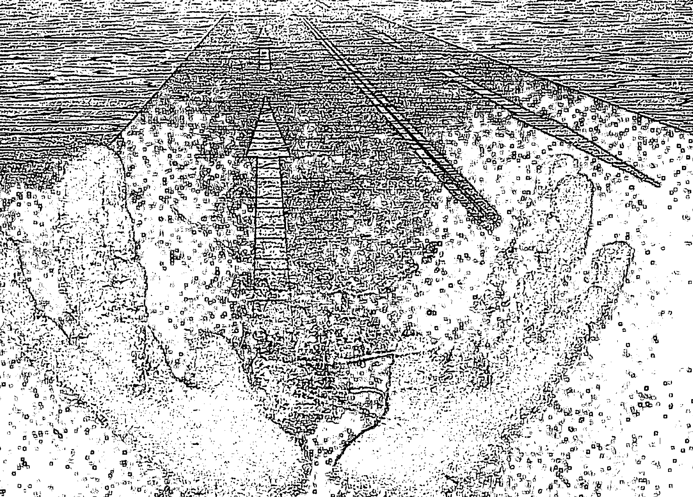
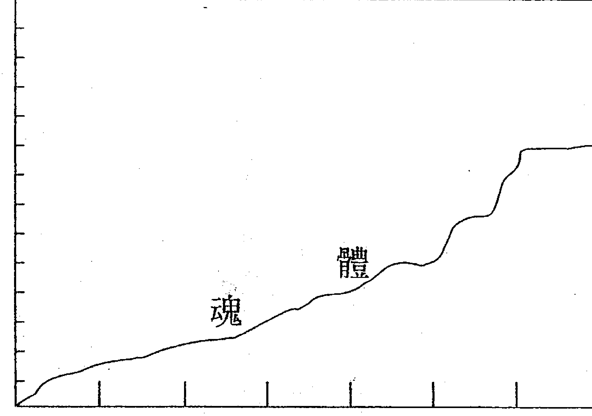
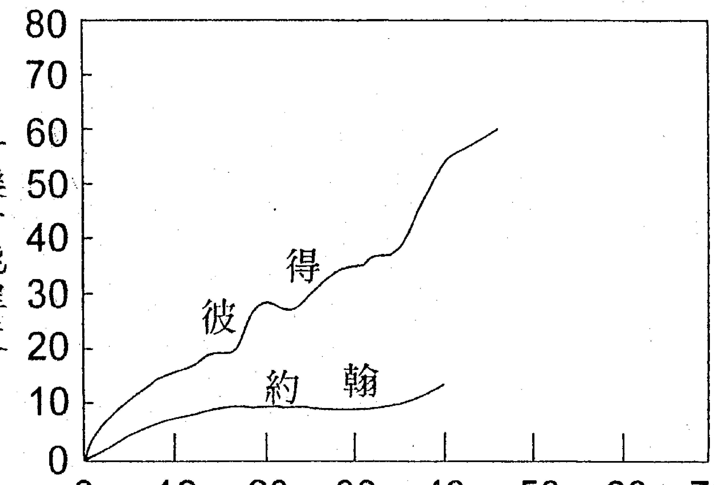

启蒙版

# 灵魂永生的奥秘
by Gina Cerminara
Many Mansions
The Edgar Cayce Story on Reincarnation

## New Age启蒙之父
艾德格·凯西
的神奇事迹

《教育心理学博士》吉娜·舍明那拉／著 陈家鸾／译

埃及大祭司转生的凯西，不仅利用他在催眠时的灵视能力为人治病，更探索了人们的前世今生找出造成今世困苦的原因所在。本书的多起实例，将带你领略生命的法则与轮回转生的奥妙。

心理教育 心理学博士 吉娜·舍明拉拉/著 陈家驹/译

## 轮回转生 的奥秘

## Many Mansions: The Edgar Cayce Story on Reincarnation

New Age 成家之父
艾德格·凯西
的神奇一生

## 译序

陈家猷 一九九七、十一

许多年前，在美国中部偏东的肯塔基州霍浦京斯维尔市，有一位出生于平凡农家的青年凯西。在他二十一岁那年，他得了一种失声的怪病，从此结束了他的保险推销员生涯，也断了他想成为基督教牧师的美梦。然而，塞翁失马，焉知非福。在他到处求医的过程中，他发现自己在催眠后可以灵魂出窍，并具有如天眼通般的超视能力，而能诊断出自己失声的病因，从而将之治癒。而且他也以同样的方法为所有患有疑难杂症的病人治病，甚至是指导所有求助者的人生疑难，并告诉人们痛苦疑难的起因是其人前生造作的罪业等等。这下不得了，这不但使周遭的人大为惊异，更吓坏了凯西本人。
凯西只受过初中教育，从来没有接触过医学的他是一个极为虔诚的基督徒，每年都将其《圣经》从头到尾读一遍，时时以耶稣的训诲为念。他在催眠下睡去后，可以异常的超视能力，为人治癒一切奇病怪症，指导人生所有疑难，还教人以“灵魂轮回转生”这大宇宙的神理天法来修身、齐家、敬业，以活出真正的生命之道。他起先怀疑，这是否是魔鬼藉他来作为祟？什么灵魂转生、前世今生？《圣经》里从来没有这样教导人们，这些说法难道不会被人视为惊世骇俗的妖孽吗？

然而，经过一段时间后，凯西逐渐了解并调整了自己的心态。而且事实胜于一切疑惑、诘难，所以他终于慢慢接受了这个他从未希望、想像过的工作、事业以及命运。后来，他透过催眠超视更知晓自己在古埃及时代，曾是个高级祭司，具有庞大的神秘力量，但是他并没有利用来服务社会、造福人群，却用于谋取私人的名利权势，满足私欲，造了许多罪孽。为了补偿前世罪孽，所以这一世他要用特殊的方式来为众生服务。而且为了这一世的使命，他于古埃及那世后曾投生为古波斯的医生，并在战争中受到重伤，他因而开始练习灵魂出窍，之后终获成功，以为这一世灵魂要不断出窍来做准备。
从此，凯西放下一切，全心为这奇怪而有意义的任务奉献自己。所有得到奇怪病症闻风而来的病人，都在凯西的超视诊断下被治癒。他不但治病，更指导婚姻、亲子、职业、才能、饮食、保健、美丑、个性、人格、性无能、精神病、残障、宗教、真理、预言：……等问题，只要有人问，他就一定会答，而且都能使人服气信从。凯西因而出名，在一九三〇～一九五〇年代的美国，他几乎是家喻户晓的人物。因为每天都有从美国及世界各地涌来大批的求救信件（在他晚年平均每天会收到一千五百件），所以凯西不得不拼命地全力以赴。灵魂出窍是非常耗精力的事，但凯西在其慈悲心及世人迫切的求救下，只能不停地工作，以致他终在一九四五年六十七岁之龄时辞世。他为了奉献此生、服务众生、造福人群的使命而身心耗竭！真可谓是求仁得仁了。

凯西虽令人无限感恩怀思地走了，但他却留下三万多个详细的个案记录，在五十多年后的今天，他的后人仍在清理、挖宝。介绍他事迹的书非常多，其中最好的一本应数译者所译这本，由心理学家吉娜·舍明那拉博士，花了多年功夫，埋首于成堆原始资料中做出科学分析、研究后，将凯西其人其事及其重大意义做有系统、深入浅出的叙述铺陈。其探讨的重点则在以灵魂之轮回转生为原则，引出生命持续、业力运作、业障报偿、因果报应等大宇宙的普遍性神理天法。全书穿插许多惊世骇俗却精彩动人的真人真事，而从中归纳、凝聚出的真知灼见，更是字字珠玑、句句金言，令人在震惊、戒惧之余，不得不好好深思反省。

灵魂之轮回转生，自从一千多年前，随着佛教传入中国以来，早已深入中国民间，然而还是有不少人认为这是迷信。而相信它的人，包括佛教人士在内，可能都对轮回转生这件事并没有很系统、周延的认识、了解，其中尤不乏以讹传讹的误传。我请大家来看这本由心理学家以严谨的科学态度，从成千上万的实际例证中写出来的凯西故事，以重新正确认识、了解灵魂转生这一事实，更盼望读者在阅读后，敬请检讨一下自己的性格、个性、才能、业缘。你活着是为了什么？生命意义与人生目的又是什么？

这本原著是多年前译者自美国带回的，每隔一段时间就会翻看一遍，愈看愈爱，乃于廿年前动手中翻译，期待能将之分享给国内读者，可惜当时因为智慧财产权的问题而束之高阁。近年国内正热衷探讨前世今生、生命轮回等议题，因而越觉本书可贵，乃再探翻译版权问题，

竟迎刃而解，终能出版，以飨国内读者。
本书译文，凡是括弧内的文字，除个别说明是原作者之注解外，全是译者为助读者了解而查得到的资料或意见，另外，每章结尾之译注也是译者长年研习神理天法、人生哲理所得的有关书中的重要论点，恐我国人不熟悉，所以特别额外提出来印证凯西所说，以供读者参考。这些译者所述的部分文字，其文责自然由译者负全责。另外，为助阅读便利，思绪清晰，覆查方便，译者将原书各章内容，分明段落，加以标题，并且把自认的金言佳句，以粗体字表现。这些，若有不当，也是译者的责任，亦望读者不吝指教。

## # 推荐
侯德健
一九九八年一月十五日

我看过不少有关“灵魂”、“轮回”、“宗教”、“前世今生”……等著作，其中有不少好书，却唯独陈加油（本书译注者陈家猷之外号）老师译注的这本《灵魂转生的奥秘》花了我最多时间，因为我看得很慢。
我不是个习惯看慢书的人，尽管有些中国古书，如《老子》、《庄子》、《易经》……等先秦著作，由于年代久远，言语古朴，内容精简，让我不由得不边看边想外，一般的书，如果不是因为太厚，平均只需要一、两天的时间就能读完。当然，若是还不错的书，我大都舍不得狼吞虎咽，唯有陈老师的这本书，花了我将近两个星期才看完一遍，而且每天都至少要看上几小时。

我之所以看得慢，不是因为陈老师嘱咐我要写序，而是因为这本书的内容实在是太丰富、太精、太纯、太浓了。就像是一桌的满汉全席，每一道菜都是精品，让我不得不仔细品尝，等尝出了滋味后，又舍不得浪费，而会一口气把它吃完。之后则会一面消化、一面回味，不敢立刻翻到下一章、下一篇。烧壶水、泡壶好茶、点一斗好烟草，让刚才看到的精彩片断，尽情地在脑海里沉潜，随着思潮起伏，与自己的童年往事一起漫游。单是这样，还觉不够。

第二天，又继续心不甘、情不愿地接着往下看，怕时间拖太长，陈老师来不及出书。
要为这本书写序，是再简单不过的事，任何一篇、一章，都能引申发挥出洋洋洒洒的一篇大论文，但也正因为如此，所以想把书中的内容浓缩成一篇索引、导读，就几乎是不可能的事。因为，它原本就已太浓，只差一阵风就全部结晶了。因此，我只好把我的吃相介绍一番，至于满汉全席上每道菜的内容，就只好麻烦各位读者自己慢慢享用了。千万别狼吞虎咽，看得太快，否则你会后悔的。
恭喜你，得到了一本好书。

## 目录

译序

推荐

- 第一章 一个古老的问题——人生是为了什么？ ... 11
- 第二章 艾德格·凯西的超视能医术 ... 25
- 第三章 生命之谜的答案 ... 40
- 第四章 肉体业障 ... 68
- 第五章 嘲弄的业障 ... 88
- 第六章 信耶稣就能得救吗？ ... 94
- 第七章 悬疑中的业障 ... 103
- 第八章 业障与健康的问题 ... 112
- 第九章 心理学的新境界 ... 128
- 第十章 人的类型 ... 142
- 第十一章 业报的范例 ... 153

## 第十二章 精神失常的起因

## 第十三章 婚姻与女人的命运

## 第十四章 寂寞的人

## 第十五章 婚姻的问题

## 第十六章 不忠与离婚

## 第十七章 父母与孩子

## 第十八章 家庭的业障纠结

## 第十九章 职业能力的往世根因

## 第二十章 职业选择的原则

## 第二十一章 才能的问题

## 第二十二章 人格动力

## 第二十三章 业由心造

## 第二十四章 生命之道

## 第二十五章 结论

## 跋

## 第一章 一个古老的问题——人生是为了什么？

“人，出生，受苦，然后死亡。”一位智者，安纳托尔·法朗士（Anatole France，西元一八四四～一九二四年，法国作家，曾获一九二一年诺贝尔文学奖）在一个故事中曾以这九个字，浓缩了全部的人生。

另有一个更古老、意义更深远、关于人类受苦受难的故事，那就是年轻的释迦王子——后来被称为佛陀或觉者的传奇。释迦的父亲是一国的统治者，他小心庇护他的孩子，不让他知道世上邪恶的事。因此，王子从小到大，都是在闭锁但愉快的环境中成长，而且还娶了一位美丽的公主为妻，却从未出过宫廷一步。年轻的释迦王子，虽与妻子过着幸福快乐的生活，却也好奇外面的世界。一直到他们生了第一个孩子后，他才设法躲过宫廷卫士，踏出宫廷，一窥丰富多样的城镇。

在这次改变他命运的出游中，他看到三件令他铭刻于心的事：一位老人、一位病患、一名死者。震惊之余，本就多愁善感的年轻王子于是问他的随从，这些可怕的痛苦、烦恼是怎么回事？当随从告诉他，衰老、生病、死亡是很平常的事，每一个人的命运都是如此时，王子的内心激动不已，他感到自己再不能回去过轻松惬意的生活了，他要弃绝一切世俗所有，去追寻能令人从痛苦中解脱出来的智慧。经过多年的努力，他终于悟道，悟于内在的自我，然后，他便出来教导众生这解脱之道。

并不是每个人都能像佛陀一样，弃绝爱情、权力、财富、安逸及家庭的温暖，去追寻一个抽象而不可捉摸的“人生意义”。然而，每个人最终却势必都会关切到相同的问题：

### 人为什么受苦？

### 人又如何能从痛苦中获得解脱？

有乌托邦理想的小说家们早已想像到，在未来的时代中，人们或许能完全消除震惊佛陀的二项痛苦根源——年老与疾病，但却不能把人类的终极敌人——死亡，也给消除掉，即使现代科技再进步也没有办法。就算有一个健全的世界机构，有充足的财源，能带给世上每个人安全保障、健康、安宁、美貌、青春，但我们的幸福与平安仍将面临许多的不安、危险与

威胁。外来的威胁包括有火灾、洪水、瘟疫、地震、疾病、战争、灾难及死亡。而于人的内在、心灵中，也有许多的不完美与弱点，如自私、愚笨、羡慕、邪恶与贪婪等，这些都是人们的痛苦根源。

#### ☆人生七问

沉醉于动人音乐或美丽日出之余，我们或许会觉得，在天地的心灵深处一定有喜乐，一定存有一个深切的意义。然而，当面对人生的苦涩、残酷，以及使人心碎、挫败的现实时，如果我们还有一点感知力、一点怜悯心、一点好奇与疑惑，我们就不能不问下面这些问题：

- 我到底是谁？
- 我为什么在这里？
- 我要到哪里去？
- 我为什么在世上受苦？
- 我与其他人的真实关系为何？他人与我的真实关系又为何？
- 我们与那巨大而相互运作、影响的众多力量的共同关系是什么？
- 与那既超越我们又在我们周遭的、至高无上的力量之共同关系又是什么？

#### ★ 苦难与信仰

这些是人类最基本、最古老的问题，若没能找出答案，则所有减除痛苦的一时权宜之计，无论是生理或心理的办法，最后都将显得没有意义。除非把痛苦的种种解释清楚，否则，再多的言辞也无济于事，人生的意义终究晦而不明。即便是最原始的人类，也曾问过这些问题，他们仰望昊天，感到人在地上的奋斗与忧伤不是那么的卑微无益，天人之间有着既大且久的关联，人生必有其重大意义存在。或许在林野感知精灵鬼怪的存在之余，人会说，所有的生物包括人在内都有灵魂，而人的灵魂在地上之余，人觉得在天地之间，一定有个更超然的是非观，而且也有专门针对对错所给予的善报与恶报。

像这样的人生信念与注解总有成百上千，精粗不一，其中合理处也所在多有。由于相信自己的人生信念是对的，所以人能勇于面对苦难，度其一生。有些人因信仰佛陀、或摩西、或耶稣、或克里希那（Krishna，印度教的主神之一），而持执另一个信念；也有千千万万的人认为，除了活下去，人生何须什么解释，还

有些人，甚至从不好奇疑问，宁可享受片刻的安闲、逸趣。

我们这些在基督教传统中长大人（指作者等西方人），也有对人生及苦难的解释：人都有灵魂，且灵魂是不灭的；苦难是上帝（译注一）给我们的试炼，依我们对此生之挑战的应对表现，死后，或酬我们升天堂，或罚我们入地狱。我们这些相信此种解说的人，之所以相信，并非因为有任何证明，而是因为父母或教士长者，以权威的姿态这样教导我们，而他们，同样的，也是被他们的父母或教士长者，以权威的姿态所教导出来的。追本溯源上去，最后就可以追到一本最权威的书——《圣经》，以及一个最权威的人——耶稣。

#### ★信仰权威与科学

绝大多数的人都会同意，《圣经》是一本很了不起的书。耶稣，无论他是普通人还是神的儿子，都是个很不寻常的人。但是，自从文艺复兴时期（约在西元一三五〇年始于欧洲的意大利，而约于一五〇〇年达到颠峰）以来，西方人就开始怀疑起那些不能以科学验证（尽管它是书或是人），而只是以权威的力量代代相传的信仰。西元二世纪的天文物理学者托勒密（Ptolemy）说太阳绕地球而转，教会接受此一说法并宣告、教导此说。但十六世纪的哥白尼（Copernicus）以其发明的器具证实，其实是地球绕着太阳回转。亚里斯多德（Aristotle，西元前二八四～三二二年，为希腊的科学家、哲学家，其心理学与科学多为教会所认同、接受）

曾记述到：不同重量的一种物品，从高处丢落时，较重的物体会先着地。但伽利略（Galileo，西元一五六四～一六四二，意大利物理学家、天文学家）在意大利的比萨斜塔顶上所作的实验却显示：将体积相近、重量不同的一个物品往下丢，则二者会同时落地。《圣经》中有多险家们，都纷纷从西航行抵达东方，因而推翻了这种说法。从这些以及其他成百上千的实例中，人们逐渐看到，古代的权威是有可能会出错的，因而产生出科学的态度，也有了心智上的怀疑。一个接一个的新发现，紊乱了人们原先相信、设想的秩序。幽灵鬼怪呢？没人见过。灵魂呢？没人能查知，它是如笛卡儿（Decartes，西元一五九六～一六五○，法国哲学家、数学家）所坚称的灵魂潜隐于原生质（Protoplasm），也就是松于松果体（Pineal gland）上的吗？永生呢？谁曾经于死后回来告诉过我们何谓永生？天堂？从我们的望远镜中并无法看到天堂存在的证据。神或上帝呢（译注二）？这是一个大假设——反映出我们的心智需要一个父亲形象的替代者。宇宙是个大机器，人则是个小机器，是由原子排列及进化过程中意外产生出来的。苦难，则是人奋力求生存时所不可避免的命运。除此之外，没有意义、没有目的。死亡，是化学元素的分解，什么也不会留下。

#### ☆☆科学建基于五官感知力

出于伟人、伟大导师及伟大经典的权威，已经取代了我们五官的权威。显微镜、望远镜、光及雷达等科学工具扩大了我们的感官；科学以推理、数学与不断的试验将我们五官所观察的资料予以系统化。但基本上，科学与理性的所见所证，实即我们五官的见证。

科学其实仍奠基于人的视觉、听觉、嗅觉、味觉及触觉之上。在过去的数十年里，我们固然日趋成熟成长，却也变得愈来愈怀疑我们所知的，怀疑我们自以为懂的。

我们以头脑与自以为傲的感官合力所创造的器具，却反过来对我们造成讽刺，因为这些器具实在不够完善，使我们无法认识世界的真实状况。举例言之，收音机电波及其波动，还有原子能，都毫无疑问地显示：我们被众多的波动及能量的律动所包围，而最小的物质粒子所涵藏的力量之大，更不是我们所能想像的。

谦卑点说，我们透过眼耳所看听的世界，以及透过我们身体细胞的极微小孔来看到的世界，实在没有太大的差别。我们对光的感知力，只能让我们感知众多光波振动中极少的一部分。我们对声音的感知力，也只能让我们感知众多声波的极小部分。只要一吹狗哨，狗就来了，但我们却听不见，因为其声波频率已经超出我们耳朵感知力的限度。还有很多其他动物、鸟类、昆虫的听觉、视觉或嗅觉的能力不同于我们人类，因此在牠们的天地中，有一大块范围是我们所不能、也无法察知的。
一个懂得思考的人，便会对人类的这种奇怪光景开始产生疑惑——于真相的察知上，动物、鸟类、昆虫及人类聪慧的发明都胜过了人类，人类因而开始沉思，自己是否能看见这些不可见的东西。譬如，假设我们能设法训练、增进我们感官对光与声音的感知力，则当此感知力稍稍增强时，我们是不是可以意识到、感知到许多以前不能意识到、感知到的东西？又如果，我们一些人，生来就有较强的感知力，那他们是不是自然可以看到、听到我们所不能看到、听到的？他们是不是有一个像是内在的收音装置而能听到所有声音？或是有一个像是内在的电视萤幕而能看到所有东西？

#### ★史威登堡的超感官觉知力

二十世纪的科技揭露了物体与能量本身内部庞大、难以置信而不可见的世界，这使我们不得不想到一些可能性。在追溯人类长远的历史时我们发现，像这种增强的感知力在史书上早有很多记载。十八世纪的伟大数学家与科学家史威登堡（Swedenborg）就具有一种超乎寻常的感知力。他似电视般的感知力早为人知，并被当时许多杰出人士，包括哲学家康德（Immanuel Kant，西元一七二四～一八○四，德国哲学家）所证实。在某天晚上的六点钟，史威登堡与朋友在哥特堡（Gothenburg，瑞典主要海港及第二大城）晚餐时，突然有此激动地说，在他的家乡斯德哥尔摩（Stockholm，瑞典首都及第一大城）市正起了大火，而斯城位于此地三百英里外。稍后他又说，火已烧掉他一个邻居的家，就快要烧到他家了。当晚八点时，他松了一口气说，火烧到离他家二三家门户时就被扑灭了。

二天后，该火灾的报道证实了史威登堡的话，而起火的时间点就在他初感知的那时。

史威登堡的例子，仅只是许多类似记载有案中的其中之一。有些人如马克吐温（Mark Twain，一八三五～一九一〇，美国幽默小说家）、亚伯拉罕·林肯、圣桑（Saint-Saens，西元一八三五～一九二一，法国作曲家），在他们的传记或自述中，均载述有突然见到远方正在发生的事情，或日后发生的事情等，连其中细节也都清清楚楚。在史威登堡的案例中，他的超视能力后来益发增强。然而大部分其他个案的强化感知力，似乎都只在危机时出现。

西方人对这种事情常以怀疑的眼光视之。无论它们多有实据，无论它们如何被尊敬而聪慧之士所证实，无论它们发生过几次，我们总会皱眉、耸肩地排拒，只消一句“巧合”或“有意思”就把它们打发掉了。

现在，我们实在不能再轻忽、排拒它们了。有智慧的人，必敏于未明事件可能隐含的重大科学潮流与我们时代的必然走向，人的奇妙潜能这一题目，可说是极重要，且令人興味盎然的。

在許多深具遠見，且認為超感官現象值得在實驗室作有系統的調查，並將之付諸實行的科學家中，有一位杜克大學（University of Duke）的萊茵博士（Dr. J.B. Rhine）。他從一九三○年起，便已與他的同事，就人的超視（Clairvoyance，有譯為千里眼、天眼通）與心靈感應（Telepathy，有譯為傳心術、他心通）的能力在作廣泛的研究。在以嚴謹的科學方法作嚴密控制的連續試驗下，萊茵博士發現：在實驗室中，很多人都顯示出超感官的感知能力。拿統計學的技巧來評估這些試驗後發現，其所獲得的結果不可能都歸因於湊巧（關於萊茵博士的方法與結果，請參閱他的書《The Reach Of The Mind》，一九四七年出版）。其他的科學調查者，如法國的華哥里爾（Warcollier）、蘇俄的科梯克（Kotik）、德國的提屈勒（Ticher），也在經過實驗後，獲得了與萊茵相同的結論。西方人對人的心智中存有超視與心靈感應能力的懷疑，正被日益增多的科學證據所逐漸消融。

也許，這可以從三方面來論證人類感官的感知力何以能擴增。從推理言，此種擴增的可能性自然是合理可信的；從歷史發展來說，已經有許多真實可信的趣聞軼事記載過這些事件；從科學的角度而言，愈來愈多的實驗報告證實，人能超越正常的五官範圍而去感知事物。

然而，迄今實驗室只能把超視力建立為感知力的一種可能模式而已。雖然它的潛力龐大，但其實用性尚未被觸及。如果人不靠眼睛、耳朵而能有視聽；如果人在某些狀況條件下，不用肉眼就能看到東西，那麽人就擁有一個全新且重要的工具，並藉此以獲得有關自己及周遭、宇宙的知識。

在過去千百年來，人類已有很多偉大的成就。人的力量與智巧征服了太空，役物質為己用。然而，不管人類多有力量、多聰明，我們仍是脆弱的。不管人征服了什麼，他總會發現自己的無能與困惑；不管人創造多少藝術、文明、文化，他仍搞不清楚他身邊所親近之人從生到死的苦難之意義與目的。

近年，人類致力於鑽研原子的內部。或許，我們能以新發現的超感官感知能力，以及新認識到的意識與潛意識間的奇妙關聯，來穿透、洞察自己的內裡。或許，經歷千百年的暗中摸索後，人類對生存之謎：

### 人生自何處？

### 人生的苦難是為了什麼？

最後，終能找出合於科學的滿意答案。

### 譯註一：

在本書中一再出現的上帝或神（GOD），有著重要的地位。在基督教信仰（包括其所有門派）的國族中，尤其是白種人，在日常中提到GOD，已成其文化特色。回教則稱阿拉（ALLAH）為神。中國人常提到的則是非人格化的天，其實質意義與GOD相近。中國古籍《尚書》中早有人格化的上帝一詞。GOD在天主教中譯為上主，在中國亦有神這個詞彙，有「不可知之神」、「至誠如神」。為了簡便，本書GOD均中譯為神。但這神不可與中國民間所崇拜、信仰的「神明」混淆。大抵而言，GOD乃是指大宇宙中那大秩序、或大意識、大意志、造物主、創造宇宙萬物的主宰、大宇宙冥冥中的偉大力量、一切生命的總根源、萬物的總根頭，還有中國人說的「天生我材」及「敬天畏神」中的天、神。祂可以人格化，也可以非人格化而代表大宇宙中的最大能量、力量、生命能。本書主角凱西則常以創造大能來稱呼神。再者，上述意義的神，不應與佛家所說的佛混淆。佛（BUDDHA）原是覺者的意思。覺者是自覺、覺他、覺行圓滿，達到這種覺悟圓滿境地的人就稱佛，尚未達到的人則是菩薩、是羅漢、是眾生。所以，佛是覺者，但不是創造萬物的神。人是神造的最高級生命體，是神子，均具有佛心，有成佛的潛能，成了佛乃能與神合一，即我國道統所說的與宇宙天地為一，

也就是我心即宇宙，宇宙即我心。

又，神或上主、天主、阿拉、上帝，並不盡然屬於各宗教。不管有沒有宗教，不管人信什麼教，大宇宙中有大秩序、大意識、大生命能根源、冥冥大力量，或說有神、有上帝、有天等，都是一個客觀存在的事實。

相不相信神或上帝的存在，一直是人們爭論不休的問題，這在科學家中尤為如此。容譯者在此摘述一九九七年三月三十一日發行的《新聞週刊》（NEWSWEEK）中一篇〈神聽不聽人的禱告？〉專文中一則有趣的故事，以饗讀者諸君。

近代美國聲名甚著的天文學家及作家卡爾·塞根（CARL SAGAN），是個有名的無神論者。在他逝世前十年，他廣泛地找宗教領袖們進行對話，爭論神存不存在的相關問題，好似他存心想叫傳道人都失業般。對於神是否存在，他總是說：「拿證據來！」對受過教育的人，在處處能看到科學實證的情形下，居然還執著於死了近二千年根本無可證實的人們所傳下的信仰，塞根對此大惑不解。有次他問美國全國教會聯合會的秘書長瓊安·坎伯爾牧師說：「妳這樣聰明的人，怎麼會相信神？」這位女牧師覺得，這位天文學家既然能全然相信從沒人見過的黑洞，又怎麼會問這樣的問題？於是便回答他說：「像你這樣聰明的人，怎麼會不相信神？「他總是堅持凡事要有具體證據。於是坎伯爾牧師又問他：「你相信愛嗎？」起先他說：「哦，當然了。」因為他非常愛他太太。於是她又問：「你能證明愛的存在嗎？」但最後，他卻同意「愛像信仰，其本質是無法被證明的，但這並不意味它不存在。」他還特別反對祈願式的禱告，他說：「難道神還要人提醒有某人生病了嗎？ 一九九五年的冬天，塞根被診斷出患有與白血症相關的脊髓障礙疾病，他的朋友摩頓牧師及許多友人立刻開始為他禱告。不久他作了三次的骨髓移植。到次年一九九六年的夏天，他看似逐漸在康復中。秋天，他與坎伯爾牧師一起晚餐時她說：「我想你會沒事的。」他笑說：「我正禱告著我會沒事。」然而，由於輻射治療的副作用，引發了肺炎，於是朋友們更為他努力禱告，但是他卻從未改變他抗拒神的態度。終於，他在一九九六年，以六十二歲的盛年，留下妻子、五個子女，以及許多他深愛卻未完成的工作，撒手人寰。他太太後來說，他不像許多人願在逝世前皈依，一直到臨終，他都不改其志，抗拒相信神，並仍在等待神存在的證明。

## 第二章 艾德格·凱西的超視能醫術

去察究種種超視（Clairvoyance）能力，實在是一件令我興奮的事。尤其居然有人，不僅有這種天賦，還能將之用於實際，以及有意義的學術研究上。此人就是艾德格·凱西（Edgar Cayce）。

凱西（Cayce 其英語正確發音是 Kay-see）在晚年時，被稱為「維吉尼亞海濱（Virginia Beach）製造奇蹟的人」。這一頭銜容易讓人誤解。雖然成千上萬的人因著他的協助而神奇地病癒，但他本人其實並未創造實際的奇蹟。既未將手放在病人身上，也沒有展現出魔術，更沒有人因為親一下他的衣服就能甩掉拐杖。艾德格·凱西的奇蹟，其實是他能以超視診斷遠在千里之外的病人，而且準確度極高。更有甚者，他的超視是在催眠下所引致的——這特別能引起那些心理治療師的興趣，因為他們愈來愈常用催眠術來作為治療法，或用以調查失去意識之人的身分背景。

- ★ 智齒壓迫神經導致神智不清

### 早產兒抽筋

(Selma) 城的年輕女孩，她不知什麼原因瘋了，因而被送到精神病院去。她的兄弟非常關切她，所以以前來請求凱西幫忙。只見凱西躺睡在床上，作了幾次深呼吸後就睡去了。之後，有人給了他簡短的催眠暗示，要他看這女孩的身體。停頓片刻後，凱西開始說話了，一如所有被催眠者在受到指令後所做的。然而，與多數受催眠者不同的是，他好似具有如X光的透視力，開始描述這瘋了的女孩的生理狀況。他說她的一顆智齒因撞擊而侵壓腦中的一根神經，只要拔除這顆智齒，就可以解除壓力，使女孩恢復正常。檢查的結果，果然在女孩口中發現被撞擊的部位，經適當的牙科手術後，她的神智完全恢復了正常。

另一個例子，是一位肯塔基（Kentucky）的年輕婦人，她生了一個早產的孩子。這孩子從生下來就一直生病，到四個月大時，還不時抽筋，三位主治醫師以及這孩子的父親，每天都懷疑這孩子是否能活下來。這位媽媽在絕望下，前來請求凱西診斷。在催眠下，凱西開了一劑顛茄毒草藥（Bellabonna），又開了一付解藥，以供必要時使用。不顧嚇壞了的醫生的激烈反對，這位媽媽堅持自己餵孩子吃下毒藥，而抽筋幾乎立刻就停止了；接著再讓孩子吃下解藥並讓孩子俯臥著，孩子很快就放鬆下來安靜入睡，因而撿回了一命。

這些案例，以及許多類同者，都不屬於心理學上所謂的「信心治療」。像前述能夠立刻痊癒的例子並不多見，但通常凱西所給予的處方都很具體，有時治療方法還包括有藥劑、手術、限定飲食、維他命、水療法、骨療法、電療、按摩或自我暗示等。再者，這些案例也絕非輕佻人士的虛構捏造，或肆意誇張的產物。事實上，凱西所有二萬多個檔案都有詳盡的記錄，並且妥為保存在維吉尼亞海濱。任何人都可以檢視這些記錄，這些記錄包括有來自世界各地的苦難者的詢問函、求助信、感謝函等；來自醫生的信函、記錄及宣誓書（Affidavits）；凱西在催眠狀況下所說的每句話而由速寫員記下的謄本。所有這些都是強有力的證明文件，都可以證實所述各事各案的正常性。

### ☆ 凱西的身世

艾德格·凱西於一八七七年生於肯塔基（Kentucky）州靠近霍浦斯京維爾（Hopkinsville）的農家，他的雙親未曾受過教育，他自己則進入鄉村學校讀到九年級（即約初中三年級）。雖然在年輕時他想成為一名（基督教）宣教士，可是他卻從未能有進修的機會。凱西年輕時對農家生活毫無興趣，所以他就搬到城裡。他先在一間書店中工作，後來則成為保險推銷員。

### ★ 失聲

當凱西二十一歲時，他的命運有了奇怪的轉變。他因染患喉頭炎而致失聲，所有的醫藥都罔效，沒有一個醫生能幫得上忙，所以他無法再做推銷工作。凱西住在父母家中，面對無法醫治的毛病，他消極懶散，垂頭喪氣近一年之久。

### ★ 催眠

最後，他決定從事照相工作，因為這工作不太需要說話。當他在做一位照相師的學徒時，有一天城裡來了一個叫哈特 (Hart) 的巡遊藝人兼催眠師，晚上要在霍浦斯京維爾歌劇院 (Hopskinville Opera House) 表演。哈特得悉凱西的狀況後，乃提議用催眠來為他治療看看。凱西很高興地答應一試，結果，在催眠的暗示下，凱西能以正常的聲音交談，但一醒來，他又不能說話了。於是催眠師又在催眠的狀態中暗示他，在醒來後，他能正常地說話。這種叫催眠後暗示的方式通常有效，曾幫助很多人克服抽煙過度及其他習慣，但對凱西卻沒效。

哈特因為在其他城市有表演，因此沒法繼續試驗。但當地一個叫賴恩 (Layne) 的人則很有興趣追蹤此一案例。他當時正在研究治療法與骨療法，且有些催眠能力。賴恩問凱西，是否可以其技術試試他那仍反常的喉嚨，凱西自是樂意接受任何可能幫助他回復聲音的嘗試。

賴恩的想法是，暗示催眠中的凱西，讓他自己來描述病況。奇怪的是，凱西針對這種暗示居然作出了積極的回應。他用很正常的聲音開始描述自己聲帶的狀況。他說：「是呀，我（這裡，以及後來，他總是用我們的口氣）可以看到這人的軀體了。……在正常狀況下，這人無法說話，因為他聲帶下部的肌肉癱瘓了，這是因其緊張，神經被拉緊而造成的。之所以如此，是因心理狀況造成的生理結果。這，可以在無意識（即催眠中）狀態下，指示患病部位增加血液循環來解決。」

### ☆ 消除失聲

賴恩於是立刻暗示凱西的患病部位增強血液循環，以減輕他的病況。慢慢的，先是凱西的胸部上方，然後是喉部，開始轉淡紅，接著變深紅。約過二十分鐘後，睡著的凱西，清了他的喉嚨說：「現在全好了，病況消失了，暗示血液循環恢復正常，然後讓身體醒來。」隨後的幾個月裡，他偶會舊病復發，但每在賴恩作同樣血液循環的暗示後，病況就消除了。

### ☆ 弦外之音

事件到此，對凱西而言是結束了，但是，賴恩卻機敏地感到其中尚有弦外之音。他對催眠的歷史頗為熟悉，曉得梅斯美爾（Franz Anton Mesmer，西元一七三四～一八一五，奥地利醫生，為催眠術前驅，其名字成為催眠的同義字）的繼承人，法國的迪·蒲西格（Da... ...yseque，譯者查不到其資料），其早期經驗中有幾個類同的例子。他想到，如果凱西在催眠狀態下能檢視、診斷自己的身體，那他應該也能檢視、診斷別人。於是他們二人就以賴恩來做試驗。賴恩患有胃病已有一段時間了。這次的實驗很成功，在催眠下，凱西描述賴恩身體的內在狀況，並建議幾種療法。賴恩聽後非常高興，因其描述完全就如他自己知道的症狀一樣，好幾個醫生也曾如此診斷，但凱西建議的治療，包括藥物、飲食及運動，則是過去從沒人推薦過的。他試了這些建議的治療三週後，病況便有了顯著的改進。

凱西對這件事很困惑猶疑，但是賴恩卻很興奮，他急切地想知道他們是否能幫助其他受病痛所苦的人。凱西從十歲起，每年都會把基督教的《聖經》從頭到尾讀一遍，他渴望像過去基督的門徒般，能作一個服務眾人並以信仰治病的人。後來他希望作個傳教士，但環境沒允許他實現這雄心。現在，很奇妙地，一個能為人治病的機會擺在他面前，然而，他卻害怕而不敢接受。如果他在睡著時說了什麼，結果是有害、甚至是致命的，那該怎麼辦？但賴恩卻很有把握地認為這沒有危險，他自己對各種療法知之甚詳，是能否決排拒任何不安全的建議與推薦的。凱西因而從《聖經》中去尋求指引。最後，他同意用如此非正統的方式去幫助需要幫助的人，但他堅持這只能當作一個實驗，也絕不收取任何金錢。

### ☆催眠報告

賴恩開始把凱西在催眠中所說的以速記記下，並稱這些速記騰本為「催眠報告」(Readings)。這個名詞雖不精準，但似乎也找不出更適合的詞彙了。

凱西在他照相館休息的時間，為他的同鄉作診斷服務，令人驚訝的是，在診斷中，他所用的解剖學及生理學的專用詞語都非常正確，而在清醒時，他則對醫學一竅不通，也從沒讀過一本醫書。對凱西本人而言，最最驚奇的還是人們只要照他所教的去做，就能確實得到幫助。起先，賴恩的案例會讓他懷疑，他懷疑或許這只是賴恩的想像，並讓他自已相信、覺得好了。凱西回復自己的聲音，當然不是靠想像，但或許是一次幸運的意外，也只有他具有這復原的天賦。在催眠報告的初期數年中，這些疑惑一直糾纏著他，直到許多被稱為不可治療的病都被治好之後，這些疑惑才逐漸從他心中散去。

### ☆醫治痙攣症

凱西非凡的異能奇事，逐漸傳了開來。有一天，凱西接到一通長途電話，是霍浦斯京維爾公立學校卸任校長打來的，他五歲大的女兒已經病了三年。一歲時，她曾患過一次流行性感冒，此後她的神智就沒正常過。父母帶她看了很多專家，但一點用也沒有。近來，她發生痙攣，且日益頻繁，最後看的一位專家說，她得了一種罕見且會致死的腦部疾病。父母傷心之餘，把她帶回家等死。這時，他們從朋友處聽到了艾德格・凱西有異能治病的事。

凱西聽了這事後很感傷，同意特別出城去為她作一個催眠報告，但因為經濟狀況不好，所以他必須接受女孩的父親送他的火車票，這是他第一次因助人而接受有價物品。

懷著憂心，他出發了。在他看到失常的孩子後，他仍然為深沉的疑慮所籠罩。一個未受過教育、一點都不懂醫術的農夫之子，卻要去幫助一個連國內最好的專業醫生都束手無策的孩子。在驚恐慌張下，他在這家人客廳的長沙發上躺下，讓自己睡去。但是，一進到催眠狀態後，他所有的疑惑都一掃而空。賴恩也在場，他負責給予暗示，並如常地記下凱西的話。

如同以前所有的催眠報告，這位睡著的照相師，以鎮定、流利且肯定的口吻，描述這孩子的狀況。他說，這孩子在染上流行性感冒前，曾從搖籃上摔下來，流行性感冒病菌就此入侵那摔到的部位，因此導致了痙攣。只要進行適當的骨療、調整校正，就可以消除壓力，回復正常。

她的母親證實，這孩子確曾從搖籃上摔下來過，但因為沒有明顯摔傷，所以從沒想到這與孩子的失常會有關聯。

賴恩照著催眠報告，告訴他們校正方法，三個禮拜後，孩子就不再痙攣，而且神智也完全清醒了。她能叫出病前最心愛的洋娃娃的名字，數年來她也第一次開口叫爸爸、媽媽。三個月後，父母回報說，女孩在各方面都回復正常了，而且正快速地追補上前三年中所失去的。

諸如此類的實例，一再增強凱西的信心，他相信自己用奇特、難以思議的能力去幫助人是沒有錯的。他的名聲遠揚，直到某間報社發現了他，並予以報導。他開始從許多陷入絕望的人那裡收到了求救的電話及電報。到這時，他才了解，只要知道當事人的姓名、地點包括州名、城鎮名及街道號碼，他就可以在遠距離外作催眠診斷。對這種遠距的催眠報告，他通常都會以當事人當時所處環境之有關的開話作為開場白，如：「這裡早上風真大啊！」「瑞士的溫特赫好美！那裡的溪流真美！」「對，我們看到這母親正在禱告。」「這睡衣可真是好看！」「這人現在坐電梯下去了。」這些描述每次都很正確，也證明了他的確有超視能力。

### ☆☆ 催眠方式

其後的過程，無論他是為遠處抑或近處的人作報告，總是差不多。他只須脫掉鞋子，鬆開領口與領帶，躺在床上或長沙發上，然後完全鬆弛下來即可。他發現頭朝南腳朝北比較好。

除了長沙發及一個枕頭外，其他什麼都不要，而且不論是晚上或白天都可以作報告；光線的暗或亮，對過程也沒有影響。躺下來幾分鐘後他就會睡去。然後，賴恩或凱西的太太、或他的兒子休琳（Hugh Lynn），或其他他信得過的人，就會給他適當的暗示。通常暗示會是這樣的：

看一下這人，然後告訴我他現在的狀況以及導致此狀況的原因，也請給出如何可以幫助他的建議，以減除他的病痛。當我提問時，就請你回答。

幾分鐘後，凱西就會開始說話。這時，賴恩或稍後的葛萊蒂絲·戴維斯小姐（Miss Gladys Davis），就會把他的話速記下來。之後，這些速記會被打字出來；一份交給當事人，或他的父母、監護人或醫生；另一份黃色的複本就由凱西永久保存。

### ★淘金者紛紛上門

由於報紙的報導與眾人的相傳，凱西很快就受到淘金者的注意。一個棉花商人願連續二周，每天付一百元，以換取凱西每日就棉花市場所作的催眠報告。那時，凱西很需要錢，但他拒絕了。有人想知道寶藏的所在，有人想知道如何在賽馬中贏錢。有幾次，他被人說服，作了此類的報告，純為實驗目的。有幾次，他成功地預測了賽馬的結果，也有幾次失敗。但每次醒來後，他都感到精疲力竭，並對自己很不滿意。有一次，他被引誘參與了德克薩斯州（Texas）的投機生意，利用他的超視能力來找出油井的位置，其結果也不令人滿意。最後他終於相信，他的異能只能用來幫助病人，而不能用來幫助他人或自己去賺錢謀利。

凱西對出名與宣傳都無動於衷。一九二二年《丹佛郵報》（Denver Post）的總編輯聽說了凱西的事跡，就請他到丹佛市來。在親眼目睹他的工作表現後，這位總編輯作了一個建議。他會每天付凱西一千元，以交換凱西按下劇方式作戲劇化而盛大的表演——他須取一個東方人的姓名，頭戴似回教徒的頭巾，然後藏在一個透明的帷幕後面作催眠報告。凱西直截了當地回絕了。

勃朗士維克廣播公司（Brunswick Radio & Television Corp.）的總經理大衛·康恩（David Kahn），是凱西終生的朋友，他出了很多力，讓凱西的工作廣泛在他的生意圈及友人間流傳，但是當他提議用更盛大的方法為凱西打響知名度時，凱西嚴峻地拒絕了。除了在阿拉巴馬州伯明翰市（Birmingham）的一家報紙上宣布演講外，在凱西一生的事業生涯中，他從未允許有人為他的催眠報告或公開演講作任何廣告。在與不熟識他的人的交談中，除非人家問起，否則他從不談起自己不尋常的異能。大部分同鄉都對他所知不多，只知道他在當地教會的主日學班上教課；他也不參加什麼社交性兄弟會或社區的組織。他只秉持著一個堅定的信念：他只是一個醫治、服務受苦受難的人的工具；永遠不要專注於自己。那些受他幫忙的人，都是透過他人介紹而非新聞的報導來知道他的。

早年，當凱西以照相為業時，他一絲不苟地拒絕了為催眠報告而收錢。後來，由於需要起錢的人，他一概免費，其為數還不少。基本上，他始終不把這事當作生意。在維吉尼亞海## ★ 成就漸顯

濱（在催眠報告的建議下，於一九二七年搬入）所保存的複寫拷貝，是此一事實的最佳見證。 且不論不合文法、標點符號不清，及拼錯字等缺失，這些報告依然充滿了服務助人及教導同胞的熱誠精神。

這許多年來，凱西常感疑惑，他到底在做什麼？有時，在作催眠報告時，睡著的凱西竟沉默不語。顯然他自己的健康與心神狀況影響了他的能力。雖然大體而言，他是個性情溫和的人，但也不是不發脾氣的。經濟狀況常讓他憂慮，這些都會妨害他發揮異能。

最困擾他的有些人憤怒地告訴他，催眠報告並未正確地描述他們的狀況，而在試了處方後，也未得到任何幫助。這時凱西會寫長信給他們，深致歉意，並解釋說他無意裝作絕無謬誤。很多時候，因為他沒有充分了解狀況而影響了報告；有時，他也會像收音機一樣出現接收不良的情形。最後他會說：「我們唯一的目的是助人，如果你沒得到幫助，我會退錢給你。」信中並附還全額的支票。

有時，在數月後，這些人又來告訴凱西，後來的醫療診斷，證實了他原先所說。也有時，凱西發現，那些抱怨治療無效的人，其實是忽略了處方的飲食指示、藥療或身心調整。

凱西知道催眠報告不是毫無瑕疵的。但隨著他愈來愈了解如何使用自己的異能，報告的明晰與正確性也愈加增進。那些神奇有效的治癒成就，都足以平衡偶爾失敗與不正確的案例而綽綽有餘。

- 一個加拿大的天主教士的癲癇症被醫好了。
- 俄亥俄州（Ohio）狄通市（Dayton）的一個中學畢業生的嚴重關節炎被治好了。
- 紐約的一個牙醫，在一週之內被治好了讓他痛苦一年的偏頭痛。
- 肯塔基一位年輕女音樂家患了罕見的硬皮病（Scleroderma），在被一著名的田納西（Tennessee）診所認為治癒無望而放棄後，在一年內被治癒。
- 費城（Philadelphia）的一個男孩，生下來就被認為無法治好的嬰兒青光眼（Infant Glaucoma），在一位醫生遵照凱西指示的治療下，視力回復正常。

諸如此類案例的不斷累積，終使一向謙虛、懷疑、嚴謹的凱西確信，除了偶有的曲解與困難外，他的異能實在是上帝賜與的天賦，而非魔鬼的工具。

好些時候，凱西也會遭逢一些如他自己一樣疑心病重的調查者。其中之一是哈佛大學的心理學家，雨果·孟斯特堡（Hugo Münsterberg）。孟斯特堡懷著偏見而來，他以為在這兒會有幽暗秘室與跑江湖的靈媒、巫師所具有的一般配備。可是他卻驚訝地發現，凱西什麼也不需要，在日光下，他只要躺在長沙發上並得到暗示後，就會在催眠狀態下開始談話。孟斯特堡觀察凱西作報告的狀況，並訪問那些曾被凱西超視所治好的人，同時查驗以前的檔案。走的時候，他像所有其他人一樣，雖懷有拆穿巧飾騙局的意圖，結果終確信凱西不是個江湖郎中。他對凱西的信心，來自無數案例的見證，也來自凱西那毫無虛飾的誠實。另一方面，先後也有不少人，對凱西抱有善意，並對其事具有遠見。他們認為凱西所做的事，對於人道與科學實有其重要性，因而在凱西奇異而滄桑的一生中，常給予道義與財務上的支援。有幾個人構思一所醫院，好在其中進行催眠報告，並由員工們去執行那有點不尋常的處方。有一位身受催眠報告之益，叫做摩頓·布魯門索（Morton Blumenthal）的有錢人，讓這個夢想成了真。在一九二五年時，他在維吉尼亞州的（Virginia）維吉尼亞海濱（Virginia Beach）這地方，設立了凱西醫院（Cayce Hospital）。醫院開業二年後，因贊助人在股市的大崩盤中遭受重大損失，而導致醫院關閉。

### ★ 全國知名

一九四二年，凱西的傳記刊行，這本傳記是由湯馬士·蘇格魯（Thomas Sugrue）所撰寫，名之為《生命之河》（There Is A River），一九四二年九月的《皇冠》（Coronet）雜誌並刊登了一篇文章叫〈維吉尼亞海濱創造奇蹟的人〉（Miracle Man Of Virginia Beach）。這使得凱西的異能奇事在全美傳了開來。結果，信件從世界各國排山倒海而來。

某些緊急案情之悽慘，可真叫人悲痛碎心。在不忍推拒任何人的情況下，凱西的預約表一直排到一年半後。他原先一天只作二到三個報告，後來增加到八個，上下午各作四個。在睡著狀況下工作，看來很容易，但實際上，極為耗精竭力。在這種不斷為人服務的壓力下，終使他精疲力盡，而於一九四五年的一月三日，以六十七歲之齡，與世長辭。

艾德格·凱西的一生歷史，雖已終止，但他的重要意義並未跟他的肉體一起被埋葬起來。如果人因爲做了好事，就可以永久活下去，那無疑地，凱西是能得到永生的。但比這更重要的是，凱西顯示出了愈來愈多的證據，證明人是有超視能力的。凱西的超視，通過了嚴格而實際的測試，他不僅能見到他人所不能見的，而且他所見的也在事後均獲得了證實。更甚的是，這些不僅僅可以被證實，且都是切實可行的。

## 第三章 生命之謎的答案

做了二十年博愛慈善的事，解決了成千上萬的個案，艾德格·凱西的超視異能，足證可靠，深值信任。我們必須先知道此一事實，才能繼續談及他奇異事業的下一步發展。最初，凱西的感知能力，都被導向人之軀體內部的隱閉之處。直到許多年後，才有人想起，這些能力應該也可以導向外在的宇宙本身，導向人與宇宙間的關係，導向人的命運問題等等。它是這樣發生的：在俄亥俄州的狄通市，有一位富裕的印刷商，名叫亞瑟·雷默士（Arthur Lammers）。他從其生意夥伴處聞知了凱西的事而大感興趣，於是專程南下到阿拉巴馬州，塞爾馬市的凱西住處，去觀察他工作。雷默士本人並沒有什麼健康上的問題，但他在觀察了幾天的催眠報告後，深信凱西的超視是真實可信的。識多見廣且心智靈敏的他，開始想到，如果一個心靈能夠感知到正常視力所不能見的實態真相，照說也應該可以看到在肝臟或消化系統的運作外，更普遍而重要的問題，以指引人們一些方向。譬如，哪一種哲理系統，更接近真理？如果人類的生存有其目的，那是什麼？是否有永生這回事？人死後會怎樣？他好奇凱西的超視能否給予這些問題答案。

受到的宗教教導。對比於其他哲學、科學、或其他宗教的教導，他所接受的宗教教導，是怎麼樣的真理？有多真？這些，他從沒深思過。只因為他心懷悲憫，急切地想幫助在苦難中的人，所以才源源不斷地進入如此不正統的催眠狀態。雷默士是第一個看到除了治病外還可將超視用於其他方面的人。這激起凱西的想像力。對任何人的問題，催眠報告從來都是有問必答，所以，自然也沒理由不回答雷默士的問題。

凱西自己並不知道。他從來沒想過抽象的人類終極問題。他全無疑惑地接受了在教會所得，或許神要他另開服務的新途，於是就同意去了。

由於業務關係，雷默士無法待在塞爾馬，於是他邀請凱西到狄通市作客一兩週。凱西覺★★「他過去曾是個和尚」！

雷默士在不久前開始對占星術感到好奇，他想，如果占星術是真的，那就可以把人與宇宙的關係作有系統的分析。用超視來調查此事，似可作為良好的起點。因此，在一九二三年十月的一個下午，當凱西在狄通市的菲利浦斯大酒店（Philips Hotel）裡躺下時，他所接受到的暗示，不是要看雷默士的肉體，而是雷默士的天宮圖（Horoscope）。

凱西常抱怨別人給他的暗示，現在在睡夢中還再勉強地給了他一個簡扼的天宮圖。在報告的末尾，他結結巴巴地說了一句奇怪的話：「他過去曾是個和尚。」雷默士閱讀廣泛，對於人類命運的各種論說相當熟悉，當他聽到這句話時，如觸電般震驚。難道凱西以超越正常視覺所見的，證實了古老的輪迴轉生理論是真的？

這份催眠報告無異是對雷默士的好奇心火上加油。當凱西醒來時，雷默士正與他的速記員及秘書林登·斯樂約（Linden Stroyer）興奮地談論剛才那句話所涉及的意義。雷默士直呼：「如果能證明輪迴轉生是真的，那麼關於哲學、宗教及心理學中的許多觀點都要修正了。「如果凱西在這主題上能給予更多的報告，他們是否可能明確地找出轉生法則是如何運作的？轉生如何與占星學相關？又要如何連結這二者來解開人生、性格與命運之謎呢？」

### ☆☆占星術

雷默士熱切地請求在此一主題上作更多的催眠報告。凱西雖困惑且不願意，但仍是同意了。在雷默士熱切地追問下，報告以如下較明確詳細的方式說明他前生（past life）的經歷，以及他想查明的抽象人生問題。照報告說，占星術中所描述的有些事有部分是事實。太陽系提供進化中的靈魂（evolving souls）一種循環，使人心靈經歷體驗在地球與其他意識次元之間來回輪替交流。現行的占星術，只能說是與事實有些相近。它並不完全正確的原因有兩個：其一，它未把轉生考慮在內；其二，它對所謂的占星感應力是如何透過人體的腺體系統（Gland System）與人在其他意識次元的過去心靈經歷來影響人類種種，並沒有充分地了解。

雷默士過去對占星術與轉世輪迴二種概念均非陌生，可是，像這樣的交互關係，他卻從沒想到過。

### ★☆ 靈命催眠報告

這整件事，對凱西來說，似乎太過怪誕了，但是，好奇心驅使他不得不同意，而就雷默士所問的繼續給予報告。他們想到，如果不要使用天宮圖，而是給凱西更適當的催眠暗示，則是否有可能得到關於前世的更佳資料？於是，他們就請問睡眠狀況下的凱西，像是這樣的問話方式應該怎麼做才好？凱西於是指示他們要這樣說：「在你面前有一位×××（人名），於××××（生辰年月日），生於××××（出生地）。請你敘述這一魂體（entity）與宇宙（universe）及種種宇宙力量（universal forces）間的關係，說明此生其隱而未顯與已顯明的性格特質，也請告知其在地上界的前生，包括時間、地點與名字；還有每一生該魂體進步或退化的情形。」

此後，催眠報告對前世轉生的描述就更明確且直言不諱。靈命催眠報告（Life Readings）。除了一個細節外，這兩種報告的進行過程是一樣的。後者，我們就把它叫做健康催眠報告（Physical Readings）。這個新名詞因而誕生，以有別於有關身體（健康）的催眠報告。凱西給予一連串連續的靈命報告時，他就會感到強烈的暈眩。於是他也為自己作了一個身體健康報告，以明白暈眩的原因。他因而知道，在作靈命報告時，他應該要將身體方向改成北南（即頭朝北，腳朝南）。這一改變，除了與兩極性有關外，對此，他並無進一步的解釋。

### ☆☆ 凱西的往世

凱西自己的靈命報告透露，在許多世紀前，他是埃及居於高位的祭司，具有強大的神秘力量，但他的任性與耽於聲色，成了毀滅他的禍根。以後，他又轉生波斯，做了醫生。他曾在沙漠中受傷，被棄置在沙地等死。在孤單，沒有水、食物與掩蔽下，他與肉體的痛苦搏鬥了三天三夜，以無比的勇氣毅力，將自己的心魂意識從肉體中解脫出來，最後他終於成功了。所以他這生他能將心靈脫離肉體的限制，實有部分原因要歸功於此。他這生的長處及短處，與他前幾世的經歷均大有關聯。這一生可以說是對他靈魂的一次試煉，他有機會為眾人作無私的服務，以為他過去世的驕傲、陷溺於物慾、情慾來贖罪。

雷默士感到這份催眠報告的新方向非常重要，值得作進一步的研究。因而他堅持凱西把家人從塞爾馬都叫到狄通市來，一切費用都由他負責。凱西的太太，兩個兒子以及幾乎成為凱西一家人的秘書——格萊迪·戴維斯都同意前來。當他們抵達且知道了新近發生的事後，他們的反應與凱西幾乎相同，先驚訝、懷疑，然後逐漸轉為好奇，以致大有興趣。每一個案例中，凱西會對當事人的品格，有一番坦誠的評估，也道出當事人的特質，而這些都可以從其前世經歷中，追溯其根由。他的一個兒子被告知「在過去四世中，你都是一個作研究的科學家，但是你卻變成只顧自己的物慾主義者。」而另外一個兒子則被告知：「你的脾氣很壞。在埃及與英國那一世，你因此遭遇不幸，所以，這一世你最好學習去控制它。」

### ★ 靈魂輪迴轉生

凱西不論對熟識者抑或陌生人，如雷默士、林登·斯樂約，及雷默士的朋友們所做的靈命報告，都能對他們的性格有非常正確且坦誠的描述。這使得雷默士愈來愈熱心此事，但對凱西而言，因為其間所牽涉到的含義，而使他益發不安。他再一次進入痛苦的自我懷疑與審察。過去他好不容易才說服自己的超視診斷與處方，是值得信賴、為神服務的工作，而不是魔鬼作祟。但是現在又出現了這種異端、褻瀆神聖的觀念想法，那他還有什麼把握？又能確定什麼呢？

凱西內心的混亂，是不難理解的。他是在一個嚴格、正統基督教的環境中長大的，從來都沒有聽聞過世界上其他重要宗教的道理。因此，那時他無法知道他的信仰與其他信仰之間也有許多相似之處，他從沒有機會去認識、欣賞基督教以外之道德的、宗教的亮光。尤其，他對印度教與佛教最重要的教義之一——轉生（reincarnation 或輪迴轉生），一無所知。

### ★ 人變動物轉世是誤傳

事實上，凱西之所以排斥此事，是因爲自己把輪迴轉生誤爲靈魂變化轉世（transmigration of souls，倡導人死後會變成動物再降生）。他好像記得在哪裡讀過說印度人不殺牛，這是因爲牛可能是他的祖父轉生，又好像在哪裡聽人說過，他們不殺害甲蟲（beetles），因爲他們之中可能有祖先的靈魂。（譯註一）

很多催眠報告就矯正了凱西的這種困惑。報告說，輪迴轉生不是人回來變成動物的意思，也不是無知人們的迷信。從宗教或哲理的觀點來看，它完全是一種深值尊敬的道理。在印度教徒與佛教徒衆多的國家中，無數受過教育的人都很相信它，且依其道德原則而過活。當然，有不少印度與東方的門派中，也有人變成動物的轉世說法，但這是對真正的轉生法則的誤解。

即使是基督教也有扭曲與錯誤的地方。

### ★ 人藉靈魂的轉生輪迴而進化

雷默士對報告所說的解釋到，輪迴轉生就是進化，人的靈魂藉不斷轉生於地上界而進化——有時是男人，有時是女人；這世是窮人，另一世是王子；這回是白種人，下回是黃種人——直到靈魂能達到完美，並能與基督合而爲一。靈魂，像是一個演員，每晚穿上不同的戲服，扮演不同的角色。在西半球，許多知識份子也接受了此一觀念，並將之寫在他們的著作中，像是叔本華（Schopenhauer，德國哲學家），就完全相信它。同樣的，愛默生（Emerson，美國哲學家、作家）、華特·惠特曼（Walt Whitman，美國詩人）、哥德（Goethe，德國作家）、焦爾達諾·布魯諾（Giordano Bruno，義大利哲學家）、普羅提諾（Plotinus，羅馬哲學家）、畢達哥拉斯（Pythagoras，希臘哲學家）、柏拉圖（Plato，希臘哲學家）等都相信轉生。然而，基督教呢？如果接受轉生輪迴，是否就因此否定了基督和他的教導？

### ★ ★ 與基督信仰衝突？

雷默士一點也不這麼認為。耶穌基督的主要教誨是什麼？法利賽人有一個人是律法師，他曾問過耶穌這樣的問題，而耶穌回答說：「你要盡心、盡性、盡意愛主你的神，……。愛人的誡命，怎會與任一世界中的主要宗教的教誨有衝突呢？佛陀曾說過：「你不要別人傷害你的話，你就不要傷害別人。」印度經典也說：「總結人的本分就是：己所不欲之痛苦，勿施之於人。」印度教與佛教從未感到愛人的法則與轉生的進化之間有什麼矛盾之處。他們只強調後者，而非前者；但其實，這兩者間是毫無衝突的。

凱西仍然半信半疑。在十歲時，他擁有了第一本《聖經》，這書一直使他著迷。他懷著雄心，終其一生，每年都要讀它一遍，有系統地從《創世紀》讀到《啟示錄》。讀了這本書這麼多遍，他從來沒有碰到過轉生這個字彙。為什麼《聖經》或耶穌從來就沒提過轉生呢？

雷默士回答說：「啊，也許耶穌說過。我們首先要記得，他對門徒的教誨，有很多都沒教給大眾。即使他教過很多人轉生，你也要知道，因為經過好幾種語言的翻譯、解說，所以關於他的教導的原始記錄，在歲月流轉中早已經過很多次的改動。結果，耶穌的很多教導早已失真、失傳了。」有一段經文看來似乎仍保留有轉生的相關說法，那就是《新約·馬太福音》十七章的第十節到十三節：

> 「門徒問耶穌說，文士為什麼說以利亞必須先來。耶穌回答說，以利亞固然先來，並要復興萬事。只是我告訴你們，以利亞已經來了，人卻不認識他，竟任意待他，人子也將要這樣受他們的害。」門徒這才明白耶穌所說的，是指著施洗的約翰（Elias，舊約時代猶太民族的先知）此世的轉生。

雖然他在這裡沒有用轉生這字眼，但耶穌就是在告訴他的門徒，施洗的約翰便是以利亞，還有一個事例也很重要，那就是門徒就瞎眼的人問耶穌：「夫子，這人生來就瞎眼，是誰犯了罪？是這個人還是他的父母？」其他的經文也有暗示，甚至很清楚地指向轉生。像在《新約·啟示錄》的十三章第十節中就說：「擄掠人的必被擄掠，用刀殺人的必被刀殺。」《聖經》的忍耐和信心就是在這兒。這段話暗示報應法則是藉着轉生而運作的。

### ☆早期天主教接受轉生

漸漸的，對那些看來似乎未明示轉生的耶穌教導，基督教正統信仰後來也具體明朗起來。

然而，我們怎能確定基督教正統信仰在其解說、選擇、排拒上是正確的呢？此外，雷默士繼續分析說，如研究早期天主教神父的歷史，你會發現很多神父，早就早在其寫作中明白接受轉生，且公開對此進行教導。譬如，俄利根（Origen，西元一八五～二五四，出生於埃及亞歷山大之基督教教師及神學家）、耶柔米（Saint Jerome，西元三四○～四二○，拉丁學者，所譯《聖經》為羅馬天主教唯一可信之拉丁語譯本）、普羅提諾，及很多其他人。他們既然在時間上甚為接近耶穌的時代，是否可能是耶穌在私下教導其門徒後，代代相傳到他們這些人呢？

雷默士另外又指出，天主教樞機紅衣主教梅西耶（De-Sire-Joseph Mercier，西元一八五一～一九二六，比利時人，也是教育家）個人雖未承認相信轉生，但他闡明轉生法則與天主教的主要教義沒有衝突。還有聖保羅的主教迪恩·英及（Dean Inge）也說，他找不出轉生與現代聖公會教義有什麼衝突之處。因此，天主教徒與基督教徒，在提到轉生是合於宗教與科學時，大可不必就以為自己偏離了正道，或褻瀆了神聖。

當然，基督教神學有某些觀念可能看來與轉生觀念有衝突。譬如，大部分最正統的基督徒會認為，死後復活及最後審判日是與轉生相矛盾的。關於此，是否應該將「死裡復活」與「最後審判日」作象徵意義來解釋，而不是照字面意義去解釋呢？而耶穌與《新約》作者們，是否將屬靈含意故事化的《聖經》寓言、隱喻如「地獄火」（hell fire）等因照字意直譯而形成了僵化的教條？

這些問題的答案都令凱西的思潮起伏。他過去一直害怕自己的奇特能力被誤用於與自己信仰的宗教相左之事上，而這些答案，減輕了他的擔心。但是，很快的，他心中又起了疑慮，這次是科學方面的。譬如，要如何解釋世界人口的大量增加？如果所有的靈魂都曾來過地球上界，那要如何解釋人口的增加？多餘的人是從那裡來的呢？

凱西一家人，還有格萊迪·戴維斯、雷默士及林登·斯樂約成立一個論壇，專門來研究討論這些問題。當大家的爭論陷入困境時，他們就請教於催眠報告。當報告看來太荒謬而不能相信時，他們就到圖書館找參考書。他們沒有遇上多大的困難就找出了人口問題的答案。

有人辯說，我們怎能肯定人口有絕對的增加？很多報告均提及在古埃及與亞特蘭提斯消失的文明。在高棉、墨西哥、埃及與東方的古代遺跡，都證明過去曾有偉大的文明存在，而今卻## 亞特蘭提斯文明

已成一片廢墟。足見在過去歷史中，人口的數目曾有大幅增減，因而這並不會改變宇宙中靈魂的總數。當地上界的狀況不適於人時，大量靈魂必居於看不見的世界中。

這種解釋，在固執而懷疑的凱西看來也還算合理。但亞特蘭提斯陸沉的文明一事，卻又成為另一個疑團。我們怎麼知道有這樣一個地方？它是否只是個神話？催眠報告對此則有很長且詳細的解答。

在西方，柏拉圖是第一個提及這個存在於大西洋海底的亞特蘭提斯文明的人。雖然今日一般公眾並未認真注意它，但地質學家為科學研究已經關注它很久了。他們的意見頗為分歧，有些人完全否定此事；而有些人則一再肯定亞特蘭提斯是確實存在的。無論如何，倒是有好些學者收集到不少確實的歷史、文化及地質證據，並撰成了專書。凱西發現有一本伊格那提斯·唐納來（Ignatius Donnelly）所著的《亞特蘭提斯——陸沉的世界》（Atlantis, The Antediluvian World）。他驚訝地發現，他的催眠報告已對此證據作了正確的敘述。

這些討論、調查以及閱讀歷史、科學、比較宗教、古代奧秘之學、亞特蘭提斯與催眠心理學（所有這些主題在催眠報告中均有觸及），很快讓凱西有了一種開闊的歷史與文化新觀點。漸漸的，他對於在催眠狀態所說的事情就不再如此害怕了，而是能夠接受其中可能蘊藏

### ☆☆ 查證前世今生人物

他發現報告總是前後一致的，即使前後隔了一段很長的時間，彼此也沒有矛盾。譬如，一個人在有了他第一個靈命報告的數月或數年後，再作了第二次的靈命報告，其前後內容之吻合可說是天衣無縫。大部分報告均包含一些過去，如古埃及與亞特蘭提斯世代的歷史背景資料。當把一堆報告互作比較時，許多細節都能互相吻合。

不僅如此，許多報告在許多方面與歷史記載也深相吻合。譬如，早期一份報告提到一位男性的前生是一個浸凳的人（stool-dipper），凱西不懂什麼是浸凳的人，後來查百科全書後才曉得，這是指美國早期習俗會把女巫綁在一個凳上，然後把她浸入冷水池中。

另一個例子是關於讓·巴蒂斯特·波克蘭（Jean Baptiste Poquelin）或莫里哀（Molière，係法國名作家）的，在他很小的時候，他的母親就去世了。凱西並不知道莫里哀這名字，更不知道這是筆名，波克蘭才是他的真名。然而，睡眠中的凱西卻透露莫里哀的真名及其母親早逝的事。

還有一個例子是位一年輕人，其前生住在法國，與羅勃特·富爾頓（Robert Fulton，美國工程師及發明家）為友，且曾幫助富爾頓的某些發明。凱西知道富爾頓是誰，但懷疑他曾否在美國以外的地方住過。在查了一本傳記辭典後發現，果然，富

爾頓曾在法國住過幾年，在那裡，他遇到了一些對他事業很有影響的人。報告通常會把人前生的完整名字給寫出來，但在幾個案例中，也有告知可從哪裡找到其前生的記載，如從某書中，或某登記簿中，或墓碑上。這種狀況的最佳範例，是一位前生叫巴奈特·西埃（Barnett Seay）的男人，他曾是美國南北戰爭中南方的士兵。報告進一步指出，他曾住在維吉尼亞州（Virginia）亨利科郡（Henrico County），如果前去那裡，仍可找到與他相關的記錄。此人於是真的立刻去了亨利科郡。雖然他要找的資料已經不在了，但法院的書記官卻告訴他，很多老舊的登記簿最近都被送到維吉尼亞州立歷史圖書館的老舊記錄保管部去了。最後，在這圖書館的檔案室裡，他終於找到巴奈特·西埃的記錄——在西元一八六二年時，他是李將軍軍隊裡負責掌旗的，時年二十一歲。除了這些過去資料的歷史獲得了證實外，也有無數今生的資料獲得證實。凱西很快地發現，報告不僅對他自己、家人，而且對於陌生人的心理分析都很正確。對其家庭的報告如此正確，或許可說是因為凱西處在清醒狀態，當然很清楚他家庭的種種，你可爭辯說他並非在催眠狀態中得到資料消息。但他很快發現，就如健康報告一樣，他是否熟悉當事人，根本無關緊要。當事人可以是在世界任何一個角落的陌生人。然而，只要知道當事人的全名、出生日期與出生地，他就能正確地描述他們的現況、不為人知的性格、他們的潛能、弱點，而且還能追溯到其轉生的前幾世。

### ☆☆ 預言孩童的性情性向

對於在遠方陌生人的性格描述如果只有一次正確，或許可說它是湊巧。但當述及其人的無數優缺點及現況的多樣化時，這樣的湊巧未免也不可思議了！

另外，靈命報告在描述孩童的性情及職業性向上也非常正確。有一靈命報告是為在諾福克（Norfolk）一個女嬰所作的，報告中說她是個倔強、任性、固執且難以駕馭的人。當她逐漸長大，這些個性也愈見明顯。試想，這總不是父母故意調教出來的吧！

另一更驚人的個案是一個男嬰，他在出生後三週作了靈命報告。報告說他會成為一位傑出的醫生。報告中說，他在幼時就會出現這樣的特點，他對醫藥的興趣也會顯現出來。八歲時，他開始解剖動物的屍體，看牠們身體的構造。童年時，他就開始閱讀醫學百科全書；十二歲時，他就宣稱將來有意到約翰·霍浦京斯大學學醫。孩子的父親是個紐約的生意人，母親是個演員，雙親起先對這想法不太贊成而加以勸阻。但這孩子力排一切困難，目前已在美國東部一家大學讀醫學預科了。在這案例裡，當事人的父母均未有為吻合靈命報告而採取的行動，這再一次顯示，報告是以超視感知，根據當事者過去的發展，真誠善意地指出他未來的潛能。

許許多多如斯的個案，在在都顯示報告預測的價值。此處用預測，非意指為人算命占卜，

而是表示有心理测验的预测价值。例如，著名的罗夏克墨渍测验（Rorschach Ink-Blot Test,）是航空飞行学生在训练课程中一开始就要做的。测验结果显示，大约每一百名学员中总有六人因情绪不稳而被认为不适于飞行员生活。所有的学员都可继续课程，但在一年末，被认为不适合的六个学员，因为心理因素，所以都退学了。

### ★ 靈命報告確實而有效

凱西的靈命報告同樣有高度預測的價值，而且從嬰兒到成人，都可以觀察到。紐約市一位電話接線生，好幾次因送電報到維吉尼亞海濱去而心生好奇。當她查明了凱西其人後，她的好奇心更加滿溢，於是她決定去做一個靈命報告。報告告訴她，作電話接線生是在浪費她的生命，她應該去學商業美術，因為她過去好幾世都曾是個傑出的美術師，而這世也可能如此。她過去從來沒想過進入商業或美術。她想她總要試一次別的什麼，於是就進了商業美術學校就讀。她很驚奇地發現，她真的有這方面的才能，於是她很快地就成為一個很成功的商業美術師。同時，在這轉變的過程中，她的整個人生也跟著改變了。 凱西發現，報告確實是真實可信，也確實能有助於人的，這是件好事。也有很多報告無法獲得確切的證實。然而，那些能證實的事蹟，使他對那些不能證實的事多了份信心。很多

人被導入適合的職業；有些人因此諒解了婚姻的難處；還有人因此曉得靠自己的能力來調整心理與社交上的不順。

在一開始時，凱西曾懷疑，是否因雷默士相信轉生，所以設法灌輸如此的暗示。致他得到如是的資訊。但這些事實消除除了他的懷疑。首先，雷默士在他作第一個催眠報告的暗示中，並沒有用轉生這個字眼，他只是要求一個天宮圖而已，是凱西失去意識中或超意識的心靈，主動提及了前生的事。

再者，幾乎所有後來身處在遠方的陌生人的資料，都超過了雷默士或凱西所知。如果，凱西失去意識的心神，是因雷默士的暗示而煞費苦心地想像，則獲得的資料，不可能與未知但可求證的事實吻合。

綜合考慮所有這些因素的結果，使得凱西愈來愈相信靈命報告的資料，也相信這對人類命運的解釋是很正確、正當的。尤其，整個事件所顯現出的幫助、服務的精神，以及把基督的理想與轉生律則融合得恰到好處，這些在在都顯示，有一股完全的基督精神充塞遍佈其間。

幾乎每個報告都有提到一兩句《聖經》的內文或耶穌的告誡。引述最多的大概是耶穌說的：

> 「你怎麼裁，你就怎麼收」及「己之所欲，亦施於人。」

它們有時是直接引述，有時則是意譯或延伸敘述如：「不要受欺騙，不要誤解；神不會被愚弄的。人栽的是什麼，收的也是
什麼。人經常在對付自己。行善於那些惡意利用你的人，這樣你就克服了你所已行之於人的

惡。諸如此類語句，多半是對過去的罪惡所帶來的今生折磨的有感而發。因為語出誠懇，而且又是那麼的貼切、有意義，使人不能不深為信服。對於一個認為上帝之存在與經驗以外之事物均為不可知的人來說，這種轉生及純基督理念的觀點，當然不是很科學。然而，對凱西而言，這卻是那搖擺不定的天秤中的決定性重量。

### ★★同一群人轉生於同一時地

在初時的興奮熱潮稍微減退後，這群人就開始質問報告資料本身之特性。他們好奇的事之一是，為何報告中所提及的某些歷史時代會一再出現？很多人都有一個相似的歷史背景，事實上，其前生命運的輪廓看來均屬一種模式。其中一種共同的歷史時代順序是：亞特蘭提斯、古埃及、羅馬、十字軍東征與早期（美國）殖民等時期。另一種是：亞特蘭提斯、古埃及、羅馬、法國路易十四、十五、十六與美國南北戰爭等時期。當然也有這些變化，包括：中國、印度、高棉、祕魯、挪威、非洲、中美洲、西西里島、西班牙、日本及其他地方，但基本上，大部分的報告都有相同的歷史路線。照凱西的看法，之所以會如此，是因為某一時期的靈魂集團通常都一齊轉生於另一時期。而插於其中的期間，則是由其他一群靈魂所轉生的，就好像輪流一樣。這過程很有秩序、

規律，就好像工廠的工人換班。所以，大部分今日在世的靈魂，在過去的歷史世代也是在一起的。再者，此生因家庭、友誼或共同興趣而相互繫緣的人，往往在過去世中就已相互繫緣。大部分在凱西處作有報告的人之間，也是彼此多有某種相互關係。

### ☆☆ 資料的來源

另外一個問題是：這些資料到底是從哪裡來的？答案是凱西的心靈。凱西在催眠狀態中，會有一個這種資料的來源。

第一個來源是，每一個在作報告的當事人的潛意識（unconscious mind）。報告解釋說，潛在意識保留了每一個魂，自此生出世以來，以及所有前生在世時所得的經驗。這些生前的記憶存在於現代一般心理治療所說之更深一層的意識中。在催眠下，凱西的心可以立刻接觸到他人的潛意識。

這種解釋並非難以接受，至少它有某部分與心理分析所發現的潛意識的內涵吻合。然而，另一個資料來源的解釋，則看起來相當奇怪且不可思議。這與報告中所稱的「阿卡夏記錄（Akasha Records）」有關。凱西對此的解釋如後。

### ☆阿卡夏記錄

「阿卡夏」（Akasha）是梵文，涉及宇宙最基本的乙太（Ether）物質，其成分是 Electro-spiritual。在此阿卡夏上，自有宇宙以來的每一聲、光、動作或思念之記錄，這些永不會掉失。此一記錄的存在，足以解說超視者之所以能看到過去的能力，且不管這過去有多遙遠，也不管其多超乎於常人知識之外。阿卡夏像感應板，能自動感應一切印跡或印象而予以登錄，也可視為大宇宙龐大且真實的照相機。其實我們每個人都有能力讀懂這種振波記錄，全看我們的敏感度，以及能否將之調到恰當的意識階層——就像把收音機轉到恰好的波長頻率上一樣。凱西在正常清醒的狀態下，沒法將其表意識調至此，但在催眠狀態下就能。

從凱西睡眠中說出的所有怪異話語中，阿卡夏可說是最怪異的了。由於難以置信而一再被人質疑，但報告總是用同樣的詞語解釋或只有稍加詳細說明。報告常指出，阿卡夏記錄也叫做「大自然的全能記憶」（The Universal Memory of Nature），或「生命冊」（The Book of Life），語出《新約聖經》之《啟示錄》——請參閱本章末譯者對此之註記三）。既然好幾個其他印度的觀念如：物質之本質原是虛幻而非實體的；物質與能可以互相轉換；想念可經由心電感應來轉送等，都已在近年被西方的科學所證實，那麼為什麼不能虛心地接受阿卡夏這個同屬印度觀念的新想法呢？

### ☆ 生命輪迴

在這一一點上，凱西久久不定論。潛意識或能解釋個人過去的歷史，但怎能解說在凱西報告中，對亞特蘭提斯、埃及或耶穌時代歷史之現成、豐富又詳細的資料呢？是否這些資料是來自活在那世代的人（即他們並非報告的當事人）的潛意識？或是凱西得自宇宙那不可知次元世界所保存的歷史文庫？到後來，凱西終於接受了阿卡夏，但那不是因為有絕對的證明，而是因為許多報告都這樣說，而且那些可充分求證的報告也證實了其自身的誠實可信。或許，那些研究超感官知覺（Extrasensory Perception，簡稱ESP，如千里眼、傳心術）的人會證明凱西在這一點上步入迷途。或許，有什麼其他說法可解明他能透視過去的事實。或許，現代的一些科學家能證明阿卡夏確實存在，而且它還是一項不會比無線電波、鐳放射性元素、原子能或人類神經系統的記憶印象等更奇怪的東西。

在西元一九二三年，凱西於困惑躊躇中開始進行靈命報告，直到一九四五年他去世，在這二十二年中，凱西作了約二千五百個靈命報告。它們如身體健康報告一樣，均有註解，且被小心保存著。很多的報告都有信件或其它文件可作其正確性的見證。調查研究人員甚至還可以

### ★ ★ 這件事為什麼會發生在我身上？

> 中哭喊著：「這件事為什麼會發生在我身上？」

訪談到許多尚存活著的當事人。如果我們與凱西一樣，能相信這些奇怪文件的正確性，並接納其對人類命運的解釋，我們就如同擁有了大量不尋常的資料。首先，我們有一大堆各式的證據支持一個重大的法則——輪迴轉生。如果我們認為證據不是絕對可信，那麼為了科學研究，至少也值得我們去關心注意這想法。很多偉大的發現都是從探究不可靠的資料而來。當愛因斯坦（Einstein）被問及他如何發現相對論時，他答說：「向原理挑戰」。其次，我們有成堆的心理、醫學及哲學性的資料，在善加分類及分析後，便可從而描繪出一幅人類本質及命運的新景象。

那二十二年裡，在凱西透過催眠超視的深遠洞察下，一一受檢身體與心理的不幸，他們就像《舊約聖經》詩篇的作者大衛王，在極度莫名的痛苦中哭喊著：「這件事為什麼會發生在我身上？」並非所有的案例都是悲劇或令人絕望，很多人的過去世，就如現世生活般，普通而平凡。不管他們的問題輕微或嚴重，他們的現狀總是千百年來迄今一連串鎖鏈中的一環。在一個個的案例中，人們的疾病或挫折總顯現其超越現在時空的關聯。這種了解，將對人的一生產生莫大的影響。洞察到現狀的長期關聯，能使人達致動態的平衡與高層次的自我整合。

如果這些報告的真實性能被人接受，那麼我們萬萬不能忽視其中最令人震驚的含意。
其重要性並不在於它們推介出一個新的理論，因爲這理論本身是很古老的，它早就存在於每
一不同的宗族裡。凱西報告的重要性在於以下二點：其一、這是首次在西方世界（距今約六
十到一百年前的事），對很多個人的前生往世，作一明確說明，且是前後連貫一致、條理井
然、在心理上也是可信的記述、報告；其二、這也是世界上已知的歷史中，首次有如此保存
且可供一般大眾使用的記錄。
更有甚者，凱西的報告整合了東方的哲理與基督的道，賦予了兩者新的生命。這兩種觀
點、兩種性向（長久以來東方被認為傾向內向，西方傾向外向）終於在此得到整合。

### ☆ 錯誤的想念行為導致不幸痛苦

凱西的報告，尤其能使科學與宗教達致整合。道德上、精神上的世界之受制於因果律，
就如物質世界受制於因果律一樣的精確。它們說得很清楚，人類的痛苦，不僅僅起因於不
幸災難，更由於人們錯誤的想念行為而導致；人生來的不平等及其能力的不平等，不是起因於
造物主的任性無常或遺傳的盲目運作，而是由於人過去世行為的善惡所導致。所有的痛苦與
限制，均有其教育作用，畸形與折磨，都是以道德精神為根因，而人所有的痛苦，乃是人在
求取智慧與完美的學習中，所必須經歷的課程。

### 譯註一：

輪迴或轉生輪迴，是循環不息之意。大宇宙中，大至天體星球，小至原子中的電子，無不在做永不停止的輪迴循環。太陽系的各星球均環繞太陽而迴轉，我們所居住的地球，春夏秋冬及日夜都不停地在輪迴。構成物質最小粒子的原子，其原子核被外圍的諸電子以高速循環環繞。水，受熱蒸發變成水蒸氣，上升空中，聚而為雲，雲遇冷變形為霧、或露、雨、霜、雪等，不管它在輪迴循環中的形態為何，它都始終保持其二氫一氧（H₂O）之本質。人，也是一樣，其靈魂從高次元天上界老家，轉生到三次元物質界取得肉身寄居，過其一生，當旅居生涯告終，其靈魂乃拋下借用之肉身，復回天上老家，這樣，人不斷地一世又一世，在天上界與地上界之間輪迴轉生，轉生輪迴。其每世的肉身雖不一，但其靈魂卻始終如一。大宇宙藉著輪迴運轉，人及萬物才能生生不息，共同邁向至善的大調和。我們仰觀天上星體、俯察地上萬相，輪迴循環的現象實在自然不過。

雖然尚不能用現代科學證明輪迴轉生，但是須知，現在人類的科學尚在幼稚期，非得科學大大進展，或有可能做到。今日的科學是靠人在三次元物質界的五官感知去探究出來的。但是物質化的五官是極不健全的，其感知力相當有限，因此無法感知大宇宙的許多真相、事實。而大宇宙的本質，根本就是高次元的存在，絕非在低度的三次元之物質現象界之人用其

感官所能察覺的真相，除非人能以其高次元之靈魂體的心靈感知力來感知。而這，需要人的靈魂覺醒才行，此無異要求人能開悟，但，這談何容易。 植物與動物二類生命，雖也與人一樣有精魂，但它們有自己特有的進化之道，其精魂內有本能與感情二個領域。而人，因為是造物主的神（上帝）以其形象所造，其靈魂內涵除了本能、感情領域外，尚有智性（掌學習等）與理性（掌辨別等）二領域。因著這四個領域，人方具有想念領域，所以人能想念、思考、思想。這五個領域以高次元粒子成形於人之靈魂體的心靈之內，所以，人是萬物中唯一有才能思想、創造，而能成為萬物之靈者。 若人的靈魂轉生進入動物體內，則其心魂的五個領域如何能納入只有二個心魂領域的動物內？人之肉體尚具有從其心魂內五領域以高次元能量、形成一路作用、傳遞、而最後表現於三次元物質肉體的一系列複雜精微之必要管道、機制，這些在動物中均付之闕如，所以人的魂沒法進入動物體內，所以人絕不會變成動物，更不可能轉生成動物。反之亦然，只有本能與感情二個簡單心魂領域的動物魂體，它可能一時憑依在人身上或人之魂體上，但它絕對沒法完全進入有五個內心領域的人的心魂內使自己變成人；它的魂只有本能、感情的作用，卻完全沒有智性、理性、想念的能力，則它又如何能活得像個人？何況，動物魂的本能與感情領域的內涵，比之人的本能與感情領域內涵大不相同，簡單太多。以豬作例子，其好吃、好睡，以及以四足行走等習性之本能，那麼以其極簡單的感情，若真進入人體成人豬而主宰

人体，那么她到底要过猪抑或过人的生活？而人的魂体若真进入猪内成猪人，人原先的各种本能、感情、习性又如何与猪体协调？他的智性、理性、想念领域及其作用又如何处置？人与动物在三次元世界的形体及其习性，都是由其魂在主宰，人有人性，动物亦各有其性，不要说人没法活出动物习性（或以动物习性来活人性），连猪的魂都没法活出蛇性；人有人自己灵魂进化演进的管道、门路，猪也有它自己的进化演进方式，蛇与其他动物均是如此，而植物有其植物特性，其精魂亦自有其进化演进的方式。神造万物，各从其类，物以类聚，各有各自独特的生活，因而是不会相互转生的。

译注二：以利亚（Elijah）是犹太民族旧约时代，西元前九世纪以色列王亚哈时之大先知，曾行过很多神迹奇事，而被记载在《旧约圣经》中的〈列王纪〉里。《旧约》一再预言弥赛亚（Messiah），救世主之意，犹太人长年受外族欺凌役使，故亟盼救世主来拯救他们。结果，耶稣来了，其出身卑贱，又未征服当时占领统治以色列的罗马人，故大部分犹太人都不接受耶稣为他们的救主，至今仍在盼望）。在《旧约·玛拉基书》四章五节中写有：「看哪，耶和华大而可畏之日未到以前，我必差遣先知以利亚到你们那里去，……。」《新约》中，除前述引述《马太福音》十七章外，尚有《马太福音》十一章，十二、十三与十四节、《马太福音》九## 第四章 肉体业障

跛脚、耳聋、眼盲、畸形、不治之症，这些或许是人类受苦最显著的例子。当我们看到别人有此类痛苦时，深切的怜悯之心会油然而生。当我们自己遭遇此类折磨而身受其苦时，我们就开始怨恨地质问上帝，为什么这事竟会发生在我们身上？我们悲伤忧郁地问：“为何这些事会发生在我身上？”

约伯（Job，《旧约圣经》人物）被认为是最义（即正常）与最能忍耐的人之一。他失去了一切的财物，甚至所有的孩子，虽然他心中极度痛苦，但却从来没有丝毫抱怨。然而，当最后一个试炼来临——魔鬼使他全身长满恶心的毒疮——时，约伯有生以来第一次咒骂上帝，有生以来第一次绝望地喊问为何他会遭此不幸。他惊叫说：

> “请你教导我，我便不作声，使我在何事上有错。”（《旧约圣经·约伯记》，第六章二十四节）。

受苦必因做了坏事的这种信念，早被现代人认为是陈旧过时的宗教迷信而抛弃了。今天几乎没什么人还认为苦是因罪而生的。然而，依凯西催眠报告的观点，罪与苦完全就是因与果的关联。

#### ☆ “业”的意义

为了能了解凯西报告这一基本观点，所以有必要弄清楚“羯磨（Karma，或称业或业障）”这词语之意义，因为这是唯一能表明罪与苦二者关系的词汇。羯磨或业这字原是梵文，如照字义，它是行为或作用的意思。然而在哲理思想中，它意味着因果法则，或支配、约束所有人行为的作用与反作用。沉浸于印度婆罗门哲学的爱默生，以此概念为补偿法则（Law of Compensation）。耶稣则简明地用一句话来表达它：“人种的是什么，收的也是什么。”（《新约·加拉太书》第六章第七节）。牛顿第三运动定律——即每一作用力，必产生一反作用力，二力大小相等，方向相反——其能应用于精神道德法则，一如其能应用于物理法则。

#### ☆ 回力棒型业障

在凯西档案中，有很多这种业障的例子。其例之一是：一位生来就眼盲的大专教授，在前世的某种行为，从而使业的抽象概念落实于更清晰明显、直接的焦点上。把所有灵命报告作全面审查后，可概括出不同种类的业障。其中有一种叫做回力棒（Boomerang）型业障，因为它像澳洲原住民的回力棒，丢出去后还会飞回来，作恶于人的，其恶将返回自身。

一个叫《心灵的奇迹》（Miracles of the Mind）的广播节目中，听到关于凯西的事。他申请到了一份健康催眠报告，在遵行其所指示的骨疗、电疗与饮食调整之后，他的健康及视力有了显著的改进。在三个月内，原先被眼科专家认为无望的左眼，有了百分之十的视力。这教授的灵命催眠报告，列述出他过去的四世前生分别为：南北战争时期的美国人、十字军东征时期的法国人、约西元前一千年的波斯人与陆沉前的亚特兰提斯人。在波斯那世，他掣动心灵法则（Spiritual Law，或可译为心灵世界的法则），因而为自己此生的瞎眼设下罗网。原来，那世他是一野蛮宗族之一员，该族有将敌人眼睛用烧红铁棒烫瞎之习俗，而他的职责就是执行此事。这里问题就来了：个人怎能为社会赋予他的职责而负道德上的责任呢？这是一个正当的疑问，我们将会在第二十三章中详细讨论这个问题。

- 1. 回力棒型业障之案例二：一个靠修剪指甲过活的女孩，在一岁时双腿就瘫痪了，双脚因此发育不良，必须使用拐杖与吊带。她的业障起因于亚特兰提斯那世，她不知用了什么方法（是用药物、催眠、或传心术，报告并未说明）害得许多人的肢体软弱无力，他们除了顺从她之外什么也不能做。因此，这一“魂体”就受到她给予别人的回力。（魂体（PATHI）是报告用词，意指永生的个人，为了获取经历，趋向至善完美，而一再转生轮回于世。）
- 2. 回力棒型业障之案例三：一个四十岁的妇人，自小罹患某些病症，直到最近才被诊断为敏感症。每当她吃某些食物时——主要为面包与所有谷类食物——她就会开始打喷嚏，好像患了花粉热一样。每当她接触到某些物品时——主要为皮鞋的皮革与眼镜的塑胶框——她左边的神经就痛苦万分。多年来她看过无数的医生，只有在她二十五岁那年，藉着催眠治疗好过一阵子，但六年后，这病症又回来了。

这位妇人想要从凯西的报告中得到治疗，在凯西的超视中叙述了造成她这个状况的业障起因：“在某一生中，该一灵魂体是位化学人员，她利用了很多化学物品让别人发痒。因此她这一生会过敏。这魂体也利用一些物质，使别人闻了会中毒。同样的，她此生一遇到某些金属、塑胶、气味与皮革就会立刻中毒。如果这些皮革以橡木鞣制，就不会对她造成伤害，但若是用魂体过去曾用来害人的东西所制成的，就会伤害到她。”

#### ☆ 肉体机能型业障

第二种肉体业障可以叫做肉体机能型，这是在某世中滥用了身体的某个器官，因而在另一世中使同一器官遭到报应。这种形态的业障有一个很好的例子：一个三十五岁的男人，从婴儿期起就罹患消化不良。他因而只能食用某些特定食物，而且还需好几个钟头去消化一餐。由于这一敏感症，使他所遭遇之不便与社交上的窘态，可说是不言而喻。

凯西报告将此种障碍归因于，此人在法国路易十三的那一世中，曾是国王的护卫以及服饰顾问。他虽善尽其责，但却有一个严重的缺点——贪吃。甚至在该世之前一世，他是波斯需要纠正这种不平衡，因此这一生，他必须藉着肉体的弱点，来学习中庸节制。在他这两世的心灵上，都造作了饮食过度的罪孽，他

#### ☆ 象微型业障

凯西报告中常提及的第三种肉体业障可称为象微型，也是所有健康案例中，最令人惊奇且饶富趣味的业障表现。

早期灵命报告中，有一个年轻人，自小就患了贫血症。他的父亲是个医生，给了他每一种他所知道的治疗药方，却依然无效。这种几乎无法治疗的功能失调症，实显示出其中有很根深蒂固的业障原因。确实，他的灵命报告指出，此种状况可以追溯到他五世以前在秘鲁的那一世。该魂体残酷无情地攫取国家的控制权而成为统治者。报告中说：“他让国家人民血流成河，因此今生才会患有贫血症。”

这句话的意义，只有将本案与其他肉体业障比较后，才会比较容易理解。本案显然不是属于第二种机能型，因此这人的罪孽并非由纵欲滥用其肉体器官而导致。严格讲，它也不是回力棒型业障，因为如果是的话，这人年轻时就应是杀戮战场上的牺牲者——或许应是个死在希特勒军队刀枪下的波兰年轻战士。

我们可以看到，他的身体变成了杀戮战场，以此作了祭坛上赎罪的牺牲品。终此一生，“他让国家人民血流成河，因此今生才会患有贫血症。”其在肉体上所受的折磨，比之在战场上的血腥死亡，还更能达成教导公义的目的。这魂体过去以征服者的姿态，不将他人的生命当作一回事，现在，由于贫血，使他变成一个身体虚弱的人，因此他身体的一部分可说象征性地接受了他心魂上的业障。

#### ☆ 身心病症医学

如果我们还不能接受由心理引起之身心病症医学 (Psychosomatic Medicine) 的临床调查结果，那么上述或许是个还不错的想法。不久以前，所有的疾病都被认为是肉体本身的原因所造成的。随着精神医学 (Psychiatry，或叫精神病学，或叫心理治疗学) 不断的进步，证明了某些肉体的病症是起因于精神或情绪的失调、不安。这一发现，从而衍生出现在所知的身心病症医学 (Psychosomatic) 一字源于一个希腊字，Psyche——灵魂与 soma——身体。

身心病症医学的临床诊疗已证明：以情绪为起因的紧张，如不能以语言或行动发泄出来，就常会以一种器官语言 (Organ Language) 在身体上作象征性的表达。《身心病症医学》一书 (Psychosomatic Medicine) 系该科的标准教科书，其二位作者：怀斯 (Weiss) 与英格里须 (English) 即举例说：“如果一个病人不能良好地吞食，但他又无器官上失调的状况，这可能意味着，在这病人的生活处境里，他有什么不能忍受、吞咽的状况。在器官没有毛病下，呕吐有时意味着这病人无法忍受环境中的某项因素。胃口不好以致严重营养不良的病人，通常就如肉体饥饿的人般，常会有情绪上的饥饿。会‘说话’的器官，多半也是在环境状况很糟时，会造成心里痛苦的那些器官。但是，器官的本能，其归属的母体器官，或其他因素，也有可能影响器官选择不同的表达方式。”

在身心病症医学中所说的器官语言，与我们所定名的象征性业障一者看来甚为相似。在后者的状况中，对于罪恶，魂体的意识中好像有很深重的犯罪感，这种罪恶感就会投射、反应于肉体本身——器官上，并会视象征性业障之状况而以适当的方式表达。

这里有一些凯西档案中有关此种象征性报应的典型例子。一个严重的气喘患者，被告之以：‘强压别人，无异强压自己。’一个耳聋的人被警告说：‘对那些请求帮助的人，不要关上耳朵。’（这一魂体在法国大革命时曾是个贵族）。一个脊骨结核病患者被告以：‘这个魂体过去阻扰过别人，在此生才会遭此对待。’一个肌肉萎缩的患者知道了：‘这不仅仅是下肢肌肉与神经的萎缩，更是诸多前世里，你在自己及他人的的人生中所造作的结果。’

#### ☆ 慢性尿床症

档案中象征型业障案例最惊人的应该要算是一个十一岁的男孩，他从二岁起就患了慢性尿床症。由于医治这孩子的过程相当繁复，故值得在此作较长篇幅的讨论。

在婴儿期，他是个很安静的孩子，从不给父母添什么麻烦，直到他父母生了第二个孩子，他开始在夜里尿床并成了习惯。父母知道，在老二一出生后，老大可能没有安全感，因而会恢复到婴儿期的习惯，以期重获注意力与优越的地位。双亲虽努力让男孩知道，他们对他的喜爱并没有被妹妹所取代，但尿床的情况仍持续着。

最后，当男孩三岁时，父母决定带他去看心理医生，经过心理治疗一年多，因为没有什么效果，他们便停止了治疗。此后五年，男孩持续夜夜尿床。父母带他看过每一位他们打听到的专家，尝试了每一种疗法，可是却通通无效。到了八岁时，男孩的尿床情况依旧。父母再一次决定寻求心理医生的帮助。随后二年的治疗，只对男孩在人格成长上有帮助，但尿床情况却依然故我。于是在男孩十岁时，他们又放弃了无效的心理治疗。

当男孩十一岁时，他父亲听到艾德格·凯西的事迹，于是决心为孩子的怪症做一份健康报告。依其灵命报告，男孩的前世是清教徒早期传福音的牧师。那也是审判巫师的时代，他對被認為是巫婆的人，极力施以浸入水池的惩罚。

报告解释了业障，也提出了治疗的方法，就是要父母在这孩子晚上睡觉前给予暗示，但暗示要强调精神方面而非肉体。

拿到报告后的一晚，母亲坐在男孩的床边等他入睡。在他快要睡着时，她就开始以平缓的音调对他重复说：“你是个和善仁慈的人，你会给很多人带来快乐，你会帮助每个遇到的人……。”将类似这样的言语重复五到十分钟给已睡着的男孩听。

> “你是个和善仁慈的人，你会给很多人带来快乐，你会帮助每个遇到的人……。”

那一晚，是这男孩九年来第一次不尿床。一连好几个月，这母亲以同样方式暗示，结果尿床的毛病一次都没再犯了。渐渐地，母亲发现一周暗示一次就可以，直到最后终于可以停止暗示，而这孩子也终于完全被治癒了！

这一个案有几项特色。在尝试暗示的第一个晚上，男孩就不再尿床，光这一点就叫人感到不可思议。然而，如果这位母亲不是很正直，别人会以为这事未免太夸张。她原是个律师，是地区检查官署中受人敬重者，她一向是不容易受骗、迷信或不诚实的。

此案另一特色是：在如此有效的暗示之下，却一点都没提到有关尿床的事。它没有针对男孩的肉体，只针对他的心灵，换言之，它是针对男孩前生带来的犯罪意识，透过他自己的肉体中的器官机构作象征性的表达。过去他把女巫浸泡在水中，他要为此事负责，现在他在冥冥中感到需要为此惩罚自己。

虽然这生中，这孩子没有害过任何人，可是，由于过去残酷惩罚别人的持久记忆仍在他心灵的某处，因而他仍怀疑自己是否仁慈？是否能被社会接纳？而暗示可深入他心灵的某处，确保他的罪恶因着仁慈与帮助别人而赎免，并进一步去除掉此象征性的受罚。

这男孩从此适应良好，受人喜爱，是个好学生，而且还成了领袖人物。他原本的性格内向，现经改造后，在强生・欧康诺人性工程试验室（Johnson O'Conor Human Engineering Laboratory）的测试中，则被列为一个能完善适应的外向者。他的母亲将此种人格的改变，部分归功于心理治疗，部分则归功于凯西的报告。

#### ☆ 业障的作用与反作用

现在，他十六岁了，据他父母二人的观察，他显著的特性之一是，对他人宽大容忍。对他人的任何缺失，他均可找到心理上的解释与正当理由。生理上的无能是一种象征性的自我责罚，原先他对此事难以容忍，现在却陶冶转化成积极的宽容力。重建完整的平衡状况后，肉体或健康的业障自然就会消失。

凯西的报告也证实此一定义。但是业障特性之报偿反作用，通常既不是一模一样，也不是那么刻板。譬如，那眼盲的教授，过去以铁棒弄瞎敌人的眼睛，此生却未生于野蛮部落，年轻时也没有被外族人残酷地弄瞎他的眼睛。他生于二十世纪现代社会时已经眼盲，其此世的人生各事亦非前世的复製。

在评述以上这些业障的案例后，我们能归纳出几个通则。业障常被定义为作用与反作用，此例及其它类似例子让我们知道一个通则，业障是一心灵法则，主要运作于心灵领域；一切物质的实体或环境，仅是实现心灵目的的工具、方法。因此，客观之物质实体层次的反作用或相反状况无法一模一样，而在心灵层次，反向的状况却几乎完全一样。

#### ☆☆ 反作用的媒介

另一看来有正常根据的通则，是关于反作用的媒介。在凯西档案中，没有一例是，人此生的不幸乃因前生受害者此世也转生来报复或惩罚该人而导致的。生来眼盲的教授，其父母并不是他前世的加害对象。患小儿麻痹而双腿瘫痪的指甲修剪师，并未从她前世在亚特兰提斯时的受害者那里感染到病毒。那个受消化不良之苦的人，此生的胃也不是他前世虐待、滥用的同一个胃。总之，反作用或惩罚的起因，并非来自前生该事件之同一人或器官，而是来自原先作用所指向的同一领域。一些图解可使这通则更清楚。

如果我们寄一封信给“威斯康辛州，麦迪逊市，桦树街六一四号，杜约翰收”，我们会清楚标明环绕着那个叫杜约翰的四个较大的环境。心灵自我（Spiritual Ego）在三次元世界取得肉身后，就像杜约翰一样，发现自己处于几个同心圆之中。这些环境，不仅包围这自我，也提供了运作的领域或场所。

自我运作的领域，可以用很多方法来分析，但就自我于其意志而言，约可分为三个场所：

- A 自己的肉体（又可细分为众多的器官与性能）。
- B 自然环境（指外在的物质环境）。
- C 社会环境（意指人际群体间之关系）。

下页图一即说明由三方面所组成之同心圆所建构的场所：图中的X代表永生的魂体（即灵魂），而X'表示取得肉身的魂体。X X'魂体由三个主要施展其行为之场所包围：A为自己的肉体，B是自然环境，C是其他人。经X X'到圆圈中的箭头，表示由意志发出作用或行为，从而影响这些场所。图二则说明X X'魂体发出作用后即产生（或导致）反作用，回到X X'魂体。因此，如果X X'这魂体，因贪食而滥用、虐待他的肉体（即图中之A），就会产生反作用而回到这一世或来世之同一领域的肉身。即使这魂体拥有的是不同的肉身也无妨，只要运作的场所、领域一样就好，只要失衡能被纠正而恢复平衡就好。

这种概念，如把它当作一场网球赛来比拟，就会更清楚些。假设一个人在作业余网球比赛，当比到五比五难分难解时，由于租借球场的时间已到，场地要输给别人使用而必须离开，这时，他们为了求分出胜负，就只有赶快以电话租约好另一不远的场地，并在半小时后继续比赛。比赛的场地换了，但比数并未受影响，他们就从被中断时的五比五比数开始继续比赛。这比数本身是个看不见、摸不着的无形东西，但却是他们所关切的焦点。对他们而言，比数就如同可见、可摸着的球场一样重要。同样的，人的肉体就好像是比赛场地，永生的灵魂藉着它，与自我的业障竞争比赛。（译者注：永生的灵魂（真我），如能在此生以肉身我（伪我）努力去克服其弱点或毛病、罪业、业障这敌人，就能在人生的竞赛场上获胜，或更确切地说，在人生的## 81 肉体业障

战场上，胜了、赢了→罪业消除，灵魂净化，使魂之境界节节高升，来世就不必再藉着受该罪业之苦来学习这些功课了。

现在可用图二继续解释：假设X X′魂体滥伐、滥垦森林资源，或善用矿物资源（即图中之B）即会导致将来在同领域的反作用↓即在林业方面有不好的命运，或在矿业方面有好的命运。在凯西档案中，有很多这类反作用的例子。

又假设X X′魂体，只顾自己，恶待与其有缘之人，则这不顾及人及恶待人的果报将就会回到其自身——未必是从原先的受害人而来，而是从同一层次的领域来。反作用之来，不一定在现世，也可能在以后的来世。

图三进一步说明：X X′魂体叫做张三的，其过去世行为↓反作用投射到此世同一魂体但不同肉身的李四的人格，李四在此世又有了新的行为、作用↓又将反作用、投射、影响于同一魂体但不同肉体的来世自己。（译者注：在三个图当中，可把X看作人永恒的魂体、或灵魂、或叫真我、或叫实体，其所以叫做真我、实体等，乃是因为他才是人真正永远以高次元形象的实体存在，且可一见就能辨认他是谁，平日居于四次元以上之高层次世界，每隔若干年就安排出生到我们这个三次元的地上界，藉父母之血缘，取得物质肉体，即X X X′及X X″、X X″′……等过一生，以便能清除在天上界难除的业障，学习在天上界难学到的功课。如果在各图的『X』下面画一条长一点的横线，即可表示：线以上是人在天上界的故里、老家，而在线下之朝下箭头，表示人转生下世，到下面的各同心圆处——地上界。这X真我实体或永恒灵魂生到地上界取得肉体X’（一世）、或X''（二世）、或X'''（三世）……等，因在不同的较低三次元，所以记不得其高次元原本的真我X，如心境修养到高层次↓就记起其真我本魂以及前世种种，这就是所谓的开悟。然而，人在地上界被自己只具五官有限感知力的肉体A，与周遭环境的他人B C所迷所惑，造作了业障、罪孽、或偏去、偏斜了个性、人格，而牢牢执著于只是扮演一场戏剧的X’或X''或X'''等角色，忘了他原本是X的真我灵魂。为了要学好许多功课，人不停地从天上界转生轮回、轮回转生到地上界来，真我魂体虽只有一个，其历世所扮演的人生剧场角色，已不知凡几了。真我在地 上界的肉身X''X'''等，是在人用完，即死亡时就丢弃，一团肉体物质在真我心魂脱离下，立刻就腐朽，最后，分化还原为元素，所以肉身，或肉身我，不是一个实际的存在，因而叫他做伪我。此所以古印度说这现象世界是一幻觉 Illusion，它是个现象，现象一过去就没了，不是宇宙实际真正存在的东西。）

凯西的报告，为人类肉体的病痛，开出了许多减除、治愈的大道。它们指出，以正常五官的感知力来观察人世，我们就如同面对一幅巨大而错综复杂的织锦挂毯，但我们都看不到。这「生」「死」里，它的织锦挂毯，伸向深远的东边，又伸向深远的西边，它的「生」之起头简直不知起于那里，它的「死」之尽头亦不知止于何方（译注二）。

> 译注一：

> 根据译者所知，灵魂或人的永恒真己轮回转生于天上界与地上界之状况，可以下页图更清楚明白地显现、了解：

> 人之灵魂即真己、永恒魂体，每隔一段时间就会从高次元的天家，降生到三次元的物质界、或叫地上界、现象界。所谓降生，即是高次元光子所构成的魂体（所以也可叫做光子体），下来寄居在藉父母血缘而得之肉体中，从此展开其青少年、中年、老年到死亡的人生航路。所谓死亡，只是永恒真己的魂体或光子体，脱离或丢弃其寄居了数十年的物质肉体，回去其原来所属的天家。该三次元由物质所组成的肉体，一旦被其主人的魂体离弃，便会因立刻失去其营生所需的高层次能量，而腐朽败坏终致瓦解。这只是魂体在地上界时借用的物质肉体的死亡，不是肉体主人的真正生命——魂体的死亡。人的真正生命——灵魂，是无生无死，永恒存在，即永生的。这于每一个人、灵魂、魂体、真己都是如此，没有例外。

> 可是，人之真己一投生地上界寄居新的肉体中后，真己之一切原有内涵便会潜藏在心魂深处，好像暂时睡着了一般，而这时肉体会逐渐长大，它与周遭外界接触所赖以感知的五官（即眼、耳、鼻、舌、身）也会开始作用，日久，人便完全被五官给控制、迷惑，只能见到存于自己肉体中的真己魂体，并从此展开其盲目的一生。

> 那么，为什么在三次元的物质世界中，没法感知四次元的能量世界？一次元是一个一条线的世界，二次元是有长有宽的平面世界，而三次元是长宽高三向度的世界，四次元以上则是除了长宽高以外，还有其他向度的世界。举例言之，蚂蚁虽活于三次元物质界，但它的活像似属二次元的平面世界。如果放一块小甜食在地上，不久，许多蚂蚁就会成队而来，若从空中将小块甜食取走，这时蚂蚁就会因为其在附近平面上找不到小块甜食而大惑不解，因为牠们想不到还有另一向度。活于二次元是没法想像三次元的情形的，就如我们活于三次元世界之肉体及其五官没法感知、想像四次元以上的世界。你有没有听说医生宣布死亡后又复活过来的人述说其濒临生死的经历？他（灵魂）在天花板下望到自己身体躺在病床上，家人围在床边哭泣，他赶紧对家人说：「我没死呀，我在这里！」可是家人却听不见也看不到他。因为离开肉体的灵魂是四次元以上的形体，可以感知低次元的一切，而低次元的却无能感知到高次元的。汽油是三次元的物质，经过燃烧，汽油可以变为能量，使汽车得以运转。有些眼睛看不到这四次元的能量，但这能量确实是存在的，所以汽车才能运转。

> 有些许多人因为自己的五官没法感知灵魂的存在，于是就否定灵魂，也否定灵魂转生这回事。许多科学家以这个三次元世界的方法，测试不出高次元灵魂的存在及其作用，于是就否定灵魂与转生。此无异否定真正的自己，而执著于只活数十载生老病死的肉体伪我。这样，他们没有的麻烦可大了，因为他们这样又怎能活出生命的意义与人生的目的？令人奇怪的是：他们没见过祖父的祖父、空气与云中的水、物质中的原子，却都能相信、肯定其存在，独独要否定自己的灵魂与转生。

> 凯西显然负有重大的使命，就是来人间传播大宇宙真理的灵魂及转生事实，给那些尚不相信或怀疑的人，以便他们能走正人生之路，活出生命的意义，达成人生的目的。

> 还有，前述之坐标图实也解说 了心物合一，及佛家所谓的心物不二。坐标上方是高层次能量粒子状态的灵魂或魂体或心灵或心，而坐标下方是三次元物质状态的肉体，无论心或其寄居的肉体，都是这个人的，只是因为跨越次元（或说跨越生死）而显现一人之二面，故说心物合一或心物不二。佛家所说的色，是指一切有形有色的物。这也就是常被人误解的色即是空，空即是色的原义。凯西所说的灵魂之转生轮回，就是使心物合一、心物不二、空即是色等成为可能的原理！

## 第五章 嘲弄的业障

依照基督教神学，骄傲是人的七大罪之一（译者注：这七大罪分别为骄傲、嫉妒、愤怒、懒惰、贪婪、贪食、淫欲）。这一点，就如许多其他神学信条一样，探讨起来饶富兴味，但似乎从没人把它与人类病痛的相关联起来。然而，如果我们接纳凯西报告的见证，骄傲之罪能导致具体实在的肉体病痛业障，特别是当骄傲以嘲笑、愚弄、轻蔑的方式来表达时。残酷无情的大笑与蔑视的言语，无异实际的攻击暴行而会启动回力业障，导致这嘲弄别人的人，遭受与被害人所受到的同样病痛。

### ★★ 三个麻痹案例

以下是三个小儿麻痹的案例。第一个是位四十五岁的妇人，她的丈夫是专业人员，有三个孩子。在她三十六岁时她患了初期瘫痪症，从此不能行走。她终日在轮椅上度日，如要离家，就必须依靠别人的帮忙。她的报告将其业障追溯于其在古罗马时的行为。原来她是当时的皇室贵族，于尼禄（Claudius Caesar D.C. Nero，西元三七年～六八年，罗马暴君，在位期间西元五四～六八年）迫害基督徒一事上，她也有一份。报告说：『这条魂嘲笑那些在竞技场被弄成残废的人。看哪！同样的事返回到她自身了！』

第二个例子（或许在凯西档案中，没有比这更可怜的了）是位三十四岁的女人，她在六个月大时就患了小儿麻痹症，导致脊骨弯曲，不良于行。她父亲是个农夫，对她的状况一直冷淡漠视，且将她辛勤养鸡赚来的钱挪为己用，而命运之神又给了她二次不幸的爱情。她的第一位情人死于第一次世界大战中。后来她与另一人订了婚，但那人却在一次重病复原后，娶了照顾他的护士。父母不和，农场生活寂寞，加上她又从楼梯上摔下，致使脊骨再度受伤，从此缠绵床褥，她这一生可真是够凄惨的。

她的业障起因可从她在罗马时代的两世看出，至少就健康状况而言是如此。报告说：『这条魂当时是罗马宫廷家族的一员，常常坐在包厢中，观看人与人斗，或人与兽斗。现在，她肉体的情况，大都起因于那时对作生死挣扎之人的嘲笑、蔑视。』

第三个例子是一位电影制片人，他在十七岁时患了小儿麻痹，现在仍轻微跛行，但能骑马，也可作些运动。他在早期基督教时代的罗马也曾犯下罪行。报告说：『这魂曾是个士兵，他嘲弄那些顺服、不抵抗却害怕的人。在人生的战场上，他输了。不是因为他未善尽职责，而是因为他嘲笑那些执著于理想的人。这一生他的身体受残，对他觉醒内在的自己与开发其心灵潜力都是一必需的经历。』

### ★ 四个受折磨的案例

起因于嘲弄的业障，除了患小儿麻痹的案例外，还有其他四个案例。第一位是个女孩，因臀部关节结核症而跛脚。在此生的前一世，她是美国早期的移民，但其业障，是在更早一世的罗马时代所造成的。那世，这魂体是尼禄皇帝宫廷的贵族，喜欢看基督徒在竞技场中遭受害，她尤其嘲笑一个女孩被狮子撕裂的情景。

第二位是个十八岁的女孩，如果不是过于肥胖，她可说是蛮漂亮吸引人的。医生诊断，她的脑下垂体分泌过度。凯西健康报告则称之为腺体功能失调，但在其他报告中则指出：腺体是表达心灵特性遗传、或其业障遗传的焦点。这女孩的腺体功能失调所导致的过重，是起因于业障，她的灵命报告证实了此点。在二世以前，她曾是罗马的运动员，不仅技能高超，且美丽过人，但却常嘲笑那些体重较重的人怎么不像自己那么灵活。

第三位是个二十一岁的天主教徒，他的父母希望他能成为传教士。然而，他自己没感到属灵的呼唤，因此没答应。他人生的中心问题是——同性恋。他自己申请到的灵命报告显示：「在某一世中，他是法国宫廷好流言蜚语的讽刺作家，他最喜欢用他的漫画技巧，来暴露宫廷里的丑事和不道德的事，尤其爱嘲笑那些虔诚的天主教徒。」因此他的灵命报告作结论时说：「不要论断人，以免被论断（《圣经新约·马太福音》第七章第一节）。确实，你用什么量器量给别人，别人也必用什么量器量给你（系引自《新约·路加福音》第六章三八节）。你们怎样论断人，也必怎样被论断（《马太福音》第七章第二节）。」

第四位是个男孩，在十六岁时，一次车祸意外使他的脊椎断了。专家曾怀疑他能否活下去，但他却度过危险，活了下来。他身体的第五根脊椎骨以下部位完全瘫痪，从此，他依靠轮椅为生。在车祸发生七年半后，也就是他二十三岁时，他母亲从凯西处为他得到报告。这一灵命报告述及他二次转生之往事。一次是在美国革命时期，他是个有决心、勇气的军官。那次的经历为他此生带来一些特性：整洁有条理、乐观快活以及在逆境中尽分与善用已有的。就他此生的折磨而言，他的再前一生才是决定性的因素。在基督教早期，他是个罗马战士。报告说：「他看到那些持守基督信条的人受害时，就得意洋洋。他斗于竞技场，也旁观那些曾在战斗中与他相拚的人与野兽拚斗。这条魂看过许多人受苦、受折磨，却漠然视之，毫不在乎。所以，此生这条汉子要看自己受苦，而为了不同的目的，他也必须不在乎。这不同的意义、目的乃是：他当时所嘲弄别人的，自己也必须如此承受，以补偿他所造作的。」

### ☆ 冥冥的盘算与安排

一件很有意思的事，在这七个案例中——包括三案的小儿麻痹症，及臀部关节结核症、过重、同性恋及脊椎瘫痪症各一——没有一人是生来就如此的。每一案例的状况都发生于出生后，从六个月大到三十六岁不等，其中还有一案是因车祸意外造成的。在显然的因果关系背后，看来还有更深一层的根因。奇怪的车祸命数，让一个人死亡而另一个人却不死；一个人毫发无损，而另一人却被残酷的毁容或成为残废。在外人看来这好像是运气。前述的案例，似乎暗示有某些难以察觉的隐秘力量，在事出突然且混乱的意外事故中似乎也能运作，致使业障能够精确地盘算、安排。甚至易受或不易受麻痹症细菌感染的状况也是如此。乍看之下，惩罚嘲笑这样琐碎的事，似乎是小题大作，但在深思熟虑后，其公义就愈发显明。谁嘲笑别人遭到的折磨痛苦，则谁未免就太不谅解、也无异是否定别人的内在需要。他是在蔑视每一个人都有藉由最愚笨卑贱的方式求其心魂进化的权利；他是在瞧不起每一灵魂固有的神性、尊严与价值。无论人的神性、尊严与价值跌落到多低贱、荒谬的地步，都不应该蔑视、看不起人。他无异自高自大，视自己比受嘲弄之人远为优越高超。嘲弄别人，才是专断、逞能、最卑鄙下流的行为。这些深思熟虑之见，有力地提醒我们一本古老的智慧之书的某些金句。我们可以看到，那不嘲笑别人的人有福了，当那（《旧约圣经》）〈诗篇〉的作者（即是以色列的大卫王）说出下面这一金句时，他的直觉是多么正确，他说：「我要谨慎我的言行，免得我舌头犯罪。」（《旧约圣经·诗篇》第三九篇第一节。）「你们不要论断人，免得你们被论断。因为你们怎样论断人，也必怎样被论断。」（《新约圣经·马太福音》第七章第一、二节）。这句话就像天启的诫命般，那么凸显著出色。（译者注：作者在此显然比拟犹太信仰的创始导师摩西，当他被上帝耶和华召到西乃山上时，于雷电火光中被传下了十诫，并交由他下山给犹太族民遵行。）而耶稣另一句话：「凡骂弟兄是傻瓜的，难免地狱的火。」（《马太福音》第五章第二十二节）。从这些悲惨受罪的嘲弄案例中，我们就能够获得新而有深度的意义了。

## 第六章 信耶稣就能得救吗？

彻底研究凯西档案后，将会得到一幅人类悲愁忧患的景象，这绝不是医生、心理治疗医师、心理学家与社会工作者所有综合案例资料所能比拟的，无论就多样性还是范围而言，都是如此。这听起来有些夸大，但绝不是夸大。其间所显示的人类痛苦，不仅触及到所有这些专家所用的治疗方式，还包含了过去千百年来已被遗忘的罪恶、错误、愚蠢与痛苦。

在凯西档案中，业障的负面种种，是很明显且引人侧目的，因为来求助于他的主要都是那些有病痛、苦难的人。健康的人，没有理由去看医生；生活过得很好的人，很少会去问生命的终极意义。所以，绝大部分的凯西报告，都是记载那些棘手，甚至骇人听闻的问题，且非医生、心理学家或宗教导师所能解决的。

研究凯西的报告——不像研究一般的医疗或心理分析个案历史——如不是因把苦难的精神与道德意义及重要性彰显出来，就会令人感到沈闷乏味。报告中有有些文句，会让人感到壮观堂皇，一如在读但丁（Dante，一二六五～一三二一，被认为是意大利最伟大的诗人、作家、政治思想家，其最著名作品《神曲》在描述地狱、炼狱、天国，是一宏伟雄浑、富道德理想的诗篇杰作）的地狱与炼狱（按天主教教理，人死后在回天国以前，为其在世所犯之罪，一时受苦、受惩罚的处所）之描述。凯西报告就是把人类受到痛苦折磨这件事，用普遍的、一般性的、道德伦理的、且充分清晰易懂的理论观点，去作评估，也是因为如此，才使得研究工作可以进行下去。这些研究报告不仅引人入胜，鼓舞激励人，还能给人信心勇气，即使那些案例多半患有疾病或残废缺陷。

### ☆☆ 积极正面的业报

凯西档案中的业障范例，也不全然是令人伤心与异常的。后面，当谈到职业辅导案例时，我们将可看到人的能力、才华、天才与任何的卓越表现，均是过去世努力而得来的。有利的环境与健康的身体，也是正面、积极的业报所带来的，但报告对这种业报通常不加解释，或许这就像新闻记者一样，只有坏事，才有播报的价值。得到报告的人与一般人一样，都认为好运道是不需要解释的，他们本能地感到这是他们原有的权利。唯有当人遭遇了恶运时，才会开始疑惑为什么会发生。美貌通常是正面积极的业报结果。有些报告偶尔会指出，一般说来，现世的美好身材，多是往世对其灵魂殿堂的肉身小心照顾的结果。报告中有一个有趣的例子，说明了美貌的业报。一个出色的纽约模特儿，有双无比美丽的手，因而成为指甲油、护手霜与珠宝商人争相邀请拍摄广告的对象。她天赋美丽的业报原因，可从前一世的转生中找到原因。那世她是一英格兰女修道院的修女，一生都在做卑下的工作，她如此无私地尽忠职守，以致她的奉献精神转化于今生的美丽面貌与双手。这对那些渴望美貌的人，真是一个激励人心的范例。这也提醒我们，并非所有的业，都是惩戒性的。业障的惩戒性范例，或许比善报的范例更令人印象深刻，但这对我们这迷乱与道德基础。很多有科学素养的人，已不再能接受教会的正统教义。传统的约束力与理想已经崩溃，却无合于科学的新观念能取而代之。

### ★ 神子的真义

透过神子（Son of God） 基督的替代赎罪这一基督教理论的教导，近二千年来已钝化了西方世界的道德感。对于这个做了许多异能奇事并产生重大影响的人，即使是宗教怀疑论者，也不得不承认，基督真是个神子，他尊贵又悲悯地为人的真自由而生、而活。然而，随着现代物理学的进步，人们逐渐感觉到：宇宙中所有的生命，包括由上至下到最小的电荷原子，都靠着一个共同的中心能源——神（或上帝）来获得其原动力，并在实质上相关联。根据这一观点，有必要作出一个结论：所有活着的生物，以及所有的人，都是神子，就像光是从太阳出来般。那么，人也能感到这叫做耶稣的人格化的人，与我们的不同点仅在于，他比我们离那中心光源更近。更有甚者，基督为了使人能得到自由而付出生命，这在历史上并不是独一无二的。研究比较其他宗教后可以发现，在其他国族中也有其他救星为其人民殉道。在西方文明里，就有很多具有崇高理想的人，为了众生而甘愿付出生命。像马志尼（Giuseppe Mazzini，一八〇五一八七二，意大利爱国者及共和革命家）、玻利瓦（Simon Bolivar，一七八三一八三〇，南美委内瑞拉开国者）、林肯、圣方济（Saint Francis Xavier，一五〇六一五五二，天主教传教士，系耶稣会创始人之一）、杜桑卢维杜尔（P.D. Toussaint L'Ouverture，一七四三一八〇三，海地将领、解放者及行政长官）、塞麦尔维斯（Ignaz Philipp Semmelweis，一八一七一八六五，匈牙利产科医生，发现产褥热之病因与预防方法，使产妇死亡率大降，被誉为产妇的救星，后于手术中误伤己手，感染病菌而死）、圣德兰（Saint Teresa，一五一五一五八二，天主教女修士，倡导改革，在旅途中被人击伤而死）。我们还可以引证出更多的人可以为了众人的自由而生而死。但是却没人体悟他们的尽心努力，为我们省却了多少麻烦。他们的作为，实为我们开脱了自己的罪衍。

因此之故，把这一个说法——基督是神子及祂是为救人而死的——变成一个教条，而人## ☆ 普遍性的公義公理

我们必须靠着信仰这个教条，才能得到救赎，但这却成了基督教以及其神学家心灵精神上的大罪。（译者按，这里所说的基督教 Christianity，乃泛指天主教、东正教、新教等，凡奉基督为救主之所有门派均在内。）说是心灵精神上的罪，乃因它把拯救的责任寄托在自己之外的事上，它把拯救寄托在另一个人的神性上，而非以自己本有的神性去努力作转变。它违反了公义与心灵精神的真理，因为它声称，信靠别人以代偿自己赎罪是必需的，而对此不信的惩罚，就是永恒地狱（Everlasting Damnation）——在基督教神学中，这词意指永劫、天罚或永堕地狱）。

于今学过物理与心理科学的人而言，是很难接受这样的教义的。（译注二）

且不管僵化了的神学教条，教会无可置疑的已为这世界做了很多好事。尤其，今日比较开明的基督教会，对这教条已不再作狭窄的解释、教导，而信仰的宣告也不再被普遍认为是进入天国的条件。但是这种态度的遗绪，虽已不再坚持原先不可妥协的文字形式，却仍随处可见。基督徒的世界仍弥漫着这种信念，信徒们不加质疑地相信这种信念，并认为此比为自己的行为负责更重要。

故，古人的智慧，就能为许多已衰弱无力的基督门派，提供一个振兴起弊的机会。依据凯西愈研究业障与转生轮回的法则，就愈会发现自己的行为在个人得救上有多重要。因此之

### 「神的旨意」的真义

的说法，我们对业障法则的惩戒性作可怖的陈述，并不会让那些接受转生的人出现不当的沮丧消沉，相反的，它会导引我们走向希望、乐观，并且因为在普遍性的公理上建立了信心，从而能更新我们的宗教信仰。
这些范例，可吓阻那些以为自「科学」埋藏了「宗教」后，道德便宣告沦亡的人，以及那些自以为可以为所欲为的人。在业障下，残酷害人会导致自己眼盲、贫血、气喘、瘫痪；性欲过度会导致癫痫；私心阻挠别人会导致四肢瘫痪。所有这些事实，都说明了一个敏锐的、科学的、公平的、且适切巧妙运作的法则，因而能使人在心惊肉跳之余，端正自己的行为。

再者，地球上数以百万计受苦受难的人，其悲惨状况，也应能从我们已看过的案例中，得到解释与启示。我们通常并不容易看到跛子、盲人、精神失常者、患癫痫的人、缠绵床褥的人、癫痫病人或战争与意外事件的受害者，他们或隐居于愁云惨雾的家中，或栖身于哀怨的角落。我们只会在人来人往的街道上偶尔看到有缺陷之人的身影。当我们偶尔从杂志上读到相关报道时，才会间接注意到这些人、事的存在、范围与严重程度。
他们的数目甚众，他们的悲情可悯。我们要记得他们的存在，才能了解，当他们被剥夺了我们视为当然的正常状况时，是如何的悲惨。对此种悲惨，一般基督徒的解释是：「神的

## # # 旨意（The Will of God）

但我们很难想像全爱的父神，竟会下旨意，把哀痛的苦难降在无辜之人的身上。而且这旨意被视为「莫测高深」，但这莫测高深却没能解决基本的矛盾。灵魂转生法则因指出「神的旨意」确为宇宙中的事实，因而解决了这个进退维谷的难题，但它实非一时兴起或莫测高深之事。「神的旨意」其实是心灵精神意义的法则，靠着它，只有那些活该遭受苦难的人，才会遭受恰如其分的苦难。没人有必要背起一个比他在过去世中所应得之更重或更轻的十字架过一生。承袭西方文化传统的人，在首次听到灵魂转生时，是很难马上就接受的。它看来难以置信，因为它远超越于我们五官可观察之经验范围以外，然而，在我们一生中，又有多少其他难以置信或我们不去注意的事会像一个卵般孵出蝌蚪，然后变成青蛙。一只毛毛虫吐丝结蛹，把自己隐藏在其中，不久之后，一只美丽的蝴蝶便从中诞生了。这些都是真实且令人惊异的事——同一生命能相继栖居于不同形态的肉体中，却始终不失其原本特性——然而，我们却视为理所当然。它们与人的心魂相继栖身于不同人体中而不失其自我特性，实在没什么两样。人的出生，本身就是个奇迹，如果不是显微镜显示给我们看，我们可能还不会相信。二个小小的细胞结合在一起后，以数字法则不断繁殖增长，最后就产生出一个有眼、嘴、手、脚与控制它们大脑的「人」，如果停下来去想这事，确实会叫人目瞪口呆。生命中一系列相继的呈现，实在没有比这更令人震惊或感到荒谬的了。就如伏尔泰（Voltaire，为Francois Ma...

### 译註一：

> 《新约圣经》中多处述及：「信耶稣得永生，不信的必被定罪或入火湖（即地狱）。」 这听起来蛮霸道的。显然，这不可能是耶稣说的，而是后人之作。及至今日，基督教所传布的福音，乃是：「因信称义，耶稣为众人的罪，而被钉在十字架上，流血、舍命，而后又复活，这样人若相信，神就赎免了人的罪，可称做义人（即无罪的人），而必获得救，将来必得永生（可参阅《新约·罗马书》）。」即是，人自己什么都不用做，只要靠信耶稣，他的一切罪就可得赎免，所以人之得救，不是靠着自己的努力、行为，而是靠着神，靠着耶稣彰显其恩典的他力。这违反了耶稣常说的「人种的是什么，收的也是什么。」这大宇宙因果律。而事实上，受了洗，相信了这话的众多基督徒，就因此洗尽一切的罪，从此成为义人了吗？

「总之，出生二次没比出生一次更令人惊讶。」 从心灵与道德的观点看，凯西的灵命催眠报告有其真实可靠性，不信而怀疑的人对此恐怕是难以驳斥的。或许这些文件资料颇为突兀，但却能将我们的感官提升到更高层次。或许，且勿论其怪异，它们可教导我们有空气这东西；在我们现今生的小世界之外，还有一个更大的生存空间、体制、律则，同时在我们迄今所能臆测之上，人生还有一个更大的意义。

当深入各主要宗教时，你会发现，宗教到了后来都变成他力崇拜、信仰，自己不须多努力，而是强调只要靠他力就好，所以基督教强调靠耶稣的宝血，常上教堂，祷告读经；而佛教徒只要烧香、拜佛、念经，诵念阿弥陀佛，死后就能往生西方世界。唯有如此，才吻合人之惰性；要靠自力？太难了，太麻烦了！

须知，口渴了，要靠自己喝水才能解渴，肚子饿了，要靠自己吃东西才能解饿；生病了，医生只能给你药方或药，但一定要自己吃药才行，凡事要靠自己。佛陀、耶稣确是为拯救堕落中有罪业的众生而来，但是他们只能告诉你罪业苦难的根源，开出去罪除苦的药方，但一切仍要靠人自己去努力、克服。佛陀曾说过：「如果我真能挪去众生的根本苦难，我早就挪去它们了。」耶稣也说过：「天国是要努力才能进入的。」大宇宙给人以自由意志，则人必须为自己的一切负责，自作自受，自力自救，他力也只有在人自立自助后才可能会到来。

曾是虔诚基督徒的凯西，以其超视能力，从头到尾都强调要靠自己努力，拔除罪业之根，才能真正得救。

## 第七章 懸疑中的業障

在已讨论过的健康案例中，我们可以观察到一件事，就是一个行为的果报，有时是在隔了一世或多世之后才会出现。为何业报会暂停？为何反作用不像球从墙壁反弹是立刻的？对这问题，似有好几个答案。一个是：自我魂体必须等候适于其自造之业障运作的时间与地点。有时可能要好几世纪这种机会才会来到，而空出来的时间乃用来解决其他性格上的问题之用。这种暂停业障，在曾生活于已消失的亚特兰提斯时期之魂体档案中，有一个很好的例子。

### ★亞特蘭提斯文明

这沉于大西洋、庞大而古老的大陆是否确实存在，虽仍未被科学证实，但已有相当的历史、文化与地质的基础证据。主要历史性的次级证据则来自柏拉图。在柏拉图《对话录》中常被引用的地质证据之一则是某次横越大西洋的电缆突然崩断而沉入一万英尺海底，当其被拉上来时，几块熔岩也跟着被拉上来，在显微镜的检查下，发现这些熔岩系在水面以上之陆地硬化而成的。在文化证据方面，最重要的或许是随处可见的洪水故事（不仅在《圣经》中，也在几乎世界上所有原始民族的传说与宗教中）。其次，古埃及与中美洲，在早期，当二者之间还没有相通时，其语言与建筑都十分相似。总之，这些证据虽非定论，却颇有说服力。

报告说，有一天，某些尚未被开启的金字塔秘室，可能会透露亚特兰提斯的历史与文明的全部记录。他说，此一难逃劫数的大陆之某些居民，于西元前约九千五百年（即距今一万一千多年前），在它第三次也是最后一次地壳剧烈变动时，逃到了埃及。凯西也提到，美国佛罗里达州，迈阿密市外海的比米尼岛，原是亚特兰提山（Atlantean Mountain）的顶峰，而在此处海底能发现亚特兰提斯人所建的一个殿堂（temple），其上的圆顶系一特殊设计的水晶体，原是建来收集太阳能用。照凯西说，亚特兰提斯人发展出的科学技能，远超越于今时我们的科技（译者按：凯西这话应是他在一九四五年逝世前说的）。在电力、无线电收音机、电视、空中旅行、潜艇以及太阳能与原子能的控制利用上都非常进步，而其取暖、照明与交通设备也比我们便利许多。

不管这些是否为真，都令人深感兴趣。但如果把它当成真的，就有一件很重要而须注意的事：灵命报告三番五次说，亚特兰提斯人因滥用他们拥有的巨大力量而变得邪恶残暴。

他们用电导与灵异的力量，干下许多剥削奴役人的坏勾当，尤其是用一种催眠的方式，役使

### ☆ 外在的時機因素

别人作奴工或满足其性欲。

心理学知识还不发达的世代中，是没法作完全赎罪之举的。要考验人是否克服了贪食，只要用他最爱吃的东西包围他，看他是否能节制。把一个男人，放在几个他很想要的女人中，如不能以圣安东尼（Saint Anthony，西元二五一～三五五？埃及修士，二十岁时开始禁欲修行，曾备受诱惑，终能力胜魔鬼）的坚毅定力，抗拒诱惑，就不能说他已克服了性欲。同样的，在亚特兰提斯科技高峰时，曾滥用其拥有的巨大力量的魂体，除非给他同样的机会，让他能作出有建设性的奉献，否则就不能说他已转化了他的自私与对权力的贪求。

历史沧桑流转，现在又是一个这样的世代，所以，依照凯西报告，我们发现有大量的亚特兰提斯人正转生于现世。因此对现代日新月异的科技，我们或能作以下二点解释：其一，过去是亚特兰提斯人的魂体，现在带着过去成就的记忆，来贡献其才华；其二，现世又是这些魂的试炼场，看看在暂停的轮回中，他们是否已变化气质，足能抗拒自私与开化的野蛮行为，使之再次诱惑。

等候适当的文明时期，看来是业障、业报暂停的决定因素。这似与历史的循环周期，及

一群灵魂是否要有规律交替出生于地球有关。大群不同民族及其族民，一波波有秩序、有规律地回到地球转生，这看来是很合理的。但凯西报告的许多章节指出，在一波波的转世中，较小的组群甚至个人的转生，未必是死板而有规律的预定宿命。灵魂与灵魂团体并不像旋转门那样自动有规律，其中，如天地造物之生命，个体与群体均有其自由意志，就可以选择他想显现的时间。

这一进一步引出了另一个问题：如果一个灵魂，想与其他单个魂体或灵魂组群，共同发展某些优异特质，他可能需要延缓自己的转生，以便配合别人选择的时间。如这一延缓时间很长，他可能就干脆顺便回地上界来，同时进行其他方面的发展，这就引起了业报暂停的现象。

## # ☆ 內在決定因素

以上所述因素只代表决定业报暂停的外在因子，但似乎也有一些内在决定因子。深为重要的是，内在的坚强才能应对得了业障，魂体必须有机会学得奋战的力量，不然业报的担子会压垮他，更别说让灵命成长。

从几位受苦之人的灵命报告中可以知道，其所受的痛苦折磨起因于好几世前之转生，因这些一般性结论，当然无法以科学来证实，只是纯粹基于一再重复于凯西报告而作的假设罢了。

而令他们好奇这业报延迟的原因。他们在询问后所获得的进一步报告中，都得到极其相似于第五章那跛脚的女孩所问的答案。她问：『为什么在罗马时期所造的业，直到今生才来报偿？』答案是：『因为她以前没办法做到。』她以前无法治到，显然是该魂体内在能力的问题，而非外在客观因素的限制。细心分析这些与其他受苦之人的案例可以发现，报偿延缓期间那几世的转生，是他们用以获取一些必要的能耐与经验的时间。

让我们再回到那因车祸受伤的十六岁男孩作例子。我们会察觉到，那一个案中的业种是在古罗马时播下的。后来他在美国独立革命的那世经历，则是要给他机会以发展勇气与乐观的优质，以及不论遭遇什么都能应对的能力。这些都是此生能承担成熟业报所必备的优质。

从一般金钱债务偿还的惯例中，可以更清楚说明此一事例。一个人若向银行借了五十万，是无法在翌日或下周、下月甚至隔年就偿还的。借款人通常均有一段宽限期以累积其还债资金。贷给人钱，明知他下周还不起，却定要他下周还，那是没道理的。在心魂领域中的业报偿付也是一样的。

如果有一天转生原理能被普遍的接受，业的观念在西方如同在东方一样被大众所了解，很多人就会关切起业障暂停这概念。

### ★業障是靈命債務

过去残酷行为必要以此生或来生眼盲为报偿，相信没人会喜欢这想法，而一莫知的业障债务，更加达摩克里斯以一发悬剑于头上（sword of Damocles，传说西元前四世纪，SYR. accuse暴君 Dionysius 之佞臣 Damocles，擅歌功颂德。有一次在说其君多福时，其君乃于盛宴中命 Damocles 坐于一发悬剑之下，使他知道朝不保夕的忧患戒惧），或如野兽的猎物待被噬。暂停的业报，成了妖怪，而魔鬼与地狱火（Hell Fire）则是妖怪的前生。 为了反制此一恐惧，新思潮学派（New Thought School）的领袖们，事实上可能乾脆完全否定暂停业报，就如基督教科学派（Christian Science）根本否定罪、疾病、死亡、错误与物质般。（基督教科学派，系美国 Mary Baker Eddy 女士在西元一八七九年所创，该派声称，人之所以有罪、受苦、会死等，是因对自己的错觉，纠正错觉就可获得健康。强调以信仰治病，在美欧等国有数千个教会。）这种否定，也有很大的暗示力量，且如一般基督徒科学派与新思潮学派的例子，也可能达致某些精神力量的良好效果。然而，口头上否定物质、罪与业，实际上并不能消灭它们。我们人生的使命不是逃避于物质的真相之外，如鸵鸟自欺（鸵鸟习性以为不正视危险，就可以避开危险），我们的使命乃是控制、命令，甚至从更高的心灵层次来创造物质。实际上，可以称做心灵或神识的能（energy），其凝结状态就是物质，

或说物质实系心灵或神识较低层次的一种振动（Vibration）。 （译者按，在物理学上讲，所有物质，其基本构成分子的原子、电子等都是在动的。宇宙中大至星球天体，小至原子、电子，秒秒都在动，此即佛理所说的诸行无常。）

对于罪与业，也是类似的道理。依照转生原理，否定罪业，不管它是现世运作抑或暂时停止，无异是否定要偿还的债务与要学的教训功课，这是极不诚实的态度。对自己的义务否定推托，不论在物质上或精神上，其人都不值得尊敬。以否定来掩饰其欺骗的意图，则会益发显示其欲推托该负起的责任。

这并不是说不应该用否定性的催眠暗示，相反的，有时它能有助于解决固执、犯罪感与僵化的态度。在治好尿床的那个男孩案例中，暗示是直接导向他下意识中的犯罪感。是他的自我无价值感，令他将折磨加于自身作为象征性的惩罚。消除这种犯罪感，他就能释放自己，并能乐于助人，他的身体与人格状况也因此好转。

### ★ 誠實承認，負起責任

在敏感症的案例里，报告中有建议作暗示与催眠，但没包括否定式的暗示，相反的，它倒包括肯定美德与心灵调和。如果精神治疗者，想针对业障状况或业障迫近之压抑感予以治疗，其方法看来应是诚实地承认其过去的义务责任，然后诚实地表达愿意负起责任，最后拿

出力量来做。过去就是因为没这力量才导致业障的产生。

如果能接受灵魂转生的观点，就必须面对下一事实：人类在心灵上尚不够成熟，因此必须面对来生中令人不快的业障。但是这不应成为恐惧与焦虑之源，原因有二。其一、「一天的难处一天当就够了。」《新约圣经·马太福音》第六章二十四节）这箴言，不仅适用于每天的生活，而且也适用于一生，因为无论其难处如何，都是按照每个人所能承担的力量算好的。任何时候我们都不会陷入超出我们所能负荷的难处。其二、无论我们相不相信业障，未来的不可知性总是与我们同在。如果将来落于我们身上的灾难，是业障造成而非偶然，我们的恐惧应只会减轻而不会强化，因为业障，只是代表一个命令，以保证正义法则的运作。

人害怕未来的苦难是可以了解的，但如果只为了教育与扩展其意识的缘故，人就不会过于害怕未来的苦难了。诚实正直的人，如欠了债，会期望去偿还它，他会小心处理日常的财务，以便在月初帐单到期时能清偿。他不会整个月都在害怕帐单的送达之日，他只把精力贯注于能履行他的义务。在我们有限的此世意识中，我们也不清楚在过去中所欠下的灵命债务是怎么回事，但应有如诚实者的正直与顺服，以乐意之心迎向前去偿付债务。

### 業障是缺乏心靈養分

但是，债务这词，或许容易引起误解，更适当的词汇或许是「不足」或「缺乏」。营养

不足引起的疾病，只要补充所缺的维他命或矿物质就够了。同样的，业障之起，实亦导因于缺乏心灵的养分，缺乏对自己心魂的认识。那么，要适当纠正业障，就在于要补充所缺乏的心灵养分，并唤起对自己心魂的认识。

但是不管业障被视为债务、不足抑或心灵缺乏养分，补偿的方式必须出于自愿而非反叛。否定它的存在，就像是反叛，而非顺从，因为似此之否定，乃是为了现在的方便而表现的自我意志与欲望，实非永生魂体恒久且睿智的行为。

凯西报告对于面对业障时应采的适当态度，常给以如下忠告。下段文句就是一个例子：

> > 如果这经历是为了自我放纵、自我扩张、或自高自大，他无异走向破败，为自己制造了所谓的业障，且必须偿付。每一个错误、每一个试炼、每一个诱惑，不论是身体的或心灵的应对方式都应是：『不是要按自己的意思行，乃是要按那差我来者的意思行。』」

（《新约圣经·约翰福音》第六章三十八节）。

「你的旨意」可有二种意义：一指非人格化的神的旨意，系透过宇宙的法则而显明；一 是指那永恒至高人格化的父神的旨意，即我们祷告的对象。无论哪一种说法，不管什么业障临到我们，顺从与信托，都应是我们正常的态度。 转生原理告诉我们，在我们这个有秩序、有公义、有慈悲的宇宙中，恐惧是没有必要的。

## 第八章　業障與健康的問題

很不幸的，业障被很多人认为是消极、怠惰与宿命论的。这主要是因为印度人民在普遍相信业障之余，大部分都呈现消极、怠惰与宿命的观点。

印度的社会状况确实是很惨的，印度人消极地接受业障，自然也要负起部分责任。然而，印度宗教圣贤的教导，在经过长时间的流转下，其原义已大大改变。灵魂转生的信仰，传到未受教育的大众时，其内容已有些走样。此外，印度的炎热气候容易使人失去活力，这也是造成人民此种心态与性格的重要因素。

事实上，信仰业障也好、漠不关心也好，两者未必有一定心理上的关联，就如伪善与基督信仰未必一定有关联一样。基督教在其现在与过去的历史中也有很多伪善之士，但这种伪善，却不能将之归罪于基督的教导。

当一个人接受业障的观念后，则内心必能顺服与信赖，一如他对任何的宇宙法则所持有的态度一样。但是，他禁不住要想，他应顺服到什么程度？他必须接纳加于其身的压制到什么程度？这问题，在遭受疾病业障之苦的状况下尤为显著。

关于此点，凯西报告令人兴味盎然，因为报告中对转生理论所涉及的道德与实际含意、

问题，均给予清楚确切而具体的答案。那么让我们转向这类问题看看，对受业障惩罚之苦的人，该给予怎么样的治疗处方？治愈的希望有多大？

### ★要治好病须改变心灵

凯西档案的每一份报告，都没叫人消极接受业障并且必须信仰业障。其始终如一的观点是：『这是你的业障。现在，你所能做的如下……。』原始文件最明显的特色之一，是在陈述业障后必随之给予治疗的建议。很多肉体业障的案例，报告均给予治愈的肯定希望，在业障较严重的案例里，它也很坦诚说明没法完全治好，但经过努力可以改进，然后它就会说明治愈的要点。

一个很有意思的案例是：一个二十四岁的电气技师，罹患多发性硬化症（Multiple Sclerosis），医生认为他是无救的。二年来，他没法工作，因眼盲不能读写，走路也常会跌倒。连续有好几个医院因慈善之故接纳了他，他太太在百货公司工作来养活自己与他们五岁的儿子。这位技师虽没作灵命报告，但却有健康报告，报告说他的状况是业障导致，并叫他不要绝望。『是的，我们看到这人的肉体在这里』，所有健康报告在作超视诊断时一向用此种简单的开场白。『我们发现，状况很严重，但是不要绝望，因为，只要你接受，就会有办法。』随之，有三页既精彩又有力的记载。第一页是用医学名词，把病状作病理描述，然后论述体內精力之恢復，隨後則提及其業障根源，以及強行改善他的心理觀點，並消除意識中的恨意與惡念。結尾則是詳細的治療處方。

大約一年後，這人寫信來要另一份催眠報告，並說：他已虔誠地遵循了處方，並產生了立即的改善。這改善持續了四個月，其後病況又故態復萌。顯然，他只側重於處方的有形物質面，但對報告中要他全力以赴的努力精神卻沒注意。凱西在第二次的報告中強調此點：

「是的，我們看到這人的身體在這裡；我們以前也看過的。

我們發現，這身體的健康曾經有過改善，但是，還有更多、更多要改善的。

就如以前指出過的，這病症是由業障所引起的。該魂體必須改變他對事情、對狀況、對周遭的人的態度。

肉體上的毛病，只要使用物質的東西就可以改善。但是，若魂體只求自我滿足、自我中心、拒絕心靈之事、又不改變心態；若還有恨意、惡念、不公、嫉妒；若自己內在還是沒法忍耐、沒兄弟之愛、仁慈、溫和、不能耐得住長期苦痛，這人的身體就沒法治癒。

該魂體想要治癒，又是為了什麼？是可滿足其肉體的慾望？增加其自私自利？若是如此，還不如保持現狀較好。

若是有了內心與目的的改變，若是讓魂體在語言與行動上有了改變，若是好好照所建議的方法去作生理調養，我們就會看到改善。

#### ☆☆疾病有矯正道德的目的

然而，首要的仍是必須改變心、心思意念、目的、意圖……。所有你能找到的實體工具，都無法帶給你完全的復元，除非你用聖靈（Holy Spirit）把你的靈魂與意圖淨化，……。 除非你還有需求，否則我們就到此為止。 本報告就到此為止。

從上節的引述可知，治療的希望是有的，全看這人能否改變他意識的內涵以及心靈生命的。你為什麼想要痊癒？給報告的人，很坦白而細心敏銳地如是詢問，所以你想滿足自己的慾望？所以你想增添自己的自私自利？若是那樣，你最好還是保持原狀較好。

這種坦率的報告，實為一個有德行、冷靜客觀、不求一時之便的好醫師之典型。不管求診之人，其罪過是如何的深重，其聲名是如何的狼藉，凱西，在其二萬五千多個健康報告中，一次也沒有拒絕過給予罹病之人治療的建議。然而，很多次，如現在這案例一樣，雖慈悲如他，也不能不指明其疾病有矯正道德的目的，換言之，道德上的缺失才是病因，必須予以矯正。罹此疾病之人，應盡一切努力以治其病，但同時也應接納勸戒，竭力改善他心靈內在的弱點。大自然的寶庫與現代科技的奇效醫藥，或能短暫解除病痛，但是業報的力量，終將使

### 罪出於自私

它們無能為力。最後，治療，必須來自內在的心靈，不然，必不能長久有效。下面眼盲的個案，是成百上千檔案中另一個說明此種觀點的例子。「是的，這狀況大都是因業障造成的。在人際關係上，將崇高的原則作更佳的實踐，會使該魂體的生命經歷大有不同。一時之間，其眼光、遠見不會有很大的改變，但我們發現，只要他內在做些調整，這男孩子的健康即可有所改善。他脊骨、口腔與牙床的狀況，與其眼部狀況極有關聯。應先說明他是神靈所結的果實，並在其日常生活裡踐行基督意識（Christ Consciousness）。然後實踐兄弟姊妹之愛、仁慈、忍耐、溫柔以及耐得住長久的苦難。其次，要作骨療調整，特別是第四、第三、第二與第一根背骨。調整應按第三、第一、第二與第四根頭骨的順序來做，然後是那些通到牙齒的神經中心，特別是在耳朵以下與頭部耳後乳突骨連結的部位……」

在上述兩個案例中，報告均強調意識與性格的改變，是改變肉體業障的先決條件。若記住業障的目的是為了給予心靈教育，就會知道這種方式在治療上是多麼符合自然規律，而且是勢所必然。當然，業障所要矯正的「罪」（sin），並不是迷信的原始民族冒犯了什麼神靈的罪，也不是基要神學家（Fundamentalist Theologians）所說的罪，甚至不是維多利亞女王（Victoria，英國女王，在位期間一八三七～一九〇一）時代或清教徒時代所認為的罪。這罪，是指心靈之罪，是可普遍定義，且通受宇宙法則所轄制的罪。

在這種意義下的罪，基本上是出於自私與分別心（其英文原字是用 separateness，意為傾向分離、引起分離。譯者乃借用佛理中的「分別心」一詞以代之，分別心意謂著執著於那是你的，這是我的；推而及之執著於男女、老幼、貧富、好壞、壽夭、……等種種人間相對假象，進而相鬥爭，罪過與痛苦便於焉生矣。因此，雖不知作者用 separateness 之原義究竟為何，但相信用分別心來對應，應不致相差太遠），而自高自大。它有很多樣式，它能包含對抗他人身體或意志的暴力，或指因放縱或疏忽而施暴於己，它也可指驕傲或排他心理。過犯之所以變得多样化，乃是由於一個關鍵性的謬誤，一個關鍵性的誤解，一個關鍵性的忽略。因為人是個靈，不是個肉體（譯者以為此話有語病，且易引起爭議，因為明明我現在是個肉體人，怎能說我不是個肉體呢？或許，作者若能說成：「人不僅是個肉體，更是個靈」，或說：「人在其實質上是個靈，不是個肉體」，或許會好些）。罪起因於人忘懷這一事實，而把肉體當作自己。（譯者註：即只以肉體為真己，誤以為肉體為唯一的真己，忘了肉體中的靈或心魂，才是真己，才是肉體的主宰，當「死亡」發生時，借用的肉體會立刻腐敗被棄，而借居其中的靈魂就會離開。）人必須跟這種認為肉體為自己的幻覺作戰，而其必勝之法，就是藉

### ★ 基督意識

對靈魂的認同感，可使人達致凱西報告與其他奧秘資料所謂的基督意識。在前面所述的案例，以及幾乎凱西的每一健康報告中可以發現，其所推薦的主要療法，都是患病之人應擁有至少某種程度的基督意識。

基督意識並非基督徒所獨有。要記住，基督並不是那位叫耶穌的人的名字，它是個名詞，其字義原為塗油使神聖化，而其奧秘與心靈意義，則是被釋放而得自由的、或心靈的意識。我們相信，佛陀與黑天（Krishna，係印度教中的神明，在《薄伽梵歌》中有對其之描寫），都有基督意識，而世界各地的人們，且勿論他們的導師是誰以及其所教導的是什麼，似乎都在為了獲得這種基督意識而努力。

凱西報告用以表達的語言，多屬基督教傳統的詞語，因為他自己是在基督教信仰中長大的，他的意識、頭腦也深受基督教想法與觀念的洗禮。因此，在催眠狀態下，他的超意識心靈所說的每一句話，都經過了這一層網幕的過濾。可以想像，若凱西生長於一個佛教家庭，他必也會受到其文化環境所能提供的知識智慧的影響，而大多使用佛教的專門詞語。但這種特殊形態的表達風格，並不會限制他去實踐應用所說的內容。

這裏有個一位脊骨結核症病人指令的例子：「記住，這狀況的起因來自自憤付自我，是業障因果關係。最佳的償付辦法，是靠祂的恩典法則以替代因果法則，因此就需要魂體依靠祂的膀臂，因祂是法則、真理與光。」

這裏所提的『恩典法則』（Law of Grace），同樣也不是基督教義或那些相信耶穌基督之人所獨佔專用的，佛教徒、印度教徒、回教徒也能得到恩典，而且也可得到跟基督徒一樣多的恩典。『這法則』（《聖經》則譯為律法）、這真理、這光」通常是基督徒用來指耶穌的。

但是法則和真理也同樣可用於其他宗教的偉大導師與他的教導，而光，作為真理、神和祂最聖潔的表象，則是個普遍性的象徵。

同樣地，那句用在多發性硬化症病例的話：『直到你的靈魂以聖靈施洗』則是專指基督的。但其背後的概念——了解自己的神性內涵，從而流入新的生命——則曾在世界所有的奧秘宗教中，以許多不同的形象表達出來過。當凱西的報告說到基督意識時，他們是用一個在基督教傳統中長大的人最能接受的名詞。這名詞是陳述一種心理狀態或階段，它也可以其他名詞來稱之。

獲取心靈意識中的基督意識，就是『恩典的法則』，它能夠消解業的因果報償。心靈意識，若是用耶穌的話來說就是：『成全了律法』（Fulfills the Law），在《新約·馬太福音》五章十七節中說：『莫想我來要廢掉律法和先知，我來不是要廢掉，乃是要成全。』其義是指那業障根源的過犯被消解了。耶穌可能曾這樣說過（這是作者自己想像的）：「我來不是要廢掉律法，乃是要以心靈意識成全它。

然而，要充分獲得這種意識，亦非易事。有一報告就這樣說：

「記住，達致神之大能的意識，是沒有捷徑的。它是你自己意識的一部分，並非自己想要就可實現。通常太多人都是想要、期待，卻不實踐心靈領域的真理。這是入門的唯一途徑。捷徑不存在於玄學（Metaphysics）中，不管那些能見異象、解說數號、或辨識星象的人怎麼說。他們或能找出其驅策力，但驅策力並不支配意志。人生之道唯自己內在心靈能學，而且你難以言宣，你只是學到、記住。」

#### ★★ 基督意識的精髓就是愛

應用肯定誦語、省思默想、禱告、習讀經典、踐履美德、服務眾人，都是報告所推薦用以改善意識的方法。但真正的成長無法以呆板的方式去達成。除非有充分柔軟的心，不然這些方法，就會如保羅（PAUL，基督教初期的使徒）所說的銅器的叮噹聲而已，沒有真誠的慈善，它們是沒什麼價值的。這些方法，作為訓練有其價值，作為啟發有其效果，作為教育能讓靈魂步上正途。然而，對那些在心靈上仍屬幼稚園生的廣大眾生靈魂來說，是無法立刻進入大專程度的。不是所有人，於心魂上都進化到足能在一趟人生中達致真正基督意識精髓的全愛，終而使自己從業障的捆綁中獲得釋放而自由。（譯者註：原來基督意識的精髓就是愛，愛本是耶穌基督最重要的教導與第一條誡命。律法原是要懲罰人的，但愛可以成全律法。所以《新約·羅馬書》十三章九、十節說：「像那不可姦淫、殺人、偷盜、貪婪，或有別的誡命，都包在愛人如己這句話之內了，愛是不加害於人的，所以愛就完全了律法。」若做到這真正的全愛，則人就能脫除自己業障的束縛。

在那個關節炎的年輕人個案中，顯然那是治不好的。就如真正的醫生知道器官的最大極限，自不願以虛假的希望來誤導病人，所以他說：「或許有辦法，但無法完全治好。」

然而，他並沒有讓此事到此為止。在這個案例及其他類似案例中，他都建議使用一些物理治療的方法，誘導魂體，無論有無可能達成直接的解脫，都積極努力克服病痛。在此過程中學得之忍耐、毅力、堅強及其他如謙卑、善良之美德，將至少能間接有助其業障債務之履行。報告從不建議人以消極的態度去面對業障，而是鼓勵人們應保有積極、進取、有力的應對態度。

### ★ 信心與治療效果

心理治療的另一要點是：報告總注意到人們在不同成長階段中的不同需求，如果人們一時無法了解或討厭精神心理療法，報告就不會做此建議。科學家卡雷爾（Alexis Carrel，一八七三～一九四四，法國留美外科醫生及生物學家，發明血管縫合法，一九一二年獲諾貝爾獎）在他的二本書：《人——其不可知面》（Man the Unknown）與《盧爾德（Lourdes，法國西南庇里牛斯山腳下城市）之旅》（The Voyage to Lourdes）中作出了許多見證。許多有深厚宗教信仰的人，在盧爾德聖地，曾於瞬間治癒他們的癌症與其它看來無法治好的病。若此種治療真的發生，則對那些沒有相同程度信心、沒有相同心靈觀點與相同迫切求治的人，自不能期待產生相同的治療效果。

把諸多凱西報告作比較研究後也可看出，治療之效果與當事人之信心程度有密切之關係。譬如，在許多特別疾病的案例中，某些人，只要給他心理暗示，就能被治好，足見暗示的力量與對潛意識的順從是多麼驚人。而同一疾病的其它案例，則因愚昧、懷疑、或過分唯物，而無法以此種方式治好。報告承認，對這些人，推薦特別的身體治療將簡單明智許多。

有一個印度的故事說，一個很了不起的瑜伽師傅有一個熱心的年輕學生，這學生早已學到以心神意識要弄一些奇功異能的基本方法，於是他便隱世獨居起來。十年後，這學生回到師傅身邊，師傅關切地問：

「這三十二年來你在做什麼？」

這學生有些驕傲地回答：

「我已經學會怎樣控制己心，能行走於水上了。」

師傅卻悲哀地回答說：

「我親愛的孩子，你一直在浪費時光，你不知道只花二文錢就可以叫渡船帶你過去嗎？」

印度民族千百年來專注於心靈力量的培育，這一故事所教人的常理，可以讓那些抗拒所有物理方法治療疾病的人，多做深思熟慮。但確實，純用心靈之力治療疾病，也能產生效益。

基督教科學派（Christian Science）、宗教科學派（Religious Science，係美國人霍爾姆斯於一九二七年創辦，特重以精神靈性來療心）、基督教合一派（Unity School of Christianity，是美國人菲爾莫與其妻子於一八八〇年代所創，宣揚靈力治病）以及類似的超自然運動（Meta-Physical Movement）均大力倡導，心靈，是許多疾病的根因，因此也是治療的根源。但超自然療法也應體認：有時病況不是心靈根因造成的；有時不論其根因為何，其病況最好用物理療法而非心靈療法。這在身心病症醫學中早就有此體認了。

### 所有的治療法都來自一個源頭

凱西治療還有另一重要觀點：報告並不認為某一種治療法比另一種更有效。畢竟，所有的治療法都來自同一根源。

一個背部劇痛的女人，猶豫著應該要作物理調整？還是應該要堅持依賴合一派的療法？報告對她的問題答覆如下：「這大部分能以心靈克服，但要視情況來應對。如果痛得太厲害，就作個心靈治療，或作個物理調整以因應身體的需要。二者沒有多大不同，每種好處均來自同一根源。它們並非如某些人所相信的互相矛盾。」

耶穌同樣醫治所有的人？對某些人他不是用物理的方法嗎？他沒告訴別人把話傳下去嗎？記住這首要的原則：『主，你的神，是合一的。』

那麼，在肉體、心念與靈魂的每一個領域都要與整體調和，每一個領域都有其特點與限制。唯有在祂裡面是完全的合一。『

一個在匹茲堡（Pittsburgh，美國東部賓州大城）的新聞從業人員，十年來一直為關節炎所苦，而且他偏好超自然療法甚於物理療法。報紙教他試試水療法，以刺激血液循環與排泄，還有紫外線照射法：

『所有完滿的治療都要靠你自己內在的力量（譯者註：即自己的生命力。醫生或藥物，並不能真正醫治人的病，只能助你強化自己的生命力，而靠著強化自己的生命力，才能給自己治病）。

所有這些治療法都來自一個源頭，其功能僅在活化、激化肉體的原子。每一個細胞把人體均視為一個宇宙。

無論其對肉體的作用力是來自醫藥、物理器具、水療，或其它什麼，它們都必然來自那唯一的生命源頭。

還有一個必須提及凱西在治療上的基本觀點是：雖然因果關係終極且絕對的根源是神或人的心，但是我們活在物質的世界，錯綜牽連著大群其他靈魂，捲入各式各樣的活動中，並受其間許多不同層次的因果作用與影響。

譬如說，我們進到一家餐廳吃巧克力奶油派後食物中毒。某些分析師或玄學家診斷說，這是自己內在心理狀態造成的，或許是對生活中某些情況的心理抗拒。對這種好像很有道理的邏輯結論，我們難道不會辯駁說：在同一家餐廳吃到同一批巧克力奶油派的其他二百五十人，也是因有同類心理抗拒，而不知不覺（被其潛意識）被引導進入這家餐廳，並吃到食物中毒的嗎？

如果我們堅持每件事發生在我們身上的事，包括生活中的小事，都導因於因果關係，則這種結論就無可避免。確實，這種解說，儘管它看來牽強，卻可能是正確的也說不定。在我們所生活的世界裡，大部分因果作用源於許多看不見的力量與引力。凱西的報告有力地見證了這一點，因此我們無法擅自否定此一結論的可能性。雖然如此，此事還有一個更大的可能性：

這一二五○人是麵包師傅的不慎或貪小便宜而用了腐敗作料下的犧牲者，因為沾了奶油的巧克力含有毒素才導致腸胃不適。也許更實際、更有道理的就是承認：以我們現有的進化程度與對物質之控制能力而言，我們無法避免被許多化學、生物、機械、社會、種族與經濟的力量所影響，我們尚難以對此負責，只有竭力增強自我的能力以減少受害。因此，凱西對純粹的生理狀況建議用純粹的物理治療：中毒用解毒藥，充血就加熱，氣候不好就換地方。

在街上摔斷了手臂，可能就如某些心理治療師或身心病症專家常見證的，是由於容易遭遇意外事故的性情，或性格特徵所導致。但這也可能是很單純的因為人行道的破損，或被一個騎自行車的孩子不小心撞到。在這種情況下，就沒有必要費心去找出內在深藏的導因。用暗示、肯定、想像、祈禱或信心等心法，可能有利或加速骨頭的癒合，但我們對此實在所知有限。

我們常記得凱西常說：「意外，是常發生的，甚至在萬物的創造過程中也是如此。」

這句話，在我們把發生於己的每一件事，都歸因於嚴密的因果理論之前，足讓我們猶豫三思。

除了考慮因果關係外，凱西報告的物理療法本身也是件很有趣的事。這些治療方法，在提及業障與未提及業障的案例中均可以推薦構成為單獨的研究。作醫生的，可就許多治療方法中選其所需，組成自己的資料來源。

- 飲食
- 運動
- 藥物
- 維生素
- 手術
- 草藥與其複合劑
- 按摩
- 骨療
- 水療
- 電療
- 放射性（Radio-Active）
- 濕電池（Wet cell）這一種器具

最後這兩種能用作醫療器具，是只有在報告中才出現的，因為，在此之前，從沒人創造出此種東西。骨療的預防與治療價值不斷地被強調，從治癒嬰兒的青光眼到順產方法的案例中均有顯著的效果。

這些療法與其它許多的治療方式都來凱西的報告。查究那些醫學科學視為無望遭放棄，而凱西卻認為有效的案例，凱西對他們所提出的報告，以及選編各種治療的方式等，這些都有待受過醫學訓練的調查人員做進一步的努力研究。

#### ★★三合一的整體治療

但是，迄令調查過的資料已足能顯現一個新的醫病哲學與新的統合科學的粗略輪廓了。

因為人看來是個包含身、心、靈三方面的個體，人的這種三合一，是從神性的三位一體中衍生出來的，這又反映在許多世紀以來，人類知識進化成的三大領域：醫學、心理學與宗教。

這三種知識的主流，都不斷在往前邁進，雖然時有衝突，但或許這分歧與衝突，正是起因於人對自己的無知。或許，實際上，醫生、心理學家或傳教士這三者，是同一實驗室工作台上的三名工作者，同一陶瓷土的三個造模者，同一上帝之火的三個丟材供薪照顧者。

## 第九章 心理學的新境界

猜謎是個增廣知識的好消遣。要拆穿騙人的把戲，常需要邏輯或思考力。當我們碰到所有謎案中最重要的——人到底是什麼、他從何而來以及他存在的目的等之謎，我們或許可從一個簡單的火柴棒把戲中學到智慧，並將之拿來應用。

給人六根火柴棒，要他排成四個等邊的三角形。初時，他或許會很有信心地排來排去，但很快信心就消失了，最後則是放棄找出解答。這問題終將無法解開，除非他能想到，將火柴棒從二次元的平面三角形，排成三次元的立體金字塔形。

人之謎，多少類同於火柴棒的問題。只有多加一個次元——在本例中，指的是時間的次元——人才可能瞭解自己。

人之肉體的生與死，通常被認為是人的開始與結束。但如果可用科學顯示：人不僅有肉體，且還有居於肉體的靈魂；更有甚者，這靈魂存在於出生之前，並在死後仍繼續存在。若果如此，那麼這個發現就會改變心理科學。這會像是根軸桿從土壤表層掉落至地球的深層岩層中；當今所謂的深層心理學會看起來如此膚淺，就好像是以用一個種洋蔥的二英吋的洞來比之於二英哩長的鑽油軸桿。

### ★增加一個時間次元來了解自己與人生

首先，增加一個時間的次元，會擴增人對性格、特性的了解。心理學家對構成性格的要素，已作了一段時期的統計與臨床研究。這些研究是靈巧人心的里程碑，它們於人事工作、職業輔導與臨床心理上，都有很多實際上的應用。然而，它們所呈現的看起來仍是極其有限。

接受靈魂轉生的原理，就如同聚光燈照亮大片被忽略的遠景般。被照亮的景色自有一種奇異而美麗的魅力，但其最重要的乃是：它照出一條曲折延遠的幽徑以供我們辨識或通向人現有的性格、特質、能力、容量等。或用另一種比擬說：若靈魂轉生顯露了冰山那沉於水下的九分之八的部分，那心理學家費盡苦心在診查的就只有那露出的九分之一而已。

凱西檔案提供很多加入此一時間次元的範例，並藉此解說人現在的性格。在一報告中，凱西說到一個高盧（Gall，西歐古國，包括今日義大利北部及法、比、荷、德、瑞）的士兵，被漢尼拔（Hannibal，西元前二四七～一八三，迦太基大將，對抗羅馬帝國並侵入義大利）抓去作了囚犯，並強迫他在划槳商船上作划手。船上的黑人工頭們殘酷地虐待他，其中一個工頭終把他鞭打致死。這發生於三世以前，但是那世痛苦的經歷導致他對黑人的恨意，並深植於其下意識中，前後長達二十一世紀之久。在他那漫長的一生中，他對黑人始終懷著強烈而（Alabama，美國東南方的一州）的農夫。## 白人种族

无情的怨恨。有个时期，他还创设了一个“白人至上协会”（Society For The Supremacy Of The White Race）。

#### ☆☆往世的经历影响后世

这是隔世态度后遗的典型例子。在灵命报告档案中，约有好几打类似的个案。某一报纸的专栏作家，多年来一直有反犹太的态度。从她的灵命报告可看出，这是起因于过去世。当年，她是住在巴勒斯坦（Palestine，即今以色列地方）的撒马利亚（Samaritan）人，常与邻近的犹太人有激烈的冲突。

一个三十八岁的未婚女子，在一生中曾有过数次恋爱，但总无法步入婚姻，因为她对男人有根深蒂固的不信任感。这种芥蒂源于前世，因为她的丈夫离开了她去参与十字军东征。

一个女子对宗教信仰很宽容，她之所以有这种素养，是因参与十字军东征而有机会遇到回教徒。在碰到外教信仰的人时，她第一次了解到，在非基督徒中也有理想、勇气、仁爱与怜悯，这印象是如此深刻，以致留给她长久的宗教宽容心。

另一方面，有个一向怀疑宗教事务的广告作家，也曾参与十字军东征，他对那些与他相往来的人的宗教告白与实际行为如此不相称，深感厌恶，因此竟造成他对信仰中所有外在的告白，有着根深蒂固的不信任。

### ☆ 灵性的遗传

这里我们看到对种族、对异性、对宗教的三种态度，其起因均源自前世的转生经历。自然，在每一案例中，均有某种现世的环境状况以引起此一反应。那个恨黑人的农夫是生于西元一八五三年的南方，他所处环境的习俗与传统，有利于培养种族优越感。在另外几个适才引述的案例以及凯西档案里许多类似的案例中，也可称有相似的现世影响。虽然很多人有这种强烈的心态，但是也有不少人在同一状况下却没有相同的反应，这似乎指出：有比现世可察知到的环境因素更深沉的根因在。

心理分析治疗医生们都同意一个观点：人生中重要的心理态度均起因于潜意识。灵魂转生原理仅是扩张该意识的领域，以及包含过去世经历带来的动力。尤其在罹患较长时间的疾病时，才可发现其原始起因。

像心态一样，人的喜好、厌恶、兴趣都是构成人格的主要部分。自我保存、生殖与控制等的本能，很密切地会与我们人生中所有较表面的兴趣有所牵连。虽然如此，在所有人类共同的基本需求之外，人间有更广泛且各式各样的玩艺儿，可以让人基本的动力，表达于各种兴趣与热爱中。

譬如，同一个家庭里的五个孩子，一个对蝴蝶有高度兴趣，另一个的兴趣在音乐，第三个在机械，第四个在绘画，第五个在杂耍。对这种不同才能的状况，一般心理学的解释是：人的性格特质，主要是由遗传基因所决定。其次是由个人在家庭中的经验与排行所造成的。这解释看来完全合理，但是对于一个认识到灵魂转生可能性的人来说，这就不够了。凯西报告把才能与兴趣牢牢系于灵魂的遗传，而非祖先的遗传。在我们前面假设的那一家中的五个孩子，依照凯西的观点，那必然是在他们前生几次的环境中就已奠下了今生嗜好的基础。凯西档案中有下列数个关于过去世兴趣造成现今情况的例子。某一纽约牙医生长于大都市，现在也在大都市中顺利行医。许多代来，他的家族都是在城市中长大。他虽然热爱他的工作，也热衷于城市生活，但每隔一段时间他就感到非要单独带着猎枪与钓竿到郊外的田野溪流处露营。这种对大自然与户外生活的强烈兴趣，虽没什么不寻常，却与他的城市背景格格不入。然而若是通过灵魂转生的解释，这就很容易了解了。依照凯西对他的灵命报告，他前生是个丹麦人，在荷兰移民初期时来到这个国家。他住在纽泽西州（New Jersey），在美国东部，一个都是沼泽、湖泊、溪流的区域），并成为猎人与皮毛商人。这使他对林野溪流的向往遗留到现在，虽然这向往为他此世的主要工作所限制。很多人会对一个特别的地理区域感到有强烈的吸引。依报告说，这常是由于过去世在那里曾有愉快的居留。某一东岸的女商人，多年来渴望到美国的西南部去。最后她终于成了，现住她居住在新墨西哥州（New Mexico），是家旅馆的经理人。依照她的报告，她过去会有二世居住在那个地区的经验。有四个人都各自声称爱上南海岛屿、纽奥良（New Orleans，美国南方路易斯安那州之港口）、印度与中国。原来，他们前世分别在这些地方生活过，所以对之有强烈的亲切感。报告也将人们对某些艺术或专业活动的兴趣，归因于过去世的经验。一个女子对希腊舞蹈与戏剧有浓厚的兴趣，那是因为她在希腊的那一世，正是那种艺术流行的盛世。有个男孩对传心术有显著的兴趣，那是因为他在亚特兰提斯的那一世中，是个心理学与念波传送的教师。一个漂亮女孩对航空有疯狂的兴趣，起因于在亚特兰提斯时她曾担任过飞行员与通讯主管的经验。一女子热心于帮助残废儿童，导因于她在巴勒斯坦那一世，受了耶稣教诲的影响，而开始济助残废与生病的人。一研究工程师，多年来活跃于专家论政运动，那是因为他在亚特兰提斯那一世，就活跃于科学行政界。这种过去世所遗留下来的兴趣，更能显示那些出名人独特性的一生。我们这样说，不是基于凯西对这些人的报告，乃是基于凯西资料对该人传记事迹所作的解说。现拿海因里希·施利曼（Heinrich Schliemann，西元一八二二～一八九〇，德国考古学家）的案例作例子。他发现了被埋藏的特洛伊城（Troy，希腊古城）的遗迹，因此建立了伟大的荷马（Homer，西元前八世纪古希腊大诗人）时代的历史基础。施利曼是德国北部村庄一个穷牧师的儿子，从童年起，他就沉迷于《依利亚特》（Iliad，荷马所作史诗，记述特洛伊城被围困之故事，并立下雄心要学希腊文，还要找到特洛伊人故事的原址。在施利曼的头三十五年中，他发了大财，使他能一圆考古之梦。他成为杰出的语言学家，尤其热衷于希腊文以及任何有关古希腊的事物。晚年，他的谈话都用荷马风格。替他写传记的作家叙述，在他儿子受希腊牧师洗礼之前，他持一本荷马史诗在他儿子的头顶上并背诵之。这仅是他数百个过度热衷的状况之一。如果把这事看作灵魂的思乡表现，就能谅解他的过度热衷。灵魂对快乐的过去，会情不自禁地深深怀念，并思念着能再重历其境。

在传记的记载中有无数类似的例子。另一个突出的例子是作家小泉八云（Lafcadio Hearn，西元一八五○～一九○四，入日本籍的美国作家，日名英译是Koizumi Yakumo）。他生于爱奥尼亚群岛（Ionian Islands，在希腊爱奥尼亚海，共七个小岛）中的一个岛，父亲是爱尔兰人，母亲是希腊人。他从希腊游荡到英格兰、美国、法属西印度群岛，最后在日本找到了他真正的心灵之乡。他娶了一个日本太太，也取了一个日本名字，并成为日本学校的教师。他对日本观念的掌握、了解，到了令人惊异的地步。他把日文译介给西方人，把西方语文译介给日本人，有着非比寻常的语言能力，如果我们把这些视作他前生可能是个日本人，而现世情不自禁地要重温旧梦，那我们就不会对这事感到太过诧异了。

另一个例子是劳伦斯（T. E. Lawrence，西元一八八八～一九三五，英国军人及作家，以阿拉伯的劳伦斯著称）。照一个传记作家说，在他的血液中都是与阿拉伯人打交道的高超技巧，而且事实上，他已成了阿拉伯人。在他的祖国英国以及他的英格兰家庭中，他从没自在过。他厌倦学校，只对十字军东征与中古的城堡研究有兴趣。他在阿拉伯军事领导上的优异与成功，我们或可解说成：在中古世代，他就曾是个阿拉伯的军事家，在那世，他未能完成自己的任务就死了。

似乎会对外国文化感兴趣的，不仅限于名人，在相识的朋友圈中也可发现。一个美国中西部某百万富翁的太太，是个极度专断跋扈的人。她的灵命报告将此种倾向，归因于她前生曾在俄亥俄州（Ohio.）作过老师，在巴勒斯坦与印度的转世中曾高居权威。

一个年轻的男孩，自小即显出极度好辩的性格，也有敏锐的推理能力。这些性向，起因于他在某一世时，为阿弗列大帝（Alfred the Great，于西元八四九～八九九年间，为西撒克逊国王）时期审判团的执法官员，而另一世，他则是波斯的法官。

一个富有神秘、寂静气质的女子，在现世之前一世，曾是十九世纪初期一个宗教隐修院的领导者；一位富有的年轻人，因喝酒过度，成了他那颇具声望的家族之耻，因为他在淘金潮那世曾是个荒淫浪荡的人。

许多许多类似的例子都可以在凯西的灵命报告中找到。任何熟悉个别差异心理学（Psychology Of Individual Differences）及其相关问题的人，都不得不承认，凯西的资料是如此真实，实能为差异心理学（Differential Psychology）的研究与进展带来全新的深度与广度。事情的关键在：现代心理学，是设想人与人的差异，而这，首要决定于人之双亲的基因，其次便是环境的影响。然而，依照灵魂转生观点，遗传与环境，是过去世业缘决定下的结果，灵魂的每一要素养分，都是自己努力得来，而非从父母那儿继承得到的。（译注一）我们一般都未认识到，遗传学说是有某些谬误的。遗传学的观点，是假设生物上的秩序决定心灵上的秩序。但请不要忘记爱因斯坦那迷人而聪慧的气质。（人问：你怎么发现相对论的？他答：靠挑战定律！）因此，这或许值得我们向遗传理论的基本假设做出挑战。我们可以确定，人今日具有的与身心相关的知识尚在幼稚期，而现在心灵之事，大部都是由以前心灵之事所导致，这看来是比较可信，也比较合理的。佛陀曾说过：「今日之你，是你过去想念的产物。」在甚合心理学道理的佛教中，灵魂转生当然是主要的教义。佛陀教诲说，人，是过去世的想念与行为的结果。只有经由不断地努力，人才能得到一种能力。关于这点，单从物理、机械的观点来看，也是很合理的。如此自可推理得出：人现有的天赋差异，是由于人在过去世因不同的努力所造成的。爱默生热衷于东方思想，并勤读《薄伽梵歌》（Bhagavad-Gita，印度的圣经），因此对这观念就能有充分的了解。在他很多的著作中均有此种弦外之音，但在他谈到经验时，就写得很明白了。这篇论文是这样开始的：

「我们在何处可以发现自己？我们在一个串联中，不知其尽头，恐怕也没有尽头。我们醒来，发现自己在一个阶梯上，在我们下面也有阶梯，我们是从那里登上来的，在我们上面也有阶梯，一直上去而不见源头。然而那保护神，依照我们的信仰，站在我们藉祂而入的门口，给我们饮用忘川（Lethe，希腊神话：冥府中的河，饮其水便忘过去一切）之水，所以我们就无故事可说。因为把杯子搅和得太厉害了，所以使我们抖不掉这中午的懒洋洋。」

#### ★★ 业的持续原则

爱默生用串联来表示所有生命的进化本质，他的阶梯比喻，是想以图像表示，人的能量如何随着一生又一生的增加而俱进。在凯西的资料中，特质与才能的成长看来确实显现一种如阶梯式的持续性，或许可以取名做持续原则，而可以以下图表示。

这图描绘出一个魂体如何在特质（如诚实、勇气、无私等）或才能（如音乐、艺术、数学等）上逐渐地增长。如果在这里以音乐才能为例来追溯魂体的进步，可看到在第一世，他开始用一种很初级的乐器，譬如说芦笛；在第二、三、四世时，他就用其他乐器，渐渐的，他对音调、节奏、曲调的记忆等能力就会增长。最后，在第三十五世时，他生来就会拥有突出的能力，甚至是所谓的天才。

此一概念所给予个别差异心理学新加强的深度，可从下页表更完全地看出来，这表显示约翰与彼德二人在第四十次转世时其音乐才能的差异。叫做彼德的魂体，过去接触音乐已有许多世了。叫做约翰的魂体，也曾花过些时间在音乐上，但并不多。在我们假设的音乐才能程度表上，六十几同于天才。在出生时，彼德已是个音乐天才，约翰则仅具有一点点音乐才能。任何他人的才能都可用类似的图表画出来，因此就能显露个别差异的科学基础，而人出生时何以天赋会有差异的原因也就很清楚了。很不幸的，很多人在接受业的观念时，总把业想成是惩罚与受苦。但是，我们必须记得，业的字义是中性的。在宇宙中，所有事均有两极性，或正面与反面，业也不例外。显然，作用可以是善的或恶的，无私的或自私的。如果行为是好的，就没有什么可以阻止它继续好下去，它会自然前进成长，或把它称作业的持续原则（The Continuity Principle of Karma）。然而，如果行为是恶的或不纯洁的，它就必须被纠正，靠着作用与反作用的法则前进，这或许可称作业的报偿原则（The Retributive Principle of Karma）。有了报偿原则，透过业令人痛苦的平衡力量的运作，我们被带回到那狭窄的自我完美之路。靠着持续原则，我们稳定而不间断地，向那完全一样的目标勇往迈进。随着一世世的过去，我们为自己的灵魂，建造出更多壮丽、雄伟、堂皇的宫邸居所。最后，我们终获自由。

### 译注一

心理学为探究人为何有不同的个性、习性、人格，而有人格心理学（Personality Psychology）、个别差异心理学（Psychology of Individual Differences）、差异心理学（Differential Psychology）与个别差异心理学（Psychology of Individual Differences）。但若翻遍这些心理学书籍，可以发现，它们谈的不外乎是遗传与环境这二个因素会造成一个人的人格，或个别差异。但摆在大家面前的事实却是，即便是在同一遗传与环境下的兄弟姊妹，其个性、人格之相差也会如此之大。即使考虑及他们的性别、排行也无法解释这个别差异。遗传与环境对人格的影响当然不容否认，但显然的，除了这唯物的二个因素外，还有其他更重要的心理因素，如凯西所指出的灵魂轮回转生经历对个性、人格必然也有产生影响。此外，译者相信应该还有其他因素会影响个别差异，譬如灵魂在天家生活的经历，甚至可能在造物主造人时，虽平等赋予神性，却也赋予人不同的生命特质而成为人个别差异的最原始原因。心理学成为一门专业科学至今也不过约百年的历史而已，目前，这门科学对人到底是什么、有没有灵魂、灵魂是什么、心又是什么、心之理又是什么，都还没弄清楚，也还没有定论。在这种状况下，他们说人是遗传与环境的产物，自不足信。这是唯物的看法，是用纯三次元的观点来论人。人明明是心物合一，且是以心灵为人的主宰。而主宰人的灵魂、心灵却是四次元以上的存在，非三次元的人之肉身的五官所能感知的。所以，人除非将自己用三次元肉体的五官感知提升到用自己超次元灵魂或心灵的感知力，才能发现解答三次元科学感到迷惑或不能解答的问题，就如本书主角凯西所做的。他是要帮助现代心理学开一个新的境界，提升心理学成为能为人做更真实有用的服务工具。如果心理学界，坚持以其三次元感官眼见为凭的唯物科学方法来排斥类似如凯西提供之超次元方法，则将永远不能探测心灵的真相，也无法了解心之理。

每个人或可稍微注意一下，自己多少均有过心灵现象的体验，己心与自己分分秒秒生活在一起，关系密切，每个人自己其实都应成为自己的心理学家，而这过程就是开发自己的心灵，或说开发内太空。须知，与神相通的我们的内在心灵，其实都超越于自己的肉体之上，其奥妙之处更有甚于外太空。而这工作，我们固然希望心理学及心理学者能进步并真正有能力帮助大家去做，但我们绝不能受限于尚在发轫初期的现代心理学中。心之理的学习，是每个人的本分、权利、潜能，绝非只靠着心理学者或心理工作者才能帮我们做的。

## 第十章 人的类型

班齐里 (Robert C. Benchley 一八八九～一九四五，美国幽默作家、戏剧批评家及演员) 说：
>「世界上有二种人：把世界分成一种人的人，与不这样分的人。」
这是他的以其美妙滑稽的方式所自创出的一种类型学。这其实也是他在指出近年心理学家，对性格基本区分的看法所导致的错误。心理学家中，有把世界分成某几种类型的人，也有不作此种区分的。前者执着于所谓的「类型理论」（Type Theory），后者则执着于所谓的「特质理论」（Trait Theory）。这二种理论都意图分析人与人之间的差异。在我们每日与人来往的经验中，我们常用自己设定的价值观，把人分成不同的类型，如交际型、随和型、保守型、不随和型、自私型、自我中心型等。许多心理学家都认为人们常把自己编入几种基本类型中，那不如乾脆他们自己以科学作基础来把人分门别类。基于这一观点，不少类型学家就出现了，特别出名的有容格（Carl G. Jung，一八七五年～一九六一年，瑞士心理学家及心理治疗家）、斯普朗格（Franz E. E. Spranger，一八八二～一九六三，德国教育家及哲学家）、克雷兹迈（Ernst Kretschmer，一八八八～一九六四，德国精神医学家）与罗森诺夫 (Rosaпoff) 等，这些人在科学界均颇有贡献。

灵魂转生原理均支持性格的特质以及类型学说，但也指出二者的不是。如果我们根据凯西报告，考虑一种类型的系统，就可以看出它确实如此。

对一般大众而言，最出名的科学类型论，源自容格的内外向型。依照他对此概念的原则分类，所有人格的基本差别，在于他们较关切内在或较关切外在事物。但是依灵魂转生观点，容格及其后继的心理学家，对为何一人被命定是内向，另一人被命定是外向，则未提供满意的终极解答。他们把这二种不同的心理情况，归因于生物学上的原因。依转生原理之观点，生物学原因是次要的，而过去世行为才是主要的决定因素。

### ☆ 内向

过去世经验使人倾向于内向的发生方式，在凯西档案的很多例子中清楚可见。审视这些案例可以发现，因着持续原则的运作，某些心灵的态度、看法，或倾向能从一者转移到另一者去。

有个案例是：一个二十一岁的大学生颇有音乐能力。虽然长得很吸引人，但她却极度害羞、怕生，因而难以交到朋友，也担心进不了学校的女生联谊社团。我们不知道这女孩早期的生活情况，但可能是她的家庭因素造成了她的内向。

然而，她的灵命报告却说，她的这种性格，其实是前世造成的。她曾是法国贵妇，美丽、温柔且有才华，但她的丈夫，就像白朗宁（Robert Browning，一八一二～一八八九，英国诗人）的作品《我最后的公爵夫人》中那个高傲的公爵，无法忍受看到她对所有人和蔼可亲。结果，他以冷酷、无情的专断压制她的天性本能，有时甚至用鞭子抽打她。这造成她恐惧地畏缩关闭自己。那一世怕被误解与不真的畏惧在她的下意识中持续到今生。

下面是另一个案例，只是当事人的情况与实际的历史事件有些不同。有个二十九岁的年轻人，好学用功又很内向。依据凯西的灵命报告所述，在他的过去世，他曾在塞勒姆（Salem），美国东北麻州的城市）审判巫术时受到迫害，那次的经历对他现在的性情有双重的影响。其一，这留给他对任何形式的压迫都怀有恨意；其二，这给他更强的读书动力，也更希望能够独享所得到的学识。

这里要注意的一点是，报告对塞勒姆巫术审判的说法，与一般历史学家对该事的说法不太一样。报告指出，在那时有一股超心灵现象的风潮，有一批人正经历真正心灵或灵媒的经验，这当然冒犯了当时的传统观点。此一青年的情况，报告并未精确指出当时他的经历是什么，但是，从档案我们可以推断大致情况是这样的：他冲动地把自己的或是见证到的超心灵奇异经验告诉了别人，或为人作此类的辩护，于是，他被抓了起来，并受到残酷的虐待。即使是狗或猫，被虐待后都会学会对人的不信任，所以不难了解，在他心灵深处的潜意识里，## 外向

会有一种提防别人、怕找人作伴，或怕把自己一切所知都告诉别人的本能。

在凯西所记录下的档案中，有很多记录都是在塞勒姆而且与上列案例有类似的经验。一个不善沟通的医生，其在前生曾是贵交会（Quaker，基督教一支派，正式名称叫The Religious Society Of Friends，总部在美国东部的宾州，倡导寡言沉默）的一员，并力行沉默；一个纽约的销售经理，极不善于社交，那是因为在前生，他曾是个探险家，并在南非度过了孤独且自给自足的一生；一个高中女孩，有很深的自卑感，因为她前生是个印第安女孩，在面对白种人时会感到自卑，因而奠下她现在缺乏自信的基础；一个俄亥俄州的医生，虽然有很好的专业能力，但个性却极为羞怯，且常自我怀疑。其起因是由于他前世在美国殖民期时，居住于乔治亚（Georgia，美国东部一州）地区，为了公众福利而作了无私的奉献，可是却受到藐视与嘲笑，因此造成了他多疑与畏缩的性格。

从以上以及许多其他凯西档案中的例子可以看到，内向的性格就是这样从一世经历一世而延续下去，因此才造成了自我变得退缩内向。

外向亦是持续原则以类同方式运作而成。一个特殊的案例是个已离婚的二十多岁女子，其个性非常开放，当时正全副心神在准备她的第三次婚事上。依据凯西的报告，她活跃的社交能力是奠基于前一世：一世是美国西部开拓的早期，她是个歌舞厅的表演人员；另一世中，她则是法国路易十四宫廷的交际花之一。尤其在后一世的经验中，她学到了外交手腕与如何施展自己的魅力，特别是如报告所说的：她有“把从国王到洗碗女工玩弄于股掌之间”的能力。当她作歌舞厅演艺人员时，她就利用这些天赋，并更进一步发展，直到命运出现了转折，使她的心肠变好，成为了社区中专门助人的天使。

第二个有趣的例子是个纽约的演艺人员兼魔术师。他充满魅力，善说笑话，交游广阔。依报告说，他此种令人称羡的外向性格是导因于他前一世的经验。他的头一世是在摩霍克（Mohawk）河，在美国东部，原为印第安摩霍克族部落所在地）河谷地区的早期美国移民，那时他努力想统合当地的数个殖民区。报告说：“虽然该魂体在那世短命而逝，但因此而学得的能力，加上他前一世所积聚的能力，因而让他在这世有吸引人与控制人的能力。”

此人这世的领导力与魅力来自他在早期美国为理想所作的奋斗，而他的机伶巧智与诙谐幽默，则来自其前一世，当时他是在英格兰亨利八世宫廷中类似弄臣的人。显然那时他也活跃于政治，对促进国家的福祉深感兴趣，也发展了他的艺能，在宫廷中为国家争取外交利益。

总之，凯西档案中所有外向的案例，看来多半都是在过去世活跃于社交所导致的结果。

#### ☆☆ 从内向转向外向再转向平衡

更令人感到有趣的是，分析一个内向性格的人如何在经历很多世后变成外向或反之。我们应记住，内向与外向从字意上看，就是把注意力转向内与外，这其中就隐含了心理的动向。这样看来，心理动向朝内或朝外，就像任何其他的动态或运动，一动就倾向于在同一路径、方向持续地动，除非以外力止住。
一个灵魂可以在许多世中过得像个动物般四平八稳，动物大概没有内、外向之分吧！然后，假设到了这魂的第十九世，有某些事发生了，使这条魂朝向内，或许是一只脚跛了，或是许是身体虚弱，使他没法与健康外向的人在一起了。
如此开始的朝内倾向，起先虽有些不太自在，却也有好处，即使看来像是补偿作用。它的好处在于能增强对人的分析能力、价值感，也更能感知到非实体形象的一些事。但是，运动的惯性会使他的内向化持续，而愈来愈专注于自己所建立的象牙塔，终至与世隔离。冷漠与优越感将使他愈来愈被人孤立，这种负面的心态会使他日益怠惰而孤僻。
当这种倾向不断增强到第二十、二十一世后，这种不健康的行径，就会启动业的因果作用。他会对同胞不履行该尽的责任，并终致人生出毛病。这种令人难容的情势、僵局，终会惊恐自我，而决心要改变他的方向。如要把这事作一比拟，就会像是倒生（嵌入肉中）的脚指甲，因忽视而不断生长，到最后痛得受不了了，才去找医生拔除它。他在第二十二世时，这种冲力会增加其动能，直到第二十四与二十五世，最后到了第二十六世，一个十足的外向人便成形了。这个时候，又是另一个重要的阶段。他能保持外向，与社会愉快地互动调和，且不会利用其社交天赋作些自我陷溺与自夸自扬的事吗？就如极度内向的人，其孤独的自我有自高自大的危险；极端外向的人，其卓越社交能力的自我，也有要求自我满足倾向的危险。因此，这人的第二十六世会变得自大傲慢，耽于声色。我们发现，他会满自信于自我的社交才能中，并生出自私自利的行为。一旦出现自私自利，业障就会开始运作。因此，在其第二十七、二十八世时，我们会发现，一个拥有丰富天赋的人，却会受制于他的生活环境，且可能会有神经过敏的倾向，以致被迫再一次以社交措辞去思想，而且他若还想继续活下去，就必须有更属灵的行为才行。紧接着，他还要努力平衡。我们因此发现黑格尔（George W. F. Hegel， 一七七〇～一八三一，德国哲学家）辩证法的正反合不仅可用来解说历史事件，也可用来解说灵魂成长的模式。一般所谓的内向与外向，或外扬（Expansiveness）与内敛（Contractiveness）看来确为灵魂存在之实况；它们分别代表容格与奥弗斯特惟特（Overtstreet，译者查不出该人，想系心理学家）

### ☆ 性向能力不能发挥与心灵问题有关

内向与外向看来有点像相反之两极，就如阴阳、男女之相对，亦如一个灵魂不断的轮回转生，有时转生为女性，有时转生为男性，他必须学到两性的美德而成为双性人，学到内、外向的优点而成为双向人。这过程会一直持续，如钟摆之摇荡，直到该灵魂悠然自得，既能充分感受，又能充分表达；既能完全向内，又能完全向外，以致无所谓的内向与外向。

凯西档案中有很多成功与失败的社会关系调整案例，足能证实前述之原理。其中，有一个健谈、积极外向的女人，早先她梦想成为一名演员，但是由于艰困的家庭环境，以及矮小的身材，使她无法达成目标。依照她的灵命报告，她在美国大革命时期是个演艺人员，既有社会地位，又过着奢华的生活，却以牺牲个人原则为代价。她影响别人的能力以及丰富的言谈表情均来自那一世，但因那世她太不顾及属灵原则道德，因而造成了她此生的挫折。

此一魂体发现自己正处于前述之酷寒酷难的状况中。她的身材与她的家庭状况，使她无法发挥她的演艺天赋，她言谈的能力虽没受到影响，但报告明白地警告她，不要不顾及灵命而滥用她表达的天赋，因为那会遭致坏事临头。

诸如此类的例子，显示了心灵与职业问题是分不开的，通常如本例的职业挫折，都不是

### ☆ 滥用外向能力必遭报应

因为缺乏能力，而是因为心魂有缺失、弱点之故。如果职业得逞其雄心，就没法纠正其心魂的缺失与弱点了。报告劝这女人（当时她三十二岁）去做个说故事的人，或去做那些年轻人与那些出不了门的同伴，无论如何，用她的天赋作些有建设而无私的事情。
另一个例子，也是过去世滥用了外向的天赋能力，而于今生要作心理纠正是。她是个在美国首都华盛顿（Washington D.C.）作私人秘书的四十九岁女士。她的来信说，她在任何社交团体中都感到不受欢迎，这很可能是因为从小在家中，她就被兄姊们排除在外。
她在信中说：“我一直在恐惧中长大，当与众人在一起时，我总感到我不被需要，常不知道怎么办、怎么说？我想参与某些事，但却不知如何参与？我常害怕不被人喜欢，所以必须做得比任何人更多，所以我牺牲安逸、健康以便能为别人做些什么，我渴望别人需要我。”
她进一步诉说自己的三段恋情，均以失望收场，其中有二次，男的虽向她保证爱她，结果却离弃她与别人结婚。
她的灵命报告指出，前生她曾是俄亥俄州的早期移民，她待别人甚为友善，但却是出于自私的意图。报告说：“因此，这魂体虽满足于达成自己所要的，却让别人失望。该魂体要弄权谋于众人之中，这些众人在今生便成为她的问题。利用别人为垫脚石，无异将自我埋藏于业障中，最后终将由自己去偿付。

天地万物诚而不假。你给它什么，它就还你什么，一点也不差，就像面反照的镜子，这女士的遭遇，便是她过去给别人同样遭遇的反照。事实上，在她的前生中，她并不想与别人交往，除非那人对她有利。所以今生，她自小在家中就不受欢迎，因此，一直感到没有安全感而变得内向，情况就这么持续到她成人。她其实很吸引人，也有足够的社交本事去吸引男人，然而，他们虽让她相信他爱她，结果却没有一个不让她失望的。她自己承认，因为她感到自己不被人需要与内向，因而促使她努力去帮助别人，以获得别人的喜爱与需要。这样，业障的纠正目的就达成了。过去她因为自私与虚伪而滥用社交能力，导致她今生的社交受到限制，唯有历经诚恳无私，她才得以解脱。

### ☆ 种瓜得瓜，种豆得豆

对人失望的经历，看来是相当普遍的，在心理层次上，它也是回力型业障的一种。下面从凯西报告中所撷取的一段话，可以总结这点：

> “这魂体迄今一直对人失望，你要知道第一条规则，一个永恒的法则：种瓜得瓜，种豆得豆。过去，你使别人失望，现在，你将从自己的失望中，学习忍耐——所有美德中最不被了解的。”

典型的外向人常不管别人的感受，所以没有比让他自己也身历其境受到别人不体贴的对待更好的纠正办法了。这些以及很多类似的案例都证实：灵魂，就像运动的惯性定律，一旦往一个方向走，就会倾向于不断地前行，直到某些内在出现失衡而产生纠正性的抑制，终致出现相反的状况。此种如钟摆的交互进行会一直持续，直到达成一种平衡。在外向与内向的中间状况，就会出现几乎完全类似于健康与财富间的交互状况。

我们只用了一种容格的分类法来审视报告，然而，于所有其他的分类系统或方法，却都能达致相同的结论。不论它们是像斯普朗格那样是依人的价值来分类，或像克雷兹迈按身材来分类，它们其实是深藏在心灵的特质的外在表现。这些特质，会随着进化的过程，从一世到另一世而发生变化。无论科学对这些分类的正确性研判如何，凯西报告对肯接纳的人来说，至少建立起一个事实：目前的分类法，对灵魂并未盖上永恒且最后的标记，为了方便，或可以说某一性格属于那一类型，但是，不论它属于那一类型，它都只是意识的一时形象，是其永恒魂体在其无止尽的成长中的一个阶段。

## 第十一章 业报的范例

我们已经看到骄傲这个道德上的罪，会如何在其肉体上产生具体的结果，在凯西的档案中，也有很多案例是道德领域的罪而造成严重的心理问题。其中有一个突出的案例，便是因不宽容之罪所导致的业障。

### ☆ 不宽容的业报

她的不宽容业报，起初是显现于今生中她整个青春期都受体内腺体失调之苦。过多的月经，使她不能正常上学，每四周中几乎有二周她都要躺在床上，她因此变得害羞并隐居起来而不与同龄的朋友来往，导致对她人格各方面都造成了影响。

第一个案例是一位在路易十四时代法国修道院的修女，她严厉、冷漠无情，不宽容人。她对宗教经典完全照字义来解释，因此，她常轻视那些违犯法则的人。

此一困扰最后终于过去。这女孩的身材发育美好，成了纽约的专业模特儿，最后还结了婚。但可惜的是，她选择的对象却很糟糕。他们的共通处很少，她的丈夫很冷感，毫无热情，而她却渴望热情。二次世界大战爆发后，她的丈夫去了海外，她于是开始了一段寂寞的时光。

因为受不了这种压力，所以这女子就跑去一个旅游胜地，喝酒、放荡地过活。她发现，只要一、二杯酒，她就能从压制着她的社会禁忌中解脱。

一旦开始，她就没法停止，耽溺在酒精中的时间也愈来愈长。有时从早到晚她都在喝酒，同时，还连续三周与任何一位能让她有冲动的士兵、水手、飞行员，或陆战队员上床。酒醉时，她对衣装一无顾忌。她会随便穿件未系好的便衣到后院去倒垃圾，或一丝不挂就走进旅舍的大厅。

最后，因为酒精和压力，她的健康开始恶化。她的手颤抖到甚至无法在她丈夫寄给她的支票上签字。在理智清醒的片刻，她于是决定离开这个为附近六个海陆军基地集合点的胜地，并回到她出生的城镇。她最近的来信显示，她在担任秘书的工作。从其他方面来的几个消息则有——她仍然喝酒，但她已与丈夫离婚。

很显然的，她的堕落主要是起因于她的性格障碍，而这又起因于腺体的失调。凯西常指出，腺体是业障的表现焦点。这种功能失调，是她苛刻严待别人所获致的直接的业障果报。她冷酷严责别人的缺失，现在她自己也身受同样缺失之害。唯有这样，她才会了解，错误的内发性力量以及因错误而导致铸下罪孽的力量，会在脆弱与寂寞下，以满足感官的方式来求得慰藉的动力。像那些嘲弄别人的人一样，严责别人的人，也必亲身经历受人严责。

#### ☆☆ 骄傲的业报

第二个例子是个前二世有着骄傲与偏见的女人。她那一世中的前一世，是一位在耶稣时代居住于巴勒斯坦的犹太教士的太太。她的社会地位，让她无法容忍这位不寻常的耶稣所造成的宗教圈内的骚动，她因而蔑视他。她的优越感，并未因时间而消逝，亦未因习俗变调。在其后一世中，她转生至马萨诸塞州（Massachusetts 美国东部一州）的塞勒姆市（Salem），其个性仍是排斥、严责别人，事实上，她看来比前世更冷酷无情。报告说：

> “这条魂是那种凶悍刻薄，很会质问人、很会谴责人的人。……为自己制造很多苦难。
当有人被浸入水中，她总是在场并赞同；当有人惨遭鞭打时，是她提供证据且点头示可。因此，在此生中，她总是受困于意识障碍，在她的乳糜管以及第一颞骨一颞骨处，常受有损伤，这是因为交感神经系统与脑脊髓系统不调和而导致的压力所导致。而此又带来了周期性的生理反应。”

报告提到的生理反应是一种精神崩溃（Nervous Breakdown），是这女人此生三十九岁时发生的，此后有十四年之久，她都患有间歇性精神抑鬱病（Mental Depression）。她没结婚，也没有工作，但依她所居住的高级住宅看来，她似乎是个不愁衣食的人。无疑的，这里有些医学上或精神病学上的典型症候群。闲散，当然是造成她抑鬱的一个重要因素。但是，如前

### ★ 好批评的业报

所述，这些因素只是导火线，并非根本原因。在这女人本性上的核心问题是不容忍别人，对别人的痛苦冷漠无动于衷。她的这种不宽容，在其前生中，使许多人陷于绝望、无助之中，因此，这实在是没有什么不公平的。但这里有一个问题来了，为何这女人在塞勒姆那一生未受有前一世在巴勒斯坦的不宽容的业报？这问题有两个可能的答案。其一、在塞勒姆那一世，她可能有改正不宽容以外的其他的人生目的，因此在巴勒斯坦开始的这一倾向会受到忽视，使该魂体能够全神贯注于另一个主要任务上。其二、在巴勒斯坦时期，她不宽容的态度可能还未强到很明显而严重地伤害到别人。再者，生命的每一片刻都是一种试炼。她的不宽容尚在发轫初期，因此还不到立刻产生业报的后果。她在试炼中失败了，因此就强化而非减轻了她在巴勒斯坦时期的不宽容心态，所以才造成了今生的业障果报。

与不宽容同属一类性情特质的，就是好批评，吹毛求疵。下面就是过度批评的一个案例。这个例子是一位二十七岁的陆军中尉，他患了严重的个人无力感。我们找不到在他青年早期有人格问题的明显原因，可能他有严苛与不讲道理的双亲，也可能他身体外观的某部分使他有人格问题的明显原因，可能他有严苛与不讲道理的双亲，也可能他身体外观的某部分使他成为同学取笑的对象。我们会推断这些可能性是因为他罪业的实况。报告曾说：“你种什么，必收什么。你批评别人，必被别人批评。”

报告透露，这青年人在过去世曾是文学评论家，其习惯是谁不讨他喜欢，他就无情刻薄地以文字批评之。

怀疑之苦。这里我们看到业障法则无穷多样的又一面，而这一面是如此的重要，所以其道德含义是很值得深思的。

当然只有极少数人会把批评当作专业，但是在世上，目前却约有二十五亿位不具专业水准的批评家。（译者注：本书作者著此书时，约在一九四九年，那时全世界人口约二十五亿。）可能没有一个行业有这么多的业余从业人员，会在从学会说话开始直到死了闭上嘴巴的这段期间，以无比兴致来从事这个副业。就金钱而论，这事也不太花钱，它比吃喝更容易、普遍。它也不像人类其他娱乐，进行它时可以不分室内、室外，不分季节，除了口舌外，什么设备工具都不需要。只要二、三人聚在一起，就可以开批评会了。

虽然批评不花钱，但就其来日所需偿付的心灵代价而言，这却是非常昂贵的消遣。消息的来源指出（凯西常如此称呼他自己的超视能力），以其从长期而有利的观点来看因果关系，那些在此方向上明显犯错的人，常会被给予尖锐而明白的警告。下面是成百上千个类似案例中的一个显例：

人怎样说别人，通常也将会变成他自己的状况，不论其形态如何。
“我们发现这魂体被激怒时，会倾向于对别人作出严厉的批评。他应该缓和下来，因为

这是个心灵之因造成实质之处果的明白说明，这也蓦然使人忆起基督教《圣经》的隐秘宣示，耶稣说：

> “我又告诉你们，凡人所说的闲话，当审判的日子，必要句句供出来，因为要凭你的话，定你为义，也要凭你的话，定你有罪。”（《新约·马太福音》第十一章二十六、二十七节）

把这里所提的审判日看作是业报偿付的时日，似是合乎逻辑的，耶稣又说：

> “入口的不能污秽人，出口的乃能污秽人。”（《新约·马太福音》第十五章十一节）

还有，

> “你们不要论断人，免得你们被人论断，因为你们怎样论断人，也必怎样被论断。”（《新约·马太福音》第七章一、二节）

这些语录，根据我们已见的业报结果，显得强而有力、严格精确，且明智合理，这些都是不容我们误解、轻忽的。

#### ☆☆ 动机与目的是关键

我们必须注意到，在这些及许多其他案例中，动机与目的是驱使业报产生作用的力量。

那青年中尉所受到的惩罚，并不是文学评论这行业本身降罚那青年中尉，而是他曾持有的那种心态，以及由于对其事业之不智使用，致使他人产生很多自我怀疑。类似的处境，在那嘲笑基督教的罗马士兵案例（第五章）上可以看到。他之所会产生业障，并非因未善尽罗马卫士的职责，而是因对那些在他权力范围下无助无望的人嘲弄所致。重要的不是字义，而是精神；不是形式，而是实质；不是作为，而是动机。

#### ☆☆ 滥用权威的业报

在论及特性那章中，我们已看到权威倾向，如何在过去世因居于支配、管辖别人的经历中而产生。领导力是一项令人赞美的特质，但它常常会变质成专横，在人类的历史中，因大权高位而导致傲慢残暴与肆无忌惮地追求自我满足者，是屡见不鲜的。在凯西的档案中，有好几位滥用权威，而导致业障恶报的例子。

有一案例是一位在塞伦审判巫术时代，深具权威的绅士，他要为被疑为女巫的受迫害者负起很大的责任。这个自以为义，一心一意要清除妖术蔓延以保障公众道德，护卫基督教信仰的清教徒，却在这种处境下，为其职务以外的个人欲望谋私，他利用那些被禁牢狱的人来满足自己的性欲。

档案显示此一清教徒恶棍，现今是个十一岁的男孩，他的母亲因被丈夫遗弃而处于窘困的环境中，而他则患有很严重的癫痫。在作他的报告时，他的左半边身躯已瘫痪，且无法言语。他无法自己穿脱衣物，或照顾自己。他的脊椎弯了，在一次接连几天的发作后，他每隔二、三十分钟就会痉挛一次，他甚至连头都没法撑起，或独自坐起来。

依照凯西的报告，癫痫常是性过度的业报结果。然而，权威的滥用是本案状况的重要因素之一。他母亲穷困又低贱的社会地位，看来正是他前生的相反处境。他滥用职权以纵其性欲，所以才会导致有癫痫的业报。（作者注：癫痫在业障上亦可溯及滥用心灵力量。）在性放纵与滥用心灵力量下，业障原理到底如何运作，并很明白。或许，适当安排苦难受报的关键，就存在于人体的神秘结构中，这很难了解，除非我们能弄懂印度心理学中所说的七轮（Seven Chakras or Wheels）。报告叫七轮为七个生命力中心（Life Centers），并赋予其重要意义。它们似是肉身与灵魂的接触点，且具能量漩涡。（译者注：这七轮或七中心，实际上就是今天医学上所说的腺体：松果体、脑下垂体、甲状腺、胸腺、肾上腺、性腺等六个，还有一个腺体被凯西称为Lyden，是现代医学尚未发现的腺体。这些腺体除了医学上已被发现的功能外，实际上它们还与人的精神、心灵现象、疾病及业障运作大有关联，尤其是位于性器官上方的Lyden腺。以上系译者参阅其他有關凱西書籍而得之資料。

下面的個案是在羅馬基督徒受迫害時期，濫用權威的另一例子。魯莫士（Romus）是當時的一個戰士，他的階級高到能讓他居於有利地位，以賺取超過他作為羅馬戰士薪水的金錢。報告並未說明這種方法是敲詐、勒索、或收取保護費之類。但是某一些此類不擇手段的行為，使他在物質方面獲得豐盛的收穫，卻在精神方面受到折損。因此，報告說：「土星（Saturn）的影響力進來了。」

最後這點尤其值得注意，因為它指出人的靈魂會開始受到糾正正是始於行星之間靠近到土星的某個範圍內——顯然是個限定範圍的煉獄之類。這也指出凱西對轉生與占星術之間的相互關係的說法，他在用占星這詞時極度謹慎，且一再堅信我們對行星影響力的了解仍然非常有限。

魯莫士今生的狀況受到相當的限制。成年後，他的一生一直為貧窮、剝奪、無家可歸與飢餓所苦。他是個裁縫師，一直沒法賺到足夠的錢養活太太和五個孩子。他靠著美國親戚的慷慨濟助，才能勉強維持在倫敦貧民窟中危難不安的生活。

再次的，權威在哪裡被濫用，就要在哪裡被糾正。他在過去剝奪別人、使人飽嘗貧乏，今生，這情況就完全在他身上重演。

另外一個值得一題的個案，是法國大革命時一位中產階級的女子，她喚醒、激起同胞反抗貴族。她為了真誠的理想、崇高的目的而獻身，因此在精神上獲致了不起的成就。但是當局勢扭轉，大革命成功後，她就身處於有權勢的高位上，並變成了專橫而濫用權威的人，其惡劣程度一如那些被她推翻的人一樣。因此，報告說：『該魂體在這一生，都必須接受別人的命令，並學習服從。』

在今生中，這女人發現自己總處於困難的狀況中。在作她的報告時，她四十歲，已做了十年的寡婦，還有個小女兒。她一直努力奮鬥，克服逆境，以維持自己及孩子的生活。她曾一度在政府機關工作，但在那段時期裡，她的狀況並不穩定，而她的寂寞以及沒有娛樂的機會，帶給她一種絕望的挫折感。她那有如坐監的困境，不是出於偶然，而是她在往世濫用權威，將限制強加於人的翻版。表面上，她是殘酷經濟制度下，或命運不公支配下的犧牲者，但在業障實況的約制下，她僅是自己的犧牲者。

#### ★★ 性格就是命運

對分析他人遭到的困難，或從結果倒推其可能的肇因，諸如此類的案例，都可提供重要的可能原因。二千年前希臘的伊斯奇勒斯（Aeschylus，西元前五二五一四五六，希臘詩人和悲劇作家）說：

> 性格就是命運。

他把一個命題公式化，如把它倒過來也是正確的。從前述案例看來，今天的命運實是反映出了昨天的性格。

一個重要的問題出來了——靈魂轉生的研究者必然會想到：如果貧窮與卑賤是對某些濫用權威的人必須的教育性業力果報，那麼，又何必去努力改進社會呢？拿那個裁縫師來說，如他在一個較佳的經濟制度社會下受到妥善的照顧，則其業障待償的意圖豈不是受阻了？此一問題將在後面另作充分的討論，但目前應強調的是：接受靈魂轉生理論，並不是說要對人類的社會採取自由放任的態度。需要學習貧困功課的魂體，自會選擇適當的時代與地點，而出生於不公平、不正義且允許貧窮存在的環境中。同時，那些不肯積極努力來改善別人命運的人，則犯了懈怠之罪；而那些存心剝削別人的人，就犯了剝削罪。若對同胞犯了這二種罪，將來總有一天會受到懲罰。

對暴君、惡霸或那些欺詐同胞的人，靈魂轉生理論不會提供避難所。靈魂轉生的教導主要是針對心靈的，因為它所關切的是個體靈魂，以及靈魂如何達致完美的法則與條件。但是，擴而言之，它也是社會的，因為愛是其終極目的，同時又是規範個體靈魂進化所需之業報法則的唯一方法。

從靈魂轉生的觀點來看，宇宙的法則必永遠不容人之私意的安排。報償原理就像水，總會找到自己的水平面。不管時代的社會結構如何，對那些既已選擇了此時此地的社會來作為他們生存環境的人而言，我們敢確定地說，在此環境結構內，必存有能糾正我們內在心魂缺失的適當方法、工具。

## 第十一章 精神失常的起因

佛洛伊德（Sigmund Freud，西元一八五六～一九三九，奧地利精神病學家、心理學家、精神分析學派的創始人）的名字和潛意識（Unconscious Mind）這名詞在今天廣為人知。然而，很多人都不知道，佛洛伊德曾發現潛意識心是由於他對催眠所作的調查結果。因為被催眠的人，能憶起在意識狀態下已完全遺忘了的兒童時期的事情，於是佛洛伊德不得不假設一個潛意識，並解釋說它就是那些被遺忘之事的保存所。後來佛洛伊德放棄催眠來作為臨床技術，因為在很多案例中，它的效果並不能令人滿意，他開始著手發展以其他方法來探索潛意識的深度。但是，催眠確應被視為心理分析之母。

在靈魂轉生心理學的領域裡，催眠可以扮演相似的角色。凱西的超能力顯示到：或許可以讓被催眠的人，追溯其個人的往世歷史。而比這更重要的是，一個人似有可能用催眠或某些類似的方法如理智幻想法，去重現他的往世。催眠中的時光倒回試驗（Age-Regression Experiments）證實，在心靈的某層次中，存有自出生以來，每件發生過的事情的詳盡記憶。

譬如，讓一個被催眠的人回到他十歲時，並寫出自己的名字，他就會寫得像十歲時的字跡；而倒回到六歲時，就會寫出像六歲時那樣生疏、潦草不齊的字跡；而倒回到二歲時，則只能以筆畫這些線條。這些時光倒流的試驗通常在大學課堂上都有在進行，對相關科系的學生而言並不陌生。

較不出名的是法國科學家戴羅契斯（De Rochas）的作品。他在十九世紀後半時聲稱，藉由同樣的時光倒流法，就能喚起往世生活經歷的記憶。他的書《相繼的人生》（Les Vies Successives）在科學上迄未獲得承認，但將來有一天或許會被稱許為靈魂轉生心理學領域的一位拓荒者。更近的則有賓州（Pennsylvania，美國東部一州）夏倫（Sharon）的馬丁（A. R. Martin）也作了類似的研究，並出版了一本出色的書叫《靈魂轉生種種之研究》（Researches In Reincarnation And Beyond）。以這種方式回溯的往世記憶，似與生命機能的本意矛盾，不僅富有價值的，它們不久或能為靈魂轉生的真相提供最後的試驗證明。

凱西催眠超視所詳察的精神失常案例，頗有助於闡釋記憶和潛意識的本質，且證實潛意識比今日心理分析學家所想的還要深邃得多。這些案例並非都可提供證據，換言之，它們對凱西所說的過去事是否真實，並不都能提供直接或間接的證明。但是某些案例則的確可以證實某些事。那些無法被證實的，唯有視之為整個錯綜複雜鑲嵌圖案中的零星片塊，但只要可看出其整體的圖案是合理的，則對其個別零星的細節自然也能信任之。

### ☆☆種種害怕

精神失常中最奇怪的一種就是恐懼症。恐懼症通常被分析家認為是誇大的害怕，起因於串連而複雜的情景，或對抗、壓抑的敵意關係，或強烈的罪惡感。這些潛隱的情緒，以後會顯現在強烈且看來不合理的害怕中，例如害怕密閉的場所、高處、貓、打雷，或其他各類事物。這些害怕總與過去什麼經歷有直接或間接的關聯。凱西檔案顯示出，至少在某些案例裡，這些看來不合理的害怕，可能可以在過世的經歷中找到合理的起因。

一個有趣的範例是，一個女子在小時即怕密閉的場所。在戲院中，她總堅持坐在靠近出口的地方。如果她坐的公共汽車太擁擠，她會下車去等另一部。到郊外去玩時，她怕進入洞穴，或任何小而封閉的地方。她與家人都不能了解自己這種奇怪的態度，沒人記得她曾有任何不尋常的經歷，致使她產生此種恐懼。依照凱西的報告，其解釋是，在其往世，她曾被埋在崩塌的洞穴中窒息身亡。而這一可怕的死亡記憶至今仍存在她的潛意識中。

另一案例也是個女子，她有一種恐懼，害怕切割用的工具及所有有毛的動物，特別是家禽家畜。每當她看到切割工具在她旁邊，或看到有人在使用它，她就會非常緊張害怕。她的靈命報告解釋，她這種恐懼是因為在波斯那一世，她是被劍刺中而死的。

她對動物的嫌惡，在此生就令人難以了解了。因為她來自一個大家庭，每個人都有寵物，她的兄弟還特別喜歡動物。然而，她看到貓或狗時所露出的排斥與厭惡，一如別人看到蛇一樣。更有甚者，她從來不穿毛皮的外套，甚至鑲有毛領的外套也不穿。心理治療師可能會從她與其他家人的關係上著手來探討她的恐懼，譬如說，她可能嫉妒特別喜歡動物的手足，因而將這分懼怕解說為敵意的轉移。但報告卻將之歸溯於她在亞特蘭提斯那一世，因有過某種經歷才會對動物產生排拒。

報告以過去世經驗解說了很多其他的恐懼。有一個人恐懼黑暗，那是因為他在法國路易十六時，是個被關在地牢的政治犯。另一人怕鋒利的刀，那是因為在法國那一世，他被關在酷刑室中，且曾受到拉肢刑架（rack，拉其四肢，使關節脫離的刑具）及其他刑具殘害的經驗。

某人怕世界會出現大規模的毀滅，那是因為在亞特蘭提斯陸沉時，他退休獨居在秘魯，並於一個高丘作研究工作，而他曾經歷過被高漲的大水圍困。一個女的對野獸極度害怕，那是因為在羅馬時代，她的丈夫曾在競技場被迫與野獸死鬥。有一個人極怕水，原來是因為某人在前生是溺死的，而另一人則是在羅馬帝國擴充時期，於暴風雨中遭到海難。

從通常心理學的觀點來嚴格審查這些案例時，我們會想：是否在今生的經歷中即有足能解釋這恐懼的遭遇？發現某些被壓抑的情緒是可想像的？但即使如此，亦不能排除有前置記憶而成為恐懼之真正起因的可能性。譬喻說，那害怕密閉場所的女人，她可能在四歲時曾被關在黑暗中，但後來卻忘了此事。使用自由聯想或催眠，就能挖掘出這件事來，心理分析師以此資料為出發，對造成她神經失常的情緒問題作進一步的了解。

### ☆☆潛意識的記憶

在這些案例中，一個重要的事實常被忽略。雖然我們承認，在情緒範圍內是不能期待如代數式的等值，但是無數的人，也經歷了會使人產生恐懼的類似遭遇，卻不受恐懼之苦。那麼為什麼這個人卻會？情緒擾亂常被視為幽閉恐懼症的起因。如果每個有過情緒困擾的人，都會得幽閉恐懼症，那我們的社會患此症的人會多得連電話亭、學生宿舍、單身公寓以及某些俱樂部、夜總會等都需要被撤除，因它們已對公眾身心的健康構成了威脅。

凱西報告對此問題的答案是：一個孩子比另一個更易神經敏感而受影響，可能是由於過去世經驗的關係。今生的情境可能喚起其隱埋的過去世印象。

按照靈魂轉生的觀點，潛意識像個有虛掩底部（false bottom，箱盒、抽屜等秘密藏物用的夾層假底）的盒子，它遠比我們平常所知道的更深。某些分析家，特別是容格，感到有必要有一個更深的層次，才能解釋無法解釋的心靈事實。他並且談到，假設存有一個所有個人均可連接取用的種族經驗記憶庫，而其下有著「集體潛意識」（collective unconscious）「種族潛意識」（race unconscious），或「種族記憶」（race memory）等該有多好。雖然無法肯定地說沒有這樣一個大記憶庫，但是比說記憶是個別的、且藉由前生而延伸及於潛意識這一理論說法，更難令人接受。記憶之儲存像穀倉之玉米，可由社區居民逐次挪用的說法，不比個別記憶理論說法合理可信。如果此種集体现象確實有的話，就其嚴格字義而言，它已不再是「記憶」了，而該說是一種知識，和知曉的過程。

依照凱西報告的觀點，個人確有從遙遠的過去湧出的潛意識記憶，但它們的起源並非來自於某些種族的集合記憶，亦非源自於某些久遠的祖先，而是源自個人的前世經驗。所有這些潛意識的害怕、恨、愛和衝動都是他自己的遺傳，是自己遺留給自己的。如果他曾有很多世是野蠻人，他自然就有某些屬於野蠻人的衝動。如他曾被叢林的恐怖與殘酷所威脅，他自然容易會莫名的感到害怕和憂慮。如果過去，他曾恨過或愛過與他現在有關聯的人，則他自然就會對這些人有著沒來理由的恨或愛。

隱藏的因素，顯然也能以恐懼以外的方式作變態的出現。在好幾個一再重複出現的夢的案例裡，凱西以過去世經驗來解說。有一個女人問：「為什麼在我兒童早期，我會多次夢到世界正被毀滅，並總看到一片黑色的毀滅雲？」答案指出這夢起於她在亞特蘭提斯的經驗，當時她是個女教士兼醫生。她經歷了亞特蘭提斯恐怖的毀滅劇變，這印象深刻印在她的靈魂記憶裡，以致在現世的睡眠中一再地浮現。

另一個例子是個四歲的女孩，她幾乎每天睡醒時，都會眼眶含淚，臉帶痛苦，但她的健康狀況良好，她的母親因此甚為不安，乃寫信給凱西求助。依照報告，這孩子的前生在二次世界大戰時於法國橫死。她急切地想再轉生，於是她在九個月後就生於美國父母之家。因為二世之間如此短暫，故而戰場上砲轟火光的恐怖記憶迄未消去，而於其孩童睡眠時之意識中浮現出來。

### ★ 為什麼會記不住前世？

像這種案例將使人無可避免地，要對『記憶』這整個問題好好作番檢查。反對靈魂重生的人最先駁斥的理由總是，為什麼我們不記得我們的過去世呢？這真是件奇怪的事，我們何不想想，我們對嬰兒期時的自己，什麼也不記得，對兒童期的自己也記得甚少。意識的記憶是極其纖細瑣碎的，事情會在不知不覺間溜過我們而去，一如溪水流逝。說『我不記得』並無法證明事情沒發生過。如問我們的任一朋友：『在一九二九年四月五日的早上十點二十六分時，你到底正在做什麼？』我們敢以銀行存款打賭，他必無法誠實而準確地回答此一問題。

對人生中那一固定時刻沒有記憶，並不能證明他沒有活過那一刻。

這種對靈魂重生的排拒是很容易解釋的，首要的理由是，記憶的遺忘和壓抑是很自然而普遍的現象。其次的理由，記憶的特性是忘記細節，保留原理。譬任何受過教育的成人都能告訴你七乘七等於四十九，十二乘十二等於一四四。他記不得在小學二、三年級時學這些算術時的不愉快時光，但他的運算能力，卻在經過許多許多的努力後保留了下來。

同樣的，人對火燭的謹慎，對狗的警戒，跳舞的能力，或做任何事的技巧，都是如此。行走的能力，需要相當長的一段時間來學習，然而十萬個人中恐怕還沒有一個人能實際記得他小時候是如何費心、努力地學會走路的技巧。細節之易忘，並不因此使原理難以記憶。對那些提出無此記憶而反對的人，相信靈魂轉生的人的答覆是：人現今的良心以及他的智慧與能力，就是代表他往世經歷累積的總和而遺留至今者，但其中的一切細節則被遺忘而不復記憶。

#### ## ☆☆ 靈魂記憶庫

反對靈魂轉生者所提出的第二個較為尖銳的理由是：要一個人格為另一人格所作的行為負責，是不合倫理道德的。他們說，如果要犯過者的懲罰有任何實質意義的話，就必須應有對過錯的意識、覺知。對此一反對理由，相信靈魂轉生者的答案是築基於他們所相信的、存於該人格與其永恒靈魂體之間的關係。

永恒靈魂體（The Eternal Identity），或稱永生本體）像一個不在舞台上的演員，能記得他所有的過去，但是，當他像個演員在飾演一個角色，也承當了某一個人格時，大自然就會給他一種保護層，使他除了所學得的所有原理外，對過去什麼也不記得。這可比之為，一個莎士比亞劇的演員，他能一一記得他所表演的所有戲劇中的場景；然而，當他在扮演哈姆雷特時，他只記得哈姆雷特的劇本、性格和動作，卻不記得他同時也演過馬克白。

通常，短暫的人格是無法利用這些記憶的，除非用特別的方法，從魂體的記憶之流中來發掘。同樣的，永恆魂體的靈魂中，藏有所有人格角色扮演中所發生的一切事情的記憶，但通常，短暫的人格是無法利用這些記憶的，除非用特別的方法，從魂體的記憶之流中來發掘。這方法不論是透過潛意識抑或超意識（superconscious）都不是最重要的。將來的研究調查，應該能就此二詞所代表的領域作更清楚的界定。關鍵是，這樣一個記憶的儲藏庫確實存在——至少，這是相信靈魂轉生者的觀點。

#### # ☆☆意識的記憶如巴拿馬運河水閘

以個人爲其過去所做卻不記得的事而受苦是不合乎道德的，因此，追根究底而言，反對靈魂轉生法則這件事，不會比一個成人抱怨其在嬰兒期因別人無心造成的衝突而受苦更不合道理。動態的過程會遵從它自己的法則。我們必須學會我們的道德觀念順從大自然的要求（大自然的道德是至高無上的），而不是硬生生地強求大自然與我們預想的觀念一致。

健忘如遮眼布，把過去遮住，只讓我們看見構成現世的那一小部分。遮眼布是一種保護，是必需的。乍看之下，這可能是怪異而不恰當的措施，但是，這可比作讓船從大西洋航經巴拿馬運河到太平洋的水閘系統。對門外漢而言，這水閘看來笨拙、麻煩且是完全不自然的裝置。然而，設計這方法的工程師，確有一個困難的工程問題須解決，即讓船從一個水平面，經過不同高度而廣泛之地形區，到達另一水平面。他們所用的方法，完全能巧妙地達到這一目的。

同樣的，在意識的領域中也是這樣。意識，像巴拿馬運河的水，流於持續的水流中，但為了讓船隻能順利通過，就須把水閘放下，改變水位，以便將通道一個個隔離。這就是相信靈魂轉生者對於記憶一事，給予不相信靈魂轉生者的答案。

除了恐懼和一再重現的夢境案例外，凱西檔案也有一些精神錯亂的範例。譬如說，在好幾個案例中，幻覺均被歸因於過去轉生的異常回憶。

在某一個案例中，報告說，身體內部的中心或七輪之一因不小心被開啟，致使神秘生命能（Kundalini Force）流出而引起幻覺印象。

> （作者註：凱西在此用印度心理學的名詞——Chakras，即七輪或能量漩渦，透過它，人的非肉體部分，可藉由肉體表達出來；Kundalini涉及一種力量，它源於脊骨的底部，與性能力和一般的創造力有密切的關聯。）

報告把很多嚴重的精神病症歸因於純粹的生理起因，因此純用生理方法即可達成顯著的治療。此種狀況的案例之一在第二章中已有提到：拔除一顆撞擊到神經的牙齒後，那女孩的神智即恢復正常。另一例是個對周遭不滿、脾氣不好且日益暴橫的郵政職員。他的家人勸他到醫院作一次檢查。結果醫院宣稱他得了躁狂壓抑型的精神錯亂（Manic-depressive Psychosis），他因而被送進精神病院。原來他在冰上摔了一跤，導致他尾骨部位的椎骨錯位，並反應於整個神經系統上，報告建議這位郵政職員作特殊的骨療調整，配以電療。家人讓他接受這些治療後，在六週內，他就回復正常並出院。報告並未指出這其中有任何的業障因素，只需使用純生理的治療就能使其痊癒。

### ☆☆邪靈憑依

有好幾案例，報告都把精神疾病歸因於病人被其他魂靈所憑依。自古以來，某些精神異常者即被認為是因受到邪靈（Evil Spirits）的憑依所致。讀過基督教《聖經》的人應記，基督教會叫邪靈從一個發狂的人身上離開；而天主教中則有驅魔的儀式。當然，這想法對現代的心理治療師而言是難以接受的，他們認為這想法是陳腐的迷信。一旦承認魂體在死後仍然存在，就沒有合乎邏輯的理由去解釋為何此等邪惡的魂體不會惡意地憑依上或影響一個活著的人格或肉體。（譯註一）出現於凱西檔案中少數幾個著魔的案例裡，其所建議的療法通常包括某種電療（外來影響的力量無法忍受高速震盪）以及禱告與靜坐。有個案例的當事人，小心遵照著建議的方式去做，因而得以從被耳語騷擾了幾個月之久的狀況中解脫出來。在另一案例中，當事人除了飲食外，並未遵從報告的建議，結果狀況就沒有改進。至少在第一個案例中，顯然是有業障的因素在運作，該魂體在住世中也曾以玄秘的力量去控制別人。

所有這些案例，對不幸的精神失常者，或能指出一個新的境界。凱西的資料，對心理分析與心理治療的最大意義，就在於擴展潛意識的領域。這裡所引述的精神失常案例，顯然只是有負面的。我們必須記住，潛意識絕不僅是儲藏害怕和恐怖的黑暗地窖。它是個記憶庫，藏有好的，也藏有壞的。實際上，凱西稱它做「靈心的記憶體」（Memory Of The Soul Mind）（譯者註：居於世間現象界的人，係由身、心、靈三者所構成的，但永恆魂體（或可稱真我），則沒有所謂的身，故凱西與作者又稱該記憶庫為靈心的記憶體。而有肉身的人，常會忘記或忽略其靈的那部分，或說忘記、忽略真我，其記憶庫乃又稱身心記憶體。）雖然在這記憶體內，無疑有嚇阻的因素（就是前面所說的保護層），但是也有好處。譬如說，藉由潛意識，人可與其他潛意識溝通，因此而獲得無法藉感官而得知的知識。如果靈魂轉生原理能夠得到科學的接納，想必心理學家的主要關切點之一應是：擴展與澄清潛意識的概念，以及發展出適當的技術，以便潛意識不但能消解其負面的特性，也能有助於其正面的特性。

### 譯註一：

人被其他魂體或邪靈憑依這件事，在很多經典中均有論及。基督教對此的說法是：人被鬼附身，所以有趕鬼之事；天主教說是人被魔憑依，所以有驅魔；中國民間信仰也有中邪、趕鬼、驅魔等，眾說紛紜，但這到底是怎麼一回事呢？先來看看什麼叫做邪靈、鬼、魔。人的永恆體——靈魂，從高次元的天家下來後，藉著預先約好之父母的血緣得到物質的肉身。寄居三次元肉身上的靈魂，我們可以叫它做光子體，因為它是比三次元原子小且精緻得多的光子所組成（西洋心靈學多叫它做 Astral Body）的，是四次元的東西。它雖附著於我們肉體並主宰肉體，人卻沒法以三次元的肉體五官來感知它，唯有開悟了或心眼已開的人才能看見。如在耶穌畫像頭部後那一大圈的光芒，就是其光子體特別凸顯的部分。當人死亡時，會丟下借用了一世的肉體，而其光子體靈魂不是回天家，就是在地獄界為鬼魂。在地獄界為鬼者，其生活很苦，不安於其苦而逃出鬼界的魂就叫做魔。同屬四次元世界的魔，喜歡找與其靈氣相合的活人的光子體（也是四次元）來憑依以暫解其苦，他會儘量憑依活人並設法操控活人以遂己意。這時，被魔魂憑依的活人，就會受到魔的影響，顯現出不是自己而是魔魂習性的異常言行，這在患有精神病症的人身上尤其顯著。人死後怎麼會入地獄變鬼？主宰肉體的靈魂是種光子體，是一種能量粒子或生命能粒子所組成的。人的言行思想之根源——想念——其實也是一種能量波動，想念的光明或黑暗面會直接影響這能量波動的波長與頻率。多量的黑暗想念能量之累積，會使這人的生命能貶值，造成此人能量磁場或靈氣的貶值（即佛家所謂的蒙塵，或耶道所謂的罪，或儒家明明德之對象），這不但會使人生病，且會使人死後，無法直接回到光明的天家，而在大宇宙物以類聚（或同類相聚，即英文中 Like Attracts Like 之意）的法則下，不得不落到其類同之黑暗的地獄界去，直到消耗殆盡其貶值的生命能，而回復其魂體或光子體原有的光度、磁場或靈氣，才能再回到其光明的天家。如這鬼已變成了魔，為害人間，則其生命能自然會愈加貶值，更加長其待在地獄界的時間，所受到的痛苦自然也就更大。活人想念能量的波動、振動的波長與頻率，若與某魔之黑暗能量之波長頻率相同，則立即就會吸引該魔前來靠近、憑依該活人，但只要人的想念是光明的，則在異類相斥的作用下，魔自然就沒法憑依、靠近。有些人，長期發露黑暗的想念行為成了習慣，因而容易被魔長期憑依、掌握，以致看不見、難感知而不自知，那麼這人死後入地獄也會被該魔所掌控。若魔生前與人有相當的緣生關係，則他就更容易來憑依該人。動物也有靈魂，牠死後若落到地獄會變成動物靈，有時也會憑依到活人的光子魂體上去，為害於人。多蛇的地方就多蛇靈；多猿猴、狼的地方就多猿猴靈、狼靈。不管是鬼、魔、還是動物靈，這些一時墮落的魂，都可叫做邪靈。《聖經》裡有說：邪靈也是個靈（魂）。鬼、魔也是個人，不過是個一時墮落的人，他看得見我們，我們看不見他，我們不要故意去惹他，也不需要怕他，因為他跟我們一樣是個人。

## 第十三章 婚姻與女人的命運

### 婚姻的定義

人際關係中最親密也最困難的，當屬婚姻。好的婚姻令人感到幸福；不好的婚姻則讓人痛苦難受。婚姻所給予人的，是各種的福氣和限制，是夾雜在幸福與枷鎖的二極之間。

從法律的觀點來看，婚姻是個合約，是個來自於民法的制約；從心理治療的觀點來看，它是演出性與情緒衝動戲劇的戲院；教會視之為神聖的誓約；心理學視之為行為與調整的問題；玩世不恭之人則視之為傻瓜的陷阱。

依照靈魂轉生原理中更廣闊的觀點來看，這些定義的每一點雖都是正確的，卻也都是以偏概全的。心理學家林克（Link）為婚姻所下的定義為：

> 「兩個不完美的個人所採取的步驟，以結合共同的力量，奮鬥以求幸福。」

奮鬥以求幸福，就是奮鬥以求自我完美。沒有自我完美，就沒有真正的幸福可言。此一定義與古人的智慧相當接近。從此一擴大的觀點來定制婚姻，則婚姻是提供一種機會，讓兩個不完美的個人，能相扶相助、相輔相成，以解除各自的業障債務，以逐漸鍛鍊出靈魂的新優質，並光大心魂。

### 今世的婚姻是過去關係的續篇

凱西報告常斷言，所有重要的人際緣生關係都不是偶然造成的。婚姻更是此一事實之最佳範例。沒有一樁婚姻是從零開始的。它是從久遠前就開始的一連串故事中的一段。報告指出，雙方在過去的許多世中，就有了種種相互的緣生關係。今世的婚姻關係都是過去的續篇，報告於此有其特別專注的興趣。

> 「是啊，這魂體最好是結婚，這是任何地球上的魂體自然的生活狀態。」

問：現在結婚是否適合？
答：如果你找對人，任何時候都適合——視對方的意向而定。

凱西報告視婚姻為自然的人生狀態：

### 「家」是最偉大的事業

「確實把家當作你的事業，因為這是任何活於地球上的魂體所能有的最偉大的事業。有些人能兼得事業與家庭，但是家庭是所有事業中最偉大的。那些逃避家的人，可有得受了。

> 「把人際緣生關係達致調和的家，是在地上最接近人與造物主之間的關係的典範。因為它能發揮創意，讓家中各人相互協調配合，以達成共同的目標與理想。」

當然這些觀點並無新意。但是，報告的觀點在實際的細節、女人地位及命運上，都是開明而現代化的。

### 男女是平等的

我們可以注意到，在報告中理所當然的認為女人與男人是平等的，同時也有自決的完全權利。報告中沒有任何一處這樣明說，但其含義一直都是不容懷疑的。當涉及婚姻與事業的選擇時，此一隱藏的觀點在報告中就清楚的顯現了出來。認為女人的命運就是家與孩子，其他什麼也沒有的這種專制觀點，在凱西的超視中，顯然是不被接納的。

在健康報告中，凱西所建議的治療方法，不限於一門一派，同樣，對於婚姻，也沒有普遍適用的行為準則。背後的心理和心靈原則是一樣的，但一轉化成實際行動，就視個案之各別情形而有所不同。凱西告訴某些女性去結婚，某些去做事業，某些先有事業再結婚；有可能二者同時進行，也有只能從二者中選擇其一的。

### 家庭或事業，全視心魂的成長而定

一個十八歲、害羞、膽小、不快樂的年輕女子，在煩惱該如何安排前途。她的靈命報告堅持，她在結婚前，應積極作些幫助兒童的工作。「如這魂體想以婚姻改善自己的處境，她一定會痛苦失望，除非她先對兒童的社會與實質福利作些貢獻。

報告隨後列明一些她可以進行的工作，如作少女活動營等的輔導。

執業的心理學家，從純心理學的觀點來說，會承認這種勸生是很好的。教導比自己年輕、沒經驗的人，並與他們一起工作，是使一個人格外向化的絕佳方法。領導別人會帶來自信。

內向的人因極度寂寞，可能會選擇一個不適合的對象，導致婚姻成為一場災難。即使選擇的對象很適合，但若其中一方未將自己作良好整合以面對婚姻的問題與壓力，則婚姻有可能會失敗。在本案中，婚前受教於社會工作與擁有自己的事業，是堪稱極為適當的。

在另一個案中，凱西告訴一個有才華的女孩，她可兼有事業與婚姻，但卻也警告她，非找到完全適合的對象，不然就不要結婚。過去世各種專業化的培養使她多才多藝，她是個很有成就的雕刻家、編織家、陶藝家，也是個有才能的老師、歌手、韻律體操選手。擁有如此多的才能，讓她很適合在此世成為一個領導者和教師，報告在指出這點後，又繼續說：

「她應該成家並兼顧事業，但全看這魂體選擇什麼樣的丈夫。因為除非這人能完全與她調和，且能幫助她，不然，我們可以預見，高度進化的她將會對婚姻、丈夫失望，甚至會留下內心的創傷。與此一個案成有趣對照的，是一個有才華而美麗的女演員。她在愛上一個男人時，想問是否能將婚姻與她的事業做一個結合，但報告卻給了她否定的答案：

> 「該魂體是有資格在任一事業（不論是婚姻或舞台）上獲致的。但她不可能兩者都成功。」

她必須自己決定這件事。

仔細研究這些報告後，可以清楚看出：不同的建議全視能否領人走向心魂成長而定。如果一個女人尋求事業是為了自私的理由，如出名、金錢、衣飾、權勢、地位、自我榮耀等，則消息的來源自能察覺其動機，而導引她走向持家。

這種勸告，不是出於家或女人持家是神聖的情感化或傳統化觀念，而是基於下列觀點：

動機和目的才是判斷行為的準繩，出於自私的行為總是不及無私的行為好。家和婚姻的責任，比某些只求酬勞、自我滿足的事業更有助於忘我無私。

因此有些女人要以持家與養育孩子為業——即使她在其它方面很有才華——因為這樣的訓練，她們才能獲得心魂上的美質，這樣方能抑止意識或潛意識的私心慾望。因為都是這些私心慾望的作祟，才會使得這些女人去追求事業。另外，有才華的女人，可能真心嚮往用她們的才能以服務眾人。對這樣的女人，有家庭、丈夫可能阻礙她充分展現她的才華。因此，她應晚婚，或者——如果在性格上適合的話——她應該要結合家庭與事業二者。不論是結婚抑或不結婚，其終極的目的都是心魂的發展。男人與女人都是平等的，都同樣有權利、機會為其心魂之最佳發展，選擇任何一種狀況。

### 自由意志

凱西視自決的權利，不僅是社會一份子應有的權利，也是宇宙天地一份子應有的權利。

照形而上學（Metaphysics，或稱玄學）來說，這叫做意願的自由（Freedom of will）。大家對此的劇烈爭論，已進行了至少有幾百年了。

靈魂重生原理最重要的特色，是它肯定了自由意志。接受業障和轉生的人最常犯的錯誤，是以為所有的生命都是預先注定的。如此信仰的結果就是心理癱瘓了、精神沮喪了。大部分印度人都已接受了對業障這種宿命的解釋，他們的惰性和消極，就是受此一立場危害的例證。

我們必須了解，每個噴嚏、每次被蚊蟲的叮咬、每頓晚飯，都不是許久前由天地和業障來決定的。我們生活中的大部分細節，完全都是我們自己的想念與意志。事實上，我們生活中的每件事，不論大到婚姻，小到買蘇打冰淇淋，歸根究底，都是自己決定的。現在置於我們身上的限制，是我們在過去中，以自己意志決定後所犯下的錯誤結果。它們看來僅像個外來的作用，因為我們已忘了我們過去的行為，因為我們的視界太小，以致看不見它們與我們目前環境的密切關聯。那麼藉由對靈魂重生原理的充分了解，從以前到現在的一切到底是自由意志決定的，還是宿命論這尷尬的一難就解決了。人有意志的自由，就如繫了狗繩的狗之自由般，他是自由的。換言之，在牽繫狗繩的範圍內，狗是完全自由的。業決定了每個人牽繩的長度，在那範圍內，由意志決定。

### 婚姻是在解決彼此的業緣

審視有關婚姻的報告，特別是那些人們詢問應該與誰結婚的報告，自由意志的問題會更引人注目。報告一再指出，婚姻的關係在本質上是一種業緣，換言之，婚姻中的配偶雙方原是老相識，只是一時忘了，而今又再度碰頭以解決彼此相互的業力情緣。冥冥牽緣，當我們初遇對方感到似曾相識而說：「好像在哪裡見過你？」這不僅僅是一幕逢場作戲的老掉牙開場白，卻也很可能是在陳述事實。

然而很明顯的，在婚姻關係中就如在任何事情中一樣，人有意志的自由和選擇的權力。同樣明顯的是，二人雖有業緣且均強力感到相互吸引，結婚卻未必是適合且必需的。下面二個問答的簡例或能說明這點。

問：我應該嫁給現在追求我的男孩嗎？
答：確有業緣存在於這關係中，但是妳最好不要嫁給他。

問：與李君結婚將有利於我們雙方嗎？
答：如努力，有可能。但我們發現，跟別人結婚可能更好，特別是在埃及那時代就跟妳有關係的人，然而這要魂體自己來決定。妳與李君確有些業緣要解決，但若是成了夫妻則很難解決它。

婚姻的適宜與否，即使是在有業緣的情況下，也可以舉下列數點來作解說。首先，個人此生可能有其他比婚姻關係更重要的功課要學習。其次，單方或雙方在心魂上尚沒有足夠能力、沒有準備好來應付問題。此外，期待中的婚姻，對懈怠疏忽的人是一種嚴厲的懲罰，或其懲罰並不適於所犯之罪。最後是，要學的心魂功課，獨學比和人一起學要好。報告並不常詳明每一個案之婚姻，是適合或不適合的正確原因。即使在認為婚姻是適合的案例中，是否決定要結婚也全看個人。報告，在遵從最佳輔導的慣例下，極少為求助者作斷然的決定。

這種基本態度可從下例中清楚可見。兩個年輕人詢問他們是否應結婚。報告告訴他們，過去曾有一次在一起的經歷，一次在埃及。這解釋了他們彼此何以會強烈相互吸引。至於他們這次的婚姻，報告卻不明朗，它說：「如二人能協調好理想與目的，則這會成為一次美好的經驗。」

在問答時，女孩問：「是否還有別人可與我結為夫婦，並獲致同樣的幸福或更幸福？」

### 選擇的權利與責任

問：我與現在訂婚的人結婚是否適宜？
答：不適合！

在某些案例裡，回答卻是直接了當，如：
答案是：「哦，我們或可指出二十五個或三十個這樣的名字，如果你一定要這樣做的話！婚姻是件妳要成就它的事！如果你要做成它，這裡妳就有個經驗要經歷它。既然妳遲早都必須這麼做，不如趁現在就去做吧！」

在大部分的案例中，強調的仍是個人有選擇的權利與責任，但在同時，它也常陳明作選擇應依據的準則。有一個男的問：「小娟是適合我的對象嗎？」回答是：「你必須自己作選擇，我們不替你作選擇。你們之間，除了身與心外，是否也有來自靈魂的相互吸引？彼此的靈是否相應？彼此的目的是否相似？你們有沒有共同的理想？如果你們沒有，你們就要小心！」

下面的個案，是位女性問在四個男人中她應與誰結婚，報告的回答對此點說得甚是清楚。
報告回答說：
「這要看妳如何設定妳的理想、目標。這四個人，在過去世中均曾與妳有過關係。某些是有助於妳的，某些是妨害於妳的。告訴妳說應遠離某人，或應與某人在一起會誤導妳，也是會誤導別人，這選擇是妳自己該作的。要以服務的人生為目標，當知，人皆有自主的意志。」

從諸如此類的報告文摘中，我們可推論出婚姻伴侶的選擇原理（Principle of Choice）。
我們敢說，大部分的婚姻都是因難以抗拒肉體的吸引而結成的。（譯者註：作者此話，非凱西語，這是有限題的。幾十年前，大部份東方人的婚姻多憑父母之命、媒妁之言。今日固然自由戀愛風氣已開，但說靠肉體吸引就能造就婚姻，恐怕不見得如此。至少，這對較保守的東方人來說還遠不及開放而較衝動的西方人那麼明顯。也許，婚姻的最大奧秘恐怕還是在我們中國人所說的緣（Vivian Boone）上。但到底什麼是「緣」？照作者所呈現的凱西報告，似乎也沒有指明。）照凱西報告的觀點，夫婦的結合，應基於身、心、靈三方面。成功的婚姻如等長的三腳鼎，如有任何一者被忽略，婚姻就會像個跛子。每個人在這三方面的理想、目標，至少與其配偶的不能相差太遠，不然，在不遠處等著的，就會是危險與災難。輕率地進入婚姻，忽略了選擇的重要因素，這無異於引狼入室。
當一個人對異性開始著迷時，他就要小心了。倘若他能深思熟慮，就能把異性吸引力發展為成功的婚姻；倘若有意引燃爆發性的業障狀況，他就必須要小心戒慎。

## 第十四章 寂寞的人

以靈魂轉生的長期觀點來看婚姻，一個無可避免的老問題就出來了：某些人在某些世的轉生中，為何沒有步入婚姻？他們看來也頗有吸引力，人格性情也很正常，但卻沒有結婚的機會。我們疑惑，在凱西的報告中，此是否有業障的原因？對已婚與未婚的狀態，法國人有個佳妙的諷刺說法：「婚姻像個被圍攻的城堡；在外面的人想要進去，在裡面的人想要出來。」雖是諷刺，卻也有些道理。婚姻雖帶給許多人如此多的苦惱，但令人驚訝的是，人們仍認為婚姻是必要的，人們仍不顧它會帶來心神不寧的威脅，而一意指望它的幸福。然而，婚姻確有它的真實困難性——挫折與失敗感。在這種狀況下，性慾當然是個重要的因素，至少在文明的國家，不婚的挫折就如同對異性的性飢渴。在原始社會，就不至於如此了。但是在現在的西方社會，單身代表一種挫折，甚至還帶有一點輕視的意味。（譯者註：請注意作者寫此話的背景是西元一九四〇年代的美國。）對未婚的女子特別如此。下面幾個凱西檔案的例子都是女人的，因為對這種事，女人比男人更關切，她們的案情也更明顯。

### 失去所要，才會珍惜其所有

孤單，這個詞有些淒涼，有些難以言喻的悲哀。就如「最後一次」或許是情人語言中最悲傷的詞，「我很孤單」或許是人對自己所說的話語中最哀傷的。失戀後的孤單，或從不知愛的孤單，如不賦予心靈上的意義，則是人類所有狀況中，最令人枯燥乏味與沮喪的。

下面所描述的案例，就是一個女人人生中最大的問題——孤單感。她是紐約市的一個社交女秘書，一個挪威裔、風姿綽約、外形吸引人的女人。在她作第一次凱西報告時，她四十七歲，曾結過二次婚。第一任丈夫在婚後不久就死了。她再婚的男人比她大很多歲，但因婚姻很不愉快，所以很快就離婚。她沒有孩子，家人都去世了，沒有任何親人。她作社交秘書雖給她很多機會接觸到外人，但都是些表面上的接觸。她希望再婚，卻始終沒有機會，因而感到很孤單。

在報告的申請書上，她的問題顯露了她的孤獨與困惑：「為什麼我總是如此孤單？是否有什麼特殊原因使我無法得到伴侶？為何我無法與人匹配？」報告透露出了她寂寞的原因。

那時她是一個小孩的母親，她丈夫因某些原因而遭到鄰里的羞辱。在生了第二個孩子後，她變得沮喪消沉，終在鄰近的峽灣投水自殺。「因此，我們發現這種影響在此生的她變得沮喪消沉，以及時常無法忍受的孤寂上。

此一個案中的業報模式相當清楚。在受到了玷辱時，她傷害了自己的生命，因此剝奪了她的丈夫與孩子們所需要的愛，她對家庭的可貴緣生不知感謝，她對家人不負責任，終於為她今生帶來困住自己的境遇。讓人失其所要的，人才會珍惜其所有的。

這是個發人深思的情境。它不僅說明了天主教會以自殺為重罪，並嚴予禁止外，也陳述了一個合於真理的事實：面對上天賦予我們的生命，不論是每一行為、每一漠視、每一忽略、每一輕蔑或濫用，最後我們都要對之負責。

下面一個孤寂的案例，雖是同一基本模式，但內容卻大不相同。這是一位英裔的女人，她在幼稚園作老師，並且一直渴望結婚。她是家中唯一的孩子，在她很小時，雙親即去世。她是由二位年長的阿姨，以嚴肅而保守的方式養育長大的。結果，這使得她與年齡相仿的人在相處上一直有困難。她一生都感到寂寞，與他人疏離，因而成了顯著的內向人。

她有過一次的戀愛，但純屬外在的吸引，當心理的不契合愈來愈明顯時，這段感情就結束了。從那以後，她的生活似乎總是失意而空虛。她喜歡她的工作，在事業上也很成功。她很有效率、能幹、聰明。然而，每隔一段時期，她就會陷入長達數週的情緒低潮，然後逐漸回復正常。在情緒發作時，她常會想到自殺。她是如此積極而吸引人的女人，別人真是很難想像她會有如此深沉的沮喪。

依照她的報告，她在四世前的波斯時期曾經自殺過，當時正是貝都因（Bedouin）遊牧部落入侵她的國家的時候。那時她是統治者的女兒，貝都因部落入侵時其酋長把她擄為人質。之後她又被轉給酋長的副手，並與他有了一個孩子。在她生下女兒後，她自殺了。這女兒在這些好戰之徒中，吃足了苦頭，形銷骨立，憔悴不堪，直到被一個巡遊的宗教師領養，才恢復了健康。

報告指出，這母親的自殺，純粹因為強烈怨恨自己受制於人，以及純為滿足自己——不是為了自我防衛，或為護衛原則，或為護衛國家。報告並未告知更進一步的細節，但從字裡行間中可以感覺、判斷出，她是個傲慢、蠻橫、有著強烈自我意志的人，她寧可毀滅自己，也不願自我受到屈辱。

她今世所顯現的獨立、自主、自足的性格相當明顯。她在波斯那世所犯下的罪條，很可能正是今世造成她與男人間相處有障礙的關鍵。她缺少了些柔軟，無法消除那些過強的自我，或許就是這樣才把男人給嚇跑了。

另外很奇怪的是，今生她一直渴望要個孩子。如不是因為年老的阿姨有些難處，不然她早就領養了一個女嬰。還有一件奇怪的後遺症是，她常想到自殺。自從她得到報告，知道造# 自我毁灭必遭报应

仅仅依据上述二个案例，当然无法就此归纳自我毁灭的一般业报后果。曼利・霍尔（Manly P. Hall）著有《灵魂转生：必要的轮回》一书，依他的意见，通常自我毁灭的业报是：将来有个人，在求生欲望最强烈的状况下却会弃世。在凯西档案中却无案例可以证实此一观点，但这却是个合理的推论。在凯西档案中有好几个其他案例，都是在过去世自杀，但在今生并未显其业报。这些案例的业报后果，可能在来生才会显出。

今生的孤寂与无法结婚，可能起因于许多其他的原因。下面的案例就说明了一个完全不同同业缘的起因。

在研读下面个案时，让人不禁想起王尔德（Oscar Wilde，西元一八五四～一九○○年，爱尔兰诗人、戏剧作家）的旧语：「生命中只有两种悲剧：一种是得不到你所要的，另一种是得到你所要的。」这种奇怪而矛盾的基本理由就在于人拙劣的判断力 ── 印度人称它做愚昧（avidya）。那仙女让人能够有三个愿望的故事，常显示了人许多愚蠢的愿望后，终致承受其恶果。此类故事象征着两项事实：其一，大部分人并不知道他们的人生要什么；其二，人的许多痛苦都起因于他自己所作的愚蠢选择，而这又因为他拙劣的判断、狭窄或现实的观点、错误的自私，或短视的自我利益。

### 拒爱情的女人

下面是有关远在亚特兰提斯时代所作的一个决定，其后果仍残存到现代的案例。案主是一位约四十岁的女人，她的身材看来短壮粗重，这是因为她缺乏运动及错误的姿势所致。她没有化妆，头发从未烫过。她的衣饰也不女性化，她对衣服的选择，完全基于方便与经济，而不会顾及美观。如把她交给美容师、身材教练及造型师手中，她就可以变成一个美丽而成熟的女人。她的面貌端庄，而且她因虔诚的信仰而培养出一种开朗迷人的风姿。

她只受过八年的教育，靠着在工厂工作过活。在某一心理价值测验中，她于宗教与社会价值上得到最高分。这是可以想见的，因为她生活中主要的兴趣，就是阅读宗教书籍以及积极参予社会服务的工作。虽然如此，她却是孤单而寂寞的。她的家人中没有人能分享她的信仰，她也几乎没有恋爱过。

从心理学家的观点来看，这女人就是所谓的「男性化抗议」，或拒绝接受女人角色的显例。此种抗议，在她几乎好战的女权主义及非女性化的态度上可明显看出。这在她几乎以严守清规般峻拒任何自我装饰，以及绝不想吸引男人上也很明显。此种态度的心理机转是很有趣的，传统心理学（系指不涉灵魂转生的心理学）能解説它，但传统心理学却难以完全解决这个问题。我们要问，她既有女性生理的与心理的「遗传」与「环境」（传统心理学以人格为遗传与环境之产物），又为何有男性化抗议的倾向呢？在此，她过去世的经历提供了答案。

在她第一次的过去世中，她是施洗约翰的近亲，因此是在满布宗教热潮的气氛中成长，这是她此生会有虔诚宗教信仰的基础。在此之前一世，她是个男人，是早期巴勒斯坦时代的木工兼金匠，这似乎导致了她今生的呆板与实事求是。又在此之前，她是亚特兰提斯一个高阶层的女人，一场不愉快的爱情带给她很大的痛苦与混乱。结果，「该魂体决心永不再爱那些曾带给她失望与痛心的人」，而这生就是她想脱除爱情圈套与冒险之决心的起点。

她此生的寂寞与未婚状态不是业障报偿。这里我们没看到如前述自杀案例的作用与反作用，我们所看到的，是欲望的让原则持续运作。她一旦作了这个决定，就对她的同胞以及与他们间的关系采取坚定的态度。她以亚特兰提斯人惯有的强烈情感，决心永不允 许她的感情与别人有牵扯，特别是与异性。这决定，不是出于一种心灵上与爱情上的弃绝，乃是自我的一种强烈意愿，因为她不想在付出感情后被羞辱。在转世的过渡期间，她没有碰上要改变态度的理由。因此现在她必须承受其决定所带来的一切结果，除非她改变其决心与意志。报告并未指出她此生是否会结婚，但是至少她正朝着他人表达兴趣与感情的方向努力。因缺乏爱，她才学到爱的价值。因寂寞，她才看到她的罪——拒绝爱。

### 阳刚的女人

次一案例是有关一个被怀疑为同性恋的女人。凯西报告中从未明白说明，但看来有某些同性恋的案例，可能是由于近世在性别上的转换，以及几乎无可克服之异性特质的后遗症。本案中的女人生于英格兰，她在年幼时即来到美国。在作她的报告时，她正在美国一个大城市中从事其专业。从她的外貌与姿态看来是极其男性化的。她的声音低沉得像男声。她穿着像男装的衣服，有着男性化的表情与姿势，留着短发。基于对她这些特性的观察，以及许多年来她都与一个外表与姿态都极度女性化的女人住在一起，她的朋友因而怀疑她是同性恋者。她跟住在一起的女人是密不可分的伴侣，而且一切看来都有着同性恋的迹象。

她的前两世与她现在的人格最有关联。其前第二世她在英格兰，时当十字军东征时期，她都是成千上万被丈夫留弃且面临自谋生路的妇女之一。这种十字军东征的经验，在许多人身上都留下了难以抹灭的记忆。有些女人因此弃世独居，有些则选择放纵。本案中的女人反应出了女性中罕见的魄力与将才。显然她受过许多苦难，也体认到其他处于相似状况女人的困苦，这终将激发她出来，把女人组织成一个团体，以求获得保障并互相扶助。「从那以后，该魂体对男人，尤其是热心于动乱活动的男人，几乎没什么信心。她怨恨、多疑以及爱审问他人的倾向，就是从那一世来的。」就是在那一世，某些阳刚之气、有冲劲、积极等的素质在她的心灵中生根。我们猜想，这还只是其初期的状况，至少在这一趟轮回中是如此，因为她在巴勒斯坦的前一世也是个女人，且报告并未提及当时她有阳刚的倾向。在十字军东征的末期，这些阳刚特质更为明显，以致下一世她在英格兰生为男人，她（此生虽是男人，作者仍用她来代称）是与哈得凯索（Hardcastle，百科全书中查不到此人，猜想是移民先驱之一）一起来到美国冒险的人之一，时当约翰・史密斯（John Smith，西元一五八〇～一六三一年，英国探险家及作家）抵美后不久。她的名字是詹姆士・布汉纳（James Buhmana），她是个强盗，也是个自由思想家，她跑遍了东海岸各地，后来则与其他探险者进入内陆。此生我们可发现，在女人的肉体（虽然那几乎像是男人的肉体）中她有着男人的心灵。

如果她确实是个同性恋者（在这一点，我们无法获得正确的答案），此案例就令人加倍感兴趣。但即使她不是，这情况也在心理学上有高度的重要性与价值，因为它让我们碰上了极

### 阴阳两极原理 (Principle of Polarity)

凯西报告中未曾用过一极这词，也没有陈述这一原理。作者在此提出它，以解说凯西报告中的某些事实，其中你会发现，它与所有的报告资料，以及古埃及的智慧原理，是相互吻合的。
心理学家容格会以相当的篇幅来讨论每个人心灵中均有阴性与阳性，但其中之一一定会较强。就如身体除了己性的性器官外，也含有异性之发育未全的性器官，人的心灵中，也有属于异性那面而未开发、暂时搁置隐藏的潜能。容格经长年的临床观察而得到的此一心理学证据，与凯西报告对人的起源与进化所采取之立场，甚为吻合。
这立场简言之是这样的：所有人类的心魂都有神性且无性别。但是，二极或二性原理，是宇宙的结构体系原理之一。当心魂陷溺于物欲时，人就与二极法则频频牵连。起初，人是自含双性的，即一灵魂中均包含有男女两性。然后，人会变成两性人。在亚特兰提斯中的最初几世纪，有不少因误用性能力，而创造出一些奇形怪状的例子。目前两性的区分只是我们进化的一个阶段，很可能在灵魂的层次上，人是走向自合男女两性的。

> （译者：请读者注意，此段所述非凯西的意见，乃作者自己的想法或推论。）

两极的各面，阳性与阴性，均有其典型的特质。至少在我们的文化中，典型的阳性与阴性特质可作如下区分：

+   阳性——力量、进取性、积极、支配、粗暴。
-   阴性——顺服、消极、温柔、仁慈。

假定一个灵魂，在同一文化时期中，频频地以男性或女性出现，且高度发展其性别特质，则他即有一面倒之危险。纳粹的理论与行为，就是一个极佳的范例。纳粹的超人理想，不如说它是超阳刚之气。它强化、吹嘘阳极特质的力量、强权、进取、支配、粗暴以及追求自我私利。这些特质有其地位与必要，但如未能以阴性特质的爱与自我牺牲来调和，它就会变成残暴、纵欲与自我疯狂。世界上这种恶名昭彰的可怕例证所在多有。

阳性本身就是不完整的，若过度强调必会导致罪恶，因此有必要以阴性美德来补足之。这种补足作用可透过婚姻，将不同的二性结合来达成。结合的每一伙伴，会因对方来修正、调和自我。但是，光是修正仍是不够完整的。一个明显阳刚的灵魂，是无法在短短一世中靠他的配偶来调和，就可得到阴柔面的美德，反之亦然。但是不断的转生于男人与女人间，就可提供必需而相互纠正的经验机会。因此，灵魂转生的原理，可再一次被视为心理学所必需的新境界，唯有透过一再的转生，心灵才有可能变得完整。只有这种支配与柔顺才能融合成完美的平衡，能自我控制，能顺服神的旨意。

这种透过性别转换而达成的心魂修正、感化，从我们刚才谈过的那个案例可见一般。这魂体经过二次转生，头一次是女人，然后第二次是男人——以培养积极的男性特质。她这样做，是付出了温柔、美貌、宽谅、容忍、耐心等的代价。如再生为男人，可能会进一步恶化其已呈夸大的倾向。但因为此生她生为女性，所以能将前生发展不均衡的男人特质，在心灵上作修正。由于她内在与外在的对照，即肉体内心魂的特质，相对于社会对她女性外在肉体的期待，益发显明了她这种不平衡的发展。这样她缺乏阴柔的特质就会愈加明显，而造成她的不自在、不安。这只会导引其心灵中的真我，寻求修正以获得平衡。允许自己变成同性恋的阳刚女人与阴柔男人，或许他们是在拒绝学习其肉体要教导他们的平衡功课。

凯西档案中还有好几个其他案例，都是与有男性化倾向的女人相关，这种倾向均可追溯于其不久前转生为男人的前世。虽然不久的前世为男人致使今生有阳刚特质的女人，并不一定会排除婚姻，但是，似乎在生养孩子上会较为辛苦。依据报告，很多生孩子有困难，或根本不能生孩子的女人，都是因为她们前生才转换了性别。

### 寂寞是修己的良机

不论寂寞的业障是什么——是自杀、是决心不爱人、或是前生为异性——我们必须认清，未婚状态，像任何其他事一样，是个内在修养与自我转变的机会。

> 还是开垦我们自己的园地吧！

当任何人发现自己陷于寂寞的荒原时，也应同样运用此一智慧在自己身上。若想要伴侣，就先要把自己变成别人想要的伴侣，想要有爱，就必先给人爱。先涵养自己的内在，让你值得别人要你，那么寂寞的人很快就会获得爱与快乐。

## 第十五章 婚姻的问题

一旦选定了配偶，双方无异坚定承诺于一个确定的业缘结合，以及一个肯定的心灵交互运作。把有关婚姻的凯西报告作彻底研究后，就可看出婚姻的选择实与过去世及来世有很重要的关联。以戏剧来比拟的话，我们或可说明这情况如下。

### 婚姻如一齣戏

一个男人和一个女人既决定要结婚，就等于在不知不觉中彼此同意，要与一个在过去世曾有共同经历的特定对象，再一次在今生的舞台上，共为主角合演一齣戏。他们因而创造一幕适合表演他们今生生活戏剧的特殊舞台布景。这舞台布景实际包含一或二个接连的场景：其远景可能是个亚特兰提斯的实验室，其中闪耀有强烈的仪器光芒；然后，其中景是在希腊某一山崖下的茅屋；最后，其近景则是路易十六时的一个优雅客厅。在豪华、精致的法国宫廷中，他们二人演出戏剧的情节包括敌对、阴谋、出卖与背叛等，最后的高潮则是无可抗拒的仇恨与谋杀。或许这情节随着时移世易会渐渐少了暴力，而冲突则会改以更狡猾、阴险的方式出现，如傲慢、自私、讽刺、冷漠。

### 美丽热情的太太偏遇性无能的先生

不管他们戏剧的前例如何，演出新剧的一个主角，不论在什么时候都有权改变剧情。舞台虽然设定好了，但台词却还没有写好。像意大利即兴喜剧（Commedia Dell'arte，一种十六世纪意大利喜剧），其舞台与内容大纲事先已由举办公司同意，但是演员可一边演一边即兴创作台词，并随其进展而创造情节、剧情，这新剧的演员任何时候都可自由改变演出的剧情，从而弥补先前演出的缺失。
或者，我们不用戏剧来比拟，而将之说成是，每一个人于婚姻伴侣上都有其意愿与选择的自由，就如在任何一件事上一样。但是，选择的行为，就像坐公车一样，一旦上了公车，你就有义务同意其特定的行驶方向与路线。再者，公车的内部状况可能难以尽如人意，司机可能有些粗鲁而令人不快，空气可能沉闷，车窗可能都是密闭的，坐在一旁的人可能多嘴烦人。当你决定要坐它时，就难免会发生你未预料到的状况。然而，在行驶期间，你要采取什么态度与行为，则全由你自己决定，不论发生什么状况，你都要为自己的态度与行为负责。
在凯西档案中，有好几个关于婚姻的特别个案可以业障来说明。下面所要讨论的稀奇个案，其所伸张的正义，直叫古希腊神话中的复仇女神与悲剧故事都黯然失色。本案的主角是个非常美丽的女人，在二十三岁时嫁给现在的丈夫。她有着动人的棕色眼眸，美丽的深棕色头发松柔呈波浪状环绕着她的脸，加上美好的身材，使她看来像个明星。当她在四十二岁得到凯西灵命报告时，她仍美丽得令人目眩神迷，使得餐馆的人都会转头盯视她。她那些时候而富有的朋友，都很好奇地想知道她人生故事的内情。从她嫁给一个出名且很成功的生意人到现在，十八年来，她一直过着极度疲乏困难且沮丧的生活。她的丈夫，是个完全的性无能者。或许，对某些不需要性或不以为乐的女人而言，这种状况看来尚不致悲惨。然而对于像这样一个感情丰富、性欲强烈的女人来说，这确是悲惨的。宣告婚姻无效或离婚本可很轻易地就解决这困难，但是这个女人却无法这么做。她爱她的丈夫，她不忍伤他的心。最初几年有段时期，在极度渴望下，她曾与其他男人有过多次私通——不是出于对她丈夫的不忠而是纯粹出于生理与情绪上的需要。之后，她藉着练习打坐与研究神智学（Theosophy，主张可以藉心灵上的自我发展而洞察神性，或获致神示），渐渐地克服了那冲动。就这样过了十八年后，危机终于来了。一个以前追求过她的人，再度来到她的生活中。在写给凯西的信中她说：

> > 「从我们再度相遇的那一刻起，他的强烈热情就回来了，而我也回应了他。我正努力要脱身，但是我发现我的健康每况愈下，就如我作神智研究以前……。如果他没结婚，我会毫不犹豫地与他私通款曲。但为了一些你可能看得到的理由，我不会离开我丈夫，而且他也修养成一个德行高尚的人。……」

### 十字军东征时期的贞操带

或许我对这男士的欲望并不是爱，而是因为我异常的婚姻生活。话虽如此，他仍是个很不错的人。从童年起他就爱慕我，但我却不知道。是他的母亲告诉我才知道的。他不让我知道，直到他能养得起妻子。然而为时已晚，因为我正回家宣布要与丈夫订婚。这样的状况，让我们三个人都很苦恼。对我而言，这意味着有业障。

我每隔一段时间就会隐密地与他幽会，其中一个理由是，他要精神崩溃了。而另一个理由则是，我以为这可以消除他的欲望——有几分心理学上清除潜意识的意味：……我与他断绝了关系，因为我不愿意欺骗他的妻子。我认识他的妻子，也喜欢她，我不想造成她的困扰。社会是反对这种事的，如果她知道了，她也会认为这是错的。我不想伤害任何人。虽然，她以取笑他，或连续几个星期唠叨找碴的方法，去得到她想得到的每一样东西，但我相信这男士并不讨厌她。她总是在众人前损她，但她也确实有某些优点。只是，她无法生孩子。……

我丈夫知道我向你寻求健康上的协助，但他却不知道实际状况。」

这就是那女人对自己人生问题的陈述。这真是够精彩的，但她的灵命报告却揭露出，她的问题与过去世有关，所以才使人对两个犯错的灵魂所遭遇的惩罚，感到惊讶、敬畏。

我们必须回顾到这位女士的两世以前，她是法国人，时当十字军东征时期。这位妻子的名字是苏珊・麦塞留（Suzanne Mereilieu），她当时的丈夫就是她此生的丈夫。麦塞留的先生是个向往十字军东征且喜欢冒险的人。就像许多宗教狂热的人一样，他的生活行为与其宗教信仰的原则和誓约不相吻合。把救主（指天主教、基督教的耶稣）的坟墓从异教徒（指回教徒）的占有中救回来，对他来说是极重要的事，但他却从来没想到要把救主最重要的教诲——爱——实践在他与妻子的关系中。于是，在他留下妻子，要去从异教徒手中夺回基督教圣地时，有一件他要确保的事，即是他妻子的贞操。他恐怕她没有像他一般强烈的宗教热诚以克制自己，恐怕她不但不能从基督教中得到慰藉，反要从其他基督徒男子那儿得到慰藉，于是他小心谨慎地安排以免发生这种慰藉。早在十二世纪前半，欧洲就有一种奇巧的器械叫贞操带（Chastity belt或Girdle of Chastity），这玩意直到近年还有人在用，在西元一九二三年的纽约与一九二四年的法国，还有二件因强迫使用它而发生的法律案件。它是由金属和皮革，或金属和丝绒组成，有个锁和钥匙，可以随着女人的身型来调整安排。如果没有钥匙，她就无法进行性行为。麦塞留先生就是利用了这个装置，来保证其妻子会对他忠贞不二。报告于此所做的描述是：「这魂体被伴侣怀疑，被迫戴上它以防她与人私通。」这里用被迫，因而使我们相信麦塞留夫人很厌恶这做法。下一句话更透露出了她的怨恨，「......」

> >「这魂体被伴侣怀疑，被迫戴上它以防她与人私通。」

### 公义的报偿

现在让我们来分析一下这里所涉及的报偿公义。用器械的方式来控制妻子的人，此生便以性无能的方式受到报偿。再没有比这更适当合宜的惩罚了。乍看之下，这女人又再度受到性挫折而有些不公平。但是，这只是从表面上看来不公平，因为罪并不仅仅存于外在行为，它也存在于意图、动机、心智状态与灵魂的态度。这女人受到不正当的抑制，丈夫对她不信赖，并且还以粗鲁的方式控制她，她的反应当然是志在复仇和憎恨，就我们所知，她虽然对憎恨与报复没有公然的行动，但却确实存有复仇的决心。我们曾看过一个灵魂所作的决定会如何持续数百年之久的案例。这魂有了充分的机会去报复。这次，她是个极度美丽，令人极度渴求的女人。她发现自己嫁给一个在前生曾害过她的男人，所以她大可以让他因嫉妒而疯狂，可以在他朋友面前羞辱他，或以离婚来伤害他。而他还能要求什么？还有什么比这更充分、更得意洋洋、更欣喜若狂的完美报复？这状况看来几乎就像是被激怒而充满仇恨的她实现了她所幻想的、精心筹谋的恶毒复仇记。话虽如此，但她的心灵也同时在成长。她不能再对任何人冷酷。在她的信中始终显露出她的敏感性。她大可回到她身边的情人私通款曲而不让她丈夫知道，但她不忍心去伤害情人的太太——她应该很容易就会发现的。她极力自制，虽然在生理和情绪方面她需要宣洩，以及她的美丽与青春。

用报告中隐秘而深富意义的词语来说，她这是在自我交战中，与她自我远古的决心在现世的生活中交战着。而她已然救赎了那在交战中的自我，她已通过了她自己在六世纪前为自己所设定的试炼。

但中文《圣经》译为伸冤）在我，我必报应。」（《新约・罗马书》第十二章十九节）。此处《新约圣经》中记有：「主说，伸冤（此处英文原为 Vengeance，係报仇之意，可言报复。这并不意味社会无权保护自己以抗拒罪犯。把那些触犯了法律的人定罪，被认为是种社会行为，是为了最大多数人的幸福而做的。社会要遵守大家同意的法律，定罪不是出于惩罚的冲动情绪。至少按照理想，社会对其法律的施行是公义而不带感情的。此即为宇宙的业报法则反射在人的社会中。

### 另一贞操带下的悲情

凯西档案中另有一个案是在十字军东征时，因丈夫强迫妻子使用贞操带而导致此生在婚婚姻上的悲劇。在本案中，業障的反作用有此不同。依照妻子的說法，這丈夫很有耐心、很體諒人、很溫柔。然而，結婚八年後，三十二歲的妻子卻仍對性行為有極度的恐懼，但使事情更複雜的是，這妻子卻對一名男性友人，一個義大利的歌劇明星，有著幾近盲目的崇拜。

報告解釋其在性行為上的困難，是因十字軍東征那一世，丈夫以貞操帶壓制了她。很明顯的，此生妻子在性關係上怕了他，而丈夫正在收穫他過去行為的果報。這妻子受害於不正常的恐懼而衍生出的一切失調現象，也是一種業障果報。她對東征的丈夫所加之於她的壓抑是憎恨的，而憎恨能拒絕一切緣分。用報告的話來說：「此生的懷疑和恐懼乃是起因於潛藏的憎恨。那時的情況，在今生須以諒解來對應。因為，若要別人寬恕你，你就必須寬恕別人。」至於迷戀歌劇明星，也是與另一世的轉生經歷有關。在那世中的中南半島上，他曾是她的情人。她問：「我應怎樣處理這情況？」報告回以：「以妳自認為最理想的選擇來應對。」

#### ★ 恐懼與愛

在另一個案例中也出現有恐懼的狀況，但其業障原因卻大異其趣。就個人涉及的苦難而言，這案例的故事可說是極度悲慘的，但從心理分析的觀點來看，本案為業障、遺傳與環境間的相互關係，提供了甚佳的研究資料。本案女主人公，於西元一九一六年寫信給凱西說：「我幾乎處於精神錯亂和自殺的前夕，我是地球上最悲慘、可憐的人，也是常服麻醉劑的人。我那生了六個孩子而活受罪的母親，跟我談了太多次有關懷孕的種種，以致我從十八年前結婚起就非常害怕懷孕，弄得我現在得離開心愛的丈夫生活，因為我無法忍受他接近我。你看我禱告，我嘗試過心理學、精神分析、基督教科學和基督教合一派等，但通通都沒用。你有希望嗎？我想要孩子，我愛我的丈夫，但我害怕房事，現在則更糟，這週我本計劃好準備自殺，但就在此時，我聽說了你的事蹟。」

報告追溯到這女人過去兩世。首先她在法國宮廷時代，曾經是個自負、虛榮、自私、現實、追求享樂的女人。她的生活雖快樂，卻也種下其下一世的悲劇因子：她成為早期的美國移民，是六個孩子的母親，但她眼睜睜地看著她的六個孩子被燒死。『該魂體因而在她剩餘的生命中都活在恐懼之中。她對自己及孩子沒受到保護一事遷怒於上天（The Divinity），也對上天失去信心。這為魂體的今生帶來生孩子的恐懼。『很可能因著共同的恐懼情緒，她與其母互相吸引，並於此生成為母女。她母親一再重申懷孕的恐怖，更加強了在她潛意識中對孩子的懼怕。』

美國殖民時期的悲劇是可以被了解的，因為我們當知：唯有經由實質而確定的損失，人才會轉向精神或心靈的事情。但是在應對一種業障狀況的過程中時，她已不知不覺地製造了另外一個業障。一下子喪失六個孩子就已經夠令人痛苦的了，即使對一個自私的女人而言也很痛苦。但是她並沒有成功通過這試煉。她對自己的境遇可能會出現兩種反應——

-   1. 忠心順服
-   2. 怨恨與恐懼

她選擇了後者。在心智上，她可以將這狀況解釋爲：「這悲劇是莫測高深但公正的上帝的旨意。」或「這悲劇是殘酷的上帝的不公正行爲。」或「一個無神的宇宙的無聊遊戲。」

> 所以，這女人有一個主要的功課要學，那就是：「愛既完全，就要把懼怕除去。」《新約聖經·約翰》一書第四章十八節。全節文句是：「愛裡沒有懼怕；愛既完全，就把懼怕除去，因為懼怕裡含著刑罰，懼怕的人在愛裡未得完全。」

她必須脫離自私與唯物的人生觀，好好愛那些可能選她作爲母親卻尚未誕生的靈魂，好好愛並敬畏天所賦予她的內在創造力，這樣，她就能夠不再懼怕。

但是很不幸的，現代心理學迄未公認愛的力量。對大部分的分析家而言，愛最多只是生命力的表現。

自華生（John Broadus Watson，西元一八七八——一九五八，美國行為派心理學家）傑出的嬰兒掉落实驗後，心理學家承認愛是人類真實的情緒之一。

但是作為宇宙中正面積極的力量，作為天賦源頭的要素以及我們各個部分的主要品質，作為解決所有人類罪惡的最佳方法，愛仍有待受到大家的認同。或許心理學家是羞於使用這個字，所以我們應該要能了解他們的沉默不語。

因為如果「愛」也像「服務」一樣能夠廣布流傳，那麼愛很快就會變成虛情假意的廣告詞，一如「服務」一詞受到玷汙般。

### # # ☆☆性冷感

關於性調整與心理分析治療，另有一個案例。案主的先生與太太都是專業人員，且一起執業。在作凱西報告之前，兩人長達二年接受心理治療。先生是個明顯內向的人，而太太則有過三次的精神崩潰，在最後一次時，她被認定為不會復原。那時太太五十一歲，先生五十四歲。他們唯一的嬰兒期就死了。

他們二人的婚姻關係非常不融洽。治療他們的分析師聽說了凱西的事蹟後，便寫信申請了他們二人的報告。他沒要靈命報告，卻要了心理與精神的分析。結果，我們沒有他們前生的資料，只有在太太的報告中出現一個重要的細節。

在太太的報告中所問的問題是：「為什麼該魂體對人生比一般人更嚴肅認真？」報告所給的答案是：「因為她在前世就對人生很嚴肅認真。」第二個問題是：「該魂體自卑的情結是怎麼來的？」答案是：「來自對男人的恐懼與厭惡。」

你不能誓言獨身並盡力遵守，然後輕率地轉變態度去滿足那不易滿足的人的慾望。對太太無能達到令人滿意的性調整，這裡我們有一個重要的線索。

於是前生，她極可能曾是個修女。一個人為了堅守原則而長時期刻意抑制性的本能後，她對性的表達一時會難以自然以對，即使由獨身改變為結婚狀態也是如此，這是可理解的。在跨越一世、二世的時間中常有這種情形，這在心理學上是講得通的。

推理得稍遠一點，我們或可說，所有性冷感的女人，在前生都曾是禁慾獨身之人。女人之所以會產生性冷感，無疑的，有很多原因：有的是器官功能性的，有的不是；有的是業緣導致的，有的不是。然而，某些性反應遲鈍的狀況則可歸因於與本案例類同的原因。

值得注意的是，本案中的心理分析師懷疑，其先生的精神神經病症可用戀母情結 (Oedipus Complex) 來解釋，但報告卻相當肯定的告訴他不是這樣：

問：從心理分析上說，這一魂體的情緒年齡是多大？
答：大約是二個月大。
問：該魂體的心理是否有戀母情結？
答：答案已經很清楚的擺在你眼前了，但你卻只想尋找有形的原因。
問：該魂體在婚姻中得不到幸福的原因何在？
答：他只求自我滿足。

### ☆ 自私是基本的罪

原來，自私才是其最基本的問題。事實上，凱西報告裡所有婚姻不融洽的悲劇案例中，很明顯的，自私都是其遠因同時又是近因。這是件能夠啟發人的重要事實。

报告用了一个如此简单、普遍、广泛应用的字，真叫人耳目一新。「自私是基本的罪」是报告中一再重复的语句。这句简单的话，可省掉大堆心理学术语与详细说明，而给人一个非常清楚的价值体系，以及非常清楚的治疗基本理论。

> > 「爱不是占有！」凯西报告曾以此警句感嘆到，「爱就是爱。」

婚姻，通常始于把爱幻想为占有。婚姻的变幻无常与忧伤，只是要我们学到，爱就是做人真正的谛。

## # 第十六章 不忠與離婚

在所有施行一夫一妻制的國家中，不忠，是個相當普遍的婚姻問題。或許對此頻頻發生的問題可以用生物學來作個初步的基本解釋，就如同下面出於無名氏的幾句話可以很貼切地概括這種狀況。

> 男人、男人，
男人要一夫多妻，
女人、女人，
女人要一夫一妻。

造成婚姻的不忠，除了生物學上的因素外，當然也有心理與社會因素。但是如接受靈魂轉生的觀點，自然會讓人想審查一下不忠問題的可能業障起因。凱西檔案中有二三個突出的案例都顯示出，業障正是基本的決定因素。

### ★ 配偶不忠起因於業緣

第一個案例是個女人，她有兩個孩子，她的丈夫與另一女人私通已達八年之久，而她近兩年才知道這事。她在報告中問，為什麼她要受這種折磨？報告告訴她：「因為妳在前世時也不忠。」

第二個案例也是個女的，她在法國宮廷時代曾經很不貞。所以這一世她也遭到丈夫對她不忠。而她的丈夫不是別人，正是她前世的主要情人。

第三個案例還是一個女人，她的丈夫在結婚第一年就酗酒並一再與人私通，有好幾次他還很過分地把女人帶回家。雖然這樣，這妻子仍對她丈夫忠貞不二，且繼續與他住在一起，結果她竟因此染上性病。報告將這女人的悲慘狀況歸因於她的前世。在那一世中，她是美國海軍將領（Matthew C. Perry，西元一七九四～一八五八），迫使日本開放門戶者）的手下與一日本女孩的私生女。可能因為她的出身，她感到自己是個被排斥的人。成年後，她縱情享樂，很快的，她變成了性病的傳染源。「其影響遠播，甚至波及於她現在這一世。」

總之，這些個案顯示，配偶的不忠常起因於業緣。但是光靠這幾個案例，是不能就此認定所有不忠案例都是業力的關係。約翰對瑪麗不忠，可能是因為瑪麗在羅馬那一世對彼得不忠而活該得到的對待；但在另一方面，約翰與別的女人調情也可能是因瑪麗在此生沒做好。不忠可能僅是現世的反應——即現世報的例子。在對過去世無超視能力下，判斷此一情境是否為業力所引致的試金石，最好是看看在現世是否有充分引起這件事情的因素。

### ☆可不可以離婚？

依照業報法則，如果一個人在過去世曾不忠，則此人在現世就該得到不忠的對待。唯有這種方式，忠誠與體恤才能成為其性格的一部分。由於這種教育是必需的，所以報告常勸人不要離婚。如果要透過困難的婚姻來學習心靈上的功課，那麼逃避婚姻就不是辦法。因為你遲早得學到應對它的心靈力量。

然而，這並不意味，報告對離婚全然採取反對的態度，在許多案例中，報告是贊成離婚的。此一行為之對錯的標準可由兩方面來評定：對孩子與對彼此的責任義務。明白勸告離婚的案例，都是那些沒有孩子的，或即使有孩子，離婚也對孩子有益的，以及已經學到了婚姻的業緣功課的，或婚姻中的一方所遇到的情況很糟，會拖累另一方的。

### ☆妳應該離開丈夫

一個典型的例子是個在紐澤西州（New Jersey）四十九歲的女人，她沒有孩子，婚姻也不順。她被告知應該培養自己成為教師的優越能力，而且應該離開她的丈夫。報告是這樣說的：

> > 「是的，結婚成家對這魂體是好的，這對世上任何一個魂體都是合乎自然、順理成章的。但是，這種關係如果妨礙魂體的人生目的，且日益明顯又無法改善時，那最好是解除這種關係。」
>
> > 「在妳心深處妳應知道，妳必須從事到此人間應成就的事。妳已經開始得晚了，但是妳在教導年輕女孩上仍能成就良多。……」

過度，對她與兒子有虐待及不合理的行為。對這情況，報告給予了業障的解釋，卻未給予離婚的勸告。報告說：

> > 「你們中間已有了失望與齷齪，不要退縮，願妳的態度是出於愛的。不要記掛那些輕蔑、中傷的話。要知道，妳種什麼，就收什麼，妳與他的關係也是這樣。在任何狀況下，妳願他如何待你，妳就要如何待他。」

我們猜想，這一案例，可能有某些業障的功課仍需要學習，或某些業緣的義務似需履行。

### ☆婚姻是要約束漂浮、逃避的人

若是沒有用超視去獲知過去世的事實與每一案例的價值，就很難確定在什麼狀況下，兩人間的婚姻關係可以正當地停止。贊成天主教認為婚姻是無法解除的有力論點之一就是：婚姻是要約束漂浮不定的人類，從太輕而易舉的自我辯白中逃出來。

雖然凱西報告並未絕對禁絕離婚，但是其設下的自我評估標準極高，且極有道理，其最後效果無疑是降低了離婚率而非增加。

婚姻作為一種社會制度，在相信靈魂轉生者的眼裡，並沒有許多人所想像的那樣神聖不可侵犯。如果社會不願見到離婚，那很好；若認為就是離婚也無妨，那也很好。不論哪種制度，都不會阻礙宇宙的定律。如果人在一世中不履行義務，他將不可避免地在另一世中仍要擔起責任。人所設立的外在形式，就如為玩紙牌而設立的規則，幾乎是任意獨斷而不重要的。總而言之，為任何遊戲設定規則不是那麼要緊，因為透過形式與慣例，玩的技巧與誠實，才是遊戲內在價值之所在。

### ☆學習接受婚姻的困難

在另一方面，婚姻比許多人所想的都要更嚴肅認真。每年被成千上萬人所輕忽的婚姻意義，遠大於他們所願意認知的。

婚姻中的義務，並非僅是無意義的社會慣例，它們在人類共生團體中有其實在的約束力量，我們每個人都是共生團體中的一個活細胞。宇宙的平衡律不停地在運作著，無論我們的行為如何自私，都沒有比離婚更嚴酷的考驗了。因此，我們必須以犧牲的精神，來學習接受在婚姻中所遭受的困難與挫折，我們要覺悟到：小我受到考驗，才能成就大我。

我們必須了解，我們的婚姻伴侶是因著久遠姻緣的吸引才臨到我們人生中；我們必須了解，這不是湊巧，而是真我存心在引導我們，並走向了最了無歡樂的情景中；我們必須了解，在不調和中，是含有無私且能獲得長進的機會的，則我們自然會視離婚是種剝奪。相反的，認清制度不應使人們陷溺於不健康、有害且扭曲的關係中，我們應該要認清無私的愛，不應將之投擲於自私而怙惡不悛的人之前，那麼我們就會視離婚如解除任何其他法律合約一樣正常、合理與合宜。

我們又回到節制、平衡、中庸之道，它們不僅是個人企求靈魂完美要努力追尋的美德，它們也是社會讓個人得以充分表達而努力追尋的境界。

## 第十七章 父母與孩子

千百年來，家庭一向多為父親——在某些文明中或許是母親——所主宰、統領。此種統領權，目前仍然存在並超越一切。從物質的觀點來看，孩子可被認爲是父母的產業（Property）。他們因母親的犧牲與努力而被創造出來，又因父親的辛勞與犧牲而能夠生活下去。父母在形體上比孩子更強壯、更成熟、更有力量，因此，他們有權來統治孩子、家庭。

然而，在心靈上，父母未必比孩子更優越。所有的生命體，都是那龐大心靈共同體中的一員。從心魂的立場而言，父母並不擁有孩子，甚至並未創造他們。父母僅僅是召喚、引出他們來。父母個體內有一種神祕的運作過程，使得他們會與配偶結合，並立刻啟動另一同樣神祕的運作過程，終導致另一新個體的誕生。

這一新個體成為另一個如我們心魂的居所。短時間內，這個新個體不能言語、不能自立。我們對於他的責任與照顧，都是一個很有價值的經驗，這有助於帶來溫柔與最深的感情。對於孩子，我們本該如此，只是不能變成占有與專制。

### # # ☆☆ 親子關係的本質

紀伯倫（Kahlil Gibran，一八八三～一九三一，敘利亞詩人和畫家，一九一〇年後定居於美國）在他的《先知》（The Prophet）一書中將此狀況作了很好的陳述，他說：

> > 你的孩子並不是你的孩子。他們是經過你而來，卻不是從你而來。雖然他們與你一起，但他們並不屬於你。你是那弓，你的孩子如生命之箭從而射出。願那弓手（指神）中的弓，樂於為彎弓，神怎樣愛那飛出的箭，神也怎樣愛那穩定的弓。

父母對孩子的態度，既不應有統治的優越感，也不應有羨妒的自卑感；這種超然而平衡的愛，是父母對其孩子唯一合宜的態度，而且唯有承認接受所有的人、所有的靈魂均平等被造這一主要的心靈真理，我們才有可能這麼做到。用凱西報告中最喜歡的詞語來說，父母是個管道——生命流经此一管道，使灵魂有取得肉体的机会。人因此应抱持著神圣感来进入婚姻关系。这观点显然指的是性关系而言，凯西这观点与认为性关系本身是件神圣的事之印度观点是不谋而合的。

#### ☆☆ 性的创生动力是神授天赋的

不幸的，传统基督教神学对性之本质视为罪恶。由于《圣经·创世纪》（The Book of Genesis）的象征意义被误解，所有人都被认为是亚当与夏娃原罪（The Original Sin）下的后裔（译注一），虽然婚姻仪式将性关系合法化，但却认为孩子是怀孕于罪中的。此种对人体天赋功能的扭曲观念，有其深远的心理影响，因而引起压抑、罪恶感，以及最严重害人的内在冲突，其替代方法，不是放纵的爱或不受禁制的性欲表达，而是充分了解性的创生力量乃神授天赋的。某一报告说：『喜好一个纯洁的身体，是地上魂体最神圣的经历。』

#### ☆☆ 怀孕期的身心准备

这观点在很多报告中均有强调，特别是在女人询问生孩子的案例中。通常在健康报告中，女人想知道要怀孕与生育应作什么准备，健康方面的建议给得很多，但大部分都没有什么特别，除了一点：在整个怀孕期多作骨疗，以维持身体的柔软性。关于饮食、运动及个人照顾的建議，則與一般醫師所建議的差不多，只是超視能力可看透每一個人的特殊需求。

然而，報告卻特別強調心靈、精神上準備的重要，因為父母的態度會吸引來有同樣想法的魂體投生。

必須的，前者甚至比後者更為重要。

該魂體應了解，心靈與精神上的準備，在本質上是很有創生能力且如貞潔的身體般是肉體的狀況了。

在某一報告中，一個三十六歲的女人問，她是否有希望生個孩子，凱西說：

「讓妳自己在身體上、心智上與精神上都成為一個好的管道。人們太把懷孕看作是純粹肉體的狀況了。」

（Mary，即耶穌的母親）是如此準備的。有很多有記載的記錄，也有很多沒記載的，總之，都需要一段長時間的準備。」

另一個報告說：

「藉著交媾，人有機會創造管道，使造物主有機會讓人看到祂的作品。那麼，在創造這個機會時，小心你的態度及配偶的態度，因為來投生的魂體品質都會看父母的態度而定。」

### ☆ 親子關係與業緣

在這些報告中明顯指出，親子關係絕非偶然湊巧形成的。孩子幾乎是與父母之一方在前生就有關係，在少數幾個沒有前生關聯的案例中，則是家庭情景能提供這孩子的心理需求。凱西檔案顯示，某些孩子與雙親之一方有業緣，但與雙親之另一方則無前世關係。在這種狀況下，在孩子與第一次繫緣的雙親一方之間，就會較為冷淡。下面的案例就顯示出了親子間的各種過去世關係。

感情密切的一對母子，於過去世中就會是母子；一對關係密切的父子，在前世中一個是哥哥，一個是弟弟；一對母女，女兒對母親很冷漠，報告說這是因為她們在前世是嚴重不和的姊妹：「妳們那時爭吵不休，到今天都還沒和好。」一對父女，過去曾是夫妻；一對互有敵意的母女在前世曾互為對手，競逐同一個職位與同一個男人；一對母子，兒子總要控制母親，溯及前世可發現，當時他們的身份恰好相反，他們是一對父女。

這些案例顯示，於親子相吸引的緣生中有些原則在運作。就如傀儡戲中的拉線，這些原則大半是隱而不顯的。凱西的資料很有啟示性，但並未提供足夠的細節來系統陳述這些原則。

同性固然會相吸，但是為了各種不同的業緣理由，有深厚敵意的對手以及性情相反的人，也常會被牽引在一起。性情懸殊的案例，可見於一個在五歲時作了靈命報告的男孩身上。他的性性被描繪為自私、不願認錯，以及冷漠。從客觀上以及其專注於純知性上的價值來看，他像是個作研究的科學家。在其前世，他專注於研究蒸汽的力量；而在此之前的轉生，他則是研究化學炸藥；又在此之前，他是從事與機械相關的行業；再前一世，他則他則是個電機工程師。他在此四世中如此專注於純科學，便足以清楚說明他何以會鍥而不捨地執著於「價值」。

按照斯普朗格對該詞的定義，很明顯的，這足能名之為理論類型，但是，他已失衡於過度傾向真理價值，因而犧牲了愛、美、調和等生命價值，但這二應是同樣重要的。他對別人的態度，是超然、冷漠而無情的。報告又說，他這一生會在電機、蒸汽工程或數學相關方面獲得成功。關於他特性的描述，均被證實為正確。今天他是個成功的電機工程師。他的個性大致仍與前述相同，但是由於他此生的家庭環境，使得他個性的某些部分得以被修正。

如果依照同類相吸的原理，我們或許會期待他今生生於一個科學的環境中——他的父親可能是個工程師，而他的母親可能是個數學教師。然而他卻生於一個不重實際的理想主義家庭中。他父親的價值型態明顯地偏向社會性與宗教性，母親雖內向卻被熱心的丈夫拉入社會服務活動，他的哥哥也是個理想主義者，其人生的主要動力就是去幫助別人。

### ☆ 纠正原则

以严格的业障定义而言，这人之所以出现在这样的家庭中，不能被认定为是因为业缘的关系。同时，这里似乎有某些纠正原则在运作——纠正其不健全的、过度侧重的性格。看来该魂体也察觉到他自己狭窄的人生观，从而选择投生于会扩展其人生观并获得更多人性价值的环境。这人现在必须与那些以帮助别人为主要人生目的的人接触。他对现实脚踏实地的态度，常使家中其他人能受到适当的节制。另一方面，他们的人生观也在在提醒他，除了自己的价值外，尚有其他的生存价值。虽然这经历并未完全改变他人生的基本价值——追求纯科学的东西。然而，这已影响到他的人格，使他不再自私，并会关切社会。因此，他此生藉由选择父母来纠正自己这件事，至少已达成了部分目的。从凯西资料中可看出，投生的魂体在选择父母上颇为自由。有某些证明显示：进化较低的灵魂，其选择的范围也较少。但一般而言，选择父母是魂体的特权。我们不太了解为何还未投生的魂体要选择贫困的环境、堕落的父母、残缺的身体，或任何其他不利的状况。表面，这种选择在心理的观点上来看令人难以置信，但是经过深一层的分析后就可以知道，这在心理学上是没有矛盾的。

### ☆早逝的婴儿

这情况好比一个男人突然醒悟他越过肥胖，因而他的保险公司会对他做出某些限制、或女人会推拒他、或难以找到合身的衣服等，这均可能突然使他察觉自己太胖而决心减重，所以他便选了一个合适的减肥中心去作治疗。六个月后，他的腰围缩减了，心脏活动更健全了，他达到了他的目的。显然灵魂能作相同的事。特意接受不愉快的情景不是不可想像的行为，人们常选择某些不快意之事，以把它当作达到特定目的手段。

然而，选择的自由似乎也与婴儿的死亡率有些关系。依照报告，在一般情况下，魂体在生产时能预见因其所选择的父母所带来的生活状况。由于人有意志的自由，并不能预见所有未来的事。因此，在选择了父母并投生下来后，灵魂可能发现其父母无法实现在投生前所应诺的。他们了解投生的目的可能因改变了的环境而受挫时，这魂便会撤退。

在此，有个年轻女子的案例。报告说她前生在很年轻时就去世了。那一世她之所以选择了特定的父母转生，是因为受到其母亲的吸引。但是，在她生下后不久，她的父亲开始酗酒，变成不负责与凶暴之人。失望之余，这年轻的灵魂便决定不要活了，于是在生了一场幼儿常见的疾病后，她就回到了她原先的来处。

报告明显指出，诸如此类的撤退是常见的现象。如果你愿意这么相信，那么婴儿的死亡就可比之于一个去戏院看戏的人，在看了令人乏味的第一幕后就默默地走了。在某些个案中，或许是如前述例子般与父母的行为有关，然而在某些个案中则或许仅是投生魂体的判断错误。有时，婴幼儿的死亡或可解释为：给父母带来一次必须的忧伤经验。这孩子以牺牲的精神，短暂的出现，以帮助他们经历灵魂成长所须的疗伤止痛。上一世纪，有一本不出名的小说，就用这种牺牲行为作为其主题。在这故事中，一个青年女子，有个以其财富与漂亮孩子为傲却现实而骗狂的父亲。这女儿虽爱父亲，却无法提升他的价值感。在她死于意外不久后，她又生到相同的父母处，以一个跛子的型态。她之所以故意承担这种身体与经历，完全是出于爱她的父亲，希望藉由带给他极度的痛苦来净化他。当然这只是虚构的小说，但是，这也意味着，一个魂体为了爱两个须要经历忧伤痛苦才能成长的人而宁愿做出此类牺牲、服务的事。在凯西的报告中就暗示着，有时这种状况是有可能会发生的。

#### ☆☆怀孕时，母亲的念头重要

另外有趣的一点——这点在凯西资料中直截了当的说了很多次——怀孕的那一刻并不是灵魂进入之时。报告常劝待产的母亲，在怀孕期间小心她们的念头，因为她们所想念的事物性质，会决定吸引哪一种魂体前来。下面的摘录可说明这一观点：

> 问：在未来数月，我应保持什么态度？

答：这要看妳想要哪一类型的魂体。如果妳希望要有音乐、艺术才能的魂体，那么就多想想音乐、美、艺术方面的事。如果妳要有机械才能的，就想想机械方面的事吧！不要以为这不会有影响！这是一位身为母亲所应该做的。怀孕期所抱持的心态，与会选择进入此一管道的灵魂特性大有关系。

#### ☆☆生育绝不是意外

更有甚者，从凯西档案看来，灵魂进入身体的时机可以在生产前不久、生产后不久、或在生产的那一刻。灵魂能在婴儿生下的三十四小时后进入，在某些状况下，甚至有在最后一分钟才决定进入的。乍看之下，这好像与相信灵魂转生者相信没有灵魂的肉体也能存在的基本观点相违。然而，这并无必然的矛盾。肉体被通神论者称为灵魂之「舟」（或乘或载具）。

我们可以用以下的类比来想象：车身已完成，引擎发动了，马达运转了，而驾驶却还没进入车内，同样的，我们可以想像肉体的结构已完成，有生命程序已在运作，而使其真正能存活的主人却尚未进入。

当然，以比拟方式来推理不一定都是正确而具决定性的，但是，我们可以用这种方式来思考，这是因为在凯西的报告中，我们一再遇到此种奇怪的主张，也因为我们对生命的隐秘过程没有足够的了解，以致无法用科学般精确的方式来解说。有人曾这么问凯西：「在灵魂进来以前，是什么使肉体活着？这答案是隐晦而模糊的：「精神！因为物质的源头，就是精神！」

对于这一点以及许多其他点，都需要以超视能力来作进一步的研究。当此类研究有了成果，则从凯西资料于儿童、亲子关系、生育上的各种含意中，我们无疑将能拥有优生学、儿童心理以及人种改良的新科学。生育绝不是个意外，童年也不是插曲。在这领域以及许多其他领域中，凯西的报告都令人兴奋莫名，因为它们为我们指引出了一个新的境界。

### 译註一：

> 原罪（Original Sin）在基督教《圣经》中原并无此一名词，乃是基督教神学根据《圣经》（特别是《新约·罗马书》第五章十二～二十节）所定名出来，而成为现今基督教最重要的教义之一。照其说法：人类的始祖亚当与夏娃在伊甸园中时，违犯了神的命令，受诱吃了生命树上的果子而犯罪，因而被逐出伊甸园，并从此受到死亡之报，且其罪性也将遗传给其所有子孙子孙的人类，使世人生来都带有罪种，成为罪人。他们从此与神隔绝，直到耶稣前来，为有罪的世人流血，并死在十字架上。耶稣于死后第三天复活，神因此赎免了人的罪，并从此与人和好。所以《新约·罗马书》第五章第一节说：「我们既因信称义，得与神相和。」又第十八节写到：「因（亚当）一次的过犯，众人都被定罪，照样，因（耶稣）一次的义行，众人也就被称义得生命了。」的义行，众人也就被称义得生命。」请注意，这些都不是耶稣说的。〈罗马书〉是使徒保罗写给罗马人的书信，而其是否已遭篡改，大有可疑。原罪，是耶稣及保罗后几百年的神学家所订出来的，其真相到底为何、意义又为何？千余年来争论不休，除了神学家，到底有多少基督徒相信原罪之事，深令人怀疑。关于此，作者依据凯西所提之灵魂转迴原理，于第二十二章中有进一步的讨论。

## 第十八章 家庭的业障纠结

在人众多的忧伤悲痛中，有一种是将有缺陷的孩子带到世间来。就物质层面来说，这孩子需要额外的照护与花费；就社会层面来说，它虽未明言，却构成一种哀伤的记号；就精神层面来说，它禁不住叫人质问神待人的方式，它变成了孩子的生活而焦虑的源头。

### ☆☆ 有缺陷的孩子

对这类孩子的父母而言，灵魂重生的原则可以让他们重拾信心与勇气。首先，依此种原则，任何异常都很可能是因为业障之故。在凯西档案中，有几个案例是非业障所导致的（关于此点将于二十三章中作进一步的探讨），但整体而言，产下畸形儿多是显示在某些过去世的罪孽。其次，父母与受害孩子之间几乎总有业障的关联。在那些为罹患唐氏症（Mongolian Idiocy，即先天愚型）、耳聋、水脑症及许多其他悲惨病症的孩子所作的报告中，我们可以一再发现这句话：「这是业障，对父母与孩子都是。」

#### ★癫痫的女孩

这类型的业缘，有一个最令人惊讶的案例。一个十二岁犹太裔女孩，自童年早期就患了癫痫，这种病不仅在发作时会让人窘态毕露，而且对人格也会造成严重打击。依此报告，这家庭的父亲、母亲与女儿三人，在前世的美国大革命时期，就以完全相同的关系结合在一起。父母为了财务上的利益，将他们的一切押注在英国那边，而且尽量收集对皇室有利的消息。这女儿聪明、美丽但也鲁莽。这种综合的天赋对父母的企图极为有利，他们不但没有约束她，反激励她以其天赋本能作有利的政治运用。

虽然报告并没有讲出其结局如何，但却指出了显现于现世的后果。在我们确切反省、深思熟虑之际，也不得不感叹到：天网恢恢，疏而不漏（原句为 If the mills of the Gods grind slowly, they grind exceedingly small）。

> 「这魂体的双亲应透过他们自己的灵命报告，来比拟他们的过去世经历，以发现其该学的功课及对她的责任。
>
> 每一个灵魂看到这魂体现在所遭受的苦难，都应认清：每一个灵魂均会回应报偿自己，神是不会被愚弄的；人种的是什么，收的也必是什么。
>
> 过去的自我扩张与自我放纵，现在便会自作自受地显现在其身体上。
>
> 现在要为该魂体进入物质现象界所负责的人，也正是要为过去该魂体不能适当自我克制负责的人。事实上，他们就是为了得到更多的私利才纵容她。结果，他们在此生也面临到几乎同样的经历。
>
> 总之，这女儿为了她前世的纵情慾，而在现世受肉体折磨之业报。她的父母，为了要对她过去的任性负责而担起了这世要照顾她的义务，这真是再适合不过的报应了。

#### ★眼盲的女儿

第二个案例，是个在纽约生来就眼盲的女孩。这小女孩是个很可爱的孩子，她对光有些感知，但无法区别物体的形状。她的母亲为她申请了健康报告，但因没有灵命报告，所以我们无法获知造成其苦恼的业障原因。然而，从她母亲为自己申请的灵命报告中，我们可以清楚她对这孩子之所以有特别职责、义务的原因。

她母亲在过去世曾是位教师。报告说：「这魂体趁机利用某种情势，为一个母亲带来混乱。虽然该魂体提高了自己在人们心中的地位，但是人看外表，神却看内心。在现世的苦恼中，妳与丈夫的遭遇正在回报你们自己当初曾经有过的行为。因为你们曾经把私心欲望置于神的法则之上。」

对这不明的状况，我们只能猜测，或许其父亲也有关联。从报告中我们能知道的是，一个教师为了私利，剥削了一个母亲，并且搅乱了这母亲内心的安宁。很可能这事牵扯了一条不一样的命运之流。被剥削的女人自己也有些前世的业障要应付，于是在现世便以眼盲的形态来赎罪，而其现世之所以选择这母亲，乃是为了给她机会以回应她该尽的业障义务。

#### ★ 嘲笑、漠视别人的痛苦引来残障的孩子

第三个例子是有关唐氏症的。此案虽未提供什么细节，但清楚的是，该案中的母亲在巴勒斯坦那一世嘲笑过受苦的人，于是便为现世的自己引来一个有缺陷的孩子。

另一案例是个患有脑积水（Waterhead）的早产儿，这母亲在生下她几天后就去世了，年轻失妻的父亲于是把婴儿寄放在一位天主教徒的家里。在她四岁时，他为她要了份健康报告。这位天主教徒的来信是这样的：「她很聪明，了解每一件事，知道大家的名字，话也讲得很好。但她不能走路，因为她的头太重，所以她必须小心稳住她的头。」

因为这小女孩没有作灵命报告，所以我们不知道她罹病的业障原因，但，这父亲却做了灵命报告，其中他曾询问与这孩子的前世关系。报告给他的答案是简短而尖锐的：「在此生之前的那一世，你本可做到却没做的事，你最好能在此世做到。」很不幸的，在这报告中没有足够的资料能够确定他的懈怠之罪到底是什么。我们对他前世所知的仅是，他是个狄尔本（Fort Dearborn）的商人，他「虽然在心理与物质层面上赢了，却在灵魂上输了」。

此案例强烈暗示一个推论，即：漠视旁人的痛苦，会将天命带到你家门口。人或不致如此无情地对他人施以残酷行为，但是像但丁之所以会把某些灵魂置于地狱边境，正是因为他们固然不会积极做坏事，却也不会积极做好事。在面对痛苦时，这种态度或许还不足以造成他自己来日的身体残缺之罪。但是，他必须设法变得敏感些，他必须想办法学到对受苦之人给予关怀。那么，除了让他成为受苦孩子的父母外，还有什么更好的办法？看到自己的子女不能自立、无能而感痛，他才有机会了解其他受苦孩子的父母的痛苦，他才得以认识人痛苦的意义。

### ☆相互怨妒的姊妹

如果连续给他二次学习积极慈爱的机会后，他仍是无动于衷的，则他的疏忽之罪就可能大到会让他在下辈子亲身遭到痛苦——可能生下来就罹患病痛。像这样的后果虽没有在报告中明讲，但在本案例及许多他案中都有强烈的暗示。

以上引述的各案，都显示了业罪如何存于父母与子女间，然而，同一家庭的孩子之间也存在着业罪之缘。在凯西档案中，就有对姊妹互有敌意的案例能说明此点。

本案中的一个女孩，从童年早期就相互嫉妒、猜疑与憎恨，二人不断争吵，且常都只是因为一些小事。这家庭有五个孩子，但在其他兄弟姊妹中彼此都没有敌意存在。从佛洛依德的观点看来，这两个姊妹的敌意或许会以婴儿想口口父亲而致相奸来解说。依照凯西的超视，二者之一确实有因异性而引起的强烈嫉妒，但这不是由现世的父亲所引起，而是姊妹两过去世的丈夫所引起的。

为了将此一复杂的人物关系弄清楚，我们最好依现世的关系给他们三个人取个名字：妹妹叫露露，姊姊叫爱丽丝，露露的丈夫叫汤姆。当露露在她的灵命报告中请求说明前世她与丈夫及姊姊的关系（在那时，她与二人都有麻烦），报告告诉了她下面的故事：

在殖民晚期的维吉尼亚州（Virginia），他们二人都熟识。汤姆当时是爱丽丝的丈夫，露露在当地有点像个妈妈天使，曾在汤姆的太太为了某些未知的原因而离开他时，照顾他直到恢复健康。露露的动机原先是纯粹出于对姊妹的善心，但她的善心却使她与汤姆间产生了情愫，爱丽丝发现后极度地怨忿。这莫名的怨忿与嫉妒很快就演变成憎恨，这些侵蚀的情绪伤及这受苦女人的心灵深处，即便经过了几个世纪都还存在着。

理性地说，爱丽丝此生没有必要去憎恨或欺负她的妹妹，但在她潜意识的深处却满怀着恨意。而于露露，所有防卫与复仇的机制也被潜意识所警醒。不知不觉中，她们开始重演过去的情绪闹剧，不由自主地，她们互相阵以待，因为过去她们有充分的理由去相争。

### ☆大家庭的共负一轭

第二个手足互有业缘的案例是一个在英国出生的孩子。在二次大战时，他们由一位美国女子照顾，她那时正督导自己在新英格兰州倡导改革的学校。这两个孩子被领养时，男孩十岁，女孩五岁。他们的这位监护人熟悉儿童心理，对儿童教育不仅有丰富的学识，且有充足的经验。对于这对兄妹间的敌意，她感到很是担心。显然，哥哥是主要的侵犯者。她在信中这样写到：「他非常聪明，但却如此令人怜悯。」

报告中透露，原来这两个孩子，前世于苏格兰猛烈世仇的斗争中分属对抗的二派。现在仇恨再度持续，像意识之河的潜流，甚至在数百年后，这怨恨仍强到在一个十岁的男孩与一个五岁的女孩之间引起敌意。

这两个案例，足能说明其涉及的原则，亦能提示一个可能的根源给那些被自己与手足间难以解释之敌意所折磨的人，以及被其病患有此问题而困扰的精神分析医师。当然，任何家庭中的成员都会因一时的恼怒，而对其他成员兴起自认为有理的敌意。人们常会因平日漫不经心或不经意所造成的不悦、讨厌而埋下与对方对立的因子，一旦在紧密的家庭生活中遇到了严厉的考验、关头，就会演变成无法忍受，甚至脾气爆发的状况。

批评灵魂转生的人，一方面会指出这一事实，另一方面则指出其逻辑推理太过简化（凯西说过：最简单的解释就是最佳的解释），他们说：「当事情本身就能获得良好的解释时，就没必要以灵魂转生来解释家庭中的怨恨。」对于此一批评，大部分主张灵魂转生的人，若不是对一般所定义的简约原则失去了信心，多是会赞同的。无疑地，它有助于人去审慎地深思宇宙中的种种，但是，且不论灵魂转生的理论见解，科学上的新发现的确扩展了人的视野，不但证明了「最简单的解释必是正确」这一假设，并指出这或许只显示出人的头脑简单，而非意指宇宙种种的运作是简单的。虽然我们把这想像得很简单，但在新事实的光照下，这些可能都只是零碎不全的。
如果整个灵魂重生的原则能被接受，则其中有争议的细节部分自然就能解决。人与人之间的敌意，既可以用现行的理由来解释，自然也可用若干世纪前种下的起因来加以解释。当然我们要记住，揭露敌意的过去起因，并不会就这一下子解决问题。如果受同一怨恨挟制的人们，不愿再同负一轭，他们就必须一再于来生中，不断以细心及耐性去努力，以爱代替恨，以仁慈代替敌意。
此一告诫，不仅适用于同一家庭的成员间所产生的敌意，也适用于任何与我们发生缘生关系而有的敌意。总之，在家庭中不断互换角色的经历，应能显示：我们不单是某一家庭的成员，更是整个人类大家庭的一员。我们应当常常体认此一真理实相，去学习、生活。

## 第十九章 职业能力的往世根因

永生（Immortality），在基督教神学中，通常被认为只朝着一个方向——将来——延伸。依照无时间因素的四度物理学看来，这一观点颇不完整。即使不从科学来思索，而只从宗教信仰的观点来看这件事，心灵必然是不受时间限制的，因此，如果灵魂是不死的，那必然也是无生的。如果灵魂永恒存在于未来，就也必永恒存在于过去。我们以「生」、「死」来划分的生物学观点，则必仅是永恒而非物质的灵魂之一种现象，或可以说是其投射。

### ☆☆我们是带着累世的才能而来的

此一观点，虽遭现代基督教神学所排斥，却被早期基督教的诺斯替教派（Gnostic Christianity，重视灵知或神秘直觉，盛行于第二世纪）所承认。有好几个现代诗人都表达了此一想法，其中被引述最多的大概就是华兹华斯（William Wordsworth，一七七○—一八五○，英国诗人）的作品——《永生的宣告》（Intimations Of Immortality）。华兹华斯感觉到：我们的「生」仅是睡了一觉，而按照古人的智慧，遗忘，是有其充分的理由的。他确信那与我们

#### ☆☆美容世家

再没有比专谈职业辅导的灵命报告，更能明白显示出平衡的精义。在某些报告中我们可以看到持续原则如何运作，以把性格上的态度、兴趣与品性带进今世。显然的，对人的才能的运作原则，将会成为个人职业发展上的重要因素。

报告中有一个典型的例子，那是一位在纽约很受欢迎的美容专家的过去世经验。她经营的是个专作美体雕塑及美发的豪华沙龙，她自己也是个有魅力而优雅的人。她的灵命报告提及了她过去的三世，其中只有一世看来是对她现世的职业有直接影响的。首先，在法国路易十五世时，她对宫廷与统治者均有很大的影响。在那世，她学到了外交、卖弄风情，以及高雅的言行、仪态和穿着打扮。在此之前的罗马时代，她是贵族中最早信奉基督教的；再更早之前，她则是生在西元前约一万三千年的埃及，是活跃于神殿的侍奉。在此，她学到经由舞蹈、音乐、美术来塑造自己美丽的身体，同时也学到如何使用美容液、油膏与粉来美化身体。
报告中提到，她在法国宫廷的经验，也与此相类，换言之，这些均有助于其前途发展及在社交上的活跃。需要解释一下的是这女人的古埃及神殿经验。在埃及时期，似有一种主要的神殿。一个叫美丽神殿（The Temple Beautiful），另外一个叫奉献神殿（The Temple Of Sacrifice）。一段的描述散见于几十个报告中，把这些零星的描述兜拢起来，我们就能得到一个相当完整的概念。

#### ★ ★ 古埃及的美丽神殿

美丽神殿有着大学的性质，但是它不像大部分的大学，它的主要重点不仅仅在于孕育心智，也在扩展整个人格。所有的艺术与科学均应用于达成学生们的灵魂与肉体之美，使他们能成为影响自己国家或其他国家的力量。它之所以叫做神殿，意味着它是宗教或心灵导向的；它所包含的七个中心或训练养成焦点，相应于人内部器官的七个中心（即前述之七腺体），这意味着其课程与建筑都基于完全神秘的知识上。
美丽神殿的许多功能之一就是在心灵基础上给予职业辅导（这个辅导主要以促进心灵的发展，提升心魂层次为主）。现代有很多人对利用艺术或宗教来作职业谘商、性格发展或人格整合感兴趣，这都是因为他们在那个时期曾是这方面的教师或学生。在古埃及智慧学校与博瑞斯·博哥斯洛夫斯基（Boris Bogoslovsky）在他杰出的教育著作——《理想的学校》（The Ideal School）中所提出的高超理念之间，都有许多令人惊异的相似处。

#### ★奉献神殿

奉献神殿则属于医院性质，是以从亚特兰提斯学来的电气技术来执行外科手术，并利用电频率治疗疾病及改善身体上的缺陷。这里的指导原则是身体美容与种族改进，而「神殿」同样意味着心灵导向。

#### ★骨科医生

现在我们来谈一个成功的骨科医师其过去世的职业，我们发现下面的历史报告提到他四次的过去世中，有二次都是与骨科相关的职业。由近而远的去追溯后可得知，其前世是美国早期的医生，与印第安人很熟，从而让他对自然医疗与草药很有兴趣。在报告中时常提及，在过去世，常与印第安人往来的人，或那些自己本身就会是印第安人的，多喜欢大自然与野外生活，并对手工艺术品很感兴趣，也倾向于自然方式的生活与医疗。在其第二次的前世，他是在早期基督教时期一个管理沐浴按摩的人。其第三世则是在波斯从事一项未指明的工作。其第四世则是在约西元前一万二千年的古埃及，替死人涂香油等以防腐的人，此一经验可能让他得以熟悉人体的结构，以及各种草药、香料与其他药剂对人体的作用。另外一个案例是个好莱坞电影的艺术与色彩主管，报告描述他过去三世都是从事艺术性的。

#### ☆电影艺术主管

在过去的四世转生中，第一次是美国殖民时期的室内装潢师，第二次是苏俄的哥萨克（Cossack）陆军军官，第三次是中南半岛某国王后的室内装潢师，第四次则是在古埃及的美丽神殿中作室内装潢师。当读到他在哥萨克的转生时，我们可以猜测到，他大部分的活动、警觉灵敏以及对细节的感知力皆是来自此一世的经验；而他诱人的风采、喜爱华丽的服饰、对工作的冲动与活力则似与他过去世的职业经验没有什么关联。他的专业性技能，才是导因于过去三世的艺术性生涯。

#### ★作曲家

一个纽约的成功作曲家与音乐会经理人，同样也有多样但相互关联的过去世生涯。最初，他在纽约是个学校教师，负责教导学校中的歌唱与音乐班；第二次则是一位在德国制作乐器的木雕师；第三次则是在迦勒底（Chaldea，古代巴比伦南部地区，位于今波斯湾西北）为尼布甲尼撒二世（King Nebuchadnezzar，古巴比伦国王，在位期间西元前六〇五～五六二，曾摧毁耶路撒冷，并将犹太人囚奴于巴比伦）表演的滑稽剧演员；第四次则是个在古埃及，从事神殿崇拜之音乐工作的亚特兰提斯人。此人今生对乐器的形式、音调的完美及涂饰等专业显然源于木雕师的经验，他的喜感与机智源于作宫廷小丑的经验，而他的音乐才能则完全是从他二世为乐师的经验而来。

#### ## 银行家

有时，一个人的嗜好也可溯及前世。例如，有一个案是某银行的总裁，他从少年起就热爱所有运动，尤其特别喜欢棒球。当他所属的浸信会教堂的牧师，强烈反对他在礼拜天玩球时，这总裁就立刻退出了教会。银行经营是这人的专业，也是他富裕的原因，但他把闲余时间都用于经营一个棒球俱乐部上，棒球联盟一直用它来作为训练场地。他的过去世职业经验颇为有趣：起初，他是美国早期的移民，从事进出口的工作；其次，在罗马时代，他负责管理政府竞技场的比赛；第三次，他是波斯一个游牧部落的领袖，设立了几处物品交换地；第四次，他是古埃及的宝库监护人。值得注意的是，其中三世与此生的金融专业有直接的关联。其第一次作为罗马竞技场的管理人，无疑带给他许多在管理上的能力，这对他作个银行总裁很有帮助，而且也是他对户外竞争性运动有强烈兴趣的主因。只是他此生的环境只允许他把这些运动当作嗜好。

#### ☆☆累世的嗜好

另外一个案例是个海军的食物检查员，他的灵命报告解说了这人的嗜好，却不能解说他采购与检查食物的专业。这人对石头与宝石充满了兴趣，他创设了一个宝石交换中心，并与宝石切割商及收集人保持密切联系。自海军退休后，他就将全部时间用在此一兴趣上，在凯西报告给予他鼓励后，他更加如此。他的过去世是这样的：起初，他在俄亥俄州与印第安人作小件饰物与烈酒的交易；其前一世是波斯的商人，以骆驼商队旅行，主要从事的是埃及的麻布与波斯的珍珠、中南半岛的蛋白石、打火石、青金石，以及黄金币（Cities of Gold，不知它所指为何）的钻石和红宝石等交易；再前一世，他是在圣地（Holy Land，指巴勒斯坦）的西台人（Hittite，西元前二〇〇〇～一二〇〇，原居住在小亚细亚及叙利亚北部之民族），专门贩卖教士衣饰上的宝石。

本案有两点要特别注意。其一，报告选择的基本原则是很明显的，换言之，选择哪一世，全视对当事人是否有用而定。本案例中的主人，在作报告时已接近退休年龄，结果，报告根本不提那些导致他从事今生主要海军工作的前世，反而只提那些对其今生嗜好有影响的部分，因为在宝石方面，他还有许多有建设性的工作可做。

#### ★ 宝石、石头、金属有治疗作用

报告告诉他，且不论他对宝石长久以来就很熟悉，事实上他从未充分了解它们的真正价值。他把它们视作美丽的东西，值得收藏买卖，甚至把它们作为装饰教士衣饰之用视作宗教性的象征，但是，他从未看出它们真正的重要性。这就是本案第一点要特别注意之处，即宝石的振动（Vibrations）有某些治疗与刺激的作用。（译者注：据译者研习所知，所有的物质，其实都是在高速中运动的无数极细微原子等所组成。有运动，就会产生振动（Vibration），大群的各式振动，无以名之，于是便称它做后光。因为它也是一种光，但只有心眼已开之人才能看到它。石头、宝石、金属等自然也有其后光，有的对人有益，有的是中性的，有的则对人有害。）

在我西档案中，于一九四四年作本报告之前，就已有很多告诉当事人要戴某些石头、宝石或金属，以取其有利的后光之例子。但其所建议的无一与传统历书的诞生石（Birthstone，象征出生月份的宝石，传说可带给该月诞生的人幸运）相吻合。迄今还未发现哪种石头适合哪种人的正确原则，但好几次都有说到，每一种石头，每一种元素，均有其原子的能量，我们的身体在本质上也是原子能。哪种石头适合哪种人，唯有透过超视能力或某种为此目的所设计出来的器具才能决定。

然而，这是唯一叫人去研究这题目的案例。虽然十年前，这建议看来令人吃惊，甚至令人感到荒唐，但是当现在对原子的能量益发了解时，这看来就渐渐可信了。应附带一提的是，在科学发现原子力量之前的二十年，凯西报告即间接提及石头的原子能量了。本案中的这人，在报告提示后，即以高度兴趣，集中全力朝此方向做研究。

#### ★☆ 古埃及的「生命徽章」

基于过去世经验，报告在职业咨询方向，也提出好些很不寻常之事。其中一事乃与报告所谓的「生命徽章」有关，另一事则与电疗法（Electro Therapy）有关。两者均被形容为亚特兰提斯和埃及的古代艺术与科学的复苏。在古埃及及美丽神殿中作为导师的男女教士，能够以超视感知力或类似今日心理学的各种分析，来针对各人业障问题和业缘天赋决定每个学生一生最适合的工作。学生既作了如此的职业选择，也就决定了他应修习的训练课程。这些课程包括有饮食学（Dietetics）、体格（Body-Building）、心灵调养、音乐、艺术、演讲、手工艺，以及静坐，包括使用音乐与香味的静坐。在最后决定了适合的专业领域后，一个受过这方面训练的人，就会颁一个「徽章」给这学生。这代表了该魂体过去世的发展模式，并用以提醒他此生的生存目的、意义。此一生命徽章或匾牌通常是一个分成二或四等分的圈圈，每一等分包含有一个景象、图像或象征图案，显示出学生在某一过去世所获得的动能推力（Urge）、才能、或心灵力量（Strength of Soul），即灵魂的力量，相信应指坚毅、宽容、心平气和……等内心力量，或者代表某些魂体需要学得的才能或内在力量。这些徽章的意图是为了要唤醒、引出每一学生深藏于己的潜在能力，它也是要学生能觉醒、了解他与天地创造动能之间的关联。报告说，在二十世纪末叶，当古埃及的记录储存厅（Hall of Records）被发现而开启时，某些匾牌就会显现出来了。

某一青年女子，依照其报告所说，曾在美丽神殿参与三种活动：以音乐提升身体后光，以便静坐与治疗；设计出能美容身体的饮食；和设计出刚才所说的生命徽章。报告又告诉她，此生她可作个成功的营养师或药师；还进一步告诉她，透过静坐的练习，她能开发出其潜在的意识，如在古埃及时一样，可以看出一个灵魂的过去历史，并能以符号性的图案画出他心灵的目标。这女孩将此两点建议均付诸实施。她成功地选择了音乐作她的事业，也透过静坐，培养了感知生命徽章的能力，但她只有在非商业谋利的情况下才会使用这能力。

关于职业的第三件不寻常的事是：报告常常推荐人们去研究用电疗配合化学、水疗（Hydrotherapy），或音乐。当然，电疗我们已经相当普遍在使用它了。它的意义在：报告对好几个人都提出此建议，并建议把它当作事业，因为他们过去在亚特兰提斯或在埃及皆有此经验。

看来，在西元前约一万年，亚特兰提斯大陆三次地壳剧烈变动中的最后一次，有很多亚特兰提斯人都逃到了埃及，同时也把高度发展的艺术与科学技能带了去。虽然因为某些原因，而使得他们无法重建他们有力的文明，但他们一部分的科学与埃及的文化融合了。在所有建议以各种电疗为职业的案例中，都有一个有趣的共同点，报告说，这是一个对现在文明来说还相当新颖但对古代文化而言却很熟悉的工作。此一科学的知识虽已在历史中遗失了，但却仍潜藏在那些转生于当时并参与这工作的人的潜意识中。在大部分案例中，凡有人热衷于飞行、电子、电视、催眠、传心术、原子能等者，其原因多半是该人在亚特兰提斯时，他们的职业便是与这些东西相关。总而言之，我们敢说，若任何一个案中针对某一专业领域有强烈的兴趣或高度的成功，则其必会于过去一次或多次在前生中从事于类同的职业，或与该职业有高度密切的关联。

#### ☆☆作家

> 『有高度密切的关联』是有必要的，因为有好些例子是在一种职业上很成功，但在前生却没有同一职业上的经验。举例言之，一个成功的女作家，她的文章多被刊登在美国一些最时髦、最受欢迎的杂志上。在她过去四世的转生中，只有一次是与写作有关，而且还是非专业性的。在这四次中：第一次她是早期美国的女演员、巡回艺人；第二次是个基督徒，专向其他基督徒报告安提阿（Antioch，土耳其南部城市，系古叙利亚的首都）城的活动；第三次是巴勒斯坦的一位家庭主妇；第四次是美丽神殿中的老师和到戈比地方（Cobi Land，译者查不出这是何地～）的使者。这女人的写作风格简单、直截了当而生动。报告将她这能力归因于她作为巡游艺人时所说故事、演出、指导的经历，她在巴勒斯坦对母子关系有所领悟的经历，以及在古埃及时拥有直觉能力的经历。她在安提阿的报告活动到底是什么性质则不清楚，可能是负责写这些信。她简扼的叙事能力很可能来自那次的经验，虽然报告并未提出。

当然报告没说出她所有的过去世，因此，我们不知道这女人在过去的转生中是否作过作家。然而，从她已知的四次转生来判断，她的各种写作才能乃源自于过去四种不同的活动，而此生则是她第一次将它们结合写作这个职业。

很多其他案例也叫人相信，追寻新的职业才能，绝不有碍于成功，只要这兴趣在过去世已奠下基础，而某些相关的能力也已获得开发。譬如，有个三十一岁男子的案例，他已婚，并决心要学医。虽然他的父亲是个医生，他原应有很好的机会去学医，但他未在年轻时去学医的理由，却没在其来信中说清楚。他迫切想从凯西处得到报告，以获知他如此晚才决定学医是否明智，以及是否会成功。报告在这一点上一再给予保证，并指出他之所以会决心成为一名医生，导因于他在美国革命时期的那一世。他当时是个勤务传令兵，因他富于同情心又有安慰人的天赋，所以他的长官就交代给他提高众人士气的工作。就在这段期间，他开始向往作为一名医生。显然的，他在看到人们肉体受苦后，心中充满了怜悯，并希望他能有知识与能力去解除他们的痛苦。因此，该魂体选择了一个医生作为他此生的父亲，以方便他进入医生的行列。他如此晚才学医的原因一直不清楚，可能他的早婚是个主因。在他与妻子之间，可能有個起源于过去世的强烈业缘使他们相互吸引，在一时猛冲下，他因而忘了其他的目标而冲动结婚。当然也可能是其他的原因，但重要的是，报告对他第一次进入新行业这事，给予了成功的保证。总而言之，分析职业才能的过去世肇因后可以发现，一个人的职业才能似乎早在前世或多世的前身里，已在同一或有高度相关的领域中有了相当的底子。热衷于某嗜好，常表示这可能是那人前世的工作。很多看来新兴的行业，实际上都是古代亚特兰提斯与埃及艺术和科学的再现。有些人似乎正要开始尝试其灵魂历史中第一次碰触到的新行业，但只要在过去世时，其兴趣已完全地被发掘出来，某些相关的能力已获得一定程度的培养，则在该领域也是可能获得成功的。

## 第二十章 选择职业的原则

### ★ 因愿望而转换职业

凯西档案中的职业个案，在深思熟虑的调查者心中引起了很多问题。第一个问题是关于源头的问题——尝试要去追溯灵魂由神而出的开端的问题就困扰着大部分相信灵魂转生的人们。到底是什么使得一个灵魂会朝向某一职业发展，而另一魂朝向另一方向发展？如果人的灵魂都从神而生，且是平等而无差别的，那为什么一个人会从农业开始发展，另一人则从贸易，第三人从纺织，第四人从音乐，第五人从数学开始发展？是否每个人都有某些不同细小的要素而终导致他们选择其他不同的活动？如果是的话，那又是什么个别的要素呢？

虽然凯西档案对此一问题并未提供明确的答案，但是它们对另外一个问题则给了令人满意的答案，即：是什么原因，使一个灵魂从一个职业转行到另一个职业？凯西档案中就有许多此类转变的例子，就其相关资料分析，此一转变可以下列二个因素之一来解释—— 愿望或业缘法则。

在好几个前面所引述的案例中，愿望，被视为与业缘有相同强度的力量。看来一个灵魂能经由与一个有才能和优质的人接触，而开始渴求此种对他来说是新的经验的才能。依照凯西报告的说法，很多人因亲见耶稣教诲众人、服务患病受苦的人而受到激励与感动，从而也希望能作同样的事。此种愿望的力量会连续好几世传递下来，且会努力于获得教导或治病的能力。有时愿望之形成，并不是因受高明之士的感召或激励，而是出于自己在某种情境下，需要某种能力却没有的不自在感。且不管它是怎样被引出的，愿望看来是决定灵魂命运的重要因素。它会逐渐积聚动能，在其方法和方向越来越具体后，就会经由选择适当的父母与适宜的环境，开始迈向其生命的新境界。

在强烈愿望的驱使下，要达成从精熟的某种职业能力转移到另一种，或许需要好几世的时间，就如从内向转变到外向的情形一样。如果此一推论正确，则于那些对自己本行能力感到平庸的人将会是很好的激励。或许，与他人在同行的杰出表现比较，他们会感到自己的不在行，这是因为他们在此一新领域中仅仅才作了一、二次尝试的缘故。

### ★ 由业因而觉醒的隐藏的能力

除了愿望，业因看来也是个决定职业转变的重要因素。跛脚的身体业障，显然会打断一位舞者的成功事业，但这业障的出现，恐怕是酝酿了好几世的期间，才终于等到时机成熟而能实现。阻碍了一种能力的自由表达，必然会带来另一个机会，从而使某些长期隐藏着的能力觉醒。

在第五章中所叙述的因臀部关节患了结核症而跛脚的女孩，就是一个这样的例子。在她害病后很久一段时间，她都在想她应做什么才会对社会有帮助。报告告诉她可以去学竖琴，也告诉她她有这方面的天赋，因为在古埃及时期的那世，她的专长就是弹弦乐器。这女孩听从了这建议，事实上，她也发现自己在弹奏弦乐器上确有优异的才华，虽然，从前她从没想过要学它。从那时起，她与其姊妹一起开过好几次演奏会，虽然没有很出名，但她至少有了能使她快乐与忙碌的专业。她紧接此世之前一世的转生，则有其他职业，所以，很明显的，在这生启动的身体业障，阻断了她之前的职业能力使之不能再继续，从而引发出了她的另一种能力来。

### 职业是让人心魂成长的工具

另外一个问题是：在目前此一太阳系的天体系统（意味在此一系统的生命周期期限内），每一灵魂必须经历过多少职业，其魂的进化才算完整？要有一个完整的发展，每个灵魂显然必须做过许多不同的事情。任何魂，于艺术上已达到完美，却对机械、医药和社会学一无所知，若是这样就想从太阳系毕业，显然是不可能的。可以想像的是，掌理这所宇宙学府决定策的校董会规定，在所有的领域中都有一些必修学分，然而，要如何为如此多的学生（世上每个人都是学生）安排各个不同的课程，又是另外一个问题。不管基本计划如何，有一点看来至少是显而易见的，那就是在许多案例中，职业问题与心魂问题之间都有着密切的交错相涉。换言之，在很多情况下，职业上的困难，似乎都是因 该人在性格上有缺失而需要纠正的缘故。一个切题的案例是个四十八岁的单身汉，他因为某些个性上的问题，使他越来越厌恶房地产仲介这工作。他为了想换工作而要了一份凯西的报告，凯西告诉他，在前世，他曾是个专横、霸道的教师。他这一粗暴而刻板的性格被带入了此生，因而形成他在社交上的困难。报告劝他，即使不合己意也要留在目前的职业上，“因为，总是不容易，你才能学到需要学习的功课。”

在档案中有很多类似的例子，其中一个还述及了托尔斯泰（Leo Tolstoy，西元一八二八— 一九一〇，俄国文学家与哲学家，曾著有《战争与和平》等书）的省思。他说，人生的境遇很像建筑的鹰架。这些外在支架，只供工人进行该建筑的工程施工，其本身非最后目的，只是暂时性的。一旦建筑完成，就要拆除鹰架。或许，职业亦应作如是观——它是让人心魂能借此成长的一套工具。

#### ★ 職業能使人成為神的共同創造者

在另一方面，职业，或许并非全是从属于性格上的优质成长。或许它们本身内在的某些东西，就是心魂所需要充实、精通的。或许，在每一种活动中，人都要学着去了解、去熟悉其内涵，因为其中都有许多人生的哲理可学。或许，学习、精通诸如医药、音乐、农业、艺术等，主要是为使人最后终能成为神的共同创造者——一个沉稳自得、圣洁而有威力的心灵，一个了无恶意、容光焕发、充满爱心而有创造力的表达中心——能使人自己也能创出各式各样的有形物体、生命与世界。

#### ★ 職業與占星的影響力

像这样的远景，确实能鼓舞人。然而当我们回到现实的日常生活时，我们仍得面临这非常实际的问题：一个人在不知自己过去世的职业，也没超视能力看清自己人生的功课下，如何在职业上作出智慧的选择？有个对此问题特别有兴趣的人，向凯西要了一个此一主题的研究性报告。他提出的问题是：「是否能设计一种心理测验，以对那些不知自己前生的人，就其在世作有系统的探索，从而得到在职业上的辅导？」关于这个问题的答案是：占星图（astrological chart）对许多案例都很有用，但是，由于现行的占星术没有虑及往世在地球上界的转生，所以其资料其实相当不可靠。报告说：「因为对很多人而言，哪种职业比较适当，要看其在地上界转生时星相所产生的影响力。（译者注：按西洋占星术，太阳系的各星球及其卫星，对地球及其居民均具有独特的影响力，此外，其对地球的相对位置也对地球及其居民有不同程度的影响，此）對於各星球在人出生時的相對位置來說，尤其重要。所以，西洋占星術乃是依人的出生月、日之不同，將人歸類為十二種，並賦予象徵的星座及圖號，這就是所謂的個人天宮圖。因人出生當時的星球相對位置及其影響力的不同，從而可分析此人可能具有的性格與命運等等。）在某些情況下，職業是與天宮圖相合的，但有些只有部分相合，有些甚至是相反，這全都要看地球的活動狀況而定。」

此一消息令人倍感興趣，如認真思考研究，則或可在星象科學中某些未被探索的領域裡找到新的發現。但是在這些新領域被發現、弄清楚之前，我們仍然需要面臨同樣的基本問題——我們沒有超視力能夠去知曉每個人的過去世，因此，就無法把他導向適合其潛能的職業。

#### ☆ 隱藏帳戶中的才能與天賦

有關職業選擇的困惑，是極普遍的現象。然而，就如身體上的殘障，這種猶疑也有其教育上的意義——它必會讓你對人生與工作的意義，以及個人在群體中的意義深自省思。某些魂體來到地上界時，在其早年就已清楚明了其職業方向。而某些人則看來是處於過渡時期，需要重塑其想法，因此他們需要經歷一段時期的疑惑與混亂，這是他們獲得澄清與力量前所必須有的前奏。從可得到的證據顯示，這種在選擇職業上的困惑的解釋，是相當有可能的，即使凱西報告在此處或他處均未明言。

從凱西資料中能夠得到的消息都有其明顯的價值——它能夠啟發心理研究的新方向，與處理職業問題的態度。有次某人問一個愛爾蘭人，他是否會拉小提琴？「我不知道」那愛爾蘭人居然如此回答，「我從沒試過」。這輕率的回答並不像乍看起來那麼荒唐，它其實是出於天真的妙語。在研究過凱西報告後顯示，這話同時含有潛在意識中的智慧。因為，沒有人知道在他心中的秘密寶庫有什麼潛藏著的天賦。

有一件很奇怪的事，在全國各地的銀行中，均有以百萬元作計數單位的儲蓄帳戶被其存款戶所遺忘。每隔一段時間，若這些帳戶都沒有動靜，銀行的行員就會設法就其最後一個地址去追蹤，如還是沒辦法，銀行就不得不將此存款放入一個叫做隱藏帳戶（Dormant Ledger）的。這種隱藏帳戶的狀況，就像我們的人生情景。

在凱西檔案中，有很多有才能或天賦，卻明顯被遺忘於潛在意識的庫藏中的案例。在很多案例中，在報告要當事人注意到自己的才能後，當事人才會努力，使之成為他可靠的職業能力。這種輕易就能得到的才能，也證實了前生經驗的推論點。了解此一事實後，我們感到，在我們的潛意識中有一儲備的力量，就如在童年住居的城鎮中，我們還有個儲蓄戶頭般。這想法固然太通泛了些，但卻不失為一項指引。要對選擇職業有實際的幫助，關於這方面的消息就需要更詳細些。如果我們有像凱西般的超視能力，那就太幸運了，若沒有，則透過暗示、催眠、靜坐等應該也可以開發我們深層的記憶，發現我們前生的能力為何。

另一種能發現並釋放我們未知的天賦能力的方法，便是透過嗜好。任何有強烈興趣的部分，都極可能源於往世的某種活動。某人對西班牙事物有著高度興趣，可以證明其曾在西班牙轉生過；某人對中國事物有高度興趣，便證明其曾轉生在中國。上西班牙文課或選讀中國文學可以培養這種興趣，並挑起其在深層潛意識裡的記憶，而對那一世所得的能力有所覺醒。它也可能把我們引向那些在同一過去世中與我們有緣生關係而在此世轉生的人，而且我們可能會因於共同懷舊的興趣，再度碰在一起。我們人生的途徑，主要都是因人而改變的。遇見與我們過去有業緣關係的人，可以因開展全新的活動領域，而徹底改變我們的生命。

#### ☆ 盤點自己的才能

在職業選擇上的困惑，不僅是缺少才能，也可能是才能太多。看來，某些人雖多次轉生在不同的領域，並在每一領域中經由密集的訓練而獲取了卓越的能力，但結果卻反而讓他們在此世不知所從。很多有天賦的青年人，無論他們多有才能，最後竟為猶豫不決與漫無目標所苦。

在職業選擇上的第一步，當然就是要盤點自己的才能，不論是多或少，然後在最強的才能中作一選擇，這是心理學家們認為最適合的答案。他們還據此設計了各種測量表以測量人的才能。凱西報告雖未以數字將此事作精確表達，但卻贊同職業心理學家的這個觀點，而報告也通常會以顯著的方法來點出此人的傑出能力。

#### ★ 選擇職業的原則

在職業不定的狀況下，或在有必要特別告誡當事者的狀況下，報告對職業選擇的隱藏原理就變得很明確。三個一再提及的原則可說是此一原理的核心。第一個原則是：決定你的理想，你內在生命的目標以及設法達成它。

#### ★ 決定自己的理想

確定理想，是選擇職業的原則中不可或缺的部分，它與職業上的自我指引有特別的關聯。報告總堅持，一個人應該清楚明白自己的理想。為了有助於具體的思考，它們建議人們可以拿張紙，畫成三欄，標出身、心、靈三者，並在其下寫出個人於此三方面所期望的最高目標。

下面是些報告的典型引句：

> 「當分析你自己與你的理想時，不要只把它們放在腦中，還要把它們寫在紙上。寫「身」，畫一條線；寫「心」，畫一條線；再寫「靈」。從靈那欄開始，在其下寫下什麼是你靈裡的理想，是耶穌、佛陀、心、物質，上帝，或你心目中任何一個代表靈的理想。然後，在心欄下寫出對自己、對家庭、對朋友、鄰居、敵人、事情與狀況等的理想心態。什麼是你在物方面的理想？……用這種方式來分析自己。然後付諸實踐所得到的知識。

> 嘗試自己畫一個圖。你是個好工程師，擅於畫東西。你有試過畫自己嗎？你希望眼中的你，與你希望別人眼中的你有多大的差異？什麼是你心的理想？記住，在物質的世界中，心才是物質的創造者。

> 總之，報告認為我們的理想務必有好幾個，但是真正健全的人生與真正的自行引導，唯有透過明確清晰的目標才有可能達成。我們的職業選擇，正應從此一觀念、範圍去開展。

#### ★才能是為服務他人，名利自然隨之而來

凱西報告中關於職業選擇的第二個原則是：努力服務他人。我如何能為人類作最佳之服務，這是所有人在作職業選擇時應持守的指導原則，我們終必學習，視我們自己為人類群體的細胞，而非好戰國的成員。「對他人的服務，就是對神的最高服務。」這是報告常提及的文句。另一句則是「你們中間誰最偉大，誰必作眾人的僕人。」

報告認為這才是最終極的理想目標，所有其他理想都是一時性的，都是可抹去的，但最終必歸趨於此。這可從下列的陳述中清楚看出：

> 「這裡只有一個理想，那就是把宇宙的創造動能根源（這可有很多名字）作為你的理想，把你的身、你的心、你的靈，作為服務那動能根源與同胞的積極力量。」

按此一原理推論下去，則經濟上的安全、名聲與成功，自然就應從屬於服務的目標，它們追隨這目標就如牛車之跟隨牛一樣。

> 「我應該選擇哪一個才能，才可以在成年後在財富上獲利最多？」

> 「忘掉金錢，想想哪條路能使你貢獻出最多的力量，從而讓這世界變得更美好。永遠不要只為謀利貪財而努力。運用自己能力去服務、助人，這樣自然會為你帶來金錢上的收穫。」

另外一個人問：

> 「我要往哪方面努力，才可能獲得大量的金錢？」

> 「放 下金錢，誠實與真摯地去做人、過活，然後讓別人也知道這條正路。增多財富是上帝的事。」

報告告訴一個進出口商說：

> 「那麼給你的格言是：服務我的同胞，讓我能幫助那些我所接觸到的人們，而不是讓他們成為我的墊腳石。讓名望與財富成為我正當過活與服務助人所帶來的結果，而不是讓他人作為我獲得名望與財富的墊腳石。」

這使我想起那偉大的建築師克里斯多佛·雷恩（Sir Christopher Wren，西元一六三二～一七二三，英國建築師也是科學家）爵士的故事。據說有一天，他經過他所設計的新倫敦大教堂的工地時，工程正在進行，他好奇於做此工程的工人如何看待他們的工作，於是就問幾個工人同樣的問題：

> 「你在幹什麼呀？」

> 「我在鋪磚呀。」

第二個說：「我在掙幾個便士。」第三個回答：「我在建築一個了不起的教堂。」人的態度中，他看到的不是努力的工作，也不是金錢報酬，而是一個美好且能帶給人福祉的目標。這正是凱西想引導那些在選擇職業時的人所走向的正途。

#### ★ ★ 現在在哪裡，就從哪裡開始

凱西職業的第三個原則是：「有什麼先用什麼，你現在在哪裡就從哪裡開始。」這勸告看來如此容易，卻又好像是多餘的。然而，就像很多其它明顯的事實，這句話卻是必須重複強調的，因為人總會好奇、感興趣於複雜且遙遠的事，因而多會忽略了那些簡單而切身的事。很多人，一旦有了服務人群的眼光，就易朦朧蔽於模糊的理想，或急躁的熱忱中。人生意義的新境界，可能會在其發展世俗事業的半途中絆住他們，使他們解脫無門。他們對家庭的責任或經濟上的障礙，會阻止他們獲得所須的訓練，從而無法實現他們新近認清的任務。就是為了這種人，報告才常須提醒他們：「人只能用他已有的來開始。」千里之行，始於足下，那足下的一步，正必須從他站著的那一點開始。

> 下面選摘的說明是很有代表性的。一個四十九歲的女人問：「我此生的真正工作是什麼？」回答是：「鼓舞激勵軟弱、膽小的人，把力量與勇氣帶給那些畏縮、躊躇的人。」她又繼續問到：「我要如何進入這種工作？」今天妳手邊能找到什麼事情，就做什麼。」報告如是回答。「你看到什麼會臨到我身上？我最好到哪裡去實現我的命運？」她又再問。「妳今天手中有什麼事？」報告重複地說，「使用妳現有的，從現處開始。讓祂帶領妳的路。把祂自己放在祂手中。妳是管道。不要告訴祂，妳喜歡在哪裡工作操勞，或服務或被服務，而是要說，主啊，我是你的。你要怎麼用我，就怎麼用我。」

另一個女人也關注同樣的事。她六十一歲，以前是北歐某國領事的太太，曾長期旅居東方，對藝術與宗教有深入的研究。她問凱西：「請詳細告知我如何能為人群作最佳的服務。」

回她的答案大體上是：「看每天妳都走在什麼路上。並非計劃完成某些了不起的行為就是做的比較多，誰能每天實現所得到的機緣，誰才是做的最多的。若能妥善運用如此的機緣，就能開出更好的路來。因為我們用以幫助別人的路會擴展開來。」報告跟另一人說：「從你現在的所在之處開始！待在你應該待的地方，當你證明了你自己，祂會給你更好的路！」

### ☆開始於此世，結果於彼世

此一實用經濟學的原則——每個能幹的家庭主婦早就知道，都必須要從已有的東西來做最大的發揮——不僅適用於那些突然發現自己希望服務人群的人，而且也適用於那些渴望擁有了不起成就的人。事實上，報告總不厭其煩地要人：「有什麼，就先用什麼」以及「在哪裡，就從哪裡開始。」這麼做是要抵消人性中的一種傾向：短視、愚昧所造成的癱瘓，以及因觀點太長遠而造成的癱瘓。

很多人都確切知道在藝術上、科學上或政治上要達致什麼成就，但是，由於錯誤及唯物的短視，因而使他們變得洩氣、消極，因此其目標看來也不可能達成。因為人們對生命的短視，因而使他們變得洩氣、消極，因此其目標看來也不可能達成。因為人們對生命的與努力的持續性太無知，不了解時間是不重要的，不明白開始於此世的因，常會在下一世才結果。由於錯覺於自己的發展是受到時間上的限制，因而大家或許會公認，在這一世中，自己是不可能會成爲一名了不起的音樂家的。但是如果本人允許這種想法來癱瘓自己的意志，以致完全放棄音樂，結果便會使自己停滯不前，且爲來世留下空白。然而，如果我們能夠應用長時間的智慧所凝縮而成的簡扼告誡：用現有的，從現處開始。那麼就能消解這個癱瘓，我們的精力也能被釋放而用於適當的地方。

在另一方面，很多人對靈魂轉生原理所能帶給人類進步的遠景，在理智上深感振奮，卻不能將此心智上的熱誠，轉化於日常的實際行爲中。許多通神論者與靈智學者（Anthroposophists，亦有譯爲人智學者），是奧地利身兼哲學家、科學家、藝術家之斯坦納（Rudolf Steiner，西元一八六一～一九二五）所首創，其主張是：有一個精神世界的存在，人不能以感官而應以人人固有之純潔靈智，才可以充分對之認識理解；於一九一二年成立靈智學會，一九一三年在瑞士成立一精神科學學校，倡導鍛鍊悟性，不受物慾吸引，此後，類似學校在歐美興起多達有八、九十所。科目包括有科學、數學、醫療、傷殘、戲劇、藝術、音樂、語言等。其原理聽來有些類似禪的味道）變得太專注於研究心魂進化得以運作的宇宙法則，以致忘了這些法則的知識不會無故令他們自己的心魂進化、改進。他們就好像專心研究交通路線地圖，卻從不出發。他們的生命血液中充滿了對研究的專注精神，因此當要付諸實踐，以達陶冶其人格奉獻、服務人群之最終目的時，他們反而會遺忘發呆、心不在焉。當然不是只有通神論者與靈智學者才有這種意志薄弱之罪，即使在哈姆雷特（Hamlet，係莎士比亞名劇之一中的主角，講的是十二世紀末的丹麥王子，要報殺父之仇，雖有多次機會可以下手，但卻一再膽怯遲疑，下不了手）以前，怯於行動已成爲哲學家們易犯之罪。

### ☆自我改進、完美，是點滴漸集的過程

從凱西職業哲理核心的三個原則中，我們可以發現，報告論及人類命運的宇宙觀雖作了海闊天空的表達，但用的卻是實在、平凡的常識來平衡之。當然，不是了解了靈魂轉生就一定會破壞任何人的心理平衡。相反的，它還能使人的每一個決定判斷更合理、更正確，因爲它是符合道德倫理與宇宙觀點的。初識靈魂轉生的觀念，以及其驟然擴展的眼界，如無常情常識的平衡，有時確會令人心意氣高漲，心神飛揚。凱西職業原則的研習，應能有助於糾正此一缺失，同時這也顯示出：無論一個人對人類命運的概念有多廣闊包容，自我改進、自我完美都是一天天、一寸寸在進行的緩慢過程，此實是不爭之事實。

再者，凱西報告常提醒人，無論一個人遭遇的境遇如何，它必最適於這人內在心靈成長的需要。即使這境遇看來會阻礙其從事人生真正的職業，也須認清它其實是踏腳石，而非絆腳石。唯一改變外在境遇之道的是，藉由耐心改變自己對境遇種種的逞強與抗拒。有一個報告是這樣說的：

> > 「要記住：不論你處在什麼境遇中，這都是對開發你的內在所必需的。一個魂體必須在其日常生活中的日積月累中來開發自我。一塊一塊地鋪上磚塊，建築物就蓋起來了。在一天天的一言一行中，人表達了他的所見所識，因而構築成他的知識之城，開發了他潛在的能力，達成了他的人生目的。當魂體為邁向服務人生之路來準備自己時，就會出現改變狀況的境遇，使他可以看到下一步，看到下一個機會。那麼，手中有什麼，就用什麼來建築吧！一點一滴，一腳一印的。不要勿促草率，不要過於急切，因為，所有完整的建設其實都是祂的作為。」

## 第二十一章 才能的問題

在凱西的資料中，有關人類的才能，以及才能一世又一世持續發展所隱含的意義是特別重要的。首先，它們讓人感到人有無限擴展的可能，而這，全看個人的努力而定。

### ★只要努力，人就有無限的可能

我們已經談到隱藏的才能帳戶，可讓人一次次的提取支用，所以，每個人現在所擁有的資源，就是過去在自己的生命銀行努力儲集而來的。顯然這種體系既須往前做，也須往後看。 我們怎樣以現在推斷過去，便也可以同樣用現在指望未來（這與佛教所說的「欲知前世因，今生受者是，欲知來世界，今生做者是」甚為相近）。不論現在付出多少時間、精力、思考與關注於才能之獲取，這些都會在我們的帳簿裡記入未來之貸方（意味以現在的努力作投資以期獲酬於將來）。 在世界的每個角落中均有成千上萬的人在追尋他們的青春美夢，即使明知不可能完全實現。從現實的觀點來看，這徒勞無功真讓人覺得悲哀，但是，從業緣的持續原則來看，他們的情況似乎也不見得那麼令人哀憐。

一個老人因愛花而努力種花，這或許不會為他帶來大獎、或使他在園藝界中聞名全國，但是，他卻在此生奠下了植物與園藝知識的基礎，在某一來生中，這可能就會讓他成為那時代的植物奇才。一個中年婦人莫名的熱衷繪畫，這雖成為她家人朋友茶餘飯後的笑話，但卻可能為她的藝術能力立下根基，以致或許來世有一天，能使她為未來類似西斯汀教堂（Sistine Chapel，羅馬梵諦岡教皇專用之小禮拜堂，飾有米開朗基羅等大畫家之壁畫）的處所作畫。 一個教師耐心地教授鋼琴課，一年又一年，默默地埋頭苦幹，雖然她演奏的夢想希望早已枯萎，但如果她知道這是邁向掌聲與名聲的正途，她可能會奮而不懈地繼續如此前進著。節拍器的節拍在她潛意識中建構了精確的節奏感，年年重複於研究速度、手指練習、序曲、小奏鳴曲、創意曲與賦格曲等，把調和音調深深地刻印於她音樂的記憶中。再過一世，或二世，或三世，她或許就能成為當代的演奏家，以其直覺的創意、即興的演奏能力，以及優異的節奏感震驚世人。

#### ☆即便邁入老年也要積極有為

邪惡的行為，那它必也會同樣公正精細地酬答我們有建設性的努力。了解此一重要的事實，能使我們的意識兩極化，從而使絕望消弭於無形。在每一瞬間，我們都在創造自己的未來， 總之，依照靈魂轉生的概念，努力是從不會白費的。如果業障會公正精細地來懲罰我們

決定那將來之界標。將來是正面抑負面，全看我們在此刻是作積極、建設性的努力，抑或消極地屈服於明顯的錯誤上。

這個概念有若干重要的推論。首先，它很清楚地指引出人生的最後階段，即所謂的老年，不必定是退縮、無為，以及一般所認爲的無用。依照凱西的報告，在西元一萬年前的埃及，一般人的壽命都遠超過一百歲。適當的飲食及正確的觀念，使得老年來得很晚，也不太顯現於外貌上。

現代的科學對於這看來似乎有些誇大的報告有著越來越確定的證據。我們的許多實驗室，在食物對健康、耐力與壽命的影響上，已有重大的發現，而且，我們也將發現，衰老相關的弱衰相大多是起於錯誤的飲食、生活與思想習慣，以及從身心病症醫學中所發現的身、心關係而起，衰老也有相當部分是起自於「沒用了」的心理期待。

因為我們感到生命已到盡頭，感到青春已消蝕殆盡之故。

這種心態是來自於所謂的水平的人生觀(Horizontal View of Life) ——或是習慣於把自己與他人在同一時空水平上作比較。然而，靈魂轉生原理下的唯一真正人生觀，卻是垂直式的。

然而，靈魂轉生原理下的唯一真正人生觀，卻是垂直式的。總與那些比我們年輕的人比來比去，不但可憎，而且也無此必要。因為，我們所有的人，實際上都只要努力於超越自己就好。在某種意義上來說，我們的進步，是與別人無關的，只與自己及上帝有關。

充分了解此點後就可以知道，在面對那些認為自己於目前生命週期中，居於與眾不同且地位優勢的人，我們是不需要焦慮的。競爭僅不過是個唯物化的幻覺。在精神實體上，我們不是跟他人競爭，乃是在跟自己競爭。

### 「積存財寶在天上」的真正意義

我們雖然不能預見在未來社會中對老年問題會採取什麼確切的解決方式，但是，看來在某一年齡，從積極工作賺取收入的角色上退休下來的這一點，至少會延續到在青春永駐術上有重大進展之時。無論社會會作怎樣的安排，年長的人絕不應視自己已是與樟腦丸及去冬棉被一起放在衣櫥裡一樣。相反的，他應好好把他的時間用於培養新才能、新技藝、或研習以前因家庭責任或工作職責而未能允許他做的事，而且，他應確信這樣做，是在為自己來世轉生的內在財富奠下基礎。這是耶穌勸誡人不要積財寶在地上，但要積財寶在天上的幾個可能解釋之一（在《聖經新約·馬太福音》六章十九～二十節中記載耶穌說：「不要為自己積攢財富在地上，地上有蟲子咬，能鏽壞、也有賊挖窟窿來偷。只要積攢財富在天上，天上沒有蟲子咬，不能鏽壞，也沒有賊挖窟窿來偷。」）這裡的天，是指意識被解放的狀態，而財寶則是指心、靈所具有的才能。

報告表達此種觀點時，有時是明白指陳，有時則是隱喻的。除了前面我們已看過的那六十六歲人深入研究寶石的治療特質的案例除外，諸如此類的案例還有許多。報告要一個接近退休年齡的人，去研究古物，因為這可以為他來生在考古學上的興趣奠定基礎。另一個案例是，建議一位女士去研究花，因為這可以為她未來在植物學上的發展播下種子。

### 如何克服老年的恐惧？

报告常直言不讳地说，我们有义务对生命目的本身有积极的作为。下面是些案例摘录：

> 「在任何事上都要采取中庸之道，任何事都不要过度，那么你在此生，就有九十八年可活，也就是说，你该活得这么长。但是你能给别人什么？除非你有什么可贡献给别人的，不然，你又有什么权利挡了别人的路？只要你能有所奉献，只要你能对别人有价值，你就能一直活下去。」

问：我应如何为老年作最佳的准备？
答：好好准备现在。老年虽会使你成熟，但你的心智、信念一样年轻。如果你要保持长青，就要讨人喜欢，要友善，要爱人。

问：要如何克服老年的恐惧与寂寞？
答：出来为别人做点事，即为那些无能为自己做的人做，使别人快乐，忘却自己。在帮助别人中，你就能够驱除恐惧。

退休年龄的警察研究化学，以便有助于作个侦探。要一个六十三岁的祖母帮助年轻人探索其人生。另外一个也是要六十三岁的祖母扩展她成立多年的花卉生意，并且也要她培养写作能力——关于这点，她是从未想过的。

问：有没有什么嗜好是你可以建议给我的？
答：帮助别人。在户外弄花弄草对你也是个不错的消遣。计划每天为那些无法为自己做事的人做一件好事。对被关在屋内的人，即使只是跟他们谈谈话，陪陪他们，你也会发现那对自己有莫大的帮助。

一般永生的观念，对生命延续的问题是模糊且不实际的；因着灵魂转生原则，人类的才能与努力，才在心理学上变得极富意义。

#### ☆ 嫉妒是罪恶

才能是自己努力获得且世世延续下去的，此一真理的第二个重要推论是：嫉妒是不必要的。爱默生说：「在每个人受教的过程中，总有个时候，人会了解到嫉妒就是愚昧无知。」他所说的正是一项真理，唯有知晓灵魂转生的人，才能充分了解他这句话的意思。既有人已做了，他人也能做，对于别人所拥有的美貌、能力、爱、名声或财富等，只要我们肯做必要的努力，那么我们也能够得到它们。

> 爱默生说：「在每个人受教的过程中，总有个时候，人会了解到嫉妒就是愚昧无知。」

在我们现在文明与心灵认识的层次上，嫉妒常在其他动机不能起作用时开始启动。然而，当嫉妒导致敌意、仇恨、轻蔑、诽谤、怨愤以及相关的恶意行为时，那就是罪恶了。多才多艺或许是所有事情中最受人嫉妒的。那些在不只一个领域能够向世界证明其价值及卓越成就之人，要比那些只在一个领域中有成就之人，被更多的人所羡慕。他以多才多艺得到了赞美。

虽然，他得到了口头上的赞美，但是在别人心中，他得到的却是敌意与怨恨，因为他剥夺了别人受到赞许的权利。

如果大家都知道，一切的才能也都在我们所有人可得的范围内，那么，嫉妒应会减少，名副其实的多才多艺者也会增加。天地的心灵秩序，并不像某些经济制度，并不要求一些人的「有」，必须以他人的「无」来作为代价。所有的资源，只要人无私而纯洁地使用，就可以让所有人都同样能获得。

再者，职业才能的开发，不仅应减少令人疏离的嫉妒感，更该增进令双方合一的赏识感。

我们此生已专注于其它事情而无暇于表达自我的某一面，但现在却有他人能代替我们表达我们某方面的自我，这不是值得赏识、欣赏的吗？譬如说，此生忙于家务的女人，在其心深处渴望作个舞蹈家，有时候看到电影中的芭蕾舞景，或在新闻中看到一个舞者优美舞姿的照片，便会深深怨恨命运迫使她烧饭扫地而不能跳舞。但是，若她能想到，只要几世纪后，或或许更短，她也都能有跳舞的生涯，嫉羡的刺痛就会消解，她应觉得心怀感谢，感谢现在那舞者在自己的过渡期中给了她替代的满足。「你就是他」（*That Thou Art*，系印度话，或译作：你就是那个）是印度的格言，这句话有着深而广的意义。其意义之一是：看到人类各式各样的成就时，我们只不过看到了我们自己内在心灵潜能的外显化罢了。（作者在此欲表达的也如同：自己这个小我与他人这个小我，其实都是大家共同大我的部分。不管是哪个小我所成就的，只要大我能获得满足，那么我也能分享其满足，因为我本与大我为一。如此，人自然不会生起自私心、分别心、嫉妒心、幸灾乐祸心。）

职业能力累世成长原则的第三个重要推论是：就如嫉妒，挫折感是不必要的，只要心魂受限于形体的世界，当然就会有挫折感。只要在雏菊（Daisy）的形体内，有一点点雏菊之所以为雏菊的生命特质，它就是雏菊，而不是大丽花（Dahlia）。百合花或许羡慕玫瑰的娇艳美色，而玫瑰或许也渴望有百合花的高雅大方。每一物，虽自身本来就完美，但却不得不接其自有形体的限制。

#### ☆☆挫折是创造之母

除了在诗情中的想象外，花卉不会因渴望成为它自己以外的东西而枯萎、死亡。人通常也不会为此而死，但却会受苦。而且，当挫折变得剧烈、心神变得敏感时，他会为此而罹患精神病甚至肉体上的疾病。

可以说，挫折是创造之母。因着挫折，所以我们能写出新歌、能发明新药、能发现新大陆。

> 当布尔渥利顿（Edward George Bulwer-Lytton，西元一八〇三～一八七三年，英国小说家）描述他的乌托邦国家是没有文学时，则在此国度，就不会有人有任何的挫折，也就没有欲望去写或去谈到人的痛苦或不满。就像放在蒸汽上的泵压，挫折能把人的活力疏导成具体化的创造物，不然，人的活力将完全无拘乱散。总之，像宇宙所有存在的现象一样，挫折有其利弊的两极面。在迫使人发展新的优良物品以及创造新的优美形体上，挫折是有益的。但是在导致人失去内心平衡，生命呆滞不畅上，它则是有害的。职业才能世世连续的这种信念，便能够制止挫折这有害的一面。

有这么一个关于蜗牛的故事：在一个酷寒的正月清晨，牠开始从樱桃树冰冻的树干慢慢往上爬，此时有个从树干裂缝中跑出来的甲虫撞到了牠的头，并说：
> 嘿，兄弟，你不要浪费时间了，上面根本没有樱桃。

但是蜗牛仍继续前进，并说：
> 当我到的时候，就会有。

蜗牛富冷静、耐心与远见的自信心，就成了那深深信服于职业才能持续原则之人的内在特质。另外一个拥有正确心态的例子，可于伟大的小提琴家帕格尼尼（Nicolo Paganini，西元一七八二～一八四○年，意大利小提琴家及作曲家，曾经沉溺于酒色赌博，也破产过）的故事中见之。据说，他曾在关债务人的监狱中待了一年之久。他不知用了什么方法，弄到一个老旧的三弦小提琴。不断地练习这残缺的乐器，是他唯一可消磨时间的方法。最后他从牢房中被释放，回复自由后，他多次在公众场合，以过去从未有过的狂热与完美来演奏小提琴。

他从未有过的精湛技巧，深深感动、风靡了听众。他前所未闻的技艺——在一次困难的乐集演奏中，他的小提琴断了一根弦，于是他就用三根琴弦演奏到结束——更是归功于那二年他在被迫独居中所下的功夫。帕格尼尼的牢狱之灾，给了他不小的挫折，但他的反应是积极而非消极的。长久以来，人必然会透过强加的业障纠正措施，以及生存环境的影响来认清挫折。但挫折既不应使我们畏缩，亦不应阻碍我们，更无法击倒我们。我们能在脚镣活动范围内学跳舞，甚至在牢狱城墙内学唱歌。既然挫折是无可避免的，那就让我们学着以耐心、积极，甚至喜乐的心态去接受它，为仍蛰伏于未来世代中的未来胜利，奠下厚基。

## 第二十二章 人格动力

像精彩故事的情节般，人生是因有冲突、争执，才会令人觉得有趣的。对原始人来说，冲突多半起于与他人或大自然的争斗。当人愈来愈进化时，冲突的产生也愈驱向起于内心。这种内在的争斗，在不同时代，可以被形容为好与坏、心与物、理智与感情、良心与冲动、或意识与潜意识等之间的对抗。

### ★把肉身误为真己

所有这些描述均有其真实性，然而，在灵魂重生的观点中，它们并未充分解释冲突。依照此一观点，冲突的主要根源，是心魂犯了把自己认同做物质的错误。灵魂其实是藉由物质的表象来达成进化的。（译者以为，如作者写成：『心魂犯了把肉体认同做真己的错误』，则较易了解。灵魂是永生的，但为求进步，须自其居住的更高次元世界降世，藉由父母的血缘，取得由物质所构成的肉身，以学习种种功课，死时，灵魂走了，留下带不走的物质肉身还之于大地，所以物质肉身不是真正的自己或真我，只是一时借用的。但现在却执着于、认同物质肉身为真我，所以才会有种种的冲突，想来，这或许才是作者所要表达的真正含义。这活于三次元物质界的肉体我，只能靠不可靠的五官来感知以构成

其意识、想念，因此可叫做伪我。）这种谬误的认同导致自私与疏离的行为，而这又导致业障报偿的运作。业报运作会体现于人的不良行为，使人受其挟制，而这正是人心理痛苦烦闷的首要基本根源。人反抗那难以捉摸而自我设定之心狱挟制，就构成了内在冲突的形态。

### ★ 往世带来的推力

凯西的报告很清楚地指出，还另有一个冲突的根源。我们必须记得业障有二种特性——报应性与持续性。其中业的持续性，能同时将不调和的因素或推力从前世带来，从而形成人内心世界冲突的另一根源。

在凯西档案中，推力的意义是：起因于过去世经验的一种冲动、冲力（Impulse）或欲望。譬如说，一个人从过去某世带来要表达音乐的推力，从另一世则带来教书的推力。这两种冲力在他职业选择的意识中会互相引起冲突。他应做个音乐家或做个教师？他很可能为这两种不知何所从的内心挣扎，折磨许多年之久，其结局可能会混合两种推力，或者干脆都放弃而去做别的，另立人生目标，或只求温饱就好。

### ★ 未完全中和的推力——矛盾

当推力未被完全中和时，就会引起比相互冲突、激荡更困难的挣扎。譬如：某人的傲慢推力乃是来自于他某个前生，对被压迫民族，拥有独断的权能。在其后的转世中，他变成跛脚而贫穷的孩子，其傲慢便因为业障而受制，反之，则得以滋生出宽容和同情。然而这中和或消除作用并不完全。结果，本是同一基本的特性，却在意识中涌出二种相互矛盾的冲力。因此我们可看出其人格中有明显的矛盾，呈现在傲慢与容忍的交替上。此人也将逐渐察觉他自己的矛盾。如果他能醒觉，则所有的人都将互为手足，他就会开始努力平息这种其来有自的傲慢。然而，有很多人都没法察觉他们自己的矛盾。
此种推力的不完全中和状态，是由广泛而深入地研究凯西档案后归纳而得的结果。无数单一零星的线索证实了此一归纳，对好些个案中的当事人，以他们的灵命报告作长期的第一手观察后，也能确认此一归纳。或许最明显的单一例子就是下面的个案。

### ★从人格的矛盾到人格的整合

在此案当事人的人格中，有两个基本的人格矛盾。其第一个矛盾是，他有时爱隐居、内向、沉默、冷漠、不喜社交、谨慎、超尘出世；有时却又和蔼亲切、外向、豪爽、开朗、活泼、耽于声色。依照报告，这种怪异的不一致，是由于二种显著不同的前世经验所致。有一世他在英格兰一修道院作修士，这给了他不喜社交的倾向；在此之前的中古时代，他参与了十字军东征，这带给了他外扬活泼的倾向。此生这种双重性情使很多人疏远他，因为今天他是热情洋溢的同伴，但明天却冷漠保守，他们实在摸不清他，从而无法信赖他。

其第二个人格的矛盾则看来是起因于未完全中和的推力。在这人的某一前生中，他曾是埃及的统治者。他那施惠者的趾高气扬、孤高而几近蔑视的优越感，均可溯因于那一世的经历。但是在之后的一世中，他居于巴勒斯坦并深受耶稣的影响。受了这位伟大导师的人格感召，他养成服务公众的习惯以及人皆手足的坚定信念。

在此生中，这后一推力显然占了优势，所以他选择了宗教和社会服务方面的工作。他以爱心辅助助人，成果极为有效。然而，他不时仍会陷于埃及经验所带来的强烈高傲中，因为这种推力，仍未被巴勒斯坦或其它后续转生的经验所充分中和。他逐渐察觉这种潜藏的缺失，并努力要超越它，因为他知道这与他的理想不吻合。在力争上游的过程中，他的人格逐渐趋向整合，而非崩解，他偏斜的本性，乃能逐渐朝向自我完美与服务人生的正途迈进。

能够察觉如此这般的矛盾，决定较需要哪种人格倾向，以及努力克服其相反面是处理、对治根深蒂固的冲突的适当方式。当我们查究这类案例时，可以清楚看到为何报告如此坚持重复劝戒：「先定下你人生的理想」。乍看之下，这话虽有道理，却也是老生常谈；这话虽是正面的，却也像是陈腔滥调。然而，经由慎思熟虑的分析后，我们发现，这劝告对整合成人问题确实有无比的重要性。

一旦定下了人生理想，我们就如同航行有了罗盘，存于潜意识中的矛盾思想，有了调和和超越的利器。这矛盾可视为光明与黑暗、精神与物质、或善与恶之间的争战。但如以其他与较现代化的名词称之，这便是已经启悟了的意识，与未启悟、未赎免而仍深藏于潜意识中的想念力量，这二者之间的争战。

### ★超意识人生目标

个人以直觉（非以理性或头脑）孕育的理想，很可能反映这魂体转生的基本人生目的。也许可做超意识（以有别于以理性头脑之意识）的人生目标。但是，有时意识（这是指理性的意识）制定的人生目标（虽总有助于进化的最后目的）却可能只是接近魂体在出生前所选择的超意识目的。这里超意识所定义的人生目标，实际上，也就是人之灵魂真我于转生前所定的人生目标，以有别于人来世间后，取得肉身，变成靠五官感知的伪我之表面意识所定的人生目标。前者才是正确且真正的人生目标，后者则常是肉体伪我之私心所扭曲的错误的人生目标。

超意识所设定的人生目标，是人生至要和统合的原则，只有它才能合理解释所有外在的

事情与人格的表面意图。如果此一观点能被充分接受，则传记的写作就可以变得更精确深刻，更具意义。传记作家就可不仅仅记载现世人生之正确纪事，或只描绘表面的种种人格，他的主要工作会是，去发现当事人超意识与此生意识的人生目标。他的次要工作则是，魂体既选择了人生目标，那就要藉此而追溯其汇聚此生之各种业力。研究前世各生带来之冲力的相互作用，如何解释当事人性格上看似不合理的地方。当然，如果传记作家没有超视能力的协调，他就需要以当事人人生的种种资料为基础，并以直觉获得这些要素。他也必须充分了解业障原则，就如本书前所概述。

前述有关传记作家与其工作的概述，当然也同样适用于心理治疗师和其他人格分析与辅导有关之人员。不过最为重要的是，要把相信灵魂转生者所构思的魂体之超意识人生目标，与心理分析所构思的潜意识人生目标作一区别。为能使此一区别明白清楚，或许我们可用个假设的个案作例子来说明。

假设有位女性因为精神崩溃而去看心理医生。经过分析、治疗后，医生发现，这女人一生中都想要支配、控制别人。在爱之切的借口下，她对先生与四个孩子颇为霸道。但是，现在她先生死了，四个长大的孩子不愿再受她控制，她视孩子们的独立自主为无情的忘恩负义，她感到自己被虐待了，不被需要且寂寞，因而觉得活着没意思。分析师找出她婴儿时或儿童期有某些事，让她缺乏安全感，以致她长大后总想获得力量

以控制别人。在知道了她一生于潜意识里都不知不觉地以此为目标时，医生建议她不要再费力去想控制她的孩子与他人，而要奉献自己于慈善公益的活动，让别人也有自我实现的自由。有生以来，这女人第一次明白了她下意识作为的真相，她接受了医生的分析，遵从了他的建议，克服了一度威胁她的精神病状。

现在再从相信灵魂转生者的心理学的观点来看这例子。此种解说的主要差别在，我们认为这事比婴儿期有更深远的起因。我们推论这女子，在某前生中曾拥有过超越别人的大权。她若不是居于权威的高位而怀思重建她的权威，就是怨恨屈居低位因而决心争取能控制他人之地位。不论何者，她确实从前生带来了专横的霸气。这或许是个下意识的推力，也是她下意识的人生目标，但这与灵魂转生观点所构思的超意识人生目标不尽相同。

这女子在转生前预期的总体目标很可能是：做到不将别人视为自己所有或不将别人视为自己的走狗，或学习待人如己的功课。她孩子的反叛，在她的小世界中推翻她的霸政，以及她所面临的精神崩溃等，都是在她预定的人生计划之内，这样，她才会学到如何去克服想控制别人的强劲推力。

相信灵魂转生者的心理分析不同于一般的心理分析部分在于，相信灵魂转生者认为，所有的人生经历，均是永恒真我（Oversoul）在投生前所作的人生计划。如果世人能从其种种的人生境遇，学到该学的功课而无抗逆之心，那就不会崩溃，而之所以会导致崩溃，乃是要人在自我全然的垮台中，消解掉人格中的顽强执着（即凭一己私意硬要这样或那样），那么一来，其行为就能与永恒真我的人生预定计划合为一致。

心理分析所想像的潜意识人生目标，通常是自我（ego）为了自己想像的不安全感或自己保存（Self-Preservation），即自以为常受威胁，生怕有所失，而生出的保护自己所已有的一切之想念与行为）而衍生的自私和唯物（只顾及属世的，想占有的人、财、物等）为目的，而超意识人生目标，则是非唯物的，因为它只关切能否获得心灵养分以及学到心灵功课。如果人逐渐知道其转生的内在目的，则其生意识的人生目标与超意识的目标就会变得一致，那深藏在我们潜意识中又常含矛盾而须力除其弊的推力，在灵魂转生心理学中是个有重要意义的概念。此一概念有几个重要的含义，这可更清楚说明今日心理学的好几个问题。其中之一是：它能为双重与多重人格（Dual & Multiple Personality）的出现提供一个可能的答案。

由于斯蒂文森（Robert Louis Stevenson，西元一八五〇～一八九四，英国作家）广为流传的传奇性故事《化身博士》（Dr. Jekyll and Mr. Hyde，写的是一个昼善夜恶的双重人格人物），因而双重人格的特性可说早已广为人知，少有人知道的是，其实不仅有双重，甚至还有三重与多重人格的案例。在变态心理学（Abnormal Psychology）的记录中，这是屡见不鲜的，而且，更有甚者，很多人格的变易，几乎就如化身博士般，是从一种人格变成另一种完全不同的人格。一流的欧美心理学家对这问题虽深感兴趣，但对此却从未有过肯定的解答。此类人格的变异，在凯西档案中并无直接的案例可寻，因此无法肯定凯西是如何解说此种状况的。然而，鉴于所有其他凯西的资料，有两种可能可以解释此类人格的变异。其一：被一个或依次被多个无形的魂体（Discarnate Entities）所凭依（译注一）（Possession）；其二：这是个人前生人格记忆之异常出现。我们之所以提到前者之可能性，乃因在档案中有好几个心理变态的案例，凯西都将之归因于精灵（Spirit）的凭依。不过这些案例均是部分与单一凭依，并没有证据显示其有多重凭依。后一种可能性——即前生记忆之再现——意味着其前生带来之推力延伸到了下一世。★ 往世推力概念的第二个重要含义，与心理学中所谓的「性格特征」（Specificity of Traits）有关。心理学家发现，人的性格是很明确特定，而非通泛笼统的。譬如说，我们知道，诚实，不是个绝对、通泛的特质，而是集合好些不同特性的德行。诚实，当然是个正常的道德概念，但当它被用以诠释人的实际行为时，它就不是单一概括性的。它有关金钱方面德概念的诚实，有关关于考试方面的诚实，有关关于谈话方面的诚实，有关关于游戏方面的诚实，有人格关系方面的诚实，以及许多分属个别状况的诚实，而没人有单一绝对的诚实。

心理学家对此种特定诚实的反应解释是：人对特殊情境的反应，是受父母与老师的教导、训练而成，他因此经历的满意或失望，会形成他来日对同样事情的反应模式。这是合理的解释，也使得存在于我们内在的不一致性易于被了解。

然而，依据灵魂转生原理，性格的特征，不仅是由于人此生在被塑造时期所产生的满意或失望的经历，也于许多前世的转生中，累积了教育性的经验。人很可能在与金钱有关的诚实上学到了很彻底的教训——或许是经由一次不诚实的行为被发现并被公布所带来的羞辱经历——但却尚未学到在人际关系上的诚实。人也可能已学到对人尊重的功课，却仍未学到对动物尊重的功课。

此种人品的多变性是很普遍的，用灵魂转生的心理说法最能对之加以解说。举例言之，一个具有诚心、善意的青年人，可能深切关心世界和平以及普遍的社会正义。当有朋友在激辩后，说他的本性基本上是很冷酷的，他就会变得甚为愤怒。他一点也不相信朋友的指责，进而轻视指责的人。但是，几个月后，一连串的遭遇使得他了解到，事实上在他的本性中，的确有某些他过去未曾察觉到的冷酷，且每每在决心要反驳别人的意见时就会明白显出。这种突来的自我认识使他颇为震惊，他不能了解，他追求理想与对全人类的仁善之心，竟共存## 自我反省有利于成长

显对某些特定人的霸道与冷酷敌意。确实，他开始疑惑，他是否如某些人所称的，基本上是个冷酷的人？是否他所有的理想都是自我欺骗的伪善？或者让我们拿一个总认为自己很慷慨的富有妇人作例子。当她突然发现，她对于物质的东西诸如食物、衣饰、金钱、或其个人所有物等十分的慷慨，但是她对于批评、评论别人行为的论断却十分不慷慨时，她在惊讶之余，不安便油然而生。

诸如此类的发现，在心理成熟的人中是很普遍的，但这也令他们困扰。因为这些发现动摇了我们的自信，使我们怀疑自己的正直。这种自我反省之痛，无疑有利于我们的成长。

可以帮助我们驱除焦虑。如我们接受这种认知，我们就能不动感情地看待这些不一致，并进而冷静地了解：我们是有能力去整合的。事实上，人生的痛苦历练，就是要带来此整合的。

在学校各式各样的境遇中，我们终必学得所有的优点。然而，我们不能期待一下子做好每一件事。学校一周上课五天，一年上九个月，不是没有原因的，同样，我们需要许多许多世的人生经历，才能赎救那内在在自己而未被赎救的。

这些在我们内里的倾向，依心理学术语来说可称它做驱力（Drives）或驱使力（Drives），依凯西报告来说则可叫做推力，但这些都不是最重要的，虽然推力这词或许更能生动地描述所涉及到的推进力量。当彻底了解推力的多变性、其相互的对立性、或其能相互抵销后，就能大大增进对自我的了解（Self-Understanding）以及对别人的了解。

## ☆罪欲得赎免，必先改变心、意识

认知过去世推力，还有另一个含义，即所谓的天真的幻念（Illusion of Innocence）。千年来，人类对纯真（Innocence）与原罪多有关切。很多哲学家都全神贯注于婴儿究竟是性善，抑或性恶的。柏拉图认为，婴儿的心充满了对住世的回忆；洛克（John Locke，西元一六三二—一六八八，英国哲学家）认为，婴儿的心像一张白纸，在写下感官印象后，便能成为概念；基督教神学家认为，所有的婴儿均沾染了亚当和夏娃的原罪，而唯有圣恩（指上帝差遣耶稣来到世上为世人的罪而死在十字架上）才能使之赎罪。依灵魂转生的观点，所有的人在生时即遗有罪（或说有业、有业缘，或罪业），但这是他们自有的，而非与亚当、夏娃有关的原罪。罪，起因于我们早先的行为，要赎罪，是无法以浸礼（或叫受洗）或任何其它宗教的仪式来达成的。这些仪式当然有它们象征的价值与目的，但却无法替代意识的改变。（罪先由心或意识引起，要罪得赦免，需先改变心或意识。接受洗礼或任何仪式，却不改变其心或意识是没用的，想来这就是作者在此欲表达的。）

#### ★人要经过严惩才不会忘记反省与改过

赫胥黎（Aldous L. Huxley，西元一八九四～一九六三，英国小说家及批评家）讲述了彼得·克雷佛（Peter Claver）这位十七世纪西班牙修士圣徒，奉献其一生服务那些遭到非人待遇的非洲黑人时，是如何劝诫黑奴去思考他们自己的罪的事迹。这种劝诫看来显然离题了，

然而，就如赫胥黎所说的，“彼得·克雷佛可能是对的。……他在坚认：不论处于什么境遇下，‘懒于为善’之罪行，都必须加以改正；他在相信：人要经过严厉的惩罚，才不会忘记提醒自己的缺失。于这几点，他是正确的。”（这与中国孟子的名言：“行有不得，反求诸己”有异曲同工之妙。而中国人所说的“痛改”，也是要痛了才会改，若不痛，人是很难改的。）

赫胥黎在这里触碰到一个很重要的问题，亦即我们称之为纯真的幻相。我们大部分人都认为自己受到过于严厉的惩罚与虐待。我们都相信自己是无辜的好人。少部分可能是由于天生的自以为是，大部分则是因为我们一直浴于遗忘之河。由于大自然的仁慈天意，我们罪恶

#### ★人的内心隐藏了许多罪过的过去

一直被隐匿而不显（如果上天让我们记得过去的一切，我们将会受不了。）。

“我一向对人很好，”我们听到一位女性在抱怨，“然而看看人家对我如何。人们真是

> “是呀——我们可能回答——妳在此生对人很好，因为妳了解，如果没有美貌，那么妳唯一赢得男人青睐的方法就是经由友善的言行。但是，妳也必须了解，这只是妳新长成的美德。看看妳的过去世，妳虽长得漂亮，却骄奢淫逸，所以妳现在正在收获那时所种的果。”

一个敏察人性格的人，能看到在一个人的内心中，何处是浅滩，何处是人所难以察觉的危险深处。有些人隐藏着憎恨，或者想控制他人的暴虐欲望，或是寒若冰霜的冷漠。人容易受骗于自己的青春、美丽、财富、聪明、感官的满足、功成名就，或谦恭有礼，却茫然无知于可能隐匿其中的罪恶，但是，当据以自持的外在屏障受到动摇和摧毁后，那些内里隐匿的东西就会显扬出来，引出某些状况，逼使妳去寻求补救、改善。

当痛苦来临时，人不禁会抱怨，我从来没做过什么，我不该遭此待遇。但这种无知仅是幻觉，这样的逻辑并不合理，就如同那个被控以谋杀父母的法国人，他虽承认了他犯的罪，但却祈求众人看在他是个孤儿的分上而宽宥他。那抱怨的人不承认自己犯错，因为他真的不知道自己犯了什么错，这就如这法国人以自己成了孤儿为由而请求旁人赦免他的罪一样。然而，这确实是他自己的错才造成了现在的状况。一定是犯了某些罪或某些缺失，不然不幸怎么会降临到我身上？因为坏事是不会无故降临到一个人身上的，除非他内心已有某些隐匿的邪恶将之吸引过来（原文为 Vibratorily Attracter，应是同类相聚之故，虽五官感知不到，但确实存在，就如人不能感知传染性感冒病菌，但它却确实存在而能感染人）。

人世的沧桑无常——管它是明显的外在灾难如战争、瘟疫或洪水，还是隐微的内在紧张与冲突——是要教育人在性格上做转换改进。当心理学家承认这种人生沧桑的教育目的，能够使灵魂在进化的螺旋梯上盘旋而上时，心理学就能够大步向前了。

同样的，宗教的实践者，无论是教士、牧师、拉比（Rabbi，犹太教教师）、婆罗门（印度四阶级中之最高者）等，都应该要彻底了解会对人生的内在与外在，造成人之性格改变的各种动力。如绝望中的人渴问他们人生悲剧的意义时，他们就能以很科学的论点，来给出安慰与鼓励，给出如代数公式般清晰而准确的解说，给出如山头上落日的壮丽景观。

### 译注一：

> 关于凭依，请参考第十二章尾译者所述之译注一。至于具有双重与多重人格之人，作者根据凯西资料推理，系被一个或依次被多个无形魂体所凭依。人确实有可能先后被不同的凭依灵所凭依，而于先后显现出不同的个性、人格。这先后显现的不同个性、人格，实即凭依灵的个性及人格。

## 第二十三章 业由心造

首次听到灵魂转生和业障的人们通常会问的一个问题是：“那么遗传呢？”基本上，关于遗传，均被认为与业的事实是矛盾的。然而，这两者其实并没有矛盾。关于此点，凯西曾有个很有意思的说发。某人在报告的结尾问：“我从家庭的哪方面得到了最多的遗传？”回答：“你是从自己而非家庭那儿得到最多的遗传，家庭只是你灵魂流过的一条河。”

### ★★ 人从自己的心魂处得到最多的遗传

遗传法则之所以会扮演次于业缘的角色，能用另一个比喻来解说：假设非洲丛林的土人被带到纽约来，他有生以来第一次看到戏院向前伸出的遮檐时，他会注意到那小小的白灯如何一个接续着跳动，如相互追逐般，对他而言，那看来好像是每个灯球都会跳到下一个，然后灯光就会转过去，一个接一个的。总之，那看起来好像每一个灯会发光是因为前一个灯传递给它的。但是，这只是看起来如此，实际上，这是因为每个灯精确地于刹那闪灭，以达到要求的顺序效果。

这里的比喻当然不够精确，但它却显示，虽然表面上看来有因果作用，但实际上却不是这样的。身体的遗传的确有在作用着，就如戏院遮檐的灯光在跳传一样，但是其他磁性引力的法则也在运作，结果，一个灵魂总会被引向最能吻合其内在需求的家庭与转生机会。

那么，遗传以及因此而有的类似生理因果作用的其他型态，实际上是受制于业缘法则的强力吸引的。这样说来，那些把人类倾向都归因于遗传，把所有人类疾病归罪于生理原因的人，就像是在宴会上的客人向送上食物的仆人致谢般。当然，服务的人的确是仆人，但他们这样做是因为主人吩咐他们的缘故。

### ★决定业的因素在动机

另外与业缘有关而常被提起的是道德的问题。在第四章中所述的盲眼小提琴家，其眼盲的业因，是他在波斯那一世，是个原始部落的一员，而他曾以热铁棒弄瞎别人。此时问题就出来了：一个人怎能为他那时代的习俗在道德上负责？人为何应为他履行社会责任而负责？

譬如说，一个法国刽子手被纽约州政府雇用，因此他就在新新监狱（Sing Sing，美国纽约州东南之州立监狱）执掌电刑处死人犯。这个人能够因为在法律制度下执行死刑的工作，而要在某一来世遭受业报吗？若这个问题的答案是不，那么那位波斯野蛮人对抗争中的敌族战士施以盲眼之刑又该怎么解释呢？

关于这个问题也是有合理说法的。部分的答案在第十一章中有指出：不是行为，是动机；不是文字，是精义，才是决定业的因素。再者，这之中也极可能有社会罪这回事。那是说，如果社会的习俗真是罪恶的，那么这社会的所有人都多少在该罪上有份。如果从终极道德意义上而言，去奴役、杀害或使他人残废——且依古人的智慧，此种对他人自由意志的侵犯，绝对是种罪恶——是一个社会习俗，那么这社会里的所有人都是有罪的，他们不是顺从不抵抗的消极罪，就是起作用的积极罪。如果他们知道这习俗的道德要义，却仍然不试着去抑制错误反而默许之，则其罪状将会累进得更重大。如果他们积极参预这犯罪，他们的罪状就会成比例地加重、加大。把战败中的敌人施以瞎眼之刑当然很残酷，如果被指定执行盲刑的人自己就很讨厌这种酷刑，而他之所以执行这工作仅是因为听命于他的长官而履行其义务，那么可以想象的是，他将不会受到业报。但是，如果他的内心是赞同执行这条职责的，换言之，在他内心中也有-种类同习俗所具有的残酷，那么他就会引致业因。

这问题在《薄伽梵歌》里有极佳的描述。这篇卓越而奥秘的文章，值得推荐给任何有意以业缘概念为轴心，来形成行为上新规范的人。它的主要信息是：没有执著，就不会创造未来的业。即使爱，也必须成为无我的爱，无执著的爱，无占有的爱，超然的爱，否则它将在未来造出新的业缘。

如果前述的盲人在古波斯行盲刑时，只为履行其职责，而不以实行此残酷的刑罚而感到满足、得意，那么他就不会形成业障。因此我们可以推断：既然实际上他受到了业报，那么他必然已经在心理上犯了罪，他认同了这个社会习俗，并受到驱使去干这事。（人必在心内潜隐着犯罪的倾向或可能性，然后才会有犯罪的行为。）

#### ☆☆意外的发生

在第十九章中我们可以看到，凯西报告清楚地陈述了某些与生产相关的案例中，其胎儿的畸形并不是导因于业障。这一点值得我们更仔细地去追查，因为我们有必要充分了解业的概念。一些相信灵魂重生的人错误地认为：既然起因可能在过去，则所有的起因都在过去，也就是说，现在的不幸或疾病，都是某些过去世之罪的外显表征。这是个错误的信念。因为起因可能是在最近的过去，或在遥远的过去；再者，起因也有很多层次，包括生理上的、情绪上的、精神上的、道德上的。

另外还有一个要考虑的因素——至少依照凯西报告——意外是有可能会发生的，“即使在上帝的创造中”有时也会发生在生产中的伤害，或产后的伤害，这些都纯属意外，因为这与个人前世的作为并无内在关联。

这里要举一个十岁的女孩为例。从婴儿期起，她就瞎了一只眼睛，耳朵则是全聋的。她的健康报告说：
“对，这真是个可怜的状况。而且这不是因为业报，却是个意外，该是护士在她出生时没有小心作好清洁的工作，以致用在感觉器官上的消毒剂引起了发炎，而伤害了其功能。”

另一个案主则是一位心智失常者，会造成他这样的原因是因为生产时使用了钳子而造成的。

> “对、对，我们看到了这肉体。这肉体需要很多协助。这是医生的鲁莽，不是魂体自己造成的。有人终将为此付出很大的代价。这状况需要长期耐心的用药治疗，但应尽早转换到一个不同的环境去。”

那些受到伤害或生病的人，常会询问他们的状况是否为业障所引起的。以下兹举数例。

回答是：“这是因为你吃了太多调味过重的食物。”

在一个痔疮出血的案例中，当事人问：“这状况是业障吗？还是因为我现世做了什么？”

一个受耳中噪音所苦的人问了同样的问题，而他得到的答案是：“它纯粹是出于生理原因，并非业障。只要作头部与头部运动以去除压力就可以了。”

这里所提及的三个简单的动作，还常被推荐用来改善视觉与听觉。

一个十五岁的男孩在一次意外中丧失了一条腿，他问：“我失去了一条腿是因为业障吗？如果不是，那是为什么？”

回答是：“这是为了使你更能开展自己而必须的经验。不是为了偿付什么，却是为了使你能知道自由的真理。”

（《新约圣经》中有一句话：“真理必叫人得以自由。”）

另一个右手受伤的人问：“我因意外受伤的右手，是因为有个超自然的原因，抑或纯粹只是意外？”回答：“这纯是意外，没有什么超自然的原因。”

对于一个患了肌肉萎缩症的男子，报告说：“这状况主要是生前所造成的；但这不是父亲的罪，亦不是魂体本身的罪，而是为了使魂体在这世中能学到忍耐与坚毅。所以不要因为这状况而悲观，虽然从外表看来这造成了身体上的禁闭，以致不能活动，只能动头脑用心，但记住，是心建造了一切。”

从这些案例中可以看出：一些意外就真是意外，受害人自己并没有引起因果作用的原由，而且，这种意外是例外而非原则，但这也给了当事人灵魂成长与获得新能耐的机会。

以上二案所述的事件，会使人立刻想起耶稣回答门徒问起眼盲的人的那一段故事，在《新约·约翰福音》第九章一到二节中写到：

> 耶稣过去的时候，看见一个人生来是瞎眼的。
> 门徒问耶稣说：“拉比，这人生来是瞎眼的，是谁犯了罪，是这人呢？还是他父母？”
> 耶稣回答说：“也不是这人犯了罪，也不是他父母犯了罪，是要在他身上显出上帝的作为来。”

我们可以从这段经文中，观察到几个有趣的点。他的门徒问：“这人生来是瞎眼的，是谁犯了罪，是这人呢？还是他父母？”可见，门徒是知道灵魂早先就已存在的观念。

耶稣的回答——这有时会被反对者引述作为反对灵魂转生的辩词——并未给出一个完整的解释，而是有些模棱两可。

《圣经》是一连串记忆事件的记述，曾经过不断的翻译。（关于此点之最佳讨论，作者于简注中建议：读一九四五年三月出版的《The American Mercury》中由Max Nomad所著的《The Way of the Translator》一文。）透过如此多手的抄写，必定会发生意思上的改变。因此，我们今日所看到的《圣经》，并无法代表耶稣基督之完整、正确、原始的教导。心理学上的研究也显示，人类的见证常是不可靠的。那么，前述那段经文可能是故意或意外偏离原意，或是遭到篡改的成百上千个例子之一。

然而，如果对那盲人的答案，多少是耶稣所说之正确翻译，那么，我们仅能推断，耶稣所说的与凯西前述的失去一条腿和肌肉萎缩的案例是同一回事。

### ★ 消极、冷漠是罪

在前一章中我们所看到的案例是，一位男子因业障而成了一名不正常的孩子的父亲，然而，他并没有犯积极的残酷罪，他仅犯了冷漠的消极罪。我们观察到，这种间接的业果，可能是数个连续纠正性经验中头一个降临到他身上的，以使他在痛苦出现时，能敏感地感知到，并显出关切。照这样解释看来，我们似乎可以想像，如果他不能经由为人父而学到这必需的...

功课，则他在来生就可能遭致某些病痛。这种生理的病痛降临到他身时，不是因为他直接加害别人，而是因为他需要一个痛苦的教育性经验，以使他的人格的肤浅变得敏锐。

### ★业的目的在于教育与赎免

进一步可以想像的是，耶稣及其门徒所遇到的盲人，和前述那断腿与肌肉萎缩的二人一样，都是因为同类理由而遭此病痛。总之，我们必须认清，人生的困难不管是否为业障所引发，它都是能够使心灵获得成长的契机。业本身不能用宿命来解释，换言之，业不能被视为一种盲目而毫无转圜余地的冲击。它并非如自动精确的机器般，只要一按按钮就会自动操作。当然，业是个精确的法则，但它的目的，是要给灵魂一个机会，让它可以回归到合于宇宙中做人的真理上去。如果灵魂因此能察觉自己的缺失，并主动回归，则它因回归而失去多少，其业力作用必也得回多少。

业的目的是要赦免灵魂的罪过。如果人了解了业的真正意图是在教育与赎免，人也就会知道它的惩罚不是专断霸道，或不可宽恕的。所以，人不是消极地接受惩罚，而应该积极努力地去学习苦难中所隐含的功课。（译注二）

在这一点上，物理上的运动法则可以给人启发。一个物体在运动状态下，沿着一定的直线前进。此时如加以另一力量于其上并改变其原有的运动方向，则这物体就会沿着另一条直线移动，这另一条直线是一种不同冲力的综合结果。能量并未消失，法则亦未受到侵害。一线上的力量仅只被另一线的力量所修改。业也是同样的情形：由于引进一个新的力量，也就是正当的想念与行为，业的方向因而被转变或修改，它原有的力量也因而缩减。因此，可以看出来，以自由放任的态度去对待业是完全不必要，也是对自己不利的。

#### ★★ 如何对待受到业报的人？

这种状况，若是发生在自己身上，可说是明显易知的；但若发生于他人身上，则我们所采取的态度，就得视情况而定了。在第十一章中写到：指出业障的作用，无可避免地会导致某些人际关系上的窘状。在好几个例子中，权威的滥用均导致了今生的穷困受限。如果我们相信大部分悲惨的痛苦乃是起因于过去某种道德上的怠忽，则我们该如何对待受此苦痛的人？对其他的人际关系，我们应采取什么样的态度？难道我们应该以科学的逻辑说：“老兄，你正遭受你活该受的苦，我不能干涉正义的秉公处理”？还是应该发现在业障的道理下，同情与仁慈都是不适用的？

这些问题是无法随即或感情用事地给出答案的。我们当知，面对一个邪恶的谋杀犯，如果一位短视而情感用事的人决定在关他六个月后就让他假释，那这个谋杀犯是学不到他该学的功课的。一个放纵学生的老师若是每天提三小时放学，是没法教完学校的课业的。如果溺爱孩子的母亲一再减轻父亲给孩子的正当惩罚，这孩子将学不到服从。我们都知道这些，也知道给人灾祸与损伤的管束，实际上是代表着老天意欲施教于人。既然如此，我们怎敢干涉天理法则的运作？

譬如说，我们看到那些活在极度贫穷，以及可怕疾病下的人们时，我们会忍不住同情他

但是如果我们接受了业障的观点来看事情，则我们可以另一种眼光来看待这些受苦的人。想像我们能如放映机般倒回放映看我们自己，超越现在的人生舞台来回顾过往，把现在的我们当作另一戏剧中的角色、穿戴不同的衣饰，活于另一个时代。

回想凯西档案中的案例，我们可以想像，现在在这里有一个患痉挛性瘫痪的跛子，当我们试着去移动他时，他的四肢可怜地抽搐着。原来，过去在俄国沙皇时代，他曾是个狂傲的王子，高壮强健、朝气蓬勃但残酷无情、堕落败坏。他享受着无尽的财富，却对他累积财富的贫困农民冷漠以对，并傲慢于自己的孔武有力、肆无忌惮于满足欲望、无情地严刑拷打失宠于他的人，以及不人道地忽视他所拥有的女人。

这就是我们所看到的他的前世人生。环顾他的四周，我们看到在王子专制且一时兴起之下，被遣送到西伯利亚荒地受苦而形销骨立的人；我们看到面容憔悴、眼眶深陷的孩子，以及似在哀号着的农奴们活在悲惨的饥饿中。当我们看到这邪恶、丑陋的画面时——在我们这残酷的时代，这画面几乎能重现于世界上的任何一个国家中——我们会低声怨诉并且发愿：某一天，在某个地方，这个家伙要为他的罪恶付出代價！幫你忙吧！嗎？

一旦我們說出了願望，我們立刻就回到了現在，又看到我們以前覺得好可憐的跛腳的像伙。我們對他仍然會感到同情嗎？回想到過去被他害慘的那些人，我們仍能說：「讓我們來」

### ★漠視業報的印度社會

這裡，我們面臨一個重要且關乎心理的、道德的、社會的問題須立刻處理。讀者若是研究社會秩序的，應能知道這個問題至少在一個國家——印度——的社會哲學中早已找到了答案。雖然這問題，對新認識靈魂轉生原理的我們，直到現在才顯現出答案來，但在印度，這答案他們早千百年前就知道了。

印度的廣大民眾，對這問題早已決定採取不干涉公義的立場。這大都解釋了為何印度對受苦受難的人可以冷漠以對、無動於衷，以及他們何以會對被排斥階級者展現出孤傲。

印度的階級制度，是基於古代的《摩奴（Manu），印度神話所傳現在人類的始祖》法典》。摩奴是個偉大的訂法者與哲學家，如柏拉圖，他認為社會很自然地要分成某些必須的職業階層。這種教導變成了社會習俗，習俗又具體化定形成社會秩序。傳統與迷信——盛行於幾乎百分之九十是文盲的民族中——共謀促使這成了墨守成規、僵硬刻板的制度。

### ★超然於沉默中

最低階級是那些做低賤奴僕工作的人所組成的，他們是『碰不得』（Untouchable）的賤民（或奴隸），因為他們既然是社會最低層的，他們就必須為其前世的狂傲與罪惡贖罪。因此一般民眾皆允許業障實現而不對此加以干涉。印度人承認第一個前提：業緣無可避免地會吸引我們得到人生該有之地位；他們也承認第二個前提：出生於社會某階層是命定（此乃基於宇宙奧秘之真理，也同為天主教所遵守）。然而，雖然合於邏輯，但這種解決方式卻看來頗為悲哀。照這種看法，就會像萊布尼茨（Gottfried Wilhelm Leibniz，一六四六～一七一六，德國哲學家與數學家）的單子（Monad），哲學名詞，是構成宇宙萬物的元素，人成了小小的無窗太空艙，在其各自的軌道中追逐著自己的意圖，而對其他單子（人）的情形，則完全漠然不理。

當人沈思這進退維谷的困境時，就難免會想起華特·惠特曼那使人心煩卻精煉的詩——〈我坐看世界所有的苦難〉（I Sit And Look Out Upon All The Sufferings Of The World）：我坐看世界所有的憂傷，所有的壓迫和羞愧，我聽到隱密中痙攣地嗚咽，是年輕人悔恨其所作所為的哀痛，我看到貧賤的母親被孩子折磨得枯萎、垂死、被遺忘、憔悴、絕望，我看到被丈夫虐待的妻子，我看到勾引男人背叛的年輕女人，我注意到想要隱藏的嫉恨和單相思，我看到人間這些景象，我看到鬥爭、瘟疫、暴政的肆虐，我看到烈士和囚犯，我察看到在海上的饑荒，水手在抽籤決定誰該被犧牲以保留其他人的生命，我察看到狂傲的人蔑視、貶抑勞工、窮人、還有黑人等等；所有這些——所有無止盡的卑劣和劇痛我坐於其上，看到、聽到，我唯沉默無語。

惠特曼是個相信靈魂轉生的人，從他的傳記中我們可以知道這點，從他的詩裡我們也可以知道這點。於他坐看世界上無止盡痛苦的超然與沉默中，我們能發現可以從每一果中看出其因，從每一因中看到其果的真正智慧。無為（Inaction）常伴隨哲學而來——不是因為冷漠或怠惰——而是因為有能力看到因果鏈中所隱含的必然性。面對人類必須的苦痛，此首惠特曼的詩，看來幾乎是則沉默無為的智慧宣言。

然而我們知道，惠特曼曾在美國南北戰爭的戰場上，作了好幾年的醫護服務，他奇異而相當孤僻的一生，都是出於孤獨並慷慨地付出自己。這首詩，並未表達他對世界的全部觀點，僅只部分而已。它是種心情，是在山峰遠眺，是音調中基本而持續著的低音，以抗拒那日常生活中更有力的旋律。因為他的人生，對受苦難的同胞來說並不是那麼消極無為的，因為他相當具有愛人的美德。

事實上，這是在駁斥那理智上看來很合邏輯的漠然。這確是基督的要旨，他獻身於醫治和教誨的生涯昭示了世人：不論人的罪如何，你都應向他伸出援手。艾德格·凱西的超意識心靈自不能與耶穌相提並論，然而他四十年來努力幫助心靈受困、身體受苦的人，確也顯出了像基督精神般悲天憫人的情懷。

#### ☆ 漠視別人受苦——→ 為自己帶來業報

此點也正是眾多凱西報告最顯著的統合重點之一：以明確的語言重申，人生的科學根基就是東方已接受了的業理法則，同時也重申了基督教誨主旨的愛人如己和服侍眾人的勸勉。

不管他人往世的罪孽如何，我們都必須努力去幫助別人。須知，業力法則那看不見的手，自會排拒妨害其運作的任何作為，也須知，漠視別人的痛苦就會為自身帶來業報。 在某種意義上說，外在世界與他人，僅只是個讓我們學習該學會的心靈美德的試驗場。

我們自己也同樣是其他人學到他們該學到的美德的試驗場。記住前一事實，我們就不致因為幫助別人而沾沾自喜；記住後一事實，自然會有助於培養我們的謙卑和尊嚴。我們痛於自己的錯誤，就如別人痛於他們的錯誤；他們從我們的錯誤中學到教訓，就如我們也從他們的錯誤中學到教訓。

而另一重要的事實是：人的意志是自由的，所有的歷史並不是像宿命論那樣，每一項細節都是預定的。我們努力去幫助一個受苦的人時——不論他的苦難是生理的、經濟的、社會的或心理的——這不僅是我們個人以愛來完美自身所需之經驗，而且也是能幫助別人成功改變其心態、意識以及他的人生航路所需之經驗。

#### ☆人生滄桑無常中，人唯避難於神理天法

總之，要知道所有的業，都是心造的。錯誤的行為起於錯誤的意識（也可說是想念），想矯正行為，就只有先矯正意識（或想念）。因此凱西報告說心造一切（Mind is the build-er），這是很正確的（此與佛家所說的「心造萬法」，或「萬法心造」，幾乎完全相同）。

因為除非人改正其心，特別是人創始動能（Creative Energy）的概念以及其與人的關係（相關信這裡是意指創造動能源頭的上帝或神以及人與此上帝或神的關係），不然人永遠不能贖免其負面的業障。

我們曾引述業報案例報告中一再提及的那句話：你正在應對（或報償）自己（You are meeting yourself。這是句很吸引人的話，它意指業障像是鏡子的反照，每一個重要的經歷都好似奇異地在複製自己前生的遭遇。業的概念很重要，因爲它對基督教與所有其他世界宗教的勸人爲善，提供了科學的理論基礎。當保羅·布蘭頓（Paul Brunton）說，西方文明的安全與生存，取決於將業理的概念回復於人類的思想中時，他並沒有誇大其辭，因爲如果能正確了解業障，人對自己的生命之道就有成熟的入門方法，使人對宗教有虔敬卻不迷信，合於科學而不冷酷。業報概念給人能承當的勇氣，也給人敢於挑戰的勇氣。人能以積極的態度，來接受自己行爲的後果，因爲他知道，每一刻他都有能力啓動新的行爲，並因而創造一個新而豐盛的命運。當然，終極言之，人是神（上帝）創造的，但反過來也可以說，人是自己的創造者。業力代表了人設計與創造自己的領域。業力是限制者與紀律維持者，同時也是解放者與朋友。佛陀了解此項道理，因而寧靜安詳地說，人生滄桑無常中，我避難於神理天法（I take my refuge in the Law）。對那些了解神理天法是無限慈悲的人，其感動人、安慰人、提升人的程度就如基督徒的那句話：「主是我的避難所」，因爲神理天法就是主，而主就是神理天法。

> 譯註一：業的目的在於教育與贖免，換言之，業的目的不是一報必還一報的僵硬、死板的懲罰方法，只要能達到教育其人、改變心態、省改過失的目的，不論是用什麼便利可得的方法或媒介都可以。所以，像是因為往世你殺了我，所以這生我要殺了你的觀念是錯誤的。業障的報價不是這麼死板的。

## 第二十四章 生命之道

許多年來，送信到凱西家裡的郵差，實際上都是在傳遞悲痛懇求的呼救之聲。在凱西的晚年，信件從世界各地湧至：從南美、加拿大、英國；從歐陸戰場（時當第一次世界大戰）；或從遙遠的太平洋、阿拉斯加與澳大利亞。

讀了這些信件而無動於衷是不可能的。他們概述的問題廣涉人類所有的苦難。抽讀一些，便能了解，要給出這麼多的報告，凱西真要鞠躬盡瘁了。如果你曉得，每天在面臨如洪水般湧至的苦難哀求下，凱西從不放鬆懈怠，你就知道他是個怎樣的人道主義者了。

有些信來自受有良好教育卻有困惑的人，有些則來自像下面寫信來的女人：

> 「我想問是否可能為我作一個有關愛情的報告？我好像越來越困惑。我想要再婚，要一個家，和隨之而來的一切，但我害怕選錯人，或許我不應該想到再婚，恐怕没人會要我。」

> （原文之英文錯字連篇，作者照列，以顯示其人教育程度差，譯者茲不贅譯。）

下列前一引句係一女子所問，後一簡單引句係一大學生所問，它們分別顯示出了兩人不同的成熟度：

> 「我如何能改變我的丈夫與環境，以便為我自己創造健康、幸福和吸引人的個性？」

> 「我要一條可行的人生之道。」

不論是識字抑文盲，是富抑貧，是受過教育抑沒受教育，這些人在他們的來信中，幾乎都一致顯露出迷惘與困惑。無論害羞、內向、寂寞、生病、工作不順，或婚姻不美滿，所有人都關切如何改善他們的命運。

現在，這些人已無法透過艾德格·凱西的超視來協助他們解決問題（因他已經去世），但是研究同類案例中所作的建議，仍有助於為那些困難找出解決之道。他一再地告訴大家，造成人類痛苦的最終根源全在自己。依照報告，這一點是首要之事，遭難受苦的人是必先接受這樣的觀點的。每個問題，追根究底都是自己引起的，也因此，人必須要先自我解救。

這看來是個簡單的箴言，但常使人難以接受。我們一向都視自己的一切為理所當然，順從自己的習性，一如所呼吸的空氣。除了極少數的例外，我們總自得其樂於自己的個性中，我們潛意識的本能，是要用我們自己的性情作為衡量一切的標準。

當覺悟來臨時，我們就會發現自己不快樂、不自在，這正是自己內裡有什麼不對勁的明證，這樣我們就能從自滿自得中覺醒了。我們不再怨天尤人，不再焦躁地要重新安排外在事物，我們轉向自己、審視自己錯在那裡，從而發現自己該學的教訓。

不論我們的困難是什麼——是寂寞、合不來的丈夫、智障的孩子、自卑感、受拘限的環境——我們都必須了解，唯有改變自己，才能超越處境。我們必須轉換自己的態度，必須改變行為。不能吹毛求疵、嚴詞責人、報復、驕傲、冷漠、消極；行為不可自私、不顧他人、孤僻。外在的困難只能以內在心靈的美德懿行來解決。

然而，自我的修養和陶治，最能產生在一個有體系的宇宙概念及其與人的關係內。此一體系的概念，充分貫穿於所有凱西的資料中，而這些成百上千的報告，在此一體系下，均有清晰的脈絡與模式可尋。

這種模式有其宗教意義，因為它是以創始的存在或神（上帝）為其起點；它有哲理意義，因為它為心靈提供了具體的途徑去應對人生處境中的實際問題。

此一模式的輪廓或可描述如下：

大宇宙中存在著神（上帝）。
每個靈魂均是神的一部分。
人生是有意義、有目的的。
生命是持續的。
所有人類的生命都受制於神理天法——業、靈魂轉生等。
愛完成那神理天法。
人的意志造成他的命运。
人的心有塑造的力量。
所有问题的答案均内在于己。

人，有了以上确认的先决条件后，就须做到下列各点：

-   首先认清你与大宇宙动能的根源或神的关系。
-   确定你的人生理想与目的。
-   努力达成那些理想。
-   要积极。
-   要有耐心。
-   要喜乐。
-   尽人事而后听天命。
-   不要逃避任何问题。
-   使自己成为行善于人的管道。

### ★ 大宇宙中存在著神

心理分析理論認為，神是人類心智上的幼稚幻想，凱西對此一觀點絕對無法同意，報告中提到最多的非神，而是天地或宇宙的原創力量（The Creative Force），或原創動能（The Creative Energy），使用這樣的詞彙，很合於我們時代的新趨勢。

在我們生活的這個時代，越來越多的自然力量被釋放出來，我們也發現原子的核心有難以想像的能量。在一個科學遠景大為擴展的今日世界，以宇宙的原創動能這名詞描述一個中心統合的總根源，或許比已被濫用到受到玷污、褻瀆、庸俗化的傳統字眼（即神這字），更能讓人了解，也更富有意義。

天地萬物都是宇宙創造動能的表現，我們活動、生存於其中。我們共享其動能、神性，而且我們必須學著去實現與它的合一。

在凱西報告中有許多處表達這種概念，下面的例子即是代表。

> 「什麼是生命？神表達於物質層次。」

在祂裡面，我們活動、我們存在。生命是那個我們稱之為神的大宇宙力量或動能的物質化表現。

> 「當分析你自己時，要知道這些不可改變的真理：有神在，你首先應向祂獻出忠誠。」

### ★每個靈魂均是神的一部分

依照報告，我們每個人都是一個靈魂，是使我能存在的神之動能的一部分。我們跟神或創始動能的關係，就如陽光之於太陽，一滴海水之於海洋。我們與自己肉體的關係，就如人與他的房子或衣服的關係。

> 「靈魂是神之動能的一部分，且與那動能本身一樣永恆。因此，如果要不斷自我表揚，那麼，該魂體可說是在疏離自己，或失落其關係。那些崇敬、頌揚造物主（the First Cause）的人記得給他的第一誡命是：「除了我以外，你不可有別的神。」（此即摩西所傳十誡中的第一誡，原載於《舊約聖經・出埃及記》第二十章第三節。）」

> 「當知你已是一個靈魂，不須再成為一個靈魂。」

> 「別人可以侍奉他們想要侍奉的，至於我和我家，我們必定侍奉耶和華（猶太民族以耶和華（Jehovah）為神的名字）。（出自《舊約聖經・約書亞記》二十四章十五節。）」

不要把這話解說成是指那些你們肉身所居住的房子。你的家，就是你的肉身——即活生生的神的居所。那就是完整的家，照神的旨意做成的。

### ★ 人生是有目的、有意義的

人生，在個人、在天地，都不是一個偶然的境遇。我們人生的終極目的，是要覺醒內在於己的神理天法，而與神再結合。我們在一起時，原是與祂為一的，但因為我們無知地執著於物質，以及疏離、驕傲或自私，因而離棄了祂。

「魂體出生在地上界，不是出於偶然。因為地上界是個因果關係的世界，在這裡，因與果是個自然法則。而且每個魂進入這物質世界，都是要認識神理天法，並將之傳與別人，使别人也知人生的目的。」

「最初你與神為件，卻因選擇以滿足物質慾望而丟棄這同伴。因此，你一再地來到這裡，為了成就這神理天法，使你的靈魂與祂終結合為一。」

「每個靈魂的天命，是要知道自己之為己，同時又能與那原創動能合一。」

### ★ 生命是持續的

我們要與神成為一體，作個配得上祂而完美的同伴，想要充分覺知我們的神性自我，是無法快速達成的。意識的完美化是個緩慢的過程，其實現須經歷長遠的時間。就終極意義言，本沒有時間這回事，但就我們三次元世界而言卻有。就置於我們身上的限制而言，我們必須視生命是持續的。

「天家不是你要去就去了，天家是你要有所成長才能去的。

生命是連綿不斷的！沒有片刻停頓，要嘛進步，要嘛退步。

生命是持續不斷的，且由於其意識狀況或其存在時的靈氣質變，因而會改變其形貌。

「魂體之所以為今日之魂體，是過去歲月、世世代代的經歷累積造成的結果。因為生命是連續不斷的，而且不論它顯現於物質層次或意識層次，生命都是同樣、同一的。

「好好記住：首要的是生命的持續性。從時間上來論，它是無始無終的；從空間上來說，它是其小無內，其大無限的；從動能而言，它可形之於各物，也可無形卻彌漫隱含於一切之中。

### ★所有人類的生命都受制於神理天法

生命的持續性這話，隱含著人生經歷的節奏性交替，這在我們地上界的觀點叫做靈魂轉生。人類是生活在神理天法體系的運作下的，而這體系是由錯綜複雜且萬無一失的業力法則來管制的。

> 「須知，在地上人間，有不可改變的心靈法則。唯有同類，才會相聚。不論你種什麼，你就收什麼。神是不會被愚弄的；因為你怎樣對待你的鄰居，你也會受到他人同樣的對待。

> 「生，亦非生；死，亦非死；因為從整體或從那大中心來看，一者是另一者之始，而且僅是魂體自大宇宙中心出而又回到該中心這一交替輪迴的經歷。」

「記住，你曾做過的事，現在你正遇到它！（此意係：過去你做了什麼導致結下了業障↓所以此生就會發生什麼事來消解它。）要記得：即使你只是破壞一點點神的法則，你都將會為之付出代價。」

「讀一讀《新約聖經》的《約翰福音》第十四、十五、十六與十七章。（這四章的主旨是：主是道路真理生命，愛主的必遵守主道，當效法主的愛，主要引導門徒進入真理、信主者合而為一等等。）在你忙於工作時，好好地想想下面這句《約翰福音》中的話：「在我父的家裡，有許多住處。（《約翰福音》第十四章第二節。其英文原是：In my Father's house are many mansions.請注意，此處的Many Mansions，就是原作者為本書所定的英文書名。Mansion意為華廈、大樓、住宅、居所。在中文《聖經》中譯為住處。）想想：誰是你的父？住處是什麼意思？在祂的家裡有許多住處嗎？什麼是祂的家？」

> 「你的肉身，那就是你的殿堂。在那個肉身內有很多住處、居所，也就是很多殿堂。因為肉身一再地存活於地上界的經歷中，它們有時是華廈、有時是家、有時是陋屋。」

「人類生命受制於神埋天法這一主題，自然會衍生出另一主題：不論我們現在的處境如何，這都是我們自己造作的起因所導致的結果，且是我們成長中所必須經歷的。人之所以為今日之人，乃因人過去的所作所為而導致。

「要了解你現在處於什麼狀況——無論身、心、靈上的狀況——那是你自己所造成的，而且是為了開拓你的心靈所必須的。

「永遠不要為自己感到難過，或以為別人虐待你。你種什麼，就收什麼。記住，如果你從未虐待別人，別人也不會虐待你，這是自然法則，因為種瓜得瓜，種豆得豆。

「不要讓憂鬱、冷淡啃蝕你，當知不論是什麼，都是為了開拓你自己。

「無論你此刻處於什麼狀況，對你都是最好的。不要回頭說若不是這樣會多好，要鼓勵、要振作，現在在哪裡，就要甘願地待在哪裡。

### ★愛完成那神理天法

每一個法則。

業力法則就如轉生法則，其運作是萬無一失的，直到我們在愛中得以完全。因為愛完成前你們是暗昧的，但如今在主裡面是光明的，行事為人就當像光明的子女），首先要有愛，因為我雖有預言之能，我雖有方言之能（按基督教，人被聖靈澆灌後的現象之一是，突然會說他國的語言。這狀況實際是：該人其魂的潛在意識被開啟，而說出其過去世所習用的語言），我雖能捨身讓人焚燒，但如沒有神子（Son of Man）的靈、基督意識（Christ Consciousness）、基督精神（The Christ Spirit），則我們仍一無所有、一無所是。

> 『然後順從耶穌的範例：『你要盡心盡性盡力愛主、愛你的神，也要愛鄰居、愛同事、愛敵人等，如同愛自己。』（出於《路加福音》十章二十七節，略有不同，愛同事、愛敵人等，是凱西自己加上去的。）』

這就是律法的全部。』（耶穌在世約三年的傳道中，最重要的教誨就是愛。一個人要是可以做到耶穌的愛，那麼他自然就能遵行一切的神理天法，這也就是完成了那神理天法，則罪業以及業力法則，甚至輪迴轉生法則，將不會再限制他。

#### ★★ 人的意志造成他的命運

在這個有法則與秩序的大宇宙中，人，有自由的意志，有偉大動能的創造力，有一體三面的愛、智慧與意志。是人的意志，使人走向犯罪，或走向神之統合意志。是人的意志，使人可以改變他靈魂的走向，而將自己調和於宇宙的大意志中，回歸根源、大我，與神合一。

『意志，是與那創始動能的大意志相容或相抗的力量，我們可以叫它做大自然、神或相抗的什麼——它，不是相容，就是相抗！』

『命運，就是一個靈魂就其與創始動能間的關係，行其意志。』（即人與造物主及他人間的種種，如違反神理天法、愛恨情仇等，相互協調作成決定以求去除罪業——就變成人此生來地上界的人生運。）

> > 「要知道，沒有一種推力或影響力，大過於自我意志決心要做的力量，無論是在生理上、心理上或精神上。」

> > 「當知，無論占星、命理、符號圖像所象徵的推力，都沒有魂體的意志力量大。」

（這是指：人出生時，太陽系各星球相對位置及其影響力對人某部分性格、命運所產生的影響力力量，以及命相限定人的命運的力量，以及符咒圖像對人命運的力量。總之，凱西要告訴人：人可以經由意志，創造自己的命運。）

> > 「在每一個自我裡均有創造動能，如能與外在的天命配合，就可為自己的生命作選擇。一旦作了選擇，你就會有遠見，看見其目的、意義。每一個魂都被賦予了與生俱來的選擇的權力與能力（別忘了，造物主在造萬物時，是以祂自己的形象造人——在萬物中唯人有自由的意志——所以人為萬物之靈）——且無論在任何環境、遭遇、經歷下，都是如此。」

（這話的精義，似與心理學家馬斯洛（Maslow）所說的自我實現（Self-Actualization）相近。）

### ★ 人的心有塑造的力量

在宇宙法則的架構內，人有自由意志。只有在人違犯了法則後，人才會受到懲罰。他的意志是他命運的推動力，而他的心（Mind）則是指令、塑造的媒介。這是為什麼任何自我發現與自我改進計畫中的第一步，便是決定個人的理想。

再者，心造一切。我們每個人的心，是大宇宙心（Universal Mind）裡的個別部分。在所有生命存在的各層次中，是心決定了物質形成的模式。

> > 「每一魂體，經由心的種種活動，而在時空中留下記錄。」
> > 「肉體與精神的一切都是由心所塑造的。因此，自我塑造自我，也塑造了生命的各種形態。」

> > 「想念可以成為實體的東西，心就如一根柱子或樹一樣的具體。」
> > （想念是能量，能量不滅，大量的能量凝聚就能形成物質，所以想念凝聚也能形成實體。反之，若將物質分解，就能產生能量。物質與能量是一體的，這也就是佛道中所說的色（有形色的物質）心（無形的能量）不二，以及一般所說的心物合一。）

### ★ 所有問題的答案都在於己

「答案內在於己」這句話，在凱西的報告中一再出現，這顯然有多重意義。首先，每一個困難的原由，都可以在自己內在中找到答案，因為依業力法則，所有發生於我們身上的事，都是自我造成且該得的。外在的處境，僅是內藏於己的東西如鏡子般的反照，在發生於我們身上的事情上，我們會遭遇到內在的自我，因此，深刻的自我分析，可以帶給我們線索，以預知會有什麼事情降臨到我們身上。其次，在潛意識中，存有從我們個體化（Individualisation，意即從造物主或神的大我中分出我這個小我）以來，一切所發生於我們身上的事情的記憶。因此，在我們內裡有個知識的儲藏庫（或可稱此靈魂中潛隱的意識為潛在意識），以有別於這個肉身清醒時所具有的一切經驗之記憶的表面意識，在靜默的過程（The process of meditation，在佛教或印度教中，此或可稱之為坐禪或打坐，在基督教或天主教中此或可稱為沉思、冥想）中，可以經由外在感官的靜止，將全神貫注於內在的心神上，而直接獲得此寶庫中的知識。再其次，我們內在的深處，有神性的光輝，靠了它，我們能與那天地的創造大能合而為一。倘若我們轉向這內裡神性自我放射之光之能時，那麼每一個問題就都能獲得答案。「好好研究你自己，因為在自我中，人可以找到所有問題的答案。人的靈魂，是那個偉大的整體靈魂的一部分，因此答案全在自我之中。」當知，所有的力量，所有的醫治，所有的幫助，都必須來自內在的自己。依照凱西報告，這些是人和大宇宙關係的基本真理。這些主張，絕非與人生日常及普遍心理調整問題毫不相關，而是很自然地把人帶上一條很實用的生活之道上。首先，在將這些概念付諸行為的努力前，人必須認清他與天地創造動能的關係就像條溪流那樣，人不可能高過他的源頭；不管人有沒有察覺到，他總是在有關其生命源起與角色的各種假設上來行事、作為。如果他的假設是錯誤的——如流於死板、唯物、無神論的——那麼他的人生就難免錯誤、扭曲。

頂著廣被誤解的神的形象（Image of God，此原出於《舊約聖經·創世紀》第一章二十六節：「神說，我們要照著我們的形象，按著我們的樣式造人，使他們管理海裡的魚，……」），人成為這個原有大宇宙（即神）所反映出來的小宇宙。人的源頭這一概念以及人與這源頭的關係，影響到他整個生命的最內在與外在。確實，人如何看待其自身與同胞的動能導向以及時間的使用，都是從他有関天地間的地位與關係的假設或概念衍生出來的。

「現象化於物質層次的世界，是每個靈魂與生俱來的權利，讓人知道他與大宇宙原創動能的關係。

> 問：請告訴我如何能給我父親最多的幫助。
> 答：幫助任何人的最佳方式，就是讓你的生命成為你所認為的神之反映。這會使你有個服務的人生，或用生命榮耀父神於地上如同在天上。（榮耀父神是基督徒常說的話。）

「記住：一切都是一體的，如果你要了解鄰居、朋友、仇敵，只要仔細看看自己就好。
因為你對鄰居、朋友、仇敵的所作所為，即反映出你所認為的造物主。
「抓住這些真理，知道你的生命就是神的彰顯，你的健康也是對你自己內在神性力量的信念與希望的表達。」

### ★ 定下理想、目標

在努力去弄清自己的靈魂與天地原動力以及與所有其他生命的關係後，人應該訂下他在身體、心理、靈魂三方面的理想目標，並且努力去達成。付諸實行是很重要的，僅只嘴上說說和頭腦知曉是沒用的。行為，才是誠意的準繩，才是成長的評量標準與方法。「知而不行是罪」是凱西報告中一再出現的主題。

「要知道什麼是你的理想，而且要付諸行動！即使做錯了也比不做好。記住，人得到了一種才能卻藏而不用時，他就會被詰問，而這才能就會被取走。」

「一個魂體只有法則的知識是不夠的——不管它是業障法則、心靈法則、刑事法則、社會法則或各式各樣的法則。重要的是，魂體要如何實踐所擁有的知識！難道知識是用來避開因果或用來迫使他人合於自我的意念？還是用來幫助別人去了解真理的法則？
「要如何面對命運或業障，這些都要看靈魂就其所已覺知的要做什麼。」

> 「當知，你有多少權利，別人也有多少權利，即使別人在某些方面可能沒你這麼有學問。但是，記住，知識是罪，除非你使用知識來榮耀神。」（《聖經》中有多處論及知識會使人自高自大。）

#### ☆ 要能忍耐

如果你能充分掌握這些生存的基本原理精義，你就能忍耐任何處境。忍耐，不是消極的，而是積極的。它是警惕、戒備中的對待，是積極而非消極的美德。它是一個知道受限於時間與空間幻覺的靈魂的心態。當人的意識不再被時間和空間所禁錮，就會完全具備有耐心。

> 「耐心不是消極或負面的，它是有建設性的，是積極而活躍的力量。如果他人打你的臉，（此處指耶穌）哪裡說過要退縮？絕不，而是要轉過另一邊的臉給他打！（這是指耶穌的登山寶訓中論愛仇敵之一：「有人打你的右邊，連左邊也要轉過來由他打。」見《馬太福音》五章三十九節。）

要積極地耐得住，要積極地維護與同胞的關係。現在就開始在你的心田上撒下心靈的種子，首先要撒種的就是忍耐。在忍耐中，你才能掌控住你的靈魂。耐得住，你才能覺察到肉體只是個殿堂，是個外表，心與靈才是你經常的居所。

### ★ 要喜樂，是個誡命

喜樂，也是知道自己的角色與認識法則之人的特徵。要喜樂是個與要善行不可分的誡命！

> 『記住，祂是愛之神，因為祂就是愛；祂是喜樂之神，因為祂就是喜樂！』

那些與創始大能親密同行的人，應該充滿了內在的喜樂、歡愉、平安與調和。因為生命就是神的彰顯，而且人如何過活，就是人願他的造物主像如何。

> 『如果你不能笑，你就不能喜樂。基督的生活原則就是要喜樂！記住，他歡笑，甚至在走向髑髏地（Calvary，即耶穌受難所在之山丘，位於耶路撒冷古城外）時他也在笑。而這正是他激怒他的敵人之處。』

培養能看出荒謬的能力，而且保留能笑的能力。因為，記得嗎？甚至在走向客西馬尼（Gethsemane，耶路撒冷附近的花園，耶穌被門徒猶大出賣而被捕之地）時，耶穌仍露出了笑容。

> 」（此段事蹟記載於《新約·馬太福音》二十六章二十六~五十節，惟其中並無耶穌在被出賣而被捕前，還露出笑容之記載。想是凱西超視所得之實際真相。）

### ★ 要改善，要盡分

除了積極活躍、耐心、喜樂，還應有一種不執著的超然。人不應太急於要結果，像初出道的園丁，不斷將小蘿蔔拉出看看有否長大。只要給植物澆水，在適當時間後，神就會讓它長大的。行善，不是為了要得到報酬，而是因為這是美而適當、調和而合於天理的事。

> 「不要可憐自己或譴責自己。好好地活，盡力於每一件所做的事，祂自會帶來最好的給我們。」

尤其，你必須認清所謂的問題，實際上是機會。逃避艱困的處境是沒道理的，靈魂的力量遲早要進化增強，既然如此，何不趁有機會就進化加強呢？

> 「須知，每一個靈魂最終都會面對他自己。沒有一個問題能逃得掉，所以，現在就面對它！」

### ★ 最大的誠命＝愛

所有精心的規制都能被緊縮與簡化，前述的基本原則和行為忠告也不例外。將它們濃縮後，就成了很簡單的兩句古代的誡令：你要盡心盡性盡意愛主、愛你的神，以及愛人如己。

> （此話多次出現於《新約聖經·馬太福音》二十一章四十節也說：「這兩條誡命是律法和先知一切道理的總綱。」）

這兩條誡命看起來都是神學上的老生常談，但實際上照凱西的觀點，它是大宇宙中影響人最大之法則的簡扼速記稿。因為，若承認有個大宇宙創始動能存在，而且承認我們人生的目的是朝向潛藏於我們內心深處的完美神聖進化，那麼，將這知識化為簡要精粹的智慧就是：愛它偉大的創造動能，愛它百般的美麗和深廣的慈悲，努力與它合而為一，且在人生的各方面明顯表達出來。如果進一步承認業力、報應法則，會在我們傷害到其他生命的福祉和自由意志時，懲罰我們，那麼，此一知識凝聚成的智慧就是：愛護別人的幸福，如同愛護自己的幸福。因此，你可以看到，靈魂藉著不斷的輪迴轉生，以及業力法則的運作而進化，這一自古就流傳下來的教導和智慧，是與耶穌的主要教導一致相合的。在西方世界，很多人不能接受東方宗教的觀點，但此一觀點已被凱西報告所確認。然而，雖然他們在沒有比凱西資料更令人信服的科學證據前，無法接受它，但是他們也發現，這是一項難以否認的事實：靈魂輪迴轉生的觀點是精確、合理且清晰易懂的，而且在心理學上是可信的，在道德上是合理的，在科學上看來是真實可靠的。對於能接受的人，靈魂轉生能讓你活得有意義，是你人生行旅中的北極星指標，使你在這無法控制的混亂世界中不致迷失。

## 第二十四章

從美國俄亥俄州狄通市的一個旅館房間，艾德格·凱西於催眠超視中宣稱靈魂轉生是個事實起，走筆至此，我們已走了一條頗為漫長的路。在那次旅館發生的事件，以及隨後發生的一連串事情中，雖看來像是個微不足道的地基，但在此上卻蓋建了一棟心理學與哲學的大樓，而其輪廓則在本書已有描繪。然而，如果審視科學的歷史，你會看到偉大與革命性的發現，常是出自於一個看似不可能的小地方。一隻抽動的青蛙腿和一片發霉的麵包，看來不像發現電流的電池和特效藥盤尼西林的起點，然而，它們卻正是這二項發明的起因。在義大利教會裡，一個搖擺的燈，讓伽利略發明了天文搖擺鐘；滿溢的浴缸，給了阿基米德思考出流體力學上重要法則的線索。歷史提供我們無數類似的例子。真理能在鄙陋的地方被揭露，因此我們也不要太驚訝於一個未受教育、說話不合文法的人，於躺在沙發上失去意識時，居然能為人類生命的革命性理論，提出重要的推理證據。大批文件已證實了健康催眠報告之資料無可置疑的正確性了。現在總結一下靈命催

+   其一、在成千上萬的案例中，對遠在千百英里之外完全陌生的人，其性格分析和處境之描述都是正確的。
-   其二、職業能力和其他特性的預測，不僅在成人而且在新生兒的往後歲月中，均證明其是正確的。
-   其三、當事人的心理特徵，均能以往世轉生的經歷來給出合理的解釋。
-   其四、在長達二十二年的時期中，前後的資料都能互相吻合一致，換言之，無論在基本原理和細節上，還是在不同時間所作的報告上，都是相互吻合一致的。
-   其五、罕僻的歷史細節，經過歷史記載的查證，均獲得了證實。往世不知名人物的名字，都可以在報告上能夠發現的地方被找到。
-   其六、報告對收到且遵行它的人的人生，均甚有助益及轉化陶治的影響力，這在心理上、職業上或健康上都是如此。
-   其七、報告中所隱含或可藉以推理的哲理或心理原則，與現今已知之心靈事實是相連貫一致而沒有矛盾的，而且對於心靈現象中未能解釋的方面也能給予新的解釋。再者，它與許多世紀以來，在印度中所流傳的古代哲理教義也是一致的。

總之，這七項強力的推論、理由都支持了凱西的靈命報告及其所確認的靈魂轉生的原理。雖然推論的證據不必然具有決定性的，但它卻是正確的。就像即使證明這地球是圓的，那也只是推論的證明，沒人曾實際看到整個地球的圓周形狀（此書約成於一九五○年，太空人搭乘太空梭繞轉地球，是其後許多年的事）。而原子的存在，也只是推論而得，實際上並沒人看過。然而，靠著我們的推論，人類成功地作了環球航行，發明了威力驚人的原子彈。當然，我們也可以用凱西報告提供的推論證據為基礎，就靈魂轉生來作嚴謹的科學調查。相信靈魂轉生的人只能希望，那些尋求生存之謎答案的人，能把靈魂轉生的原理長記在心，與它共存共活，並透過它來看這簡單但重大的宇宙法則，以便衡量他們自己和其他人的生命現象。在嘗試了一段時期後，如許多廣告所說的，若他們不能完全滿意，可以在不花一文錢下，退回到其所不相信的立場。「試一次，你就會相信。」這廣告是很誘惑人的，但是，誰都知道，沒有一種信仰能滿足所有人，無論它的哲理基礎多健全、多科學，而且有些人是永遠不會接受靈魂轉生這種觀念的，除非科學正式宣稱靈魂轉生是真實。因此我們希望，心理與物理科學領域的科學家們，能把他們的注意力轉到凱西報告給予推論證據的那些論點假設上。他們可以考慮用好幾種方法。如能找到適宜的技術，應可以科學方法來作靈魂轉生的實驗證明。適宜的技術是個重要的條件。為了探發新層次的真相，所以必須使用新的探發技術。

催眠，無疑是立刻可用且最有效的技術。對許多人可進行催眠試驗，以決定是否可喚起其往世的記憶。若以如此方式所喚起的記憶，能以歷史的記載，或當世人心靈生活或遭遇之實況來作客觀的查證，那麼，這些資料將能構成支持這一理論的正確推論證據。

第二種可能性是，請受有超視能力訓練的人，來配合實驗室的試驗與臨床應用。一旦超視被鑒定為可信的人類心靈能力，大家就不能不承認，它是獲取新技術的一個強有力的工具。有敏銳知覺能力的人，可與心理調查和治療人員一起配合工作，依照其往世的起因所建議的治療，來構成其臨床記錄本身的重要證明。

這樣得到的證明與凱西報告提供的證明，應無所差異，只有在一個要點上除外。凱西報告在應用於收到報告之人都具有驚人的效果，無數的書面文件都證實了它們的正確性與有效性。但是它們沒有訓練有素的調查人員監督其實行，也沒有有系統的追蹤，在給予報告當時也沒有相關的心理或精神分析。如果一個與凱西有同等或類似超視能力的人，能與受到認可的心理專業人員同工合作，則其案例資料就有凱西資料所有的證明能力，而沒有其缺失。

如果靈魂轉生確實是人類賴以進化而邁向完美的生命法則——若這的確是有關人的簡單真理，是人生存與痛苦的解答——那麼，所有人類現有的神學與心理學，看來都會像遊樂園哈哈鏡館中各種扭曲、古怪的鏡相了。就如人在鏡中的樣子都變成稀奇古怪地被扭曲般，簡單的真理也被現今的宗教、心理學等所扭曲、迷濛而難識其真相了。

這事當然值得那些對人生認真的人去查一查，以澄清人生之迷惑，以使人活得生意盎然，以提升、陶冶生命。如果人的靈魂真的承載過很多次肉身之舟，現在我們必須認識、知曉那真理的時刻。因為有了這樣的認知，隨之而來的就是崇高感與新的勇氣。接著，則是對宇宙光彩奪目而美妙的新視野，對所有人類生命更微妙而深切的新領悟，對所有且多樣的人生之困惑、悲劇和憂傷有了新的、強化了的彈性與復原力。

## 跋

艾德格·凱西於一九〇〇年起，以自我催眠後所具之靈視能力，為世人醫病及解決種種人生疑難。在他盡心盡力地服務四十餘年後，便耗精竭力而鞠躬盡瘁了。凱西此生之所以會來到世間，固然是為他自己的罪孽贖罪，但其實他還負有另一個重要的人生使命：

藉由這種服務，在西方世界，特別是在美國，傳播一項一直被人們所忽略的大宇宙重要真理——靈魂轉生輪迴以及其一連串的天理法則，從而教導人生在世最重要的事：

-   人活著是為了什麼？
-   生命的意義為何、人生的目的是在哪裡？
-   人生的生老病死是怎麼回事？
-   如何為自己營造正當、健康、幸福的人生？

### ★ 凱西足可比擬於小先知

以治病、教導人生真諦來解救眾生之苦，這原是大先知或人天導師如摩西、佛陀、耶

陳家猷

凱西的可貴教導在死後並未能廣為流傳於世，更談不上發揚光大。他的主要教導——靈魂之輪迴轉生及隨之而來的人生真諦等，贏得了多少世人尤其是美國人的認同與了解？絕大部分的心理學家、精神治療醫生及宗教界一直都反對凱西的說法，認為他的說法不夠科學，無法證實，或違反千百年來基督教的傳統教導。

#### ★☆ 本書之書名

當然，凱西除了以其自我催眠後的超視能力為人治病、解難、預言外，並沒有行使什麼奇蹟來使人充分信服並接受他的東西。他自己也沒有著書傳世。倒是有不少人寫有他的傳記，其後人數十年來整理了他所遺留下數萬份的健康與靈命報告案例，出了不少專題的書。關於凱西的一切，大概就是以本書作者所著的這本書算是最簡扼、權威、最具代表性的，在一九五〇、六〇年代的美國，這本書還滿暢銷，可是到了現在，卻少有人注意到了。我想這與本書的定名 MANY MANSIONS 相當有關。這書名其實定得很高雅也深富《聖經》隱秘典故的意義，可是絕大部分的人，若只看書名根本不知道這是什麼書，包括熟悉《聖經》的基督徒在內也是如此。因為《聖經》中該節原文之意很隱晦，若是凱西不說，就沒人能知其真意。（請看本書第二十四章之第三二一頁。）這指的其實是靈魂殿堂的肉身。要把這原名直譯為中文甚難，將它譯爲靈魂之舟或靈魂的殿堂，不如乾脆擷取本書要旨而定名爲《靈魂轉生的奧秘》。

### ★ 魏斯醫生

這使我想起曾經在台灣極爲暢銷的三本書，也就是美國精神治療師布萊恩·魏斯（Brian L. Weiss）所寫的：《前世今生》、《生命輪迴》及《返璞歸真》。這三本書的中譯書名與英文原書名頗有差異，編者匠心獨運，取這甚爲吸引人的書名，相信與它們能夠暢銷也是頗有關係的。

看來，魏斯醫生與凱西有著甚為相似的人生使命，也就是傳揚生命輪迴這一重要的真理，而其前生亦是古代巴比倫——亞述時代（距今約三、四千年）——居高位大權的神職人員。

他因忘了理想而沉溺於物慾情慾，所以造下了罪惡；其後他轉生於中古黑暗時代之歐洲，因傳揚生命輪迴，不容於當時天主教而受酷刑致命；這一生成爲醫生，以催眠方法爲病人作心理或精神治療。其與凱西不同者在於，魏斯本人受有正式的醫學教育，受催眠的是在現場的病人，方式則是由每一位病人自己進入潛意識領域，講出與己病有關的隱情，包括前世的因素。除魏斯外，近年也有不少其他的心理醫生用此方法行醫。也許時代不同，就要使用不同的治病方法，來繼續教導大眾重要的生命輪迴真理，但依這方法所得到的指導，其權威性## ☆☆治病要治心

就差了些，尤其当医生或病人本身心中已有了先见的意识、想法、观念时，这就会影响、误导从催眠所得到的消息，进而错误地指导了医生与病人。譬如，东方的病人或医生如早已误信人会转生成动物或反之，就有可能在催眠中得到这人某一前生是某某动物转生这种违反天理、人理之事。

有人说，凯西以超视能力为人治病就好，何必涉入什么神、宇宙、宗教、天理大法、考古历史、转生轮回、业障报应、心理心灵、为人处事、婚姻亲子、才能事业：……等等几乎关乎人生一切的问题，以致引起许多争议，甚至使医生、神学家、宗教界、心理学界、教育界等都感受到威胁。

> （我怀疑在今天的西方国家，还能否让一个从未受过医学教育、没有医生资格，甚至没有高中、大学学历的人如凯西者，用如此非传统、不科学的方法公开为人治病？）

关于这些，我可有话要为凯西说了。首先，除了医治人肉体上的病痛外，只要有能力，为何不能同时也医治人心灵上的疾病？佛陀与耶稣不就是如此？绝大部分在肉体上的病痛，尤其是慢性病，其根源都是因为心灵先生病了。这就像一个医生从水平面用各种已知的医术去治疗病人，但往往是治标不治本，虽然能治得了一时却难以长久治愈，但一旦他提升自己至立体面，就会立刻发现肉体上的病根在心灵，因而便能对症下药、标本兼治，药到病除。但是病人的心灵之病若不彻底地根除，则该病就一定会有复发之时。当凯西以自我催眠，使其灵魂出窍后，就等于将自己从平面提升到立体面的层次、观点。如此，他便能看出，原来该病体之病表的背后牵连、涉及了该人的心灵、个性、习性、此生与往世因缘、许多有缘生关系的他人及他人的业因、历史、宗教、才能、宇宙大法……等。要能治好该人的病，就必须超越物质的层次，以查明病根的来龙去脉，则我们会发现，所有事情都是相互关联、牵扯的。这就是凯西从为人治病开始，到后来不得不涉及心灵、业缘、神理天法、生命的意义、人生的目的等因素。他在高层次立足点上时，才不管人间把知识、行业如此硬生生地独断片面、剥离地分成：医学、心理、宗教、政治、军事、经济、戏剧……等，而是将之作一整体、统合的处理。

#### ☆东西文化的差异

这使我想到东、西方的文化差异。近二、三百年以白种人为主的西方国家兴起，并主导了全世界的局势。他们擅长分析、演绎、精细、微观，所以发展了科学，探发物质的奥秘；相对于西方的是以黄种人的中国、印度文化为主的东方，他们擅长于整体、统合、归纳，所以发展了人伦、修身齐家、天人合一、我心即宇宙、轮回转生、生命意义、人生目的……等重视人及心灵各方面的问题。西医分科细腻，肠胃科的不管耳鼻喉科，虽有专深精进的优点，但也常有头痛医头，脚痛医脚之流弊，而中医则常是总体全科，因经脉气血等本是全身相通，所以像是头痛可能是因胃的毛病所致，因而要调胃才能治头痛，但它却常令人感到不是那么精确。现在中国大陆体认到这差异，所以在学医时须中西医并学，则将来必能为医学开创新的境界。医学如此，其他方面也是如此，综合东西方的文化，取彼此之长，去彼此之短，将是世界未来的趋势。尤其是东方，因为自感落后，所以会更努力吸取西方的东西，特别是其物质科学，在经过充分消化后，可以融合东方本有之重视整体、统合、人本、心灵等长处，则必能大步赶上西方，甚至超前、带领这世界进入黄金时代。（西方的白种人虽于现在主导世界，有优越感，但他们对东方文化之学习心，远不若东方人之想学西方，而这将会使他们到后来反而落后东方。）

#### ☆ 尽人之性而后能尽物之性

我爱中国道统中《中庸》里的一段话：

> > 「唯天下至诚，为能尽其性；能尽其性，则能尽人之性；能尽人之性，则能尽物之性；则能尽物之性，可以赞天地之化育；可以赞天地之化育，则可以与天地参矣。」

## 第二十二章

我想，『尽』字可解释做『发挥至极致』。要以科学尽物之性（从元素到太空船到植物、动物均各有其特性）以造福众生，就必须先尽人之性，人之性是什么？就是人的心灵内涵。要把人的心灵内涵充分发挥到极致，就必须体认创造人的大宇宙生命总根源的造物主或神，祂以其生命能与神性、神心赋予人，并以自己的形象造人，使人有无穷潜能而为万物之灵首。此所以凯西一再强调人与神或大宇宙创造动能的关系。要做好这一点，往往需要有至诚如神之圣贤或人天导师如摩西、佛陀、耶稣者降世教导人，才能尽人之性，而后方能发挥物之性于极致，进而能化育万物、与天地参，使天地人合一、与神同行。凯西那属于天的所行、所教，也是近乎如此的。

### ★ 凯西的那一套并不科学？

在这世间，若有人展现出太真、太善、太美的东西时，必定会招致许多人的抗拒、争议、围攻，凯西也不例外，特别是来自医学界、心理学界、科学界、宗教界的批评。他们最常说的是：『凯西的这一套不科学！』天晓得，我们现代的科学自牛顿奠基以来才二、三百年而已，而他的某些物理定理还已被爱因斯坦给推翻了；被称为心理科学大师的佛洛伊德，他有多少学说已被后人给修正、舍弃；生物科学家达尔文的物种进化论至今影响人至深，但多少年来，从未有猿猴变成人的实际案例证据，连青蛙进化成高等的动物的证据都没有，青蛙始终还是青蛙，猿猴还是猿猴，人永远是人。而更矛盾尴尬的是，多少西方人，一面相信达尔文的人是由猿进化变成的这种科学观点，另一方面却又相信基督教中人是由神以自己的形象所创造出来的观点。科学家、医学家至今尚不能对现今造成人类高死亡率的癌症找出其根源，可是他们几乎每个月都有某某东西会致癌的所谓科学发现，而引起大众的害怕、骚动！人们，尤其是科学家，活在如此不合科学的世界里，却武断地说没有灵魂、没有轮回转生、甚至没有神。许多科学家也未免太自大了，而人们实在也太相信所谓的科学家了。

#### ☆☆ 中医、中药不科学？

在科学真正发展才二、三百年的今天，事、物之科学不科学实在不及实际、实用、务实来得重要。几千年来，中国人依靠中医治病，不论怎么用药，始终都是以那几百种草药为主，加上针灸、拔罐、推拿……等传统医术，若依现代科学的眼光去评析它们，还真是不科学呢！

但它们实不实用？能实际治好、减轻病痛就好，这才是重要的。这些长年来无数实际经验累积下来的实用知识、智慧，许多时候比现代科学化的产物还管用、还高明。同样的，在今日有太多事物都是「知其然，而不知其所以然」的，科学家实在不可也不宜以不科学的说法来排拒、否定目前科学尚不能验证的东西。

#### ★★ 自我保护——嫉妒、抗拒

凯西的所作所为，不被有影响力的科学家、医学家、心理学家、宗教家们所接纳，除了不科学的借口外，其实还有一个重要的因素——他们嫉妒凯西。凯西的高明、超越使他们感到不如、甚至受到威胁，而之所以如此，乃是因人执着于自我保护。人间不寻常的事须由不寻常的人以不寻常的方式来作时，必然会遭受到为自我保护之既有势力者、守传统旧习者的抗拒。当初，佛陀传道时，备受印度当时各种宗教的排斥，而耶稣更因此被当时守传统旧习者钉死在十字架上。少数既得势力者出于嫉妒的敌对，加上大多数人出于保持现状之惰性，富于远见、有忧患意识的改革者、创新者，其宿命、命运自是不言可喻。

### ★ 人，不进则退

大宇宙中有一项重要的法则——生生不息、诸行无常。小至原子中的电子以高速绕原子核，大至天体星球的不停运转，所有的生命时时处处都在尽其性、尽其力而永不止息地运行，以共同迈向大宇宙的大调和至善境地。这对于宇宙万物之灵的人来说岂不更要自强不息？所以，有云：「天行健，君子以自强不息。」所以，有云：「人生，如逆水行舟，不进则退。」是的，人在这自强不息的宇宙中，要不是力争上游以不断进步、提升自己，就是会退步、堕落，根本没所谓的保持现状这回事！

#### ☆ 每至末世，大导师就会来到人间

就是为了人类永恒灵魂的不断进化、不堕落，人才会不断地转生轮回、轮回转生。而在地上界，每隔一段时间，当人的情性弥漫，私欲嚣张，社会呈现末法时代的混乱现象时，上天就会差遣先知、导师来到人间。此所以在距今约三千年前，摩西来到古埃及；约二千五百年前，佛陀来到印度；约二千年前耶稣来到巴勒斯坦便可窥知。这些天先知、人天导师，都没有习读经典，也没有科学训练，他们都是靠着提升心境，而开悟、彻悟，然后至善至真的神理、天法、人道便源源不绝地从其心中流出，因而他们能够教导人们生命真相、人生真谛、幸福、成功、健康之道等等。

#### ☆ 教导变成宗教

大导师可能因时因地因人制宜而有不同的教诲、方法，但其精义的主旨必然是普遍、永恒、实际且实用的生命或生活之道，他们绝无将其教导、方法用特殊的形式、框条来将之变成僵硬、有排拒意味、使人易生差别心的「宗教」。前述三位大导师之来以及他们的教诲都是真实而可贵的，但是，奉他们之名而设立的「宗教」，都不是他们的主旨原意，那都是他们的后人出于私心、愚昧以及利用人之惰性、贪求方便法门之作！我们怎么想像，耶稣竟霸道的说：「不信我的，就入地狱！」佛陀竟叫人们烧香拜佛以求保护、如意？连人间正常的老师都不会因学生恳求、送礼而多给分数，何况菩萨、诸佛或任何神明，还会收受人崇拜、贡献的贿赂，才赐福予人、满足人的欲愿？这样还会是真的菩萨、诸佛、天神吗？

### # ★ 真理蒙尘

一旦人天导师的教导变成了宗教，人们的注意力、精力、时间将会从永恒、普遍、实际且实用的生活之道，转成形式、仪轨、不务实际、与生活脱离的抽象的事物上，甚至会添上点神秘色彩以蛊惑人心。为了满足人的自我保护及我欲二大执着之根，宗教或其门派，竟互相排斥，对立抗争，各自逞能以扩充势力，以致反将大导师原先意欲救人心魂，救人向正的生命真谛、人生目的给忘掉了、蒙蔽了、扭曲了、失真了。久而久之，人们的心灵、思想一定会陷于混乱，社会也多会出现纷争，这时若科学文明只能增加人的物欲、情欲而不能提升人的精神、心灵，则人必将更趋堕落，世界必将更动荡不安，终而驱使人类又进入危机四伏的末法时代！我们今日的世界不正是这样的光景吗？

### # ★★ 见凯西思人天导师来

我想，艾德格·凯西这魂会来到世间，绝不是偶然。他能够洞烛机先，于二十世纪初叶起便在世界的霸权美国，以高次元的超能异法，医治人之身、心、灵的疑难杂症，教导人已被蒙尘、扭曲的大宇宙的重要神理法则，包括灵魂转生轮回、因果报偿、自力救赎……等等。然而以三次元的肉体的感官为工具所建立的科学，是很难窥得大宇宙的真相的。须知，大宇宙最高的神理天法的揭露发现，不是靠科学，也不是靠人的长年苦心研究，更不是靠大堆积，乃是靠着心境高超的大导师来到人间对人们的教导。他们的心灵是与宇宙、神合一的，他们通过了开悟，得到天启，并能够直透洞观一切，一如过去摩西、佛陀、耶稣诸人类导师之所能所为。凯西，虽也有悲天悯人之心、天赋异禀之能，但在他这四十余年救人传道，辛劳尽瘁的期间，其能耐、影响力仍然有限，因为他毕竟还只是个小先知、小导师。（然而，即使只是个小先知、小导师，但他牺牲一己，无私奉献服务的德性，已足为我们众生的典范，而其合于宇宙真理的教导，也很值得有缘人省思、学习与奉行。）

比之过去三位人天导师到来的末法世代，今天，世界已渐渐成为一家，人口数也远远超过昔，而人心更迷乱、人性也更堕落，人类的问题、困难、危机也更加复杂、深化、难解。

科技的进步虽增进人对物质的满足，但却更加激化人类欲望的扩张，使今世之末法现象更形显著，再这样下去该如何是好？二千年前，耶稣来之前，神差遣施洗的约翰先来作前驱。今天，我们看到凯西到来，不禁也让人念及人天导师在哪里？他来了没有？毕竟，已有二、三千年之久，没有人天导师来人间了！我在花了些时间、精神译这本书之余，禁不住馨香祷祝、虔敬祈求，希望这位众生期待已久的全人类导师，能在今日末法的黑暗世代，早来、快来！

## 国家图书馆出版品预行编目资料

| 栏位 | 内容 |
| :--- | :--- |
| 书名 | 灵魂转生的奥秘 / 吉娜・舍明那拉作；陈家猷译. |
| 版本 | -- 修订初版. -- 新北市：世茂, 2011.11 |
| 载体 | 面； 公分. -- (新时代) |
| 原著 | 译自：Many mansions |
| ISBN | ISBN 978-986-6097-30-0 (平装) |
| 关键词 | 1. 轮回 2. 灵魂 |
| 分类号 | 216.9 |
| 统一编号 | 100015702 |

新时代A13

## 灵魂转生的奥秘（改订版）

| 项目 | 内容 |
| :--- | :--- |
| 作者 | 吉娜・舍明那拉 |
| 译者 | 陈家猷 |
| 主编 | 简玉芬 |
| 责任编辑 | 杨玉凤 |
| 封面设计 | 比比司设计工作室 |
| 出版者 | 世茂出版有限公司 |
| 负责人 | 简泰雄 |
| 地址 | （231）新北市新店区民生路 19 号 5 楼 |
| 电话 | (02) 2218-3277 |
| 传真 | (02) 2218-3239 (订书专线) (02) 2218-7539 |
| 划拨帐号 | 19911841 |
| 户名 | 世茂出版有限公司 |
| 邮购说明 | 单次邮购总金额未满 500 元 (含)，请加 50 元挂号费 |
| 酷书网 | www.coolbooks.com.tw |
| 排版制版 | 辰皓国际出版制作有限公司 |
| 印刷 | 世和印制企业有限公司 |
| 修订初版一刷 | 2011 年 11 月 |
| 三刷 | 2014 年 10 月 |
| 定价 | 300 元 |

合法授权・翻印必究

Printed in Taiwan