# 用瑜伽疗愈创伤

# 推薦序一

彼得·列文博士 (Peter A. Levine, Ph.D.)
著有《喚醒老虎·啟動自我療癒本能》 (Waking the Tiger: Healing Trauma，奧修生命之道學苑，二〇一三年)、
《解鎖·創傷療癒地圖》 (In An Unspoken Voice: How the Body Releases Trauma and Restores Goodness，張老師文化，二〇一三年)

瑜伽在東方已經流傳了幾千年，箇中高手也持續宣揚瑜伽對身心靈的諸多好處；然而，直到目前為止，這些效果都未曾經過科學的驗證。不過由於貝賽爾·范德寇（Bessel A. van der Kolk）醫師對瑜伽在創傷復原的療效以及在生理上的正向效果，進行了深具說服力的研究，才揭示了此古老養生之道的重要新應用。這樣的結果其實並不令人意外，當我們了解到所有創傷的共同點，是與身體的疏離與斷裂，還有面對當前處境的能力被減弱時。的確，有些創傷倖存者會被瑜伽課程所吸引。不過，有更多的倖存者卻是——當他們看到一屋子其他人做著深呼吸、汗流浹背、吟誦梵唱、使勁擺出近乎不可能的身體姿勢時，可能會被嚇得不知所措。
在《用瑜伽療癒創傷》一書裡，作者弭平了這道鴻溝，並且針對倖存者的特殊需求，提供他們溫和、循序漸進、正念的瑜伽。作者幫助倖存者發展出一套名為「創傷感知瑜伽（trauma-sensitive yoga）」的練習，讓他們可以在自己家裡安心地應用。在書中，一開始便清晰、正確、詳實地概述了什麼是創傷，化解了一般人對創傷的迷思，以及促進了解與自我同情。作者接著幫助與鼓勵讀者體驗當下，學習如何從內在衝動中做出選擇，學習在自己的體內有節奏地移動，並且與他人正向地互動。
而書裡接續的部分，則是鼓勵治療師自己也來學習瑜伽；還有幫助臨床心理師們，將瑜伽練習整合到其療法之中。

在最後篇章裡，則針對瑜伽老師提供了豐富的訊息，幫助他們設計創傷感知瑜伽課程。作者探討了瑜伽老師如何透過邀請、探索與接納式的語言，促進內在的體驗，進而創造出安全的環境。書中更進一步描述了瑜伽老師需要培養的素質，以便有效地協助受過創傷的學生。萬一學生因為不同的瑜伽姿勢或呼吸模式觸發了創傷反應，老師該如何處理？對於這種情況，書中也提供了寶貴的建議。如此一來，大幅地降低了學生們再度受創的風險，同時提高了療癒的可能性。

大衛·艾默森（David Emerson）和伊麗莎白·賀伯（Elizabeth Hopper）兩人，以專業瑜伽老師的身份，加上資深創傷治療師的角度，共同完成了這本書。此一精心擘劃的書籍，對治療師和瑜伽老師來說，都是難能可貴的資源；而對於正從創傷邁向康復旅程的人來說，透過教導他們運用身體的智慧，本書則成了貼心的同伴與嚮導。《用瑜伽療癒創傷》是一份禮物，獻給那些踏上英雄旅程，找尋復原與活力的人。

# 推薦序二

史蒂芬·寇培 (Stephen Cope)

醫務社工、克里帕魯非凡生活研究所所長

著有《瑜伽與追求真我》(Yoga and the Quest for the True Self, 一九九九年)

在我讀研究所的時候，我的導師曾經說過一些非常重要的話。雖然他談的是精神分析，但我認為他的話適用於日常生活中的一切。他說：「精神分析的目的是為了幫助病人面對、體驗，並且承受現實。」

面對、體驗、承受——是啊！這三個詞，每一個都切重要點。但是在當時，令我最感興趣的是最後一個：「承受」。老師一語道破我心中早已知道的事情：「我們在這世界上所經歷的現實，有時候是難以承受的。」

我從來沒有聽過有人會說得如此直截了當。坦白說，知道別人對於承受生活也同樣有困難，這似乎讓我鬆了一口氣。

人類是一種溫柔的動物，天生就會對人們敞開心扉。然而有時候，敞開的心扉，卻會遇到令人心碎的經驗。有時我們所遭遇的經驗，是如此地違背了我們的安全感、秩序感、可預測性和正常性，以至於讓人全然不知所措，生命從此不再完整，根本無法像過去一樣繼續生活下去。現實變得令人無法承受。這種心碎的經驗，我們稱之為「創傷」。沒有人可以對此免疫。

創傷，可能源自受到無法抗拒的或暴力的身體經驗，亦或是來自痛苦的心理和情緒經驗。創傷的影響可能來得又快又猛，或者一點一滴無情地侵犯我們的自我意識。有時候我們甚至沒有意識到自己正在經歷創傷，直到日積月累，甚至多年之後才發現。創傷的傷害有可能悄然無聲、躲藏在陰暗處，蠢蠢欲動。

我的整個童年，都是在深受創傷影響的家庭中度過，家裡總是帶一層創傷的色彩，但是我們只是模糊地意識到創傷的存在。我的父親（就像我許多朋友的父親一樣），曾經在二次大戰中戰鬥過。那時才剛從大學畢業、正值二十二歲青春年華的父親，是一位善良、體貼、英俊、瀟灑的傑出學者；突然之間，還來不及做好準備，他發現自己已身陷義大利和西西里的殺戮戰場上。而他終其一生，都默默地被他在戰場上的經歷所折磨。
我們幾個兄弟姊妹，都是事後才意識到這個創傷所帶來的毒害。小時候，我們只知道每當電視上播出戰爭片，老爸就會悄然起身，離開房間。我們會發現他在後門走廊上抽著菸，凝望著不遠處。後來我們才得知他在戰爭裡的英勇表現。但是從來沒聽他談起這些事情。他無法跟我們訴說，因為他根本不知道該用什麼語言文字表達。這些事情已經粉碎了他內在非常靠近心靈的某些東西。他無聲的痛苦，影響了我們全部的人。而我們做為一個家庭，所遭遇最痛苦的經驗，也許是我們共同經歷的創傷從未被指認出來——創傷從來未曾被提及。它是隱形的。
幸運的是，現今我們所處的時代，這種形式的痛苦已經有了名稱。在過去的二十五年裡，一大群專家，包括：心理學家、社工、醫生、護士、神經科學家、社會學家，已經開始深入探討創傷的痛苦，至少開始試著去了解「創傷」究竟是怎麼運作的，以及可能如何被治癒。

我們幾十年來的研究，已經獲得了巨大的成果。其中最有趣的一點，是我們對於創傷如何影響身體的了解愈來愈多。我們現在已經知道，創傷在身體裡扮演毀滅性角色的過程。

在創傷中，身體的警報系統開啟，並且從此不再完全關上。我們感受到強烈的痛苦，生活中永遠無法感到放鬆、自在，始終保持在警戒狀態，原始大腦不斷地在掃瞄著是機會或威脅；我們內心的哨兵則不斷地守望著四周。我們無法入眠。我們對人世間的公平正義失去了信心。

最糟糕的是，對受過創傷的人來說，身體好像變成了外星人——覺得自己的身體彷彿是未知的、難以預測的、不可靠的，甚至像是個「敵人」。

不過，根據我們的了解，身體對創傷的反應，也已經有了可喜的消息。針對身體過度反應的痛苦狀況，也許可以採取一些直接介入的措施。目前我們已經知道可以刻意地、有系統地介入身體的警報系統，並且將之關閉。

我曾經看過各種介入身體的措施產生了顯著的效果，但是沒有一個比身體力行地練習瑜伽更有成效。瑜伽是古老體系裡的一部分，目的正是為了解決人類的痛苦，而且特別是為了解決身體裡的痛苦，因為身體正是痛苦棲息的地方。
我花了大半輩子的時間在研究瑜伽，而且我已經看出來，對於深受創傷後遺症折磨的人來說，「瑜伽」會是一種特別的治療方式。
瑜伽士發現，身體痛苦的主要根源有兩個——其一是「渴望」，以及渴望所帶來的許多後果：貪婪、攫取、執著、成癮；另一是「厭惡」，也就是害怕、恐懼、憎恨、迴避、憤怒、不滿，而創傷則是最徹底的厭惡狀態，一種被植入的、持續不斷的厭惡狀態。瑜伽士們在過去數百年中密集地練習，已經學會如何觸及與關閉控制害怕、恐懼和厭惡的開關，能將憎恨和不滿的音量調低，有系統地開始重建幸福感。
在過去十年中，美國一些頂尖的創傷治療專家已經開始運用瑜伽來治療創傷。我所指導的克里帕魯非凡生活研究所（The Kripalu Institute for Extraordinary Living），目前正參與了若干有關瑜伽對創傷影響的首波複雜研究。
如今，我們很幸運地能擁有一本這麼棒的書，來探索這個新興的領域。艾默森和賀伯帶領我們從實用和全面的角度，以多種方法來審視瑜伽技巧可以如何介入創傷治療的過程。他們的書，對瑜伽和創傷有清楚而具說服力的研究，為成千上萬的人提供了非常具體的希望，也為創傷研究的新派別提供了一個發展平台。《用瑜伽療癒創傷》是深受期待與重要的貢獻，我向您推薦。

# 【推薦序三】幫助受創者回到自己身體

蜜雪兒·皮爾扎克—韋格那 (Michelle Pietzak-Wegner)

在理想的狀況下，瑜伽對每個人都沒什麼差別；這意味著任何人不管是否正在為身體或心理的問題掙扎，皆可以遵循瑜伽的原則而獲得平衡、放鬆、力量和舒緩。帕坦伽利 (Patanjali) 在奠定瑜伽哲學基礎的《瑜伽經》中，就不斷地提醒我們瑜伽所具有的包容性與一體性。帕坦伽利從未在《瑜伽經》中提到瑜伽僅適用於意志堅強、體格健全、未曾被沾染的個人。通往瑜伽之路為所有的人開啟，即使是那些在生命中曾經遭遇過某些形式創傷的人也是如此。事實上，對於受過創傷的人來說，瑜伽可能是最有效的治療方式之一。

創傷經驗在全球人口當中普遍存在著，不僅限於第三世界或是飽受戰爭蹂躪的國家，還包括像台灣這樣高度發達和先進的國家。研究人員針對全球超過二十四個國家進行調查發現，全球百分之七十的人口，在其一生之中至少經歷過一次創傷事件。受過創傷的人，不論年紀大小，都會經歷失去安全感、混亂，以及跟自己斷裂的情況——聽起來雖然令人震驚，但是當一個經歷過創傷的人走在人群之中，周遭的人往往察覺不到任何一絲異狀；然而，這個人卻持續地經歷著內在的衝突。這也使得受創者在日常生活中感到和別人格格不入，活得不太像個人。受創者有可能遭遇到像是生存戰爭、家暴或性侵那樣具有毀滅性的經歷，然而，因為摯愛過世、罹患癌症，甚至因機車意外所造成的創傷，也會帶來同樣影響。創傷會以各種形式來襲。由大衛·艾默森和伊麗莎白·賀伯所撰寫的《用瑜伽療癒創傷》，是一本重要且訊息豐富的著作，展現了瑜伽可以如何做為一種工具，以減輕創傷所帶來的影響。這本書能夠教育瑜伽教學界，透過感知的方式和經歷過創傷的人互動；同時，也能提供受過創傷的人了解創傷本身，以及如何安全地運用瑜伽以重新站穩、重新連結，再一次感到完整。而對於臨床醫師（心理健康諮商人員、治療師等）如何將創傷感知瑜伽融入到病患的療程之中，書裡也概述了明確的工具和策略。作者艾默森和賀伯從深具同理心的角度，以及運用瑜伽協助創傷倖存者的實際經驗，寫下了這本書。他們在這項工作的經歷有詳盡的紀錄，也完善地被研究過，而且獲得了世界上一些最知名創傷治療師的支持。儘管在瑜伽的領域裡擁有巨大的療癒潛能，但許多現代的瑜伽類型已經逐漸發展成強調健身和美體的練習。對於經歷過創傷的人來說，本書則能幫助他們了解瑜伽的療癒潛能。創傷不僅存在心靈之中，也是一種存在身體裡的記憶或經驗，因此，治療的途徑必須將身體包含在內。透過善待身體，瑜伽提供了活在創傷之中的人機會，能重新拿回失去的自我。這本書的優點在於用淺顯易懂的方式解釋了什麼是創傷壓力，及創傷在生理上的影響，並幫助讀者了解創傷如何在身體裡表現出來。了解這些原理是做到「創傷知情」的基礎。在西方，做為瑜伽老師和瑜伽治療師，具備創傷知情的專業能力日益重要，因為研究結果提醒我們，生活在創傷之中的人到處都有，無處不在，並且有可能隨時出現在瑜伽教室之中。當一名瑜伽老師覺得他/她已有充分的配備和準備可以對創傷有真正的理解時，對於所有走進瑜伽教室的人來說，這位瑜伽老師將成為更具備知情與感知能力的老師。

閱讀完整本書可以獲得最好的效果。雖然有些篇章是專門為創傷倖存者、臨床醫師和瑜伽老師而寫的，但是如果能在第一次閱讀時，全書看過一遍，讀者將可以深入了解瑜伽在創傷治療中所扮演的角色。一旦讀者花時間讀完整本書，建議讀者可以再次閱讀與你角色最相關的部分。這樣一來，可以更徹底地落實創傷感知的工具和準則。推薦序和引言也同樣值得花時間一讀，因為這些都是都是由知名的創傷治療師，以及善於運用瑜伽做為主要治療工具的治療師所撰寫的，他們分別是：提出身體經驗創傷療法（Somatic Experiencing）的彼得·列文博士、創立克里帕魯非凡生活研究所的史蒂芬·寇培，以及著有《心靈的傷，身體會記住》（The Body Keeps the Score，大家出版，二〇一七年）的貝賽爾·范德寇醫師。

我身為瑜伽治療師、瑜伽教練以及心理健康顧問，在過去十年之中已經使用過許多方法來從事創傷治療的工作，所以當二〇一二年這本書首次在美國出版的時候，便成為我在瑜伽教室、私人的瑜伽療程，以及最後在臨床心理健康治療環境裡很重要的工作參考。我自己在瑜伽教學與瑜伽治療上的進展，很大程度上要歸功於我對個人創傷的認識與察覺，並且能夠針對每個人的治療途徑有敏感的認知，不管他們過去的經驗為何。在協助過這麼多受到創傷影響的個人之後，現今我極力倡導所有的瑜伽老師在從事他們的工作時，都能夠具有創傷知情與創傷感受的能力，因為我知道，瑜伽是幫助受創者回到自己身體的一種方式。然而，並不是所有的瑜伽都是一樣的。想要發揮治療的效果，必須讓人感到安全、感到受尊重，並且感到被賦權。當瑜伽老師學會如何做到這一點，便能為他們的學生和患者營造出一個自然的環境，去找到平衡、滿足和連結。

我很興奮看到這本書被翻譯成中文並即將在台灣出版！我相信台灣的瑜伽與心理健康社群已經準備好進行對話，一起探討如何透過身體治療創傷。在過去三年裡，我多次從我在沖繩的家中來到台灣，提供以陰瑜伽和創傷知情為基礎的瑜伽訓練與工作坊。我親眼見證了台灣瑜伽社群的好奇和投入，我期待這個社群可以有所進展，其所走的瑜伽路徑，不會再那麼強調漂亮的姿勢或正確的體位，而是更著重在個人能夠單純地與自己身體裡的感覺重新連結。

## 關於推薦者

蜜雪兒·皮爾札克—韋格那 (Michelle Pietzak-Wegner) 是美國認證的 E-RYT 500 瑜伽教練，也是國際瑜伽治療師協會 (C-IAYT) 認證的治療師。她擁有心理諮詢碩士學位，專攻有關創傷的身體心理學。身為國際認證的瑜伽治療師，蜜雪兒不論是在私人診療或是臨床治療的環境裡，主要的工作都是在幫助遭逢創傷、悲痛、失落的病患，包括協助必須忍受脊椎損傷、腦部損傷、癌症、慢性病重症的患者，以及患有焦慮、憂鬱、慢性壓力症狀的民眾。蜜雪兒目前擔任沖繩美國海軍醫院的身心健康顧問，為現役成員及其家屬提供創傷治療。蜜雪兒也擅長培訓瑜伽老師，提供老師們職業生涯各個層面的訓練。她並持續在亞洲和美國提供陰瑜伽、創傷知情瑜伽教學、瑜伽倫理、正念修行、身心學以及靜坐冥想方面的課程、培訓、工作坊和僻靜之旅。

# 引言

貝賽爾・范德寇醫師（Bessel van der Kolk, M.D.）
司法資源協會創傷中心創辦人兼醫療主任、著有《心靈的傷，身體會記住》

想必有各式各樣的事情能激勵大家練習瑜伽，然而讓創傷中心涉及瑜伽領域的原因卻很特別。畢竟，要拿什麼去說服一個傳統保守的人，長時間擺出單腳獨立、手指天空的姿勢，或是隨意躺在地板上，假想自己是快樂的嬰兒呢？

大約在一九九九年左右，我們逐漸熟悉一種稱為「心律變異度」（HRV）的新的生物標記。研究者最近發現，心律變異度是衡量人類腦部的喚起系統（位於腦部最原始的部分：腦幹）是否健全的好方法。自我管理良好的人，通常擁有強壯的心律變異度，這反映在他們有能力適度地控制自己的衝動與情緒，也反映在他們的呼吸可以製造出有節奏的心率波動。而容易失控的人，則往往有較低的心律變異度，同時有較高的風險罹患包括憂鬱症、心臟病和癌症等等的各種疾病。

我們花了几個月來蒐集創傷病患的種種跡象，在獲得足夠的資料之後，得出以下結論——

創傷病患的心律變異度異常偏低。此結論有助於解釋為什麼受過創傷的人，會那麼容易對一點點的壓力就做出激烈的反應，也可以解釋為什麼他們易於衍生出各種身體疾病。而我會對此感到關心，除了科學上的興趣之外，還有更個人的因素。當我們在進行心律變異度的實驗時，也測量了自己的腦幹調節系統是否健全，結果發現我的心律變異度，並沒有強壯到足以保證我長期的身體健康。因此，我們有了雙重的誘因開始專注於改善心律變異度，既為了保護我們的病人免於情緒失控與罹患疾病，也為了找到方法照顧好我最近才被診斷出來的腦幹失調問題。

我們上網查看有哪些研究顯示可以幫助改善心律變異度。網路上列出一萬七千個宣稱瑜伽可以改變心律變異度的瑜伽網站，但是當我進一步查詢有哪些已經做過的研究能夠證明這些功效的真實性時，搜尋引擎卻找不到結果。瑜伽士也許已經發展出一套巧妙的方法，幫助大家找到內在的平衡；但是卻沒有多少科學的傳統，可以去衡量瑜伽能做什麼和不能做什麼。在我們開始思考如何改善人們的心律變異度幾天之後，大衛・艾默森從創傷中心的前門走進來。他向我們自我介紹，他是一位瑜伽老師，曾經在當地的退伍軍人中心和戰後退伍軍人合作過，並且發展出一套修改過的哈達瑜伽，來幫助這些創傷倖存者。大衛問我們，是否有興趣和他合作研究瑜伽對於治療創傷後壓力症候群（post-traumatic stress disorder，簡寫PTSD）的效果。我們四處尋找可以教授瑜伽課程的場地，並且想辦法找出可以正式評量瑜伽如何影響創傷後壓力症候群的方法。這項合作，最後成為創傷中心最令人滿意的計畫之一。瑜伽成為我們的基石，讓我們了解要撫平創傷烙印的痕跡，就必須友善回應身體的感覺。

為什麼瑜伽能提供從創傷壓力中復原的關鍵？我們在協助創傷兒童與成人的工作中了解，「攻擊」會瓦解人們自我防衛的能力。當身體受到威脅，我們會自動做出戰或逃的反應，這是身體的先天設定。一旦這種自然的戰逃反應機制被中止，就會形成一種創傷經驗。當你遭受攻擊，並且了解到你對這件不可避免的事情無能為力時，你的自我防衛系統可能會故障，對於隨之而來的輕微刺激，則會產生不當且激烈的戰逃反應，以至於無法重新感到放鬆與安全。
雖然在經歷創傷期間，大腦通常會關閉，但是身體所經歷的動彈不得和無助的感覺，會讓你持續帶著對自己的人生毫無掌控能力的記憶——創傷倖存者的命運，是在心碎中苟活，在極度的痛苦中殘存。
創傷最嚴重的後遺症，也許就是難以忍受的身體感覺無止盡地來襲——胸口感覺被壓垮，肩膀疼痛緊繃，肚子裡有股火在燃燒——而你也已經深信，自己對這一切完全無能為力。身體，不再是我們邁向康復之路的盟友，反而成為我們的敵人。許多受過創傷的人，體會到必須訴說出事情的來龍去脈，親朋好友才能夠了解為什麼他們會如此害怕、憤怒或失控；但真正的問題是，受創者的內心無法感受到真正的平安，身體已經變成一顆定時炸彈。其結果是，萬萬不可以去感受自己所感受到的，也不可以去認知自己所認知到的，因為身體已經變成恐懼與恐懼的來源。

# 引言

從外面開始入侵的敵人，已經轉變成內心的折磨。
我們自行研發出來的瑜伽課程，一開始著重在研究瑜伽是否真的能夠改變心律變異度（結果發現真的可以），這些瑜伽課程幫助我們逐漸了解到，瑜伽可以提供幫助受過創傷的人，重新學習安住於他們受盡折磨的身體裡。我的病人安娜，在三歲到七歲期間，曾經遭受過父母可怕的性虐待；即使在成年之後，每當她必須面對不同意見或衝突的時候，都得讓自己的大腦變成一片空白，才能化解她曾被虐待的痛苦記憶。當她感覺到快要崩潰的時候，她會拿起刀片，往身體深深地割下去，藉以獲得紓解。經歷過多年各式各樣的療法之後，她來找我諮商，而我建議她也許可以藉由參加我們的瑜伽課程，跟她的身體進入一種較為和諧的關係。在上完前兩堂課之後，她寫信給我：
我不知道為什麼瑜伽讓我感到如此害怕，但是我我很確定，瑜伽帶給我不可思議的療癒力量，這就是為什麼我正在努力嘗試的原因。瑜伽是往內看，而不是往外看，並且需要我去聆聽我的身體，然而我大部的生存反應系統，都是在極力避免這些事情。今天來到教室，我的心在狂跳，有一部分的我，真的很想拔腿就跑，然而我還是持續不斷地把一隻腳放到另一隻腳前面，一步一步往前走，直到我走到教室門口，然後走了進去。下課之後，我回到家裡一口氣睡了四個鐘頭。這個星期，我在家裡做瑜伽，心中浮現幾句話：「你的身體有話要說。」而我回答我自己：「我會試著聆聽。」

電子郵件給我，告訴我她目前的狀況。大約在練習了一個月之後，她再度寫信給我：安娜每周一次到我的辦公室進行治療，但是在那之間，她喜歡跟我保持聯繫，並且定期寫

今天我和大衛談了一點我是如何奮力讓自己的呼吸到達身體曾經遭受虐待的部位，過去我會很自然地阻止自己的呼吸到達那裡。當我在做一個協助臀部張開的瑜伽動作時，我試著將呼吸輸送到身體軀幹的兩側。我可以感覺到那裡有多麼緊繃，有一部份的我告訴我的身體，「我很抱歉讓你獨自承受這一切。」然後突然之間，我好像進入自己的身體，可以感受到自己遭受到父親的虐待，但感覺是從內而來，而不是從外而來；我開始目睹它的發生，我沒有感到痛苦，也沒有太害怕，但是我注意到究竟發生了什麼事情，而我的一部份接受了這個事實，「是的，這件事情發生了。」你懂我的意思嗎？以一種很奇怪的方式，這感覺像是一大進步，而不是退步。瑜伽這東西實在是太令人驚奇了。
當人們用傳統的心理療法處理創傷的時候，通常會把主要的關注放在訴說過去發生了什麼事情，討論的話題一般都和回想過往的恐怖經驗，會如何引發恐懼、憤怒或讓現況陷入癱瘓有關。許多人會感到紓解，當他們可以和其他人討論看到某些特定的圖像、聽到某些特別的聲音或是聞到某些獨特的氣味時，他們會感覺到創傷彷彿就在此刻發生。然而，再次經歷與創傷有關的感覺，並不只是為了回應我們周遭的一些事物，同時也是受到身體深處的感覺所觸發——這種感官體驗有可能是因為憤怒、性亢奮或月經來潮所引起；或因為對某人感到溫柔；或是伴隨著被拒絕、被看輕的感覺而造成。
也許治療創傷最困難的部分，就在於處理隱藏於內心、隨時會被扣下的「扳機」。創傷是過去發生的事情，但是身體卻老是處在反應狀態，彷彿仍置身迫在眉睫的危險之中。這些內心的扳機，將你的內在世界變成了地雷區。創傷本身至少還有個開始、中間和結束的時間點，但卻可能隨時被觸動，就像夜裡的竊賊，在最不恰當的時候降臨。你知道你不應該這樣感覺，但是你的身體持續地被難以忍受的感覺和情緒所綁架。
這會讓你感到發瘋：在某種程度上，你意識到危險已經結束了，但在你的內心深處，身體裡面那些盤桓不去的感覺，還繼續在警告著你厄運即將來臨。你再次陷入困境，並且做出恐懼、憤怒和無助的反應。
問題不只在於我們的內心或甚至是身體發生了什麼事情，創傷影響了我們整個生命體。

# 引言

正如不久前去世的身体心理治疗师汉纳（Thomas Hanna）在《生命之身》（The Body of Life，一九九三年）这本书里面所说的，
若没有怀着怨恨与愤怒的生命体，我们无法怨恨也无法愤怒；若没有在生理上积极、热情地去爱、去希望、去期待，我们就无法去爱、去希望、去期待。怨恨、愤怒、爱和希望，并不是存在于某种纯粹「精神」空间中的「心理状态」，这些是身体的状态，存在于整个活生生的生命体之中。
在我的行医生涯中，我看到许多人成为对抗内在感觉与忽视身体内在世界的专家。许多创伤幸存者，最后变成循环往复地活在孤绝与逃避厌恶的感觉之中。至少，在我治疗的创伤病人之中，有一半曾经试图藉由药物或酒精，来麻痹他们无法忍受的内心世界。许多受过创伤的人都知道，像是割伤自己这种自残的举动，可以让厌恶的感觉消失。其他的人则会去飙车或从事其他高風險的活動，像是賣淫或賭博，他們說那可以給他們掌控感或讓他們的情緒「很嗨」，進而獲得紓解。
受傷的人，會不由自主地找到保護身體的方法，以對抗從身體裡持續發送、不請自來的危險崩潰訊息。他們把自己武裝起來，以抵抗無法承受的身體感覺。終日惶恐不安的人，會發展出某種身體機制，多多少少可以抵銷他們的焦慮——有很多方式可以做到這點，久而久之，許多創傷倖存者都會不自覺地試過好幾種不同的方法。他們被失控的感覺所占據，肌肉變得僵硬，這讓他們無法放鬆，也無法順其自然。他們的緊繃狀態，到最後可能會導致肌肉抽筋、偏頭痛、纖維肌痛、慢性疼痛；一旦症狀到達必須被治療的地步，創傷倖存者們便展開了另一種生活：三天兩頭看醫生、做各種檢查、服用藥物、進行各種復健，但是沒有一樣能真正解決潛伏在背後的問題。
如果一個人終日全神貫注於準備接受下一次的攻擊，那麼，跟求生存有關的念頭，也很可能演變成一股滔滔不絕的洪流。這範圍可能從對真實與想像中的攻擊者產生無止盡的憤怒，到持續強烈地擔心遭到拒絕或拋棄。這些想法會自動強化身體生理和免疫系統的反饋迴路，將它們激化到處於強烈攻擊或防禦的模式。不斷重複的報仇想法，將會不停地活化身體的同一塊肌肉和腺體，就像我們專注在失敗和絕望時，身體組織也會被刻印上這種感覺，直到垂頭喪氣。持續地專注於我們的傷害、痛苦、怨恨或恐懼，本身就是一種自我傷害的行為。當兒童在成長過程中失去聽力或視力，而無法從照顧養育他們的人身上獲得生理狀態的反映時，或是當成年人不斷地被無法忍受的感覺刺激時，他們和身體的重要聯繫就會產生斷裂。童年對自我留下的銘記，以及你所往來的是些什麼樣的人，會持續無意識地引導你和他人的互動，直到你長大成人。不斷重複上演的拋棄與毆打戲碼，讓我們對現實人生感到困惑；痛苦變成了日常生活的基調，阻礙了我們追求幸福美滿的生活。不論是快樂或痛苦，我們都無從消受、處理、享受與容忍，因為這些能力都受損了。從來沒有被安安穩穩抱過的人，內心深處未曾感受過恆久平靜的中心：一種絕對安全、絕對對問題的感覺。這反映在我們對瑜伽和長期受創女性所做的研究。我們觀察到，在瑜伽課程結束時、徹底放鬆狀態的「大休息式」期間，她的肌肉持續顫動，彷彿持續在跟看不見的敵人作戰；而在們的免疫學研究中，也看到這一點。我們發現亂倫受害者的免疫系統，呈現被過度刺激的狀態，好像處在被環境毒素攻擊的緊急危險之中。我們的研究顯示，對危險的過度警覺，會使這些女性容易產生自體免疫疾病。我們從當代神經科學研究所學到的一門重要功課，就是我們對自己的感覺與我們的身體息息相關。神經科學家安東尼歐·達馬吉歐（Antonio Damasio）曾經展示過大腦裡一個稱為「腦島」（insula）的區域，腦島是將身體的感覺傳達到意識知覺的地方。這意味著，意識根本上是藉由我們如何解讀身體所經歷的感覺而產生的。受創人們的大腦影像研究一再地顯示，他們在腦島以及其他和自我意識有關的區域，活化能力被減弱了。大多數傳統的心理治療方式，都是著重在情緒和想法的交互作用。例如：當某人回述了一個事件，治療者會回應他：「那麼你對這件事情感覺如何？」或是，當某人因為發生了某件事而感到難過，治療者會回應他：「讓我們來仔細想想，看能不能釐清這是怎麼一回事？」當有人感到苦惱，標準的治療方式會試圖找出是什麼讓人感到如此不安，以及可以做些什麼來改善這種狀況。大部分的療法都淡化或忽視了內在感官世界的轉變，然而這卻是具有生物本能反應特質的，因為情緒的狀態被寫進身體的化學成分、五臟六腑、臉部、喉嚨、軀幹、四肢的肌肉收縮之間；而且，在「身體」這座劇院裡，正是創傷持續上演的舞台。既然如此，受創的人需要有身體和感官的體驗，才能解開身體，活化有效的戰逃反應，能夠忍受自己的感覺，友善對待自己的內在體驗，並且培養新的行動模式。

我的朋友戴安娜・弗沙（Diana Fosha）曾經指出，要改變某人的基本生活方式，不可或缺的一種能力，就是能夠忍受「內在體驗」（visceral experience）。因此，改變取決於我們能夠直接且深入地體驗情緒。如果我們通往核心經驗的通道被阻斷或扭曲了，就無法處理自己最重要的心理過程。

學習忍受可怕的身體感覺，同時對它們感到好奇，可以給人一種掌控感。內在所經歷到的「掌控感」涉及情緒和感覺，可以提供新的資源、能量，以及採取有效行動的能力。身體的感受具備了直覺的智慧，情緒在那裡自然地流進流出，讓我們的胃口大開，渴望更深刻的體驗。安娜逐漸學會了忍受可怕的回憶，並且沒有被擊潰。在頭兩年的治療期間，恐懼、羞愧、屈辱的情緒如排山倒海般來襲，會導致安娜封閉自我，不發一語。她會用手遮住眼睛，雙腿不由自主地晃動。現在她則可以注意、好奇，然後觀察。瑜伽是整個療癒過程的一部分。能夠找到讓你明白發生了什麼事情的言語文字，且能夠將記憶放回應有的時空，便能將一個人從不斷在當前重溫創傷的酷刑中解放出來。但是，唯有在想起過去時，身體不會被迫重溫當時所發生的事情，如此，才可以稱得上是真正的康復。

# 1 拿回你的身體

> > 創傷後壓力症候群的治療目標，在於幫助人們活在當下，不再根據過去不相關的要求來感覺或行動。

—— 貝賽爾・范德寇 ①

創傷都曾經以某種方式觸及到大部分人的生活。創傷的形式有很多種：從家中受虐、性侵到經歷戰爭，以及許多其他痛苦的經驗。有些人曾經遭受意外、災難、人際暴力和虐待、醫療疼痛或創傷性的損失；有些人則曾經間接地透過朋友或親人的經驗而觸及創傷。

在某些情況下，創傷擊潰了我們對付它的能力，並且產生了令人衰弱的症狀。我們可能會輾轉難眠或是從惡夢中驚醒。我們會受到一再浮現的創傷記憶所干擾，因而必須想盡辦法逃避這些思緒。我們可能會掙扎在與自己有關的負面想法之中，或是在人際關係中遭遇困難。

此書是為了曾經遭受毀滅性創傷的人而寫的，也是為了跟他們合作的老師與提供協助的人而寫的；目的在於提供一些直接、行動導向的練習，倖存者只要認為合適，就可以採用。在這本書裡，我們會示範許多練習，任何一個你有興趣的練習，都歡迎你來嘗試一下。從這個角度來看，本書可以說是一本練習手冊。我們也希望跟照顧者（例如：治療師和瑜伽教練）分享一些訊息，以增加照顧者們的信心，將創傷感知瑜伽（trauma-informed yoga）做為治療過程的一部分。我們期待讀者能夠自行練習，並且能夠在生活中支持他們、可以和他們一起安全探索這些練習的人，分享本書內容。由於創傷在我們的社會中普遍存在，許多人的身心安全在一生中都面臨著多重的威脅。試想以下的統計數字——根據一項全國虐待與疏忽發生率的研究，在美國，每一年就有將近三百萬名兒童（也就是說，每二十五名兒童之中就有一名），經歷了某種形式的危害；而且，這其中有三分之一的兒童，幾乎都直接遭受到身體上、情緒上的虐待或性虐待。每一年，也都有超過兩百萬名的兒童經歷了重大的身體或情緒疏忽②。最近的調查指出，情緒疏忽對兒童的危害，與身體的虐待或性虐待一樣可怕③。而當一名兒童年滿十八歲時，他／她將直接受到人際暴力或集體暴力影響的可能性，則大約有四分之一④。

在這些兒童之中，有許多人會經驗到立即的後果，像是睡眠困難、在學校無法專心上課、沒辦法靜下心來，以及和同儕相處發生問題。然而，童年創傷的全面影響，更常發生在多年之後，到了青春期和成年才顯露出來⑤。其結果是，大人們常誤以為受過創傷的孩子，已經毫髮無傷地躲過一劫，因為他們一開始並沒有表現出明顯的痛苦或受傷的症狀。

人際暴力和虐待在成年期也很猖獗。根據美國國家司法研究院和疾病管制中心，有將近五分之一的女性，以及每三十三名男性中有一位，表示他們曾經在人生中的某個時刻，遭到強暴或強姦未遂。在美國，每一年有將近一百三十萬名女性和八十二萬五千名男性，遭到親密伴侶的毆打⑥。美國醫事總署的報告曾指出，家庭暴力是十五歲至四十四歲女性受傷的主要原因，比車禍、搶劫、癌症死亡加總起來還要多。

除了人際暴力之外，創傷也會經由意外、戰爭、疾病、醫療介入、親人的死亡、天然災害，以及許多其他類型的事件而形成。我們也可能因為聽到或看到創傷事件，或者因為覺察到親人受到創傷折磨的痛苦，而經歷了「替代性創傷」的反應。

所有的創傷經驗都有一些共同點，就是它們對於我們的身體、情緒，以及（或是）心理上的安全，構成了某種威脅。描述創傷的影響是很困難的，因為那是如此地仰賴個人的主觀經驗。在布勞斯坦（Margaret E. Blaustein）和堅尼伯格（Kristine M. Kinniburgh）於二〇一〇年出版的著作《治療兒童和青少年的創傷壓力》（Treating Traumatic Stress in Children and Adolescents，二〇一〇年）中，作者們指出，創傷的經驗是複雜的。創傷在類型、來源、長期性和影響上都各不相同；創傷發生在不同的發展階段、不同的家庭、社區和文化背景之下，而內外部的資源與挑戰有時存在，有時則不存在。因此，我們對於創傷的了解、表現方式，以及妥善處理創傷的方式會存在差異，就不足為奇了⑦。我們確實知道的是，對許多人來說，遭受創傷，健康與幸福都會受到深遠的影響。光是在美國，大約就有七百七十萬名十八歲以上的美國成年人，或是每年有百分之三點五的成年人，遭受到創傷後壓力症候群的折磨 ⑧。研究人員已經開始描述受過創傷的大腦所造成的影響，並且在出現創傷後壓力症候群或其他創傷相關症狀患者的大腦，與那些未曾受過創傷的大腦之間，辨識出一些在神經生理學和神經解剖學上非常重要的差異。例如：創傷後壓力症候群患者的大腦存在結構性的差異，像是成年期的海馬迴體積減少，以及多個額葉邊緣系統結構上的差異 ⑨。

我們所研究的創傷倖存者之中，有許多人的創傷後壓力症候群症狀，只不過是冰山一角；而且在診斷時完全看不出來症狀，也是常有的狀況。對於那些長年經歷創傷事件的人來說（特別是童年受到虐待或疏忽，或是隨之而來的長期關係暴力），生存的代價經常包括了一系列更複雜的醫療和精神問題，以及在學習、健全的社會、職場功能、身體健康和幸福各方面所產生的種種障礙 ⑩。

「負面童年經驗」（The Adverse Childhood Experiences，簡稱 ACE）研究，是一項重要## 1 拿回你的身体

的研究，将成年人的健康状况与“童年受虐”（心理、身体或性虐待）及“在童年时期经历家庭功能障碍”（经历家庭暴力、或是同住的家庭成员中有人滥用药物、酒精成瘾、患有精神疾病、自杀或有犯罪行为）两者之间的关系联系在一起。这些研究发现，童年创伤有累积效应，也跟多种成年人的主要死因有关，而且受创者有更高风险罹患包括肥胖、缺血性心脏病、癌症、慢性肺病、骨折和肝病等疾病。可测量的创伤效应，在文献中已有详细的记载；而在本书中，我们将会越过这个客观的焦点，转而强调身体内感受创伤的主观经验。对许多人来说，创伤着实就是失去对自己身体控制的过程。当创伤事件发生，我们的身体会集体动员起来，设法逃离危险：我们的心跳加速、肌肉紧绷、呼吸加快以增加氧气的吸入量；我们的大脑将能量从语言和意义创造中心，转移到感觉知觉、肌肉神经和情绪反应的中心。这些过程被设计成这样的目的，主要是为了帮助我们抵御或逃离攻击。

有一些临床心理师推测，当所有的自然生理过程都变得无效时，例如：当我们被攻击者击倒且被压制住；当车子撞向我们，我们被困在毁灭之中；当童年时期的我们活在恐惧和混乱里，永远不知道原本应该关爱与保护我们的大人，什么时候会伤害我们——在这些时候，创伤后压力症候群就会发生；尤其是，当我们全力逃避，创伤依然如影随形时。求生系统正在运作，但系统链中的最后一个环节却没有完成：我们动弹不得；我们被卡住了。尽管我们已经竭尽所能，不论是身体的、智能的、情绪的，以及神经生物学上的自我，都试图帮助我们逃离，但创伤事件还是发生了。当这种情况发生，我们会深受重创，留下了一种被身体背叛的感觉，因为身体没能将我们带向安全。正如创伤专家茱蒂丝·赫曼（Judith Herman）所说的，幸存者变得“在自己的身体里感觉不安全”⑫。

这种感到遭受背叛的结果，让我们面临了一些很困难的选择，虽然有时候我们并不知道。

例如：我们要如何喂养和照顾这个“身体”？如果那曾经是造成这么多痛苦的原因。创伤往往会造成我们和自己身体关系的巨大伤害。我们或许会在许多层面上放弃照顾自己，这可能表现在嗑药与酗酒、高风险性行为、极度地减重或肥胖，或自我伤害行为上——这些与自己身体相处的方式，不仅造成了更大的伤害，而且最终可能无法持续下去。当我们意识到自我和身体的存在时，就需要找到其他方法来处理所经历的痛苦。

临床心理师已经开始意识到，“传统心理治疗”处理的是创伤的认知和情绪因素，但是缺乏直接处理与生理因素有关的技巧——尽管创伤深刻地影响到身体，而且受创者的许多症状，都是以身体为主¹³。参与协助创伤幸存者的我们，需要扩大方法、超越谈话治疗，并且把身体带进治疗的环境。虽然以谈话为基础的疗法，在治疗过程中扮演着重要角色，但许多人也发现，单靠它是不够的。我们必须处理创伤被隐藏在身体里的方式，才能让治疗过程更加完整。

在世界知名的创伤研究和治疗机构——司法资源协会创伤中心（Trauma Center at Justice Resource Institute，简称JRI），我们引入了创伤感知瑜伽做为创伤幸存者的辅助治疗。我们将创伤感知瑜伽视为一种与身体和平相处的方式。透过体验，身体可以再次有效运作，并且拿回属于自己的身体；我们同时相信，从创伤感知瑜伽所学得的经验，可以转化成对自我更完整的接受与信赖。

我们在创伤中心所进行的瑜伽是很独特的，因为那是创伤知情的（trauma-informed）；也就是为什么我们称之为“创伤感知瑜伽”的原因。我们在临床环境中所做的每一件事，都是根据特有的研究来进行，而且是经由具备创伤相关专业知识的瑜伽老师和临床心理师合作开发出来的。自从二〇〇六年以来，我们已经训练了数百名来自世界各地与创伤幸存者共同合作的医疗照护人员和瑜伽老师，并且运用了创伤感知瑜伽的原则与练习。有愈来愈多使用创伤知情疗法的临床心理师，在为个人治疗的情境下，提供瑜伽的介入措施，并且也在住院治疗方案或是门诊治疗中心这类的治疗环境下，提供瑜伽的团体练习或课程。

本书叙述了创伤感知瑜伽是如何逐渐成为创伤幸存者的有效辅助治疗。针对临床心理师和瑜伽老师，我们希望能提供一个架构，做为考虑以身体为基础来进行治疗的参考。我们对瑜伽做了一些修改，以符合创伤幸存者的需求；而关于这方面的经验，我们也会做一些分享。针对

## 一个欢迎练习

随着本书的开展，我们将会探讨许多练习创伤感知瑜伽的重要议题，也会回过头来解释我们所使用的语言、所做的调整，以及所提供的选择等等。然而，这是一本关于采取有效行动的书，所以，让我们先从一个练习开始吧！

如果你愿意，可以花点时间找个舒适的座位。你可以选择坐在椅子上或是地板上。你也可以自行决定要不要靠个枕头，好让自己坐起来更加舒服。如果你因为医疗或身体状况，需要躺在床上，你可以把床当作是你的“座”位。无论如何，给自己一点时间调整一下，就可以对自己所处的地方感到相当自在。你可以随意地移动和调整，以便让自己感到更舒适。你的动作可以很小，也可以大一点。如果你愿意，可以注意一下：当你想让自己更舒适的时候，你是如何移动和调整的。当你准备就绪，花点时间注意你和地板相连的位置。如果你是坐在椅子上，那可能就是脚踏在地板上。如果你是躺在床上，则可能注意到，你是透过床身连接到地板。如果你是坐在地板上，注意一下，是身体的哪个部分连接到地板上。如果你愿意，给自己一点时间注意，全神贯注地注意：你在哪里，以及你是如何连接到你底下的地板。最后，如果你愿意，你可以随意地玩点花样，看看自己是怎么连接到地板，把这当成是一种练习——你可以移动身体、扭动脚趾或转移重心，藉此将注意力集中到你和你底下地板的连接处。

再次强调，当你在做这种与你底下地板连接的互动练习时，只要你去注意你注意到的就好了。那可能是一种若隐若现的感觉，一个短暂连结的片刻。如果你愿意，请呼吸几次，专注于此片刻并审视它们。（在瑜伽练习中，利用呼吸是记录维持时间的方法之一。当你在审视一个练习的每个面向时，不妨呼吸一到三次。）

## 注释：

①请参阅范赞历·范德寇的文献「The Body Keeps the Score : Memory and the Evolving Psychobiology of Post Traumatic Stress」(Harvard Review of Psychiatry 1, no. 5 : 253-265, 1994) 。

②一系列相关的统计数字请参阅美国卫生人群服务部 (The Fourth National Incidence Study of Childhood Abuse and Neglect, 2010) 。

③童年情绪疏忽造成的影响，相关论述请参阅布劳斯坦 (M.Blaustein) 和凯尼伯格 (K. Kinniburgh) 的著作 Treating Traumatic Stress in Children and Adolescents (New York : Guilford Press, 2010) 。

④根据 Dr. Bruce D. Perry, M.D., Ph.D. 所做的报告，与儿童创伤有关的资策统计数字，请至以下网站查询 http://childtraumaacademy.org/Documents/Printcare_03_v2.pdf。

⑤关于儿童创伤短期影响的完整回顾与比较，请参阅 J. Beitchman, K. Zucker, J. Hood, G.DaCosta 和 D. Akman 的文章「A Review of the Short-Term Effects of Child Sexual Abuse」(Child Abuse and Neglect 15 : 537-556, 1991) ，以及 J. Beitchman, K. Zucker, J. Hood, G. DaCosta, D. Akman 和 E. Cassavia 的文章「A Review of the Long-Term Effects of Child Sexual Abuse」 (Child Abuse and Neglect 16 : 101-118, 1992) 。

⑥想了解成年人创伤经验相关统计数字，请前往网站 http://www.ojp.usdoj.gov/nij/topics/crime/intimate-partnerviolence/extent.htm。

⑦请参阅布劳斯坦和凯尼伯格的著作 Treating Traumatic Stress in Children and Adolescents 第四章 (New York : Guilford Press, 2010) 。

⑧在美国国家心理健康研究院「The Numbers Count : Mental Disorders in America」简报报告中，可以看到许多其他相关统计。

⑨想要了解创伤如何影响大脑，可以从范赞历·范德寇的总体文章开始 : 「Clinical Implications of Neuroscience Research」(Annals of the New York Academy of Sciences 1071: 277-293, 2006)。而关于创伤后压力症候群者脑部神经解剖异常的主题，也可参考 A. Karl, M. Schaefer 及 L. S. Malta 等人的综合研究：「A Meta-analysis of Structural Brain Abnormalities in PTSD」(Neuroscience Biobehavioral Review 30: 1004-1031, 2006)。

> 有关此主题的相关讯息，且赛尔·范德恩、T. Luxenberg 及 J. Spinozzi 的研究是不错的起点，可参考他们的研究文章「Complex Trauma and Disorders of Extreme Stress (DESNOS) Diagnosis, Part 1: Assessment」(Directions in Psychiatry 21: 373-393, 2001)。也可参考关于复杂型创伤儿童影响的重要参考 Cook 等人所写的「Complex Trauma in Children and Adolescents」(Psychiatric Annals 35, no. 5: 390-398, 2005)。

> 「自闭症与自闭症患者所执行，且已经出版了许多关于「Relationship of Childhood Abuse and Household Dysfunction to Many of the Leading Causes of Death in Adults」，想获取更多信息请上美国疾病管制中心网站 www.cdc.gov。
另外，《米蒂丝·赫曼的回应性著作《从创伤到复原：性侵与家庭幸存者的绝望与重生》(Trauma and Recovery)，在德化，二〇一八年)，另一本深度探寻身体性创伤的著作是彼得·列文的《唤醒老虎：启动自我的自我疗愈本能》(Waking Tiger: Healing the Trauma，奥修生命之道出版社，二〇一三年)。

> 请参阅帕特·欧顿 (Pat Ogden) 和 K. Minton 等人著作「Sensorimotor Psychotherapy: One Method for Processing Traumatic Memory」(Traumatology 6, vol. 3: 149-173, 2000)。这两位作者探讨过Claire Pain 对于Trauma and the Body (New York: W.W. Norton, 2006)。此两本书都跟我们的主题非常相关。

# 2 創傷壓力

## 創傷壓力與創傷治療簡史

有史以來，創傷經驗便一直存在；然而，我們對於創傷經驗的意義以及其對人們所造成影響的了解，隨著時間的推移，已經產生了巨大的變化。我們想在此提供簡短的歷史回顧，看看我們對於創傷壓力的了解，以及在處理創傷壓力症狀時曾採取的介入措施上，是如何進展的。

## 從歷史觀點看心理健康症狀

在古希臘時代，西方醫學之父希波克拉底（Hippocrates）就曾提出，在身體的生理、心理和情緒狀態之間，有一種相關性的說法。他相信健康是基於體內四種「體液」或液體的平衡。雖然他的理論直接將情緒與生理狀況連在一起，在根本上過於簡化，但是在希波克拉底的一些著作中，的確將創傷性損失和隨之而來的症狀做了關聯性的描述，例如：他曾描述一名女子經歷了恐怖、憂鬱和語無倫次的狀況，而另一位則「不發一語……亂抓、亂扯、亂搔、亂拔頭髮，又哭又笑的，但是……並不說話。」這兩名女子都是在對某種「悲傷」做出反應①。大約

五百年之後，另一位希臘醫生蓋倫（Galen），則針對器質性或身體症狀的成因，以及看起來相似、卻純粹是由情緒所造成的因素，進行了區分②。

最被貼上心理健康症狀標籤的，或者是說沒有明顯身體症狀的疾病，是「歇斯底里」。 症狀從十七世紀被沿用到十九世紀，用來描述女性身上的許多症狀，包括：緊張、煩躁、失眠、喘不過氣、食慾不振、缺乏性慾。「歇斯底里」源自希臘語的hysteria（意即子宮），而在古希臘神話中，則有關於子宮在身體裡漫遊而引起功能障礙的說法。歇斯底里所包含的症狀，目前已經廣泛地出現在美國精神醫學會出版的《精神疾病診斷與統計手冊》（Diagnostic and Statistical Manual of Mental Disorders，簡稱DSM）所提及的疾病之中，包括：創傷後壓力症候群、焦慮症、情感疾患、解離症和體化症。兩個世紀以來，歇斯底里仍然是女性心理健康症狀的主要解釋。但是對於「歇斯底里」這個概念的涵義究竟是什麼，答案卻差別很大。

③ 。這種對心理疾病帶有性別偏見的概念，隨後便被學者批評是反映出當時父權思想的歷史和政治背景。

## 創傷事件與症狀之間的關聯

在十八世紀中葉，約翰·艾瑞克·埃里克森（John Eric Erichsen）醫師，在創傷事件及不是以身體為主的症狀之間做出關聯。隨著鐵路運輸時代的到來，鐵路工人遭受到無數的意外、傷害和死亡。埃里克森描述了一系列他稱為「鐵路脊椎」的症狀，包括：頭痛、頭暈、麻痺、提不起勁兒、無精打采、記憶力衰退、困惑、工作能力變差、脾氣暴躁、睡眠障礙、喪失原動力、麻木、性無能 ④。雖然其中有些症狀可能是因為頭部受傷引起的，但其他情況亦可能反映出我們所了解的創傷後壓力症候群。
被稱為現代神經學之父的尚—馬丁·夏爾科（Jean-Martin Charcot，一八二五至一八九三年），曾研究歇斯底里，想找出其症狀中常見的模式 ⑤。他在「創傷刺激」和「歇斯底里」所見的症狀之間，建立了清楚的連結。他認為個人雖可能因為遺傳或先天體質的因素而容易發展出歇斯底里，但是這種疾病往往是由創傷事件所引起。為了研究這個現象，夏爾科利用催眠促使病人進入歇斯底里的狀態，而且他也引入催眠做為歇斯底里的療法 ⑥。

夏爾科的學生希格蒙德·佛洛伊德（Sigmund Freud，一八五六至一九三九年），在這種介入措施中，治療師扮演有如「白板」的角色，讓患者的無意識元素浮現其上。病患假設會用「防衛機制」來防止無意識元素的影響。在佛洛伊德的職業生涯中，處理創傷問題的方法不盡相同。佛洛伊德最初的理論是，精神官能症源起於創傷，稱為「創傷性精神官能症」。在治療過多名童年曾經遭受性虐待的女性病患之後，他最初認為「青春期之前被動的性經驗」，是「歇斯底里特別的病因（原因）」⑦。他開始發展出諸如象徵解析的技巧，從許多病患身上引發出性虐待的「場景」。佛洛伊德認為，這些場景代表了被壓抑的無意識記憶。佛洛伊德跟他的同事約瑟夫·布雷爾（Josef Breuer）醫師一樣，強調將精神發洩⑧做為一種涉及語言表達和情緒釋放的療法⑨。到了晚年，佛洛伊德則推翻了自己早期傾向發展模式的理論；但是他依然相信，對某個特定創傷的反應，可以從症狀分辨出來，而那是發展固著的結果。
皮耶·賈內（Pierre Janet，一八五九至一九四七年）探索並描述了解離作用在創傷性歇斯底里中所扮演的角色⑩。贾内声称，强烈的情绪会干扰对事件的评估，让人无法做出适当的反应，因而导致创伤记忆的解离。这些未被承认的记忆，接着就以感官经验（视觉影像、听觉记忆、触觉感知）、崩溃的情绪，以及一再重温原始创伤行为模式（强迫性重复）的方式入侵。贾内被当代创伤压力专家视为该领域发展的核心人物：「一个世纪以后，贾内依然提供了无法超越的架构，有助于我们整合目前有关心理动力治疗，以及人类创伤对认知和生理影响的知识。」⑪

## 退伍軍人和創傷壓力

第一次世界大戰之後，大家對創傷相關的症狀日益關注，當時有一批士兵返鄉之後，出現了許多原因不明的症狀。許多遭受過極端暴力的男性罹患了運動症狀，例如：搖晃、口吃、抽搐、顫抖、步態怪異，導致他們失去工作能力。他們也出現了感覺失調的問題，例如：視覺和聽覺障礙，而且找不到任何生理上的成因⑬。於是，佛洛伊德有關歇斯底里症狀根源於無意識情緒的概念，便被用來解釋這些退伍軍人的症狀，因為恐懼與責任之間的衝突，導致了他們「遁入疾病之中」。這些士兵所經歷的症狀，其中有許多人被視為是「轉化型歇斯底里症」，顯示了創傷壓力的影響跨越了性別界線。

美國醫生與精神分析師亞伯罕·卡迪納（Abram Kardiner）描述，在創傷性戰爭精神官能症之中，生理精神官能症被當成防衛機制，目的是為避免創傷，但結果卻導致適應不良⑭。

贾内的研究是目前以阶段为导向的创伤介入措施模型的前身。他的架构反映了这些治疗模型所强调的三个阶段：
- 稳定和减轻症状
- 辨识和修改创伤记忆
- 重返社会并康复⑫。

+   - 「砲彈高燒」
- 「精神性休克」
- 「戰爭恐懼」
- 「砲彈恐懼」
- 「戰爭精神官能症」

在第二次世界大戰戰鬥士兵的身上，則更進一步確認了創傷相關的症狀。「戰鬥衰竭」是此時期所出現的新名詞。

二次大戰之後，美國精神醫學會發展了初步的《精神疾病診斷與統計手冊》，描述了退伍軍人常見的症狀是「重大壓力反應」。重大壓力反應是一種急性心理反應，通常發生在人們經歷極端的壓力之後，這種壓力源對大多數人來說都是具有創傷性的，而當壓力源停止，痛苦也隨之解除了。手冊中並沒有提及經歷創傷壓力源之後的長期症狀。大約在這個時期，在大屠殺倖存者、戰俘以及大規模災難倖存者之中，也發現了創傷後反應。儘管在一九六八年出版的第二版《精神疾病診斷與統計手冊》裡，曾對創傷後反應做了一些釐清，卻排除了任何與創傷相關症狀的診斷類別。

越戰之後，退伍軍人、一般大眾和專業人士，都極力倡導將創傷相關症狀納入《精神疾病診斷與統計手冊》的下一個版本之中。為了回應外界呼籲，一九八〇年出版的第三版《精神疾病診斷與統計手冊》即納入了當今被廣泛使用的名詞——創傷後壓力症候群。

## 創傷後壓力症候群診斷的擴大應用

在過去的三十年之中，創傷後壓力症候群的概念已經被普遍地接受。在一九八〇年代，「創傷後壓力症候群」所包涵的範圍，已經從狹隘地關注在戰爭相關的創傷，擴展到包括：家暴、性侵、兒童虐待等的後遺症。解離過程也在第二版的《精神疾病診斷與統計手冊》中獲得

「創傷後壓力症候群」所包涵的範圍，已經從狹隘地關注在戰爭相關的創傷，擴展到包括：家暴、性侵、兒童虐待等的後遺症。解離過程也在第二版的《精神疾病診斷與統計手冊》中獲得## 2 創傷壓力

更多的關注，且附有詳盡描述，並將解離障礙分爲五組，做爲獨立的診斷類別，儘管它們與創傷壓力密切相關¹⁷。

一九八○和一九九○年代，研究人員開始將身體正常的生存反應，以及創傷後壓力症候群反應的生理基礎。這些理解，爲創傷相關症狀帶來了更多可行的療法。

## 創傷後壓力症候群的現代治療模式

一九七○和一九八○年代的治療模式強調「宣洩」的重要性，涉及了讓所有與創傷事件相關的感覺和記憶「釋放出來」；此模式可以回溯到佛洛伊德和布雷爾較早時期對精神發洩的強調。這種療法是基於以下的假設：迴避暴露在創傷的記憶與相關的感覺，是造成創傷後壓力症候群的原因。強調「宣洩」的治療模式吸引了許多倖存者，他們希望能用某種方式「擺脫」這些記憶或是「清除」它們。

認知行爲治療，例如：暴露治療、認知處理治療，則主導了當代對創傷後壓力症候群治療結果的研究。在一九八〇和一九九〇年代，暴露治療的概念成爲治療創傷的流行療法。這類型的療法是基於焦慮的行爲模式，在此模式中，患者被視爲有迴避創傷提醒的傾向。而根據這些模式，迴避會造成對創傷事件更強烈的焦慮，因爲患者沒有機會忘掉基於恐懼的聯想，所以「暴露治療」會涉及讓患者暴露在創傷的提醒下。「系統減敏感法」即是暴露治療之一，患者逐漸暴露於逐步增強的創傷提醒之中，並且同時練習放鬆技巧。「延長暴露療法」則是由埃德娜·福艾（Edna Foa）所發展出來的，在這種療法裡，患者長時間暴露在創傷記憶的細節之中，其焦慮與迴避的強度則被假定會在延長的暴露之下，隨著時間而下降。而派翠莎·雷斯克（Patricia Resick）所發展出來的認知處理治療，則是將暴露治療與認知重建結合在一起。這類治療的目標，是去辨識出患者對於自己、他人以及世界所秉持的信念，並且幫助他們轉換造成創傷相關症狀的基模。除了認知行爲治療之外，還有各式各樣的方法協助治療慢性的創傷壓力症狀，包括：團體治療、心理動力治療、催眠、眼動心身重建法（請參閱後面描述）、校本治療、夫妻和家庭治療，以及創造性療法。創傷相關症狀的精神藥理學治療法也很常見。常見的藥物包括：選擇性血清素再吸收抑制劑（SSRI）、抗憂鬱劑，以及被稱為血清素及正腎上腺素再吸收抑制劑（SNRIs）的新型抗憂鬱劑。其他的藥物也曾經被使用過，療效和副作用也都不盡相同。最近的一項綜合分析顯示，所有以創傷為中心的治療，在跨研究的報告中，效果都大致一樣；整體而言，以創傷為中心的治療，比非著重在創傷的傳統治療或支持性療法有效。

## 複雜型創傷與現有治療模式的侷限

在過去二十年裡，創傷壓力領域裡的先驅，例如：范德寇和赫曼，對創傷後壓力症候群被當作是創傷相關情況中唯一的診斷類別，其所造成的侷限，已經提出了挑戰。他們發現，長期受到人際創傷（特別是在早期的成長階段）所造成的影響，通常會比創傷後壓力症候群診斷中所描述的，更為深遠廣泛。曾經遭受過長期或反覆創傷的個人，特別是在關鍵發育階段，所受到的影響是全面性的：身心靈會全面受創。長期或反覆受虐的倖存者，對於管理自己的情緒與發展出健康有益的友誼和親密關係，往往有極大的困難。他們的特點是始終懷著恥辱與毫無價值的感覺，並且在強烈的自我監控與自責之中痛苦地搏鬥。這種負面的自我評估，通常最初是來源於倖存者對於所經歷的創傷事件，自認為要負起責任；但是到最後，卻往往會全面摧毀他們大部分的生活經驗、決定和行為。「複雜型創傷」是一個新創的名詞，用來描述因為長期生活在被虐待和被忽視環境中所產生之更深刻的後遺症。複雜型創傷後壓力症候群包含了以下一系列的症狀：

- 情感失調
- 解離
- 身體功能障礙
- 負面或扭曲的自我形象
- 開啟、引導與維持人際關係的能力受損
- 個人基本信念與價值體系的崩裂

儘管外界普遍認為，暴露治療對許多創傷後壓力症候群的患者來說，是一種有效的療法，但是仍有許多人無法忍受以暴露為基礎的療法。暴露在創傷記憶之下，通常會導致生理以及（或是）情緒困擾的增加；之後，隨著對這些內容感到習慣，情緒的強度才逐漸下降。然而，許多經歷過複雜型創傷的人，還沒有發展出其內外部必要的資源，來忍受常常浮現在暴露過程中的強烈生理和情緒感受。臨床心理師經常表示，他們並不採用暴露治療，因為考慮到可能會使患者的症狀更加惡化，患者也可能會過早退出治療或是無法忍受治療的痛苦。

不幸的是，大部分創傷相關議題的治療結果研究，並沒有反映出在複雜型創傷中掙扎之個人的獨特需求。許多標準化的治療結果研究，基於症狀的嚴重性和複雜性，已經先排除了大量的參與者；而其中的許多研究，參與者的退出率也很高。正因為如此，這些研究所得出的結論，可能無法適用於複雜型創傷的患者。研究者已經開始關注在主流的治療結果研究裡更加惡化或是被排除的人們，試圖找出對這些人可能更有效的替代療法。

## 更多新進療法

由於研究者愈來愈意識到創傷反應的複雜性，因此已經開始發展處理複雜型創傷患者特殊需求的替代療法。這些介入措施通常著重在建立調適技巧，其重要性優先於處理創傷記憶。例如：瑪麗琳·克萊爾伊特雷（Marylene Cloitre）所發展出來的情感和人際調節技巧訓練治療模式，即是著重在自我調節技巧的發展，優先於創傷敘事的建構。

此外，由瑪莎·林納涵（Marsha Linehan）所發展出來的介入措施：辨證行為療法，雖然並非創傷專用的治療模式，但是著重在發展出多種重要的心理能力和技巧（包括：正念、痛苦耐受、情緒調節和人際效能），而這些通常都是慢性創傷倖存者所缺乏或嚴重發展不足的。

在創傷中心，我們發現將辨證行為療法的元素整合到以創傷為中心的整體治療計畫中，對許多患者都很有幫助。

「眼動心身重建法」則是非常創新、獨特的創傷處理介入措施，有助於倖存者將創傷經驗的情緒、認知和身體元素，整合進他們更大的生活情境之中。雖然眼動心身重建法是為了創傷處理治療而發展的，但是在較新的心身重建法的「資源識別和安置」協定裡，已經強調建立復原力要優先於探索創傷記憶。兒童創傷壓力的專家也開始發展介入措施的架構，包括處理有複雜型創傷反應兒童的獨特需求，以及著重在發展調節能力，發展內在力量和復原力的介入措施。

## 創傷治療的未來

當今最先進的創傷治療牽涉到替代和整合性的介入措施，已經超越了傳統的語言治療。范德寇曾經主張：

> 在傳統的語言治療中描述創傷經驗，有可能活化內隱記憶，也就是會活化與創傷相關的身體感覺，以及生理過度喚起或喚起度不足的狀況，這會引發無助、恐懼、羞愧和憤怒等情緒。當這種情況發生，創傷受害者會容易感覺到處理創傷依然是不安全的。

許多較新的介入措施，著重在發展資源，並且使用了「由下而上」的方式，將身體整合到治療裡。例如感覺動作心理治療，這類療法是利用身體做為入口，來探索患者的資源，以及未會處理的創傷記憶。新進出現的創造性療法包括：以藝術、舞蹈、音樂和戲劇為基礎的介入方式，著重於身心整合的治療。同樣地，瑜伽練習為創傷倖存者提供了以身體為基礎的介入平台。以瑜伽為基礎的介入措施，將身體運動和復原行動模式融入到治療裡；在此過程中，以具體的方式，努力協助創傷倖存者建立內在的力量與資源。經由類似以身體為基礎的介入策略，瑜伽在促進身心療癒方面，已經成爲最先進的創傷療法。

## 創傷與生存反應

對於過去的提醒，會自動活化某些神經生理反應，這解釋了爲什麼創傷倖存者會很容易在當下做出非理性、皮層下部驅動的衝動反應，而這些反應根本與當下無關，甚至是有害的……。

暴露在極端的威脅之下（特別是在生命的早期），再加上缺乏足夠的關照回應，會顯著地影響到人體組織長期的功能，讓人無法有效地調節對交感和副交感神經系統的反應，以回應隨之而來的壓力。

> ——貝賽爾・范德寇 35

創傷壓力症狀具有生理基礎。關於身體的生存反應系統，以及這個適應系統和創傷壓力症狀之間的關聯，我們將提供讀者相當技術性的概述。如果你對此感到興趣，我們邀請你來閱讀。如果你對於創傷反應的身體生理基礎不是那麼感興趣，不妨跳過這一節。

當我們面臨潛在的威脅狀況，身體的求生系統便會啟動。我們會用各種策略做出回應來擺脫危險，這包括了：戰鬥、逃跑、僵呆和屈服的反應。活化生存反應有賴於身體裡的兩個主要系統：自主神經系統和內分泌系統。自主神經系統由交感神經和副交感神經的分支所組成。交感神經系統的作用在於面臨威脅或緊張的情況時，動員身體的資源；交感神經系統會對腎上腺發出訊號，促使它釋放出「壓力賀爾蒙」，例如：腎上腺素和正腎上腺素，幫助身體做好準備，應付威脅。活化交感神經系統有助於心跳加快、血壓上升、呼吸加速，並且讓肌肉做好準備以便採取行動。副交感神經系統則會「關閉」身體的活化狀態。這兩種系統之間的平衡，對於調節身體的能量，以及將資源引導到需要的地方，至關重要。

壓力反應也牽涉到神經內分泌反應系統「下視丘—腦垂體—腎上腺軸」（HPA axis）的活化。此系統包涵了一個反饋迴路，當下視丘分泌腦下垂體釋放激素，這個迴路就被啟動了。腦下垂體釋放激素是一種賀爾蒙，能幫助身體在面臨威脅之際做好準備，以便採取行動。腦下垂體釋放激素會促使腦下垂體釋放腎上腺皮質刺激激素到血液裡，接下來則會觸動腎上腺釋放出多種賀爾蒙，包括可體松，這是身體主要的抗壓力賀爾蒙。

戰鬥、逃跑、僵呆和屈服的反應模式，各自都與身體裡特定的神經生理反應有關。戰鬥反應是一種高喚起的反應，會引發交感神經系統和「下視丘—腦垂體—腎上腺軸」的活化。在戰鬥反應中，我們能接近威脅和刺激，並且積極運作將之擊退。而交感神經系統和神經內分泌系統，也與逃跑反應有高度相關。當我們經歷逃跑反應，我們的身體會被活化，幫助我們遠離危險；其生理反應和戰鬥反應相似，但是在情緒（焦慮、恐懼和憤怒）和處理（避免而非靠近）的反應是不同的。

有跡象顯示，僵呆反應同時涉及到交感神經和副交感神經系統的活化。此理論與威脅反應系統的動物模式相符，顯示在面對威脅的僵呆狀態中，交感神經和副交感神經的分支會同時活化。當我們經歷僵呆反應時，身體會處於高度活化狀態，能注意到潛在的威脅。我們會從周遭吸收消化大量的感官訊息，以便決定該如何做出反應。與此同時，我們會處於過度警覺的「緊張僵果」狀態：身體保持不動，將所有可用的能量都引導至蒐集與威脅狀況有關的相關訊息。屈服反應則涉及到關閉身體主動防衛的機制或是產生解離反應。對人類來說，屈服反應類似動物在野外「裝死」的行為，其生理表現，跟我們所知的動物世界裡「被打敗」的反應相符。

在屈服反應中，副交感神經系統上一種原始的「無髓鞘生長迷走神經」被活化，關閉了我們身體的主動防衛機制，並且導致血壓和心率下降；身體也產生了內源性類鴉片，可以緩解痛覺，創造出對時間、空間和現實感覺的改變。這種反應的目的，是為了避免更進一步激怒侵略者，並且切斷與攻擊有關的痛苦經驗連結。

大多數人會在不同的時候使用到這些生存策略，也可能使用綜合的策略來對單一事件做出反應。面對迫在眉睫的威脅，每一種反應都是適應演化而來的，目的都是在幫助我們避免、逃避或應付危險情況。但是在某些情況下，這些反應開始在不涉及實際威脅或危險的情況下出現。

當我們置身在強烈、長期或是重複的創傷事件時，我們的威脅反應系統可能會出現改變。研究顯示，患有創傷後壓力症候群的人，有數種生物系統會出現敏感化的現象，包括更容易反應的自主神經系統，以及敏感化的神經內分泌系統（下視丘—腦垂體—腎上腺軸）和基礎可體松水平下降。

在身體生理威脅反應系統中出現的改變，是與創傷相關的症狀，包括：身體過度喚起或喚起不足。過度喚起的症狀包括：焦慮、恐懼、侵入性記憶、觸發反應、無法專注、做噩夢和過度警覺等等。當身體被過度喚起，我們可能會對威脅或危險的徵兆保持警戒，或是很容易就被觸發生存反應。而喚起不足的症狀包括：情緒麻木、社會逃避、嗜睡、疲勞和無精打采，以及解離。當處於喚起不足的狀態，我們的威脅反應系統可能會變得不靈活或是關閉，導致我們忽略了潛在危險的徵兆。許多經歷過長期人際創傷的人，會與自己的身體產生斷裂，所以他們不會再感受到情緒或身體上的痛苦。經常與自己的經驗解離的人，伴隨著痛覺的喪失，往往也會喪失其他身體和情緒的感覺，像是喜悅、歡愉、連結的經驗。經歷過長期或重複創傷的人，往往會產生身體喚起系統失調的狀況，發現自己時而過度敏感、容易被觸發，時而感覺麻木或是和他人脫節——就在這兩種情況之間痛苦地擺盪。

## 創傷的影響

> ——茉蒂絲·赫曼（Judith Herman），劍橋健康聯盟暴力受害者計畫共同創始人、著有《從創傷到復原：性侵與家暴倖存者的絕望與重生》（Trauma and Recovery，左岸文化，二〇一八年）

情緒上的痛苦和對創傷的記憶，在遭受創傷的情況已結束很久之後，依然可以被「儲藏」在身體裡。就如范德寇所描述的，「心靈的傷，身體會記住」。儲存相關的創傷記憶和情緒強度，是適應演化而來的。我們需要記住威脅或危險的情境，才可以避免在未來發生這些狀況。但是，把創傷記憶留在身體裡，在生理上和情緒上，都會對我們造成很大的不適和痛苦。許多創傷倖存者會經歷到身體內部一場持續的戰鬥。創傷後壓力症候群提供了例證，以說明這種內部的衝突。創傷後壓力症候群有兩類症狀，一種是侵入性症狀，另一種是迴避症狀。

當創傷事件的記憶，時而不請自來，時而被某個提醒而觸發，因而侵入到我們的意識時，侵入性症狀就會發生。我們可能會因為這些侵入性的記憶而感到情緒上以及（或是）生理上的痛苦。在某些情況下，這些入侵可能非常嚴重，以至於我們對於當下的時空產生錯亂，並且感到創傷彷彿再次發生（一種「瞬間重歷其境」的現象）。而當我們竭盡全力推開創傷記憶，避免傷心往事被勾起，試圖讓生活「繼續往前進」時，迴避症狀和侵入性症狀便產生了一種相抗衡的態勢。這種內部的戰鬥，製造出持續的緊張，而且會自我維持不斷循環下去。每當侵入性症狀變得更為強大，其所製造的痛苦會迫使我們加強防禦，將情緒和記憶推得更遠。而每當迴避症狀變得更為強大，我們便能夠忽略或忘記這些情緒和記憶一段時間，但是潛藏的情緒和記憶往往也會變得更加強大。與恐懼型反應相似，迴避反而會保存和強化我們試圖逃避的恐懼和焦慮。

最極端的迴避形式是解離。解離是「經驗的區隔化，亦即某個經驗的元素，沒有被整合成完整的一體，而是像被隔離的碎片般儲存起來。」解離是一種處理機制，讓人可以和情緒、認知和身體上的症狀保持距離。當我們正在經歷持續的危險或傷害時，我們便會想辦法和自己分離，以忍受身體或情緒上的痛苦。我們的身體已經變成受傷之地。我們感覺被困在自己裡面或是痛苦的世界裡，而解離可以幫助我們從中解脫。這是一種心理上和情緒上的逃避。

然而，當屏障變得過於僵固，以至於造成碎裂時，解離便會成為問題。在這些情況下，解離會造成我們跟自己的情緒、身體和思考持續地斷裂，會嚴重擾亂我們記憶的連貫性，並且會讓我們無法建立完整的自我意識。當解離狀況發生，我們可能會有意識地完全不去注意創傷記憶或是附加在上面的痛苦情緒，但是這些痛苦依然會存在身體裡。有人可能會在面對衝突時，喉嚨感到窒息難忍。有人則感覺不到身體有任何異狀，因為她已經完全從潛藏的痛苦中抽離出來。

這些人都可能感覺到他們的身體有如「敵人」。他們認為身體正在傷害著自己，因為當他們意識到身體傳來的訊息時，許多訊息都在訴說著傷害。「斷裂」可以保護他們不再聽到這些痛苦的訊息。但是，迴避是要付出代價的。當我們跟身體以及自我產生斷裂時，我們就無法辨識危險的徵兆，這可能會導致更進一步的威脅或傷害。我們無法覺察壓力正在與日俱增，所以不懂得多關心自己一點，也無法解決壓力背後真正的問題。慢性壓力慢慢磨損我們的身心，使得潛藏的創傷相關問題更加惡化。我們無法與他人真正地連結，因為我們跟自己沒有保持聯繫。而到最後，我們會失去了真正活在當下及與自己連結的幸福。

## 以瑜伽做為創傷治療方式

恢復倖存者的力量與掌控感，是幫助他們康復的指導原則。

> ——莱蒂絲·赫曼 43

因為創傷影響了身體的生理機能，也因為創傷的記憶往往儲存在身體裡，所以這個領域裡的領導者，愈來愈堅持創傷治療必須包含身體 44。

許多傳統型態的治療仰賴認知療法或「由上而下」的治療方式，但是以瑜伽為基礎的介入措施，則應用了「由下而上」的方式，借用身體的經驗，做為進入個人內心生活的入口。身體導向的療法，是基於「我們的大腦可能很狡猾」的假設：因為有些人有時會進行許多年的談話治療，但卻從來不曾洩漏任何內在經驗的重要樣貌。理智化是一種常用的防衛機制，亦即當我們投入大量時間，想方設法要弄清楚某些事情，卻從來都無法觸及其本質，摸不清頭緒。身體導向的療法，例如：以瑜伽為基礎的介入措施，會優先考慮在身體層面建立連結，然後再從這個切入點，進一步處理情緒和認知的問題。以瑜伽為基礎的方式，運用了一系列姿勢和呼吸的技巧，以建立和自我連結的感覺。練習瑜伽的人，能夠培養出安住於當下的能力，覺察並容忍內在的感覺，並且與身體發展出新的關係。這種以身體為基礎的練習，接著也會引發連鎖反應，對情緒、心理健康、人際關係，以及個人在這世界上的生活經驗產生影響。

## 注釋

① 請參閱 W. H. S. Jones, E. T. Withington 和 P. Potter 翻譯編輯的 Hippocrates, Works (London : Loeb Classical Library/ Heinemann, 1 : 283, 1923–1988)。關於希波克拉底理論的大量相關資訊都包涵在這六大冊叢書中。

② 關於當前情緒和心理健康歷史的描述請參閱 T. Brown 的文章「Emotions and Disease in Historical Perspective」，同樣 National Library of Medicine 的網站查詢 [http://www.nlm.nih.gov/hmd/emotions/balance.html](http://www.nlm.nih.gov/hmd/emotions/balance.html)。

③ 關於歐斯底里亞歷史觀點的全面概述，請參閱 M.S. Micale 的著作 Approaching Hysteria : Disease and Its Interpretations (Princeton NJ : Princeton University Press, 1995)。

④ 請參閱 J. E. Erichsen 的著作 On Railway and Other Injuries of the Nervous System (London : Walton & Maberly, 1866)。

⑤ 請參閱 J. M. Charcot 的著作 Leçons sur les maladies du système nerveux faites à la Salpêtrière (Paris : Bureaux du Progrès Médical, 1887)。

⑥ 請參閱 C. G. Goetz, M. Bonduelle 和 T. Gelfand 的著作 Charcot : Constructing Neurology (New York : Oxford University Press, 1995)。

⑦ 請參閱 S. Freud 的名著 The Aetiology of Hysteria (The Standard Edition of the Complete Psychological Works of Sigmund Freud, Volume III, 1893–1899 : Early Psycho-Analytic Publications, 1896)。

⑧ 精神發洩技巧跟現今所使用的暴露療法有些類似。這些療法吸引了一些想要「發洩」和「繼續往前」的人。但是就如歐諾·凡德赫特（O. Van der Hart）與保羅·布朗（Paul Brown）在一九九一年的研究報告（請參閱註釋⑨）所指出的，「至少在當代多重人格疾患和其他創傷後症狀的治療師之間都有一個共識——精神發洩本身或光靠精神發洩，並不能治癒患者。許多患者經常會進入部分或完全再次經歷創傷的狀態，而沒有獲得任何解決方案。」

⑨ 關於佛洛伊德精神發洩的概念，以及其對當今療法相關影響的一些有趣思考，請參閱歐諾·凡德赫特與保羅·布朗的文章「Abreaction Reevaluated」(Dissociation 6, no. 2/3 : 162–180, 1992)。

請參閱 P. Janet 著作 Les medications psychologiques (Paris : Felix Alcan, 1919) 。新版由 Société Pierre Janet 出版 (Paris, 1984) 。

請參閱 C. P. Brown, 把思緒、歐語、凡德赫特與米維、布朗的文章「Pierre Janet and the Breakdown of Adaptation in Psychological Trauma」 (American Journal of Psychiatry 146, no. 12 : 1530-1540, 1989) 。

請參閱註釋⑨。

請參閱 M. Stone 的文章「Shellshock and the Psychologists」，收錄於 The Anatomy of Madness vol. 2 : 242-271 (由 W. F. Bynum 、 R. Porter 和 M. Shepherd 編輯 ， London : Tavistock, 1985) 。

請參閱 A. Kardiner 著作 The Traumatic Neurosis of War (New York : Paul Hoeber, 1941) 。

請參閱 J. Bremner 的文章「Acute and Chronic Responses to Psychological Trauma : Where Do We Go from Here ?」 (American Journal of Psychiatry 156 : 349-351, 1999) 。

請參閱 American Psychiatric Association 的 DSM-III Diagnostic and Statistical Manual of Mental Disorders, 3rd ed (Washington DC : American Psychiatric Association, 1980) 。

請參閱註釋⑮。

請參閱 A. Eftekhar 、 L. R. Stines 和 L. A. Zoelner 的文章「Do You Need to Talk about It ? Prolonged Exposure for the Treatment of Chronic PTSD」 (Behavior Analyst Today 7, no. 1 : 70-83, 2006) 。

請參閱 E. B. Foa 、 E. A. Hembree 和 B. O. Rothbaum 編排的「Prolonged Exposure Therapy for PTSD : Emotional Processing of Traumatic Experiences; Therapist Guide」 (治療名 A Guide to Treatments That Work ，由 P. E. Nathan 和 J. M. Gorman 編輯 ， New York : Oxford University Press, 2007) 。關於暴露療法機制的描述，請參閱 E. B. Foa 和 R. J. McNally 的文章「Mechanisms of Change in Exposure Therapy」 (治療名 Current Controversies in the Anxiety Disorders : 329-343 ，由 R. M. Rapee 編輯 ， New York : Guilford Press, 1996) 。

- ⑳ 由 International Society for Traumatic Stress Studies 編撰的《Practice Guidelines，和 E. Foa、T. Keane、M. Friedman 和 J. Cohen 編輯的 Effective Treatments for PTSD : Practice Guidelines from the International Society for Traumatic Stress Studies (New York: Guilford Press, 2009)，對於這裡所提到的每一種治療方式，包括認知行為治療介入措施，都有全面而深入的評論與優缺點比較。

- ㉑ 請參閱 S. Benish、Z. Imel 和 B. Wampold 的文章「The Relative Efficacy of Bona Fide Psychotherapies for Treating Post-traumatic Stress Disorder : A Meta-analysis of Direct Comparisons」(Clinical Psychology Review 28 : 746-758, 2008)。

- ㉒ 請參閱《實證、把德斯、T. Luxenberg 和 J. Spinazzola 的文章「Complex Trauma and Disorders of Extreme Stress (DESNOS) Diagnosis, Part I : Assessment」(Directions in Psychiatry 21 : 373-393)。

- ㉓ 請參閱 E. B. Foa、T. Keane 和 M. Friedman 編輯的 Treatment Guidelines for Post traumatic Stress Disorder (New York : Guilford Press, 2000)。

- ㉔ C. B. Becker、C. Zayfert 和 E. Anderson 在一九九四年的研究「A Survey of Psychologists' Attitudes towards and Utilization of Exposure Therapy for PTSD」(Behavior Research and Therapy 42 : 277-292, 1994)，仔細調查了近五千名十級以上的心理學家。他們發現，雖然大部分的臨床心理師都熟悉暴露療法，但只有一小部分人將其運用到臨床治療中。關於使用暴露療法，他們表達了運用上的一些障礙和顧慮，包括：擔心患者藥物濫用和自殺意念會更增強，以及可能退出治療。

- ㉕ 想獲得更多相關資訊，也可以參閱 J. A. Jaeger、A. Echiverri、L. A. Zoellner、L. Post 和 N. C. Feeny 的研究「Factors Associated with Choice of Exposure Therapy for PTSD」(International Journal of Behavioral Consultation and Therapy 5, no. 2 : 294-310, 2009)。

- ㉖ 對於創傷後壓力症候群治療結果文獻的同類推性，以下這篇論文有詳盡的實證調查與批判，請參閱 J. Spinazzola、把德斯、J. Spinazzola 和 M. Blaustein 的「Posttraumatic Stress Disorder Treatment Outcome Research : The Study of Unrepresentative Samples」(Journal of Traumatic Stress 18, no. 5 : 425-436, 2005)。

# 2 創傷壓力

- ㉗ 同前。

- ㉘ 請參閱 M. Cloitre、L. Cohen 和 K. Koenan 的著作 *Treating Survivors of Childhood Abuse: Psychotherapy for the Interrupted Life*（New York: Guilford Press, 2006）。

- ㉙ 請參閱 M. M. Linehan 和 L. Dimeff 的文獻「Dialectical Behavior Therapy in a Nutshell」（*California Psychologist* 34 : 10-13, 2001）。對於行為療法更完整的討論，請參閱 M. M. Linehan 的著作 *Skills Training Manual for Treatment of Borderline Personality Disorder*（New York: Guilford Press, 1993）。

- ㉚ 關於眼動脫敏再處理法，請參閱 Francine Shapiro 的研究文獻「Efficacy of the Eye Movement Desensitization Procedure in the Treatment of Traumatic Memories」（*Journal of Traumatic Stress* 2 : 199-223, 1989），及「Eye Movement Desensitization: A New Treatment for Post-traumatic Stress Disorder」（*Journal of Behavior Therapy and Experimental Psychiatry* 20 : 211-217, 1989），以及「Eye Movement Desensitization and Reprocessing : Basic Principles, Protocols and Procedures」（New York: Guilford Press, 1995）。

- ㉛ 關於眼動心理重建法，資源識別和安插的敘述請參閱 Debbie Korn 和 Andrew Leed 的研究文獻「Preliminary Evidence of Efficacy for EMDR Resource Development and Installation in the Stabilization Phase of Treatment of Complex Posttraumatic Stress Disorder」（*Journal of Clinical Psychology* 58, no. 12 : 1465-1487, 2002）。

- ㉜ 關於治療複雜型創傷兒童的核心元素，以及治療這群人所使用的新治療模式，相關描述請參閱 Cook 等人的文章「Complex Trauma in Children and Adolescents」（*Psychiatric Annals* 35, no. 5 : 390-398, 2005）。在規劃模式之中，依附（Attachment）、調節（Regulation）和勝任（Competency）的「ARC 架構」，特別值得注意。如何參考布魯斯坦和鄧尼伯格、鄧尼伯格、回賓麗·把德冠和 J. Spinazzola 的文獻「Attachment, Self-regulation and Competency : A Comprehensive Framework for Children with Complex Trauma」（*Psychiatric Annals* 35, no. 5 : 424-430, 2005）。

- ㉝ 請參閱回賓麗·把德冠的文章「Clinical Implications of Neuroscience Research in PTSD」（*Annals of the New York Academy of Sciences* 1071 : 22-34, 2006）。

- ③④ 請參閱帕特·奧頓和 K. Minton 的文章「Sensorimotor Psychotherapy: One Method for Processing Traumatic Memory」(Traumatology 6, no. 3, 2000)。也可參閱帕特·奧頓、K. Minton 和 C. Pain 的書《Trauma and the Body (New York: W. W. Norton, 2006)》。

- ③⑤ 請參閱註釋③③。

- ③⑥ 請參閱 M. J. Nijsen, G. Croiset, M. Diamant, R. Stam, D. Delsing, D. de Wied 和 V. M. Wiegant 的文章「Conditioned Fear-Induced Tachycardia in the Rat: Vagal Involvement」(European Journal of Pharmacology 350, no. 2-3: 211-222, 1998)。在這個研究中，處於恐懼狀態的老鼠（被關在之前遭到電擊的籠子裡），顯示出腎上腺素（活化交感神經）和正腎上腺素（活化副交感神經）都增加了，並且表現出僵住不動、心跳過速下降的情形（顯示出副交感神經被活化了）。

- ③⑦ Stephen Porges 假設有兩種迷走神經系統，它們在神經解剖學上是不相同的，並且呈現出兩種不同的適應策略：植物型迷走神經（vegetative vagus），主要負責內臟功能被動、反射性的調節。智能迷走神經（smart vagus）則和更主動的調節系統有關，例如：注意力、情緒、溝通。請參閱 S. Porges 的文章「Orienting in a Defensive World: Mammalian Modification of Our Evolutionary Heritage: A Polyvagal Theory」(Psychophysiology 32: 301-318, 1995)。

- ③⑧ 請參閱 E. D. Abercrombie 和 B. L. Jacobs 的文章「Systemic Naloxone Administration Potentiates Locus Coeruleus Noradrenergic Neuronal Activity under Stressful but Not Non-stressful Conditions」(Brain Research 441: 362-366, 1998)。也可參閱 B. D. Perry, R. A. Pollard, T. L. Blakley, W. L. Baker 和 D. Vigilante 的文章「Child hood Trauma, the Neurobiology of Adaptation and Use-Dependent Development of the Brain : How States become Traits」(Infant Mental Health Journal 16, no. 4: 271-291, 1995)。

- ③⑨ 胡雅達 (Rachel Yehuda) 對於創傷後壓力症候群的生理基礎已經做了許多相關研究，特別是著重在壓力賀爾蒙可體松的研究。例如請參閱胡雅達和 A. C.McFarlane 的文章「Conflict between Current Knowledge about Posttraumatic Stress Disorder and Its Original Conceptual Basis」（American Journal of Psychiatry 152, no. 12 : 1705-1713, 1995）。

- ④ 請參閱茉蒂絲·赫曼著作《從創傷到復原：性侵與家暴倖存者的絕望與重生》。
- ④① 請參閱貝瑟爾·范德寇的文章「The Body Keeps the Score」(Harvard Review of Psychiatry 1 : 253-265, 1994)。
- ④② 請參閱歐諾·凡德赫特、巴賽爾·范德寇和S. Boon的文章「Treatment of Dissociative Disorders」(收錄於J. D. Bremner和C.R. Marmar編輯的Trauma, Memory, Dissociation : 253-283, Washington DC : American Psychiatric Press, 1998)。
- ④③ 請參閱注釋④。
- ④④ 例如，請參閱M. Sykes Wylie在Psychotherapy Networker中發表的關於巴賽爾·范德寇的文章「The Limits of Talk : Bessel van der Kolk Wants to Transform the Treatment of Trauma」(Psychotherapy Networker 28, no. 1 : 30-41, 2004)。而帕特·奧頓以及Hakomi Institute的人也抱有類似的觀點，請參閱例如：帕特·奧頓、K. Minton和C. Pain合著的Trauma and the Body (New York : W.W. Norton, 2006)。

# 3 瑜伽

## 瑜伽的起源

瑜伽是滋養身體和感官的途徑，能鍛鍊心智、啟蒙智慧，讓我們得以在生命的核心、我們的靈魂中獲得休息。

> ——艾揚格（B.K.S.Iyengar），著名的瑜伽老師，是最早在西方推廣瑜伽的人之一

瑜伽是一種生活方式。它改變了你，也因此改變了你和其他人的關係，並且影響了你周遭的環境。

> ——芳達·史卡拉維利（Vanda Scaravelli），創新的瑜伽老師，艾揚格的學生著有《喚醒脊柱》（Awakening the Spine，一九九一年）①

概述整個瑜伽的歷史，既不是這本書的範圍，也不是這本書的目的②。取而代之的，隨著我們探索瑜伽的起源和進展，我們將會將重點放在瑜伽哲學的某些面向、原則和做法，那些跟我們核心所關注的最相關內容，也就是如何讓嚴重的心理創傷倖存者，可以利用瑜伽來幫助自己。

五千多年以来，人类持续练习着瑜伽。关于瑜伽，可以回溯到最早期的一些文献记载，文獻出土的位置，位於現在的巴基斯坦和印度——印度河 (Indus) 及薩拉斯瓦蒂河 (Sarasvati) 河谷。這些最早期的文本，被稱爲《吠陀》和《奧義書》，是印度的神聖文學。而在該地區發源的另兩種世界宗教（佛教和耆那教）的冥想練習中，也曾出現瑜伽早期的表現形式。隨著瑜伽在古印度文明和印度教、佛教、耆那教興盛的背景下發展，以瑜伽修行者）自居的人，回過頭來借用了這些主要宗教的特點，創造出瑜伽的正統性。瑜伽的修行與哲學，跟這三種主要宗教的教條之間，似乎存在著一種非常有機的、流動的關係。著名的瑜伽士帕坦伽利，便特別從佛教中借用了許多內容，彙編了可能是歷史上最重要的瑜伽教義經典《瑜伽經》（在印度教中，經（sutra）指的是格言或真理的文學作品集，也意味著「將一切事物串聯在一起的繩索」）。《瑜伽經》寫於公元前二世紀，至今依然流傳，同時被視為是印度教的經文，以及瑜伽哲學與修行的基礎理論③。帕坦伽利在《阿斯坦加》（Ashtanga），又被稱之爲《八支（八步驟）瑜伽》的開創性著作中所描述的內容，依然是現代實踐瑜伽生活自律和正念的基礎。的核心概念。尽管在瑜伽的历史中可以找到和宗教之间的明显关联，但在随后的两千年里，许多曾经思考、练习、撰写过有关瑜伽的人，一向都主张瑜伽修行本身，并非附着于某个特定宗教的束缚而发展，而是相当具有弹性，可以融入不同的宗教、灵性的或俗世的传统里，且可以随着时间的转变，根据不同人群的个人或共同需求和目标来练习。许多人认为，应该先将瑜伽当作是「对生存的探索」，是对生命意义感到好奇的人所发出的一个邀请，而不是一种宗教。从这个角度来看，瑜伽可以说是由一群非常睿智的人，在深入探究生命存在的主观经验（也可能是客观经验）之后，所提出的一套想法。虽然早期的瑜伽相关著作，散发着浓厚的仪式和宗教教条气息，然而瑜伽做为一种修行方式，之所以能够流传几千年，则是因为其开阔和包容的特质，可以适应高度不同的文化需求，从古印度到现代的纽约，都可以看到瑜伽的风行。在我们钻研瑜伽起源的时候，发现这种包容与弹性，正是我们能够将瑜伽练习修改为创伤感知瑜伽最重要的特质。虽然瑜伽对许多人来说，代表着许多事情，但是为了达成这本书的目的，我们并不把

# 3 瑜伽

瑜伽定位成宗教，而是对生命存在的实际探究。
瑜伽历史中另一项我们必须面对的重要特质，是其大师传统。这个传统源于瑜伽的东方根源，但是扩散到西方之后，奉行瑜伽却成了一种个人崇拜 ④。在这种大师传统中极端的情况下，瑜伽练习者奉命要将自己的意志臣服于大师之下，并且要否认自己的主观经验，完全信任老师的命令与偏好。对于我们这些有志于推行创伤感知瑜伽的人来说，这跟我们对瑜伽的期待正好相反；事实上，那似乎更接近创伤的定义，而非根基于自我发现、自我关照的解脱修行。所以，我们排除了这种在过去和现在的瑜伽中都可以找到的大师文化，转而支持另一种模式：在这种模式中，瑜伽老师在建立架构和安全性 的同时，会邀请学生首先要倾听自己的身体，并且由其自身当下的体验来引导他们。对于创伤幸存者来说，并不需要大师或教条，才能让练习变得安全、有效，甚至滋养心灵。
希望经过如此一番分析，可以呈现出来，瑜伽对许多人来说代表着许多事情。瑜伽适用于像我们这样有志于将其推广给创伤幸存者使用的人，也同样适用于那些一心想要运用它来建立

精神修行基石的人。我们可以修改瑜伽以符合我们的需求，但依然可以称之为瑜伽，因为这种练习就是靠着它的开阔和适应性，才得以流传下来。事实上，我们甚至可以说，比起其他一些现代的诠释，我们特别强调瑜伽是一种自我探究、自我关照的练习，这也许更接近第一代瑜伽修行者的本意。无论如何，尽管历经各种不同诠释，瑜伽依然屹立不摇。宗教修行者可以对瑜伽提出主张，同样的，业余的练习者也可以。想要寻找高人指点的人，可以寻师访道；而倾向自我引导的人，则可以在自己的客厅里，私底下练习瑜伽，并且感到相同的愉快满足。

在对瑜伽做了各种描述之后，我们可以得出一个合理的结论——瑜伽归根究柢是一种或一组练习，适合每一位练习者身心灵的需求。虽然有为数众多的老师，倡导着各式各样的瑜伽练习，但到最后，每个人都可以找到最合适的瑜伽练习，而且是只适合其个人的瑜伽。在创伤感知瑜伽的情境之下，这是思考瑜伽很有用的一种方式，目的不在于限制或规定体验的方式，而是在于学习如何与身体同在并与之互动，这样一来，我们便能够明白，什么才最适合自己。

尽管在创伤感知瑜伽的课程里，为了安全起见，老师要遵守按部就班的原则、提供简明扼

## 瑜伽在西方

瑜伽是一种面貌非常多元的现象，正因为如此，很难对它做出定义，因为每一种可以想像得到的原则，都有例外可循。

> 乔治·福尔斯坦（Georg Feuerstein）博士，著有《瑜伽传统》（The Yoga Tradition，一九九八年），也是协助将瑜伽练习引介给西方民众的重要人物。

因为创伤感知瑜伽是从美国发展起来的，所以稍微了解一下此背景是很重要的。我们现在就具体来看看，瑜伽练习在现今的西方世界，是一番什么风貌。

根据二〇〇八年发表在《瑜伽杂志》的「瑜伽在美国」研究文章，美国人一年花了五十七亿美元在瑜伽课程和用品上面，包括了：配备、服装、假期和媒体刊物（光碟、影音频道、书籍和杂志）。⑤在同一项研究里也指出，有一千五百八十万美国人在练习瑜伽，而且另外还有一千八百三十万人对瑜伽感到「非常有兴趣」。

在美国主要的城市里，任何一位有兴趣练习瑜伽的人，大概都不需要跑太远。只要上网快速搜索一下，就可以很容易在附近找到瑜伽教室、社区中心或是健身俱乐部，提供各式各样的瑜伽课程。在大多数的情形下，所有课程都会有些相似的特点，会运用到一些姿势和呼吸调息的练习。然而，在网络搜索时，好奇的人也会注意到，有许多风格不同的瑜伽可供选择，其中最流行的包括：流动瑜伽（Vinyasa）、强力瑜伽（Power）、艾扬格瑜伽（Iyengar）、热瑜伽（Bikram）等数十种。虽然这些瑜伽全都强调身体的练习与呼吸的专注，每一种类型都还是会

# 3 瑜伽

以些微不同的方式来呈现瑜伽。例如：有些风格会比较着重在姿势的正确，有些则会专注在动作与呼吸的同步。
为了帮助读者了解为什么瑜伽需要针对创伤幸存者进行修改，就让我们来仔细探讨一下，在美国一般城市中最流行的瑜伽类型。尽管这样做的时候，不免会根据我们自己的经验得出一些概括性的结论，不过规则之外总有一些例外。此外，当在探讨瑜伽流行类别的主要特质时，我们也会指出，创伤幸存者会在该类型瑜伽中的什么地方遇到重大挑战，好更进一步检视我们为何以及如何修改瑜伽，成为创伤感知瑜伽。
热瑜伽 ⑥ 和大部分的强力瑜伽 ⑦ 课程大多都是在摄氏三十七度以上的高温下教学。你才刚刚踏进教室，就会流得满身大汗。这会影响到练习者在课堂上的穿着——穿得很少！男人通常打着赤膊，不然就是有一大堆人穿着弹性纤维紧身衣或是坦克背心。到处都是汗流浃背的景象，空间的分配可能会很拥挤，让人感到不舒服，这取决于教室里有多少人。
随着这些身体的活动，热瑜伽和强力瑜伽的老师，在课堂上往往会使用某种特定的语言。

强力瑜伽的老师会强调：「再撑久一点」、「再推远一点」或是「再深入一点」。配合着这个概念，可以有一整套的使用语言，但是对我们来说最重要的一点是，学生似乎被引导着要将自己的身体逼到极限，而非仔细地倾听身体。

在热瑜伽的课程里，使用的语言和进行的顺序，几乎都是事先安排好的。如果学生不依照教练指示动作，可能会被公开纠正，有学生曾经告诉我们，这种感觉好像是遭到斥责或辱骂。

而关于如何做出一个动作，教练通常会给予非常具体的指导，也因此，在热瑜伽课程教练所使用的语言指导之下，自我探索的空间几乎微乎其微。

以上所描述的瑜伽风格，有一些特质是新生在走进教室之前不得而知的，但是却跟他们在教室里的体验大有关系。我们知道，创伤经验通常牵涉到被逼迫、被强制或被勉强——某个拥

有权力的人或事物，企图剥夺一个人对自己身体的控制。许多创伤幸存者都曾经历过身体的无助感，他们对于自己是否可能再次找回掌控感，或是用正面的态度感受自己的身体，往往都持

有很深的保留——在以上的瑜伽课程中所描述的状态，很容易就会落入这种模式；而对于受过

# 3 瑜伽

创伤的人来说，则有可能会增强他们的无助感和无用感。
当某人用权威的口吻说：「再撑久一点。」但是你却感到这样做很不舒服，甚至很痛苦的
时候，会发生什么情况呢？许多在创伤中心跟我们合作过的人曾经形容，这是一种很痛苦的两
难。他们通常表示还没有准备好听从自己的身体，所以最后还是会遵照老师的指示，结果多少
伤害了自己。

这正是我们在创伤感知瑜伽课程，以及将瑜伽策略融入治疗时，想竭力避免的状况。所以
很明显地，我们会将优先顺序转移到帮助学生倾听自己的身体，并且做出照顾好自己的选
择。

另一种在西方非常风行的瑜伽类型是艾扬格瑜伽⑧，是以创始人的名字艾扬格（B.S
Iyengar）来命名的。艾扬格瑜伽非常目标导向，并且强调「正位」。由于它非常着重在正位，
看起来似乎是从外部强加其上，而非指导学生信赖内在的视野。许多教导艾扬格瑜伽的
老师会使用各式各样的辅助，包括在某些情况下，使用一整面墙的瑜伽绳和橡皮绳。我们的一

些学生曾经历过被绑住或身体被某种方式束缚住的创伤经验，对他们来说，瑜伽绳并非有益的瑜伽辅助，而是一种酷刑装置。因为有勇敢的学生向我们反应，所以创伤中心从此不再使用瑜伽绳。即便我们很清楚使用瑜伽绳的潜在好处，但相对于让我们的学生在教室里感到安全来说，那根本微不足道。对创伤幸存者来说，像艾扬格这种重度训练的瑜伽，还有进一步的挑战，就是学生被指示（而非询问）要去使用好几种辅助，以做出正确的姿势；而这可能传达出一种讯息，亦即一个身体上的体验，需要靠外部的东西来媒介，才能正确无误。虽然使用辅助可以是非常有趣有用的尝试，如果是自我引导的话；但是若介绍辅助的技巧不纯熟，则可能会强化「身体是个需要被纠正的问题」的感觉。在创伤复原的过程中，就可能会成为有害的讯息，因为疗愈需要大量依靠对自己原有身体的信赖、接受与欣赏。最后，来谈谈流动瑜伽⑨。流动瑜伽课程倾向强调姿势之间的移动，有可能进行地非常快速，取决于实际上课的老师。在流动瑜伽课程中很容易感到迷失，会觉得一下子就跟不上动速

# 3 瑜伽

作，也会觉得有必要尽快赶上，才能「将它做对」。跟不上教练和其他的学生，会强化失败和无能的感觉，导致彻底放弃，以免再度受辱。在创伤中心，也有学生告诉我们，流动瑜伽课程实际上提供了一个解离的机会，因为它的节奏如此轻快，他们会完全进入「忘我」的境界，有时在课程结束的时候，他们会忘了身在何处、在做什么。透过创伤感知瑜伽，我们希望帮助学生在练习的整个过程中都保持正念，这样他们才能建立情感调节的技巧。这需要找到一种不会太快、也不会太慢的速度，让他们可以安全地注意到自己身在何处，同时以安全有效的方式，体验呼吸和移动。

课程的风格深刻影响了上课的经验，因此当我们在研究创伤感知瑜伽时，必须去考量哪些特质是有益的，哪些会让人分心或是有害、危险的。而对每一种瑜伽课程来说，另一个很重要的变量，就是老师本身；在这方面，要考量的互动关键是老师是否会提供身体上的协助。也就是说，老师有多大的可能，会用身体来调整学生的动作？就我们的观察，西方的瑜伽老师一般都过度使用了身体的协助。有些老师懂得先征求学生同意，但是有许多老师，因为考量到时间

和其他的 因素，会直接把手放在学生身上，而学生甚至都还没觉察到老师正在靠近。

从退伍军人到被性虐待的幸存者，对于许多创伤幸存者而言，有人突然把手放在他们身上，而且是在没有征求同意的情况下，绝对会是一场灾难。试想一下这个常见的例子。许多人曾经告诉我，当他们在瑜伽课里练习例如下犬式（请想像倒V字型的画面）的动作时，老师从后面走过来，将他的手放在学生的肩胛骨之间，并且往下压。虽然也许是出自于好意，但是可能会产生严重的触发效应，导致学生瞬间重历其境或是解离，这堂课于是就成了这名学生的最后一堂瑜伽课了。本书在稍后还会再回到身体协助的主题，包括对于提供协助的一些建议。

很明显地，我们认为对创伤幸存者所带来的重大挑战，并没有影响到瑜伽在西方世界的全面成功。随着瑜伽发展成数十亿美元的产业，瑜伽也已经成为大众心灵的一部分，从披头四、玛丹娜，到电视影集《欲望城市》以及更多地方，瑜伽遍布在西方文化之中。许多人发现标准瑜伽课程非常有趣、实用。尽管如此，本书特别关注的依然是创伤幸存者，我们认为提供给一般「消费者」的那些最流行的瑜伽类型，因为某些特质，使得创伤幸存者无法同样享受到瑜伽所能

# 3 瑜伽

提供的潜在好处。对许多创伤幸存者来说，瑜伽已经成为另一个失败、失望和痛苦的温床⑩。在接下来的章节，会介绍我们对瑜伽课程所做的一些重要修改，好让其可以成为创伤感知瑜伽。我们会特别为幸存者提供一些建议以及在家做的练习。再稍后的章节，则是写给那些希望将瑜伽基本元素介绍到诊间或是周边环境（在学校、医院、难民营、社区中心和其他类似的地方提供团体治疗）的临床心理师，以及有兴趣开办创伤感知瑜伽课程的瑜伽老师。我们虽然用这种方式把讯息分门别类，但希望每一个章节对任何人都是有用的，尤其是创伤幸存者，以及想要了解为什么我们认为要把瑜伽变成创伤感知瑜伽时，某些修改是明显且必要的人。

- 注释：①请参阅V. Scaravelli的著作Awaking the Spine : The Stress-Free New Yoga That Works with the Body to Restore Health, Vitality and Energy (New York : Harper One, 1991)。
②有关于瑜伽历史的详细探索，请参阅乔治·福尔斯坦（Georg Feuerstein）的著作The Yoga Tradition (Prescott AZ :

Hohm Press, 1998).

- 1. 请参阅由乔治·福尔斯坦所翻译之帕坦伽利的著作 The Yoga-Sutra of Patanjali : A New Translation and Commentary (Rochester VT : Inner Traditions, 1989) 。
2. 关于大师传统可能被人为操纵并且造成随之而来的人际伤害，详细的检视可以参考 G. Falk 著作 Stripping the Gurus : Sex, Violence, Abuse and Enlightenment (Toronto : Million Monkeys Press, 2009) 。 还值得一提的是，任何一种制度，如果是环绕着不容置疑的深刻信仰与强势且令人信服的领导人，而且对于领导人的权力行使缺乏有效的监督和规范，都可能会导致权力被滥用。例如：在二十世纪末期，天主教会内被揭发的性虐待事件。虽然大师传统本身，并非总是明白地以「师父」和「弟子」这样的称谓相称，但是类似的权力互动通常很明显。另外一个重要的相关问题，是围绕着许多西方瑜伽老师的「个人崇拜」，以及当个人主宰了「瑜伽市场」的某个部分时，对于瑜伽练习的纯正与动机可能产生潜在威胁。因此，鼓励读者在选择瑜伽学校时，要仔细做好研究功课，就像是在选择治疗中心和心理治疗师一样小心。
3. 《瑜伽杂志》经常针对瑜伽市场进行调查，检视瑜伽产业的某些层面。 过去几年来的调查结果可以在平面媒体和线上搜索。
4. Bikram 瑜伽，通常称为热瑜伽，是由 Bikram Choudhury 所发展出来，流行于一九七〇年代。更多相关资讯可以在这个网站找到：http://www.bikramyoga.com 。
5. 强力瑜伽是一种适应西方特色所发展出来的瑜伽，着重在力量与灵活度；它也是一种流动形式的瑜伽，许多西方学员将之当作运动和健身练习。
6. 更多有关艾扬格瑜伽的讯息，可以在艾扬格的网站找到，请上 http://www.bksiyengar.com 。
7. Vinyasa 风格的瑜伽是西方最常见的瑜伽练习，强调姿势或体位与呼吸之间的联系，有时被称为「流动瑜伽」。
8. 我们的目的不在于谴责西方流行的瑜伽形式，也并非暗示创伤幸存者来到公开的瑜伽教室就无法获得完善的治疗体验，而是想强调在任何公开练习瑜伽的地方，都可能出现许多潜在的缺点，目的是为了帮助读者在整个过程中稍加谨慎，做出适合自己的选择。

# 4 创伤感知瑜伽

## 创伤感知瑜伽的需求

近年来，一批新兴的研究文献已经开始证明，在进行创伤暴露治疗（较传统的谈话疗法）之前，先协助病人处理当前解离、情感调节的问题，并且改善与自己和他人的关系是非常重要的。

> > ——贝尔·范德寇医师

我不认为创伤后压力症候群是需要被处理、被压抑或被调整的病症，而是自然过程出问题的结果。治疗创伤需要有直接的经验，这种直接的经验要来自于活生生的、有感觉的、有知觉的生命体。

> > ——彼得·列文博士

练习瑜伽只需要我们做出动作，并且全神贯注在我们的动作之中。

> > ——德悉卡恰（T.K.V Desikachar），深具影响力的瑜伽老师，著有《瑜伽之心》（The Heart of Yoga，一九九五年）

# 4 创伤感知瑜伽

从大脑里化学和解剖构造上的变化，到身体生理系统的改变，再到创伤幸存者的主观经验，创伤对整个生命体有深远且长期的影响①。我们认为治疗创伤需要将一个人视为整体，并且同样彻底地去处理创伤对一个人的各种广泛影响。治疗也必须考量到创伤后遗症的强度，采取相对具有耐心、同理心和温和的适当措施。如果我们想要帮助受创者从人性受到阴险侵犯的创伤中复原，就必须提供一系列的工具来协助他们完成这项任务。在创伤中心，我们正尝试了

解瑜伽如何能够成为一项特别有效的工具，以帮助创伤幸存者走向往往非常漫长且复杂的复原之路。

瑜伽要有效，就必须透过练习，但这可能会带来挑战。很明显地，对于许多创伤幸存者来说，身体在最好的情况下，是与自我产生断裂；而在最糟糕的情况下，则会成为一个反复无常、危险的地方。然而，瑜伽基本上是以身体为基础的活动，我们因此陷入了僵局：当身体已经

在创伤中心的瑜伽课程中，我们投入大量的时间来探索这个问题。在我们所教授的每一堂

课程里，都看得到勇敢的男女，拼命地想要治愈自己，却又明显地感到坐立不安，甚至光是待在那里就难以忍受。每一个生硬的动作，都传达了这种深刻的挣扎——我明白身体是我的敌人，但现在为了让我可以安稳度过一生，我必须想办法和我的身体做朋友。如果你是提供瑜伽课程给创伤幸存者的瑜伽老师，请你暂停一下，并且体会看看，对你的学生来说，光是出现在这个房间里，就有多勇敢。如果你是临床心理师，不妨在诊间提供一些温和的瑜伽练习，你应该知道，对你的病患来说，试着用温和、专注的方式移动和呼吸，是多么英勇的行为。如果你是创伤幸存者，第一次（或是第一百次！）尝试瑜伽，而那似乎比你想像中的还要困难许多，你也不需要感到孤单。请花点时间想想凯特的故事，也许可以帮助我们了解，对于创伤幸存者而言，一堂典型的瑜伽课，可能是什么样子。

## 凯特的故事

凯特（过去几年来，我们几位学生的混合体）是一位创伤幸存者，童年就遭到家人长期的性虐待。她听说了当地的一家瑜伽工作坊，对此感到很好奇——虽然很害怕，但也很好奇。在浏览了这家瑜伽工作坊的网站好几个月、记住每周的课程表和每位老师的履历自传之后，她挑选了一位自认为最适合她的老师，并且在日历上的星期五下午写着：“瑜伽课，下午四点。”凯特一个人住，但是她有一位长期的治疗师。她曾和治疗师讨论过想上瑜伽课，但是并没有讨论到在整個決策過程之中，她的內心是如何深陷糾結。因为她不知如何提起。她年纪尚轻，身体自然很健康，但是自从高中上过一学期灾难性的排球课之后，她就从来没尝试过任何团体运动或活动。星期五的下午来临，带着全部的青春活力（即使所剩无几），她在三点四十分时出现在瑜伽工作坊。在某些圈子里（就以创伤感知治疗师和瑜伽老师这两个圈子来说），这可能会被认为是个奇迹。我们知道，要来到一个像这样的公开场所，承认自己身体存在的事实，对凯特来说有多么困难！在大学里，她可以完成一项接着另一项的任务，心无旁骛地找出问题的合理解决方案；或是在实验室里，她可以成为她领域中最被看好的年轻科学家之一。在这些环境之中，她只她是一顆大腦，一顆高度運轉的大腦，而這讓她感到很自在。她沒有身體；她不是一個完整的人。

當她進入瑜伽工作坊，一位年紀跟她差不多的年輕小姐在櫃檯向她問候。「歡迎光臨。」她面帶笑容親切地說（很好！）。凱特繳了學費，然後被帶去上課的地方。「鞋子請放這裡；更衣室在那邊。」（很好！）凱特注意到，瑜伽教室裡點著香，這讓她身體感到不適。她看到教室的一面牆上掛著瑜伽繩和瑜伽帶，這讓她感到非常不舒服。櫃檯小姐還說了一些其他的事情，但凱特沒留意，接著是一些有關於要告訴老師是否有任何需要特別注意的身體傷害（這是什麼東西？傷害？要從何說起呢？）凱特說：「沒有。」然後便準備好去上課。她特意挑選了六十分鐘一堂的課程，而不是更長的課程，就是為了可以「放手一搏！」。她把瑜伽墊鋪在接近門口的地方，因為她覺得，距離門口只有咫尺之遙是非常重要的。

課程開始，接下來的一個小時則變得很漫長。發生了許多事情，但實際上只有兩件事情「發生」。第一件事情是在十分鐘之內，那位老師（跟櫃檯的年輕小姐屬於同一個類型），在練習嬰兒式（Child Pose）的姿勢期間，來到凱特的身後，將她的手輕輕地放在凱特的肩胛骨之間。凱特的前額貼在地板上，而當老師的手放在她身上的那一剎那，她無法將頭抬起。她當然知道只不過維持了一秒鐘左右，但感覺卻像是永遠。老師曾經說過「嬰兒式」是一個「安全」的地方，但是對凱特來說，再也不安全了。

在稍後的某個時刻（也許是幾分鐘之後、也許是……天曉得是多久之後？）她聽到老師說：「也許我們應該去做令我們恐懼的事情。」這些話或許是用其他的某種形式說出來，但形式並不重要，凱特聽到的就是這樣的指示，「也許我們應該去做令我們恐懼的事情。」老師說這句話的時候，面帶微笑、態度輕鬆，但是對凱特來說，眼前有的一片黑暗，是幾乎無法抑制的憤怒，是突然間被控制住而無法思考，但是接著感覺到：……害怕，以及難以置信的、強烈的孤獨。時間感已經消失。凱特終於意識到，正在發生的事情就彷彿解離症狀，一種對她來說很熟悉的經驗，但是仍然會讓她感到害怕和失控。曾經有許多次，她在某個男人的臥室裡醒來，想不起來她最後怎麼會淪落到這裡——現在的經驗感覺很類似。

她其實是一去不回了。在工作坊外面，她打了電話給她的治療師。

在這個例子裡，凱特的確知道門在哪裡，而且她離開了。她收拾好東西，在還沒任何人來得及跟她開口說話之前，便離開了。老師或許以為她只是離開去上個廁所或是喝口水，但是凱特的故事非常典型。如今，瑜伽在任何主要的大都會地區（以及其他地方）都隨處可見，而練習瑜伽保證可以幫助我們和自己的身體建立友善溫和的關係，也已經成為瑜伽思想中的一部分。練習瑜伽保證帶來身心的平和，但是在一堂典型瑜伽課所發生的事情中，有許多對某些創傷倖存者來說，可能是毀滅性的。

在著手建立創傷中心的瑜伽課程時，我們覺得有種方法可以讓創傷倖存者的瑜伽體驗，變得較為安全一點。我們希望像凱特這樣的人，可以發現對瑜伽的興趣，並且有個安全的地方，可以在那裡透過瑜伽練習，真正開始和自己的身體做朋友。

在開始之前，有一些關於創傷感知瑜伽的大略說明。創傷感知瑜伽是身體導向的（生理的），而且是務實的，但是並不排斥靈性上的需求；它是以技巧為基礎的，但是並非冰冷或無趣的；它是有結構的，但是強調選擇。改變我們與自己的關係是個緩慢的過程，需要耐心和不斷地重複練習。創傷感知瑜伽提供了一種結構化的方法，有助於促進我們內在的安全感、個人的力量和選擇，以培養我們自我覺察和自我調節的能力。②

## 創傷感知瑜伽的關鍵主題

我們已經為創傷感知瑜伽確認了四個特別重要的主題：體驗當下、做出選擇、採取有效的行動、創造節奏。這些主題是由瑜伽老師和臨床心理師共同發展出來的，所以我們認為它們是臨床知情的。

舉個例子，創傷中心創辦人兼醫療主任范德寇，經常將創傷比做是「一種無法被呈現出來的疾病」，這種特質促使我們勾勒出四個主題中的第一個。瑜伽老師可以環繞著單一主題來建構一整堂課或是一整門課程。或者也可以將創傷感知的練習整合起來，在一堂課之中觸及到四個主題中的每一個；我們在協助創傷倖存者的時候，最常使用的就是這種方法。這四個主題很自然地會融合在一起，而瑜伽老師將會找到自己的創傷感知語言，來幫助他們加強或釐清上課的內容，以適合他們特有的學生。

### 體驗當下

我想要引入瑜伽的原因有很多。首先，由於過去的創傷，有好多孩子跟自己的身體非常的疏離，也完全不了解自己的身體。透過瑜伽裡的調節技巧練習，這些孩子被引导着去解读身体的线索，了解身体的反应。当他们与自己的身体很疏离的时候，要这么做是很困难的。此外，他们大多数的生活节奏非常快速，包括我们提供的其他身体活动。瑜伽提供了一种方式，可以让人慢慢建立起自己的力量，而这正是我们的核心任务之一。

> ——为年轻人提供创伤感知瑜伽的临床心理师

试想一下范德寇医师所说过的这些话：『创伤后压力症候群的治疗目标，在于帮助人们活在当下，不再根据过去不相关的要求来感觉或行动。』③在这本书里面，我们已经思索过，为什么有些创伤幸存者对于活在当下可能会有很大的困难（『活在当下』本身也许就是个很熟悉但也很模糊的概念）。我们可以这样说，由于身体求生系统自然运作的结果，许多创伤幸存者基本上会针对创伤来反应，而非针对当下发生的事情。简单来说，想象有一位从战场上退伍的老兵正在餐厅吃晚餐，而外头有一辆汽车引擎失火。当汽车引擎失火的时候，这位战场老兵的身心早已不在波士顿南端一家安全的小酒馆里吃晚餐，而是重回到战场上，面对着砲火的攻击。突然之间，他面临了生死交关的考验④。读者也许可以想像出其他类似的情景，会将创伤幸存者从当下（实际上正在发生的事情）抽离出去，并且将他们丢进过去的创伤事件之中，依据过去的创伤事件来感觉和行动。这是非常痛苦的生活方式。活在当下意味着要改变方向，要从过去的创伤转移到当下；然而就这样「放松警戒」，可能会让许多创伤倖存者感到害怕。大部分的创伤感知临床心理师，会与患者尝试各种策略和技巧，以帮助他们活在当下。于此情况下，我们认为瑜伽会是一种无可取代的做法，帮助我们从身体上活在当下。就让我们来看看一个发生在创伤中心的例子，是一个看似很简单、以瑜伽为基础的当下体验。

### 呼吸的覺察

在上了兩堂瑜伽課之後，凱西告訴她的治療師，她第一次可以覺察到自己的呼吸，以及她現在可以透過覺察呼吸，在當下注意到自己的身體，這開啟了一個治療的新途徑。她能夠在自己身體的感覺和情緒之間建立起連結。這種正念的練習同時也提供了凱西安全、正向、以身體為基礎的當下體驗。

如果凱西已經找到了體驗當下的方法，她可以和治療師一起練習，也可以和瑜伽老師一起練習或是自己練習；她可能已經找到了方法，在她最需要的時候（也就是當觸發情形發生，她不由自主地被捲進和過去的牽扯時），能夠幫助她安住於當下。我們傾向於相信，像「覺察呼吸」這麼簡單的練習，是真實的當下體驗，對於處理解離症狀是非常有用的工具。更深一層來看，凱西所觀察到的事情，其潛在意義不容忽視，那是邁向身體的覺醒和調節的基礎步驟。

許多和我們合作過的人，在身體上的解離甚深。瑜伽老師和臨床心理師可以利用身體的線索，幫助倖存者連結到當下的體驗。例如在山式的姿勢中，老師也許可以請學生把腳平放在地板上，然後花點時間體驗一下腳踏在地板上的感覺。我們用過的一個很有幫助的指示如下：
「也許你可以做些事情幫助你體驗腳踏在地板上的感覺，像是動一動你的腳趾頭，或是輕輕地拍拍你的腳跟。」

我們認為當下的體驗是生理上的，而且是以身體為基礎的，而非心智上或理論上的。我們希望可以在創傷感知瑜伽課程裡，盡可能提供給學生這樣的經驗，所以他們可以開始體驗「活在當下」是怎麼一回事。有些和我們合作過的人，身體上的解離甚深。法蘭克是一名五十幾歲的男子，他談到了在創傷中心瑜伽課程裡的當下體驗。透過這門課程，他才開始意識到，他一直過著與自己的身體感覺完全切斷的生活。

### 法蘭克的故事

法蘭克在創傷中心上第一堂瑜伽課的時候，老師邀請班上學生嘗試坐式抬腿的動作。這個練習牽涉到：坐在一張椅子上，以舒適的方式將身體打直，然後一次伸展一條腿（如果你有興趣，不妨也來試試看）。經過了幾分鐘觀察抬腿、保持姿勢不動、呼吸和回到原本坐姿之後，老師問學生：「你注意到了什麼？」法蘭克回答說，除非他盯著看，否則他不知道他正在抬起自己的腿。這對老師和法蘭克來說，真是重大的發現。因為創傷後壓力症候群的關係，法蘭克已經接受治療了二十多年，但是他從來都沒有被詢問到有關身體的感覺：你有覺察到自己的身體嗎？你可以感覺到自己的移動嗎？你會感到與身體上的自我脫節嗎？法蘭克和他的治療師從來沒想過，對法蘭克來說，檢視他和自己身體的基本關係可能很重要的。

持平來說，傳統的治療方式並不傾向這類型的探究。傳統的療法更傾向於談論有關事件、想法和感覺，而非實際地體驗當下的運動，以及在運動中的感覺。法蘭克多年來一直談論著他的經驗，但是卻從來不曾體驗過對當下的覺察。他意識到，他實際上一直把這種談話當作是跟自己經驗切斷的方式，而不只是以斷斷續續的方式反覆述說著他的故事。

就如同我們在這本書裡面看到的，近年來，傳統的治療模式已經有愈來愈多的轉變，現今有許多創傷知情的臨床心理師會與患者合作，從身體層面進行治療。臨床心理師和病患會在診間裡到處走動，並且觀察當下此刻，有什麼被注意到，有什麼被感覺到。對法蘭克來說，瑜伽課裡簡單的抬腿練習，提供了此類型探究的第一個機會。

接下來的步驟，在這個過程裡同等重要。瑜伽老師要求法蘭克在把腿抬起來的時候，一邊看著他的腿，同時還要他在把腿抬起和放下的時候，將一隻手放在這隻大腿上面。老師要學生注意一下，當他們在大腿上施加點壓力，會感覺到有什麼不一樣；法蘭克發現，他可以感覺到他的四頭肌（大腿頂部的大塊肌肉）變緊了。法蘭克將這個經驗和他的治療師分享，他還練習了在把腿抬起和放下時，看著它，並且同時將手放在四頭肌上面。他和治療師一起合作，注意在這個當下的體驗裡，他所經歷到的身體感覺和情緒。對法蘭克來說，這是一種很成功的方式，幫助他開始重新連結到自己內在的感覺，或感覺到自己的身體。經過了一段時間，他很驚訝地發現，他可以不用看著自己的大腿，就可以感覺到它們的移動。

法蘭克的故事引起了很多討論。

這個經驗為法蘭克帶來了什麼？現在法蘭克已經有一個方法可以和他腿部裡的肌肉互動，這會如何改變他和自己身體的關係？這會如何影響他療癒的過程？當我們在嘗試以瑜伽為基礎的介入措施時，對於倖存者、臨床心理師和瑜伽老師來說，這些都是非常好的問題，可以彼此請問對方以及問自己。這些問題貫穿整本書，也是本書的核心。

### 做出選擇

創傷是一種別無選擇的經驗。不管你是在戰鬥中受到攻擊的士兵，還是生活在家暴家庭中的兒童，或是在街上落單時遭到侵犯的女性，對於發生在你身上的事情，你的選擇顯得無足輕重。這種毫無選擇餘地的感覺，在創傷倖存者之中是很常見的共同點，將那些被困在激流裡的人、受到家中伴侶虐待的女人、面對敵人槍林彈雨的海軍陸戰隊士兵，以及被霸凌的孩子，全都相繫在一起。可怕的事情發生了，嚴重損傷了我們在這個世界的主體感。有些事情的發生，讓我們有充分的理由去懷疑，對於發生在我們身上的事情，我們還能有任何的掌控權嗎？恐懼和無助感會讓人無法積極地參與自己的生活。我們認為創傷療癒過程的一部分，應該包括讓人重新獲得主體感和掌控感。不管是提供給強暴倖存者的模擬犯案防身術課程⑤，或是提供給退伍軍人的重返越南平民之旅，都有機會讓他們針對如何因應創傷相關症狀，以及如何發展出被賦予權力的感覺，而做出選擇。我們認為瑜伽因為相似的原因，也可以很有幫助，但是瑜伽還可以發揮其他的效果。創傷的特點除了「毫無選擇餘地」，還包括了遭受到極端的暴力，例如：戰爭、強暴、家暴、車禍，以及因為童年長期受到忽略、缺乏安全的愛與感情滋潤所造成的深刻剝奪等等，都是非常可怕的暴力經驗。跟我們合作的一些患者，曾經從防身術和戰鬥訓練等類型的身體練習獲益良多；他們從中找到了力量跟被賦予權力的泉源。然而，從這些練習中獲得某些能力的益處，如真的發生了，也幾乎都是在創傷復原過程較為進階的階段。相反地，我們持續地觀察到，我們所服務的遭受長期虐待和忽略的創傷倖存者，大多數都無法安全地參與這樣的技巧訓練，或是無法忍受攻擊行動模式所活化的暴力和痛苦的記憶，以及和創傷有關的想法、情緒和身體反應——即使這樣的練習是基於自我防衛的用意，還是會經常造成創傷倖存者的觸發反應。創傷倖存者需要找到方法，以一種溫和、滋養的方式，活在自己的身體之中。創傷感知瑜伽所能提供的東西，跟其他許多身體練習不同的地方在於，它是一種有結構的、具支持性的、自訂進度的媒介，倖存者可以根據自己身體的狀況和經驗來做出仁慈、溫柔和關懷的選擇，而這些，正好全都是在創傷中失去的。

對所有人而言，做出對自己仁慈、溫柔和關懷的選擇都需要練習，而對創傷倖存者來說，更是特別重要。瑜伽提供了方法，讓人可以練習做些跟身體有關的小選擇，一些可以應付得來的選擇。例如：在做頸部旋轉的動作時，老師可以指出，學生可能會觸及到一些非常緊繃的肌肉，同時可以強調，學生能夠針對這些感覺做出些選擇：「如果你感到疼痛，可以隨時停下來。」對每個人來說，這都是賦權的核心概念：如果你在瑜伽練習的過程中，感覺到任何疼痛或不適，你都可以隨時停下來。這句話在這裡的暗示是：「你不會只因為我介紹你做轉頭旋轉，就被困在這種痛苦的經驗裡。如果你不喜歡這項練習，不論任何理由，你都有權掌控，你可以停止不做。」對學生、臨床心理師和瑜伽老師來說，可能需要花相當長的時間才能接受並且信賴這種類型的選擇練習。所有與此相關的人，包括：臨床心理師、瑜伽老師和學生，都將從充滿耐心、反覆的指導中獲益良多。一旦確立了『可以隨時停下來』的首要選擇之後，瑜伽老師不妨指出還有其他的選擇：學生可以嘗試把動作做得小一點，看看是不是可以繼續轉動，但不會感到疼痛或不適；或者也可以試著盡量伸展看看，將動作做得大一點。老師可以在每堂課多重申幾次，在瑜伽課堂上要如何對待自己的身體，學生永遠都有選擇。我們從許多學生那兒收到的回饋意見是，「他們可以有選擇」，這樣的提醒，向來不嫌多。你不防也來試試看下面的轉頭旋頸，並請特別注意選擇的練習。

## 頸部旋轉，選擇的練習

請找個舒適的座位。如果你願意，給自己一點時間，也許可以藉由透過頭部的最頂端，輕輕將身體拉直，讓自己坐挺一點兒。花點時間感受一下你自然挺立的脊椎。你也許會注意到身體裡的一些肌肉，正在支撐著你挺拔的坐姿。當你準備就緒，輕輕地將你的下巴放鬆朝向胸骨。也就是將你的下巴稍微向下朝向你的心臟。如果你願意，嘗試做幾次轉頭旋頸。你可以輕輕地左右轉動。請注意，你可以完全掌控你的身體。你可以將動作做得非常小。你也可以將動作做得非常大一些。你可以讓動作變得非常慢。你也可以把動作加快，就看怎麼做對你最好。這個姿勢可以是用頭部完整地畫一個圈。或是你也可以將下巴稍微抬起轉向每一側。再次提醒，你可以隨時檢視一下，以便做出最適合你的選擇。你不妨持續練習轉頭旋頸半分鐘到一分鐘。當你準備就緒，就可以結束這個練習。

對於新生，可以考慮先提供小範圍的選擇，以免學生感到不知所措。許多創傷倖存者，長期忍受著別無選擇的生活，所以在邀請他們做出開放、不特定的選擇時，會讓他們感到很陌生；而這個動作本身也可能會引起不信任、刺激焦慮、誘發出邊緣系統或解離症狀的生存反應。然而，在按部就班、循序漸進的狀況下，我們的目標是希望能建立一個架構，讓學生知道他們對自己的所作所為可以有所選擇。指示有助於「選擇」的感覺，例如：「你可以用任何方式改變你正在做的姿勢，好讓你感覺舒適一些。」這是很大、很廣泛的指示，可能會讓新生完全不知所措；但是經過一段時間，在練習做選擇的情境之下，則可能完全適用。以下這個故事展現了練習做選擇對創傷感知瑜伽課程是多麼重要的一部分。

### 練習做選擇：一個青少年的故事

跟成年的創傷倖存者類似，曾經歷過創傷壓力的兒童和青少年，對於連結、組織、容忍和調節身體與生理的感受⑥，往往是有些困難的。臨床心理師察覺到複雜型創傷在生理層面所造成的影響，於是開始探索協助兒童的替代療法，以幫助他們能夠注意和調節身體裡的感受⑦。然而，創傷感知瑜伽對兒童和青少年來說，可能會出現一些獨特的挑戰，例如：青少年通常會受到同儕強烈的影響，並且非常在乎自己的表現。對受創的青少年來說，一旦考量到同儕狀況、人際關係與社會認同，意義的建構和自我的評價，往往就會變得急遽複雜。

一位才十來歲的年輕患者，參加了由住宿學校專為女生開設的創傷知情瑜伽課程，她和其他大約二十位青少年男女同住在這裡。這位年輕女孩，我們暫且稱呼她「艾比」，下定決心要做出一個會讓她感到很痛苦的瑜伽姿勢，純粹只因為其他的孩子也能夠做得到。艾比很有個性，也很受到同儕的喜愛與尊重，可是一練起瑜伽，她也會變得很好勝。她咬緊牙關，擺弄著她的身體，勉強地做出那個姿勢。

瑜伽老師觀察到，艾比屏住呼吸，而且把自己逼得太過用力；然而，這位老師的選擇卻很有限，因為大家都有共識，在這堂課程中，不要有身體的協助，而老師承諾過要遵守這個原則。如果有必要，老師可以中斷這個練習或是一整堂課，因為身為一名創傷知情的瑜伽老師，最重要的優先順序就是要能夠保證參與者的安全，以適當的方式做出回應。但是，停止練習或上課，則可能會激發出一系列的情緒狀態、自我歸因，以及因為經歷到個人失敗、外部控制和負面的同儕比較而做出身體反應。老師仔細評估了艾比勉強做出特定姿勢的風險（相較於她失去選擇機會的影響，以及相較於停止練習或停止上課的風險），因為對此姿勢的了解，老師知道這樣做不會造成艾比身體上太嚴重的後果，於是做出判斷，最好的做法就是用溫和、清楚、重複的方式，提醒艾比，她可以有選擇，如果她感覺到身體有任何不舒服，可以隨時停下來。雖然這只是給艾比的提醒，而且是用輕聲細語的方式說出來，但是班上其他的學生都不免注意到了，這些學生就像許多創傷倖存者一樣，對於任何潛在的危險或威脅都非常敏銳。不出所料，幾位艾比的同儕和朋友，呼應了老師對艾比的指導，勸她不要過分勉強做出這個姿勢。儘管大家如此苦口婆心，艾比就是鐵了心，非得做出這個姿勢不可。

「唉！」艾比終於發出一聲慘叫。雖然她最後停止了動作，但是在剩下來的課堂裡，她都因為為腳踝過度用力而感到疼痛不已。在創傷感知瑜伽的情境之下，艾比做出了一個選擇；她使出蠻力想完成這個姿勢，結果導致疼痛。很明顯地，她的瑜伽老師無法得知艾比在勉強自己的時候，心裡面感覺到了什麼。雖然她似乎很不舒服，但是艾比拒絕聽從建議或提醒，去改變造成她痛苦的行為。瑜伽老師和艾比的同儕，都很不願意見到這樣的事情發生……但是，故事並## 4 創傷感知瑜伽

並非在此結束。

下課後，瑜伽老師來察看艾比的狀況。儘管艾比否認剛才的練習有造成任何持續的身體疼痛，但是她看起來垂頭喪氣，一反常態地避免眼神接觸。艾比同意和她的個人治療師討論這個經驗，瑜伽老師與那位治療師也都有保持聯繫。瑜伽老師也大略察看了班上其他學生的情形，衡量他們對事件的反應，評估是否有立即的安全問題出現，並且鼓勵學生在他們正在進行的個人治療中，主動提出任何重要的訊息。瑜伽老師隨後也向這個課程的臨床主任報告了整個事件的經過，在接下來的一周，臨床團隊決定做出一個對住宿學校所有學生最有幫助，也最不會被汙名化的整體回應（不管這些學生是否參加了創傷知情瑜伽課程）。具體來說，他們會將「傾聽身體」融入瑜伽課程，強調其重要性，更仔細地去審視身體是透過什麼方式來傳達重要訊息與這麼做的原因，以及不傾聽身體的可能後果和回應身體需求會遭遇到的挑戰與獲得的好處。與此同時，艾比和治療師也開始一起探索她在瑜伽課裡為什麼會做出這樣的選擇，其背後的意義是什麼，並且去找出有哪些作用在逼迫她如此勉力而為，特別是在同儕面前。艾比很快就找到了答案，並且能將其指認出來。艾比發現，能夠被同儕視為領袖或榜樣，對她的自尊心非常重要。在這樣的情況下，如果她能在自我照顧和設定個人極限方面，樹立一個榜樣，其價值，對她來說便清晰可見了（即使有時候設定極限，意味著對某些事情並不拿手）。在治療師的協助下，艾比和瑜伽老師做出了一項安排，也就是艾比將會在下一次團體課程中，帶頭做些瑜伽練習。

艾比獨自一人，在沒有瑜伽老師或任何其他人的提示之下，在課堂上提醒了她的同儕好幾次：「如果你感到疼痛，可以隨時停下來。」到最後，她帶完了一堂非常溫和、安全的瑜伽課。當她結束，她整個人閃閃發亮，如同坐在教室後面的某位瑜伽老師。

學習傾聽自己的身體，並且根據身體傳遞的訊號做出健康的選擇，成為艾比瑜伽練習中很重要的一部分。雖然她還是會自然地逼迫自己（這是一種天生複雜的傾向，因為會造成風險，但也是力量和復原力的來源），然而在此年之中，艾比變得較少使用會造成壓力和痛苦的方式強迫自己的身體。事實證明，對艾比來說，安全地帶領同儕是種特別有效的方法，能幫助她練習做出選擇，並且學會照顧自己和同儕。她領導同學的才能，也跟第三個主題有關——採取有效行動。當你讀到這一節，也許你可以再讀一讀艾比的故事，思考她是如何運用做出選擇的經驗，賦與自己力量，以採取有效行動。雖然對她來說並不容易，艾比仍繼續努力做出健康的選擇。她已經逐步建立基本的自我覺察能力，並且能夠掌控她身體內外所發生的事情，所以她可以為自己做出重要的選擇，這些選擇都會在她的生活中產生真實和立即的後果。

### 採取有效的行動

除了缺乏選擇之外，創傷的情況往往也包括了：即使竭盡全力設法擺脫威脅，但是基於某些原因依然無法脫困的經驗。當我們遭受威脅，我們的賀爾蒙、肌肉、呼吸全都會動員起來，但是有些時候，我們依然無法保護自己免於傷害，可怕的事情還是發生了——我們被困在車子底下。我們正在巴格達的某個檢查哨站崗，一輛汽車向我們直衝過來，完全沒有踩剎車。我們是活在家暴家庭裡的孩子，親眼目睹父母醉倒在沙發上……。如果你願意，請花點時間思索一下，被困在非常危險、危及生命的處境裡，會是什麼樣的經驗？你的身體會有什麼感覺？你有辦法辨識出那些與被困住而無法保護自己的想法有關的感覺嗎？我們的身體會製造並且分泌腎上腺素最主要的原因，就是為了讓我們可以快速移動。但是我們卻動不了。我們的呼吸、心跳加快的唯一理由，就是為了讓肌肉獲得更多的能量，幫助我們逃離威脅。當我們無法逃離，當身體的自然保護反應無法完成任務時，會發生什麼事情？在創傷事件過了很久之後，許多創傷倖存者仍然一再地發現自己處於凍結狀態——他們沒有辦法促使自己的身體和大腦去面對威脅或壓力的情況。

透過創傷感知瑜伽，我們可以做些什麼去幫助曾經感到如此無助的人，重新發展出採取有效行動的能力呢？也許可以透過一個瑜伽動作，從一些小巧、易行的步驟開始。請考慮將以下的練習，當作是邁向採取有效行動的第一步。

## 練習採取有效的行動

如果你願意，花點時間注意一下你現在所處的地方。看看你周圍，並且注意你當下體驗的一些特徵。你是坐在椅子上嗎？你是坐在沙灘上嗎？你是躺著的嗎？你是一個人嗎？你置身在公共空間之中嗎？你周圍有很多噪音嗎？還是比較安靜？你身體感覺如何？你觉得冷，還是熱？你的手臂和大腿會感到不安、沉重、緊張還是放鬆？那裡有打開的窗戶嗎？你坐在陽光直射之下嗎？花點時間注意一下你目前體驗的一些特徵。如果你注意到某方面讓你不舒服，像是溫度、下背部的感覺、噪音太多了，請想想看，是否可以做點什麼，讓自己感覺好點兒。如果可能的話，挑些簡單可行的事情來做，像是關上窗戶、移動到陰涼的地方、調整你的椅子或是移動到比較安靜的地方；總之，去做一件可以讓自己感覺好一點的事情就對了。在你採取行動之後，注意一下，有沒有任何不一樣。你的想法、心情、身體，有沒有任何改變？如果你願意，花點時間做一下這個練習，當你準備就緒，就可以結束練習。

雖然以上的例子並沒有包括任何正式的瑜伽姿勢，但希望藉以讓人感受到，練習採取有效行動會是什麼感覺。在瑜伽課堂上，這種練習可以透過很多種方式來進行。例如在創傷中心，我們在第一堂課就會告知學生，如果教室變得太冷或太熱，請讓老師知道，而且可以隨後就自己把窗戶關上或打開，或是請老師這麼做。又如另一個例子，我們在創傷中心的瑜伽教室裡，提供瑜珈毯和瑜珈磚，上課的時候，歡迎學生隨時取用。這些輔具都放置在學生可以自行拿取或是可以請老師幫忙拿的地方。我們相信在每一堂瑜伽課，創傷知情的老師都可以為學生製造機會去創造自我效能的感覺，並且去做些讓自己感覺好一點的事情。不管是開口請人幫忙或是做某件事情幫助自己，採取有效行動的要領，在於積極地做些事情，讓自己感覺更好、更安全、更舒適或更有掌控感。在創傷中心的瑜伽課程裡，我們非常尊重，並且竭盡所能地製造機會，讓學生能夠採取有效行動。

### 創造節奏

對經歷過複雜型創傷的人來說，不同步或斷裂，可能會是主要的困境。同步性指的是，同步、步調一致、有節奏。具同步性的事物，可以毫不費力地自然流動在一起。許多倖存者曾經跟我們談過，他們感到與他人不同步，也跟自己格格不入。

我們在創傷感知瑜伽的課程裡會關注到節奏，是因為創傷中心的許多患者曾經經歷過缺乏同步性的問題。解離會造成我們與身體或是與周遭世界斷裂的感覺。我們的學生形容，解離的感覺就好像住在一片被燻黑的玻璃後面。玻璃有時候如此黑暗，讓她幾乎無法辨識另一邊的形狀。有時候她會聽到有個聲音在回應她的聲音、有時候她會看到玻璃後面的一些動作，但是她無法辨識出別人的臉部表情。她無法碰觸到他們。她跟這個世界分離了。

就如同赫曼醫師所解釋的「創傷孤立」。創傷倖存者經常生活在一層面紗後面，這將他們從有節奏的舞動和交流中切斷，然而有節奏的舞動和交流正是人際關係的本質。透過呼吸、運動、共享的經驗，瑜伽來，卻感覺不到那是他身體的一部分。身體的解離會造成內在節奏和經驗的干擾。許多來到我們中心的患者，會不自覺地屏住呼吸，持續呈現肌肉緊張的狀態；但在同時，卻感覺不到任何緊張或不適。這造成了他們在身體生理和感受情緒之間出現不同步的情形。凍結的生理狀態也會干擾到他們的能力，使他們無法以流暢的方式，對新發生的狀況做出反應；如此一來，他們的經驗跟「順其自然」正好相反。

許多創傷倖存者都曾經跟我們談到，有關他們的生物節律所遇到的干擾。生物節律就是生活的基本節奏，例如：吃飯、睡覺和能量的流動。這些節奏失調，意味著有些倖存者會一直處於緊張不安的狀態。我們有些人會忘記吃飯，因為我們已經和身體所發出的自然節奏訊息脫節，以至於不知道該去補充營養。我們可能會感到精疲力竭，不管已經睡了多久，我們可能整夜反覆醒來，或是沒辦法入睡。二十歲出頭的亞當，是伊拉克戰爭的退伍軍人（亞當實際上是我們將幾位伊拉克和阿富汗戰爭退伍軍人綜合在一起的人物），他描述了在回家之後所面對

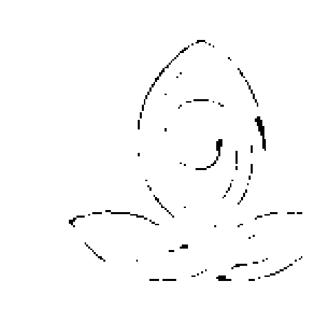

### 亞當的故事

亞當從伊拉克第三次輪調回來之後，被診斷出患有創傷後壓力症候群。然而，亞當最在乎的，並不是診斷本身，而是兩種令他非常難過的身體感受：他幾乎無法入睡，並且會經常出現難以預料、無法抑制的暴怒，就像一陣狂風暴雨。針對這兩個問題，醫生都為亞當開了藥。為了控制這兩種身體上的困擾，他曾經一度得同時服用十二種不同的藥物。針對睡眠問題，醫生為亞當開了幾種安眠藥，這些藥基本上就像是用來將他擊昏一樣，但是當他醒過來時，頭暈眼花的，一點都沒有休息過的感覺。事實上，亞當表示，他睡眠剝奪的情況變得愈來愈嚴重，他還說，因為如此，讓他覺得自己愈來愈不像自己了。當他被要求進一步解釋這句話的意思時，他解釋服用藥物比最初的症狀讓他感覺更加「失控」。亞當是一名海軍陸戰隊士兵，他很享受身為海軍陸戰隊士兵所擁有的力量和掌控感。過去，他認為自己可以成功地因應任何挑戰；但是現在，他得靠著藥物，而不是靠他自己，這傷害了他的自我效能感。亞當還說，藥物和睡眠剝奪，讓他很難參與傳統的心理治療；因為如此，他覺得他並沒有從中獲得太多幫助。大約在此時，亞當嘗試了他的第一堂瑜伽課。即使他對瑜伽抱持著懷疑的態度，但是他已經到了什麼都願意嘗試的地步。這堂課是專門為退伍軍人而開設的，這讓亞當感到自在。亞當提起他的第一堂瑜伽課，他記得他在十五分鐘之內就睡著了。就在那個時候，他知道他來對地方了。不僅如此，老師還讓他睡了三十分鐘。下課時，他感覺到精神飽滿，獲得了充分休息，這是自我返家之後，第一次擁有這樣的感覺。亞當對此欲罷不能，想回來繼續上更多的瑜伽課。 至於突然發作的暴怒，他表示，在上完瑜伽課之後，他感覺到平靜。他的憤怒依然持續影響著他，但是他大都可以成功地從所上過的瑜伽課中，複製自己身體裡面那種放鬆的感覺。最後，亞當解釋，事實上，他表示，由於瑜伽的關係，他能夠在談話治療中獲得更多的幫助。 固定參加瑜伽課程，讓他感到更有精神，也更能掌控自我。他是這麼形容的，他感覺「自己又愈來愈像自己了」，這對他來說，代表著感到愈來愈有能力與掌控感。亞當決定成為瑜伽老師，如此他就可以分享一些他認為真正有意義、有效果的東西，給退伍軍人同胞們。 亞當的故事觸及到創傷感知瑜伽的好幾個關鍵主題。亞當在生物節律和自我調節能力方面受到了一些干擾。原本應該治療他症狀的藥物，反而導致了他和當下的斷裂，並且讓他感到失去效能或失去了可以掌控自己生活的感覺。瑜伽則幫助他從喚起狀態中平靜下來，平靜到讓他足以入睡（直接在課堂上睡著了！）。瑜伽成了亞當可以用來自我調節的方法，成了他工具箱裡的一項工具，幫助他處理所面對的創傷壓力症狀。跟藥物不同，瑜伽是亞當可以掌控的東西。他感到有比較多的選擇去處理他的壓力症狀，並且可以採取有效的行動（練習、練習、再練習），幫助他建立這些技巧。最後，亞當還能夠運用瑜伽，轉化自己的創傷經驗，去幫助其他的退伍軍人處理他們正在經歷的戰後反應。

瑜伽提供了許多可以重新創造節奏的機會。我們可以採取非常具體的方式來探索節奏，例如：我們可以透過呼吸和運動來探索流動和時間的感覺，包括在我們自己內部，以及和他人之間。我們可以在瑜伽課、診間或其他的治療環境中，探索兩種類型的節奏。一是個人的內在節奏，涉及與自己的呼吸和動作可以互相配合；另一則是人際節奏，關乎到和團體裡其他人的動作可以同步。為了體驗自己和與他人有節奏的運動，請嘗試做做看以下同一個練習的兩種變化。

## 太陽呼吸

### 創造個人的內在節奏

雖然我們會以一種特定的方式來呈現此練習，但是就像我們所介紹的大部分練習一樣，它可以有很多種變化，歡迎你盡情探索。當你準備就緒，請找個舒服的座位坐下。如果你願意，請把你的雙手放在雙腿上或朝著膝蓋，手掌向下。當你吸氣，請把你的手抬起五至十公分；當你吐氣，請把你的手放回你的雙腿上。吸氣抬起，吐氣放下。不妨花一、兩分鐘，觀察你的呼吸和動作，找到自己的節奏，並且順應它。

### 創造人際節奏

你需要找個搭檔一起做這個練習，朋友或家人都可以，瑜伽老師或治療師也行。任何人都可以，只要你覺得可以很自在地跟他們一起分享這個小練習。一開始的動作如上，但是如果你的搭檔還不熟悉動作，你可能需要事先跟他講解清楚。當你們準備就緒，請決定好由誰來帶領動作。由兩個人輪流來帶領，也許會很有趣，但需要有個人先來帶領動作。當你們準備就緒，帶領動作的人就可以開始一邊講解，一邊帶動作：吸氣時，把手抬起起來；然後，吐氣時，把手放下。在這個版本的練習中，練習的重點放在與彼此的呼吸和動作同步。不妨繼續做這個練習一、兩分鐘，當你們準備就緒，就可以結束練習。

透過一起呼吸和運動，學生跟老師可以嘗試去發現自己內在的節奏，並且建立同步的人際節奏。當倖存者可以有節奏地與自己和他人重新連結，他們同時也是在與世界重新連結，重新

## 創造生活的意義⑧

在創傷感知瑜伽的情境下，節奏很重要的另一個面向，是時間的元素。許多創傷倖存者都曾經有過時間錯亂的經驗。我們已經探討過瞬間重歷其境的概念，那會將一個人帶回已經不存在的時空，讓人環繞著過去發生在某個地方的創傷事件來運行。瞬間重歷其境的觸發反應，會造成一個人的時間感中斷，以及和周遭世界的斷裂。解離也會導致人們「失去時間」，亦即一個人沒有意識到時間流逝的現象。范德寇醫師經常提到，創傷倖存者好像是活在時間之外，被困在創傷不斷重播的情境裡，直到感覺那好像永遠不會結束一樣。瑜伽提供了許多機會，讓我們可以經歷到事情的開始和結束。一個姿勢開始後，可以有一段時間去體驗這種感覺，並且嘗試一點小變化；然後體驗結束，我們便會繼續往下練習其他的動作。

創傷感知瑜伽老師在建立時間感的時候，會用到一項核心技巧，我們稱之為倒數計時。我們將會在第七章仔細地解釋倒數計時，不過它基本說的是，當學生在練習一個姿勢的時候，老師會在一旁大聲倒數。例如：老師邀請學生檢視一個姿勢的時候，可以這樣說：「如果你願意，你可以嘗試維持在這個姿勢呼吸，五、四、三、二、一，然後放鬆。現在，我們繼續往下做……。」過程之中會有清楚的持續感，以及很重要的終點，是非常清楚明確的。每一個姿勢都有時間限制，這種感覺可以幫助學生忍受一些不舒服或對自己能力的懷疑，能幫助他們可以維持在一個姿勢上。創傷感知瑜伽老師能幫助學生重建「持續感」以及「事情總會結束」的感覺，即使他們正在挑戰瑜伽姿勢！

## 注釋：

1. ① 請參閱貝塞爾·范德寇醫師的文章「The Body Keeps the Score」（Harvard Review of Psychiatry 1：253-265, 1994），這篇文章也涵括貝塞爾·范德寇醫師等人所寫的 Traumatic Stress（New York：Guilford Press, 2006）。這本書對於創傷以及創傷對整個生命體的影響，提供了非常豐富的訊息，可以說是一個資料寶庫。
2. ② 針對本書的目的，我們所使用的「自我調節」（self-regulation）指的是「當觸發反應發生或感到痛苦的時候，可以恢復平靜，掌控自己的思想、情緒和身體的能力。」我們致力於幫助創傷倖存者找到有效的方式，以運用自己的身體與呼吸達到自我調節的效果，以及其他自我調節的方式，當他們有這樣的願望與需求時。我們將在書中多次討論到這個主題。
3. ③ 出自於貝塞爾·范德寇醫師為奧頓、Minton 和 Pain 的著作 Trauma and the Body 所寫的前言。
4. 貝賓麗·范德寇在其論文「Clinical Implications of Neuroscience」中提到，『創傷後壓力症候群注意力和記憶力的喪失，指的是倖存者參與當下的能力。這種狀況會導致受創的個人「對世界失去了方向」，也就是當我們運用瑜伽試圖重新找到節奏感和目的感時，想要處理的問題。』
5. 請參閱布勞斯坦和謝恩伯格的「Treating Traumatic Stress in Children and Adolescents」(New York: Guilford Press, 2010)。
6. 請參閱貝賓麗·范德寇、A. Cook、J. Spinazzola、J. Ford、C. Lanktree、M. Blaustein、M. Cloitre、R. DeRosa、R. Hubbard、R. Kagan、J. Liataud、K. Mallah 和 E. Olafson 的學術研究文章「Complex Trauma in Children and Adolescents」(Psychiatric Annals 35, no. 5: 390-398, 2005)
7. 模擬攻擊防身術是基於武術的防衛課程，利用帶有填充防護的教練模擬攻擊，以教導大家保護自己對抗武裝或非武裝的攻擊。更多資訊請參考 http://www.modelmugging.org。
8. 有一些文章檢視了創傷倖存者如何被困在过去，而無法全心投入當下的體驗，這些研究和想法包括了：
    +   貝賓麗·范德寇和 J. Spinazzola 的「Complex Trauma and Disorders of Extreme Stress (DESNOS) Diagnosis, Part I: Assessment」(Directions in Psychiatry 21: 373-393, 2001)
    +   貝賓麗·范德寇、T. Luxenberg、J. Spinazzola、J. Hidalgo 和 C. Hunt 的「Complex Trauma and Disorders of Extreme Stress (DESNOS) Diagnosis, Part II: Treatment」(Directions in Psychiatry 21: 395-415, 2001)
    +   貝賓麗·范德寇醫師、S. Roth、D. Pelcovitz、S. Sunday 和 J. Spinazzola 的「Disorders of Extreme Stress: The Empirical Foundation of a Complex Adaptation to Trauma」(Journal of Traumatic Stress 18, no. 5: 389-399, 2005)

## 5 給倖存者

## 展開創傷感知瑜伽的練習

在我們發展創傷感知瑜伽課程的同時，也拜託那些曾經與我們一起合作過的創傷倖存者，持續提供回饋和建議；透過與他們的對話，我們已經找出了倖存者在考慮是否尋求創傷感知瑜伽協助以及如何度過這個過程時，所會遭遇到的一些問題。

我如何知道，自己是否已經準備好嘗試創傷感知瑜伽？

建議你花點時間考慮一下是否已經準備好嘗試瑜伽，包括這類型的體能練習可能會帶給你什麼樣的挑戰。你這一陣子有做過任何體能活動嗎？你對自己的身體感到有多自在？你有預期要接受挑戰嗎？在踏進瑜伽教室之前多想一想總是無害的。

建議你找個支持團體或某個人，可以跟他們談談你的經驗，不論那是好或壞。如果你正在接受治療，和你的治療師進行這樣的討論可能是在重要的。在創傷中心，我們瑜伽課的每一位學生都有個人的治療師。如果某堂課或是某個情境讓學生感到不舒服，就會有人自動找學生來## 5 给幸存者

谈一谈他们的感受。正如我们在本书里面已经讨论过的，健康俱乐部和瑜伽工作坊所开设的一般瑜伽课程，会有引起触发反应的可能性：从未经许可的身体接触，到活动空间过于紧密，以及上课的语言风格过度重视口头指示和要求，而非提供选择和邀请。为了避免遇到这类问题，你可以找看看附近有没有提供创伤感知瑜伽的课程。这些课程对你是否安全或有益，最后还是由你来判断。你要尽可能地调查清楚。不妨向瑜伽老师多问一些问题，尤其是当他们宣称自己的瑜伽是创伤感知瑜伽时。老师们应该很欢迎提问，而他们是否能够适当地回应你的问题，也许可以让你清楚地感受到课程本身会是什么样子。在思考自己是否已经准备好参加瑜伽课程时，请你也能够将“时机还不成熟”的决定纳入选项。如果你得出的结论是风险太高、引起触发反应的潜在可能性太大，那么，这样的决定，就是根据自己现况的了解所做出来的诚实评估。除了参加公开的课程，你还有其他的选项。也许利用这本书或是其他在家练习的产品（瑜伽CD或光碟），会是现阶段比较好的选择。在创伤治疗的过程中，速度的拿捏是很重要的。如果你现在对瑜伽课程还不是很有把握，与其直接跳进去面对体能和情绪的挑战，不妨先花些时间练习情绪管理的技巧，这些情绪有时候会在你练习瑜伽的时候浮现。

如果你决定去上课，请注意，即使是在最好的情况之下，也可能出现某些刺激，引起触发反应。你的工作之一，就是要去辨识出触发因子，并且能够做出适当的回应。在此情况下，医疗关系就显得很有帮助。你和治疗师可以一起花些时间思考可能引起触发的事物，以及你可以如何做出回应。你也可以独自进行这件事情。但是请花点时间想一想，当你在课堂上发生触发反应时，你可以运用哪些处理技巧。

过去多年来，曾经在社区里尝试过其他瑜伽课程的学生，对创伤中心的瑜伽课程最关心的两个问题是：(1) 如果我感到不舒服，不论任何理由，我都可以离开教室吗？以及(2) 我可以请瑜伽老师不要碰触我吗？

如果我感到不舒服，不论任何理由，我都可以离开教室吗？
是的！这一点必须特别强调，我们绝对支持你可以选择离开教室，不论任何理由，特别是当你在教室里感到不舒服的时候。这并不是一场耐力比赛。建议你以均衡、舒适、安全的方式来练习瑜伽——并不是说瑜伽不困难（甚至有某些时候几乎是做不到），而是如果你有需要，可以随时离开瑜伽教室。离开教室之后，你可以想一想，那是因为课程的关系，还是老师的关系，或是你只是需要暂时离开一下，来整理当时浮现的情绪。这样的沉淀，可以帮助你决定是否还要再回到那堂课。如果你住在城市里，也许有几个课程供你选择。你不妨货比三家，多打听看看。瑜伽有可能成为你疗愈的核心；或者，如果你把自己逼得太紧，瑜伽也可能会变成让你痛苦和不适的另一个来源。这是一个照顾自己和拿回自己身体的过程，可能会很漫长。请用耐心和慈悲心对待自己。

## 我可以请瑜伽老师不要碰触我吗？

是的！在上课之前去找你的瑜伽老师，并且告诉老师，你不希望在课程中有任何的身体协助，这么做是完全恰当的。你的老师会如何回应，将会很有参考价值。我们恳请所有的瑜伽老师都可以毫不犹豫地同意，并且支持学生这样的请求。瑜伽老师应该尊重学生的意愿高于一切。不提供身体的协助，并不会妨碍老师安全有效地带领一堂课。瑜伽老师应能在不进行身体协助的情况下，保护学生的安全。然而，有可能发生的情形是，有的瑜伽老师非常执着于某种做事方式，可能不太愿意遵照你的请求。这种事情发生过。为此，也许你不妨在上课之前跟老师见个面，询问老师教学方式的相关问题，包括身体的协助。从这个角度来看，你是市场中的消费者，有权利找到最适合的产品。

## 关于寻找创伤感知瑜伽课程，你们可以给哪些建议？

你也许可以在附近找到自称为“创伤感知”的课程，这可能会是个不错的开始。即使你看到的一般大众的瑜伽工作坊或健身房之类的环境，你也可以在上课之前跟你的老师约个时间见面，当作是一场面试，请教老师有关他（她）会如何教授课程，以及老师曾经接受过什么样的培训。即便只有五分钟，也足够让你感受到这堂课程是否值得一试。如果老师不愿意和你见面，可能表示那不是创伤感知的课程。相信你的直觉。愿意犯错。也就是说，一旦你试过了，你可能会很讨厌这堂课，但是你至少试过了。有些幸存者曾经向我们表示，在瑜伽课经历到负面经验之后，他们会感到某种程度的“失败”。与其这么想，我们鼓励你，不如把中断一个令人不舒服或痛苦的体验，视为是自我照顾的一刻。你正在确认自己有受到保护，并且在寻求真正的疗愈体验。如果某堂课或某位老师，或是某个工作坊，曾经让你有负面的经验，不要感到气馁。请记住，也许外面还有更适合你的课程或老师。

### 在家的练习

在这本书里面，我们已经提供了个别的瑜伽练习供你尝试。现在我们想要提供一套完整

### 做好准备

当你准备就绪，请挑选舒适的空间来进行练习。请确定你有足够的空间可以伸展出去一点；一张瑜伽垫的大小，大致可以作为你需要多大空间的参考。倘若没有瑜伽垫，也没有关系；在铺有地毯的地板上，找个舒适的位置。如果没有地毯，你也许需要在附近放几条毛巾，以备在几种不同的情况下使用（当有此需要的时候，我们会提醒这点）。如果你喜欢，可以随意放点音乐，任何音乐都可以！这是一个实验，你也许会发现，聆听你最喜爱的音乐可能会有帮助。你也可以尝试不放音乐，看看你比较喜欢哪一种。考虑一下你有多少时间可以练习瑜伽：是只有几分钟的时间？或是你预期可以有完整的四十五分钟不被打断？你也许会想要关掉手机、关掉电脑，或是做任何能做的事情，让自己获得一点时间和空间专注在瑜伽练习。万一被打断，也没关系，但是花几分钟尝试为自己创造一个受到保护、不被干扰的时间和空间或许是值得的。

### 练习

以下的姿势按此顺序呈现：

1.  坐山式
2.  坐姿观呼吸
3.  坐姿太阳呼吸
4.  坐姿颈部旋转
5.  坐姿肩膀画圈
6.  平桌式
7.  婴儿式
8.  婴儿式侧边伸展
9.  猫拱背式
10. 山式站姿
11. 树式
12. 椅式
13. 立姿前弯
14. 肩桥式
15. 全身伸展
16. 抱膝式
17. 船式
18. 坐姿前弯式／臀部伸展
19. 仰卧扭转
20. 最后休息式

### 1. 坐山式

当你准备就绪，请坐下。给自己一点时间，尝试找到让你倍感舒适的坐姿。你也许会想要盘腿而坐，或是坐在脚后跟上。

你可以随意尝试，如果不喜欢这种姿势，就换别种试试看。你可以随时变换。永远都不需要被卡在一种姿势里。

一旦你找到舒适的姿势，也许可以尝试从臀部做一些温和的运动，像是前后摇摆或是左右摇摆。你也可以用画圈的方式来做这些动作。如果你愿意，花点时间动一动，感受一下你周围的空间，以及你的身体在这个空间里的感觉（请自由摆动二十秒至一分钟）。

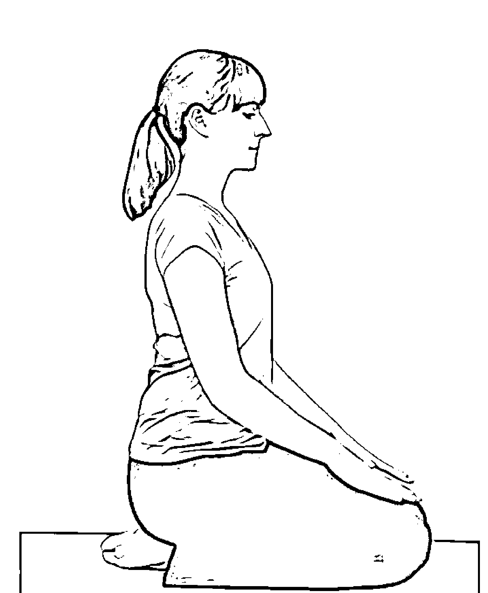

坐山式变体

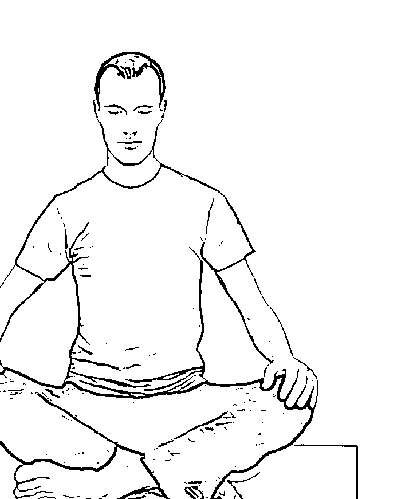

坐山式

当你准备就绪，请开始坐定。在回到坐定的过程中，请逐渐将动作变慢、变小。这属于山式的一种，以坐着的姿势，将身体打直。一旦你坐直了，不妨花点时间尝试将身体拉挺。我们邀请你将意识转移到你的头顶。你可以试着轻轻地拉挺你的身躯，从你的头顶开始，轻轻将身躯拉长，让你的脊椎可以自然地挺直。这不需太过激烈的动作，你只需要让你的脊椎顺其自然地挺直。请注意在这个姿势转变的过程中，起源点在身体内的哪里。有哪些肌肉感觉到被拉长？有哪些肌肉保持放松状态？在练习的过程中，不妨多次来回检视：有哪些肌肉参与到动作之中？有哪些肌肉可以保持放松？以培养出你对这两种感觉更敏锐的觉察。

### 2. 坐姿观呼吸

当你准备就绪，请开始注意你的呼吸。为了达到这个练习的目的，建议你只要注意你正在呼吸就够了。你可能是透过鼻子或嘴巴来呼吸。你只要注意就够了。当你在进行这个瑜伽练习的时候，你可以尝试用鼻子或嘴巴来呼吸，并且找出哪种感觉比较对劲。这个练习的唯一目标，就是让你自己更加清楚哪种呼吸方式对你来说最舒服、最自然。

### 3. 坐姿太阳呼吸

变体 A：如果你愿意，现在请考虑尝试看看，搭配着呼吸，同步做出一些动作。请将双手放在大腿或是膝盖上，吸气时，轻轻地将双手抬起五至十公分。然后，吐气时，将你的双手放回大腿或膝盖。吸气时，抬起来；吐气时，轻轻放下。

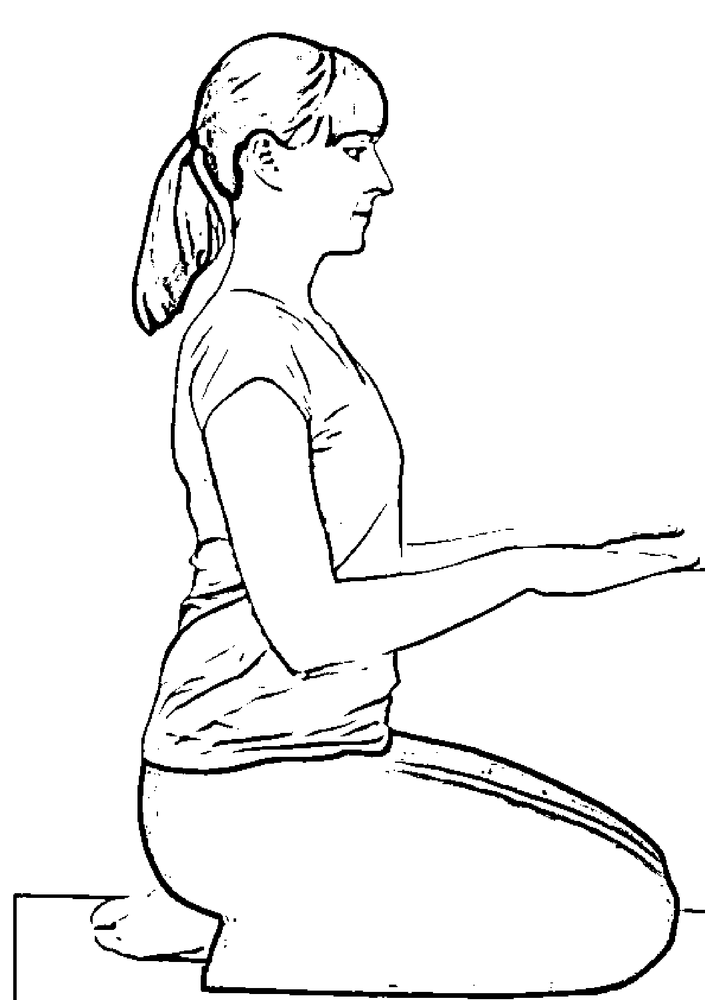

太阳呼吸 吸气时，将双手轻轻抬起

不妨来回做几次这样的循环动作，感受一下呼吸和动作连接的感觉。如果你想要添加点什么，吸气时可以将你的手指尽量张开，让你的手变得非常紧绷、宽大、坚实。当你吐气时，尽量将双手放松，好像羽毛一样，轻轻飘落到你的大腿或膝盖上。请注意一下，双手紧绷和松软之间的对比。

变体 B：另外一种太阳呼吸的变体，一开始先将双手合十放在胸前。吸气时，将手臂往你的两侧伸展。吐气时，将你的手掌合十放回胸前。不妨来回多做几次这个循环。请注意一下，这是一个比较大的动作，当占用到比较大的空间时，感觉如何？

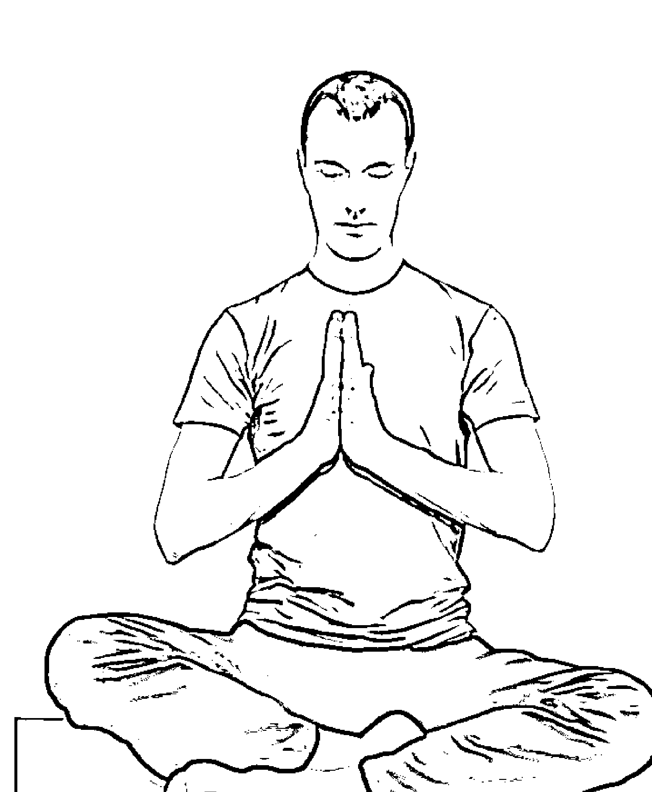

太阳呼吸
双手合十放在胸前

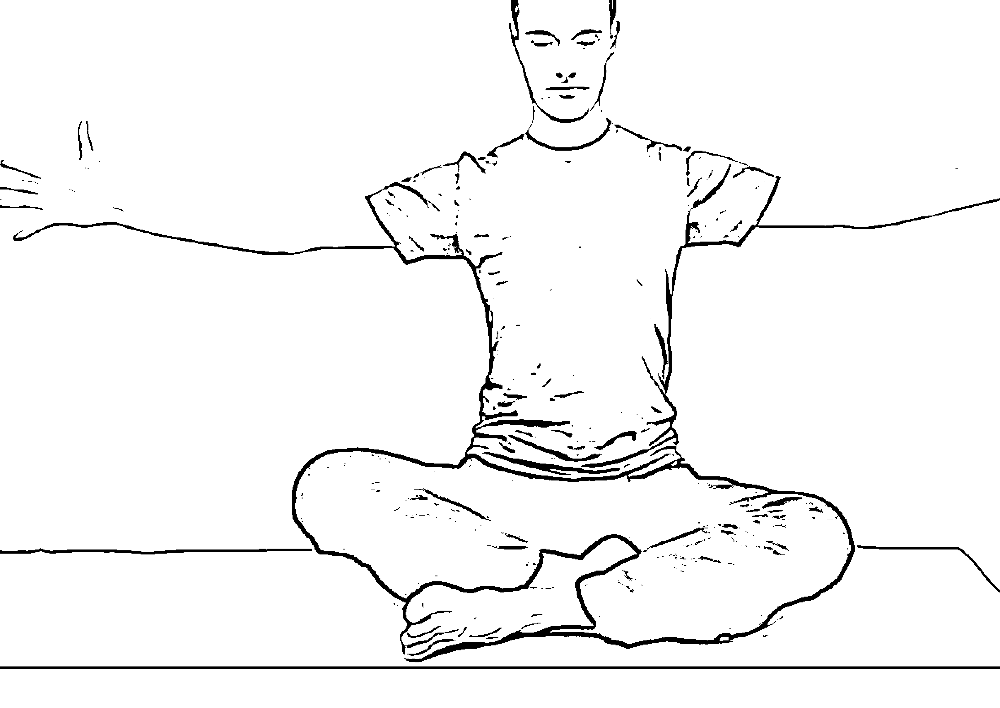

太阳呼吸
吸气时，将双臂往身体的两侧伸展

### 变体 C：

如果你要尝试空间更大的变化，一开始先做出变体 A 的动作，将你的双手放在大腿或膝盖上。吸气时，将你的双臂高举，绕出一个大圆圈。吐气时，将你的双手放回大腿或膝盖。请注意一下，这个变体比较像是圆型运动，而另外两种则比较类似线性运动。也请注意，在一个像这样更占空间的姿势里探索，感觉如何？你可以随时换回变体 A 或变体 B 的动作。事实上，关注你的身体，注意到什么情况会让你感到舒服或不舒服，并且根据这些观察做出选择，正是这个练习的核心。不妨再多花一两分钟，探索你的太阳呼吸。

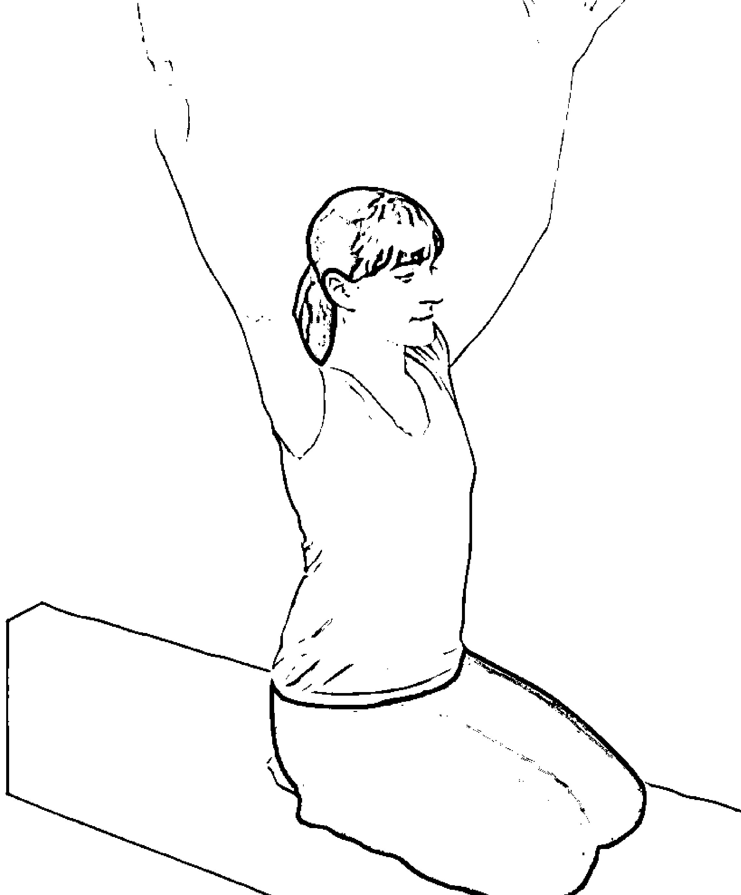

太阳呼吸
吸气时，将双臂高举

### 4. 坐姿颈部旋转

当你准备就绪，请将身体回复到打直的坐姿。现在，请放松颈部的肌肉，让你的下巴轻轻往下朝向你的心脏、你的胸骨。接下来，将你的左耳轻轻压向左边肩膀。慢慢地把头从这一边旋转向另一边，旋转几次，然后从中间轻轻地将下巴垂下。请让自己可以自在地呼吸和转动。并感受一下你颈部和上背部的肌肉。透过这个运动，请探索这个圆圈或球体的下半部。你可能会注意到很多感觉。对很多人来说，这个部位的肌肉非常紧绷。如果你感到疼痛，可以随时停止。你永远都有这部分的掌控权。另一个选项是，你可以把动作做得小一点，看看这样是否能让你继续转动而不会感到疼痛。或是，你会希望尝试把动作做得大一点，如果你不会感到不舒服的话。不妨花点时间探索一下颈部旋转的做法。当你准备就绪，轻轻地将下巴转回你的中心、朝向你的心脏，然后再抬起，回复到平常的状态。

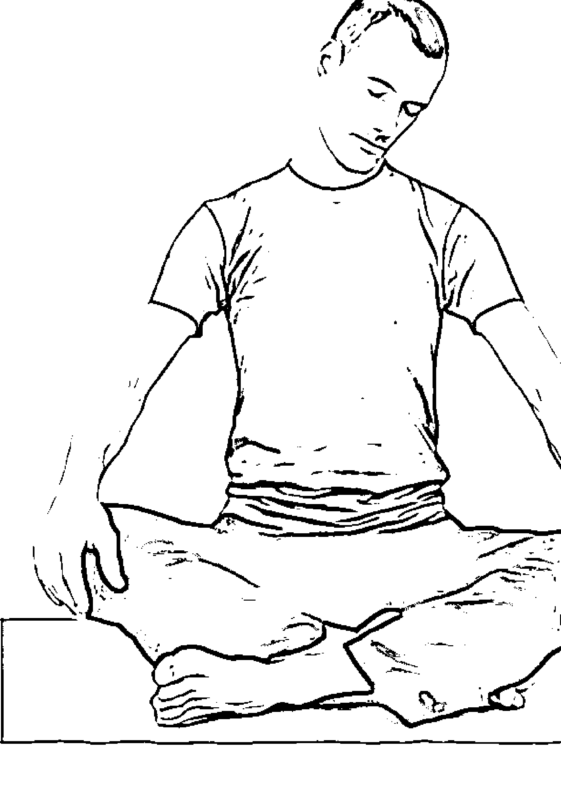

颈部旋转
压向左边肩膀

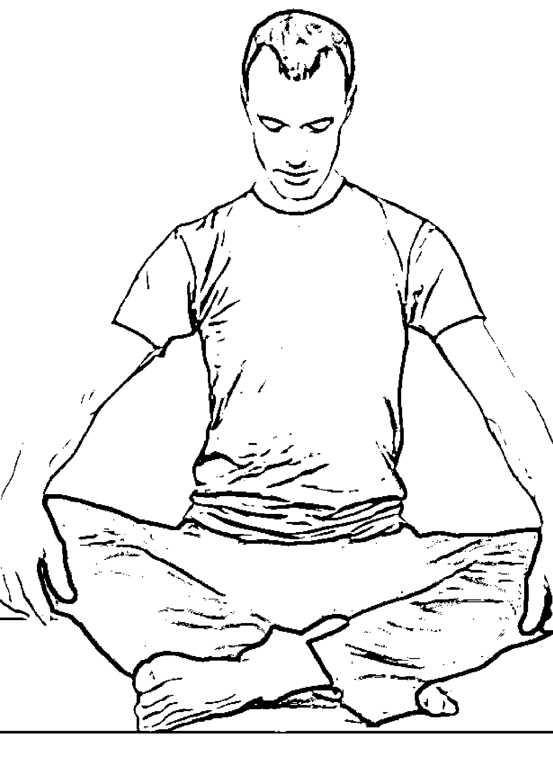

颈部旋转
将下巴轻轻朝下

### 5. 坐姿肩膀画圈

变体A：如果你愿意，请用你的肩膀从同一个方向开始轻轻地画圆圈。你可以把圆圈画得很小，也可以画得很大，随你高兴。你要用肩膀画出什么样尺寸大小的圆圈，完全操之于你。

只要妳喜欢，妳也可以随意从反方向转几次。请注意一下，你是如何开始感觉到肩膀的：它们如何转动，它们周围的空间感觉如何？如果你愿意，请继续探索你的肩膀一会儿。

变体B：另外一个选项，是将你的指尖放在肩膀上，尝试用肘部的尖端来画圆圈。现在，你为这个练习增添了另一个层面，请探索一下横跨在你胸前和锁骨的空间，以及横跨在你上背部的空间。你可以随意从反方向转几次。当你准备就绪，如果你愿意的话，请暂停，并且从手指将双手甩一甩。轻轻地从肩膀通过指尖，将双手甩一甩。

### 6. 平桌式

针对这个姿势，如果你没有垫子或地板上没铺地毯，你可能需要在你的下面铺上毛巾，好让自己感觉舒适一些。

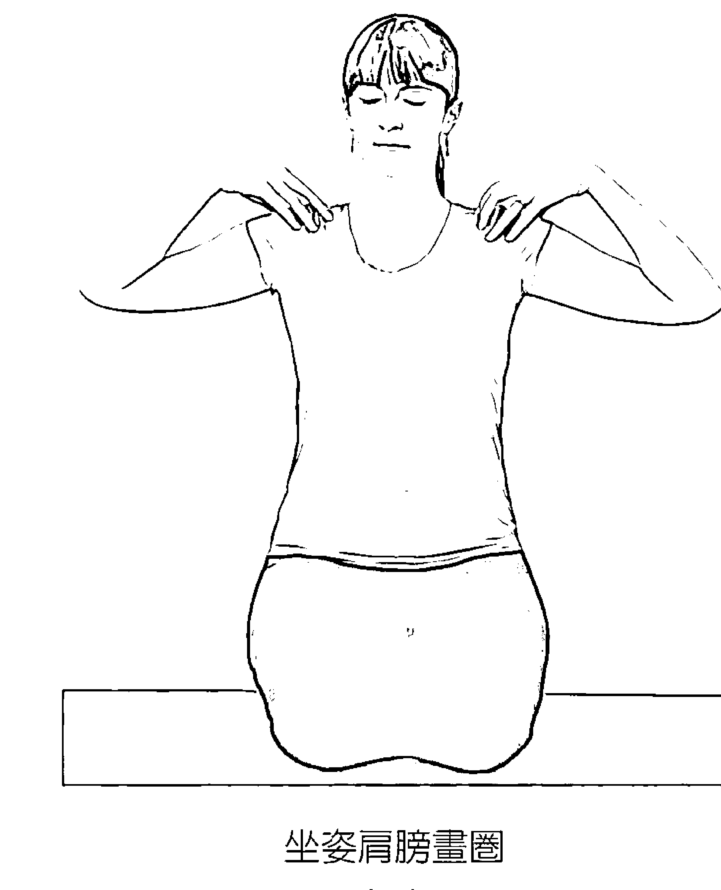

当你准备就绪，请进入桌面的姿势，也就是将双膝着地，垂直于臀部下方；双手着地，手腕垂直于肩膀下方。

在这个姿势之中，你会注意到手臂的肌肉开始作用。如果你愿意，你可以轻轻地在周围移动，请将重心放在手臂上和膝盖上，你会感受到手臂的一些肌肉开始苏醒。其他你会注意到的肌肉部位可能是下腹部或是核心部位。你可以尝试轻轻地将下腹部缩紧，这是和核心肌群互动的一种方式。核心肌群可以成为很重要的资源，在整个练习过程中，我们会定期地来检查它们的状况。

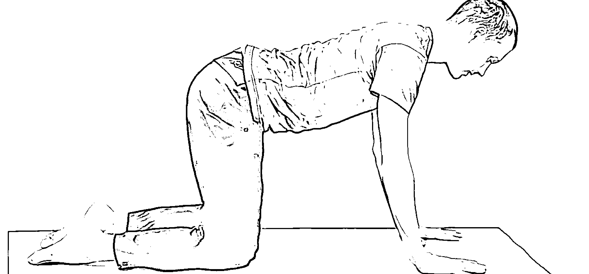

平桌式
双手放在地板上，双膝着地，垂直于臀部下方

### 7. 婴儿式

针对这个姿势，如果你没有垫子或地板上没铺地毯，你可能需要在你的下面铺上毛巾，好让自己感觉舒适一些。请从平桌式转换到婴儿式，先将你双脚的大拇指并拢，然后开始朝脚后跟坐下，做好这两个动作之后，接下来请考虑以下介绍的几个选项。

对某些人来说，将双膝并拢是最舒服的姿式。

对其他人来说，将双膝打开时稍微比臀部宽一点，也许会最舒服。

不论是哪种情况，一旦找到最舒服的姿势，如果你愿意，请将你的双臂往前伸展。

另一个选项是，将拳头叠在一起，并将你的额头放在拳头上面。

当你找到最舒服的姿势，检视一下，从你的尾骨将背部拉长的感觉。请将你的下背部延展一些。透过这个练习，你可以好好照顾一下你的下背部。此刻，不妨让自己舒服地呼吸片刻。

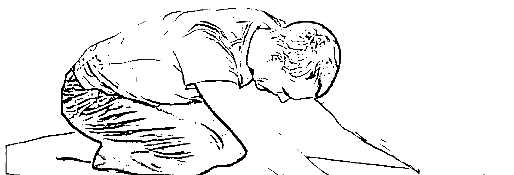

婴儿式 双膝并拢

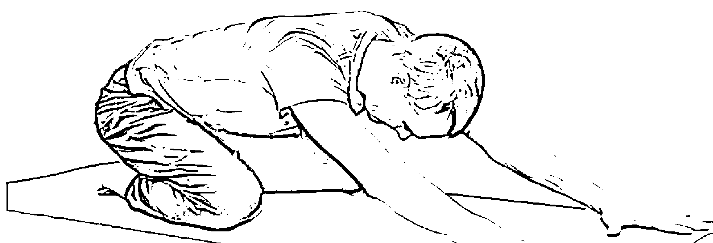

婴儿式 双膝打开宽于臀部

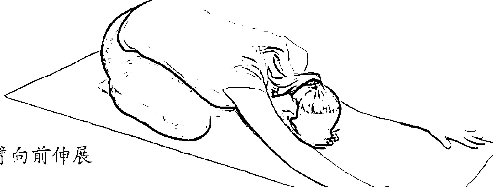

婴儿式 双臂向前伸展

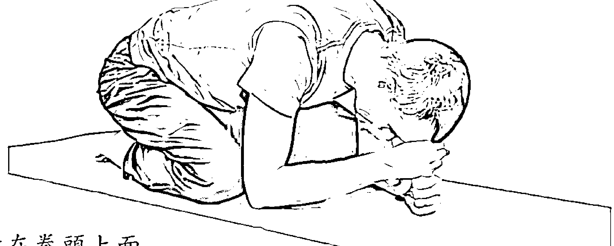

婴儿式 额头放在拳头上面

### 8. 婴儿式侧边伸展

当你准备就绪，如果你愿意，请将你的双手轻轻地移往左侧，轻轻地移动你的上半身，往你的左侧伸展。
请注意一下，往侧边伸展的感觉，不妨让自己在这里呼吸片刻。请一边呼吸，一边关照这一侧的身体。呼吸几次之后，不妨换边进行，将你的双手轻轻地移往右侧。请注意，你可以控制移动的幅度。也许稍微移动一点点效果最好，或是你可以做出很明显的移动。这取决于你。在进行左右两边的侧边伸展时，都请让自己的呼吸调整片刻。
当你准备就绪，请回到中间。请为自己找到中间的位置。

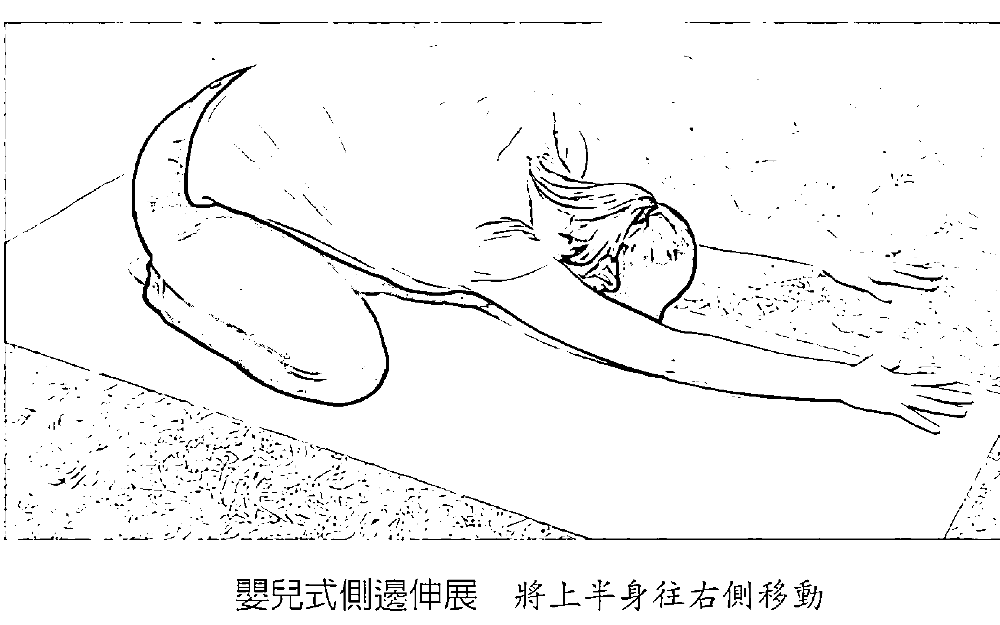

### 9. 猫拱背式

针对这个姿势，如果你没有垫子或地板上没铺地毯，你可能需要在你的下面铺上毛巾，好让自己感觉舒适一些。

请从婴儿式回到平桌式。如果你愿意，吸气时，轻轻地抬起你的尾骨和下巴。接下来，吐气时，轻轻地将你的脊椎拱起。

吸气时，轻轻抬起；吐气时，轻轻拱起。

不妨顺着自己的节奏持续进行几分钟。这是一个找到自己节奏、顺应自己节奏的机会。如果你愿意，可以尝试做快一点或慢一点。也许通过尝试，你可以在此刻领悟到对你来说怎么样最自然。如果你愿意，请花点时间尝试。当你准备就绪，一边吐气，一边回到平桌式，回到中间。

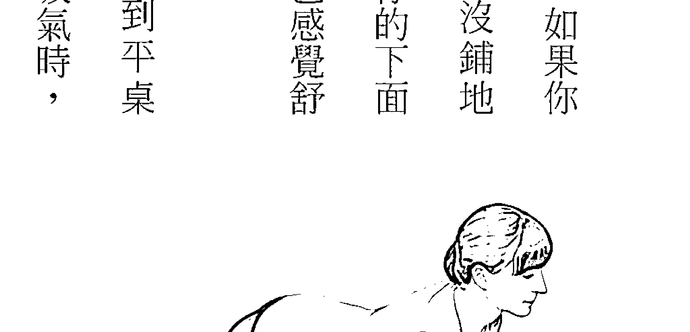

猫拱背式 吸气时，轻轻地抬起你的尾骨和下巴

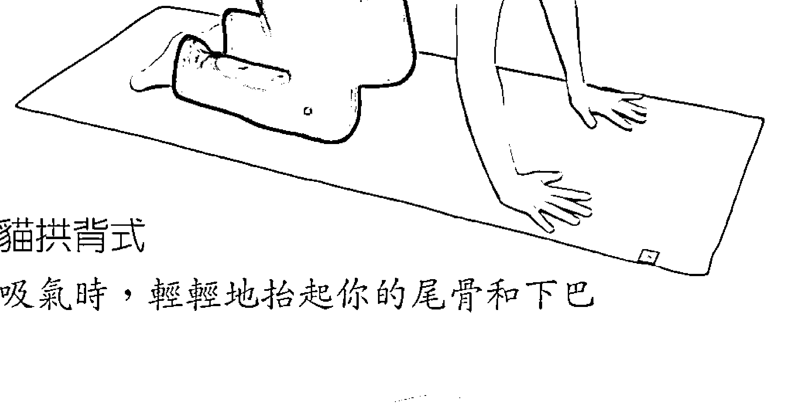

猫拱背式 吐气时，轻轻地将你的脊椎拱起

### 10. 山式站姿

当你准备就绪，请从平桌式抬起身来，形成一个站立的姿势。给你自己片刻的时间，感受一下站立的感觉。如果你愿意，请将双臂垂放在身体的两侧，双脚打开大约与臀部同宽，并且保持双脚平行。

你可以张开或闭上眼睛来进行这个练习；这取决于你。如果眼睛是张开的，你可以用一个比较舒适的角度朝下看着地板。

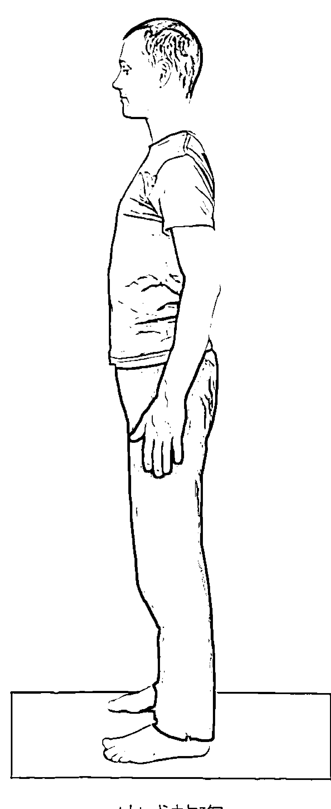

请竭尽所能，注意你的双脚正站在地板上。把注意力转移到你的脚上面，并观察你注意到的情形。为了更明显感受到脚踏在地上的感觉，也许你可以做点事情，像是拍拍脚后跟，或是敲敲脚趾头。如果有帮助的话，你也可以随时低头看看你的脚，注意你的脚正踏在地上。如果你愿意，请花片刻检视一下。

接下来，双脚保持站立在地上，并将你的意识转移到头顶。也许你可以想像轻轻地从头顶将自己提起，好让身体站直。这是什么感觉？如果你愿意，请给自己片刻注意一下，当你轻轻地从头顶将自己提起时，这种感觉是来自身体何处？

最后，双脚站立在地上，身体自然打直，将意识转移到你的中心点。如果有帮助的话，可以尝试轻轻地缩紧肚脐周围和正下方。当你渐渐沉浸在下腹部周围的感觉，你会开始意识到，你的中心点是力量和支撑的来源。这种肌肉运动，不一定要很激烈。在这个瑜伽练习之中，肌肉的力量是属于支撑性的力量。它是安定的力量。它是有意识、有目的的力量。如果你愿意，请给自己片刻体验一下，做为意识与目的的泉源的中心点。

### 11. 树式

当你准备就绪，请将双手合十放在胸前，并且开始将你的重心转移到你的右腿上。如果你愿意，可以将你左脚脚趾头轻轻踏在地板上。
另一个选项是，由左膝，轻轻地将你的左脚贴着你的右脚踝。
再一个选项则是，直接将你的左脚，贴放在右脚踝上方的小腿上。不妨花点时间。

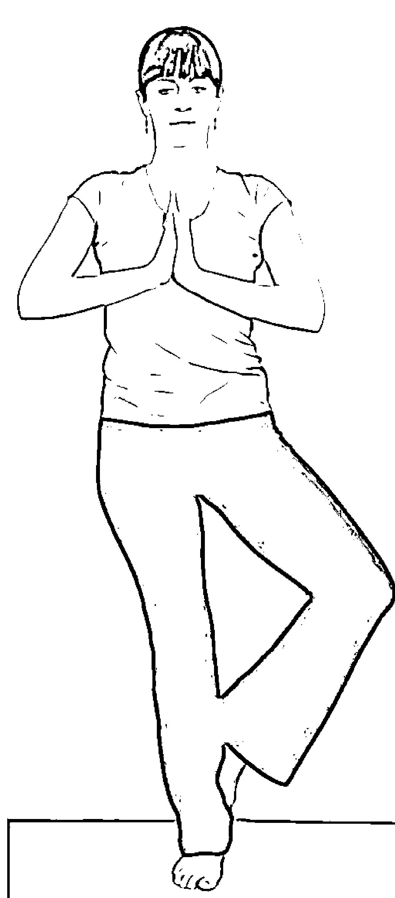

树式
左脚贴在右脚踝上方的小腿上

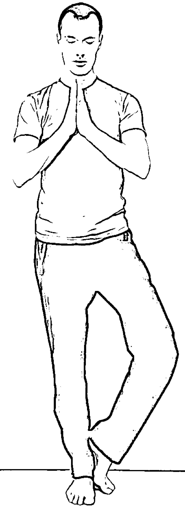

树式
左脚轻轻贴在右脚踝上

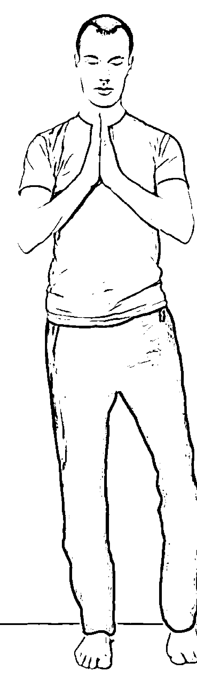

树式
左脚趾轻轻放在地板上## 5 给幸存者

间，尝试这个姿势。你还可以用你的手臂，尝试另一种姿势。你可以继续保持双手合十放在胸前，或是你也可以将双臂往两侧伸展开来。或者，你会想要将双臂高举到头顶上打开，看看这对你来说，会有什么感觉。不论是哪一种情况，不妨花点时间检视所有不同的姿势变化。你甚至也可以自己想出一些花样。

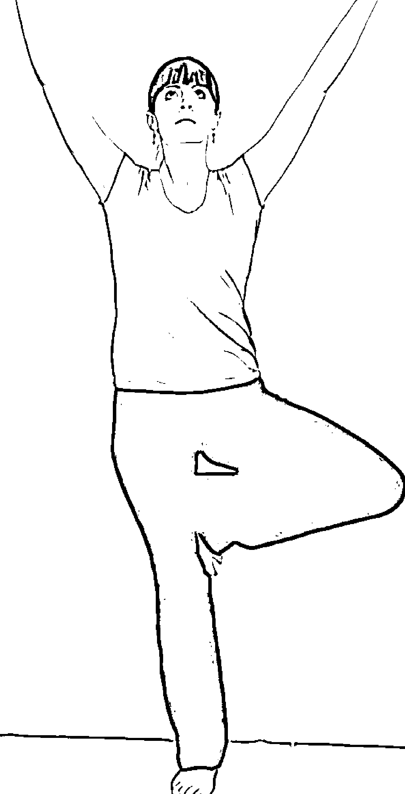

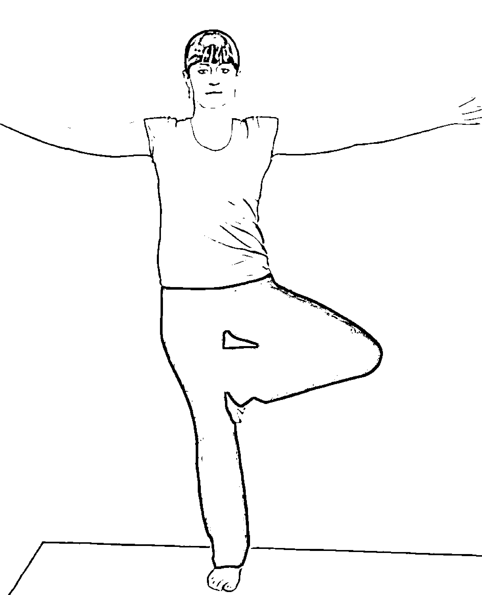

另外还需要考虑到的两件事情是你的视线和呼吸。

### 视线在树式中的作用

对某些人来说，在墙壁或地板上选定一点，并且将视线专注在这一点，可能会有帮助。你也可以尝试将视线聚焦在你的指尖或甚至闭上眼睛。请注意这些不同的尝试，是否会改变你对这个姿势的体验。这是一个客观的实验，如果因为某些原因，这些尝试没有奏效或是会让你感到不舒服，你可以随时变换姿势。这个瑜伽练习最根本的基础，就在于承诺照顾好自己，我们鼓励你，在练习树式时，不要做出任何导致你疼痛或不舒服的事情。

### 呼吸在树式中的作用

一般来说，在做树式的时候，呼吸应该是很轻松自在的。树式也许是一个机会，可以检查你的呼吸，看看状况如何。如果你是屏住呼吸，或是用不自在的方式呼吸，就要特别注意了。如果可以的话，请你稍微调整一下呼吸，帮助它轻松自在一些。如果你注意到，在这个姿势或任何姿势中，让你感到呼吸不舒服，建议你立刻停止你正在做的动作，恢复到舒适、中立的位置，并且找找看，是否有其他的姿势可以让你感到呼吸舒服一些。

当你准备就绪，不妨换另一条腿来尝试树式。

## 12. 椅式

当你准备就绪，请回到山式站姿。把膝盖放软，做出好像正要坐到椅子里面的样子。接下来，将你的双臂伸展举高，贴近你的耳朵。

你想要将臀部坐进去多里面，这取决于你，不过建议你要小心谨慎，慢慢来。这是一个很强烈、会用到很多肌肉力量的动作。当你将臀部坐进去时，不妨缩紧下腹部，并且感受你中心点的力量和稳定性。这个核心力量会支撑你的下背部。如果你的肩膀感到丝毫不舒服，另一个选项是，将你的双臂放在身体两侧。

在任何一种情况下，都请尝试将你的肩膀往后拉，并将你的肩胛骨朝向背部中线缩紧。你会感觉到肩胛骨周围和其之间的某些肌肉正在用力。随着肩胛骨之间的肌肉被锻炼得更强壮，你的颈部也会稍微放松一些。如果你愿意，可以尝试将肩胛骨轻轻地往下拉，远离耳朵，借由这种方式，轻轻地将你的脖子拉长。不妨花点时间，注意并感受你的核心力量和腿部力量，保持呼吸轻松自在。请检视一下在进行椅式练习的时候，用力和呼吸的情况。这个姿势又称为闪电坐姿或猛式。当你准备就绪，请慢慢回复到山式站姿。

## 13. 立姿前弯

当你准备就绪，请从山式站姿慢慢往前弯。选项之一是，将你的前臂伸向大腿或是膝盖，形成一个弯腰鞠躬的样子。另一个选项则是，让你的双手自由摆放，指尖轻轻地伸向地板（如果你的指尖没有碰触到地板也没关系）。或是，如果你愿意，可以用一只手，握着另一只手的肘部。在任何一种情况下，我们都建议你让双膝保持微微弯曲。请注意你是如何站立的。如果你大部分的重量都放在后脚跟，请注意一下，若是你把一些重量往前移到脚趾头后面，会发生什么事？这样的转变会对前弯的动作造成影响吗？如果你愿意，不妨随意摇摇头或点点头，让重力进入到你的颈部和肩膀。透过一些温和的动作，可以加强你和重力的互动，让重力可以对你的颈部、上背部、下背部，甚至你脊椎周围的大肌肉都产生影响。你不妨就这样垂直挂在这里大约半分钟，轻松自在地呼吸。当你准备就绪，可以开始慢慢起身站好。当你站起来时，如果下背部感到有任何不适，可以用双手支撑住自己的双腿。另一个建议是，把速度放到非常慢，特别是当你感到头晕时。在重新站回山式站姿的过程中，请你慢慢来。一旦站好了，不妨让自己站立一会儿，就只是这样站着和呼吸。让自己感受片刻站着的感觉。另外一个可能的建议是，不妨给自己一点时间，喜欢怎么站就怎么站。让你的姿势和呼吸保有一些发展的空间，直到你可以随心所欲地感受当下，感受到挺立、感受到强壮、感受到自在。

## 14. 肩桥式

针对这个姿势，如果你没有垫子或地板上没铺地毯，你可能需要在你的下面铺上毛巾，好让自己感觉舒适一些。

当你准备就绪，请躺平，将双臂放在身体两侧，脚底平放在地板上，双脚打开大约与臀部同宽，并保持平行。如果你愿意，请花点时间尝试将这些位置对齐。一开始，先感受一下双脚平放在地板上的感觉，然后再感受将双脚打开与臀部同宽，并保持平行的感觉。你不需要对齐到很完美。

当你准备就绪，接下来，双脚用力压下，抬起你的臀部。也许你只能将臀部抬高一点点，距离地板不到几公分。你也可以尝试将臀部抬高到距离地板十几公分。臀部抬高到多少都没有关系。这只是一个尝试。不用刻意追求达到任何一种姿势。建议你，真正地融入你的身体、你的感受。如果你注意到身体上有任何的不适，不论任何理由，请务必暂停练习，去改变你正在做的事情，好让自己可以舒服一些。在你练习的过程中，你永远都有这方面的掌控权，你可以倾听自己的身体，并且根据你所发现的状况做出此刻对自己最好的选择。给自己一点时间，确认自己的呼吸可以保持顺畅，下背部和膝盖都安然无恙。

### 加点变化

如果你想在这里加点变化，建议你可以将手心向上朝向天空。这么一来，就可以将肱骨旋转进骨臼里，让你比较容易将两边的肩膀收拢得靠近一些。请花点时间，将你的肩膀收拢靠近。随着这个动作，你的肩胛骨将会更加稳固地向背部缩紧。你可能会感觉到在肩胛骨周围和其之间的某些肌肉正在用力。这些是保持你上半身稳定的关键肌肉。当你将脚往下压，可以将臀部抬起，但是你要将肩膀往下压，才能将胸部稍微抬起一些。练习一段时间之后，你不需要对脊椎施加任何压力，也或许就可以让整个脊椎抬离地面。请花点时间，将你的肩膀收拢，并感受上半身获得支撑、力量和稳定的感觉。

关键的大腿肌肉。如果你想更进一步尝试，在此提供更多细节。我们已经辨识出在肩胛骨周围和其之间的一些肌肉，是支撑你上半身，并且让上半身保持稳定的关键肌肉。同样的，也有一些关键肌肉在支撑你的下半身，并保持下半身的稳定。特别是在桥式这个练习里，你可以好好检视一下大腿内侧的肌肉。如果你将双膝稍微朝中间靠拢，可能会注意到大腿内侧的肌肉开始用力。大腿内侧的肌肉可能会变得强壮活跃。大腿内侧肌肉能够支撑你的下半身、保持膝盖稳定，是维持平衡和稳定的关键肌肉。如果你愿意，请花点时间感受、检视并锻炼你的大腿内侧肌肉，并保持呼吸轻松自在，透过鼻子或嘴巴呼吸都可以。当你准备就绪，慢慢将臀部放下，并将荐骨（就在你的腰部下方）往下平放到地板上。

## 15. 全身伸展

如果你愿意，请躺平将双腿舒服地往前伸展。到目前为止，也许这样就够了，但你也不妨将双臂伸展到头顶上，让指尖朝后指。你不用直接指向正后方，你可以慢慢从不同的角度探索。特别是当你感到下背部有任何疼痛或紧绷时，不妨将双臂放到身体两侧，看看这样是否可以稍微减轻背部的负担。将双臂往头顶伸展到某种程度，也许需要更强壮的腹部力量才行。如果有帮助的话，你可以将下腹部稍微缩紧，注意并锻炼核心肌群的力量。不妨检视身体伸长的感觉。把自己拉得更长的一种方法，就是动动手指和脚趾，你可以透过手指头和脚趾头、透过手指和脚趾之间的空隙尝试将身体拉长。不妨花点时间，尝试将身体拉长，并保持呼吸顺畅。当你在此刻呼吸的时候，也许你甚至能够感受到手指尖和脚趾尖之间有种相连一气的感觉。当你准备就绪，请将你的双臂张开，双膝并拢。

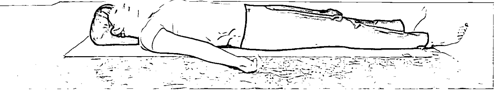

全身伸展 双腿伸展开来

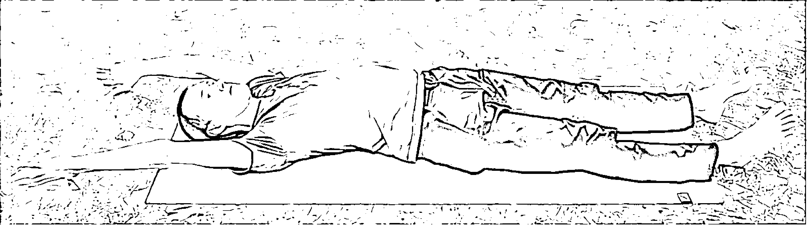

全身伸展 双腿和双臂伸展开来

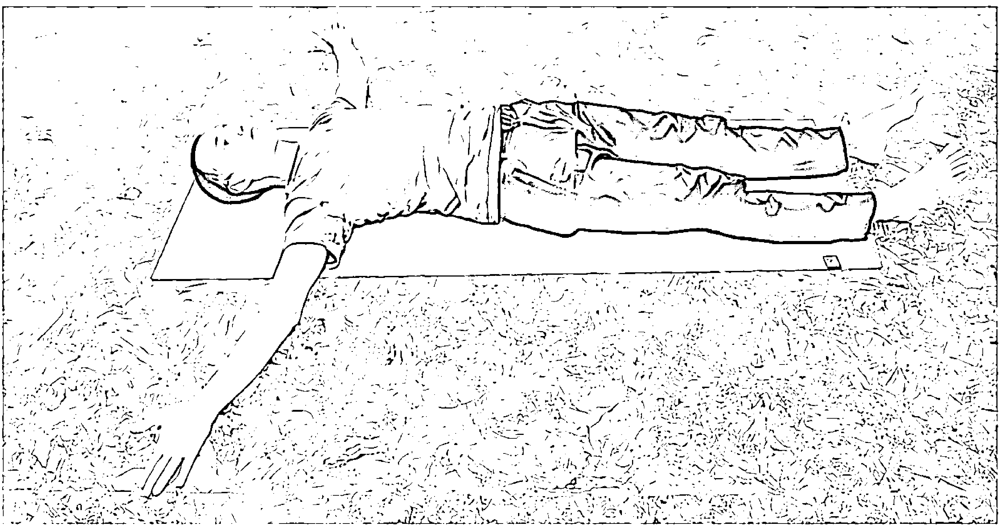

全身伸展 双腿伸展开来，双臂放在身体两侧

## 16. 抱膝式

这个姿势是和全身伸展搭配的动作。现在，请尝试抱住全身，温和但确实地将身体收拢进来。你可以将双膝朝胸口或朝向肩膀收拢；这取决于你。你也可以控制拥抱的强度。可以轻柔，也可以坚定。不妨花点时间尝试这些不同的变化，并随时确保呼吸轻松自在。加点变化。如果你愿意，不妨轻轻地将双膝晃向一边，并将下巴晃向另一边。这个动作可以做得很轻微，也可以做得很明显。如果这个动作让你感到不舒服，不管任何原因，你可以随时停止，并以正常的方式呼吸。如果你愿意，不妨探索这种姿势片刻。当你准备就绪，请转向同一侧，并轻轻地起身坐好。

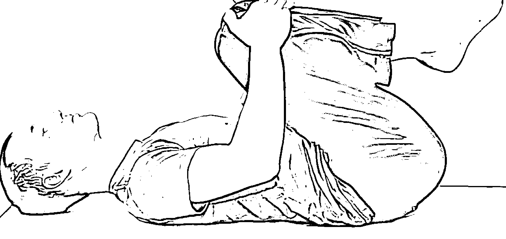

抱膝式

## 17. 船式

当你开始感受到核心肌群是身体稳定和支撑力的来源，花点时间专注在核心肌群的力度和强度可能会很有趣。从坐姿开始，将两只脚平放在地板上。你的双手可以有几种不同的摆放方式。这里有三个选项：你可以将双手放在臀部后方五至十公分。另一个选项，是将双手放在你的小腿上。第三个选项，是将你的双臂放在身体两侧，手掌彼此相对。请注意大腿和上半身之间的空间，稍微向后倾可能会很有趣。从你现在的位置向后倾斜一点点，用你核心肌群和下腹部的肌肉抓住自己。尝试将你的下腹部缩紧或收进来，这可以帮助你感受到核心肌群的力量。同时，请呼吸轻松自在。事实上，你甚至可以尝试增加一点呼吸：基本上只要在吸气和吐气的时候，都做得更深入一些即可。并请观察看看，在这个姿势中，比平常呼吸得稍微深入一些，感觉如何。你的呼吸会影响到你在这个姿势中的感受吗？你的呼吸有助于支撑这个姿势吗？在肌肉用力的过程中，呼吸可以助你一臂之力，让你不用那么辛苦费力，感到轻松一些吗？你不妨花点时间探索在船式练习中所做的动作。当你准备就绪，请将双手放在身体后面，并且将双脚从地板上抬起。这可能会用到肌肉更多的力量，建议你慢慢来；除此之外，如果你愿意，当你准备就绪，你也可以将双手放在身体后面的地板上，并向前伸展双腿。你可以保持这个姿势，轻松自在地呼吸三到五次。请确保你可以自在地呼吸。有时候我们可能为了勉强做出某个姿势而憋住了呼吸。检查一下，看看自己是否能自在地呼吸。建议你优先考虑呼吸，放弃某个姿势或姿势的变体，以确保自己可以自由地呼吸。

## 18. 坐姿前弯 / 臀部伸展

一开始先将双腿向前伸展，当你准备就绪，请将一条腿轻轻弯曲。如果你愿意，可以在弯曲的那条腿下面放一块瑜伽砖、一条毯子或几条毛巾做为支撑。

是否要在膝盖下面放支撑物是可选择的，你不妨试试看。也许你会发现什么都不放最舒服。不妨花点时间检视一下。

当你准备就绪，请进一步考虑这个姿势的其他选项。对某些人来说，将双手放在臀部后面五至十公分，并且稍微向后倚靠，可能会比较舒服。对某些人来说，在中间坐直可能最好。而对某些人来说，向前延伸到某个程度，会感觉不错。如果你选择向前倾，建议你，请将伸直的那条腿，膝盖放软，并稍微弯曲，以避免对关节造成任何不必要的压力。你往前弯多少都没有关系。既然是一个尝试，你也许会想要看看，由胸部来引导动作会有什么感觉，也就是说，让胸部先往前延伸，所以你可以在这个姿势中保持身体打直。在这个姿势中，至少有两种往前弯的方法。一种是将身体弯曲，基本上就是将身体往前弯下。另外一种方法是通过延伸，也就是让身体保持“打直”，由胸部来带领动作。虽然本书建议倾向采取延伸的变体，不过这也是一个让你自己实验的好机会。只要动作温和些，不妨两种变体都试一试，看看哪一种比较适合你。在这个瑜伽练习中，“对”或“错”都无关道德。一个姿势的某种变体，未必会比另一种更具有道德价值。它们只是供你探索的选项，并且取决于你。如果你得出的结论是采取弯曲背部的方式较好，这也很好。像这样信赖你的身体是妥当的。

在这个姿势中，你还可以进一步做些检视，也许你可以探索一下，当你将背部往前弯的时候，呼吸是否能保持顺畅。有没有在哪一个点上让你感到呼吸不舒服，甚至感到压迫？这个姿势也许是一个机会，可以让你开始去检视，什么对你比较可行，什么感觉身体会觉得比较对劲儿。你不妨一边尝试，一边学会倾听自己的身体。

这本书鼓励你，做出对自己慈悲的选择。如果弯曲背部感觉好一点，那么这样做就是慈悲的选择。选择也可能随着时间而改变。经过一段时期的练习，也许你会发现将身体往前延伸感觉比较好，那么，这样做就成了慈悲的选择。这本书的目的在鼓励你为自己做出慈悲的选择，根据的是你的身体感觉对不对劲，而不是进行这种姿势的某种严格规定。不妨给自己一点时间进行这个练习，并保持呼吸轻松自在。当你准备就绪，请换另一边，重复这个练习。一旦你两边都练习过了，不妨恢复到舒适的坐姿。

## 19. 仰卧扭转

当你准备就绪，请躺下，将双脚放平在地板上，双脚打开大约与臀部同宽，手臂像翅膀一样放在身体两侧。顺着你自己的步调，温和地将两只膝盖舒服地摆放到同一侧。不妨在这里暂停一会儿，并调整一下呼吸。看看你两边的肩膀是否能保持平放在地板上。请注意保持上背部和两边肩膀的稳定和舒适，并且确保它们稳固地平放在地板上。从某个意义来看，这个扭转动作可以呈现出你两边肩膀周围的稳定性和安全性。呼吸几次之后，不妨换边进行。你可能会想要两边来回多做几次。不妨给自己一点时间，借由扭转脊椎周围，探索你的呼吸。当你准备就绪，请回到中间的位置，保持脚底平放在地板上。

## 20. 最后休息式

当你准备就绪，请找到一个可以让自己休息片刻的姿势。也许是将双臂和双腿舒服地伸展开来。你也可以将双臂交叉，如果这样感觉更舒服的话。事实上，任何一种你觉得舒服的姿势都可以，包括侧躺或是坐着。请花点时间尝试不同的选项。你也可以随意闭上眼睛或张开眼睛。当你准备就绪，如果你手边有个闹钟，不妨设定为一分钟。设定闹钟只是在帮助你对一分钟有个感觉。你随时可以尝试更长一点的时间，但不需要认为这个练习需要很长的一段时间。

最重要的是，给自己一点空间。在这片刻，你只需要单纯地存在就够了。在这片刻，你不需要对任何人做任何解释。在这片刻，你不需要特别去促使任何事情发生。你是全然清醒地活在当下，但也是你什么也不用做。请让这休息的片刻，完完全全只属于你。

### 结束你的练习

如果你愿意，大约在一分钟之后，请慢慢地加深你的呼吸。试着做几次稍微深一点的呼吸。缓缓地动一动你的脚趾头和手指头，或任何你喜欢的其他温和动作。当你准备就绪，请弯曲你的双膝，转向身体的一侧，从这一侧，依照你自己的速度，起身坐好打直。你不妨用双手来帮助起身。移动的时候，请顺应自己的节奏，最后以坐姿结束练习。一旦你坐直了，不妨暂停一下。如果你注意到身体有任何的紧绷或压力，也许你会知道可以用某些方式动一动，帮助你释放这些压力。请注意一下，你是如何通过这种方式来倾听身体。最后，如果你的眼睛是闭上的，请慢慢张开双眼，环顾四周。注意一下，你身在何处。你现在身体里感觉如何。你追求健康与幸福的这番用心，引领你来做了今天的瑜伽练习，但愿这份用心，能让你获益良多，使你得到真正的健康与幸福。

# 6 给临床心理师

### 将瑜伽策略融入诊间的治疗

> ——将瑜伽融入治疗工作的治疗师 A

长期与我合作过的患者，都明确表示愿意“利用他们的身体”来疗愈自己。透过治疗，他们已经发展出较强的自我意识、自尊心和洞察力，许多人因此得以更进一步了解身心之间的关系。

对于曾经在这一生之中经历过任何创伤的患者来说，支持他们单纯地去注意到他们拥有身体、善待他们的身体，并且将一些练习融入到治疗之中，帮助他们和身体建立健康的关系，都是治疗创伤不可或缺的一部分，因为身体可以“承受住”创伤。我发现在安全舒适的空间中引入这种治疗，患者往往也有能力接受身心之间的关系，并且去滋养它。这些患者在经历过创伤之后，还愿意采取行动照顾自己的身心，身为一名临床心理师## 6 給臨床心理師

> ——將瑜伽融入治療工作的治療師 B
師，
能夠和這樣的患者一起努力，讓我感到非常有意義而且興奮。

以瑜伽為基礎的練習，可以透過很多種方法融入治療過程中。雖然這些主題對瑜伽練習者和瑜伽老師都有幫助（有些內容跟這本書的其他章節類似），然而我們希望本章亦可以提供治療師一個概念架構，幫助他們了解為何以及如何，將創傷感知瑜伽融入治療工作裡。

將瑜伽練習融入治療裡，是一個非常變動不居、而且可以隨時調整的過程，有許多不同的選項。例如：你和患者可以一起決定專注在一個練習上，並且將它融入在連續幾次的會談中，或是你們也可以決定嘗試幾種不同的練習。你們可以決定在每次的會談中，將瑜伽練習開始和結束。或是你也可以將瑜伽策略融入到會談中，作為練習自我覺察或情感調節的方法。儘管有這麼多彈性，將瑜伽融入治療，仍然有一些常用的「最佳做法」。在你開始之前，我們想針對將瑜伽介入措施引進診間提供一些建議：

- 對於協助者來說，有親身練習瑜伽的經驗通常會有幫助。參加瑜伽課程或藉助影片指導在家練習瑜伽，會提供你和患者在即將關注到的內在狀態第一手的經驗，也有助於你了解，練習者在學習一個瑜伽動作時可能會感到的焦慮，以及瑜伽老師可能會掉入的一些陷阱。
- 建議你先閱讀過這些練習，再將它們傳授給其他人。更好的是，你可以先挑出一些親自練習。然後嘗試協助你的同事、家人和朋友一起來練習。盡可能地多多練習，以增加你對這些練習的舒適度。請利用書裡提供的練習腳本，並且大聲說出這些台詞。你也許會想要改變一些說話的方式，好讓感覺更自然一些。請視需要修改，不用客氣。
- 身為一位協助者，你需要建立自己的「瑜伽聲音」，包括：找到解說的步調、平穩的聲音品質。一般而言，建議你採用一種緩慢、有條不紊的解說方式，保持聲音輕柔而清晰。你不妨將腳本中的每個句點，都視為是一次暫停的機會，讓自己輕鬆自在地呼吸一到三次。最後，請根據自己最舒服放鬆的呼吸模式，設定你自己的教學節奏。

在協助練習時，建議你和患者一起參與練習。透過一起練習，你可以經由自己實際的體驗得到回饋，如此一來，你可以提供的幫助，就不再僅限於紙上談兵，而是更具體且發自於內在的感覺的經驗。與其採取規範性的做法（「你試試看這個，我會在一旁觀察結果」），瑜伽更可以成為一種共享的經驗，這可以強化治療師和患者之間的聯繫。用心地與患者「同在一起」，並且慢慢地引導他們，告訴他們如何一步一步地進行練習。例如：如果你的患者在進行呼吸練習時，呼吸又急又淺，請想辦法搭配他們的步調，並且引導患者，逐漸地將呼吸放慢、加深。針對相關的教學技巧，你不妨參照第七章所介紹的「倒數計時」，這一章專門在介紹創傷感知瑜伽的教學核心元素。

參與了患者的瑜伽練習之後，建議你花點時間詳細詢問患者的感受，這樣可以讓瑜伽成為治療過程的一部分。有些瑜伽練習可能會觸及一些應該由臨床專業處理的議題。例如：在使用瑜伽為介入措施時，患者可能會經歷情緒或記憶上的觸發反應。你的患者很可能會提供你重要的反饋，這有助於讓瑜伽練習發揮更大的效益。請善用你全部的治療訓練和直覺去傾聽和回應。

- 患者也許會發現某些特定的練習，他們也可以在診間之外練習，這會成為他們日常生活中的資源。你不妨多多鼓勵他們，在兩次會談之間，進行這些練習，以鞏固他們的學習。

在任何一種類型的療法之中，治療師的自我覺察和自我保健都是非常重要的組成要素，包括知道什麼時候該花幾分鐘伸展一下，或是在兩個會談之間小歇片刻，也包括知道自己目前有多少病患需要照料，你的情緒所造成的影響，以及尋求指導和諮商的必要。而特別重要的是，在進行以身體為基礎的療法時，治療師的自我覺察同時包括了：身體的領域、認知的領域和情緒的領域。也就是說，你能不能覺察到，一天累積下來，你的肌肉會變得非常緊繃嗎？你會感到精疲力盡嗎？你會感到與自己的身體脫節嗎？在開始考慮診間可能會用到哪些介入措施之前，請花幾分鐘了解自己目前的狀況，並且在身體上跟自己保持連結。你可以利用治療病患的空檔，進行以下這類型的練習，以確保你能完全進入當下的狀況，並且保持完整的自我覺察。

## 肩膀轉動練習——自我覺察和壓力釋放

如果你願意，請在此暫停片刻，放下你正在進行的閱讀。這個練習的目的，是希望找出什麼對你最合適，不論你是坐著、站著，還是躺著。請花點時間為自己找出一個合適的方向。不論你是站著或是坐著，請和你周圍的空間互動片刻。也許一些非常輕微的運動就可以了。這些運動也許幾乎覺察不到；也可能大一些。請感覺你周圍的空間，以及你的身體和這個空間的關係。不妨給自己一點時間，在此感受一會兒。當你準備就緒，請進入靜止狀態。依照你自己的步調，開始用兩邊的肩膀畫圈。從同一個方向開始，開始去感受你肩膀周圍的空間。這些圓圈可以小到幾乎覺察不到。也可以大一些。不論哪一種狀況，給自己一點時間探索你的肩膀可以如何轉動。如果你願意，不妨從反方向畫圓圈幾遍。你運動的時候，呼吸要保持輕鬆自在。你不妨維持在這個動作，或是，如果你願意，也可以添加一點變化，將你的指尖放在肩膀上，現在，請用你肘部的頂端畫圈。這會動用到從你的胸骨和鎖骨延伸到你肩膀頂端（手臂骨頭頂端）的一些肌肉。不妨給自己一點時間，在此嘗試做一些運動。當你準備就緒，請溫和地回到靜止狀態，回到中間，並且享受片刻的呼吸。

## 將瑜伽介入措施與目標搭配

你可以根據每個人獨特的挑戰和目標來挑選特定的瑜伽姿勢。200頁的表格列出一些主要在椅子上進行的瑜伽姿勢可供選擇，這些姿勢可用於診間治療，也可在家自行練習。每一種姿勢，不同的人，針對每個大致的目標，對某些不同的姿勢會產生共鳴。你的挑戰在於決定要採用哪些特定的姿勢、呼吸練習和練習指導，才能對每個人產生效益！

在接下來的這一節，我們會探索一些創傷治療的共同目標。我們會將這裡的每一個目標和可以用來達成特定目標的瑜伽練習連結在一起。其中的一些目標包括：為當下創造出一個焦點；培養正念技巧；建立好奇心並培養對感覺的忍受度；改變個人與自己身體的關係；回歸中心；根植大地；建立情感調節技巧；練習選擇；整合經驗；加強信心；建立與他人的連結。

注意事項：這裡大部分的練習都是在椅子上進行的。你必須考慮到椅子的方向。如果兩個人在同一個房間，建議你將椅子擺到恰當的位置，好讓你們兩個人不會面對面、頭碰頭。如果你們有人決定要張開眼睛練習，被對方直視著臉部或身體，可能會變得不舒服。建議你，將椅子擺到恰當的位置，好讓每個人都可以張開眼睛，並且看著房子裡一個比較中性的位置（像是地板或牆壁）。

## 將瑜伽策略與介入措施目標互相搭配

| 挑戰 | 目標 | 椅式為主的瑜伽姿勢 |
|------|------|-------------------|
| 感覺凍結、僵硬、執著（囤積、受限制） | 放手 | 前彎 |
| 焦慮、緊張、疼痛 | 減輕過度反應 | 頸部旋轉、比例呼吸、腹式呼吸 |
| 孤立 | 建立關係 | 鏡像正念整合運動、團體練習 |
| 防禦心強、避免親密關係 | 打開界線 | 太陽呼吸 |
| 解離 | 根植大地 | 山式、注意腳踏在地上 |
| 感覺不平衡、有衝突感 | 回歸中心 | 坐姿扭轉、坐姿三角式、坐姿鷹式、平衡運動、意識回歸核心 |
| 情緒崩潰、不設防 | 控制 | 嬰兒式（改編版） |
| 被困住、無法做出決定或採取行動、無法保護自己 | 解除凍結狀態、重新組織積極的防禦 | 以運動為基礎的姿勢 |
| 身體解離、情緒麻木 | 意識到身體 | 任何正念練習 |
| 再度上演受害情節、感覺受害 | 畫出界線 | 感受身體、創造生理界線 |
| 感到無助、權力被剝奪 | 賦權（感覺到核心力量） | 延伸脊椎、抬腿、採取站姿 |
| 情緒麻木或關閉、能量低 | 減輕反應不足 | 活躍的姿勢（站著進行）、呼吸療法 |

### 6 給臨床心理師

## 為當下創造出一個焦點

> 在最近這兩堂課，我感覺更難專注於當下……。或者也許是因爲，我更常注意到我並沒有活在當下。

——創傷中心的瑜伽學員

許多創傷倖存者，對未來產生過度的恐懼和焦慮。他們也經常因爲被觸發，而被帶回過去。瑜伽專注於當下的特點，能夠激勵大家活在當下。請考慮嘗試以下的練習，爲當下創造出一個焦點。也許你可以和患者暢談活在當下的建議。也許你也可以跟他們討論實踐活在當下的策略。但是，終究，如果你只是在紙上談兵，一切都只不過是空有理論。協助創傷倖存者，只著重在理論和談話是不夠的。讓我們現在就來練習活在當下，就在此地，就在此刻。

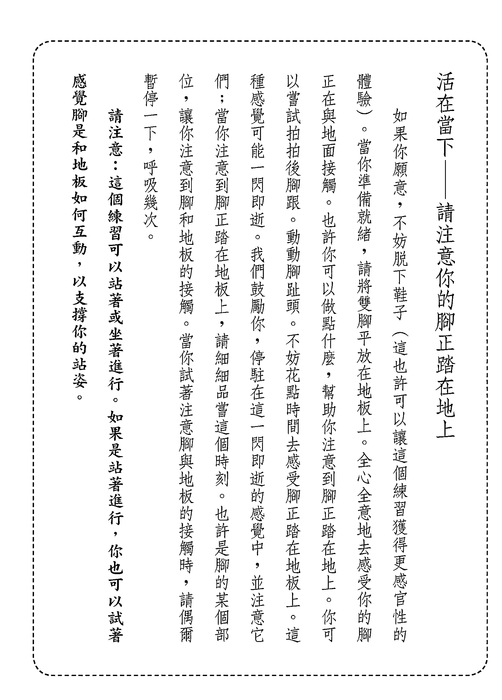

## 活在當下——請注意你的腳正踏在地上

如果你願意，不妨脫下鞋子（這也許可以讓這個練習獲得更感官性的體驗）。當你準備就緒，請將雙腳平放在地板上。全心全意地去感受你的腳正在與地面接觸。也許你可以做點什麼，幫助你注意到腳正踏在地上。你可以嘗試拍拍後腳跟。動動腳趾頭。不妨花點時間去感受腳正踏在地板上。這種感覺可能一閃即逝。我們鼓勵你，停駐在這一閃即逝的感覺中，並注意它們；當你注意到腳正踏在地板上，請細細品嚐這個時刻。也許是腳的某個部位，讓你注意到腳和地板的接觸。當你試著注意腳與地板的接觸時，請偶爾暫停一下，呼吸幾次。

> 請注意：這個練習可以站著或坐著進行。如果是站著進行，你也可以試著感覺腳是和地板如何互動，以支撐你的站姿。

## 培養正念技巧

瑜伽也有助於提升自我覺察，包括：思想、感覺和身體反應。這種內感受性覺察的提升，能夠幫助我們重建與身體的連結，以及與自我感的連結。關於創傷感知瑜伽，我們發現，如果有清楚的指導，並且是在身體導向的情況下進行，正念練習的效果最為成功。與其要求大家覺察自己的思想、感覺或甚至周遭環境的景象、聲音、氣味，我們建議採取類似以下的練習。

## 培養正念——用鼻子呼吸

請注意：根據我們的主觀經驗，我們的許多患者都習慣用嘴巴呼吸，很顯然地，他們使用的是次要的呼吸肌肉。更多有關呼吸練習的說明，請詳見222頁。

當你準備就緒，請開始注意你的呼吸。你可以張開眼睛或閉上眼睛，這取決於你。如果你願意，你可以嘗試用鼻子吸氣和吐氣。對於習慣用嘴巴呼吸的人來說，用鼻子呼吸可以說是一種練習。如果你決定嘗試用鼻子呼吸，請明白，當你感到不舒服，不論任何理由，你永遠都可以用嘴巴呼吸。請暫停片刻，嘗試用鼻子呼吸幾回，然後，如果你願意，改成用嘴巴呼吸。你有注意到任何不一樣嗎？你有注意到哪一種呼吸方式比另一種舒服嗎？如果沒有，也沒關係。當你準備就緒，請回復到你自然的呼吸。

如果你要將這個練習引進診間，不妨自己嘗試做做看，了解這個體驗是什麼樣的感覺。也請同時注意一下，你是否出現任何不舒服或是帶有自我判斷的跡象，然後再回到這個練習。盡量以一種好奇、不帶任何價值判斷的立場，全面體驗這個練習的各個面向。

## 建立好奇心並培養對感覺的忍受度

「痛苦耐受度」指的是處理身體和情緒不適狀態的能力，其重要面向在於放下我們對這些狀態的成見。好奇心有助於創造情緒上的距離，在這種情況之下，人們能夠「只去注意」自己的內在狀態，而不會採取立即的行動企圖去改變這些狀態。而創傷感知瑜伽即提供了具體的做法，幫助培養不帶偏見、不需要改變任何事情的純然好奇心。

我們會用到的方法之一是使用詢問式的語言，會用到諸如：「注意」、「檢視」、「嘗試」、「好奇」等字眼。在為個人進行心理治療的情況下，想要發展患者對感覺的忍受度，有個重要的元素，就是幫助患者對於在瑜伽練習中出現的內在狀態和感覺，能夠培養出辨識、標籤、溝通的能力。創造出一種可以描述我們內在狀態的語言，可以幫助我們了解與釐清我們之所以會有這些反應的前因後果，且往往使得令人無法忍受的經驗，變得可以去應付。能夠溝通我們的內在感受，我們就能夠尋求協助來幫忙處理我們的反應，並且能夠清楚地向他人表達自己的想望與需求。藉由這些方式，我們得以照顧好自己。

我們也開始幫助患者培養自己的主體感，對於種種的反應能夠有掌控的能力。如果我們意識到對於自己的體驗，我們可以有一些選擇權，那麼往往會變得比較可以忍受不舒服的感覺或情緒。將瑜伽練習融入到治療，為患者提供了可能性，讓他們可以不帶偏見地去體驗內在狀態；而在同時，他們也會學習到，如果事情變得痛苦難忍，他們也可以改變正在進行的事情，以減少痛苦。

我們的目標是為創傷倖存者提供安全的機會，透過溫和的瑜伽挑戰自己，並且藉由這樣的行動，改變他們和自己身體的關係。我們努力地想在接受內在感覺和情緒，以及被賦予權力的感覺之間創造出一種平衡，因為前者可以提供我們有用的訊息，後者則能夠為我們的生活創造改變。我們愈能夠協助倖存者傾聽自己的身體，並辨識出某個瑜伽練習在什麼時候會造成疼痛、引發瞬間經歷其境的反應，或是活化解離反應機制，就愈能夠賦予倖存者能力做出調整，來減輕他們身體的不適，或重建安全感、選擇感與自我掌控感。如此一來，在他們創傷復原的整個過程中，就能夠更有效地運用瑜伽做為療癒的機制。

## 建立好奇心的練習

如果你願意，輕輕地將你的左耳朝向左肩往下壓。請刻意放輕放慢這個動作、這個姿勢，慢到足以讓你有機會注意到任何浮現的感覺。舉例來說，你可能會注意到頸部右側的感覺。這種感覺是因肌肉的伸展所引起。如果你感覺到有任何一點點的不舒服，隨都可以把頭抬起，轉回到中間，以減輕不舒服的感覺。你甚至可以練習將頭輕輕抬起，就像個實驗。你注意到了什麼？根據頭部角度的變化，你會感覺到有什麼改變嗎？不妨在這一側暫停片刻，做幾次呼吸，好好地檢視其中的感覺。當你準備就緒，輕輕地轉回中間的位置（頭位在中間），如果你願意，可以換另一邊練習。

## 改變和身體的關係

> 在上課幾天之後，我覺察到我真的有一個身體。 ——創傷中心的瑜伽學員

創傷感知瑜伽可以幫助大家善待自己的身體。瑜伽可以創造出更寬容、更溫和的方式，來與身體產生連結。瑜伽教導我們避免關掉身體的反應，或是避免把身體逼到無法忍受的極限；取而代之的，瑜伽教導我們透過最佳的「容忍之窗」（window of tolerance）與自己的身體連結。容忍之窗很個人化、而且範圍不定，指的是可控制的情感、身體和認知的喚起。過度喚起是一種強烈的情緒體驗，超出容忍之窗的範圍；然而麻木和解離，則是關閉或缺乏情緒體驗，也在容忍之窗之外。每個人都有其獨特的容忍之窗。重要的是，這個窗口可以隨時間縮小或放大，可以跨越不同的情境，或是對造成生活改變的環境或事件做出反應，包括面對逆境或是增強個人的能力和資源。

### 6 給臨床心理師

創傷倖存者往往會發展出極度狹窄的容忍之窗，即使是適度的情緒或生理反應也會讓他們招架不住，因而激發出創傷記憶或是導致觸發反應的狀態。許多創傷倖存者到頭來會跟身體建立起很嚴酷的關係，做出許多自我傷害的行為，包括：酗酒、嗑藥、飲食失調、自殘。對許多創傷倖存者來說，處在造成這麼多痛苦和折磨的身體裡，是非常難受的；有時候，唯一有意義的事情，就是一遍又一遍地懲罰「失敗」的身體——本質上，這是個人與自己的身體，以主客體的關係在重複著創傷。

透過創傷感知瑜伽，我們致力於幫助大家發現一種與自己身體不一樣的關係，更溫和、更寬容的關係。我們優先考慮的是安全與健康，並且對身體提出適度的挑戰。我們也很清楚這項任務有多麼困難；那需要擁有一股長期的耐心與愛心。

創傷感知瑜伽的練習，也提供了一種方式，讓我們檢視以為常的身體模式，並探索我們過往未曾想過的新方法來感受身體的存在。長期處在創傷之下，會將我們鎖定在一些特定的身體模式，也許會讓人覺得受到保護，但是久而久之，就會感到窒息與受限。對某些受創的人來說，瑜伽提供了一個安全的方法來試用這些模式，並且找到更健康、更廣闊的方式來展現身體，進而能夠促進自我了解，產生個人的主體感，並且喚起更多的可能性。

## 坐姿扭轉：善待你的身體

如果你願意，讓我們從坐山式開始（詳見第五章）。請注意將腳放在地上。請注意將脊椎打直。請注意將胸部些微擴大和伸展。當你準備就緒，請輕輕地向左轉；如果你願意，你可以將左手放在左邊臀部，右手放在左大腿上。輕輕地向左轉，看看你是否能夠保持腳放在地上，脊椎打直，胸部保持擴大和伸展。不妨在此呼吸片刻。請注意，你不必扭轉太多。也許稍微轉一點點效果最好。請確保你呼吸順暢，並且沒有疼痛。如果你感到任何疼痛、緊張或不適，不管是什麼，請你心甘情願地轉回來。你可以嘗試徹底放棄扭轉（你對此永遠都有掌控權），或是轉回到你可以保持呼吸順暢的程度。你可以隨意嘗試，但是，你也該對自己做出承諾，保證在這個姿勢裡感到舒適。向左扭轉呼吸幾次之後，不妨回到中間放鬆下來，並且換邊以同樣的方式嘗試看看。加點變化：當你轉向一邊時，你可以嘗試將下巴朝向那邊的肩膀或甚至看向你身後的牆壁，也就是通過你的眼睛進行扭轉。當你準備就緒，輕輕地回到中間，回到坐山式。如果你的眼睛是閉上的，請慢慢張開。

## 回歸中心

就目的而言，所謂「中心」，可以指任何東西，我們在生理上、身體上、心理上或情緒上，可以環繞著「中心」來運轉。從這個角度來看，我們的家庭、工作、宗教觀點、社區或是我們的健康，以及我們對世界的看法、我們的心理狀況等等，都可以是我們的中心。「中心」也可以是內部的，在我們身體的核心。每一個人，就像天地萬物一樣，都有身體的中心，我們可以環繞著中心而運行。身體的中心為我們的本體感覺建立了參照點，形成了身體各部位相互依存的感覺。身體的中心也有助於我們保持平衡。在許多東方的觀點中，環繞中心運行的概念，超越了身體的層面，並且意味著一個人穩重、知天命、心平氣和，我們還可以想像出許多「大中至正之人」的特質。我們也不難觀察到，許多創傷倖存者，已經失去了獨立、穩定的中心感。

試想，長期受到虐待的兒童，必須隨時提高警覺注意那些往往無法預測、危險殘忍的外來力量，以判斷他們在世界上的安全與地位。施暴者篡奪了受害者從自己內部中心觀看世界的權力。施暴者成為了「中心」，而這可能會形成一種模式；在此模式之下，受害者不知道如何從內部尋找到穩定感和安全感。而創傷感知瑜伽即是試圖幫助倖存者與受害者重新連結上根本的、內部的身體中心。

對許多倖存者來說，創傷成為了最強大的中心，他們圍繞著這個中心來運行。因為創傷經驗可能是生命中最重要的經歷，從身體上、生理上、情緒上、甚至精神上改變了我們，創傷經驗變成了帶有強烈引力的震央。經由重複地反應、重組改編和預期創傷事件再次發生，許多創傷的痛苦來自於它的餘波盪漾。創傷後遺症會透過某些症狀或生存策略表現出來，像是過度警覺、過度喚起、憂鬱、麻木和瞬間重歷其境等，令人心身俱疲。創傷感知瑜伽的基本要素之一，就是在幫助大家找到其他的中心。我們首先關注的是身體的生理中心——核心肌群。這項工作是為了幫助大家找到自己的生理中心，並且在身體裡面發現這個穩定和力量的強大泉源。這個生理中心可以擴展到情緒上的平衡感和生活上的平衡感。我們將瑜珈練習視為是創傷倖存者可以圍繞運行的某些東西，不僅不會帶來痛苦與折磨，而且還是力量、幸福和寧靜的潛在泉源。正是這樣善解人意的特質，指引著我們在創傷感知瑜伽中回歸中心的練習。

## 找到你的中心

当你准备就绪，请开始注意你是如何坐在椅子上的。开始去感受一下你的形状。特别是，尝试找找看你的中心。我们可以从一些动作来开始进行。你可以选择轻轻地前后摇摆或左右摇摆。你也可以用类似画圆圈的方式来动作。一开始，可以将动作变得愈来愈大，然后逐渐将动作变得愈来愈小。当你开始将动作变得愈来愈小，不妨也尝试将动作变得愈来愈慢、愈来愈谨慎。当你的动作变得愈来愈慢，你可能会注意到下腹部的肌肉开始在用力。下腹部的肌肉可能会自然而然地变得强壮活跃。请花点时间注意一下，你正中心肌肉力量的特质。最后，如果你愿意，你可以轻轻地缩紧或收进你的下腹部，与核心肌群进行互动，藉此来锻炼你正中心的稳定性和力量。如果你愿意，请暂停片刻，以便检视你的中心如何做为支撑和稳定性的来源。

## 樹式：回歸中心的練習

當你準備就緒，請先站起來。穿不穿鞋子都可以，這取決於你。如果你願意，一旦站好了，請將雙手合十放在胸前。保持呼吸輕鬆自在。可以用鼻子或嘴巴呼吸，就目前來說，這無關緊要。當你準備就緒，開始將重心轉移到左腿和左腳。如果你願意的話，可以把右腳趾放在地上，或是將右膝輕輕彎出去，把右腳放在左腳踝上。另一個選項是，將右腳滑到左小腿上，這樣你就全靠一隻腳站立了。你有許多選項。不妨花點時間來探索。你可以嘗試某些選項，如果效果不好，就嘗試其他選項。你永遠都不會被困住。你永遠都可以改變姿勢。現在，花點時間考慮一下視線。你可以選擇看著地板上的某一點，或是前面的牆壁。挑出一個定點，將視線漸漸地聚焦在定點上，這對某些人是有幫助的。再次提醒，請保持呼吸輕鬆自在。你也可以嘗試看著指尖（如果你是雙手合十放在胸前的話）。另外一種「視線」，是閉上眼睛，將注意力轉向內部。閉上眼睛也許可以幫助你開始與中心聯繫。我們保持平衡的方式之一，是從周遭世界獲取視覺訊息，並依照這些訊息來定位自己。如果閉上眼睛，你就會發現其他的訊息來源，特別是來自你中心的訊息。閉上眼睛，即使只是呼吸一、兩次的時間，都是和中心開始建立聯繫的好方法。再次提醒，請輕輕地縮緊下腹部，如果有幫助的話。「回歸中心」的練習是身體的、內在的：是此時此刻發生在你身體裡的練習。如果你願意花點時間探索一下核心肌群的力量與穩定性。最後，注意「回歸中心」的練習，會如何影響你的平衡。當你把自己定位到自己的中心時，有什麼明顯的效果嗎？當你輕輕地縮緊或收進下腹部時，又如何呢？

嘗試平衡練習是另一個好方法，有助於了解自己的中心。不過，在此有個重要的提醒——對創傷感知瑜伽來說，我們已經不再使用一般人所謂的平衡，而傾向使用回歸中心。保持平衡暗示著失敗的可能性（不管你是原地不動或搖晃摔倒）；但是回歸中心，失敗的空間則會減少，因為那比較多是屬於內部的探究。事實上，如果我們正在進行一項回歸中心的練習，失去平衡反而會成為一種助力。因為每當我們跌倒，我們的腹部肌肉就會自然地變得強壯有力，以幫助我們站起來。透過跌倒，我們能夠對於「中心」了解更多。請考慮嘗試下面這個傳統的平衡練習（樹式），我們做了一些修改，讓回歸中心的練習變得比較容易進行。

### 根植大地

解離症狀是對無法承受的經驗所做出的反應，而這會成為習慣。在充滿壓力的情況下，許多創傷倖存者會乾脆讓自己變得「一片空白」或「陷入恍惚」。這樣的反應機制雖然具有保護性，但其本身也會開始製造痛苦，尤其發生意識控制之外時。創傷感知瑜伽有助於發展根植大地的策略，用來對抗解離症狀。例如：山式就被認爲是非常「根植大地」的姿勢，因爲「山式」非常著重在與大地的連結，或是利用重力刺激感覺。

### 山式站姿：根植大地的練習

請注意，雖然我們以站姿呈現山式，但是也可以坐著或躺著做。此練習的重點在於幫助人們檢視，自己的身體是在哪裡與地面相連。如果你願意，請站起來。穿不穿鞋子都可以，取決於你。當你準備就緒，將雙腳平放在地板上。開始注意雙腳與地板的接觸。花一段時間，全神貫注在你腳上感覺和地板接觸的那些空間。也許是一隻腳上的某一點。也許是較爲模糊，甚至到目前還無法找到確定位置的感覺。你也許現在一點感覺也沒有，那也沒關係。只要給自己一點空間，好好對此留意一番。接下來，讓呼吸保持輕鬆自在，將注意力轉移到中心。輕輕地縮緊或收進下腹部（如果有幫助的話），並開始建立你的中心。（協助者可以參考上面回歸中心的練習，以獲得一些線索。）現在，當雙腳著地、中心就定位，請注意你的頭頂。如果你願意，可以通過頭頂，輕輕地抬起身來，或是直接將身體打直，這樣便能自然地站挺。最後，當雙腳著地、中心就定位、脊椎自然挺立，請讓其他的部位全部放鬆。讓肩膀輕輕地垂下。讓你臉上的肌肉、下巴，完全放鬆。讓身體感受重力的作用一會兒。注意你根植於大地的地方。如果你願意，在此暫停，呼吸幾次。注意身體的哪些地方感覺穩定，哪些地方感覺放鬆。

## 建立情感調節技巧

創傷倖存者經常與情感失調搏鬥，當情感失調發生，情緒就會從一個極端擺盪到另一個極端。正如我們在稍早的章節裡，討論到有關生存反應的生理基礎所提到的，情緒狀態與身體內的喚起程度有關。當我們處在失調狀態，身體便經常在過度喚起和喚起不足之間搖擺不定。

創傷感知瑜伽有助於同時建立向上調節（增加身體的活躍度）和向下調節（讓身體平靜）的技巧。例如：如果患者垂頭喪氣地坐在椅子上，很沒有活力，你可以利用瑜伽練習來嘗試一種激發活力的「實驗」，探索在增強活力的練習中，心情或感覺有沒有變化。像是「從坐著變成站著」如此簡單的練習都可以。或是，即使是坐在椅子上，你都可以嘗試上面曾經介紹過的山式練習。在另外一個章節，我們將介紹或許也會有幫助的呼吸練習。另一方面，如果患者處於過度喚起的狀態、坐立難安或是呼吸急促，不妨嘗試有助於平靜的練習。以下的練習也許有幫助：

### 坐姿前彎：平靜的練習

如果你願意，請把雙腳打開得比臀部稍微寬一點。當你開始嘗試前彎動作，你有很多選項。你可以將前臂放在大腿上，讓自己足以向前彎。也可以將指尖放在地板上或是將雙手放在地板上。另個選項是用一隻手抓著另一隻手的肘部，自由地垂掛前彎。不妨嘗試這幾個選項一會兒。你可以試試一些做法，如果不奏效，就試試別的。請花點時間實驗一下。如果你願意，準備就緒時，不妨輕輕地搖搖頭或是點點頭，讓頸部和上背部的肌肉可以放鬆一點。你也可以輕輕地動一動你的下巴，想辦法舒解下巴的壓力。不妨在此呼吸大約二十秒鐘。當你準備就緒，請開始慢慢回復到山式坐正，保持呼吸輕鬆自在。

請記住，對某個人來說很平靜的感覺，對其他人來說，也許是心煩意亂。請徵求回饋意見，並用你最好的判斷力來評斷這個練習，或是書裡面任何一個練習的效果。請記得，當涉及到創傷感知瑜伽練習時，主觀經驗比什麼都重要。

### 呼吸練習和情感調節

呼吸練習是一種有力的情感調節工具，可以改變身體裡此刻的感覺。當倖存者的反應被活化，呼吸通常會變得比較快速、淺薄，以增加全身的氧氣量。長期的創傷倖存者，往往會發展出淺快的呼吸模式，以呼應焦慮、過度喚起和恐慌的狀態；當他們被觸發或感到不知所措的時候，許多創傷倖存者經常會不自覺地屏住呼吸。屏住呼吸是防禦性的，並且可以讓人們免於情緒崩潰；但是這些呼吸模式會導致身體處於緊張失調的狀態，而且可能讓許多創傷倖存者增加身體內整體不安的感覺。呼吸可以是一種與自我接觸的方式，可以用於向上調節（激勵），也可以用於向下調節（平靜）。尋找並且嘗試新的呼吸方式，也許是讓人更能安住於身體的方法。

從瑜伽的角度來看，呼吸練習（梵文 pranayam）是相當進階的練習，有很多需要注意的事項。一般來說，我們對呼吸技巧非常謹慎，並建議學生在嘗試大多數的呼吸練習時，可以有合格的老師在一旁指導。有些創傷倖存者，可能因為做了一點深呼吸和放鬆身體的防禦而被觸發；其他人則可能因為某些瑜伽姿勢用到的快速呼吸技巧而被觸發。我們在本書介紹的呼吸方法，可以讓讀者在家裡、診間、教室裡自在地練習，但也向來都會建議讀者，傾聽自己的身體，並且在感覺到任何不適的時候，停止練習。

一般來說，在創傷感知瑜伽的情境之下，我們的呼吸方法是幫助大家溫和地擴展呼吸能力，也就是在身體裡面找出更多的呼吸空間。我們發現，對許多學生來說，呼吸練習非常具有挑戰性，最好謹慎以對，並且保持耐心。任何一點細微的變化都可能像是巨大的飛躍，我們寧快，因此變得不舒服。

我們經常邀請學生嘗試的練習爲「增加一點呼吸」，其指示類似如下：「如果你願意，不妨嘗試在吸氣的時候多吸一點，吐氣的時候多吐一點。你可以用嘴巴或是鼻子呼吸，在練習之中，這都無關緊要。你只要像平常那樣開始呼吸就可以了，如果你願意，請在吸氣的時候多吸一點，吐氣的時候多吐一點。」此練習已經成爲許多學生嘗試擴展呼吸能力的方法，而且是以一種安全可行的方式進行。

請注意，對創傷倖存者來說，尋找新的工具來調節生理和情感感受，是非常強烈的體驗。我們所介紹的練習，只是做爲舉例說明之用；如果沒有達到你致力想達成的效果，請和你的患者繼續發揮創意和實驗精神，看看你們能不能找到一些有效的東西。

### 練習選擇

我喜歡選擇的重複性。

我理解這無關對錯，也無關期望。

> 選擇是有关于赋予权力。——創傷中心的瑜伽學員

儘管我們已在書裡規劃了一個篇幅去探討「練習選擇」的主題，不過在創傷感知瑜伽裡，這個主題是如此重要，所以我們也想要跟臨床心理師談談有關「選擇」。對創傷倖存者來說，這個世界可能毫無選擇可言，特別是牽涉到「受苦」（這裡所謂的「受苦」，是一種很普世的概念），而且對於痛苦和不安，每個人都是無能為力的，什麼都改變不了。這些瑜伽姿勢可以提供一些微小而且可掌控的體驗，讓我們可以開始挑戰這些假設。我們也可以藉此檢視選擇與痛苦之間的關係。我們可以練習從身體得到反饋，並且因為注意到自己所做的選擇，可以在當下就舒解了那個痛苦，而有了成功的經驗。持續地將焦點清楚地放在這個經驗和目前的姿勢上，所可能產生的整體效果是——我們逐步挑戰了「我們永遠都無法減輕痛苦，做什麼都沒用」的深層假設。

我們希望能鼓勵你，提供很多機會給你的患者，讓他們為自己做出選擇。不論你們正在做什麼練習，建議你，請特別邀請患者根據身體裡的感受做出選擇。如果你同意赫曼的觀點（即創造出有力感和主體感，是創傷倖存者邁向復原的核心），不妨嘗試以瑜伽為基礎的介入措施，那可以給你的患者的機會去練習做選擇，並且能夠在當下就感受到後果的具體經驗，而不是把選擇當作是抽象的概念在探索。就像是如果我選擇在肩膀畫圈時，將圓圈畫得小一點，我可能會立刻注意到，我在做這個動作時不會感到任何疼痛。而如果我選擇在坐姿抬腿練習，將腿稍微抬高一點點，我可能會立刻開始感覺到腹部的一些核心肌群正在用力。

對於跟我們合作的人來說，他們身體裡正在發生的事情和他們所做出的選擇之間，經常存有巨大的裂痕。他們與自己的身體脫節，因為他們覺得被困在各種不舒服的狀態之中，而且別無選擇。他們對自己的身體最終會有什麼樣的遭遇，經常會形成長期麻木不仁、不感興趣的態度：「我沒有辦法讓自己感覺好一點，所以何必煩惱呢？」而透過瑜伽，我們給了創傷倖存者機會，去體驗他們所做出來的選擇，也許會、也許不會對他們的身體在此刻產生正向的結果。

> 創傷中心的一位患者告訴我們：「『選擇』這兩個字說再多遍都不嫌多。」因為這句話，我們建議你在嘗試瑜伽的介入措施時，重複對你的患者使用『選擇』這兩個字。

## 透過選擇賦予權力

這裡有個選擇練習，在做這些運動的任何時刻，你不妨都嘗試看看。請注意，如果你正在做的事情，讓你感到有任何一點點的疼痛，或者你覺得你正在傷害自己，那麼請選擇立刻停止。改變你正在做的事情，好讓你不再傷害自己。例如：你正在做頸部旋轉，而你注意到脖子很疼，請選擇停止傷害自己，你可以把動作變小一點或是完全停止不做。由於這個練習，你意識到你「正在選擇」停止傷害自己。這是非常有力的練習，而且你可以隨時進行。在這一刻，你的身體會記得，你為保護自己免於受苦所做出的承諾。

## 整合經驗

為了避免痛苦，創傷倖存者會想辦法與經驗的某些面向產生斷裂。然而，由於這樣的斷裂，創傷倖存者對於周遭的世界以及他們本身各方面，可能會經歷到脫節，缺乏連貫性的感覺。我們稍早在討論創造節奏的主題時，曾經介紹過這個概念，創造節奏是創傷感知瑜伽很關鍵的一個元素。創傷感知瑜伽可以讓你練習整合自身經驗的不同面向。例如：瑜伽從姿勢到姿勢之間的轉換，必須伴隨著呼吸的協調一致④。一同練習瑜伽的人，彼此之間的動作和呼吸也必須協調一致。在這種練習之中，我們整合了運動感覺和外感受性感覺（外部感覺），像是耳朵聽見呼吸，以及內感受性感覺（身體內受到刺激所產生的感覺），像是感覺到我們心跳加快。專注於整合這些感覺，會創造出一種「心流」，在心流狀態之中，經驗的各個不同面向會融為一體⑤。以下是心流導向的練習，著重在呼吸和運動的整合。

### 太陽呼吸：整合呼吸和運動

請注意，這個練習牽涉到第四章討論過的，建立個人內在的節奏。 請你從坐山式或是山式站姿開始，讓我們一起來練習整合呼吸和運動。 吸氣時，請將雙臂向上張開；吐氣時，將手掌從你的中心伸出去。吸氣時，用雙臂畫出一個圓圈；吐氣時，將手掌從這個圓圈的中心伸出去。這可以是一個很誇大的橫掃動作。對某些人來說，也許太大了。你可以用比較小的動作，練習整合呼吸和運動，例如從雙手放在雙腿上開始：吸氣時，將雙手抬高三到五公分；吐氣時，將雙手放回腿上。給自己一段時間，試著將呼吸和運動協調一致，好讓我們可以依照同樣的節奏運動和呼吸。（治療師和患者也許可以論流設定速度）。最後，請花一點時間，找到自己的節奏，依照自己的速度呼吸和運動。當你準備就緒，讓我們回到舒適的坐姿。

## 加強信心

重複地受傷會導致無助感和無力感。許多創傷倖存者多年以來持續使用委屈求全的生存對策，為了安撫他人的要求，而無視於自己的想望和需求。到頭來，可能對自己究竟是如何感受的、或是想要什麼，都會感到困惑。此外，因為許多創傷倖存者都在自責之中掙扎，他們已經學會了不再相信自己或是自己的直覺。

由於失去了對自己的信賴，倖存者的主要目標也許是重建自信和賦權感。定期的瑜伽練習，可以同時增加身體上和心理上的活力與彈性。這些轉變可以促使練習者對自己應付挑戰的能力信心大增。

為了具體說明，讓我們試想一下，從坐著到站著所帶來的變化；特別是在診間裡，大部分的互動都是坐在椅子上進行，練習改變姿勢，做為加強信心的方式，可能會讓人獲得莫大的力量。

如果治療師和患者已經辨識出無力感或解離反應是患者最大的掙扎，這麼做會特別有幫助。這種身體的策略，也許可以融入著重在賦權的臨床治療工作，或者也可以是全新的身體方式。

### 6 給臨床心理師

體驗，並隨之提出了新的臨床議題（「直到我站起來，我才了解到我有多麼地萎靡不振，多麼地分崩離析」）。不論是哪一種情況，導入身體的練習，將目標設定在探索、挑戰和改變無力感，都可能非常有幫助。

請思索以下來自創傷中心某位瑜伽學員，對透過瑜伽建立自信的經驗所做的省思：

在上一次的瑜伽課程裡，我內化了這樣的想法：「我可以改變我的姿勢和環境，以符合我的需求。心理上，我已經聽過這個想法一遍又一遍；但生理上，我從來感覺不到我有能力採取行動。當我對我的姿勢做出必要的修改時，謝謝你告訴我：「這樣很好，是很棒的一件事！」我也要謝謝你，為我提供一個更舒適的練習環境……。在瑜伽練習中，我獲得了擺脫痛苦的信心，幫助我擺脫了過去的痛苦。我現在感覺很好；我感到堅強。

## 发现内在的力量

如果你愿意，请花点时间注意你正坐着。你也许会意识到此刻你坐在椅子里的姿势。你只需去注意，你是往后坐进椅子里，或是往前坐，或是靠着一边坐。在这里的目标并不是去判断哪一种姿势比较好，单纯只要你去注意，你的身体此刻是如何坐在椅子上的。如果还是忍不住做出判断，也没有关系。再者，也可以练习只专注在自己的判断上，如果可以的话，请回到纯粹只去注意身体的坐姿。过了一会儿，当你准备就绪，请开始慢慢地站起来。在此，你不妨缓慢且从容不迫地进行动作。感受双脚开始承受身体的重量。请注意，如果椅子有扶手，那么你可以用双手和上半身来帮你做转换。当你从椅子上起身时，请密切注意此刻的身体感受，你可能会感受到有一些肌肉开始用力，当你坐着时，这些肌肉并不活跃。你的双腿，发生了什么变化？你的背部，發生了什麼變化？你的腹部核心肌群，發生了什麼變化？你還有注意到其他肌肉的變化嗎？一旦你完全站立，請暫停片刻，並做幾次呼吸。

針對治療師、協助者或練習者，在此，不妨沿用山式站姿的說明腳本，或是你也可以依照接下來的指示繼續進行練習。

只要給自己一點時間，就這樣站著並且呼吸就可以了。就是這麼簡單。

建議你可以用時鐘或是自己慢慢地數到三十秒（也可以選擇不同的時間長度），在這段期間，保持站立和呼吸。當時間一到，不妨坐回椅子。

## 建立與他人的連結

> > 與他人一起上課的經驗對我是有幫助的；我感覺到自己並不孤單。—— 創傷中心的瑜伽學員

赫曼寫到：「心理創傷的核心經驗是權力被剝奪，以及與他人失去連結。因此，復原的基礎在於賦予倖存者權力，並創造新的連結。」⑥ 創傷感知瑜伽是練習重新連結的方法，而且在診間裡就可以進行。儘管環繞著患者的創傷經驗和他們建立連結並給予支持，可能對他們很有幫助，但這並非是與另一個人的充分連結。讓你的治療師傾聽你的經驗，也許極有幫助，但是這和擁有共同的經驗有所不同。我們建議建立另一種層次的重新連結——發生在創造共同經驗的過程中，發生在共同做一些事情的時候，像是一起練習創傷感知瑜伽所產生的連結。瑜伽是非語言的傳統，通常以團體的方式進行，類似於團體運動或舞蹈，透過與他人動作的整合，可以創造出超越語言的連結感。這些好處，甚至在診間進行一對一練習的情形之下，都可以體會到。患者和治療師往往會落入涇渭分明的角色裡，可能無法培養出與人共享經驗的感覺。建議你，在不妨礙醫療界線的情況下，可以透過瑜伽練習，將一些人與人之間的共享經驗帶入診間。在診間裡練習與內心深處聯繫的方法之一，就是有目的地同時運動和呼吸，並且在節奏上保持同步。為了讓這個練習奏效，練習的「帶領人」必須確認其他的人是否進入狀況，包括：他們所設定的速度是合宜的，並且必須能夠根據反饋做出回應。事實上，這也許是很好的機會，讓每個人都輪流來擔任「帶領人」（設定速度的人），如此一來，每個人都擁有被仿效或被跟隨的經驗，以及被視為「跟隨者」的經驗。在以下的太陽呼吸變體練習中，不妨嘗試這些不同的角色。

### 透過太陽呼吸變體，建立非語言的連結

此練習著重在與一同運動、呼吸的人，建立非語言的連結。其中一人將先扮演帶領人，另一人則是追隨者。帶領人將會帶領練習，並且設定速度，持續帶領幾個回合，比如說十五回合；或是設定一段時間，比如說三十秒。不妨在練習之前一起決定這些參數。這個練習特別適合「帶領人」和「跟隨者」角色互換，這樣一來，彼此就可以探索身為帶領人相對於追隨者在感覺上的差異。

請注意，這個練習重申了創傷感知瑜伽裡的關鍵主題：建立節奏。請參閱第四章有關人際節奏的內容。

如果你願意，請進入坐山式。將雙手放在雙腿或膝蓋上。吸氣時，將雙臂輕輕地向兩側伸展；吐氣時，將雙手合十放在胸前，然後將雙手放回雙腿或膝蓋上。吸氣，伸展；吐氣，合十；然後輕輕地放下。

## 因應將瑜伽策略引進診間所帶來的挑戰

臨床心理師經常求助於我們，他們擔心患者不願意參與以身體為基礎的介入措施，因為對患者來說，這是不自在也不愉快的經驗，尤其是在一開始的時候。患者在會談的時候，動到他們的身體，而且「被看到」，可能會讓他們感到尷尬。臨床心理師也詢問我們，在使用以瑜伽為基礎的介入措施時，如何避免引起患者的觸發反應。首先要提醒的是，我們無法消除所有的觸發因子；事實上，我們認為這並不是我們的職責所在。我們最終希望的是，能為患者創造出安全的空間，讓他們在觸發因子出現的時候，可以有效地因應。我們觀察到倖存者有時候會透過解離來回應具體的挑戰（像是以身體為基礎的介入措施）。對我們的很多患者來說，多年以來，解離一直都是很有效的處理技巧，而且會持續下去。我們也了解，不斷地解離，會使人衰弱，而且很危險。藉由瑜伽，也許我們可以提供一些其他的工具（像是根植大地的技巧，或是情感調節策略），來處理觸發反應，到最後可能會更加安全、更加有效。

當你同時運動和呼吸時，請隨時注意運動和呼吸的連結，不只要注意個人的感覺，也請注意和別人一起呼吸和運動的感覺。如果你願意，請全神貫注在共享的經驗上。當你準備就緒，也許可以回覆到坐山式，靜靜地坐著呼吸調息，眼睛睜開或閉上都可以。

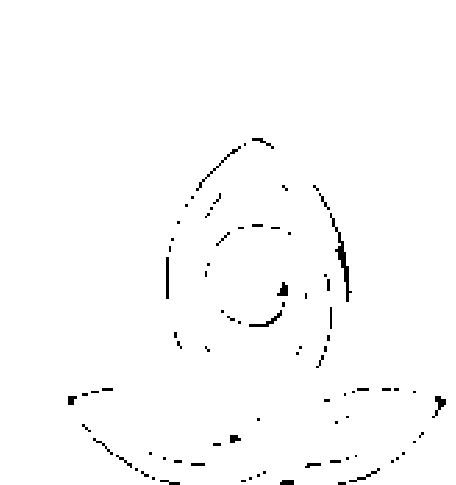

## 蕾妮的故事

蕾妮在充滿家暴與混亂的家庭中長大。她的父親是個酒鬼，一喝酒就會變成暴力狂。他經常在身體上虐待蕾妮的哥哥馬汀，並且在言語和情緒上羞辱蕾妮和她的母親。馬汀將他無助的憤怒轉而發洩到蕾妮身上，特別是當他們的父母不在身邊時。蕾妮形容她的母親像個「鬼魂」，似乎不太在乎發生了什麼事情，而且完全無力保護蕾妮。蕾妮回憶她小時候，一直活在恐懼之中。長大之後，蕾妮深受嚴重的焦慮所苦，幾乎每天晚上都做惡夢。她迴避與人建立親密關係，因為她無法忍受有人看出她的心事，或是跟她變得親近。她懷疑自己是否已經變成了鬼魂，就像她母親一樣。

蕾妮的治療師將瑜伽練習引進治療之中。她們的一些治療目標包括：增加蕾妮對內在狀態的覺察能力以及調節能力。蕾妮可以在坐山式的練習之中投入，並且對她的內在狀態產生了好奇。她注意到她全身的肌肉都很緊繃，特別是肩膀。她的腹部有一種被掐住的感覺，胸部則有壓迫感。

在練習坐山式之後，蕾妮的治療師接著開始導入呼吸練習。她和蕾妮一起參與了這個練習。她們各自都將一隻手放在胸部、一隻手放在腹部，進行腹式呼吸（「腹部呼吸」）。經過幾次愈來愈深的呼吸，蕾妮變得非常焦慮。她描述自己的感覺，她的心跳快速，感覺到不知所措，然後她開始哭泣。

蕾妮的治療師與她一起努力，幫助她進行根植大地的練習，治療師引導蕾妮感覺到自己的雙腳正踏在地板上，並且去感受使她可以跟椅子保持接觸的重力。蕾妮慢慢地平靜下來，並且在診間裡也變得比較清醒。

蕾妮聽取了治療師對這個練習所做的解說，並且一同回顧了練習中的每個部分對蕾妮來說有何感覺。蕾妮開始明白到一點，當她感覺到放鬆，事實上會讓她產生焦慮感。蕾妮的治療師幫助她將她的感受正常化，並且為蕾妮提供了一個架構，幫助她去了解，她之所以會過度警戒，是因為她的身體在確保她是安全的，是受到保護的。

與其將這次練習視為一次失敗，蕾妮和她的治療師反而能夠一起去探索她們從這次嘗試中所學到的東西。蕾妮在診間裡的身體感受，幫助她們可以指認出，處理蕾妮內在衝突的首要治療目標之一就是情感調節。雖然一部分的蕾妮希望體驗到平靜的感覺、釋放緊張和焦慮；但另一部分的她，感覺需要不斷地保持警戒，以防範潛在危險。這個練習幫助蕾妮和她的治療師，改進了治療的節奏，以及對於介入措施的選擇。她們透過正念練習，持續強化蕾妮的信心。她們也進行賦權的瑜伽練習（像是從坐姿轉向山式站姿），以及資源的建立。幾個月之後，當她們回到呼吸練習，蕾妮對自己的身體和情緒，已經擁有較為強大的掌控感，並且也較少因為「放下」掌控權而產生觸發反應。

### 6 給臨床心理師

## 注釋：

- ① 正念是基於佛教的禪修練習，是由一行禪師引進西方，並且藉由喬·卡巴金 (Jon Kabat-Zinn) 等人推廣而廣為風行。一行禪師是越南佛教僧侶與作家，寫了多本有關於正念的書籍，包括《正念的奇蹟》(Miracle of Mindfulness，橡樹林，二〇一七年)、《橘子禪》(Peace Is Every Step: The Path of Mindfulness in Everyday Life，橡實文化，二〇〇六年)。喬·卡巴金則是麻州大學醫學院榮譽教授，也是 Stress Reduction Clinic 創辦人，撰寫了多本有關於正念的著作，包括廣為人知的《當下，繁花盛開》(Wherever You Go, There You Are: Mindfulness Meditation in Everyday Life，心靈工坊，二〇〇八年)。

- ② 痛苦耐受度是辯證療法 (DBT) 中的一項基本技巧。DBT 原本是為了邊緣型人格障礙而發展出來的療法，但是我們認為這個技巧對於需要處理複雜型創傷反應的人來說，是非常重要的技巧。關於 DBT 所涉及的技巧，更進一步的描述請參閱瑪莎·林納涵 (Marsha Linehan) 於一九九三年出版的著作 Skills Training Manual for Treatment of Borderline Personality Disorder。

- ③ 「容忍之窗」是由丹尼爾·席格 (Dan Siegel) 所提出的專有名詞，並且被帕特·奧頓用在她的調整模型中。臨床心理師和研究人員在處理複雜型創傷的失調問題時，經常會用到這個術語。參考丹尼爾·席格著作《人際關係與大腦的奧秘》(The Developing Mind: Toward a Neurobiology of Interpersonal Experience，洪葉文化，二〇〇七年)

- ④ 事實上，瑜伽中的流動瑜伽 (Vinyasa)，真正的涵意就是「呼吸與運動同步」。

- ⑤ 參考米哈里·契克森米哈伊 (M. Csikszentmihalyi) 的《心流：高手都在研究的最優體驗心理學》(Flow: The Psychology of Optimal Experience，行路出版，二〇一九年)，在這本書裡面，契克森米哈伊提到，心流是一種完全投入、參與在當下活動的狀態。他認為，當人們處於心流狀態之中，最為快樂。

- ⑥ 請參閱茱蒂絲·赫曼著作《從創傷到復原：性侵與家暴倖存者的絕望與重生》

# 7 給瑜伽老師

## 建立創傷感知瑜伽課程①

因為我沒辦法用一般的方式做出這些姿勢，所以能夠讓我以自己的方式去做每一個姿勢，從某些方面來看，給了我不思議的自由感。這種身心合一的感覺，是我過去上瑜伽課時從未有過的體驗。
——創傷中心的瑜伽學員

我想要分享這門課在過去一個半星期以來，對我的一些影響。當我聽到自己在課堂上，不假思索就脫口而出：「當你準備就緒……」以及「依你自己的時間……」的句子時，我感覺到很有趣。我不禁納悶，過去我是否曾經提供過這樣的自由選擇呢？這對我來說是很不一樣的教學方式，而我非常喜歡。這個星期，我還發現自己以不同的方式在談論瑜伽。憑藉著一些科學佐證，我在對未曾練習過瑜伽的人解釋瑜伽的諸多好處時，聲音聽起來格外有自信。我承認，並不是每個人在一開始就有興趣聽瑜伽較為哲理的那一面，所以可以有另外一個角度來討論它，讓人感到很興奮。 ——創傷中心受訓中的瑜伽老師 艾蜜莉

在稍早的章節，我們已經跟大家分享過凱特的故事。原本應該為凱特帶來治療效果的瑜伽課程，最後卻引起了創傷的觸發反應；她所參加的課程，並沒有針對她獨特的需求來調整。我們相信瑜伽對於凱特，以及跟她有類似經驗的人來說，都可以提供重要的幫助。現在請想像一下，凱特已經和她的治療師努力了好幾個月，並且準備好再次嘗試瑜伽。凱特走進教室，而你正好是這堂課的老師。你會想要提供她什麼樣的體驗？ 我們明白，為了確保安全，我們必須針對典型的瑜伽課程進行大幅度修改。我們已經發展出一套「瑜伽課堂領域」的架構，用來幫助修改瑜伽課程，使這些瑜伽課程可以名符其實地被稱為創傷感知瑜伽。為了讓這堂課真的具備感知創傷的特質，我們已經確認出一堂瑜伽課需要被修改的五個領域，包括：語言、協助、老師素質、環境和練習。

### 語言

你所說的話、你的語氣、你的抑揚頓挫，都是在語言領域之下所需要考慮的因素。創傷倖存者往往不只在乎別人說了什麼話，也在乎這些話是如何被表達出來的。當我們在發展瑜伽教學的語言風格時，必須認真考慮到，我們其實是正在培養學生放慢速度與體驗每一個當下的能力。我們的語言可以反映並且支持這個優先項目。使用緩慢、舒適的語調，可以營造出平靜的療癒氛圍。我們也希望幫助學生放下自我判斷，對自己的內在體驗產生好奇與興趣。
創傷感知的語言，往往是具體的，而且能夠溫和地將注意力帶向內心深處的感受。我們並不要求倖存者去想像一些身體外的狀態（這種情形可以透過運用想像力而發生），而是讓他們去體驗身體內現在正在發生的事情。我們非常謹慎地使用隱喻，並且建議創傷感知的語言應該溫和而明確地將注意力導向內在體驗，同時能引導正念的運動和呼吸。

# 7 給瑜伽老師

我們在創傷中心的瑜伽課程所使用的語言，有兩種基本風格：探究式的語言和邀請式的語言。探究式語言的關鍵字和短句包括：「請注意」、「請保持好奇」、「帶著感興趣的態度」、「允許」、「嘗試」、「感受」，以及其他類似的字眼。探究式的語言有助於在瑜伽中保持正念，其中沒有對錯，只有嘗試和好奇。我們建議瑜伽老師盡量使用這些字詞，培養學生保持正念的態度。

另一種重要的語言類型，是邀請式的語言，用來促進選擇和掌控，這兩件事對創傷倖存者來說，都是非常重要的議題。我們盡力幫助學生在面對自己的身體和感受時，建立出掌控感。什麼樣的感覺對他們最恰當，他們有權做出最終決定。只要不涉及安全問題，我們會希望稍微往後退一步，讓學生有更多空間維護這種掌控感。

我們的建議是，盡量不用命令式的語言，轉而使用邀請式的語言。也就是說，在整堂瑜伽課之中，可能還是會有好幾個地方需要使用簡單清楚的指示，例如：練習戰士式的時候，你只需要說：「讓膝蓋位於腳踝正上方」就好了。尤其是牽涉到安全相關問題時，清楚的指示是最重要的。

要的，例如：練習戰士式時，膝蓋就有可能因為過度伸展而受傷。儘管如此，當創傷倖存者與自己的身體在發展安全且最終友善的關係時，我們的工作是要在一旁支持他們，而我們發現，邀請式的語言最能達成這樣的目的。邀請式的語言包括以下這些句子：「當你準備就緒」、「如果你願意」、「當你覺得準備好了」等等。這種語言強調學生能夠掌控自己的體驗，並且可以依照自己的速度探索我們所教導的姿勢。如果他們還沒有準備好，他們也可以自由選擇不去做某些事情。關於語言使用的另一個提醒是，一個指示講三遍，比一口氣講三個指示要好一些。學生可能會錯過你第一次、甚至是第二次說了什麼。所以，重複是可以的。請記住，在瑜伽課堂上，解離可能經常發生，觸發因子常會無法避免地出現。藉由重複地指示，你為學生提供了一個試金石——你的聲音、你及時提供的指引，可以幫助學生回到當下。

### 協助

瑜伽老師至少可以提供學生三種類型的協助：視覺上的協助（示範動作）、口頭上的協助，以及身體上的協助。在創傷感知瑜伽課程中使用這些類型的協助，都必須小心謹慎。

視覺上的協助，會發生在老師為學生示範某個特定姿勢的時候。經常有學生向我們反應，當他們看到老師的身體如此靈活有彈性，不免讓他們感到有些卻步。這表示老師所示範的姿勢相當具有挑戰性。我們會建議，在創傷感知瑜伽課程裡，請示範強度較低的姿勢，並且請老師將所挑選的姿勢，做一番修改，以便讓這個姿勢對所有的學生來說，都變得比較可行。這類型的協助著重在讓學生自己去確認什麼是「正確」或是「最好的」，而不要「成功地」做出某些最具挑戰性的姿勢，到頭來卻讓自己受傷或是感到劇烈的疼痛。

口頭上的協助也是創傷感知瑜伽課程中不斷出現的一部分。口頭上的協助非常重要，而且能夠顯示出，當你採取恰當而且扶持的方式在關注學生的同時，你也能尊重學生身體上的空間，並且幫助他們把這些界線裡的範圍變得更為完善（亦即，你可能會建議他們使用瑜伽磚或鋪條毯子，讓他們比較易於練習）。口頭上的協助，可以用在幫助學生進行基於安全考量的調整，也可以用來鼓勵學生。其範圍可以從一般性的提醒學生：「你想怎麼運用自己的身體，你可以完全掌控。」到很具體的指導，像是：「請讓膝蓋位於腳踝正上方，以保護你的關節。」

創傷感知瑜珈的老師可以透過語言向學生表明他們正受到照顧，而且握有主導權的人真正關心他們的健康與幸福。對於從未受到關注和照顧的學生來說，有人能夠尊重他們的界線與個人空間，並且在乎他們、照顧他們，會是一種矯正性的經驗，也有助於老師和每位學生之間建立起安全、穩定、可預測，而且健康的關係。

雖然視覺和口頭上的協助可以自由使用，但在創傷感知瑜珈的情境之下，身體上的協助則是臨床議題。對瑜珈老師來說，把手放在學生身上，是事關重大的決定，需要經過深思熟慮。

請試想一下，有許多創傷都是因為身體上遭受某種侵犯而造成的。精神虐待通常包括了被加害者侵犯，以及缺乏安全的界線。童年受到長期疏忽（就像創傷中心許多學生所曾經歷的那樣），也經常涉及遭照顧者冷酷地置之不理，從不給予安全和健康的碰觸。如果我們真的決定要提供身體上的協助，必須非常清楚我們是在做什麼以及為什麼要這麼做，才能夠為我們的學生提供健康且賦予他們力量的經驗。

# 7 給瑜伽老師

在創傷中心，是否應該提供身體上的協助，是瑜伽老師和治療師之間不斷討論的話題。我們曾經企圖完全排除掉身體上的協助，但是在某些情況之下，有位學生發現，能夠得到瑜伽老師安全、穩定、身體上的協助，是非常有幫助的。我們對於身體上的協助，最大的擔憂是：(1) 學生會將這樣的碰觸詮釋成是創傷的提醒，並且可能引起情緒崩潰、侵入性記憶或解離式的瞬間重歷其境。以及(2)老師可能實際上會利用身體碰觸，當作是影響學生體驗的方法，因為這種方法比邀請學生去擁有自己的體驗，來得更為方便，是一種權宜之計。當我們開始仔細討論此議題，我們了解到，有許多人都曾經在瑜伽課堂上體驗過身體接觸對他們的幫助和好處。但是我們也了解到，至少有同樣多的人，對於身體碰觸卻有負面的經驗：那是不請自來的、帶有侵略性的，並且是無法控制的，而且是老師在圖自己的方便，並非為學生著想。讓我們來思考最後提到的這項觀察。許多人都曾經有過這樣的經驗：因為瑜伽老師需要將班級導向某個特定的方向，並且希望這些姿勢可以用老師認為合乎標準的方式「表演」出來，所以老師會來碰觸我們的身體、提供身體上的協助。在創傷感知的情境之下，這是非常危險的。雖然安全始終都是我們優先關注的事項，但是我們也想幫助創傷倖存者拿回身體主導權與屬於自己的親身體驗。在課堂上對學生做出任何剝奪權力的事情，沒有幫助就算是最好的結果了；而最糟糕的情況，則是會帶來毀滅性的後果。
在檢視過這些非常嚴重的警告之後，我們仍然決定在創傷感知課程中，保留身體協助的可能性。我們做出決定，不想否認學生獲得正向人身接觸的可能性，只要這個接觸是受到歡迎而且是以安全的方式來進行。以下是有關於提供身體協助時，創傷感知瑜伽老師需要考慮的因素。
在創傷中心，我們對學生做了以下的聲明——在這門課程中，我們主要著重在視覺上和口頭上的協助。在提供任何身體上的協助之前，我們一定會徵求學生同意，而且也只會在學生可能已經適應了這堂課，同時也適應了這位老師之後，才會這麼做。我們會維護一個讓學生可以隨時說不的環境。
身為瑜伽老師，你必須非常清楚，學生對於任何身體上的互動擁有掌控權，而且除非你已經認識學生一段時間（建議至少要認識幾個月以上），否則絕對不要進行身體上的協助。不妨和學生談一談，以確定哪些學生對身體上的協助比較自在，或是你也可以在新生登記表格中，納入類似的問題。意見箱對於收集學生這類型的回饋意見也很有幫助。瑜伽課有好幾種類型的身體協助，不過我們會聚焦在以下這三類：安全協助、舒適協助和深化協助。我們建議，在創傷感知瑜伽課堂上，身體協助主要用於安全目的，例如：某位學生在練習戰士式的時候，膝蓋已經快要「出事了」（伸展遠遠超出腳踝），便能選擇使用身體上的協助。你甚至可以先嘗試幾次口頭協助，並且在最後不得已的關頭再使用身體協助。當你在提供協助的時候，請注意自己的情緒狀態，以及你向學生所傳達的訊息。耐心和愛心永遠是有幫助的。請記住，為什麼學生無法將口頭提示轉化成身體動作，有很多原因。請務必檢查自己的狀態，並且提醒自己，你正在做的是提供身體上的協助，對於你所提供的協助，學生要不要接受，他們有完全的掌控權。請從前面接近學生，以避免驚嚇到學生，同時保持目光接觸。對於你的協助，不論學生的決定是什麼，你都願意全然接受。盡可能清楚地告訴學生，你要提供的協助內容，例如：「我可以把手放在你的膝蓋上，輕輕地往下壓嗎？這樣一來，當你的膝蓋位於腳踝正上方時，你就可以知道這是什麼樣的感覺了。」 「舒適協助」則是像在做大休息式時，提供輕柔的頭部支撐，是無關安全顧慮的協助，完全是為了幫助學生在做這些姿勢的時候，可以感到更安心自在。相似地，「深化協助」就像在做下犬式時，提示學生可以將一隻手放在下背部，以便伸展地更加深入。深化協助的重點與安全議題無關，而是在鼓勵練習者強化他們所做的姿勢。在創傷感知的情境下，提供舒適協助和深化協助面臨著巨大的挑戰，因為我們真的無法得知，什麼狀況會讓一個人感到比較舒適，或是比較不舒適；或是在什麼時候，伸展會變得過於劇烈。對於我們的某些學生來說，輕輕地碰觸他們的肩膀，可能就是一個巨大的觸發因子，並且可能導致解離式的瞬間重歷其境。曾經有一堂瑜伽課，來上課的剛好是一位代課老師，這位老師決定對某位學生提供舒適協助。當時班上大部分的學生都躺在地板上進行傳統的大休息式，這位女老師來到某位學生的後面，並且輕輕地托起學生的頭。當時教室燈光昏暗，老師聲音輕柔，而此刻已到了這堂瑜伽課的尾聲，是休息時間。這位老師向學生解釋協助的內容，並且詢問這樣做是否可以，學生說「好」。結果證明，這樣的幫助是可行的，而且事實上發現很有幫助。但是，問題出在隔壁躺在瑜伽墊上的學生。她是童年受到長期虐待的倖存者，包括遭受性虐待，而她的母親正是加害者。所以當她看到有個女人在昏暗的燈光中來到她同學身後，並且將手放在那位女同學的脖子上，就足以撼動她對這位老師的信心，也讓她對班上的安全性起了嚴重的懷疑。這位特定的老師是來代課的，而正規的老師並不提供這樣的協助，所以該學生目擊到這類的互動感到很意外。以上所發生的種種狀況，確實真的會讓人對「舒適協助」的含意感到困惑。下課之後，被引發反應的學生，能夠與她的治療師和正規的瑜伽老師談到這件事情，所以我們也能夠以整個團隊的力量做出適當地回應，並且幫助這名學生在這個空間裡重建安全感。
在這裡，不論任何類型的協助，關鍵原則就是——我們不想把意志強加在學生身上。我們要幫助學生發展對自我的認識，並且與自己的身體建立更為正向的關係。也許，經過一段時間，身體上的協助可以有助於達成此目的，但這不一定是必要的，也未必果真如此。請記住赫## 老師素質

曼博士所說的話：「從倖存者身上奪走權力的任何一種介入措施，都不可能促進她的康復，不管那可以為她立刻帶來多少益處。」每當我們在協助學生的時候，我們都應該幫助他們發展出對自己擁有自主權與掌控權的感覺。

這個領域會討論到瑜伽老師在教室裡如何照料自己，從服裝的選擇，到在這個環境裡如何管理自己的身體。我們也會涵蓋一些有關班級經營和班級動態的討論。在進入這一節之前，我們想要花點時間再次重申提供給治療師自我覺察和自我照顧的訊息。身為協助他人療癒的人，身體和情緒狀態都至關重要。許多創傷倖存者對於別人情緒上的細微差別非常敏感。請在每堂課之前，花點時間確保自己處於平靜與自我覺察的狀態。我們發現，成功的創傷感知瑜伽老師，給人的感覺是專注而明亮（不時展露微笑），不會讓人感到沉重與負面；他們很投入、很熱情，並且平易近人；而且對於瑜伽課程的內容胸有成竹，教起來得心應手；但是他們會徵詢回饋意見，同時樂於聆聽，同時還能根據回饋意見做出適當改變。這些特質反映出老師的健康狀態，並且對學生很有激勵作用。

# 7 給瑜伽老師

在創傷感知的情境之下，瑜伽老師不妨穿著保守一些，以便將分心和觸發反應的可能性降到最低。例如：有一位男性瑜伽老師，在一個全班都是女生的班級上課時，被學生要求不要穿著彈性纖維緊身短褲。請注意，穿著是否恰當的問題，也可能出現在班級成員的身上。你可以考慮在上第一堂課之前，提供一些關於服裝穿著的指導。

我們建議老師在學生抵達之前就先進到教室裡來，並且安排好足夠的空間，以避免到時候亂成一團（更多細節，請參閱下一節有關環境領域的內容）。請考慮對每個班級的每位學生，給予口頭上的「歡迎」，不論是個別地歡迎或是在全班面前表達歡迎之意。學生費了一番努力才來到這個地方，然而我們發現，除非有人告訴他們，否則他們可能不知道自己是受到歡迎的。我們可以向學生們傳達，我們純粹地歡迎他們來，不帶有任何預期。

上課期間，創傷感知瑜伽老師不會經常四處走動，而且學生在整堂課的任何時候都知道老師的確切位置（請勿製造驚喜！）。如果你真的需要去調整溫度或是讓某個人進入教室，建議你明白地告訴學生，你正要去做什麼以及為什麼要這麼做，例如：「我要去調整溫度，因為有幾個人提到太熱了。」

至於瑜伽老師該如何經營班級，建議你不要大聲地喊出學生的名字。我們發現，即使老師叫出學生的名字是為了讚美，但是在創傷感知瑜伽課堂上被大聲叫出名字，可能會讓人感到羞愧。如果老師覺得肯定學生在練習上的某些正面表現很重要，可以在課程結束時，給予一對一的回饋。

在創傷感知瑜伽課程中，讚美也可能帶來問題，因為那可能會傳達給學生一種訊息，讓學生以為討好老師比專注在自己的主觀體驗還重要。我們並不想要傳達這樣的訊息。我們要極其尊重學生的主觀經驗更勝於任何事情。我們曾經有過以下經驗：老師讚美某位學生的姿勢做得很「很棒」，但是學生個人的體驗卻是，他在那種姿勢中感到不自在。這樣的斷裂可能會讓人感到很困惑，而且可能一不小心就阻礙了學生單純地去關注並且尊重其內在體驗與身體體驗。

## 環境

這個範圍會討論到有關瑜伽課上課的活動空間，包括：清潔、燈光、隱私、溫度和音樂的選擇等等。

有一位瑜伽老師在軍事基地教授瑜伽課程，教室的位置非常靠近步槍靶場。對於剛從伊拉克和阿富汗回來的海軍陸戰隊士兵來說，這不是很理想。儘管如此，她還是能夠為她的學生創造一個安全、可預測的空間。

此外，有一堂在住宿學校為青少年開設的瑜伽課程，上課的地方就設在娛樂室，剛好位在一些「暫時隔離室」的隔壁（如果孩子真的感到很難過時，可以到暫時隔離室轉換情緒），而他們在上瑜伽課的時候，就真的偶爾會感到難過！儘管這個上課空間不大理想，但最後還是變得足夠安全，可以讓學生在這裡舒服地進行大休息式。

如果你決定教授創傷感知瑜伽，可能會進到一些機構或其他環境，那裡的設施並不安全、平靜、安靜和可預測。在現實中，你需要盡最大的努力去改善環境，並且善用現成的東西。不要害怕太早出現在教室，請拿起掃帚和拖把（就像一位在午餐休息室教課的老師），動手清理教室。花這點工夫，總比讓學生在黏著口香糖的地板上練習瑜伽要好一些，而且可以讓學生看到，你有多麼在乎給他們一個乾淨的空間來練習瑜伽。

在燈光方面，有些教室只有一個電燈開關，所以不是全開、就是全關。如果你只能在非常亮跟非常暗之間做選擇，建議你，寧可選擇亮一點。黑暗或昏暗的教室，往往比明亮的教室更容易造成觸發反應。在理想的情況下，你應該會希望選擇在這兩者之間的亮度，燈是打開的，但是不會太刺眼。如果你唯一的選擇是頭頂上刺眼的螢光燈，你可以考慮帶進檯燈或是引進其他比較柔和的光線。建議你，在上課期間不要變動燈光。例如：有些老師會在做大休息式的時候將燈關掉。我們發現，這樣做會讓很多學生感到非常不安。如果學生決定閉上眼睛做大休息式，而燈被關掉了，當學生再度張開眼睛，他們可能會被這個意料不到的黑暗引起觸發反應。

再次強調，會造成創傷的周遭環境因人而異，但是我們發現，對許多學生來說，昏暗或黑暗的房間，比起光線充足的房間，更容易讓他們感到困擾。而在進行大休息式期間改變燈光，特別是從明亮變到黑暗，往往比讓燈一直開著，更令人不安。

在理想的情況下，我們不希望創傷感知瑜伽的教室有對外的窗戶，或是會讓裡面的上課情況暴露在外的窗戶。曾經有個場地，是上課的老師必須在每堂課之前去找到可摺疊的攜帶式螢幕，以遮擋住一些對外的窗戶。你要盡全力避免有人在上課期間不小心走進或走出這個教室（例如：維修人員或快遞）。

請盡量減少外部噪音，但是如果噪音還是發生了，請想辦法為它們取個名稱，像是「那是一輛大卡車剛剛開過去的聲音。」或是「聽起來，今天外面有些工程正在進行。」以幫助學生安住於當下，保持穩定。關於這一點，我們需要了解一些重要的創傷後壓力症候群症狀，例如過度警覺（對危險不斷保持警戒狀態），過度誇張的驚嚇反應（神經質或容易被驚嚇），觸發反應（創傷記憶被喚醒），或是瞬間重歷其境（感覺創傷事件再度發生）。解離式的瞬間重歷其境，會因為類似於創傷事件中出現的噪音而被觸發。在一次為退伍軍人進行的瑜伽課程中，教室外頭就聽得見電鑽在運轉的聲音。在這種情形之下，老師目睹了學生出現身體上的焦慮，於是要求工人停止施工。同樣發生在這個班級的另一個例子，是有一輛響著警報聲的車子經過。警報聲在一些戰區很常聽到，這有可能造成觸發反應。這一次，老師的處理方式僅僅是為這個事件取個名稱（「聽起來像是有輛消防車剛剛經過我們教室」），然後就繼續回到瑜伽練習。她注意到，在做了說明之後，學生們似乎鬆了一口氣，於是她決定在這個特定的情況之下，短暫的介入措施就已經足夠了。想了解更多瑜伽策略可以如何應用於處理觸發反應，例如：解離式的瞬間重歷其境，請參閱本章稍後的一節：「因應瑜伽教室裡的觸發反應」。

就環境方面來說，一般的作法包括向學生徵求回饋意見，在沒有諮詢過他們之前，不要對環境做出任何變動。比起你在教授一般瑜伽課程時與學生的互動，也許你更應該考慮把創傷感知瑜伽課程裡的學生當作是合作者，請盡可能給予他們更多對於環境的掌控權。

## 練習

我們所做的一切練習，目標都著重在幫助創傷倖存者拿回身體，並且與自己的身體發展出友善的關係，而不是追求完美的體位或是姿勢（儘管這些事情也可能發生，我們也不想將它們排除在外！）。請把這些事情放在心上，至於練習的領域仍然著重在姿勢本身，包括：姿勢的選擇、姿勢的進展，以及課程的時間安排和節奏（每個特定的姿勢會有多少提示時間，對照之下，有多少時間保持安靜。）。我們首先來處理最明顯的問題：盡量不要在第一堂課就介紹太具挑戰性的姿勢，例如：伸展臀部的快樂嬰兒式。我們體會到，姿勢不僅構成身體上的挑戰，也帶來心理上的挑戰。像快樂嬰兒式這樣的姿勢，可能很有價值，但是我們希望可以花上幾個月的時間慢慢練習到這個地步，例如：從坐姿伸展髖關節的練習開始。第一個髖關節伸展練習可能是頭碰膝蓋前彎；你也可以在一些比較強烈的姿勢，像是弓箭步或是戰士式之中，引入髖關節伸展的練習。身為創傷感知瑜伽老師，我們希望每一種姿勢最終都能讓每一位學生運用。但是，我們知道有某些姿勢，尤其是髖關節伸展，會特別具有挑戰性，需要耐心和更長期的練習。這裡所提出的所有建議，都只能作為參考。請去了解你的學生。有些學生可能很早就可以輕鬆做出快樂嬰兒式；然而對其他的學生來說，可能得花上好幾年功夫才能練成這個姿勢。這兩種發展進程都是很好的，只要學生能找到讓他們感到舒適的做法就好。在練習的領域之下，另一項需要考慮的要素是教學步調。一般而言，上課的步調慢一點，會比快一點要來得好些。我們正在教導大家花些時間與自己的身體相處，所以不要匆匆忙忙地趕進度。不過，時間拖太長也可能會是個問題。學生可能會跟你反應，做某些姿勢的時間拖得太長或是保持安靜的時間太久，學生可能會開始「放空」。我們需要找到一個恰當的節奏，讓學生在節奏之下，可以理解上課的內容，也能感到安心自在，而不會有時間發生解離狀態或是神遊太虛的狀況。

二〇〇三年，創傷中心開設了第一個系列的瑜伽課程。在這之前沒有先例可循，我們真的是從頭開始摸索。我們決定將上課的步調放得比一般瑜伽課程慢一些，而且也刻意盡量這麼做了。然而下課之後，幾乎每一位學生都提到上課速度太快了！這真是讓我們眼界大開。這個班級是由一群童年都遭受過長期虐待的倖存者所組成，他們現在都已是成年人。雖然老師已經刻意放慢每件事情的速度，但是他們還是覺得實在太過匆忙了。他們想要有更多時間待在身體裡面去感受安全，並擁有一些這樣的身體體驗。我們領悟到要把上課的速度放得更慢一些。在這方面學到的另一個經驗，是發生在我們進行探索性研究期間的瑜伽課程中，此課程是提供給童年長期受虐的成年倖存者。學生在進行大休息式期間，非常躁動不安，以至於我們無法使用他們的生理數據。他們有個連接到指尖的傳感器，可以測量心跳，但是因為他們的手指頭抽搐得太嚴重，心跳速率完全偏差。當時，我們正在進行三到五分鐘安靜的大休息式。看到這種情形，我們於是轉而進行比較溫和的身體掃描練習，時間只有一到兩分鐘，保持完全安靜，在創傷中心，這麼做的效果似乎比較好。但是話又說回來，有一些團體，例如：住宿學校上與我們合作的青少年，會喜歡搭配著一點寧靜音樂，去進行較長時間的大休息式。對這些團體來說，這是他們難得的休息時間。透過瑜伽練習，可以培養出「痛苦耐受性」，這意味著學生可以忍受一些比較小的不適應，而不會有觸發反應或崩潰的感覺。痛苦耐受性很重要的一部分就是時間感。對許多倖存者來說，痛苦會變得無法忍受，是因为有像這樣的想法：「這永遠不會有結束的一天。」或是：「我再也受不了了。」老師很重要的工作之一，就是幫助學生創造出「時間感」。在時間感之中，不舒服的感覺會有個開始和結束。讓學生可以對未來做出預測，並對自己的體驗能有所掌控，這通常有助於他們忍受不舒服的感覺。

## 倒數計時

在創傷感知瑜伽課程中，幾乎進行每一個瑜伽姿勢或瑜伽練習時，我們都會用到一種稱為倒數計時的技巧。基本上，這個技巧是由老師慢慢地從五或三，有條不紊地倒數到零。這麼做是為了讓這個姿勢有一個短暫的時限，而很重要的是，在創傷感知的情境之下，要讓學生知道這個姿勢（當下的經驗）會有個結束，好讓他們放心。對創傷後壓力症候群的患者來說，創傷經驗常是一種持續性的體驗，不斷地在身心靈各處上演。當我們要求學生進行一些比較具有挑戰性的呼吸或運動練習，他們很可能會覺得這些挑戰永遠無止境。可以理解地，他們會儘快結束這些練習，以避免他們認定的痛苦和折磨持續下去。對創傷後壓力症候群的患者來說，一個正常的刺激，例如：挑戰性較高的瑜伽動作，經常會被他們詮釋成是一個創傷事件，因為他們的身體持續處於高度警戒狀態，而且身體上的不適，會讓他們回想起創傷的經驗。

我們發現倒數計時時是很有效的方法，那讓人相信這個瑜伽姿勢就快結束，而我們會繼續往前進行其他內容。我們提供給大家一個機會，讓人有接受適度挑戰（而非嚴酷或痛苦的）的體驗，而且會特別注意到，這個挑戰有開始也有結束。就我們的了解，為了療癒創傷倖存者，讓他們有練習完成適度挑戰的體驗，對他們會很有幫助；而我們在一堂瑜伽課裡面，可以有很多次這樣的體驗。一旦解釋清楚了一個練習的所有規範、一個姿勢裡可以運用的所有選擇，老師就可以開始倒數計時。

# 7 給瑜伽老師

嘗試培養適度的痛苦耐受性，可以幫助學生擴展對感受的容忍之窗。經過一段時間，這可以幫助他們在經歷到輕微不適、痛苦的情緒或身體感覺時，不會把自己封閉起來或需要馬上做些事情來停止這種感覺。不舒服的情緒或身體感覺，經常是重要的資訊來源，可以讓我們了解自己的需要，以及哪些事情對我們不利。藉由對這些感覺建立更大的容忍度，學生也許最終可以擁有更大的信心來防範那些對他們不好的事情，並且更能懂得自我照顧。

請注意：我們不希望有人受傷或進行任何會造成痛苦的瑜伽練習；所以我們不斷地在姿勢的提示中，納入這樣的說明，例如：「你有掌控權。如果這讓你感到痛苦或不舒服，不論任何理由，你可以隨時停止你正在做的事情。」雖然能夠完成適度的挑戰很棒，但對創傷倖存者同樣重要的是，他們知道他們不需要參與任何會造成痛苦和折磨的瑜伽活動。

對於可控制的不適感而培養痛苦耐受性是一回事，但是，疼痛和受傷則是另一回事。有些創傷倖存者可能覺得必須遵循老師的指示，而把自己逼到超過健康的極限。他們可能覺得需要立刻嘗試最具挑戰性的姿勢，如果無法「正確地」做出那個姿勢，可能會感到失敗。這些是導致受傷的主要風險因素。不管我們傳授的是什麼姿勢，我們都會想辦法提供一些選擇。例如我們可以提供這樣的指示：「如果這個方法不奏效，請嘗試這個或那個。」經常不斷出現的指示像是：「如果這個姿勢讓你感到不舒服或疼痛，不論任何理由，你可以隨時離開這個姿勢，回到你的正念呼吸。」我們正在教導創傷倖存者去辨識此刻在他們的身體裡，發生了什麼事情。如果他們偵察到任何層次的疼痛，我們希望他們能夠變得有意願並且有能力說：「不，我不會再讓自己受苦了，我自己發生了什麼事，我自己最清楚，而且我可以掌控這一切。」這將會是這課堂的「治療時刻」，極為珍貴。請設計出這樣的課程吧，讓這樣的體驗盡可能地發生！

# 7 給瑜伽老師

### 因應瑜伽教室裡的觸發反應

在創傷中心的瑜伽課程中，我們逐漸意識到，患者在上瑜伽課的期間，一直都面臨著被引發觸發反應的可能。雖然這是事實，但是我們也相信，瑜伽練習對許多創傷倖存者來說，是一種可以幫助他們成功處理觸發因子的方法。對我們的患者來說，世界充滿了觸發因子，有時候是汽車引擎失火、有時候是身上發出汗味的人、有時候是拉高嗓門說話的人……。從這個角度來看，瑜伽教室也沒有什麼不同，它也是世界的一部分，也會有觸發因子產生。事實上，我們甚至可以打賭，瑜伽引起觸發反應的風險更高，因為我們直接運用身體，這對許多創傷倖存者來說，是極為脆弱的罩門。雖然我們意識到，觸發反應會在瑜伽課程中自然產生，但是我們深信，創傷感知瑜伽老師肩負著特殊的任務，跟在其他環境中教授瑜伽的老師有所不同。而這個任務就是要覺察到觸發因子的影響，並且幫助練習者利用瑜伽技巧來處理當時產生的觸發反應。如果創傷倖存者尋求醫生協助處理觸發反應，醫生可能會幫他們開藥；如果他們尋求臨床心理師，臨床心理師可能要他們消化處理這個經驗；如果他們來尋求瑜伽老師，我們希望可以給他們一些瑜伽技巧，幫助他們調節身心。以下是來自創傷中心瑜伽課程的一個例子，示範了瑜伽老師可以如何提供一些瑜伽技巧給有觸發反應的學生，以幫助他們處理這個經驗。

## 回到山式

在一堂創傷感知瑜伽課堂上，老師注意到班上前面的一名女子，在某個時間點開始哭了起來。這名學生固定來上課好幾個月了，她對這個教室、班級、老師和固定來上課的學生，已經有幾分熟悉。老師用眼神和這位學生進行了一番交流，彼此有了共識——這位學生狀況還可以，可以安全地處理她的體驗。

不過，老師在接下來的課堂裡，特別留意這名學生。幾分鐘之後，她注意到，這名學生不再參與課堂上的活動，並且將身體坐直，雙手合十放在胸前（這個姿勢在之前的課堂上曾經嘗試過多次）。在剩餘的課堂時間裡，這名女子偶爾會加入班上的活動，然後又回到她的坐姿，雙手合十放於胸前或是嘗試嬰兒式。她的症狀沒有再進一步惡化。

在課堂結束時，老師走近這名學生，承認自己注意到她在哭泣，並且想確認她沒事。這名學生說，當老師在某個特定的練習時說到『骨盆』這兩個字，她感到情緒激動。她說，在那一刻，她非常想要告訴老師她的創傷史，因為那令她非常難以忍受，而訴說創傷對她來說，也許是釋放這種強烈情緒的一種方式。此時，瑜伽老師做出了一個重要的決定。她說，讓學生聊一聊她的創傷也許是好的，但是她是否願意先跟老師一起嘗試做山式站姿？

「好的，這聽起來不錯。」——學生回答。碰巧在這個例子裡，做這個姿勢就足夠的，了。老師和學生對這個姿勢都很熟悉，在過去幾個月，她們已經在上課時一起練習過許多。所以她們站在一起練習山式站姿。接下來，老師邀請學生，「你想試試同步呼吸和運動嗎？」學生再次回答說好，所以她們一起做了幾回太陽呼吸，讓呼吸和運動同步。她們以這種方式一起練習瑜伽，持續了幾分鐘。當老師把動作帶回到山式，她們一起停下來，對彼此微笑，然後，這名學生說：「好了，我沒事了。」「你還需要什麼嗎？」老師問她。學生問說，在老師打掃教室準備離開這段時間，她是否可以靜靜地坐在瑜伽墊上。大約十分鐘之後，她們互道晚安，故事就這樣結束了。老師注意到這名女子的能量有明顯的轉變，當她被情緒淹沒，想要訴說她的創傷時，感覺是很沉重的；而在她們一起練習了一點瑜伽之後，感覺則變得輕鬆愉快。請注意：這位瑜伽老師表達她並不害怕傾聽學生的創傷，但是仍然把焦點放在學生的身體狀況上。在這一刻，對這位學生來說，看到她的痛苦、幫助她透過瑜伽來調節身心，能這樣做就足夠了。

這個故事是瑜伽老師提供學生一些瑜伽技巧，用來處理觸發因子的例子，在此案例中，效果相當好。學生經由使用一些熟悉的瑜伽練習，可以安然度過觸發反應，繼續往前進。請注意，她最後並沒有告訴老師她的創傷經驗。也許是因為她人在創傷中心，可以去尋找心理治療。她一開始覺得談論她的創傷，對她來說是釋放觸發反應壓力最好的方式，也許對她也沒有壞處。但是，如果她真的這麼做，可能導致她被創傷的情節所淹沒，得去面臨額外的挑戰；且直到她下一次接受治療之前，她都不得不獨自有效地對惡化的創傷後反應。事實上，這些瑜伽練習很明顯地，從她的身體裡幫助她立即放鬆了一些，而且不需要透過語言去處理她的創傷就可以達到效果。我們希望瑜伽老師和其他人可以從這個故事中至少得出一個結論——當觸發反應發生時，瑜伽技巧可以提供幫助。

巧可以非常有效地幫助創傷倖存者處理這些狀況。所以當你的學生發生觸發反應時，你可以真心誠意地使用瑜伽技巧來幫助他們。我們認為還有一些其他重要的因素，讓這位瑜伽老師有餘裕和信心去做她所做的事情。

創傷中心的瑜伽老師都知道，所有的學生都有一位心理治療師，他們可以處理瑜伽課堂上所發生的任何問題。老師也有聯絡治療師，而且為了學生的幸福著想，他們也曾經這樣做過許多次。此外，這堂課是在創傷中心上課，瑜伽老師知道如果情況變得更加危急，大樓裡就有臨床心理師可以幫忙。請注意你學生的實際狀況，並且了解在他們的周遭有哪些安全網。

上述例子的另一個重要元素，是瑜伽老師所提供的瑜伽練習非常簡單，而且學生非常熟悉。當學生正處於觸發反應之中，那不是教新東西的時候。我們建議你有一些像上面例子中的核心練習，在危機時刻可以拿出來應急。

有一次，我們的一位學生在瑜伽課結束時，出現了明顯的觸發反應：身體僵硬、呼吸急促、眼眶含淚、眼神呆滯。在這個例子中，瑜伽老師慢慢地靠近這位學生，與她做了眼神的接觸，並且詢問她的狀況是否安好。這位學生回應，她很難過，但是沒事。老師覺得一定得問問這位學生晚上是否有什麼計劃，因為這很重要。有沒有人能夠跟她說說話？（是的。）她隔天能不能去見她的治療師，如果她覺得有需要的話。（是的。）在這個例子裡，老師花了几分鐘的時間和學生一起擬定策略，她知道學生很難過，並且表達她對學生安全的關心。第二天，瑜伽老師打電話給這名學生的治療師，提醒她注意這名學生的狀況。再一次，展現了創傷中心的團隊力量：患者、瑜伽老師和治療師，朝著同一個目標共同合作。

在了解到瑜伽是療愈過程的一部分之後，對瑜伽老師和臨床心理師來說，能夠彼此告知患者的創傷相關情況，並且能夠在工作上互助合作，是非常重要的。

如果你決定教授創傷感知瑜伽，你很可能經常目睹學生經歷觸發反應。上述的例子是在課堂結束的時候有較為強烈的反應。有時候觸發反應則會在上課期間短暫出現，而學生可以撐過這個考驗，直到課堂結束。我們鼓勵你透過對上述例子的具體審視，開始和你學生的肢體語言調整到同一個頻道上，並且也能理解這在創傷感知瑜伽課程中是很正常的現象。觸發反應會發生，而瑜伽練習就是你必須提供的協助。許多人都告訴我們，瑜伽技巧是他們工具箱裡最有效的觸發反應處理工具。

注釋：
①本書並不是要教導任何人成為瑜伽老師。我們的目的在於幫助合格的瑜伽老師對於創傷能夠更加有敏感度。關於如何成為瑜伽老師，相關資訊可參考 http://www.yogaalliance.org 。

## 結論

經驗往往是我們最好的老師。過去這些年來，瑜伽老師和練習者，根據自己在瑜伽課堂上的經驗，以及透過我們中心所提供的瑜伽練習，和我們分享了許多寶貴的想法和洞見。

這是一封來自創傷中心某位瑜伽學員的電子郵件，我們捕捉到了整件事情的核心：

「雖然我真的很高興我們可以有這麼一堂課，我還是想要來和你談談創傷的本質和瑜伽。身為創傷倖存者，要出現在瑜伽課堂上，對我來說非常困難，我希望可以想些辦法，讓其他人感覺容易一些。我真的很欣賞今天課堂上關於姿勢的說法。當然，從某種角度來看，這談的全部都跟姿勢有關，將胸部和肩膀伸展開來或是合攏起來。在快樂嬰兒式（一種瑜伽姿勢），動作牽涉到要將雙腿向上打開，伸展臀部，是一種非常開放暴露的姿勢）中，我將我的肩膀和雙腿打開，這也許是身體上的動作，但也承載了許多意義。有許多意義都根植於我的身體之中，這就是為什麼這個姿勢，以及光是想到能夠做出這個姿勢，就有如此深刻感受的原因……。

對我來說，這種深刻的感受總會回到我的身體，以及我儲藏在身體的記憶。也許是因為我太年輕，我覺得受虐的經驗深藏在我最深處的那一部分，而它基本上是以身體的形式存在的。所以，一些看似最簡單的事情，像是單純地想著我可以深深地吸氣、吐氣，無需擔憂，就會讓我感受深刻。因為，在我身體的某些部分，依然記得害怕呼吸時發出聲音是什麼樣的感覺，所以會讓呼吸更為開展的姿勢本身，就令人感受深刻。山式站姿也給我同樣的感覺，幾乎不需要多做些什麼，就讓我從身體裡感覺到強壯，我真的很喜歡這種感覺；除此之外，山式也讓我感到非常安全，而瑜伽的這一個部分，對我也變得很重要。快樂嬰兒式的姿勢現在對我來說，在身體上是還有點太過開放，但是我可以試著想一想它、感覺它。下回見了。」

在某種程度上，這封電子郵件完美地總結了我們在本書中，對於創傷感知瑜伽所描述的整體想法。這位瑜伽學員認知到創傷對她的身體所造成的影響；而她在嘗試呼吸和姿勢練習的同時，也完全了解與它們相關的知識。她正在評估什麼適合她，什麼不適合她。她正在根據自己的「感覺是否對了」做出選擇，她也正在學習信任這些決定，以及身體提供給她的訊息。她正以一種安全有效的方式將呼吸和運動融入生活，並對過程感到好奇。請注意，當這位學員寫這封電子郵件的時候，她已經練習創傷感知瑜伽好多年了。她的洞見得來不易，而我們都可以從中獲益良多。

我們希望這本書可以供給倖存者、臨床心理師和瑜伽老師一個架構，去了解創傷造成的影響，以及理解創傷感知瑜伽在療癒過程中所扮演的重要角色。最重要的是，我們希望倖存者可以從這本書裡面找到一些有用的東西，一些可以實際練習的內容。我們鼓勵你發揮創意，善用有效的東西，並且把看來沒什麼幫助的東西先放在一旁。如果你願意，不妨多多嘗試，並且為自己做出決定。

另一位嘗試瑜伽的倖存者，則描述了她透過瑜伽練習讓自己再活過來的經驗。她回想起以前有如行屍走肉，身體總是冰冷而麻木。她與自己斷裂，也與他人隔絕。後來，她開始參加創傷感知瑜珈課程，並且和她的個人治療師應用瑜珈策略幫助她在治療會談中保持正念，協助她調節情緒。有一次她和治療師會談時，進行了坐山式和呼吸練習，在這次獨特的會談之後，她抬起頭，看著治療師的眼睛。她很清醒，體驗著當下，而且不害怕面對自己的感覺。她的眼睛裡含著淚水，臉上露出了一個大大的溫暖笑容，「我感覺到完整了。」她說。

## 橡樹林文化 ✽✽ 眾生系列 ✽✽ 書目

| 书号 | 书名 | 作者 | 价格 |
|------|------|------|------|
| JP0001 | 大寶法王傳奇 | 何謹◎著 | 200 元 |
| JP0002X | 當和尚遇到鑽石（增訂版） | 麥可·羅區格西◎著 | 360 元 |
| JP0003X | 尋找上師 | 陳念萱◎著 | 200 元 |
| JP0004 | 祈福 DIY | 蔡春嬣◎著 | 250 元 |
| JP0006 | 遇見巴伽活佛 | 溫普林◎著 | 280 元 |
| JP0009 | 當吉他手遇見禪 | 菲利浦·利夫·須藤◎著 | 220 元 |
| JP0010 | 當牛仔褲遇見佛陀 | 蘇密·隆敦◎著 | 250 元 |
| JP0011 | 心念的寶局 | 約瑟夫·帕蘭特◎著 | 250 元 |
| JP0012 | 佛陀的女兒 | 艾美·史密特◎著 | 220 元 |
| JP0013 | 師父笑呵呵 | 麻生佳花◎著 | 220 元 |
| JP0014 | 菜鳥沙彌變高僧 | 盛宗永興◎著 | 220 元 |
| JP0015 | 不要綁架自己 | 雪倫·薩爾茲堡◎著 | 240 元 |
| JP0016 | 佛法帶著走 | 佛朗茲·梅蓋弗◎著 | 220 元 |
| JP0018C | 西藏心瑜珈 | 麥可·羅區格西◎著 | 250 元 |
| JP0019 | 五智喇嘛彌伴傳奇 | 亞歷珊卓·大衛-尼爾◎著 | 280 元 |
| JP0020 | 禪 兩刃相交 | 林谷芳◎著 | 260 元 |
| JP0021 | 正念瑜珈 | 法蘭克·裘德·巴奇歐◎著 | 399 元 |
| JP0022 | 原諒的禪修 | 傑克·康菲爾德◎著 | 250 元 |
| JP0023 | 佛經語言初探 | 笠家寧◎著 | 280 元 |
| JP0024 | 達賴喇嘛禪思 365 | 達賴喇嘛◎著 | 330 元 |
| JP0025 | 佛教一本通 | 蓋瑞·賈許◎著 | 499 元 |
| JP0026 | 星際大戰·佛部曲 | 馬修·波特林◎著 | 250 元 |
| JP0027 | 全然接受這樣的我 | 塔拉·布萊克◎著 | 330 元 |
| JP0028 | 寫給媽媽的佛法書 | 莎拉·娜塔莉◎著 | 300 元 |
| JP0029 | 史上最大佛教護法—阿育王傳 | 德千汪莫◎著 | 230 元 |
| JP0030 | 我想知道什麼是佛法 | 圖丹·卻淮◎著 | 280 元 |
| JP0031 | 優雅的離去 | 蘇希拉·布萊克曼◎著 | 240 元 |
| JP0032 | 另一種關係 | 滿亞法師◎著 | 250 元 |
| JP0033 | 當禪師變成企業主 | 馬可·雷瑟◎著 | 320 元 |
| JP0034 | 智慧 81 | 偉恩·戴爾博士◎著 | 380 元 |
| JP0035 | 覺悟之眼看起落人生 | 金菩提禪師◎著 | 260 元 |
| JP0036 | 貓咪塔羅算自己 | 陳念萱◎著 | 520 元 |
| JP0037 | 聲音的治療力量 | 詹姆斯·唐傑雯◎著 | 280 元 |
| JP0038 | 手術刀與靈魂 | 艾倫·翰彌頓◎著 | 320 元 |
| JP0039 | 作為上師的妻子 | 黛安娜·J·木克坡◎著 | 450 元 |
| JP0040 | 狐狸與白兔道晚安之處 | 庫特・約斯特勒◎著 | 280 元 |
| JP0041 | 從心靈到細胞的療癒 | 喬思・慧麗・赫克◎著 | 260 元 |
| JP0042 | 27% 的獲利奇蹟 | 蓋瑞・賀許伯格◎著 | 320 元 |
| JP0043 | 你用對專注力了嗎？ | 萊斯・斐米博士◎著 | 280 元 |
| JP0044 | 我心是金佛 | 大行大禪師◎著 | 280 元 |
| JP0045 | 當和尚遇到鑽石 2 | 麥可・羅區格西◎等著 | 280 元 |
| JP0046 | 雪域求法記 | 邢肅芝（洛桑珍珠）◎口述 | 420 元 |
| JP0047 | 你的心是否也住著一隻黑狗？ | 馬修・約翰史東◎著 | 260 元 |
| JP0048 | 西藏禪修書 | 克莉絲蒂・麥娜麗喇嘛◎著 | 300 元 |
| JP0049 | 西藏心瑜伽 2 | 克莉絲蒂・麥娜麗喇嘛◎等著 | 300 元 |
| JP0050 | 創作，是心靈療癒的旅程 | 茱莉亞・卡麥隆◎著 | 350 元 |
| JP0051 | 擁抱黑狗 | 馬修・約翰史東◎著 | 280 元 |
| JP0052 | 還在找藉口嗎？ | 偉恩・戴爾博士◎著 | 320 元 |
| JP0053 | 愛情的吸引力法則 | 艾莉兒・福特◎著 | 280 元 |
| JP0054 | 幸福的雪域宅男 | 原人◎著 | 350 元 |
| JP0055 | 貓馬麻 | 阿義◎著 | 350 元 |
| JP0056 | 看不見的人 | 中沢新一◎著 | 300 元 |
| JP0057 | 內觀瑜伽 | 莎拉・鮑爾斯◎著 | 380 元 |
| JP0058 | 29 個禮物 | 卡蜜・沃克◎著 | 300 元 |
| JP0059 | 花仙療癒占卜卡 | 張元貞◎著 | 799 元 |
| JP0060 | 與靈共存 | 詹姆斯・范普拉◎著 | 300 元 |
| JP0061 | 我的巧克力人生 | 吳佩容◎著 | 300 元 |
| JP0062 | 這樣玩，讓孩子更專注、更靈性 | 蘇珊・凱瑟・葛凌蘭◎著 | 350 元 |
| JP0063 | 達賴喇嘛送給父母的幸福教養書 | 安娜・芭蓓蔻爾・史蒂文・李斯◎著 | 280 元 |
| JP0064 | 我還沒準備說再見 | 布蕾克・諾爾&帕蜜拉・D・布萊爾◎著 | 380 元 |
| JP0065 | 記憶人人 hold 得住 | 喬許・佛爾◎著 | 360 元 |
| JP0066 | 菩曼仁波切 | 林建成◎著 | 320 元 |
| JP0067 | 下面那裡怎麼了？ | 莉莎・瑞金◎著 | 400 元 |
| JP0068 | 極密聖境・仰桑貝瑪貴 | 邱常梵◎著 | 450 元 |
| JP0069 | 停心 | 釋心道◎著 | 380 元 |
| JP0070 | 闖盡 | 釋心道◎著 | 380 元 |
| JP0071 | 如果你對現況感到倦怠…… | 威廉・懷克羅◎著 | 300 元 |
| JP0072 | 希望之翼：倖存的奇蹟，以及雨林與我的故事 | 茱莉安・柯普科◎著 | 380 元 |
| JP0073 | 我的人生療癒旅程 | 鄧嚴◎著 | 260 元 |
| JP0074 | 因果，怎麼一回事？ | 釋見介◎著 | 240 元 |
| JP0075 | 皮克斯動畫師之紙上動畫《羅摩衍那》 | 桑傑・帕特爾◎著 | 720 元 |
| JP0076 | 寫，就對了！ | 茱莉亞・卡麥隆◎著 | 380 元 |
| JP0077 | 願力的財富 | 釋心道◎著 | 380元 |
| JP0078 | 當佛陀走進酒吧 | 羅卓·林茲勒◎著 | 350元 |
| JP0079 | 人聲，奇蹟的治癒力 | 伊凡·德·布奧恩◎著 | 380元 |
| JP0080 | 當和尚遇到鑽石3 | 麥可·羅區格西◎著 | 400元 |
| JP0081 | AKASH阿喀許靜心100 | AKASH阿喀許◎著 | 400元 |
| JP0082 | 世上是不是有神仙：生命與疾病的真相 | 樊馨蔓◎著 | 300元 |
| JP0083 | 生命不僅僅如此一辟穀記（上） | 樊馨蔓◎著 | 320元 |
| JP0084 | 生命可以如此一辟穀記（下） | 樊馨蔓◎著 | 420元 |
| JP0085 | 讓情緒自由 | 茱迪斯·歐洛芙◎著 | 420元 |
| JP0086 | 別癌無恙 | 李九如◎著 | 360元 |
| JP0087 | 甚麼樣的業力輪迴，造就現在的你 | 芭芭拉·馬丁&狄米崔·莫瑞提斯◎著 | 420元 |
| JP0088 | 我也有聰明數學腦：15堂課激發被隱藏的競爭力 | 盧采嫻◎著 | 280元 |
| JP0089 | 與動物朋友心傳心 | 羅西娜·瑪利亞·阿爾克蒂◎著 | 320元 |
| JP0090 | 法國清新舒壓著色畫50：繽紛花園 | 伊莎貝爾·熱志－梅納&紀絲蘭·史朵哈&克萊兒·摩荷爾－法帝歐◎著 | 350元 |
| JP0091 | 法國清新舒壓著色畫50：療癒曼陀羅 | 伊莎貝爾·熱志－梅納&紀絲蘭·史朵哈&克萊兒·摩荷爾－法帝歐◎著 | 350元 |
| JP0092 | 風是我的母親 | 熊心、茉莉·拉肯◎著 | 350元 |
| JP0093 | 法國清新舒壓著色畫50：幸福懷舊 | 伊莎貝爾·熱志－梅納&紀絲蘭·史朵哈&克萊兒·摩荷爾－法帝歐◎著 | 350元 |
| JP0094 | 走過倉央嘉措的傳奇：尋訪六世達賴喇嘛的童年和晚年，解開情詩活佛的生死之謎 | 邱常梵◎著 | 450元 |
| JP0095 | 【當和尚遇到鑽石4】愛的業力法則：西藏的古老智慧，讓愛情心想事成 | 麥可·羅區格西◎著 | 450元 |
| JP0096 | 媽媽的公主病：活在母親陰影中的女兒，如何走出自我？ | 凱莉爾·麥克布萊德博士◎著 | 380元 |
| JP0097 | 法國清新舒壓著色畫50：璀璨伊斯蘭 | 伊莎貝爾·熱志－梅納&紀絲蘭·史朵哈&克萊兒·摩荷爾－法帝歐◎著 | 350元 |
| JP0098 | 最美好的都在此刻：53個創意、幽默、找回微笑生活的正念練習 | 珍·邱禪·貝斯醫生◎著 | 350元 |
| JP0099 | 愛，從呼吸開始吧！回到當下、讓心輕安的禪修之道 | 釋果峻◎著 | 300元 |
| JP0100 | 能量曼陀羅：彩繪內在寧靜小宇宙 | 保羅·霍伊斯坦、狄蒂·羅恩◎著 | 380元 |
| JP0101 | 爸爸何必太正經！幽默溝通，讓孩子正向、積極、有力量 | 南琦◎著 | 300元 |
| JP0102 | 舍利子，是甚麼？ | 洪宏◎著 | 320元 |
| JP0103 | 我隨上師轉山：蓮師聖地溯源朝聖 | 邱常梵◎著 | 460元 |
| JP0104 | 光之手：人體能量場療癒全書 | 芭芭拉·安·布藍能◎著 | 899元 |
| JP0105 | 在悲傷中還有光：失去珍愛的人事物，找回重新聯結的希望 | 尾角光美 | 300元 |
| JP0106 | 法國清新舒壓著色畫45：海底嘉年華 | 小姐們 | 360元 |
| JP0108 | 用「自主學習」來翻轉教育！沒有課表、沒有分數的瑟谷學校 | 丹尼爾·格林伯格 | 300元 |
| JP0109 | Soppy 愛賴在一起 | 菲莉帕·賴斯 | 300元 |
| JP0110 | 我嫁到不丹的幸福生活：一段愛與冒險的故事 | 琳達·黎明 | 350元 |
| JP0111 | TTouch®神奇的毛小孩按摩術——狗狗篇 | 琳達·泰林頓瓊斯博士 | 320元 |
| JP0112 | 戀瑜伽·愛素食：覺醒，從愛與不傷害開始 | 莎朗·嘉儂 | 320元 |
| JP0113 | TTouch®神奇的毛小孩按摩術——貓貓篇 | 琳達·泰林頓瓊斯博士 | 320元 |
| JP0114 | 給禪修者與久坐者的痠痛舒緩瑜伽 | 琴恩·厄爾邦 | 380元 |
| JP0115 | 純植物·全食物：超過百道零壓力蔬食食譜，找回美好食物真滋味，心情、氣色閃亮亮 | 安潔拉·立頓 | 680元 |
| JP0116 | 一碗粥的修行：從禪宗的飲食精神，體悟生命智慧的豐盛美好 | 吉村昇洋 | 300元 |
| JP0117 | 綻放如花——巴哈花精靈性成長的教導 | 史岱方·波爾 | 380元 |
| JP0118 | 貓星人的華麗狂想 | 馬喬·莎娜 | 350元 |
| JP0119 | 直面生死的告白——一位曹洞宗禪師的出家緣由與說法 | 南直哉 | 350元 |
| JP0120 | OPEN MIND！房樹人繪畫心理學 | 一沙 | 300元 |
| JP0121 | 不安的智慧 | 艾倫·W·沃茨 | 280元 |
| JP0122 | 寫給媽媽的佛法書：不煩不憂照顧好自己與孩子 | 莎拉·娜塔莉 | 320元 |
| JP0123 | 當和尚遇到鑽石5：修行者的秘密花園 | 麥可·羅區格西 | 320元 |
| JP0124 | 貓熊好療癒：這些年我們一起追的圓仔~~頭號「圓粉」私密日記大公開！ | 周咪咪 | 340元 |
| JP0125 | 用血清素與眼淚消解壓力 | 有田秀穗 | 300元 |
| JP0126 | 當勵志不再有效 | 金木水 | 320元 |
| JP0127 | 特殊兒童瑜伽 | 索妮亞·蘇瑪 | 380元 |
| JP0128 | 108大拜式 | JOYCE（翁憶珍） | 380元 |
| JP0129 | 修道士與商人的傳奇故事：經商中的每件事都是神聖之事 | 特里·費爾伯 | 320元 |
| JP0130 | 靈氣實用手位法——西式靈氣系統創始者林忠次郎的療癒技術 | 林忠次郎、山口忠夫、法蘭克·阿加伐·彼得 | 450元 |
| JP0131 | 你所不知道的養生迷思——治其病要先明其因，破解那些你還在信以為真的健康偏見！ | 曾培傑、陳創濤 | 450元 |

| 编号 | 标题 | 作者 | 价格 |
|------|------|------|------|
| JP0134 | 尋找第二佛陀·良美大師——探訪西藏象雄文化之旅 | 寧艷娟◎著 | 450 元 |
| JP0135 | 聲音的治癒力量：修復身心健康的咒語、唱誦與種子音 | 詹姆斯·唐傑叟◎著 | 300 元 |
| JP0136 | 一大事因緣：韓國頂峰無無禪師的不二慈悲與智慧開示（特別收錄禪師台灣行腳對談） | 頂峰無無禪師、天真法師、玄玄法師◎著 | 380 元 |
| JP0137 | 運勢決定人生——執業50年、見識上萬客戶資深律師告訴你翻轉命運的智慧心法 | 西中 務◎著 | 350 元 |
| JP0138 | 心靈花園：祝福、療癒、能量——七十二幅滋養靈性的神聖藝術 | 費絲·諾頓◎著 | 450 元 |
| JP0139 | 我還記得前世 | 凱西·伯德◎著 | 360 元 |
| JP0140 | 我走過一趟地獄 | 山姆·博秋茲◎著 貝瑪·南卓·泰耶◎繪 | 699 元 |
| JP0141 | 寇斯的修行故事 | 莉迪·布格◎著 | 300 元 |
| JP0142 | 全然接受這樣的我：18個放下憂慮的禪修練習 | 塔拉·布萊克◎著 | 360 元 |
| JP0143 | 如果用心去愛，必然經歷悲傷 | 喬安·凱恰托蕊◎著 | 380 元 |
| JP0144 | 媽媽的公主病：活在母親陰影中的女兒，如何走出自我？ | 凱莉爾·麥克布萊德博士◎著 | 380 元 |
| JP0145 | 創作，是心靈療癒的旅程 | 茱莉亞·卡麥隆◎著 | 380 元 |
| JP0146 | 一行禪師 與孩子一起做的正念練習：灌溉生命的智慧種子 | 一行禪師◎著 | 450 元 |
| JP0147 | 達賴喇嘛的御醫，告訴你治病在心的藏醫學智慧 | 益西·東登◎著 | 380 元 |
| JP0148 | 39本戶口名簿：從「命運」到「運命」·用生命彩筆畫出不凡人生 | 謝秀英◎著 | 320 元 |
| JP0149 | 禪心禪意 | 釋果峻◎著 | 300 元 |
| JP0150 | 當孩子長大卻不「成人」……接受孩子不如期望的事實、放下身為父母的自責與內疚，重拾自己的中老後人生！ | 珍·亞當斯博士◎著 | 380 元 |
| JP0151 | 不只小確幸，還要小確「善」！每天做一點點好事，溫暖別人，更為自己帶來365天全年無休的好運！ | 奧莉·瓦巴◎著 | 460 元 |
| JP0154 | 祖先療癒：連結先人的愛與智慧，解決個人、家庭的生命困境，活出無數世代的美好富足！ | 丹尼爾·佛爾◎著 | 550 元 |
| JP0155 | 母愛的傷也有痊癒力量：說出台灣女兒們的心裡話，讓母女關係可以有解！ | 南琦◎著 | 350 元 |
| JP0156 | 24節氣 供花禮佛 | 齊云◎著 | 550 元 |

## 橡樹林文化 ❖❖ 成就者傳記系列 ❖❖ 書目

| 编号 | 书名 | 作者 | 价格 |
|------|------|------|------|
| JS0001 | 惹瓊巴傳 | 堪千創古仁波切◎著 | 260 元 |
| JS0002 | 曼達拉娃佛母傳 | 喇嘛卻南、桑傑·康卓◎英譯 | 350 元 |
| JS0003 | 伊喜·措嘉佛母傳 | 嘉華·蔣秋、南開·寧波◎伏藏書錄 | 400 元 |
| JS0004 | 無畏金剛智光：怙主敦珠仁波切的生平與傳奇 | 堅布才旺·董嘉仁波切◎著 | 400 元 |
| JS0005 | 珍稀寶庫——薩迦總巴創派宗師貢嘎南嘉傳 | 嘉敦·強秋旺嘉◎著 | 350 元 |
| JS0006 | 帝洛巴傳 | 堪千創古仁波切◎著 | 260 元 |
| JS0007 | 南懷瑾的最後 100 天 | 王國平◎著 | 380 元 |
| JS0008 | 偉大的不丹傳奇·五大伏藏王之一 貝瑪林巴之生平與伏藏教法 | 貝瑪林巴◎取藏 | 450 元 |
| JS0009 | 噶舉三祖師：馬爾巴傳 | 堪千創古仁波切◎著 | 300 元 |
| JS0010 | 噶舉三祖師：密勒日巴傳 | 堪千創古仁波切◎著 | 280 元 |
| JS0011 | 噶舉三祖師：岡波巴傳 | 堪千創古仁波切◎著 | 280 元 |
| JS0012 | 法界遍智全知法王——龍欽巴傳 | 蔣巴·麥堪哲·史都爾◎著 | 380 元 |
| JS0013 | 藏傳佛法最受歡迎的聖者—— 瘋聖竹巴袞列傳奇生平與道歌 | 格西札浦根敦仁欽◎藏文彙編 | 380 元 |
| JS0014 | 大成就者傳奇：54 位密續大師的悟道故事 | 凱斯·道曼◎英譯 | 500 元 |

## 橡樹林文化 ❖❖ 蓮師文集系列 ❖❖ 書目

| 编号 | 书名 | 作者 | 价格 |
|------|------|------|------|
| JA0001 | 空行法教 | 伊喜·措嘉佛母輯錄付藏 | 260 元 |
| JA0002 | 蓮師傳 | 伊喜·措嘉記錄撰寫 | 380 元 |
| JA0003 | 蓮師心要建言 | 艾瑞克·貝瑪·昆桑◎藏譯英 | 350 元 |
| JA0004 | 白蓮花 | 蔣貢米龐仁波切◎著 | 260 元 |
| JA0005 | 松嶺寶藏 | 蓮花生大士◎著 | 330 元 |
| JA0006 | 自然解脫 | 蓮花生大士◎著 | 400 元 |
| JA0007/8 | 智慧之光 1/2 | 根本文◎蓮花生大士／釋論◎蔣貢·康楚 | 799 元 |
| JA0009 | 障礙遍除：蓮師心要修持 | 蓮花生大士◎著 | 450 元 |

你可以移動身體、扭動腳趾或轉移重心，幫助自己活在當下，不再因過去而感覺或行動。

你知道嗎？「創傷」其實無所不在！從戰爭災禍到性侵受虐、從校園霸凌到政治暴力、從酸民爆卦到媒體抹黑……，會造成創傷的原因多到令人無法想像，即使我們不是直接受害者，生活也難免受影響，不僅容易在心裡留下害怕與恐懼，身體更會記住受創的經驗與感覺。因此，想要療癒創傷，不能單是透過心理諮商來關注心靈，更要找到方法去支持身體，才能解開因創傷而與自我疏離及斷裂的枷鎖。

在各種介入身體的方式中，古老的養生之道——瑜伽，幫助受創者重新與自己身體連結的成效最為顯著，讓活在創傷之中的人有機會重新拿回失去的自我。作者之一的大衛·艾默森與創傷研究先驅貝賽爾·范德寇醫師，便針對受創者的特殊需求（特別是體驗當下及賦予權力），以現有瑜伽式為基礎，發展出「創傷感知瑜伽」，讓創傷倖存者透過正念、呼吸、溫和的瑜伽練習，與自己的身體培養出更正向的關係。書中並有詳盡的圖說，帶領倖存者一步步走向自我療癒之路。

此外，書裡也概述了明確的工具和策略，提醒瑜伽老師、臨床心理師（如心理健康諮商人員、治療師等），如何安全地運用瑜伽以幫助學生或個案們重新站穩、回到自己，再一次感到完整。

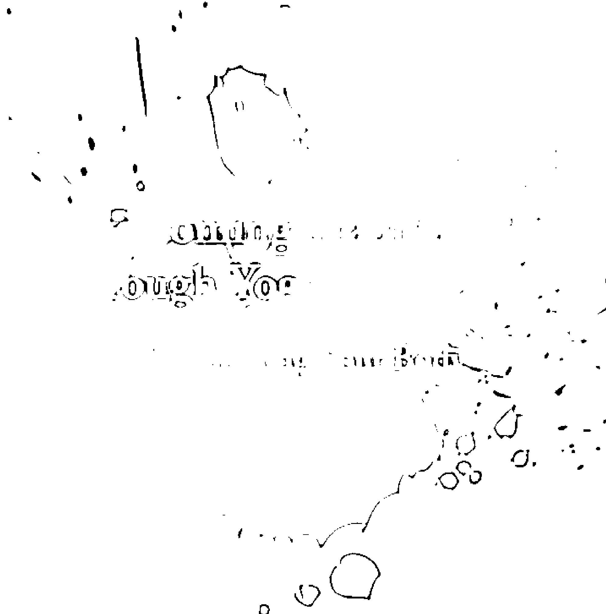