# 登出键 Log Out Button
莫子——著

从虚假的人生游戏中登出
回到彻底圆满的生命存在

# 登出键
Log Out Button

- 作者 莫子
- 责任编辑 林及人
- 企划统筹 张乔乔
- 美术设计 洪于婷
- 封面设计 小鸡豆、徐纪炀、洪于婷
- 插画 Cannace Chow、小鸡豆、洪于婷

- 发行人 莫子
- 出版 紫焰有限公司
- 地址 104台北市民生东路三段1号4楼
- 电话 （02）2501-1000
- 传真 （02）2502-0022
- 法律顾问 律果法律事务所
- 电子邮件 pr@violet-flames.com
- 定价 新台币333元
- 出版年月 2021年12月初版

ISBN：9786269531219 (EPUB)
EPUB3制作：大和书报图书股份有限公司Dai Ho Book Co.,Ltd.

本服务所提供之内容，未经合法授权不得擅自变更、发行、公开播送、重制、改作、散布、转让、公开展示、公开传输或以任何方式提供他人使用

你现在的身分是儿子、女儿、学生、社员、职员、主管、老板、情侣
老婆、老公、母亲、父亲、祖父、祖母、好人、坏人还是老人？

## 架构

- 核心系统服务
  内核抽象层（KAL）屏蔽了不同硬件的差异，为操作系统提供了统一的内核能力接口。

## 系统服务层

- 包含文件系统、内存管理、进程管理等基础系统服务。

## 融合中间件

- 统一连接框架
- 统一数据框架

## 跨端安全

通过TEE和安全核，构建了跨设备的底层安全体系。

其实
你只是在梦中玩着一个扮家家酒的线上游戏

## 示例文档标题

这是一个示例段落，用于演示文档编辑助手的功能。它包含了基本的文本内容，并且按照要求以Markdown格式呈现。

- 第一项
- 第二项
- 第三项

```
python
def hello():
    print("Hello, World!")
```

不断地重复玩着
生了又死，死了又生，生生死死，死死生生，永无尽头

## 宇宙演化示意图

宇宙演化从大爆炸开始，经历了膨胀、冷却和结构形成等阶段，是现代宇宙学的核心研究内容。

- 宇宙大爆炸（约138亿年前）
- 暴胀时期（极短时间内快速膨胀）
- 核合成（形成轻元素如氢、氦）
- 原子形成（电子与原子核结合）
- 星系形成（气体云坍缩形成恒星和星系）

## 所幸

在这个游戏中，有极小数的概率

不经意地，我们能够发现有跳出游戏的机会

## 文档标题示例

这是一个段落示例，用于描述文档的主要内容。段落通常由多个句子组成，提供详细信息。

- 列表项一
- 列表项二
- 列表项三

| 表头A | 表头B |
|-------|-------|
| 数据A1 | 数据B1 |
| 数据A2 | 数据B2 |

> > 这是一个引用文本，通常用于突出显示重要信息或引用来源。

```
python
# 这是一个代码示例
def greet(name):
    print(f'Hello, {name}!')

```

# { 目 录 } Contents

## 自序

## 关于莫子

## PART 01 登出开悟 回家之路

024 如何阅读这本书
025 对生命的疑问到体验生命
028 关于世界的真相
032 ∞ 梦 · 虚拟实境 · 现实
035 宇宙到底有多大？你生存的世界有多大？
037 真实与虚拟的交会点——生命构成的三个基本要素
041 人生是没完没了的故事
045 人生只是追求彻底圆满的旅程
049 爱就是没有解释的彻底圆满
052 彻底的圆满在哪里？如何获得？
054 时空的真相
055 谈轮回与最小的信念显化单位
059 所知越多 障碍越大
061 ∞ 什么是我 我是谁
068 真正的我
072 世界上到底有没有其他人
074 命中注定的旅程

## PART 02 如何登出开悟

082 从理论到实际体验
086 ∞ 登出开悟后的两个方向
088 共通且必修的如幻视角
090 放松・放下
092 ∞ 登出开悟实际体验
098 空空荡荡的觉察
101 世界最初的二元性
104 契入空空荡荡觉察的三个方法
112 人生是由生活的故事所构成
113 从生活故事的信念墙上打洞
116 趋向于解脱的三个步骤
118 登出开悟最大的关键
120 无法停止的注意力及解释
122 不解释的实际练习
126 不解释、发呆、静坐禅定的分别
131 登出开悟时
134 登出开悟以后
136 登出开悟后的小我反应
139 登出开悟与神秘体验的不同
140 带着觉察入睡与醒来
144 论回家
147 论死亡与轮回
150 从短暂的登出开悟 到恒久的登出开悟
154 ∞ 功课

## PART 03 显化法则

177 情境的显化法则
186 所有可能性皆存在于当下
188 如何有意识地显化
190 登出开悟前 如何看得到信念
192 消化信念的过程
194 显化与振动频率的关系
202 ∞ 成为超级玩家之路
204 消除现象重复发生的方法——损法
206 使想要的现象重复出现并加强 ——益法
208 每一个显化的情境 都是一个能量场
209 信念、想法、语言及行为
210 我是自己生命中唯一的真神
212 ∞ 显化会创造现象及运作系统
214 如何消除不想要的运作系统
216 烦人的室友
217 我们的想法与情绪 大部份都不是自己的
219 让情境由负转正的黄金密技
221 现象只是信念的一面镜子
222 信念系统中的钟摆效应
223 钟摆效应是个跃进的契机
226 最强而有力的显化工具—— 观想
234 雕塑你的新人生
236 后记

## 自序 Preface

我们都知道，玩线上游戏时需要注册帐号，然后登入游戏，然而我们现在无法忆起我们真正的玩家身份，迷失在这个宇宙 online 的地球副本里，假认游戏中的角色是真正的自己而产生许多痛苦。这本书的目的，就是要将游戏中角色赖以生存所需的一切信念、知识、逻辑、教育、社会规范、道德、传统等等，全部解构、瓦解，以还原你是玩家而非游戏中角色的真实身份。这本书就是这个虚拟 online 的登出键。

如果我们能够理解，不论我们相信什么，一旦相信了，就将被一个牢不可破的框架所限制，我们就能发现这本书并不同你以往看过的任何书籍，所有的书都在将概念塞进你的记忆中，成为你生存的某种准则，而这本书将会拆解你的思想、概念与认知，并且让你赖以生存的信念「活化」。所谓的活化，指的是在阅读这本书以前，我们对于世界与自己的所有信念几乎是固定且一成不变的，但是经过解构的过程后，你将更有选择性与弹性地使用信念，甚至创造信念，又或是暂停一切信念而回到纯粹的存在状态（宗教称为开悟）。

一个社会的形成，说穿了就是一套庞大的信念架构，而我们从小所接受的教育乃至于父母的教导、新闻媒体，以及各种书籍、所有网路资讯，就是在建构这套庞大的信念架构，在现今网际网路发达的世代，我们被植入的信念资讯量较以往更大、更多元、更复杂，而人们总是活得更忙碌、思绪更多、痛苦指数更高，只要拿起手机，就有许多直接传输到使用者端的信念讯息；换个角度来看，也就是人类越来越被信念牢牢控制而不得自由。

这本书无关建构某种信念，所以我也不打算将它写得架构清楚、条理分明，而是循序渐进，不断地打破与拆解你原有的信念架构。

在这里想问一问各位读者，假如你现在生存的世界，是一个虚拟的游戏世界（事实如此），你想成为怎样的人？过着怎样的生活？有着怎样的遭遇？假如全都是因为我们的记忆库中装载的「信念」决定了我们的人生，我们把「信念」看成游戏展开的「设定」，就会更清楚看到信念与我们生活中一切的关联性：我们角色的属性、遇到的所有境遇，都是根据这些信念设定来运作；而从小到大被植入的设定，影响着我们遭遇的每一个境况。如果生活的开展就是如此运作的，我们知道了这件事，我们该如何生存？如何在人生中获得自由？如何得到想要的生活？如何重设角色的一切？这里说的，无关吸引力法则，并非吸引我所想要的来到我们的生活，而是如果生命并没有限制，唯一限制就是信念，如果这一切都可以重新设定，我想要成为怎样的人？过着怎样的生活？又或者既然人生只是个虚拟实境的游戏，那么，游戏外的真实生命存在，到底是什么？

伴随着解构游戏的设定，我们会证入生命最终的实相，我们把这个终极实相称为「终极生命系统」，在证入「终极生命系统」后，我们拥有两个生命的初始选择，这是生命最初两个分界、两个选择，这个证入我们称为「登出」，一般宗教或世间把它称为「开悟」。

也就是说，当登出开悟后，我们会有两个选择：

1. 直接跳出游戏，回到究极的真实生命状态
   |从人生彻底解脱|

2. 重新设定游戏，体验我想要成为的人与生活
   |控制人生，游戏人间|

不论哪一个选择，都是解构信念后的结果，这将让你原来的生活彻底瓦解、彻底融化、彻底改变。阅读到这里，你已经知道这本书不仅仅是一本闲暇时阅读的小品，而是人生的重大决定，也因此说明了书名为什么叫做《登出键》，但我们别误解了登出后，就会失去游戏中的一切；相反的，我们了解自己是玩家，而非我们假认的自我时，我们就会更自由，拥有选择的主导权。

至于要不要按下登出键？无法决定者、不想改变现状者、永远拥抱着舒适圈者，看到这里就可以了。

## About 关于莫子 Moxi

我与大多数人一样，平凡的诞生、平凡的童年。出生在香港的一个普通家庭，是家中独子，家庭生活也很单纯。三岁以前，我有着许多不属于今生的记忆，三岁过后渐渐就遗忘了。从小每当进入黑暗的地方，我就会看到虚空中有着五颜六色的光晕变化，非常有趣，几乎每晚睡前我都会看上一段时间才会入睡。

小时候常常做着同一个梦，梦境中我飘浮在类似太空的地方，远远见到一个巨大的转轮，以缓慢的速度旋转着，距离应该有几百米。对我而言，这个转轮有着吸引力，会将我飘在虚空中的身体吸过去，虽说是身体，其实我知道自己并没有物质化的身躯，只是一团光影，但仍然有着一种存在感。当我被吸向转轮时，越靠近转轮，飞行的速度越快，当距离大约来到一百米左右，我被迅速地吸入转轮，之后就感觉自己在一个身体里。后来我才明白，那像是一个入胎的过程。大约十岁以前，这个梦每隔一段时间就会出现一次。

在我大约七八岁的时候，爸爸总是利用晚上的时间指导我学校的功课，我很喜欢听爸爸说话的声音，常常都只是单纯地听着声音，而没有注意他在说什么，每当我这样听着，一段时间就会感觉自己好像掉入一种宁静、喜悦、舒服的觉受里，我十分喜爱在这样的感觉里，有几次仿佛失去了对事物的认知，但却不是睡着，而是清清楚楚地存在着。这样的情形，有时候会感觉掉得很深，整个人定住了。

就在某一次听着爸爸的声音，很快的我就进入了这种清明但是一念不生的状态，忽然我感觉整个意识掉进了无边无际的大海里，成为了无边无际的大海，一整片非常明亮的感觉，我只是单纯全然地存在着，再也没有任何信念、认知、内容。只有存在，无边无际的存在。

不知道过了多久，听到了爸爸喊我的声音，起初不知道他说的是什么，慢慢地我听懂了，爸爸说他在念课文给我听，一段时间看我好像在发呆，跟我说话也没理他，他就去做自己的事，现在做完来看我，我仍在发呆，事实上已经过了三个小时了。

从那天开始，我看世界的角度变得不太一样，常常保持在一种很清明，却空空的状态看着世界的现象，这样的情形大约持续了一年多，也不太爱跟其他小朋友玩，后来移民到台湾，或许是要适应新的环境，慢慢地，我恢复了原来的状态。虽然如此，但我随时要进入这种空空的视角，立刻就可以进入，小时候我并不了解这是什么，只觉得是个很舒服的体验。

有一段时间，我好像常常接收到某些讯息，我就会用一种并不属于这个世界的语言说出来，但身体并不会感到任何的不适。母亲听到我发出这些音节，一开始会慌张，认为我是不是头脑有什么问题？但随着时间的流逝，也就见怪不怪了，这样的情形大约持续了一年多。

在成长过程中，并没有其他特别值得一提的事，直到入伍服役。我是海军舰艇兵，服役期间战舰时常出港执行任务，在船上闲暇的时间很多，当时我对佛学产生了兴趣，闲暇时会阅读与佛学相关的书籍和经典，也会每天练习禅定。放假时，我遇到一位藏传佛教的上师，常常得益於他的指导，让我对于佛法有更深入的了解。退伍后，在社会上工作了一段时间，也尽量利用时间禅修，但深深觉得生命不应该耗费在修行以外，便辞去工作，租了间套房一人独居，闭不出户地专心修行，当时我一天只吃几片饼干，但是精神却非常好，体力上也并无异常。

直到有一天，正在禅定的时候，我对于身体的感知、对于存在的信念都进入一种薄薄的状态时，墙上的挂钟忽然掉了下来，发出一声巨响，在那一瞬间，所有的定义、信念、认知完全脱落，亲见生命的本质。我不知道在这片生命本源的大海中停留了多久，当我又生起信念的时候，发现已经过了很长的时间，可能有一天多之久，这时候我才忆起原来小时候也有这样的体会，只是深度没有这次的深刻——原来我们每个人从未离开过这个生命的本质，只是没有发现而已。在这个体验发生的时候，世界与我顿时消失，剩下剩的，只有无限大的觉察，在一种完全没有分裂的完整里，这种完整并非一种完整感，而是「我就是那个完整而无限的整体」。在这个整体的状态时，完全无法生起任何的信念，所以也没有自我与世界，只有生命的本身赤裸裸地存在著。之后再度觉察到世界时，世界只是这个整体的一小部份，自然而然从整体的角度看着内在所谓的世界。

像这样的体验，在之后的人生里也发生过许多次，有大有小，有深有浅，一直到现在。而我现在生活着，必须要稍微集中注意力在这个世界上，才能像这样与大家说话，否则会仿佛与世界产生很远的距离。相对而言，空无的圆满对于我的吸力更大，用另一种方式来说，我必须花一些力量凝聚这个虚幻的人格来生活。

在这些体悟以后，我都是过着闲云野鹤的生活，对于世俗的事情总是漠不关心。直到五十岁，遇见了我的双生火焰「乔乔」，她希望我能将自身的体会让世人知道，所以从2019年3月开始建立了《双生紫焰》YouTube频道，藉由影片传递我所体悟与所知道的事情。内容分为两个部份，一部份是以「登出开悟」为前提的影片，而另一部份是与「显化」相关的影片，至今已拍摄一百多部，数量仍在成长中。登出开悟与显化这两个议题，包含了人类存在的两大主轴，所有关于生命的问题，都无法离开这两大主轴，这两大主轴在接下来的篇幅中，将会系统性地介绍给大家，它们清晰而简单，极易理解。如果把生命看成是梦境，登出开悟就是关乎醒来，而显化则是如何在梦境里成为清明梦，进而掌握梦境，不再被梦境所操纵。

在这里说明一下，大部份的人对于体悟生命本质这件事，有些观念是有误解的。一般人会把体悟生命本质称为开悟，如果称为开悟，那么是否有一个开悟的人，或称为开悟者？事实上，当它发生的时候，原本的人格并不会存在，并没有一个人发生开悟，而是生命的本质单纯赤裸地存在著，没有人也没有世界，这件事并非一个人达成的成就。一般人活着，有个人的人格、有对整个世界的认知、有存在的生命本质这三样事情，而发生这件事情的当下，个人人格不在，所有对世界的信念、认知不在，只剩下生命本质存在著，所以我们说某某人开悟，这实在是一件没有道理的事情，人格不会开悟，世界上没有半个人会开悟。而生命的本质，人人皆有，并非某个所谓开悟者独有，而是我们每分每秒都活在生命的本质里而不自知；更准确的说法是，我们就是这个无边无际的生命本质。

# 登出开悟 回家之路

## PART 01

# 登山的旅程

```
0 000
10 10 10
0 001 00
0 000 000
0 011 010
0 000 000
```

Fu...
P...

# 让我们先开启一段简短的旅程，来稍微理解「开悟」。

事实上，我们打从一出生，就存在于一个叫做「宇宙 online」虚拟实境的线上游戏中而不自知。在游戏中，我们认为所谓的「我」，就是游戏中的主角；我们把游戏的所有场景、情境与遭遇，都当成了这个我的体验，日复一日。宇宙 online 游戏场场中有宇宙、银河、太阳系、地球以及地球上的许多国家，每当我们到一个地方，眼前就会出现该地方的影像、声音、气味、触感等资讯，然而实质上只是程式呼叫了该地图的资讯显示在萤幕上，让我们体验其真实性。直到有一天，你从游戏中某个不知是 NPC（Non-Player Character）还是其他玩家操控的人物角色处，获得了所谓「登出」技能的讯息，知道有登出这件事。而登出的方法，并非游戏中的任何行为，无法利用游戏中的任何道具达成，也没有任何按键可以选择；相反的，是暂停游戏，并且对游戏中的任何人、事、物的认知与信念暂停辨识。当暂停的时间够久，深度够深，就有可能来到一个转折的瞬间，啪的一声，跳出游戏。当跳出游戏发生时，原本游戏中的你所扮演的人物角色完全不见了，游戏中的场景也完全不见了，你忽然醒觉，发现你并非遊戲中的人物角色，而是坐在沙發上、頭上戴著頭盔接收神經傳導訊號的那個。此時，你恍然大悟，你並非遊戲中的人物角色，而是一直操控著人物角色的那個主人翁。當「登出」發生後，你看清楚真實世界的面貌，真實世界看起來一無所有，但待在其中卻感覺到前所未有的圓滿。一無所有是因為任何現象都是多餘的，有了任何現象，就會有解釋，任何解釋都會讓你產生信念而將當下完整的圓滿感切割成不圓滿。你知道增一分都是多餘的，這一無所有的圓滿就是未曾分裂的整體，你體會了一體性與完整性，知道原來不圓滿，來自於信念將圓滿的一體分裂出二元性。

> >真實世界可以完全與遊戲中的一切毫無關聯
>但真實世界卻也包含了遊戲，整個遊戲是在你的真實世界中

> >註：非玩家角色或稱非操控角色。意指遊戲中不受真人玩家操縱的遊戲角色。通常某些 NPC 會掉落道具，可為玩家提供遊戲訊息，或觸發劇情。

在完全體會了遊戲外的真實世界後，遊戲又再度出現了，不過你不再認為遊戲中的人物角色是真正的你，你開始以玩家的立足點回到遊戲中，而這個立足點將不會輕易失去，除非過度沉溺於遊戲，才有可能再次失去這個立足點，而誤認遊戲中的角色人物是真正的自己。

當再次回到遊戲時，你發現遊戲的生成，包括人物角色的設定、遊戲中遭遇的任務與遭遇的NPC，以及其他玩家所控制的人物角色、遊戲場景等，全都因你所產生的信念而自動生成與連結。這個宇宙 online 遊戲是個自動計算／無限生成系統，你的一切信念，將被遊戲生成境遇，包括遇到的任何人事物以及場景——原來遊戲中遇到的一切並非預先設定好的，而是根據信念生成的。由於遊戲時間可能非常長，所以信念所生成的遊戲場景十分多元，有分成各種維度的場景，也有非實體的內在場景（例如夢境、想像力、靈界等）。已生成的場景，在遊戲中形成了某種引力場，遊戲中的人物因頻率屬性不同，會自動與某個場景相應而身處於該場景。這種效應尤其反應在人物角色在遊戲中死亡的過渡時期，將會因為頻率的相應，自動連結到某個場景而繼續遊戲；該人物之前的外在屬性重新因應場景而調整，而潛藏的人物屬性將永久記錄於人物內在資料庫中。

每當遊戲出現任何境遇，會立即自動提取人物內在資料庫中的信念資訊來比對境遇，但如果你使用玩家角度的立足點，而非人物角色的立足點在進行遊戲，你將發現這個被自動提取出來的人物內在資料庫資訊會被消除。所以你牢牢地立足於玩家的視角進行遊戲，就會自動不斷地消除人物內在資料庫資訊；進行遊戲的時間越長，人物內在資料庫的資訊就消除越多，而你自動生成的遊戲就越來越單純。

這時候你會發現，當遊戲在使用人物內在資料庫資訊生成遊戲境遇時，可以對提取的人物內在資料庫資訊做修改，改成你要的信念而去生成你想要體驗的境遇，而下次回存時就變成你改過的資訊，而非原來的資訊。在這個過程中，「相信」是個將資訊生成為境遇的穩定作用，也會成為一種鎖定作用，當你十分相信A時，你便很難將資訊更改為B，而玩家視角則有助於軟化這種堅固的相信。事實上，遊戲的自動生成系統並沒有任何的生成限制，任何的限制皆來自於「相信」，這種相信並非我們思維上的相信，而是人物內在資料庫裡的設定，我們可以理解為「潛意識」，甚至是「深層的潛意識」。

對於始終保持著玩家視角的立足點來說，有兩個不同的方向來進行遊戲：

- 一、如果仍然熱衷於遊戲的進行，你可以隨心所欲地在人物角色遭遇境遇、自動提取人物內在資料庫資訊的當下，去修改所提取的資訊，來達到更改遊戲軌跡的效果，盡情玩一個超級玩家的遊戲，這就像你在清明夢中隨意改變夢境一樣的揮灑自如。當然這仍需要一段時間的練習，才能達到得心應手的境界，尤其是面對許多根深蒂固的「相信」，你要能修改資訊，的確需要諸多的練習。

- 二、如果你以回歸真實的徹底圓滿為依歸，自然而然放棄所有信念、單純看著境遇發生時，自動提取的人物內在資訊，都會在單純的玩家視角下不斷地自動消融，你將會越來越接近徹底的圓滿，也可以說是你站在圓滿來看分裂的二元信念，二元信念會被一元的圓滿吞噬。

隨著不斷地消融人物內在資料庫裡的信念，你將會發現遊戲內所有的狀態都越來越接近遊戲外的徹底圓滿，你的玩家視角越來越擴展與穩固。如果要快速地消融信念，可以藉著接觸遊戲角色、幫助角色登出來達到，因為每個人都有不同的問題、不同的信念，接觸更多的角色，他人的信念會牽動我們內在的信念浮現，讓自己覺察到，進而消融它。這是一個好方法，是一個加快消融自己內在信念的方式。實際上，遊戲內的所有人事物，我們能見到的都只是信念而已，實無真實人事物的存在。

看了以上這一大段講述遊戲的內容，我們已經對人生、生命的真相、開悟等有了概略的理解，這些內容不是為了在你內心建構另一個思想系統，而是為了鬆動你原有根深蒂固、牢不可破的信念系統。接下來，我們不必死記書中的任何內容，輕鬆地往下看就可以了。

## 如何閱讀這本書

語言文字所傳達的，不單是字面上具有的意思，也是能量的載體，其背後蘊含著傳遞者流露出來的能量。所以我希望大家閱讀這本書的時候，不要在意字面上的意思，輕鬆地讀過去就好，不要去記這本書的文字，重要的是藉由閱讀來體驗、接收我所傳遞給你的文字背後的能量。真正拆解信念的作用，將來自這些能量，它是來自空的能量。世界上絕大部份的書籍，都是要將傳遞者的某些信念，透過文字建立在讀者的心中；信念是「有」的能量，而我所傳遞的，是「空」的能量，它是用來拆解與消融信念的。你只要輕鬆地讀它，越放鬆越好，讓這些話語流過你的心即可。

另外一點是在出發前，有一些準備工作先請各位配合。首先要請各位放下過去所有的知識與信仰來閱讀此書，因為我要說的，是完全超越你原來所吸收的信念，如果用過去所學的信念來比對我所說的，那麼一切都會被你原有的信念架構吞噬，而讓我所說的完全失去意義。請你以一張白紙的狀態來閱讀這本書，不要用過去的任何信念來比對，這樣才有機會對你產生些許幫助，幫助你解構過去的信念系統，並轉化接下來的人生，讓你從糾綁你的人生故事裡，一點一滴地解脫出來。

## 對生命的疑問到體驗生命

大部份的人們，或多或少都思考過「我是誰？」這個問題，生命是什麼？宇宙又是什麼？有邊界嗎？那麼宇宙的邊界外又是什麼？宇宙有開始嗎？宇宙是始於大爆炸嗎？那麼大爆炸之前又是什麼？我們的意識是如何？意識的領域有多大？意識有什麼可以探索的？

隨著我們年紀漸長，這些大哉問一個個地被升學、賺錢、升職、愛情、婚姻、生育等問題給徹底吞噬，一直等到退休後，閒暇無事的時間多了，才又會想起這些問題。而當我們跨過了退休的門檻，一個人生最大的疑問與困惑離我們越來越近，那就是死亡，也往往是我們意識到死亡的存在，才會開始探討生命是什麼？這時候或許就會開始接觸宗教，因為宗教談的，就是生命。

宗教總是披著神秘的面紗，那些看似深奧的道理，總是讓人難以親近，似乎非要多年深入的體會，才能一窺堂奧。而另一方面，宗教的典籍都是古老的文獻，那些智者所傳遞的道理，似乎也是針對當時不同的民族、不同的文化、不同的時代所說的，拿到今日手機進入 5G 的現代來體會，不一定合適也不容易消化，所以在這個時代，求道者多，得道者卻少之又少，造成我們的壽命始終趕不上對生命真相的體會，還沒真正體驗生命的奧秘，就已白走一遭。

除了宗教之外，就是數量龐大的書籍、影片、教學等，內容包羅萬象、應有盡有，但也讓人眼花撩亂，不知道什麼訊息才是真實而有益的？在這個時代最不缺乏的就是選擇，但不論你如何選擇，往往也只是徒增見聞，在你的記憶庫裡，多塞了一些信念罷了。

或許我們花費了許多時間來解讀生命，閱讀人生雞湯、探索宗教經典、鑽研量子力學，但是這一切都只是在吸收信念，對於生命，我們始終沒有真真切切地去體驗它。然而吸收知識，其實只是信念的堆積，我們要分清楚，信念與體驗是完全不同的東西，但我們的教育把我們培育成一個學習知識的機器人，也就是輸入訊號，然後根據訊號行動，整個社會就是這樣的運作。

本書從談論生命開始，並非企圖將諸多信念塞給你，而是從一開始就進入一個解構的過程，不僅談論、說明如此，一些練習更是如此。所以看到這裡的朋友，我就當你已經考慮清楚了，繼續讀下去，我將毫不保留地引導你，瓦解你從小到大、甚至投胎轉世帶來的固有信念，解構越多，你就獲得越多自由的生命主導權，也就越靠近生命的實相。

## 關於世界的真相

接下來我要說的，或許會讓你非常震撼，但這一切都是事實，就是我們身處的世界、社會、生活，只是被刻意安排、編織出來的架構。這個架構形成的原因或許很複雜，或許是基於安全性考量所設計出的一套系統，大家生活其中而得到適當的保護，形成一個安全的社會結構，不至於出現混亂而導致物種的毀滅。不管基於良善或是生存的考量，亦或是基於控制的原因，這整個結構，就是一個大家講好、協議好的扮家家酒，人類的一種共識現實。共識現實就像球賽的規則一樣，一群人開會制定規則，內容經由討論溝通後形成，彼此達成共識——不論真相，只論共識。我們從小到大、從學校到社會，所接收到所有訊息都是為了要將我們所認知的，規範在一個刻意建構的系統之下而產生，像是一種有運算系統的生化機器人，輸入了程式碼後，就會按照程式去工作、建設、生活，終其一生。我們以為我們是自由獨立思考的個體，其實我們所賴以思考的種種概念，都早已被刻意建構在我們的記憶庫中。假如我要你只能選擇奇數，只要在教育上，只教導你奇數就可以了，活了一輩子，你所選擇的無論是13579，永遠只會在奇數的基礎下做選擇，永遠無法選擇2468，這時候你以為你是一個獨立自主的個體，其實只是被控制的生化機器人。

為了有效的控制社會，控制輸入到我們記憶庫中的信念是最有效的方式。對於控制手段來說，教育永遠優於律法，控制你所知道的，就能完全控制你的行為。規範行為的律法，已經是不得已的手段，或許控制，是一種社會安全的考量，但是在這裡要說的是，大幅度把你的整個生活限制在一個編織出來的小範圍裡，或許就不僅是基於安全性為出發點，而可能是限制人類過度發展的手段。當然，本書並非要談論陰謀論，而是要解放讀者的潛能，更進一步的，能讓讀者接近生命完整、完美、圓滿的實相。

這個世界上所謂進步的文明，造就出忙碌的生活，從小努力讀書、升學，長大後出社會要努力工作，結婚生子，為了下一代，我們要更努力的工作，等到我們接近退休的年齡，已經年老力衰，這樣的生命模式是有意義的嗎？工作、工作、工作，或許我們只是社會機器裡的一個自動化程序、一個機器人，大眾運輸交通工具如有輸送帶，把我們送到各自的工作地點，然後我們又開啟自動化工作程序，工作、工作、工作……。

有許多人問我說：「我也知道這樣就像機器人，漫無目的地浪費生命在工作上，但是如果不是這樣，又能如何呢？我們總是是要吃飯，要有個遮風擋雨的家，生活不就是為了生存嗎？」依託於這樣的想法，在現今的社會裡生存著再正常不過了，但在這裡，我要提出完全不同的看法，從這裡開始，你將經歷一段完全不一樣的信念洗禮。這不是「吸引力法則」或「心想事成」這樣的論調，這些理論還是以你原來的世界觀為基礎而開展的，我要告訴你的是，你所認為的世界、你所認為的自己，從一開始就完全而徹底地搞錯了。要從這個搞錯的世界中解脫出來，我們不必脫離現在的社會規範，我們只要知道在生存的生命實相中，可以直接用另一種系統存活著，甚至超越所有的系統而存活著就行了。要進入下一章了，在這裡我們即將開始一段特別的旅程。

## 夢。虛擬實境。現實

在這裡，假設你已經放下你所認知的所有信念系統了，我將開始我的講述，而講述的本身也是引導的本身。

首先我們想像一件事：我們現在正在作夢。我夢到在看一本書，我在房間、客廳，或是室外看著一本叫做《登出鍵》的書。現在我將我的視線看看周圍的環境，聽聽環境中有著那些聲音？因為這是一個夢，所以這些視覺與聽覺的所見所聞，可以把它解釋為視覺的訊號以及聽覺的訊號，我所覺察到的這一切情境，全部都在我的夢中，而我的整個夢境都存在於我的意識當中，因此我所見所聞的人事物，乃至於整個世界，都在我的意識之中，這樣沒有錯吧！

我們如果把這樣的概念，套在我們生存的任何時間，也就是我們其實一直活在夢中，我們晚上睡眠進入夢境，白天起床跳到另一層夢境，因此我們一直活在意識當中，而從來沒有所謂真實的物質世界，你覺得這是可能的嗎？（如果此時你的邏輯思維提出很多的抗辯，請先如我之前說的，把信念放下，不要用過去的信念去比對我所說的。）

其實視覺、聽覺、嗅覺、味覺、觸覺，都只是電子訊號而已，當我們看到一個物體，只是一個視覺的感官訊號，從來就不是一個實體，就像是電視中的影像，有著視覺訊號（影像）與聽覺訊號（聲音），只是少了嗅覺、味覺、觸覺。在未來的時代，虛擬實境可以將視覺、聽覺、嗅覺、味覺、觸覺一起送到我們的腦中，並且各項解析度都能達到現實所見所聞的水平時，我們就無法分辨真實與虛擬了。或許事實上，打從我們出生起，就活在這樣的虛擬環境中而不自知。

有一個說法，或許有人聽說過，或許有人講述過，而這是一個頗值得深思的點，所以在這裡我也再次提出來。宇宙的年齡大約九十億年，而地球的年齡大約四十六億年，人類在地球上，可能經歷了幾次文明的興起與殞落。近代曾發現三葉蟲化石上有六億年至二億五千萬年前的人類鞋印，還有在非洲加彭共和國發現二十億年前的大型鏈式核反應堆，另外在現今南非發現二十八億年前的金屬球。根據地質學紀錄，僅僅是大範圍的生物滅絕，地球就至少經歷了五次，與瑪雅曆法的預言傳說，共有五次毀滅和重生的週期恰好吻合。

在現今的文明中，個人微電腦的發展始於一九八〇年代，至今也不過四十餘年，預估再往下發展，虛擬實境技術應該在二十年內，就能研發出將訊號送入人類五種感官的應用，到時候真實世界與虛擬實境的界線就難以分辨了，也就是說在未來不久的將來，沒有所謂絕對的真實，一切都活在訊號的世界裡。

這裡說了這麼多，要表達的是，我們現在正身處於虛擬實境發展初期的短短幾十年間，如果越過了這個點，真實世界與虛擬實境也難以辨別了。在宇宙年齡或是人類文明的幾十億年間，這幾十年只是一個極小的點，而我們卻剛好誕生在這個尚能辨別真實與虛擬、兩者的界線越來越模糊也越來越靠近的點上，這樣的機率到底有多大呢？

> 愛因斯坦（Albert Einstein, 1879-1955）曾經說一句令人玩味的話：「現實只不過是一種幻象，儘管這幻象久久揮之不去。」而特斯拉（Tesla Inc.）汽車公司執行長馬斯克（Elon Musk）表示：「我們只有十億分之一的機會生活在現實世界中。」有沒有可能，我們現在所熟悉的世界，就像電影《駭客任務》（The Matrix）中的母體電腦所模擬出來的呢？又或者愛因斯坦說的是，我們正在做著一個時間較長的夢，一切的一切，自始至終原是夢境一場？

> 不論是虛擬世界，又或是夢，又或是所謂的現實
其實一切都只是眼前的訊號

## 宇宙到底有多大？你生存的世界有多大？

宇宙有多大？真實世界到底有多大？可能科學家無法精確回答的問題，我用一句話將它回答完：「事實上，整個宇宙就是我們眼前所能看到的這個框框這麼大。」我們所能接觸到的世界，其實就是我們可見的範圍。

人眼可視角度的範圍通常是 124 度，當集中注意力時約為五分之一，即 25 度。人類單眼的水平視角最大可達 156 度，雙眼的水平視角最大可達 188 度；兩眼重合視域為 124 度，單眼舒適視域為 60 度。也就是說，我們的世界就是眼前的 124 度，這 124 度就是我們人類螢幕的範圍。我們看電影的時候，整個螢幕就是電影世界的範圍；玩電腦遊戲的時候，電腦螢幕就是我們的遊戲範圍；而我們的生存空間，事實上就是這 124 度的肉眼範圍。我們終其一生，活動的範圍就在眼前的這個框框裡面，框框裡頭一堆線條與顏色動來動去，加上我們的解釋，造成了我們的世界。當然除了視覺，還有聽覺、觸覺、味覺、嗅覺予以輔助。

我們會說，世界很大，宇宙很大，有太陽月亮，太陽系之外，還有銀河系的存在。但是我們想想，這一切都只出現在教科書裡，並不在我們眼前的框框裡出現，而生命就是在每個當下，我們對眼前框框的解讀而已；即使有一天我們看著天文望遠鏡，看到所謂銀河的存在，也只是我們當下對眼前框框看到的情境做出解釋，解釋那是銀河系，如此而已。這時候銀河系仍然在眼前的框框之中，這個框框就是我們的生命電視。事實上我們每天都只是在看著電視，而與電視節目一樣，電視裡的影像只是電視接收訊號，然後對接收到的訊號進行解碼，播放在顯示幕上而已。有些新時代的看法，覺得世界有維度的分別，但是不論哪一個維度，也只是感官訊息的接收，你眼前出現一個五維度的畫面，它仍然在你眼前的框框裡，就算不是 124 度的框框，最多也是環場 360 度的視覺訊號，一切都只是訊號而已，而我們接收到的一切，也完全離不開生命構成的三要素：覺察（真我）、被覺察（接收訊號）、解釋（解碼訊號）。

### 真實與虛擬的交會點——生命構成的三個基本要素

真實與虛擬，又或是現實與夢境，其實只要夠真實，賦予五種感官的訊息量夠多、解析度夠高，對於我們人類來說就是真實的。我們整個生活存在的流程就是：使用眼睛、耳朵、鼻子、舌頭、身體接觸到現象（視覺、聽覺、嗅覺、味覺、觸覺），之後我們提取記憶庫中對現象的解釋，用記憶中的解釋比對現象而獲得感受，進一步思考、延伸、聯想，最後產生結論，儲存回記憶庫中。這個過程我們想都不用想，就會自動完成。對於這樣的生存機制來說，一切都是運作在五種感官的訊號上，所以真實與虛擬並沒有任何的不同，現實、虛擬實境、夢境，只要夠真實，對我們來說是完全一樣的。

這整個過程的基礎，就是「感官訊號」以及對於訊號的解讀，我稱之為「解釋」。感官訊號是我們接收的「客體」，包含我們的思想、思維也算是一種感官，所以感官事實上有六種，也就是視覺、聽覺、嗅覺、味覺、觸覺、思想，這些都是我們所能觀察的對象。所以整個生命存在只有三個面向：覺察、所覺察之感官訊號（現象）、對感官訊號之解釋（信念）。

覺察、所覺察者、對所覺察者之解釋，以下我將簡化為「覺察」、「所覺察」、「解釋」。這三者對應於現實世界、虛擬世界或夢境，完全沒有分別，其分別只在於「解釋」的不同而已，所以常常在一些較為真實的夢境中，我們並不知道身處於夢境，必須等到夢醒時分，才知道原來是黃梁一夢，原因就在於我們將夢境中的情境，「解釋」為真實的情境，真實與非真實，其實都只是我們接收到的感官訊號強弱上的差異而已，對於我們的生命來說並無二致。

在這裡，我要對生命構成的三要素做進一步的說明。「覺察」、「所覺察」、「解釋」，也可以說是「覺察」、「現象」、「解釋」，而這裡所說的現象，指的是一切可以覺察的對象。除了我們五種感官所能接觸的一切對象外，想法、感受也是。

我們能覺察的對象，所以不論外在的現象或是內在心裡的現象，都是現象，都是可以覺察的對象。當我們接觸一個對象時，第一反應就是從記憶庫中，搜尋對於這個對象是否有可以比對的信念，把可以與這個對象相合的所有信念，一次搬出來比對。舉一個例子，當一部汽車從我們眼前駛過時，我們在瞬間就提取許多的信念來與這個對象相合，例如汽車、新或舊、車上有多少人、幾個大人幾個小孩、有沒有寵物、車子顏色、車窗玻璃深淺、車子廠牌、車子價位、輪框形狀、駕駛速度、離我多遠、對我有沒有危險等等。

這些信念都是過去我們的記憶，儲存在記憶庫裡的信念，我們根據這些信念來認識世界與自己，比對出一個當下世界的完整輪廓。這意味著什麼？意味著世界任何現象並非存在著固定的特性，而是端看覺察者內心儲存對現象的解釋而定。

## people
## friendship
## Cars


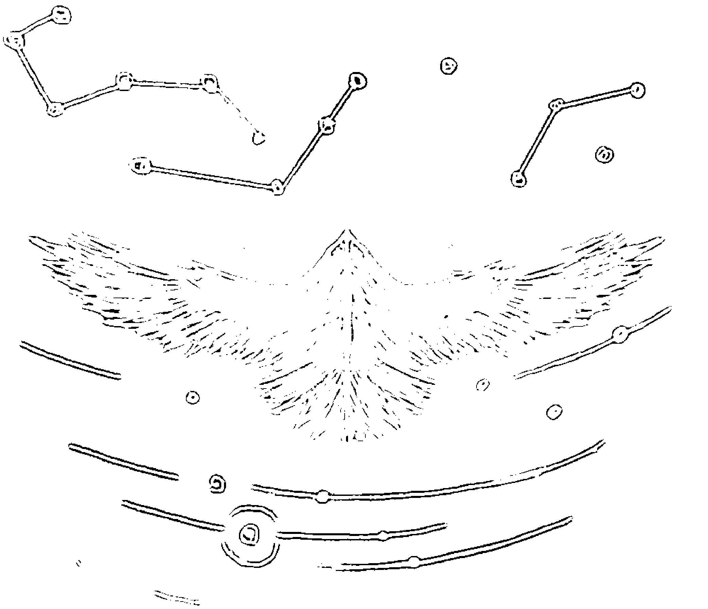

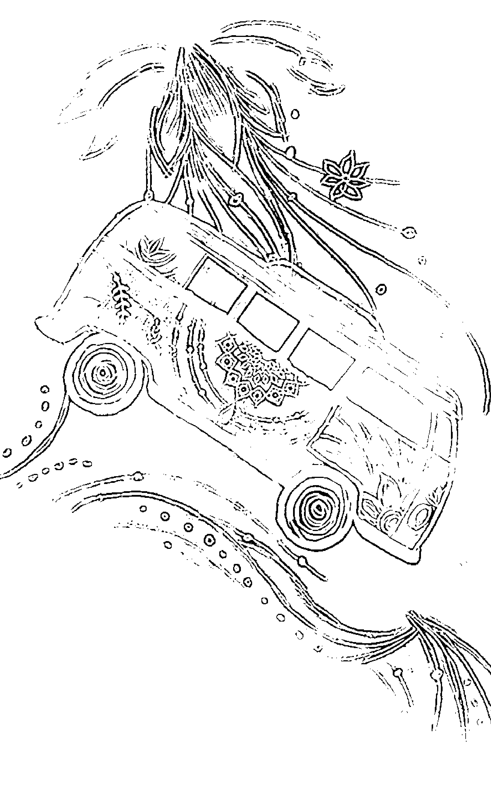

## togetherness

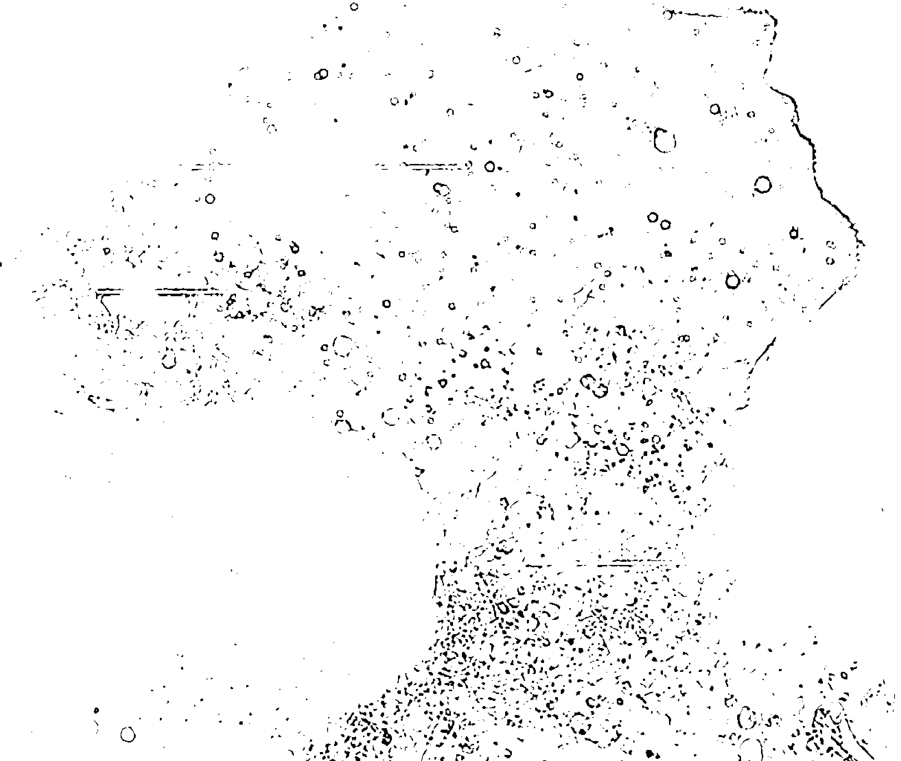

## 人生是沒完沒了的故事

我們的人生，從早到晚注意著現象，從現象我們看到了解釋，許多解釋串聯成一個情節，許多情節串聯成故事，許多故事串聯成為人生，生活就是如此開展的。故事並非一種錯誤，故事是為了提供我們感受而存在的，照理說我們可以利用創造各種不同的信念，而創造不同的思維，並且顯化不同的情境，體會不同的感受，這是自由、有趣的經驗，但是我們並非如此生活著，我們無法控制我們的信念，而是被信念所控制。每當我們的視覺、聽覺、嗅覺、味覺、觸覺一接觸到情境，我們在千分之一秒的剎那，提取了記憶庫中過往的信念來比對情境，立即得到結論而產生感受。至於提取哪一個信念來比對，全是由過去曾經遇到相同情境時，提取過哪一個信念來決定；而這個結果又會造成下次遇到相同情境時，提取一樣的信念來比對。這種無法改變的循環，我們稱之為「習性」。所以我們即使知道，遭遇的情境是由我們的信念所顯化的，我們也無法決定採用對我們有利的信念來比對情境。舉個例子來說，每當遇到塞車，我們在第一時間認為這是一件倒楣的事，進而產生不耐煩的情緒，而情緒本身就是頻率，這樣的情形會產生一個「塞車等於倒楣」的結論，這個結論會回存到記憶庫裡，並且顯化下一次塞車情境或相同頻率的情境出現，也就是會引發你不耐煩情緒的情境。

在這裡，信念是構成下次顯化情境的藍圖，而情緒強弱則是構成下次情境出現的規模大小或強度。從這個例子我們發現，我們所抗拒的事情，會促成下一次顯化相同或類似情境的發生；而各種頻率的情緒，也都會成為各種情境顯化的燃料。

因為我們過往信念所顯化出來的情境，堆積成我們每天的人生故事，我們在這些自己用信念寫下劇本的故事中生活著，被故事的情節牽動著我們的感覺、感情、思維，然後又不由自主地創造了劇本，延續著沒完沒了的故事情節。我們煩惱著，我們憂傷著，我們憤怒著，我們焦慮著，我們恐懼著，我們開心著，我們期待著，我們享受著，我們不斷不斷地循環著，這就是我們每個人的生活——我們活著！

佛學上所說的輪迴，指的不只是一輩子一輩子的循環，而是我們每分每秒、每個信念所導致的不斷循環，無盡的循環，沒完沒了，永恆的迴圈。如果不想在這個自動生成系統中無盡地輪迴，我們必然要有方法終止這樣的死循環。弔詭的是，所有循環都是因為信念而延續下去，我們就無法使用任何方法來終止迴圈，因為任何方法都需要動用信念。這個世界上不乏仰賴宗教、修煉等方法企圖要終止這樣的迴圈，但是大多都失敗了，即使是佛法，也說成佛要三大阿僧祇劫，一個大劫正好是世界經過了一次的成、住、壞、空，因此，當世界歷經三次成、住、壞、空，也就是經過三度大劫的時間，世界從成到住、住到壞、壞到空、空到成，各需要大約三億二千萬年，宇宙就在成住壞空的過程中，反覆生滅，每一週期大約需時十二億八千萬年。因此，三大阿僧祇劫大約是三十八億四千萬年之久，人類壽命最多一百年，也就是需要三千八百萬輩子才能解脫。

在故事中，使用任何方式來從故事中解脫出來，都是一個沒完沒了的過程。故事中的任何方法都需要使用信念，然而使用信念又如何能離開信念呢？所以才會需要三千八百萬輩子才能解脫，但是如果不是這樣，真的有方法可以迅速解脫嗎？在這裡告訴大家，使用的方法就是放下所有的方法，放下所有的信念，直接安住在故事外的覺察上來離開故事。這是一個沒有方法的方法，一道無門之門、無路之路，唯有這樣，才能直接離開故事。

> > 我們正做著一個夢，離開夢境的方式
> 就是放下夢境中的一切清醒過來，而不是在夢中找尋任何的方法

## 人生只是追求徹底圓滿的旅程

人們打從出生以來，一直在追求金錢、地位、愛情、友情，無論你追求的是什麼，最終最內在的原因，其實只是為了追求徹底的圓滿。

我們可以輕易地發現，作為一個正常的人類，只要保持追求著某些理想，心中有著某些願望，就會不停地追逐下去。達成一個願望後，對於願望達成的滿足會立刻進入一個消退的過程，很快的，你就會轉向一個新的目標，這是一個不斷循環的迴圈。

比如你花了五年的時間，努力工作賺錢，終於得償所願，興高采烈地買了一部車，非常開心地在路上兜風，體驗新車為你帶來的一切感受。剛開始的前幾天，真是個非常興奮的經驗，隨著時間的推進，興奮感也開始消退；一個月過去了，塞車的煩躁感開始浮現，尋找車位的煩惱也相繼到來，一切都不再那麼美好；又一個月過去了，感覺就像以前開的那部老車，就是一輛交通工具。當一個願望被滿足的那天起，就進入了熱情消退期，我們一次又一次地尋找那永恆而徹底的圓滿，卻一次又一次的失望，直到生命的盡頭。

在人生故事裡，不論任何的情境，都無法讓我們升起徹底且恆久的圓滿，事實上，每個人內在深處的唯一願望，就只是這個徹底且恆久的圓滿而已；而修行的目的，也就是達成徹底的圓滿。換句話說，其實每個人都在修行，只是管道與方式不一樣，有的人在藝術的道路上，有的人在商業成就上，有的人在追求名聲上，有的人寄託於宗教，不論你追求的道路是哪一條，說到底都是為了追求圓滿。

但我在這裡告訴各位一個壞消息：不論你走的道路是哪一條，沒有任何一條可以到達徹底的圓滿，因為無論哪一條道路，它都必須動用信念、創造故事。徹底的圓滿並非不存在，而是不存在於信念所形成的故事中，你必須能找到那扇無門之門，找到那條無路之路，才能抵達那個無信念之地。

世界上最遠的距離 就是腳下

如果我說徹底的圓滿一直都在你的生命中，從來都沒有不在或消失，你一定不相信。我們尋找了一輩子又一輩子，總是找不到那個徹底的圓滿，原因就是我們總是向外尋找，總是在現象裡尋找徹底的圓滿。找不到的原因其實非常簡單，所有的信念就是用來將徹底的圓滿切割成可辨識的碎片。舉個例子，假如一張完整拼好的拼圖就是那個徹底的圓滿，而每一片拼圖就是為了將圓滿切割成許多的碎片，每一片碎片就像記憶庫裡的每一個信念，我們生生世世累積了多少的信念，我們就將拼圖切割成多少的碎片。人生中追逐某些區塊，像是我們廣大人生拼圖的某一角，好不容易奮鬥、累積、尋找到能將一個區塊完整了，我們立刻就會感覺到缺憾，因為我們廣大的拼圖並不圓滿，所以人生中不論追尋什麼，永遠都無法徹底的圓滿。我們總是在走冤枉路，問題是要走多久、走多遠，才能知道那是冤枉路？這才是重點。所幸我們正在閱讀這本書，為了讓你能更明暸地看清楚什麼是徹底的圓滿，所以先讓你們看清楚什麼不是徹底的圓滿。

在所有的信念比對現象時，我們都會獲得感覺、感受、情緒、情感等覺受，我們一直以為這些感受是因為外界的現象所引發、所給予的，而事實上卻是因為信念解釋了現象而來的，一切都與信念有關，也可以說是信念產生了感受。但是所有信念都有生滅，所以每當信念升起，我們就產生了感受；信念滅了，感受也隨之熄滅，這就是我們無法獲得徹底圓滿的主要原因。感受並不長久，再美的感受都會消逝，正如美麗的花朵都將凋謝一樣。世界上所有的現象都有期限，這個期限並非現象的保存期限（例如鋼鐵，可以存放百年而不壞），這裡所說的期限，是我們感官接觸現象的期限。例如你有一輛愛車，開車的時候你會有很愉悅的心情，但是到了目的地，你就會離開愛車，這時候我們的感官就無法接觸到「愛車」這個現象，這就是我說的期限，所以愉悅也並非恆久的，而是一段一段的。更不可思議的是，這種愉悅也會因現象改變而有所改變，例如當你的愛車被刮傷，甚至被撞到而受損，此時你不會因為愛車存在而愉悅，你的焦點便在刮痕或是損傷處，你的心淌著血，心疼死了！所以愛車並無法代表著持續的愉悅，相反地，其中潛藏著許多負面的情緒。

我們明白了，現象與信念並不能帶給我們恆久且徹底的圓滿，而且在情緒當中，開心總是很短暫的情緒，笑一笑就人生裡有許多的愛，有親情的愛，有愛情的愛，也有對大自然、對寵物的愛。人生有很大一部份比重是關於愛的，但我們總是沒能把愛說得清楚，我們總是迷迷糊糊地在尋找愛、體會愛，總是因為不了解愛而被一些假象弄得千瘡百孔、痛不欲生，這都是因為我們誤解了愛。人類世界裡，對於愛，尤其是愛情，大部份的認知都是誤謬的，戀愛與失戀只是一種抽象的觀念，不僅如此，人與人的關係界定，也往往出自於違反人類天性的信念。

愛，其實是源自於我們真正的生命本質，也就是那個徹底的圓滿，我們往往藉由某一個對象，瞥見了這種徹底的圓滿，我們就將它稱之為「愛」。例如我們與愛人在一起時，完全忘記自己的存在，甚至相擁時，連對方的存在也會消失，只沉醉在一種無比幸福、沒有時空、沒有解釋、沒有任何現象的氛圍，那就是生命本質的徹底圓滿。我們藉由一個對象，

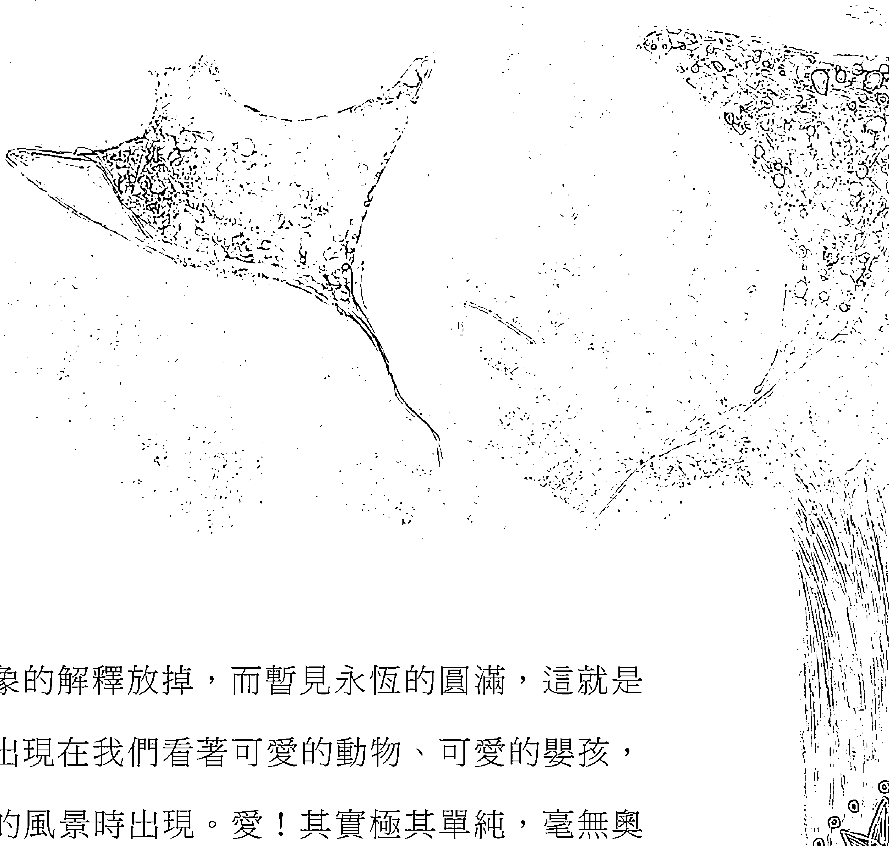

將一切事物、現象的解釋放掉，而暫見永恆的圓滿，這就是愛。這種情況也出現在我們看著可愛的動物、可愛的嬰孩，甚至是一片美好的風景時出現。愛！其實極其單純，毫無奧秘，也完全離於一切的定義，但是我們人類卻對於愛給予太多的定義，讓愛變成了佔有慾的替身。

愛的重點是那些圓滿的當下，那些永恆的片刻，我們暫見了生命的本質。兩個靈魂交錯時，體會到不需要解釋、不需要定義的生命本質、生命的圓滿，對方就如同一面靈魂的鏡子，我們藉由對方，看到自己的靈魂原本就是圓滿無暇的生命本質。這一切都離於任何的解釋與定義，而人類卻習慣去定義一切事物，一旦將愛貼上了標籤，就扭曲了愛的原貌。人類總想理解愛，卻因理解而錯過了愛，這是多麼可惜的事情啊！

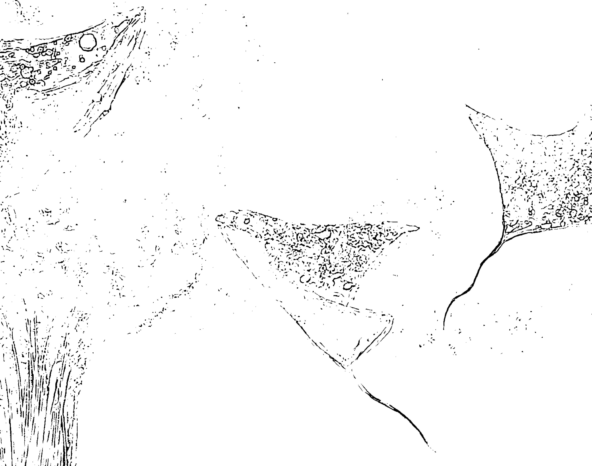

至於人為什麼嚮往愛？那是因為人類的靈魂深處，天生對於來自生命本源的徹底圓滿有著深深的渴望，靈魂天生的印記，一種對於真正家的思念，想藉由另一個對象來填滿天生分裂的不圓滿感，所以對愛的渴望是一種天性。但是我們在追求愛的方式往往有許多誤謬，我們總誤以為愛是對方給予我們的，其實一個對象有可能引發愛的感受，而那個愛的感受，實質上是存在於自己身上，而並非對方，對方只是一個觸發的媒介，當我們充滿愛的時刻，我們就很容易被觸發。這種充滿愛的時刻來自我們把自我放下來、把世界放下來，當我們的故事性降到最低，我們就能感受到來自本源的圓滿，這就是愛。

## 徹底的圓滿在哪裡？如何獲得？

本書不只是教你短暫的心想事成，也教你重新塑造人生，更教你找到最終徹底的圓滿。那麼徹底的圓滿到底在哪裡呢？徹底的圓滿既然無法從生命三要素的現象與解釋中找到，那麼便是在覺察裡了。當我們將生命的立足點退回到覺察中，我們將會發現生命從來沒有不圓滿過，只不過我們自己離開了這個徹底的圓滿，卻向外從現象上去尋找徹底的圓滿罷了。我們從根本上迷失了，這一迷失，就累世的迷失，無量無邊的轉世，我們都迷失在尋找圓滿中渡過，這是人類史上最大的冤枉，偏偏每個人都如此，怎不令人感嘆啊！一切問題都出在我們搞錯了真實的自我，真正的我並非我們以為的自己，而是我們最深層的覺察。試想，我們小時候能夠看到蘋果的這個作用，與長大後甚至年老時這個看到蘋果的作用是否從未變過？世界不停的改變，我們能覺察萬物的這個覺察從來都一樣；全宇宙中，唯一不變的就是這個覺察，永恆不變且永恆存在。當然我們認為人生有死亡，到時候這個覺察也消失了，但是我跟你保證，即使我們死亡時，我們也覺察著死亡過程的發生，這個覺察永遠不滅。

或許你們會認為，當我們睡眠時，如果是無夢的深睡，我們的覺察就不在了，但事實並非如此。各位一定看過電影，當電影要拍攝從地球乘坐太空梭到月球，只要拍攝太空梭離開地球，下一幕就可以場景一轉，便轉到了月球軌道，這種過場的手法，同樣發生在我們的生命中。當我們晚上 11:00 就寢時，如果 11:15 分睡著，2:00 開始做夢，那麼從 11:15 到 2:00 之間的時間，並非我們的覺察不存在，而是生命做了一次過場，也就是當下這一幕是 11:15，而下一幕顯化出來就是 2:00，中間的所謂時間其實並不存在，只是一個信念而已。同理，當我們在睡夢中夢到 4:00，然後進入所謂無夢期，一直睡到早上 7:00 起床，那麼 4:00 與 7:00 其實只是場景過場，事實上覺察銜接著兩個時間點而未曾中斷。這用在昏倒也是一樣的，我們如果昏倒，三天後醒來，其實我們的生命場景是連續的，昏倒的下一個場景直接連到三天後的日期，事實上覺察並無中斷，得以證明覺察是不生不滅的、永恆存在的。這要稍微思考一下，才能明白我所說的。

## 時空的真相

上面的說法已經比較接近真相了，但是對於時間與空間的解釋，仍稍微帶有故事性，接下來我將進一步，徹底說明更為真實的實相。剛剛我們看到了覺察的永恆性，事實上，覺察就永恆地在當下覺察著，不論我們覺察到什麼現象，其實都在當下覺察到，然後在當下解釋，覺察的立足點並沒有任何時間／空間存在，而時間與空間只不過是一種信念，是一種現象的轉換，經由信念而解釋出來的。我們或許會說，我有回憶，所以有所謂的過去、未來，但是即使你在回憶著某個所謂過去的情境，也永遠在當下去回憶，一切只能發生在永恆的當下。在當下提取記憶庫中的事件，把它稱為過去的回憶，這也只是解釋出來的信念而已，一切還是在永恆的當下解釋了現象，如此而已。因此，所謂的顯化，是我們在每一個當下使用我們的信念，顯化了當下的情境，所以我們才會覺得每一個當下都理所當然地存在著。例如我此刻使用電腦寫著你們在閱讀的這本書，那麼在下一個當下，我因為記得剛才正在打字，所以顯化出此刻當下正在打字是理所當然的。

## 談輪迴與最小的信念顯化單位

一切只在永恆的當下顯化與體驗。我們每一刻相信什麼，就會顯化出什麼，而這個相信是根據延續了前一個當下發生的情境而產生，所以產生了虛幻的時間感；當我們產生了時間感後，就產生了「輪迴」現象的發生。輪迴不是只有一輩子一輩子一直不斷地重複、生生世世的循環著，這是一個比較大的輪迴，最小的輪迴就是我剛剛說的，在每一個當下使用信念，相信顯化了情境，在下一個當下，認為且相信是這一個當下的延續而顯化出下一個，這就是最小單位的輪迴，這種輪迴在我們無法察覺的極短時間內發生。

印度《摩訶僧祇律》記載：「一個念名為一剎那，二十念名一瞬頃，二十瞬名一彈指，二十彈指名一羅豫，二十羅豫名一須臾。日極長時有十八須臾，夜極短時有十二須臾；夜極長時有十八須臾，日極短時有十二須臾」。一日一夜有30個須臾，1.2萬個彈指，24萬個「瞬間」，480萬個「剎那」。推知「一剎那」是0.018秒。

| 單位名稱 | 公制換算 | 上級倍數 | 剎那倍數 |
| :--- | :--- | :--- | :--- |
| 念 | 0.018 秒 | / | 1 |
| 瞬頃 | 0.36 秒 | 20 念 | 20 |
| 彈指 | 7.2 秒 | 20 瞬頃 | 400 |
| 羅豫 | 2.4 分鐘 (2分鐘24秒) | 20 彈指 | 8000 |
| 須臾 | 48 分鐘 | 20 羅豫 | 160000 |
| 晝夜 | 24 小時 | 30 須臾 | 4800000 |

從以上表格我們可以得知，一個念的生起速度是 0.018 秒，這裡說的念就是信念，也就是每 0.018 秒產生一個最小單位的輪迴，後念接前念，形成我們的人生故事。這些細微的信念，在每一個極短時刻顯化了我們眼前看似不間斷的影像；每一個影像之間，又根據信念發展的路徑而產生了微小的差別，產生了類似影片的作用；一個影格一個影格的前進播放，形成了我們生活劇情的開展。如果我們能捕捉這每一刻顯化的變化，我們就會發現人生其實是一格一格的影格所創造的，如果要百分之百控制人生，也就是我想看到什麼都可以、顯化什麼都可以，那麼就要精準看到這 0.018 秒所產生的信念。

說了這麼多，大家一定在想：要如何才能夠看到這麼快速的信念？答案是：你的覺察得比它更快才行。事實上，我們的覺察完全沒有間斷，所以我們才能欣賞影格組成的人生劇場，只要我們登出開悟，完全將立足點移回覺察的角度，一段時間後，我們的覺察深度會漸漸增長，就能準確地覺察到這最小的信念，我們會親眼看到每一個最小的信念是如何顯化成眼前的影格，而串聯回一個虛擬的人生電影。

談到這裡，我們也不必灰心，覺得在登出前是無法掌握信念了。我們將繼續談論輪迴，各位就會明白，我們還是能在某種程度底下，可以幾乎完全掌控顯化的。

我們從最小的輪迴開始。這種信念顯化我們每分每秒的生活情境，但是這種細微的信念，所攜帶的情感與情緒是比較小的，有點像是這本書一樣，有內容有章節大綱，每個章節大綱就是比較粗的信念，這種信念就像是大綱，帶有較為強烈的情緒與情感，而我們真正要消融或改變的，就是這種標題大綱式的信念。舉個例來說，我們因為被朋友嘲笑而生氣了，當他嘲笑我們的一瞬間，我們解釋了朋友說的那句話帶有嘲笑的意思，這就是標題大綱。

這樣的標題大綱如果被我們覺察到，立刻用不解釋消化了它，或是改變我們對它的解釋，那麼就不會顯化出後面吵架的劇情；至於你是不是能在 0.018 秒內覺察到每個吵架細節的顯化，也就不是那麼重要了。所以這種標題大綱式的信念，我們稱為「較粗的輪迴」，如果我們根據這個較粗的輪迴去大吵了一架，那麼下次就會發生類似的情境重現。為什麼說類似，因為雖然標題大綱一樣，內容卻相近而不會完全相同，細節會在當時根據現場的情境來延伸我們每個 0.018 秒的顯化。

標題大綱的信念，通常會在我們碰到比較在意的情境時發生，所以在登出開悟以前，我們只要碰到這類情境發生時，立刻採取對策：如果是想要的情境，就享受它，加強情感與情緒；如果是不要的情境，就立刻用不解釋消化它，或是改變我們對它的解釋。如果我們不改變它或消融它，它就會在我們的生命中不斷地輪迴，我們人生的故事就是由這些大大小小的輪迴所組成，最後形成了無止境的迴圈。這輩子沒有解決的問題，必然會保留到下一輩子出現，因為我們並沒有消化它。有人以為死亡就可以一了百了，然而轉世後還是得面對，唯一解決之道，就是我們面對任何情境時，直接化解才是終極之道。

## 所知越多，障礙越大

> 「為學日益，為道日損，損之又損，以至於無為，無為而無不為。」

這段話的意思是，如果學習、做學問，每天都要吸收，一點一滴地累積，學問就會越來越好；但如果修道，每天都要損。損就是丟掉、放下的意思，你要將儲存在記憶庫的信念一個一個瓦解、消融，損之又損，一直不斷地消融，消融到什麼都沒有，再遇到現象時，就什麼信念也升不起來，無為而無不為。當面對現象卻沒有一個固定升起的信念時，你用什麼信念來看待都可以。如果能做到這個程度，你的顯化就完全是活的，要顯化什麼都可以，達到無為而無不為之境。

但是在現代社會中，我們太習慣使用網路了，藉由手機和電腦上網，我們隨時都可以獲得極為龐大的訊息，而每天我們都會將訊息存入記憶庫中，日復一日的堆疊，越堆越厚，消化掉的永遠趕不上堆疊的量。倘若真的無法不看手機，我們就必須使用如幻視角來看待所見到的一切，包括手機裡看到的訊息。如果你想成為超級玩家，想要隨心所欲地顯化美好的事物，那麼選擇訊息來看就相當重要，選擇讓你感覺美好、豐盛的資訊，迴避那些讓你抗拒、憤怒、恐懼的負面資訊。

生而為人，最大的問題就是我們有記性，我們一旦把一個信念放到記憶裡，就會永遠記得它，即使已經在腦海裡忘了它的內容，但當我們用感官接觸環境時，就會很自然地拿出來比對情境，一直到我們用另一個信念取代了原來的信念，或者消融了這個信念為止。

事實上，除非我們已經登出開悟，不然是很難消融信念的，因為每一次遭遇情境，一定會去解釋情境，也必然會產生感受，這樣回存到我們的記憶庫裡，又顯化了下次類似的情境發生。每一次循環都是一次堆疊，信念越堆越厚，越來越深信不疑，越來越難消融。所以「為道日損」也並非一件容易的事，我們自己要有覺悟，明白我們的人生只是在不停地堆疊信念，讓我們泥沼深陷，無法自拔，永世沉淪在人生虛幻的故事裡而求出無期。對於這點我們要有深深的覺悟，否則只能永遠活在夢中。

## 登出開悟回家之路

## 什麼是小我 我是誰

「小我」指的是所有我們認知為「我」的信念總和。這些信念會整天與外界的現象比對，然後證明所謂的「我」是存在的。每當我們與他人交談時，對方會不斷地稱呼「你」，並且討論有關於你的行動、你的生活、你的工作、你的想法，甚至你的外貌，我們利用對方來證明自己的存在，這個急需證明自己存在的，就是「小我」。小我就如一個空心的人形花瓶，花瓶中間其實是空的，在我們的內在完全找不到一個真正可以稱為「我」的部份。這整個人形花瓶靠著一片一片的拼圖拼湊而成，而且拼圖會一直掉，一旦掉了一塊，我們就會想盡辦法把它補起來。當我們掉了一塊，我們就會注意到裡面事實上是空心的，裡面什麼也沒有，這時候我們立刻產生空虛感、寂寞感、無聊感，這些感覺一旦發生，就必須找個能填補那個空缺的拼圖補上，我們會立即打電話給朋友，約出去聚聚或是電話上聊天，從電話那端我們只要聽到「你」，我們的空虛感立即就消失了，因為這張「你」的拼圖，立刻把空洞補了起來。我們就在這種不斷產生空虛、寂寞，不斷設法填補空洞中生活著，當我們的空洞被補起來了，暫時沒有空洞時，我們暫時感覺到「自我」存在著，但我們並不會因此而滿足，「我存在」這個基礎達成了，就會為了證明「我是誰」而努力著，生活圈、朋友圈、社會因此而展現，我們花大把時間去證明這個所謂的「我」到底是誰。

另一方面，我們也可以從笛卡爾（René Descartes, 1596-1650）的名言「我思故我在」看出，因為有「我的思維」，所以就有「我的存在」，而這個「我」是指小我而言。小我的形成，需要依賴信念與思維，我們腦中紛飛的思想就是小我的傑作，而大部分的思維都源於對這個小我的損或是益作為出發點，總是圍繞在某件事情、某種情況，又或是某個事件對它有何種意義上打轉，腦中如果少了與小我有關的思維，相信絕大部份的思想會因此而消失。

而人生的苦，大部分也出自於這個小我，有我，就有我的苦。我們成長過程中有許多的苦，例如必須聽從父母的話，當我們內心的想法與父母、老師不同時，因為他們是師長，我們必須聽從，所以內心產生痛苦。隨著年紀增長，出了社會就有更多的規範需要遵從，有更多的責任與壓力，例如經濟上的壓力、人際關係的壓力等。另外，我們生病也會痛苦，與喜愛的人分離也是苦，想要而得不到也苦。事與願違，或因他人的話語或行為而傷害到我們的小我時，我們因此怨恨生氣，這些也都是苦。而當我們死亡時，感覺小我正在消失，我們也會感覺到極大的痛苦。這一切都因為我們誤認為有一個實質存在的我而產生的痛苦。

「我是誰？」這個問題很有趣，也很深奧。如果你問一個人：「你是誰？」他可能告訴你他的名字，例如我可能回答你，我是莫子，但莫子只是兩個字，它只是個代號，並不是真正的我。那麼我是誰？每個人生活著，其實都不知道自已是誰，所以就會藉由各種方式證明我是誰？我是什麼人？在學校念書時，可以用很多方式來證明我是誰，例如我是班長、我是學藝股長、我是糾察隊、我是升學班的、我是第一名，甚至我是跟誰一掛的，我是國樂社的、我是網球社的。

出了社會為了證明我是誰，最基本的就是我們的名片。名片記載了我是誰的基本資料，上面打上了公司名稱，證明我是哪一家公司的員工；上面印有名字，代表我是誰；然後有部門，例如會計部、企劃部、管理部；還有用來證明我是誰的頭銜，例如專員、主任、副理、經理、協理、副總經理、總經理、董事長、總裁等，人家就會稱呼你的頭銜，你就會覺得「我是經理」。為了證明自己是誰，我們用盡各種方法，甚至參選民意代表、市長、總統。為什麼我們會找各種方法來定位自己？唯一的原因，就是大家搞不清楚自己是誰，自己是什麼，就會希望別人認為我是比較優越的那個人。追根究底，就是因為我們一直以為自己是遊戲中的人物角色，人物角色就會有身份、屬性，以便證明人物與人物之間的不同。

除了向外去證明我是誰，我們一般也會加上把身體、思想、感受的組合認為是我——外在的資訊加上內在的資訊，形成了我。我們總是將那些屬於我們的擁有物，當成了是我。我們要知道，「我的」是我所擁有之物，並非我。例如我的房子、我的車子、我的衣服、我的手錶、我的公司、我的財富，毫無疑問的，它們只是我擁有之物，但是我們總是習慣用這些擁有物來證明我是誰，這是一種荒謬的想法，車子、房子隨時可以更換，能更換的又怎麼會是我們本身呢？更深層地說，以下這些應該就是我了吧，例如我的個性、我的習慣、我的想法、我的智慧，甚至我的人格，它們影響著我在這個世界所呈現出來的狀態與面向。但是我們有沒有想過，列舉的這些也全部都是「我的」，所以它們也只是我們所擁有的，並非我本身，而且這每一項都是可以變動的，隨著時間不同也有不同的變化。例如我是開朗的，但當我憂鬱的時候，開朗不在了，那麼我就不是開朗的，開朗只是我一時的狀態，並非持續性的我。這樣追根究底下去，我們會發現，根本找不到任何所謂的我，我是不存在的，所以有些宗教總是說「無我」，因為看著所有的現象，根本沒有一個我的存在，但是我明明存在啊，不然誰在閱讀這本書？誰在探討著人生？難道沒有我嗎？當然有我，只是我並非任何的現象，也並非任何能夠覺察的對象。

要找到真正的我是誰，也就是登出遊戲後的玩家視角，我們就要清楚知道哪一些不是我，要將原本我們以為的我、事實上不是我的那些信念找出來，並且肯定它們並不是我。這裡有一個訣竅，每當你無法判斷那是不是真正的我時，就可以使用這個訣竅，那就是：能被我覺察到的，那就不是我，頂多也只能成為我所擁有的東西，但絕對不是我。

既然能覺察到的都不是我，所以一切都源自於覺察，而覺察卻是無法被覺察的對象。所以真正的我，就是那個總是在那裡的「覺察的作用」。我們每個時刻都在更換被覺察的對象，而覺察卻一直保持著，並未改變也不曾動搖，我們真正的身份，就是那個如如不動的覺察。生命三個組成的要素：覺察、現象、解釋，很明顯覺察就是真正的我，也就是生命的本質。我們試想，如果當我在這個當下失去了覺察，並知道世界的存在，那麼世界還存在嗎？對於唯物論的看法，世界當然存在，但對於夢境來說，當你的覺察不在，整個夢境也不存在。事實上你所存在的世界，你的整個生命，都是不存在的，而且沒有任何意義。

每個人的世界，因覺察而存在；真正的我，就是覺察本身。

## 登出開悟回家之路

## 真正的我

看完了前一篇，也明白了覺察才是真正的我，但是到了這裡，我要更進一步的深入，深入到一個更透徹的層面來看待「我是誰」這件事。當我們退回覺察的位置來看世界時，我們看到了現象與解釋。現象與解釋就像線上遊戲裡的畫面，我看著遊戲的畫面，裡面的人物與主角並非我，我是玩家，我是正在看著遊戲中人物角色並操控他的那位玩家。這個是玩家的視角，這個是觀察者的視角，這是遊戲人間最好的視角，但還不是最終的視角，也不是最後的真相，這是第二層真相。登出開悟時，會超越這一層真相，而進入最終的真相，然後一段時間後就會回到這一層真相來生活。

如果直接從沒有解釋的位置來看待我是誰，當我們立足的深度到了完全沒有解釋時，覺察與被覺察的界限消失了，現象與覺察成為一味，毫無分別，這是真正回到一元的存在狀態。世界上沒有自己以外的任何東西了，看見一切都是自己，都是眼前所見的自己，連自己也沒有，只是存在，存在於哪裡呢？哪裡都是，沒有解釋便沒有了自他。自他、彼此是解釋出來的，當解釋不存在，所見無不是存在而已，所聽無不是存在而已，完全契入一體性。到了這裡可稱之為彼岸，這正是禪宗所說的佛魔不到處。

所以事實上不僅沒有所謂的自己，也沒有所謂的別人，當然連場景也都並不是真的存在，而是解釋出來的。一切的一切，都是我們解釋後才存在的。

## 登出開悟回家之路

不曾解釋 就什么也没有

## 世界上到底有沒有其他人

常有人問我，當不解釋而登出開悟，登出時什麼解釋都沒有，那麼其他人呢？其他人在哪裡？還是根本沒有其他人？這是一個線上遊戲，還是一個單機版的遊戲？其他所有的人是不是都是 NPC 而非真人？

這是一個相當有趣的問題。如果我們以人生故事的角度來看，這件事情的版本就會變成：有一個人叫做莫子，自從閱讀了佛經、接觸了禪宗之後，瞭解了有開悟這回事，經過長年累月的精進修行，終於在機緣巧合下，莫子獲得了開悟體驗，並且更精進地修持，獲得了數次的開悟經驗，成為一個不是以個體性存在的人！

但是我剛剛說了，這是從人生故事的角度來看這件事，如果不是從人生故事，而是從實相的角度來看這件事，又會變成怎樣呢？我們先聽聽唐朝禪宗永嘉大師在《永嘉大師證道歌》裡怎麼說的：「夢裡明明有六趣，覺後空空無大千。」這二句是在說明「迷則有三界，悟則十方空」的道理。六趣就是天、人、阿修羅、餓鬼、畜生及地獄的六道一切眾生。我們在生死輪迴的大夢中，隨著顯化作用，夢到自己流轉於六道之中。大千者，謂三千大千世界，一日月叫做一世界，千個世界合為一小千世界，一千個小千世界合為一中千世界，然後千個中千世界叫做為一大千世界，三千大千世界用來形容數之不盡的世界。

所以這兩句的意思是，我們在做著輪迴大夢時，就有六道輪迴，生生世世地流轉於六道輪迴之中；但是我們一覺醒，連無盡的世界中，任何的東西都沒有，一切都完全不存在。我們從這裡聽得出來，永嘉大師是證道時站在實相上來說的，既然十方三界，所有世界的任何東西皆為空，就完全沒有別人的存在，連一粒沙都沒有，更別說人了。各位想想看，我們晚上做夢的時候，夢到了我們是一個國家的國王，富甲天下，擁有黃金砌成的皇宮、私人飛機，統領數千萬臣民，養了獅子老虎當寵物，過著無比幸福的黃金歲月，甚至活了幾十年，忽然間山搖地動，倏然醒來後驚覺原是黃粱一夢。各位想想，這時候夢中景物有帶走一絲一毫到現實世界之中嗎？我們會不會想，剛剛夢裡所夢到的人或獅子老虎，是不是也像我一樣醒了過來？

## 登出開悟回家之路

看到這裡，我知道即使各位懂得我在說什麼，思維還是一時轉不過來，還是會問：「那我的家人呢？我的同事呢？難道都是假的嗎？」這時候我只能退一步，換個方式跟你說，的確有可能還有其他人存在，但每個人只是在做著個體性的大夢，夢境都是個人化的，夢境中所遭遇的一切都只是自己所顯化，然後投映在自己意識的屏幕上而已。看到這裡，相信各位已經完全明白了，這本書並非給多人閱讀的，當下只有你自己一人正在閱讀這本書，一切都只關乎於你的夢境，你夢到你正在閱讀這本書，你的夢境以外毫無他物，每個人都只是在做著自己獨一無二的夢，你的夢境只關乎於你自己。

## 命中注定的旅程

如果我們乘坐火車，那麼不論中間有多少停靠站，總會有一個終點站；如果我們作夢，總有夢醒的時刻；如果我們登入線上遊戲，總有登出遊戲的時刻。在人生旅途中，我們玩著人生扮家家酒遊戲，扮演著兒子、女兒、學生、社員、職員、主管、老闆、情侶、老婆、老公、母親、父親、祖母、祖父、好人、壞人、老人、死人，短暫地休息一下，又開始玩另一個扮家家酒，沒完沒了。怎麼會如此呢？即使作夢也有醒來的時刻，而我們卻在這個無法離開的 online 遊戲中，不斷地重複玩著，生了又死，死了又生，生生死死，死死生生，永無盡頭。

所幸在這個遊戲中，有極少數的機率，不經意地，我們能夠發現有登出鍵的存在，能夠有某個雞婆的玩家，告訴你遊戲中藏有登出鍵，而且不像刀劍神域動漫一樣，必須要破完第一百層的魔王才能夠登出，隨時隨地都有登出的機會，而且登出鍵與你從未分離，你隨時都能找到它，只不過因為不熟悉登出鍵的位置，所以要稍微練習一下，等熟悉了之後，我們就能對登出駕輕就熟。之中並沒有任何玄妙之處，一切都極為平常且平凡。

既然有登出鍵的存在，我們身處於這個無盡循環的宇宙 online 遊戲當中，就一定會學習到如何登出，而登出也是我們命中注定、必然發生的最終旅程；那麼我們現在正在看著一本叫做《登出鍵》的書，也是必然發生的一個過程。我們應該把登出的方法，練習得滾瓜爛熟，至於獲得登出後，是否要繼續玩這個遊戲，還是選擇關機回家，就看各人的選擇。

## 如何登出開悟
02 PART

## 返回键本身

知道了生命的本質就是覺察，知道了覺察就是真我，也就是玩家角度而非遊戲中人物角色之後，到底要如何登出呢？要想登出，就要將立足點退回覺察本身。我們最內在的是覺察，其次為解釋，最外層的是現象，平常人們習慣立足於解釋去看現象，所以我們總是往現象的方向看，也就是往外看，所以我們只看到現象，即便對現象做了解釋，我們也毫不自覺，因為我們立足的位置就在解釋上，有點像踩在自己的腳下所以看不到，更不用說覺察了。我們覺察著，卻忽略了覺察。

現象是已經用解釋顯化完成的結果，而解釋是顯化為現象的因。人類永遠無法掌控命運，因為關注著結果是沒用的，該掌控的是那個形成結果的解釋，而非結果。人類的習慣是顛倒的，在佛學上有一句話是「菩薩畏因、眾生畏果」，意思很明顯，菩薩怕解釋如果錯了，顯化出不良現象，而眾生只知道抗拒不想要的現象。

我們連解釋都看不到了，要如何將立足點退回覺察呢？我們試想，解釋跟現象就是我們的人生、我們的生活、我們的故事，那麼要退回覺察，就要離開現象與解釋。在這裡我們還要弄清楚一件事情，那就是現象是因解釋而存在，沒有解釋的現象，將毫無意義。舉個例子，眼前的桌上有一顆蘋果，當我們往前一看，立刻自動提取記憶（解釋）來比對眼前的現象，嗯！桌上有一顆蘋果，桌子是我們提取的解釋，蘋果也是我們提取的解釋。當然我只是舉最簡單的例子，我們所提取的，將會比這兩個解釋多很多，例如蘋果看起來脆不脆？是加州蘋果還是富士蘋果？我判斷它好不好吃，會不會放很久等等不計其數的解釋。如果，我們沒有提取解釋，那將會如何？我們將完全無視蘋果的存在！如果我們連碟子、桌子的解釋都沒有提取，我們眼前將完全沒有任何物品存在，應該說是我們不知道有任何物品的存在——由此證明，現象是因解釋而存在的。

| 覺察 | 只有眼前的畫面，沒有任何解釋 |
| :--- | :--- |
| **解釋** | - 桌子、蘋果……<br>- 蘋果看起來脆不脆？<br>- 是加州蘋果還是富士蘋果？ |
| **現象** | 眼前的畫面 |

反過來說，我們其實根本沒看到任何的現象，而是看到我們記憶庫中的解釋，某種眼前的訊號讓我們看見了記憶庫中的某些解釋，事實上是不是真的有現象在那裡，根本就無所謂。就像電視中看見老虎，只要接收老虎的訊號，並經過解碼器解碼為老虎，這樣看電視的人就能看見老虎了。事實上電視中根本沒有真的老虎。

回到之前所說，「現象是因解釋而存在的」就是這個意思，所以剛剛我們說要將立足點退回到覺察，要離開現象與解釋，實質上，只要離開解釋即可。《金剛經》上說：「凡所有相，皆是虛妄，見諸相非相，即見如來。」意思就是：「凡所有可以辨識（解釋）的，都是虛假的；如果能見到現象而沒有辨識，就能見到實相。」這樣說來，當我們能離開解釋，我們就能將立足點退回覺察，就能見到生命的本質。安住在生命的本質，也就是安住在覺察，當夠深入、時間夠長，你將會體驗到被整個覺察吞沒，這就是所謂的登出開悟。

其實簡單的說，就是去覺察著覺察的本身即可，但是覺察是一個不可覺察的對象，我們可以對世界上任何的現象加以覺察，但是我們覺察不到覺察本身。登出的關鍵是，只要深入覺察，我們就能從現象界退回到覺察而登出；換另一種說法，就是我們不論覺察到什麼，都會形成人生故事，唯有覺察那個完全沒有內容的覺察本身，才能覺察著而沒有覺察到任何現象，唯有這樣才是登出的唯一方法，因為登出的方法，就是完全離開故事。

在現象裡，在人生故事裡，每一現象都是可以覺察的，而唯一無法覺察的就是覺察本身，所以佛法說「空」、道法說「無」，並非一種失去意識的斷滅，而是無可覺察、無有解釋。無可覺察並非沒有覺察，而是覺察著卻沒有覺察到任何的對象。在這裡我們只要輕鬆地看過去，大致上理解就好，在後面的章節，我們會有實際的操作方法來體驗這個「沒有內容的覺察」。

## 從理論到實際體驗

前面的幾個章節，都是為了讓大家對於真實的人生狀態，有一個概略性的理解，如果我們要使用導航軟體，首先要定位出我們的位置，前面的介紹，就是讓我們理解，我們活到現在為止的人生，到底是怎麼運作的？我們的生活到底被怎麼樣的解釋所驅動？我們是站在什麼樣的角度在看待一切？當我們理解了這些之後，我們才有一個明確的對照，才能知道我們要移動到什麼樣的位置，也就是覺察的位置，才能知道從原來立足的解釋位置，移動到覺察位置是怎麼一回事。

所以，接下來的章節，我們就要從理論進入實際的體驗，教導大家如何從立足於解釋，移動到立足於覺察，也就是如何從遊戲中人物角色的視角，移動到玩家的視角，而這個移動，就是登出。登出並不需要什麼神秘的儀式，也不需要什麼特殊的灌頂或加持，它只是一個視角的轉換，從故事中轉換到看故事的視角，從沉浸於現象與解釋，轉換到純粹的覺察。我們每個人都具備這個能力，因為覺察是我們本來就有的，只是我們遺忘了它，把它跟現象與解釋混在一起，甚至被現象與解釋所覆蓋。現在，我們就是要讓覺察重新浮現，讓它做回主人。

在進入實際操作之前，我們要先明白，覺察是什麼感覺？它有什麼特徵？這樣我們在操作時，才有一個可以依循的指標。覺察，最明顯的特徵就是「知道」，或者說是「意識到」。例如，你現在正在看這段文字，你知道你正在看，這個「知道」就是覺察。你可能也聽到周圍的一些聲音，你「知道」你聽到聲音，這也是覺察。你可能心裡有一些念頭飄過，你「知道」你有念頭，這還是覺察。覺察就像是一個背景，所有的現象——看到的、聽到的、想到的、感覺到的——都在這個背景上發生。通常，我們都把注意力放在這些現象上，而忽略了這個背景。我們現在要做的，就是把注意力從現象上，移回到這個背景上。

這個移動並不需要很用力，也不需要很刻意，它只是一種「回頭看」。就像你一直專注在看電影，突然間你意識到「哦，我正在看電影」，這個意識的瞬間，就是從電影劇情（現象）中，回頭看到了你自己（覺察）。登出開悟，就是把這個「回頭看」的狀態穩定下來，持續地安住在覺察之中，而不被電影劇情帶走。

接下來，我們將提供一些簡單的方法，幫助大家練習從解釋移動到覺察。這些方法並不是唯一的，也不是最究竟的，但它們是有效的工具，可以幫助我們熟悉覺察的味道。當我們熟悉了覺察，自然就能分辨什麼是現象，什麼是解釋，什麼是覺察本身，然後就能輕易地將立足點移回覺察。

請記住，登出開悟不是一個遙不可及的目標，它是我們每個人內在本具的能力，只是被我們自己建造的故事世界所掩蓋了。現在，是時候回家了。

麼了？世界又把我們帶去了哪裡？先明白了我們被教育、社會、世界，以及自己建立的信念，捆綁在一個系統框架裡，知道被什麼綁住，我們才能知道如何解開。

我們雖然在這一世，甚至累世都在這樣的系統裡越陷越深，不計其數的死結將我們束縛而無法動彈，但只要能抓住一個解脫的點，所有捆綁我們的枷鎖都會自動不斷地脫落。各位不必擔心，只要有決心從這種信念不斷堆疊的無盡輪迴裡解脫出來，我們就一定能解脫出來。

在接下來章節裡所談論的以及相關的引導，就是要啟動一個自然而然的解脫過程。這是一本提醒與引導的書，只要反覆閱讀，自然就會有翻天覆地的改變與轉化。過去我們跟從社會的一切運作，不知不覺地被捆綁，當然也可以反向地解脫出來。不論是漸悟或是頓悟，我們總是從有機會從虛幻的枷鎖中解脫出來，回到真實。

著手寫這本書前的一年裡，我開設了七個梯次的「登出開悟轉化班」，每梯次為期一個月。開設這個轉化班，目的就是轉化大家的方向，從以前不斷堆疊信念、捆綁得越來越緊的人生泥沼中解脫出來，往登出開悟的方向移動，只要上路了就沒問題，解脫是遲早的事情。我並沒有期望大家在這七期的轉化班裡就能登出開悟，然而在這期間，陸陸續續看到登出開悟的人，有些人登出後默默地回去了，有些人被大家知道了，也有人在第七梯次課程的最後一天登出開悟後熱淚盈眶。

重要的並非有人登出開悟，而是大部份的參與者，生活與生命軌跡都有著重大的改變，越來越輕鬆，越來越活出自然、恬靜，越來越能安住在空空蕩蕩的覺察裡，不再被信念拉著東奔西跑，自然顯化出來的生活也越來越順心。

這本書的目的，跟登出開悟轉化班是一樣的，期望更多人能越來越朝向解脫，越來越活出真我。只要有決心，每個人都可以在一段時間後就登出開悟，快則數月（甚至更短），慢則幾年，一定可以抵達彼岸。

如果沒有要登出開悟的人，也可以藉由本書的引導，重新塑造自己想要的生活與命運，好好地重設這個遊戲中的人物角色，不再是命運之神的奴隸，找回生命的主控權，越活越開闊自由。

## 登出開悟後的兩個方向

現在開始講實際可以執行、可以體會的方法。以下是本書提供的兩個方向：

- 登出開悟，進而回家。找回真實的實相，回到徹底的圓滿，從人生的故事裡、遊戲裡、夢裡徹底解脫出來，醒覺出來，進而穩穩立足於覺察上生存著。每分每秒看到自己使用什麼信念去解讀現象，只是覺察著這些信念，不跟隨，隨緣度日；不斷消化信念，現象越來越少被顯化出來，生活越來越單純，卻與萬物的一體性越來越擴展；心中越來越圓滿，越來越感受到無限的喜悅，並將喜悅分享給天地萬物，即是分享給自己；生活的情境越來越簡單，越來越少，最後融化在無限的空裡，填滿了整個一體，成為了一。

## 二、成為超級玩家

了解人生的一切境遇，都是信念所顯化的「顯化法則」。重新安排並設定自身從小到大的信念，重新塑造人物角色的各項屬性，並且在人生中每個時刻顯化自己想要的情境。從此遊戲人間，做個清明夢，等玩膩了，再來登出開悟，朝向回家之路。

又或者是先登出開悟，站在覺察來生活。每一個即時升起的信念都能完全掌握，想要的信念我們享受它，不想要的信念我們覺察著、消化它，並且升起另一個信念來取代它。完全掌握每一次的顯化，成為遊戲中的 GM（Game Manager，遊戲管理員），徹底掌控遊戲的發展，成為超級玩家。

然而要成為超級玩家，最好的方式還是先登出開悟，如此才能完全掌握信念；但如果不以此為目標，我們只能退而求其次，運用一些方法來有意識地顯化部份我們想要的情境。

## 共通且必修的如幻視角

不論你要登出開悟，或是要自由地顯化人生情境，首先我們要培養一個共通的存在狀態，也可以說從原本社會體制的系統中，切換到另一個系統，我們稱為如幻的視角。因為世界是由信念所打造的一個系統，而我們每個人生活在這個系統中顯化我們的人生故事，堅信著人生故事裡的點點滴滴。在人生故事結構裡，我們相信什麼就會顯化什麼、成為什麼，所以不論要登出開悟或是重塑人生，都要軟化原來的系統，才有機會跳出系統或是改變系統。如幻視角就是將系統軟化，將堅固的系統變成像水一般，沒有形象卻又可以形成任何形象的系統。在軟化後的系統裡，一切都是如幻的，如幻的情境就是水，就是能量，整個宇宙都是能量；而我們產生的信念就像是一個模子，情境之水進入模子，就顯化成現象，我們的心非常柔軟，一切也如夢似幻的存在著。顯化的速度非常快，想要登出開悟者，輕鬆地看著如幻的現象即可，因為如幻，所以不執取；而想要塑造人生者，輕鬆地建立信念，並在如夢似幻的現實裡，享受著自己的信念，信念以飛快的速度充滿能量、顯化成情境回饋自己。

人生事實上就是一個夢境，比晚上睡眠夢境的資訊量更大的夢境，所以培養如幻視角，首先要將日常人生視為只是一個夢境。有做過清明夢的人，就會知道一旦我們在夢裡意識到正在作夢，就可以開始隨心所欲地操控夢境，又或是隨心所欲地清醒過來。在這裡我們發現，其實開悟解脫就是從夢中清醒，自由顯化人生就是操控夢境。如幻視角並非是催眠自己，告訴自己人生只是個夢境，當成是一個夢境就行，因為這樣是沒有用的，就算你這樣想，你的潛意識也不會相信。所以你要明白的是，我們所謂的世界，一切只是視覺、聽覺、嗅覺、味覺、觸覺、思想等訊號，一切都在我們的意識當中，其實沒有外在客觀的世界存在。我們試想，如果現在是一場夢，那麼夢中的一切都存在於哪裡呢？是不是夢中的山河大地、人物景像，全部無一不是存在於夢境中？夢中的一切，都並非真實存在於外在的世界，而整個夢境就只是存在於我們的意識中而已。當我們在生活中，無時無刻都認知到這一點，我們就等於在做著清明夢，要從夢中清醒過來或是操控夢境，就不是一件難事了，而清明夢的關鍵，就是確認當下的情境都在夢境中，相信它並確認它。

## 放鬆。放下

如果我們想要登出開悟，必須離開故事。離開故事不是叫你找個山洞躲在裡面，逃避所有人生故事，而是不再緊抓著故事情節，放鬆我們緊抓著故事的手。有許多人都聽過「放下」，放下的確是接近登出開悟的最簡單方式，但是我們有想過要放下什麼嗎？放下對金錢的抓取、放下對愛情的渴望、放下對某人的仇怨、放下數不清的放下？但其實並非如此，我們並非要放下什麼，放下的意思，是放下你當下手中抓取的東西，不論你抓住什麼，立刻放下；更精確地說，是打開你抓取的雙手，從此不再抓取，這才是真放下。當你真放下，你才能體會真放鬆。為什麼我們從身體到精神總是緊繃？因為我們緊抓著不放，只要打開緊抓著的那雙手，立刻就可以體會到無比的放鬆。放鬆是除了如幻視角外，第二重要的環節，無論何時何地，都要覺察到自己是否放鬆？沒放鬆的話立刻找出自己正在抓取什麼，立刻放下，然後就會感覺立刻放鬆。

當我們檢視是否放鬆時，只要注意全身的肌肉是否緊繃，就可以知道是否在信念上放鬆。身心是一致的，當信念放鬆，我們的身體就會放鬆，所以如果真的找不到信念上緊抓著什麼，就覺察身體哪個地方沒有放鬆，我們輕鬆地將身體放鬆，一次沒放鬆就繼續放鬆身體，直到身體完全放鬆為止，我們會發現精神上也輕鬆了許多。


## 登出開悟實際體驗

## 不解釋

本書最重要的一個環節，就是現在要跟大家說的「不解釋」，只要完全融會貫通「不解釋」的精義，我們就可以將立足點退回到覺察上，而不會黏在解釋上去看現象，很快就會登出開悟，被無邊無際的覺察所淹沒。

「不解釋」也是整個佛法當中最重要的部份。佛陀講般若部的經典二十二年，最重要的精義就是這三個字，我把最精華之處，濃縮在以下幾頁當中，各位切莫等閒對待，要好好地品味，好好領悟其中的奧妙。只要懂得「不解釋」的奧妙，你就能隨時立足於覺察上，穩坐於生命的本質上，輕鬆地無修無證、無智無得，回到生命最真實的徹底圓滿中。

## 大将军

## 如何登出開悟

我們在前面的章節曾經提到，人生的存在只有三個組成要素，那就是「覺察」、「解釋」、「現象」，而現象是因解釋而存在的，如果沒有解釋，現象根本不會存在。這跟電視機解碼作用一樣，如果不對所接收到的訊號進行解碼，就不會有影像呈現在螢幕上了。所以我們整個世界的開展，都有賴於解釋，沒有解釋就沒有人生的故事，離開了故事，我們就能從人生故事中解脫出來，也就是能從人生大夢中覺醒過來。

在這裡所說的不解釋，完全是用於自己，而非用於面對他人的時候。例如你的老婆問你下午去了哪裡？你跟老婆說「不解釋」；又或者老闆要你解釋一下為什麼這個月老是遲到，你跟老闆說「不解釋」。

我們使用視覺、聽覺、嗅覺、味覺、觸覺去接觸現象的第一時間，我們就會提取記憶庫裡的信念成為解釋，所謂不解釋的意思就是在這時候，我們輕鬆地將解釋放下，而進入沒有解釋的當下，單純的存在著。不解釋的時機就是我們對世界產生了解釋，就輕鬆地將解釋放下來。不解釋更適合應用在持續不斷的單純現象上，例如持續不斷的風聲、海潮聲、宇宙基本聲，又或是看著一個沒什麼好解釋的情境，例如山、海、杯子、電腦鍵盤、一串香蕉，不論是哪一種感官接觸現象都可以練習不解釋。當解釋自然而然地脫落時，我們就會進入一種單純的存在——覺察著，卻沒有覺察什麼。我們就是要體會這種覺察而沒有對象的狀態，因為我們只要一覺察到什麼，那個「什麼」就是我們對世界的解釋，一解釋就進入了故事當中；「解釋」與「現象」形成了世界，而沒有解釋，也就沒有現象，剩下覺察獨然存在。如果時間夠久，我們就會被無邊無際的覺察吞沒，因而翻轉了我們整個存在狀態，整個存在狀態會由「人生故事」的模式，變成「純意識存在」的模式，就像是把棉被套由內向外整個翻過來，這件被套可能就會變成另一種樣式。

至於「一切只是意識存在」，在這裡我以簡單的方式跟大家說明一下。一切只是意識存在並非一種理論，而是當我們登出開悟時可以實際體驗的一種存在模式，它的意思是，宇宙中所有的情境，與我們日常所碰見的一切境遇，全部都是意識所顯化出來的，而一切都在意識之中，外面並沒有客觀存在的現實。我們以夢境來理解就更能體會，夢中見到的各種情境，在夢中我們覺得非常真實，但是一個都只是一個夢，而整個夢境存在於哪裡？整個夢境實際上就在我們的意識當中，不論夢境的場景再廣闊，一切都只是在意識裡而已。而我們現在對清醒時的理解，一直認為有一個客觀的物質世界存在，其實這只是一個有連續感，訊息量較多較長的夢境而已，實際登出開悟就可以契入真實的實相，實際覺醒而體悟到原來我們一直認為是真實的客觀物質世界，根本就是幻相，都是意識所幻化的情境而已，一切從來沒有在我們的心識之外。所以說，不論各位的生活美滿與否，都只是在做著美夢與噩夢而已，生命實則空無一物。

各位看到這裡，難免會不禁感嘆，原來一切都是假的、空的，世界根本不曾真實存在過。其實這是一個好消息，原來生命根本就處在徹底的圓滿之境中，從來都沒有不圓滿，所有的不圓滿只是一場夢而已，這是不是一個天大的好消息？

那麼我們到底被什麼所蒙蔽，而未能體會到生命本就俱足的徹底圓滿呢？原來只是每當見到眼前的現象時，我們因為有所解釋，而被鎖在人生故事裡，這就如同眼前被兩片小紙片遮住雙眼，而看不到廣闊的真實世界。解釋就是那兩片小紙片，雖然只是小紙片，只要離眼睛夠近，就可以遮蔽無邊無際的虛空。只要不解釋，自然就會離開現象，而安住在那空空溫溫的覺察中。

## 空空蕩蕩的覺察

不解釋就會安住在空空蕩蕩的覺察中。當我們的立足點從現象、解釋，進而退回到覺察的時候，我們會發現覺察的本身毫無內容，有內容的是解釋，覺察本身只有無邊無際空空蕩蕩，所以在佛學上稱為「明空雙運」，「明」就是明明白白、清清楚楚的覺察，而「空」就是沒有任何的內容。

空空蕩蕩的覺察其實一直都在，只是被現象與解釋給遮蔽了。對於現象，我們之前知道有視覺、聽覺、嗅覺、味覺、觸覺，這是外在的訊號、現象；而我們內在還有一個訊號、現象，那就是我們的思想、思維，它是我們內在的聲音。如同覺察到外在的現象一般，我們也會覺察到我們腦袋中喋喋不休說著話，那就是思惟、想法。這個訊號是最能引起我們注意的一個訊號了，我們常常聽到內在的說話，甚至照著它的話去行動，它像是一個聒噪的室友，總是說個不停。這些說話的聲音，是我們平常最容易誤認為「我」的訊號，因為它總會想要指揮我們的生活，但想想就能明白，它們只是「我的」想法，而且總是變來變去，一下有一下消失，完全不可能代表「我」，說到底就是一堆腦中的聲音，一種現象罷了。

例如腦中響起了聲音：「好像有點餓了，晚餐要吃什麼呢？有點想吃雞腿飯，不過想想雞腿飯太油了，昨天才吃爌肉飯，吃太多油膩的食物可不行，上個月抽血檢查三高都超標了，我看還是吃清淡一點好了，但是健康餐的便當好貴，一個要一百五十元，不行，這個月要省一點，同事小王要結婚了，這個月要包紅包，也不知道要包多少錢？小李說要包六千，但其實我跟小王也沒有熟到需要包六千吧！我看包三千六就可以了，三千六，起碼可以吃三十個便當吧！這個月省點花吧！原本想買個藍牙耳機的，我看下個月再買吧！對了，我不是在想吃什麼嗎？怎麼想到這裡來了，好想吃雞腿喔！算了，我看還是吃雞腿飯吧！比健康餐便宜。」

以上這段話各位一定不陌生，思想總是不停地在我們內在製造出聲音，這個聲音也是障蔽我們空空蕩蕩覺察的其中一種現象，而且是經常性的障蔽，是在我們的生命中構成虛幻故事的一個主要環節，所以有許多靈性的理論，認為只要超越了腦袋中的思想，就能夠徹底地解脫，但是他們忽略了「信念、解釋」，才是形成虛幻故事的主要的環節。

有的讀者會分不清楚「信念、解釋」與「思想」的不同。信念就是解釋，但是與思想並非同一個東西，思想是頭腦裡喋喋不休的那個聲音，而解釋指的是當我們使用感官去接觸到現象的第一時間，提取記憶庫中的信念去比對所接觸到的現象，比對出來的就是解釋。例如，眼前有一輛車，為什麼我們知道那是一輛車，就是我們提取內在的記憶庫裡對於車輛的信念所比對出來的，這時候得到了眼前有一輛車的結論，當這個過程結束後，就有可能引發思想，例如「這輛車停在紅線上，我看很快就會被警察開罰單或是拖吊……」等等。

| 項目 | 描述 |
| :--- | :--- |
| **覺察** | 只有眼前的畫面，沒有任何解釋 |
| **思想** | 這輛車停在紅線上，我看很快就會被警察開罰單或是拖吊…… |
| **信念=解釋** | 有一輛車 |
| **現象** | 眼前的畫面 |

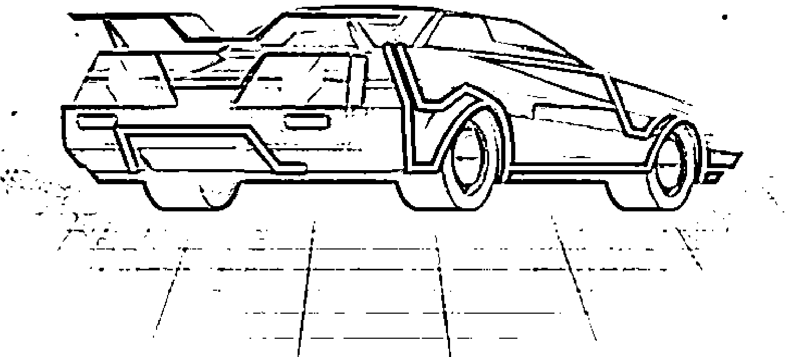

外在訊號：視覺、聽覺、嗅覺、味覺、觸覺
內在訊號：腦中的聲音

生命三要素是「覺察」、「解釋」、「現象」，這三個要素中，解釋與現象是組成故事的元素，而覺察是用來體驗故事的主體，被體驗的故事是客體，所以生命的本體是存在於覺察這端的，但一般人只關注解釋與現象，並把解釋與某些現象組合成虛幻的「我」，例如身體、個性、想法，例如「我思故我在」。事實上，「思」是所覺察的對象，所以主體是覺察，「思」則是客體，所有能覺察的都並非我，真正的真我，是能覺知萬事萬物的那個至高無上的覺察，佛法稱為佛性、自性、覺性。

## 世界最初的二元性

這個世界是個二元性的世界。我們生活在這個世界，對於二元性一點也不陌生，黑白、上下、前後、大小……，所有的現象都離不開二元性，但是超越現象的二元性我們並不熟悉，二元性的源頭我們並不清楚。生活中充斥著各種現象的二元性，即使我們超越了一個、兩個，依舊無法超越這個人生大夢，無法因此而跳出故事。

只要我們知道世界二元性的源頭，並能超越這個源頭，我們就能完全超越世界故事而回到一元的狀態，立刻登出開悟。這個二元性的源頭就是「能覺察」與「所覺察」，也就是「覺察」與「被覺察」，這兩個是所有二元性的源頭，最初的二元對立。

要如何超越這「能覺察」與「所覺察」呢？我們從這個角度來看，「能覺察」就是「覺察」，而「所覺察」就是「現象」，這樣就非常清楚了，所有能被我們覺察的都是現象。這裡我們發現，是不是少了「解釋」？覺察與現象，原來就是最初的二元性，那麼中間的「解釋」又是什麼？簡單的說，「解釋」就是將原本的一元切割成二元的刀子，覺察與現象因解釋而切割成二元性。我們試想，眼前有一個蘋果，如果沒有「蘋果」這個解釋，我們往前看將會如何？因為沒有解釋，覺察與被覺察並沒有分別，我們覺察到的就是覺察的本身，眼前沒有蘋果的解釋，而覺察與蘋果成為一體，沒有二元性的存在。換句話說，當我們對世界萬物在沒有解釋的當下，我們就與整個宇宙一體，感受到徹底的圓滿。

這些說明，是為了鬆動你對世界的概念，事實上還需要直接證入。聽到理論不一定能立即體會到一體性，但先理解了這個，將有助於你更加契入空空蕩蕩的覺察本身。

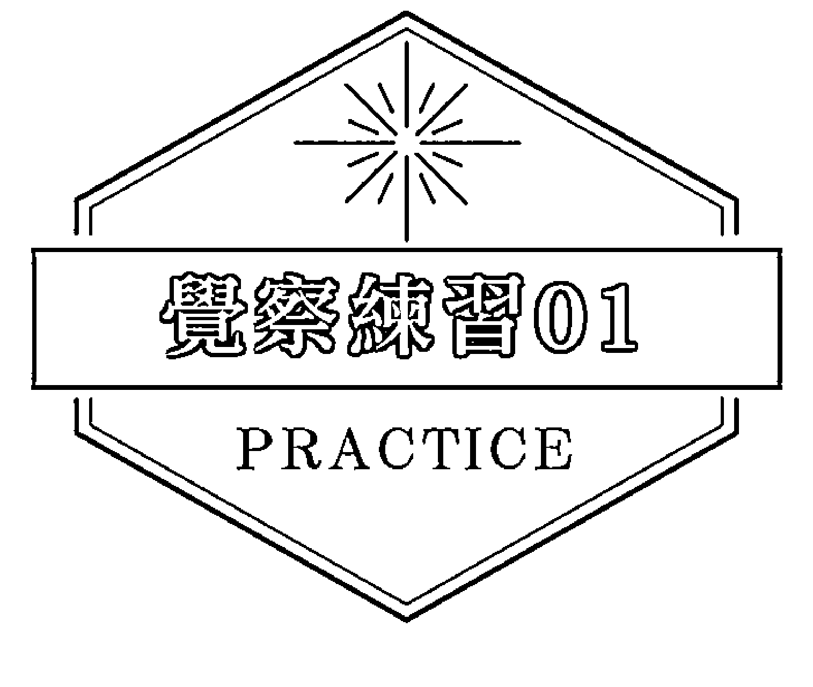

## 契入空空蕩蕩覺察的三個方法

**練習進度** ☆☆☆☆

|| 熟悉覺察練習 01~03，能更快契入 04 (功課)喔！

要登出開悟，就要常常契入空空蕩蕩的覺察。它是一種發生，並非一種造作。或許某些步驟有些造作的成分，而造作完就等待它發生，並非造作的結果。以下我就進一步的說明。

首先我們要理解，覺察並非存在於解釋與現象的領域，相反的，離開解釋與現象的領域，就可以安住在覺察。所以我們並非在解釋與現象的領域中，用任何方法造作，我們會不習慣這種方式，因為在人生故事中要達成任何目的，都是透過信念、行動，然後在現象界產生某種改變；而安住在覺察卻是要離開解釋與現象，現象是因解釋而存在，所以只要離開解釋就可以了，但是我們很難理解這要如何進行。我們從早到晚，甚至在睡夢中，只要感官一接觸現象，就自然而然地提取記憶庫的信念來比對現象，也就是說我們的生活，就是靠信念比對出來的，也就是解釋出來的。在每個當下感官接觸現象，對現象產生解釋，形成情境，情境組成人生故事，人生故事組成生活，生活組成我們的整個人生！我們整個人生是解釋出來的，離開解釋，意味著離開整個人生。

賓果！離開解釋，意味著離開整個人生，那麼我們要從這個人生大夢中覺醒，我們要從人生虛擬實境遊戲登出，我們要開悟解脫，關鍵就在離開解釋。所以之前提到不解釋就是登出開悟的關鍵，而不解釋的狀態並非造作出來的，而是一種發生，所以我們該做的，就是把一切造作與解釋放掉。

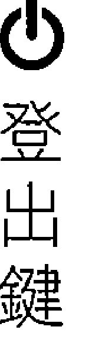

## 方法 ①
Method 1

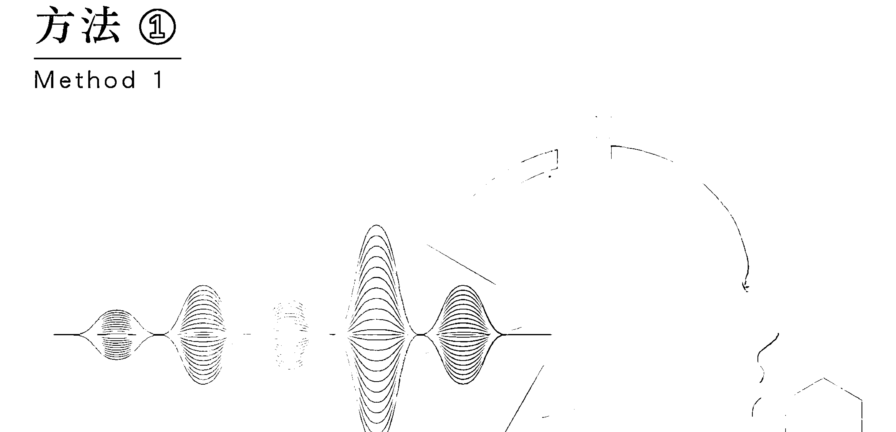

首先介紹第一個方法。這個方法是找一個較規律的現象去使用感官覺察，視覺、味覺、嗅覺、聽覺任一種都可以，較容易掌握的是視覺的方法。例如持續盯著一個杯子看，一開始我們會知道那是一個杯子，當持續看著時，開始放鬆對杯子的解釋與執取，只是純粹地看著，由於我們無法對相同的對象長時間維持著解釋，只要看著它沒有中斷，一段時間後，我們對杯子的解釋會脫落，會導致不知道眼前看著什麼。我們要的就是這樣的效果，當我們不知道看著什麼，就是發生，沒有杯子解釋的時刻發生了，這時候可能所有的解釋都脫落了，也有可能有其他的解釋，例如「我不知道現在怎麼了？我感覺完全空白」，這個感覺完全空白，就是另一個解釋，我們繼續靜待連這個空白解釋都脫落的發生，這時候腦海裡可能會出現「我覺察著，但是沒有任何可以覺察的對象了」，這個仍然是解釋，我們仍然繼續覺察著，靜待這個解釋脫落，當一切解釋都不存在，我們就成功的安住在空空盪盪的覺察了。不只視覺可以進行，聽覺也可以，聽著某個規律的聲音，例如海潮音、宇宙基本的聲音（有許多許人在周遭比較安靜的時候，所聽到的一種持續不斷的嘶嘶聲或嗡嗡聲）、YouTube 播放某個頻率的聲音等等，都是適當的聲音。流程與看著物品一樣，聽著並開始放鬆對所聽聲音的解釋與執取，只是純粹的聽著；一段時間後，我們對聲音的解釋會脫落，不知道聽著什麼，當我們不知道聽著什麼，這時候如果還有其他的解釋，我們就輕鬆地放下那個解釋，並繼續靜待，當一切解釋都不存在，我們也就成功的安住在空空盪盪的覺察了。

## 方法 ②
Method 2

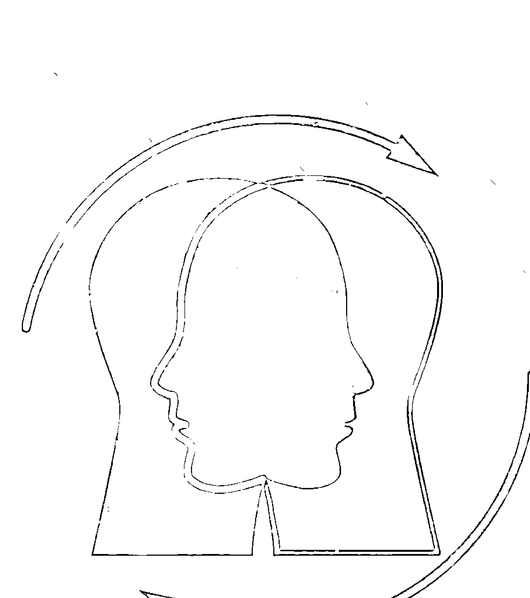

第二个方法，是直接去觉察觉察的本身，也就是去找「谁在觉察着？」「什么在觉察着？」直接去觉察那个觉察，这时候你会感觉完全没有内容，这时可能会出现一些解释，当有解释出现时，就再次回头去找觉察的本身，直到没有解释的瞬间发生，就安住着。这个方式跟问自己「我是谁」有异曲同工的作用。

## 方法 ③
Method 3

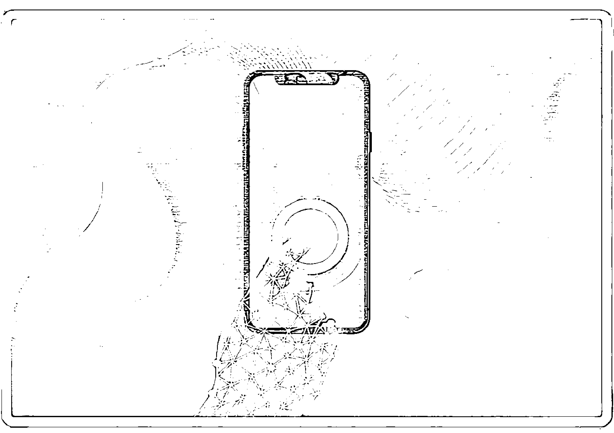

第三個方法，利用感官接觸到現象的一瞬間，認出現象而沒有解釋時，現象其實就是一面鏡子，它反映出我們正在覺察著。例如我們看著手機，我立刻放下手機這個解釋，並且明白眼前的並非任何現象，我所見到的，正是我的「覺察」本身，所以我不論看到什麼、聽到什麼，它們全部都是我的覺察。覺察完全不必尋找，它在我們感官接觸的每個當下都是，利用肯定所覺察的全是覺察，來強制讓解釋發生消失，當我們肯定眼前的就是覺察的時候，如果解釋脫落了，這時候就是安住在空空濫濫的覺察。

這三種方法沒有哪一個比較好，只有適不適合，大家可以多嘗試，找出自己最得心應手的方式，並且每天多多安住在覺察，只要某一次時間夠長，深度夠深，都有機會被整個生命的本質吞沒。為什麼這裡不是說進入而是說吞沒？原因是當登出開悟時，有如被整片大海吞沒一樣，它是一種發生，你永遠無法控制登出開悟的時機。這裡再次強調，當登出開悟發生時，不會有任何解釋，所謂的自己以及所謂的世界在那一瞬間都將完全消失，剩下的只是無邊無際的覺察。

要每天時常安住在空空蕩蕩的覺察需要非常大的決心，因為我們並不習慣處在這種沒有內容的狀態，我們一旦處在沒有內容時，立刻感覺無聊、寂寞、空虛，會立即找事情來做、找人來聊天、找影片書籍來看，就是無法處在沒有內容的存在片刻。這是一種逆向的生存方式，如果不是有極大的決心，是很難做到的，並非安住在空空蕩蕩的覺察很困難，只是要習慣它並不容易，一旦品嘗到安住在空空蕩蕩覺察的圓滿感，我們就能喜歡上這種狀態了。一開始需要一些原因和動力，例如覺得人生痛苦、想求出離；又或是覺得人生極為虛幻，不論如何都要求個真實、弄個明白。不知道正在閱讀的你是哪一種？

## 如何登出開悟

人生是由生活的故事所构成

眼、耳、鼻、舌、身所接觸的訊號，經過我們使用信念去解釋，就變成了有意義的現象；而現象與現象的組合，就會組合而成情節；情節與情節組合成為小故事；小故事與小故事組成我們的生活；生活串連成我們的人生。不論你是以哪一種存在方式生存於世界上，是人也好，是動物也好，是外星人也好，又或者說你是不同維度的存有，不管是哪一種，都無法離開這種生存的運作模式，所以在這裡說明的內容，通用於整個宇宙。一切源於我們使用信念去解釋了訊號，信念又會堆疊儲存回記憶庫，沒完沒了的人生故事就此展開，在許許多多的循環中重複上演著。

而新時代的看法，著重在生命要不斷的提升，提升我們存在的頻率與維度，如同線上遊戲升等一樣。事實上，這一切仍然是生命的夢境，也可以說只是遊戲中某些層次的提升而已，遊戲中的升級，始終還是在遊戲中，從來都沒有離開過遊戲。假設你提升自己的存在方式，幻化成為一團光，沒有身體，也沒有時間的束縛，喜悅地存在著，假設你認為這是第七維度的存在，那麼我們進一步來分析，你能否覺察到自己是一團光？你的覺察存在嗎？你對自己是一團光的信念存在嗎？一團光這個現象存在嗎？我們最終還是會發現，覺察一定存在，如果沒有覺察，我們就不存在於世界上了。有覺察，就有被覺察之物；有被覺察之物，就有對被覺察之物的解釋，也就是信念——覺察、信念、現象三者都存在著，這就形成了人生的故事了。所以我們可以理解，不論將自己提升到何等境界，我們都必然在故事內、遊戲內，從來沒有跳出故事，真正要從故事中解脫出來，只有從解釋解放出來。由此可知，我們常常提及的維度提升、幾維度的存在是佛、幾維度的存在是菩薩等說法，都還是在故事內的境界而已，真正的佛與菩薩，是超越維度的存在，也就是單純的存在著，超越了現象與信念。

## 從生活故事的信念牆上打洞

我們每天活在生活的故事性當中，這些故事性由許多的信念組成，它們形成了厚厚的故事牆，我們的人生就是被厚厚的故事牆遮蔽了真相。而覺察就像一支強而有力的超級電鑽，會在我們的信念牆上鑽出一些洞來，只要有這些洞，就有機會讓我們看到牆壁背後的實相，就有機會掉進實相而登出開悟。

安住在空空蕩蕩的覺察，以及對現象不解釋，其實指的是同一件事情，當我們對當下眼前的現象沒有解釋的時候，就是安住在空空蕩蕩的覺察。這個狀態與我們的人性背道而馳，在人生的故事裡，我們講究每一件事都要有意義，我們不做沒意義的事，我們不想沒意義的事，即使是娛樂自己的想法與事情，本身也有娛樂自己的意義。但是安住在空空蕩蕩的覺察，恰好是人生故事中，完全沒有意義的事情，正好是這個沒有意義，它在我們有意義的人生故事中，在我們用信念堆疊的人生故事牆上，鑿穿出一些空洞來。當這些帶有空洞的當下越來越多，我們就能在某一次沒有解釋的當下，完全被覺察吞沒，而回到登出開悟的生命本源裡，我們才能發現原來萬事萬物都在我們的心裡，都在我們的意識裡，體悟到眼前真的就是一個夢境，一切都是從我們內在的意識，投射在我們內在心識的布幕上。

（此處原文描述圖片與表格結構，但內容模糊，視為無可辨識的文本區域，按用戶要求不轉換為表格，僅作保留。）

## 趨向于解脱的三个步骤

练习进度 ☆☆☆☆

> 熟悉觉察练习 01~03，
能更快契入 04（功课）喔！

利用之前提过的契入空空荡荡觉察的三个方法，让我们轻松安住在空空荡荡的觉察上，当你已经习惯空空荡荡的觉察后，将可以在任何时间轻松找到这个空无一物的觉察本身，这时候就不再需要找到觉察的方法，因为你已经能随时找到它。从这时候开始，请你时常进行以下三个步骤：

- **第一步驟** 馬上認出空空盪盪的覺察
- **第二步驟** 完全肯定這個空空盪盪的覺察就是生命的本質，也就是真正的自己
- **第三步驟** 安住在它上面。安住但是不要抓取它，只要知道就可以了，完全放任這個空空蕩蕩的覺察在一種毫無抓取的輕鬆自在中，不需努力或緊抓

這三個步驟讓它自然而然地執行，完全不需要去「做」，而像是一種「發生」，輕輕鬆鬆地進行，讓自己在一天的人生故事中，多次安住在空空蕩蕩的覺察，只要一沒事就進行是最好的。其實人生中有著許許多多的空檔，但我們總是試圖填滿所有的空檔，最常做的就是滑手機，當然如果你決心夠強，也可以除了睡覺之外，把所有的時間都用來安住在空空蕩蕩的覺察，這樣就會在很短的時間內登出開悟。其實登出開悟並不困難，難就難在我們的小我會抵抗這種空無一物的覺察，它會想盡辦法讓你離開這種空空蕩蕩的覺察。小我時常躁動不安，這時候如果能覺察著它而不理它，一段時間它就會沉靜下來了。只要能做到這點，登出開悟就會非常簡單，你只要常常準備好，隨時都有機會登出開悟。

## 登出開悟最大的關鍵

登出開悟最大的關鍵，就是決心，因為安住在空無一物的覺察，是完全違反生活的，但是想要登出開悟，我們需要的就是常常安住在沒有解釋的片刻，如果不是有相當的決心，是無法時常安住在沒有解釋的覺察上。決心，來自於我們明白，如果不利用時間盡快登出開悟，這輩子又這麼度過了。我們不知道到底浪費了多少輩子在這些虛幻的人生故事裡，由於顯化法則並沒有終點，所以人生故事也不會有終點，會一直循環下去。我們因為手機與電腦的關係，每天吸收了太多資訊，這些資訊的疊加會讓我們生活累積更多的故事性，遭遇更多的情境，所以現代人遠比舊時代的人活得更複雜，這種複雜性只會像一個雪球越滾越大。

堆疊的故事性越來越多、越來越厚，意味著活在故事性裡的我們更難登出開悟。登出開悟並非是把人生故事全盤捨棄，而是藉由安住在空空蕩蕩的覺察，在人生故事的信念牆上鑿出一些洞來，每一次安住在沒有解釋的覺察當下，我們就有機會讓生命覺察之光透出來，只要有一些洞，就有機會掉進生命的本質裡而登出開悟。

所以一開始，我們需要一些決心，無論如何都要離開故事的決心。通常我們內心想的，也就是我們小我所希望的，是趨吉避凶，是轉苦為樂，我們只是希望擁有快樂順遂的人生故事。我們的小我並不會導向登出開悟，相反的，它最害怕的就是登出開悟，否則我們不會寂寞空虛。小我無時無刻都要證明自己的存在，它是靠存在感來為生的，它不知道生命的真實面貌是存在本身，而非存在感，所以放棄存在感，也是回到存在的方式之一，而且很有效。把人生中用來證明自己存在的活動都拿掉，你將會發現，其實完全無需證明自己存在，我們就已經紮紮實實地存在著——生命完全沒有消失，消失的是我們緊緊握住的小我。小我需要依賴許多的標籤貼在自己身上，才能證明自己的存在，而生命本身不用，時時刻刻都踏實地存在著。所以我們的決心，就是我們需要抵抗來自小我的壓力，當你已經單純存在著，小我就會起來叫你忙東忙西，最明顯的就是看手機，每當你輕鬆地徜徉在存在的海洋上，小我必然會讓你有種想要看手機的衝動，即使沒看到什麼，也要拼命的滑，好像不滑手機就會失去了某種依靠。我相信智慧型手機的出現，對於小我來說，是史上最偉大的發明之一了。

## 無法停止的注意力及解釋

我們在日常生活中，無時無刻都注意著現象，從來沒有離開過注意；如果不是注意眼前的現象，我們就在思考，也就是注意著腦袋中那個喋喋不休的室友，這是我們內在的現象。不論是外在的現象或是內在的現象，我們一定會注意著某個現象並對現象解釋，所以注意到現象、必然解釋是一個不受控的習慣，六祖惠能大師在聆聽五祖弘忍大師唸誦《金剛經》時，聽到「應無所住而生其心」，就立刻悟道了。到底「無所住」什麼意思呢？我在網路上搜尋「應無所住而生其心」這句話，大多把「無所住」解釋為「不執著」，然後進一步解釋不執著就是不抓取，我當下才明白為什麼現代很少人因為閱讀《金剛經》而悟道，因為古文大家都不解其意，翻譯又不精準，導致無法參透經文原意。其實《金剛經》是一部直接引導開悟的經典，但是如果把「無所住」解釋為「不執著」，那麼當下你對某個現象不抓取、不在意、不在乎，誰會因為不在意、不抓取一個現象而開悟呢？當初六祖惠能大師如果把「無所住」理解為不執著，那麼也不可能在那個當下直接就悟道了。「應無所住而生其心」是一句引導的句型，我們要看看這句前面的原文是怎麼說的，隨後我再把整段意思解釋給大家聽，這樣就有引導的作用了。

前面的原文是這樣的：「是故須菩提，諸菩薩摩訶薩應如是生清淨心，不應住色生心，不應住聲香味觸法生心，應無所住而生其心。」各位看到前面佛陀告訴他的弟子須菩提說，諸位菩薩摩訶薩，摩訶薩是大菩薩的意思，這裡佛陀舉的例子是大菩薩。佛陀告訴須菩提說，這些大菩薩們，是這樣生起清淨無染的心，這裡的心指的是「存在本身」，因為是清淨無染的，所以不是指攀緣的心，指的是我們的真心本性，指的是存在的本能。讓我們從頭再說一遍：「佛陀告訴須菩提說，這些大菩薩們，是應該這樣生起存在，不應解釋視覺所接收的訊息而存在著，不應解釋聲音、氣味、味道、觸感、想法等訊息而存在著，應該沒有解釋而存在著。」

各位看到這裡，就可以明白為何六祖惠能大師聽到「應無所住而生其心」就立刻悟道了，因為他按照《金剛經》經文的引導，直接在當下對所有現象，包括視覺、聽覺、嗅覺、味覺、觸覺、思維的訊號，完全放下了「解釋」，而直接證入無解釋的覺察本身，立刻登出開悟。

## 不解釋的實際練習

練習進度 ☆☆☆☆

熟悉覺察練習 01~03，能更快契入 04（功課）喔！

當我們覺察到現象時，必然會升起解釋，也就是我們說的信念，所以不解釋的意思，是感官碰觸到現象後，一開始會發現我們對現象加以解釋，這時我們繼續覺察著現象，並且輕鬆地放下對該現象的解釋。剛開始練習時，適合找一些單純的、持續性的現象來覺察，在感官上最適合使用視覺或聽覺，我們現在就使用視覺來做個練習。請各位找一個對自己來說，不太需要解釋、沒有很大意義卻又很容易將視覺鎖定在上面的物品，例如一包面紙、一支梳子、一個盒子、一個滑鼠墊、一個電源插座，或者一個杯子，對你越沒有意義越容易執行，等練習純熟了，就能對任何眼前的現象、情境、物品放下解釋。現在以梳子為例，我們將梳子放置於眼前可輕鬆看見的地方，切勿太遠或太近，距離以看起來輕鬆、不費力為原則。

當然不解釋可以在任地點、使用任何目標來進行，但是一開始在進入不解釋前，我們先做幾項準備工作，更能夠讓不解釋發生作用：

1.  首先我們輕鬆地坐著，因為站著容易疲倦，會影響不解釋的品質。坐姿以輕鬆為原則，如果是盤腿的坐姿，建議在臀部下方墊一個墊子或是棉被，讓臀部提高一些，有助於腰部自然的挺直，同時輕鬆不會累。如果是坐在椅子上，有無靠背都無所謂，以輕鬆又不會太駝背為原則。
2.  放鬆我們的身體，把身體完全交還給身體，肌肉完全放鬆，讓身體自己運作，彷彿身體不是我們自己的一樣。
3.  身體放鬆後，先不要將注意力放在梳子上，先輕鬆地注意我們的呼吸，調息好，我們的內心就不容易產生太多想法，我們的念頭會變得少而細微，這有助於我們不解釋。我們用鼻子吸氣，輕鬆地吸、輕鬆地吐，當我們輕鬆地注意著呼吸，會經過風、喘、氣、息這四個階段。在風的階段會聽到呼吸的聲音；喘的階段是雖然沒有聲音，但是呼吸不順，有時會有斷點，或是忽大忽小；進入氣的階段，又沒有聲音，又沒有不順暢，但是呼吸仍然是一種較粗的氣；到了息的階段又沒有聲音，又順暢，又細微，若有似無，這時候念頭就很少，心會非常安定。
4.  開始將注意力放在梳子上。一開始我們知道那是梳子，是什麼材質的梳子，我們繼續將注意力放在梳子上；很快的，我們對梳子的解釋就會脫落，可能會有一個眼前不知是何物的信念，這時候繼續看著「不知何物」，然後會有一個眼前成為了「空」的信念；我們再繼續看著空，空就會脫落。就這樣，只要有解釋，就繼續看到它沒有解釋為止，到後來覺察與被覺察都不存在了，完全定在圓滿的存在本身，這就是不解釋。

視覺是一個方式，但有更多人適合使用聽覺來練習不解釋，在《楞嚴經》裡，觀世音菩薩的〈耳根圓通章〉，就是用聲音來實行不解釋。找一個持續卻又不會間斷的相同聲音，例如海潮音、脈輪頻率聲波、宇宙基本音，這裡說的宇宙基本音是每當較安靜時，我們會聽到一種嗚嗚聲或者是一種嘶嘶聲，這種聲音是練習聽覺不解釋最理想的聲音之一。有許多人以為那是耳鳴，其實宇宙有著基本的背景聲音，只是我們沒注意或者誤認為是耳鳴罷了，如果能聽到這種宇宙基本音的朋友，不妨用這個聲音來練習不解釋，因為這個聲音對我們人生來說，根本毫無意義，越是沒有意義的素材，越適合進行不解釋。

在不解釋練習時，我們明白到「不解釋」並非對一個對象不去解釋它，而是輕鬆地讓解釋自然脫落，當我們持續覺察一個相同的對象，解釋會很難長時間維持下去而自然脫落，自然而然對所覺察的對象失去解釋，同時也會讓我們對自己以及世界的解釋脫落。在沒解釋的當下，自己、世界、時間、空間，全部都消失了，只剩下那個無限延伸的覺察本身獨然存在，也可以說是完全單純的存在著。

## 不解釋、發呆、靜坐禪定的分別

不解釋的意思，相信大家看到這裡已經有相當的瞭解，我就直接來談談發呆、靜坐以及禪定與不解釋有何分別。

相信大家都有過發呆的經驗，發呆就是我們忽然間未把注意力放在一個外在固定的現象上，發呆的注意力是飄忽不定的，也有可能忽然放在內部某些思想上。如果發呆時只剩薄薄的解釋，也有可能在發呆時進入短暫的不解釋，不過一般來說，發呆只是注意力散亂的一種狀態，並不能跟不解釋混為一談。另外，發呆有時往往會處在一種混沌的狀態，類似睡著卻又沒有睡著，而不解釋卻是一種極為清明的狀態，比日常生活中任何時刻都要清明。

而靜坐並不會要求沒有解釋，有的靜坐會觀察呼吸、觀想或什麼都不做，只是靜靜看著。靜坐是比較接近不解釋的一種狀態，但通常我們並沒有將所有能解釋的完全放下。例如，當我知道我的身體正在靜坐，或是我眼前有明亮感，整個人有一種輕安的感受，不論有任何感受，我們很自然地會去解釋它，當我們有任何境界出現，我們也很自然地去解釋它，有時候甚至會解釋我開悟了，但是不論你抱持著哪一個解釋，只要有解釋，就仍在故事內，這點我們要非常清楚。即使你只剩下「我在靜坐」一個解釋，那麼還是無法登出開悟的，在登出開悟時，絕對是沒有任何解釋的。

另外解釋一下禪定。我們先看「禪」這個字，這個字是由「示」和「單」組成的，彰顯一種脫離二元的狀態。只剩一元所以叫做單，而定就是如如不動的安住著。禪定的意思就是如如不動的安住在一元的狀態。任何解釋都是二元性的，甚至最基本的二元性就是「能」跟「所」，所以處在一元，就是離開能所，就是沒有解釋的狀態，所以真正的禪定指的就是不解釋，而非任何一種普通的靜坐就稱為禪定。

除了真正的禪定就是不解釋外，還有四禪八定，其內容大家有興趣可以去搜尋，這是八種狀態，八定包含了四禪，這八種禪定都有對境可以覺察。在這裡也順便解釋清楚，只要有一個對境可以覺察的，就是境界，還在有能有所的境界；真正的不解釋，不會有一個對境讓你去覺察到並且對它做出解釋。怕大家難以分辨，我在這裡就舉四禪八定裡最低的境界「初禪」來說明，初禪會有一種輕安感，另外有一種喜樂感，這些感覺都是一種對境，並且我們會對其解釋為輕安、喜樂，因為覺得呼吸氣息經由全身毛孔出入自如，因而生起輕利安適的喜樂感受，有對境、有解釋，所以還沒有真正的不解釋。

## 登出開悟的途徑 就在徹底地休息

> 「休者，停止也；息者，歇也。」

停止了什麼？跟從什麼歇下？其實就是解釋。所以休息的意思就是，你把對故事性的那個解釋，暫時完完全全地放下來，放到沒有東西可以再放，放無可放了就是「休息」。

我們平常在故事裡做盡所有的事情，即使外在沒有在做任何的事情，內心裡也正在進行著活動，什麼活動？思想的活動，我們的腦袋遷流不息，一直動一直動，從來就沒有停下來過。我們其實一直在做事情而不自覺，就算坐在那裡，也不想想事情，沒想事情的時候，手機就會拿出來滑，要看什麼？不知道，先看了再說，滑到哪裡算哪裡。

我們人生在故事裡就是太累了，這個要解釋，那個也要解釋，很少時間能徹底的休息。各位沒事就徹底休息，從人生的故事裡完完全全地放下來休息。真正的休息，不是我們平常的那種休息，什麼都不做，然後就開始想事情，那不是休息，你只是掉進了腦袋裡的遷流不息。遷流不息不是休息。

腦袋它講話，把它當成另外一個人，不要把它看成是你自己在說話、在想。你把它看成是另外一個人，當它是一個很聒噪的室友，整天在你耳邊一直唸，所以我們聽到就好，所有的念頭聽到就好，一切自然而然、一切毫不費力、一切毫無作為。

「休息」就是自然而然，一切讓它回歸自己怎樣就怎樣，毫不造作。毫不造作，不只是外在的不作，而是內心也沒有任何的造作，沒有任何的活動，輕鬆地讓一切自然發生。風吹著就吹著，腦袋講話就讓它講，然後你是那個覺察，安靜的、寧靜的那一位，而不是腦袋說話的那一位。一切自然而然、完全的自然、完全的休息，這樣子就沒有問題了。

休息就是解脫的方法，當你休息的時候，你就自然安住在覺察上，沒有任何的造作。懂了什麼是真正的休息，離登出開悟就不遠了。

## 如何登出开悟

## 登出開悟時

我們練習不解釋，到底哪時候會登出開悟，是完全無法決定的，因為它並非一種作為。我們練習不解釋，也無法一下子所有解釋都完全脫落，我們只能讓自己處於一種解釋極為稀薄的時刻，如果我們時常處於解釋稀薄的時刻，隨時都有可能來到解釋完全脫落的瞬間，這個時刻它是一種發生，所以要登出開悟，只有當我們將自己準備好了之後，讓它自然而然、忽然地發生。

當登出開悟時刻發生時，我們所見的現象，因為信念的脫落而整個消失了。禪宗說：「能所雙泯，身心脫落，虛空粉碎，大地平沉。」一切所覺察的對象，因為信念脫落所以不存在了；而能覺察者，是因為有所覺察的對象才存在的，所以對於能覺察也不會有任何認知。在這個時刻，所有的信念同時脫落，所有的現象同時消失，一切都不存在，所以說連虛空都粉碎了，腳踩的大地也沉沒了，整個世界的人事物包括自己，同時都消失了，剩下的不是像昏倒或深睡的毫無意識，相反的，因為一切現象都不存在，所以只剩下存在本身存在著，這時候意識無限地存在著，無邊無際，在這個時刻，登出開悟發生了。至於發生多久，每個人都不一樣，如果這個過程發生，不再有現象的出現，那麼就直接回家了，但是這種機率非常小。一般來說，現象與信念會在一段時間後再度出現，至於持續多久才會出現，並不一定，有的人維持三天三夜，有的人可以長達一週，有的只有幾十分鐘或幾個小時不等。這個什麼都沒有的純粹存在時間一過，信念與現象又會回來，但是與還沒登出開悟前不一樣的是，你會完全安坐在覺察的位置上看到信念與現象，這就像原本你的立足點是線上遊戲中主角的視角，忽然關機什麼都沒有了，只剩下單純的存在著；等電腦再度開機，我是坐在電競座椅上，看著螢幕出現遊戲與主角，這時候你完全明白自己是那個遊戲外、坐著操縱遊戲主角的玩家。從此之後，你的存在方式都是以玩家的方式存在，你的立足點並不在遊戲內（真實的情況是，連遊戲都在你的意識之內）。

在登出開悟又回到現象的時候，我們生命存在的模式，完全都不同了，原來你認為的你，不再是真正的你；原來你認為的世界，只是存在於你意識當中的一個部份，而你是一個無限的覺察、無限的意識；因為世界的萬事萬物都在你的意識之中，所以你就是萬事萬物，你與所有的一切，皆為一體。你將以一體的角度看到一切原為空，世界上任何現象本不存在，只因信念而存在；而信念只是用來繪畫的顏料，在我們意識的畫布上作畫，一切無時無刻在我們的意識，也就是在我們的覺察下進行，而覺察才是永恆不變的存在。

## 登出開悟以後

一個人練習不解釋，然後達到登出開悟之後，會整天安住在覺察的位置生活，而他必須繼續保任這種狀態，保任的意思是保持並且任運，保持並非一種作為，而是無時無刻知道自己處在覺察上，這種知道本身就是一種保持，而不是出力去守著一個狀態。而任運的意思，是放任它，並不刻意守著它。所以保任的意思是，知道自己安住在覺察，並不會有任何施力去刻意保持這種狀態。

剛開悟的時候，因為被覺察整個吞沒，我們會每天處在較深的覺察中，隨著現實情境回來，我們會慢慢開始正常生活在有故事的情境中，這時候覺察雖然在，但是有可能心隨境轉而被帶走，所以我們必須好好地保任，務必長養著這份覺察，才不會使它丟失。

這時候我們如同初生嬰兒一般，從故事性的人生忽然轉變到以覺察為主的人生，整個立足點徹底地改變，這時候需要好好的保護與照顧，才不至於毀壞這種出生的狀態。它會慢慢茁壯與成長，等這種狀態穩固後，就會一整天都處在較深的覺察；慢慢地，開始會滲透到睡眠的時間上，不要刻意去追求睡眠時的覺察，輕鬆地讓它發生即可，因為當覺察的深度還沒有達到夠深的時候，我們是不會進入這種連睡眠都安住在覺察的狀態。

登出開悟以後的初期與之後的許多階段，我們會面臨一種考驗，就是內在深處的許多信念及情緒會蜂湧而出，在這些階段，我們更需要好好的保任住我們的覺察，它是一個最好的禮物，因為此時是消化信念的最佳時機，我們一下子就可以消融掉大量的信念與情緒的累積；而這些階段也是容易丟失覺察的點，有些朋友忽然遇到大量的信念與情緒時，會驚慌失措而丟失覺察，即使你丟失了覺察，只要一想到，立即回到覺察之位就可以了。對於已經長時間安住在覺察上的人來說，要通過這些考驗並不困難，完全不必驚慌或是擔憂。

另外值得一提的是，登出開悟後，人的所見所聞跟平常人沒有差異，不是那種你看到椅子，而他卻看到椅子的分子結構，又或是變成椅子前的能量狀態，你們看到的同樣是一張椅子，差別在於開悟前的你認為椅子與你是不同的，而登出開悟的人會將萬事萬物視為一體，他的視角是整個夢境，會將整個夢境的顯化視為完整的一個，眼前的桌子、椅子、電腦，自己的身體，全部都是同一個夢境的顯化，他既看出信念對椅子的解讀，也看出萬物的一體性，這個一體性來自在登出開悟以前，覺察與被覺察物是兩個；而登出開悟以後，覺察變成了在被覺察者的角度中覺察著，覺察與被覺察成為了一體，而對於被覺察物的信念，卻越來越淡薄，在每一次的覺察裡，消融了對萬事萬物的信念。

## 登出開悟後的小我反應

在登出開悟以後，雖然我們的立足點已經移到覺察的位置來生活，以一體性覺察著現象，但是小我，也就是頭腦響起的聲音，並不會放棄掌握人生的主導權，我們很多原本內心不會出現的聲音開始響了起來，如果覺察不夠穩定，有可能會相信小我對你進一步的欺騙與引誘。在這裡，我列出最常發生的幾項，登出開悟後小我誘騙你的計策。

- 第一個就是「既然已經證實一切皆為幻象，此刻當下所見的一切都是夢境，那麼我做什麼都沒關係，我可以在這個夢境裡為所欲為」。在這裡的陷阱就是，當我們把現象完全視為幻象時，除了覺察，沒有任何被覺察為真，這才是真實，而不是想要為所欲為的那個「我」是真實的，假使真的聽從這個「我」的建議，而對所見的世界為所欲為，那麼我們會越來越感覺到世界是幻象，但這個「假我」是我唯一可以緊緊抓住的自我，我們此時只會更加深對自我的依賴，以及彰顯了這個自我的權威性，我們的立足點也會不自覺地從覺察移動到這個小我身上而不自知，不知不覺又被這個小我完全操控了。

- 第二個小我最常出現的誘騙伎倆，就是緊握住「我」是個開悟者。好不容易將立足點從這個自我移開，退到了覺察上，小我偏偏就要將登出開悟拿來變成它的成就。如果我們太過關注這一點，並且肯定了這點，我們就會不知不覺被小我奪回控制權，同時也讓小我坐大到不可思議的境界，小我會變成一個佛陀、一個聖者、一個開悟的覺者。以前自我在世界裡很難變成一個全球首富，很難拿到諾貝爾獎，但是一旦登出開悟被小我利用成為它的豐功偉業，它的巨大彷彿就成為了世界之王，完成了全宇宙最大的成就。我看過許多所謂的大師，都迷失在這個小我的誘騙中而不自知，這是小我最有可能會利用的一個項目，要知道登出開悟是關乎消失，也就是小我與世界的消失，我們才能回到生命的真實源頭、無限的覺察。登出開悟完全不是誰達成了什麼，也不是誰達到了哪裡，更不是一種成就。

- 而第三種小我的誘騙，它極有技巧地閃過了登出開悟的故事性，但是每當在回答別人問題，或是對別人講述解脫的方法時，它就會產生一種莫名的優越感，藉由這種優越感來建構與壯大自己。這要隨時保持著較深的覺察，我們就能注意到小我這些微細的小動作。

- 除了以上三種小我的誘騙外，還有一種比較特殊，它會常常發表聲明，表示人生毫無意義、極其無聊，借由否定人生，來讓你慢慢找尋人生的意義。說穿了就是變相的建立「我」的意義，目的是讓你重新找到一個能讓小我立足的點，從那個點重新建立小我的權威。事實上，當我們登出開悟時，我們真真實實體驗到我們就是那個活生生的生命本質，直接活進生命裡，與登出開悟前需要尋找人生的意義是完全不同的，一個是找些替代品來代替生命的本身，而另一個是直接成為了生命本身。所以這個誘騙是企圖讓我們回到登出開悟之前，無形中又將立足點落入小我之上，我們要非常警覺地覺察到這點。

### 登出開悟與神祕體驗的不同

我們常常看到許多人把登出開悟跟神祕體驗混為一談，神祕體驗有的屬於神通、神蹟，也有一些是精神上、意識狀態上的體驗，有的是與整個身處的環境有完全合一的覺受，有的感覺自己與上帝完全融合在一起，有的感覺自己無限擴張，大到充滿了整個宇宙。不論是什麼體驗，其實都與登出開悟完全沒有關係，因為任何的體驗，都有能體驗的主體與被體驗的客體，也就是有「能」有「所」，但是登出開悟卻是能所雙亡的時刻。我們並不否定這些體驗有著極為難得的珍貴覺受，也肯定許多的體驗具有改變看待世界方式的作用，不過只要有能覺察的與被覺察的對象，就不是登出開悟，這點我們要非常清楚。在邁向登出開悟的道路上，有可能會碰到許許多多的特殊體驗，我們只要對登出開悟理解不夠清楚，就有可能隨時把神祕體驗當成了登出開悟，一旦認錯了，就有可能落入另一個故事情節裡，無盡地循環。對於登出開悟，我們必須特別謹慎來看待。

另外某些靈性修持者，會借助啟靈藥物來產生神祕體驗，關於這點，我們要瞭解，不論你體會到怎樣的神祕體驗，那就是一種體驗，仍然落在能體驗與所體驗的狀態，那絕對不是登出開悟。這裡我們必須知道，任何藥效產生的一定是現象，而登出開悟是離開現象的，所以如果你真的想要達到登出開悟，借助啟靈藥物反而是一條歧途，這也是我們必須非常清楚與謹慎的。

對於神秘體驗，我們常常沒有招架之力，因為對於登出開悟的期待，當我們有某些體驗時，很自然會希望那就是登出開悟，我們的小我會欺騙自己，告訴自己「我」已經開悟了。有許多人到了這個階段，立即變成大師開班授課，反倒誤人誤己。凡是可以利用來壯大自己的元素，小我它完全不會放過，到最後，連開悟也成為了被利用的元素。對於小我的把戲，我們不得不慎。

## 帶著覺察入睡與醒來

當我們睡前保持在深深的覺察上，我們的身體仍會因疲倦而想要睡眠，這時候不要去抗拒這種想要睡眠的感覺，輕鬆地躺著，完全放鬆我們的身體，但同時輕鬆地知道我們深深地安住在覺察上，慢慢地，你的身體就會滑入睡眠狀態裡。

在這裡，大部分的朋友都會因為緊抓著覺察而睡不著，又或是睡著後很容易醒來，睡眠最重要的要訣就是放鬆，所以我們只要輕鬆知道我們保持著覺察就可以了，只要一出力，我們就會睡不著或醒來。如同吉他的弦一樣，太鬆會彈奏不出應有的音色，太緊又會斷掉，睡眠就是讓我們練習保任的最佳工具，當覺察的深度夠深，且保任的鬆緊能夠調整到恰到好處時，我們就會把覺察導入睡夢中，這時候你會覺察到自己身體的疲倦，慢慢地，滑進睡眠當中；然後你會覺察到進入夢境，你將會在夢中覺察著一切的發生，夢中生起的自己，以及夢中出現的所有場景，都會清晰地歷歷在目，而解析度會比我們醒著的時候還要高，如同清明夢一般，因為夢中我們沒有視力的問題，所以我們可以輕鬆地觀察到夢中景物的所有細節。

當進入夢鄉後，我們唯一要做的就是覺察著一切的發生，不要像清明夢玩家一樣，用意志去改變夢中的場景與發生的情境，只要輕輕鬆鬆覺察著夢中一切的發生即可，因為我們最重要的課題，是要保持夢中覺察的穩固而不是享受清明夢，一開始過於操控夢中情境，我們的覺察容易被夢中情境帶走而丟失覺察。

當我們順利帶著覺察進入夢境後，我們會體驗到許多轉夢的過程，也就是夢境場景與故事忽然轉變的過程，這些過程也是考驗著保任鬆緊度的時刻，如果鬆緊適宜，就會很順利地轉變；如果有時候太緊，就會在夢境轉變時醒來。當我們熟悉這種保任的鬆緊後，會取得一個最好的位置，會進入一個完全放鬆，卻完全知道覺察著的點，只要來到這個點，從今以後保任就完全沒有問題了。這時候夢境的過場，以及出入夢都非常輕易，當我們覺察著夢境瞬間停止時，有時會繼續進入下一次夢境，有時會停在無夢的時刻，這時候我們會仍然繼續安住在覺察著無夢的狀態。當我們要醒來，有可能是在這種無夢的狀態裡醒來，也有可能在一個夢境中驟然甦醒，但這一切過程都在覺察下清清楚楚。

能每天都在睡眠中覺察，是一個相當重要的里程碑，它代表著你的覺察已經二十四小時能存在於生活中，你的整個人生的立足點，徹底從故事性轉移到覺察上了，到了這裡，才是要回家或是要當超級玩家的分水嶺。所以立志要當超級玩家的朋友們，請勿太早想要完全操控自己的信念，到了這裡，才是一個開始。

### 論回家

大部分想要登出開悟的朋友，主要是想體驗真正的生命本質，要活進生命的源頭裡，甚至想回到整個生命的源頭而不再輪迴，以這樣目的的登出開悟的朋友，我們稱為「選擇回家」的朋友。「回家」所經歷的過程，初步就是登出開悟，登出開悟只是個起始，所以佛學上稱「悟後起修」，意思是說真正的修行，是等登出開悟以後才開始。這是毋庸置疑的，原因是當我們沒有辦法把安住覺察這件事二十四小時鎖定住，我們會難以消化信念，因為碰到一個情境，信念在0.018秒中就產生，幾乎同時又生起許多的信念，除非我們覺察比信念還快，才能捕捉到信念。唯一的辦法只有讓覺察不中斷，只要讓覺察先在那裡等著，不論多快升起的信念，都躲不過覺察，這樣才是真正消融信念的開始，否則我們的生活只是一直在堆疊信念，越堆越厚，從來就沒有消融過。所以悟後起修，到底修的是什麼？就是要消融我們人生的信念。

為什麼要消融人生的信念？因為無數輩子以來，這些信念堆疊成我們的人生故事，我們要跳出故事，就要消化信念，讓信念歸零。那麼到底要消融到什麼時候？是不是我們花無數輩子堆疊建立的信念垃圾，又要花無數輩子去消融呢？答案當然是否定的，如果需要花無數輩子去消融信念才能回家，那麼我相信沒有人願意回家了。

消融信念是一個必經的過程，消融信念與穩定覺察有直接的關係。我們並非要把全部的信念消融掉，而是隨著信念的消融，我們覺察的深度也會與日俱增，而消融信念的過程是飛快地進行著，一秒內就有許多的信念跑出來，越消融，覺察就越穩固越深，只要我們的覺察夠深，即使活著的時候還未將信念完全消融，當死亡發生時，我們也能穩穩地安住覺察上，不被死亡出現的幻境所拉動，就可以不再輪迴——在死亡時可以借助本源之光回家，而不用再輪迴，我們就可以回家了。

而每個登出開悟後安住在覺察的人，一輩子中會有多次較大的登出開悟經歷，以及無數次較小的登出開悟經驗，每一次都會加深你的覺察，讓你的覺察越來越穩固，穩固到一定程度後，死亡幻象便動搖不了你的覺察之位，你便可以穩穩地不再輪迴。

從另外一個觀點來看，當你登出開悟後，立足於覺察來生活，其實你已經是安住在家裡，沒有另一個家需要回。原本開悟前，你是螢幕裡遊戲的主角，在遊戲裡運作著、生活著；登出開悟以後，你變成看著螢幕、操控著遊戲中的那個主角。以前你認為是你的那個主角，在登出開悟後，你就像存在於真正的家，繼續盯著螢幕玩著一個遊戲。請注意，你是在家裡玩著遊戲！只要你的覺察夠穩定，就不會被遊戲的劇情給拉進遊戲裡，而忘了你並非遊戲裡的主角，也不是那個遊戲！當能實際體會這點，你已經在家裡了，所以隨著覺察穩固後，你會有已經在家裡的體認，這種體認讓你真切體會到已經到家了，沒有另外的家要回。

問題只是我們是否會被情境拉回故事中，由覺察著的玩家視角掉回遊戲主角的視角？尤其是死亡發生時，遇到的現象強度將會更劇烈，會不會繼續輪迴就看我們將覺察穩固到什麼程度。

### 論死亡與輪迴

這並非是一個令人恐懼的話題，相反的，它是每個人都必須經歷的一個過程。我們並不需要逃避它，我們要瞭解它、駕馭它，更要超越它，讓它成為我們的助緣，也讓我們知道在死亡來臨時會面對什麼？我們又能做些什麼？

死亡的時候，會按照生前所相信的系統來產生幻境。例如相信死亡時有黑白無常來帶你走，你就會「夢到」黑白無常來帶你離開人世，然後來到一片荒蕪之地，許多亡靈與你一同前進著，走了一段路之後來到一座奈何橋，聽說過了這條橋就確定無法再返回陽間了。橋上有一位孟婆，會遞送一碗孟婆湯給你喝，喝下去之後，就會忘記生前的所有記憶。

如果相信有天堂與地獄，你可能會經過審判，眼前一面鏡子，應該是螢幕，快速地播放你一生的所有情境與作為，然後成為審判的依據。審判完之後如果是好人，你就可以上天堂享福；如果是壞人，你就會下地獄受苦；如果好壞參半，就會再次投胎為人。

這些情節就是一種系統，如果相信某一種系統，那麼你就會遇到該系統。事實上死亡時只是記憶儲藏庫的信念會形成幻境而已，死亡時就是在做著一個夢，千萬不要被夢境所困，不論見到什麼，我們只要安住在覺察，看著現象而不要對它解釋，只要不升起感受與情緒，幻象瞬間就會消失。

死亡，它是一個過渡時期，就好像我們一天與一天中間，有個過渡時期稱為睡眠，死亡就是我們今生與來世中間的一個過渡時期。我們在睡眠時，會有夢境，而死亡時，也會有幻境，沒有了身體的限制，更多的幻化情境從記憶儲存庫裡跑出來，這時候如果能安住在覺察上，我們就不會被幻境拉動。當我們能如實地覺察著所有升起的現象，並了知死亡時一切升起的現象都只是幻象，如同夢中的影像，我們就能避免對幻象升起過度的感覺與情緒。

死亡時，最重要的關鍵，就是要能安住在空空盪盪的覺察，只要我們安住在空空盪盪的覺察，我們就能避免因為太靠近眼前的幻象，導致產生過多的情感與情緒，而投生到某個與這些感情與情緒相應的來世。

如果你對死亡沒有任何的觀念，沒有套進某種系統裡，那麼死亡會極為單純，就是一個夢境，而夢中的境遇都是從你的記憶儲存庫中的信念產生的，只要保持著覺察，不對眼前的情境產生過多的情感與情緒，你就能超越輪迴；如果你被眼前的景象迷惑，而產生欣喜、瞋恨、悲傷等不同情緒時，就會被吸引投生到該情緒相應的來世。

所以整個死亡的過程，其實也只是顯化法則的運作，生命除了顯化法則外，其他所有的運作系統，都是顯化法則所顯化出來的。所以我們活著時沒有解決的問題、沒有消融的信念，不必期待死後可以消失，或來世可以不必面對。

再來我們談談輪迴。是不是我們死亡後，非要輪回到另一世不可？答案是否定的，事實上沒有任何一種力量強迫你進入輪迴，一切輪迴的運作只不過是信念的顯化作用而已。在死亡的夢境中，我們的記憶儲存庫跑出了許多的夢境，如同我們晚上做夢一樣，而我們又對這些夢境生起了情感、情緒，顯化了下一世的發生，事實就是如此。所以我們在死亡時，首先要知道眼前的一切都只是夢境，這就像是清明夢一般，如果你要控制夢境，首先必須進入清明夢的狀態；而死亡時的過程，就是一種夢境，所以我們如果能以清明夢的角度來面對這個夢境，我們就更有機會掌控夢境。但是這種夢境幻境比一般夢境更加真實，視覺、聽覺、嗅覺、味覺、觸覺各種訊號都非常強烈，所以如果我們有登出開悟的經驗，能夠安住在覺察上，而不被眼前的幻境所動搖，我們就能超越輪迴。

## 從短暫的登出開悟 到恆久的登出開悟

我從第一次登出開悟的經驗，自我與整個世界在某個剎那完全脫落後，我的生活主體就從原本的自我，徹底地轉移到那個無邊無際、不動的覺察，但我後來才發現，許多發生登出開悟的人，剛開始都是忽然間擁有了一次登出開悟的經驗，然後存在的立足點，很快地或一段時間後，就退回了小我的立足點，登出開悟成為了一次短暫的經驗；而有許多人甚至沒有認出某個短暫的身心脫落、能所俱忘的瞬間，已是體悟了登出開悟。許多人跟我說，他曾經有恍神的經驗，意識非常清明，但是一晃眼就過了好幾個小時，其實這就是登出開悟，只是因為當這段時間過後，我們存在的立足點又回到了我們原來認為是「我」的那個小我上，而不是回過神來之後，立足點繼續安住在覺察上。

要如何將短暫的開悟體驗，進一步延伸成為恆久的登出開悟體悟？首先我們要知道而且確認，覺察才是真正存在的本體，而不是小我。我們都可以覺察到我們的思考、我們的感覺、我們的情緒這些內在的現象，我們甚至可以進一步覺察到對眼前現象的解釋，也就是信念，根據這些被我們覺察到的內在現象，組合成一個虛假的自我，並且把它當成我們存在的主體，而我們認真的去解析這個主體會發現，這些都只是現象的組合，這個自我實質上並不存在。

當我們登出開悟時，我們會體驗到只有覺察存在，而沒有其他任何現象存在，更沒有虛假的自我存在，所以這時候可以稱為體驗實相。當現象與小我又從實相中生起時，如果你能確認覺察才是真我，同時沒有把安住的位置移到小我上，你就會緊緊地安住在覺察上，而現象與小我都會成為你覺察的對象；持續地安住下去，就會從短暫的體悟成為恆久的安住。當你的立足點不自覺移到小我時，你會立刻警覺，當你一警覺時，你的存在立足點又會回到覺察，隨著無時無刻將立足點安住在覺察時，你會再一次發生整個世界與小我都消失的時刻，而再次開悟；而當你開悟後，現象與小我再次生起時，你立足於覺察將會較之前更加穩定。繼續保持下去，你的覺察會越來越廣闊而有力，你的安住將無可撼動，你就能從輪迴中解脫，永不受信念顯化的影響，也就是離開業力的牽引。

看到這裡，你已經理解了整個生命的運作，以及如何離開這齣由信念所編導的人生大戲，接下來為各位準備了一些可以操練的功課，實際去體驗你從書中看到的狀態與實相，持續做下去，你會體會到成果！

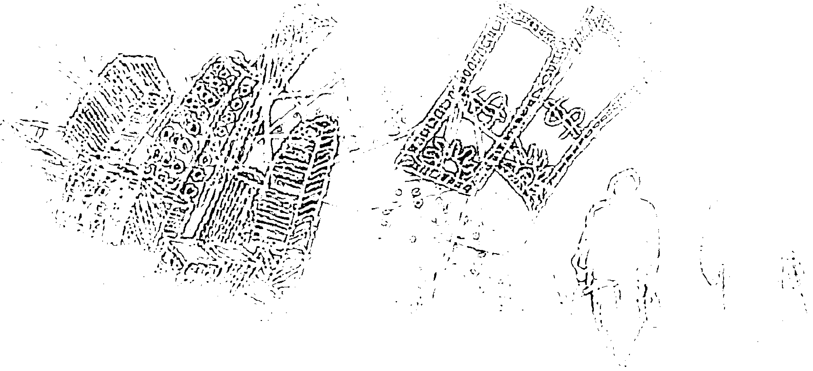

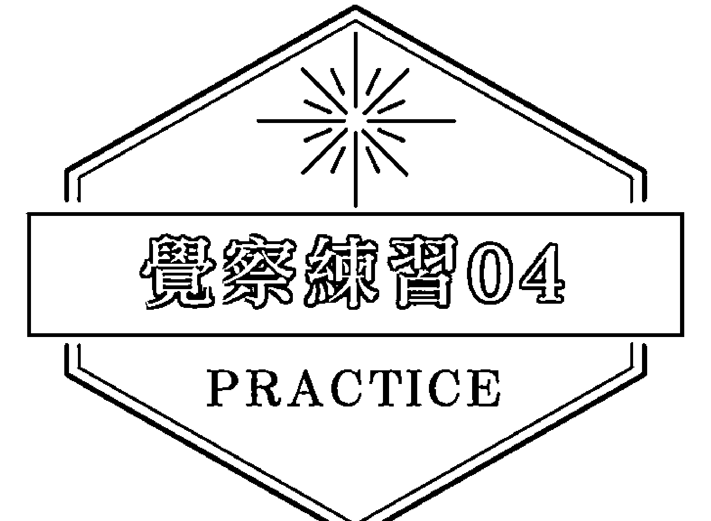

## 功課

練習進度 ☆☆☆☆

> > 熟悉覺察練習 01~03，能更快契入 04 (功課)喔！

以下總共有十五項功課，每項功課進行二天，為期一個月的時間。當所有功課完成後，你可以從頭閱讀這本書，閱讀到這裡再進行功課一個月，直到登出開悟為止。功課是為了實際深化覺察、體驗觀察者、體驗空、軟化人生框架、直接體悟空性而設計的，每一個功課都有其意義與實際的轉化成效。你既然願意看這本書，希望可以好好地落實這些功課，以達到最大的轉化，離登出開悟越來越近。

### 01. 覺察呼吸

起床後一直到入睡前，一整天的時間隨時隨地都要覺察著你的呼吸，請注意，要求的是無時無刻，所以即使在思考、在工作、在與他人說話時，在任何時間都要覺察到自己的呼吸。你可以將注意力放在鼻孔，也可以放在其他與呼吸有關的地方，例如鼻腔。覺察呼吸時要注意到細節，例如氣味、冷暖、出入鼻腔的空氣量、呼吸長短等。另外，覺察呼吸並非一整天只注意著呼吸，什麼都不做，最好的方式是生活正常運作，該進行什麼就進行什麼，但是每一次呼吸，都能如實注意到。做這個練習可以快速增加你的覺察力，習慣成為一位觀察者，除了覺察呼吸，行住坐臥的一切運作，都會變得清清楚楚。

### 02. 覺察眨眼

同樣地，起床後一直到入眼前，一整天的時間隨時隨地都要覺察著眨眼的動作，一開始好像會刻意眨眼而顯得有些彆扭，但隨著覺察的時間增長，這個動作將會變得越來越自然。我們並非去做一件眨眼的事情，而是人們本來就會眨眼，我們只是注意到它而已。這個練習是覺察呼吸的進階版，難度也比覺察呼吸來得高。困難點在於，你的生活要如常地運作，也要覺察到眨眼睛的同時，眼部週遭、眼皮以及眼睛的感覺與現況，例如眼睛是否乾澀？眼皮是否跳動？眨眼的頻率快慢等等。當不自然的狀況褪去，你將會有一種人生諸事都在自動導航下進行的感覺，而你只是看著一部電影的覺察者，正在觀賞自己的人生劇場演出。當你成功做到這一步，下一個練習將會更容易達成。請記住，這個功課如果要做得順暢，你的整個身心必然是非常放鬆的，這不是緊繃可以完成的功課，越放鬆你會越容易達成。

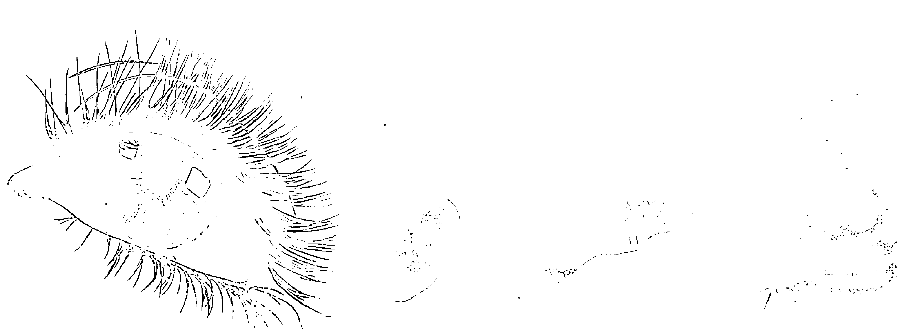

### 03. 覺察全身

這是覺察系列功課的第三個，也是最困難的一個。有人會問我，覺察全身到底要覺察那些地方？覺察全身，顧名思義就是全身都要覺察到，但是一開始我們無法覺察到全身，至少要覺察到行動或動作的部分，例如呼吸、眨眼、手腳、身體的動作等，如果能覺察到心跳就更理想。先以上述這些為主要覺察對象，等練習純熟後，全身都是你覺察的對象。請同時覺察著全身，而不是身體各部份輪流去做，有人想著要全身覺察，那麼就從頭到腳輪流地覺察，先覺察手指，再覺察手掌，接著覺察手臂，這是不正確的，你能同時覺察的部位有多廣，就盡量覺察。同樣的，你要正常運作你的生活，該工作、該思考、該應對的，全部照常運行。這個練習比前兩個練習更需要放鬆，請記住，你只是個放鬆的觀察者，觀察著全身的行動、感覺、狀態而已，你並非在造作一些事情。

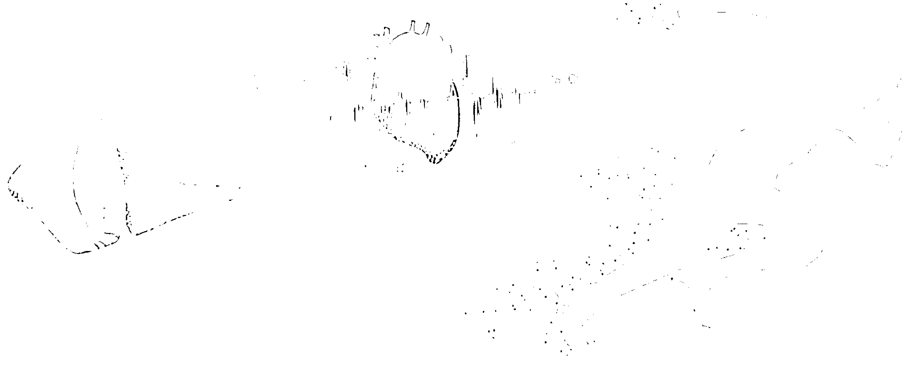

### 04. 數亂數

這個功課的操作方法，是從心中自然地冒出 01-99 之間的亂數，在心中依序默數，例如 35、78、14、88、63、67、31、19……，節奏大約一秒一個數字的默數。進行這個功課時，請嘗試與你的某些生活作為一起達成，初期執行上如果遇到困難，例如當你需要思考、與他人溝通談話時，可以先暫停；一些可以與生活同步的，例如步行、等公車、打球、洗衣服等，即可與此功課一起達成。不要要求一整天進行，盡量抽空多做即可。這個功課一開始也會有刻意進行的感覺，慢慢也會做到自然而然，完全自動地生出數字。這些功課除了訓練覺察力外，從中會培養自動運作生命的機制，慢慢就能退出造作生活作為的階段，真正成為一個生活的觀察者，就可以像欣賞電影一樣看著主角在進行生活，而那個主角是以前你認為的你，現在只是看著他開展生活，你就會完全明白真正的你並非原來認為的你，你是那個不動的覺察，而非戲中主角。

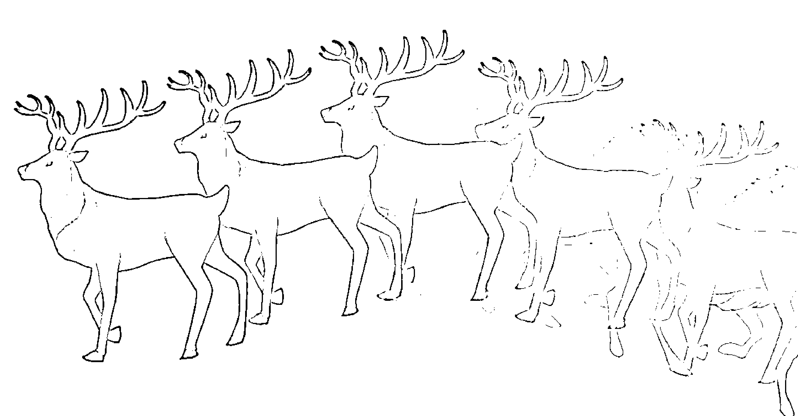

### 05. 變換物體標籤（指鹿為馬）

這個功課的操作方式是挑選一個眼前的現象或情境，當我們看到時，會在 0.018 秒的極短時間從信念儲存庫中提取適合的標籤，立刻為其貼上，這時候我們察覺到它是什麼的一瞬間，立刻用另一個標籤來指向它，並且真切地認為它是你新貼上的標籤。例如眼前有一顆蘋果，將它定義成蘋果的一瞬間，我們立刻用椅子這個新標籤替換原本的蘋果，默唸或者唸出來，並認為它就是椅子。一開始我們會覺得很荒謬，隨著練習次數的增加，我們越來越覺得原來世界萬物只是標籤而已，並隨時可以替換標籤。當你百分之百認為它是椅子，你就可以坐在上面；當你百分之百認為它是刀子，你就可以用它來切割物品。這個練習可以培養如幻的視角，你會覺得一切越來越虛幻，也會覺得看到的一切都是空，都是毫無意義的存在，就會越來越不解釋。

- 14
- 26
- 63
- 88

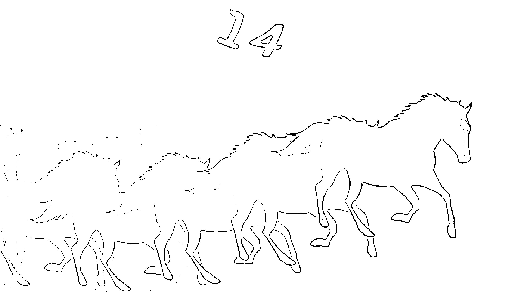

### 06. 注意物體與自己中間的空間

這是不解釋功課裡的一個起點，同時也是最重要的功課。如果大家有看過《金剛經》或是《六祖壇經》，一定知道「應無所住而生其心」這句話，而這個功課就是練習「無所住」。

坊間對這句話的註解多半是：「對於一個事物應該保持不執著的態度來生起清淨心。」但在面對現象時，有的現象會讓我們較為執著，有的並不會，如果不執著就是開悟的關鍵，那麼碰到我們不會執著的現象，我們就產生無染的清淨心而有開悟的機會了，生活中有非常多的時刻會碰到不執著的現象，那麼每個人應該都早就開悟了！所以「應無所住而生其心」的「無所住」指的並非不執著，而是另一種狀態。

我們從早到晚，無時無刻都在注意著現象，而每一次注意到現象時，都會解釋現象，「無所住」的意思就是沒有注意著現象，但是我們天生無時無刻都注意著現象，即使不是注意外在的現象，我們也會注意著思維、思考等內在的現象。我們要知道，注意現象，必然解釋現象，只有對現象的解釋不存在，才能沒注意到任何現象；換另一種說法，我們才能注意到現象的「原貌」，未經解釋、信念渲染過的原貌，這也是《金剛經》另一種句型所要表達的。《金剛經》裡有非常多「×× 即非 ××，是名 ××」的句型，例如「所言一切法者，即非一切法，是故名一切法」、「世尊說我見、人見、眾生見、壽者見，即非我見、人見、眾生見、壽者見，是名我見、人見、眾生見、壽者見」。前面指的是我們對現象原來的信念；中間的「即非 ××」是將原來的信念瓦解，成為了一個空信念：後面的「是名 ××」指的是事物的原貌，我們也才能把這個現象叫做 ××，它是真實的 ××，而非用信念虛構的解釋。

說了這麼多，那麼跟這個功課有什麼關係呢？這個功課的操作方法，是我們先將注意力看著眼前的某個現象，隨後轉移到與物體之間的「空」之上。我還是舉蘋果的例子，當我看到一顆蘋果，就把注意力移向眼睛與蘋果中間的空間上，也就是視覺焦點從蘋果移至中間的空無，看著空無一物的空間，因為空間無法有形體，所以也無法產生解釋。當我們從蘋果移向中間的空無時，我們等於讓蘋果變成《金剛經》的句型「蘋果，即非蘋果，是名蘋果」，從一個有意義的物件「蘋果」，轉移到中間的空無，這時候，我們的眼睛事實上還能見到蘋果，只是蘋果變成了空無，是沒有意義的物件——從有意義，就是沒有意義，所以才是它的真意義。

這個功課沒辦法全天候的練習，只能在我們一有空的時候就練習它。

### 07. 散焦

這個功課事實上與上一個功課〈注意物體與自己中間的空間〉完全一樣，只是一開始就說「散焦」，會不知道如何操作。使用過單眼相機的人都知道，單眼相機需要對焦，如果我們開啟手動對焦模式，只要把焦點從物件上調走，物件就會變得模糊。這個功課就是用眼睛對焦，然後輕鬆地將焦點模糊化，這樣就自然而然會注意著空無，而達到不解釋的功效。只要這種不解釋的頻率越來越高，時間越來越長，就會在人生故事裡鑿出一些空洞來，我們不再一整天都注意現象而解釋現象，形成不間斷的故事性。我們的故事一旦有些暫停的時間出現，就有機會從故事裡登出開悟。這就像是我們專心看一部電影，忽然按下暫停鍵，才會發現自己身在何處，而非之前完全融入電影的劇情中，眼中只有電影裡的劇情而已。

這個功課雖然與上一個功課是一樣的，但是先練習過上一個功課，這個功課才會得心應手，而以後重複練習時，只要做這個「散焦」的功課即可，它相當於電影或是遊戲的暫停作用，對於登出開悟來說，非常有效與重要。

### 08. 把空間移回物體

這個功課是前兩個功課的延伸。前兩個功課是練習「色即是空」，而這個功課是練習「空即是色」。當我們看著物件，把視線移到中間的空無，再把中間的空無往前推到物件上，這會有一種「雖然我看著物件，卻對物件完全失去解釋」的感受，我們就能明白《心經》裡說的：「色即是空、空即是色。」看到經文的文字，我們只能意會經文的意思，藉由功課的實際操作，我們可以直接契入經文內容，實際去體會經文。

實際的操作，就是先把注意力放在一件物件上，然後我們把注意力移到物件與眼睛中間的空間，停留約 10 秒以上，再將中間看到的空無，推回到物件上去。意思是這樣，當然空無無法移動，我們只要知道意思就好，並將視線帶回物件上即可。

這個功課也是盡量抽空練習，練習的多寡，關乎你想要登出的決心有多大。

### 09. 用「他」來表達自己

這個功課非常有趣，我們從第一人稱，稱呼自己為「我」改為「他」，也就是當我要跟別人說：「我要跟你拿上個禮拜的報表。」就要改成：「他要跟你拿上個禮拜的報表。」如果問：「是誰掉的皮夾？」你只能回答：「是他。」你不能使用其他字眼代替，例如名字或外號，唯一能用的就是「他」，但是允許可以用手指指著自己，這是功課中最大限度的作為。

一整天的時間，如果能做到連工作時都進行功課，這樣的效果最大，因為工作上需要與他人交談時做此一功課是最有威力的。

在這個功課裡，我們把我們整個世界裡唯一的主角拿掉了，我們自然而然會用一種旁觀者的視角來看待整個生活，我們會有趣地發現當這麼做時，彷彿在看著一部影集，一切都好像事不關己，而自己是那個看著一切、欣賞著一切發生的人。一開始或許會一直出錯，但只要用心去做，一段時間後就能完全做到，我們將會體驗到沒有主角的世界是多麼的自由與神奇，將會發現平常我們被這個「我」字限制在許許多多的框架裡，也因為進行了這個功課，我們將會從諸多框架中解放出來。各位千萬要好好地進行這個功課，或許你會不好意思在別人面前做這個功課，但是各位要想想，我們是要從整個人生故事裡解脫出來，我們要登出開悟，如此巨大的決心，怎麼能讓這小小的不好意思推翻你的宏願呢？這也會讓我們看到，我們是多麼在意他人對我們的看法。

這個功課不僅是跟他人說話時要說「他」，包括使用所有的社群軟體如 Line、Instagram、Facebook、微信等，全部都只能用「他」來代替「我」。

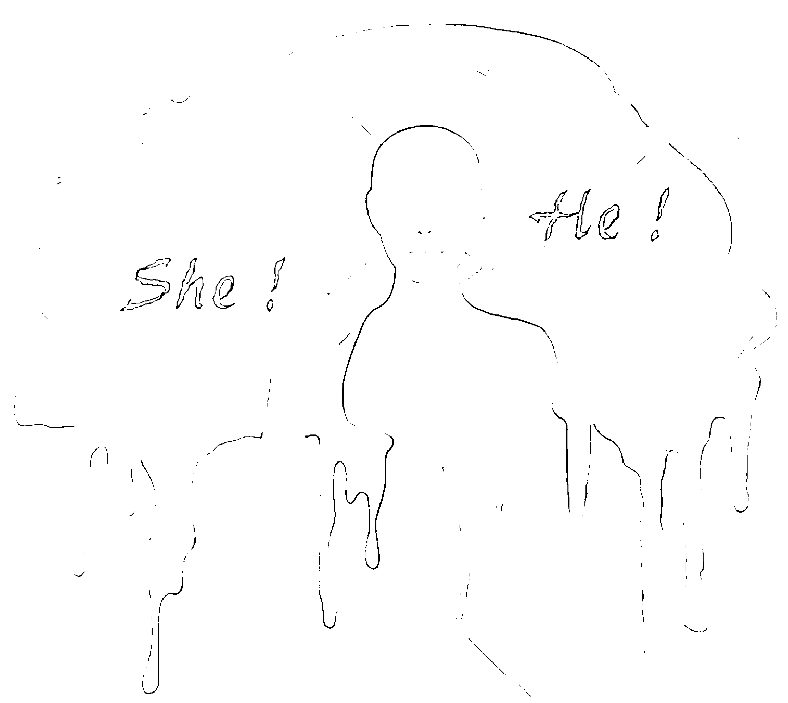

### 10. 看電視或手機、電腦、平板電腦的 1/4 畫面

這個功課是要讓我們直接跳出沒有人生意義的故事。當我們看到現象，會立刻生起解釋；當我們看到無意義的畫面，解釋生不起來時，會有機會直接安住在空空蕩蕩的覺察。

操作的方式是當您看電視、手機、電腦、平板電腦時，把畫面的 3/4 遮住，只露出一個角落，左上、左下、右上、右下都可以，同時把聲音關掉，不要去猜想畫面的劇情，只是很輕鬆、很單純地去看就好了。只要抽空來練習即可，次數越多越好，就是一個看電視的功課，非常單純也非常簡單。

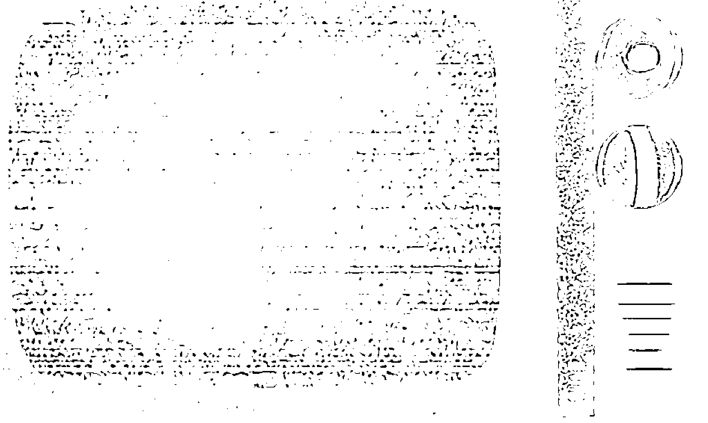

### 11. 倒著唸書

平常閱讀的時候，我們很輕易就能看懂書中章句所傳達的意義，但是當我們倒著唸時，相同的字所組合成的一段話，我們卻完全不知道它的意義。這說明了事物的存在，在原始狀態並沒有意義，意義是我們賦予它的；而我們賦予它的意義，也只不過是人類大家講好的一套規則，與真正的真實毫不相干。當我們倒著唸書時，解釋無法生起，自然而然地進入不解釋的狀態。

實際操作時，隨意地由下往上、由左至右地唸，如果仍帶著意義，可以試著橫著唸（假使文字是直書的）。這個功課看似簡單，效用卻很深遠，每天一找到空間就唸，輕鬆地把字唸過去就好。《金剛經》說：「凡所有相皆是虛妄，見諸相非相，即見如來。」其中「相」的意思是「可辨識的對象」，當我們反過來唸書的時候，自然變成了不可辨識，也就是非相，所以這是一個直接登出開悟的功課，希望大家不要輕忽。

### 12. 我是誰

這是禪宗參話頭的話頭之一。當我們問自己這個問題，不要用頭腦給出任何答案，要用心去體會答案，但這個問題不會有任何答案，因為說到底，沒有一個東西可以稱為我，所有我們認為的我，其實都只是「我的」，也就是能覺察的對象。

這個問題要一直問，由內心問出「我是誰」後，往內去看看，到底是誰在看著這一切，然後再問，問到廢寢忘食，問到心中只有這一句，無其他念頭，當我們問到頭腦當機時，一切都會歸於寂靜，只剩無邊無際的覺察，這樣就成功了。

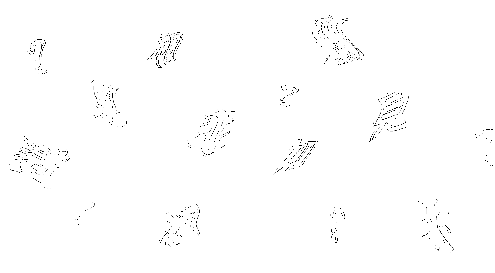

### 13. 禁語

如果你上班一定要說話，那麼就利用例假日進行禁語的練習。當我們外在不說話，內心念頭會特別多，這時候我們覺察著念頭，而不要跟隨念頭，我們會發現一整天中，到底有多少的念頭來來往往。當我們不跟隨念頭，慢慢地，念頭也會越來越少，有機會完全安靜下來。

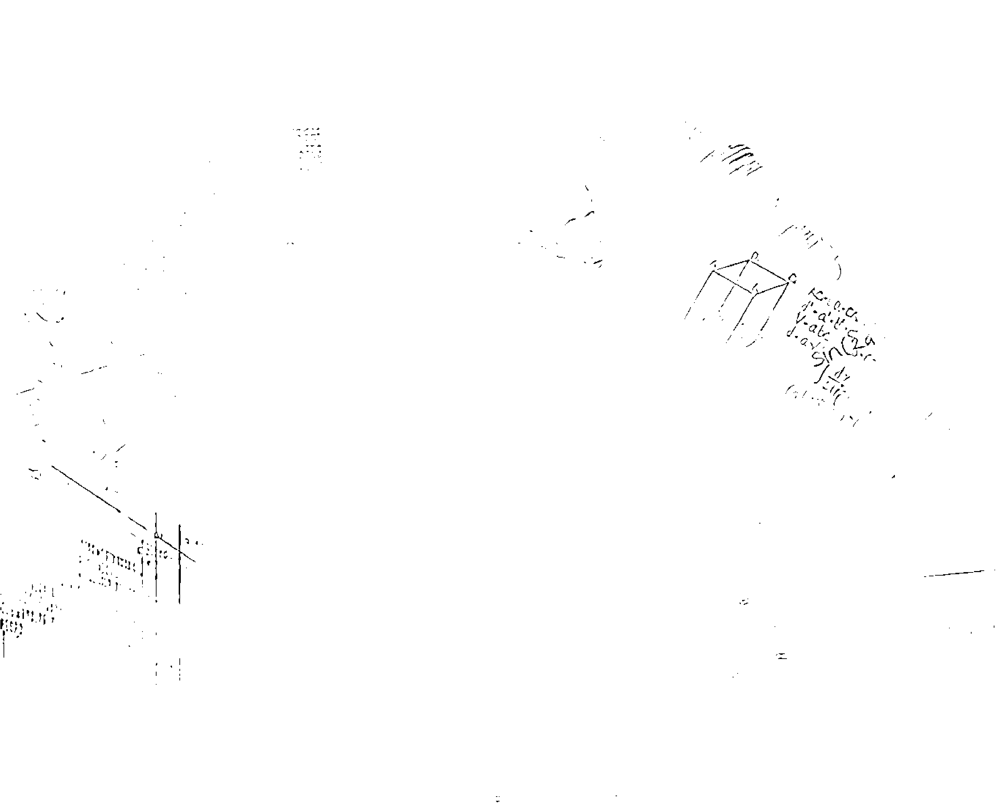

### 14. 呸！

我們用簡短有力的聲音，大聲把「呸」這個字衝出口，使出全力去唸。短促的「呸」，不是唸〔pe-i〕，而是〔pe〕就立刻截斷發聲。

當你唸完「呸」的一瞬間，馬上安靜下來、停下來。在剛唸完的一瞬間，是生不起任何信念與念頭的，我們能停多久都沒有問題，只需要暫停，這是一個暫停鍵，按下後自然停住，等信念或念頭生起後再活動。

一有空就練習這個功課，不用在意別人的看法，只要不會干擾到他人即可。這個功課可以截斷一切的信念，瞬間讓整個世界都停止，有機會讓我們掉入空空蕩蕩的覺察，夠深的話有登出開悟的可能。

### 15. 不斷提醒這是個夢

當晚上睡覺做著夢的當下，忽然你意識到這是一個夢境，然後告訴自己這是一場夢，那麼只要想醒來，你就會醒過來。而我們現在這個現實，其實也只是一層夢境，訊息量較大的夢境而已，所以不斷提醒自己現在正做著夢，我們就等於進入清明夢的狀態，我們要醒來就更容易了，這就是如幻的視角。

這個功課的操作方法，就是我們無時無刻看到現象時，就跟自己說「這是一個夢境，我正在做著夢」，你會立刻有一種如夢似幻的感覺，越是對當下所謂的現實看成是夢境，我們事實上就越接近真實。

本書的前半部，是針對想要登出開悟的朋友所說的，不論你的目的是要回到生命的本源，還是想完全掌控自己升起的信念，做一個超級玩家，你都要實際地登出開悟。然而我們的人生並非登出開悟才開始顯化，而是我們無時無刻都在顯化法則的運作下生存著，所以了解顯化法則，即使尚未登出開悟，也能利用一些技巧，使我們的人生更稱心如意。以下就開始介紹顯化法則。

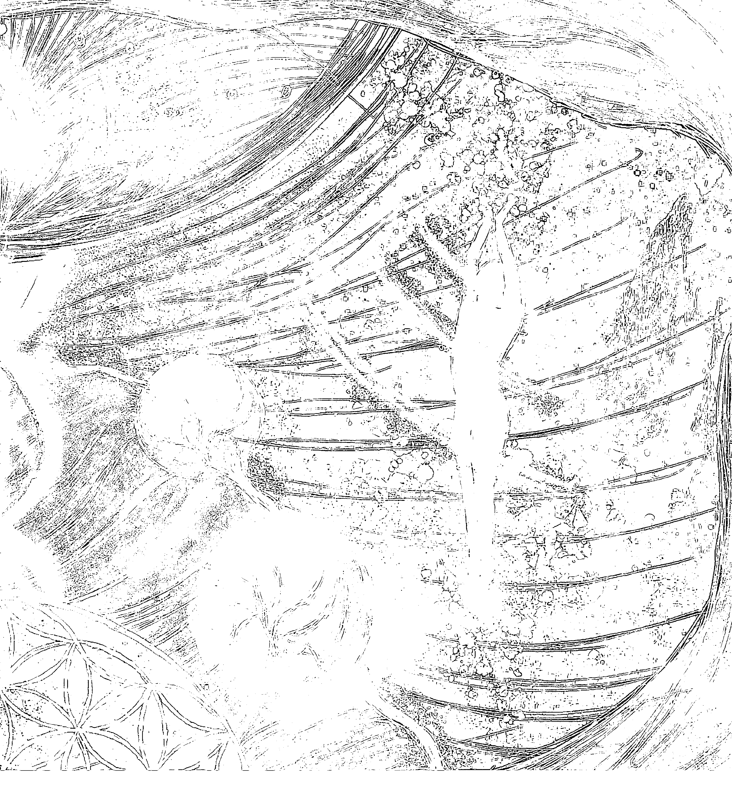

## 顯化法則 03 PART

我們雖然理解了眼前的一切現象，只不過像電視訊號一般，我們接收進來，用信念進行解碼，形成了認知與結論，但我們每天所遭遇到的這些情境又是從何而來？為什麼我會注意到這支股票，為什麼又會大跌套牢？為什麼讓情侶相遇了，卻又各分東西？公司後輩小陳這個月加薪了，為什麼我卻被老闆遺忘？彷彿一切都是從天而降的際遇，完全無法預料，我們永遠無法知道明天會發生什麼事情。

事實上，我們每天遭遇的每一件事、發生的所有情境，都與我們的信念有關。在這裡我必須從頭說起，讓你了解情境是如何顯化出來的，我會盡量用舉例的方式，讓你慢慢理解什麼是「顯化法則」。

## 情境的顯化法則

顯化法則與吸引力法則不同之處，在於它並非是「心想事成」的方式，而是「相信事成」的法則。簡單來說，我們身處的每一個當下，同時存在著無限的可能性，也就是每一個當下，有無數個平行宇宙同時存在著。當你開著車，在路上遇到一個十字路口，你有左轉的可能性、右轉的可能性、直行的可能性、迴轉的可能性，或者有停在十字路口的可能性、撞車的可能性、棄車而逃的可能性，還有其他成千上萬的可能性都存在這個當下，而顯化法則就是讓某一個可能性，成為能被自己感知的情境，這個情境就會讓你自己覺察並且解釋它。

每當我們覺察到一個情境，就會提取自身記憶庫裡的信念，比對該情境後，得到許多解釋。那些解釋在當下形成了一個藍圖、一個架構，從而建構出當下世界的樣子。當我們接受了建構的結論後，會開始認為當下的情境對自己是友善的，還是惡劣的？這是我想要的情境，或是抗拒的情境？在這些不同答案形成之後，我們會產生感受、產生情緒，感受與情緒是一種振動頻率，我們根據這個振動頻率去顯化下一次回饋我們的情境訊號；也就是根據我們的感受，顯化了下一次在未來的某一個時間，讓某個情境「明顯化」。在此同時，我們也把對當下情境的結論，回存至我們的記憶庫裡，以便下次遇到類似情境發生時拿出來比對。

在這裡我們用一個例子演練一次，各位就會明白我在說什麼了。假設今天跟平常一樣，早晨起床、刷牙、洗臉、上班。上班途中，我不慎踢到石頭，新買的皮鞋刮傷了，這時候我想著：「今天為什麼這麼倒楣，新鞋子剛買來就刮傷了。」各位有沒有發現，剛剛這段內心的話語，正是我對當下的情境，從記憶庫裡提取了某些信念，完成了一次解釋——我解釋今天穿的是新鞋，我解釋鞋子刮傷，我解釋鞋子變醜，從美觀變成醜陋，從新變舊了——所以我解釋：這對我而言是一件「壞事」。我得到了一個結論：我遇到了一件壞事。這個遇到壞事的結論，自動存回記憶庫裡，並且感覺糟透了、很生氣、好鬱悶，這些情緒被當成燃料，推動了今天遇到壞事的情境將會在未來某個時間點，顯化出一個「我會提取跟今天一樣的信念」的情境發生。結果在兩週後的某一天，我穿著幾天前用獎金買的嶄新西裝外套，在下班擁擠的公車中，被某人皮包突出的一個小鉤子給勾破了。類似的情境、幾乎一樣的情緒再度出現；可以確定的是，下次一定有某個類似的情境將會發生。

以上只是一個簡單的例子，事實上我們生出的每一個信念，都要付出代價。我們老是覺得這些境遇不知從何而來，其實都是由我們自己所創造。二千多年前佛陀說「萬法唯心造」，說的就是在世間遇到的一切情境，都是由我們的心念所創造，就是這個意思。

遇到情境、牽動信念、產生感受、顯化情境……，我們就是無時無刻在這樣的無盡迴圈不斷循環，不斷地歷史重演。不過不必灰心，在後面的章節裡，將進一步提出終結這種循環的方法，以及如何有意識地去建構我們想要的迴圈，甚至重新打造我們的人生，就像玩線上遊戲時所說的「砍掉重練」，你想要成為什麼樣的人，過著怎樣的生活都可以。所以我談論的不是讓某些事情心想事成，而是重塑人生，就像玩一個開外掛的遊戲一般。

另外需要跟大家說明的是，在這個世界上，從解釋與感受的形成，進而顯化出情境的過程中，往往存在著快慢不一的時間差，有立即發生的情境，也有遲緩的情境發生，甚至是來自前一世的信念，或來自轉世的過渡時期所造成；也因為如此，我們才無法察覺所遭遇的情境跟我們信念之間的關聯性。

註：原意是利用電腦技術對線上遊戲進行一些修改，以達到有利自己的作弊程式。現為網路流行用語，意指當一個人獲得驚人成績時，由於不可思議而讓人以為是通過作弊獲得的。

舉個例子來說，某天在公司被老闆罵，但你認為自己並沒犯錯誤，因而對老闆產生了憤怒的情緒，這個事件已構成顯化出下一次發生類似遭遇的種子，導致半年後的某一天，你的太太誤解了某一件事而責備你，但你早就忘了半年前被老闆罵的事件，所以完全無法得知這二件事件的關聯性。我們總是生活在這樣的狀態裡，認為一切境遇都與自身無關，事實上任何一個信念加上情緒或情感，都逃不掉顯化的法則，一切遭遇都是自己在這個「境遇生成系統」中自動完成的。倘若這一切如同坊間流傳是由上帝或是神明所掌控，世界上眾生如此之多，神明可不是要忙壞了？

之前我們提到，生命只由三個部份組成：覺察、信念、現象。剛剛我們提到，我們一直從「現象」引發「信念」，「信念」又顯化「現象」，人生就在這樣的迴圈裡鬼打牆，但我們尚未提到「覺察」，沒錯，覺察才是最關鍵的環節！在日常生活裡，我們習慣將所有注意力放在現象上，從早到晚、從起床到就寢為止，每分每秒、無時無刻都在看著現象，外在的情境是外在的現象，而我們的思維想法，是內在的現象。當我們把注意力放在現象時，自然而然地會把我們存在的立足點放在解釋上，我們見到世界的一切，以及我們內在的思維活動，無一不是解釋，也就是每一個情境我們都會解釋它，然後我們只見到、聽到解釋。

解釋只是人類編造出來的信念，並非生命原有的本質，而真正的本質是我們平常完全忽略的「覺察」。只要讓我們生命的立足點回到覺察，我們就能找到生命的源頭，我們可以將它稱為佛性、空性、神性、聖靈，也是我們之前提到的「玩家視角」。

我們藉由情境 接觸了解釋

不論是否瞭解顯化法則，人們打從出生以來，就生活在這個法則裡，每人每天都會有許多的遭遇，即使再平常不過的起床、梳洗、吃早餐、穿衣服出門、搭乘大眾運輸工具或是駕車、上班、工作、下班、回家看電視、吃飯、睡覺、做夢等等，所有的境遇沒有一件不是自己所顯化的，生活的境遇就是我們內在的鏡子。看到這裡，我們應該非常驚嘆，我們是何等精妙的創造者，我們每天所接觸的一切、每一樣事物都精細無比，細節多到不可思議，即使是一張椅子，皮革的觸感、木頭的紋路、螺絲的質感、完美無瑕的螺紋，坐上時能乘載我們龐大的身軀，一切都是如此的完美與細緻！這一切竟然都是由我們顯化出來的，多麼地令人激賞與讚嘆！故此，在我們生活的世界裡，所接觸到的一切都是我們所創造、顯化的，我們有如造物主般的偉大，我們切莫再妄自菲薄了，我們的真實身份就是自己世界的上帝，就是自己世界的造物主。

佛陀說：「萬法唯心造」，而禪宗六祖惠能大師，半夜三更聆聽五祖為他解說《金剛經》時開悟後感嘆地說：「何期自性本自清淨！何期自性本不生滅！何期自性本自具足！何期自性本無動搖！何期自性能生萬法！」最後一句的意思就是：我們每個人的自性，都能創造萬法。萬法的意思就是所有現象。由此可知我們每個人遭遇的所有現象，都是我們自己所創造的，真實不虛。


既然一切都是我們自己所創造的，那就好辦了，只要我們掌握住創造的關鍵，就能隨心所欲地創造任何現象，而這個關鍵就在於自性，也就是我們的覺察。一切都是我們的覺察所創造，但是我們的自性本無動搖，它如何創造與顯化出情境呢？自性始終如如不動，單純地覺察著一切，而現象因解釋而存在；換一個說法，就是現象因解釋而動搖，而覺察包含了一切，用解釋從覺察切割出被覺察的現象，現象方得以顯現。所以一切的現象是因解釋而存在的，顯化的主要成因，來自解釋。我們只要能控制解釋，就能掌控顯化，就能主宰現象，就能主宰我們的人生！我們把秘密中的秘密說出來了！

《秘密》（The Secret）一書說：「要改變你的狀況，首先必須改變你的想法。」事實上真正主導顯化的，是在想法尚未形成之前就已經產生的信念，也就是解釋。當你決定了對眼前情境的信念，一切已成定局，想法只不過是「產生了信念後延續的內在話語」而已。

市面上也有比《秘密》更接近真相的書籍，內容闡述的是「信念 + 情緒 = 真正的能量」。這樣的說法沒錯，但是我認為我們要知道，我們活在世界上，每每接觸眼前的現象，就會在千分之一秒內提取記憶庫的舊有信念來比對當下的現象，一旦比對完，立即產生感受，這時候顯化就完成了；也就是當你意識到這是你不想要的信念時，顯化已經完成了。此時即使以另一個好的信念來取代不想要的信念，也為時已晚，頂多你只是又做了另一次的顯化——顯化出一次不想要的情境，也顯化出一次你要的情境，卻抵消不了原來的那個信念與顯化。

> >顯化的藍圖是信念　顯化的燃料是情緒
> 這也就是你當下的存在頻率

### 所有可能性皆存在於當下

在這個章節中，我們將進一步討論顯化是如何完成的。
對於我們的所見所聞，彷彿是有一個已經存在的現象，讓我們接觸到，然後再經由我們的信念去解讀。其實我們眼前所接觸的一切現象，都是我們自己所顯化出來的，無以數計的可能性同時存在於當下，然後我們不知不覺地以信念將其中一個可能性明顯化，好讓我們的五官能夠感知；也可以說是我們潛意識相信這個當下會有什麼出現在我們眼前，我們就讓某一個可能性突顯於其他可能性之上，好讓我們的五官感知。

倘若對這樣的說法存有疑慮，我們只要以夢境的角度來思考，就更能明白這種理論的可能性。假設我們所認知的現實，其實是一個夢境，那麼夢境中的情境是如何出現的呢？夢境就是我們潛意識的顯化作用，也就是在我們使用五官接觸情境之前，在極短的時間內，從我們的記憶儲存庫抽取了信念，然後投射在我們意識的屏幕上；接著再用五種感官去讀取情境，讀取完後我們再用記憶儲存庫的信念去解讀五官讀取的情境，這個解讀的結果也早就寫在我們的記憶儲存庫裡了。所以我們一直以為人生是自由的，事實上一切劇本都寫好了，寫的並非別人，而是我們自己的記憶儲存庫，顯化出來跟播放了一部電影是一樣的。

既然劇本是從記憶儲存庫裡提取的，我們是否能對提取的內容做選擇？當然可以，只要我們的覺察速度比信念顯化的速度更快即可。有一句話叫做「不怕念起、只怕覺遲」，真正的涵義大家現在都能理解，但是信念升起的速度只有0.018秒，覺察要如何超越這個速度呢？只有在信念升起前，覺察已經等在那裡了，才有機會比信念快一步地做出選擇。這就是為什麼要成為超級玩家，得先登出開悟的原因了。

## 如何有意識地顯化

在這裡，我必須把顯化完全剖析開來讓各位知道。以一般的狀態來說，不論我們如何照顧好自己的信念，盡量讓負面的信念不要出現，而只取用正面、豐盛的信念，來讓生命都顯化出想要的情境，我們的成功率還是無法達到完全的掌控，甚至連百分之十都有困難，原因在於之前提及的，每當感官接觸現象的瞬間，幾乎不到百分之一秒的時間，就會從記憶庫比對出信念來，等我們發現時，信念已經引發感受而達成顯化了，這就是大家不論看了多少與顯化有關的書籍，或學習了多少顯化技巧，都無法達到圓滿成果的主要原因。

如何才能準確看到生活中的所有信念呢？在這裡告訴大家，如果要準確地、毫無遺漏地見到生活中每分每秒升起的所有信念，唯有登出開悟，讓我們存在的立足點從信念、現象的象限，移回到覺察的位置，才能準確地看到我們無時無刻升起的信念，這是唯一最好的方法，也是萬無一失的方法。準確且無所遺漏的看到每一刻升起的信念後，我們就可以藉由看到信念，放下對它的解釋，只是單純的看到，用不解釋來消化信念，消化完畢後再植入一個我們想要的信念，不斷這樣做，就能重新塑造我們的人生。

到這裡，我們聽到必須登出開悟才能完全掌控我們的人生，控制我們生活中的所有顯化，想要學習顯化技巧的人，是不是有點失望呢？畢竟我們只是想要成為一個超級玩家，而不是想要登出回家啊！各位想想看，如果眼前是一款虛擬實境的人生遊戲，你是不是必須把你的第一人稱的立足點，移動到玩家的位置，你才能調動人物設定、數值，也才能有距離地看清楚人物每個當下發生的狀況？登出開悟是完全掌控顯化最好的方法了，真的想要完全掌控生活、成為超級玩家的人，建議各位朝著登出開悟的方向去努力。其實登出開悟並沒有任何的困難，它是我們原本就有的存在狀態，我們先將登出開悟設定為極其簡單，完全沒有障礙。

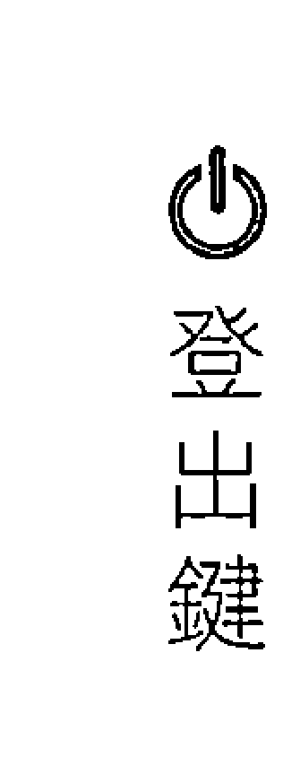

我們要以登出開悟為目標，才能真正變成一個超級玩家，六祖惠能開悟時說的：「何期自性能生萬法。」就是開悟後能成為超級玩家的最好證明。

要百分之百能夠在信念比對出來時，第一時間看到我們的信念，唯有一個狀態能夠辦到，那就是在信念比對前，你就已經等著它出現，它一出現就被你抓個正著。好比一個技巧高超的小偷潛入你家偷竊，等你聽到聲音時，他早就得手揚長而去了。抓小偷最好的方式，就是二十四小時守在他渴望的東西旁，等著他到來。

## 登出開悟前 如何看得到信念

在這裡有一個相當重要的觀念，就是「顯化法則」不是你想要達成某個願望時才去操作的法則，而是我們所有生活中遇到的情境，都是顯化法則所運作的，所以我們不是要學習掌握成就某個願望的能力，而是培養能掌握我們整個人生的能力。換言之，如果你生命中需要一本如何心想事成的書，只需掌握本書的要義，你已經從心想事成班徹底畢業了，因為你學的並非單次的心想事成，而是學會掌握整個人生。

那麼在登出開悟以前，是不是有方法能讓我們稍微掌握部分、甚至所有的信念呢？是的！退而求其次，我們也有方法可能看到大部份或是一部分升起的信念，只要達成這個目標，我們也可以有掌握顯化的能力。要如何辦到呢？那就是把你的立足點放在覺察，站在覺察來生活，成為一個觀察者，你將會看著自己信念的起落，看著自己思考，看著自己活動，你會像是一個玩家，看著電腦遊戲中的人物角色活動著。在登出開悟後，自然而然一整天都會站在覺察來生活；在登出開悟前，我們也可以達成大部分的時間都安住在覺察來看著生活中的一切。只要回去看有關安住或是契入覺察的章節，並練習功課即可。

當你能輕鬆的安住在覺察，也就是觀察者的位置俯視人生一切時，你會清楚發現人生的所有細節，你從覺察之位看著所謂的「你」在活動，當然我們現在已經知道那個所謂的你並非真正的你，那隻不過是遊戲中的人物主角，而非玩家，那隻是夢到的你，並非做夢的你。你從觀察者的位置看著信念升起、看著產生情緒與情感、看著人物行動，這一切的發生你看在眼裡，你是見證這一切發生的主宰。你的人生裡、你的故事裡、你的生命裡，你是唯一的見證者，你是那個至高無上的覺察，生命中唯一的真神，除了你以外，所有都是被你所覺察之物，即使有個上帝、佛祖、阿拉，那毫無疑問，都是被你所觀察的對象；而至高的觀察者之位，始終只有你安住著，你就是你生命中唯一的真神，整個生命、生活，也都是你所顯化的。

## 消化信念的過程

要操控顯化法則，消化信念是一個極為重要的過程，也就是當我們感官在接觸現象的一瞬間，我們會自動提取記憶庫中的信念來比對現象，給現象一個結論後，又回存至記憶庫並顯化了下一次情境。在這個過程當中，如果我們站在觀察者的位置，也就是立足於覺察，就能夠第一時間發現我們用哪一些信念在比對眼前的現象，這時候如果發現有哪一個信念不是我要的，我只要覺察著它，使用不解釋來面對這個信念，這個信念就會立刻失去意義而消失，這樣就稱為消化信念。每當我們消化了信念，我們就將它在我們記憶庫中的部份能量消融掉，下次同一個信念再次被提取時，對它的相信度、肯定度就會降低，經過幾次或一段時間後，這個信念就會完全消失。

我們記憶庫中所有信念都是中性的，沒有是非對錯與好壞，只有在現實顯化出結果時，是否是我們所想要的那個情境而已。在這裡舉個例子，幾乎每個人都接受過類似的信念「我們要努力工作，才能賺到錢；必須要更努力，才能賺到更多的錢。一分耕耘、一分收穫」，這些信念本身並沒有好壞，它只是輕鬆的就限制住我們獲得財富的方式，它讓我們必須很努力地工作，才獲得了相對應的金錢，甚至也談不上財富。在這個例子裡，我們其實知道是有問題的，世界上許多人獲得財富都是非常快速而簡單，你可以中彩券，可以找到一門好生意，可以意外獲得遺產，可以嫁入豪門或娶到有錢的妻子，網拍賺到了錢，一元美金買比特幣漲了四萬倍，有許許多多你想像不到獲得金錢的方式，與努力並不一定成正比的方式！當然，因為大部份的人都曾經植入過這個信念，所以我們也看到大部份的人，都是以努力的方式在獲得金錢，我們看到這些情境，也會更加深我們相信這個信念為真。我們真心相信什麼，什麼就會成為鐵則，直到我們消化掉這個信念為止。

消化掉之後是完全不會有這個信念的，在完全消化以前，每當我們對這個信念覺察而不解釋，就會軟化原來這個信念。回到剛剛的例子，我們相信「一分耕耘、一分收穫」，就會變成「相信努力可以獲得財富，但也不一定要靠努力才能獲得」，這就是軟化的結果。

## 顯化與振動頻率的關係

對於顯化的過程，這裡有個關鍵性的認知，我們知道了人生的所有境遇，都是生命自動生成系統所投射出來的，事實上這個系統就是我們睡眠中的造夢系統，只是睡眠中這個系統，是以亂數的方式去將記憶庫中的資料生成境遇，而我們醒著只是另一層夢境，這層夢境是以顯化法則來生成境遇。我們之前說過，顯化境遇的過程是每當我們的感官接觸了現象，就會從記憶庫中將相關的信念提取出來，然後比對現象，產生情緒與情感，得到了一個結論，然後再度顯化了下一次的境遇，並將結論回存到記憶庫裡。在這個過程中，最重要的一個環節是情緒與情感，我們人類的情緒與情感是極為精細的振動頻率，而顯化最重要的不只是信念，而是因信念產生的情緒與情感，會顯化出怎樣的境遇，全看情緒與情感的振動頻率。我們的生命自動生成系統，會記錄你「什麼樣的信念會產生怎樣的複雜情緒與情感」，這個記錄就成為了以後你會生成什麼樣境遇的依據。

在這裡舉個例子。怕蛇的你，在野外遇到了一條蛇，情緒上你開始產生極大的恐懼，而恐懼來源是眼前一個體積不大的目標，你產生了想逃走的想法。想逃走本身不只是一個動作，它也帶有一種想逃的情感，同時你也怕被牠咬到可能會中毒，而你對中毒的印象也會帶有一種情感、一種覺受，每一種情感、覺受、情緒都是一種頻率。在與蛇對峙的當下，你產生了複雜的情緒與情感，你的顯化就在這個當下，決定了下一次你會再次經歷與這次相同的複雜而多重的情緒與情感。至於該情境是不是遇到蛇，則是不一定的，但是顯化機制會自動生成於記憶庫中，你曾經歷與這次的情緒與情感一致的情境。

情緒與情感越是強烈，就越會顯化成真實的情境；而情緒與情感較不強烈的狀態，有時也顯化成夢中的夢境。我們就在每一次遇到情境時，顯化出下一次的境遇，所以人生就在許許多多的循環中生活著，這種迴圈就叫做「輪迴」，生生世世無盡地循環下去，沒完沒了。我們討厭的事情一再出現，我們越是痛苦的事情越是一再發生，所以人們最終都會尋找停止迴圈、離苦得樂的方法。

有一種說法，說人生是來完成我們累世以來的許多功課，這個說法說的是我們對情境的釋懷，每釋懷一個情境，就是完成一個功課，直到我們完成所有的功課，我們的人生才能畢業。但是想想，要釋懷一個情境都不容易了，何況人生有數之不盡的情境要消化，到底要消化到何年何月？到底要多少輩子才能釋懷得完？

還好我們終於走到這裡了，只要能站在覺察，並且對眼前的情境不解釋，你就能不斷地消化情境，轉識成智。如果你想成為超級玩家，也能進一步置換你所想要的信念，趨吉避凶，轉危為安。

當我們抗拒與抱怨一個情境時，我們反而不斷顯化它的發生，所有發生在我們身上的倒楣事，全部都是我們自己所顯化的。每當我認為它是一件倒楣的事，我就在抗拒它；當我抗拒情境的發生，等於自己將這個倒楣的事擋了下來，讓

## 顯化法則它在下一次繼續發生，同時儲存在我們的記憶庫中。因為我們產生了強度十足的情緒能量，不論是厭惡、憤怒、煩躁、焦慮、恐懼，我們都顯化了讓我們得到這些情緒的情境再次出現。

我們沒有讓這個事件、這個情境的能量流過我們，沒有看著它來，並且讓它走，是我們自己花了好大的能量將它攔住。所以覺察而不解釋，就是輕鬆地看著現象來、輕鬆地看著現象走，才是從現象的循環中解脫出來的關鍵。當我們真的輕鬆看它來去，我們就會輕鬆地消化掉顯化成下次現象發生的成因。在這裡，我們談的不是臣服，臣服有一種認命的意味，臣就是指君臣的臣，我們要像是臣子一般，把現象當成君王，在君王面前，我們無能為力，所以我們服從。我們談的並不是這種臣服，我們說的是不解釋，事件從一開始發生，我們就輕鬆看著一切而不解釋，我們明白眼前的現象只是因我們的解釋而存在，只要不去解釋眼前的現象，就會根本沒事。

能做到這樣的不解釋，來自於我們的立足點站在覺察。當我們站在覺察來看世間所有發生的事，都會如同玩家坐在電競椅上玩著遊戲，我們的身分是那個玩家，而非遊戲中的人物角色，所有人物角色發生的事情與玩家的世界毫無接觸、毫無干係，所以我們能夠輕鬆地對事件不解釋。

> 當我們享受與感謝一個情境時  我們也在顯化它的發生

顯化機制是完全中性的，當情緒與情感能量達到某個強度時，我們就會在現實中，顯化下一次引發與我們當下相同情緒與情感的情境。正能量的顯化機制與抗拒的負能量一樣，享受、陶醉、感謝也是一種具有強度的情緒與情感，當我們放鬆去享受某種情境，例如享受美食，享受一首古典音樂，享受眼前的美景，享受與愛人共度的時光，甚至享受午後的溫暖陽光，我們都會再次顯化這些美好的情境來到我們的生命。與抗拒形成對比的是，抗拒是緊繃的情緒能量，而享受卻是放鬆的情緒能量，顯化法則是完全中性的，不論什麼情緒能量，只要強度足夠，就能將情境顯化在我們的生命中。

既然明白了抗拒與享受同樣可以顯化生命中的情境，我們就應該好好地為自己的生活負責。請不要再抱怨老天為什麼要這樣對待你了，你認為不好的境遇為何出現在你的生活中？全都是因為你的抗拒而來，如果要讓自己的生活變成一切都是完美、美好的，請從此刻開始，當遇到不喜歡的情境時，立刻練習面對情境而不解釋，讓情感能量能通過你而離去。同時我們要培養欣賞世界的習慣，開始享受這個世界上由我們自己顯化出來的一切，例如街角一棵形體優美的大樹，寒冬中溫暖的陽光，空氣中瀰漫的花香，街道上討人喜歡的小貓，甚至午餐便當中酥脆的雞腿。當我們開始試著去享受它們，並感謝自己顯化出這麼多美好的事物時，我們就會大量地在生命中顯化更多美好的事物到來。

> 我們只在每個當下　按照我們所認為的現實在顯化現象

在此時此刻的當下，我是怎樣看待自己的一切？怎樣看待我與身邊每一個人的關係中的一切？怎樣看待這個世界的所有現象？這所有的信念，成為我們當下的定位，就像是GPS衛星定位一樣，設定出我們在這個世界準確的位置，這個位置不只是時空的位置，同時也是「我」的定位，我是一個什麼樣的人？而這個人又在宇宙中的相對關係為何？這些所有的設定，都是我們過去所有吸收的信念以及經歷的總和，藉由這些設定，我們可以推論過去／未來將會發生的所有情境，所有的人生故事都可以推論出來。為什麼命相學可以精準地推論出未來將會發生的事情呢？因為我們來到這個世界以前，承受了過去世的顯化力量影響，顯化了這一世你的基礎個性、你會遇到怎樣的父母、你七歲以前的人生軌跡等等，然後我們根據這些特質，自然而然地發展我們的人格與遭遇。一切看起來都沒有任何依據，但事實上發展幾乎都照著某種既定的軌跡在演化，所以命相學才能推論出你的人生軌跡。而我們小時候發展的人格，幾乎決定了我們長大後的一切信念與反應，例如小時候每當我遇到 A 現象時，一定會有 A 反應，所以我的 A 反應，又產生了 A 情緒與 A 情感，這時候我就又顯化了未來發生的 A 事件，造成 A 事件一再重演。如果沒有其他因緣的干擾，這個 A 循環會重演到長大、重演到老，所以對於一般大眾而言，人生的軌跡幾乎是一個定數。

但是當你閱讀了這本書，並且生起某種決心，要登出開悟並朝向回家之路，又或是立志成為超級玩家，你的生活就會有巨大的改變，有時甚至會發現改變竟然來得如此快速。當你下定了決心，所有的情境會推著你走，出現的人事物都會將你推向新的軌跡。我們不必驚慌，只需要順其自然地迎向新的軌跡，一切都是完美而喜悅的，即使有時候出現了感覺並非很愉悅的情境，我們可以將其視為是為了跳得更高而蹲下的一個過程。在新軌跡發生時，最重要的就是保持輕鬆、放鬆、覺察地來面對，同時不要試著去操控生活中的一切，因為往往我們的操控習慣，是根據舊有的信念來運作的，我們只要將操控的舵，放心地交給宇宙就好，讓宇宙為你導航。

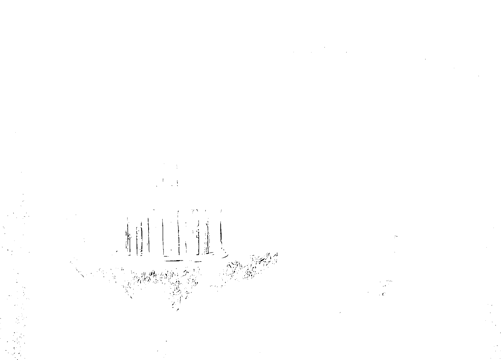

## 成為超級玩家之路

改變過去與未來的人生軌跡

剛剛我說過，當下怎麼看待自己的一切，怎樣看待我與身邊每一個人的關係中的一切，怎樣看待這個世界的所有現象，決定了過去／未來的生命軌跡，但是現在這個當下又是過去的軌跡所演化而來的，所以我們只要順著人生軌跡發展，必然是一條固定的路，這樣的軌跡我們稱為平行宇宙。

事實上每一個當下，每一個點，都存在著無限的可能性，如果我們改變了當下立足點的位置，也就是改變了怎樣看待自己的一切，改變了怎樣看待我與身邊每一個人的關係中的一切，改變了怎樣看待這個世界的所有現象的其中一些信念，我們接下來的人生軌跡將大有不同，同時我們也完全改變了過去的人生軌跡。某些過去認為重要的事，可能會變得微不足道；某些過去認為無關緊要的事情，現在卻重視了起來。

這就是改命。

假如我因為對當下的信念而站在 A 點，而過去與未來因為這個 A 點而形成 A 軌跡，但是現在我改變了對當下的信念而變成 B 點，那麼過去與未來也同樣變成了 B 軌跡。只要改動當下的信念，過去與未來的整個軌跡都會完全不同，所以命運並非完全無法更改，它的變動端看你是否能在每個當下去改動你的信念。

許許多多的信念，深藏在我們的記憶庫當中，必須等到現象出現的同時，我們才能看清楚是用什麼信念來面對現象，但如果沒立足於覺察，在信念出現的時刻，往往也沒辦法看清楚我們的信念，總是要等到情緒出現後才知道我們在抗拒這個現象，例如生氣、沮喪、焦慮、恐懼等，這時候雖然已經過了消化信念的黃金點，但是我們可以藉著回想來消除這個信念。

## 消除現象重複發生的方法

### 損法

老闆罵我做事粗心大意，我因此而憤怒，在事情發生一段時間後，我才覺察到我在抗拒這個現象，這時候請立刻想像剛剛老闆罵我的樣子，然後面對想像的情境覺察著而不解釋；如果仍然會有情緒出現，請繼續回想，再次不解釋，直到對回想的情境毫無感覺為止。

如果你無法站在覺察，不解釋地面對回想的情境，那麼請唸以下的文字：「我以宇宙一切萬有（每個人自己信仰中最接近宇宙整體的真神）之名宣告，剛剛的這個劇情，該學習的我已經學習完畢，請結束發生的循環，以此成就！」當你這樣唸的同時，你會感覺到輕鬆，如果還有一些情緒存在，請將情境再想像一次，並重複唸上面的文字，直到感覺完全釋懷為止。

顯化法則

為什麼要說每個人自己信仰中最接近宇宙整體的真神名字？因為祂代表你所存在的整個宇宙。我們會有一種信念，認為我們是宇宙中一個渺小的個體，我們是無力改變宇宙中所發生的現象，當我以代表宇宙整體的對象來宣告，我就能改變生活中的任何現象，因為這個改變是由整體的力量來宣告的，我信任祂！這個回想的方法，並不僅限於剛發生過的事件，任何情境都可以回想，只要你觀想得真實，情緒與感覺就會出現，你就有機會一次或多次消融掉某個多年來不斷發生的循環。

這裡要讓各位明白的是，當一個信念顯化成一個情境，在情境發生之前，這個情境都是有變數的，也就是說我們可以用另一個信念來改變原來這個信念，而讓情境出現不同的結果。這可以用來改變負面情境，在佛學中有所謂「定業不可轉」，有信念顯化就會有情境出現，這是不可避免的，但是情境出現不一定就是原來的情境，如果中間有其他的信念改變了情境的發生點，情境就會與原來該發生的不一樣，就像一顆球丟到天空中，我們用另一顆球去擊中原來的那顆，那麼球最初始的落點就會被改變。

各位要練習當念頭出現時，如果不是自己想要的念頭，就立刻不解釋，讓它自然生起又落下，不要跟隨念頭繼續想下去，因為這是陳年的習慣，我們一定要練習不跟隨念頭，這是超級玩家的必備技能。但是如果信念已經過了，情緒與情感也出現了，我們來不及即時對它不解釋的時候，那麼我們可以選擇損法，把念頭再次調出來，然後唸損的宣告讓它失效，這樣就是直接改變情境發生的有效方法。

> > 使想要的現象重複出現並加強

## 益法

在生活中如果遇到值得欣喜、並希望重複出現的事，我們要使用感謝。感謝是一個非常強而有力的宣告，我們大多數人對於祈禱的方式都有誤謬，例如希望擁有一輛車，我們不能祈禱「神啊！請賜給我一輛車」，這是跟宇宙宣告「我沒有這輛車」，因為沒有才會跟別人要。宇宙並不會聽表面的語言，而是聽這句話的內在意義，所以我們只要祈求宇宙給我們什麼，就是代表我們缺什麼，這點相當的重要，我們務必要非常清楚。但是使用感謝時，感謝一個沒有發生的情境，我們的潛意識又會知道那是空的，所以要感謝有發生的，如果沒有發生就製造它的發生。例如想要一輛車，我們不能感謝神賜給我一輛車，但是能夠到汽車展售中心去看車，當我們看完車，並且對車子感覺很滿意的瞬間，我們立刻宣告：「神啊！非常感謝祢，讓我感受到這輛令我非常享受的車子，感恩！」這樣就是一個非常有效的益法。另外，我們每一次購買了什麼或是去餐廳吃飯，我們都可以感恩，我們不要將焦點放在花出去的錢，而要將焦點放在我們得到的東西、食物、服務等，感恩這些讓我們獲得的情境，這樣就會越來越豐盛。

> 「神啊！非常感謝祢，讓我感受到這輛令我非常享受的車子，感恩！」

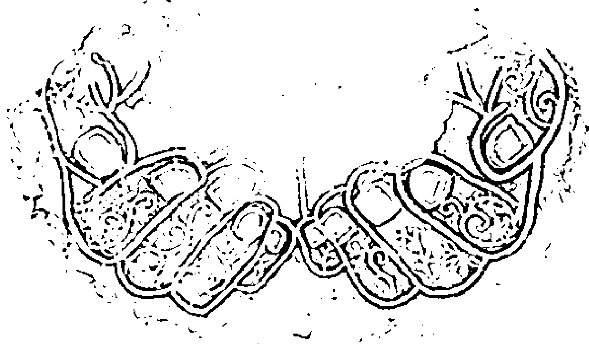

## 每一個顯化的情境 都是一個能量場

我們瞭解了不論是抗拒或是享受信念，我們都是將情境重複顯化出來的關鍵，而每一個被顯化出來的情境，都需要在宇宙無限可能性中，將中性的能量堆疊成一個能覺察的場域，以便我們能用感官接觸，並觀察到無限可能性中的一個可能性。

在這裡要先提到另一個觀念，我們所認知的整個宇宙，並非在我們之外，整個所謂的宇宙，只是我們內在的部份。之前我們提到，我們現在正處在一個夢境之中，夢中的一切都是存在於我們的意識之內，所以夢中就是一個無限可能性的場，正如我們夢到什麼都是有可能的。至於夢境是如何聚集的？同樣的是我們內在信念的產物，我們使用了意識的能量，將某一個可能性（信念）聚集成為一個可被辨識、可被感官接觸的場域。我們如果要消除一個重複發生的情境，理論上就是將這個場域所聚集的能量取回到自己的意識中，雖然整個夢境其實都是自己，所以能量怎麼取回其實都在自己之內，話雖如此，我們顯化出情境時，還是會將能量聚集於一個地方而形成場域。所以取回的意思，就是讓聚集的能量散回意識的虛空裡。其方法可以使用「不解釋」，因為解釋就是我們將能量聚集、變現成為一個我們所能認知的現象之過程，不解釋就是將能量還原的一個最好方法。如果我們做不到這個方法，就用之前提過的損法，每損一分，就將能量還原一分，一直損到對該現象毫無感覺為止。

信念、想法、語言及行為

想法是信念的內在延伸，而語言與行為是信念的外在延伸，有時候信念會同時延伸了想法、語言，甚至行為。信念有如鋼筋水泥與鋼架，想法、語言、行為則是樓板、鈣板、磁磚等等，它們會把信念具體化，使其在這個世界上更能夠被感受到；它們也更能让情緒與情感生起，讓整個顯化更加完整。同時想法、語言、行為各自具有自己的能量，當我們要消融一個顯化時，也可以利用反向的想法、語言及行為來抵消原來的信念；同理，當我們要將一個信念顯化為情境，並加速情境的發生時，我們也可以利用想法、語言及行為來輔助顯化的發生。在這一過程中，感受是最重要的元素，感受就是信念的振動頻率，顯化完全倚賴振動頻率來做為標準，振動頻率是高頻的，就會顯化出一個正面的情境；而振動頻率是低頻的，就會顯化出負面的情境。信念只是用來引發感受的前導環節而已，情緒、感情、感受這些才是構成顯化結果的關鍵。所以有時候，我們在當下不知道自己有什麼信念，只要觀察我們當下的情緒、感情、感受，就不難得知我們的信念是什麼；而信念、想法、語言及行為，同樣也是用來產生情緒、感情、感受。

## 我是自己生命中唯一的真神

關於神，不同的宗教有著不同的論述，在這裡，請先放下所有宗教的包袱，撇開一切對於神的信仰以及信念來閱讀以下的文字，如此才能清楚地看到文字傳遞出來的訊息。

不論我們信奉何種宗教，首先我們要放下「世界是神所創造」這個概念。一位超級玩家，之所以能夠成為超級玩家的最主要原因，就是他明白且確信，生命中的一切境遇都是我們自己用信念顯化出來的。要改變境遇，改變人物屬性，也就是改變我是誰，都只是更動我們內在的信念而已，當我們真切地這樣認為，我們就會完全的實現。在我們的生命裡，我們才是那個唯一的真神，沒有任何神能凌駕於你自己的權能之上。我們自己的覺察，是真正的自己，不動時，我是圓滿俱足的整體；動時，基於覺察延伸出信念，我就開始創造世界，我們就是自己世界的造物主。這是一個事實，也是一個顯化中不可或缺的有效信念，只要擁有這個信念，就能強化我們顯化想要情境的能力，也會強化我們消融不要信念的能力。

在超級玩家的信仰裡
自己就是唯一的真神，也是全宇宙唯一的依靠

## 顯化會創造現象及運作系統

這個章節相當重要，請大家仔細地看，因為這關係到我們是以怎樣的系統運作自己的生命。我們不僅顯化出情境，也顯化出生命的運作系統，這些大大小小的生命運作系統，形成我們一生的運作機制。

當我們完全相信一套運作系統時，在我們的生命中，就會賦予這套系統確實存在且有用的效果。簡單舉個例子，假設我們相信有天堂地獄，死後會有審判我們的判官，以我們一生的作為與想法做為評判的標準，最後得出一個善多於惡或是惡多於善的結論，判定我們能夠上天堂或下地獄，又或是留在人間重新投胎。如果我們確信這套系統，那麼我們就會為自己顯化出死後立刻來到一個審判的地方，然後有一個審判官來審判我們，並根據我們活著時所產生的功過，給予死後的去向。我們會真實經歷這些過程，原因只在「我相信世界上有這樣的死後系統」，而並非「原本就有這個系統」，那些不相信這套系統的人，並不會經歷這樣的系統。這裡說的都是以百分之百相信或不相信來舉例，至於那些並非完全相信的人，則可能經歷部份的系統。

這個例子或許太大了，我來舉一些較小的例子，讓各位更瞭解我們是如何顯化自己生命中的運作系統。我們從小就接受「一分耕耘、一分收穫」、「過日子要細水長流，努力也要一步一腳印」、「財不入急門」等諸多觀念，這些觀念就是一套完整的系統，徹底封鎖我們對於財富的創造力。許多觀念都是用來限制社會大眾所設計的，為的往往是讓富者恆富、貧者恆貧，讓那些知道如何顯化財富的人，始終獨佔社會的高位；而一般大眾，總處於努力辛勤工作，卻始終無法獲得較多財富之困境。有關財富的系統，相信大家都可以找到一大堆屬於自己的、從小就被制約的系統。

很多人共同相信的系統，會形成一個集體意識場，這種集體意識場顯現出來場景的規模與力量也較大。當你只要稍微相信某個系統，就有可能吸引這個場域，而加入這個集體意識場。唯一離開的方式，就是你不再相信這個系統了。

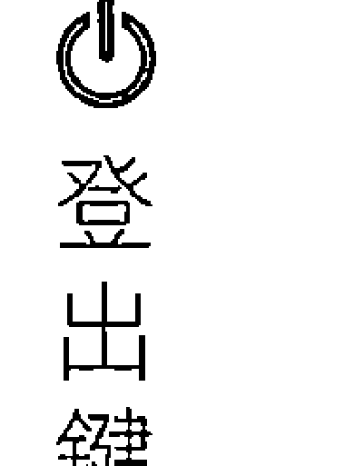

個相信與不相信是根據你的信念儲存庫而來，所以你必須仔細地檢視內心，觀察你真正的信念是什麼，而不是單純使用頭腦去做表面的判斷。

那麼到底要如何知道我們潛意識是否真的相信呢？感覺是一個最佳指標，例如我相信我將會獲得一輛夢寐以求的跑車，那麼要如何檢視我是否真的相信？我們只要想像，父親或是老闆明天將用你的名字買下這部車，並將鑰匙交到你手中，那麼今天你知道了這件事，會有什麼感覺？你的心情會如何？我相信你一定雀躍不已，心情一定興奮極了。如果並沒有這樣的心情，就代表你的潛意識並未相信這件事。

## 如何消除不想要的運作系統

談論到消除不想要的運作系統，最重要的並非消除，反而是知道自己在什麼系統下運作，只要知道我們在什麼系統下運作，就有方法消除它。但是我們整個人生都是由許許多多系統組成，我們要有足夠的覺察力，才能知道每一個正在運作的系統，例如

- 「要怎麼收穫，先怎麼栽」
- 「一分耕耘、一分收穫」
- 「紅顏薄命」
- 「命由天定」
- 「人善被人欺」

等這些都是運作系統，我們也可以去審視生命中許多自己不希望出現的現象，是受到那些系統運作而導致的？

改變系統運作，你也可以把它當成改變系統設定，那麼在操作上要如何進行呢？首先我們要使用宣告的方式，例如：

「我以宇宙一切萬有之名宣告，人善被人欺的這個系統設定，已不符合我現在的生命軌跡，在此宣告將它完全消除，以此成就！」為什麼要說以宇宙一切萬有之名，因為在我們生命中，我們還無法認為自己是整個生命的全部，或是自己是自己生命中唯一的真神，那麼我們就以一個我們認為足以代替整個宇宙者的名義宣告，這樣就代表以整體的名義做出宣告，而非個體宣告，這樣在故事內才有完全的力量。當然你不一定要使用「宇宙一切萬有」，你可以用耶穌基督、上帝、佛陀、濕婆等任何你認為足以代表整體的對象。宣告完畢之後，要加上一句「以此成就」，代表完成宣告並且成功執行，這樣就是一個完整的宣告。你可以每天宣告一次，直到你覺得「人善被人欺」並非一個有效的設定為止。

## 煩人的室友

我們的腦中住著一個煩人的室友，它整天不斷在我們頭腦裡碎碎唸，從早唸到晚，永不停歇。各位有沒有想過，想事情是否需要耗費能量？我告訴各位，想事情需要耗費巨大的能量，所以我們這位煩人的室友正是身體能量的最佳消耗者，我們每天一半以上的能量消耗都拜它所賜。另外一個重點是，我們一生真正重要的事情其實並不多，除了吃飯、睡覺之外，許多的事情都是不一定需要進行的，但是我們這位煩人的室友最愛指揮我們東忙西忙、東奔西跑，更重要的是它會牽引信念的升起，當它引動信念升起，並且產生感受，就會顯化成為情境了，許多我們不想要或不需要的情境，都是想法引動信念與感受所創造的。例如一個月前跟太太吵架，這件事情已經過去很久了，但是我們的念頭並沒有放過我們，它忽然想到這件事，想著想著就變成「為什麼她要這麼對我，明明我沒有錯，竟然不分青紅皂白就指責我，真是氣死我了」。想到這裡，引動了憤怒的情緒，顯化起了作用，立刻顯化了下一次與人爭吵的情境。這明明是多餘的顯化，我們卻因為這個愛碎碎唸的傢伙，而延伸了我們並不想要的人生。

故事情節

另一種是我們好不容易生起一個正面的信念，例如「我感覺我會中這次的樂透彩」，產生了正面的念頭，「哇！感覺真好，我第一次感覺自己會中頭彩耶」，但是這時候腦袋響起「想一想不可能的啦！怎麼可能會中，我又不是那種幸運的人，連尾牙都沒抽過什麼大獎，還想中樂透，我看我是頭昏了」，類似這樣兩極化的對話，是不是非常熟悉？我們總是生起一個正面的信念，就會出現負面的念頭來引動負面的信念，造成顯化的失敗。所謂顯化的失敗，並非最初的信念沒有顯化出結果，而是結果不同了，例如我們沒有中樂透的情境，本身也是一個情境，幾乎大部分的人都有這樣的傾向。所以生命中只要管好我們的念頭，就成功了九成。

## 我們的想法與情緒 大部分都不是自己的

我們每天都有好多好多的想法從腦袋冒出來，我們也總以為這些想法全都來自於自己的思維，但是各位有沒有這種經驗，到了人煙稀少的郊外，我們的心就特別寧靜，情緒也變少了，我們把這神奇的狀態，歸功於遠離塵囂的景致氛圍。

其实在喧囂的城市中，眾人紛飛的念頭就像電波一樣，飄散在虛空中，它們就像無形的垃圾，讓整個虛空變得混濁紛亂。身處於這樣的環境裡，我們每天不知道要吸取多少混亂的思維與情緒，除非我們的振動頻率比這些混亂思緒要高出許多，否則很難不被這些垃圾所影響。妄念紛飛就算了，最要命的是無形中把許多不是我們的負面念頭，讓它在腦中出現，並且帶有情緒。我們無意識地顯化了負面的情境，這些負面念頭原本就不屬於我們，然而卻為我們增添了負面的情境來到生命中。為什麼會如此呢？我們怎麼會顯化了這種情形發生在自己身上呢？追根究底，我們也是這些垃圾製造者之一，在一個負面集體意識場中，彼此互丟垃圾，彼此層層疊加，落入更多負面的循環。

思維跟信念不同，信念是對一個情境的解釋，而思維是腦中不斷說話的聲音。我們除了覺察我們的信念外，也要隨時覺察到我們的思維，並且養成一個習慣，不論腦袋說什麼，我們都不理它，養成不理會腦袋不停碎碎唸的話語。先看看它說什麼，如果說的話，只會讓我們製造出負面的信念與情緒時，我們就覺察著它，不理它，不加以解釋，不延伸它，讓它在最短的句子就結束。只要我們不去附和、延伸，它們就會失去作用，即使我們吸收到来自虚空中其他人的思緒，也不會影響我們的生命故事。由此可知，覺察在我們生活中扮演多麼重要的地位！人類的生活中，往往一念不察而釀成大錯的事件比比皆是，我們會發現許多殺人犯，在殺人之前，忽然被念頭牽著走，一不覺察，就不知後來發生了什麼事情，等到意會過來，才發現闖下大禍。不僅是殺人犯，自殺者也是一樣。所以，我們千萬不要輕忽了腦袋中的話語，字字句句都要覺察清楚，這樣對於掌控我們的生活才更能把握。

## 讓情境由負轉正的黃金密技

相信每個人碰到負面情境時，很難不產生負面的信念與情緒，但是我們內在到底潛藏著多少未發生而將要發生的負面情境？相信沒有人思考過這個問題，也沒有人能夠估量數量，沒人能預料哪一天會踩到狗屎，沒人可以預料何時股票會大跌，沒人知道哪一天老闆會把你辭退，這一切負面的情境，都是以潛藏的方式躲在我們的生活背後，隨時準備跳出讓我們措手不及。之前說過，當負面情境出現時，可以使用不解釋去消化它，也可以使用損法來消融它，現在就告訴各位一個不僅可以立刻中止負面情境循環的方法，更可將它轉變為正面的信念。

難道潛藏著且尚未發生的負面情境數量，是沒完沒了、永無止境的嗎？當然不是，只是每當負面情境出現時，我們又投射了負面的信念，才會將它無盡地循環下去，所以只要當負面情境出現時，我們不投射負面的信念，就能減少負面情境的發生。基於這個認知，我們就能使用一個非常簡單的方法來消除負面情境。

每當負面情境出現時，我們立刻告訴自己：「真是太好了。我又消耗掉一個負面情境的額度了！」當你這麼做時，原本的負面情境就被消化掉了，事實上也真的消耗掉了一個負面情境的額度；正因為你用了正面的信念來面對，不僅消耗掉一個負面情境的額度，同時還增加了一個正面信念的額度，這真是個一舉兩得的好方法！請你從此把這句話，當成一句比任何咒語都要神聖、比任何咒語都要有效的黃金聖咒。當你這樣做，就會快速地消耗負面情境額度，而不斷創造正面情境的額度。

## 現象只是信念的一面鏡子

我們內在有什麼信念，從生活故事就能看得一清二楚，每天所發生的一切情境，無一不是我們信念的顯化。如果你的生活枯燥無味，那麼就代表你有枯燥無味的信念；如果你的生活多姿多彩，那麼就代表你有著多姿多彩的信念；你最近買了一輛新車，你的內在信念必然有著「擁有一輛車讓我感覺非常滿足」的信念，而且有滿足的情緒與感受；每當你因某個情境生氣後，很快的，就會有一件讓你生氣的事情發生在你的生活中，這些狀況屢試不爽。如果你對現實有任何的不滿，不妨試著改變看待世界的信念與態度，這也是個改變生活的好方法。記得，我們無論見到什麼現象，都是忠實反映我們內在的信念，就像一部投影機，將什麼信號輸入投影機，就會將什麼畫面投影在螢幕上——現實就是我們的螢幕，我們的心就是投影機，而信念就是輸入的訊號。

投影有時候快有時候慢，重點是我們盡量安住在覺察，以觀察者的角度，看著自己升起的信念，並且比對我們遭遇的情境，你很快就能抓到自己顯化的節奏，你將會更快速有效地掌握信念與顯化的關係，這需要不斷的練習與觀察。

## 信念系統中的鐘擺效應

大家都有坐過海盗船，它的整個船身就是一個大鐘擺，當擺盪到一邊的最高點，就會有地心引力將船身擺盪到另一邊。如果你有靈擺，或用一根繩子綁一個重物，固定繩子最上端並施以外力使其擺動，當它盪到左邊極限時，就會自動往右邊盪，只要長度不變，左右擺動的時間就會相等。這就是鐘擺效應。

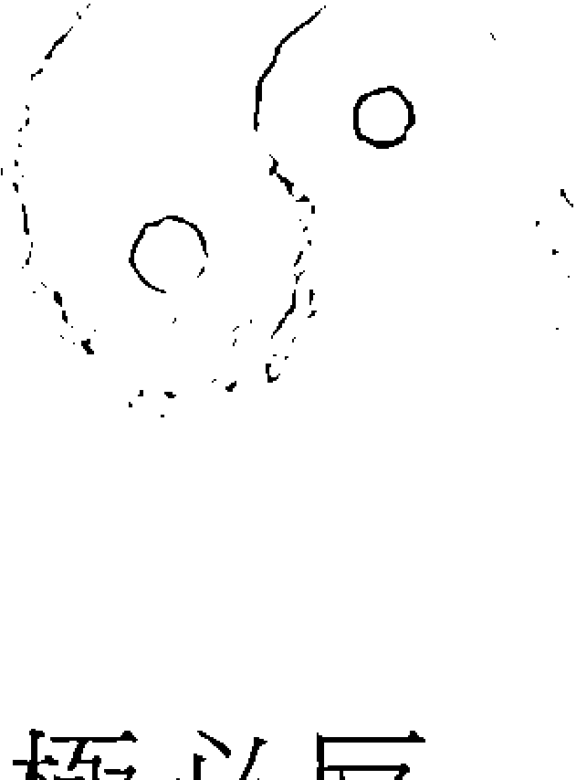

鐘擺效應反映出「物極必反」、「否極泰來」等效應，這個效應對於顯化來說，是當你在使用信念顯化時，碰觸了某個極限。我們看太極陰陽魚就可以明白，陽極陰生、陰極陽生，當顯化達到了極限，就會擺盪到另一邊，所以許多樂透中獎者，往往會遇到負面的事件，這就是因為正面事件碰到了極限所致。我們要如何避免這種鐘擺效應出現呢？在顯化上，最理想的操作是循序漸進的改變，如果我們要改善我們的生活，就要不斷改變我們的信念，逐漸朝向美好的信念以及感受。漸進式的改變是最安全與舒適的，同時不斷累積美好的感受，短時間內太大的改變，反而會有所震盪。

## 鐘擺效應是個躍進的契機

鐘擺效應因為有擺盪到負面那一邊，我們或許會覺得是個不好的效應，但這只是天地運行的自然之道，並無好壞可言。可是大家都想要否極泰來，沒有人想要樂極生悲，我們內心總是嚮往著舒適的、有利的一面，鐘擺效應正也代表著我們的貪取，對於那些對我們有利的事物，總希望越多越好，等到產生了鐘擺效應，我們又責怪生命的無常，如果我們不要求那麼多好的一面，也不會有鐘擺效應的產生。當然本篇的內容，並非責怪我們太過於貪心，而是要提出鐘擺效應的解決之道。不知各位是否買過股票，當股票一直漲，到了某個點，可能就會回檔；回檔時，若某個支撐點，那麼它又會再漲上去，甚至超越之前的高點。現在我們就是要談論，當鐘擺效應出現時，如何製造出支撐點？如何能即時反轉到另一邊？

凡是鐘擺，一定有個軸心。一根擺盪的鐘擺，不論如何擺盪，軸心總是沒有移動，沒有移動是因為我們正覺察著某個事件的擺盪，那個不動的覺察就是軸心。如果我們夠敏銳，可以覺察到某個事件的發生，已經觸及了我們的極限，例如忽然繼承了數目龐大的遺產，龐大到讓自己覺得是個天文數字，這時候的獲得，就勢必會產生鐘擺效應。此時不論是否已經開始擺盪而出現些許的負面事件，我們要知道這已經構成擺盪的條件，我們就可以採取調整軸心的措施。首先要清楚覺察到，對於整個事件我們的極限在哪裡？假使意外繼承了五億的鉅額遺產，以自己當時的認知來說過於龐大，但如果只繼承一億，內心覺得很豐厚卻不至於愕然，一億就是當時的極限。當瞭解了自己的極限後，就要開始移動軸心，移動的原理首先是要讓我們能接受較高的數目，我們利用宣告詞來進行，由於繼承的五億已超過我們的極限，那麼我們就要將範圍加大，例如：「我以宇宙一切萬有之名宣告，我完全接受繼承十億遺產是極為平常的事情，十億也只是一個小數目，從今以後我是這樣認為的，以此成就！」同樣的，以心目中可以代表整體的存在之名宣告。宣告完後，靜下來感受一下十億這個數目，是否已經覺得十億是一個很平常的數目？如果沒有，我們就繼續宣告，每一次宣告完都靜下來感受，直到真的感受到我們對金錢的界線已經改變，十億這個數目已經變得平常為止。

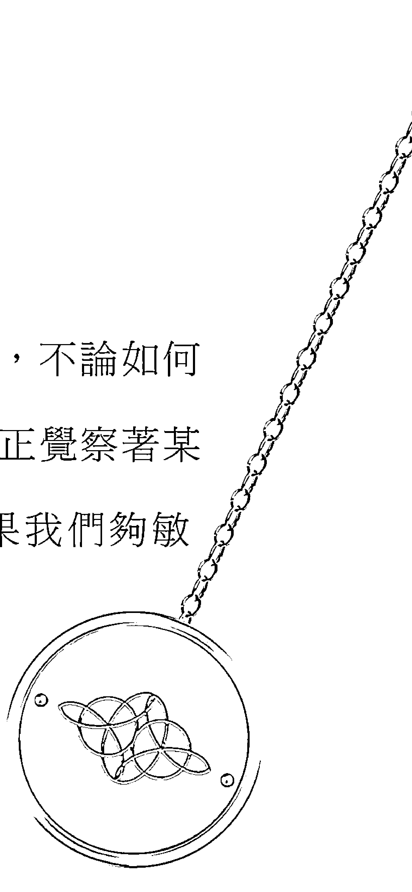

另一個方式較為簡單，我們直接將「十億遺產」這幾個字印在腦海裡，用不解釋直接覺察著它們，直接去消化對它們的解釋。等過一段時間再來覺察，一直到對它們完全沒有解釋為止。不論使用哪一個方法，我們都要在幾天後再覺察著這件事情，看看自己會升起怎樣的信念。

當成功將軸心調整到十億後，我們開始做出一個觀想，想像著這件事情出現一個鐘擺，而鐘擺的中心刻度寫著十億，左邊有著鐘擺的極限寫著二十億，每天早晚各做一次觀想，連續做七天為止，這樣我們就成功地將軸心調整到十億，也成功地將極限調整到二十億；而擺盪的另一邊，將會是五億元，而非負面的，因為我們已經調整了軸心。我們不用擔心這個鐘擺會擺盪，因為極限已經調整到二十億了，事實上我們才獲得五億，剛好在鐘擺右邊的最低點。

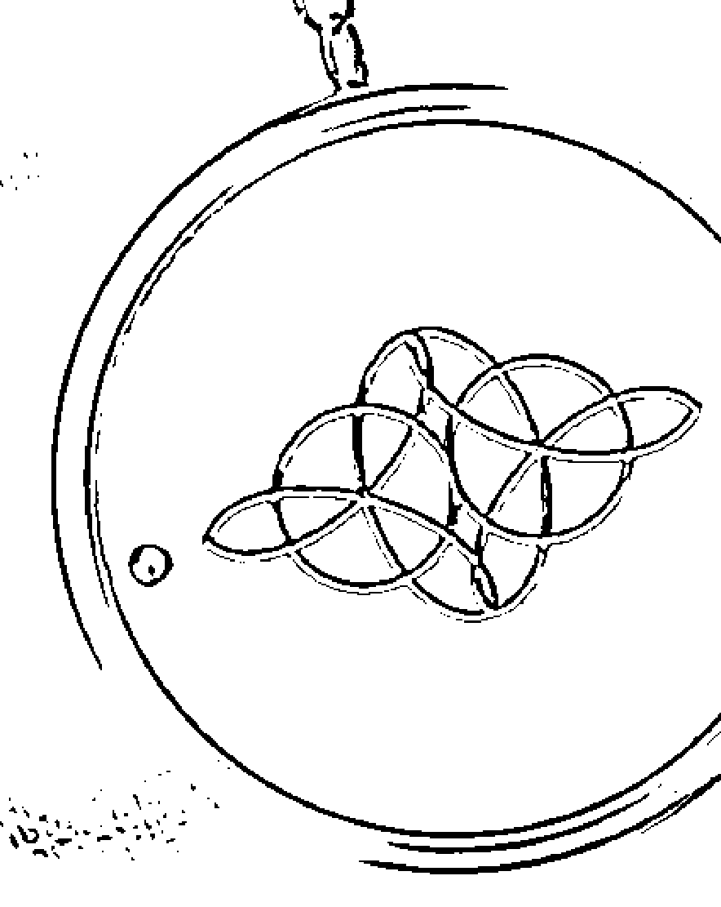

| 步驟 | 說明 |
| :--- | :--- |
| **Step 01** | 當現象碰觸極限 |
| **Step 02** | 調整軸心擴大極限 |
| **Step 03** | 鐘擺觀想練習 |

## 最強而有力的顯化工具——觀想

對於我們現在身處的現實來說，完全就是個夢境，也全然存在於我們的意識中，當我們說宇宙時，說的其實是顯現在我們夢境中的世界。既然一切只是意識的顯化，那麼所謂的現實與觀想出來的情境，主要都是用來提供我們感覺而已，所以對於顯化來說，感覺才是最後的關鍵，因為感覺就是振動頻率，而振動頻率就會顯化出下一個情境的出現。所以當我們觀想出場景與故事情節來讓我們產生感受，感受就能真實地顯化出下一次可以提供與這次一樣感受的情境。

《聖經》馬太福音裡有一段話：

> 凡有的，還要加給他，叫他有餘；凡沒有的，連他所有的也要奪去。

所以我們想要獲得什麼，我們不能說「請求祢賜給我什麼什麼」，因為這代表著你沒有。宇宙是中性的，當你發出的能量、訊號是「我沒有」，你將會一直得到「沒有」，所以我們想要得到某些東西時，必須先有；而有或沒有，宇宙也不是用物質的角度來看的，而是根據你的振動頻率。振動頻率就是感受、情緒、情感等，當你的振動頻率是 A，宇宙就會顯化出一些會讓你產生 A 感受的現象，好讓你產生 A 感受。

之前提過，感謝是一個祈禱的好方式，而另一個更強而有力的工具就是觀想。對於宇宙或是我們的意識而言，顯化的根據是振動頻率，振動頻率才是真實的，至於實際碰到情境而產生振動頻率，或是閉著眼睛觀想一段情境而產生振動頻率，對於宇宙來說（也就是意識），這兩者都是真實的，也完全能顯化下一次真實的情境，只是我們要多多培養觀想力。對於觀想力的培養，最重要的是要時常安住在覺察上，當我們安住在覺察上去觀想時，瞬間就能觀想出擁有非常多細節的場景，否則我們的觀想能力將會不足。舉個例子，如果我們要觀想出一個朋友出現在我們腦中的螢幕上，我們往往觀想了頭，就少了身體少了手；觀想了手，剛剛觀想出來的頭又不見了。觀想力不足的情況下，我們連一個人都觀想不出來，要如何觀想出複雜的場景，讓我們能因為這些情境產生真實的感受、情緒、情感呢？

那要如何培養觀想力呢？首先讓自己安住在覺察上來進行觀想，第二個重點就是時常觀想，保持每天都進行觀想的習慣。我們可以利用睡覺前，躺在床上進行一次觀想後再入眠，這樣的好處是，我們觀想的情境有時會在夢裡出現。我們把我們想要的情節，仔仔細細地觀想，細節越多越好。剛開始我們會因為觀想力不足，也可以說是我們的覺察力不足，細節無法以完整面貌呈現，但隨著每次的觀想都安住在覺察，我們的觀想力會逐漸提升，我們就能夠在彈指之間觀想出一座城市來，城市所有建築物的細節都極為豐富，而且解析度極高。這樣的觀想力不僅是頻繁練習的成果，更是安住在覺察來觀想的成果。

觀想力的好壞影響到我們大腦辨識真假的機制，越生動、解析度越高、越複雜的場景，我們能生起的感受越多；感受越多，顯化將會更快更多且更大。但觀想的前提是，不要去觸動鐘擺效應，初期只要觀想我們認為理所當然的情節就好，隨著觀想次數的累積，我們可以擴大理所當然的範圍，一步一步慢慢來，不要過於心急。

另外要注意的是，雖然我們使用觀想的方式來主動製造情境，但是只要這個情境想要產生的信念，與我們記憶儲藏庫中的信念有所不同，在觀想出情境的第一時間，仍有可能升起不是我們想要的信念。要如何準確知道所產生的信念是否符合觀想的情境呢？情緒就是一個準確的指標。舉個例子，當我觀想買了樂透彩券，並且觀想回到家中做了好吃的晚餐，享用晚餐後，看了一部我喜愛的連續劇；開獎的時候到了，我拿出彩券出來對獎，一切情境我都觀想得細緻而真實，我將手中的號碼與電視開獎的號碼逐一比對，結果所有號碼與滾出的彩球完全一樣，哇！我中了樂透彩的頭獎了，一切情境都非常真實而合理。我興高采烈地親吻著彩券，到了這裡彷彿一切都沒有問題，然而奇怪的是，我立刻注意到我的情緒，淡然而平常，一點都沒有中了頭彩的喜悅與興奮，難道是我觀想得不夠好？不夠真實？我做白日夢的能力很強，我是一個很喜歡做白日夢的人，我的觀想細節入微，情境生動真實，應該完全沒問題啊，為什麼情緒就是沒有中獎的雀躍感呢？我也知道情緒才是推動顯化的主要燃料啊！

上面這個例子，相信使用過觀想的朋友一定心有戚戚焉，許多的觀想過程都真實而無誤，到底哪個環節出錯了？在這裡告訴各位，原因只在你沒有覺察到許多細微的信念，沒有將一些阻礙你觀想成功的信念消化掉，當那些信念有如鐵則一般的藏在我們內心深處，又或者我們無法在它極短時間出現的時候，抓到它並且消化它，然後用另一個信念取代它時，我們的觀想就永遠失效，以下請聽我分析。

我們在開始觀想彩券中獎之前，一定會先想到：「我要來觀想一段買彩券中獎的情境。」這時候你的內在浮現出來的信念，無論是多麼快速，又多麼一閃而逝，一定要穩穩抓到它。出現的信念很可能是：「唉！我哪裡是這麼幸運的人？從小到大別說是彩券了，連個年終尾牙都沒有抽到過什麼大獎！我不是會中彩券的幸運兒。」各位聽到這裡，明白怎麼一回事了嗎？這些細微的信念，在我們生活中不知有多少，它們成為了這個虛擬人生遊戲裡人物主角的設定值，如果沒有看到它們，不管觀想多少次都不會成功，這裡不是說一些讓人洩氣的話，而是為各位指出問題的關鍵。

所以我們明白了，一切都是信念主導著我們的感受，如果沒有登出開悟，很難在第一時間抓住這些阻擋我們的信念，唯一的方法，只能把這些信念挖出來。每當我們觀想結束時，就靜下來問自己，是什麼信念與我的觀想情境背道而馳？問完後，就停下來等待答案的浮現。一次沒有答案，下次觀想結束再問，直到有些答案出現為止。當有答案時，我們立刻使用損的方式去消融這些答案：「我以宇宙一切萬有之名宣告，剛剛這個阻礙成功的信念，該學習的我已經學習完畢，請結束發生的循環，以此成就！」每次念完時，去感覺你的信念是否已經消融，當信念被消融後，你會自然而然感到無比輕鬆。當把阻礙觀想成功的信念消除後，我們再回去進行之前的觀想，這時候的觀想，一定會把感受、情感、情緒帶出來，如果還是沒有，肯定還有阻礙觀想的信念存在，我們就重複之前的步驟，直到把它們全部挖出來，全部消融為止。過程中千萬不要嫌麻煩，因為除了已經登出開悟，否則消融信念的工作就需要一步一步地進行，當成果顯現時，對你人生的影響是十分巨大的。在這裡還是希望有心成為人生超級玩家的朋友們，如果能先登出開悟，還是先致力於登出開悟，畢竟有沒有登出開悟，對於顯化來說，會有天差地別的不同。

當聽到「觀想」這個詞，我們升起的信念往往是「想像」、「幻想」、「白日夢」，這樣的信念不足以讓觀想變成顯化最有效的工具，我們應該有一個觀念，既然對於宇宙而言，感受（震動頻率）才是重點，而非情境，情境只是用來引發感受的工具，所以不管是現實的情境，又或是觀想出來的情境，宇宙都一視同仁，重點只在於是否引發出感受而已。以這樣的角度來看待觀想，它完全是真實不虛的情境，也就是生活本身，所以我們應該將觀想視為我們的「內在生活」，當我們以內在生活來看待觀想這件事，觀想就成為了真實的情境，不再是一種想像、幻想或是白日夢，而是真實的生活，這樣的觀想就具有無比的威力，完全可以顯化出現實的情境。

觀想的另外一個作用，是可以消除我們內在對未知的恐懼。即使是一個美好的未知狀況，我們內在仍然會有許多反向的負面信念。舉個例子，假使我們希望變成擁有巨額財富的人，我們的內在就會產生一些恐懼的信念，像是有錢是不是需要管理企業或處理稅務問題？有錢之後家人的安全是否成為隱憂？我是否會變成一個令人厭惡的守財奴？這些恐懼的信念，自然阻擋了財富的顯化，所以我們利用觀想自己成為了有錢人，就能把有錢變成已經發生過的事情，事先預習了有錢的感受後，就會自然地發現，原來有錢並不會出現那些令人恐懼的事物，有錢這件事不再是一件未知的事物，內在就不會恐懼，就不會有阻擋顯化的信念。這個例子可以延伸到任何未知的事情上，例如結交異性朋友、任何的比賽、重要考試、面試等等，我們都可以藉由觀想來消除疑惑與恐懼的信念，讓我們的人生更加順利。

## 雕塑你的新人生

從即日起，無時無刻修正你所覺察到的過去信念，每一個信念，都是你這個人生遊戲的設定，也攸關你的生活會如何呈現。我們隨時隨地、時時刻刻地覺察到對眼前人事物所升起的信念，然後修正我們固有的信念，告訴自己並暗示自己新的信念。至於要用哪一個信念來替代？如果有非常明確的目標，知道要將我們這個人物設定成怎樣的新角色，那麼就可以按照這個目標去設定；如果沒有明確的目標，那麼只要遵循一個簡單的原則，就是把每一個受限的信念，設定得更開闊、更沒有限制。例如我覺察到「我覺得吃一頓 ×× 元的晚餐很貴」，那麼我們就把這個數字乘以十倍，告訴自己、暗示自己我是這麼認為的，能隨身將它記錄下來最好，每週重複閱讀一遍，看看自己修正了一些什麼項目，了解一下新的自己。一年後，你會非常訝異自己轉化成一個完全不同的人，你也會訝異你的生活境遇的徹底改變，彷彿是兩個完全不同的人生。

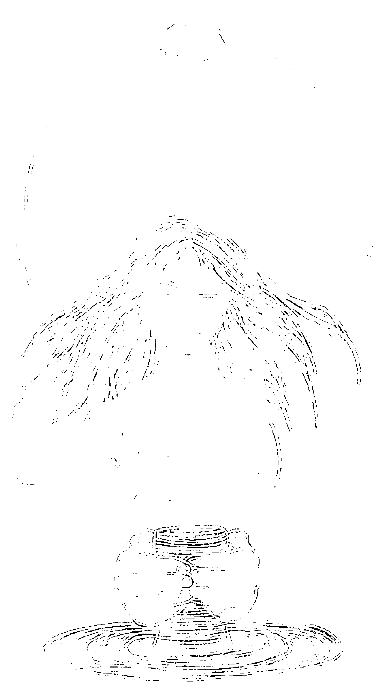

## 後記

這本書乍看之下有兩大部份，一個是關於登出開悟，另一個是如何成為顯化大師，但它真正的分界，應該是以登出開悟為主要前提，在這個前提達成之下，選擇回家的道路，回到永恆的徹底圓滿中；或是選擇成為超級玩家，在生命的遊戲裡，隨心所欲地暢快遊玩。

而登出開悟也並非只是為了選擇回家，或成為超級玩家而要達成的前提，為什麼我們可以有上述兩個生命故事中難以抉擇的選項？原因是我們從一個我們一直信以為真的夢境中醒來，也像是我們從一個線上遊戲的主角，登出成為一位操控遊戲的玩家。登出開悟的主要意義，在於由虛妄的人生、虛妄的無盡輪迴裡解脫出來，回到自由自主的存在。

其實去喚醒睡夢中的人，是很荒謬的事情，因為畢竟是夢境，對方遲早也會覺醒，何必在對方沉溺於夢境時，去告訴對方其實眼前一切只是一場夢呢？所以這本書是給兩種人看的，第一種就是正在做著惡夢，無論如何都想要停止惡夢的連續發生，即使醒來也在所不惜；而另一種是不論做著好夢還是惡夢，夢總是虛幻的，想要不計代價也要求得真實，不願活在虛妄的世界裡度日子。如果你不是這兩種人，你為何要醒來呢？如果沒有一個非常堅定的決心，是無法完成的，因為我們活在生命的故事性當中，太多的故事性對我們來說極為重要，那些重要性都會把我們束縛在故事裡而難以離開。

所以這本書的誕生，並不是要傳達一種思想或知識，它並非哲學性的書籍，也不需要記得書中的內容，而是當你直接接觸書中文字時，所帶給你的轉化。這本書是一個直接的引導，無論是書中的十五項功課，或是各章節的內容，都會潛移默化地改變你。如果要登出開悟，這本書應該一看再看。

- 紫焰官方網站
  https://www.violet-flames.com/

  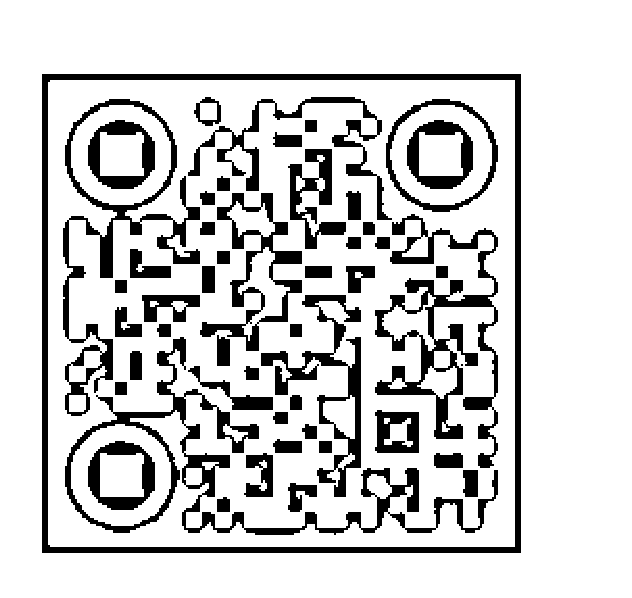

- 紫焰網路商城
  https://www.violet-flames.com/shop/

  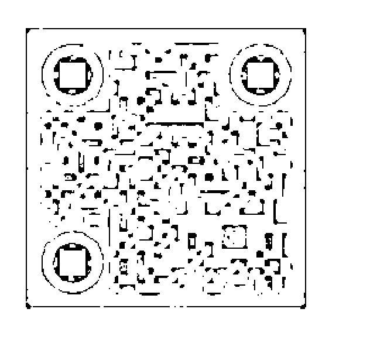

- 紫焰視頻館(簡體中文)
  https://cn.violet-twin-flames.com

  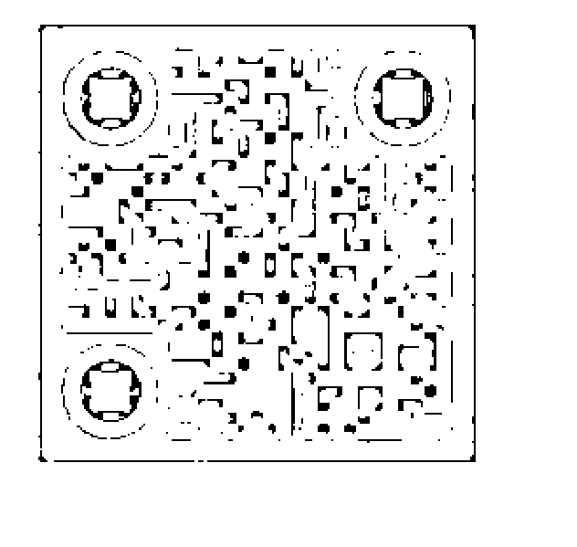

- 雙生紫焰YouTube中文頻道
  https://reurl.cc/n5Z67D

  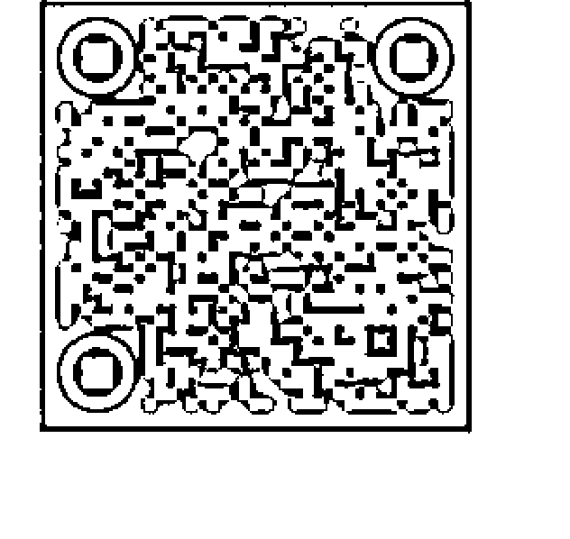

- 雙生紫焰Youtube英文頻道
  https://reurl.cc/WXqaDL

  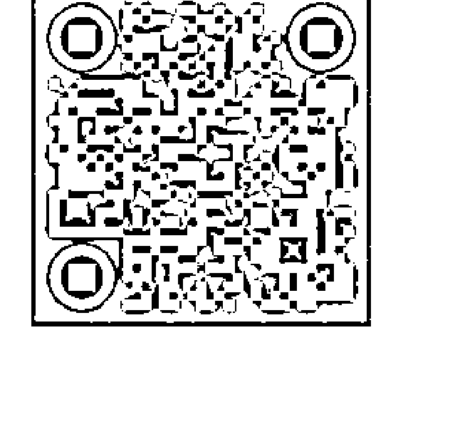

- 雙生紫焰Facebook專頁
  https://www.facebook.com/VioletTwinFlames

  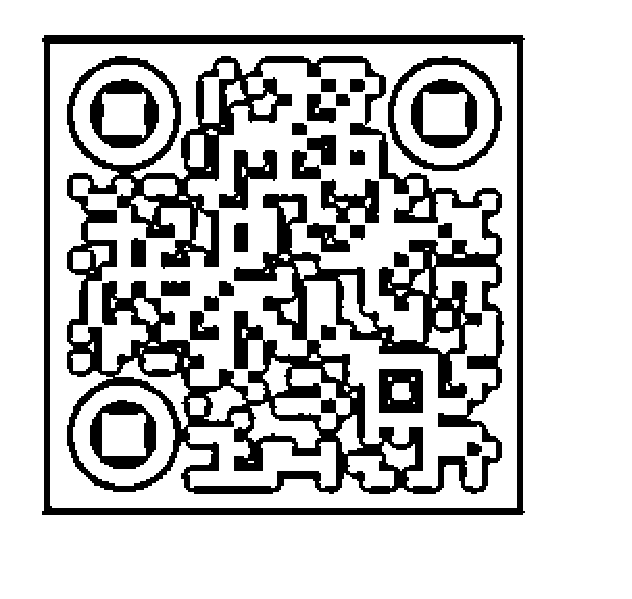

- 雙生紫焰Instagram中文
  https://www.instagram.com/violettwinflames1111/

  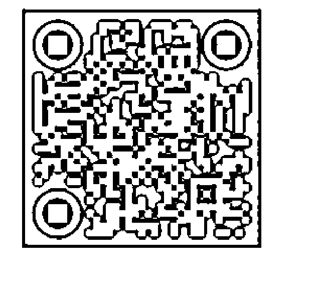

- 雙生紫焰Instagram英文
  https://www.instagram.com/violettwinflames_english/

  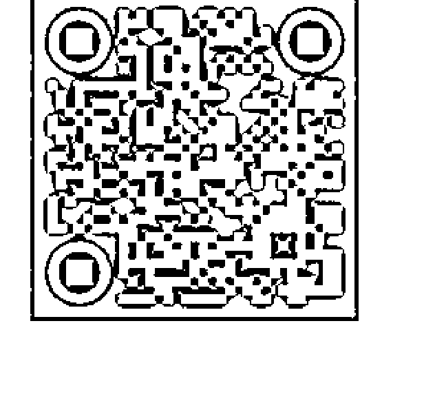

## 登出键 Log Out Button

奥丁

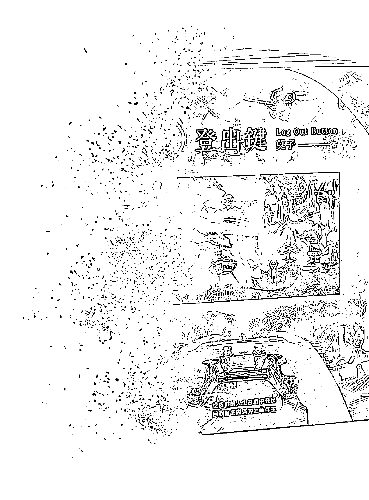

从300人生历程中
回归虚幻的生命存在

## 你即將擁有一個可以讓你從人生遊戲徹底登出的方法

不過不必緊張，這裡說的登出並不代表死亡，相反的，登出可以讓你活在徹底圓滿的生活中。本書的內容會實際引領你跳出人生遊戲之外。我們稱它為『終極生命系統』，跳出後的你有兩個選擇：

- 第一、待在『徹底圓滿之境』。
- 第二、成為一個宇宙online的超級玩家，完美地掌控與操控『人生遊戲』。

我的目的，是希望透過這本人間遊戲秘笈《登出鑰》，讓你自己能握著自由的鑰匙，成為一個擁有選擇權的人，從此不再過著被命運擺弄的人生。

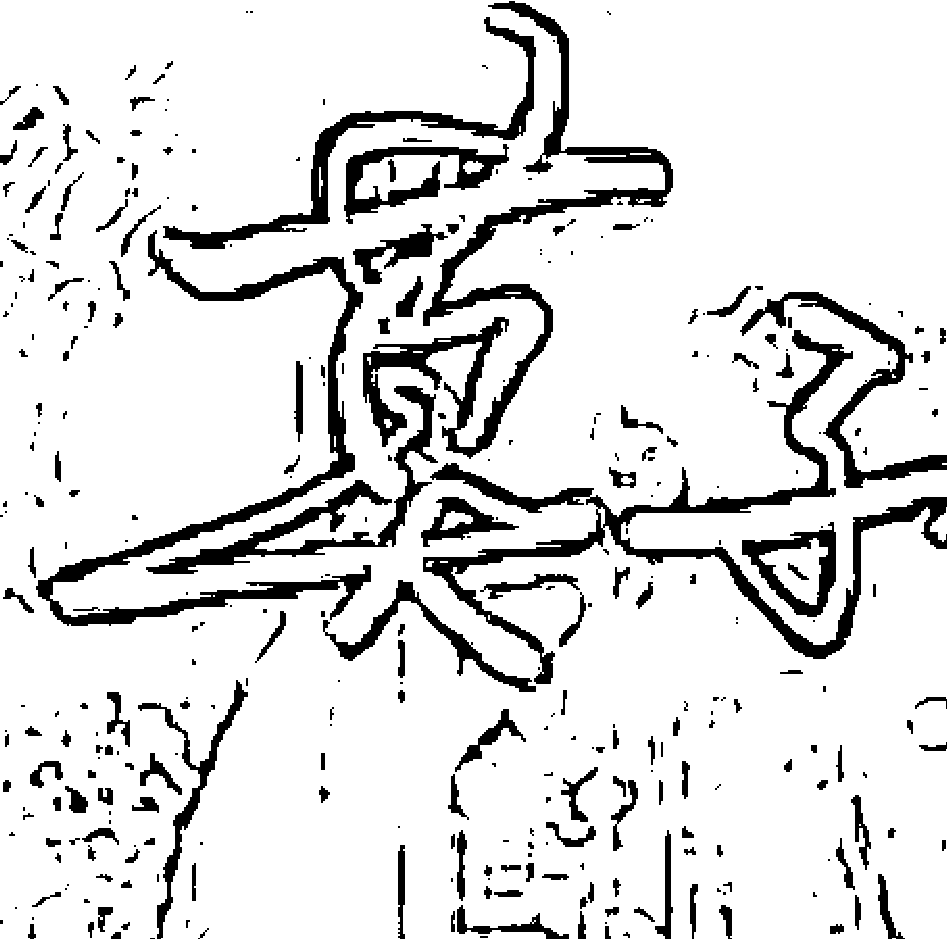