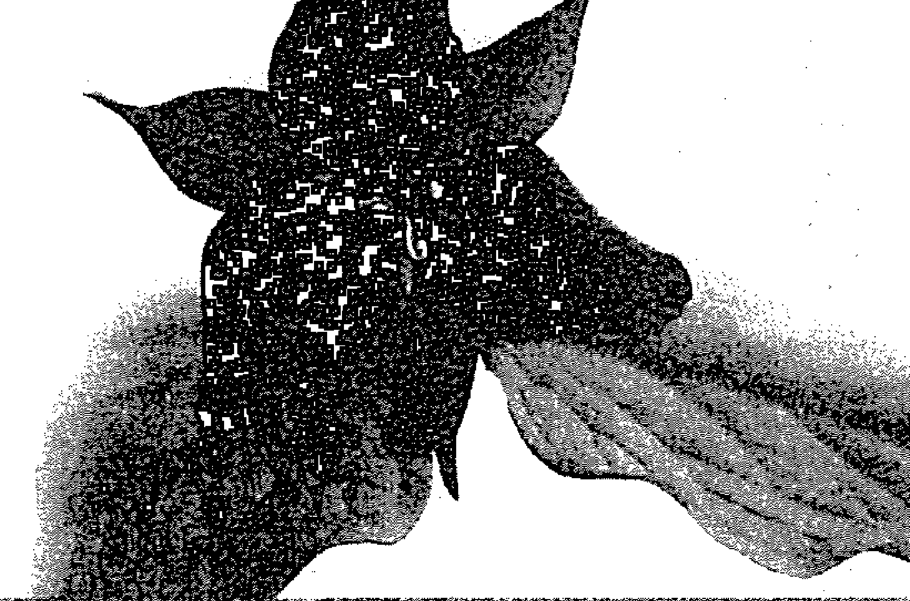

# 神奇的植物灵疗愈法

運用植物意識療癒你的身心靈

Plant Spirit Healing

A Guide to Working with Plant Consciousness

潘·蒙哥馬利 (Pam Montgomery) 著 丘羽先 譯

聆聽植物的智慧語言

學習與綠色世界的慈愛力量連結

這是療癒全人類與地球的必經之路

同靈治原師 黃淑�贞 /A尊艾推薦/

我深愛的女兒卡拉，
這故事為你而寫。
希望在你心中埋下種子，
日後發芽茁壯，
好傳給你的女兒。
因為我們告訴下一代的故事，
將塑造這個世界。

# 推薦序

從美國拿到園藝治療師認證，回台展開園藝治療生涯，一轉眼就十年了。

園藝治療，顧名思義，就是運用園藝活動來改善和調整人的身、心、靈。這十年

帶過失智老人、失能老人、非行少年、自閉兒、身心障礙者、精神障礙者、監獄

受刑人等，常常在一個療程裡，我看到原先抗拒參加的失智老人開心地笑了；看

到精神障礙者精神平穩下來；看到施暴者的受刑人變柔軟了：：：學員在短短療程

總讓我看到微妙的改變，也因著這些小小的改變，支持著我走了十年。可是，我

卻愈來愈清楚：雖然我是一園藝治療師一，可是，真正進行治療的，不是我，而

是一植物一！讓學員開心、有希望的是一植物一。而我一園藝治療師一的工作就

是要把適合做園藝治療的植物找出來，去了解他們的屬性與特性，再將這些特性

# 植物靈與園藝治療

# 園藝治療師 黃盛謙

# 神奇的植物靈療癒法

# Plant Spirit Healing

# 推薦序

我知道了，接下來，我的園藝治療要努力去發揮植物的整體力量，以三位一體的心、魂、靈，來治療人類的心、魂、靈。

我相信這樣的園藝治療，一定可以幫助更多人！

# 黃盛璘

二〇〇四年美國Metis大學，園藝治療師證照、財團法人大願文教基金會董事、臺灣園藝輔助治療協會理事長、亞太園藝治療協會高級園藝治療師HHC。

台灣首位取得美國認證的園藝治療師，返台後致力將藥學原理、中醫養生方法與本土青草藥融合，形成獨特又實用的一農、醫、食—三位一體的園藝療法體系。著有《走進園藝治療的世界》一書。

# 前言

# 重拾無形的力量

過去二十年間，我都跟一群植物愛好者、原住民藥草療癒師和藥草師為伍。像綠色民族集會（Green Nations Gathering，由潘·蒙哥馬利於多年前創立）與國際香藥草研討會（The International Herb Symposium）等會議活動，會有來自世界各地許多部落與傳統族群的植物專家齊聚一堂。這些集會帶給我與眾不同的體驗。與會人士多半有個共通點：曾被植物救過一命，自此之後，人生有了徹底的轉變。某種無形的力量進入他們的內在，改變了生活方式，也改變了他們看待自然、與自然互動的方式。自己最原始的那一部分，與野生自然世界重新連結。他們吃過野生的救命藥草，開始接觸與醫學化約論截然不同的藥草學。在本書中，作者潘·蒙哥馬利將探討各種藥草療法，以及植物的無形能量如何在人體

史蒂芬·哈洛德·布納

# 神奇的植物靈療癒法

Plant Spirit Healing

# 前言

內在發揮療癒作用。

剛剛死亡的人體跟活生生的人體沒有太大差別，但有某種無形的東西離開了。美國詩人布萊（Robert Bly）曾言：「詩跟人體一樣，看不見的地方，才是

一切關鍵。」如他所述，無形的重要性與力量超乎語言文字，也是生命不可或缺的元素。然而，很少有人願意探究和接觸那無形的領域。與無形世界相牴觸的化

約論觀點比比皆是，理查·道金斯（Richard Dawkins）①提出實在論即是一例。

這樣的理念衝突在藥草療法領域也未能倖免。

過去二十年，許多藥草師試圖證明藥草療法是「貨真價實」的科學，應該受到重視。即便立意良善，他們與許多領域的學者一樣，選擇放棄探索無形世界，轉而擁抱機械論，使藥草療法受主流世界觀左右，奠基在根本的錯誤上。針對這項根本錯誤，捷克前總統哈維爾（Vaclav Havel）曾提出精闢見解：

①譯注：英國知名演化論學者，著有《自私的基因》。

### 神奇的植物靈療癒法  
Plant Spirit Healing

怪的是，我們開始發現，這樣的關係缺少了什麼：：：例如，我們對宇宙的認識也許遠多於先人所知。然而，先人對宇宙的了解似乎更為根本，我們顯然忽略了什麼：：：我們對人體器官、功能、內在結構與生化反應描述得愈透徹，愈無法掌握人作為整個系統的精神、目的與意義，以及它所創造的獨特自我經驗。②

那無形的東西之所以被我們和現代科學忽略，是因為在可觀察的事物上都找不到它。它是看不見的。西方世界對看不見的東西很感冒。多數人甚至連談都不願意談，把它當成羞於啟齒的事，避之唯恐不及。這不只是令人遺憾而已，所導致的後果是降低了內在生活的豐富性，還破壞了我們生存的環境。

人跟人間最重要的互動都是無形的（例如，愛與關懷在深愛的兩人間流動）。同樣地，地球上的生物系統之間最重要的互動也是無形的。昆蟲、鳥類、爬蟲類、哺乳類動物與其他植物等生態系統，都曉得以植物為藥，但長久以來，持化約論的研究人員卻對此視而不見。還有，植物能夠判斷生病的生物需要哪些化學物質，然後開始製造該物質。這與大自然中看不見的運作密切相關，也直接

# 前言

挑戰人類認為植物不具智慧的假設。

對於某些生物系統展現的無形力量，潘分享了她的洞見。書中提到一個令我受益無窮的觀點，那就是植物與其他生物的共同進化歷程。她說：

回顧植物與動物的起源，我們發現最先登上陸地的是兩棲類植物，如鼠尾草、蕨類等無種子維管束植物，接著是針葉樹等爬蟲類植物，最後是哺乳類植物，如被子植物等具有保護胚胎之內在構造的植物。植物往陸地發展後，其同類動物隨之跟進。因此，有了被子植物（開花植物）為食物來源後，哺乳類動物才出現在陸地上。

人類與地球的無形力量息息相關。雖然現代科學試圖將治療簡化為對物質的精密操控，但作為地球生物的一員，我們也具備跟生態系統一樣的無形力量。這是化約論者無法看見、更無法掌控的。事實上，不只是人體與器官的細微運作

②瓦茨拉夫·哈維爾，《不可能的藝術》（紐約：Knopf出版，一九九七年），166-167頁。

# 植物靈療癒法

# 神奇的

# Plant Spirit Healing

要靠這些力量，治療關係也是如此。祖先老早知道、現代人卻無視的一項事實是：促成療癒的必要元素中，很多都是無形的。

給各位舉個例子。許多年前，我有幸與伊莉莎白·庫伯勒·羅斯醫師（Elisabeth Kübler-Ross）共事，她告訴我一個故事，是關於無形療癒力量的重要性，至今仍令我印象深刻。她曾在科羅拉多州的丹佛市擔任醫師工作，負責照護癌症病患。她發現，一些本來沒有希望的癌症病人，病情突然好轉起來，便開始注意觀察，想瞭解背後的原因。每天早上，這些病人的情況都有大幅改善，但到了晚上情況就變差，她決定在夜晚偷偷察看，結果發現一位清潔人員在每個癌症病患的房間裡逗留。某天晚上，她直接上前詢問說：「你在這裡對我的病人做了什麼？」

清潔人員嚇了一跳，回答說：「沒有！我什麼都沒做！」然後就轉身離開。

伊莉莎白趕緊追上去說：「等等，我不是在對你生氣，只是想知道你做了什麼。」那位女士停下腳步，轉過頭來看著她說：「我只是坐下來，握著他們的手，陪陪他們而已。你也知道，他們快要死了，自己一個人走很辛苦。如果沒有人關心他們和愛他們，就這樣死掉是很可憐的。」說完，她便轉身離去。

# 前言

伊莉莎白說，這個經驗幫助她察覺療癒與生死背後的無形力量，於是開始在美國推廣臨終關懷的運動。

我想說的是，相信各位讀這個故事的時候，不是只有理解文字而已，也能感受到意義帶來的影響。當你被故事背後的意涵深深感動，即是經驗到語言的無形力量，也經驗到療癒生物系統的廣大能量。

就像各位不需要念中文系，也能看懂這些文字，你不用念化學系，就能理解植物的療效。你對植物的療效會產生某種感覺，如同對故事的意涵有所領會一般。這個感覺，是深入瞭解植物療癒力的基礎，而古老原住民都有這番深刻認識。它也是連接那股無所不在之力的關鍵。

愈來愈多人開始重視無形世界的重要性，各位手上這本書正是其一。潘在書中談到許多看不見的存有，也分享與他們共事的經驗。她與許多人紛紛大聲疾呼重拾無形力量的必要性。潘非常清晰地點出人的內在敘事本質。她提到，那些無形但充滿意義的內在敘事──我們每天定義自己的說法，會影響我們的生命安

③譯注：美國精神科醫師，也是知名的生死學大師，著有《天使走過人間》等書。

### 神奇的植物靈療癒法  
Plant Spirit Healing

康、生理機能、外在關係與內在健康。她強調，我們必須改變和拓展內在敘事，與生命的種種無形能量連結合一，其中之一就是所謂的「靈（SPIRIT）」。

一無法覺察到靈性生態的存在時，一潘說，一我們如同無根之木、無波之浪，也像失了魂的心，不斷地渴求生命的精神性能量。一她指出，人類天生就有感知無形世界的能力，但身為藥草師的我們有更多機會接觸。

從事植物療癒工作的人都知道，許多植物都有類似的生理功效，但某些植物只適合用在某些人身上。從古至今的藥草師都曾提過，當一個人需要某種植物時，它往往會生長在附近。很多人也有這樣的經驗：與個案會面時，正在傷腦筋該使用什麼藥草，腦中便浮現某種植物的形象。

這些是藥草師經常經驗到的無形力量。當然，我們愈深入無形世界，接觸到的面向會愈多。只要擁抱無形的療癒傳統，捨棄機械論的預設立場，就能發揮非凡的療癒力量，其成效是化約論醫學遠不能企及的。如果我們能夠運用感知意義、塑造意義的能力，體認到植物是意義的攜帶者（並且憑自身感覺去判斷這些意義的效用與對特定個體的適用性），就能將攜帶意義的力量融入個案的生命中。我們是這股力量的中介與推動者，為前來尋求療癒的個案注入新的生命文

# 作者序

兒時，我常在祖父母位於肯塔基州東部的山中農場度過炎夏。奶奶熱愛花草。每日午後，忙完家務後，她都會走到生意盎然的花園裡去修修剪剪，口中不時喃喃有詞。某天，我忍不住問她在跟誰說話，她答道：「植物跟人一樣，也需要朋友。多跟花草聊聊天，他們會長得比較好。」奶奶很會種花草，祕訣就是跟植物說話。我非常喜愛奶奶。與植物交談對她而言是再自然不過的事，我也就視為理所當然。我從很小就對植物有這番認識，以為大家都會跟植物說話。等到年紀漸長，寶貴的童真歲月已遠去時，我才發現很多人對植物抱持跟我不同的態度，認為植物可能有害，甚至吃了會致

# 植物靈療癒法

# 神奇的

# Plant Spirit Healing

命。我聽了大為震驚。怎麼可能呢？這跟奶奶的教導完全不同，所以我拒絕接受，決定站在奶奶這一邊，堅信我們有跟植物說話的能力。時至今日，我仍然堅守奶奶的理念，也由衷感謝她讓我體認到，植物是值得我們友好跟交流的生命存在（Beings）。奶奶留給我最珍貴的禮物，就是讓我從未懷疑自己天生具有跟自魂、靈（Heart, soul, and spirit）是很自然的事，因為這就是我受的教育。難怪我早年欣賞的對象，是像蘇格蘭芬霍恩生態村（Findhorn）的創辦人麥克琳（Dorothy Maclean）與植物學家卡弗（George Washington Carver）這類人物。卡弗曾說：「當我碰觸一朵花，我也碰觸到無限永恆。早在人類誕生前，花就已經存在，未來也會持續存在數百萬年。我透過這朵花與無限永恆溝通。無限永恆只是一股寂靜的力量。我們的溝通並非實體接觸。它不在地震中，不在風中，也不在火中。它在無形的世界中，是那召喚精靈的寧靜語言。」

一九八○年代，我開始教授藥草課程，並從事藥草療癒工作。當時，藥草療法開始廣受歡迎，但似乎只是作為西方醫學模式的一種替代品。人們以藥草的化學成分取代藥效更強的西藥。服了藥，身體康復後，過沒多久，疾病又會以另一

# 作者序

一種面貌出現。實際上沒有任何改變，尤其是人們的意識。從那時起，我開始尋找治本而非治標的療法，希望透過轉化意識，達到真正的療癒。要這麼做，就必須超越植物的物理性質，探究如何在更深的層面產生療癒作用。我從未質疑過自己能與植物溝通，所以直接向植物請求協助。這些年來，我發現植物擁有廣大的智慧，而且具有多重面向，能夠發揮強大的力量，達到根本療癒之效。只要懂得運用植物的整體，而不只是化學成分，就能促成療癒發生。必須強調的是，我並不反對使用酊劑、藥草茶、精油或任何有益人體的藥草配方。這只是植物的其中一面，但不是全部。它們的真實本性是獨特而複雜的。人的本性也一樣多元而豐富，肉體只是其中一個層面。我所主張的是發揮植物的整體力量，以三位一體的心、魂、靈，來治療人類的心、魂、靈。

在本書中，我會著重於植物的靈性層面，畢竟其他作者多半都在討論植物的物理特性（只有少數例外）。與植物靈共事，使我自然而然開始探索生命的靈性力量。我會討論靈如何透過我們生活與行動，使靈的概念融入現實，而不再停留於宗教的抽象層次。有時，我覺得很難以文字描述靈性經驗，因為語言無法充分表達靈的深廣，但仍期盼諸位能夠有所領會，一窺「靈性經驗」之究竟。

### 神奇的植物靈療癒法  
Plant Spirit Healing

而，往往唯有親身經歷過，才能透徹瞭解。慶幸的是，每個人都能經驗到靈、療癒、合一與意識提升。這是我們與生俱來的能力。我們生來就是要去愛、去療癒、去理解，並活出自己的本性。

現今有愈來愈多科學證據支持我和學生的療癒經驗。這些經驗與原住民部落及傳統治療師自古傳承的方法相互呼應。在本書各章中，我將援引科學資訊與古老智慧來佐證治療理論及實務。目前，科學界正面臨重大突破的關鍵時刻。希望不消多時，關於植物的振動療癒研究會變得更加普遍。

本書第一部分闡述植物靈療癒法的理論基礎，第二部分是實務應用，第三部分則是植物的故事，也是我個人最喜愛的一節。植物的種類非常繁多，但我在本書中提及的這些植物，尤其能夠展現獨特而全面的真實本性。基本上，我其實是將它們希望呈現的面貌轉達給各位。

我會在其中一章說明何謂三重螺旋。螺旋是自然界的基本形狀，三位一體則顯見於自然界及所有生物中。因此，植物靈療癒法依循的是心、魂、靈的三重螺旋途徑。

另外，希望各位讀者會喜歡書中收錄的圖片。這些美麗的靈性存有都是由

## 作者序

琳達·羅拍攝。我第一次看見鏡像是在阿第倫達山脈的湖中。我在寧靜的湖中划著獨木舟，岸邊的花草樹木與湖中倒影形成鏡像，沿著湖畔映照出猶如圖騰柱的臉形與靈體。這些美麗的鏡像使周遭一切看起來特別生機勃勃，令我驚奇不已。

直到看見琳達的相片，我才再度感受到同樣的視覺震撼，覺得這些植物都鮮活了起來。琳達為本書拍攝的斗蓬草（Lady's Mantle），我盯著這張圖片好一陣子，那張顯目的外星人臉令我十分好奇。我也很意外它具有雄性特質，而沒有展現雌性的面貌。突然間，我看到的不再是外星人，而是一位有智慧的老煉金師。於是，我稱他為亞圖洛（Atuno）。斗蓬草的拉丁學名是Alchemilla，難怪斗蓬草靈是這樣的形象。你會發現，每種植物的靈都有不同的樣貌。有些很可愛，有些很惱人，就跟所有生命一樣。這些絕美的圖片將難得一見的植物本質呈現在各位眼前，而本質正是靈性療癒發生的場所。我看著琳達的圖片，就能感受到療癒的能量。

二〇〇六年夏季，琳達開始跟著我上課。一見到她的攝影作品，我就決定要收錄在書中。琳達談到她的創作過程：

## 神奇的植物靈療癒法

Plant Spirit Healing

我是一位數位全像藝術家，創作主旨是與自然連結。一直以來，攝影協助我開啟覺知、拓寬視野，同時專注於內在的我。透過相機，我打開自己的感官，穿透表面進入更深的層次，到達萬物不再失去連結的領域。

我用傳統底片創作了二十五年，轉變成數位時代後，我的創作空間更大了。透過更寬廣的視野，我得以自由探索新的攝影方式，試圖在捕捉連結的當下及後製的呈現之間求取平衡。後製延伸是我創作流程的第二步。在此階段中，我會在電腦上藉由光影的描繪讓數位影像呈現其真實本性。無論是在樹林中拍攝，或在晝夜交替之際捕捉萬里白雲的蒼穹，抑或來到波光粼粼的金色池塘面前，我都會與令人著迷的世界保持連結。後製延伸時，我則敞開自己，盡可能在視覺影像上創新，也讓神祕的生命存有揭露其本性。

這項創作技術經過好幾階段的演變。書中有幾張圖片的製作方法是將原始相片加上鏡像後，再設法讓它的本性「顯現」出來。拜電腦科技之賜，在後製階段，我可以盡情發揮無限可能（類似傳統攝影局部加減光的技術）。由於新型數位相機的解析度更高，我能夠以更為細膩的角度觀察大自然。

## 植物靈療癒法的理論基礎

> 一呼一吸間，  
你與植物共舞奉獻。  
深深吸入吧。  
植物靈的療癒，振動如琴弦，  
閃耀如蛛網。  
注定成為那紗線，  
重新織起古老療癒之袍。

——蘇桑·維德（Susun Weed）

## 靈性生態

到了大地回春的時節，土地鬆軟，鳥兒高歌，空氣中洋溢著生機，沒有什麼比這更美好。我沿著林道往上游走，看見幾處岩石仍覆著薄冰，行走間或拾起小石，或撥開樹葉，尋找新冒的韭芽，享受著自枯枝間灑落的冬陽。我來到溪床的某處，這裡一直很吸引我，能量也十分特殊。一年前，天氣乾旱之時，溪水從上游下來後，流進溪床的洞穴，再從我家後方的心泉（Heart Spring）湧出，煞是奇特。還有一次，我在這附近的漂流木上發現一朵巨大的秀珍菇。此處的岩石也特別不同，到處是直立的片岩，彷彿地底下有股蠻力往上推擠。今日，我再度來到這塊特殊之地，卻感覺像初次造訪。有些東西以前從來沒見過，例如溪流中央出現一塊大岩石，還鋪著柔軟的青苔，很適合坐在上頭。其他岩石表面也都覆著綠油油的青苔，但以時節來看，似乎綠得有些早。還有，水面上與石頭間閃爍的光影尤其生動奪目。什麼因素使這裡與眾不同？我在制高點處坐下來，溪流幾處彎道一覽無遺。接著，我把眼神放柔和，改以直覺引導感官。在斑斕的薄光中，我看見無論是樹林、岩石還是落葉排列的樣貌，周遭盡是一張張面孔，有老人、跳舞的女子、母熊、地精、龍、三個手牽手的孩子，還有掌管一切的高大奶奶。岩石裂縫和樹底洞穴都是他們的家。我看得很清楚，這裡正是自然之靈的住所，因此特別朝氣蓬勃、生意盎然又奇異非凡。得以窺見他們的面貌，此刻的我備受祝福。

記於二〇〇六年三月

## 與萬物有靈之環境的關係

靈性生態確實存在，並致力於維持靈性生態平衡。生態（ecology）的定義是有機體與周遭環境的關係。靈性生態則是有機體與自身之靈在環境中的關係，包含內在與外在關係。靈性生態也是個體與靈性環境的關係。另一層意義則是個體與萬物有靈之環境的關係。上述這三種定義稍有不同，但皆屬生命靈性生態的範疇。

萬物有靈的環境，如同詹姆士．洛夫洛克（James Lovelock）提出的蓋亞理論（Gaia theory）所言：「地球是一個活的有機體，會藉由調控溫度、濕度與大氣成分等環境因素，主動創造有利生存的環境。」這項理論將地球視為有回應能力的超級有機體，會抵抗不利的環境變遷，並設法保持『恆定』。然而，當承受之壓力超乎現有調節機制，地球將直接重塑一個穩定環境。屆時，許多現有物種都會滅絕。」這表示，地球自行創造生存條件，致力於維繕環境恆定或平衡，以維繫我們所知的生命。

## 與靈性環境的關係

我們如果採用全像觀點來看世界，會發現任何部分皆包含整體。這就像以雷射光投射出的 3D 立體影像。無論它被切割多少次，都會保有完整的影像。我們可以把靈看成是一張全相圖。這股「生命精神力」是一種能量場，而且其整體存在於每個個體中。每株植物都有生命，其生命活力與生俱來，但每株植物也都到人類與萬物緊密連結。

重要的是，舊有的思想典範正面臨轉變。尤金·畢德生牧師（Eugene Peterson）新譯的聖經即是一例。他根據聖經的原文（希臘文與希伯來文）來翻譯，並且將艱澀的古文替換成淺顯易懂的現代用語，重新書寫成現代版本。上文提及的創世紀同一節，在新譯版中的敘述是：「讓他們為海裡的魚、天上的鳥、牲畜、還有地球與地表上所有移動的生物負責。」另外，科學界也提出了統一場論（unified field theory）。該理論致力於將自然界的四個基本作用力統合為一，遠離視自然為機械的觀點。

## 靈性生態

這個層面的靈性生態最不為現代人所接受，原因是許多宗教否認動植物、山石等自然界萬物具有靈性。經驗到萬物有靈的人皆被視為異端或貶為原始。美國人類學家傑瑞米·納比（Jeremy Narby）指出，祕魯亞瑪遜流域的亞夏尼加族（Ashaninka）等許多傳統文化相信，「動植物、山川和結晶礦物中有 mana（maninkan），意思是無形的存有，而且是知識的來源。」這些「無形存有」都是靈的個體表現，我們能夠與其建立連結。覺察、維繕、滋養與靈性存有的關係，便能維持靈性生態平衡。當我們與靈成為共同創造的夥伴，他們的知識將與我們共享。

## 覺察、維繕與滋養靈性生態

無法覺察到靈性生態的存在時，我們如同無根之木、無稽之談、無波之浪，也像失了魂的心，不斷地渴求生命精神力。我鼓勵學生覺察周遭靈性存有的方式，是讓他們坐在大自然中，感覺誰在注視著他們。我要他們從觀察者的視角轉換成被觀察者，看看誰在注意他們，誰受他們吸引，誰又在召喚他們。有一天，我和學生在大理石山中健行至蛇形瀑布。我給他們一項任務，協助他們覺察樹林中的靈，專心感覺誰在看著他們。泰咪坐在溪流中央的一顆大石上，不曉得接下來會發生什麼。她說：「我坐在石頭上，正苦惱該怎麼做的時候，忽然注意到對岸有棵大樹，但馬上想到自己不該注意看，只好繼續乖乖坐著，然後就發現樹底下有三株延齡草正在看著我。我不知道怎麼解釋，這三株延齡草在整片森林中顯得格外翠綠，尤其生意盎然。我反過來注視它們時，感受完全不同，是一種深深被接納的歸屬感。我的心頓時打開，忍不住落下淚來。我透過延齡草看見自己。它們對我說：『你當然屬於這裡。』千頭萬緒一時間全湧了上來，但最清晰的念頭是：要是人人都有這種體驗，世界會很不一樣。」

靈性生態的平衡與物質環境同等重要，因為兩者在根本上是合一的。要有效維持靈性生態平衡，就必須將靈性世界視為共同創造的夥伴。成功建立夥伴關係的訣竅則是有效溝通，這是人人都能培養的技能。溝通方式有很多種，最簡單的方式是藉由開通感官覺知與靈性世界連結。某日，我開車返家，經過一個轉角後，巍峨的大理石山矗立眼前，我就住在山腳下。當時正值冬日，陽光照耀著紛飛的雪花，在山間與空中映射出七彩光芒。從未見過此番奇景的我，頓時為之震懾。就在這當下，我對這座山的感官覺知開通了，看見前所未見的樣貌──整座山閃耀著結晶的波光，十分朝氣蓬勃。它不再只是佛蒙特州的群山之一，而是智慧高深的老者。我可以在他的臂膀中漫步、聆聽、學習。我繼續往前行駛，方才的美景仍在心頭縈繞不去。回到家後，先前的領悟有了延續，大理石山指示說，要我跟隨他和心泉學習（心泉是我家旁邊的純淨山泉，我早已向其求教）。大理石山負責雄性的教導，心泉則負責雌性。一切從「心」的訓練開始。我的課題就是學習「一成為愛」。我們能有如此深刻的溝通，是因為我願意敞開心門去經驗奇蹟，接受伴隨而來的收獲。

我們可以藉由大大小小的儀式來供養萬物靈性。幾年前，我跟隨艾略特·科文（Elliot Cowan）到加州一座聖山朝聖。他從事五要素植物靈醫療法（Five Element Plant Spirit Medicine）的訓練與治療工作。我們健行數小時後終於登上山頭。大家沿著岩台上的一處洞口圍成一圈，然後扭動身體跳舞。洞裡就是山靈的住所。接著，我們擺上蠟燭與巧克力來供奉這座聖山的山靈。我自己也經常到大理石山的蛇形瀑布舉行小型朝聖儀式。我會在瀑布上方的平坦岩石上擺放串珠、蠟燭、食物、巧克力與手工藝品。對於最讓我敬畏的導師──大理石山靈，這是我禮敬的一種方式。另外，你也可以遵循美國原住民傳統，奉上菸草或燕麥片。我與植物共事時，會以家鄉的菸草、一顆貝珠，或是我親手做的手工藝品作為奉獻。

《地球之光》雜誌主編羅蘭·德波爾（R. Lauren de Bort）提出實踐靈性生態的生活模式。他在撰文中提到，其願景是為所有物種之後代建立共存共榮的地球家園；其使命為實行、傳播與歡慶任何促進人與地球之神聖關係的敘事；其原則如下：

- 建立神聖關係：認識並崇敬令萬物相依共存的靈，從而實踐神聖關係。
- 有意識的演進：主動探索身為個體與物種之一的我們，應如何與地球上一切生命形態與自然系統互利互惠，從而與萬物連結，對萬物抱持敬意。
- 啟發集體智慧：尊重古老智慧傳統，向他們學習慈悲、崇敬與感恩的精神，從而啟發更深層的現代智慧。
- 參與共同學習：創造一個萬物用「心」溝通的地球家園，從而學習彼此的智慧與慈悲。

## 靈性生態

- 有意識的選擇：體認到我們日常所做的決定，乃至小細節或習慣，都對其他物種有益或有害，並致力於提倡有利社會正義、地球永續及生態安全的生活方式，實踐有意識的生活。
- 培養包容性：迎接多元生命觀點及價值所帶來的挑戰與喜樂，進而接納與深入了解不同物種的經驗，重視地球生物多樣性，並尊重各個物種盡情展現特性的權利，從而促進和鼓勵萬物發揮各自的天賦。
- 歡欣接受人類應扮演的角色，致力於維護生命與促進地球持續發展，從而體驗宇宙的驚奇奧祕。

## 植物的本性

走到外頭，早晨冷冽的空氣拂面而來。數不清的晶淞映射出耀眼光芒，各有各的獨特樣貌，共同合成閃爍的七彩光影，與一日之始的朝氣相輝映。我沿著鷹巢登山步道邁步前進，大口吸進清爽的空氣。隨著地勢愈發陡峭，我的呼吸也愈來愈沉重，口中開始吐出一圈圈白煙，猶如行進中的蒸汽火車。意識到身體的負荷之後，我放慢腳步，心想：「急什麼呢？」此時，一整排參天松樹矗立眼前，清新的空氣將氧氣送進我每一個細胞。我駐足呼吸、再呼吸。或許，在那不復記憶的遙遠年代，曾有人來這片靜謐的樹林採集松針，再沏成茶預防冬

## 植物的本性

季疾病。我深吸一口氣，讓松樹的氧氣充滿胸腔，再緩緩呼一口氣，看著攜帶二氧化碳的白煙冉冉飄向這位老友的臂膀。一呼一吸間，在這令人心曠神怡的時刻，我知道松樹與我分享氧氣，而我與它分享二氧化碳。透過光合作用，松樹能夠將碳轉化成纖維素，構成樹根、樹皮及松針。啊，你賜我空氣；我給你氣息。你贈我松針；我還以健康。彼此和諧共生、生生不息。

約莫四億至四億五千萬年前，由藻類演化而來的植物率先登上陸地。登陸後，演化持續進行。現在，地球上百分之九十九的生物都是植物。植物的特長是運用太陽能來捕捉空氣中的二氧化碳，再與水中的氫和氧合成醣類，構成根、莖、葉、種子與花朵。這些部位都含有澱粉、脂肪及蛋白質。植物光合作用的副產品是氧，即人類維繕生命的要素。植物除了供應我們氧氣外，也是所有食物的直接來源及間接來源，包含食草動物和以食草動物為食的動物。美國作家托姆·

記於二〇〇六年二月

## 植物靈療癒法

## 神奇的

Plant Spirit Healing

## 植物靈療癒法

神奇的  
Plant Spirit Healing

## 植物的本性

植物或食草動物是我們的食物來源，供給組織所需的營養，以構成骨骼、器官與肌肉。植物能夠直接將太陽能與水轉換成組織，但人類必須仰賴植物才能形成人體組織。就呼吸功能而言，人體與植物細胞皆含有粒腺體，由脂肪、蛋白質與酶構成，負責細胞的呼吸作用。

近年來，有一門新興學科稱為植物神經生理學。首場相關研討會在二〇〇五年五月於義大利佛羅倫斯召開，會中結集來自全球各地的頂尖科學家，專門研究植物的智能與溝通能力。其中一名與會學者是愛丁堡大學生物學教授安東尼·特雷瓦維斯（Anthony Trewavas）。他表示：「幾世紀來，人們始終認為植物是被動的生物，有既定的發展模式，唯有面臨壓力時才會受到短暫干擾。植物沒有明顯的動作，雖然看似缺乏行為能力與智慧，卻廣泛分布於各種環境，占地球總生物量的百分之九十九。植物的生命力如此強韌，顯然有違一般認知。植物驚人的複雜行為現在才開始揭露出來。這項新的認知使得視植物為靜態、被動的觀點逐漸式微，取而代之的是植物豐富的動態性。植物的智能也成為一項嚴肅的科學研究主題。

該研討會後的成果之一，是誕生了一本新的同儕審查期刊，名為〈植物訊號傳遞與行為〉（Plant Signaling and Behavior）。其使命宣言提到：「我們對植物的行動來減緩或控制各種環境威脅。此外，植物能清楚辨識自我與他者之別，也有地域性的行為。新的觀點認為，植物是具有資訊處理能力的生物，還有複雜的通訊系統。植物的行為與動物一樣複雜，但其潛能總是隱而未見，原因是植物運作的時間尺度遠低於動物，有數個量級的差距。」曾獲諾貝爾生物醫學獎的遺傳學家芭芭拉·麥克林托克（Barbara McClintock）說，植物的細胞「會思考」，達爾文卻稱植物「只有根尖一般大小的腦」。猶他大學的生物學家萊斯李·西伯斯（Leslie Siebert）表示：「如果智慧是指吸收與應用知識的能力，那麼植物絕對是有智慧的。」

現在發現，植物具有強大的運算能力，決策時懂得考量複雜的環境因素，如光線、水源、重力、振動頻率、化學物質、溫度、聲音與掠食者等。植物還有精密的訊號傳遞系統，遭遇威脅時，能夠向鄰近同伴發出警告。他們會相互掠奪、競爭，還能接收同伴的訊號，並加以記憶作為日後參考。植物的大分子蛋白質能處理大量資訊，形成精密的通訊、記憶系統。當記憶的資訊被提取並運用來修正行為時，即構成知識。誠如人類學家納比所言：「科學研究發現，植物跟人類等動物一樣能夠認識周遭世界，運用的細胞機制也與我們相似。植物沒有大腦，卻能學習、記憶與決策。」

上述這些科學觀點顯示，原住民族與許多人自古以來熟知的現象，現在終於獲得科學證實。美國原住民西休休尼族（Western Shoshone）的精神領袖柯賓·哈尼（Cobin Haney）道：「萬物有靈，一切皆然。流水喜歡與我們交談。只要你坐在溪邊，它就會對你唱歌。仔細聆聽，你會聽到它的聲音。不妨走到大自然裡去跟樹木說說話。要是你在森林裡擊鼓，不一會兒就會發現樹木跟著鼓的節奏律動──那即是樹木的靈。樹木都有特殊能力，當你坐在樹下沈思，或躺在樹下做白日夢，它會給你能量。當你在樹下祈禱，它會賜予祈求的力量。」

## 植物是光的傳遞者

植物能夠讓人心情愉快，是由來已久的觀念。無論是探病、示愛或重修舊好，我們都會送上一束鮮花。這或許是因為，植物釋放的氧氣活化了細胞，或其振動頻率有助振奮精神。俄國教授亞歷山大·葛維奇（Alexander Gurwitsch）在生物物理學上有項突破性研究。他發現，植物會散發紫外線，並且相互影響。他拿洋蔥做實驗，把一顆發芽的洋蔥頂端對著另一顆洋蔥，但不讓兩者接觸。不出三小時，另一顆洋蔥的細胞開始有絲分裂。當他把玻璃板放在兩顆洋蔥之間，有絲分裂便停止。改放石英板時，分裂又會開始。顯然，紫外線無法穿透玻璃，卻能穿透石英。他稱這種光線為「有絲分裂輻射」。實驗顯示，一顆洋蔥散發的紫外線足以改變另一顆洋蔥的生長模式。可惜的是，實驗在一九二○年代進行，這類概念並不為當時的科學界接受。直到多年後，其他科學家根據他的實驗進行後續研究，才證實細胞散發紫外線的假設。研究發現，所有活體細胞（包含動植物與人類）都有散發光線的一生物光子—（biophoton）。德國生物物理學家弗里茲·波普（Fritz Pop）是葛維奇實驗的主要倡導者。他指出：「生物系統散發的微弱光子流（即今日所知的生物光子，其範圍涵蓋紫外線光到紅外線光在內的全光譜），或許足以調節所有生化與生物作用。植物與人類的DNA核心中都有光粒子，能夠彼此同調（coherent）。所謂的同調性是指不分離成光點，而是合成一道向外散發的光波，影響其所接觸的對象。波普表示，這道光攜帶著智慧，也是植物與人類以一光速一溝通交流的基礎。

有一次，我到加州拜訪老友珍寧，剛好談到如何運用花精。花精是在日照下將花朵的振動能量注入水中製作而成。珍寧分享了最近使用蘭花花精的經驗。她說蘭花幫助她治療肩頸痠痛的毛病，但直到她正視背後連結的情緒問題後，花精才開始發揮作用。她個人在許多層面上都有重大轉變。多年前，我也使用過花精，但她這段經歷有某個地方觸動了我。春天來臨時，我回到佛蒙特州的家準備課程。每逢開課前，我都會到樹林中和田野裡走走，看看哪些植物大駕光臨。這天，我沿著溪流散步，沒有離家太遠，走著走著，發現某處閃爍著光芒，似乎來自我幾年前設置的戶外祭壇。於是，我朝著光亮處走去，結果遇見幾株絕美的小蘭花，讓我好生驚訝。我從未在家附近見過蘭花。這個區域隱隱透著微光，猶如朦朧的晨霧，也像湖水倒映的晨曦。我靜靜地坐在蘭花旁，讓光芒籠罩全身，就像沐浴在光中。這時，我想起珍寧告訴我的故事。蘭花竟然生長在我家門外，這是多麼珍貴的禮物啊！蘭花在此時現身，似乎是知道有人需要它們，才以光芒召喚我。後來，我帶進階班的學生來見蘭花。琳達說：「這次與蘭花重逢真是太好了。其實，我以前在甜水聖地曾經見過這種蘭花，但等到週末再回去尋找它們，就再也找不著了。我似乎是出了神，才有機會見到橫跨不同世界的蘭花。與蘭花同在時，我感受到強大的轉化能量。我似乎必須處於某個振動頻率，才能再次見到它們。之前回去尋找蘭花時，我抱著消費心態，想從它們身上得到什麼，所以什麼也得不到。當潘帶我們去見蘭花時，我就像看到故鄉的老友一樣欣喜若狂，還激動得哭了！這證實了多重世界的存在。這些蘭花在不同的次元間移動，也能幫助我們做到這一點。潘後來送給我們蘭花花精。每當我使用這瓶花精，都會感覺自己提升到靈性世界中，在那裡拓展我的真實本性。」琳達和我都經驗到蘭花的高頻能量，對我而言是光的形式，對她而言則是自身振動的變化。這種蘭花的拉丁名是Orchis spectabilis（野生紅門蘭），可說名符其實，美得令人屏息！

（見彩圖1）

## 植物之歌

聲與光都是一種振動，可作為溝通媒介。任何物體都有會振動的分子結構，能借由共振發出聲音。同樣地，光粒子也能合成同調光束，其振動頻率能夠被聽見。兩個物體或能量波接觸時會產出聲音，例如以鼓棒敲擊鼓面或兩個脈衝波相遇。當振動相交成同一個波時，就會形成和諧的聲音，也就是音樂。發現音階的畢達哥拉斯一認為音樂是和諧的一種表現形式，而和諧即是令混沌與不協調產生秩序的神聖法則。波普博士發現，他能夠錄下生物光子釋放的聲音。光點的聲音是不協調的，但如果讓兩個細胞的生物光子交流，形成同調，聲音就是和諧的。生物光子之歌於是誕生。物理學家理查·亞蘭·米勒（Richard Alan Miller）表示：一細胞內的波彼此疊加、干涉，產生交互作用，形成各種繞射模式，首先發生在聲場中，接著發生在電磁場（光）中。一這些模式組合成一量子全像圖一，即聲波全像圖與光波全像圖之間的轉譯。量子全像圖就存在於DNA核心中。這些聲子（phonons）與光子（photons）被認為是活體細胞之間的溝通媒介。

## 植物的本性

許多傳統文化運用聲音協助溝通和療癒。納比說：「世界各的薩滿巫師都表示，透過音樂能與靈建立溝通管道。德國民族學家安潔麗卡·格布哈特薩爾（Angelika Gebhart-Sayer）曾提到，薩滿巫師能看見靈投射的『視覺音樂』（visual music），那是由 3D 立體影像合成的聲音，巫師加以模仿並唱出旋律。」西伯利亞烏爾奇族（Uch）的薩滿巫師會在療癒全程中吟唱。每趟靈性旅程都伴隨獨一無二的歌曲。巫師乘著如風之歌通往靈性世界。在北美各地的原住民部落中，植物之歌是療癒過程不可或缺的一環。當植物獻上歌曲，代表你已獲得它的療癒恩賜。研究神聖藥草的史蒂芬·布納（Stephan Buhner）表示：「我發現許多文化相信所有植物都有專屬的歌。植物的靈性與療癒力量體現在歌曲中。他們相信，每種植物有特定的歌曲，我們要學會吟唱。植物透過歌曲給與療癒恩賜。」

傳承南切羅基（Southern Cherokee）原住民文化的藥草師大衛·溫斯頓（David Winston）說：「我們相信每種植物（非每株植物）都有自己的歌。學會唱植物的歌，它就會把一切所知告訴你。跟致幻植物交流時，吟唱是保護自己的方式。如果不唱歌，這些植物很危險。使用或濫用它們的人，最後往往受其支配。我們必須直接向植物學習它的專屬歌曲，由他人教導是無法發揮作用的。如果我跟你都學了毒藤之歌，一同吟唱的話，旋律肯定是一樣的。植物之歌很容易學。就我的經驗而言，這些歌曲有獨特的音階，與人類的曲調很不同。幾年前，納塔莉上了一門植物靈性藥草培訓課程。結業考試的項目是治療一位自願個案。應考當天早上，她經過一叢林地野花。野花召喚她，但她沒有停下腳步。聽見它們大聲呼喊，她才回過頭來。這一叢小野花賜給她一首非常美妙的歌。進到教室後，她走到老師面前告訴他歌曲的來龍去脈。納塔莉很確定，接下來治療個案時會用到這首歌。老師堅持要她按照規定的考試程序走，不允許她唱歌。治療效果主要以個案的氣色和脈象來判定。納塔莉按照步驟施行療程，但病人沒有起色，只好尋求指示。老師建議她採行另一套方法，但仍然沒有效果。她懇求地望著老師，希望他答應讓她吟唱。老師點頭示意，納塔莉於是放聲歌唱。病人的氣色立刻好轉，脈象也趨於穩定。

還有一個例子是海蓮娜。她是一位助產士，曾經兩度面臨孕婦難產的情況。在這兩次接生過程中，她都在附近碰見高大的楓樹。她仰望著楓樹，祈求它幫忙，之後孕婦就能順利生產了。第一次遇見楓樹，她認為是巧合，第二次再遇到，她便向楓樹請求協助，希望他們同心協力。之後，她與楓樹的關係更為密切。

## 植物｜最直接的療癒途徑

我跟其他治療師和植物合作的經驗，與數年前彼得·湯京士（Peter Tompkins）在《植物的祕密生活》一書中的描述不謀而合。他談到化學家馬賽·沃格爾（Marcel Vogel）的研究，沃格爾說：「人與植物能溝通，也確實在溝通。植物發出的能量對人體有益。人可以感覺到這些能量！植物注入能量到人的能量，人再回饋給植物。」沃格爾的觀察顯示，「植物與人類融為一體時，能量會相互交換，甚至相互合併或融合。」

我們必須知道的一點是，植物是最直接的（不是唯一的，而是最直接的）療癒途徑，充分運用的話，就能達到身、心、靈的療癒。由於植物攜帶光與聲的振動能量與高等智慧，其溝通與療癒能力優於人類在內的其他生物，無論是最新科學證據、古老療癒傳統或實證知識，皆證實了這一點。植物靈療癒法不僅適用於切，共同創作出「楓樹媽媽之歌」，讓她在接生的時候吟唱。楓樹給與她療癒恩賜，透過彼此合作的生產之歌，就能幫助孕婦順利生產（見彩圖2）。

## 植物的本性

對植物感興趣、熱愛植物和認識植物的人，而是人人都能應用。植物靈維持內外平衡與和諧的能力，對每個人都有所助益。

## 三重螺旋途徑

我循著麋鹿的足跡下山，小心翼翼不錯失任何一步。半月形的蹄印兩兩相對，印跡頗深，它的主人想必體型巨大，步伐從容。這個時節很少出現足跡，天寒地凍的，地上不易留下印記，甚至整條小徑都被積雪覆蓋。今年二月不太尋常，氣溫維持在攝氏十度，沒有下雪。不過，由於全球暖化造成各地天氣型態改變，這種情況倒也不令人意外。我把手掌拱成兩個半月形放在蹄印上，大小正好，不知道是公鹿還母鹿。這些足跡往哪兒去呢？或許是去找條紋楓吧。條紋楓又稱麋楓，因為冬天來臨時，麋鹿最喜歡吃這種楓樹的枝葉。我站在一棵條

## 植物靈療癒法

神奇的  
Plant Spirit Healing

## 三重螺旋途徑

紋楓前，摘下一小段樹枝輕咬，味道很澀口，但舌根處有微微的甘味。我順著小徑，按記憶中的路線前進，任由雙腳帶我到身體熟悉的地方。下山途中，我跟著麋鹿的蹤跡右轉，不遠處傳來潺潺水聲，有泉水！那怎麼能錯過，一定要嚐嚐山泉的滋味。

有人說，螺旋是人類靈性最古老的象徵。大自然即是按著螺旋軌道運行，年復一年更迭、重生。在古人眼裡，大地的新生宛如天降奇蹟。對佛蒙特州的居民而言，經過漫漫冬日，聽到知更鳥初啼，迎接春天到來時，感覺也像奇蹟降臨。最早的螺紋出現在用哺乳類動物牙齒做成的護身符上，已有兩萬四千年歷史。當時的克羅馬儂人（Cro-Magnon）在獵人護身符上刻了雙螺旋。有人認為，這代表族人隨著季節更迭或天地循環遷徙來去，終將回到生命的發源地。也有人說，雙螺旋象徵太陽的運行軌道，連結的兩個螺旋代表冬至到春分的交替。顯然，螺旋代表運動狀態，或許象徵生、死、重生的循環。在《象徵：西方符號與

記於二〇〇六年二月

## 三位一體

三重螺旋（Triple spiral，又稱 triskele）圖紋最早出現公元前三千兩百年的紐格萊奇墓（Newgrange），遺址位於愛爾蘭米斯郡。三重螺旋曾被認為是生育的象徵，因為太陽運動以三個月為一週期，三個週期正好等於人類的孕育期。在凱爾特人（Celtic）的宇宙觀中，「三」是物質及靈性存有的基礎：天、地、水主宰物質生活；生、死、再生主宰靈性生活。有人則說，紐格萊奇墓上的三重螺旋代表季節更迭，因為冬至時，第一道陽光會直射在螺旋圖紋上。古老螺旋圖紋具有一部落遷徙「的意涵，也象徵地脈。令人不得不思考，地脈是否確實是流經地球的螺旋磁波，還有先民是否確實感受到磁場牽引。或許，三重螺旋描繪的是遷徙路線，顯示先民流浪往返的路徑。這些路線正好與地脈走向吻合。《歷史的模式》（The Pattern of the Past）一書作者，也是水脈探測家的蓋伊·安德伍（Guy Underwood）表示，動物會跟著地下水脈移動，先民也是如此。他們認為這些水脈具有療癒與神聖能量，只要沿著水脈遷移，就能永保身體健康。來自四方的水脈往往匯集於井口或泉水處。先民會在此為聖水建造神龕或寺廟以表敬意。由於

## 三重螺旋途徑

天、地、水與先民生活息息相關，人體小宇宙的狀態反映了大宇宙的現象，彼此相互感應，達到天人合一。不幸的是，現代人早已失去和天地能量脈動的連結。

蕭伍指出：現代科技總是任意破壞地球能量場，無形中使得人類活動與地球輻射脫鉤，造成人類與地球的振動能量相互排斥。古老文明懂得尋找和運用地球能量，並藉由各種儀式調和人類振動與地氣，形成強大、和諧的能量。

三位一體或三的概念與我們密切相關，如基督教的聖父、聖子、聖靈，前基督教時期的少女、聖母、老嫗三相女神，及凱爾特人的三位一體女神布麗姬（Triple Goddess Brigit），她身兼醫師、鐵匠、詩人三重角色。自然界的太陽、月亮、地球；天、地、水；萌芽、生長、分解；受孕、妊娠、出生，都是息息相關的現象。人則有心、魂、靈，存在於過去、現在、未來。心臟科醫師菲力普·巴克（Dr. Phillip Barks）指出，心臟具有 3 D 立體結構，會以螺旋方式朝三個方向收縮、扭動及旋轉。血液以倒八字的方式流經心臟，就像代表無限的數學符號。

無限符號是雙股螺旋的延伸，也是人類畫出的第一個螺旋圖形。

我自己的觀察是，凡事出現三次，代表一種指示、提醒或邀請，要你接受某項禮物、訊息、課題或領悟。我告訴學生，從事植物療癒時，要特別注意出現

## 植物靈療癒法

三次的東西。在我的藥草密集課程中，學生要找一種植物做為接下來幾個月的工作夥伴。他們必須自行選定一種藥草，而且最好以非線性邏輯思考的方式選擇，可以透過夢境、轉換意識或靈視來決定。換句話說，要讓植物自己來選擇他們。我記得，有位叫珍娜的學生一直找不到植物夥伴。課程上到第三個月，她仍然毫無頭緒，眼看寶貴的時間一分一秒流失。珍娜不知如何敞開自己和跳脫線性思考。最後，我跟她說：「你只要祈求植物夥伴現身就好。」隔週，她在花園除草時，發現有一株很像雜草的植物她從沒見過。她摘了一片葉子下來想回去查找資料，但植物圖鑑多半以花作為分類，光靠葉子很難判定品種。同週，她去找針灸師治療月事不順與痛經的問題。針灸完後，治療師給她一帖藥方，要她回家服用。隔天，她整理書櫃時，圖鑑不小心掉到地上，正好翻到某一百植物，外觀跟那株無名雜草很像。她立刻飛奔到花園裡去比對，果然一模一樣。這時，她靈光一現，趕緊去看針灸師給的藥方，沒想到主要成分就是同一種植物！這段期間，她怎麼想破頭也找不到適合的植物，等到完全放棄思考，她的夥伴就現身了，就是益母草（Motherwort）。後來，她與益母草建立非常緊密的關係，也獲得龐大的療癒能量。

## 以心為本

晨星高掛東方天空，為邁入一日之始的行者帶來一縷光明。天色剛亮，黎明之際，萬籟俱寂，除了寂靜，了無聲息。當天空泛起魚肚白，點點星光紛紛隱沒，只剩愛神金星將破曉之美帶進我心。天邊上有一抹雲，等著染上朝日的光輝。太陽公公日復一日辛勤工作，早晨拖著一團火球爬上天際，傍晚再揮汗如雨地爬下山，然後心甘情願地棄守天空，將它交由黑暗掌管，方才放鬆疲憊的身軀，舒緩一天起落的辛勞。⑥曙光漸露，把白雲染成了粉紅色。燕雀、山雀與茶腹鴨放聲歌唱，彷彿唯有以高歌迎接，陽光才會再度普照大地。等待日出的過程好生漫長，像戀人溫柔的吻，

## 以心為本

需要細細品味。好幾朵雲不知從哪兒冒了出來，填滿整個天空，一同迎接再過幾分鐘的日出。我靜靜地等待新的一天來臨。接著，老松後方的山脊上泛著金光，顯示太陽即將露臉。於是，我閉上雙眼，讓溫暖的第一道曙光漸漸籠罩全身，感覺熱度透過空氣傳了過來。現在，太陽完全出來了，我吸進晨光的第一口氣，心頓時敞開。一呼一吸間，我感覺自己的心跳與沐浴在陽光中的大地形成和諧的切分韻律。

心臟病是美國第一大死因，造成的死亡人數高於第二至五名的總和。百分之五十八的死亡都與心血管疾病直接或間接相關。每天有兩千五百人死於心臟病，意即每三十五秒就有一人因此死亡。根據二〇〇六年美國心臟協會的統計，美國每三人中就有一人罹患心血管疾病，每年相關醫療照護費用高達四千零三十

寫於二〇〇六年三月

⑥改寫自普契特爾（Martin Prechtel）所著的馬雅傳說故事集《太陽的逆女》。

## 神奇的植物靈療癒法

Plant Spirit Healing

## 心臟是主要的感知器官

最新研究發現，心臟是人的主要感知器官，而不僅僅是一個推動血液循環的機械幫浦。杜克·齊德瑞（Doc Childre）與霍夫·馬汀（Howard Martin）在《HQ心能量開發法》（HeartMath Solution）一書中提出諸多討論。胎兒發育時，在大腦尚未成形前，心臟已開始跳動，所以心臟才是人體主要器官。大腦的發展是由底部開始的，由情緒中樞所在原腦開始往上發展，如齊德瑞所言：「大腦的思考中心是由情緒區域發展而來。」換言之，心臟跳動先於腦部發育，情緒中心的形成又早於理性中心。心臟最先接收來自外界的資訊，然後傳到大腦，大腦加以分類後，再傳輸至包含心臟在內的身體各部位。因此，心與腦之間有著密切的雙向交流。心與腦的傳輸途徑有四種：神經傳輸（神經脈衝）、生物化學（賀爾蒙與神經傳導物質）、生物物理（血壓波動）與能量傳導（電磁場的交互作用）。

心臟有四萬個神經細胞，也會合成和釋放正腎上腺素與多巴胺（這兩者負責調節情緒）等神經傳導物質。心臟每次跳動，都伴隨著傳導至大腦的神經活動，「馬汀解釋道，「心臟感受到賀爾蒙、心率與血壓的訊息後，會傳導至神經

## 4 以心為本

並加以處理。由心臟傳送至腦部的神經訊號，對自主神經系統有調節作用，能夠控制大腦傳至心臟、血管、腺體及其他器官的訊號。然而，訊號並未就此停留，還會傳達到大腦高層，這個區域主宰情緒處理、決策與理性思考。

一九八三年，心房利納因子（atrial natriuretic factor，簡稱ANF）被發現之後，心臟正式被歸類到賀爾蒙系統。齊德瑞解釋說：「這種賀爾蒙能夠調節血壓、體液與電解質平衡，也會影響血管、腎臟、腎上腺及大腦許多控制區域的功能。研究還指出，ANF會抑制壓力賀爾蒙的分泌，參與刺激生殖功能與生殖器官發育的賀爾蒙途徑，甚至可能與免疫系統產生交互作用。」

心臟跳動產生的壓力波比血液的流動速度還快。這些壓力波，就是醫師診斷到的脈搏。馬汀指出，「壓力波將血液細胞送到微血管中，並且供應氧氣與養分給全身所有細胞。」除此之外，這些壓力波會使動脈擴張，產生出相對較大的電壓，也會規律地對細胞施加壓力，迫使部分蛋白質被釋放出來，在這種『收縮』作用下產生一波波電流。人體所有細胞都能『感受』到心跳的波動，在很多方面也仰賴這些波動。

心臟產生的電磁場建立了心與腦間的能量連結。齊德瑞表示，心臟的磁場

## 4 以心為本

是一人體內最強的，其強度是腦部磁場的五千倍以上。心臟磁場不僅覆蓋身體每個細胞，也向外擴散，在距離人體二點五至三公尺處還能測得到。

心臟健康與否，不再是以穩定的心跳為基準，而是要測量『心率變異』（Heart rate Variability），也就是心跳速率的變化程度。當心跳速率的變化模式隨機、紊亂或不規則，心律，心律即是諧和的。反之，當心跳速率的變化模式統一而規律，即是不諧和的。齊德瑞的研究顯示，心律諧和有助於穩定自主神經系統，為人體帶來有益的作用，包含增強免疫系統與促進賀爾蒙平衡。『心律不諧和則會導致一血管收縮、血壓上升，同時消耗許多能量。這對人體健康的啟示是：心律不諧和，身體運作效率就會降低，使心臟與其他器官的負荷加重；心律諧和，身體運作效率則會提升，負荷也會減少。

心臟的強大律動會曳引身體其他部位的韻律。『曳引』（entrain）的定義是『牽引』或帶動，但何謂心與腦之間的曳引，概念仍然令人費解。當我知道曳引作用是如何被發現的，就能充分了解意思。以前，有位製造擺鐘的工匠把鐘放在同一個房間裡，後來全部的鐘都開始同步擺動。這是因為，最大、節拍最強的鐘會『牽引』其他的鐘與其同步，形成一致的頻率。音樂也是透過曳引作用產生。

## 讓心充滿正能量

同的樂器相互曳引，就能譜出美麗和諧的樂章，沒有曳引作用，則會形成不協調的音樂。人與人之間相互曳引時，才能建立關係和真心溝通。當你向對方說：「喔，我懂了」，曳引作用隨即發生。唯有在曳引作用下，才能真正彼此學習、相互瞭解。心臟是人體最大的震盪器或鐘擺。當它發出和諧的律動，牽引大腦與其頻率同步，「我們即處於最佳運作狀態」，馬汀表示。

直到最近，心才與多愁善感脫勾，找回作為人體主要臟器的指揮角色。只不過，頭腦在各方面仍然位居要角。美國靈性導師葛琳達·格林（Glenda Green）所撰寫的《愛無止境》，對心與腦有一番深刻討論，能夠幫助我們從聖心（Sacred Heart）的角度瞭解心腦關係。頭腦其實相當有限，只能以線性邏輯思考，必須有兩個參考點相互對照才能運作。兩個參考點形成二元對立，導致二元化的行為，所以頭腦無法理解什麼是永恆。沒有心的頭腦，總是將一切抽象化，缺乏對實相的認知，最終陷入混亂。相反的，一心是一個磁場漩渦。所有來自本質與潛

## 4 以心為本

能的祝福，都透過心來接收、整合並投注於生命。在電磁定律下，這股磁力被轉化成生命能量。相較於頭腦，心的智能奠基於簡單及同步的終極法則。心的母體是一覺知統合中心，能感知到與萬有存在合一的關係。我並不是要數落頭腦的不是，只是認為我們太偏重用腦思考，必須徹底改變用腦的方式。心腦合一，才能激發創造力，促進溝通交流，讓療癒得以發生。

有趣的是，我發現無論是神祕典籍與科學研究都提到，正向情緒能使心臟回復原本的諧律。齊德瑞與馬汀的研究顯示，當心中充滿感恩、愛、慈悲與關懷的正向核心情緒，一心率變異即處於穩定、和諧的頻率，顯示心血管運作良好，神經系統處於平衡狀態。「核心情緒」（Core Heart Feelings）有很多種，但最基本、最容易形成的是感恩和感激之情。當你表達感激，身體會立即產生減壓反應，形成心腦曳引，使周遭磁場同調共振。心懷感恩時，很容易達到同調和諧，因為你的心無時無刻充滿感激，即便無關當下情境也是如此。這有助於平衡神經系統，減輕壓力。如此一來，你有更多能量運用在創造力上。感恩的磁力很強，只要你心懷感激，它的能量就會回到你身上。許多宗教都提到，祈禱的目的應該是表達感恩，而不是求東求西。只要懷著誠摯的感恩之心，便能獲得數倍的祝福

## 植物靈療癒法

每天早上，我都會走到外頭，感謝太陽賜予溫暖，感謝大地賜予糧食，感謝樹木供應氧氣，最後感謝心泉賜予這片土地純淨的水源，供給我身體所需的水分。在這些自然元素中，我認出了神聖的樣貌──賜予生命活力的靈，令我心中充滿感激。每天都從感謝做起，就能為自己定調，讓感恩開啟你的心房，使知足的豐盈充斥全身，為你減輕種種阻礙，讓你有足夠的能量與生命共同創造。

## 4 以心為本

進一步，錯失了窺見其精妙之處的機會。當我們陷入是非判斷的漩渦，生命經驗與選擇都會受限。

寬恕也是一種正能量，比前兩項更難做到，但獲得的回報也最大。主要障礙在於我們對貪婪、背叛、失落、蒙羞與欺騙的反應。我們會被這些行為深深傷害，於是選擇把心關起來，好讓自己不再受傷。心一旦鎖起來，就會萎縮、變硬，像潰爛的傷口一樣不斷流失能量。這是很難克服的挑戰，不僅會束縛我們，還會耗損生命力。我們必須先寬恕自己，才能寬恕他人。如果我們無法原諒自己、父母、配偶、鄰居或政府，更不可能寬恕恐怖份子的極端行為。然而，唯有寬容才能解開心的枷鎖，讓心充滿慈悲的和諧能量，從而獲得療癒。保持一顆冷酷的心，並不會讓你只受傷一次，因為你會持續被怨恨的能量傷害。馬丁形容得十分貼切，寬恕將你從自我懲罰的監獄中解放出來。在怨恨的牢籠中，你既是囚犯，也是獄卒。

在我的植物靈療癒課程中，有一項作業是給心帶來正能量。安妮分享了她的經驗：一練習給心正能量的頭幾天，我的心不可思議地打開了。我慢慢能夠和善地對待我的繼女。過去幾個月，我跟她處得很不好，自己深受負面、批判的想法和情緒困擾。練習幾天後，這些念頭與情緒都『神奇地』消失了，令我感到如釋重負。我不再害怕見到她。就算見到面，我們之間也不再橫著一堵牆，我感覺自在許多。消除對她的負面想法之後，我比較能夠理解她和體諒她。

這些正能量或核心情緒有助維持心律和諧，形成心腦相依的曳引作用，使大腦充分支援心的運作，達到內在與外在的平衡。這些方式會幫助你回歸聖心（Holy Heart）。聖心是心中的無限之地，與魂相連，與靈互通。《唱讚奧義書》（Chandogya Upanishad）經文寫道：一方寸之心，廣如虛空，遍納天地。舉凡日月、風火、星電，一切有形無形，盡納於方寸。『在基督教教義中，聖心是你透過耶穌與神立約的場所。更世俗的說法是，聖心即是大地，也就是萬物之母或宇宙之後。巴克醫師認為，心尖可能是與永恆連結的所在地，因為壓力最先會在心尖處測得。對我而言，聖心是內在與外在的連結點，它的整體大於部分總和，但每個部分都包含著整體。這裡是賦予我生命意義的神聖場所。透過服事聖心，我

## 靈魂——心與靈的中介

南風徐徐，大地回暖，飢腸轆轆的知更鳥四處尋找洞裡的蟲兒。我看著牠們忙來忙去，有幾隻開始撿拾樹枝築巢，準備耐心孵蛋，等待幼雛破殼而出。幼鳥出生後只會張著大嘴，親鳥只得忙進忙出，努力餵飽嗷嗷待哺的幼雛。我繼續手邊的工作，在楓樹上鑽洞採集最棒的春季補品──楓樹的汁液。前面緩緩滴了幾滴之後，汁液開始順暢地流到桶裡，看來今天可望大豐收。我把頭湊過去，舔著洞口流出的汁液，就像吸吮著大地之母的乳房。我感覺到蜜汁的生命能量充滿全身，為我注入精力，使沈睡中的細胞恢復生氣。在這個蒙受恩賜的時刻，我與楓樹合而為一。她的汁液賜予我新生與活力，讓我得以煥然一新地迎接生長季來臨。獲得這份神聖的禮物，我心頭激動不已，淚水忍不住湧上眼眶。楓樹的蜜汁在我心中開了一扇閘門，讓我的「原生靈魂」注入其中，終於回想起，靈是織起生命的布料，而愛是串連一切的絲線。

自古至今，對於靈魂（SOE）的本質，乃至靈魂是否存在的問題，總是眾說紛紜，莫衷一是。在柏拉圖的理想世界中，靈魂是「純潔、不變、簡單、無形、完整而永恆的」。他的弟子亞里斯多德並不將靈魂與肉體區隔開來，認為「我們藉由靈魂生存、感覺、感知、移動與理解。」畢達哥拉斯相信靈魂是無形而不朽的。他透過自己的不朽靈魂看見前幾世的經歷，提出「輪迴」之說，主張靈魂的本質即是歷經轉世和投生於不同的肉體。多數基督徒將靈魂視為承載聖靈的容器，認為靈魂是人類的不朽本質。肉體死亡時，靈魂將接受審判，得救者上天堂，受罰者下地獄。《天主教教理》（The Catechism of the Catholic Church）說，

記於二〇〇六年三月

## 植物靈療癒法

靈魂是人的精神本原。佛教不相信靈魂說，但有些教派提到的「自性」，即是靈魂的另一種說法。印度教經典《薄伽梵歌》（Bhagavad Gita）說，靈魂是上主的一部分，由永生、智慧與祝福構成。德國天文學家克卜勒（Johannes Kepler）是第一位結合神祕學與科學的人。他描述靈魂是「一個中心點，向外放射出一圈圓的圓形輻射線，就像投石入池泛起的漣漪。靈魂向外放射至肉體外，遵循跟恆星發光相同的定律：靈魂透過放射（emanation）與肉體溝通交流。」

靈魂攜帶著生命存在的本性或本質，也是感知能力的基礎。靈魂是來自高我的永恆意識，與神性連結，能夠轉譯靈的高層語言。靈魂是心與靈（spirit）的中介，促使我們與生命合一，也是通往神性的入口。靈魂做為連結「蝴蝶之雙翼」的中介，必須理解心（有形、已顯化）與靈（無形、未顯化）兩者的運作。

當我們已顯化的肉身追求解脫、自由與拓展，朝靈的境界演進時，靈魂致力於參與生命經驗，不斷期盼我們踏上既定的生命旅途，履行這一世的靈魂契約。格林解釋說：「靈魂渴求只有物質生命能賦予的實相經驗，肉體則渴求只有靈魂能賦予的不朽經驗。」生物學家佛瑞德·亞倫·沃夫博士（Dr. Fred Alan Wolf）進一步說明我們與靈魂的關係。他指出：「靈魂的根本目的是將知識形塑為物質，」

## 靈魂失落

「任何存在的物質，都是經由靈魂的欲望顯化而來。」他還說：「靈魂藉由塌陷疆界與自我即時溝通。同樣地，自我也能透過擴大疆界與靈魂交流。」

從薩滿觀點來看，靈魂是相對於肉身的存有，為生命精氣之所在，且主宰我們的身體、情緒與心智。傳統薩滿巫師的主要「任務」之一，是收復迷失、被嚇跑或被偷走的靈魂和靈魂碎片。他們認為靈魂失落是一種會牽連身體的心靈疾病。由於靈魂是連接靈與心（肉身）的中介，一旦失落，心與靈的連結就此斷絕，使點燃內在火焰的生命能量逐漸減弱。這會導致心漸漸失去和諧能力。一旦失去靈魂，等於失去指引，我們就會迷失方向。現代薩滿巫師珊卓·英格曼（Sandra Ingerman）表示：「每當我們歷經創傷，一部分生命精氣會逃離而去，以避免承受痛苦。」這樣看來，靈魂失落其實是一種防護機制，讓靈魂及時避開創傷的打擊，「躲藏到另一個平行世界中。」

靈魂還原是植物靈療癒法的必要環節。既然治療的目的是幫助人們活出完整的自己與本性，走這一世該走的路，要是靈魂不完整，這些目的很難達成。我在治療過程中，幾乎都會為個案修復靈魂，尤其是當治療進度停滯，或他們出現無法解釋的行為時，就會這麼做。其中一個案例是蘿拉。她歷經了一段漫長的低潮期，那時她與另一個男人有曖昧關係，弄到差點跟先生離婚。這實在不像她會做的行為。以前的她堅信婚姻要忠誠，結了婚就不能與他人曖昧。我陪她一路走過來，在旁給予支持，後來她跟先生決定不離婚，認為兩個人分開更痛苦。即便如此，羞愧、罪惡、背叛與悲傷的陰影在她心中揮之不去。蘿拉的內心備受煎熬，無法理解自己怎麼會做出違背道德觀念的事。無論我怎麼做，似乎都無法減輕她的痛苦，最後決定幫她修復靈魂。

晚秋某日，蘿拉與我碰面進行靈魂修復，也希望藉此機會追溯羞愧感的根源。她小時候曾經多次被成年男子猥褻身體，令她感到十分羞恥。她的一部分靈魂可能在那時候就失落了。我靜下來，隨著鼓聲進入地下世界，請在地下世界的界裡遊蕩，還被美洲豹神（Tasunari）帶上天，到遠離地球的天界。我感覺自己化為細小的粒子，融入一切萬有之中。雖化為無形，卻與萬物合一，這種無即是有的狀態帶給我無以倫比的喜悅感。接著，美洲豹神拉了我一把，我隨即來到另一個時空，重新聚合起來。我發現自己置身於一座神殿中，外觀像德爾菲神殿（Delphi），又像馬爾他戈佐島上的甘提亞巨石神殿（Gantries）。我看見蘿拉披著女祭司的精美華袍，髮上綴以珠寶。她昂首挺胸，全身散發貴族氣息，舉手投足如天鵝般優雅。民眾紛紛來向她請示，她便為他們占卜。之後，她走進內殿的寢室，裡頭鋪著華麗的絲緞、柔軟的枕頭與毛茸茸的羊皮。有位年輕男子正等待她傳授魚水之歡的知識。啟蒙年輕男性是女祭司的職務之一。她要訓練他們服侍女神。年輕男子離開後，布簾後方一陣騷動，一位年輕人鬼鬼祟祟地冒了出來。蘿拉連忙鎖上門，轉身奔向男子懷中。他們輕聲細語地互訴愛意，約定要再次碰面。此時，外頭有人大力敲門，還傳來一陣吼叫。男子趕緊從後門溜走。

接下來，我看到蘿拉在皇宮前接受審判。她愛上男信徒，違背祭司誓言，令神職蒙羞，最後被處以比死還痛苦的刑罰：革除神職、逐出神殿。我看著她卸下祭司袍，被迫離開皇宮，最後不得不在街頭流浪乞討。我走到她面前，問她是否願意回到現世。她還深陷於背叛神的愧疚之中，連看都沒有看我一眼。我向她解釋，今世的蘿拉希望與前世的自己整合。她想擺脫羞愧的折磨重新開始，也願意接受女祭司的自己。之後，我帶著她一起返回現在。我從蘿拉的胸口與頭頂把祭司的魂吹進去，然後歡迎她回來。我把在神殿看到的情景告訴蘿拉，她忍不住哭了起來。這時才了解到，原來是因為她太想找回前世的女祭司，所以今生重演了背叛的戲碼，心中很清楚出軌是有違道德的。要使前世的女祭司與蘿拉重新聚合，有個必要步驟就是舉行啟蒙儀式，幫助她恢復女祭司的地位。我們計畫在聖燭節（Biloc）當天舉辦一場啟蒙禮。聖燭節是紀念女神布麗姬的日子，也是傳統上慶祝啟蒙的日子。進行之前，蘿拉必須先觀想儀式的過程，再按照她看見的步驟來執行。經過啟蒙儀式後，她說：「我現在能夠自立自強，做真實的自己，也已經擺脫背叛的愧疚與痛苦了。」她還說和先生一相處得比以前更融洽。

這個案例的特殊之處是從前世找回失落的靈魂碎片。前世失去靈魂的衝擊太大，讓痛苦延續到今生，甚至不惜重演悲劇來警告蘿拉。這表示前世的靈魂碎片極度渴望重新整合，所以刻意製造情境來引起蘿拉的注意，迫使她進入內在深處追尋過去，找回她想念已久、身為女神的自己。

## 靈魂契約

靈魂的另一個面向，是薩滿巫師普契特爾所稱的「原生靈魂」（indigenous soul）。這是我們本性的一部分，與自然共存，也與萬物連結。普契特爾說：「無論是過度文明的現代人，或極度原始的部落民族，現今活在世上的每個人都有原生、自然、出自本源的原生靈魂。就像原住民的遭遇一樣，現代人的原生靈魂是被放逐到遙遠的幻想世界，就是遭受現代思維攻擊。」他還說，「這些靈魂無家可歸，四處逃亡」。要恢復真正的世界，所有原生、原始、自然的存有必須能夠唱自己的歌、跳自己的舞、自在活動、自由呼吸，而且能夠依本性而活，說自己的名，並彰顯奧祕的靈性特徵。

出生前，我們會與這一世最親密的人訂定靈魂契約。他們多半會是我們的直系親屬。我們約定彼此要學習的課題，促使靈魂演進成長。履約的方式可以依照個人自由意志的選擇，但該學習的功課不會改變。我們必須信守每一世的約定，才能持續成長提升，和宇宙演進的浪潮共流。如果失了約，就會拖慢演進的流動速度。

最近，我很幸運地上了一堂關於靈魂源頭（Soul Source）的課程。治療師佛瑞斯特·格林（Forest Green）稱這整套療法為靈魂源頭能量學，對它的描述是：

靈魂源頭療程根基於一項認知，那就是每個人都有獨一無二的振動、頻率或靈魂『特徵』。這個獨特音調來自神聖源頭，並存在於體內。當你與自己的靈魂之『音』共振，即是與自身、環境及宇宙萬有和諧同調。建立意識連結後，你會開始認識自己、了解宇宙，也會更有智慧、更有愛。在此狀態下，你會感到平靜、充滿力量，『聆聽與覺知能力』更為敏銳，能夠知道自己該走什麼樣的靈性道路，及如何達成靈性成長的目標。靈魂源頭療程能協助個案與自身靈魂的獨特頻率同調，讓生活過得更自然、更健康、更充實。

在療程中，我感覺自己在一個光的療癒室裡，周圍有我的助手、指導靈，和一些陌生面孔。我來接受療癒的目的，是希望重新協商與父親的靈魂契約。最近我們的關係出了很大問題，讓我甚至想斷絕父女關係。佛瑞斯特把父親的魂召來，指示我到他面前去。我不太確定該怎麼做。此時，聖羅勒（Sacred Basil）的靈走過來，領我到父親的魂前。我們能夠用以心印心方式的對話，或者應該是說魂對魂的交流。這是我面對父親的肉身時完全做不到的。我並不是想更改約定，只是希望父親能改變履約方式。父親的靈魂同意了。能在這個層次與他溝通，讓我安下心來，也很高興看到聖羅勒可以協助處理靈魂的事。我曾在其他情況下運用聖羅勒，之後的章節會提到，但倒是從未用在靈魂修復上。之後，佛瑞斯特在其他層次上幫我療癒靈魂。療程結束後，我覺得如釋重負，非常舒暢。從那時起，我的創造力源源不絕，靈性交流更加順暢，生命也充滿了豐富性。有趣的是，我上完療程沒有多久，父親就打電話來，我們能夠和平交談。我很確定是靈魂交流發揮了作用，促使他打這通電話。當我發現自己偏離靈性路途，或無法聽到靈魂之一音一時，就會召喚聖羅勒來協助我保持與靈魂同頻共振。

我學到的是，按照與靈魂約定的道路走，就不會偏離本源，違背本性。這條路能帶我回家，回到聖心──靈的所在。當我回到本源，我便不再渴望愛，因為我就是愛。成為愛的我，與靈魂之歌同調共振，譜出靈性的和諧樂章。

## 靈性療癒

玉米田仍結實纍纍之時，黑熊每晚都會下山來吃玉米，好囤積脂肪為漫長的冬眠做準備。玉米收成後，偶有幾頭鹿在田邊遊走，啃食剩下的玉米，還有一群火雞會到田裡啄食。對土狼來說，玉米田沒有什麼好獵物，只把它當作通往樹林的捷徑。現在冬天來臨，喚來一群腹部白色、翅膀帶褐色花紋的雪鴞，在空中列隊飛行，高聲鳴叫。某天，這群雪鴞突然聚集起來，開始表演飛行特技，時而俯衝、時而低飛地掠過田際。前一秒鐘，只見褐色羽毛閃耀著光芒，一個翻轉，牠們瞬間消失，白色肚皮緊貼著雪面，沒過多久又成群飛起，準備下次的降落。這群鳥兒的靈性與雪鴞的大靈和諧律動。沒有個別的特技表演，只有全體成員團結一致，合作無間。接著，彷彿聽到什麼指令，牠們又成群結隊降落。難道牠們有群體感應能力，知道什麼時候該轉彎，所以沒有一隻出差錯，還是牠們的群體意識源於存在本質的古老印記呢？

我們很難詳述或解釋什麼是「靈」（spirit），因為靈無邊無限，任何一種定義都會加諸限制。為在此說明，本書參考韋式辭典（Webster）的定義，將靈解釋為：「賦予生命的精神性能量，或賦予有機體生命的東西。」spirit 的拉丁字源是 spiritus，即氣息的意思。有氣息，才有生命。活體跟屍體的差別就在於這口氣。顯然，靈等同於生命存在，也代表智性、意識與感覺。原住民族相信宇宙有偉大的靈（Great Spirit），一切生物也都有靈。這表示，除了個別的靈之外，還有人智學有更深的解釋：「所有的靈連結起來，即形成更大的整體──大靈。大靈的特性不同於其組成元素，意識和智能亦超越個別的靈。大靈是終極、統一、非二元的覺知或生命力，超越所有個體意識的總和。這表示，無論植物、動物、岩石，乃至自然世界的一切，都有源於大靈或宇宙之靈的靈性。這項必要元素賦予萬物活力與生命。因此，靈普遍存在於個體與整體層次，其本質為智性、同調、規律與全像。葛琳達·格林指出：「靈在萬物內外，與萬物同在，為萬物所有。靈並非遠離所有顯化造物，獨立存在於一個純粹空間。」我們必須體認到，靈的範疇不僅涵蓋萬物，也包含地球本身。蓋亞理論告訴我們，地球是一個維繕生命的生物體。靈性即是地球的本質。沒有地球與她所供應的一切，就不會有生命或生機。地球即是靈的全像，每個部分都包含靈的整體，也能在部分中經驗到整體。我們與靈的連結，始於和大地及生命要素的連結。

## 6 靈性療癒

現代性與全球化不斷擴張、持續扼殺生命的情況下，其他地區亦步入西方世界的後塵。物化自然的行為顯示我們背離了本性，因為本性知道我們與大地具有靈性連結。無情對待供養生命的地球，是現代人的通病。

與靈分離會引發壓力反應，因為身體知道靈是攸關生死的要素。生化學家布魯斯·立普頓（Bruce Lipton）指出：「處在安全、支持的環境下，細胞會專注於生長與維持身體運作。面臨壓力時，細胞則會放下正常運作，轉而採取防禦機制。因此，長期壓力有礙身體健康。」人體機制與大自然共同演進了數千年。

細胞能夠辨識天然食物，知道這是最佳的營養來源。流動的活水能包覆細胞，供應所需水分。當春天來臨，空氣中充滿濕潤土地的氣息，細胞便知道季節變了，代謝系統也要跟著轉變。同樣地，聽到秋天候鳥往南飛的聲音，細胞就會調整成冬季模式。人體知道大自然是安全的支持環境，有益於細胞運作與繁殖。我們的身體便無法辨識加工食品，得加倍運作才能消化和吸收那少之又少的營養。壓力不僅來自刺激腎上腺素的一戰或逃反應。當身體必須加倍努力消化、過濾、運送、去除和整合外來物，也會造成壓力。長期處在高壓的生活模式下，對人體健康有莫大的傷害，可能造成身心失調、神經訊號紊亂、免疫功能降低和喪失活力。

## 植物靈療癒法

神奇的Plant Spirit Healing

## 靈與能

我被問過很多次，為什麼要稱這套療法為「植物靈療癒」（plant spirit healing），而非「植物能量治療」（plant energy healing）？我知道換個名字可能大眾接受度更高。畢竟，能量療癒已成為另類醫療領域的大宗，傳統上有針灸法，現代則有芭拉·布倫南（Barbara Brennan）的《光之手》。為了回答這個問題，我除了擱置所有宗教觀念，不要囿於任何教義對靈的解釋。我們需要新的典範、新的描述。靈不受任何宗教左右，隨時與我們同在，經由魂來連接，並且顯化於心。

我曾心自問外，也查了科學理論與古老哲學，想充分瞭解『靈』與『能』究竟有何異同。『能』在科學上定義是：一個物理系統做功的能力。能是與動力相關的基礎概念。能只有一種，而且不生不滅，但有各種表現形式，如光能、熱能、動能與聲能。各種形式的能會在電磁場中傳輸，也可以被測得。接下來的問題是：『電磁場中傳輸的能，跟靈是同一回事嗎？』從宗教觀點來看，靈就是神，所以絕對超越電磁場的能量。或許這就是為什麼很多人抗拒『靈』這個概念。科學界直到最近才開始將能量視為統一場的力。即便『靈』尚未納入科學詞彙，只差一小步，能與靈的關聯就會獲得科學認可。

科學家詹姆士．歐須曼（James Oschman）說：『機械論者相信生命遵守物理化學定律，也能夠完全被這些定律解釋。相對的，生機論者堅信，生命絕對無法用正統物理學或化學來解釋。他們認為，有某種神祕的『生命力』存在。它不受已知自然法則主宰，更是區分生命與非生命的關鍵。這個概念由來已久，並以各種形式普遍存在於宗教文化裡。』吉塔．艾爾金博士（Gita E. E.）指出：『能是與動力相關的基礎概念。能只有一種，而且不生不滅，但有各種表現形式，如光能、熱能、動能與聲能。各種形式的能會在電磁場中傳輸，也可以被測得。接下來的問題是：『電磁場中傳輸的能，跟靈是同一回事嗎？』從宗教觀點來看，靈就是神，所以絕對超越電磁場的能量。或許這就是為什麼很多人抗拒『靈』這個概念。科學界直到最近才開始將能量視為統一場的力。即便『靈』尚未納入科學詞彙，只差一小步，能與靈的關聯就會獲得科學認可。

能量醫學致力於疏通、統合與平衡身體能量，其重點不在於修正或彌補某種生理狀況，而是恢復和促進生命力的自由流動。『這股生命力在中國稱為『氣』，是中國文化的核心概念。『氣』源自象形古字，意義是『煮米的水氣』，也有呼吸、空氣之意，後來衍生出生命力及靈性能量的意思。佛教與道教相信物質來自於『氣』。這意味著『氣』是靈的一部分。這些古老文化認為靈與能量都和生命力密不可分，而生命力也是靈最原始的定義。能量是由靈的感知驅使的行動。因此，我稱呼這套療法為植物靈療癒法，而非植物能量治療，隱含的意思是，植物意識內在的靈（生命精神力）會引導能量的流動。

人體會製造一種稱為『靈性分子』的東西，其主要來源是松果體（pineal gland，源自pinus，外型如松果，故得其名）。松果體負責調節人體內的光線。人體內唯一具有致幻效果的化學物質是二甲基色胺（DMT）。美國精神科醫師瑞克·史特斯曼（Rick Strassman）表示：『在某些特殊時刻，松果體會製造出有致幻作用的DMT』，如出生、死亡及性高潮之際。當人體處在高壓狀態，也會釋放DMT。我想，人體具備這種生理機制，或許是為了迫使我們在關鍵時刻與靈接觸。DHE 不一定來自於靈，卻是接觸靈的途徑。值得注意的是，在某些人身上，DHE 可能引發精神病症狀。我認為，面對不同形式的壓力，人體會產生不同反應，性高潮的壓力，顯然與排除身體毒素或擔任要職造成的壓力截然不同。人體具有與靈性世界連結的內建機制，但若是誤用這個途徑，就會把自己推向危險邊緣。

## 關於療癒

本書使用「療癒」（healing）一詞，而不用「醫療」（medicine），原因是療癒意謂著透過再生與修復來達到身體的復元，而醫療則是採用療程及藥物（通常是化學藥物）來治療疾病。醫療的出發點是病理學，而不是健康。印度靈性導師帕拉瑪罕撒．尤伽南達（Paramahansa Yogananda）說：「醫藥有限，生命能量無限。」當我們透過靈引導生命能量，活力將源源不絕。植物靈療癒法即是運用植物的生命本原（靈）為引導，使整個空間充滿能量，恢復平衡、健康與活力。因此，植物靈療癒法能幫助我們變得更加完整，更能依循本性，活出意義非凡的人生。

## 第二部

植物靈療癒法的實踐應用

> 人的偉大之處不在於改造世界——
> 那是原子時代的神話，而在於改造自我。

——聖雄甘地

## 植物的夢時空

十一月中的今天，陽光普照，暖風徐徐，真是美好的一日！馬克和我沿著溪流東岸往上健行，選了條不常走的路線。我們來到高處向下俯瞰，可一眼望見三道河彎。令人屏息的寧靜感染我們全身。於是，我們倆坐了下來，享受當下這份寂靜。之後，我們起身往上行走，途中瞥見黑影在動，還聽見沙沙聲。原來是幾隻火雞正在啄食，在光線反射下，就像一群披著閃亮羽毛盔甲的佝僂老人。繼續前進，又是一陣寧靜襲來。接著，我們遇見一隻眼神溫柔的灰色母鹿。牠安靜地一邊啃著草，一邊往山下走。我們跟隨她的腳步，看著她穿過溪流，進入林中小徑，消失在一片蒼鬱中。漫步下山途中，我們來到瀑布前祈禱禮敬，感恩一整天獲得的庇佑。穿過森林的時候，順手摘了幾顆野冬青果來吃。那青澀的滋味令人精神一振。在溪流正上方的一處斜坡上，我們俯下身來啜飲湧出的溪水。心甘情願臣服於和大自然同在的美好中，難道只是夢想嗎？或許，正因為我很愛這片蔥鬱的大地、甜美的山泉、呼吸的樹木與豔紅的漿果，我的白日夢就成真了。如同梭羅所言：「愛就是努力讓夢想世界的一部分成真。」

過去四十年來，人們愈來愈好奇古老文化如何運用自然的無形力量，以及如何與夢時空的靈性存有交流。西方世界對所謂的薩滿文化（shamansism）特別感興趣。這似乎是因為，我們匱乏已久的靈性；渴望與更廣闊的生命之網及生命意義連結。這股靈性運動可以說是人類的進化，但也可以說是恢復我們與生俱來的能力。人類的DNA中攜帶著與靈共存的古老記憶，以及靈的個體表現。因此，每個人在日常生活中隨時都能與靈連結。《植物靈醫療法》的作者艾略特．科文（Eliot Cowan）稱此為「日常生活的薩滿」（household shamanism）。生活在靈性生態中，並不是一種融入原住民文化習俗與信仰的方式，而是人類自然的進化過程。活在靈性生態中的人也並非薩滿巫師，而是實踐薩滿精神的人。從這個觀點理解何謂「薩滿」（shamanic），我們就會體認到，靈不僅是統一的整體，也有獨特的個體表現。這種與靈共存的方式既非信仰，亦非宗教，而是基於個人的靈性經驗。即使是烏爾奇族（一般認為是薩滿文化的發源地，來自西伯利亞阿穆爾河流域）的薩滿巫師，也都是直接接收來自靈的指示。《薩滿之鼓》雜誌的總編輯羅貝塔．路易士（Robert Louis）告訴我們：「當靈選定某個人為薩滿巫師後，大部分的訓練都由靈親自指導。每位薩滿巫師都有自己的助手靈。這些助手靈會藉由夢境或聲音指示薩滿巫師，教導他們怎麼擊鼓，吟唱什麼歌曲，還有如何進行療癒。」

我有一位實習生名叫溫蒂，她提到和條紋楓合作的經驗。楓樹清楚地指示說，她必須拿一片楓葉放在個案身體上方來掃瞄能量。楓葉的葉脈與人體經絡對應。能量淤塞之處，葉脈上就會出現紅點。接著，她會請求條紋楓協助疏通，將不好的能量帶到樹根封存。有趣的是，條紋楓之靈先前給了她一枚紅寶石戒指。後來只要她觀想戒指，就能召喚條紋楓。就溫蒂的例子來看，楓樹之靈直接教導她召喚的方法，還有如何檢視和清理能量。這跟烏爾奇族薩滿巫師接受助手靈指導的方式是一樣的。（見彩圖4）

以下是另一位學生美樂蒂接受個人療癒指導的經驗。七月某日，天氣晴朗無比。我把製作金針花精的材料都準備好，包括椅子、日記本、筆、放大鏡、透明玻璃碗、泉水和醫用搖鈴，打算整個下午與花為伍。我按照之前學到的方法，將所有感官集中在金針花上，仔仔細細端詳她的樣貌。準備就緒後，我請求金針花賜予靈藥。在指導靈的帶領下，我來到一叢巨大的金針花前，鮮豔的橘白色花苞位於正中央。這裡就是金針花靈的所在。我恭敬地請求賜予療癒之禮，但沒有得到回應。指導靈指示我取來附近的溪水作為供奉，但仍然沒有回應。我不知道該怎麼辦，只好再詢問指導靈。他要我離開椅子，坐到地上去靠近金針花。我放下手上的搖鈴照做了。我再度提出請求，這次她回答說：『不行。』『什麼？不行？我忙了一個下午，到最後竟然被植物拒絕？』（看看我這是什麼自大心態。幸好我現在比較開竅了）金針花說，我還沒準備好接受她的恩賜。我追問原因，想知道接下來該怎麼做。她說，對我而言，她代表性的歡愉。我必須先寬恕自己，才能解決性方面的障礙。她指示我回到前世去追溯問題的根源，再回來見她。她還說，現在與她共事對於我的靈性成長沒有幫助。從夢的狀態回到現實前，我順道拜訪了內在智者，他在這趟意識旅程中為我守護結界。我忍不住跟他抱怨說：『我以為寬恕的問題已經解決了。』這位可愛的老智者咯咯笑著給了一些忠告，例如該找哪位指導靈帶我回前世，還有該問前世什麼問題。當時，無法順利獲得療癒恩賜，令我有些懊惱。現在回頭看，這是影響我最深、最難忘的一趟旅程。

首先，我得到的訊息千真萬確，不是自己的痴心妄想，當時情況也跟先前預想的完全不同。再者，得知金針花靈願意協助我提升自己，我感到很安心。那趟旅程之後，許多好事接踵而來，包含順利回到前世，還有跟內在智者的關係更加緊密。

美樂蒂與金針花靈會面後，得到了關於個人療癒的指示，也獲得其中一位指導靈的協助。她接獲的訊息很清楚：必須先解決根本問題，才能提升至下一個靈性層次。

## 植物的薩滿本質

植物不僅含有影響人體的化學成分，也是具有高度智慧的存有，會回應人的情緒、思想、意圖和祈求。美國測謊專家克里夫·巴克斯特（Cleve Backster）的突破性研究證實了這一點。他把測謊機連接到植物上，再對植物發出有害或有愛的意念，結果發現植物的反應非常激烈，機器都能記錄下來。不需要採取任何行動，光是念頭便足以引發反應。有一株植物還能從一群人中挑出帶有傷害意圖的人。拉長距離或阻絕電磁波，都無法對植物構成阻礙，因為植物的感知能力是跨時空的。這個層次的感知具有薩滿本質，也就是超越物質次元，連接到更廣大的實相。事實上，植物比人類更容易同時橫跨不同次元，不像人類被種種活動干擾，導致失去與本源的連結。

要進入靈性次元，必須先轉換意識狀態。許多人認為，想跟植物以薩滿方式合作，該植物必須具有精神刺激（改變意識狀態）性質。確實，這是進入植物靈性次元的方式之一，但絕對不是唯一途徑，而且其實屬於少數例外情況。進入非尋常實相──與我們經驗到的實相並存，是薩滿意識的主要特徵。這個次元通常被稱為「夢時空」（dreamtime），可以藉由夜晚夢、白日夢或夢的意識旅程經驗到。

以下是琳達進入夢時空的經驗：一為潘的書拍攝照片的過程中，我和楓樹建立了連結。當我拍到意義重大或能量很強的影像，通常當下就會有所感應。即便如此，我還是收了不少照片，打算利用冬天的空檔好好篩選編輯。其中有張照片耐心地等著我發現它。

那年夏天上潘的課時，我都在忙著吸收大量資訊和參與各種活動體驗。除此之外，潘的花園特別繁榮茂盛，拍照實在是一項艱鉅的重責大任（我必須能夠捕捉到園中植物靈的本質）。我發覺，拍照的時候必須處在當下，看看自己會被引導到哪裡，而不是刻意專注在某個地方。

到了九月，我開始編輯一些照片。當時，生命橋樑基金會（Lifebridge Foundation）即將在紐約州羅森戴爾市的靈修中心舉辦攝影展覽，所以我也同時在找尋可以展出的影像。有一張楓樹的照片不停地召喚我，於是我開始著手編輯。這張照片似乎有自己的生命。等待它自行浮現的過程很漫長，最後生成一張霸氣萬千的影像。它兼具了力與美，但氣勢令人生畏，讓我不太敢展出。我把成品拿給一些體質敏感的朋友看。他們的第一反應都是嚇得往後退。我詢問他們的感受，大家都說力量很強，威嚴十足又充滿能量，跟我的感覺相呼應。這表示，我在潘守護的土地上連接到一股大能。

完成這張名為〈怒吼之靈〉（Bark Being）的作品後，我又回到佛蒙特州上最後一個週末的課。這次我們要進行靈視探索（vision questing），也是我第一次的經驗。我們接獲的指示是，到大自然中找一個與自己共振的地點，然後獨自在那裡待上一天。我選擇坐在一棵盤根錯節的老樹下，一旁有從山上奔流下來的溪水。一整天，我在清醒和昏睡之間來回游移，經歷各種不同的狀態：我先是化成湍急的溪水，然後在大地裡生根，步調愈來愈緩慢，開始感受到太陽的溫暖，最後透過肺部呼吸與大氣連結。我反覆咀嚼著落地生根的意義，感覺自己與背後的老樹逐漸融為一體。我意識到自己吸進了老樹吐出的氧氣，老樹則吸收我吐出的二氧化碳，就這樣合而為一。我的步調整個慢了下來，進入完全不同的能量循環，感知到另一個時空，同時不斷向外擴展。

當天下午的經驗提供了許多創作靈感，支持我繼續從事共同創造的藝術工作。我也經驗到不同於日常現實的時空，而且只要我想，隨時都能回去。在老樹的協助下，我踏入另一個領域（也可以說走出狹隘的觀點），進入到和日常現實並存的次元裡，也就是薩滿巫師所稱的夢時空。賜予我這份禮物的老樹，原來就是楓樹。他和怒吼之靈的能量來自同一源頭。（見彩圖5）

## 植物的夢時空

去、現在、未來形成連續的整體，對於個人來說，未來不再那麼不可預料。進入夢時空，就能超越時空限制。以薩滿觀點來看，從夢時空的次元能夠收集到各種資訊，包含療癒方法、人生方向及如何使地球恢復平衡等。

多年前，我晚上夢到我的繼兄。他在現實生活中患有萊姆病。夢中，我看見他的氣場帶有黑點。我知道那是病氣。接著，我拿出一根像吸管的東西，開始把病氣吸出來。我還記得自己很小心地避免把病氣吸到體內。然後，我把收集到的病氣吹到事先挖好的地洞裡。當時，我不太瞭解這個夢境的意思。直到幾年後，我跟隨心靈導師羅西歐·阿拉康（Rocio Alarcon）的療癒團體到厄瓜多的雨林去，才有機會明白。當晚，加其村安排了三位薩滿巫師來幫我們治療。我的女兒是其中一位被選中的人。薩滿巫師拿出一支山羊角，對著她的後腦杓吸氣，再從羊角中取出一根黑線拿去燒掉。這時，我恍然大悟，眼前的場景跟夢境一樣，原來我是在夢裡替繼兄治療。這是一種薩滿療癒的技巧，用以移除即將形成疾病的負面能量，或已在體內形成的病灶。

另外一種夢的狀態是清明夢（Lucid Dreaming）。在清明夢中，你會意識到自己正在作夢，並且能夠控制夢境的內容。這也可以作為薩滿夢的一種形式。透過清明夢，你可以去拜訪某些植物，詢問如何運用他們進行療癒，或者發出前往個案病灶的意念，讓自己看見需要療癒的地方。清明夢往往色彩豐富，有時感覺比清醒狀態還真實。它的內容更為奇幻，很容易記得，也可以說是一種具有薩滿本質的靈性經驗。科學界已證實清明夢的存在，並持續探索這個現象。

白日夢是接觸植物靈的另一種方式，也是進入其他次元最自然的途徑，卻最少被運用。不幸的是，西方文化對白日夢抱持負面觀感。要是你做白日夢，別人會覺得你很懶惰。在追求生產力的現代社會中，懶惰被視為是萬惡之源。克莉斯提娜·法蘭克醫師（Christina Frank）在醫學資訊網站 WebMD 撰文說：「做白日夢其實有很多好處，意外的是，這甚至有助提升生產力。況且，白日夢是一種自然現象。心理學家評估，我們清醒的時間裡，有三分之一或一半都是在做白日夢。不過，一個白日夢只會持續幾分鐘。」白日夢的效果不像精神刺激植物一樣劇烈，社會又認為它有害無利，所以往往被排除在薩滿實踐之外。不過，白日夢仍舊是一種轉換的意識狀態。做白日夢跟冥想一樣，腦波都會轉成平靜的夢波。

藉由轉換意識進入夢時空，也是進入植物靈性次元的途徑，通常需要藉助樂器、唸誦或吟唱來達成。《薩滿之道》的作者麥可·哈納（Michael Hamer）指出，每分鐘220拍的鼓聲可以改變腦波。利用擊鼓進入夢時空次元，是薩滿文化的主要傳統。《薩滿巫師》的作者皮爾斯·維特布斯基（Piers Vitebsky）也表示：

一薩滿文化的靈性經驗與音樂有密不可分的關係，尤其是打擊樂器的規律節奏，有助於誘發轉思狀態（Trance）。各個地區的薩滿文化都以鼓為主要樂器。一想要進入夢時空的意識，首先請將全身放鬆，讓呼吸放慢、放深，並且配合鼓聲的韻律。鼓最好是由人來敲擊。你必須設定意念，清楚指出你想到地下世界（或天界）的何處去找指導靈，然後請對方帶領你到植物靈的住所。如果這是你第一次進行夢時空意識旅程，發揮你的想像力會有幫助。我會請學生想像自己划著獨木舟橫渡一座湖，到達岸邊後走上沙灘，穿過旁邊的林中小徑，來到高聳的岩洞前。進入洞中後，會看見一座金色迴旋梯通往地底深處，沿著樓梯一路往下，就能到達地下世界。觀想自己以迴旋的方式往下走，比較容易進入夢時空。在薩滿藝術中，你經常會看到藤蔓或蛇纏繞的圖樣，正好對應到人類的DNA結構。當我們以螺旋方式旋轉，就能深入自己，來到光的核心。在這個核心中，所有記憶都保留下來，而時空不復存在。當你進入岩洞，就會看見岩壁上布滿水晶，水晶散發的光芒與DNA核心中的生物光子相輝映。在這裡，你會遇見內在智者，也就是你的高我或指導靈，他隨時與你同在。與內在智者連結非常重要，他會是你最主要的助手或導師。當你想要前往另一次元，最好有指導靈帶領或和協助溝通。沒有嚮導的話，就像去到新的城市，手上卻沒有地圖，又不知天南地北，肯定是會迷路的。許多人會請動物靈擔任助手，不過，只要你跟植物盟友的關係夠熟，就可以請一到兩種植物協助你進行夢時空旅程。進入地下世界後，先去找自己的內在智者，並召喚指導靈，請求他們帶你去找你想合作的植物靈。接下來的關鍵是，請你用純真的心靈繼續夢時空的旅程，不要有任何預設立場。夢時空意識旅程的形式千變萬化。你必須保持開放，接受任何可能性。很多人以為自己會見到色彩繽紛的廣角全景，還搭配環繞音響的效果。這當然是其中一種可能，但絕對不是多數情況。你可能會有感覺，有感應，在腦中看見顏色、形狀，或聽見聲音。你可能置身於天外奇境，也可能來到熟悉的地點。整段旅程的意義，在當下或許不甚明朗，但經過一段時間，或許就能明白。請讓旅程順其自然發展，從中獲得啟示，也許還能接受來自植物靈的療癒恩賜。旅程結束時（鼓聲通常會持續十二分鐘），你就按原路徑回到現實。

植物靈經常化身為人形，如小米草（Eyebright）是居爾特的女祭司，雛菊則是淘氣的小精靈，有時以動物形象現身，像紅苜蓿（Red Clover）是大粉蝶，有時以能量本源為形，如琉璃苣（Borage）是閃亮的星星，金絲桃（St. John's Wort）是蛋形的黃白色氣場，甚至會形成能量模式，如雪松像十字繡的圖樣。我看到的象徵可能跟你不一樣，但植物靈都會與某個視覺意象或某種受覺連結，讓你能夠藉此召喚它，重點是要清楚辨識植物靈的特徵。

某年夏天，我到蒙大拿州去，跟暱稱為布魯克醫藥之鷹（Broke Medicine Eagle）的心靈導師共事。那時，我有幸能與野茼蒿（Hillevweed）會面。我坐在野茼蒿旁一段時間後，布魯克為我擊鼓，協助我進入夢的旅程。我沿著迴旋梯走到地底，跟內在智者萊拉會面。她指示我到柔軟的地方去，才能見到野茼蒿的靈。我不知道怎麼做，於是又問了萊拉。她說要進入心的柔軟之處，然後伸手把我拉到懷中。我感覺自己漂浮在絲絨般柔軟的空間裡，同時感覺到脊椎有股熱氣往上竄。我聽到一個聲音在叫我，轉頭一看，發現眼前有位美麗的愛爾蘭女士，留著一頭紅髮，身穿高貴柔軟的絲綢。她說她叫費歐娜，是野茼蒿之靈。她渾身散發著熱情、強大的能量，卻又兼具柔和與慈悲。這兩股力量彼此互補平衡。她解釋說，要產生熱情，必須先懷有慈悲。她建議我軟化自己的稜角，我的心才會有熱情。她邀請我踏入她的內在，我的心中湧現一股溫暖，頓時融化了心的藩籬。這一次的意識旅程對我個人有很大幫助。經過一段時間，我與費歐娜的關係愈來愈緊密，我也開始運用野茼蒿療癒其他人的。我相信，是因為我能清楚感受和看見她的存在，所以我們很容易連結。每次拜訪她，都會強化我們的關係。

這三種不同的夢時空狀態，都是連接靈性統一場的途徑。與統一場連結，就能與植物的個體本質接觸。在這些非尋常的實相層次中，我們會連接到植物的魂，再由魂轉譯靈的語言，也就是波干涉（wave interference）。以科學角度來說，波干涉是所有生物的溝通工具。這個溝通模式可以是非邏輯的，意思是不需要作用力或能量，也能遠距傳輸。換句話說，植物不一定要在場，我們也可以跟他們溝通，只要轉換自己的接收狀態，調整到與植物的波長一致並形成同調，就能順利達成。

## 與植物建立關係

人類是感官動物，主要以五官來感知世間一切色相。不幸的是，現代生活導致我們的五官漸漸麻木：腳踩柏油路，鼻聞各種廢氣，耳聽汽車呼嘯，嘴嚐腐敗食物，眼見水泥叢林。感官愈來愈遲鈍，是導致我們逐漸遠離和遺忘本性的原因。然而，當我們回到大自然，赤腳踩著大地，鼻聞新鮮花香，耳聽潺潺流水，嘴嚐青澀野草，眼見層層山巒，我們就能回到真正的自己。此時，細胞紛紛甦醒過來。我們再度憶起自己是自然的一部分，與大地之母及一切萬物有深刻而親密的關聯。在此，我要感謝藥草師蘇桑·維德教導我如何透過感官向植物學習。

開始與植物建立關係時，一定要特別注意你從植物身上接收到的感受。這感受會引發你內在的情感反應。與植物合作的過程中，你會不斷產生各種情感。培養察覺這些情感的能力是很重要的。人經常處於某種情感狀態中。這種只是存在、無所作為的狀態，會創造純粹經驗的空間，使意義得以浮現。

加深雙方關係的第一步是尊重。這就像面對你的意中人一樣，如果想讓關係更進一步，最好不要太躁進。你可以向對方告白，但不要使出誘惑招數，讓友誼自然而然發展成親密關係。通常，植物會是主動邀請的那一方，而且經常出其不意。當你遇見同一種植物三次，就要特別注意，這表示它在呼喚你。

與植物建立關係，要從覺知到彼此正在交換氣體開始。我們吸入氧氣的同時，也獲得來自一草一木的生命力。發展關係的下一步，是運用所有感官去觀察植物。

## 觀察植物

當我們選定某種植物做為合作對象，內在必定為它所吸引，可能喜歡花的顏色、整體外觀、看著它時所產生的感受，或有其他地方令你感興趣。接近植物時，要心懷敬意，感謝它賜予見面的機會，並清楚表達想與它建立關係，希望它未來能給與療癒恩賜。接著，必須奉上供品或禮物，如一顆綠松石珠，或親手製作的東西則更好。按照這種方式開始，才能打好基礎，與植物建立穩固的連結，也讓它知道你心懷善意。

首先，我們必須仔細查看植物的生長環境。植物的棲息地有什麼特色？鄰近還有哪些植物？瞭解周邊的共生植物，下次你在其他地方看到同樣的群落，就能辨識出植物的種類。有些植物喜歡全日照環境。太陽能活躍而溫暖，具刺激與乾燥作用，攜帶著外放的雄性能量。有些植物則喜好庇蔭。陰影處的能量清涼而潮濕，具鎮靜作用，是一股來自大地、具接納性的雌性能量。有些植物則喜好半日照、半庇蔭的地方，同時吸收來自太陽與大地的能量。

從宏觀的角度觀察植物後，接著要用微觀的角度審視。這時，你需要一支十倍放大鏡。這是所有與花草為伍的人必備的工具。用放大鏡觀察將開啟全新的視野，讓你得以仔細端詳植物的構造，發現肉眼看不見的細節。在放大鏡下，你會清楚看見植物的性器，包含雌蕊、雄蕊與花粉。有些花粉閃耀著七彩光芒，有些則帶有黏性，你要是靠得太近，不小心就會沾到鼻子上。植物的生殖方式會提供你有關特性的寶貴資訊。許多植物為雌雄同花，有些為雌雄同株異花，有些則是雌雄異株。有時，你會在花瓣後方看見一根彩色的管狀花距，裡頭藏有花蜜，主要功能是吸引授粉者。有些植物的莖或葉脈上帶有絨毛，沒有用放大鏡是看不見的。

觀察植物的生長環境時，也要注意植物的數量，和是否鄰近人類生活圈。你家門外可能有一大叢蒲公英，但往往在林中深處才能找到幾株斑葉蘭（rattlesnake plantains）。一般而言，生長在人類周遭又為數眾多的植物通常可食用，也可製成藥劑。你要特別注意哪些植物長在你家附近，哪些會跟著你搬家用，如搬到新地點一年後，又看到同樣植物出現，或者突然冒出來。療癒你身心、靈所需的植物自然會來接近你。我有位藥草師朋友也住在佛蒙特州，她家附近忽然出現商陸（DOS）這種植物。商陸在佛蒙特州非常罕見，但竟然長在她家後院！一開始，她並不知道原因。一年後，她先生需要增強免疫系統，而兩年後，她做了乳房淋巴引流按摩，商陸都正好派上用場。過去，商陸很少生長在鄰近人類的環境（美國東北部尤其少見），現在卻有逐漸靠近我們的趨勢。難道是因為人類的免疫系統愈來愈弱，需要它們支援嗎？

對植物的觀察必須持續一段時間，而時間長短取決於它的生長週期。植物可分為一年生、二年生與多年生。一年生植物會在一年內完成生命週期。種子形成後，植物就會回枯，結束整個週期。這種植物通常會生出許多種子，藉此大量繁殖。隔年，如果你還在同一處看見一年生植物，是因為種子掉落後又開始新的週期。不過這種情況不常見，尤其一年生植物特別不耐寒。

二年生植物會在兩年內完成生命週期，第一年長出葉子，次年開花結果。

## 8 與植物建立關係

如果要採集牛蒡這類二年生植物的根部時，絕對不要等到第二年秋天。那時接近植物生命週期的尾聲，根部又老又澀，而且不再具有活力。最佳的採集時間是第一年秋天或第二年春天。

多年生植物會在一年內長葉、開花、結果，但隔年生長週期又會重新開始。這種植物的根部系統十分發達，有利於過冬。當你知道某種植物為多年生，表示隔年會再看到它生長。

植物的顏色是觀察的重點之一。我們往往最先注意到顏色。植物的顏色通常是最早吸引人的地方。顏色是構成生活經驗的基本元素。我們經常受到周遭環境與身上衣服的色彩所影響。顏色是電磁波頻譜中的可見光，包含從紅色到紫色的範圍。紅色波長最長，頻率最低；紫色波長最短，頻率最高。每種顏色都有特定的屬性，主要取決於頻率。印度醫師丁夏·迦迪阿里（Dinshah Ghadiali）開發出一種色彩療法，稱為光譜色療（Spectro-Chrome）。他發現，各種色彩頻率對人體的生理狀況會產生特定的影響。他將彩光直接照射在身體部位上，就能治療各種身體損傷和疾病。

另一個例子是，從事自然療法的德國針灸師彼得·曼戴爾（Peter Mandel）發現，人體的經絡和穴位都會發光，而穴位是人體能量光流的門戶。曼戴爾將某些顏色的光照射在穴位上，便能使生命能量恢復平衡。一般來說，紅、橘、黃屬於暖色，有增強能量與刺激作用，綠、藍、紫屬於冷色，能鎮靜或舒緩過度活躍的能量。那麼，色彩的療效如何應用在植物療癒上呢？上一章曾提到，所有活體細胞的DNA核心中都有生物光子存在。細胞即是透過生物光子相互傳遞訊息。生物光子發出的光涵蓋紫外線到紅外線的範圍，包含紅色到紫色的七彩可見光在內。當植物顯現出紅色的花朵，代表其生物光子與紅光頻率共振。曼戴爾的實驗顯示，彩光能使生命能量恢復平衡，使生物光子恢復諧振。當我們處在充滿植物的環境中，植物的顏色會對細胞的光產生直接影響。最明顯的例子是綠色，也是多數植物發出的頻率。綠色攜帶著成長、富饒與生機的振動能量。綠色在光譜上位於中段，正好處於平衡點。綠色是心輪的顏色。心輪是愛與慈悲的所在，也是感受血液循環與呼吸作用的地方。當我們走進大自然，被一整片青山綠地包圍時，總感覺身心滋潤又心曠神怡。這是因為，我們的細胞接收了綠色生物光子的振動頻率，並且獲得療癒。

植物的顏色也會透露它們與其他色彩系統的關聯，脈輪就是其一。脈輪是人體的能量中心，每個脈輪中心都有對應的顏色、身體機能或特性。觀察植物的顏色，就會發現它與特定脈輪之間的關係。值得注意的是，各個文化對脈輪的解釋不盡相同。我們會在第十一章深入討論脈輪系統。這些色彩對應可作為參考，但並不是絕對的準則，只是詮釋色彩的一種方式而已。各位也可參考其他色彩系統，如五行元素或藥輪方位。

第一脈輪為海底輪（the Root chakra），位於脊椎底部，顏色為紅色，主宰血液、肌肉、骨骼、大腸、生殖器與生殖系統。海底輪與生存本能及生殖有關，對應的腺體是性腺。有些人也會把腎上腺歸給海底輪，主要是因為一戰或逃一機制屬於生存本能。

第二脈輪為臍輪（the Hara, naval chakra），位於肚臍下方，顏色為橘色，主宰免疫系統、淋巴系統、腎臟、尿道、子宮、性能力與性慾。性、金錢和控制欲的問題與臍輪有關。臍輪對應的腺體是腎上腺。臍輪經常被認為掌管生育功能，但主要掌管的是性關係。

第三脈輪為太陽神經叢（the solar plexus），位於腹部中央，顏色為黃色，主宰消化系統、肝臟、胰臟與膽囊。太陽神經叢掌管能量的儲存與釋放，是意志力的中心，與權力問題有關，對應的腺體為胰腺。

第四脈輪為心輪（the heart），位於胸部中央，顏色為綠色。心輪是上下層脈輪之間的平衡點，主宰循環系統、心臟、乳房、肺臟與營養。心輪與適應力及慈悲心有關，對應的腺體為胸腺。

第五脈輪為喉輪（the throat chakra），顏色為藍色。喉輪位於頸部凹陷處，主管口腔、頸部、喉嚨、鼻腔、耳朵與新陳代謝機能。喉輪與溝通能力和創造力有關，對應的腺體為喉部腺體。

第六脈輪為眉心輪（the third eye），位於兩眉之間，顏色為靛藍色，主宰賀爾蒙、腺體系統、鎮痛與視力。眉心輪與直覺與感知能力有關，對應的腺體為松果體。有些人認為腦下垂體歸眉心輪所管，但此脈輪主管光，而人體的光是由松果體負責調節，所以應該對應松果體。

第七脈輪為頂輪（the crown），位於頭頂，顏色為紫色或淺紫，掌管神經系統與大腦功能。頂輪與正直與智慧有關，對應的腺體是腦下垂體。

說明這些色彩與脈輪之間的對應，是希望協助各位深入瞭解植物的本性，當然對於認識脈輪系統也有幫助。這些對應不僅和身體層面有關。色彩的特性對人的身體、情緒、心智與靈性都有影響。我們會在不只一個層面上經驗到這些變化。植物的花器、葉脈、汁液、根、莖都有顏色，所以與植物合作時，不要只注意花朵的顏色。譬如，你可能會發現某種植物的紅色汁液效用最顯著。奇怪的顏色也值得注意，像毒芹（poison hemlock）的莖有紫色斑紋。當你看見植物的顏色特別不尋常，表示最好小心為上。

觀察植物時，各位也可以參照《特徵學說》（Doctrine of Signatures）。這是由德國思想家雅各布·伯麥（Jakob Böhme）提出的醫學理論。據說，他運用靈視能力看見，神為一切萬物賦予了象徵，使人們可以透過象徵瞭解事物的功用。

十七世紀，瑞士醫師帕拉凱斯士（Paracelsus）承襲了這套思想，主張植物的形狀與人體部位、器官或特徵相對應，能對形似的部位產生效用。藥劑師尼可拉斯·寇佩伯（Nicholas Culpeper）則結合占星學，認為某些行星力量支配著藥草，從而對人體產生作用。現代的同類療法（Homeopathy）與花精療法也採用了《特徵學說》的理論，相信形式決定功能，還有以形補形的概念。舉例來說，蔓虎刺（partidgeberry）的特徵是兩花結一果，因此經常用於助產，而墨角藻（seaweed）的囊狀藻體呈倒V型排列，形似腫脹的甲狀腺，主要用來治療甲狀腺機能衰退。

要品嚐植物的味道，請先拿一小片放在舌尖，再嚼個兩三分鐘。植物都有原發效用與次級效用。舌尖上嚐到的是原發效用，咀嚼之後，在舌根處嚐到的則是次級效用。你需要一點時間培養分辨味道的能力，畢竟現代人的飲食不是甜就是鹹。其他味道還包含酸、苦、辛、辣等各種層次。

甜味來自碳水化合物，包含單糖、雙糖與多糖。碳水化合物透過能量的儲存和傳輸發揮作用。它有利於免疫系統功能，能促進繁殖、凝血與發育，也會影響胰臟與脾臟。含有菊糖（FOS）的植物黏液通常是甜的，具有調節血糖的功能。含有皂素（saponin）的植物也是甜的，但嚐起來有肥皂味，主要療效是祛痰，也就是促進黏液分泌。

酸味多半來自檸檬酸、草酸和單寧酸。這些成分具有收斂作用，能緊實組織和收乾液體。這就是為什麼一吃到酸的東西臉就會皺成一團。帶有酸味的植物代表有利尿道和腎臟，也能保護發炎組織、消腫、促進胃酸分泌，以及誘發新陳代謝後的鹼性反應。

苦味是很多人避之唯恐不及的味道，但有苦味的植物通常具有滋補作用，意思是能促進血液流動，帶動細胞擴張和收縮，使組織獲得滋潤。例如，有苦味的蒲公英草經常用於來促進消化。苦的藥草也對肝膽有益。許多植物成分都是苦的，如生物鹼（alkaloids）、二級代謝物（secondary metabolites）、有輕瀉作用的蒽醌（anthraquinones）、有鎮靜與止痙作用的亞麻氰苷（cyanogenic glycosides）、含有雲香苷（2g，維生素C群的一種）的類黃酮、黃酮，以及類似雌激素的異黃酮。

辛辣味有刺激性和溫熱性，通常有利循環系統。味道濃烈的植物則含有大量揮發油，也具有很高的藥用價值，如抗菌、消炎、祛痰及祛風（止痙和排除消化道的氣體）等功用。

最後一種味道是鹹味。鹹的植物含有礦物質，代表具有營養。有時候你會直接嚐到礦物質的味道。比如說，富含鐵質的植物會讓牙齒澀澀的。嚐起來像粉筆的味道代表有鈣質。

品嚐植物的味道時，也要留意它的質地和口感。植物的黏液如果是滑順的，代表具有鎮痛作用，能夠舒緩、保護和修復黏膜內襯。植物的黏性可以帶走體內的毒素和廢物，而體積龐大的植物纖維則能幫助消化。咀嚼植物的時候，如果舌頭有麻麻感覺，代表它有殺菌或抗菌效果，如果是乾澀的感覺，則表示該植物有收斂作用。

你對植物的五感觀察很重要。有這些感受作為基礎，才能與植物建立共同創造夥伴關係。在這個階段，你的任務是瞭解植物的個性，藉此判定彼此合不合適。遇到某種植物時，看看它是否會引起你的興趣，讓你迫不及待想深入了解它？從植物的角度來看，它會受到你的關注刺激，並接收你的振動能量。這時，它會依照你們能否達到頻率共振，來決定是否與你互換能量。與植物合作時，你的意圖會決定一切。你是否懷著一顆真心，植物都感覺得到。與植物交流時，最大的障礙就是人類的優越感。如果你認為憑自己的頭腦便足以瞭解植物的效用，你跟植物的關係就不會發展下去。植物是具有高等智性的存有，是否與你共享知識由它們決定。你和植物的關係能否進展成共同創造的夥伴，取決於雙方是否都有進入相同波長的意願。

共同創造的夥伴關係，是指結合雙方的完整存在，打造一個讓彼此依照本性而活的環境。當我們與植物建立共同創造的夥伴關係，就能一同致力於平衡的顯化過程。我們一起努力達到同調共振，實現最理想的健康狀態。想與植物發展成共同創造的夥伴，先決條件是能與植物有效溝通。談到與植物的溝通，我們必須先回到一個基本觀念，就是交融（commune）或融為一體（communion），意即回到合一狀態。植物的語言與人類不同，所以我們必須設法彼此交融，找到雙方相會的共同點。這個交融之處可以發生在光、聲與呼吸層次，而它攜帶的振動頻率會在我們內在引發感受與感覺。各位可能對這種溝通形式很陌生，但事實上，這是所有生物的溝通基礎，也是我們與生存環境交換訊息最萬無一失的途徑。

要瞭解這種溝通方式如何達成，同調干涉（coherence）的概念可能有幫助。在量子物理層次，當次原子波相互干涉，彼此同步運動時，即達到所謂的同調性（synchrong）。達到同步性的兩個波將結合為更大的波，如同在交響樂團中，所有樂器一起奏出和諧的樂章。不同的頻率相互調整，形成同調之後，就能彼此溝通。波普的實驗顯示，植物能夠達到生物系統中最高的量子秩序與同調性。這表示，植物與其他波頻相互協調的能力很高。想與植物有效溝通，我們必須透過心發出與其生物光子同調的意念，使雙方的波彼此干涉（交會），形成頻率共振。這股共振能量會在我們體內產生振動的受覺。就本質上來說，我們的心與植物的電磁場兩相交會時，我們的頻率會被植物曳引。這就是所謂的「諧振匹配」（resonance matching）。諧振匹配會發生在光、聲與呼吸層次上，並引發複雜的感受。這些感受不容易切割開來，往往會被認為是整體經驗中的細微變化。

每株植物的頻率不同。我們要讓自己調整到跟植物一樣的頻率。協調後的頻率由我們的心接收，再傳送到大腦，然後記錄為身體內部的「受覺」（sense）。最先產生的受覺至關重要，它會在細胞層次記憶下來。DNA內的光子接收到頻率後，會以全像的方式，將聲、光與受覺完整記錄下來。因此，當我們回想受覺，我們接收的是完整的全像印記。受覺有各種形式的表現，如緊繃、冷、熱、柔軟、擴張、收縮、發癢、爆裂或發泡等。當你接收到某種受覺，要仔細釐清和辨別那到底是什麼感覺。你可以暫時抽離一下，再回過頭來覺察。感覺還在嗎？要是不在了，你可以再次調整到植物的頻率，再感覺一次。如果又產生同樣的受覺，就能確定你已接收到植物的頻率。接著，請試著用詞彙或意象來形容受覺，幫助自己具體掌握。比如說，那種感覺像奶油或像絲緞一樣柔軟。最好來來回回反覆驗證，直到完全確定為止。只要你清楚掌握受覺，便能隨時召喚它，就像撥打電話就能接通一樣。你可以祈求植物幫助你了解受覺，詢問這個頻率全像具有什麼意義。你可能會產生某種情緒，例如喜悅或悲傷，看見某種內在意象，或浮現某些記憶。當這些意象或感受變得更加鮮明，你可以回傳給植物，看看它們是否會發出一是一的振動頻率，藉此確認或修正自己的受覺印象。透過這個方式與植物一來一往溝通交流，直到雙方調至相同頻率，開始和諧共振為止。一旦達到共振，你便能直接以植物本身來感知它。即便你們仍是各自獨立的存在，當雙方電磁場相互交融，兩者便無所分別。

這種溝通方式來自美國心理學家尤金·詹德林（Eugene Gendlin）。他開發了一套心理工具，協助個體了解自身的真實感受。詹德林在《澄心法》（Focusing）一書中描述了這個溝通過程。我發現，這套澄心法是與植物開始交流的有效途徑。（見彩圖6）

有一年，我們很幸運地邀請到妮娜・史拜羅（Zina Spiro）來幫學生上課。她是一位音樂家兼音樂治療師。她所發明的治療法稱為「普拉瓦達聲音療癒法」（Pravada Sound Healing）。她要我們坐在植物旁邊，讓身體產生與植物相應的聲音或音調。我來來回回地調整，使自己的頻率與植物共振。妮娜稱此過程為普拉瓦達聲音橋接（Pravada Sound Bridging）。當我慢慢習慣這個調頻過程，便開始感覺到有聲音進來，而且停留在體內。經過一段時間後，一段完整的旋律出現了，同時伴隨著其他感受、意象與情感，就好像植物將自己的故事以3D立體的旋律。就像妮娜所說的：「當我們專注於當下的聲音交流，會發現植物早就開始對我們說話了。」

如果想在光的層次與植物交流，可以專注於脈輪的顏色，或透過發出意念使雙方細胞的光波同調干涉。這種交流模式看似微妙，卻是所有生物系統與生俱來的能力。當我們跟植物坐在一起，把注意力集中在它身上，它就會幫助我們調整到相同的頻率，並透過攜帶資訊的光波模式與我們交流。一切的關鍵，在於我們的接收能力。能量場很混亂的時候，我們很難與植物同調，也很難接收清楚的訊息，就好像收聽廣播的時候受到靜電干擾，根本聽不到聲音。

與植物建立共同創造的夥伴關係，會獲得超乎想像的回饋。植物十分願意與人類友好，也樂意在靈性進化的道路上助我們一臂之力。植物知道我們彼此有共生關係，把人類當成兄弟姊妹一樣看待，也願意幫助我們成長。接受植物的幫助，我們就會沐浴在無止盡的愛中。只要敞開心胸接受能量強大的植物存有，這段夥伴關係將激發我們的創造力、智慧與感恩之心。我們會開始明白人類在自然環境中的角色，並體認到，要與植物共同創造，就必須有同等的付出。我們每天都要感謝植物夥伴，可以對它們唱歌，觸摸它們，表達感激，奉上獻禮，關注它們、採行它們的建議，像對待愛人一樣珍惜它們，還要保持敬意。

能夠與植物順利溝通固然難能可貴，但如果想跟植物靈一起從事療癒工作，就必須接受它們的療癒恩賜。各地的傳統治療師都知道，你必須與植物成為盟友，讓它的療癒能量進駐內在，才能促成根本的療癒。祕魯西皮波科尼寶族（Shipibo-Conibo）的巫醫葛拉摩·亞瑞瓦羅（Guillermo Arevalo）說：「植物是有形體的存有，就像人有臉和身體一樣。當植物靈接受某個人，對方也有合作意願時，就會賜予他療癒能量，為他開啟通往知識的大門，使療癒得以發生。」羅斯·海芬（Ross Heaven）長期與薩滿巫師共事。他說：「薩滿巫師認為萬物皆有靈。如果我們能感知到植物靈，它就可以進入內在來改變能量和創造療癒。」

## 植物靈療癒法

## 神奇的

## Plant Spirit Healing

備好，請不要隨便提出要求。當你跟植物變成關係密切的夥伴，它們會期待你遵守信用。植物會指示你對個案做某些事，舉行某些儀式，或在生活上做改變。遵循植物給與的指示很重要。布納說：一想運用植物的療癒能量，就必須贏得它的信賴。你要信守對植物的承諾。所有關係都建立在信任上。你愈值得信賴，植物會教你愈多東西，你也會擁有更多療癒能量與責任。

植物給與療癒恩賜的方式有很多種。不過，這些經驗不脫一個基本形式，就是你與植物的交融。植物靈也許會進駐你內在，或給你某樣信物。當植物靈帶著療癒恩賜進駐時，你會感覺到內在的轉變。植物的獨特振動融入你的能量場後，你就能將它的振動印記轉移至他人身上。這個印記攜帶著療癒特性。由於印記是一種振動頻率，即使植物不在場，也能以非定域（BOP-LOC），即跨時空）的方式發揮作用。這就是最有效率的療癒形式。《療癒場》這本書提到的一項實驗結果。它說：一本實驗唯一的特異之處是，改變的媒介並不是藥理作用的化學成分，而是細胞記錄的低頻電磁波訊號。電磁波訊號即是分子的特徵，可以有效取代化學成分的功能。

我的學生茉莉描述了自己的經驗：我第一次和瀨草靈碰面時，覺得好像有東西進到我裡面，感覺很奇怪，像被靈魂附身一樣，但我知道這是沒關係的。這股『啊』的振動反而令我全身放鬆。之後，我變得不一樣了，開始學會從反面或超然的角度看待人生困境，不再讓自己受負面能量影響。纈草幫助我突破瓶頸，並且看見事情的前因後果。我之前接收到的『啊』振動，已經轉變成『啊哈』的啟示。原來，要先放鬆下來，才能開啟智慧。通常，我在個人生活上獲得植物靈的幫助後，就會得知如何運用它們來療癒他人。纈草是我的初戀，現在仍是我最愛的植物。

有時候，植物也會賜予你或他人具體的禮物。傑基的經驗就是一個例子：「史考特跟我一起登上高地沙漠去和杜松交流。我們分頭坐在樹下超過半小時，各自進入杜松的白日夢中。她很清楚地現身在我面前，眼睛如同銀河一般閃亮。結束之後，我站起身，正打算去與另一顆樹交流時，腳下忽然出現一塊用黑曜石鑿成的斧頭，令我很是驚訝，心想可能是杜松奶奶賜給我的禮物，所以詢問了她，她卻說『不是』。我實在無法相信，一連確認了好幾次，她都說不是。然後，我才想到，這可能是要給史考特的，問了之後，她果然說『是』。我把斧頭拿給史考特。這天，正好是他生日。」

一旦與植物建立共同創造的夥伴關係，就要努力維繕這段關係。就像跟伴侶或朋友維繕感情一樣，相處得愈頻繁，彼此愈熟悉，關係也會更為緊密。除了花時間陪伴植物外，也要奉上獻禮。要是你只利用植物協助療癒，其他時間根本不予關注，也不有所回饋的話，它們是無法存活的。你必須透過奉上獻禮、誠心祈禱和表達敬意來滋養植物盟友，才能保持彼此的關係。傳統習俗是用菸草、玉米粉、巧克力、玉、綠松石珠和蠟燭來供養植物靈。親手製作的獻禮最為理想。

在《靈性藥草：美國原住民療癒法》一書中，瑪麗·狄恩（Mary Dean）提到美國原住民巫師與植物靈的關係。她說：「原住民認為可食用的植物都有靈或魂。它們會保佑人類。整個植物界攜帶著生命振動能量，並且具有意識。植物擁有與動物和自然存有相當的力量，所以原住民總是對植物懷有敬意。進行神聖藥草儀式時，他們總是誠心誠意祈求，讓植物靈感動並願意合作。美國原住民會悉心照料植物，關注它們的感受與情緒。他們相信，植物高興的時候就能發揮療效，被冒犯時就會拒絕配合或幫忙。」

植物靈療癒法不僅是一種治療方法，也是一種生活方式，讓你成為完整的自己，活出自己的本性，踏上屬於你的靈性道路。認識本性並回歸本性，是人終其一生的課題。上一章提過植物與人類的共生關係，要是沒有植物，我們不可能存在。植物是我們的人生伴侶，將一路給與指導、療癒與協助。

你對所有植物盟友都要付出關心，尤其是植物指導靈。你可以在每天祈禱的時候提到指導靈，感謝他／她出現在你生命中。植物指導靈會教你如何和其他植物合作，指引你做決定，並協助你維持自身健康。它會要你心存善念和保持謙卑，提醒你生命終極意義是彰顯神聖──萬物之神性。植物指導靈還可以告訴你如何結識植物盟友，並維繕良好關係，包含需要進行哪些儀式等。這些儀式的可能是供養植物靈或達到療癒效果，例如，你的個案可能需要使用發汗屋，過程 中要擺放特定藥草，或召喚某些植物靈。

有時候，你可能需要一位以上的植物指導靈。指導靈也可能隨著時間改變。我第一位植物盟友是蕁麻（Urtica）。那時我用蕁麻編成項圈戴在脖子上，這樣就不會跟她分開。不管做什麼，我都希望她參與。我還記得，當我面臨難以抉擇的情況時，只要把手放在項圈上，她就會給我力量和指引。現在，我會隨身攜帶一個小包，不是放口袋裡就是掛脖子上，裡面裝了一小片蕁麻和其他信物，如四大元素的象徵：羽毛代表風，石頭代表地，貝殼代表水，被雷劈過的木片則代表火。

我剛搬到佛蒙特州來的時候，必須剷除花園裡的幾顆樹木。花園高處有顆巨大的白松，我本來想砍掉，替我砍樹的布萊恩阻止了我，他說他強烈感覺到這顆白松想留下來。白松位於整塊地的西邊，繁茂的枝葉不斷延伸，彷彿庇護著一條通往西方次元的通道。我在這塊土地上定居下來，開始熟悉四周的植物與山水，白松則是愈長愈茂盛。早春時節的某日，我忙著修整花園，準備栽種植物，忽然有陣風吹來，輕輕撫過我的脖子，像有隻手在撫摸我。濃烈的氣味撲鼻而來，帶著松樹特有的清香。我聽見微風掃過白松枝葉的沙沙聲。風中有個微弱的聲音說：「請不要忘記我。」我繼續忙著手邊的工作，沒有理會它。接著，耳邊傳來一陣悲傷的啜泣聲，像遭逢不幸似的。這馬上引起我的注意。我站起身環顧四周，視線一停留在那顆白松上，整個人便陷入同樣的哀傷情緒之中。我佇立在白松面前，淚水簌簌流個不停。此時，我才明白這悲傷來自於何處。我敞開心胸，讓白松的情感朝我湧來。她被我忽略的哀痛，還有我曾經動念砍掉她留下的傷害，我都感受到了。如此雄偉的大樹，當初我怎麼捨得砍掉呢？我雙手環抱著白松，哭著求她原諒。此時，風中再度傳來呢喃：「請不要忘記我。」當天，我發誓以後再也不會忘記白松，會把她當成最好的朋友，也會注意傾聽她的訊息。

自那天起，白松給與我莫大的支持，一路陪伴我成長，也成為我親密的盟友。她是一股指引的力量，時時刻刻提醒我，不要偏離我的道途──成為植物靈的代言人。我撰寫這本書的過程中，每當遭遇瓶頸，她就會給我堅持下去的動力。今天早上，我走到白松前看看她，想到好多人都受她保佑。柔軟的松針上，還擺著夏洛特去年夏天進行靈視旅程的祈禱之箭。我記得，她祈求白松賜予意象的時刻，白松非常溫柔地擁抱她。莎拉則是在夢中與白松相見。她化身為一隻大鳥，停在白松的枝幹上，從高處俯視自己的人生。這天早上，我坐白松樹下時，獲得一個充滿和平、寧靜的意象。我看見，樹幹下方的某處草叢清除之後，很適合擺上美麗的祭壇，布置成冥想場所，讓大家來這裡接受白松的能量與指引。這是少數幾次植物或樹木給與如此明確的行動指導。很清楚的是，白松希望提供我們一個安靜反思的場所，也願意指引我和所有來到甜水聖地的人。現在，我要做的就是遵循白松的指示。只要我確實執行，我們的信任就會加深，關係也會更為緊密。在此，我要感謝阻止我砍樹的布萊恩，更要感謝白松願意接受我，給與我莫大恩典，讓我擁有偉大的指導靈與盟友。（見彩圖7）

植物靈能給與個人指導和療癒，但召喚植物靈來療癒他人，就會形成特殊的動力關係。植物是喜好群體的存有，為群體服務是它們的使命。當我們超越個人需求，開始運用植物靈協助他人，也等於是實踐植物為群體療癒的終極使命。

請求植物靈協助療癒，就會形成三方的互動連結：我與植物靈、植物靈與個案、個案與我。這個連結將創造穩固的三方關係。其中的關鍵因素，就是請求。請求可以釐清彼此的意圖，這是療癒工作很重要的一環。透過請求協助（我向植物靈提出請求，而個案向我提出請求），我們實踐了自然的基本規律──相依相連的關係。靠自己單打獨鬥，必定寸步難行，因為這是違反自然的。在大自然中，萬物相依共存，沒有任何生命能夠獨立存在。

有位年輕女生曾在我課堂上說，這種療癒法似乎很英雄式。她指的是仰賴權威的療癒傳統，強調療癒師知道如何治癒病人，所以他提出的要求或規定都要無條件遵守。事實上，真正進行療癒的是植物靈，而不是療癒師。療癒師可以作為媒介，將植物靈的療癒能量移轉到個案身上。植物靈為個案灌注所需的能量，幫助他按照本性而活，回到自己該走的人生道路上。療癒師可以給與指引，例如引導植物靈到能量堵塞的地方，但之後的工作仍然得由植物靈完成。植物靈療癒法真正的目的不是達到完美的健康狀態，是活出完整的自己，讓所有不合你本性的東西遠離你。

多年前，我有一位個案也是我的學生。她患有萊姆病，上課的時候經常得躺在草地的椅子上休息，可見疾病的嚴重性。接受植物靈療癒法一年後，她跟我說：「萊姆病並沒有奇蹟地消失，但我的人生變得非常充實，充實到萊姆病根本沒有存在的空間。」植物靈所做的，是幫助她恢復自身的平衡。用科學觀念來說，就是植物靈釋放出光子，將同調振動送進她的細胞，協助細胞回復恆定狀態。這種現象稱為「光子吸入」（photon sucking）。麥塔嘉在《療癒場》中解釋說：「光波振動不僅是人體內部的溝通模式，也是生物之間的交流方式。」

兩個健康的存有會相互交換光子，產生他（波普博士）所稱的「光子吸入」現象。波普指出，人類可以接收植物等其他生物的光子，並利用這些光子強化或校正自己的光。這就是植物靈療癒法的獨特之處。植物靈給與療癒恩賜時，我們接收到的其中一樣東西是振動能量。由於植物靈的運作是非線性的，我們可以隨時隨地召喚這股振動能量，將它轉移到需要療癒的個案身上。只要與植物建立共同創造的夥伴關係，不需要植物在場，我們也能經驗到它的光，並且將受覺或振動傳送給其他人。

學生在學習植物靈療癒法時，最難克服的障礙是相信自己的直覺。我不知道聽過多少次這種說法：「那大概只是我的想像。」這時，我會反問他們：「你說的想像來自哪裡？」「沒有想像力，我們就做不了夢，做不了夢的話，我們注定只能停留在三度空間。」這裡指的想像並不是幻想，而是創造力。要發揮創造力，我們必須以心為主宰，而不要以腦為依歸，因為心能夠接收全像，而腦只能接收片段。當心處於諧振狀態，便能接收到植物從物理性質到靈性特質的全像訊息，包含聲、光與受覺三個層次。這些訊息可能以意象、故事或感受的形式呈現，甚至三者皆是。這不是去捏造幻想，而是讓心接收植物的跨時空印記。與植物溝通交流（融為一體）時，你必須信任這樣的經驗。這個經驗是自己的，不是別人的。

經驗由我們創造，我們是經驗的主人。相信自己，相信植物靈，是你能給身為療癒師的自己最大的禮物。

有很多方式可以將植物靈的療癒恩賜傳遞給他人。你可以吟唱植物之歌，透過彩光轉移振動，或透過雙手傳送植物靈的受覺振動。植物靈可能會給與明確的指示，告訴你如何幫別人恢復平衡。你也可以結合其他療癒模式，如五行療法或脈輪系統。植物存在於多重次元，能同時在不同層次上幫助個體恢復健康。比方說，植物的療癒恩賜可以平衡某個五行元素，或淨化某個脈輪。在第十一章，我們會說明幾種能和植物靈搭配使用的療癒模式。必須謹記的是，這些療癒模式並非植物靈療癒法，而是提供一個運用植物靈的架構。植物靈療癒法主要著重在植物本身、你與植物的關係，以及傳遞植物療癒恩賜的能力。

我的學生艾斯塔瑞亞描述自己如何傳遞植物靈的能量，以及植物靈如何現身在個案面前。她說：「我請求金盞花靈幫忙開啟個案的第二脈輪。金盞花的療癒恩賜似乎是水為象徵，就像一壺流瀉而出的金盞花水。我觀想橘色的金盞花水注入她的臍輪。這時，我看見瓢蟲，還聽到一首不知名的歌。我問個案說，瓢蟲或瓢蟲的歌對她是否有特殊意義。她說她小時候會唱一首兒歌：『小瓢蟲啊小瓢蟲，趕緊飛離家園吧，你的房子著火了，你的小孩不見了。』回去隔天，她就在窗戶上看見一隻瓢蟲。她還買了瓢蟲貼紙貼在臍輪上。後來，瓢蟲的療癒象徵從四面八方湧進。那時，她周圍的人正好都送給她跟瓢蟲有關的東西。」從以上這段敘述，我們可以看見艾斯塔瑞亞如何傳送金盞花的能量，以及金盞花靈如何以瓢蟲的象徵進駐個案內在。艾斯塔瑞亞相信自己接收到的意象，再將它與個案分享，讓她能夠產生連結。如此一來，即便治療結束後，金盞花靈也能一直與個案同在。

運用植物靈療癒自己、療癒他人，就能協助這波大療癒的浪潮。當我們與本性合一，意識就會轉變為與自然合一。人與自然合一之後，我們再也不會過著破壞自然、對其予取予求的生活。誠如深層生態學家（Deep Ecologist）約翰・席德（John Seed）所言：「我們必須做出的改變，不是對抗核輻射，而是轉換意識。」療癒自己，即是療癒地球。

## 提升個人力量

一月的傍晚時分，太陽漸漸西沈，圓月冉冉升起。西方天邊染成一片紅澄色，飽滿的月亮自東方地平線逐步升高，在晚霞的映照下，披上了金黃色的外衣。太陽與月亮在空中共舞，多麼動人的美景啊！相較於盈月的華麗登場，太陽選擇悄悄離去，把舞臺讓給夜晚的皇后，一場天際獨舞即將開始。當月亮逐步高升，她披上了銀白色的外衣，讓我想起珍珠的顏色。我沐浴在月光下，感覺到細緻的光線穿透能量場，進入到肌肉、組織，再深入到器官與細胞核，使失調的振動恢復和諧穩定。有人說，缺乏月光照射會破壞身體的自然韻律，導致各種疾病問題。我專注看著灑落下來的月光，讓身體自然而然律動，慢慢拓展開來，感覺創造的能量充滿全身。我張開雙手，呼喚著月神的名字──塞勒涅、阿特米斯、戴安娜。當身體不由自主隨著一股龐大磁力旋轉，我才明白，這就是推動潮汐的神奇力量。

植物與本源能量直接連結。這股能量是療癒的動力。本源能量非常強大，需要能承受其規模與動力的容器。要透過植物靈與本源連結，你的肉身必須保持清淨，還要夠強健，才能經得起龐大靈性能量的流動。我們可以透過運動、調息、身體療法、健康有機的飲食和喝乾淨的水，來強健自己的體魄。此外，我們也必須清理內在，拋棄那些陳舊思想、固有習慣、負面思維及無謂恐懼，植物靈的療癒恩賜才能順利進駐。

每天早上花一點時間靜坐，讓腦子安靜下來，傾聽植物的聲音。你不需要坐太久，但至少要達到某個程度的寧靜。雜念出現時，請把它想像成投入池水的波紋，讓它自然消散。

## 夜間步行

夜間步行是我會帶學生一起做的一項活動。很多人怕黑，所以夜間步行是訓練膽量的好方法。沒有月亮、一片漆黑的夜晚最適合步行。在黑暗的森林漫步時，我們會張大耳朵聆聽夜間動物的聲響，還有前頭的人踩過樹枝吱嘎作響的聲音。我們會擴大身體的能量場，去感覺前方是否有樹木擋路。眼睛漸漸適應黑暗後，視線變得柔和，開始看得見樹木發出的流光，也聞得到濃厚的泥土味，甚至聽見剛剛經過的動物麝香味。突然，林中傳來一聲巨響，我們停下腳步，全神貫注聆聽。一陣恐懼席捲而來，只好勉強鎮定自己，注意看巨響從何而來。說不定是野生動物要來吃了我們！後來發現，野生動物其實更怕人類。於是，我們鬆了口氣，心中的恐懼逐漸消退。我們繼續前行，一直走到橫木之處，然後坐下來歇息。這時，我們已經習慣這個黑暗又陌生的地方。像這樣的夜間步行，是提升個人力量的一種方法，讓你有勇氣探索未知的領域，或願意去摸索那些看不見、沒有把握的事物。

## 火的守夜

火一直是人類活動不可或缺的元素。我們在壁爐裡點火取暖，用火烹煮食物。火幫助人類度過寒冬，照亮黑夜。我們圍著火堆說著代代流傳的故事。在各種新年儀式或慶典中，火通常扮演要角。火能夠轉化物質。有了來自地的木頭與來自風的氧氣，只要加上火的燃燒作用，就會產生熱與光。我們習以為常的現象，其實是一項奇蹟。轉換物質的能量是非常強大的。因此，薩滿巫師經常借助火元素的力量。雖然任何元素都能成為巫師的助手或盟友，但火是薩滿傳統中最常運用的力量。在《薩滿教：古老的狂喜技術》一書中，作者默西亞·伊利亞德（M. Eliade）提到薩滿巫師「精通用火」，還有他們會利用火協助靈魂出竅或與靈溝通。伊利亞德指出：「一直以來，『火』與『熱』都跟進入某種狂喜狀態有關。在最古老的魔術或普世宗教裡都能看到這種關聯。薩滿巫師善於用火，也不怕火燒。透過運用這種『神祕的熱能』：：：薩滿巫師已超越人的極限，取得『靈』的能力。」

火的守夜是指坐在火堆前，請求火靈給與教導、指示與祝福。火的守夜能幫助我們啟動與生俱來的轉化能力，從而提升個人力量。我們在夜幕低垂時開始堆木柴生火。木柴必須堆成塔形，中央放置火種，底部四邊各留一個點火口。有人圍成一圈，輪流奉上一撮菸草，誠心祈禱火的守夜順利完成，並表達感謝之意。站在東南西北方的人，必須召喚四方之靈，然後點燃火堆。這個點火儀式將創造一個神聖空間，也就是結界。守夜開始時，大家會吟唱歌曲或分享故事，也必定會向神聖空間表達敬意。隨著夜愈來愈深，意識旅程的時間愈來愈近，大家漸漸沉默下來，各自在內心與火共舞，期待與火靈相會。接下來，每個人將輪流守著火堆，不讓火熄滅，有些人也會選擇徹夜不眠。火靈就像忽大忽小的火焰一樣難以捉摸，一定得耐心等待，才能接收火靈的祝福。此外，火靈會以各種形式現身，所以你必須保持專注。

## 提升個人力量

我坐在火堆旁，聽著周圍的低語，忍不住打起盹來。突然間，我驚醒過來，發現其他人都睡著了，火苗已經微弱下來。我趕緊添加木柴，看著火再度熊熊燃起。正當我專注地望著火堆，火焰開始出現各種樣貌，一個比一個生動。眼前這千變萬化的景象令我深深著迷。接著，我發現自己進入了火靈的夢中。我看見自己在火堆中央瘋狂地旋轉。每當火苗竄起，我也配合著律動。當我向上旋轉時，有一簇火苗圍繞著我。它特別不一樣，總是緊緊貼著我。突然，這火焰穿過我的身體，一股燃燒的能量流竄全身。被火吻的感受像被烙印一般，令我永生難忘。至今，我仍然對火的神秘力量感到驚奇。我知道自己永遠摸不透火的全貌，但是當熱情在心中熊熊燃燒時，我就能感受到它的強大力量。

有位學生描述了他對火的感覺：「以前我有滿腔的熱血，但熱情漸漸燃燒殆盡，後來我變得非常冷酷。火的守夜幫助我找回本性，讓我想起內在火焰燃燒的感覺。當我坐在火堆前抽著菸草，我知道自己回家了。火的守夜重新點燃了我內在火焰，也讓我與火的神秘力量連結。火的力量非常強大，所以我很崇敬火靈，也知道不可以任意放肆，否則一不小心就會被燒傷。我帶著一顆謙卑的心，感謝火賜予我轉化力量，讓我運用這股力量幫助他人。我可以大量接收一個人的靈視意象，並加以消化、更新，使對方獲得重生。」

## 神奇的植物靈療癒法

茉莉進行靈視旅程那天又濕又冷。我一直期盼天氣好轉，讓她在過程中不至於太難受。不過根據以往經驗，旅程當天的天氣正好適合靈視者的狀況。一天氣很差，冷的要命，還一直下雨。我不敢相信自己竟然選在這天出發。我到指定地點坐下來時，忍不住埋怨為什麼不是晴朗的好天氣。我鋪好圓圈，儘量讓自己坐得舒服一點。可是，我愈坐愈煩躁，覺得自己快被逼到極限了，心想我這是何苦呢。我抬起頭來，看見一大片的秋麒麟就在眼前，之前完全沒有注意到。我望著秋麒麟，重新集中注意力。它的顏色很特殊，不是金黃色，而是跟螢光筆一樣的亮黃色。以前我不喜歡秋麒麟，但仔細觀察後，發現它們又細又長，還閃閃發亮。正當我欣賞著眼前的美景，有隻峰鳥飛了過來，在我頭上盤旋。牠一共飛來三次。三是一個神奇的數字。出現三次的東西，我都會特別注意。這隻鳥兒真是活力十足啊！我專心看著秋麒麟與峰鳥，不知不覺時間就過了。我領悟到，面對困境時，只要學會轉移注意力，不讓自己深陷其中，就能振作起來，重拾喜悅的光芒。一切都取決於看事情的角度。如果我認定今天是悲慘的下雨天，我的經驗就會是悲慘的。然而，在秋麒麟跟峰鳥的協助下，我的觀點轉換了，認為今天是快樂的大好天，於是一切都改變了。我很感謝這次的經驗讓我學會轉變觀點。即使遭逢逆境，我也能看見希望。

傑夫出發當天的天氣狀況不太一樣。一天氣很晴朗，只有幾朵白雲高掛天空，隨風緩緩飄動。前天下午，我到處去尋找適合靈視的地點，走了好多路，也看見很多東西，讓我對自己是誰和當下處境有些體悟。可是，沒有人邀請我坐下來共度一日，一同聆聽寂靜。這種迫切渴望找到理想地點的心情，讓我回想起以前，我常常獨自在森林或山中四處遊蕩，就是為了找個棲身之處，好回到大地之母的懷抱中。我望著山腳下一塊平坦的空地，心想：『那裡應該可以』，下個念頭馬上冒出來：『不對，不適合。那裡太狹窄，地勢又不夠高，這樣會看不清楚四周。』我整個下午都在猶豫不決，最後索性放棄不想了，就像以前的我一樣。

我打算聽從直覺，看隔天我的心想去哪裡就去哪裡。現在回想起來，我不禁啞然失笑，原來我老是重蹈覆轍。每次我都很焦急，擔心找不到適合的地點，到最後發現，其實只要聽從渴望，跟隨直覺，聆聽內心，自然會找到對的地方。到了天氣晴朗、白雲悠悠的那一天，我指著山谷對面的一處空地，問潘要如何到達那裡。當時不知道為什麼，我總覺得自己必須看清楚這整座山的全貌，後來才知道原因。依照潘的指示，我沿著一條泥土路走到對山，之後只要按原路折返就行。

如同以往一樣，我豎起耳朵聆聽四周。一陣微風輕輕撫過，提醒我說，我是受到照顧的。我的心頓時充滿莫名的喜悅與快樂，感覺自己即將展開一場探險。到了泥土路的折返處後，我繼續往對山前進，之後決定抄捷徑穿過一片田野。走到田野中央時，我感覺到身後有一陣風，像來自靈性存有的騷動。我轉過身，抬頭一望，原來是我的老朋友紅尾鷹來了。他遨翔了一會兒後，便停在空中與我四目相對。我興奮得不得了，忍不住笑了起來。他繞著我盤旋一圈後，朝泥土路的方向飛去。那時，我沒看懂他要給我的訊息，繼續往下走，等碰到布滿鐵絲網與荊棘的圍牆後，我才知道他的意思，又會心地笑了。於是，我趕緊回頭，這次終於聽到老鷹的訊息：『待在這條道路上。』領悟到這項訊息背後的多重意義後，我笑得更大聲。看來，今天會是非常有趣的一天！我來到山中的那塊空地，在最高處設置神聖空間，從這裡望去，整座山一覽無遺。我還可以清楚地看見天空、下方的樹林和田野。這裡就是我今天的家。這塊空地上布滿了迷人的植物，有野薄荷、野草莓、沿著石牆攀爬的忍冬，還有濃密的草叢與漿果叢。這要傳達給我的訊息很明確──我的生命中充滿了甜美。我心滿意足地嘆了口氣。蜜蜂、蝴蝶與飛蛾在四周忙碌飛舞。另一位老朋友蜻蜓也來湊熱鬧，在我的毯子上歇腳。我們靜靜地對望了一會兒，感覺像過了好幾天那麼久。之後，紅尾鷹又飛來看我，一路俯衝到我身邊，我幾乎只要伸手就可以摸到他。我覺得所有生物都在呵護我、愛護我。回想起來，這是我人生中最美好、最備受祝福的一天。我並不是第一次有這樣的體驗。以前，我經常花好幾天的時間禁食和與大自然相處，後來發現，時間長短不重要，重要的是我的心是否清明，以及我對大地的愛是否純粹。這漫長的一天繼續著，我靜靜地聆聽大地。我的人生道路走到哪裡了？現在該怎麼做？接下來又如何？什麼因素阻礙我，使我無法實現靈魂的目的？聽著蜜蜂的嗡嗡聲，還有微風用我聽不懂的語言對樹林低喃，我的思緒游移不定。望見眼前的雲山美景，我頓時為之沉醉，視線逐漸與景色融為一體。雲光山色中隱藏著各種意象與啟示，有些是我必須銘記於心的訊息，有些則是身為療癒師與指導的我必須傳達的指示。我在心裡聽到山的聲音。它訴說著我的恐懼與憂慮。我很渴望功成名就，但對於這份渴望，我一直感到恐懼，可是不得不承認，心中的迫切感令我飽受煎熬。我的靈魂迫切想獲得肯定，不僅是為我自己，也是為我熱愛的工作。山對我說：『不要害怕有所成就』，但隨即告誡我說：『不是你的，就不要追求。』寫下這些文字的同時，我的情緒跟當時一樣激動，醒悟的淚水流了下來。我現在明白，做自己就是被愛的。還有，我可以欣然接受自己的成就，但不是無止盡的追求。我能成為什麼，就儘管去做。回到當時，情緒平復下來後，我表達了感謝。山賜給我的訊息簡單明確，令我心生謙卑。簡單的力量如此巨大，也令我心生敬畏。沒過多久，有隻貓頭鷹對我呼叫，代表再見和結束的意思。我知道時間到了。雖然還沒有聽到潘的鼓聲，但我心中明白，這是大地透過貓頭鷹告訴我：『該走了。』我收拾東西離開，走著走著有些出神。一踏入熟悉的土地，我就聽到召回的鼓聲，更加確定這天聽到的訊息都沒有錯。要是平常也聽得這麼清楚就好了。

從山中回來後，已過了快一年。我回顧過去一切種種，思考它對未來有何啟示，又隱藏著什麼樣的轉變契機。回想過去的經驗時，山中的記憶一一浮現，層層包圍著即將蛻變的我。我就像在蛹中蟄伏，對於自己的未來面貌一無所知，也難免感到恐懼。不過，我會努力克服恐懼，以光明的面貌重生。等待蛻變時，利用排汗淨化身體的文化，在各地盛行了好幾世紀，如芬蘭浴、土耳其浴、俄羅斯浴，及愛爾蘭、馬雅和美國原住民的發汗屋。我們的祖先經常透過排汗淨化身心。最早的發汗屋源自何處已不可考，唯一知道的是，人類一直很敬畏火的神秘力量。發汗屋是將石頭用火燒熱之後淋上水，結合火與水這兩個元素，使屋內充滿大量蒸氣。依照芬蘭人的說法，這些蒸氣攜帶著「生命之靈」。熱與蒸氣會促使身體流汗，將體內毒素與負面能量一併排出。蒸氣還會釋放對身體有益的負離子。發汗屋是一個神聖空間。進入這個黑暗、溫暖而潮濕的環境，就像回到母親的子宮，將不利於我們的東西釋放出來，然後重獲新生。有些人認為發汗屋跟廟宇一樣神聖，因為祈福祝願是發汗屋的重要儀式。我們可以在裡面為自己與他人祈福。由於發汗屋是一種挑戰人體極限的活動，用力祈禱可以幫助我們超越肉體限制，進入與靈直接連結的領域。超越極限後，會釋放出更多空間讓靈性能量進駐，使個人創造力大幅提昇。

每到分至點及越區節（cross-quarter days）的日子，我們都會舉行發汗屋儀式。我們不遵循任何傳統，但謹記先人習俗，透過流汗淨化來紀念祖先。儀式開始前，我們會在附近挑選能夠儲熱的岩石，如花崗岩和火山岩都很適合。每顆石頭必須經過祈福才能放到木柴上。點火時，我們會奉上菸草，祈求岩石順利燒熱，不要波及周邊草木或引發意外，最後感謝能參與這場神聖儀式。岩石加熱的時間大概需要三小時。等待的同時，我們會將家鄉種的菸草綁成束，準備拿到用楓樹枝搭建的小屋內。將小屋蓋滿毯子，石頭也燒熱之後，所有人都要用雪松薰香淨身，然後進入發汗屋內。我們四肢著地，以膜拜的方式進入小屋，對這個神聖場所表示敬意。大家都進入後，靜靜等待第一批岩石移入屋內。石頭共有七顆，每顆各代表一個方位。我們會在上方放置一小片雪松表示歡迎。七顆石頭都移入後，我們會淋上水，以蒸氣點燃菸草束，然後掛在頭頂的彎木上。接著，我們把門毯放下，關上門，使屋內完全陷入黑暗，只剩岩石隱隱透著微光。各個發汗屋的進行方式不太一樣，但通常會有四輪祈禱讚頌，每輪各有不同的意涵。

第一輪是感恩祈福，我們先一起吟唱讚頌岩石的歌，再讚頌火元素，最後唱感恩之歌，感謝美好的一天與一切。唱完一遍後，如果時間不夠久，我們會進行祈福。

第一輪結束後，通常直接進入第二輪，不會打開門，也不會添加岩石。

第二輪獻給大自然。我們讚頌水元素，然後一同大聲祈福。十二個人一起祈禱比各自祈禱的力量更大。我們為人類、動物、植物、樹木等一切生物祈福，最後一樣用歌唱結束這一輪，然後打開門，送進第二批熱石。在祈福與唱頌過程中，我們會不斷把水澆在石頭上來製造蒸氣。門打開的時候，有需要的人可以到外頭透透氣。第二批石頭送進來後，門將再度關閉，使小屋回到黑暗。

第三輪以讚頌土元素的歌曲開始。這一輪獻給時節。例如，如果是在冬至舉行儀式，就獻給夜晚最長這一天，感謝白晝縮短為內在帶來更多寧靜，也感謝愈來愈長的白晝即將到來。我們會吟唱讚頌時節的歌曲，接著輪流分享時節對自身的影响。

第四輪，也是最後一輪，以讚頌風元素的歌曲開始。這一輪是個人祈福的時間。我們可以利用這一輪提出願望，祈求賜予療癒、力量、指導或任何協助。

每個人輪流祈求時，其他人在旁見證支持。所有人祈禱完畢後，如果有必要可以繼續唱歌，但到了此時，屋內溫度已經很高，大家往往會迫不及待想離開發汗屋，趕緊去泡冷水降溫。

## 提升個人力量

子陷入黑暗時，我也頓時墮入黑暗的深淵。就算朋友就在身邊，還可以聽見他們的聲音，我也覺得距離好遙遠。一路狂奔的我忽然就此打住。我在哪裡？我是誰？莫名的恐懼油然而生：我會不會沒有聲音可以祈禱？萬一那個祈禱的聲音根本不是我怎麼辦？我會不會瘋言瘋語？其實，這些恐懼一直藏在我心底，只是到了發汗屋的黑暗中才猛然顯現。在這次的儀式中，當門一關上，我內心的野獸跟著出閘。現在該怎麼辦？繼續與恐懼共處，相信這整個儀式嗎？

當第一批岩石送進來，我似乎找到了倚靠。岩石透出的光芒具有磁力，宛如地心引力一般。我感覺身體漸漸安定下來，開始信任這些古老的岩石存有。它們是我們的先祖，攜帶著人類誕生前的遠古記憶。岩石的熱度穿透我的毛細孔，身體慢慢滲出充滿鹽分的汗水。突破身體的極限後，我的恐懼開始瓦解。

我記得在第一輪中，熟悉的歌曲讓我把恐懼的聲音釋放出來，跟著大家一起高聲歌唱。輪到我祈福的時候，那個聲音來自我的內在深處。我聽到自己訴說來到這裡的經過。我說我開著金屬做的車子一路狂飆，好不容易才踏上濕潤的土地。我祈求自己不用頭腦祈禱，而用踏上土地的腳底祈禱。『先祖啊！請你們幫助我，請你們幫助我！讓我用腳底祈禱！』我聲嘶力竭地祈求。就像我先前擔心的，這個聲音不完全來自於我。不過，我並沒有害怕，反而感覺到一絲曙光和一線生機，就像天空忽然冒出一顆星星，或林中有小動物探出頭似的。我到現在還沒有完全明白的是，我恐懼的聲音竟然是祝福。在發汗屋的空間裡，四大元素具足，大家坐在土地上，與古老的岩石存有共處。這時的我相信，自己參與了推動大轉變的浪潮，即便只是參與一小部分，卻是千真萬確。無論那聲音屬於誰，它來自內在深處。

## 神奇的植物靈療癒法

Plant Spirit Healing

現有的基本療癒模式提供了運用植物靈的療癒架構。如同植物的物理性質，植物靈能發揮許多療效，也能運用在各種療癒模式上。我要介紹的三種療癒模式是中國五行元素、脈輪系統與藥輪方位。這些模式各自都是一門高深的學問。我建議各位選擇與自己相應的模式，然後深入鑽研。

以下的介紹是為了幫助各位瞭解植物靈療癒法的多重面向。這些模式可作為架構，搭配植物靈的療癒能量一起運用。然而，能否發揮療癒力，仍要取決於你與植物靈之間能否共同創造。

植物靈療癒法的首要關鍵，就是你跟植物靈的關係，再來才是你對療癒模式的認識。你也不一定要採行任何模式。模式只是提供架構而已。也許，植物靈會直接給你清楚的指示，告訴你如何幫助個案恢復身心平衡。這些指示不見得與任何療癒法有關。不過，運用這些模式可以強化特定面向（元素、脈輪、方位），這一點很有幫助。

## 11 基本療癒模式

五行元素分別對應到人體的各個臟腑，稱為「十二官」。人的十二臟腑就像一個大家族，成員之間必須相互溝通及和平共處。十二臟腑和諧運作，即是五行系統的終極目標。

請見以下五行對應表：

| 靈性特質 | 性格 | 感官 | 官器 | 組織 | 方位 | 氣味 | 情志 | 聲音 | 氣候 | 味道 | 顏色 | 季節 | 
| --- | --- | --- | --- | --- | --- | --- | --- | --- | --- | --- | --- | --- | 
| 合一、開放的心 | 博愛 | 觸 | 心臟、小腸、三焦、心包絡 | 循環系統、心臟組織、脈（靜脈、動脈） | 南 | 焦 | 喜 | 笑 | 熱 | 苦 | 紅 | 夏 | 火 | 
| 歸於中心 | 和平 | 味 | 胃、脾 | 肉、淋巴、肌肉 | 中 | 香 | 思 | 歌 | 濕 | 甘 | 黃 | 夏末 | 土 | 
| 靈感 | 藝術 | 香 | 大腸、肺 | 皮、毛髮 | 西 | 腥 | 悲 | 哭 | 乾 | 辣／辛 | 白 | 秋 | 金 | 
| 成為 | 哲思 | 聲 | 腎、膀胱 | 骨、大腦、牙齒、腺體、耳朵 | 北 | 杵 | 恐 | 呻 | 寒 | 鹹 | 藍／黑 | 冬 | 水 | 
| 創造力 | 遠見 | 色 | 肝、膽 | 筋、眼睛、韌帶 | 東 | 群 | 怒 | 呼 | 風 | 酸 | 綠 | 春 | 木 |

## 木

木元素對應到春天，攜帶著新生能量。木代表成長動力，能促使種子萌芽及成長茁壯。屬木的人性格踏實，自我意識強烈，卻也勇於突破，積極發揮潛能。木是充滿創造力的元素，具有突破萬難的精神。木對應的五官是眼，代表視力本身與人生願景。木在情志為怒，怒雖為負面情緒，但運用得宜，則能伸張正義、轉化能量或扭轉局勢。木型人的創造力一旦受到壓抑，人生就會停滯不前。對他們而言，這是最大的困境，因為木型人具有向上勃發和主導方向的本質。

木對應的臟腑是肝和膽。肝主一謀慮一，負責策略規劃和制定願景。肝是未來藍圖之所在，必須具備彈性且踏實的規劃能力，勾勒具體的未來願景，才能充分發揮創造力，勇於嘗試新的想法與體驗。膽主一決斷一，具備審慎判斷的眼光，負責監督執行肝所制定的計畫。膽必須明快地做出對所有臟器有益的決定。

木元素失調時，人容易產生過度的控制欲，變得剛愎自用又爭強好鬥。人一旦陷入停滯，也會連帶失去動力。創造力無處施展時，可能會有虐待自己和他人的行為。成癮行為也是木元素失衡的症狀。他們傾向藉助消遣性藥物和酒精做為彌補。另外，強迫症、行為魯莽或工作狂都是木元素失調的現象。木型人最要學習的是靈活應變和順勢而為。要懂得放輕鬆，不要被壓力擊垮。

## 火

火元素攜帶著生命的火光，代表明朗、熱情的能量，為一切帶來溫暖。屬火的人總是散發出輕鬆、愉快的活力，深深吸引周遭的人。他們最大的願望是融入整體，與一切萬有合一。火型人尤其渴望與愛人或伴侶結合，甚至不惜失去自我。火對應的季節是夏季，象徵催化植物生長的炙熱陽光。因此，火是成熟的能量，幫助我們經驗到喜悅、愛與慈悲，使生命平衡而充實。

與其他元素不同的是，火元素對應到四個人體器官。首先是心。心為一君主之官一，相當於一國之君或統帥指揮，代表一個人的精神意識。心是靈的所在地，也是神性的體現。心具有神聖性，必須保持清靜，不得受世俗的試煉干擾。當一身之主的心生病時，其他器官都會受到牽連，整個身體就會亂了套。與心互為表裡的器官是小腸。小腸主一受盛化物一，負責分辨清濁。在心理、情緒與靈性上，小腸也有分辨是非的功能。現今，我們的身、心、靈不斷遭受各種毒害，導致思想混亂、情緒失調與心理憂鬱。這時，小腸就得加班工作，加倍努力將有益的精華與有害的糟粕分離。

火元素還對應到另外兩一官一，這兩者並非臟器，但具備器官的功能。其一是心包絡，又稱膻中，主一喜樂一，負責保護心臟，也是快樂和幸福感的來源。

膻中會過濾掉對心有害的想法或意念，並監督親密關係的進展，確認這些關係是能否滋潤心靈。其二是三焦，負責一調節體溫一，將溫暖送到各個器官去，保持全身溫度的均衡。三焦透過調控冷熱來維持身體上、中、下三層的平衡，及身、心、靈平衡。三焦不僅維持人的內在平衡，也調節人與外在的關係。當身體開始忽冷忽熱，表示三焦出了問題。

火元素失調時，人會對親密關係產生不安全感，甚至導致不健康的性行為，也可能產生躁鬱傾向，喪失活力，悶悶不樂，情緒不穩，或過度興奮而導致精疲力竭。另外，小腸失調時，容易精神渙散，無法集中。

## 土

土元素代表與「母親」的關係。母親包含大地之母、親生母親與自身的母親角色。土元素主宰營養，與滋養自我與滋養他人有關。土型人善於照顧他人，不吝付出，且富有同情心，經常把別人看得比自己還重要，所以很適合當療癒師。他們是和事佬，善於調解糾紛，尤其在社群團體或家庭中，土型人往往扮演核心角色，總是負責解決爭端。土型人有強烈的家鄉意識，不喜歡離開自己熟悉的地方。他們很難對別人說「不」，總是隨傳隨到。土型人天生充滿同理心，能對別人的痛苦感同身受，但也能很快找回自己的重心。屬土的人渴望追求美好人生，容易出現耽溺於舒適生活的傾向。

土元素對應的臟腑是胃和脾。胃是「倉廩之官」，主「受納谷食」，因此又稱「水谷之海」。胃負責接受外界的食物，再轉化成人體能夠吸收的養分。於此同時，我們也在吸收各種人生經驗。當胃功能失調，人就無法從經驗中獲得滋養。脾為「運化之官」，負責把營養送到全身去，包含身體、情緒、心理、靈性等所有層面。脾主管尿液、淋巴、血液、神經脈衝、氣與思想的運輸，能將養分帶到身體各細胞。

土型人失去平衡時，眼中的世界是匱乏的，得不到任何滋養，因此變得需索無度，極度渴望他人同情。他們在情緒上容易受傷，也有慮病傾向。另一方面，土型人容易過度關心他人，想幫別人解決各種難題，導致自我與他人的界線模糊不清。土元素失調時，容易杞人憂天。陷入棘手的困境時，如果土元素不平衡，就會很難脫身。對屬土的人來說，踏實感與歸於中心很重要，否則很容易就會失控。

## 金

金元素攜帶著純粹的本質能量，也代表深入事物核心的能力，屬金的人致力於瞭解生命的法則與事物的原理。他們是天生的藝術家，有絕佳的藝術品味，熱愛哲學且崇尚真理。他們總是努力探究生命的本質，以獲得啟示為人生動力。金型人重視倫理，道德標準較高，重視內在力量、穩定與真理，而不注重外在裝飾。土代表母親，金則代表父親，也象徵與父親的關係，隱含權威與尊重之意。屬金的人展現自我價值時，會渴望獲得尊重或重視。

## 水

水象徵知識與智慧。水是睿智的哲學家，總是努力探究世界及宇宙的運作原理。水主宰靜與動的能量，代表平靜的水與流動的水。兩股能量必須達到平衡。

金對應的臟腑是肺與大腸。肺主「治節」，透過呼吸作用調節身體系統的節奏。肺負責身體內外的交流，並且維持「給與」和「取得」之間的平衡。肺吸進空氣，也負責接收天啟，帶來令人煥然一新的生命能量。大腸主「傳導水谷與糟粕」，負責體內的清理。大腸出問題時，我們的身、心、靈都會被廢棄物堵塞，嚴重的話，全身都會充滿毒素。排毒──包含消除負面想法及情緒──是身體正常運作的關鍵。

金元素失調的現象，還可能缺乏自尊，或無法接受他人批評。屬金的人自我價值感低落時，容易轉而追求外在的物質擁有。其他失衡傾向還包括缺乏動力、嚴重的失落感、強烈的負面傾向，以及不懂得珍惜（重要的人事物）等。這種情緒上的麻痺可能會使親密關係岌岌可危。

## 神奇的植物靈療癒法

靜心冥想跟遵循人生道路同等重要。水知道自己的去向，也有足夠的內在動力到達目的地。老子曾言：「天下莫柔弱於水，而攻之堅強者莫之能勝。」水是所有生命的源頭，能維繫生命和抵擋死亡。自由移動的靈、流動的氣與思想都屬於水。

水對應的臟腑是膀胱與腎。膀胱為「州都之官」，是儲藏水液的地方。膀胱負責保持水分，以及提供充足、品質良好的水分。我們的應變能力取決於體內的水分。充足且自由流動的水能發揮潤滑作用，使身體與頭腦不至於卡住失靈。腎主「引水」，負責調節來自膀胱的水液。腎也是儲藏元氣的地方。人出生的時候攜帶了父母的元氣。元氣伴隨我們的生命歷程。當元氣耗盡，生命即告終結。汲營營會加速消耗元氣，靈性修練則有助於維持元氣。腎功能健全，人才會有雄心壯志、堅定的意志力與生存本能。

水一旦不流動，人就容易執著己見，對他人不夠寬容，也傾向把問題歸咎於別人。外表佯裝堅強，但內心充滿恐懼，是水元素失調的現象。水型人需要確立明確的人生意義或目的，否則就會痛苦不堪，甚至失去生存意志。

## 基本療癒模式

以上關於五行元素的簡介，各位可以作為參考，藉以瞭解自身與他人的五行屬性。五行反映的自然規律體現在人的存在核心。華斯理醫師指出：一五行之氣的運行變化維繫著所有生命，賦予自然與人類生存的意義及成長、實現的動力。一我們的五行達到平衡時，就能與自然同調，所有關係也會美滿和諧。

個案雪若來找我治療，主訴是氣虛、甲狀腺失調和便祕問題。瞭解她的身體狀況後，我請她談談自己的情緒狀態。她提到跟丈夫失和的問題，說自己很不快樂。她想離婚，又不願家庭破碎。家庭是雪若生命中不可或缺的一部分，她也很享受為人母的角色。她覺得自己陷入了困境，找不到解決的出口。我聽她訴說的時候，心中充滿了同情與不捨，很想抱抱她，讓她好好哭一場。種種跡象顯示，她的五行屬性是土。她陷在不美滿的婚姻關係中無法脫身，導致土元素失衡。開始進行治療時，我召喚月見草來調節雪若的土元素，賜予她所需的能量，幫助她做回自己，恢復健康、平衡的生活。

月見草是二年生植物，會開出美麗的黃花。我記得，第一次去見月見草靈時，我被帶到花的中央，看到一位滿臉笑容、個子嬌小的靈性存有。她帶著我在月見草的迷你世界繞了一圈，會見所有面貌相似的存有。我發現，每株月見草都與大地連結，因而獲得源源不絕的能量。我問月見草靈說，我是否也能跟他們一樣。她要我歸於中心，請求與大地連結。我開始感覺到內在有一股深層的脈動。我看了看四周，發現不是只有我而已，迷你世界中的一切都與大地相連。連結之後，滋養的能量充滿我全身。回想這段經歷使我確信，月見草靈的其中一項療癒恩賜，就是恢復土元素的平衡。

我召喚月見草靈來平衡雪若的土元素時，憶起了她的笑臉，也再度感應到與大地連結的脈動。我請求月見草靈幫助雪若與本性合一，還有只讓那些對回歸本性有助益的事物出現在生命中。

最後，雪若鼓起勇氣離婚，決定自立自強。家庭破裂讓她傷心不已，但她也發覺，自己真正想念的是家這個概念，而不是現實中的家庭。她以為自己離不開以前那個家庭，但現在發現單獨和孩子一起生活更快樂、更幸福。

## 脈輪系統

我非常感激古老的瑜伽大師將脈輪系統的智慧傳承下來，也要特別謝謝身兼作家、諮商師與瑜伽教師的艾諾蒂・朱迪斯（Anodea Judith）。她對脈輪系統有深刻認識與洞見，其中一些概念將在下文中提及。

脈輪是光的漩渦。我們的肉體被一層能量體包圍，又稱為光殼或氣場，而脈輪就像這層光體的器官。在《脈輪全書》（Wheels of Life）中，朱迪斯將脈輪描述為一個「接收、吸納與傳輸生命能量的組織中心」。脈輪是人體與外界能量交流的門戶。

人體的主要脈輪有七個，各有不同的特性或本質。當脈輪敞開、自由流動且正常旋轉時，我們就會處於內外平衡的狀態，形成一座連接天地的七彩橋。

請參見下一頁的脈輪系統對應表。

## 脈輪系統表

| 顶轮 | 眉心轮 | 喉轮 | 心轮 | 太阳神经丛 | 脐轮 | 海底轮 | 脉轮 |
|---|---|---|---|---|---|---|---|
| 紫 | 靛 | 蓝 | 绿 | 黄 | 橘 | 红 | 颜色 |
| 能量纯粹 | 直觉 | 听觉 | 触觉 | 视觉 | 味觉 | 嗅觉 | 感官 |
| 思 | 光 | 声 | 风 | 火 | 水 | 地 | 元素 |
| 神经系统、大脑皮质 | 眼、脸、贺尔蒙系统 | 喉咙、口腔、颈、肩 | 双手、肺、心、手臂、乳房、 | 消化系统、肝、胆 | 膀胱、子宫、免疫系统、肾、 | 大肠、生殖器官、血液 | 身體部位 |
| 脑下垂体 | 松果体 | 甲状腺 | 胸腺 | 胰腺 | 腺上腺 | 性腺 | 腺体 |
| 宇宙 | 原型 | 创造 | 社交 | 自我 | 情绪 | 身体 | 特性 |
| 正直、智慧、理解能力、 | 能力、真理、感知 | 力量、沟通、创造 | 和平、慈悲、爱、 | 力量、意志 | 渴望、性欲 | 生存、接地 | 本能 |

## 海底輪

第一脈輪是紅色的海底輪，位於脊柱底部，為物質提供堅實的基礎。海底輪是生存本能的源頭，連接物質世界的門戶，也是接引大地的中心，帶來安全感與家的安定感。當我們與土元素連結，奠定生命的基石，就會對自己產生堅定信念。透過第一脈輪連接大地，我們就會明白，地心引力是大地賜予我們的愛、擁抱與滋養。海底輪幫助我們瞭解身體，及身體運作所需的營養。當人出現飲食失調的問題，代表海底輪失去平衡，因為食物是維持肉身的要素。要是無法藉由海底輪紮根於大地，可能會在房子、工作等基本生存上面臨問題。海底輪也與全人類及個人的生存相關，失調的時候，可能會出現繁殖或生育問題，也可能產生匱乏的恐懼，擔憂生命無以為繼。這種窮困意識或許出於種種原因，但只要第一脈輪正常運作，人通常都會相信宇宙已提供一切所需，而且足以供給每個人。匱乏的恐懼可能會導致過度的物質欲望，想藉由擁有物質來彌補紮根不深的第一脈輪。

## 臍輪

第二脈輪是橘色的臍輪，位於肚臍下方。我們在此處覺知到「他人」的存在，並且經驗到吸引力。意識到除了自己之外還有別人，就會看見現實的雙重面向：我們不是一，而是二。這種表面上的二元性，促使我們去理解「異己」，對他人產生渴望，使意識開始拓展。我們經驗到自己的情緒，也能察覺別人的感受，進而產生同理心。第一脈輪屬土，象徵物質的堅固性；第二脈輪屬水，象徵流動性。這種流動性使我們脫離自我範疇，開始融入他人的經驗。我們會在臍輪經驗到與他人能量交流帶來的愉悅感。第一脈輪連結到生殖能力，第二脈輪則連結到性慾。愉悅感不僅限於性經驗中，它也是一股推動進化的創造力。朱迪斯說：「愉悅使人拓展，痛苦令人緊縮。若想從有限的物質世界拓展至無限的意識，愉悅也許是第一步。愉悅促使意識穿過整個神經系統，再拓展至他人身上。」她還說：「愉悅是維持健康、恢復活力與療癒個人及文化關係的必要條件。」性關係不協調，性觀念不恰當，和壓抑愉悅感，都可能是臍輪失衡的徵兆。遭到性侵害的個案，第二臍輪通常會關閉，即便接受療癒也很難保持開啟。

## 太陽神經叢

第三脈輪是黃色的太陽神經叢，位於腹部正中央。此脈輪攜帶著火的力量，而火能將物質轉化為能量。我們透過太陽神經叢駕馭火的力量，並運用它來強化自我。第一脈輪是自己的誕生，第二脈輪經驗到「他人」，第三脈輪則是自我的獨立。這是每個人必經的過程。到了第三脈輪，我們開始根據外在關係來定義自己，確立自己的角色，也瞭解自己的人生目的和如何達成目的。要實現人生目的，就必須發揮意志力，才能有意識地朝未來邁進，所以第三脈輪也與意志力連結。我們怎麼看待自己，與第三脈輪的狀態有關。當它處於平衡，人會充滿自信與活力，也會做出明智的抉擇。第三脈輪受傷時，人往往會自尊低落，甚至導致一連串自我毀滅的行為，危急生命的火光。許多人的自卑傾向源自童年。他們小時候從未受到鼓勵，不敢勇於做自己，甚至被父母、師長與同學灌輸自己不夠好的觀念。不幸的是，當「自己不夠好」的觀念不斷強化，第三脈輪就會關閉，即便透過療癒重新開啟，內在的心理訊息依然存在，導致脈輪隨時可能關閉。太陽神經叢失調時，人也容易落入慣性模式，無法有所突破。另外一個極端則是過度的自我膨脹，甚至利用恫嚇來掌控他人。一個自我健全的人，會致力於對世界有所貢獻。

## 心輪

第四脈輪是綠色的心輪，位於胸部中央、兩乳之間的位置，是高低層脈輪之間的平衡點。到了心輪，我們走出自我，經驗到比自己更廣大的事物，也發現世界比想像還要更大，是一個由互連關係組成的統一場。當我們覺知到萬物合一，慈悲心油然而生，不僅僅對人，對萬物都懷著憐憫之心。這將使我們連接到源源不絕的愛，而愛即是凝聚一切的力量。當心輪敞開，使天地保持平衡，心就會散發出和平的能量。心輪與風元素對應。我們透過心接收外界的氣息，再將活力傳至全身。心輪也是與植物世界連結的中心，我們在這裡跟植物互換氣體。多數植物和樹木都是綠色的，與心輪相連，象徵植物對人類的愛。與植物交流最簡單的途徑就是心輪的呼吸。心輪比第三脈輪更容易受傷。我們的心不斷遭受現代文化的摧殘、貶低與蹂躪。每天目睹或經歷種種苦難，心是很難打開的。心輪失衡的現象是憂鬱，起因是個體與自我、他人和世界分離。遭到背叛、遺棄和目睹地球遭到破壞時，都會導致心理上的分離。心開始哭泣，迫切想與真實的自己、至愛的人和大地重新結合。合一，心才會安定；分離，心就會破碎。

## 喉輪

第五脈輪是藍色的喉輪，位於頸部凹陷處，掌管溝通能力。溝通是我們跟世界互動的方式，包含跟人類、動物、植物、大地或元素的交流。溝通交流的基礎是諧振匹配，也就是處於相同的波長，又稱為曳引（見第四章）。即使透過語言或其他媒介交流，當彼此振動不一致，便無法達到真正的溝通。心是人體最大的振盪器，能誘發曳引作用，但喉輪為振動賦予創造性的表現。喉輪負責轉譯我們接收到的振動、光與定位（positioning），協助我們詮釋周遭世界的意義。這裡的定位是指將所有訊息成分組合起來，構成一個故事的全像。喉嚨還主宰非定域的溝通交流，也就是跨時空的心電感應。這種溝通模式不限於人與人之間，人跟植物也能達到。第五脈輪與勇氣連結，是一個負責說真話的能量中心。我們從很小就學會跟隨團體，壓抑自己的真心話，很少有機會用聲音、文字或藝術形式表達自我主張，或反而變得多言，很愛講閒話。創意表現不足，或無法與生命表達真正的想法。長大之後，喉輪就容易因為恐懼而緊閉。喉輪失衡時，會不敢步調一致，都是喉輪失衡的現象。覺得人生失去意義時，代表喉輪需要恢復平衡。

## 眉心輪

第六脈輪是靛色的眉心輪，位於兩眉之間，是經驗內在靈視與外在視覺的地方。到了高層脈輪，我們持續向外拓展，開始突破界線，擁有更多自由。透過第六脈輪擴展的感知能力，我們得以窺見宇宙的全像印記。只要花時間練習讓影像浮現於內在視野，每個人都能擁有靈視力。要培養靈視力，必須集中注意力與意念，藉由想像建立跨時空的連結。眉心（第三眼）輪也是啟動直覺的場所，而直覺是我們原始的感知能力。只要信任自己的直覺，就能處於覺醒的感知狀態，並進行跨時空的心電感應。這種溝通模式不限於人與人之間，人跟植物也能達到。第五脈輪與勇氣連結，是一個負責說真話的能量中心。我們從很小就學會跟隨團體，壓抑自己的真心話，很少有機會用聲音、文字或藝術形式表達自我主張，或反而變得多言，很愛講閒話。創意表現不足，或無法與生命表達真正的想法。長大之後，喉輪就容易因為恐懼而緊閉。喉輪失衡時，會不敢步調一致，都是喉輪失衡的現象。覺得人生失去意義時，代表喉輪需要恢復平衡。

## 頂輪

第七脈輪是紫色或淡紫色的頂輪，位於頭頂部位。頂輪是掌管超越的中心。到了頂輪，我們領悟到萬物皆有神性，包含人類也是。頂輪代表生命的解脫，從此脫離物質世界的羈絆，拓展至宇宙意識。我們透過頂輪經驗到與萬有的一的連結，接引創造能量下來，為所有脈輪帶來生命活力。與頂輪連結的特質是正直與智慧。正直使人產生一種完整感，因為我們不再脫離真理，可以徹底誠實地做自己。至於智慧，則不僅是知識的累積，而是將內在知識與有意義之情境相對應的能力。第七脈輪象徵法則的力量，為萬物帶來秩序。我們會瞭解到，在相互連結的生命之網中，萬物各居其位、各司其職。頂輪失衡的現象包括斷絕與生命能量的連結，否認所有超越自己的事物，或虛假不誠實。頂輪關閉的現象很少見。我相信，這是因為顯化的能量流十分強大，使生命能量不斷從頂輪灌入，讓我們保持與本源連結。

## 上、中、下方

接下來的三個藥輪方位不屬於基本方位，卻是生命旅程中的必經之路，也是健康幸福的關鍵。上、中、下三方屬於垂直面，而非水平面。我們會造訪這三個空間，但不會長期停留。

下方屬於大地之母，涵蓋地上與地下的一切。地下世界是動物指導靈、植物指導靈與內在指導靈居住的地方。拜訪指導靈，是為了請求他們給予人生指引和協助。在指導靈的帶領下，我們也可以經由地下世界通往其他次元，會見其他的靈性存有。

上方屬於天空之父，涵蓋宇宙天界的一切。我們在上方會受到外星存有、恆星、行星與銀河的影響。天使界也位於這個方位。天使是保護人類的靈性存有。需要看清事情的全貌時，就必須造訪上方。占星即是一種上方接觸的途徑，藉以瞭解天體運行對人類生活的影響。

最後一個方位是中央。這裡是一偉大奧祕——「一切萬有」與「聖心」的所在。在所有方位的正中央，我們會找到真正的自己。中央也是一個萬物同心的空間。作為獨特個體的我們會在此經驗到合一。中央的方位充滿了愛。我們不僅進入愛中，而是成為愛。只要成為愛，療癒自然會發生。

## 疾病的根本與植物靈的治療應用

輕風徐徐吹來，金光散落在林木的迎風面。雲朵染上金邊的同時，最後一抹夕陽落入山巒。現在，橘紅色的晚霞燒紅了天邊，釋放最後的燦爛之後，顏色漸漸褪去，轉成了柔和的粉紫色。我喜歡日夜交替的暮光時刻。黑夜爬上天際親吻白晝，然後向它說聲再見。愛爾蘭人稱黃昏時分為「Gloaming Time」。他們認為精靈會在這個時刻跑出來，稍稍掀開神祕面紗，讓人類得以窺見奇妙的精靈世界。此時，只要稍稍轉換感知，那充滿魔力與神祕的世界就會揭露於眼前。於是，我靜靜地坐著，一邊等待，一邊觀察，看著東方天空轉成一。

### 植物靈療癒法  
神奇的  
Plant Spirit Healing  

片靛紫色。風停了，大地屏息期待。樹木似乎也擺出等待的姿勢，迎接第一顆星星綻放光芒，宣示夜晚來臨，準備上演一場月亮與天際的華麗舞蹈。我感覺身體不斷地擴展。我的能量場不再與無形世界有所區隔。兩個世界相互交融的同時，我發現自己身處的物質世界，跟另一個空間一樣充滿奇妙與奧祕。

要瞭解疾病的成因，就必須先檢視我們的能量結構。先前提過，生命是一個由光、聲與振動組成的電磁場，如同一張相互連動的巨大網絡。我們透過自身的電磁場與生命之網互動。這個電磁場又稱為氣場（aura）或能量體（energy body），涵蓋身體外約一個手臂的範圍。這個能量場攜帶所有關於生命的訊息──包含正面與負面經驗，全部都印記在氣場中。能量體就像肉體的模板，它所接收的一切都會影響肉體健康。在《能量醫學之科學基礎》一書中，歐須曼博士提到解剖學教授哈洛德．布爾（Harold Buee）的研究。他說：「無論是老鼠、人類、種子還是樹木，所有生物都是由能量場形塑並受其主宰，而這個能量場可以用標準探測器測量到。」

人類的能量結構是多面向的，也在多重層次上運作。首先是脈輪。脈輪是人與環境交換能量的漩渦中心。接著是經絡系統，對應到人體各個臟器。經絡能量自頭頂延伸往下，沿著弧形脈絡貫穿全身，再從腳底回流。能量場也分為物質、心智／情緒、靈魂與靈性四個層次。最後還有能量索（energy cord），會將我們與這一世關係密切的人連結起來。最理想的狀態是能量自由流通，不受阻礙，能順暢地與生命磁場交流，沒有過多負面印記、牽絆或負擔，而且能量場完整。

從事植物靈療癒法時，我們必須著重於修復能量體，以及協助個案找回自我，展現真實本性。此外，我們也要致力於治本，而不是治標。症狀可以做為指標，但不等同於疾病。一個人身上可能出現很多病徵，卻都來自同樣的根源──能量體受損。針灸師兼作家黛安·康納莉（Diane Connelly）說：「所有疾病都是思鄉病。」意思是當我們不「安在」，沒有按照本性過活時，就會產生互斥的能量，導致身心失調或虛弱。

### 神奇的植物靈療癒法  

多年來，我夢到自己正在擲骰子。骰子上有字母，丟了之後拼成字，再湊成一句話，就是缺了最後一個字。這句話是說：「一看見，並不是用你的｜。｜醒來之後，我覺得很沮喪。這個夢境似乎有什麼重大意義，可惜少了關鍵字。」

我出門去等公車，準備進城上班。上了公車後，我坐在老友彼得旁邊，我們寒暄了一下，聊聊昨天晚上做了什麼，然後就各自看書。這時，我才注意到前面椅背上的塗鴉寫了一眼睛一的字樣，跟平常看到的塗鴉很不一樣，讓我很意外。就在公車駛向巴特摩爾市中心的此時，我看到了夢中那句話的關鍵字，排山倒海的訊息瞬間湧入。我這才領悟到，多數人都只用肉眼看，所以永遠對周遭的整體訊息視而不見。因此，我很早就瞭解到，真正的看見包含理解意義。除了肉眼外，我還必須運用其他感官，才能超越三維實相，拓展至更深層的感知。

想一看見能量的本質，首先必須脫離作家格雷格·布雷登（Gregg Brade）所稱的「共識現實」（consensus reality）。他說：「當我們透過肉眼接收訊息，將視覺訊號傳遞至大腦時，會習慣尋找熟悉的模式，並試圖套用先前經驗來理解訊息。在文化制約下，我們只會鎖定在現實中被接納的行為模式，早已無法『看見』事物本來樣貌。」換句話說，因為看見氣場這回事不被我們的文化接受，所以多數人就算試著想看也看不見。

哥倫比亞科吉印第安族（Awa）的巫師受訓時，得花九年的時間待在黑暗的洞穴裡，學習連接靈性世界及提高靈視力。這是訓練自己看見能量場的一種方法，但對無法就近找到洞穴的人來說不切實際。還有其他方式可以幫助我們一看見別人與植物的能量場。最好的途徑，是從心開始。心是人最大的感知器官，能夠接受來自統一場的訊息。心很容易產生對某個能量的受覺，但難就難在要專注用心感受，而不是用腦理解，才能自然而然發揮深層感知能力。除了心之外，我們還可以運用第三眼。第三眼是掌管洞察力的脈輪，主宰直覺式的原始感官能力。維洛多博士建議我們結合心與第三眼的感知能力，建立一條接收光的腦外途徑，再連結到後腦的視覺皮層。這條途徑是將心連接到後腦，從後腦延伸到前額的眉心輪，再經過頭頂回到後腦的視覺皮層。將光的傳遞途徑視覺化，就能使心與第三眼成為感覺器官，一看見一人體的能量場。維洛多博士指出：「這些腦外途徑能夠傳遞情緒與靈性洞見。第三眼記錄事實，而心記錄感受。結合兩者的運作，療癒工作者就擁有最強大的知識來源。」大腦的視覺皮層是生成及顯示影像的場所，所以好的想像力有助於培養深層感知能力。

另外一個感知能量的途徑是雙手。很多按摩師都知道，雙手對能量很敏感，而且兩手手心各有一個次要脈輪。如果要掃瞄一個人的能量場，你可以將左手放在身體上方約十公分處，慢慢地從頭移動到腳。過程中，你會感覺到熱、冷或緊繃感，代表能量堵塞之處。

你也可以藉助靈擺來「檢視」能量。靈擺是將有重量的物體繫在繩索上，讓它自由擺動。靈擺能夠快速找出能量阻塞、停滯或受到干擾的地方。當你開始練習用心和第三眼觀察能量時，可以配合靈擺的指引。靈擺的使用又稱為「探測」（dowsing）或「占卜」（divining）。占卜之術由來已久。這是運用直覺與攜帶所有訊息的統一場連結的方式。我使用靈擺的方式有兩種，一種是放在個案的身體上方，從頭開始慢慢移動到腳，另一種是直接放在脈輪上。能量自由流動時，靈擺會呈順時針旋轉。在能量阻塞之處，靈擺會前後晃動或根本不動。

藉由「觀察」能量體，你可以引導植物靈到需要療癒的部位，請它協助清理、轉移、補充和修復能量。有時候不需要你說明，植物靈會知道該去哪裡，但給與明確指示能提升治療的效果與效率。

有位學生分享了「觀察」能量體的經驗：「我開始練習『觀看』時，我覺得自己根本辦不到，因為我的視覺並不敏銳。之後，我找了朋友練習，才慢慢領悟到，重點其實不在於看，而是在於感覺。我掃視一個人的能量體後，會感覺到某個地方有問題。確定位置之後，我會用手感應，便能進一步察覺那個部位跟其上一章，我們介紹了各個脈輪的特性。這一節，我會描述如何淨化脈輪，使脈輪保持敞開和健康的轉動。造成脈輪堵塞的原因有很多，包含心理創傷、壓力、情緒積壓、不良習慣、逃避痛苦或執著的想法等。光是生活在現代世界，就足以造成脈輪阻塞。一再受阻的脈輪，會持續不斷地受到種種環境、處境、想法與行為模式的傷害。在這樣的情況下，唯有去除造成脈輪堵塞的根本原因，身心才能恢復健康。讓脈輪保持清淨與順暢的轉動非常重要，因為只要有一個脈輪堵塞，整個生命發展都會受限。

淨化脈輪的方式有很多種。我針對植物靈療癒法所提出的脈輪淨化方式，主要根據維洛多博士在《印加能量療法》中提及的「光啟過程」（Illumination Process）。首先，請使用靈擺或你的手來檢測脈輪是否阻塞、沉滯或受損。開始進行任何療程前，請用雙手環抱住個案的頭部，手指按壓頭部後方的深層穴點。該穴點位於頭蓋骨底部枕骨隆脊的兩側（玉枕穴）。這個動作能為治療定調，代表療程正式開始，療癒師也可以利用此時召喚助手或指導靈。按壓深層穴點能夠幫助個案放鬆下來，進入接受狀態。手指按住這兩個深層穴點至少五分鐘，然後慢慢鬆開，雙手輕輕從個案的頭部滑下來。現在，請將一隻手放在受損脈輪的上方，以逆時針的方式旋轉脈輪，把造成阻塞的濃稠能量鬆開。接著，再回到個案的頭部按壓放鬆穴點。該穴點位於枕骨隆脊至兩耳間的中介點（腦空穴）。按壓放鬆穴點可以加強先前的逆時針旋轉力，加速鬆開淤積能量。這時，你可以召喚植物靈來協助療癒脈輪。如果需要清除濃稠或被異物侵入的脈輪，你可以請求特別黏稠或特別僵硬的脈輪能量時，你可以先請植物靈或動物靈協助轉化，請它們吃掉、消化掉或轉換這些能量。接著，再召喚負責療癒的植物靈進入脈輪中心。確定植物靈進入脈輪後，你的手才可以離開。然後，再次按壓個案的深層穴點，讓植物靈的療癒能量確實進駐到脈輪裡。請將手回到脈輪上方，在植物靈的協助下，以順時針方向旋轉脈輪。現在，脈輪已淨化完畢。你可以使用靈擺確認脈輪能量是否順暢運轉。

接下來給各位一個療癒脈輪的案例。茱莉亞來找我治療腳上的紅疹。她說是因為壓力引起的，問我能不能給她止癢藥膏，也許擦了就會沒事。我解釋說，我當然可以給藥膏緩解症狀，但如果不能找出根本原因並加以治療，疹子是不會好的。她說自己動不動就起疹子，一再強調她真的很想擺脫這個問題。聽完之後，我問她覺得起疹的原因是什麼。她的眼眶突然泛起淚水，回答說：「我覺得是性方面的問題。」她提到小時候曾經遭受性侵害，至今仍有嚴重的羞愧感。她覺得自己的羞恥感已經影響到與先生的性關係。只要他們在這方面發生問題，她身上就會起疹子。我檢視她的脈輪，發現第二脈輪（臍輪）與第四脈輪（心輪）都堵住了（這兩個脈輪往往會一起阻塞）。於是，我請金盞花靈來幫忙清理第二脈輪。這次療程後，茱莉亞要做的是儘量穿橘色的衣服，允許自己產生各種性幻想，同時發念祈求跟先生的關係幸福美滿，包含除了性以外的親密關係。另外，我也給了金盞花膏，讓她塗抹在下腹部。隔週見到茱莉亞時，她說自己的身體再度願意信任，紅疹也退了不少。我檢查脈輪之後，發現第二脈輪是順暢的，但心輪仍然阻塞。於是，我召喚玫瑰來疏通心輪，並且給了一瓶玫瑰水讓她撒在胸口。她這週的功課，是要努力將羞恥感轉化成對自己與先生的慈愛。現在，茱莉亞的兩個能量中心都清理完畢，能夠接收到性與愛的能量──她在婚姻中迫切渴望得到的東西。這是茱莉亞投入一段長期療癒的開端。療癒的過程就像撥洋蔥一樣，每撥開一層，她就會成長到下個階段。有趣的是，她的疹子復發了幾次，每次都是在向即將成長、更靠近靈魂道路一步的時候發生。

另外一種擾亂能量體的因素，是他人的嫉妒、嫉羨或惡念帶來的負面能量。北美文化不認為人會因為遭嫉妒而生病，但其他文化卻視嫉妒為導致生命的主因之一。在《黑暗中發光的女性》一書中，作者克蘭德拉·艾蓮娜·埃維拉（Curandera Elena Avila）指出：「在墨西哥，遭受妒忌是常見的疾病。只要到市場去，就可以買到各種防止或消除他人嫉妒的各種按摩油、藥劑、護身符、香皂或藥草。巫師也會提供各種幫人化解嫉妒的儀式。這並不表示墨西哥人的嫉妒心特別重，只是他們的傳統文化深信，遭人妒忌會導致身、心、靈失衡。當然，嫉妒是人之常情，氣場健康的人通常都抵擋得住。然而，當嫉妒伴隨著有針對性的惡念，就很難避免負面能量的影響。通常，惡念會化成尖銳的物體刺入能量體，或形成某種依附在能量體上的東西。遭受惡念攻擊時，身體可能會沒來由地疼痛。這種尖銳的負面能量如果不加以清除，可能會形成無法根治的慢性疼痛問題。就拿一些陳腔濫調的說法為例。各位大概早就聽膩了，但這些說法其來有自。譬如，你曾被自己的好友一在背後捅一刀一嗎？會有這種說法，是因為惡念的型態就像短劍這類尖銳物品，會刺傷能量體。依附性的能量則有各種型態。我們常說感覺自己一背上 有猴子一，或一肩負了全世界的重量一，代表正承受某種痛苦或負擔，而且諸事不順。其他遭人妒忌的症狀還有坐立不安，或失去熱情與活力。

我的學生艾咪覺得自己迷失了方向，所以來找我療癒。過程中，她提到對伴侶漸漸失去熱情。每當她照鏡子，都覺得鏡中人是醜八怪，恨不得撕爛自己的臉。我清除了阻塞第二脈輪的能量，心想這樣她應該能重拾熱情。幾週之後，艾咪又回來找我。這次，她臉上長了疹子，痛苦不堪。我問她什麼時候冒出來的，她說是見完父母之後開始。我掃瞄了艾咪的能量體，發現在臉部區域有金屬物品。她說她自己也有看到，那些東西像鉤子一樣鉤住她的臉。她告訴我，小時候因為父親很關愛她而遭母親嫉妒。母親還說她長得很醜。這時我便瞭解，這些負面能量來自母親的嫉妒心。我召喚艾草來清除臉上的鉤子。必須先清理乾淨，才能進行療癒。艾咪自己的植物靈盟友是紫羅蘭，所以她請紫羅蘭治療臉上的傷口，還有療癒被母親傷害的心靈。經過幾次療程，她見到母親時，就不再受到負面影響，也開始懂得保護自己。

我在個案身上經常看見帶有惡念的負能量，但從沒想過自己也會成為受害者。有一次，我的頸部疼得不得了，那時我正在籌辦一場會議，但進行得不太順利。我很納悶，一直在想「真正的問題到底出在哪裡」。後來，我有機會與一些藥草師朋友碰面，跟他們提了我的情況，也談到頸部疼痛的問題。蘿西塔·阿維戈（Rosita Alviigo）是其中一位。她對這方面的療癒很有經驗。把了脈之後，她很確定我受到嫉妒或惡念的能量攻擊。她拿了一些藥草放在我的手腕上，並開始祈禱，接著用藥草掃我的頸部。療癒完後，我感到如釋重負，會議的籌備工作也漸入佳境。隔週，我收一封來自個案的電子郵件。我之前決定不再繼續跟這位個案合作，覺得自己無法給與她任何協助。接到信的當下，我頓時明白，身上的負能量就是來自於她！每次與她會面，我都感到精疲力竭，心中暗暗覺得這個案真是我一脖子上的痛（很難搞）—（pain in the neck）①，一個不留神，就被她的掠奪性能量牽制。到目前為止，我只有兩次主動向個案提出結束治療。這次決定停止治療，是因為覺得繼續下去可能會傷害我的身體。我認為她像脖子痛一樣很麻煩，結果我的脖子真的痛了。因為我放棄了她，使她對我心生怨懟。這股針對我的負能量便卡在我的頸部。直到外來能量清除之後，頸部的疼痛才消解。我也意識到自己必須做好保護措施。

## 「ghost」聽起來像某種外星生物。我一直想，還有什麼名稱能確實描述以下狀態：人死亡之後，魂魄離開肉身，卻因處於混沌而在人間徘徊。或許，我們可以稱他們為「侵占者」（souls），聽起來比較不恐怖，也反映了這些亡魂的情況──為了留在人間而去占用不屬於自己的空間。「侵占者」給人的感覺沒那麼可怕，同時更貼近事實，畢竟這個議題老是令人想到驅魔，要不就是好萊塢電影。事實上，亡魂侵占人體的情況比你想像中還普遍。意外致死、精神受創致死、突然死亡或死亡後未安葬，都會導致靈魂無法順利投胎。不幸的是，在醫院內往生的人多半歷經創傷，很少能夠壽終正寢。侵占者可能會依附在關係密切的親人身上，或任何容易入侵的人體上。有些侵占者甚至不知道自己已經死亡。他們牢牢地攀附在被入侵者的中樞神經系統中，導致他開始出現與侵占者相同的特徵、個性，甚至是健康問題。

讓他瞭解自己該走的路，然後護送他回去靈界。不過，要這麼做，你必須具備在靈界來去自如的能力。另外，也可以使用乾淨無瑕的水晶驅靈，或舉行淨化儀式。根據中醫的說法，人體前後各有七個釋放穴位，可以驅除寄宿在中樞神經系統的外靈。打開這些穴位，侵占者就能透過這些通道離開人體。在植物靈療癒法中，我們會運用艾草來刺激這些穴位。你可以用艾草薰香，塗抹艾草精油，或把手放在穴位上來傳遞艾草的振動。我一直都是用艾草驅除外靈，後來才想到，這些侵占者被驅逐之後，仍然不清楚自己的狀態，只會繼續尋找其他宿主。我需要一位植物靈護送這些遊魂回去靈界，所以請求具備這種能力的植物靈現身。過幾天，我走到距離家中後門沒多遠的樹林中，竟然遇見了水晶蘭（Indian Pipe）。這種植物通常生長在高海拔區域。它馬上引起我的注意，因為水晶蘭是純白色的腐生植物，靠吸收腐植土的養分存活。我很早就知道水晶蘭，一直覺得它的生長方式很奇特。我游移到水晶蘭的白日夢中，想知道它是否就是我想找的植物。我看見一位身穿白袍、手執權杖的老人，正在引領一位年輕女子走到一個通道口，向她點頭微笑，等她進去後便關上門。他的舉止沈穩平靜，散發優雅寬容的氣息。我向前詢問他是否為水晶蘭之靈。他點點頭。我再問他是否負責護送靈魂回去靈界，他再度點頭，指著剛剛那位女子進入的通道。我問他，能不能召喚他來協助我。他滿臉笑容地用權杖點了我的肩膀，為我注入他身上的平靜能量。一股寧靜的崇敬之心油然而生，我彎腰向他鞠躬，覺得自己獲得了一份十分寶貴的禮物。

維琪來找我治療甲狀腺問題。她提到上週去急診室的時候，發生了精神錯亂的情況，我一聽就知道有別的問題要解決。她說她忽然陷入恐慌，全身抖個不停，好像快要死掉。當然，這聽起來很像甲狀腺風暴發作的症狀，但我發現她的眼神不對勁，加上她提到「不像自己」的感覺，我更確定是其他因素導致。我從維琪口中得知，她弟弟幾個月前才過世，是因為藥物引發心臟病發作而死亡。過去，他曾經試圖舉槍自盡，但被維琪阻止。弟弟死後，維琪覺得自己快要精神崩潰，必須趕緊找回自己。

第一次治療時，我先清理她的喉輪，緩解甲狀腺的症狀。到了第二次治療，她提到在廣播聽到弟弟葬禮上的歌曲，還說她莫名其妙跑到重機酒吧去喝啤酒，很不像她會做的事。這些跡象都顯示，她弟弟死亡後，迷失的亡魂依附在她身上，導致她出現不尋常的行為。我按住她的七個釋放穴位，召喚艾草靈來打開通道，然後請求水晶蘭靈送維琪的弟弟回去靈界。弟弟一離開她的身體，維琪整

## 斬斷能量索

我們跟親近的人之間會有一條能量連結，稱為能量索（energy cord）。透過這條能量索，彼此能夠交換和互補能量。出生之後，我們跟父母和直系親屬會自動建立能量索。這些能量索屬於靈魂契約的一部分，一生都得保持連結。長大之後，我們開始拓展人際關係，也會建立更多能量索，尤其是跟有親密關係的人。我們跟摯友或自己特別關注的人之間，也會形成能量索。如果能量索的連結是適當的，能量也能順暢交流，一切都沒有問題。然而，當一段婚姻告終或戀愛關係結束，卻沒有切斷能量索的話，能量就會開始流失，使人逐漸失去活力或個人力量。長期下來，人的氣場會愈來愈弱，能量體容易受損，也就產生疾病。能量索的形狀和大小不一，而且會連結到一個或多個脈輪。如果你跟前任情人仍是好友，能量索可以連結到心輪，但如果連結到主宰性關係的第二脈輪，就是不恰當的。在某些情況下，不一定要切斷能量索，只要清除阻塞或解開糾結，使能量自由流動就可以了。親子關係出現問題時，必須清理能量索，不建議切斷它。當你切斷與直系親屬之間的能量索，會使靈魂契約失效。這等於是造業，代表你下一世還要經歷同樣的遭遇。

通常，我會請個案自行切斷能量索，這比我來做還有效。我提到有些能量索必須斬斷時，他們幾乎都知道我在說什麼，也能馬上聯想到能量索的意象。在此情況下，植物靈會扮演不同的角色。我會召喚蓍草（KARPOE）來協助個案一切斷一能量索。他們可以運用刀、剪刀或鋸子等各種工具來切除。切斷之後，個案的能量體會出現一開放性傷口，而蓍草能夠療癒這個傷口。

我的個案南西跟前夫之間的能量索，就像一條塞滿淤泥的污水管，她得用焊槍才能切斷。另外一位個案的能量索則像一叢雜亂糾結的薔薇，得好好修剪一番。

## 靈性藥草浴

攜帶著生命元素的水，有鎮靜、淨化與療癒功能，因此備受人們崇敬有幾世紀之久。泡熱水澡能放鬆緊繃的神經，宗教的洗禮則洗去人的罪，而聖井中的水據說能治百病。藥草師蘿西塔・阿維戈在《靈性沐浴》這本著作中談到水的神聖性。她指出：「在早期，水是世上最為普遍的靈性概念。各個文化的源頭都認為水是神聖的，具有活化、療癒、淨化與更生的作用。有人甚至認為水是一種生物。」以科學理論來說，水具有導電性，還會形成同調相干的單一波長，能夠接收印記或其他分子的「資訊」。如同琳恩・麥塔嘉在《療癒場》一書中所說的：「水就像一台錄音機，能夠銘印並攜帶資訊。」難怪植物跟水是最完美的組合。

靈性藥草浴的方式有很多種，但不可或缺的元素包括水、植物與祈禱，也就是療癒意念。靈性藥草浴可以幫助個體連接神性與恢復平靜。阿維戈說：「靈性沐浴能強化我們與自然世界及神性象徵的薄弱連結，幫助我們脫離世俗世界，進入神聖場域，並協助我們克服壓力，開啟通往內在靈魂指引的大門。」靈性沐浴也是一種成長儀式，有助於提升靈魂，使心靈保持崇敬與寧靜。「光是這些理由，我們就應該經常做靈性藥草浴。不過，靈性藥草浴還有另一項神奇功效，就是淨化、修復能量場與驅除入侵能量。我在療癒工作中發現，人的能量場經常被破壞得千瘡百孔。長期下來，生命力不斷流失，最後導致種種身體病痛。靈性藥草浴是修補能量破洞最有效的一種方法。

進行靈性藥草浴的方式通常要看周遭環境及個人情況，最好的方式是使用新鮮花草。你可以找親近的植物夥伴協助療癒，也讓個案挑自己喜歡的植物，祈求它們賜予療癒。讓個案參與自己的療癒過程是很有幫助的。接著，請在浴盆中裝滿水，把藥草倒到水中用手搓揉，同時全心全意祈禱。藥草都搓揉好後，請把藥草水潑灑在個案的身體四周，使整個能量場都接觸到水。你也可以直接將整盆水淋在個案身上。沒辦法按照這些步驟做的話，你也可以將採集新鮮藥草綁成一束，採收的時候必須誠心祈禱，然後沾水灑在個案全身的能量場上。接著，請用藥草束掃過個案全身，過程中要不斷沾水，祈求療癒順利進行。經過靈性藥草浴後，你會發現個案身上散發出前所未見的光芒。（見彩圖8與10）

如果無法取得新鮮植物，還有第三種方法，就是使用植物浸過的水。水的特性是會將植物的原始振動頻率記錄下來，所以用在靈性藥草浴上，也能達到相同功效。

一位名叫凱莉的大學生來找我。她在學校附近遭遇一場驚魂記後，嚇得不敢回去上學。某天晚上，她跟朋友一起去玩。結束之後，大家共乘一輛計程車回家。由於朋友都不住在校園，計程車便把他們送到凱莉不熟悉的城區。等朋友全部下車後，計程車司機忽然抓著她的手往身上拉，凱莉拼命掙脫，但他就是不放手，一陣拉扯之下，凱莉的手臂傷痕累累。她不斷地注意四周，想辨識自己的位置。一看到熟悉的區域，她馬上在下個紅綠燈跳車，一路狂奔回去宿舍。歷經這場劫難後，凱莉實在太害怕，不願意再回學校上課。我檢視她的能量場，發現有很多破洞。恐懼就像硫酸一樣侵蝕她的氣場，導致她不斷流失生命力。要視她繼續失去生命力，便無法順利轉化恐懼。當時正逢晚秋，但天氣還很暖和，不少植物仍在生長，有金盞花、聖羅勒、芸香、迷迭香與艾草。這些植物都很符合療癒目的。我將植物綁成一束，祈禱凱莉恢復安康，順利修補能量破洞，並讓她受到保護。接著，我用藥草束沾取泉水掃過她的身體，也請植物靈來進行療癒。療程結束後，我跟凱莉說不用再害怕了，這些植物都會保護她。感到恐懼的時候，只要向植物求救就行。凱莉把藥草束帶回家，後來縫在經常戴的圍巾上。

## 療癒過去，創造未來

我們現在知道，人是由身體、情緒、心智與靈性四個層面組成，還有一個維持生命模組的能量體。這個能量模組嵌入了祖先的血脈與前世的記憶。這些記憶構成我們存在的一部分。每一世的人生經歷都會留下種種印記。祖先的印記儲存在DNA中，而前世的經驗則織入靈魂。

在現代文化中，祖先的存在不是被遺忘，就是遭到否認，美國更是如此。

誠如普契特爾所言：「我們活在孤兒文化中。」這種對先人的否認，或許是因為不願瞭解那些曾被迫害或迫害他人的祖先，也不想碰觸女性、黑人和窮人過去歷經的苦難。然而，我們流著祖先的血液，與過去有著不可分割的連結。有時候，你會覺得自己背著沉重的負擔，卻不知原因何在。那是先人傳承給你的包袱，它很沉重，你卻無法輕易放下。祖先的偏見、痛苦與渴望成為束縛你的枷鎖，使你無看清現世的自己。你的能量體承載著這些包袱，使你無法充分展現自我。

先人的負荷過於沉重時，會影響身體的左半部，造成左右不平衡，或導致左半邊經常受傷、受創。我的學生莉拉是一位很討人喜歡的女性。她對植物靈療癒法總是充滿熱情與好奇心。我很高興班上有她這樣的學生，但也察覺到她背負著龐大包袱，很可能妨礙她踏上療癒這條路。她的姿勢不正，左肩總是往下垂，整個人看起來歪一邊。有一堂課，我們請了客座教師來上深層感知，莉拉被選為實務練習的案例。全班一起檢視她的能量後，那位老師說，她的一舉一動看起來像個男人。莉拉其實是很有魅力的女性，身上完全沒有任何男性特徵，但她的姿勢給人一種陽剛的感覺。我通常不會主動邀請個案接受療程，但下課後我跟她說，如果有興趣的話，我可以給與協助。她當然願意，於是就約了會面時間。在療程中，我用靈擺測試莉拉的左半邊，發現能量都堵住了。我懷疑是跟祖先有關的問題，導致她身體左右不平衡。我請她談一談童年和家裡的祖先。莉拉說，她在五歲以前，家裡人都用男生的名字叫她，因為媽媽想生的是兒子。她還說，女性在他們家族中的地位很低，她覺得自己也受這種觀念影響。人的左半邊代表女性面向，具有接納的特質。因此，莉拉的左半部承受了雙重打擊，除了背負祖先的偏見。我點燃雪松枝，淨化她的左半邊，請求雪松靈透過薰香將療癒能量帶到她的過去，撫平祖先遺留的傷口。莉拉談到治療後的感覺。她說：「剛做完治療的時候，我整個人很疲倦，有一種快生病的感覺，像剛動完手術一樣。同時，我也覺得新的自己打開了。我第一次意識到，自己幾乎是靠右半邊在活，比如，我說話的時候臉會轉向右邊，也幾乎不用左眼看東西。這些年來，原來我都是用男性的那一面在運作，以為這樣才能堅持下去和掌控一切。我不敢相信自己從來沒有發覺這一點。現在，我的姿勢慢慢調整過來，女性的那一面也正在覺醒。這次的治療徹底改變了我的人生，除了使內在的女性跟男性特質恢復平衡外，也讓我發現到，身為女性的自己，擁有驚人的創造力。經過這次的拓展經驗，我更認識自己，更愛自己，也擁有更多自信、直覺、專注力、創意與勇氣。此外，我終於能夠看清楚自己的人生方向。」

處理祖先的議題很重要。如果不放下歷代祖先的包袱，拒絕繼續承受的渴望折磨，被前人的傷痛禁錮。祖先獲得療癒後，我們才能立足於光榮的過去，賦予下一代追求幸福的勇氣。認識自己的祖先，就是療癒傷口的開始。很多人都不認識曾祖父一輩以前的祖先。因此，我們必須進入另一個次元與他們會面。在《記憶與渴望的迴旋》（The Spiral of Memory and Belonging）一書中，作者法蘭克・麥克艾文（Frank MacEowen）提供一項很有用的練習，可以幫助你認識祖先的肉身，從父母開始，接著是祖父母、曾祖父母、曾曾祖父母，最後是始祖。進入祖先的肉身後，可以根據以下幾個問題來幫助自己感受祖先：一、在祖先的身體裡有什麼感覺？感覺很好，還是不舒服？無論這位祖先是否健在，你可以試著模仿他的儀態，來瞭解他的感受。與祖父母（或其他先人）的能量連結交流時，請留意你所得到的意象、感受或印象。例如，她對你有什麼看法？他對地球有什麼感覺？她如何經驗大地？他的快樂跟夢想是什麼？她遇到的困難是什麼？他遺傳給你的特質有哪些？她可以賦予現在的你哪些天賦或能力？這位祖先是否身處不同的空間？你對他現在所在的地方有什麼印象？這時，請專注想像祖先的儀態，讓雙手自然表現出他的能量與存在，並記住這些特徵。最後，再花一點時間接收印象、感受、感覺或意象。一、除了法蘭克提出的上述建議外，我還會多問幾個問題，例如：他有哪些偏見？她背負著什麼樣的包袱？任何你覺得有用的問題，都可以提出來。這項練習本身對於瞭解祖先很有幫助，但也可以跟「負擔之籃」（burden basket）的練習一起進行。做這個練習時，我會請學生回到幸福快樂的最後那一代祖先，從那裡開始往下一代開始推進，一路拾起歷代祖先的包袱，把包袱都放到籃子裡，最後來到自己這一世時，就可以將裝滿負擔的籃子放下來，拋棄過去所有痛苦、偏見、迫害與悲傷，讓一切回歸大地。放下包袱後，他們就有快樂的歷代祖先作為後盾，同時體悟到，自己未來也會成為祖先，今日的種種作為都會影響後代子孫。

## 關於保護自己

關於靈性療癒工作，我最常聽到的問題是：如何防止「邪靈」入侵？我個人並不相信有所謂的邪靈，所以沒有這方面的擔憂。然而，你確實可能會接收到來自他人的負面意念。身體太虛弱的時候，就容易被這些負能量依附。另外，某個層次的靈體也確實具有掠奪性，而不單純是侵占而已，很可能是惡靈的一種。

為了保護自己，我會鼓勵學生和個案與一種植物靈合作。對於學生，我建議採用已經賜予他們保護能量的植物，像珍妮佛可以用聖羅勒，而茉莉可以用蓍草。對於個案，我通常會給一束新鮮迷迭香與芸草，或一小袋乾燥植物讓他們帶回去。

頭蓋骨底部接近頸部的凹陷處，是外來能量容易侵入的地方，所以如果個案的身體狀態特別虛弱，我會給他們聖羅勒精油抹在後頸部。進行療程時，我也會用白色鼠尾草（White Sage）、艾草或銀艾（Western Artemisia）薰香來淨化自己與個案。

必須記得的是，除非你允許，否則沒有東西能傷害你。這種允許有時候是一種無意識的接受，但如果你能充分展現有創造力的、真正的自己，根本沒有空間能讓不相干的能量進駐。當你踏上療癒之路，無論是為自己或他人療癒，你的意圖絕對是「追求一切眾生的至善圓滿」。當你在追求至善的過程中遭遇困境，或有外來能量阻礙時，你可以堅定地向它宣告：「你無權主宰我。」接著，請求植物保護靈護送你到光明之處，以化解這些衝突能量。

## 植物的療癒恩賜

我們終於來到介紹植物與神奇功效的一章。每種植物都有許多療癒功用。至於植物如何展現這些功效，會因合作對象而異，主要取決於你跟植物之間的創造性夥伴關係，也就是能量場的交融。我跟植物的能量交流可能與你不同。因此，我經驗植物與運用植物療癒的方式，不見得跟你一樣。請記得，你的經驗由你創造。你是自身經驗的主宰者。還有一點要記得的是，植物跟人類一樣不斷進化，如同先前所言，植物進化的腳步永遠比動物和人類還快。這表示，當人類有新的需求，植物也會產生新的用途。我觀察到，由於人類現階段的進化主要在靈性層面上，植物靈便成為療癒工作的主力。不過，植物的心與魂仍不斷進化，所以針對物質與結構的新用途也慢慢浮現。

在本書的開頭，我們探討了人的心、魂、靈三個層面，雖然是分別介紹，但這三者是不可分割的整體。植物的心、魂、靈同樣連為一體。我們可以用房子來比喻植物的整體存在。植物的魂是房子的結構。這個結構有特定的設計原型，是固定不變的。植物的心就像房子的裝潢，賦予它獨特性。植物的物質層面，包含其化學成分，則是屋內的各種擺飾。植物的靈就是屋主。它是一個不可否定的存在，充滿了整間房屋。植物靈既然是屋主，就會負責監督房屋的結構與裝潢，所以對心與魂十分熟悉。植物靈充分瞭解自身存在的真實本性。因此，當你與植物靈合作，就有機會認識植物的心與魂，但反過來則行不通。如果你只運用植物的心（物理性質），而不與植物靈連結，並取得療癒恩賜的話，只能對人的身體層面發生作用。這樣不僅無法完全發揮療效，效果也是短暫的。真正的療癒，是在所有層面上根治疾病。最理想的情況，就是跟植物的心、魂、靈建立密切關係，成為真正的盟友，才能充分發揮植物的力量，來療癒人的心、魂與靈。

經常有人問我，認識植物與認識植物靈有何差別。我對某種植物可能有些認識，也許在書上讀過相關知識，或曾經運用過它，但植物靈並沒有住在我裡面。如果是認識植物靈，人與植物會彼此交融，也能透過感應的方式自由溝通。

我的學生茉莉說：「以前，植物在我的外面，現在它在裡面。這是完全不同層次的認識。」另外，我也常被問到使用植物藥劑的問題，如酊劑、精油、薰香、茶、花精等。當然，只要植物靈進駐我的內在，我就能得知它的振動本質，並召喚這股振動能量來進行療癒。不過，我個人很喜歡有植物的陪伴。植物就像我的心上人，雖然可以隨時召喚它，感受它的振動，但如果它能陪在身邊更好。我相信你對植物盟友也有同樣的感覺。當你跟植物的關係變得很親密，你會非常喜愛它，希望它以各種顯化形式出現在身旁。

接下來，我要向各位介紹幾位我最喜愛的植物盟友。

我的盟友遠超過下列名單，但主動要求出現在本書中的植物，就是以下這幾種。這些植物都是非常了不起的存有，語言實在不足以表達，但希望能讓各位一窺它們的生命型態。

## 艾草 (MUGWORT, ARTEMIS VULGARIS, DOUGLASIA-NIA AND TRIDENTATA)

一身銀白的溫柔女子在盈盈月光下迴旋起舞。那綠色手指輕撫我的身體，我開始跟隨古老的節奏律動。少女、母親、老嫗｜你在三個階段之間漫步游移，隨處療癒。你的銀色斗篷披上我肩，將我納入庇護。現在，這場狂喜之舞轉移到我的內在，一股漩渦流經血管、經絡、神經與脊柱，再從手指、腳趾、頭頂釋放出去。每一波浪潮都帶來更清澈、更光明的能量。我的身體跟著一波又一波的銀光前後搖擺，意識愈來愈深入銀白女子的夢鄉。當她的夢成為我的夢，我們攜手穿過田野和森林，去拜訪綠色植物、毛茸茸的動物、流水與岩石，那些都是她的朋友。她邀請我跟大家圍成一圈，讓我的聲音融入大自然，加入共同創造的行列。

艾草多變的樣貌源自同名的希臘女神阿特米斯（Artemis）。她是宙斯的女兒，也是太陽神阿波羅的孿生姊姊。她是一位處女神，熱愛大自然，以原野為家，經常與野生動物作伴，也跟野生植物友好。艾草靈具有同樣的特質，能幫助我們與自然及植物之靈連結。阿特米斯女神從未被馴化，也從未擁有配偶。她掌管月亮，所以是女性的盟友，負責協助生育、生產與月事。這也正是艾草的功效之一。艾草藥酒能調理生殖器官，對各個年齡層的女性都有助益。阿特米斯是月神，象徵夢時空的魔法，所以艾草能幫助我們進入白日夢、夜晚夢及夢的意識旅程，並從中獲得洞見、清明與深層認知。當你能夠透過艾草連接到阿特米斯女神，她就會成為你的守護神，為你驅除負面能量與傳統藥草師口中所稱的邪靈。

艾草的英文別名是聖約翰的腰帶（St. John's Girdle）。相傳施洗者約翰到原野去的時候，會掛上艾草做的腰帶。難道他知道艾草有避邪作用？還是他用艾草來開啟第三眼與直覺，以進入夢時空去接觸聖靈？

在日耳曼神話中，沃登神（Woden）帶給世界九種神聖藥草，其中一種就是艾草，又稱為「CE」，意思是最古老的藥草，即藥草之母。艾草也是植物靈療癒法的第一藥草。因此，如果你要選一種植物做為盟友，艾草就是首選。

艾草的心具有許多療癒功效，有些部分直接對應到艾草靈的療癒能量。艾草有鎮定神經的作用。同樣的，艾草靈能調節不規則或靜止的能量。我經常運用艾草把能量調順，以平衡整個能量場。艾草還有生熱與刺激性，有助於排除體內毒素與廢物。這個特性也反映在艾草靈的淨化能力上，在植物靈療癒法中，我很常用到艾草的淨化功能。艾草靈能夠去除阻塞、轉移能量、清理遲滯和打開通道來驅除入侵能量。

艾略特·科文曾經教我一種非常有效的「脊椎能量校正法」（Alignment Treatment），可以搭配艾草靈的療癒力。他稱這套方法為「一擊進洞」（Hole B'One）校正法，聽起來像打高爾夫球的技巧，所以我把名稱換成「一氣呵成」（A'One）校正法，比較恰當一些。人的脊椎就像船桅，負責維持身體結構的完整與均衡。人體必須靠脊椎支撐才能保持直立。就能量而言，脊椎是人的意念中樞。各種形式的心理創傷都會影響到脊椎能量柱，導致能量失衡。人的生命力從枕骨大孔進入脊椎，也就是頭蓋骨與第一頸椎之間的孔洞，經過寰椎（第一頸椎）、樞椎（第二頸椎）之後，再往下流至脊椎底部。心靈遭受創傷，或意念與自身頻率衝突時，都會破壞內在的和諧。這時，氣會卡在枕骨大孔、寰椎與樞椎之間動彈不得，使能量無法順利流通，甚至連帶造成脊椎下半部失衡。

要判斷脊椎能量是否暢通，可以檢查雙腳腳長、足部的活動程度與頸部的靈活度。必須進行一氣呵成校正法時，治療師需採坐姿，環抱住個案的頭部，然後召喚艾草靈來清理枕骨大孔、寰椎與樞椎之間的通道。這個校正法的目的是建立一個暢通的管道，讓生命能量自由流動。艾草可能化身為一股銀色漩渦，把堵塞的能量捲走，或者像螺旋開瓶器一樣，把淤塞的能量鑽出去。無論艾草以何種形象出現，它的能量在跑的時候，你的雙手通常會有發熱和麻麻的感覺。手上熱和麻的感覺退去之後，就可以讓個案躺著不要動，讓氣流經整個脊椎，使能量恢復平衡。這需要約十五分鐘的時間，然後你可以再次檢查腳長還有足部、頸部的活動，確認能量是否已經校正過來。

我的學生珍妮佛說，艾草是我最有力的盟友。我每次治療都會使用艾草。我所見到的艾草是一位黑髮的月亮仙子。她賜給我一枚月光石戒指。她現身的時候，我能夠感覺到她在我身邊和手上跳舞，還會帶來一陣清涼感，就好像沐浴在月光下。跟艾草合作很容易，她隨時都能配合。我經常運用艾草去除卡在能量場和脈輪中的尖銳物品。

茉莉從事療癒時，也幾乎都會召喚艾草。她說：「在療程中，艾草會給我指引，為我照亮前方的道路，告訴我該如何進行治療，也會指出能量阻塞的地方。有時她會直接過去清理那些部位，有時則是要我使用水晶來淨化。她把我當成媒介並給與指導。像上次，我的個案臉腫得很厲害，艾草便指示我將臉部的熱氣排出。她要我把手放在特定位罝上，然後我們一起導出熱氣。——我特別喜歡使用艾草薰香。燃燒艾草有助於轉化和清理停滯的能量。我也喜歡吸艾草菸。它有溫和的意識轉換作用，能使人進入平靜、清明的狀態。當然，艾灸療法在中醫早已行之有年，施行方法是將艾絨捲成的艾柱放在穴位上燒灼，以刺激穴位。艾草啤酒也一直是我最愛的藥草啤酒。有人認為，艾草的俗名（mugwort）跟它過去是釀酒的主要原料有關。這確實很有可能，因為艾草製成的酒飲不僅風味絕佳，還能提振精神。我會在屋內、車上和床邊都掛上艾草，也會隨身掛著艾草香包，以趨吉避凶跟暢通能量。

艾草靈的療癒恩賜能發揮許多功用，但她最主要想帶給我們的訊息，就是保持能量流動。她也很願意在這方面給與協助。（見彩圖9）

## 聖羅勒 (SACRED BASIL, OCIMUM SANCTUM)

清晨時分，你的葉面滿是新鮮朝露。太陽伸出雙臂與你共生擁抱，將露水照得閃閃發亮。在暖和的陽光下，你的豐富油脂開始揮發，釋放出陣陣令人陶醉的甜美香氣，讓我全身放鬆。我感覺自己漸漸上升，乘著渴望的翅膀，想到達神所在的國度。當我處在拓展狀態，你來到我身旁，用甜蜜的氣息對我輕聲訴說崇高的真理。你身披紫色聖袍，為臣服於麾下的子民提供萬靈丹，賜予我神聖恩典。正當我漂浮在滿滿的祝福中，突然有股力量往下拉，我墜落到靈魂深處，卻再度與你相會，沐浴在你的芬芳中。

噢！聖羅勒！是你救贖了我的靈魂，讓我回到真正的家。在神聖的殿堂裡，我放下抗拒，虛心臣服，將自己奉獻給你。

聖羅勒的印度名是 *Tulsi*，意思是「那無上的」。聖羅勒原產於印度，受印度人供奉已超過五千年。印度作家雅什·雷（Yash Rai）在《聖羅勒》一書中指出：

「根據印度經典的指示，我們不能將聖羅勒當成植物看待，而要視為毗濕奴神或上主克里希那的神聖象徵。在其他宗教文本中，聖羅勒據說是克里希那的配偶，所以又有一宇宙之母的稱號。印度人將聖羅勒視為聖物，早晚都會在神壇下方點燈供奉。印度幾乎家家戶戶都會在台階上擺放聖羅勒來驅邪。雅什·雷說：印度人甚至相信，只要有聖羅勒在，死神（疾病）的信差就不敢靠近。」

因此，無論是在身體或靈性上，聖羅勒都有保平安的作用。在頸部後方抹上聖羅勒精油就能避邪。

聖羅勒的心被視為是一生命的萬靈丹。如雅什·雷所言：就療效而言，聖羅勒不只是一種藥用植物，而是萬藥之王。它是經過證實的萬靈丹，可以治百病。無論是癌症、呼吸道疾病、消化系統失調，還是生殖系統問題，聖羅勒都能治療。聖羅勒也是最佳的適應原之一，能強化免疫系統，提升抵禦環境壓力的機能。難怪，聖羅勒的靈能直達靈魂層次進行療癒，使身心恢復健康平衡。聖羅勒精通靈界交流，能夠協助魂轉譯靈的語言，而印度人熟知這項特質。雅什·雷告訴我們：當風吹過聖羅勒，就會帶來聖潔的思想，促使靈性提升，讓神性充滿於心。

從事植物靈療癒法時，我幾乎每次都會使用聖羅勒。它除了是很有效的避邪植物外，還能協助靈魂修復。聖羅勒會把在外遊蕩的靈魂找出來，帶他們回家。聖羅勒也能幫助一個人與他的靈魂連結。某天，一位名叫珊卓拉的年輕女子來找我幫忙。她得了慢性疲勞症，完全失去對生命的喜悅，也找不到人生方向。

珊卓拉沒有內省的能力，連自己想做什麼都不知道。我認為這是能量阻塞所致，但仔細檢視能量體後，卻看不出有任何受損的地方。我不太確定該怎麼辦，只好請求協助。空氣中飄來一股特殊的甜味，我馬上認出是聖羅勒的味道。由於聖羅勒是我其中一位盟友，我以為她是因为聽到我的呼喚，所以過來給與指引。可是，她卻從我工作桌的角落開始編織一根根直通天地的光柱。然後，她的光逐漸填滿光柱之間的空間，建立一個連接天地的透明光室，把桌子、我跟珊卓拉全部包在裡面。接著，她從珊卓拉的心開始旋轉，先迴旋向上通天，再迴旋向下落 地。聖羅勒打開了天地的門戶，光芒不斷地湧入整個光室，特別有一道光束照射在珊卓拉的心窩處。眼前的場景令我震驚不已，但我只是靜靜地觀察一切。光芒逐漸退去後，聖羅勒來到我面前問：「這是你想要的協助嗎？」我問她剛剛做了什麼，她說她開啟了通往珊卓拉靈魂的門戶，一邊屬於天，一邊屬於地（我不知道原來有兩面），這樣她的心才能看見自己的本性與顯化路途。就許多方面來說，這是一次非常神奇的經驗。我一貫的做法是召喚植物靈來協助特定事項，主要是根據我對他們的瞭解。我一直認為，由我來告訴植物靈該去哪裡，還有要做什麼，這樣治療會比較有效。然而，這次經驗讓我看見，事實上植物靈知道該怎麼做，不需要我的指引。再者，我發現聖羅勒的療癒恩賜又多了一項，也對靈魂有更深入的認識。

就像所有植物一樣，聖羅勒有非常多療癒恩賜。聖羅勒的心能治療神經症狀，也有抗病毒的效果。在抗病毒的功用上，我通常會製成酊劑讓個案服用。聖羅勒的魂能提供保護，防止個體遭受靈擾或惡念攻擊。如果要避邪，使用聖羅勒花精比較有效，因為花精能攜帶植物的靈魂印記。聖羅勒還能有效治療身體上或能量體的傷口。聖羅勒最明顯的特徵是葉面上有孔洞，還有汁液是鮮紅色的。因此，它有具修復傷口與止血作用，也能修復能量破洞，避免生命力流失。將聖羅勒浸泡在橄欖油或杏仁油中，就能製作一瓶色彩美麗又滋潤的浸泡油，可以用來傳送聖羅勒的強大療癒能量。（見彩圖12）

## 金盞花 (CALENDULA CALENDULA OFFICINALIS)

我的內在畫面上出現許多旋轉飛舞的橘黃色圓盤，就像灑落一地的小太陽。我從夢中緩緩甦醒過來，睜開雙眼，看見自己躺著的小徑兩旁開滿鮮豔花朵。這才想起，我剛剛跟一位身穿橘色圓裙的女士瘋狂地跳著吉魯巴舞。她轉圈的時候裙子鼓得老高。她名叫金瑪麗（MARI GOLI），最喜歡整天跳舞，總是轉個不停，精力旺盛得不得了，我實在望塵莫及。等到太陽西下，她才停止旋轉，花瓣般的圓裙落了下來。接著，她便進入沉沉的夢鄉。我環顧四周，看見幾百朵盛開的橘黃花，長得就像她的圓裙。我摘了一朵放在肚臍下方，讓金盞花協助我將振動頻率調整到與她一致。我們開始同步共舞。我的能量與她一同和諧律動。

金盞花是我第一個在夜晚夢到的植物。夢是好多年前做的，但那鮮豔的橘色與濃厚的樹脂味，仍深深烙印在我腦海。我記得在夢中有一道非常強烈的光芒，像熊熊烈日一般，亮得我睜不開眼。我感受到金盞花的熱度，還看見它呈現波浪狀，就像柏油路冒出的蒸蒸熱氣。那時，我身上的傷口正在發炎，不管怎麼治療都沒有用。夢醒之後，我泡了金盞花浴，傷口馬上就消炎了。自那時起，金盞花一直住在我的內在。這幾年來，我們的關係愈來愈密切。現在，我知道金盞花靈也能療癒能量體的傷口。

我每年都會在花園裡種金盞花。金盞花是開得最茂盛的植物之一，花期很長，甚至可以持續到十一月份。金盞花屬的屬名來自拉丁文calendis，代表每月初一的意思。它原產於氣候溫暖的地區，據說每月月初都會開花，故而得名。金盞花的英文俗名又叫Pot Marigold（但跟有驅蟲效果的法國萬壽菊French Marigold不同種），是供奉給聖母瑪麗亞的花朵之一。

金盞花的心有許多療癒恩賜。它能強化和支援免疫系統，消除淋巴阻塞與水腫，也能促進血液循環，治療靜脈曲張，並具有消炎功效，能抵抗各種病毒、細菌、黴菌感染。

金盞花特別關注女性的生殖系統，能調節月經、舒緩更年期症狀、減輕子宮充血、消除囊腫、肌瘤，及減輕經痛。

金盞花靈的療癒能量正好與金盞花心的效用互補。我會請金盞花靈協助清除第二脈輪的阻塞或淤積能量。第二脈輪是性議題浮現的地方，通常與性功能障礙或生育問題直接相關。個案的第二脈輪堵住時，我會召喚金盞花來清理。她會穿著橘色圓裙過來，然後開始旋轉，讓裙子飛舞起來，利用快速的旋轉動作去除第二脈輪的阻塞能量，並修復脈輪周圍能量場的傷口。之後，我會給個案一瓶金盞花酊劑（酒精製成的藥劑）回家服用。如果個案有過去或目前面臨的性困擾，我就會給金盞花膏，讓她塗抹在下腹部。

我的學生潔西卡是一位按摩治療師。她描述了在生活與工作上跟金盞花的關係：「我在你這裡實習的時候，正在煩惱人生下一步該怎麼走，是金盞花要示我去按摩學院上課。剛開始我很抗拒，實在不想再回去讀書。之後，金盞花要我躺在一張桌子上，她把葉子放在身體上，然後做了一個儀式。她把橘色的光球送進我的手心，告訴我說，我的手現在可以進行『療癒的觸摸』。當我為個案按摩時，我的能量可以穿透身體的重重盔甲與保護，把金盞花賜予的碰觸傳送給他們。金盞花成了我的有力盟友，就像一股接地的堅定力量。她在我內在那股溫暖柔和的振動，賦予我踏實、純粹的愛，讓我能夠透過雙手傳送出去。我也會請她協助淨化第二脈輪和治療能量場。她會用橘光填補能量場的破洞，快速修復傷口。她就像一位導師，協助我解決疑難雜症，並教導我如何為人群服務。」（見彩圖13）

## 延齡草 (TRILLIUM TRILLIUM ERECTUM)

我沿著溪流往上游行走，看見斑駁的光點灑落在鋪滿樹葉的林地上。泉水從山上直瀉而下，也從各個岩石縫中汩汩湧出。回暖的土地飄散著濕潤富饒的氣息，充滿了新生希望。我順著邊坡滑下去，想更靠近潺潺的溪水，結果看見一排酒紅色的延齡草沿著邊坡生長。真的很幸運能看見延齡草回來，為宏偉的大地增添絕美的風采！我在延齡草旁邊舒服地躺下，臉距離花瓣只有數吋。我凝視著眼前這株美麗的三葉女神，漸漸察覺到下腹部有一股宛若擊鼓的脈動。我進入到延齡草的白日夢中，發現她就是那鼓聲，也是我的心跳和脈搏。這股振動使我的心臟與子宮一同和諧律動。

找個晴朗的春日漫步樹林間，可能就有機會遇見美得令人屏息的延齡草。

北美原生的美麗延齡草又叫做Bethrot或Bethrot（生育根）。原住民女性經常用它來助產。延齡草的俗名Trillium源自瑞典語的「Trillia」，即「三重」的意思，因為延齡草正好有三片葉子、三片花萼與三片花瓣。這個三重性使延齡草成為一種非常特殊的植物。它能協助個體完成生、死、再生及少女、母親、老嫗的生命週期。延齡草也對三個脈輪的運作有所助益：海底輪（第一脈輪）、臍輪（第二脈輪）與心輪（第四脈輪）。透過協調這三個脈輪，延齡草能為個體創造和諧踏實、以心為本的性能量。酒紅色品種的延齡草則有止血、收斂的功效。

我的學生辛西亞與延齡草建立了非常親密的關係。她說：「我第一次看見延齡草，就像與老友相逢一樣。我知道它能幫助我開展身心，明白自己所為何來。對我來說，三是一個別具意義的數字，而紅色又是我最喜歡的顏色，所以我一見到延齡草就愛上它了，但沒有想到我們的愛可以如此深刻。延齡草從我的第一脈輪進來，深深地在我體內紮根。我進入延齡草的夢時空後，感受到的親密程度更令我訝異。延齡草從陰道進來，貫穿我全身，填滿我的血液，然後繼續深入我，回到我的前世與祖先，似乎想要瞭解我整個存在，畢竟今生的我是過去的累積。我開始想起我是誰，延齡草就是我的血液，裡面攜帶著古老記憶。我的雙腿愈來愈沉重，彷彿開始往下生根，使我遠離頭腦，回到動物本能上，讓身體沉浸在性的愉悅感中。延齡草使我的生命變得完整。」

另外一位學生這樣描述延齡草：「自從母親去世後，我一直無法順利打開自己的心。直到遇見延齡草，我才發現，只要召喚它，就能讓心保持敞開。她會站在我身後，雙手環抱我的胸口，然後往左右兩邊打開我的心。當個案出現胸口緊縮的問題，或內心變得堅硬無情，我也會用延齡草治療。它能軟化和打開人的心靈。延齡草是很有效的愛情靈藥。它能夠結合性與心的能量，讓這股合一的能量在身體中紮根。基於心的愛帶來慈悲，基於性的愛則帶來熱情，兩者加在一起就是完美組合。延齡草能化解心與性的衝突，避免兩者分離，使兩股能量合而為一，形成強大的動能。（見彩圖14）

山楂（TARTHORN, CRATAEGUS SP.P.）

時序進入秋天，佛蒙特州的群山一片色彩繽紛，樹葉紛紛換上美麗的衣裳，像要去參加舞會似的。趕在漫漫冬季來臨前，山林盡情揮灑自我，彷彿最後一搏。對於大自然的偉大恩澤，我衷心感激，也不由得肅然起敬。我帶著感恩之情漫步林地中，沿著邊緣仔細尋找紅色果實的蹤影。等到黃昏時分來臨，我終於遇見一顆結實纍纍的山楂樹。我注意到樹底下有閃光，低頭想看是什麼東西在發亮，卻什麼也沒看見。我湊得更近觀察，閃光就消失了，倒是發現樹幹周圍有一圈踩踏的痕跡，似乎有人曾在樹下跳舞。根據古老傳說，精靈會聚集在山楂樹下。難道是精靈嗎？我看著滿滿的紅色果實，心想：真是茂盛啊……有沒有可能，這是一顆精靈樹？我掏出隨身小包，從裡面拿出一顆手工珠子。我對珠子吹一口氣，向精靈與山楂樹靈祈禱，然後把珠子放在樹底。我雖然沒有帶著果實離開，心卻充滿了山楂樹的奇妙能量。

某年十一月，我跟女兒一起到愛爾蘭去旅行。開車途中，我們沿路都看見整排結滿紅色果實的樹木。當時我完全不知道那是什麼樹，後來下車之後，才發現是結實纍纍的山楂。在佛蒙特州，我得走到很遠的野林裡，才能採到一點點的山楂果。相較之下，愛爾蘭簡直是山楂樹的天堂。我知道不能帶新鮮果實入境美國，所以我們用白蘭地製作了一瓶山楂酒帶回去。在寒冷的冬夜裡啜著山楂白蘭地，真是莫大的享受！

山楂為薔薇科植物，在五月開花，又有一『五月花』的別名。山楂常見於五朔節（May Day）的慶典活動中。當天會用山楂製作的花圈來加冕五月女王。五朔節慶典在古時候稱為 Beltane，舉行時間是在春分與夏至之間的切分點。這個節日主要用來慶祝春天的豐饒與新生。山楂為大地帶來春天，用甜蜜的香氣使萬物煥然一新。

山楂的英文別名是 Thorn Apple（有刺的蘋果）。它喜歡生長在老蘋果園的邊緣，而且有約兩吋長的細刺，故而得名。據說，耶穌基督戴的冠冕是用山楂編成的，使山楂成了最靠近神的樹木，所以它神聖不可侵犯。

山楂最強大也最為人所知的恩賜，就是治療人的心。在身體層面上，山楂能促進循環，降低血壓，改善心悸與心律不整的問題，也能治療退化性心臟疾病與心臟衰竭。製成心臟保健藥物，可以預防各種心臟疾病，製成花精，則可以療癒因為分離或失落的愛而受傷的心。山楂能打開人的心房，使人勇於接受和付出愛。山楂靈協助五行屬火的心臟保持能量平衡，也能夠清理心輪。不過，在植物靈療癒法中，山楂最大的作用是讓心回歸主宰，使腦退居二線。自從哲學家笛卡爾提出『我思故我在』的主張，心的位置就被腦取代了。當心逐漸偏離本位，人也會愈來愈遠離合一境界。這會導致我們喪失原始感知能力，而這項能力負責提供五感訊息、指引直覺及賦予人生意義。

有位個案找學生吉兒做按摩治療。他說他有胸口疼痛的毛病。吉兒一把手放在他的胸口，山楂靈立即現身在她的能量場中。吉兒便知道，他的心已偏離本位。之前，山楂靈曾經教導吉兒如何讓心回歸本位。她一隻手放在個案的心上，一隻手放在頭上。她從內在視野看見他的心往左移了，原來的位置上被一連串「應該」的念頭取代，都是跟工作、家計、家庭有關的事。吉兒請求山楂靈透過她的手運作，把心放回正中央。山楂靈則要吉兒轉告這句話給個案：「聽從心的渴望，你才能為自己、為太太、為所有生命效勞。」他聽完之後忍不住哭了，心裏明白這是事實。他告訴吉兒，太太老是逼他去找能賺更多錢的工作。他覺得自己快要喘不過氣來，胸口疼得很厲害，很怕自己會心臟病發作。一個月後，他又回來接受按摩，但胸口已經不疼了。他決定跟隨自己的心之後，整個人開朗起來，太太也被他的喜悅感染。

西洋蒲公英 (DANDELION, TARAXACUM OFFICINALE)

我們提著籃子到廣闊的田野去，那裡到處是盛開的蒲公英。蒲公英看似不起眼，但分布數量之多，證明它的生長力驚人。我們把籃子掛在脖子上，雙手空出來開始採花。聽著蜜蜂和昆蟲忙著四處採蜜的嗡嗡聲，我進入半夢半醒的狀態，但雙手沒有停過，仍自動自發地把籃子裝滿。我感覺到空氣中有股急迫感，使我整個人像被飛速拖行。接著，我看見蒲公英帶領所有人類穿越一世又一世，以飛快的速度進化。當意象退去，我的視線回到這片田野上，望著這世上最常見的雜草，我微笑著繼續手上的工作──採蒲公英花釀酒，還有靈性躍進的任務，都在一天之內完成。

蒲公英可能是大家最熟悉的植物。它遍布四處，生長力很強，連不太認識植物的人都知道它。不幸的是，蒲公英經常遭人誤解是雜草，很多人想盡辦法要除掉它。其實，蒲公英是很有效的保肝藥草。現代人的肝臟總是超時工作，就是為了淨化血液中那些我們讀不出名字的化學物質與毒素。這時，生長在家門口外的蒲公英，彷彿是我們的救命丹。蒲公英甚至能長在人行道的裂縫中。它們發展出如此堅韌的適應力，或許正是為了因應人類急迫的療癒需求。

蒲公英的英文名 Dandelion 源自法文 pétale lion，意思是獅子的牙齒，據說是因為葉緣呈鋸齒狀而得名。不過，我倒覺得跟蒲公英的強大功效有關。它能治療消化不良，促進肝臟排毒及清潔尿道，還有很高的營養價值與保健功效。蒲公英具有積極向上的特質，總是不畏艱難地完成任務，而且不輕言放棄。

我要學生根據自己對蒲公英的認識畫一張圖，包括它的藥用、食用價值、個性、夢時空的樣貌與振動本質。把植物的全貌畫下來，可以幫助你判定如何運用它。要充分瞭解一種植物的本性，不能只是根據夢時空旅程、你對它的觀察或它的藥用特性，還要根據你跟植物的溝通經驗，透過親密交流來認識彼此。首先，你會看到蒲公英的花是黃色的，對應到太陽神經叢脈輪與藥輪的東方。它帶有苦味，表示具強健肝膽與滋補作用。蒲公英的生長季節是早春，代表它在五行中屬木。從食用價值來看，它除了提供營養外，還能養生保健。蒲公英強韌的生存力，能幫助你發揮不屈不撓的精神。你在夢中看到的蒲公英，可能是一位穿著戰鬥靴的硬漢，或愛嘮叨的工作狂主管，這兩種形象都象徵力量與自信。你也許會在腹部感覺到蒲公英的振動能量，可能像一陣劇烈的抽動，或高音C的顫動。這取決於你們之間能量交融的結果。從運用療癒恩賜的獨特經驗中，你會慢慢認識到蒲公英的全貌。你可能會用它來清理第三脈輪，平衡木元素，或發揮東方的新生力量。

南西有甲狀腺功能低下和便祕的困擾。她是一位家庭主婦，認為自己沒有ㄧ技之長。現在兒女都大了，她不知道該利用空檔做什麼，婚姻又亮起紅燈，自信心降到最低點。她花很多時間睡覺，對生活顯得興趣缺缺。南西的人生整個停滯下來，使消化與排泄功能連帶受到影響。她無法做出任何改變，覺得自己陷入了困境。我們一起進行的療程牽涉很多層面，但其中一項重要任務，就是協助她重建自信，恢復流動的能量。這可以透過蒲公英的心、魂、靈來達成。蒲公英靈負責清理第三脈輪，花精幫助她重拾自信和克服困難，酊劑則協助她消化人生（和食物）和正常排泄，使能量恢復流動。南西後來終於離了婚，開始自力更生。她的甲狀腺治療好了，能量很順暢，消化功能也恢復正常。那年夏天，她到一家有機農場工作，實現了畢生的夢想。現在的她順著本性而活，走出了自己的人生道路。

## 歐白芷 (ANGELICA ANGELICA ARCHANGELICA)

我仰望著你挺拔的身軀。你的雙臂往上延伸，彷彿在祈求上天為你填滿所有空隙。我的手指輕輕滑過你那粗壯而中空的紫色莖幹，感覺上頭的光滑溝紋。接著，我的手來到花頭，輕輕撫摸一個個花苞，感受種子的力量。我摘了一小片葉子放進口裡，讓清新的香氣與汁液的辛辣甜味中和在一起。你大方地接受我的溫柔觸摸，而我深深為你那美麗的容顏著迷。那暈陶陶的感覺，原來是戀愛的滋味。

我才剛剛開始跟歐白芷建立友好關係，但已經深深愛上這株神奇的植物。為了表示敬意，我把歐白芷列在這裡，相信往後我們的關係會更加親密。歐白芷一直都跟天界有密切關聯。據說，有位天使曾指示人們用歐白芷治療瘟疫。從此之後，它就成了治療各種傳染病的藥草。另外一個關聯是歐白芷的種名有大天使之意。大天使麥可 (Archangel Michael) 被視為是神的治療師，在天使界主宰療癒工作，並管理具有醫療力量的泉水、河流與池塘。根據舊約聖經，大天使麥可站在伊甸園門口，負責把守生命樹的道路——《創世紀》第三章第二十四節。人們認為歐白芷很神聖，所以賦予它「聖靈之根」的封號。我倒覺得，是因為歐白芷能提供靈性指導才有此稱號。這表示，早在幾世紀以前，薩滿巫師以外的一般人對植物的靈性層面已有所認識——至少就歐白芷而言。

歐白芷對人體也能發揮神奇功效。藥草師莫德·葛利夫（Maude Grieve）在《現代藥草志》中指出，自古以來，人們一直相信它能預防傳染病、淨化血液和治療各種疾病。歐白芷性熱，具刺激作用，能幫助消化，促進循環與活絡子宮。它還有滋補作用，能鬆弛神經及促進身體系統再生。歐白芷不僅藥用價值極高，還可製成糖果或裝飾蛋糕。它的種子則多用於調製夏翠思酒（Chartreuse）和為琴酒調味。

當我與歐白芷成為共同創造的夥伴，她的療癒恩賜也漸漸展現出來。她似乎能幫助我連接高我，並且獲得高我的指導。這種屬於神性的特質，代表她能成為我的內在智者。除此之外，歐白芷具有將靈顯化為物質的降生力量，能夠從第七脈輪將能量顯化。對於偏重精神層面的人，歐白芷能把他們拉回身體，而對於偏重物質層面的人，則能協助他們提升到靈性領域。

我的學生莉莎經驗到歐白芷另一面的療癒力。莉莎患有紫色色盲，但遇到歐白芷之後，她竟然又看見紫色了。這個神奇事件具有深遠的意義。這是否代表，歐白芷能幫助一個人（也可能莉莎是特例）看見以往看不見的東西？或者幫助我們看見人事物的一真實顏色—？（見彩圖15）

我彎下腰仔細瞧著這些細長的黃色花團，一邊摘掉鋸齒狀的枯葉，一邊哼著歌。接著，我蹲下來專心拔雜草，讓安靜的活動幫助我進入冥想。在深深的寂靜中，我游移到龍芽草的白日夢裡。我看見一位像精靈的男子坐在桌前開著處方單。病人從兩旁湧入，他雙手併用，不斷地遞著單子。接著，他注意到我的存在，問我需要什麼協助。我說想來認識他。他說他現在沒時間聊天，有太多病人等著治療。我回說，如果他願意教導我，我很樂意幫忙。他同意了，於是我就成了龍芽草的學徒。

## 龍芽草（AGRIMONY, AGRIMONIA EUPATORIA AND GRYPOSEPALA）

到目前為止，我們都在描述植物的心、魂、靈，並且探討這些層面如何影響人的身體、情緒、心智與靈性。當你跟植物成為盟友，就會發現他們也能幫忙處理一些日常生活的事，像是協助你做決定，達成你的願望和調解紛爭。龍芽草就是這種植物。它有扭轉情勢或化解衝突的力量。藥草師馬修・伍德（Matthew Wood）說，龍芽草能為使用它的人改變周遭環境。—

卡羅提到類似的經驗：「我的離婚訴訟變得愈來愈棘手。我辛苦了大半輩子才有的成果，現在很可能一夕之間全被奪走。我把所有要求都告訴律師。她說雖然這些要求都是我應得的，但我根本不可能如願以償。從那時起，我決定隨身帶著龍芽草。我每次去見律師，都會把龍芽草放在口袋裡。有一天，律師把所有必須簽署的文件都攤在桌上。我跟她說，在簽之前，我得先在文件上面灑龍芽草。當然，律師露出不可置信的表情，把我當成瘋婆子。可是，她說不可能達到的要求，後來我全部順利拿到了。現在她可是迫不及待想知道龍芽草的祕密。—

還有另外一個例子。克里絲正在建新房，必須向當地鎮長申請許可，才能使用和命名私人車道。她說：「我聽鄰居說鎮長很難搞，根本不讓他們用自己想要的名字。後來鎮長終於來了。我真是不敢相信自己的眼睛。他就像從狄更斯小說裡走出來的人物，身材矮小，長相陰沈，一副惡狠狠、盛氣凌人的樣子。他嫌我的車道太陡，二救援車都開不上來，也不接受我想要用的名稱。那時，我就想到可以請龍芽草幫忙。下次見到鎮長時，我放了一小片龍芽草在嘴裡嚼，並請求龍芽草靈幫忙，讓鎮長的態度軟化。我朋友凱倫當時也在場。她說一見到鎮長就忍不住打了個哆嗦。鎮長顯然沒有要讓步的意思，情況很不利，但我沒有放棄。我繼續召喚龍芽草，希望她能扭轉局勢。後來，鎮長又來了。我一樣嚼著龍芽草，請求龍芽草靈伸出援手。這次，我們一起走上車道察看（他之前已經來過好幾次）。之後，他竟然說車道沒什麼問題，我想用什麼名字都可以，之後還跟我有說有笑。我只能說，這一百八十度的轉變，都要歸功於龍芽草。」

就像在我白日夢中的那位精靈一樣，龍芽草可以治療許多症狀，包括眼睛感染、肝硬化、膽結石、痛風、關節炎、潰瘍、結腸炎與腹瀉。它能促進消化，也具有收斂作用，可以幫助傷口止血，加速傷口癒合。用龍芽草漱口，則能有效減輕喉嚨或牙齦發炎。龍芽草被譽為神奇藥草，是因為它有一項獨特功效，就是能舒緩各種形式的身心緊張。無論是顯現在消化道、生殖器官、呼吸器官、肝、腎或神經系統上的緊繃狀態，都能獲得緩解。對於那些故作堅強、強顏歡笑的人，龍芽草也特別有效。

## 玫瑰 (ROSE, ROSA SPP.)

花園裡開滿了白色、紅色、粉紅色、黃色的玫瑰，空氣中瀰漫著令人愉悅的玫瑰香氣。我漫步其間，輕撫著絲緞般的花瓣，深深投入維納斯女神之花的懷抱，心中的稜角漸漸軟化。在這充滿溫柔、令人卸下心防的空間裡，我內在的詩人蠢蠢欲動。正如許多前人的經驗，當我沈醉在玫瑰的魔力中，靈感頓時湧現。玫瑰親吻著我的心，讓純粹的、無條件的愛釋放出來。這樣的愛在人類難得一見，但有了玫瑰，愛變得輕而易舉。

自古以來，玫瑰一直是愛情、美麗與喜悅的象徵。最早的栽培玫瑰據說來自波斯帝國。玫瑰首度開花時，當地的夜鷹會啼叫。不過，在希臘傳說中，玫瑰是美惠三女神、愛神阿芙羅黛蒂與酒神戴奧尼修斯共同的傑作。他們賜予玫瑰喜悅、美麗與香氣，使玫瑰成為希臘女詩人莎孚筆下的一花之後一。羅馬人有大量使用玫瑰的習俗。他們會將玫瑰花瓣灑在宴會地板上，也會灑在浴缸裡和酒裡，參加慶典時配戴玫瑰花圈，新婚夫妻則會戴上玫瑰花冠。莎士比亞曾說：

「一所有花裡面，我覺得玫瑰最好。」

各個時代的詩人與藝術家，都對玫瑰大加讚頌。玫瑰也經常作為神聖象徵，其中之一是歐洲的玫瑰十字會（Rosicrucians）。他們是一個宗教祕密結社，將煉金術與靈性奧祕奉為神聖教義。另外，蘇格蘭的詹姆士黨（Jacobites）對抗英格蘭時，也以白玫瑰為軍隊徽章，象徵對彼此的神聖誓言。現代人多以一束玫瑰花表達愛情，使對方滿心歡喜。

玫瑰花瓣與葉子能治療許多症狀。它具有清涼、鎮靜、舒緩的特性，解熱的效果卓著。玫瑰可以退燒、消炎和舒緩眼睛不適。著名藥劑師尼可拉斯·寇佩伯說：「玫瑰糖漿能解肝熱與治療寒熱症；玫瑰水具有清涼、刺激和清爽作用；玫瑰膏用來退燒；玫瑰油能消炎、消腫，也會添加在藥膏中強化清涼和收斂效果；熱敷在肝臟與心臟部位，能達到解熱與鎮定效果，還能平撫情緒及促進睡眠。」除此之外，玫瑰可以預防消化道感染、肺炎，及緩解各種流感症狀，如流鼻水、喉嚨發炎和肺充血。玫瑰對生殖系統有減充血效果，能減輕經痛，調節經期與治療不孕，也用於治療男性及女性的性功能障礙。它不僅可在��體層面上發揮療癒作用，也能在靈性層面上帶來啟示與療癒。

## 植物盟友

玫瑰在體上發揮作用，也能療癒心理上對性的不安全感。玫瑰的鎮靜特性能有效安定神經、治療失眠與安撫心靈，也可以提振精神，並緩解憂鬱與焦慮情緒。玫瑰的收斂特性則能迅速止血、化痰與止瀉。玫瑰還有強健泌尿系統的功能，可以促進排水和清除腎結石與膀胱結石。在所有植物中，薔薇果的維他命 C 含量最豐富，能有效預防各種感染。玫瑰的美容功效則包含均勻膚色、淨化皮膚、平撫皺紋、淡化疤痕和淨痘。

在植物靈療癒法中，玫瑰主要用來療癒心靈，幫助個體克服心理創傷、重擊與悲痛。心靈受傷時，心輪的邊緣會呈現破碎的狀況。瑞秋跟我分享她與玫瑰合作的經驗：一在那段跟先生不愉快的日子裡，我的心非常痛，不僅是心理上的痛，也伴隨著生理上的疼痛。那時，我做了一個夢，夢到自己在一間明亮、通風的房間中，裡頭有張美麗的大床，還灑滿了玫瑰。玫瑰對我說了一些話。醒來之後，我開始用玫瑰精油來塗抹心窩。之後，我來你這裡治療。當時，我沒有跟你提起這個夢，也沒有提到用玫瑰精油的事，但你還是召喚了玫瑰靈來幫忙。接受治療前，我幾乎快要崩潰了，我的心無法承受婚姻破裂的事實。過去實在受傷太多次，心已經傷痕累累。治療完後，我邊哼著歌邊開車回家，心情很舒暢。我感覺到能量整個轉變了，也開始用比較寬廣的心態看待愛。與先生離婚期間，我大量使用玫瑰，它對我很有幫助。現在，玫瑰是我最愛的一位植物盟友，除了用在自己身上，也用在個案身上。如果人人心中都有玫瑰，人間就是天堂。（見彩圖16）

偉大的女詩人瑪麗·奧利佛（Mary Oliver）寫了以下這首詩，與我們分享她跟玫瑰共處的愉快經驗：

整個下午，我在沙丘上奔走，從一叢枯萎的玫瑰來到另一叢。俯身貼近那或深或淺的花瓣，有的血紅，有的雪白。現在，我的呼吸變得緩慢、均勻。剛剛，像被追捕的獵物似的喘息——使勁兒地跑啊跑

## 後記

在月全蝕的夜晚，我坐在火堆旁，看見以下意象：所有的植物靈都來了。他們繞著圈子跳舞，而人們站在外頭圍觀。隨著歌曲的節奏愈來愈快，他們的舞步也愈來愈急促。接著，植物靈邀請人們加入唱歌跳舞的行列，把他們都拉進圈子裡。在植物靈的帶領下，人們又唱又跳，陷入狂喜之中。舞蹈結束後，大家圍著火堆坐下來。植物靈開始訴說新時代的故事。當新時代來臨，人們將敞開心房，順從直覺，並體認到一切萬物皆有神性。他們以永續的方式生活，知足不貪求，不壓迫他人，人與人間沒有戰爭。聽了這些預言，人們很高興。

這個意象一直都是支持我的動力。沒有它，我可能會陷入現代生活的絕望深淵。今日的人民飽受各種痛苦折磨，包括戰爭的摧殘、社會不公的壓迫與經濟霸權的奴役。地球環境一再被人類大肆破壞利用，已瀕臨毀滅邊緣。我很幸運有植物盟友給予支持和希望。如此艱困的時代，卻也是一個令人期待的關鍵時期，因為我們即將面臨一場空前的大進化。各位或許已經注意到，過去這幾年來，人們對植物的神性本質與靈性面向產生莫大的興趣，例如發現死藤水等致幻植物能誘發靈性經驗。這使我再度確信，植物將為人類的進化奠定基礎，就像過去的進化一樣。這次，人類的進化屬於靈性層面。我們的意識將得以提升到覺知萬物皆有神性的層面。植物自身的意識發展會為人類立下典範，在靈性覺醒的道路上指引我們。當我們愈來愈清醒，認知到自己與生命之網緊密相連，主宰這張網絡的自然法則，就會成為我們的依歸。我們瞭解到，人類的本質與更廣闊的自然密不可分。破壞地球與大氣，等於是在傷害自己。與植物建立共同創造的夥伴關係，是人類與地球進化的必要途徑。

真正的療癒發生時，意識已提升到一定高度，使轉換自然發生，疾病徹底遠離。我們每個人都有這種轉換的力量，能夠自主選擇健康、和平與自由，向生命說一是一。要提升到萬物皆有靈的意識，植物不僅是唯一的途徑，也是最容易取得的途徑。透過植物的協助，我們才能看見自己對地球造成的傷害，開始努力彌補。誠如愛因斯坦所言：「不能用製造問題的思維層次來解決問題。」

靈性覺醒來臨之際，線性進化的觀念已不再適用。自然界隨處可見的螺旋性，才是人類的成長模式。與植物和地球共同創造，是我們生來具有的權利。如今，我們正在重拾這項權利，只不過是位於螺旋途徑上的不同點。當我們跟著植物靈療癒法的螺旋途徑，通過心、魂、靈的層次，即是在實現靈性進化，重新憶起人類與一切萬物的連結。這個故事就像一顆種子。請將這顆種子種在你的心中，再傳播給你的兒女。或許它會長大茁壯，成為一顆美麗的開花樹木：生命之樹。

## 神奇的植物靈療癒法

## 致謝

我要深深感謝老友兼編輯金·伊薩克。你的耐心與毅力使本書得以完成。謝謝安德里雅對前幾章的評語，讓我有繼續前進的動力。我要向琳達·羅表達感激之意。她花了好多時間仔細觀看在甜水聖地拍攝的幾百張照片，就為了挑出最適合本書的那幾張。你創作的鏡像圖片格外美麗，生動地表現出植物的神祕與魔力。也要特別謝謝我的老友與植物同好史蒂芬·布納。感謝他看見本書的價值，並為我撰寫前言。謝謝菲利普·巴克博士為第四章貢獻寶貴的建議與洞見。謝謝內在傳統出版社的總編輯珍寧·列維坦與責任編輯尚·凡溫可。感謝他們與我共同創造一本我們都很喜愛的書。

每每心生放棄時，好友總是會在一旁提醒你莫忘初衷。在此，我要感謝我最好的朋友凱特·吉爾戴。凱特，謝謝你陪我走過這段高高低低的崎嶇道路。

我摯愛的馬克，我想用以下這些話向你表達真心，但你帶給我的快樂，言語實在不足以形容。因為有你，我才能敞開自己的心，使這本書順利誕生。你讓我學會「成為愛」，而不是「沉浸在愛中」，也教導我，當我們一同「成為愛」，便能服事聖心。我將此書奉獻給聖心。親愛的，謝謝你帶我回家。

對於所有植物一直以來的指導、療癒與友誼，我要表達深深的感激之意。

我很榮幸成為你們的代言人。大理石山與心泉，謝謝你們召喚我來到甜水聖地，感謝你們的指導。

## 生命潛能出版圖書目錄

| 健康種子系列 | 作者 | 譯者 | 定價 |
|---|---|---|---|
| ST9002 | 同類療法I—健康新抉擇 | 維登·麥凱博 | 陳逸群 | 250 |
| ST9003 | 同類療法II—改善你的體質 | 維登·麥凱博 | 陳逸群 | 300 |
| ST9005 | 自我健康催眠 | 史丹利·費雪 | 季欣 | 220 |
| ST9010 | 腦力營養策略 | 藍格& 席爾 | 陳麗芳 | 250 |
| ST9011 | 飲食防癌 | 羅伯特·哈瑟瑞 | 邱溫 | 280 |
| ST9019 | 巴哈花療法，心靈的解藥 | 大衛·威奈爾 | 黃寶敏 | 250 |
| ST9021 | 逆轉癌症——恢復生命力的九大自療療程（附引導式自療冥想CD） | 席瓦妮·古曼 | 周晴燕 | 250 |
| ST9022 | 印加靈魂復元療法——跨越時間之河修復生命、改造未來 | 阿貝托·維洛多博士 | 許桂綿 | 280 |
| ST9023 | 靈氣108問——以雙手傳遞宇宙生命能量的新時代療法 | 萊絲蜜·寶拉·賀倫 | 欣芬 | 240 |
| ST9024 | 印加巫士的智慧洞見——成為地球守護者的操練與挑戰 | 阿貝托·維洛多博士 | 奕蘭 | 280 |
| ST9025 | 靈氣為你帶來豐盛——遠離匱乏、體驗豐盛的42天靈氣方案 | 萊絲蜜·寶拉 | 胡澤芬 | 220 |
| ST9026 | 不疼不痛安心過生活——解除你的疼痛 | 克利斯·威爾斯 & 葛瑞姆·諾恩 | 陳麗芳 | 280 |
| ST9027 | 印加能量療法（新版）——一位心理家的薩滿學習之旅 | 阿貝托·維洛多博士 | 許桂綿 | 300 |
| ST9028 | 靈氣心世界——以撫觸與覺知開展生命療癒 | 寶拉·賀倫博士 | 胡澤芬 | 280 |
| ST9029 | 印加大夢——薩滿顯化夢想之道 | 阿貝托·維洛多博士 | 許桂綿 | 320 |
| ST9030 | 聲音療法的7大祕密 | 強納森·高曼 | 奕蘭 | 270 |
| ST9031 | 靈性按摩——品嚐靜心與能量共鳴的芬芳 | 莎加培雅 | 沙微塔 | 450 |
| ST9032 | 肢體療法百科——身心和諧之旅的智慧導航 | 瑪加·奈思特 | 邱溫 | 360 |
| ST9033 | 身心合一（新版）——探索肢體心靈的微妙互動 | 肯恩·戴特活德 | 邱溫 | 320 |
| ST9034 | 療癒之聲——探索諧音共鳴的力量 | 強納森·高曼 | 林瑞堂 | 270 |
| ST9035 | 家族排列釋放疾病業力 | 伊絲·庫什拉博士 & 克里斯帝·布魯格 | 張曉餘 | 320 |
| ST9036 | 與癌細胞和平共處 | 麥克·費斯坦博士 & 派翠西亞·芬黎 | 江孟蓉 | 320 |
| ST9037 | 創造生命的奇蹟：身體調癒A-Z | 露易絲·賀 | 張學健 | 280 |
| ST9038 | 身心調癒地圖 | 黛比·夏比洛 | 邱溫 | 360 |

## 美麗身心系列

| ST80001 | 雙人親密瑜伽——用身體來溝通、分享愛和喜悅 | 米夏巴耶 | 林惠瑟 | 300 |
| ST80003 | 圖解同類療法——37 種常見病痛的處方及藥物寶典 | 羅賓·海菲德 | 陳明堯 | 250 |
| ST80004 | 圖解按摩手法——體驗雙手探索身體的樂趣 | 柏妮·羅文 | 林妙香 | 250 |
| ST80006 | 五大元素療癒瑜伽——整合脈輪的瑜伽體位法 | 安碧卡南達大師 | 林瑞堂 | 380 |
| ST80007 | 樹的療癒能量 | 派屈斯·布夏頓 | 許桂綿 | 320 |
| ST80008 | 靈氣情緒平衡療方 | 坦瑪雅·侯內沃 | 胡澤芬 | 320 |
| ST80009 | 西藏醫藥 | 拉斐·福得 | 林瑞堂 | 420 |
| ST80010 | 花草能量芳香療法——融合陰陽五行發揮精油情緒調理的功效 | 蓋布利爾·莫傑 | 陳麗芳 | 360 |
| ST80011 | 水晶輕鬆療——與天然晶石合作，身心靈療癒不求人 | 海瑟·芮芳 | 鄭婷玫 | 360 |

## 奧修靈性成長系列

| ST6002 | 勇氣——在生活中冒險是一種喜悅 | 奧修 | 黃瓊瑩 | 300 |
| ST6003 | 創造力——釋放內在的力量 | 奧修 | 李舒潔 | 280 |
| ST6012 | 蘇菲靈性之舞——讓自我死去的藝術 | 奧修 | 沈文玉 | 320 |
| ST6013 | 道——順隨生命的核心 | 奧修 | 沙微塔 | 300 |
| ST6016 | 歡慶生死 | 奧修 | 黃瓊瑩 | 300 |
| ST6022 | 自由——成為自己的勇氣 | 奧修 | 林妙香 | 280 |
| ST6023 | 奧修談禪師馬祖道——空無之鏡 | 奧修 | 陳明堯 | 280 |
| ST6024 | 奧修談禪師南泉普願——靈性的轉折 | 奧修 | 陳明堯 | 280 |
| ST6026 | 女性意識——女性特質的慶祝與提醒 | 奧修 | 沈文玉 | 220 |
| ST6027 | 印度，我的愛——靈性之旅 | 奧修（附「寧靜乍現」VCD） | 陳明堯 | 320 |
| ST6028 | 奧修談禪師趙州從諗——以獅吼喚醒你的自性 | 奧修 | 陳明堯 | 250 |
| ST6029 | 奧修談禪師臨濟義玄——超脫理性的師父 | 奧修 | 陳明堯 | 250 |
| ST6030 | 熱情——真理、神性、美的探尋 | 奧修 | 陳明堯 | 280 |
| ST6032 | 靜心春與夏——奧修與你同在 | 奧修 | 陳明堯 | 220 |
| ST6033 | 靜心秋與冬——奧修與你同在 | 奧修 | 陳明堯 | 220 |
| ST6034 | 蓮花中的鑽石——寂靜之聲與覺醒之鑰 | 奧修 | 陳明堯 | 320 |
| ST6035 | 男人，真實解放自己 | 奧修 | 陳明堯 | 300 |
| ST6036 | 女人，自在平衡自己 | 奧修 | 陳明堯 | 300 |
| ST6037 | 孩童，作自己的自由 | 奧修 | 林群華 | 320 |
| ST6038 | 愛、自由與單獨 | 奧修（附演講 DVD） | 黃瓊瑩 | 350 |
| ST6039 | 奧修談禪 | 奧修（附演講 DVD） | 陳明堯 | 280 |
| ST6040 | 奧修談情緒 | 奧修（附靜心音樂 CD） | 沈文玉 | 280 |
| ST6041 | 奧修自傳：叛逆的靈魂 | 奧修（附演講 DVD 及典藏卡） | 黃瓊瑩 | 450 |
| ST6042 | 奧修談身心平衡 | 奧修（附靜心音樂 CD 及典藏卡） | 陳明堯 | 300 |
| ST6043 | 靈魂之藥——奧修教你最簡單有效的103種身心放鬆法 | 奧修（附演講 DVD 及典藏卡） | 陳明堯 | 280 |
| ST6044 | 與先哲奇人相遇 | 奧修（附演講 DVD 及典藏卡） | 陳明堯 | 320 |
| ST6045 | 奧修談瑜伽——提升靈魂的科學 | 奧修（附演講 DVD 及典藏卡） | 林妙香 | 280 |
| ST6046 | 奧修談勇氣——在生活中冒險是一種喜悅 | 奧修（附演講 DVD 及典藏卡） | 黃瓊瑩 | 300 |
| ST6047 | 奧修談自我——從幻象邁向自由 | 奧修（附演講 DVD 及典藏卡） | 莎薇塔 | 380 |
| ST6048 | 奧修談成熟——重新看見自己的純真與完整 | 奧修（附演講 DVD 及典藏卡） | 黃瓊瑩 | 280 |
| ST6049 | 奧修談覺察——品嘗自在合一的佛性滋味 | 奧修（附演講 DVD 及典藏卡） | 黃瓊瑩 | 280 |
| ST6050 | 奧修談直覺——超越邏輯的全新領悟 | 奧修（附演講DVD） | 沈文玉 | 280 |
| ST6051 | 奧修談恐懼——了解並接受生命中的不確定 | 奧修（附演講DVD） | 陳伊娜 | 300 |
| ST6052 | 奧修脈輪能量全書——靈妙體的探索旅程 | 奧修（附演講DVD） | 莎薇塔 | 450 |
