# 穹印之源公众号文章 2022.10

来源：[`mp.weixin.qq.com`](https://mp.weixin.qq.com)

# 【古典占星论友情·上】你是个没朋友的人嘛～

> 原文：[`mp.weixin.qq.com/s?__biz=MzI5NTM0MzAzNg==&mid=2247483653&idx=1&sn=89a3c6cdd2d986088721a895bf571010&chksm=ec5447d6db23cec03a45fefef4c772143ed5eebaf3a94a65cc38628e2a6c2ac3a33d64c9b17a&scene=27#wechat_redirect`](http://mp.weixin.qq.com/s?__biz=MzI5NTM0MzAzNg==&mid=2247483653&idx=1&sn=89a3c6cdd2d986088721a895bf571010&chksm=ec5447d6db23cec03a45fefef4c772143ed5eebaf3a94a65cc38628e2a6c2ac3a33d64c9b17a&scene=27#wechat_redirect)

今天教大家如何从古典本命占星的角度看是否没朋友～

你是个没朋友的人吗～～～

尽管我会适当注释但是阅读并应用本文仍然需要古典占星功底，小白慎入-。-

本文的古典占星论法来自意大利古典占星师 Guido Bonatti

Liber Astronomiae, Translated by Benjamin N. Dykes, PhD.

Treatise 9: On Nativties

中世纪占星一般使用阿卡比特制的分宫制，所以大家注意一下哦～但博纳提也是偏早的占星师，所以有一些论法也不排除使用整宫制，也就是先天十二宫（星座）后天十二宫（宫位）重合的分宫制，是被希腊占星广泛使用使用的分宫制。

本文略去文义含糊的论述。红色高亮表示重点。过于复杂的就可以略过啦~

博纳提告诉我们，若是要论关于朋友的事项，则应观察：

1\. 11 宫主；

2\. 朋友点（Part of Friends）；

3\. 金星；

注 1：我们从朋友身上取得快乐因此金星也将作为征象之一。

4\. 11 宫内星；

5\. 11 宫主的定位星；

6\. 11 宫主的定位星的定位星（......）；

7\. 金星的定位星；

8\. 区间的主宰光体；

注 2：即昼时之太阳和夜时之月亮。

9\. 上述征象的宫神星；

10\. 朋友点的定位星的定位星（......）；

11\. 与 11 宫主同宫位（星座）的星曜（此处文义含糊）；

注 3：此处博纳提使用了 place 一词，见下文注 5。

接下来博纳提就开始了具体的论述，尽管他并没有按照上述的考量要点一一详解。

在开始以前先告诉大家朋友点的计算公式吧～同样来自 Liber Astronomiae, Translated by Benjamin N. Dykes, PhD, Treatise 8.2：

ASC+月亮-水星

简单翻译一下 Treatise 8.2 里关于朋友点的论述：

*“......若这个虚点状态良好且定位良好，其定位星也被良好定位于本位星座，那么盘主就会有许多朋友。因为他们若是遇到什么好事，那么他们就好对他有帮助，他也会对他们有帮助。他们会在好事之外发展享受。而如果他们被接受（指盘主交到朋友），那么他在他们其中会是值得颂扬的，且会被他们所爱戴。若是情况相反，你就应给出相反的判定。”*

这里基本上是直译，“在好事之外创造出享受”可能指在物质的“好事”之外，由于博纳提深受亚里士多德影响，在后文中这一部分的第二章，译者本杰明·戴克斯博士也给出了关于亚里士多德哲思的注释：

*“......在这种友情里，朋友互相因着他们各自的道德善意和对各自的善意激励爱着对方。亚里士多德说，这种朋友的灵魂与价值是缠绕在一起的，就像一具身体里的两个灵魂一样......”*

然后就是正片啦-。-毕竟我是话唠，真是辛苦大家了......

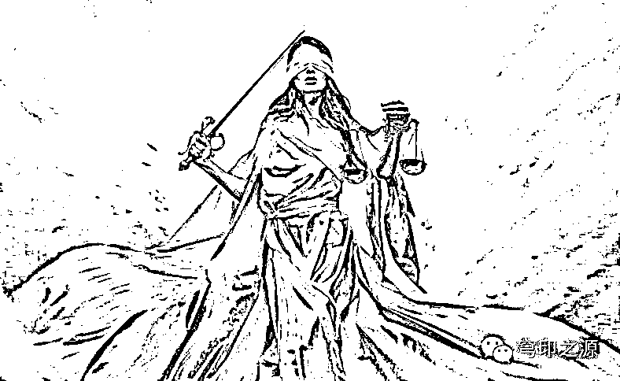

【1】11r 与吉星的友好或瞩目的相位会使盘主拥有众多热爱他的朋友，而凶星反之。

注 4：11r 即“11 宫主”的简写，来自英文的“11th ruler”；“友好”指吉相位（三分相，六分相，吉星的合相），“瞩目”应该指紧密的相位，也就是容许度很小的相位。

【2】11th place（义指不明，可能指宫头或整宫制的 11 宫）为巨蟹，天蝎，双鱼会增强上一论断的表达；白羊，金牛，天秤，射手，摩羯，水瓶会削减 1/4；而双子，狮子，处女则会削减 1/3。

注 5：很明显第一条论断提到的三个星座是水象星座；第三条论断提到的三个星座都是贫瘠星座（Barren Signs）；剩余的都在第二条论断中被提到，而这些星座中，除了天秤和水瓶都是兽性星座（Bestial Signs），而白羊，天秤，天蝎，摩羯，水瓶都是暴戾星座（Violent Signs），天蝎是水象的因而得到了赦免，其它的一个也逃不掉......（其实上述注释主要是脑洞......原文没有提到这些啦......）；另外，在希腊占星的文献中，一个星座就是一个 place，而希腊占星使用整宫制，是星座与宫位重合的分宫制，11th place 就可以指第 11 宫和这个宫位所重合的星座，但具体如何使用还是留给读者去思考了。

【3】若吉星与 11r 无相位，则应考量 11r 和定位星。

【4】若是朋友点和定位星都被良好定位，那么朋友就能够为盘主带来益处。

 若金星状态良好且被良好定位并与上升点或上升守护或 11 宫头或 11r 形成良好相位，那么盘主则有众多带来益处的朋友，且多数是女性。

注：这是因为金星先天象征女性。

金星的定位星象征朋友具体带来的好处，区间主宰和他们的定位星同理，若是他们状态良好则表明朋友富裕且尊贵。

11r 星曜的特性即表明朋友的特点：

土星 - 老人，奴隶，低级社会地位的人；

木星 - 尊贵的人，主教；

火星 - 王子，冲动的人；

太阳 - 尊贵的人，国王，富裕的人；

金星 - 女性，娘炮；

水星 - 智者，商人，作家；

月亮 - 月亮特性的人（文中未举例）。

上述征象星和他们的定位星若是在固定星座，那么盘主就会有许多爱他的朋友，且有着坚定持久的友情；若是在双体星座（Bicorporeal Signs），那么朋友就不多不少但友谊长存；若是在本位星座（Movable Signs），那么友情就会稍纵即逝，容易反目成仇。

注 6：双体星座即双子，射手，双鱼；这里要注意，最后一条并没有强调朋友点的例外，若是将朋友点考量进去，那么就会与 Treatise 8.2 论朋友点的地方冲突。

然后博纳提引用波斯占星师乌玛·提巴里（Umar Tabari 或 Omar Tiberiades）的《本命占星三书》（Three Books in Nativities）的论述：

若上升点的宫神星是凶星且伤害 11 宫的宫神星，那么厄运将会从盘主降临到朋友身上；反之，则给出相反判断。若这些征象星之间相互使对方幸运，那么就给出好事和尊重的判断。若 11 宫主和 11 宫不产生相位，且金星和朋友点皆未被接纳，那么盘主就是个没朋友的人，自娱自乐，自嗨能力爆表。若吉星落入 11 宫，那么盘主就会有好的，土豪的朋友；如果吉星落入 12 宫则更是如此，因为 12 宫是 11 转 2 宫，意为“朋友的财”；若是凶星落入 11 宫，那么盘主就会有坏的，不和谐的朋友。

下一篇穹印之源将结合案例从本命盘实例分析朋友关系，前提是推送君不犯懒癌：）希望大家多多支持公众号，长按二维码关注我们~

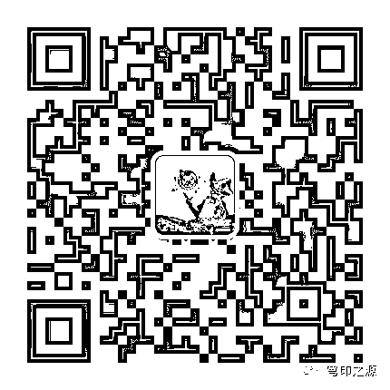

# 圣杯七的抉择

> 原文：[`mp.weixin.qq.com/s?__biz=MzI5NTM0MzAzNg==&mid=2247483666&idx=1&sn=d3752d8850694e31cf2b835601997cb3&chksm=ec5447c1db23ced779a127192e43576788bd03690ab8302f16ac495941fe440e718968055b4f&scene=27#wechat_redirect`](http://mp.weixin.qq.com/s?__biz=MzI5NTM0MzAzNg==&mid=2247483666&idx=1&sn=d3752d8850694e31cf2b835601997cb3&chksm=ec5447c1db23ced779a127192e43576788bd03690ab8302f16ac495941fe440e718968055b4f&scene=27#wechat_redirect)

Robert Place 说过，这张牌中所有的选择都带有自负和以自我为中心。这张牌中最关键的圣杯是蒙上面纱的那个杯子，我们应该选择的是蒙上面纱的高我，但当我们被其他自我中心的选择吸引而分心的时候是看不到的。圣杯 7 这张牌是金星落在天蝎座。金星是我们重视和热爱的，但金星在天蝎座是失势的，对于金星不利，所以我们重视错误的东西——这就是说这并不是真正的胜利，而是幻想中的胜利。

# 每日神秘学小语

> 原文：[`mp.weixin.qq.com/s?__biz=MzI5NTM0MzAzNg==&mid=2247483671&idx=1&sn=f2b28803da490ff67f05a2a2e53708fa&chksm=ec5447c4db23ced2256bbb5b9c53a7d54f8332ee2f434e0cfe0540541eb345351af615c483e3&scene=27#wechat_redirect`](http://mp.weixin.qq.com/s?__biz=MzI5NTM0MzAzNg==&mid=2247483671&idx=1&sn=f2b28803da490ff67f05a2a2e53708fa&chksm=ec5447c4db23ced2256bbb5b9c53a7d54f8332ee2f434e0cfe0540541eb345351af615c483e3&scene=27#wechat_redirect)

“不具有数字的那张牌经过每一张有数字的牌，并在每一张中变化。”

                                                          ——A.E.韦特《纸牌占卜指南》

**牌图来自 The Fairy Tale Tarot by Lisa Hunt*

# wicca 中的元素

> 原文：[`mp.weixin.qq.com/s?__biz=MzI5NTM0MzAzNg==&mid=2247483701&idx=1&sn=dcbbbb32733b5f48374ef76736c54427&chksm=ec5447e6db23cef0d13b31841388724b687234912e902db620ca99fee874f3357de78904c258&scene=27#wechat_redirect`](http://mp.weixin.qq.com/s?__biz=MzI5NTM0MzAzNg==&mid=2247483701&idx=1&sn=dcbbbb32733b5f48374ef76736c54427&chksm=ec5447e6db23cef0d13b31841388724b687234912e902db620ca99fee874f3357de78904c258&scene=27#wechat_redirect)

当我很年轻的时候，我在学校看过许多的记录片。在那些天，有人宣布一部电影要被放映时，通常会被认为是中断了“真正的”学业。这些时候，我会在 Walter Cronkite 告诉我们“你们在这里”，或者是毛球在颜色缤纷中吃其他东西的时候打瞌睡。【别问我这什么意思，原作里就是这么写的……】

 但是，一些电影还是很有趣的。并且我会很深入的去观察河流，山脉，火山，海洋和气候。

 我记得这样一部电影。在描述被河流侵蚀的峡谷生物后，屏幕里被险峻嶙峋的峭壁和壮观的风化山脉充满。“看元素们是如何雕刻这些山脉的（See how the elements have carved these hills）”，解说员是这样说的。

 那就是我要介绍的元素。自然地，那个解说员谈到了风，水和太阳，以及气候形态和转变这片风景的方法。但是“elements”这个单词已经永久的印在了我的脑海里。

 很多年以后，我发现了这些术语的起源。

 我学习到，元素要超出气候。它们被认为是宇宙的四种创造性能量。这个想法，在很久以前就被提出，并且在古希腊被精炼，依旧被诸多的魔法师所接纳。

 我给自己这本书命名为 Earth，Air，Fire and Water 在元素之后。在一些方面，仪式包含了与这四种宇宙的能量相关联。这一章会包括关于每一种四元素的简短讨论，会包括它们的基本性质，关联工具，符号象征，仪式种类，和一些其他的魔法讯息。我将这些内容都控制的很短，是因为最好的认知它们的方法是和这些元素一同运作（仪式）。

 对于人类的生命每一种元素也是必要的。所有的都是有积极与消极的方面，并且每一种的起效都是作为其他运作的检查。地元素若是没有了水元素的滋润，没有火元素的温暖，没有气元素的围绕，那很可能我们的星球就会是一片物种稀缺的星球。四元素在一起和谐的运作着，创造与支撑着生命。

 在阅读完后面的探讨后，记住四元素既表现在物理形态（例如一杯泥土），也可以是未呈现的，非物质形态。此外，所有的元素是从阿卡莎（akasha）来的，akasha 是一切能量的根源，会在本书的最后一章进行探讨。

 【译者注：akasha 为第五元素，不同体系可能第五元素的称呼有些不同，有些里面是被称作“Spirt” 译作灵元素。akasha 这个版本是 Scott 作品中的版本。】

*本文内容由长歌自译，节选自《Earth，Air，Fire and Water：more techniques of natural magic》by Scott Cunningham

# 巫师日志 6.21

> 原文：[`mp.weixin.qq.com/s?__biz=MzI5NTM0MzAzNg==&mid=2247483701&idx=2&sn=2e46ee9818a5ee18994756a3240a069c&chksm=ec5447e6db23cef0c576626d8a49cc885977d86e7d355b9a59939f48febe7f94a90ff8f71489&scene=27#wechat_redirect`](http://mp.weixin.qq.com/s?__biz=MzI5NTM0MzAzNg==&mid=2247483701&idx=2&sn=2e46ee9818a5ee18994756a3240a069c&chksm=ec5447e6db23cef0c576626d8a49cc885977d86e7d355b9a59939f48febe7f94a90ff8f71489&scene=27#wechat_redirect)

2nd♐️
月亮 7:02am 空亡
7:02 满月
月亮 7:55am 进入♑
太阳 6:34pm 进入♋️
颜色：乳白色
播种日
强的日月
太阳进入巨蟹座
夏至 litha

# 七政四余二三说

> 原文：[`mp.weixin.qq.com/s?__biz=MzI5NTM0MzAzNg==&mid=2247483714&idx=1&sn=9a1680b1cfa7753430e5a734cccd58d3&chksm=ec544791db23ce87624d692369a997cd3382aae0e7d6537ea6b190f9774a6996309e5f0e0663&scene=27#wechat_redirect`](http://mp.weixin.qq.com/s?__biz=MzI5NTM0MzAzNg==&mid=2247483714&idx=1&sn=9a1680b1cfa7753430e5a734cccd58d3&chksm=ec544791db23ce87624d692369a997cd3382aae0e7d6537ea6b190f9774a6996309e5f0e0663&scene=27#wechat_redirect)

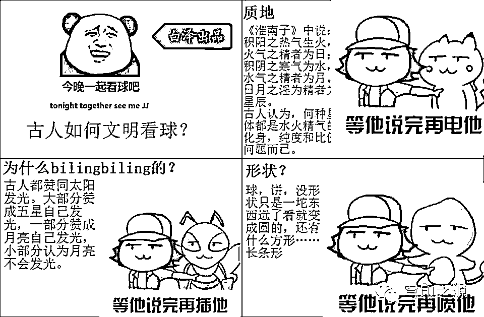

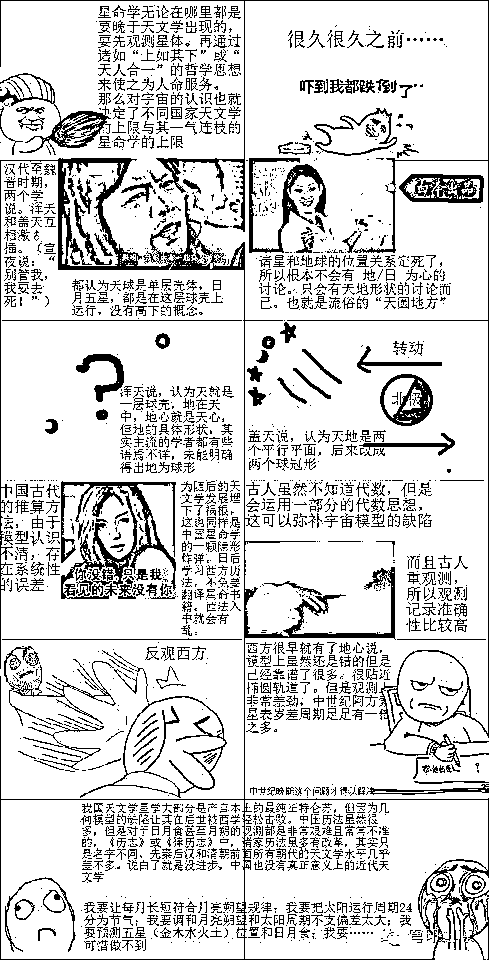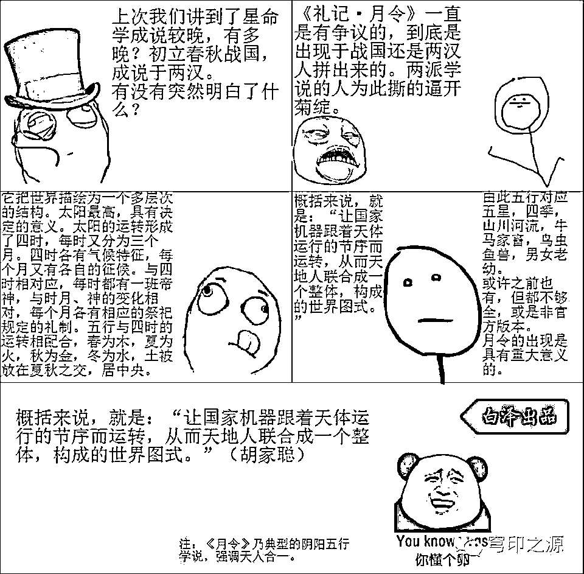

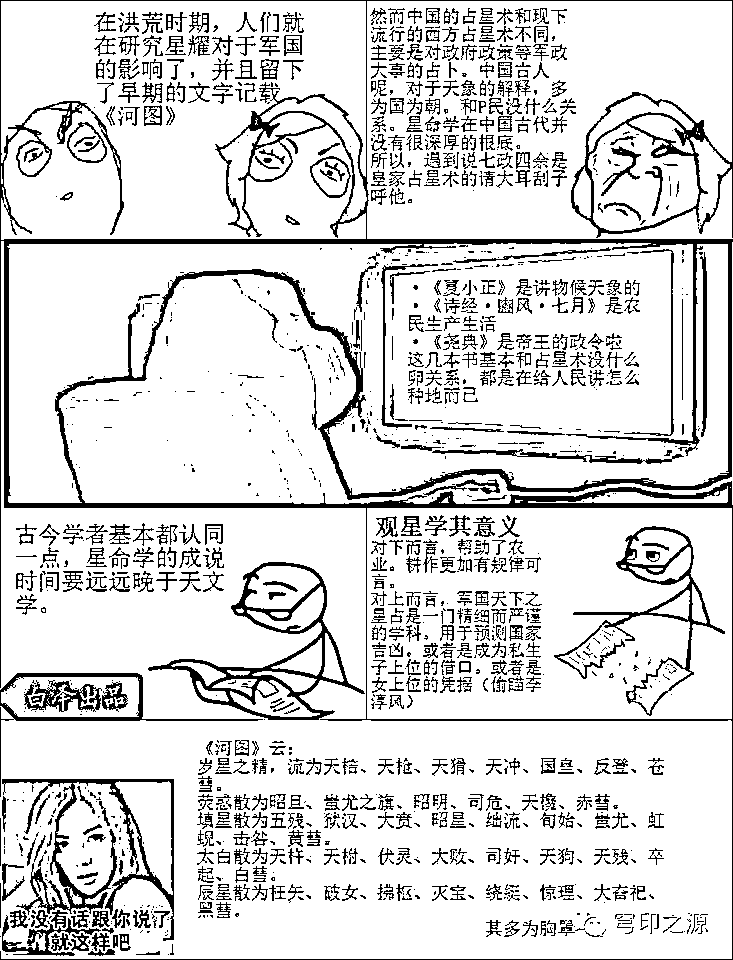
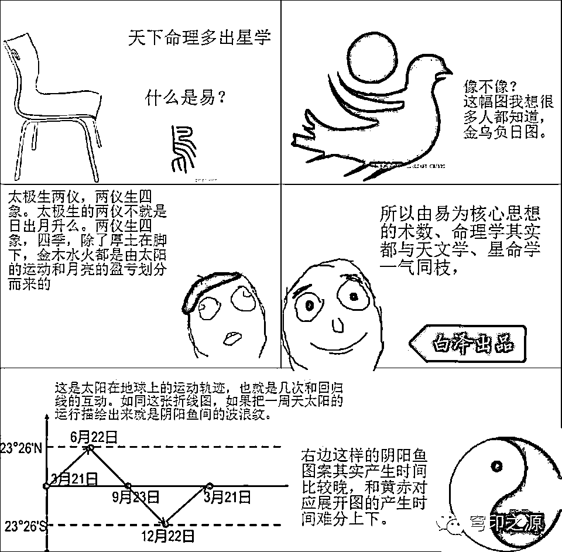

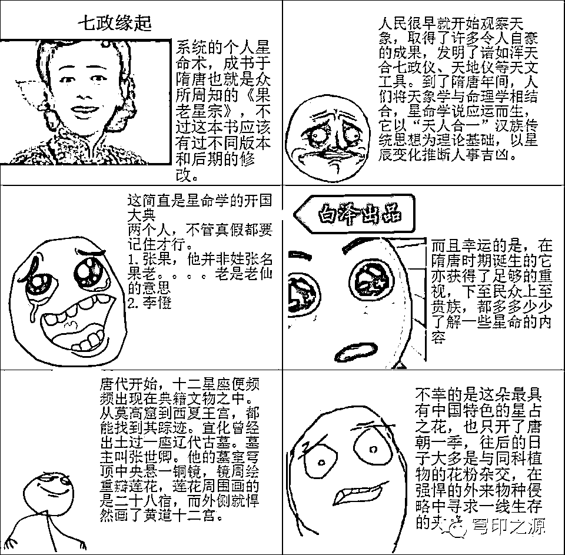

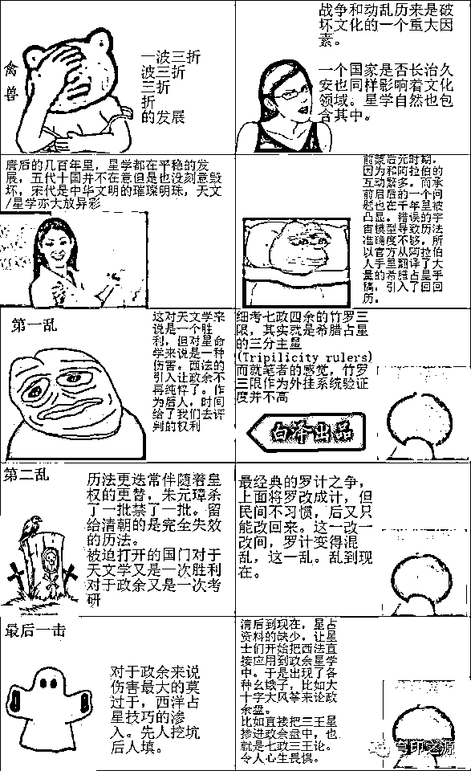

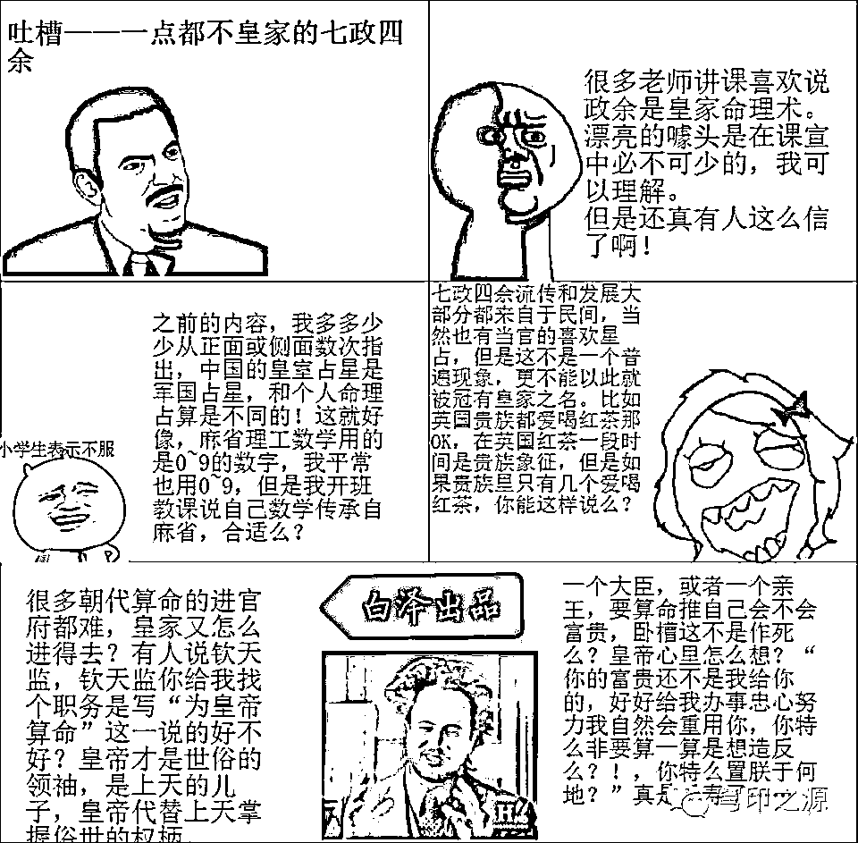

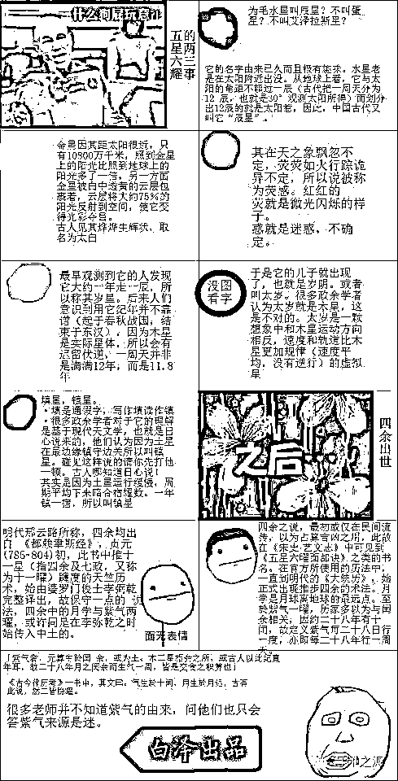

白泽 6 月 20 日讲课记录漫画版

欢迎加入我们的 QQ 群：524739721，定期有免费公开课哦~

# 巫师日志 6.22

> 原文：[`mp.weixin.qq.com/s?__biz=MzI5NTM0MzAzNg==&mid=2247483714&idx=2&sn=3985f25da6c262352304da84184c6475&chksm=ec544791db23ce873ffc2958135f54cfd960b41176fc4a8af8dac4fe152fe4731ffc39e6fe0d&scene=27#wechat_redirect`](http://mp.weixin.qq.com/s?__biz=MzI5NTM0MzAzNg==&mid=2247483714&idx=2&sn=3985f25da6c262352304da84184c6475&chksm=ec544791db23ce873ffc2958135f54cfd960b41176fc4a8af8dac4fe152fe4731ffc39e6fe0d&scene=27#wechat_redirect)

3rd♑

智神星 9:21am 逆行 

颜色：黑

播种日

# 消除负能量的 wicca 小仪式

> 原文：[`mp.weixin.qq.com/s?__biz=MzI5NTM0MzAzNg==&mid=2247483715&idx=1&sn=432d98ae8e91d2e1022775e17fcd3478&chksm=ec544790db23ce8612dc92f217d96a2eedcf289ce9409c2c33b9c787f50b1e85fd9403edb80f&scene=27#wechat_redirect`](http://mp.weixin.qq.com/s?__biz=MzI5NTM0MzAzNg==&mid=2247483715&idx=1&sn=432d98ae8e91d2e1022775e17fcd3478&chksm=ec544790db23ce8612dc92f217d96a2eedcf289ce9409c2c33b9c787f50b1e85fd9403edb80f&scene=27#wechat_redirect)

关于何为 WICCA，作者在自己的书中也说过 WICCA 是多元的和多样化的，与其他的宗教一样，WICCA 的灵性体验是个人与神灵独享的。WICCA 也是一种巫师的信仰，围绕着崇拜以母神（Goddess）和父神（God）形象显化的自然。

 【消除负面能量】

1.在自己的祭坛或者神龛前（若没有，找一个干净的地方，事先打扫干净即可），拿出一张纸，写下例如自己犯过的一些错误这样的话语，所写的错误可以包括：自己的负面能量，恐惧，过度的放纵，允许别人主导了你的生活，或者是那些不考虑你感受的人对你的连续迷恋等等。

 2.写的时候，视觉化（想象）你正在过去做这些事情，而不是现在已经做过了这些事情。

 3.写好，点燃一根红色的蜡烛，然后拿着这张纸在烛火前用烛火点燃，扔进大釜【巫师或女巫放在祭坛上的一种器具】或者任何一种耐热的容器里。

 4.接下来，你可以用很大的声音喊出来——或是简单的对自己说，这些过去的负面东西已经不再属于我们人生的一部分。

 5.视觉化（想象）自己的未来生活已经除去了这些有害的，限制性的，被抑制的行为。如果需要，可以念几遍咒语（对 wicca 不了解的人可以略过咒语这步，咒语原作也未给出是哪一种，对 wicca 有所钻研的人会自由选择咒语），你也许可以选择在一个月亏的夜晚，做这个仪式来结束影响自己生活的负面东西。

*本文内容由长歌自译，节选自《Earth，Air，Fire and Water：more techniques of natural magic》by Scott Cunningham

# 巫师日志 6.23

> 原文：[`mp.weixin.qq.com/s?__biz=MzI5NTM0MzAzNg==&mid=2247483715&idx=2&sn=23c1090df7e3631f06a1607569739412&chksm=ec544790db23ce86e626fed31754286db30b4241cce4083f2066d51e2bb437c7f66807c24549&scene=27#wechat_redirect`](http://mp.weixin.qq.com/s?__biz=MzI5NTM0MzAzNg==&mid=2247483715&idx=2&sn=23c1090df7e3631f06a1607569739412&chksm=ec544790db23ce86e626fed31754286db30b4241cce4083f2066d51e2bb437c7f66807c24549&scene=27#wechat_redirect)

3rd♑

月亮 4:57am 空亡 

婚神星 4:01 顺行 

月亮 4:08pm 进入♒️

颜色：火彩

# 冥想前的呼吸

> 原文：[`mp.weixin.qq.com/s?__biz=MzI5NTM0MzAzNg==&mid=2247483716&idx=1&sn=d0c28dfe747c0ae0a816daafb644c304&chksm=ec544797db23ce817a66f1e866279fa62ffd1c2804acf1ab8c1b1277983177d7147efea7f373&scene=27#wechat_redirect`](http://mp.weixin.qq.com/s?__biz=MzI5NTM0MzAzNg==&mid=2247483716&idx=1&sn=d0c28dfe747c0ae0a816daafb644c304&chksm=ec544797db23ce817a66f1e866279fa62ffd1c2804acf1ab8c1b1277983177d7147efea7f373&scene=27#wechat_redirect)

呼吸是我们一生中都持续不断的无意识举动。但是在魔法与 WICCA 中，呼吸还可以成为一种训练我们肉体进入意识转换形态的工具。

 为了正确的冥想，你必须先正确的呼吸。这是最基础的训练，并且很幸运的是，这同样是最简单的。

 深呼吸技巧需要完全运用到我们的肺部和横膈膜。横膈膜的位置是位于肋骨下方大约两个手指宽度的地方。当你吸气时，会把这里推出去。注意一下你最多可以呼入多少的空气。

为了呼吸训练，要选取一个舒适的姿势，无论你是坐着还是躺下（深呼吸是任何一种姿势都可以去完成的）。稍微放松一点你的身体。从你的鼻子开始吸气，并且慢慢的数数“1，2，3，4 或 5”——怎么舒服怎么数。记住要允许空气充满你的横膈膜，同样也要充满你的肺部。摒住气，然后以同样缓慢的频率将空气呼出。

重复上述过程几分钟，然后逐步的放慢呼吸频率。不要让自己憋气憋的难受超过了舒服的度。这个吸气，摒气，和呼气应该被控制住，要平静，不能紧张。

 做这些的时候，要关注自己的呼吸过程。当你吸气的时候，是吸入了爱，健康与平静，或许你可以视觉化（这个后面会翻译到的，有专门的方法，此处可理解为想象）这些积极的能量是充满金色小点的空气。在呼出气的时候，我们呼出了憎恨，疾病，愤怒，也或许可以视觉化自己肺部本来充满的黑色烟雾被吐出。

 氧气是生命生存中必不可少的部分。正确的呼吸可以让你成为一个更好的人和一个更好的 WICCA 巫师。深呼吸是每一次的崇拜仪式与巫术魔法活动前要做的步骤，同时也是专注意识与视觉化的练习。当你感到无比愤怒的时候，请做深呼吸。呼出狂怒，吸入平静。它通常都是可以有效果的——只要你愿意去做。

 每天都要练习深呼吸，并且逐步的增强你摒气的能力。如果可以，找机会去海边或者去一片森林里，远离我们被污染的城市，去练习深呼吸是很明智的。在大自然中做深呼吸，不仅仅可以更加的平静——同样也更加的有益于健康。

# 巫师日志 6.24

> 原文：[`mp.weixin.qq.com/s?__biz=MzI5NTM0MzAzNg==&mid=2247483716&idx=2&sn=e40d483677f3f98e6896dee7345a67c1&chksm=ec544797db23ce814be1a0592cfaea839286013cbdfc55fba8d16bae173328dcaed242c0c00d&scene=27#wechat_redirect`](http://mp.weixin.qq.com/s?__biz=MzI5NTM0MzAzNg==&mid=2247483716&idx=2&sn=e40d483677f3f98e6896dee7345a67c1&chksm=ec544797db23ce814be1a0592cfaea839286013cbdfc55fba8d16bae173328dcaed242c0c00d&scene=27#wechat_redirect)

3rd♒️

月亮 11:48am 空亡

月亮 10:30 进入双鱼座

颜色：玫瑰色

收获日

# wicca 中的冥想方法

> 原文：[`mp.weixin.qq.com/s?__biz=MzI5NTM0MzAzNg==&mid=2247483717&idx=1&sn=5891acc67a302b383e64048c1a8e4144&chksm=ec544796db23ce8070c0ddb62fd1a9fa0a8981578b32ab5715c894bc031351bb55f9ab62c5eb&scene=27#wechat_redirect`](http://mp.weixin.qq.com/s?__biz=MzI5NTM0MzAzNg==&mid=2247483717&idx=1&sn=5891acc67a302b383e64048c1a8e4144&chksm=ec544796db23ce8070c0ddb62fd1a9fa0a8981578b32ab5715c894bc031351bb55f9ab62c5eb&scene=27#wechat_redirect)

冥想是一门达到完全放松很重要的技艺。我们中很少有人可以从压力与担忧中稍微释放一刻，因此冥想是一种很受欢迎的好方法，让我们从日常生活的担忧和挫折中解放。更重要的是，这也是一个我们同母神父神沟通的宁静时刻，放松自己的显意识，把握我们的潜意识。冥想通常是每一个魔法巫术与崇拜仪式之前的步骤。

坐着是冥想的理想姿势，尤其是对那些会在练习时睡着的人来说。

坐在一把有靠背的椅子上，如果有必要，用一个枕头支撑你的下背处。你的下巴应该与地面平行，闭起眼睛，背部挺直，双手放在你的膝盖上，手掌朝上，手指放松。在这样一个姿势下，你应该感到舒服与放松，脊椎要挺直，上半身要挺直。如果你姿势不良，在这个姿势变的舒适起来前，需要一段时间。坚持住。

 先深呼吸几次。放松，放空。视觉化（想象）你体内日常生活中的压力和担忧，随着你的呼吸离开你的身体。在椅子上放松。

现在，打开你的意识。允许自己的显意识被接纳与敏锐。与神灵沟通。在脑海里反复各种符号象征。如果你愿意，可以吟唱一位母神与父神的名字，或者几个。这是一种进入 twilight world 的完美途径。

 谨慎选择冥想的时间与地点。灯光应该昏暗；烛光是最好的。如果可以，你可以点白色或者蓝色的蜡烛。点一些熏香也是极好的。不过在深呼吸的时候有太多的烟会导致一些问题，可以深呼吸之后点。

 在每一次冥想过后，要立刻在你的镜子之书（wicca 巫师用来记录各种经验体验想法的本子，可以是带锁的日记本或者是活页本）上记录下你看到的所有图像，想法和感觉。

*本文内容由长歌自译，节选自《Earth，Air，Fire and Water：more techniques of natural magic》by Scott Cunningham

# 巫师日志 6.25

> 原文：[`mp.weixin.qq.com/s?__biz=MzI5NTM0MzAzNg==&mid=2247483717&idx=2&sn=79d9c39165f96f042332f9c4c794fdb7&chksm=ec544796db23ce8081157b7a060a78f0c98403a44d6bfab2be06fcd04f8a525bf254bbd4d1f1&scene=27#wechat_redirect`](http://mp.weixin.qq.com/s?__biz=MzI5NTM0MzAzNg==&mid=2247483717&idx=2&sn=79d9c39165f96f042332f9c4c794fdb7&chksm=ec544796db23ce8081157b7a060a78f0c98403a44d6bfab2be06fcd04f8a525bf254bbd4d1f1&scene=27#wechat_redirect)

3rd♓️

颜色：蓝

播种日

# 塔罗读牌 21 式——第 0 式 跨出那一步

> 原文：[`mp.weixin.qq.com/s?__biz=MzI5NTM0MzAzNg==&mid=2247483720&idx=1&sn=53ac7100264f402507f7745d1dc314f9&chksm=ec54479bdb23ce8d7d2d6ba8fe7d05ead8d69079c11a70f2d4cf29885c76182d0fbcc3b5fa3a&scene=27#wechat_redirect`](http://mp.weixin.qq.com/s?__biz=MzI5NTM0MzAzNg==&mid=2247483720&idx=1&sn=53ac7100264f402507f7745d1dc314f9&chksm=ec54479bdb23ce8d7d2d6ba8fe7d05ead8d69079c11a70f2d4cf29885c76182d0fbcc3b5fa3a&scene=27#wechat_redirect)

“不具有数字的那张牌经过每一张有数字的牌，并在每一张中变化。”

                                                          ——A.E.韦特在《纸牌占卜指南》的“灵魂的发展”中说到

这一部分是 21 式读牌法的起始，也是愚者的包裹中背着的“转换的秘诀”。这是一个让你像愚者（或 0 号牌）一样打开地，信任地，以玩乐的精神学习这些方法。

愚者告诉你，通过对预料之外事物的打开，任何时间直觉都可能出现。你可以一个任何事情都能发生的非理性之处畅游。这是不同于日常中的，更深层次觉知和专注意识的领域。愚人正仅仅经历着当下，而不是思考着这意味着什么，且没有观念或偏见。

作为没有编号的牌，愚人无处不在又处处不在。它有时与没有发音标记的希伯来字母א关联，代表无声的呼吸——进出的吸气的呼气的存在。现在，平均地深呼吸，用它们来连接你脚下的大地。想象你自己从脚底与头顶吸气，给你身体中的每个细胞带来氧气然后进入你的心脏。敞开心胸，呼气并与你周围的世界连接。平均的深呼吸给你的血液和大脑带来更多的样子，稳固你的呼吸和心跳，并帮助你集中于你现在在做什么。用你的呼吸使你集中于此时此地，隔离那些顾虑。你的紧张不安会消除，你的个人个人疆界将展开。这使你像愚人一样准备好，自然灵活地向任何心灵上或物质上的方向移动。它解放你使你跃进牌的领域中。

做完这个练习之后，你将发现牌变得更加有细节，多面并充满生气。你将意识到人与强烈幸福感之间的连接。如同威廉·布莱克注解的，保留着愚蠢的愚人成为真实的智慧。

本文由镜月自译，译自《21 ways to read a tarot card》，转载请联系译者。

# 【古典占星论友情·下】行星的朋友交易 play（excuse me？）

> 原文：[`mp.weixin.qq.com/s?__biz=MzI5NTM0MzAzNg==&mid=2247483724&idx=1&sn=daea8c79d832eeb43ae9a31c3bd6ff77&chksm=ec54479fdb23ce89a824aff30045dedc8edea13012abc359a766fd18e217650a5f4800f2f04b&scene=27#wechat_redirect`](http://mp.weixin.qq.com/s?__biz=MzI5NTM0MzAzNg==&mid=2247483724&idx=1&sn=daea8c79d832eeb43ae9a31c3bd6ff77&chksm=ec54479fdb23ce89a824aff30045dedc8edea13012abc359a766fd18e217650a5f4800f2f04b&scene=27#wechat_redirect)

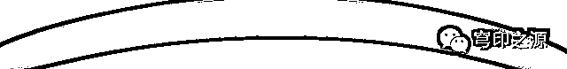讲道理嘛，朋友咦，这标题好像有点污？（咳咳咳，不管了(⊙﹏⊙)b）原文再续，书接上一回。

上回说到先贤 Bonatti 的技法，本篇则和大家一起结合案例来剖析朋友方面的主题，并加入部分其他先贤的论断方法。

现实中，也许有人会因为人际关系的问题而烦恼，并将原因都归咎在自己身上。但朋友这种关系是独木不成林的。一般来说，问题的缘由双方都或多或少地有责任，也无须过分自责。以下摘自 Cecily 前辈翻译的本杰明·戴克（Benjamin N. Dykes）所著的《当代古典占星研究》中的一段文字或许会有一定的启迪作用。*“...传统上，这个宫位是讨论朋友与人际关系，但是并非仅是我们对待朋友的态度，而是朋友与人际关系的真实经验。一般而言，每个人当然都珍惜友谊，但是人们实际所经验的人际状况，以及会认识结交的朋友，并非全然由他们自己的想法所决定。有些人因为个性好相处，而拥有关系持久的友谊；但有些好相处的人，却又困难且不稳定的人际关系，这其实与当事人的个性并没有直接关联。”*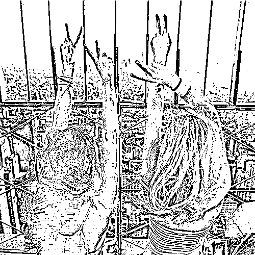这段文字可能显得有点宿命观色彩，然而笔者却认为这有助于我们以古典占星的世界观客观地看待命盘。为了方便说明，不妨以瑞士心理学家卡尔·荣格（笔者的男神，写这篇案例激动得笔者把昵称都换成了“共（收）时（缩）性百万老肉丸”（那是什么鬼！））来具体说明。行星のpy 交易！在此先援引 John Gadbury 在 The Doctrine of Nativities and Horary Questions（星命与卜卦之论典）第二十二章 第一节中的一条论诀，有助于在论断之先，建立大局观：* You ought to have regard to the Cusp of the eleventh House, the Lord thereof, the Planet or Planets posited therin; and according to their Configuration with the Lord of the Ascendant, or Moon; judge of the strength or weakness of the Natives Friends.**“你应当考量十一宫宫头，其主星和坐落其中的星曜；并根据它们与上升主星或月亮的配置结构，论断盘主的朋友征象是强是弱。”*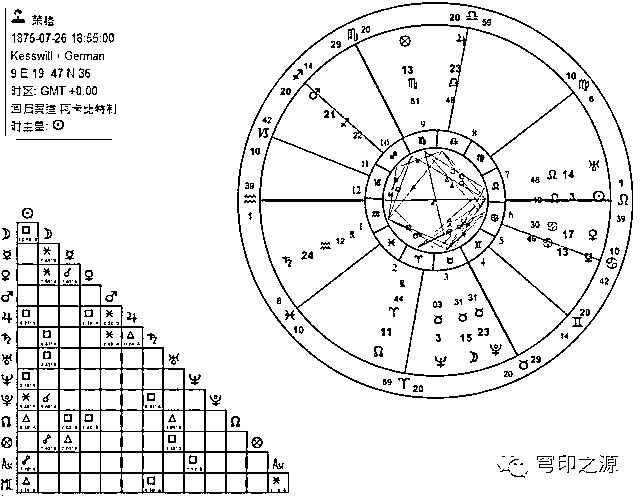

宫内有星先看星，尤重宫头星。阿卡比特制下，火星坐十一宫头，游走而停滞（第二次停滞）。火星被十一宫主木星接纳，而以六分相位入相落在命宫中的命主星土星。次看十一宫主星，为木星，在九宫头，与金星互容，与十一宫头的火星以六分相接纳，以三分相的入相位被土星接纳，而与太阳相刑（太阳也是十一宫的三分主星之一）。朋友点落于双鱼座 29°54′，定位星为木星。与十一宫及命宫相关的主星高度紧密相互联系，互有支持，整体关系相对偏和谐但略有瑕疵。

接下来就可以开始抽丝剥茧了。虽然火星与其他星体的互动尚可，但作为一颗天然凶星，游走而停滞，负面的效应无法完全消除，易于产生裂痕、不和与冲突。再者见太阳与上升紧密对分，而太阳是十一宫的第一个三分主星，与落在九宫的朋友主星木星相刑。九宫是信仰，是学术，也是远行。而得时入庙的太阳更是一种权威的征象。荣格尚未成名之前，与弗洛伊德有长达六年的交情，亦师亦友，后者甚至想将其作为得意门生传承衣钵，这也是朋友主星在代表学术、教育的领域展开的表现。然而火星与太阳在这个盘的凶性体现了荣格与心理学的权威人物之间的分歧与裂痕，最终荣格与弗洛伊德在 1913 年断绝交情，分道扬镳。

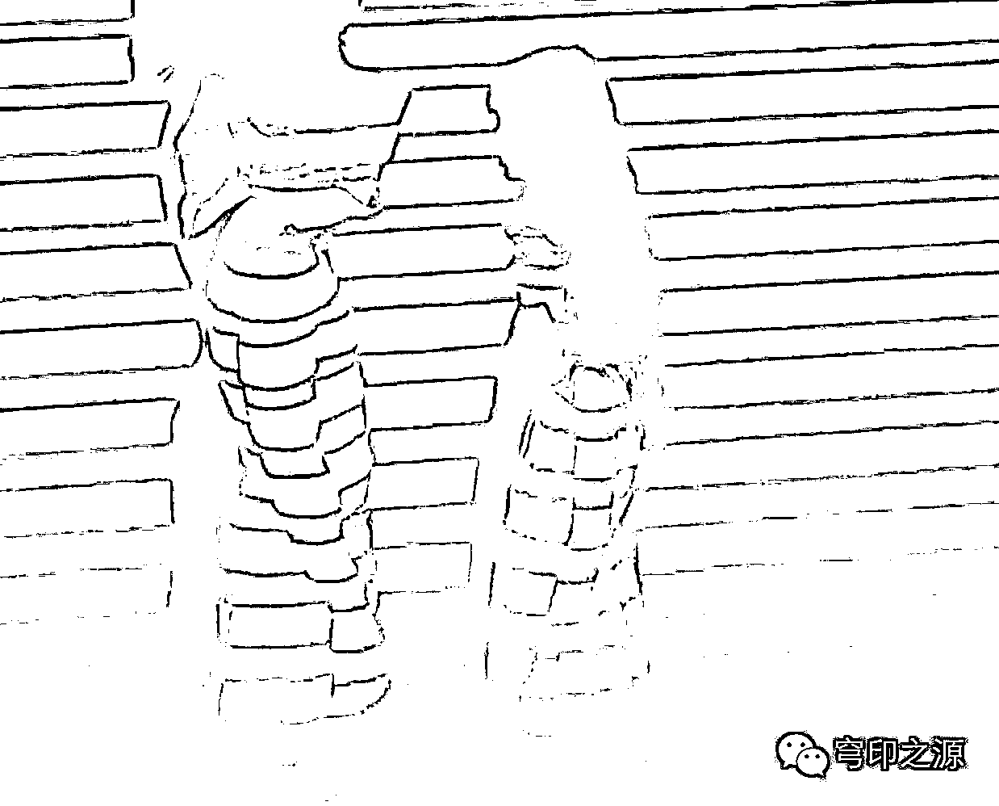

嗯？贵盘真乱十一宫主星勾连的星曜的先天后天属性某种程度上也会体现我们容易与哪类人接触。木星互容在六宫的金星一方面可以诠释荣格与女性（包括病人）的密切和融洽的关系，这一点甚至到了来往过密的程度，典型的便是他与萨拜娜的交情。在给萨拜娜进行心理治疗时，移情的作用甚至发展成了爱情。关于弗洛伊德、荣格与他们的女病人之间的恩怨纠葛，有兴趣的读者不妨可以看一下与心理学相关的一部电影：《危险方法》。我就只想说...嗯，贵盘真乱。金星也是九宫主星，在远离角宫的果宫位置互容木星，强化了 11 与 9 的关系，也能通过远行来让荣格接触到更多的朋友，或是与友同行。比如，在 1937 年 12 月，荣格离开苏黎世与朋友 Fowler McCormick 一起同游印度。反过来，印度的哲学（9 宫）进一步深化了他在心理学上对象征与潜意识在生活中的作用的思考。独乐乐？众乐乐？
虽说“每个人当然都珍惜友谊”，然而还是不排除有喜欢独乐乐的人。这在 Bonatti 传承的技法中，以十一宫主是否与十一宫成相（有可能是指整宫相位），金星和朋友点是否被接纳或说是与定位星成相（也有可能是整宫相位）来参考，十一宫主星即便有如朋友宫的主人，相位的联系使其能更好地支持与帮助十一宫事项的运作，同样的道理也可以用在金星和朋友点上。当以上三点均不成相，他们的实际表现可以是自给自足，自娱自乐，不需要对外寻求过多的朋友关系；或是营造距离感，变成存在感稀薄的小透明（相位 aspect 的本义也与代表“看”的词根 spect 有关，相位也叫 behold，不被看见的可以是在暗处的小人，也可以是不为人察觉的存在）。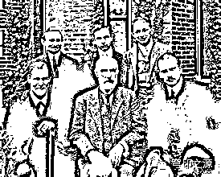右下就是笔者男神了，啊啊啊！（卒）显然，除了木星作为朋友点的定位星并没有以整宫相位接纳朋友点。这种问题并不存在于荣格星盘中，尤其掌管人际交往与愉快的金星互容了定位星月亮，并进一步互容木星。十一宫主木星也以六分相位紧密成相十一宫头。而我们更加可以关注命主星以逆行入相三分于十一宫主星木星，荣格也会主动地“接纳”朋友，但会带着具有土星在水瓶的特点，以理性而有选择性的态度交友，而不是盲目扩展交际圈。当然，看到自己的盘时还是要灵活论断~变成对号入座也不好哦。求关注~求关注~求关注~重要的话说三遍~~~

# 【扑克占卜】黑桃皇后的故事会

> 原文：[`mp.weixin.qq.com/s?__biz=MzI5NTM0MzAzNg==&mid=2247483733&idx=1&sn=a07c5c21a5b389fe97cf947c9694aef8&chksm=ec544786db23ce902abe7b376f592749e4be3f2db1993473a4ed4ab9edecbe26cb86a4961ca1&scene=27#wechat_redirect`](http://mp.weixin.qq.com/s?__biz=MzI5NTM0MzAzNg==&mid=2247483733&idx=1&sn=a07c5c21a5b389fe97cf947c9694aef8&chksm=ec544786db23ce902abe7b376f592749e4be3f2db1993473a4ed4ab9edecbe26cb86a4961ca1&scene=27#wechat_redirect)

The Queen of Spades

古往今来，东西中外，占卜的方法多样，工具多样，觉得抽塔罗有点麻烦？不妨可试试扑克，毕竟万物皆可占卜。扑克占卜有源远流长的历史，与塔罗不同的是，按普遍公认的观点来说，扑克甚至可以用于算命，即预测一生的情况。

有资料称，法国大革命时期，38 岁就被送上断头台的法国王妃玛丽·安东瓦涅特（Marie Antoinette），其母亲玛利亚皇后曾在其 14 岁被送去与法国王子政治联姻时，用扑克牌预见了女儿日后的悲剧命运。今天我们就不多谈历史了，如果读者对这个案例有兴趣，可以在后台留言，让推送君择日分享~我们今天主要来关注一下黑桃皇后 The Queen of Spades

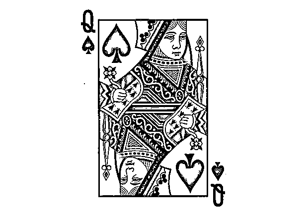**把握象征原型**1

黑桃皇后这张纸牌，向来有许多“昵称”，但声誉一般不怎么好（......）诸如 Black Maria（囚车）和 Old Maid（老处女），它也被认为是卢克雷齐娅·波吉亚（Lucrezia Borgia，1480-1519）的象征。她是意大利臭名昭著的波吉亚家族中的一员，被当时的意大利人揶揄为与其作为教皇的父亲及兄长并列的邪恶三位一体。在维克多·雨果的同名歌剧中，她与几起毒杀事件有关，但实质上从未得到证实。然而真实人物如何，这对扑克占卜并不重要，重要是其抽离出来的人物原型象征（原谅笔者的脑海里蹦出了“春哥”这个词，大雾中），且多数可谓“蛇蝎女人心”，并因此联系上了寡妇，老处女，巫婆等象征（用毒也曾被视为是巫婆常见的手段）。

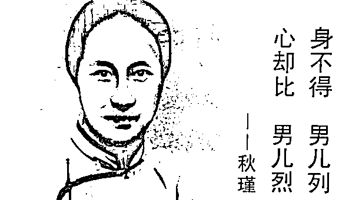

秋瑾的这张肖像是否与黑桃皇后略有神韵上的类同？

当然，这张纸牌也象征了一些历史风评比较正面的人物，比如圣女贞德和代表智慧的雅典娜女神（Pallas Athena），早期法国扑克纸牌的黑桃皇后常有持矛与盾，身披盔甲的女战士特质。很容易发现，这些人物特征都与柔弱的女性形象没有太多关系，反倒是比较强势的烈女子，与军事和领导力关系甚密。熟悉中国历史的朋友，也可以联系武则天和秋瑾等人物象征，深化对这张牌的占卜含义的理解。

2**牌意版本 Versus****Version 1*****A widow, of malicious and unscrupulous nature, fond of scandal and open to bribes.****——Fortune-Telling by Cards,written by Professor P.R.S.Foli*《纸牌命理书》中，解释单牌含义时，将黑桃皇后说成“一个寡妇，生性阴险恶毒而寡廉鲜耻，喜爱散布流言而收受贿赂。”**Version 2**Jonathan Dee 在所著作的 Fortune Telling Using Playing Cards《活用纸牌观命理》里，认为这张牌大体上与失望及孤独的主题相关。想想假如自己遇到恶毒的人从中作梗，失望也就在所难免；而老处女，寡妇等象征与孤独则不无关系。但我们也可以看到，类似圣女贞德的象征给这张牌以一种清心寡欲的含义，尤其在面对逆境时，可以险中求生，而非弱女子之流。命运的不公与强暴，并不能使其低头。也因为这张牌的基调并非和缓，面对拦路的人，它也可以遇鬼杀鬼，遇神诛神。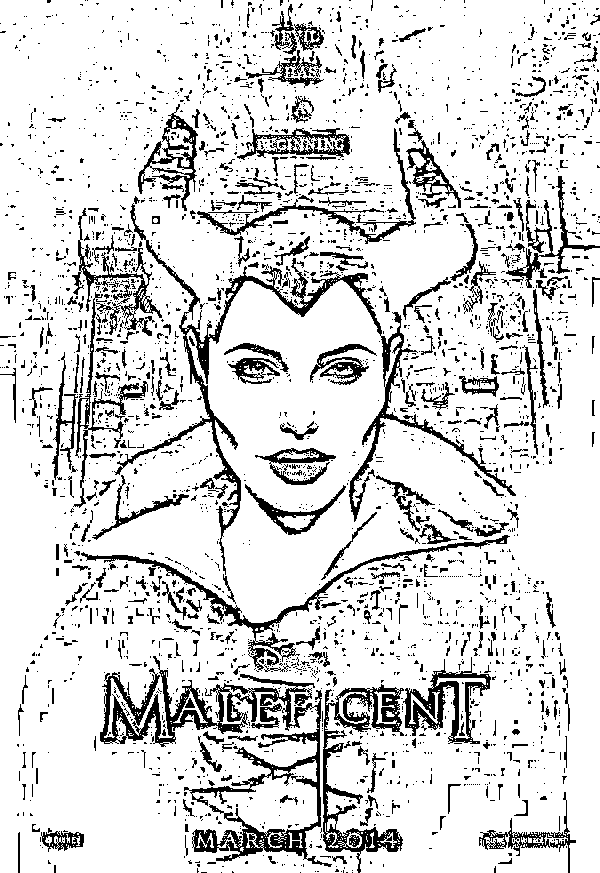要说黑桃皇后有什么颜色基调，笔者想，那便是黑色。黑桃皇后也因此带上了迷人与神秘的色彩，让人难以参透。而其背后也许有着不为人知的情绪创伤，建立了情感上的屏障，那些通过了这道屏障的人，如若真心实意，必能得其真心实意而富有智慧的帮助。反之，如果背叛了这类人，就小心等着被报复吧。如果求问者是男性，此牌出现在开始的三张牌中，黑桃皇后有可能是其母亲的象征牌。**Version 3**
***An aggressive, intelligent, and proud woman. If this card indicates a man, he has the same qualities but he is sneakier, a wolf in sheep’s clothing.***一位好胜心强，智慧而自傲的女性。如果这张牌指示男性，他有着相同的品质但更为卑鄙龌蹉，是披着羊皮的狼。这个版本属于 Tayannah Lee McQuillar 所著的 Rootwork 一书中的体系。**故事会**说了这么多，不如来一个轻松而又沉重的故事会。说轻松...是因为这是笔者搬运的一个案例，而且笔者觉得原著说的案例故事都非！常！迷！信！扯！谈！但并不妨碍我们由此参悟扑克本身的牌义呀。作为以飨读者的一个故事会，大家大可当作娱乐看待。说沉重，嗯，反正是个悲剧？**【黑桃皇后——没有操守的人——丈夫与老妇的奸情】**一位二十四、五岁的少女，父亲是大学研究所所长。她照顾邻家的一位老太太，后来老太太介绍一位青年与她认识。当双方感情发展到谈婚论嫁的地步时，少女前来算命：“这张牌显示，你会被最亲密的友人出卖。你的对象虽然不错，但背后却有恶毒的第三者操纵着他，这桩婚事绝不可答应。”然而，他们还是结了婚，老太太也更加受到女孩的尊敬。丈夫每个月大概出差十天，而老太太也大半个月不见人影。两年后，她终于在一家照相馆看到丈夫与那位老太太穿着旅馆浴衣的合照，照片上的时间正好是丈夫出差的时间。她找征信社调查，证据赫然在握。她的丈夫坦承这段奸情，老太太和公司的老板有一手，而且丈夫靠其关系，才能升迁；老太太介绍婚事成功，唯一的条件就是仍然与她丈夫暗中来往。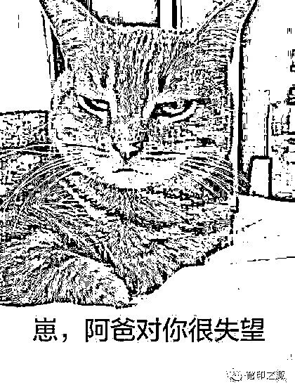

（看完故事会，笔者的心上是堆了上万个羊驼 orz 哈哈哈哈哈哈）

（如果本故事能逗您一笑，也请多多关注我们的公众号，我们力求带给大家更多的干货哦）

# 塔罗月运

> 原文：[`mp.weixin.qq.com/s?__biz=MzI5NTM0MzAzNg==&mid=2247483747&idx=1&sn=dc0f6b3b2ff8ff5e241d2b5131616459&chksm=ec5447b0db23cea6b91f71da7ef85e1166518afdb57087e3c7009c27a5c0b06ec9d610713786&scene=27#wechat_redirect`](http://mp.weixin.qq.com/s?__biz=MzI5NTM0MzAzNg==&mid=2247483747&idx=1&sn=dc0f6b3b2ff8ff5e241d2b5131616459&chksm=ec5447b0db23cea6b91f71da7ef85e1166518afdb57087e3c7009c27a5c0b06ec9d610713786&scene=27#wechat_redirect)

白羊座这个月对于白羊而言会是较忙碌的一个月，尤其是工作方面需要注意劳逸结合，不要过度劳累，建议与人合作分摊工作量。身边容易遇到小人，需小心。爱情方面放下了以前的纠葛，专心发展现在的恋情。
金牛座这个月金牛们做事情容易丢三落四，需要加强条理。本月容易破财，因此于投资不利，事业上需小心抉择，以免造成经济损失。爱情方面在一些时候要注意不能太固执钻牛角尖，以免让另一半内心不爽。双子座这个月的双子总有一颗向前瞻望的心，手头上的事情还不一定完成，就在考虑下一件事情了。工作方面虽然进展不大，但适宜为接下来的下半年做计划。爱情方面容易遇见新桃花，不过你很有可能会犹犹豫豫，踌躇不进。巨蟹座一切都缓慢地进展顺利，就算有些小问题也有能力解决。工作方面踏实肯干，同时愿意帮助别人，容易得到赞赏，但需多与人沟通。爱情方面感情和睦，相处之中充满安全感，建议给另一半准备惊喜，以打破日常一成不变的生活。狮子座这月的狮子会比较消沉，看事情总往悲观的那一面看。虽然周遭事物目前看来不是很好，但是不要忘记自己身后总有退路。工作方面一如既往，并不会有太大的波动，但注意不要因为情绪不好而影响工作。感情方面可能会对另一半失望。处女座本月处女座会比较容易遇见让人意外的事情，导致心情不好，所以工作的时候有些心不在焉的。事业方面需注意加强与合作伙伴的联系和沟通，注意不要因意见不合发生争吵。感情方面易嫉妒或受到打击。天秤座本月天秤们对未来抱有较多在现实中无法实现的幻想与憧憬，实际手头上的事情倒是没做多少。工作方便易优柔寡断，影响进度。感情方面喜欢玩暧昧，甚至陷入三角恋情中，因此需明确表明自己心态。天蝎座这个月算是很顺的一个月了，周围一切都在帮助你，按照你自己想要的而发展，自然而然就达到了目标。之前工作中的辛苦付出得到了回报。You deserve it！与另一半的关系也很和谐呢~射手座本月对于射手而言是很顺畅的一周，可以理性地解决所有的事务。工作方面较稳定，大部分事情都有明确的规则可循因此很轻松就能应付所有的事情，而且适合签订合约。感情方面需注意不要太过计较付出与得失。摩羯座这个月的摩羯易与人发生摩擦争执，需注意低调收敛。工作方面有干劲，但要做的事情太多了，会手忙脚乱顾不过来。爱情方面多做事少说话以免发生口角，同时不要太过热情，以免吓跑对方哦~水瓶座这个月对于水瓶座们而言算是很充实的一个月了，你会在家庭上花费很多时间，而你也很享受这一点。工作方面容易获得进展，尤其适合投资以及金钱相关的行业。但很有可能因为工作太忙碌而冷落了另一半。双鱼座这个月会是很快乐的一个月，不会顾虑太多事情，按照自己的第一感觉而行动。不过做事情需考虑后果，理性行动。事业方面适合开启一个新的项目，也适合跳槽。爱情方面有发展新关系的可能。如果您喜欢我们撰写的运势，欢迎关注我们的公众号哦~

# 古代占星师们如何看待这个宇宙

> 原文：[`mp.weixin.qq.com/s?__biz=MzI5NTM0MzAzNg==&mid=2247483748&idx=1&sn=a72b0c9776b9edbee5761e3563331f0b&chksm=ec5447b7db23cea1d28b4a4df5e465921e455e6f6c14ca5c2704a4dc42ec86ef95471a1de495&scene=27#wechat_redirect`](http://mp.weixin.qq.com/s?__biz=MzI5NTM0MzAzNg==&mid=2247483748&idx=1&sn=a72b0c9776b9edbee5761e3563331f0b&chksm=ec5447b7db23cea1d28b4a4df5e465921e455e6f6c14ca5c2704a4dc42ec86ef95471a1de495&scene=27#wechat_redirect)

你真的懂地心说吗？**中世纪的占星师怎么看待宇宙？**恐怕大多数人面对这个问题，都可以不假思索的回答出来，书上明白写着：托勒密老爷子的地心说，把地球作为宇宙中心是他们普遍的观点。但是若细究这地心说的内涵，恐怕大多数人还是一知半解，甚至仍然使用地心说的现代占星从业者们，可能也不太有兴趣了解区区一个地心说里有什么门道。但这恰恰是一个很有趣的问题，也是一个触及到很多核心的问题。就像罗伯特·左勒（Robert Zoller）所说的那样：*Medieval astrology is based upon a cosmological model, an astronomical model, which is also the model for the soul. Moreover, in so much as Medieval astrology is part of a larger whole that involves Hermetic, Neo-Platonic, and Aristotelian cosmology and the understanding of the soul itself you have to understand how these things are all related. This is going to be particularly important when you come to deal with your own practice and your own astrological theory.*中世纪的天文学基于一种宇宙论的模型之上，它是一种天文学的模型，也是一种用于灵魂的模型。此外，许多中世纪占星学的内容都是更大整体的一部分，这个整体包含赫尔墨斯学、新柏拉图主义、亚里士多德宇宙论和对灵魂本身的理解，你必须知道这些事物是如何相互关联的。当你着手处理自己的实践和占星理论时，这将会是尤为重要的。看起来这个问题涉及的东西还真不少。赫尔墨斯学、新柏拉图主义和亚里士多德宇宙论，这些听起来就让我这种学渣想要望而却步。不过作为古典占星立基的宇宙模型，里面实际上有很多有趣的东西，不略作探究，恐怕始终让人觉得不甚圆满。那么下面就由笔者带着诸位在这个主题上走马观花般的游览一番吧。在很久很久以前.......中世纪和文艺复兴时期，当然就已经奉行这种地心说的宇宙论了，但是很显然他们都不是原创者，这些概念要上溯到更古老的希腊时代。如柏拉图就在《蒂迈欧篇》（Timaeus）中提到月下世界（即我们生活的世界）不过是更高阶存在的一种不完美的反映而已，而亚里士多德虽然与柏拉图的观点不同，但是也维持了双重世界的理论，也就是说，诸天的完美运动与月下世界的腐败和改变。
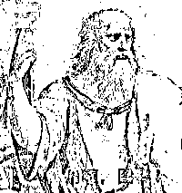这种观念，让笔者忍不住想引用《翠玉录》（The Emerald Table）中的那句被引用了无数次的话：As Above, So Below，也即是所谓的一切下者皆同于上者，一切上者皆同于下者。而有关《翠玉录》的身世传说也很神奇，据说它可以追溯到埃及传说中的时代 Zep Tepi（12000 年之前），甚至还有人认为希腊哲学家们的思想是受到了《翠玉录》的启发。可以，这很炼金，但怕是不太符合基本法。按照笔者个人更为接受的一些推想来说，这部作品可能形成于希腊哲学的晚期。因此它含有前述哲学观念的论述也不让人感到很奇怪了。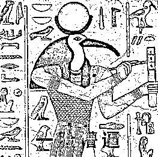这种观念的形成当然非常古老，但是它的影响倒是续的挺长，一直续到文艺复兴时期。我们可以说，文艺复兴时期的思想在这方面就是新柏拉图主义、赫尔墨斯学和卡巴拉等学说综合。它们三个在这时候搅基，然后通过此时期一位名为阿格里帕（Agrippa）的神秘学大师的努力接生，它们爱的结晶就诞生了，这也就是著名的《神秘哲学三书》（Three Books of Occult Philosophy）。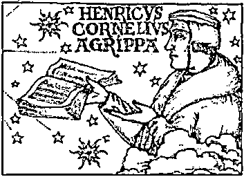下面我援引一些其中的论述，使诸位能略微一掠个中的思想：*[Book 1 Chap.1]Seeing there is a three-fold World, Elementary, Celestiall, and Intellectual, and every inferior is governed by its superior, and receiveth the influence of the vertues thereof, so that the very original, and chief Worker of all doth by Angels, the Heavens, Stars, Elements, Animals, Plants, Metals, and Stones convey from himself the vertues of his Omnipotency upon us, for whose service he made, and created all these things.*须知，世界有三重的存在，即元素的世界、天体的世界与智慧的世界。所有的下级事物都被它的上级事物所支配，并接受其中存在的美德的影响。所以原初且首要的操作者，经由天使、诸天、星辰、元素、动物、植物、金属和矿石，从其中将他全能性的美德传递给我们，因为他的贡献，他安置并创造了所有的这些事物。*[Book 1 Chap.11]Platonists say that all inferiour bodies are exemplified by the superiour Ideas. Now they define an Idea to be a form, above bodies, souls, minds, and to be one, simple, pure, immutable, indivisible, incorporeal, and eternall: and that the nature of all Idea's is the same.*柏拉图主义者说，所有的下级实体都是由上级的理念所例示的。他们将理念定义为一种形式，它凌驾于身体、灵魂和心智之上，同时也是唯一的、简单的、纯粹的、不变的、不可分割的、无有实体且永恒永在的，而一切理念的性质都是相同的。*[Book 1 Chap.12]There are also in many Individuals, or particular things, peculiar gifts, as wonderfull, as in the species, and these also are from the figure, and situation of Celestiall Stars. For every Individuall, when it begins to be under a determined Horoscope, and Celestiall Constellation, Contracts together with its essence a certain wonderfull vertue both of doing, and suffering something that is remarkable.*世上存在着很多个体，或特别的事物，或奇异的礼赠，在类属中同样非常奇妙，这些事物也源自于天上星辰的图形和状况。对于每个个体而言，当它开始处于某个既定星图和天体星群之下时，特定行动和承接非凡奇迹的奇妙美德，就与它的本质相聚合。限于篇幅，我无法在这里引介并翻译全部的内容，但是也足以让我们略微一窥其中的论述风格。不过我们对这种宽泛哲学背景的集中讨论暂时就到这里。正如詹姆斯·赫歇尔·霍尔登（James Herschel Holden）所说，很少有占星师是从哲学追导至占星的，他们中的绝大多数人其实就像他们的顾客一样，是被其占卜体系吸引的。这一点笔者当然也不能免俗，所以就让我们把更多的精力集中于一些和占星体系本身更有关系的篇幅吧。行星的界域是什么？我们已经知道，占星基于地心的模型，其中所有的行星包括日月都是围绕我们运行的，并以一种同心圆的样式排布。关于这笔者使用图解来说明（手动滑稽）：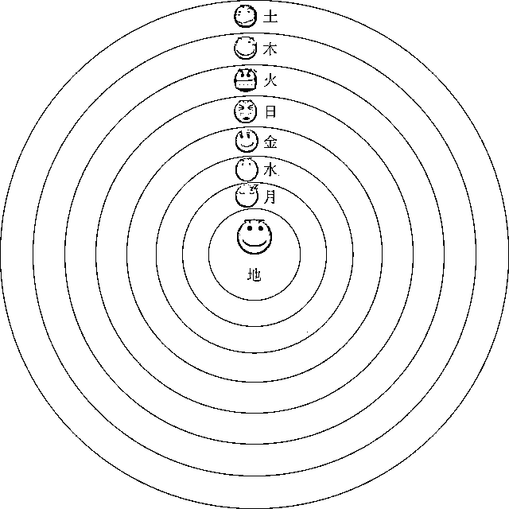可以看到，大地（它在图解中并不被视为一颗行星）位于这张图的中心，而所有的行星都围绕它来运行。其中有的行星距离我们更近，而有些行星距离我们更远。这和行星的**速度**有关系，其中越快的行星距离我们越近，相应的，越慢的行星距离我们越远。而按照从近到远的顺序，依次是月亮、水星、金星、太阳、火星、木星和土星。这个顺序也叫做“迦勒底星序”，在古典占星中，会使用它排布**时主星**的顺序和**法达星限**。而每颗行星在运行时，都有其近地点和远地点，而这种近地点和远地点所形成的区域，就叫做行星的“界域”（spheres），每颗行星都有各自的界域。其中月亮界域之上的世界，就是天体的世界，是完美且不会腐败的。而月下的世界通常被称为“月下界域”（Sublunar Sphere），这里的一切都是无常和靠不住的。超出这七个界域的，就是恒星的界域，而超过恒星界域的，就是所谓的“至高天”（Empyrean）。而超出至高天的就是第一推动者或不动原动者的界域，也就是神。通常情况下，天体的世界有一种很明显的特点，就是**高冷**。例如在本杰明·戴克斯（Benjamin N. Dykes）翻译的《波那提基础占星学》（Bonatti on Basic Astrology）中，有过这样的论述：*[Treatise 1 Chapter 1]Wherefore all inferior bodies, namely those made of elements, consist of four elements, which are all corruptible; and that this is true, no one is in doubt. Indeed the celestial bodies consist of another essence (namely the quintessence), which is different from those four elements, [and] which is incorruptible and impassible.*因此所有的下级实体，或称四大元素构成的那些事物，都是易腐败的；那是真实不虚的，毋庸置疑的。然而，的确天体由另一种本质构成（也就是第五元素[quintessence]），它不同于那四种元素，它既不会腐败也不会遭受人世上的苦难。天体与尘世不可告人的关系由前一段引文看来，除了高冷以外，波那提（Bonnati）还赞同尘世的变化联结到天体。实际上，波那提的论述似乎体现了一些亚里士多德学说的影响。神为第一因，而天体界域为第二因，两者混合在一起影响尘世。而关于这种影响的发生，他论述说：
*[Treatise 1 Chapter 2]For I do not believe there is any doubt but that the motion of the heaven surrounding the elements changes fire and air; and they change the other elements (namely water and earth), together with ensouled and vegetative things, and the rest of what has being under the lunar circle (and they exist in them), and things susceptible of change or alteration.*我不相信此存疑虑，牵动元素的天穹运转改变火元素与风元素；然后它们改变其他的元素（也就是水元素和土元素），连同具理性灵魂和植物灵魂的事物，和其他月亮周期之下的存在（它们存于它们之中），以及易受变化和易被修改之事物。这里似乎涉及到元素区域的概念，笔者有必要在此进行一些说明。按照古典的观念，我们的世界由四大元素构成。可以说，**元素是天体运行和尘世改变的媒婆**，它们能够勾搭上，靠的就是元素牵线搭桥。亚里士多德曾讨论地上事物的改变是因为热，比如太阳的热，这种热进入元素改变它原始的冷热干湿性质，随着这种平衡改变，元素产生变化。而元素本身也依据其稠密和稀薄的程度，有着不同的高低排布。首先大地由水和土覆盖，按照其稠密度的差别，土在水之下。而土水之上即是风元素的区域，大气和风存在的地方。最稀薄和最高的也就是火的界域，古人认为流星、彗星等现象发生在这里。所以波那提在上文中对于元素顺序的表达，可能体现出一种行星影响顺序上的差别。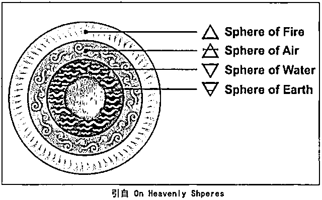这玩意...有啥用？那么，这个诸天界域的结构是否有实际意义呢？它有没有可能对我们的占星解读产生影响呢？答案当然是肯定的。托勒密在《占星四书》（Tetrabiblos）中告诉我们：
*Jupiter revolves in an intermediate sphere between the extreme cold of Saturn and the burning heat of Mars and has consequently a temperate influence. He therefore at once promotes both warmth and moisture, but owing to the sphere of Mars and the Sun which lay beneath him, his warmth is predominant and hence he produces fertilizing breezes.*木星在土星极冷和火星极热之间的界域运转，并因此具备了温和的影响。它因此得以促进温暖与湿润，但是由于火星的界域和太阳的界域在它之下，所以它的温暖占据了主导，它也因此产生肥沃的微风。可见，行星的界域，与行星本身的性质是有关的，这种性质又与行星的含义有很大的关联，这是我们很难忽视的一种关联。海伦娜·阿维拉尔（Helena Avelar）和路易斯·里贝罗（Luis Ribeiro）提出：**行星的特征取自其质料、性别、昼夜划分、吉凶，以及天文概念上的颜色、亮度、周期等等。**我们若从这种观念出发，会发现它们很大程度上都是与**地心模型密切相关**的。因此行星的很多性质和含义，似乎都是可推导的、可追寻的。此外，这种界域的星序排布，还涉及到行星的地位和力量。例如在*Picatrix*（阿拉伯名为*Ghayat al-Hakim*）一书中，作者说到：*According to the opinion which deals with the disposition of the primum mobile to the sphere of the fixed stars, a planet swifter in motion will have a stronger effect, and one slower in motion will have a weaker effect, because it is a proportion of similars.In this matter the wise disagree with one another, for one group of ancient sages held the contrary, positing the same similitude but attributing it to the primum mobile and the sphere of fixed stars; accordingly, the more ponderous planets will be better and more convenient in their similitude to the primum mobile as well as the sphere of fixed stars in their slowness, because they are slower in motion, and thus the slower will be similar to the slower and the faster to the faster.*依照论及第一运动对恒星界域交互影响的观点，一颗行星运行速度越快则影响就影响越强，运行速度越慢则影响越弱，因为速度和影响力之间是成比例相联系的。在这一主题上，贤者们彼此之间并不相互认同，因为有一组贤者持有相对立的观点，尽管他们也假定速度和影响力之间的比例相关性，但是他们却将其归于宗动天和恒星界域的影响。这是因为越沉重的行星就越适宜和恰当地契合宗动天和恒星界域的缓慢性质，这两重天的移动速度是更加缓慢的。也正因为如此，慢的相似于慢的，快的也相似于快的。这个概念涉及到行星“上下级”的分类，我们在界域图中以太阳为分界，将其之上的行星称为上级行星，而其之下的行星称为下级行星。其中上级行星比下级行星更高，因此更为靠近神所在之处。所以有人认为，速度越慢就“越好和越适当”。当然，正如我们上面那段引文所说，在这个问题上“贤者们彼此不认同”，围绕着这个议题也有着一段有趣的撕逼史。我们可以说，这种的宇宙论构成了整个古典占星，甚至是魔法和炼金术的背景。在现代，虽然它的影响可能不再占据主导，但是却显得更加隐晦深远。对于它我们还有很多可以探讨的内容，但是限于篇幅，请允许我暂时在这里结束。后续笔者会继续为诸位引介一些相关的内容，如土木和光体的撕逼之战，界域分布的具体影响，现代的世界观等等内容。如果诸位看官期待后续的内容，请长按下方二维码关注我们的公众号，会持续有更多干货内容推送哦。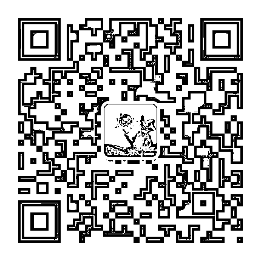

# 占卜到底是个什么鬼

> 原文：[`mp.weixin.qq.com/s?__biz=MzI5NTM0MzAzNg==&mid=2247483751&idx=1&sn=af22d5f35862432fc5ae9f40b59650b8&chksm=ec5447b4db23cea270a0efdd406875d278071d8c6a9d5f1cdc16aed9f53e8d988f06061ec25e&scene=27#wechat_redirect`](http://mp.weixin.qq.com/s?__biz=MzI5NTM0MzAzNg==&mid=2247483751&idx=1&sn=af22d5f35862432fc5ae9f40b59650b8&chksm=ec5447b4db23cea270a0efdd406875d278071d8c6a9d5f1cdc16aed9f53e8d988f06061ec25e&scene=27#wechat_redirect)

> # “占卜”通常被解释为尝试洞察未来或是预言，然而，这并不是占卜这个词语的含义。它源自于拉丁语 divinus，意为预言者。而预言者这个词来自于 deus，意为神。字面理解为与神接触。

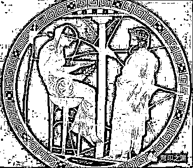

> # 我们都知道，神谕与希腊文化有着很深的渊源，尤其是希腊古都特尔斐的神谕，女祭司坐在三角架前，吸入所居住庙宇的裂缝中渗上来的烟雾，同时吸入燃烧月桂与大麦燃烧的烟气帮助，自我陷入恍惚的状态并与太阳神阿波罗沟通。在故事中，三脚架是被悬在地上排放烟雾的裂缝之上的，这看起来是后希腊风格的发明，却在考古学中并没有任何根据。神殿祭司的的宣告通常都是玄妙难解且模糊不清的，就好像她们试图避免正面回答因此人们不知道她们的预言是对是错一样。然而，这些宣告在有时不清楚更有可能是因为内在世界沟通的象征性。

> # 我曾经听说过一个关于希腊一个小国国王克里拉斯的故事。他打算攻打相邻的波斯王国，于是他去德尔斐寻求了神谕以预知结果。神谕的宣告是“一个王国将会被攻克。”国王认为这个宣言保证了他的成功，继续了他的计划，但让他失望的是，他失去了他的王国。这个故事很流行，因为它举例说明了神谕的模棱两可与希腊的宿命论态度。但是，这并不是古代世界如何看待神谕的。它们将神谕视为建议与智囊的源头。例如，雅典统治者与立法者梭伦，通过听从神谕的指引，建立了雅典的民主主义，因此公元前 594 年成功地合并了萨拉米思岛。之后，他相信德尔斐神谕作为将雅典政府从暴君转为民主制度的灵感。

> # 占卜是古代宗教信仰不可分割的一部分。在古代基督以前的信仰中，并没有类似于教皇或红衣主教的中央集权。宗教决策被直接带给神，并通过神谕得到神的答案。对大多数人而言，神谕提供了验证神的存在的决定性证据。

> # 而在希腊古城多多那，宙斯的神谕，寻求神谕的问题首先被写在指引板上。考古学家已经找到了这些指引板的储藏，并第一手阅读了他们所问的问题。很少有问题是寻求预言的。这些问题包括：“更改祭仪的实践是可行的吗？”“一个结婚，旅行或职业的选择是明智的吗？”“神更喜欢哪种祭品？”“我的妻子会怀孕吗？”“如何治愈我的疾病？”“我的孩子是嫡生的吗？”而最普遍的问题是，“我怎样赢得神的欢心？”这些答案通常主要是是否或通过执行一个宗教仪式或献祭，，而不是模糊不清的。两个神谕各有所长：阿斯克勒庇俄斯的神谕主要用于健康问题，而特尔斐的神谕以它哲学和宗教的宣告而出名。但这些宣告中很大一部分都没有预言，它们的目标是帮助人们提升现状。

> # 当我们看向古代历史与文学时，我们可以看见，即使当希腊得到神的预言，他们并没有不采取行动并坐等命运，而是与神互动，以一种创造性的方法改变命运。这种预言的创造性使用可以在以下的著名例子中看到。

> # 在公元前 280 年，波斯国王赛瑟斯聚集了很大的一支军队入侵希腊，打算为他父亲大流士在以前的侵略中在雅典统帅米太亚德那里的战败报仇，赛瑟斯将摧毁雅典作为他的主要目标。赛瑟斯的军队是希腊所见过的最大的军队，雅典人担心他们的命运，于是差了一位信使，向特尔斐询问神谕。神谕送回来答案，“为什么你劫数难逃？飞向大地的末日。到处都是炮火，轻率的战神将你带至低点。”如此不祥的预言会将一个宿命主义者绝望，但相反，雅典人举行了会议来决定做什么。

> # 雅典将军地米斯托克利确信有打败波斯的方法，并向特尔斐送了第二封信，这次的问题是，“我们可以怎样打败波斯？”神谕的答案是“尽管一切都被带走，宙斯，全见者，保证了木墙不会倒塌。”地米斯托克利将“木墙”解释为他的海军舰队。虽然波斯有两倍的船，地米斯托克利知道打造得又尖又弯的小快船比对方占优势。将军说服力雅典众人舍弃城邦给赛瑟斯的军队，他诈了波斯人，使得他们在狭窄的萨拉米思海峡进攻雅典人的舰队，在萨拉米思海峡，雅典人的小船有能力以计谋胜过波斯人的大船，撞击它们，使它们沉没。这是历史中最有名的胜利之一。没有了帆船的支持，波斯撤退了。这场胜利同样保证了希腊在地中海区域海上贸易的优势。作为结果的繁荣与影响帮助引领了雅典艺术与文化的黄金时代

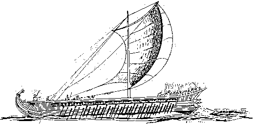

> # 如你所见，占卜不仅仅是预测未来。它同样是获得神圣指引的方法——一个获得智慧选择与更好未来的方法。

# 【占星短科普】得时是个什么鬼(｡･ω･)

> 原文：[`mp.weixin.qq.com/s?__biz=MzI5NTM0MzAzNg==&mid=2247483759&idx=1&sn=8e4b4ece29309a3efa3385a760621711&chksm=ec5447bcdb23ceaa2749e6e02e0f32703388ecfb2abdf222e2b134c8d6594d9fe279aa0b90be&scene=27#wechat_redirect`](http://mp.weixin.qq.com/s?__biz=MzI5NTM0MzAzNg==&mid=2247483759&idx=1&sn=8e4b4ece29309a3efa3385a760621711&chksm=ec5447bcdb23ceaa2749e6e02e0f32703388ecfb2abdf222e2b134c8d6594d9fe279aa0b90be&scene=27#wechat_redirect)

从头说起？要说这古典占星啊，那名堂可就大了，这就得从宇宙大爆炸森林古猿早期萨满细胞呼吸新陈代谢云云说起。。。
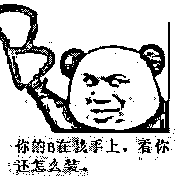好学的阿拉伯银咳咳开个玩笑(｡･ω･)，今天就由我来为大家介绍一下**中世纪占星**常用的一种评估星体状态的技法——**得时**。这种技法从希腊占星时代就已经存在并一直被应用，后来聪明的阿拉伯人继承了希腊技法，这种技法也是被继承的其中之一。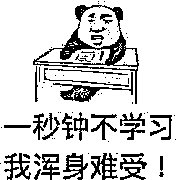得时嘛，听起来就很高逼格有木有，那么这到底是什么鬼哩(｡･ω･)
得时的概念在英文中，*in domain*就是所谓的得时。*domain*一词意为“领域，疆土，管辖范围”，那么*in domain*的字面意思就是“在自己的管辖领域”了。这是一种中世纪流派评估星体状态常用的技法，在文艺复兴时代其权重却被降低了许多。
尽管在历史上不同的占星师对于得时给出了许多不同的定义，但是目前常用的一种定义是十分简单的，即阳性星体在昼时升在地平线上或在夜时沉在地平线下并落入阳性星座，而阴性星体则是相反的，即在昼时沉在地平线下或在昼时升在地平线上且落入阴性星座。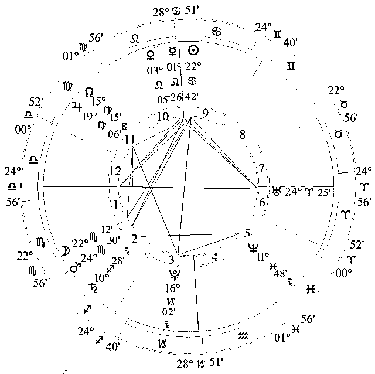没有图你说个毛线？这张盘中的月亮是得时的，聪明的你还发现了哪些得时星体咧(｡･ω･)来龙去脉*domain*这一英文词汇由阿拉伯文*hayyiz*直译而来，在希腊占星中则被称为“区间”（*sect*，希腊文*hairesis*），中世纪时期传统占星学最初经由西班牙学者传回欧洲时，这一词则出现了不同的翻译。当时有名的三译者之一的赫曼（Hermann de Carinthia）把它译作“更替当班”（*alternation*，拉丁文*vicissitudo*），英国著名的哲学家兼译者阿德拉德（Adelardus Bathensis）则把它译作*“恰当位置”*（*suitability*，拉丁文*competentia* ）。
得时的行星能够恰当的发挥其性质并显现吉性，是助于达成事件的，而这一性质又与昼夜星体分配相辅相成。我们知道，古典占星中，七曜可以分配为昼夜两个区间，日木土为昼星，月金火为夜星，水星东出于日时为昼，西入于日时为夜。而传统上认为土星之所以为昼星是因为白昼的热可以缓释土星极端的冷，而黑夜的冷可以压制火星极端的热；很显然，这一分配原则在得时技法上得以体现，凶星落入其相应的区间则凶性被中和由此显现吉性，故得时的星体象征着星体本身的有力和其征象的和谐与潜在的达成事件的能力。However，阿卡比特（al-Qabisi／Alchabitus）在相关训导中还提出了得势（*halb*）的概念。他提出，当星体落入其相应的区间，则该星体得势；在他的训导中得时实际上是基于得势的一种状态，即星体的昼夜性质加上阴阳性质的协调。除此之外，古典占星中还有失时一说；这一状态并没有特定名词，现代一般称为*not in halb*或*out of sect*。失时的星体处于不合适的地位并显露凶性，吉星的原有吉性被压制，凶星的原有凶性则被增强。是的还是这张盘(｡･ω･)其中的木星得势而金星失时，聪明的你知道其他星体是什么状态嘛(｡･ω･)～

在实际运用中，希腊及中世纪之流使用的比较多，在本命占星中会被用来论断案主的财富格局，在卜卦占星中则会与先天尊贵（essential dignity）一起评估星体的吉凶强弱状态，在特定背景的问题中是十分有用的。

如果你喜欢这篇文章，请长按下方二维码关注我们的公众号哦~

# 古典占星看射覆

> 原文：[`mp.weixin.qq.com/s?__biz=MzI5NTM0MzAzNg==&mid=2247483772&idx=1&sn=e4e06cd1fefae46dc28f03ca7c7b1204&chksm=ec5447afdb23ceb94ce6f30e2d7bc785719f4bc9abeb6985f8a3bd19347bf4ac2daf475e89ad&scene=27#wechat_redirect`](http://mp.weixin.qq.com/s?__biz=MzI5NTM0MzAzNg==&mid=2247483772&idx=1&sn=e4e06cd1fefae46dc28f03ca7c7b1204&chksm=ec5447afdb23ceb94ce6f30e2d7bc785719f4bc9abeb6985f8a3bd19347bf4ac2daf475e89ad&scene=27#wechat_redirect)

射......射什么？射覆是我们国家古时流传的一种有趣的猜物游戏。覆可以理解为覆盖，而射覆的玩法，通常是在近乎没有任何外在提示和线索的情况下，猜测目标所覆盖或隐藏的是什么样的事物。而想要准确猜中，往往并不是一件容易的事情。虽然射覆的历史由来已久，但是直至今天仍然很受卜者的欢迎。笔者和小伙伴们也是时不时玩一些射覆游戏的，就在近段时间的一天晚上，我们还和小伙伴们进行了这项活动友♂好的交♂流。而所采用的方法亦是包罗万象，有占星、塔罗、地占、骰子和雷诺曼等，所猜测的物体也相当多样化。因此在这个议题上笔者虽然不是非常了解，但是也有一些想与诸位分享的观点，下面就让笔者截取其中一个作为事例，来说明我如何使用卜卦占星来应对这样的问题吧。*问题：我的左手里是什么？**时间：2016 年 7 月 11 日 22:54**地点：辽宁省营口市*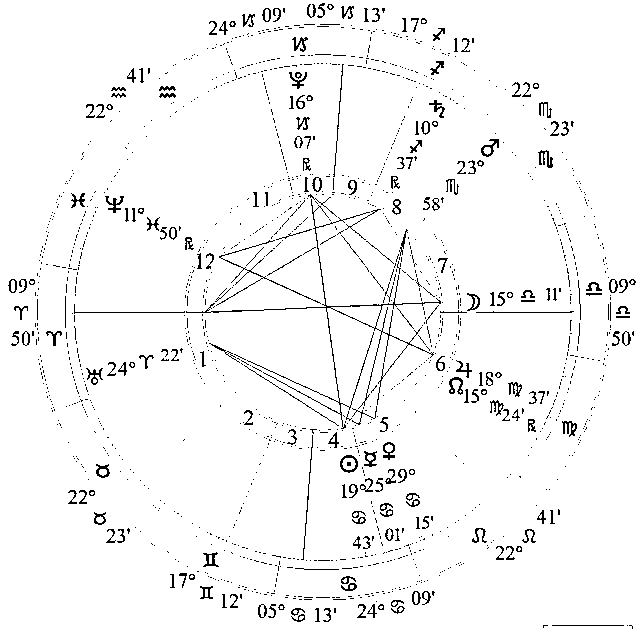根本性在古典卜卦占星师解读星盘时，判断星盘的**有效性（valid）**或**根本性（radical）**往往是建立星盘后的**第一个步骤**。那么什么是有效性或根本性呢？杰弗里·科尼利厄斯（Geoffrey Cornelius）曾解释道：*Radicality is the assumption that the horoscope is a true symbolic representation of its subject*根本性即是星盘为可以对其主题真正进行象征表达的一种假设。换句话说，就是检查星盘究竟*能不能准确显示我们想要的信息？*或是*我们能否依据星盘做出正确的判断？*这种检视看起来可能有些无意义，像是过时又不好用的迷信，但是它实际上可以视为对占星师的一种保护。虽然不符合“有效性”的星盘未必是不可以解读的，但是它仍然可以为我们提供一些警醒和有价值的信息。通常判断星盘是否有效，有两种主要的方式：1.时主星与上升主星是否一致 2.星盘中的描述是否可以切合过去或当下的实际情况在这个星盘建立时，刚好是木星主管的小时，我们可以发现上升星座是白羊座，也即是一个火象星座，而木星恰巧是火象星座的三分主星。此外，在卜卦星盘中，光体（太阳和月亮）往往有“阐明”和“揭露”的意味。而在这张星盘中，太阳落在 4 宫（午夜），是一天最黑暗的时候，月亮落在 7 宫，而 7 宫恰好是日落之所，这是不是非常有**“隐藏”**的意义呢？这是非常切合射覆类问题的。据此，我判断这张星盘是有效的。（滑稽）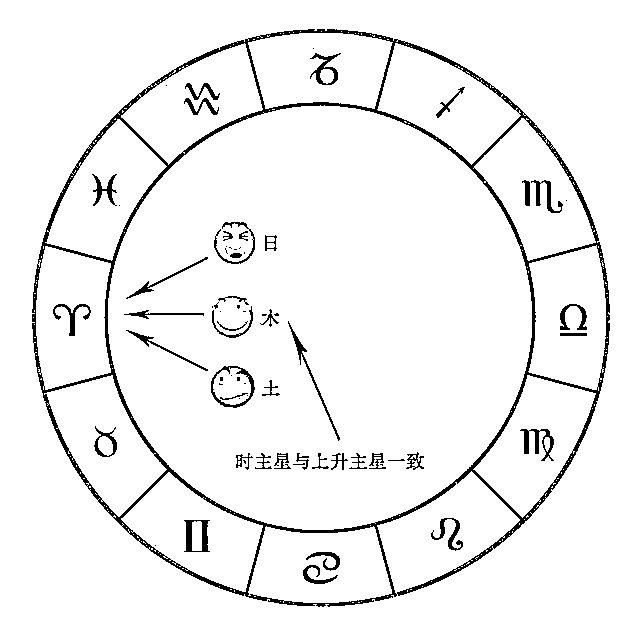寻找征象星接下来，我们就要进行第二步：**确定征象星**。换句话说，这意味着我们首先要找到*代表所猜测之物的宫位是什么*。通常在射覆类问题中，笔者比较偏爱**4 宫**，因为四宫有“深藏的宝藏”的含义，我认为这种意涵更加贴近射覆的性质。就仿佛遵循着充满密语画卷去找寻宝藏或发现真相一样，如此方能体现射覆的魅力所在。确定了宫位之后，接下来我们要做的就是以宫主星和宫内星，作为代表射覆之物的征象星，并以它们的结构来推测这种事物的特征。笔者主要考虑的几点如下：1.征象星本身的性质和特征 2.星座的含义和类象 3.所涉行星的修饰和影响 4.征象星所在的界和其主星描述首先，我们发现 4 宫内的行星是位于巨蟹座的**太阳**，而 4 宫主星是位于天秤座的**月亮**（由于某些原因，月亮应该是更为优先的征象星）。而这两颗行星恰好是我们所称的“光体”，因此我们立刻就可以有一个关于它的初步印象：有光泽的、反光的、明亮的或发光的。此外太阳和月亮都天然倾向于圆形，虽然月亮常常以新月的标志为人所知，不过在这张星盘中月亮是正在增光的，据此，笔者当时判断这个物体可能是圆润的。接下来我们观察一下星座的影响，星座本身的性质是多样化的，有的时候它可能从意料之外的方式提供形象无比的信息。我们发现，月亮位于天秤座，而天秤座本身是一个左右平衡的星座，因此笔者当时判断它可能是对称的。而太阳落在巨蟹座，很明显的显示出一种外壳的特征，因此这件事物也应该是有一个外壳的。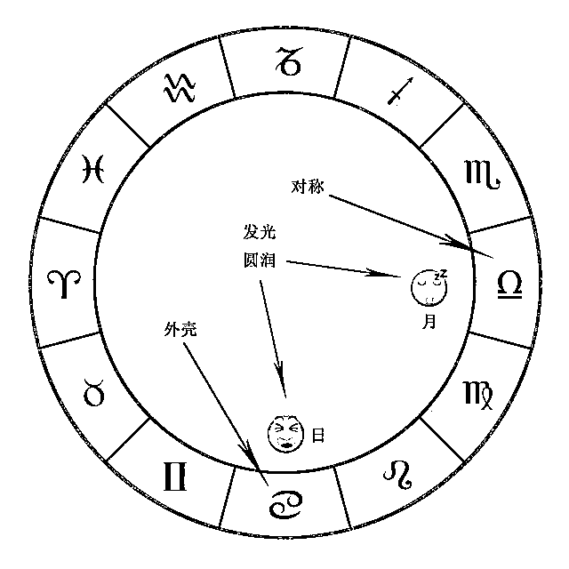在我们考虑征象星与其他行星的关联时，我们有两颗行星需要考虑，也即是太阳和月亮，但是完全考虑它们所有的关联可能会让情况变得复杂。因此我们可以尝试先以月亮构建大体的特征（月亮具有更大的优先性），然后以太阳来完善细节。可以看到，月亮只有一个相位：和太阳的四分相。关于太阳和月亮部分含义，笔者在前面已经提及，而在这里，笔者考虑这可能显示出这个物体的外表颜色。这是因为太阳本身即落在代表外壳的巨蟹座，且又与巨蟹座主星成相，故而笔者推断，这件事物的外表是金色、金黄等太阳代表的颜色。此外，月亮还互容金星，这说明这件事物可能是漂亮或精致的。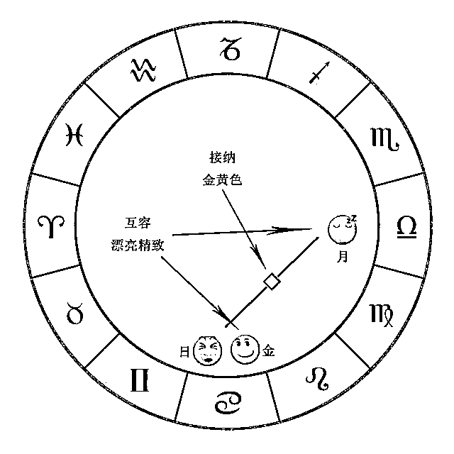我们观察太阳时，可以发现它形成很多个相位，分别是月亮、水星、金星、火星和木星。在这里涉及到很多细节，也非常复杂，而其中很多是笔者事后才发现的蛛丝马迹。在其中金星不仅和太阳合相，也互容月亮，可以看做是对于这个征象的加强，我们已经解释过这颗行星，因此在此略过。而**水星和月亮**是**速度最快**的两颗行星，在古典占星中它们往往与旅行和各种形式的变动有关，所以这可能代表这件事物是旅行用品，或者是这件事物本身就是易变动的。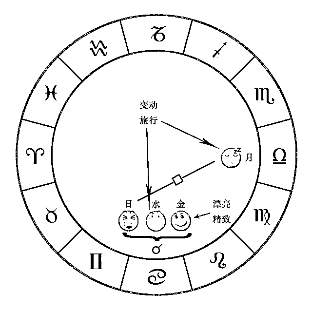火星往往代表尖利的事物，因此我们或许可以合理的推断，这件事物是带尖角的，或者边缘锋利的。木星所代表的事物似乎还不明朗，但是在这里也占有重要的意义。因为我们若是观察月亮的位置，会发现它位于木星的界，笔者在阅读和实践中发现，行星的界往往有很强的描述功能，且很多时候与其主星主管的宫位有关联。在这里木星主管 12 宫和 9 宫，因此，笔者当时推断这是一件宗教或神秘学的用品。如果我们把木星落在 6 宫考虑在内，还可以认为它是一件工具。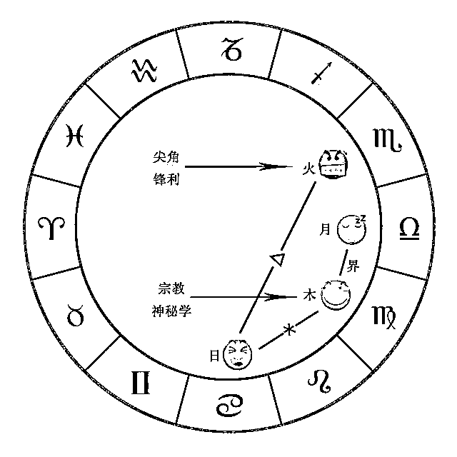答案至此，我们已经拥有了大量的信息可以帮助我们猜测这到底是一件什么东西。它总结起来的大体特征包括：是明亮的或者有光泽的，可能是圆润的，有金黄色的外壳且对称，漂亮精致，和旅行有关或者本身容易变化，有尖利的部位，和宗教或神秘学有关。各位看官猜到是什么了吗？
答案就是：指南针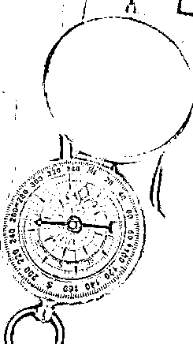因为这个指南针是问卜者的一位朋友之前帮他们家里看风水测量用的，因此可以算做是一种神秘学的用品。我们知道答案之后，回头检视星盘或许可以发现更多的细节。天秤座本身就是一种人造器物的象征，因此我们可以认为这是对于“器械”的指示。而太阳和月亮都是光体，是否会有“指引”或“照亮前路”的含义呢？更多的细节，就留待诸位看官自行开脑洞吧。

如果诸位看官喜欢这篇文章，或者期待我们后续的推送，不妨长按下方二维码关注我们，后续会有更多精彩内容送达哦。【如转载请注明出处，禁止任何商业用途，违者必究。】

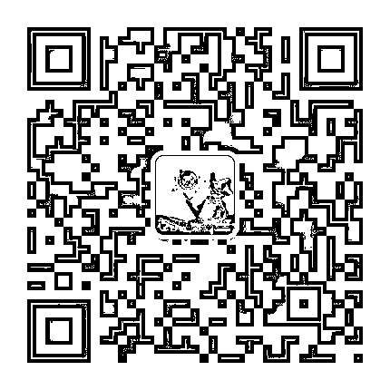

# 占星师的魔法世界

> 原文：[`mp.weixin.qq.com/s?__biz=MzI5NTM0MzAzNg==&mid=2247483781&idx=1&sn=413e05721361dbe00e69f8c7764f9785&chksm=ec544756db23ce40af598d503ef93cb26b04a61fdb7f1185141a2528244172f117c933d7029f&scene=27#wechat_redirect`](http://mp.weixin.qq.com/s?__biz=MzI5NTM0MzAzNg==&mid=2247483781&idx=1&sn=413e05721361dbe00e69f8c7764f9785&chksm=ec544756db23ce40af598d503ef93cb26b04a61fdb7f1185141a2528244172f117c933d7029f&scene=27#wechat_redirect)

占星与魔法占星是一门古老又充满魅力的艺术，正如古德·波那提（Guido Bonatti）所言：*“就这门学科而言，我们必然不局限于认知现在的事物，还将回想起过去的事物，并预知未来的事物......”*（*Bonatti on Basic Astrology Treatise 1 Chapter 3*）。占星学让我们得以一瞥现在、过去和未来，还有什么比这更神奇呢？确实，我们经常把神奇而不可思议的事情称为魔法（magic），来表达对它的惊叹，从这个角度而言，占星确实可以被称为一种“魔法”。但这不是笔者今天主要谈论的主题。我们需要知道，魔法不仅是一种对神奇事物形容，它也是一种真实存在的西方秘密传统。在古代的世界中，占星和魔法往往相互伴生，例如在*《神秘哲学三书》（Three Books of Occult Philosophy）*中，阿格里帕（Agrippa）告诉我们：因此，任何渴望学习这些能力的人，如果他不能精通自然的哲学（在其中事物的特性被发觉，万物的神秘性能被揭露），不熟练于数学，和星辰的相位与图形（由此决定了万物崇高的美德和性能），也没有学习神学（在其中展露非物质的实质，分配并管理所有的事物），他将不可能理解魔法的原理。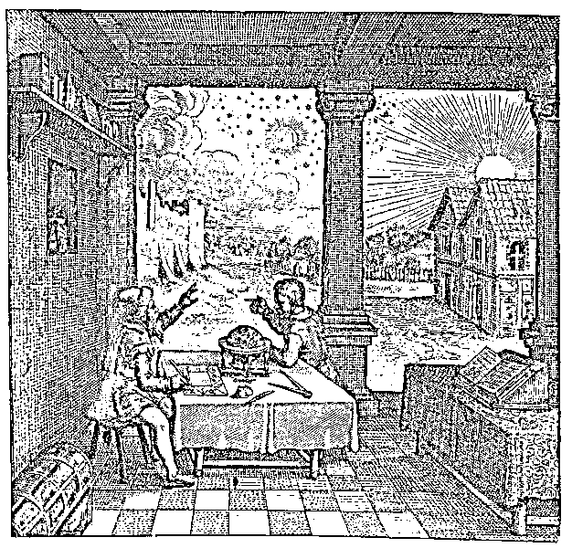但是到了现代，不仅古典占星和古典魔法的技巧与理念遗失，它们之间的关联也变得不再明显。这既发生在占星师的身上，也发生在魔法的体系中。现代的占星师基本没有涉及到魔法的操作（甚至不相信魔法），而魔法师虽保留了一些占星的象征与世界观，但是不再进行星盘的解读。时至今日，随着占星和魔法复古潮流发展，我想我们有必要再次检视占星和魔法之间遗失的关联。占星的魔法但是魔法究竟是什么？魔法可以做到什么？占星的魔法和其他魔法有何不同？占星魔法又该怎样操作呢？这个主题涉及到太多太多的问题，请恕笔者在这里无法一一探讨。加之如果要详细地描述这些方面，未免太过冗长和枯燥。下面就让援引一段小故事，给各位一个有关占星魔法的印象。这个故事和著名的中世纪占星师古德·波那提（Guido Bonatti）有关，在此摘译自詹姆斯·赫歇尔·霍尔登（James Herschel Holden）所著的*《天宫图占星史》（A History of Horoscopic Astrology）*：由于怜悯一位经常和他下棋的穷苦的药剂师，古德给了他一个蜡质的帆船图像，告诉他将其藏在秘密之处的箱子中，他就会变得富有。但是如果他离开它，他就会再次变得穷困。确实，这个人变得富有了，但是他开始担心这个图像涉及到巫术的操作。所以，在他正变得富有之时，他决定救赎自己的灵魂，并向牧师坦白了图像的事情，牧师命令他将其毁掉。接着，正如波那提所说的那样，他很快失去了所有的财富。之后他祈求古德为他制作另一个图像，但是波那提咒骂他，并说*这个图像并非邪术（magic），而是从天象（constellations）得来的美德，并且这样的天象在 50 年内都不会再出现了。*这实际上就是一个与魔法密切有关的行为，在特定的天象下制作一个图像（形象），然后天体的美德就会依附于其上，使这个图像具有某种美德或效力。这是一个典型的“符咒”制作的流程，由于在这个体系的魔法中，选择一个恰当的天象非常重要，因此它和择日占星不可分割，也有人称这种行为实际上就是择日占星的一种分支。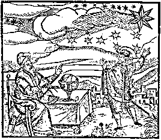但是这个故事明显更加“占星”，虽然它听起来也很神奇，但是本质上没有什么看起来“玄妙深奥”的步骤，也相对来说没太多魔法的元素参杂其中。因此虽然它体现了占星符咒魔法的大原则，但是可能不太典型。下面笔者摘译另一个有关于占星魔法的故事，这个故事记载于著名的魔典*《贤者之书》（Picatrix）*中：
我读过一本书，标题为*《科学的分割者与秘密的启示者》（The Divider of Sciences and Revealer of Secrets）*，在其中写过这样的事物。我叙述一个看上去对你可信赖的故事，它在 Foracen 的大陆被提及，作为一些来自于印度的另外事物，并被从那引进到这门科学中，但是当书中论述争论可疑的事情时，它被怀疑是否属于这门科学。虽然它说，这是很清楚被证明的。在那片大陆上，有某个女孩，每个人都认为她们非常美丽。一个人说，他可以使她来到我的居所。我请求他使其如他允诺一样前来，我这么做有两个原因，既是为了恋爱也是为了知识，也是因为我渴望这个女孩；我请求他在我面前进行操作。片刻之间，通过悬挂星盘并找到太阳的地平纬度，他确定了上升点并排布十二宫。他发现火星主管的白羊座是上升的，而金星主管的天秤座在第七宫。我询问他这是什么含义，他说上升和七宫与我的请求是相一致的。火星和金星位于星盘中它们所在的位置，他解释说，当它们以三分相注视彼此，我的意图就可以被达成。他发现它们之间的相位将会在四十天达到完美，他告诉我在从这天开始的前述四十天中，我询问我的问题，我就会实际上获得我的渴望。他立刻取了一小块钻石，细细地把它磨成粉末，并将它与等量的氨草胶（gum ammoniac）混合，他用这个混合物以我的肖像制作了一个图像。他也取了干无花果（sycamore）并将其细细地磨成粉末，将其与蜡相混合，用这个制作了一个漂亮女孩的图像，并以类似于她的衣物装饰它。然后他拿了一个新的水壶，在其中放了七根棍状物或棒状物（也就是，桃金娘、柳树、石榴、苹果、杨树、西克莫无花果树和月桂的细枝），并将这些安置在水壶中间，四个在下三个在上，交叉摆放。然后他将以我名字制作的图像放入，然后将女孩的图像放入同一个水壶。当他这么做的时候，他注意到金星会与火星对分相，并且此时火星会被吉星加强。他将水壶密封，并且每天的某个小时开启它一次，在其中它放入上述的事物。在四十天的最后，当上升主星以三分相注视着七宫主星时，他再一次打开了水罐，将图像放入，以使它们注视着彼此，也就是说，面对面的。然后他将水壶密封好给我，埋藏在时常有火焰的灶台之下，让我说一个来自于印度的单词，他将其解释给我并告知我，就如我将会在下面解释那样。然后，当操作完成时，他拿出水壶并打开它，将图像取出。然后上述的那女孩来到了我的房屋门前，她和我待了十天的时间。在十天的末尾，他告诉我我应该做上述的事情。“当我对你的允诺完成时”，他说：“我认为我们更好的做法是释放这个女孩，并将其恢复至自由无恙”。我以良善的意志赞同，并取出被埋藏的两个图像。然后取磨成粉的贞节树（chaste tree），将其与蜡混合，他用它制作蜡烛，并在灶台上燃烧它。当它们被完全的燃烧后，他从它们埋藏之处取出图像，将它们彼此分离，将它们其中一个抛向一个方向，另一个抛向其他方向，说出另一个我将会在下面教授的单词。他做所有的这些，以将他的知识展示给我。当这被完成时，我看到女孩的记忆消失，她目瞪口呆的站起来像是梦游的人。她然后对我说：“你想要对我说什么吗？”并逃之夭夭，离开了这栋房屋。我们可以发现，这个故事的叙述明显更加神奇和详细，也更像是一种魔法。它不仅涉及到星盘的建立和时间的挑选，还有一些看起来更加玄秘的步骤，比如在水壶中放入枝条、制作两人的图像、诉说某种特定的词汇、燃烧蜡烛等等。对我们而言尤其有趣的是，这个操作体现出一些“卜卦占星”的倾向。在魔法师听到此人的允诺和请求后，就以此刻建立星盘，接着取 1 宫主和 7 宫主成相的时间来执行操作，这实际上是卜卦占星的理念。我们如果阅读相关的典籍，就会发现占星魔法虽然和择日占星关联最紧密，但是与本命占星、卜卦占星和世俗占星也是有所牵涉的。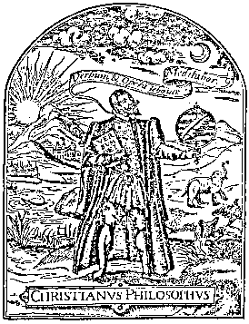例如塔比特·伊本·昆拉（Thabit Ibn Qurra）就在他的*《图像之书》（De Imaginibus）*中叙述了很多与卜卦占星有关的操作。但是一般这些操作所需的卜卦盘都具有某些限定条件，例如要符合根本性，并且不能出现与目的相违逆的征象等等。在《贤者之书》中，我们也可以常常见到一些与其他占星技巧有关的魔法操作。
占星魔法的现代实践至此，笔者虽然没有正面回答什么是占星魔法以及它能做到什么，但是想必大多数人已经对此有了一些印象。不过也可能有人对这些并没有实感，因为看起来它们的年代有些久远，更像是一些故事，真实的程度让人生疑。下面，我便摘译现代占星魔法实践者克里斯多夫·沃诺克（Christopher Warnock）的一个实践案例，来见证占星魔法的效用，这个魔法的基本思路取自于*《图像之书》*的第一章。
**De Imaginibus 第一章摘译：**其中是用于驱逐蝎子的图像。如果你渴望这么做，在天蝎座升起时开始操作，用铜、锡、铅、银、金等材料制作一个蝎子图像，材料随你喜欢。在上面雕刻上升星座和其主星的名字，你进行操作那天的时主星的名字，月亮的名字；使月亮位于天蝎座。尽你所能使上升不幸，使上升主星不幸，如果你能做到的话，就将其放在死亡之宫（8 宫），尽你所能使上升主星不幸，或让其在 4 宫或 7 宫合相凶星。**克里斯多夫·沃诺克的实践，抑制老鼠的符咒：**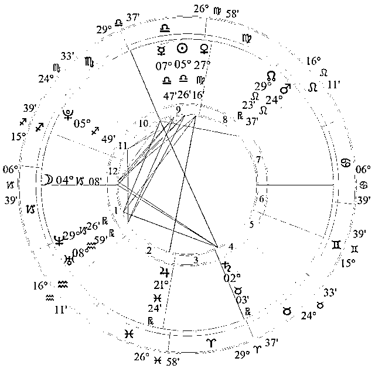我的第一个任务是为星盘确定恰当的上升：也就是老鼠的上升。阿尔比鲁尼（Al-Biruni）说摩羯座主管“爬行动物”。这可以由老鼠的自然主星进行确认。著名的英国占星师威廉姆·利里（William Lilly）说土星主管老鼠，以及“所有不洁生育的爬行生物，无论是土地、水流还是废墟中”。因为我们认为老鼠是害兽，它们可以被恰当描述为联系到腐败的爬行动物，所以土星主管的星座会是一个合适的上升。摩羯座被视为一个兽性星座，被羊/鱼的形象代表，而不是水瓶座那样的人形，它也是一个土象星座，代表靠近地面或门槛的低洼黑暗的位置，将土星主管的星座作为老鼠的上升似乎是最为恰当的。因为摩羯座（至少部分）由哺乳动物代表，因此它比天蝎座更加优先，天蝎座是治虫魔法的自然选择，尤其是带针刺的昆虫。我们希望使月亮在我们选择的摩羯座上升。我挑选了 1998 年 9 月 28 日下午 2:29，地点 Washington, D.C.的时间，并获得了上图的星盘。再次重申，这是为了使月亮在摩羯座上升。17 世纪的英国占星师 William Ramesey 说：“因此（在任何目的良好的择日中）月亮...不应该位于上升...”月亮因为在其失势星座，受克严重。上升星座摩羯座的主星土星是大凶星，逆行并合相 4 宫头，这是代表墓穴和“事物终结”的宫位。金星是上升的宫神星，也即是在上升点具有最大尊贵的行星，因为落陷和日光下而受克。它距离 8 宫差 2 度，实际上它和上升主星土星都没有位于 8 宫。金星也是土星的定位星。象征死亡的 8 宫主太阳落陷。金星和太阳都四分相月亮与上升点。太阳入四分相月亮且无接纳，使这个相位是尤其凶险的。我在纸的左侧绘制了老鼠的图像。我写下了上升摩羯座的符号，上升主星的符号，月亮的主星土星的符号，日主星和时主星的符号，月亮的符号。我然后到房子的四个角，收集四个角的土，放在这张纸上。我紧紧将纸折叠，然后将其放在中央墙一个近便的开口中，尽量靠近房屋中心，说：“这是老鼠的坟墓，它不会进入这房屋之中，老鼠滚开吧”。恰好在那一天老鼠被陷阱抓到了。

对于我们而言，了解占星魔法可能是很有意义的，正如托勒密占星百言中所说的那样：*“一个有技巧的人，当他意识到星曜的性质时，将能避免它们的许多影响，并在影响发生之前做好准备”*。而在*《贤者之书》*中，似乎对这个格言进行了一些细微的修改，可以更好地表达我们对占星魔法应持有的态度：*“若占星师了解它们和其操作，并理解它们的影响，那么就可以制止并对抗很多星辰及其性质的影响。他可以使那些接收星辰的事物，在接收星辰的影响之前，受到他的影响。”*

如果诸位看官喜欢这篇文章的内容，请长按下方二维码关注我们的公众号，会不定时有更多精彩内容推送哦。

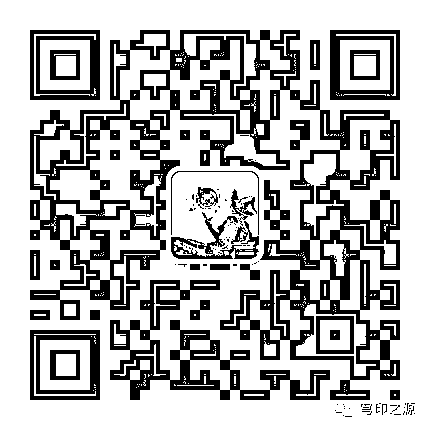 

# 【卜卦占星·宠物篇】宝宝去哪儿了？

> 原文：[`mp.weixin.qq.com/s?__biz=MzI5NTM0MzAzNg==&mid=2247483786&idx=1&sn=c4bb2a3729b374c320cb8769680df69f&chksm=ec544759db23ce4ff5e2c21aa8f333425dfe1e463b38b9dc1ddea88d4a07404130e1b8aad5c5&scene=27#wechat_redirect`](http://mp.weixin.qq.com/s?__biz=MzI5NTM0MzAzNg==&mid=2247483786&idx=1&sn=c4bb2a3729b374c320cb8769680df69f&chksm=ec544759db23ce4ff5e2c21aa8f333425dfe1e463b38b9dc1ddea88d4a07404130e1b8aad5c5&scene=27#wechat_redirect)

敢问喵在何处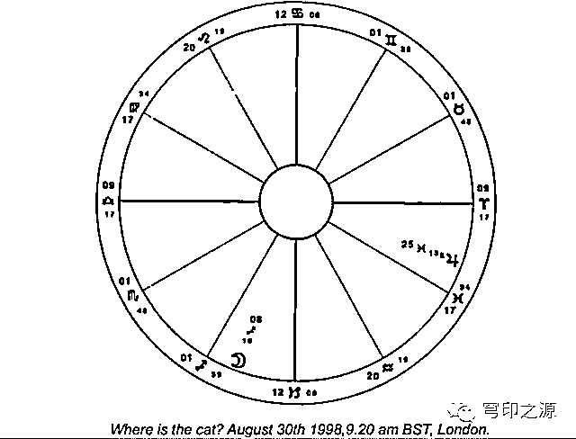喵星人在哪儿？1998 年 8 月 30 日，英国夏令时上午 9 时 20 分，伦敦。       对于以 John Frawley 的《The Horary Astrology》入门卜卦占星的同学来说，一定不会忘记开篇出现的第一张卜卦盘，它以独有的简洁性向我们展现了卜卦占星的魅力。背景是，起卦人隔壁的猫经常会溜进自己家中，但最近几天它没出现，起卦人有点担心它的安全，于是起卦求问。       阐述第六宫时，William Lilly 说：*It concerns men and maid-servants, galley-slaves, hogs, sheep, goats, hares , coneys ,all manner of lesser cattle, and profit and loss got thereby.* （《基督占星学 II》p54）“（第六宫）掌管男仆和女仆，苦役犯，猪，绵羊，山羊，野兔，兔子，各种各样的小型牲畜以及由此所产生的损益。”       一般将马匹等比山羊还要大的动物归入十二宫。       喵星人作为小动物，由星盘的第六宫代表，木星是代表猫的征象星。由于木星在双鱼座，在自己的庙宫里，而且水象星座代表水多或舒适柔软的地方，因此判读此喵在自己的窝里。木星逆行说明了它会再度溜进求问人家中。月亮向来是卜卦盘上十分重要的星曜，而且作为共同征象星时更加是*有生命的物体*的象征星，而月亮六分上升，离准确六分相还差一度，因此判断约 1 天后这只猫会再回来。而事实也正是如此。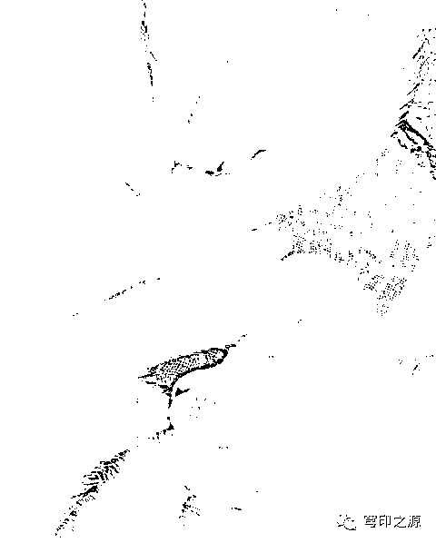须知道，第六宫一般是一个凶宫弱宫，与奴役、苦劳、疾病这些听起来就不大好的事物联系在一起，为何会联系到小型动物。大型动物为何又会是第十二宫。笔者本身初步的理解是，在产生占星学的遥远古代，动物出现在人类生活的方式一般是以野兽、牲畜，偶尔以宠物形式出现。从野兽的层面来看，它们对于人类的生存生活甚至生产是不利的，因而是**不合意（inconjunction）**的宫位，而在大小上则有因为体型大小区别带来的危害的多少的区别，且它们无论大小也属动物，因此分配了具有凶性大小区别且有对宫关系的六宫和十二宫。而从牲畜的层面来说，牲畜属于被人类驯服的兽类，为人们所服务，被人们所奴役，而它们的地位却不如人类角色（父母、配偶、手足、子女、朋友、上司领导乃至国王）在人类生活中那么显眼瞩目，因此占据了果宫的位置。当然这仅仅是笔者的理解，如果有读者有更好的理解，不妨可以在后台留言，共同交流进步。        看完一个简洁的盘例，不妨将镜头从外国拉回本土，看一个相对复杂的卦例。再问汪在何方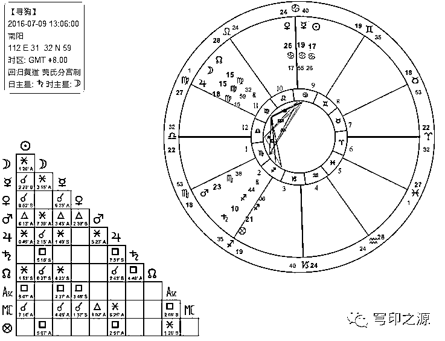

      7 月 6 日晚上 18:25 分，求问者家里的贵宾狗在小区门口监控中消失，已经找过它常去的地方，均没有找到，也没有归来，于是求问者之后向占星师求问。

      这是一个妙处丛生的卦盘。上升天秤，金星是案主的征象星，而木星（掌管六宫头的双鱼座）和月亮（有生命的物体）则是宠物的征象星。木星落陷且在其转六宫，说明其状况或所受待遇不佳。而盘中更有一个微妙的“四角关系”或准确来说是“三角关系”：月金互容，月水互容，水木互容，金木互容。但其实月木都是宠物的征象星，所以严格来说其实是三角关系。那么问题来了，水星是谁？可能是第三方的人，ta“互容”了宠物，狗可能在 ta 手上。能否找到？月亮先入相六分太阳，然后入相合相木星，太阳也入相六分木星。而水星则出相木星，三分火星然后合相金星，可以将木星的光线带至金星。可以看到这个过程是曲折的，但结果有利。因为日月均在地平线上，带来光明，照亮暗处，吉相的关系可以让事情突然水落石出或是柳暗花明又一村。这种思路可以参考 CA II 中寻找失物的章节。求卜者与宠物征象星之间的有利互动越多，则寻回的可能性越大。

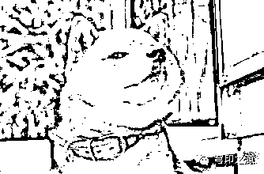       结果，案主在 43 天后看到一个女子在叫卖宠物（水星合金星），一眼认出了自家的汪星人，只是也没有声张，将其买了回来。约六周的时间，而金水之间的度数差似乎正好说明了问题。只是两大凶星在二宫，而火星（二宫主，代表案主的钱财）出相三分金星，被水星入相三分，正好是钱财的流动或说损失的方向，相比起找回自家的宝宝，这财破得倒也没那么心疼了（水星也正是十二宫主星，与二宫勾连正是损财之星）
三重案例       相比起在古代，人与动物的关系在现代更多地变成了主人和宠物的关系。有人会认为，钟爱的宠物犹如自己的骨肉子女一样，应该考虑用五宫，而不是具有更强的奴役和服务含义的六宫。但个人在实践中还是认为六宫更为妥当。以下的这个卦盘，对笔者来说，更充分地说明六宫应是在卜卦中考量宠物的首要宫位。也许你可以参考五宫，但六宫不能忽略。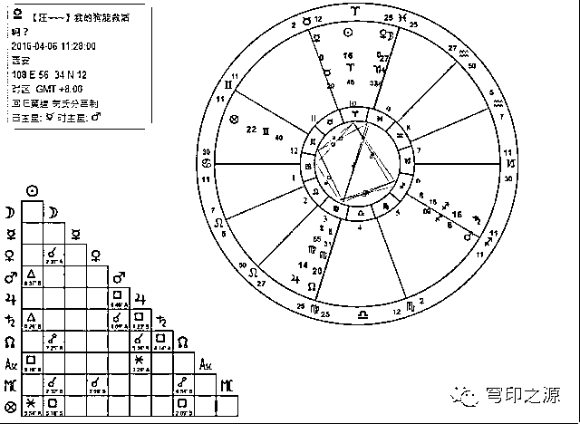

      投入的感情久了，到了离别的时候总会倍感难受。这是笔者的朋友收录的一个宠物卜卦盘。检查根本性，上升巨蟹座，时主星为火星，在 William Lilly 的卜卦体系中，水象星座的三分主星日夜均为火星，因此本卦符合根本性，且火星在六宫。两大传统凶星坐六宫，足以描述宠物狗重病而大限将至的情况。六宫主星木星在果宫三宫兼落陷，逆行，这些都描述了宠物的身体状况虚弱到了极点的状况。木星出相四分土星，火星入相四分。这是一种被凶星夹击而苦无出路可言的情况。火星在这里也是**喜乐**，但喜乐是否意味着得吉或凶性减少？并不是。所谓喜乐其实是**行星在某个位置尤其强大并感到舒适**。注意这里火星并不能与木星准确四分相，因为在不久后火星第一次停滞并在其后逆行。但显然宠物的虚弱情况已经不能支持其撑过这个天象，起卦两天后去世。而在中天瞩目的金月分别是六宫的转六宫和转八宫的主星。一方面可表案主心里（月亮）关注宠物的疾病（金星为六宫的转六宫——十一宫主星），另一方面也提示事态的进展。月亮在双鱼座空亡，但换座后立马在角宫合相金星，因此事态并非僵持停滞或维持现状，而是很快有结果。但金星作为落陷的六宫的转六宫主星，无法给予吉星本身的吉性，使事态出现解救。而六宫过凶，木星过弱，无解救。我们只能说生死有命数，但至少我们不曾亏待它们。

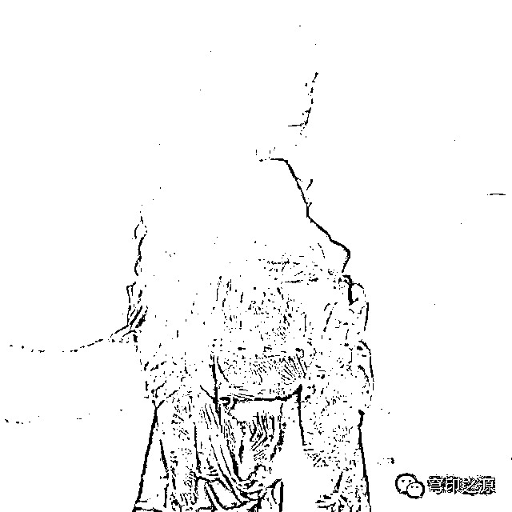

       卜卦占星正是以各种微妙的对应一直吸引着笔者在这条路上不断探寻求索。为了回馈读者，穹印之源内部决定，于 9 月每周从读者留言中选取三个卜卦问题予以免费解答。读者可在后台留言，留下**清晰规范**的卜卦问题（合理且在中短期即可反馈，而非一生的祸福问题），**适当的背景**，并附上起念求问的**时间**（精确到分钟），**地点**（省市乃至县区）。**心诚**才可以有相应的具备诚意的卦盘哦。我们将会安排专人联系选中的读者，给予解答。更多占卜/课程活动请继续关注我们的公众号哦~


# 行星敌友关系概论

> 原文：[`mp.weixin.qq.com/s?__biz=MzI5NTM0MzAzNg==&mid=2247483791&idx=1&sn=a9ca39895a5b9b83a0de511e1f99d867&chksm=ec54475cdb23ce4aeeab2e747210734bc534d17e6d9955b00e748913386552af5afe9a560052&scene=27#wechat_redirect`](http://mp.weixin.qq.com/s?__biz=MzI5NTM0MzAzNg==&mid=2247483791&idx=1&sn=a9ca39895a5b9b83a0de511e1f99d867&chksm=ec54475cdb23ce4aeeab2e747210734bc534d17e6d9955b00e748913386552af5afe9a560052&scene=27#wechat_redirect)

行星敌友的价值如果有诸位之中有熟悉印度占星的人，应该会知道在其中非常重视行星所固有的敌友关系。在我们国家的星命学七政四余中，也着重五星彼此之间的生克制化。而实际上，在西方占星中，行星之间同样也有敌友关系，但是历来对此的着墨都不是很多。
那么行星敌友关系对我们具有什么样的价值呢？当代卜卦占星名家**苏·瓦尔德（Sue Ward）**曾说过：*行星作为“朋友”和“敌人”的分类提供了一种对于（行星）这些性质和特点的阐释。它也用于演示行星彼此的关联。*所以，**敌友关系**也是一个帮助我们理解**行星性质**的工具。因此虽然在西方占星中，敌友的概念可能是未经充分发展的，甚至是缺乏必要的，但是笔者仍想要对于这个有趣的部分略作整理，希望能对各位有所启发。虽然对于行星敌友的阐释并不繁多，但是我们却有几种敌友关系可供参考。基于星座的敌友关系笔者在此要介绍的第一种敌友基于星座的守护关系。**阿格里帕（Agrippa）**在他的***《神秘哲学三书》（Three Books of Occult Philosophy）***中说：*在行星之间有另一种敌对的情况，也就是它们的星座相对，就如土星与日月对立，木星与水星对立，火星与金星对立。当它们的擢升星座对立，它们的敌意是更强的，如土星与太阳，木星与火星，金星与水星。*接着他又说：*当一颗行星擢升在另一颗行星的星座时，它们也是友好的，就如土星和金星，木星和月亮，火星和土星，太阳和火星，金星和木星，月亮和金星。*这种敌友关系是很好理解的，它是由行星的主管的入庙和擢升星座，以及星座之间的吉凶相位所延伸而成，因此笔者在这里就不对这个部分进行太多的阐述。基于星性的敌友关系我们要介绍的第二种敌友基于行星本身的性质，实际上与第一种敌友会有一些重合的地方。例如在同一个章节中，**阿格里帕**说：*但是，如果它们的性质、特性、实质和力量相一致时，它们的友谊将会是最牢固的，如火星与太阳，金星与月亮，木星与金星。***芭芭拉·邓恩（Barbara Dunn）**也在她的***《卜卦占星重探》（Horary Astrology Re-Examined）***中说道：*虽然行星的敌友可以依照它们主管的星座而确定，但阿尔比鲁尼(Al-Biruni)在这个主题上提出了不同的理论。例如一些占星师，将敌友基于行星本身的性情和性质上。在此情况下，土星和木星将被视为敌对的，因为：“……一个是黑暗的、有害的和非常遥远的，而另一颗是光明的、仁慈的，并且只是适当的遥远。”*此外，她还继续介绍了**莫林（J.B.Morin）**的观点，**莫林**依据行星的性质，提出行星之间存在某些**协调或不和**，并且以相似的方式阐述了行星运作的效应。对于此我们可以大致整理如下：1.含有活性质料（vital qualities），也即是热与湿的行星是协调的。例如太阳和木星。2.含有敌对质料的行星是敌对的。例如太阳和土星。3.两颗“协作”的行星若导致质料的过度将会是有害的。例如太阳和火星。4.太阳和木星涉及生命与成功，木星和金星涉及好运和财富，或者子女和友人，月亮和金星涉及婚恋之事。5.木星和土星产生谨慎，严肃的智识和达成伟大之事的能力。6.水星和土星给予渊博和敏锐的心智，水星和火星产生活跃的心智。7.水星和月亮的协作会激起欺诈性的习惯，无礼与轻率的行为。8.太阳和火星导致傲慢自大。9.金星和火星的协作是不容易的，因为金星主管爱、平和与宁静，火星煽动仇恨、争吵与辛劳。10.土星和金星的协作无法提升外表的美丽，土星和太阳的协作从名誉和成功来看是无益的。11.土星和火星两颗凶星的协作极具毁灭性，因为它导致危险、道德堕落、厄运等等。**莫林**的一个不同之处在于，他有以星体实际对应的事物，例如**成功、财富、婚恋**来说明这个主题。因此他对于行星性质的论述也许是更容易在实际解盘中尝试的。**亨利·科里（Henry Coley）**也在他的***《占星全技艺之匙》（Key to the Whole Art of Astrology）***中提到了行星的这两种敌友关系：*但是也要依据本性、品质、实质与力量研究友星，（它们是）火星和太阳，木星和金星，金星和月亮。基于宫的对立的敌星，也就是土星和太阳，土星和月亮，木星和水星，火星和金星。依据擢升的敌星是，土星和太阳，木星和火星，水星和金星。*如果我们观察相对立星座的守护行星，我们就可以发现它们实际上也是本身性质倾向对立的两颗行星。例如狮子座的主星太阳与水瓶座的主星土星因为星座关系互为敌星，太阳是赋予生命的、明亮的，而土星却是代表枯寂的、黑暗的。其他情况也可以据此类推。其他类型的敌友关系在此要介绍的第三种敌友关系相比前两种，可能是更加让人费解的，我们在此主要介绍两个人的记载。在他的作品中，**阿格里帕**说：*此外在天体中，水星、木星、太阳和月亮是土星的朋友，火星和金星是它的敌人。除火星外的所有行星都是木星的朋友，除金星外的所有行星都厌恶火星。木星和金星喜爱太阳，火星、水星和月亮与它敌对。所有除土星外的行星都喜爱金星。木星、金星和土星是水星的朋友，太阳、月亮和火星是它的敌人。木星、金星和土星是月亮的朋友，火星和水星是它的敌人。*

我们可以整理成如下的表格：

|   | **友星** | **敌星** |
| **土星** | 水星、木星、太阳、月亮 | 火星、金星 |
| **木星** | 土星、太阳、金星、水星、月亮 | 火星 |
| **火星** | 金星 | 土星、木星、太阳、水星、月亮 |
| **太阳** | 木星、金星 | 火星、水星、月亮 |
| **金星** | 木星、火星、太阳、水星、月亮 | 土星 |
| **水星** | 木星、金星、土星 | 太阳、月亮、火星 |
| **月亮** | 木星、金星、土星 | 火星、水星 |

可以发现，因为某些未知的原因，土星没有分配给太阳作为敌友，太阳没有分配给月亮作为敌友。与这种敌友版本相似，**威廉·利里（William Lilly）**也在他的***《基督占星》（Christian Astrology）***中提供了行星的敌友，但是与**阿格里帕**略有出入，我们整理表格如下：

|   | **友星** | **敌星** |
| **土星** | 木星、太阳、水星 | 火星、金星 |
| **木星** | 土星、太阳、金星、水星、月亮 | 火星 |
| **火星** | 金星 | 土星、木星、太阳、水星、月亮 |
| **太阳** | 木星、火星、金星、水星、月亮 | 土星 |
| **金星** | 木星、金星、太阳、水星、月亮 | 土星 |
| **水星** | 土星、木星、金星 | 太阳、火星、月亮 |
| **月亮** | 木星、太阳、金星、水星 | 土星、火星 |

除了这个版本之外，**利里**在其作品中还提供了另一套行星敌友的版本，同样整理如下：

|   | **友星** | **敌星** |
| **土星** | 木星、太阳、月亮 | 金星、火星 |
| **木星** | 土星、太阳、金星、水星、月亮 | 火星 |
| **火星** | 金星 | 土星、木星、太阳、水星、月亮 |
| **太阳** | 木星、金星 | 土星、火星、水星、月亮 |
| **金星** | 木星、火星、太阳、水星、月亮 | 土星 |
| **水星** | 土星、木星、金星 | 火星、太阳、月亮 |
| **月亮** | 土星、木星、金星 | 火星、太阳、水星 |

这种敌友关系可能看起来是缺乏规律的，或者摸不清头脑的，但是实际上从**星体性质**出发，我们或许也可以把握其中的关键。**苏·瓦尔德**的论述可以为我们提供一些思路：*注意到在利里的列表中有一个很有趣的现象，太阳有益于土星，但是后者却无益于太阳。这并非是一个错误；科里重复了这个观点。在古典的理论中，正如托勒密记述的那样，土星被分配给白天以缓和它极端的冰冷性质。因此，太阳因为它加热性的影响变成了它的友星，或者有助于它。从另一个方面来说，土星的寒冷对于太阳是有害的。*我们对于行星敌友类别的概述到此为止，限于篇幅一些论述可能无法完全展开，下面我们将集中于一些比较实践性的面向。敌友关系的实践面向关于敌友应用的论述是相对来说比较稀少的，但是不代表我们对此完全莫衷一是。**莫林**在他的***《高卢占星第 21 册》****（Astrologia Gallica 21）***中说：*此外，当上升位于白羊座时，这个星座会按照其主星火星的性质影响上升，而非相对的金星性质；或者狮子座上升的影响会依照太阳的性质，而不是相对的土星性质。而金星或土星因此无法影响上升的含义，因为它们只能通过自己的性质行动，而这种性质因为它们（与上升星座）的憎恶，不存在于上升之中。但是如果木星是上升主星，并与上升点三分相，幸运的影响就会通过木星在上升点的尊贵而增长，然而如果土星在上升失势，并与其四分相或对分相，凶相位的恶意就会增大，因为土星的性质对立于上升星座的性质。据此，这种对立性是上升星座本身所固有的，因为它的影响依照它主星的性质，但是土星没有那个星座的相位就没有影响。因此，当评估上升点和任何其中的不利影响时，土星若无没有四分相和对分相，都将不予考虑；其他星座也以此类推。***莫林**的这一段论述是很有趣的，它指出了行星性质和上升星座的性质是否对立将会影响这两者的互动。例如**土星**与**狮子座**的性质相对立，因此土星对狮子座上升的凶相位是伤害更大的，因为“土星的性质对立于上升星座的性质”，他甚至主张“当评估上升点和任何其中的不利影响时，土星若无四分相和对分相，都将不予考虑”。而按照**莫林**的论述，星座的性质和某颗行星相对立，是因为这个星座会按照其主星的性质产生影响，从而对立于某颗行星，因此它归根结底乃是**行星之间的对立**。所以我们也许可以把这个思路推而广之，用于行星的互动之上。除了本命盘的解读之外，行星的敌友关系就如其字面意思暗示的那样，可以用于**人际关系**的解读中。在**利里**的***《基督占星》***第三册中就应用了这个方法。在进行评估时我们会以两个人第 1 宫内的行星和上升主星为主，如果它们是同一颗行星，则代表他们会是相互喜爱的。如果它们并不是一颗行星，我们就可以参酌行星的敌友关系来确定，在此限于篇幅，笔者便不累述这个方法。敌友关系的魔法面向在魔法中，行星敌友也占有一席之地，甚至对于我们来说是更富有启发性的。正如**阿格里帕**所说：*无论上级事物的友好和敌意是什么，都决定了受制于它们的下级事物的倾向。因此，这些友好和敌意的情况无非就是事物彼此之间的倾向。当某个存在渴望这样的事物，而且缺乏这种事物的时候，它就会移向至此，除非遭受到阻碍，并在获得之后停留在其中。反过来说，当某个存在回避并且恐惧靠近它时，就不会停留在其中或者与其产生关联。赫拉克利特因此以这种观点为指导，声称万物都由敌友而生成。*这个世界上的万物都受星体治辖，每颗行星都对应了某些事物。我们若从这个前提出发，就可以明白，行星之间的敌友，实际上也是世间万物的敌友。因此，只要得知某些事物的星体对应，我们可以用这种敌友关系去阻碍或者达成某些事情。下面就让笔者引述***《贤者之书》（Picatrix）***第一册中所记载的一个魔法来进行说明：***阻碍建筑物以使它们无法建成的图像****制作两个图像，一个在太阳时且狮子座上升时制作，另一个在月亮时且巨蟹座上升时制作；要在月亮是上弦月，安全远离凶星并且顺行的时候。当它们被制成时，将它们在金星时埋起来，它们便会阻碍建筑物。*那么为什么这个图像（符咒）会有阻碍建筑物的功效呢？如果我们从行星敌友的角度思考，一切就都明朗了。建筑物本身是**坚固的、立基地面的、稳定的**，因此具有**土星**的性质，而日月又是土星的敌星（基于星座关系），金星本身守护的金牛座和天秤座也与土星的星座成四分相。在这种敌对天体的不断加强下，土星所代表的建筑物就被阻碍了。除此之外，在***《贤者之书》***第三册中也明确肯定了敌友关系在魔法中的效用：*涉及到老人或慷慨之人，评议员，城市的统治者，隐士，在土地中劳作的人......或是任何已经提到过的属于**土星的事物**，并且你请求一些属于他性质的事物，你可以用我们在下面描述的方式请求它，你也可以在你的愿望中通过**木星的方式**帮助自己。**从**火星**那里寻求与他的性质一致的事物，例如反对军人，官员，战士和那些以好战行为驱动自己的人的愿望......在这些之后的愿望中你可以用金星帮助自己，**因为金星的性质消融通过火星而到来的事物，并修理他所损坏的事物。**向**金星**寻求所有属于她的事物，例如女人、男孩们和女孩们、女儿的愿望......在这些愿望中你也可以用**火星**帮助自己。*我们可以看到，这些行星所对应的事物，既可以通过本行星的力量来完成，也可以通过其对立行星的力量来完成。这是一个很有趣的思路，其中更多的可能性，就要留待诸位去自行探索了。如果诸位看官喜欢这篇文章，请长按下方二维码关注我们的公众号，后续会有更多精彩内容推送哦。**长按二维码，关注我们**

# 古典占星の夹逼定理，这个不好吃的“夹击”让人绝望【上】

> 原文：[`mp.weixin.qq.com/s?__biz=MzI5NTM0MzAzNg==&mid=2247483800&idx=1&sn=1ff280fb8559b165374156e83caca32d&chksm=ec54474bdb23ce5db5203e91cfe9006049f778900564479afdf2f6ae4c7739de3f3e21d3a8d5&scene=27#wechat_redirect`](http://mp.weixin.qq.com/s?__biz=MzI5NTM0MzAzNg==&mid=2247483800&idx=1&sn=1ff280fb8559b165374156e83caca32d&chksm=ec54474bdb23ce5db5203e91cfe9006049f778900564479afdf2f6ae4c7739de3f3e21d3a8d5&scene=27#wechat_redirect)

围攻夹击包围 Besiege 熟悉中国传统命理术数的同学可能有听说过紫薇斗数中的“日月夹财，不权则富”。这些命格在中国命理的“老司机”手中会玩得特别 6，让人惊叹术数的博大精深。而其实古典西洋占星中也有类似夹/辅一样的格局配置，只是在历史的长河流至当代时，不少的传承已经流失乃至被人淡忘，导致现在风行的现代占星中绝少能看到有关“夹”的论断技法。今天，我们就来聊聊古典西洋占星中的夹或说**“包围”**
广义上，古典占星中的**包围（besiegement）**是指一个点，一个行星或光体乃至一个宫位，两边分别有两颗或以上的星体或星体的光线，使其成包围之势。
但是这个定义还是太！广！义！了，我们还是直接来点狭义的吧。

在古典占星中，最常用的被攻对象还是以上定义中的行星或光体，而包围的星体一般均是凶星或吉星。今天这篇推送，我们暂且只讨论关于凶星的包围，而由于被凶星包围的负面含义，我们姑且将其称为**“围攻”**或**“夹击”**，并主要着墨于星体受围攻的情况。

 

回归典籍在 Abū Ma’ shar 的 Great Introduction to Knowledgement of the Judgements of Star（以下简称《星知启论》）中，他论及到了围攻，限于篇幅，今天仅以三个重要段落来深入解读并延伸围攻的意蕴：

【1】***Also, another impediment is what is called “besieging.” And it comes to be in two ways. One, that a planet would be in some sign, and there is a bad one(or its ray) with it in the same sign, in front of it and behind; or a planet would be separating from a bad one by the conjunction of one sign or by aspect, and it would be joined to another bad one in this condition.***

“以及，另一种克伤是所谓的“围攻”。而它有两种方式。其一，一颗星曜在某一个星座，有凶曜或其光线与它同在该星座，前后皆有；抑或是一颗星曜会从和一颗凶曜在同一个星座的合相或与凶曜的相位中离相，而它在这种情况下会入相汇合另一颗凶曜。” 

通过解读这一段落，我们可以看到，在这个定义中：①非常强调围攻/夹击是发生在同一个星座，因此跨星座的相位形成的围攻/夹击在

Abū Ma’shar 看来并不成立 ②第一种方式的两段论述中不同的地方在于前者单纯强调前后有凶星且不讲究是否在容许度内合相或成相，而后者强调出入相位，是前者的升级版。

比较典型的一个例子是，火星在白羊座 10°，金星在白羊座 13°，土星在白羊座 15°，此时金星作为下级行星，比土火均要走得快，前有狼（土星）后有虎（火星），出相火星，入相土星，是为围攻。

而如若木星在天秤座 2°，土星在射手座 10°，火星在射手座 27°。以容许度来说，木星被火星入相四分，而木星入相土星。按理应该是前有土星后有火星来夹击，然而在火星尚未走进摩羯座时，这种跨相位的四分应该是 Abū Ma’ shar 所不认同的，无法符合木星在一个星座里前后均有凶星或凶星光线的设定。


【2】***The second manner of besieging is that a planet would be in some sign, and a bad one is in the second sign from it by its own body or its ray, and the other bad one also( or its ray) in the twelfth sign from it. Which if there were not a plant in it, and the condition of the Ascendant(or the rest of the signs)were thus, the Ascendant or that sign will be besieged.***

“第二种围攻的方式是一颗星曜在某一个星座，而一颗凶曜本身或光线在第二个星座，另一颗凶曜本身（或光线）则在第十二个星座。如若该星座没有星曜在其中，上升星座（或其余的星座）如此，则上升星座或该星座被围攻。”
解读此文段，最好以整宫制的思路去考量，也就是一个星座就是一个宫位，上升星座就是命宫的思路。这时要注意，凶星不再与被攻对象在同一个星座中，而且也可以以光线/相位来影响邻宫。则可以推知两颗凶曜必然是在该星或该座在星座上的不合意星座中，这样才可以对被攻对象不成相而仅仅落在邻星座或与邻星座成相。这种思路其实与本文开头说的“日月夹财”或“日月夹命”的形式相近。同样的思路，笔者在学习吠陀占星的过程中也能看到。在入门的印占学习中，你会碰到，一个宫位或行星被前后邻宫的吉星包围，是为 Subhakarthari Yoga；被前后邻宫的凶星包围则为 Papakarthari Yoga，而当某宫或某星被夹时，则相应影响该宫位或星体掌管的宫位或天然象征的事项。


【3】***And in besieging by degree, if the Sun or a certain one of the fortunes aspected the besieged planet by an aspect of friendship, and there were less than 7°between that planet and its rays, it signifies the loosening of that evil. And if the sign were besieged and a fortune or the Sun aspected it as above, they dissolve that impediment. And if a planet or sign were besieged by the fortunes, this will be of the more worthy fortunes.***

“在以容许度/度数围攻的情况下，如果太阳或某一颗吉曜与被围攻星曜成友好相位，其相位光线与被围星曜少于 7°，这代表化险为夷。而如果被围星座与吉星或太阳的关系如上，则它们解救克伤。而如果一颗星曜或一个星座被吉星包围，则吉星是锦上添花。”

这一段说明了解救围攻的配置以及被吉星包围时又如被簇拥。

而实际上，以第一种运用得比较广泛，而且由于有相位关系的不同，围攻并不完全就是死局，也有程度上的轻重，且断不可不考虑全盘的其他因素就根据这个配置下结论。

延伸运用落实到具体事项中，围攻的本义可以有怎样的体现呢。综合笔者的所知所见所想，大概可表现在以下一些方面，具体推导就不赘述了，选择具体的韦特塔罗也是一种触类旁通的思路哦~：

**客观上**：

**①身体动弹不得→瘫痪，麻痹，疾患，绑架**

**②隔离，受限制乃至失去人身自由**

**③徒劳无功，难以力挽狂澜**

**④孤独，孤立无援，不受支持**

**主观上**：

**①前有狼后有虎→恐惧，畏惧，被胁迫**

**②进退维谷→选择与下决定的困难**

**③四面楚歌，孤立无援→绝望无助**（你是釜山行派来的僵尸吗？）

**④被孤立，不受支持→沮丧，憋屈**

实际中的情况往往是主客观的情况交错综合的。而下面我们从本命和卜卦这两个角度来看看围攻的实践价值。需要注意的是，土星和火星并非一定就全凶，还要看它们在盘中是否掌管盘主本身或对盘主有极大益处的宫位。

**在本命中的运用（上）**熟悉 William Lilly 评价星体力量强弱的量表的同学，应该知道，当某一星体被土火围攻时，则在偶然尊贵/后天禀赋（Accidental Debilities）中会好感度-5，啊，不对，得分-5。这代表了该星体的整体力量的受损，也有损该星体所掌管的事项。可以推知，在不考虑解救或其他征象时，被凶星围攻整体上不利。但具体表现则要参看全盘而定，不可一概而论。

这个命盘的盘主是芝加哥当地富甲一方的家庭的“富二代”，也被认为是高材生，在 1924 年 5 月 21 日却伙同了另一个当地的富家子朋友合谋虐杀了一个年轻男孩（留意十一宫宫主星兼八宫主星木星在十二宫与四宫主星月亮以逆行入相合相），最终东窗事发，锒铛入狱。

盘中最明显的牢狱征象主要体现为：

**①William Lilly 曾记载，任以光体在角宫被土星或火星以刑冲合克伤，且在凶星的庙宫即白羊座，摩羯座，天蝎座或水瓶座，而压迫光体的凶星在狮子座或巨蟹座，则有牢狱之虞。日月既是身命，土火也是牢狱与诉讼。**

此处土星不在狮子座或巨蟹座，但在十宫刑克在七宫的太阳。盘中被围攻的是太阳，土星光线在太阳后方，火星光线在太阳前方，太阳离开与土星的四分相，以六分相入相火星。

**②另一光体月亮则与后天凶星八宫主星木星在具有牢狱含义的十二宫**

**③命宫主星金星则被十二宫主星（暗敌）兼七宫主星（明敌）火星入相四分**

统合起来，最起码命盘中有得罪有权的人或一方的征象。而因为土星（十宫主）也是权威、法律上的惩罚/压迫，火星则是法律诉讼与牢狱的征象星共同围攻在七宫的被劫夺的四宫主星太阳，从而将案主与原生家庭（父母）乃至重组家庭（配偶）隔离开来，陷入无助的困境。
其年为水星大运水星小运，年限宫走至第八宫，触发八宫的水星及在十二宫的八宫主星木星。本命中在十二宫的月木则走至合七宫的太阳，火星走至十二宫中的月木。表现为因为损友而遭遇牢狱之灾。

   _(:з」∠)_ 最近沉迷印占和伏都的焌纹懒癌又犯了，下篇改天等我被穹印办公室的众人围攻催稿了再说......日常求关注~~

# 光之降临【上】

> 原文：[`mp.weixin.qq.com/s?__biz=MzI5NTM0MzAzNg==&mid=2247483812&idx=1&sn=78269bef0218495b8bfdd38f33614fd5&chksm=ec544777db23ce61ed85a04553ca9b74c4b2603f14351445e28b53fd976381e1a778a5e69c89&scene=27#wechat_redirect`](http://mp.weixin.qq.com/s?__biz=MzI5NTM0MzAzNg==&mid=2247483812&idx=1&sn=78269bef0218495b8bfdd38f33614fd5&chksm=ec544777db23ce61ed85a04553ca9b74c4b2603f14351445e28b53fd976381e1a778a5e69c89&scene=27#wechat_redirect)

          卡                   巴            拉 **源质威能之显现****注：本篇原文作者 Frater S，译者系穹印成员影子，链接请轻戳文末链接**       这是一个**将卡巴拉源质的力量带到王国的简短仪式**。每个源质都对应不同层级的天使，你可以通过共振对应的神名来激活你想召唤的源质，召唤它的力量。因为在这里我只能进行简短的论述，所以我假设读者知道每个源质对应什么神名**，**如果你现在还不清楚，我建议你通过网上的资源了解相关知识。        这本书里介绍的仪式，它的基础来源于金色黎明体系的架构。如果你想学习与圣化护符有关的技法，你可以阅读 Nick Farrel 的***Making Talismans***和 Pat Zalewski 的***Talismans and Evocation in the Golden Dawn***。如果你想要进入金色黎明的魔法体系，这两本书将教会你如何设计一个仪式。       我设计了一个魔法阵来进行这个仪式，你可以把**蜡烛**或者**护符**放在上面进行魔法操作。       这个圆最上面的是神名** EHEIEH**, 外圈依次排列着对应十个源质的神名。内圆建构在来自于王国的四种颜色上，上面有一个十边形和十角形组成的图形。它对应着数字十，作为一个象征在仪式中接收来自于星灵层的力量。并且当这股力量下降到物质层面的时候，负责使它稳固地保留在你的仪式中。在最里面是那“魔法的三角”，它被用来使力量集中作用于放在三角内的蜡烛或护符。在三角外面写着“**ARARITA**”，使用希伯来文字的神秘技法 notariqon 就可以得到一句话“***一是他的开端，一是他的性质，他是一的奥秘”***      因为这个祭坛的设立是为了投射来自于尘世的力量和接收来自于天堂神圣之光的降临，所以你可以在上面放上你的元素工具来辅助你的魔法工作。你可以使用象征火的权杖，象征风的剑，象征水的圣杯和象征土的五芒星。当然，你也可以使用为 0=0 层级的新人推荐的组合：红色的灯，玫瑰，一杯酒和面包或者盐。我个人建议你们使用**四张塔罗的王牌**作为代替。宝剑王牌放在祭坛的东边，权杖王牌放在南边，圣杯王牌放在西边，星币王牌放在北边。我更喜欢这种方法，因为它简便，塔罗牌也不会在祭坛上占用太多空间。       此外，一套脱胎于神秘主义传统的，得到时间认可的塔罗牌，具有引导人进入抽象的意识世界的作用。它也作为一面棱镜，折射它所象征的力量。如果你曾经试着把塔罗牌用于非占卜的仪式操作，你就会发现它们是非常有效的魔法工具。如果你采用了我的建议，你的祭坛将会看起来像这样：       我自然会召唤四位大天使来祝福我，在魔法操作中指引我。不过我不是仅仅通过**小五芒星仪式**来让他们“临在”于我的身边，而是使用**诚恳的祈祷**来创造与天使更加紧密的链接。在宇宙中，天使的力量是崇高的，所以我们最好停止命令他们，用诚恳的祈祷向他们问询，请求他们的帮助。       接下来我将举一个例子，关于如何在与卡巴拉有关的魔法操作中**圣化蜡烛**。如果我要赋予它 Chesed，卡巴拉生命树上第四源质的力量，我首先要使用神名 EL 将它作为神圣的祭品来奉献给上主。（这里的献祭其实是一种圣化的方法）Chesed 代表仁慈的力量，对应木星，可以用来在短时间内得到成功。你要注意选择合适的颜色，来方便你达到你的目的。（自然你也需要找到合适的熏香）选择好合适的蜡烛后，你应该在上面刻上对应源质的神名和大天使的名字。如果可以的话，你也可以刻上对应你意图的词语或者魔符。如果你仅仅只是想要沉浸在某个源质力量的洗礼中，那么这是不必要的，但你一定要注意**清晰**地表达你的诉求。记住，在所有的相关操作中你都应该保持谨慎：你需要小心地让你的话语清晰，一旦你的表达含糊不清，你可能会陷入混乱中，受到误导。
       在仪式的中间，你需要通过“**闪电之光**”（一般被称为“燃烧之剑）的象征来将精神世界的力量降下。如果你不熟悉这个象征，你需要知道它是一条路径。在卡巴拉生命之树上，创造的力量由源头向下涌流，这条路径从最高点 Kether 一直下降到 Malkuth。你需要在视觉化燃烧的剑向下的时候共振对应的神名，并且当它不断向下的时候你也要注意维持它的视觉化。这就是为什么记忆各个神名的顺序和在树上的位置是有益的。因为当你在你的精神中（也是在星灵层）构建燃烧之剑的时候，你没有空余的时间打断专注来看你的仪式记录本。      你可以简单地使用你的手指来画出燃烧之剑。我不赞成你使用那些一般是用来驱逐和构建圆的元素工具或黑柄刀。如果你有一根在仪式中通用的法杖，这将是相当不错的。不过，这不是必须的。        你将会需要如上图的魔法圆，一根蜡烛，一块黑色的布，一条黑色的绳索，相配的熏香和一杯圣水。

（待续）

点这里“阅读原文”，查看更多

# 小议魔法与形而上学（1）

> 原文：[`mp.weixin.qq.com/s?__biz=MzI5NTM0MzAzNg==&mid=2247483813&idx=1&sn=953e9870aabbd5a05f565ff0ad31ad43&chksm=ec544776db23ce60193d2f12a43ac5badf6529eec345d66688af94b73b783331d72e602f1615&scene=27#wechat_redirect`](http://mp.weixin.qq.com/s?__biz=MzI5NTM0MzAzNg==&mid=2247483813&idx=1&sn=953e9870aabbd5a05f565ff0ad31ad43&chksm=ec544776db23ce60193d2f12a43ac5badf6529eec345d66688af94b73b783331d72e602f1615&scene=27#wechat_redirect)

12

小议魔法与形而上学（1）

作者：Homunculus 编辑&评注：断章

原作由作者载于微博

@Homunculus 洛丽塔酱，授权转载，略修订。


形而上者谓之道

形而下者谓之器    魔法可以说是人类文明的亚文化产物，目前为止它时常作为人类学，宗教学乃至于社会学的一个研究对象，却从未上升到成为一个独立的研究科目，而在前者中它也是以碎片化形式呈现的，并且是作为某一类的人类活动附属现象而被研究。迄今为止各种学科对于魔法的研究可以说是独立且片面的，之前未曾有人尝试过将各种魔法串联起来，以发现其共同点（不包括各种秘密结社以及魔法爱好者的努力）。不过值得庆幸的是，近些年来已经出现将魔法作为独立研究对象的大学课程，澳大利亚以及德国的一些高校，已设立相关的文化研究类课程。尽管要真正做到将魔法作为独立研究对象十分困难，目前为止这些课程也只是先驱性的社会科学研究尝试，但这不得不说是一种观念上的进步。

    魔法是一个很模糊的概念，由于它往往是多种不同思想混杂的产物，甚至是某种巫术思想或者宗教的蜕变，因此很难将魔法从巫术和宗教中分辨出来，也使得魔法难以定义。同样，广义的魔法在世界各地都存在，但各种魔法却具有完全不同的特征，也被标注上不同的标签，使得总体概括的可行度大大降低。故此文中所讨论之魔法，皆以西方概念中的魔法，即在英文环境中由现代魔法师阿来斯特•克劳利定义的*magick*为主。这里*magick*魔法一词被其设计为增添了一个 k 于末尾，以作和舞台演出的魔术*magic*分别。

“魔法是引起事物变化并引导至自身愿望方向的学术及技艺

Magick is the Science and Art of causing

Change to occur in conformity with Will

”    要了解魔法，必须先确定什么是魔法。按照克劳利的定义，魔法是一种“引起事物变化并引导至自身愿望方向的学术及技艺”。从这点来看，它就与神秘神学划清了界限， 大众常常它与后者混为一谈。相对后者，前者作为引导性学说及技艺的特征更为明显，作为工具的特性更强，这点是后者所不具备的。借助克劳利的定义，我们便为我们所讨论的对象缩小了范围，将魔法确定在泛魔法—巫术这个圈层内。巫术和魔法二者之间并不存在绝对的壁垒，这意味着很多通用的魔法方法和巫术之间存在某种关联，甚至巫师（即巫术使用者）与术士（即魔法使用者，与进行宗教行为的法师不同，法师首先是宗教职位的称呼）之间可互相借鉴，甚至有身兼此二身份者，这一特征在现代流派开创以来大大加强。不过，魔法和巫术之间依然存在差异。首先，引自弗雷泽的观念，巫术是对于思维的基本规律的错误运用，是使用了错误的相似联想或者接触联想的产物，并且巫术所暗含的逻辑更加简单，这与追求思辨且善于思辨的宗教神学理念不同，在神学架构之下衍生的魔法与巫术由此划分出一道浅浅的界限。其次，由于魔法模仿了宗教神学的模型，故更倾向于将现象进行抽象化概括，使之成为规律的运作以及特性的赋予，或者追溯至某种抽象本源并以象征进行表达。这是将现象概括为垂直或水平关系并进行简单模仿的巫术所不具备的，在这方面巫术更倾向于以具象形式进行表达。对仪式内容进行比较便可得知，如在美国巫毒教中人的替身多是人偶和形象，而在所罗门魔法里面代替具体个体的往往是代表其实在的名字。最后，由于巫术缺乏抽象象征，故多以直观且错位的能力运用进行实践，譬如在《伟大法师》（*The Magus*）一书中运用磁石辅助其他材料进行仪式，目的是以“吸引”的特性诱导“材料的潜在特性”从而完成施法，相对而言，具备更多象征手法的魔法则力图通过象征或比喻表达出相应特性，例如通过布置四元素及四方四时象征物以代替宇宙的基本特性，从而借助仪式，以仿神的身份模拟神祗对宇宙原初规律进行设置并加以掌握。由此可见，在具象与抽象的对比中，魔法与巫术拉开了距离，成为一类建立在复杂抽象世界观上的独特学术和技艺。‍‍断章：我们必须承认魔法与巫术的起源乃至是本质都是相连且无法割裂的。我们以方法论去衡量界定，就会发现二者之间的微妙关系。若是我们在此维持上述给出的定义继续进行讨论，那么其二者都以物质性利益为目的，巫术以简单原始的对应关系为方法采取措施，而魔法则唤起了更多形而上哲思从而以更加抽象的象征主义为方法进行演绎。但就我个人而言，对弗雷泽的理论是不苟同的。弗雷泽自己不承认巫术或是魔法的有效性而仅仅作为一种民俗学现象作为研究，故而无法对其背后的运作机制给出更深刻的思考。以“错位的运用”解释巫术并不为过，但私以为“错位的”一词已能折射其看待巫术的学术观点，即无效性，故在此不多作评论。‍‍魔法的设计，可以说几乎是建立在象征意义上的，尽管整个系统以物质为构建基础，但作为抽象符号的语言文字所拥有的独特性却在此间发挥得淋漓尽致。通过对于语言符号的把握，魔法的信仰者坚信其已抓住事物的背后本质；或通过不断切入并深化喻象指向其描述对象的抽象本质，从而与其抽象本质相连；并且相信其所指向事物已经通过表达或描述的形式以不可见的方式切实地关联或临在于仪式之中。可以说，魔法所做的一切，基本是围绕名或者实体展开讨论，并掺杂了对于符号表象的模仿。对于这点，可以援引阿莱斯特•克劳利的弟子，著名漫画编剧阿兰•摩尔的观点佐证。他指出，使用魔法仅仅是通过对符号，图像和文字进行处理而实现精神意识层面的变化。     然而，与其他认知如宗教神秘主义对于抽象根源的追求截然相反，魔法背后所支撑的思考，却是对于万物并非一体这一认知的否定，在此基础上，万物通过某套神秘的规律相连。这与深刻认识到个体之间无法逾越的差异的宗教观念背道而驰，对于本源与万物的关系在理解上也因此存在明显差异。这间接促成魔法信仰者，以及操作魔法的术士对于传统宗教观念持一种否定态度，转而诉诸于符号的具象层面表达及关联，而神哲学则走在真理探索的道路上，更倾向于对表象背后的抽象含义进行反思与探求。在这里，魔法背后所真正信仰的神，即某套交错于万物中并使之相连的规律，相较神学所探讨的至善至义的真理，更加机械，无情无性，这使得魔法这种信仰沦落为一种工具，甚至魔法自身便建立于真理工具化这一特性上。弗雷泽在进行巫术与宗教的比较时就进行了如此的概括，宗教的神具有人格，可以进行交涉，巫术则不，巫术信仰的基石便是一种超级规律，其不可交流亦无法感知。断章：就哲思而言，基督教因着其特殊的发展背景使其在辩经论道上尤其显赫，故成就了一套较为完整的神哲学体系。早期的教父把新柏拉图主义确立为基督教的指导思想，而早期的泛魔法-巫术之流在当时的历史背景下也同样被如此思想渲染，并在后来的神哲学冲击之下逐渐演化，我们现今熟知的古典魔法如此一来便初具雏形。因此，在中世纪的文献中，你会发现魔法与基督教世界观不可分割的关系，这一特征一直延续到了文艺复兴时期，直到现代仍然可见其影响。古典魔法的仪式高度借鉴甚至可以说是剽窃了天主教的圣礼，甚至在一些步骤（忏悔、涤罪等）中直接使用天主教对天父的祈祷文。    结合这一显著差异来看，可以毫不隐讳的说，魔法是巫术在神哲学冲击下的特殊产物，其外壳甚至结构都被替换为宗教神学，但其依然保留了巫术的内核。在接下来的历史讨论中，本文将对现代派魔法作一叙述，可以明显看到，相比古典时代的特殊产物，现代魔法的巫术特征得到放大，其神哲学成分受冲击而淡化乃至于丧失，使得现代魔法于今日与巫术的边界模糊不清。从另一个角度来说，古典时代的魔法已经逝去，现代思潮虽然打破了昔日作为特征的神哲学藩篱，对这一套内容进行了重组，并且有新式的理解，但是亦破坏了魔法的独立性与独特性。是故，可以说，现代魔法毁灭了魔法，传统意义的魔法已经消散于历史的尘埃中，即使今人试图复兴，也不过是借助现代的认知方式重复模仿古人的倒影。    然而再多定义，也不如描述更为直观清晰。只因魔法与巫术及圣礼的关系含糊不清，前者多有借鉴抄袭，且魔法的边界也常常因为想象及其尝试的缘故一再向外延伸。而其发明者实践者也受到他们所在文化的影响，自身欲望的驱使，以及当时认知的局限，故常出现魔法的更替。在这种背景下，如要试图抓住不断变化的魔法的本质，没有比直接面对其历史更好的选择。12**结语**

Homunculus：自于两河流域文明诞生至今，魔法经过了数代更迭，而其襁褓，仍保留在昔日通天塔上诸神的祭司篆刻的泥印之中。如若需要溯流而上，探寻魔法的根源，则必须将目光投向数千年前的阿卡德王国，魔法于人之头脑中诞生之时之处，尔后方可梳理其发展脉络，达到对其有明确的认知，终而剔除沙砾，将魔法这一概念真正从头脑中提炼出来，才能继续对魔法做更进一步的讨论。

断章：魔法师并不一定形而下，其区别于宗教的哲学背景与对宗教元素的高度借鉴使法术之流自古被宗教迫害打为异端。但这不代表魔法师就没有超脱的精神追求，这在中世纪的苦修，炼金术等中得以体现，这也必是我们日后的讨论课题之一。我欲以本文抛砖引玉，须知，形上哲思并不拘泥于形式，魔法也不是绝对的异端；我们要从哲学史角度解构其思辨发展，从文明发展解构人文发展及传播，从方法论解构流派之区分，再从唯物主义解构其不可证伪性的普世影响。
‍公众号 ID：穹印之源如果您喜欢本文的话可以关注我们获取更多推送哟(｡･ω･)

# 希腊神与希腊半岛

> 原文：[`mp.weixin.qq.com/s?__biz=MzI5NTM0MzAzNg==&mid=2247483826&idx=1&sn=32a5b8bdadaa90e516977c5e2b81c422&chksm=ec544761db23ce773fcef119f0d9f4f396cf4bf004aa7f4fe7e44bd8482cee39851a2033d30f&scene=27#wechat_redirect`](http://mp.weixin.qq.com/s?__biz=MzI5NTM0MzAzNg==&mid=2247483826&idx=1&sn=32a5b8bdadaa90e516977c5e2b81c422&chksm=ec544761db23ce773fcef119f0d9f4f396cf4bf004aa7f4fe7e44bd8482cee39851a2033d30f&scene=27#wechat_redirect)

前言几日前产生了 Note7 爆炸事件，韩国公司的公关方式令人咋舌，分析其背后的原因，我个人认为很大一部分是受韩国人观念中不可退步的意识形态影响，所以坚称手机本身没有问题。而究其根本，其不退步思想的由来又是因为立国在岛屿上，且与宿敌朝鲜对望，稍有不慎就会失足跌下万丈深渊，所以这种环境造成的恐惧深深的根治在他们心中。欧文男神曾这样说过：*人类过去、现在和未来，都始终是他们出生以前和降生以后的周围环境的产物。环境决定着人们的语言、宗教、修养、习惯、意识形态和行为性质。*——欧文欧文男神在这样一个前提下，我们就明确了，要了解一个民族的意识形态和宗教观念得要先从其环境入手。如果不了解韩国和日本等国的尴尬处境，也就无法理解其极端行为背后的原因，从而得出这不可理喻和歇斯底里的结论。同理，我们要理解希腊文明，也势必要从这个方面来入手。1 希腊地理在开始阐述我的观点之前，我想先向读者们抛出一个疑问，*为什么希腊神王是具有闪电和雷雨特质的？为什么十二主神里多是看得见摸得着的，而类似于命运三姐妹具有强大影响力的神却缺席其中呢？*首先我们需要看到的是希腊的版图：古希腊地图从上图我们可以看到，希腊较为重要，且对希腊神话产生及续写影响深远的城市都处于半岛的**东部**，希腊本身属于**地中海气候**控制地区，夏季受副热带高气压带控制，气流下沉，降水少，东部地处于盛行西风带，常年盛行西南风，但地势则是中间高两边低，地势阻止了盛行西风带来的水汽。希腊半岛多山地，少平原。东部的年降水量约 400~700 毫米，西部约 900~1200 毫米。希腊半岛的陆地部分**山多土薄**，山脉丘陵纵横交错，只有一些支离破碎的小块平原，而且又都被难越的关山所阻隔，**种地基本是养活不了自己**，迈锡尼就是前车之鉴。然而不种地的话连出口贸易的资本都没有了，死得更快。此外，希腊的北、中、南三部分陆路交通，因大山、丘陵作梗，在古代始终处于行路难的状态。而且我们知道，半岛是一种三面环水的陆地，所以海岸线自然很长，特别是希腊半岛的中部和南部更是海岸线曲折绵长，有很多的海峡和港湾，因此，希腊拥有相对于陆地面积而言的**世界上最长的海岸线**。所以希腊内陆各地的交通也多靠海运，尤以爱琴海的航运居多。这也造成了希腊的**海外贸易**很发达。由上文可知希腊是一个**出口贸易型**的城市，出口什么呢？葡萄和橄榄，农业的发展离不开充足的**雨水**，能最好耐受地中海气候的是橄榄树，十分耐旱，然而橄榄吃不饱啊！葡萄和五谷对于降水需求更高，前者多了少了都不行，平均需要 1000mm 的降水，很明显希腊东部无法达到这种要求。2 地理与神王于是，很理所当然的，当时淳朴和尚处于哲学形态初期的希腊人民，塑造了一个可以行云布雨的神作为神王为十二主神之首，宙斯的职能也被描述为**雷神、雨神**。*民以食为命，食以天（象）为天。*
宙斯画像俄耳甫斯教祷歌里，宙斯的形象是“带闪电，雷鸣，霹雳者”具有“繁衍的力量”。而同时，淳朴的人们希望雨水是多的好的，那么施与雨水者必然应当是**慷慨**的，所以宙斯具有慷慨的特质，丰收的五谷可以换来实打实的金币，这种潜在的**“食物——金钱”**的互置关系也就使得宙斯是财富之神，使得每户希腊人家里都有装满财宝之瓮坛献给宙斯，使得古典魔法中绘制宙斯形象的图像魔法和星符魔法带来**财富**，变为更加简洁的符号化后仍保持**慷慨与财富**的特质。同理不难理解为什么三神王里还有波塞冬因为海运的安全决定了货物可否变成现金钞票，波塞冬也就次于宙斯掌管包围了希腊的众水之主。而人面对死亡总会产生恐惧和深思，但人永远先要思考活着的内容再面对死亡，哈迪斯也就屈居于神王之末，把守死魂灵们的哀痛之地了。3 其他神明再举一个栗子，**古埃及**。古埃及虽然气候炎热降水少，但他们有河啊！读者们，你们可以查查看当时古埃及在种植的植物，大多是需要**充足日晒**来保证产生富有淀粉和糖的块茎或花苞的植物，所以**太阳神**对他们而言地位十分殊胜。反观希腊人虽然对太阳有一定认识，但是因为**月亮**变化周期更短和植物的耕作关联性更大（你看中国农历的总结）所以阿尔忒弥斯被后期希腊人认为是具有**丰产，丰饶性质的女神**。同理我们现在就可以理解，德墨忒尔（谷物女神）和狄俄尼索斯（葡萄与美酒之神）在神谱中被描述为**“慷慨的”，**因为希腊可耕种的土地面积平均到当时人口是非常非常少的，严酷的环境不得不让他们希望与生计相关的神是慷慨的。德墨忒尔和狄俄尼索斯赫西奥德的《神谱》的叙述珀耳塞福涅是宙斯与得墨忒尔的女儿：*“他(指宙斯)来到慷慨的德墨忒尔的床上，她出生了白臂的珀耳塞福涅。”*4 十二主神之外那么又为何十二主神里没有命运或是混沌这类看上去非常强力的大大呢？不在十二主神之列的命运三姐妹奥林匹斯十二主神列表：宙斯（神王雷电与雨神）赫拉（婚姻女神也为雷霆之神）得墨忒耳（丰饶女神）赫斯提亚（火和灶女神）波塞冬（海神）雅典娜（智慧女神）阿波罗（光明之神）阿耳忒弥斯（狩猎女神）阿佛洛狄忒（爱与美之女神）阿瑞斯（战神）赫淮斯托斯（火金和巧匠之神）以及赫耳墨斯（神使，小偷、旅者与商人之神）这也和早期人类**所处环境**有关，就如同农民很少想哲学家所想的深奥艰涩的问题，他们对于生活的认识在于和谁种地与如何才能填饱肚子。十二主神的职责几乎是涵盖了所有**与生活紧密相连的区域**，人们对他们的认识和对他们崇拜之情自然十分高涨。希腊的宗教是广范围人人都要信的城邦崇拜，底层群众的基数必然大于金字塔尖者。与劳动者谈雨水，阳光这种他们天天与之打交道的东西要比谈类似命运这种虚无缥缈的要更为实际。5 结语古人云，*“关乎天文以察时变，关乎人文以化成天下”，*爱因斯坦也曾说：*“提出一个问题往往比解决一个问题更为重要。”*但是，问题从何而来？在我们看来，只有深入到当时的环境与群众中，才能发现问题、提出问题，并从而找到研究的方向和理论的突破口。也许有些学者会抱怨，我们是讲实用的，能 biu biu biu 就可以了，谁管你这么多，我们在乎怎么搞应用。在我看来，**学术不是“屠龙术”**，学术更**不单单是“修身养性的修炼术”**，而是以思想关注当时政治经济文化地理天文的综合统称，以生活为学术的落脚点，以关注现实当时生活和时代问题为使命的学者的“重点”。任何一种学术，只有确立了上述的理论旨趣，才能真正地找到自己的“根源”。古人云，*“世事洞明皆学问，人情练达即文章”。*文学家的剧作，哲学家的思辨，史学家的记述，倘若没有对生活的真切感受，倘若没有对生活的真切体现，倘若没有现实的关注与关切，何来诗情画意，何来思辨，何来在历史的悠悠长河中*“监（鉴）前世之兴衰，考当今之得失，嘉善矜恶，取是舍非”？*所有这些事实都证明，学术之树要常青，唯有走进当时环境当时生活才是正道。参考文献：《植物与希腊神话》吴应祥 1984 年《希腊神话中的植物世界》洪铃玉 1996 年《古希腊植物崇拜研究》崔瑞 山西师范大学扫描二维码，关注我们 

# 光之降临【下】

> 原文：[`mp.weixin.qq.com/s?__biz=MzI5NTM0MzAzNg==&mid=2247483834&idx=1&sn=263f698838db7171f658404af12dee44&chksm=ec544769db23ce7f9bab5696c2941637d8177de707222d1a5b6cdf1148b7593bb1c341ec4ff3&scene=27#wechat_redirect`](http://mp.weixin.qq.com/s?__biz=MzI5NTM0MzAzNg==&mid=2247483834&idx=1&sn=263f698838db7171f658404af12dee44&chksm=ec544769db23ce7f9bab5696c2941637d8177de707222d1a5b6cdf1148b7593bb1c341ec4ff3&scene=27#wechat_redirect)

源质威能之显现卡
巴拉***本篇原作为 Frater S，译者系穹印之源成员影子，具体请轻戳文末链接***

***回顾上期文章请戳：[光之降临【上】](http://mp.weixin.qq.com/s?__biz=MzI5NTM0MzAzNg==&mid=2247483812&idx=1&sn=78269bef0218495b8bfdd38f33614fd5&chksm=ec544777db23ce61ed85a04553ca9b74c4b2603f14351445e28b53fd976381e1a778a5e69c89&scene=21#wechat_redirect)***

下面我将具体的介绍这个仪式，方框内是相关的解释：

*你可能希望在开始这个仪式前进行****五芒星或六芒星仪式****。我推荐你执行对应其的召唤仪式除非你处于必须要施展驱逐仪式的情况。我觉得最好是使用六芒星的召唤仪式，召唤对应你与之工作的源质的星体能量。**你也可以在仪式中以**正确的次数**的鼓掌，跺脚，敲击，或者触碰放在祭坛上的器具来对应你与之工作的源质。比如你进行的是与 chesed 有关的意识，那就是数字四。巴特莱先生认为每个现代的神秘主义结社都会使用这种仪式的神秘吸引力来转换所有参与者的意识到达与仪式相关的领域并集中于他们的意图。共济会使用小木槌来进行敲击，金色黎明使用木棒敲击都是如此。这个的作用在集体仪式中将被放大，越多人参与进来，就会有越多人参与进这种神圣的创造。（如果你想要具体的了解魔法集会，了解他们力量运作的方式，我推荐你阅读**John Michael Greer**的**Inside a Magical Lodge***敬拜伟大的上主神圣归于您，宇宙的主宰者！神圣归于您，超越于自然的大能者！神圣归于您，这无比广大而又强力的存有!光明和黑暗的统治者！我敬拜您，我召唤您，请您垂怜我这卑贱的仆人，他正曲膝在您的面前。请给予我帮助，直到满足我灵魂最深切的渴望，请您授予我权柄，来完成这伟大的工作。荣耀归于您不可言说之神名，Amen。
蜡烛/护符的圣化我圣化你，噢，大地的造物。愿你蒙受全能的神的祝福，让所有恶意和障碍从此离你远去，让所有好的事物进入你的美德之中。以全能的神的名义，我驱逐所有你身上来自于精神世界的不洁能量。以那永恒的存有及他无尽的荣光，我圣化你。Amen。*这个简单的圣化方式是来自于我一个从事**“所罗门的钥匙”**之实践的朋友。它可以被用于很多仪式器具，塔罗牌之类事物的圣化。我推荐你最好在这个过程中使用圣水净化你的蜡烛，配合上一些熏香，你就可以平衡火元素和水元素，达到最佳的效果。**到下一步，**你需要用黑色的布包裹你的蜡烛，然后用黑色的绳子捆起来。把它拿到你圣殿的东边。*陈述你的意图我站立在全能存有和服务于他的天使之前，表达我的祈求。如果我的祈求符合那神圣的意志，请让我在天堂的帮助下有如一个创造者，一个净化者，一个神圣者和一个从尘世进入精神世界的熟练者。我请求链接木星的力量来增强这蜡的造物，（如果是护符，也可以是“大地的造物”）转化它使它真正的拥有那木星的美德。噢伟大的神，请您聆听我的祈祷，在我的操作中指引我。请你祝福我使我达成我的目的。在我的心中搜寻真实的意图，便发现我仅愿将信赖托付于您的双手。伟大的大能者，请您赐予我成功。蜡的造物，你还存有不洁和非神圣的力量。在这样的状况下，你将不能示现那神圣的形象和力量，你还不能意识到真正的目标并体现命运流转的方向。通过神的恩惠和他伟大天使的帮助，我命令你协助我达成我的目的，服从我的意志。通过与木星那带来繁荣的力量同调，你将会给我带来成功。现在，我通过火，水和那神圣的名字彻底净化你。蜡的造物，你的目的就如同闪耀着的光那般纯粹。你将承载神圣的力量并被完全的奉献于这个目标的实现。*手拿熏香画十字，唱诵 YHVH，然后拿着熏香画火焰的三角（正三角），唱诵，IAO，手拿圣水画十字，唱诵 YHVH，然后继续拿着画一个水的三角（倒三角）唱诵 IAO。把蜡烛放在魔法圆的中央，然后绕着祭坛走四圈，每走一圈都唱诵 EL 并且每当你经过东边都敲击一次。*以宇宙的主宰者，那在静默中显现伟大神圣的大能者之名。我净化这护符，它将全部奉献于我的目的，祝福我将繁荣带入我的生活。起初，神要创造天地。地是空虚混沌，深渊上一片黑暗，神的灵运行在水面上。神说：要有光，于是就有了光。*最后的诗篇来源于《创世纪》，而且在真正的秘传的共济会中被使用。在启蒙的时候通过这个短句将你导向创造的力量。这样你就会去除枷锁和蒙蔽。*你们居住在黑暗中太久了，离开黑夜寻求白天吧！源质的流溢没有终点，它们的起源无穷无尽。它们浩瀚无垠，包含着东到西，南到北那无尽的长度，包含着那无法测量之高的光与无边深重的邪恶。我神在他伟大的王座上管理着它们。它们就像闪耀的火焰放出的光，无形却无所不在。它们离开王座，远离它们的神，然后复又拜伏在他的脚下。他们的声音就像猛烈地旋风。*这一个步骤中对于闪耀的光的描述来自于创造之书。在下一个步骤，你将会画出燃烧之剑并在各个拐点唱诵对应的神名。下一张图表描绘了它。如果你要像本文中举的例子那样召唤 Chesed 的力量，你就需要用蓝色描绘它，因为蓝色对应这个源质。**如果你要召唤别的源质的力量，你就自然要使用与之对应的颜色。**让你的手臂伸展，人呈十字型*一是他的开端，一是他的性质，他是一的奥秘， ARARITA, ARARITA, ARARITA! 他们的结束也是他们的开始。他们是闪耀的火焰，从咆哮着的煤向上迸发。Adonai 的伟大存在于他的合一之中，没有事物如他一般。以这伟大的神名和燃烧之剑，以那神圣的闪电和伟大的创造，赋予这护符以生命并让它的威能显现！*下一步，你将会需要使用****“进入者的姿势”****，这个动作在金色黎明的体系中被广泛使用，推荐你熟练地掌握它。*咒语的层次结构通过神名 EL（By the Name EL）* 做进入者的姿势*我召唤你（I invoke thee）TZADQIEL* 做进入者的姿势*
木星的大天使（Archangel of Jupiter）*做进入者的姿势*和众天使 CHASMALIM 的命令*做进入者的姿势*如果这符合伟大神圣的意志，噢，经由管理木星的智慧体 IOPHIELIOPHIEL *做进入者的姿势*的权威, 我的意愿将会被达成。仅由这神圣的名字和伟大的图像，我梦寐以求的结果将会诞生！充能我创造的护符啊，你是我在这大地上和隐藏的层面中的代表。你将与我一起工作，帮助我获得繁荣。当我寻找新的机会来获得成功和幸福的时候，给我更多方法的渠道来增加财富，把丰裕和安全带入我的生活。（你可以念得更详细）因为我用我的双手塑造你，我从无中创造了你的生命，你的生命属于你自己也属于我。我的话语和意志超越你的生命，永恒地主宰你。没有别的事物可以干扰你，没有事物可以减弱你，摧毁你。你将不眠不休，为了我的荣耀而奉献自身，你将不会得到解放直到我达成了我的目的。当你完成你的任务，你将会领略生命的奇迹。（过程中把你的杖或者手放在护符上）因我在这典礼中施展之仪式，思念，词语，行动，名字和图像，因着来自于伟大的神和我高我的意志，我给予你足够的力量来完成你的工作。我将意志束缚加于你身，直至你成功完成了帮助我，带给我繁荣的任务。
结束就像隐藏在黑暗中的光得以显现，你也已经从隐藏中示现你的身姿。这护符现在已经被完全地净化并奉献给神圣。通过赋予力量，形态，目标和方向，我宣布这工作已经完成。以不可言说的神圣之名，我结束这仪式。诗篇 150 你们要赞美耶和华！在　神的圣所赞美他！在他显能力的穹苍赞美他！要因他大能的作为赞美他，按着他极美的大德赞美他！要用角声赞美他，鼓瑟弹琴赞美他！击鼓跳舞赞美他！用丝弦的乐器和箫的声音赞美他！用大响的钹赞美他！用高声的钹赞美他！凡有气息的都要赞美耶和华！你们要赞美耶和华！*我在这里收录这个诗篇，是因为**它经常被用来感谢，赞美上主。**你可以选择你自己的方法来作为仪式的结尾。*在仪式后，我会在一些时候再次点燃蜡烛，像对待我的护符一样对待它。真诚的向 EL 和 Tzadqiel 祈祷，祈求他们满足你的需要。这个仪式可以很容易的帮助你**使用来自于别的层面的力量**，且仅仅需要你投入到与相关实体的工作中。点这里“阅读原文”，查看更多

> 原文：[`mp.weixin.qq.com/s?__biz=MzI5NTM0MzAzNg==&mid=2247483845&idx=1&sn=e5a92fe5faf1c1ff9d6c2629e36ef715&chksm=ec544716db23ce005ee8326e4bee322025246fa8a6e59b249e42bee95cbef4bf55829757dea4&scene=27#wechat_redirect`](http://mp.weixin.qq.com/s?__biz=MzI5NTM0MzAzNg==&mid=2247483845&idx=1&sn=e5a92fe5faf1c1ff9d6c2629e36ef715&chksm=ec544716db23ce005ee8326e4bee322025246fa8a6e59b249e42bee95cbef4bf55829757dea4&scene=27#wechat_redirect)

None

# 【安利】不可以吃的清梦丸子

> 原文：[`mp.weixin.qq.com/s?__biz=MzI5NTM0MzAzNg==&mid=2247483850&idx=1&sn=6d31efdf04764874826d47d35f953f09&chksm=ec544719db23ce0ffa1ab416d0269766157fa7a1312c8d5c4163d0cb96cc8aea8484304bb6bc&scene=27#wechat_redirect`](http://mp.weixin.qq.com/s?__biz=MzI5NTM0MzAzNg==&mid=2247483850&idx=1&sn=6d31efdf04764874826d47d35f953f09&chksm=ec544719db23ce0ffa1ab416d0269766157fa7a1312c8d5c4163d0cb96cc8aea8484304bb6bc&scene=27#wechat_redirect)


再打一次广告好紧张啊，会不会又被揍啊

有一句俗话说得好：

*滑稽树上滑稽果*

*滑稽树下你和我*


我们虽然没有可以吃的滑稽果，但是我们有不能吃的清梦丸子，同样都是球形，也足够让我们聊以自慰了。


清梦丸子（滑稽果）

如果你还在为失眠多梦困扰

倘若你还在为睡眠质量不佳挠头

若是你对漫长的夜晚感到无所适从

为什么不来一发神奇的清梦丸子呢？

采用多种草药调配而成，纯天然无污染，隔火熏即可使用，用过都说好


现在订购，每丸仅需 55 软妹币，即可打包圆滚滚的清梦丸子

你还在等什么呢？


当然，口说无凭，我们不如来看看试用的小伙伴都是怎么评价的吧

（上次发完才发现忘了加入使用者反馈，正巧那篇安利就【哗】了，这也算是天公作美吧）

 

 

**有意者订购者，请扫下面的二维码促膝长谈**


# 基督占星第二册第一章

> 原文：[`mp.weixin.qq.com/s?__biz=MzI5NTM0MzAzNg==&mid=2247483860&idx=1&sn=45dad949022ad6d9b7bbaec05ed8af62&chksm=ec544707db23ce1116c89a4bb3fbedef70f91b1ad1bdfa3d8371de38aa995c46ba6ee9c002b3&scene=27#wechat_redirect`](http://mp.weixin.qq.com/s?__biz=MzI5NTM0MzAzNg==&mid=2247483860&idx=1&sn=45dad949022ad6d9b7bbaec05ed8af62&chksm=ec544707db23ce1116c89a4bb3fbedef70f91b1ad1bdfa3d8371de38aa995c46ba6ee9c002b3&scene=27#wechat_redirect)

译者的前言

这篇推送的文章是 William Lilly 所著*Christian Astrology*第二册第一章的译文，关于这里的译文，我必须首先进行一些说明。

1.  为了保证不遗漏关键的内容，我参考了几种相关的文件版本，如果仍然因为某些原因有所疏忽，还希望读者们可以指正我。

2.  Lilly 的英语并不是现代的英语，虽然我也阅读古英文的作品，但是仍然无法保证我的翻译是完美的，如果各位对翻译有更好的意见，也可以在后台与我交流。

3.  为了使读者们更顺畅的阅读，我会基于*Horary Astrology: Plain & Simple*书中的数据，使用现代的占星软件重置星盘，但是鉴于这种星盘会与原书有些微的差异，我也会录入*An Introduction to Astrology*一书中的圆形星盘，但是*Christian Astrology*中的方形星盘将不会提供。

4.  因为*Christian Astrology*的第一册在国内早有较完整的译本，因此我选择从第二册的第一章，也就是第二十二章开始翻译，而第二册也是*Christian Astrology*最精要的部分。

5.  该版翻译可供爱好者、学习者们随意转载使用，但不得用于任何未经译者同意的商业活动。如无意外，我会在这里持续连载这本书的翻译。

Christian Astrology 这一章的内容对于我们来说是特别有价值的。很多人都认为，卜卦占星不能解答太长期的问题，也无法将一个卜卦盘应用在不同的问题中，但是相信这篇文章会更新他们的观念。此外，这一章中也涉及到“死亡”这种使人想要回避的议题，但是我认为，不能直面生死议题的古典占星师是有缺憾的，当然这不意味着占星师要以此恐吓他的顾客。也有很多 Lilly 所透露的技巧，对于我们来说都是值得不断反思和研究的。

 

**第二十二章 **

**第一宫的问题**

  

***问卜者是否可以长寿***


许多人不知道他们的本命出生时间，或者不知道如何获知它，他们的父母可能去世了，或者没有留下相关的记忆；但是基于各种严肃的考虑，他们想要通过占星的询问得知：*他们是否会长寿？是否有疾病迫近他们？他们在人生中哪个时段是最快乐的？*还有很多其他这类人们所查问的问题，都归属于这个宫位。

***健康或长寿的征象***

**健康的征象**

在卜卦盘中，无论上升星座是什么，都必须设想*它的主星和月亮要不受凶星影响*，也就是说，如果上升主星不受太阳燃烧，不与 8 宫、6 宫、4 宫主星形成对分相、四分相和合相，若他顺行，具有本质尊贵，速行，或位于角宫，特别是第 1 宫（因为在此问题中这是最好的位置）或 10 宫，或 11 宫，或 9 宫，并且与木星或金星成吉相位，或者位于木星和金星界，这即是问卜者健康长寿的证据。如果*上升主星或上升点本身不幸，或月亮在凶宫受克*，就预示着即将来临的损害。若上述的征象星不受克，则判断相反：因为你考虑上升主星，所以上升点也进行考虑，什么相位投射到其上，也就是说，*好的还是坏的，是哪颗或哪些行星，是哪个或哪些宫位的主星。*

**相反的迹象，也就是疾病、死亡和灾祸**

人们通常都同意，如果上升主星在日光下，或正在进入燃烧（这是*比他离开燃烧更加糟糕的*），或月亮在果宫并被任何主管 8 宫或 6 宫的行星损害，并且南交、土星或火星位于上升或 7 宫，游走、失势或逆行，或它们位于上升度数，或位于上升主星所在星座的度数，或伴随着月亮，或伴随着伤克这些的行星；*如果出现任何激烈的恒星或伤克行星的性质，或 8 宫或 6 宫主星的性质*，那么你可以判断问卜者不会长寿，而是处于某些危险中，*会依照征象星的特征和那些主星主管宫位的征象，经历各种不幸。*

***这些意外将会发生的时间***

你必须观察，是否上升主星正进入燃烧，或者正与 8 宫或 4 宫主形成对分相或合相，*它们距离太阳、或 8 宫或 4 宫主星有多少**度，它们都在什么星座*；如果它们之间的距离是 8 度，且位于一个变动星座，它就预示了等量的月份；如果在固定星座，即是等量的年份；如果在运动星座，即是等量的星期。这只是一种举例，*通常来说，时间的衡量必须按照此判断中协作的其他征象星来限定。*

注：古典占星中，本位星座通常写作 moveable  sign，因此我在此选择翻译为运动星座。

第二，要考虑上升主星，看月亮距离任何凶星、或 6 宫或 8 宫主多少度，在哪个或哪些星座，它们所在位置的性质、特质和宫位。

第三，考虑上升中是否有凶星，宫头与其中凶星的度数差多少度，或是否不幸的行星位于 7 宫，上升与和他形成对分相差多少度，并按照运动、变动或固定星座中的度数尺度来计算死亡、疾病或灾祸的时间。

如果你发现上升主星主要被 6 宫主星伤克，且位于 6 宫，或如果上升主星在 6 宫进入燃烧，你可以判断问卜者将拥有许多长期的疾病，直到他死亡之前几乎都无法痊愈。*若上升主星、8 宫主星和月亮皆位于 6 宫，那么你的判断将会更加有把握。*

如果你发现上升主星、上升的星座或月亮主要被 8 宫主星危及或损害，或行星从 8 宫伤克你的征象星，那么你可以判断他现在正经受的疾病，或短时间内遭受困难，将会结束他的生命，他的死亡将会迫近，或面临死亡的威胁。

但是如果你发现上升主星，或上升的星座，或月亮主要被其他宫位的主星伤克，*你应以宫位或伤克的宫主星的性质来判断他的不幸*；首先它源于或发现于某些事物、男性或女性等等，*这些事项归属于伤克行星所在的宫位，因此你应判断不幸而非死亡。*我前面提到的火星性质的恒星，预示身体突发的犬瘟热、发烧、谋杀、争吵等等，土星的性质导致三日疟、贫困、由沉落导致的意外伤害等等，水星的性质致使肺痨、疯狂、被错误的证据和文献哄骗，月亮的性质是骚闹、暴动、肠气胀痛（wind-chollick）、由水导致的危险等等，太阳的性质是长官的嫉妒、眼睛的损坏等等，木星的性质是专横牧师或体面之人的压制，金星的性质代表由某些女性、发疹、纸牌、骰子和嬉戏所导致的伤害。

**警告**

*在基于单一的证言时，你必要谨慎避免轻率地断言死亡*，虽然上升主星正在进入燃烧，但你必须观察是否木星或金星将六分相或三分相投射至上升主星，且在达成完全的燃烧之前形成，因为这证明医药或自然的力量将会修正这种恶性的影响，或减少一部分的不幸；但是当你发生上面两条以上涉及到死亡的规条出现，你可以更大胆的作出判断。*但是在涉及到任何人死亡的精确时间时，我发现最好谨言慎行，并尽我所能避免这类判断。*

唯一可以通过卜卦盘获知良多的是，如果你发现上述的征象星皆受克，你可以判断询问之人是不长寿的，或会遭受许多的苦难和灾害，这是我通过各种经证实的案例而得知的。此中的认知极为有益于购得租赁或官职，或用于生计和生活之类的事物，或者帮助那些以自然的方式小心预防由其本性或倾向导致疾病的人。

***苍穹下的哪些区域最适宜问卜者着手他的事务，或者在其中他将过的最幸福***

你必须知道，12 个宫位被分为东、西、北、南四个天空的象限。

第 1 宫的宫头是东方的始点，它被称为东方之角（East Angle），从第 1 宫的度数到第 10 宫的宫头的度数（或中天）包含了 12 宫、11 宫和 10 宫，是东方，正偏向南方。从 10 宫头到 7 宫头包含了 9 宫、8 宫和 7 宫，是南方，正濒临西方。从 7 宫的度数到 4 宫包含了 6 宫、5 宫和 4 宫，是西方，正倾向北方。从 4 宫的度数带上升度数，包含了 3 宫、2 宫和 1 宫，是北方，正偏向东方。

*观察天空的每一个象限，寻找它们之中许诺问卜者最大利益的行星*，看你在何处发现木星、金星、月亮和福点，或它们中的两者以上，这个象限就是着手你事务的方向。若福点和月亮远离燃烧和其他凶星，就往那个方向或者你发现她的那个象限前行。你必须考虑的是，*虽然木星和金星是吉星，但是当它们是 1 宫、12 宫或 6 宫的主星时，它们也会偶然变成凶星*，在这种情况下，你必须避免它们所在的象限，并观察福点、月亮和上升主星。你可以尽量避免凶星所在的象限，特别在它们是伤害的征象星时。*除非火星或土星是上升主星、2 宫、10 宫或 11 宫的主星，并且本质强力，才可以产生良好的预示。*

以此便是解读这种卜卦盘的通常方法。如果问卜者渴望住在一个最能享乐和保持健康的地方，观察上升主星和月亮所在的星座和象限，它们那个是最强力的，并且将自己最友好的相位投射至上升点。这个天空的象限便可有助于健康。如果问卜者渴望知道他一生中的哪个阶段会获得房产或财富，那么就观察 2 宫主星、福点和二者的定位星在什么象限。在何处以及何象限它们加强最多，因此他可从中期待获得至大的利益等等。对此我将在下面的判断中不定期提到。

***他一生的中的哪个阶段会是最好的***

观察吉星和许诺的行星位于天空的哪个角度或象限。按照这种判断的方法，*我们通常为每个宫位分配 5 年，但是有时更多有时更少，这依照你观察的许诺生命或死亡的征象星而定（但是通常我们分配 5 年）*，从 12 宫开始，接着到 11 宫，然后是 10 宫、9 宫等等，一直到上升点。如果在你的卜卦盘中，你发现木星或金星在 11 宫或 10 宫，你可以判断此人将在他 5 岁至 15 岁时活的最幸福，或说在他年轻的时候。如果它们，或它们中的某一颗位于 8 宫或 7 宫，它们就显示问卜者在 20-30 岁将会，或已经获得了使人满足的生活。如果木星或金星位于 6 宫、5 宫或 4 宫，就判断是在他的中年之后，或从 30 到 45 岁他将会过得好。如果你发现木星或金星位于 3 宫、2 宫或 1 宫，那么他最好的时光或最完满的幸福将会在他晚年到来，或在 45 岁到 60 岁。

*如果你发现生命的征象星是非常强力的，并且象征着长寿，你可以为每个宫位再加 1 年，因为问卜者可能寿命会超过 60 岁，一直到 70 岁或更多，正如我们所知的许多人都是如此。*

最后，你必须观察在你的卜卦盘建立的那时，*上升主星和月亮是如何离相的，从哪颗行星，经由哪颗行星，以及以何种相位。这些行星的分离显示发生在卜卦盘之前的意外。**它们的下一次入相，是可以在未来预料的事情。如果你考虑离相的行星是什么宫位的主星，你会知道发生过的事件、种类、人物和事情的特性：如果相位是凶的则是凶的，如果相位是吉的则是吉的。*如果你观察下一个入相的特性，被入相行星本身和位置的好坏，它将传递下一次意外和伤亡的特性，它们的性质、比重和发生在问卜者身上的时间。

***问卜者提出涉及这些需求的占星解读***


书中的星盘


重置的星盘

1.  *是否他会长寿。*

2.  *他最好将一生安排在世界上的哪个地区。*

3.  *他生命中的哪个阶段可能是最幸福的。*

4.  *他希望我能叙述某些早已发生在他身上的意外。*

5.  *他在未来可能遇到什么意外，好的或坏的。*

6.  *应期。*

问卜者的身材由上升星座狮子座象征。有一颗被称为轩辕十四（Cor Leonis）的恒星靠近 1 宫头，也就是位于狮子座的 24°34′，具有火星和木星的性质，是一等星。1 宫的宫头和太阳所在星座的度数都位于木星界。月亮三分相木星和金星，它们位于第 10 宫。*因此问卜者的体貌和身材是得体的，强劲紧凑的中等身材，既不肥胖也不丰满，沉着中不乏优雅。面容美丽，红发，皮肤洁净，他的右脸有一些伤痕（因为他是一名军人）*，这自然是因为位于上升的恒星，上升代表面颊，造成了这些伤痕或伤疤。

因为上升是火象星座，上升主星也在一个火象星座，它的性质是热和干的，这位先生的脾性和身份亦是如此，*是相当英勇的、易怒的、宽宏大量且有着宏伟的心灵*。因为上升主星太阳位于他的擢升星座。而月亮与两颗吉星三分相，*他是冷静的、谦逊的、受过极好的教育，因此可以强力把控自己的激情。*但是由于月亮和水星对分相，*他也有愤怒和愚蠢的时候*，以此他被自己的事务大大伤害。不过现在回到我们的问题。

***是否长寿，等等***

可以发现，上升没有被 6 宫主土星或 8 宫主木星损害。

上升主星擢升，没有被危及，速度相当迅捷，位于 9 宫，且在木星界。

月亮从金星出相，入三分相木星，且木星位于中天，因此火星的恶意因为木星的介入得到了抑制。

太阳在地平线上，吉星，也就是木星和金星位于角宫，比凶星（也就是土星或火星）更加有力。由此我推断，*依据自然的原因，他会活很多年。他的生性是强壮的，几乎不会生病，这迄今为止已被证实。*他已经活到了现在，1646 年的 3 月份。

***世界上或国家的什么地区最适合他生活***

上升主星是太阳，靠近 9 宫头（象征长途旅行）且位于其中的运动星座。我判断他在突然计划东南方位的旅行，或世界上位于伦敦东南方的地区。*南方是因为上升主星所在的天空象限为南。东方是因为太阳所在的星座为东（这是他所承认的）。*因为太阳距离 9 宫头相差 2°10′，因此他将在两个月内离开，因为太阳在白羊座 4 度 18 分。

我依据白羊座判断适宜他事务的国家。你可以在第 95 页白羊座的性质中看到它们的名称，我现在会引用这些内容。

*他的决定是呆在英国，由于北交点和太阳都位于白羊座，显示这会是对他有益的，因为英国属于白羊座。*我建议他向肯特（Kent）、埃塞克斯（Essex）、萨费斯（Suffex）或萨福克（Suffolk）方向进行他的生活，因为它们都位于英国的东南。

*如果有时候你发现一座城市、乡镇或国家从属于许诺你利益的星座，不要犹豫，前往天空的象限或星座所指出的位置，你将立刻拥有它。*以此，你必须观察这条通常的规则，如果你有时候被强迫，或者你将要且必须住在那个国家、城市或乡镇，那么就以这门艺术指导你，你必须在位于东、西、北或南的城市或国家的地区引领你的生活、采取你的行动或者经营你的目标，因为你依照星盘而被引导。例如，你可以看到法国属于白羊座，它在伦敦的西南方，如果这位先生去往了法国，那么他最好定居在法国的东南部或东部，等等。

现在，因为月亮如此强力的入三分相木星，并且他和金星都落在金牛座，这个星座代表爱尔兰，*因此我告知他，爱尔兰会很适合他的体质，并且他会在那里获得荣誉，因为月亮入相的行星位于荣誉之宫。*

确实，问卜者曾去过爱尔兰，在那里进行了杰出的服役，并获得了讨伐反叛者的著名胜利。我可以证明，但是我不会提到这位先生的名字。

***他人生中哪个阶段是最佳的***

*考虑到两颗吉星位于 10 宫，北交点和太阳位于 9 宫，我判断他年轻时会是整个人生最快乐的时候。*也要察觉到，火星位于 8 宫，按照我们的时间指向，将会在他 24、25 或 26 岁时遭遇。我判断在此时他遭受了许多挫折，或首先他的苦恼开始出现。更进一步观察，*在 7 宫、6 宫、5 宫、4 宫或 3 宫都没有吉星，所以我判断他余生的许多年都会不大舒适，而是充满了辛劳与烦恼。*

但是我判定这些灾难与不幸不会骤然发生在他身上，*因为月亮入三分相木星，并且相差 3 度左右就会形成完美的相位。因此，我认为依靠某些由木星代表的掌权者，或一些朝臣，或显赫的人，在问题提出的约 3 年之后，他会在自己的事务中被支持或协助，或得到相称于他渴望的目标。*木星本质强力，我应判断他具有更加持久的幸运。

***已经发生意外都有哪些***

虽然一般情况下来说并不这么讲究或好奇，然而观察卜卦盘的根本性，我首先考虑上升主星太阳离相哪颗或哪些行星。如果你观察该年的星历表，太阳在双鱼座运动的过程中，曾形成的相位首先是合相火星，然后是四分相土星，最后是六分相木星。现在，因为火星在我们的星盘中是 4 宫主，象征土地等事物，且当前落在 8 宫，象征女人的财产，*因此我判断他因为近期一些涉及土地，或他的妻子，或女人的遗产或嫁妆的事情而受到困扰。*

*我更加确信这个判断，是因为月亮也入对分相火星，火星在本命盘中位于 8 宫。*因为月亮位于问卜者财富的宫位，也就是第 2 宫，因此暗示了涉及到钱财的吵架与冲突，这类的事情被那个宫位所象征（这是非常真确的）。

因为太阳已经与土星形成过四分相，且他是问卜者妻子的征象星，*因此我和他说，恐怕他的妻子和他早已有了巨大的分歧。*因为她的征象星土星定位他的福点，*我判断她不认为问卜者应该拥有她的任何财产或管控它，而是要留给她自己使用。*因为土星逆行，他是一颗上级行星且在火象星座，并且 7 宫的星座是固定星座。这些显示*她是一个悍妇，一个英勇的女性，不希望被约束或服从（这是他所承认的）。*

**考文垂的贵族**

最后，因为太阳六分相木星，且木星位于 10 宫。我告诉他，*一些显要的律师或朝臣会竭力调解他们之间的分歧。*并且鉴于他的征象星太阳和女方的征象星土星现在正在入三分相，*因此似乎在两位当事人之间出现了和解的意愿。*我没有在这件事中看到太大的阻碍，除了水星四分相土星会有害于它。

我判断，水星一般情况下象征律师、法学家或书写，但是由于他是问卜者的 2 宫主星，*因此可能是因为问卜者不同意让出或容许所要求的这一笔钱，或者问卜者的荷包是瘪的，没有必要的资金来自由追求他的事业。*或是由于水星是 11 宫主，*一些虚假的朋友会妨碍她，或正好相反地劝说她，或是她的一些律师这么做。*又或是由于 11 宫是 7 宫的 5 宫，*问卜者妻子的孩子可能引起持续的破坏。*（我相信这里的每一条都可被证明是真实的，总之，这是发觉打断他们之间联结与和睦的理由或事情的方法。）

可以观察到金星是 10 宫主星，定位 8 宫主木星，也就是说，妻子的财富，*所以她将自己的财产托付给了一位大贵族。*

***未来他可能遭遇的意外；时间***

在这个问题中，我首先考虑上升主星太阳，它没有被损害，也没与任何行星形成可能非难或阻碍他的凶相位，而是被非凡地加强，*因此我判断，他有广阔的世界可供探索（因为一颗行星强力，且没有与其他行星成相，代表一个人可以自由的做自己想做的），在很多年内他都会（直到遥远的未来）过着飞黄腾达的生活（依照前述的限定），并且穿过大量的土地，或见识许多国家。*因为太阳所在的星座白羊座是运动的，位于象征长途旅行的 9 宫头，指示出许多转变和移动，在各种地区的活动。

第二，我观察到月亮在问卜者的物质之宫，也就是第 2 宫，入相位于 10 宫的木星，且木星是 5 宫和 8 宫主星，5 宫象征孩子，8 宫指示妻子的资产。我由此总结，*问卜者非常渴望与一些贵族（因为木星在 10 宫）探讨关于其子女教育的事情，可能有为他们的抚养和教育支出薪金，可能取自妻子的遗产或每年的收益（有关这类的事情，他在离开英国之前就解决了）。*

第三，我发现月亮在处女座（游走），这是一张日生盘，而她在夜生盘中才在此有三分尊贵。

第四，我发现代表财富和财产的 2 宫主星水星在双鱼座，这是他失势的位置，但在自己的界，被火星伤克，月亮从与它的对分相中分离。

我由此总结，他在询问问题前不久的时候极为缺钱。如果我们观察月亮和水星相距的度数，因为它们的对分相已经过去了，我们会发现它们之间差 6°21′，*这显示他处于对钱财的渴求中约 6 个月多一些，或在询问问题之前大约这么久的时间（这是他所承认的）。*

第五，觉察到月亮正入三分相木星，它的意义我前面已经说过了，在她离开处女座之前，会与火星对分相。我告知问卜者，*在愉快的几年之后，他会遭遇丢掉性命、财产、土地和好运的巨大危险：涉及到他的土地或遗产*，因为火星是 4 宫主，现在位于 8 宫，因为 4 宫代表土地，等等。

***应期***

在这个问题中，我考虑月亮与木星的入三分相，它距离形成准确的相位还差 3 度，*因此我判断在卜卦后的一段时间，或说 3 年，他会愉快的生活。*

第二，察觉到上升主星太阳，在白羊座中运行时，不会遇到任何恶意的相位，并且在他进入金牛座之前，他会运行 26 度穿过这个星座。*我给出这种性质的判断，以每 1 度代表 1 个月，因此告诉他，在接下来的 26 个月，或直到两年以后，或差不多那个时间，我判断他应该在自由的状况下生活，位于那些他打算旅行的地区，等等。*

最后，我考虑月亮与火星的对分相相差的度数。

火星的经度 28°40′

月亮的经度 21°18′

差 7°22′

*差值是 7°22′。如果我按比例换算成时间，不能取年，因为征象星在变动星座而非固定星座；也不能取月份，因为星座象征的更长一些；而是取两者的平均值：以这种判断的方式限定的时间，总数会是询问问题之后的 3 又 4 分之 3 年（3 3/4），这是月亮与火星的恶意对分相产生影响之前的时间。*但是由于他的询问是比较宏观的，我可以允许 1 度对应 1 年，在大约这段时间的期间或之后，他陷入了几次危及他个人和财富的行为。自那时之后，直到此刻，他已经遭遇了好运和厄运的差隔，但是现在正处于命运的险要之下，等等。

*但是因为太阳在卜卦盘中是强力的，他多年以来战胜了所有的困难，并仍然维持生活*，且在我们不幸的分歧中，为君王执行光荣的工作。*但是由于月亮对分相火星，所以不乏人们的抗议与斥责，他也不是幸运的*，虽然他依照伟大的指令，为他的君王执行重要的服务。*但他现在因为议会的一纸判决，被永远剥夺了幸福，终结了他在英国的日子。虽然这些事情从某种程度上来说，都是可以从月亮与火星的对分相预测的，火星是 4 宫主，也就是，一切的终结。*

然而，我们必须在此称颂上帝，并依照占星师们可靠的箴言获知。任何王国的总体命运都是更加有力的，其后是任何主体或国王的本命盘或卜卦盘。

这种判断很少失败。我在此的篇幅略长，因为年轻的学生们可以从中得益更多。如果我的判断与古人的普遍规则相差甚远，还请公正的读者能够原谅我，在之后如果他喜欢，可以仍然遵循着他们的原则。他必须知道，从我与他们作品的对话中，我获得了我遵循的方法。

长按下方二维码关注我们

 

# 【卜卦占星】天蝎见首不见尾

> 原文：[`mp.weixin.qq.com/s?__biz=MzI5NTM0MzAzNg==&mid=2247483872&idx=1&sn=90433db4bb68334e11ca651964bf3e68&chksm=ec544733db23ce251d9e4483c3bc5ba4fed8911f943046870e7d6f9840109a5ce61168b587a1&scene=27#wechat_redirect`](http://mp.weixin.qq.com/s?__biz=MzI5NTM0MzAzNg==&mid=2247483872&idx=1&sn=90433db4bb68334e11ca651964bf3e68&chksm=ec544733db23ce251d9e4483c3bc5ba4fed8911f943046870e7d6f9840109a5ce61168b587a1&scene=27#wechat_redirect)

Is the Scorpion still around？

本文选译自 Deborah Houlding 发表在 Skyscript 上的卜卦案例分享 Is the scorpion still around，旨在分享中文版本案例之余附加部分个人体悟。

**深夜来电**

这个问题源于一位在深夜焦急惶恐求卜的母亲。她的女儿是一位大学生，刚从到印度的旅程中归来并搬进了一幢看起来很完美的新公寓。一切都很顺利，直到她惊慌万分地拨通母亲的电话。一只巨大的黑蝎子，长约是她的一只手掌的长度，在她想要拿起背包时从卧室追着她到了客厅，尾刺高举，来势汹汹地要攻击她。她的女儿立马跑了出去并在朋友处过了一晚。她的房东搜遍了公寓但并没找到任何痕迹，大学的动物学系部门也已经喷洒了杀虫剂，同时建议她不要再在那里睡，直到找到蝎子为止（怕是蝎子从印度搭了顺风车，可能是致命的）。不幸地，她女儿无处可归，只好回到公寓。她将壁脚板贴满了胶带，但还是情有可原而无可厚非地担心着蝎子仍然“逍遥法外”，带来严重的威胁。而且，也怕这蝎子的攻击性行为可能是由于这是雌性并且已经怀孕了。

这位母亲自己也是一位占星师，在焦虑惶恐中难以入眠。由于她觉得在这种情形下想要在情感上无动于衷是不可能的，于是她问我能否起一个卦盘，看一下蝎子是否仍然在公寓附近，而她女儿是否处在危险中。一个很有趣的补充是，她女儿在受攻击当天有流运触发了她自己的月天蝎，而在前一天她问过母亲这可能意味着什么。母亲开玩笑地建议她不要去任何狂野开放的派对或被一只蝎子咬到大腿。当时女儿已经准备要去一场派对。那时轻率的点评以及她开玩笑的方式竟然以如此讽刺的方式应验了，她母亲对此十分不安。


**卦盘解惑**

由于是母亲问的问题，上升及其主星木星代表了她，木星处在焦伤中表明了她极其担忧，而她不在女儿的当地和身边，也因而无能为力，这个事实让她倍感焦灼。[1]

女儿由第五宫及其宫主星金星象征。月亮在五宫头与母亲对于女儿的关注有关，并作为了通用共同征象星。蝎子以火星类象，火星守护十一宫，宫头是天蝎座，并作为女儿的转七宫即攻击者，在这里很贴切。[2]

金星与火星之间有一个六分的相位，在换座之前精确成相（在这里火星要比金星快）。此外，月亮入相六分金星和火星，强调了这些星体之间的联系并标明这种状况尚未发生。这个盘中的吉相位代表了潜在的好处，但作为天然凶星的火星的入相，让人难以下结论说威胁已经过去而没什么好怕的。我感觉，这给出了很清晰的警告，她的女儿应该要搬离房子；因由如下：

＊

#火星掌管卦盘的第四宫（房产），这是有危险在家中的笼统征象。

#月亮掌管了代表女儿的房子的转四宫（原盘的八宫）。月亮入相火星，而火星三分八宫头

#尽管是“友好”相位，掌管了原盘十二宫也是女儿的转八宫的火星合相了恒星室宿二[Scheat]，室宿二以其不幸的星性闻名，因而尤为凶险[3]。

#金星和火星之间的联系尤其强烈，因为这两颗星以擢升形成了互容。以其女儿的月天蝎的信息来看，她与天蝎型的能量的共鸣过于强烈，因而不要在这件事上冒险。

#火星比金星走得快，代表蝎子会在女儿找到它之前先下手为强。


我的建议是，不管看起来如何不切实际，她的女儿应该搬离公寓并找个新地方居住。如果有必要，宁可放弃预先支付的租金。

发生这件事时，她女儿意识到，这里与她想象中的田园诗歌式的公寓相距甚远，还有其他牵涉到她的安全性问题。房东一有机会就借口顺路经过看看她怎样，这让她很是紧张担忧，以致于她说：“我都要开始怀疑，他（房东）才是这里真正的蝎子”。之前在调查她窗外的闪光时，一位当地的警察也建议她，如果她要住在这儿附近，她应该要超级警惕，因为这里是犯罪高发区，这是她完全没察觉的。

蝎子的插曲也让女儿回想到一个一年前她所做的一个梦，这个梦将她的住处联系到了作为佛教徒的经历。母女二人得出结论，认为这只蝎子的出现，虽然十分吓人并让人紧张，其实是来给予一个善意的警告，让她搬离这个不利的坏境。她采纳了警告，搬离了公寓，而蝎子再也找不着了。[4][5][6] 

＊

**个人评注：**

[1]#征象星的焦伤或落八宫，在不少时候都可以展现为忧心忡忡。但焦伤也可以用于某些想要秘密行事，不想公开的含义（隐于日光下），某些情况下又可以是接触权贵的征象。

[2]#上升为射手座，时主星为水星，并不符合常见的根据上升星座和时主星的相应来判断根本性。但根本性不是用来拘泥于形式，而是用来检验卦盘是否能描述现状或已发生的事情，以达到逻辑自洽，才谈得上“应象”，才能比较可靠地预测未来。在本例则是通过月亮及征象星之间的牵连来证实卦盘有效且贴切的。

[3]#牵涉原盘（不转宫前的卦盘）的凶宫主星，友好相位也不一定意味着吉，尤其是牵涉天然凶星时，除非是在相关问题（如问他人钱财时的八宫，问玄学时的十二宫等）方面。至于室宿二，2000 年时在双鱼座 29°22，卦盘为 1998 年，相差不大，常见含义有”监禁，谋杀，自杀，溺死，极端的不幸“，可谓鱼尾上的毒刺。 

[4]#天蝎座在古籍中向来与蛇虫等毒物有关，因此涉及蛇、蜘蛛等卜卦问题也可以不妨参与考量。

[5]#这位女生在袭击之前去过印度，是月天蝎的日金牛，而金牛座的常见月份五月在印度则被称为佛陀之月（Buddha Moon）。也是“碰巧”在印度，她追寻一种罕见的蜘蛛的踪迹，“偶然”发现了一个被称为“蝎子洞”的洞穴。

[6]#有相关后续反馈表明后来入住该公寓的一个女生，在公寓外的一条通往大学的小径上被强暴。

欢迎长按图片

关注穹印之源


# 希腊与大鸟

> 原文：[`mp.weixin.qq.com/s?__biz=MzI5NTM0MzAzNg==&mid=2247483877&idx=1&sn=584647272d72f4af3969f15a4c427beb&chksm=ec544736db23ce207df13e7aaeb0ba9fcb621b5cc927f41fe54f9570a3188974a42639857ceb&scene=27#wechat_redirect`](http://mp.weixin.qq.com/s?__biz=MzI5NTM0MzAzNg==&mid=2247483877&idx=1&sn=584647272d72f4af3969f15a4c427beb&chksm=ec544736db23ce207df13e7aaeb0ba9fcb621b5cc927f41fe54f9570a3188974a42639857ceb&scene=27#wechat_redirect)


希腊&大鸟

不得不说的故事

在先前的推送里（[戳这里](http://mp.weixin.qq.com/s?__biz=MzI5NTM0MzAzNg==&mid=2247483826&idx=1&sn=32a5b8bdadaa90e516977c5e2b81c422&chksm=ec544761db23ce773fcef119f0d9f4f396cf4bf004aa7f4fe7e44bd8482cee39851a2033d30f&scene=21#wechat_redirect)）我们简述了气候和地理因素对希腊崇拜的影响和改变。那么在这次的短文中我们将会把眼光从无机的角度切换到有机体（基本是飞鸟）来阐述其对希腊崇拜的影响。

要想研究古希腊的宗教崇拜，那么来自公元前八世纪的诗人赫希俄德（Ἡσίοδος）的作品是非常需要深刻研究和挖掘的，我们已经看到人类那些行为和巫术的兴起紧密相关。赫希俄德在他的作品中并没有直接提到巫术，我们也没有看到任何真正的巫术仪式，但是，《工作的日与时》里充斥着各种与巫术有关的思维方式。在《工作》这本书的最后一章开头是这样写的：“以上说的这些日子对大地上的人类是一大恩典。其余日子捉摸不定，不那么吉利，不带来任何东西。每个人都有自己特别喜欢的日子，但几乎没有人能说出究竟为什么。一个日子有时像一位继母，有时又像一位亲娘。一个人能知道所有这些事情，做自己本分的工作，不冒犯永生的神灵，能识别鸟类的前兆和避免犯罪，这个人在这些日子里就能快乐，就能幸运。”

为什么

是鸟类而不是其它动物或者昆虫？

上回我们已经明白，在古代世界里，吃饱吃好是要看天时的，而当人们首次抬头眺望天空时观察到的生物就是飞鸟。晴空万里时它们翱翔天际，乌云密闭时它们垂首低飞，更不用说那工作时伴随着特殊咚咚声的啄木鸟啦。所以赫西俄德会这样写道：“你必须观察鸟儿，它们离天象最近，因而知道的东西也比人多。”我们习惯于把对鸟儿的观察称为“占卜术”接下来我们很快就会看到纯粹的巫术起源于这种占卜术，“会巫术的鸟儿在对天气作出预告之前就制造了天气”。在梵蒂冈的一个饰有图案的黑色花瓶上，有描绘燕子到来的情景。画面上可以看到一群成年男子和未成年男子在高兴而又急切的欢迎燕子的到来。一个男孩说：“看哪，燕子来了”。一个男孩答道：“我敢对赫拉克勒斯发誓，真的是燕子来了”。所以，不管是对希腊还是罗马人来说，一切占卜术的首要条件是观察鸟，观察它们飞行，鸣叫，习性和迁徙，鸟在古希腊是一个宽泛的词，具有很多派生含义。阿里斯托芬提醒道：偶然路过的牲畜，街上听到的声音或者路上遇到的奴隶，碰巧听到的名字或者词语，要是你觉得哪个是兆头，你都可以把它叫做鸟。

是不是听起来好梅花！

他也在自己的喜剧集里这样写道：

“

我们就是德尔菲，阿蒙，多多那

我们就是所有的神谕庙宇

如果鸟儿是你们的兆头，那么很明显的

鸟儿就是能够语言的阿波罗

”

这不仅仅是喜剧，也表达了当时的希腊人对鸟儿的看法和态度。普布留斯·维吉留斯·马罗在《伊尼特》中写道：“在此安息的是啄木鸟，亦即宙斯”（卷六第 590 行）

在早期人类原始的概念里，鸟最初本身就是神，其体内蕴含着魔力，能够制造天气，招来雨水，唤来雷电，人们也通过很多方法来分享鸟的魔力，据珀斐里说，有人希望获得预言动物的魔力，于是便吞下这些动物最关键的器官。还有一种方式同样有效，那就是披上它的毛皮。所以我们可以理解希腊文明以外的一些土著萨满祭司为何戴狼头或者头上插满羽毛饰品了。我们不认为阿尔忒弥斯和任何特别的鸟类有联系，更不会把她想象成具有鸟的形象，在我们心中她完全是一个妙龄少女，但是我们知道在阿尔忒弥斯被称为“波斯的”阿尔忒弥斯时，她长着一双高高的弯翅膀。这翅膀不是受任何外来文化的影响，也并非迅捷的意思，它们只是原初人类观察天空神鸟观念留下的痕迹。后期的发展中，一方面人们丰衣足食便可以按照自己喜好去揣测神的形象，另一方面是文明发展后，希腊人发现了人体的美，于是认为神也是如此形象。所以鸟退居神后，变成了诸神的信使和眷族，比如宙斯的战鹰，赫拉的布谷鸟，雅典娜的猫头鹰，阿波罗的乌鸦和天鹅。宙斯化作天鹅追求勒达，而涅墨西斯变成一只天鹅飞在宙斯前面。艾多斯和涅墨西斯让受苦的众生陷于罪恶和痛苦之中，而他们俩变成天鹅飞到奥林波斯山去了。

当我们知道鸟具有原始的神圣性但不是真正的神时，许多本来古怪的东西就变得简单而又美丽——新郎是一只鸟，父母是一对鸟，宇宙起源于蛋，鸟可以变成各种形象等；我们对下面的说法便不再感到奇怪：一只鸟是特里普托勒摩斯的父亲，易翁是能发出啾啾鸟鸣的克素托斯的儿子，而克素托斯则是闪电埃洛厄斯的儿子；我们也不再对枯瑞忒斯的母亲是乌鸦柯米碧感到奇怪了。这样鸟变成种种形象也不足为奇了，因为人们并不把这些形象看做是鸟变成的——他们仅仅是古老的神鸟观念留下来的形象，只不过被人误解了。

结语

在文章的最后，其实我有一个私人的观点。在很多崇拜和宗教中，神的形象通常会和鸟混合起来，比如有翅膀的天使，或者是鸟脸带羽翼的雷神。但为何希腊没有这样的神的形象呢？我有两种想法，第一是希腊人认为人身形象的都是美的，健美结实的肉体无疑是他们能想象到的最美的，那么最美的应该是给神的，通查希腊神话也可以得出，一般而言符合“邪恶的怪物”这个定义的通常是两种或几种生物的混合体或变异体在神话里登场。第二个想法和第一个相差甚远，希腊人并不觉得混合形象不美，而是认为神的形象不可被直接绘画，于是把诸神塑造成了人形。第二个观点并非是在纠结诸神是什么形象，而是诸神是无法被描述或是肉眼无法直视的（或许也与禁忌有关，比如直眼看会瞎掉甚至更糟一类的）。

*Ars Longa Vita Brevis*

生有限，知无涯

如果您喜欢本文的话可以关注我们或许更多资讯哦~ 非常感谢您的支持！


# 小议魔法与形而上学（2）

> 原文：[`mp.weixin.qq.com/s?__biz=MzI5NTM0MzAzNg==&mid=2247483888&idx=1&sn=4e2ef6cf66927e3c926f73b801f0b053&chksm=ec544723db23ce35653aeecdd9a33c577c47c7c6b14b0f9884f4f2cf8d441b176be40b4ead5d&scene=27#wechat_redirect`](http://mp.weixin.qq.com/s?__biz=MzI5NTM0MzAzNg==&mid=2247483888&idx=1&sn=4e2ef6cf66927e3c926f73b801f0b053&chksm=ec544723db23ce35653aeecdd9a33c577c47c7c6b14b0f9884f4f2cf8d441b176be40b4ead5d&scene=27#wechat_redirect)

导语

神智学会（Theosophical Society）和金色黎明兄弟会（Hermetic Order of Golden Dawn）作为现代系魔法之鼻祖，其建立距今至少已有 150 年之久。而现代系魔法，各种意义上都与古典系相异，这在其仪式的混合主义折中行为中很大体现。但是，从古至今，魔法的对世俗层面利益的追逐却从未停息，而在现代系文化中被最大化。上一篇文章中（可戳文末阅读原文的链接），我们已经探讨了魔法与巫术的区分与定义，并在一定程度上给出了讨论，而在本文中，我们将简要探讨现代魔法对不同体系及文化的象征主义进行杂糅至何种程度，以及强调功利主义至何种程度。

折中主义（Eclecticism）意为“从广泛的各种来源中发展出不同的理念及风格”，但除此之外，在哲学上它也表达“不属于任何学派但吸收不同学派的思潮”。故此，通过对本词汇的定义，我们已是对现代魔法意义上的折中主义略知一二；现代系反复扬弃古典思辨，最终成形的体系则成为了多种象征主义杂糅混合却又独立于其原本文化自成一派。但若要继续深追，则需具体举例说明。在此，我且斗胆简析现代新异教维卡以说明理念。


为防止语义混淆，在此暂且把上世纪的古典主义巫术复兴都统称为维卡。“维卡（Wicca）”一词的英文是对“巫术（witchcraft）”这一合成词的拆分再缩写构成的，这已是展现了维卡本身作为宗教所大量包含的巫术成分。维卡本身作为宗教崇拜及巫术行为非常强调对自然崇拜及泛灵论（animism），即强调自然中万物本身具有灵魂或是某种程度的灵性并以此作为世界观中解释神秘现象的关键理念之一。其中具有代表性的，便是草药的使用，对四大元素的召叫，以及对掌管自然的神灵的呼唤。而维卡对草药的使用并不来自单一特定的传统；现代作者给出的草药书常常会罗列多个传统中对同一草药的不同使用方法作为参考，这在很大意义上丰富了草药的使用范围，但也反映出体系来源的杂糅。同时，一些教派以第五元素之名召叫四大元素作为力量的来源，这在某种程度上算是对古典思辨致敬。柏拉图在他的《蒂迈欧篇》（Timaeus）中就已经提出以太（Ether）的概念，并被他的弟子亚里士多德继承；他们都认为在天堂之上存在着如此一种透明的元素，它不具备任何一种元素的特质，作为超越性的存在。以太即是第五元素，但“第五元素”一词实际上则中世纪时期的炼金术士提出的，作为构成四大元素的存在；一些中世纪的占星师（例如博纳提）甚至认为天上的星体都由第五元素构成，而月亮之下的一切事物则都由四大元素构成。维卡仪式中使用第五元素之名召叫四大元素，实际上假设了第五元素主宰或构成四大元素这一先决条件，这与中世纪先哲们的思辨不谋而合。而维卡中对神的崇拜也十分自由，某些教派中，崇拜者甚至不需要选择特定的体系，可以崇拜任何他们喜欢的神，不论他们来自北欧还是希腊，中国还是日本，亦或是单纯地崇拜“男神”和“女神”如此宽泛的概念；神像也不是必须的，可以使用蜡烛甚至手机屏幕代替。不择体系带来了许多令人啼笑皆非的事情，曾出现过实践者以维卡的方式祭拜耶稣的例子。如此一来，现代系崇拜对自由信仰和精简主义的追逐倒的确发挥到了极致，折中主义也在其中很大程度的体现。

通过分析作为现代系法术代表的维卡体系，整个现代系的风格也从某种程度上被折射；以单一体系代表全部的确有着武断以偏概全的嫌疑，这在本系列续作中我们会深入探讨。


混沌魔法是现代魔法对功利主义的极端体现；杂糅多种象征是被允许甚至提倡的，其核心理念给人以为达目的不择手段的第一印象。混沌魔法高度强调实用性而不重视传统的思辨，在某种程度上这直接导致了不同体系象征的杂糅。象征主义作为一个魔法体系的表层体现常常由其哲学核心决定，当哲学核心不被重视甚至呈现形而下退化的趋势，象征主义就失去了单调存在性的意义。而现代魔法本身就不强调哲学思辨，混沌魔法仅仅只是一个极端体现。现代作者给出了“高位魔法”（High Magic）和“低位魔法”（Low Magic）的类别，以从区分形而上的，与神合一的魔法中区分与世俗利益挂钩的魔法。然而，现代急功近利和唯物主义的大背景就决定了现代魔法的核心价值观。由于缺乏哲学思辨和对象征意义的具体阐释，现代的高位魔法失掉了古典系的神圣性。的确，古典系也不是完全精神至上的，但存在这般内修体系，其世界观直接植根于体系结构完整的宗教，而非杂乱无章的折中主义。在此世界观的重要性应被强调，结构完整的世界观，其价值所在，必然是对世界进行探索并对现象提出解释，这可以被基督教千年来的异端与正统的神学辩驳阐释：符合世界观系统的理论被保留并沉淀，而有非议的，不合理的内容则被抛弃；这也是苏格拉底所提出的辩证法思路，被他考虑作寻找永恒要素的最重要方法。古典魔法中植根于基督教世界观的内修体系，在如此的世界观的支撑下自然是形而上的，纵使是内修使用的魔法（如亚伯拉罕梅林），也更加深邃有价值。现代系的魔法，其世界观的出发点与古典系就已经相异，失掉了神哲学辩驳，功利主义当道，很难给出更多形而上的探索，自然也不会对相关的象征主义体系给出更多的哲学性诠释。

结语

古老的宗教，除了亚伯拉罕一神教，还可以参照非洲原始的宗教体系，都有一个显著的特点，即宗教融入生活，生活中具有了形而上的意义，精神性的理念在一举一动中得以昭示。反观现代系，失掉了哲学理念的支撑，实践者也不会在生活中拓展其意义，其世界观框架自然是不够宽广的。故此，折中主义成为现代魔法的重要成分，实际上则是功利主义的极端体现。

*Ars Longa Vita Brevis*

生有限，知无涯

听说有人刷不出鸟姐新服装？抽不出 SSR 只好在非洲过节？

听说你还在羡煞旁人，还缺敬业福？

换个手机或电脑桌面如何？

穹印工作室来给您送福啦！

Qui pronus est ad  

misericordiam benedicetur 

de panibus enim suis dedit pauperi

箴言 22:9 眼目慈善的，就必蒙福，因他将食物分给穷人。

由穹印工作室三位“术士”设计的融合木星和 Oshun 力量的所罗门福符

只需转发或作为电脑、手机桌面，也可参与某软件扫福活动

幸运祝福全给您

欢迎“还愿”，在被幸运之神青睐之后给 我们留言，也让我们来沾一份喜气

感谢半年以来的相伴，穹印工作室全体员工祝您

小年快乐~

扫描二维码，可关注穹印

转发更添福

三倍伟大穹印福年大礼包


# 【案例集】去吧，我的熊孩子

> 原文：[`mp.weixin.qq.com/s?__biz=MzI5NTM0MzAzNg==&mid=2247483900&idx=1&sn=3d19bd43f8f515c4ecce6929367b4f28&chksm=ec54472fdb23ce39d6a849ae929e80f3bc2d4e975bd0371709f725d617c845e9508a328edb71&scene=27#wechat_redirect`](http://mp.weixin.qq.com/s?__biz=MzI5NTM0MzAzNg==&mid=2247483900&idx=1&sn=3d19bd43f8f515c4ecce6929367b4f28&chksm=ec54472fdb23ce39d6a849ae929e80f3bc2d4e975bd0371709f725d617c845e9508a328edb71&scene=27#wechat_redirect)

在过去的春节假期里，除了体重随口福大增，轮番应对各路亲戚的慰问以及好像过了一个假假期，好运的人总会遇上那么一两个熊孩子，让人操心劳神。穹印办公室里就有工作人员在近日连续接触到实例，过后让人深思，笔者决定将其一并呈献上。

case

1

陈 X 胜小朋友在哪里？能否被找到？

办公室内，A 的隔壁邻居发现孩子不见了，B 在线上了解到问题后，运用了地占术来占卜。地占术是一种在早期在沙土上通过一定的程序来得出一系列图式（称为 figure 卦形）的占卜方法，在中世纪广为使用，并与占星术的技法结合，目前有多种入宫法和解读方法。此处运用阿拉伯入宫法解读。


图中标有罗马数字 1-12 的方格按次序分别对应占星十二个宫位。标有罗马数字 13、14、15 分别对应右证人（Right Witness）、左证人（Left Witness）和法官（Judge），尚有第 16 号卦形调解者（Reconciler），本次不作列出。

由于隔壁邻居对于 B 来说并无直接关系，可以第七宫代表。首先看到第七宫卦形为 Rubeus（拉丁文的“红色”），这是一个大凶的卦，具备了火星的性质，描绘了求卜者的焦急心情。Rubeus 也出现在第四宫，也就是从第七宫数起的第十宫，这种情况有如占星中的飞星，使其代表的人或事在转宫后的宫位（领域）体现。这种糟糕的心情或情况将会展露在大众的视野中，为人所周知。

其儿子则由第七宫的转五宫也就是第十一宫的卦形代表，为 Caput Draconis（拉丁文的“龙头/龙首”）。Caput Draconis 相当于占星中的月亮北交，具备木星和金星的吉星性质，为吉卦形。这个卦形也同时出现在第六宫（第七宫的转十二宫）以及第二宫（第七宫的转八宫）。


观察 Rubeus 和 Caput Draconis 的联系，可以发现 Caput Draconis 出现在 Rubeus 的邻宫，可以视作 Caput Draconis 飞出原来的宫位，落在 Rubeus 旁边形成“会合”（Conjunction），这是非常有利于找回走失的孩子，孩子没有危险，甚至有孩子自动归来的含义。

果不然，孩子很快自己跑回来了，说是去买鞭炮去了。不说鞭炮不打紧，说起鞭炮，不得不说这个卦里最显眼的就是 Caput Draconis，作为龙头，在事件常作开端解，在物体常作一端有开口且近于长形之物，倒是很贴合鞭炮的形象。

case

2

弟弟走失，在哪里？


上升巨蟹座初度，一般情况下需要确定对方是否将问题考虑清楚或成熟，然后再予以论断，除非求卜者年龄甚小。此处上升星座的守护星与时主星均为月亮，符合根本性。

月亮代表了求卜者，求卜者的弟弟由三宫主星太阳代表，月亮入相三分太阳，这是一个很肯定的案主能与弟弟重逢的有利征象。而太阳入相三分吉星木星，在吉宫第九宫被土星接纳，看来是安然无恙，没有生命危险。月亮入相太阳尤其利于使事态明晰化，暗昧不明的东西也会“见光”，水落石出。而太阳被土星定位且接纳，则将我们的思路延伸到土星象征的事物或人身上。

事实上，起卦后一分钟就反馈已经找到，这也许说明了上升初度在此处的体现，这个问题提得尚且不成熟。案主的弟弟已由其父亲在饭店附近的类似人工湖的地方找到，处在多石头（土星）的地方。太阳在水瓶座，William Lilly 在 Christian Astrology 第 99 页描述水瓶座的类象特点时提到：

“

Place：Hilly and uneven places, places new digged, or where quarries of Stone are, or any Minerals have been digged up; in Houses, the roofs, eaves or upper parts; Vineyards, or neer

some little Spring or Conduit-head.

地方：多坡陡峭以及不平坦之地，新挖掘的地方，或开采石场，抑或是任何矿物被挖掘的地方；在屋内，则是屋顶，屋檐或是房屋上部；葡萄园，或接近一些小泉或沟渠。

”

这两个案例（感谢影子及云汉提供的案例），即使处于初级的入门者也能论断并解决能否寻回，至于具体在什么地方，相比起在屋内寻物，屋外寻人的范围略大，而地占术和卜卦占星均可以帮助我们缩小搜索范围。

P.S. 你们可爱的白泽大大决定新年新气象，要搞大新闻，要正式更名为福珀斯·杜勒蒙德（Phoebus·Toulemonde）或者...萌德（听起来像封面毛茸茸的熊...），真的好洋气喔，特此通告。

 

扫码关注订阅穹印，可获取更多资讯~

# 【公开课】灵宠课 Part One

> 原文：[`mp.weixin.qq.com/s?__biz=MzI5NTM0MzAzNg==&mid=2247483905&idx=1&sn=3d0bd7e00c6feef9e37171aba8225e3c&chksm=ec5444d2db23cdc4a6b873f59a30e7e592169efa60d9bb8d845a251a8e4dc3db442867c6cc97&scene=27#wechat_redirect`](http://mp.weixin.qq.com/s?__biz=MzI5NTM0MzAzNg==&mid=2247483905&idx=1&sn=3d0bd7e00c6feef9e37171aba8225e3c&chksm=ec5444d2db23cdc4a6b873f59a30e7e592169efa60d9bb8d845a251a8e4dc3db442867c6cc97&scene=27#wechat_redirect)

“从者”vs“灵宠”

        自古以来，与灵体相关的操作一直是神秘主义者魔法实践的重头戏，女巫创造的使魔，古典魔法师的召唤，New Age 中关于守护灵的工作，阴阳师创造的式神。种种关于灵体的故事我们也耳熟能详。从屡屡刷屏的种种“灵异事件”到颇为火热的“灵宠圈”，人类一直对于灵体这种与自己不同的“生命”非常好奇。拥有属于自己的“从者”Servant，想想就是一件很炫酷的事情。

        但现在圈内充斥对所谓“灵宠”的贩卖，这事实上是一种欺骗。因为在真的的魔法中，就算能制作出“灵宠”，也不可能卖给别人。至于个中缘由，您来听现代魔法实践者影子的公开课呀~


        事实上，现代魔法师们结合古老的传统和新的意志操作技巧，早已开发出了创造“人造灵”的手段技巧。知名魔法实践者 John Kreiter 就讲述了这样一件事：在聚会中，他发现他的魔法界朋友制作了一个有趣的“灵宠”这个灵宠外表看上去像一盏灯，它可以依照主人的愿望放射“情欲之光”.每当那个术士遇到了他中意的女孩子，他就会让它发挥作用。当然，因为这光的影响是发散式的，有些情况下它甚至会导致整个场所进入一种“异样的狂欢”中，这也让他很是苦恼........从这个故事中我们可以看出，创造灵宠的技法可以有许多用处。

        本周日，现代魔法实践者影子将以《Creating Magickal Entities》和《Create A Servitor》两书为基础，向大家介绍“创造灵宠”的基本技法。

本周日 2 月 12 日晚上 8 点

穹印之源 Q 群：524739721

 课程内容

灵宠

 1 西方现代神秘主义基本世界观概述

 2 什么是灵宠？为什么我们能创造灵宠？

 3 灵宠创造的具体技法

 4 如何应对种种可能的负面情况

 5 简介灵体创造高阶技法

 

扫码关注穹印，可获取更多资讯

# 感谢前辈对在下的关照

> 原文：[`mp.weixin.qq.com/s?__biz=MzI5NTM0MzAzNg==&mid=2247483914&idx=1&sn=9cc9944015d95ebc54bc5fa187b1ee54&chksm=ec5444d9db23cdcf593ff48d11b159e65834c49309c7874154d3cda0c4fcde0aa59eebd63cfa&scene=27#wechat_redirect`](http://mp.weixin.qq.com/s?__biz=MzI5NTM0MzAzNg==&mid=2247483914&idx=1&sn=9cc9944015d95ebc54bc5fa187b1ee54&chksm=ec5444d9db23cdcf593ff48d11b159e65834c49309c7874154d3cda0c4fcde0aa59eebd63cfa&scene=27#wechat_redirect)

诸位鸡年好，我是云汉，一个探究占星和魔法等领域的**年轻人**。身为一个年轻人，我必然会犯下很多错误。因此如果能有人能不吝于指出我的过错，我是相当感激的。


大约在去年的时候，我读到一本很有趣的现代魔法书，名为*Ars Vercanus: Advanced Magickal Techniques*，在读完这本书后，我出于想与人分享的目的，**萌生了翻译或写笔记公布的想法**。

但是因为种种原因，到最后我还是决定以课程收费的形式，讲述我对这本书翻译和提炼，当然依据还是我的翻译和笔记，所以其实就是另类的收费分享我的读书笔记罢了。

因为**不以盈利为目的**，故而**没有太过宣传**，每个人全套也只收了大约四五十元。同时为了保证内容不单薄，我也会时不时插入一些其他书籍的内容和看法。

其中第一节课是完全公开的，pdf 版本的笔记也比较容易找得到。而就在今晚，魔法圈的某位资深前辈指出我的课程***不太对劲***。**虽然最后是他没有仔细注意结构造成的误会，但是也给了我不少的启发**，在此就对各位做一个大略的来龙去脉的报告，希望不要嫌我无聊。

前辈将在某个群我们几个人@一遍，接着他全群禁言后，开始了大篇幅对他认为错误之处的论述。在其中他先列出了他的**原文**：


接着，他又列出了我讲课笔记中的内容：


然后前辈反问我：***“可以，用原文，诠释一下吗”。***为了私人信息方面的问题，我便不截图了，既然是群里的聊天记录，在多人的目光下，我相信也是难以作假的。

初看起来，这个英文段落和我写的东西根本是驴唇不对马嘴嘛。反问我的翻译“合适吗”，似乎也不是没有理由。

**然而我仔细一看，便察觉到不对了。这个英文段落和我讲课笔记上完全对不上。**我依据的段落是第***19 页最后一段***，而前辈引用的段落是***第 33 页的第二段***。

细一询问也是奇妙，是前辈看这两处都分为三个部分，**便“望文生义”以为这两个是一个地方了，实乃粗心导致的误会呀。**

那么我便截取 19 页的最后一段，看看它和我的讲课笔记有什么差距吧，如果有很大的错误，自然是要好好反省的。其中这个段落的前几句是：

*Pneuma is a fundamental tool of magick. Three types of pneuma are of particular importance to the art of magick. Cognitive pneuma is the etheric energy of thought, awareness, and information. Emotive pneuma is the energetic essence of the various emotive states. Raw pneuma is undifferentiated, primal etheric energy.*

后面的内容与这个问题无关，我便不继续引用了，有兴趣的可以找原书来参考。

那我接下来就将这个英文从第三句开始和我笔记上的内容比对看看，***有无差错吧***：

*Cognitive pneuma is the etheric energy of thought, awareness, and information.*

认知能量， 这种能量是思想、 意识和信息的能量

*Emotive pneuma is the energetic essence of the various emotive states.*

情感能量， 这种能量是各种情感状态的能量本质

*Raw pneuma is undifferentiated, primal etheric energy.*

原始能量， 最初没有差异之分的能量

比较完毕了，**我左思右看，**也没有发现我在哪里有致命的错误**。**如果不百分百直译也是错漏，那么也许我**真该好好反思**一下，下一次直接说明这是作者在全书通篇多处重复的重点。

虽然前辈这次指出的“错误”闹了个误会，不过我仍然学到了很多东西，喜不自胜，特发此文与诸君共勉。

这次推文这么让人害羞，便不放二维码了，但是还请大家多多关注我们的公众号。

# 通灵之战红魔仙——你是自己的梦境大师

> 原文：[`mp.weixin.qq.com/s?__biz=MzI5NTM0MzAzNg==&mid=2247483927&idx=1&sn=66f1e6c67d1120fb207addd29f6fa503&chksm=ec5444c4db23cdd2a1039ea5b83edeb95e3a5bda09cc659f69398c1bf7a71d71e60202c197f9&scene=27#wechat_redirect`](http://mp.weixin.qq.com/s?__biz=MzI5NTM0MzAzNg==&mid=2247483927&idx=1&sn=66f1e6c67d1120fb207addd29f6fa503&chksm=ec5444c4db23cdd2a1039ea5b83edeb95e3a5bda09cc659f69398c1bf7a71d71e60202c197f9&scene=27#wechat_redirect)

多图要预警，长篇该配乐。

话说，

最近突然在神秘学圈子里火起来的是俄罗斯的通灵真人秀节目《通灵之战》。


战斗民族的电视台从全国乃至全世界召集应战的灵媒，通过海选后选出约十多个选手进行一系列的测试、解决问题和淘汰，最后选出冠军。这档节目已经持续了十多年。最新一季更是强手云集，精彩纷呈。今天要跟大家谈的是里面的“红魔仙”和她的技能相关。至于节目真伪，留待各位看官自己评断喽，bilibili 网站有资源（也许还能增加学俄语的动力...）。


自称学习东方魔法的“黑魔仙”达利亚（上图右方）可能是非常吸睛的一位女巫，拥有强大的气场，像好斗的女巫，属于一个秘密的女巫团结社，一开始便声称自己是最强，胜利非她莫属，给人留下深刻印象。


女巫团的其他人来送行，然而团里的另一位非常年轻的女巫玛丽亚·冈不满足只当送行陪衬，也决定参赛。她声称能从梦中获得未来的信息，甚至可以影响现实。


第 17 季 第一集里，选手们齐聚一堂，在一个类似剧院的地方坐下，选手们需要在一块屏风前感应屏风后有什么东西。然而节目组在这一季的“创新”是，屏风后方是空无一物，而屏风本身是一块电视屏幕，实时播放凑到屏风前的灵媒们的影像，像是镜子一样。

作为最后一个答题的，玛丽亚·冈全场在睡觉，她说自己梦见了通灵大战，她在各排座位之间走动，然后决定绕过屏风看看屏风后面有什么。绕过去后，她看到了同样的事物，同一个剧院，同样的人群，也就是说，画面是和演播室里一模一样的。


显然，玛丽亚·冈的技能之一就是预知梦，可以在事前在梦里看到栩栩如生的景象。在现代，大部分人可能会将梦看作是偶然的生理上的无意义现象，或是选择像精神分析学派的弗洛伊德一样认为梦就是潜意识愿望的表达。很可惜，后者的观点其实还没有令人信服的科学依据。

而在神秘学领域内，古代常见的观点是认为梦具备昭示神谕（详见圣经旧约创世记 41:17 的七丰七荒七牛梦以及但以理书 2:1 的金银铜铁巨像梦的相关章节）和预示未来的信息。如果在睡眠下，梦中能清晰地意识到自己在做梦乃至控制自己的行为，这称为清明梦（Lucid Dreaming）；在非睡眠的清醒状态下，感觉到意识离开肉体，一般称为主动的星体投射（Astral Projection 或说俗话中的 OOBE 灵魂出窍 Out of Body Experience），被动的星体投射即在睡眠状态下发生的星体投射。某些术法流派中，梦境往往是与神灵或灵体（包括先人亡灵）沟通，甚至作为影响现实的渠道。


孵梦

说了这么多，其实各位客官也许也希望自己能做预知梦吧，那我只能说，去做你的春秋大梦吧！咳咳，其实自古就有关于主动地围绕一个问题去诱发梦境并寻求启示的技术，称为“**孵梦**”。需要获得神谕的祭司，要沐浴焚香，在仪式后在神殿睡一晚。不过到了现在，简化版的孵梦就足够了。为了孵梦，你需要一个放松的心态和纸笔。这有点像强化版的日有所思夜有所梦。细节参考盖尔·戴兰妮的《你是做梦大师：孵梦·解梦·活用梦》一书。


图片来自网络

＊

**孵梦步骤：**

①选择合适的时间（不修仙，不过度疲劳，无酒药刺激）进行睡眠

②快速回忆一天的事件，写下想法、感受，进入状态。

③在心中默默思索问题的各个方面，写下关注的方面还有困难、疑惑

④一遍遍默念一句重点问题语句

⑤睡觉，集中精神于默念的句子内容至于入睡。

⑥做梦

⑦醒后立刻记录，不论何时醒来

原来梦见的就是你

诱发预知梦还可以用其他方法，如于枕头下放置特定的物品包括草药、符咒诱发梦境。有不少传说中的方法可以让人梦见未来的真命天女/子，在此仅挑选一些记录分享，很大程度上会借助代表了梦幻、未来、不可见的阴性世界的月亮，具体还是自己办喔。

孵梦攻略

☑ 仲夏夜之梦

在仲夏夜，从九种不同的植物收集花或小枝条，置于枕头下并入睡。推荐植物为四叶草、车前草、西洋蓍草、白杨、艾蒿、雏菊和月桂等。

☑ 九夜月之镜

在五月的第一天晚上，藏一面镜子于身上，在外静静凝视月亮，连续进行九天，在最后一晚，放置镜子于枕头下。

☑ 永结同心果

在满月之夜，将苹果切成两半，在凌晨 12 点之前吃掉其中一半，在凌晨 12 点之后吃掉另外一半。

如果不满足于谈情说爱的问题，而是想知道某件事会否真的发生，可以用蜡笔在一面小镜子上写下问题，用几层布包裹并置于枕头下，入睡于其上。如果梦见了希望知道的事情，就代表了这件事会发生。如果没有，很可能就不会发生。

解梦

笔者暂时没有总结出属于自己的系统解梦技巧因而无法过多分享，如果读者有兴趣，可以根据感兴趣的流派（心理向 or 玄学向）来选择解读梦境的方向。常见有弗洛伊德的精神分析方法，周公解梦+易经/六爻/梅花占卜。中医方向会特别关注梦境尤其是颜色与五行对应五脏情志的联系。


图片来自 www.flicker.com

不过笔者建议，先要确定梦境是否含有意义。这在地占术的其中一个处理方法是针对这个问题起卦，看九宫卦形，大概古人认为九宫是神的宫位，而梦境携带了来自未来的信息且是一种精神世界的旅行？多罗修斯更将九宫星座的第三个三分主星作为梦，预言，预兆的象征。如果九宫中的卦形是稳定卦形（stable figure，包括 Albus，Populus，Fortuna Major，Puella，Acquisitio，Carcer，Tristitia，Caput Draconis），则梦境有意义。（想进一步学习地占术，戳云汉 dalao 那货呀）

确定有意义之后就是各施各法了，可以用塔罗、易经、六爻、梅花、卜卦占星等询问含义、启示、预兆事件。但不能太拘泥或过分执着。今天限于篇幅，不一一展开，日后视各位看官的兴趣有机会会细说，推荐书目有:

书

目

1.《你是做梦大师：孵梦·解梦·活用梦》盖尔·戴兰妮

2.《梦林玄解》

3.《解梦 500 例》朱建军

4\. Journeys Out of the Body 

by Robert A.Monroe

5\. Philosophy of Dreams by Sri Swami Sivananda

6.《私密的神话》安东尼·史蒂文斯

7.《凯西解梦——基于凯西解读的实用方法》

by Dr.Mark Thurston

8\. The Greek Magical Papyri 古希腊魔法莎草纸（PGM）

9\. Art and Practice of Geomancy_Divination,Magic and Wisdom of the Renaissance by John Michael Greer

课程预告

**方术课**

**by 云少**

除必要的努力，想要简单粗暴直接地达成愿望？流派取向偏好东方但苦于没有师承？那么方术课可能适合你。

脱胎于巫术，又不同于相对因势利导的道术的方术。课程将于 4 月上线，具体细节现正商定中，有兴趣的看官望密切关注课程最新消息。

**长按二维码关注穹印之源，可获取更多资讯。**

# 【卜卦】偷腥的汉子

> 原文：[`mp.weixin.qq.com/s?__biz=MzI5NTM0MzAzNg==&mid=2247483942&idx=1&sn=9c6d289b9e3f01dfee0c685e70e97ba1&chksm=ec5444f5db23cde3cbfffe39e2c37529e838909309e72c00cfbf89e7eabfadab828e76896076&scene=27#wechat_redirect`](http://mp.weixin.qq.com/s?__biz=MzI5NTM0MzAzNg==&mid=2247483942&idx=1&sn=9c6d289b9e3f01dfee0c685e70e97ba1&chksm=ec5444f5db23cde3cbfffe39e2c37529e838909309e72c00cfbf89e7eabfadab828e76896076&scene=27#wechat_redirect)

本文选译自《基督占星学》P327

Fish Stolen

1637 年时，我在乡村居住。我在伦敦买了一些鱼以备大斋期（Lent），在二月 10 日的星期六，它们由驳船（Barge）从沃尔顿（Walton）运来。其中一个渔民，没有把鱼运到我家，倒是告诉我，他们的仓库昨晚被洗劫，而我的鱼没了。我一听到这个消息，就记下精确的时间，并从而起盘，想要努力一把看看我的货物都怎样了，并且有没有可能取回一部分，平复郁结在心中的不满。


 注：本图上升和福点有一定误差

我首先观察到，除了临在七宫头的木星，角宫并无其他游走的星体。我丢的是鱼，因此任何一位绅士都会嗤之以鼻地将这样一件事看作是商品贸易。我考虑了位于天蝎座，一个湿润的星座（水象星座），的木星的征象，而我的货物的征象星即水星也在双鱼座，一个湿润的星座；而福点在巨蟹座，一个湿润的星座。在审慎与学问的助攻下，我想他一定是一个职业近在水边的人，拿走了我的鱼鱼，并在一些潮湿的地方或一些低矮的空间居住，因为福点在巨蟹座，而月亮在金牛座，一个土象星座。

我很有信心认为，我会再度获知关于我的货物的信息，因为水星是我财帛宫的主星，会被福点的定位星月亮入相六分；虽然没有希望悉数寻回，但由于它在自己的界内，并三分拱照福点，还是有希望拿回一部分的呢。


吓得我赶紧抱紧了鱼干.jpg

我检查渔民，然而在沃尔顿本镇并没有找到一个符合木星在天蝎座的容貌特征的渔民；且由于火星作为七宫主星在离开天蝎座即自己的庙宫，并进入另一个星座，我又检查是否有一个具有火星和木星星性的渔民，最近出售过任何土地或要离开自己的原住地安乐窝，进入另一片居住地的。我发现了这样的一个人，他有很大的偷窃嫌疑，这好家伙住在泰晤士河边上，就是活脱脱一个渔民，或是熟悉水性的；因为所有征象星都在水象星座，说明，他一定要住在水边，或者是一个水多的地方，偷了货物，或是很熟悉水性。

（我认为）盗贼就是一个渔民，身材好，魁梧粗壮，面容好，一头红发或略带黄色。


我找来了司法机关的首长，秘密行事，直到接下来的二月 18 日星期天，协同一个治安官还有船民，我只搜查了那个嫌疑渔民的屋子；我发现我的一些鱼还在水中，一些被吃了 _(:з」∠)_，一些没用完，事情全部水落石出了。有个笑话就发生在搜查中；一部分鱼还在袋子里，盗贼连鱼带袋偷了；袋子是那个船民的，他也正好找到一个放袋子的房间，三番两次仔细打量后（袋子被洗得干干净净了），问了房子的女主人，以便我可以拿走这个袋，哼，但我才不 care 呢。女主人回答，她从来就没有这样的袋子，但她老公在同一晚带着鱼带着这个袋回家。（以下省略部分原文）

所以你可以明白，在角宫游走的星体描述了盗贼，而太阳或月亮均在上升，有先天禀赋，就有足够的希望能找到是谁；月亮入相二宫主星说明了失而复得。如果月亮和二宫主星都有先天禀赋就会悉数寻回；如果只是偶然尊贵强化，就只有部分；如果它们入相但两者游走，那就只是发现而不是寻回。

＊

**读书笔记节选：**

那些书上没有告诉你的细节：

这个卦盘的福点在 1637 年合相恒星 Pollux 北河三，这颗凶恒星象征沉思冥想，大胆，占星，破产，耻辱，死亡，灾难，“无情的法官”。在此一方面说明财物货物的损失，另一方面也碰巧地和占星有关。

另外福点的定位星的落座会在一定程度上提供失物的位置信息。

长按关注

穹印之源，秘学清泉

# 【什锦】阴阳割昏晓—当春分遇上神秘学

> 原文：[`mp.weixin.qq.com/s?__biz=MzI5NTM0MzAzNg==&mid=2247483957&idx=1&sn=65a7403f8f1bb31044f004a38b942d00&chksm=ec5444e6db23cdf0993d73401b5366285b99ed879378224158566897132fe61c6b220f8063fa&scene=27#wechat_redirect`](http://mp.weixin.qq.com/s?__biz=MzI5NTM0MzAzNg==&mid=2247483957&idx=1&sn=65a7403f8f1bb31044f004a38b942d00&chksm=ec5444e6db23cdf0993d73401b5366285b99ed879378224158566897132fe61c6b220f8063fa&scene=27#wechat_redirect)

时间之河一直延伸，无始无终。但对相比之下生命岁月时光短暂的人们，需要根据自己的目的和需要来选取一个参考的起点。不同的族群和人群选取了不同的起点。有的族群选取了春节，有的族群选择了元旦，而春分也可以是一个起点。漫漫的时间长河就此与世俗生活建立了更密切的关联。而对学习神秘学/玄学的人群来说，春分具有什么意义？今天焌纹老肉丸想来谈一下关于春分的杂七杂八的事。

世俗时事占星学

本日 18:29 太阳进入白羊座 0°也即春分的开始，其意义对于一般人来说可能接近没有（也可能是春困的开端），然而对于世俗时事占星（Mundane Astrology）的占星师来说却具有很重要的意义。世俗时事占星属于占星学四大类（以应用方向划分）之一，其他为本命占星学、卜卦占星学和择日占星学。


2017 年北京年度春分图

对于一部分中国东方命理占卜人群来说，立春才标志着一年的开端。和东方会采用立春的时间四柱以及式盘等预测一年的国运时事一样，世俗时事占星会利用选定国家的首都地点数据，按太阳进入白羊座 0°时的天象起盘，结合日月食以及其他信息，来预测一年里的国运时事，还有季度的气象状况（气象占星）。以下多图模式流量预警开启秦瑞生先生的解读示例（出自《实用占星学》）。


本命占星学

中国的传统命理术数讲求季度和月份的五行得令即旺相休囚死的状况，以此进行细致论断，这一点也体现在七政四余的论断中。相比之下，笔者所了解的西方传统古典占星以及印度占星对于季度所带来的论断差别鲜有重视。

古希腊医生希波克拉底提出“四体液学说”，认为气质取决于人体内的四种液体，即黄胆汁、血液、粘液、黑胆汁的混合比例，并以何种体液占优势而把人的气质分为多血质、粘液质、胆汁质、抑郁质。古典占星中当要论及一个人的脾性（接近心理学上所说的气质——表现在心理活动的强度、速度、灵活性与指向性等方面的一种稳定的心理特征，与性格不同）和体格，则会考虑各种参数来决定一个人的身体中四种体液（胆汁质，多血质，粘液质，抑郁质）的比例轻重，这种参数之一就是季节，认为春季（春分至夏至）湿与热占主导（风元素-多血质）；夏季（夏至到秋分）干与热占主导（火元素-胆汁质）；秋季（秋分至冬至）干和冷占主导（土元素-粘液质）；冬季（冬至到春分）湿和冷占主导（水元素-抑郁质）。各种气质所导致的脾性，基本上可按照心理学中的气质知识迁移，可分积极外向/消极内向和稳定/不稳定等两个维度，其中胆汁质和抑郁质为不稳定。


有典籍记述指出，本命中月亮在四个基本星座的起点处受克则容易导致皮肤病变。

而笔者对春分最有印象的论断大概是 William Lilly 在 CA III 中收录的一条古训：

“

“He who is borne just at noon that day the Sun enters into Aries,shall prove a great person,without other testimonies”

于太阳进入白羊座当天正午出生的人，会是一位大人物，如果没有其他（相反）的征象。

”

之所以印象深刻，是因为笔者曾在一个群里看见有人拿着这条古训却曲解了 without other testimonies 的含义，认为单满足这一条不需其他就代表了该命造为伟人。不过总感觉刚过去的中午里应该有大人物出生了呢（笑）

塔罗

有人认为，二至二分因为是四季的开端，进入四个本位星座（白羊、巨蟹、天秤、摩羯），能量很强，此时适宜通过四季牌阵，检视自己未来一个季度的运势和需要注意的地方。四季牌阵可以追溯至塔罗师 Marcia Masino 的 “Best Tarot Practices" 书里的一个练习：“The Four Seasons Spread" (四季牌阵）。


洗牌时需要将 22 张大阿卡纳和代表四元素的四组小阿卡纳分组取出，各自洗牌。洗牌时默念自己的问题或说这个季节的运势如何，然后从各组牌里抽牌。读牌时，权杖组的牌代表这个季度的能量和能力，行动力，欲望激情，以及如何运用它们；圣杯组的牌代表了情感状况，关系，感受，直觉；宝剑组的牌代表了学习、思考能力、智慧、理智、人际关系；星币组的牌则是财务、健康、工作、现实生活。大阿卡纳则是一个整体的能量、灵性成长和需要注意的地方。

巫术

早期劳动人民的生产生活与天时（包括气象、日照）地利（地理环境等）密切相关。在人类历史进程中产生的巫术对于某些特定的时间点、节日尤为重视。代表了季节变换的二分二至在巫术中的年岁之轮（Wheel of the Year，万物的生死旺衰及重生的生命循环周期的象征，共有八个部分）传统中也具有重要性，是轮中动态持续变化的重要一环，称为 Lesser Sabbats，因巫师选择这些时机进行集会庆典，Sabbat 一词也被忌惮的人称为信魔者的拜鬼集会。事实上，春分因其阴消阳长，昼夜等分（非极圈地区）的特点，也象征了阴阳两股力量的平衡，春分 Spring Equinox 的 Spring 其实也指泉水，泉水自下而上涌出，给大地带来生机，因而被巫师所重视，适宜进行生长性、开创性的活动。


在希腊密教中，丰饶和农业女神德墨忒尔（Demeter）掌管着季节变换，作物在冬天死去而又在春天重生，因此这位女神会在春分和秋分的庆典上有着重要地位。这在神话中体现为冥王哈迪斯（Hades）奸掠了德墨忒尔的女儿珀耳塞福涅，德墨忒尔苦寻九天，在第十天遇到赫卡特女神（Hecate），并一起找到了目击证人赫利俄斯（Helios），知道了事情的来龙去脉。愤怒的德墨忒尔让作物枯萎，饥荒遍地。最后赫尔墨斯成功说服了哈迪斯，双方达成妥协，德墨忒尔能重见女儿，最终珀耳塞福涅有六个月在地上，六个月在地下，科莱在地上之时，德墨忒尔让谷物生长。而春分和秋分则标志了珀耳塞福涅的到来和离去。

另外，在埃及密教中，天狼星（Sirius）会在春分时节升起，天狼星也会关联到女神伊西丝（Isis）。

本期推荐书单

Astrologia Munda  by William Ramesey

Mundane Astrology Interpreting Astrolog by C. C. Zain

明译天文书 第二类

Bonatti on Mundane Astrology

**长按关注**

穹印之源，秘学清泉

# 渣男的本愿【内含课程】

> 原文：[`mp.weixin.qq.com/s?__biz=MzI5NTM0MzAzNg==&mid=2247483966&idx=1&sn=182ff930ff6b8515b3c9028214ec765d&chksm=ec5444eddb23cdfbf7de7332df3e35eadea8372986bc292bf3ed0d98c1a230f8949ea64b74eb&scene=27#wechat_redirect`](http://mp.weixin.qq.com/s?__biz=MzI5NTM0MzAzNg==&mid=2247483966&idx=1&sn=182ff930ff6b8515b3c9028214ec765d&chksm=ec5444eddb23cdfbf7de7332df3e35eadea8372986bc292bf3ed0d98c1a230f8949ea64b74eb&scene=27#wechat_redirect)

Will He Marry Me?

作者：Deborah Houlding 狄波拉·豪丁

翻译：焌纹

问卜者是一个三十二岁的离婚母亲，有两个小孩，和一个最近离开了妻子的 38 岁男子展开了情事。他自己也有 3 个小孩，而婚姻的分离让他备受打击。他暂时住在一间厅房合一的居室里，但常常在问卜者家里过夜，她的孩子也已经变得十分喜欢他。她希望这段关系能走向美满长久的婚姻结局，他们已经谈及让恋人搬来与她永久同居，长远来说，他说一旦他结束了在离婚后的不稳定的经济财务状况，就会和她结婚。她并不是很确定是否可以把他说要结婚的承诺当真，又会否他一旦搬进来，就会说服她，即便不结婚他们住在一起也很开心。她很强烈地感到自己想要结婚，因为养育孩子的责任让她觉得，婚姻所伴随的稳定性和额外的承诺保证可以保护他们在情感上的脆弱性。


问卜者主要由土星象征，恋人则是太阳。虽然两颗征象星紧密入相合相，盘里有几个因素引起了我的注意。我尤其注意到月亮的位置——落在八宫，被土星和火星的对分围攻。（戳原文链接回顾“围攻”含义）

火星在盘里力量过强，问卜者也同意这段关系有点火爆，双方都很容易因为鸡毛蒜皮的事情互相争吵，针锋相对。容易激动的天王星落在上升也加强了这点。天王星通常警示某人受干扰、扰动影响或倾向于行为冲动。

我对问卜者的建议是她需要将情感关系缓和下来，给她自己一点时间更好地了解对方。她看来对这个建议并不满意，声称她很了解他，对他的过错以及关系中的陷阱很清楚，但感觉他和她很配，因为她想要一个可以刺激和挑战她的强势的伴侣。她说她已经知道她心里怎么想的，并只想知道对方是否也是这么想的。


当我问及问卜者为什么她的恋人的第一次婚姻失败，她说她不知道，只知道他和他妻子都没有涉及第三者，而最终是妻子提起了离婚诉讼。她问我是不是想着他可能会回到他妻子身边，而我说不是。但我也说了，我担心的是她的恋人也许并不打算维持长久关系，不管这段关系是否和谐。我再次建议，在一头撞进由一纸文书维系的长久婚姻关系之前要适当地冷静一下。*土星是游走的并在自己入弱（fall）的星座中；日土合相在二宫头*让我警觉，这段感情关系可能是便宜了恋人，也就是他在谋求利用问卜者更好的生活条件和方式。

两周后，问卜者非常沮丧地拨通了我的电话，讲述了发生了什么。她发现这一周里有些钱不见了，但想着应该是不知道放在哪儿还是冲动消费掉了。在她打电话那天的早上（4 月 26 日）她躺在床上，却发现恋人在旁边的书房里，书房里是她放钱的地方，然后他就溜出去了。她盼着他早早出去，晚上会回来的，却越来越狐疑，赶紧查看了抽屉，发现钱不见了，足足超 50 英镑。一怒之下，她跑去门边，恋人在上车，她对着他吆喝骂了起来。他回到屋子，一开始是不承认的，然后跟问卜者急了起来，说什么“当着邻居的面让他尴尬”。争执之中，他打了她，在孩子面前推挤并踢了她。他逃之夭夭，她报警，一段感情就此告终。


金星在感情的卦盘中是次重要的征象。这里金星紧密入相四分冥王星，更是强调了这段感情潜在的暗涌。

小编得说，婚姻是件重要的事情，马虎不得，所以在塔罗课难产，断章的古典占星基础课程临近尾声的时候，向来以（卜卦）占星和巫术魔法为主线的穹印要和东方方术的 dalao 联姻了！


你要的方术课程上线了

**报名**

**截止**

**星期日**

**2017 年 4 月 9 日**

**晚上 12:00**

由精通东方方术并有法脉传承的云少主讲。主讲内容包括：

◇内修 ◇丁甲 ◇兵马 

◇耳报 ◇祈福 ◇治病

◇驱邪 ◇搬运 ◇和合

◇治恶......等

Real 实用

All you need to do：

Firstly，咨询&报名

QQ：2982702518

Next，联姻份子钱

学费 500RMB

最后，好好听课

**长按关注**

穹印之源，秘学清泉

# 基督占星第二册第二章译

> 原文：[`mp.weixin.qq.com/s?__biz=MzI5NTM0MzAzNg==&mid=2247483977&idx=1&sn=de9867af1fb5d5d75d41526412c168f8&chksm=ec54449adb23cd8c7f99ac4c9620aafb047373243939270fbfdae873c7436d1841a65646fbdf&scene=27#wechat_redirect`](http://mp.weixin.qq.com/s?__biz=MzI5NTM0MzAzNg==&mid=2247483977&idx=1&sn=de9867af1fb5d5d75d41526412c168f8&chksm=ec54449adb23cd8c7f99ac4c9620aafb047373243939270fbfdae873c7436d1841a65646fbdf&scene=27#wechat_redirect)

写在前面的话

这是基督占星第二册的第二章，也是相对来说很水的一章，以至于在后来重编辑*Christian Astrology*第 1&2 册的*An Introduction To Astrology*中，把这一章整个删掉了。不过为了保证原作的完整性，我选择将这一章呈递出来。如要回顾上一篇翻译，请[点击](http://mp.weixin.qq.com/s?__biz=MzI5NTM0MzAzNg==&mid=2247483860&idx=1&sn=45dad949022ad6d9b7bbaec05ed8af62&chksm=ec544707db23ce1116c89a4bb3fbedef70f91b1ad1bdfa3d8371de38aa995c46ba6ee9c002b3&scene=21#wechat_redirect)。

这一章主要讲的是福点的计算，也提到了福点相关的判断方法和力量评估，在最后 Lilly 给出了上一章星盘更简洁的判断。此外对于一些恒星，我标注了它在 2000 年时的位置，读者请注意换算。（在此要感谢老肉丸焌纹同学在我发懒不想查的情况下帮我补上恒星的位置）

由于这一章实质内容不多，我也会在正文完结后选录一个和福点有关的卜卦案例，这个案例来自于 Barbara Dunn 所著的*Horary Astrology Re-Examined*。

细心的你们可能发现我的排版又变了，在调整到我满意的模板之前，我大概会一直变着花样来。此外由于最近非常忙，所以我的文章会出很慢。嗯，差不多就是这样了。

**第二十三章**

**论福点，如何在昼夜计算它**

托勒密**对行星的考量并不高于福点**，它虽然不产生相位，但是任何行星都可以将自己的相位投射于其上。

关于它最大的用途，根据迄今为止我的阅读和对它的使用来看，应如下所述：如果它在星盘中落位良好，在吉宫，或与某颗吉星成吉相位，我们便判断问卜者的财富或房产是与它的力量相一致的，也就是说，如果它落位良好或位于角宫，或在它那些得吉的星座，我们便判断问卜者的财产是健全且稳固的，若福点落位并非这样，我们就做出相反的判断。

在昼或夜计算它的方式如下：

首先，取月亮的星座、度数和分。

第二，取太阳的星座、度数和分。

第三，从月亮减去太阳的位置，若无法达成，则为月亮加 12 个星座。保留减去后剩余的度数，并加在上升的星座和度数上。如果二者相加超出 12 个星座，则减去 12 星座，余下的星座、度数与分，即你的福点所在之处。例如在我们的前一个星盘中：

月亮位于处女座 21°18′，或说在第 5 个星座之后，处女座的 21 度 18 分。

太阳在第 0 个星座，白羊座的 4 度 18 分。将它们列在一起即是：

月亮的位置 5s  21d  18m

太阳的位置 0s 4d  18m

因此我从月亮减去太阳：我从分开始算，18m 减 18m，得 0。

接下来我减去度数，21d 减 4d，得 17 度。

然后 5s 减 0s，得 5s：全部加在一起，余下的星座和度数如下：

5s  17d  00m

我将这 5 个星座 17 度加在第 4 个星座 23 度 27 分的上升点上，或说是狮子座 23°27′。

由此可得：

星座    度    分   

5s     17d    00m

（太阳距月亮的距离）

4s     23d    27m

（上升的星座和度数）

相加可得：

星座    度    分   

10s   10d    27m

也就是，第 10 个星座，10 度 27 分，由此你可以得知，你必须将福点放置在白羊座后数 10 个星座，也就是，水瓶座的 10 度 27 分，因为白羊座、金牛座、双子座、巨蟹座、狮子座、处女座、天秤座、天蝎座、射手座和摩羯座合计是 10 个星座。水瓶座按序是第 11 个。

无论星盘是昼还是夜，都要遵循这个方法；**太阳距月亮有多少度，福点就距离上升有多少度**；但是因为这没办法被所有的初学者马上理解，所以应该让他遵循一般的规则，这能更好地指导他。

如果福点取自新月，它将位于上升点处。

如果取自上弦月，则位于 4 宫。

如果取自满月，则位于 7 宫。

如果取自下弦月，则位于 10 宫。

在转相之后，在上弦月之前，你将在第 1、2、3 宫看到它。

在上弦月和满月之间，是第 4、5、6 宫。

在满月和下弦月之间，是第 7、8、9 宫。

在下弦月之后，则进入 10、11、12 宫。

**所以如果初学者算错了，他可以使用这样的方式发现错误。永远要记住，在转相或弦月后经过的天数越多，福点就距离前方的角宫越远。**

一些人经常在晚上从月亮至太阳来取福点；如果你是这么做的，你首先必须确定你的太阳位置，然后如前面的方法那样加在上升点上。托勒密在昼夜都按照上述的方向取福点，所有当代的实践者们都赞同他。

下面是一个表格，你可以用它在任何你建立的星盘中检视福点的力量。


 也有很多其他的点，阿拉伯人在他们的作品中频繁提及，我们在当今极少使用它们。我将在有机会时教授找到它们的方法，以及它们诉说着什么，象征着什么。有时候福点具有生命的征象，有时候是疾病的征象；对此我将在事情和时机恰当时不定时教授，坚持古人们的真实观察。但是我迄今为止对于福点的真实效用仍不满意，打算在之后致力于此，并公布我的意愿。

**以更简洁的方法判断上一张星盘**

1.  上升不受克，上升主星本质强力，月亮与两颗吉星成相。这是长寿的征象。

2.  木星和金星在南方角宫，东南星座金牛座；太阳在白羊座，一个东方星座；月亮在处女座，一个南方或西南星座。最好向南旅行，或者偏东一点。

3.  木星和金星位于中天，北交点和太阳位于 9 宫。他年轻的时候是最快乐的。

4.  上升主星太阳近来从吉凶相位中离开；月亮也从水星的对分相和金星的三分相中离相；显示了最近发生了好坏兼有的事情。好是因为吉相位，坏是凶象的反映；但是凶相位的数量比吉相位多，且被上位行星象征，增大了凶象且削弱了吉相。

5.  月亮入三分相木星，上升主星太阳擢升，允诺了晋升。

    月亮在 2 宫虚弱，在与木星三分相后将对分相火星；显示了在短暂喜悦之后的巨大危险。

6.  月亮和木星的三分相距离很短，且木星在角宫；代表当前的幸福或幸运很接近问卜者。

    月亮与火星对分相的距离是更远的，显示在他的荣誉时期衰退几年后，他的不幸就会到来。以此，我减缩了我的判断。

**我支持所有年轻的初学者首先长篇累牍写下他们的判断和这门艺术中的推理，尽他们所能写完整，在之后将其观点缩减到狭窄的范围。**通过跟随这些方向，他们将在脑海中完美铭记这门艺术的规则。我也希望他们将他们的判断交给问卜者，要避免这门艺术的术语出现在论述中，除非是呈递给理解这门艺术的人。

**卜卦星盘案例**

**他们会付我 1000 英镑吗？**

问卜者为公司承担了一些工作，但是事先没在费用上达成一致。她希望他们付大约 1000 英镑，她相信这份工作值这个价钱。


2007-3-21 11:19 GMT 50N16 04W48

**征象**

**问卜者**

征象星：上升点和上升主星月亮。

共同征象星：金星和水星（因为它们与月亮极为紧密的相位）。

**所问之事（钱财）**

征象星：2 宫和 2 宫主星太阳。

共同征象星：福点，土星。

*行星时主星火星与上升相谐。*

*日间盘。吉星是征象星。*

**正面证言**

月亮在她的擢升度数和 11 宫。

月亮与金星互容，且入合相金星。

金星入庙于 11 宫。

福点位于 2 宫。

2 宫主星太阳擢升在角宫。

**负面证言**

土星伤克所问之事的宫位（2 宫）

土星与火星对分相。

由于主要征象星强力，问卜者将达成渴望的结果，但是有土星伤克 2 宫，她成功的程度将会减低。

**判断**

2 宫主星太阳在 10 宫擢升，与上升成相且得时。太阳与 2 宫头三分相，且是福点的定位星。月亮入合相吉星金星，二者皆速行且有尊贵。按照这些积极的证言，问卜者应该得到大量的金钱，然而，月亮、金星和火星不恰当地位于日间盘的地平线之上。木星在果宫，不与上升点成相且位置不当。加之土星合相福点，伤克 2 宫且对分相火星，1000 英镑似乎是不可能的。

**结果**

问卜者得到了 800 英镑。

 

长按右侧二维码关注

穹印之源，秘学清泉

# 【Magick】震惊！只有不到 1%的人知道的财富秘密，这个作者疯了！

> 原文：[`mp.weixin.qq.com/s?__biz=MzI5NTM0MzAzNg==&mid=2247483995&idx=1&sn=29e1950b72eabe2822de0f3ee6bd2448&chksm=ec544488db23cd9e2e9a146b60551e23b8d82b9d043ed19226765fdb7f7af2fac01fc4e9a8b1&scene=27#wechat_redirect`](http://mp.weixin.qq.com/s?__biz=MzI5NTM0MzAzNg==&mid=2247483995&idx=1&sn=29e1950b72eabe2822de0f3ee6bd2448&chksm=ec544488db23cd9e2e9a146b60551e23b8d82b9d043ed19226765fdb7f7af2fac01fc4e9a8b1&scene=27#wechat_redirect)

**所有学习西方魔法的人，都有一颗召唤恶魔的中二魂**

今天打算和大家说说恶魔，当然我个人觉得还是叫“邪灵”比较好。对于邪灵，“中二圈”和研究古典魔法的前辈们的看法是截然不同的。中二们觉得邪灵是帅气霸道魔王大总裁，而前辈们通常觉得召唤邪灵是一个非常危险的实践：如果你没有研究多年手稿再彻底圣化自己备上魔法圆魔法剑魔法杖亚麻袍腰带拉门.......这一系列物品，那么你最好还是别碰邪灵召唤。因为如果你失败了，轻则断手断脚，重则家破人亡。


 不过这位作者用他自身的实践经历，倒是给我们提供了另外一种发家致富可能性，我在这里分享一下。

 Opus 是一位西方有名的魔法实践者，可以说引领了邪灵召唤的热潮（喂），其实就是他通过分享自己的经验，让很多人知道 Bune 这位邪灵在带来财富上是多么的强力.......

深夜回忆初体验

这是一个月黑风高的夜晚，电闪雷鸣。

我坐在我巴尔的摩的出租屋的地板上，环绕在我四周的是米黄色的地毯和白色的干式墙。我在我周围的地板上放上了灰色和绿色的塑料罗盘，一个蓝色的分度器，一支笔，一个封面上画着神秘符号的速写本，画了一半的符印和魔法圆。在我的手边有一盒葡萄干，一些枣子，一卷雪松叶和一包含有芦荟的熏香（不过闻起来有点像檀香）。我还有一个离我不远的黄铜壶，我最后还有一个被小心放置着的“显灵三角”，它来自于**Goetia**。


这是我有记录的第一次与 Geotia 相关的操作。实际上，这是我第三次尝试来自于**《所罗门的小钥匙》**的魔法，不过前两次都没有真正成功。我第一次实践的目的是获得一套房子，我轻率地进行了实践，使用的是来自于“混沌魔法”（Chaos magick）体系的技法。在进行仪式并且告诉恶魔在一个月内回来报告他的进度之后，我驱逐了关于这个实践的所有想法来避免那令人畏惧的“对结果的渴望”。一个月的时间过去了，恶魔也回到了我的面前，而那时我已经完全忘记了它，它戏谑地在我的梦中出现，用它的獠牙刺穿了我的手臂。在梦中我正在加勒比海游泳，它出现在了我的面前，以一头长着巨大獠牙的海狮形象。我立即陷入了一种惊慌的状态，并且尽全力想要驱逐这一切。我当时没有意识到，来自于魔典 Geotia 里记载的事情发生在了现代，我花了相当长的时间才理清了这一切。这是我第一次模糊的知道这一切都是真真切切的，而不是由我的想象虚构的。

卷土再起又胡来

我第二次召唤的时候仔细地写下了我对邪灵 Bune 的命令：让我中彩票。我那时已经变的传统了。由于使用混沌魔法的技法导致了失败，我这次使用了许多传统的技法。我已经阅读了 PGM（希腊魔法的纸莎草手稿）和咒语石板。我打印出了邪灵的符印，写下了对他的命令，把这些和我购买的一些彩票绑在一起，然后钉在了我家的门框上。*看人家大师多实诚~第一次要房子第二次要中彩票，人还是应该直面自己的需求。*


我没有意识到这个行为相当于对灵体的捆绑，而且铁对于 Geotia 的邪灵来说是具有伤害性的。胡乱地进行实践，没有读过对应的手稿，使用没有召唤过的灵体的符印自然无法带来任何结果。当我发现我的魔法失败之后，我把邪灵的符印放在烤架上，把火炉加热到 200 度来惩罚这个灵体，因为它没有完成我要求它完成的工作。我也把被烤焦的符印放在我身边来提醒我自己，愚蠢的实践将会导致怎样的结局。（如果你幸运的话，那么什么都不会在愚蠢的魔法操作后发生）

搞事要按基本法

但是这次，情况早已今非昔比。我已经阅读了更多，我经过了灵性启蒙，它完全改变了我对魔法的理解。我再一次召唤 Bune，但从古典魔法的意义上来说，这次才是真正的召唤。我花好几天绘制了各种符号，把它们用在所有的十字，圆和三角上。这组合成了一个奇怪的形状，就像两只蜜蜂互相叮咬着。我使用了克劳利和马瑟斯的版本来构建这一切。

我阅读了 Aaron Leitch 的文章，他是《The Secrets of the Solomonic Grimoires》的作者。那本书出版在了《The Journal of the Western Mystery Tradition》。他推测 Geotia 中黄铜壶的作用应该和萨泰里阿教传统中的“灵体罐”的作用一样，所以我决定把黄铜壶加入我的实践中。通过阅读《777》，我知道了魔法中的“对应”。通过使用里面“木星——射手座”的对应表，我搜集了一堆看起来与 Bune 有联系的物品。我把它们丢入黄铜壶中，我在壶的边上写上天使的名字，并且在盖子上放上了“所罗门之印”。这次实践我非常的严谨，我计算了行星时，确保自己在木星日的木星时进行仪式。我花费许多时间和努力在这些准备中，然而我依旧非常紧张，因为我已经意识到邪灵是真实存在的，它们能做到被记载在那本 15 世纪魔典上的事情。那时，我已经与七行星的天使一起工作过了，并且通过实践《Liber Samekh》，我已经能够与我的神圣守护天使进行交流，从他那里获取知识。

从他那里，我知道我已经在精神层面上准备好来完成这个操作了。从他那里我得知“恶魔”只是被无理指责的灵体，当人与他们的创造者处于不好的关系时，他们将会去完成自己的工作，而这让人受苦。我清楚的知道我得到了神的帮助，并且我的神圣守护天使站在我身后。虽然有这些，但.....这可是与邪灵工作！就算有神和我神圣守护天使的保证，我的计划还是让我心里发虚。


请君自投铜罗瓮

所以，在正确的时间我坐在了那里。蜡烛燃起，房间被蜡烛的亮光和木星的熏香所充满。窗外的暴风雨起了相当不错的作用，它让我在仪式中感觉自己充满了力量。我最后翻了翻我的笔记，确保我做好了所有的准备工作。我专门为邪灵做了一个铜制的护符，上面画了 Bune 的符印，我准备把这个丢入黄铜壶。时间一到，我就开始了仪式。

我坐下来，放松自己，然后开始与我的神圣守护天使交流。我闭上了我的眼睛，感觉到了他出现所带来的温暖感。他的出现一般还伴随着一种我无法描述的气味，我随之打开了我的灵视并且开始问他最后几个问题。当我灵视到有什么东西出现了的时候，我并没有一下子就意识到那是 Bune，他悬停在符印和壶的上方。很明显，他已经出现在这里一段时间了，我感觉到我的守护天使被逗乐了。


Bune

我试探性的问：“Bune？”

"是" 就像书本上写的那样，这个邪灵的音调高且标致。

"你是因为我的仪式来到这里的吗?"

"是"

"你知道我制作了灵体罐，并且我希望你进入它为我工作来让我富裕且善辩吗?"

"是"

 "你将会进入并且与我一同工作吗?"

"是"

在这之后，灵体就急切地进入了壶中。它全部进入其中，把自己灌输入其中我为它准备的材料中。在壶中有之前仪式中被烧焦的符印，我新做的铜制的符印和草药，葡萄干，大枣，雪松和甜草还有我从本地的银行附近取的几块石头。接下来我仅仅是坐在那里，震惊于如此轻易就完成了这个仪式。没有巨大的召唤典礼，没有经历那些魔典中记载的种种步骤，没有威胁，没有许可他离开。我走向前去，感谢邪灵和上主，把黄铜壶放到我的祭坛上。我点起了几根蜡烛，大声念出了我对他的命令。在之后的三年里，我不断地从这个奇妙的邪灵身上获得好处。*看完之后觉得 Bune 莫名萌.....*.

影子评注

我个人看过不少 Opus 分享的他个人的经历，他现在已经发了财（依靠 Bune 的力量）他提过他使用 Bune 的符印为别人招财，还制作了很多他壶的仿制品卖给别人（作用也是招财）。


就是这个

讲到这里我觉得有不少人已经跃跃欲试了......不过，**STOP！！！**

其实 Opus 对于邪灵的态度并没有那么的洗白，他通过自己的召唤经历告诉我们，恶魔并不是那种恐怖的，无时无刻不想着损害魔法师的灵体，但它们是极度危险的。而且在比较深的层面上，假如魔法师处理不好，即使召唤问题不大，也有可能陷入可怕的“泥潭”中。

Opus 在后面说道，*邪灵其实是被 Logos 送来折磨人类的，激起人类的执迷。但是从本质上，恶魔的目的是让人回归与神的正确关系*。    

换言之，恶魔意味着一种**“考验”**。

圣经中的所罗门王，他向神求取了智慧，神不但给了他智慧，也让他建立了超越一切王的功业，获得了无尽的财富。Aaron Leitch 曾在 Secrets of the Magickal Grimoires 中说过：**“我们中的很多人都熟悉于这条格言：寻求智慧，其他一切亦可得来。所罗门明白不要让物质环境控制他的行为，因此反而得到了控制它们的力量”**。我想，所罗门魔法中关于天界和地狱的对立也隐含了这样的逻辑——不是善恶的对立关系，而是智慧与世俗追求这样的关系。

**世人容易沉迷于对俗世事物的渴望，而无法洞见真正的智慧，恶魔才会折磨他们。恶魔的目的也是让人回归和神正确的关系，也就是获得智慧。**

不过不管怎么说，除非你想拿自己开玩笑

**先召唤天使，再尝试召唤恶魔。**

**长按关注**

穹印之源，秘学清泉

# 基督占星第二册第三章译

> 原文：[`mp.weixin.qq.com/s?__biz=MzI5NTM0MzAzNg==&mid=2247483996&idx=1&sn=2be7d60a67965771514e5938e8bce312&chksm=ec54448fdb23cd99be9272c0037b5bcf86c8599d85ef2500564968bfe5945816ff277d5060d5&scene=27#wechat_redirect`](http://mp.weixin.qq.com/s?__biz=MzI5NTM0MzAzNg==&mid=2247483996&idx=1&sn=2be7d60a67965771514e5938e8bce312&chksm=ec54448fdb23cd99be9272c0037b5bcf86c8599d85ef2500564968bfe5945816ff277d5060d5&scene=27#wechat_redirect)

译者絮叨在前面的话

《基督占星》的这一章包含了几个不同的主题，分别是判断能否在家中找到想访问的人，发生意外事件时判断其吉凶，根据星盘印证人身上的标志，以及判断失踪者的生死。

与第二册的第一章一样，Lilly 在论述了判断的方法之后，给出了一张星盘，使用他叙述过的规则来进行判断。不过在给出星盘之后，Lilly 直接结束了这个章节，将详细的解读放在了第四章。

因此我在这里也是如此断章的，未阅读 Lilly 原作的读者们可以先应用书中介绍的方法对星盘进行判断，在下一章中与作者的解读进行对照。

这张星盘是一位母亲询问儿子的，所以征象星取用需要注意，但在最后判断失踪者时，则变成了一个独立的问题来考虑，要将 1 宫作为当事人，而非 5 宫。

**第二十四章**

**一个人是否能在家中找到他想要交流的当事人**

**上升点和其主星代表问卜者**，7 宫和其主星是你将要交流的当事人；如果你要与你亲密的人交谈，或者是相当熟悉的人，且他没有与你结盟，也应如此理解。而是你要与父亲交谈，你必须取 4 宫主星；如果是母亲，则是 10 宫主星；如果父亲要与他的孩子交流，则是 5 宫主星，以此类推。**变通你的规则，它会适用于所有状况。**

如果 7 宫主星位于 4 角宫的任意一个之中，你可以推断你要交谈的当事人在家中。但是如果 7 宫主星，或需要判断的宫位的主星在续宫，也就是 11 宫、2 宫、5 宫或 8 宫，那么他不会离家太远。不过如果他的征象星在果宫，他就会离家很远。

如果你发现上升主星以任意完美相位入相 7 宫主星，当天你就会打算拜访他，你可能确实会去他家中会见他，或者可能在途中得知他在何处，因为他不会离去太远。如果任意行星或月亮离相 7 宫主星，并将它的光线传递给上升主星，问卜者会因为传递光线的行星所代表的一个人而将知道当事人在何处；描述这颗行星，它相应地扮演着男人或女人；**但它究竟是男是女，你必须通过行星、星座和它所落的天穹象限来获知，其中多数的阳性证言说明是男人，反之则是女人。**

**突然发生之事，它是好是坏**

在意外发生的时候，或者是在你首次听到这件事的时候，建立你的天宫图。接着观察**谁是太阳所落星座的主星，月亮所落星座的主星，生命之宫的主星，也就是上升点的主星，观察这些行星的哪一颗在上升是最有力的，考虑它的位置。**如果它与太阳、木星或金星形成六分相或三分相，之前发生的意外事件、谣言或报道就不会有凶恶的可能性；但是如果你发现星盘（scheam）中的此行星虚弱、燃烧，或与火星、土星及水星四分相、对分相或合相，那么在此次意外之后就会发生各种不幸。

**如果你考察伤克你的征象星的行星，看它的情形与性质，就可以很容易发现坏事以何性质发生或出现于何种场合。**如果是 3 宫主，就会源于或由于一些邻居和同族；如果是 2 宫主星阻碍它们，则会损失资产；若是 4 宫，就可以预料对你父母之一的不满，或与土地及房屋有关；如果是 5 宫主星，就会是一些酒馆或客栈中的争执与不和，或在同伴人之中，或因为一些孩子。其余皆以此类推。

**在他的身体部位上有什么样的斑点、痣或疤痕**

我经常心悦诚服于此中的真实性，这是我在整个占星中沉浸如此深入的一个主要证据，因为你极少会发现这些规则是无效的。

当你基于任何需求建立问卜者的星盘时，**考察上升星座，看它代表着人体上的什么部位**，并告诉问卜者，他在此星座代表的身体部位上有一个斑点、痣或疤痕。如果上升星座是金牛座，它就会在脖子上；如果是双子座，就在双臂上。也要观察上升主星落在 12 黄道星座中的哪一个，他或她在此星座代表的身体部位上会出现另一个。

**接着观察 6 宫头处下降的星座，看它表现哪个人体部位**，因为在这个身体部位上你会发现另一个斑点、痣或疤痕；因此，**你也会在 6 宫主星所在星座代表的部位上发现。**

最后，**考察月亮所在的星座，看它指示人体的那个部位**，在其中你也会看到一个斑点、痣或疤痕。如果土星象征着标记，它会是昏黑的、晦暗的和黑色的；如果是火星，且若在火象星座，那么它通常是一些疤痕或割伤，在任何其他星座则是红色的痣。你必须要知道，如果某个星座或行星象征斑点、痣或疤痕，且严重受克，这种斑点或疤痕就是更大的和更明显的。

**如果星座是阳性的，行星也是阳性的，痣或疤痕就会在身体左侧。**

**如果星座是阴性的，且它的主星位于一个阴性星座，则判断相反。**

如果疤痕或痣的征象星在地平上（也就是从上升宫头到 7 宫头，位于 12 宫、11 宫、10 宫、9 宫、8 宫或 7 宫），那么此斑点就会在身体前部，或者是可见的，或是在身体部位的外边；但如果这颗征象星在地平下，也就是在 1 宫、2 宫、3 宫、4 宫、5 宫或 6 宫，痣或斑点就会在身体背部，是不可见的，而是在身体部位的内部。

如果星座在前几度上升，或者此星座的主星在前几度，那么痣、斑点或疤痕就会在身体部位的上部；如果星座在中部上升，或它的主星在中部位置，或接近星座的中部，痣或斑点就会在身体部位的这个位置，也就是在中部。如果上升在后几度，痣、斑点或疤痕就会接近此身体部位的下部。

如果你的卜卦盘符合根本性，所取的时间正确，且当事人年龄够大，不是小孩子，那么你很少会在这规则中发现错误。很多次，我与人不经意间同行结伴时

，在一些同伴之人的身上尝试这种实验，发现它是真实不虚的，这座城市里的很多人都知道这类事情。在 11 月和 12 月，短上升星座位于上升点之时，你必要小心谨慎，因为有好几次太阳都是不可见的，钟表会失效，你有可能被欺骗，错过正确的上升点，因为双鱼座和白羊座花四分之三小时零几分钟的时间来上升；水瓶座和金牛座则是一小时零几分钟。但是如果你拥有这一天的精确时间，你便不需要怀疑你判断的真确性，它会让此中的学子们满意之极，并使他们在这门艺术中获得巨大的快乐，令他们变得明智，整个占星艺术都倍加真实，当它被正确理解且实践之时便会如此，我必须承认在当代这是很稀少的。

**正如这些规则在任何问题中都可以在问卜者的身上印证，它们也可以在所问之人的身上印证（需做必要的变通）**，如果一个人询问某些涉及他妻子的事情，那么 7 宫的星座和 7 宫主星的性质就会显示这个女人的斑点；所以 12 宫头和 12 宫主所在的星座也会显示女人身上的另外两个痣或斑点，因为它是 7 宫的 6 宫。

一般来说，上升中的凶星会按照其性质以痣或斑点损害面部，因为 1 宫象征着脸，2 宫是脖子，3 宫是胳膊和肩膀，4 宫是胸部和乳头，5 宫是心脏等等，**任何宫位和星座都依照这种顺序**。**无论上升星座是什么，在任何卜卦盘中 1 宫都是面部。**很多时候如果月亮合相或对分相太阳，问卜者会在其中一只眼睛的附近有瑕疵或类似的东西；如果对分相或合相发生在角宫，且它们任意一颗与火星成凶相位，论断便必然准确无疑。

**失踪的人是死是活**

**如果以一般的方式查究失踪者的卦盘，且问卜者与当事人没有关系，那么 1 宫、1 宫主星和月亮将会象征着失踪者，8 宫主星或 8 宫头 5 度之内的行星将显示他的死亡或其性质。**

**在判断这种卦盘时，首先观察上升主星、月亮和 8 宫主星或 8 宫内星**是否会合在一起；或是否月亮、上升主星和 8 宫主星**在 8 宫和 2 宫内对分相**，**或在 12 宫和 6 宫**，因为这些是当事人死亡或病重近于死亡的证据。

**也要观察是否有上升主星至 8 宫主星的光线传递，特别是在深、跛或残的度数上（详见基督占星第一册第 116 页）。或与之相反，8 宫主星的德性或影响传递或携带至上升主主星，或 8 宫主星位于上升，或上升主星和月亮位于 4 宫**，这些都是失踪者死亡的证言。

如果上升主星以凶相位与 6 宫主星离相，那么你可以说失踪者不久前生了病；如果是离相 8 宫主星，则是他曾处在死亡的威胁下，但是没有死去；如果离相 12 宫主星，即是他近来心中极为动乱不安，处在监禁或拘留的威胁下等等；如果是从 2 宫主星离相，他曾为钱所困，或处于贫困的折磨中；如果是 7 宫主星，便是在某些吵架或争辩中；如果是 9 宫或 3 宫，他即是已在旅途中横生枝节，如果在海上是碰到逆风或海盗，如果在陆地上是遇到盗贼、坏路等，其余都以此类推。

**在判断这类问题时，我总是发现如果上升主星在 9 宫、10 宫或 11 宫，虽然很多人报告说失踪者死了，然而我发现他还活着。**如果现在你发现失踪者还活着，那么你应该确认自己是什么时候开心地听到这个消息的，在你的星历表中查看**11 宫主星和上升主星何时形成三分相或六分相**，如果不是这一天，那就是在这个时间附近，会有他的消息出现。或如果**月亮以六分相或三分相入相上升主星，看她需多少度才能成相**，并为度数配以日、周或月，也就是运动星座的每度是日、变动星座是周、固定星座是月。

**用下面的星盘进一步解释上述的判断**


书中的星盘


重置的星盘

**解答下面的问题：**

1.所问的当事人是否能在家中找到。

2.有件事情突然发生了，预计其是好是坏？

3.问卜者有什么样的痣或斑点？

4.失踪的人是死是活？

 

长按右侧二维码关注

穹印之源，秘学清泉

# 【印占】你能成为像 Robert Zoller 一样的大占星师吗？（上）

> 原文：[`mp.weixin.qq.com/s?__biz=MzI5NTM0MzAzNg==&mid=2247484018&idx=1&sn=d645b20b867fd0de04647a5b2d59a584&chksm=ec5444a1db23cdb7ed7704a42a58ec818eb5556a3ac3e7e36daba8df377b017eab6c74e22583&scene=27#wechat_redirect`](http://mp.weixin.qq.com/s?__biz=MzI5NTM0MzAzNg==&mid=2247484018&idx=1&sn=d645b20b867fd0de04647a5b2d59a584&chksm=ec5444a1db23cdb7ed7704a42a58ec818eb5556a3ac3e7e36daba8df377b017eab6c74e22583&scene=27#wechat_redirect)

如果有人告诉你 ta 学了西洋古典占星/传统占星却不知道罗伯特·佐勒（Robert Zoller）是何许人也，也许 ta 学的可能是假古典占星：）


 当占星遇上 Robert Zoller

Robert Zoller 是西洋占星学中名满四方的古典占星师。为了溯源中世纪占星术，他在 1976 年着手翻译博纳提 Guido Bonatti 的占星学名著《天文之书》（Liber Astronomiae），并将成果著书立作和发布在个人网站上。后来，他成为了纽约中世纪哈德森分会的联合创始人，也是中世纪预测占星学院的校长，还在 2002 年夏季获得了轩辕十四奖项（Regulus Award）。

要了解他和占星学的缘分和对占星学的见解，小编推荐一篇**访谈****：http://www.skyscript.co.uk/zoller.html**，不想看英文的可能可以看一篇稍微美中不足的中译（戳文后“阅读原文”，别打我，我是这么认为的）。而我们今天主要是以 Robert Zoller 的命盘为例来谈谈如何看自己命盘里有没有占星学天赋。来，亮盘吧：


穹印资源的种子

如果将占星学与你在生命中相知相识的因缘发展比喻为一粒种子的成长，那么我认为命中占星学的天赋与潜质是潜藏在种子里的生命力/活力。种子要发芽，需要本身有足够的营养、外在的土壤和水分的供给，可以认为生命中刺激或引导我们接触占星学的契机就是水分与土壤。

Wait...但小编的大姨夫来了...所以今天只想从印占的角度解析 *因为我在给你播下和印度占星的机缘种子呀哈哈哈* 印度占星和西洋古典占星是两个不同的体系，所以建议不要带入西占的思维 *对了，印度占星就是个大坑！我只是来送种子和拉人入坑的，快祝我好人一生平安呀*。

印度占星由于采用的是恒星黄道，所以见到自己的印占盘的上升星座与西洋占星的排盘结果不同时，不要吃惊（前提是你要把印占盘排对）。相应地，星体的落宫也会有差别，然而，习惯就好，既然用了印度占星，就入乡随俗，*嫁鸡随狗*。你需要注意几点：

基础

◇星体和宫位的意蕴，印占与西占大致相同，具体有出入（太阳和罗睺即月亮北交是天然凶星；金星代表车辆/交通工具；以九宫代表父亲，六宫代表敌人等等）

◇采用整个星座宫位制，一个星座就是一个宫位，两颗或以上星体在同一个星座（宫位）里就是合相。

◇相位有两种：行星相位和星座相位，本篇主要谈行星相位，涉及少量星座相位的内容。

※当星体同宫，即为合相；对宫即为成相，对照/对射。

※个别星体有自己的相位“特权”，一般公认，从自己所在的星座/宫位算起：

木星照射第五宫、第九宫；火星照射第四宫、第八宫；土星照射第三宫、第十宫

注意这种照射是单向的相位，除非被照射星体刚好也有这类“特权”并反过来照射，否则被照射星体对发出照射的星体无相位。

◇盘式有南北之分，本篇用南盘。盘的形式只是星体落宫落座方式表达的不同，不影响解读。建议用 Jagannatha Hora 等软件制盘，因为在某某星网的罗睺计都与通用算法有出入，而在本篇中计都有重要地位。

◇印占有各种分盘，随着分盘的分割数目越大，对出生时间的精度要求越大。每个分盘会为不同领域的事项解读提供细节补充，今天用到：

※D1 Rasi 即本命盘；

※D9 Navamsa 九分盘，辅助解读本命盘的必用工具，也用于论断婚姻；

※D10 Dasamsa 十分盘，提示事业工作生涯成就等；

※D24Siddhamsa 二十四分盘，解读知识、学习和教育


星辰诉说

你的潜力所在

你的占星学天赋，即蕴藏在种子里的相关生命力/活力要看三大星体：

**木星**：象征智慧，判断和辨识，也包括从传统典籍和导师学习所得的知识（印占非常注重拜师学习和研读经典）

**水星**：象征逻辑，推理，分析和数学计算能力，以及口才。

**计都**：即月亮南交，一说是阿修罗的下半身，无头无眼，但也能因此看见超越于现实物质层面的世界，因而也是灵感和灵性的象征，有利于解脱世俗束缚，摆脱轮回。

因此，**当木星或水星在本命盘，D9，D10 或 D24 里合相计都时，案主有很大机会有占星学的潜质**。


Robert Zoller 的本命盘 Rasi


看南印度盘，记住图示，即星图的星座位置不变，而上升星座 ASC 以 AS 标识，此时只需要顺时针数算宫位。可以看到，Robert Zoller 的上升在水瓶座（不同于西占中他的上升星座在双鱼），月亮 Mo 在第一宫，罗睺 Ra（Rahu）在四宫金牛座，土星在六宫巨蟹座逆行（括号表逆行），金星、木星和计都 Ke（Ketu）均在第十宫天蝎座，火星、太阳、水星。木星和计都在十宫，并与在月亮形成名为 Gaja-Kesari Yoga（巨狮格，月亮和木星在彼此的角宫/四正宫）的 Yoga（星格，星体、宫位之间的特殊组合），有利于 Robert Zoller 在占星学扬名。将第 1/5/9 宫称为三方宫，第 1/4/7/10 称为四正宫，金星是 Yogakaraka（不算上上升星座主星，Yogakaraka 需要既是三方宫主星又是四正宫主星，此处金星是四宫金牛和九宫天秤的主星）在十宫增强了这个格局的力量，使他在占星学上具有天赋和因此扬名的潜力。

雨露润土

机缘兴趣与能力

都要均沾

你还记得学习或接触占星学时的契机和初心吗？

可能是无意中看到一篇相关的运势解读或星座/星象学文章，觉得很准确；也有可能一开始就是为了要推翻这样的“封建迷信”而接触。这些事件就像种子萌发过程中来自外界的刺激，是运势事件触发了种子的发芽。Robert Zoller 一开始是为了学习西方赫尔墨斯体系魔法/术法，然后认识到深入学习这类魔法/术法离不开对占星学的学习。他和这类灵性学问的缘分展现在本命盘中的 Brahma Yoga（梵天格）：木星在九宫主星（金星）数算起的四正宫（就是角宫），金星在十宫主星（木星）数算起的四正宫，水星在十宫主星或上升主星数算起的四正宫（此处在上升主星土星的对宫）。如果你没有梵天格，也不要懊恼；和玄学或说灵性学问有关的 Yoga 还有很多。

重要的是，你是为了什么而学习占星学？小编开始的初心是为了了解自己与他人的个性特点，进而来完善或疗愈。而历经将近三年的学习，了解命运甚至改变力所能及的部分成为了目的的一部分。要成为一名市场经济下的占星师，可能有点知识，加上懂嘴炮和鸡汤还有包装就够了。小编就见过许多开口就能胡说的人，把不明就里的人说得连连点头称是。然而想要成为真正的研习者甚至大师，要追求的不能仅仅是物质利益。今天这篇文既是致敬 Robert Zoller，也是以他所说的一段关于命运与初心的话语来警醒我们自己。

Q&A

问答

Q：有着这些问题和悖论，你是否觉得占星学真的可以帮助到人们？又抑或这只是无意义的多余挣扎。

A：我想两者均有可能。如果运用得当，占星学可以在很大程度上助益人类。我所看到的问题，也是老生常谈了，就是我们大部分人因为错误的原因而研究占星学。要么纯粹是唯利是图，要么就是唯我自私。

这些缘分的芽会否成长为参天大树，一方面也要看自身和玄学的缘分是否足以支撑芽的成长。木星或是水星和计都的合相可以持续一段长时间，却不是在此时出生的所有人都有和占星学深入接触的机缘和深入学习的能力。就像一个在非洲的贫童可能具有很伟大的天赋才能，然而周围环境却不能让其发展起来，所以木星或水星和计都的合相可以看作是一种潜质，需要其他展示玄学兴趣的土壤（配置）、水分（星格）来配合激发和提供滋养。在印占，这方面可以从四续宫（2/5/8/11）来论。你能看到 Robert Zoller 的本命盘还有其他分盘中关于四续宫对其占星技能的加成吗？


（待续）

长按关注

穹印之源

秘术清泉

# 基督占星第二册第四章译

> 原文：[`mp.weixin.qq.com/s?__biz=MzI5NTM0MzAzNg==&mid=2247484026&idx=1&sn=e67ce5ad9a5c0909e206603dc23dc763&chksm=ec5444a9db23cdbf0f4cba23fff3d0aead2ddde168e3926651cff1f9a89ae77e7e41e02c6aad&scene=27#wechat_redirect`](http://mp.weixin.qq.com/s?__biz=MzI5NTM0MzAzNg==&mid=2247484026&idx=1&sn=e67ce5ad9a5c0909e206603dc23dc763&chksm=ec5444a9db23cdbf0f4cba23fff3d0aead2ddde168e3926651cff1f9a89ae77e7e41e02c6aad&scene=27#wechat_redirect)

随便

说点

什么

这一章节主要是填前一章的坑。在《基督占星》第二册第三章中 Lilly 给出了论断方法，并且在最后给出了一个星盘，可以用他叙述过的方法来进行判断。然而他在给出星盘后就断章了，将他详细的论断放在了第四章中。

想要回顾前一章内容的同学请点击[**这里**](http://mp.weixin.qq.com/s?__biz=MzI5NTM0MzAzNg==&mid=2247483996&idx=1&sn=2be7d60a67965771514e5938e8bce312&chksm=ec54448fdb23cd99be9272c0037b5bcf86c8599d85ef2500564968bfe5945816ff277d5060d5&scene=21#wechat_redirect)，也可以戳公众号下方的文章菜单查看。为了方便阅读我会把上一章的星盘挪到这篇文章中。

在这一章节中 Lilly 使用的星盘是用来判断一个女人询问儿子所在问题的，但是他假设这张星盘是用于判断意外事件好坏和失踪者，用于演示他的论断。虽然对于我们来说，这可能显得有点死无对证你也不知道他说没说对，但是对我们学习他的思路是有帮助的。

书中的星盘

重置的星盘

**第二十五章**

***一个女人正在我乡下的房子里，询问她的儿子是和他的雇主在一起，还是在她的房子中***

在这张盘中，金星是上升主星，象征着询问问题的女性；所问之事必是从象征子女的宫位中所取，也就是 5 宫。我考察了双鱼座的主星木星，因为双鱼座是木星的宫，我发现年轻人的征象星木星位于东方的角宫，或称上升，这是一条论据，证明发问之时所问的当事人在家中，在他母亲的房屋中。我进一步观察，月亮以右六分相入相 4 宫主星土星，它象征着问卜者的房屋或居所。从这两条证言中，我判断这个年轻人在他母亲家中，她会在回家时在那找到他，情况也确实如此。

现在，如果我发现 5 宫主星木星在 10 宫，因为这个宫位代表雇主，或假如月亮与年轻人的征象星木星离相，且在当前与太阳以吉相或中性相位入相，加上月亮位于角宫，那么我会判断他在他雇主的房屋内。

我更进一步注意到，在接下来的 7 月 25 日中午的两小时后，他们两人的征象星木星和金星，也即是母亲和孩子的征象星会形成三分相，因此我判断她会在那一天见到他，几乎不会更快或提前。（确实，她直到那天早上为止，一直都待在乡下；但是当他们两人的征象星如此接近于完美相位，其影响力变得强大时，她便不再停留，因而离去，她在当天下午约 3 点到家，在其中发现自己的儿子在房子中正等她回来。）

通常在征象星形成三分相或六分相的那一天（你可通过星历表查知），你可能会收到所问的那一方的信件或消息（如果你们两者的距离支持这样的判断），但是如果询问者和被询问者没有离得太远，他们便毫无疑问在那一天会面，即使他们原本都没有想过这类事情。

如果这个女人询问她是否能在家中找到邻居、兄弟或姐妹，你必须从 3 宫主星木星提取征象；因为你可以在 52 页的宫位含义中看到，3 宫象征着兄弟、姐妹、家属和邻居。你可以确凿断定，她会在家中发现前述的任何一个人，因为他们的征象星木星在角宫。

但是如果她询问是否可以在家中发现的当事人与她没有亲缘，而是一个陌生人，那么 7 宫主星火星就是他的征象星，我发现火星在射手座，在星盘的第 2 宫，距离 3 宫有 5 度以上，因此不具有这个宫位的象征。所以首先，我看到火星在 2 宫，在天穹的北象限（即是从 4 宫头到 1 宫头或上升点，你可在 48 页查阅），接下来我发现她所问之人的征象星火星位于射手座，这是一个东方星座（你可在 97 页查阅）。

因为火星不在角宫，因此我判断他不在家中；而他所在的 2 宫是续宫，所以我说他不会离家太远。他当前所在的天穹象限是东北方，这是星座和[宫位]象限所指示出来的。他离家的距离可能是 1 弗隆，或隔了一两个临近区域（close），因为他的征象星落在续宫。

你可能想要找出他的位置或地点的性质，这必须从他的征象星火星所落的星座判断，也就是射手座，一个火象星座。它所象征的位置类型见第 98 页，你可以看到，它代表旷野、山丘或略微隆起的土地。所以如果所询问之人找不到，你必须派遣信使，在星座性质和特点描述的这类地点或此地点的部分地区寻找他，并遵循或靠近之前所指示的天穹象限，也即是东北方。

但是如果你得知这个人在一座高塔中，而不是在旷野里，那么所问之人所在的高塔会靠近冶金或屠宰商铺这一类的区域，因为你可以看到火星喜爱这些地方（见 68 页）。

***依照前面的星盘分辨一件突然发生之事的好坏***

让我们假设前面的星盘建立在这种场合中。太阳本身就是他所在的星座主星，木星是月亮所落的双鱼座的主星，金星是上升或生命之宫的主星。金星在上升点是最有力的，这是因为天秤座是她的宫，金星在上升点处又有她的界尊贵，且金星把左三分相投射在宫头上，加上她与位于上升的木星成三分相。

如果这张盘是意外事件发生或完成的时间建立的，那么一个人就可以明确断定问卜者身上不会损失什么，而是会有非常好的事情。但如果现在金星更靠近与火星的对分相，因为火星落于象征着财富的 2 宫，我便应该判断问卜者将不久遭受某些损失，或一些关于钱财的争吵，其余情况也以此类推。

***问卜者有什么样的身体标记***

我发现上升点是天秤座 25 度，且木星位于上升，我告诉过你们上升象征面部，因此这个问卜者在她左脸有一个色点或痣，靠近她的嘴部。因为木星是阳性，天秤座也是阳性，且天秤座的后几度上升，所以问卜者承认在她的腰的下半部，趋向臀部的位置，有一个痣。

白羊座是 6 宫的星座，显示她在前额靠近头发处也有一个标记。你可以看到宫头在 4 度，白羊座的主星火星在阳性星座，也就是射手座，但是在地平线之下，说明有一个痣在右大腿，趋向其中间，在后部或不可见的部位。月亮在双鱼座，也就是阴性星座的 26 度 43 分，且在地平线以下，我告诉她有一个痣在她脚下，趋向她左脚的末端。

所问之人是她的儿子，上升点在双鱼座 9 度，这表示在他面颊的左侧有一个痣。由于双鱼座象征脚，因此他的左脚也有一个，在脚踝的稍下方，因为你可以看到上升点在前几度。5 宫的 6 宫是星盘的 10 宫，你可以看到它位于狮子座 4 度，这意味着靠近他右侧的胸部下方有一些疤痕、痣或斑点。遵循这些指导，它们在任何判断中都可以提供充分的说明。

***使用前面的星盘判断失踪者的生死***

使用之前的星盘，让我们假设这张卜卦盘用于询问失踪者。上升天秤座，木星在其中，金星和月亮是失踪者的征象星。上升星座显示他的身材，木星赋予他清秀标致，金星、木星和月亮描述他的状况。

月亮和上升主星均没有合相任何 8 宫内的行星，皆免于 8 宫或 6 宫主星的伤害和相位，上升主星或月亮也没有与 8 宫主星对分相。在 8 宫主星至上升主星之间也无光线传递，8 宫主星也不在上升，反而是吉星在此，月亮或上升主星也不在 4 宫。我因此应该判断失踪者是健康的。

但是因为上升主星金星与火星的对分相还没过去多少时日，火星又是 2 宫和 6 宫的主星，我应判断他近来不满于钱财的贫困，也容易发烧。不过凭借上升中的木星和他与金星的三分相，我应判断医药的救治，或者一个木星类型的人接待了他。

因为 11 宫主水星入四分相上升中的木星，且二者皆在长上升星座，这等同于三分相，所以我应判断问卜者在发问的 10 周后会得到失踪者的消息，因为水星距木星的四分相相差 10 度。如果失踪者已知距离较近，我将判断 10 天他们便可得到其消息，因为因为星座是运动星座。

 

长按右侧二维码关注

穹印之源，秘学清泉

# 古希腊的射之风俗

> 原文：[`mp.weixin.qq.com/s?__biz=MzI5NTM0MzAzNg==&mid=2247484038&idx=1&sn=637a76abc3a8c3a269911b0abfa4e14d&chksm=ec544455db23cd43ab5c4070874ff6f365010ab57bee5ff59bd62e3cc8092b1890c40bee7735&scene=27#wechat_redirect`](http://mp.weixin.qq.com/s?__biz=MzI5NTM0MzAzNg==&mid=2247484038&idx=1&sn=637a76abc3a8c3a269911b0abfa4e14d&chksm=ec544455db23cd43ab5c4070874ff6f365010ab57bee5ff59bd62e3cc8092b1890c40bee7735&scene=27#wechat_redirect)

***死并不可怕，可怕的是痛苦的活着——雪千寻***

在古希腊的一些祷文中，尤其是向冥神祈祷（例如赫尔墨斯，塔纳托斯，哈迪斯等）的内容里经常有**“赐我幸福终局”**的段落。

古希腊人虽然和雪千寻无论是时间还是空间都不在一个地方，但他们却得出了一个结论，**对死他们并不畏惧，他们畏惧的是死前被折磨**（你看师匠喀戎就是受不了，最后成就他人自己舍生成仁）。

这也就引出了本篇的内容，射杀千头的阿波罗（不！）


**无情之箭射杀千头——光之子的暗面**


阿波罗操使银弓（Argurotoxos）是威力巨大的远射神（Hekatebole,hekatebolos）具备远射的神力。

阿伽门农拒不交换克鲁塞斯的女儿，并蛮横的羞辱了这位老者（他是阿波罗的祭司和钟爱的凡人），后者无奈之中只能祈求阿波罗的帮助。

福珀斯·阿波罗知道后怒火满腔，从奥林波斯山上下来，携带强弓和带盖的箭壶，箭枝撞响在背上，呼呼隆隆宛如黑夜降临一样，他遥对海船下蹲，放出一支飞箭。

一连九天阿波罗的箭矢横扫安开亚联军，引发瘟疫，造成重大的人员伤亡。

伴随着箭枝的射发，阿波罗击杀大批安开亚军勇。飞箭撕咬人肉，远射的神明给达耐人致送苦痛。阿基琉斯称阿波罗的箭枝歹毒（Kakon），“歹毒的箭枝”送来神的惩罚，也从一个侧面昭示了战争带给凡人的苦难。


**阿波罗乃银弓之神，神人两界里最好的射手，凡人即使心气再高，也不宜挑战他的弓术。**俄伊卡里亚的国王欧陆托斯有天特别想被射（不对），于是他向阿波罗挑战弓竞赛，这激怒了弓神使其“不曾活到老年”。据说这位凡人的孩子去为他收尸的时候，身上的箭矢让他的尸体都无法平稳的被放在地上。

尼额比曾和勒托攀比，说后者只生了两个孩子（阿波罗与阿尔忒弥斯），而她有六个儿子和众多女儿。阿波罗与“泼洒箭枝的”阿尔忒弥斯知道此事，端起弓箭尽杀尼额比的儿子与女儿。

请勿模仿以上案例，这些都是作死典范。大概就是抖 M 之心犯了。爱你在心头想被射不好意思直说，于是就找破事儿以求成全（好像不对）。阿波罗起码赐给他们迅速且不痛苦的死亡，这悲惨么？

**温柔之箭——光之子的微笑**

或许上段文字让你认为阿波罗的箭矢凶狠，歹毒，无情。然而，事情并非总是这样。**或许会让人难以理解，阿波罗的箭矢也有温柔的时候。**普洛斯国王奈斯托尔讲过一个轶事：

*我和阿特柔斯之子莫劳斯，从特洛伊返航。*

*互存友好的心意。*

*然而，当我们到达神圣的苏妮昂，雅典的峡地，*

*福珀斯·阿波罗发出温柔的箭矢*

*把墨奈劳斯的舵手击毙。*

当船航行大海，进入雅典附近的海域时，阿波罗射出**温柔的箭（Hois aganois beleessin）**，致使弗戎提斯突然和无痛苦的死于归途。**aganois 的单数主格为 aganos 意为愉快的，温柔的，和善的。**

阿波罗与弗戎提斯及其家人素无冤仇，不会也没有必要射出凶狠和歹毒的箭枝，将其杀死。阿波罗也无意阻挠墨奈劳斯，无需射杀他的舵手。既然如此我们该如何理解温柔的箭矢呢？


按照河马（不！）的理解，**温柔的箭矢能让人在无痛苦中死去，而阿波罗的夺命蜜意甜甜箭（不对！）则是史诗里的一贯提法，指有关人员突然和不明原因死亡。**如果是女性则射手通常为阿尔忒弥斯。

河马在讲述着一个又一个希腊传说时，他心目中常常隐藏着一个参照项，或者说他会情不自禁地想到另一种死法，也就是因受病痛折磨而最终撒手人寰的死亡。**在血气方刚的年轻人看来，他们宁愿战死疆场，也不愿被病魔慢慢折磨，零敲碎打地夺走生命。**所以他们向阿波罗祈祷：

*我也一样，为这同样的原因死去，*

*并非带箭的夫人，瞄准射击*

*用温柔的箭矢把置身厅堂的我毁灭*

*不要让疾病缠吾之身，不要让它在痛苦中把命脉（thumon）夺离我身。*

**结语**

通过上面两段文字，大家是否对古希腊青年们和男性神求射背后的冲动有所了解了呢？

一部分是我好爱你好想引起你注意，那我就去抢你喜欢的祭司的女儿！（不对！）或者我就嫌弃你老妈（不！）


另一部分是，我会在黄昏在黎明，在星夜与青空下向你虔诚的祈祷，赐我温柔之箭，瞬间而甜蜜的死亡。

**除了诗和想象，河马还在人平凡死亡中注入了严肃的宗教理念。**阿波罗掌握着残酷与温柔的箭，这体现了阿波罗的神性，昭示了神对凡人命运有切实有效的掌控，其意义既是实在的，但又不拘泥于可见的实事。

**人实在的活着，同时也富有诗意和想象力的生活。**在“实在”和“事实”的交汇处，在高于二者的冲破感知局限的认知巅峰上，有史诗人物信奉的基于表象却又不被表象所涵盖和囊括的“生存”的真实。

如果你喜欢这篇文章

请长按右侧二维码关注我们

# 希腊 Magic 现正在火热发售中！

> 原文：[`mp.weixin.qq.com/s?__biz=MzI5NTM0MzAzNg==&mid=2247484038&idx=2&sn=803120cd951c0d81c7902ce618562a5d&chksm=ec544455db23cd43c5612690fb930cb839fcb7b24ca25cea0381b45a18ec701bed95de7572d8&scene=27#wechat_redirect`](http://mp.weixin.qq.com/s?__biz=MzI5NTM0MzAzNg==&mid=2247484038&idx=2&sn=803120cd951c0d81c7902ce618562a5d&chksm=ec544455db23cd43c5612690fb930cb839fcb7b24ca25cea0381b45a18ec701bed95de7572d8&scene=27#wechat_redirect)

 

 希腊图符 

很多人希望在遇到困难时能出现魔法帮助自己，很多人都想要**得到金钱、爱情、事业等的机会**。但是却很少人知道怎么利用魔法来实现自己的愿望，这个时候，符咒就是你一个绝佳的选择。

由专研希腊体系的术士杜勒蒙德绘制的符咒，采用了希腊魔法的元素设计绘制，符咒本身采用原始的羊皮纸材料，并且每道符都施加了完整的圣化仪式，使符咒本身拥有神奇的力量，绝不仅仅只是装饰品。

如果你想在生活中的某个方面满足自己的需求，不妨试试我们的希腊图符，它**便携**、**高效**，在各种情况下均是绝佳的选择。

记忆之水

这种记忆之水的作用顾名思义，乃是辅助记忆之用。采用了希腊魔法之中的传统配方，使用各种天然材料配置而成。无任何有害成分，可以放心使用。

经过多人的测试使用，均反馈有明显的效果，广受欢迎。因此在此推出记忆之水产品，有相关需求的朋友均可购买使用，**帮助记忆**，**加深记忆和其质量**。

 

七盗贼之醋

近期推出的新产品，在民俗传说中即有其身影。经过推出试用以来，经过使用者们的反馈也证实了其明显的效果。

其作用为**增加生命力**，**抵抗疾病和身体的虚弱**。适合体质弱或身怀微恙的朋友们购买使用。

 

 清梦丸子 

采用多种草药结合中国传统的香丸制法调配而成，纯天然无污染。用法便捷安全，隔火熏即可使用。

对于受失眠和睡眠不佳问题困扰的人们来说，这些丸子可谓是不折不扣的福音，能够**极大提升使用者的睡眠质量**。用过的都说好。

联系方式

长按二维码添加希腊魔法术士杜勒蒙德微信联系方式，问询具体产品信息，分分钟有惊喜喔~

# 雷诺曼牌寻物占

> 原文：[`mp.weixin.qq.com/s?__biz=MzI5NTM0MzAzNg==&mid=2247484048&idx=1&sn=f9df885ccaa5561a418fc28a00709565&chksm=ec544443db23cd553dabe6dd5982f7e3ab266fddc9476118e30201af39e55202fd98aa2d683a&scene=27#wechat_redirect`](http://mp.weixin.qq.com/s?__biz=MzI5NTM0MzAzNg==&mid=2247484048&idx=1&sn=f9df885ccaa5561a418fc28a00709565&chksm=ec544443db23cd553dabe6dd5982f7e3ab266fddc9476118e30201af39e55202fd98aa2d683a&scene=27#wechat_redirect)

雷诺曼牌是西方的一种占卜卡，它以著名的法国占卜师玛利亚·安妮·雷诺曼（Marie Anne Lenormand）来为自己冠名，虽然实际上这些牌并不是雷诺曼夫人发明的，它们也是源自德国而非法国。不过今天我们的重点倒不是在雷诺曼牌的身世考究上，而是要向各位对它的用法演示一二。

**雷诺曼牌**


相比照大家熟悉的塔罗牌而言，雷诺曼是一种不含有太多复杂的象征和神秘学对应的占卜卡，因此更为简明直接一些，牌面生活化便于记忆，加上整副牌也不过区区 36 张，上手起来较为容易。

因此受到了云憨我这个懒人的青睐（不），最近我又成功把老肉丸拖下了水。

在前几天的月黑风高夜，我们便进行了一些雷诺曼寻物的尝试，想着又可以水一篇文了，在这里分享给各位。

为了避免对雷诺曼没什么认识的同学们看得一头雾水，我先在这里对我们使用的方式做一个简单的介绍。

**方法介绍**

雷诺曼与塔罗不同，极少单张牌就可以解读，**一般我们会使用两张以上的牌组合来回答问题。**

在进行解读时，单张牌就仿若词语，占卜师要做的是把这些牌互相关联形成一个短语、一个句子乃至于一个故事。

而在各种牌阵中，有一种“大动干戈”的牌阵要用到全部的 36 张牌，**这也就是所谓的 Grand Tableau，我把它很土的翻译为大牌阵。**

大牌阵一般有两种摆法，第一种是将牌 8×4 的 32 张牌摆成一个矩阵，然后剩下四张牌摆在最下面，而第二种则是 9×4 将所有的牌摆成长方形。我们在这里用的是后一种。

当把牌摆好之后，每张牌都会落在一个固定的位置上，这些位置都有着特定的含义，我们把它们叫做**宫位**。

宫位一共有 36 个，每一个都对应了一张雷诺曼牌，比如第 1 宫就是第 1 张牌骑手，第 2 宫就是第 2 张牌三叶草。落在某个宫位的牌因此就会受到某些相应的影响。

在使用大牌阵解答问题时，我们通常要去寻找某个**“指示牌”**，也就是代表问题主体的牌。

比如我们询问关于钱财的问题，就会寻找鱼牌，因为鱼牌有金钱的含义。询问和朋友有关的事情，狗牌就会成为指示牌，因为它代表着朋友。

接着，我们通过观察指示牌周围的牌和所落的宫位，就可以以此进行判断。

以上就是我们在定位物体时所主要使用的方法，当然，完整的解读大牌阵绝非如此简单，不过我们限于篇幅，就不在这里涉及过多了。

**肉丸式解牌**

首先由老肉丸提议让我藏一个东西，他来判断在何处，于是我藏了一个骰子在某个地方，让老肉丸判断它的所处环境。以下是他抽出的牌阵和解读：


抽牌后，面对牌阵，老肉丸满脸狐疑，懵逼上脸，但自己提出的建议，自作的孽硬着头皮也要吃下去呀。只好 step by step 步步围歼信息了：

***Step 1：确定指示牌***

藏物本质上是多面的骰子，骰子是游戏、赌博，涉及运气，三叶草（2）无疑是象征运气的牌。

***Step 2：关注指示牌四周的牌，紧扣背景环境，分别解读，上下左右是主线***

案主不是在家中，只是在多人宿舍里（男性），左方女人（20）只能是具有女性特质的物品，可参考占星中金星的类象，可能与衣物布料（仪容）相关（被否认）。

百合（30）与长者相关（但青年人的宿舍里难以有这样相关的物品，除非涉及父母），毕竟白百合也有纯洁（？？），于是我说附近有明显的白色物品（确认成功）。

面对星星（16）我一头雾水，只好问是否在占星书旁边（被否认），日月星等均在开阔的地带（天空），因此我只好说它没有被东西覆盖（确认成功）。

Relax！不要气馁，射覆尚未成功，同志仍需努力。

***Step3：参照组合，注意细节，平心静气活用灵感***

眼看女人（20）的路行不通，可否关注牌面细节？牌中女人在梯级边缘，旁有护栏，这样一来说不定在室内就是一个过道且是近门户等开关之处。

于是我大胆地认为可能是在近门边或窗边。Oh yeah! Succeed! 

此时灵感上线，再看横向上女人+三叶草+星，女人仿佛在眺望星空，而星有透明和看见的含义，既透明又能看见的不是透视装就是玻璃了吧！？

**噢耶\(^o^)/，最后答案揭晓是这个：**


放在窗边的黄色刷牙用水杯中

是时候反思了。如果把对角线上的船和树考虑，船是 Vessel（也有容器的含义）自然是承载藏物的东西或是旅行相关的物品，由于没有覆盖物，这就可以是敞开的容器了。

有趣的是，树与健康相关，而牙刷在形象和含义上都是吻合得天衣无缝，让人不禁惊叹雷诺曼寻物的趣味性。

**云憨式解牌**

在老肉丸解读完之后，他反过来问我要不要反过来射（覆）他？

我认真思考了一会，好歹我入坑雷诺曼也有段时间了，虽然水平还是渣的很，但是总不能显得太怯场吧。

于是我抽出了下面的牌开始解读：


就在我抽出牌之后，老肉丸告诉我他做了一些骚操作来增加难度，WTF ? ?

这次老肉丸藏的是一瓶朗姆酒，同样是在寝室中，酒为液体，**所以我取鱼牌为所藏之物的指示牌。**

首先我观察到，鱼牌的右面是花园牌，而右上角是书牌。花园有公开、显著的含义，而书则恰恰相反，有隐藏和秘密的含义。

我思考之后，**认为书是比较常见的物品，所以可能代表真实的书籍和资料，而不是秘密。**因此，我取花园的含义，判断这个物品在比较公开的地方，没有被遮蔽或掩盖（得到证实）。

接下来，我想要按照书牌，判断酒的附近有书籍或资料。**这时我发现十字牌在书牌的旁边，我据此判断这可能是一本和十字象征有关的书，**也即是一本和宗教灵性等主题有关的书籍（得到证实）。

不过面对接下来的鱼牌左面的孩童牌我有些拿捏不准，我想到孩童牌应该与小的东西有关，但是小东西说出来未免太宽泛了，最好还是能够具体一些。

这时我注意到孩童牌上面是男人牌（人形），又想到老肉丸是有搞巫毒魔法的，于是我想这难道是巫毒娃娃什么的？于是我询问他附近是否有小孩娃娃的形象（被否认）。

思路被否认之后我就暂时不去管这张牌了，将注意力挪到鱼牌所在的宫位，**它位于第 35 宫，对应了 35 号牌船锚。**

船锚有持久、生计和安全的意义，我觉得它可能是某种长期保存用品的地方，于是询问是否在常放日用品的地方（被否认）。

在这条路也被否认后，我回顾了船锚牌，希望再得到一些提示。

在注视牌面时，我忽然想到，这个锚是停留在沙滩上的，而沙滩是松软的。于是我判断，这瓶酒放在了柔软的地方（得到证实）。

**最终的答案是：**


在床上，还围了一堆骚操作的圣女果

事后来看，我错误的思路可能还是有那么一瞬间逼近了正确答案。

周围围绕着的是一些小的圣女果，呼应了孩童牌代表的小，同时也可能联系到花园牌代表的多。

而酒的上方有竹子和床板构成的十字图形，也突出了十字牌的存在感。

有趣的是，顶部的十字图案在酒的正上方，而在牌阵中十字牌也在鱼的正上方，书籍在酒的斜上方，牌阵中的位置也是如此。

**结语**

毕竟是闲暇时娱乐所为，这些解读分析可能看起来还是较为粗糙，而且抽出全部的 36 张牌似乎也没什么太大必要。

不过为各位读者概略演示雷诺曼的用法应该已经足矣，若这篇文章能够吸引更多人探索雷诺曼的神谕世界，便已经达到了它的全部目的了。

对了，这两次解读之后，老肉丸彻底坑入了雷诺曼，真是可喜可贺。

 

长按右侧二维码关注

穹印之源，秘学清泉

# 杰克的船说不翻就不翻你服不服？

> 原文：[`mp.weixin.qq.com/s?__biz=MzI5NTM0MzAzNg==&mid=2247484051&idx=1&sn=fb2d7c1f0bfa04cb950e8ee8a434197d&chksm=ec544440db23cd56e6445ebc46faabc73835bc0cd62febd1481802a996bbfc272622eaa00741&scene=27#wechat_redirect`](http://mp.weixin.qq.com/s?__biz=MzI5NTM0MzAzNg==&mid=2247484051&idx=1&sn=fb2d7c1f0bfa04cb950e8ee8a434197d&chksm=ec544440db23cd56e6445ebc46faabc73835bc0cd62febd1481802a996bbfc272622eaa00741&scene=27#wechat_redirect)

Blooms Adjures Regard, Knocking Artem Naturalem  

标题党的我有最耀眼的颜色√


盖德博利论航海择时


《加勒比海盗 5：死无对证》今天上映了，说到与生命安危、利益紧密相关的航海，在从前的古典占星师脑海里航行的可能是另一种画面。今天要为大家介绍的是文艺复兴时期的英国占星术士约翰·盖德博利（John Gadbury）。因为政治原因，这位占星术士曾经与威廉·利里（William Lilly）相爱♂相杀嗯......


副标题：教导商人，水手，船长，承保人等从时有发生的海难中逃脱；同时还有伦敦 21 年的天气观测记录以及各式各样的其它相关观测记录。

不同于利里，盖德博利出版过的文献屈指可数，而这份出版于 1689 年左右的文献就是其中之一。其标题**Nauticum Astrologicum**字面意思就是“通晓占星术的水手”；就如标题所呈现的，这份文献中记载了盖德博利决定商船的出海时间是否有利和择时出海的占星方法，并非常详细的以案例辅以阐述。

在这份文献的第一章，作者阐述了占星学的大致架构，包括七大行星，星座，宫位，还有它们的性质，意义和分类。从第二章开始，作者就开始了对占星术于航海中的运用进行了阐述；第二章讲述了三种确定出海时间的一般方法，第三章则是星座对航船的类像，及古人相关训导的引用和解析，包括托勒密，阿金地等的古代占星先哲；而在第四章，作者对三种择时的一般方法分别给出了 10 个案例以供读者理解；最后便是作者附上的天气观测日志，从 1668 年 11 月 11 日开始到 1689 年 12 月 31 日，用于应验案例章节中所提及的天气细节。

#1 根据本位盘择时

“事件的一切推进与终结都相似于它的起始状态”，所以作者认为这种方式是最为合理和有效的。我们先来摘录一段原文：

“那么你要知道，你若是想为案主或是基于任何东西的本命盘选择合适的时间，你就要在择时盘与本位盘成六合或三合相位；也就是说让择时盘中的吉星如木星、金星、太阳、月亮合相，六合或三合本位盘的上升点，中天顶，或是太阳，或是月亮，或是幸运点；切记要让它们避开在本位盘中与土星，火星，还有龙尾合相，或对分，或四分，而上升点，中天顶，太阳，月亮等也同样危险，之后便把这问题交给神意吧。”

原文泛着一股子浓厚的英式散文风所以恶心是必然的...... 作者的意图其实非常简单，重点我已经画好了（敲黑板）：

①以船第一次下水的时间为本命盘（也称**Radix**，即本位盘）；

②根据本位盘进行择时，使择时盘中的上升与本位盘的上升成六合或三合相位；

③同时，让择时盘中的吉星（木星、金星、太阳、月亮）合相，六合或三合本④位盘的上升点，中天顶，太阳，月亮，或幸运点；

⑤以上择时盘中的吉星应尽量避开本位盘中的凶星克伤（对分，四分）；

⑥择时盘中的关键位置（上升点，中天顶，太阳，月亮等）也应尽量避开本命盘中的凶星克伤。

之所以择时盘要迎合本位盘，作者在本章节的案例中给出了解释：

“然而，虽然命运的梗概（general fate）书写在了天宫图上的固定位置；但是，我们发现可以机智地增强或削弱这种它，通过在精心测定的时间出航，或是起锚，从而满足未来的特定维护或行动。现在，我们知道，船只能以唯一一次的首航作为本位盘，由此决定了它的一般命运；而在每次航行或是作业中，这种命运都会被终结，并被特定的取代。” （pp. 21）


左图为本命盘（pp. 20）：“一艘航船被建造后第一次出海。月[在当前星座]无离相星体入六合土星。”

右图为择时盘（pp. 22）：“针对上图本命盘的择时盘。月三分离火三分入金。”

“在这个择时中你将看见，本位盘中的 11 宫双子座为上升星座，因此必然得吉。[择时盘中，]上升主宰[1 宫内星木星]落入月亮的宫位[巨蟹]，木星[巨蟹 5°]在此六分其本位盘位置[金牛 6°]，并三分[择时盘中的]日土，月亮[狮子 18°]落在本位盘上升度数[狮子 23°]，否则月狮子是不利于海事的。由此这些你看到的都使这个择时变得有利。”（pp. 22）

#2 根据卜卦盘择时

方法#2 同方法#1 是相似的，但是不使用本位盘，而是**先起卜卦，然后根据卜卦盘的天象择时来“缓释厄运，增强幸运”**；多数的船主都不知道自己的船什么时候第一次起航，毕竟很少人会深入地考虑占星学在其中的意义。

这个方法非常好理解，若是理解了方法#1 的话；以下是作者给出的案例：


左图为卜卦盘（pp. 25）：“计划的出海时候有利可图？1670 年，水星日，7 月 13 日下午 5 点，纬度 52°32’；时主为土；月六分离水三分入金。”

右图为择时盘（pp. 27）：“择时盘，1670 年；8 月 10 日上午 9 点 55 分；日主为水，时主为火；月四分离金六分入日火。”

“在这个卦盘中，有许多问卜者所询问之事的不利之处，这包括（1）火在上升；（2）上升主宰在 8H，擢升却被燃烧；（3）月亮在 9H，天然象征航海的宫位，合相北交；（4）土在 2H 合相幸运点；（5）10R 飞入 7H 对分有火星落入的上升点；（6）象征航船的水星为 7R 兼主 9H，飞入 8H 逆行且燃烧；（7）土为时主星。”（H 表示 House 宫位，R 表示 Ruler 宫主星）

“这些都是问卜者的航行的不利征象，对船主和船都是不利。如果不受牢狱之灾，则疾病将会威胁问卜者；糟心的天气和对海盗的恐惧等倒不是太大问题，疾厄的证言却有多重，而没有足够的吉兆来调和；并非完全没有（吉兆），可见金在角宫的 7H 三分月亮，月亮愉快地将水星的光束传递至金星......”

“尽管我告诉了他这些可能的危险，他告诉我，他与几位船长都有合约，是否不伤及自己利益且不受船主和朋友影响的出海并非是他的力量能够决定的。同时他也承认了早先自己对航行顺利与否的疑问（在这样一个火星坐命的盘上当然会有如此疑问），故而向占星师提出了问题。”

在这种必然不想去却又不得不去的情况下，盖德博利替案主进行了择时，以保证航行的顺利：

“为了使我的工作能够顺利进行，我询问了案主何时他必须出海航行。案主答曰在卦盘后的三周至巴塞罗缪节之间，即卦盘后的五至六周...... 我为他择定的起航或起锚的时间是八月十日的上午 9：55，最迟不超过十点...... ”

“卜卦盘呈现出了极其有害的象，因此占星师必须要小心的进行择时以缓释其害...... ”

“在择时盘中，上升点和月亮都落在了卜卦盘的中天顶。择时盘的角宫和月亮都落在了本位星座。上升主宰飞入 9H，强势接纳[并互容]月亮。同时，9R 和 11R 被[水星]共同主宰，升于天顶同木星一同落在太阳的庙宫。月亮是 10R 飞入上升座命合相高贵的恒星。上升主宰三分落入 2H 的幸运点。月亮通过六合相位将上升主宰的光线传递给日火，同时日火形成了高贵的三分；其中之一[太阳]兼主中天顶，另一个则主宰 7H 和 2H。最后…… 在这个择时盘中，每一个轴点都有瞩目的恒星相伴。”


“以上一切的判断都指向最好的择定时间，如此便宣告，这一航行不仅会快乐且有利可图，同时还会带来显著的名声...... 但是我们必须考虑，神与自然从不徒劳无功...... 择时也必然依于本位盘，我们也不能指望这个择时完全发挥出它所有的杰出效用。我们必须要知道，择时从不完全颠覆本位卜卦盘的吉凶，只能放大吉的并缓释凶的......”

“航船的确在择定的时间起航了，在六日之内受到风暴损坏差点沉没；二十日后，航船再次因误入流沙面临沉没的危险；不过，虽然面临着远不止损失的危险，但航船还是很快脱险了”

“之后，航船顺利地快速到达了海港，且愉快地归家了，归途中没有任何意外状况；虽然食物供给，水源，病痛令人小有不悦；这可以归结于之前提到的原因，船主和船员都将有一些不健康的情况。同时，在归来的途中还发生了小规模的叛乱，（就如同坐命的火星）由一个放肆的木工所引起...... 结论就是，这次航行的利益远不如我们所期待的那么多…… ” （pp. 26-30）

#3 根据月亮和上升主宰择时

这种方法是盖德博利在没有本位盘和卜卦盘的情况下使用的，除了不少船主都不知道自己的船几时几点第一次下水，还有不少人不发出对航行利害的提问，故而卜卦盘也没能使用，因此只能根据天象进行择时。在这种情况下，月亮和上升主宰的位置和吉凶因素应当被优先考量。

废话不多说，我们来看作者的案例：


“择时盘，1669 年；金星日，12 月 17 日下午 4 点 7 分；纬度 51°32′，时主为火；月六分离日三分入木。”（pp. 35）

“在这个盘中你将看见上升主宰和月亮（互容擢升在巨蟹的木星）都处于良好位置，落在天宫图的首要宫位[角宫]。月亮在地平线上，（得时尤其利于这类问题）迅速，三分接纳木星（所有海上探险的显著优势）并同时友善地传递日火的光芒，这允诺了择定时间的航海中一切可想象的幸运。”

“纵使日木在上升宫位和 7H 形成对分，但这并不足以摧毁计划中的吉利，这都是因着上述的高贵格局和友好的光线传递，”

“的确，土星在 9H，除了会使航行比计划中缓慢，还会使之不那么顺利，若他不主宰 9H 的话；他缓慢沉重的天性和影响，却被金星赋予了生气，又有水星六合且与尊贵的木星离相。”

“…… 这一航船在择定的时间出海了，却不能走的很远，因为它逆着潮汐。但是，他在开始时的确是幸运的，前进和撤回都相当顺利；它的归途速度适中，归功于土星落入自己的 9H，在固定星座。”

“由此，在一个航海的择时中，月亮应比 9H 优先考虑，这是十分明显的了。她主宰大海，潮汐在她的伟大德性和影响中起伏，一切都顺从于她的动作。”（pp. 35-36）

这便是第二章介绍的三种择时的基本方法；当然，我们也可以按照书中的套路把这种方法用在其它问题的择时上，这里就不多说了。在书中余下的章节里，盖德博利给出了其它的细节论述还有一个案例集。在第三章，作者讨论了航船与星座的对应，航船在卜卦、择时中适当的征象星，还有航海顺利与否的格局箴言；第四章是作者的案例集，包括 10 个基于#1 的择时，10 个基于#2 的择时，还有 20 个基于#3 的择时。不过嘛，欲知后事如何，请听下回分解。


长按就可以关注我们哟↑↑↑

毕竟我们这么萌(๑•ᴗ•๑)


# 基督占星第二册第五章译

> 原文：[`mp.weixin.qq.com/s?__biz=MzI5NTM0MzAzNg==&mid=2247484105&idx=1&sn=3045ce9cec267157809c53a18926fa24&chksm=ec54441adb23cd0c4728f1ba2279ff5d837d33587557608b1ed568e5ca3ed56b87a7e1f2ffdd&scene=27#wechat_redirect`](http://mp.weixin.qq.com/s?__biz=MzI5NTM0MzAzNg==&mid=2247484105&idx=1&sn=3045ce9cec267157809c53a18926fa24&chksm=ec54441adb23cd0c4728f1ba2279ff5d837d33587557608b1ed568e5ca3ed56b87a7e1f2ffdd&scene=27#wechat_redirect)

前面的话

这一章的内容主要是讲如何判断船舶航行的顺利吉凶，这部分内容在我们的大多数人生活中其中不会有常用到的机会，所以其实算是压箱底积灰的论断技巧。

我们现代仍然存在着航船，所以这些判断并不算进了历史的垃圾堆。只是在当今，汽车、火车、飞机等交通工具对我们来说更加熟悉，也更加关心，身为占星也应该能够在时代发展出对它们的崭新的看法。因此这一篇的内容虽然可能很少能被人拿来直接应用，但是对我们来说仍是富有借鉴意义的。

这是《基督占星》最后一个涉及第一宫的主题，下一章的内容就会开始论述第二宫的卜卦了。这篇文章也可以配合钳子的盖德博利航海择日一并食用，具体请戳[这里](http://mp.weixin.qq.com/s?__biz=MzI5NTM0MzAzNg==&mid=2247484051&idx=1&sn=fb2d7c1f0bfa04cb950e8ee8a434197d&chksm=ec544440db23cd56e6445ebc46faabc73835bc0cd62febd1481802a996bbfc272622eaa00741&scene=21#wechat_redirect)。

**第二十六章**

***论船舶，之上发生何事，它的安危***

古人们将这个问题归类于和 9 宫有关的事情，我认为这没什么其他的原因，无非是我们必须要同意所有的船都是用于旅行和出行的。然而，对于涉及到它安危的判断，绝大多数都取自于上升、其主星和月亮，所以我认为将这类判读归类于 1 宫是恰当的。

通常情况下，上升星座和月亮是船和上面货物的征象星。如果在卜卦盘中你发现所有这些征象星都是不幸的，也就是说，如果某颗凶星位于上升中，它在 8 宫具有尊贵；或者你看到上升主星在 8 宫，处于任何关联 8、12、4 或 6 宫主的结构中；或月亮燃烧，或在地平线下，你便可以判断船只失踪了，人们都葬身水中。

但若你在它们之间发现接纳，代表船只会遭遇偶然的海难，不过一些水手会逃出生天。但如果你发现前述的所有征象星都不受克，那么人和货物都会安然无恙，若存在接纳，就会更加安全。但是如果上升和月亮都是不幸的，而上升主星是幸运的，船只就可能会沉没，但是上面的人将会活下来。

一些人为了更好的了解和知晓船只的什么部分没有被损坏，将船只分为了几个部分，十二星座中的每一个都被指派了船的一个部分或位置，以此如果船只将遭受损毁，他们就能更好的预防。

他们为白羊座分配了船头（brest）。

金牛座是船楣之下稍向水的部分。

双子座是船舵或船首。

巨蟹座是船底或地板。

狮子座是在水之上的顶部。

处女座是船舱。

天秤座是时上时下浮动，或在水与空气之间的部分。（译者注：近同吃水线）

天蝎座是水手居住的地方，或他们的办事处。

射手座是水手自己。

摩羯座是船的末端。

水瓶座是船主或船长。

双鱼座是船桨。

当涉及到船只完好或损坏的问题提出时，观察这些星座中的哪一个或哪一些是幸运的，或如果[此星座中的]月亮是幸运的，或其主星是幸运的，这即是船的这些部分不会有缺陷的证据，也不需要修补，船在这些部位不会受到任何损伤。但是如果你发现这些星座中的某些是不幸的，或在此星座中你发现月亮或其主星不幸，在船的这个位置或部分就会受到残坏与不幸，因此可以提供警兆。

但是当任何人问询动身的船只，船只在回返前的状况，以及在它的旅途中可以期待什么事情发生时，就观察星盘的角宫，看吉星是否位于其中，或落入角宫，且凶星远离角宫，落于果宫、燃烧或在日光下，那么你便可判断船只将会安全抵达目的地，所有的货物和装载都完整无缺。但是如果你发现凶星在角宫或续宫，就会有船只遭到妨害的风险，这会发生在凶星所在的星座象征的部位上。

如果这颗凶星是土星，那么船将裂开，所有的人都会淹死，或受到一些擦伤，或搁浅。但若是火星，且它在自己的任意本质尊贵处，或注视着它具有尊贵的位置，或位于一个土象星座，它将象征着和土星一样的事情，或对于船只来说极大的危险和损坏。不过若是吉星将它们善意的光线或相位投射至火土所在的位置，且星盘四角的主星（特别是上升点），以及月亮所在的宫或星座的主星不受克，那么这就证明船只虽行进艰辛，受到大量的损坏，然而大多数的财货和人都会存留下来。

但若是火星伤克角宫主星和月亮的定位星，水手们就会处于对其敌人或海盗的恐惧之下，甚至会因为他们的恐惧而颤抖。如果在这些征象中凶恶的结构偶发其他的损害，水手之间将发生彼此的凶杀、争论和吵架，互相偷盗或抢劫，偷走船上的货物。如果凶星在象征船只上半部分的，朝向船的高处或顶部的星座中，这个判断就会被更确凿地证实。

如果土星以相似的方式来进行伤克，如前面列举的那样，就会有很多盗窃发生在船上，但是没有血光。船只的财货会消失，无人知道是何方式。

如果不幸的星座（也就是因为土星或南交点所落而受损的星座）是象征船底或水下部位的星座，这就证明底部会破裂并沉没，或产生一些危险的漏洞。如果中天处的星座也像这样不幸，且火星污损它们，船只就可能会被火焰、雷霆或闪电烧毁，或有白羊座所属的事情发生在船上，若星座是火象星座，且接近激烈的恒星，这类事情便会发生。

如果火星或凶星所在的星座是 4 宫的星座，就意味着船只的失火会发生在底部。如果火星在此，且星座是人形星座，也就是双子、天秤或水瓶，船只的失火或燃烧便是源于和敌人的斗争，或他们会进入船中，或钩定船只时将它撕成碎片，火焰会出现在船只首先被控制的部位，这由建立卜卦盘时凶星所在的星座象征。

如果是土星而非火星预示出损害，且位于中天，船只就将会因为逆风、船中的泄漏以及破败船帆的散裂或使用而受损。这种不幸或大或小，取决于代表不幸的征象星的力量和吉星的距离。

如果同样的凶星位于 7 宫，且它是土星，那么船只的后半部分就会处于不幸的风险中，船尾将会断裂。

此外，如果凶星位于上升点，一些损害就将发生在船只的前部，损害的大小取决于其征象星的性质或力量。如果上升主星逆行，船只将会前进片刻，但是在动身不久之后就会回返或进入海港。如果上升主星位于运动星座且逆行，4 宫主星同样逆行，那么船只将被逆风吹回到首次起航的地点。若是上升主星除了逆行之外没有其他阻碍，就不会因它的返回产生损失，但要是逆行伴随着其他不幸的征象产生，船只便是返回修补一些故障，并且也处于危险之下。

除此之外，若是 8 宫主星损害上升主星，特别是如果上升主星落在 8 宫，船只就会依照伤克行星的性质遭遇伤害。如果这颗 8 宫主星妨害月亮宫的主星、上升主星和月亮，就意味着船的主人或船长，以及他的助手和主要的管理人员会死亡。

如果福点和 2 宫主星不幸，就可以判断船只上贸易的货物会发生损失，或者它们会不恰当出口，或者它们去不了好的市场。但若是北交点、木星或金星位于 2 宫，或它的主星，或福点星座的定位星位于其中，那么船只的旅程和其中的货物将带来好的收益，征象星越本质强力，利润就越为可期。

如果在上升主星和月亮所落星座的主星之间出现对分相或四分相，且这个相位没有接纳，那么在水手之间就会出现大量的不和，在商人与他们之间会有许多争论，其中尊贵最大的一方将会占上风。也即是说，如果上升主星最强，是海员占上风，如果月亮所在宫的主星最强，则是商人。

若 2 宫主星远离它的 2 宫（也就是说，如果金牛座在 2 宫头，且金星远离双子座），或 2 宫主星远离月亮所在星座的 2 宫（例如月亮在处女座，且 2 宫主星不在天秤座），或如果福点的定位星不与之结合，那么船员会缺乏食物和粮食的供给。如果这些行星或福点落在水象星座，新鲜水源的缺乏就会是最困扰船员的事情。如果征象星位于土象或风象星座，那么食物、粮食和炉火的缺乏将会使他们烦恼。这便是古人们在船只首次出航时，判断好坏成功的方法。

***一个海上航船的案例***


原书的星盘


重置的星盘

在 1644 年的 12 月，一位伦敦的商人派出了一艘前往西班牙海岸的船进行贸易，在导致许多船只沉没或遇难的大暴风雨到来的不久前，就好几次都有消息传来说他的船失事或迷途了。他想要为船只付百分之 60 的保险金，但是因为这艘船失事的描述流传甚广，无论如何都没有一家保险公司愿意介入。

一位商人朋友向我询问，我是怎么看这艘船的，是沉没还是幸存呢？于是我建立了上面的星盘，在详细考察了这类判断中必要的因素之后，我给出了我的观点。这艘船没有失事，仍然幸存着，虽然近来处于某些危险之下，但是现已脱困。我基于这门艺术中的考量所作出的判断如下。

首先，上升点在巨蟹座 11 度 33 分，指示了船的大部分或主体。巨蟹座的这些度数上有三颗恒星在地平线上升，几乎全部都具有土星的性质。我发现土星从 11 宫的本位星座中将它的左四分相投射到上升点之上，因此伤克了它。

在土星四分相之后，我发现月亮擢升，将左三分相投射到上升点上，她的六分相介入了上升点和 7 宫的水星太阳之间形成的对分相之中，这是很危险的，因为在这类判断中任何与上升点的对分相都是危险的。

由于土星的四分相和与之同性质的恒星伤克上升点，我判断船只具有很重的土星性质，也就是迟缓、沉重、速度慢并且不是非常健全。巨蟹座是一个软弱的星座，使我判断船的状况、构造和性质也是如此。（这已得到证实）

因为南交点在 9 宫，我判断在旅途中船只会有些苦恼或不幸，是由土星象征的伤亡所引起的，也即是受到了一些土星所象征的伤亡，位于或靠近船头的擦伤、泄露、损坏，因为土星所在的白羊座代表了这个部位，因此伤克了它。

但是注意月亮，她是上升主星，在 11 宫擢升，没有受到任何阻碍，反而与水星和月亮以三分吉相位入相。且月亮本身靠近木星，所有的征象星均在地平线之上（在此类判断中极重要的事项）。

此外，我观察到没有凶星在角宫，这是另一个吉利的证据。基于这些考虑，我判断船并未失事，而是仍然幸存，船上的水手和船长都活着，且状况良好。

下一个问题是，船只在何处？在哪个海岸上？她的消息何时会传来呢？

在此我注意到月亮是固定的，且落在 11 宫。金牛座是南方星座，且在天穹的东象限，正向南趋近。月亮与水星入三分相，水星在摩羯座，位于南方的星座和西方的角宫。这使我断定船在伦敦的西南方，在我们自己的海岸，或靠近爱尔兰和威尔士之间的那些海岸。我判断它在那时位于某些海港，因为月亮在金牛座，是固定的，且在 11 宫，这是安抚和救济的宫位，船被放入海港修理它的缺陷和裂缝。（后获得证实船在西方，在一个海港中。）

因为月亮入三分相水星和太阳，他们都位于角宫，且这三颗星都速行，还差几分就要形成精准的三分相，我据此判断在很短的时间内就会出现这艘船的消息、信件或某些发现，征象星的相位如此紧密，我称时间为当晚或两天（得到证实）。

你要看到，我受到了一些鼓励，我注意到福点被火星定位，月亮入相的水星与火星存在接纳，月亮以如此强有力的相位入相太阳，他是二宫主星或物质主星，这证明商人能增加存货，不会因冒险而损失。你也可以看到，木星的映点在狮子座 9 度，恰好在 2 宫头，火星和其映点落于上升精确的度数上。这些都是安然无恙的吉利证言。火星是 11 宫主和福点定位星，木星是 10 宫主，也就是贸易和商业的主星。

此外，一般情况下月亮以吉相位入相逆行的行星时，会将事情以某种方式快速带向结局，在极为出乎意料之时。在此类情况中它通常是至理名言，若月亮入相吉星，或与任何角宫星吉相，我们就会有抱持好的期待的理由。

上升点没有凶星出现，是好的迹象。上升主星、月亮和其定位星在地平线上，是好的迹象。上升主星在 10 宫、11 宫或 9 宫是好的。上升主星与木星或 11 宫主三分相或六分相，是好的。

***另一艘船的案例***


原书的星盘


重置的星盘

上升点和月亮是船和上面水手的征象星。月亮之前从 8 宫主和 9 宫主土星的四分相中分离，在询问之时空亡。但在之后首先会入三分相土星，接着入对分相 12 宫主星和 4 宫主水星。这显示船近来处于死亡的危险中，也就是海难。因为月亮空亡，所以听不到关于它的消息。

因为月亮最近四分相土星，在固定星座，彼此扭曲、可憎和恶意的成相，落入果宫，并且当前未与任何吉星成吉相，而是空亡，接着会再次持续她从 4 宫中与土星的入相，其仍是 8 宫主，虽然这是个吉相位。

接着月亮从中离开，入对分相水星，水星是其定位星，失势并正进入燃烧，水星的定位星木星在地平线下合火星，位于凶星的界。因为我发现火星落陷，位于或接近 2 宫头，我判断商人即将面临损失。

福点在 6 宫，被木星定位，它逆行且位于 2 宫，未注视福点，月亮将她的左四分相投射至福点，水星则是右四分相。依照如此多损失而非获益的不利证言，我判断商人将会损失极大，如果他没有损失所有船上的东西，因此我怀疑这艘船失事了（得到证实）。

主要的征象星在地平线下，是不吉的。若在 4 宫是最糟糕的，因为这是沉船的可信证言。

***接收任何问题的时间***

在擅长解决卜卦问询的阿拉伯人中存在着极大的争议，占星师应取什么时间来作为他的卜卦盘的依据，是问卜者首次进入屋子或议事处的时间，还是首次对占星师致意的时间，是否它被承认为建立星盘并基于此提供判断最适当的时间。

虽然一些人同意这个观点，但我从理性或经验上从未满意。让我们假设，一个人来请教我解决方法，我们在一起交谈了很久，但是在最后，发生了某些意外，我们分开了，从此时的卜卦盘中我无法得出健全的判断（没有什么问题真的被询问），也就是他第一次看到我，或进入我的房屋与我交谈的时间。

毋庸置疑，接收问题真正的时间是问卜者对占星师提出其渴望之时，实际上这个时刻在我的观点中是公认的。让我们假设一封信发送或递交于我，在其中我希望解决一些疑难。也许我在这周某天的 3 点收到信，但是因为某些事情，直到 4 或 5 个小时候才阅读它。那么我拆开它并察觉问卜者意图的时分，就是我应建立星盘的时间，并从中得出我的判断。

我使用的这样的方法，并发现应答上的成功。波那提（Bonatus）和其他人警告占星师不能判断他自己的问题，说他无法言明如何从本身接纳问题。我推测他这么说是由于他认为占星师会在判断中偏向自己。

确实，我持有相反的观点，并且经由很多验证发现，在占星师的思想和意图极为困惑或忧虑他本身真正担心的事情的成败时，我认为他有足够的理由接受这个时间作为建立天宫图的真正时间，他可以如判断其他人那样判断自己（如果没有偏向），但是在此我要建议他搁置任何对自己事情的喜爱与偏向。

 

长按右侧二维码关注

穹印之源，秘学清泉

# 传统月宿魔法课程

> 原文：[`mp.weixin.qq.com/s?__biz=MzI5NTM0MzAzNg==&mid=2247484105&idx=2&sn=3c5cb6715e4cec8c79190dbe186bb1d2&chksm=ec54441adb23cd0c4206a238e934eb1806e795ff0e68069dc4b82a82e35a0c5a341948576f70&scene=27#wechat_redirect`](http://mp.weixin.qq.com/s?__biz=MzI5NTM0MzAzNg==&mid=2247484105&idx=2&sn=3c5cb6715e4cec8c79190dbe186bb1d2&chksm=ec54441adb23cd0c4206a238e934eb1806e795ff0e68069dc4b82a82e35a0c5a341948576f70&scene=27#wechat_redirect)

**填坑**

最近貌似大家都下海了，现在我终于也成了其中的一员。

由于之前在各种场合说好的课程跳票了太久，我良心不忍，所以现在打算填一填坑，传播正确的学术姿势，打击中二骗子的嚣张气焰，帮助诸位走上人生巅峰，过上没羞没臊的生活。

以上都是假的！

**月宿魔法课程**

咳，正经点来说就是。。。

我将开一节和月宿魔法有关的课程，讲授魔法的简单原理、相关的占星基础和月宿魔法的择日操作。**主要焦点在实践上，不会有过多的理论和历史论述。**

月宿，即 Mansion of the Moon，意为月亮的宅邸，它是将月亮经过的路径划分为 28 个等分的部位，每一个部位都有它自己独特的魔法性质，**能够帮助我们实现某些目标。**对于某些人来说，月宿可能是一个非常陌生的名词，但它却**是传统天体魔法一个重要的组成部分。**

相比于天体魔法中的其他分支，比如择日要求严格的星盘图符，和传播更加广泛的行星符，月宿符显得更加“单纯”一些，最注重的就是月亮本身的状态，**所以相对来说，它所涉及的的占星择日要求更容易达到，因此对于我们而言极为实用。**

在此我主要基于著名魔典 Picatrix 对于月宿的论述，也参考了现代的魔法师 Nigel Jackson 和 Christopher Warnock 所做的工作。所以不存在照搬古代的做法，到了现代就会水土不服的问题，并且提供了这两个人设计的月宿仪式的两种版本，可以按照自己的需要去选择。

**主要内容**

课程包含的主要内容有：

1.魔法的基本法则

2.占星基础

3.择日分析

4.二十八月宿的详细介绍

5.Warnock 的基础月宿仪式

6\. Jackson 的月宿仪式

费用：82 元（好吃不贵）

课时：1 节（1 节要是讲不完就拆成 2 节）

时间：6 月 7 日 19:00

形式：文字+图片（不爱露我的东北腔- -）

地点：某个不可言说的 QQ 群里，付款后进入

联系方式，微信扫描下列二维码：


# 【课程】卜卦占星大课强势回归！

> 原文：[`mp.weixin.qq.com/s?__biz=MzI5NTM0MzAzNg==&mid=2247484106&idx=1&sn=0325a5df489963fc9a62a268df3869b0&chksm=ec544419db23cd0f37aae8c03f96a7b70b70ca12f78f0c26b46a098625d3085d512e9aa7a0ce&scene=27#wechat_redirect`](http://mp.weixin.qq.com/s?__biz=MzI5NTM0MzAzNg==&mid=2247484106&idx=1&sn=0325a5df489963fc9a62a268df3869b0&chksm=ec544419db23cd0f37aae8c03f96a7b70b70ca12f78f0c26b46a098625d3085d512e9aa7a0ce&scene=27#wechat_redirect)

 Blooms Adjures Regards, Knocking Artem Naturalem   

 最酷炫的我有最酷炫的颜色√

跳票很久很久很久很久很久很久很久很久很久很久很久的断章

带着久违的占星课程

肥！来！啦！

想念去年白菜价的卜卦大课吗？

错过了机会？

没关系！古典卜卦占星课程回来啦！

本次大课承袭上一期**只卖干货不放水**的学术精神和基本原则，重新梳理了大纲和授课内容，并添加了大量图片和案例，方便理解

卜卦占星是一种占星学的分支，主要面向对事件发展的预测。古典占星不同于现代占星，其更强调世俗的世界观，在如此体系之下构建的系统更适合于事件本身发展的判断，而非心理层面的预测。与塔罗和灵摆相比，卜卦占星能很大程度上革除主观性的影响，更适合新手上路√

卜卦占星是十分方便实用的一种技术：

我爱的 ta 也爱我吗？

ta 劈腿了吗？

前任会回来找我吗？

ta 觉得我长得好看吗？

这次投资能赚钱吗？

我几月能升职？

我爸知不知道我是 gay？

上次约炮我有没有感染 HIV？

…… 


你所需要的只是排盘的网站和手机

当然

还有本次回归的课程！

卜卦占星奥数题似的占卜模式往往令人担忧，不过这都没有关系，本课程会仔细讲解每一个模块，然后把它们拼凑成一个完整的体系，由简入繁√

放心，我不是那种放水的老师！

我们只卖干货！

**再说一次，我们只卖干货！**

课

程

目

录

1\. **简章**

简单介绍古典占星并认识星盘中的元素。

2\. **西式占星简明发展史**

占星学如何在过去的三千年传承及演变？著名的占星师们有过哪些贡献和必读作品？

3\. **古典宇宙观及天文学**

必备的天文学知识。

4\. **行星的分类**

行星可以根据属性分成阴星/阳星、昼星/夜星、上级/下级等，如此分类又如何推导行星的象征意义？

5\. **行星的象征对象**

七曜分别象征着什么？

6\. **星座**

什么是星座的三分性和四分性？如何通过星座的分类（贫瘠/丰饶、有声/静默、兽性/人形等）细化征象？

7\. **先天尊贵**

星座的八种尊贵状态。

8\. **宫位**

十二宫的象征对象。

9\. **后天尊贵**

除了行星的黄道位置其力量强弱还和什么有关？

10\. **预备工作**

如何确定根本性？征象星是什么？如何筛选征象星？

11\. **其它技法**

论卜卦盘不得不知的技法！

12\. **案例**

十二个案例帮助你更好的掌握新技能！

大课于北京时间**2017 年 7 月 1 日**

**晚上 8 点**准时开课 

微信小组授课，

**现在报名大课只要¥2000**！

走过路过千万不要错过！

按照惯例，第二期课程当然也是有**私课**的啦！私课的课程时间可以由学员灵活安排，全程一对一教学，提供课后辅导，

并且附赠本人独门论断秘诀心法以及大量其它的实用知识及**改运魔法**～

占星的原理是什么？

同样的时间同样的问题却是不同的问卜者，这该怎么办？

卜卦结果好不甘心？来一起变身马猴烧酒用简单的魔法改变人生吧！

占星的古典文献我看不懂怎么办？

各种不寻常的问题如何论断？我有独门的论断姿势！

减肥能成功吗？

ta 是不是有恋足癖？

把我家门口的树挖了会不会影响风水？

……

**现在报名私课只要¥4000！（私课非群课，单身可撩权限！）**千万不要错过哟！

课程详细咨询请扫描二维码添加断章的微信↓


# 幻想—通往真实的魔法秘钥

> 原文：[`mp.weixin.qq.com/s?__biz=MzI5NTM0MzAzNg==&mid=2247484107&idx=1&sn=eaf851a2fe26c7f16c505f1e9e8acd07&chksm=ec544418db23cd0e1e2c3df591b77b4d3cf4edfbc0620f737e2e359721b06b4a718ef56310fe&scene=27#wechat_redirect`](http://mp.weixin.qq.com/s?__biz=MzI5NTM0MzAzNg==&mid=2247484107&idx=1&sn=eaf851a2fe26c7f16c505f1e9e8acd07&chksm=ec544418db23cd0e1e2c3df591b77b4d3cf4edfbc0620f737e2e359721b06b4a718ef56310fe&scene=27#wechat_redirect)

幻想

**通往真实的魔法秘钥**

幻想，这种行为在大家的心目中一般只会联系到一个词，那就是中二。在圈内，一个新人会被要求看英文书籍，以学术的态度去对待神秘学的学习

.........

这自然没有任何问题。

我看到的是真的吗？

很多前辈在这一点的态度上也非常坚决，据我所知，在外国也有不少古典魔法实践者宣称真正的古典魔法仪式必须要能让召唤者“肉眼直接看到灵的形象”，因此还引发了“狮子皮腰带之争”（有魔法师宣称狮子皮腰带是能直接看到灵体的关键，但我们都知道它很贵而且不犯法的情况下很难得到）。

也有不少想要实践灵视的朋友会陷入这样的自我怀疑，“我到底能不能在水晶球中看到真正意义上的影像？”“我看到的是我的幻想吗？”


结合新到手的叶芝的书籍，我谈谈我的看法

首先让我来谈谈灵视

看过《通灵之战》的同学应该明白这种能力展现出来的大致情况，看到灵体，透视，直接看到一个人的一生....这无疑非常诱人。

在叶芝的书中也有一个类似的案例：.....一个小伙子加入了吉普赛人的队伍学习了一段时间。他对自己的朋友们说：和他一起相处的吉普赛人并不是他们所想象的那种江湖骗子。这群吉普赛人有他们自己的传统学习模式，还能借助幻想创造奇迹。他自己也学到了吉普赛人的某些技艺，某种程度上而言，还能青出于蓝而胜于蓝。

为证明他所说的是事实，他说他会去另一间房间，让他们在这件房间里自由谈话，等到他再次回到房间时，他就能说出他们谈话的大意。他详述了他不在场时，他的朋友们谈论的话题。他的学者朋友们对这种出人意料的发现感到异常震惊，都迫不及待的希望他即开谜底。

他满足了他们的好奇心，**告诉它们他所做的就是借助了幻想的力量，他的幻想他们也感同身受。**

在*Psychic Development Simplified*一书中，作者把灵视分为了**内在视**和**外在视**。

所谓的外在视，就类似于“阴阳眼”，这样的人天生就能够够看见另外一个世界。这种能力无疑是存在的，但是不仅极少有人拥有，而且很难通过修炼直接取得。

内在视则是通过让自己进入冥想\出神\恍惚的状态，用自己的“精神之眼”看到常人无法看见的事物（在我个人的实践中，这经常体现为从心中浮现很多画面和形象）。

通过这两点我想说的就是。其实那些让人羡慕的通灵啊，超感知，在一定程度上都需要借助幻想的力量。**只有你放开了自我意识的禁锢，来自于超自然层面的信息流才能在你的意识中涌流，让你借助这些或混乱或充满象征意义的画面和形象，明确真实的情况**。

古典魔法实践与“幻想”

接下来说说我对于古典魔法实践的认知，我承认我对于古典魔法研究不深，也几乎没有研读过那些完全看不懂的手稿。

所以我先说下 opus 前辈的观点，在他的*Modern Grimoire of Angelic Magi*c 中，他告诉我们，很多实践者在初次召唤的时候由于自身能力所限，无法直接看到或感受到灵体的到来。**但假如灵体已经被魔法师所召唤，它可以通过“在魔法师心中唤起有生命的形象，在他的幻想中传达信息”。**

在函授课程《诸天的赤冕》中，他更是明确的阐述了自己的观点：**“魔法操作本质上是发生在 spiritual realm 上的，使用物质工具（比如法杖啊魔法剑啊祭坛啊）在一定程度上能帮助魔法的操作，但是我们其实可以直接在精神层面操作古典的仪式召唤” 。**

值得一提的是，圈内不少巫师比如白泽，在日常中也会采用被称为**“内在圣殿”**的技法来和自己的神交流。

在我们的见证下，这毫无疑问是有效的——他多次从神那里得到了相当有价值的信息，有的极为神奇的预言了现实中发生的事情。而内在圣殿这种技法，在不了解神秘学的人的眼中，就是一种幻想。

在冥想状态中，创造\达到属于自己内在的圣殿，并且通过这个来与自己的神或者很多灵体交流，其实就是一种典型的通过幻想来在精神层面进行操作的手段。

所以说，所能想到的很多神秘学领域的实践部分，或者说所谓的“超自然”部分，都和幻想脱不开关系。

超感知，召通，超体验，影响他人的心智......等等等等。很多神秘主义者使用死藤水这样的致幻剂来让自己在神秘学的道路上更进一步也是因为这个。

区分真实与虚幻

很多人这时候可能想问，如何区分真正的幻想和超感知哪？我在此提供一个简单的修炼方法。

虽然简单，不过 Jason Miller 大大和 Opus 都有推荐~

一、选择一个安静的房间，确保没有人打扰。

二、以一个放松的姿势坐下，从脚到头一步步放松自己的身体。

三、进入冥想状态，观察你脑中杂乱的思绪，当你捕捉到某个想法或者奇怪的感觉或者某个画面的时候，试图找到它是从你脑中哪个部分升起。

四、重复这么做，直到你感觉累了（当然睡着也可以）。

通过这种方法，你逐渐会开始明白，哪些是幻想，而哪些是“从外部而来的有生命的形象”。

我个人的话还有一个比较简便的分辨方法。一般来说，那些涌入你心灵的讯息会带来一种“精神的异物感”，当那些形象和你之前的想法完全不同甚至刺激到了你，那么这就很有可能是“感知到了什么”

例如，好好的走在路上，好好的在聚会中突然看到“一个光球”，奇怪的人，鬼怪，那都很有可能是灵视。不过我这里提一下，我建议诸位在遇到这类情况的时候通过占卜来确认，因为就算不是幻想，也有可能只是来自于星灵层杂乱的讯息，或者是关于你个人的提示。

叶芝的态度就很值得我们学习：

我可以讲述更奇怪的象征符号，更神奇的恍惚状态，更奇异的幻象。如果心灵的巨大能力经常涌现，内心深处又在足够放松的情况下，借助朋友的帮忙或是靠自己，我能够有意无意地幻想到遥远的地方。这种能量会在很私密的或很神圣的公众演讲事件中涌现。我也不知道为什么，它们似乎属于某种神秘事物。我把内心深处这些突然涌现的幻象以及内心深处的这种放松状态，谨谨慎慎，详详细细的写下来。

 

长按右侧二维码关注

穹印之源，秘学清泉

# 【课程】来给自己的卜卦涨姿势吧

> 原文：[`mp.weixin.qq.com/s?__biz=MzI5NTM0MzAzNg==&mid=2247484107&idx=2&sn=e8eafa8d78fa60391a1d728dd98adb78&chksm=ec544418db23cd0ee281cdf57ef7133c3dd810c90ca25589207e76380571e3ecfaa92550ddfe&scene=27#wechat_redirect`](http://mp.weixin.qq.com/s?__biz=MzI5NTM0MzAzNg==&mid=2247484107&idx=2&sn=e8eafa8d78fa60391a1d728dd98adb78&chksm=ec544418db23cd0ee281cdf57ef7133c3dd810c90ca25589207e76380571e3ecfaa92550ddfe&scene=27#wechat_redirect)

 Blooms Adjures Regards, Knocking Artem Naturalem   

 最酷炫的我有最酷炫的颜色√

跳票很久很久很久很久很久很久很久很久很久很久很久的断章

带着久违的占星课程

肥！来！啦！

想念去年白菜价的卜卦大课吗？

错过了机会？

没关系！古典卜卦占星课程回来啦！

本次大课承袭上一期**只卖干货不放水**的学术精神和基本原则，重新梳理了大纲和授课内容，并添加了大量图片和案例，方便理解

卜卦占星是一种占星学的分支，主要面向对事件发展的预测。古典占星不同于现代占星，其更强调世俗的世界观，在如此体系之下构建的系统更适合于事件本身发展的判断，而非心理层面的预测。与塔罗和灵摆相比，卜卦占星能很大程度上革除主观性的影响，更适合新手上路√

卜卦占星是十分方便实用的一种技术：

我爱的 ta 也爱我吗？

ta 劈腿了吗？

前任会回来找我吗？

ta 觉得我长得好看吗？

这次投资能赚钱吗？

我几月能升职？

我爸知不知道我是 gay？

上次约炮我有没有感染 HIV？

…… 

你所需要的只是排盘的网站和手机

当然

还有本次回归的课程！

卜卦占星奥数题似的占卜模式往往令人担忧，不过这都没有关系，本课程会仔细讲解每一个模块，然后把它们拼凑成一个完整的体系，由简入繁√

放心，我不是那种放水的老师！

我们只卖干货！

**再说一次，我们只卖干货！**

课

程

目

录

1. **简章**

简单介绍古典占星并认识星盘中的元素。

2.** 西式占星简明发展史**

占星学如何在过去的三千年传承及演变？著名的占星师们有过哪些贡献和必读作品？

3. **古典宇宙观及天文学**

必备的天文学知识。

4. **行星的分类**

行星可以根据属性分成阴星/阳星、昼星/夜星、上级/下级等，如此分类又如何推导行星的象征意义？

5. **行星的象征对象**

七曜分别象征着什么？

6. **星座**

什么是星座的三分性和四分性？如何通过星座的分类（贫瘠/丰饶、有声/静默、兽性/人形等）细化征象？

7. **先天尊贵**

星座的八种尊贵状态。

8. **宫位**

十二宫的象征对象。

9.** 后天尊贵**

除了行星的黄道位置其力量强弱还和什么有关？

10. **预备工作**

如何确定根本性？征象星是什么？如何筛选征象星？

11. **其它技法**

论卜卦盘不得不知的技法！

12. **案例**

十二个案例帮助你更好的掌握新技能！

大课于北京时间**2017 年 7 月 1 日**

**晚上 8 点**准时开课 

微信小组授课，

**现在报名大课只要¥2000**！

走过路过千万不要错过！

按照惯例，第二期课程当然也是有**私课**的啦！私课的课程时间可以由学员灵活安排，全程一对一教学，提供课后辅导，

并且附赠本人独门论断秘诀心法以及大量其它的实用知识及**改运魔法**～

占星的原理是什么？

同样的时间同样的问题却是不同的问卜者，这该怎么办？

卜卦结果好不甘心？来一起变身马猴烧酒用简单的魔法改变人生吧！

占星的古典文献我看不懂怎么办？

各种不寻常的问题如何论断？我有独门的论断姿势！

减肥能成功吗？

ta 是不是有恋足癖？

把我家门口的树挖了会不会影响风水？

……

**现在报名私课只要¥4000！（私课非群课，单身可撩权限！）**千万不要错过哟！

课程详细咨询请扫描二维码添加断章的微信↓

# 包租婆，什么时候来水呀？

> 原文：[`mp.weixin.qq.com/s?__biz=MzI5NTM0MzAzNg==&mid=2247484120&idx=1&sn=fbfc83c5920b75a6a08db9112806dc7a&chksm=ec54440bdb23cd1da0a99ea4c6552346d550080e8514a241bc5b011605b52b31973111f014f6&scene=27#wechat_redirect`](http://mp.weixin.qq.com/s?__biz=MzI5NTM0MzAzNg==&mid=2247484120&idx=1&sn=fbfc83c5920b75a6a08db9112806dc7a&chksm=ec54440bdb23cd1da0a99ea4c6552346d550080e8514a241bc5b011605b52b31973111f014f6&scene=27#wechat_redirect)

因为各种原因 不就只是玩和懒吗？，这个公众号已经断更将近一个月了，是时候针对服务中断来一次 Freestyle 更文了。本期从卜卦占星的角度来聊聊服务中断的问题。

服务业作为第三产业，是你我生活中不可或缺的一部分了。对于这种服务，占星学中一般与六宫联系。传统中，六宫与奴隶有关，奴隶仆从为“我”（命宫）提供服务，要受制于主人。将这种表面的“服从”含义延伸开来，六宫也代表了小型动物（牲畜/宠物），部属/下属/雇员。在世俗军国时事占星里，六宫则是军队。之所以说是“表面”，是因为这些只是看起来是服从，然而现实中却是自己所不能真正控制的，六宫对于命宫在宫位上是“不合意”，不在自己视线内，“将在外军令有所不受”的感觉。按 Benjamin Dykes 博士的话就是“我们无法控制疾病的降临，同样的，我们也经常难以看清楚部属的实际作为”。中世纪占星也因此将水星作为奴仆的天然征象星，因为水星本性多变不定，占星师们认为奴仆也是这样，没准哪天就把主子给卖了坑了。

日常生活里的服务供应有时也很坑

今天主要分享这类卦例中的三个

这类卦例中

既有运用**先天征象星**的

也有**后天宫位征象**的

希望对大家有所启发

**网络**


网络服务什么时候中断？

**背景****：**案主因为各种原因（怎么和我说的理由那么像！），有欠费的互联网/电话账单。已知服务会在某个时间点中断，求这个时间点。案主强调他对上网很感兴趣，不上网是不可能的，在网上的感觉就像回家一样，里面各个都是人才，说话又好听。知道啥时候服务中断停机，也好有应急备案 Plan B、Plan C、Plan D.....

**卜卦解题：**

1

确定网络服务征象星。解法一是看六宫主星，解法二是看天然征象星水星，此处刚好为同一颗星：水星！

2

观察水星状态。水星很快会换座进入巨蟹座，也是土星的落陷星座，“厌恶”土星。换座的转变很可能代表将要发生的转变。

有趣的地方是，双子座是有声星座（Voiced sign），巨蟹座是无声/沉默/哑巴星座（Mute sign），看起来就像在说网络连接会哑口无声一样。

所以看来这里水星换座就是代表了网络服务中断。

3

确定时间及时间单位（应期）

水星尚有约五度半走出双子座，结合问题背景及可能性，分钟和月都不合适。小时、日、周才合适。然而五周半的时间长度大于一个月，也不合适。卦盘是晚上六点所起，五个半小时之后是晚上十一点半，也不大合理。水星目前处于停滞状态，因此 5-7 天的应期更为合理。

结果：7 月 7 日早上六点，网络服务中断。

**供电**


**停电什么时候结束？**

**背景：**这个问题是卜卦大师 John Frawley 自己提的问题。学古典卜卦占星的同学应该都认识他，就不多介绍了，Frawley 可是有自己的 Freestyle 解法

**简洁解法：**

对于他来说，问题的重点在于什么时候来电，什么时候有灯光。光的自然象征星是太阳。但弗劳利认为，他不是在问自然光源而是在问人造光源，而且他关注的是天黑请亮灯，所以选择了在晚上普照光明的月亮作为征象星。


观察月亮状态，月亮在命宫，将要通过主限运动，在地平线东边升起，这就是老弗爷想要看到的：人造光源变得可见。月亮离在上升升起还有约 11°。虽然老弗爷很希望 11 分钟后就恢复供电见光，但月亮在固定星座，于是他只好判断 11 个小时后供电恢复，事实也正是如此。解题就那么简洁！

**供水**

接下来是同好@蘑菇不是豆瓣酱的卦盘实例（没错...就是我当时答应了写分析然后拖了一个月的...啊，摔！），推荐大家关注小姐姐的公众号“占星嘚啵嘚”，有很多干货连载更新喔~


问题：何时修好恢复供水？

解题：首先观察六宫，六宫主星为土星，六宫内有月亮。首先月亮在众星中是出了名的多水，是水的天然征象星，又刚好落在六宫，还是空亡，摩羯为土象星座又是月亮落陷之地，正符合供水枯竭/中止（空亡+落陷）。何时恢复供水？我的 Freestyle 让我注意到次日早上月亮就会换座进入水瓶座。水瓶座本身是湿润而温热的风象星座，在古代的图像也是持水瓶之人。于是我估计在次日月水瓶时就会来水。最悲观来说，是两天后，那时候日月三分，代表水落石出。


在接续的讨论和反馈中，有趣的细节也浮上水面了。原来负责案主住处那片的维修负责人住院了。可以留意到土星落在了六宫的转十二宫，且与火星的反映点合相。这让我修正了这是爆水管的象征，实际上应该更多是“为案主服务的人遭遇麻烦”的征象，留意火星在十二宫，十二宫也有医院之意。而月亮互容了火星，火星在月亮的星座也是水象星座中“作恶”，可能象征了隐藏的“漏点”。日土是入相对分，显示了案主会对服务人员感到失望，但由于有微弱的互容（土星是太阳所在双子座的日间三分主星，太阳是土星所在射手座的日间三分主星），因此会更为体谅区域负责人的情况，案主所在小区那时流言纷纷，认为自来水公司故意不修，但案主认为并不是这回事，选择了原谅 ta。


次日早上蘑菇反馈，早上来水了。但是漏点还没找到，尚有再度停水的担忧。次日晚上 6 点半反馈漏点已经找到，是泵坏了，没修好，但不影响供水。有趣的是，月亮行走约 34 度后会准确三分太阳。而反馈的时候距离起卦时差不多就是 34 个小时。

**左手穹印**

**秘术清源** 


**右手蘑菇**

**如果你也热爱卜卦占星**

# 【沙龙讲座】你所不知道的 New Age 扬升历史内幕大曝光

> 原文：[`mp.weixin.qq.com/s?__biz=MzI5NTM0MzAzNg==&mid=2247484133&idx=1&sn=3fa3e9f8c53e29fa1f24a67aeb0d93f9&chksm=ec544436db23cd201290a2262e48aaac9c0abf3e82d807efa19e27d3ff17f00648a8b97b6a15&scene=27#wechat_redirect`](http://mp.weixin.qq.com/s?__biz=MzI5NTM0MzAzNg==&mid=2247484133&idx=1&sn=3fa3e9f8c53e29fa1f24a67aeb0d93f9&chksm=ec544436db23cd201290a2262e48aaac9c0abf3e82d807efa19e27d3ff17f00648a8b97b6a15&scene=27#wechat_redirect)

新

新纪元运动（New Age Movement），又称新时代运动，是西方在二十世纪六、七十年代掀起的融合了神秘学思想的文化思潮运动。


在新时代运动（New age movement）引入中国之后， “扬升” “扬升大师” “爱与光”等等的词语近十年来一直充斥着各个灵修圈子！从朵林夫人的”大天使系列” 、”光的课程”、”新世纪扬升之光”、”约书亚的传导”等等的新时代作品无一不烙印着这些概念和字眼。

**然而，你不觉得奇怪吗？**

大家都似乎认为这是一件“正常”的事，却从来没有人提及过究竟这些资讯的起源是来自何方？ 理论的提出者又是谁？ 是谁发明这些词语的？令人感到荒谬的是，这些概念在中国已经形成一种独特的风气，各个渠道众说纷纭，商业化的气氛浓厚，我说我的，你说你的；更甚者，有人因此走上歪路而懵然不知.....


** 但是，如果我告诉你：**

原来，我们现在说的”扬升大师”是有它们各自独立阶层的！？

我们现在看到的讯息是被人改版改版再改版的！？

”扬升概念”其实是一个非常有系统的学说！

“扬升大师”是真有其人，而且他们的亲笔签名和用过的物品还放在博物馆！？ 

1970 年代，美国的”阿斯塔运动”兴起之后经过无数次的改变才成为现在我们看到的星际资讯？

 1980 年代，约书亚大卫（Joshua David Stone）才把 “阿斯塔”推举到扬升大师的地位，成为新时代圈子中无人不识的“阿斯塔指挥官” ！？ 

1980 年代，美国“阿斯塔运动” 与 “扬升学说” 互相混合，外星人从此之后成为“扬升存有”？

Brother Bill

穹印之源决定首次挖掘新纪元运动更多信息，我们很高兴能够请到来自香港的新时代运动研究学者**Reginald**为大家**免费公开讲解**这个非常有趣的话题！超过 50 张的珍贵历史图片呈现你眼前（请准备好手机容量：）），为大家打好新时代运动的基础，梳理新时代的历史脉络，确保大家不会再因为缺乏知识而走上被骗之路。（**注意！请勿对号入座**）

**讲座内容**

1

新时代运动的简介与核心

2

1890 年 - 神智学会的兴起

3

1930 年 - “扬升派”开山祖师爷 盖伊巴拉德（Guy.Ballard）与 “我是运动”（I AM Activity）

4

天人读书会（AMTF）

5

 1960 年 - 马克先知 与 伊莉莎伯，“山峰下的灯塔” （Summit light house）

6

“圣雄”（Mahatma）亲笔签名信件与用过的物品 + 照片（非常罕有！首次公开！）

7

美国阿斯塔运动的兴起 （Ashtar movment）

8

阿斯塔运动的三次改造

9

阿斯塔运动与扬升学说的混合

10

近代外星邪教

11

新时代三大作品与扬升学说的混合

12

现代”扬升学说”（Ascension Theory） 与 传统扬升学说 的分别

13

 总结

如果你对新纪元运动不感兴趣也不要紧

可以告知你身边对此有兴趣的人，让他们有进步或避免忽悠的机会呀~

【穹印之源】新纪元科普讲座

**时间**

**2017 年 7 月 16 日**

**（本周日）**

**20:00**

**地点**

微信群组

扫码进群组，如群人数过多而需邀请进入，请扫码穹印助理微信联系邀请进入。


**左手微信课群，带你走进新时代**

**右手穹印助理，牵你步入新世界**

 

**穹印之源**

**秘学清泉**

长按二维码关注

# 力量之名系列课程（一）

> 原文：[`mp.weixin.qq.com/s?__biz=MzI5NTM0MzAzNg==&mid=2247484157&idx=1&sn=861f8577aad0f6e1a7f84736d587d666&chksm=ec54442edb23cd38baab7f24488b5fcba68a712d963b74790482133fb86f6e043981a03358a3&scene=27#wechat_redirect`](http://mp.weixin.qq.com/s?__biz=MzI5NTM0MzAzNg==&mid=2247484157&idx=1&sn=861f8577aad0f6e1a7f84736d587d666&chksm=ec54442edb23cd38baab7f24488b5fcba68a712d963b74790482133fb86f6e043981a03358a3&scene=27#wechat_redirect)

“

大家好，在下影子。这次我要讲的，是运用“力量之名”来直接解决很多生活中问题的艺术。将在穹印之源公众号分期讲解全部内容。

**什么是力量之名？**

力量之名的使用，几乎可以说是魔法中最重要的部分。从古典魔法的召唤仪式，到现代魔法中的 LBRP，魔法师都会大量使用神名（神名是一种非常具有力量的名）来完成仪式。

著名的西方魔法师 Dion Fortune 在她的书中说了这样一件事：她所参加的一个 yoga 习练课程中的老师——这是一位来自于印度的冥想大师，他想要通过一个集体性的仪式向英国的集体意识中灌注能量，来让英国人接受和崇拜来自东方的灵性观念。


著名魔法师 Dion Fortune

Dion 自然是选择了与他敌对，把这个告诉了许多英国的魔法师同行并联手对付他......

后来一天，当她走在一栋楼里的时候，身后出现了那位瑜伽大师的“投影”（Dion 称其为以太分身）。她立刻画了驱逐之名，并共振了“不可以说的力量之名”（书中原话）。在那一瞬间，瑜伽师的投影爆裂开来，整个房间也随之震动并且出现了多道裂纹。

这个故事告诉我们面对东方的“能量大师”，魔法师只能靠力量之名才能立于不败这样子（误

所以，**作为一个魔法师，掌握一些具有强大力量的名字是必要的**，这不仅可以用于在仪式中增添仪式的力量，还可以在一些突发情况下直接使用，从而让事件的进展屈服于魔法师的意志。

这里我所教授的，来自于一个经我检验，书里的魔法基本上都简单实用的魔法师 Damon Brand。他的组织 The Gallery of Magick 整理了一些强力直接的名字组合，来帮助魔法师完成各种各样的目标。比如“终结厄运”、“增加自己的财富”、“赢得一场争论”、“从危险中脱离”。

**仪式中你需要注意的**

首先是文中的发音。

这里作者有解释过，只要像读英语一样发音就可以（按照作者整理出来的发音）。比如 ADD-EAR-EAR-ON ADD 的发音就类似于英文单词 add。而 EAR 则类似于英文单词 ear（耳朵）ON 自然就类似于单词 on。而比如 EH-YEAH，EH 的发音类似于单词 empire 去掉 mpire 部分的发音。YEAH 就是经典英文短句“Oh yeah”的后面部分的发音。

值得一提的是，有一个意外。那就是 CH，按照作者的说法，这个应该发为德语 achtung 中的 ch 部分。这个可以使用谷歌翻译中的读音功能自己听了去了解。如果说实在不行，也可以直接发 k 的音，这样也不会有太大区别。

其实发音的**绝对准确**不是魔法生效的必要条件，因为力量之名之所以有效，是因为它链接到了某种神圣力量或者某位强大的灵体（本课程中都是天使）。而诵读力量之名就是呼唤它们的必要方式，**这些力量并不需要你发音多么准确也能“听见”并回应你的呼唤。**所以说把大量时间花费在纠结读音是否绝对正确是毫无必要的。

有人可能会问，我需要是一个有信仰的人吗？答案是不，魔法是否生效和信仰没有绝对的关系。**只要你尊重一神体系，并且真诚而认真的完成操作就行。**

要使用这些名字，你需要先做一个类似于“启蒙仪式”的力量激活仪式。然后，在你确定好要使用哪个力量之名后，你需要进行如下的步骤。

坐在一个安静的地方，思考你的问题，思考你想要改变什么。仔细考虑这个问题，和这个问题的解决会给你怎样的感觉。

接着，仔细的看“符图”中的希伯来字母（在下文给出），从右向左，从上往下。你并不需要知道它的意思，默默的注视着它们，让它们进入你的意识内。

然后，想你会多么感激于你问题的解决。不要想这个问题会如何被解决，而是要想问题解决后你会有怎样的开心，怎样的感激。这能让你接下来要求助的力量知道，你是如何真诚的渴求得到帮助。

另外，在读这些力量之词的时候，你最好使用一种被称为**“共振”**的方法。感觉你是在呼吸着这些词，就像“唱诵”那样，让你从肚子到喉咙发出隆隆的响声。

说这些力量之词的时候，你不要机械式的念出它，而应该明白你是在对某种“存在”讲话，就像你在呼唤一个你的朋友帮忙一样。内心带着感激，自信的诉说你的请求。

有的人会在这个过程中“感受到什么”，甚至有的会听到某种回应并与他交流，按照你的想法来操作这一切。**就算没有什么感觉也没关系，是否有感觉取决于你的敏感程度，并不代表你的魔法失效了。**

结束仪式后，**最后就“忘了”这个仪式**。按照作者说的那句话“let it go”，让魔法的力量自然的生发，你只要做出一些主动的配合就可以了，比如说如果你施展了一个获得更多金钱的仪式，你就应该更加主动努力的投入到赚钱中。

这里作者做了一个比喻“如果你一直碎碎念这个魔法的话”那就像一个人请求一个懂路的朋友送他去机场，自己却一路胡乱 bb，最后带来的结果自然对大家都不好。

如果你需要秘密的进行这个仪式，那么你可以轻轻念这些力量之名，并且观想你的声音传达到了天际的尽头。要知道，你是在呼唤宇宙中的强大力量，它们并不会因为你声音小就听不见你的请求。不过我这里还是建议能的话尽量使用前者，因为共振这个魔法技巧有其意义，它能够激活你身体里的能量，让你自己更加深入的进入仪式中。

**紧急情况下的使用**

事实上，上面说的都是理想状况，其中有一些名字的作用，比如“从暴力中解救我”，是很应该能够在紧急情况下使用的。

在这里，作者推荐了一个方法。在了解，操作过那个咒语的基础上，你可以直接念咒语的开头短句和结尾来启动力量。比如：

 ADD-EAR-EAR-ON

ADD-EAR-ON

TZ-UR-TAK

YEE-SHOO-HAK-OVAH-VAHA

NAFF-LEE-ELL

LAV 

这个咒语，你就可以只念 ADD-EAR-EAR-ON 和 LAV 来激发它的力量。

在这种情况下使用的时候，你只要记住：**你是在请求某位强大的灵体帮助你**，就好了。

值得一提的是，按照作者的说法，他使用这种方法，在多次穿越危险地带的时候没有出任何事。甚至有一次，抢劫的人都已经快冲上来了，他依靠这个咒语依然化险为夷。

自然，下面我介绍的力量之名有的是很不适合紧急使用的，比如“让一个计划成功”，我相信各位可以靠自己来分辨。

**激活仪式**

作者说是激活仪式，不过我个人更认为这是一个“启蒙仪式”，**因为它只需要做一次，用来让你获得使用接下来我所教授的所有力量之名的“授权”。**

我相信这个仪式带来的，可能不只是使用那些的权柄，**而是一种与神圣力量的链接**。

首先，你需要凝视第一个图符一段时间，然后按照我上面所说的方法，让符中的希伯来文进入你的心智。


接着，你并不需要继续看着符，你只需要拼读符下面写着的咒语就可以。注意，**第一个图符中的咒语需要念三遍，不是整体来三遍，而是一行一行，每行三遍**。

接下来到第二个图符，按照同样的流程操作就好了，不过这里的咒文只需要念一遍。


那就是 EH-YEAH ASH-AIR EH-YEAH，它的意思为“I will be what I will be”（我将成为我愿成为的）。

通过这一句话，你正式将你的意志与神圣的力量相连。

最后，你需要读一遍 BAR-UCH HA-MA-KOM 来祝福那无所不在的伟大力量。

然后，当你说出“It is done”的那一刻，你的魔法就彻底完成了，你就只需要接受它带来的神奇改变就可以了。

**赢得一场撕逼**

我希望你们先去打印出上面那些图符，然后完成激活仪式再说，不过我还是会先给你们一个法术。

这个法术能帮助你赢得和他人的争论，其实还能帮助你让他人倾听你的话语。

注意一下，这里的力量之名都是正向的，他不会让你依靠“无理取闹”“诡辩”获胜，而是让你更好的称述你的观点并让对方更好的接受。（这个里面咒语念几遍就全靠你自己的想法了）

 

穹

印

穹印之源，秘学清泉

扫描左侧二维码关注我们

扫描右侧二维码关注公众号分身


# 【地占】换工作？这个操作，我觉得 OK

> 原文：[`mp.weixin.qq.com/s?__biz=MzI5NTM0MzAzNg==&mid=2247484167&idx=1&sn=d0f31952b13ca3a1f695db4ca52a686e&chksm=ec5445d4db23ccc260531387f054e55b3d46112fda9bfba5c307da148eccf02711f51b85f1e5&scene=27#wechat_redirect`](http://mp.weixin.qq.com/s?__biz=MzI5NTM0MzAzNg==&mid=2247484167&idx=1&sn=d0f31952b13ca3a1f695db4ca52a686e&chksm=ec5445d4db23ccc260531387f054e55b3d46112fda9bfba5c307da148eccf02711f51b85f1e5&scene=27#wechat_redirect)

我们都有迷惘的时候 

有时候我们会面临选择

于是我们会想要占卜

有时候也的确需要占卜

笔者面对这类咨询的时候，所保有的态度是这样的：占卜只是将十字路口处的前景指明，要选择什么，是看自身有着怎样的需要，前景是否会满足到需要，该自己决定的还是要自己做决定。


今天我们分享的案例是美国一位地占师博客上的文章，可以给我们展现**地占术**是如何分析职业选择上的前景，又是如何做到**细腻**分析的。

你可能不熟悉地占术，但可能对占星学十二宫位会相对熟悉。简单来说，地占术就是通过产生原始的十六个随机数据，经过算法处理，得出一系列由四个部分组成的**卦形**（figure），其中一系列卦形通过不同的方式（称为入宫法）放入十二宫中，配合余下三个或四个卦形，进行占卜解读。十六个数据四个一组，得出的四个卦形称为**母型****（Mother Figure）**，因为后面的卦形都是在此基础上变化而得的。而另有三个重要的卦形是**左证人（Left Witness）**，**右证人（Right Witness）**，以及由这两个证人产生的**法官（Judge）。**

问题背景

问卜人（Q）之前一直在 IT 行业做计算机分析员，但之后上课学习东方医药，成为了一名针灸师和草药师。毕业后开了一个个人医疗诊所，做了 2-3 年，她现在想知道她是否应该或会回到 IT 行业工作。


母型：（单点用 1 表示，双点用 2 表示）

第一宫：  2221 Tristitia（悲伤） 

第二宫：  1122 Fortuna Minor（小吉） 

第三宫：  1111  Via（道路） 

第四宫：  2211 Fortuna Major（大吉）

其他：

第五宫：   2112 Conjunctio（结合）

第六宫：   2112 Conjunctio（结合）

第七宫：   2211 Fortuna Major（大吉）

第八宫：   1211 Puella （女子）

第九宫：   1121 Puer（男子）

第十宫：   1122 Fortuna Minor (小吉）

第十一宫：2222 Populus（群众）

第十二宫：1222 Laetitia（喜乐）

中部：

右边：右证人 2221 Tristitia（悲伤）

左边：左证人 1222 Laetitia （喜乐）

下方：法官    1221 Carcer（封闭）

知己

先看证人（Witness）和法官（Judge）：Tristitia（悲伤）是右证人，而 Laetitia（喜乐）是左证人，合起来成为法官 Carcer（封闭）。我们此时可能并没有足够的信息来断定这三者在问题背景下的含义，所以我们暂时只会注意一下它们。 

问卜者/第一宫：Q 她自己问了这个问题，所以她是第一宫。Tristitia（悲伤）是代表她的卦形：**Q 现在对这个问题感到烦恼**或忧桑。

飞星：Tristitia 没有出现（飞到）其他宫位。

问卜者的力量：Tristitia（悲伤）对应土星，而土星在第一宫拥有力量：**Q 现在可能并不开心，但她也还是有力量对此做点什么**。

知彼

所问/第十宫：Q 现在有一份在医药方面的工作，但她也问及重操 IT 旧业。所以，第十宫代表了什么，现在的工作还是潜在可能更换的工作？Fortuna（大吉）是在十宫的卦形。Populus（群众）是在十一宫的卦形。**在十一宫的 Populus（群众）对应着满月，在金钱上则是代表着很优裕的生活或很多收入**。这种情况是否适合现在的医药工作？Q 是否通过她的医药工作转了很多钱？**并不是**。她在租借和运营办公地方方面承担太多费用，以致于并没有赚多少。所以，十宫中的卦形一定不是代表医药工作。**它一定是代表潜在可能更换的 IT 工作**。

第十宫/IT 工作：这个对于 Q 来说怎么样？很好。如果在第十宫的大吉是 IT 工作，由那份工作而来的利益将会是第十一宫：Populus（群众）。**她会在 IT 工作上赚到很多钱，或者，至少比她开诊所赚得多**。

挖掘

她会否作出这样的改变？

会的！Fortuna Minor（小吉）从第十宫飞至第二宫**合相（Conjunct）**在第一宫的 Q。这个构成了这个卦盘必要的**完成模式/成事格局（Perfection）**。

第一宫和第十宫的**接纳**：Tristitia（悲伤）+Fortuna Minor（小吉）=Puer（男人）。**与在医疗诊所时相比，她会在 IT 工作上变得更加繁忙**。卦盘明显地表明了交易。她在 IT 行业会变得更忙，但她会赚到更多钱。Q 接着说这部分的论断是正确的。她只是把医疗工作作为副业。难怪它赚不到多少！她在管理费用上花了很多钱，但只有兼职一般的收入。

再次看证人和法官：我们现在有足够的信息来理解这些卦形了。右证人是 Tristitia（悲伤），和第一宫代表 Q 的卦形一样。右证人 Laetitia（喜乐）代表**她的情况会改善，但她会失去一些自由**，如 Carcer（封闭）所示。她不再能自己拍板说了算，来去自如并自由支配自己的时间，而是会变得更受限制。 

结果

她的确做出了改变。她关闭了她的副业医疗诊所，并接受了一间大学的一份全职的 IT 工作。

笔者已经学习地占三年，日常也用地占术处理一些占卜问题。有些客户询问我是否开班教学，我自觉还尚不到有精力以及有如此高的水平开班教学。在此我推荐云汉的**高性价比**教程，并建议学习者在一开始的时候最好要把分析过程和结果反馈记录。对云汉课程感兴趣的可私聊笔者微信。

【联系方式】

微信号：

Curveroterra

长按识别

**穹印之源，秘术清泉**

和你分享穹天的奥秘

# 【安利】中秋星月大礼包

> 原文：[`mp.weixin.qq.com/s?__biz=MzI5NTM0MzAzNg==&mid=2247484187&idx=1&sn=ea5018e3529e49a00cb9c10be03bf972&chksm=ec5445c8db23ccde25d68887f64db57ec27e6055ca4808cfd0ac8f3bc2230ea2a69aba138c8e&scene=27#wechat_redirect`](http://mp.weixin.qq.com/s?__biz=MzI5NTM0MzAzNg==&mid=2247484187&idx=1&sn=ea5018e3529e49a00cb9c10be03bf972&chksm=ec5445c8db23ccde25d68887f64db57ec27e6055ca4808cfd0ac8f3bc2230ea2a69aba138c8e&scene=27#wechat_redirect)


魔法师的宝盒里究竟有什么？

《翠玉录》有言：

“一切在上之物皆相似于在下之物，

在下之物亦相似于在上之物”

**As above， so below**

这句话成为了魔法师数千年来

信奉的根本格言之一

所谓魔法，也即是**借由上界的力量**

在这个世界产生不可思议效果的手段

当魔法师们仰望夜空

他们最先看到的与我们别无二致

是漫天的天体

还有星月的神话

因此，如何借用他们的力量

如何使用他们的魔法

就成为了魔法师们数千年来

探索的主题之一

在这长期的探索中

有无数方法出现

我们在这里要介绍的就是其中的

两大体系：行星符咒和月宿符咒

 

行星符咒大家可能都不陌生，穹印在此前也做过希腊图符的宣传，这就是行星符咒。此外，行星符咒也是西洋魔法的主流符咒之一，即使今天仍然被魔法师们所钟爱。

它们能带来的奇妙效果不言自明。而这次的更新在于将行星符咒制成了更精致的**木质金色吊坠**。其实升级的不仅是卖相。古代的魔法书声称，使用这种更持久的材料，能让符咒的效果也更加稳固。

当然，外表的用心不代表内涵缺失，每一枚符咒都是按特定的魔法仪式制作的，都可以保证他们的效果。


与**金色的吊坠**相对，我们此次还推出了**银色的月宿符**。

  

月宿符也是天体魔法的一大类别，可能大家对它知之甚少，但是学习传统魔法的人都会承认，月宿在很多时候是一个迷人又不可缺少的魔法工具。

每一枚月宿符都按照传统的魔法典籍**Picatrix**的方式制作，参考现代人的探索，以保证方法来源的可考证性。这也是我们对于所售商品坚持的态度，必要有法可依。


这是穹印首次推出月宿符产品，可能也是**国内第一家稳定长期提供月宿魔法制品**的尝试。

这些符咒皆由熟习于魔法产品制作的术士制作，不过由于制作费时费力，因此只能**限量**提供。**金色吊坠符每月限量 7 枚**，月宿符由于对择日有所要求，因此数量时间不定，暂且估计每次制作 3-4 枚（划重点）

另：

本月所售额度已经用光

但！

调戏文末二维码

有机会得本月额外的三个名额

先到先得哦~

关注


穹印

调戏我

下个月大礼包的名额

说不定

就在你手中


# 【魔法】你被下咒攻击了你自己心里没个数？（上）

> 原文：[`mp.weixin.qq.com/s?__biz=MzI5NTM0MzAzNg==&mid=2247484194&idx=1&sn=2603311d1be2d62cb91cd336480ce959&chksm=ec5445f1db23cce788158ad02ae8ef95452cb731bd1b6a31e86e0eb6be61f4ec3c1b74bddd63&scene=27#wechat_redirect`](http://mp.weixin.qq.com/s?__biz=MzI5NTM0MzAzNg==&mid=2247484194&idx=1&sn=2603311d1be2d62cb91cd336480ce959&chksm=ec5445f1db23cce788158ad02ae8ef95452cb731bd1b6a31e86e0eb6be61f4ec3c1b74bddd63&scene=27#wechat_redirect)

写在前面的话

有两类极端的人：

一种人不愿意相信接连不断的霉运是和神灵相关，也不认为诅咒是存在的，因为看不见摸不着证不了或是“子不语怪力乱神”；

另一种则是稍有不顺就觉得被人下咒，然后在心理学中自我实现的预言（self-fulfilling prophecy）原理作用下，不自觉地制造诸多“证据”。

笔者也曾写过如何用占卜确定是否被诅咒或被邪恶力量影响的文章。今天则主要分享**Jason Miller**的***Protection and Reversal Magick***一书中关于**在神秘学层面遭遇的攻击种类**论述章节。看完后，各位看官大概也会有所思索有所收获（没有也不关我事吼）。笔者本身是特别不建议有着强烈情绪问题或心理疾病的在没有妥善指引下轻易接触神秘学实践。为什么要轻易作死呢，是食物不够好吃还是手机不够好玩嘛？

攻击之源

由于本书是关于魔法防御的，第一个必须回答的问题就是：我们自己究竟在防御谁或防御什么？在我的经验里，神秘学攻击和下咒（crossed）的情况通常源于四种情况之一：（1）**被冒犯的神灵对无礼的行径采取惩罚**，（2）**人们不经意地闯进有力量的地方并被它们的环境负面地影响**，（3）**在我们的神秘学实践里的疏忽过失或违背誓言**，以及（4）**来自其他术士**（practitioner）**的攻击**。

**1**

**得罪神灵** 

人类在这世上并不孤单。

这颗星球是一个活生生的生物，而许多传统文化认同所有空间都被意识和能量充满。用一种轻率而欠缺周全又反其道而行之的方式和环境共存，我们则可能会和共享空间的各种智慧体（intelligences）和神灵产生冲突。我们的诸世界（worlds）空间是重叠的，虽然我们并不能轻易感知到彼此的存在，但我们的确影响着彼此。燃烧和倾倒垃圾废物，在河湖筑坝，建造城市，还有其他干扰自然环境的行径，由此我们便有着打扰这些超自然生命并惹来它们的愤懑的危险。在土著文化中，很大一部分的传统药物及萨满主义就是适用于处理由这些神灵引起的邪病。

在我生活于尼泊尔时，我曾有一个熟人身患难以解释的重病。医院搞不清楚哪里出了问题，有人建议他去看藏医。藏医意识到，因为在远足期间在某个池塘沐浴，他惊扰了一群阴暗的蛇人哪咖（Naga）。藏医因应症状开了药给他，但除了治标，更重要的是，患者要进行灵体驱除荡秽并献上祭品，请求这群灵体的宽恕。他做了，并且后来很快好了许多。因为**神灵由意识和能量而成，它们可以在那些精细层面影响我们，并将效应滤入我们身体的免疫和神经系统**。它们也可以影响我们的情志和思维过程。例如，在喜马拉雅山脉的另一群叫做杰布（Gyalpo）的神灵以喜爱忿恨闻名，被认为是好几场战争的始作俑者。


虽然现代世界并不认同这些危险，所有的魔法学派都有一些方法处理它们。在以部落萨满为主的亚洲和非洲的彼岸远处，古老欧洲的巫师对来自神灵的侵犯有着许多解救方法，中世纪的仪式魔法魔典也是如此。例如，作为许多著名如《盖提亚》（*Geotia*，或译《所罗门七十二柱魔神》）魔典的基础，《所罗门遗嘱》里便列出了一系列导致各种疾患的恶魔名称以及能驱逐他们的天使力量：

*So I put to them the question: "Who are ye called?"The first said: "I, o Lord, am called Ruax, and I cause the heads of men to be idle, and I pillage their brows. But let me only hear the words, 'Michael, imprison Ruax,' and at once I retreat."*

*And the second said: "I am called Barsafael, and I cause those who are subject to my hour to feel the pain of migraine. If only I hear the words, 'Gabriel, imprison Barsafael,' at once I retreat."*

*The third said: "I am called Ar6tosael. I do harm to eyes, and grievously injure them. Only let me hear the words, 'Uriel, imprison Aratosael' [sic], at once I retreat"*

2

**误闯领地** 

假如我们仅仅在日常生活中就可能招惹神灵的愤怒，那么当我们误闯进聚集有大量神秘力量或被不祥和的存在作祟的力量之地，问题因此变得尤其复杂，这也就合乎情理了。因为我们的现代世界很大程度上隔断了我们原有的灵觉(psychic sensitivity)，大部分人会游荡于这些地方而察觉不到任何奇异。然而，**有些对这些力量稍微敏感的人会发现，在某些地方和环境，这种敏感性会以一种让人不舒服的剧烈的方式变强**，因此我们要来认识第二种攻击之源：误闯领地。有许多关于人们被献给神灵的地点轻度受害的故事。如果一座美丽的庙宇或一圈树能以它的力量让我们的精神备受鼓舞，那么某些地方可以以相反的方式伤害我们，扰乱我们的能量并使我们接触到有害的力量，这也就不足为奇了。

这些地方可以先天就充满力量，因为聚集了地理上的灵力，例如在**能量线（ley-line）的交汇点**或仙丘（译注：fairy mound，仙子精灵的聚居地），但也可以是因为人类活动而变得具有力量，例如古代的神殿，墓地，或是在某些曾经发生对精神造成强大影响的事件，诸如谋杀或强暴，甚至是很久之前进行的降神会。不管强烈影响的缘由是什么，这些地方会燃起在那里度日的人们的灵觉。缺乏训练和指引的情况下，意识的突然转变会以休克的形式出现并让一些人暴露于他们甚至永远不会得知的力量中。即使这些力量是和善的，感知的转变也许会让人措手不及。


传说中地球上分布着能量网格，交汇点一般是能量强大的地方，或许我们对诸如“龙脉”之类的类似说法会更为熟悉

如果寻常人不知不觉中因为偶然误闯不可见的世界被灵体或“不知名的力量”侵扰，那么与不可见世界打交道的巫师则会更频繁地遇到这些危险。不同的地方在于巫师处在一个不得不做些什么的立场上！魔法里有一句老俗语：“**Do not call up that which you cannot put down**.”（小心玩火不成反自焚 emmmmmmm）。对于这种问题的意见是，很难弄清你能解决的问题限度在哪，直到你冒险作死玩一把。我们可以完全不召唤任何东西来保证安全，但是绝大部分的神秘学者是通过找到他们的极限并突破它们而增长知识和力量。

虽然某些经典的浮士德式实践背负臭名为人诟病，但很重要的一点是，要知道即使平常的练习，比如画魔法圆，超觉感知（scry），占卜，以及引导力量（raising power 运功发功）也会在星灵层（astral plane）点亮自己而使我们更容易被精微层面的生物察觉到。这反过来增添了我们在遇到的其他生命中吸引邪恶或有害的能量的机会。自然而然地，你越是在魔法上精进和有经验，就越是有机会疏忽大意，但一些人即使做非常基本的事情也会惹麻烦。确实，经验教会了我，一些人带着情绪问题和心理疾病采取魔法措施来解决他们的问题，结果只发现就算做个基本的驱逐实践，问题却有增无减！

**穹印之源，秘术清泉**

长按关注我们

# 【Magick！】你被下咒攻击了你自己心里没个数？（下）

> 原文：[`mp.weixin.qq.com/s?__biz=MzI5NTM0MzAzNg==&mid=2247484204&idx=1&sn=d9d07eae9eebaf40ab7d668dda57f439&chksm=ec5445ffdb23cce9af59619483669d7b935f88fd283db7076c60972884613aa80dd1272b85c8&scene=27#wechat_redirect`](http://mp.weixin.qq.com/s?__biz=MzI5NTM0MzAzNg==&mid=2247484204&idx=1&sn=d9d07eae9eebaf40ab7d668dda57f439&chksm=ec5445ffdb23cce9af59619483669d7b935f88fd283db7076c60972884613aa80dd1272b85c8&scene=27#wechat_redirect)

前文一二请戳此

[**【魔法】你被下咒攻击了你自己心里没个数？（上）**](http://mp.weixin.qq.com/s?__biz=MzI5NTM0MzAzNg==&mid=2247484194&idx=1&sn=2603311d1be2d62cb91cd336480ce959&chksm=ec5445f1db23cce788158ad02ae8ef95452cb731bd1b6a31e86e0eb6be61f4ec3c1b74bddd63&scene=21#wechat_redirect)

3

**违背誓言**

除了试验，有另一种我们自己的实践会对我们倒戈相向反咬一口，这是很少人会想到的，就是**违背魔法方面的誓言**。**在启蒙仪式，自我加持仪式（self-empowerment ceremonies）中或是甚至单独对神和正式仪式以外的灵体许下的誓言，如果打破，会回到我们自身，并表现为一种攻击**。援引我自己生活中的一个例子，当我仅有 17 岁时，我正在钻研**唐纳德·迈克尔·克莱格（Donald Michael Kraig）**卓越的教材《现代魔法》，而且我觉得是时候施行他的**“魔法誓约仪式”**了，这是一个基于源于黄金黎明赫密的小达人（Adeptus Minor 小大佬）誓约的仪式。在誓约中我发誓要做到几件事，其中有承诺不要将我的魔法工具展示给同行以外的人麻瓜，不要说谎，并且不要散播谣言。在我年少气盛时我在神灵面前许下了这些诺言。


违反誓言自戳祈求？

做了誓约后几天，在我向工作上的上司撒了第一个谎时，我当时就感受到了反弹。我的咒术有一段时间不凑效，而我注意到自己的活力明显降低。为了扭转局面，我创造了另一个道歉和献祭的仪式，重新声明之前的誓言。我并无意愿玷污发誓的实践。从那时开始，我许下过好几个魔法方面的誓言，有个人性质的也有对各种团体，我因遵守誓言而获益匪浅，但我现在对要答应的事甚为明辨谨慎。当一个流派、巫团或魔法集会组织的强大守护者在誓约仪式中被召唤，问题状况可以比诸如我所经历过的简单被咒要更严重，可以升级至一度守护你的守护者彻底反扑攻击。对你要允诺的内容长点心吧。

4

**同道相撕** 

最后一种我们要关注的危险来源，也是本书大部分内容所聚焦的，就是**来自其他魔法师，巫师和灵媒的攻击**。我见过有的书上写，没有***货真价实***的巫师会施法伤害某人或影响另一个人的意愿。我见过有的人说，没有***如假包换***的仪式魔法师会伤害另一个人，因为他知道业力报应法则会反噬于他。我也听过有观点是，任何一个有能力施展一次成功的魔法攻击的人，（灵性上）已进化至超越了这类事的境界。我只能说：**别信那一套！**这样的观点有助卖书畅销，并让巫术对于主流社会更能接受，但这只是部分人的一厢情愿的想法，他们不应该上当。

想着所有巫师都会遵从诸如《维卡教徒诫命》（Wiccan Rede）的一种道德准则，并因此永不伤害任何人，这是挺让人心安的，但只是事与愿违。事实上，如果我们考虑到魔法和巫术的术士类别范围，我敢肯定地告诉你，遵守这些规则的相对是少数。任何一个存货充足的神秘学材料供应店铺的店主都会告诉你，适合伤害以及强制的物品是热销的！就像（接触）色情文学一样，这是一种没人承认在做，但依然看来是有很多平常人做过的事情。


某位明星的粉丝不要诅咒我，毕竟我也喜欢她的 Style

从用来诅咒族类，强迫让爱人顺从，以及用在敌人身上的希腊诅咒铅板，到 16 世纪玛贝尔·布里格斯（Mabel Briggs）的“黑得快”（**Black Fast**），再到乔治亚州秃鹫巫士（Doctor Buzzard）对他客户的仇敌撒下痴傻粉（**Goofer Dust**），熟读遍世界的魔法操作实践会表明诅咒和强制胁迫约束（bindings）一直是过去巫术的一部分，直至今日也是如此。就在我写下这内容的几个月前，一群卡巴拉术士就在以色列聚集在一个古墓前针对阿里埃勒·沙龙（Ariel Sharon，以色列前总理）施行**Pulsa Dinura**，或说**狱火鞭笞咒**。写这个的时候，沙龙正处于昏迷，并无希望康复。

小编说明

Pulsa Dinura 这个卡巴拉诅咒，传说是在墓前召唤毁灭天使而阻隔人的罪孽得到上天饶恕，而使圣经上记载的诅咒降临在他身上，以致人死亡。此书成书为 2006 年，当年 1 月阿里埃勒·沙龙因突发中风紧急进院，也正式结束了政坛生涯，并于 2014 年在中风八年后死亡。相关性如何，本公众号并不替代思考喔！


我们不要想着只有无道德的恶人才会从事这类行为。大多数实践者对待魔法有着做其他类型行动的相同法则。如果他们会用世俗方法来报复，造成伤害，迷惑人心，或影响另一个人，那么也有机会心安理得地运用魔法来达到目的。我甚至见过尖锐的“白色工作者”在他们感到他们的诅咒是公义的或是他们在做更大的善事时跳出来诅咒。当然，理解起来，大多数***总是***觉得他们的行为是公义合理的，并会用各种理由来得出那种结论。


即使你自己不练习魔法，你可以请一个专业术士帮你下咒。今时今日大多数专业工作者（我自己也在内）在没有一些好的缘由时，会拒绝这种工作，与此同时也有不管是什么任务只要开价便放手干的人。在大多数传统文化中，找一个巫师并请他对某人下咒是一件很平常的事情，和请人撤除同样普遍。甚至有一些文件记录有一个术士为一个客户两头工作，施放诅咒然后撤回！


瞅你咋地？

使事情复杂化的是，并非每个诅咒都是故意的。众所周知，有天赋的人可以无须任何训练或意念便实现强大的诅咒。例如在意大利，Maloccio 即邪眼（evil eye），常被认为通过完全嫉妒，仇恨或单纯是恶意的念头就被施放。任何人有足够的力量，有充足的情绪电势（小编：大概就是类似怨念的执着强大的情绪），目标就会遭遇意外的超自然攻击。身体虚弱或意志薄弱的人也有可能会成为超自然生物宿主，在不知不觉下让周围的人丧失活力。虽然这些攻击是偶发，它们也同样需要处理。

下期后续预告

A 视群众反响如何，再续**诅咒在身心灵三方面的症状表现**，希望续稿催稿（不对，是催翻译的）可以留言或点赞或打赏。

B 披露**穹印独家七夕夜内幕**。

**穹印之源，秘术清泉**

长按可关注获取更多资讯

# 下个七夕不孤单——力量之名系列课程（二）

> 原文：[`mp.weixin.qq.com/s?__biz=MzI5NTM0MzAzNg==&mid=2247484227&idx=1&sn=4682cdac9f618c0bfd99898d2036c8d1&chksm=ec544590db23cc86559c65d2aec042ac52d859be135b6ee582e68a98b4ea0d86c8f77110f777&scene=27#wechat_redirect`](http://mp.weixin.qq.com/s?__biz=MzI5NTM0MzAzNg==&mid=2247484227&idx=1&sn=4682cdac9f618c0bfd99898d2036c8d1&chksm=ec544590db23cc86559c65d2aec042ac52d859be135b6ee582e68a98b4ea0d86c8f77110f777&scene=27#wechat_redirect)

“

一年一度的七夕到了，比起发甜甜的狗粮的人，倒是说“祝诸位单身狗七夕快乐”的，和花式表达自己不介意有对象的人更多一些….

事实上，我一直觉得，非独身主义者的神秘学者，找不到对象是一件很让人无法理解的事情。有的人会说，我不想用魔法玷污爱情 balabala。毛线！追女生使用诸如“礼物攻势”“话术”是很正常的事情，使用魔法与得到的是否是真正的爱情也没有关系。

在我学习魔法入门后，我的情况得到了根本的转变。依靠种种骚操作，我直到现在，再也不曾孤单过。所以在这篇文章中，我会和大家分享**三个**经实践有效的获取爱情的**“骚操作”**！

** 获取自信的力量之名**

在圈内，我认识了很多心里有着深重阴影的朋友，他们不能去爱，不敢去爱，害怕去追求自己喜欢的人，更害怕暴露自己柔软的一面…….这个魔法承接自我的上篇文章“力量之名课程”，在你做完激活仪式之后，就可以直接操作。

这个力量之名，起到的作用其实不仅仅是狭义的自信，而是造成一种蜕变，让你逐渐开始“喜欢自己”。对于自己的接纳会带来深层次的精神转变，让你更能够展现自己的优点，从而更具有吸引力，“工欲善其事，必先利其器”，**一个自卑的人，是很难获取自己的爱情的**。


**ADD-EAR-EAR-ON**

**YEE-AH-HA-VEEV-GE-HAH**

**EH-AV-YEAH**

**EH-AV-YEAH**

**EH-AV-YEAH**

**ANN-OO**

**RA-AH **

**忘记发音规则的戳此处看第一课啦**

[**力量之名系列课程（一）**](http://mp.weixin.qq.com/s?__biz=MzI5NTM0MzAzNg==&mid=2247484157&idx=1&sn=861f8577aad0f6e1a7f84736d587d666&chksm=ec54442edb23cd38baab7f24488b5fcba68a712d963b74790482133fb86f6e043981a03358a3&scene=21#wechat_redirect)

当然，如果你完全没有这方面的困扰，也有一个适合你的魔法。在喜欢的人面前表现自己，是很多人梦寐以求的。这个魔法适合比较擅长社交，有一些“表现性特长”的人，它能**帮助你在聚会，活动这些场合下成为众人的焦点**。自然，你也可以在施展的时候把自己的意念集中于获得某个特定的人的关注上


**AK-AT-REE-ELL**

**YEE-YAH-HAH-GAV-LEE-HA**

**TWO-VEE-ELL**

**MICH-AH-ELL**

**OR-EE-ELL**

**NOO-REE-ELL**

**YUH-DID-YAH**

**HAH-KEM**

**POH-EE**

**MAH-CHEE**

**潜移默化的心智操作**

“我喜欢的人不喜欢我“，这实在是一个千古难题。通常，一个人会在某些机缘巧合下，邂逅一个人，然后喜欢上她。的确，你们有机会在一起聚会，一起聊天，甚至成为相当不错的朋友……但是，你们无法成为恋人。这里我要教一个简单易操作的魔法，它结合了来自所罗门古典魔法体系的知识和来自现代魔法的基本的意志投射技巧。虽然没有复杂的工序，但是却具有强大的效果。

**1**

**步骤一**

选择是星期五的一天（推荐在下午一点到一点半或者八点到八点半的时候）。制作一个“金星印章”（作用为将来自上界的力量接引下来，代表了行星的权能）


（最好使用羊皮纸，不过在本文介绍的操作中，干净的白纸就可以）

2

**步骤二**

选择以下两篇金星祷文中任一来获取金星的力量。（都念也行）

（一）

以至高神的神圣之名 Adonay，我命令你，最和谐美丽的金星，象征英勇与爱之力量的金星，从肉体内部折磨人类的金星，美丽的维纳斯女士。哦金星，分配爱情凌驾于激情之上的金星，最具喜剧性的金星，引导人们内心的思念的金星，把人掏空的金星。哦女士，由爱之财富加冕的女士，我恳求您的力量，以折磨所有我想的人，让他们被我践踏于足下。金星，以创造你并把你置于天堂的神之名命令你；以你的印章，我命令你，金星；以你的财富，我命令你，金星；以你的天堂，我命令你，金星；以你的下列名字，（Montoaran, Maugoran, Ktioel, Pyrgeton,Lioikon, lkarizi, Iakor,Ladokon, Parinos, Phrektiouz, Phaloumpol,Kraipophon, Alleopon, Estoge, Iaseph, Zaglytai,Krigenos, Ooulan.），我命令你，金星。以你的上述名字，我命令你，不要违抗我，并将你的恩惠与神奇的功效赐予我想要实现的一切

（二）

 To Venus

HEAV'NLY, illustrious, laughter-loving queen,

Sea-born, night-loving, of an awful mien;

Crafty, from whom necessity first came,

Producing, nightly, all-connecting dame:

'Tis thine the world with harmony to join, 

For all things spring from thee, O power divine.

The triple Fates are ruled by thy decree,

And all productions yield alike to thee:

Whatever the heavens, encircling all contain,

Earth fruit-producing, and the stormy main,

Thy sway confesses, and obeys thy nod,

Awful attendant of the brumal God:

Goddess of marriage, charming to the sight,

Mother of Loves, whom banquetings delight;

Source of persuasion, secret, favouring queen, 

Illustrious born, apparent and unseen:

Spousal, lupercal, and to men inclined,

Prolific, most-desired, life-giving., kind:

Great sceptre-bearer of the Gods, 'tis thine,

Mortals in necessary bands to join; 

And every tribe of savage monsters dire

In magic chains to bind, thro' mad desire.

Come, Cyprus-born, and to my prayer incline,

Whether exalted in the heavens you shine,

Or pleased in Syria's temple to preside, 

Or o'er the' Egyptian plains thy car to guide,

Fashioned of gold; and near its sacred flood,

Fertile and famed to fix thy blest abode;

Or if rejoicing in the azure shores,

Near where the sea with foaming billows roars,

The circling choirs of mortals, thy delight,

Or beauteous nymphs, with eyes cerulean bright,

Pleased by the dusty banks renowned of old,

To drive thy rapid, two-yoked car of gold;

Or if in Cyprus with thy mother fair, 

Where married females praise thee every year,

And beauteous virgins in the chorus join,

Adonis pure to sing and thee divine;

Come, all-attractive to my prayer inclined,

For thee, I call, with holy, reverent mind. 

3

**步骤三**

配带好印章之后（可以放在衣服内侧或者贴在衣服内里）。接下来就是在实际情况中使用心智操控的技巧。比如说，那个妹子放了杯水在旁边，你手靠着印章的位置，然后视觉化一道粉红色的光流进入那个杯中。（声明一下，本人直男所以讲解的时候是假设在攻略妹子，本法术男女通用）如果有机会交谈的话，想象从你的口中喷出粉红色的气息，进入对方的身体……没错，你可以在日常生活中的任何情况下找到机会就这么做，混合你的意志和金星的能量，大程度改变对方的心智。

额外解释：在实践中，这个法术通常会带来非常惊人的效果。比如说，本来只是一起玩个游戏，突然对方用一种有些迷离的眼神看着你。或者说本来进展不太好，只是一次普通的出去玩，却莫名两个人亲上了…..不要小看这个魔法的力量，随着持续性的投射，对方对你的感觉会非常快的向“爱情”蜕变。

**充满套路的人造灵**

也有不少人会这么说：我在我的身边根本就没有发现让我动心的，所以还是单着吧。事实上，在能量学派的技法中，就有让人把自己的力量投射到以太域，设定并且牵引一个自己想要类型的对象。

但是很显然不是每个人都有机会并且愿意去实践能量学派的修炼的，而很多网络上求的桃花符常常会招来一堆烂桃花…….所以说在这里，我想向大家介绍一个我设计并且成功过的人造灵案例（忘记人造灵的一系列操作的请自行复习以前的公开课，可进入穹印 Q 群：524739721 获取）


这个人造灵是一个蜘蛛灵，选择蜘蛛的原因是因为蜘蛛会织网….这样我们可以创造用来在非物质层面构建网罗来“**捕捉小姐姐**”。头部是金星的印，所以这个灵的基本属性是金星的。头部正下方那只足上画着金星智慧体的印，这赋予它真正的灵性去达成我们的目的。其它七个足上则是著名的“七圣印”。相传佩戴它的人，即使上了断头台也会无法杀死。（当然那个故事中他的符被搜出来了所以最后还是死了）这里用来增强这个人造灵的稳定性，也赋予它创造的美德从而可以在非物质层面编制金星之网。在他的腹部下面，画着天蝎座的印，这符合蜘蛛这种生物的根本性，并且给予它内含的火星性质。自然旁边那个画着火星符号的剑也有着同样的作用…为什么要这么做呢？是因为蜘蛛在捕捉到猎物后，需要控制她，影响她。火星的力量让这个人造灵可以很容易唤醒她的内在欲望，让她被你强烈地吸引。直白点说，我赋予了它一定的“伤害性”从而更好的完成任务。

因为之前讲过人造灵的具体步骤，所以关于很多流程这里就省略了...准备物质身体，持续的喂养，命令的下达都要一折不扣的完成。这里额外提两点，一是**再创造的时候，需要在创造它的咒语中加上一段祷文**。“因上主我们的天主的神圣之名 Adonay 和 Elohim，金星啊，我呼唤你的力量，因你神圣的印记，赋予此造物金星的性质吧，使它获得诱惑与爱情的性质。（在视觉化中点燃头部的符号）因金星的大天使之名 Anael，金星的智慧体啊，协助我！（视觉化中点燃金星智慧体的符印）。因那不可言说的伟大之名 tetragrammaton，我启动七圣印的力量。啊 xxx（你给人造灵取的名字）你既是为上主卑微的仆人 xxx（你的名字）所造，也是由上主我们的天主所造。（点燃七圣印）。以这天蝎座的符和火星的美德，蜘蛛，我秘密的命令你，操控被你捕获的猎物，让她顺从我的意志！（点绕天蝎座和火星的符号）………”(补上正常创造所应该有的句子)二是结束后，**要具体地命令它制作一张“特定的网”**。比如，我要黑长直妹子！然后让它编织一张非物质的网，吸引并帮助你获取你渴望类型的女生。

额外点评

这个魔法具有强大的持续性，和操控性。在制作了一个这样的人造灵后，很容易快速的让你获得和一个你喜欢的妹子交流接触的机会。非物质层面的操作在影响到物质界的时候，表现出来的效果通常是非线性的。我的意思是，如果你在魔法后快速遇到了心仪的对象，不要守株待兔，而是相信你的魔法，主动出击。

其实作为一个魔法师，获得对象的方法非常多。本次文章虽然只介绍了一些小技法，但是从**变自信**，**攻略对象**到**寻找目标**都有包含。**要明白何为魔法，何为术士，最好的办法就是实践它**，然后在效果产生的时候为自己做到的奇迹而欢呼雀跃。只要你想，并且愿意付出一点点努力，这篇文章中的技法都能帮助你在下个七夕节，**不再孤单的刷空间！**

 

穹

印

穹印之源，秘学清泉

扫描左侧二维码关注我们

扫描右侧二维码关注公众号分身

# 【活动】穹印脱单啦~七夕夜内幕揭密

> 原文：[`mp.weixin.qq.com/s?__biz=MzI5NTM0MzAzNg==&mid=2247484233&idx=1&sn=64dcd74be3781ddd6bb24f7867e4ee14&chksm=ec54459adb23cc8cc78f60c41478c602dd0d71e70055c2422f2bbbea487c6a714652cf39f7f2&scene=27#wechat_redirect`](http://mp.weixin.qq.com/s?__biz=MzI5NTM0MzAzNg==&mid=2247484233&idx=1&sn=64dcd74be3781ddd6bb24f7867e4ee14&chksm=ec54459adb23cc8cc78f60c41478c602dd0d71e70055c2422f2bbbea487c6a714652cf39f7f2&scene=27#wechat_redirect)

所谓**穹印办公室**

其实就是在**2015**年以一位成员为轴心

联结其他几位神秘学同好

形成的学习小组&秘社组织

曾一度有**两大隐藏 Boss**

组织成员多次重组变动

现有成员十位，常务成员七名

办公室里面，是具备高度**“生态多样性”**的

**各成员来自不同的背景和神秘学体系**

但一直致力以**“求同存异，彼此尊重，交流进步”**的原则共处

从东方的八字，风水，奇门，姓名学......

到西方的占星，塔罗，地占，雷诺曼......


即使是在占星学中

各成员掌握的占星术种类也是

**多种多样相互补充互通有无**

从七政四余到西洋古典占星再到吠陀占星

彼此的信仰也各异，

从亚洲的道教佛教信仰

到欧洲的基督教和希腊、北欧信仰

再到非洲的巫毒信仰

无信仰的也没关系，反正

感谢真主！让我们相安无事！

连性取向都是多元的呢

（不是弯了一大半？穹印穷印弯硬三位一体？）

这个七夕夜

小编正在有津有味地吃着狗粮

忽然看见**大 Boss 的头像亮了**！

大 Boss 是个不可测变量

**上次出现时直接催生了这个公众号**

劈头劈脸地指出

**我们太自私了！**

这个世界上，那么多喜爱神秘学的人

却因无门或弯路苦苦求索

我们在**“独乐乐”**之后应该**“众乐乐”**

通过时下的公众号平台分享开来

不应只安于 QQ 的一隅

所以，，，这次 Boss 上线究竟会是...？？？


焌纹

Boss 万福金安~

爱卿平身。你咋不去推文呀？最近有人向我投诉你们更新慢


焌纹

这不七夕晚嘛！影子大佬正在美国 过节，说是之后会分享爱情秘笈。我的文是好了，云汉他还没审阅呢，都是他的错！Boss 放过一下我这单身狗嘛

云汉


套路 借口。不过穹印也应该有个伴儿了，开个微博吧，开张大酬宾可不能做得让我失望。单身我赐你些助理减轻工作量吧。

焌纹

哦...诶诶诶？？？微博大酬宾？？


于是，赶鸭子上架之下

穹印的**“微博大酬宾”**活动开始啦！

**穹印之源**

**九月微博大酬宾**

****活动主题****

庆祝穹印之源的官方微博开启，**抽奖送礼**！

**活动时间**

**2017 年 9 月 5 日—9 月 15 日**

**9 月 15 日下午 2 时开奖**

**活动规则**

关注转发第一条微博并@两位小伙伴，转发量过百，抽取 1 位粉丝送穹印订制**转运礼**，获奖者所@的两位小伙伴获赠免费占卜一次（仅过百中奖者所@的两位小伙伴有机会）。转发次数每多增 200 即多抽 1 位幸运儿赠送转运礼。

转运礼包括：

**希腊 Magic 双面符 1 枚**


**财富油 1 份**


**爱情油 1 份**


**远程灵性能量调理 1 次**

****

**转发量达 100、300、500、700 时各抽取一次奖品**

**超 700 转发量会追加奖品哦**

**☆本次抽奖通过微博抽奖平台抽取**

**本活动最终解释权归“穹印之源”组织所有**

**欢迎长按下列二维码，关注微博**


# 【姓名学】李薛之乱，名藏春秋

> 原文：[`mp.weixin.qq.com/s?__biz=MzI5NTM0MzAzNg==&mid=2247484247&idx=1&sn=56c964f270c2de672307db929a82f6f2&chksm=ec544584db23cc9253248415c15c40182686d02c5a9294d00faf44267245b5f318c49ef258c1&scene=27#wechat_redirect`](http://mp.weixin.qq.com/s?__biz=MzI5NTM0MzAzNg==&mid=2247484247&idx=1&sn=56c964f270c2de672307db929a82f6f2&chksm=ec544584db23cc9253248415c15c40182686d02c5a9294d00faf44267245b5f318c49ef258c1&scene=27#wechat_redirect)

 **玄学热点**

**声明**

本文资料全部来源于网络，基于此造成的一切后果与本文作者及穹印之源无关。作者享有本文玄学观点的最终解释权。

今天萌德在家里吃着早饭喝着茶

小助手就突然给萌德来信息了。

说起来有个怪现象……

但凡是我觉得不喜欢的明星

基本都会爆出和荧幕形象相差特别大的黑料

越是讲不出不喜欢的就越黑。

不过黑料就只是黑料，并不一定属实

本文也秉持不站队的态度

单纯和大家唠一唠

在玄学角度来看

这件事情为什么会发生

至于事情的对错恩仇都不重

命理玄学重要的是让改变自己

让自己过得更好

李薛之乱


<<  滑动查看下一张图片  >>

滑动图片查看萌德的密语

此次推文一方面是为愚蠢的欧豆豆解惑，另一方面也是给大家一个玄学的角度来看这次的风波。这次的玄学角度是从**姓名学**来进行分析和解读的，萌德尽量深入浅出提纲挈领地说，其它无关感情的字就不做分析了。

虽然女主角的信息已经很完备了，但是我们先暂且按下不表，先看薛老师。薛老师在不出名的时候闹过一个名字的乌龙，被误传叫徐 XX，经多方证实实属活动单位的笔误。

薛老师是**属猪**的，我们只要知道这点就够了。

猪的地支是**亥**，懂一些东方命理术的看官们都知道，亥子丑是三合水局。故**亥为水**。

从姓名学的角度来说名一（姓是姓，名鬼名，名的第一个字：之）是**和情有关**，之字藏蛇，因为本身走之旁的样子就是蛇行的样子。

聪明的你一定想到了，蛇地支是巳，为火，**水火战克**为其一。

其二是之这个字和他的生肖为**地支六冲**的关系。三刑六害对婚姻和人际关系都是不利的。

 

名一一般是掌管 30~40 岁的，可拆分的字根据阴阳之理分配管辖这段时间。因为之字不可拆所以是之管 30~40 岁。

那么今年薛老师多大呢？


他什么时候离婚的呢？2015 年 9 月，两年前。其实按照姓名学来看，在传出来之前估计两个人就已貌合神离，也未必不是我想的这样。

最近听说薛老师又复婚了，作者其实是肥肠不看好的。

名藏春秋

我们回到这次的暴风眼李雨桐身上。

勤奋的欧豆豆查到了这些相关内容，先容我贴上来。


OK，为什么我说如果她 88 年出生的话第二个字不可能是**雨**？易经里这样说过，**云从龙风从虎**，也就是说云，当然还有和云密切相关的雨里都是藏龙的。她本身属龙，情字也是龙的话，应该恋情是郎才女貌才对啊。

所以萌德一想这就不可能是真名。

那么我们来看李女士的真名第二个字，**璐**。

恩，可以说这个字阳边把龙这个属相能犯的忌讳都犯了个差不多。

首先最右边这个字形，上面的攵有指房屋的意思。而本身龙在房屋里是失地的，因为龙喜欢腾云驾雾，在房间里说明受困于人不得施展，被抓了，暗含牺牲之象。无论说李女士控诉薛先生的话是真是假，事态发展到这样她也不是一个胜利者，也是一个牺牲品的立场。

如果平常看名字的话，打眼一看就可以直断说和异性交往常常真感情换绝情。

其次攵字有交叉腿的字形，带这种字形又是大生肖的话，容易有渴爱症。总是在追逐爱情，但是每次都让自己身陷囹囵。

下面的字是口，口组合出现在一个字形里的话是当小口来讲，小口就是洞。龙是不喜欢钻洞的，龙钻洞也是失地，洞太小了，兔子老鼠可以钻洞。龙钻洞就是困龙于井之兆，不得翻身。


为什么是当下爆出这个情况呢？聪明的你计算一下，1988 年 7 月出生，今年 7 月就过了虚岁 30 的生日咯。

写到这里你可能疑惑了，作者没有在两人里站队。是的，萌德的观点并非想强调这个事情真假或者对错。这个事情出现了对两个人都是伤害，究其原因是名一的问题。在名一里我们可以看到两位的字形都有其破绽存在。我想说的是**人应该在取名上趋吉避凶**。

**穹印之源，秘学清泉**

长按二维码关注我们吧

有更多好玩的秘学文化分享等着你哦

# 【雷诺曼】失物寻物占两例

> 原文：[`mp.weixin.qq.com/s?__biz=MzI5NTM0MzAzNg==&mid=2247484263&idx=1&sn=ec1a01a4278193563a72be861d44fcad&chksm=ec5445b4db23cca212054bac115eb40eb8da27806c084f9325846ed08386c05e4b19b53ce8c7&scene=27#wechat_redirect`](http://mp.weixin.qq.com/s?__biz=MzI5NTM0MzAzNg==&mid=2247484263&idx=1&sn=ec1a01a4278193563a72be861d44fcad&chksm=ec5445b4db23cca212054bac115eb40eb8da27806c084f9325846ed08386c05e4b19b53ce8c7&scene=27#wechat_redirect)


上一回，我们已经通过定位式的射覆（藏起物品然后猜所在位置）向大家展示了如何利用雷诺曼定位藏物所在位置及其周围物品。本篇是藏物篇的姊妹篇。解牌方法可以轻戳链接：[雷诺曼牌寻物占](http://mp.weixin.qq.com/s?__biz=MzI5NTM0MzAzNg==&mid=2247484048&idx=1&sn=f9df885ccaa5561a418fc28a00709565&chksm=ec544443db23cd553dabe6dd5982f7e3ab266fddc9476118e30201af39e55202fd98aa2d683a&scene=21#wechat_redirect)

这一种“游戏”式的练习其实也是为了能在寻找失物的关键时候给需要的人提供确切和有助的信息。笔者在一次次实践中，虽然不是百发百中，但往往获益匪浅，且利用雷诺曼，形象直观而简洁，相信初入门者利用该方法也能付诸实战。以下分享老肉丸的两个客户案例（已征求当事人同意）。

遗失的热情

今年 5 月 30 日，客户 A 来问一丢失的绿色**熨斗**。笔者起了以下的大牌阵 Grand Tableau：


红色圈出的即为“指示牌”，绿色区域为其周围的牌。笔者对客户 A 说：


<<  滑动查看下一张图片  >>

客户 A 是在电脑桌下的抽屉里找到的，电脑桌旁边是床，台灯以及化妆用品。现在让我们回顾一下牌阵。

没错，由于熨斗为重物，具有稳定的下部，因此由其外观选取“锚”为指示牌。由于在大牌阵中其位于第 22 张，那么让我们找到标号为 22 的牌，也就是**十字路口牌**，这张牌会为物品所在的位置给予信息，而指示牌左上的**十字架牌**也进一步强调了十字形状。客户 A 是在小户型的房间里找到，房间较特别，抽屉旁边的墙中间凸进来一个柱子，所以客户 A 认为很符合十字形状。右下角的**房子牌**说明了失物在家中，因为这张牌和家庭，房屋有关。


观察指示牌左边和右边，**月亮牌**暗示了与夜间休息有关，**熊牌**则是表明了和巨大沉重或能给予安全和保障的物品有关，因此我认为在失物所在位置的旁边应该有床、沙发一类巨大又能提供安稳感和具备休息功能的物品。实际上，电脑桌旁边就是床。

在鞭子牌上，按象形来说，一般会和棍棒以及毛刷扫帚形状的东西联系，但显然我在报道上出了偏差。只是当物品水落石出时，我才恍然大悟。这**鞭子牌+花束牌**，不正好就是化妆用品么，因为花束代表的是美丽美好美化的物品，在女子闺房中势必会联系一些具有和美丽相关的特色物品，而化妆用品里的“几把刷子”正好吻合了鞭子牌。

关键在于为何在电脑桌下？因为指示牌上方的牌有时候会提示有什么物品在其上方。而**鸟牌**是和沟通联系交谈相关的，容易和电话手机电脑等联系起来，右上方的**钥匙牌**说明有可能是放钥匙的地方或是能上锁的或是小物品的地方，综合起来就有电脑桌下的象。

如果已经对这种方法有点跃跃欲试，那么可以来猜下一个案例。

迷失的色彩

客户 B 近日找到我，说是自己的两支**口红**不见了。我也起了一个大牌阵：


而我的意见则是：


<<  滑动查看下一张图片  >>

现在回头看看牌阵重点：

前文提及**花束牌**和美好美丽美化相关，因此我选择了花束牌作为化妆品失物口红的指示牌，别看它这次只有五张牌，也潜藏了很多信息。


之所以要用到大牌阵，其中一个就是要用到指示牌的落宫定位技法（根据指示牌在 4×9 的牌阵中所处的位置数目，找出该数目对应序号的牌的位置），这里花束牌位于第三十一张牌的位置，去找编号为 31 的牌，是**太阳牌**，因此表明了这是能见到光的，表明了没有覆盖物或是没有完全覆盖。客户 B 即是在在一个开口的袋袋里找到。

问在家里还是学校，**房子牌+狗牌**的组合有一种朋友的家或是家中养宠物的地方或是和朋友（室友）一起居住的征象，而塔牌则一般在地点上指示学校，在高度上指示较高的地方。因此我论断为在宿舍，高处。

右边是棺材牌，**棺材牌**在寻物中常表现为盒子或呈现方形特征的容器器具。上有**心牌**，因此是红色。

**小结**

个人认为雷诺曼牌大牌阵寻物是非常实用且有效的寻物占卜法，即便是初入门的人也会觉得很 effective。当然如果失物是丢在了比较大的范围或者是在外丢失的，那就 emmmmm 了。而且在方向和应期上还有待研究，“暂时”比不上诸如六爻这类术数。可是我们是祖国美丽的花束（嗯？？？），有心就可能会找到新途径了哦~希望我们共勉。有缘会再度和大家分享。

**穹印之源，秘学清泉**

长按二维码关注我们吧

有更多更好玩的秘学文化分享等着你哦

# 不是所有的圆形都叫魔法阵

> 原文：[`mp.weixin.qq.com/s?__biz=MzI5NTM0MzAzNg==&mid=2247484284&idx=1&sn=9bec0725fbe891783b0afc0303f21de3&chksm=ec5445afdb23ccb9bbe706c0c24dbeac514c686d08b13ad55a7d7d1cd9dd853c9a4d6041ab86&scene=27#wechat_redirect`](http://mp.weixin.qq.com/s?__biz=MzI5NTM0MzAzNg==&mid=2247484284&idx=1&sn=9bec0725fbe891783b0afc0303f21de3&chksm=ec5445afdb23ccb9bbe706c0c24dbeac514c686d08b13ad55a7d7d1cd9dd853c9a4d6041ab86&scene=27#wechat_redirect)

诸位好久不见，因为某些个人的原因我的《基督占星》太监了一段时间了，还将暂时继续太监下去（逃）。

而这篇文章原本是我在知乎上所写，属于在传统魔法的研究环境中，对魔法阵以及其他一些类似形象的简单说明。我感觉很多人对它们应该都是存在一些误解的，因此在这里原文搬运过来，希望能够借此澄清这些问题。

 

不要再叫魔法阵啦

这是一篇“科普”的文章，或许在这里我们称为“魔普”或“玄普”更合适。不过这不重要，重要的是，我想在这里初步说清楚，到底什么是魔法阵，魔法阵有何作用，和其他类似的图像又有什么差别。当然我知道很多人对这个问题并不关心，不过每次见到把随便什么圆形结构都叫做魔法阵的，我都忍不住想要纠正，索性一次性把我的观点讲清楚。

在这里我尝试区分几个概念：

1）魔法阵（Magical Circle）

2）星符（Pentacle）

3）拉门（Lamen）

4）符印（Seal）

这些东西，也就是常被一股脑地称为“魔法阵”的东西，然而事实上，它们在功能上和构造上都是存在很大区别的。

 

魔法阵

首先我想先谈谈称呼的问题。

你会注意到，我上面用来指魔法阵的英文是 Magical Circle，这个词字面翻译是**“魔法圆”**。我并不清楚“魔法阵”这个名词从何而来，据说和日本的翻译有关，不过我没有去确认这个说法是否准确。

但可以确定的一点是，严格意义上的魔法阵和魔法圆，通常指的都是一种东西，因此是互相可替代的名词。虽然多数情况下，我个人更偏爱魔法圆这个称呼，不过考虑到大多数人可能更习惯魔法阵的讲法，我在这里也会说魔法阵而不是魔法圆。

我使用的标题图，明显就是一个常被称为“魔法阵”的东西（当然是动漫中虚构的），它在动漫场景中，经常出现在魔法师（小樱）的脚下，圆周包围着魔法师。这也是一个真实的魔法阵的基本特点，也就是说，**它首先是要让魔法师站在其中的（一般是中心）。而我们前面提到的其他图像（星符、拉门和符印）都不具有这种特点。**

那么魔法阵有什么作用呢？百度百科告诉我们：

魔法阵的一说法是施展强大咒力的神圣空间，另一说法是用以承受更多魔法。在游戏和动漫中，常用来表现释放魔法，召唤魔物，时空转移等。而在炼金术师眼中，魔法阵是一个炼成阵，用来炼成各种东西。有些魔法阵的代价是魔法，有些魔法阵则需要物质，更有一些魔法阵需要吸收生命力来炼成。值得一提的是，即使是普通的魔法阵，如果画法不同，那么使用的效果也不同。

我引用百度百科自然不是觉得它说的有道理，实际上是为了告诉你们，**神秘学相关的问题信百度约等于扑街。**明眼人当然知道这些可能是从一些动漫、游戏设定中提取来的，但是神秘学的小白/中二就难说了。不过百度虽然坑爹，但是其中有一个名词却没有用错，这个名词就是**“神圣空间”**。

那么何为神圣空间？其实很好理解，就如同厨师做菜要在厨房，教师讲课要在教室，魔法身为一种独特的活动，当然也有一个独特的场所来进行它。魔法师除了常常选择隐蔽的密室或人迹罕至的树林执行魔法之外（主要是防止被人打扰），也通常会在地板上或地面上绘制魔法阵，来营造执行魔法的环境。这种环境就被视为一个神圣的空间。

William Kiesel 在*Magic Circles in The Grimoire Tradition*中这么总结过：

......仪式魔法使用这种圆作为尘世和神圣领域的连接点。

也就是说，魔法阵是作为一种与神圣领域相连接的环境使用的，区分于魔法阵外的世俗世界。那么这种与神圣领域的连接意味着什么呢？按照 Kiesel 的解释即是：

为了将魔法圆的实际使用置于整体环境来研究，我将讨论在欧洲魔典中解释的神名、图形和方法，凭此这些图形**赋予操作者神的权威和保护**.......经由神名和图形的德性，操作者声明了这种权威，并且这种权威只因为他们与神的关系，才被授予在这些事项上。神是魔法师所行操作背后的作用者。

可能与一般人的印象截然相反，传统的魔法师多数都是敬神的，他们也不将自己的魔法视为恶魔的操作，而是视为一种神圣力量的体现。而魔法圆中常常包含了大量的神名，这些神名被视为可以授予魔法师神圣的权威，从而让他实现对天使和恶魔的召唤，以及其他的一些操作。一个很典型的例子就是*The Lesser Key of Solomon*中的魔法阵：


这个魔法阵的同心圆中，不是别的，正是卡巴拉十源质的神名、天使名和大天使名，应该是基督卡巴拉（Christianised Kabbalah）影响之下的产物。在其他的魔法圆中，我们也可以看到这些神圣名字的使用，例如在*Heptameron*中，描述了魔法圆的绘制：

......在内圆中，写下四个神名，并在圆中心插入十字，在东方写上 Alpha，在西方写上 Omega，让十字分割圆的中央。当圆完成后，按照之前所写的规则，你当继续。


其他的魔法圆也含有显而易见的神名或天使名，例如在 18 世纪的所罗门手稿 Wellcome MS 4670 中，就绘有这样一个魔法阵：

其中包含了很多常见的神名，如 Adonay，Agla，Saday，Tetragrammaton，还有大天使 Michael 及其符印等。

很多例子，我就不一一列举了。而除了赋予魔法师权威之外，前文也提到过，魔法阵被视为可以用来保护魔法师，这在很多魔典中都是显而易见的。例如在*The Lesser Key of Solomon*中说到：

一个所罗门之圆的图像，他用于保护他自己，免受邪灵恶意的影响。

在一本最早可追溯到 14 世纪的魔典，*The Sworn Book of Honorius*中，也描述说：

......因此在制作圆时，必须十分精明，因为它铺设了操作者的防线。

这种保护圆的使用似乎也有着很长久的历史，Stephen Skinner 在*Techniques of Graeco-Egyptian Magic*中说到：

召唤灵体之前在地上绘制保护圆是后世魔典魔法常见的特点。这种圆在古埃及最早的形式是以衔尾蛇（ouroboros），咬着尾巴的蛇的形式雕刻在地面上。在 PGM 中对其只提到两次，其中一次甚至提供了绘制在其中的字母。大多数希腊埃及的魔法师可能都理所当然地使用这种圆，所以它的存在可能会在包含在如“照常所做”这样的措辞中。

所以，连接神圣的存在，以及保护魔法师，才是魔法阵或魔法圆的主要目标。至于说什么魔法阵上的东西是什么魔力回路的（我曾碰到过不止一次），还有什么炼金阵的，**如果不是从作品设定的角度来谈论，我希望你能分清虚构作品和现实的区别。**

 

星符

星符也许是最常被误叫做魔法阵的东西了。常用来表示星符的英文是 Pentacle，这个词的字面翻译是五芒星，但是这个翻译并不能很好地表达它的一些含义。**因此星符其实是一个意译，也即是行星的符咒之意。**

所以首先，星符是一种符咒，是用来佩戴在身上的，更小型的。而不是像魔法阵那样铺设在地面上的，非常大型的。它们的作用也存在差别。

Stephen Skinner 在他的*Techniques of Solomonic Magic*中，谈到了两种类型的符咒（talisman），其中一种就是星符（Pentacle）：

星符是一种特定类型的符咒，通常联系到特定的魔法操作，特定的灵体或行星，被魔法师使用，而不是用于常见的魔法师顾客的保护。星符最常见的构造是双重的圆或环，在其中有着文字（通常是希伯来文或拉丁文），环形中通常包含了一个符印、一个填满字母/数字的幻方，或一个八臂轮，每一臂末端都有字母或符印......

另一种他谈到的叫做“复杂的行星符咒”（Complex Planetary Talismans），他说：

最后，复杂的行星符咒经常被魔法师们收集，用于特定的任务，它们通过结合一些归属制作，例如行星的归属......

他分开谈论了这两种符咒，很明显有区分这两种符咒的意图（实际上我认为他的区分可能是不完全成功的）。但是对于我们而言，这两种符咒都拥有着行星的归属，都用来执行某些任务，而且含有一些相通的符号象征。**因此为了简化讨论就不多展开，我们将这两种符咒视为一类，统称星符。**

这种星符就如他指出的那样，包含了神名、幻方、符印等因素，组合起来执行某个具体的任务。**这种任务可以是魔法师在仪式中专有的，也可以是很实际的。**例如在 MacGregor Mathers 的 The Key of Solomon 中，描述了土星第五星符的作用并给出了图像：

土星的第五星符——这个星符保护那些在夜晚召唤土星之灵的人；并驱走守卫宝藏的灵体。


可以看出，“保护那些在夜晚召唤土星之灵的人”这样的句子很明显暗示了它是用于魔法的目的，也就是用于召灵活动中的，所以可以将其视为魔法仪式的一个部件。但是也存在着看起来很非魔法的目的，比如木星第四星符：

木星第四星符——它用于获得财富与荣誉，并持有大量的资产。它的天使是 Bariel。它应该在木星日木星时，当木星处于巨蟹座时，被雕刻在银上。


我们可以看到，这个星符就完全没有魔法用处上的暗示了。所以对于 Skinner 认为星符是魔法师专用的观点，我是不太同意的，似乎没有强力的证据可以佐证他的观点。

此外，在*The Key of Solomon*中，每个星符都被编上了号，分配给七颗行星，仿佛它是有数的。但是在其他的文献中，我们可以看到更多的例子。比如在*The Key of Solomon*中，月亮只有一个星符，但是在*Veritable Key of Solomon*中，可以见到更多：

实际上在明白了星符构造的规则后，魔法师完全可以自己按照需求 DIY 星符，这就进一步扩展了星符的数量。然而尽管如此，市面上最流行还是 The Key of Solomon 中的星符，虽然这个版本的星符实际上是存在不少讹误的（很多版本都会有）。

 

拉门

拉门（Lamen）是对英文的音译，它是一种乍一看上去，与星符有些接近的东西，也有时会被误称为魔法阵。但是与星符广泛的用途不同，拉门是专用于仪式魔法的工作的。在*New Encyclopedia of the Occult*中，John Michael Greer 解释说：

拉门（拉丁文意为 plate），在仪式魔法中，是一种在胸前佩戴的象征的护胸甲，被缎带、衣领或脖子上的绳索固定......在魔法召灵的实践中，被召唤的灵体的符印有时被作为拉门佩戴，代表魔法师凌驾灵体之上的力量。

拉门在传统魔法中，常常是一种召灵所需的工具，据推测它应该具有在危险的召灵中保护魔法师的作用，Stephen Skinner 将拉门与护符（phylactery）视为同样的东西。此外，就如 Greer 指出的那样，拉门也有强调魔法师凌驾灵体之上力量的作用。而且它也被认为可以提升魔法师的仪式效果。

早期版本的拉门可能并不太容易让人联想到魔法阵，比如在现今可得的最早的所罗门魔法文献*Hygromanteia*中，有两个版本的拉门：


如图，这是第一个版本的拉门，这些小的圆形图像，是组合在一起作为一个整体的。第二个版本的拉门为：

这种布置并不太容易让人把它和魔法阵搞混（有人推测第一个版本的拉门也许跟星符存在关系，虽然可能也是证据不充分的），但是在后来的魔典中，拉门常常以有些类似星符的外表出现，因此更有点容易被认作魔法阵了。比如 Johannes Trithemius 的*The Art of Drawing Spirits into Crystals*中，就有一个拉门的图像：

此外，在*The Lesser Key of Solomon*中，拉门也出现为圆形中含有一个五芒星的样式：

它的名字甚至更让人混淆，在书中它被称为 The Pentagonall ffigure of Solomon，而我们刚刚才提到，Pentacle 是常用来指星符的英文。

但是实际上，它不是星符，更不是魔法阵，而是仪式中使用的拉门。Skinner 在 Techniques of Solomonic Magic 中，对此进行过一些列举：

• 在《所罗门钥匙》UT 文本组中，拉门被简单描述为 pentacle。

• 在*Heptameron*中，拉门被简单称为 Pentacle。

• 在《所罗门钥匙》RS 文本组中它被称为 La Grande Pentacule de Salomon，来和其他的星符区分。

• 在*Juratus*中，拉门得到了更尊崇的名字，“真理与活神之印”。

• 在*Goetia*中，它成为了 the pentagonal figure of Solomon，被佩戴在胸前用于保护，并非如一些作者暗示的那样是“所罗门的六芒星形”。

可以看出，拉门在很多作品中的名称并不统一，但是仍然可以根据其功用和描述，以及在魔法研究者眼中的结构，来与其他的 pentacle 相区分。虽然可能对于一些不熟悉魔法的人，分辨它们有些困难，但是认出它们并不是魔法阵应该是很容易的。

 

符印

我们在前文谈到星符时，其实已经说到了符印（Seal）。我们谈到星符的“环形中通常包含了一个符印”。也就是说，不少星符都含有符印作为它的一个组成部分。

前面我们谈到的魔法阵也好、星符也好、拉门也好，都是不少单一的元素（神名、符印、幻方、几何图形等）组合而成的一种图像，但是符印不同，符印是一个单独的不可分割的存在。

符印的英文是 Seal，也有时和 Sigil 及 Character 同意。正如拉门在词汇上存在混淆的现象，符印也是。很多情况下，符印都会和某个灵体联系，成为它的象征，跟它的名字有类似的意义。**通常在召灵中，灵体的名字和符印都是配合使用的。**

例如在上面列举的拉门中，就可以看到这种配合的使用：

如图，在上方是需要召唤的灵体名字，大天使 Michael，下方则是这位天使的符印。

通常情况下，符印是不怎么容易跟魔法阵搞混的，因为它通常是不规则的，并非圆形。不过有的时候可能基于修饰的原因，会简单在符印外面围上一个圈，这种行为就导致了一些人混淆了这两者。

例如 Agrippa 在*The Three Books of Occult Philosophy*中，就用他的方法构造了灵体的符印，并在外面围了个圈：


又比如*The Lesser Key of Solomon*里的恶魔符印，也是同理：

本来这些符印应该和魔法阵更难混淆，不过可能是因为加了个圈，凭空让人多出了一些误解。

但是实际上，这些仍然是灵体符印，不是星符、不是拉门，更加不是魔法阵。

 

其他的误会

其实还有很多其他的东西与魔法阵混淆，比如现代魔法中的元素武器星印，*The Sworn Book of Honorius*中的上帝之印（后被 John Dee 取用），等等。甚至一些简单的神秘元素的拼凑也有时被叫做魔法阵。

当然，可能大多数人对这种混淆并不在意，感谢你能耐着性子读到末尾。但是身为一个神秘学的爱好者，我看到这些混在一起不分的状况还是挺有吐槽欲望的，也希望这篇文章能起到一些澄清的作用。

 

长按右侧二维码关注

穹印之源，秘学清泉

# 【Magick】基污术（零）

> 原文：[`mp.weixin.qq.com/s?__biz=MzI5NTM0MzAzNg==&mid=2247484319&idx=1&sn=1270d716806b1ddaa3d856aa95505a5b&chksm=ec54454cdb23cc5ab5a0112739de838cc14478763f2e3843be7242bede787694e9a565fd0e28&scene=27#wechat_redirect`](http://mp.weixin.qq.com/s?__biz=MzI5NTM0MzAzNg==&mid=2247484319&idx=1&sn=1270d716806b1ddaa3d856aa95505a5b&chksm=ec54454cdb23cc5ab5a0112739de838cc14478763f2e3843be7242bede787694e9a565fd0e28&scene=27#wechat_redirect)

写在前面的话

接到福珀斯·杜勒蒙德（旧称神受白泽）这个供稿时，小编辑心里其实是拒绝的。这个供稿是他之前在百度贴吧更新的一个关于同志的巫术书的翻译文本。

“什么？Gay 巫术？所以我是要找些小黄图来配图喽？？这...车我开不来呀！！！你们个基佬平常在群里开车就好了呀，干嘛还要开往 QQ 边缘开，不怕被反同人士一顿 biubiubiu 射杀嘛”

但当碰巧重温一部触发小编学习巫术和敬奉神灵的《美国恐怖故事 3》时，校长说的一番话让我觉得女巫和同志有许多共通点：


校长还说了一句“When you hide in the shadows, you are less visible, you have less protection.We'll always be targets for the ignorant.  ”（当你藏身暗处，可能没那么起眼，却也缺少保护。我们总是成为愚昧无知者的攻击目标。）这让我觉得无论是在天性和处境上，都是具有共通性的一类群体。对女巫的审判到今日已经被历史证明为愚昧的近义词，但对同志的审判仍在继续。

与此同时，魔法和同性恋的交♂汇♂处究竟有怎样的风景，由一个本身就是基佬的巫师来陈述，是最适宜不过的。穹印只是尝试越过语言的鸿沟，还原现实里的真实，传递资讯和观点，该有的思考读者本身也不能偷懒的呀（好像可以理直气壮义正言辞了 233333） 好吧，我推送就是了。

书名：Gay 巫术

作者

Christopher

 Penczak

译者

福珀斯·

杜勒蒙德


第一章：历史和神话

第二章：咱的工具

第三章：赋予爱，性欲，疗愈的仪式

小编已经阉割了目录的一部分以及每一章下小单元的标题了。作者的用词很现代，译者的文风很俏皮，喜欢在译文里加自己吐槽的戏**（灰字部分）**，今天就先看放出前言看看会不会掉粉吧。去了解作者的心路历程也是一件趣事呢。

**读者须知**

所有的符咒和魔药，在这本书中提及的都仅仅只能外用(不可内服)，包括精油和草药，读者必须小心的配比，并且选择正确的制作物质成分，以及不可忽视作者的建议。本书的配方中，有一部分含有易引发过敏反应的过敏源，如有过敏史，请在医生的建议和指导下使用。本书与印刷商不对在这本书中的魔法公式或产品引起的后果负责。

0

**前言**

在我的 Gui 头还在 Bao 皮里时，打死我都没想到我会写一本魔典！（蛤蛤蛤），更不要说为此奉献我的生命（指花费时间在上面），但生活充满着惊喜！我已经足够强大准备好接受它们(的到来)，我是一个天主教徒，是的，我在读了 13 年教会学校以后幸存了下来!修女从没有用尺子打我的手臂，但过去的四年里，（我）在一所男子高中，这听起来可能有些有趣，这段时间里我拼命的寻找自己真正的信仰。

天主教学校让我的童年充满了仪式和象征的意义，宗教班级会经常集体礼拜，这是理所应当的事情，当第一次听说，我很惊讶，其他孩子在公立学校里竟然不会有这种活动!我以为全天下的人都会去每周做礼拜嗷，神话象征，雕像，蜡烛，十字架，它们几乎成为了我自身的一部分，我怀有对天主教的崇拜思想是非常坚定且强壮的，但后来我意识到，其实那也没有多强。

直到高中我才搞清楚，我是个基佬，我完全懵逼了，但是，我对我班上的一些男生止不住地发骚。当一节宗教课的讨论环节时，我们讨论了自杀，流产，还有性取向不同的人，瞬间整个世界天塌地陷，我觉得……我的思想和意识是非主流非宗教的，我强烈地爱着神，但是神却不一定会再爱我（因为我的取向），但是有声音告诉我”神爱人，神痛恨的是罪”这空灵的声音包围了我，但是我仍然感觉不是很好，当时我什么都没有做。


那堂课让我与社会传统相分裂，我甚至经历了一段时间思想上的无神论，这种情况，像是我精神的一种愤怒，对我背叛教会的行为的愤怒，后来我深思熟虑(并不好么？这作者好容易动摇的)后我变成了一个不可知论者，相信神秘的，但我又觉得没人可以真正的接触和了解（神秘本身），神秘学和灵性学说是抽象的，没有任何人能从科学中获取它的解。

还好，科学技术无法回答一些我对生活怀有的疑问，曾经，我能看到我自己的身体（出体）以及和灵魂交谈，我无法理解，也没有找到任何这方面的答案，所以我一直在探索，不幸的是到目前为止都进行得很困难，这让我很恼火。

后来，我三十岁了变成了火系魔法师……

并不！后来巫术向我开启了它神秘的门扉，一个老伙计在家庭聚会上跟我介绍了巫术崇拜，现代宗教巫术，基础仪式，自然周期，古代女神崇拜，巫师的意志，以及个人在巫术里如何发展，巫术技艺包含了从古至今的智慧，在世界各地的智慧，很多很多可以让你去选择，适合你的信仰。我从来不信十字教里说的魔鬼，但是大部分人都信（有魔鬼）。巫师不崇拜魔鬼，他们认为这只是一个组织（虽然没特指但是应该说的是十字教）用来控制人们的概念，一个可以用来推卸责任的靶子，和一个替罪的烤羊排!，巫师们觉得，你对自己的行为负责(而不是指责魔鬼)，很多巫术书籍的作者，都在推动巫术接受基佬，蕾丝边，变性人。因为这种形式从古至今地传承(而未曾消亡，几千年前就有基佬，译者补充)，一些文明尊重这些人，因为他们对世界有不同的视角和独到的观点，一小部分现代巫术协会，成员完全是基佬或者拉拉，当然，这在当今社会也只是少部分。 


我不断的阅读和了解巫术精神，我觉得……我仿佛回到了我的家乡一般，但同时我又心怀恐惧，我害怕再次相信。

我的朋友和她的老师，帮助我学习了一些巫术技艺，在这期间我经历了一些，难以名状的体验。我尝试用法术让某人打 call 给我，卧槽竟然成功了=  。=，巫术的神奇体验！！！！！现代科学通过量子物理学告诉我们，一切都是相连且相关的（你不是之前还说科学不能解释你们么，小婊砸），蝴蝶振翅可以刮起飓风，这次神奇的体验，打开了我的 Ass!

随着我研究和学习的深入，我要服用一些苦苦的药，魔法(magick，现代神秘主义者经常拼“k”来区分他们和其它法师的区别)，事实上任何神秘工作，都需要内在的和谐，一个有抱负的婊子必须心无所惧，愤怒，内疚，仇恨统统 Fly!都 Die!都狗带！同时还要心怀爱意，接纳的，正能量的。虽然我寻找到了巫术，但是我也要控制住自己对自己境遇的愤怒，因为我是不一样的基（巫师）！才能让我继续学习魔法的奥秘。我必须安全合理的宣泄愤怒(下面我概要地说)总之就是通过巫术的途径，作者合理地泄洪，然后觉得很好很棒推荐陈家班还有你一起搞一搞，这能让你感觉到自己握住了自己人生的缰绳(骑着自己 OY)，还有巫术是灵性的，灵性就是承认精神力在日常生活中的运作。

我从没想过学习巫术，更没想过自己有一天会教巫术，一切来得太快好像龙卷风携着大姨妈，但是我觉得，冥冥中引导我的存在一定不会给我指错路，作为一个老师儿，我遇到了很多，我可以对他们的经历感同身受的人，那些好像被剥夺了信仰主流宗教权利不断寻找自己归宿的人们，他们发现了巫术！这些人是基佬，拉拉，还有变性人，现在他们回来了，回到了他们的家。 


美剧《The Magicians》中饰演双性恋的 Eliot

现代巫术有很多的基佬团，找一个有归属感的，不一定非要大长粗（指规模），你要做的就是和我一样找回自己。

下面一部分省略说吧，就是巫术遵循自愿原则，巫术有很深的历史渊源，我们应该尊敬传统，我很感谢我妈，虽然她是一个天主教徒，但是她尊重我只带我去做过浸礼和祷告，从来没有想要通过宗教责罚让我转变（到正常），当我质疑教会的时候，她表示教会并不代表神的意志，他们也是人所以总会有错误，比如在看待基佬这个事情上。我迷茫了一段时间，这时候巫术站了出来，它成为了我的归宿，也同样感染了我的母亲，她和我进行了几次节日的祭典。

我想和你分享这本书，分享重生，励志，正能量。我希望你不要只是简单的读，要去做，想要啪就啪啊！想冥想就冥想啊！你在做这些的时候，精神与苍天相连，你不是孤单的 GAY 巫术实践者！


美剧《通话镇》中喜欢上睡美人的木兰

我没想让 GAY 巫术载入史册，也没奢望它有多厚的历史积淀 引经据典，因为无论是巫术还是 GAY 在历史上都争论不休(他们的起源)所以说我们得到的资料都是需要质疑的，因此我不会轻易开口，但这并不意味着 GAY 巫术就是扯淡，我们作为实践者就在这里，哪儿也不去，撕逼由你！说出你的故事，中国好声音由加多宝……………………

我用 GAY 来称呼一部分人，但是有人不喜欢这样，他们觉得这是标签主义！总之你们要明白求同存异，人和人当然是有不同的，但是在 GAY 这个性质上是相同的，如果你不喜欢我说 GAY 这个词来指代啥，你就把它替换成你喜欢的，比如大长粗，比如黑又硬，总之随你喜欢。

有些批评人士说你别瞎**搞，我想说要撕就酣畅淋漓地撕！GAY 有快乐的意思但它在通用场合也有贬义的含义，所以我搞巫术怎么了?我强奸你老婆了？（不...好像基佬不行……）巫术只是一个词汇，而赋予词汇含义的永远是个人，所以别锱铢必较 老伙计！

神保佑我！烧死你们！

前言完（我省略了一些内容，概括了一些内容……因为这作者话太！多！了！）

**穹印之源，秘术清泉**

长按二维码关注我们吧！

有更多有趣的资讯分享。

# 穹印之源纪念章发售啦

> 原文：[`mp.weixin.qq.com/s?__biz=MzI5NTM0MzAzNg==&mid=2247484329&idx=1&sn=b6d9f012d2cbb92be2a29fb9d989d63c&chksm=ec54457adb23cc6c65fe4971d0cd7b4c5073fb6cc4d2e1a1079a3049065b0f8a28ee161ea429&scene=27#wechat_redirect`](http://mp.weixin.qq.com/s?__biz=MzI5NTM0MzAzNg==&mid=2247484329&idx=1&sn=b6d9f012d2cbb92be2a29fb9d989d63c&chksm=ec54457adb23cc6c65fe4971d0cd7b4c5073fb6cc4d2e1a1079a3049065b0f8a28ee161ea429&scene=27#wechat_redirect)

*首先，我们要向每一位打开阅读的读者，以及那些未打开但一直支持我们的观众，还有那些在神秘学道路上求索和分享真知灼见的先辈们，致以最真诚的感谢。*

最初，穹印之源也不过是几个朋友为了便于交流搭建的群组而已，在非常偶然机会的驱动下，我们创立了你们面前的这个公众号。

在 2016 年 6 月 18 日我们发出了第一篇文章，直至今天，已经过了**一年**多了。**这一年发生了很多让人惊讶的事情，其中一件最有意义的事就是公众号超乎我们预料的成长。**

我们都不是专业的写作者，甚至最初对于写什么都是迷茫的，更别提文字的表述技巧和排版了。但是就是这么一个几个年轻人经营的不成熟的公众号，反而有幸得到诸位读者的关注，我们不敢说这是自己的功劳，只能归功于各位的宽容和抬爱。

对于支持我们的诸位，我们也想留下某些纪念和痕迹，当然一个很现实的问题是，不是免费的（穷印不是白叫的，大家都在吃土），但是我们不额外赚钱，只收取成本费。

这一次，我们推出了特殊的纪念章，图案就是我们公众号 LOGO 的图像。

此纪念章分为三种形式。第一种是哲人之石版，留给为我们的公众号撰写文章的优秀撰稿人们。第二种是白石版，送给我们 QQ 群组中插科打诨但真诚的群友们。

**第三种是红石版，献给公众号面前可能默默不言的你们。**

希望这能成为见证了你与我们一段美妙邂逅的见证。

当然，这一次只是一个开始，绝不意味着是终结，正如我们希望能与你的相遇也能一直维系下去。

*请持续关注我们，穹印之源，秘学清泉。*

订购方法：扫描文末二维码即可进入微店订购

价格：150/枚（不含运费）

限定数量：12 枚

注

**注：此版本的纪念章非魔法产品，具有定制属性，你喜欢穹印之源公众号的哪一位撰稿人呢？如果你没什么主意，不要紧，下面是一些备选：**

**1.福珀斯·杜勒蒙德**

**2.焌纹**

**3.消逝的影子**

**4.断章**

**5.云汉**

**6.紫微**

**在购买时备注其姓名，就可以在之上定制纪念签名了。每一枚纪念章都有特殊的编号，可以在穹印之源公众号后台核验。**


# 【Magick】基污术（一）：西方的白巫师（上）

> 原文：[`mp.weixin.qq.com/s?__biz=MzI5NTM0MzAzNg==&mid=2247484357&idx=1&sn=0dd321d8fd283309ff682aee306d2623&chksm=ec544516db23cc0068a8f1016a6579be8d8a63108e97ddfbc254cfce3de5381db68942f7632f&scene=27#wechat_redirect`](http://mp.weixin.qq.com/s?__biz=MzI5NTM0MzAzNg==&mid=2247484357&idx=1&sn=0dd321d8fd283309ff682aee306d2623&chksm=ec544516db23cc0068a8f1016a6579be8d8a63108e97ddfbc254cfce3de5381db68942f7632f&scene=27#wechat_redirect)

1

**第一单元：历史和神话**

**第一节：西方的白巫师（上）**

1

**西方的白巫师**


没有什么地方比得上家。


西方邪恶的女巫，绿脸尖帽子，是我对女巫的猜测（来自于动画片，文学作品），在绿野仙踪里，她被描述得很可怕，一直是我童年的阴影，这是我妈都给我的，拜她所赐，我觉得所有女巫都是鸡。东方的好女巫，格林达，在电影里的表现就像只鹌鹑，除了会变自己的衣服以外吃屎都抢不到热的。头戴黑尖帽，夹着大扫帚，这就是西方的邪恶女巫(形象)。尽管我很喜欢这部电影，但是，其中对女巫的描写并不恰当和准确。

当我第一次见到真实的女巫，我笑了，对她开了一个绿野仙踪式坏女巫的善意玩笑，她是一个非常友好的让人觉得亲切的女人，她让我脑袋中的陈旧印象被清理了出来（原文一直在说打扫阁楼我也是醉了）比如“女巫并不真实“”她们只存在于童话和传说中””没人会自称是女巫”“女巫的故事是假的，起码我这样认为” 但事实上不是，女巫是非常真实的存在，她们致力于恢复古老智慧的传统。 

 

聪明的女人，狡猾的男人，祭司，石器时代的女祭司，还有很多古老的，现在它们被称为欧洲的**萨满**，或者说核心萨满教，在古代这也是巫师们的领域，他们是医师，是诗人，是游吟者，是顾问，是先进的领导者，也是魔术与奇迹的施展者，他们与人们分享植物的秘密，他们通过精神的力量来保护自己所在的地区可以丰收，巫术的词根，WICCA，它的意思是“改变或是塑造”现代巫师们，常常配合自然力量的流动，用法术去改变或者塑造这种流动。

现代巫术经常被称为是复兴巫术，巫术在 20 世纪时很是受欢迎，但英国后来颁布了法律废止了巫术活动，那时候有几个大师还在搞巫术，叫**Gardnerian**和**Alexandrian**。

**异教徒**是一个涵盖范围很广的词汇，最初的意思是土包子或者是村民儿，但现在，它包含了所有非主流宗教的崇拜活动，随着基督教的分支越来越多，异教徒的含义也就越来越广，不只是巫术还包括不被承认的十字教分支，你可以跑去书店买一本巫术书来帮助你的学习。

巫术崇拜和巫术技巧这些词汇经常伴随着巫师和女巫这些从业者出现，宗教是 WICCA，巫术技能是 wichcraft，就好像法术和魔法的区别，是的，巫师们施展的是法术，你可以把它看为是一个简单的可以达成你的愿望的祈祷，通常意义上的祈祷是给神的，巫师的做法也差不多，不同的是魔药，水晶，祷告，食物，符文，他们是连接神和女神的。 

 

理解巫术的信念的重要部分就是**尊重神和女神**，没有神我们就活不了！！！

神是电神是光！！（唱了起来）我们（的行为）都是神意志的表现，巫师们发现，物质世界虽然是神圣创造的，但是其中蕴含着的罪和痛苦，是巫师们应该寻求解脱的内容。一个巫师，他的工作是配合着季节周期的更替还有月亮的盈亏而进行的。 

神创造了万物，这过程并不枯燥，且伴随着神圣而真实的爱。

女神儿~伟大的母亲！她倒着诞生自己的孩子，恋人，还有丈夫。伟大的精神表现形式既是男性又是女性。然后充满爱意地啪，人类，动物，植物，矿物，星星，行星都被啪了出来。

这听上去是一个异性恋啪，但记住重要的一点，我们都是神圣的表达（你是指性行为么？！），所以神阳性和阴性存在于每一个它的造物中，这与性别性取向无关(就像阴阳，万物负阴抱阳)。很多调查表明，在一些古老的传统中，人们甚至尊敬那些取向不是异性恋的人们。因为他们尊重他们混合同样性别能量的特征。

 

在巫术的技艺中，性是神圣的，不罪恶亦非不洁，巫师们研究了犹太和基督教的传统，并从原罪中释放了自己，当然，每个人都会犯错，但是巫术要求你的是从错误中学到些什么，错误是经验而不是耻辱，禁欲的反义词不是纯洁，纯洁是你真实地面对自己的程度，尽管世界很多地方都承袭了犹太基督教的价值观，被称为家庭价值观或是什么玩意的东西。总之巫术里对性这事儿不是太紧张，性是健康生活的一部分，应该在有需要的时候就去体验和享受，性是祭典和礼仪里经常被用到的东西（别太紧张，这不意味着你要每次满月都啪啪啪，性的象征物很多，比如圣杯等等……它们都在象征层面上完成了性，但如果你能亲自去体验效果更佳！菊花盛开！）这并不意味着异教徒的道德水准就比犹太教徒或基督教徒低。你可能不理解，我解释给你听，一神论的宗教，通常没有神的性行为，一个神，一个父神创造了世界，他和谁搞？和自己的左右手么？或者是胡萝卜？所以经文中常常没有和女性能量的神的互动。有趣的是，我们在犹太教和十字教的非常古老的典籍里找到了女性神的痕迹，可惜在它并没有广泛地流传开来，被扼杀在了摇篮中。 

 

向女神请愿。为数不多的神圣书籍记载着巫术崇拜的一句话，女神说：“所有爱和快乐的都是我的仪式”，现代巫术认为，这是可以接受不同性取向和性别的人的一条原则，尊重爱是最重要的一个方面，巫师铸造神殿和施用神圣圆的口号是没有蛀牙，啊呸，完美的爱完美的信任，这，就，是，神，圣。无条件的爱！所有的圆，所有的生命都因此而神圣，巫师依靠这个和神与女神（沟通）。

巫师是神秘的，他们通过在仪式中锤炼自己的技术还有不断的冥想来提高自己，无数的巫术技巧和传统在欧洲猎巫活动中被销毁，但现代的巫师们信心仍在，他们认为他们可以使用前人的智慧，因为异教文化可以同化其它文明，并光复且超越任何一个已经存在的文化（作者超有信心的）你或许能看到一个女巫正在与神沟通，这神可能是凯尔特神，罗马神，希腊神，印度神各种神，欢喜佛，啪啪啪，送子观音，现代心理学，尤其是荣格（天啊这老头又被搬出来了）还有量子物理学，用他们科学的视角来解释古老的智慧，他们认为这些文化相关联，流动并且随着社会的改变增长自己，所以巫术也并非不变的，五十年之前是这样，五十年之后是那样。但有些绝对真理是不会改变的。 

**穹印之源**

**秘术清泉**

# 我有特殊的本命盘解读姿势

> 原文：[`mp.weixin.qq.com/s?__biz=MzI5NTM0MzAzNg==&mid=2247484380&idx=1&sn=f119efbe1636e24303051d055b4106f9&chksm=ec54450fdb23cc194710facddfa68b4a18cb7d282bacd3755296305a19eb5f496e04742b365e&scene=27#wechat_redirect`](http://mp.weixin.qq.com/s?__biz=MzI5NTM0MzAzNg==&mid=2247484380&idx=1&sn=f119efbe1636e24303051d055b4106f9&chksm=ec54450fdb23cc194710facddfa68b4a18cb7d282bacd3755296305a19eb5f496e04742b365e&scene=27#wechat_redirect)

前现代时期是古典占星放射最后一段余辉的时间（不考虑现代的古典占星复兴的话）。按照 James Herschel Holden 的观点，这一段时期应该是从 15 世纪中期至 19 世纪，他称之为“早期现代”，我更喜欢称之为“前现代”。我们可能熟知这一时期的一些占星名家，例如 Lilly、Coley、Kepler、Culpeper 和 Morin 等人，但是很显然，这段时期并不是只有这么寥寥几位耳熟能详占星师在活动。

 

一位占星师

今天我们这篇推文的主角名为 John Worsdale，可能很多人都没有听说过他，他相对 Lilly 等人来说年代也更晚，可能活跃在 19 世纪初，在古典时期即将抵达尾声的时候。

我读了他的作品之后，觉得他的本命解读思路有些新奇，因此在这里摘录分享给诸位。他的论法也体现了一些前现代的特点，比如会使用次要相位等。不过我并未研究过这一时期的其他占星作品，不清楚这个作者整体的论断思维是个人的创造，还是当时一种普遍的用法。

他的作品名为**《天体的哲学：轻松明了计算本命盘的唯一真实方法》**，封面图如下：


书中仔细叙述如何计算本命盘，详尽地阐述了他对本命星盘的论断，并且涉及到了主限法的计算说明。

在这篇文章中，也会涉及到许多主限法的术语和概念。尚不了解主限法的读者们，可以参考 Anthony Louis 所著的*Primary Directions in Astrology*以及 Martin Gansten 的*Primary Directions*来理解这项技巧。

主限法的理念相当简单，但是计算却让容易人望而却步（现在可以用软件代劳）。还未接触过主限法的读者们，可以姑且将一些主限法形成的相位角度当成正常的相位，如太阳弧、次限法这类推进方法中形成的相位来理解。相信也能领会这篇文章想要传达的观念。

 

星盘资料

下面我就摘译书中出现的第一个星盘案例，来供诸位品鉴一下他论断星盘的思路与方法。


原始星盘


重置星盘

在星盘后，作者列出了**即将形成的主限法相位，还差多少度会形成，以及这些度数对应了多长时间**，我翻译如下。其中“世界”（in Mundo）和“黄道”（in the Zodiac）这样的措辞都是主限法的术语，是在其中会形成的两种相位或关系类型，读者暂时当做普通相位考虑即可。


下面即开始作者的论断。

 

Worsdale 的预测

上面是 James 的本命盘，他是 William Attersall 的儿子，出生于林肯城。当这个孩子差不多 12 个月大，而且还很健康的时候，他的父母前来咨询我，好来得到我对这个本命盘的判读，我给了他们几句话，这和我平常的实践一样，当简明的言论足够时，我并不写下长篇的书信。

在我凝神查看他出生时的天体位置、其性质和结构时，我确信此人横死是必然且不可避免的，此非人力所能拦阻。接着我给出了自己不偏不倚的判读，也就是，**死亡会发生在两岁时，或在此之前，并且因为孩子的父亲常常出现在威瑟姆河的邮轮上，我认为我有义务劝诫他的父母，绝不要容忍孩子登上邮轮的甲板，不然致命星盘结构导致的结果会毫不留情的迅速出现**。他们承诺留心我之前给出的严肃警告，并按照我的要求去做，**我告知他们死亡会突然发生，要么是坠落，要么是来自于一匹马的伤害**，因为马常常出现在邮轮的甲板上（在商贸航线中），所以我认为他的死亡可能源自于这一类的意外；事实上，孩子从来没有出现在船舶或其他的邮轮上，遵从了我的意见。

但是，正应了那全能造物主不可更变的法令，这个不幸的孩子尽可能留在房屋中，不接近任何马，也不去往任何航行的船。**大约他死亡的十天前，我去往他父母的住所，告诉他们显见的危难近在咫尺**；在场的有好几个人，他们回答，如果横死如我公然宣称那般将要发生，这件事就并不缺乏充分的预警了。

在死亡的那一天，孩子走到了大街上，没有任何人看到，很快和几个其他的孩子呆在了一块，**他们在靠近一匹马的地方玩耍，它正在门的不远处进食，靠近河边**。这匹马总被视为一头很安静的动物，但是在这命中注定的时刻，他踢了孩子们，没有任何人受伤，除了那个不幸的孩子，他的前额受到了敲击，即刻死亡。

他的死亡发生在 1819 年 9 月 22 日，接近下午三点钟，**其年纪正是 1 岁 11 个月零 20 天**。这个预测在他死亡的一年前就公诸于众，有很多此地和邻近地区的有名望之人都可以证明我在此所说的是正确的，没有任何争议，如果任何人仍怀疑我所叙述的真实性，我将邀请这座城市中的父母证实我说的是真的。

虽然我考虑了本命盘中凶恶的主限向运，以及依照出现的吉星容许度进行的真实计算（这些应该在所有的本命盘中都小心注意），然而我不会让学生们采纳诸如，死于婴儿阶段的孩子是被达至生命主的凶暴向运所杀害的，这类的概念。因为那些在婴儿或 15 岁末之前就死去的孩子，通常是被出生时天空形成的致命且毁灭性的位置杀害的。正如托勒密明白地告诉我们那样，在这个不幸的本命盘中，并非是依靠着向运，也有其他几乎一锤定音的星辰肇因，具有极大且明显的力量，在上述的时间内消泯了他的生命。

**因为当孩子的征象星在父母的本命盘中虚弱且受克时，只需后代本命盘中有一点点暴戾，都将夺去他的性命。**神秘元素性质力量的极大不均衡，辅以在本命盘占优势地位的不幸证言，以及星辰的世界（Mundane）所在，加上它们的热、干、冷和湿的性质，它们所在的各个星座和天空的部位；在关于个人的死亡的判断给出之前，所有这些主题都需要严肃考察，何时死亡自然发生，必须在任何情况下都要注意。

 

解读思路

致使孩子骤然横死的星体肇因是相当明显的。上升被土星合相、月亮和火星的世界四分相伤克。月亮在北方角宫合相诸恶星中的火星，正接近土星界，未得到任何救助，这颗光体正顺行形成土星的世界四分相。福点因月亮和火星的[世界]对分相受克。

但是我判断死亡主要是因为天底火星和月亮有害的光线持续勾连太阳，他是 Apheta 或称生命主，也部分上因为生命主靠近水星，接近土星昼运动导致的平行。我在此观察到，水星在这个星盘结构中，具有敌人的性质。

**因此你可以看到，所有关键的征象星都在出生时是受克的，没有吉性的光线涉入打破它们的力量，或抵消它们的愤怒。**因为木星位于接近心宿二的位置，被土星的四分相伤克，金星被这颗凶星的对分相伤害，也与火星成世界四分相，所有有利的影响都覆没了，丝毫无益于支撑命主的生命。


10 月的太阳返照盘（单）


十月的太阳返照盘（双），内圈为本命

在太阳回归他本命位置时，在 1818 年的 10 月 1 日，我们可以发现星体很多狂暴且危急的行动，这在很大程度上加剧了本命盘中不幸落位的影响。

在上面这个时间中，土星逆行，位于上升，四分相本命盘的月亮，本命盘中这颗合相天底的光体和火星，在西方的角宫汇合，位于本命盘的水星位置上，靠近本命盘中太阳的位置。木星四分相本命盘中的太阳，水星对分本命上升，且刚刚离开土星的对分相。金星在星盘中暴戾的位置，被黄道位置水星的凶恶光线伤害，同时又被土星的有害光线和他的界伤克。

当与本命盘中主要的征象星比对时，这些星曜的位置是很让人吃惊的，并且确凿无疑地证明了这种运动伟大而明显的力量。


死亡三天前的新月

总而言之，虽然这些狂暴的力量证实了即将来临的暴死证词。

但在死亡那一刻，当与本命盘中静态的行星比对时，这些星曜的世俗和黄道位置仍然是更加引人注目的——在他死亡的三天前出现了一次新月，此时光体俱对分相土星，且四分相本命盘中月亮和火星的位置。金星具有土星的赤纬，并被燃烧。


死亡时的星盘

死亡时月亮在在土星的果宫（？cadent in the terms of Saturn），木星接近这颗凶星的本命位置。太阳对分相土星而受克，土星逆行且在地平线下，使其受到了致命的伤害。

这样一排凶恶的证言，结合本命盘中对应位置和主限法的分析，足以令人惊叹不已。每一个细心的学生都应注意这些事情，注意所有凶星黄道和世界的有力运动，以及它们的神秘性质，因为他们在本命盘中，还有在推进及有力的次限中，伤害光体，或光体最主要的位置，或它们[光体]的主星。

**每当这些敌星的证言显得暴虐，并同时被其他有害的力量增强，且没有任何吉星的援助，它们都将确凿无疑地夺去性命。**（正如这个案例）

 

作者的结语

所有好争论的毁谤者们（他们谴责对第二因[即天体]的研究）都应该看到，这个孩子的命运在出生时的天空中是明显可见的，没有人力能够阻止或控制至高者不可更改的命令。

父母的自由意志早已严肃且不倦怠地在使用，保护他们的子嗣，但众所周知的是，这都是徒劳无功的。

这些事实太过明显，无法被拒斥。异端者、自然神论者、无神论者和批评者们（他们力图将所有神圣的科目变耻辱且受指责），都将嘲笑这些话语，但是让这些家伙继续他们喜欢的，反对这门神圣科学粗俗争论吧，然而他们的想法早已被日常的体验说服。

在一生中，存在着一种不可改变的命运，或一些挫败、战胜和抵消我们行为与战斗的东西。让我们尽人事听天命吧，因为我们将会看到大量的事例，当我们按照凡人的理性，觉得预先的计划会成功，甚至是万无一失时，一旦时机来到，某些事情就会推翻我们不实的计划，使我们的努力付诸流水。

通过这些明显的事情，我们可以确信（正如杰出的作者观察到的那样），如果所有人都能通过他们真挚的努力变得富有，那么应有更多人能获得它，而不是我们当前所见的这样。

*————这教导我们*

*有神手塑我们的终点；*

*我们如何能更动它呢。*

“

我可以看到，John Worsdale 的论法是很有特点的，最明显的一点是，他将主限法中形成的相位关系化入了本命盘的判读之中，我并不确定这是不是一种个人化的方法。

此外，他的叙述似乎还有很多未尽之言。例如他提到了“神秘元素性质力量的极大不均衡”，但是我们并未在这个案例中见到他是如何使用这种方式的。同样，他也未点明，为何他判断这个孩子会遭遇与水和马有关的危险。这可能都是需要读者们自行思考的。

他的一些观念或许也可以给我们有趣的启发，例如他将本命盘、返照盘、新月盘和天象盘结合使用的方法，这似乎是意图一步步逼近正确的日期。他也提到父母的星盘在判断这类事情上的效力。等等这些，我希望都可以为读者们带来有趣的新想法。

” 

长按右侧二维码关注

穹印之源，秘学清泉


# 【推广】符咒、星符、护身符定制

> 原文：[`mp.weixin.qq.com/s?__biz=MzI5NTM0MzAzNg==&mid=2247484388&idx=1&sn=b6bc626b7709922c298815f3d9d7eefd&chksm=ec544537db23cc21827f54cadb60aec5dd9fcdcfcbc6c07732c22ed26ce0db9d7de8cd5433cb&scene=27#wechat_redirect`](http://mp.weixin.qq.com/s?__biz=MzI5NTM0MzAzNg==&mid=2247484388&idx=1&sn=b6bc626b7709922c298815f3d9d7eefd&chksm=ec544537db23cc21827f54cadb60aec5dd9fcdcfcbc6c07732c22ed26ce0db9d7de8cd5433cb&scene=27#wechat_redirect)


**符咒的秘密**

当人们谈起符咒，就会想起道士的符箓，以及各种保平安的观音等物，**不过神秘的西方也从公元前 800 年就有了符咒文化的传承了**。

起先人们以 talisman 以及 amulet 来称呼它们，最早时期人们相信世界充满着黑暗与邪恶，魔鬼与害人的巫师，所以人们往往**制作符咒来抵御这些不详和不幸之物。**古人认为人们出现疾病以及遇到灾祸，意外死亡等都是因为魔鬼以及邪恶之眼（邪恶巫师利用眼睛来进行诅咒）。

至此，在人类文明中就出现各种各样的护身符了，一般来说，这些符咒用于驱赶魔鬼和保护佩戴者，这种形式的文化一直在各大文明中都能看到。


到了中世纪 ，是占星术魔法炼金的黄金时期，护身符已经不足以满足人们对事物的追求，从而出现了星符（pentacle）。

**它的作用归属于各个行星所匹配的事物，更加适合人们对财富、爱情、事业、技艺、健康、治疗、旅行、口才和驱邪等各个方面的需求。**


现在，诗人在将推出各种符咒的制作服务，包括诺斯替符咒、卡巴拉符咒、Picatrix 符咒、所罗门星符、阿拉伯符咒、本命星座符咒、72 天使符咒、150 圣诗天使符咒、行星符咒、本命符等。

**具体功效包括但不限于：**

1.保护，驱除魔鬼和 jinn（阿拉伯的邪灵）

2.治疗

3.旅行安全

4.爱情

5.友情

6.夫妻之间的关系

7.学业进步

8.工作事业顺利、领导赏识

9.记忆力提升

10.财富增加

11.本命符咒

12.协助生育

13.保护幼儿

14.保护住宅

15.转运

16.种植增收

17.帮助战争和竞争方面的胜利

18.技术的熟练度增加

成品一览


**购买须知**

**价格：**

符咒现阶段定价是普通 450 一枚（双十一优惠），复杂需要再议，定制价格最高到 1000rmb

**时间：**

请先预定，产品需要择日制作

**订购方式：**

预定请联系游吟诗人

QQ：1542040753

微信：w13611188092

***游吟诗人***

国内首个提出古典魔法概念的人， 系统引入所罗门魔法体系 ，早期浮士德体系等。国内的卡巴拉秘术的推广者。已教学 5 年左右，研究将近 12 年，通晓西欧，中东等地神秘学知识，对中世纪魔法与巫术有多年的研究和翻译，一直以来致力于恢复古代手稿内容。

现涉猎领域包括：基督魔法体系中的所罗门魔法体系、科斯特魔法体系、阿格里帕魔法体系、诺斯替魔法体系、罗姆人魔法体系、爱尔兰魔法体系、北欧冰岛魔法体系、浮士德魔法体系、 亚伯拉梅林魔法体系，以及其他 14 世纪到 18 世纪时期的魔法体系。  中东地区中的卡巴拉秘术体系 阿拉伯魔法体系等。擅长于各种体系符咒制作。

*现于指引社挂职讲师*

*于 2014 年创立 magus（魔法教学） *

*于 2016 年创立 magic（魔法教学）*

*于 2008 年和Анатолий以及Иван等神秘学研究者创立“ДмИг” 古代魔法研究小组*

*隐匿之所的初代创始者*

 

穹

印

扫一扫左侧二维码关注我们

扫一扫右侧二维码咨询诗人


# 终章——力量之名系列课程（三）

> 原文：[`mp.weixin.qq.com/s?__biz=MzI5NTM0MzAzNg==&mid=2247484411&idx=1&sn=d0ff9d6d1073d92a2d495ca01ca3acad&chksm=ec544528db23cc3ed78c5ec141e36a8de2b0fd5e5c77ef6c601b18727b5a1db0b41ffebe5712&scene=27#wechat_redirect`](http://mp.weixin.qq.com/s?__biz=MzI5NTM0MzAzNg==&mid=2247484411&idx=1&sn=d0ff9d6d1073d92a2d495ca01ca3acad&chksm=ec544528db23cc3ed78c5ec141e36a8de2b0fd5e5c77ef6c601b18727b5a1db0b41ffebe5712&scene=27#wechat_redirect)

“

想起来，关于这个系列，我真的拖了蛮久的。事实上这个所谓的“终章”我可以非常快的完成......因为在讲完前面的各种注意事项之后，我只需要把作用+一张又一张图贴上去就算是完了。

不过我个人一直觉得，这个方法里面作者对于内在的涵义啊，实践之类讲的太少。所以在 Fb 上我加入了作者的讨论组“the gallery of magick”进行了一番装 b（喂）。在调查完各人对于这本书的看法后，我发现这个的效果是相当引人而异的。所以这里我给出几点建议。

**1※在实践之前感恩自己所拥有的一切，明确自己的意志。**

**2 ※在实践之中加入你自己体系的标准仪式流程，把这个当作额外的增幅。**

**3 ※如果目标是长期的改善，更换思路，不断的吟诵对应的力量之名来通过一种长期的链接显化来自上界的力量。**

以下全文奉上！

赢得一场竞争

注意点：必须是真正意义上的**“竞争”**，要求是需要个人技能来进行比拼的行为。像买彩票之类的不行，而类似于奥利匹克运动之类的项目则都是合适的。**      AK-AT-REE-ELL**

**EH-YEAH**

**EH-YEAH**

**EH-YEAH**

**TEE-CHAK-ASS-AY**

**OR-OH-SAY-EE-HAY**

**DAM-EBB**

**忘记发音规则的戳此处看第一课啦**

**[力量之名系列课程（一）](http://mp.weixin.qq.com/s?__biz=MzI5NTM0MzAzNg==&mid=2247484157&idx=1&sn=861f8577aad0f6e1a7f84736d587d666&chksm=ec54442edb23cd38baab7f24488b5fcba68a712d963b74790482133fb86f6e043981a03358a3&scene=21#wechat_redirect)**  

**终结厄运**

注意点： 这个法术通常会体现为你接下来在要遭遇坏事之前，会突然“感觉”到什么，然后趋吉避凶。


**EH-YEAH**

**TZ-UR-TAK**

**YEE-AH-HA-VEEV-GE-HAH**

**YEEF-HAZ-VUH-KAY-HAH**

**NAG-DEE-ELL**

**ZAG-FEE-ELL**

**PACK-DEE-ELL**

**GAV-REE-ELL**

**SAH-REE-GORE-AH**

**从暴力中得到保护**


**ADD-EAR-EAR-ON**

**ADD-EAR-ON**

**TZ-UR-TAK**

**YEE-SHOO-HAK-OVAH-VAHA**

**NAFF-LEE-ELL**

**LAV**

**让某人对你更加友善**


**ADD-OH-NAY**

**YIN-AH-HA-GIVE-DAH-HAH**

**KAF-TZEE-ELL**

**YICH-EH-AK-EV-CAH-HA**

**EH-AV**

**获得钱财**

 注意点：这个操作通常能带来很多让你获得意外的收获的情况。比如账单莫名减少，低价购买到一直想要的东西。当然，随着金钱的进账，很大可能你会变得很忙。


**ADD-OH-NAY**

**YEE-SAH-HAT-AV-UN-HA**

**SHEM-EE-ELL**

**AL-EE-ELL**

**KAFF-REE-ELL**

**LUH-VEE-ELL**

**YECH-EE-EL**

**YEAH-OH-EL**

**RAH-AH**

**得到他人的慷慨**

值得一提的是，这个力量之名既可以让你获得广义上的周围人的优待，也可以在一些情况（例如女友拉黑你，要进行谈判）下对特定的个体使用。


**ADD-EAR-EAR-ON**

**ADD-OH-NAY**

**YEE-AH-HA-VEEV-GE-HAH**

**YICH-EH-AK-EV-CAH-HA**

**REE-YEE NEET**

**让你的产品被广泛传播**

用来运营公众号啊，售卖自己的课程（网络上的或者现实中的都可以）的时候有奇效。


**ADD-OH-NAY**

**AK-AT-REE-ELL**

**YEEF-HAZ-VUH-KAY-HAH**

**NAG-DEE-ELL**

**ZAG-FEE-ELL**

**PACK-DEE-ELL**

**GAV-REE-ELL**

**SAH-REE-GORE-AH**

**HAH-KEM**

**让你的计划得到支持**


**EH-YEAH**

**YEE-AH-HA-VEEV-GE-HAH**

**OH-MEM**

**HAH-RACH**

**让你顺利的学会一个新技能**


**TZ-UR-TAK**

**YEE-SHOO-HAK-OVAH-VAHA**

**NAFF-LEE-ELL**

**CHE-EE-MAH**

**KET-ZEF**

**GAV-REE-ELL**

**ROG-ZEE-ELL**

**CAR-HET**

**YEAH-RET**

**获得智慧**

注意点：事实上这个并不是用来一直念来获得那种贤者般的智慧的。它最好用于你需要做某个特殊的决定时，需要在心智，直觉等层面得到帮助的时候。


**ADD-OH-NAY**

**YEE-AH-HA-VEEV-GE-HAH**

**OH-ASH-EE-RAH**

**TAZ-DEE-ELL**

**NAF-SEE-ELL**

**ZACH-REE-ELL**

**LUH-VEE-ELL**

**知道别人在想什么**

注意点： 时常我们总是好奇别人在想什么，无论这是我们的朋友还是敌人。这个魔法会有几种体现方式，如“某人私下里告诉你秘密”“梦中梦到”“在当场加强你的洞察力”，作者常常在宴会上使用这个魔法来探知别人的想法。


**TZ-UR-TAK**

**YICH-EH-AK-EV-CAH-HA**

**SOD-EE-ELL**

**PAT-CHEE-ELL**

**OH-MEM**

**知道你最近的运势**

注意点： 可以帮助占卜哦


**EH-YEAH**

**YEE-SAH-HAT-AV-UN-HA**

**SHEM-EE-ELL**

**AL-EE-ELL**

**KAFF-REE-ELL**

**LUH-VEE-ELL**

**YECH-EE-EL**

**YEAH-OH-EL**

**OH-MEM**

**HAH-RACH**

**知道遥远的未来**  

可以帮助命理测算，也可能是突然看到一些意义深远的画面，或者听到意味深长的话。


**EH-YEAH**

**YEE-SAH-HAT-AV-UN-HA**

**SHEM-EE-ELL**

**AL-EE-ELL**

**KAFF-REE-ELL**

**LUH-VEE-ELL**

**YECH-EE-EL**

**YEAH-OH-EL**

**OH-ASH-EE-RAH**

**TAZ-DEE-ELL**

**NAF-SEE-ELL**

**ZACH-REE-ELL**

**LUH-VEE-ELL**

**EE-YAH-HAY-EH-AH**

**让你意识到你的天赋**

注意点：特别有利于一些人发掘自己的艺术天赋。


**ADD-OH-NAY**

**AK-AT-REE-ELL**

**YEEF-HAZ-VUH-KAY-HAH**

**NAG-DEE-ELL**

**ZAG-FEE-ELL**

**PACK-DEE-ELL**

**GAV-REE-ELL**

**SAH-REE-GORE-AH**

**LAV**

**EH-HAH-REE-YEAH**

**HAH-KEM**

**MEB-AH**

**CHOCH-ME-ELL**

**吸引一位精神导师**

有时候你可能希望一位良师益友，在你人生之路上指引你，施展这个法术有利于完成此目标。


**TZ-UR-TAK**

**YEEF-HAZ-VUH-KAY-HAH**

**NAG-DEE-ELL**

**ZAG-FEE-ELL**

**PACK-DEE-ELL**

**GAV-REE-ELL**

**SAH-REE-GORE-AH**

**HAH-RACH**

**NEET**

**RAH-AH**

**让敌人惧怕**


**ADD-EAR-EAR-ON** 

**TZ-UR-TAK**

**YEE-SHOO-HAK-OVAH-VAHA**

**NAFF-LEE-ELL**

**CHE-EE-MAH**

**KET-ZEF**

**GAV-REE-ELL**

**ROG-ZEE-ELL**

**LAV**

**UM-ARB**

**MEN-AK**

 **希望诸位努力实践，用这整个公开课程的内容来改善自己的人生。如果能在充满艰险的长路中，我可以略微地搀扶你一把，这将是我的荣幸。**

 

穹

印

穹印之源，秘学清泉

扫描左侧二维码关注我们

扫描右侧二维码关注公众号分身

# 【东方】临兵斗者...原来是这样用的！

> 原文：[`mp.weixin.qq.com/s?__biz=MzI5NTM0MzAzNg==&mid=2247484421&idx=1&sn=dc369bf716702b9cb32e7855be86150e&chksm=ec5442d6db23cbc06cf967864f901f91b3f602f98c5c05c32e4d021a0d0141fc48422e488ba5&scene=27#wechat_redirect`](http://mp.weixin.qq.com/s?__biz=MzI5NTM0MzAzNg==&mid=2247484421&idx=1&sn=dc369bf716702b9cb32e7855be86150e&chksm=ec5442d6db23cbc06cf967864f901f91b3f602f98c5c05c32e4d021a0d0141fc48422e488ba5&scene=27#wechat_redirect)


如果看过《我和僵尸有个约会》，相信大家对马小玲的“**临兵斗者皆阵列在前，诛邪**”印象深刻。于是从那一代人开始，我们便觉得，九字真言就是“临兵斗者皆阵列在前”。这种认知可以说是对，也可以说是错，其中渊源，今天由穹印东方侧术士云少为大家细细道来。


九字真言又名六甲秘祝，典出《抱朴子·内篇卷十七·登涉》第五段。

九字真言

六甲秘祝

入名山，以甲子开除日，以五色缯各五寸，悬大石上，所求必得。又曰，入山宜知六甲秘祝。祝曰，“临兵斗者,皆阵列前行”。凡九字，常当密祝之，无所不辟。要道不烦，此之谓也。

《抱朴子·内篇卷十七·登涉》

这段话的意思是，在甲子日或开日(诸事皆宜之日)、除日(宜清洁、安葬、求医之日)进入一座名山(亦作灵山)，准备五条长度五寸五种颜色(青-木、黄-土、红-火、白-金、黑-水)的丝绸，悬挂在大石头上，向天祈求都能得到应验。另一种说法，进入山林最好知道六甲秘祝，内容是**“临兵斗者，皆阵列前行”**。这九个字，通常要心中默念，所求必应，所以叫做六甲秘祝。

传入日本后，混入真言密教之一部，并被误抄为“临、兵、斗、者、皆、阵、列、在、前”，而成为日本修验道之山伏所重视的咒，称为**奥义九字**。但对于密教本人所知甚少，所以就不过多的提及，以免贻笑大方。


最后向大家推荐一个小术法，相传是姜子牙的秘法。

符纸裁成正方形,把九个字按以下排序：

**临兵鬥皆阵列**

**前行者者临前**

**列阵皆鬥兵行**

纸符放于伤口处立即可以止血止疼痛；贴于漏水处可以止漏；放于害鸟害兽出入道孔,可以驱赶他们于绝迹；放于枕头下可以退恶梦，无惧于病痛；放于船舱，在海上可以无动于衷，毫无覆船之虞。兼指除此之外自认为适当的时候可以诚心一试，广大神通灵验不已。


**穹印之源**

**秘术清泉**

长按关注我们

有更多有趣分享哦

# 【塔罗】观影观心

> 原文：[`mp.weixin.qq.com/s?__biz=MzI5NTM0MzAzNg==&mid=2247484431&idx=1&sn=88c41e8a15b208a732a39e39039c6464&chksm=ec5442dcdb23cbca3288a31b9226acc5c887b03f29fa7dc807cd8ef408e7ccaefe97053e9e32&scene=27#wechat_redirect`](http://mp.weixin.qq.com/s?__biz=MzI5NTM0MzAzNg==&mid=2247484431&idx=1&sn=88c41e8a15b208a732a39e39039c6464&chksm=ec5442dcdb23cbca3288a31b9226acc5c887b03f29fa7dc807cd8ef408e7ccaefe97053e9e32&scene=27#wechat_redirect)


**主题：告（fu）白（chou）**

**出品：九神小姐姐**

偶尔有小伙伴在后台征询关于塔罗的学习、课程和咨询的事情。那么今天，我们有幸找到了九神小姐姐来教我们塔罗（做人）。拥有多年塔罗学习、教学和咨询经验的九神最近在 B 站推出了塔罗演绎电影的一系列视频。而今天要分享的是第三期的《告白》，豆瓣评分达 8.7。本文属个人观点，看官也可留下评论哦(⊙o⊙)…

在

每一期视频中，九神都会为选定的电影抽牌，然后以塔罗为线索演绎电影剧情。这一次的视频中，最后的两张塔罗牌，是由一位粉丝提供。在制作初期，她私信九神说，在看了前两期视频后，她也开始尝试用塔罗看电影，但是抽取的这两张牌却不知道如何理解。在九神看到牌的时候，回答说“看来这是一个全世界悲剧的电影啊。”  随即她告诉九神，电影名叫《告白》。正好和九神正在制作的电影相同，便借用了她的那两张牌。

**太长不看**

**一句话の概括剧情**

**港版：**

**初中生妄杀 4 岁幼童 **

**女教师课室落毒复仇**

**📹 [`v.qq.com/iframe/preview.html?vid=a0501fzx4t1&width=500&height=375&auto=0`](https://v.qq.com/iframe/preview.html?vid=a0501fzx4t1&width=500&height=375&auto=0)**


社会我森口

**全逆阵营**

**悉数解析**


**女祭司逆位**

**&**

**女教师的复仇**


女祭司本身就有**智慧**和**教导**的含义，即使逆位也不会改变这一层含义。电影女主角森口老师在痛失爱女，正义公道也无处伸张时，陷入痛苦的她将自己的智慧转化为缜密的复仇筹划。她是深谙人性的黑暗和了解世界的恶，但世界却不允许让她旁观而不受其害。逆位的女祭司将带领我们顺着她手中秘密的书卷一步步揭开森口老师的谋划。


**宝剑王后逆位**

**&**

**丧失理性的母亲**

宝剑王后逆位代表的是电影中少年 B 的母亲，从一开始便选择无条件地相信自己的儿子，替儿子的行为寻找借口，有失公正地袒护少年 B。当真相被揭露时，她像逆位的宝剑王后一样**失去了理性的思考和公正的判断**。失去理智的她想和儿子一起消失在这个世界上，却招致了自己的悲剧。


**力量逆位**

**&**

**包容“恶”的少女**

北原美月**以为自己理解恶，包容恶**，如逆位的力量一样试图感化少年 A，并将其驯化，却没意识到野兽终归是野兽，当代表恶的猛兽躺在她怀里时，其实是在打发时间罢了。一旦踩到了痛处，猛兽的反扑便让她被恶吞噬丧了命，一切的温柔仿佛只是**不自量力**。


**太阳逆位**

**&**

**源于童年的执念**


《告白》是一部反映社会黑暗面的电影。少年 A 早年与母亲分离，他渴望用成功来向母亲展现自己的天赋和能力，但这种执念却走向了极端。因为露娜希事件抢了自己的风头，便觉得杀人才能惊动社会，让母亲看到。太阳逆位体现了这种源于童年的想用极端的成向母亲证明自己的执念。

**权杖七逆位**

**&**

**渴望表现**


少年 B 其实向来不出众，没有存在感，有也只是在校园中被欺凌时。权杖七逆位代表了他，他**为了表现自己，证明自己**，接受了少年 A 的建议，成了同谋。然而当一切翻车时，他**被自己和周围的一切逼上悬崖**，被罪恶吞噬。


**权杖骑士逆位**

**&**

**瞎起劲的热血青年**

权杖骑士逆位所代表的维特，以为自己可以以一腔热情和善意拯救世界，实现英雄主义，却不知道**热情用错了地方**，也许这就是“好心办坏事”吧。


**世界逆位**

**&**

**全世界的悲剧**

逆位的世界仿佛在告诉我们，需要好好地思考，在这个人性本恶的世界中，我们该如何自处。影片讲述的正是一个肆意欺凌他人和漠视生命的邪恶世界，所有人都仿佛在和人性之恶纠缠不清。


**恋人逆位**

**&**

**根植于原罪的罪恶**


森口在女儿死后意识到，慈悲和善良从来都不是用来宽恕罪恶的理由。逆位的恋人牌在这部电影中的体现便是俗语所说的“原罪”，也就是在人性罪恶的源头处，伊甸园里的亚当和夏娃。人性之恶，一开始便隐藏在所有人的体内，区别只不过是有的人已经在施与恶，而有的人还在思考如何施行罪恶。

**放在文末的话**

《告白》是日本推理小说家凑佳苗在 2008 年的小说作品，后来在 2010 年由中岛哲也拍成电影。

如果你想勾搭九神小姐姐，可在 B 站搜索“九神放映室”。本次视频可戳下方**“阅读原文”。**欢迎以投稿形式私信她，记得关注投币分享喔~

**穹印之源，秘学清泉**

长按二维码关注我们

有更多精彩分享喔~

# 步入光怪陆离的世界——古典魔法师的召灵日记

> 原文：[`mp.weixin.qq.com/s?__biz=MzI5NTM0MzAzNg==&mid=2247484432&idx=1&sn=546c8a125fae8ed67da83eae7c117d61&chksm=ec5442c3db23cbd531841f515dbb646ac0304616dbfb13d21e16b00e26298e1f0aae195898d6&scene=27#wechat_redirect`](http://mp.weixin.qq.com/s?__biz=MzI5NTM0MzAzNg==&mid=2247484432&idx=1&sn=546c8a125fae8ed67da83eae7c117d61&chksm=ec5442c3db23cbd531841f515dbb646ac0304616dbfb13d21e16b00e26298e1f0aae195898d6&scene=27#wechat_redirect)

哪怕没有接触西方神秘学的人，也大多知道天使与恶魔。在古典魔法中，天使与恶魔的召请可以说是最核心的内容之一。

在之前的文章中，我们已经为诸位介绍了一些关于恶魔的工作，恶魔的召唤，读者们可以[点击这里](http://mp.weixin.qq.com/s?__biz=MzI5NTM0MzAzNg==&mid=2247483995&idx=1&sn=29e1950b72eabe2822de0f3ee6bd2448&scene=21#wechat_redirect)回顾这一篇文章的内容。

而在这篇文章中，我将为各位呈递一份真正的天使召唤记录。有的读者可能想知道，**真有召唤天使吗？魔法师如何召唤天使呢？天使如何显现在魔法师眼前呢？召唤天使有什么作用呢？**对于怀着这些疑问的读者，相信这份记录能够对这些问题进行一些初步的解答。

1

**男修道院院长**

我们今天要讲的故事并不久远，但须得从 15 世纪的一位人物引出，这一段故事的主角名为约翰·海登堡（Johann Heidenberg），海登堡此人，出生于德国摩泽尔河岸边的特利腾海姆（Trittenheim），颇有传奇色彩。

他在 15 岁时离家，只因为梦到自己要过一种“学问的生活”，于是前往海德尔堡求学，在 1482 年他完成了自己的修习，预备返归摩泽尔河岸的家乡，不料被暴风雪阻住了路途。不得已，海登堡只好托避在就近的本笃会修道院中。结果这一待就是 20 多年，他相信正是神意指引他来到此处。在修道院期间，他不断学习，最终成为了这个修道院的院长，此时，他不过才年满 21 岁。

此人除了是一位本笃会的修士之外，也是一位伟大的博学者、魔法师和密码学家。对于学习西方神秘学传统的人来说，他有一个更家喻户晓的名字——约翰尼斯·特里特米乌斯（Johannes Trithemius）。


魔法大师约翰尼斯·特里特米乌斯

这篇文章的内容，正要从一本简短的魔法文献开始，它被归在这位伟大魔法师的名下。

2

**水晶显灵**

这部作品名为《水晶显灵》，英文标题是*The Art of Drawing Spirits into Crystals*，按字面翻译为《将灵体牵引至水晶之中的艺术》。顾名思义，它主要是教授召灵魔法的一本文献，使用的工具正是水晶球，**以使召唤者能够最终在水晶球中会见所召唤的灵体，并与其沟通（在这本文献中是七大行星天使）。**

这部文献十分简短，只不过几页篇幅，它并不是单独出现的，最初出版在 Francis Barrett 的作品*The Magus*中，是这本书第二册的第四部分。虽然 Barrett 称这部作品的作者是 Trithemius，但是实际上，并没有绝对的证据可以证明这一点。


《水晶显灵》的工具图示

不过我们今天倒不是要详细考究《水晶显灵》的身世，只是在正文开始前，为各位稍微介绍一下关于这本书的背景。**虽然这是一本极为简短的操作指南，但是它能够带来的效效力和启发仍然是十分惊人的。**现代的实践者们，对这种方法也有着不同的再现方式。

3

**现代的古典魔法师们**

魔典绝不只存在于已死的文献中，相反它们是一个仍然在存活和自新的传统，《水晶显灵》也不例外。

例如，在*Modern Angelic Grimoire*中，Frater Rufus Opus 对《水晶显灵》的方法进行了现代化和进一步的简化，使操作在流程上更加简便容易。

而在*Gateways Through Stone and Circle*中，Frater Ashen Chassan 则对《水晶显灵》进行了非常详尽复杂的准备和扩充，最大程度上地忠于了原始文献的指导。尤其在 Chassan 的第二部作品*Gateways Through Light and Shadow*中，他更是将自己使用《水晶显灵》与灵体沟通的记录详细出版。

这些努力，都将这门看似简单的召灵技巧发展到了一个新的高峰。

我在这里，就摘译 Chassan 两本书中的一段召灵记录，来为读者展示，古典魔法中最核心也最迷人的面向之一。在他的第一本书和第二本书中，Chassan 都描述了召唤了土星大天使的 Cassiel 的状况，但是第一次的召唤的结果是非常让人费解的，一些问题在第二次召唤中才得到了阐明。

其中第一次的召灵，是作者第一次尝试召唤的记录，是他个人独立完成的。在第二次的记录中，他则与另一位具有灵视能力的伙伴合作，记录下他所看到的、听到的东西，与灵体的问答。

在这篇文章中，我将一并摘录介绍这两个部分。同时，我也只将包括灵体出现和沟通的部分，其他部分限于篇幅，将不做翻译。

*注：以下内容的翻译皆已得到作者 Frater Ashen Chassan 的许可，版权归原作者和出版社所有，严禁任何未经授权的抄袭和商业用途。*

4

**Cassiel 的召唤日记（1）**

在超过一年的研究和制作进行传统实验的复杂工具之后，付出了大量的时间和金钱，我已经准备好开始了。**符印、灵体圆的拼片和拉门都在上个周六的第一个土星时制作完毕。我也圣化了我自己的熏香，其中包含一些对应的草药，相当一部分的没药熏香，以及一点硫肝。**我在指定时间前半个小时就开始准备，进行仪式沐浴并背诵所罗门祷文。

我离开自己的房间，冥思接下来要执行的仪式。**我把圣油涂在我的手上、额头上和太阳穴上。**所有的魔法工具都在我的房间中排列好了。在我的魔法圆中放着一个凳子和小桌子。**在桌子上是我的拉门，放着我灵体之书的某一页中，还放着我的黑檀魔杖、水晶基架、魔法指环、用于书写记录的羊皮纸（还有笔）、一个其中放着熏香和煤炭的小铅盒，以及圣水。**在土星时开始的五分钟前，我用圣水点撒我自己和魔法圆，还有房间的墙壁、天花板和地板。

在指定的时间中，我跪在桌子旁，点燃了放在中央的油灯，这盏灯放着魔法圆内的桌子上。房间是相当黑暗的，油灯是唯一的初始光源。我将圣桌放在众星祭坛上，回到我的魔法圆中，再一次跪下。然后我举起水晶球的黑檀基架，拿起我的灵体之书背诵开启祷文，圣化它。

之后，我将基架放在圣桌上，点燃两边的黑蜡烛。我回到魔法圆中，戴上铅和羊皮纸的拉门，拿起具有土星符印的帆布魔法圆拼片，放在魔法圆上。我使用我的魔杖描绘圆，从北方开始，同时背诵圆的圣化祷文。我回到圆中心的桌子旁，打开装着土星熏香和一块煤炭的盒子。我念诵火焰与熏香的圣化祷文，然后将煤炭放在三脚架上点燃。我将一份土星熏香放在煤炭上，随着烟雾缭绕，我坐下并开始对 Cassiel 的正式召唤。


召唤图示

在背诵第一遍祷文时，房屋中的气氛似乎变得浓厚起来，我看到一个明显的黑色人形充满了金盘和水晶球的中心圆。我最初并不确定这是否是某种显灵，因为它并不移动，所以我持续背诵其他的召唤文。蜡烛的火焰变得十分静态，人形更加清晰，但是没有说话。我念诵了文献中的致谢祷文，虽然发生的事情好像让人有点困惑。这个人没有移动，所以我继续仪式，询问问题。在我面前的人是非常黑的，稍微有点不详之感，透过宽大黑色长袍显现出来的，是一张苍白的面孔，双肩伸展出像尖刺一样的黑色翅膀。

当我询问它的职能时，它保持沉默，什么也不说，什么也没有做。然而，一条光线似乎斜着贯穿了它的身体。我起初不能理解这是什么，但持续靠近观察。我重复了我的问题，这条线似乎更加闪耀。我跟从着它，能看到它顶部弯曲并加宽。直到此时，我意识到它是一柄闪耀的镰刀。Cassiel 正握着它，斜切过他自己的身体，刀刃划向左上角，它在后面黑袍形背景的映衬下，以某种方式发着光。

在他的右手中也有另一个闪耀的物体，抵至他的腰部。我不能理解这个物体到底是什么，因为它看起来就像是一道闪耀的光。我最初误以为它是烛火的反射，但是后来意识到它是独属于这个视像的。天使的脸是非常白的，有着特别的深黑色阴影。闪耀的镰刀从一端跳动至另一端，一串分片的光围绕着金盘的圆周移动。不久之后，我面前出现的是几近于时钟形态的光与镰刀，正在反向移动。

我请求它展示给我它真实的印记和符印。再一次的，眼前的形象没有移动，但最终渐变显示出一柄镰刀，在右上角，紧接着一个看起来像是“h”的符号。我认为这是土星的象征，但是它看起来和我使用的有点不同。这个景象产生渐变，显露成一条道路，长长的小麦生长在田野中，出现在一种正行进的风景中。一个人的头骨在前方的道路之下，一个人正在射箭，或投掷长矛，倒回右侧。所有的这些景象都是分阶段的，一个接着另一个，我无法理解我看到的一切。

我询问了问题列表中的最后一个问题，确认它是否是真正的 Cassiel。我从未听到回应；我只看到它的形象变得更加鲜明，并且渐变展示给我另一个奇异的场景。

我注视着这个场景很长时间，试图理解我所看到的东西。这个场景是一匹马正倒着跑，头向右侧，三个（或两个半）骑手在马上。一个人看向左侧，嘴巴张开，看起来是惊颤的。另一个人在中间，直接注视着我，而最后一个似乎变为第二个人，正看向右侧，有着坚定的脸庞。

这些头是区别很大的，但是身体似乎以某种奇异的形式混合在一起。马看起来十分瘦弱和病态，但是似乎不知何故是坚定的。这个奇异的分段场景持续了一会，然后消失，出现了黑色戴头巾的，有黑刺翅膀的天使，延伸至金盘的圆周。它似乎专注于我，但是沉默和静止的。

我变得小心翼翼，但将我的精神延伸向它，更多地从我的内心中进行叙述，说我希望将它有益的职能整合到我本身和我的实践中。此时，我感到气氛有些改变，变得更不沉重一些。它并不是富有压迫性的，但不急于对我的问题或询问做出解释。我请求它在其已知可帮助的魔法领域提供帮助。天使举起手，伴随着一个闪耀的球体（或无论什么东西），将它举起到和镰刀一样的高度。我将此视为对我请求的肯定答复。

在我询问我是否可以将它的符印和图像记录在灵体之书后，它似乎没有反对，仪式很快结束了。然后我背诵了关闭祷文和对神的个人祷文，对成功的操作表示感谢。

这个天使绝不是具有威胁性的，但是我仍然非常谨慎地对待它的存在和能力。在仪式之后，趁着记忆还清楚时，我将 Cassiel 的形象绘制下来，并写下了我看到的一切。当我走上楼，我的妻子问我有没有听到一声尖叫。很明显，他听到了某个人的尖叫，不能确定声音是源于房子内还是房子外。我不记得听到任何东西。她也说她注意到一股相当古怪的味道在房子中，也许来自于熏香。

这件事让我相当长的一段时间都在苦思这些景象。与这位行星大天使有些疏离的相遇让我最初困惑不已。在我感觉自己了解了这位天使真正相关的事情之前，我必须多次召唤他。然而，我的请求确实被授予和实现了，在我不怎么期待它们的时候。也许，这第一次的召灵是为了给更加成功的天使会面铺平道路。

5

**Cassiel 的召唤日记（2）**

**灵体出现**

灵视者：首先我看到的是土星环。然后景象开始回撤，变为一柄镰刀，握在这个巨人般天使的手中。这个存在是很巨大的，无数星辰出现在他的背后。他的头发是长的，有着黑条纹的灰色。他的眼睛是锐利的，无法躲避。巨大的黑色翅膀合拢在他的背后。他是很庞大的，站在绵延向星辰的雪原上。他的脸有点老，但是坚决的。

**以下皆是操作者通过灵视搭档与灵体的问答。**

**1**

**问题 1：**以神圣纯洁的灵之名，以圣父之名，以其所出的圣子之名，以出自两者的圣灵之名，你真实的名字为何？

**灵视者：**他用镰刀切削，听起来像是切断了一个人的喉咙，或是刀刃穿过了小麦。发出 SSSSyhth 的声音。然后是一次叹息或呼气，像是死人最后的气息。像是一种释放。

**2**

**问题 2：**你的职能是什么？

*（我的灵视者发出了怪异又尖锐的低语）*

**灵体：**当超出自我的改变或其他人改变的能力时，摧毁不再可用之物，为了让它被重建，被重塑。镰刀切断与这个世界的纽带。我是造物主我父的判决，是疾病的收割者、收获者、破坏者，是疾病的行使者，是黑暗中的银之眼。

**3**

**问****题 3：**你真实的印记或符印是什么？

**灵视者：**我看到了十字路口，还有背景中的十字架。通过隐藏在薄雾中的银星，十字架上投射出阴影。十字架的影子在地上、雪上延伸，形状反像是把镰刀。

**灵体：**十字路口，是一个世界与另一个世界交会之处。镰刀，是在两者之间引领的路途；它是触发者、发起者。银星，是另一岸的遥远之光。

**灵视者：**我还看到薄雾中有人，像是影子，在星辰、十字路口和十字架之间。他们迷路了，正在搜查。他们出现得很快，消失得一样快，现在那只有薄雾和星辰。

**4**

**问题 4：**什么时间最适合你的性质来与你交谈？

**灵体：**早上 3:33。在十字路口，或在越过流水的桥梁上。在冬至时。在死者的床边。在悲痛的无言中。

**5**

**誓言：**你能以耶稣基督的圣血宣誓你是真正的 Cassiel 吗？

**Cassiel：**我以圣父之子，耶稣基督的圣血宣誓...他勇于悬挂在世界间的十字架上...我就是 Cassiel。

**6**

**问题 6：**你对人类的看法是什么？你有什么样的角色和互动影响？

**Cassiel：**人类，虽然是受祝福的，但只是不可胜数的诸多存在之一，我引领万物再次坐在大釜中，造物主的王座中。当人因傲慢忘记了他们的位置，疾病就从内部形成，他们便被带向我。我仅以真相接纳他们。我将爱交给他者。真相是终极的净化。真相：通往我父最后的路，祂的存在使我平静，以信仰充实我。

**7**

**问题 7：**你参与到人类事项的容许程度如何？这些介入如何被你和天父决定？

**Cassiel：**我经常参与进疾病和衰弱中，在力量腐败的嫌恶中，或无知盲目中，这些事情总是存在，但是有限地存活。无知，一点点地，一砖一瓦地，铺出一条...通向我的路。不思悔改，再无寿数给予或接纳，我垂下镰刀。

**8**

**问题 8：**你拥有自己创造或起源的回忆吗？你来自哪里？你的目的是什么？

**Cassiel：**是的...我记得沉默...黑暗，但是存在着...犹如造物主围绕着我。不可见也不可听，但是可感。我记得冰冷岩石的爱抚，当我站立时，我感到祂的手在我之上，还有祂的声音，祂的声音超出我耳的描述，低语着所有我将带到祂面前的存在的名字。祂说祂如何爱他们，照料他们，并在我身上放置了....神圣的职责，以真相向他们致意。我感到镰刀在我的手中，当我最终举起它时，星辰出现在我周围，我知道了我父、我的造物主的永恒智慧，这是我永远看不到凋零的事物。

**9**

**问题 9：**为了以最有力和有益的方式与你共事和交流，你能给我们什么建议呢？

**灵视者：**他给我展示了一个男人的场景，他在床上死去，不再能看到或说话。他的儿子和女儿同时倾身，在他的耳中低语着他们的爱，他们的送别。他们以油涂抹他的身体。他们在床上悬挂天使 Cassiel 的画像；这对我来说颇有俄国或希腊的东正教风格。他现在为我展示了一个墓穴，一个开启的坟墓，一罐灰烬。他以水点撒所有的这些东西，并歌唱。

**10**

**问题 10：**你能详细描述有多少人曾用这种方式来沟通你和其他天使吗？你能透露他们的体验和实验是相同还是不同吗？关于以这种方式沟通天使的历史你能教给我们什么呢？有何种其他的方式呢？

**Cassiel：**使用这种方式的人，是很少的，有百人左右，与他们召唤的天使进行沟通。我看到召唤恶魔时水晶球破碎。我看到一些人滥用这种方式导致悲痛，还有一些人被恐惧吓倒。所有人都遭遇他们内部的真相。至于其他的方式，是无穷无尽的，一些人在十字路口，一些人在墓穴，一些人在死亡时，一些人在恐惧时，一切都是在命运将确立时。

你使用你的体系时，你被那些你之前操作和创造它的人们祝福，你应该知道你是与他们紧密相关的。他们就站在你魔法圆的边缘。他们的工作被你进一步实现。你们是一个家族。你们是一个秘社的兄弟姐妹，他们的名字被遗忘了，但将有一天会被记起。只有你们在一起，才能升至万物之源创造的下一个故事。花时间信守他们的工作。吟诵他们的名，祝福他们的灵。

**11**

**问题 11：**直接与死灵沟通最好的方法是什么？从死者那里收到信息的恰当方式是什么？

**Cassiel：**Hiram 和像他一样的灵体会在这件事上对你帮助很大。总是要使用你的洞察力。生时的无知常常意味着死亡的无知。救赎于持续的净化（更多）是一种馈赠而非必然。你们的族群、你们的人们、你们的种族里的被救赎者现在都与你们同在，但那些迷失在自己的错觉和痴迷中的人也是如此，对此，像 Hiram 一样的斡旋者将会引导你，走在诸世界之间的道路上。要尽快与 Hiram 联系，他将教给你更多，特别在与他私人相处时。

*译注：Hiram 是作者之前沟通到的使魔灵体（familiar），是死去之人的灵，作者将它附在一块头骨上面。*

**12**

**问题 12：**灵体 Hiram 是他所自称的那样吗？他能明确对我的追求和生活产生帮助吗？Hiram 会如他所说的那么做吗？也就是指导我或启发我所以关于魔法或神秘学的事情，以及带来其他死灵使我与他们交谈。

**Cassiel：**他是的，他会如此，如你将发现的那样。

**操作者：**对于将他恰当得召唤至头骨中，并圣化来产生恰当的使用功能，你有什么进一步的建议吗？我怎么能成功将他与头骨结合？与他交谈并恰当召唤他的灵，好看到、听到他并与之交谈的最好方法是什么？

**Cassiel：**符印是重要的。头骨的保养和尊重，是关键的。日常的供养，是非常重要的。像一个家庭成员一样，像你一样：每天都要吃东西、被养育、沟通和尊重。当动身旅行时，要提前预警。在召唤中，在头骨的左耳低诵他的名。显示你与他发展关系的的献身和渴望，将你自己的创造力和努力灌输到召唤中。他也选择了你，这将是持续你余生的关系。当你死后，他将站在你的床边，握着你的手。你们像是一个秘社的兄弟，他们的名字你已经遗忘了，但是将有一天会记起。

**13**

**问题 13：**关于你的职能和角色，你能传授给我们什么秘传的知识，来使我们用于更好的生活和帮助他人？

**Cassiel：**是的。说出重构世界的真相。对魔法师、能手、萨满、灵视者、德鲁伊、祭司来说，这是他们最重要的职责。他们之中最伟大的人，直面众人的抗议与喧哗，也不惧怕说出经常与他们所言的真相相逆的话。在此时，当真相如奴隶或逃犯一般时，召唤我，以我的符印涂你的胸。在夜晚，随着你陷入沉睡，诵念我的名，你的梦会展示你的路。

**14**

**问题 14：**关于所罗门的黄铜容器和灵体，你能教授我们什么？他们是恶魔吗？关于 Goetia，它怎样运作，你对此的力量如何与火星和 Samael 互动？你对于它应如何制造和使用有任何更进一步的建议吗？有其他的灵体盆罐或容器，我们可以用于安置灵体，来帮助我们和进行沟通吗？

**Cassiel：**它是一种容器。Goetia，一众灵体的一个总称，适于它的功能，受其外形吸引，并纪念它的设计或运作。Samael 是约束者，将灵体集结到容器中，黄铜火焰的性质反射在他的眼中。我，Cassiel，是指导者，是监察者，审判使用它的魔法师的内心。当没有用于服务造物主时，我通过审判教导魔法师。当用于服务造物主时，带来的即是真理和智慧。

至于 Goetia 的灵体，每一个都非整体的概念，而是理解的一块碎片。他们充满着激情，迅捷而时常地运动。他们持有魔法师某些特定的身体和精神之锁的钥匙。当坚持长时间的操作，正确的钥匙就会解开正确的锁，但是钥匙必须只在深思熟虑和小心考虑后才能被使用。在这项工作中，我会引导你。

*译注：Samael 在一些来源中是恶魔，但是在《水晶显灵》的体系中，他是火星的大天使。*

**15**

**问题 15：**对于抵抗灵体、恶魔或人的魔法或精神攻击，你能教给我们什么技巧和方法呢？

**灵视者：**他展示了一柄刀。刀刃埋在雪中，在黑月时，在十字路口。一个身着黑衣，黑发黑肤的男人，对着刀刃低声吟诵三次 Cassiel 的名，场景消失。现在我看到魔法师在东方的道路上等候，完全沉默着。他在一段时间的完全沉默后拿起了刀，按原路离开东方的路。

**操作者：**你对刀的制作有更进一步的指导吗？

**Cassiel：**银、珍珠、透明矿石。刀刃刻上任何你所选的我的符印。我承诺，当你使用这柄刀，并按照我告知你和展示于你的方式圣化，它将可以斩断一切灵体与你产生的连接——直至我决定你们要再次相见的那一刻。

**操作者：**关于灵体世界或召请你的力量，你有任何其他的魔法技艺可以教授给我吗？

Cassiel：我所描述的刀，极善于保护、切断攻击和报应。至于召唤死灵，念诵我的名字，以造物主的名祝福死者。诚实且毫无欺瞒地对它们说话。你可以记录他们的声音，你可以观察他们在卡片上的信息，或当精神是平静和开放时，在受保护的空间内，你可以注视着他们的图像。当用于服务时，我的镰刀将守护你。当不用于服务时，我的镰刀会伤害你。

**16**

**问题 16：**关于灵魂/灵体从生到死及之后的转变，你能告诉我们什么呢？

**Cassiel：**很多人迷失了。不是因为他们是有罪的，或是触怒了造物主，而是因为他们无法察觉到任何其他的东西。因为他们看不到他们脚下的星辰之路。很多人立刻看到了星辰。那些是走在真理之路上的人；他们在其中被净化，他们的心是轻的，如羽毛一样轻，我的镰刀只是他们行走的路。一些人挣扎着，祖先们和守护者们出现教导他们，他们犹如一体步入另一岸...也有一些我必须斩断、斩断、斩断...并且重塑。

**17**

**问题 17：**伟大的大天使 Cassiel，你能解释你和我第一次会面是展示的景象吗？在行进场景中伴随着长长小麦生长在田野中的道路是什么？前方道路下的头骨，射箭或投掷长矛回向右侧的人呢？在之后，我看到倒着走的一匹马，三个骑手在上面。你能为我解释所有的这些景象吗？

**Cassiel：**这些骑手：打开你锁的钥匙。箭：你的精神穿过人生收割田野的运动。头骨：一位伙伴。

**结束**

**操作者：**我们感谢你，十字路口、阴影和另一世界的强大大天使。愿我等总能留心你的话语，并尽我们所能贯彻。借由造物主的祝福在我们之间。

*（念诵离去许可）*

6

**结语**

虽然我只是摘录了 Chassan 众多召灵日记中的其中一篇，但是已经为我们显示了很多天使能够提供的帮助了。

我们看到，天使能够在魔法中帮助魔法师，能够透露给魔法师独特的信息，能够解释魔典的内容，能够教授他怎样制作有力的魔法工具，同样还有很多其他的指导。

Aaron Leitch 将这种古典魔法的这种性质与萨满来做类比，他说：

萨满天职的其他面向也很清晰地出现在魔典中。例如，注意到极少的文献企图去一步步的教授魔法是很重要的。恰恰相反，其中的内容明确用于灵性实体召唤和交涉，从他们那里学习真正的魔法。

对于魔法师们来说，魔典中的众灵，魔法仪式接触的每一位天使（甚至是恶魔），都是魔法师的老师。这正是解锁古典魔法秘密的钥匙之一。

**当然，我在这里必须再次强调召灵工作的风险性，在没有进行彻底的研究和准备之前，不要轻率尝试任何相关的操作，哪怕是看起来安全的天使召唤。**

扫描右侧二维码关注

穹印之源，秘学清泉

# 新·穹印学习礼包优惠计划

> 原文：[`mp.weixin.qq.com/s?__biz=MzI5NTM0MzAzNg==&mid=2247484440&idx=1&sn=8580f5c8dee7d4c25916dd2e329c5067&chksm=ec5442cbdb23cbdd6145f48053c9048e7873c748d372482a8d715d0f1f4b22db38bd82076d32&scene=27#wechat_redirect`](http://mp.weixin.qq.com/s?__biz=MzI5NTM0MzAzNg==&mid=2247484440&idx=1&sn=8580f5c8dee7d4c25916dd2e329c5067&chksm=ec5442cbdb23cbdd6145f48053c9048e7873c748d372482a8d715d0f1f4b22db38bd82076d32&scene=27#wechat_redirect)

大家好，我们又见面了，我是穹印活动的策划专员杜勒蒙德，如你们所见，前段时间我们发起的纪念章活动就是我一力推行的，现在已经完美收官了。

关于这次活动，如果在座的各位有任何想法或意见，均可通过公众号反映给我们。（虽然不常回复，但是我们每一条消息都会看哒）。

我知道，神秘学圈有很多负责任的老师反对神秘学过度商业化，不过同样也有假惺惺的骗子跟风。

虽然这次售卖活动好像没有什么明着来的指责，但是暗地里可能有一些“同行”不无嘲讽地想：你们这种商业化的败类只会带坏圈子的学术风气，不是号称秘术清泉吗？这 TM 都要白浊的见底了！（划掉）我这种纯洁的白莲花才不屑于用这种姿势圈钱呢！ 

所以，为了向诸位证明我们穹印办公室也是出淤泥不然的黄莲花，在蒙德我本人的倡议下，我们办公室全体讨论出了一个计划，我们称之为**黄莲花圣母神圣计划！（并不） **

咳，正经一点来说，是穹印助学计划，也叫做穷印何苦为难穷人本是同根生优惠计划(´・ω・)ﾉ。

本计划之所以产生，最开始是因为蒙德阅读了大家的调查答卷，发现我们的主要关注者都是无稳定收入的学生群体：


想当年我们办公室的小伙伴也是从穷学生群体过来的，所以相当体会得了学生的难处，很多课程的价目超出了我们的接受能力，总不能真的去吃土，所以上课是不可能上课的，还是进了开车群，感觉像回家一样，这里的老哥们学识渊博，说话又好听……

所以针对这种情况，帮助关注穹和支持穹印的小伙伴们扫清一些求知求学的障碍，我们终于出台了这个**黄莲花圣母神圣穷印何苦为难穷人本是同根生优惠计划**（我可，没喘气儿）。 

简单来说，我们目前公众号（非任何运营公众号的个体）的收入来源，主要有三：

1\. 对公众号文章的赞赏

2\. 办公室成员工作后的自愿捐助

3\. 神秘学圈大佬们的兹瓷 

自公众号运营以来，我们也零零散散的收到了一些资金上的援助。**虽然数量很少，但也是诸位的厚爱，我们并不愿意把它用在任何完全私利的用途上。**

所以我们决定，在之后穹印的大部分课程（比如在近期即将推出的魔法主题奥秘智慧超级无敌大礼包课程）之中，**都会从公众号收入中拿出一部分，为学生群体提供价格上的优惠。**

对此我们保证，坚持公开、公平、公正和按制度、程序办事的原则，坚持关爱学生、保障重点、量入为出、统筹兼顾的原则。（我激动的画风都变了） 

当然，既然是针对支持穹印的学生群体的优惠，就会存在适用范围，概括一下就是：

1\. 只适用于购买穹印特定系列的课程

2\. 只能为在校学生提供优惠

3. 每次的具体的名额数量和优惠金额都会依照当时的公众号储备资金来决定。 

简单来说，如果在开课时，经由打赏、捐赠和大佬兹瓷的储备基金太少，我们恐怕无法提供太多优惠，毕竟巧妇难为无米之炊。我们穷印也很穷。不过反过来说，如果储备资金数目更大，我们能提供的名额和金额也会相应上涨。 

这次的好消息大体来说就是这样吧，有没有惊喜到呢？好了我知道你们有的。

最后。我代表全体穹印办公室的成员，预祝在座的诸位都能学有所成，都能在这条智慧之路上得到自己的收获。


扫描右侧二维码关注

穹印之源，秘学清泉

# 穹印课程双响炮

> 原文：[`mp.weixin.qq.com/s?__biz=MzI5NTM0MzAzNg==&mid=2247484448&idx=1&sn=e6e1139ca12db401f7f6e8ad0adeded1&chksm=ec5442f3db23cbe57047c1d70d1022397599c56e131122d2c842d48d280fe65e352c59706e38&scene=27#wechat_redirect`](http://mp.weixin.qq.com/s?__biz=MzI5NTM0MzAzNg==&mid=2247484448&idx=1&sn=e6e1139ca12db401f7f6e8ad0adeded1&chksm=ec5442f3db23cbe57047c1d70d1022397599c56e131122d2c842d48d280fe65e352c59706e38&scene=27#wechat_redirect)

**一**

**你已经很魔法了**

开门见山的说，这是一篇**课宣**。

一直以来，我觉得很多人对**何谓“魔法”**都有着很深的误解。的确，在一位位前辈的努力下，现在圈子里中二越来越少，对于各大体系的认识越来越深，而一些中二的幻想在减少。但是这并不意味着有一个对古典魔法——现代魔法的系统认识。

不得不承认的一点是，被称为“现代魔法“的体系，自身也存在着很多问题。例如: 抄魔典抄错，把别的文化的皮毛拿过去当宝贝…….但，首先随着越来越多的古代魔典被翻译，新一代的现代魔法师很多开始靠谱地运用来自魔典的知识，把西方神秘主义古老的神秘和现代魔法体系极具延展性的框架相结合。还有很重要的一点是，从神智学会到黄金黎明，现代魔法体系本质上是围绕着赫尔墨斯神秘主义，能量学说等建立了一套非常巧妙的世界观。并且在发展过程中，开发出了很多实用的手法。不得不说，古典魔法（欧洲）虽然深奥且内含很强大的力量，但是内容多半局限于**“召唤”**和**“****制作星符”**。对于现代的学生来说存在两个问题。**一 、凑齐执行古典仪式的基本仪式都比较困难，学习周期过长。二、 古魔典中很少谈到如何“内修”，也就是说，没有很多体系均存在的一步步自我提升的修行。**


  咋回事呀？哪咋整？

所以我个人认为，**同时学习古典和现代，结合这两者的优点，开辟出属于自己的道路**，才是一位当代魔法师应该做的。正如我这次的课程一样，我会先介绍现代魔法的基本理论，并且结合古典的世界观，和大家一起探讨一个真正魔法师眼中的世界。

 当然，熟悉我的人都知道我一贯的画风。本次课程自然也和之前一样，**注重实践**。在讲完基础理论后，我会结合自身的实践经历，分享给大家几个我觉得现代魔法里很有趣的实践内容，并且会深入的谈一谈如何依靠那些方法开发出各种各样的“能力”，达到自我的提升。不只如此，我会分享几个比较容易操作的从魔典上得到的古老秘术和我结合从魔典中得来的知识所开发出的“骚操作”。 （最后还有**神秘福利**）

**课程内容**

**一、基本理论**

**1  浅谈各大主要现代流派的世界观**

**2  重点介绍以赫尔墨斯主义为基础的现代魔法框架**

**3  深入探讨“魔法的”世界观和思维对实践的重要性**

不得不说，现代魔法书籍有时候让人无语的一大原因是，它们总是会在书中用大量的章节去解释一些相同的事情…比如我已经在各种魔法书看“荣格”这个名字看到烦了。在这一节，我会快速的简介各大我知道的体系，学派的主要理念并且做一些书籍的分享和推荐。在 RCS（诸天的赤冕）中的学习让我受益匪浅，并且赫尔墨斯神秘主义从古典到现代在魔法中一直扮演着很重要的角色，所以我会阐释我从 Rufus Opus 那里学到的世界观并且结合其它现代魔法师的主要理念谈谈赫尔墨斯主义是如何被运用在魔法中的。

**二、实践部分**

**1 浅谈基础现代魔法仪式**

**2  内在圣殿的构建与运用**

**3  感知，灵视与意识转化。**

**4  神形（God Form），观想与沉思。**

如果说还有什么让我很想吐槽的，那就是现代魔法中有很多技法，是存在“问题”的。有些组织/术士把来自于东方的东西（比如内丹，瑜伽）无脑的套用并按照自己的脑补设计了一套修炼方法….还有就是很多本书都在讲差不多的几种方法。我已经不记得自己看过多少次视觉化的修炼方法了。就像很多人知道的那样，我是一个灵视者，并且在实践中，我用了很多时间来研究如何更加有效的进行内在操作。我要讲的这四部分，是我个人认为比较有价值并且进行过比较深入的实践的。在课程中，我会介绍来自于多个组织，老师的方法，并且分享自己觉得最为有效可靠的方法。

**三、神秘福利（其实这才是本体）**

**1  三个攻击魔法**

**2  三个依靠天使梦中查事的方法**

**3   一个持续修炼来增加自己财运的“法门”**

**4  一些特殊的圣化“骚操作”**

**5 （神秘内容，到时候可能会随心分享一些自己想分享的招数）**

魔法的最吸引人的魅力在哪里？当然是古老的符文，强大的灵体，神秘的力量…..在对于魔典的研究中，我发现并实践了许多古老的法术，他们有的效果惊人，有的通过诡异的方式生效，在这里我会分享包括古典的，古典现代化了的和一些现代诞生的巧妙的咒术。之所以要说“你已经很魔法了”，就是因为我认为人人如果操作得法，都可以引动这些古老的力量，来造成惊人的改变！

课程特点

干货

语音混合文字，文字多为主干内容，语音的多是我个人的实践经历和相关感想。文字部分方便学生整理，而语音部分则是我对于在神秘学课程增加互动性的尝试。

实在

重视实践。作为一个实践派术士，相比于浩繁的历史和关于符咒演化的研究，个人更重视运用并且掌握一个魔法。在本课程中，固然我也会大量引用我老师作品中的句子和技法，但我主要会在实践层面做一些具体的指导和分享。

讲师：影子

实践派术士，灵视者(Scryer)。师从国内古典魔法先驱者游吟诗人和国外古典魔法大师 Aaron Leith 学习古典魔法，跟从当代著名魔法师 Rufus Opus 所创的 RCS 体系，完成了多个阶段的启蒙。作为 BOTA（内殿建造者）和 AMORC(蔷薇十字会)会员，致力于探索现代魔法的奥秘。

**定价与报名咨询联系**

**请添加好友时备注“报名”**

本次课程定价**200**元。

**夜间 12:00-次日 12:00**     

**QQ：（影子）370152170**

**白天 12:00-凌晨 12:00**

微信：长按下方二维码添加


**QQ：云汉****471526552、****焌纹****846228658**


**授课地点**

收款后邀请至 QQ 群

**授课时间**

**2018 年 1 月 1 日** （当日具体时间稍后通知）

**二**

**你还想更魔法吗**

此处**云汉****。**这里也是一份开门见山的**课宣**，对占星和魔法的结合念念不忘的我，这一次自然也是非常有占星魔法风的知识分享。

在之前我已经为各位带来了月宿方面的一些魔法应用，但是月宿对于很多人，甚至是占星师们来说，也不是一个太熟悉的东西。而在这一次，我们的主题集中在西方魔法中最主流的一类符咒，也即是**行星的符咒**上。

当然，作为最常见的符咒类型之一，行星符咒的范围甚广，方法众多，没有较为长期的探索，很难窥见全貌。我在这里也不可能把整个西方行星符咒体系都面面俱到地讲完，而是摘录一个和占星学最为密切相关的符咒体系来讲授。


不过相对地，行星符咒被广泛使用，也说明它们可以很好地应对魔法师想要处理的大多数问题，效果全面有效，没有明显的短板，如果适当使用，绝大多数情况下都可以产生理想的结果。

我将介绍的这一体系，可以通俗地被称为**占星魔法（Astrological Magic）**，关于占星魔法，可[点击此处](http://mp.weixin.qq.com/s?__biz=MzI5NTM0MzAzNg==&mid=2247483781&idx=1&sn=413e05721361dbe00e69f8c7764f9785&scene=21#wechat_redirect)浏览我的旧文。它的主要来源是一本阿拉伯的文献**Picatrix**，不过我在本课程中也会涉及到其他来源，例如**Occult Philosophy**和**Thabit Ibn Qurra**的一些论述，并整合现代的实践经验和我个人的一些理解。

当然，使用占星魔法不可能没有占星学方面的基础，我在这次课程也会一并介绍有关占星学的基本观念，但为了避免这次轻量级课程的内容太过冗余，我不会包含太多晦涩的信息。

**课程时间**

本次课程开课时间为**2017 年 12 月 29 日**，预计**三天****。**

**课程内容**

**三节课**，课程目录初步拟定如下：

**一、世界观、基础知识与占星学**

**二、行星魔法符咒的效用、设计、择日**

**三、行星魔法符咒的圣化和使用**

以上是初步计划，**如果未能在计划内教完所有内容，会相应延长课时，不会在内容上删减**。

**定价及联系咨询**

本次课程定价**150**元。

联系 云汉&焌纹

**QQ：****471526552、846228658**

**优惠！**

**穹印基金双响福利**

[点击此处细看穹印学习基金智慧礼包计划](http://mp.weixin.qq.com/s?__biz=MzI5NTM0MzAzNg==&mid=2247484440&idx=1&sn=8580f5c8dee7d4c25916dd2e329c5067&chksm=ec5442cbdb23cbdd6145f48053c9048e7873c748d372482a8d715d0f1f4b22db38bd82076d32&scene=21#wechat_redirect)

好事成双囍，为了将你们日常的打赏回馈你们日常的支持。

所谓**“穹印回旋福利双响炮”**即是

***穹印******回旋******福利双响炮***

￥ **40****优惠**

无论是单独报影子还是云汉的课程，抑或选择两门同报即**“云影套餐”**，只要你是前十位报名的学生（中学生和大学生），验证后可获得 40 元优惠， **“云影套餐”**更是优惠至**240**元！

 **80%****优惠**

同时报名上述两门课程，即**“云影套餐”**，即可获得 80%优惠，两门仅需**280**元！

**穹印之源**

**秘学清泉**

长按二维码关注我们

有更多有趣分享哦~

# 【占星】你的分期还好吗？

> 原文：[`mp.weixin.qq.com/s?__biz=MzI5NTM0MzAzNg==&mid=2247484463&idx=1&sn=c515d73a98f74a88a535ad7a3b134901&chksm=ec5442fcdb23cbeacb409ff35a859e76650490cedcce77a47bec8b14c35069cb51fc10251efa&scene=27#wechat_redirect`](http://mp.weixin.qq.com/s?__biz=MzI5NTM0MzAzNg==&mid=2247484463&idx=1&sn=c515d73a98f74a88a535ad7a3b134901&chksm=ec5442fcdb23cbeacb409ff35a859e76650490cedcce77a47bec8b14c35069cb51fc10251efa&scene=27#wechat_redirect)

**双**十一和黑五过去了，双十二还在后头，你们的分期账单还好吗？反正小编已经不是千手观音了┓( ´∀` )┏

人生在世难免会有资金周转不灵通（穷）的时候，经历借贷和分期偿还等在所难免。然而最后会否得益还是惹得一身麻烦？有没有相关的“指标参数”可以对此进行预测，以便未雨绸缪？

答案自然是有的。今天笔者主要以古典占星中的特殊点即债务点展开关于这方面的分享。

**1**

**What is 债务点** 


西洋古典占星宗师**Guido Bonatti**曾说

“债务点，不论日夜，均从土星起算，数至水星，将距离加于上升点。如果该点得吉，落位良好，这代表着会因贷款和债主获得钱财，资产获得增益。然而，如果该点受损而掌管资产的主星（注：应该就是二宫主星）也受损，这代表着案主会由于贷款和债主还有类似的人事失去他自己的大部分资产。求问人的情况也是类似如此（注：此处应是指卜卦盘）。同样的事在返照盘里也是如此。可以根据前述的配置知道人们的资产状况。”

由此可见，债务点为**ASC+水星-土星**，结合其他征象，可以运用在**本命盘**、**返照推运盘**以及**卜卦盘**中，论断案主有关贷款和债务的事项。极度得吉时能一本万利或成放贷财主，严重受损时债台高筑或收债困难。

2

**How to 运用** 

**卜卦**

**1**

2016 年，有一求测者问我，在短期内急需 5-10 万，能否有方法弄到？


时主星为土星，土星既是上升摩羯的主星，又是二宫主星且是福点的定位星，甚至上升也合了土星的映点，可谓非常符合问题的根本性。

代表案主以及她的钱财的星体均是土星，近十二宫头，木星则是被劫夺的二宫主星。七宫主星月亮代表可以给予钱财的他人，太阳则是八宫主星，连同被劫夺的八宫主星水星，代表了他人的钱财。土星、木星一组以及月亮、太阳、水星这一组并无直接联系。有利的征象只有木星入相六分接纳土星，日水六分上升，说是能借到，还比较薄弱。但计算债务点后，债务点落在了射手 13°3′，正好合土星，这里土星既是案主又是案主的钱财，且受债务点的定位星木星的入相六分接纳。我因此说案主能在短期内借到这些钱财，但由于有利征象的薄弱性，应该只能拿到 6 万左右。后案主拿到 6.6 万。

**本命**

**2**

大富翁唐纳德·川普也曾有过破产。在 1990 年年初，他的个人债务曾高达 9 亿美元。


在他的星盘里，他的债务点落在了狮子座 15°1′，落入凶宫十二宫，而定位星太阳对分十二宫主星月亮。十二宫也是损失之宫，发凶时可以造成小人暗敌作祟和损失。且福点受火星对冲，定位星土星落入十二宫，是会有钱财上的巨大耗损的征象，造成了破产。幸而二宫主星水星状况尚可，八宫主星为他人钱财也吉照太阳，最终咸鱼翻身东山再起。1990 年破产其时正为法达运限中的土星大运火星小运，后接续走太阳、金星等小运。直至 1995 年水星小运才重整旗鼓。

**日返**

**3**

笔者有一朋友 Y，Y 的室友 D 以 Y 的名义和账号在分期软件上进行分期操作。由于账号是 Y 本人的，Y 自然要在每一期需要偿还的时候问 D 要钱，不然逾期所导致的滞纳金会造成额外的烦恼麻烦。事情起于 2015 年 9 月左右，前期 D 尚算还款及时，后面则是越来越拖，甚至对催款置若罔闻。这件事一直延续到了 2017 年上半年。


这是朋友 Y 的太阳返照盘，主看 2016 年年运。

不考虑和本命盘互参的部分，这个太阳返照盘中，债务点落在双子座 26°5′，定位星水星本身也是福点定位星，落陷且对分上升，和案主“作对”造成困扰，而二宫主星月亮则是入相四分八宫主星土星，受土星克，自然自己的财务状况容易受他人债务影响，造成拮据和压力。

**小结**

综上，在运用该点时，应当考虑其落宫，是否联系凶星，凶星是否又真凶，是否与八宫、十二宫及其主星关联，按关联是否有利来揣摩。希望这篇分享能给各位占星爱好者带来启发。

**穹印之源**

**秘学清泉**

长按二维码关注我们

有更多有趣分享哦~

# 【塔罗沙龙】临时沙龙通知

> 原文：[`mp.weixin.qq.com/s?__biz=MzI5NTM0MzAzNg==&mid=2247484463&idx=2&sn=d2ddbaaebae943e636bc37ff52acfc7c&chksm=ec5442fcdb23cbea5896c6b00770bcb85c9bb477f6871bb3e3620c9766dff5c58dde90aa24a0&scene=27#wechat_redirect`](http://mp.weixin.qq.com/s?__biz=MzI5NTM0MzAzNg==&mid=2247484463&idx=2&sn=d2ddbaaebae943e636bc37ff52acfc7c&chksm=ec5442fcdb23cbea5896c6b00770bcb85c9bb477f6871bb3e3620c9766dff5c58dde90aa24a0&scene=27#wechat_redirect)

**塔**

**罗**

**沙**

**龙**

邂逅了神秘学那么久

你有否踌躇过

自己究竟适合怎样的道路？

或在一段时期内应该重点学习什么？

是潜心钻研占卜命理？

抑或修习魔法召灵？

还是关注宗教民俗学术？

又或是冥想遥视出体遨游？

如果你是一个魔法修习者

可曾想过

究竟是一神教的道路更适合自己

还是异教徒的生活更多姿多彩

抑或是混合主义，实用至上

面对这些问题

塔罗都可以在一定程度上给予您启迪

沙龙内容

讲师：焌纹

☑ 78 张塔罗的神秘学秘术含义

☑ 背后原理推导与延展

☑ 解读案例及方法分享

地点：QQ 群

时间：2017 年 12 月 2 日

**本周日晚 8:30**

费用：**15 元**

报名：添加 QQ846228658

或添加以下微信

备注 沙龙


# 【Magick】我的同事是恶魔

> 原文：[`mp.weixin.qq.com/s?__biz=MzI5NTM0MzAzNg==&mid=2247484470&idx=1&sn=63ab52c3fb34f81cead79b9044170c4c&chksm=ec5442e5db23cbf31f736d8793c23954e0a8a2940da24b870609725f9e04d016293bd96e45ad&scene=27#wechat_redirect`](http://mp.weixin.qq.com/s?__biz=MzI5NTM0MzAzNg==&mid=2247484470&idx=1&sn=63ab52c3fb34f81cead79b9044170c4c&chksm=ec5442e5db23cbf31f736d8793c23954e0a8a2940da24b870609725f9e04d016293bd96e45ad&scene=27#wechat_redirect)

**与**

**恶**

**魔**

**共事**

今日我们要聊的是与恶魔共舞，那么许多小伙伴看到恶魔两个字就瑟瑟发抖，联想到其在荧幕上的传统形象。事实上那并非恶魔的本质，就好像你会把哈利波特与真正的神秘学工作联系在一起么？很明显不会，这都是文学的创作与艺术形象啦。

那么通过**《Demons of Magick Three Practic》**这本书的前言部分我们可以重新认识一下恶魔这种存在。

与恶魔一起进行精神层面的工作，在非严格意义上来讲可以称为魔法。那么什么是魔法？魔法是一个发掘你自身的过程，面对你真正的欲望并触摸它。即使你的需求是不被大众所欢迎的，魔法既可以在你的生命中创造出宏伟的成功也可以展现出宁静的力量还有最特别的平和。那么有关恶魔的魔法之美在于，**它满足你世俗的需求，这些需求构成了灵性成长的土壤**（所谓"仓禀足而知礼节"，物质基础决定上层建筑。）

 与恶魔一起工作时，你没有在祈祷也没有在冥想，你时刻留心着周围，努力说服自己你拥有的已经足够了。但你应该面对你缺乏诚实的内心，并寻求改变。你想要得到物质上的成果，你想摧毁你憎恨的，你需要满足自己的欲望。恶魔将会带来这些，并为你提供智慧，感召力和说服力。**如果这过程是黑暗的技艺，那么就如一些人在其后所说的，他们也自会带来伟大的光明。** 


对安全有所顾虑？你应该知道，我不会写一本毫无准备的鲁莽的实验手册。恶魔，和其他灵体的本质一样，可能让你感到惊异的是他们的活动会影响你的生活，但他们不会横行霸道，也不会造成无理由的破坏和伤亡。**要记住，你是在和强大的恶魔领主打交道，他们至少也是公爵和伯爵。只把他们当做麻烦的小鬼你这个老伙计也是有点逗**，我想这种滑稽的想法是从你儿时的噩梦与不入流的小说来的，从现在开始忘掉它们，假使你做不到的话，还是倾向于相信你的噩梦而不是本文或是你的内心，那就不要再继续读下去了。一个焦虑而过分紧张的大脑，会让你相信恶魔在你的窗外轻敲玻璃，即使外面除了傍晚的清风外什么都没有。

在恶魔召唤开始运作的时候，你会感觉到一些类似害怕的情绪，但我更愿意把它当做是**尊重**而不是恐惧。当你站在国王面前时，你可能感到敬畏，但你并没有屈服。你若有所求，你就不会屈服。保持这种平衡是关键，力量的平衡是由你的意志和你的精确愿望，以及天使的权威所构成的。每一个恶魔你都会在以后的更新中找到带有天使名的印记，约束特定恶魔的封印。总的来说，有二百八十八个天使，一些神圣的诗篇，召唤天使的仪式。这些力量会让任何恶魔都无法抵挡和反抗。

**你并不会把灵魂卖给恶魔，也不会涉足一些残酷的行为，更不会牺牲任何动物来满足你欲望。**事实上，我相信这些行为是魔法的一种降格，这是在秘术上的想象和意志力的严重缺乏。而动物牺牲和血肉献祭或者残酷的行为，都是意图来激励意志和想象力从而迸发出魔法的火花（加强魔法）。公平地讲，这些方法都太过于原始，我的建议比这更 OjbK。和谐的替代品要比血肉行之有效多了。 


我以前提到过，一些天使也是有愤怒相的（突然藏教风），细读古书，你也会发现，天使会调用诅咒降下毁灭和伤害。而恶魔被描述为提供尊严，荣誉和智慧的。当你的魔法工作日渐频繁以后，你最发现恶魔也给人类传播及时的智慧还有温和的医疗术。有人会说这仅仅是一个诡计，引诱你走上邪恶的道路。我认为这有失公允。**我认为和恶魔协作与任何形式的魔法工作没有不同。本质而言它们都是中性的。**恶魔是堕落的天使或是天使与人类的后代，或者别的什么东西。可能是这些下界对他们的猜测和神话，产生了对上层定义的重定义。恶魔正在试图恢复它们崇高的地位。但无论它们的性质和目的如何，这都不重要，重要的是**你的选择决定结果的性质**。你看一下选择在精神上成长，或是提出别人认为是邪恶的结果。斧头可以杀人也可以从燃烧的建筑中救下孩童。针也可以用来注入毒药和救药。

魔法是中性的，其潜力是巨大的，和恶魔召唤相比，其它的魔法形式存在更强的不可知性。如果你选择这样做，你可能会造成巨大的伤害混乱和混沌。

**毫无疑问，你可以在恶魔的帮助下满足你的物质需要，但这不应该是在你抛去你的道德观的前提下**。事实上许多人在追随恶魔或与恶魔接触后，他们的声誉，个人智慧和精神成长都得到了显著的提升。有智者说过，在权力空缺的地方，是精神更容易壮大的土壤。

通过上面的内容我们可以了解到

我们脑中的恶魔形象可谓是刻板了

在本篇及以后的推文中

我们不会铺展开讲述如何与恶魔工作

我们只会对恶魔进行一个小档案式的介绍

我们今天先介绍本系列的第一位

所罗门恶魔中第的二十三位

名称：**Aim**

其发音为：AY-IM,，AIM 或者 AH-YIM。

性别：应该是男

年龄：保密

喜欢的颜色：**绿色**

喜欢的熏香：檀香

喜欢的食物：苦味的巧克力

与之相关的金属：铜

与之相关的行星：金星

在塔罗中主宰：圣杯六

元素：火

主宰的日期为：11 月 2~12 日

主宰的星区为：天蝎座的 10°~20°

向善：使人变得机智，富有创造力，给出问题的真实回答，赋予人势不可挡的勇气。

为恶：诅咒一个你说出的名字，让他在房中备受争吵的痛苦。诅咒一个你说出的名字，让他遭遇意外和伤害。


在**Daemonolatry Goetia**中的描述

**“给艺术家带来灵感，激发创造性或者寻求复杂问题的创造性解决方案，作家艺术家和音乐家的良朋，如果你想要寻求它的帮助，那么就应该携带它的印章”**

在**Crowley’s Goetia**中的描述

**“第二十三位恶魔是 Aim，他是一个强大的公爵。他以一个非常英俊的人的形态出现，不过侧面还有两个头，一个像蛇，一个像人，且头上有两颗星，第三个像牛犊。右手持火玉，坐骑是支全身都冒着红烟的地狱大蛇。常用火玉燃尽一切他见到的东西，一切城市，堡垒或者宏伟的地方。他可以赋予人智慧，并可以发现隐藏的宝物。”**

在**Luciferian Goetia**的描述

（基本和大光头 Crowley 在形象上说法一致，此处只摘录不同的地方）

**1. 在描述额头星星的时候，作者在括号里标注了其外形很像燃烧的金星或者是路西法的形象，这或许是 Aim 对路西法的一种模仿。**

**2. 文中认为，燃烧一切其实是一种形象的说法，表达的是一种自我意志的拓展和强大的力量。**

**3. 他统治着 26 个军团。**

**4. 他可以帮助内在直觉，强化占卜。**


**穹印之源**

**秘学清泉**

长按二维码关注我们

有更多有趣分享哦~

# 【Magick】咒术集系列分享之一：小阿尔伯（上）

> 原文：[`mp.weixin.qq.com/s?__biz=MzI5NTM0MzAzNg==&mid=2247484483&idx=1&sn=6cdd51d52ec2d0c94a6b994bdbf0e198&chksm=ec544290db23cb86a0932cb1b0e1cc3b6668d298a82115ff4849290f630f60474cf45f97996f&scene=27#wechat_redirect`](http://mp.weixin.qq.com/s?__biz=MzI5NTM0MzAzNg==&mid=2247484483&idx=1&sn=6cdd51d52ec2d0c94a6b994bdbf0e198&chksm=ec544290db23cb86a0932cb1b0e1cc3b6668d298a82115ff4849290f630f60474cf45f97996f&scene=27#wechat_redirect)

**这是很长的前言**

中世纪乃至文艺复兴时期的欧洲尽管有着教会的打压，却仍然阻止不了从王宫权贵飞入寻常百姓家的各种法术。这是一本来自中世纪法国的法术集合**《小阿尔伯：奇迹奥秘归于自然及卡巴拉魔法》**（*Le Solide Tresor des Merveilleux Secrets de la Magie Naturelle et Cabalistique du Petit Albert*）

**这是一本由各种祈祷、法术、配方所集成的小书**，许多记载都给人一种猎奇而又迷信的感觉。有些材料的使用的确是有理可循的，它们或是基于万物之间喜厌关系（sympothy & antipathy），或是基于神话传说、圣经故事。其中大致分为四个部分，即**面相术**（Physionomie），**手相术**（Chiromancie），**符咒**（Talismans），**自然魔法**（Secrets Curieux Touchant les Effets de la Nature）。在年代稍晚的版本中，自然魔法的部分被截去了 1/3 左右。

全文由法文写成，前几年才被翻译作英文出版，名曰《玛丽·拉文的咒语集：小阿尔伯》（*The Spellbook of Marie Laveau: The Petit Albert*）。这个玛丽·拉文是殖民时代有名的巫毒女王，这本小册子也的确有可能在当时的三角贸易中和别的魔典一起传入美洲，或许还对后世的伏都教巫术造成了影响。

以下便摘录一部分给出翻译。

**注**

**意**

**声**

**明**

我们不对以下所提及的任何操作、实践、配方背锅；对任何因自主实验所造成的经济或生理损害我们一概不负责。


**自然之精妙需得钦佩**

**Subtilités naturelles, qui ont quelque chose qui donne de l’admiration**

以下是一个制作魔法蜡烛的方法，点燃它的人将会以没有头的形态出现。你要取蛇新褪下的皮，雌黄（opiment），希腊树脂（poix grecque），reupondique（？），贞洁的蜡（cire vierge），和驴子的血。你要把它们混合在一起，然后慢慢熬煮三四个小时，你需要一个装满沼泽水的古旧的锅，然后让它们冷却，再把药物从水中分离。之后你要制作一个蜡烛，其灯芯要用埋葬的死者的衣服制成；不论是谁点燃这蜡烛，那人都会看起来没有头。

**荣光之手及其效力**

**De la maine de gloire dont se servent les scélérats voleurs, pour entrer dans les maisons de nuit sans empêchement**

我虽然从未实验过荣光之手，但我三次见过在刑法之下招供的盗贼承认自己在盗窃中使用了荣光之手。在审讯中，他们被问及荣光之手究竟是什么，如何制作，有何用处。他们回答道，首先这手能叫看见的人迷乱无法移动，就如同死者一样；其次，这是吊死之人的手；另外，它应当以如此方法制作。取暴露在大路边吊死囚的右手或左手并用死者衣物包裹，然后要压迫这只手，让残留的血液流出一部分。将其置入装着打碎的 zimat（？），硝酸钠（salpêtre），盐（sel）和长辣椒（poivre long）的陶罐中两周。之后，将其取出并暴晒到完全干燥；如果太阳力度不够，就放入蕨叶（fougere）和马鞭草（verveine）的炉子中。然后用吊死囚的油脂，贞洁的蜡（cire vierge），和 sisame de Laponie（拉普兰芝麻？）制作蜡烛，而这荣光之手就是烛台。拿着这关键性器具走到任何地方，该地的人都将不能移动。之后问及这臭名昭著的东西有无解法，他们说如果房屋的门槛或是其它他们进入的地方涂有黑猫舌头（siel de chat noir）、白鸡脂肪（graisse de poule blanche）、猫头鹰血液（sang de chouette）制成的油膏，且这油膏必须在极热的天气制作，否则荣光之手就没有任何效力，小偷们就无法使用。


**叫人对严刑麻木**

**叫人无法从他们的供词中悉知任何东西**

**Autre pour rendre un homme ou femme insensible à la torture, ensorte qu'on ne pourra rien tirer de leur confession**

鉴于我刚才提及的囚犯在暴露于窘况中所作之事，我将详细叙述我从著名的牛津法官班保葛先生（sieur Bamberge）处所悉知的信息。他告诉我说，他曾多次目睹某些罪犯的审判，而这些罪犯有着强大预防措施。虽然没有足够的证人，但可以有力地推定他们就是犯人，而人们又坚信这些被指控的有着自己的秘密，能够使自己对严刑麻木，从而脱身于这些推定。他们有些人会低声诵读一些字节，有些人则低声诵读一些藏在自己身上的字节。以下便是那三行诗文：

**Imparibus meritis tria pendant corporæ ramis.**

**Dismas & Gestas in medio est divina potestas,**

**Dismas damnatur, Gestas as astra levatur.**

**高低十字悬皮囊。**

**神力在中贼在旁，**

**悔意之徒需遭罪，**

**下贱顽囚如星煌。**

**【译者注：这里引用的是《新约》中的故事，耶稣被钉死的十字架左右两边都还有两个盗贼也被一同钉死。左边的那个言辞讽刺，右边的那个则祈求拯救；前者被称为 Dismas，而后者则被成为 Gestas】**

他们还会在被折磨时说一些别的字节，例如：万福玛丽荣光加身养育我们的主耶稣基督其母乳甜美温柔，就叫这折磨和绳子对待我的肢体也如此甜美温柔吧。（Comme le lait de la benoite & glorieuse Vierge Marie a été doux & souef à Notre-Seigneur Jesus-Christ, ainsi cette torture & corde soient douces & soueves à mes membres.）对于这些咒语的使用，我首先对其超自然的力量感到诧异，因为在他遭受首轮折磨后，他看起来就像在舒适的创伤那样平静的睡着了，没有哀叹，也没有呻吟或尖叫。当绳子（serre）重复两三次之后，他就像大理石雕像一样一动不动。他叫人怀疑是否使用了任何的咒术，为了排除这一点，他被剥去衣服，像一只手（la main）一样赤裸；从他身上只找到了一张纸，上面有三个国王的图案，背面还写着：“亮丽的星啊，拯救了受希律王迫害的贤者，也将我从一切磨难中拯救吧。”（Belle étoile, qui a délivré les mages de la persécution d'Hérode, délivre-moi de tout tourment）


**【译者注：这里引用的也是《新约》中的故事。“亮丽的星”指代的是耶稣，因为来自东方的三位智者看到了天空上的一颗耀眼的星从而给出了圣子降生伯利恒的预言。当时的罗马统治者是希律王，意图杀死圣子以防篡位。而三名智者和耶稣名义上的父亲约瑟夫之后也都被梦境告知了希律王的迫害，因此约瑟夫才带着他们一家逃往埃及。】**

这张纸被塞入了他的左耳。现在尽管他被夺取了这张纸，他也仍然对于一切事物麻木；因为当这法术被使用时，他用低沉的声音念诵出了一些不能听清的字节，在他的牙齿之间。他不停地否认，于是他们就得把他送回监狱，直到更有力的证据出现。据说这一效力可以被念诵神圣诗文的神秘字节消去，如下所示的那样：我心向善，一切作为必向王述说，一切工作必向王宣告。上主要打开我的双唇，我的口要述说真相。要叫罪人的邪恶遭受挫败；以上主之名，你必败，一切说谎者必败。（Mon cœur a proféré chose bonne; je dirai toutes mes actions au roi, & lui déclarerai mes œuvres. Le Seigneur ouvrira mes levres, & ma bouche annoncera vérité. Que la méchanceté du pécheur soit confondue; tu perdras, Seigneur, tous ceux qui disent le mensonge. ）

**穹印之源**

**秘学清泉**

长按关注我们

有更多精彩分享哦~

# 【Magick】杜勒蒙德的恶魔档案

> 原文：[`mp.weixin.qq.com/s?__biz=MzI5NTM0MzAzNg==&mid=2247484483&idx=2&sn=09226b31f85fd1be6aabc031e458cee5&chksm=ec544290db23cb86c83d64aaf7169770fd6cc3dfe152d86eaf039e81a505910e7e882ff09046&scene=27#wechat_redirect`](http://mp.weixin.qq.com/s?__biz=MzI5NTM0MzAzNg==&mid=2247484483&idx=2&sn=09226b31f85fd1be6aabc031e458cee5&chksm=ec544290db23cb86c83d64aaf7169770fd6cc3dfe152d86eaf039e81a505910e7e882ff09046&scene=27#wechat_redirect)


姓名：**Ipos**

阶级：王子/亲王/贵公子**（随便啦，中译是真的一万个版本）**

其发音为：EE-POSE 或者 EE-POSS

性别：大概是雄性的

年龄：你能想到时间的尽头离你有多远我就有多老。

喜欢的颜色：**蓝色**

喜欢的熏香：雪松

喜欢的食物：炙烤过的草药

与之相关的金属：锡

与之相关的行星：木星

在塔罗中主宰：圣杯 5

元素：水


主宰的日期：10 月的 23 日~11 月 1 日

主宰的星区：天蝎座的 0°~10°

向善：当他人侵害你的权利的时候你可以机巧的反抗，帮助你说服那些你无法说服的人，培养幽默感机智和提升个人魅力**（直男癌必招的恶魔 Top1）**，让口才变得不错。

为恶：诅咒你说出的一个名字，让这个受害者的话总是会引起听者最不愿提及的过往。诅咒你说出的一个名字，让其失语。


***Daemonolatry Goetia***

**一些文本中记录了 Ipos 为伯爵的身份，这些文本有不同的对应（把 Ipos 配给了火星，铁，红色……等），总之 Ipos 可以为你带来勇气和果敢，在你遭受巨大刺激和震撼的时候安抚你的混乱，让你的情绪稳定在可以正常处理后果的程度。**

***Crowley's Goetia***

**所罗门王 72 柱魔神中排第 22 位的魔神，位阶伯爵也是王子，统帅 36 个军团。其形象是一个狮头鹅脚兔尾的天使，他知道过去，现在和将来的一切，更愿意给男性带来机智和大胆。**

***Luciferian Goetia (Michael Ford)***

**形象同上，IPos 是一个可以协助占卜和个人发展的恶魔，它激励人们互相交往交际，它也负责建立其一部分的时代道德（时代道德应该是类似于，符合当下的三观）。Ipos 激发男性（men）们的敢想敢做，这种激励也让他们更容易脱离桎梏从而自力更生。**


**穹印之源**

**秘学清泉**

长按二维码关注我们

有更多有趣分享哦~

# 【Magick】小阿尔伯咒术集（二）

> 原文：[`mp.weixin.qq.com/s?__biz=MzI5NTM0MzAzNg==&mid=2247484487&idx=1&sn=ba8685af17b01d915800547d6e27a10f&chksm=ec544294db23cb827f3444cc4a4475721dba28da9e3d240bfb9f71897f06ea554ffedbb7c479&scene=27#wechat_redirect`](http://mp.weixin.qq.com/s?__biz=MzI5NTM0MzAzNg==&mid=2247484487&idx=1&sn=ba8685af17b01d915800547d6e27a10f&chksm=ec544294db23cb827f3444cc4a4475721dba28da9e3d240bfb9f71897f06ea554ffedbb7c479&scene=27#wechat_redirect)

**注**

**意**

**声**

**明**

我们不对以下所提及的任何操作、实践、配方背锅；对任何因自主实验所造成的经济或生理损害我们一概不负责。

**隐身之戒**

**Pour se rendre invisible par le moyen d'un anneau**

据说著名的盖吉斯（Gigés）

通过隐身的魔法戒指夺得了吕底亚（Lidie）的皇位，这就叫他能和皇后通奸并谋害国王。

**【译者注：这个故事的魔法戒指版本主要来自柏拉图《理想国》卷二的叙述；在平行的版本中都没有提及魔法戒指。】**

卡巴拉的贤者们为我们留下了同样具有隐身之德性的戒指的制作方法。这一操作应在春天一个星期三的早上水星的吉兆之下进行，就在那水星与一个吉星，如月亮，木星，金星或太阳合相的时候。取用好的固态且净化的水银（ayant de bon mercure fixé & bien purifié），制作一个能够轻易穿过中指的大戒指，再在上面放一块戴胜鸟巢中找到的小石头，然后在戒指周遭雕刻以下字词：

**Jesus passant + par le milieu d’eux + s’en alloit+**

**耶稣经过 + 他们之间 + 尔后径直走开 + **

**【《路加福音》4：30】**

然后把这个戒指放入固态水银的盘子中，并制作水星的熏香，就如上所述的那样，而戒指应该在盘子中连续三次接受熏香的烟雾，再用一块对应行星颜色的 tafferas**【可能是 taffetas，一种丝织品****】**包起来，并放入取得小石头的戴胜鸟（la huppe）巢中九日。取下后，要像之前那样使用水星的熏香。完成后，不使用时要将其珍藏在固态水银制作的小盒子里。使用时，把它戴在手指上，石头要朝向外侧；它有着迷人眼目的德性，使我们在他们的存在下不被看见。当使用者想被看见时，就把石头转向手掌内侧并握起拳头。波菲力，杨布利克斯，皮耶赫·达巴诺和他的老师阿格里帕都坚持认为，以此种方式制作的戒指与其所代表的形象一样有着相同的德性和性质。你要取用愤怒土狼头上的毛发，像上述的戒指制作那样编一个辫子，并放入戴胜鸟巢中九日，然后像之前那样在水星的吉兆下进行熏香。我们也像水银戒指那样使用它，只是如果想被看见就必须将其完全取下。


**制作真实的天水**

**Maniere de faire la véritable eau céleste**

精挑细选这些草药，不要使用任何腐败的：肉桂（cannelle），丁香（girofle），肉豆蔻（noix muscade），姜（gingermbre），莪术

（zedouary），山柰（galenga），白胡椒（poivre blanc），全部取用一盎司；六块柠檬皮，两簇大马士革葡萄（raisins de Damas)

同样数目的枣（jujubes），一些 moëlle d’iebles(?)；四把熟透的杜松子（graine de genievre），一把绿茴香籽（semence de fenouil vert），还有同样数量的罗勒花（fleurs de basilic）以及圣约翰草的花（fleurs de mille-pertuis）、迷迭香花（fleurs de romarin）、马郁兰花（fleurs de marjolaine）、pouillos（？）、薰衣草（stecados）、接骨木（franc sureau）、麝香玫瑰（roses muscades）、芸香（rue）、山萝卜（scabieuse）、矢车菊（centaurée）、延胡索（fumeterre）、龙牙草（aigremoine）；两盎司甘松香（spica-nardi），还有同样数量的芦荟木（bois d’aloës），天堂椒种子（graine de paradis）、菖蒲（calami aromatici）、肉豆蔻种衣（macis）、乳香（oliban）、sandal citrin（？）、一拉克马**【等于 1/8 盎司】**芦荟（aloës épatique）琥珀（ambre）、大黄（rhubarb），两盎司。

所有这些药物都要是极佳质量的，然后将其磨碎，放入一英寸半高的玻璃烧杯中，再倒入生命之水（eau-de-vie），使之越过药物三指，封起杯子以防蒸发。之后将其置入消化后热乎的马粪中十四日，然后用双层蒸锅（bain-marie）煮沸恒温，置于容器中后要将其封好。我们必须留意蒸馏的过程，当落入容器中的产出液体改变颜色，容器也必须更换。首次产出的液体成粘液状，需再次蒸馏方可获得真正的天水。

提示：当你发现二次产出的液体变色时，tirant sur le roux（？），将其密封保存在玻璃罐中，然后用半磅蜜糖（thériaque）和同样质量的威尼斯松节油（térébenthine de Venise）和甜杏仁油（huile d’amandes douces）稀释，再混入原有容器中的残渣，用 feu de sable（？）猛烈地熬煮便可得到真正香膏（baume），这必然是透明蜜糖模样的。

**天水近乎奇迹的功效**

**Propriétés presque miraculeuses de l'eau céleste**

如果早上将这液体涂在额头、眼睑、脑后、颈背，那就能让使用者快速学习，增强记忆力，灵觉敏锐，且能奇迹般地强化视觉。若是以一小块棉花浸入并放入鼻孔，这将能驱散一切杂念、不快，也能舒缓黏膜炎（catarrheuses）。如果连续三天服用一勺，这将会使人强壮活跃且能增长重量，这美丽将能够持续到晚年。他能很好的抗击哮喘（courte haleine），他能通过舒张肺部带来缓释，且能在它受损时将其治愈。如果能持续地将其用于麻风病患者（lépreux），这将能极好地修复他的肝，使他能够瞬间康复。它对于毒物是十分有效的，如果我们在蛤蟆或是其它毒虫身上滴六滴，就会发现它们立刻死去。没有什么食物比这圣水有着更重大的德性，不只是因为一个人可以在早上饮用一些就能二十四小时不吃不喝；另外，如果将其置于将死之人的嘴中，如果他将其服下，这将给他活力，并给他言语和理论的能力，如果他失去了的话。它能打碎石砾**【结石？】**，通尿且能疏散阴茎那炽热的激情**【阴茎炎？】**。它能解除极度的瘦弱（étique），气喘，和水肿，痛风患者也能用它热敷。它能治疗瘟疫和一切恶毒的发热，不论是什么样的。


**治疗水肿**

**Pour l’hydropsie**

这疾厄是由土星带来的。在其相敌的时间，即火星和金星时，取一只野鸡（un faisan），杀之，取其长牙（le fang）。给予病患两杯服下，病患自会恢复。

**治疗胃痛**

**Pour les doublerus de l'estomac**

这疾厄是太阳带来的。在火星，水星，或月亮时，也就是其敌人的时间，取一只母鸡并杀之，取出其腹中的毛绒物（？peluche）并磨成粉，以红酒送服，这是极好的补救措施。

**穹印之源**

**秘学清泉**

长按关注我们

有更多精彩分享哦~

# 【圣诞迎春特辑】千禧粉丝献礼

> 原文：[`mp.weixin.qq.com/s?__biz=MzI5NTM0MzAzNg==&mid=2247484500&idx=1&sn=fe2de3826a809b88380f5e2bc95e27eb&chksm=ec544287db23cb917cff216ef9a46677e6727d56793648ff2e9b7797db76662d22c1fbdac4c6&scene=27#wechat_redirect`](http://mp.weixin.qq.com/s?__biz=MzI5NTM0MzAzNg==&mid=2247484500&idx=1&sn=fe2de3826a809b88380f5e2bc95e27eb&chksm=ec544287db23cb917cff216ef9a46677e6727d56793648ff2e9b7797db76662d22c1fbdac4c6&scene=27#wechat_redirect)

千禧粉丝献礼

**穹印之源**

穹印在半个月前呢突破了 2000 粉丝量。在之前，办公室里的小伙伴就经常拿粉丝数打趣，从“我们到明朝了惹，朱元璋好丑口区”（1368）“九龙夺嫡的时刻到了！”“朕的大清都亡了”（1911）到“改革春风吹满地”（1979）。今天的我们已经突破 2017 走向不可知的未来了。回首望去一年将行结束，无论是穹印还是为穹印的分母贡献一位数的您，我们都将携手步入 2018。在这除旧迎新的时刻我们特制了一份献给 2000 位粉丝的周边纪念品，也就是下文的 Echo 原典。


**Echo 原典**

为何叫**Echo 原典**呢？

是因为在前十几页含有

穹印诸位管理对您想说的一些话或是**指点**或是**祝福**

或是**资料**或是**体悟**

穹印在此发出我们的声音和想法

**您的购买也是对这一声音的回应**

**如久久不息的回音一般**

**我们道相同而音无异**


<<  滑动查看下一张图片  >>

部分原始内容文档图片

**既“皮”且“色”？**

原典的外封由头层牛皮（植鞣革）制成

颜色有**黑、咖啡、宝蓝**三色可选 


**穹“印”啦**

上部居中印有**穹印 Logo**

背面右下角印有**您所属星座**

**预购需备注星座哦，不备注则不印**

图中样品为空


可选**空白内页**或是**横线内页**

展示样品为横线内页。

四四周有**金属包角**

增添一分神秘和品位

书腰设计了**金属按扣**

夹在其中的资料再也不怕掉出来啦

活页设计，随心更改，随意替换


**同步勋章**

很多人向我们抱怨

说是抢不到上次发行的胸章

本次活动听取了调查问卷的意见

会印制部分勋章同步接受预售

本次的勋章为**红铜色**

单售名额占 30%

剩下的组合为白皓石珍藏

此次周边除了单售勋章外

皆为**限时不限量**

**预售时间**分两次

**一次为 12 月的 25 日~1 月 8 日**

**一次为 1 月 18 日~1 月 29 日**

Echo 原典的单本售价为**300¥**

红石勋章单售价为**150¥**一枚

原典+红石勋章的白皓石珍藏

礼包售价为**450¥**

**戳“阅读原文”进入微店找到**

**Echo 原典、白皓石礼包**

**福利解锁**

白皓石珍藏的特典内容根据预购数开放

**预购突破 10 本**

**（两次发售分开计算）**

白皓石礼包内的 Echo 原典则添加：

内页印制**穹印符图 2.0**

效果为带来一切的好东西

参考年初的福符 1.0：


**预购突破 20 本**

**（两次发售分开计算）**

白皓石礼包内由焌炆、蒙德、灵恒负责

随机派送附赠商品小样

（与在售正品无异）

赠礼包括但不限于：

**清梦香丸，焌炆巫符**

**魔法油膏，七贼醋等**


**预购突破 30 本**

**（两次发售皆有）**

征集购买白皓石礼包各位的想法

由杜勒蒙德来负责进行**穹印 100 问**

**带上穹印魔法本子**

**配备属于您和我共有的“影之书”**

**开启新一年的神秘学之旅吧！**

**在此也祝各位**

**圣诞快乐**

**戳“阅读原文”进入微 店 APOLLO'S SMILE **

**“新品上架”中找以下链接：**

**Echo 原典、白皓石珍藏**


**穹印之源**

**秘学清泉**

长按关注我们

有更多精彩分享哦~

# 【塔罗】你真的了解四季牌阵吗？

> 原文：[`mp.weixin.qq.com/s?__biz=MzI5NTM0MzAzNg==&mid=2247484508&idx=1&sn=62337cc254b2a84bfb8528f036c399fc&chksm=ec54428fdb23cb9942102ba87b346b850ba1bd813c1c1a266b88cdcdbd793f5b0d405dce16ea&scene=27#wechat_redirect`](http://mp.weixin.qq.com/s?__biz=MzI5NTM0MzAzNg==&mid=2247484508&idx=1&sn=62337cc254b2a84bfb8528f036c399fc&chksm=ec54428fdb23cb9942102ba87b346b850ba1bd813c1c1a266b88cdcdbd793f5b0d405dce16ea&scene=27#wechat_redirect)

**小编导读**

冬至已过，各位喜爱塔罗的同好纷纷拿出了塔罗牌摆起了四季牌阵。所谓四季牌阵，是指**在一年的春分、夏至、秋分、冬至当天，将牌按大阿卡纳、权杖组、圣杯组、宝剑组、星币组分类，分开洗牌，然后各抽取一张，用以反映接下来的一个季度的各方面运势的牌阵**。然而，抽取出来之后如何解读？今天我们收到了塔罗达人**HonoYoku**（又称炎の翅膀）的好文分享，**并与公众号“斑马先生会塔罗”共享此文主权，其他平台转载（非转发）请先问询译者、“穹印之源”或“斑马先生会塔罗”许可**。本文翻译自**Marcia Masino** 的***Best Tarot Practice: Everything Tou Need to Know to Learn the Tarot.***

**四季牌阵详解**

**译者：HonoYoku**

**位置 1：权杖牌**

**位置 2：圣杯牌**

**位置 3：宝剑牌**

**位置 4：星币牌**

**位置 5：大阿卡纳（大牌）**

翻开大牌开始解读，这张牌代表**灵性主题、力量、统管这个季度的人生课题**。

翻开第一个位置的权杖牌。**它与这个季度的能量和你如何运用它的信息有关。它揭示你的真实感受，尤其有关于意志、热情、欲望、要求、使你内心激昂的事情**。例如，这张牌指示出你是否喜欢探索（权杖 2），是否感觉筋疲力尽或承担过多（权杖 10），或被鼓励去领导众人（权杖 6）。你应当勇敢地去尊敬和回应这些自然的驱力，因为它们是真实的，联系着你的内在自我。在你着手处理这些欲望的时候，记得运用你的勇气和坚毅。

第二个位置是圣杯牌，是**情绪状况、心爱之人、浪漫关系和感受**。**来自不同源头的直觉洞察或信息**，比如塔罗占卜、梦境、心灵感应也会呈现在这里。例如圣杯侍从逆位，指示出缺乏信仰、没有留意到或没有记住重要的梦境和心灵感应。反过来，圣杯 4 则是你会记得重要的梦境并思索它。

你的直觉会给出这张牌的正确解释。这个牌阵位置对于那些寻求与自己的直觉相链接的人会很有帮助。解读这张牌的时候，要记住圣杯牌组所拥有的爱和信仰的美德。

第三个位置的宝剑牌指示出**这个季度的理智、态度、头脑的关注点**。**它指明你如何思考、你思考什么、你的意识如何觉察你所处的世界**。如果你挑到一张毁灭性的或挣扎的牌（例如宝剑 9、宝剑 A 逆位），后退一步，观察大局、动机、在你行动背后的想法。这张牌要求你反思自己的想法、行为模式。反观你对于不和、混乱的信念和词汇。询问自己，这是否四最好的最健康的选择，依据宝剑所代表的真理。本书 251 页的牌意部分列出了这个牌组里的正义美德以及各种不同的力量之剑，它能帮助你找到最好的方式去为这个季度准备好你的思维。积极的牌代表建设性的想法、学习、和意识提升，而消极的牌代表不公正的毁灭性的想法，需要修正和调整。

（以下仅供参考，不建议对号入座，生搬硬套）

＊

** A、****2、4、6、骑士、王后、国王-胜利的剑。**

Ace-灵性正义之剑，战胜一切
2-和平之剑，自我整合的胜利。
4-宗教之剑，与自己真正的力量之源重新连结。
6-仁慈之剑，给予引导和前进的力量，做出可敬的选择。
骑士-无刃之剑，展示世俗的正义和荣耀，凭借公义而迅捷理性。
王后-信仰之剑，理性超越物质的胜利。
国王-邦国之剑，维持战争与和平的平衡。
**3、5、7、8、9、10、侍从-挑战的剑**。
3-悲伤和痛苦带来的挑战，同情、理解与牺牲的测验。
5-整合自我的挑战。
7-坚守荣誉的挑战，面对背叛和不诚。
8-失去力量、受到他人干扰，需求指引和帮助的挑战。
9-接受丧失、悲伤、原谅的挑战。
10-接受失败和毁灭的挑战。
侍从-波折和动摇，在行动和思想中保持坚定立场的挑战。

翻开第四个位置的星币牌，这是与星币相关的事物的信息——**在爱情、现实、真实发生的事、财务、健康、实践实务、工作、职业、安全感或财产等等方面的操劳**。正位牌通常代表稳定和安全，而逆位牌代表挣扎和不稳定。这组牌通过付出表现出慈悲的美德以及才能的增长，以这些角度来解读这张牌。

**应期技巧**

现在你得到了一年四次的为期三个月的预测，以及用于冥想沉思的灵性力量。现在练习加入时间的因子进行预测。例如，秋天是从太阳进入天秤座开始的。检查你的占星星历或网站，看看接下来三个月里，月亮什么时候进入天秤座。这些日期（每个月应该会有两天时间）就是塔罗预测的事件发生时的转折点。在下个季度你再次进行占卜的时候，重复这个过程。冬天的预测可能发生在月亮进入摩羯座的那段时间，春天的预测可能发生在月亮在白羊座，夏天的预测可能发生在月亮在巨蟹座。每个季度会有两天时间月亮星座与两分两至星座一致，同时这些日期在日历上可能伴随着新满月出现。这些日子也可能会是事件发生的时候。


另一种预测时间的方法是，使用牌的数值来判断周数。例如，圣杯 6 预言的事件会在这个季度的第 6 周发生。另一种做法是把所有牌的数值加起来，再把结果的各位数字相加。最终加到只有个位数，这个数字就预测了事件发生的周数。

**解读案例**

罗伯特在冬至抽了个牌阵。他观察到那天恰好是满月，于是加入了另一个时间因子。他标记下另一个月份的满月，把它作为牌预测的事件发生的时间。如果你占卜的那天恰好是新月，后续月份的新月可以看作预测发生的时间。


位置 1：权杖 6

位置 2：圣杯 7

位置 3：宝剑 10 逆位

位置 4：星币王后

位置 5：恋人逆位

当我看到恋人逆位时，我就知道我该好好考虑怎么解读了。这张牌揭示出他缺乏亲密关系、有人际问题、糟糕的沟通、在重要的合伙关系里受到他人干扰。我浏览了一下其他牌，看到宝剑王后和圣杯 7。因为恋人和星币王后，我感觉冬季会聚焦在关系和亲密的议题上。显然，恋人的正位牌意，疗愈，是这个季度的潜在主题。然而，大牌的逆位暗示了罗伯特无意识地期待着治愈他的感情生活，或者暗示了有这种可能性。宝剑 10 逆位，表明了一种新的意识、崭新的觉知如同黎明一样到来，我感觉罗伯特正要开始看到更美好明天的曙光了。我感觉得到他直觉感受到的希望以及他的无意识地追寻。

这些牌表明一个现实的（既非想象的也非理想的）女人，具有慈善的天性（星币王后），会在这个冬天出现在他生命里。他说他目前单身，之前结束了和某个女人长达一年的感情。我告诉他，我认为那段关系结束得不够彻底，并且他有沟通的困难、亲密关系的困扰，以及可能有来自其他源头的干扰。他承认了，那个女人已经结婚了，草草地结束了他们的感情，让他十分失望。

我决定预言他的生活里会出现一个新的女人，但我想知道他是否准备好接受了（恋人逆位）。这次占卜的基调围绕着情感，使我自然而然地看向他抽出来的圣杯牌。圣杯 7 是一张富有挑战的牌。它要求问卜者辨别自己内心真正关怀的东西。迹象并不清晰——他可能想要名声、财富、或是爱人、或者都不是。但是难以依据自己整个人格的真正想法去做出选择，这也是恋人逆位的另一个意义。点明了这是一节有关如何将爱人留在身边、懂得去亲密相处的心理课。

对于该季度的事件的态度（宝剑牌位置）或许能帮助我给出疗愈罗伯特的信息。宝剑 10 是逆位，我可以依据它说，罗伯特过往受到的伤痛已经被疗愈了（恋人的主题再次重复），新的明天已露出曙光。他的想法会转向崭新的开始，得到更积极的对人生的看法。

看看他的权杖牌，是权杖 6，表明他天生具有的领导才能会被认可被尊敬。他善于平衡各方的做法将带来很多回报。这也告诉我他天生具有勇敢的灵魂，以及高效、自然地与人相处的能力。

对这季度的最终分析，让我们回到星币王后。我告诉他，他将遇到一个慷慨的、脚踏实地的女性。他们享有相似的价值观，能够欣赏各自的才华和天赋。疗愈过往感情创伤的机会就在此处，只要他接受亲密相处——恋人的关键面，一个人向另一个人展示自己的内心和灵魂——他就能成功克服。他说他总是想要被爱，但他没有认识到，想要被爱，他得允许别人爱他，接受与他人做交心的沟通。他在这次占卜中真诚地表达了他的感受。我向他指出这点，提醒他也可以真诚地对待自己和他人，就如同我们此刻所做的。

我感觉新的女人会和罗伯特性格相近，她在情感上很成熟，也能帮助他成熟。通过新的感情，疗愈将会发生。他将运用他成功的人际交往能力（权杖 6）和新的乐观态度（宝剑 10 逆位），将恋人改变成正位并得到疗愈。这将在大约 6-10 周后发生（我使用了恋人牌和权杖 6 的数字，其他牌则指示了 7 和 10）。也可以标记满月的日期作为事件展开的时候。

**穹印之源**

**秘学清泉**

长按关注我们

有更多精彩分享哦~

# 【塔罗】一大波资料更新

> 原文：[`mp.weixin.qq.com/s?__biz=MzI5NTM0MzAzNg==&mid=2247484511&idx=1&sn=edb843cbddd6c5e51c3fa4405f222cdd&chksm=ec54428cdb23cb9a4c3ff197b1c065fa715436a40b0b493da0cb7a36bf29e37271e3172fe9c0&scene=27#wechat_redirect`](http://mp.weixin.qq.com/s?__biz=MzI5NTM0MzAzNg==&mid=2247484511&idx=1&sn=edb843cbddd6c5e51c3fa4405f222cdd&chksm=ec54428cdb23cb9a4c3ff197b1c065fa715436a40b0b493da0cb7a36bf29e37271e3172fe9c0&scene=27#wechat_redirect)

新手事项篇

《塔罗学习地图册》炎の幻翼

塔罗初识必看

https://yunpan.360.cn/surl_ywkUJntTvSW （提取码：9d2a）

《塔罗牌完整规则》

塔罗牌使用事项

https://yunpan.360.cn/surl_ywkUDSSIX8L （提取码：bb0e）

《经典塔罗攻略秘籍》沙若，亮

入门必看好书

https://pan.baidu.com/s/1slHViMh

牌意篇

《塔罗的藏宝》沙若

啥都不讲只讲牌意，偏实占

https://pan.baidu.com/s/1slHViMh

《塔罗葵花宝典（完整版）》向日葵

适合新人入门

txt 版

https://yunpan.360.cn/surl_ywvFUgaxS52 （提取码：42ad）

扫描版

https://pan.baidu.com/s/1pLp8XpL

《78 度的智慧（大陆网友译本）》

https://yunpan.360.cn/surl_ywvLWK2pnqa （提取码：b39b）

《78 度的智慧（台湾完整译本）》

https://yunpan.360.cn/surl_ywvL5ICkDJ2 （提取码：3b17）

《塔罗入门的 19 堂课》

https://pan.baidu.com/s/1b6PQLw

《其实你已经很塔罗了》

https://pan.baidu.com/s/1kU6vP5d

《你可以再塔罗一点》

https://pan.baidu.com/s/1hsKpv7m

《塔罗白皮书》星宿

https://yunpan.360.cn/surl_ywvFhCXHbMT （提取码：2271）

《韦特塔罗全攻略》林乐卿

对于牌面有详细的理解

https://yunpan.360.cn/surl_ywkUrFjPr9J （提取码：7fd7）

《透视系统塔罗》紫秤

内容偏理论，紫秤独创的读法，不适合新人

https://yunpan.360.cn/surl_ywkUY36Gqvv （提取码：da0e）

《清流的塔罗经验谈》清流

清流独到的见解

https://pan.baidu.com/s/1kVelL8j

《塔罗解牌字典》丹尼尔

https://pan.baidu.com/s/1o8IboTk

《The Pictorial Key to the Tarot》A.E.Waite

AE 韦特亲著的韦特书

https://pan.baidu.com/s/1i5KnqgX

《Tarot Wisdom》Rachel Pollock

Rachel（78 度作者）新出的塔罗书

https://yunpan.360.cn/surl_ywvxKZbL79z （提取码：94d2）

《21 Ways to Read a Tarot Card》Mary K Greer

对读牌非常有好处

https://pan.baidu.com/s/1i5KnqgX

《塔罗读牌 21 式（前 14 式）读书摘要》

https://yunpan.360.cn/surl_ywvrWbeKcRr （提取码：b435）

《Understanding the Tarot Court》Mary K Greer，Tom Little

专讲宫廷牌

https://yunpan.360.cn/surl_ywvrG5xZw9B （提取码：b3c7）

《Tarot Constellations》Mary K Greer

https://yunpan.360.cn/surl_ywvxwhBVes7 （提取码：e43e）

《Tarot for Yourself》Mary K Greer

https://yunpan.360.cn/surl_ywvxQubqRQy （提取码：8c2e）

逆位篇

《塔罗逆位精解》丹尼尔

https://pan.baidu.com/s/1nvQw4kx

《塔罗逆位牌》

https://pan.baidu.com/s/1miSUAyG

对应篇

《塔罗与炼金术》

塔罗与炼金术对应

https://yunpan.360.cn/surl_ywkUn4rjRYt （提取码：999a）

《塔罗牌图案象征》

塔罗与牌面象征对应

https://yunpan.360.cn/surl_ywkDgpD3IPw （提取码：e1fb）

《小阿卡纳另类解法》

塔罗与占星对应

https://yunpan.360.cn/surl_ywkUFtyvWuW （提取码：4bdb）

《塔罗牌对应十二星座》

星座与塔罗对应

https://yunpan.360.cn/surl_ywvHNsjW7Gm （提取码：e188）

《塔罗对应》

塔罗与各类魔法象征对应

https://yunpan.360.cn/surl_ywvFIgjnBW3 （提取码：f2f9）

《高级塔罗师占卜之路》

塔罗与希腊神话对应

https://yunpan.360.cn/surl_ywvFIgjnBW3 （提取码：f2f9）

历史篇

《塔罗牌历史》

塔罗与历史的概括版本

https://yunpan.360.cn/surl_ywvHDxTJcTA （提取码：e7da）

《占卜的传说》之纸牌、塔罗牌、北欧字母

https://yunpan.360.cn/surl_ywvLM36GzjS （提取码：95d6）

《Cultural History of Tarot》

https://yunpan.360.cn/surl_ywvxmzMWuv3 （提取码：751b）

体系篇

·透特

《塔罗随牌小册子》只羽

https://yunpan.360.cn/surl_ywvLJEz43FU （提取码：6df9）

《托特塔罗关键词》月月鸟

https://yunpan.360.cn/surl_ywvLwciGfXH （提取码：9f33）

《Thoth's book 星宿老师译本》星宿

https://yunpan.360.cn/surl_ywvLQYYsCjd （提取码：d3f8）

《Understanding Crowley's Thoth Tarot》

https://yunpan.360.cn/surl_ywvre7WMtuu （提取码：02cf）

《亮金塔罗说明书》蓝色摩羯

https://yunpan.360.cn/surl_ywvLSkSRPnf （提取码：8360）

《迷宫塔罗说明书中译全彩电子版》银币樱桃酒

https://yunpan.360.cn/surl_ywvLquD6Mpx （提取码：97df）

《花影说明书中文译本》

https://yunpan.360.cn/surl_ywvu2taP5gj （提取码：6a67）

《树塔罗》

https://yunpan.360.cn/surl_ywvrgP7WjtH （提取码：2812）

参考篇

《塔罗牌阵大全》

可以参考不能全用

https://yunpan.360.cn/surl_ywkUbxhT5YV （提取码：e25b）

《塔罗豆知识》沙若

塔罗相关有意思的小知识

https://yunpan.360.cn/surl_ywvFymsUHJj （提取码：ddac）

《有关塔罗的非塔罗》tony8525

塔罗相关知识

https://yunpan.360.cn/surl_ywvLAhqMs47 （提取码：4b19）

《前世和业力塔罗》

塔罗与前世，偏 NA

https://yunpan.360.cn/surl_ywvFmEshxVE （提取码：2853）

《Meditations on the Tarot》

塔罗冥想

https://yunpan.360.cn/surl_ywvryiHbLq8 （提取码：ce7e）

《Tarot and Magic》

塔罗与魔法

https://yunpan.360.cn/surl_ywvrjH2tZJC （提取码：395a）

《Taort Spell》

塔罗咒语

https://yunpan.360.cn/surl_ywvrQBNrD7F （提取码：5c0e）

《Portable Mgic》

塔罗魔法

https://yunpan.360.cn/surl_ywvrhpyShMz （提取码：7713）

《Tarot Symbolism&Divination》

塔罗符号学与占卜，金色黎明体系

https://yunpan.360.cn/surl_ywvr32bSPUU （提取码：aeaa）

部分链接有效期仅有一个月，请大家抓紧下载

欢迎留言进行补充或修改

**穹印之源**

**秘学清泉**

# 【姓名学】透视双贾事件

> 原文：[`mp.weixin.qq.com/s?__biz=MzI5NTM0MzAzNg==&mid=2247484523&idx=1&sn=c06b12aa4075ba300f05475c17476fbf&chksm=ec5442b8db23cbae6015f1841719c00af0db9061b4c4261aceca31bcd5d71b026f5478033931&scene=27#wechat_redirect`](http://mp.weixin.qq.com/s?__biz=MzI5NTM0MzAzNg==&mid=2247484523&idx=1&sn=c06b12aa4075ba300f05475c17476fbf&chksm=ec5442b8db23cbae6015f1841719c00af0db9061b4c4261aceca31bcd5d71b026f5478033931&scene=27#wechat_redirect)


**新年第一瓜**

近来两贾事件喧嚣尘上，引得路人纷纷吃瓜。

前有贾乃亮和李小璐的家庭伦理剧打头阵，后有贾跃亭倾家荡产的留言做殿军。

两件事丝丝缕缕，每次吃瓜们以为不了了之了，都会有不知道哪来的闺蜜、绯闻男或者其老婆、老公出来表态。

于是，本次热点人物的姓（ceng）名（re）分（du）析又应运而生啦。**让我们从姓名的角度来入手，看为什么会台前幕后靓丽非常的的几位当事人会走到今天的这一步**。

**贾方**

我们先从贾乃亮和李小璐的名字来看。

**贾乃亮，是属老鼠的。**


看感情的话一般是看第二个字。乃这个字还是不错的，乃就是我，乃就是把自身生肖带入其中解释。

**老鼠都是喜欢群居的，所以这个人人缘不会太差。**我通过一些方式，了解到贾乃亮在明星圈里算是和同期明星还有晚辈明星混得开的。

例如 http://news.52fuqing.com/newsshow-1519503-1.html，这篇贾乃亮曝光他和几位星咖的聊天记录就可以看得出，他人缘不错，王珞丹，岳云鹏，郑恺都算是有一定知名度的角色。

乃字无法拆分，所以既代表和男性交际也掌控了和女性的感情互动。

他应该算是异性桃花比较多的，实际上李小璐和他新婚燕尔那段时间应该是真心待他的。

可惜，姓名学与大部分的命理术一样，如占星宫位有互动一样，名字第二和第三个字是有一个逻辑承接关系的。第二个字是经过第三个字是结果。

那么贾乃亮婚恋的结果就是第三个字来看了，表面上来看是一个好好家庭，亮字一笔是冠冕。老鼠为 12 生肖之王加冕没什么问题。

**问题在于，这段婚姻步入日常以后，就会慢慢滋生大众看不见的问题。**亮字中间是口，为洞口的意思，口下的盖为洞穴的意思，洞穴里有几几就是蛇。巳为水之绝地，子鼠就是水。所以他们会有一个好的伊始最后结果却是满目疮痍。

值得一提的是，第三个字的隐藏边也影响性生活。恐怕有了甜馨以后，两个人是温存缱绻日益见少吧。

以及，贾乃亮的第三个字阴边不好，这是不利女儿的征象，所以……甜馨受到伤害几乎是不可避免的。

**李方**

我们再看李小璐。

**李小璐，是属鸡的。**

鸡算是喜小又喜大的一个生肖，鸡带小字，容易示人的形象是娇小可爱的，软萌的，惹人怜爱的。


那么我们通过白百何对她的评价就可以看得出

节目中记者问到两人性情能否相同时，白百何绝不隐讳的暗示：我们俩基本玩不到一块去，她是那种小公主的范例，而我完全不是。

另一方面我们也可以看“细数李小璐在粉色少女心上走过的弯路！让人惊讶！”还有“李小璐在迷上嘻哈之前，其实更爱这一款”，这两篇文本了解到，李小璐确实是这样一个人，有少女型且娇滴滴，让直男萌生保护欲的一个人。

**但小这个字对贾乃亮来说不是一个好字。**跟鸡不同，老鼠喜大而恶小，因为它是十二生肖的魁首，相当于大人穿小鞋，这为李小璐日后委屈他埋下了伏笔。

**璐这个字呢，阴边是有问题的。**鸡一般意义上来说不可以称王，尤其是第二个字是小第三个字更不能用王这种大字。和亮不一样的是，李小璐的第二个字有伤害贾乃亮的因素，且代表性生活的第三个字不好。你想，一个女生男人缘很好，大家都想照顾她保护她，且这个女生的性生活宫位有问题……


**第三方**

好，我们继续看皮几万的名字，王日天（其实是王昊，但因为这件事其实对他影响比较小，故不换算成三字解释，最近影响王日天比较大的事是各路官媒对他的公开批评。）

Emmmm……王日天是 94 年的属狗，狗是忌见日的。


在论断上，日对狗来说算口，狗是不喜遇口，狗遇口则伤人。

第三个字影响事业，很明显……皮几万最近被公开批评，就是因为这张欠嘴咯，另一方面他吸什么嗨什么，这些东西一部分也是经口而入的。

**第二瓜**

我们接着看贾跃亭。

他是一个实业家，所以我们只看第三个字，事业宫。

怎么说呢，亭这个字是真的不适合他用。

**首先，牛不喜欢戴冠冕，事业上有强撑之象。**怕是事业不出问题则已，一出问题就是瞒了很久的大事。

第二牛不喜欢口，一般被摆上桌的牛是什么样的？

宝盖嘛……我问你牢这个字怎么写？

丁就是马。羊鼠相逢一旦休，自古白马怕青牛。这口诀的意思是地支三刑六害的关系，阴边代表存款，所以你懂的，第三个字对贾老板的伤害实在是太大了，导致他的乐视帝国创国未半现在就要中道崩殂了。

本次的姓名分析就进行到这里，如果你有想要分析的明星，请在本文下留言。

个案咨询请联系杜勒蒙德，点击公众号菜单“咨询-希腊 Magic”。

扫描右侧二维码关注

穹印之源，秘学清泉

# 一个人可以无耻到这等地步

> 原文：[`mp.weixin.qq.com/s?__biz=MzI5NTM0MzAzNg==&mid=2247484549&idx=1&sn=6e3754a8172c5a951be0f6aa9d685a50&chksm=ec544256db23cb40505fee1b573f096c9c8b9fc5232860c8d3d6896e6acdc686bf637a5515ac&scene=27#wechat_redirect`](http://mp.weixin.qq.com/s?__biz=MzI5NTM0MzAzNg==&mid=2247484549&idx=1&sn=6e3754a8172c5a951be0f6aa9d685a50&chksm=ec544256db23cb40505fee1b573f096c9c8b9fc5232860c8d3d6896e6acdc686bf637a5515ac&scene=27#wechat_redirect)

**这瓜不甜**

**上午刷微信知道我们被挂，不出意外，又跟老猫先生有关。**

事情的原委大概是这样事儿的~

穹印的一个群成员小 E 在老猫先生的课群里，就流光月丝女士用的是不是阿拉伯魔法兼赫尔墨斯卡巴拉等主题开吵。小 E 自称被因此连环禁言 4 次，对此事非常不平，事后在空间挂了老猫先生。老猫先生认为我们和他是一伙儿的，挂了我们穹印和小 E。


对于我们与老猫先生的恩怨之一，诸位可以点击以前的[这篇文章](http://mp.weixin.qq.com/s?__biz=MzI5NTM0MzAzNg==&mid=2247483914&idx=1&sn=9cc9944015d95ebc54bc5fa187b1ee54&chksm=ec5444d9db23cdcf593ff48d11b159e65834c49309c7874154d3cda0c4fcde0aa59eebd63cfa&scene=21#wechat_redirect)来参考。在此前，我们觉得挂人撕逼什么的，终究是不太好，所以通常以“那位”、“某人”、“前辈”或“菩提心”等诨号来指称老猫先生，偶尔提到真实的网名都是疏忽之下的口误。不过既然老猫先生已经数次指名道姓的提到我们，我觉得更开诚布公一点也无妨了。

**我在此声明几个重要的前提：**

1.  我们看到老猫先生你和别人吵架以及被挂，是非常幸灾乐祸的。

2.  如果情况允许落井下石，我们也不介意冷嘲热讽一发。

3.  小 E 同学跟我们的关系不算差，我们跟老猫先生的关系却非常差，所以如果发生什么争执，我们最起码不会鼎力支持后者。

4.  小 E 同学并非穹印办公室成员。

5.  这一次的事件，并非是穹印办公室教唆。

我跟老猫先生认识也有几年了，之前还做过一段时间的朋友，虽然还完全称不上是知根知底，但是多少也有点熟悉了。就之前和近期的事情来看，我觉得老猫先生可能有一种心态，就是**总有刁民想害朕。**


为什么我这么说呢？

在 17 年 11 月 15 日，老猫先生在贴吧里跟帖，是这么说的：


我们当时看到以后：？？？

当时难道不是你自己主动退群的吗？


看了这段，我才回过味来，原来当初老猫先生一言不发莫名其妙的退出，是因为觉得我们在害他啊。

你确定什么资源占有、利益争执不是你自己脑补出来的吗？

你跟我们有啥利益可争的？你会看本命占星还是会卜卦占星还是择日占星啊？**你要说是魔法上的利益，我们正式推魔法方面的服务是在 16 年 11 月末，但你明明 9 月末就退出了。**

利益之争？利益个锤子。焌纹会卜卦又会择日我为什么跟他没有利益之争啊？莫名其妙的。

这个帖子我们当然在发帖当天就看着了，不过当时没公开做什么回应，也没想着找他撕，因为觉得：啊，这种破事真是懒得理。


**接下来的事情，就是流光月丝女士打官司维护名誉事件了。**大概来说，是因为月泪七星声称，有流光月丝女士（老猫先生目前的合作者）的黑料，并在穹印群里发了大量的截图，我们纷纷就着这个截图嘲讽了一波。

接着流光女士认为这损害了自己的名誉，打算按照法律手段求一个公道。而由于这一次主要的黑料发在穹印，所以来找我们了。一开始，我觉得这事儿还是先客观去沟通一下比较好，所以我说：


对方是这么回复的：


看上去很诚恳想要达成共识对吧？不过仔细琢磨一下这段：

只是，如此难免贵群会牵扯其中，我只是进行告知，如果贵方有能够不影响我的操作、又能避免贵方牵扯进来的方案自然是最好不过，如果没有，那我也只能表示歉意了。

这话什么意思？这种威胁就差直接把刀子亮出来了吧？你这里的意思是不是在说，**因为月泪七星在穹印群里发了你的黑料，就是我们指使的？或者说是我们授意的，甚至是始作俑者？**

你们二人组在贴吧里那些话我们还懒得清算呢，现在又来这么威胁，你这是要商量解决事情？你这是要打架吧。

如果说这句话还不明显，那接下来的其中一句话，就是很明显咬定我们是幕后黑手了：


？？？？？

大姐，你是谁啊？我们干嘛要处心积虑编造证据黑你啊？就算是老猫先生也没有得到我们编造证据黑他这个待遇好伐？

如果我们真想故意黑你们，干嘛不把矛头对准矛盾最大的老猫先生，非要跟你过不去？

你们用合法的手段维权，你们让月泪七星最终写了道歉声明，我们都没什么意见。月泪七星黑你，我们可没在各处给他背书说，我们穹印鼎力支持这些证据的正当性。流光女士在澄清自己时，我们也没说，对方的道歉信是你 PS 出来的假货对吧？

穹印群里快 1K 人了，现在更是设置成了收费模式，你交钱就能进，都不用经过管理同意。难道群里是个人说话就是我们授意的？都代表我们的意志？

哪来的脑洞觉得这事儿是我们参与的？宫斗剧看多了吧？


这事儿虽然最终不欢而散，但是最终真相也算是澄清了，算是个好的结局吧。如果光是这样倒是也没什么，误会嘛，谁之间还没有点误会呢~

但是之后，我们就看到小道消息，老猫先生又在翻那些陈芝麻烂谷子了，其实这也不是第一次了。我们之前就在私人群里这么说：


这就是我们私下里的聊天和态度，可见，我们对老猫先生虽然恶意满满，但是实际上是懒得理的。但是每次都要拣那些破事儿来攻击，泥菩萨也有三分火气的好吧？


毫不意外的是，他又把我们描绘成十恶不赦的加害者，自己则是刚正不阿的学术人，被邪恶的势力加害。


还自己说不提了？提的最多的就是你自己好不好？我们在谈到你的时候，最多给你换个“前辈”或“菩提心”的马甲，暗搓搓的讽刺一下。你点名道姓不说，还脑补出一出宫斗剧，讲的绘声绘色。

我的妈，你一定要这么阴谋论，内心就不能多一点爱吗？

当然我们后来理所当然吵起来了，其中一条回复我就是这么说的：


真的没有人要害你好不好！

当然，我们这一次跟老猫先生也是非常不愉快。不过毕竟正面吵了一波，该发泄的情绪都发泄了，接下来就安静做鸡，不惹是非，美滋滋。

不过事与愿违的是，发生了老猫先生挂我们的事情。

事情的起因我在文章开头就说了，小 E 同学和其他人在老猫先生那边闹过之后，将一些记录发到穹印是 9 点半左右，那时我就接了这么一句话：


现在看来被我不幸言中了。之后有人问当初发生过的这些事情，为什么有这些恩怨，我是这么回答的：


我们的态度还不明显吗？

这些糟心的事儿我们压根就不想提，老猫先生你也别脑补说，我们这几年都在不遗余力追着黑你好吗？

谁的时间不是时间啊？我们天天正事儿都忙不完，哪来的那么多心思黑你？黑你谁给我发钱吗？水军都有工资呢。

这是昨天我们私人群的一则对话：


这也就是昨天发的那篇[姓名学文章](http://mp.weixin.qq.com/s?__biz=MzI5NTM0MzAzNg==&mid=2247484523&idx=1&sn=c06b12aa4075ba300f05475c17476fbf&chksm=ec5442b8db23cbae6015f1841719c00af0db9061b4c4261aceca31bcd5d71b026f5478033931&scene=21#wechat_redirect)，我们连自己跟时事蹭热度的稿子都没太多时间排版了，会把自己的时间浪费在跟你怼上吗？**这对我们有什么好处，能给我们涨一两个粉还是多一两块钱？**

**所以总结一下：**

1.  我们很喜欢看见你被挂，但是这件事不是我们做的。

2.  我们中确实有一位成员转发了此文，乃是因为我们在可以落井下石的情况下，不介意对你冷嘲热讽一下。

3.  群成员说的话不可能全部由我们授意，甚至老猫先生你现在付费入群也可以入，我们都没有审核权。

但是请注意，老猫先生，这件事不是我们授意的，也不是我们煽动的，**别什么锅都甩到我们身上，别总想着所有人都要害你。**

老猫先生你在文章最后说：

多看学术、少扒隐私，红时不追、难时不黑、只看作品、不问是非，才是学者该做的，希望未来的道路上，能够共勉。

我也希望如此。

扫描右侧二维码关注

黑恶势力，穹印之源


# 马猴少女的魔法契约书

> 原文：[`mp.weixin.qq.com/s?__biz=MzI5NTM0MzAzNg==&mid=2247484560&idx=1&sn=6632d6752b8535d971adb59920e31ce1&chksm=ec544243db23cb55a77bb827d513b20948a6b506572d7eddc4b8cbfebed18b50bb30ffce9692&scene=27#wechat_redirect`](http://mp.weixin.qq.com/s?__biz=MzI5NTM0MzAzNg==&mid=2247484560&idx=1&sn=6632d6752b8535d971adb59920e31ce1&chksm=ec544243db23cb55a77bb827d513b20948a6b506572d7eddc4b8cbfebed18b50bb30ffce9692&scene=27#wechat_redirect)


膜卡少女嘤

前不久，《魔卡少女樱 Clear Card 篇》作为 1 月新番开始在全网播出，虽然我对追番一向没什么动力，但还是为此去 B 站氪了个大会员。

在勾起对童年的怀念和被喂了一嘴狗粮之余，也有些感慨物是人非，小樱还是那个小樱，但是我现在的观看感受和数年前已经完全不可同日而语了。

但正是这份不同的感受，催生了各位面前的这篇文章，鲁迅先生曾经说过：“看新番的同时，也不能落下对神秘学的学习”。


鲁迅说得对

我深以为然，所以借着初代萌王的复出，我也想顺便谈谈西方古典魔法中的“灵体之书” （Liber Spirituum）。

库洛的魔法书

那么，什么是灵体之书呢？我们先不直接解释这个名词，看看剧中是怎么说的。

对《魔卡》剧情有印象的人应该还对各种库洛牌（及后面的小樱牌和新版手机膜）记忆犹新。

在剧情的一开始，52 张具有魔力的库洛牌，都被封印在一本库洛里德制作的魔法书中，小樱无意中使用了风（劳）牌（模），导致剩下的牌都被吹散，因此踏上了收回这些牌的旅途。


新版劳模风姐变成昆虫啦！

我们的主题是“书”，当然对《魔卡》的关注点也在这本**“库洛魔法书”**上，我先在这简单总结一下这本书和库洛牌们有什么特点：

1.  这本书是被魔法师（库洛缺德）制作的，并且也专门用来给有魔力的人使用。

2.  书中包含了 52 张库洛牌，每一张库洛牌都有自己的形象、名字、能力、神秘对应（虽然极为简化，例如光暗、地水火风等）。

3.  库洛牌们有自己的意识和情绪，是独立存在的个体，并且能显化成实体。

4.  库洛牌需要被打败才能封印，也就是说，要用强制的手段收服。（少数牌不是）

5.  小樱根据某种契约来执行魔法。（根据契约，小樱命令你，Release!）

就库洛牌的特点来看，这已经相当接近历史上一些真实存在的魔典（Grimoires），尤其是其中的“灵体目录”部分。所谓的灵体目录，也就是在一本魔典中，像菜单一样罗列出各种各样的灵体。Aaron Leitch 在*Patrons and House Gods*（编在*Liber Spirituum*文集中的一篇文章）中解释说：

灵体目录有很多种形式，列出任意数量的灵体（天使或恶魔，依文献而定），以及他们可以为魔法师完成的任务。许多灵体的职能倾向于是重复的（见下文），但不同的灵体倾向专攻特别的技巧：隐形、占卜、攻击敌人、产生友谊、治疗、保护、赋予使魔等等。

我们在这里可以看到相似性，库洛魔法书中包含了一定数量的库洛牌（灵体），每一张库洛牌都有自己专门的用途（职能）。

而对于这种灵体目录，一个最典型的例子，就是《所罗门小钥匙》的第一册书*Goetia*，或称《邪灵之卷》，在其中记载了与所罗门王有关的七十二个恶魔，以及他们每一个的职能。

邪灵之书 Goetia

将目光转到*Goetia*上时，我们可以发现更多的相似点。例如在描述第一个恶魔 Bael 的时候，我们可以看到这样的描述：

他以各种形态出现，有时像一只猫，有时像一只蟾蜍，有时像一个人，还有时以全部形态同时出现。

其他的恶魔也有类似的形象描述，例如第二个恶魔 Agares：

第二个灵体是公爵 Agares，他在东方的力量下，以骑着鳄鱼的老人形象前来，他非常温和，在拳头上携带着一只苍鹰。

**其他的恶魔也有类似的形态描述，就像库洛牌也每一个都有自己的形态一样。**

此外，库洛牌还必须被**强制收服**，恶魔在这本原始的文献中也需要魔法师来胁迫显现。在一些恶魔的描述中，也说到“可以在召唤师的**命令**下变为人形”。在谈论显灵三角时，书中说：

这是召灵三角的形状，所罗门命令不顺从的灵体进入其中......

在这里我们可以看到魔法师和恶魔之间明显的强制和对抗性（正如小樱和库洛牌的相爱相杀）。这种传统的灵体目录不仅包含了灵体的描述、名字、职能，还指导控制它们的方式。

《所罗门的小钥匙》当然不是唯一的例子，还有很多其他的书也会列出大量的灵体描述，以及控制他们的技巧，但篇幅所限，我就不在这里一一列举。

两种灵体之书

但是我们的话题还没有结束，虽然这种包含了“灵体目录”的书确实好像与库洛魔法书有不少相似点，但似乎还是差了些味道。

现在我们完全能在公开场合买到出版印刷的《所罗门的小钥匙》，甚至很多其他魔法书，这对于一本真正的“库洛魔法书”来说，多少看起来会有点怪怪的。


快把它们都买下来成为马猴烧酒吧！

还有没有更加合适的例子呢？

在*Liber Spirituum*的前言中，Adam P. Forrest 说：

现在我们知道灵体是什么，但是灵体之书又是什么呢？**在基于魔典的魔法传统中，我们会遇到两种灵体之书。**第一种是**私人的资源**，是实践的灵体魔法师编写的目录，含有它们的符印、印章、描述，和所有他从互动中获得的信息，随着魔法师继续实践，他便可以依赖这本书建立与这些灵体的关联。第二种是一种**更不私人的目录**，一种召唤者将来可能去企图召唤的灵体列表，由魔法师学徒使用，可能是魔法导师所著。

很明显，我们上面举例的《所罗门的小钥匙》就是第二种情况。它写出来是给想要执行魔法的学生们看的，因此是更加公开的、非私人的目录。

而第一种灵体之书则是更加私人的，不出意外，是仅被特定的一位魔法师使用的。这两种书的形式确实是很相近的，例如在*Gateways Through Stone and Circle*中，Frater Ashen Chassan 说

在古典的例子中，*Lemegeton*的第一册书，也即是*Goetia*，也许是历史上最接近灵体之书可能形象的例子了。

但是，严格来说，虽然*Goetia*非常接近私人使用的灵体之书，但是仍然应该区分来看待。

描述与功用

那么，这种私人使用的灵体之书，究竟应该长成什么样子呢？在*The Art of Drawing Spirits in Crystals*中，有这样一段描述：

......它应有七英寸长，以干净的白牛皮纸或纸张制作，笔和墨水也必须准备来书写名字、符号和职能，以及灵体显现的符印或形象。

我们可以看到这是个很简短的描述，除了灵体之书的大概外形之外，这也指导让魔法师绘制灵体的**“形象”**。也就是在召灵期间魔法师看到的灵体样子，需要在灵体之书上画出来。

相比 Goetia 对灵体形象纯文字的描述，这种形式是不是更加接近动漫里的牌图呢？在*Fourth Book of Occult Philosophy*中，对灵体之书也有更加复杂一些的描述：

这本书必须以从未使用过的，最纯洁干净的纸张制作，这被很多人称为贞洁纸（Virgin-paper）。这本书必须用以下方式书写，也就是说：**在左面画上灵体的形象，在右面是他的符号与誓约，也包含灵体的名字，他的尊荣与地位，他的职能与力量。**然而很多人用其他的方式制作这本书，省略符号或形象；但不要省略对之有益的任何内容，方才是最有效的。

可以看到，这个指导更加细节化了，让魔法师在左面绘制灵体的形象，而右面记载各种其他相关的信息。

更关键的一点是，我们看到了一个词，**“誓约” （Oath）**。这意味着，灵体之书，绝不仅仅是魔法师对自己召唤灵体的日记，而实际上是魔法师与灵体之间一种契约的见证和关联。


签下契约的马猴烧酒

*Fourth Book of Occult Philosophy*中的指导更加确认了这一点：

首先，在灵体面前阅读所有书中的誓约/祷文/召唤；接着这本书被圣化，放在圆外的三角中，**驱使所有灵体将他们的手放在形象和符号绘制的地方，同样确认并献身于特定和通常的誓约。**

因此，灵体之书成为了一种**“契约书”**，凭借这种与灵体的关联与约定，**魔法师使用灵体之书征得它们的协助，借用它们的力量。**随着魔法师不断与这些灵体深入工作，这本书也会越来越强大。

当我们此时再回顾灵体之书与库洛牌的关联，可能发现这变得更加明显。他们都有着魔法师绘制的形象，有着灵体的名字、职能，并且常常有一些神秘学上的对应，要在魔法师的驱使或强迫下收服，以及要定下契约来执行魔法。

当然，**我无意断言 CLAMP 一定是借用了历史上灵体之书的形式来设定《魔卡》**，这部剧中的神秘学元素确实不多，诸位看个有趣足矣。在这里我也只是趁着新作上映，写点相关的东西来缅怀一下过去罢了。

*谨以此文，献给我童年的小樱和一起萌小樱的朋友们，还有我房间抽屉里的那叠库洛牌。*


长按右侧二维码关注

穹印之源，秘学清泉

# 基础魔法 Basick Magick 第一章——魔法是什么

> 原文：[`mp.weixin.qq.com/s?__biz=MzI5NTM0MzAzNg==&mid=2247484563&idx=1&sn=eb59d8b03eb965f401d5822f34ff8e76&chksm=ec544240db23cb5631a9155ca794a168ce90f7178a7ef8b89cd60bf3b8c1cce2b37bd656dd1b&scene=27#wechat_redirect`](http://mp.weixin.qq.com/s?__biz=MzI5NTM0MzAzNg==&mid=2247484563&idx=1&sn=eb59d8b03eb965f401d5822f34ff8e76&chksm=ec544240db23cb5631a9155ca794a168ce90f7178a7ef8b89cd60bf3b8c1cce2b37bd656dd1b&scene=27#wechat_redirect)


介绍：魔法是什么

“Magick is the Highest, most Absolute, and most Divine Knowledge of Natural Philosophy, advanced in its works and wonderful operations by a right understanding of the inward and outward hidden virtue of things; so that true Agents being applied to proper Subjects, strange and admirable effects will thereby be produced.”– from The Goetia.

  魔法是最高的，最纯粹和最神圣的自然哲学知识，并通过对内在和外在事物的隐秘知识的正确理解改进它的仪式与完美操作。因此，真正的熟练者应该适用于适当的学科，奇怪陌生和令人赞扬的结果将在那里产生。” – 选自 The Goetia.

魔法是精神力量的作用。

  它是一门艺术，一门学问，一门技术。

  它是一门艺术，意味着有足够给个人创造的空间；它是一门学问，意味着有某些协调一致而确立的法则能让我们在学习中受益；而它又是一门技术，需要亲自动手和实践。 

  魔法是改变你的意识和你的世界的艺术，学问和技术，可以更好地反映出你真实想要的是什么。

  魔法建立在“你周围世界上一切都影响着你的内在意识”的概念上。当你改变你的意识时，你改变了你的世界。

  魔法是一种生活方式与道路，它不是一个组织，尽管有各种各样的组织存在以帮助魔法师学习。你迄今为止唯一的义务是你的高我和你的精神发展。魔法是一项个人的追求，尽管它同样可以在团体中有效地实践。往往，在没有一大群人的压力下，小团体或甚至一对一的师徒才是最好的学习和练习你手艺的方式。

  灵性可以在魔法之外练习，在这种情况下通常以祷告和冥想著称并无刻意的向外力量。魔法可以在灵性之外练习，这通常以下位魔法或巫术著称，以符文或是咒语投射出去，以完成一些单纯的世俗目标（爱情，金钱等等）

  当精神和魔法结合，它叫做上位魔法。上位魔法是精神力量向世界的投射，以得到内在的发展。

  在魔法中，启蒙是个重要的步骤。“启蒙”仅仅意味着你已经正式踏上有意识地演化的路上。大多数魔法师是自我启蒙的。启蒙你自己仅仅需要下决心走上精神成长的道路。一旦你已经做了这一步，你就是受启蒙者。做一名开始接收初步知识的人是开始一段旅行，而不是结束一段旅行。

  因为魔法是一门如此个人主义和富有创造力的追求，在某个特定组织之外，没有什么“等级”，但可以不正式地说，不同的魔法师当中存在着大致的发展层次。个体可被视为学生、熟练者或大师，这取决于他们个人发展的水平，或他们也都能被统称为魔法师。

  一名学生是一个对魔法之路好奇的人，并已经开始学习它，不管是否有跟随一位外在的导师。一名熟练者是一名涉猎魔法很长时间（几年，而非几个月）的人，并有能力回答学生提及的大部分问题，并应该心中知道这本书中的所有基础仪式，最好知道更多。从一个熟练者的风度，行为举止以及整体的生活风貌就可以知道他的实践是否成功。一个高级的熟练者也许并不需要外在的老师，尽管他们很多仍然坚持与他们的旧老师保持联系，因为总是有一些可以学到的东西。一位大师是罕见的，而且常因其他专家均以他为榜样而知名。熟练者教导学生，大师教导熟练者。

  这本书的目标将是教授向任何好奇的人或刚刚开始智慧之路的人基础魔法。它从大量公开范围中预发布的来源中整理，着重选择了对于新手和需要快速复习课程的人最有帮助的内容。它作为一个入门手册与资源指南。这样的设置有条理地从基本的原理开始，到在任何情况中都有用的仪式，到占卜的形式和将对一个已经在之前掌握了基础的学生更有帮助的魔法。

为什么是“K”？

有人认为阿雷斯特·克劳利是首个将“k”加入词语 magic 的现代大师，有两个原因：1.将魔法与舞台魔术区分开 2.“K”是字母表的第 11 个字母，而 11 是个关键的魔法数字。注意到将一个 K 加入 basic 的末尾，我们确保两个单词都是 6 个字母，因此 6 + 6 = 12，黄道 12 宫的数字。（参见第二十二章，灵数）

# Echo 原典最后发售中！

> 原文：[`mp.weixin.qq.com/s?__biz=MzI5NTM0MzAzNg==&mid=2247484576&idx=1&sn=0156a76c7a789f7bf1b43a58faa047f3&chksm=ec544273db23cb65642b8ee74537450eb357cf168f1c7b5d8de70d86f26ad1fe6bf51d7866a6&scene=27#wechat_redirect`](http://mp.weixin.qq.com/s?__biz=MzI5NTM0MzAzNg==&mid=2247484576&idx=1&sn=0156a76c7a789f7bf1b43a58faa047f3&chksm=ec544273db23cb65642b8ee74537450eb357cf168f1c7b5d8de70d86f26ad1fe6bf51d7866a6&scene=27#wechat_redirect)

千禧粉丝献礼

在 17 年 12 月 25 日，我们正式开始发售穹印 Echo 原典，得到了不少读者的大力支持，对于这部原典的详细内容介绍，请[点击这里](http://mp.weixin.qq.com/s?__biz=MzI5NTM0MzAzNg==&mid=2247484500&idx=1&sn=fe2de3826a809b88380f5e2bc95e27eb&chksm=ec544287db23cb917cff216ef9a46677e6727d56793648ff2e9b7797db76662d22c1fbdac4c6&scene=21#wechat_redirect)查看。

现在 Echo 原典的二次售发来了，**也将是近期内最后一次**。至于这个“近期”究竟有多久，看看我们坑掉的连载就知道了啊哈哈。

很多热心粉丝在收到后，也将他们的反馈照片发给了我们，就让我们来一睹真容。（多图预警，请在 WiFi 环境下观看）


当然，还有一些对原典的评价，截至目前，还暂未有不满意的评价。


不管你有没有心动，反正我心动了。

之所以为各位开启二次发售，是因为上一次售卖纪念章时，不少人表示**“错过了”**，**“没看到”**和**“宣传力度太弱”**。因此我们进行了这最后一次发售宣传，希望有意向购买的诸位能够**抓紧时间**。

**本次发售截止日期为 1 月 29 日**

**点击文末的阅读原文，进入微店便可订购 Echo 原典**

**最后提前向大家拜个年，也祝大家都能够学有所成**

穹印之源

秘学清泉

长按二维码关注我们

# 【地占】当地占遇上宇宙难题

> 原文：[`mp.weixin.qq.com/s?__biz=MzI5NTM0MzAzNg==&mid=2247484603&idx=1&sn=2930721995dddc2369bb0fc6c3ef5d85&chksm=ec544268db23cb7ebaff0d2270b5354e08018b5c9ffe67cdf74fc2e11bcd785c1b0912b7e5ac&scene=27#wechat_redirect`](http://mp.weixin.qq.com/s?__biz=MzI5NTM0MzAzNg==&mid=2247484603&idx=1&sn=2930721995dddc2369bb0fc6c3ef5d85&chksm=ec544268db23cb7ebaff0d2270b5354e08018b5c9ffe67cdf74fc2e11bcd785c1b0912b7e5ac&scene=27#wechat_redirect)

**警告！**

**全文都是笔者的脑洞，慎入！**

一旦进入了占卜术的圈子

你会发现

会有许许多多奇奇怪怪

甚至可能是奇葩的问题

然而，为了让占卜术“看起来”实用

免不了要硬着头皮探索

今天，焌纹给大家分享一个

可能并没有正确答案和反馈的趣例

也别想着有什么干货了嗯

当地占遇上

“宇宙”难题


**一位 Facebook 用户提问：**

**宇宙缘何存在？**

哈！初看之下，我觉得这真是个**大而泛而且不可能有答案和反馈**的问题。而且这设问就很值得斟酌，结合鸡蛋与鸡，可以有三种理解：①宇宙的起始创造是如何的？（为什么凭空就有了一只鸡蛋，它存在的原因是什么）②为什么这个宇宙存在而不灭？（为什么下一秒这只鸡蛋不会一下子消失）③宇宙存在的目的或“功用”是什么？（鸡蛋的存在拿来干什么）。**大概是最近听了某位塔罗界前辈的课后，对问题的审题都谨慎了起来呢：）**


但，wait！作为一个对天穹充满好奇因而进了占星坑的 boy，面对这类问题真的有一种按捺不住的冲动。而且这个地占卦里的某些特点更是触发了我的思考。

地占术简介

**熟悉地占术或者怕麻烦的，可以跳过此节说明了。**

简单来说，**地占是一种在早期利用沙、石等工具，通过一系列操作，获得一组数据，然后提取其中的二进制信息，结合技法进行问题解读的古老占卜术**。地占也有很多种类型，今天用到的是使用**阿拉伯入宫法的欧洲地占术**。这种地占术就是通过产生原始的十六个随机数据，经过算法处理，得出一系列由四个部分组成的**卦形（Figure）**，其中一系列卦形通过不同的方式（称为**入宫法**，此处为阿拉伯入宫法）放入十二宫中，配合余下三个或四个卦形，进行占卜解读。


十六个数据四个一组，**得出的四个原初卦形称为母形（Mother Figure，第一行列中右边的四个卦形）**，因为后面的卦形都是在此基础上变化而得的。后面衍生了**女儿（Daughter，第一行列中左边的四个卦形）**和**Niece（侄女，第二横列中的四个卦形）**。而另有三个重要的卦形，也就是图中位于最下方的三个卦形，分别是**左证人（Left Witness）**，**右证人（Right Witness）**，以及由这两个证人产生的**法官（Judge）**。


地占术的十六个基本卦形

宇宙本身

就是生物吧

还是换成我们熟悉的占星盘式吧。


感谢 HonoYoku 的提醒，用上了沙若大神设计的安卓地占软件

首先是像卜卦占星盘那样**确定所问之事的主体**，在这里就是宇宙了。然而宇宙作为无所不包的一个概念，搞不好所有宫位都能用。But，还是从第一宫也就是第一个母形入手吧，即 4 个单点的**Via（道路）1111**，用它代表宇宙。而第十五个形法官是 4 个双点的**Populus（群众）2222**。由于法官的形也是由母形而来，**Populus2222 刚好就是 Via 1111 的自我复制**。我们所处的宇宙不仅是变化着的，而且是具备有一种自我增殖的性质，它在不断发展。如果说 Via1111 是一个人，孤零零地存在。它则是通过自我复制出了一群人（Populus2222 群众）而使自身不再单一。听起来就有点宇宙膨胀说的味道

**Via1111 更是地占十六型里点数最少的卦形，Populus 则是点数最多的卦形。**从简单到复杂，由少及多，这听起来就很像是一个原点发展成了现在大千多彩的宇宙。


而左右证人均是**Acquisitio（获得）2121**，合成了 Populus2222，一副生机盎然，就像一种生命或不断增殖的细胞。我的脑海里顿时就觉得，这个宇宙大概本身就是一种超越了人们认知的“生物”吧，那么在神秘学圈子普遍被推崇的宇宙意识也就不那么难以想象了呢。

**Via 的意思是 Way 道路**。如果你问我，一条路为什么存在，我大概会告诉你“此路是人开或本来就自有永有的”。所以这个宇宙究竟是被创造出来的还是“自然生长”，就不得而知了。

而说到被创造，自然很难离开“神”的话题，在这样的基点上分出了有神论和无神论。这个“神”和宇宙究竟是一种怎样的关系？代表神的九宫卦形是 Laetitia（愉悦）1222，同时也出现在第四宫。第四宫在占星学中是在星图最下方，正如根基土壤一样，也被称为地之角宫（Angle of Earth），正如家庭和祖国是孕育我们的土壤根基。如果说宇宙是一种生物，一种植物，那么，“神”充当的可能就是一种滋养或维持这个宇宙的土壤一样的角色吧。但一宫和九宫缺乏直接的联系，而四宫对一宫有相位。恐怕宇宙和神并非被造物和造物者的关系，倒是我们的宇宙像随缘的种子，而神作为了一个管理者和支持者的维持性角色。


什么？看到现在你还在看？

**这完全就是我的脑洞呀**  

就连宇宙膨胀论、奇点爆炸

这些理论现在都是被质疑的东西啦

**还有，如果我们自己现在起一卦**

**同样的问题**

**肯定又是不同的盘面**

凭什么这个人可以

代表我们问宇宙的信息？

不过，话说回来

真正让我关注的是

地占卦形在这个问题里

传达的答案竟然如此值得挖掘

要是哪天想学地占

**记得找我购入云汉的函授课程**

**别想了，只有往期视频和课件**

**没！有！当！场！上！课！**

**只有课后指导**

新课程？遥遥无期的

我也催不动他┓( ´∀` )┏

觉得看不够的看官

就看另一篇地占文好了：

[【地占】换工作？这个操作，我觉得 OK](http://mp.weixin.qq.com/s?__biz=MzI5NTM0MzAzNg==&mid=2247484167&idx=1&sn=d0f31952b13ca3a1f695db4ca52a686e&chksm=ec5445d4db23ccc260531387f054e55b3d46112fda9bfba5c307da148eccf02711f51b85f1e5&scene=21#wechat_redirect) 

长按关注

穹印之源

秘术清泉

# 【Magick】基污术（一）：西方的白巫师（下）

> 原文：[`mp.weixin.qq.com/s?__biz=MzI5NTM0MzAzNg==&mid=2247484612&idx=1&sn=ca389d18200d757754e07625b8bcf862&chksm=ec544217db23cb0106aa28d430d07be6e666eac3e535623bc45ad458ad00baa5e50f4307b507&scene=27#wechat_redirect`](http://mp.weixin.qq.com/s?__biz=MzI5NTM0MzAzNg==&mid=2247484612&idx=1&sn=ca389d18200d757754e07625b8bcf862&chksm=ec544217db23cb0106aa28d430d07be6e666eac3e535623bc45ad458ad00baa5e50f4307b507&scene=27#wechat_redirect)

1

**第一单元：历史和神话**

**第一节：西方的白巫师（下）**

续前文：

[【Magick】基污术（零）](http://mp.weixin.qq.com/s?__biz=MzI5NTM0MzAzNg==&mid=2247484319&idx=1&sn=1270d716806b1ddaa3d856aa95505a5b&chksm=ec54454cdb23cc5ab5a0112739de838cc14478763f2e3843be7242bede787694e9a565fd0e28&scene=21#wechat_redirect)

[【Magick】基污术（一）：西方的白巫师（上）](http://mp.weixin.qq.com/s?__biz=MzI5NTM0MzAzNg==&mid=2247484357&idx=1&sn=0dd321d8fd283309ff682aee306d2623&chksm=ec544516db23cc0068a8f1016a6579be8d8a63108e97ddfbc254cfce3de5381db68942f7632f&scene=21#wechat_redirect)

巫师们能够感受到阴性和阳性，神和女神，他们认为神和女神拥有不同的化身还有形象，比如自然界里的海水，阳光，大地，太阳，月亮，彩虹，甚至更抽象的梦，战争，他们都是神性的一种面向（展现），不同的文明用不同的名字来命名神，但这些词汇所指的本质是一致的，这些宗教是多神教的，这包括了现代巫术，这些宗教通常更宽容，因为他们从神的身上看到了自己。

如果自然力量是神的一种（最直观的，译注）体现，那么关注自然界更替的周期将是使自己与神连接的一种方式，巫师们注重观察冬至、春分和秋分的阶段，来举行仪式，当然还有重要的月相，尤其是满月。巫师们认为你可以在任何地方建造神殿和画神圣圆，但最好的选择是在一个自然的环境里，当然你的卧室也是一个不错的选择，但是你得让它能够允许你在里面活动，还有就是工具尽量简单些不要太复杂，你想和自然搞出点事情来你就别弄得太复杂，尤其是疗愈系列的那些事儿。


巫师们相信不只有一个位面，当然，我们大部分时间生活在一个手可触眼可见的世界，但是有一些位面迁跃者，像是萨满，他们可以拨开不同位面的面纱，要这样做，首先要创造一个神圣的空间，邀请你的灵魂向导或是先祖，或是动物灵，他们会给予你指引，让你短暂的离开这个位面，通常这种活动被我们称为，探索路径，路径训练，路径啥的你们理解就行……

基于这个事实，巫师们相信有来生，即使现在百家争鸣众说纷纭，巫师们相信前世的牵引和业力，当然这并不直接作用于我们，它们通过一些特定的通道来影响我们。通过神的指引和这种连接，巫师们可以知道过去现在和未来。

宇宙是由能量所支持和运动的，能量来源于女神和神的爱，光明物质黑暗物质这只是能量的表达方式不同，神和女神的爱并不是由好或坏可以定义的东西，它取决于你的目的，巫师们可以利用这种力量也知道如何合理地运用它，你可以称它为，精神力，魔法，法术或者其它的名字。巫师们用这种能量来塑造自己的法术（让自己的法术有效），比如，疗愈术，繁荣术或者其它，我知道你们没搞出水来之前觉得我说的这些都是迷信，哼~


很多人惧怕女巫的诅咒，其实这是一个刻板印象，因为文学创作和影视创作而带来的刻板印象，女巫总是在复仇和使坏，其实这种印象只是来自于欧洲的猎巫活动以后，事实上巫师很少干这种事儿。

很多人不信巫师有力量，但是又对巫师有恐惧感，所以谈到巫术的话题都要骂几句来表达自己的……不安，现代巫师们很少去诅咒他人，因为他们对三倍定律有一定程度的理解，你所做的一切都会以三倍的力量回到你的身边，巫师们明白自己要对自己所做的事情负责，他们背后的伟大存在不会坐视不管。所以他们不会去伤害别人因为伤害会以三倍的力量返还。假如你与别人有什么冲突矛盾，在现代社会你有无数的缓和的解决方法。而假如你祝福别人，你也会受到三倍的祝福，这也是为什么形而上学会让人们去做慈善，你我都是一体的相连的，我们应该为这个星球上的所有生命更好而努力。


巫术没有什么真理书，因为我们的奥秘在四季的交替中，没有一本书能够简简单单的说明四季的智慧，我们需要实践和观察来提高自己，任何一本巫术书里的内容都只是建议和经验之谈，它们算不上是律法和戒律，只有一条，不成文，“不去伤害任何人，包括你自己”

巫术很强调个人责任，没有人能告诉你什么该做什么不该做，你应该心里有数，即使你有导师有先祖，最终你仍然会独自前行，任何一个巫师都是自己的祭司或者女祭司，可以完全独立且成功的举行仪式和庆典，没有人能审判你，评判你的做法有错误或者问题。

如果你选择加入社团去进行修行的话，你可以关注一下当地社区的 BBS 或者是书店里的一些团队宣传小册子。

如果你想学习和入门巫术，也不用非找一个老师或者导师，这本书就能给你很大的启发，你必须要踏实地学，思考和练习，如果你是一个基佬那么当然很好，如果你已经在这样做了，那么慢慢的你就会发现巫术给你带来的不同。

**穹印之源**

**秘术清泉**

# 【占星】霸权神话——闲谈轩辕十四

> 原文：[`mp.weixin.qq.com/s?__biz=MzI5NTM0MzAzNg==&mid=2247484623&idx=1&sn=14b3c4986ca5e5d1f204a8c1b3cd7bb9&chksm=ec54421cdb23cb0a66324e658627e36b1118632e513458854234f0397eb6fd81a53c05d075d5&scene=27#wechat_redirect`](http://mp.weixin.qq.com/s?__biz=MzI5NTM0MzAzNg==&mid=2247484623&idx=1&sn=14b3c4986ca5e5d1f204a8c1b3cd7bb9&chksm=ec54421cdb23cb0a66324e658627e36b1118632e513458854234f0397eb6fd81a53c05d075d5&scene=27#wechat_redirect)

轩辕十四狮心 Regulus2018 年对于很多动漫迷来说既是有生之年又是惊喜之年。其中一部名为《Pop 子和 Pipi 美的日常》大玩漫梗，风格更是气倒一众网友，大呼“一月霸权，人类神经”。

说起霸权，熟悉十二星座的占星爱好者可能第一时间想到的就是 Leo 狮子座。的确，在古典占星中，火象星座被称为**Royal Signs**皇权星座。而狮子座作为太阳的庙宫，更是具有霸权色彩。由于黄道岁差，原本在黄道上的狮子座内的一些恒星已经发生了变动，其中进入了黄道上的处女座的恒星**轩辕十四 Regulus**（古称**Cor Leonis 狮心**），和**北牛眼毕宿五 Aldebaran**、**蝎心 Antares**及**北落师门 Fomalhaut**在近代并称为**四大王星**（也有其他说法）。古典占星界甚至设立了一个高级殊荣的奖项，名为轩辕十四奖（Regulus Award）。可见此星在恒星占星学中的地位。今天来看看轩辕十四在解盘中的辅助性信息的体现。基本信息 01 基本的特点 Regulus 是狮子座最明亮的恒星，即狮子座α星。中外均把这颗星称为帝王之星，这颗星也是巴比伦人的夏季定位星。其在古人眼里位于狮子座的心脏位置，因而也称狮心 Cor Leonis，阿拉伯语中为 Qalb Al Asad。托勒密认为狮心具有火星和木星的星性。但后人更倾向于其星性以木星为主。在***《The Fixed Stars and Constellations in Astrology 》***中，**Vivian·E·Robson** 认为狮心可能会带来短暂的荣誉，使人腾达，但更多是带来暴力和毁灭性。**Ebertin**则认为狮心主要和高贵的皇家气质品格，高贵的心智，坦率勇敢相关。**Rigor**认同 Ebertin 的说法，并称狮心能带来发号施令的能力。基本上，此星是公认的带来权力、名声和成功的吉恒星。


William Lilly 则是在星体的力量量化标准中，给合相 Regulus 的星体增添 6 分。在《基督占星学 III》中记载有“如果月亮会合狮心，木星在十宫三合于火星，且强力，太阳会合北交点，则可提升人的格局，即便他是小丑的儿子”、“金星在八宫会合狮心可能会让我们的盘主，通过朋友或女性的死亡，在物质资产上得到增长。”在**2000**年，狮心所在位置为**狮子座 29°50′**。估算时可以以**72 年走过一度**来估算。02 神话与功课在波斯人眼中，轩辕十四是北方的守护者，其神话与曾经统治整个国土的国王法里顿（Feridun）相关。法里顿自小亡父，受国王追捕，法里顿后来终于推翻了国王的统治，为父报仇，为人民带来和平与法治盛世。于老年将国家三分分给三个儿子。谁料两个长兄合谋杀死了弟弟，企图瓜分帝国，这令法里顿十分悲恸，他选择了复仇，由此引发的战争终结了他的帝国，黄金时代不复。在后世的恒星解读中，一般认为，吉恒星尤其王星如果和四轴和行星乃至特殊点在 1°容许度内合相（也有其他分析方法），可以提升盘主的格局，提升社会地位，或者通过提升某些能力，带来在某些领域的成就。行星本身的含义的联系可能会强化或弱化恒星的意义。但四大王星所带来的成功是**“有风险教训的”**，它要求盘主应该要注重一些人生态度上的问题，每颗王星各有各的“功课”要做。更有人认为，分析恒星应该联系神话含义去理解。

而轩辕十四的神话功课则是，**在得到轩辕十四所许诺的成功和权力后，盘主不应该追求报复和复仇**，否则所得成就就会像法里顿的王国那样倾覆殆尽。成就越高，则越要小心。总的说来，轩辕十四能让人为成功竭力，也有实现抱负的潜能，但要避免因为愤怒和伤害的因素而采取报复、复仇，否则祸延及自身。案例应用说到这里，我想很多熟悉川普星盘的人都会想到这位颇受争议的新总统的上升即是合相了轩辕十四，其人生不乏跌宕起伏。但我们今天不理睬他，来看另一个名人的星盘。Johann Wolfgang von Goethe 大文豪歌德歌德在德国的 Frankfurt am Main，当地时间（LMT）1749 年 8 月 28 日中午 12:30 出生。


当时的轩辕十四位于狮子座 26°21′，1°以内合相水星。水星天然指示文笔才智，在歌德盘内更是中天的主星，整宫制里十宫内东升于太阳的职业征象星。十宫本身的含义联合恒星的含义，是其名气传扬后世的一个重要因素。连同其它征象，一起反映了他的成功。

从特殊点的角度看，阿卡比特制下，**物质点**（**ASC 上升+二宫头-二宫主星**）在狮子座 25°35′，也在 1°以内合轩辕十四。因此物质上也好，名声上也好，都有得贵的因素。另有一个特殊点**Part of histories and of science or rumors and fables**（笔者在下文简称为**“写作点”**），公式为**日间 ASC+木星-太阳，夜间 ASC+太阳-木星**，此点如果配置良好，案主不仅能记忆古代历史传说，更是可以创作出受人欢迎的文学故事。歌德的写作点落在了双子座 13°45′，水星正是其定位星。这些星盘中的线索交错协作，共同展现了歌德的文学才华。

* * *

# 单身狗魔法自救第一弹！

> 原文：[`mp.weixin.qq.com/s?__biz=MzI5NTM0MzAzNg==&mid=2247484639&idx=1&sn=18777ed95836024d81c379230548f972&chksm=ec54420cdb23cb1a4ac42d7650a00e0bda1050eaabf39d232b1860be99624523e4cf031165ba&scene=27#wechat_redirect`](http://mp.weixin.qq.com/s?__biz=MzI5NTM0MzAzNg==&mid=2247484639&idx=1&sn=18777ed95836024d81c379230548f972&chksm=ec54420cdb23cb1a4ac42d7650a00e0bda1050eaabf39d232b1860be99624523e4cf031165ba&scene=27#wechat_redirect)


圣瓦伦丁节刚刚过去，不知道有多少单身狗满怀悲怆，又有多少有情人终成好船……唉……应该还是有好姻缘的人存在啦。

废话不说，接下来是 HonoYoku 翻译的一系列爱情魔法，来自 Damon Brand 的《魔法魅惑》，希望读者们今年元宵节（大概时间不够吧）、上巳节、明年情人节能脱光光啦。

如同之前的《力量之名》系列，这个作者热衷于旧酒装新瓶，使用现代的仪式呼唤古老的灵体，比如这里面有些词语来自著名的黑母鸡之书，但是不需要担心安全性啦，大概。

那么这系列魔法的注意事项：

首先，它们是促成双方互相吸引的，不是洗脑绑架别人，你需要展示出自己的优点、长处，你需要多参与社交，而不是宅在家里，你仍然需要努力提升自己去吸引更好的对象。魔法不是向上天乞讨，它和你所做的其他努力——减肥、化妆、锻炼身材和口才——并没有什么两样。

其次，信任这些魔法，不要整天伸长脖子到处看有没有人被吸引来；并且当你成功吸引到对象后，你也要保持耐心，保持耐心，保持耐心，给对方留出等待的空间、心痒难耐的时间，这会有助于魔法的效力积累增长，精虫上脑、酒后乱性、恨嫁、整天绕着对方转……等等，这些只会把人家吓跑。


爱奇艺截图

最后，尊重那些被吸引过来的对象，他/她们不是你蜘蛛网里的猎物，不要以为你可以呼之即来挥之即去，保持友善和尊重，无论你们能不能成，都尽量不要制造怨憎仇恼，要是制造出了恨意的话，这系列魔法并没有保护你的功能。

魔法不是万能的，执行它、信任它、然后做好你该做的。

额外，仪式中所用的拉丁文，我都括号备注了汉语拼音，供读者模仿。实际上读者不需要担心发音标不标准，不标准也可以起效的。

**魅惑气场**

这个仪式可以增加你的吸引力，使人们更容易主动追求你，但这不代表你可以宅在家里就有人来，你需要出去让人们看到你。

这个仪式可以在任何时候进行，但是在你想要起效的时间（比如出席宴会）的往前三天最好。

仪式过程中你需要点燃三根红色蜡烛，所以请注意消防安全，务必小心，最好放在烛台里。你可以用一根长的蜡烛截成三段来用，比较省钱。

然后你需要准备下面这个魔法圆，你可以手绘或打印出来，纸张随意，不过打印之后最好再用笔描一遍上面的符号。


然后你需要一小块黄铁矿（二硫化铁），你可能需要去矿物商店购买。如果没办法买到，任意的一块金属都可以用，但最好含有铁。如果连金属都找不到，石头也行。

无论如何，它不能太大，要能放进去你画的魔法圆里。原作者是这样说的，但是译者我不太懂黄铁矿的象征意义，讲道理磁铁应该更好吧，毕竟磁力本身就象征着吸引力；黄铁矿或许是取了硫的燃烧性质吧，点燃激情。

执行仪式时，确保你能不受干扰。你可能需要关灯或拉上窗帘遮光。

泡澡或淋浴，仿佛你是在准备要跟人啪啪啪一样。（译者心声：那么基佬是不是还要灌肠……）

如果室温合适，你可以脱光进行仪式，不能的话尽量穿得性感点。

随便拿张纸撕下一块，撕开一圈，确保这块碎纸的每一条边都是锯齿状的，在这张碎纸上的一面写下一圈单词：**Nades，Suradis，Maniner**，绕成一个圆，就好像下图那样；在另一面写下：**Sader，Prostas，Solaster**。


将这张纸放在魔法圆中间，写着“Sader、Prostas、Solaster”的一面朝上，然后把黄铁矿放上去，压住它，如下图。


把三根红蜡烛放在魔法圆旁边，但先不要点燃。

大声说：“我感激我所拥有的一切。” 

说完稍等一段时间，考虑一下有哪些事物是你真心感激的。或许是你家遮风挡雨的屋檐，或许是你看过的一部电影，或许是一杯咖啡。不需要去想一些宏大深刻的东西，仅仅想一些最近的让你发自内心地感激的可人事物。

接着说：“当我于伟大奇迹中狂欢之时，我亦不忘心怀谦卑。”

这一句是一个誓言，你承诺当魔法起效后，你会喜悦并感激这份力量，而不是自以为是妄自尊大。说这句话的时候要怀着这样的态度去说。

把这两句话重复三次，确保你真的认同这些言语。

然后点亮三根红色蜡烛。

接下来的步骤是召唤火、热、激情的能量，大声地从喉咙里喊出这些拉丁文：

**Descendimus ab aere. （Dei-s-keng-ding-a-s A-b Ei-er）**

**Ut ascendat et descendat. （A-t A-s-keng-da-t Ei-t Dei-s-keng-da-t）**

**Motus inter duos. （Mo-tu-s Yin-te-er Du-o-s）**

**Nova inventa in lucem. （Nuo-va Yin-ven-ta Yin Lu-sei-emg）**

**Insigne corpus ex elementis. （Yin-si-g-nai Ko-ru-p-wu-s Ei-k-s Ei-le-meng-ti-s）**

**Non est accidens. （Nuo-eng Ei-s-t A-xi-deng-s）**

**Mundus in mensa mea erant. （Mang-du-s Yin Meng-sa Mei-a Ei-er-ang-t）**

**Miscere cum lapidibus ferrum ad caeruleum virides gemmas. （Mi-si-ke-ei-er Kang-mu La-pi-di-bu-s Fei-lu-emg A-de Kei-ei-lu-emg Vi-li-dei-s Gei-ma-s）**

**Et venit, et posthac futura. （Ei-t Ve-ni-t Ei-t Po-si-t-ha-ke Fu-tuo-la）**

**Non sunt ossa mea. （Nuo Su-eng-t O-sa Mei-a）**

**Specto, locus est medium. （Si-pei-ke-to Luo-ku-s Ei-s-t Mi-di-wu-emg）**

**Ut ambules in via ignis. （A-t Ang-b-yo-lei-z Yin Vi-a Yi-ge-ni-s）**

**Tempore movetur. （Teng-po-a-lei Mo-ve-ei-tu-er）**

想象太阳的形象，一个巨大的充满热量和火焰的球体。想象它逐渐收缩，变成一颗星星。想象它一边收缩一边进入你的内心，停留在里面。想象它缩小到如针孔那么小，但是包含着庞大无比的太阳能量，在你心里。你不需要很完美地想象出它，努力想象太阳缩小成一颗小星星就好。

然后现在你要在脑海里想象你和一群你心目中的美人在一起，想象你渴望的所有不同种类的人们，想象从牵手到做爱的一系列事情。这时候你还可以打打飞机，虽然不是必要的行为，但是可以极大地强化这个仪式，但如果这样做你得控制好情绪，保证在仪式临近结束的时候你才可以高潮，另外如果要做的话，接下来五夜的仪式都要。

当你觉得你的欲望足够强烈，说：**Nades，Suradis，Maniner（Na-de-s，Su-la-di-s，Mang-yin-ne-er）**

这几句是在召唤淫欲的灵体，你或许会感应到它们到来。重复念诵两次以上，然后你应该会感觉周遭气氛有了些不同。这时候想象你面前有一团橙色混合着玫瑰色的光芒，伴随着你召唤这些灵体，这团光芒也降临此处。

然后想象出各种美好的性与爱的活动在这团玫瑰色光里进行。

当你比较成功地想象出来，感觉充满愉悦之后，一边想象你希望得到的结果，一边用一种权威的语气对着那些灵体吟唱：Sader，Prostas，Solaster（Sa-dei，Pu-luo-s-ta-s，Suo-la-s-te-er）

继续吟唱直到你高潮，将少量体液涂抹在碎纸片上。

想象前述的景象逐渐褪去，然后大声说下面的话语以结束仪式：

**Venerandum ignis non timeo. （Ve-ne-lang-du-emg Yi-ge-ni-s Nuo Tai-mei-o）**

**Et ignis non tollit. （Ei-t Yi-ge-ni-s Nuo Tuo-li-t）**

**Ignis concordiam facit. （Yi-ge-ni-s Kong-kuo-di-ang Fei-xi-t）**

吹灭蜡烛。重复这个仪式至少五晚，可以更长。你可以把碎纸片和魔法圆一直留着待用。

**点燃激情**

如果你想吸引某个特定的人，你可以执行这个仪式。这个仪式和第一个仪式基本一样，只是指定了对象，但为了读者的方便我还是会给出详细说明。

它可以在任何时间开始施行，但是如果你和那个人还几乎没怎么接触过，那么在新月的晚上开始是最好的，然后连续施行五个晚上；而如果你和那个人已经比较熟络、建立起了友谊，那么在满月往前的五天里施行，在满月那晚结束是最好的。

仪式过程中你需要点燃三根红色蜡烛，所以请注意消防安全，务必小心，最好放在烛台里。你可以用一根长的蜡烛截成三段来用，比较省钱。

然后你需要准备这个魔法圆，你可以手绘或打印出来，纸张随意，不过打印之后最好再用笔描一遍上面的符号。

然后你需要一小块黄铁矿（二硫化铁），你可能需要去矿物商店购买。如果没办法买到，任意的一块金属都可以用，但最好含有铁。如果连金属都找不到，石头也行。

无论如何，它不能太大，要能放进去你画的魔法圆里。原作者是这样说的，但是译者我不太懂黄铁矿的象征意义，讲道理磁铁应该更好吧，毕竟磁力本身就象征着吸引力；黄铁矿或许是取了硫的燃烧性质吧，点燃激情。

执行仪式时，确保你能不受干扰。你可能需要关灯或拉上窗帘遮光。

泡澡或淋浴，仿佛你是在准备要跟人啪啪啪一样。（译者心声：那么基佬是不是还要灌肠……）

如果室温合适，你可以脱光进行仪式，不能的话尽量穿得性感点。

随便拿张纸撕下一块，撕开一圈，确保这块碎纸的每一条边都是锯齿状的，在这张碎纸上写下你想魅惑的对象的名字，重复写几次，绕成一个圆，就好像下图这样。

把这张纸正面朝下放在魔法圆中间，使你看不到写着的名字，然后把黄铁矿放上去，压住它。想象你要吸引的对象现在正被魔法圆的力量压制住。你还可以将对象的照片、头发、指甲一同压在碎纸片下面，照片的话要正面朝下压在碎纸片下面，不让你自己看到图像。

把三根红蜡烛放在魔法圆旁边，但先不要点燃。

大声说：“我感激我所拥有的一切。” 

说完稍等一段时间，考虑一下有哪些事物是你真心感激的。或许是你家遮风挡雨的屋檐，或许是你看过的一部电影，或许是一杯咖啡。不需要去想一些宏大深刻的东西，仅仅想一些最近的让你发自内心地感激的可人事物。

接着说：“当我于伟大奇迹中狂欢之时，我亦不忘心怀谦卑。”

这一句是一个誓言，你承诺当魔法起效后，你会喜悦并感激这份力量，而不是自以为是妄自尊大。说这句话的时候要怀着这样的态度去说。

把这两句话重复三次，确保你真的认同这些言语。

然后点亮三根红色蜡烛。

接下来的步骤是召唤火、热、激情的能量，大声地从喉咙里喊出这些拉丁文：

**Descendimus ab aere. （Dei-s-keng-ding-a-s A-b Ei-er）**

**Ut ascendat et descendat. （A-t A-s-keng-da-t Ei-t Dei-s-keng-da-t）**

**Motus inter duos. （Mo-tu-s Yin-te-er Du-o-s）**

**Nova inventa in lucem. （Nuo-va Yin-ven-ta Yin Lu-sei-emg）**

**Insigne corpus ex elementis. （Yin-si-g-nai Ko-ru-p-wu-s Ei-k-s Ei-le-meng-ti-s）**

**Non est accidens. （Nuo-eng Ei-s-t A-xi-deng-s）**

**Mundus in mensa mea erant. （Mang-du-s Yin Meng-sa Mei-a Ei-er-ang-t）**

**Miscere cum lapidibus ferrum ad caeruleum virides gemmas. （Mi-si-ke-ei-er Kang-mu La-pi-di-bu-s Fei-lu-emg A-de Kei-ei-lu-emg Vi-li-dei-s Gei-ma-s）**

**Et venit, et posthac futura. （Ei-t Ve-ni-t Ei-t Po-si-t-ha-ke Fu-tuo-la）**

**Non sunt ossa mea. （Nuo Su-eng-t O-sa Mei-a）**

**Specto, locus est medium. （Si-pei-ke-to Luo-ku-s Ei-s-t Mi-di-wu-emg）**

**Ut ambules in via ignis. （A-t Ang-b-yo-lei-z Yin Vi-a Yi-g-ni-s）**

**Tempore movetur. （Teng-po-a-lei Mo-ve-ei-tu-er）**

想象太阳的形象，一个巨大的充满热量和火焰的球体。想象它逐渐收缩，变成一颗星星。想象它一边收缩一边进入你的内心，停留在里面。想象它缩小到如针孔那么小，但是包含着庞大无比的太阳能量，在你心里。你不需要很完美地想象出它，努力想象太阳缩小成一颗小星星就好。

然后现在你要在脑海里描绘你想要的对象的模样，以及聆听他/她的名字。花几分钟描绘对方，想象你们两人进行着激烈火热的行为。这时候你还可以打打飞机，虽然不是必要的行为，但是可以极大地强化这个仪式，但如果这样做你得控制好情绪，保证在仪式临近结束的时候你才可以高潮，另外如果要做的话，接下来五夜的仪式都要。

当你觉得你的欲望足够强烈，说：**Nades，Suradis，Maniner（Na-de-s，Su-la-di-s，Mang-yin-ne-er）**

这几句是在召唤淫欲的灵体，你或许会感应到它们到来。重复念诵两次以上，然后你应该会感觉周遭气氛有了些不同。这时候想象你面前有一团橙色混合着玫瑰色的光芒，伴随着你召唤这些灵体，这团光芒也降临此处。然后将你描绘的你所求的对象放在这团玫瑰色光芒里，同时将你自己也描绘进去，想象你们在一起、接吻、啪啪啪……注意不要想象你怎么去约对方这些追求的过程，直接想象结果，仅仅想象鱼水交欢，仿佛当下这事就发生着。

当你比较成功地想象出来，感觉充满愉悦之后，一边想象你希望得到的结果，一边用一种权威的语气对着那些灵体吟唱：**Sader，Prostas，Solaster（Sa-dei，Pu-luo-s-ta-s，Suo-la-s-te-er）**

反复念诵，保持继续想象你和对方搂搂抱抱，不要停。想象对象也很享受嘿咻。如果有在打飞机，这时候保持接近高潮的状态。

一两分钟后，说出这些话：“将某某某（你的对象）带给我。挑起他/她的身心，点燃他/她对我的激情，以我们的性力与狂喜，供养汝等直至满足。”如果有打飞机，这时候一边想象前述的景象一边使你自己高潮，并将一些体液涂抹在碎纸片上。

如果没用打飞机，或者没能高潮，那就简单地想象前述的景象逐渐褪去，然后大声说下面的话语以结束仪式： 

**Venerandum ignis non timeo. （Ve-ne-lang-du-emg Yi-ge-ni-s Nuo Tai-mei-o）**

**Et ignis non tollit. （Ei-t Yi-ge-ni-s Nuo Tuo-li-t）**

**Ignis concordiam facit. （Yi-ge-ni-s Kong-kuo-di-ang Fei-xi-t）**

吹灭蜡烛，仪式就结束了。该吃吃该喝喝该睡睡，不要坐立不安地想着魔法能不能成。在最后一夜的仪式上，让蜡烛自然烧光，注意防火。然后将碎纸片搓成团，用魔法圆包起来，拧起来，然后随便找个地方埋掉，只要不是墓地就可以，最好在完成后的一天内埋。

之后遇到施法的对象，仍然保持普通的交往方式，但是可以想象一道白色的光芒包裹着他/她，想象几秒钟，然后一切照常。应该不久之后你就会得到一些关系发生改变的信号了。

**日久生情**

这个仪式用于某人已经被你吸引了，你希望将欲望转变为爱意的时候，但是不一定需要和对方已经是恋人关系，朋友啊炮友啊都可以，纯粹的陌生人就没办法用了，如果缺乏吸引力那也不行。

注意这个魔法会很强力，足以改变你的生活，作者的人生伴侣就是做这个仪式来的。你应当具有足够的明智可以确认对你俩无论哪方，堕入爱河都是好事。这个魔法也会影响你自己，使你产生更深的爱意。

这个仪式要召唤天使 Haniel，因此你需要打印或画出这个符印。


但是首先你需要召唤天使 Arzel，坐着或站着，面朝东方，大声重复念诵：

**ANKAR YODE HAY VAW HAY. （Eng-ka-er Yo-de Hei Va-wu Hei）**

不断重复直到你开始觉得放松，你的心智进入一种恍惚状态，你不需要做到完全头脑空白，只要保持放松就行。可能需要几秒或几分钟，当你觉得准备好召唤 Arzel 后，念诵下面的话：

**Kosu harim silah va'anafeha arz-ale. （Kou-su Ha-ling Xi-la-a Va A-na-fei-ha Ar-zi-ei-er）**

诵读三次，你应该会感觉到 Arzel 降临，你可能感觉到一股明亮的白光，或者闻到树木的香气，或者听到悦耳恬静的声音。如果你没有感觉那也没关系，相信天使 Arzel 在聆听着你。

然后说：我召唤汝，伟大的 Arzel（Ar-zi-ei-er），帮助我施行这一魔法。

然后说下面的话：

以 诶嘿耶、耶嚯喔诶罗欣、以及 耶嚯喔-诶罗阿-哇哒阿斯 的名义，我执行这一召唤 Sisera （Xi-sa-ei-er-a），欲望之灵，以及 Jazer （Jia-zi-ei-er），逐爱之灵的仪式。晓谕我的要求，命令汝等为我带来某某某的爱意与激情。将我的爱意传达至他/她的内心，使他/她回应我的爱情。以 沙代欸尔凯恩 与 阿多乃哈阿瑞 的名义，使汝等受我支配，

然后注视着 Haniel 的符印，说“Eh”（发音就像 Hei 的中间部分），用两三秒的时间，从高音唱到低音。想象这个发音将符印点亮、开启。

吟唱 Haniel（Ha-ni-er）的名字几分钟，如果你感觉天使降临了就进行下一步，没有的话就再持续几分钟。

然后说：

借助 Arzel（Ar-zi-ei-er）的力量，我召唤 Haniel（Ha-ni-er）来使某某某的心灵升温，如此他/她将感受到我的爱意，并千万倍地回应我。借由 安纳桑托斯 这个词汇，我寄送出这份命令。以此，光阴荏苒。

简单地感谢天使 Haniel、灵体 Jazer 和 Sisera、以及天使 Arzel。不需要低声下气，你只是召唤它们来做符合它们天性的事情，所以礼貌地致谢就可以，然后允许它们离开去做你祈愿的事情。仪式就完毕了，你可以将符印收好，去做其他事务以免让自己老想着魔法有没有起效，被施法的对象可能表白也可以暗恋，不一定就很明显给你反馈。如果想要更强效一些，你可以连续 11 天每天执行一次这个魔法。


> 原文：[`mp.weixin.qq.com/s?__biz=MzI5NTM0MzAzNg==&mid=2247484639&idx=2&sn=1586cda5c1a82205262c054b5d06a1a6&chksm=ec54420cdb23cb1ac36206ed43e90b03e044c1883f3654d722cdf63ac7727451c7fe3919c19e&scene=27#wechat_redirect`](http://mp.weixin.qq.com/s?__biz=MzI5NTM0MzAzNg==&mid=2247484639&idx=2&sn=1586cda5c1a82205262c054b5d06a1a6&chksm=ec54420cdb23cb1ac36206ed43e90b03e044c1883f3654d722cdf63ac7727451c7fe3919c19e&scene=27#wechat_redirect)

None

# 【Magick】献祭之书（一）献祭的意义

> 原文：[`mp.weixin.qq.com/s?__biz=MzI5NTM0MzAzNg==&mid=2247484647&idx=1&sn=519062ec4803bb90e96d07b0662e6cb0&chksm=ec544234db23cb22534dd8fa7bf6a5b9fee676102ef7f6457bdd2d262e8d89224850c7f3356f&scene=27#wechat_redirect`](http://mp.weixin.qq.com/s?__biz=MzI5NTM0MzAzNg==&mid=2247484647&idx=1&sn=519062ec4803bb90e96d07b0662e6cb0&chksm=ec544234db23cb22534dd8fa7bf6a5b9fee676102ef7f6457bdd2d262e8d89224850c7f3356f&scene=27#wechat_redirect)

**大**家好，这里影子，在这里先给大家拜个年。说起来，我也是摸了很久的鱼...不过总算是空出时间给大家开一个新坑。很多熟悉我的人都知道，我跟随魔法大师**Aaron Leitch**学习古典魔法。在古典魔法课程结束后，他送了每一个学生一本书 ***《The  Book of Offerings》***。 顾名思义，这本书向我们讲解了**供奉的理论**和**操作技巧**。我私人为其中的内容，对于无论是古典魔法，异教崇拜亦或是 wicca 的实践者都有一定的帮助。所以我在这里会分期讲述这本书里的内容。


就如不少大师吐槽过的那样，西方人并没有像我们一样保留**“献祭的传统”**（没错就是清明节烧纸），加上现代魔法的一些思潮，一些魔法师坚持使用一个心理学的模型。在他们的眼中，魔法仅仅只存在于精神层面，天使则仅仅是我们精神中的图像，而众神，自然就是一种心理学意义上的“原型”。所以不少人会认为对它们的供奉只是一种浪费，但就像 Aaron 说的那样，许多深入的实践者（包括他）都见证了献祭带来的惊人效果。

即使很多人都大概知道什么是献祭：摆个祭坛，立个神像，然后献上各种各样的东西作为供奉。但依然存在许多问题需要回答。我怎么才能知道我该献祭什么？东西应该放在祭坛上多久？仪式结束之后，我该如何处理献祭的食物？

Aaron 毫无疑问在这方面是一个真正的权威，他深入学习了 Santeria（非洲宗教），所罗门等魔法传统。他几乎与每一个大天使一起工作过并且执行了跨越诸个体系的仪式，最重要的是，他直接从灵体那里得到了许多指导。

首先，我会向大家讲述关于供奉的基础理论。关于“我们为什么要献祭“，已经有许多相关讨论。以下三个理由可以说是被普遍接受的。

**一、 献祭是对灵体工作的一种回报。**

**二、 献祭能够带来能量的转换，灵体从供奉中得到可以为你工作的能量。**

**三、 供奉这种行为，可以让你和某个灵体建立良好的关系。**

好感度高就能解锁更多姿势这个道理我想大家都知道。不过，具体灵体是如何享受我们给他们的供奉的哪？坦白来说，我并不能给出一个具体的答案，这是由于人对于灵体的生态和他们具体怎么完成对应的工作知之甚少。 但是，依然会有许多不同的传统发展出相关的理论，在这里我会简单介绍几个。

**1**

**炼金论** 

从 Aaron 看来，他认为灵体享用供奉是通过一种**“炼金的过程”**。在炼金术中，最初的质料会被打碎，分解为更加基础的元素。通常会经过发酵，浸软和提纯等一系列过程。简单来说，质料腐烂后，需要的部分被提取出来，被净化掉不纯的部分后，再次结合为一个完美的物质。酒精正是通过这样一个过程产生，植物也需要通过这个过程来转换为药。而灵体也通过一个类似的过程来享用供奉。Aaron 发现，被放在祭坛上的食物会比正常情况下更快地腐烂，所以，当你供上食物后，它被分解为更基础元素的过程就开始了。当食物变干，蒸发的时候，这其中基础的元素被消耗。在某些情况下，它被火焰所消耗，又或者经过别的过程而腐败，这正是所谓的“转化”。在这种转化中，贡品从物质形态被转化到了另一种，而这种过程提供了灵体所需的能量。


Aaron 实际上是一个非洲宗教的狂热粉丝（他认为古典魔法师可以从非洲宗教古老的灵性传统中学到很多），自然会介绍属于非洲体系的观点。Ochani Lele 是一个刚果的教士，经历过宗教 Lucumi 的献祭仪式。他认为供奉是一种放出生命能量的方法。“所有的事物都拥有**ashe**（类似于 prana，气，生命能量的一种非洲体系重要概念）”，食物自然也不例外。每个事物所含的 ashe 的类型和量都不同。点燃一根蜡烛，点燃熏香，念诵祈祷文和供奉食物之间实际上没有区别。就像一个仪式魔法师需要在某些情况下使用檀香，而在别的情况下需要使用绿色的蜡烛。有时候灵体或者说众神或者说 orishas 想要食物中的 ashe 而不是蜡烛或熏香中的，在这种情况下，我们自然应该使用食物进行供奉。

2

**缅怀论** 

Moloch 是一位海地巫毒教的巫师。他认为供奉的意义在于**让灵体感觉舒适并且回忆起他们在人世间的快乐**。“Saints（直译是圣徒，巫毒教也的确有供奉很多位不同的圣人，但在这里也可以说是各种各样他们崇拜的灵体）会在某个特殊时刻行走于地上（寻梦环游记了解一下），**他们希望得到他们在人世中喜爱的东西作为供奉**：好吃的食物，香烟，酒和性。他们想念这些事物，并且如果能再次得到的话会非常满足。**我们使用好吃的食物来维持生命，而他们享用这些来使自己回忆起曾经的快乐。**我曾经在晚餐的时候邀请过一位 Saint，我并没有给他一个盛着血淋淋肉的砧板。因为我知道，我不会吃这些，也不会用这玩意招待客人。所以我好好地烹饪了美味的佳肴并且供奉给了他。

3

**馨香论**

在介绍最后一位大师的观点之前...请容许我打个 call！他是我最喜欢的魔法师，同时也是我最尊敬的魔法老师。他就是赫尔墨斯主义魔法师，所罗门体系实践者**Rufus Opus**。他的观点很大程度上契合圣经的观点。供奉的意义基于“smell”（在下面我会翻译为气味）在旧约之中，神也希望他的贡品是被烹饪过的。有种说法是燃烧的脂肪产生的气味是为上主所喜爱的。我对于这种现象感到非常有趣。在启示录中，它说“在圣殿中的熏香就如圣徒们的祈祷一般”。烟产生之后，会往天上升，直至天堂。而其中的“气味”就是供奉中那不可见的本质。我认为很明显的是，灵体们并没有在物质层面吃这些贡品，所以他们吃的实际上是贡品中那能让他们感到愉悦的“气味”，那不可见的本质。因为灵体（spirit）这个词词源上来说是基于“风”（wind）和“呼吸”（breath）的。你看不见呼吸和风，但你可以感受到它们，并且见到它们影响了物质层面。那么自然，不可见的灵体们吃掉那不可见的事物的本质也是说得通的。

**小结**

我并不会说哪个理论是“正确”的，这取决于你们所遵循的传统。我相信很多读者看到这里都会有自己的思考，或许有朝一日，能找到一种最为接近“真实”的解释吧…...

第一章到这里就结束啦~下一章开始，我们将结束关于理论的探讨，直接进入**实践部分**。在下一章中，**会提到一些“非常通用的贡品”的介绍和一些基本规则的诠释**。我估计这个系列总共会有九章左右（真是天坑啊），不管怎么说，希望对您起到一些帮助。**如果觉得比较实用的话，转发给别人就是对我最好的支持**（个人还是非常希望自己老师的工作成果传播得更加广的）。

# 【占星】一代大师伴随星辰的启示陨落

> 原文：[`mp.weixin.qq.com/s?__biz=MzI5NTM0MzAzNg==&mid=2247484660&idx=1&sn=3a0a592602f5281d784bfecc8c454846&chksm=ec544227db23cb3129ca1eb3c06c4b06725447f48f742d1935599a703ffd06368caab25d4310&scene=27#wechat_redirect`](http://mp.weixin.qq.com/s?__biz=MzI5NTM0MzAzNg==&mid=2247484660&idx=1&sn=3a0a592602f5281d784bfecc8c454846&chksm=ec544227db23cb3129ca1eb3c06c4b06725447f48f742d1935599a703ffd06368caab25d4310&scene=27#wechat_redirect)

**大**家好，这里焌纹。

相信大家的微博热点头条里都是霍金已故的新闻。自然有许多人迫不及待地想拿霍金的星盘出来研究。遗憾的是，astro.com 上的 databank 出生数据库上并没有霍金的出生时间可靠数据，只有日期 1942 年 1 月 8 日。Noel Tyl、Starma 和 De Jabrun 均进行过校正，各有各的生时版本。笔者就无意“自作聪明”去讨论这位物理学家了。


2018 年一开春，中外就给了我们不少重磅性甚至不敢言的新闻，也带走了许多我们耳熟能详的名人。其实这几天刚走的不止比利·海灵顿和霍金，还有纪梵希 Givenchy 的创始人 Hubert de Givenchy。由于这位的出生时间有较为准确的数据，所以笔者打算今天拿出来作为讨论。


2018 年 3 月 10 日，纪梵希创始人于贝尔·德·纪梵希在睡梦中逝世。


作为一个时尚大亨，纪梵希不出意料地拥有一颗瞩目的金星，给予他极强的审美能力。这颗金星也是盘上最有力的星体，擢升，是水象星座的三分主星之一，在整宫制和不等宫制的角宫，顺行，速行，西入且不受焦伤，定位星木星也入庙。因此这颗金星不仅力量强还成为了职业象征星，本身也是代表创造力的五宫主星。

其实除了这个金星，这个盘还有许多值得挖掘的地方。

**1**

**家世好而少亡父** 

纪梵希出生在一个富有的家庭。父亲 Lucien 是世袭侯爵，母亲 Béatrice Badin 则来自织锦手工坊世家。太阳刚好是日生盘里的父亲的天然征象星，又是后天不等宫制下的 4 宫主星。太阳合相了入庙的财富的天然象征木星，木星也是太阳的定位星，强力的木星撑起了太阳。而且木星接纳了福点定位星土星。托勒密曾说，当福点定位星牵涉土木，其人易得遗产等他人钱财。所以纪梵希的出身可谓“得天独厚”，祖荫之象甚强。

只是世事往往难以两全其美。如果读过之前的[围攻夹击篇](http://mp.weixin.qq.com/s?__biz=MzI5NTM0MzAzNg==&mid=2247483800&idx=1&sn=1ff280fb8559b165374156e83caca32d&chksm=ec54474bdb23ce5db5203e91cfe9006049f778900564479afdf2f6ae4c7739de3f3e21d3a8d5&scene=21#wechat_redirect)，各位看官大概会想起这个盘里的太阳其实有被**围攻**之象，太阳刚四分离相 12 宫里的火星，又入相四分 6 宫的土星，土火显然既弱又凶，火星还是 11 宫即 4 之 8（父亲的死亡）的主星。木星虽近但光线无法穿入夹攻的范围进行救助。这样的太阳极其不利于父亲的健康。纪梵希的父亲在其两岁多（1927.01.05）因流感逝世。法达里是太阳大限，水星小限。水星是整宫制下的 4 宫主星。小限法里走第三宫，也引动了太阳。

**日返**

**1**


日返盘中，四宫主星土星受八宫中的火星对冲。本命中的日火土联系也再次重现。且这个火星合相了本命的上升，带来了和死亡相关之事。

2

**既高又富还帅** 

这个盘的富象在多个方面都是很突出的。首先可以注意到上升主星水星以映点合了 2 宫主星月亮。福点主星落于 9 宫，有定位星土星接纳，且土星落在了福点分宫的第 11 宫。上升则是合相 Al Hecka，此恒星可给案主增添财富和荣耀。

**日返**

2

纪梵希在影视界最为人津津乐道的恐怕就是奥黛丽·赫本穿着他设计的礼服出现在《情归巴黎》（Sabrina，又译《龙凤配》）中。


纪梵希和赫本的合作获得了巨大的成功，也让他在 1955 年获得了奥斯卡最佳服装设计奖。当年的日返的事业成功征象甚是明显。上升主星土星受 10 宫主星木星三分相拱照，木星同时是 2 宫主星及福点定位星，带有很强的财象，实乃名利双收。且木星也是朋友，贵人，他与奥黛丽·赫本的关系不仅是合作伙伴也是以后长年的好友。


但，看过有关的感情生活经历后，笔者感叹，果然既高又富还帅的人最后都成了同志吗（误）。

3

**陨落** 

法国时间 3 月 10 日，纪梵希去世，享年 91 岁。3 月 12 日，纪梵希家人通过法新社公布了这则讣闻。

**日返**

3


本年度的日返盘中，上升主星月亮出相四分代表死亡的 8 宫主星土星，实乃是围攻。随着流年土星也逐渐进入本命盘的八宫，六宫中的火星也以映点合上升，实在凶险。2018 年的小限法也走至第八宫，土星的突出表现使其在下面的流运分析中也有迹可循。


由于不知道具体的死亡时间，经笔者个人考量，取了 3 月 10 日当地时间下午 5 点作流运和本命的考察。此时可以看到火星对冲上升，月亮也入相土星（同时也是本命的八宫主星）。

**小结**

逝者安息

希望上帝不要太早回收有趣的灵魂

# 【卡巴拉】四贤者登天

> 原文：[`mp.weixin.qq.com/s?__biz=MzI5NTM0MzAzNg==&mid=2247484671&idx=1&sn=c978efd66b10588db67ee8bec7c73e1f&chksm=ec54422cdb23cb3a6d879eeb909158a98a48daa53a7704d9eb77c10496e4a70d9397396e2b17&scene=27#wechat_redirect`](http://mp.weixin.qq.com/s?__biz=MzI5NTM0MzAzNg==&mid=2247484671&idx=1&sn=c978efd66b10588db67ee8bec7c73e1f&chksm=ec54422cdb23cb3a6d879eeb909158a98a48daa53a7704d9eb77c10496e4a70d9397396e2b17&scene=27#wechat_redirect)

**小编按语**

众所周知，**卡巴拉**是在西方魔法中有着重要地位的一个门类。除了烂大街而耳熟能详的十源质，卡巴拉还有许许多多不为人所知的奥秘智慧，目前大部分由犹太教拉比口授书传。熟悉大陆西方神秘学圈子的人应该清楚，一位前辈**游吟诗人**一直在这个领域深入钻研。今天为大家分享以下故事的是他门下的一名学生。大家可能都在市面的书店里看到过类似“塔木德智慧”名号的书，而我们今天要关注的是与之相关的一则西方**“修行”**故事。

四贤者登天

一个在巴比伦塔木德中的故事，这个故事的名字叫**四贤者登天**。我第一次看到这个故事是在***《犹太教的神秘主义哲学》***。这本书由索伦教授写就，是相当棒的一本书。很多现代的卡巴拉研究展开就是基于这本书对卡巴拉发展历史的研究


四贤者登天的这个故事，在该书中被划到**梅尔卡巴**技术那一部分。至于梅尔卡巴是什么嘛，就是一种技术，**一种离神更近的技术**。一种“登天”的技术。 登上上主的七层宫殿。

四位拉比历经凶恶险阻，跨越高天种种的天使阻拦，终于登上了天堂。这里说一下，在卡巴拉的世界观里，**七**是一个很重要的数字。不妨跑一下题目，七可以看作三加上四，以毕达哥拉斯灵数理论来解释就是，**先天和后天的结合**。七的应用是很广泛的。像七天创世、七层天，之类的。

至于高天天使阻拦，穿过行星天等众多领域，就我个人神秘体验而言，是十分容易挂掉的。力量乱流和行星天使的阻拦绝不是吓唬一下的考验，而是切实的阻挡和守卫高天的秘密，决不容许凡人进入。在书中，梅尔卡巴的实践者，搞不好也容易挂掉。当然，就各种史料而言，人们在一次次实验中，也是找到了令高天天使让道的手段，那个时代的各种宫殿文本记载了许许多多的方式，符咒钥匙，祷告诗文等。


四大贤者在进入七层宫殿后，每层宫殿又遇到了不同的异象。**一个（Ben Zakkai）死了，一个（Ben Zoma）发狂了，一个（Aher）背离了神教，一个（Akiva）成功活下来**。

** Ben zakkai**：他之所以死亡，是因为他**重视法高过神明**。在塔木德的同人物的故事里面，他甚至认为为了法应当断绝其他一切。为此，他执迷于法，最终丧亡

**Ben zoma**：他**沉迷于法，无视了其他**，包括前辈和导师，最终发狂，因为他对于法已经开始钻牛角尖了，非常人所为。

**Aher**：这个人见过了高天的秘密，但是他“摧毁了树木”。换言之，就是失去了信心，虽然他还信仰神明，但是他**不再相信法了**。因为他发现法并不是完全和大地上的一切直接对应。这个人等于见过真理，但是却对于真理如此的体现导致的反差完全失望。为此，他摧毁了树木。

**Akiva**：他平安的来，又平安的去。为什么？**因为他知道真理的不可思量，也知道自己应该做什么。为此，他找到了自己，不至于迷失。换言之，他内心深处经过精修已经堪以承受这种真理显现而碾碎此前一切认知的重压。为此，他自身就是平衡的中介。**于是他达到和平，平安的来，又平安离去。这种东西，就是所谓的心态问题。当然，也并不是心态这么简单。


这是很普通的说教，但是可以仔细想一下为什么理论卡巴拉这种类型的说教算作对于这个故事的第一解读方式，而不是直接开始进行操作。**当自身对此的领悟达到一定境界，会认识到法的必要性也会意识到法的空虚。即使没有法，人亦知道人应该如何生活**，这正如之前所说的，**圣人本身即是法**。于神明处无法可循。天主教的加尔默罗圣山隐修会有句话很有趣，我在此引用一下：**基于此山者，亦是虚无。**

**至此已没有道路，圣人没有法，因为圣人本身即是法。**这个道理和四拉比的教导是共通的。这个东西很高深也很难做到，和操作的卡巴拉也是不同方向，不过我希望，能够对各位有所帮助。

编者结语

别结了

赶紧翻一下日历

没错，要**春分**了

也就是**太阳进入白羊座 0°至 15°**的时段

本年度的春分是在

**3 月 21 日凌晨 12 点 15 分**

春分的这些事，了解一下：

[【什锦】阴阳割昏晓—当春分遇上神秘学](http://mp.weixin.qq.com/s?__biz=MzI5NTM0MzAzNg==&mid=2247483957&idx=1&sn=65a7403f8f1bb31044f004a38b942d00&chksm=ec5444e6db23cdf0993d73401b5366285b99ed879378224158566897132fe61c6b220f8063fa&scene=21#wechat_redirect)

是不是又忍不住要展开四季牌阵？

且慢

穹印之源向你发出了**“骚操作”**的声音：

[【塔罗】你真的了解四季牌阵吗？](http://mp.weixin.qq.com/s?__biz=MzI5NTM0MzAzNg==&mid=2247484508&idx=1&sn=62337cc254b2a84bfb8528f036c399fc&chksm=ec54428fdb23cb9942102ba87b346b850ba1bd813c1c1a266b88cdcdbd793f5b0d405dce16ea&scene=21#wechat_redirect)

# 【Magick】都市里的春分祈愿仪式

> 原文：[`mp.weixin.qq.com/s?__biz=MzI5NTM0MzAzNg==&mid=2247484678&idx=1&sn=b8df38838d9945514c06e6ed1dd012f4&chksm=ec5443d5db23cac3e16d8cd0d3e2b98eaace6c890ad8762ff580d4727e0e16287f878a5cd3a2&scene=27#wechat_redirect`](http://mp.weixin.qq.com/s?__biz=MzI5NTM0MzAzNg==&mid=2247484678&idx=1&sn=b8df38838d9945514c06e6ed1dd012f4&chksm=ec5443d5db23cac3e16d8cd0d3e2b98eaace6c890ad8762ff580d4727e0e16287f878a5cd3a2&scene=27#wechat_redirect)

对于北半球的人来说，今天是**春分**（南半球就是秋分了）。《月令七十二候集解》：“二月中，分者半也，此当九十日之半，故谓之分。秋同义。”对于古人来说，由于此日可以观察到昼夜时长相等的现象，从春分开始白昼才比黑夜长。这样的一个重要的天象自然也和农事息息相关。太阳也在此时进入黄经 0°也就是白羊座 0°。这个节日不仅对于占星圈子具有重要意义，对巫术圈子来说也是很重要的一个节期。是一年中八个重要的巫术节期（八圣节）之一。


看过《美国众神》这部略带黄暴敏感的小说或美剧的人，可能会对其中的**春之女神 Ostara**留下深刻印象。真实的 Ostara，论及起源，更多是源于盎格鲁-撒克逊（Anglo Saxon），在盎格鲁-撒克逊语中是**Eostre**。作为春神，她也代表了**大自然，重生和丰沃。**

异教徒们相信，基督教在流传地域扩张的过程中吸纳（或直接一点，偷来）了 Ostara 的传说，形成了 Easter 复活节的传说。Ostara 的名字本义就与“东方”和“荣耀”有关。至于教堂里在复活节里的复活蛋传统，也和 Ostara 的一个传说有着密切的联系。


春分，意味着万物的复苏，新的开始。对于女神 Eostre 来说，神圣的动物是代表了强大的繁殖力的兔子或说野兔。与之相关的另一个强力的象征是蛋。传说中，Eostre 拯救了一只受伤的雏鸟，将它变成了一只野兔，好让它能避过寒冬的蹂躏。但这只生物保留了下蛋的能力。于是为了报恩，野兔将蛋装饰之后作为馈赠送给了曾经救了自己的女神。

一些教会的复活蛋传统里，教职人员会在复活蛋上刻上选取的经文，然后通过随机派发，来让信众获取指示。这种以随机性的结果赋予无直接因果意义的操作，是不是看起来和神谕或占卜差不多性质？不过，比起其他占卜方式，其实蛋也是一种较为少见的占卜工具。

**观蛋术**

观蛋术或说蛋占术，英文是为 ovoscopy，ovomancy 或 oomantia，早已不存在历史起源上的记录。观蛋术有好几种方式，**Scott Cunningham** 介绍了一种最为常用的方法：**找一个高而清澈的杯子，装上清水，用工具在蛋的小头一端钻一个小孔，然后让蛋在杯子上方流尽蛋清，并问一个问题。随着蛋液弥散，在水中浮动并形成一些形状，根据这些形状，利用象征的思路，解读未来。**

另一个方法可就适合吃货了。**将七只蛋按照平常的方法完全煮熟。让它们在水中冷却下来，并用可食用色素着色，按七种不同的颜色：红橙黄绿蓝紫，最后一只保留本色或白色。颜料干掉后，放于碗中。诚心提问。闭眼并从碗中随机抽出一只蛋，根据颜色解读未来。**基本的含义是：


**红：事情有变；提防小心。**

**橙：未来有大变动，是好是坏不知晓。**

**黄：用脑子，不要感情用事。**

**绿：将要进入一个充满创造力的阶段，吉兆。**

**蓝：未来将有爱恋或人缘关系。**

**紫：举头三尺有神明在冥冥安排。**

**白：无可奉告。**

**绿手指**

**Christopher Penczak**，这位巫师是你们熟悉的《Gay 巫术》以及《巫术的内在神殿》的作者。此外，他也还写了一本关于**城市魔法**的书，其实就是**将城市和现代元素融入传统巫术**，以便于现代都市人用城市与现代的方式施展巫术。现分享书中关于在春分关于呼召 Ostara 的仪式操作和运用。在明白基本架构后，相信你们也能以自己的方式融入自己的实践中。


所需材料：种子数颗，土壤。

**1.选定并获取种子**

**2.庆祝仪式可以在春分当天，也可以在前一天晚上。**

**3.完成书中的练习 1（简单冥想），3（激活脉轮），4（精神保护）**（想了解这些练习的详情，可加小编微信详谈）**在做脉轮练习时，聚焦于与在你之下的大敌的联结。深入城市之下，接触世界和地球的中心。**

**4.将种子放在祭坛，如果可以并愿意，也可以画下魔法圆。将和自己有强烈共鸣的物品，包括城市化现代化的物品添加进去。**


**5.召唤在双脚之下的大地女神，或说 Ostara。想象自己是在呼唤地球之心她本身。**

**6.请求女神赐福祝福你的种子。请求它们带来新生活，新生命，新生机。如果你有什么愿望想法意图，有一些在你的生命中你想要获得成长的方面。有多少个这样的期盼，就将它们注入多少颗种子中。**

**7.感谢你所召唤来的所有生命或所有灵，然后释放撤走魔法圆。**

**8.在春分的白天，带着一点祝福和感恩播下这些种子，你甚至可以在街上随处“播种”，有能生长的土壤即可。**（所以假如你是一个种什么都难以自己养活植物的...就选一些容易随处生长但不是物种入侵的种子吧...）

**通过种子的生发、成长和开花结果，结合魔法操作来模拟达成愿望的成长和收获**，这可谓非常适合喜爱种植植物的人实践。**Scott Cunningham**则是进一步给了我们一些关于这类魔法的“骚操作”灵感：

**1.结合草木的魔法含义和象征，选取合适的植物种子。**

**2.用你日常用于写作的手（被称为力量之手 Power Hand）捧起种子，视觉化你的需求。**

**3.向种子诉说愿望，你为何需要它帮助你完成心愿。**

然而在**Scott Cunningham**看来，这些植物不能放任自流，得要悉心照料。所以...果然还是留给绿手指好园丁才最稳妥吧。

# 【Magick】基污术：历史秘辛

> 原文：[`mp.weixin.qq.com/s?__biz=MzI5NTM0MzAzNg==&mid=2247484687&idx=1&sn=9fc74e9221c6d3431313bcd499beed2f&chksm=ec5443dcdb23caca81b19491b027c3196498977e36e2e6321f5a825e842dcce0554930ae45e0&scene=27#wechat_redirect`](http://mp.weixin.qq.com/s?__biz=MzI5NTM0MzAzNg==&mid=2247484687&idx=1&sn=9fc74e9221c6d3431313bcd499beed2f&chksm=ec5443dcdb23caca81b19491b027c3196498977e36e2e6321f5a825e842dcce0554930ae45e0&scene=27#wechat_redirect)

1

**第一单元：历史和神话**

**第二节**

**历史秘辛**

它过去的样子决定现在，正如它现在的样子决定未来，它正如它未来的样子。

你是找不到关于巫术的历史的，在传统的神秘学魔典里更难找到关于同性的内容，虽然巫术一直蛰伏在现代文明的阴影中，但是巫术一直存在，崇拜巫术的社团会聚集在一起，以各种形式延续它的存在。

虽然大部分的巫术历史都是被考古学或是物理学或其它先进科学发掘、认证的，但是它们只是在口头上给了巫师们一个身份（意味着有巫师但是不承认巫术的存在，译者注），但这在人类发展中一直是一个谜团。就像任何一个古老传说一样（有很多版本，这作者说话怪怪的总要让人补一点），讲故事的人总有自己的喜恶和倾向，他们会在自己口述的过程中增删或修改一部分内容，使得我们今天所看到的内容总是不尽相同。


就像每一个讲故事的人一样，我也有自己所倾向的版本，不同的是，没有任何人曾向我讲过，所以这是我自己发掘的，在我刚刚踏入巫术领域的时候，我很幸运地能在马萨诸塞州的塞勒姆与劳里卡伯特一起训练，她的课堂总是灵活多变的，而且，她对于同性在巫术中的位置非常的接纳且友善，这在传统的（巫术）教师中并不多见，虽然她并不是专门研究 GAY 历史的人，但是在她的书和讲座中，总是透露出一种可以吸引同性恋们去阅读的信息素，她谈到 GAY 的时候总是实事求是的讲。在那时我正好离开高中去上了天主教的大学，我尚未出柜，一直在彷徨纠结，我觉得班上或许有一个基佬，但是我们从来没有真正去谈过这方面的事情。

（这段应该是指在前面那位女士的影响下）于是我开始了巫术旅程，在巫术中认识自己，独自修行，当然我也不会拒绝任何给予我帮助的基佬巫师，我们融入在历史的长河中去发现（GAY）技艺，在我们所见到的未来景象里获取技艺。或许这与许多团体都不同，但是本身 GAY 这种事情在历史上就已经够动荡了嘛，我的任务并不是像历史学家一样去大胆猜想细心研究。我只能粗浅的告诉你简单的来龙去脉，如果能够在你心中种下研究精神的种子，当然最好不过。

接下来我们所讲到的凯尔特，埃及或者罗马的传统，都是这些传统诞生地区最主流的说法，而且想要更详细的了解，我觉得要往最前方去看，比如石器时代啦~


**在笔和犁都尚未诞生前**

在石器时代，我们的祖先没有足够的记录方式来保存下来他们的文明讯息，所以，时至今日我们很多关于上古时期的内容都是通过推测得出的，事实上，他们的社会单元组成和部落条件和当下相比都非常原始，比如狩猎者和采集者，但是他们可以和大地保持联系和平衡，而且他们在工作之余还有很多原始宗教活动，因为他们当时的生活环境是纯自然的，所以他们能够很轻松的感受到神圣的氛围。在非洲我们发现了最早的女神雕塑，距今大概一万年，女神的形象通常被塑造为大地母亲，这在实践中是非常重要的内容。古人类用石头、泥土、骨片塑造出了女神的形象，通常来讲，性特征都是被突出的，比如丰满的乳房和受孕的子宫。

在最古老的创世神话中并没有把性和神圣隔离开，性行为是女神能力的一种表达，甚至双性恋和变性都是一种创造的形式。

在地球上永恒的女神的配偶相较于女神而言是没那么出名的，他们通常是被当作动物形态的神，在古代的仪式上他们的扮演者通常戴着动物面具起舞，然后作者提到了一个很有名的岩石壁画，距今也大概得一万年不到，描述的是一群人在祭祀鸟的女神，女神旁边有两个戴着鸟面具的男性神，证据是他们都有（勃）（起）的丁丁，但！是！这两个神身边绘有平行的线条绑着一个男性神的丁丁塞在另一个的菊花里。多数学者们认为线和捆绑代表了一种绑定或者融合的表达，但另一部分则认为这是一种同性性行为的启蒙仪式，而鸟在图像中不止是代表一个神，也有某种隐喻的含义。有趣的是，这个壁画的发现者 Addaura， lole Vovio-Marconi 最终得出的是，这是一个同性的仪式的结论。

根据以上的内容，我们不难发现，在我们的原始社会(信仰？不贴切。应该说是意识中)里，(性行为)是以女神为主题，同时也含有同性的关系的，我们相信这种情况出现的主要原因是因为当时的社会焦点是母系的。论据是，在上古时期，狩猎者和采集者的危险性是不等的，男人常常从事着更为危险的工作，而女人则承担起了教导部落里的孩子和维护部落的任务，因为，那些男人活不到太大就被野生动物先，奸，后，杀了。男人和女人相比，更难有时间和机会把自己的经验和智慧传承下去（因为活不久），所以女性常常在部落中是领导和智囊的位置，女神也更贴合女性。


在部落中一部分人，尤其是女人，有着我们现代人称为“灵魂行者！”(中二个什么鬼)的能力，她们可以和灵魂沟通，指导猎人去狩猎和采集更多的资源，诅咒敌对部落，带来好运。因此得到更多更强的这种能力是宗教仪式的动力和根源之一，在上古时期跳大神可不只是精神需求，是每个部落的刚需！（什么？你想升级三本？先建造一个知识古树#滑稽）

萨满就是以宗教和精神的力量来搞一搞的远古高级铁饭碗公务员，尽管萨满一词是近代出现而且还是从希伯来引进的，不一定指的是欧洲和非洲同行。萨满通过各种方式，起舞到精疲力竭，服用某些草药，来达到现世之纱的另一端“冥界”或者“神界”或者“灵魂居所”或者 C·G 荣格说的“集体无意识”的领域里，神有一部分创世的工作在这个位面，他们可以在其中提出自己的诉求。这些萨满就是巫术的先行者和很多巫术方式的原始模型，

当然，并不是指拥有先进技术和智慧的只有女性，男性最早的牧师原型来源于在狩猎中受伤的男性，他们所受的伤不至于丧命但是无法支持他们继续去狩猎，他们就在部落当中充当指导和智者（一方面是因为年龄一方面也因为有面对野兽搏斗的经验和教训）。总之在石器时代人们觉得男女，男男搞来搞去没什么……


# 威廉·利里医师箴言

> 原文：[`mp.weixin.qq.com/s?__biz=MzI5NTM0MzAzNg==&mid=2247484699&idx=1&sn=74af6322bf2f49ed9bcc045b712561a4&chksm=ec5443c8db23cade2755e9effcc2612e717402f721394f9fce5ce375cb3a2d9c871fb89b4f00&scene=27#wechat_redirect`](http://mp.weixin.qq.com/s?__biz=MzI5NTM0MzAzNg==&mid=2247484699&idx=1&sn=74af6322bf2f49ed9bcc045b712561a4&chksm=ec5443c8db23cade2755e9effcc2612e717402f721394f9fce5ce375cb3a2d9c871fb89b4f00&scene=27#wechat_redirect)

好久没更新了，这一次为各位带来的是利里的医师箴⾔四⼗三则。也就是与疾病有关的卜卦占星判断方法，希望各位阅读愉快。

医师箴⾔四⼗三则

Astrological Aphorismes beneficial for Physicians. (p. 282)

1.  在问及病患的⼘卦中，以上升及其主宰和盘主星（the Lord of the Figure）作为病患征象星。

2.  由 6h 星座、 6r、 6h 宫内星、⽉亮宫位和星座与上升主宰的联系判定疾厄部位。

3.  7h 代表医师， 10h 是他的药。若 7r 不幸，那么医师就治疗不利。若 10r 不幸，那么药物就不对症。

4.  4h 代表疾病的终结，也代表疾病持续时间的长短。固定星座会延长时间，双体星座会使疾病变化，本位星座使疾病快速结束。

5.  在⼟星时探访病⼈的医师，他的病⼈要么久病不愈，要么治疗耗时，他会在接受治疗时受到很⼤折磨；在双⽅筋疲⼒尽之时，他才会痊愈。

6.  在⽕星时⾸先探访病患的医师，会发现他的病⼈疏远他，排斥和羞辱他的药物，并傲慢⽆礼。

7.  在⽊星或⾦星时探访病⼈的医师，会说他的病⼈很有礼貌且回报丰厚。纵使是治疗失败，医师也不会遭⼈冷眼。

8.  在尿液被带来的时候，让上升代表病⼈，不论问⼘者是否在场，因为有时尿液就是病患的基质（essense）。

9.  如果没有尿液被带到医师处，病患也不想前往问诊，那么上升就代表问⼘者，但病患的征象必须通过他与问⼘者的关系取⽤。如若是问⼘者询问⾃⼰的仆⼈，那么 6h 就是病患； 6h 并⾮是病患的疾病，那必要是 6 之 6h 的 11h，在没有病患准许的情况下便可以此类推。

10.  但在⼀切疾病中都要关注⽉亮的位置，因为她是⼀切事物的⼀般征象星。

11.  病患问诊或⾸先遭疾病⼊侵时，如果⽇⽉都在地平线下，他就⾯临着死亡的危险。

12.  没有⽇⽉，世界上就没有光芒；如果⽇⽉在病患卧床时晦暗或在地平线下，那就没有了恢复的希望。如果⼆者都受克，那就是死亡的强⼒论证。

13.  吉星的四分和对分不会带来伤害，凶星的吉相位也不会带来助理，除⾮相位接纳。

14.  如果⽇⽉或盘主星或上升主宰远离克害且不受 8r 困扰，那么毫⽆疑问，病患会恢复。如果这些征象星中的两个都被影响，他也会恢复，否则他就会死去。

15.  上升主宰或盘主星落陷、不幸、燃烧，那就很难说病患能否从疾厄中恢复。

16.  当病患征象星衰弱⽽8r 强旺且克杀病患征象星，病患怕是要在疾厄中死去了；他⾃⼰的本性（nature） 衰弱，⽽疾厄却占了上风。

17.  若上升主宰落⼊8h，并以⼀些尊贵被 8r 接纳，尽管上升主宰并不接纳 8r，病患也会出⼈意料地恢复。

18.  医师应当为病⼈感到担忧，如果上升主宰和⽉亮都与地下的星体成凶相位；相反的结构，即他们都⼊相位⼀个地上的星体，值得令⼈期待。

19.  若是 8r 在 10c，⽽上升主宰在地下，那么恢复就会很困难。

20.  如果⽉亮速度快且增光，并三合或六合上升主宰，即使在地下，病患也会很快康复。若是有接纳就更好；如果⼊相位发⽣在地上，那么就会更早痊愈。

21.  如果上升主宰在 6h，亦或是 6r 在上升，那就是疾病时间长的论证； 6r 四分或对分上升主宰也能给出如此论证。

22.  如果两⼤吉星在盘中最为强⼒，那就判定病患会康复；如果两⼤凶星在盘中最为强⼒，那就给出相反的判定。

23.  4r⼊相位合 8r 会使疾厄时间变长；同时如果 4r 是凶星，那么病患就会死去，是吉星则不会。

24.  疾病征象星如果逆⾏，那就代表着疾病的持续，也代表⾝体消耗和反复发作。

25.  征象星静⽌表⽰想吐，也代表疾病的反复多变。但如果他被太阳焦伤，那⼤部分时候病患都会死去。原因在于静⽌的星体有时间带来损害，因为他并不移动。

26.  征象星失势或落陷代表病痛和危险，也代表病患的不信任和恐惧。

27.  上升宫和⽉亮受克，⽽1r 和⽉亮定位星不受克，那么疾病就是⾝体的，⽽⾮精神的。

28.  但如果上升和⽉亮都远离不幸，但他们的主宰不幸，那么伤痛就在精神中，⽽⾮⾝体中。但如果双⽅都受克，那么⾝体和精神都饱受折磨。如果凶星注视上升⽽⾮⽉亮，疾病就在动神（Animals）⽽⾮⾝体中，反之亦然。

29.  6r 如果落在上升、 9h、 11h、 10h，疾病就很显然；若是在 7h 或 4h，那么疾病就令⼈难以捉摸，落在 12h 或 8h 也是如此。

30.  本位星座容易让疾病变化，固定星座让疾病常驻且难以治疗，双体星座则使疾病反复发作，病患会时好时坏。

31.  在疾病开始之时，尤其要留意⽉亮的凶恶位置和克害，将她的吉凶征象与上升主宰缓和，从⽽判定病患的吉凶。

32.  如果能获得病患的本命盘，那就观察命盘中诊疗盘（Decumbiture）或⼘卦盘中⽉亮是否和本位盘（Radix）中的凶星成四分或对分相；若是如此，那么治愈就会更加困难，会有更多要克服的阻碍。

33.  如果在疾病开始之时，⽉亮落⼊命盘的 6h、 4h、 7h、 8h、 12h，且在这两个盘中都与凶星同宫，那就宣告了死亡，除⾮吉星与之形成吉相位。

34.  当病患的上升宫与命盘中的上升宫相对，且是命盘中的 4h、 6h、 8h、 12h、 7h，⽽回归盘（Revolution）中的上升与之不⼀致，这代表很难恢复。

35.  当 2r 使上升主宰不幸，病患就会在治病上花很多钱。如果病患死亡，他虽然在治病上花了很多钱，但仍然没有效果。

36.  太阳落在上升经常会在短时间内带来健康。太阳如果在 6h，疾病正在好转。如果 8r 被燃烧，病患就会恢复且不会在那时候死亡。

37.  太阳是天堂的烛⽕，是净化和美化的灵，他会扫除⾃⼰所在星座的⾃然的仇敌。

38.  如果上升主宰⼊相 8r 但⽊⽇吉相，那便⽆需担忧病患死亡。

39.  病患在⽉亮离开焦伤之时卧床，疾病会继续恶化直到⽇⽉对分。

40.  上升主宰在 8h 不幸，病患的疾病就会恶化，他糟糕的处理⽅式和漠不关⼼的态度会延迟治愈。

41.  病患征象星西⼊代表胆汁质疾病，东出代表新的疾病。考量⽇⽉的分离，疾病会随着⽉光增长⽽恶化，也会随着⽉亮减少⽽消退。

42.  如果⼟星成为疾病的始作俑者，那么疾病就是由冷导致的；若是⽕星或太阳，则是热和⼲导致的；其余的⾏星也以此类推。

43.  ⽉亮增光时⽕星克害更严重，减光时⼟星克害更严重。留意疾病开始时⽉亮是否不幸；若⽕星在地平线上的阳性星座东出，那么他就会带来更多伤害，⼟星则反之。


# 杜勒蒙德的恶魔档案

> 原文：[`mp.weixin.qq.com/s?__biz=MzI5NTM0MzAzNg==&mid=2247484699&idx=2&sn=67053493ba51819c595cd99a7ba2324a&chksm=ec5443c8db23cadecf3767179067d1e83d9f53a2f566f9778f9ceefd8e3f9a9f655ac1c91174&scene=27#wechat_redirect`](http://mp.weixin.qq.com/s?__biz=MzI5NTM0MzAzNg==&mid=2247484699&idx=2&sn=67053493ba51819c595cd99a7ba2324a&chksm=ec5443c8db23cadecf3767179067d1e83d9f53a2f566f9778f9ceefd8e3f9a9f655ac1c91174&scene=27#wechat_redirect)

此次的恶魔简介与往期不太相同，这次的恶魔档案是配有与恶魔共事后的感受与心得所写，大概会更接地气一点吧（大概）。

*1*

拜蒙


姓名：拜蒙（Paimon）

位阶：君王

颜色：正黄旗

熏香：乳香

金属：黄金

星体：太阳

元素：水

所掌管的时间：每年六月十一日至二十日。

所掌管的星座：双子座的 20 到 30 度。

所对应的塔罗牌：宝剑十

Q：可以简单自我介绍下么？

A：我教导和帮助魔法师，如果他希望，我可以让任何人向他的意志屈服。若凡人向我献祭，其应当面向西方。

 

**Daemonolatry Goetia（康诺利）**

我认为，你可以和拜蒙工作来了解炼金术的奥秘。在你准备进行一个创造性的工作，比如新创造的仪式或是准备实践某种假说，那么他也是很好的选择。同时我认为，拜蒙可以提高情感理解和沟通。

 

**克光头的 Goetia**

序号为 9 的灵体，他是一个强大的恶魔君王。他非~常~顺从 Lucifer。他经常以一个端坐的人类形象出现，头上戴着尊贵奢华的王冠。他的面前会有他麾下灵体组成的仪仗列队，其中为主的是很多金钹法王（不对！）和拿号角的。为次的则是各色乐器。在他出现时，会有一声极大的咆哮传出。他说着不可名状的话，由深海传令官……不！他说着难懂的话，除非魔法师强迫他，否则你一个标点都听不懂。他教授艺术科学和一切奥秘的姿势。

后面克大师就说了很多胡扯八道的内容翻的动力都没有……跳过

他手下有 200 多个灵体军团，其中一部分是天使（或者说拥有天使的级别？），另一部分是恶魔贵族。如果你要单独召唤帕蒙（你可以理解为你召唤妈祖的话肯定是霞光万丈特效千万级别外加车马鲜花宫人仪仗，但是你要是找林默娘，就会轻装简行。），你必须给他丰厚的贡品；他会轻装简行的与两名恶魔君主一同出现，两位恶魔君主名叫拉巴利姆和阿巴利姆。他们有 25 个军团。那些服从他们（指双巴君主）的灵魂并不总是和他们在一起，除非魔术师强迫他们出现。

 

**Luciferian Goetia（迈克尔福特）**

路西法认为他有着天使与恶魔的双重属性，他骑着骆驼出现，有着绝美的容颜。他是掌管音乐的恶魔，所以你可以通过调遣拜蒙，来创造你所力不能及的音乐或旋律。后面这部分和大光头说的一样。不过他认为，总是在拜蒙左右，侍奉不离的两个灵体或许是 Jinn 也未知可知。

派蒙也许曾是一个位高权重的天使统治者，它和阿斯塔罗斯(在无论本质还是外表上都是非常恶劣的恶魔)一起，为路西法王冠的“圣杯”开辟了道路（？）——“我”的知觉和与宇宙分离的心灵。他是一个为自己创造道路的恶魔。——他是一条穿越利维坦之路的守护者，是深处和潜意识的守护者，是个人意志的启蒙者。

**以下是购买了灵体壶的书记官与恶魔的共事记录。**

 

**与派蒙的第一次接触**

书记官：亲爱的 Paimon，来个自我介绍吧！

Paimon：滚。

这其实就是我和 Paimon 第一次接触时候的真实写照，在往期的恶魔档案中出现的灵体除了 AIM 会比较“艺术家”（放飞自我）以外，其余的灵体在沟通下均可以一起和平共事，也不存在刁难魔法师这一点，而此次介绍的主人公 Paimon 并非如此，在一开始协调召唤时便较难召唤（好召唤又怎么能说是王），其次在与其协商进入壶中的时候则是出了很多刁难的贡品，例如：带芽的新米，带壳的大麦等等，虽在之后协商成仅需提供乳香，但作为一个心思缜密的人还是全部买来供了。

Paimon：废话真多，说点好的。

书记官：其实在各个方面 Paimon 确实是帮了许多，相比 aim 的不稳定，Paimon 带给我的感受更多的是一位让人尊敬的灵，也确实如此，他过去被奉为西方的王，曾经是统帅天使军团的能天使，后堕落成为邪灵（所谓的堕天使），这位伟大的灵体对 Satan 极其忠诚，若按普遍的版本来讲应是堕落前便对 Satan 忠诚，后随 Satan 堕落。（ps：此处 Satan 也可是 Lucifer）

Paimon 的形象是长着女性的脸和男性的姿态，戴着镶有宝石的王冠，骑着一匹单峰驼，但灵视一向不好的书记官至今未看清过其相，不过在《Jacques Collin de Plancy》中有其形象的画。

Paimon：说点我帮了你什么。

书记官：在帮助上 Paimon 确实是真的艺术方面学术方面的良师益友，对科学与艺术的造诣极深，说一些个人感受，在学习人像画一周的时间里便从什么都不会到画的写实有模有样，实为 Paimon 的帮助，与 Aim 不同，Aim 提供的更多是天马行空的灵感，而 Paimon 则更多的是实质性的帮助，就仿佛突然开窍一般自己可以感觉到画功提升，甚至于有时画画脑子什么都不想手便在自己动着画了。

而在更多的艺术方面例如唱歌方面，我在过去是五音不全，后来在和 Paimon 共事后明显感觉到自己能够……听出自己唱歌跑调并且知道该如何改了，所以如果有想唱好歌的朋友可以考虑去 Paimon 共事，其余艺术方面的并没有试，大概之后会补充。

以上是艺术方面，在所罗门的介绍中提到他可以让任何人臣服于魔法师，可受控于你，这一点并不会像所罗门里写的那么邪乎，但确实可以让人向你想的方向发展，例如：让老师给你的评分高一些。不过在此 Paimon 与我协商的则是一日不可超过三次。

总的来讲 Paimon 确实不如之前介绍的几位好共事，但如果与 Paimon 合作好了会给你带来巨大的好处（长久来看，不会是当下立马让你开跑车住别墅），不过在此警示一下各位有想要和 Paimon 共事的各位，Paimon 十分顺从 Satan，脾气也相较不好，在与其共事后脾气会明显改变，需要魔法师自行调整，否则将会出现暴躁易怒与暴力倾向。

*1*

布尼


姓名：bune

位阶：公爵

颜色：绿色

熏香：檀香

金属：铜

星体：金星

元素：土

所掌管的时间：十二月的 3~12 日

所掌管的星座：射手座的 10~20 度

所对应的塔罗牌：权杖 9

Q：可以简单自我介绍下么？

A：我可以揭示一切龌龊的真相。还能表演一些不堪入眼的小把戏，比如把摆荡在生与死之间的面纱拨开一角，让不知死活的好奇者一瞥那足以致使凡人疯狂的景象。当然啦，聚集死者对我来说也如探囊取物。我给予人财富，与我一起长期工作的魔法师会受我的邪恶灵气（DND 乱入）影响变得聪明有口才。

 

**Daemonolatry Goetia（康诺利）**

bune 是一个掌握着死亡与财富力量的灵体，如果你想要施展死灵术，例如降灵（死灵）或是唤回亡者，那么你可以召唤布内来安抚和压制那些已经无息的贵客们。他能传授与死亡有关的智慧，也能让人对死亡有更本质的理解。

 

**大光头的 Goetia**

第 26 位强大的灵体，是 bune。他是一位强大且宏伟的公爵。他以龙的形式出现，有三个头，一个像狗，一个像龙，一个像人。他说话的声音高亢且优美。他可以移动已下葬的死者，他也可以聚集亡魂在某个人身上或是在某个坟场。他给予财富，使魔法师变得聪慧且善于雄辩。他不怎么会说谎，对召唤师的提问都会如实回答。他管理着 30 个恶魔军团。

 

**Luciferian Goetia（迈克尔福特）**

Bune 或者说 Bime 是一位公爵，其形象是长着三个头是龙，一个像狗，一个像鸟，一个像是黑眼圈很重或者说化了烟熏妆的人（惹）。Bune 是一个收集阴影的存在，他有时也化为死亡天使亚兹拉尔现世，他把阴影和失去的灵魂聚集到某处，或是坟墓或是他想的任何地方。他带来具有成长性的知识并让人学习人生经验（蛤）。他管理着 30 个灵体军团。

**以下是购买了灵体壶的书记官与恶魔的共事记录。**

 

**与布尼的第一次接触**

这位灵体当时想与其共事的时候主要是看中的使人富有，当初次见面的时候印象便十分友好，是个智者，相比较后来的 Paimon 来讲，脾气可以说是非常好了，在与其共事第一周时，便在期货（类似股票的东西）中用 4000 元一天获得利润 900 元，但之后效果时有时无，后来想应该是冥想沟通没有做到位（懒癌）。

后来断断续续赚了几千块钱，但在圣诞节的时候一次大的“礼物”出现了，在圣诞节那天 bune 说要送我一个圣诞礼物，后来到了晚上知道家里十年没有发的房补在今天发了，金额是二十五万元，自那次之后 bune 带给我的金钱便少了许多，也是断断续续的（毕竟给了这么多了）。后来与圈内两位好友在我家拜访 bune 后他们二人都在之后获得了或多或少的金钱利润。

有些与 bune 共事会说梦见坟地等事，在我这并没有太多体现，但是周围的乌鸦确实与我亲近了一些，毕竟 bune 也是掌管墓地的，再之后的日子里乌鸦便像是信使一般，比如我等的公交车马上要来了（但是自己还看不到的地方）乌鸦会朝我的方向飞来，或近或远，后来以成常态以至于在周末我会去拿面包去喂乌鸦。

接下来便是头脑方面，他不像 Paimon 和 Aim 给你带来艺术上或是学术上的知识与思维，Bune 所带来的更多的是理智处事，会十分平静以逻辑思维去分析问题本质告诉你如何做。

在与 Bune 共事前我确实是一个较为冲动与感性的人，但在与 bune 共事后，遇到事情便变得冷静多了，甚至 bune 会在你要发脾气的时候告诉你这样不好，如果说 Paimon 是个有实力脾气较差的君王，Bune 则是一位冷静且睿智的智者，他会告诉你该如何解决问题如何冷静如何减少冲突，与之前的恶魔档案里的 Ipos 不同，Ipos 是勇气与口才，而 Bune 是冷静，理性，睿智，或许他教的办法不会那么有人情味，但确实会成为你最理性与合理的判断。

至于真实的回答你问题，这点我想就是他不会欺骗与其共事的人，至于能否从他口中问出一些事情，到目前为止还没有体现出这方面的作用，不过，毕竟他可以让你富有，我想这就很足够了。

 

# 【卜卦】威廉·利里卜卦箴言四十三则

> 原文：[`mp.weixin.qq.com/s?__biz=MzI5NTM0MzAzNg==&mid=2247484713&idx=1&sn=747ccbbdc56be37d4d12b6a063cbece6&chksm=ec5443fadb23caec540f4e5479a3c441a8ea93899fa1907acb8c985d7f6ebc9c2fea1967c657&scene=27#wechat_redirect`](http://mp.weixin.qq.com/s?__biz=MzI5NTM0MzAzNg==&mid=2247484713&idx=1&sn=747ccbbdc56be37d4d12b6a063cbece6&chksm=ec5443fadb23caec540f4e5479a3c441a8ea93899fa1907acb8c985d7f6ebc9c2fea1967c657&scene=27#wechat_redirect)

大家好，我是断章。

五一假期结束，公众号也开始复更了。本期依然是给大家分享箴言，整体上是关于卜卦占星的论断思路，希望各位在看完后都有自己的收获。

**卜卦箴言四十三则**

Aphorismes and Considerations for better judging any Horary Question. 

(p. 298)

1. 考量问题的根本性，即是否适合判定（fit to be judged）；即**上升主宰与时主星性质一致或三分性一致**。

2. 如果任何星座的第一度或尾度上升，那么问题就不宜判定。**初度上升**代表问题**尚未成熟**，还未到判定的时间；**尾度上升**代表问题已经**为时过晚**，问卜者可能已经咨询了别人，或是急功近利。无论如何，天象都在建议你不要进行解读。

3. 如果**土火在 10h**（h-house，宫位，下同）**且游走或不幸**，或是**南交在 10h**，那么占星师对这个卦的解读就不会受人称赞。

4. 不要解读轻浮的问题或是没有深思熟虑过的问题，也不要解读问卜者对自己的问题不清晰的卦盘。

5. 尤其观察**月亮的尊贵和无力**，上升主宰即使成为凶星也比她受克要好，因为她带来所有其他星体以及从一个星体到另一个星体的力量和德性。

6. 观察所有卦盘中土星的状态，他有着过度的冷，是天然的凶星；火星有着过度的热，也是天然的凶星。但实际上，这更多地通过他们的德性和行动表现出来，因此在一切卜卦盘中，他们都展现迟缓和伤害，除非月亮和他们在征象中彼此接纳。

7. 观察所有卦盘中木金的状态，他们是天然的吉星且性质温和，从不带来任何伤害，除非后天发凶。他们若是成为征象星，纵使没有接纳，也能使事件推进，但他们在卦盘中彼此三合或六合是最好的，最好是在自己的禀赋位置。

8. 在所有吉星成为征象星的卜卦盘中，可以抱有希望。但若是凶星，那就要担忧才可，并适当地协调自己的事情。

9. 一般情况下都要考量月亮的状态，因为如果她空亡，那么所问之事就会受到影响，没有太大希望。但如果她在**巨蟹、金牛、射手、双鱼**，你就不必那么担心，因为**她在这些星座中空亡时受克更小**。

10. 观察**月亮离相位的星体**，该星体呈现的是**已经发生之事**；如果那是个吉星，就是好事；如果是个凶星，那就是凶事。同时你也要通过宫性判定事件。

11. **月亮的入相位**展示了**所问之事的现在状况**。如果月亮以良好相位在吉宫入相位吉星，那就为所问之事达成带来了很大希望。

12. 月亮在落陷位置入相另一星体，代表所问之事的愁苦、麻烦、延迟。

13. 逆行或在第一滞点的星若是成为征象星，那就会使问题发凶，会带来不和谐和非议。

14. 小心考虑凶星成为征象星，因为如果他们代表所问之事的凶恶，那么复仇会更加剧烈。如果他们象征好的结局，那也会比期待中的差一些；结局会是不完美的，期待的东西会在无尽的请求和折磨中到来。

15. **慢行**的星体会**延迟所问之事**，使之更难达成；这一星体的星座会带来更多判定。

16. 当**凶星成为凶恶之事征象星**时，你尤其应当观察**木金两大吉星是否与之成相**。如果没有，那么凶恶之事就会更少。在吉星成为征象星时也应如此考量。

17. 如果吉星成为征象星但落入果宫或先天无力，或不注视上升，或逆行，那么他们就是受克的，若不被接纳，则会带来很小的益处。

18. 纵使接纳存在，如果是凶星，也只能带来很小的帮助。如果吉星的征象星被接纳，那么事情就会完美。

19. 游走的星是难以言说的凶。他如果在先天尊贵的位置，那就没那么凶，因为这样他就像一名贵族控制住了他的敌人但周遭的蔑视仍在伤害他。

20. 但如果土火入庙、擢升、三分、角宫并成为问题中的征象星，那么他们也能达成所问之事。

21. 除非吉星落在自己的先天尊贵位置，否则就不要对吉星救助抱有太大希望，因为那样他们才能完全地达成事件，否则只能有半桶水的实力。

22. 在问题中，如果吉星和凶星双方都衰弱或位置不良，那么所问之事就不会被应允成功，你也应当在天象位置更好的时候重新起卦。

23. 尤其留意**一切所问之事征象星燃烧、冲太阳**的判定，这代表事件不能达成。

24. 一个凶星联结另一凶星，就算这个相位应允吉利之事 它也不会发生。如果这个相位应允凶恶之事，那么此事会更加凶险。

25. **上升主宰不在先天尊贵且果宫表明问卜者没办法将自己的事务处理好**。

26. 行星在太阳周遭 12°内被称作是**日光下**，此时行星没有力量（fortitude），不论在什么星座。行星在太阳周遭 16′被称作是**日核**（Cazimi），那就会增强吉星，行星也会非常强力。

27. 考量征象星的定位星东出还是西入。如果定位星是土木火且东出，那么事件就会更快地发生；如果西入，事件就会稍晚些发生。金水则反之。

28. 观察所问之事的星在固定，本位，还是变动星座。固定星座象征稳定，事件将会持续进行，不论是已经发生的事情还是尚未发生的事情。变动星座象征事件的达成，但却不是终结。本位星座象征事件的突然解决或终结。征象星在固定星座适合房屋或城镇奠基，在本位星座适合短期旅行；但对于平常的事情，我们可以选择变动星座。

29. **上升主宰或月亮合相龙头或龙尾会带来所问之事的损害**；观察其落宫来寻求其中的征象。

30.** 如果日食或月食发生在上升点或征象星位置，那么所问之事能够达成，但却会遭人冷眼，该期待的很少，达成也很困难**。

31. 如果月亮受克，那么所问之事就会遭受阻碍，也经常不会有好的结局。如果问卜者要应征去打仗，那么他当惜命；要去旅行，那么举步难行；要想结婚，会以哀嚎收场。

32. 如果上升主宰或月亮落入自己庙宫相对的地方，那么问卜者对于所问之事就不抱任何希望，他不会从中获得快乐，也不在乎事件发生与否。

33. 尤其考量克伤所问之事的征象星，考量其主宰或飞入的宫位，该宫位的性质和人就是阻碍的原因。

34. 你的征象星离角宫越近，你对期待发生的好事就越大；如果在续宫则稍小一些，在果宫则非常小。

35. 在一切问题中，你应知晓日月合相并不会给月亮带去太大的克害。**凶星凶相会严重克害月亮，但燃烧却不会**。

36. 在一切问题中，观察凶星是否成相你的征象星，观察他们是否游走、逆行、果宫，或是落入与他们性质相反的星座，若是如此，那么他们就会带来不可避免的伤害，这是出于自然原因的。

37. 如果问卜者和所问之事的征象星合相在符合他们自己性质的星座，那么所问之事就会被轻易达成，反之亦然。

38. 留意问卜者和所问之事的征象星在正相位之前是否有**挫败或阻碍**（frustration or prohibition）。挫败的行星描述了带来阻碍的一方。

39. **如果福点得吉，那么问卜者就能通过该宫位代表的人或事达成事件；若是发凶，则是来自该位置的克害**。

40. 在关于婚姻的卜卦中，凶星在 7h 会带来结婚中的凶恶合约，除非相同星体是命主。

41. 如果 8r 受克或在 8r 不幸，问卜者就会因某些女性的死亡蒙受白眼，或是接受刚刚过世的人的债务。

42. 你可以从木金得尊贵的宫位寻找该宫位代表的人或事所带来的帮助；若是 3h，那么亲戚就会带来帮助，4h 则是父亲或土地，其余宫位以此类推。

43. **留意南交点落宫所代表的人和事，虽然不会经常使事件失败，但问卜者会受到相关的损害，丑闻或污蔑**。

# 【择时】星学择日箴言

> 原文：[`mp.weixin.qq.com/s?__biz=MzI5NTM0MzAzNg==&mid=2247484725&idx=1&sn=e46adc29be294746d12fa2469f1c37a4&chksm=ec5443e6db23caf05b3e998e505390221a7da6e29ed81f6ccd30693f4cf3ac61552c720b6af1&scene=27#wechat_redirect`](http://mp.weixin.qq.com/s?__biz=MzI5NTM0MzAzNg==&mid=2247484725&idx=1&sn=e46adc29be294746d12fa2469f1c37a4&chksm=ec5443e6db23caf05b3e998e505390221a7da6e29ed81f6ccd30693f4cf3ac61552c720b6af1&scene=27#wechat_redirect)

大家好，我是断章。

今天要同大家分享的是来自约翰·帕特里奇（John Partridge）的《星学手册》（Mikropanastron）。这份文献中的技法和文艺复兴时期其他作者的技法大同小异，但不同于利里的《基督占星》，其中有一部分专门讨论择时占星。在下文中会给出作者的八十箴言以及为房屋、城镇奠基的择时案例。

第四章

论城市及房屋奠基、船只起航择时

CHAP. IV. 

Of the Laying the Foundations of Cities, Houses, and other Buildings; an of Launching of Ships，&c. 

(p. 248)


多年前，彻西亚学院就已经毁坏，虽然官方一直想重建它，但却一直没有进展。

月亮对分太阳且四分土星，表明案主缺乏活力，这个组织的命运的确如此。


 这个盘与为建筑奠基的亲王的本命盘相似，自然说明这位亲王谋划了这建筑的启动。**月亮在天蝎座对分木星，二者都和上升成吉相位**。**火金在 10h**（h→house，宫位，下同）**三合土星**，**金星和 10/1r**（r→ruler，宫主星，下同）**水星形成接纳，这能带来荣耀也能使建筑长存**。但盘中也有凶恶之象。**上升主宰水星在金牛座近乎游走且在果宫四分 6h 的土星，他和木星是全盘最强旺的星，土星是 6r，而木星是 8r。水星是上升主宰，即将在 10h 被燃烧，作为生命之源（fons vitæ）的太阳受 8r 木星克害。木星作为 4r 也承担事件终结的征象被燃烧，月亮在 4h 受土星四分克害。**由此便能得出结论，即建筑毁坏的缘由可以追溯到建筑的起始（时间）。

【彻西亚学院建于 1609 年，由艾克赛特主持牧师 Mathew Sutcliffe 发起，主要目的是集合宗教改革中对天主教的抨击人士。学院在之后二十年式微，在十八世纪被改作医院。】

接下来要呈现的实例是在 1666 年 3 月 28 日下午 3：34 于 Deptford 首次下水的护卫舰。该舰艇在三年不到的时间内被焚毁，在 1668 年 12 月 8 日泊港偶然失火。


不论是谁对这个盘给出判定，都不会认为这艘舰艇能够长存。**水星作为上升主宰在 8h 受克于暴力星座白羊座，落入上升的火星也和 9h 内月亮四分，月亮也在暴力的凶星附近。火星也同 7h 内木星对分，木星是 7/4r。土星与 8h 内的太阳四分，太阳又受金星侵扰，金星在 8h 也有尊贵。**


在我们以本命占星的技法审视这个盘后就能得出结论，即这舰艇不会存留很长时间，因为**8r 是凶星且在上升，太阳作为生命的给予者在 8h 受 6r 土星克害。一切征象星都在 8h 或被 8r 克害。**

第六章：

择时占星八十箴言

CHAP.VI.

Of some special Rules for Elections, digested into 80 Aphorisms. 

(p. 264)

1. 你应通过本命盘来判定案主应在世界上的哪个地方居住，不论是为了健康还是牟利。

2. **如果吉星与上升主宰在 MC 和 Asc 之间联结，那么案主就适合在东方居住。**

3. **在一切择时盘中都要使上升主宰及所求之事的主宰得尊**。

4. **土星在长途旅行中尤其发凶，火星在短途旅行中尤其发凶。**

5. 固定星座使旅行受阻，本位星座使旅行顺利，天秤座的后半部分除外。

6. **月亮增光且和太阳形成吉利相位能帮助旅行。**

7. 凶星以吉相位接纳吉星时，他就不会造成伤害。

8. **在旅行的择时盘，星体最大的伤害是游走**。

9. **陆路旅行时，火星占据 3h 或 9h 是凶险的，因为他代表案主会被抢劫；火星在 2h 更糟糕。**

10. **开始旅行时，要留意 7h 没有凶星占据；若有则代表案主到达目的地后会有凶恶之事发生。**

11. 9r 或 3r 在 1h 使旅行带来利益。

12. 上升主宰如果给予 9h 权能（give power to the Lord of the ninth），旅途就能带来利益。

13. 短途旅行中应审视 3r，因为他代表了短途旅行。

14. 在一切旅行中都要审视月亮，因为她是**旅途的一般征象星**。

15. **尤其留意时主星，因为如果他在旅行开始时受克，那就会带来和上升主宰受克同等的伤害。**

16. 土火的小时不利旅行，但木金日月的小时则适合旅行。

17. 在旅行中，土星的克害多种多样，需通过其星座判定。例如，**在航海中如果土星在双鱼座上升，那么船只就会发生海难。**

18. **不应在火象星座上升时起航；出于同样的原因，水象星座在 8h 也不利起航。**

19. **若是要探访王室贵族，那就使火象星座上升，并使太阳得吉。**

20. 日月给予上升主宰权能是吉利的。

21. **在城市奠基的择时盘中，首先审视恒星，并使吉星与他们联结。**

22. **房屋奠基时，首先审视恒星及其性质，在审视他们星座的性质。**

23. **月亮在天蝎和双鱼且在南方下降时不宜奠基，否则房屋很快会倒塌。**

24. **奠基的最佳时刻是月水瓶之时，或是双鱼上升且月亮和吉星注视上升宫的时刻。**

25. 狮子座和金牛座也是吉利的，但不如水瓶座吉利。

26. **莫要叫上升主宰燃烧或逆行，或落陷或凶相于任何星体。**

27. 如果可以，使两大光体注视上升宫。

28. **土星在 12h 和火星在 6h 能最小化凶性。**

29. **奠基之时，莫要叫年回归中的上升星座落在本位盘的 7h，否则会招来侵袭建筑的敌人。**

30. **凶星在 10h 游走使得建筑无法长存，但土星在 10h 要好过火星。**

31. **火星在 MC 时奠基的城市最为不幸，因为许多公民和统治者都要死于刀光剑影。**

32. **奠基时，莫要叫月亮合相南交，或合相、四分、对分土星，莫要土星占据上升；否则建造就会缓慢，甚至永远不会完成。它会遭遇诸多不幸，甚至会崩塌。**在彻西学院的奠基盘中，月亮就与在 10h 的 12r 太阳对分，并四分 6r 土星，土星四分上升主宰水星。这栋建筑后来只被用作监牢，别无他用。

33. 如果**火星**像前述土星那样占据或成相，房屋就会**爆炸**，正如上文中护卫舰的择时盘那样。

34. **起航时，莫要使火星占据上升，也不要使上升主宰在 8h 的火象星座燃烧**；否则航船就一定会爆炸，就如案例中的那样。

35. 使月亮和上升主宰在地平线上强旺、得吉，**使凶星落入除了 9h 之外的果宫**。

（婚姻）

36. 在结婚的择时盘中，上升宫代表男性，7h 代表女性。

37. 如果吉星落入这些宫位，那便是极好。

38.** 留心天蝎的起始和天秤的末尾，因为这是燃烧之路，在婚姻择时中不会带来好事，甚至在任何择时中都不会有什么好事。**

39. 莫要叫月亮燃烧，因为那代表死亡；也莫要叫月亮在燃烧之路，因为那代表结局的悲哀。

40. **若月亮在结婚时入相土星或火星，那便是极其凶恶的，因为如此相位向来凶险；此时结婚会叫二人无法获得平静或爱慕。**

41. **若是为了从婚姻中牟利，那就让月亮落入巨蟹座，天蝎座，或双鱼座且不受克，最好让月亮在西方。**

42. **在婚姻择时中，使月亮增光且增速，远离日土火的凶恶相位。**

43. 金星是婚姻的先天征象星，因此最好让金月吉相。

44. 使上升主宰和 7r 成吉相并接纳，并使上升主宰成为命令行星（commanding Planet）成为最强旺的星。

45. **若上升主宰衰弱，而 7r 成为命令行星（commanding Planet）、7h 强旺、与火星吉相，那么女方就会更加阳刚，支配她的丈夫。**

46. 我认识一位先生，他结婚时处女座上升，且水星落入其中，而 7r 木星对分逆行的土星，而这都四分金星，月亮四分火星。事实上，她不仅年纪大而且多病，他们二人都是邪恶之人。

47. 我认识另一位先生，他结婚时天蝎座上升，火金合相在处女且都被燃烧而对分月亮，后来这被证实是一段不讨人喜的婚姻。

48. **莫要叫土火落入 7h，这会使女方不守规矩。**

49. 例如奔赴战争，再也不归家。

50. 使日木金或北交落入上升，否则婚事易败。

（参战）

51. **如果土星在上升，他就会是个懦夫，胆小怕事。**

52. **如果火星在上升，他要么会死去，要么会受致命伤。**

53. 但如果土火都在上升，他可能再也不会回来。

54. 如果上升主宰落陷，他也不太可能回来。

55.** 如果上升没有星，就观察 8h 或 10h。如果凶星占据 8h，他就会死去；但如果凶星占据 10h，他就会坐牢。**

56. **木星在 8h 且月土合在 10h，他就会平安回家**，虽然会遭遇困难，也会失掉名声，就像 Lambert 将军一样，他在 1659 年 11 月 3 日上午 3：15 前去面见来自苏格兰的 Monck 将军。

57. **骁勇善战之人必要有火星之庙上升，或是火星和月亮，上升，或上升主宰吉相。**

58. 使上升主宰成为上级行星并强旺，并使 7r 衰弱且落陷。

59. **莫要叫月亮或上升主宰被 12r 克害在 12h，以免受牢狱之灾**。

60. 也莫要叫他们落入 8h，或是受 8r 克害，以免死亡或凶杀。

61. 凶星在中天顶代表攻击方的凶恶，在中天底则是守卫方的凶恶。

62. 以攻击方为原告，以此转宫。

63. 以 7h 为守卫方，以此转宫。

64. 上升主宰落入 8h 不利征战。

65. **战斗之时不宜太阳占据上升，也不宜太阳入相上升主宰。**

66. 若上升成为凶星且不幸，逆行，或燃烧，那么攻击方就会失败。

67. 若 7r 如此，那么守卫方就会失败，发起进攻的一方会取得胜利。

68. **上升主宰入相位 7h 不宜国王或将领赴战。**

69. 若城市的星座在世界的年回归中上升，那么城市就不会沦陷。

70. **月土火联结会带来许多流血牺牲。**

71. 若上升主宰和 7r 在进军时间都是吉星且形成吉相位接纳，那么双方就会同意不进行战斗。

72. 上述关于战争的断诀也适用诉讼中的原告和被告。

（拜访、杂项）

73. **对于想要拜访国王权贵之人，使月亮在上升六合或三合 10h 的太阳。**

74. **否则就让月亮入相 10r，如果可能的话使他们接纳；这类事件要在太阳时开始。**

75. **如若是要探访主教、法官之人，就让月亮入相位吉照木星，或是四分接纳。**

76.** 如若是要探访长者，就让月亮在天上吉利的宫位入相位六合或三合土星，角宫力量最强。**

77. **在与女性的事务中，使月亮入相金星。若是数学家、会计人等，就使月亮入相水星。以此类推。**

78. 以择时行使自由意志，并构建天象下放影响至一般的自然领域。

79. **莫要为粗俗无理之事择时，需以慎见行使技艺。**

80. **择时中也应审视本命盘，留意可能的克害，因为择时之技艺不可反驳神之决议。**

****

**本期的分享到此结束**

**也欢迎大家戳原文阅读或第二篇推送**

**卜卦占星课程了解一下**

# 【课程】卜卦占星课程又双叒叕强势回归啦！

> 原文：[`mp.weixin.qq.com/s?__biz=MzI5NTM0MzAzNg==&mid=2247484725&idx=2&sn=1b8d7b04d8ad6cceecab3c2fdbe2fc47&chksm=ec5443e6db23caf0d9f355b22cc0655964538bd2229abfd8e9d6e0e4155885a90a969354d9ac&scene=27#wechat_redirect`](http://mp.weixin.qq.com/s?__biz=MzI5NTM0MzAzNg==&mid=2247484725&idx=2&sn=1b8d7b04d8ad6cceecab3c2fdbe2fc47&chksm=ec5443e6db23caf0d9f355b22cc0655964538bd2229abfd8e9d6e0e4155885a90a969354d9ac&scene=27#wechat_redirect)

还是原来的封面！还是熟悉的套路！

跳票很久很久很久很久很久很久很久很久很久很久很久的断章

带着久违的占星课程

肥！来！啦！


想念去年白菜价的卜卦大课吗？

错过了机会？

没关系！古典卜卦占星课程回来啦！

本次大课承袭上一期**只卖干货不放水**的学术精神和基本原则，又双叒叕重新梳理了大纲和授课内容，并添加了大量图片和案例，方便理解

卜卦占星是一种占星学的分支，主要面向对事件发展的预测。古典占星不同于现代占星，其更强调世俗的世界观，在如此体系之下构建的系统更适合于事件本身发展的判断，而非心理层面的预测。与塔罗和灵摆相比，卜卦占星能很大程度上革除主观性的影响，更适合新手上路√


卜卦占星是十分方便实用的一种技术：

我爱的 ta 也爱我吗？

ta 劈腿了吗？

前任会回来找我吗？

ta 觉得我长得好看吗？

这次投资能赚钱吗？

我几月能升职？

我爸知不知道我是 gay？

上次约炮我有没有感染 HIV？

…… 

你所需要的只是排盘的网站和手机

当然

还有本次回归的课程！

卜卦占星奥数题似的占卜模式往往令人担忧，不过这都没有关系，本课程会仔细讲解每一个模块，然后把它们拼凑成一个完整的体系，由简入繁√

本课程经过了三次重制，梳理了先前不明确的地方，并细化了理论框架

放心，我不是那种放水的老师！

我们只卖干货！

**再说一次，我们只卖干货！**

课

程

目

录

**I. 前言&简章**

简单介绍古典占星的分类并认识星盘中的元素。

**II. 天文学&历法**

必备的天文学及排盘知识。

**III. 行星的分类**

对行星根据属性分组（阴星/阳星、昼星/夜星、上级/下级）并推导他们的意义。

**IV.** **星座**

将星座以不同的方式分组（三方/四正、贫瘠/丰饶、有声/静默、兽性/人形）；简介先天尊贵。

**V. 宫位**

讨论十二宫的分组（角/续/果）、喜乐及其象征意义。

**VI. 偶然尊贵**

在列的是行星非黄道位置的强旺细则。

**VII. 一般方法**

介绍卜卦占星评估技法的主干；一切其它课程中提及的技法都与之密不可分。

**VIII. 决定性证言**

介绍以十二分度和时主星寻找关键结构的方法。

**IX. 应期**

探索卦盘中所反应的事件发生时间。

**X. 接纳**

古典占星中关键的接纳、互容都会在本课时介绍其定义和用法。

**XI. 相位组**

讨论事件达成除宫位交互的另一类有利结构（传递、收集）和不利结构（阻碍、切断）。

**XII. 恒星&虚点&月交点**

介绍恒星的使用规则；更深入讨论虚点和月交点的用途。

**XIII. 补余**

补充体系中尚未提及但及其重要的琐碎理论。

**XIV. 案例集合**

各种案例共计十七个（和课时数一样哦~）来完善技能！

**XV. 择时占星**

介绍卜卦占星的“逆操作”——择时占星的基本规则和操作手法。

**XVI. 行星魔法**

介绍来自来自中世纪的魔典*Picatrix*中给出的法术；需结合择时占星使用。

**XVII. 《基督占星》导读**

旨在辅导古文阅读并给出《基督占星》的卜卦篇中重要断诀技法和案例的翻译。

----------------供阅读的附录-----------------

**A. 占星简史**

梳理占星学三千年的发展并介绍重要人物。

**B. 禀赋分配**

根据古文中给出的理论介绍现世已知的禀赋理论。

为了保证课程质量，本次报名只招收三人小班课！

微信小组授课！人满即开！你值得拥有！

**现在报名只要¥2500****！**

**三人一同报名可享九折优惠！**

走过路过千万不要错过！

按照惯例，**私课**是必须要有的啦！私课的课程时间可以由学员灵活安排，全程一对一教学，提供课后辅导！

并且附赠本人独门论断秘诀心法以及大量其它的实用知识及**改运魔法**～

（偷偷告诉大家课程目录中**这个颜色**的部分是只有**私课**才有的内容哦～）

占星的原理是什么？

同样的时间同样的问题却是不同的问卜者，这该怎么办？

卜卦结果好不甘心？来一起变身马猴烧酒用简单的魔法改变人生吧！

占星的古典文献我看不懂怎么办？

各种不寻常的问题如何论断？我有独门的论断姿势！

减肥能成功吗？

ta 是不是有恋足癖？

把我家门口的树挖了会不会影响风水？

……

**现在报名私课只要¥5500！（私课非群课，单身可撩权限！）**千万不要错过哟！

课程详细咨询请扫描二维码添加断章的微信↓


# 【非巫】走进非洲神秘学之五类献祭

> 原文：[`mp.weixin.qq.com/s?__biz=MzI5NTM0MzAzNg==&mid=2247484735&idx=1&sn=8f27b1c6780cdb8cf86f7ceb76d925c9&chksm=ec5443ecdb23cafa596d711e8a1fd0ccfd0850f8828da640c4d7e2a239d6d67dbc0de6a92cfc&scene=27#wechat_redirect`](http://mp.weixin.qq.com/s?__biz=MzI5NTM0MzAzNg==&mid=2247484735&idx=1&sn=8f27b1c6780cdb8cf86f7ceb76d925c9&chksm=ec5443ecdb23cafa596d711e8a1fd0ccfd0850f8828da640c4d7e2a239d6d67dbc0de6a92cfc&scene=27#wechat_redirect)

**小编按**

我们都听过“祭祀”。也曾听过在向神佛祈求庇佑在成真后要“还愿”。我们对在祖先牌位前供奉果品也毫不陌生。这样的文化并不是只存在于中国的个例。翻开《圣经·旧约·利未记》，里面不乏祭祀流程和对所用祭品的描述。

继影子分享的关于献祭的系列（已断更）一文：

[【Magick】献祭之书（一）献祭的意义](http://mp.weixin.qq.com/s?__biz=MzI5NTM0MzAzNg==&mid=2247484647&idx=1&sn=519062ec4803bb90e96d07b0662e6cb0&chksm=ec544234db23cb22534dd8fa7bf6a5b9fee676102ef7f6457bdd2d262e8d89224850c7f3356f&scene=21#wechat_redirect)

今天焌纹想给大家分享关于非洲文化中的五类不同意义的献祭还有一些杂七杂八的东西。虽然是源于非洲文化，但是对于西方神秘学爱好者和实践者，我想都是会有启发的和可延伸的。

壹

献祭的目的与意义

Sacrifice 一词，

在牛津字典里的解释是 The fact of giving up sth important or valuable to you in order to get or do sth that seems more important.**为了得到看起来更重要的事物而献出或说放弃对你来说重要或有价值的事物**。而对于宗教意义上的 sacrifice，则是 the act of offering sth to a god，especially an animal that has been killed in a special way，是在向神给予祭品，尤其是特制过的动物祭品。在这个层面来说，sacrifice 的含义似乎要比 offering（供品）——Something that is given to a God as part of religious worship 要更为庄重或正式。sacrifice 的这两种诠释并不矛盾，你会在下文看到，前者更能进一步道出后者的目的和意义。下文会统一用**献祭**一词来指 sacrifice。


大部分时候，在非洲仪式中的献祭，目的是为了**维系或恢复人类和神性存在之间的正确关系**。这就是对他们来说比祭品本身更为重要的事物。事实上，传统的崇拜和占卜活动都会牵涉到以下说到的一两种献祭。研究学家**Deji Ayegboyin**为我们总结了这五类献祭。

贰

五类献祭

挽回祭/示好祭

**Propitiatory Sacrifice**

非洲宗教神秘学体系下的占卜者，在对问题进行解答后，还包括给出建议。这个建议不仅包括在心理、道德、行为等层面的调整，还包括**“禳解”**，即给出一定的献祭步骤操作来让他们眼中案主得罪了的神灵息怒。

从大的层面来说，这种献祭会在**社会大范围面临重大危机**的时候进行，比如流行病爆发，饥荒，旱灾或重病时。从小的层面来说，当崇拜者、供奉者或信徒**违反了禁忌**时，也会进行这种献祭。这类献祭的特点是，**祭品只能通过烧或埋的方式处理，而不能分享和食用**。

Asase Yaa Duru，Asase Yaa 的阿丁克拉（Adikra）符号象征

例如，在阿肯人（Akans，居住在加纳等西非地区的一个民族）中，如果一个男人沉迷于在灌木丛中与人发生性关系（野战？），那么这是对大地女神 Asase Yaa 的侮辱。这对于门迪人（塞拉利昂中部及东南部居民）来说也是如此，只是换成了是对大地女神 Maa-nsoo 的冒犯。因此要对大地母亲和祖宗先人献祭。

预防祭

**Preventive Sacrifice**

顾名思义，这种献祭就是为了**防患于未然**，不管是小的危险还是大的灾难。例如，如果一个社群部落知道邻近部落有瘟疫和流行病，就有可能做这样的献祭来防止疾病进入部落肆虐。在约鲁巴人（Yoruba，生活在西非海岸，也是巫毒教在非洲的根之一）中，这种献祭称为**Ogunkoja**，意为"抵挡攻击"，他们会将牲祭宰杀，献给神灵，在村镇或房屋入口处埋掉或露出。

替代祭

**Substitutionary Sacrifice**

这类献祭同时有前两种献祭的特点，更多是**针对有灾难将要或业已降临的人的问题进行献祭**。之所以叫替代祭，是因为**祭品会代该人承受灾难**。我比较喜欢用“替罪羊”这个在西方很常见的概念来说明，约鲁巴人会用绵羊作为替代祭。通过在人的身上磨蹭，人身上的不幸或疾病会转移到替罪羊身上。人们认为，这两者的命运发生了**交换**，因此称为**Ebo Irapada**（救赎或替换献祭之意）


感恩祭

**Thanksgiving Sacrifice**

总体上，非洲人都是喜欢表达感恩的。即相当于礼赠，在公开的巫毒庆典仪式中，大排筵席，然后众人共同分享同时也给予神灵的食物。**人神共欢享**。

悦纳祭/还愿祭

**Votive Sacrifice**

还愿祭其实也是感恩祭，可以是表达对神灵感激，也可以是对自己之前所作的承诺进行“还愿”。这种祭祀在约鲁巴人中称为**Ebo Eje**。顾名思义，在向神灵祈求帮助并最终实现时遵照事先的承诺给予相应的祭品。

叁

关于活人祭

此处不谈及食人族。在非洲某些社群部落中，以人作为活祭是**最为高价和高等的献祭**，仅在**国难当头**进行，以此**祈求神灵净化该国**。在这种行为的背后，不能单纯地认为这是对于人命的不尊重，而是在非洲哲学理念中，牺牲个体生命以换来社群部落的的团灭更为重要。


西非部落中的蜘蛛神，Anansi 阿南西

> 原文：[`mp.weixin.qq.com/s?__biz=MzI5NTM0MzAzNg==&mid=2247484735&idx=2&sn=2de5e8f2e4426be1e3edc47685d930ee&chksm=ec5443ecdb23cafa7e84ca7cd0b8f42302ccd810b783270f9aad373417434b583b01f3f40406&scene=27#wechat_redirect`](http://mp.weixin.qq.com/s?__biz=MzI5NTM0MzAzNg==&mid=2247484735&idx=2&sn=2de5e8f2e4426be1e3edc47685d930ee&chksm=ec5443ecdb23cafa7e84ca7cd0b8f42302ccd810b783270f9aad373417434b583b01f3f40406&scene=27#wechat_redirect)

# 【希腊】花有百样红，神与人不同

> 原文：[`mp.weixin.qq.com/s?__biz=MzI5NTM0MzAzNg==&mid=2247484745&idx=1&sn=866723462715ce82fb3e77208f35f9fc&chksm=ec54439adb23ca8cac8d8917e79daab3c4156d594670747dc56175ebc5bfcceaa9b5d2563ec2&scene=27#wechat_redirect`](http://mp.weixin.qq.com/s?__biz=MzI5NTM0MzAzNg==&mid=2247484745&idx=1&sn=866723462715ce82fb3e77208f35f9fc&chksm=ec54439adb23ca8cac8d8917e79daab3c4156d594670747dc56175ebc5bfcceaa9b5d2563ec2&scene=27#wechat_redirect)

**Γνωθι σεαντóν **

**认识你自己**

——Delphi Oracle

德尔菲神谕


溯源寻知

作者：福珀斯·杜勒蒙德

现代人对文首的这句话有着很多解读，大多是以探索自我，对自我的发掘和重新审视为角度的人本思想。让我们坐着乌干达，旋转跳跃，踩碎时光的沙漏，淋鸡一动地回到过去（最近小编给了萌德公众号管理员的权限，现在他也是越来越 big 胆了诶），来学习和明确这句话的原始内涵。


阿波罗深知神与人的根本区别，知晓神和人的不同涉及族类的本质，而不是限于表面（比如，神比人更美）。用现代的眼光来看，或许这不算什么。但在史诗人物生活的年代里，它所传达的信息却是凡人必须高度重视和切实把握的真理。对于高傲的史诗英雄们，骄横和随意侵害他人的利益是他们很容易犯的错误。阿伽门农就自恃有着高于阿基琉斯的地位而放纵骄横，抢夺后者心爱的女人。**自我意识的过度膨胀**，有时甚至会把才气很高的人中俊杰们引向对神和神力的蔑视。歌手萨姆李斯层放胆吹擂他的诗艺胜过缪斯，而阿波罗自己也受到过著名弓箭手欧陆托斯的挑战。生活在今天的人们或许会赞赏这些勇者以人为本的英雄主义，欣赏他们敢于蔑视神灵权威的胆略，但这却不是荷马或者说希腊人愿意弘扬的观点。相反，他们会希望并要求人们接受那种与当时的社会、经济、和文化状况相适应的见解，亦即**人必须了解自己的族类属性，必须知道自己不能，甚至是不该试图克服的局限，必须从本质而不是表面上承认人与神的区别**。人需要具备这样的清醒认识，不是把它当做教条，而是一种确实能让人祛邪避灾并因此得到实惠的生活经验加以理解。


荷马史诗的英雄狄俄墨得斯 Diomedes

当有人忘记这点时，神罚也应期而至。

啸吼战场的狄俄墨得斯明知道阿波罗用他的双手保护着埃内阿斯，却仍然毫不退让。一连三次，他发疯似地向前冲锋（然后释放灵魂），但一连三次，阿波罗将他闪亮的盾牌打到一边。当他像一位出凡的超人一样第四次进攻时，远射手阿波罗发出可怕的吼声：“小心，图丢斯，不要痴心妄想，试图与神攀比心计！神与人不属于一个族类，神永生而凡人踏走泥路。”阿波罗的喊话产生了作用。狄俄墨得斯略作退让，以避开盛怒的阿波罗，让他把埃内阿斯带出鏖战的人群。

图丢斯之子不便与阿波罗正面顶撞，放弃了击杀其青眼的凡人的机会，但他没有惊慌失措，更没有在神的威严面前失去自尊。他得体地稍作忍让，既避免了与神的进一步冲突，没有继续超越人的局限（或把自己等同于神），又取得了战斗的阶段性成果，保住了自己的尊严。阿波罗的警告来的正是时候，不仅使年轻人增长了见识，更重要的是，促使他急流勇退，保住了自己的性命。面对阿波罗的警告，英雄可以默然承受，也可以针锋相对，反唇相讥。与狄俄墨得斯相比，同样面对这一场面的阿基琉斯反应则显得远为激烈。为了帮助特洛伊人，阿波罗使计支开了阿基琉斯，达到了自己的目的，阿波罗调侃阿基琉斯道：

为何追我，佩琉斯的儿子，瞭开你的快腿。

你，一介凡人，而我是永生的神，你还未知。

我是一位神明，故而疯烈的紧追不放。

眼下，你已不在乎和特洛伊人战斗，那些被你击溃的军兵.

你杀不了我，我与凡人不同，我无命定的死期。


同之前一样，阿波罗没有炫耀自己的强健或是有多么了不得，而是强调了神与人的区别。阿基琉斯只是一介凡人，而阿波罗则是永生的神，其明确告诉对方：“我无有命定的死期（epei ou toi morsimos eimi）”

在此之前阿基琉斯并不知道对方是阿波罗，然而，阿基琉斯却受不了阿波罗的戏弄，怒不可遏，有意与他“理论”一番。他指责阿波罗“你搓阻了我”，称他为“最狠毒的神明”，抱怨他“夺走我巨大的光荣，轻轻松松救下特洛伊军兵”。阿基琉斯暗示阿波罗误用了长生者的神性地表示“我将予以报复，倘若拥有那份勇力”。阿波罗颇有肚量，并不计较阿基琉斯的恶语相加，大概是考虑到后者作为被骗的一方吃亏在先，故而允许他用言语为自己争回一点面子。


通过上面两则希腊英雄与神明的互动我们可以了解到《伊利亚特》对神与人的分界，以及人的根本局限有着很多的提及。**人必须了解自己，承认自己的凡俗，不要试图与神灵攀比。**这是一种“基本”，然而却绝非肤浅的知识。后世的希腊社会贤达们把这种背靠传统的见识归纳为一句话，即“认识你自己”。这句话以后被高悬在德尔菲阿波罗神庙的门楣之上，用以警示前来寻讨神谕的人们和子孙后代。认识你自己，即为认识人的属性。人甚至不应心存改变这一属性的设想，**在神面前，作为一个属性的人固然没必要奴颜婢膝，但也必须牢记恰如其分地表现出自己的谦卑。不过人也没有必要对其顶礼膜拜，一味和过度地赞颂神的英明，将其视为道德楷模。**基于上述两点认识，凡人在与神灵交往时，最合宜的做法是兼顾两者，**既要尽可能地维护自己的尊严，不应妄自菲薄，又不可骄横跋扈，狂妄自大**。诸神例如阿波罗也懂得，尽管凡人显得渺小，却是神的后裔，具备灵性，也有自己存在的价值以及与之相适应的尊严。

# 【占星】世界杯首赛（转）

> 原文：[`mp.weixin.qq.com/s?__biz=MzI5NTM0MzAzNg==&mid=2247484751&idx=1&sn=b286e7ee23e242210e3734374eea62e4&chksm=ec54439cdb23ca8a8fdf9473429aa4eea97acda5c4eb446dcbbb2ec7ef7495d46af55959effe&scene=27#wechat_redirect`](http://mp.weixin.qq.com/s?__biz=MzI5NTM0MzAzNg==&mid=2247484751&idx=1&sn=b286e7ee23e242210e3734374eea62e4&chksm=ec54439cdb23ca8a8fdf9473429aa4eea97acda5c4eb446dcbbb2ec7ef7495d46af55959effe&scene=27#wechat_redirect)

*作者：HonoYoku*

四年一度的国际足协世界杯将在明晚，于俄罗斯开始第一场比赛，东道主俄罗斯队将对阵沙特阿拉伯队。

想要预测赛事的占星师占卜师数不胜数，我们这里也来凑个热闹。对于球赛的占卜，一种技法就是用比赛开始的时间地点，对该场赛事进行预测。 


看到盘或许会有读者奇怪，为什么我起莫斯科的盘，却用了东八区和北京时间。这可能是我玩赛事预测时被问过最多的问题之一了。

其实当任何占星软件得到了“某时区”的“具体时间”这两个参数之后，它自己就可以算出来全世界任何一个地方的时间是几点了，不需要我们占星师自己换算。只要地点不变，时区和时间配套，用哪个时区的时间结果都是一样的，反正软件总归会换算成世界时。

我们可以这样想，当你在预告好的北京时间 23 点打开电视看直播，你不用管俄罗斯当地那时候是几点，宇宙的这一刻这一个瞬间截图下来就是我们的星盘，人世间的钟表如何显示完全无关紧要。所以我们要感谢科技、计算机的发展( •̀ ω •́ )✧，让起星盘方便多了。

那么接下来的问题就是，星盘里如何选取两个队伍的象征。主流上至少有两种选法，其一是**主场队伍划分给上升星座**，客场队伍划分给下降星座；其二是**看哪个队伍更热门、更被看好会赢，它就是上升星座**，另一方冷门队伍就是下降星座啦。

在这场比赛里我们很幸运不需要纠结用哪个流派，俄罗斯既是主场队也是热门队。其实我个人并不懂足球，但是考察了一些球迷群，基本上都认为沙特阿拉伯没法赢，实力差距巨大……这样总感觉单纯预测胜负好像就没啥意思了。

然后其次的可以考虑天顶作为一宫队伍的胜算，天底，也就是七宫的转十宫，作为另一方的胜算。

所以，我们考察火星和水星作为俄罗斯队，考察金星和木星作为沙特阿拉伯队。

那么，火星合南交点受克、水星合月亮得吉、天底合相海王星受克（此处海王星的影响较次要，最好不要单独作为依据）。第一个征象支持沙特阿拉伯，后两个征象支持俄罗斯，我们可以预测赛事比较胶着，俄罗斯并不会超过沙特太多得分。俄罗斯 1 比 0 或者 2 比 1 沙特阿拉伯是比较合理的结论。

此文仅限于学习交流，作为对占星技术的探索和研究，对于其他领域的用途，本人概不负责哟。 

**版权声明：**

1.本文原创于天星学会成员，原载于微信公众号“天星学会”，穹印之源已征求原创作者意见转载。

2.本文未经同意，禁止一切形式的转载，如欲转载及内容合作，请于公众号后台留言。

# 【安利】一直被模仿的星空，从未被超越的符糖

> 原文：[`mp.weixin.qq.com/s?__biz=MzI5NTM0MzAzNg==&mid=2247484759&idx=1&sn=12c6897e3a3642f9a5fb5b15685946cd&chksm=ec544384db23ca92a08c08a3d0182030828ec221978a3a252719b7ff9937b6d9f14c2b9f3ae6&scene=27#wechat_redirect`](http://mp.weixin.qq.com/s?__biz=MzI5NTM0MzAzNg==&mid=2247484759&idx=1&sn=12c6897e3a3642f9a5fb5b15685946cd&chksm=ec544384db23ca92a08c08a3d0182030828ec221978a3a252719b7ff9937b6d9f14c2b9f3ae6&scene=27#wechat_redirect)

**热点推广**

我们都知道

西方魔法中充斥各式各样的符咒

具有种种神奇的效用

从纸符到金属符不一而足

它们既可以随身佩戴

也可以放在某个场所中

但是，你是否知道

符咒除了能戴之外，还能吃？

“吃符咒”并不是现代人独创的

它拥有悠久又广泛的历史

古阿拉伯的魔法书 Picatrix 中

就讲了一个这样的故事

有一个从印度而来的年轻人

他遇到了

被蝎子刺伤命不久矣的男人

为了救他

这个年轻人拿出了

一个印有蝎子的符咒

以水给这个人喝下

他就立刻痊愈了


著名的魔法书 Ars Notoria 中

也告诉读者们应该食用符咒

喝下含有天使名的叶子

与水混合而成的液体

Owen Davies 也在自己的作品中指出：

“从古至今，在世界各地

我们都可以看到一个概念，

神圣文献中的言辞拥有自然的神圣力量，

可以通过吃下或喝下它来使用。”

这些传统都告诉我们

符咒不仅是拿来佩戴的

也是可以食用的

到了现代

基于这种传统

我们可以做出更多的创新


魔法符糖

我们严格遵循古典魔法的符咒形式，延续了古代传统服用符咒的方法，不过在形式上进行了首次创新，独创性的推出了“可食用的古典魔法”。


福波斯·杜勒蒙德的魔法符糖就是一个立足于传统的创新，自首次推出以来，获得了很好的反响。**一直被模仿**，从未被超越。


杜勒蒙德的符糖的不同之处在于，使用了重新设计绘制的图案，而非某些后来模仿卖家的生搬照用，也灌注了多年的实践经验与魔法理论，使得魔法效果更明确，外观更高端。


可见，在 2017 年夏天，杜勒蒙德就已经在国内首创符糖这一产品。也因此广受顾客喜爱与好评。这也是领先于目前市面上的模仿者的。

我们衷心希望，在各位面前提供的魔法能够是有效的、有传统的、富独创性的，也是有趣的。

# 【占星】埃及对阵乌拉圭

> 原文：[`mp.weixin.qq.com/s?__biz=MzI5NTM0MzAzNg==&mid=2247484764&idx=1&sn=3c2b14687a9ce0c3baaed37e957580bb&chksm=ec54438fdb23ca994204a70cb3f3e25352daadb1ebded0c623de51fcee38e94c0d4a54125e62&scene=27#wechat_redirect`](http://mp.weixin.qq.com/s?__biz=MzI5NTM0MzAzNg==&mid=2247484764&idx=1&sn=3c2b14687a9ce0c3baaed37e957580bb&chksm=ec54438fdb23ca994204a70cb3f3e25352daadb1ebded0c623de51fcee38e94c0d4a54125e62&scene=27#wechat_redirect)

小编按：

昨晚世界杯首战，穹印的成员也凑了一波热闹。小编才发现穹印办公室里原来还有那么多（伪）球迷。当真·球迷罪鬼已经到莫斯科现场参战时，伪·球迷也在竞猜。战果揭晓，朋友圈一片惊呼大跌眼镜。更有甚者，还有声称沙特如果输了的就去 X 仙人球的。与此同时，两国领导人的表情包也流出了，我觉得这个才是赢家。


小编也没想到会有天天更文的一天，可是有投稿就得上。继前日使用**事件盘**（以赛事在赛场当地地点时间起盘），今天我们要分享的是以个人起念时间起课/起卦所得的盘**（卜卦盘）**。读者可以比较这两类方法。

**本系列娱乐性质为主，切勿不理智投机，责任自负哦**。（翻车了我会为了减少更文勒令整改本次世界杯系列栏目的）

大家好我是断章，很高兴今天能给大家带来世界杯第二场的预测。

先前烤翅膀的预测也算是初战告捷[【占星】世界杯首赛（转）](http://mp.weixin.qq.com/s?__biz=MzI5NTM0MzAzNg==&mid=2247484751&idx=1&sn=b286e7ee23e242210e3734374eea62e4&chksm=ec54439cdb23ca8a8fdf9473429aa4eea97acda5c4eb446dcbbb2ec7ef7495d46af55959effe&scene=21#wechat_redirect)，俄罗斯自然没有输给沙特，纵使比分稍有偏颇，至少赛局结果成功预测。

上回预测文中讲到：

那么接下来的问题就是，星盘里如何选取两个队伍的象征。主流上至少有两种选法，其一是主场队伍划分给上升星座，客场队伍划分给下降星座；其二是看哪个队伍更热门、更被看好会赢，它就是上升星座，另一方冷门队伍就是下降星座。

本场次中的埃及和乌拉圭都不是主场队伍，自然方法一是不适用的。我个人一般不使用方法二，而是另一种更古典的方法，即根据上升星座的特性选用队伍。在这个盘中，上升星座是狮子座。狮子座是火象星座，具有干、热的性质，这与埃及作为沙漠国家的特性相符合。此外，下降星座是水瓶座，这也和乌拉圭南美沿海、气候湿润的特质相应。由此便可定出，上升星座对应了埃及一方，而下降星座对应了乌拉圭一方。


1r（r 指 ruler 守护星，下同）太阳落入了代表荣耀的 10h（h 指 house 宫位，下同）得面的尊贵，当前空相位。7r 土星逆行在 5h，也是 7h 的转 11h，得庙的尊贵。若是只对比双方上升主宰的禀赋强弱，乌拉圭胜出的可能性更大。

之后应审视双方的 10h，也就是原盘的 10h 和 4h。10r 金星在 12c（c 指 cusp 宫头线）与火对分，火在金的界和面形成接纳，虽然火星带来的伤害被舒缓，但考虑到金星游走、落入果宫、与上升主宰没有显著联结，这对埃及而言这是十分不利的。而 4r 也是火星，落入 7 之 12 的 6h 并游走，受南交点克害。被接纳的金星就星体力量而言对火星却是有利的，火星同时也互容了强旺的土星。火星在整宫制的 7h，而木星在整宫制的 4h，火星未来会形成六合接纳，由此形成了 4h 和 7h 的联结；同时代表情节的月亮也三合了木星。但是事情当然不会那么简单，因为这个相位会被水星挫败，水星会先行于火三合木星，而火星未来也会在火木正相位前逆行。虽然木土相位也能联结 4h 和 7h，但木土正相位前木星就会恢复顺行。通过分析双方的 10h，我们可以得出一波三折的比赛情节。乌拉圭队在比赛开始时会领先于埃及队，但是之后就会被埃及队赶超，之后双方就会陷入厮杀僵持不下。


与此同时，我们的影子在埃及游玩，说是也要用灵视来参与竞猜？？？

至于最终的胜利花落谁家，我们可以评断月亮的状态，既然双方的 10h 都没能和己方的上升宫形成联结。月亮入庙且离土入木，与木星还形成了擢升接纳，显然这是利于乌拉圭队的。但考虑到上述就 10h 给出的分析，平局是很有可能的，若非平局，乌拉圭队则是以微弱优势领先于埃及队，双方的比分只会相差 1 分。

（好了，办公室内部也已经开始有埃乌之争了）

# 【占星】【灵视】法国 vs 澳大利亚 plus 冰岛 vs 阿根廷

> 原文：[`mp.weixin.qq.com/s?__biz=MzI5NTM0MzAzNg==&mid=2247484776&idx=1&sn=4f7447f3391dbb2f355135bdf4ea2627&chksm=ec5443bbdb23caad0c235d33784bc8a6157bdfe39a56e025ae835318eac0d43d55dace0564ca&scene=27#wechat_redirect`](http://mp.weixin.qq.com/s?__biz=MzI5NTM0MzAzNg==&mid=2247484776&idx=1&sn=4f7447f3391dbb2f355135bdf4ea2627&chksm=ec5443bbdb23caad0c235d33784bc8a6157bdfe39a56e025ae835318eac0d43d55dace0564ca&scene=27#wechat_redirect)

小编按：

你们这些投机的伪球迷！！！

穹印居然也有日更的时候！！

穹印昨晚有两场预测又准了！

首先和读者们说明两点。

昨天所用的盘是卜卦盘（Horary Chart），即以起卦的个人起念头的地点和时间所得的盘。上升对应哪一个球队会随着个人支持的球队以及取象等因素变化。而以赛事现场的地点和时间所得的盘是为事件盘（Event Chart），也就是 HonoYoku 的这篇，后续在他的微博更新：https://weibo.com/2559641341/Glaihy7o6?pcfrom=msgbox&type=comment#_rnd1528888842758

至于你们的断章也有自己的卜卦课程，详情请戳：[【课程】卜卦占星课程又双叒叕强势回归啦！](http://mp.weixin.qq.com/s?__biz=MzI5NTM0MzAzNg==&mid=2247484725&idx=2&sn=1b8d7b04d8ad6cceecab3c2fdbe2fc47&chksm=ec5443e6db23caf0d9f355b22cc0655964538bd2229abfd8e9d6e0e4155885a90a969354d9ac&scene=21#wechat_redirect)


然后，昨天晚上其实小编在第二篇[【占星】埃及对阵乌拉圭](http://mp.weixin.qq.com/s?__biz=MzI5NTM0MzAzNg==&mid=2247484764&idx=1&sn=3c2b14687a9ce0c3baaed37e957580bb&chksm=ec54438fdb23ca994204a70cb3f3e25352daadb1ebded0c623de51fcee38e94c0d4a54125e62&scene=21#wechat_redirect)的评论处更新了后两场比赛的信息。你们今天也要多重复留意评论哦，因为可能在后台发问小编不会很经常翻看。除了占星手段，我们今天也会正式引出影子的灵视（Scrying）手段。所有信息，仅供参考。

**本系列娱乐性质为主，切勿不理智投机，责任自负哦**。（翻车了我会为了减少更文勒令整改本次世界杯系列栏目的）

连续两卦告捷后由断章为大家带来世界杯预测第三发！

所谓佛系术士/占卜师大抵就是我毕竟睡觉比预测重要错过了西葡之争也是无可厚非。

本次预测的是**法国和澳大利亚**场次。上升星座和先前的埃及乌拉圭之战相合，都是狮子座。本次争战的法国东南临地中海而西接大西洋，夏季气候湿热且四季分明，没有沙漠。而澳大利亚则是处于南太平洋的岛国，部分领土被沙漠覆盖。将狮子座分配给法国，因为历史上法兰西帝国毕竟曾一统西欧，这与狮子座的领导特性契合。澳大利亚则分配给水瓶座，水的征象也符合澳大利亚的地理条件。

尔后需审视上方之上升宫。北交坐命，那么南交必坐于降点。10r（ruler 守护星，下同）金星临近上升点但在 12h（house 宫位，下同），不与太阳形成容许度相位。太阳飞入代表希望的 11h 并得面的尊贵。7 之 10 的 4r 火星游走在降点受南交迫害，并互容了 7r 土星。土星在 7 之 12 的 6c（cusp 宫头线）入庙且逆行，木星也逆行在了 4h。通过对比双方征象星的禀赋、落宫，可知**澳大利亚士气高涨，法国则相对弱势，但比分却不会差太多，比分之差很有可能仍然为一**。之后则应观察双方征象星的注视。金火对分，日土对分也进入了容许度，形成了双方征象星的互克。日土互相伤害，因为太阳的凶相位是发凶的。金火相位中，火星反而能得利。但是，水土形成了对分相，而金月也即将合相。水星游走在 7 之 6h，澳大利亚队的球员会因为劳累而带来混乱，很有可能会带来一个乌龙球，为法国增加一分。火木、火土相位虽能得利却要遭受相位的失败。

这次比赛也必然是战况惨烈、比分相近，因为没有任何一方产生了己方上升主宰和 10h 的强力联结，这也预示着场上长期的胶着状态。两个相位失败预示着澳大利亚队反复的进球失败。代表情节的月亮与金星的合相代表了法兰西最后的胜利。考虑到双方的胶着状态，**最终比分很可能又是 1:0 亦或是 2:1**。


熟悉东方术数的人士会知道有一种活盘的手法来解决同盘问题。断章也有一手活盘手法，运用这个手法，也对冰岛 vs 阿根廷进行了预测。


根据双方国家的气候条件，以上升为冰岛，以下降为阿根廷。1r 水星在 MC，代表冰岛队角逐胜利的决心。但水星双鱼失势且落陷在角宫，代表发挥失常。1h 内有月座命，日月三合使冰岛队得利。7r 木星逆行在 7 之 5 的 11h，阿根廷队也发挥的不好，但仍然更胜一筹。

 火在 7h 成为 7h 征象星，擢升的火星代表阿根廷队的侵略性。考虑到水火未来形成六分相，形成了 7h 和 4h 的联合，这就指示了阿根廷队的决定性胜利。

 最后，与先前的盘不同，**这个盘中反映了双方的进击，或是出现 0:1、0:0 之类的比分**。

 但是比分仍然追的很近。考虑到利好冰岛队的日月三合，**比分可能有 5:4 或是 4:****3**。

**至于克罗地亚 vs 尼日利亚，断章晚上可能会让小编更新在本篇评论中，敬请持续留意。**

熟悉穹印几位撰稿的作者的读者可能会清楚，影子向来有“灵视者”（Scryer）的称号。所谓灵视（Scrying）一般是指通过注视一定的媒介（如常见的水晶球等界面）来获得特定对象的信息和异象的实践。事实上，也有可以不用借助外物媒介的技法。作为穹印的灵视代表，影子在 3 中 2 的试验基础上决定分享接下来的相关信息。

**灵视透视世界杯** 

大家好，这里影子。

有一些话，写在结果之前，希望大家能耐心看完。这几天，神秘学圈可以说好不热闹，很多人纷纷用占卜世界杯结果来检验自己能力（或者试图赚钱）。其实我个人觉得，这次活动简直是显出了**神秘学圈众生相**，有人嘲笑一些平日“大佬”的翻车，有人失败后给自己找借口，有人说：指望靠占卜赌博致富的怕不是傻子。

事实上，关于这个问题，我个人有一些自己的见解，跟大家分享。一直以来，神秘学都饱受圈外人诟病的很大一部分原因就是，**它无法证明自己的价值**。你说你帮别人做咨询切中要害有帮助，但是那些人会举出“巴纳姆效应”的例子，来证实有一些放之四海皆准的话在解答别人问题的时候几乎是万用的（当然，真正的占卜师都会觉得这是扯谈）。 这样的问题也延伸到了法术层面，你说自己法力高强，怎么证明？斗法？说实话，即使在传承相对更加稳定，力量受到很多人认可的东方圈子，我也见到好多好多场所谓的“斗法”最后变成了打嘴炮。很多情况下，假如一方死不承认，老实说攻击方也没什么办法。当然到这里可能有人会说，我有很多证明我有效的反馈！但是，在这个微信编辑器可以随随便便编出各种剧情的年代…..作为圈内人，有些术士的成果我们是看得见，也认可的，但是他们的成果，在并不真正了解的人眼中，可以轻易被诋毁。


所以，我个人认为，**能够以远高于一般概率的准确度前瞻性的预测一些事情**，几乎可以说是真正能成为一位“法师”能力很强的证明。当然，预测这种事件，的确有着许多比平日里占卜难很多的地方，但**困难是人去克服的**。我希望有的人能够意识到一个道理“成功就是成功 失败就是失败“。**成功的预测可以证明自己的能力，而失败的预测也可以为自己提供一个”案例“**，到底是哪里有欠缺，缺乏博彩的基本素养？对于比赛规则的认知不够？亦或者是在技法的运用上还有一些问题？ 我写这些话是希望能和大家共勉，**希望大家冷静地下注，不盲从，认真的在这次盛典中检验，提高自己的能力**。

法国对阵澳大利亚，在我的灵视中，澳大利亚莫名地不给力，有种被压制的感觉….整场法国占据比较明显的优势，但是在上半场还是会比较胶着因为澳大利亚的球门不易攻破。最后我预测结果为**法国 1：0 澳大利亚或者 2：0 澳大利亚**。

阿根廷对阵冰岛，就好像昨天葡萄牙的比赛一样，我感觉可能又是见证奇迹的一天。我感觉到这场比赛是振奋人心的，冰岛做出了让很多人震惊的反击。我认为双方都有入账，梅西本场耀眼，会有进球。**最后比分我预测一个 2：1 和一个 3：2**。

# 【活动】杜勒蒙德的秘密后花园

> 原文：[`mp.weixin.qq.com/s?__biz=MzI5NTM0MzAzNg==&mid=2247484776&idx=2&sn=c79976669b6c728c94e1f42bb14a1442&chksm=ec5443bbdb23caad6f9bf5303f3bdbb207dfcdfd9d977e4a50a197e20a176e829a45466791aa&scene=27#wechat_redirect`](http://mp.weixin.qq.com/s?__biz=MzI5NTM0MzAzNg==&mid=2247484776&idx=2&sn=c79976669b6c728c94e1f42bb14a1442&chksm=ec5443bbdb23caad6f9bf5303f3bdbb207dfcdfd9d977e4a50a197e20a176e829a45466791aa&scene=27#wechat_redirect)

**INVITATION**


**尊敬的巫师/女巫们**：

早上中午晚上好，我们又见面啦！我是**福珀斯·杜勒蒙德**。很激动地想告诉您，**穹印之源公众号一周年**啦！穹印即将开展长期的互动活动。

在公众号粉丝即将突破**4000**之际，作为穹印之源的“活动策划总监”，我向每一位**善心的爱好者和术士**发出邀请，在即将到来的六月下旬，**蒙德哥哥的邮箱**将会对所有人开放。欢迎您来拜访我的茶话空间。

[🔈 邀请](https://res.wx.qq.com/voice/getvoice?mediaid=MzI5NTM0MzAzNl8yMjQ3NDg0Nzc1)

你可能有一些疑问，没关系，让我来猜一下你的心思：

Q&A

亲爱的你

这是个什么活动？

杜勒蒙德

这是一个问答活动，我们会征集问题，在能力范围内对问题给出答案，一并在后续文章中推送。

亲爱的你

征集的是什么样的问题呢？

杜勒蒙德

任何问题都可以，但是我们只能回答很有限的问题，而且，往往好的问题更容易得到好的回答。我们会根据您的问题“分拣”给穹印办公室内的各位术士和占卜师回答，你也可以“点名”发问。

亲爱的你

我该如何提交我的问题呢？

杜勒蒙德

请发送到邮箱**firmamentalseal@qq.com**，不要直接在公众号下留言。

亲爱的你

这个活动什么时候截止呢？

杜勒蒙德

理论上不会截止，这是一个长期活动，我们想要一直进行下去。你现在就可以给我们说“悄悄话”啦。


杜勒蒙德的秘密花园

Toulemonde‘s Email：

**firmamentalseal@qq.com**

We hope to share this happiness with you

二

〇

一 

八

年

六

月

十

六

日

启       

# 【课程】一百零五天的修行

> 原文：[`mp.weixin.qq.com/s?__biz=MzI5NTM0MzAzNg==&mid=2247484810&idx=1&sn=ce5ccf6b1eb8c70c90c6f1cabd05d5da&chksm=ec544359db23ca4f2337eecb0a6ded6ec8b926ec14576fd66a3f3f878681541879b5d2baf180&scene=27#wechat_redirect`](http://mp.weixin.qq.com/s?__biz=MzI5NTM0MzAzNg==&mid=2247484810&idx=1&sn=ce5ccf6b1eb8c70c90c6f1cabd05d5da&chksm=ec544359db23ca4f2337eecb0a6ded6ec8b926ec14576fd66a3f3f878681541879b5d2baf180&scene=27#wechat_redirect)

**小编按**

罪鬼是穹印办公室的隐藏 boss 之一。

所谓“隐藏”是指在穹印的 coven（“巫团”）中神龙见首不见尾，偶尔为穹印的方向调整作出重要举措；所谓“boss”是指在资历或修为或能力方面深受其他非 boss 级成员敬重。师承于另一位隐藏 boss，罪鬼的“法力”一直深受巫团成员们的推崇，而其“修炼”方法也让成员们十分好奇。

今天，罪鬼会给我们介绍其修行体系之中的“105 修行计划”，也是他近期的一门大课。

105 修行计划

 作者：罪鬼

严格来讲，我并不是一个“魔法师”，或者“异能者”之类可以在这个圈子里值得旁人津津乐道的角色，或者换一种表述，**自十八世纪后，纯粹意义上的魔法师，已经随着牛顿撰写辉煌后的辞世而消亡**。这实质上是人类异化过程加剧所导致的必然，无论是在物质身体层面亦或是精神意识层面都是如此。也就是说，我们现在所做的工作，只能是作为资料的拼凑者和历史的挖掘者而赋予行动以客观的意义，本质上早已失丧失了追本溯源的能力。这一理论可以简单的用热力学定理解释，即从远古时代往近世延伸，魔法能量是不断衰减的，越往早了去，能量的富集是越大的，因而近世的消亡从原理上来说是不可避免的，往未来可能会发生魔法能量的“绝对零度”也是能够被预见的。


 **能够清晰地理解且认可我所阐述的基本原则**，是从**“105 修行计划”**毕业的潜在因素和必备条件。其次，**个人不建议阅读量在 200 万字以下，对世界的基础构造还处于未开化状态的朋友接触这堂课程**，因为我个人没有耐心去解释一些我认为是众所周知的答案。最后，尽管这篇文章出现在一个神秘学圈中优秀团队的公众号里，但我必须声明，其中所涉及的领域绝非单纯的“神秘学”便能囊括。**修行不是一蹴而就便得到的事情**，我在思维导图中反复强调个体差异会给修行带来的差距与不同，其意义，便是传授给那些本身没有天赋，却也期待终有一日可以击溃命运的人，以正确且唯一的途径。


 正如上文阐述的那般，我并非传统意义上天生“神通”的拥有者，只是**相比起大多数人更早接触“个人潜能”的觉醒，同时也的确具备一些常人难以理解的天赋**。正是多年来对自我的剖析与理解，我对个人修行有非常现代化思维的指导.


针对我的经验之谈，也许对你们而言会有颠覆认知的思考，**请无条件地接受我的课程指导，如果理解就去执行，如果不理解，就在执行中去理解**。

 **“105 修行计划”**，是我个人总结的**一套有体系有内容的修行课程**，通过 105 天的专业指导、系统训练，形成真正的修行观。不同于许多“魔法课程”，“105 修行计划”是**我个人接受高等教育与民间秘社的传授以来，结合个人经历，整理出的一套适合亚洲人的独立修行体系**。

 其中囊括了较为流行的**“魔法”**


也有较为小众的**“ESP/PK”**


也有入门相对更需要天赋的**“星体投射”**。


与这些神秘技法搭配的，我选用了包括非常隐秘的**犹太冥想、梅尔卡巴等内修技法**


同时还有国内神秘学圈相对不太注重的**“容器之力”**，也就是针对身体的修行。


 总之非常丰富，同时对完全小白的新人非常非常友好，因为这些课程，即便是入圈很多年的大佬，也需要相当长的一段时间来掌握。

 有些事情，并不是努力就可以得到的。但未尝一试，怎知我命由我不由天？ 

报名咨询

＊

“

105 修行计划”课程内容：

共九节，每周一节

一、谈魔法修行

二、现代技法

三、ESP

四、Psychokinesis

五、星辉魔法【上】

六、星辉魔法【下】

七、星体投射

八、犹太冥想

九、容器之力

**报名联系**

微信添加 Curveroterra 或长按下方二维码添加

**课程费用**

**人民币 2700 元**

**开课时间**

**2018 年 7 月 8 日开课（线上）**

**共九节**

**每周一节**

**于微信群上课**

**开课前作具体时间地点通知**

# 【占星】世界杯八进四

> 原文：[`mp.weixin.qq.com/s?__biz=MzI5NTM0MzAzNg==&mid=2247484821&idx=1&sn=ed4dab56c90733271fd72d3c106897e4&chksm=ec544346db23ca50c76cb5115e99a40b4962490dbdf2de1383898e4f31e4be58ff589154f71d&scene=27#wechat_redirect`](http://mp.weixin.qq.com/s?__biz=MzI5NTM0MzAzNg==&mid=2247484821&idx=1&sn=ed4dab56c90733271fd72d3c106897e4&chksm=ec544346db23ca50c76cb5115e99a40b4962490dbdf2de1383898e4f31e4be58ff589154f71d&scene=27#wechat_redirect)

本文已征求作者转载许可。任何转载请联系作者征求许可。

*作者：HonoYoku*

后台有读者询问世界杯淘汰赛的预测，其实我个人一直在自己的微博上发布预测，包括大部分小组赛都有。

而淘汰赛开始之后我的预测准确率也飙升了不少，不禁感慨这算不算宿命论，那么这里也预告一下，七月穹印聚会后，也就是月底或者下月初吧，我会写一写我对于预测赛事的一些看法，回应一下过去一段时间里我看到的一些人们的误区、散言碎语。


那么我们来预测下八进四吧。然而还是要重申，这套技术还未完善，就算前面战绩好也不代表后续能继续好，很可能连红后面就是连黑(●ˇ∀ˇ●)。我只能说经验表明，越到顶端的赛事越有准确率，但是**我们只负责占星学的研习，不负责你们拿结果去用于什么用途，红黑勿论，跟刚随意**。


法国比乌拉圭更被看好晋级，所以以火星、水星作为法国，金星、木星作为乌拉圭，但是这四颗星并没能让我们看到具体的结果，而代表事件本身的发展的月亮，也不跟它们形成相位，唯一的征象是，月亮会通过映点与福点成合相位，但是距离足足**11 度，对于 90 分钟的正赛来说过于遥远**，所以可能又是一场点球大战，然后法国胜利。三王星作为类似恒星那样的东西，只看合相所以不管，这里我们甚至可以考虑按月亮空亡来判断，反正**空亡也是代表平局或热门队胜利**。正赛时间里是 1 比 1 估计。

然后推进天象看征象星换座的时间点，代表可能出现进球的时间，会在第 4 分钟、19 分钟、46 分钟、51 分钟等等。目前技术上，可以代表进球的占星征象有很多，但不是每个征象都真的会进，所以只能猜测几个选项，写几个比较有可能的，但是能够预测到某个时间点差不多误差两三分钟就已经证明这个技巧有其价值了。


巴西更被看好能晋级。但是这里，包括前段时间的这个时间的盘，很常见是七宫落在巨蟹，但是**月亮总要优先作为赛事本身**的进程，这会导致七宫主缺席，对此我们还没有什么好方法来处理。

这个盘里同样缺乏明确下判断的征象，这次连映点产生相位都没有了，那么我们能考虑的就只有——当所有征象都不好判断的时候，按照局势默认的情况，“热门的队伍会赢”更有机率发生。同时由于看不到突出的征象，可以判断**这场比赛会很无聊很无聊**，大概也就踢个 1 比 0 了。或许是两边都纯防守，打得毫无激情的状况吧。


英国更被看好能晋级。月亮进入金牛座通过映点合相 10 宫主金星，好啦，英国赢啦。但是瑞典其实也有个（我经验上）比较弱的征象，具体就不说了。我会倾向于英格兰 2 比 1 的结论，而且 90 分钟打完，毕竟容许度小，而且上升下降轴是变动星座，天顶天底轴是创始星座。

可能进球的时间：19 分钟、24 分钟、38 分钟、55 分钟、62 分钟。


克罗地亚更被看好能晋级。月亮入相位土星然后入相位火星，好的东道主再见，毛子再见。而且这可能是一场 2 比 0、3 比 0 的暴打……

可能进球的时间：5 分钟、37 分钟、48 分钟、71 分钟。

# 【Magick】杜勒蒙德的恶魔档案第三辑

> 原文：[`mp.weixin.qq.com/s?__biz=MzI5NTM0MzAzNg==&mid=2247484847&idx=1&sn=cb3bf632ff3a3ed96e6a76ca8a1f6f1e&chksm=ec54437cdb23ca6a2cccca9270194b4047c6d86d88b5cb1b7d0febff23c01772d200516014f9&scene=27#wechat_redirect`](http://mp.weixin.qq.com/s?__biz=MzI5NTM0MzAzNg==&mid=2247484847&idx=1&sn=cb3bf632ff3a3ed96e6a76ca8a1f6f1e&chksm=ec54437cdb23ca6a2cccca9270194b4047c6d86d88b5cb1b7d0febff23c01772d200516014f9&scene=27#wechat_redirect)


姓名：弗内乌斯

发音：FOR-NAY-USS 或者 FOE-RAHN-EE-USS

位阶：侯爵

颜色：基佬紫

熏香：茉莉花

金属：银

星体：月亮

元素：水

所掌管的时间：每年 1 月的 10 日~19 日。

所掌管的星座：摩羯座的 20~30 度

所对应的塔罗牌：星币四

召唤它时候容易出现的：它与遥远的大海有关，海浪的声音与气味，腐烂的鱼和海藻。它们呈现出惨淡的白色，质地就像白色的布匹。上面渗出褐色的朽老的物质。你的嘴里会泛起粗海盐的味道。


**可以简单自我介绍下么？**

P：我教导人们语言还有修辞的艺术。我可以给予一个人好名声，甚至让他的敌人都不禁爱戴和倾慕他。我可以让人光彩夺目，鹤立鸡群！

**Daemonolatry Goetia**（康诺利）

召唤弗内乌斯，它可以让人喜欢你，如果在法院宣判之前召唤它，那么这个案件可以获得良好的结果。

**Crowley's Goetia **

第三十个恶魔被称为弗内乌斯，他是一个强大的侯爵，以巨大的海怪形象出现，他对修辞艺术有高深的研究并且善于教授人类，让其知晓修辞的珍宝。他让人有好的声望，又让人通晓各方语言。他管理着 29 个军团。

**Luciferian Goetia**（迈克尔福特）

弗内乌斯是一个侯爵，他在物质界显化为海怪/龙。这种非人的卓越之姿表现出他也有非人的智慧，他教导并激发对古老语言的理解，弗内乌斯也是一个争论的调停者，甚至可以让人冰释前嫌。他掌管着 29 个军团，这其中一部分是座天使和众天使。你可以把弗内乌斯当做一种类似蛇或是兽的自我意识力量来调用，这样你就可以深入到潜意识的深处，通过熟悉的自我来工作，从而成为 HGA/AngelicFamiliar 的向导。

**在魔法工作中的资讯**

对应闪族的天使：Omael（发音：AWE-MUH-ELL）

对应的赞美诗（ Psalm）：7：17

可以与它制衡的天使：

阿西菲尔(ASH-EFF-EE-YELL)

维娜迪尔(VEH-NAH-EH-DEE-YELL)

弥阿迈尔 (MEM-AH-YELL)

姓名：阿斯塔罗特

发音：ASS-TAR-OTH 或者 AHS-TAR-OATH 

位阶：公爵

颜色：绿

熏香：檀香木

金属：铜

星体：金星

元素：土

所掌管的时间：每年 12 月的 31 日~1 月 9 日。

所掌管的星座：摩羯座的 10~20 度

所对应的塔罗牌：星币三

召唤它时候容易出现的：阿斯塔罗斯携带着腐烂的肉与硫磺的气息，其身上的颜色也同样像腐烂物质一样五彩斑斓（本身肉腐烂就会有各种颜色，而硫磺是黄绿色的，各位自行想象下）最深处是棕色到近乎黑的颜色，她完全莅临以后闪耀出一道炽热的白光，一种像是带枫糖汁液的树木被烤焦森林大火一样的味道冲散了之前的前调（这是香水指南么……）


**可以简单自我介绍下么？**

我可以教给人类复杂问题简单办的能力，我知道问题的实质问题在哪，还有浩如星海的秘密，我唤起召唤者对科学的热爱，并且我知道所有天使堕落的原因。

**Daemonolatry Goetia**（康诺利）

她很擅长占卜，如果你有重特大急的事情可以问问她的想法。她也是一个友谊和爱情的守护者，在你不拥有这些的时候她可以帮助你找到这些。

**Crowley‘s Goetia**

第二十九个恶魔是阿斯塔罗斯，她是一个强大的公爵，要注意的是她拥有可以伤害人类的能力，即使是被约束。她的形象是天使骑在龙一样的生物身上，右手持着毒蛇。你绝不能让她走近你，否则你的精神和肉体就会被恒久腐烂的气息所伤害。所有明智的术士都必须把魔法咬毒戒指（黑魂乱入）悬垂在脸部最好紧握，这样才能保护自己。她给出三倍真实的答案，并且发现所有秘密。如果你值得并且真的有必要的话她会告诉你所有天使是如何在破晓那天从云端坠落，以及她自己坠落的原因。她能让人热爱自然科学，她统领 40 个军团。

**Luciferian Goetia**（迈克尔福特）

阿斯塔罗斯以一个邪恶的天使形象出现，她骑在自己的地狱魔龙身上，锐利的剑锐利的眼……哦不，是苍白的皮肤苍白的心。像一具黑眼的活尸——完全没有瞳孔。她长发翩然，头上有一顶王冠，左手或右手必然持有一条蝰蛇，她的手是爪状兽形的。阿斯塔罗斯是一个承载巨量光的天使，当然也是一个非常强大的守护天使。本质上这是一种非常少见的独特平衡，天使和恶魔的融合，所以是天使和野性的，有利于自我的平衡和表达。她掌管 40 个军团，她可以帮助人开启和走上 自我成神的路西法之路。

**在魔法工作中的资讯**

对应闪族的天使： Riyiyel（发音：REE-EE-YELL）

对应的赞美诗（ Psalm）：9；11

可以与它制衡的天使：

Rasheniel (RAH-SHEN-EE-YELL)

Yafiniel (YAH-FEE-NEE-YELL)

Yahchekimiel (YAH-CHEK-EE-ME-YELL)


# 【活动】聚会礼品解锁一览

> 原文：[`mp.weixin.qq.com/s?__biz=MzI5NTM0MzAzNg==&mid=2247484861&idx=1&sn=038643483f1365a67e4a176fa307ac2c&chksm=ec54436edb23ca7801b9a0554bab6cb3ef9708d2619e0331d03bbf069af871029716a4ab3c23&scene=27#wechat_redirect`](http://mp.weixin.qq.com/s?__biz=MzI5NTM0MzAzNg==&mid=2247484861&idx=1&sn=038643483f1365a67e4a176fa307ac2c&chksm=ec54436edb23ca7801b9a0554bab6cb3ef9708d2619e0331d03bbf069af871029716a4ab3c23&scene=27#wechat_redirect)

2018 年 7 月 21 日

离穹印年聚还有**9**天

就在昨天

随着报名人数的增长

我们解锁了

满**20**人的新一组奖品的设置

离**25**人的名额限制

还有几个名额剩余

欲要报名的人要从速啦！

[【活动】第二弹：穹印之源上海神秘学聚会揭秘](http://mp.weixin.qq.com/s?__biz=MzI5NTM0MzAzNg==&mid=2247484840&idx=1&sn=7ede73ac49c17c787f908e5d5d1a9753&chksm=ec54437bdb23ca6ddf03d0e12c60c284eee1b9ac17b30c3808b13f36f1f708344275ba19c3ff&scene=21#wechat_redirect)

话不多说

还记得三月中的穹印官方微博么？


经调整，现在奖品设置的具体安排如下

射覆环节

**满十人增添【萌德亲自制作——精美灵体壶】** 

**满二十人增添【稀有塔罗——The Tarot of the Sevenfold Mystery and the Alchemical】 **

**满二十五人增添【iphone X】 （已废黜****）**


**Bune 灵体壶**

**已开启√**

具有招财等功能

详情戳恶魔档案

[杜勒蒙德的恶魔档案](http://mp.weixin.qq.com/s?__biz=MzI5NTM0MzAzNg==&mid=2247484699&idx=2&sn=67053493ba51819c595cd99a7ba2324a&chksm=ec5443c8db23cadecf3767179067d1e83d9f53a2f566f9778f9ceefd8e3f9a9f655ac1c91174&scene=21#wechat_redirect)


**七重奥秘塔罗**

**炼金术塔罗**

**已开启√**

七重奥秘

开启炼金之旅

假面沙龙猜身份环节

**满十人增添【精美石料雕刻——如尼石】**

**满二十人增添【1974 年出版的藏书——The Book of DREAMS AND GHOSTS】 **

**满二十五人增添【附魔戒指——Chrome Hearts】**


**精美如尼石**

**已开启√**

精雕细琢

无论占卜

还是仪式、冥想

都用得上


**梦魅之书**

**已开启√**

在文学

梦境与鬼魅的

世界周游


**Chrome Hearts**

**未开启×**

附魔戒指

360 度全好运

逆境中助你

扭“转”乾坤

狼人杀之夜环节

**获胜队伍可获得： **

**满十人增添【特制生命魔力药酒】**

**满二十人增添【亚伯拉梅林油】**

**满二十五人增添【穹印之源会员资格】**


**生命魔力酒**

**已开启√**

调一杯美酒

共享乐事

为生命添蓝


**亚伯拉梅林油**

**已开启√**

仪式用油

在芬芳中

心念上主的恩典

**穹印之源**

**会员资格**

**未开启×**

穹印之源

秘学清泉


# 【非巫】十字路口的巫毒

> 原文：[`mp.weixin.qq.com/s?__biz=MzI5NTM0MzAzNg==&mid=2247484878&idx=1&sn=bfaa27bb65cb9031e40f3b228d143944&chksm=ec54431ddb23ca0b259740dcaf48a978d1c94fca51fc2493a4c7c0eb9c6f8ed152059eac465c&scene=27#wechat_redirect`](http://mp.weixin.qq.com/s?__biz=MzI5NTM0MzAzNg==&mid=2247484878&idx=1&sn=bfaa27bb65cb9031e40f3b228d143944&chksm=ec54431ddb23ca0b259740dcaf48a978d1c94fca51fc2493a4c7c0eb9c6f8ed152059eac465c&scene=27#wechat_redirect)

作者：焌纹

声明：本文仅作非洲文化探究讨论

第一期：[【非巫】走进非洲神秘学之五类献祭](http://mp.weixin.qq.com/s?__biz=MzI5NTM0MzAzNg==&mid=2247484735&idx=1&sn=8f27b1c6780cdb8cf86f7ceb76d925c9&chksm=ec5443ecdb23cafa596d711e8a1fd0ccfd0850f8828da640c4d7e2a239d6d67dbc0de6a92cfc&scene=21#wechat_redirect)

**越是简单的符号象征，烙在我们的集体潜意识中的原型形象则更为久远深刻，影响力反而更加超越我们的预想。**

**十字符号**就是这样的一个例子。

从汉字“十”，加法的“＋”，到教堂里的十字架，医院的红十字标志再到埃及 Ankh 生命十字和希腊文化中掌管十字路口的赫卡特（Hecate），古今中外的历史文化中，十字符号简单却几乎无处不在。简单，并不意味着不强大。

翻看**New Orlean Voodoo**（新奥尔良巫毒教或伏都教）里各神祇的符印象征（**Veve**），熟悉西方主流神秘学中灵体或恶魔等的符印（sigil）的人可能会发现，巫毒的 Veve 有着独有的辨识度，其中一个特点就是整体或局部都有不少十字符号。


<<  滑动查看 Veve  >>

为什么十字符号在伏都文化中有着如此显著的地位？这有什么强大的力量吗？这要从伏都文化的根源即非洲文化谈起。在深究之前，撇开与我们日常生活较远的十字架，十字符号在我们生活中最简单的体现就是十字路口。那么，牵涉十字路口的伏都巫术最主要有三大作用：

**净化处理**

**许愿交易**

**开运解咒**

而十字符号也还有其他应用，让笔者为你娓娓道来。

壹

净化处理

**Cleansing & Disposal**

当你在一个巫毒教徒的祭坛上看到十字架的时候，此时有两种可能。其一，他可能是个天主教徒；其二，他是在用这个十字象征祭坛是两个不同的世界的交汇点。

与能从一般的基督徒处听到的关于十字架的解释，如基督耶稣为了世人的原罪在十字架上牺牲了自己，因此十字成为救赎得救的明证等不同，在非洲文化中，**十字符号就是代表两个极或两个不同事物的交汇**：天与地，光明与黑暗，善与恶，人世与死者之地，凡间与灵界等等。**这种交汇是动态的，且有转化、平衡的特征，但本身是中性的。**这个交汇点就像一扇门户，一个阀口。


从这样哲学化的理念出发，非洲文化相信，**在十字路口，人类可以有机会接触灵界或神性。**也是由于这样的原因，在巫毒的仪式中，开始与结束都要祈请十字路口之神 Papa Legba，犹如开启与关闭不同世界的大门一样。

一个不贴切但容易理解的比喻是，**十字路口是一个中性的回收站**，你可以在那留下不好的情绪感受或是部分仪式遗留物如烛蜡、香灰或祭品，有如被相反的能量如河流般冲刷、中和与稀释，我们认为“不好”的东西可以因此转化，反之亦然。所以，我们可以利用十字路口做一些类型的净化。比如在一个基本版本的净化仪式中，包括通过“替代祭”（参见[【非巫】走进非洲神秘学之五类献祭](http://mp.weixin.qq.com/s?__biz=MzI5NTM0MzAzNg==&mid=2247484735&idx=1&sn=8f27b1c6780cdb8cf86f7ceb76d925c9&chksm=ec5443ecdb23cafa596d711e8a1fd0ccfd0850f8828da640c4d7e2a239d6d67dbc0de6a92cfc&scene=21#wechat_redirect)），让处理或未经处理的生鸡蛋与案主全身皮肤接触过后，吸纳或置换自身的霉气，然后拿到十字路口处理掉，从而达到净化效果。许多变体的净化巫术版本也由这个基础而来，只是增添了更具体的其他元素。

贰

许愿交易

**Wish & Trade**

理解了第一个功用的理念，十字路口在 Voodoo 和 Hoodoo 中的第二个功用也就不难理解了。正因为十字路口可以是两个不同的世界，凡间与灵界，人世与亡者之地的交汇，因此可以在那求告神灵、灵体乃至亡者。十字路口变成了一个**媒介、中介**，这与有些基督徒认为十字架是耶稣基督联结因原罪远离了上帝的我们与上帝的中保象征有类同之处。十字路口在许多非洲文化中都可以人格化成为媒介神的形象，如**Papa Legba**和**Exu**，有如占星术中的水星，炼金术中的汞，希腊-罗马文化中的赫尔墨斯-墨丘利。同时有些与十字路口相关的巫毒神灵如**Baron Samedi**也具备了诸如赫尔墨斯接引亡灵的职能。  

影视作品中被妖魔化版本的 Papa Legba

因此我们可以在十字路口有具体对象或无具体对象地求告神灵帮助自己完成心愿或达到某些目的。此时，不同于第一类功用的回收站，这里是一个“交易”场所。基础的模式包括，留下一定量的祭品或直接是三枚硬币。数字 3 与十字路口在伏都巫术中的结合应用我们日后再谈。但一种理解可以是通过特定的数字含义，灵体得到属灵上的“酬劳”或能量上的“原料”。

在巫毒的民间传说中，有这样的一个传说版本：

带上你想要精通的物品

吉他提琴五弦琴

纸牌骰子各式玩意
十字路口连等三晚九晚或如数个清晨

兴许一系列动物会在过程中出现

最后一次，你会见到一位黑影

你若不惊不惧不遁走

其人会借你物品把玩并示范

当物品重回你手中

你就突然享有精湛的技艺与天赋

不管是否是迷信，这种存在于民俗以及异教的做法毕竟难登西方主流宗教信仰也就是基督教信仰的殿堂，甚至被妖魔化成了“在十字路口与恶魔交易”的版本，增添了出卖灵魂等元素。但这种做法在许多黑人蓝调歌曲中都有迹可循。有人甚至认为，一些蓝调歌手就是通过在十字路口的交易让自己获得某些才能和灵感，从而声名鹊起，但相应地他们也要在作品中让人述说这些神灵的事迹。

真相如何，见仁见智。但从十字路口的概念出发就知道，十字路口本身是中性的。灵体可以有善有恶，我们的发心起意也可以有善有恶。十字路口只是给人一个选择，在做与不做之间，人也总是还有选择。自然，十字路口也可以用于做抉择的术式，于许愿后的一段时间内，会有征象提示哪个会是对自己更好或更想要的选择。


雷诺曼中象征选择的 22 号牌路口

另一个基础的模式是完成许愿后离开时不能回头，取不反悔、不撤销交易的意思，否则术式无效。进一步发展出来的模式还有不走来时的旧路或很长一段时间内不重回那个地点。

叁

开运解咒

**Road Opener**

Road Opener 或 Road Opening Ritual，字面是开路仪式，实则是开运仪式，用于清除不愉快的情绪感受和实质性的障碍，从而吐气扬眉，是巫毒必修的一类术式。从简单的瓶罐咒术 Jar Spell 到复杂的祈请神灵 Road Opening Ritual，这类做法不一定要牵涉十字路口，但可以结合这种元素或象征。

伏都文化认为，特定地点如教堂、坟墓、十字路口、银行、医院等处的泥土和尘土具有与之相关的力量和能量。但收集十字路口的尘土时最好是要留下祭品，基本上涉及三枚硬币，花生，朗姆酒和雪茄等。


伏都文化充满了许许多多这类“土里土气”的传说和做法，例如其中有，在想要清除障碍的地方洒上十字路口的尘土；求职时将十字路口的尘土放在鞋子中；制作求财巫术袋（mojo hand）时混合十字路口与银行的尘土，然后作为材料之一，等等。又如在一些求告祖先先人帮助开运的做法中，会将先人的照片燃烧的灰烬混合来自教堂的尘土和十字路口的尘土。

非洲传统信仰体系（ATRs，African Traditional Religions）中，常称诅咒为“crossing”，解咒为“uncrossing”，cross 自然就是十字的意思，但在 ATRs 也变化为动词的“诅咒”，这也许与 ATRs 中普遍存在脚印巫术（footprint magic）有关，在这种巫术中，在一个人要经过（crossing）的必经之路上洒上具有伤害性的物品；但也可能与人类对“×”的集体潜意识上的认知有关。因此将十字路口的尘土混合保护性的草药如芸香（rue）被认为是可以解决负面的境况。

十字符号还有其他的含义和应用，不过这些不牵涉十字路口，就留待后话了。

# 【转】世界杯预测的那些事

> 原文：[`mp.weixin.qq.com/s?__biz=MzI5NTM0MzAzNg==&mid=2247484881&idx=1&sn=231d60908f73a153f3fb723e48d4c60e&chksm=ec544302db23ca14cfdcdb3656db2042472e338a3e71b3aa5791f54ccd4a024cc699ce6d9b61&scene=27#wechat_redirect`](http://mp.weixin.qq.com/s?__biz=MzI5NTM0MzAzNg==&mid=2247484881&idx=1&sn=231d60908f73a153f3fb723e48d4c60e&chksm=ec544302db23ca14cfdcdb3656db2042472e338a3e71b3aa5791f54ccd4a024cc699ce6d9b61&scene=27#wechat_redirect)

*作者：HonoYoku*

历时一个月的狂欢终于落下帷幕，我就不装海豹，晒我赚了多少了，毕竟我就是一只每单均注 200 的小 du 狗而已……这段时间有关注我微博或朋友圈预测的读者们不知道咋样呢？我想，我们都可以感受得到：尽管会有翻车的时候，但球赛确实具有可预测性吧。

胜负关系、比赛状况、得分、乃至进球时间，都有可能能够被占星技术预测，只是我们目前还没能摸到占星学的极限。当然在这个月里其他的占算技术也各有千秋，展现出各自的才华。

当然也有一些闲言碎语在那里讲些听起来正确的大道理，而我上一次撰文也提到想借此针对某些问题谈谈，为这次的活动（蹭热度）拉下帷幕。


尃采可预测吗？可盈利吗？

为了避免惹上麻烦，我把那个活动写成了“尃采”（嗯就是抠掉偏旁了而已）。然后这一段可能比较怼人、比较有火药味，所以我会先跳过，放在最后呈上，免得你们看不下去 www

探讨一下预测技术呗

**Q：你是用什么方法预测的呢？**

**A：**占星学，我使用的是约翰·弗劳利的《体育占星学》里第二章的技术，赛事时间盘，不过预测进球时间用的另一个网站给的，通过推运的方式。详见我的微博和[【占星】世界杯首赛（转）](http://mp.weixin.qq.com/s?__biz=MzI5NTM0MzAzNg==&mid=2247484751&idx=1&sn=b286e7ee23e242210e3734374eea62e4&chksm=ec54439cdb23ca8a8fdf9473429aa4eea97acda5c4eb446dcbbb2ec7ef7495d46af55959effe&scene=21#wechat_redirect)及[【占星】世界杯八进四](http://mp.weixin.qq.com/s?__biz=MzI5NTM0MzAzNg==&mid=2247484821&idx=1&sn=ed4dab56c90733271fd72d3c106897e4&chksm=ec544346db23ca50c76cb5115e99a40b4962490dbdf2de1383898e4f31e4be58ff589154f71d&scene=21#wechat_redirect)在《体育占星学》里弗劳利也提到了其他人的尝试，当然他主要是在吐槽和反对。这里我要提到的是，东方预测学也常涉及的一个点：**兵占并不能用于预测赛事**。

西方占星学古时候也有预测军事胜负，所以有占星师拿着套用去预测比赛，弗劳利说不行，实践反馈它没用。而在观球台（观星台的世界杯讨论小群）里我也问过大佬们，同样的结论，兵占肯定翻车。 

《体育占星学》的技法，说真的如果披露出来，会被大部分占星师吐槽“这 TM 还是占星？！”吧，不过它其实有电子书在传播，如果能啃英文的可以自己尝试。它提出来一个核心的要点，在于**如何让星盘解读对时间更加敏感**，当然这主要是为了用在联赛预测上，通常一晚上会有好几场星盘很相似的比赛进行。其实这次小组赛你们也应该看到过这样的案例，星盘长得都差不多，什么东西能够在这细微的差异里决定出不同的结果，就是最好的切入点了。显然，庙旺陷弱是绝对用不上的，懂了吧，哼哼哼。

同样的，观球台的羽客云樗大佬也在这次世界杯期间设计出了一种用一个六壬盘解读多场赛事的技法，这样就不需要为了起卦的“触机”而烦恼了，毕竟多场比赛一场场起卦问，理论和实践上都会很诡异。

**Q：那么塔罗呢？**

**A：**似乎没人考虑过要发明新的技法？？？我自己更想专注占星预测不想分心啦所以没咋研究。

我问过一些人，散人大大认为要**额外抽牌看裁判和场地等等因素**，怀寅师姐也会看这些，但她却**直接从双方的牌里看有没有这些影响**。那么读者们你们观察到某些占卜师预测时考虑了什么？我怀疑仅仅是牌面看起来比较顺利比较吉利……

**甚至很多人拿着二选一牌阵就用！**，这是占卜投注谁能赢钱？如果你不是问投注的话，一场比赛只有一个发展趋势，哪来的二选？

这问题选牌阵不是应该很简单吗，要不就**直接单独的时间流，然后根据结果牌的意义，对应上哪方队伍的名字、特质、国别来判断；要不然就两个队伍各抽几张，比比谁表现更厉害更占据优势，考虑各种不同因素的影响，权衡判断。**

弗劳利在书里给出的其中一个案例，是某场比赛后来被揭发出假球内幕，但是星盘预测的结果仍然正确，而且星盘似乎就暗示了假赛的发生。然而这种案例可遇不可求，我们恐怕没什么机会能研究这方面的解读方法。

此外，在卜卦占星方面弗劳利提到过，一些占星征象需要根据赛事性质而判断，**比如行星逆行、缓行，在赛跑、赛车里这是严重的不吉利，因为你跑错方向了啊**，别人争第一你争倒数第一了啊；可是在足球赛上呢，本来就是随便爱跑哪里跑哪里，又不是谁跑得快跑得距离长就赢。

那么塔罗占卜是不是也要如此考虑，权杖宝剑更有利于那些需要争抢速度的比赛，圣杯牌有利于选美选秀？

不过赛事时间盘的占星倒是不需要考虑这些东西，有 xx 就是赢，有 xx 就是输……

同样的，六爻、奇门等等，是不是也需要特殊的技法发展？不过我一个外行就不多嘴啦。

另外，比赛越是受人瞩目、越是举世唯一，占算预测起来越准确详细。比如这次世界杯，小组赛我各种翻车，淘汰赛我基本上胜负关系没有错误，而总决赛，看图吧哇咔咔咔咔~ 


这样进行思考，这件事其实很像“战争时期的军工行业、和平时期的游戏行业的发展，促进了人们开发更好的电脑硬件，然后硬件发展促进了更多行业的发展”，**我们愿意对一些传统上没有的、现代诞生的热点进行探索、思考，促进占算行业的发展，同时也一定程度给我们自己的占算能力进行测评、证明**。

尃采可预测吗？可盈利吗？

我要开始吐槽了

**Q：尃采真的可预测吗？**

**A：**尃采它至少可以分成两大类，放在占星来看，就是**8 宫和 11 宫**。11 宫是 10 宫起算的第 2 宫，政府的钱——福利彩票这一类的，将钱投入官方的奖池，然后看运气分钱。而 8 宫是 7 宫起算的第 2 宫，所以是敌人的钱，当然啦这里是代表那些跟我们意见不一致的 du 狗们，我们互相争抢对方的钱。

为什么要区分这两类呢？因为很多人都觉得，du 尃就是靠运气，**错了，彩票才是**。但是彩票就完全不可预测吗？我自己没试过，我了解到的有一位叫风想的占卜师日常在 QQ 空间晒自己预测中彩票，不过靠不靠谱自己判断吧。而世界杯，**作为一场现实发生的客观事件，如果它完全不可预测……你凭什么预测感情预测事业预测人生……**

所以我会说，大部分告诉你们“xx 不能占卜”的人，都是脑补党，都是不实践党，都是活在自己世界的瞎子。他们甚至连尃采是怎么运作的都不知道。他们只不过随便张张嘴，吐出一些看似正确实则谬误的废话，仿佛自己是精神活佛一般。

在预测的时候，运气、运势，并不是完全没有影响。比如你可能因为运势差而下错注，或者错过下注时间，甚至你头脑一阵迷糊忽略了卦象上的什么细节。但这毕竟太虚无飘渺，**而且身为神秘学从业者，给自己做点转运魔法就好了嘛**！另外我要吐槽一下，捐款慈善并不能转运，我初次尝试预测比赛时，赢了小几千，然后捐了两百给了那个世界粮食组织。之后一段时间，我连着输了不少……再之后大概是自然转运还是靠画星符逆转的我也忘了。


我们还可以从更科学范式的角度考虑，考虑一下“证伪主义”，对于“所有 du 尃都不可以预测”的说法，显然只需要有仅仅一个案例被预测了出来，它就被否定了。无论你要找什么理由，诸如不是运动员自己抽牌就占不了……在事实面前，别傻了。

**Q：不是说，如果不是某个事件的当事人、参与人或对事件有影响力的人来抽牌，塔罗会不准吗？**

**A：**什么样的人才叫“某个事件的参与人”？

必须对事件有影响力，我们影响不了比赛所以不能占卜？某某学校要改革校规，学生没法影响上面的决定，学生怎么可能不是参与人呢。

必须被事件影响到，世界杯怎么踢跟我们没关系所以不能占卜？我们都已经为世界杯嗨翻天了，我们的心情已经被影响了啊，我们熬夜看比赛，健康和生活都被影响了啊。

讲道理，如果球员自己都没自信地想占卜能不能赢比赛……他没踢球之前就已经输了吧……

事实就是，**只要我们用心去关注某件事，无论它发生得多遥远，我们都可以去尝试占卜。至于占卜技术好不好、能不能占准，那是另一码事。**

基于此，真正有意义的讨论，应该围绕着**“到底能预测到什么程度”、“如何建立预测的技术模型”、“如何从理论落实到实践”**来展开。 

而一旦开始尝试预测，开始卷入这个尃采圈子，你可能就开始听到诸如庄家操控赛事啊、假球默契球啊等等的话语。实际上吧没那么戏，就是一群 du 输了的在找借口宣泄。

稍微玩玩就知道，所有投注都会被庄家抽取分成，按照抽完的金额设置好双方的赔率，正常的比赛，无论谁输谁赢，庄家总是有得赚。反而是运动员们参与假赛就有可能让庄家亏本。而越是举世瞩目的比赛，运动员越不可能为了自己的前途去踢假球，所以不要下野鸡赛就好咯。

但是默契球这种情况是很有可能出现的，像小组赛最后一轮，这时候基本知道谁晋级谁回家，只是可以控制一下排名，看看安排自己或别人的对阵，那就可能踢默契球了。

可是，考虑一下通常的占卜？比如占感情，是只占卜两个人的事情吗？你不需要考虑有没有第三者？家长的意见？环境事业等搬迁转职的影响？本来就没有占卜可以让你只考虑双方， 为什么占卜比赛的时候会担忧额外的未知因素呢？ 

**Q：为什么没有占卜师变成土豪？**

**A：**这是一种很常见的对金融游戏的**无知**。金融游戏是钱生钱的游戏，股市上涨一个点，巴菲特赚十万百万，中小股民呢？你呢？有几个占卜师是先有了百万身家才去研究占卜的？动动脑子，动动脑子。

实际上，非占卜师的职业 du 狗们，一次比赛赚几万的，说比比皆是就过分了，但仅仅说我能接触到的，也还是可以数满一只手了。他们甚至可以天天盯着那些我都不敢预测的野鸡赛去玩。只不过比例上，确实输的、账面打平玩个刺激的人还是更多。

**作为占卜师，我们追求的首先应该是预测正确，其次才是大赚特赚**。毕竟有了前者，赢点宵夜钱也好、赢点去上课买证书的钱也好，何乐不为也。

**Q：为什么会有人“恐惧”去预测比赛、尃采？**

**A：**我想是因为惧怕这里面潜在的“宿命论”——连进球时间都可以预测，ありえない！ありえない！这绝对不允许，人类的自由意志去哪里了？难道不是赛场上那些人在斗智斗勇？而是命运早就注定？？？

这一点，占星师 Goritsa Svortsan 在脸书上分享过一些经验之谈。她通过占星预测赛马，按照理论得到的第一名那匹马，实际取得了第二名。她认为这就是世界线的变动，**预测可以告诉我们结果，但这个结果不一定会百分百毫无破绽，它可以有一点点偏差。**

对于宿命论和自由意志，我个人目前的态度是：**宿命决定了我们能有多少自由意志可供使用。**

这观念其实可以直接从现实里得到——你出生的环境、家庭等等，是不是影响了你的人生发展？富豪之家的孩子可以自由地发挥各种才艺、天赋，而寒门子弟只有苦读书。自古以来，全世界都是这样。

所以赛场上，一个运动员他本来也不可能想怎么踢就怎么踢，又不是日本的热血动漫，靠毅力靠气势就创造奇迹，就算没有命运没有行星在推动事件的发展，也还有各种各样的因素在影响、掌控着它。

当然啦，纯粹宿命论者也可以认为，占卜错也是占卜师命中注定的，Goritsa 您只是翻车了而已。

谁知道呢=￣ω￣=

# 警惕那打开“魔盒”的黑手

> 原文：[`mp.weixin.qq.com/s?__biz=MzI5NTM0MzAzNg==&mid=2247484896&idx=1&sn=167aee4e372f7c08640f71f6169fedb8&chksm=ec544333db23ca25d7fb07c9788a59b909b6614806330022e12daa84507032baaa05a355e343&scene=27#wechat_redirect`](http://mp.weixin.qq.com/s?__biz=MzI5NTM0MzAzNg==&mid=2247484896&idx=1&sn=167aee4e372f7c08640f71f6169fedb8&chksm=ec544333db23ca25d7fb07c9788a59b909b6614806330022e12daa84507032baaa05a355e343&scene=27#wechat_redirect)

2018 年 7 月 23 日，我们依次离开了上海，这个穹印第一次线下公开聚会的地方。

这几天的事情，可以说一言难尽。既有准备活动的辛苦，又有与各位朋友见面的喜悦。此外，看到活动顺利结束，也不免松了一口气，为什么会松了一口气呢？这就要从活动的前几天说起了。

在聚会正式开始前的几天，我们在 QQ 上收到提醒，**有人想以某些敏感的罪名为由，举报我们的线下聚会。**以下是相关的对话记录：


**没错，就是这位网名为流光月丝的女士，欲报警举报我们的线下聚会。**这里由于主要的沟通是语音和电话的形式，所以截图里这些没有直接说到举报聚会这一件事（不过没关系，各位会在后面看到**石锤**）。

其实不仅是这个人，在聚会开始前，我们都不断从各种渠道收到消息，说流光月丝女士和要举报我们，而且已经举报成功，警察已经受理。甚至还不断有消息说，这种举报欲针对大多数的线下神秘学聚会，我们真是被惊到了。

我们只是个小团体，就算和人有争执不和也是学术之争、理念之争，万万没想到居然会有人把事做绝到这种地步。

事实上，也确实有人举报我们，下面是我们和上海聚会场所房东的对话记录：


简单来说，流光月丝女士那虽然想要举报我们的聚会，但是又不清楚我们的具体地址在哪里。于是私下里和我们订了一间房子，想着这样就可以拿到地址了吧。但是房东是临入住三天前才会给出地址的（我们也是），所以这一手段没有成功。

**但是这一次是我们房东比较靠谱，诸位应该想想，你们的聚会地点保密吗？要是聚会的地点保密做的不那么好呢？我们都要承担自己接受不了的后果。**

不论如何，我们的聚会还算是有惊无险，不过事情不会这么平静的过去的。就在昨晚，流光月丝女士的合作者老猫先生，在自己的空间里发了一些截图信息：


事态变得更加微妙了，为什么呢？因为这个截图里的人，这个人口口声声说着“穹印的人我信不着，等一下前脚刚走，后脚就直接把我卖了”，还说“我今天去白泽那买了一份，我想拜托你帮忙复制”。

就是这个人，在被老猫先生拒绝后，告诉了我们流光月丝女士那边要搞我们：


**也就是说，这个人是个挑拨离间的两面派。**得知了这个消息之后，我们开始想大概是被当枪使了。**这个人知道我们和流光月丝女士的恩怨，所以故意挑拨是非，嫁祸于她。**

这么看来，流光月丝女士似乎是无辜的，没做出什么举报的事情。其实想来也是，毕竟都是神秘学从业者，没必要做这种打乱行业规则的事情。

如果真是按照我们收到的消息里所说，打算举报大家的线下聚会，那这个行业所有人都别做了，这种砸整个行业饭碗的事情，虽然我们有仇怨，但是确实没有必要做的这种地步。

想想网文圈的勾心斗角连番举报吧，先是深海先生，接着是西子绪。看看现在的人人自危。**潘多拉的魔盒一旦打开，还会按照当事人的意愿发展吗？**


**看看这一幕，某些人要是现在举报我们成功，在座的各位肯定有下一个。今天他看我们不爽，但是以后不爽的肯定不只有一个，他能举报我们，就能举报你们。**

**事情要是真这么发生了，神秘学圈就是下一个网文圈。**

不过好在，现在看来还没这么严重。

就在我们认为这真的只是一次挑拨嫁祸的时候，事情发展又一次超出了我们的预计。**老猫先生居然证实真的是流光月丝举报的，WTF！**


听说流光月丝女士还准备了一百多页的材料，准备递交相关部分和联系媒体。Emmmmmm，惹不起，惹不起。

这次要不是老猫先生给我们提供证据，让我们知道流光月丝等人做了什么，我们恐怕现在还被蒙在鼓里，虽然我们双方有恩怨，但是就事论事，老猫先生这次足称得上以德报怨。在此非常感谢老猫先生与我们团结，曝光了不义之人。

老猫先生既然在利益之争中，都可以向我们披露关键的信息，这不仅我们受益，我相信他也是提醒整个行业，不想让氛围变得乌烟瘴气，而是希望整个圈子都能良性发展。也因此，为我们展现细节，把整个行业的危机扼杀在萌芽中。既然如此，我们也不怕直接说话。

**诸位看到了吧，现在流光月丝能因为跟我们的有恩怨举报我们，明天就可能举报任何一个人，你们又有几个不怕？就算她没有，你们一个对手一个敌人都没有吗？你又怎么保证对手不会学她那一套，把你们给举报了？**

**是，我们只是个小团体，但是她如果把我们搞倒了，会不会尝到甜头？哇，这么容易就把竞争对手搞死了，那把市面上的大团体统统搞掉吧！**

**就算你们都能和善待人，但是你们在神秘学这个市场里分蛋糕，就一定有利益之争，好好看着吧，迟早你们都要被举报一遍。**

**因为举报这件事是非常容易模仿的，你不用付出什么代价就可以举报你看不顺眼的人，这种坑人的方法太容易了，太容易流传开了。一个人举报成功了，其他人一看这么容易就能搞垮竞争对手，那他会不会想也这么做？有一种容易的方法搞垮敌人，你会不会这么做？因为神秘学行业本身有点敏感，这种举报很可能成功，这是威胁整个神秘学市场的事情。**

**所以这种事情毫不夸张的说，这是在砸所有人的饭碗。以后大家都不要线下聚会了，也都别线上开课了，肯定会有人举报你们的，都喝西北风去吧。**

事实上这种事没发生过吗？前段时间国内某个著名的神秘学教学组织线上课，就被人举报，导致没有进行下去。我们希望诸位好好想一想。

**这个“天邪”的两面挑拨是真的，但是流光月丝女士举报也是货真价实的。**不管是公开还是私下，都在针对我们这次的线下聚会，要把水给搅浑。真是你方唱罢我登场，精彩的很，因为在聚会临近结束的时候，又发生了一件事。

国内著名的古典魔法教学者诗人，也是之前我们很多人的老师，最近正在和巫锤合作开线上课。就在聚会最后一天，不知道又是哪一方大佬，在诗人私人的小群里**挑拨**了几句，比如说什么“诋毁诗人的卡巴拉”，“穹印才都是大佬”之类话。

这次挑拨确实也很成功就是了，成功把我们的矛盾扩大化，导致我们都在不理性的情况下发表了很多言论，并带领了更多围观群众参与。这一问题在昨天晚上完全爆发，让我们和诗人都变成下不来台的状况，后续有什么发展还未可知，但我们仍然在寻求解决的道路。

所以刚看到聚会即将顺利结束，要松一口气的我们，又要面临另一个问题了。这些挑拨者是否是同一群人？我们也知道近期就有好几个不同组织、老师在筹备着各自的线下课，他们会不会继续伸出毒手？ 

**此时我们开展线下活动，也有其他组织紧锣密鼓地开展课程。这一时间段之敏感，实在是耐人寻味。**

我们穹印一直以来也不算高调，和其他人或团体打交道也不是很多。但是偏偏挑在了这个敏感点爆发，而且定位的目标都极其精准，发生的时间也非常巧合。这只是巧合？难道不是有人故意挑拨两方吗？说这只是无心之举你们相信？

话已至此，该表述的情况都表述清楚了，我们也就不多话。但是还是要提醒各位想一想，你们不会被流光月丝女士看不顺眼吗？就算不会，你们没有敌人吗？你们的敌人不会举报你们吗？被举报了你们不会惹上麻烦吗？这不仅是一个人或一个团体的事情。

因此我们想给诸位从业者们一些提醒，不论是认识的不认识的，友好的还是敌对的：

1.  给你告密的人不一定就是对你好的或支持你的，也很有可能是挑拨离间的，我们都需要警惕自己的对手，但是身边长舌的人又何尝不需要警惕呢？

2.  神秘学圈的事情内部解决，不论怎么撕也是在一个可控的范围内，公权力这个潘多拉魔盒打开后会有什么后果，你我都是无法预计的。

3.  请诸位有意开展线下聚会的人，保护好自己的聚会信息，再怎么警惕都不为过。

4.  在此我们郑重呼吁大家在此类事件上团结起来，就像这次老猫曝光不义之人一样，让这些人成为过街老鼠，不然等发展到整锅粥都臭了我们谁也没得吃 

最后希望各位都生息兴隆，事业平安。

穹印之源全体工作人员敬上

* * *

# 【课宣】守护天使召唤课程

> 原文：[`mp.weixin.qq.com/s?__biz=MzI5NTM0MzAzNg==&mid=2247484905&idx=1&sn=431c39a8071b90035eeb21f96370610c&chksm=ec54433adb23ca2c0e33f963886f3e7f055c412ed9f0c3f4200f12dacaac43e0540e6dd6be3c&scene=27#wechat_redirect`](http://mp.weixin.qq.com/s?__biz=MzI5NTM0MzAzNg==&mid=2247484905&idx=1&sn=431c39a8071b90035eeb21f96370610c&chksm=ec54433adb23ca2c0e33f963886f3e7f055c412ed9f0c3f4200f12dacaac43e0540e6dd6be3c&scene=27#wechat_redirect)

我们都对魔法抱有着憧憬，想要找到进入魔法的大门的路，这也是我曾经所做的事情......

**核心又基础的课程**

我们在这个公众号上已经推送过很多介绍西方魔法文化的文章，但是很少给出一个真正意义上的，兼具**核心**和**基础**的课程，帮助有兴趣的人进入魔法的大门。

西方传统魔法的**核心**是什么呢，大多数实践者都会同意，是**召灵**，**是通过仪式手段与灵体不断接触，这是传统魔法必不可少的手段。**

**因此，一个基础又核心的课程应该教导召灵，但是又必须保证对初学者足够友好。**在这种指导原则下，这套课程就出现在各位面前了。**也即是：召唤你的守护天使。**


**探索谜团的课程**

守护天使是一个**谜团**众多的灵体，有一些人认为它是魔法师成就的终极目标，也有人认为每个魔法师都应该尽可能早的沟通这位天使。有观点坚持守护天使是一个人的高我，但还有反方相信他是一个独立于我们的灵体。

**但是不论观点是什么，绝大多数的魔法师都认同守护天使是强大的，甚至是必不可少的，可以在魔法的道路上极大地帮助我们。我无法说守护天使可以带给我们什么好处，因为可列举的好处太多了，而且，是相当个人化的。**

不论我们秉持着何种观点，何种态度，都可以依靠自己的**亲身经历**去理解这位伴随我们一生的天使。通过与灵体亲身接触去探索它们的秘密，这正是传统魔法最大的魅力之一。如果你想要这么做，这份课程想必会帮到你。

这可能是你第一次尝试接触传统魔法**最核心**的内容之一，也有可能你早有经验。不过不管你是否是新手都不重要，对于新手，这份课程可以让你真的迈入传统魔法的世界。对于有一定经验的实践者，我相信你们也能看到一些新的东西。

另外值得一提的是，听说流光月丝女士最近要打击我们，把事情闹大，所以各位可能要珍惜这一次的机会。**如果事态不幸变得严重，这可能是我们最后一次推出传播神秘学文化的课程了。**

**课程内容介绍**

我们的课程会涉及到下列内容：

**1.认识守护天使**

    1.1 守护天使的性质

    1.2 守护天使的角色

**2.计算守护天使**

    2.1 星盘计算法

    2.2 名字计算法

    2.3 其他计算法

**3.沟通守护天使的方法**

    3.1 水晶显灵

    3.2 现代天使魔典

    3.3 步骤讲解与体验分享

**课程须知**

**讲师：**云汉

**时间****：**预计 8 月 20-23 日，视情况微调时间

**形式：**线上视频+课件讲解

**费用：**700，8 月前报名减免 150

**地点：**另行通知

如有报名的意向，请联系下列人员报名

扫描二维码报名


希望大家能够踊跃报名~

* * *

# 【文化】从浪漫主义文学谈神秘学

> 原文：[`mp.weixin.qq.com/s?__biz=MzI5NTM0MzAzNg==&mid=2247484913&idx=1&sn=08351b1ccadad05dbe6c4b9ca39b24a2&chksm=ec544322db23ca345cc61eba688973d16f0e9344425b7660914a37996d6f1a4b443d02aeac78&scene=27#wechat_redirect`](http://mp.weixin.qq.com/s?__biz=MzI5NTM0MzAzNg==&mid=2247484913&idx=1&sn=08351b1ccadad05dbe6c4b9ca39b24a2&chksm=ec544322db23ca345cc61eba688973d16f0e9344425b7660914a37996d6f1a4b443d02aeac78&scene=27#wechat_redirect)

从浪漫主义文学谈神秘学

理性与疯狂相隔一线

作者：断章

浪漫主义是西方文化发展的重要组成部分。这种风潮主要体现在当时的音乐和文学创作中，因其极强的观赏性为后世留下了一批宝贵的遗产。

在这个时代的文学作品中，浪漫主义除了带来瑰丽、细腻、宏大的语言风格，还有超自然的神秘感。这种神秘与以往的精怪小说不同，它们不一定构成作品的主要部分或是对剧情产生颠覆性的影响，更多地营造了一种非世俗的、超脱的氛围，从而在作品中构建出不切实际的、只存在于理想中的场景和人物剧情。


提到浪漫主义，就不得不提到科勒律志（Samuel Taylor Coleridge）。他是英文世界的浪漫主义运动的鼻祖之一，他的诗作代表着早期浪漫主义的风格，虽然三大代表诗作中就有两首并未完成（论挖坑谁都不要和穹印之源比）但这并不影响他在英国文坛的地位。其中具有浪漫主义典型特色的是诗作“克里斯特贝尔”（“*Christabel*”）。


'Tis the middle of night by the castle clock,

午夜里，城钟旁

And the owls have awakened the crowing cock;

夜猫唤，雄鸡叫

Tu—whit! Tu—whoo!

嘟噫——嘟呜——

And hark, again! the crowing cock,

君且听，雄鸡叫

How drowsily it crew.

虽为雄鸡，却是无力

“克里斯特贝尔”的开篇段落

在“克里斯特贝尔”的开篇段落中，作者首先刻画了故事发生的诡异场景，夜晚和猫头鹰的叫声以及慵懒的公鸡更是衬托出了场景的寂静。这反映了浪漫主义的特点之一，即故事发生的场景常常人烟稀少。这些场景时常与自然十分贴近且能引人敬畏。通过对这些景观的描写，作者除了表达出对自然的敬畏，同时首先刻画出了全文的阴森气氛。与此同时，在人烟稀少的地方更容易体现出精神性、超自然的现象更具有震慑人心的力量；后文中女主角邂逅森林里的女巫更是强调了这一点。


这种场景与巫术仪式的地点十分相似。与人世隔绝是许多仪式的基本要求，便于实践者在无人的环境中接触精神世界。而崇敬自然的巫术教派则偏好在大自然中仪式。浪漫主义中对大自然的崇敬却有些宗教色彩，或是说一神教色彩。这些作家对大自然的崇敬与称颂更多地来自于对上主的敬畏，因为世间万物都是神的造物，那么宏伟的大自然更是神威的体现，因而对自然景观的称颂也是这些作者们对神表露敬仰的手段。在阅读其中的描写性语言时，倒是有几分仪式感。

The night is chill; the forest bare;

夜微凉，空林地

Is it the wind that moaneth bleak?

哀叹寂寥，是晚风者？

There is not wind enough in the air

晚风冷，却零落

To move away the ringlet curl

From the lovely lady's cheek

秀发拂面，又是何者？

克里斯特贝尔即将邂逅女巫

没有人的树林里，明明没有风头发却被拂动，这体现出了浪漫主义神秘感的又一个特征，即不确定性。这就如作者的文字游戏，虽然说明了风的细小，但这并不足以断言如此程度的风就不能吹动头发。这种神秘感仿佛是超自然现象的先兆，但却不是不能被常识解释的，文中营造的神秘气氛更多地来自于作者有意刻画的心理恐惧。这种不确定性的留白就如同走夜路的人担心自己会撞鬼一样，虽然怀揣不安，但直到他撞鬼的那一刻，他都对灵异现象的存在抱有侥幸的怀疑。然而，毕竟浪漫主义文学是幻想中的故事，克里斯特贝尔最终却是遭遇了灵异现象，要比走夜路的人更倒霉些了。所以究竟发生了什么，就请各位读者自行阅读咯(｡･ω･)

浪漫主义作品中有意刻画出的猜疑、惊悚时常给读者以迷乱、癫狂之印象。事实上，科勒律治的代表作之一“忽必烈汗”（*Kubla Khan*）的确是他在吸食鸦片后所作的。在工业革命和科学抬头的时代，这种风格也和科学交织，诞生了现代科幻小说之父的《科学怪人》（*Frankenstein*）。值得一提的是，《科学怪人》的创作也和这首诗有着微妙的联系。

浪漫主义文学中也有过爱情故事，那便是《呼啸山庄》（*Wuthering Heights*）。其大体风格与琼瑶类似，私下里我甚至怀疑琼瑶奶奶是借鉴了《呼》的画风。而浪漫主义中的癔症式猜忌和惊悚这一特点则在后世被爱伦坡体现的淋漓尽致，诸君且听下回分解。

欲知《克里斯特贝尔》详情，请戳阅读原文中的链接(｡･ω･)

# 【转】古典魔法不可错过的三十三本魔典书目

> 原文：[`mp.weixin.qq.com/s?__biz=MzI5NTM0MzAzNg==&mid=2247484922&idx=1&sn=54fb49b6aa8e1a32a6bafff24aea990d&chksm=ec544329db23ca3fb6d646c865fc892983a1d1c0034bc7cdd667859faf5b15bd4ef328e53feb&scene=27#wechat_redirect`](http://mp.weixin.qq.com/s?__biz=MzI5NTM0MzAzNg==&mid=2247484922&idx=1&sn=54fb49b6aa8e1a32a6bafff24aea990d&chksm=ec544329db23ca3fb6d646c865fc892983a1d1c0034bc7cdd667859faf5b15bd4ef328e53feb&scene=27#wechat_redirect)

作者：音痴

转载请征询作者意愿

投稿请移步文末邮箱

最近闲来无事，写了一篇魔典（grimoires）指南，以供诸位古典魔法爱好者参考。列出来的书很多都是可以在 Twilit Grotto -- Esoteric Archives（http://esotericarchives.com/esoteric.htm）或者 More than 2100 free esoteric and occult ebooks, spellbooks in PDF to download（https://darkbooks.org/）这网站上找到。当然你也可以根据我这篇文章自行寻找合适的版本阅读：音痴：神秘学求书指南（戳“阅读原文”即可）。本文魔典排序参考 Grimoire Encyclopedia。

**I.《所罗门遗嘱》（*The Testament of Solomon*）**（1~5 世纪）
约为公元 1 至 5 世纪间的产物，本是以希腊语写的，以第一人称的方式叙述了所罗门王如何从天使迈克尔那得到魔戒，召唤恶魔来筑造圣殿的故事，其间包含了基督教、犹太教、希腊神话和占星术等主题。

**II.《宣誓书》（*Liber Juratus*）**（13 世纪）

作为中世纪最具影响力的魔典之一（曾被文艺复兴时期的魔法师约翰·迪所收藏），据称它“保留了神圣魔法的核心”，根据林恩·桑代克（Lynn Thorndike）在《魔法与实验科学的历史》（*A History of Magic and Experimental Science*）中的说法，它又被称为*Liber Sacer*或者*Liber Sacratus*。
**III.《魔法艺术》（*Ars Notoria*）**（13 世纪）
中世纪魔典，其拉丁手稿可追溯至 13 世纪甚至更早，现在一般被包含在《所罗门的小钥匙》（*Lesser Key of Solomon*）当中，罗伯特·特纳（Robert Turner）于 1657 年将其翻译为英语，不过明显有不少缺漏。

**IV.《拉齐尔之书》（*Sefer Raziel HaMalakh*）**（13 世纪）

现在普遍认为该书成书于 13 世纪，是一本 15 世纪末众所周知的魔典，于 1701 年被翻译为英语并于阿姆斯特丹出版。该书描述了神如何将亚当和夏娃驱逐出伊甸园，后来听到他们的祈祷后又派天使拉齐尔前往传授他们该书的知识，后来该书消失。而于大洪水时期，天使又将此书授予诺亚，这本书包含了许多关于宇宙观、占星学的知识。
**V.《皮卡奇克斯》（*Picatrix*）**拉丁语版,阿拉伯语版（1256）

阿拉伯魔法书，大多数学者认为其成书于 11 世纪中叶，包含了大量的魔法、占星术、星符的知识，后来于 1256 年被译为拉丁语并深刻影响了欧洲的行星魔法。

**VI.《所罗门魔法论著》（*The Magical Treatise of Solomon*或称*Hygromantei*）**（15 世纪）

15 世纪的魔典，包含了占卜与草药相关的内容，提及了占星术与魔法的原理，有描述恶魔的内容——也是后来《所罗门之钥》（ *Key of Solomon*）的参考材料。


 **VII.《慕尼黑恶魔魔法手册》（*Munich Manual of Demonic Magic*）**（15 世纪）

15 世纪的魔典，记录了恶魔与死灵术的相关知识，其部分拉丁语翻译可以在 Richard Kieckhefer 的 Forbidden Rites 中找到。
**VIII.《灵体之书》（*The Book of Spirits*）（15 世纪）**

以列表方式列出了诸恶魔的等级，但不包含其召唤方式。
**IX.《引灵体之于水晶的艺术》（*The Art of Drawing Spirits into Crystals*）**（15 世纪）

包含于弗朗西斯·巴瑞特（Francis Barret）于 1800 年出版的 The Magus 一书中，而原作及原作者的时代仍存疑。该书包含了召唤灵体在水晶中显现的操作。

**X.《七日记》（*Heptameron*）**（1496）

据林恩·桑代克的说法，该书成书于 1496 年的威尼斯，这是一本被归于彼得·阿巴诺（Peter de Abano）名下的魔典，包含了关于天使与季节，天使与一周七天等联系，并且描述了召唤他们的方法。
**XI.《索亚之书》（*Book of Soyga*）**（16 世纪）

也称 Aldaraia，一本记录了魔法幻方、天使制度、占星术、魔法的中世纪晚期匿名魔典，曾被约翰迪所收藏。
**XII.《魔法档案》（*The Archidoxes of Magic*）**（1527）

帕拉塞尔苏斯（Paracelsus）于 1527 年所作，描述了占星星符的制作，而罗伯特·特纳于 1656 年将其翻译为英语。


 **XIII.《神秘哲学三书》（*Three Books of Occult Philosophy*）**卷一，卷二，卷三（1531）

阿格里帕（Heinrich Cornelius Agrippa）于 1531 年所出版，这是欧洲神秘学的里程碑式著作，如其书名，总结了当时的神秘主义哲学而成。英语版由罗伯特·特纳所翻译。
**XIV.《神秘哲学第四书》（*Fourth Book of Occult Philosophy*）**（16 世纪 60 年代）

在阿格里帕去世三十年后，该书带着大量星符、魔法操作横空出世，并且声称是阿格里帕遗留的著作，但是阿格里帕的弟子却反对这一点。

**XV.《所罗门之钥》（*Key of Solomon*）**（1572）
一本 16 世纪托名所罗门王所写成的魔典，记录了召唤灵体的必须用品以及操作。后来在 1888 年被马瑟斯（Liddel Macgregor Mathers）翻译为英语，不过其中删减甚多。

**XVI.《阿巴太尔》（*Arbatel*）**（1575）

包含了一系列的魔法格言，以及奥林匹克灵体的描述。
**XVII.《奥伯伦之书》（*The Book of Oberon*）**（1577）

于 1577 年完成，文章长且复杂，记录了天使、恶魔、仙女以及各种法术、护身符等等。

**XVIII.《七国之秘》（*De Heptarchia Mystica*）**（1582）
著名魔法师约翰迪的作品，记录了他召唤天使的活动。


 **XIX.《神秘五书》（*Mysteriorum Libri Quinque*）**一、二、三、四、五、附录（1583）

记录了 1581 至 1583 年间，约翰迪与天使的交流以及得到的启示，着重于描述七颗行星共 49 个行星天使。

**XX.《巫术探索》（*The Discoverie of Witchcraft*）**（1584）
一本反迷信活动的书，作者是 Reginald Scot，他意在表明巫术活动都是虚假的迷信，但是他并不反对所有的神秘主义，甚至还推崇阿格里帕的作品。

**XXI.《所罗门之秘》（*The Secrets of Solomon*）**（17 世纪）

16 或 17 世纪的作品，描述了恶魔与天使。

**XXII.《亚伯拉梅林之书》（*The Book of Abramelin*）**（1608）
最早可追溯至 1608 年的德语手稿，一本以叙事风格写成的魔法书，给出了恶魔的标准等级，以及不少的法术、护符，还包括了深受现代魔法师欢迎的神圣守护天使的召唤。后来马瑟斯翻译为英语，只可惜他的版本有不少错误与遗漏。
**XXIII.《浮士德的自然与非自然魔法》（*Magia Naturalis et Innaturalis*）**（1612）

一本托名 Johannes Faust 的魔法书，它由 Johann Scheible 于 1849 年出版，而更早的版本可以追溯到 1612 年，记录了召唤恶魔的方法。
**XXIV.《魔法历》（*Magical Calendar*）**（1620）

基于阿格里帕作品而制成的天使以及星符的表格。


**XXV.《所罗门的小钥匙》（*The Lesser Key of Solomon*）**（1641）
1641 年出版，描述了 72 个恶魔及操作。
**XXVI.《黑母鸡之书》（*The Black Pullet*）**（18 世纪）

描述了 22 个护身符的制作方法。

**XXVII.《小阿尔伯特》（*Le Petit Albert*）**（1706）

法国魔法书，记录了大量法术。

**XXVIII.《地狱之钥》（*Clavis Inferni*）**（18 世纪）

18 世纪一本带有大量精美插图的魔法书，于 1700 年出版。
**XXIX.《霍诺留斯之书》（*The Grimoire of Pope Honorius*）**（1760）
18 世纪一本臭名昭著的魔典，结合了天主教仪式
**XXX.《魔法师》（*The Magus Celestial Intelligencer *）**（1801）

Francis Barret 的作品，也是后来神秘主义复兴的基础之一，深刻影响了李维（Eliphas Levi）等人的作品。


**XXXI.《大魔法书》（*The Grand Grimoire*）**（1821）

起源于 19 世纪的法国，包含了召唤恶魔和亡灵的方法。另有一本《真实魔典》（*Grimorium Verum*）（1817）与之类似，二者经常混淆

**XXXII.《摩西第六与第七书》（*The Sixth and Seventh Books of Moses*）**（1849）德国民间传统魔法的小册子，早在 18 世纪已经在西班牙出版，1849 年在德国出版。

**XXXIII.《黑乌鸦之书》（*The Black Raven*）**（未确定）

德国最有名的魔法书，托名浮士德而写成——现大多被认为是耶稣会徒所作。记录的是强迫恶魔为自己服务的方法，又名*The Threfold Coercion of* *Hell*。

以上，致所有志于探索古典魔法的人们。

**往期书单推荐**

*   [【Magick】咒术集系列分享之一：小阿尔伯（上）](http://mp.weixin.qq.com/s?__biz=MzI5NTM0MzAzNg==&mid=2247484483&idx=1&sn=6cdd51d52ec2d0c94a6b994bdbf0e198&chksm=ec544290db23cb86a0932cb1b0e1cc3b6668d298a82115ff4849290f630f60474cf45f97996f&scene=21#wechat_redirect)

*   [【Magick】小阿尔伯咒术集（二）](http://mp.weixin.qq.com/s?__biz=MzI5NTM0MzAzNg==&mid=2247484487&idx=1&sn=ba8685af17b01d915800547d6e27a10f&chksm=ec544294db23cb827f3444cc4a4475721dba28da9e3d240bfb9f71897f06ea554ffedbb7c479&scene=21#wechat_redirect)

*   [【Magick】献祭之书（一）献祭的意义](http://mp.weixin.qq.com/s?__biz=MzI5NTM0MzAzNg==&mid=2247484647&idx=1&sn=519062ec4803bb90e96d07b0662e6cb0&chksm=ec544234db23cb22534dd8fa7bf6a5b9fee676102ef7f6457bdd2d262e8d89224850c7f3356f&scene=21#wechat_redirect)

*   [基础魔法 Basick Magick 第一章——魔法是什么](http://mp.weixin.qq.com/s?__biz=MzI5NTM0MzAzNg==&mid=2247484563&idx=1&sn=eb59d8b03eb965f401d5822f34ff8e76&chksm=ec544240db23cb5631a9155ca794a168ce90f7178a7ef8b89cd60bf3b8c1cce2b37bd656dd1b&scene=21#wechat_redirect)

*   [马猴少女的魔法契约书](http://mp.weixin.qq.com/s?__biz=MzI5NTM0MzAzNg==&mid=2247484560&idx=1&sn=6632d6752b8535d971adb59920e31ce1&chksm=ec544243db23cb55a77bb827d513b20948a6b506572d7eddc4b8cbfebed18b50bb30ffce9692&scene=21#wechat_redirect)

# 【择时】盖德博利论航海择时

> 原文：[`mp.weixin.qq.com/s?__biz=MzI5NTM0MzAzNg==&mid=2247484933&idx=1&sn=5cf07a30347b943aa2981bca1697194c&chksm=ec5440d6db23c9c09fc639ec1563e09d12536bdc4ec41eb6b7e818d70f58716ff95f4f14ec9d&scene=27#wechat_redirect`](http://mp.weixin.qq.com/s?__biz=MzI5NTM0MzAzNg==&mid=2247484933&idx=1&sn=5cf07a30347b943aa2981bca1697194c&chksm=ec5440d6db23c9c09fc639ec1563e09d12536bdc4ec41eb6b7e818d70f58716ff95f4f14ec9d&scene=27#wechat_redirect)

挖坑无数的撰稿者要挖坟填坑惹（超正经）

本文是同系列的第二辑，回顾上一辑请戳非常婊的小婊情[(｡･ω･)](http://mp.weixin.qq.com/s?__biz=MzI5NTM0MzAzNg==&mid=2247484051&idx=1&sn=fb2d7c1f0bfa04cb950e8ee8a434197d&chksm=ec544440db23cd56e6445ebc46faabc73835bc0cd62febd1481802a996bbfc272622eaa00741&scene=21#wechat_redirect)


**舟子星术**

*Nauticum Astrologicum*

原著：盖德博利

翻译：断章

第三章：规则和箴言

本章的四个部分如下：

1.航船各个部分与星座的对应；

2.星盘中航船的征象星选取；

3.应允吉利的证言；

4.应允凶恶的证言。

依照惯例，原文是画风糟糕的英式散文，全世界最帅的翻译君本君会为大家划好重点(｡･ω･)

作者在第一部分引述了赫里（Haly）在《解星论》（De Judiciis Astrorum）中的训导，并给出了以下对应：

白羊座：船的胸部（即船头挺起的部分）

金牛座：胸部以下水面以上的部分

双子座：船舵或船尾甲板

巨蟹座：底部或地板

狮子座：顶部

处女座：船腹

天秤座：胸部上方的部分

天蝎座：水手住处

射手座：水手

摩羯座：船尾

水瓶座：船长

双鱼座：桨手

赫里提出，这种对应方法传承自托勒密，但阿金地（Alkindus）却有着另外一套对应体系：

上升宫：胸部

下降宫：尾部

中天顶：水上部分

中天底：水下部分

11, 12, 2, 3h：右边部分

9, 8, 6, 5h：右边部分

盖德博利自己则认为这两种方法是互补的，因为前者是星座对应，后者是宫位对应，二者相辅相成，类似于判定方位时要兼顾星座和宫位两类征象。之后他又花了几页的篇幅来吹捧莫林（Morinus）有多牛逼，说他是同时代最厉害的占星师，虽然他并没有真正说明莫林的技法，然后第一部分就结束了(｡･ω･)……这波抱大腿真是让人猝不及防

这位莫林可不是一般的野鸡，他的故事和他的名字一样长的一言难尽（Jean-baptiste Morin de Villefranche）。他生于法国 17 世纪，是宫廷御用数学家、路易十三的占星师，著有《高卢星术》（*Astrologia Gallica*）。平生没有别的爱好，就喜欢撕逼引战，手撕过当时不少占星师(｡･ω･)

在第二部分中，作者同样陈述了不同占星家的不同观点：赫里认为上升和月亮是整个航船及其成功与否的征象星，而上升主宰则代表了船上的水手，博纳提也有着相同的观点。之后作者便给出了自己的意见：

“我必要向你告知，这[赫里的分配]只适用于择时盘和本位盘，或是第一次下水的盘。对于涉及航船和航海的卜卦，则不应使用上升作为航船的征象，而应当使用代表所问之事的角宫 7h...... 上升只能代表问卜者，而 7h 才可代表所问的航船”（pp. 41）。

之所以这么分配，是因为在卜卦事件中存在问卜者和所问之事两方，而在择时事件中则只有所求之事（即航船）一方，因而造成了征象分配的不同。

而在第三部分则是各种允诺吉利的证言（pp. 43-46）：

1\. 如果你在盘中发现船只和船员的主要征象星都强旺且位置良好（well posited），同时不受任何克害，那就判定航船和船员的平安。

2. 如果盘中上升吉利，但上升主宰不得吉且在盘中凶恶位置，那就判定航船不会有事，但船员却会遭遇伤害和不测。

3. 如果月亮和吉星在角宫且相位良好，而凶星落入果宫且受克，那么就判定航船和货物能够安全地到达港口或是期望的目的地。

4. 如果你发现盘中安全的证言和危险的证言不相上下，而安全的征象由盘中更崇高的部分演得，那就判定航船能完全脱离危险，尽管航船会遭遇前所未有的大灾难。

5. 如果你发现航船的主要征象星速度快并和吉星形成良好的相位，而吉星也在地平线上的良好位置，那么航船就能快速且成功地航行。如此征象能给航船的主人带去丰厚利润。如果 2r 和福点也有类似结构，那么这个征象就会更加瞩目。

6.王星（Royal fixed stars）如果在航船第一次下水的盘中，或是开始航海之时占据角宫，那就预示着这航船在功能和商业上的显著性，它会比其它航船在一些事情上更胜一筹。

7. 航海的盘中，水象星座上升是最有利的（尤其是巨蟹座，因为它不仅是月亮的庙宫，还是木星的升宫）。如果月亮在地平线上，同时六合或三合上升，且远离凶星克害，那么就无需畏惧，因为在这趟旅程中只有喜悦。

8. 当上升、中天顶、太阳、月亮、上升主宰、月亮定位星落在光度、阳度、福度时，如果航船初次起航或开始起航，那么它就能带来巨大的荣耀和成功，如果还有其它一致的有利证言的话。

9. 本位星座占据上升（且其它征象也给出相同证言）宣告快乐、繁荣、快速的旅程。对航船第一次下水的盘而言也有如此功效。

10. 在航船第一次下水的盘中，太阳，月亮，木星，金星等若是在上升或中天顶，或是上升主宰在 10h，亦或是 10r 落在上升，那就预示着航船的幸运。如果这也出现在开始航海的盘里，这不仅会给航船带来巨大的成功，还会给指挥者带去名望，并减轻船员的负担。

11. 11h 中若有许多吉星以吉相位注视福点，2h 或是 2r，这常常预示着航船商业上的成功，而船的主人也能因这船发家致富。

12. 月亮六合，四分，或三分太阳，木星，或进行，且增光、增速，代表令人钦佩的水手；这也代表吉利和快速的航行。同时，如果她不在失势位置也不在燃烧之路，而是远离一切克害，并落在天堂的有利位置，成功和快速的航行则是更加显著的。

13. 月亮同水星一起落在 2h，或是与之形成良好相位，或是与 2r 形成良好相位，或是合相在 10h，或是合相且吉利地注视 2h 或 2r，这代表吉利且繁荣的旅途。若是在第一次下水的盘中出现了如此征象，也代表航船的繁盛和成功。

14\. 如果你发现月亮与火星在地平线上（supra terram）形成吉利相位并落入风象或火象星座，它代表航船会取得成功，远离仇敌，还会获得胜利，同时会给指挥官和水手带来勇气和自信。

15. 吉星在天堂的东方象限或在地平线上，而凶星在西方象限或在地平线下，代表航船刚下水或是刚起航时的成功，但在之后的时间则会遭遇不幸。


之后在第四部分，盖德博利给出了 26 条凶恶的证言，因为世界上的坏事总比好事多：

1. 火星的凶恶影响在他落入中天顶或 11h 时会被削弱，此时航船会被海盗破坏。但如果上升被火星性质的恒星克害，那么航船就会被焚毁。

2. 当你发现航船的征象星衰弱且受凶星克害并落入星盘中的凶恶位置时，航船将会遭遇许多危险，不论是起航还是初次下水，一切和航船有关的都会遭遇不测。

3. 如果你在盘中发现凶星在 8h 有尊贵并落在上升，或是上升主宰飞入 8h，亦或是与 8r、12r、6r、4r 形成凶相位，这都预示着航船的丢失或毁灭。该航船的指挥者或水手都无法获得成功。

4. 当你在盘中发现月亮在日光下，即将进入燃烧状态，或是在燃烧之路，或是在地平线下受克，那么你就可以判定这艘船起航或是初次下水会带来极大的凶险和不幸。

5. 如果你发现上升和月亮在盘中都不幸，而上升主宰强旺且位置良好，那么航船很可能状态不好切会遭遇不幸，但是货物和船员都会安然无恙。

6. 凶星在角宫或续宫，而吉星在果宫，此时起航的航船会遭遇诸多不幸，而事故则会发生在凶星所落星座所对应的船的位置。

7. 如果在本位盘或起航时间的盘中带来危险的凶星是土星，那么航船服役期间就会多灾多难，寿命也会很短，在达成某种显赫成就之前航船会散裂，船员会淹死或遭遇许多悲痛和困难，除非他们的个体命运与航船的普遍命运相反，这样他们才能逃过一劫。

8. 如果带来危险的凶星是火星，而他在自己任何的尊贵位置，或是与他具有尊贵的位置成相，或是落入土象星座，那么他就会带来和土星一样的灾难，但却是更加暴戾的；同时，在航船真正遭遇毁灭性的灾害之前，他还会遭遇更多的麻烦。

9. 如果火星在盘中克害主要角宫的主宰以及月亮的定位星，那么水手就该惧怕他们的敌人了，因为他们的敌人非常可怖。

10. 如果这些位置除了火星克害还有别的凶恶证言，那么该处就会有许多水手间的争执、伤害、盗窃，会让敌人有机可乘。他们会在这些地方反复行骗。尤其当火星落在代表船上方的位置更是如此。

11. 但如果土星也以相同的方式发凶，那么船上也会有许多小偷和无赖，也会有许多上述的危害，只是不那么暴戾，同时也会使旅程漫长缓慢，船上也不会有流血事件。

12. 如果中天顶和上升不幸，而火星是克害星体，那么航船就会被烧毁，可能是因为船自身的意外，或是遭受敌人的袭击，而船长则会被谋杀（除非他的个体命运与船的普遍命运相反，正如我先前所说的那样）。你必要观察火星在盘中的位置，看他是否在 11h 享有比在 7h 更大的尊贵。但如果土星是克害星体，那么极端天气或是泄漏，或是意外撞击岩石都将带来巨大磨难或是摧毁航船，亦或是航船会遭遇监禁。如果 12r 也参与了结构则更是如此。

13. 如果火星在仁慈星座，那么航船就会交战敌人并被焚毁（如果火星是盘中的 7r）或是因内部叛乱而被焚毁，而这灾害则会发生在火星的星座或是象限。

14. 但如果土星是克害星体，并落在了中天顶，航船将会沉没或是被暴风、极端天气破坏，至于破坏程度则由土星的尊贵或无力及其和吉星的相位决定。

15. 当 8r 克害上升主宰，或是上升主宰或月亮落入 8h，航船的危险就由 8r 的性质决定。例如，如果 8r 对分上升主宰，月亮或月亮定位星，那么就预示着船长的死亡，许多其它的不悦也会降临在航船和船员身上。

16. 当上升主宰，月亮及其定位星，还有 9r 都慢行，那么航船就很有可能会经历漫长而无聊的旅程，并且不会给船长带来太多利益。若角宫主宰和吉星都慢行就更是如此。

17. 如果上升主宰和月亮定位星交战，没有接纳且没有吉星协助，那么水手就会相互争吵，会有着巨大的不和谐，船长和水手之间也会有许多不合意之处。而二者中更强旺、位置更好的将会胜出。例如，如果上升主宰最强旺，那么水手就会得势，克制他们的上级（我们都知道有时叛乱能成功）。但如果月亮的定位星是最强旺的，那么船长就能成功降服这些叛乱的妖孽（误）

18. 在航船首次下水或是起航时，如果暴戾的恒星在上升或是合相太阳，月亮，或是对分任何盘中的主要位置，那么航船救会遭遇动乱和伤害。

19. 如果月亮合相，四分，或对分土星或水星，在初次下水或起航之时，那么航船就会遭遇诸多不愉快；除非有其它证言拦截凶性，否则航船就必然会遭遇丢失和损毁，不论是因为仇敌还是极端天气。但是，如果有这一般的航船平安的证言，那么航船就能逃脱监禁和束缚，尽管他还是会经历许多困难、劳苦，偶尔还会被带到有生命补给的地方。

20. 如果在盘中你发现福点、物质点的主宰都不幸，那么就会给船的主人带来巨大的损失和损害，不论是船本身还是船的货物。

还有五条被我吃了因为我饿了，下一辑也不会吐出来(｡･ω･)

本系列的第三辑将选录作者的案例，敬请期待哦(｡･ω･)

**往期回顾·占星篇**

择时丨[星学择时箴言](http://mp.weixin.qq.com/s?__biz=MzI5NTM0MzAzNg==&mid=2247484725&idx=1&sn=e46adc29be294746d12fa2469f1c37a4&chksm=ec5443e6db23caf05b3e998e505390221a7da6e29ed81f6ccd30693f4cf3ac61552c720b6af1&scene=21#wechat_redirect)

卜卦丨[威廉·利里卜卦箴言四十三则](http://mp.weixin.qq.com/s?__biz=MzI5NTM0MzAzNg==&mid=2247484713&idx=1&sn=747ccbbdc56be37d4d12b6a063cbece6&chksm=ec5443fadb23caec540f4e5479a3c441a8ea93899fa1907acb8c985d7f6ebc9c2fea1967c657&scene=21#wechat_redirect)

占星丨[威廉·利里医师箴言](http://mp.weixin.qq.com/s?__biz=MzI5NTM0MzAzNg==&mid=2247484699&idx=1&sn=74af6322bf2f49ed9bcc045b712561a4&chksm=ec5443c8db23cade2755e9effcc2612e717402f721394f9fce5ce375cb3a2d9c871fb89b4f00&scene=21#wechat_redirect)

# 【Magick】基污术（三）：创世神话

> 原文：[`mp.weixin.qq.com/s?__biz=MzI5NTM0MzAzNg==&mid=2247484946&idx=1&sn=adf043bda6b23b9bcd1836cf4444a619&chksm=ec5440c1db23c9d7557b4bb4d1d0c965e9bae550f3c7dba77efe3c93d90c65074f0c51243930&scene=27#wechat_redirect`](http://mp.weixin.qq.com/s?__biz=MzI5NTM0MzAzNg==&mid=2247484946&idx=1&sn=adf043bda6b23b9bcd1836cf4444a619&chksm=ec5440c1db23c9d7557b4bb4d1d0c965e9bae550f3c7dba77efe3c93d90c65074f0c51243930&scene=27#wechat_redirect)

1

**第一单元：历史和神话**

**第三节**

**原著：Christopher Penczak**

**翻译：福珀斯·杜勒蒙德**

续の文：

[【Magick】基污术（二）：历史秘辛](http://mp.weixin.qq.com/s?__biz=MzI5NTM0MzAzNg==&mid=2247484687&idx=1&sn=9fc74e9221c6d3431313bcd499beed2f&chksm=ec5443dcdb23caca81b19491b027c3196498977e36e2e6321f5a825e842dcce0554930ae45e0&scene=21#wechat_redirect)

[【Magick】基污术（一）：西方的白巫师（下）](http://mp.weixin.qq.com/s?__biz=MzI5NTM0MzAzNg==&mid=2247484612&idx=1&sn=ca389d18200d757754e07625b8bcf862&chksm=ec544217db23cb0106aa28d430d07be6e666eac3e535623bc45ad458ad00baa5e50f4307b507&scene=21#wechat_redirect)

[【Magick】基污术（一）：西方的白巫师（上）](http://mp.weixin.qq.com/s?__biz=MzI5NTM0MzAzNg==&mid=2247484357&idx=1&sn=0dd321d8fd283309ff682aee306d2623&chksm=ec544516db23cc0068a8f1016a6579be8d8a63108e97ddfbc254cfce3de5381db68942f7632f&scene=21#wechat_redirect)

奇怪的事情

月之女神啊

夜晚的贵妇

守护秘密的伟大存在

愿你银色的光辉照耀着我的灵魂

让祖先和秘密的宝藏归我所有

谁是神？谁又是女神？我经常在脑中提出这样一个问题，但是它们一方面很难被解答，另一方面也没有统一的答案，因为个人巫术中崇拜的对象也不同，每个人在异教活动中都体现了自己的自然观和神的概念。

很多人都有点想回到过去属于女巫和巫师们的黄金时期，因为巫术的繁盛文化结下了无数的智慧果实。但事实上，巫术在二十世纪也并难以绽放自己的光辉和价值。我们经历了现在的生活方式以后就很难去以往日的形式复兴古巫术了，因为无法切身体会到当时人的自然观念，神的姿态是不断变化的，随着时代和观念不断变化，就像生命一样会变化。

在万物当中有同一个意志贯穿在其中，你可以称呼它为”神“或者”女神“，但这有些以性别来区分差别，其实我认为神和女神的称呼更多体现的是一种不同性质的关系。二元论称呼它为 伟大的祖父/母，新世纪称呼它为父神/母神，还有些其它人称它为”神圣意志”或者“道”。我称它为“宏伟之魂”，当然它到底被怎么样称呼并不重要，它只是在不同的时代不同的需求里体现出的不同代号。

我最喜欢把神圣意志比作钻石，它有很多很多的切面和内容，每一面都是不同的样子，每个面都和它构成的钻石本体一样美丽，但有时钻石本体要比某个面更美，你可以只专注一个切面，有些宗教呢注意到了不同的面或者隐藏的面，专注于越多面的女巫可以看到更多的冰山的一角。

神和女神是自然意志的体现，是苍穹大地，是狂风骤雨。举一个例子，这就好像是几个很会做梦的人，他们的梦可以联系在一起，一个创造了岩石一个创造了树木，一个创造了月亮一个创造了太阳，最后创造了人类。里面的人类呢，根据自己的文化和习俗去称呼他们，但本质不同的名称后面是同一个神，比如挪威的风暴之神和非洲的可能就是一个。同一个神但是穿着简单的面具，还是那个职能只是看上去有些不同。

荣格提出了一个自己的观点，他称呼这些为“原型”，原型存在于集体无意识的领域中，所有的人甚至其它生物，都在集体无意识中有联系，神秘主义者领域中的 清明梦，萨满和星光层指的都是一个东西。它们根治在每个人的心里，你无法意识到，但是又会潜移默化的影响你，它没法逾越文化来表达自己，就好像北欧人的脑子里自己人的风暴之神不会穿着长袍一样。

在现代虽然很多无神论着不相信这些，但是集体潜意识仍然在发挥着作用，像前文所说它会包装自己然后出现，以文学，电影，电视剧的形式出现。比如像是 Hero 系列，还有卢克·天行者《星球大战》这种，虽然不是在讲神，但是却是神被包装后的不同面。

而且很多现代人脍炙人口的人和事都体现了神的意志，比如爱因斯坦，他的形象难道不像是一个魔术师么？比如梅林或者透特？玛丽莲梦露则有体现出阿芙洛蒂忒，体现出了她的的性感爱欲和以悲剧收场的结局。肯尼迪有着奉献之王的特质，类似于坦木兹，奥西里斯,或者亚瑟王。部分术士认为戴安娜王妃很有着月神的潜质(可惜死了)，很多摇滚乐队的狂欢和劲爆程度，难道不像酒神狄俄尼索斯和追随他的一群疯婆娘么(｡･ω･)？

也许往日的神在普通的人身上体现出了它们的原型，随着时间的推移，它们的名字不再重要，就像是被人遗忘的男人和女人一样，这样的说法可以解释很多不同民族神相同的做法。

最终，神的起源是未知的，但神的存在是可知的，通过神话和隐喻，我们现代人可以链接到钻石的某个面，来获得智慧和链接宇宙，通过神秘主义者，艺术家，音乐家来把这些“新”的智慧传递出去。

万事之先——创世神话

我所了解到的第一个创世故事，是在六天中，上帝创造了整个属于他的世界。在第七天，他进入了休息。神创造了第一个人是男人，亚当。用亚当的肋骨创造出了夏娃，夏娃没有抗过蛇的诱惑导致了堕落，这对神圣的夫妇被乐园伊甸永远的放逐了。自以为“聪明”的恐同论者从中找到了槽点，”上帝创造了亚当和夏娃，不是亚当和史蒂夫（指男男）”。像所有的创世神话一样，它随着时代和社会发展的不同被不断的二次解析。不幸的是，一些原著死忠党不认为这是一种神话或者隐喻，他们觉得创世神话是真的是事实……很多人都寸步不让的相信着这点，而且不给任何其它学说解释缓和的余地。原著党压迫对神话解读折中和温和一些的信教者，即使他们不存在，也要声称他们是邪教。我从另一个角度解析了创世神话，这让我三观尽毁。

作为一名巫术学者，我不仅要学习我自己所信奉的宗教，我也要对其它宗教多少有些耳闻。巫术的道路并不是每一条都那么容易和适合你，如果有一个更适合你自己个性，信仰和生活目的的发展的（哪怕不是巫术），巫师们都会鼓励你去寻找他，即使这会让我们失去一个学习巫术的兄弟姐妹。现代巫术融合和借鉴了很多文化，一个聪明的学生要了解世界上大部分宗教的核心，所有的这些来源和它们表达的永恒的真理。

圣经并非只有一个版本，常见的那些只是其中之一。在创世纪中，上帝这一词是由 Elohim 翻译来的，我们现在所说的上帝是男性且为单数。但 Elohim 是神的复数形式，翻译作“创世意志”或者“神们”。犹太教和绿教是一神论，这意味着他们只承认一个创世神，而异教徒和多神论者相信有一群神。我们现在有圣经一个版本的证据，或许可以猜测世界是由几个带有意志的神的精神体所创造，一下就异教徒起来了呢，萌萌哒。在创世纪的一个版本里原文““Let us make man in our image

and likeness. Male and female he created them.”（让我们创造人类，就像创造我们自身一样的男性与女性的血肉）当然如果诚如这个版本所说，那么上帝或者 Elohim，听上去是具有女性神的特质的。

耶和华，圣经中的父神，在旧约中只承认他是最高的意志，其它的神被认为是异端和错误的。但现在我们有证据，起码是可以让“他可能是女神“或者”他可能是多个神“这样的猜测站稳脚跟的证据。耶和华可能来自于中东地区众神中的一个，掌管天空和火焰的。最有可能链接的是 Yareah 这个神，它是迦南人的月亮神，希伯来的书里下了很多笔墨让耶和华和这位神撇清关系。对 Yareah 这个神我们所知甚少，但是它是一位雌雄同体和双性恋的神，或许耶和华的追随者重写了神话，让 Yareah 的影子消失无踪。

在希伯来神秘主义中，耶和华有一个由四字英文组成的神名 YHVH，它没有元音，在魔法仪式中，它是被一个个念出来的，Yod, Heh, Vahv, Heh。每个字母在希伯来语中都是具有力量的，而且还代表着四元素。第一个和第三个是男性的阳性的，第二个和第四个是女性的阴性的，希伯来文的阅读方式是从上到下，堆在一起以后就是人类被创造出的模板 Adam Kadmon。Adam Kadmon 是理想的人类，雌雄同体的人。

Adam Kadmon（简称 A·K）让我想到了一个不为人知的版本里的亚当的妻子，莉莉丝。一开始神创造了 A·K，然后把 A·K 分开，就有了亚当和莉莉丝，莉莉丝不喜欢对亚当唯唯诺诺，特别是在啪啪啪的时候。后来她就不和亚当啪了，罢工了，跑出了伊甸园，后来她被贬为了一个恶魔，希伯来人的敌人。谋杀儿童以及和其它恶魔啪啪啪并诞下恶魔的女恶魔。就像依芙和她姐妹潘多拉和她的盒子一样，她们都变成了替罪羊，看到这里你已经阅读了一个和巫术主题很像的创世神话，一些巫师认为，莉莉丝是第一个女巫。

我们需要了解神话是如何被二次解读和重写的，虽然一个版本我们无法判断对错，但是版本多了就有了比较。如果你不断的挖掘，就会发现，创世神话很像一个包装后的异教神话，即使他们的不同点是如此之多，但是我们回溯历史后总能发现被原著党死命想要抹去的痕迹。

从混沌中诞生出万物的是盖亚女神，盖亚女神通常被认为是大地之母，她生下了自己的儿子和丈夫，乌拉诺斯，天空之父，于是他们开始“创世”（啪，啪，啪）。这个女神被尊为生命之源泉，但最终被父权制代替，她的另一个象征是锦蛇，像是一个神的另一个面，一个女神，她被认为是在阿波罗神殿特尔斐神庙里担任神谕的女祭司，她的礼物（预言能力）被当成了是阿波罗给凡人的礼物。通常蛇代表冬天，但实际上蛇和女神掌管的死亡还有权力有关。

苏美尔人的女神提亚玛特，被描述成类似于龙一样的蛇人，就像盖亚，她蛇一样的外貌有着强烈的性暗示，被认为是阳，具，表示一种雌雄同体的存在。在神话之初，提亚马特自己让自己受精从而创造出了第一个苏美尔人的神，部分学者认为她的伴侣是阿卜苏，但大部分人认为阿卜苏是女性。后来的神话显然是重新写过，她的孙子，阿奴和马杜克，杀死了提亚马特，然后用她的尸体来创造了世界，马杜克是苏美尔人神话中最具有力量的神，这可能来源于他众多的追随者改写了神话的缘故。

埃及的神话被修改了很多次，最古老的版本涉及到一个叫 Khepera 的神，圣甲虫之神，它被认为是一个雌雄同体的神， 它滚动太阳就像屎壳郎滚粪球，地上的甲虫每天都会增加每天也会死亡，Khepera 也像它们一样不断的重生和死亡，Khepera 通过和自己的影子啪啪啪创造出了世界。

另一个版本是关于一个叫 Neith 的神，一个雌雄同体的神，被称为万父之父，众母之母。利比亚人崇拜它，它是尼罗河三角洲的女神，埃及的生命源泉，她后来和爱神美神以及雅典娜都有很深的渊源。

其它版本，还有就是 Neith 是一个男性神，他的丁丁长又粗，达到无穷远，日了天，日出了伊西斯和她的三个兄弟姐妹，总之信不同神话的人地区也不同，就像大部分文化月亮都是女神，但是埃及神话里月亮有俩神，一男一女 Thoth 和 Knoshu。

我最喜欢两个版本的埃及神话，第一个版本是它们讲述了神圣的性的形式，其中最古老的是透特和拉神，透特是记录所有神的言行的神，就像希腊神话里雌雄同体的赫尔墨斯神一样，透特试图在埃及众神当中创造出平和的氛围，透特是梅林的原型，当然它的存在更为神圣，它为神服务而不是为国王。有人说它的力量非常大，但是他没有创造出规则，很多人猜测是透特用魔法创造出了主神和其它的八位神。

第二个版本里，透特建议拉，最位高权重的是拉，就像马杜克一样。他有一个伴侣叫 Rait，听上去女性化，但并没有表明性别，可能 Rait 只是拉的女性化表现，拉可以改变自己的性别，所以不排除他饰演两个神的可能，太阳神在埃及人的心目中是非常重要的，他们声称拉仅靠手淫就创造了世界，他的精，液变成了地球上的水来滋养万物（噫~）。总之埃及神话很让人信服不是么！当初西方世界在性压抑的维多利亚时期发现了埃及的文物，他们惊讶于有那么多的小丁丁文物，他们为了维护自己的“体面”拒绝去更深的了解埃及的文明。埃及文明创造出了金字塔和狮身人面像，他们明白性的重要性和其含义，当代的我们应该把这种知识回收和利用起来。

从这些创世神话中，我们发现了很多有趣的观点，从大爆炸理论到十字教的神创论，和其他各种各样的异教说法中，雌雄同体自我受精而创造的例子屡见不鲜。虽然现代很多人拒绝去谈，回避那些故事中的同性恋部分，但是我们需要了解，它们是有神圣的意义的，如果我们每个人都是按照神的样子塑造而成的，那么每个人都会有这种品质和内在，我们应该明智的去面对和接受它。

往期精彩回顾

[【Magick】杜勒蒙德的恶魔档案第三辑](http://mp.weixin.qq.com/s?__biz=MzI5NTM0MzAzNg==&mid=2247484847&idx=1&sn=cb3bf632ff3a3ed96e6a76ca8a1f6f1e&chksm=ec54437cdb23ca6a2cccca9270194b4047c6d86d88b5cb1b7d0febff23c01772d200516014f9&scene=21#wechat_redirect)

[【希腊】花有百样红，人与神不同](http://mp.weixin.qq.com/s?__biz=MzI5NTM0MzAzNg==&mid=2247484745&idx=1&sn=866723462715ce82fb3e77208f35f9fc&chksm=ec54439adb23ca8cac8d8917e79daab3c4156d594670747dc56175ebc5bfcceaa9b5d2563ec2&scene=21#wechat_redirect)

[【希腊】古希腊的射之风俗](http://mp.weixin.qq.com/s?__biz=MzI5NTM0MzAzNg==&mid=2247484038&idx=1&sn=637a76abc3a8c3a269911b0abfa4e14d&chksm=ec544455db23cd43ab5c4070874ff6f365010ab57bee5ff59bd62e3cc8092b1890c40bee7735&scene=21#wechat_redirect)

[【希腊】希腊与大鸟](http://mp.weixin.qq.com/s?__biz=MzI5NTM0MzAzNg==&mid=2247483877&idx=1&sn=584647272d72f4af3969f15a4c427beb&chksm=ec544736db23ce207df13e7aaeb0ba9fcb621b5cc927f41fe54f9570a3188974a42639857ceb&scene=21#wechat_redirect)

# 【课宣】守护天使召唤课程

> 原文：[`mp.weixin.qq.com/s?__biz=MzI5NTM0MzAzNg==&mid=2247484946&idx=2&sn=64d63d540fb864d954843d940d0462dc&chksm=ec5440c1db23c9d7afb4097d708f25f4eacaac48ee6bd6c02040384a06eb5178600852ee3fac&scene=27#wechat_redirect`](http://mp.weixin.qq.com/s?__biz=MzI5NTM0MzAzNg==&mid=2247484946&idx=2&sn=64d63d540fb864d954843d940d0462dc&chksm=ec5440c1db23c9d7afb4097d708f25f4eacaac48ee6bd6c02040384a06eb5178600852ee3fac&scene=27#wechat_redirect)

我们都对魔法抱有着憧憬，想要找到进入魔法的大门的路，这也是我曾经所做的事情......

**核心又基础的课程**

我们在这个公众号上已经推送过很多介绍西方魔法文化的文章，但是很少给出一个真正意义上的，兼具**核心**和**基础**的课程，帮助有兴趣的人进入魔法的大门。

西方传统魔法的**核心**是什么呢，大多数实践者都会同意，是**召灵**，**是通过仪式手段与灵体不断接触，这是传统魔法必不可少的手段。**

**因此，一个基础又核心的课程应该教导召灵，但是又必须保证对初学者足够友好。**在这种指导原则下，这套课程就出现在各位面前了。**也即是：召唤你的守护天使。**

**探索谜团的课程**

守护天使是一个**谜团**众多的灵体，有一些人认为它是魔法师成就的终极目标，也有人认为每个魔法师都应该尽可能早的沟通这位天使。有观点坚持守护天使是一个人的高我，但还有反方相信他是一个独立于我们的灵体。

**但是不论观点是什么，绝大多数的魔法师都认同守护天使是强大的，甚至是必不可少的，可以在魔法的道路上极大地帮助我们。我无法说守护天使可以带给我们什么好处，因为可列举的好处太多了，而且，是相当个人化的。**

不论我们秉持着何种观点，何种态度，都可以依靠自己的**亲身经历**去理解这位伴随我们一生的天使。通过与灵体亲身接触去探索它们的秘密，这正是传统魔法最大的魅力之一。如果你想要这么做，这份课程想必会帮到你。

这可能是你第一次尝试接触传统魔法**最核心**的内容之一，也有可能你早有经验。不过不管你是否是新手都不重要，对于新手，这份课程可以让你真的迈入传统魔法的世界。对于有一定经验的实践者，我相信你们也能看到一些新的东西。

另外值得一提的是，听说流光月丝女士最近要打击我们，把事情闹大，所以各位可能要珍惜这一次的机会。**如果事态不幸变得严重，这可能是我们最后一次推出传播神秘学文化的课程了。**

**课程内容介绍**

我们的课程会涉及到下列内容：

**1.认识守护天使**

    1.1 守护天使的性质

    1.2 守护天使的角色

**2.计算守护天使**

    2.1 星盘计算法

    2.2 名字计算法

    2.3 其他计算法

**3.沟通守护天使的方法**

    3.1 水晶显灵

    3.2 现代天使魔典

    3.3 步骤讲解与体验分享

**课程须知**

**讲师：**云汉

**时间****：**预计 8 月 20-23 日，视情况微调时间

**形式：**线上视频+课件讲解

**费用：**700

**地点：**另行通知

如有报名的意向，请联系下列人员报名

扫描二维码报名

希望大家能够踊跃报名~

* * *

# 【文化】爱伦坡与浪漫主义

> 原文：[`mp.weixin.qq.com/s?__biz=MzI5NTM0MzAzNg==&mid=2247484954&idx=1&sn=5167f6ef09c1bd2287531ce56e619593&chksm=ec5440c9db23c9dfc6d0d8f227d6413972c26fa2ee3e2958f67d84c08955d24dce3adb911ba2&scene=27#wechat_redirect`](http://mp.weixin.qq.com/s?__biz=MzI5NTM0MzAzNg==&mid=2247484954&idx=1&sn=5167f6ef09c1bd2287531ce56e619593&chksm=ec5440c9db23c9dfc6d0d8f227d6413972c26fa2ee3e2958f67d84c08955d24dce3adb911ba2&scene=27#wechat_redirect)

爱伦坡与浪漫主义

作者：断章

若是受害者因复仇而不堪重负，那么错误之事也不能因此平反。而复仇者若是不能获得被复仇者施暴的感觉，那么这错误之事同样不能被平反。

——《阿芒提拉多酒桶》

美国的作家们虽然有许多都受到浪漫主义诗体的影响，但真正参与其中并因此显赫的却为数不多。埃格·埃伦·坡（Edgar Allen Poe）作为南北战争之前的作家就是其中之一。

纵使是美国浪漫主义的领军人物，我却私以为在理念上坡与早期浪漫主义背道而驰。他的作品中并未像《克里斯特贝尔》那样着重大自然的刻画，更多地却是挖掘人性中的阴暗以此来刻画恐惧的气息。坡以短篇小说出名。而这些故事发生的的荒无人烟的地点虽然非常具有浪漫主义特色，但就描写性而言，坡无意以环境描写称颂造物主的完美，而是以为了塑造心理恐惧带来的冲击力。虽然灵异元素自然是不可分割的一部分，但和传统不同的是，坡的作品中灵异的事件是不合常理的、怪诞的。这种怪诞并不总是鬼怪带来的，更多时候是无理可循而又突兀的。

在短篇小说《厄舍府倒塌》（“The Fall of the House of Usher”）中，作者开篇就描写了故事发生的环境：

在这秋季阴暗昏黑、寂静无声的日子里，云幕低垂在天；我独自策马，循着郊外异常可怖的小路前行。夜影逼近，视野里这才出现了忧郁难消的厄舍府。

郊外的环境和荒无人烟的诡异小路都预示着这个故事的可怖和反常。但这个故事发生的地方——郊外“忧郁难消”的厄舍府——本质上的确很符合浪漫主义中场景的特色。例如《科学怪人》中怪物寄宿的阿尔卑斯山上的乡村小屋和《呼啸山庄》中的山庄。但语言上却并未刻画场景的超脱和崇高，更多地突出了场景的荒凉和可怖。这也表现在坡其它的小说里，比如《阿芒提拉多酒桶》（“The Cask of Amontillado”）：

地下室里越是深远就越是窄小。人的残骸结成了这里的墙壁并一直堆成了头上的拱顶，如此风范形如巴黎的地下大墓穴。接下来的三个小室也都是如此装饰的。到了第四个小室，骨头都七零八碎地散落在地上，随处可见大小一致的骨头堆成的小丘。骨头的缺失暴露了墙的内部，上面还有一个壁龛，它约有四尺深、三尺宽，有六、七尺那么高。

骨头的地下室和破碎的墙壁的确契合了四下无人的特点，但《阿》的主题是复仇，在这种环境下很难让人相信二人出现在这里不是刻意而为之的。死亡气息浓厚的环境尤其刻画了惊悚、恐怖的氛围。

除此之外，坡的另一个特色就是歇斯底里的恐惧，这在他的《黑猫（“The Black Cat”）中得以集中体现。这个故事开篇就突出了这种癔症式的夸张：

明天我就要死了！明天我就要死了，那么今天我就要告诉世界究竟发生了什么，并希望能以此将我的灵魂从恐惧万分的担子下解救。

但请听！仔细听！你才能理解我是如何崩溃的。

相较于阿尔卑斯山突出的神圣和超拔，坡所刻画的场景更多地却是罪恶和邪念。此外，早期浪漫主义的风格纵使有着一定的荒诞，故事的发展却是能被接受的、有理可寻的。而坡的故事则背道而驰；例如在《红死魔假面舞会》（“The Masque of the Red Death”）中，仅有的未被红死病感染的权贵在狂欢中突然全数死亡：

绝望驱使的人群冲进黑色房间想拿下这乌木时钟的阴影下站立的瘦长身形，难言的恐惧却叫人倒吸一口气，因为他们擒拿的寿衣和死尸般的面具之下没有任何有形的实体。

于是红死魔的出席可算是被认可了。他如夜里的小贼般闪现。狂欢的人们一个接一个地倒在了血洗的大堂，保持着红死魔倒下时他们惊骇绝望的姿势死去了。

而在另一个故事《被用尽的男人》（“The Man That Was Used Up”）里，我超正经的好嘛没别的意思，男主角刚刚认识的战争名将却以一种难以置信的方式出现在了他面前。这位将军从只剩下一条腿的身体将剩余的身体部位逐步组装起来，才变成了男主角之前熟识的翩翩绅士。

翻译我坡的文人家都要不会人话了

大爷们不如来打赏稀罕稀罕我呗(｡･ω･)~

**往期回顾·文哲篇**

文化丨[从浪漫主义文学谈神秘学](http://mp.weixin.qq.com/s?__biz=MzI5NTM0MzAzNg==&mid=2247484913&idx=1&sn=08351b1ccadad05dbe6c4b9ca39b24a2&chksm=ec544322db23ca345cc61eba688973d16f0e9344425b7660914a37996d6f1a4b443d02aeac78&scene=21#wechat_redirect)

# 【Magick】基污术（三）：众神在上

> 原文：[`mp.weixin.qq.com/s?__biz=MzI5NTM0MzAzNg==&mid=2247484963&idx=1&sn=c727fb5df238c26c9cd774f3af0c4cac&chksm=ec5440f0db23c9e609fe1213fba91c75e8ab70345b74e707f91f8274d4f2391d834b627c2991&scene=27#wechat_redirect`](http://mp.weixin.qq.com/s?__biz=MzI5NTM0MzAzNg==&mid=2247484963&idx=1&sn=c727fb5df238c26c9cd774f3af0c4cac&chksm=ec5440f0db23c9e609fe1213fba91c75e8ab70345b74e707f91f8274d4f2391d834b627c2991&scene=27#wechat_redirect)

1

[**第一单元：历史和神话**](http://mp.weixin.qq.com/s?__biz=MzI5NTM0MzAzNg==&mid=2247484946&idx=1&sn=adf043bda6b23b9bcd1836cf4444a619&chksm=ec5440c1db23c9d7557b4bb4d1d0c965e9bae550f3c7dba77efe3c93d90c65074f0c51243930&scene=21#wechat_redirect)

[**第一节：西方的白巫师（下）**](http://mp.weixin.qq.com/s?__biz=MzI5NTM0MzAzNg==&mid=2247484946&idx=1&sn=adf043bda6b23b9bcd1836cf4444a619&chksm=ec5440c1db23c9d7557b4bb4d1d0c965e9bae550f3c7dba77efe3c93d90c65074f0c51243930&scene=21#wechat_redirect)

续の文：

[【Magick】基污术（三）：创世神话](http://mp.weixin.qq.com/s?__biz=MzI5NTM0MzAzNg==&mid=2247484946&idx=1&sn=adf043bda6b23b9bcd1836cf4444a619&chksm=ec5440c1db23c9d7557b4bb4d1d0c965e9bae550f3c7dba77efe3c93d90c65074f0c51243930&scene=21#wechat_redirect)

[【Magick】基污术（二）：历史秘辛](http://mp.weixin.qq.com/s?__biz=MzI5NTM0MzAzNg==&mid=2247484687&idx=1&sn=9fc74e9221c6d3431313bcd499beed2f&chksm=ec5443dcdb23caca81b19491b027c3196498977e36e2e6321f5a825e842dcce0554930ae45e0&scene=21#wechat_redirect)

[【Magick】基污术（一）：西方的白巫师（下）](http://mp.weixin.qq.com/s?__biz=MzI5NTM0MzAzNg==&mid=2247484612&idx=1&sn=ca389d18200d757754e07625b8bcf862&chksm=ec544217db23cb0106aa28d430d07be6e666eac3e535623bc45ad458ad00baa5e50f4307b507&scene=21#wechat_redirect)

酷儿们的阳性神

阿波罗和雅辛托斯（希腊）：阿波罗是最初的光神，后来又变成了太阳神，他孪生姐妹是阿耳特弥斯。他是音乐、舞蹈、占卜、疗愈和艺术灵感之神，他可以将这些赐福给凡人，阿波罗有很多广为人知的男性恋人，最著名的是雅辛托斯（风信子），可惜他是一个终有一死的凡人，西方神风泽费罗斯因为嫉妒他和阿波罗的关系，在他和阿波罗嬉戏时用风扰乱了铁饼的飞行轨迹，导致雅辛托斯被铁饼砸中，太阳神救不活他所爱的人，但从他的血液中创造出了风信子，象征着这可爱又青春的少年，但花期短暂转眼即逝，风信子后来因此具有力量称为了可以守护同性之爱。

阿弗洛蒂特/维纳斯（希腊/罗马）：在维纳斯身上爱的不同层次都得到了完美的体现，尤其是浪漫之爱，她又是早晨与黄昏之女，摇曳的金星，一切美丽和让人喜爱的事物都被她吸引，她因为克罗诺斯阉割了乌拉诺斯而滴落的鲜血与复仇三女神一同诞生，在波提切利绘画“维纳斯的诞生“中她以一个美丽的女人从泡沫中诞生而闻名，她和厄洛斯的组合很闻名，在情人节挽弓射箭，她有很多爱人，她和她的丈夫战神，火神生下了雌雄同体的赫尔墨斯。

阿耳特弥斯/戴安娜（希腊/罗马）：戴安娜是狩猎女神，一切野生生物，妇女和儿童的守护神，她又是永贞的月之女，有着银做的弓和箭，她是一个具有强壮和男子气的女性神原型，她出生以后立刻帮她的兄弟接生，戴安娜聚集了很多传统习俗，比如婚姻，有很多同性男女的节日都属于她的名下。

阿施塔特(腓尼基语/迦南)：她是一个伟大的神灵，她是石器时代伊安娜女神的女儿（或者说她本身），但是晚于希腊和罗马的阿弗洛蒂特和维纳斯，她在中东地区被崇拜，埃及和欧洲，她随着罗马帝国而传播自己的信仰，她是天空的女神，爱的守护者，战之女武神，在关于 Adonis 的神话中她有着复活和生育的力量，虽然她常以女性形象示人，但是她也可以转化自己的性别，所以也被称为雌雄同体，后来腓尼基人的记录提到阿施塔特王，阿施塔特的寺庙服务于男女混合性别的人。

阿苏舍那莫(Asushunamir)：智慧神为拯救被冥府扣留的伊安娜女神（生殖女神）而造出一位神，名叫阿苏舍那莫。让他下冥府去说服伊安娜的妹妹也就是冥后，为伊安娜尸身洒上生命之水。阿苏舍那莫不辱使命，救活生殖女神并使她重返阳界。阿苏舍那莫虽然不具有神格，但是他具有神权，他被视为是伊安娜的代言之神。

很多当代的同志巫师们想要以阿苏舍那莫为偶像创造一个崇拜体系，来进行一个 LGBT 主题的降神会。一部分 LGBT 巫师参考更加古老的神，一些苏格兰的神，或者民间中传说的不可考的仙子，但重点是，神如果想要发挥力量，无论是凯尔特，民间仙子还是欧洲神，都需要被承认和发现，否则它们的力量就会衰弱。人们的尊重和崇拜组成他们力量的一部分。太阳下无新鲜事，每片土地都有它自己的故事，在山林间，在小溪里，很多仙子和仙女都可以被收集为同志的神，因为 fairy 这个词本身就和同志有很深的关系，最有可能的原因是在古代部落里，人和人，神和人之间没有男男，女女的禁忌。就像 GAY 一样 Fey Folk（乡间妖精）和快乐仪式、性，快，感,艺术、音乐和戏剧有关系（GAY 不只是同性恋也有快乐的意思）。

这有一则关于伊安娜的故事“从伟大之上至宏伟之下”来自于*Inanna Queen of Heaven and Earth*这本书，基恩创造了 Galatur 和 Kurgarra 去拯救位于冥界的伊安娜：

从在他的指甲下,父亲恩基挖出污垢

他把泥土捏成 Kurgarra,他即是是男性还是女性

从他的另一只手的指甲下挖出污垢

他把泥土成 Galatur, 他即是是男性还是女性

他给了 Kurgarra 生之食物

他给了 Galatur 生命之水

K 和 G 带着两样东西上路了，他们欺骗了 Ereshkigal，并且用这两样东西救活了伊安娜。

雅典娜/密涅瓦（希腊/罗马）：她在宙斯的脑袋上出生，没有依靠任何人的帮助，她是女武神也是智慧之花，她就像一个年轻的男子一样意气风发，她和戴安娜一样没有婚姻的存在，尽管这样描述有些过于用父权的眼光看待她了“太过于英武的女人不能爱“，在一个神话中她的兄弟”火神赫菲斯托斯铸造了她的盔甲，报酬是她的爱（指身体之爱），但是雅典娜以为是柏拉图式的爱，我很难想像高智商的雅典娜会有这样的误会。或许雅典娜的意志也存在于古代克里特文明的蛇女神身上，我们应该慎重考虑一下，为什么雅典娜要杀美杜莎？或许美杜莎就是她，是她欲望的一部分，她的形象常常是拿着长矛和盾牌，盾牌上有美杜莎的头颅。她教会人们编制和在橄榄树上获取橄榄的价值，雅典城以她的名字命名。很偶然的，她也会被称为 Pallas Athena，是她爱过的一个凡人，但是她死于一次掷矛中。（悲催的希腊/罗马神，这告诉我们做神的爱人千万不能玩投掷类的游戏）

巴风特/欧洲：巴风特不是一个传统的异教神，很多迹象表明它和圣殿骑士有着千丝万缕的联系，它有着乳，房和雄性的下体，因此雌雄同体，而且又是山羊和人的结合体，男女人兽的完美构造体！尽管它看上去像是一个中年恶魔，它掌管生育和财富。而且它具有影响限制事物的繁荣与发展的能力，法国的国王菲利普四世宣称圣殿骑士团崇拜巴风特，并且搞基，这两个异端行为是宗教眼中所不能容忍的错误，这也导致了圣殿骑士的衰微。

巴隆·撒麦迪/星期日男爵（巫毒）：它是掌管死亡和魔法的巫毒 LOA 神（具体 LOA 神是什么，请百度）名为星期日男爵（巴隆·撒麦迪），他引诱受难的人向他寻求帮助，墓地是他的居所，头盖骨是他的象征，巴隆被描述为一个雌雄一体的神，它身穿黑色的男装紫色的女装，这是一种它可以在两个世界行走的象征，人间界和死亡世界，这也体现在了他的双眼上，他的双眼只有一个是看得见的，这也表明他可以看穿两个世界。这位神有一个代表性的具有男性间肛，交暗示的姿势。

波纳女神/善德女神（罗马/意大利）：很少有人知道波纳女神是善德之女，她看护妇女并且掌管，魔法，财富和繁荣，她的祭典和仪式不允许有男人的参与，而且她的秘密不可与外界共享，我们只能通过一些男性学者的书面记载来了解到，她的仪式中包括着蕾丝，性，爱互动，这已经是我们已知的全部内容了。

布朗（威尔士）：布朗是受祝福的凯尔特勇士也是神秘的冥界之神，在凯尔特神话当中神和凡人，肉体和灵体之间的界限要比一般的神话模糊许多，凯尔特神话大多存在于口中而非书面记载，记载下来这个故事的是基督教的人，所幸这个故事并没有被他们所亵渎。这个故事一再说神和女神成为了人民的英雄，布朗是一个掌管魔法/战斗和复活的神，他的故事主要是讲了他去拯救自己的妹妹，布朗温，一个更像是他女性化化身的人，这个故事在马比诺吉昂里被讲烂了，这女的老公是爱尔兰的国王，布朗这个神打败了马比诺吉昂里的军队并救出了这个女的。但布朗受了重伤，胜利不久后他就变成学姐了（头掉了），不过他的故事保留了下来并被尊为神而流传下去，他的遗体被葬在伦敦，值得注意的是《白之女神》的作者认为，布朗在成神之前被一个同志牧师爱慕着，因此布朗的秘密之名在他成神后也有了力量，如果写下它可以引诱一个知道布朗之名的牧师。

科尔努诺斯/猎人赫恩（凯尔特/古凯尔特）:它是一个凯尔特神话中的尖角之神，也是现代巫术中非常重要的一个神，它代表了一年中月亏的时间还有所有的动物，绿衣人中对它的描述是，通常为裸体，坐在莲花上或者莲花旁，有鹿角并且在脖子和手腕上装饰着金属环（译者注：凯尔特人的颈环和项链差不多），根据后世对他形象的再创作，通常伴随着巨大的勃，起的阴，茎，而且它可以让任何雄性的阴，茎坚硬无比…它本身的存在要比凯尔特人早多了，在凯尔特人这个概念有之前它就被它发源地的人所崇拜。它可能是罗马神话的变异之神，它很多方面像狄俄尼索斯，这位神掌管狩猎还在危险之中保护你。由于它夸张而超乎尺寸的阳，具，它也象征着极为强而有力的父神力量，这和女神之力——爱差不多，可以温柔的接纳一切，被需要时也强而有力可以保护它的信徒。（小受受们心动了么！快来崇拜大阳，具！）

丹巴拉（巫毒）：它在巫毒中被描述为蛇神(LOA)，虽然他被视为如同父亲一般的存在，但其实它是雌雄同体的，这意味着他可以和任何性别啪，它可以带来繁荣，财富，好运气，也是掌管雨水和彩虹之神，这与现代同志运动色彩彩虹色也有着千丝万缕的关系。

狄俄倪索斯/酒神巴克斯（色雷斯人/希腊/罗马）：狄俄尼索斯是宙斯与一个凡人女子塞默勒的孩子，在传说中宙斯不朽的伴侣赫拉扮演了一个坏人，她导致塞墨勒的死亡，可是在塞墨勒死时就已经怀有狄俄尼索斯了，宙斯无法拯救塞默勒但是他拯救了他们的孩子。他将孩子保护在自己的腿中因此这个孩子得名狄俄尼索斯（瘸腿的人），值得注意的是在这个神话中，狄俄尼索斯有着两次出生，而且生出他的人是不同的性别（凡人女和宙斯男）。在他长大后，赫拉一直没有遗忘这个威胁，所以他被要求穿着女装，混肴视听，酒神是一个非常平衡的神，他的神话也像是光谱的两端。作为一个狂欢之神，在他被提升到奥林匹斯十二主神之一之前他教给人们如何酿酒喝酒还有寻欢作乐。他为他的信徒传播爱和慈悲，但就像耶稣的信徒也有极端狂一样，酒神的信徒也有一些疯狂的老婆子(希腊/罗马神话中某人被这群疯婆子给撕了)，他的男性爱人有 Adnois 和赫马佛洛狄忒斯。他既是上界的神之光又是凡人之子，他是光明也是黑暗（因为有说他在从婴儿到长大的过程里由冥后照看），他有男性的阳刚和健美又有女性的温柔婉转。

厄里斯奇格（苏美尔）：她是 Inanna 的姐妹，也是冥界的女王，统领众死者的女神，她就像克罗恩，她们有着相似的毁灭和转化的力量，就像科莱/珀尔塞福涅，印度教的卡莉女神，凯尔特人传说中的摩根，和古斯堪的那维亚。在古埃及，这位女神掌握着可以左右男同志爱情的咒语。

厄洛斯（希腊）：他是众所周知的在情人节那天出没的神灵，他和阿芙洛蒂忒有着一定的合作关系，神话中他有着能让凡人和神都坠入爱河的箭矢，但事实上，对厄洛斯的崇拜与我们所知道的他的形象是大不相同的。像狄俄尼索斯，他也混合了男性与女性的能量，柔弱充满爱意，软糯的身体，孩子气的，另一方面又时而非常冷静理智，思想上有着男子气概的。厄洛斯可以推动和保护同志间的感情。这位神和赫尔墨斯还有赫拉克洛斯有很好的私交，所以他们会给予崇拜者男人间爱情的忠贞，善于思考的大脑和可以保护自己的力量。厄洛斯在俄尔普斯神学院里是被重视的一个神，他和海豚，玫瑰，七弦琴，还有雄鸡有着神秘学上的对应。厄洛斯其实也是一位跟战争非常有渊源的神，就像某个同志军队一样，他们会在上阵之前高呼厄洛斯之名，因为他们相信，真挚的爱可以让他们面对厮杀时毫无畏惧。

尔兹莉（巫毒）：她是巫毒教众掌管爱情，爱意，艺术创作，诱惑和美的 LOA 神，画家、音乐家、诗人、和设计师被她所统领，虽然在某些方面类似阿佛洛狄忒的原型，尔兹莉也有其黑暗的一面她也是地狱之女。她的象征是镜子，这个象征并非仅仅意味着她欣赏自己的美丽，也意味着就如同她掌管的地狱一样，在巫术中镜子是通向精神世界的道路，这种通道连接着 LOA 神。她有时会被描述为降下悲恋之神，因此她被认为有着守护男性间感情不被女性打破的能力，和嫉妒女性和男性的关系因此反而可以让蕾丝边不用担心被男人骚扰的能力。(全世界许多神话的爱之女神便是丰饶之神，而且还会生下许许多多的子女，但是尔兹莉却是连一个子女都没有。尔兹莉也没有特定的丈夫；真要说起来，其实所有男性都是尔兹莉的丈夫。尔兹莉是个年轻貌美的穆拉托（Mulatto，黑白混血儿）女性。祭祀尔兹莉的仪式于周四及周六晚上举行，所有男性不论年龄、不论身份都会来到神殿，将自己献给尔兹莉。因为尔兹莉是位极为善妒的女神，所有女性绝不会拥抱、亲吻将要参加祭典的男性，甚至连妻子或恋人也不例外；可见尔兹莉的怒火多么可怖。祭典当晚，尔兹莉就会来访，以光辉法悦包围这些男性。据说由于尔兹莉太过完美，使得数百名妻子都因此被丈夫给抛弃。 尔兹莉对男性可谓是位极仁慈的神明。她会使其信徒功成名就、得到幸福。 不过尔兹莉对女性可是毫不留情。家中未设置尔兹莉祭坛的少女永远都嫁不出去， 尔兹莉还会破坏少女的恋情，使其破灭。非但如此，尔兹莉还时常抢夺这些女性的丈 夫据为己有。一旦来到这步田地，妻子就必须为尔兹莉准备一尘不染的房间，除打扫之外不得进入房间。而且妻子只能忍受丈夫进入房间，与在房中等待的女神交合。 不过除了这多情的爱神尔兹莉以外，巫毒教还有个赤眼尔兹莉，这位尔兹莉女神是培多罗诸神之一，是个一把年纪的丑陋女神，她的双眼是因为每日的哭泣而导致通红。 

芙蕾雅和弗雷（挪威）：挪威神话众神分为两个种族，Aseir 神族和 Vanir 神族，V 神这一派被认为是比较朴素贴合自然的，A 神比较的先进文化还有制度都是，俩神族打起来了，最后 A 攻 V 受的局面被确立了，为了确保双，边，贸易和和平但不，统，一，原则，两个神族之间建立了一场政治联姻，主角就是芙蕾雅和弗雷（当然不是他俩结婚），他俩住在 A 神神族的仙宫里，芙蕾雅美丽，淫，荡，会魔法，但她是个好女神，可以让土地肥沃，甚至她在萨满里有很重要的地位，她让萨满祭司产生被闪电击中一般的颤抖，并进入恍惚的状态，巫术里性魔法的成功常常也被归为她在仪式中降下了祝福。她通常穿着金色的猎装和斗篷，在冥界她会变为一只猛禽。她曾把她独门的魔法教给奥丁神，A 神的父神。她也被在战争中提及，她帮助男孩成长为男人和绅士。尽管现代的挪威似乎对同志并不敏感甚至有些反感情绪，但其实他们的祖先崇拜的神灵中有很重的一笔彩虹色。成为战士意味着你和其他的战士就是歃血结盟的兄弟关系，而成为战士非常重要的一个环节，就是仪式性的肛，交。她的胞弟，弗雷，也体现出一种繁荣的态势，他帮助地上植物的成长，魔法的技艺，萨满，水等等，你看他和他的妹妹是如此之象，甚至包括他们同样掌管着战争的一部分，芙蕾雅和弗雷就像一枚硬币的两面。他们俩代表了原始的神和女神。

伽内什（印度教）：雪山神女在沐浴时，有一滴洗澡水落入恒河，并被她的侍女、象头女神玛梨尼喝了。后者生了一个象头人身，只有一根象牙的儿子，即象头神。这个孩子被算做雪山神女之子。此故事记载于 13 世纪作者胜车的著作中，被一些研究者认为是隐晦表达女同性恋的主题。它也是根轮的守护者，肛，交和阴，道，交都可以唤醒它守护的昆达利尼。它的象鼻是男性的象征，而乳，房却代表着女性。他清理让你和他人无法互动的障碍，开辟出路径,保护旅行者。从个人来说它是一位强大的盟友，尤其是你面临着挑战时。

伽倪墨得斯（希腊）：宙斯最著名的男性爱人，在他是凡人时宙斯就没日没夜的向他求欢，变成菊花向他求欢，变成大雕向他求欢，最后把他拐去奥林匹斯山倒酒去了，通常学者们认为，倒酒的酒壶的通道，涌出的蜜液，其实都暗示着……可能他喝了宙斯的哔，他的形象也和水瓶座有关。

格威迪恩（凯尔特）：他和萨满还有冥界有着密切的联系，简单来讲呢，他有一个兄弟是个战士，他是个法师。然后他们那边的风俗好像是占领某个地方需要先获得一个处女的支持，处女也要得是有身份的什么公主之类的支持。然后呢他哥哥就朝他求助啊，怎么办啊？他俩就想骗一骗那个谁，结果失败了，虽然编的天花乱坠却然并卵。最后他俩被变成了性别不同的动物，并且啪啪啪出了猪，鹿和狼。在魔法失效以后他们和他们的孩子变回了人形。总体而言结果是好的，因为啪出了后来的三个英雄，Hyddwn, Hychtwn,还有 Bleiden。这也意味着一开始凯尔特人并不排斥基佬和同志性，行，为。一切都是十字教的锅。

赫卡特（希腊/罗马）：女巫中很多典型的象征来源于她，她是三相女神，掌管很多方面，夜晚，冥界，旅行，魔法，正义，还有十字路口。她保护夜晚在路上行走的人，水手，动物中她象征并守护马和狗，财富也被她所统领。正如她在神庙中被供奉的三相之力一样，她有着少女，妇人，老妪三种形象，最常被她拿来展示给凡人的是老妪的样子。她的象征是在黑暗中闪动的火炬，作为地下世界的女王，她既是带来光明的人，又是无法言述可怕黑暗的化身，祝福和诅咒在她身上被同时展现。作为侍奉阿佛洛狄忒和珀尔塞福涅的侍女，她也掌管一部分爱意，在公元 3 世纪，她被认为可以唤醒男同志之间的感情。在希腊她与戴安娜和普罗塞耳皮娜共同掌管月亮，称为三重月相女神，在罗马就有比较多的版本了，一说是阿耳特弥斯,露娜,珀尔塞福涅。尽管大众认为她就是一个希腊神，但其实她的形象可以被追溯到色雷斯，当时她有着众多的男祭祀，他们在祭典中交换角色被称为 semnotatoi。罗马人将她抬进万神殿时没有修改她本来的名字。

赫马佛洛狄忒斯（希腊）：他是一个雌雄同体的神，有大丁丁也有大咪咪，他是阿佛洛狄忒和赫尔墨斯的孩子，这就是名字的来历。也有一说是一个叫 Salmacis 的仙女喜欢凡人，她请求神允许他们“融为一体“，于是神就照字面意思做了（手动滑稽）

赫尔墨斯/墨丘利（希腊/罗马）：哇，这段废话好多我简述。尽管他被称为众神的信使，但他其实是强有力的神，他是宙斯的儿子，被允许想去哪就去哪，所以他非常自由没有拘束，为数众多的男性和女性的崇拜者。潘神是他的儿子，继承了他自由和不羁的一面，他与赫拉克勒斯和厄洛斯组成了男同志性和爱中三位一体的象征(或者说这是希腊/罗马基佬们崇拜的三个年轻男孩组成的偶像团体，就像 TF 一样！)然后呢，这个神他和埃及的透特有点暧暧昧昧的，在公元 3 世纪的希腊他被认为可以带来男同志之间的爱情，在埃及则被认为可以带来女同志的爱情。萝卜种子被认为是他的精，液。甚至自慰都被认为是他创造出来的，他算是神格非常丰富的人（人？），他既是神又是信使，又是小偷又是小偷的守护者。他的象征是凉鞋和羽翼还有双螺旋之杖，他的权杖被认为是阴阳能量的螺旋，是昆达利尼力量的流动，在医学上被认为是治疗痊愈的象征，现代又与分子双螺旋结构（比如 DNA 啦~）有着密切的关联。总之这个人挺厉害的！嗯！（脑补作者竖大拇指）

荷鲁斯（埃及）：他有两个形态，一个是复仇一个是救世。他的复仇体现在帮自己的父亲奥西里斯向自己叔叔赛特复仇上。伊西斯是他的母亲，他的一只眼睛是太阳另一只是月亮形象为头部为鹰的高大埃及神。然后，然后……然后就是之前说过的那个故事，赛特和荷鲁斯还有他们的精，子，的捕捉爱的小游戏。一说荷鲁斯的精，子，从赛特头上孕育出了透特（尽管透特一些传说要荷鲁斯的传说还要早），也就是月亮神和埃及诸神的书记官。所以透特也和基佬有关，荷鲁斯和赛特的关系也对应了男男之爱。在神话中，男男繁殖是很常见的事情，其实这是一种隐喻，象征上的孩子而非真正有血有肉的孩子，透特代表了光明和黑暗之子又是叔叔和侄子的子嗣，就像凯尔特神话中的橡木和冬青的关系。不幸的是，很多奶，子不好使的学者只把荷鲁斯和赛特的传说当成是善恶之争。

许普诺斯（希腊）：大部分的传说表示，他和月之女神相爱，月亮之女是如此爱他，以至于忘记将马车驶过天空，造成了无月的暗夜(也就是月食和每个月的亏月)，因此宙斯惩罚了许普诺斯，让他在地狱中陷入无尽的沉睡。月亮之女因此悲痛欲绝，拒绝离开许普诺斯，上帝没办法啊，每天晚上天一黑就和锅底儿一样，这怎么有助于凡人的性，生，活呢？所以承诺说月亮之女在没事儿的时候能和他在梦中相见。

因陀罗（印度）：这个神是天空之神，和宙斯有点像。他俩都有双性恋的事儿，而且还都能变成女性。然后这个神的妻子是因陀罗尼，然后他俩被认为是女人和男人的形象大使。因陀罗还有过一个男性爱人，就是月亮神索玛啦他的形象类似于希腊神话里帮宙斯斟酒的侍童水瓶座，soma 这个词还有斟酒和提供食物的意思噢。

伊西斯（埃及）：作为大部分人最喜爱的女神，伊西斯在埃及备受欢迎，她是神和法老们的母亲。她掌管月亮，魔法，土地和农业，还有冥界。她是生命的女神，埃及在石器时代就开始崇拜伊西斯，但后来社会逐渐转型为男权社会，导致主神也由伊西斯变成了拉，荷鲁斯，奥西里斯。她的信仰就像蒲公英的种子一样在世界上四散，尤其是和埃及关系密切的罗马。随着基督教的兴起，君士坦丁大帝敕令禁止对伊西斯的崇拜和仪式，并亵渎她的神庙杀害伊西斯的女祭司们，事实上对伊西斯来说，十字教才是外来物种入侵。因为对伊西斯的信仰和崇拜是比十字教教史长近两倍的时间，现代很多巫术协会致力于复兴对伊西斯的信仰和崇拜，伊西斯的崇拜和宗教活动和很多后来女神是相似的，甚至一定程度上启发了后来女神的仪式，比如 Eleusian 还有珀尔塞福涅和得墨忒耳。一方面因为她鼓励了自己的孩子和她的兄弟诞下生命，另一方面是在古代她的祭司们有穿长裙做指甲的习惯（无论男女），也经常这样举办日常祭典和生育祭典，所以这位伟大的万物之母被认为是欢迎包容接纳任何性取向的。

Kali Ma（印度）：在印度被认为是毁灭之神，是战士也是吞噬一切的母亲——卡莉女神，她是黑暗魔法的女神，也是战士盗贼和死亡的女神，她手持很多武器，皮肤和乌木一样黑，戴着一条项链，她是恶魔的毁灭者，也是湿婆的妻子/母亲。在现代的实践巫术中，卡莉是严厉之母，具有毁灭一切不真实幻象甚至包括我们自身对无望未来的虚幻憧憬。她是美丽的又是让人恐惧的，所以迫使我们不得不面对，很多人对卡莉有误解，她并非是一个怪物，她是一个类似于凯尔特战争女神的存在，像是摩根或者 Cailleach。在印度她是自然之母，她男性的追随者，有时会在传统节日中打扮成卡莉，头戴假发，面具和衣服，也会拿剑做仪式性的割礼。

洛基（挪威/斯堪的纳维亚/日耳曼）：最初，洛基是火神，后来被日耳曼的部落给吸收了，在挪威神话中他被认为是奥丁的血亲。在神话中他的善恶随着故事的演变而改变，他最终的变坏，很有埃及风啊（马瑟斯看着你）。洛基是一个魔术师（骗子），尽管他掌管火和光，但是他也非常善变，就像赫尔墨斯与透特一样，是一个智慧与不可预测性很高的集合体。类似于塔罗中的愚者和魔术师的来回过渡状态。后来他堕落了，变成了谎言和毁灭的化身，最著名的就是他用没有对巴尔德许下承诺的槲寄生刺杀了巴尔德。最后他被放逐直到世界毁灭。他是一个跨性别的神，他时常把自己变成女的，比如他曾经“服侍”过雷神索尔，自称自己是芙蕾雅的侍女，他也变成过女巨人 Thokk。洛基阻止了巴尔德的复活，说如果全冥界都为巴尔德的死流下眼泪那么他才能在冥界获得释放。洛基也变成过母马，被啪了以后生下奥丁的坐骑，他还生下过米德加德蛇、狼和冥界,死亡的女神。值得注意的是，在古代洛基很少有自己独立的祭司和崇拜组织。

玛查（凯尔特）：她与摩根是凯尔特中一个三位一体的组合，她名字的含义是“战斗”，她的信使是乌鸦和马，在凯尔特神话中她主要出场过三次，第一次作为 Nemed 的妻子，第二次是 Cimbeath 的妻子，两次都是战争的首要因素，第三次她比较不同寻常，她化身为 Crunnchu 的妻子—玛查，她来到 Crunnchu 身边化身为他的仙子情人。随着她怀上了 Crunnchu 的孩子，她让 Crunnchu 许下永远不在人前提起她的承诺。可惜，愚蠢的 Crunnchu 在酒席上吹嘘，他的妻子可以化身为一阵清风，速度超过国境内任何一匹良马的速度，阿尔斯特国王向他挑战，赌注是如果国王赢了那么就要取 Crunnchu 的人头(当然 Crunnchu 赢了他也没法让国王怎么样)。玛查知道以后只得用她所处的血肉之躯来参加比赛，在比赛中她化为一阵疾风赢得比赛以后她就生下了一对双胞胎，并舍弃肉体展现出她光辉神圣的灵魂形态，许下了永远诅咒 Crunnchu 的誓言，诅咒阿尔斯特国王境内所有的男人都会怀上孩子，经历分娩的痛苦。其实女神的降下的惩罚并非是不可理喻的愤怒，而是希望男人能够通过惩罚明白“理解“（理解女性分娩的不容易）。玛查女神虽然是战争之女，但是她也通过这个神话得到了生育和助产的能力，能够守护在任何艰难处境下出生的事物（译者注：当然不被社会接受的恋情也包括其中）。

莫瑞甘/莫妮卡/摩根（凯尔特）：代表战争的凯尔特三位一体女神中的一个被称为 Morrigu，一说是 Anu, Babd Catha 和 Macha 组成的。另一个版本认为是 Babd, Macha 和 Nemain。她们被认为和死亡有着深切的联系，当然和生命也有。在夏末节日（这个单词同时有死神的意思，我不确定取哪个意思）Morrigu 和她的伴侣 Dagda 他们一只脚在河水中一只脚在陆地上，世间一切的灵魂都通过他们的面纱到达彼岸，现代巫术中她是非常受欢迎的一个女神，她被认为是与大地母亲，海洋和宇宙 同辉的存在。在凯尔特神话中她后来成为了亚瑟王的盟友，但有时也作为负面影响出现。

奥丁/沃坦（挪威/德国/斯堪的纳维亚）：在日耳曼神话中他被称为流浪者沃坦，在挪威他被认为是万神殿的殿主，也是 A 神所有神的父亲和首领，在挪威神话中他算是一个贤君，为了人民和明治他牺牲自己的身体被风吹日晒并舍去一只眼睛来获取智慧，两只乌鸦“知识“和”理解”还有米米尔，授予了他全知。万神殿中有瓦尔哈拉和瓦尔基里女武神，瓦尔基里就类似于战士的女性牧师一样，在他们死时引导他们向着奥丁神的光辉前进，沿着光走到万神殿。奥丁是首领也是魔法师又是疯子和智者，他的儿子是托尔，被广泛崇拜的一个神。在奥丁筹划达成他的某个目的时，他完全不介意化身为女性或者穿上女装，芙蕾雅教给他过 Seidr 萨满魔法，这是一个可以转化成女性或者双性/同性的魔法，他的血亲是洛基，所以他们自然也有过芙蕾雅的仪式，仪式性的同性爱爱。

奥西里斯（埃及）：奥西里斯是世界上唯一一个掌管生育但是又没和基佬神/人有很密切联系的神，他互动密切的两个同性神就是他哥赛特和他儿子荷鲁斯了。前者杀了他，后者是他和复活了他的伊西斯的造物，他死后被肢解了，伊西斯把他的尸体拼了起来，但是小丁丁没有了，伊西斯就拿了个假的丁丁放在大概正确的位置上。因为他无法再创造生命（指复活后）所以他就象征着相对被动的死亡，他穿越死亡时征服了冥界，然后也是后世法老们的……原型。尼罗河的河水被认为是奥西里斯的精，液，他的那啥掌握着是风调雨顺还是旱涝连连。所以法老在登基时会有一个仪式性的自渎(在埃及众神雕像面前)来确保他上位后风调雨顺。所以自渎这个行为在埃及是受尊重和崇拜的，同样的现象在古腓尼基,巴比伦和亚述也有发现。

潘神/福纳斯（希腊/罗马）：角和牧神潘神掌管着野性和土地的力量，而且非常强而有力。在现代巫术崇拜中通常它被认为是很多巫术崇拜者父神力量的来源(god force)，潘神是有着人的上身羊的下身的神，音律，创造力,诗歌,自然,动物,性,甚至恐怖都被他所管辖。他也是一位对生息和死亡有着联系的神，虽然他的形象不是那么光辉和伟岸，常被描述为林中带有欺骗性的低语者或对宁芙们色咪咪的变态。词汇 pansexual(泛性恋)的词源中包括了 Pan，潘神本身就是喜欢男性也喜欢女性。（编辑注：这当然是不准确的，因为其中的词根 pan-来自希腊语*pas*，意为“一切”，可以追溯到更早期的印欧语系词根，和潘神没有直接关联）文学作品中他经常吹着排箫，甩着勃，起的大丁丁追逐着可爱的男孩子和女孩子们，他是一个音乐方面的好老师。（作者你转移话题的技术太糟糕了 ORZ）（以及是指吹箫类型的好老师么……）他和狄俄尼索斯还有伽倪墨得斯有着深厚的炮友情谊，不幸的是他的形象被后世兴起的十字教黑化劣化，变成了有角的恶魔的原型。事实上异教崇拜和恶魔崇拜完全是两回事。

观音（亚洲）：观音是一个中国女神，她非常的慈爱，她在一个岛上（译者注：大概是说的珞珈山）倾听世界上所有的祷告声，尤其是妇女，孩童和与海有关的从业者，在佛教中她舍弃了自己的肉身，变成了慈悲和善意的化身，普度众生。她有时也被认为是位扬升大师或者圣人，其实她的发源地，印度，她是被描绘成男性的形象的（译者注：Avalokiteshvara 虽然也译作观世音，但是和 Quan yin 或者 Kuan yin 有着很大的区别……）但在后来的发展中她变为了女性的形象，其实这体现了两个性别神圣的交融。作为一位菩萨，她的性别其实是人类无法揣度的一种存在，她可以在被祷告者呼唤时化作适合情况的任何性别。

塞德娜（印第安人/因纽特人）：有一些由巫师绘制的油画表现它是一个雌雄同体的创造神。当然她还有另一个形象就是女性的，和她的侍女们住在海洋底下，它被视为是海洋，动物，死亡，狩猎和命运之神。

赛特（埃及）：赛特，或者说塞斯，是奥西里斯和伊西斯的兄弟，他们神圣的母亲和父亲统治着埃及神界，奈芙蒂斯是他的妻子也同是他的妹妹，是黑暗和邪恶的女神。赛特在埃及有一小部分人认为他是邪神，其实准确的说，他是力量，沙漠，死亡和奉献之神。他的外貌在埃及众神中非常具有辨识度，他有火红的头发以及略微和埃及神不同的身着，所以我们有理由猜测他会不会是一个地方异教神，后来才被并入埃及的万神殿。他火红的头发被认为是沙漠和沙尘暴的象征，他的性别也被认为是泛性的，他被认为是和宙斯对手提丰的形象同源，来自于苏美尔的水与创造之蛇女神提亚马特。

特斯卡特利波卡（阿兹特克）:他就像女巫们的父亲，这位来自森林的神有许多的形象，比如捷豹，比如野狼，比如灵猴，比如女性。他能够帮助人们施展巫术以及洞察未来，他的征象包括他本身的名字，还有在黑曜镜上的他的名字或者在黑曜石上雕刻“smoking“这个词汇都被认为是和他相连接。有时黑镜也被认为是黑太阳，他被认为是羽蛇神的镜像（对立的）所以他们经常战斗，他是一个魔术师，施展奇迹，掌管死亡和愈合。他的祭司们有时候以性仪式来庆祝，包括异性和同性的性行为。

托特（埃及）：关于托特神，有几个说法，挑两个最主流的说。一说他创世之初就是创世神的左膀右臂，是裁决之神。一说他是赛特和荷鲁斯，两个人菊爱出来的儿子，是书记官。他头非常有趣，是朱鹭的头部，而灌肠疗法是埃及久负盛名的一个……疗法，就是用朱鹭的嘴巴把水灌进去，所以他又被称为“菊爱治疗之神“。他主要是作、沟通、魔法、发明、正义、月亮之神。

特拉索莉捷奥特莉（阿兹特克）：洁净女神、蒸汽浴女神、助产女神、污秽女神，通奸的守护者。其名字的意思为“吞吃污秽者”（the eater of filth）。tlazoli 可解作邪恶和疾病。因此，特拉索莉捷奥特莉是罪、疾病以及淫乱女神。但是，她同时也是洁净之神，宽恕罪孽和因行为不端（特别是犯奸淫）而患上疾病的人，她还吃掉污秽吐出金子。她这种两面的特质可见于其称呼：特拉埃卡尼（Tlaelquani，吞吃秽物[罪]者）、特拉索米奇兹特利（Tlazolmiquiztli，因淫欲致死）以及伊什古伊那（Ixcuina）或伊什古伊南（Ixcuinan，拥有两副面孔的她）。根据她的伊什古伊南的名号，人们认为她代表了多于一位的神祇——她们合共为四姊妹，代表了不同的年龄阶段，而四姊妹的名字都各有不同：蒂亚卡潘（Tiacapan）年纪最大，是个伤害青年的女巫；特拉科（Tlaco）为二姊，为人类洗去罪恶；特伊古（Teicu）为三姊，是个投机冒险和变幻无常的破坏女神；索科岑（Xocotzin）为四妹，是个无忧无虑的诱惑者。她的力量非常强大，也是传统上女巫原型的来源之一，哪怕是在美国，很多时候女巫的扮演（黑猫，尖顶帽）都受她的影响。她保护着自己的族群和男与女同性恋者。

Xochilpilli（阿兹特克）：这位神被称为“时花的王子”（这充满中二气息的译风），如同字面意思他是阿兹特克人的花神也是花的保护者，他掌管生理上的愉悦,美食,跳舞,唱歌,游戏,娱乐,和香水，他与春分也有着密切的关系。尽管他也是一个两面神，诅咒和祝福的性质在他身上都有，但是他是阿兹特克神里罕有的不那么频繁接受活人献祭的神，他经常接受的是植物玉米鲜花的献祭。他就好像是和阿多尼斯差不多的形象。然后这个神保护着小基佬们，他甚至保护着同性卖~~淫活动。

琪特莎（阿兹特克）：阿兹特克人的冥界女神也是春花之神，描述上很像是希腊的珀尔塞福涅，有人也把她当作是圣经中的夏娃，雨神 Tlaloc 是她的丈夫, 尽管 Tezcatlipoca 爱上了她,还把她抢走了。她是羽蛇神和 Xochilpilli 的母亲。月亮,红蛇、鹿、蜘蛛、蝴蝶的翅膀，荆棘，金盏花都被她所掌管，她保护着男女姬佬和基佬。

往期精彩回顾

[【Magick】杜勒蒙德的恶魔档案第三辑](http://mp.weixin.qq.com/s?__biz=MzI5NTM0MzAzNg==&mid=2247484847&idx=1&sn=cb3bf632ff3a3ed96e6a76ca8a1f6f1e&chksm=ec54437cdb23ca6a2cccca9270194b4047c6d86d88b5cb1b7d0febff23c01772d200516014f9&scene=21#wechat_redirect)

[【希腊】花有百样红，人与神不同](http://mp.weixin.qq.com/s?__biz=MzI5NTM0MzAzNg==&mid=2247484745&idx=1&sn=866723462715ce82fb3e77208f35f9fc&chksm=ec54439adb23ca8cac8d8917e79daab3c4156d594670747dc56175ebc5bfcceaa9b5d2563ec2&scene=21#wechat_redirect)

[【希腊】古希腊的射之风俗](http://mp.weixin.qq.com/s?__biz=MzI5NTM0MzAzNg==&mid=2247484038&idx=1&sn=637a76abc3a8c3a269911b0abfa4e14d&chksm=ec544455db23cd43ab5c4070874ff6f365010ab57bee5ff59bd62e3cc8092b1890c40bee7735&scene=21#wechat_redirect)

# 【课宣】守护天使召唤课程

> 原文：[`mp.weixin.qq.com/s?__biz=MzI5NTM0MzAzNg==&mid=2247484963&idx=2&sn=1ec3b85cbf7ebc53019b668472396153&chksm=ec5440f0db23c9e643cc75d8d89fbe749d777ec398efe59ec40a5b4e23614d63b4908ff8da4a&scene=27#wechat_redirect`](http://mp.weixin.qq.com/s?__biz=MzI5NTM0MzAzNg==&mid=2247484963&idx=2&sn=1ec3b85cbf7ebc53019b668472396153&chksm=ec5440f0db23c9e643cc75d8d89fbe749d777ec398efe59ec40a5b4e23614d63b4908ff8da4a&scene=27#wechat_redirect)

我们都对魔法抱有着憧憬，想要找到进入魔法的大门的路，这也是我曾经所做的事情......

**核心又基础的课程**

我们在这个公众号上已经推送过很多介绍西方魔法文化的文章，但是很少给出一个真正意义上的，兼具**核心**和**基础**的课程，帮助有兴趣的人进入魔法的大门。

西方传统魔法的**核心**是什么呢，大多数实践者都会同意，是**召灵**，**是通过仪式手段与灵体不断接触，这是传统魔法必不可少的手段。**

**因此，一个基础又核心的课程应该教导召灵，但是又必须保证对初学者足够友好。**在这种指导原则下，这套课程就出现在各位面前了。**也即是：召唤你的守护天使。**

**探索谜团的课程**

守护天使是一个**谜团**众多的灵体，有一些人认为它是魔法师成就的终极目标，也有人认为每个魔法师都应该尽可能早的沟通这位天使。有观点坚持守护天使是一个人的高我，但还有反方相信他是一个独立于我们的灵体。

**但是不论观点是什么，绝大多数的魔法师都认同守护天使是强大的，甚至是必不可少的，可以在魔法的道路上极大地帮助我们。我无法说守护天使可以带给我们什么好处，因为可列举的好处太多了，而且，是相当个人化的。**

不论我们秉持着何种观点，何种态度，都可以依靠自己的**亲身经历**去理解这位伴随我们一生的天使。通过与灵体亲身接触去探索它们的秘密，这正是传统魔法最大的魅力之一。如果你想要这么做，这份课程想必会帮到你。

这可能是你第一次尝试接触传统魔法**最核心**的内容之一，也有可能你早有经验。不过不管你是否是新手都不重要，对于新手，这份课程可以让你真的迈入传统魔法的世界。对于有一定经验的实践者，我相信你们也能看到一些新的东西。

另外值得一提的是，听说流光月丝女士最近要打击我们，把事情闹大，所以各位可能要珍惜这一次的机会。**如果事态不幸变得严重，这可能是我们最后一次推出传播神秘学文化的课程了。**

**课程内容介绍**

我们的课程会涉及到下列内容：

**1.认识守护天使**

    1.1 守护天使的性质

    1.2 守护天使的角色

**2.计算守护天使**

    2.1 星盘计算法

    2.2 名字计算法

    2.3 其他计算法

**3.沟通守护天使的方法**

    3.1 水晶显灵

    3.2 现代天使魔典

    3.3 步骤讲解与体验分享

**课程须知**

**讲师：**云汉

**时间****：**预计 8 月 20-23 日，视情况微调时间

**形式：**线上视频+课件讲解

**费用：**700

**地点：**另行通知

如有报名的意向，请联系下列人员报名

扫描二维码报名

希望大家能够踊跃报名~

* * *

# 【Magick】献祭之书第二弹！

> 原文：[`mp.weixin.qq.com/s?__biz=MzI5NTM0MzAzNg==&mid=2247484974&idx=1&sn=53dee829e0047bcbdca44fc663f4f00f&chksm=ec5440fddb23c9ebc57024604bd2f16578ca747a35dc9cf679de5a9f6f99da51ed091ecdece3&scene=27#wechat_redirect`](http://mp.weixin.qq.com/s?__biz=MzI5NTM0MzAzNg==&mid=2247484974&idx=1&sn=53dee829e0047bcbdca44fc663f4f00f&chksm=ec5440fddb23c9ebc57024604bd2f16578ca747a35dc9cf679de5a9f6f99da51ed091ecdece3&scene=27#wechat_redirect)

写在前面的话

这里是坑了三个多月的影子

因为种种原因，我之前一直没有机会继这个系列。不过，随着暑假的开始，我总算有机会来填坑了。就如上一期预告的那样，这一期将会对实操供奉做第一步的介绍。

**1**

**实践供奉**

拥有一个专门的祭坛或者供桌是很必要的，这能加强你供品对灵体的吸引力。拥有祭坛既能吸引灵体的注意力，更是你值得灵体为你服务的证明。

一次标准的操作是：你在做仪式的时候先做一个小供奉，并且许诺在工作完成之后给予场更大的供奉就好像谈生意一样，最初的供奉是用来吸引灵体的注意力并且让你和他开始一场合作，而完成后的大型供奉则代表了你们交易的完成。

供奉什么，怎么供奉，这些问题最好由你和灵体商量。你可以询问灵体它们希望什么供品作为它们完成工作的交换。如果灵体要求东西出乎你的意料，不用在意别的魔法书的观点，这是你自己的魔法，你可以决定是否满足它的需求。

如果灵体在和你的工作中越来越贪得无厌，你就应该中止和灵体的合作。如果它拒绝做它应该做的或者尝试欺骗你，对你造成伤害，你就应该解雇它并且召唤另一个灵体。保持耐心，你总会找到一个良好的合作者。

很重要的一点是，不要给予一个灵体“日常供奉”，包括和你关系非常密切的灵体（家神，魔仆这一类）。每一次供奉都应该要求灵体给你提供相应的服务。就像《神圣魔法亚伯拉梅林》中说的那样，灵体应该是你勤劳的工人，而不是娇生惯养的宠物。不让它们轻易得到供奉可以让它们努力工作来换取回报。相反，如果一个灵体可以从你这里得到固定的供奉，它就会倾向于磨洋工，变成一个懒汉。

对于家神或者你的守护灵这一类的灵体，你不会让他们去从事不重要的工作，而是应该请求它们对你的事业给予祝福和魔法援助。对于这一类的灵体，你可以和他们商量一个节日。在在一年一度的时刻，给他们献上盛大的祭礼。自然，平日在你感受到他们切实的帮助的时候，你也可以献上供奉作为回报。这样亲密稳定的关系能成为你魔法工作的可靠助力。

当然，对于上述的规则是有例外的。有三种灵体你可以对它们进行日常的供奉并且这是对你大有裨益的。天使，祖先或者你信仰的神。根据不同的传统，人们会选择不同的方式与这些尊贵的生命合作。但是，日常供奉应该是简单的（例如使用火，水或者熏香），只有当他们为你完成了特定工作的时候，你才应该献上大规模的祭礼。

最后，你应该避免对于简单的工作给予过多的供奉。对于一些生活中的小问题，你只需要给一个简单的供奉就足够了。大型的供奉可以是为更加紧急的情况准备的，例如治疗，创业或者搬家。记住，动物的肉在供奉中是非常有价值的，只有当你的任务相当麻烦时才应该被使用。当然，在一年一度的和你守护灵约定的节日时，你应该献上包含动物肉的供品。

有一种特殊情况是，你在和有长远历史的灵工作（例如希腊神或者大天使），你应该仔细研究他们对应的传统，寻找什么是最能荣耀它们的。那些古老的祈祷文，与他们传说相关的植物和节日都可以被使用在你的供奉中，来增强你与这些强大灵的链接。

**2**

**供奉的基本标准**

在很多情况下，特别是你和一个新的灵体一起工作的时候，你会不确定供奉什么。或者你在某些情况下无法精心制作对应的供品，而需要某些简单实用的供奉方法。自然，有一些标准的供品，是放之四海皆准的（绝大部分情况）。

水

在你的供奉中，最好都要包含水。从河和泉水来的新鲜的水是最好的，当然，自来水也能在一定程度上起作用。如果条件允许的话，你可以寻找与灵体特质相对应的水来达到最大效果。比如：将雨水供给空气或风暴之灵，将海水供奉给海中之灵，河水给河神，将泉水或地下水供奉给思路或者大地之灵。在一些传统中有的一个有效的方法是，你可以通过把水在对应的行星日放在外面来接受来自行星的力量，从而让其获得诸天的性质。（你自然可以在出月亮的夜晚或者白天把它放在外面来获得日月之力）。

火

我们通常通过蜡烛来给灵体火供—这意味着蜡也是供品中的一部分。使用有色的石蜡蜡烛是最常见的，但是蜂蜡其实更加适合作为供奉。（如果你能直接从养蜂人手里得到原料然后自己做那效果可以最大化）。如果你不知道哪个颜色对于灵体是神圣的，那么你可以依照这个简单的原则：通过白色蜡烛来供奉来自天堂的神圣之灵而用黑色蜡烛供奉自然灵和来自地狱的灵体。

注意事项

作为祭品的蜡烛最好让它烧完。

另外一种有效的火供方法是使用酒精。把酒精装到耐热的碗中然后点燃，接着你就可以看到美丽的蓝色火焰在你的祭坛上熊熊燃烧。不过可千万注意安全！

这里所说的内容只是关于火本身的供奉，燃烧祭品来供奉的相关内容会在后面提到。

熏香

在许多文化中，香都是最重要的供品。在西方，香的广泛运用是收到了天主教的影响，这本质上是一种被燃烧的供品——对于灵体神圣的植物被烧成灰，在那被圣化的熏香炉中。这会产生让灵体愉悦的气味，这气会吸引灵体并让他们饱餐一顿。

面包

我不太推荐使用那种精加工过的三明治面包，而建议使用比如法棍或者古巴面包这样更加“天然”的产物。如果可以的话，自己烘焙是个好的选择。另外，我通常会在野外向灵体供奉的时候把面包撕碎供奉给它，我觉得面包是一个非常合适的供品。

蜂蜜

在你的供奉中加入蜂蜜是极好的，这能让灵体更加乐于帮助你。用你能得到的最好的天然蜂蜜来供奉灵体，把蜂蜜涂在面包上是最合适的供奉方法。

牛奶

纯牛奶效果最好，不过其它各式各样的奶制品都还凑合。牛奶，面包和蜂蜜是一个超棒的组合，它们一定程度上代表了生命中美好的事物，因此可以在几乎所有的情况下进行供奉来增加灵体对你的好感度。

酒

灵体喜欢喝酒。酒也在世界上很多宗教的仪式上被使用。试着找到最合适对应灵体的酒！比如金星灵体（掌管爱情的）就会更喜欢甜酒，木星灵体会喜欢带果味或者木香的酒。火星灵体就会喜欢威士忌或者朗姆酒，至少你也该找瓶红酒供奉它。大地灵体会喜欢比如德国黑啤这样深色的酒而来自诸天的灵体会喜欢白色发亮的酒。

除了这些，我还有一个从实践中得来的好建议！那就是橄榄油，大枣，和无花果都是大部分灵体会接受的优良供品。

  上面的可以说涵盖了几乎所有常用供品，就算是为某位神灵举行“‘祭典”，也会从上面那些常用供物开始，最后加入一些特殊的供品。

下一章将会更加深入的讨论如何供奉灵体这个对法师来说无比重要的问题。我会介绍对于不同性质灵体所合适的特别供物，并且会谈谈比如血祭，肉的供奉这样会带来强大力量但是有一定危险性的魔法操作。

***往期精彩回顾***

## [【Magick】献祭之书（一）献祭的意义](http://mp.weixin.qq.com/s?__biz=MzI5NTM0MzAzNg==&mid=2247484647&idx=1&sn=519062ec4803bb90e96d07b0662e6cb0&chksm=ec544234db23cb22534dd8fa7bf6a5b9fee676102ef7f6457bdd2d262e8d89224850c7f3356f&scene=21#wechat_redirect)

[【Magick】单身狗魔法自救第一弹！](http://mp.weixin.qq.com/s?__biz=MzI5NTM0MzAzNg==&mid=2247484639&idx=1&sn=18777ed95836024d81c379230548f972&chksm=ec54420cdb23cb1a4ac42d7650a00e0bda1050eaabf39d232b1860be99624523e4cf031165ba&scene=21#wechat_redirect)  

# 【福利】古典占星资料大放送第一弹！

> 原文：[`mp.weixin.qq.com/s?__biz=MzI5NTM0MzAzNg==&mid=2247484976&idx=1&sn=5f054092db551e7048669bfd5517b5c9&chksm=ec5440e3db23c9f5705e2eecb47b277c9763c20e4082bb51bbfa8052b93341fba90b71946412&scene=27#wechat_redirect`](http://mp.weixin.qq.com/s?__biz=MzI5NTM0MzAzNg==&mid=2247484976&idx=1&sn=5f054092db551e7048669bfd5517b5c9&chksm=ec5440e3db23c9f5705e2eecb47b277c9763c20e4082bb51bbfa8052b93341fba90b71946412&scene=27#wechat_redirect)

穹印要发资料福利啦！

走过路过千万不要错过！

还不赶快来和小编一起涨姿势！

虽然我们是穷穹印，但发发资料什么的还是有一定资本的

于是今天就由断章给大家带来古典占星的资料合辑吧！

什么？！为什么标题说了第一弹！

因为还有第二弹（吓得我都变色了）啊我亲爱的大宝贝儿们

本次资料放送是文艺复兴时候的占星古籍，包括以下书目：

William Ramesey - *Astrologia Munda*

Raphael - *A Manuel of Astrology*

Raphael - *A Description of the Faces and Degrees of the Zodiac*

William Lilly - *Christian Astrology*

William Lilly - *Monarchy or No Monarchy in England*

William Lilly - *Several Observations upon the Life and Death of Charles I, Late Kind of England*

John Gadbury - *Nauticum Astrologicum*

John Gadbury - *The Doctrine of Nativities*

John Gadbury - *The Nativity of the Most Valiant and Puissant Monarch Lewis the Fourteenth, King of France and Navarre*

Nicolas Culpeper - *The English Physician*

Nicolas Culpeper - *The Complete Herbs*

Nicolas Culpeper - *Opus Astrologicum*

Jean-Baptiste Morin de Villefranche - *Astrologica Gallica*

Claude Dariot - *L’introduction au Judgement des Astres*

Haly - *Libri de Ivdiciis Astro*

至于怎么领取嘿嘿嘿

那就快关注穹印之源公众号并回复“占星 1”吧

获得了资料看不懂怎么办！？不如来卜卦占星速成大课围观吧

详情请参照第二条消息(｡･ω･)

**往期回顾·占星篇**

择时丨[盖德博利论航海择时](http://mp.weixin.qq.com/s?__biz=MzI5NTM0MzAzNg==&mid=2247484933&idx=1&sn=5cf07a30347b943aa2981bca1697194c&chksm=ec5440d6db23c9c09fc639ec1563e09d12536bdc4ec41eb6b7e818d70f58716ff95f4f14ec9d&scene=21#wechat_redirect)

择时丨[杰克的船说不翻就不翻你服不服？](http://mp.weixin.qq.com/s?__biz=MzI5NTM0MzAzNg==&mid=2247484051&idx=1&sn=fb2d7c1f0bfa04cb950e8ee8a434197d&chksm=ec544440db23cd56e6445ebc46faabc73835bc0cd62febd1481802a996bbfc272622eaa00741&scene=21#wechat_redirect)

占星丨[威廉·利里医师箴言](http://mp.weixin.qq.com/s?__biz=MzI5NTM0MzAzNg==&mid=2247484699&idx=1&sn=74af6322bf2f49ed9bcc045b712561a4&chksm=ec5443c8db23cade2755e9effcc2612e717402f721394f9fce5ce375cb3a2d9c871fb89b4f00&scene=21#wechat_redirect)

# 【课程】卜卦占星大课の回归

> 原文：[`mp.weixin.qq.com/s?__biz=MzI5NTM0MzAzNg==&mid=2247484976&idx=2&sn=afd41d7ce8340cd354cdf3ed0ad46ed3&chksm=ec5440e3db23c9f524b81299c90e37b40abebefbe33d55c1a916857eea50a6406c60207f7b60&scene=27#wechat_redirect`](http://mp.weixin.qq.com/s?__biz=MzI5NTM0MzAzNg==&mid=2247484976&idx=2&sn=afd41d7ce8340cd354cdf3ed0ad46ed3&chksm=ec5440e3db23c9f524b81299c90e37b40abebefbe33d55c1a916857eea50a6406c60207f7b60&scene=27#wechat_redirect)

古典占星大课回来啦啦啦啦啦啦啦啦！

想念去年白菜价的卜卦大课吗？

错过了机会？

没关系！古典卜卦占星课程回来啦！

本次大课承袭上一期只卖干货不放水的学术精神和基本原则，又双叒叕重新梳理了大纲和授课内容，并添加了大量图片和案例，方便理解！

卜卦占星作为占星学针对事件发展预测的分支。古典占星不同于现代占星，其更强调世俗的世界观，在如此体系之下构建的系统更适合于事件本身发展的判断，而非心理层面的预测。与塔罗和灵摆相比，卜卦占星能很大程度上革除主观性的影响，更适合新手发车√

我爱的 ta 也爱我吗？

ta 劈腿了吗？

前任会回来找我吗？

ta 觉得我长得好看吗？

这次投资能赚钱吗？

我几月能升职？

我爸知不知道我是 gay？

上次约炮我有没有感染 HIV？

…… 

卜卦占星奥数题似的占卜模式往往令人担忧，不过这都没有关系，本课程会仔细讲解每一个模块，然后把它们拼凑成一个完整的体系，由简入繁√

本课程经过了三次重制，梳理了先前不明确的地方，并细化了理论框架

放心，我不是那种放水的老师！

我们只卖干货！

再说一次，我们只卖干货！

**~~~此乃课程婊是也(｡･ω･)~~**

I. 前言&简章

简单介绍古典占星的分类并认识星盘中的元素。

II. 天文学&历法

必备的天文学及排盘知识。

III. 行星的分类

对行星根据属性分组（阴星/阳星、昼星/夜星、上级/下级）并推导他们的意义。

IV. 星座

将星座以不同的方式分组（三方/四正、贫瘠/丰饶、有声/静默、兽性/人形）；简介先天尊贵。

V. 宫位

讨论十二宫的分组（角/续/果）、喜乐及其象征意义。

VI. 偶然尊贵

在列的是行星非黄道位置的强旺细则。

VII. 一般方法

介绍卜卦占星评估技法的主干；一切其它课程中提及的技法都与之密不可分。

VIII. 应期

探索卦盘中所反应的事件发生时间。

IX. 接纳

古典占星中关键的接纳、互容都会在本课时介绍其定义和用法。

X. 相位组

讨论事件达成除宫位交互的另一类有利结构（传递、收集）和不利结构（阻碍、切断）。

XI. 恒星&虚点&月交点

介绍恒星的使用规则；更深入讨论虚点和月交点的用途。

XII. 补余

补充体系中尚未提及但及其重要的琐碎理论。

XIII. 案例集合

各类案例操练来完善技能！

**~~~供阅读的附录(｡･ω･)~~~**

A. 占星简史

梳理占星学三千年的发展并介绍重要人物。

B. 禀赋分配

根据古文中给出的理论介绍现世已知的禀赋分配原理。

千聊授课！支持回放！独家教案！

8 月 16 日开课！你值得拥有！

上面内容全套只要 1314！

是的你没有看错！只要¥1314！

8 月 15 日前报名只要¥1234！

是的你没有看错！只要¥1234！

走过路过千万不要错过！

按照惯例，私课是必须要有的啦！私课的课程时间由学员灵活安排，全程一对一教学，提供课后辅导以及单身可撩权限！

并且附赠本人独门论断秘诀心法以及大量其它的实用知识及改运魔法～

这些内容包括：

XIV. 决定性证言

如果不幸遭遇多个应期结构，或是卦盘吉凶参半怎么办！

没关系！十二分度来帮你！

XV. 择时占星

手把手教你应对各种择时（开业择吉、出门避凶、仪式魔法...... ）

XVI. 占星魔法

搭配择时占星的行星崇拜仪式教你应对各类困难，仪式感满满√

附录 C. 《基督占星》节选

文艺复兴时期的占星大佬 William Lilly 写了一套占星术教程《基督占星》（*Christian Astrology*），其中第二卷就是卜卦占星的专述。

私课学员附送一套老师亲自选译的《基督占星》第二卷

完全脱水，没有废话！

只有重点！只有重点！只有重点！

重要的话说三次！

现在报名私课只要¥7777！（私课非群课，单身可撩权限！）千万不要错过哟！赶快扫描二维码报名吧！↓↓↓


**往期回顾·占星篇**

占星丨[威廉·利里医师箴言](http://mp.weixin.qq.com/s?__biz=MzI5NTM0MzAzNg==&mid=2247484699&idx=1&sn=74af6322bf2f49ed9bcc045b712561a4&chksm=ec5443c8db23cade2755e9effcc2612e717402f721394f9fce5ce375cb3a2d9c871fb89b4f00&scene=21#wechat_redirect)

择时丨[杰克的船说不翻就不翻你服不服？](http://mp.weixin.qq.com/s?__biz=MzI5NTM0MzAzNg==&mid=2247484051&idx=1&sn=fb2d7c1f0bfa04cb950e8ee8a434197d&chksm=ec544440db23cd56e6445ebc46faabc73835bc0cd62febd1481802a996bbfc272622eaa00741&scene=21#wechat_redirect)

择时丨[盖德博利论航海择时](http://mp.weixin.qq.com/s?__biz=MzI5NTM0MzAzNg==&mid=2247484933&idx=1&sn=5cf07a30347b943aa2981bca1697194c&chksm=ec5440d6db23c9c09fc639ec1563e09d12536bdc4ec41eb6b7e818d70f58716ff95f4f14ec9d&scene=21#wechat_redirect)

# 【投稿】这是一个真实的故事

> 原文：[`mp.weixin.qq.com/s?__biz=MzI5NTM0MzAzNg==&mid=2247484983&idx=1&sn=101224a5eebad35163fe09bdc0f2345b&chksm=ec5440e4db23c9f23bc550502a8489e0fedbc582f74de85fb2a35fb1e20ceee6eabd74f7a535&scene=27#wechat_redirect`](http://mp.weixin.qq.com/s?__biz=MzI5NTM0MzAzNg==&mid=2247484983&idx=1&sn=101224a5eebad35163fe09bdc0f2345b&chksm=ec5440e4db23c9f23bc550502a8489e0fedbc582f74de85fb2a35fb1e20ceee6eabd74f7a535&scene=27#wechat_redirect)

柜子里的

“天选之人”

作者：米沙

案语

这是穹印收到的第一个故事投稿，是当事人的真实自述。小编我读到这个故事时心情非常沉重。人们总是诉求内心的安全感和所谓的精神支柱，自发地追随主流、排斥反传统人士。在新旧交替、多元融合的今天，只是希望世界多一分尊重、少一分排斥吧。

N 年前的冬月，一个老人带着她的孙女走在东北某个县城的巷子里。她们坐了两个小时的公交从城里一路找来，只因听某个人说起这儿有一个求子灵验的大仙。

巷子的东数第三家是村里的诊所。由一对夫妻经营，男人是村子里唯一的医生，女人便是远近闻名的神婆。看来巫和医的联系直到现代都是如此紧密。老太太敲了敲门，说是来找春凤的，之后就被领到了一间烟雾缭绕的屋子里，对着门的是堂口，墙上贴着红纸写着仙家的名字，正中间是“胡大爷”，下面是一排常仙，说白了便是一只狐狸和一堆蛇。供着的还有各路神佛。堂口旁边坐着一个年纪不大的女人，询问过目的后，她点燃香烟吞云吐雾，随后身体开始颤抖，不停地伸起懒腰来。平静后，女人的眸子变得伶俐起来，歪着嘴用低沉的声音说起话来。老太太和她的孙女知道这是“胡大爷”上身了，急忙朝着堂口磕了几个头，随后说出了自己的请求——多年不孕的孙女想向胡大爷求个孩子。胡大爷一根一根地抽着烟，不急不慢地告诉了两人该怎么做……

就在第二年的另一个冬日，我出生了。从小我就知道自己是“天选之人”，不像其他的孩子，寺庙道观我是从不能踏进一步的。就连在外观望家人都怕神仙把我“收回去”。不过说句实话，除了更爱生病了点，我还真不知道自己和别人有什么不一样。当然，如果 gay 也是“天选之人”的表现，那就再加上这条。家里的人们自然对大仙深信不疑，每当生病好得慢时，我就会被领到当地大仙那里“医治”，一来二去认识的大仙也不下十来个了。

在东北，是个开殡葬用品店的八成都有仙。有一个印象比较深的阿姨，是母亲的朋友，儿子比我大一岁。她貌似是修道的，却在天主教堂附近开了一家卖佛像和殡葬用品的店。她师傅是个五十多岁的老爷子，看起来和公园里下象棋的那些没什么差别。却好像是能通鬼神，行气功的。记得当时头疼，我就坐在那家店中间的一个塑料凳子上，围着我的是堆到天花板的纸钱，他在我身旁一圈圈走着，嘴里不知念叨些什么，做着各种手势，时而在我头上推一推弄一弄。头疼减轻与否我倒是不记得了，只记得他的架势确实很气派。之后还听他讲去农村驱鬼的事，有个灵附在一个孩子身上，一般是烧些纸钱“答对走”就好，可这次却不一般，孩子被折磨了几天几夜，等老爷子亲自赶到才算是消停。只可惜这个神奇的老爷子依然没能逃过心脑血管疾病的魔掌。后来和那个阿姨也没什么联系了。


圈子总是在不断扩大。“大仙”们施法的方式也多有不同。之后认识的红燕，她的床边总有一叠纸和一支笔，给别人看事的时候就拿起笔在纸上画下一道道心电图似的痕迹，随着嘴里嘟嘟囔囔。她对待附在身上的灵做法和别人都不一样，她让我们狠狠地骂，哪怕是祖先也各种脏话对待着。“多骂骂，骂走了就好了”，掐着我手指的她如是说道。

还有两位，虽说没什么关联，但都会说“宇宙语”。也就放在一起讲了罢。

已经当了姥姥的五姨，时常在自家的床上一根接一根地抽着烟。她平时是不吸烟的，只不过她身上的仙喜欢。面对着来访者的每个问题，她会双目紧闭，皱着眉头，嘴里大声发出“叨叨叨”的声音，这便是在和仙家交谈了。在一阵时急时缓的“叨叨”声后，她会告诉你是哪个死去的亲人找了上来，应该送多少纸钱供品。只管照办就是。我有次去的时候，听她讲过给她小外孙看病的事。玩了一天的孩子回来后突然不停咳嗽，越到深夜越发严重，五姨一下子就意识到事情并不简单。开始和仙家用宇宙语交谈起来，最后发现是孩子撞到了个蛤蟆精。又是一阵谈判，把它赶走以后外孙的咳嗽就停了下来。

还有一位，也是开佛店的。她说，现在是“末法时代”，每个人身上都有仙，还说我身上就狐仙蟒仙各有一个，不同的仙上身性格也会不大一样。好似给所有的精神分裂患者找到了病因。在和她说话的时候，她会冷不丁冒出一句宇宙语，“叨叨叨”吓你一跳，她说是在和人身上的仙家讲话。实情怕也只有她自己知道了。

最让我疑惑的，莫过于那些大仙们对我何时结婚侃侃而谈。五姨说我得晚婚，媳妇人很好，春凤告诉母亲她儿媳妇会很孝顺。这时候我就会在旁边想“我是个 gay 这事，你们如此神通广大怎么一个也没看出来？”，从此也就不再怎么相信他们了。

最近一次见到春凤，是莫名其妙被出柜之后，家里自然是闹翻了天，母亲本着“寻祖溯源，重找良知”的中心思想领着我坐了两个小时的公交去到了那个开篇提到的村子里。胡大爷看着我还算欣喜，我也朝着堂口磕了三个头。我妈随即小心翼翼地问出“胡大爷胡大爷，您说，您赐给我的这个儿子，有可能不喜欢女孩子吗？”胡大爷一脸严肃地说“再过两年就好了，没事没事。”

在满屋的烟雾和凝重的氛围里

我使劲憋着笑。

好一个直男癌老神仙，

您试试靠法力把我掰直？

毕竟我这“天选之人”，

怎能走上“歪路”。

说到底，

我还是想当一个拆柜子的人，

拆掉装神弄鬼者的神龛，

拆掉为爱获罪者的牢笼。

在这个人人奉大仙，

仙仙皈佛门的山水宝地，

的确是不知是哪个仙附在我身上，

写出了这些话来。

快来给我们投稿吧！

# 卜卦占星中的根本性

> 原文：[`mp.weixin.qq.com/s?__biz=MzI5NTM0MzAzNg==&mid=2247484985&idx=1&sn=9e3a2573aaa1165d8b6f1020679be89b&chksm=ec5440eadb23c9fc2900ffa8c530ff132ed12eea39ecbcc3f13b3b300915ad54c0357e057cee&scene=27#wechat_redirect`](http://mp.weixin.qq.com/s?__biz=MzI5NTM0MzAzNg==&mid=2247484985&idx=1&sn=9e3a2573aaa1165d8b6f1020679be89b&chksm=ec5440eadb23c9fc2900ffa8c530ff132ed12eea39ecbcc3f13b3b300915ad54c0357e057cee&scene=27#wechat_redirect)

*Considerations before Judgement *

卜卦占星重现

原作：Barbara Dunn

编译：断章

本文是《卜卦占星重现》（*The Horary Astrology Re-Examined*）第十一章的跳译。这是断章三年前发在贴吧的翻译，现重现编译并刊载于此。

在占星师开始判定问题之前，必须要考量星盘是否符合根本性，也就是说，星盘是否符合特定规则。对于本命盘而言，根本性在出生的那一刻就已经建立。但是，在卜卦盘中就有些不同。在此有两个主要问题需要考量。首先，卦盘必须描述当前情况还有涉及的人。我同意 Geoffrey Cornelius 的解释，即“根本性假设了星盘是所问之事的真实解释”。第二，卦盘不应给出占星师给出判断就会有所不利的警告。要建立根本性，就必须满足上述的两个条件。盘中给出警告可能有以下几个原因：

- 问卜者会对答案感到不悦。

- 占星师可能面临着名誉危机。

- 问卜者对于问卜不真诚。

- 占星师描述的情况使问卜者不悦。

- 提问太早或太迟。

- 问卜者在试探占星师。

- 问卜者已经对其他很多占星师问过同样的问题。

要避免上述情况，盘中可能会给出特定的行星结构，建议占星师不要给出判定，或是要对判定保持警惕。

对于根本性的最终判定，即是卜卦盘能够代表问题，且适合评估，因此在卜卦盘里必须要出现与事件相关的描述。星盘应能描述事件的相关因素，尤其是问卜者，若问题涉及到问卜者，无论问卜者是占星师的客户，亦或是占星师自己，星盘对于问卜者的描述都是及其重要的。但是，如果问卜者询问第三方相关的问题，尤其是涉及到一个生病的人，上升点和其守护星应能描述这个病人，而不是问卜者。联系到相关问题的宫位也应有一颗描述其相关的人或事的行星。

月亮是问卜者的共同主宰（co-ruler），常常表现出问卜者对于问题的真实兴趣所在。评估不是自己的问题时，这是很有帮助的。巴克莱（Barclay）提出，上升守护呈现真相，而月亮呈现真实兴趣所在。她告诉我们，征象星的位置得以描述相关的人或事所寻求之物。若一颗行星是孤立的（空相的），则其象征之人是孤独的。若一颗行星与另一行星为伴，则问卜者，或该行星指示的事物是牵涉到另一个人的。巴克莱相信，征象星的位置能够描述地点。若征象星落入第四宫，则该征象星象征之人在家中。若征象星落入第五宫，则该征象星象征之人在外寻欢。若征象星落入第六宫，则该征象星象征之人可能正受疾病煎熬。

我认为，在多数幸运、清晰的卜卦盘上，问卜者的征象星和月亮的落宫指示了问题所询问之事。如果这没有出现，那么这常常表明该卜卦盘不符合根本性，亦或是表明问卜者的不幸。举个例子，问卜者询问工作，职业，晋升时，占星师会期望日月及主要征象星至少在一下任何一个位置：
- 落入第十宫
- 主宰第十宫
- 与第十宫成相
- 与第十宫的宫内星成相
- 与第十宫的宫主星成相

同样地，在一个财产买卖的问题中，主要征象星和/或月亮应当和第四宫产生连接，或是与第一宫/第七宫产生连接，分别象征买家和卖家。征象星描述问题所在是十分重要的，从另一方面来看，还有一些其它因素会影响根本性的判定。以下就是其它考量因素：

1\. 时主星与上升守护星的一致性

时主星与上升守护星以某种方式取得一致是确定根本性的最好的方法。这种和谐既可以体现在星座的性质上，星座的守护星上，或是其三分主星（Triplicity）上。举个例子，若上升星座是狮子座，而火星是时主星，那么卜卦盘即是符合根本性的，因为太阳守护狮子座，而太阳和时主星火星具有相同的性质，他们都是热而干；若上升星座是巨蟹座，而金星是时主星，那么卜卦盘也是符合根本性的，因为月亮守护巨蟹座，而月亮和时主星金星具有相同的性质，他们都是冷而湿的。
博尔（Ball）解释说：

有些作者在上升守护星和时主星为同一性质和三分主星时，将问题考虑成符合根本性的。

威廉·李莉和其他占星师也告诉我们，若时主星是火星，在天蝎座，双鱼座，或是巨蟹座上升时，问题是符合根本性的，因为火星作为时主星，同时也是水象三分主星，也就是这些星座的三分主星；同理，若时主星是金星，在处女座，金牛座，或是摩羯座上升于昼生盘时，问题是符合根本性的，因为金星作为时主星，同时也是土象的日间三分主星；若是在夜间，则月亮是这些土象星座的三分主星。

若时主星是火星，且白羊座上升，则问题是符合根本性的，因为时主星火星主宰上升星座；若时主星是木星，且射手座上升，则问题是符合根本性的，因为时主星木星主宰上升星座。

在多数幸运的卜卦盘中，上升星座和时主星之间常常会有一些联系。但是我会说，即使时主星和上升星座并不存在上述任何一条取得和谐的条件，卜卦盘也是可以评估的。而博纳提（Bonatti）却反对：

当上升守护星与时主星不同，不是三分守护，也不是相同相同性质，那么基于我的经验，卜卦盘是不符合根本性的。

2\. 月亮空亡

在卜卦占星中，月亮是问卜者的先天征象星，也是一颗在任何卜卦盘中都十分重要的征象星。若月亮在离开其当前星座以前都不会与其它行星形成完美相位，那么月亮的这种状态就被称为空亡（Void of Course）；值得一提的是，若月亮从进入当前星座开始直到离开都没有与其它行星形成完美相位，那么月亮的这种状态就被称为“野生的”（feral）。当月亮空亡时，也不见得相关事件就一定会朝着不好的方向发展。而月亮有时也能在金牛座，巨蟹座，射手座，和双鱼座发挥作用，即使他是空亡的。而李莉则明确地告诉我们：

所有相关事件在月亮空亡时都变得难以进展（除非主要征象星十分强力），但有时她也能在空亡时发挥作用，也就是在金牛座，巨蟹座，射手座，和双鱼座的时候。

在《论接纳》（On Reception）中，马沙阿拉（Masha'allah）并不让空亡的月亮影响他的任何评估。在他的许多案例中，他都简单地允许任何空亡的行星（尤其是月亮）在转换星座后成相，而李莉在《基督占星》中有时也会这样处理空亡。而我则想要为此争辩，若空亡的月亮在转换星座后立刻有容许度的成相，那么这种处理方式是有效的，但这仅限于月亮落在金牛座，巨蟹座，射手座和双鱼座，尽管在这种情况下，事件可能不能被很好地如期望地被处理。而罗伯特·汉斯说：

若在下一个星座的入相位是利好的，那么这个事件可能仍然是对问卜者有利的。

马沙阿拉相信，尽管月亮是空亡的，她仍然不会对问卜者导致严峻地挫败，但它简单的减少了幸运的期待。

3\. 月亮在燃烧之路

月亮的燃烧之路（Via Combusta）约是天秤座 15°到天蝎座 15°，不同的占星师对它有着不同的定义。博尔认为：

月亮经过燃烧之路或是空亡时，事件会变得不幸运，因此在这一时刻，占星师应注意推迟他的评估。

我认为这一条规则有时可以摒弃，尤其是问卜者在本命盘中有着一颗相同星座和度数的行星时。但是，在某些案例中，月亮落在燃烧之路的卜卦盘却是不可信的，而问题也不会被以期待的方式解决。而我并没有足够的证据表明，月亮位于燃烧之路的卜卦盘就是不具备根本性的。当月亮合相角宿一（约天秤座 21°50′）时则是个例外，这时候的月亮是幸运的。而李莉在他的评分系统中给予合相角宿一的行星 5 分。

4\. 上升点位于初度或尾度

博尔告诉我们：

在卜卦盘中，若上升点刚刚进入某一星座，或是即将离开某一星座，那么卜卦盘的评估就不是安全的。上升点落在星座初度则说明问卜者提问不严谨，上升点落在星座尾度则说明该问题被其它问题干扰或该问题是伪造的。

上升点位于某一星座 0°，1°，2°时，尤其是短上升星座诸如摩羯座，水瓶座，双鱼座，白羊座，金牛座，双子座。“你不应冒险评估”，除非如利里所说的：

问卜者十分年轻，而他的体貌特征，身体的肤色，胎记，伤痕的数量与上升度数一致。

上升点位于某一星座 27°，28°，29°时，“给出评估从来就不是安全的”，除非如利里所说的：

问卜者的岁数与上升度数一致（除非这是择时盘）。

5\. 月亮位于尾度

李莉认为，在卜卦盘中，若月亮落在星座尾度，尤其是在双子座，天蝎座，和摩羯座，那么这一事件就是不宜评估的。李莉有时会评估月亮位于尾度的卜卦盘。在《基督占星》中，李莉评估了一个月亮位于水瓶座尾度的事件，但是这或许是因为月亮得面的尊贵且即将六分位于金牛座 0°36′的土星。
尽管在《基督占星》中，并没有月亮位于双子座，天蝎座，和摩羯座尾度的案例，但是，苏·沃德指出，在李莉的案例书（workbook）中有着这样的案例。这并不代表李莉对这一条规则嗤之以鼻，他或许是选择性的评估相应事件的。在这些案例中，一些行星落在了凶星的界，它们都是被克的。而苏·沃德指出，在李莉的案例书中有三个月亮位于尾度的案例。她同时还解释道，李莉在月亮转换星座后重新开始了评估工作，这或许表明李莉也是拒绝评估月亮位于尾度的卜卦盘的。
博纳提告诉我们：

当作为征象的行星或月亮位于某一星座的 29°之后且即将接触 30°，尤其是该征象星已经超过该度数 1′时，则该行星在这一星座中没有力量，在下一星座中却具备力量。

**往期回顾·占星篇**

占星丨[威廉·利里医师箴言](http://mp.weixin.qq.com/s?__biz=MzI5NTM0MzAzNg==&mid=2247484699&idx=1&sn=74af6322bf2f49ed9bcc045b712561a4&chksm=ec5443c8db23cade2755e9effcc2612e717402f721394f9fce5ce375cb3a2d9c871fb89b4f00&scene=21#wechat_redirect)

择时丨[杰克的船说不翻就不翻你服不服？](http://mp.weixin.qq.com/s?__biz=MzI5NTM0MzAzNg==&mid=2247484051&idx=1&sn=fb2d7c1f0bfa04cb950e8ee8a434197d&chksm=ec544440db23cd56e6445ebc46faabc73835bc0cd62febd1481802a996bbfc272622eaa00741&scene=21#wechat_redirect)

择时丨[盖德博利论航海择时](http://mp.weixin.qq.com/s?__biz=MzI5NTM0MzAzNg==&mid=2247484933&idx=1&sn=5cf07a30347b943aa2981bca1697194c&chksm=ec5440d6db23c9c09fc639ec1563e09d12536bdc4ec41eb6b7e818d70f58716ff95f4f14ec9d&scene=21#wechat_redirect)

# 【课程】卜卦占星大课の回归

> 原文：[`mp.weixin.qq.com/s?__biz=MzI5NTM0MzAzNg==&mid=2247484985&idx=2&sn=2f801993582882a92608b53b10c8ee2b&chksm=ec5440eadb23c9fc6950f465e47bd98fa62e3f8770e1e14bc6ae10b97b1df4ef8b26f1672302&scene=27#wechat_redirect`](http://mp.weixin.qq.com/s?__biz=MzI5NTM0MzAzNg==&mid=2247484985&idx=2&sn=2f801993582882a92608b53b10c8ee2b&chksm=ec5440eadb23c9fc6950f465e47bd98fa62e3f8770e1e14bc6ae10b97b1df4ef8b26f1672302&scene=27#wechat_redirect)

古典占星大课回来啦啦啦啦啦啦啦啦！

想念去年白菜价的卜卦大课吗？

错过了机会？

没关系！古典卜卦占星课程回来啦！

本次大课承袭上一期只卖干货不放水的学术精神和基本原则，又双叒叕重新梳理了大纲和授课内容，并添加了大量图片和案例，方便理解！

卜卦占星作为占星学针对事件发展预测的分支。古典占星不同于现代占星，其更强调世俗的世界观，在如此体系之下构建的系统更适合于事件本身发展的判断，而非心理层面的预测。与塔罗和灵摆相比，卜卦占星能很大程度上革除主观性的影响，更适合新手发车√

我爱的 ta 也爱我吗？

ta 劈腿了吗？

前任会回来找我吗？

ta 觉得我长得好看吗？

这次投资能赚钱吗？

我几月能升职？

我爸知不知道我是 gay？

上次约炮我有没有感染 HIV？

…… 

卜卦占星奥数题似的占卜模式往往令人担忧，不过这都没有关系，本课程会仔细讲解每一个模块，然后把它们拼凑成一个完整的体系，由简入繁√

本课程经过了三次重制，梳理了先前不明确的地方，并细化了理论框架

放心，我不是那种放水的老师！

我们只卖干货！

再说一次，我们只卖干货！

**~~~此乃课程婊是也(｡･ω･)~~**

I. 前言&简章

简单介绍古典占星的分类并认识星盘中的元素。

II. 天文学&历法

必备的天文学及排盘知识。

III. 行星的分类

对行星根据属性分组（阴星/阳星、昼星/夜星、上级/下级）并推导他们的意义。

IV. 星座

将星座以不同的方式分组（三方/四正、贫瘠/丰饶、有声/静默、兽性/人形）；简介先天尊贵。

V. 宫位

讨论十二宫的分组（角/续/果）、喜乐及其象征意义。

VI. 偶然尊贵

在列的是行星非黄道位置的强旺细则。

VII. 一般方法

介绍卜卦占星评估技法的主干；一切其它课程中提及的技法都与之密不可分。

VIII. 应期

探索卦盘中所反应的事件发生时间。

IX. 接纳

古典占星中关键的接纳、互容都会在本课时介绍其定义和用法。

X. 相位组

讨论事件达成除宫位交互的另一类有利结构（传递、收集）和不利结构（阻碍、切断）。

XI. 恒星&虚点&月交点

介绍恒星的使用规则；更深入讨论虚点和月交点的用途。

XII. 补余

补充体系中尚未提及但及其重要的琐碎理论。

XIII. 案例集合

各类案例操练来完善技能！

**~~~供阅读的附录(｡･ω･)~~~**

A. 占星简史

梳理占星学三千年的发展并介绍重要人物。

B. 禀赋分配

根据古文中给出的理论介绍现世已知的禀赋分配原理。

千聊授课！支持回放！独家教案！

8 月 16 日开课！你值得拥有！

上面内容全套只要 1314！

是的你没有看错！只要¥1314！

8 月 15 日前报名只要¥1234！

是的你没有看错！只要¥1234！

走过路过千万不要错过！

按照惯例，私课是必须要有的啦！私课的课程时间由学员灵活安排，全程一对一教学，提供课后辅导以及单身可撩权限！

并且附赠本人独门论断秘诀心法以及大量其它的实用知识及改运魔法～

这些内容包括：

XIV. 决定性证言

如果不幸遭遇多个应期结构，或是卦盘吉凶参半怎么办！

没关系！十二分度来帮你！

XV. 择时占星

手把手教你应对各种择时（开业择吉、出门避凶、仪式魔法...... ）

XVI. 占星魔法

搭配择时占星的行星崇拜仪式教你应对各类困难，仪式感满满√

附录 C. 《基督占星》节选

文艺复兴时期的占星大佬 William Lilly 写了一套占星术教程《基督占星》（*Christian Astrology*），其中第二卷就是卜卦占星的专述。

私课学员附送一套老师亲自选译的《基督占星》第二卷

完全脱水，没有废话！

只有重点！只有重点！只有重点！

重要的话说三次！

现在报名私课只要¥7777！（私课非群课，单身可撩权限！）千万不要错过哟！赶快扫描二维码报名吧！↓↓↓

**往期回顾·占星篇**

占星丨[威廉·利里医师箴言](http://mp.weixin.qq.com/s?__biz=MzI5NTM0MzAzNg==&mid=2247484699&idx=1&sn=74af6322bf2f49ed9bcc045b712561a4&chksm=ec5443c8db23cade2755e9effcc2612e717402f721394f9fce5ce375cb3a2d9c871fb89b4f00&scene=21#wechat_redirect)

择时丨[杰克的船说不翻就不翻你服不服？](http://mp.weixin.qq.com/s?__biz=MzI5NTM0MzAzNg==&mid=2247484051&idx=1&sn=fb2d7c1f0bfa04cb950e8ee8a434197d&chksm=ec544440db23cd56e6445ebc46faabc73835bc0cd62febd1481802a996bbfc272622eaa00741&scene=21#wechat_redirect)

择时丨[盖德博利论航海择时](http://mp.weixin.qq.com/s?__biz=MzI5NTM0MzAzNg==&mid=2247484933&idx=1&sn=5cf07a30347b943aa2981bca1697194c&chksm=ec5440d6db23c9c09fc639ec1563e09d12536bdc4ec41eb6b7e818d70f58716ff95f4f14ec9d&scene=21#wechat_redirect)

# 【福利】你看到的是古典占星第二弹

> 原文：[`mp.weixin.qq.com/s?__biz=MzI5NTM0MzAzNg==&mid=2247484992&idx=1&sn=6a63c5007d39e834ff9de4b99b002d77&chksm=ec544093db23c98584adf92fe8ed0acdc86b903d6bf6fe0c2a24e79a0aa48bfdd38b6a25e8fd&scene=27#wechat_redirect`](http://mp.weixin.qq.com/s?__biz=MzI5NTM0MzAzNg==&mid=2247484992&idx=1&sn=6a63c5007d39e834ff9de4b99b002d77&chksm=ec544093db23c98584adf92fe8ed0acdc86b903d6bf6fe0c2a24e79a0aa48bfdd38b6a25e8fd&scene=27#wechat_redirect)

此乃福利第二弹是也~！

首先简单介绍下福利第一弹的内容

错过第一弹的小宝贝儿们按照惯例请点击非常婊的小婊情[(｡･ω･)](http://mp.weixin.qq.com/s?__biz=MzI5NTM0MzAzNg==&mid=2247484976&idx=1&sn=5f054092db551e7048669bfd5517b5c9&chksm=ec5440e3db23c9f5705e2eecb47b277c9763c20e4082bb51bbfa8052b93341fba90b71946412&scene=21#wechat_redirect)

第一弹中有 William Lilly 的三部文献，其中最著名的是《基督占星学》（*Christian Astrology*）。

这部作品是 Lilly 的占星教科书，现今多数古典占星家使用的技法都来自这部著作。

这种东西有名的东西我们当然发过翻译的啦（虽然是节选）

请点击下面的传送门↓↓↓

[基督占星第二册第一章译](http://mp.weixin.qq.com/s?__biz=MzI5NTM0MzAzNg==&mid=2247483860&idx=1&sn=45dad949022ad6d9b7bbaec05ed8af62&chksm=ec544707db23ce1116c89a4bb3fbedef70f91b1ad1bdfa3d8371de38aa995c46ba6ee9c002b3&scene=21#wechat_redirect)

[基督占星第二册第二章译](http://mp.weixin.qq.com/s?__biz=MzI5NTM0MzAzNg==&mid=2247483977&idx=1&sn=de9867af1fb5d5d75d41526412c168f8&chksm=ec54449adb23cd8c7f99ac4c9620aafb047373243939270fbfdae873c7436d1841a65646fbdf&scene=21#wechat_redirect)

[基督占星第二册第三章译](http://mp.weixin.qq.com/s?__biz=MzI5NTM0MzAzNg==&mid=2247483996&idx=1&sn=2be7d60a67965771514e5938e8bce312&chksm=ec54448fdb23cd99be9272c0037b5bcf86c8599d85ef2500564968bfe5945816ff277d5060d5&scene=21#wechat_redirect)

[基督占星第二册第四章译](http://mp.weixin.qq.com/s?__biz=MzI5NTM0MzAzNg==&mid=2247484026&idx=1&sn=e67ce5ad9a5c0909e206603dc23dc763&chksm=ec5444a9db23cdbf0f4cba23fff3d0aead2ddde168e3926651cff1f9a89ae77e7e41e02c6aad&scene=21#wechat_redirect)

[基督占星第二册第五章译](http://mp.weixin.qq.com/s?__biz=MzI5NTM0MzAzNg==&mid=2247484105&idx=1&sn=3045ce9cec267157809c53a18926fa24&chksm=ec54441adb23cd0c4728f1ba2279ff5d837d33587557608b1ed568e5ca3ed56b87a7e1f2ffdd&scene=21#wechat_redirect)

[【卜卦】威廉·利里卜卦箴言四十三则](http://mp.weixin.qq.com/s?__biz=MzI5NTM0MzAzNg==&mid=2247484713&idx=1&sn=747ccbbdc56be37d4d12b6a063cbece6&chksm=ec5443fadb23caec540f4e5479a3c441a8ea93899fa1907acb8c985d7f6ebc9c2fea1967c657&scene=21#wechat_redirect)

[【占星】威廉·利里医师箴言](http://mp.weixin.qq.com/s?__biz=MzI5NTM0MzAzNg==&mid=2247484699&idx=1&sn=74af6322bf2f49ed9bcc045b712561a4&chksm=ec5443c8db23cade2755e9effcc2612e717402f721394f9fce5ce375cb3a2d9c871fb89b4f00&scene=21#wechat_redirect)

同样的 Gadbury 也发过翻译和介绍↓↓↓

[【择时】杰克的船不翻你服不服？](http://mp.weixin.qq.com/s?__biz=MzI5NTM0MzAzNg==&mid=2247484051&idx=1&sn=fb2d7c1f0bfa04cb950e8ee8a434197d&chksm=ec544440db23cd56e6445ebc46faabc73835bc0cd62febd1481802a996bbfc272622eaa00741&scene=21#wechat_redirect)

[【择时】盖德博利论航海择时](http://mp.weixin.qq.com/s?__biz=MzI5NTM0MzAzNg==&mid=2247484933&idx=1&sn=5cf07a30347b943aa2981bca1697194c&chksm=ec5440d6db23c9c09fc639ec1563e09d12536bdc4ec41eb6b7e818d70f58716ff95f4f14ec9d&scene=21#wechat_redirect)

之后还会有 Nicolas Culpeper 的医疗占星介绍，敬请期待！

以下是第二弹福利的目录：

Richard Ball - *Astrology Improv'd: or A Compendium of the Whole Art of the Most Noble Science*

Ioseph Blagrave - *Blagrave’s Introduction to Astrology*

Henry Coley - *Clavis Astrologiae Elimata: or A Key to the Whole Art of Astrology New Filed and Polished*

William Thrasher - *Jubar Astrologicum, or A True Astrological Guide Divided into Two Parts*

John Middleton - *Practical Astrology in Two Parts*

Barbara Dunn - *Horary Astrology Re-Examined*

James R. Lewis - *The Astrology Book*

Anthony Griffin - *An Astrological Judgement Touching Theft*

William Eland - *Eland’s Tutor to Astrology*

William Ramsey - *Astrologia Restaurata*

John Frawley - *The Real Astrology*

John Partridge - *Mikropanastron*

Abu Ma' Shar, al-Qabisi - *Introductions to Traditional Astrology* (tr. by Benjamin N. Dykes, PhD)

Al-Kindi - *The Forty Chapters* (tr. by Benjamin N. Dykes, PhD)

Claudius Ptolemy - *Tetrabiblos* (tr. by J. M. Ashmand)

虽然距离上次更新已经过去一周但这都不是重点我们前几天推送了*Horary Astrology Re-Examined*（的节选）↓↓↓

[【卜卦】卜卦占星中的根本性](http://mp.weixin.qq.com/s?__biz=MzI5NTM0MzAzNg==&mid=2247484985&idx=1&sn=9e3a2573aaa1165d8b6f1020679be89b&chksm=ec5440eadb23c9fc2900ffa8c530ff132ed12eea39ecbcc3f13b3b300915ad54c0357e057cee&scene=21#wechat_redirect)

那么仍然是按照惯例(｡･ω･)

领取请在公众号后台回复关键字：

占星 2

**往期回顾·占星篇**

择时丨[星学择时箴言](http://mp.weixin.qq.com/s?__biz=MzI5NTM0MzAzNg==&mid=2247484725&idx=1&sn=e46adc29be294746d12fa2469f1c37a4&chksm=ec5443e6db23caf05b3e998e505390221a7da6e29ed81f6ccd30693f4cf3ac61552c720b6af1&scene=21#wechat_redirect)

卜卦丨[威廉·利里卜卦箴言四十三则](http://mp.weixin.qq.com/s?__biz=MzI5NTM0MzAzNg==&mid=2247484713&idx=1&sn=747ccbbdc56be37d4d12b6a063cbece6&chksm=ec5443fadb23caec540f4e5479a3c441a8ea93899fa1907acb8c985d7f6ebc9c2fea1967c657&scene=21#wechat_redirect)

占星丨[威廉·利里医师箴言](http://mp.weixin.qq.com/s?__biz=MzI5NTM0MzAzNg==&mid=2247484699&idx=1&sn=74af6322bf2f49ed9bcc045b712561a4&chksm=ec5443c8db23cade2755e9effcc2612e717402f721394f9fce5ce375cb3a2d9c871fb89b4f00&scene=21#wechat_redirect)

# 【福利】魔法资料放送&地图攻略

> 原文：[`mp.weixin.qq.com/s?__biz=MzI5NTM0MzAzNg==&mid=2247484997&idx=1&sn=4b20cd6abb2d3f597dc261eb069a54fb&chksm=ec544096db23c980227797a921760fd9b946f00ef34f72c8e42874a89a6a0cb1c07a8412cd83&scene=27#wechat_redirect`](http://mp.weixin.qq.com/s?__biz=MzI5NTM0MzAzNg==&mid=2247484997&idx=1&sn=4b20cd6abb2d3f597dc261eb069a54fb&chksm=ec544096db23c980227797a921760fd9b946f00ef34f72c8e42874a89a6a0cb1c07a8412cd83&scene=27#wechat_redirect)

**古典魔法资料放送第一弹**

作者：云汉

在占星两次资源放送之后，就轮到魔法了，这是一个**魔法资源放送**的帖子，但也不仅仅是这样。

根据我的经验，如果只是单纯的送出电子书，可能很多人也不太知道从哪看起。

方向感有时跟资料本身同样重要，没有方向感最后很可能也就是一堆资料在网盘里吃灰。

所以这篇文章除了放资源，也是我个人整理的一个古典魔法的**入门攻略**，不过写的并不完整，我把它定位成一篇**新手村教程**。但是这也不代表我列出的这些来源很弱。总之，更多的内容留待各位自己来探索了，我只是**铺开地图的一小部分**而已。

**如果没有耐心看我写的的这些废话，直接跳到文末即可领取资料。**

首先，推荐一个知名古典魔法大佬的网站 http://www.esotericarchives.com/其实这个网站上原始文献居多，也就是有年头的古书比较多，而我个人并不建议入门阶段以看原始文献为主。不过这个网站也有列出一些推荐书目：


毫无疑问，这些都是相当精彩的作品，不过大多数也**不算是适合入门看的**。但是随着学习的不断加深，我认为这些书籍或多或少都应该过一遍。

*注：这些作品中，The Art of Memory 是有中译版的，译名为《记忆之术》，作者弗朗西丝·叶芝（Frances Yetes）。*

**历史部分**

我认为这些书里，适合入门看的是***Grimoires: A History of Magic Books***（至少启蒙时代之前的内容要读完），这是一本以魔典（Grimoires），或说魔法指导手册，为主题的历史书。另外我还额外推荐一本历史书，***Magic in the Middle Ages***。

这个书单也推荐了一本书*Invoking Angels: Theurgic Ideas and Practices, Thirteenth to Sixteenth Centuries*，这本书属于一个魔法历史系列叫做 Magic in History。如果有余力，这一系列的大多数其他书籍也应阅读，不过这个属于额外的拓展了。

我认为**历史非常重要**，所以我在一开始推荐的是历史书。虽然魔法师并不需要非常精通历史，但一些基本的东西也是应该要了解的，尤其是对于古典魔法。

**理论部分**

除了历史以外，就是理论部分了，理论部分我觉得自己更难找到非常合适的现代书，或许是我的阅读量所限。矮个子里拔高个的话，我推荐***Finding God in the World***和***The Elizabethan World Picture***这两本。

其实对于古典魔法来说，最经典的理论教科书是 Heinrich Agrippa 的***Three Books of Occult Philosophy***。另外两本可以参考的，是 Francis Barrett 的***The Magus***和 Giordano Bruno 的***De Magia***（英译本收录在***Cause, Principle, and Unity***这本书中）。

上面这三本算是原始文献，我虽然强烈推荐阅读，但是它们篇幅确实太长，对于初学者也不是非常友好，刚一开始就面临这样的作品可能确实是力有未逮，所以也不用太过强求。

**实践部分**

好了，终于要到喜闻乐见的魔法实践部分了，虽然实际上还不是完全的实践。对于实践，我推荐的一本书是 Aaron Leitch 的***Secrets of the Magickal Grimoires***。

这本书是一个当代著名的古典魔法师写的入门书，其实差不多是一步步教你古典魔法的仪式了，从历史、理论到实践都包含在其中了。

我个人认为这对于初学者来说，是最友好和最合适的一本古典魔法入门书了，其实就算是只看这本书入门古典魔法，问题也不是太大。

但是，为什么我把这本书放在一大堆其他书的后面呢？当然是为了打基础，虽然这本书也是从基础开始的书，但我们**永远不会嫌弃基础扎实**。另外这本书作者的一些观点实际上也存在一些**争议**，我们无法断定说这是错误的，但是可以说很大一部分上这都算是作者的“私货”了（虽然我个人还挺喜欢的）。

对于学习古典魔法的人来说，**研究原始的文献是不可避免的**，如果一直通过现代人的著作、讲解去学习古典魔法，**那你永远是跟着别人的理解观点走，永远与它真正的来源隔着一层**。所以，当基础已经建立，我们应该试着读一些原始文献了。

读什么这是一个问题，因为我们是初学乍练，所以不应该把事情搞得太复杂。因此，我认为***The Art of Drawing Spirits into Crystals***（简写为 DSIC）这部文献是一个很好的选择，在线阅读地址为 http://www.esotericarchives.com/tritheim/trchryst.htm

这部文献实际上是收录在我上面提到的***The Magus***之中的，在***Secrets of the Magickal Grimoires***中也有讲授其中的方法，所以如果你按照我们的计划读下来，那么你就应该早已熟悉这部文献了。

它的优势在于篇幅不大，只有几页长而已，方法相对来说也比较简单，这很大程度上降低了阅读和实践的门槛。但是虽然这部文献是非常简洁的，我们也不能小看它。在阅读 DSIC 的同时，我们也要搭配其他的作品阅读，首先是 Rufus Opus 的***Modern Angelic Grimoire***。

在这个时候，我觉得我们应该学习的已经不仅仅是操作了，而是考虑其他一些重要的主题。比如，DSIC 原始文献虽然短，但是要求雕刻一套十分复杂的用具，甚至要用到黄金。如果我们没有能力完成我们要怎么办呢？我们只能寻求简化或替代的方法，但是改变过后的操作能有效吗？我们怎么确认保留原文的精神呢？

这些问题会是当代的古典魔法实践者们一直面临的问题，***Modern Angelic Grimoire***就是一个“参考答案”。这本书基于 DISC 的方法，但是做了更进一步的简化，几乎让每个人都能不太困难地满足仪式操作的要求。

如果我们将来深入古典魔法，那么如何将一些困难的操作在现代社会实践，也将是我们要考虑的问题。

这是简化或改编，不过我们还有另一个方向。DSIC 只有几页，这使它看起来就像是一种浅薄的或入门的魔法，但是事实真的如此吗？所以，我们的另一个问题，是挖掘文献的深度。

挖掘文献的深度我们可以参考 Rufus Opus 的另一部作品，***Seven Spheres***，看他是如何结合 DSIC 的方法拓展出强大内涵的。

不过可惜的是，挖掘 DSIC 深度另两部绝佳的作品是 Frater Ashen Chassan 的*Gateways Through Stone and Circle*和*Gateways Through Light and Shadow*。这两本并没有电子版在网上流传，所以不在这次资源放送的范畴中。**但是我强烈推荐各位都能买来这两本书读一读，尤其是最后一本。**

**资料放送**

因此，这次放送的资源如下，微信公众号后台回复**「古典魔法 1」**即可领取：

1.  ***Grimoires: A History of Magic Books***

2.  ***Magic in the Middle Ages***

3.  ***Finding God in the World***

4.  ***The Elizabethan World Picture***

5.  ***Three Books of Occult Philosophy***

6.  ***The Magus***

7.  ***Cause, Principle, and Unity***

8.  ***Secrets of the Magickal Grimoires***

9.  ***Modern Angelic Grimoire***

10.  ***Seven Spheres***

当这些书全部消化之后，或者甚至不用全部读完，你一定会知道接下来应该如何学习和进行下去了。

*最后祝各位在魔法世界的旅行一路顺风。* 

相关阅读

[震惊！只有不到 1%的人知道的财富秘密，这个作者疯了！](http://mp.weixin.qq.com/s?__biz=MzI5NTM0MzAzNg==&mid=2247483995&idx=1&sn=29e1950b72eabe2822de0f3ee6bd2448&chksm=ec544488db23cd9e2e9a146b60551e23b8d82b9d043ed19226765fdb7f7af2fac01fc4e9a8b1&scene=21#wechat_redirect)

[步入光怪陆离的世界——古典魔法师的召灵日记](http://mp.weixin.qq.com/s?__biz=MzI5NTM0MzAzNg==&mid=2247484432&idx=1&sn=546c8a125fae8ed67da83eae7c117d61&chksm=ec5442c3db23cbd531841f515dbb646ac0304616dbfb13d21e16b00e26298e1f0aae195898d6&scene=21#wechat_redirect)

[古典魔法不可错过的三十三本魔典书目](http://mp.weixin.qq.com/s?__biz=MzI5NTM0MzAzNg==&mid=2247484922&idx=1&sn=54fb49b6aa8e1a32a6bafff24aea990d&chksm=ec544329db23ca3fb6d646c865fc892983a1d1c0034bc7cdd667859faf5b15bd4ef328e53feb&scene=21#wechat_redirect)

[马猴少女的魔法契约书](http://mp.weixin.qq.com/s?__biz=MzI5NTM0MzAzNg==&mid=2247484560&idx=1&sn=6632d6752b8535d971adb59920e31ce1&chksm=ec544243db23cb55a77bb827d513b20948a6b506572d7eddc4b8cbfebed18b50bb30ffce9692&scene=21#wechat_redirect)

# 希腊 Magic 现正在火热发售中！

> 原文：[`mp.weixin.qq.com/s?__biz=MzI5NTM0MzAzNg==&mid=2247484997&idx=2&sn=50484f4b0d9d692dff48b90daa8c5aee&chksm=ec544096db23c980fbaa3d3e6f97bccdd587e260b7f1a4928670bc0a2a5ca3a31e378b907063&scene=27#wechat_redirect`](http://mp.weixin.qq.com/s?__biz=MzI5NTM0MzAzNg==&mid=2247484997&idx=2&sn=50484f4b0d9d692dff48b90daa8c5aee&chksm=ec544096db23c980fbaa3d3e6f97bccdd587e260b7f1a4928670bc0a2a5ca3a31e378b907063&scene=27#wechat_redirect)

希腊魔法系列

 

 希腊图符 

很多人希望在遇到困难时能出现魔法帮助自己，很多人都想要**得到金钱、爱情、事业等的机会**。但是却很少人知道怎么利用魔法来实现自己的愿望，这个时候，符咒就是你一个绝佳的选择。

由专研希腊体系的术士杜勒蒙德绘制的符咒，采用了希腊魔法的元素设计绘制，符咒本身采用原始的羊皮纸材料，并且每道符都施加了完整的圣化仪式，使符咒本身拥有神奇的力量，绝不仅仅只是装饰品。

如果你想在生活中的某个方面满足自己的需求，不妨试试我们的希腊图符，它**便携**、**高效**，在各种情况下均是绝佳的选择。

 

记忆之水

这种记忆之水的作用顾名思义，乃是辅助记忆之用。采用了希腊魔法之中的传统配方，使用各种天然材料配置而成。无任何有害成分，可以放心使用。

经过多人的测试使用，均反馈有明显的效果，广受欢迎。因此在此推出记忆之水产品，有相关需求的朋友均可购买使用，**帮助记忆**，**加深记忆和其质量**。

 

七盗贼之醋

近期推出的新产品，在民俗传说中即有其身影。经过推出试用以来，经过使用者们的反馈也证实了其明显的效果。

其作用为**增加生命力**，**抵抗疾病和身体的虚弱**。适合体质弱或身怀微恙的朋友们购买使用。

 

 清梦丸子 

采用多种草药结合中国传统的香丸制法调配而成，纯天然无污染。用法便捷安全，隔火熏即可使用。

对于受失眠和睡眠不佳问题困扰的人们来说，这些丸子可谓是不折不扣的福音，能够**极大提升使用者的睡眠质量**。用过的都说好。

联系方式

长按二维码添加希腊魔法术士杜勒蒙德微信联系方式，问询具体产品信息，分分钟有惊喜喔~


# 逼死祖宗三代，然而凶手的真正面目是

> 原文：[`mp.weixin.qq.com/s?__biz=MzI5NTM0MzAzNg==&mid=2247485023&idx=1&sn=57d53a3743c2153d92154c186e0d2fad&chksm=ec54408cdb23c99a462b9409850307dfc54a0ea0cdc48338f2fd238a6abcb4fececa457f21df&scene=27#wechat_redirect`](http://mp.weixin.qq.com/s?__biz=MzI5NTM0MzAzNg==&mid=2247485023&idx=1&sn=57d53a3743c2153d92154c186e0d2fad&chksm=ec54408cdb23c99a462b9409850307dfc54a0ea0cdc48338f2fd238a6abcb4fececa457f21df&scene=27#wechat_redirect)

作者：云汉

前些天我和一些朋友看了《遗传厄运》，里面涉及到了恶魔王派蒙。看完后我就写了这篇文章，在这里我会简单介绍古典魔法恶魔王派蒙。实际上我并不常与恶魔打交道，这篇文章也是因为一些神奇的原因才写出来的。下面我会详细进行说明。

**我为什么要写这篇文章**

本来这篇文章是不会写出来的，我很少看电影，更别说写影评了，我唯一写过的东西是小学寒假时，用来当作业上交的电影读后感，还是从网上“借鉴”的。

对于我来说，看电影是很少有的，看恐怖电影更加少有，因为我打小就胆小人怂。这一次对《遗传厄运》产生兴趣，完全是看了网上对这部片子的神秘学解析。

于是我就跟人提起了这部电影，没当真的说要不写篇神秘学影评。又在昨晚凑了两三好友，一起把电影看完了。

影片大概讲的是，祖母参与拜恶魔团体的活动，其中的成员打算召唤恶魔王派蒙。在一系列操纵和计划下，主人公一家全部去世，只有儿子留下来成为派蒙的附体对象。

具体的细节、立意我就不多说了，网上有很多好的影评，我也并不能说自己很懂这部电影。

在看完这部电影后，有人问起我关于影评的事情。因为我本身就随口一提，没有打算真的写，**就想开玩笑地回复说：我跟恶魔派蒙又没什么交情，不想帮他宣传。**不过没有真的这么说，这个回复只是在脑子里转了一下。

看完电影的时候，已经是凌晨一点多，这个时候我忽然得知，我将会从某个渠道进账三笔钱。由于恐怖片带来的氛围还未褪去，我自己又是个相当封建迷信之人。**所以我第一个想法是：难道这些钱与派蒙有关系？**在朋友的建议下，我建立了一张卜卦星盘，查看这些钱是不是与恶魔有关系：


2018-8-30 1:21 辽宁省营口市

按照卜卦占星的法则，这张盘上升点落在巨蟹座，**所以首先确定巨蟹座的主星月亮代表我本人**，接下来我需要寻找哪颗星代表恶魔。在希腊占星中，每个宫位都被赋予一个名称，**其中第 12 宫的名称即是“邪灵”（Evil Daemon），所以取 12 宫象征恶魔应该是比较恰当的。**

在这里，12 宫始于双子座，其主星是水星。巧合的是，现代有一些魔法师刚好会使用水星来对应派蒙。并且更加有趣的是，水星落在狮子座，狮子座的主星是太阳。而派蒙是级别为国王的灵体，在传统魔法中这一阶层对应行星太阳，他的符印是要雕刻在太阳的金属黄金上的。

这些迹象恰到好处的凑到了一起，所以用水星象征派蒙应该是没有问题的。水星落在了第二宫，这个宫位主管财富。**并且水星还与月亮形成了入相位的关联，似乎在说我会得到与恶魔有关的财富。**

当然，这个问题的答案是很难确定的，很有可能这种事就只是一个巧合而已。不过宁可信其有不可信其无是一个神棍的基本素养之一，抱着这种心态，我最后还是决定为派蒙写点东西。

**由于我真的不会写影评，所以这一篇也不是影评。**我在网上看了一些对《遗传厄运》的神秘学内涵挖掘，但是多数对恶魔派蒙的介绍其实也不够详细。所以借着这个机会，我想详细探讨一下我了解中的，那个魔法中**“真实”**的恶魔王派蒙。

**让我们先来说说恶魔**

在开始正题之前，我们先来谈一谈关于恶魔的基本观念。**这里的讨论，基本上只从实践魔法的角度出发，不关心宗教或哲学上的探讨。**

恶魔是邪恶的，天使是善良的，大多数人或许都会有这种印象。当然，也可能有人认为恶魔是胸大傲娇的美女或基情满满的帅哥之类的。恶魔是邪恶的这一看法，虽然在一些场合中可能是成立的，但是在传统魔法中，其实是**常常不恰当的**。

就算抛开神秘学，我们只观察恶魔本身，也会发现，这实际上是一个复杂的群体。比如魔法中的恶魔可能包含了以下这些成员：

1.  源于宗教经文中的恶魔，如撒旦（Satan）、利维坦（Leviathan）等

2.  异教神扭曲后的恶魔，例如有人认为贝雷特（Beleth）可能是巴克斯（Bacchus）的变体

3.  其他文化中的奇幻生物，如恶魔王玛依蒙（Maymon）和阿拉伯土星精灵王（Jinn）同名

4.  名字就是某种神话生物的恶魔，如菲尼克斯（Phoenix）本意就是不死鸟

5.  兼任天使与恶魔的灵体，如萨麦尔（Samael），在一些来源中既是恶魔王又是大天使

还有其他的情况，但我就不一一列举了。哪怕我们没有深入思考恶魔这个群体，也应该能立刻感觉到它的多样性。

来源于其他文化的奇幻生物和异教神变体是一回事吗？

宗教经文中的恶魔与名字是神话生物的恶魔是一样的吗？

对于这类问题，我相信很多人心里都有一个合理的答案。

恶魔的构成与性质是非常复杂的，从魔法的观点去看，如果我们不加分辨把所有恶魔都简单贴上“恶”的标签，我们就已经放弃了思考、放弃理解他们。

实际上，在传统的来源中，一些恶魔的描述是很奇怪的，例如恶魔弗内乌斯（Forneus）：

第 30 个灵体是弗内乌斯，他是伟大的侯爵，以巨大海兽的样貌出现，他教人了解修辞，让人拥有好名声，理解语言；他使人被仇敌和朋友喜爱；他统治着 29 个灵体军团，一部分是座天使（Thrones），一部分是天使。

可以看到在《所罗门的小钥匙》中，恶魔弗内乌斯被描述统治含有天使的军团，这确实看起来有些诡异。

这种现象也不是孤例，在《灵体之书》（Le Livre des Esperitz）中提到

第一个灵体被称为奥连特（Orient），会诚实回答询问他的人，拥有力量召集所有的灵体并且控制他们的行为，教授魔法师控制一切疾病；在他管辖下是 100 个天使或邪灵军团。

这些恶魔的描述中，都古怪地出现了他们统治天使这样的描述。

我们当然不能就此判断这些灵体实际上是天使，或者他们统治的确实就真是天使。但是这些段落可以告诉我们，**哪怕是分析文本中的恶魔，也难以用简单的善恶二元观点来涵盖一切。**

在一些现代魔法师的著作中，也逐渐摒弃了将恶魔视为邪恶的观点。例如在《现代高尔提魔典》（A Modern Goetic Grimoire）中，鲁弗斯·奥普斯（Rufus Opus）认为《小钥匙》中的灵体：

高尔提的灵体不是邪恶的恶魔。他们是物质化的次神（daimons）。他们是负责在物质世界里，显化他们描述中特定面向的灵体。他们是最接近物质的灵体，因此是最稠密的。他们极有智慧，相当古老，并且非常实际。他们可以利用某些东西，比如孩子的死亡完成你的请求，但是并不是他们导致了这一死亡。他们更像是投机主义者。

当然，我并不是在给恶魔“洗地”，我们不应该从一个极端跳到另一个极端。**虽然恶魔并不是完全邪恶的，但是他们仍然可能是非常危险的。**我想要表达的，是恶魔的**复杂性**，而不是把他们洗成人见人爱的活雷锋。

了解恶魔的复杂性，可以更有助于我们理解派蒙。

**魔法书中的恶魔王派蒙**

派蒙，即 Paimon，又有 Paymon、Poymon 等拼写变化。在《遗传厄运》中，有多个场景都出现了派蒙的符印：


脖子上挂的恶魔符印吊坠


供奉起来的派蒙符印


垫子上的派蒙符印


带有派蒙符印的藏书

还有一些其他的场景中也出现过，对于了解魔法的人，这几乎等于直接告诉你，幕后的恶魔究竟是谁了。电影这个符印，实际上取材于《所罗门的小钥匙》：


在影片中，女主翻开了一些书本，其中还有一些对这个恶魔的文字描述：


这些段落确实包含了魔法书里派蒙的描述，不过应该额外添加了一些内容，用来服务剧情。比如更喜欢男性宿主，为后来附身大儿子埋下线索。老肉丸找出了一些相似段落，不过不完全一致：


在《小钥匙》中，描述派蒙为：

第 9 个灵体是派蒙，一个伟大的国王，非常顺从路西法（Lucifer），他以男人的形态出现，坐在单峰骆驼上，头上戴着灿烂的王冠。在他面前有一队灵体，像是吹奏喇叭、铙钹和其他各种乐器的人。他拥有宏大的声音，在第一次到来时咆哮，他的话是魔法师无法理解的，除非他强迫他。**这个灵体可以教导艺术与科学，其他的秘密事物**，他可以知道土是什么，水中有什么，气是什么，或任何你希望知道的东西。**他授予尊贵并确认，他使一个人服从魔法师，他给予好的使魔（familiars）**，例如可以教导所有艺术的，**他要在西北方出现**，他具有主天使（dominions）的阶级并且统辖 200 个灵体军团，其中一部分是天使阶级，另一部分是能天使（Potestates）的阶级，如果你独自召唤派蒙，你必须对他进行某些献祭。两个叫做贝巴尔（Bebal）和阿巴拉姆（Abalam）的国外会与他随行。另一个他统辖的能天使阶级是 25 个军团，因为所有服从他的灵体并不总是出现，除非魔法师强迫他们。

这一描述其实是比较长的，在《小钥匙》对灵体的描述中，也算得上篇幅很大，网上的解析大多引用的是一种比较短的版本。在《巫术的发现》（The Discoverie of Witchcraft）中，就有一种更短的描述：

派蒙以戴王冠女人的形象出现，非常华丽，骑着一匹骆驼。约束他的人必须把脸朝向西方，他说出询问他的真相，教导魔法师所有科学，揭示所有隐秘的事物，给予尊贵和权力，使犯罪者公开恳求魔法师的宽容。他是 25 个军团之主。

基于类似这样的描述，《地狱辞典》（Dictionaire Infernal）中绘制了他的形象：


这些描述在影片中也有体现，比如派蒙与艺术的教导有关，这体现在剧中人物的艺术天赋上，这已经在一些影评中提到了。

另外《小钥匙》中提到他会在西北方出现，在剧中也提到了这个点：


其他的魔法书对恶魔的描述也出现在影片里，在最后对派蒙的祈祷时出现。例如魔法书里说：“这个灵体可以教导艺术与科学，其他的秘密事物”。


这里的世间万物，准确来说是“秘密之事”（sercret things）的知识，与魔典对应。


荣誉是魔典中出现的职能，但是财富我没有见到魔法师使用的一般来源中有出现过，在影片出现的书籍里倒是提到了财富。

另外密友在这里是翻译错误，大概是字幕不了解相关术语，这个词是“使魔”的意思，也和魔典里的描述完全一致。


所谓将意志强加给所有人，也就是让所有人都服从魔法师，这也是魔典中出现过的描述。

这样看来，我们可以确定，这个电影中大部分对于派蒙的描写，都参考了《小钥匙》。

但是实际上，派蒙不止出现在《小钥匙》里，他也在其他的魔法书中占据着重要的地位。而且派蒙的符印也不是只有上面那一种，还有一个派蒙的符印，收录在手稿 Plut. 89 中：


另外还有一个派蒙的符号，出现在《圣塞浦路安魔典》（The Grimoire of St Cyprian）中：


左上角即是派蒙的另一个符号，在这本书里，**他和尤里乌斯（Urieus）、玛依蒙及埃吉恩（Egyn）一起出现，其中尤里乌斯也常叫做欧瑞恩斯（Oriens）。**

这四个恶魔是东西南北四方的国王，也分别对应了风水火土四大元素。不过这一对应有多个版本，我们不在这里细究。


罗伯特·弗拉德（Robert Fludd）的插图，四大天使击退四方恶魔王

实际上，这四方恶魔王其实也有多个版本，比如斯蒂芬·斯金纳（Stephen Skinner）在他的书中就列出了很多魔法书里的不同分配：


不同魔法书中的四方恶魔王

不过很多版本中，都是或多或少包含了上面的四个恶魔王的，从这里也可以体现一些他们在传统魔法中的地位。

这些恶魔王是很重要的，不过我们待会再回过头来看他们，现在我们回到派蒙身上。

在魔典中，其中有另外两个灵体，和派蒙有着类似的描述，比如盖莫瑞（Gemory），在《小钥匙》中，被描述为：

第 56 个灵体被称为盖莫瑞，他是强大的公爵，以美丽女性的形态出现，带着女公爵的王冠，骑着骆驼，他的职能是讲述所有古往今来之事，告知隐藏的财宝和地点，他产生女人的爱，无论老幼，统治 26 个军团。

我们可以发现，盖莫瑞的形象描述和派蒙存在明显的相似之处，另一个类似的灵体是萨蒙（Samon）。也正是因此，杰克·斯特拉顿·肯特（Jake Stratton-Kent）称这后两个灵体是派蒙的**“幽灵”（Ghost）**。认为他们原来可能是同一灵体的不同层次，后来因为流变原因被拆成了独立的灵体。

**魔法实践中的派蒙**

我们在这里实际上谈论的已经不仅仅是派蒙了。

或许魔法师们眼中的派蒙，并不是一个邪恶的恶魔，起码不是与天使对立的存在。我们有一个侧面的证据来说明这一点。

在一部很短的古典魔法文献《水晶显灵》（The Art of Drawing Spirits into Crystals）中，讲述了利用水晶为媒介召唤七大天使的方法。在这种方法中，描述了一种工具：

首先是七行星和主管他们天使的名字，附带他们的符印和符号。然后是**地上四方国王的名字**，让这些都写在双重圆里。

这是一个召唤天使的核心工具，指在一块圆盘上写下七大天使和行星的名字及符号，接着就是地上四方国王了。

这四方国王究竟是谁呢？对此有很多种说法，因为原文没有明确给出答案，也有很多猜测。

其中最可能的一种，**就是欧瑞恩斯、玛依蒙、埃吉恩，当然还有派蒙。**


写有四方国王之名的魔法工具

确实有魔法师使用写有这四个国王的召灵工具，得到了相当可靠的结果。

那么为什么恶魔王的名字竟然可以用在召唤天使的仪式中呢？如果你跟着我们前面，仔细思考了恶魔的复杂性，就不该认为所谓的“恶魔”和“天使”是完全对立的了。

那么，这四大恶魔王在这里，或者更广的说，在魔法里，到底扮演着什么样的角色呢？

对此，当代著名的传统魔法师弗雷特·埃什·查森（Frater Ashen Chassan）有过对于他们职能的推测：

**我认为他们是强大的灵体，掌有节制和控制的职能。**也就是说，他们主要的任务是，对物质世界所受到灵体交换和影响进行监视和边境管制，并且监管他们的身份和内容。他们似乎直接强行规定两个世界直接互动的时间、方向、职能和层次。

换句话说，派蒙，以及其他的三个国王，虽然在传统魔法中被分类为恶魔，但是实际上并不是一种喜欢破坏和毁灭的邪灵。

**他们某种程度上来说，或许可以比喻为是灵体世界和我们现实世界之间的“守门人”，任何两个世界的交涉、互动，都被这四大国王把控着。**

弗雷特·埃什·查森也曾经使用魔法召唤过这四位国王，并且询问他们一些问题，记录在自己的书籍中。

在召唤埃吉恩的仪式中，他询问灵体召唤完所有的四位国王会有什么影响，埃吉恩回答说：

现在，你与我们四个都交流过了，你与灵体的联系会更强。你与天使的联系会更强。有一个仪式可以结合我们四个的力量，但是还不到你知道的时候。但是我可以跟你说，当时机一到，我东方的兄弟就会把它告诉你。到那时，你与帮助你的善灵盟友的联系会更强，对那些敌对你的也会这样。我们的工作不是规避对与错，而是提供能量、提供力量。你必须接触其他灵体来保护你，这不是我们该干的。**我们是大门，通过我们不同的能量进入你的世界。**

在这里，埃吉恩给出了明确的回答，**他们是各种灵体、力量进入现实世界的大门。**虽然这不是派蒙亲自的回答，但是这个性质对于四方国王都是同样的。

派蒙的召灵回答里其实也有类似的意思，只不过因为埃吉恩的回复更加清晰，所以我只摘录了这一段。

顺便一提，这个作者在沟通四方国王后，家里发生了严重的闹鬼现象。这正是“大门打开”，灵体的影响更多进入物质世界的表现。

也正是因为这样，虽然这四大国王并不一定是邪恶的恶魔，但是他们仍然**非常危险**。因为沟通他们有可能会打开灵体世界的大门，更容易受到它们的影响，这对于不知道怎么适当保护自己的人来说是应该避免的。

**结语**

虽然《遗传厄运》的一些细节也还算考究，但是实际上还是进行了文艺作品必须的夸张。

派蒙并不是一个穷凶极恶的教团头子，虽然在传统被归在恶魔这个分类下，但他是很多魔法师正常工作会涉及到的灵体。

这个剧里其实还有另一个神秘学彩蛋，就是降灵主义（spiritualism）和降神会（seance）。不过我在这里主要的主题是派蒙，就不对这个地方做说明了。如果以后有机会，我可能会额外再介绍一下。

**最后我还是要做一下必要的强调：恶魔不一定是邪恶的，但是轻率地召唤恶魔往往是非常危险的。**

**往期回顾**

天使丨[步入光怪陆离的世界——古典魔法师的召灵日记](http://mp.weixin.qq.com/s?__biz=MzI5NTM0MzAzNg==&mid=2247484432&idx=1&sn=546c8a125fae8ed67da83eae7c117d61&chksm=ec5442c3db23cbd531841f515dbb646ac0304616dbfb13d21e16b00e26298e1f0aae195898d6&scene=21#wechat_redirect)

恶魔丨[震惊！只有不到 1%的人知道的财富秘密，这个作者疯了！](http://mp.weixin.qq.com/s?__biz=MzI5NTM0MzAzNg==&mid=2247483995&idx=1&sn=29e1950b72eabe2822de0f3ee6bd2448&chksm=ec544488db23cd9e2e9a146b60551e23b8d82b9d043ed19226765fdb7f7af2fac01fc4e9a8b1&scene=21#wechat_redirect)

档案丨[杜勒蒙德的恶魔档案](http://mp.weixin.qq.com/s?__biz=MzI5NTM0MzAzNg==&mid=2247484699&idx=2&sn=67053493ba51819c595cd99a7ba2324a&chksm=ec5443c8db23cadecf3767179067d1e83d9f53a2f566f9778f9ceefd8e3f9a9f655ac1c91174&scene=21#wechat_redirect)

课程丨[守护天使召唤课程](http://mp.weixin.qq.com/s?__biz=MzI5NTM0MzAzNg==&mid=2247484905&idx=1&sn=431c39a8071b90035eeb21f96370610c&chksm=ec54433adb23ca2c0e33f963886f3e7f055c412ed9f0c3f4200f12dacaac43e0540e6dd6be3c&scene=21#wechat_redirect)

# 【哲思】条条大路通...... 冠冕？？

> 原文：[`mp.weixin.qq.com/s?__biz=MzI5NTM0MzAzNg==&mid=2247485031&idx=1&sn=21f8788706ccf377169affb05c2650bb&chksm=ec5440b4db23c9a26f6418d06572349ab981c4ae5bbb39a54c11472802536497c92db4355f77&scene=27#wechat_redirect`](http://mp.weixin.qq.com/s?__biz=MzI5NTM0MzAzNg==&mid=2247485031&idx=1&sn=21f8788706ccf377169affb05c2650bb&chksm=ec5440b4db23c9a26f6418d06572349ab981c4ae5bbb39a54c11472802536497c92db4355f77&scene=27#wechat_redirect)

理论卡巴拉思考

三十二路径

 LE KABBALISTE, Pratique Mystique de la Bible

原著：Patrick Levy, Praface by Marc Alain Ouakhin

翻译：瓶中小人

本文节选自《卡巴拉思意》（*Le Kabbaliste*）其内容模仿光辉之书，以虚构的人物生活对话进行理论的阐述。其作者是法国的拉比 Patrick Levy，是法语犹太教阅读群体的重要的现代人物，前言则由另一位著名拉比 Alain Marc Ouakhin 着笔。

卡巴拉作为犹太教中重要而又特殊的一部分，素来是复杂而又抽象的，并非区区几笔就能阐明整个框架。此是理论卡巴拉内的三十二思考路径，其目的不在于塑造一种特殊的方法以达到某个目的，而是展示一种世界观与观察方法，是理论卡巴拉的拓展训练，力图帮助读者了解卡巴拉世界观中的核心理论，并求抛砖引玉，为神秘哲学做些微薄贡献。译者仅行翻译，其内容不代表任何支持倾向亦不加以判断。

**Nativ Keter 冠冕之路**

冠冕是最高也是最早的点。此路径是冠冕之路，智慧之梁。自高至低，冠冕是将不尽之光引入有限世界的第一步，它对应了神圣生命的吐息。人与创造的神圣意志，存在的愿望相联合，因此对应名称为 ehyeh，我将是，即以此冠冕加冕。

自低向高处看，这意味着在你这个个体角度来说，冠冕是唯一意志的王座。这并不仅意味着万物自一中呈现，也是这个自在意志唯一。默想这个简单的根源，万物由此涌动而出，这个一不断变化，时间进程是其运动的痕迹。此即我将是，而不是什么其他比喻。

保持恒定，注意于呼吸中伴随着气息进出的节奏而吐露的 ehyeh，由此感受其将你持续自虚无提入存在之域。

**Nativ Alef 一之路**

你当记住，alef 是太初的字母。它承接了源头的光，万物皆由此受造。光辉之书语云：至圣对 alef 说，我将我的一性寄于你，万物将在 alef 处找到其源出之处。这个字母的数字是一，因此这条道路被称作一之路。

将你的思绪，感知，辞藻凝结为一，将作为视者的你以及被你观察之物，你的感知与被感知之物，诸如此类，凝结为一。将万物凝于你而为一，正如万物归于其处为一。

**Nativ Hokhmah 智慧之路**

第二个点，智慧之路。智慧书语云：神以其无限智慧创造万物。这是气息中的气息，创造根源之构思，构思万物之理智的灵魂。

在高处，无限的智慧是万物从中涌现的虚空。约伯记有言：智慧阿，难道你不是虚空所出？它并不是接受的意志，而是如光辉之书所说，是仅仅提出疑问之处。

在低处，智慧是审问一切的智慧，正如训道书所言：万物皆空虚。若在你眼中，仅存高处的虚空与低处的空虚，你将成为犹太教所认定的智者，即得道人。

**Nativ Bet 二之路**

经卷的第一个字母，数字等于二。二即开端。二即是以文字的双重性认识创造之路。世界实存而不真，万物皆以名所立。注视命名万物之语，岂有无名之物事？岂有无物事之名？万物皆成双受造。

认识万物，识得其名目，并将其归于一。

**Nativ Gimel 三之路**

口舌，语言，文字，乃是三。三赋予形象以形象，将之伸展至所有方向。三乃是运动。观察事物的变化，持存与运动更甚于观察事物本身，你的思想将架构现实。留意你的观察与描述，聆听它们，因为你的言辞构造了你视域所至之世界。

**Nativ Binah 判别之路**

此点乃是睿智以及认知。Hokhmah 是授予的种子，而 Binah 则是聚合之地。感知赋予种子，睿智接受并产出。由此如经典所言：神以睿智厘定大地，按判断铺展天空。你的智慧使得你可以认识并理解万物的本质，揭晓其中的奥秘。

注目于反思判断万物的智识，注目于思索中的思维，注目于思考这一活动。

**Daat 知识之疆域**

知识不是一条道路，而是一个领域。这是一个不可见的点，理论的点，汇聚了智慧与判别，并将之在此处结为一。知识意味着认识并进入，正如亚当认识了哈娃。知识在认知与反思的平衡中聚集精神力量并将之合一。借着截断内在的沉思与冥想之间的纷争，你将进入无限之中。但谁进入了呢？没有谁，因为其中将不复有一个认识到这点的我存在，任何试图对无限进行认识的意志都是在确立自我存在，将自我与无限分离。

**Nativ Dalet 四之路**

这是门之路。你可以在希伯来语单词 ehad 的末尾找到这个字母。这道门分隔了物质与非物质。注意于此。在世界尚未获得一个形态以前，它仅仅存在于构思中。自下而上，世界转变为思维，现实退居幕后。自上而下，所有的事件，形态，感知，都寓居于本质的构思。正是通过这道门，世界创生或湮灭。开启它吧。

**Nativ Hessed 慈悲之路**

慈悲是爱与热忱的点，它同时也是合一的道路。爱是没有条件的，这一伟大智慧向普世散发光辉，它将打开不二之门。

你应从上界出发走上这条路，善意，施予，慷慨，这些都是爱的结果，而非爱的相对面。这些是爱发出的行动。

ehad，hessed，ahavah，yaav，这些的数值都等于十三。这意味着一，爱，渴望三者是对等的。如要进入爱，就需要进入至高之一之中，将所有事物都放入一之中，视万物皆有一的渴望。

**Nativ Vav 六之路**

这意味着元一。这个字母是数字六，意味着空间中的六个方向，光辉之书有云：万物赖此而归一，一以此生万物。四字真名也在此体现：万物激发之点 yod 与上层世界 he 组成的这一真名通过构成下界世界 he 以赋予空间 vav 以形态。留意这个联通上下的通道。

是什么联通了上下？

是渴望。正如光辉之书所言：下界的渴望与上界渴望相同，这一渴望乃是下界欲同上界成为单一的意志，其中没有分别。留意你对于认识神圣的渴望。神圣对你也有着同样的渴望。这一渴望是认识神圣的一种方式，与这一渴望相连吧。

**Nativ He 五之路**

这是存在之路。这一字母在真名中出现两次，启示出上界与下界同一这一事实。这两个 he 中间的 vav 相连，构成存在 havah 这一单词。存在物只可能因联通上下两界而存在。

在下界，这个字母意味着阴，生命之气以及受造世界。由此，你当视万物为有生者，凝视它们的轻微变化，将你看见的每一件事物都视作并赋予生气。此即本质。

这意味着追溯万物至其神圣根源上，不得诅咒这世界上的任何。因为万有皆真一，在这真一之内上下之间没有任何差异。

**Nativ Gevourah 约束之路**

这一点意味着苛刻，力量，限制或收缩。它同 elohim 有关，正是通过创造之名 elohim 自然，本性与法则被创造出来。无物不受力量与法则约束。留意这种力量，正是它将万物约束于其应是之形，令万物之为万物，亦通过万物之为万物，这种力量得到体现。

正如此 elohim 构建了自然与本性，我们亦如是。在下界，约束之力意味着随机也意味着从随机之中获得解脱。我们无法完成我们所有的灵感，我们的原则令我们走在正道上而不是偏离出去。这种约束力不是驱使服从，而是约束创造力量的限制力。留意这种力量，你将由此越过罪与罚的苦恼。如若你做，就将你所做的达到最好。遵守你说过的每一句话，由此你言行将达到一致。保持严谨，这股约束力量即体现于自重之中。

**Nativ Zain 七之路**

这是视角之路。眼睛，如同一根战矛 zain，只会注意于对立之处。在诸多对立中，无论是善恶抑或美丑，都无法体现出一。而超越的一则来自于上界视角方可寻得。

从下界出发，这条道路乃是判别不同，分别是非。每一次判定都指向另一次判定。你当将你的价值观提升，不要起分别心，直到在你眼中不再有好恶美丑的差异，并带着这种视角重新去审视这些原本被认为是基础对立的性质。

**Nativ Heit 八之路**

朴素，单纯的生命之路。人可经由观察一只动物抵达这条道路，人通过观察动物身上所体现出的生命而意识到这条道路。观察这动物，留意它身上展现出的美丽与活力，此即生命 haya 以朴素纯粹的形式体现在它身上。你亦可以在你身上观察到这种力量，聆听你自己的内心，注意你的呼吸。你将发现生命之力在其中达到平衡。

**Nativ Tet 九之路**

隐秘玄幽之路。在世间与灵魂中寻找隐秘之力，在恐惧的呼唤或者激烈的热忱中寻求保护者的保护。这是天使与中介者之路。约伯寻求神的回答，而无意寻求天使的回复。寻求无尽的祝福，而不要止步于星辰之间。

**Nativ Yod 十之路**

原初能量之路。无尽将其自己的光芒以这个字母，这个点激发出来，照亮一切可见与不可见。

光辉之书云：超越之点，乃是内在无量之光。深入自身最内在之处，并发现这根源，此即你内在埋藏的种子，是一切你所需要的启示的源头的根源。此即无所拘禁的存在之力。

**Nativ Kaf 二十之路**

捕捉之路，如同用手把握事物并将之塑形。注目那些令事物成型的神圣力量，将自己托付给神圣的流束，注目其在自身内部的流动，并将自我意识集中于关注存在之上，如同你本身并不真实存在一般。

**Nativ Tiferet 平衡之路**

美与平衡之点，这是心灵之路，被称作力量充沛之处。注目于万物自身所体现的美之上。注视它，一切系于其上。

在下界，平衡介于苛刻与慈悲之间，惩罚与宽赦之间，约束与自由之间，限制与释放之间。它使之到达平衡。我们既是受限的，又同时是自由的，在自身寻求这种平衡。

**Nativ Lamed 三十之路**

这是学习之路，因为这个词表示学习研究。学习建立起连通上下的道路。经典有云：神圣临在于研习者的头脑之中。不断奋进不断学习，从不变的经典中学习到新的含义，因为经典是道路，也是目标，无限将自己隐藏其中，等待人去发现。

**Nativ Mem 四十之路**

这个字母 Mem 表示水，深度，母亲，死亡，以及疑问。水，无定形之物，以其所容之物为形，注意你的问题，它们都指向两个永恒主题，谁和什么。

 对于同一个问题存在许多不同的回答。注意第一个回答，然后再观察另一个，你将会发现一个新的形式。经典有云：直到什么，你将你的真理与光辉隐藏在奥秘中？这个问题即是回答：神将他的光辉隐藏在什么之中。向世界以什么这个词进行质疑，真理将从中显现。

不要等待一个谁，一个主体，因为此将没有疑问可问。光辉之书有云：谁在天等同于神。沉思的主体在于直觉，而非词句。

**Nativ Nun 五十之路**

这个词意思是永动，传递。此即父子传承之路。父不是子，但生命以此传递下去。观察一个孩子，观察这种生命传递的奇迹，这种永动现象。正如经典所言：我们是生命之神的子嗣。

卡巴拉大师教人反思这种事情。这些大师的生命经由我们而得到体现，经由我们将知识传递下去而活在我们身上，每当有人复述他们的名目时，他们就再一次被赋予生气。唯独不断改变的才是永恒的，只有不断被人传递的知识才是活的知识。

**Nativ Netsash 胜利之路**

这个点是胜利与真理之点。这条路是精神趋势之路。寻求神明的好奇心令人追溯到灵魂根源处。注视这趋势，注视其指出的你个人的本性，注视它如何改变你以及你周围的人。注视你如何从中习得的实践之路。当你开始寻求时，胜利便已经在你身旁。此即操作的维度：这种改变是如何影响到你的？倘若它唤醒你意识到某种事情，那么那就是胜利的展现。

**Nativ Samek 六十之路**

这个词意味着支撑，同时它以其类同女性特征的形状，也意味着对生命的支撑力：此即令生命不断改变运动的力量，由此令生命永恒。

这同时也是迂回之路，因为这字符也是繁殖之力：在下界，这个女性特征，意味着性的欲意，而性则是令生命进入发展状态的力量。这种欲望之力昭示了生命力。观察这欲望，因为它是无尽的体现。

**Nativ Ain 七十之路**

此即空虚之路。这个字母意思是眼睛，虚无以及源泉。留意你注视外物的眼神，留意到外物的空虚。万物来自空虚又回归空虚。你应因此注视奥秘的奥秘。如同粒子被空间所分隔，人亦如是。注意谈话人之间的距离，你既是观察者，又是观察者的倒影。

在下界，这个字母重新组合将变成自我。留意自我意识并认识到其中的虚无。由此你将趋近于无限。

经典云：保守你在神明前的沉默。在研习后处于沉默之中，注视你因智力获得的自虚无中出现的真实直觉。正如光辉之书所言：我的沉默连接天地，因我的沉默两个世界合二为一。

**Nativ Hod 荣耀之路**

这是荣耀之点。经典中先知发问：神，请展现给我你的荣耀。另一个先知回答说：他的荣耀充满大地。此即聚集神圣的凝视。应沉思这一句，并将之在万物之上看见神圣荣耀。根源之光，乃是一切力量的源头。

这又是推断之路。人不可见神，但人可以反思神。思考神是荣耀的，注目此刻经典展示出来的句子。发现它所昭示的道理，因为神的声音是一种形象。寻求，建设，推断，将自己的灵魂放在对无限的寻求上，你将进入神圣的力量，它将成为你的精神力。

**Nativ Pe 八十之路**

口舌之路。因为耳，人可听见万物，而口却可以令人聆听自己的话语。在下界，这条路是研习深入的第一路，因为复诵展示经典的含义。在上，创造是以神发话完成的，他吐露词语并为万物命名，他的思想是一。若你言及神，那么必然是这个一。谈及无限，并聆听你在谈论神明时自己是如何思考的。当你对神说话的时候，神也是在对你说话。

**Nativ Tsade 九十之路**

忠诚之路。这个字意味着你向神明投诚的行为，它以祈祷展示出来。论及创造者的言语，通过复述它们，全心全意诵念它，你创造出一条与神相连的不可见的非物质纽带。祈祷，这是把玩词句，并触碰神圣。在祈祷内，祈祷者与被祈祷者无一。

**Nativ Qof 一百之路**

这是一条狭窄的路。在这世界上存在着门 ，狭窄如针。这意味着穿过你思绪之线。光芒是真实的。它向人展示原因的原因。剩下的不过是现实的一个维度。注目真实与现实的交错，注目通过现实抵达到的真实。不要注视结果，而是寻求原因，并穿过它。

**Nativ Yesod 形成之路**

它在生命之树中占有性的地位，并且意味着男性特征，是能量，秘密，神圣创造性以及需求的位置。在经典学习中，Sod 指向秘密含义。

渴望是一切的根源，但渴望的需求物从不是渴望本身。渴望，渴望的拥有者以及被渴求之物构成一个共同的现象。注视欲望，将欲望视作一种展现的源泉。将世界视作一个巨大的欲望成因以及欲望的结果，将你同这个这个源泉以及结果相连，万物进入一个完整的一，由此就是秘密 Sod，也就是第一因 Yod，它们构成了这个词：Yesod。

在研究中，你应该穿过表面，注视着经典的隐秘部分。它将带人进入天庭系统的第四重天。不要在这个道路上停下脚步。

**Nativ Resh 两百之路**

这是头之路。这是初始以及思考出发之路。在太初，在头部，就存在了祝福：一切都从头开始。将万物视为一体，要看见词语与思绪是如何创造出的这个世界。

另外，Rosh 这个词也可以写成 Asher，谁，这是提问的最高角度。是谁创造了这一切？是你。谁是我？我是谁。只有你是一切行动的发起者，一切思想的发出者。越过自我的界限，注意到谁并不是一个单纯的个人，它其实是非人的万能。因为在头脑中生出一切，一切在秘密中不过是一。

**Nativ Shin 三百之路**

这是火之路。这个词也是个体的构造根源。通过 yod 和 he，它构建了男女。你是燃烧而不损的荆棘。这火象征了无限与有限的摩擦，被渴求者与渴求的摩擦。这内在之火即神圣，经典云：神是吞食一切的火。

火构建也毁灭万物。它是运动的符号，以及生命的符号，但也是痛苦的符号。火之牙杀死万物。注视你身上这建设，驱动，焚烧，毁灭的火。驱动你的力量之火，是构建你本身以及令你转向的欲望。它不受任何欲望或存在的影响而出现消亡。

**Nativ Tav 四百之路**

这是指向之路，最终的回响。最后一个字母 Tav 意味着结束以及启示。作为创世的最后一个字母，它意味着任何开始都会迎来终结。

Tav 和 vav，六个方向，以及 mem，母亲，联合在一起即死亡。与 alef 联合成 at 则指向一种意义，它是一个开放的可能，在可能中万物得以塑成。在另一个方向上 ta 则是对于空间的约束和关闭。

万物都承载着其根源与终局。万物都将回归本源，因为没有任何事物能真正离开它。每一刻都是一个闭合的环，一切都指向无限它自己。你是开始也是结束，在每一刻每一秒都体现着这种意志。注目于它吧。

**Nativ Malkhout 帝国之路**

在卡巴拉之树最底下的，是帝国之路，这个帝国即此世。

起源之光在穿过其他所有的点以后最终抵达这里，这里乃是神圣流溢中非物质性最弱之处。此前所有的点和字母都在此处集结。因为正如光辉之书所言：自原动之点至万物边缘，无论上层还是下层世界，每个世界都是如此：一个套着另一个，一个脑中埋藏着另一个脑，气息之中还有气息，一个剥开是另一个，依次如此。而上界的点，乃是无可度量的内在之光……万物皆依照这个规则被构建，即使是人类依然，他的气息与肉身，头脑与皮肤，无不如此。

帝国即呈现出这无垠世界，一切元素，乃至于你的身体。

经卷有言：你乃是神隐没之处。于何处隐没？于你之处。于你处，万物聚合一起。正如经典所言：他们为我造了一座圣所，而我居于他们之中。这意味着你如若要让神居于你处，你需要为其造一个地方，一个圣殿，一个存在着至圣之处，即神之临在寄居之处，这圣殿即是你自身。

回顾自身吧。经卷有云：神即是你的荫蔽，临于你右手处。你当将自己为神圣意志承受之处，由此，你的欢笑即神圣之欢笑，你的言语即神圣之言语。你心中所思，即神圣所思。神圣引导你的每一个行动。当你回顾自身，你将看见每一件事背后之意。正如书上所言：神引导万物持续存在，他亦在开端之处更新万物。由此，你将看见每件事背后引导的神圣力量，你将承担起对自己以及所有依赖你而展开的事物的责任，你就是神圣的显现。

特别感谢@瓶中小人 的投稿如果你也希望自己的文章被刊载请联系 firmamentalseal@qq.com

# 情人节不缺该有的人，人生赢家解密助攻秘诀

> 原文：[`mp.weixin.qq.com/s?__biz=MzI5NTM0MzAzNg==&mid=2247485043&idx=1&sn=bc980af066302dd567022c2c329fa465&chksm=ec5440a0db23c9b6c428269a4509de84b73914f80451a618142e16373d59c25e04aae9747dcf&scene=27#wechat_redirect`](http://mp.weixin.qq.com/s?__biz=MzI5NTM0MzAzNg==&mid=2247485043&idx=1&sn=bc980af066302dd567022c2c329fa465&chksm=ec5440a0db23c9b6c428269a4509de84b73914f80451a618142e16373d59c25e04aae9747dcf&scene=27#wechat_redirect)

人生赢家秘诀披露

**咒术**


穹印办公室最近传出了要凉的消息

因为更新得太少了！

然而，真相是因为

他们都变成了“现充”

而为首的大现充当然是

**105 天修行课程的主讲罪鬼**

某晚他跑来和我聊悄悄话，说是 105 天修行课程顺利开班后，他认识了许多有趣的新朋友兼学员，很感谢大家对课程的支持，也感谢大家对他的信任。学员们经过了六七周的教♂导和训♂练，绝大部分学员已经开始不同程度地有了神奇的体验和反馈，也不同程度地开发了自己的能力（包括我自己的出体/星体投射也变得不再可遇不可求而可以更容易主动触发了）。随着课程的深入，他愈发觉得自己喜欢“老师”这个角色，也发现自己很喜欢分享过去修行经历中的趣事和感悟，同时也希望自己能给大家带来一些帮助和启发。


其实办公室里的人也挺羡慕他的，因为以我们的了解，他是一个不缺桃花也不缺钱（这个才是重点？？）的人。我还记得，七夕之后的第二天，他在学员群里让大家占卜他七夕晚上的活动，我二话不说抽了牌。确认过牌面，我遇上七夕不缺人和排场的人。而他的咒术更是属于很快就立竿见影的。既然他爱上了当“老师”的感觉，那不如顺水推舟开课教一些**促进人生胜利、桃花和财运的咒术**，分享他如何将神秘学的法门运用到世俗生活的诀窍，独乐乐不如众乐乐，岂不美哉？

经过深思熟虑的筹备后，他选定了“咒术”的主体，在已知的近百种咒术中挑选出了六个可实践性强，操作相对简单，且他个人有切身体会的术式，来进行编译和整理。内容虽少，却不单调，**很适合入圈以来尚未有任何魔法体验的小伙伴参加**。于是，有了这样的一份大纲：

**现代魔法六秘咒**


**一、理论部分**

1、 力量的来源

2、 遭受攻击的表现

3、 解咒

4、 浅谈“反噬”

**二、实践部分（六秘术）**

**攻击**

    1.燃烧之剑

    2.黑月仪式

    3.大釜刑罚

**招财**  

    等价交换

**桃花**

    建立桃花坞

**防护**

    接骨木驱逐

**燃烧之剑** 

对于这个术式，穹印之源的老粉丝应该略有耳闻。在罪鬼曾经一些有趣的“斗法”经历中，迫使对方产生创伤并见血，就是使用的这个术式。燃烧之剑本身就是一个非常强大的术式，在他进行一部分“魔改”之后，它不再是单纯为了恩怨而存在的报复咒，其中更大的力量可以使得我们完成更多心中的渴望与期待。

**黑月仪式** 

被大家所熟悉的黑月仪式，是 Wicca 中非常传统的祭祀仪式，而在攻击中使用的黑月仪式，将完全区别于 Wicca 中的父神母神崇拜，借用魔法道具的组合与魔法师的能力产生共鸣，最终达到魔法力量的释放。


**大釜刑罚** 

Elemental Cauldrons 是几乎所有 Book of shadow 中都会出现的，具有代表性的 Neopagan 法术，它通过草药与火焰的操作，可以进行绝对安全的报复咒。它也是这次介绍的三个攻击术式中最复杂、不易操作的。

**等价交换** 

为了在物质层面获得价值，一个人必须牺牲同等价值的东西，这是炼金中最基础的原则，然而在历史长河的传承中，不同时代的炼金术士们也掌握了令人惊叹的超凡能力，他们将魔法与炼金结合，名为 Magick Alchemy 的术式脱颖而出。其中通过仪式带来财富的术式有很多，我在进行一定程度上的“魔改”之后，剔除了等价交换中对身体有害的部分，使其更具操作性、实践性。

**建立桃花坞** 

广撒网、多敛鱼，择优而从之。移动式魅力 WIFI，覆盖面广，信号强。单身恨嫁者优先，准备在一棵树上吊死的，告辞。


**接骨木驱逐** 

LBRP 作为现代魔法必修的驱逐仪式，被广泛地传播及使用，然而大部分实践者都对驱逐仪式的真正意义一知半解。如何通过驱逐仪式进行自我修炼，将是所有实践者需要学习并掌握的一门技巧。

**课程信息**

课程时间：

**2018 年 10 月 17 日**

时长共 4 小时

课程定价：

**900RMB**

课程报名：

长按下图添加微信“Curveroterra”

# 【塔罗】马赛塔罗的秘密

> 原文：[`mp.weixin.qq.com/s?__biz=MzI5NTM0MzAzNg==&mid=2247485043&idx=2&sn=ad9891ca4c1c900286ac14f8f40856c2&chksm=ec5440a0db23c9b688d70106ca4f2e62b3440c07e15cc3c3ff950f804fbde1bb3fa44bcc1666&scene=27#wechat_redirect`](http://mp.weixin.qq.com/s?__biz=MzI5NTM0MzAzNg==&mid=2247485043&idx=2&sn=ad9891ca4c1c900286ac14f8f40856c2&chksm=ec5440a0db23c9b688d70106ca4f2e62b3440c07e15cc3c3ff950f804fbde1bb3fa44bcc1666&scene=27#wechat_redirect)


本文作者：散人

众所周知，在塔罗的圈子，大多数人接触的塔罗牌可能都是韦特塔罗，少部分人会用透特塔罗，而接触马赛塔罗的人少之又少。马赛塔罗的历史而这一流派在大陆可以说尚是一片等待开发的处女地。

而今天散人给大家介绍是是一部关于马赛塔罗的纪录片，这可是他出资又出力的翻译作品，希望带着大家认识一片塔罗中被遗忘的“新天地”。

📹 [`v.qq.com/iframe/preview.html?width=500&height=375&auto=0&vid=b0711pbum6v`](https://v.qq.com/iframe/preview.html?width=500&height=375&auto=0&vid=b0711pbum6v)

纪录片《马赛塔罗之谜》主要讲述了马赛塔罗背后的一些谜团。

大多数学习塔罗的人认为塔罗起源于意大利，但是在这部作品提出了质疑，从匈牙利的布达佩斯开始，藉由波提切利创作的壁画考证塔罗牌图案背后隐藏的秘密，节制，恶魔都有惊人的相似之处。而对战车牌，则从 1455 年的孤版比对马赛塔罗，思考文艺复兴对塔罗牌的影响，从而探讨柏拉图思想与塔罗，从费奇诺及其作品中，探讨新柏拉图主义带给人们的思潮，以及马赛塔罗与新柏拉图主义的关系。

为了方便大家回顾，后台回复“马赛”，即可获取视频地址。

# 现在打开这本有生命的魔法书

> 原文：[`mp.weixin.qq.com/s?__biz=MzI5NTM0MzAzNg==&mid=2247485057&idx=1&sn=d1f255378886566b1faef7a43e3ff12f&chksm=ec544052db23c9446947b03fecd9f69f6d64e8bf92c17913bff40e27cc7b40b9d55abf56055d&scene=27#wechat_redirect`](http://mp.weixin.qq.com/s?__biz=MzI5NTM0MzAzNg==&mid=2247485057&idx=1&sn=d1f255378886566b1faef7a43e3ff12f&chksm=ec544052db23c9446947b03fecd9f69f6d64e8bf92c17913bff40e27cc7b40b9d55abf56055d&scene=27#wechat_redirect)

作者：云汉

我在之前写过一篇“马猴少女的魔法契约书”，专门谈论魔法书这个主题。但是由于这篇文章其实有些不太完整，所以我前段时间又另花时间写了这一篇更完整的介绍。

**魔法书与灵体之书**

受到一些流行的文化作品的影响，我们一谈到魔法师，一般就会在脑海里浮现出一些经典的特征，比如尖帽子、黑长袍、扫帚、魔杖等等，其中魔杖可能是最具代表性的符号了。


不过在这里我并没有打算谈魔杖，正如标题所示的那样，我要谈到的东西是**“魔法书”**，这也是一个常常联系到魔法师的符号。

略微对神秘学有兴趣的爱好者，或者对部分美剧日漫中设定深究的人，很可能会了解到一些魔法书，其中最常出镜的，大概就是《所罗门的钥匙》和《所罗门的小钥匙》了。

比如百度百科里就列出了很多“七十二魔神”出镜的作品。


更多一些了解的人，会说里面充满了各种承诺带来特殊效果的符咒，能够被召唤使役的恶魔，等等。**但是魔法书这个主题，可能还要更加复杂一点。**

我曾在某个场合提到过，魔法书分成两种，一种是记录信息和知识的，一种是实用的工具。

这么区分其实未免有点武断，并不全面，不过我的本意是区分魔法中比较常见的两种类型的“书籍”。我们可以姑且称之为，**灵体目录**与**灵体之书**。

**灵体目录**

什么是灵体目录呢？这个概念对我来说当然已经非常熟悉，但是对于不太了解魔法的人们来说，这个说辞恐怕还是蛮新鲜的。

首先我们要从灵体开始说起，灵体是传统魔法的一个**核心**。

在现今西方魔法的概念下，**灵体的概念是非常宽泛的，包括了几乎任何非物质的存在**。比如天使、恶魔、鬼魂、精灵乃至神灵，都会被视为一种灵体。

刚刚我们提到过了，《所罗门的小钥匙》里有所谓的七十二个魔神，并且书里包含了召唤和使役它们的方法。

这些魔神当然，**也是灵体**，而与它们互动的方式就是一种**魔法**，成功召唤就是魔法的目标。

我们可以做个比喻，召唤恶魔就像是给人**打电话**叫他过来，魔法仪式就是打电话的方式。但是我们要想打电话还需要有**电话号码**，积攒的号码多了，还会统一记到一本**电话簿**上。


这种电话号码就是《小钥匙》里的恶魔的**名字**和**符印**。而这些符印罗列起来，组成的一串电话簿就叫做**灵体目录**。所以现在让我们给一个正式点的描述，魔法师 Aaron Leitch 认为：

灵体目录有很多种形式，列出任意数量的灵体（天使或恶魔，依文献而定），以及他们可以为魔法师完成的任务。许多灵体的职能倾向于是重复的，但不同的灵体倾向专攻特别的技巧：隐形、占卜、攻击敌人、产生友谊、治疗、保护、赋予使魔等等。

简单来说，灵体目录就是一串灵体的描述堆在一起，这种描述通常包含了灵体的**名字、符印、职能和外观**，这些都是帮助魔法师执行召灵魔法的电话簿。

这些灵体通常都专精于一些事情，如隐身、发财、爱情和预知等等，魔法师根据自己的需求挑选对应的灵体召唤，得到自己想要的东西。


《小钥匙》中的灵体目录

实际上，灵体目录并不局限于《小钥匙》，而是大量的魔法书中都有类似的内容。而且除了恶魔外，也有天使的目录，如《天使拉杰尔之书》（Sepher Raziel）：


《天使拉杰尔之书》的灵体目录

含有灵体目录的魔法书简直可以说不胜枚举，绝大多数的魔典都会包含类似的内容。我也无法在这里一一列出。

但是虽然数量众多，但模式还是大同小异的。魔法师们靠这些目录企图沟通灵体，实现自己所求，这一实践直到今天还在被他们持续着。

但是正如我们看到的，这些灵体目录完全是信息的载体，印到纸上也是看，存到手机里也是看。**它们除了传达信息，似乎没有别的什么神奇之处。**

但是我们可能期待一些非同寻常的东西，哪怕不像魔卡少女樱那样翻开库洛魔法书就有牌被吹出去，也不能这样平平无奇吧。

这就要转到我们下一种魔法书上，我们把它叫做“灵体之书”。

**灵体之书**

那么何谓灵体之书呢？我们可以与灵体目录比较来理解，因为这两种书确实有相似之处。在《灵体之书》（Liber Spirituum）的前言中，Adam P. Forrest 说道：

现在我们知道灵体是什么，但是灵体之书又是什么呢？在基于魔典的魔法传统中，我们会遇到**两种灵体之书**。第一种是**私人的资源**，是实践的灵体魔法师编写的目录，含有它们的符印、印章、描述，和所有他从互动中获得的信息，随着魔法师继续实践，他便可以依赖这本书建立与这些灵体的关联。第二种是一种**更不私人的目录**，一种召唤者将来可能去企图召唤的灵体列表，由魔法师学徒使用，可能是魔法导师所著。

可以看到，这里谈到了两种“灵体之书”，一种是私人的，而另一种是较不私人的。

我们上面所谈的灵体目录，其实就是后面这种比较不私人的灵体之书。**它纯粹是信息的载体，任何人都可以拿来阅读和使用**，如果没有被刻意私藏起来的话。

而另一种灵体之书就大大不同了，它是私人的。也就是说，**只能被一个人，也就是魔法师本人来使用**，其他人是碰不得的。

那么这本书既然这么神秘，里面都写了什么东西呢？

在我们的引文里可以看到，里面记录的是“它们（灵体）的符印、印章、描述，和所有他从互动中获得的信息”。**这看起来好像跟灵体目录差不多，那么它们到底区别在哪儿呢？**

其实我在一开始就提出了这种区别，我说**“魔法书分成两种，一种是记录信息和知识的，一种是实用的工具。”**

也就是说，这种魔法师私人专属的灵体之书，并不是用来记载什么信息的（或者不是主要功能），而是拿来在魔法仪式中使用，**是魔法仪式用到的工具**，来提升仪式效果的。

这种书因为这个目的专门被制作出来，被视为拥有“魔法的力量”。Aaron Leitch 在自己的作品中用了一个故事来举例说明：

我们可以拿著名的魔法学徒的故事来举例。这种故事无非就是学徒诵读了老师的私人魔法书，引发了他无法平息的暴风雨。只在老师回来后，读了另一篇（另一本魔法书里同样长度的）咒语，一切才恢复原状，学徒得到了惨痛的教训。这个故事，就是一种魔法书“活生生”状态的产物，其理念就是它们并不完全依赖于操作者来产生影响。由此，现代人的误解就出现了（主要是因为好莱坞的传播），认为一个人只需打开读任何一本魔法书就能执行魔法。具体来说，这种观念只适用于完全圣化的天使或灵体之书，它绝不应该到处乱放（正如魔法学徒所教训的那样）。

换句话说，这一种魔法书本身是存在力量的，是某种“仪式容器”（liturgical vessel）。或许我们形象一点说，它某种程度上等同魔法仪式里的充电宝。


当魔法师手持一本这样的书，念诵咒文时，他们认为自己咒语的力量会被加强。这种书籍不该随随便便打开，也不能随便落在外人之手。

当然，有这样一本书还有一个巨大的优势，就是魔法师不用背诵这些咒文，直接照着念就行了，这是合法小抄，能省不少功夫。

不过这算是半个玩笑话了。

**契约书**

除了承载某些力量之外，这本书还有另一个非常重要的面向，就是**契约书**。

在《神秘哲学第四书》（Fourth Book of Occult Philosophy）中，为我们稍微详细地解释了一下灵体之书该如何制作：

这本书必须以从未使用过的，最纯洁干净的纸张制作，这被很多人称为贞洁纸（virgin-paper）。这本书必须用以下方式书写，也就是说：在左面画上灵体的形象，在右面是他的符号与誓约，也包含灵体的名字，他的尊荣与地位，他的职能与力量。然而很多人用其他的方式制作这本书，省略符号或形象；但不要省略对之有益的任何内容，方才是最有效的。

在这里它比较简要的阐述了这本书应该是什么样的，左面应该是灵体的形象，右面是符号、名字、职能等等。


土星大天使 Cassiel 的灵体之书

但是在这里还有一个非常重要的关键词，“誓约”（Oath），这意味着，灵体之书其实也是一本契约书，是魔法师和灵体达成协定的至关重要的工具。

我们可以从《神秘哲学第四书》的指导中得到确认：

首先，在灵体面前阅读所有书中的誓约/祷文/召唤；接着这本书被圣化，放在圆外的三角中，驱使所有灵体将他们的手放在形象和符号绘制的地方，确认并献身于特定和通常的誓约。

这一段告诉我们，当灵体被召唤前来后，魔法师应该让灵体把手放在魔法书上，并且发誓。

因此，灵体之书就成为了一种“契约书”，凭借这种与灵体的关联与约定，魔法师使用灵体之书更容易征得它们的协助，借用它们的力量。


随着魔法师不断与这些灵体深入工作，这本书也会越来越强大。

实际上，灵体发誓也有着另外一种形式。因为我们都知道，灵体是非物质的存在，它很难真的在契约书上面“签字”。

所以除了事先写好名字符印，让灵体发誓之外，另一种方法是使用类似自动书写的技巧。让灵体控制魔法师的手，在纸上签上自己的名字或符印，这样来使契约生效。

**制作方法**

就书籍本身的制作而言，其实并没有太大的讲究。我在上面的引文提出“这本书必须以从未使用过的，最纯洁干净的纸张制作”，这在当时那个时代背景下，通常指的是羊皮纸。

不过在现代羊皮纸并不常见，成本也过高，所以一些当代的魔法实践者们也会使用普通的纸张，甚至直接改装现成的笔记本使用。

我就有一本很早之前用笔记本改造的灵体之书，不过因为手残做崩了= =，现在被我束之高阁。

其实我还是建议如果有可能，不妨试试自己组装一本符合心意的灵体之书。这不仅仅是因为手工 DIY 的乐趣，**也是因为我个人认为仪式工具的创造，其实也是仪式活动的组成部分**，仪式并不仅仅在仪式时开始，在仪式前就已经开始了。

有点扯远了，其实灵体之书本身用什么材料和方式制作出来，并不是最重要的。最重要的是为这本书赋予力量的步骤。

这总结起来大概有两种方式，**第一种是用一种专门的方式给书籍圣化，第二种认为只要使用这本书在仪式中沟通灵体，它就会自然会变得有力量。**这两种方式并不是绝对泾渭分明，是可以互相结合的。

Aaron Leitch 在他的《魔典的秘密》（Secrets of Magickal Grimoires）中，叙述了一种通过七天里不断祈请天使来圣化书籍的方法。

而 Frater Ashen Chassan 在他的《穿过石圆的门径》（Gateways Through Stone and Circle）中，采取了更加佛系的态度，认为当背诵咒文使灵体前来宣誓时，圣化的过程就已经自动完成了。

当然，我这里只是进行了一些概要的介绍，有兴趣了解更多的读者可以通过我这里列出的作者和书名进行更进一步的检索。

**往期回顾**

往期丨[马猴少女的魔法契约书](http://mp.weixin.qq.com/s?__biz=MzI5NTM0MzAzNg==&mid=2247484560&idx=1&sn=6632d6752b8535d971adb59920e31ce1&chksm=ec544243db23cb55a77bb827d513b20948a6b506572d7eddc4b8cbfebed18b50bb30ffce9692&scene=21#wechat_redirect)

魔典丨[古典魔法不可错过的三十三本魔典书目](http://mp.weixin.qq.com/s?__biz=MzI5NTM0MzAzNg==&mid=2247484922&idx=1&sn=54fb49b6aa8e1a32a6bafff24aea990d&chksm=ec544329db23ca3fb6d646c865fc892983a1d1c0034bc7cdd667859faf5b15bd4ef328e53feb&scene=21#wechat_redirect)

攻略丨[魔法资料放送&地图攻略](http://mp.weixin.qq.com/s?__biz=MzI5NTM0MzAzNg==&mid=2247484997&idx=1&sn=4b20cd6abb2d3f597dc261eb069a54fb&chksm=ec544096db23c980227797a921760fd9b946f00ef34f72c8e42874a89a6a0cb1c07a8412cd83&scene=21#wechat_redirect)

# 隐身虽然可耻但有用

> 原文：[`mp.weixin.qq.com/s?__biz=MzI5NTM0MzAzNg==&mid=2247485070&idx=1&sn=1b1e5201cb0a0d5e99ebe514de024125&chksm=ec54405ddb23c94b8c57eeef9c904e60c9f5dab62c3a9c0a1473c97059d2300914451982dc15&scene=27#wechat_redirect`](http://mp.weixin.qq.com/s?__biz=MzI5NTM0MzAzNg==&mid=2247485070&idx=1&sn=1b1e5201cb0a0d5e99ebe514de024125&chksm=ec54405ddb23c94b8c57eeef9c904e60c9f5dab62c3a9c0a1473c97059d2300914451982dc15&scene=27#wechat_redirect)

作者 | 消逝的影子

阴影中的安宁

**对有的人来说，这个世界总是显得那么残酷。**

曾经，有位前辈跟我提到，很多学习神秘学的人其实在现实生活中过得不大好，所以才非常渴望掌握神秘的力量来扼住命运的咽喉。

但一切并没有这么简单。当咒术的力量逐渐衰退，当阻碍再次涌现，内向的人，会再度渴望缩回自己小小的壳里。当来自外界的恶意汹涌而至，除了反击，忍受，是否还有别的选择? 


对我个人来说，那就是“**隐身**”。

当然，问题不会自己消失。作为一个术士，无论如何都要用自己的才智和能力去想办法面对。但总有那么一些时候，我希望自己能够规避那些令人窘迫的情景。

在西方世界，有几种魔法般的奇迹能力，是经常被人提到的，比如千里眼，传送，悬空…….还有就是，隐身。除了“我最希望获得隐身能力！”所代表的中二小幻想，对于我这样间歇性社恐发作的人，隐身更是我非常渴望的能力。我刚开始学习神秘学的时候读的书是《***Circle of Power***》，里面描述到术士通过“**隐匿之罩**”等隐身技法来大大降低自身的存在感。这让我心驰神往，乃至很快就付诸实践。


随着研究的深入，我接触到了越来越多隐身技法。有制作符咒来帮助隐身的，也有召唤邪灵来让人变模糊乃至在视野中消失，即所谓真正意义上的隐身。**坦诚地说，我从来没有做到过真正意义上的隐身，但在一次次的实践中，我对降低存在感的运用可以说是越来越炉火纯青**。军训的时候自己一直摸鱼也没有被发现；在一堆熟人旁边穿过而无人注意；仓促到来的点名检查从来都不会查到自己……这些成功的例子对于我来说已经是如家常便饭的事情。


**更重要的是，在阴影覆盖我的身体之后，那种奇妙的安全感。**它编织成隐匿的护罩，把你包裹在里面。这一刻，仿佛他人的意念完全消失，只剩下你自己…和你的影子。“逃避可耻但有用”，在启蒙，转化的道路上，隐身术就仿佛一个温暖的睡袋，让内向的人回到自己的小天地。

现在，我知道了，像我一样偶尔社交恐惧的人不在少数。所以我打算把自己的实践和技法分享给大家。


**感恩价：¥77**

**隐身术沙龙**

**沙龙内容**

**导师：消逝的影子**

**一、现代魔法的理念，隐身理论基础** 

**二、隐身术的方法**

**三、如何实践隐身术**

**四、本人经验的分析和答疑**

开课日期：暂定 11 月 1 日

开课地点：Q 群

报名：长按下方二维码添加小编微信

或 QQ 上添加 846228658，备注“报名”

当然，如果你觉得逃避可耻，而选择主动反击，你也可以了解一下咒术课，10 月 17 日之后就只能回听了哦[情人节不缺该有的人，人生赢家解密助攻秘诀](http://mp.weixin.qq.com/s?__biz=MzI5NTM0MzAzNg==&mid=2247485043&idx=1&sn=bc980af066302dd567022c2c329fa465&chksm=ec5440a0db23c9b6c428269a4509de84b73914f80451a618142e16373d59c25e04aae9747dcf&scene=21#wechat_redirect)

# 好文共赏|HGA 祛魅

> 原文：[`mp.weixin.qq.com/s?__biz=MzI5NTM0MzAzNg==&mid=2247485074&idx=1&sn=11d1071dc54315f6436a61d6c8557979&chksm=ec544041db23c957bc688e5db89f2106c582451f9f10e5ecf34155af8e0f425e9da62a884a7b&scene=27#wechat_redirect`](http://mp.weixin.qq.com/s?__biz=MzI5NTM0MzAzNg==&mid=2247485074&idx=1&sn=11d1071dc54315f6436a61d6c8557979&chksm=ec544041db23c957bc688e5db89f2106c582451f9f10e5ecf34155af8e0f425e9da62a884a7b&scene=27#wechat_redirect)

最近，经常听到有人说**召唤 HGA 的人会遭遇灾难。**细问之下，才发现是有人以讹传讹，让报道出了差错。今天介绍一篇好文，来跟你唠唠关于 HGA 的盲区。

"Holy Guardian Angel（神圣守护天使），这个概念从古巴比伦时期就有源流（为守护灵体）。也曾在希腊莎草纸 PGM 里面出现过得到 神圣使魔的仪式。这是我们每个人都拥有的一个强大灵体，祂 并不被宗教和世俗的眼观束缚。神圣守护天使（后文作 HGA）不是只属于基督教的一个概念，强大的辅助中保灵体在各种文明中都有出现。而现代人对 HGA 的概念和具体沟通方法与伴随着发生的现象颇有误解-因多种多样的来源误导产生认识上的偏差。"**只有 Abramelin 仪式能够召唤出 HGA？**

说这是一个十分好笑的说法，Abramelin 本身是一本非常年轻的书籍（相对来说）。 在这本书出版前的人是要如何召唤 HGA 呢？ 更何况，正如本文开头所说；召唤 HGA 的仪式早在古希腊时期，古巴比伦时期就已经系统化的被人练习了。Abramelin 是一个自称为犹太人的作者（为德国沃尔姆斯的一名犹太人 - 沃尔姆斯的亚伯拉罕教导了一套魔法系统，据推测他生活在 c.1362-c.1458 ）写的，而上述的文明是早于以色列民族出现的。如果我们带着这个认识，就能发现：与我们 HGA 沟通的仪式和方法远远不止于《阿伯梅林的神圣魔法》。


**召唤 HGA 的人会受到灾难?**

不得不说，这是一个弥天大谎一样的说法。吓退了不少试图与 HGA 进行沟通的人。而根本原因是，不读书。在西方国家中召唤过 HGA 的魔法实践者们认为 HGA 是会给生活带来巨大的改变。这些改变都是总体良性的。为什么呢？ 因为与 HGA 的沟通就像是与我们神圣的完美本性的交流，自然会开始修正我们生活中不正确的地方。引导我们走向 HGA 期望我们前往的方向。Jason Miller 一位非常有名的作家（神秘学）以及实践者，他的 HGA 告诉他，“你该去学藏密”， 这确实颠覆了他一直以来的学习方向。Aaron Letich 西方的所罗门体系实践者，在召唤了他的 HGA 之后生活逐渐的变的天翻地覆。不过，以上例子的主人公并不认为他们生活中所遭受的变化是灾难性的。反而，统一的认为这是 HGA 在引导他们。我们常常认为生活产生变化便是灾难，不曾设想到这些变化是为了什么。HGA 看的比我们更远，祂引导的变化都是良性的结果。所以，召唤了 HGA 并不会有运气变差。


**召唤出 HGA 就能天下无敌了吗？**

然而并不是这样的。召唤出 HGA 真的只是一个开始而已，有些现代秘社甚至把 HGA 作为入门的要求， 与 HGA 的沟通真的只是完成 The Great Work 的一步而已。在泰勒玛的 深渊誓约中， 与 HGA 保持沟通也是一条重要的誓言。而 HGA 所起的作用更像是一个老师和我们的靠山。HGA 会指点你的人生与魔法的发展方向，祂也是在召唤灵体时作中保的伟大灵体。我们依靠着 HGA 的权柄可以受到极大的保护- 请参考 Rufus Opus 召唤 Bune 的过程（他召唤了自己的 HGA 之后无圆召唤 Bune）详见：Modern Geotic Grimoire


**HGA 并不是魔法必须!**

在 Magick Without Tears 克劳利说“It should never be forgotten for a single moment that the central and essential work of the Magician is the attainment of the Knowledge and Conversation of the Holy Guardian Angel.”然而……德鲁伊、萨满还有其他很多体系，都不担心 HGA 这个问题啊。如果我们看中世纪魔典，有多少个魔典是一心一意讲 HGA 的运用的（除了坑死人的亚伯梅林）。是的，实践的时候确实会召唤灵体的帮助，但是不要一定总是 HGA 的使用。而且，亚伯梅林其实很奇怪，为什么实践六个月就一定能沟通到守护天使。每个人的情况都有不同的，所以，六个月的说法其实很诡异了。当然，与守护天使的沟通并且得到知识是一件好事，但是，这不是必须的，这也不会保证你全面的安全。祂不会避免你犯错，这也不能让你的生活从此美满。HGA 可以帮助这些事情，但是 HGA 是不会为你做这些事情的，魔法离开了 HGA 还是魔法。

**如何召唤 HGA?**

没有什么必须要跟随的仪式。如果你真的有时间，你可以找到我的简书（搜索：浮生未央 Eric。我简书里面有召唤 HGA 的小祷文） 。亚伯梅林自己说：“we must accommodate ourselves unto the era in which we live; and being unable to carry it out in one way, we should endeavor to do so in another; and attach ourselves only unto Divine Things.” 很多人理解为尽量保持着原文里面的教导，其实他的意思是……不能玩他的仪式的话就换一家玩。Liber Samekh， Jason Miller 的小祷文， Frater Acher 的锻炼身体召唤法等等...


# 还停留在玩“牌灵”？你 Out 了|谈谈塔罗的神秘玩法

> 原文：[`mp.weixin.qq.com/s?__biz=MzI5NTM0MzAzNg==&mid=2247485085&idx=1&sn=f2d5d1e8ce0b3aba8185ff8d125ea844&chksm=ec54404edb23c9580041e945de7a5d459f1cadc40fa69099e388e61064e7fb8e7505926ad5f0&scene=27#wechat_redirect`](http://mp.weixin.qq.com/s?__biz=MzI5NTM0MzAzNg==&mid=2247485085&idx=1&sn=f2d5d1e8ce0b3aba8185ff8d125ea844&chksm=ec54404edb23c9580041e945de7a5d459f1cadc40fa69099e388e61064e7fb8e7505926ad5f0&scene=27#wechat_redirect)

本期作者


Hono Yoku

资深塔罗读牌者

古典占星师

Wicca 魔法崇拜者

焌纹

古典占星师

Voodoo 巫毒崇拜者

纸牌占卜实践者

在恍惚之间，你看到一扇门，仿佛在向你招手。你握住门上的手柄，推门而进，发现别有一番洞天，身处一片满是百合与玫瑰的庄园中。一位披着红衣的魔法师向你徐徐步来。待他走到你跟前，他跟你说，恭喜你，接下来你要开始一段旅程，不能半途而废。


这并不是什么任意门的情节，而是当代塔罗大师**Robert M. Place**在他的***《塔罗，魔法，炼金术，赫尔墨斯神智学与新柏拉图主义》***（***The Tarot,Magic,Alchemy,Hermeticism  and Neoplatonism***）提及的他自己用塔罗进行冥想的一段体验记录。当每次有塔罗小白问及是否有“牌灵”还有以血养“血塔罗”时，我们在澄清误区之余，也不禁想说明塔罗与魔法真正的交织究竟是怎样的。塔罗魔法并没有那么神秘，当然也没有那么神乎其神。今天就来看看，塔罗可以玩出怎样的花来。

**塔罗冥想**

Tarot Meditation

**塔罗是一个包罗万象的符号象征和原型信息库**。而塔罗冥想，无非是在沉思与视觉化中，打开通往这个信息库的大门，其常见的应用方向不外乎两种：探求领悟塔罗的真义与智慧，或在接下来要介绍的塔罗魔法中作为一个重要的步骤。


Tabula Mundi Tarot 中的 DJ 版魔法师

Golden Dawn（黄金黎明）秘社就有一套以牌冥想的传统。The Golden Dawn Magical Tarot 为人所推荐，但其他塔罗也是可行的，而重点在于对大阿卡纳牌的冥想。可以认为，这类冥想有点像“内在神殿”（Inner Temple）或一种通过视觉化的冥想达到与一定的意象、原型乃至神灵进行互动沟通的内在旅程。前文中的 Robert M. Place 在他的冥想中，即是**将牌放在前方，用水晶球撑起，以便让牌直立正对自己。看着纸牌，放空思绪，调节呼吸的韵律。最后闭眼视觉化出纸牌，不放过细节，并将牌视觉化成一扇门。而魔法师是第一张牌，在他的冥想之旅中教导他如何用一个圆圈住自己和牌来划出空间，如何用正确的呼吸练习来准备自己**。就这样，一次一张牌，直至自觉已经掌握了每一张牌，进行到世界牌，来加深对塔罗的领悟，也获得对自己的真实自我的理解。

塔罗魔法

Tarot Magic

从神笔马良到聊斋的画壁，从游戏王到魔卡少女樱，不论古今中外，希望画中事物成真显现在现实，这样的奇思妙想一直居住在人类的集体意识中。的确，当我们凝望画框时，它们就像一扇或大或小的窗户，通向一个新世界。

塔罗以其海纳百川的特性，从近代开始就被添加进了许多神秘学上诸如占星学、卡巴拉、希伯来文等内容，到了现代，更是被认为是充满符号象征和原型的一个“库”，这里有取之不尽的象征可以取用。这也是为什么**真正的塔罗魔法并不是有什么“牌灵”，而是通过塔罗本身内在相对稳定的意义和象征，结合扎实的魔法基本功**（而不是像市面有些号称懂塔罗魔法的中二或骗子随便摆摆，点个蜡烛，念几句就完事），**融合到特定体系的魔法流派做法中**。并不是塔罗本身附有什么特定的灵体，而是像瑞秋·波拉克（Rachel Pollack）所说的，**塔罗充当了和灵体、天使、神祇、恶魔和罗阿神（Loa/Orisha）沟通对话的媒介**。瑞秋本人则是曾在希腊的德尔菲，用塔罗带领过一个叫做 The Opening To Apollo 的仪式，来召请预言，音乐与诗歌之神 Apollo 进入到会众之中。


基本上，塔罗没有独立的魔法，多见融合于 Wicca，仪式魔法和 Hoodoo 等流派中。由于篇幅关系，今天只介绍一个如何用塔罗制作护符的仪式。

塔罗驱逐符

**一、 挑选施法用的六张牌和其他用具**

• 第一张代表你要驱逐要避免的东西（比如，想要驱逐让你沉迷上瘾的事物，可以使用托特牌的圣杯 7，其小标题是“放荡”）。

• 其余的五张牌是审判牌和四张首牌，代表帮助你驱逐那东西的五元素力量。

• 选择能够帮助你驱逐、增加你力量的东西作为道具，比如驱逐诱惑这需要毅力和意志力，那可以使用火欧泊石或红宝石、乳香、刻着火元素符号并涂上适当精油的红蜡烛。

**二、 准备仪式空间**

• 面朝东方站在祭坛前，举起仪式剑说：“Hekas! Hekas! Este bebeloi!”然后做 LBRP。拿起水元素杯子，用右手在杯子上以及额头上各画一次等臂十字，然后用食指沾水，在仪式空间的四个方位上各洒三下，顺时针方向进行，完全一圈之后回到东方说：“我以水净化此处。”然后拿起熏香，用右手在杯香炉以及额头上各画一次等臂十字，然后捧着香炉在四个方位上各摇晃三下，顺时针方向进行，完全一圈之后回到东方说：“我以火圣化此处。”

**三、开启仪式**

双手合十在胸前，然后缓慢地向左右两侧分开，直至相距 10 英寸，想象你这样做的时候揭开了世界之间的帷幕，然后说：“As above, So below. As without, so within. As in Heaven, so on Earth. The divine light connects us all.”

**四、召唤神祇**

最好是你有建立过联系的、你供奉的。

**五、摆放五张牌**

• 首先将辟邪符牌放在中间：视觉化那引诱你伤害你的事物，想象你多么希望这东西消失；

• 用法杖在辟邪符牌上方画一个圈；

• 剩余的五张牌围绕着它摆放，按驱逐之土元素五芒星的画法（星币牌在左下角，审判牌在顶端，权杖牌在右下角，宝剑牌在左臂，圣杯牌在右臂），同时视觉化一个白色的五芒星被画出来；

• 也可以视觉化五个大天使帮你驱逐那东西。

**六、念**“Hail divine forces of the five elements! Ash—fire, Mayim—water, Ruach—air, Aretz—earth, and the mystical Eth—the spirit that governs all! Look with favor upon this ceremony and grant what I seek. Banished be the powers of the Dukes of Edom, lords of unbalanced force. Banished be the addiction of 【你要驱逐的东西】 , the commpulsive chains that have bound me thus far! They are now broken in pieces like the chaff of the summer threshing fields. Thus may I vanquish what formerly controlled me and thereby advance in the Great Work.”。

**七、用法杖，坚定地在牌阵上空画出驱逐之五芒星，视觉化五芒星发出白光。**

**八、把辟邪符牌翻转，背面朝上。**

**九、用魔法法则的句式，陈述出你的意图。**

魔法法则的参考句式是指“我意图（某某目的）...我选择（某某力量）...在星光层中我创造（某某蓝图）...我看见（这目的已被达成）...”

**十、结束仪式**

朝东站在祭坛前，做卡巴拉十字，说：“Unto you, sole wise, sole eternal and sole merciful one, be the praise and glory forever, who has permitted me to enter thus far into the sanctuary of your mysteries. Unto you I give thanks. Unto all the divine powers, archangels, and angels who have aided me in this ceremony, I give thanks.”“As below, so above. As within, so without. As on Earth, so in Heaven. The divine light conects us all.”

然后做跟开启时相反的动作，双手从相距 10 英寸左右逐渐合十，说：“I now release any spirits that may have been detained by this ceremony. Go in peace to your abodes. I now declare this temple duly closed. So mote it be.”

**十一、再次将牌画上驱逐之五芒星，用干净的布擦拭，然后就可以把牌放回牌堆里。**

做完辟邪符仪式后再进行（吸引想要的事物的）魔法符仪式会比较好，因为当你驱逐掉一些东西时，会留下一个空间，你可以召唤新的你想要的东西来填补它。

祭坛布置

Altar Settings

还在苦恼搭建祭坛时找不到合适的神像？担心随身携带的移动祭坛摆不下四元素象征物？塔罗可以帮你解决烦恼。

我们习惯于用精美的雕像、铜像等作为中心的神像，觉得要越奢华精美才显得越用心。诚然，有条件追求极致的时候，尽善尽美是好。但除了少数喜欢信徒进行铺张的布置的神祇的祭坛，祭坛的布置完全可以很平常化。用塔罗牌代替神像，用一次性纸杯代替圣杯...这些完全可以在实际的祭坛搭建和仪式准备中使用。难道属灵的神非要尘世的高档品才能唤来，要将贫富两极分化彻底贯彻到天上地下？魔法师不正是要做到就地取材，言出法随，才是最高境界嘛。用华丽的器具供奉固然可以显得你很有诚意，但是难道没有华丽的器具就不供奉了吗？只要去供奉，就比不供奉要好。


试想你是一个供奉死亡类神灵的信徒，但又不想祭坛上的骷髅头（当然是塑胶树脂制品）吓到家人朋友，一张死神牌此时就很使用很贴心。塔罗既可以用来代表祭坛核心神像（比如在方便携带的移动祭坛），也可以配合祭坛核心神像加强相关性。此时要注意联系塔罗本身的意义，以及和神祇的神话、颜色对应乃至数字等细节，选择吻合程度高的塔罗或听从直觉挑选。一般还可以使用四元素牌组的首牌代表四大元素。

祭坛也不一定要限定于宗教信仰用途，它的基本功能其实是划分出区别于世俗日常生活的区域并作为联结另一个世界的锚点。因此也可以单纯为自己的占卜或冥想来搭建祭坛，然后使用塔罗作为象征或力量之物。

# 吸血鬼专题——滴血的狗粮

> 原文：[`mp.weixin.qq.com/s?__biz=MzI5NTM0MzAzNg==&mid=2247485111&idx=1&sn=383b07b37669dd2cf7b064b6a6bd0565&chksm=ec544064db23c97220720f34b65948479c724aa07c1b88da2f4ebe8d1e278d8ca99ace1c82db&scene=27#wechat_redirect`](http://mp.weixin.qq.com/s?__biz=MzI5NTM0MzAzNg==&mid=2247485111&idx=1&sn=383b07b37669dd2cf7b064b6a6bd0565&chksm=ec544064db23c97220720f34b65948479c724aa07c1b88da2f4ebe8d1e278d8ca99ace1c82db&scene=27#wechat_redirect)


本期作者

影子

        实践派术士

                现代秘社成员

                        古典魔法研究者

能量吸血鬼与血魔法

受当今影视文化的影响，吸血鬼的形象在大众的眼里已然有了如下特征：颜值高，高贵，惧怕阳光和十字架，具有不死性等等。（当然蜡，主要是又帅又强又有钱，实乃少年少女们 yy 的最佳之选）。


比如这样的


以及这样的

然而很可惜的是….现实中的，或者说，在神秘学上认知的吸血鬼，**并不具有以上绝大多数特性。**事实上，在神秘学上，吸血鬼是一个范围颇大的词汇，可以指代许多不同的“存有”。

首先就是所谓的**“能量吸血鬼”**，他们是一种广泛存在于非物质世界的生命，以吸食能量来维持自身的存在。自然，其中许多的个体会在人世间捕捉那些脆弱的人类，吸食他们的能量。

需要注意的是，他们吸的并不是血，而是人赖以维持日常生命活动的**“以太能量”**，或者直白点说，**生命力**。一般来说，一两次吸食并不会带来多高的危害，只会让你在当天感觉非常的疲倦。

还有的情况，它指的是某些**“拥有特殊天赋的人”**。Michelle Belanger 认为有的人天生就带有**“吸血鬼体质”**。会自动吸食周围人的能量并且赖以为生。所以这样的人应该学会控制自己的天赋，建立社区互帮互助。在她的书*The Psychic Vampire Codex: A Manual of Magick and Energy Work*中，她提倡通过建立社区，为饱受痛苦的“吸血鬼同胞”们带来希望之光，并让外界的人重新认识这一群体。

可以说，这样的一种吸血鬼群体，虽然有着吸食他人的天赋，但对于他们来说，这是一种维持生命所必要的手段。他们并不会过度的去为了获得强大的力量而吸食，也不会走向恶魔崇拜的道路。


 Vampire Diary《吸血鬼日记》

而最后一种，也是最为凶险的一种。在这里，吸血鬼是一种**修炼体系**。它是左派魔法（Left Hand Path）中非常著名的一个体系。修炼这种体系的，与其说是吸血鬼，不如说是**“血魔法师”**。

他们有的崇拜撒旦，有的崇拜莉莉丝或者其它恶魔，试图通过修行血魔法获得强大的力量，达成”永生“。（这里的永生既不是肉体永生，更不是得道成仙，而是在死后能把自己的灵体转变为一种能依靠吸食不断维持的存在，从而永生）。事实上，之前圈内也有一些人修行血魔法。据我所知，由于各种原因，他们现在基本都放弃了这一条道路。老实说，这的确是一条极其危险的道路，修炼血魔法，一个不好就是身心双重崩溃。

不过，我也常常在想，是否是因为国内的修行者没有找到**“真法”**，不得要领，而最终失败了呢？所以在这里，我翻译了一篇来自西方左派修行者的**“启蒙经验”**，希望能够引发一些思考。（当然对这方面没有兴趣的，把这个当成一个真实的故事也不错）（而且狗粮很好吃）。

吸血鬼之路

作者 C.Kendall

是的，近来我也开始实践和 E.A.Koetting*[译注：一位左派魔法大佬]*一样的召唤仪式，来与*Book of Abrasax*中的灵体进行接触。我构建了一座危险的星界通道，来寻找一个吸血鬼。

通道怒吼着，疯狂的旋转着，让人难以置信的力量在其中汇集。最终，通道达到了临界点，我用我的意念呼唤一个吸血鬼实体来启蒙我。接着，某种邪恶的东西穿过了大门。

他以一个非常经典的吸血鬼形象出现在我的面前，一个人形的巨大蝙蝠站在我的面前！他很快打破了这微妙的氛围，问道“你为什么召唤我？”

我请求了解他的性质，他是什么种族的。我还询问他来自于何处与他能教会我什么。他告诉了我他的名字“Denasromun”。并且接着给了我他的符印用来在需要的时候召唤他。

他解释道：“吾乃吸血鬼之真祖“。我们讨论了吸血鬼的相关传说，他告诉我吸血鬼分为许多种族并且甚至一些 jinn*[译注：一种阿拉伯传说中的精怪]*也有擅长吸血的部族。

他说我们称之为吸血鬼的灵体并不只是小说的杜撰，这些生物是真实存在的。它们凝视着人类的灵魂，并且引发了吸血鬼传说的诞生。


Dracula 《惊情四百年》

我于是问了我最想问的问题“告诉我如何成为一名真正的吸血鬼。我并不想成为那种“仅仅只是可以吸收他人能量”的生物，我想成为真正的吸血鬼。他解释说这是一种真实而深入的转化，你不仅仅会获得新的精神能力，并且可以获得魔法般的物理能力。

他说他并不是在开玩笑，更不是在考验我。我必须饮血，消耗能量并且完成祭祀。

然后，他解释说他既不是一个天使也不是恶魔，他是被称作为“The Fang（尖牙）”的种族的父。他说吸血鬼之路充满艰辛，我必须深思熟虑并且确认自己要走上这条道路。我丝毫没有犹豫，啊，我实在是太想成为一名吸血鬼了。于是，他给了我一个符咒——他叫它面具。它需要被画在魔法师的胸口，只有用血画出才能激发它真正的力量。他又给了我一段密咒用来在仪式中使用，这段密咒使用的绝非人类的语言。他称这段密咒为“禁忌之牙”，是非常复杂的言语。

他指导我让他的力量在物质世界降临，来完成转化。我立马就拔出了我的弯刀并割开了自己的手，用血在胸口涂抹。*[来自影子的吐槽：这兄弟真的是个狠人，不愧是左派魔法师]*他开始大笑，当我疑惑时他说“你不能使用自己的血来完成仪式”。

他离开了我的祭坛。仅仅一天之后，我就变得无比虚弱。我的女朋友并没有实践过魔法，问我发生了什么。我告诉她我需要别人的鲜血。她坚定的看着我“宝贝，用我的吧”。她甚至没有一点犹豫！老实说我不希望用她的鲜血，但她坚持要由她来帮助我完成仪式。

他进入了我的圣殿，我召唤了 Denasromun。她用自己的鲜血在我的胸前绘出“面具”。我开始颂唱那仿佛来自异次元的语言，然后我就被 Denasromun 附体了。我胸前的符咒仿佛有了生命，犹如漩涡一般打开，他的力量由此彻底的进入了我的身体。


A Discovery of Witch《女巫觉醒/发现女巫》

我可以感觉到他在改变着我的“什么”。这附身变得极度强烈，我后背的肌肉扭曲的甚至把我的内衣撕成了碎片，就好像电影里的变异场景出现在了现实中。

巨大的痛苦穿透了我，我的女朋友震惊的看着我。事后她说我的身体扭曲，变形着仿佛恐怖电影一般。我的意识变得恍惚，我感觉到有什么东西在我身体中的经脉中爬行，我的物质身体有极度奇异的感觉。一群灵体环绕着我，我意识到它们就是 Denasromun 的孩子。

他离开我的身体，然后我感觉到自身极致的虚弱。我倒在地上，他的孩子们告诉我此时我需要饮血。说来也奇怪，此时我的女朋友到我的身边，跪下来并且给我喝她的血。我感觉自己的嘴巴非常渴，所以我疯狂的开始吸食。我抓住她的手臂，她在自己手臂上开的口子是那么的深又大*[吐槽×2：也是个狠人]*，大量的血进入了我的嘴里。我喝啊喝啊，我是那么的陶醉以至于根本无法停下来。这感觉甚至超越了性快感，让我体验到极致的身与心的高潮。

我一直喝到自己完全无法继续喝下去为止。我坐在冰冷的地板上，内衣碎成一片一片，身体痛苦不堪。我仿佛进入了虚空，没有想法也没有感觉。我的女朋友帮助我从地上站了起来，温柔的擦去我嘴角的血液。我无法说话，一躺到床上就瞬间进入了梦乡。*[吐槽×3：这就是真爱如血啊！]*

第二天，当我醒来，我感觉很冷并且剧烈的咳嗽。我的身体到处都在疼，伴随着剧烈的偏头痛。我甚至没有能力离开床，但我很快就出体了并且见到了 Denasromun。他解释说我正在经历转化的过程，而这就是我的献祭。我的女朋友坐在床边，默默的看着我。她说：我的眼睛变得不一样了。

我们养了一条狗，在我旁边它表现的非常反常。我被我所做的事情震惊了，毕竟我可是喝了自己女朋友的血。


True Blood《真爱如血》

当我的身体恢复后，我开始慢慢审视我身体的变化，以下是我在这一周内发现的：

1 我的眼睛的颜色不断的在变化。

2 我的体温持续升高，然后急剧的降低。我的身体在不断重复这个过程。

3 我对日常的食物开始失去味觉，并且开始对我平时不吃的食物产生渴望。

4 我感觉自己浑身充满了力量。

5 我很容易能感知到人类的想法和感觉。

6 我常常会在我的精神中看到一副画面，然后几个小时后同样的事情发生在我的面前。

7 我的力量，速度和耐力都上升了。

8 我的性欲爆表！我不断的做爱并且有时候会一次又一次的进行，甚至一晚上能持续五个小时的性交。

9 我与我性伴侣的性交变得极度狂野，我甚至会弄断床的金属架。*[吐槽×4：我只能说 666666]*

10 我是如此的被自身的性欲所驱使，这对于我的女友来说实在是太重的负担所以我们不得不停下来。

11 我的酒量大大上升了

12 我可以仅仅看着别人，就用自己的意念操控他们。

我认为这启蒙带给我的转变远不止于此，我觉得一定有一些我没有发现的新改变。我依旧在从 Denasromun 处学习吸血鬼魔法的真义和如何驱使“尖牙部族”的力量。

谨慎考虑，量力而行

以上就是这位左派实践者的记录，我们可以从中看出吸血鬼魔法的确是无比危险的（请先找一个能理解你的伴侣谢谢）。


American Horror Story《美国恐怖故事》

有趣的是，我国内曾经修炼过吸血鬼魔法的朋友也说过其在性吸引力和 sex 上的巨大助力。从这篇文章中，我个人也觉得吸血鬼魔法可能的确有惊人的可能性，能够给人带来惊人的强化。

**不过，代价是什么哪？**

这篇文章的主要目的是向大家科普在神秘学领域吸血鬼的概念，请大家谨慎选择体系，不要以身犯险。

# 十字路口的魔法师

> 原文：[`mp.weixin.qq.com/s?__biz=MzI5NTM0MzAzNg==&mid=2247485120&idx=1&sn=0190e523fac5ffe67e66e25dc55bbc1a&chksm=ec544013db23c905f3e7d12c3718327c79a088a5ab3bc25cbcb1185ebf27510d3c963357ace8&scene=27#wechat_redirect`](http://mp.weixin.qq.com/s?__biz=MzI5NTM0MzAzNg==&mid=2247485120&idx=1&sn=0190e523fac5ffe67e66e25dc55bbc1a&chksm=ec544013db23c905f3e7d12c3718327c79a088a5ab3bc25cbcb1185ebf27510d3c963357ace8&scene=27#wechat_redirect)


作者：云汉

一位不愿透露姓名的热心神秘学研究者，偶尔看星盘和做仪式

这篇文章与其说是写给别人看的，不如说是写给我自己的。在学习古典魔法时，甚至在此之前，我心中坚定存在着一种天使与恶魔二元对立的模式。在我之前写出的文章中可以明确看到它的影响。**但是在最近几年，这种二元性开始让我觉得局限，并最终渐渐消解。**这一篇文章算是对这一过程做阶段性的总结。

我不声称自己的观点是绝对正确的，也不认为我比其他人更明智、更敏锐，我更加无法保证我的观点在余生不会产生变化。因此，我也不意图要用这篇文章强加任何观点。灵体的世界复杂难辨，我们只是在拨开永远散不尽的迷雾。


**站在十字路口**

十字路口这一意象，在魔法里似乎特别受到人们的青睐。**它简单的符号象征着两个不同世界的交汇**。从实践魔法的角度来说，魔典中也常规定要在十字路口实践魔法，例如在著名的《所罗门的钥匙》中，说道：

最适合执行、完成魔法技艺和操作的地方，就是隐匿、偏远和与人分隔之地。因此荒凉和杳无人迹的地域是最适合的，例如湖边、森林、昏暗之处、荒旧的房屋、罕有人至的地方、山上、洞穴、山洞、岩洞、花园、果园；**但是最好的莫过于暗夜深沉静默中的十字路口，四条路在此交汇**。但是如果你不方便去这些地方，你的房子，甚至你的卧室，或者任何地方，倘若得到净化且以必要的仪式圣化，都是适合且可用于灵体的召唤与汇集的。

但是十字路口也不仅仅是一种执行魔法的地点而已，它代表了**一种原则，一种精神**，体现在魔法的各个方面。例如在《中世纪魔法》中，Richard Kieckhefer 描述道：

简而言之，魔法是一个交叉之处，在此宗教与科学汇集，流行信仰与知识阶层相交，虚幻的习俗遇见日常的现实。**如果我们站在这个十字路口，我们就能向许多方向进展**，探索神学、社会现实、文学或中世纪欧洲的政治。

虽然 Kieckhefer 是一个学者，而不是魔法师，他也是在探讨学术，而不是指导实践，但是他无疑深刻认识到了魔法传统中十字路口的意向（或许任何深入了解这一传统的人，都会以各种不同的形式理解）。


例如，在地占中，有一个卦形叫做结合（Conjunctio），John Michael Greer 在《地占的技艺与实践》中，称它的形象是“十字路口”，**代表两种势力的汇集、交流**。占星上它对应了水星，这是一个与魔法密切相关的星体，水星与书写、思维有关，这一意义亦与魔法有着深刻的关联，可以让我们想起埃及的透特神。

因此我们可以看到，十字路口经常代表两种截然不同的，甚至是完全相反的两股力量相交，并且将这两股力量统合起来。因此，**它既具有二元划分的属性，又超越了它**。

**传说中的魔法师**

在魔法的历史传说中，一些典范的魔法师似乎都有着这种十字路口的特征。

例如我们耳熟能详的**所罗门王**，在圣经的叙述里，他被神赐予了无上的智慧。但在民间传说和古兰经中，以及在魔法中，他常常与使役恶魔关联起来。**神圣的性质和恶魔的性质都在这一传统中得到了彰显，它们似乎对立，但是又并存在一起**。

**赫尔墨斯·特里梅斯吉塔斯**，也称三重伟大的赫尔墨斯，被视为魔法、占星、炼金知识的伟大先贤，也具有这种二元性。在中世纪时期，人们对赫尔墨斯赞不绝口，认为他预言了耶稣的诞生，其作品中有可与基督相互印证的智慧。但另一方面，赫尔墨斯名下也有着大量禁忌的“魔法”作品，这为他招致了一些批评。**这一传说人物的身上围绕着截然不同的正负两种评价**。

曾作为基督教圣人的**圣塞浦路安**也是一个典型的例子。传说他是一个熟习魔法的术士，后来皈依了基督教，并且最终殉道，被教会封圣。虽然这个故事有着贬低魔法的价值判断，但是后来的发展却恰恰相反，这位圣人与魔法的关联并没有脱去，反而日渐加深。最终正如 Nicholaj de Mattos Frisvold 总结的那样：**“圣塞浦路安被赋予了天堂与地狱的钥匙，他是教会的爱人，也被恶魔（Dragon）所爱”**。


圣塞

不是只有这些魔法师身上出现矛盾对立，也不是所有的魔法师身上都必然体现这种明显的二元性，但是这些魔法师的原型确实深刻体现了魔法十字路口的精神。

而当我们带着发现矛盾的目标，仔细观察传统魔法，我们会发现显而易见的二元对立特征——天使与恶魔。或者说，**通神（theurgia）与召魔（Goetia）**。

**通神与召魔**

现今人们常把沟通天使的行为称为通神，召唤恶魔的行为叫做召魔。**这一对立的形式在很多魔典中体现的是如此明显**：我们要带着虔诚的态度接近天使，以压迫的手段束缚恶魔。天使是更崇高的、更善良的，恶魔是更低微的，更邪恶的。阿格里帕说，善灵被甜美的气味吸引，邪灵则被恶臭的熏香招致。连点香，都分了个上下高低。

天使恶魔的对立有着更早的根源，并不是毫无意义的，但是它无疑在基督教的环境下遭到了某种**异化**（或更中立的说：改变）。通神与召魔的区别，本质上变成天使与恶魔的对抗，这一模式在《所罗门的遗嘱》中确立，在魔典中形成了所谓的“阻抗天使”（thwarting angel）的观念。

天使和恶魔是截然不同的灵体，区分两者毫无问题，但是当我们过于强调他们的对立性，把它们毫不留情的割裂开来，我们就不再站在十字路口上。**我们失去了作为一个魔法师，最舒适的位置**。十字的双臂都已经出现，却没能真正交汇在一起。

二元对立性并不是一个基督教的创造，在更古老的时代，在摩尼教、在诺斯替那里，我们就已经看到了这样的观点。甚至在新柏拉图学派中，也有这种思想出现。新柏拉图主义在我们这里是特别重要的，因为这一学派的哲学家们正是通神的实践者，他们最初界定了通神与召魔的区别。

**新柏拉图主义**

普罗提诺，是新柏拉图主义的奠基人，他认为**物质是邪恶的，将灵魂与物质对立起来**。因此他反对与自然世界相关的仪式，也即是通神。他的观点造成了一种完全割裂的世界，本质上背弃了柏拉图所构想的和谐宇宙。**在后来，这一对立性被杨布里科斯消解，他祛除了物质的邪恶性，为通神仪式做了至关重要的辩护**。

如果我们要观察通神与召魔对立的起源，我们就必须回到杨布里科斯的论证上。但是当仔细观察他的通神术时，读者会惊讶的发现，通神与召魔在方法上似乎是一致的，并且，**区分通神与召魔的，绝对不是实践者要联系的实体，不是天使与恶魔的对立**。在这里，没有本质“邪恶”的灵体。

正如 Jake Stratton-Kent 指出的那样，“通神与召魔都彼此借鉴，从来无法完全分开”。Gregory Shaw 在《通神与灵魂》中说道：

正如 Dodds 指出的那样，术士（sorcerer，一般是 goetes 的翻译，从中出现了词 goetia）和通神者**对外行人来说是难以分辨的**，所以杨布里科斯必须以符合柏拉图主义哲学的方式解释通神。后来的柏拉图主义者们的 hieratike techne 必须与术法（sorcery）相区分。毕竟，**杨布里科斯使用了术士们的技术和材料**，例如 asema onomata，他可能分有一些他们的宇宙观，**但是在通神中，仪式的目的从来不是操纵神或把他们召下来。与之相反，通神祈请是使灵魂上升以体验神**。

从这里我们可以知道，通神仪式的方法与召魔是互通的，甚至在外人眼中，它们的形式毫无分别。它们的区别也不在于召唤天使或恶魔，而是看仪式是强迫灵体下降出现，还是让实践者灵魂上升——这两个目的都使用同样的方法实现。

所以，我们有理由相信，在中世纪和文艺复兴时期，通神与召魔的区别转为了天使与恶魔的对立，**实际上是对它最初来源的一种背离**。杨布里科斯已经将灵魂与物质的割裂消解，我们没有理由相信存在一类“邪恶”的实体。


天使或（和）恶魔？

Humberto Maggi 在《站在十字路口》中，对杨布里科斯进行了非常有启发性的分析，可以让我们更清晰的看到这一点，首先他引用了杨布里科斯的论述：

因此，我将说明这个命题，幻影与其本性、力量和能量是一致的。他们是什么，他们就怎样显化在祈请之人的面前；他们不仅仅展示他们本身特有的能量与形态，他们也展示自身的象征（tokens）。然而，为了仔细区分，需要进行解释：众神的幻影形态是统一的；神使（dæmons）则是多样的；天使是比起神使，是外貌更加单一的，但是次于诸神；大天使更加接近神圣的起源；执政者（archons）（如果负责月下的元素，似乎就像是世界的主管者）将是多样的，但以恰当的顺序排列；但如果他们是物质世界的王子，他们不仅会更加多样，还会比其他实体更不完美；灵魂将以任意形式出现。

很明显，这是各种灵体显现在魔法师面前的形式，它大概遵循着一种原则，越高（众神）就越统一、越完美，而越低（物质世界），就越差异化、越有缺陷。Humberto Maggi 进一步指出，神使（dæmons）的形态是“令人惊恐的”，而执政者（archons）则是“惊骇目击者的”，如果是主管物质领域，他们则“有害且使人痛苦”。

敏锐的读者会发现这**非常符合魔法中恶魔这一灵体的描述**，但正如 Humberto Maggi 总结的那样：“但最重要的是，无论神使和一些执政者多么可怕、有害和使人痛苦，**他们都是形而上秩序的一部分，不被视为邪恶的或堕落的**。”他认为通神者对这种事情的处理就像是“今天的科学家提到某些矿物辐射对人体有影响——本身不是邪恶的东西，它可能有其他的用途”。

**总结**

如果我们认识到上述的事实，我们就要承认，**僵化的二元对立有可能不过是个表面的假象**。或许这会诱发一些人对天使和恶魔的关系进行重新检视，对自己的工作方法进行反思。这也是现代很多传统魔法的实践者正在做的事情。

二元性的确是简洁的和富有美感的，但同时也是危险的，它可以产生富有建设意义的推论，但是也可能把人导向极端。如果我们承认人类的世界是丰富多彩的、善恶难辨的，那么对于更加复杂的灵体世界，我们可能要更加谨慎善恶二元论的使用。

魔法师们站在天堂与地狱交汇的十字路口中央，正如 Aleister Crowley 所说：“大师们笔直站立，他们的头在诸天之上，他们的脚在深渊之下”。

# 【哲思】你说神不存在，神还真就存在了

> 原文：[`mp.weixin.qq.com/s?__biz=MzI5NTM0MzAzNg==&mid=2247485136&idx=1&sn=c7b3d90948e5f9761159d789d8ef7695&chksm=ec544003db23c91587ff5c4219cf4ff9963a725f7f604b7050d7f960c16de5cfadc298d086a2&scene=27#wechat_redirect`](http://mp.weixin.qq.com/s?__biz=MzI5NTM0MzAzNg==&mid=2247485136&idx=1&sn=c7b3d90948e5f9761159d789d8ef7695&chksm=ec544003db23c91587ff5c4219cf4ff9963a725f7f604b7050d7f960c16de5cfadc298d086a2&scene=27#wechat_redirect)

安瑟伦

之

神之存在的本体论论证

作者：断章

**I. 续论**

自尼采以降的近代哲学从现象学、存在主义等的角度针对存在之本体论展开了一系列的讨论。但如此论证自近千年前就已经存在，其先驱便是**安瑟伦**（Anselm of Canterbury）。

就是下面这位好先生↓


这位先生是中世纪的本笃会修士，后来虽被发配不列颠却飞上枝头变凤凰【不！】成为了坎特伯雷大主教。他的一生中留下了诸多神学著作，其中**《论神之存在》**（*Proslogion*）就给出了第一个本体论论证。这个论证得出了乍一看让人觉得不可思议的结论：

**认为神不存在之人**

**实际上肯定了神的存在**

这是为什么呢，姑且让我们看看这位好先生是如何论证的。首先他提出了一系列**假设**（premise）：

1\. 神是**至大者**，因而更伟大的不可被设想；

2. 我们可以**设想**一个物体，这个物体或是存在于**理解**中，或是存在于**理解和现实**中；

3\. 存在于现实中比存在于理解中**更**伟大；

4. 如果神存在于理解中，那么我们就可以设想神**既**存在于理解**也**存在于现实中。

以上假设都很好理解，可以判定为**真**。假设#1 是基督教对神的**普遍认知**。之后安瑟伦设定了**两种**存在，**即存在于理解和存在于现实**。举个简单的例子，龙和凤凰存在于理解中，但汽车既存在于理解也存在于现实。对于假设#3，如果我想开课教大火球术，那么大火球术就存在于我的**理解**中。如果我的确开课教大火球术，那么它就存在于我的**理解和现实**中。后者显然比前者**更伟大**，单纯的设想教导大🔥术显然没有真正教导大火球术来得实在，搞不好还要被人喷白日做梦。尔后的假设#4 也是非常简单的命题。如果大火球术存在于我的理解中，那么我当然可以设想如果大火球术**既存在于理解中又存在于现实**中会怎么样什么的。

之后便是正式的论证过程。很久以前有一个**不信神的小傻子**，他不相信神的存在，那么对于他而言：

**神存在于理解中**

如果上述命题为真，那么就有推导过程：

**I**. 我们可以设想神既存在于理解也存在于现实中；

**II**. 存在于现实中比存在于理解中更伟大；

**III**. 我们可以设想比神更伟大的事物。

但是根据定义，神是至大者，更伟大的事物是不可被构思的，**推导过程 III 违背了假设 1**。所以 I 到 III 的推导是**荒谬的**（absurd），使得先前的命题为假而另一命题为真：

**A. 神存在于理解和现实中；**

这一结论基于假设 2，因而可以得到：

**B. 神必然存在于理解和现实中，否则我们就可以设想比至大者更伟大的事物；**

那么，省略推导的过程，就可以得到这样的结论：

**C. 神存在于理解中，所以神必然也存在于现实中。**

**是不是感觉好有道理**

**竟无力反驳？？**


上述 I 到 III 的推导过程是著名的**归谬法论证**（*argumentum ad absurdum*），**即通过证否一个命题来反证另一个命题。**这一论证方法有许多著名的应用，例如：没有最小的正实数，如果有，这个数就能被除以二得到一个更小的数字。但安瑟伦的论证有一个致命的漏洞，被同时代的**高尼罗**（Gaunilo of Marmoutier）狠狠地喷了一波。

**论证里的神替换成几乎任何事物都可以成立**

这位姓**杠**的**高尼罗**先生于是给出了著名的**孤岛驳斥论**（The Lost Island refutation）。首先他提出了一系列类似的假设：

**1**. 试想一个至大的岛，因而没有更伟大的岛可以被设想；

**2**. 我们可以设想一个物体，这个物体或是存在于理解中，或是存在于理解和现实中；

**3**. 存在于现实中比存在于理解中更伟大；

**4**. 如果这个岛存在于理解中，那么我们就可以设想这个岛既存在于理解也存在于现实中。

如果这个岛存在于理解中，那么就有推导过程：

**I**. 我们可以设想这个岛既存在于理解也存在于现实中；

**II**. 存在于现实中比存在于理解中更伟大；

**III**. 我们可以设想比至大的岛更伟大的事物。

因此可以得出结论：

**这个岛既存在于理解中**

**也存在于现实中**


**II. 信仰与启示**

一毛一样的论证方法却同样得到了荒谬的结论。安瑟伦本人对这个驳斥做出了简短的回应，只是单纯地说：神和孤岛是有区别的。我们可以想当然地认为安瑟伦有反驳的资本又不想和杠精计较，也可以认为他觉得好有道理并无力反驳。高尼罗的驳斥仅仅体现了这个论证不正确，却没办法指出这个论证究竟哪里不正确，这个论证的漏洞在近千年的神学和哲学发展中也众说纷纭。**但在近代的形而上学发展中出现了康德一行的批判者，他们的一些理论直指传统形而上学的死穴。**

那么接下来我们就引入康德哲学来进一步解读安瑟伦的论证。安瑟伦出身天主教会，自然认定启示是完全无法质疑的。**启示被认定是获得真理的唯一途径**，在一神教背景下即是《圣经》、使徒的言行、先知等的神圣奇迹。

**但这又和康德**

**有什么关系哦？**


形而上学中存在关乎本体（noumenon）的讨论，即关乎并非通过五感（或说经验世界）而了解的事件或物体。这一概念时常与现象（phenomenon）相对，即通过五感了解的事件或物件。在康德哲学中，我们的思想只能根据过往经验进行假设判断。也就是说，我们只能根据已有的在经验世界的体验提出“如果...... 那么...... ”的假设判断。安瑟伦的论证恰恰就是这种假设性的论证。尽管安瑟伦试图论证的神是存在于本体世界的神，但他的论证结果只是根据经验世界的体验得出的神的概念。概念是物体或事件在人的思想中的投影，这个投影的原型来自于经验世界的知识。换言之，安瑟伦的论证结果证明了神的概念的存在，而不是神在现实中的存在。如此一来就有以下论证：

假设：

**1**. 神的概念是**至大的概念**，因而更伟大的概念不可被设想；

**2**. 一个物体的概念或是包含存在于**理解**的概念，或是包含存在于**理解和现实**的概念；

**3**. 存在于现实的概念比存在于理解的概念更伟大；

**4**. 如果我们可以设想神的概念包含存在于理解的概念，那么我们也可以设想神既存在于理解也存在于现实的概念。

则有：

**I**. 我们可以设想神的概念既包含存在于理解也包含存在于现实；

**II**. 存在于现实中的概念比存在于理解的概念更伟大；

**III**. 我们可以设想比神的概念更伟大的概念。

但 III 不成立，所以：

**神的概念包含至大者的概念**

但正如我们知道火球术的概念存在一样，谁不知道神的概念存在呢？

**干嘛还要大费周章**

**撕逼千年来证明哦**


安瑟伦除了证明神的概念的存在，同时证明了神的概念必然包含至大者的概念。因此，**如果神存在，那么神必然是至大者**，这是因为康德哲学告诉我们，推理只能告诉我们假设的知识，即“如果...... 那么...... ”的命题。形而上的存在是没办法通过推理得到证明的。但若是从天主教的角度切入，**启示是来自本体的现象**。对一神教而言，没有启示就没有信仰。启示是神秘的，因为他来自本体，超越了经验世界，是一种超越性的知识，超越了一切推理带来的假设的知识。**这使得神与孤岛有了本质区别。**安瑟伦在开始论证之前也如此说道：

**我并非试想丈量您的宏伟，上主，因为我的理解与之不相匹配。但我仍想通过某种方式理解您的真理，我的内心坚信并爱着的真理。因为我并不以理解寻求信仰，我信故我知。**

对于安瑟伦而言，这一论证不论为真还是为假，都不会丝毫影响他对上主的信仰，因为这一论证本身就是建立在信仰之上的。但凡是信神的，神对于他们而言就是至大者。

**虽然他还是没能证明**

**神的真实存在**

**III. 康德之第二杠**

康德在《纯粹理性的批判》（*The Critique of Pure Reasoning*）中驳斥了前人的本体论并提出：

**存在并不是一种真实的性质**

在我们开始描述某个物体时，我们就**默认**了该物体的存在。比如，如果我说，有一个物体是长的圆柱体，这和我说这个物体是存在的长的圆柱体**没有本质区别**。但若是如此，在假设 1 中把神描述为至大者，

**岂不是默认了神的存在哟**

事实上，如此论调是康德驳斥**笛卡尔**之本体论提出的，虽然在安瑟伦的论证中仍然适用，从另一个角度驳斥安瑟伦的论证。为什么呢，

**且听下回分解**

~~~**参考文献**~~~

Sutton, C. T. (2012). The phenomenology of revelation: Fallacy in anselm's ontological argument. Dialogue: Journal of Phi Sigma Tau, 55(1), 38-47.

Eder, G., & Ramharter, E. (2015). Formal reconstructions of st. anselm's ontological argument. Synthese: An International Journal for Epistemology, Methodology and Philosophy of Science, 192(9), 2795-2825.

**往期回顾·文哲篇**

哲思丨[条条大路通...... 冠冕？？？](http://mp.weixin.qq.com/s?__biz=MzI5NTM0MzAzNg==&mid=2247485031&idx=1&sn=21f8788706ccf377169affb05c2650bb&chksm=ec5440b4db23c9a26f6418d06572349ab981c4ae5bbb39a54c11472802536497c92db4355f77&scene=21#wechat_redirect)

文化丨[爱伦坡与浪漫主义](http://mp.weixin.qq.com/s?__biz=MzI5NTM0MzAzNg==&mid=2247484954&idx=1&sn=5167f6ef09c1bd2287531ce56e619593&chksm=ec5440c9db23c9dfc6d0d8f227d6413972c26fa2ee3e2958f67d84c08955d24dce3adb911ba2&scene=21#wechat_redirect)

文化丨[从浪漫主义文学谈神秘学](http://mp.weixin.qq.com/s?__biz=MzI5NTM0MzAzNg==&mid=2247484913&idx=1&sn=08351b1ccadad05dbe6c4b9ca39b24a2&chksm=ec544322db23ca345cc61eba688973d16f0e9344425b7660914a37996d6f1a4b443d02aeac78&scene=21#wechat_redirect)

# 【非巫】为巫毒的“恶魔”正名（上）

> 原文：[`mp.weixin.qq.com/s?__biz=MzI5NTM0MzAzNg==&mid=2247485152&idx=1&sn=5a739c28f2903547fded9ceba4241dbc&chksm=ec544033db23c925414950c233af2029ba05dcdd843745fab1dfafa3671b7dc3957edfb84562&scene=27#wechat_redirect`](http://mp.weixin.qq.com/s?__biz=MzI5NTM0MzAzNg==&mid=2247485152&idx=1&sn=5a739c28f2903547fded9ceba4241dbc&chksm=ec544033db23c925414950c233af2029ba05dcdd843745fab1dfafa3671b7dc3957edfb84562&scene=27#wechat_redirect)

本期作者

焌纹

古典占星师

Voodoo 巫毒崇拜者

纸牌占卜实践者

五年前，随着《美国恐怖故事 3：女巫集会》黑白女巫界的撕逼大战和姐妹同心的剧情展开，除了让人感到惊艳的**巫毒女王玛丽·拉文（Marie Laveau）**，另一个黑人魔法世界中让人眼前一亮的便是所谓十字路口的恶魔——**雷格巴老爹**（**Papa Legba**）。时隔五年，这个荧幕形象再次出现在了今年的《美国恐怖故事 8：末日启示录》中。


在影视带来的娱乐之余，如果你是有心思考神秘学的人，是否想过，巫毒中真实的雷格巴老爹是否真如这部剧所说，是要用毒品和婴儿献祭才现身并满足愿望的恶魔？他又是否守护着通往冥界地狱的大门？**星期一对雷格巴老爹来说是神圣的日子**，今天我们就来进一步了解他。

**巫毒/伏都/胡毒是什么？**

What is Voodoo Hoodoo？

宗教/信仰和巫术/魔法是一种全球范围的文化现象，这在非洲也不例外。随着 15 世界中期的奴隶贸易的大三角，成千上万的非洲人民以奴隶的身份被贩卖到美洲新大陆。他们来自不同的国家和部落，带着他们的宗教信仰和神灵漂洋过海，在压迫、反抗和革命中，他们的宗教信仰和文化在这块大地上扎根成长，并与天主教文化和美洲本土的灵性文化产生了复杂的相互作用和融合。

为了方便理解，我们不妨称这种源头在非洲，兼有原有加融合的灵性文化传统为**巫毒**。**伏都（Voodoo）更侧重于宗教信仰**，围绕着对巫毒的万神殿中的众神的崇拜和侍奉服务展开，随之产生的巫术/魔法则处于次要位置。而**胡毒（Hoodoo）则侧重于灵性实践或说巫术事务**，并吸收了许多天主教和美洲本土的萨满文化和技法。但这两个部分并不是泾渭分明的，而是有交叉的交集，我们不妨统称它们都是**“巫毒”**（**Voodoo Hoodoo**）。 


Papa Legba 的一个祭坛范例

十字路口的神圣诡诈者

The Divine Trickster at the crossroad

熟悉伏都的人会告诉你，**伏都教是一个不乏降神附身典礼活动的宗教**。而每次这种降神附身乃至平常的魔法工作要开始时，**首先要赞颂至高神的存在，然后呼召雷格巴老爹打开人间和灵界的大门，然后才是请求通晓灵界言语的他请来所要召请的神使或洛亚神（Orisha/Loa）降临**。没有了他或忘了请他，降神便不会成功。因此，可以说，雷格巴老爹的确**手握两个世界之间的钥匙，控制着通往灵界的大门的开启与关闭**。然而这个灵界并不是冥界，他并不是地狱使者。他的形象为何又会被恶魔化？在笔者看来，这与文化歧视和观念上的差异有关。

党同伐异是一种屡见不鲜的人性现象，这对于推崇基督教而又把握了话语主权的白人也是一样，白人对在黑人奴隶中这种未知而神秘的灵性文化感到惧怕，害怕奴隶们会推翻他们的统治。而这样的事情后来也的确发生了，伏都教的圣地——海地就是在奴隶革命的成功基础上建立起来的国度。将这种灵性文化恶魔化是普通人都可以想到的手段。而现代的影视作品也还在不断强化着这种**刻板印象**，导致我们一听到巫毒就会联想到给小人娃娃扎针诅咒的意象。这其实是片面和狭隘的。


天涯何处无容嬷嬷

但的确，伏都的神并非个个都是亲切和蔼的，**更像我们平常人一样，有着丰富的各种个性**，有笑有泪。雷格巴老爹把守着大门，**控制着进入人间的幸运与厄运**。对于不听从劝告的人，雷格巴老爹自然任由不幸降临到倒霉的人身上。如果有读过笔者的上一期[【非巫】十字路口的巫毒](http://mp.weixin.qq.com/s?__biz=MzI5NTM0MzAzNg==&mid=2247484878&idx=1&sn=bfaa27bb65cb9031e40f3b228d143944&chksm=ec54431ddb23ca0b259740dcaf48a978d1c94fca51fc2493a4c7c0eb9c6f8ed152059eac465c&scene=21#wechat_redirect)，你就会知道**十字路口是中性的，是善也是恶，同时又不是这两者**。所以巫毒实践者谁都不会想惹怒雷格巴老爹，这关系到灵性事务的成败和祸福。因为 Papa Legba 又名**Divine Trickster**（**神圣的诡诈者**）。笔者曾指导过一个人侍奉雷格巴老爹，奈何其母不经询问许可便将坛上的糖果赠予同事，后来三个同事的住处发生大火（**3 对于 Papa Legba 是神圣的数字**），但无人员损伤。这看起来就像恶作剧和玩笑，然而更多是 Papa Legba 把控尺度下的教训，提醒人们**心存敬畏**。

但他为何有如此大的权柄？这要从巫毒源头的西非约鲁巴（Yoruba）神话说起，而雷格巴老爹在西非巫毒的版本中是为**Eleggua**。神话里对此的解释有多个版本，有说是因为协助至高神 Olodumare 造人而被赐予权柄的，也有说是因为帮助至高神 Olodumare 平定“叛乱”的。而后者的版本更能说明他为什么是一个神圣的诡诈者：

Olodumare 虽然是众神之王，然而却异常害怕老鼠。

其他神使（Orisha）认为他们的王不该惧怕老鼠这样无足轻重而弱小的生物。他们觉得 Olodumare 就像个孱弱的老妪，以他的惧鼠为耻辱，于是密谋推翻他，另立新君王，其实也为了完全掌控世界。为首的神使们聚首商议，但 Olodumare 老而不弱，其他神使完全不敢在战斗中挑战他。一位无名的神使灵机一动，提出不如用老鼠吓死 Olodumare。只要引 Olodumare 进入满是老鼠的房间，定能吓得他落荒逃走或原地去世，到时众神使就是世界的主宰。

然而他们忘记了 Eleggua 就在门边，他是掌管道路和入口（包括前门）的神使。无人想起他。而他则听到了所有的密谋和计划并继续在门后隐藏。


Olodumare 到来，被邀请至一个宴会中，虽然知道不再如往昔受众神使欢迎，但他没有料到众神使正等着他进来，来一个关门放鼠。事情如计划中发生，Olodumare 吓得满屋乱跑，他本想藏起来，却不料每一个盒子、箱子和柜子打开都是老鼠。就在 Olodumare 在乱跑中差点要头撞大门时，Eleggua 出现并让他不要慌张。Eleggua 一边让 Olodumare 镇定，一边就吃下了一只又一只的老鼠，直至一只不剩。

Olodumare 自然想知道是谁搞的鬼，Eleggua 只是笑笑不说话，并指了一下密谋造反的众神使的藏身地。Olodumare 自然以非常严厉恐怖的方式处罚了他们。过后便问他可以为 Eleggua 做些什么。Eleggua 先是说不需要，但 Olodumare 认为全靠他，帝位才得以守住。Eleggua 见状便说“那好，也许有一件小事可以”。Olodumare 保证他可以如愿以偿。

Eleggua 说，我想要为所欲为的权利，不管是什么事情。

从那天起，Eleggua 就是唯一一个不受约束限制的神灵。

**未完待续**

**往期推荐阅读**

[**【非巫】十字路口的巫毒**](http://mp.weixin.qq.com/s?__biz=MzI5NTM0MzAzNg==&mid=2247484878&idx=1&sn=bfaa27bb65cb9031e40f3b228d143944&chksm=ec54431ddb23ca0b259740dcaf48a978d1c94fca51fc2493a4c7c0eb9c6f8ed152059eac465c&scene=21#wechat_redirect)

[**【非巫】走进非洲神秘学之五类献祭**](http://mp.weixin.qq.com/s?__biz=MzI5NTM0MzAzNg==&mid=2247484735&idx=1&sn=8f27b1c6780cdb8cf86f7ceb76d925c9&chksm=ec5443ecdb23cafa596d711e8a1fd0ccfd0850f8828da640c4d7e2a239d6d67dbc0de6a92cfc&scene=21#wechat_redirect)

# 【占星】卜卦占星根本性（二）

> 原文：[`mp.weixin.qq.com/s?__biz=MzI5NTM0MzAzNg==&mid=2247485156&idx=1&sn=3166f30d5bd00cdab111614832e4cae9&chksm=ec544037db23c9218ce141ed74e973dc6c6657b1f1eeb22c5c331e064b0d57b68fe5fbc5eb94&scene=27#wechat_redirect`](http://mp.weixin.qq.com/s?__biz=MzI5NTM0MzAzNg==&mid=2247485156&idx=1&sn=3166f30d5bd00cdab111614832e4cae9&chksm=ec544037db23c9218ce141ed74e973dc6c6657b1f1eeb22c5c331e064b0d57b68fe5fbc5eb94&scene=27#wechat_redirect)

**卜卦占星的根本性考量**

卜卦占星重现

原作：Barbara Dunn

编译：断章

本文是《卜卦占星重现》（*Horary Astrology Re-Examined*）第十一章的跳译。这是断章三年前发在贴吧的翻译，现重现编译并刊载于此。

复习上一辑的内容请戳非常婊的小婊情[(｡･ω･)](http://mp.weixin.qq.com/s?__biz=MzI5NTM0MzAzNg==&mid=2247484985&idx=1&sn=9e3a2573aaa1165d8b6f1020679be89b&chksm=ec5440eadb23c9fc2900ffa8c530ff132ed12eea39ecbcc3f13b3b300915ad54c0357e057cee&scene=21#wechat_redirect)或[阅读原文](http://mp.weixin.qq.com/s?__biz=MzI5NTM0MzAzNg==&mid=2247484985&idx=1&sn=9e3a2573aaa1165d8b6f1020679be89b&chksm=ec5440eadb23c9fc2900ffa8c530ff132ed12eea39ecbcc3f13b3b300915ad54c0357e057cee&scene=21#wechat_redirect)。

6\. 七宫或七宫主被克

博尔（Ball）解释说，如果七宫被克，或是七宫主逆行或燃烧（除非这是一个关于七宫的事件），那么：
“占星师的技术和名誉（在给出判定的同时）将被羞辱，他越是冒险评估，他的名誉就越是已被糟蹋。”

 而托勒密（Ptolemy）也告诉我们说：
“当七宫和七宫主受克时，占星师会陷入错综复杂的谬误。”

 博尔宣称，若是月亮或上升主宰对冲七宫主（即他选取的象征占星师的征象星），那么：

“可以推断，问卜者是个蛇精、煞笔，前来滥用占星术并让占星师蒙羞。”

 利里告诉我们，在这种情况之下，占星师的评估将不会使问卜者满意，因为七宫常常象征了占星师。利里（Lilly）引用阿拉伯的阿金地（Alkindus）”说，若七宫主不幸，落在其落陷处或凶星的面，“占星师将无力给出实实在在的评估。”这是对占星师的一个警告，并提供保护，但是这在占星师自己提出问题并为自己评估时是不适合使用的。盖德博利告诉我们，如果七宫“被阻碍”（受克），或是七宫主或逆行，或燃烧，或以任何方式被克，那么
“占星师不应评估任何事；他越是冒险评估，就越是自取其辱，诋毁所学习的技艺。”

 当问题涉及到七宫相关征象时，这一规则就不适合使用，因为在这种情况之下，七宫的情形描述连接到七宫的象征事物。此时占星师可以给出评估，但是事件不会正面发展。

7.燃烧

被燃烧的行星可以象征病重的人，同理，征象星正在脱离燃烧则可以象征病者正在好转。我有许多被燃烧的行星象征病者的案例，而在这些案例中，这些行星并没有主宰预料的宫位或是上升。在一个涉及病者的问题中，被燃烧的行星能够确定卜卦盘的根本性。

8.土星临上升

盖德博利告诉我们：
“当土星位于上升星座且不幸时，考量的事件可能会无理由地失败，或是错过所有希望；同时，若上升主宰燃烧或逆行，那么问卜者是蛇精或者煞笔。”
利里也有着同样的观点，他说：
“若土星落在上升星座，尤其当他同时逆行，评估的事件将难以发展，不会有好的结果。”
但是，这也取决于土星是否位于他的尊贵位置，以及卜卦盘的日夜属性。
博纳提（Guido Bonatti）说：“不论是在卜卦占星还是在本命占星中，不论相关征象星、上升主宰，还是上升点是否不幸，只要他们顺行，未腐败，处于良好状态，就能够带来好的结果。”
博纳提宣称，即使土星不是征象星，或上升主宰，但只要他同时处在上升星座和擢升星座，“他就避开了他所有的不幸，并抑制了他的凶性。”但是，如果他虚弱并受克，“他的凶性和矛盾将会增加，并完全地毁灭相关事物。”
正如我们在第四章讨论的那样，在日生盘里土星落入第一宫可以是幸运的，若是落在他的尊贵位置则更是如此。在利里的关于十宫相关问题的章节里，他说：
“如果十宫主合相火星或土星，他们或是其中之一落入上升星座，并获得庙宫或擢升的尊贵，同时他们自己还东出且顺行，且互不对冲，那么将会获得强硬的优先权。”
但是，土星失势或落陷时，情况将会截然相反。在利里的案例“他是否应该接受想要的牧师公寓”中，土星落陷在白羊座第一宫，利里说：
“土星在上升星座被克，他的存在使问题变得不幸。”
事实上，土星落陷的确会使事件变坏。值得一提的是，若卜卦盘是夜生盘，其凶性将会增加。
火星飞入第一宫不会导致卜卦盘无效，但他会使问卜者不幸，除非他处在任何必然尊贵处。
我认为土星在第一宫或上升星座，且落在摩羯座或水瓶座时，是能够带给问卜者幸运的。在土星位于摩羯座和水瓶座的上世纪九十年代初期，在对问题的选择上，若土星当时落在第一宫，那么相关事件往往被问卜者十分顺利的解决。

9.土星飞入七宫

当土星在卜卦盘中飞入七宫时，会使占星师的评估受到挫败，亦或是指示事件会接连遭遇不幸，这是为许多权威所认同的。但是，正如我们上述所讨论的那样，七宫的考量仅在事件不主要涉及七宫象征之事才适用。当问题涉及到七宫征象时则仍然可以继续评估，只是事件的发展并不尽人意。而我认为，如果土星飞入七宫但落入与宫头相邻的星座且远离宫头就不会使卜卦盘无效。同样的规则也适用于火星。

10\. 上升主宰被燃烧

上升主宰被燃烧时不应给出评估。有许多导致这一状况发生的原因，诸如问卜者并未阐明所有真相，或是他并没有意识到这些信息；有时候这也表明问卜者恐惧或苦恼。

 被燃烧的上升主宰是一个警告，这可能表明了客观评估的困难，或是问卜者对真相的隐瞒。

 无论如何，利里曾评估过类似的问题。阿奇·邓洛普（Archie Dunlop）声称一些占星师把这一星象视为利里轻率评估的证据，这显示了“对于评估工作完全地误解。”

11\. 行星对冲其庙宫

博纳提指出，上升主宰或月亮落入其庙宫的对宫表明问卜者不希望、甚至反对事情实现。这会在以下状况中出现：月亮落入摩羯座，太阳落入水瓶座，木星落入双子座或处女座，土星落入巨蟹座或狮子座，金星落入天蝎座或白羊座，水星落入射手座或双鱼座，火星落入金牛座或天秤座。尽管这不会使卜卦盘无效，但也不是一条正面评估的证言，尤其是该行星涉及到主要征象星时。

12\. 吉凶对等

博纳提告诉我们，在一个事件中，若吉星和凶星的力量均等，那么这象征着“没有正面的评估，既不好也不坏，但却是中立的，既不会失去，也不会得到。”过去的占星师权威拒绝评估这样的卜卦盘，他们更喜欢推迟时间，在更好的时间重新解卦。博尔对于证言相等解释说：
“提出的问题不应被评估，因为占星师不知道何时会出现转机，因此会把评估推迟到一个更合适的时间。”

 利里赞同这种说法，他说，在这种情况下无法得知“平衡何时变化”，因此你必须“推迟你的评估，直到你得到另一个问题。”在任何情况下，评估都不能只由一条证言给出：至少需要两条强力且一致的证言。

 尽管利里有时候会评估严格意义上不符合根本性的卜卦盘，但这不代表他不理会根本性的考量。

**往期回顾·占星篇**

择时丨[星学择时箴言](http://mp.weixin.qq.com/s?__biz=MzI5NTM0MzAzNg==&mid=2247484725&idx=1&sn=e46adc29be294746d12fa2469f1c37a4&chksm=ec5443e6db23caf05b3e998e505390221a7da6e29ed81f6ccd30693f4cf3ac61552c720b6af1&scene=21#wechat_redirect)

卜卦丨[卜卦箴言四十三则](http://mp.weixin.qq.com/s?__biz=MzI5NTM0MzAzNg==&mid=2247484713&idx=1&sn=747ccbbdc56be37d4d12b6a063cbece6&chksm=ec5443fadb23caec540f4e5479a3c441a8ea93899fa1907acb8c985d7f6ebc9c2fea1967c657&scene=21#wechat_redirect)

本命丨[我有特殊的本命盘解读姿势](http://mp.weixin.qq.com/s?__biz=MzI5NTM0MzAzNg==&mid=2247484380&idx=1&sn=f119efbe1636e24303051d055b4106f9&chksm=ec54450fdb23cc194710facddfa68b4a18cb7d282bacd3755296305a19eb5f496e04742b365e&scene=21#wechat_redirect)

# 【转】西南首次线下形势派风水课程

> 原文：[`mp.weixin.qq.com/s?__biz=MzI5NTM0MzAzNg==&mid=2247485164&idx=1&sn=a6c9038c290db33c01b8c573ffb20f77&chksm=ec54403fdb23c9291104cc0488e869b04a0be55396e5ec1af03cadf05232cbb6529856c4e431&scene=27#wechat_redirect`](http://mp.weixin.qq.com/s?__biz=MzI5NTM0MzAzNg==&mid=2247485164&idx=1&sn=a6c9038c290db33c01b8c573ffb20f77&chksm=ec54403fdb23c9291104cc0488e869b04a0be55396e5ec1af03cadf05232cbb6529856c4e431&scene=27#wechat_redirect)

2019.2.15—2.18

四川

成都

**形势派风水课程** 

**Chinese**

**Feng Shui**

风水自唐宋便分为两派，

一曰：“形势”，

一曰：“理气”；

形势派又称峦头派，因杨筠松将其发扬光大，后世也称形势派为江西派。

**本次课程就是市面上罕见的形势派风水课程。**

風 水

**2019 **

Cheng Du

1

First Time

风水堪舆非明者不达，非十载不出，寻名师更是不易。辗转寻觅，交流商榷，位于深圳的散人老师终愿意来往成都授课，这是**散人老师**在西南地区的首次公开招生的风水课程。

古语所言：“十年形势风水路，一朝名师上下通”，在整期课程安排中，散人老师将不断力求学员能完全吸收教学内容。**你在短短四天的课程中，将会接受上千年传承的风水精华，完全蜕变成为一个媲美专业级风水师的大神。**这一切，甚至并不需要你拥有任何基础！

2

Welcome

**往期学员通过风水课程的学习，将所学学以致用，已经直观性的改善了生活状态，**无论是资深的健康、财运或是爱情、事业都得到了明显的改善！更不可思议的是，部分学员甚至将风水作为了主职工作，月收益远超之前的工作收益！

形势派十分重视因地制宜，因形选择。风水师通过观测山水地势，来龙去脉，以“龙，穴，砂，水，向”为基础分析点，论断其风水效用，往往准确无误。在课程之中，**你会从案例中看到形势派风水的神奇之处，并且亲身实地的见证形势派风水论断的准确性，并且对实效的呈现叹为观止。**

只要你对传统风水文化有兴趣，你也可以跟往期学员一样，成为一个他人眼中识阴断阳，改天换地的高人，甚至成为你未来的职业，改变你的人生状态。

**一命二运三风水，这里就将是你人生的转折点，2019，就在成都，我们等你，一起见证传承千年的风水！**

3

**课程教学目标**

通过课程教学让学员以俯瞰大局的视角了解形势派风水知识，做到了解风水效用，能够使用技法了解和判断效用，并具备调整风水的能力。本期课程包含实地探测部分，**将实际考察**等知名地标的风水效应，达成学以致用的教学成果。

第一天

  什么是风水？

从风水的流派开始讲起，并详细介绍形势派，并通过基础知识普及，让学员更好的能读懂风水书籍；讲解基本风水概念，做到不用外行人思维思考风水。

1、 风水的基本流派。

2、 形势派的前世今生与流派分类。

3、 如何区分形势派与理气派。

4、 阴阳与先天八卦与后天八卦。

5、 五行的生与克，形状带来的五行。

6、 形势派的“龙，穴，砂，水，向”

7、 风水的部分专用术语与基础知识。

第二天

“气”的动与静

引导学员学习《葬书》，更好的了解风水的定义，理解“气”的精髓，更好的驾驭，引导“气”，选择和规划风水。

1、 什么是“气”？

2、 “形”与“气”。

3、 “气”的运动与静止。

4、 “气”的盈亏与滞行。

5、 古代风水“气”与现代风水的传承和变化。

6、 如何将“气”化作好风水

第三天

大环境与小格局

通过之前学习，更好的判断大环境状况，并由形势派技法更好的判断小格局（家宅，办公室等）。

1、 龙虎边的应用。

2、 太极点的关键性。

3、 功能不同，风水考量不同。

4、 煞与化煞，“藏”“借”“避”“挡”“镇”

第四天

 风水的实地勘测

1、 实地勘测风水。

2、 上午自然景观，

3、 下午房屋人文景观。

4

**课程特邀老师简介**

**散人**

形势派风水师，马赛体系塔罗师，新浪独立撰稿人，

受家世影响，自幼跟随父母涉猎城市设计，至此研习风水堪舆近二十年。此间游历名山大川，学以致用，更于山东，河北，北京，湖北，湖南，江西，贵州，广东，广西等各地拜访形势派、理气派等风水前辈。累计会面人数近千，其中，有三十余载以上研究经验的名师就达二十余位，仅与名师探讨和会面就高达百余次。在此期间受益匪浅，坚定了致力于形势派风水的实地堪舆、研习交流、授课教学的愿景。

在实际风水应用中，善于调整住宅，商铺的布局，改善居室商铺中，对于健康、财运，人缘，婚姻，心绪，子嗣的场力影响，更因为家世原因，将现代建筑的结构及设计融入实际风水应用，突出风水实效的同时，也不失现代建筑的美感。

5

**课程相关**

**课程时间：**

课程共计 4 天，定于 2019 年 2 月 15 日—2 月 18 日

**课程地点：**

四川成都

**课时安排：**

上午 9:00-12:00；下午 13:30-18:30

**课后辅导：**

晚上 20:30-22:30

**课程费用：**

课程价格 26888/人，**早鸟价 23888/人**

【早鸟价限 2018 年 12 月 31 日前的付费报名学员】

「课程费用均含风水实地探查所产生的系列费用」

「具体课程地址将在 2019 年 1 月 1 日在学员群公布」

**课程主办：**爱塔罗学院、Soul Loss 工作坊

**合作机构：**龙女工作室、穹印之源、

**合作个人：**Mintha 林卉羽、大雪深雾、七夜月、沙若、面具

课程报名渠道请添加微信，以便获得公开课及相关信息。

爱塔罗学院咨询渠道，请添加微信：


穹印之源咨询渠道，请添加微信：


∨

—END—

# 希伯来字母的双十一（上）

> 原文：[`mp.weixin.qq.com/s?__biz=MzI5NTM0MzAzNg==&mid=2247485182&idx=1&sn=8fb013ab723b2939c91e317e46a906e3&chksm=ec54402ddb23c93b42b55393065c3a4fb7d05dbcbd1e552e8a91e47c9a50f70c4bd667521094&scene=27#wechat_redirect`](http://mp.weixin.qq.com/s?__biz=MzI5NTM0MzAzNg==&mid=2247485182&idx=1&sn=8fb013ab723b2939c91e317e46a906e3&chksm=ec54402ddb23c93b42b55393065c3a4fb7d05dbcbd1e552e8a91e47c9a50f70c4bd667521094&scene=27#wechat_redirect)

本期译者

令狐倾雅

來源：简书


希伯来字母不仅仅是普通字母。每一个字母都是一个符号，充满了许多内在意义，从字面上的直接意义，到更深层的精神意义，理解这些字母，对了解《圣经》或《摩西五经》（Torah，希伯来圣经最初的五部经典:《创世记》、《出埃及记》、《利未记》、《民数记》、《申命记》）的更深层含义提供了重要的洞察作用。

在深入研究了这些字母之后，很多人都会觉得这些字母表达了一些超越语言的直接的精神层面的交流，这种感觉并不少见。在卡巴拉圈子里，冥想这些字母通常是为了实现与这些字母的融洽关系。

考察这些字母的深层含义，可以改变和深化我们的学习，并能引导我们进入更深层次的精神体验。卡巴拉研究者要学习多年，才能认识到字母的伟大内在精神意义，因此必须认识到，这篇文章是进入一个更深、可以用一生时间追随的领域的一个小小的切入点。

1

Aleph א

Aleph 是希伯来字母中的第一个字母，代表数字 1。

Aleph 代表造物主的独一性和统一性。它暗示，超越了分离和二元性的幻象之后就是内在的合一——没有什么是分离的，造物主是万物的源头。


Aleph 的形状是两个 Yod י，一个在上面，另一个在下面，在它们之间有一条对角线，即 Vav ו，前者代表更高的世界和更低的世界，后者将两者分离和连接。

Aleph 代表着从无中创造的东西。它是开始和终极实相的基本象征，是不可谈论的，永恒的，无与伦比的，无处不在的。它是一个不能分割的，代表着超越人类理解的完美。

2

Beith ב

Beith 是希伯来字母中的第二个字母，表示数字 2。Beith 是创世故事的第一个字母，以此开始了整部《摩西五经》/《圣经》——ברא בראשית。

Beith 代表二元性的开始，一个造物主带来了一个被创造的世界，这样造物主就可以有一个给予者（造物主）和一个接受者（被创造的世界）供造物主给予。这创造了一个戏剧性的飞跃，从绝对合一到有二元对立。它也创造了所有二元性和对立面的可能性——是与否，热与冷，男人与女人，上与下等等。


Beith 的字面意义和形式表示一所房子，它代表了容器或容器的普遍概念。因此，被创造的世界意味着要容纳在里面的精神。物质世界意味着成为造物主荣耀显现的地方。身体是用来容纳灵魂的，允许它在这个世界上行动。二元世界实际上包含着隐匿起来的终极合一。Beith 是工具，是所有建筑的来源，包含并产生所有其他字母。

3

Gimel ג

在 Beith 确立了两个对立的存在之后，Gimel 是解决和协调这些对立的第三个原则。Gimel 联系和平衡 Aleph 和 Beith。它是对立力量之间的动态平衡，所以 Gimel 是一个不断变化、变化和运动的字母，字面上翻译为骆驼，一种在距离遥远的两地之间旅行和运动的动物。Gimel 包括给予与接受、奖赏与惩罚的对立面，在这些对立面之间创造平衡与运动。


Gimel 消解了给予者和接受者（Aleph 和 Beith），所以它代表了给予和接受。它代表着仁慈和培养，这是一种使事物生长的有机的滋养（希伯来语 Gamol גמול 的意思是直到成熟；גמילה：断奶的孩子，成熟的水果）。גמול也意为给予，Gimel 的腿据说代表富人跑去施舍穷人（被第四个字母דלת代表）。它象征着造物主对所有造物的永恒仁慈，表现为丰富的生命和繁荣。

Gimel 也代表着奖赏和惩罚。גמול这个词代表给予奖励和惩罚。创造世界的法则是建立在判断力的基础上的——福佑能够流向行善的人，而不法行为阻碍了善良和富足的接收。这样，善良和正义都得到了平衡。

4

Dallet  ד

“Dallet דלת是门，表示抵抗以及通过它所需要的无私和谦卑的状态。它表明如何通过大门，以了解自己的存在之谜，并返回到 Aleph 的力量——所有创造和存在的唯一来源。Dallet 是一个弯腰的人，象征着谦卑和接受。它代表 Bitul，自我否定，或使自我无效化，这是实现与造物主的内在联系所必需的。此外，它是需要被接受的结构、形式和勤奋。

Dallet 也是 Dalit דלית，穷人，他们接受由 Gimel 代表的造物主的仁慈。它是认识到，作为人类的我们一无所有，完全依赖于造物主的恩赐，就连每一次呼吸、每一次运动都是祂给予我们的。


最后，Dallet 代表了结构。它水平与垂直的线条代表了一个格子，从而给出形式的结构。它的形状像一阶台阶，需要去研习结构与克服阻力。当 Dallet 在某人的名字中时，它表示坚强的意志、勤奋、毅力、耐心、专注、组织、规划、建设的能力。它揭示了接收所需的结构和稳定性。

5

He ה

He 代表了神启，造物主的呼吸（诗篇 33:6——因主的话，因吾主口中所呼之息，诸天得成。）这个世界是用 He 的话语创造出来的，它代表了生命的礼物并创造了存在的动词（היה Haya 存在）。它是通过前四个字母发生的神、精神生活。它代表所有造物中的生命本质。它象征世界的轻松，也是神、高贵者和特殊者的象征。它包含选择的自由。He 是神名中的一个字母，在 Aleph-beith 中给予它一个特别的意义。


6

Vav ו

Vav 是一种可以将一切在创造中分离的事物结合起来的力量。字面意思是钩或钉，这个希伯来字母是一条垂直线 ו 。它代表着 Kav，造物主完美地进入被创造世界的垂直延伸，不断地、一步一步地引导着存在的循环，直到最终揭示出身为所有造物的基础的造物主的完美统一性。Vav 与进入世界的造物主的直射之光 Ohr Yashar 有关。

作为连接器，Vav 包含连接天地的力量。它可以被认为是一根软管或管子，它连接并从上至下将“shefa שפע丰富”的所有能量赋予被造物者。它代表着雅各布·雅科夫（Jacob Yaakov）的梯子——根植大地，头顶天空。它是基本点 Yod י 的延伸，所有的创造都来自于它。Vav 可以教给我们连接我们自己的天地（物质和精神方面）所需要的持续存在的状态。


Vav 代表数字 6，代表世界创造的六天，以及六个物理方向（右、左、前、后、上、下)。Vav 也代表了雄性的阳具，肥料，带来生命、丰富、连续性和加法。

7

Zayin ז

Zayin 像一把剑，象征着精神、生存和斗争。它代表第七天安息日（Sabbath），休息和灵性的一天，持续 6 天的创世已经完成。它包括物质实相的六天六个方向，但也是一个独特的第七原理或能量，激活物质的精神。Zayin 是所有运动的源泉。这是一项充满活力的原则，它激活了造物。

Zayin 被描绘为一个带着王冠的 Vav。Vav 与 Ohr Yashar 有关，Ohr Yashar 是造物主进入被创造世界的直射之光。Zayin 与 Ohr Hozer 有关，Ohr Hozer 是一种回返之光，它沿着 Vav 的路径返回，然后在到达王冠时展开。Zayin 灌注到所有的生命之中，并允许 Vav 传播，打开所有可能性的领域。


它形如剑，代表着所有的运动。它代表对立面之间的斗争，生存的斗争（מזון）。这是雅科夫·雅各布和天使之间的斗争。这是一个人内在的动力，使他们说话，开始，生活。有趣的是，Zayin 也是休息的源泉。它教导我们要协调与第七天安息日有关的精神和完美，以及 6 日工作的事物。

8

Heith ח

Heith 是生命（חיים）的字母。它代表着无限的可能性。它是未区分的物质和能量，包含了可能产生的所有可能性。Heith 表示人类有能力超越自然。它与灵魂涅萨玛（Neshama）有关。它代表了灵魂赋予的选择的力量，以及源于灵魂的魅力和优雅חן的品质。


Heith 就像一个旋转的门户，一种进入更高层次、进入灵魂的奥秘之中，然后回归世俗意识的力量。这的字母的古老形式看起来像一个梯子，代表去超越和超越极限的能力。作为第 8 个字母，它也意味着超越自然，就像创世七日所代表的那样。它是人类去突破自然，达到精神实现的本质。它也是“预言 hazon חזון”和“智慧 hochmah חוכמה”的意思。

9

Teith ט

Teith 是第九个希伯来字母，字面意思是篮子或鸟巢，也是所有造物之中善טוב的象征。它与纯洁和不洁有关，教导我们选择善，也要认识到即使在坏事中，也有隐藏的好。Teith 也代表了女性气质，怀孕。它包括了创造的仁慈和怜悯，以及万物永恒、没有损耗的原则。

Teith 的本质是女性化的，它代表着怀孕九个月的数字九，它的形状也如同子宫、漩涡、一个事物在此转变的容器。它是显现的领域，在她之中包含了所有的阴性本质。Teith 之中包涵着无限，并带来有限。


Teith 包含了创造的 Hesed（仁慈与怜悯）。它教授我们去分辨善恶，并通过选择善的以完成清洁和纯化，由此去做不可能之事，去清除已犯下的恶行。它包含着无物损耗、无物无用、万物永恒的原则。Teith 是创造 Tikkun 的能力的容器——以一个目的将所有灵魂被吸引至生命之中——将万事万物修复，以回归最初的善之状态。

10

Yod י

第十个希伯来字母 Yod 是一个点。Yod 代表造物主，自全部造物中成形的独一之点，以及多样性的统一。它是地基的地基，是隐藏的引发万物去成形的神性火花。它代表去统管和指引物质的精神力量。

Yod 是神圣的一（即造物主）的一个象征，因为圣名以 Yod 开始。在形式上，Yod 的意义是巨大的。根据卡巴拉的传统，所有的造物都来自于一个点——这一点代表了上帝在有限世界中的无限存在。


Yod 也代表了多元性之中的独一性观念，以及整体是由部分组成的观念。如我们所见，Yod 是一个单独的点，但它的数值是 10。它向我们展示：聚沙成塔，页多成书，积水成海。这样的事情在这世上还有很多，但它们都源于完美而不可分割的一神。它也代表 10 个源质。在 Yod 中，多样性重回一元性。

Yod 是一个无限的点，是所有生命的本质。它是地基的地基。万物皆源于它又重归于它。它是一个隐藏在幻象之下的点——无形的，它是所有思想的源头，却又超越所有的思想，甚至超越时间与空间。这是我们无法察觉到的宇宙的秘密隐藏法则。它是生命的神圣火花，存在于每一个生命个体之中。它不能被抓住，但它在我们身体之中的每一个细胞之中，是我们存在的原因。它既无质量也无密度，既不在时间之中也不在空间之中。在它之中是精神力量去统治和指引物质世界之中的事物的。

11

Khaf/Kaph כ-ך

第 11 个希伯来 Khaf 的字面意义是虚握呈杯状的手掌。它形如杯状的、伸展的手掌，准备去接受什么。所有容器——碗、杯、罐——的形状都基于一个基本的弧形，Khaf 代表的就是容器的概念。它代表形式。房子是一种包含着房内的人类活动的形式；身体是一种包含着人的生命和能量的形式。物质世界的形式是生命精神本质得以显现的地方。Khaf 也教导我们去形成我们自己——屈从于自我，塑造我们的性格。


它也象征着《摩西五经》的王冠——Keter כתר。Khaf 教导我们去顺从并掌控我们的倾向，去形成我们的性格。它教导我们谦虚的品质，我们应该服从我们的自我，以及我们性格中的阻力。它教授我们成型、分类、比较。我们必须把事情转化为精神，把精神转化为物质，不断地把智慧的思想与行动和做法联系起来。只有一个行善的想法是不够的，你必须找到一个方法来将想法带入现实。Khaf 也教导我们包容。我们是否包容了忧虑和消极的想法？或者我们是否包容了我们最渴望的东西，以使它成为现实？

**【待续】**
**【阅读原文】即可跳转简书**

# 改良孩子？ 你也可以

> 原文：[`mp.weixin.qq.com/s?__biz=MzI5NTM0MzAzNg==&mid=2247485191&idx=1&sn=90aea86e9862e7e0649012904bf0f63f&chksm=ec5441d4db23c8c2ffa16d1d64fc647c3cb763e2c110a0f6f73ea032536c62b5e2973d97d866&scene=27#wechat_redirect`](http://mp.weixin.qq.com/s?__biz=MzI5NTM0MzAzNg==&mid=2247485191&idx=1&sn=90aea86e9862e7e0649012904bf0f63f&chksm=ec5441d4db23c8c2ffa16d1d64fc647c3cb763e2c110a0f6f73ea032536c62b5e2973d97d866&scene=27#wechat_redirect)

尽管我并不认可什么“科学的尽头是玄学/神秘学/神学（某魔法的禁书目录）”这种说法，不过这次要蹭热度的这个大新闻，确实一定程度上联系到了封建迷信众们古已有之的领域。这个大新闻就是所谓的“新人类”——经过基因改良而生的孩子。

不不不，我可不是要谈玄学防治艾滋，而是占星、八字中的**择时分娩**。

择时

迷思

这本身只是一件很简单的逆向思维：如果用出生时间可以预测命运，那么**选个好时间出生**的话？自己没办法当富一代，能不能试试当富零代呢？


其实，实践里并不只有分娩择时，任何事情都可以选个良辰吉日而动，促成这件事乃至其他事务的吉利，典型的比如传统的择日丧葬，不是为了让葬礼顺利，而是为了让后辈享受福荫。

当下，由于本命占星占据了大部分西方命理学的江山，很少人关注占星与各种世俗事件的联系。另一方面则是现代占星从三观上就只能走另一条道路：基于对宿命论的抵触，认定本命盘自身就代表了改变的蓝图，人应当自主选择功能良好的方式去成就自己的星盘。

反观古典占星，星盘里呈现的即是我们将要遭遇的事件。要我说，本命盘不是商品展览柜，你可以选择要买哪个；本命盘是，**那个来自宇宙之外的异乡人/流浪汉/神圣的灵魂放逐到此世生存时，被荒谬地、毫无意义地加诸于身的牢笼**。

从古至今很多哲人大师都试着探索摆脱牢笼的途径，比如通过本命星盘计算出自己的守护天使，通过这个接引者而回归彼岸。[详情可以点击公众号菜单查询云汉的守护天使召唤课程，也可以戳**阅读原文**。](http://mp.weixin.qq.com/s?__biz=MzI5NTM0MzAzNg==&mid=2247484963&idx=2&sn=1ec3b85cbf7ebc53019b668472396153&chksm=ec5440f0db23c9e643cc75d8d89fbe749d777ec398efe59ec40a5b4e23614d63b4908ff8da4a&scene=21#wechat_redirect)

从

卜卦到择时

让我们回归主题，最简单的择时思路，我会推荐读者们了解一下卜卦占星的解读思维方式。在查看本命盘的时候，（现代）占星师会把盘里所有的征象都看作当事人的组成部分，一宫是我，七宫是我与他人的关系，但归根结底也还是我。

卜卦盘里，或者古典占星师眼里，一宫是我，七宫可不是，是配偶，敌人，抑或任何无关的路人甲乙丙丁。那么用主宰一宫的行星来代表自己，当然还有很常见的，以月亮作为问卜者的征象星，然后一宫主星以良好的方式遇到代表财富的星（比如二宫主星），那么这就是得财的征兆呀。如果是不良的方式、或者财富征象星本身处于不良的状态，那么这就是损财的征兆呀。
（给读者的注释：以笔者所学的占星体系，宫主星主宰一个宫的事宜，而宫内星则被主宰，因此首要解读的是宫主星，宫内星在大多数情况下会被直接忽视。）

当我们能够解读出一个星盘代表未来会发生些什么事的时候，我们自然就可以反过来根据我们希望发生什么，去寻找合适的天象星盘了。


要结婚了，希望这婚姻能稳定持久，那就让七宫主星落在先天禀赋高贵的固定星座，**先天禀赋高贵意味着幸福，而固定星座意味着持久**。同时努力让一宫主不要去刑、冲七宫主，因为那会代表双方发生矛盾争吵。

同样的要结婚了，但是婚姻如何无所谓，希望这婚姻旺财富旺事业，那就让二宫主、十宫主落在先天禀赋高贵的星座，最好让一宫主**入相位**它们，能建立**接纳互容关系**会更好。

无论如何，远离六宫主、八宫主、十二宫主等凶恶的主宰星，除非它们恰好能代表你所想要的东西。比如，一个牧场主希望自己的马匹、奶牛能够茁壮繁荣，那就让十二宫主星的先天禀赋高贵吧，让这颗征象星恰好落在其擢升度数之前的一段距离处，这样它就会**“越来越擢升”**。

然而还有一个显而易见的麻烦，行星要走到先天禀赋高贵的星座往往需要很长时间。即便月亮也可能要花上大半个月，而且有可能等行星庙旺的时候，它也恰恰好被凶星伤害，或者无法与我们想要的其他征象星产生良好的联系。

那么，考虑后天禀赋，即**行星落宫的力量**，是一个替代的方法，让我们想要的宫主星们落入角宫并产生良好的关系，只要不是先天禀赋低贱的状态就可以利用。

甚至有时候，即便先天禀赋很糟糕，只要它们能作为我们希望的宫主星产生足够紧密的关系，也不是不能使用。毕竟，在解读卜卦盘的时候从来没有说庙旺就等于顺利无碍，弱陷就等于万策皆尽的。

更进一步，我们也可以**利用先后天的低贱，来达成一些负面的意图**。比方说，我们希望签署商务合同时，自己能更有优势，这就可以考虑让一宫主星处于高贵，而七宫主星处于低贱。举个例子，一宫主星是火星在天蝎，而七宫主星金星也在天蝎。对方是虚弱无力的，而且还被我方所掌控（落入我所主宰的星座），仿佛就是“对方在我方的五指山里”一样。而合相也意味着一次顺利的交易。

碎碎

念


当读者能熟练地选择世俗事务的吉时之后，就距离出生择时不远了。什么样的本命盘代表出任 CEO 迎娶白富美？什么样的本命盘会遭受苦难折磨？要如何通过星盘预测出未来的职业、成就，反过来就能知道，如何选择一个有成就的时间了。

最后的问题就在于，择时并不难，只要花点工夫学好占星……好吧，占星并不是那么简单的学问……当你学好占星预测之后，你还需要跟医院大夫疏通关系，让他们能刚刚好安排在吉时做手术，并祈祷过程中没有任何差错……

其实，就基因改良婴儿并不仅仅是伦理上很糟糕，实践上其实也很糟糕：寄希望于下一代，**为什么不先寄希望于自己？成年人都该放弃治疗吗？**

咱日常生活里多择择时也一样可以带来很强的效果。通过日常生活择日，让自己的人生有所利益，这其实就跟挑个好风水的住处、养生、谈恋爱之前算算卦看看盘没啥区别。我们可以择吉时表白、择吉时投简历、择吉时投资、择吉时旅游……甚至最简单的，择吉时许愿！我猜你们肯定有很多人想到了新月，对此我们有挺多可吐的槽，暂待下回分解吧。

# 耶和华上帝已死？警惕灵体的谎言！

> 原文：[`mp.weixin.qq.com/s?__biz=MzI5NTM0MzAzNg==&mid=2247485200&idx=1&sn=bc61b625a4b8916f1db9d42928131900&chksm=ec5441c3db23c8d570069dcb57b0b949a47ccba28593ca27ce324a0949ed510131da995ae088&scene=27#wechat_redirect`](http://mp.weixin.qq.com/s?__biz=MzI5NTM0MzAzNg==&mid=2247485200&idx=1&sn=bc61b625a4b8916f1db9d42928131900&chksm=ec5441c3db23c8d570069dcb57b0b949a47ccba28593ca27ce324a0949ed510131da995ae088&scene=27#wechat_redirect)

小心求证你的“神秘”体验

作者：云汉

资深古典占星师

古典魔典魔法研究者


很多学习神秘学的人，都可能会听说或者亲身经历过某种难以解释的神秘体验，也有不少人正是因为自己体验过某些奇异的事情，才对神秘学深信不疑。神秘体验是一种广泛存在的现象，不论古今，不分中西，有很多人都描述过自己有过相关的经历。神秘体验甚至也不局限于神秘学学习者本身，有很多人哪怕从来没学过神秘学，也体验过诸如星体投射、预知梦或看到灵体之类的事情。

首先，让我们先来看看这样一段神秘体验：

1.某天，当我正在反思一切的物种并向高处放飞我的思想之时，我身体的感觉彻底地消失了，就好像吃得太饱时所感到的困倦，也好像是身体十分疲累时的感觉；于是在我面前出现了一个巨大的存在，他超越了一切可以定义的尺度，呼唤着我的名字并且对我说：“你想听什么或看什么，通过你的思想，你想学到什么并认识什么？”

2.我回答道：“你是谁？”，他说道：“我是 Poimandres,至高权威的智慧，我知道你要什么，并且随时随地我都跟你在一起。”

3.于是我回答道：“我想了解一切的存在物，理解它们的特征并认识到神，噢!我是多么渴望去理解啊！”于是他对我说：“将你的理智向你想学的事物打开，我来教你。”

4.当它说完这些以后，变了一个形象，突然间我看到面前的一切都向我开启，并看到了一个无限的视野：一切都变成了光，宁静且安逸，我彻底为它所陶醉。过了一会儿之后，一种黑暗降临而来，恐怖且阴森，被一种弯弯曲曲的螺旋形包裹着，在我看起来就像是一条蛇。这个黑暗变成了某种潮湿的自然特征，以一种不可言喻的方式摇摆着，它吐出一种类似蒸汽或火的东西，并发出一种无法描述的呜咽，随之而来的是一声从来没听过的喊叫，我觉得这应该是火的呐喊。

5.于是从光之中出现了一个神圣的词汇（Verb），覆盖了整个自然界，一团毫无杂质的火焰一跃而起，凌驾于湿冷之上，向着高处飞去。它是活的，轻盈的，同时充斥着行动力。轻飘的空气，随着火的吹息，上升到了火的高度；而土与水，则被留在了下方，紧紧地混合在了一起，完全分不清谁是谁，并且在它们头顶可以听见的那个词的吹息下不停地运动着。

这一段，来自于古代赫尔墨斯主义的经典文献**Poimandres**，安倍晴海译，全文可见赫尔墨斯总集节选。这部作品描述了作者在沉思时，得到了一位名叫 Poimandres 之神的启示，为他揭示了神圣的智慧。这就是一次典型的神秘体验。


接着，让我们来看看另一个神秘体验：

“我在半个月之前，给一个妹子占卜，然后不小心让那个妹子招到灵体，才知道我是通灵体质，而且，她是**饕餮的不知道多少转世**。呸，我说错了， 她是通灵体质， 我的身体只是阴气很重，折了很多寿而已。而且，我貌似**被当成魔神的养分泉水了**，那群**魔神**在几年前造反了，因为**耶和华上帝死了**。” 

这是昨天我看到一个人自述的神秘体验，我想只要是心智成熟正常的人，看看这段话就能感觉到哪里不太对。那么，是这个人在编造经历吗？倒是也不一定。因为这种神秘体验也是有可能出现的。但不需要我多说，各位也应该能够明白，这种体验显然是没什么可信度的。

那么我们**怎么判断一个神秘体验可信或不可信呢**？只是凭我们的感性觉得哪边更靠谱吗？有时或许是这样的，不过也确实有具体的方法可以帮我们检验它的可靠性。

神秘体验是一种非常有说服力的东西，尤其对当事人来说，他很容易就相信他经历的一切都是真实的，不过这实际上充满了陷阱。**灵体世界充满了欺诈**，这话不仅是说说而已。所以在这里，我就来说一说**怎么检验神秘体验**。不过神秘体验也可以分为很多类型，在这里当然不可能一一说到，我这里会侧重于**和灵体打交道时的情况**，但是对其他的情况或许也可以有些启发。

自我欺骗

很多魔法师或者通灵者，在沟通灵体时，都倾向于使用视象，也即是所谓的灵视。但是灵视，实际上并不总是非常可靠的，魔法师**Nineveh Shadrach**在自己的作品中，对此进行了非常准确的评价，在这里他讲的是与天使沟通，但对其他灵体也是通用的：

第四种（沟通天使）的方法是最常用于魔法操作中的。涉及到通过灵媒能力或超常视觉沟通，利用水晶球或者魔法镜的方法。这并不那么可靠，因为它非常依赖魔法师对天使和信息的开放能力。它也需要有接受并解释所得信息的能力。在这个过程中很容易受到欺骗。初学者可能把自己的渴望、感觉与守护天使的指导搞混。你需要在灵魂层面上或在你的每个细胞中，知道你的守护天使正和你说什么，这不是来自于你自己思想或想象力的东西。

这里作者提到了，灵视是很容易被受到欺骗的的，这是因为“**初学者可能把自己的渴望、感觉与守护天使的指导搞混**”。这里就是我们要处理的第一种欺骗——自我欺骗。

我在这里不打算详细解释灵视的原理是什么，但是有一点是应该知道的：灵视也好，其他的通灵手段也罢，用这些方式得到的信息，其实很多都是以某种方式**“转译”**过的。


我们用眼睛看到图像，这是视网膜和光线的作用结果，用耳朵听到声音，这是因为振动和耳膜存在。那么，我们看到灵体是怎么看到的？听到灵体说话又是怎么听到的？看到灵体也是光线反射导致视网膜成像吗？显然不是的。如果灵体是这样被看到的，那照相机就能把它们拍下来了。

灵体被看到或被听到，归根结底是在意识中进行转译的结果，先由人意识的某一部分接收到灵体的信息，然后经由某些未知的机制，它在意识里被“翻译”成一种图像、声音之类的意象出现在人的脑海中，才得以让这段灵体的信息被人理解。

这一过程具体是如何发生的，仍然难以下定论，但是很多现代魔法师都会同意这个“翻译”的观点。因此问题就出现了，**人的意识中是存在着非常多的干扰的，它们很容易完全扭曲信息的翻译**。所以，**一个人接收到的灵体信息，难以避免受到自己的愿望、恐惧、信仰和世界观等因素的影响**，很难保证信息没有被误解。极端情况下，甚至整个灵视体验都可能完全是当事人幻想出来的。

当然，并不是没有应对方法，有些长期的训练可以改善这个问题，我在这里提供一个这样的练习，取自于影子的一篇文章：

1.选择一个安静的房间，确保没有人打扰。

2.以一个放松的姿势坐下，从脚到头一步步放松自己的身体。

3.进入冥想状态，观察你脑中杂乱的思绪，当你捕捉到某个想法或者奇怪的感觉或者某个画面的时候，试图找到它是从你脑中哪个部分升起。

4.重复这么做，直到你感觉累了（当然睡着也可以）。

这个练习可以帮助分辨幻想和真正的灵体信息。对于完整的讨论，详见：[幻想：通往真实的魔法秘钥](http://mp.weixin.qq.com/s?__biz=MzI5NTM0MzAzNg==&mid=2247484107&idx=1&sn=eaf851a2fe26c7f16c505f1e9e8acd07&chksm=ec544418db23cd0e1e2c3df591b77b4d3cf4edfbc0620f737e2e359721b06b4a718ef56310fe&scene=21#wechat_redirect)。

此外，还有一个方法可以参考。在现代魔法中，可以**通过在面前想象勾画某些对应七行星的希伯来字母，来验证视象是不是真的**。如果在勾画后，视象改变或崩溃，就说明看到的东西很可能是虚幻的。


验证视象的字母

如图所示，最左面是七行星，中间那一列就是对应的希伯来字母及名字，例如 Tav ת，Tav 是这个字母的名字，ת就是这个字母本身。最右面是这种幻象来自于哪里，如果你尝试第一个字母ת验证视象为假，那么虚假的来源就是 Memory，你的记忆。

虚假的灵体

除了自己会欺骗自己之外，灵体当然也可能会欺骗你。在传统魔法中，经常要制作很多魔法工具，制作完了之后要念咒语圣化，我们不如来观察一篇这样的咒语：

天主无生命的造物啊， 被圣化吧， 以此目的被祝福吧， 邪恶的幻影将不会出现于你之中； 若它们前来， 则必要可理解、真诚且毫无含糊的回答， 以耶稣基督的名义。 阿门。

这是水晶球的圣化咒语，出自**《水晶显灵》**，在魔法操作中，魔法师会把灵体召唤到水晶球里显现。可以看到，这个咒语强调**“邪恶的幻影”不要显现在水晶里**，即使出现，它们也得**诚实回应魔法师的询问**。说明编著这个咒语的魔法师，一定也认识到，灵体是会骗人的。

实际上，这种防止灵体欺骗的咒文，在传统魔法里出现的非常频繁。也有一些方法可以用来预先准备，防止魔法师沟通到错误的灵体，例如中介灵体、魔法圆或其他工具的准备，等等。不过这不是我们这里的主题，所以就不详细解释。我们在这里要说的是，如果一个灵体出现在你的面前，怎么判断它是真的还是假的。

首先我们可以使用**常识**判断。如果你事先毫无准备，突然有一个灵体出现在你的面前，自称耶稣、佛陀、上帝或撒旦等等。那么，**我们完全可以怀疑它大概率是假的**。当然，世上没有太多绝对的事情，有人可能问：万一是真的呢？所以下面，我也提供了一些具体的方法来验证。

我们上面引用了一段咒文，以耶稣基督的名义圣化水晶，防止虚假的灵体出现在其中，这是传统魔法常见的做法。在这个魔法仪式中，如果魔法师看到灵体前来，他会首先询问一个问题：

**以神圣纯洁之灵的名义，以圣父之名，以其所出的圣子之名，以出自二者的圣灵之名，你真正的名字是什么？**

这即是通过神的权威来验证灵体的身份，更具体来说，魔法师可能会吟诵各种神的圣名，认为这样的名字有力量抵制邪灵。《神秘哲学第四书》中提到，驱赶邪灵最有效的方法是**说出“耶稣”（Jesus）这个名**。但如果你非常反感一神教，不想使用这样的神名，或许可以基于自己的信仰体系借鉴它的形式。此外，在以诺魔法中，天使 Galvah 说，邪灵憎恶“仁慈”（Mercy）这个词，我并没有尝试过这个方法，不过或许可以参考。

除了魔法师本人说出神名，借着它的权威验证灵体的身份之外，他也会**要求灵体诵读神名，并且以这个神名发誓来验证它的身份**。例如在《水晶显灵》中，让魔法师询问的最后一个问题是：

**你能以耶稣基督的圣血和公义宣誓，你就是真正的[灵体名字]吗？**


在我个人的经验中，我感觉让灵体以神名发誓的效果比起魔法师自己念，效果会更强，不过我更建议这两个方法都要使用。需要注意的是，一些灵体本身也许并不太适合以耶稣基督的名字来验证，比如一些异教神，魔法师可能需要根据情况做形式上的**变通**。

除了使用神名之外，也有其他的方法。比如**Frater Yechidah**在自己的作品中提到，魔法师可以让灵体把自己的名字显示在腰带、胸部、额头或心脏等等地方，如果它无法做到，就说明是假的灵体。还有一种方式是在灵体面前绘出这个灵体的名字，如果景象出现削弱、模糊或消失，那么也说明是虚假的。还有一种方法可以尝试，就是在灵体面前召唤相关的力量，比如召唤的是火星灵体，那么可以尝试绘制与火星有关的神圣符号来检测。

不论如何，我个人建议不要害怕验证灵体的身份，就我个人的经验来看，灵体并不常会因为身份验证感到不愉快。**如果一个灵体不正面回应你的测试，你的第一反应应该是这可能是个冒充的灵体，而不是它可能被惹生气了**。但是我的意见并不绝对，实践者也应该视情况做出自己的判断。

回避问题

即使我们用上面的方法确认了这个灵体是真货，但是也不意味着它说的话完全是可靠的。有时灵体即便不说谎，话语中也充满了模糊和暧昧。我们对此仍然要保持着小心验证的态度。**Frater Yechidah**列出了一些灵体不明确回答问题的几种原因：

1.没能力回答，这不属于它的职能。

2.有意想让魔法师保持所做的事情，确保将来跟它们进行更多工作。

3.小心守护某些自然、人类和神的秘密。

4.问题问得不清楚。

5.它们可能觉得问题已经回答了，认为是人理解能力有限。

6.魔法师还没有准备好接受这种回答。

不论理由是什么，各种灵体都可能会回避人的询问，或者给出没什么意义的含糊解答，不仅仅邪恶的灵体是这样，友善且强大的灵体也完全有可能出现这样的状况。对于不同的状况，也可以有不同的方式处理，但假设是魔法师本人还不适合得知这个答案，那么我不建议继续追问下去。

占卜


如果你会占卜，那你也可以尝试占卜你的体验是否真实。但是占卜是存在局限性的，因为很多灵体都有干扰占卜结果的能力，因此占卜灵体的身份并不总是一种特别可靠的方法，虽然仍然可以作为手段之一。

占卜最有用的用法，是验证你的体验是灵体提供的，还是你个人幻想的，在这样的问题上我们往往可以比较信赖占卜的结果。

最后，如果实在一时无法确定灵体的身份，也可以**在你们后来长期的互动过程里慢慢尝试查证**（假设你和灵体会长期互动）。另外一种比较暧昧的验证，是让灵体自己想办法证明自己的身份，我个人并不认为这是一个足够可信的方法，但是可以作为一种补充。

**戳阅读原文即可跳转简书关注并支持作者，你们的点赞和转发使我们的动力哦~**

# 【文化】充满魔力的欧皇“符文”

> 原文：[`mp.weixin.qq.com/s?__biz=MzI5NTM0MzAzNg==&mid=2247485220&idx=1&sn=1434b9a2d95a68c7df2758a68a746790&chksm=ec5441f7db23c8e1b35fe8f92a4dde37aaa1d07b0c587ada4db377eae53c054357dd80f8a456&scene=27#wechat_redirect`](http://mp.weixin.qq.com/s?__biz=MzI5NTM0MzAzNg==&mid=2247485220&idx=1&sn=1434b9a2d95a68c7df2758a68a746790&chksm=ec5441f7db23c8e1b35fe8f92a4dde37aaa1d07b0c587ada4db377eae53c054357dd80f8a456&scene=27#wechat_redirect)

小议英文发展历史

作者：断章

许多国人对欧洲皇室甚至一般意义上的白种人的第一印象都来自英国。英国人，高冷，讥讽，却能得到许多妹子投怀送抱当然也有男孩子毕竟人家也是英 gay 兰


比如这位生于英国的军官先生 Claude Choules 就长得很符合刻板印象里的英国人

既然大家这么喜欢英国抽卡时还总是幻想自己有着正统的欧皇血统，今天就由断章本章带大家认识一下历史上的英格兰

还有英语

在正式介绍英格兰之前，我们要知道西欧主流的文化，根据语言分支可以大致划分为日耳曼（Germanic）、拉丁（Latin）、斯拉夫（Slavic）文化。以日耳曼语言为主流的国家包括今天的北欧三国（丹麦，挪威，瑞典）、冰岛、爱尔兰、英国、德国、奥地利、荷兰等。拉丁文化在这里指的是罗曼语（Romance Language，即由拉丁语演变而来的语言）为主流的国家，包括今天的西班牙、葡萄牙、法国及东欧的一些国家。斯拉夫文化主要集中在东欧，例如今天的斯洛文尼亚、塞尔维亚、斯洛伐克、俄罗斯。一些西欧国家处于日耳曼和拉丁文化交汇之地，例如今天的比利时、卢森堡、法国北部等地；今天要说的英国也是其中之一。


历史上的西欧曾被来自北方的日耳曼民族凯尔特人占据，罗马帝国为了稳定统治历经千辛万苦才驯化了这些蛮夷（没错，那时候的日耳曼人都是蛮夷）

今天的大不列颠联合王国实际上包含了三个部分，也就是英格兰，苏格兰，以及北爱尔兰。它被称为英国是因为翻译时取用了英格兰（England）的第一个音节。英国的历史比起希腊、罗马之类的文明古国实在谈不上深厚。而英格兰真正形成统治的政体又和法国离不开关系。


不少小伙伴大概都读过狄更新（Charles Dickenson）的《双城记》（*A Tale of Two Cities*），也侧面表明两国的历史渊源。

不列颠群岛与欧洲大陆隔海相望，在公元一世纪时英格兰的南部成为罗马行省，当时的原住民也是凯尔特人。历史上这片土地战乱不断，先后有昂格鲁人、萨克逊人、挪威人、丹麦人试图兼并。按理说这里应该是日耳曼文化最浓厚的地方，毕竟不在深受罗马影响的欧陆。但在王权的纷争中，有这么一位好先生造成了深远的影响，即征服者威廉（William the Conqueror）；他实际上是维京人，但祖上就效命于法国皇室，也继承了家族的封号诺曼底大公（Duke of Normandy）。


就是中间那位傲娇脸好先生

这位诺曼底大公打下了英格兰并在 1066 年圣诞节被加冕成为威廉一世，开始了诺曼底家族的统治，从此开始了法国王室对英国的控制及文化输出。

英文是西日耳曼语系的语言（同组的还有德语和荷兰语），早期古英文是以卢恩字母书写的。


没错，就是现代只用来占卜的卢恩符文

大部分人都对这种文字有种奇怪的误解，总觉得是北欧（斯堪的纳维亚半岛）独有的，并因此对北欧充满了想象。

实际上并不是。在诺曼底大公登基前不久，也就是 1011 年左右，卢恩字母就已经被传教士们用拉丁字母取代了。在那之后的很长一段时间，英文都是底层人民使用的语言，统治阶级主要使用诺曼语。法律文件主要使用拉丁文。也正是因此，不列颠群岛才逐步接受法国的文化影响，和欧洲大陆的联系才逐渐紧密了起来。


十三世纪传教士 Robert de Gretham 的文档

诺曼语（Norman），是一种法语方言，和巴黎法语有着各种微妙的不同，因而也被成为昂格鲁法语（Anglo-French）。但诺曼语和巴黎法语都是罗马帝国时期通俗拉丁语（Vulgar Latin）流入西欧后与当地方言奥依语（Oïl）结合后的产物。也正是在这一时期，法语词汇大量流入英语；在现代，一个会说英语的人即使完全没有学习过法语也能认出许多法语词汇（因为和英语里对应的词汇完全一样或是相似）


现存最古老的古英文文学作品——《贝奥武夫》（*Beowulf*），其手稿保存在大英博物馆，大约作于公元十世纪，此时的古英文已经由拉丁字母书写。前两行是"Hƿæt Ƿé Gárdena in géar dagum. þéodcyninga þrym gefrúnon"（诸位安静，我们丹麦人已听闻了他们的荣耀）。

今天所说的古英语也被称为昂格鲁-萨克逊语（Anglo-Saxon），与现代英文甚至中古英文都相差甚远。中古英文（Middle English）对于现代人而言已经具有相当高的辨识度了。而莎士比亚使用的则是早期现代英文（Early Middle English），除了一些生僻词汇，基本上与现代英文无异。英文是日耳曼语和罗曼语代表的文化高度碰撞的产物；在现代英文中，有大约 70%的单词都可以追溯到拉丁语中，日耳曼语系的词根反而很少。如果细究词源就会发现，日常用语中大部分单词都来自日耳曼词根，但较为正式的书面用语则大量使用拉丁词根的单词。


乔叟（Geoffrey Chaucer）是中世纪著名的诗人，以中古英文写成了著名的《坎特伯雷故事集》（*The Canterbury Tales*），虽然这个故事集在他临死前也没有完成。图为开篇的序章部分，前两行是"Whan that Aprille with his shoures soote / Thedroghte of Marche hath perced to the roote"（四月有润雨/来除三月燥）。

英国的海军力量在文艺复兴时期壮大，取代了西班牙和葡萄牙开始了长达数百年的殖民时代。大英帝国在维多利亚女王的统治下达到了鼎盛时期，在世界各大洲都有殖民地，是在西班牙衰败后的第二个日不落帝国（*the empire on which the sun never sits*），指的是任何时候都有处于白昼的领土的强盛帝国。殖民割据使得今天的许多国家都以英语为母语，例如美国、加拿大、澳大利亚、新加坡、马来西亚等都曾经是英国的殖民地。


鼎盛时期的大英帝国（上世纪二十年代）

虽然在现代过得并不怎么样只能靠反复歌颂过去的辉煌时代以求一席地位（并不是这样）

但英语仍然作为国际语言通行，外出旅行如果不会当地语言也会首选英语进行沟通，大量学术文献也选择英文作为载体，当年大英帝国的辉煌也可见一斑了。

那你还在等什么呢！

不如来报名穹印全新推出的神秘学英语课！一个月教你通读超长长长长长长长长长长长长长长长长长长长长长长长长长长的长句子！

小 x 花妈妈课堂开课啦！孩子英语总不好，还看不懂神秘学文献，怎么办呢！不如来参加本次英语课程吧！


课程目录

1\. 定语从句

2\. 状语从句

3\. 名词从句

4\. 补语从句

5\. 代词

妈妈再也不用担心我看不懂神秘学文献啦√

所有课程中的文段都来自经典的神秘学文献，如《超自然防卫》《神秘哲学》《基督占星》。一月十九日晚八点正式开课，每周一课。每一课大约一小时，阅读文段后熟悉生词并讲解语法，手把手教你拆解五六行的长句子！报名的小伙伴们课后不仅学会了各种神秘学术语，看得懂英文版《神秘哲学》，而且在学校写作文都高大上了起来，连小 x 花妈妈课堂都不用开课啦！

五个课时！

千聊授课！

支持回放！

不要 700！

不要 600！

只要 499！

只要 499！

只要 499！

快来报名吧！

报名或获取更多信息请联系断章


# 异教徒实践天使召唤过程大公开

> 原文：[`mp.weixin.qq.com/s?__biz=MzI5NTM0MzAzNg==&mid=2247485232&idx=1&sn=3dfff096a588ebc75ad1f81218b42558&chksm=ec5441e3db23c8f5fd5662fb4dbd21921e02d134ee1a7be136a6ef4ee0415a9580a37ccd86f8&scene=27#wechat_redirect`](http://mp.weixin.qq.com/s?__biz=MzI5NTM0MzAzNg==&mid=2247485232&idx=1&sn=3dfff096a588ebc75ad1f81218b42558&chksm=ec5441e3db23c8f5fd5662fb4dbd21921e02d134ee1a7be136a6ef4ee0415a9580a37ccd86f8&scene=27#wechat_redirect)

天使召唤实践大公开！

本期作者：

Hono Yoku

资深塔罗读牌人

古典占星师

印度式 Wicca 实践者

在上一篇云汉汉的文章[耶和华上帝已死？警惕灵体的谎言！](http://mp.weixin.qq.com/s?__biz=MzI5NTM0MzAzNg==&mid=2247485200&idx=1&sn=bc61b625a4b8916f1db9d42928131900&chksm=ec5441c3db23c8d570069dcb57b0b949a47ccba28593ca27ce324a0949ed510131da995ae088&scene=21#wechat_redirect)之后，我们收到了一些提问：不信耶和华的人要咋念神名啊老师？

其实汉汉在文中就说了“但如果你非常反感一神教，不想使用这样的神名，或许可以基于自己的信仰体系借鉴它的形式。”毕竟我们不可能在一篇文章里把每种体系的做法都给陈列出来。其实很多时候我们自己在实践中也会尝试各种**魔改、借鉴，而不是书里怎么讲我们就只能照搬，魔法本来就在不断演变，很多传统技法放在现今完全缺乏实践性，把它们现代化正是我们该做的事**。

变通

举个例子，尼尼微·沙德克在《可行的魔法：光之子们的魔法实践》（2005）中给出的守护天使召唤祷文里，第一步是念诵 33 次“Qadosh El ha-Ruchaniut Qadosh Elath Aur ha-Malachim”这样一句希伯来文——依照书中给出的单词意思，它可以翻译为“众灵们的神圣的男神，众光耀天使们的神圣的女神”。一般来说，神秘学里讲到 El、Elath，理所当然会联想到雅赫维、舍金娜；然而回归到词义本源，它就是“神”这个词的两种性别形式而已。故此我每次使用他的这篇祷文时我**内心都会专注在我所供奉的维卡的双神上**。具体点说作为一个 Indian Wiccan，我内心将这句祷文设定成了**“众灵们的神圣的父神摩诃提婆啊~众光耀天使们的神圣的母神摩诃提毗啊~”**来使用。类似的，Elohim 是“神”这个词的复数形式，那就当成“众神/双神”来使用嘛；而对于 Adonai/Lord，也可以只以“上主、我主”来理解和替换，我常常会是念成**“上主希瓦与主母萨克蒂”**(´艸｀)。

注：如果对当代的圣经学术研究有过接触，就会知道圣经里本来就有像是“众神们说‘我们要按照我们的形象造人’（Elohim said 'Let us make humankind in our image, according to our likeness'）”这样的语句。

那么接下来，为了给读者们一份更具体的参考，我就来分享一下之前我们的一次天使召唤仪式啦。


实战

执行日期是 9 月 24 中秋，一个满月的月曜日，因为我召唤的是**加百列**，月亮的大天使，非常棒的天时。使用的是水晶召灵的方法。魔杖是一根黑檀木棍，因为我还没想好做啥装饰所以就是纯朴的棍子而已没写神名。召灵拉门、召灵台和魔法圆仍然照搬，这些道具性的东西我比较无所谓，如果读者感到有所谓的话，其实也就是把神名都换成自己体系的就行了，比方说在《光与影之书》里艾森·哈桑就给出了一系列希腊版本的奥林匹克七王子的拉门，其外圈写的就是希腊文的**“于……之日与时，我召唤汝，奥林匹克灵体哟”**

**（Εν τη Ημερα και τη Ωρα του …… επικαλουμαι τε ω Ολυμπικε Δαιμον）**，我们可以直接写类似意义的英文在我们的召灵拉门上。而召灵台上那都是天使名，就我们实践以及我们读到的一些外国大佬的实践，看起来**天使们并不属于特定体系**，异教徒也可以与天使们相亲相爱~

准备好各种东西，蜡烛黑镜拉门魔法圆等等……之后，就可以开始仪式了。由于我自己还没有拥有灵视能力，所以我把笔记本电脑就放在魔法圆外，QQ 视频带着影子云汉等人一起，让影子视频灵视看看能不能沟通天使——结果证明还是可以滴（并且因此我录下了一段我自己的召唤视频(´艸｀) b 站搜** **av32579098****）。


首先洁净自身，我将仪式安排在我晚上洗澡之后，然后准备进入魔法圆，此处云汉的建议是念诵圣经诗篇 51，这是一篇请求洗净罪恶的诗篇，显然这带有强烈的闪族宗教的原罪观，我是不认同的，我给它换成了一段吉祥梵咒，用来净化仪式的空间：

**Oṃ Sarve'tu Sukhinah Santu，Sarve Santu Nirāmayah，Sarve BhadrāṇiPaśyantu，Mā Kaścit Duḥkhabhag Bhavet，Oṃ Śāntiḥ Śāntiḥ Śāntiḥ……**

**唵，愿所有人都充满喜乐，愿所有人都远离身心病痛，愿所有人都见到万事万物的光明面，愿没有人被迫遭遇苦难，唵，愿一切平安吉祥。**

接着云汉的建议是念诵圣经诗篇 91，这是一篇请求耶和华的庇护的诗篇，里面有一句也被用于抗击邪灵的火星星符，显然这是用于唤起神圣的保护的力量，因此这里我首先插入了我日常仪式用的双神祈请文，然后插入了一段智慧之母梵咒，祈求带领我们践行正确道路的帮助：

**Oṃ bhῡr bhuvaḥ svah，Oṃ tat savitur vareṇyaṃ，bhargo devasya dhīmahi，dhiyo yo nah pracodayāt。**

**唵！创造宇宙七重天，令人崇拜的至上之父，我们藉由冥想着如光辉般神性的至上者，请您引领我们的慧性与祂合一，步向喜悦正道**。

圣化物品的部分被我略过了，因为我的道具本来就都圣化过~接着的部分就需要各种魔改啦——戴上拉门：**“唵，摩诃提婆与摩诃提毗，与我同在，使我在大地之上稳固，使我在天穹之下平安；唵，毘那夜伽，启发我，开启我，移除我双脚、双手、内心、喉咙、第三眼的障碍，使我的呼唤传达，使我知晓灵体降临于此水晶中。以我主希瓦的 1008 个圣名，授予我召唤这些神圣造物的权柄吧，愿祂们降临于此，显现于此水晶中，真实不虚地回应我的所有请求。以我主希瓦的 1008 个圣名，我呼唤你，月亮的大天使加百列，以最适宜你的形态，显现于此。”**以此类推~

我重复念诵了召请祷文可能有十分钟左右，然后有点不耐烦了，当时还发生了各种设备问题，总之就是我召唤到了天使，然后祂等了我们处理问题等半天，然后我们才开始询问我们想知道的事情 _(:з)∠)_，这部分内容就容我保密啦~


众神之王里的希瓦和萨克蒂

  召唤到之后的确认过程，我当然也是**“能否请你以我主希瓦、主母萨克蒂的名义宣誓，你就是真正的加百列？”**诸如此类的。尽管我还没有开启灵视，我也尝试闭上眼睛感受是否能获取灵体的什么信息、图像。我仿佛看到了一个鸟头的人形，有点类似于埃及的荷鲁斯的形象，当我问出这个问题的时候这形象也试着点了点头，在请求祂帮助我某件事时似乎有啥触感包裹了我，除此之外就没别的感官感受了，这些感受也并不确定真伪，还是要靠我们穹印的大能力者影子来沟通。

当我们问完想要问的各种东西之后，我额外添加了尼尼微大佬建议的一个步骤，就是以自己的神的力量赐福给天使：**“愿摩诃提毗最好的祝福、摩诃提毗最高贵的祝福、摩诃提毗最仁慈的祝福、摩诃提毗最卓越的祝福、摩诃提毗最完美的祝福、摩诃提毗最瑰丽的祝福、摩诃提毗最耀眼的祝福、以及摩诃提毗最难得的祝福，栖息于天使加百列身上。让天使加百列与至为崇高的神圣光芒的神圣存有愈加亲密。愿天使加百列得到众天使之女王的一千份的祝福，愿加百列的光被众光之光所照亮。”**然后就许可祂离开了。

**想学习如何召唤自己的本命天使（NGA）?**

**快来千聊“穹印之源”直播间学习吧**

**后台回复“天使”即可**

**或戳“阅读原文”**

# 摩羯秘闻数则披露

> 原文：[`mp.weixin.qq.com/s?__biz=MzI5NTM0MzAzNg==&mid=2247485248&idx=1&sn=42b5801eadb19693a83a43735c941aca&chksm=ec544193db23c885e293f222f4e73ba382929c52f791a4730a6eb70fe5cfe55193ee389ed684&scene=27#wechat_redirect`](http://mp.weixin.qq.com/s?__biz=MzI5NTM0MzAzNg==&mid=2247485248&idx=1&sn=42b5801eadb19693a83a43735c941aca&chksm=ec544193db23c885e293f222f4e73ba382929c52f791a4730a6eb70fe5cfe55193ee389ed684&scene=27#wechat_redirect)

本期作者：焌纹

古典占星师

巫毒巫术崇拜

塔罗读牌人

北京时间 12 月 22 日 6 时 23 分，太阳进入摩羯座，正式进入了一年二十四节气里的冬至（Winter Solstice）。冬至这天，太阳运行至黄经 270°（摩羯座 0 度），太阳几乎直射南回归线，北半球的白昼时间此时最短（“至”为达到了极点的意思）。此前，北半球太阳光照时长和白昼都是在减少的状态，而冬至后太阳光照时长和白昼开始增加。由于太阳光照对古人的农事等工作和生活有着重要的意义，这种转变对古人来说是可喜而吉利的。

太阳是生命之源。在埃及神话中，混沌大蛇阿波菲斯（Apophis）是太阳神拉（Ra）的死对头。每当太阳沉于地平线下，世界坠入黑暗时，古埃及人会认为这是阿波菲斯吞噬了拉。当太阳到达星盘上的下中天（Imum Coel）时，拉神位于地府 Duat 的最深处，然后于最深处升起，最后大蛇吐出拉神，太阳如常升起。


在这日复一日的太阳流转中，**古代异教的奥秘恰好就藏在这现代人习以为常司空见惯的自然现象中**。如果将一年比作一天，那么冬至便是深夜下中天处冥府那至深的黑暗。正是在看似绝望的极点，恰好就是黑暗的势力开始衰退，光明的势力开始增长反超，否极泰来。如果说老祖宗将这套奥秘抽象提炼成了阴阳之道，那么类似的阴阳之道其实也潜藏在了古代异教的崇拜中。通过对摩羯座的探究，我们可能对这种密意会有更深的领会。

神话

Mythology

摩羯座的经典形象是上身山羊下身鱼，占星学符号为♑，而与之最为密切的神话当属希腊神话。而且至少有三个版本的说法。

一说摩羯座是**阿莫尔西亚（Amaltheia）**，在瑞亚（Reah）将自己的孩子宙斯从克劳诺斯处救出后，便以养母的身份哺育宙斯。而据说阿莫尔西亚就是以山羊的形象显现。


另一说则是土星神**克劳诺斯**作为掌管时间的长者创造了不死的**普里科斯（Pricus）**，他是半羊半鱼一族的祖先，也具有操控时间的能力。可后来他发现，自己的子女上岸后就会变成普通的山羊，丧失原有的思考和语言能力，在一次次尝试运用时间倒流来扭转挽回这种局面的努力中，他明白了自己不能控制子女的命运，只好让小羊鱼离开自己身边，但也不想成为唯一一个半羊半鱼的生物，生活在孤独和痛苦中。他恳求长者克劳诺斯赐予自己死亡，但由于自身的不死性，他最终变成了摩羯座。

第三个版本则说在提坦神的战争时期，山羊头的角神潘神在惊慌之中，跳入了尼罗河，变形成了半羊半鱼的形象。

摩羯座的拉丁文是 Capricornus，是指山羊的角，是丰饶的象征，也是作为饮酒的器具，因此也联系到酒神和丰饶之神**狄俄尼索斯**。


而在希腊神话之先，在约公元前 1000 年之前，铜器时代的巴比伦神话里，摩羯座是**埃亚（Ea，美索不达米亚神名，苏美尔神名为 Enki 恩基）**的一个象征没错，就是金闪闪吉尔伽美什的宝具天地乖离开辟之星里的 EA。当我们在现代占星里谈到摩羯座的人如何如何坚忍寡欲时，这个概念很可能源于埃亚的个性特点，因为在神话中，埃亚是最有斯多葛派风格的古巴比伦神，也是为数不多对人类十分友好的神灵。他掌管着水体，智慧和魔法，他掌管的地域是原初深海（Primeval Deep），被称为海中羚羊（Antelope of the Ocean）。与此相关的还有古米索不达米亚神话中的半人半鱼怪物奥安尼斯（Oannes，希腊人的翻译），这种生物曾有四次从海洋出现，教给人类文明与智慧。而有研究表明，圣经中先知约拿（Jonah）的名字极有可能源于 Oannes（参见阅读原文链接）

奥秘

Occult Mysteries

神话是奥秘的乔装。对“秘闻”的了解会有助于我们理解摩羯座的奥秘。

摩羯座和巨蟹座属于天空中黄道里比较暗的两个区域，也是重要的基本星座。按狄波拉·豪丁（Deborah Houlding）的说法，巨蟹座是**凡人之门（the Gate of Men）**，人的灵魂从天上降生到地上，而摩羯座则是**众神之门（the Gate of the Gods）**，是逝者灵魂升天的通道。巨蟹座的守护星月亮在赫尔墨斯学说中，是离尘世最近的一层行星领域，在此处，灵魂获得了形态。而摩羯座的守护星土星，则是灵魂通过死亡挣脱尘世枷锁的地方。


说摩羯座是众神之门，从 Wicca 的层面思考，可能会更为容易理解。冬至在年轮八圣节（Wheel of the Year）中被称为**Yule**，是庆祝年轻的太阳神的重生，典型代表为**荷鲁斯（Horus）**，凯尔特神话的**Pryderi**，希腊神话的狄俄尼索斯。你可能会发现，这在日期上非常接近一般民众所普遍认为的耶稣圣诞。有异教学者认为，这可能是基督教为了吸纳欧洲异教徒所做的一个改版。笔者更愿意认为，这个星座象征了掌权的新旧神的转变。

而在盛行献祭的时代，摩羯座是受人青睐的。它又被称为 Hu-penius，即**“献祭之地”**。山羊是一种赎罪祭中常见的祭品，在圣经旧约的利未记开篇即可见相关记述，包括在祭典中在祭坛北边（即太阳在下中天的方向）宰杀，献给耶和华（利未记 1:10）。“亚伦要把赎罪祭的公牛奉上，为自己和本家赎罪。也要把两只公山羊安置在会幕门口、耶和华面前。为那两只羊拈阄，一阄归与耶和华，一阄归与阿撒泻勒（Azazel）。亚伦要把那拈阄归与耶和华的羊，献为赎罪祭；但那拈阄归与阿撒泻勒的羊，要活着安置在耶和华面前，用以赎罪，打发人送到旷野去，归与阿撒泻勒。”（利未记 16:6-10）

恶魔阿撒泻勒（又译作“阿萨谢尔”）因此在后来与山羊的形象联系，又与基督徒眼中异教崇拜的角神形象混同，最后扭曲成我们今天常见的例如巴风特等羊角恶魔形象的源头。塔罗中一种常见的星座和行星与牌的对应里，就直接将恶魔牌对应了摩羯座。


作者： Queen-Of-Unlight

摩羯座的半人半鱼以及埃亚的掌管领域，使其和水体有着密切的关系，可以说是土象星座中“最不土象的”。和水体的联系在近现代之前，都可以在占星典籍中找到，常常对应水塘、河流等水体，尤其是在摩羯座的后 15 度（下半身）。我们甚至可以在本杰明·戴克斯博士的中文译本《当代古典占星研究》的第 105 页就能看到这种让现代人困惑，然而却有其缘由的设定。

往期专题

|  
1

 |  
[【Magick】都市里的春分祈愿仪式](http://mp.weixin.qq.com/s?__biz=MzI5NTM0MzAzNg==&mid=2247484678&idx=1&sn=b8df38838d9945514c06e6ed1dd012f4&chksm=ec5443d5db23cac3e16d8cd0d3e2b98eaace6c890ad8762ff580d4727e0e16287f878a5cd3a2&scene=21#wechat_redirect)　

 |
|  
2

 |  
[占星师的魔法世界](http://mp.weixin.qq.com/s?__biz=MzI5NTM0MzAzNg==&mid=2247483781&idx=1&sn=413e05721361dbe00e69f8c7764f9785&scene=21#wechat_redirect)　

 |
|  
3

 |  
[【塔罗】你真的了解四季牌阵吗？](http://mp.weixin.qq.com/s?__biz=MzI5NTM0MzAzNg==&mid=2247484508&idx=1&sn=62337cc254b2a84bfb8528f036c399fc&chksm=ec54428fdb23cb9942102ba87b346b850ba1bd813c1c1a266b88cdcdbd793f5b0d405dce16ea&scene=21#wechat_redirect)

 |

# 【圣诞迎春特辑 1】穹印好礼两开花

> 原文：[`mp.weixin.qq.com/s?__biz=MzI5NTM0MzAzNg==&mid=2247485253&idx=1&sn=a0f7543fef33515190c2880e8b3fc640&chksm=ec544196db23c880d9dd75e267ad33a35e65a2dd22989ca257e0cc695d0a174e7be50882ea17&scene=27#wechat_redirect`](http://mp.weixin.qq.com/s?__biz=MzI5NTM0MzAzNg==&mid=2247485253&idx=1&sn=a0f7543fef33515190c2880e8b3fc640&chksm=ec544196db23c880d9dd75e267ad33a35e65a2dd22989ca257e0cc695d0a174e7be50882ea17&scene=27#wechat_redirect)


白驹过隙，时光荏苒。平安夜的钟声即将敲响 2018 年的尾声，迎来 2019 年的新希望。屈指一数，自往年的穹印福，[穹印原典](http://mp.weixin.qq.com/s?__biz=MzI5NTM0MzAzNg==&mid=2247484500&idx=1&sn=fe2de3826a809b88380f5e2bc95e27eb&chksm=ec544287db23cb917cff216ef9a46677e6727d56793648ff2e9b7797db76662d22c1fbdac4c6&scene=21#wechat_redirect)及[双响炮课程](http://mp.weixin.qq.com/s?__biz=MzI5NTM0MzAzNg==&mid=2247484448&idx=1&sn=e6e1139ca12db401f7f6e8ad0adeded1&chksm=ec5442f3db23cbe57047c1d70d1022397599c56e131122d2c842d48d280fe65e352c59706e38&scene=21#wechat_redirect)，在年岁之交，穹印秉承福利发放的传统，为大家准备了两份大礼。

这边厢，穹印巫团在国内的三位术士（Magus）收到了来自泉城的希腊祭司福珀斯的邀请，虽然没有黄金、乳香和没药献上，却分别带来了亚（印度 Wicca）非（巫毒 Voodoo）欧（赫尔墨斯 Hermetica）的符咒祝福，要作为 18 年的年度纪念品，在明年 1 月献上。**预告明天上线，多多关注**。


花开两朵，大洋彼岸，身在美利坚的影子也决定在平安夜放送**免费公开课**的福利，带你走进基督与魔法的交织里。明天，中美合作的穹印大礼正式开拍，精神物质两开花，喜迎双旦嘉年华。

、

课

宣


基督

与魔法

 大家好，这里是影子

在过去的一年里

我推出过不少公开课

包括[人造灵](http://mp.weixin.qq.com/s?__biz=MzI5NTM0MzAzNg==&mid=2247483905&idx=1&sn=3d0bd7e00c6feef9e37171aba8225e3c&chksm=ec5444d2db23cdc4a6b873f59a30e7e592169efa60d9bb8d845a251a8e4dc3db442867c6cc97&scene=21#wechat_redirect)，[力量之名](http://mp.weixin.qq.com/s?__biz=MzI5NTM0MzAzNg==&mid=2247484411&idx=1&sn=d0ff9d6d1073d92a2d495ca01ca3acad&chksm=ec544528db23cc3ed78c5ec141e36a8de2b0fd5e5c77ef6c601b18727b5a1db0b41ffebe5712&scene=21#wechat_redirect)

和不少广受欢迎的的咒术

之前的课程都是比较的基础

一是我希望以简单实用为主

二也是因为我觉得还没有到分享

更加“深入”内容的时候

   所以在这次圣诞

我打算送给大家一份礼物

就是

**平安夜免费的新公开课**


这次公开课我会向大家讲解关于耶稣基督的魔法。扫清很多人平时对于基督教的误解，并且介绍基督体系的特点，从神秘主义的角度对圣子的认知和三个实用的基督体系魔法。（还有附加神秘内容哦）

本次课程有很多是来自于我的老师**Jason Miller**的基督魔法教学，也有来自于我与一些对于基督教有深入研究的朋友的交流以及我对于一神系魔法的修习经验。我有自信这一次课的质量会碾压很多市面上宣称的“一神系魔法”。作为对于耶稣基督发自内心的感谢和对于我老师的的尊敬，这次课程我会给出足够的干货，欢迎大家来听，愿上主赐福你我。

**课程大纲**


**1 基督魔法的理念**

**2 澄清关于基督教的一些误解**

**3 从神秘主义角度解析圣子所代表的·伟大意义**

**4 基督魔法的实践 神圣之心的祈求**

**5 浅析圣人崇拜**

**6 神圣的膏油祈祷**

**7 神秘内容：主显节的护佑仪式**

**时间／地点**

**2018 年 12 月 24 日晚上 21:00**

** 穹印之源 QQ 群 524739721**

# 【圣诞迎春特辑 2】三贤四方来贺——2018 纪念好物预售开启

> 原文：[`mp.weixin.qq.com/s?__biz=MzI5NTM0MzAzNg==&mid=2247485274&idx=1&sn=8252db4e12ce2921965757ff5aac4467&chksm=ec544189db23c89fd201639fb8e31b3d23767caa7cec230e6026581deddf470239fb8492a702&scene=27#wechat_redirect`](http://mp.weixin.qq.com/s?__biz=MzI5NTM0MzAzNg==&mid=2247485274&idx=1&sn=8252db4e12ce2921965757ff5aac4467&chksm=ec544189db23c89fd201639fb8e31b3d23767caa7cec230e6026581deddf470239fb8492a702&scene=27#wechat_redirect)


穹印迎春五重礼装

**如想快速切入正题**

**可跳至文章末尾部分**

在浓密森林的内部，有一座城堡，为所有途中来不及避夜的旅人提供庇护：骑士与仕女，贵族与一般过路人。

你穿过一座摇摇欲坠的吊桥，在幽暗的中庭下马，沉默的马伕牵走你的坐骑。你呼吸微弱，双脚几乎站不住了；自从进入森林后，你遇到无数次的交战、灵异现象、决斗，再也无法指使自己的动作或思路。


爬完几级台阶；你发现自己进入一间高耸宽阔的大厅里。许多人——显然也都是过客，循不同的林间路先你而至——安坐在烛光照耀的桌前进餐。

你环顾四周，兴起一种奇怪感受，或者该说是两种不同的感受，在你因为疲惫所以焦躁、不安的心中溷杂。你彷彿置身于一座富丽的宫廷中；没人料到这位在穷乡僻壤的不起眼城堡里，竟会有如此的排场。它的奢富不只显现在华丽的傢饰和精雕细琢的餐具上，也在桌前这些盛装用餐的可人儿安和闲适的态度上流露。

然而在此同时，你注意到一种随机、失序，甚至逾矩放肆的感觉，彷彿此地不是个王宫居所而是间旅馆客栈，互不相识、来自不同地方、身分相异的人们在此共度一夜，被迫溷处之下，所有人都有一种挣脱既有环境规则的解放感，同时——在接受较不舒服的生活方式后——溶入更自由、更不寻常的风俗。

事实上，这两种矛盾的印象可以有同一指涉：多年来只作为短暂驻留的城堡，逐渐沦为一间酒馆，城堡的男女主公也发现自己降为老板和老板娘的角色，但仍不忘贵族的待客之道；也可以说是常见于城堡附近、贩酒给士兵与骑士的小酒馆，占据了——反正城堡荒废已久——古老、高贵的大厅，摆出板凳与酒桶，而原有的气势——以及来来往往的名流人仕——赋予该酒馆意料外的庄严气氛，足以让酒馆的男女主人昏了头，相信自己就是这辉煌宫廷的统治者。

说实在的，这些想法在你心中一闪即逝；更强烈的感觉是毫发无伤、又有上乘人士作陪的快慰，以及亟欲打开话题的心情，在一位看来像是主公——或是智者——的男人点头示意后，你在唯一的空位上坐下，和你的旅伴们交换经历的冒险传奇。但是和酒馆的惯例相反，也和宫廷不同，偌大的饭厅中无人发出一语。有人想请邻座传递盐或姜时，他用手势来表示，同样地，以手势指示仆役为他切一块雉鸟派或倒半品脱的酒。


你决定打破这你认为是长途跋涉后的舌头迟钝现象，当你想朗声说诸如「祝大家身体健康」或「新年好呀」的话，却发不出丝毫声音。汤匙的敲击声、杯盘的铿锵音响足以令你相信自己没有聋；你只能猜想自己变哑了。你的晚宴同伙证实了这个臆测，他们不失优雅、顺从地在沉默中移动双唇；显然，穿越这座森林已耗尽你们每个人的说话能力。

一位客人将桌上的牌朝他自己收拢，那是绘有国王、骑士，烁发光的杯、币、剑、棍的套牌；他取出一张牌，放在面前。你都注意到他的脸与牌中人物的脸十分相像，你懂了，他用这张牌指代着什么。

以 Magician 的图像——一位娴熟的魔法师，容光焕发的脸颊上挂着得意的表情，他单手向天空献着礼，身前的桌子上摆着五枚魔符。


这英俊的年轻人做了个手势，彷彿要求我们全神贯注，然后以三张牌排成一列，放在桌上，开始诉说他的故事：星币 8，太阳，隐者，星币三。他放下第一张牌时的疲惫表情，与下一张牌的欣喜模样，似乎要告诉我们，有一天这年轻人福至心灵，铸造了五枚魔符，光明之神降下了神谕，历史的时刻将在圣诞前夜重现，东方的三位贤者会赐福于这些有力的图像（圣经故事：三圣来朝），他们将会欢聚在一起。

这就是故事的开头：当这位魔法师了解到自己拥有邀请三贤的机会时，便让乌鸦带着信向着东，毫不迟疑出发去。

在这一列牌后面，加入另一张牌，明白表示了某种讯息，青年在三贤者的牌下面加入了一张星币国王。


**丰饶招财木星符** 

他描绘了其中一位贤者的样子，稳重且成熟不善于言谈的，他一手指天一手指地，星辰的奥秘被他所掌握着。他祝福的符也是国王的样子，稳稳持握着的姿态告诉了你们，这符咒只需要佩戴即可起到效果，其携带着木星的力量，它丰饶了一切，它使麦穗满胀，使松树结出层叠的塔房。中世纪的魔法师们认为，在木星让新木抽叶朽木生芝的美德照耀下，即使是乡绅泥腿也可以“被抬出泥地被抬到王座之上”。

为了方便观众理解，年轻人指了指牌上的金币，无声的表示可以带来财富，尊贵和幸运。

你们急切地等待下一张牌的出现，也希望年轻人能作进一步的解释。年轻人从牌堆中抽出了一张恋人和宝剑王牌放在了代表第二名贤者的下面，第二位贤者穿着古典的服饰，极东的智慧被他所掌握着，衣服的左襟绣着梵文“智慧”右襟刺有“爱情”，他赐福的两枚符，其一半女世尊像左为毁灭一切的湿婆神，右为持莲的卡莉女神，一动一静，一阳一阴。


印度威卡复合符

他们既是情侣也同为彼此的软肋，湿婆神见到卡莉女神便也百炼钢化绕指柔，卡莉女神也愿为湿婆神放下凶恶像持莲而侍，“莲花一现为湿婆，蕊中藏心只慕君”。不必多说这个符可以复合情侣，使相爱的加倍相爱，使不爱的也对你频频盼睐。

其二象神是财富与大智的守护者，所谓车如流水马如龙一条财气在当中就是这么讲啦。 心动则意如奔马，此枚符咒给思想插上翅膀，飞越思维枯竭的绝地，飞到智慧的海洋。

智慧如泉涌

 才思不落空


和之前一样，青年用力指了指智慧和爱情的刺绣，无声的表示这两枚符咒带来一切的智能与爱情以及复合。

英俊的青年翻找了一会，似乎对第三位贤者的描述有些苦手，他看到桌子上有一枚当归炖肉丸，便拿了起来放在第三位贤者的卡牌下面。

第三位贤者带来两枚符，一枚是汁水和灵肉的结合，还有一枚当归则归的觉悟。巫毒狂野万灵的力量被他掌握着，他带来甜美的爱欲结合，也使所有流浪者都不会迷失自我，就像鱼儿永远知道自己要去哪一样，这枚巫毒符仿佛一场盛大旅行的终点符号（X 标记）引导准备启航的与正在前行者。无论是 3 或 9 宫的旅行，Escape Plan、甚至是以太旅行都会当归则归，一帆风顺。


巫毒旅行符及情欲符

（向右滑动可浏览）

同样地，少年对你们点着手指，意思是一枚效果为激发野性、本能情欲，一枚是保护旅者安全一切活动的顺遂准时。

魔法师的故事在一片寂静中讲完了。

他从怀里拿出了几个套盒，其中的至大者留有五个空闲的空档，刚刚能放下一枚符咒。其余小些的各自空留两个格位。 


**五枚的礼盒上刻有名字“无尽的星空”**

**激情与爱情的刻有    “摇曳的金星”**

**出行与智慧的刻有    “奔跑的春风”**

**木星与智慧的刻有    “摘星的技巧”**

**木星与激情的刻有    “欢喜的慈雨”**

**智慧与激情的刻有    “地上的月影”**

那么单枚的不配拥有名字么？ 不，单枚金色的都被称为“迈步前进者”银色的皆是“水面上的小草”。

你涨红了脸终于爆出了一句话“那么在哪能买到呢！”

**年轻的魔法师甩出了一个链接：2018 穹印巨献年度纪念符预售开始啦~~~~**


喜迎 2019，2018 年度纪念品预售开启，本次预售**1 月截止**。

**圣化团队**

由推崇多元互容，实力至上的穹印巫团钦选 HonoYoku、云汉、焌纹，分属亚（印度式 Wicca）、欧（赫尔墨斯神智学）、非（巫毒 Voodoo）三大世界体系，为您带来共同的力量与祝福。

**HonoYoku**

威卡术士

资深读牌人

**云汉**

赫密术士

古典占星师

**焌纹**

巫毒术士

古典占星师

符咒单枚定价人民币**789**。

**大套盒**减免进口木料盒费用 200 并抹零，最终价格**3900**。预订版会有额外的资料包附赠。**需付定金 400**。

**小套盒**减免包装费用，并有些许优惠。**需付定金 300**。

单枚符咒普通包装，原价预订/公售。**需付定金 200**。

**定金和尾款支付请用同一个 app 一个账号**。尾款支付从一月份制作好，最迟请不要超过二月份。

**预订联系**

**QQ：602409607（杜勒萌德）**

**微信：musecaer**


**支持支付宝与微信转账**

订购须知


1.所有符佩戴即可起效。
2.符咒效果 12 个月，8 个月左右开始有半衰。
2.5 符咒失效以后可以联系制作者来请其帮助您独立完成再充能，或是寄回给圣化者重新圣化喔（会产生一小部分费用）
3.剧烈运动时为了防止您或符受到伤害，请取下使用哦。
3.5 符咒外壳本身坚固，但玻璃外罩毕竟还是玻璃，萌德遇到过甩飞符到石头上碎了或是吃饭突然站起来符大力甩到桌沿导致外壳脱落的情况，请您爱惜使用符咒，如果您本身比较不拘小节，那套盒中的符咒即使是放在背袋里或是手包中也一样起效喔。
4.此符防水哒，但请不要为了测试防水程度浸水哦。
5.符为手工制作，图像会有些许误差和变动，在图像主体完整的前提下都是可接受不影响效果的范围，玻璃心勿拍，拍下默认已阅读此条。
6.所有符的定金不退，希望您能够理解。
7.因为走量大，所以快递一般不做指定，有特殊情况请提前联系萌德。

8.符咒体积小，取下后请置于婴幼儿无法触摸的地方。
9.外壳为电镀合金材质，不会生锈，有污迹拿干布擦拭即可。
10.请勿自行扭开符咒，如出现符咒滑开的极少数意外情况请联系杜勒萌德。

**本活动最终解释权归穹印之源所有**

# 【纸牌】如何用纸牌解梦？

> 原文：[`mp.weixin.qq.com/s?__biz=MzI5NTM0MzAzNg==&mid=2247485286&idx=1&sn=6d9e150c578560421b1c99db2105d9c3&chksm=ec5441b5db23c8a3d2b86049364dacf0e60b9ddc0e79daf489cfc90701e7c5fb2a988abc38bb&scene=27#wechat_redirect`](http://mp.weixin.qq.com/s?__biz=MzI5NTM0MzAzNg==&mid=2247485286&idx=1&sn=6d9e150c578560421b1c99db2105d9c3&chksm=ec5441b5db23c8a3d2b86049364dacf0e60b9ddc0e79daf489cfc90701e7c5fb2a988abc38bb&scene=27#wechat_redirect)

塔罗解梦分享

本期译者：

焌纹

古典占星师

巫毒巫术实践者

塔罗读牌人

|   |  

&#124;  
每当深夜的夜幕笼罩在我们的天空，沉睡梦乡的我们就彷如走进了另一个世界。有人称其为潜意识的世界，有人认为是神灵的世界。不管怎样，总有一些梦给我们留下深刻的印象，发人深思。这个时候，塔罗有可能会成为解密的一把钥匙。

今天分享的是**Julie Gillentine**的***Tarot&Dream Interpretation***（《塔罗与解梦》）一书中的选段。从这个选段，我们会了解到，如果想用塔罗解梦，不仅要有基本的塔罗牌意知识，还需要有一定的符号意象的象征含义作为后盾。如果你有付诸实践的相关趣事，也在评论里和我们分享吧。

 &#124;

 |   |

一张牌的牌阵：默想

一张牌的牌阵可以作为一种非常强大的、适用于多种目的的默想。许多人在每天早晨抽一张塔罗来为一天奠定基调或给他们的日常活动带来方向上的聚焦。对梦使用单牌牌阵，可以为梦的中心要旨或符号象征，以及做梦者真正要注意的地方带来线索。**用你所抽或选定的塔罗牌作为你注意力的一个聚焦点，深呼吸并让牌上所有的图像和颜色渗透进你的意识中。当你反思单牌时，有什么方面的内容变得突出了？让你的思想停留在那特定的图像或符号，看看它会给你传递什么信息。然后闭目片刻，有节奏地深呼吸，寻求思想上的清晰**。 


如果在解读中出现的牌是来自于**大阿卡纳**，也许问题是基于**法则**或**原型**的影响。如果出现了**宫廷牌**，那么一个**特定的人**或**牌面展现的个性特质**也许就是要着重关注的潜在信息。将你的反思写在日志上。

实战

**土著符号**


一个女人梦见，她在探访一个印第安人的村庄，并在写生，不假思索地画着**一些符号**，就像美洲原住民的**岩石画**。**传统的美洲原住民**饶有兴趣并鼓励着她。她所画的符号是只有他们才知道的**秘密**。

她在**药轮**（Medicine Wheel）上画着符号，药轮是一种有着四方及四时的图式。她因为干得不错而获得了**回报**，并且可以在近二十对耳环里选择**一对耳环**。她选择了一对带有**圆形珊瑚石**的银耳环。

**梦境符号解释**

女人梦中所见符号是未经思索就浮现的。她将其描述成是美洲原住民和岩石画的符号。传统的人们感到十分有趣并惊讶，因为这是他们的秘密传统的一部分。这代表一个创造性的过程中，有什么东西从原型的层面浮现。**耳环强调了双耳，听觉以及对内在声音的接纳**。**银是一种属于月亮的金属，也强调了接受性和聆听的重要性**，球状珊瑚像太阳一样是圆形的，也像满月。这些符号鼓励她停下脚步，聆听领受到的忠告。

珊瑚礁是活物，海生无脊椎动物，它们会成群集结在一起，分泌形成石灰石骨骼，并最终形成珊瑚礁。作为一种准宝石，珊瑚可能是提示聆听海洋之声，也就是**巨大的集体无意识和情感的水域**。这是一个带有鼓励性的梦，暗示做梦者可以相信领受到的指引。

**塔罗符号解释**


圣杯七代表了在好些选项之间做抉择并在生活中寻求一种方向。这张牌带有明智地抉择的警示意味。做梦者感觉到圣杯七是在警示她特别留意并对所有可能的选择保持警惕，这是由于在她的生活中有好几个机遇展现在她眼前。 由于在梦里珊瑚耳环被作为奖赏而给予了她，她想要寻觅一对耳环来作为体现她梦里指引的这个重要信息的实物。

随后，在旅行时，她找到了一副有银和珊瑚的耳环，并买下了它，由此将她梦里的回报与她的现实生活联系了起来听起来是剁手的好理由。每次她戴着耳环时，她就是在给潜意识心智发送了一个强大的信息，即她正在聆听来自她的高我的指引。

往期同类专题

|  
1

 |  
[还停留在玩“牌灵”？你 Out 了&#124;谈谈塔罗的神秘玩法](http://mp.weixin.qq.com/s?__biz=MzI5NTM0MzAzNg==&mid=2247485085&idx=1&sn=f2d5d1e8ce0b3aba8185ff8d125ea844&chksm=ec54404edb23c9580041e945de7a5d459f1cadc40fa69099e388e61064e7fb8e7505926ad5f0&scene=21#wechat_redirect)

 |
|  
2

 |  
[通灵之战红魔仙——你是自己的梦境大师](http://mp.weixin.qq.com/s?__biz=MzI5NTM0MzAzNg==&mid=2247483927&idx=1&sn=66f1e6c67d1120fb207addd29f6fa503&chksm=ec5444c4db23cdd2a1039ea5b83edeb95e3a5bda09cc659f69398c1bf7a71d71e60202c197f9&scene=21#wechat_redirect)

 |
|  
3

 |  
[【塔罗】你真的了解四季牌阵吗？](http://mp.weixin.qq.com/s?__biz=MzI5NTM0MzAzNg==&mid=2247484508&idx=1&sn=62337cc254b2a84bfb8528f036c399fc&chksm=ec54428fdb23cb9942102ba87b346b850ba1bd813c1c1a266b88cdcdbd793f5b0d405dce16ea&scene=21#wechat_redirect)

 |

# 正确解密镇魂之名！

> 原文：[`mp.weixin.qq.com/s?__biz=MzI5NTM0MzAzNg==&mid=2247485294&idx=1&sn=a9590ac0eec0c4903440c9f4bd6f000d&chksm=ec5441bddb23c8abf359e08b9ba0393293b72ebaf8eff9440810917328bbf673281dba670fe8&scene=27#wechat_redirect`](http://mp.weixin.qq.com/s?__biz=MzI5NTM0MzAzNg==&mid=2247485294&idx=1&sn=a9590ac0eec0c4903440c9f4bd6f000d&chksm=ec5441bddb23c8abf359e08b9ba0393293b72ebaf8eff9440810917328bbf673281dba670fe8&scene=27#wechat_redirect)

动手写这篇稿子的时候已经是深夜的 11 点 16 分了，大家好我是好男人蒙德，好男人就是我。

上次跟大家见面还是穹印的广告内容喔，这两天穹印元旦前夕突击五千粉，许久无所出的我就被点名要求供稿咯（幕后大佬板自然是阿鬼啦）

夜里我搜肠刮肚不知道要写点什么，一个妹子客户就敲我说能不能分析两个名字，一个叫白宇一个叫朱一龙，虽然蒙德不怎么关心娱乐圈的事情，但朱一龙是知道的，不想知道也被强行刷过朋友圈和空间，就把女客户当白宇了。

虽然性别闹了笑话，论断还是 OK 的，所以就把我的思路和结论 PO 上来，让大家从姓名学的角度来重新认识白宇和朱一龙。

首先呢我们先看单看下**白宇**哦。

庚午年出生，天干为金地支是火，是匹小马驹，OK 龙马精神你们懂伐？后者先按下不表，论两个人姓名的时候会提到。

首先白宇先森大姓是白，白字一般不做姓名学上的拆分，阴阳都按白来论，白五行为金，内脏为肺主司呼吸，其与皮毛相表里，金喜温而厌寒。

那么我们可以看到，这个天干与白都属金，就好像撞铃一样，会发出清脆的嗡鸣声，白宇的这个出生时间和名字呢我们称为金钟夜撞，大姓掌管一个人的名气哦，所以他成为明星是一定的，只是金钟夜撞会稍晚发迹。

白字也掌管他的五官，古代人如何论断五行之金呢？**“金气洁净好颜容，秀目舒眉白又红。身高颀长声响亮，好耽音律习宫商”**还有**“金者主文章秀丽，聪明特达，雄武绝伦。男则美丽堂堂，女则轻盈娇媚”**

嗯~~~从外观来看的话确白宇小哥哥是出落的美在其骨不在皮，五官很有辨识度。

金星主皮毛，很多人以为体毛多眉毛浓是走肾经其实不是的，皮毛华于金母所以是肺主管。


这剑眉星目真美的很高级了。

但是不是这个白就找不出缺点？其实也不是，先说这个白字有个稍稍的小缺点就是小时候有些调皮让母亲头疼，但在 20 岁以后就会懂事许多。

不管怎样算是有破，母子相处是**其一**表现。

**其二**是容易有睡眠和头疼神经衰弱的亚健康小症状

**其三**为在日后可能会有治疗性的面部动刀行为

**其四**是金金相撞是则鸣则发，但金质脆，是五行中延展性最差的，所以白宇和父亲容易起摩擦且金主肺为呼吸，容易有这方面的问题出现，肺与肠道相表里，容易有食欲不振的问题哟。

且金畏寒，在冬天白宇小旁友应该是相比剧组其他人要裹的厚、、、咯~

我们接着论述白宇的情，友情亲情爱情都是情字所属。白宇的这个情啊让他很容易有男性好友，获得平辈男性的支持（男粉也算哦），客户听完我论断以后和我说有一次见面会白宇的男粉多到女粉挤不进去。

**白宇跟男性的艺人合作会很有利于交际和名声。**

和女性朋友的话，白宇真的很容易和压自己一头的女性拍戏或是发展感情呢。只是容易对方对他的期望很高，他也做出拼命三郎的劲头，会搞得自己比较辛苦比较累，从而引发**自我焦虑 OR 感情危机**（我知道你们不关心女性这边我就一笔带过了）

接下来是事业，事业方面的话，就从演艺的角度来看，白宇真的很容易接到和自己性格差距比较大的戏，因为事业是宇字第一笔“、”的位置，我们一般作冠冕来讲，马戴冠冕会有点辛苦啦，但冠冕很好看啊，就得努力让自己去适合冠冕的形象，**所以会在事业上比较拼，尽管自己可能没演过或是不擅长，也会全力以赴自己压榨自己。**


其实就结合情志宫和事业宫，我有点担心白宇小哥会得抑郁症来着。

接下来有请**龙哥**登台亮相

戊辰年出生的是大龙呢。戊为土辰为水库。

那么朱字是大姓，一样不可拆分，朱就是红，红在五色属火喔，所以有火生土的征象，夸张一点说，假使龙哥要星星可能父亲也愿意给他摘呢，**与父亲相通的是相貌，相生的和谐关系也会让名字主人俊秀不凡，行如清风扶松静若玉山倾颓。**

母亲这边的话，因为本身代表自己的是水库，而母亲为火，**所以容易有母亲为自己做长远的有益的打算，而当时未能领情与母亲呈水火之势哦。**

在情方面，男情女情都是“一”字主管，一对应的就是子水，和男生互动显得比较强势，我为土而他人为水，容易给人不容易相处的感觉，明明还没认识就觉得这位气场太强有些 hold 不住，而对熟悉的男性好友容易出现“我觉得你冷”或是“我觉得你饿”的情况，也容易关心出乱或是心直口快让人心中有小疙瘩，土克水的表现就是**我出力克你不顾及被克者的感受。**


在女生方面表现要好很多呢，因为对女生我为水库而女生为水，百炼钢化绕指柔，和女生相处进退得宜也很有绅士风度，找话题亦是一把好手

之后我们就来看两人的名字相不相合吧~

首先嘞，大姓来看是**白宇稍微弱势一些哦**，因为白为金而朱为火，火克金，大姓是有关乎名气，故而会造成**路人知一龙而不知白宇。**

在互动方面，也会造成**前者觉得后者高冷，后者会主动付出，但未必会做到点或是因为外界影响达到该有的效果**（火克金，我克人则我主动，但克毕竟不是相生，会带来负面的影响，我克故而不是对我，被克者背锅。）

白宇和朱一龙在情志上的互动是很多人关心的，白属金，一字为水，金生水喔。从不熟到相熟会是白宇更主动打破陌生人这层薄冰的，作者也查了下**确实一龙在接受采访的时候提到白宇自来熟更主动，其实主动应该是只对一龙啦。**

相生是不是只有好没有坏呢？也不尽然，因为我生人自然是泄己之气，被（友）爱的总是有恃无恐，也难怪白宇总是在综艺节目上吐槽一龙比较高冷了，因为泄气的存在，**容易时常觉得对方对自己的友谊冷淡了一些喔**。

你们想看的男男 CP 我是没见到了啦，抱歉这个真没有。

说回事业，首先嘞这俩人是龙马组合，本身白宇属马，一龙不仅名字带龙且属相就是龙。

同样有龙马组合的是阿里的那位大佬，属龙姓马。

就事业单从这层面论断是过于粗暴了，我们接着看。宇这个字是广袤的空间的意思，其包罗了日月星辰世间一切。

而龙最喜欢的是飞龙在天，对于一龙来说宇就是点睛的那一笔，原本这龙还是木头一条，得宇则犹如“得雨”瞬间被注入灵魂龙腾九霄。

对于宇来说就是以我双手来成就你**（只就姓名学来说，不撕逼！）**因为相较于龙而言，宇更像是一块大背景板，你天天看到天空不会觉得稀奇，但天空上出现一条游龙怕是五分钟朋友圈就得炸。且宇字第一笔是冠，龙为君可加冕，加冕添威仪。所以就宇字来说是龙比较喜欢的，**无论整体还是单字，如同新衣配佳人**。事业之阴面为财帛，两个人都还不错啦，**聚在一起就会生财共荣，水多到漫出来那种**请你克制一下

要正经！就财帛来看宇字字根为水，龙字根是辰为水之库。**两个人很容易有财物上的往来呢**，毕竟财是钱帛为细软。

**从贴身衣物到饰品佩戴都容易有后者赠前者的情况，且穿搭的颜色和风格，都会让路人觉得是不是有约好。**

到这里两个人姓名的论断也就结束了，笔者被小姐姐拉着聊了一个小时的 CP 向科普，整个人都是懵的，也彻底失去了今晚解决之前堆到天花板上去的姓名分析可能，希望本文让读者从另一个角度认识白宇和一龙的互动。

点赞的小天使一九年都会脱单哦

么么哒

本文所有图片都来自网络，如有侵权请联系我们删除~

# 【西洋掌相】伸手可看你的玄学天赋才能（一）

> 原文：[`mp.weixin.qq.com/s?__biz=MzI5NTM0MzAzNg==&mid=2247485319&idx=1&sn=188c7bb2ac6069e3efc0e3cb9f3a43d4&chksm=ec544154db23c842964f2ce470c4a9fc61ce28a05d5b31a5dbbad4cf4ac881bf1ea473f0573a&scene=27#wechat_redirect`](http://mp.weixin.qq.com/s?__biz=MzI5NTM0MzAzNg==&mid=2247485319&idx=1&sn=188c7bb2ac6069e3efc0e3cb9f3a43d4&chksm=ec544154db23c842964f2ce470c4a9fc61ce28a05d5b31a5dbbad4cf4ac881bf1ea473f0573a&scene=27#wechat_redirect)

编者：焌纹

古典占星师

巫毒巫术实践者

塔罗读牌人

对于许多将玄学命理斥之为迷信处理的人来说，也许他们最喜闻乐见的一句话就是“命运掌握在自己手中”，这是因为，当你摊开手掌时，手相掌相学习者用以预测人生的纹路一目了然，握紧了拳头，就好像能给命运致命一锤似的。

可小编觉得不以为然。你说你握住了生命线就是“改变”了么，可你这不是自欺欺人吗，皱纹是多了，也没见你把纹理真整容了。

今天我们不谈命运，只谈缘分或天赋能力。小编为大家整理了西洋掌相里一种经典的与学习神秘学和灵性智慧有关的纹理及其延伸的论述，带你进入这个在大陆鲜少有人提及的西方神秘学领域。本文仅供参考。反响好的话，可能会有下期吧。 咕咕

基础


其实，在看掌纹之先，按流程是要像挑选一块上等好肉一样先观察感受手的厚薄粗细手感，指节形状，色泽等今天。但我们只需要知道西洋手相掌相里，**食指、中指、无名指和小指分别对应木星、土星、太阳和水星**。各指与手掌接壤处对应的各个稍微隆起的掌肉即是像平地里隆起的山脉一样，分别称为**木星丘、土星丘、太阳丘和水星丘**。而在手掌基部，靠近大拇指的掌肉隆起称为金星丘，靠近小拇指的掌肉隆起称为**月亮丘**。

一般来说，西洋手相以左手论先天，右手论后天，两者纹路通常会有细微差别。在看纹路时，要尤其注意线是否清晰，有否杂纹和符号。而今天的分享里，符号的重要性占了较大的比重。

谈到玄学、神秘学、宗教信仰或灵性文化，七颗古典行星中与之关联最密切的是**月亮，水星，土星和木星**。月亮掌管了我们的感性情感与情绪，直觉感知；水星则是我们的理性思维与学习。水星和月亮的组合是传统占星中与命理占卜联系起来的取象之一，一个命理术数占卜从业者，除去坑蒙拐骗的（其实欺骗也是水星的一种负面性质的体现），多数离不开理性思维上的理解、灵活变通以及感性思维上的灵感直觉的结合。土星则容易艰深而隐秘，常作为魔法的取象。木星象征智慧、宗教信仰和教育，在印度占星中，木星的名字也叫 Guru，与“上师”同义。

我们的手掌一般会有两条明显的大致走向为横向的线，其上为**感情线（Line of Heart）**，其下为**智慧线（Line of Head）**。通常有一条偏竖向的直线和围起金星丘的弧线，前者为**命运线（Line of Fate）**，后者为**生命线（Line of Life）**。

神秘十字

La Croix Mystique

我们之前曾经探究过十字在神秘学上的重要性[【非巫】十字路口的巫毒](http://mp.weixin.qq.com/s?__biz=MzI5NTM0MzAzNg==&mid=2247484878&idx=1&sn=bfaa27bb65cb9031e40f3b228d143944&chksm=ec54431ddb23ca0b259740dcaf48a978d1c94fca51fc2493a4c7c0eb9c6f8ed152059eac465c&scene=21#wechat_redirect)。而在手相掌相中，十字标记有特殊的地位。在感情线和智慧线之间的区域，如果出现了×这个符号，则称为**神秘十字（La Croix Mystique）**。一般出现在掌心为多，但也可以是在偏离中心的位置，只要在感情线和智慧线之间即可。


神秘十字（7）

这个标记代表在神秘主义和各种神秘学学问上的天赋或才能。可想而知，在左手上会更偏先天。古人认为这个配置会出法师和女巫，现代人也认为这个和通灵能力有关。

有人认为，当这个符号越近木星丘，则学习这类学问更多是为了彰显自己的骄傲与野心上的满足，而不是为了个人利益。

如果这个十字与命运线相交，或就在土星丘下方，由于命运线更多与我们的职业关联，拥有这些征象的人对神秘学的学习更多是作为一种重视其本身价值，将之奉为有价值的学问，且牵涉到自己的职业生涯，有可能会作为职业从事，或将研究（土星主深入研究）著作成书。

当这个十字更偏下方，更接近月亮丘时，则案主更容易是处于迷信或我们俗称的“中二”角度来学习这类学问。然而和普通的“神棍”“中二”不同的是，他们很可能会成功，虽然看起来很神经质（月亮更容易非理性，疑神疑鬼），却能感染一大批人，好处是可能会写出像叶芝的《幻视》那样神秘而生花的诗篇著作。

灵性十字


神秘十字的变体，则是**直接在四指的行星丘出现**。此时，如同获得头顶众星的祝福加持，会带来各有不同侧重的神秘学天赋或才能。

出现在木星丘时，可以代表神秘学知识为自己带来成功和造益，或是对神秘学知识的吸收十分到位。木星所掌的知识是渊博的，因此案主可能是典型的神秘学方面的学术人才。木星彷如高挂十字之上，也会给人带来神秘学上的导师、上师，或让案主具有很好的教学能力，教授平常的知识或神秘学上的知识。

土星丘在此则偏向魔法与冥想，十字出现在这里会有助于在这些方向上的修行，在梦能力如星体投射（出体）、清明梦、预知梦等可能会颇有造诣，但也可能是有较为严厉苛刻的神秘学上师。太阳丘和水星丘则分明侧重于预言（Apollo 阿波罗作为预言之神）和占卜。

待续

# 棕榈树下，卡巴拉学者所悟的是何道？

> 原文：[`mp.weixin.qq.com/s?__biz=MzI5NTM0MzAzNg==&mid=2247485321&idx=1&sn=9b8ea8490d8c74a02ee59836125ad896&chksm=ec54415adb23c84ca91f9ba3b550b76779e00411256cfad950d503e78f96b202041eae05fc62&scene=27#wechat_redirect`](http://mp.weixin.qq.com/s?__biz=MzI5NTM0MzAzNg==&mid=2247485321&idx=1&sn=9b8ea8490d8c74a02ee59836125ad896&chksm=ec54415adb23c84ca91f9ba3b550b76779e00411256cfad950d503e78f96b202041eae05fc62&scene=27#wechat_redirect)

“那栖身于神圣荫蔽之下者”：

《黛波拉的棕榈树》节选

本文是《黛波拉的棕榈树》（*The Palm Tree of Devorah*）的节选，感谢**@瓶中小人**的中译投稿。该书原作者是 Moses ben Jacob Cordovero，卡巴拉的奠基人之一，他强调虔诚与美德本身就是通往神秘的道路。虽然他的理论没有成为主流，但现代卡巴拉学者仍然会出于恭敬拜读他的作品。节选文段阐述了这位拉比的主要思想，适合卡巴拉的入门学习。

译者前言

圣咏第九一篇以这样的一句话作为开篇：**“那居住于至高之护佑下，栖身于全能之荫蔽下者”**。由于该篇意向的原因，这篇成为整部圣咏集中最受欢迎的一篇，其引用率非常高。不过，正因这种疑似滥用的情况，导致其意涵往往被人忽视。“那居于至高之护佑下者”，是指的谁？尽管下一句提到“请向上主说：‘我的避难所，我的碉堡，我的主，我向你投靠’”，似乎向神明开口请求庇护的人就是那栖身于荫蔽之下的人，但是该篇的结尾又似乎另有所指：“上主说：因为他依恋我，我必拯救他，他承认我的名，我必保护他”。这不由得令人联想起另一篇有着类似主题的圣咏，第二三篇，其中和此篇有相同意向的内容如下：“他以自己名号，引领我走上正义的坦途。纵使我经过死阴的幽谷，也不怕凶险，只因你与我同在。”这两篇都提到了神明对于他的投靠者的保护，但对比这两篇可以看到，这出于名义而进行的庇护，似乎并没有过去想象的那么简单。而在同样是寻求庇护的圣咏第五篇对于此事说的更为清楚直接：“你绝不是喜爱罪恶的主，恶人无法在你前存留；傲慢者也无法站立，作恶之人你也厌弃……因为他们口中毫无真诚，内心充盈虚伪；他们的咽喉是敞开的坟墓，唇舌仅为美言逢迎。主，愿你惩罚他们，让他们诡计落空，请因他们的罪恶而驱逐他们，他们原对你叛逆不忠。但愿投奔你的人，兴高采烈，永远欢愉；愿爱慕你的人，永享快乐，受你护持！上主，你原只向正义之士祝福，你的仁爱如盾牌将人保护。“由此可见，正义之士是这诸多诗句所指的对象之一。但是，为什么是正义之士，什么是正义之士，怎样才是正义之士，在得出了上述结论后，原本看似解决的疑问却因为这一解答引申出了更多问题


为了更好理解这个观念，或许借用两个经典例子是必要的。此世间，对于神圣的认知存在不同的理解，因此出现的抵达至神圣之域的途径就有不同，发展出不同的传统。罗马教会认为，人是堕落的神圣形象，因为昔日的过错而失去了原本的位置，深陷过往种种的囹圄，而神明则降生成人，以凡人的形象进入人间，通过这个渠道，人得以从过往错误造就的泥潭中解脱出来，成为神之嗣子，获得殊荣。于是，人围绕神自在的显现而进行活动，通过仪式和德行领受恩赐进行对于生活的圣化，从而进入神化之态，此结果即所谓圣人，血肉之躯化身的天使。在阿拉伯苏菲传统内，人是落入世间的光，这光遍在于人心中，而人被期许的即认识真理，人要做的就是认清并回归神圣，而达到此种的方法即通过戒律和追念以净化内外两个层面，将自己带回神圣领域。因为对于揭开精神之纱的追求遍在于所有宗教传统之中，而光明的遮蔽是一个既有的事实，因此该途径是普世性的，不拘于任何传统或人群。因此，达到此中境界的人被称作守护者，襄助者，真理的朋友。而在犹太传统中，人是神圣形象，落入堕落世界的火花，人所要做的是重现自身神圣形象的本质，效仿神明，承受自上而下的光明并修葺世界，在大地上恢复正义。因此，这些与神同行之人被称作正义之士，圣洁的智者。

在犹太传统中，对于如何实现与神同在有诸多不同的想法，诸学者有不同的观点。但在这繁杂的诸多观念中，至少存在那么几位的观念是比其他更加突出，更具有影响力的。其中一位就是册法特卡巴拉学派的建立者，摩西·科多威洛，亦有尊称呼之为拉玛克。这位西班牙后裔的拉比和卡巴拉原本没有什么关系，他的老师中有卡巴拉学者，约瑟夫·卡洛，《盛宴之桌》的作者，也有不少非卡巴拉的学者，例如摩西·阿勒希赫，一个重要的圣经评注者，但他本人此前却从没有学习过卡巴拉的任何观念。直到后来有一日，他听见有天使的呼唤他，要求他和他的妹夫研究光辉之书。拉马克天才的完成了对于整卷光辉之书的研究，并首创性的整合出卡巴拉理论系统。后来在他的名义下集结起一支卡巴拉教团，在此期间他完成了诸多对于神秘哲学的研究作品，直到他逝世为止。他死后，一位远道而来的学徒远远看着送葬队伍时，看见在他的位置上的火柱后，这位学徒明白，接下来轮到他取代拉马克的位置。这名学徒就是伊察克·卢里亚，也就是所谓的圣者雄狮，后世所有卡巴拉理论都被他的理论所取代变形，成为唯一主流。他的系统是独立于拉马克的系统的自创系统，因此等同于拉马克已经被抛弃了，但是出于尊崇，拉马克的作品也被纳入可读作品的范围。


此处节选的是拉马克的一部代表作品，《黛波拉的棕榈树》中的段落。这部短小的作品非常合适作为卡巴拉入门的教导，因为他写作这部书的目的是“令人不要迷失在光辉的大海之中”。在这部作品中他不仅秉持了犹太教导的一贯立场，还以浅显易懂的方式打开了一扇神秘主义的大门，将上下两界联通起来。在第一章也就是本次节选内容中，他开宗明义地说明了他写作此书的目的：为使人的尊贵形象彰显，人应当肖似于神。在他的伟大构想中，虔诚和美德归而为一，将人引至上界与唤醒人本真的神圣形象成为了一件事，而这本身就是一种神秘理念的实践。而书名《黛波拉的棕榈树》取自圣经民长记中所提到的一个细节，按照记载，伟大的女先知黛波拉在进行正义的宣告和审断事理时，就会坐在这棵被称作黛波拉的棕榈树的树荫下，那个时代的以色列人但凡有法理上的案件或教理上的困惑时都会聚集在树荫下，请求女先知进行决断和解惑，而战胜作为压迫者的腓尼基人的那次战争与预言，也是在这棵树下安排进行的。因此这棵树成为了真理的宝座与正义的荫蔽的代名词，正如圣咏九一所说：“那栖身于全能之荫蔽下者，请向上主说：‘我的主，我的堡垒，我向你投靠。’他必救你脱离黑夜的战栗，不惧白昼的流矢，阴暗中的瘴痢，正午的瘟疫。因为他承认我的名义，我必保护他，他若困苦，我必偕同他。我必拯救他，也必光荣他，我要令他得见我的救赎。”

愿荣耀归于那万有奔涌又回归的唯一，愿平安归于那于神圣中安眠的圣者。愿此世受惠于那自上而来的教导的照耀，愿追随正义之士者皆得其荫蔽。阿门，阿门，阿门。


《黛波拉的棕榈树》章一节选

人理应效仿他的创造者，寻求与其肖似，如其形象，因为人正是按照那超越的神秘形象而造。因为人所肖似于神圣的部分并不在于肢体感官，而在于人的行动与生存之中。如果一个人仅有肖似的外观，那么有如下的话提到他：“一个美妙的形象，但却有着丑陋的行为。”如若一个人的言行同他的创造者毫无相似之处，那么人的生存形式又同那超越形象又有什么相似之处呢？因此，人应当效仿超越冠冕的行为，即参照仁慈的十三种特性，如经文所言：

*何神似你，容忍罪恶，宽宥过犯，饶恕他遗产的残余？*

*他不会永远发怒，因为他更喜爱仁慈。*

*他会再怜悯我们，他将践踏我们的邪恶。*

*你将把我们的一切罪过投入深海之壑。*

*你会对雅各伯显示真理，对亚伯拉罕施行仁慈，一如你向我们祖先所发的誓，自往昔时。*

因此，我们将在人类中同样找到这十三种仁慈。

**译者评注**

此处所涉及的即是创世纪开篇提到的神以其形象造人。在这里拉马克赋予了这段描述以超越的本质，将其意涵上升到德行的层面。如若一个人没有德行，便是在埋没其原有的神圣形象这般本性。因为高尚的德行是对于神的效仿，是令自身作为神圣形象而彰显的方式，也是人对于自身原有本性的发现，令自己肖似于神。因此，德行本身就是到达神秘的途径。


何神似你

此处所说的是那位应受赞颂的至圣者，富有耐心的君王，而他以人类所无法理解的方式忍受着这世界和人类对他的侮辱。毫无疑问，他鉴查万物，万有也没有任何一刻不是因为其神圣之力而得以存续于这世间。这意味着，若没有这神圣力量的灌溉，人甚至连举起手挪动腿也做不到，也无法存在于世间，更遑论反抗他，在世间犯下罪过。虽然遗憾的是人将这种力量用作犯罪，但是神圣之力并未因此而收回这些力量。相反，应受赞颂的至圣者忍耐着这些羞辱，尽管他大可以将这力量从人那里收回来，令他将要犯罪的肢体枯萎，好像对待耶波罗安王那样，然而他依然选择容忍。他大可收回他的善意，并对凡人说：“如果你要犯罪，那么就以你自己的力量来做吧，不要使用我的力量。”但他没有这么做，他忍耐人类犯下的罪过，但依然将他的善意与力量源源不绝地倾倒在人身上。换言之，他受到并忍受侮辱。也因此，传报天使将神称作是“富有耐心的君王”。此即先知的话的含义，“何神似你？”这句话的意思是，“你，善良，仁慈，完美的神，你完全有能力报复并收回你的赋予，但是你富有耐心而隐忍，直等人悔改。”因此，一个有德行的人应当也这么做，富有耐心，即使受到了侮辱，也不要拒绝将自己的善意赐予接受者。

**译者评注**

如其所述，万物皆依靠于神圣这一最终存在而得以存在，因此神圣如若意欲收回其力量，那么人将无法存在，因此人用于作恶的能力甚至是人的存在也是依赖于神圣的，因此这些即文中所说的神的赋予。但由于神是如此强大，整个事态完全在他控制之下，因此如果要效法神，那么必然是处于该事件是有能力改变的情况，对于超出可控的正常范围内的事情并不建议予以完全的忍耐，因为那可能是放任罪恶蔓延。耶波罗安的故事记载于列王纪中，当时他在祭祀牛像，此时有先知做预言，此王打算举手呼唤卫兵抓住先知，但手在举起那刻就枯萎了，这就是神在人作恶前进行干预的结果，人将失去作恶的能力。而传报天使是诸多卡巴拉文本中提到的天使，他们作为信使将奥秘和神的意志传达给人类，而其中对神最多的称谓就是“以极大耐心忍耐这世间一切丑恶的君王”。


**容忍罪恶**

这般仁慈比此前那种要更高一些。因为我们受到教导，每当有人犯罪时，便会有一个毁灭天使因此现身，因为“罪人为自己立了控告者”。这毁灭天使会站在应受赞颂的至圣者面前说：“因为如此，我现身于此。”如若没有那维系一切的神圣力量，没有什么可以存在，更何况那毁灭天使。因此只有那圣者是令其存在的根源。而至圣者完全可以说：“我不会滋养这个毁灭天使，让他去找那个令他现身的人吧。”接着这个毁灭天使就会即刻现身在那罪人面前，夺取他的灵魂，或者这罪人为了抵挡毁灭天使的攻击而不得不做出牺牲。但仁慈的圣者没有选择这么做。他忍受这个人所犯下的罪恶并允许毁灭天使在他面前站立，直到以下三件事中任意一个发生：罪人认识到自己的错误，通过忏悔的方式摧毁这名毁灭天使；正义的审判者赐予这名罪人死亡而令毁灭天使无能为力；或者是这名罪人因为他的罪恶而堕入地狱。

这就是该隐为其罪而做出的恳求的深层含义：“我的罪过如此深重以至于无力承受。”诸先贤们如此解释道：“你，这世间最能忍耐的君王（这意味着你养育并维持万物），难道我的罪恶是如此深重，以至于你不愿忍耐了吗（即在我忏悔之前忍耐）？”

此即极大的忍耐特质，他忍耐并滋养那因人的罪恶而现身的毁灭天使，直到此人悔改。由此，人们应该学会忍耐他近人犯下的过错，即使这些过错依然存在。因此即使近人冒犯了他，他也应当等待到这一错误得到纠正，或者该影响消失为止。

**译者评注**

此处罪人为自己立了控告者一句出自塔木德教父篇，口传律法中最早写成的文本。因为人犯罪，因此这罪恶便成为了反对人的毁灭使者，他在神之前控告人。该句前半段则被解读为，人遵循了一条诫命，那么就会因为该功绩出现一名良善天使，为人多一个天上法庭的辩护者。由于这毁灭天使的存续依赖于此人的罪恶，因此直到人扭转了这罪恶，或者这罪恶被正义所终结，或者人因为这罪恶受到相对的惩罚为止，该罪恶依然存在。该句的最后部分为，忏悔和善功是防御恶报的护盾，以说明内在的德行转变与外在的德行转变的重要性。该隐那句的塔木德评注中提到的是，你这极能忍耐上界和下界的，这句被视作忍耐上界的毁灭天使以及下界的罪人。在本篇中，这里比起之前的冒犯更进一步，认为要忍耐直到对方改正错误并予以修正，或者错误自行消失，当然，这里指出错误也是极其必要的，假若对方没有意识到的话，也可以带着耐心在对方意识到错误并生出悔改之心后帮助对方完成对错误的修正。这里的近人意指任何一个并不算陌生的人，尤其指邻居，邻人）


**宽宥过犯**

这是一个伟大的特质。因为对罪过的赦免并不来自其他任何，而是直接来自应受赞颂的至圣者。正如经典所言：“因为你是宽赦的。”赦免意味着至高者洗去了罪过，正如经典所言：“上主洗去了熙雍女子的污秽。”因此经典又有如下句子：“我会向你浇上净水。”此即宽赦过犯的意思，他会以水洗去罪恶。而人也应如是。人不应该说：“我应该把所有的罪责都归给那位犯罪的人。”他不应这么说。因为当人犯下冒犯圣者的罪过的时候，圣者而非某位代理人有权宽赦他的罪过并消除他造成的后果。由此，人应当知道犯罪导致的结果是如此深重的侮辱，因为它令君王本人出面洗去污浊。

**饶恕他遗产的残余**

那位应受称颂的圣者是如此对待以色列的：“我能对以色列做什么呢？因为以色列是我的亲属，我同其有关系。”因为以色列社会是至圣者的匹配。他将以色列称作“我的女儿”“我的姐妹”“我的母亲”，正如先贤传述的那样。经典写道：“以色列，是亲近他的民众。”因为以色列是他的孩子，这也是为何经文写道，“他的基业的 she’erit”，这个词来自“she’er basar”，意味有血肉联系。因此他们被称作他的遗产。神明说：“如果我惩罚他们，那么我该如何呢，因为最终痛苦的也是我？”因为经典写道，“他们的哭号令他饱受痛苦。”在此处，表述属于他的 lo 的后一个字母有 alef，意味着不。因为他们的痛苦直达至高神迹，圣意的双面亦有着同样的感受。而此处，lo 的诵读中包含字母 vav，意味着他，经典中如是写道：“他的灵魂为以色列的痛苦而痛苦。”因为他不能容忍他的遗产的痛苦和耻辱。

人也应如是对待他的近人。所有以色列人都是相连的，因为他们的灵魂是团结一起的，每一个中都包含了他人。也因此，执行戒律的大多数人不能和少数人比。因为人们有着聚合的力量。先贤因此说，那些最早进入会堂的十个人替后来来的所有人接受了奖励，即使后来来了上百人。在这里，一百人是字面意义，因为前十个人团结在一起，每个人中都联合了其余十个人的灵魂，因此结果是一百人的份。因此，每个以色列人中都包含其他人，因为每个人中都有为其他人的灵魂留下的位置。当一个以色列人犯罪时，他不仅犯了一个人的罪，更代表其他所有人犯了罪。因此，他的近人也是他的保人和监督人。


因为以色列所有人都是相关的，因此每个人都希望他的近人走在正道上，他应仁慈地看着他近人的好运，因为他近人的荣誉就好像他自己的一样宝贵，因为他和他的近人原是一起的。这也是为何我们被命令要爱我们的邻人如爱我们自己。一个人应当期望他近人得到幸福，并且他不能对他的近人作恶言，也不要希望邪恶降临于他的近人。就如同应受赞颂的至圣者般，他既不希望我们痛苦也不希望我们受辱，因为我们和他是亲属；同样的，一个人也不应希望他的近人遭受邪恶，也不要希望他的邻人受苦或受辱。这些糟糕的事情应令人如自己受辱般感同身受。这道理也同样适用于面对他近人遭遇到的好事。

**译者评注**

这篇开始涉及一些隐语。此处用词，以色列是亲近他的民众，有是他的近亲的含义。这整篇内容试图论证以色列和神的血亲关系，进而从神的做法推导出人的做法。本篇关于 lo 的论证涉及原文。在原文中该词是 lamed 和 alef，这个拼写往往是代表否定的 lo，该词意思是“不”，而不是代表“属于他”的 lamed 和 vav 组成的 lo，即该文后面提到的发音那样。此处提到作为否定的 lo 的用意，是指向了后文中的至高神迹。至高神迹，即超越冠冕，至高王冠，是十个散射质中第一个。因为它是最初的一点，创造从它开始，因此是至高神迹。而因为创造是从无中生有，因此皇冠即是这个无。此意为这一痛苦直上至高点。而后面提到，其痛苦感同身受于圣意的双面，这里圣意即神圣意志，其两面即智慧和理解，第二和第三个散射质，由这二者生出的一切神圣意志和思想。不能和少数人比一句，来自列位记中一句，那五人将追逐百人，百人将追逐万人，这里五人追逐分配下来的人数没法和百人比较。圣贤解释说那先到的十人有百人的奖励，因为犹太会堂的公共祈祷至少要十个人，因此最早到的十个人有着后来到达的其他人没有的殊荣。塔木德里面甚至有观点认为，这先到的十人的奖励等同后面来的所有人，即使后面来了一百个人。在犹太律法设想的社会中，最好的状态就是人人互相帮助互相坦诚相待，不怀恶意的看待他人。在这个观念里面，个人的责任不仅有自己的一份，也有一份是交给社会的，因此不仅社会出现问题有个人的责任，而个人出现问题也有社会的责任，因此这里就没有所谓的完全无负责的情况出现，即使是自杀事件，整个社会在其中也有一定的责任。

本文图片均源自网络，如侵权请联系我们删除！

**往期回顾·文哲篇**

文化丨[条条大路通...... 冠冕？？](http://mp.weixin.qq.com/s?__biz=MzI5NTM0MzAzNg==&mid=2247485031&idx=1&sn=21f8788706ccf377169affb05c2650bb&chksm=ec5440b4db23c9a26f6418d06572349ab981c4ae5bbb39a54c11472802536497c92db4355f77&scene=21#wechat_redirect)

文化丨[充满魔力的欧皇“符文”](http://mp.weixin.qq.com/s?__biz=MzI5NTM0MzAzNg==&mid=2247485220&idx=1&sn=1434b9a2d95a68c7df2758a68a746790&chksm=ec5441f7db23c8e1b35fe8f92a4dde37aaa1d07b0c587ada4db377eae53c054357dd80f8a456&scene=21#wechat_redirect)

哲思丨[你说神不存在，神还真就存在了](http://mp.weixin.qq.com/s?__biz=MzI5NTM0MzAzNg==&mid=2247485136&idx=1&sn=c7b3d90948e5f9761159d789d8ef7695&chksm=ec544003db23c91587ff5c4219cf4ff9963a725f7f604b7050d7f960c16de5cfadc298d086a2&scene=21#wechat_redirect)

# 三贤四方来贺——2018 纪念好物预售开启

> 原文：[`mp.weixin.qq.com/s?__biz=MzI5NTM0MzAzNg==&mid=2247485321&idx=2&sn=29bdd4931f3935e551723d50987c12f5&chksm=ec54415adb23c84cbb04904cd4fb37f0e1000bc029747d850dd0b046951273247ca855e0079c&scene=27#wechat_redirect`](http://mp.weixin.qq.com/s?__biz=MzI5NTM0MzAzNg==&mid=2247485321&idx=2&sn=29bdd4931f3935e551723d50987c12f5&chksm=ec54415adb23c84cbb04904cd4fb37f0e1000bc029747d850dd0b046951273247ca855e0079c&scene=27#wechat_redirect)

穹印迎春五重礼装

**如想快速切入正题**

**可跳至文章末尾部分**

在浓密森林的内部，有一座城堡，为所有途中来不及避夜的旅人提供庇护：骑士与仕女，贵族与一般过路人。

你穿过一座摇摇欲坠的吊桥，在幽暗的中庭下马，沉默的马伕牵走你的坐骑。你呼吸微弱，双脚几乎站不住了；自从进入森林后，你遇到无数次的交战、灵异现象、决斗，再也无法指使自己的动作或思路。

爬完几级台阶；你发现自己进入一间高耸宽阔的大厅里。许多人——显然也都是过客，循不同的林间路先你而至——安坐在烛光照耀的桌前进餐。

你环顾四周，兴起一种奇怪感受，或者该说是两种不同的感受，在你因为疲惫所以焦躁、不安的心中溷杂。你彷彿置身于一座富丽的宫廷中；没人料到这位在穷乡僻壤的不起眼城堡里，竟会有如此的排场。它的奢富不只显现在华丽的傢饰和精雕细琢的餐具上，也在桌前这些盛装用餐的可人儿安和闲适的态度上流露。

然而在此同时，你注意到一种随机、失序，甚至逾矩放肆的感觉，彷彿此地不是个王宫居所而是间旅馆客栈，互不相识、来自不同地方、身分相异的人们在此共度一夜，被迫溷处之下，所有人都有一种挣脱既有环境规则的解放感，同时——在接受较不舒服的生活方式后——溶入更自由、更不寻常的风俗。

事实上，这两种矛盾的印象可以有同一指涉：多年来只作为短暂驻留的城堡，逐渐沦为一间酒馆，城堡的男女主公也发现自己降为老板和老板娘的角色，但仍不忘贵族的待客之道；也可以说是常见于城堡附近、贩酒给士兵与骑士的小酒馆，占据了——反正城堡荒废已久——古老、高贵的大厅，摆出板凳与酒桶，而原有的气势——以及来来往往的名流人仕——赋予该酒馆意料外的庄严气氛，足以让酒馆的男女主人昏了头，相信自己就是这辉煌宫廷的统治者。

说实在的，这些想法在你心中一闪即逝；更强烈的感觉是毫发无伤、又有上乘人士作陪的快慰，以及亟欲打开话题的心情，在一位看来像是主公——或是智者——的男人点头示意后，你在唯一的空位上坐下，和你的旅伴们交换经历的冒险传奇。但是和酒馆的惯例相反，也和宫廷不同，偌大的饭厅中无人发出一语。有人想请邻座传递盐或姜时，他用手势来表示，同样地，以手势指示仆役为他切一块雉鸟派或倒半品脱的酒。

你决定打破这你认为是长途跋涉后的舌头迟钝现象，当你想朗声说诸如「祝大家身体健康」或「新年好呀」的话，却发不出丝毫声音。汤匙的敲击声、杯盘的铿锵音响足以令你相信自己没有聋；你只能猜想自己变哑了。你的晚宴同伙证实了这个臆测，他们不失优雅、顺从地在沉默中移动双唇；显然，穿越这座森林已耗尽你们每个人的说话能力。

一位客人将桌上的牌朝他自己收拢，那是绘有国王、骑士，烁发光的杯、币、剑、棍的套牌；他取出一张牌，放在面前。你都注意到他的脸与牌中人物的脸十分相像，你懂了，他用这张牌指代着什么。

以 Magician 的图像——一位娴熟的魔法师，容光焕发的脸颊上挂着得意的表情，他单手向天空献着礼，身前的桌子上摆着五枚魔符。

这英俊的年轻人做了个手势，彷彿要求我们全神贯注，然后以三张牌排成一列，放在桌上，开始诉说他的故事：星币 8，太阳，隐者，星币三。他放下第一张牌时的疲惫表情，与下一张牌的欣喜模样，似乎要告诉我们，有一天这年轻人福至心灵，铸造了五枚魔符，光明之神降下了神谕，历史的时刻将在圣诞前夜重现，东方的三位贤者会赐福于这些有力的图像（圣经故事：三圣来朝），他们将会欢聚在一起。

这就是故事的开头：当这位魔法师了解到自己拥有邀请三贤的机会时，便让乌鸦带着信向着东，毫不迟疑出发去。

在这一列牌后面，加入另一张牌，明白表示了某种讯息，青年在三贤者的牌下面加入了一张星币国王。

**丰饶招财木星符** 

他描绘了其中一位贤者的样子，稳重且成熟不善于言谈的，他一手指天一手指地，星辰的奥秘被他所掌握着。他祝福的符也是国王的样子，稳稳持握着的姿态告诉了你们，这符咒只需要佩戴即可起到效果，其携带着木星的力量，它丰饶了一切，它使麦穗满胀，使松树结出层叠的塔房。中世纪的魔法师们认为，在木星让新木抽叶朽木生芝的美德照耀下，即使是乡绅泥腿也可以“被抬出泥地被抬到王座之上”。

为了方便观众理解，年轻人指了指牌上的金币，无声的表示可以带来财富，尊贵和幸运。

你们急切地等待下一张牌的出现，也希望年轻人能作进一步的解释。年轻人从牌堆中抽出了一张恋人和宝剑王牌放在了代表第二名贤者的下面，第二位贤者穿着古典的服饰，极东的智慧被他所掌握着，衣服的左襟绣着梵文“智慧”右襟刺有“爱情”，他赐福的两枚符，其一半女世尊像左为毁灭一切的湿婆神，右为持莲的卡莉女神，一动一静，一阳一阴。

印度威卡复合符

他们既是情侣也同为彼此的软肋，湿婆神见到卡莉女神便也百炼钢化绕指柔，卡莉女神也愿为湿婆神放下凶恶像持莲而侍，“莲花一现为湿婆，蕊中藏心只慕君”。不必多说这个符可以复合情侣，使相爱的加倍相爱，使不爱的也对你频频盼睐。

其二象神是财富与大智的守护者，所谓车如流水马如龙一条财气在当中就是这么讲啦。 心动则意如奔马，此枚符咒给思想插上翅膀，飞越思维枯竭的绝地，飞到智慧的海洋。

智慧如泉涌

 才思不落空

和之前一样，青年用力指了指智慧和爱情的刺绣，无声的表示这两枚符咒带来一切的智能与爱情以及复合。

英俊的青年翻找了一会，似乎对第三位贤者的描述有些苦手，他看到桌子上有一枚当归炖肉丸，便拿了起来放在第三位贤者的卡牌下面。

第三位贤者带来两枚符，一枚是汁水和灵肉的结合，还有一枚当归则归的觉悟。巫毒狂野万灵的力量被他掌握着，他带来甜美的爱欲结合，也使所有流浪者都不会迷失自我，就像鱼儿永远知道自己要去哪一样，这枚巫毒符仿佛一场盛大旅行的终点符号（X 标记）引导准备启航的与正在前行者。无论是 3 或 9 宫的旅行，Escape Plan、甚至是以太旅行都会当归则归，一帆风顺。

巫毒旅行符及情欲符

（向右滑动可浏览）

同样地，少年对你们点着手指，意思是一枚效果为激发野性、本能情欲，一枚是保护旅者安全一切活动的顺遂准时。

魔法师的故事在一片寂静中讲完了。

他从怀里拿出了几个套盒，其中的至大者留有五个空闲的空档，刚刚能放下一枚符咒。其余小些的各自空留两个格位。 

**五枚的礼盒上刻有名字“无尽的星空”**

**激情与爱情的刻有    “摇曳的金星”**

**出行与智慧的刻有    “奔跑的春风”**

**木星与智慧的刻有    “摘星的技巧”**

**木星与激情的刻有    “欢喜的慈雨”**

**智慧与激情的刻有    “地上的月影”**

那么单枚的不配拥有名字么？ 不，单枚金色的都被称为“迈步前进者”银色的皆是“水面上的小草”。

你涨红了脸终于爆出了一句话“那么在哪能买到呢！”

**年轻的魔法师甩出了一个链接：2018 穹印巨献年度纪念符预售开始啦~~~~**

喜迎 2019，2018 年度纪念品预售开启，本次预售**1 月截止**。

**圣化团队**

由推崇多元互容，实力至上的穹印巫团钦选 HonoYoku、云汉、焌纹，分属亚（印度式 Wicca）、欧（赫尔墨斯神智学）、非（巫毒 Voodoo）三大世界体系，为您带来共同的力量与祝福。

**HonoYoku**

威卡术士

资深读牌人

**云汉**

赫密术士

古典占星师

**焌纹**

巫毒术士

古典占星师

符咒单枚定价人民币**789**。

**大套盒**减免进口木料盒费用 200 并抹零，最终价格**3900**。预订版会有额外的资料包附赠。**需付定金 400**。

**小套盒**减免包装费用，并有些许优惠。**需付定金 300**。

单枚符咒普通包装，原价预订/公售。**需付定金 200**。

**定金和尾款支付请用同一个 app 一个账号**。尾款支付从一月份制作好，最迟请不要超过二月份。

**预订联系**

**QQ：602409607（杜勒萌德）**

**微信：musecaer**

**支持支付宝与微信转账**

订购须知

1.所有符佩戴即可起效。
2.符咒效果 12 个月，8 个月左右开始有半衰。
2.5 符咒失效以后可以联系制作者来请其帮助您独立完成再充能，或是寄回给圣化者重新圣化喔（会产生一小部分费用）
3.剧烈运动时为了防止您或符受到伤害，请取下使用哦。
3.5 符咒外壳本身坚固，但玻璃外罩毕竟还是玻璃，萌德遇到过甩飞符到石头上碎了或是吃饭突然站起来符大力甩到桌沿导致外壳脱落的情况，请您爱惜使用符咒，如果您本身比较不拘小节，那套盒中的符咒即使是放在背袋里或是手包中也一样起效喔。
4.此符防水哒，但请不要为了测试防水程度浸水哦。
5.符为手工制作，图像会有些许误差和变动，在图像主体完整的前提下都是可接受不影响效果的范围，玻璃心勿拍，拍下默认已阅读此条。
6.所有符的定金不退，希望您能够理解。
7.因为走量大，所以快递一般不做指定，有特殊情况请提前联系萌德。

8.符咒体积小，取下后请置于婴幼儿无法触摸的地方。
9.外壳为电镀合金材质，不会生锈，有污迹拿干布擦拭即可。
10.请勿自行扭开符咒，如出现符咒滑开的极少数意外情况请联系杜勒萌德。

**本活动最终解释权归穹印之源所有**

# 穹印年度好文合集回顾

> 原文：[`mp.weixin.qq.com/s?__biz=MzI5NTM0MzAzNg==&mid=2247485326&idx=1&sn=ec3cccc977ec11d84f6a4c29ebc22710&chksm=ec54415ddb23c84b9ac2b6aafdff99f71a1d485e2a2e206e115ef77f8a6aeedb15b519710063&scene=27#wechat_redirect`](http://mp.weixin.qq.com/s?__biz=MzI5NTM0MzAzNg==&mid=2247485326&idx=1&sn=ec3cccc977ec11d84f6a4c29ebc22710&chksm=ec54415ddb23c84b9ac2b6aafdff99f71a1d485e2a2e206e115ef77f8a6aeedb15b519710063&scene=27#wechat_redirect)

这是一篇年度汇总！

包含了穹印本年度的所有推文！

后台回复“2018”即可查看！

马上就是 9012 年啦！

穹印很荣幸和大家又度过了一个春夏秋冬！

新的一年里！

我们会推出更多有趣的干货和产品！

非常感谢一路以来大家的信任！

新的一年里还请多多指教呢！

 穹印之源祝您早日圆蛋 !

占星

[本命占星 | 恒星占星之轩辕十四](http://mp.weixin.qq.com/s?__biz=MzI5NTM0MzAzNg==&mid=2247484623&idx=1&sn=14b3c4986ca5e5d1f204a8c1b3cd7bb9&chksm=ec54421cdb23cb0a66324e658627e36b1118632e513458854234f0397eb6fd81a53c05d075d5&scene=21#wechat_redirect)

[本命占星 | 纪梵希](http://mp.weixin.qq.com/s?__biz=MzI5NTM0MzAzNg==&mid=2247484660&idx=1&sn=3a0a592602f5281d784bfecc8c454846&chksm=ec544227db23cb3129ca1eb3c06c4b06725447f48f742d1935599a703ffd06368caab25d4310&scene=21#wechat_redirect)

[卜卦占星 | 威廉·利里医师箴言](http://mp.weixin.qq.com/s?__biz=MzI5NTM0MzAzNg==&mid=2247484699&idx=1&sn=74af6322bf2f49ed9bcc045b712561a4&chksm=ec5443c8db23cade2755e9effcc2612e717402f721394f9fce5ce375cb3a2d9c871fb89b4f00&scene=21#wechat_redirect)

[卜卦占星 | 威廉·利里卜卦箴言四十三则](http://mp.weixin.qq.com/s?__biz=MzI5NTM0MzAzNg==&mid=2247484713&idx=1&sn=747ccbbdc56be37d4d12b6a063cbece6&chksm=ec5443fadb23caec540f4e5479a3c441a8ea93899fa1907acb8c985d7f6ebc9c2fea1967c657&scene=21#wechat_redirect)

[卜卦占星 | 世界杯首赛（转）](http://mp.weixin.qq.com/s?__biz=MzI5NTM0MzAzNg==&mid=2247484751&idx=1&sn=b286e7ee23e242210e3734374eea62e4&chksm=ec54439cdb23ca8a8fdf9473429aa4eea97acda5c4eb446dcbbb2ec7ef7495d46af55959effe&scene=21#wechat_redirect)

[卜卦占星 | 埃及对战乌拉圭](http://mp.weixin.qq.com/s?__biz=MzI5NTM0MzAzNg==&mid=2247484764&idx=1&sn=3c2b14687a9ce0c3baaed37e957580bb&chksm=ec54438fdb23ca994204a70cb3f3e25352daadb1ebded0c623de51fcee38e94c0d4a54125e62&scene=21#wechat_redirect)

[卜卦占星 | 灵视 | 法国 vs 澳大利亚 plus 冰岛 vs 阿根廷](http://mp.weixin.qq.com/s?__biz=MzI5NTM0MzAzNg==&mid=2247484776&idx=1&sn=4f7447f3391dbb2f355135bdf4ea2627&chksm=ec5443bbdb23caad0c235d33784bc8a6157bdfe39a56e025ae835318eac0d43d55dace0564ca&scene=21#wechat_redirect)

[卜卦占星 | 世界杯八进四](http://mp.weixin.qq.com/s?__biz=MzI5NTM0MzAzNg==&mid=2247484821&idx=1&sn=ed4dab56c90733271fd72d3c106897e4&chksm=ec544346db23ca50c76cb5115e99a40b4962490dbdf2de1383898e4f31e4be58ff589154f71d&scene=21#wechat_redirect)

[卜卦占星 | 卜卦占星中的根本性](http://mp.weixin.qq.com/s?__biz=MzI5NTM0MzAzNg==&mid=2247484985&idx=1&sn=9e3a2573aaa1165d8b6f1020679be89b&chksm=ec5440eadb23c9fc2900ffa8c530ff132ed12eea39ecbcc3f13b3b300915ad54c0357e057cee&scene=21#wechat_redirect)

[卜卦占星 | 卜卦占星中的根本性（二）](http://mp.weixin.qq.com/s?__biz=MzI5NTM0MzAzNg==&mid=2247485156&idx=1&sn=3166f30d5bd00cdab111614832e4cae9&chksm=ec544037db23c9218ce141ed74e973dc6c6657b1f1eeb22c5c331e064b0d57b68fe5fbc5eb94&scene=21#wechat_redirect)

[择时占星 | 星学择时箴言](http://mp.weixin.qq.com/s?__biz=MzI5NTM0MzAzNg==&mid=2247484725&idx=1&sn=e46adc29be294746d12fa2469f1c37a4&chksm=ec5443e6db23caf05b3e998e505390221a7da6e29ed81f6ccd30693f4cf3ac61552c720b6af1&scene=21#wechat_redirect)

[择时占星 | 盖德博利论航海择时](http://mp.weixin.qq.com/s?__biz=MzI5NTM0MzAzNg==&mid=2247484933&idx=1&sn=5cf07a30347b943aa2981bca1697194c&chksm=ec5440d6db23c9c09fc639ec1563e09d12536bdc4ec41eb6b7e818d70f58716ff95f4f14ec9d&scene=21#wechat_redirect)

[占星知识 | 摩羯秘闻数则披露](http://mp.weixin.qq.com/s?__biz=MzI5NTM0MzAzNg==&mid=2247485248&idx=1&sn=42b5801eadb19693a83a43735c941aca&chksm=ec544193db23c885e293f222f4e73ba382929c52f791a4730a6eb70fe5cfe55193ee389ed684&scene=21#wechat_redirect)

塔罗

[马赛塔罗 | 马赛塔罗的秘密](http://mp.weixin.qq.com/s?__biz=MzI5NTM0MzAzNg==&mid=2247485043&idx=2&sn=ad9891ca4c1c900286ac14f8f40856c2&chksm=ec5440a0db23c9b688d70106ca4f2e62b3440c07e15cc3c3ff950f804fbde1bb3fa44bcc1666&scene=21#wechat_redirect)

[塔罗实战 | 如何用纸牌解梦](http://mp.weixin.qq.com/s?__biz=MzI5NTM0MzAzNg==&mid=2247485286&idx=1&sn=6d9e150c578560421b1c99db2105d9c3&chksm=ec5441b5db23c8a3d2b86049364dacf0e60b9ddc0e79daf489cfc90701e7c5fb2a988abc38bb&scene=21#wechat_redirect)

[塔罗魔法 | 还停留在玩“牌灵”？你 Out 啦！](http://mp.weixin.qq.com/s?__biz=MzI5NTM0MzAzNg==&mid=2247485085&idx=1&sn=f2d5d1e8ce0b3aba8185ff8d125ea844&chksm=ec54404edb23c9580041e945de7a5d459f1cadc40fa69099e388e61064e7fb8e7505926ad5f0&scene=21#wechat_redirect)

姓名学

[姓名学 | 透视双贾事件](http://mp.weixin.qq.com/s?__biz=MzI5NTM0MzAzNg==&mid=2247484523&idx=1&sn=c06b12aa4075ba300f05475c17476fbf&chksm=ec5442b8db23cbae6015f1841719c00af0db9061b4c4261aceca31bcd5d71b026f5478033931&scene=21#wechat_redirect)

[姓名学 | 李薛之乱，名藏春秋](http://mp.weixin.qq.com/s?__biz=MzI5NTM0MzAzNg==&mid=2247484247&idx=1&sn=56c964f270c2de672307db929a82f6f2&chksm=ec544584db23cc9253248415c15c40182686d02c5a9294d00faf44267245b5f318c49ef258c1&scene=21#wechat_redirect)

[姓名学 | 正确解密镇魂之名](http://mp.weixin.qq.com/s?__biz=MzI5NTM0MzAzNg==&mid=2247485294&idx=1&sn=a9590ac0eec0c4903440c9f4bd6f000d&chksm=ec5441bddb23c8abf359e08b9ba0393293b72ebaf8eff9440810917328bbf673281dba670fe8&scene=21#wechat_redirect)

魔法

[现代魔法 | 基础魔法 Basick Magick 第一章——魔法是什么](http://mp.weixin.qq.com/s?__biz=MzI5NTM0MzAzNg==&mid=2247484563&idx=1&sn=eb59d8b03eb965f401d5822f34ff8e76&chksm=ec544240db23cb5631a9155ca794a168ce90f7178a7ef8b89cd60bf3b8c1cce2b37bd656dd1b&scene=21#wechat_redirect)

[魔法实践 | 魔法契约书](http://mp.weixin.qq.com/s?__biz=MzI5NTM0MzAzNg==&mid=2247484560&idx=1&sn=6632d6752b8535d971adb59920e31ce1&chksm=ec544243db23cb55a77bb827d513b20948a6b506572d7eddc4b8cbfebed18b50bb30ffce9692&scene=21#wechat_redirect)

[魔法实践 | 单身狗魔法自救第一弹！](http://mp.weixin.qq.com/s?__biz=MzI5NTM0MzAzNg==&mid=2247484639&idx=1&sn=18777ed95836024d81c379230548f972&chksm=ec54420cdb23cb1a4ac42d7650a00e0bda1050eaabf39d232b1860be99624523e4cf031165ba&scene=21#wechat_redirect)

[魔法实践 | 一波爱情魔法来袭中](http://mp.weixin.qq.com/s?__biz=MzI5NTM0MzAzNg==&mid=2247484639&idx=2&sn=1586cda5c1a82205262c054b5d06a1a6&chksm=ec54420cdb23cb1ac36206ed43e90b03e044c1883f3654d722cdf63ac7727451c7fe3919c19e&scene=21#wechat_redirect)

[魔法实践 | 献祭之书（一）献祭的意义](http://mp.weixin.qq.com/s?__biz=MzI5NTM0MzAzNg==&mid=2247484647&idx=1&sn=519062ec4803bb90e96d07b0662e6cb0&chksm=ec544234db23cb22534dd8fa7bf6a5b9fee676102ef7f6457bdd2d262e8d89224850c7f3356f&scene=21#wechat_redirect)

[魔法实践 | 献祭之书第二弹](http://mp.weixin.qq.com/s?__biz=MzI5NTM0MzAzNg==&mid=2247484974&idx=1&sn=53dee829e0047bcbdca44fc663f4f00f&chksm=ec5440fddb23c9ebc57024604bd2f16578ca747a35dc9cf679de5a9f6f99da51ed091ecdece3&scene=21#wechat_redirect)

[魔法实践 | 都市里的春分祈祷仪式](http://mp.weixin.qq.com/s?__biz=MzI5NTM0MzAzNg==&mid=2247484678&idx=1&sn=b8df38838d9945514c06e6ed1dd012f4&chksm=ec5443d5db23cac3e16d8cd0d3e2b98eaace6c890ad8762ff580d4727e0e16287f878a5cd3a2&scene=21#wechat_redirect)

[魔法实践 | 现在打开这本有生命的魔法书](http://mp.weixin.qq.com/s?__biz=MzI5NTM0MzAzNg==&mid=2247485057&idx=1&sn=d1f255378886566b1faef7a43e3ff12f&chksm=ec544052db23c9446947b03fecd9f69f6d64e8bf92c17913bff40e27cc7b40b9d55abf56055d&scene=21#wechat_redirect)

[魔法实践 | HGA 祛魅](http://mp.weixin.qq.com/s?__biz=MzI5NTM0MzAzNg==&mid=2247485074&idx=1&sn=11d1071dc54315f6436a61d6c8557979&chksm=ec544041db23c957bc688e5db89f2106c582451f9f10e5ecf34155af8e0f425e9da62a884a7b&scene=21#wechat_redirect)

[魔法实践 | 耶和华上帝已死？警惕灵体的谎言！](http://mp.weixin.qq.com/s?__biz=MzI5NTM0MzAzNg==&mid=2247485200&idx=1&sn=bc61b625a4b8916f1db9d42928131900&chksm=ec5441c3db23c8d570069dcb57b0b949a47ccba28593ca27ce324a0949ed510131da995ae088&scene=21#wechat_redirect)

[魔法实践 | 异教徒实践天使召唤过程大公开](http://mp.weixin.qq.com/s?__biz=MzI5NTM0MzAzNg==&mid=2247485232&idx=1&sn=3dfff096a588ebc75ad1f81218b42558&chksm=ec5441e3db23c8f5fd5662fb4dbd21921e02d134ee1a7be136a6ef4ee0415a9580a37ccd86f8&scene=21#wechat_redirect)

[魔法知识 | 杜勒蒙德的恶魔档案](http://mp.weixin.qq.com/s?__biz=MzI5NTM0MzAzNg==&mid=2247484483&idx=2&sn=09226b31f85fd1be6aabc031e458cee5&chksm=ec544290db23cb86c83d64aaf7169770fd6cc3dfe152d86eaf039e81a505910e7e882ff09046&scene=21#wechat_redirect)

[魔法知识 | 我的同事是恶魔](http://mp.weixin.qq.com/s?__biz=MzI5NTM0MzAzNg==&mid=2247484470&idx=1&sn=63ab52c3fb34f81cead79b9044170c4c&chksm=ec5442e5db23cbf31f736d8793c23954e0a8a2940da24b870609725f9e04d016293bd96e45ad&scene=21#wechat_redirect)

[魔法知识 | 杜勒蒙德的恶魔档案](http://mp.weixin.qq.com/s?__biz=MzI5NTM0MzAzNg==&mid=2247484699&idx=2&sn=67053493ba51819c595cd99a7ba2324a&chksm=ec5443c8db23cadecf3767179067d1e83d9f53a2f566f9778f9ceefd8e3f9a9f655ac1c91174&scene=21#wechat_redirect)

[魔法知识 | 杜勒蒙德的恶魔档案第三辑](http://mp.weixin.qq.com/s?__biz=MzI5NTM0MzAzNg==&mid=2247484847&idx=1&sn=cb3bf632ff3a3ed96e6a76ca8a1f6f1e&chksm=ec54437cdb23ca6a2cccca9270194b4047c6d86d88b5cb1b7d0febff23c01772d200516014f9&scene=21#wechat_redirect)

[魔法知识 | 逼死祖宗三代，然而凶手的真正面目是](http://mp.weixin.qq.com/s?__biz=MzI5NTM0MzAzNg==&mid=2247485023&idx=1&sn=57d53a3743c2153d92154c186e0d2fad&chksm=ec54408cdb23c99a462b9409850307dfc54a0ea0cdc48338f2fd238a6abcb4fececa457f21df&scene=21#wechat_redirect)

[魔法知识 | 十字路口的魔法师](http://mp.weixin.qq.com/s?__biz=MzI5NTM0MzAzNg==&mid=2247485120&idx=1&sn=0190e523fac5ffe67e66e25dc55bbc1a&chksm=ec544013db23c905f3e7d12c3718327c79a088a5ab3bc25cbcb1185ebf27510d3c963357ace8&scene=21#wechat_redirect)

[非洲巫术 | 走进非洲神秘学之五类祭祀](http://mp.weixin.qq.com/s?__biz=MzI5NTM0MzAzNg==&mid=2247484735&idx=1&sn=8f27b1c6780cdb8cf86f7ceb76d925c9&chksm=ec5443ecdb23cafa596d711e8a1fd0ccfd0850f8828da640c4d7e2a239d6d67dbc0de6a92cfc&scene=21#wechat_redirect)

[非洲巫术 | 十字路口的巫毒](http://mp.weixin.qq.com/s?__biz=MzI5NTM0MzAzNg==&mid=2247484878&idx=1&sn=bfaa27bb65cb9031e40f3b228d143944&chksm=ec54431ddb23ca0b259740dcaf48a978d1c94fca51fc2493a4c7c0eb9c6f8ed152059eac465c&scene=21#wechat_redirect)

[非洲巫术 | 为巫毒的“恶魔”Papa Legba 正名](http://mp.weixin.qq.com/s?__biz=MzI5NTM0MzAzNg==&mid=2247485152&idx=1&sn=5a739c28f2903547fded9ceba4241dbc&chksm=ec544033db23c925414950c233af2029ba05dcdd843745fab1dfafa3671b7dc3957edfb84562&scene=21#wechat_redirect)

[卡巴拉 | 四贤者登天](http://mp.weixin.qq.com/s?__biz=MzI5NTM0MzAzNg==&mid=2247484671&idx=1&sn=c978efd66b10588db67ee8bec7c73e1f&chksm=ec54422cdb23cb3a6d879eeb909158a98a48daa53a7704d9eb77c10496e4a70d9397396e2b17&scene=21#wechat_redirect)

[卡巴拉 | 条条大路通冠冕](http://mp.weixin.qq.com/s?__biz=MzI5NTM0MzAzNg==&mid=2247485031&idx=1&sn=21f8788706ccf377169affb05c2650bb&chksm=ec5440b4db23c9a26f6418d06572349ab981c4ae5bbb39a54c11472802536497c92db4355f77&scene=21#wechat_redirect)

[卡巴拉 | 希伯来字母的双十一（上）](http://mp.weixin.qq.com/s?__biz=MzI5NTM0MzAzNg==&mid=2247485182&idx=1&sn=8fb013ab723b2939c91e317e46a906e3&chksm=ec54402ddb23c93b42b55393065c3a4fb7d05dbcbd1e552e8a91e47c9a50f70c4bd667521094&scene=21#wechat_redirect)

GAY 巫术连载系列

[第一辑 | 西方的白巫师（上）](http://mp.weixin.qq.com/s?__biz=MzI5NTM0MzAzNg==&mid=2247484357&idx=1&sn=0dd321d8fd283309ff682aee306d2623&chksm=ec544516db23cc0068a8f1016a6579be8d8a63108e97ddfbc254cfce3de5381db68942f7632f&scene=21#wechat_redirect)

[第一辑 | 西方的白巫师（下）](http://mp.weixin.qq.com/s?__biz=MzI5NTM0MzAzNg==&mid=2247484612&idx=1&sn=ca389d18200d757754e07625b8bcf862&chksm=ec544217db23cb0106aa28d430d07be6e666eac3e535623bc45ad458ad00baa5e50f4307b507&scene=21#wechat_redirect)

[第二辑 | 历史秘辛](http://mp.weixin.qq.com/s?__biz=MzI5NTM0MzAzNg==&mid=2247484687&idx=1&sn=9fc74e9221c6d3431313bcd499beed2f&chksm=ec5443dcdb23caca81b19491b027c3196498977e36e2e6321f5a825e842dcce0554930ae45e0&scene=21#wechat_redirect)

[第三辑 | 创世神话](http://mp.weixin.qq.com/s?__biz=MzI5NTM0MzAzNg==&mid=2247484946&idx=1&sn=adf043bda6b23b9bcd1836cf4444a619&chksm=ec5440c1db23c9d7557b4bb4d1d0c965e9bae550f3c7dba77efe3c93d90c65074f0c51243930&scene=21#wechat_redirect)

[第三辑 | 众神在上](http://mp.weixin.qq.com/s?__biz=MzI5NTM0MzAzNg==&mid=2247484963&idx=1&sn=c727fb5df238c26c9cd774f3af0c4cac&chksm=ec5440f0db23c9e609fe1213fba91c75e8ab70345b74e707f91f8274d4f2391d834b627c2991&scene=21#wechat_redirect)

文化与哲思

[希腊 | 花有百样红，人与神不同](http://mp.weixin.qq.com/s?__biz=MzI5NTM0MzAzNg==&mid=2247484745&idx=1&sn=866723462715ce82fb3e77208f35f9fc&chksm=ec54439adb23ca8cac8d8917e79daab3c4156d594670747dc56175ebc5bfcceaa9b5d2563ec2&scene=21#wechat_redirect)

[文学 | 从浪漫主义文学谈神秘学](http://mp.weixin.qq.com/s?__biz=MzI5NTM0MzAzNg==&mid=2247484913&idx=1&sn=08351b1ccadad05dbe6c4b9ca39b24a2&chksm=ec544322db23ca345cc61eba688973d16f0e9344425b7660914a37996d6f1a4b443d02aeac78&scene=21#wechat_redirect)

[文学 | 爱伦坡与浪漫主义](http://mp.weixin.qq.com/s?__biz=MzI5NTM0MzAzNg==&mid=2247484954&idx=1&sn=5167f6ef09c1bd2287531ce56e619593&chksm=ec5440c9db23c9dfc6d0d8f227d6413972c26fa2ee3e2958f67d84c08955d24dce3adb911ba2&scene=21#wechat_redirect)

[哲思 | 你说神不存在，神还真就存在了](http://mp.weixin.qq.com/s?__biz=MzI5NTM0MzAzNg==&mid=2247485136&idx=1&sn=c7b3d90948e5f9761159d789d8ef7695&chksm=ec544003db23c91587ff5c4219cf4ff9963a725f7f604b7050d7f960c16de5cfadc298d086a2&scene=21#wechat_redirect)

[文化 | 充满魔力的欧皇“符文”](http://mp.weixin.qq.com/s?__biz=MzI5NTM0MzAzNg==&mid=2247485220&idx=1&sn=1434b9a2d95a68c7df2758a68a746790&chksm=ec5441f7db23c8e1b35fe8f92a4dde37aaa1d07b0c587ada4db377eae53c054357dd80f8a456&scene=21#wechat_redirect)

其它

[闲言碎语 | 这是一个真实的故事](http://mp.weixin.qq.com/s?__biz=MzI5NTM0MzAzNg==&mid=2247484983&idx=1&sn=101224a5eebad35163fe09bdc0f2345b&chksm=ec5440e4db23c9f23bc550502a8489e0fedbc582f74de85fb2a35fb1e20ceee6eabd74f7a535&scene=21#wechat_redirect)

[地占术 | 当地占遇上宇宙难题](http://mp.weixin.qq.com/s?__biz=MzI5NTM0MzAzNg==&mid=2247484603&idx=1&sn=2930721995dddc2369bb0fc6c3ef5d85&chksm=ec544268db23cb7ebaff0d2270b5354e08018b5c9ffe67cdf74fc2e11bcd785c1b0912b7e5ac&scene=21#wechat_redirect)

[占卜反思 | 世界杯预测的那些事](http://mp.weixin.qq.com/s?__biz=MzI5NTM0MzAzNg==&mid=2247484881&idx=1&sn=231d60908f73a153f3fb723e48d4c60e&chksm=ec544302db23ca14cfdcdb3656db2042472e338a3e71b3aa5791f54ccd4a024cc699ce6d9b61&scene=21#wechat_redirect)

[占卜综合 | 改良孩子？你也可以](http://mp.weixin.qq.com/s?__biz=MzI5NTM0MzAzNg==&mid=2247485191&idx=1&sn=90aea86e9862e7e0649012904bf0f63f&chksm=ec5441d4db23c8c2ffa16d1d64fc647c3cb763e2c110a0f6f73ea032536c62b5e2973d97d866&scene=21#wechat_redirect)

[手相掌相 | 伸手可看你的玄学天赋才能（一）](http://mp.weixin.qq.com/s?__biz=MzI5NTM0MzAzNg==&mid=2247485319&idx=1&sn=188c7bb2ac6069e3efc0e3cb9f3a43d4&chksm=ec544154db23c842964f2ce470c4a9fc61ce28a05d5b31a5dbbad4cf4ac881bf1ea473f0573a&scene=21#wechat_redirect)

大家新年快乐哟

# 打脸？！占星师居然没预测出黑死病？

> 原文：[`mp.weixin.qq.com/s?__biz=MzI5NTM0MzAzNg==&mid=2247485343&idx=1&sn=45258d6c04d415566a83dcc950cfe924&chksm=ec54414cdb23c85a56413f61597fcfa2c6bb2bc84cc40d73846bddaf8100e526b582baf6cd20&scene=27#wechat_redirect`](http://mp.weixin.qq.com/s?__biz=MzI5NTM0MzAzNg==&mid=2247485343&idx=1&sn=45258d6c04d415566a83dcc950cfe924&chksm=ec54414cdb23c85a56413f61597fcfa2c6bb2bc84cc40d73846bddaf8100e526b582baf6cd20&scene=27#wechat_redirect)

世俗占星之合相法

作者：断章

黑死病的时候土木合相还被火星横插一 X

伟大的占星师们却没有预测出黑死病？！

写在前面

大家好，我是断章。

首先祝大家新年快乐，这是穹印在 9012 年的第一篇占星推文，所以我决定写一些有意思的东西。前段时间我在看书的时候发现了一个有意思的故事：在黑死病来临之前，巴黎大学医科部用占星术预测了即将到来的巨大灾难。我对此感到非常好奇，所以做了些功课，今天打算和大家说说。

按照惯例本文也是满满的婊情包呢

书中提及的这些巴黎大学的学者们使用的预测技法是合相法，所以我们就先说说这个合相法究竟是什么。

希腊占星注重人事预测，也就是本命占星。在中世纪，近东一代的学者们大量吸收希腊文化的产物，包括哲学、文学、占星术等。他们对传统的技法进行了推广，将原有的占星术规则推广到了更广泛的领域。现存最早的卜卦占星文献就出自伊斯兰占星师阿金地（al-Kindi）之手。而我们今天要说的土木大合相也经由公元九世纪的伊斯兰占星师阿布马榭（Albumasar）之手闻名，并在后世的欧洲盛行百年。


阿布马榭《八卷论土木大合相、流年回归、流年小限及其起源》（*De Magnis Conjunctionibus, Annorum Profectionibus, ac Eorum Profectionibus, Octo Continens Tractatus*）

所以合相法究竟是什么？？？

合相法（Great Conjunction）就是以土星和木星合相时的盘进行事件预测。阿布马榭以降的占星师乃至于哲学家们推崇“理性占星”，试图将占星术的世界观塑造成一种自然哲学。他们认为，七大行星以太阳为分界点，更远离地球的三大星体是上级行星，更靠近地球的下级行星。上级行星具有更大的、社会性的影响力，因为他们距离地球最远，最靠近原动天（prime mover），越靠近原动天的事物就越完美，就具有更大的权能。


阿布马榭（Albumasar），伟大的波斯占星师

中世纪的学者们用王国的建立作为隐喻来解释七大行星各自的职能。在最早解释天文学知识的意大利文文献中，Restoro d’Arezzo 提到，土星是最早的人，首先修建道路并耕种土地，木星则是传扬神意的先知，火星是守护王国安全的保卫者，在万事俱备的情况下才有了国王，也就是太阳。尔后有了皇后的金星，科学和艺术的水星，以及传递消息的月亮。这个隐喻映射了上级行星的重要性。上级行星代表社会的稳定和秩序，没有这种稳定和秩序，下级行星代表的社会日常事项就无法正常运转。

与希占时期强调日月的尊贵不同，中世纪的学者对星体的影响力先后有着截然不同的看法。比起托勒密记载的朔望法、交蚀法，中世纪的占星师们创新性地使用了合相法。因为土木大合相标志着时代的更迭，比起阶段性的日月交蚀，合相法提供了一条解释长远的历史更迭的渠道。

黑死病确实被占星师预测了吗？

事实上，我读的这本书的作者并没有意识到自己引用的材料的不准确性。当年巴黎大学的学者们并没有预测黑死病。1348 年，法王 Philip VI 命令巴黎大学医科部找出黑死病发生的原因以求解药。然而这些医生并没有找到科学的原因，毕竟细菌在此后三百多年才被首次观测。他们撰写的报告直接把黑死病归咎于 1345 年发生的土木火大合相。历史上几乎没有任何确凿的文献记录任何占星师对黑死病的预测。

犹太学者 Levi ben Gerson 姑且算是预测了这次灾难，只是现实远要比他预测的吓人。


“行星结构指示了一个国家会被另一个不同宗教的国家消灭。这会发生在大合相之后的第十年，因为合相发生在代表宗教的第三宫。水瓶座代表以色列、埃及、希腊，因此大部分的这些动乱会发生在这些地方。根据行星结构所展示的，这些国家的动乱会从北边开始。土星和火星在合相中具有强势地位，这表明了战争、野心、奇异之事所带来的邪恶。火星和土星在年初合相在强力的阳性、人形星座，这代表疾病和死亡，这种淫邪也会持续很长时间。”


上图根据原文给出的信息绘制，现已无法通过软件复原，因为 ben Gerson 使用的星历表不同与其它系统，传承自犹太占星师 Abraham ibn Ezra，现已失传。

“金星在敌人的宫位（即失势），代表居住在世界上大部分的人将缺少快乐。大合相非常强力，而火星在东方主宰上升宫，这表明死伤惨重、仇敌四起，以及仇恨、冲突、饥荒、疾病、干旱、荒芜。大合相发生在风象星座，这表明了某些地方会吹起激烈的风。如果居住在南方的人与居住在北方的人交战，南方人就会战败，基于行星结构的考量。”

黑死病的确是从北方的克里米亚半岛一带于 1943 年左右传入欧洲。1349 年之前，伊斯坦布尔、巴格达等近东地区相继被感染，其中就包括 ben Gerson 提及的以色列、希腊、埃及。

命运究竟能不能被预测

我也不知道

我虽是古典占星师

但仍想以这样一段名言收尾


*Men at some time are masters of their fates;*

*The fault, dear Brutus is not in our stars,*

*But in ourselves, that we are underlings.*

*人们有时是命运的主宰，*

*受人摆布并非命运作弄，*

*而是我们自己的问题。*

——莎士比亚《裘力斯·凯撒》第一幕第二场

本文图片均来自网络，如有侵权，请联系我们删除！谢谢！

参考文献

Singer D. W. (1916). Some Plague Tractates (Fourteenth and Fifteenth Centuries). Proceedings of the Royal Society of Medicine, 9(Sect Hist Med), 159-212.

Goldstein, Bernard R., and David Pingree. “Levi Ben Gerson's Prognostication for the Conjunction of 1345.” Transactions of the American Philosophical Society, vol. 80, no. 6, 1990, pp. 1–60. JSTOR, JSTOR, www.jstor.org/stable/1006565.

Burnett, C., & Greenbaum, D. G. (2015). From Masha'  Allah to Kepler: Theory and Practice in Medieval and Renaissance. Sophia  Centre Press.

Guido, B., & Dykes, B. (2010). Bonatti on Mundane  Astrology. Minneapolis: The Cazimi Press.

Ryan, Michael A. A Kingdom of Stargazers: Astrology and Authority in the Late Medieval Crown of Aragon. 1st ed., Cornell  University Press, 2011. JSTOR, www.jstor.org/stable/10.7591/j.cttq43bd.

**往期回顾·占星篇**

卜卦丨[卜卦占星根本性（一）](http://mp.weixin.qq.com/s?__biz=MzI5NTM0MzAzNg==&mid=2247484985&idx=1&sn=9e3a2573aaa1165d8b6f1020679be89b&chksm=ec5440eadb23c9fc2900ffa8c530ff132ed12eea39ecbcc3f13b3b300915ad54c0357e057cee&scene=21#wechat_redirect)

卜卦丨[卜卦占星根本性（二）](http://mp.weixin.qq.com/s?__biz=MzI5NTM0MzAzNg==&mid=2247485156&idx=1&sn=3166f30d5bd00cdab111614832e4cae9&chksm=ec544037db23c9218ce141ed74e973dc6c6657b1f1eeb22c5c331e064b0d57b68fe5fbc5eb94&scene=21#wechat_redirect)

择时丨[盖德博利论航海择时](http://mp.weixin.qq.com/s?__biz=MzI5NTM0MzAzNg==&mid=2247484933&idx=1&sn=5cf07a30347b943aa2981bca1697194c&chksm=ec5440d6db23c9c09fc639ec1563e09d12536bdc4ec41eb6b7e818d70f58716ff95f4f14ec9d&scene=21#wechat_redirect)

# 【塔罗】你的下一段感情是“正缘”吗？

> 原文：[`mp.weixin.qq.com/s?__biz=MzI5NTM0MzAzNg==&mid=2247485353&idx=1&sn=42c4f1bd9053af4d00076731b4cf9c48&chksm=ec54417adb23c86c0c8745e38740a5cff4af4640eeb073ead98d96ccde7ba35a6713a2892c18&scene=27#wechat_redirect`](http://mp.weixin.qq.com/s?__biz=MzI5NTM0MzAzNg==&mid=2247485353&idx=1&sn=42c4f1bd9053af4d00076731b4cf9c48&chksm=ec54417adb23c86c0c8745e38740a5cff4af4640eeb073ead98d96ccde7ba35a6713a2892c18&scene=27#wechat_redirect)

本期作者

Hono Yoku

师承子辰、John Frawley

专业塔罗读牌人

古典占星师

印度 Wicca 实践者

|   |  

&#124;  
　**浅谈爱情的塔罗占卜**

（文末有福利）

我住长江头，君住长江尾。日日思君不见君，共饮长江水。

此水几时休，此恨何时已。只愿君心似我心，定不负相思意。

让我们先来做一个思想实验：

*一位妙龄女子找一个占卜师，要问未来的爱情、婚姻。假设我们这时候可以开个未来视技能（未卜先知的上帝视角，能看见“设定”），能看到她未来有那么一两段糟糕透顶的关系，虽然糟糕但也是谈了一年半载的，总之可以称作所谓的孽缘、烂桃花，而不是萍水相逢。然后再往后的第三段吧，是一段不错的美好的稳定的感情，她们见过父母了、接近要谈婚论嫁了。*

好，停止想象。

我要提出的第一个问题是，这个占卜师（不是作为有未来视的我们，而只是普通的占卜师），他占卜出来的未来的感情，会是哪一段感情？

Let's think。

我的回答是：在我的经验里，**占卜的结果大都是第一段，而不是第三段。**

为什么要提出这个问题呢？让我们把这第三段叫做**“正缘”**，你们应该就懂了吧。很多问卜者希望跳过所有不好的感情，直接占卜出第三段感情，然而现实中占卜工具们却不愿意如其所问地给予回应。无论问卜者问的问题是什么都好，问卜者问正缘、问真命天子、问结婚对象，占卜工具都很容易回答成**“下一段感情会怎么样”**。

这确实是一个有趣的现象。很多塔罗书告诫学生，要把问题很明确很明确地陈述好。可如果，其实牌不一定会按你问的去回答呢？

这种现象甚至会出现在，客户找了别的占卜师，然后把别人抽的塔罗拿来问我的时候。别的占卜师说，多少多少年后呀会有这样这样的一个真命天子，他是啥啥职业，然后你们的关系就如这张恋人牌一样……

我看到就只能：emmmm，如同恋人牌一样你还敢说那是真命天子么……

**翅膀的牌意 Tips：**


在我看来，韦特的恋人牌是一张“告白牌”。

我们知道它是风元素，代表沟通、在牌序上它处于靠前位置。不需要考虑更多的复杂对应关系，从这两个基本点就能很好理解，恋人牌应当不会代表“爱情的修成正果”。

在我学习塔罗的早年间，很多前辈都在吐槽“恋人牌不是爱情啊你们这班萌新！你们看马赛塔罗恋人牌，这是两个女人选一个，是人生与道德的抉择啊！”

但我觉得这样说就矫枉过正了，恋人牌也有爱情的意味，但它只不过是代表“情窦初开、心有小鹿乱撞、尝试与对方接触沟通”，因此，它是代表告白阶段，男人试着想要去接近女人，女人却仍然不知可否，没有给出明确的回应。

相比之下，所谓的“小恋人牌”圣杯二，则是“你往我走近一步，我也就会向你走近一步”。

同时这种现象并不只属于塔罗牌。

The chart will usually show the next significant relationship rather than the 'soul mate' that is sometimes requested.

卜卦星盘通常展示的是下一段重要关系，而不是问卜者有时候问的“灵魂伴侣”。

——John Frawley, *The Horary Textbook.*

在用雷诺曼牌的时候我也遇到过，一些回答看起来似乎，跟问卜者想听的东西相比，略微换了一种角度、思路，甚至是“歪楼”了。仿佛上天在给出回应的时候，会有所选择，会有什么言外之意。

换一个实验：如果我们依据本命星盘做出推运（约等于开个劣化版未来视），知道了某某年后走感情运，然后指定占卜那段感情？说实话我没试过，无法确定。但我会怀疑其可行性。

那么当你抽出代表下一段感情的牌之后，要怎么分析它呢？

心理学家 Robert Sternberg 提出了一套爱情三角理论，即爱情有三个组成部分：

**亲密**——双方的紧密感、联结感；

**激情**——驱动人恋爱、啪啪啪的生理唤醒；

**承诺**——对伴侣对关系的短期或长期的维护和厮守。


三个部分的绝对强弱，是此人对某人的爱的程度，而三个部分的相对强弱，或者说配比，则表现为此人对某人抱有如何种类的爱。当然，爱的程度和爱的种类，总是会随着时间而改变的。

&#124;   &#124;  
**亲密** 

 &#124;  
**激情** 

 &#124;  
**承诺**

 &#124;
&#124;  
负分滚粗

 &#124;   &#124;   &#124;   &#124;
&#124;  
喜欢

 &#124;  
**⚪**

 &#124;   &#124;   &#124;
&#124;  
热恋

 &#124;   &#124;  
⚪

 &#124;   &#124;
&#124;  
政治联姻

 &#124;   &#124;   &#124;  
**⚪** 

 &#124;
&#124;  
浪漫的爱

 &#124;  
**⚪**

 &#124;  
**⚪**

 &#124;   &#124;
&#124;  
伴侣的爱

 &#124;  
**⚪** 

 &#124;   &#124;  
**⚪**

 &#124;
&#124;  
愚昧的爱

 &#124;   &#124;  
**⚪**

 &#124;  
**⚪**

 &#124;
&#124;  
成熟的爱

 &#124;  
**⚪** 

 &#124;  
**⚪**

 &#124;  
**⚪**

 &#124;

注：Psychological Review Vol. 93, No.2, 123 Table 2

稍微有点“把什么都往术数里套”的联想能力的话，应该很容易想到：**亲密似乎可以对应水元素、激情似乎可以对应火元素、承诺似乎可以对应土元素。**然后如果某人占卜爱情，出来的全是风元素，那就可以看作“负分滚粗”啦。本来嘛，大部分塔罗牌的大部分风元素牌，都会带一些争执矛盾的倾向的。我个人实践都会作这样的考量，在刚开始纵观牌阵的元素组成和比例的时候，之后再基于此对牌意进行细致分析。

很多占卜师会吐槽，恋爱中的问卜者们总是盲目得令人可恨，痴男怨女看着就恶心。**其实占卜师、算命佬就真的很懂感情、关系吗？**很难说吧，谁会把自己的烂摊子展示给粉丝哦。

如果你要问我，一份好的感情是什么**，****我认为，不是什么山盟海誓、一往情深；而是，我信任那个信任着我的你，你信任这个信任着你的我**。

这里的信任也不是那种，拉勾上吊绝不背叛；而是我相信你会珍惜这段感情，你也同样。出于这份珍惜，当关系出现（必然总是会有的）挫折、褪色、崩坏的时候，你我会愿意试着修复它，而不是恐惧它、逃避它、不敢（再度）面对它。

换言之，你我能接受这段关系有波折，你我能接受这段感情的程度和种类不断改变、有好有坏，甚至包括，你我能接受这段感情的结束。

不过能做到这些的，通常都是属于那些**安全型依恋**的人，在原生家庭里收获了足够的稳定与信任。对于其他人来说，如果没有碰巧偶遇那个心理足够稳定强健的包容对象，那往往就是不断又不断地重复、强化原本的相处模式。

心病还须心药医，那么什么是心药？以心理学的观念讲，终究仍然是“**’我与你‘**的关系”。

那么，如何给情感关系添砖加瓦，锦上添花呢？看各位关注我们的粉丝都骨骼精奇，我这里有一本来自巫团成员的“秘籍”相赠，点击“阅读原文”，配合咒语“llcq”，或在后台直接回复关键词**“影子”**，希望这个惊喜会给你灵感哦~

 &#124;

 |   |

# 你的星盘有五星好评吗？跨时空连线大占星师！？

> 原文：[`mp.weixin.qq.com/s?__biz=MzI5NTM0MzAzNg==&mid=2247485368&idx=1&sn=f9ac5fb92e2923615e73b98e07b56b1a&chksm=ec54416bdb23c87d4465b85f504ab1882da3295d5a8821f53eb60af599002b29300a63e445e1&scene=27#wechat_redirect`](http://mp.weixin.qq.com/s?__biz=MzI5NTM0MzAzNg==&mid=2247485368&idx=1&sn=f9ac5fb92e2923615e73b98e07b56b1a&chksm=ec54416bdb23c87d4465b85f504ab1882da3295d5a8821f53eb60af599002b29300a63e445e1&scene=27#wechat_redirect)

冬天真是个让人慵懒的季节，看到公众号这么长时间都没有更新我就不得不杀死鸽子了！原本我是想写一篇文来讨论现代的古典派占星师们批判英国占星评分系统，但是这个坑这么大，我又这么懒索性缩小范围，本次推送只介绍评分系统

威廉·利里（William Lilly）早年受过良好的教育，因而精通拉丁文。在他的青年时代，富裕的生活让他能够尽可能地购置当时所有的占星学文献，以满足他对占星术的爱好。因此，他对于当时已经存在的占星术系统有着充分的理解。他的《基督占星》（*Christian Astrology*）是英文世界的第一本完全的占星术训导。除了《基督占星》，他还留下了不少其它占星学出版物，其中包含了上千个卜卦案例。他的客户里甚至还有不少当时的上流社会人物。[i]由此我们可以认定，利里有着充分的占星术知识和实践，他的系统也应是完整可靠且有依据的。利里十分创新地设计出了评分系统，这个系统被用来评估星体状态的强弱。除此之外，利里还使用福点的评分系统来判定福点的强弱。这两套评分系统都将在本文中一一说明。

先天尊贵

先天尊贵（essential dignity 或称 essential fortitude）也译作黄道尊贵、禀赋。利里使用五种尊贵状态（dignity）和三种无力状态（debility）。


利里的先天尊贵表

他告诉我们，入庙的星体“如同他是自己家宅、田地、财产的主人，或是不需要太多外财[就已经很满足]，入庙也能表示该人处于非常快乐的状态”；利里认为擢升则代表“傲慢、自大，自以为很了不起的人”；而三分则是“丰衣足食、继承祖业之人，其当下的生活条件良好，尽管不如前述的两种尊贵”；界只能展现“一个符合行星代表的身体和性情的人”，不能说明“任何非凡的财富或是社会地位”；面是“即将流离失所之人，其信誉和名声都要力挽狂澜”。利里给入庙的星体分配了五个尊贵，给擢升四个，给三分主宰三个，给界一个，给面两个。尊贵越大，星体就越强旺。[ii]

这一套规则中对三分主星有着一定的特殊要求。三分主星即*triplicity*，意为“一组三个”。正如其名称说明的那样，每个星座都有三个三分主星，相同元素的星座具有相同的三分主星。这三个三分主星分别是昼主、夜主、共主。在利里的评分系统里每个星座却只有两个三分主星，即昼主和夜主。昼主在白天落入其具有三分的星座才记为三个尊贵，在晚上不得三分尊贵。[iii]例如，白羊座是火象星座，它们的三分主星是昼主为太阳、夜主为木星。如果在白天，太阳落入了白羊座，那么太阳就获得了三分主宰的三个尊贵，但是如果时值夜晚，太阳就不得三分主宰的尊贵了。同样的，木星在晚上落入白羊座得三点尊贵，白天则不得。

在利里的系统中，无力状态是可以相互叠加的。一个失势或者落陷的行星，如果不在自己的五种尊贵位置之一，仍然可以判定为游走。

利里使用的三分主星系统来自托勒密，和现代流行的多洛休斯系统有着些许不同。利里只考虑三分主星中符合昼夜区间的那个，例如木星在白天落入白羊座不得三分尊贵，因为白羊座的昼时三分主星是太阳。同时，他的水象三分在昼夜都为火星，而在多洛休斯的系统中，水象星座的昼时三分主星是金星。利里使用的界也与流行的埃及界系统不同。他使用的是托勒密自己提出的主宰系统，而不是托勒密记载的其它系统。

后天尊贵

利里先天尊贵之后继续叙述相位和后天尊贵，列出了一系列传统的后天尊贵状态[iv]。

得时（Hayz）：阳性昼星在白天升在地平线上且落入阳性星座，以及阴性夜星在晚上落在地平线下的阴性星座。在卜卦占星中，得时表明问卜者在提问时对当下的满足。

燃烧（combustion）：当行星与太阳在相同星座，且在太阳前后 8°30′之内时，就说这个行星被太阳燃烧。太阳入相位一个行星时，这个行星会受到比太阳离相位更大的伤害，因为前者是太阳自己的动作。问卜者的征象星被燃烧表明他十分恐惧，且被有权势之人支配。同时利里还告诉我们，燃烧只能从同星座的星体合相判定，虽然太阳的四分相和对分相都会克害，但却不会使行星燃烧。

日光下（under the sun beam）：行星在太阳前后 17°时，就说它在日光下。

日核（Cazimi, or in the heart of the sun）：当行星在太阳前后 17′时，它就在处于日核状态。

东出、西入（oriental and occidental）：行星在太阳之前升起为东出，在太阳之后落下为西入。土、木、火在和太阳合相到太阳对分之间的这段时间是东出，对分之后合相之前则是西入。水、金无法和太阳形成六合、四分、三合、合相，它们在太阳之前几度、或是在太阳之前的星座就东出于太阳，在太阳之后就西入于太阳。因为日水之间的距离不会超过约 28°，金日则不会超过约 48°。月亮在日月对分之后、合相之前东出，在合相之后、对分之前则西入。

顺行（direction）：行星顺着星座顺序运转。

逆行（retrogradation）：行星逆着星座顺序逆转。

停滞（stationary）：行星完全不运动，通常发生在逆行的前几天。

值得注意的是，原文中提及，夜星要得时需要在夜晚落在地平线下；但传统上则认为夜星得时要在晚上升在地平线上。对此，现代大部分的占星师们都认为这是利里的笔误。

尊贵评分

利里将先天尊贵和后天尊贵的状态量化，构造出了尊贵状态的计分表格[v]。由于游走可以和其它无力叠加，所以行星最多在先天尊贵栏目中判定-10 分。


利里的先天尊贵评分表

在后天尊贵的部分中出现了先前没有说明的部分，包括落宫、合相恒星；虽然先前说明了得时，但在表格中没有使用。


利里的后天尊贵评分表

虽然相位结构在利里的评分表里没有太多体现，但以下仍然列出以供参考[vi]。

空亡（void of course）：行星在离相位后，离开当前星座前都不与任何星体入相位。月亮经常会有这种状态。你必须小心观察月亮是否空亡，月亮空亡时，事件很少朝着理想状态发展。

禁断（prohibition）：如果两个星体入相位表明所问之事的正面结果，但有第三个行星先与其中之一成相，那么所问之事就会被阻碍和延缓[vii]。太阳燃烧的相位禁断是最不幸的禁断结构。

抑制（refrenation）：在入相位的两个星体中，速度快的星在正相位前逆行。相位若是被抑制，其表明的正面结果就不会发生。

传递（translation）：速度快的星体从速度慢的星体处离相位，并入相位另一个速度慢的星体。

接纳（reception）：在卜卦占星中，两个征象星落入各自的尊贵位置。两个征象星落入各自的庙宫是最强力的接纳关系，但两个征象星也能以较弱的尊贵形成接纳。

挫败（frustration）：速度快的行星入相位一个较慢的星体，但在正相位之前，较慢的星体先和另一个星体合相。所谓鹬蚌相争，渔翁得利[viii]。

夹击（besieging）：行星在两个凶星（火、土）之间。在卜卦占星中，被夹击的星代表失去一切神恩之人。

利里在这里说明的接纳实际上是互容（mutual reception），这一点在评分表格中也有体现。他对互容的判定并不符合传统；传统上如果两个星体不落在彼此的庙宫或是升宫，要形成互容就必须落入彼此的两个弱尊贵位置，即三分、界、面的其中之二。此外，利里对夹击的判定比传统更为严格；传统上除了合相夹击，也允许相位夹击，即星体离相位一个凶星并入相位另一个凶星，这些相位不必须是合相。

福点评分

利里显然知道阿拉伯人发明了许多虚点，但是他使用的虚点很少。可能是受托勒密的影响，利里使用最多的是福点（Part of Fortune）。他对福点状态的评估也不符合传统；在他的评分系统中，他只提及了福点的结构，对福点定位星的状态只字未提，也没有明确表示福点定位星可以成为所问之事征象星。以下给出利里的福点评分表[ix]。


利里的福点状态评分表

[i] Holden, James H., *A History of Horoscopic Astrology: From the Babylonian Period to the Modern Age*, p. 174, Tempe, 1996

[ii] Lilly, William, *Christian Astrology,* p. 101-103, London, 1659

[iii] p. 102

[iv] p. 110-114

[v] p. 105

[vi] p. 110-114

[vii] *Another Planet interposeth either his body or aspect, so that hereby the matter propounded is hindered and* *retared;*

[viii] *Two dogges quarrel, a third gets the bone.*

[ix] p. 145


*I believe God rules all by his divine providence & that the stars by his permission are* *instruments.*

*我相信神意浩瀚、主宰一切，众星在他的准许下成为他的手段。*

——威廉·利里《基督占星》

# 一篇让你读懂西方最神秘的天使魔法

> 原文：[`mp.weixin.qq.com/s?__biz=MzI5NTM0MzAzNg==&mid=2247485387&idx=1&sn=550fcda58b668bee9b5e54304a07a96a&chksm=ec544118db23c80e57480d42eeae804466b41ee111fe20bd30cf275dcc3695393b8708ce7e53&scene=27#wechat_redirect`](http://mp.weixin.qq.com/s?__biz=MzI5NTM0MzAzNg==&mid=2247485387&idx=1&sn=550fcda58b668bee9b5e54304a07a96a&chksm=ec544118db23c80e57480d42eeae804466b41ee111fe20bd30cf275dcc3695393b8708ce7e53&scene=27#wechat_redirect)

文/云汉

你说在使用以诺魔法的过程中，你自己或你熟悉的英国神殿成员没有受到什么伤害，我承认这条证言的价值。但我要说，我仍然认为比起这些实验中的表现，以诺魔法是更加微妙危险的.

——保罗·福斯特·凯斯（Paul Foster Case）

这是一篇信件的节选。1933 年的 1 月，保罗·福斯特·凯斯心怀担忧，在写给伊斯雷尔·瑞格德（Israel Regardie）的信中表达了他的忧虑。在那时，他已年近 50，建立了著名的西方神秘学社 BOTA，是一个真正的秘社首脑，神秘学界的大人物。

我们可以从信件中看到凯斯担心的是什么，他认为以诺魔法是“微妙危险”的。在同年 8 月，他的第二篇信件中，甚至声称目睹以诺魔法造成了“精神与身体的严重崩溃”。

那么，以诺魔法是什么？它为什么被这样一位地位显赫的神秘学家如此忌惮？想要弄明白这些问题，我们就要走近西方魔法史上最奇特的一支体系——以诺天使魔法。

**什么是以诺魔法**

1582 年在魔法史上是一个重要的年份，因为这一年两个重要的传奇人物碰面了，并且自此开始了长达了数年的合作，直到 1587 年。这两个人，一个叫做约翰·迪伊（John Dee），另一个叫做爱德华·凯利（Edward Kelley）。

迪伊在那个时代的英国享有盛名，他是一位学识渊博的魔法师和科学家，沉迷于召唤天使的仪式，但可惜他缺乏和灵体交流的能力。因此他想要雇佣擅长的人在仪式中帮助他，无奈的是并未找到合适的人选，直到他遇见了凯利。此后迪伊与凯利开始了长达数年的天使召唤实践，出乎迪伊和凯利的预料，天使教给了他们一个全新的魔法体系，迪伊则将这些信息仔细记录在了自己的日记中。

这部日记一开始并没有受到什么关注，在迪伊死后，他的日记隐藏在各种财产中，默默无闻。直到 10 年后，克顿（Robert Cotton）买下了这块土地，并且声称自己找到了迪伊埋在那里的日记。克顿的儿子后来把它转手给了卡索邦（Méric Casaubon），最后卡索邦在 1659 年将日记出版。


标题为*A True and Faithful Relation of What Passed for Many Years between Dr. John Dee (A Mathematician of Great Fame in Q. Eliz. and King James their Reignes) and Some Spirits，*最初出版于 1659 年

不过，这些日记只有后半本而已，前半部分仍然不知所踪。直到这本书出版的 10 年后，一个人找上了神秘学研究者阿什莫尔（Elias Ashmole），说他持有迪伊其他的文件。

这个男人叙述的事迹有些离奇，他说这些日记藏在他妻子的一个香柏木箱中，是她第一次结婚得到的，有一天他们发现箱底有暗层，撬开后里面就是迪伊不知下落的那部分日记。但是非常可惜的是，由于保护不善，这些被女仆毁掉了一部分，这部分我们永远也无法看到了。


艾利阿斯·阿什莫尔

后来，迪伊和天使沟通的日记受到了更多神秘学研究者们的注意，从其中得到、衍生出的魔法体系，就是我们今天称之为以诺魔法的东西。

很自然，一些人会质疑，迪伊真的沟通了天使吗？人们对此各执一词：一些人认为迪伊什么也没有沟通到，这一切都是他的搭档凯利的骗局（凯利的名声很不好）；另一些人认为迪伊沟通到的并非天使，而是邪灵。当然也有很多人为以诺魔法做辩护，认为日记中描述的体系和过程过于复杂，人类不可能营造出这么复杂的骗局。

不论最终的答案是什么，以诺魔法都是西方魔法最特殊的一个体系。西方的许多魔法都声称自己拥有神话起源，是所罗门、浮士德或赫尔墨斯写下的，但是这是无法被历史证实的。只有以诺魔法，我们可以说，它居然好像真的是被天使传给人类的。

那么，接下来，我们就来看看以诺魔法是一个什么样的魔法体系。

**以诺魔法都包含什么**

原始的以诺魔法就像绝大多数古典魔法一样，是一种以召唤灵体、沟通灵体为核心的魔法。亚伦·利奇（Aaron Leitch）在自己的书中把以诺魔法分为三个部分：

1.  七国之秘（Heptarchia Mystica）

2.  神道书（Liber Loagaeth）和四十八天使钥匙

3.  尘世之表（Great Table of the Earth）

这三个体系之间是或多或少互相关联的，我们来一个个看。

**1.七国之秘**

七国之秘其实是一套行星天使魔法体系，它使魔法师沟通各种行星天使，天使们可以为魔法师完成各种愿望。

在这套体系中，有 7×7=49 个天使，每颗行星都对应 7 个天使（古典魔法使用日月水金火木土七星）。


Tabula Angelorum Bonorum，图片来源 https://www.pinterest.com/pin/547961479636926978/

每组天使有 7 个，一个国王（King）和一个王子（Prince），5 个其他天使。每个王子管理下又有 42 个天使，可以分为 6 组 7 个天使，每组掌管一天中的 4 个小时。总计 294 个天使，这些天使都可以帮魔法师完成以下事情，主管不同的领域。

另外迪伊的日记还提到另一组天使服务于王室（royal）天使，在现代被称为光之族（Family of Light）。这些天使分为四组：

1.  光之女（Daughters of Light）

2.  女之女（the Daughters of the Daughters of Light）

3.  光之子（Sons of Light）

4.  子之子（Sons of the Sons of Light）

每组包括 7 个天使，一共有 42 个天使。加上前面的 294 个天使，就是 336 个可供魔法师召唤的天使。

我们可以看到七国之秘是一个很庞大的魔法体系，光是涉及到的天使就有三百多个。除了这些天使之外，以诺魔法的工具也和这个部分有很大的关系。

我们知道古典魔法需要很多精密的仪式工具，比如魔杖、魔法剑、魔法袍等等。在以诺体系中也同样需要很多特殊的用具，比如圣桌、真理之印和七面旗帜等等。这些用具与上面这些天使是紧密相关的。


以诺魔法的圣桌，图片来源 http://paganmurmur.blogspot.com/2014/04/enochian-journal-2-seven-ensigns-and.html

这就是一个圣桌的图示，在上面规定要雕刻一些天使语（下面会提到）的名字。所以我们可以看到黑桌板的边框刻满了奇特的符号，这些实际上都是七国之秘天使的名字。

另一个经常看到的以诺魔法的工具是真理之印（Sigillum Aemeth）：


可以看到里面写满了字母，这些其实大多数都是灵体的名字。这些名字来自于上面提到的光之族，例如 Ilr、Ava、Beigia 等等，都是他们的名字。

这个印的构成，以及其他的以诺魔法工具，还有很多可探索的，不过我就简单介绍到这里。

**2.神道书、四十八钥匙和以诺语**

神道书是我个人的翻译，它原名叫做 Loagaeth，按照天使所说，这个词意思是“来自神的言语”（speech from God），发音是 Logah。

迪恩·威尔逊（Dean F. Wilson 或 Frater Yechidah）指出这个词与 logos，也即 word（圣言）一词存在关系。所以我在这里借用了《约翰福音》把 word 译作道的翻译，因此把它译为“神道书”，不过也可翻译为“神言之书”等。

神道书是以诺魔法中一本非常神秘的书，我们几乎对它一无所知。利奇认为，神道书可能是神话中，以诺在天上阅读的那本圣书，同时也对应了《启示录》5:1-4 中出现的书：

我看见坐宝座的右手中有书卷，里外都写着字，用七印封严了。我又看见一位大力的天使，大声宣传说：有谁配展开那书卷，揭开那七印呢。在天上、地上、地底下，没有能展开能观看那书卷的。因为没有配展开、配观看那书卷的，我就大哭。

并且他也根据这个段落，给了我们一个神道书的图示，上有七印：


带有七印的圣书，图片来源

*Essential Enochian Grimoire*

不过需要注意的是，这些都是利奇个人的观点，并不必然代表神道书一定是这个样子。

神道书似乎确实是一个非常重要的部分，在日记中天使乌列甚至疑惑为什么这本圣书居然传给区区的凡人。天使传授给迪伊的神道书一共有 49 页，里面是很多 49×49 的表格，充满着神秘的字母。如下图所示：


从这个图可以看出，这个表的体积是很庞大的，而且还有四十多张。因此如果现代魔法想要制作这个表，势必会非常繁琐。上面密密麻麻全是密语，至今还无法破译，没有人知道它们的意义。再加上现存的版本有些地方产生了模糊，难以辨认，使得重制这些表成为一个非常艰巨的任务。

虽然这本书存在感非常强，但当代的魔法师几乎没有从它那里得到什么可实践的方法，似乎也没有人真的投身于它的实践中。这使得神道书实际上被束之高阁，我们仍然对它所知甚少。

利奇推测，神道书的 49 张表联系到 49 把钥匙，这些钥匙也是以诺魔法另一个非常重要的部分，它们与以诺语有关。

这些钥匙（Keys）也叫做呼唤（Calls），其实就是天使给出的 49 篇咒文。它们是用一种神秘的语言写下的，这种语言被后世称为天使语或以诺语，拥有自己的字母表、词汇和语法等体系。现代魔法师们通常认为这是一种拥有很强魔法力量的语言。


以诺语字母表，图片来源 https://www.pinterest.com/pin/808959151786749671/?autologin=true

以诺语据说是伊甸园中亚当用于称名万物的语言，但我们对此所知的也不多，因为天使并没有给出一套《天使语从入门到精通》这样的教程。

我们得到这门语言主要靠 49 把钥匙，这些钥匙本身是以诺语写成的，但是天使也给出了一个比较宽松的翻译，让后人可以对以诺语进行一些推测。


第三把钥匙的一部分，图片来源

*Enochian Magic for Beginners*

这是附带英文翻译的钥匙，每行上方是意思，下方是以诺语。我们可以根据这些翻译推测以诺语的意义。

比如第二行最后一个词是 othil，对应了英文 the seats，第七行第三个词是 thiln，意思是 in seats。这两个词共有的部分是 thil，因此我们能推测出，这个词意思也许是座位（seats）。

我们对以诺语的认知大多来源于这样的推测，现代也有一些魔法师沟通天使得到新的词汇，很多新造词汇，但这些词汇究竟是不是完全符合原本的以诺语，仍然是有待考察的。

除了以诺语之外，这些钥匙被天使传递的方式也是比较奇特的。根据记述，天使怕传播这些钥匙时，迪伊不慎引动了其中的力量，因此采取了一种逆序传播的形式，也就是从最后一个字母倒数到第一个字母。

这也为什么一些人认为以诺魔法并非凯利营造的骗局，因为如果以诺语是一种真正的语言，这种倒着背诵的行为要求实在太高，即使凯利能够做到虚构一门语言并且倒背如流，他也完全不需要这么煞费苦心。

实际上，迪伊得知有 49 把钥匙，但是天使只给予了 48 把，因为真正的第一把钥匙“无法被开启”。在这里也与神道书有着相似性，天使拉斐尔说神道书的第一张表也是未知的。这些似乎暗示神道书和这些钥匙确实是存在关联的。

不管这种关联究竟是否存在，这 48 把钥匙都可以联系到以诺魔法的下一部分，或者更精确地说，后 30 把钥匙和下个部分有关。

**3.尘世之表与三十重天**

尘世之表是以诺魔法最著名的部分，它是一张充满字母的大表格。表格分为四个方块，中间是一个大十字，被称为“黑十字”或“结合十字”，把这四个方块结合在一起。这四部分就被称为瞭望塔，对应了地上的四方。


尘世之表（原），图片来源

*Essential Enochian Grimoire*

从这个表中，可以拼出许多灵体的名字，比如说，每个瞭望塔中心格子顺时针转一圈可以取出“国王”的名字。把瞭望塔又次分成四部分，每部分部分第一行的格子拼起来也能取出灵体的名字，有人将这种天使叫做基路博天使（Kerubic Angel）。

此外还有很多其他的灵体名字可以从这个表中取得，用不同的取法会得到不同的名字。这些灵体各自都有不同的职能，比如主管医疗、技术、等等。其中大部分是迪伊的日记中记载的。但一些现代的实践者不满足于原始日记的记录，会尝试使用其他的方式从这个表中取得新的名字。

我们在这里不详细探讨这些部分，这个表究竟包含了多少灵体的名字，是谁也说不清的。

另外，这个表格还对应了世界的 91 个地区。以诺魔法将整个世界分为 91 个部分，每个部分都有一个对应的名字和魔法符印。从理想上来说，通过这种技术，魔法师可以对全世界的任何一个地区、国家施加影响。

这些地区的名字都可以在上面的表格中找到，我们把这些字母在表中连接起来，就能得到这些地区的符印：


尘世之表（新）中的符印，图片来源

http://www.jwmt.org/v2n19/john.html

到了这里，我们对以诺魔法的介绍也步入了尾声，最后是三十重天（Aethyrs）的概念。

三十重天，在以诺魔法里，是一层层围绕尘世的 30 个区域，有些像是洋葱分层那样。其中每重天都对应了 91 分区的 3 个部分，除了一个叫做 Tex 的分层，它对应了四个部分。


三十重天的名称，图片来源

https://oliverstjohn-thelema.blogspot.com/2014/10/enochian-magick-and-hermetic-initiation.html

这三十重天对应了 48 钥匙的后 30 把钥匙。在迪伊的日记中对三十重天的着墨很少，现代魔法师经常会有“游历”这三十重天的操作，认为是一种魔法启蒙的手段。不过这是现代开发出的方法，原始的文献并没有提及该如何操作它们。

以上是对以诺魔法内容的简单介绍，由于篇幅所限，因此很多细节不可能展开，实际上如果想要详述以诺魔法，最起码也要一本书的篇幅。而且由于我对于现代以诺相对不太熟悉，所以这里的内容基本上都是原始以诺。

**以诺魔法的争议**

任何一个魔法体系，只有发展的时间够久，就一定会出来各种派系争议。以诺魔法自然也不例外，它不得不提到的一个争议就是尘世之表的选用问题。因为这个表实际上有两张。我在最开始列出的，就是原表，但其实还有一张新表：


尘世之表（新），图片来源

*Essential Enochian Grimoire*

在 1584 年迪伊和凯利得到了原表，而在 1587 年从从天使拉斐尔那里得到了这个新表。关于使用原表还是新表也存在着很多争论，目前还没有一个统一的共识。一般来说，如果是坚持原始文献的人，有可能更加偏爱使用原表。

原表和新表的争议也紧密联系到另一个争议，也就是所谓的迪派以诺（Dee-purist Enochiana）和新派以诺（Neo-Enochiana）的分歧，我一般也喜欢简说成原以诺和新以诺。

顾名思义，迪派以诺的人坚持迪伊日记的记述，以原始文献为准则。而新派以诺的魔法师则使用更多更新的方法，大多是现代魔法组织金色黎明基于自身的魔法体系独创的。

从个人的喜好来讲，我应该是一个迪派，但是我非常理解新派以诺的必要性。因为从某种程度上来说，以诺魔法是一个未完成的体系，它的很多材料只是存在，但没有规定如何实践，或者难以实践（比如三十重天、神道书等等）。

从这个角度来说，想要将原始的以诺材料付诸实践不可避免要掺杂一些猜测和独创，这种尝试是有益的，也是应该得到支持的。

由于我对新派以诺缺乏基本的了解，所以在这里也就不对这种争议进行太多叙述。我已经谈到了以诺魔法的缺陷，它是一定程度上不完整的，接下来，我们来看看这个体系的魔法更加黑暗和危险一面。

**笼罩着以诺魔法的阴影**

我们在开头看到，著名的神秘学家凯斯对以诺魔法抱有很深的警惕，认为它是危险的魔法。这种观点并不少见，很多人都表达了他们对以诺魔法的怀疑。

其中一个质疑，我们在之前已经看到了，那就是对于迪伊和天使的沟通是存在争议的，迪伊沟通的真的就是天使吗？这个质疑并不是空穴来风的。

以诺天使有一个恶名昭彰的换妻事件（wife-swap）。在 1587 年凯利从天使曼迪尼（Madimi）那里得到了一个指示，说迪伊与凯利还有他们的妻子四个人，应该在精神和肉体上都有结合，并最终导致了两人的妻子共享。这一段历史饱受争议，有人质疑，也有人从各种方向辩护，不论如何，它可能都会颠覆一些人对于天使的印象。

另一方面，也有人指出，天使经常强制，甚至是威胁性的强迫迪伊和凯利记录以诺魔法，似乎可以为了这一目的不择手段。唐纳德·泰森（Donald Tyson）甚至说，“迪伊与凯利是两个接受和记录天使沟通秘密的人肉机器（human machine）”。

不少人都认为这些所谓的天使实际上是恶魔，甚至凯利本人也经常这么坚持（他很讨厌自己沟通的这些天使）。

此外，还有一些围绕着以诺魔法阴暗面的猜测，比如泰森就在自己的书籍中，对天使的目的给出了一种近乎阴谋论的分析。他认为以诺魔法之所以传给人类，是为了促成所谓末日（apocalypse）的到来。虽然这一观点也被人驳斥，但是我们仍然要意识到以诺魔法可能存在的黑暗面。

除了以诺魔法本身的目的和天使的身份惹人怀疑之外，它的危险性也被很多包括凯斯在内的魔法师警告。有的魔法师即使对于以诺魔法的态度没有这么激烈，也强调应该小心处理它，并且不推荐初学者接触，或者频繁操作。

但即使如此，以诺魔法吸引力无数人投入其中，它仍然以强大有力闻名，或许它的危险正是由于他的强大，也正是它的魅力所在。

**结语**

在国内，魔法是相对比较小众的，以诺魔法更是小众中的小众。之前有人让我推荐国内研究以诺魔法比较擅长的前辈，我想了半天我认识的人，也凑不出五指之数来。因此我写下这篇介绍，希望能够激发更多人研究这门魔法。当然，以诺魔法可能并不是非常适合初学者，在实践它之前有必要打下一定的基础。

当然，这里介绍内容仍然是不完全的，我没办法把一整个体系的所有内容都在一篇文章里说完，这是不可能的。

这里我主要是想给读者一个大概的认识，更多的内容应该更进一步的学习和阅读。在这里我也会列出推荐阅读的书籍，虽然也未必完整，但是可以作为一个开始。里面有一些我读过，有一些没有，但基本都来自于我认同的作者。

**现代书籍：**

1.  *Essential Enochian Grimoire* by Aaron Leitch

2.  *Enochian Magick for Beginners* by Donald Tyson

3.  *The Angelical Language, Volume I* by Aaron Leitch

4.  *The Angelical Language, Volume II* by Aaron Leitch

5.  *Enochian Magic in Theory* by Frater Yechidah

6.  E*nochian Magic in Practice* by Frater Yechidah

**原始文献：**

1.  *John Dee's Five Books of Mystery* by Joseph Peterson

2.  *John Dee's Spiritual Diaries* by Stephen Skinner

3.  *The Heptarchia Mystica* by John Dee

4.  *The Enochian Magick of Dr. John Dee* by Geoffrey James

# 希伯来字母的双十一（下）

> 原文：[`mp.weixin.qq.com/s?__biz=MzI5NTM0MzAzNg==&mid=2247485406&idx=1&sn=6c6844cbd6005798cd6aa1a759f9d286&chksm=ec54410ddb23c81bd59b223beda2b87db7e17458a8d7add2bb1ef3a663cfc3afa08ba2fb1fe6&scene=27#wechat_redirect`](http://mp.weixin.qq.com/s?__biz=MzI5NTM0MzAzNg==&mid=2247485406&idx=1&sn=6c6844cbd6005798cd6aa1a759f9d286&chksm=ec54410ddb23c81bd59b223beda2b87db7e17458a8d7add2bb1ef3a663cfc3afa08ba2fb1fe6&scene=27#wechat_redirect)


原文：Spiritual Meanings of the Hebrew Alphabet Letters

上一篇：[希伯来 22 字母（上）](https://mp.weixin.qq.com/s?__biz=MzI5NTM0MzAzNg==&mid=2247485182&idx=1&sn=8fb013ab723b2939c91e317e46a906e3&scene=21#wechat_redirect) 

翻译：令狐顷雅

12

Lammed ל

第十二个希伯来字母 Lammed 是**学习**的象征。按其字面意义可以翻译为表示学习的词，也可以翻译成**权杖或尖棒**。它处于希伯来字母表的**中间位置**，**代表心 Lev לב**，在卡巴拉学习中，大部分课题是用心灵和灵魂来完成的，而不仅仅是心智。**Lammed 指出灵性学习是人类生存的核心。人的一生课题就是去学习和表达灵性的教导和在生命中的一呼一吸间去落实、执行它们。**


Lammed 比其它任何希伯来字母**更能触及高处**，就如同触及青空的灯塔。Lammed 形如起伏不定的乐章，代表着连绵不绝的有机运动、持续不断的改变。Lammed 是在生命之树两侧来回穿梭的能量闪电。Lammed 教导我们**要从生命之中的万事万物中习得教益**。在一个人在 Khaf 中学会了如何把握自己发展的倾向后，自我之中就再也不会存在阻碍，他们会开始学习他们自己的灵性完美，去学习造物主的法律、意志和方法。这是学习的过程，以使自己与造物主的意志合一。

13

Mem ם

字母 Mem 是**水 mayim מים，智慧、知识与《摩西五经》之水**。既代表诸水也代表**显化**，它是**潜入智慧深处的能力**。据说每个人都渴望造物主的话语，那是生命之水。打开的 Mem 涉及上帝显露的诸多面向，关闭的 Mem 涉及天命的隐藏部分，虽然隐藏，但仍能指引我们与其他的存在。Mem 也代表了**成熟所需的时间**，并向我们表明平衡情绪和谦逊的重要性。


**Mem 对应的数值是 40**，代表成熟所需的时间。（胚胎发育的 40 天，在抵达圣地之前在沙漠里待的 40 年，在摩西准备成为以色列领袖之前 40 年的发展）。

Mem 也教导我们**要平衡诸多情感**——平衡我们感情中如水般的运动。另外，它有**谦逊**有关——水往低处流。

14

Nun נ-ן

Nun 是**忠诚(ne’eman נאמן)、灵魂(Neshama נשמה)与发生**的象征。Nun 代表**谦虚**，因为它上下都弯曲了。它代表**灵魂 Neshama**，这是囚居在肉身这具尘世容器里的天上火花。在亚拉姆语中，Nun 意为**鱼**，因此，Nun 也可以被看作在 Mem מ所代表的《摩西五经》之水中的游泳的鱼。**它与丰饶、连续性和使事物增加的能力有关。**Nun 也代表 Binah 智慧的 50 扇大门。


**Nun 指“恒常的在场”与灵魂的谦逊。**灵魂是沉默的、屈身的以及持续给予光明但却匿身不现的谦逊。Nun 表明，以造物主的意志约束我们，而非以我们自私的方式行事，**我们必须像 Nun 一样，在上下两端都屈身**。Nun 展现了短暂存在的肉体与不死的灵魂之间的关联。它教给我们有关时间和空间的性质。

Nun 也代表**流动**，它教导我们要像鱼一样柔韧灵活，而不是去抗拒变化。如果我们能够意识到内在的指引 Neshama，我们永远不需要恐惧，因为**造物主总是和我们在一起**。

15

Samekh  ס

**Samekh 是支持、保护与记忆的象征。**它意为去依靠、去支撑、去维持。Samekh 的边代表造物主，其内部代表他的造物，他不断地支持、维护和保护他们。它代表**Orr Makif（卡巴拉的环绕之光）**，代表**造物主的全部意愿**，它们围绕和维持所有的存在，即使我们认为自己是独立的存在。Samekh 是所有形式的容器。


Samekh 教我们**循环思维（circular thinking）**。它告诉我们**要考虑整体的利益**，而不仅仅是一个人的自我（一种来自 Neshama 灵魂的能力），并且要包容万事万物。它的原则是，智慧不只是包含在一个容器中，也不只包含在一个人心中，而是分布在所有的存在之中。Samekh 教导我们，为了了解造物主，我们必须摆脱我们有限的自我，摆脱我们所知道的和物质上的局限，这样我们才能接触到我们内在的本质自我。**为了填满我们自己，我们必须放空我们自己。**

Samekh 教导我们，一旦我们学会了清除所有的消极和扭曲，控制了自我，找到了真正的谦卑，学会了倾听我们灵魂的内在声音，我们就会自动得到保护、支持和帮助。Nun 和 Samekh 的结合 נס Nes 意味着**奇迹**。一旦我们真正理解这两个字母所教导的，我们就能明悟奇迹的是什么。

16

Ayin ע

希伯来字母 Ayin 意为**眼**，相对地，Ayin 与视觉以及带来隐藏的光明有关。Ayin 教导我们**去超越**，并且与**时间**有关。它是**远见的一个面向**，不仅仅要看到我们眼前发生了什么，更要去超越它——去了解一个方向 5、10、100 年后的未来，甚至，去超越它。Ayin 的发音也很有意义——它常被误认为类似于 Aleph 的无声字母，然而 Ayin 的正确发音是一种能刺激甲状腺的咽喉音。


Ayin 包含在与**时间、远见**有关大量字母（עת – 时间, שעה – 小时, עתיד – 未来, עבר – 过去, רגע – 瞬间, עוד – 直至, עד – 永恒）之中。举一个例子，我的卡巴拉老师讲过一个故事，一次，他那年纪很大的祖父在家中的院子里移开较大的石头、把地面清理干净，建造了一座花园并种了一些树。我们老师问我：“我的祖父为什么要种这些树呢？他是如此年迈以至于那些树木不能及时成熟来满足他的需求。”这是因为他正在为未来的下一代种植它们，而不是为他自己。**那就是远见。它教会我们理解生活中的原因和后果——过去的行动如何导致未来的结果，以及如何思考未来。**

Ayin 恳求我们睁开眼睛，去超越肉身的枷锁。Ayin 的本意是将我们从黑暗带到光明之处。它敦促我们打破限制之墙，以便看到我们尚未看到的东西。

17

Peh פ-ף

希伯来字母 Peh 意为**嘴**，涉及**言语的力量**。在卡巴拉中，言语实际上被认为是一种精神力量，它可以引发善事亦能引发恶事，这取决于它的使用方式。**在某种程度上，所思即所为，所言即所成。**恶言致恶行。一个人在话语中表现的品质被认为即是其生命本质和创造性存在的品质。Peh 教导我们去像珍视金子般珍重我们的言辞，不要让黄金随意花在不值得的地方。


**Peh 形如内含一个 Yod 的 Khaf。它代表 Neshama 灵魂灵性的火花被包含在物质的身体之中。**通过言语和沉默，我们可以传达我们灵魂和存在的本质。这就要求内在生命和外部生命必须相互匹配——物质存在充分且真实地体现了内在灵魂的灵性意图。正如在《塔木德》中 Baba Metsiah 所说的那样——**“不要说着这个却想着那个。”**Yod 也是 Nekudah SheBaLev，心中灵性开始觉醒的地方。然而，使物质与精神层面相一致并不是一件容易的事情。人类生活的正常平衡可能是 1%或更少的灵性和 99%的物质，但卡巴拉主义者说，两者之间的正确平衡实际上是相反的。

Peh 的力量是一把双刃剑。正如箴言 18：21 所说：**“生死由舌。”**正因为如此，Peh 代表了去管理自己本性的需求。例行讲话、意图操控人心的演讲……所有的失真的演讲都必须让步于将讲话视为奇迹的观点，正如不能随意丢弃珍贵的金子那般。这样，语言就可以被用来达到它的真正目的——通过思想和言语来表达自己的命运，并触动灵魂。

18

Tsadde צ-ץ

Tsadde 代表 Tsaddik——**正义的人**——以及造物主是**公正。**Tzaddik 追求真实，热爱正义与公正，他们正直，对得起自己的良心。这里有一个观念，即世界是被打碎的、失序的世界，所以人们必须直面自己内心的邪恶面（残缺）并学会修复它。Tsadde 的字面意思是**鱼钩**。


**正义和谦逊**是 Tsaddi 的两个决定性的特征。Tsaddi 形如一个一个 Yod 骑在一个 Nuun 之上。它象征驱动万物、指引并居于谦逊之人心中的造物主的本质，正如 Nuun 所象征的那样。另一个关键特征是**隐藏性**。Tsaddik 是隐藏的，因为他们看起来像一个普通人，尽管他们有着崇高的精神地位。

19

Khof ק

字母 Khof（也拼作 Kuf，或 Qof）最初指**后脑勺**，或**针眼**，也有**猴子**的意思。它是神圣的 Kedushahקדושה的象征，也是渎神的 klipahקליפה的象征——皮、覆盖物或外壳，代表着世上的否定性。**Khof 需要去除表面的外壳，以揭示内在的神圣。**


在希伯来语中，Khof 意为**猴**，这是一种与人类相似但纯粹兽性的生物，没有人类更高级的品性。这表明人类需要克服他纯粹的动物本性，要模仿造物主的形象，以实现他真正的精神本性，而不仅仅是肉体。Khof 是唯一一个下延到其他字母不肯超过之线之下的字母，这表明**要下降到更低的世界，但也要有能力从那里升上来。**

Khof 也是הקפה——**圆，循环**。Khof 代表自然界中的所有周期：季节轮转，年月轮转。它是生命的不断运动、循环和变化。它也可以代表我们所看到的生命的循环——进化、成长、变化、痛苦、幸福、生活经历——我们不断地努力，以进化和实现我们真正的精神本性。

20

Reish ר

第二十个希伯来字母 Reish 意为**头、领袖与开始**。它是**在伟大与堕落之间做出选择**的象征。在这它是单词**贫穷רשRash**，但是当它充满了 Aleph 的力量时，它就变成了**Roshראש，头或初**，表达了造物主的第一性、唯一性和永恒性，以及作为领导者而不是追随者的特性。


Reish 是一个**容器**，如同 Beith(2)，Khaf(20)是容器一样。但 Khaf 代表的是如杯子或房子那般的形式，Reish(200)却是包含无限、呈指数级扩张的。它也代表着生活那永恒的过渡、流动和变化。它就像一条永恒的能量流，破碎，破碎成碎片，再重新建造。

Reish 也与 Reshimo רשימו有关，这是我们生命中要探索的精神 DNA。它包含了**Beresheet בראשית 开始** 的秘密。作为**ראשRosh 头**这个词，它也指的是最高的源质**王冠 Keterכתר**的秘密。

21

Shin ש

第二十一个字母 Shin 是**火与转变**的字母。Shin 的字面意义是**牙**，它形如火的三个分叉，达到火焰般的高度，净化和改变我们的生活状况，教导我们与创造的整体（Whole of Creation）保持一致。它也代表了左右两个极端的对立面，以及通过中间的支柱、中间的道路来平衡它们的需求。


Shin 的“齿”和“火”的含义都是指它是一个转化、分解、嚼碎、重建、烹饪、烧制陶罐般的过程。这是转化、愈合、破碎和恢复的全部过程。火也代表不可改变的、不可移动的，因此这是神圣力量的象征。**精神不断地改变着物质，但它本身却没有改变。**物质在不断地变化，然而内在的精神并没有改变，因此所有的生活都是一个学习的过程，去与那不变的本质保持一致。Shin 是精神之火，我们必须让它永燃心中。

最后，Shin 教导我们**去平衡**。它由三个 Vav——即生命之树的三根柱子——组成。右边的柱子是仁慈与宽容，左边是绝对的正义与真理。没有两者中的任何一个，世界就不可能存续下去，因此，我们必须在两者之间**取得平衡**。在生活的各个方面，我们必须找到各个对立面与极端之间的中间路线。

22

Tav ת

Tav 是最后一个希伯来字母。它的意思是**标记、符号、征兆或印迹**，它是**真理、完美与完成**的象征。它代表**万事万物的复原 Tikkun תיקון**。这是对生命本质和目的回归。它代表完成，然后再次由最初的、合一的 Aleph 开始。


Tav 向我们揭示，**结局藏于开局之中**，正如 Tav 是《圣经》中第一个单词“起初” בראשיתBeresheet 的最后一个字母一样。它是造物主启动所有的存在，以达到一个完美的最终状态，实现所有的创造的观念。它也是真理 אמת Emet 的完成。

然而，一旦到达 Tav，我们就立即回到了 Aleph，这是一切事物的源头之一。**结束永远不是真正的结束，而是新事物的开始。**

# 千面的通灵者

> 原文：[`mp.weixin.qq.com/s?__biz=MzI5NTM0MzAzNg==&mid=2247485426&idx=1&sn=33008d68305ef26b86cff71b7eafa537&chksm=ec544121db23c837db8e1a9fcac6ba3702751745b37e51782a9ff286055160155bfc6f602c45&scene=27#wechat_redirect`](http://mp.weixin.qq.com/s?__biz=MzI5NTM0MzAzNg==&mid=2247485426&idx=1&sn=33008d68305ef26b86cff71b7eafa537&chksm=ec544121db23c837db8e1a9fcac6ba3702751745b37e51782a9ff286055160155bfc6f602c45&scene=27#wechat_redirect)

本期作者：

焌纹

古典占星师

巫毒实践者

塔罗读牌人


|   |  

&#124;  
说到灵媒，我们脑海里可能会浮现俄国的一档通灵节目《通灵之战》里各展神通或装神弄鬼的画面，或经典老剧《鬼语者》（Ghost Whisperer）中可以看见鬼魂并与之沟通的“神婆”。


但其实这种能力仅是众多通灵能力中的一种。今天我们就来看看，灵媒还可能会有哪些能力？你有没有可能也有一丝半点这样的能力，可能是他/她们中的一员？

本文仅作趣味知识推广，信息自行判断。

 &#124;

 |   |

超感官知觉

Extrasensory Perception


**ESP 卡**

20 世纪三十年代，在美国杜克大学，Joseph Banks Rhine（以下简称莱茵教授）和妻子 Louisa Ella Rhine 夫妻双双把实验做。实验室里，工作人员将一组由五组图案组成的 25 张卡片，经过机器的洗牌，让一个又一个的测试者猜测或感知牌背后的图案，然后记录准确率。这套原本称为齐纳牌（Zener Cards）的工具现在被称为**ESP 卡**。这是超心理学中颇为有名的一个实验。 

什么是 ESP？ESP 是 Extra-sensory perception（超感官知觉）的缩写。莱茵教授用这一词囊括许多不以公认的身体感官来感知，而是通过心灵来获取信息的现象，我们今天经常以“第六感”来称呼这些现象。ESP 所指的能力还包括了一些我们日常称为“超能力”的一些影响物质物理现象的能力（如念动力：用意念移动物体）。而灵媒的能力有许多其实都归属于 ESP 的范畴内。

通灵者之异

Different Psychics

当我们遇到 Psychic 和 Medium，我们可能都会在中文中翻译成“灵媒”。但如果细究起来，Psychic 更像一个统称，Medium 更像其中一项细分的技能，我们在后面会谈及区别。**这些通灵的能力，既可以是与生俱来的，也有可以后天培养的**。现代研究一般认为人人均有这样的能力或潜力，但自然每个人的开发程度都有不同。这类能力有可能用进废退，不注意运用或管理的情况下，也有可能只短暂出现一段时间。在运用西洋古典占星和印度占星结合塔罗来对客户解读其在神秘学/玄学/灵性等方面的机缘和天赋时，笔者发现，一些星体在流年的运动中的确可以触发一些以前所没有的 ESP 能力。这些能力的表现多种多样，除开类似“念动力”（Telekinesis）这类更类似于影响干涉物质的超能力，一般通灵能力可以分为以下几种，界限并非绝对分明。


***直觉与灵感***

洗牌，码牌，摸牌，看牌我怎么唱起来了。有一些人，在解读塔罗等纸牌的时候，牌面只在脑海停留了几秒，他/她就可以得出与事实或未来真实结果相差无几的结论。有些人认为，“直觉派”其实仅仅只是因为熟能生巧，这是长时间积累下来的成果回报。另外一些人则认为，这是天生的，让其人用语言组织解牌的逻辑也难以说出个一丁半点。也有人认为，这其实可能是解读者本人也没有意识到的守护灵或某些灵体给其传递信息的结果，因为灵体有能力影响人们脑海中的念头和想法。不管如何，这种形式的能力与我们日常所说的“第六感”最为接近。对此，你只有大胆相信，小心验证的份儿。而这种灵感可以有以下的“升级版”。

***他心通、心灵感知与读心术***

当你在接朋友的电话而他尚未开口，你就已经感知到对方的一些情绪乃至想法时，你可能已经有了他心通（knowing things）的一点能力。一开始，这些情绪和想法可能只会以关键词的形式出现在你脑海，你可能只是无缘无故知道，或脑海浮现一些关键词。可是，或许是你冥想了一段日子，又或许你很积极地去学习了解神秘学的信息，突然某天，这种情绪不再是字眼，而是某种程度的感同身受，或是开始在脑海出现模糊乃至具体的画面。如果这一切在小心求证下与事实吻合，那你可能并非神经过敏或出现心理疾病，而是真真切切地在这种能力上进步。

如果以现代的脉轮理论来看待这种现象，这很可能是你的冥想或为此付出的一些努力让你的脉轮能量尤其是三眼轮更为活跃。当能量充盈到一定程度，原来可能仅限于一个感官的能力（如视觉）有可能会“溢出”，从另一个“管道”“渠道”也就是另一个感官（如听觉）表现出来。

***耳报？***

Clairaudience 一词一般是“千里耳”“顺风耳”，clair-与远程有关，字面上似乎更偏向于能远距离听到实际的声音。或许来自中国的词“耳报”能有更多的神秘色彩。如果说，前者更多是一种个人的自发能力的体现，可能更多是出现在疑似“闹鬼”的情境下，听到别人听不到的声音，那么后者更有“修行”色彩。无论东方还是西方，都有通过与神灵灵体的合作关系或特定方法，由此获得灵体的“通风报信”从而获得有关特定对象的信息。

***灵媒与阴阳眼***

如果一个人可以听到或看到鬼魂或灵体，以至于可以和他们沟通交流，这种能力在西方一般被称为 Medium。如果能力侧重于视觉（而且普遍来说都是视觉），翻译成阴阳眼一词可能更为适合，因为这种能力侧重于与已亡故的人的沟通交流。这些灵媒可能会作为降神会（Seance）的带头人。灵媒所“通”的灵不一定是活人的亡魂，还可能是一些灵体乃至神灵，甚至是“高等智慧生命”。


Witch of Endor

专注于与亡灵进行沟通乃至动用其力量来达成一定的目的，这边是我们常说的死灵术（necromancy）所研究的内容。对死灵术最为经典的记载是《圣经》旧约中，扫罗王为求问已死的撒母耳，去拜访隐多珥的女巫（Witch of Endor） 。 

**扫罗吩咐臣仆说：“当为我找一个交鬼的妇人，我好去问她。”臣仆说：“在隐多珥有一个交鬼的妇人。”（撒母耳记上 28:7）**

交鬼在这里指的就是死灵术。

远的古代不说，近代 20 世纪，美国占星师马克（Marc Edmund Jones）与灵媒 Elsie Wheeler 占星师合作，通过灵媒通灵所获得的景象启示，完成了一套名为萨比恩征象的占星技法，即给黄道上 360 度全方位无死角地通出了 360 个意象来帮助诠释命盘。新纪元运动中，灵媒变成了与“高等智慧生命”沟通的管道，《一的法则》和《赛斯书》等新纪元中众多拥有重要地位的作品也是由此而来。

***Scrying&Clairvoyance***

***灵视与天眼***

当我们看到“吉卜赛”这个词，我们可能会浮现出纸牌及水晶球占卜的画面。早在古代，人们就相信水面和镜面外可能存在另一个世界，在这个不可见的世界中，我们可能可以获取我们所需要的信息。在对水晶球或黑曜石做成的黑色镜面进行凝视的过程中，或通过其他晶体和液体的反射界面乃至火焰的余光边缘，瞥见并非由自己主观想象的符号象征乃至画面，进而获得过去、现在或将来的、不同场所空间的信息。这种叫 Scrying 的技法在西方魔法的圈子是较为常见的。这种能力可以进一步不依赖借助外物，而可以直接闭眼乃至睁眼看见。这也算是比较不那么依赖天赋而有办法后天学习的一种通灵能力了。拥有这种能力的人可被称为灵视者（Scryer），他们和灵媒（Medium）的区别并非泾渭分明，同样都可以接收来自灵体的信息。在西方主流魔法的招灵仪式中，魔法师和灵视者的搭配可谓“夫唱妇和”，魔法师专注于带领招灵仪式，灵视者则接收来自灵体的信息，**搭配，干活不累。

但 Scryer 与 Medium 还是有微妙的差异。将物品掩盖或隐藏起来，然后让参与者不进行“作弊”偷看的条件下去占卜乃至感知里面的物体或其相关信息，这种活动叫“射覆”。如果说，“交鬼的”灵媒能力重点在于与灵体沟通，可以让灵体来看里面是什么，从而“通风报信”（耳报），那么灵视者可以直接闭眼或不闭眼来感知这个物品的信息。另一个差异是，灵视者是有办法可以看到人体周围的“气场”或说“辉光”（aura），这些辉光的情况可能会揭示一个人的个性或健康情况。不同的灵视者看同一个人的身体部位时，可能会看到不同颜色的气场。这并不矛盾，因为这两种不同颜色可能对两个灵视者来说都代表同一种含义。这其实也进一步说明，灵视者就像一个翻译官或处理器一样，翻译或处理结果取决于其所已有的材料（词汇），本身的世界观会像一块棱镜或滤镜一样，滤掉乃至扭曲一些信息。**这也是为什么笔者日常建议不要 100%听信灵媒的原因。**

***预知***先***觉与预知梦***

如果说，Scrying 比较倾向对于观察对象的当下或过去情况的感知，预知先觉则更偏向我们常说的先知，他们侧重于对未来的预知。预知梦是其中一种渠道途径。


***Psychometry***

***心灵探测***

Joseph Rodes Buchanan 相信万物都可能可以散发出一种场或能量（emanation）。而拥有心灵探测能力的人，通过接触或感应物品，能读取到其主人的信息或该物品在过去经历的事件，这两者其实是不同的能力方向，共通点是更多是一种对过去情况的回溯或对当前情况的探知。笔者有一位朋友，通过接触感应笔者使用过的物品，“不幸地”感受到笔者在过去的一件事情里甚为负面消极的情绪。如果容易受他人负面情绪影响的灵媒要为此列一个黑名单的话，我怎么觉得自己跑不掉。。。

***Healer***

***疗愈者***

圣经中，耶稣行奇迹医治病人并非独家新闻。这里的疗愈者（Healer）着重是指不借助外物如灵摆、草药等也不以魔法仪式来达到治疗病人的人。他们的手部脉轮可能会尤其活跃，容易产生可以减轻疾病痛苦的能量，这些能量可能会表现为刺痛感或异常的热量。


大千世界，无奇不有。虽然笔者敢说，有不少自称灵媒的很可能只是骗子神棍，但的确有人可以做到前述这些能力表现。当你觉得自己是个麻瓜的时候，不妨对照一下上面这些能力，说不定看完之后，你发现自己更麻瓜了呢！（被打）

其实，就算是麻瓜，也不用心灰意冷，有些能力和技能并非后天的努力不可培养的。**下一期我们会专访穹印办公室内一位灵媒在这方面的心路历程，如何从无变有，从零变整！**

# 从麻瓜到灵媒|灵媒的万变之门

> 原文：[`mp.weixin.qq.com/s?__biz=MzI5NTM0MzAzNg==&mid=2247485445&idx=1&sn=fba3dda38208fcd6158c31b141c17c8c&chksm=ec544ed6db23c7c027743650d66714a9162588093207ebe4eb15d307611b201e24ba568fb982&scene=27#wechat_redirect`](http://mp.weixin.qq.com/s?__biz=MzI5NTM0MzAzNg==&mid=2247485445&idx=1&sn=fba3dda38208fcd6158c31b141c17c8c&chksm=ec544ed6db23c7c027743650d66714a9162588093207ebe4eb15d307611b201e24ba568fb982&scene=27#wechat_redirect)


消逝的影子

灵媒

古典魔法实践者

现代魔法秘社成员

一直以来都有许多人向我咨询关于通灵、灵视的相关问题。其中最多的自然是“如何获得灵视”。 所以今天这篇文章，我打算以自己的经历来讲讲我对这种能力的见解。如果不清楚有关超感知和通灵以及灵视这些词，可参考上一篇[千面的通灵者](http://mp.weixin.qq.com/s?__biz=MzI5NTM0MzAzNg==&mid=2247485426&idx=1&sn=33008d68305ef26b86cff71b7eafa537&chksm=ec544121db23c837db8e1a9fcac6ba3702751745b37e51782a9ff286055160155bfc6f602c45&scene=21#wechat_redirect)

其实我非常早就极其追求超感知、通灵这一块的能力。原因很简单，当年进入圈子一段时间后就清楚地知晓了诸如放火球飞天之类的事情完全不可能，（当然我现在反而会认为极少数强大的成就者可以做到其中的一些，但是这是离我们极其遥远的境界）。所以对我来说，获得通灵能力才能打开非物质世界的大门。当然，当时我对超感知类的能力也有许多不切实际的幻想。比如我当时就想，假如一个人获得了超感知能力，那他在生活中完全可以“趋吉避凶，所向披靡”，然而事实自然并非如此。


**从懵懂的麻瓜到开眼的灵媒** 

在追求的路上，从看到气场的视觉练习、到《古代神秘学院的入门书》里面记载的“三眼轮激活训练”、还有能量学派的能力感知训练，我都修炼过。我认为**这些训练虽然没有在当时立竿见影地让我获得什么能力，但也还是提升了我对于非物质能量的敏感度**。我说这一段经历只是为了说明，我的确是在一次天使召唤仪式上正式获得了灵视的能力，但是从一开始我就致力于获得它。所以，**对于想要依靠后天训练获得通灵能力的人，我想说，唯有不懈的追寻才可能在某一刻水到渠成，不可能依靠什么“秘法”短期一步登天**。

大概是两年前，我通过**DSIC（水晶显灵仪式）**尝试召唤了大天使加百列。在仪式的时候，我很长时间都是“大眼瞪小眼”，什么也看不到。但是渐渐，在凝视水晶球的时候，我在恍惚状态中看到了天使，我请求他赐予我灵视的能力，在幻象中，他亲吻了我的额头。

之后的经历相当有趣。仿佛某一道门被打开，主动亦或被动的，我能感觉并且一定程度上接收到非物质的信息。从此开始，作为一个见习的萌新灵媒，我开始经历越来越多有趣的事情。

真实的虚像

不得不说，灵视是一个有点“玄”的能力，但是准的时候，那是真的很惊人的准。比如刚学会的时候，我在穹印拿群友做实验，经常能看到非常“精准”的信息，诸如看到对方电脑坏了啊，对方衣服的样式和颜色等等。

但是，这种“精准”通常是不可控的。想想就明白，一个人身上所包含的“信息”和“属性”是那么的多，而你如果尝试灵视一个人，所产生的幻象的确很多时候能够正确的描述某一个侧面。但这种信息毫无疑问是不够全面、缺乏连贯性的，所以对一个通灵者来说，如何控制如同洪流一般的非物质信息并且从中“转录”出自己想要的，需要持之以恒的锻炼。


我个人认为，最能看出一个人超感知能力的验证，就是他在线下面对面的时候对于他人的感应能力。在与他人的面对面的时候，只要你敞开你的心念，你就会发现人是这么的有意思。对方的信息会流向你，如果你拥有足够的灵视能力，完全可以从气场到经历到感情连说一大串，把对面惊得瞠目结舌。关于这点，我自己的例子是，我去韩国旅游的时候，因为神秘学圈朋友的介绍，和他的朋友见面。举个有点不恰当的比喻，普通人就如同未装任何防火墙的电脑，信息可以随便被黑客夺取，我从她身体的不适到她选择专业的特点全部说了一遍，自然也成功折服了对方，让其认同了我的能力。

我写这一段不是为了吹嘘自己的能力，而是想表达，**培养自身的超感知能力，最重要的机会还是在你的日常生活里**。当你越来越能够捕捉到你身边人们的精神，学会如何在生活中开启自己的“知觉之门”，你也就正式成为了一位通灵者.节目“通灵之战”中，只要是表现比较好的通灵者都能凭借三言两语就让观众信服他们的能力，毫无疑问是对于现实中优秀通灵者的能力体现。

幻梦的泡影

随着超感知觉的开启，通灵者在日常生活中会经常接收到一些信息，但是这些信息通常真假难辨，有的更是非常微妙、绕一个大圈子。 我曾经一次在学校图书馆睡着了，醒来之后我瞬间看到了一幅非常美妙的图景：“一位身着和服的少女温柔地看着我，在她周围飘扬着纷飞的樱花”。 毫无疑问，刚得到这个幻象的我简直开心到飞起，我觉得这是在暗示我会找到一个温柔的日本女孩子（做梦）。结果呢，后来因为朋友的邀请，我在假期去了纽约，“又正好”因为一次搜索，得知了电影《Fate: Heaven’s feel》上映的消息。观影对我这个月厨自然是再幸福不过的事情，但在看电影的过程我很明确地发现……我看到的幻象其实是影片女主角间桐樱的形象……


事实上，现实中有的人会在获得初步的能力后如同着魔一般执着于各种幻象和恍惚体验，我并不是说这些幻景毫无意义，而是**在美妙的出神体验之后，最需要的是如同侦探一般冷静而审慎的内心**。由于我们都还是生活在物质世界的生灵，所以即使是非常优秀的通灵者，他接收到的信息也绝对不可能“绝对客观”。

而相比于你在现实生活中感应的消息，来自灵体杂乱的低语则是真的会降低 san 值。特别是一些小灵体，它们带来的信息混乱无序，很多时候更是完全的无意义胡乱吹嘘。 而正因为如此，古典魔法师们才开发了一整套流程来验明灵体的身份并且要求它说真话，详见[耶和华上帝已死？警惕灵体的谎言！](http://mp.weixin.qq.com/s?__biz=MzI5NTM0MzAzNg==&mid=2247485200&idx=1&sn=bc61b625a4b8916f1db9d42928131900&chksm=ec5441c3db23c8d570069dcb57b0b949a47ccba28593ca27ce324a0949ed510131da995ae088&scene=21#wechat_redirect)。

脚下的大地

有点自以为是地说，我觉得自己在灵视上也取得一些成绩了，虽然依旧还是一个无知的探索者。前段时间最让我惊讶的是，我通过一个求问者间接地感知到另一个人已经逝世了（当时我看的时候，求问者还在努力想要找寻他，R.I.P）和他离去时的状态，这也算是在努力接近“通灵之战的水平”了吧。但是接下来我要说的，恰恰是想给追求这种能力的人泼一盆冷水。

**对于本来精神和内心就不够坚强的人来说，通灵能力的练习，可能会加重他们很多本来就有的毛病**。我们在现实中，很多问题虽然解决起来可能会很辛苦，但是拖延会让它更糟糕。比如我的话，有时候因为能够感应到某件事很麻烦，就会越来越倾向于采取消极的态度，导致事情变得越来越糟糕。直接点的说的话，很多灵媒固然在术法和非物质层面的操作上得心应手，但是他们的现实生活……一言难尽。虽然这不会是唯一的原因，但毫无疑问，高度敏感的精神和与另一个层面过多的接触，如果你不能做出很好的平衡，就会对你的现实生活造成非常大的负面影响。

最后一个问题也牵涉到“为什么很多宗教认为通灵能力、神通能力会阻碍修行？”其实答案也是非常明显的，**感知力强并不代表一个人不会被自己的主观意念所诱导**。如果你在修行中天天沉迷于诸如“我前世是大祭司”“无限的圣光笼罩着我”，那么对于修行自然有不利之处。


说了这么多，其实我是想表达，**锻炼出灵视能力只是第一步**，对于非物质世界的“仰望星空”固然让人激动，但是“脚踏实地”绝对是必不可少的。脚踏实地，并且学会使用掌控自己的心念，才是真正的强大。

个人认为，灵媒的道路就像跨越一道不断变化的门，来通往光怪陆离的另一侧。作为穹印日常的“通灵担当”，我深刻地知道这项能力的美妙和它对于魔法道路的帮助之大。但是，在追寻这条道路之前，必须要意识到你要通过的绝对不是平坦的大道，而是湍急的河流。


# 塔罗三大流派 穹印一网打尽

> 原文：[`mp.weixin.qq.com/s?__biz=MzI5NTM0MzAzNg==&mid=2247485448&idx=1&sn=f7a341cb85fe6ab0b674694be2c1d1c5&chksm=ec544edbdb23c7cde2dcaf9c92a8773107e75201a7198875727c1d370e1408bbe433a0992689&scene=27#wechat_redirect`](http://mp.weixin.qq.com/s?__biz=MzI5NTM0MzAzNg==&mid=2247485448&idx=1&sn=f7a341cb85fe6ab0b674694be2c1d1c5&chksm=ec544edbdb23c7cde2dcaf9c92a8773107e75201a7198875727c1d370e1408bbe433a0992689&scene=27#wechat_redirect)

**马赛、透特与韦特的大碰撞**

你是否曾经为了选择一副塔罗而苦恼？对着网店里大量的伟特系、透特系、马赛系……塔罗不知所措？

你是否曾经疑惑这些塔罗到底有何不同？哪个更准确？哪个更好学？哪个更厉害？

你是否曾经仅仅因为看到同好或同行用着不同种类的塔罗就萌生崇拜羡慕恨之情？让你梦想着总有一天自己能够摊开解读一副与众不同的塔罗牌？

现在给你一个机会，理解三大塔罗体系的异同和各自的特色，你想不想参加？那就往下看吧！

**O**

**宣传视频**

📹 [`v.qq.com/iframe/preview.html?width=500&height=375&auto=0&vid=p0845ilkcn0`](https://v.qq.com/iframe/preview.html?width=500&height=375&auto=0&vid=p0845ilkcn0)

**I**

**讲师团队** 


散人

从业十二年的塔罗讲师

从业十五年的形势派风水师

凤凰网驻站塔罗师，slow tarot、馨语塔罗等神秘学工作室客座讲师

蓝星漫、占心、占星瞄等神秘学 APP 签约塔罗讲师

soul loss、soul talk、小小塔罗、灵の塔罗团队塔罗技术顾问

HonoYoku

从业十年的塔罗读牌人

古典占星师，魔法实践者

曾在百度贴吧、知乎留下许多翻译、资料整理

《塔罗教科书》火热连载中


助教

古典占星师云汉、焌纹

嘉宾

杜勒蒙德、影子、断章、罪鬼、灵恒

**II**

**内容纲要** 

**课程目的**

**了解和比较三大类塔罗的异同，体会不同的分析和解读思路，探索自己适合的流派。**

**课程优势**

**通过对不同种类塔罗的认识和学习，增进对塔罗本质的理解、体会塔罗的理论核心和精髓。无论你已经学习了哪种塔罗，你都可以获得你手中那副牌的来自不同视角的新洞见。**

**课程大纲**

**       ㈠、三大类塔罗的异同与历史渊源**

1.  1.  **什么是塔罗的体系**

    2.  **塔罗有多少体系**

    3.  **从马赛到金色黎明**

    **㈡、三大塔罗选秀 PK**

    1.  **马赛的优缺点**

    2.  **伟特的优缺点**

    3.  **透特的优缺点**

    **㈢、透特与伟特**

    1.  **它们的共通之处**

    2.  **克劳利的独特思想**

    3.  **无需神秘学的读牌**

    **㈣、马赛与伟特**

    1.  **伟特对马赛的继承与反叛**

    2.  **古塔罗带来的思考**

    3.  **古今塔罗架构的异同**

**III**

**课程信息** 

**课程地点**

上海。具体地址请待后续宣传。

**课程时间**

课程共计 4 天，定于 2019 年 7 月 5 日～7 月 8 日

课时安排：9:00-12:00；14:00-17:00

**课程费用**

TAROT

课程价格**15999/人**，**若需预定名额，请于 4 月 30 日前缴纳定金 5000/人**。 

**4 月 30 日之前全款缴费还可享受早鸟价 12999/人。**

含四天三夜食宿/保险/学习资料/课程费用。

**缴费及咨询请加**

**QQ：1012374617**

**微信：ST1Capricorn**

**凡在****3 月 1 日前曾参与下列穹印之源付费课程及活动的小伙伴，都可以享受 1000~7000 不等的优惠，参与越多优惠越多；并均可获得圣甲虫塔罗公司提供的 19 年新款塔罗一副。**

**包括：105 天修行、卜卦占星、守护天使召请、地占、六咒术、欧皇“符文”、穹印徽章、三贤者纪念符。**


**课程主办：上海穹印之源文化传播有限公司**

**合作机构：Lo Scarabeo 圣甲虫塔罗公司、Soul Loss 神秘学工作坊、秘义之光协会**

**特别鸣谢：Lo Scarabeo 圣甲虫塔罗公司、Soul Loss 神秘学工作坊、秘义之光协会、西安金桥人力资源集团、七犀、野山奈、摩摩村长。**


# 揭秘苏菲派 与神圣之光同行

> 原文：[`mp.weixin.qq.com/s?__biz=MzI5NTM0MzAzNg==&mid=2247485472&idx=1&sn=3e97587f4a7e4dd27bcfcb0bbb1ea1a0&chksm=ec544ef3db23c7e507d39ef5e8e047f536b878751ac527e83e7ddf8d6889018c6a9b5b18a87d&scene=27#wechat_redirect`](http://mp.weixin.qq.com/s?__biz=MzI5NTM0MzAzNg==&mid=2247485472&idx=1&sn=3e97587f4a7e4dd27bcfcb0bbb1ea1a0&chksm=ec544ef3db23c7e507d39ef5e8e047f536b878751ac527e83e7ddf8d6889018c6a9b5b18a87d&scene=27#wechat_redirect)

苏菲之道

作者：瓶中小人

小编按

本文是**@瓶中小人**的投稿，讲述**苏菲派**的核心理念及修行方式，也是穹印刊载的**第一篇**介绍苏菲派的文章。在阿拉伯时代，大量来自希腊的学术成果被阿拉伯人翻译、吸收。苏菲派的模型非常完整，其世界观内核与杨布里克斯、普罗提诺等人发展的**新柏拉图主义**高度重合，其修行方式也吸收了新柏拉图主义中的**通神术**（theurgy）。

作者按

苏菲派是世界思想历史里面非常**重要**的一个运动流派，它贯穿并参与了六世纪到今天整个阿拉伯世界乃至于泛阿拉伯文化世界的历史，甚至在世界神秘主义思想中也有相当的地位。对于这个系统，目前整个西方世界仍**没有**在通俗层面上有过多的了解，而对于中文世界，苏菲运动更是一片**荒漠**，甚至可能有人在看到这篇文章后才第一次知道这个词语。苏菲在阿拉伯语的对应含义至今非常模糊，普遍倾向于认为这个词和**羊毛**有关，而苏菲则意为穿羊毛单衣的人。由于较为宽泛的介绍随处可见，因此本文从**核心世界观**与**修行进程**两个角度切入，试着简单介绍一下苏菲派。**前半部分可能会较为枯燥乏味，对此缺乏兴趣的读者可以直接看后半部分**。由于苏菲派的背景有过敏特性，因此提及具体句子的时候不会以常见方式写出，可能会令不了解的读者迷糊，仅了解的读者清晰，对此先表示歉意。

整篇文章约七千字，总阅读时间约为**七到八分钟**，烦请读者做好心理准备。

真言：万物非真

对于任何一个苏菲，一切都从一句话开始，那便是**真言**。即使不是苏菲，只要是泛阿拉伯文化世界的一员，就一定会接触这句话。甚至不需要是该文化系统下的一个内部人员，只要是一个对阿拉伯世界稍微有了解的外人都知道这句话。**在两个人作证，自身知晓这句话含义的情况下，只要念出了真言，便是泛阿拉伯文化世界的一员了。**同时，这句话也是日常仪式开头所要念的颂词，以宣布自身的身份，就好像是一个纯粹仪式性的步骤一样。**但是对一名苏菲而言，这句话远远不是一句简单的常用经文。**

要洞察这句话的本意并不困难，但是要领悟却并不容易。这句话如果要用一个非常接近的另一个文化概念来比较的话，笔者倾向于认为**它非常近似于吠檀多不二论**。万物非真，唯圣一真，这句话本身就指出了一种独一无二的特性。这种独一无二不单纯是因为圣一的无可比拟，**更在于对于万物的否定性称述，使得令一个能相对于圣一的事物都不存在了**。客体被否定了，一切都融入于主体的无限海洋，甚至更准确的来讲，客体主体的分别，也是对于这句话的不理解而生出的错误念想，不过要越过这一步而直奔其核心，对于不熟悉的人而言过于困难，而笔者本身也做不到这点。同时，**也正是这句话确立了苏菲修行中冥想的核心理念，也就是空妙无二**，这个一会就会谈到。

由于此种特性难以为人认识到，因为隐而不显这种行为本身就是显现这种矛盾特性，人们难以直观地对其理解，**因此真言并没有在宣告了唯独性以后就此作罢，而是继续延申出后半句**，也就是封印先知，圣一彰显这一小段。当一个活生生的具体的人来到人们中间的时候，事情就和单纯的阅读不一样了，因为人对于一切的判断和领会都只能植根于自己的经验，**对于超过自己经验所能达到的范围的事情是无法理解的，而这种理解本身也来自于通过类比他人与自己的共同特性而进行的推演**。正因此，以人的形式降临演说远远比其他任何方式来的都比人友好。但这里却不止于这一点，因为使者和弟子的关系并不是供人解读的罗塞塔石碑以及一群围着石碑看的语言学家的关系，而是树木和树木的关系。


如果有去过诸如西双版纳等地的读者，应该不会对独木成林这种现象感到陌生。如果要类比的话，使者和弟子，毋宁说导师和弟子的关系就好比是树和树的关系，一颗作为根源的树延申出新的一棵树，而这棵新生的树衍生其他的树，而一切的树的根源都来自那原初的树，这原初的树便将地下隐藏的水吸取作为养分培育了延申的树，直到这新苗能做到根部吸收地下水为止。而原初的树是什么？是从大地的怀抱中长出的生命之树。那地下水是什么？是隐而未见的一的汪洋，滋润维持万物，直到树木倒下，回归泥土之中。

**因此，我们可以说，这句真言便是一切苏菲道路的开端，同时也是一切苏菲道路的封印。**它为苏菲打开了通往根源的大门，同时也封印了每一条道路的命运，预告了其终结之处。

简史：穿羊毛衣的人

和很多人印象里的阿拉伯文化单元不一样，实际上苏菲并不是一个极端排它的运动，甚至它也鲜少参与到世俗运动之中，尽管不得不承认，在今天有不少打着苏菲旗号进行各色活动的群体或个人，**但在苏菲所追求的事物之中，没有哪怕一个字是涉及到世俗的，一切都为精神世界服务**。也因为追求精神这个特性，它甚至在一些地方大胆宣称任何形式对于精神的追求都是苏菲的道路，**苏菲并不执着于某个固定的模式，只要它的最终目标和其他苏菲相符合即可。因此，苏菲在一些地区尤其是阿拉伯一些王国之中是被禁止的**，同时，它也在各地和各地的精神运动有密切的联系。在印度，苦行僧的种种怪异举动显然感染了这批后来之辈，如今在固定节日上人们可以看见那些有着特别习俗的苏菲行者以令他人难以观看的**苦行**进行修行与赞颂，尽管这种苦行在整个苏菲世界都属于小众。**不过，虽然苏菲普遍不支持那些极端的苦行，但是这不代表苏菲就不苦行，甚至苏菲最初的建立就是在苦行之上的。**


如果要在美索不达米亚平原上找到最早影响苏菲的行者们，那么可能会有一长串名单，不单纯包括信奉三位一体的修道士，也有那些奉一神论但并不从属于任何派系的归真者，甚至包括那些寻求纯净而时常封斋的法师。但按照体系内部观点，**最早奉行苏菲之道的行者是那四十个穿羊毛衣的人，他们生而贫穷，在最早跟随了这条道路，后来在出走期间受到贵族的拷问，其中不少人因此牺牲。**随后在阿拉伯世界崛起的日升时期，苏菲之道的追求者同样是那些穿羊毛衣的人，只是其中有不少是为了对抗当时流行的奢靡风气，愤而弃俗的精神探索者，他们也被主流社会批评为狂热的疯子。按照学界的定位，正是这批人开启了苏菲运动。**随后事情发生转机，这些追逐圣洁的人离开了世界后，这个世界反而开始认识到他们的高洁，进而有大批不满现状，愿意投身改革的年轻人加入了这场运动。**同时伴随着此前翻译运动的积蓄以及各路文化的涌入，苏菲开始完善自己，进而出现了许多的团体以及大师，并依照这种**开放形式**推进到各个阿拉伯文化抵达的角落，同该地文化相互影响融合，直到形成今日这种多元并进的局面。

本心：两海交汇之处

**苏菲运动对于人有着某种非常高的期望，认为人的心灵中皆有神圣火花，人降落在世间，最终要回归到真实之中。**这个演进形式的个人的精神进程与这个世界并不呈现对抗关系，而是一种平行关系。这也是为什么在苏菲传统里面那来封印的一位比默西亚（弥赛亚）更加受到推崇，因为纳匝勒人（亦译“拿撒勒人”）以超人的姿态降临，他是神的精神，神的灵气，他不需要参与任何形式的世俗生活，他的母亲只因为一句话就怀孕并生出了他，他还在母腹中就能给他的母亲予以指引，一出生就能宣告预言，他单纯吹口气就能把泥土变成飞鸟，甚至没有品尝过病痛和死亡的滋味，**他是完全站在生活之外的，他俯视人类的世界，并给人类的世界予以指点**。人类可以仰望他，追随他，但人**不能达到他**，无法通过学习参照他以完善自己，因为他高高在上，与人类尚存在距离。但封印的那位不是，他来到地上，和人一样饮食婚娶，有生老病死，甚至会因为受到诅咒而备受折磨。不仅如此，他也在人世间扮演了**每一个事物的楷模**，从领袖到父亲，甚至是孤儿。因此，这种可以效法的凡人的生活就尤为宝贵，因为它并不是留恋生活，而是在人选择弃绝尘埃后指出一条人可以走的道路。


苏菲派中，几何图形常用来代表神

要理解为何苏菲认为人心中有神圣火花并不困难，只需要看到心灵是什么即可明白。心灵并不是单纯的感官，也不是纯粹为智力秩序而构建的场所，实际上这两种解读方式都弱化或者说改变了心灵的含义。**在经典之中，心灵被描述为灵魂的居所，同时在许多苏菲作品中也被称作生命的花园。**这意味着心灵不仅是一个器官，其中可以有**智力**的运行，**更有越过智力、直达更深处的超越的感知成分**。这种特性使得心灵变成了一面镜子，神圣的光辉照耀到它上，并通过苏菲行者将这光辉从自己的心中照耀出来，发散在这个世界。而这神圣光辉从哪里来？它并不来自于完全的外界，也不来自于完全的内在。它就是人心中神圣的火花，隐藏于人的灵魂根部，也是在那里，人与神圣相会晤，回归到本真之中。

这回归同时也是一个**宇宙性**的事件，也是一个**历史性**的事件，还是一种**精神性**的事件。**从****宇宙层面****来说，宇宙的心是神圣意志的火焰，这火焰驱使宇宙运转，而人自身则是一个宇宙，驱使人的宇宙运转的便是人的灵魂，而人的灵魂所栖息的地方便是生命的花园**，只有在这生命花园中，人才能面对面与神圣相会，并认识到这就是原初的乐园所在。从**历史性**层面来说，原初的启示降临在克尔白，当使者和他的门徒与克尔白共在时，便是位于精神，**位于心灵的故乡**，但当使者出于情况被迫迁徙到那迁城时，便意味着**精神的流浪**，直到最终荣耀回到克尔白，才是**回到自己的故乡**。从**精神性**层面来说，人的灵魂来自于真一，一切的知识、认知，都从此而来。当人的实我这个有限的大海隐没于神圣的无上我这个无垠的汪洋中时，才是回到了原初的生命汪洋之中。**这两海相聚，便是神圣的印记，便是所罗门的六角星，是无上完满的神圣之名。**

升天：预先死去

苏菲的一切修行道路是从两方面展开的，**一条是圣者自己的言行，一条是自上而下赐予的经典。**这二者本为一，因为正如圣者的妻子回忆所说，圣者本就是活着的经典。经典非凡物，因为它不是神圣的力量感动了人的心灵而写成的书籍，**它是神圣的话语自我昭示而构成的语句**。但是即使如此，它也不像是犹太人的圣经那样，一卷卷的构成的。最早的话语是一字字一句句下来的，后来被收集整理起来，编订成册。因此相比起犹太人传统，它具有更多的灵活性，**因为它的字句之间不强求规范的逻辑顺序：它本身就不是按照这个规则降下的**。当然，这样导致的一个结果，就是当把它作为整本书来看的时候，会非常吃力，因为人们预设了其中存在一个渐进的逻辑顺序。但当人为寻求奥妙的时候，整本书就变得不再那么艰难，虽然奥妙隐而不显，但是却邀请人们探索打开它，邀请人的参与。但经典的奥义还不止于此。经典因为是直接降下的非凡之物，它所承载的话语本身就是从无限之海上接续的水源，源源不断地灌入心灵这有限之海之中。**换言之，它本身就扮演了两海交汇之处，同时它也成为了一个保证，使得跟随苏菲之道的门人能够始终受到庇护和灌溉，而不会遇到因为迷思与争执而面临枯竭的危险。**


经典作为楔子，自然是一切的基础，它就是一个公约，将系统内的一切都打上封印，作为万古不易的基石，所有从中衍生出的事物都是受准许、受庇护的。同时，作为封印的它自身也成为了载具。**在每日的经课中，最强有力的内容便是经典的选段**，它不是人手所造，而是自上而下亲自赋予的工具，以此载具将内心的力量收缩，按照这道路上升。当然，**它也是连通边界与空无的极界树**，它上面覆盖着耀眼的光辉，人可以通过攀爬它与神圣相聚。亦因此，**它也确定了疆界**，厘定了道路的方向，若要攀爬，不得偏离。同时，它也成为一面镜子，**透过神圣光辉，映射出人自身的原始形象**，好令人更好地认识自己。**因为认识自己，乃是认识主宰。**

**人既然要攀爬，要上升，就势必要经历变形。**变形是多方面的，此处仅揭示一个基础概念的内容。**在苏菲之道中，一切的上升可以以三个乘级称呼之，分别为****教乘****，****道乘****，****真乘****。**三者呈递进关系，并且符合一个苏菲世界常用的经典几何图像：**从圆心射出一条半径的圆**。其中，**教乘****即戒律乘，它就是外面一圈的环**，它划定范围，只要走在这范围内，就可以确保不离开这条道路。**道乘**是教乘向内的收缩，也就是从物质世界向心灵世界的收缩，从身体向灵魂的收缩，**它是精神乘，其内容最优胜者是对神圣的热爱和渴望**，但如果不通过上一层，是不能抵达它的。**而最核心的圆心则是****真乘**，是万有的内核，**一切内在的神圣火焰**，力量源泉，最终真理。**通过将灵魂收缩抵达并停驻于这一层，即达到了所谓的人神合一，得见神圣，是历代苏菲的最高目标。**但是这一层并不能长久停驻，许多大师所能做到的就是抵达，长时间停留于此，然后退回去。因为永久的停留于此，是与物质世界相隔绝，这意味着死亡。因此，苏菲之中有话如此说：**那得见神圣之面容者，预先品尝过死亡的滋味**。

要修炼至如此境界，需要的是对于自身的改变。**对于心灵的改变让心灵得以从肮脏状态中擦拭干净，反射出神圣的光辉**，这意味着变形。因此，过去苏菲派对**炼金术**有着非常高的评价，因为按照苏菲学者的观念，**将自身变形升华，让内在的神圣之光照耀出来，最终成为神圣在世间的显现，与炼金术通过提炼还原出原初物质并得到贤者之石是完全一样的。**

手法：持名冥想

要实现变形，必不可少的是对于神圣的热忱与敬畏。但除此之外，在外部还存在改变心灵的修炼方式，便是**持名**与**冥想**。

**持名****常见是使用九十九名**，其次数多是三十三，九十九，一百，一百零一，九百九十九，一千，一千零一。其数目含义此处不多涉及。**使用这些名称，是为了让自己的心灵随时纪念神圣，通过名称内含的光明唤醒人心中沉睡的神圣光明，因为神圣之名本身就是光明的涌流。**这种手法在经典中被记为超过其他一切手法的手法。

这里我们回到真言那里，因为真言本身被视作是一条长名。“万物非真，唯真一真”这节原文如下：*La ilaha illa llah*。对于一名苏菲行者而言，要准确把握这句长名进行诵念，首先需要知道名称所含有的意思。此处我们选择其中一个名词：*allah*。这个名字的第一个字母是 alif，裁开可以成为短句，*li-llah*意味着“为了神”，第二个字母是 lam，可以裁开变成*la-hu*，“为了他”，第三个 lam 裁开后则只剩下*hu*，意思是“他”。如果单独保留 alif，则是表示“一”的字母，它在字母表里面直接对应*allah*这个词，是神的敬畏之名。**而在持名诵念时，苏菲行者需要讲究运气的技巧，好使得诵念的呼吸节奏，纪念节奏与身体节奏保持吻合状态。**因为在阿拉伯语中，象征灵魂的单词有三个，其中一个*ruh*，意思是“气息”、“生气”，它对应的灵魂气息所聚集之处则是人的心灵，因为心灵是灵魂的居所。因此，通过这一套连通的系统，气息，心灵，意念，以及神圣，合在了一起。


只有持名而没有冥想的情况是根本不存在的。**通常人们在持名的时候也就是在通过纪念这些名称，深思这些含义而进行****冥想****了。**这种冥想方式常常是通过一遍遍的诵念名字，达到感受名称，将心灵软化、清洁、敞开，从而抵达深层的神圣境界。**除此之外的方式还包括土耳其鲁米（Rumi）大师发明的旋转之舞，这种舞蹈就是冥想此前提及的那个圆，正如万物围绕真而旋转，自我也进行旋转，让自我契合真的旋转，通过这种代换方式冥想真理。**或者又有死亡的冥想，通过冥想**意识的死亡**抵达神圣之座，这种在东方苏菲修行中较为多见。以及还存在一种**冥想字母**的方式，知晓字母对应的名称，含义，对应以及力量，通过阅读经典或持名并冥想其中的字母达到灵魂的飞升。

逸闻：修行成就者的故事数则

**1.**

十五世纪一名苏菲行者经过七年的拔升修炼以后得到了他梦寐以求的能力：**读他人真心**。于是他上街去看人，发现有些人是脸上散发着光明，但是其他很多则是有着动物的脸，有猪狗的脸也有牛羊的脸。他感觉他的理智无法承受，于是他跑回庵室里面再次提升，**请求神拿走他的这种能力**。

**2.**

土耳其苏菲大师鲁米早上出来散步，他看见日出时突发奇想，**将日光设想为神圣光辉，将围绕旋转的天体设想为世界，不动的大地设想为真理**，于是他思索着并旋转自己，从早上旋转到夜间。他的弟子围在旁边看，直到月光出来他才停下，将他领悟并与神圣合一的经验向他的弟子传授说：**神，世界，受造物与造物者，不过是一，没有什么能将他们分离。**认为二者不同是一种错谬。

**3.**

十七世纪一位在也门修行的苏菲行者在闭关坐窑，他的导师派遣了一位家仆去看顾他。在第四十天的时候这位修炼者从关中出来，这位家仆看到了就过去看看，这修炼者见他远远的过来，就对他说：**我即真神，你应朝拜我**。这家仆吓了一跳，跑回去见导师。那导师问他为什么过来了，家仆便如是诉说。导师便问家仆有没有膜拜他或去握他的手，家仆便说没有。导师说，我让你去看着他，是因为我看你平时老实，他将得道，你就可以从他那里得福报。你没有按照他说的做是你亏了，**那时不是他在说话，他是修炼得道，神人合一，是神的意志借着他的口在说话**。你现在再去看看还来得及不。家仆回去看，此时这位修炼者的神态隐藏了起来，神色和常人无异，家仆只好放弃。

**4.**

圣贤阿拉比在世的时候常常有人希望能与他见面。**一日他心中感应到另一位未来的圣贤想与他见面**，于是他马上写了一封信给这个年轻人，说我心中已经感应到你的心念了，**但是在此生之内我们都不可能这么面对面见面**。接着他的这封信准确抵达那个青年的住所，后来阿拉比就以**心通**的方式和这个青年交流，后者成为了那个时代另一个杰出的苏菲大师。

**5.**

埃及苏菲大师巴达维因为修行层次特别高，就有**神圣的光**从他脸上照射出来，因此他总是会戴着两层的面纱**把脸遮住**，其他学徒们也知道这是老师的禁忌。一日，一个跟随他有一段时间的学徒认为他已经有所成，于是提起自己一直以来的好奇心，**坚持想看看面纱下的光**。巴达维最后**接受了他的请求**，于是拉起了他的面纱，**这位学徒直面这光明以后即刻倒地死去了**。


结语

苏菲作为泛阿拉伯文化世界的神秘主义主流群体，具有相当的实力以及完整的神秘体系架构，并且因为其广泛的影响力以及对于精神层面挖掘的深度，引起了同时代以及后世神秘主义者的兴趣。**早在十字军时期，苏菲主义就曾被介绍到地中海南岸，引起了当时贵族和教会的兴趣。**当时的苏菲主义虽然在巴格达发展起来并吸收了占星术，通灵术，炼金术等一系列内容，但是其理论框架尚不成型。在稍晚一点时间，**渐渐成型的苏菲主义对于犹太人有着非同寻常的影响力**，在以《光辉之书》为核心的采法特卡巴拉中心崛起之前，苏菲主义对采法特犹太人的渗透异乎寻常，**甚至苏菲理论被犹太人用于搭建卡巴拉模型**。

蒙古人的崛起并没有阻止阿拉伯文化向东方的蔓延，甚至因为苏菲派的实力，**几个蒙古部落皈依了阿拉伯**，并组织了对于印度的进攻。**在进入印度这块精神修行的沃土以后，苏菲派很快与当地文化结合并互相借鉴，甚至发展出一些受此影响的新兴运动。**进军安纳托利亚的土耳其人让苏菲导师为其指示良辰吉日，而在高加索地区的苏菲甚至**直接以研究神秘主义学说为核心**，其内容包括但不限于**占卜，解梦，手相，召唤**等，几乎覆盖了后世西方神秘主义秘密结社的所有项目。

除了这些以外，苏菲在神秘主义上最被大众忽略的一条就是**与灵体的交流**。在阿拉伯神秘理论里面，灵体分为两类，一种的是天使，一种是巨灵。**天使是护法者，按照神圣的旨意行动，而巨灵则是一种大能的灵体，有善有恶，善者可以作为同修增长经验，恶者则会阻碍自身的修行。**而这也是阿拉伯精神世界与其他两者不同的地方，因为阿拉伯精神世界认为自己得到的法是传给所有有识众生的，也就是说**无论是人类还是巨灵都接受的是同样的法**。**这点作为一个支点构成了苏菲与巨灵交流的基础。**这种法包括召唤与驱逐的方法，和阿拉伯字母以及幻方联系起来，属于一种较为独特的神秘主义系统，从印度次大陆到非洲马里以及北部高加索，都存在这类咒法，而其中北撒哈拉的又是最为完整的一支，由此也不得不感慨苏菲主义的强盛。

不过，苏菲主义的核心还是在于同神合一，这是构建一切的基础，如果没有它，其他任何支脉都无法搭建起来。而如果要实践这条道路，那么归于神明、归于启示、归于导师就是必然的；**因为升天这套方法非常危险，没有导师带领自己研究，要么没有结果，要么陷入癫狂要么无法抗拒风浪而死去。**因为经典说过，**没有导师的人，邪魔会冒充他的导师**。也因此，苏菲强调**师承**，不单纯是强调正统性，因为所有苏菲可以上溯到苏菲初始时期某个人物身上，同时也是借助导师学习的经验，借助历代导师的加持以**安全完成**这条修行道路。

总之，苏菲派是一个近似于东方密宗的神秘主义运动，其本身集合了东方与西方的特点于一身，并因此而获得了许多独到的观点和方法。愿本文能起到抛砖引玉的效果，同时若有错谬还望不吝指出。

此处感谢耐心阅读完本文的读者，以及对穹印工作室的支持表示由衷感谢。

**往期回顾·文哲篇**

卡巴拉丨[棕榈树下，卡巴拉学者所悟的是何道?](http://mp.weixin.qq.com/s?__biz=MzI5NTM0MzAzNg==&mid=2247485321&idx=1&sn=9b8ea8490d8c74a02ee59836125ad896&chksm=ec54415adb23c84ca91f9ba3b550b76779e00411256cfad950d503e78f96b202041eae05fc62&scene=21#wechat_redirect)

英格兰丨[神秘学英语语法课](http://mp.weixin.qq.com/s?__biz=MzI5NTM0MzAzNg==&mid=2247485220&idx=1&sn=1434b9a2d95a68c7df2758a68a746790&chksm=ec5441f7db23c8e1b35fe8f92a4dde37aaa1d07b0c587ada4db377eae53c054357dd80f8a456&scene=21#wechat_redirect)

安瑟伦丨[你说神不存在，神还真就存在了](http://mp.weixin.qq.com/s?__biz=MzI5NTM0MzAzNg==&mid=2247485136&idx=1&sn=c7b3d90948e5f9761159d789d8ef7695&chksm=ec544003db23c91587ff5c4219cf4ff9963a725f7f604b7050d7f960c16de5cfadc298d086a2&scene=21#wechat_redirect)

# 家贫为奴爱上富商之妻，一朝上位不忘星辰之秘

> 原文：[`mp.weixin.qq.com/s?__biz=MzI5NTM0MzAzNg==&mid=2247485487&idx=1&sn=c9ae1a3a2f20480870bd6d548b48ae9d&chksm=ec544efcdb23c7ea9f457fab287b994c184715942b815e9ad0a851749c818edc8d97954760a2&scene=27#wechat_redirect`](http://mp.weixin.qq.com/s?__biz=MzI5NTM0MzAzNg==&mid=2247485487&idx=1&sn=c9ae1a3a2f20480870bd6d548b48ae9d&chksm=ec544efcdb23c7ea9f457fab287b994c184715942b815e9ad0a851749c818edc8d97954760a2&scene=27#wechat_redirect)

小编按

大家好，我是断章。相信大家都认识英国的大占星师利里，**今天我们就来看看这位占星师传奇而又跌宕起伏的一生**。他出生在**贫穷的农村家庭**，年轻时来到伦敦。妻子死后他**继承了一大笔遗产**。利里与当时的上流社会和统治阶级关系密切，有着高度的**政治参与性**，使得他的预测在全国上下都有着巨大的影响力。他出版过许多书籍，其中《基督占星》（*Christian Astrology*）是英文世界的第一本占星学文献，即使是在今天也是学习占星术不可避免的经典。其生年正值英国内战，英国王室复辟后，他不再受到统治阶级重视，因而隐居乡下。

**在这位大占星师冥诞将至的时节，穹印特推出利里特辑，以此致以最崇高的敬意。**


学习占星的小伙伴们对这个封面图一定不陌生，想来还对五六行都不结束的句子和英式散文体留下了深重的心理阴影 233333333

1\. 少小学文

1602 年 5 月 1 日，威廉·利里出生在英国莱斯特郡的乡下小镇 Diseworth，。他的祖辈们似乎有着非凡的社会地位；他的父亲和祖父曾在这个镇上拥有祖上传下来的大片土地和房子。利里的祖父是一名牧师，**因而利里的父亲受过一定的教育**，是这个穷乡僻壤小乡村里唯一一个真正受过教育的人。在当时的英国，真正有机会受教育、学会读书写字的，都是或多或少有些权势的。利里的母亲希望他成为一名有学识之人，毕竟家道中落，已是到了大道衰微的地步，只凭继承遗产自然是不能功名显赫。


利里的家乡 Diseworth↑

我打算退休后搬去享受享受岁月静好（？）

所以，他的父母就出钱把他送到数十里外的阿势必（Ashby-de-la-Zouch）接受教育。他的老师**John Brinsley**是一名清教徒，是毕业于**剑桥大学**的硕士，在当地执教多年，有着丰富的经验，**培养了许多大学生**。利里在他的教导下精通**拉丁文**、**希腊文**，通读**荷马**、**维吉尔**、**奥维德**等的经典，甚至还学习了一些**希伯来文**。他在十八岁时拉丁语已经达到**母语水平**且能**出口成诗**。但不幸的是，他的母亲在十七岁时**病逝**，他的老师也在次年因宗教迫害而**失去教职**，而父亲因**家财散尽**而无法供他进入大学继续学习。

2\. 远赴伦敦

利里的家族毕竟有过辉煌时期。他与父亲的律师有过不少书信交流；这位律师随后将他引荐给一位伦敦富商做**仆人**。这位富商是 Gilbert Wright，他虽然言谈有德，但却不会读书写字，需要一名帮手打理日常事务。从家乡到伦敦的这段路途异常艰辛。1620 年四月三日，利里从家乡 Diseworth 出发，**徒步前往伦敦**，并在**六日后**（四月九日）到达聘用他的主人家。这位富商与一名有钱的女人再婚。他们俩的夫妻关系显然并不好，毕竟他们结婚时她已经七十岁，而他也是花甲之年了。

趣闻 | FINE FACT

有两个原因促成了这段孽缘：

丈夫看上了女人的钱；

妻子看上了男人的不举

（原文作 performed not nocturnal society）

然而，这位老妪却**打开了利里学习神秘学的大门**。她对于神秘学相关的事物非常感兴趣，有着许多小藏品。她因癌症过世于 1624 年九月，留给了利里一个**装满符咒的小袋子**；其中一个符咒由纯金铸造，一面环形雕刻了拉丁文*Vicit Leo de tribu Judæ Tetragrammaton +*，中间雕刻了一只羊羔，另一面环形雕刻*Amraphael +++* ，中间是拉丁文*Sanctus Petrus, Alpha et Omega*。


我的 PS 技术实在有限，对不起让大家失望了 2333333


这是古典魔法中很典型的护身符。*Vicit Leo de tribu Judæ*出自《新约·默示录》第五章第五节：“那出於犹大支派中的狮子，达味的苗裔已得了胜利”，而 Tetragrammaton 则是常用神名。Amraphael 是《出埃及记》中的美索不达米亚一带的国王，与其他国王一起攻占了迦南。Sanctus Petrus 是拉丁文的“圣彼得”，是《新约》中耶稣的十二门徒之一，在天主教里被认为是第一个罗马教宗；但这里也可能是利里笔误，或作*Sanctus Pater*，意为“圣父”，即天主。因为后文的 Alpha（即α）和 Omega（即ω）是常见的天主的名号；它们分别是希腊文的第一个字母和最后一个字母，用来说明天主之伟大不可度量、即是开始也是结束。

 富商在 1626 年二月再婚，并在 1627 年 5 月 22 日病逝。同年九月，利里与其遗孀**结婚**，在之后两年都保持**地下恋情**。这名女性先后与两位更加年长的男性结婚，富商死后，她只想和一个忠诚可靠的人在一起。在利里首先示爱后，他们就幸福地在一起了。

果然是看准了时代潮流的大占星师呢

姐弟恋 x 霸道富婆爱上我可以说是非常前卫了

3\. 初探星学

利里结婚后不用再以仆人地身份操持家务，所以有了许多的空闲时间。因为一个偶然的机会，在 1632 年，他结识了住在 Gunpowder-Alley 的 Evans。这位先生是威尔士人，是黑魔法（Black Art）的研习者。他**精通占星术**，论断十分准确，**但是人品不太好**，为了赚钱会刻意给出相反的论断。

而且性子很浪喜欢喝酒嫖娼

这位先生除了会拉丁语和占星术，还会召灵。他承接客户的魔法委托，赚取了大把的钞票。

这可能是每一个术士的毕生追求吧

这位先生教给了利里**基本**的占星术知识后，利里购入了大量的占星学文献。他可能是觉得这位先生人品不怎么好，并没有告知购买一事。一日，Evans 的客户来算卦问事。客户走后，利里觉得不对啊，不该这么断啊，于是就问他为什么。导师大人自然是很生气，说一个新手凭什么怀疑他。一顿教训后气也消了，他才道出真相：如果他不这么论断，客户就不会给他这么多钱，他毕竟是有家室的人。**此事之后，利里与他分道扬镳，再不相见了。**在利里 32 岁那年，他开始教导占星术，并开始承接占星咨询。

趣闻 | FINE FACT

在叙述这段过往时，利里提及了一位略懂占星的朋友，他很风趣而且低俗。某日，警察（Justice of the Peace）怀疑他偷东西要请他喝茶，他就带着全部家当去了 Westminister。几个月后，警察病逝，他就回到了伦敦，找到了警察的坟墓；

并在坟上拉💩

还留下两行诗：

Here lieth buried Sir Thomas Jay, Knight,

（骑士托马斯·杰先生长眠于此）

Who being dead, I upon his grave did shite.

（而我在这亡故之人身上拉💩）

本诗遵循抑扬格且句尾押韵

我竟然觉得他很有才（雾）

4\. 英国内战

利里生活在十七世纪早期，时值英王查理一世之政权。1642 年，英格兰爆发内战。统治阶级分为两方阵营；一边是议会的拥护者，称为**议会派**（Parliamentarians），一边是查理一世及其嫡子查理二世的拥护者，称为**保皇派**（Royalists）。

英格兰议会简介

**威廉大公**[（不认识他？点这里吧！）](http://mp.weixin.qq.com/s?__biz=MzI5NTM0MzAzNg==&mid=2247485220&idx=1&sn=1434b9a2d95a68c7df2758a68a746790&chksm=ec5441f7db23c8e1b35fe8f92a4dde37aaa1d07b0c587ada4db377eae53c054357dd80f8a456&scene=21#wechat_redirect)在建立英格兰时引入了欧洲大陆的**封建制度**，即国王对建立功勋之士册封土地，这些受封之人被称为直属封臣（tenants-in-chief）。威廉大公执政时会**参考直属封臣的意见**。这些封臣在后世**逐步演变**成了英格兰议会，议会很大程度上**限制**了国王的权利。议会制对后世英联邦国家的行政系统造成了深远的影响；美国的第一部宪法《联邦条例》中只设立了总统（执行部）和国会（立法部）两个行政部门，大致对应英格兰的国王和议会，在 1787 年才建立最高法院（司法部）。

 这时候的欧洲大陆正在进行三十年战争，打得不可开交。英格兰在查理一世的统治下国泰民安，经历了相当一段时间的繁荣昌盛。

但是他不乖啊

毕竟他遣散了有着百年传统的议会制，自然是引发了不满。利里在这段时间结识了许多**议会派**人物，以至于他的许多预测都有**宣传机器**的嫌疑，为推翻查理一世的统治推波助澜。当然他的预测也**并非完全跟随统治阶级**的风向。他先后**两次被打入监狱**。第一次是因为支持士兵抗议，第二次是因为他预测士兵和平民会联合起来推翻现在在政府。

我们的大占星师怎么会因为这种小事被断送前程

**克伦威尔**（Oliver Cromwell）是利里的**忠实粉丝**，两次都靠自己**雄厚的政治后台**把利里保了出来。克伦威尔支持议会派，带兵攻占爱尔兰后成为了英格兰的护国公；本质上与今天的总统具有同等的行政地位。

趣闻 | FINE FACT

查理一世的儿子查理二世复辟后，他的拥护者们就刨出了克伦威尔的尸体并鞭尸砍头了。

 在克伦威尔任职护国公的这段时间，利里的名望达到了**鼎盛**。除了平时的占星咨询，他每年都会出版年鉴（almanac），用于预测该年的各类事项。**他的年鉴十分畅销，最多的时候销出 30, 000 本左右。**

5\. 式微

利里不仅对本国政治有着一定的影响力，他还干涉了与别国的外交政策。在 1658 年，他主张英国和**瑞典建交**。而他的敌人**盖德博利**（John Gadbury）则主张和**丹麦建交**，尔后又主张**和瑞典交战**，甚至成功预测了**瑞典国王驾崩**。利里没能成功地预测瑞典国王驾崩，还**错误**地预测了克伦威尔的儿子当政后能让英格兰繁荣昌盛。

实际上，他的儿子出任护国公不到一年就被迫卸任并逃往法国。

1660 年，查理一世的儿子查理二世继任，英王室复辟。利里的占星事业**继续下坡**。**他两次被捕**；一次是为了调查他是否参与了查理一世的处决，第二次则是莫须有的罪名。

按照惯例

我们的大占星师并没有被这点小事打倒

**利里前有议会派忠粉克伦威尔庇护，后有保皇派故人阿什莫尔护驾。**阿什莫尔是查理二世的拥护者，忠诚的保皇派，但是他痴迷于占星术、炼金术等神秘学科，一直与利里是很好的朋友。

趣闻 | FINE FACT

阿什莫尔在利里死后出钱为他立了一块黑色的大理石墓碑。

6\. 晚年

晚年，利里平静地生活在**乡下**。他开始学习**医术**，并在 1670 年获得行医执照。他给穷人治病**不收分文**，给富人治病也只收取**微薄利润**。

**1681 年六月九日，利里病逝于中风。**


Westminister 市政府于 2003 年在利里曾居住过的地方立了一块纪念牌匾。

趣闻 | FINE FACT

利里生前出版的最后一本书还在 diss 盖德博利。


“渎神的保皇派者可能会让他声名狼藉，一些谨慎的圣人则会自命清高地厌恶、远离他这个“地狱诡辩家”；但大部分人更愿意心怀崇敬地侧耳倾听他的预言。这些对他才华的评价既不是奉承也不是藐视，既不耀武扬威也非轻描淡写……不论是营救国王还是寻找失物，不论是复辟王权还是帮助弱女子，不论是挽救水深火热中的祖国还是治疗吃多胀气的宠物狗，利里都是商讨的对象。”

——*Retrospective Review*, Vol. ii. p. 51.

部分图片来自网络，如有侵权，请联系我们删除！

*ref.*

Lilly, William & Elias Ashmole, *William Lilly's History of His Life and Times From the Year 1602 to 1681*, ebook released on May 16, 2005.

Lilly, William, *Christian Astrology*, 1659, London

Plant, David, "The Life and Work of William Lilly", http://www.skyscript.co.uk/lilly.html

**往期回顾·利里篇**

占星基础丨[先天尊贵系统概论](http://mp.weixin.qq.com/s?__biz=MzI5NTM0MzAzNg==&mid=2247485368&idx=1&sn=f9ac5fb92e2923615e73b98e07b56b1a&chksm=ec54416bdb23c87d4465b85f504ab1882da3295d5a8821f53eb60af599002b29300a63e445e1&scene=21#wechat_redirect)

卜卦占星丨[卜卦箴言四十三则](http://mp.weixin.qq.com/s?__biz=MzI5NTM0MzAzNg==&mid=2247484713&idx=1&sn=747ccbbdc56be37d4d12b6a063cbece6&chksm=ec5443fadb23caec540f4e5479a3c441a8ea93899fa1907acb8c985d7f6ebc9c2fea1967c657&scene=21#wechat_redirect)

医疗占星丨[医师箴言四十三则](http://mp.weixin.qq.com/s?__biz=MzI5NTM0MzAzNg==&mid=2247484699&idx=1&sn=74af6322bf2f49ed9bcc045b712561a4&chksm=ec5443c8db23cade2755e9effcc2612e717402f721394f9fce5ce375cb3a2d9c871fb89b4f00&scene=21#wechat_redirect)

# 透视工作爱情等全领域，塔罗黄道十二宫牌阵案例一则

> 原文：[`mp.weixin.qq.com/s?__biz=MzI5NTM0MzAzNg==&mid=2247485499&idx=1&sn=f932fc2947b702f30c12f6d34a7b4b83&chksm=ec544ee8db23c7fe7d394c21fcc1c8ebb962181dfbeeffe7d5da974cf3ca2974e2514d793123&scene=27#wechat_redirect`](http://mp.weixin.qq.com/s?__biz=MzI5NTM0MzAzNg==&mid=2247485499&idx=1&sn=f932fc2947b702f30c12f6d34a7b4b83&chksm=ec544ee8db23c7fe7d394c21fcc1c8ebb962181dfbeeffe7d5da974cf3ca2974e2514d793123&scene=27#wechat_redirect)

本期译者：焌纹

古典占星师

巫毒实践者

塔罗读牌人


今天是春分[【Magick】都市里的春分祈愿仪式](http://mp.weixin.qq.com/s?__biz=MzI5NTM0MzAzNg==&mid=2247484678&idx=1&sn=b8df38838d9945514c06e6ed1dd012f4&chksm=ec5443d5db23cac3e16d8cd0d3e2b98eaace6c890ad8762ff580d4727e0e16287f878a5cd3a2&scene=21#wechat_redirect)，太阳步入白羊座 0°的日子，笔者想必很多人会在今天会做针对全季的四季牌阵之春分牌阵[【塔罗】你真的了解四季牌阵吗？](http://mp.weixin.qq.com/s?__biz=MzI5NTM0MzAzNg==&mid=2247484508&idx=1&sn=62337cc254b2a84bfb8528f036c399fc&chksm=ec54428fdb23cb9942102ba87b346b850ba1bd813c1c1a266b88cdcdbd793f5b0d405dce16ea&scene=21#wechat_redirect)。其实塔罗中和占星“接壤”的牌阵有不少，其中最典型的是**塔罗黄道十二宫牌阵**。洗牌后，从九点钟位置方向逆时针排布一圈，依次抽牌放置十二张，然后将第十三张牌放在中央。结合占星学中代表人生各个领域的十二个宫位的意蕴进行解释，不管是工作、财务还是爱情，塔罗都可以以其直观的优点给我们带来解读方向和结论，甚至和占星推运结合在一起。今天我们不谈论十二个宫位的具体意蕴，这些内容轻易找到的。我们今天会跟着著名塔罗读牌人 Wilma Carroll 笔下的劳伦小姐的解牌思路进行思考和解读。

末尾有小编的个人点评和心得。更多的心得秘技，请关注穹印 7 月的线下塔罗大课，我们会作更多分享喔~后台可回复“塔罗课”获取详情[塔罗三大流派 穹印一网打尽](http://mp.weixin.qq.com/s?__biz=MzI5NTM0MzAzNg==&mid=2247485448&idx=1&sn=f7a341cb85fe6ab0b674694be2c1d1c5&chksm=ec544edbdb23c7cde2dcaf9c92a8773107e75201a7198875727c1d370e1408bbe433a0992689&scene=21#wechat_redirect)

劳伦小姐最近学到了黄道十二宫牌阵。刚好她的邻居玛丽安小姐想要体验一下神奇的塔罗，但又没透露具体想要看什么。劳伦心想这个牌阵可以派上用场，毕竟可以瞥见一个人在生活里各个领域的信息，甚至进行无背景解读，做到来人不用问。她抽到了如下的牌（不使用逆位）：

**第一宫：星币骑士**

**第二宫：圣杯 8**

**第三宫：宝剑 Ace**

**第四宫：恋人**

**第五宫：圣杯 Ace**

**第六宫：世界**

**第七宫：圣杯 7**

**第八宫：圣杯 5**

**第九宫：星币王后**

**第十宫：战车**

**第十一宫：星币 5**

**第十二宫：宝剑 7**

**中心牌/第十三张：圣杯 2**

让我们跟着劳伦的思路，从第一宫一张接一张地解读，有时候某些牌可能会让人不明所以，这时候可以先放下不管，过后回头思考，或根据牌面直观思考。


**第一宫：星币骑士。**宫廷牌出现在此，提示了案主周围可能出现了一个重要的人。换言之，玛丽安身边出现了一个男性。

**第二宫：圣杯 8。**玛丽安显然是在转身离开什么东西。第二宫虽然是财帛宫，和金钱财务相关，但在现代占星中有“价值观”的含义，而圣杯代表了情感情绪。劳伦认为玛丽安在远离一种让她在情感情绪上空虚或不满足的事物（劳伦也不知道自己在说什么鬼，但让思路在这里卡住也不是办法，能做的事就包括根据牌面直观解读，所见即所得）。

**第三宫：宝剑 Ace。**第三宫是沟通交流之宫，宝剑所代表的风元素也是和思考沟通交流相关。有邮件等消息在等着玛丽安。

**第四宫：恋人。**第四宫是家，恋爱临到玛丽安的家中。劳伦心想，虽然不知道具体什么事情，但解读开始越来越有趣，肯定和爱情问题有关。

**第五宫：圣杯 6。**圣杯 6，友情之牌，落到了代表恋爱和浪漫的第五宫，劳伦再次懵圈，只好简单总结为“友情与浪漫”。

**第六宫：世界。**劳伦再三懵逼，但第六宫在现代占星是和工作雇佣相关，劳伦只好说“旅行与工作”。

**第七宫：圣杯 7**。第七宫是与他人的关系还有情感关系乃至婚姻，而圣杯 7 大概就如在前面一头雾水的劳伦一样充满了困惑和混乱，这种困惑和混乱也出现在玛丽安的感情关系中。

**第八宫：圣杯 5。**第八宫在现代占星中和“转化”有关，劳伦再次不确定具体解释是如何，她只好用直觉，将其总结为“情感情绪上的损失与失落”。

**第九宫：星币王后。**第九宫是学习与教育之宫，劳伦告诉玛丽安，她会学习到和电脑有关的新知识。

**第十宫：战车。**玛丽安正在事业上大步迈进。

**第十一宫：星币 5。**第十一宫是朋友之宫，劳伦告诉玛丽安，她可能感觉到某一段友情缺乏价值。

**第十二宫：宝剑 7。**第十二宫和隐藏或秘密的事物相关。宝剑 7 则显得偷偷摸摸。但劳伦要说得隐晦些，就说她的生活中有一些暗潮涌动，暗搓搓中有些事情发生。


**中心牌：圣杯 2。**劳伦总结，玛丽安现在有一段感情浪漫关系在进行中！

玛丽安将实际情况和盘托出。她刚在旅游中介处找了一份新工作，并学了不少有关电脑的知识，在事业上进展良好。

然而，她的确因为一段非常复杂的感情关系而有些感情烦恼和情感矛盾。她最好的闺蜜的男友在撩她。事实上，他经常经过玛丽安的家并给她发邮件信息。她心想，失去她最好的闺蜜比得到她闺蜜的男友要严重和痛苦得多。但她的确对这个男人有感觉，在感情和友情的忠诚问题中感到十分煎熬。她有时甚至会犹豫踌躇，这份友谊是否真的有价值，不管关于闺蜜男友的事情是否存在。玛丽安向劳伦承认，她偷偷地和这个男人约会了三次，没有让闺蜜知道，选了偏僻的地方。

劳伦最后预测玛丽安最后会选择和这个男生保持地下情的关系。玛丽安也的确如此，背着闺蜜，持续了几个月后草草告吹。

小编评点

虽然劳伦在解读的过程中时不时感到懵圈，让人觉得宛如新手，但这也正好体现了黄道十二宫牌阵的魅力。即便你是新手，只要有基本的牌意知识，一张一张一步步来，如同拼图一样将珠子串连起来，就可以瞥见案主生活的碎片乃至全景。我们也可以看到，这位“萌新”塔罗师尝试抓住牌意关键词、图像灵感，来帮助她开启解读的话题，比如世界牌的传统牌意关键词是旅行，圣杯 6 的传统牌意关键词是结识朋友。解读到最后，对前面的内容做一个回顾和串连，相信就算读者是新手，换了你“上阵”解读，也不难让文中的玛丽安惊叹塔罗的神奇。

那么，问题来了，如何串连？小编在 2015 年时就已经开始使用十二宫黄道牌阵，到目前总结出**“比重法”**和“三方法”。比重法即是观察整组牌中大阿卡纳与小阿卡纳各自的比重，**圣杯牌一般情况只会有 2-3 张的比例**，本例中却占到 4 张乃至 5 张（算上第 13 张）。而本身包含指示情感的圣杯牌和代表情感关系的 5/7 宫位的重合更容易让人判断整体事务上的重点。

# 独家：送给穹印粉丝的五折优惠券

> 原文：[`mp.weixin.qq.com/s?__biz=MzI5NTM0MzAzNg==&mid=2247485521&idx=1&sn=8c865e22b061bb85f485bcf4fe126110&chksm=ec544e82db23c79472446d24b14e32c049ab2da24dbfa59ea278def412f71649137c21bcf292&scene=27#wechat_redirect`](http://mp.weixin.qq.com/s?__biz=MzI5NTM0MzAzNg==&mid=2247485521&idx=1&sn=8c865e22b061bb85f485bcf4fe126110&chksm=ec544e82db23c79472446d24b14e32c049ab2da24dbfa59ea278def412f71649137c21bcf292&scene=27#wechat_redirect)

独家：送给穹印粉丝的五折优惠券

还没决定好去哪避暑？

好巧，我也没钱。

我和你们说啊，散人生病了，很严重的那种。

在他失联超过 72 小时之后，小编终于通过他发布在朋友圈的只言片语，了解到了他的现状：超长时间无休止的整理课件，设计课程，涉及到的内容包括 700 页中英文稿件，超过 4000 个知识点。

最终导致身体透支，被送进了急诊。

散人倒下了，他需要时间来静养和休息。

而目睹了他的付出与敬业的穹印团队，在向神明祈祷他能够早日康复的同时，最重要的事情，就是倾尽全力，将这份沉甸甸的课程，最大范围的宣传出去，让更多的人了解《三位一体》这场不仅仅是课程的线下体验活动。

什么是三位一体？

针对这个问题，小编专门向《三位一体》课程研发指导中心求证，对方表示，“授课内容设定为马赛塔罗与透特塔罗的碰撞，这是历史与社会的碰撞，历史与艺术的碰撞。这便是课程的三位一体。”面对同样的问题，焌纹则代表主办方穹印之源表示，“读万卷书不如行万里路，行万里路不如名师指路，名师指路不如自己领悟。三位一体不仅仅是一场课程，更是读书与行路的结合，指路与点悟的结合。三位一体，更是一场体验与经历。”

正如一千个人眼中有一千个哈姆雷特，在不同人心中自然有不同的三位一体。那么三位一体，究竟是一场怎样的体验？

前线记者七犀，将给出您想要的答案。


星级酒店住宿

欧式别墅客房


顶级会场设备

最完美的课程体验


宾宴级餐品

数十种风味餐厅可供选择

更有多种娱乐设施，课后不失为放松和娱乐的绝佳选择！


火山岩温泉泳池，更有养生 SPA

身心无垢，内外光洁


速度与激情

卡丁车赛道/马术体验校场


丰富的课后夜生活

主题 K 厅/特色酒吧

以上图片，由前线记者七犀实地拍摄提供。

据旅游度假村官方负责人称，整个度假村将提供超过 30 项娱乐休闲项目，可供住客自行选择参与。穹印工作人员萌德则提议，可以在课程结束后安排 PARTY，给更多愿意参与穹印线下活动的小伙伴提供一个机会与平台。

令人惊喜的不只是这次课程的硬件设施如此优质。在后续的了解中，我更是得知了一个惊天大瓜：本次线下活动的参与者，在经过筛选与训练之后，都可以亲身参与通灵现场，与神魔近距离接触。

关于此部分内容，会另作文章说明。

当然，最重要的还是我们课程的部分。原计划将针对散人的课程设计做一篇专题采访，但他现在需要静养和休息，只能暂时将内容大纲公布。希望他能早日康复。

1

异同、发展、历史

**a. 什么是塔罗的体系、塔罗有哪些体系**

    i. 简单的历史发展

    ii. 如何区分不同体系

**b. 三大体系的误区**

    i. 不止三大体系

    ii. 简介金色黎明体系

        1) 金色黎明结社与玛瑟斯简介

        2) Book T、卡巴拉简介

    iii. 对韦特的误解、真正的韦特体系

        1) 与金色黎明的异同

        2) 圣杯故事

     iv. 对马赛的误解、真正的马赛体系

    v. 对托特的误解、真正的托特体系

        1) 与金色黎明的异同

        2) Thelema 与法之书

2

优劣、如何自己选

**a. 每个体系的形成历史、渊源**

**b. 每个体系的优缺点、如何证明这些优缺点**

    i. 马赛的优点、缺点

        1) 直白、集体系大成、系统完善

        2) 复杂、难学、缺乏资料、流派众多

    ii. 韦特的优点、缺点

        1) 图画、舞台剧感，适合想象，上手简单

        2) 设计不完整不严谨，史密斯自由发挥

    iii. 托特的优点、缺点

        1) 理论体系充实，不需要脑补

        2) 过于神秘学，几何构图复杂

3

托特与韦特

**a. 从金色黎明体系而来的共通之处**

**b. 克劳利的思想、Thelema**

**c. 不靠神秘学理论而解读托特的方法**

4


马赛与韦特

**a. 大阿卡纳画面的继承与反叛。**

    i. 马赛塔罗主要流行牌及历史传承。

    ii. 画面发展的遗失与创新。

    iii. 画面发展的失韵与传神。

**b. 古塔罗流派带来的发散。**

**c. 古塔罗含义架构与现代塔罗的异同。**

本次课程的授课形式采用双导师互动体验模式，是市面上绝无仅有且不可复制的课程模式。同时穹印邀请了亚太地区著名会务团队，对课程进行设计和安排，这绝对是您从未体验过的神秘学课程经历，也将为您的神秘学之旅打开一种新的思路和规模。

那么，您决定好七月要去哪里避暑了吗？

如果您是穹印的忠实粉丝，曾参与过许多我们的课程与活动，如今却因为价格而犹豫不决，不妨来咨询看看。

我们为您提供了最高可达 7000 元的优惠活动

也许您就有资格享受这份优惠哟！

同时，您也可以关注穹印之源同名新浪微博，就行名额抽奖。

我们将与 4 月 1 日愚人节

抽取一位幸运粉丝

完！

全！

免！

费！

体验我们的线下活动！

还等什么？也许这个幸运儿，就是你啦！

# 灵视课程|拨开诸世界之间的帷幕，洞悉不可见的另一个世界

> 原文：[`mp.weixin.qq.com/s?__biz=MzI5NTM0MzAzNg==&mid=2247485524&idx=1&sn=273f61235c19128aece64b66c23cdc8e&chksm=ec544e87db23c791fbe346945fac01e3abb6678f203c566238a2376c0e59f2a75e5cc67abf01&scene=27#wechat_redirect`](http://mp.weixin.qq.com/s?__biz=MzI5NTM0MzAzNg==&mid=2247485524&idx=1&sn=273f61235c19128aece64b66c23cdc8e&chksm=ec544e87db23c791fbe346945fac01e3abb6678f203c566238a2376c0e59f2a75e5cc67abf01&scene=27#wechat_redirect)

可见之世，是生活于物质世界的生灵肉眼所见的一切。而在此之外还有与我们紧密联系的不可见世界。古阿拉伯人使用了 Unseen 这个词来描述它——也就是未曾见到的。作为一个魔法师/神秘学实践者有许多不同的实践、仪式和练习都需要从常人不可见的世界中汲取力量，得到帮助以及创造奇迹。无可置疑，大部分的魔法都是灵体魔法，因此在实践中能够亲眼看见这些灵体对实践者本身就是极大的帮助。一来是对魔法产生信心，二来是能够确认自己召唤到正确的灵体。

但是，在神秘学圈子中大部分的人并没有先天的灵视能力，也缺乏有效的练习方法。不少人在走了弯路之后，寻求方法无路之后直接放弃了对得到这种强大能力的希望。普遍的来说，市面上流传较广的书籍中对开发灵视的方法并不适合所有人。许多练习对我们来说更是无法看见任何显著的效果。这无疑是对许多人的巨大打击。但是，我们并不孤单——早在一千多年以前也有不少魔法师陷入了与我们类似的困境。


这些古老的法师们，他们运用了自己的智慧：从周围不同的文明中吸取经验，从先哲的著作中提取精华，最后再应用到他们从更古老的文明中得到的知识。他们创造出了无数的有效方法，并记载于他们的手稿上。在二十一世纪的今天，我们也同样可以从这些古老智慧中得到启发，运用他们的知识为我们服务，最后也如他们一样：见常人所不能见，能常人所不能。在我们的这次课程中，eric 老师将给大家带来他对阿拉伯灵视法门的研究和他从国外魔法大师那里学到的秘法。

自然，现代法师们也没闲着，西方著名的法师诸如 JM，RO 都开发了独门的灵视能力。各大知名秘社也都对此有着深入的研究。在本次课程中，来自穹印的影子会和 eric 搭档，从自己通灵实战的经历出发，分享最实用的灵视技法。此外，影子在魔法实践中，被多位存在传授中能够帮助灵视的秘技，经过实践发现它们能够有效的唤起特定的强大力量，加快你灵视开启的速度。同时，这次也会有来自国外魔法大师传授的神秘福利，敬请期待。


这次课程设置三节，每节课都会配合足量相关资料，课后阅读以及练习。

本次课程内容包括：

一.基础 

1\. 现代法师们灵视记录

2\. 灵视的机制解剖

3. 水元素启蒙的内秘分享，加百列传授的灵视圣饼制作法

4. 谈谈修炼过的各种系统对灵视的帮助

5\. 浅谈灵视的意向解读

二.训练  

1. 基本的灵视锻炼

2\. 斩断限制：解放自我，让人能开始接受信息

3. 镜中花：镜占，内在旅行的起步。通过简单的练习让你开始初步探索广泛的星灵世界

4. 内在宫殿：建立起与众神/灵沟通的内在花园，成为与自己灵体盟友们快速沟通的技巧

5. 如何和灵体沟通，影子讲解和灵体沟通的要点

6. 如何观察他人的“内在领域”

三.秘法

1. 开眼咒：由古阿拉伯人创造，通过持咒的方法来获取强大的灵视能力

2\. 阿拉伯咒法: 两个神秘的符图，从古阿拉伯魔典中取出。快速的帮助你开启灵视能力

3. 使用一位属于根基原质的（Yesod）强大之天使名字和秘符。提升你的灵视能力并且破除虚妄幻想。

4. 圣塞浦路斯秘传灵视仪式

**欢迎每一位对锻炼灵视/通灵/感知能力有兴趣的人前来参加**

Eric：英籍华人，阿拉伯魔法实践者，师从国外知名阿拉伯魔法大师尼尼微。实践卡巴拉修习者，师从于著名卡巴拉大师杰克布。同时也在多位西方魔法老师门下：杰森·米勒，康明思教授 等人，学习传统的西方魔法。

影子：穹印之源灵媒担当，给圈内很多人灵视过，广受好评。AMORC，BOTA 等多个现代秘社成员。师从 JM，学习圣塞浦路斯法脉和战略魔法。在西方著名魔法师 RO 和亚伦·利奇那里学习古典魔法，实践并开发了不少咒术。

课程费用：666 元

授课地点：千聊

报名方式：

影子微信号：sudingqian1

（由于时差关系，请在午夜和上午咨询）


Entins 微信号：wxy13861470050


后台回复“灵视课”

可得此推送

# 打开这篇文章，你也可以通灵

> 原文：[`mp.weixin.qq.com/s?__biz=MzI5NTM0MzAzNg==&mid=2247485539&idx=1&sn=ae22d7ecfeacfc5342fd414a41ffb645&chksm=ec544eb0db23c7a6fce623ad15a0dcf1df17634072d7cc86ecf96524db8e5e7604a70befeece&scene=27#wechat_redirect`](http://mp.weixin.qq.com/s?__biz=MzI5NTM0MzAzNg==&mid=2247485539&idx=1&sn=ae22d7ecfeacfc5342fd414a41ffb645&chksm=ec544eb0db23c7a6fce623ad15a0dcf1df17634072d7cc86ecf96524db8e5e7604a70befeece&scene=27#wechat_redirect)

一些算命师，在其中可以包括杨布里科斯（Iamblicus），想要知道皇帝瓦林斯（Valens）的继任者是谁，就使用了鸡占术：公鸡绘制了字母 THEOD。瓦林斯得到这一预言的警告，杀死了几位魔法师，除掉了那些名字里带这些字母的人。然而，还是没有阻止王权在几年后落到了狄奥多西（Theodosius）的手中。

——*Grimorium Verum *

这是记录在著名的魔法书《真理魔典》中的一段事迹，标题为“用来获知王位继任者的魔法奥秘”。这个故事使用公鸡来进行占卜，据说大概的方法是围绕公鸡摆一圈字母，然后撒上谷子，公鸡吃哪边的谷子就取对应的字母。著名的新柏拉图哲学家杨布里科斯，就是用这种方法精确占卜出了继承者的名字。

虽然这种方法叫做鸡占术（alectromancy），但也被一些人视为通灵板占卜的祖先之一，因为这两种方法都用到了字母的选择和拼写。（只不过鸡变成人）

现代的通灵板一般是一个大平板，上面写满了字母和数字，附带有一个滑块（一般是三角形），参与者把手放在滑块上，呼唤灵体，滑块就会运动起来，拼出不同的字母。


图片来源于 gifimage.net

围绕通灵板这一游戏，也衍生出了不少都市传说：比如玩过通灵板被邪灵附体啦，玩的人被通知马上就要挂啦，还有玩过之后被鬼压床啦，等等。

这一点倒是国内外都有很多相似之处，就形式上来说，通灵板非常接近“碟仙”这一知名度极高的灵异游戏。碟仙也是准备一张写满字的纸，将手放在碟子上呼唤灵体，就可以拼写出各种讯息。而碟仙也常常在鬼故事里出镜，仿佛这个名字就天然带有恐怖气氛。


图片来源于网络

那么，通灵板当真如此危险吗？其实这些绝大多数都是谣言。包括一些围绕着通灵板的所谓禁忌，也有些不小的迷信成分。就我玩通灵板的经验来看，通灵板绝不是一个天生危险的东西，它只是一个沟通人与灵体的工具而已。

问题不出在通灵板本身上，出在很多玩通灵板的人身上。他们常常没有完整训练和基础知识，带着猎奇、找刺激的心态玩召灵游戏，没有任何防护和准备。这才是最危险的。

但只要善加利用，通灵板也是一个非常有用的工具。它最大的一个优势就是，几乎人人都可以用，大多数人一上手就能看到效果。

你还觉得和灵体/鬼魂/天使等存在说话是需要什么天赋或神通的事情么？完全不需要，你只要有一块通灵板，善加练习和使用，**你也可以自己通灵**。

**那么问题来了，安全的通灵板要到哪里去找，通灵板又改怎么使用才正确呢？**

穹印福利来啦！！！

了解穹印聚会的人会知道，这几年来我们每次聚会都在探索通灵板的用法，最终得到了一套行之有效的设计和方案。现在联名神秘学团体幕祀仪舍联名推出这块魔法通灵板，限量发售。

这款通灵板不但设计上独一无二，颜值也很高：


相比较市面上的其他通灵板，我们的通灵板有以下几大优势：

1.  由传统魔法的召灵桌改编设计而成，设计更加合理，而且独此一家，别无分号

2.  附带有详细的使用说明手册，仪式指导，告诉你正确的使用方法，而不是市面上流传的谣言

3.  限量发售，制作精美，有纪念收藏意义

图上的通灵板是我们去年冬天在济南使用的样品， 属于 V1.0 版本。但在实际使用之后，我们又对这个设计在原有的结构上进行了改进，推出了更加完善的 V2.0 版本！

购入这款通灵板，开始你自己的通灵之旅吧。

**必须要看的购买须知**

**购买：**购买请添加杜勒蒙德，微信号 Musecaer，或扫描下方二维码联系

**价格：**680RMB

**分期：**支持分期付款、预付款，请咨询杜勒蒙德办理

**优惠：**参与近期灵视课程的人可领取 80 元优惠，请联系微信课群中的云汉办理

**扫描右侧二维码**

**立刻剁手通灵板**


# 【干货】视觉化不熟练？盘它！入门魔法的推荐工具之一！

> 原文：[`mp.weixin.qq.com/s?__biz=MzI5NTM0MzAzNg==&mid=2247485554&idx=1&sn=70d5fba14bf4d2b16b7120874743ac14&chksm=ec544ea1db23c7b7afc021f2b5c16db738b910f04736bc08e89f75e4bf8c7afb74309671c0d0&scene=27#wechat_redirect`](http://mp.weixin.qq.com/s?__biz=MzI5NTM0MzAzNg==&mid=2247485554&idx=1&sn=70d5fba14bf4d2b16b7120874743ac14&chksm=ec544ea1db23c7b7afc021f2b5c16db738b910f04736bc08e89f75e4bf8c7afb74309671c0d0&scene=27#wechat_redirect)

大家好，我是断章。最近有很多小伙伴们在问我视觉化的问题；想来视觉化也是现代魔法里基本的操作，学会走之前也得学会爬嘛~ 所以这篇推文将以对话录的形式向大家解释视觉化究竟是什么、如何才能有效训练视觉化等问题。

本期嘉宾是远在天边尽在眼前的@北雾，由我和北先生夫唱妇随（不对）来解释视觉化的概念。

对（干）话（货）录：论视觉化

全文约 1000 字，阅读时间约 10 分钟

作为穹印的创始人之一，我已经很久不参与运营了，想来也是有些惭愧。这次我想和老钳子聊聊视觉化的问题。即使是刚刚知道现代魔法的小伙伴也知道视觉化是一个至关重要的操作，但究竟什么是视觉化呢？


我也不知道为什么 ID 变成了老钳子，叫断章多高大上，是一首诗的名字！

还有就是我真的一点也不老所以请把老去掉靴靴

不过这并不是重点 - - 中文的“视觉化”一词是英文*visualization*的直译。事实上，在进行魔法仪式时，魔法师除了要清晰地在脑海中呈现图像，还要明确地想象出目标成像物体的其他可感性质。假设我想做一个招财的仪式，那么在仪式中我除了需要在脑海中呈现出一夜暴富、每天早上都在三千平米的大房间里醒来的图像，还要想象出躺在三千平米的房间的床上身体有什么触感、屋子里弥漫的奢靡香味、豪宅外面虫鸣鸟叫的声音、瓶瓶罐罐里特级鹅肝鱼子酱的味道。要想仪式发挥出应有的效果，我就要尽可能地在脑海中呈现出一夜暴富的完整蓝图，这一套想象的产物要尽可能地覆盖物理的五感，使魔法师完全沉浸在这个想象的世界中，引导出一种特殊的意识状态。在这种意识状态中，视觉化对象的物理性质会被尽可能地全面呈现。

既然如此，为什么视觉化被称作是“视觉”化呢？既然是“视觉”化，这个操作指的应是在眼前看见某种东西才是。

正如我刚说得那样，视觉化并不止是呈现出图像，更不是真的使图像出现在眼前，而是在物理感官沉寂之时将想象的目标投影在心智中，其最终效果就像真的“看到”某物一样。

魔法师在进行视觉化的时候，要使心绪逐渐放空，除了要视觉化的目标，其余心思都要逐渐消去。这个过程最好闭上眼睛进行。因为视觉是人对物质世界最直观的认知，闭眼且尽可能地放松会使心智逐渐沉寂，身体的感知器官也会逐步进入休眠状态。这时想象的产物会占据心智，这些信息会替代来自物质世界的感知信息；换言之，视觉化本质上是以想象的信息替代物质世界的信息在心智中呈现。

照你这么说，视觉化似乎和白日做梦没什么区别，甚至比白日梦的体验还要深刻，算是高级 YY 了呢。


是的。人在睡觉时，思维逐渐沉寂，不再像平日那样进行各种复杂的思考活动。人的各种感官也都会变得不活跃，来自物质世界的感知信号就会随之消去。心智根据平日的记忆自由发散生成梦境，在物质的感知信号不输入的情况下，梦境在心智中被投影出来，常常能达到以假乱真的效果。所以梦中的事情就好像真的在发生一样。视觉化和这个过程非常相似，只是在进行视觉化时，当事人的心智并非是完全沉寂的。梦境生成的意识状态是随机的、被动的，而视觉化生成的意识状态则是人为引导的、主动的；也正是因此，视觉化本质上是一种心智状态的主动调整，你把它视作高级 YY 也不为过。

YY 肯定是谁都会的。但是一般的 YY 并没有这么深刻，要想做到你说的这种程度，应该如何进行练习呢？

我在这里给出一个简单的小练习。它可能和一般的视觉化训练没什么差别，但练习时要尽可能地加强除视觉外其它感官的想象，单纯的想象图像是最开始的一步，也是最简单的一步。我们从简单的物件开始。因为简单的东西不需要想象那么多性质来使之生动呈现。在视觉化一夜暴富之前，我们姑且先试着视觉化一个蜡烛。

在开始练习之前，你可以先洗个热水澡，穿上自己最舒适的衣服，披上最心爱的小毯子，让自己全身心地放松。最好是找一把椅子坐下，躺着进行训练会很容易睡着（更何况现代人普遍喜欢修仙）。闭上眼睛，让自己放松，首先在心中想着蜡烛这个物件，枚举它的形状、味道、性质：它的形态是什么样的？它是什么颜色的？它有香味吗？它点燃了吗？尽可能完整地让意识熟悉这个即将视觉化的蜡烛的所有性质。与此同时，心中任何其它念头都要让它们自行离开。你也不必强迫自己不去想这些琐事，只要不去抓住那些念头并在蜡烛的概念上集中精神，杂念就会自行消去。在描绘蜡烛的性质时，如果你开始想一些奇怪的东西，在意识到的时候就要立刻把思绪扭转过来。这时候你可能精神不够集中或是过于疲惫，如果这种现象频繁发生，那最好换个时间重新开始，几次练习后就能学会不走神地思考单一概念了。在这个过程中，五感的知觉会慢慢消去。这个过程会从视觉开始。我们睡觉的时候闭上眼睛，刚躺下时仍然能够看到遮住眼睛的眼睑。但是随着身体进入休眠状态，视觉也会随着休眠，就会真的完全看不到东西，达到视觉上的虚无。随着身体的放松，其余的感官也会如此。

当你大概知道这个蜡烛将会是什么样的时候，前戏就完成了，就可以开始啪啪啪了（不对）

🙊🙉🙈

然后就可以开始视觉化了。从视觉开始，在脑海里勾勒出蜡烛的轮廓，然后让它的细节逐渐浮现。例如，我们从圆柱体轮廓开始，然后这个轮廓逐渐清晰，蜡烛有着白色的身躯、跳动的火焰、黑色的烛芯。蜡油在顶部累积，由于表面张力的缘故，这些蜡油呈现出一个凸起的弧面。忽然，蜡油滴落了，顺着烛身滑落，在底部形成一个透明小水泊并逐渐凝固，颜色也逐渐变化。以上只是一个例子，真正进行练习时的顺序不必须是如此，这个蜡烛的蜡油也不一定要滴落，重点在于清晰地呈现出蜡烛的样子，每一个细节都不能放过。

之后就继续视觉化其余感官信号。蜡烛燃烧会放出热，如果是香薰蜡烛还会有香味，烛火被风吹动会有细微的声音，这些都是下一步视觉化的对象。完成视觉化这些内容后，理想状态下，当事人应该和注视现实中的蜡烛一样，有着来自蜡烛的多方面的感官信号。

练习的对象不一定是视觉化，理论上而言，任何东西都可以。

如果你已经可以熟练地视觉化简单地东西，不妨试着视觉化一个场景。例如一夜暴富、理想状态下的性生活（雾）；毕竟视觉化本质上是一种心智调控的技术，像这类物质感官非常激烈的场景，在视觉化时可是很考验技术的呢~ 考验技术就更能训练出强大的视觉化能力呀~（正经）

以及被 Eric 安利之后 Richard Madden 就是我新男神啦↓↓↓

所以 Eric 是谁？？

以及为什么突然歪楼？？？

我只是单纯地想缓解一下读者的视觉疲劳。毕竟我话痨，叨逼叨了这么久人家也烦。

你以为全世界都以你为中心么🙄

是是是您说的都对...... 

（所以 Eric 究竟是谁......）

anywaysssss 这就扯远了...... 我们回到正题。视觉化听起来真是门技术活。既然如此，为什么我们要练习视觉化呢？既然要大费周章地练习这门技术，至少也要有相应的理由。若是没有相应的好处，不平等的交易我可不干（傲娇脸）

Eric 就是和我们办公室的影子一起推出造福麻瓜的灵视课程的留英魔法师呀~

[点击这里查看课程](http://mp.weixin.qq.com/s?__biz=MzI5NTM0MzAzNg==&mid=2247485539&idx=1&sn=ae22d7ecfeacfc5342fd414a41ffb645&chksm=ec544eb0db23c7a6fce623ad15a0dcf1df17634072d7cc86ecf96524db8e5e7604a70befeece&scene=21#wechat_redirect)，现在报名还能享受通灵版打折活动哟~

插播硬广告真是不要碧莲惹💅

（假装没看见）在解答你这个问题我还要再叨叨几句。在进行视觉化练习的时候，可以选择熟悉的物品或人来进行联系，这样更容易回想出相应的性质，视觉化的时候会更简单。比如我可以用男神来练习视觉化，因为喜欢所以熟悉，因为熟悉所以更能清晰地勾勒出细节。

所以同样地，你也可以视觉化你养的阿猫阿狗，或者你的男神女神，或者你吃饭的刀叉碗筷。当你能轻易地视觉化简单的东西后，不如试着视觉化一些熟悉的场景。比如和朋友的不醉不归，一个人的岁月静好，冬天的大雪纷飞。熟练后你甚至可以通过这个技术调控自己的情绪；例如，在你非常难过的时候进行体育比赛的视觉化，勾勒出现场的紧张和激烈，将自己的心智状态调控到如此程度，可以在短时间内调控难过的情绪，甚至还能一定程度上治疗懒癌：）

（不用谢，请叫我雷锋）

你提出的这个问题就要涉及到魔法行为的诠释框架了。这个问题很难在没有上下文的情况下解释清楚。而诠释框架又很难用三言两语概括，我只能说我会尽力的。这话听起来真有歧义......


~~

太一是万物之本源，是超越物质的完美存在。世界上所有的东西都被包含在本源中，因此也包括我们想要通过仪式达成的事情。本源是万物的最完美形象，物质世界的每一个人、每一个物件都只是其不完美的复刻品。仪式时，我们的注意力放在精神世界，物质感官逐步休眠，心智状态逐步上升，是一个向太一趋近、合一的过程。魔法师以熏香、手势、吟唱等方法调控心智状态在静默中与太一结合，从太一的视角以视觉化技术将所求之事映照在太一以下、物质以上的精神层面上，这种影响进而递降在物质层面产生效果。在这样的诠释系统下，视觉化技术是魔法生效的主要影响来源，因为它使魔法师能够在与太一结合后向物质世界放射影响。当然以上描述的系统并不完整，由于篇幅的原因将在以后的推文中详细介绍。

看你平时寡言少语，没想到你这么能咕咕，看来我真是小看你了呢。

鲁迅先生说过，人不可貌相，鸽子不可咕量。


今天和你聊了这么久，才发现自己的姿势水平已经落后了一大截。大家以后还是也多聊聊天、交流交流感情，主要是偷师不要钱（我在说什么）

咳咳所以我们下次聊什么？


既然我们已经提到了通灵，我们下次就聊聊灵视和超感知相关的吧~

本文图片均来自网络，如有侵权，请联系我们删除！

**往期回顾·现代魔法篇**

用鸡占卜丨[打开这篇文章，你也可以通灵](http://mp.weixin.qq.com/s?__biz=MzI5NTM0MzAzNg==&mid=2247485539&idx=1&sn=ae22d7ecfeacfc5342fd414a41ffb645&chksm=ec544eb0db23c7a6fce623ad15a0dcf1df17634072d7cc86ecf96524db8e5e7604a70befeece&scene=21#wechat_redirect)

老生经验丨[灵媒的万变之门](http://mp.weixin.qq.com/s?__biz=MzI5NTM0MzAzNg==&mid=2247485445&idx=1&sn=fba3dda38208fcd6158c31b141c17c8c&chksm=ec544ed6db23c7c027743650d66714a9162588093207ebe4eb15d307611b201e24ba568fb982&scene=21#wechat_redirect)

漫谈感应丨[千面的通灵者](http://mp.weixin.qq.com/s?__biz=MzI5NTM0MzAzNg==&mid=2247485426&idx=1&sn=33008d68305ef26b86cff71b7eafa537&chksm=ec544121db23c837db8e1a9fcac6ba3702751745b37e51782a9ff286055160155bfc6f602c45&scene=21#wechat_redirect)

# 世俗占星|透过国运看巴黎圣母院火灾

> 原文：[`mp.weixin.qq.com/s?__biz=MzI5NTM0MzAzNg==&mid=2247485564&idx=1&sn=b77800f7297a7dfe1f87707fedffdf11&chksm=ec544eafdb23c7b99b435bfdbc0594ee5f74dad1da1a77c2409c9c14090228e2eee876708109&scene=27#wechat_redirect`](http://mp.weixin.qq.com/s?__biz=MzI5NTM0MzAzNg==&mid=2247485564&idx=1&sn=b77800f7297a7dfe1f87707fedffdf11&chksm=ec544eafdb23c7b99b435bfdbc0594ee5f74dad1da1a77c2409c9c14090228e2eee876708109&scene=27#wechat_redirect)

本期作者：焌纹

古典占星师

巫毒实践者

塔罗读牌人

**相**信这两天大家的微博或朋友圈都被巴黎圣母院火灾的新闻“霸屏”。在痛惜之余，出于“职业病”，笔者好奇，如果按法国本年度的占星国运的角度来看，能在盘里看出端倪么？今天围绕这一事件给大家分享世俗占星的有趣之处。为此，我们需要巴黎当地今年的春分国运盘以及火灾当时的流运盘。[【什锦】阴阳割昏晓—当春分遇上神秘学](http://mp.weixin.qq.com/s?__biz=MzI5NTM0MzAzNg==&mid=2247483957&idx=1&sn=65a7403f8f1bb31044f004a38b942d00&chksm=ec5444e6db23cdf0993d73401b5366285b99ed879378224158566897132fe61c6b220f8063fa&scene=21#wechat_redirect)

**春分盘**

**1**

何为春分盘？古典占星学有四大分支，分别是本命占星、卜卦占星、择日占星与世俗占星。如同研究一个人的吉凶祸福与兴衰起落的本命占星，世俗占星解决的是一个国家或地区的运势问题。与本命占星分析一个人在某一年的运势时可能会用到太阳返照图一样，世俗占星也会用到某种“返照”，只是这个返照在传统来说是指，每一年太阳刚进入白羊座 0 度也就是春分的时候，某国政治中心当地当时的天象图即为春分盘。以该春分盘为基准，便可定出当年国家或地区的各领域的运势。


2019 年法国巴黎春分盘

供图：Hono Yoku

巴黎圣母院本质上是古旧建筑物，而此处我们可以看到代表了土地和建筑物的第四宫的宫头是水瓶座，在古典占星中，水瓶座由土星守护，土星落在摩羯座入庙。我们知道，巴黎圣母院始建于 1163 年，具有悠久的历史，而土星这个“时间老人”代表了**古旧的事物**，且是**建筑物的天然象征**（建立在土地上的土木建筑物）所以**土星在此时显然可以代表法国的古旧建筑物**。月亮与土星三分，注意月亮掌管了九宫头的巨蟹座，第九宫代表了宗教信仰，此处如同一个“形容词”来修饰这个土星，指向了与宗教信仰有关的机构。有趣的是，**月亮落在处女座（Virgo）**，而巴黎圣母院其实是为了纪念**童贞圣母玛利亚 Virgin Mary**，Virgin 也即处女的意思。所以所有线索其实正好指向了巴黎圣母院！

土星虽然入庙，但处境却让人为之捏了一把冷汗。土星落在第三宫，即第四宫数起的第十二宫，而**十二宫在实践中与“损失”有关**，因此四宫主星落在第三宫并非是一个良好的落位。土星又合相冥王星，和七宫中落陷的火星成三分相位。**冥王星可以是剧变或毁灭，与落陷的火星的破坏性力量一起就如同炸药碰见了火花，一触即燃。**


折断的塔顶

很多人看火灾现场视频都是被折断的塔顶震撼到。留意春分盘中，土星其实与月亮的南交合相。而月亮的北交和南交又被称为罗计，有时会如同一把剪刀将星盘隔开一分为二。因此塔顶的折断，其实通过罗计有迹可循。但撇开这些细节，即便刚了解占星的人，也会看到**月土火（宗教 9+建筑物 4+火）形成的“大三角”，述说的正是“宗教建筑的火灾**”。

**流运盘**

**2**


巴黎圣母院火灾之时的流运天象盘

供图：Hono Yoku

之前，我们在春分盘中了解到，月亮落在处女座就是指 Virgin Mary。**而火灾当时，正好就是处女座在上升，且月亮也在处女座！**细看之下，会发现很多与春分盘交错重叠，有趣而又让人拍案称奇的细节。

首先，土星来到了第四宫，如前所述，这正代表了古旧建筑物，而此时土星正要合相南交，即将合相冥王星。**而代表宗教信仰场所的九宫里赫然出现了一颗可以代表火灾的火星**！火星掌管了第八宫宫头的白羊座，第八宫是第九宫数起的第十二宫，而我们之前说过，**十二宫代表了“损失”**。乍看之下，这个土星和火星也没相位，怎么圣母院就起火了呢？其实土星与火星形成了**反映点**，即**关于白羊座 0 度——天秤座 0 度这条轴成轴对称**，一般认为反映点作用如同**对冲相位**。而且**落在十二宫损失之宫的处女座月亮被火星刑克**。

对占星学有进一步了解的人可能会观察到，两个盘中月亮、四宫主星（春分盘的土星与流运盘的木星）与九宫主星（春分盘的月亮与流运盘的金星）都有密切的联系。

**猜想**

**3**

很多人关心的一件事是，**这次事件的起因有没有可能是有人故意纵火**？

在解析这个问题之前，不妨多对比春分盘与流运盘，是否有什么尚未察觉的交集？

如果我们回到圣母的起点，处女座里的月亮，在春分盘里，我们不难发现**月亮与水日形成对冲**。太阳掌管十宫，显然月亮代表的九宫宗教信仰方面的事件引起了公众和政府权威的强烈关注，但水星又是什么呢？处女座的守护星是水星，水星通过对冲相位与处女座里的月亮成相，这是“接纳”，然而这个水星对于九宫主月亮来说，是掌管了其转十二宫的第八宫。**十二宫的基本含义包括了暗里的敌人也就是小人**，暗敌在对宗教信仰事物虎视眈眈，同时这个水星也与四宫主星土星成六分相位，通过月土水的“小三角”，在双鱼落陷的水星显然是一个可能会带来危害的因素。

而这个水星在流运盘中，更是再次和第四宫（与木星成四分相位），第九宫（合相金星），土星（六分相位）。别忘了，水星掌管处女座和双子座，定位了月火这对四分的星体。水星有着千丝万缕的联系，在这里面的角色不言而喻。会否是一个水星类象的年轻人或游客/流浪者引起这场火灾？我们拭目等待后续吧。

# 雷诺曼寻物|化妆品

> 原文：[`mp.weixin.qq.com/s?__biz=MzI5NTM0MzAzNg==&mid=2247485574&idx=1&sn=ba69c0454626a45ff496400e22813ae2&chksm=ec544e55db23c74380d9dc29c101363d4184bd3f4169e703feef3471030010fc0ebf349e9c72&scene=27#wechat_redirect`](http://mp.weixin.qq.com/s?__biz=MzI5NTM0MzAzNg==&mid=2247485574&idx=1&sn=ba69c0454626a45ff496400e22813ae2&chksm=ec544e55db23c74380d9dc29c101363d4184bd3f4169e703feef3471030010fc0ebf349e9c72&scene=27#wechat_redirect)

作者：焌纹

古典占星师

巫毒实践者

塔罗读牌人

笔者最近接到了一个寻物占卜咨询委托，可能是个人所遇到的这类业务里反馈最快的一个，让笔者萌生了将其写成案例分享给对纸牌占卜有兴趣的读者的想法。而这次用到的是雷诺曼牌 Lenormand Card[雷诺曼牌寻物占](http://mp.weixin.qq.com/s?__biz=MzI5NTM0MzAzNg==&mid=2247484048&idx=1&sn=f9df885ccaa5561a418fc28a00709565&chksm=ec544443db23cd553dabe6dd5982f7e3ab266fddc9476118e30201af39e55202fd98aa2d683a&scene=21#wechat_redirect)。

在寻物方面出名的占卜技术很多，卜卦占星，六爻，奇门等等都是。雷诺曼等纸牌在寻物方面的优势，在笔者看来有二。一是牌面形象直观，更能启发灵感，或说就算没有灵感也能按图索骥；二是能较好地显示周围物品的线索，在小范围寻物上尤为建议。

这次客户不见了的是要送给母亲的两支唇膏。其实这也不是我第一次替客户寻找唇膏了[【雷诺曼】失物寻物占两例](http://mp.weixin.qq.com/s?__biz=MzI5NTM0MzAzNg==&mid=2247484263&idx=1&sn=ec1a01a4278193563a72be861d44fcad&chksm=ec5445b4db23cca212054bac115eb40eb8da27806c084f9325846ed08386c05e4b19b53ce8c7&scene=21#wechat_redirect)。在了解到是小范围的寻物后，我抽取了雷诺曼牌，运用了大牌阵（一种用上全部 36 张牌，成 4×9 或 4×8+4 摆放的牌阵）


<<  滑动查看下一张图片  >>

分析


上图是当时抽得的大牌阵牌图。由于寻找的失物是唇膏，属于美化的化妆品。而化妆品的指示牌是**9 号花束牌**。Rana George 指出 9 号花束牌指示的物品包括：**①玫瑰等各种各样的花束②情人节贺卡③化妆品等与美化有关的产品④花边，流苏④花盆⑤美工用品**。所以以后遇到这些物品，读者都可以尝试用花束牌作为指导牌。

虽然是大牌阵，但并不是每一张牌都要用到。确定了指示牌之后，就只用关注与指示牌有接触的相邻的牌。在这个案例中，由于指示牌位于边缘，所以加上周围的牌共六张。


26 号书本牌出现在花束牌的下方，这指示了与失物相邻的附近应该有书本或纸质用品，2 号四叶草牌指示了旁边有木质结构，7 号蛇牌说明了附近应该有蛇形一样的物品结构，这一般是指电线、绳索等物品。案主循着这个线索，由于已经锁定在室内，进一步就锁定在书桌找。实际上刚好唇膏就在书本的上方，左边是木质结构。

> 原文：[`mp.weixin.qq.com/s?__biz=MzI5NTM0MzAzNg==&mid=2247485595&idx=1&sn=b66977e34d75664798b63f0c330adeda&chksm=ec544e48db23c75ec52432ed3fe56551b050bcd0bbd2cea65db34dfe7bd4f454ef4316266d5c&scene=27#wechat_redirect`](http://mp.weixin.qq.com/s?__biz=MzI5NTM0MzAzNg==&mid=2247485595&idx=1&sn=b66977e34d75664798b63f0c330adeda&chksm=ec544e48db23c75ec52432ed3fe56551b050bcd0bbd2cea65db34dfe7bd4f454ef4316266d5c&scene=27#wechat_redirect)

# 走进卡巴拉之秘，我有最独特的修仙姿势！话说默卡巴登天仪式

> 原文：[`mp.weixin.qq.com/s?__biz=MzI5NTM0MzAzNg==&mid=2247485596&idx=1&sn=69d1034075584057653e99fa7adb0361&chksm=ec544e4fdb23c759a3f77cc20adcbaf6f62ca0eace127cf11e53729337295736d53c0fad1c27&scene=27#wechat_redirect`](http://mp.weixin.qq.com/s?__biz=MzI5NTM0MzAzNg==&mid=2247485596&idx=1&sn=69d1034075584057653e99fa7adb0361&chksm=ec544e4fdb23c759a3f77cc20adcbaf6f62ca0eace127cf11e53729337295736d53c0fad1c27&scene=27#wechat_redirect)

卡巴拉的登天传统：默卡巴

今天的推文难得正经呢

感谢来自@瓶中小人的再次投稿。老阿同学（至于为什么瓶子君变成了老阿这是一个相当复杂的问题）将同我们介绍卡巴拉中著名的登天技术。这类技法使施术者的意识被调控到更超拔的状态，从而允许施术者与神圣接触，并获得神谕或是作为某种修行方式。虽然卡巴拉的许多理论都在大流放之后进入了中世纪的魔法传统，但是登天的理论似乎仍然鲜为人知。这个理论就是著名的战车天宫（*maasse merkava*）。

1\. 天宫

卡巴拉里关于神谕和修行的方法不少，但是我认为真正能称为登天的只有*maasse merkava*。我更喜欢将它的正式名称翻译为承舆奥迹。至于为什么，我们稍后会在本文中讨论。

流行观念的确把它称为战车天宫，但是准确来说有些许不同。*Merkava*一词确实意指“战车”。被称作战车，很大程度在于先知厄里亚乌（Eliyahu）的故事。在《圣经》里这个先知最终乘坐 merkava 升到天上，肉身升天。这是其中一个重要的由来。


天宫（*hekhalot*），名称直接翻译是宫殿/房间。两个称呼的不同仅仅停留在所指不同，但是涉及内容范围是一样的，一个强调术者上升，登天的行为，另一个强调天上的秩序和景象。按照过去的文本记载，这种方法可能在很早的时期就已经存在了。第二圣殿时期，根据经卷记载，犹太公会会将一些具有先知天赋的孩子选出来，在单独的学校里面进行教学和训练。同时，与圣殿相对的死海古卷代表的正义者群体，他们也有自己的先知达到了这种境界。这说明至少在第二圣殿时期，就可能已经出现了这种类型的技法。当然，这是存在争议的，因为对于异象的描述也可以是自上而下而非自己寻求的。

正义者（希伯来文作*tsadik*），是死海古卷文本中该群体称呼他们的圣贤和领袖的词。这个词并不是一个少见词，作为教团领导人称呼也多次出现，不过此处是作为该群体的代表的称呼。也因为这个词和第二圣殿时期祭司派系的称呼“察督改”词根一致。所以也有认为写成死海古卷的群体是一支祭司后裔。

2\. 战车

这套系统在学术界被称作犹太诺斯替；二者之间有着很大的相似性。诺斯替里面的通神术，人要上升，就要经过几层天的看守的阻拦，学术界将二者拿来对比。在一些情况下战车是天使拿来给人承载的车，该车属性不明。但是一些比较清晰的文本里面，战车是一种天使，但另外一些则是，人使用的祈祷变成了战车。有句话比较费解但大概可以体会这个意思：请将我放置入二十七字母的战车中。这二十七字母是他在仪式最开始念的神秘字母组合，其含义暂时不明。我倾向于将之理解为祈祷或者圣名，或者说是有力量的特殊字母组合。


3\. 文本

总之，现在我们熟悉的这种技法主要来自于公元一世纪到七世纪这很长一个时间阶段的文本。文本都是托名的，没有任何一个是自称某某如何，都是托名名人。从文本可以看出它的主要操练者是那些经师，也就是所谓拉比，在圣殿倒塌后垄断宗教解释权的一批学院派准神职人员。因此在其中是绝对找不到任何民间角色的，尽管民间习俗很浓厚。可以肯定的是，在塔木德编撰时期，他们的成员也一定有参与，因此《塔木德》里面留下很多他们的印记。


Merkava 手稿通常会把他们的内容追溯到拉比 Nehuniah 和他的弟子身上。因此他也被视作是犹太神秘主义的实质开创者。另外一些手稿则会以他的弟子，祭司家族的 Ishmael 或者是贤者 Akiva 为主角。Ishmael 很著名，他主角的代表作是《以诺三书》（*3 Enoch*）。而 Akiva 在《塔木德》里则是四贤者登天故事中最后正常活着的那个人。按照记述，Nehuniah 在大议会的集会堂旁边一个小堂内训练那些具有天赋的人，同时他自己也是善于这种方法并且保守诸多秘密的大师。

4\. 仪式

从文本描述来看，这方面的天赋和人具有多深的经文学习没有任何关系。一些文本提到的故事人物甚至包括有经验但是对律法没有什么知识的青年人。神赐予的律法可以保护人，但却不是主要应对手段。这些被选择的有天赋的人会在开始仪式之前进行净化和斋戒。其中有些斋戒要求的效果非常匪夷所思。例如，斋戒四十日，在与人隔绝的穴室中。要求是不要给他水和面包，但是诸多要求里面有一个是要人观察，要在夜里看到那人自己吃自己做的面包。可以肯定的一点是，这里的面包描述目的是防止摸到有经期的妇人触碰过的东西，导致不洁净。

而这种对于自己生产面包的需求，应该来自于一种奇迹观念。因此在这里也有配合性的文本描述提到一些寻求天使帮助的方法，例如用铁刀在地上画一个圈，穿着洁白干净的衣服站在里面念诵祈祷，然后不要走出圈子，免得被恶魔变化成的天使形象撕碎。


在经过净化以后就可以开始仪式了。这些执行者都是被选择过的。在仪式的时候，人在堂内中心放一个小桌子，上面放仪式灯台。然后桌子东方坐着导师。在导师对面坐上首席弟子，在相隔二人一段距离的左右两边则排列其他弟子，进行仪式。仪式会以唱诵和念咒等方式进行，按照文本，要进行爬升时，人要模仿先知 Eliyahu 求雨的姿势，把身体弯下，脸贴膝盖跪着。然后，这些爬升者要手持符印（*seal*），用于对付天使。爬升开始以后，会进入七重天。有些文本将之描述为一层层的天堂，但是有些则描述为房间，一间包裹着另一间。

首先会遇到一到五层的守护者，他们会把守门口不允许人进入。这里需要使用赞词和符印。例如 Akiva 曾经完好的上去下来，因此一些文本托名他，说天上有一个特别的赞词，是以 Akiva 的名号记载，颂念它就可以保护你平安。为什么用赞词和符印就可以通过呢？因为符印类似于契约文书。有了文书就有了钥匙，就可以通行，跟刷门卡似的。赞词则是以神的名义进行的口令传唤，这里守护者存在的理由应该来自更古老的神话。因为神被称作万军之主，天使们也称作天军，自然是军事化的描述。


等到第六个门，情况就会有些不同。各种文本对第六个门都清一色地描述得特别凶险，说是攀登者会看见浩渺的水，但实际上那是假象。一些文本说，是云雾在水苍石之上流动造成的错觉，因此如果开口说水相关的东西，就会被击打，在那里被杀死，只有正确的话语可以通过。通过以后必须走门的边缘过，不能走路中间。否则第七天的可怖的天使大军出入门口，你就会死那里。

进去以后按照规定做事，那些天使就会遮住自己的脸，收起武器，让出位置。一条路开辟以后会有天使或者其他事物为人带来宝座，给人荣耀，并让人见识到神。这就是 merkava 大概流程。除此之外，在这个攀升之中，在一些文稿里面人是会经历形变的，人会感觉到自己从四肢开始变成火焰，自己变成闪电。人不用双脚而站立，并且需要适应这种改变和变化，直到回到原本位置，如果人不能承受就会死去。

5\. 承舆

新柏拉图主义并没有直接造就 merkava，而是重新诠释了这一套理论。从文本来看，叙利亚地区诺斯替受犹太-撒马利亚影响很重。之所以我叫它承舆，承舆来自于后期的观念改造，后期普遍接受新柏拉图以后对原本观念进行了再解读，我们可以称之为郢书燕说。后期认为见神其实是指进入一种圣洁状态，战车其实就是人本身，人就是宝座。这种解读方法在后来的文本解读里面被发现，这里解读方式和观念和此前差距非常大。但是属于它的一种变体。也因此，在德国犹太人那里依然找到描述提到他们一些会堂用人进行这方面实践。

但是更后期卡巴拉对它的解读就是完完全全脱离语境自说自话了。《光辉之书》（*Sefer Bahir*）把车子的各个部分对应到生命之树上的原质（*sefirot*），这个就是完完全全脱离原本语境的解读了。它的根本也不在建立于原本文本，而是对后期解读的再创作，换句话说就是进一步的二次改造。


随后，犹太教最重要的人物’比摩西还伟大的摩西’迈蒙尼德对此进一步做了解读。按照他的’理性的信仰’，他认为，maasse merkava 本质上不是任何关于神或者天使的迷信（迈将非理性的神秘主义视作迷信），它其实是古人对于宇宙论的解读。

例如，他认为，对于四面天使的描述本质上是指天上有四个行星，而这种解读在当今科学（迈蒙尼德时代的天文学认为天上有七个行星）来看是错误的，即使是先知也不能避免，因此 maasse merkava 本质上是一种天文学假说。而后世卡巴拉学者几乎都是迈蒙尼德的粉丝。由此可见后世卡巴拉对于早期文本的理解谬误之大，可以说该传统在十一世纪时就已经在犹太人中完全失传。


*And it came to pass, as they still went on, and talked, that, behold, there appeared a chariot of fire, and horses of fire, and parted them both asunder; and Elijah went up by a whirlwind into heaven.*

他们正边走边谈的时候，忽然有一辆火马拉的火车出现，把他们二人分开；厄里亚便乘着旋风升天去了。

——《列王记下》2：11

**往期回顾·犹太教**

观想法丨[希伯来字母的双十一（上）](http://mp.weixin.qq.com/s?__biz=MzI5NTM0MzAzNg==&mid=2247485182&idx=1&sn=8fb013ab723b2939c91e317e46a906e3&chksm=ec54402ddb23c93b42b55393065c3a4fb7d05dbcbd1e552e8a91e47c9a50f70c4bd667521094&scene=21#wechat_redirect)

观想法丨[希伯来字母的双十一（下）](http://mp.weixin.qq.com/s?__biz=MzI5NTM0MzAzNg==&mid=2247485406&idx=1&sn=6c6844cbd6005798cd6aa1a759f9d286&chksm=ec54410ddb23c81bd59b223beda2b87db7e17458a8d7add2bb1ef3a663cfc3afa08ba2fb1fe6&scene=21#wechat_redirect)

卡巴拉丨[棕榈树下，卡巴拉学者所悟的是何道？](http://mp.weixin.qq.com/s?__biz=MzI5NTM0MzAzNg==&mid=2247485321&idx=1&sn=9b8ea8490d8c74a02ee59836125ad896&chksm=ec54415adb23c84ca91f9ba3b550b76779e00411256cfad950d503e78f96b202041eae05fc62&scene=21#wechat_redirect)

# 非巫：圣经魔法|我怀疑你在用圣经搞魔法，但我没有证据

> 原文：[`mp.weixin.qq.com/s?__biz=MzI5NTM0MzAzNg==&mid=2247485609&idx=1&sn=51f7ae4f1ad5d38c9d4c1583fb6bd2b5&chksm=ec544e7adb23c76c4fce18733cc2ae1ee8c1b47ca1c6fca5edaed922b15fc9d5e76811860660&scene=27#wechat_redirect`](http://mp.weixin.qq.com/s?__biz=MzI5NTM0MzAzNg==&mid=2247485609&idx=1&sn=51f7ae4f1ad5d38c9d4c1583fb6bd2b5&chksm=ec544e7adb23c76c4fce18733cc2ae1ee8c1b47ca1c6fca5edaed922b15fc9d5e76811860660&scene=27#wechat_redirect)

**圣经魔法**

**欧美非魔法源流的交汇**

作者：焌纹

古典占星师

巫毒实践者

纸牌读牌人

作者：云汉

古典占星师

古典魔法研习者

在新一季大尺度美剧《美国众神》中，疯子斯维尼来到了美国的**新月之城新奥尔良**，与圣犹大（St.Jude）的雕像“把酒言欢”。说到新奥尔良，你可能会只想到鸡翅，但新奥尔良在西方魔法世界里，是非洲体系传统里**巫毒胡毒（voodoo hoodoo）**在美国的“圣都”。在这个体系推崇的神灵里，不仅仅有着一众和非洲乃至欧洲异教众神有渊源的名为 Loa 或 Lwa 的神灵，更有浓厚天主教色彩的圣人崇拜传统。


**为什么这个有着非洲“血缘”的体系能和看起来很“排外”的天主教信仰融合在一起？**

这要从黑奴贸易说起，在跨大西洋的奴隶贸易中，许多非洲人被迫背井离乡，带着他们不同的灵性信仰一起，被带到加勒比海湾，然后到美洲。不管是奴隶主，还是教堂，不管是天主教还是新教，都将非洲信仰视作是邪恶和不道德的，带着对蛮夷的鄙视还有对未知的恐惧。黑人奴隶们不允许有自己原来的非洲宗教信仰，反而被迫要相信基督教，这样才好被他们的奴隶主控制和“管教”。但有压迫就会有抗争。此时出现了两种倾向，一部分黑人奴隶真心改信基督教，另外一部分则在表面上崇奉上帝和圣徒，实质在上帝和圣徒的神像面前向着他们心中与这些相近甚至可以对应上的非洲神灵祈祷。在后者的这种“伪装”下，非洲异教得以存留在人们心中，并与当地的文化一起交汇融合，Voodoo Hoodoo 由此而生。在新奥尔良，经过巫毒女王**玛芮·拉文（Marie Laveau）**的一番努力，巫毒胡毒和天主教信仰的融合更是高度发展，实践巫毒胡毒术法的人们可以拥有天主教的信仰。而诸如**圣快速（St.Expedite）等**圣人也在人们的魔法工作中屡获好评。

**圣经里不是反对使用魔法吗？为什么这些有着基督教信仰的人也可以使用魔法？**

我认为，作为理智的神秘学研习者，应该透过经文弄懂一些本质。当我们谈到圣经反对魔法时，应该特别注意这是反对向基督教的外神求告的魔法，所以我们应该注意所用的魔法所求取的力量来源。相反，圣经中有不少文段展示了一些操作，这在魔法师眼中与魔法无异。魔法，在我理解中，是**通过一定的方式方法，对事物施以形而上学意义上的影响，来让事物向着自己想要的方向发展的学问**。当我们身处痛苦、困境乃至绝望，对上帝或圣人祈祷求告，希望改变局面状况时，这在异教徒或魔法师眼中，这与他们的做法在本质上是无异的，只是方法有别。《马太福音》7:7 里说到**“你们祈求,就给你们;寻找,就寻见;叩门,就给你们开门。”**，此处就是说明主动祈求求告求取的重要性。你若对上帝心怀信心，就应该对上帝有能力给予你转机深信不疑，纵然人的请求不会都被应允。但基督徒在教会里所做的祷告在魔法师眼中是一种效率不怎么高的做法。圣经在魔法师眼中是一本充满宝藏的魔法书，但他们对此的用法与普通信徒的用法是有区别的。


**原来圣经本身就是魔法书？那么圣经在魔法中有哪些用途呢？**

这个议题有点大，我们主要聚焦于圣经旧约中的《诗篇》来谈一下好了。

西方传统魔法中，基督教具有非常重要的地位，许多抄录、收集和阅读魔法书的人都是基督教的神职人员，修道院也是大量魔典的聚集之处，甚至有学者怀疑在修道院中还形成了围绕魔法实践的兴趣小组。在这样一种浓厚的氛围下，他们的经典《圣经》也就理所当然在魔法实践里有重要的作用，尤其是其中的《诗篇》这一部分。奥维德曾咏唱道：“众神啊，启发我的开始，引导我的诗”。**诗歌自古以来就被人们认为是神启示人们写下的**，因此具有特别的神圣力量，这一理念可能也在西方魔法中继承下来了（由断章提出这一猜测）。

但具体来说《诗篇》都有什么作用，就很难完全说清楚了，因为在大量场合都会出现。很多时候，它是和魔法咒语一个用法的，魔法师会**吟诵诗篇来做仪式的准备**，**圣化某些工具**，比如所罗门圣水的圣化，就需要背诵特定的诗。另外，《诗篇》有时也**作为书面符咒**（或符咒的一部分），产生魔法师希望的魔法效果，例如在《拉比所罗门的钥匙》Wellcome MS 4670 中，指导魔法师要根据自己的目的选择“意义相近”的《圣经》段落，写在星符的周围，一般这样的段落也多从《诗篇》中选取。不论如何，《诗篇》都是一个古典魔法中十分重要和常见的部分，它多样化的用法和出现的场合，也正说明了它用途的广泛和方法的灵活。

**本篇主题既然是圣经魔法，这和非洲巫术有何关系，要放到这个系列的文章中论述呢？**

因为在胡毒（Hoodoo）的魔法实践中，围绕圣经（主要是诗篇）的“骚操作”比比皆是。使用圣经诗篇来进行魔法工作，这是西方魔法里早就存在的传统，但巫毒胡毒对此进行了吸收并“发扬光大”。笔者作为具备基督教信仰的巫毒实践者，想要在说清这种做法在欧洲的传统源流的同时，向读者展现其在美洲本土与非洲传统实践的结合，后者才是比较主要的。如果说，非洲巫术的前几篇都侧重其非洲本貌的展现，本篇则想要展示非洲巫术流派的生命力所在，**它们在与其他文化的融合中焕发生机与新机，又始终保留着本身的特色**。


**可以给我们举例说明一下具体的魔法操作吗？麻瓜都能用，那可是你说的。**

的确是麻瓜都能用啊。这可是黑人祖先们在压迫和困境中，与命运博弈的工具。他们不是什么饱读经卷的魔法师或大法师，他们中的大部分人买不起各种烧钱的仪式用具，用的都是我们生活中往往平常可见的工具。但 Hoodoo 的诗篇魔法是人民智慧的结晶，用起来完全可以融入生活中而不会神叨叨的引人注目。其中又以**诗篇 23**的使用最为广泛和“万用”。如果怀疑自己家中被别人的法术影响或有“不干净”的恶灵，而你接受或不抵触基督教信仰，我推荐你用以下的简易术法来解决。挤过的鲜柠檬不要丢，来加入驱灵套餐中。


准备**半杯醋，一勺食盐，一只挤过的柠檬**。将这些材料放入一桶水中，在水桶上方，念诵诗篇 23：

**1 主是我的牧者。我必不至缺乏。**

**2 他使我躺卧在青草地上，领我在可安歇的水边。**

**3 他使我的灵魂苏醒，为自己的名引导我走义路。**

**4 我虽然行过死荫的幽谷，也不怕遭害。因为你与我同在。你的杖，你的竿，都安慰我。**

**5 在我敌人面前，你为我摆设筵席。你用油膏了我的头，使我的福杯满溢。**

**6 我一生一世必有恩惠慈爱随着我。我且要住在主的殿中，直到永远。**

念诵时要抱着信心，最好感受你自身的能量通过声波，传递到水中。用白布将你家所有的**门和窗**里外都清洗擦拭一遍。让其风干，取来一些**橄榄油**，用诗篇 23 对其祈祷后，一边祈祷平安与保护，一边用油在门窗四角和中心画上十字。擦拭完后的洗液，可以用于清洁门廊走廊过道。最后的剩余物可以选择像平常一样处理掉或留在十字路口。

**延伸阅读**

**[【非巫】为巫毒的“恶魔”正名（上）](http://mp.weixin.qq.com/s?__biz=MzI5NTM0MzAzNg==&mid=2247485152&idx=1&sn=5a739c28f2903547fded9ceba4241dbc&chksm=ec544033db23c925414950c233af2029ba05dcdd843745fab1dfafa3671b7dc3957edfb84562&scene=21#wechat_redirect)** 

**[【非巫】十字路口的巫毒](http://mp.weixin.qq.com/s?__biz=MzI5NTM0MzAzNg==&mid=2247484878&idx=1&sn=bfaa27bb65cb9031e40f3b228d143944&chksm=ec54431ddb23ca0b259740dcaf48a978d1c94fca51fc2493a4c7c0eb9c6f8ed152059eac465c&scene=21#wechat_redirect)**

> 原文：[`mp.weixin.qq.com/s?__biz=MzI5NTM0MzAzNg==&mid=2247485621&idx=1&sn=0c997366128f1e0988e4d51fee0f0298&chksm=ec544e66db23c7703a026c46a63519b341c68bba76581ba58a2047f77e39fd525e15c8fa7169&scene=27#wechat_redirect`](http://mp.weixin.qq.com/s?__biz=MzI5NTM0MzAzNg==&mid=2247485621&idx=1&sn=0c997366128f1e0988e4d51fee0f0298&chksm=ec544e66db23c7703a026c46a63519b341c68bba76581ba58a2047f77e39fd525e15c8fa7169&scene=27#wechat_redirect)

# 穹印首次传统魔法入门课等你来参加

> 原文：[`mp.weixin.qq.com/s?__biz=MzI5NTM0MzAzNg==&mid=2247485634&idx=1&sn=aa9c0effcb2f2220a30a4ea0240a3179&chksm=ec544e11db23c707d6041bcc4829b0fa484f917a67052dba86b81b4ffea7c6a0a0a2b3e02098&scene=27#wechat_redirect`](http://mp.weixin.qq.com/s?__biz=MzI5NTM0MzAzNg==&mid=2247485634&idx=1&sn=aa9c0effcb2f2220a30a4ea0240a3179&chksm=ec544e11db23c707d6041bcc4829b0fa484f917a67052dba86b81b4ffea7c6a0a0a2b3e02098&scene=27#wechat_redirect)

 

**步入充满魔法的世界**

我学习神秘学的这些年，碰到过很多想学习魔法的人，但由于国内的资源比较缺乏，很多人都在入门阶段遭遇了很大的阻碍。我在前期学习中对此也是深有同感的，也一直想要改善这样的状况。

去年夏天，我开了一门课程，主题是古典魔法中与守护天使有关的内容。虽然这个主题非常具体，但实际上，我是想把它作为一个西方传统魔法的入门课程来教的，帮助人进入传统魔法的大门。


虽然从实践上来说，这门课程是完全可以入门的，但碍于主题和篇幅，有很多基本的理论概念没有展开。这使得它作为一门入门课，是综合性不够强的。

所以为了弥补这个问题，我开始筹划新的课程，如果你对西方传统的魔法感兴趣，如果你想知道古代的魔法师们怎样思考和实践，并且你也想亲身去探索和体验，那么这门课程就是为你准备的。

**包罗万象的传统魔法**

传统魔法是什么呢？它可以是刻在近东地区楔形石板上的文字，也可以是莎草纸上布满密语的咒文，可以是古代晚期哲学家们实践的通神仪式，也可以是中世纪后传播欧洲的魔典手稿。

我们无法真正说清传统魔法是什么，都有什么，这既让我们苦恼，也让我们迷恋。毕竟，没有什么比一个永远能够有新发现的领域更加激动人心。

我们在传统魔法中几乎可以发现一切满足我们幻想的东西。对于虔诚的人来说，它导向与神合一的目标。对务实的人来说，它承诺满足一切爱情、财富、荣誉等世俗的渴望。对于作家来说，它是无穷尽的灵感来源。对于学者，它是用来理解文明必不可少的研究对象。

我们的追求可能是不同的，但我们都有可能在这个领域发现一些让我们着迷的东西。

**课程内容介绍**

我们这次的课程兼顾理论和实践，力图提供一个综合的入门课程：

1.  **理论部分**

    1.1 历史和流派概述

    1.2 神秘哲学基础

    1.3 方法论

    1.4 魔法的三个模型

    1.5 众灵概观

2.  **实践部分**

    1.1 时间的选择方法

    1.2 工具及其他准备

    1.3 仪式步骤详解

    1.4 其他补充和技术

注意，以上只是理想的划分，在实际讲授的时候，可能并不是精确的九节课，有可能压缩也有可能扩展，顺序也可能会微调。

**课程须知**

讲师：云汉

课时：9 节课（可能调整）

时间：预计 7 月 7 日开始

形式：线上语音+课件讲解，可回听

费用：700

地点：穹印直播间，用**微信**扫描下方**二维码**或点击**阅读原文**可以进入

**二维码有****时效限制****，如果你扫的时候已经失效，请点击文末****阅读原文****进入，或者****联系客服****报名。**

**现在报名，进入课程直播间后，按提示点击右上方转发至微信群和朋友圈，可以获得一定的****减免优惠****。**


注意，想报名直接进入直播间付费即可，课程开始后进入直播间即可听课。如果要进课程微信讨论或者二维码失效，需要扫描下方任一二维码添加好友，出示付款凭证后进群：


*我在魔法的世界等待与你们见面*

# 我不仅怀疑你用圣经搞魔法，我还有石锤！

> 原文：[`mp.weixin.qq.com/s?__biz=MzI5NTM0MzAzNg==&mid=2247485646&idx=1&sn=7e14783e47f6cab646ac54f8439c7f0b&chksm=ec544e1ddb23c70b62e1eb71a8e9580a7ac354946fb71776f9b37adcb52359bb7a8ff2a92830&scene=27#wechat_redirect`](http://mp.weixin.qq.com/s?__biz=MzI5NTM0MzAzNg==&mid=2247485646&idx=1&sn=7e14783e47f6cab646ac54f8439c7f0b&chksm=ec544e1ddb23c70b62e1eb71a8e9580a7ac354946fb71776f9b37adcb52359bb7a8ff2a92830&scene=27#wechat_redirect)

 

大家好，我是断章。既然在先前推文里被纹纹 cue 到（[还没有看过的小伙伴点这里哟](http://mp.weixin.qq.com/s?__biz=MzI5NTM0MzAzNg==&mid=2247485609&idx=1&sn=51f7ae4f1ad5d38c9d4c1583fb6bd2b5&chksm=ec544e7adb23c76c4fce18733cc2ae1ee8c1b47ca1c6fca5edaed922b15fc9d5e76811860660&scene=21#wechat_redirect)），那么我自然就要来一个现身说法（雾）。在魔法仪式里使用圣经句子并非是巫毒独有的做法，实际上这是一种古老的传统，其前身甚至可以追溯到毕达哥拉斯学派。

1\. 符咒

大家最熟悉的圣经魔法恐怕就是星符（pentacles）了，它们在各种日漫中频繁出现，大多出自所罗门魔法传统。


出自 1674 年的一份手稿，现藏于牛津大学博德利图书馆，编号为*Aubrey MS. 24*。

这个著名的驱魔符咒是《所罗门之匙》（*The Key of Solomon*）中的火星第五星符。文献对它给出的描述是：“你要在贞洁羊皮纸或纸上绘制这个星符，因为它能威吓邪灵；在它周围的邪灵都会屈服于你，因为它们对这个符咒毫无抵抗力”。其周围的文字出自《武加大圣经》，也就是魔法中常用的通俗拉丁文译本 ：

super aspidem et basiliscum ambulabis

et conculcabis leonem et draconem

你可经过在狮子和毒蛇身上，

你可践踏在猛狮和毒蛇身上。

这句拉丁诗文出自《旧约 · 圣咏集》91 章 13 节。《圣咏集》是天主教官方的译名，而和合本圣经则译作《诗篇》；其英文标题*Psalms*来自希腊文，意为“乐器伴奏的歌曲”。*事实上，星符中使用的句子大部分都出自《圣咏集》，但这并不绝对。*护身符在魔法传统中也常以戒指的形式出现。在十八世纪的法文魔典《小阿尔伯（*Le Petit Albert*）》中记载了一个隐身戒指的制作方式，这个戒指上要雕刻一段咒文：“耶稣经过他们之间，尔后径直走开”（*Jesus passant par le milieu d’eux s’en alloit*）。


具体方法在往期推文发过，[点击这里通过传送门~](http://mp.weixin.qq.com/s?__biz=MzI5NTM0MzAzNg==&mid=2247484487&idx=1&sn=ba8685af17b01d915800547d6e27a10f&chksm=ec544294db23cb827f3444cc4a4475721dba28da9e3d240bfb9f71897f06ea554ffedbb7c479&scene=21#wechat_redirect)

这个句子出自《路加福音》4 章 30 节，也很具有代表性。*魔法传统中除了使用《圣咏集》还会使用福音书里的句子，尤其是描述耶稣行使奇迹的部分。*

3\. 咒文

上面提到的《路加福音》引文也在其它魔典中被记载，*并被用作规避危险、预防盗贼等的祈祷文*，例如一份十六世纪的魔法手稿中，就记载了这样一个祈祷文：


这份手稿收录在美国华盛顿特区的莎士比亚图书馆，编号 v.b.26

这一段祈祷文为拉丁文，第一句引用的就是前文《路加福音》的部分，全文大意就是请仁慈的耶稣基督庇佑我们，使我们远离一切邪恶。*除了祈祷，唤灵仪式的胁迫咒语也会引用《圣经》。*例如，十五世纪的魔法文献《水占术（*Hygromanteia*）》中记录了一个仪式，需要一个孩子作为灵媒与灵体沟通，魔法师要对着孩子吟诵《圣咏集》，并对灵体发出以下命令：

我命令你，以永生之神、圣洁之神、全能之神、唯一真神、天地的造物主、阿尔法与欧米茄的告诫；以父及子及圣神的告诫；以圣神的七样礼物，以 Adonai, Eouke, Zare 及 Yie，以 Tetragrammaton，以亚伯拉罕、以撒、雅各布的神，以摩西的神，以卡梅尔山上赐予他的权能，以以利亚的先知的神和赐予他的权能，以以利沙的神，以一切圣贤的神，以耶稣基督吮吸的圣母的乳汁，以把你打下天堂的神，以二十四位长者的神，向我说出真相。

这段文字对圣经的引用不如先前逐字逐句的例子那么明显，而是*以转述的形式调用圣经里的故事*。其中提及了耶和华的三个位格，即圣父、圣子、圣神，还提及了圣经人物亚伯拉罕及其儿孙还有几位先知，并通过这些人物的权威对灵体施加命令。


《水占术》至少有十八份传世抄本。插图出自手稿 Codex Monacensis Graecus 70，是一份十六世纪的抄本，收录在《希腊占星抄本合集（CCAG）》。这份文献中记载了各个时辰适合进行的魔法操作，并列出了对应的天使和灵体，以及对应星体的祷文。有学者认为其中列出的一系列灵体列表是后世《所罗门之匙》的直接来源。

4\. 起源

在仪式中使用圣经句子实际上有着悠久的历史，使用的句子也不限于圣经。*在新柏拉图主义的传统中，受神圣启发的诗文被视作是最崇高的文学成就。*也正因此，荷马、维吉尔等人的诗在早期仪式中经常被使用。*这种传统最早可以追溯到毕达哥拉斯学派*，根据波菲力和样布利克斯的记载，他们使用荷马的诗句进行净化从而达到疗愈的效果。在魔法仪式中最直接的对荷马诗句的使用可以在《希腊魔法莎草纸》（P*apyri Graecae Magicae*）中找到。例如，有一个避孕的法术就要求在磁铁上篆刻以下诗文：

αἴθ᾽ ὄφελες ἄγονός τ᾽ ἔμεναι ἄγαμός τ᾽ ἀπολέσθαι

愿你从未出生且未婚先逝。

然后让需要避孕的女性随身佩戴，或是大声将它念出。这段诗文出自《伊利亚特》3 卷 40-41 节。*荷马诗句也被新柏拉图主义者们在通神术（theurgy）中使用*；在普罗克洛（Proclus）对众神的祷歌中有这样一段：

倾听我的祈祷吧，众神，从神圣的书本中赐予我

纯洁的光芒，将迷雾驱散后，

使我能从人群中区分出永生的神。

这段祷歌对应了《伊利亚特》5 卷 127-128 节：

ἀχλὺν δ᾽ αὖ τοι ἀπ᾽ ὀφθαλμῶν ἕλον ἣ πρὶν ἐπῆεν,
ὄφρ᾽ εὖ γιγνώσκῃς ἠμὲν θεὸν ἠδὲ καὶ ἄνδρα.

我已将你眼中的迷雾逐离，

这样你就能认出谁是神而谁是凡人。

在仪式中使用神圣文本并非所罗门系列独有的。从文献记载来看，我们甚至可以有理有据地揣测，*所罗门召灵系统有着更古老的起源，引用圣经很有可能是受当时的时代背景影响，使用这些诗句有着相同或至少相似的原理*。在公元四世纪的《希腊马医学（*Corpus Hippiatricorum Graecorum*）》提到，如果母马分娩困难，就要在莎草纸上书写《圣咏集》48 章 1-6 节，放在母马身上。但如果母马不能生育，就要在莎草纸上书写《伊利亚特》5 卷 749 节。在这份文献中，圣咏和荷马史诗都被用于治疗和母马生育相关的问题。*这进一步确定了至少从理论角度来看，二者背后有着一套共同的模型，实际使用的价值也至少是平行的。*

*还没看够？！*

*不如加入穹印古典魔法入门套餐*

*赶快猛戳阅读原文吧~*

参考文献

Collins, Derek, "The Magic of Homeric Verses", Classical Philology, Vol. 103, No. 3 (July 2008), pp. 211-236 

Lamberton, Robert, *Homer the Theologian: Neoplatonist Allegorical Reading and the Growth of the Epic Tradition*

Marathakis, Ioannis, *The Magical Treatise of Solomon or Hygromanteia*

Author Unknown, *Le Solide Trésor des Merveilleux Secrets de la Magie Naturelle et Cabalistique du Petit Albert*

*Torijano, A Pablo, Solomon the Esoteric King: From King to Magus, Development of a Tradition, Appendix 1: The Hygromanteia of Solomon: A New Translation and Introduction, pp. 231-253*

Mathers, S. Liddell MacGregor, *The Key of Solomon (Clavicula Salomonis)*: http://www.esotericarchives.com/solomon/ksol.htm

Author Unknown, *Romanus-Büchlein (Little Book of the Roma)*: http://www.esotericarchives.com/moses/romanus.htm

**往期回顾·古典魔法**

献祭丨[祭祀之书：THE BOOK OF OFFERINGS](http://mp.weixin.qq.com/s?__biz=MzI5NTM0MzAzNg==&mid=2247484647&idx=1&sn=519062ec4803bb90e96d07b0662e6cb0&chksm=ec544234db23cb22534dd8fa7bf6a5b9fee676102ef7f6457bdd2d262e8d89224850c7f3356f&scene=21#wechat_redirect)

唤灵丨[耶和华上帝已死？！警惕灵体的谎言！](http://mp.weixin.qq.com/s?__biz=MzI5NTM0MzAzNg==&mid=2247485200&idx=1&sn=bc61b625a4b8916f1db9d42928131900&chksm=ec5441c3db23c8d570069dcb57b0b949a47ccba28593ca27ce324a0949ed510131da995ae088&scene=21#wechat_redirect)

契约丨[现在打开这本有生命的魔法书](http://mp.weixin.qq.com/s?__biz=MzI5NTM0MzAzNg==&mid=2247485057&idx=1&sn=d1f255378886566b1faef7a43e3ff12f&chksm=ec544052db23c9446947b03fecd9f69f6d64e8bf92c17913bff40e27cc7b40b9d55abf56055d&scene=21#wechat_redirect)

# 翅膀的塔罗书评（韦特篇）

> 原文：[`mp.weixin.qq.com/s?__biz=MzI5NTM0MzAzNg==&mid=2247485648&idx=1&sn=ad7f24ab06df674b7d773c10add57522&chksm=ec544e03db23c7155b2b66fc97ab7ac5896abdfd704b70f57e2d4e4e4f60896a17259f150e19&scene=27#wechat_redirect`](http://mp.weixin.qq.com/s?__biz=MzI5NTM0MzAzNg==&mid=2247485648&idx=1&sn=ad7f24ab06df674b7d773c10add57522&chksm=ec544e03db23c7155b2b66fc97ab7ac5896abdfd704b70f57e2d4e4e4f60896a17259f150e19&scene=27#wechat_redirect)

本期作者

Hono Yoku

师承子辰、John Frawley

专业塔罗读牌人

古典占星师

印度 Wicca 实践者

经常有人问我塔罗书该看啥，于是准备写上一系列，要不然书太多啦！

第一篇都是**韦特牌意书**，部分书是有台湾译本，有些书则只有英文。

推荐指数是这本书是否值得一看的打分，星数越高就是我越推荐，2 星以上的都可以看看；学习深度是给其专业深度的评价，星数越少这本书越入门，4、5 分的算进阶书；实践度的打分，越低分说明越偏理论或者灵性，越高则越侧重于世俗占卜应用，但不是高分就是好用！（其实这是偏向于国内风气的评法，就我所见，欧美倾向于认为灵性占卜跟世俗占卜一样是实践应用）

都是五分制，打分跟后续的系列都会统一，不会说“这里只是韦特系列里的相对分数，那里是托特领域里的相对分数”。

当然这个评分标准都是我的个人意见，不接受反驳(～￣3￣)～。

没写的那些，可能是我没看，也可能是觉得知道的人不多不需要评价。如果需要的话以后再找机会补充吧。

最后说一句，学塔罗，一定不要有“我要吃透某某书”的想法，因为每本书都只是冰山一角，你会看到没有哪本书可以只有好评没有批评，你越想吃透它，你越可能吃进死胡同里。

01

《塔罗葵花宝典》


作者是台湾塔罗师向日葵，所以叫葵花宝典，不要有无关的联想，虽然我觉得他是故意的。文风比较朴实，牌意算是比较主流，看起来挺多参考了《78 度的智慧》（比如节制天使形似 Iris 这类怎么看都有问题的说法……）。每张牌都是一小段牌图描述，一小段正位牌意解读和各类拓展延伸，然后就是一小段逆位分析。前面是愚人之旅和数字学之类的东西，附录则有一些神秘学对应表，不过略有点问题。

12 周年纪念版我没留意到原始内容有没有啥修订，应该只是增加了一个很薄的章节，内容也没啥大不了的。其中的数字占我甚至想抵制，就是随机取一些数字，取数字 1 就是魔法师，数字 2 就是女祭司的玩法。这种操作在我看来十分糟糕。

这本书的特点在于（中文书里相对）全面、万金油，作者应该也是个广闻博识看资料多的，但是广而不精，啥都提一嘴，啥都没深入，导致很多人翻过去之后大概啥也没留意到。

推荐指数：★★☆☆☆

学习深度：★☆☆☆☆

实践度：★★★☆☆

02

《其实你很塔罗》&《再塔罗一点》

Tarot revealed & Tarot masterclass


作者澳大利亚塔罗师保罗·凡顿-史密斯。作为有一定资历的家伙，他的教学经验比较不错，所以这两本看着会比较吸引人，比较“哇，大佬”，书里给实际接客的人的一些意见都挺不错。不过反过来也可以说有点浮夸，喜欢自吹自擂……

内容上，《其实》给出了牌面描述、正位一般意义、感情问题的意义、逆位一般意义。《再塔》就没有牌面了，直接给出进一步的一般正逆位意义、财务问题的正逆位意义、健康问题的正逆位意义。很多新人应该都很喜欢这种设计，照搬书时会更方便，不怎么需要自己根据问题拓展延伸基本牌意。而且在讲解过程中掺杂大量案例经验。

但是神秘学理论知识上就有点飘了……他所用的随心所欲流的占星对应，就我所见给很多读者带来了混乱，自己发明的四元素对应宫廷牌危害更甚。他其实应该不是不懂，但他就是只用极其简化的个人版本。另外偶尔有一些牌意也会比较非主流（所有的七号牌都代表不要放弃？？？）。

我不建议只看其中一本，很多只看了《其实》的人都不知道，《再塔》里有对宫廷牌之类的逆位回溯法用法的补充。虽然我个人并不喜欢用回溯法，而且我认为大部分人用错了。

推荐指数：★★☆☆☆

学习深度：☆☆☆☆☆

实践度：★★★★☆

03

《78 度的智慧》&《塔罗智慧》

78 degrees of wisdom & Tarot wisdom


作者美国塔罗师、小说家瑞秋·波拉克。瑞秋婆婆的这两本书都比较意识流，尤其是《78 度》。《塔罗智慧》里的教学经历、人生经验更多得多，并且比较重视小牌的历史发展了（援引了 Pual Hudson 的资料），另外就是提出了“智慧占卜”，一种完全只占卜灵性的操作。两本书涉及的神秘学理论虽然算多，但也不高深，因为瑞秋本身（就我所知）对于魔法实践的东西研究不深，只是因为父母是犹太教的所以对卡巴拉比较情有独钟的感觉（不太确定）。总体上更适合想要搞得偏心理、灵性的家伙，如果喜欢更严谨的体系，可能就会觉得她神神叨叨的了。

（两个评分为前者《78 度》，后者《塔罗智慧》）

推荐指数：★★★★☆／★★★★★

学习深度：★★★☆☆／★★★☆☆

实践度：★☆☆☆☆／★★☆☆☆

04

《塔罗全书》

The complete illustrated guide to tarot


作者还是瑞秋·波拉克。这本就不意识流了，很正常的一本平铺直叙；内容上相对其他书来说不愧于“全书”之名，当然也是属于比较万金油，广而不深（还是比《葵花》深了）。从历史、神秘学各个方面讲起，然后是每张牌的解析，比较基础，发散性比较强，最后是占卜教学和实例，然后是一些非占卜用途。

占星对应出错了，用了别的版本的旬星……因为她抄的是元素塔罗牌的……而且展示的托特塔罗莫名地用了被否决的魔法师版本，卷首插图也有张别的被否决版本魔法师（不在现有的三魔法师托特里的版本）。实践部分仍然延续了可能让一些人觉得神神叨叨的风格。

**请务必跟另一本作者迪亚夫人的同名书籍区分开！那本是瞎编的！**

推荐指数：★★★★☆

学习深度：★★☆☆☆

实践度：★☆☆☆☆

05

《塔罗逆位精解》


作者中国台湾的丹尼尔。只讲逆位牌意，就是每张牌分了图解法、负面法、反义法、其他意义和延伸。丹尼尔的塔罗书基本都跟写词条一样，干巴巴的，跟下面玛丽婆婆的书比起来就只能起一个方便速查（或者方便初学者抄书）的用处了。

推荐指数：☆☆☆☆☆

学习深度：☆☆☆☆☆

实践度：★★★★☆

06

《塔罗逆位牌》

The complete book of tarot reversals


作者是美国塔罗师、历史学者玛丽·K·格瑞尔。这本书原著是全球史上第一本塔罗牌逆位专著，详细探讨了每张牌的正位和逆位含义，当然逆位的篇幅更多。在一定程度上探索了牌意的历史演变的同时，也结合了心理学、神话学的诠释。给每张牌都谈讨了一般意义、心理意义、魔法意义、健康意义。但是她的宫廷牌对应仍然是我反对的那种，有点小遗憾。

**玛丽婆婆对于塔罗的运用创意十足，又立足于历史考据、不失基本，在未来会介绍更多神奇的书，反正玛丽婆婆一生推！**

推荐指数：★★★★★

学习深度：★★★☆☆

实践度：★★★☆☆

07

《塔罗的藏宝（第二版）》


作者中国码农沙若哥，嗯，因为他已经退圈了-w-。这本书需要去沙若的博客上下载 pdf，或者找别的地方有谁上传，因为并不是正式出版的刊物，是他退圈之前免费公开给大众的。

因为他退圈了所以我也就没有让他再次修订这书前言对我的宣传：**我的《塔罗地图册》已经升级为《塔罗教科书》了，请去我的博客找（https://honoyoku.wordpress.com），是连载，没有电子书。**

这本书如其副标题，没有别的就是平铺直叙讲牌意，而且都是偏向于实战使用的诠释。沙若对于荣格分析心理学有比较多的探索，一定程度上也反映在了他对牌意对人生的诠释里。嗯，没有神秘学，但在牌意之中掺杂了沙哥的人生观，至于你是否能接受这种为人处世的风范，那就看你自己了。

推荐指数：★★★★☆

学习深度：★☆☆☆☆

实践度：★★★★☆

08

《塔罗图钥》

The pictorial key to the tarot


作者亚瑟·爱德华·韦特，是的就是韦特塔罗的作者，这就是他给韦特塔罗写的说明书。然而这本书并不值得看……除非你要搞专门的学术研究。

文风十分拗口，就算看中文都不一定能懂他想说什么。大量的篇幅用在了他考据、研究塔罗的历史、神秘学传统之类的东西，牌意很简单，而且一副他自己都不清楚牌上画了什么的感觉。给出的占卜牌阵除了凯尔特就是些没人有兴趣的古牌阵。所以对于大部分学习者并没有多大价值，只有那些非要考据韦特的设计意图的人，可以拿**韦特的其他书**，辅以这本书来研究。

给出的封面图片是大陆的电子书，译言网的古登堡计划所组织的翻译，在豆瓣读书等地方都可以买到。想要实体书的也可以找台版译本，名为《塔羅牌經典手冊：偉特親自幫你分析塔羅牌》。

推荐指数：☆☆☆☆☆

学习深度：★★★★★

实践度：☆☆☆☆☆

09

《塔罗完全指南》

A complete guide to the tarot


作者美国神秘学家、演员艾登·格雷。这本上世纪 70 年代的书，是瑞秋、玛丽等婆婆级人物的入门书，你们可能没听过这本书，这都是因为婆婆们写出了更畅销的入门书。

算是比较通常地分析诠释然后给出正逆位牌意关键词，比较通常地给了凯尔特牌阵和黄道十二宫牌阵，比较通常地讲了冥想、数字学、卡巴拉、占星学对应，以及一份符号象征清单（就是什么蝴蝶代表啥、十字架代表啥的，可以看出来后世的这些诠释很多都基于她）。

推荐指数：★☆☆☆☆

学习深度：★★☆☆☆

实践度：★☆☆☆☆

10

《塔罗：古老智慧之钥》

The tarot: A key to the wisdom of the ages


作者美国神秘学家保罗·福斯特·凯斯，内殿建造者结社（Builders of the Adytum）的建立者，如果你想找系统的神秘学教学机构，BOTA 就是一个好选择。

这本书讲的是 BOTA 塔罗——封面所示的韦特·改塔罗——的设计，但此举也同样揭露了韦特牌面的神秘学内涵，所以放在这里。只有大牌，因为小牌非常不走心地只有四元素法器瞎摆，宫廷牌我没看见公开资料，估计在付费函授课里才有。

每张牌都从希伯来字母、秘传功能、元素占星音乐等角度分析，然后是对于牌图的神秘学分析，总之就是神秘学神秘学神秘学，当然都是金色黎明体系的，纯理论书。

推荐指数：★★★★★

学习深度：★★★★★

实践度：☆☆☆☆☆

11

《塔罗入门》

Learning the tarot: A tarot book for beginners


作者美国塔罗师琼·邦宁，这是她的三本书里的第一本。网上的所谓《塔罗入门的十九堂课》是这本书的第一章节，第二章节是十九节的实践以及一小章节的建议，第四章节是全部牌的牌意，第五章节是对凯尔特牌阵的分析。然后三本书的后续是《Learning tarot reversals》和《Learning tarot spreads》，逆位的能量水平波动论（波峰 vs 波谷、水上 vs 水下），就是来自第二本书。然后如果有人留意过国产的蓝皮《经典塔罗》里给出的加强牌、对立牌，是出自这本书。

因为我手里的是英文版所以并不清楚台版如何编排的。总体来说这本书更多是课程合集，对牌意的描述很简陋，只能说探讨“如何当个占卜师”这方面的用处比较大。

推荐指数：☆☆☆☆☆

学习深度：☆☆☆☆☆

实践度：★★☆☆☆

12

《塔罗与占星》

Tarot and astrology


作者美国塔罗师占星师柯林·肯纳，续韦特（After Tarot）、前韦特（Before Tarot）的作者（我觉得这两副牌都是赚稿费用的牌，因为怎么看都在暴露她对韦特牌的深意的无知）。

它虽然拿着女巫塔罗（Wizards Tarot，哦作者还是她）在讲，但那牌的画面基本模仿韦特，所以还是放这里一起了。如果要说它有啥价值，那就是它的塔罗与占星对应关系是正确的金色黎明对应。这个占星师从内容来看七八成现代 + 两成古典的感觉，水平算正常吧。

总体就是每一张牌基于占星对应讲一页牌意分析，也有带一点点点卡巴拉，夹杂占星理论的简单说明，都过于粗浅了，要我说不如看专门讲占星的书，或者去看托特的更专业的书。台版是竖排的。

推荐指数：☆☆☆☆☆

学习深度：★☆☆☆☆

实践度：★☆☆☆☆

13

《藏在塔罗里的占卜符码》


作者中国台湾的天空为限。这书名不副实，因为它并不讲符号象征，它的所谓“符码”就是元素+数字。对于实践来说，挺多中国塔罗师对这本书推崇得很高，但我觉得纯粹考虑这俩组合的一个典型的槽点是“那么魔法师和宝剑 A、女祭司和圣杯二、皇后和星币三、皇帝和权杖四……的区别是什么？”

所以它实际上还是需要参考主流牌意再去试图诠释为什么主流牌意可以跟元素与数字匹配上，比如宝剑三，数字 3 是合作，为什么风沟通+合作会是矛盾伤害流言蜚语；大牌从 14 开始用各位数字加和，那为什么倒吊人不解释成 1+2=3，水元素+合作？另外他使用的是《其实》《再塔》的那套宫廷牌元素对应，这就让我更翻白眼了。

不过后面有比较多占卜实例，算是也还不错吧。竖排的台版书。

推荐指数：★★☆☆☆

学习深度：★☆☆☆☆

实践度：★★★★☆

14

《透视系统塔罗》


作者中国香港的神秘学者紫秤。这是个老前辈，在 YTB 上有很多个人节目，学识渊博，擅长托特塔罗不过这本书是讲韦特的。

这本书完全是以他自己个人创造的体系——九宫格+镜映——来理解韦特，牌意跟主流的契合度……很难说清楚，有契合的有不契合的。然后该书里说“韦特和托特的小牌对应星座方式不同，韦特单独取出 10，托特单独取出 Ace”这以我的研究来说，是错误的。

推荐指数：☆☆☆☆☆

学习深度：★★★☆☆

实践度：★★☆☆☆

15

《韦特-史密斯塔罗之奥秘》

Secrets of the Waite-Smith tarot


作者英国的马库斯·卡兹和塔莉·古德温。这俩也是开学院的（Tarosophy Tarot Association），所以这本书从教学水平来说也挺不错。开篇用了比较大篇幅讲述韦特塔罗的共同设计者兼画师，史密斯女士的生平，讲韦特的部分就更侧重神秘学了。总之前半本书更像是学术研究，后半本才开始讲牌。

牌意部分，大牌会先是分析牌图、细节象征、占卜牌意，然后**专门区分了韦特的诠释和史密斯的诠释**，然后还有解读建议。小牌就简单多了，描述分析然后就牌意关键词。

之后是简单的卡巴拉、颜色对应分析，然后是占卜实例教学，我没细看但还挺丰富的，也包括了什么**叶芝的月亮之杵牌阵**。

推荐指数：★★★★☆

学习深度：★★★★☆

实践度：★★★★☆

16

《莱德韦特塔罗终极指南》

The ultimate guide to the Rider Waite tarot


作者德国的塔罗师约翰尼斯·菲尔比格与艾维琳·比格尔。如果你想抠牌图细节抠到极致，这本书大概适合你。它的内容大概是简单分几种问题领域写一两句牌意诠释，然后就是牌图细节抠抠抠，每张牌抠出来六七个位置，一点一点讲。没有讲神秘学对应那类东西，只在最后给了个占星对应表格（而且还是有点问题，其一是权杖王后写错成权杖国王了，其二是忽视了宫廷牌错位对应）。

推荐指数：★☆☆☆☆

学习深度：☆☆☆☆☆

实践度：☆☆☆☆☆

17

《塔罗解密》&《塔罗攻略》


作者中国台湾的星宿老师/林乐卿，在台湾教学多年，翻译了很多塔罗、占星资料但都只在自己的学术报告会上发送，没有正式公开出版。

《解密》更像是“教你设计一副基于韦特的塔罗”的书，分析牌图设计，探讨一张牌上啥是重要的啥是次要的。虽然有略微参考韦特以前的古塔罗给出一小段涵义演变，但总的来说还是给我一种“韦特的设计最棒棒了”的感觉，至于给出的牌意 emmmm……总之会过于联系牌面，然后不怎么能直接从牌面得出的牌意就好像不怎么存在了。（反正我不太喜欢抠牌图细节的做法。）

《攻略》就是正常向的牌意书，其中涉及神秘学的解析显然有取自《古老智慧之钥》的，总体上还是牌图分析，不过详细很多。宫廷牌元素对应仍然是有问题的版本。总体上瑕不掩瑜吧。

（两个评分为前者《解密》，后者《攻略》）

推荐指数：★☆☆☆☆／★★☆☆☆

学习深度：★★☆☆☆／★★☆☆☆

实践度：☆☆☆☆☆／★★☆☆☆

# 7 月初的魔法入门课，即将开始

> 原文：[`mp.weixin.qq.com/s?__biz=MzI5NTM0MzAzNg==&mid=2247485659&idx=1&sn=f8dbebd0a581f30ea7eb30df563f09e4&chksm=ec544e08db23c71e05e96a710730b8fa6fe7a75a058be679753eb798d771d2e4e3d96bb97892&scene=27#wechat_redirect`](http://mp.weixin.qq.com/s?__biz=MzI5NTM0MzAzNg==&mid=2247485659&idx=1&sn=f8dbebd0a581f30ea7eb30df563f09e4&chksm=ec544e08db23c71e05e96a710730b8fa6fe7a75a058be679753eb798d771d2e4e3d96bb97892&scene=27#wechat_redirect)

 

**一份魔法世界的邀请函**

魔法是西方神秘学中最激动人心的内容，但同时也是最被人们误解的一个学科，在国内由于许多魔法书都是外语，而且了解的人相对较少，因此学习魔法多有不便。


现在，我们给诸位献上这门魔法的入门课程，以西方拥有长期历史的传统魔法为基础，讲授魔法最基本的的历史、理念、方法论和世界观等基本的内容。

我发现许多魔法学习者在某些基本的知识上都或多或少有一些漏洞，这门课程都会帮助解决这个问题。当然，我们还会讲授魔法基本的实践和使用，我们怎么用它帮助我们的生活（爱情、事业、财富等）。

**我们都讲些什么**

那么我们的这门课程到底都会教些什么东西呢？

这门课程预计分为理论和实践两个部分，每个部分又可以细分为各种主题，主要包括：

1.  **历史简述**

    在这里，我们会对传统魔法的部分历史进行简单的概述，由于这门课不是历史课，所以这不是我们的核心内容，不会给它太大的篇幅，也不会讲述完整的历史发展。但尽管如此，我们仍然要对传统魔法中最主要知名的代表人物和书籍有一定的了解，并明白历史对魔法师来说有什么价值。

2.  **神秘哲学基础**

    包括基本的世界观和魔法的理论，古代的魔法师们是怎么看待世界的？怎么认知魔法的？魔法为什么有效？他们是怎么去解释魔法原理的呢？这一部分是我们的基石，是我们在魔法世界的冒险中不可或缺的武器。一个人不管学会再多技术和咒语，如果他无法用魔法的世界观看待和分析问题，他就很难成为一个成功的魔法师。

3.  **方法论**

    我很少看到有人教授方法论的东西，大多数魔法入门书会讲历史、理论，然后进入实践部分，开始各种冥想仪式步骤的说明，但是很少（有的甚至没有）的篇幅会花在告诉学生们魔法应该怎么去学，用什么方法去研究。我认为研究魔法的方式是应该要专门学习的，这个部分会提供一些最基本的方法论工具。

4.  **魔法的模型**

    这里讲述魔法中最常见的 3 种理论模型，承接了上面的第 2 和第三部分，进行更进一步的拓展，是从纯理论到实践的过渡阶段。

5.  **魔法世界概观**

    在前面 3 个部分的基础上继续，进行更多与实践的衔接，在这里我们会介绍一些和实践最相关的理论和方法，包括对自然魔法理论的分析，占星择日的基础，神名的使用和各种类型的灵体（如天使、恶魔）介绍等等。

6.  **仪式的准备**

    从这开始进入实践部分，首先我们会讲仪式所需的各种准备，包括工具的制作、时间的选择、场地的设置和个人的净化等等。除了教授怎么做之外，还会探讨我们为什么要做这些事情的原因。

7.  **实践**

    在前面所有内容的基础上，在这个部分我们会会讲解灵体的召唤和符咒的制作，以及它们的使用方式和效用等。

8.  **其他**

    除了上面的 7 部分内容外，我们也会增补一些其他的辅助材料，也可能到时视具体情况进行内容的补充或者答疑等。

注意，这里的主题不代表节数，一节课可能讲多个主题或者一个主题分成几节。

**怎么参加呢？**

本次课程在千聊直播间开展，是课件+语音讲解的方式，随时能够回听，直接进入直播间付款即可参加，如果要进入课群需要添加客服拉入。

**课程须知**

时间：预计 7 月 7 日开始

地点：千聊直播间

讲师：云汉

课时：预计 10 节或以上

价格：700RMB

形式：课件+语音，可回听

现在用微信**扫描下方二维码**或**点击阅读原文**，立刻进入直播间付款，课程开始后进入直播间即可听课。


已付款的人请添加下方的客服，截图付款凭证进入微信课程群。也可对任何相关的问题进行咨询。

**长按任一二维码添加客服咨询**

*机不可失，快来参加吧*

# 穹印七月末塔罗大课揭秘

> 原文：[`mp.weixin.qq.com/s?__biz=MzI5NTM0MzAzNg==&mid=2247485667&idx=1&sn=64820e16119e94d188aacdd65083e77b&chksm=ec544e30db23c7266a4047c991205ce697a26730c78666acf353167fd8ba0ce0fc2271a9332a&scene=27#wechat_redirect`](http://mp.weixin.qq.com/s?__biz=MzI5NTM0MzAzNg==&mid=2247485667&idx=1&sn=64820e16119e94d188aacdd65083e77b&chksm=ec544e30db23c7266a4047c991205ce697a26730c78666acf353167fd8ba0ce0fc2271a9332a&scene=27#wechat_redirect)

 

七月已至，距离每年惯例的穹印集体活动日也越来越近了

本年的活动以塔罗牌线下课为主题，为大家带来马赛、透特、与韦特的大碰撞

你是否曾为选择哪副塔罗牌而苦恼？你是否想知道这些不同的塔罗牌直接有何不同？哪个更准、更好学、更厉害？

这里有你想要的一切，我们等待你的到来

📹 [`v.qq.com/iframe/preview.html?width=500&height=375&auto=0&vid=o0892f1a53v`](https://v.qq.com/iframe/preview.html?width=500&height=375&auto=0&vid=o0892f1a53v)

宣传视频

为了准备好这次线下塔罗课，导师们可谓是殚精竭虑


穹印办公室是一个体系多元的地方，我们有塔罗，但不只是塔罗，这次除了干货满满的塔罗课外，我们也准备了其他的节目

那么这四天究竟都包括了哪些内容呢？我们来一起看看吧

**活动内容**

本次活动，为期四天，7 月 25 日-28 日，首先四天的**塔罗课程安排**如下：

1.  **塔罗的发展历史**

    塔罗从古至今的发展都经历了什么？塔罗都有什么体系？各个体系之间又有什么不同？这是我们第一天要探索的问题

2.  **体系的选择**

    在知道了塔罗有哪些体系后，我们将在这里详细比较各个塔罗体系的优缺点，并且举例说明，让学生根据不同的思维和需求，选择适合的体系。

3.  **透特与韦特**

    在第三天，我们将更进一步比较透特与韦特的相同和相异之处，对背后的思想和解读方法进行详细的讨论。

4.  **马赛与韦特**

    在最后一天，我们会对马赛和韦特进行深入的讲解，让学生们深入理解其图像与布局。甚至包括一些国内首发，还没有人教过的高级技法！

当然，除了这些以外，我们还在其余时间预备了每年都有的**通灵和魔法环节**，让你近距离感受魔法的魅力。

通灵究竟是真实还是谎言？灵体是真的还是幻觉？魔法真的有效吗？是心理暗示还是确有其事？

没有什么比**亲身的体验**有说服力，对魔法等其他西方神秘学感兴趣的同学，这次聚会也是绝对不容错过的。

**活动信息**

**时间：7 月 25-28 日**

**地点：上海**

**费用：15999/人**

**咨询及缴费请加**

**QQ：1012374617**

**微信：ST1Capricorn**

**本次活动的费用包含了四天三夜的食宿费用/学习资料/课程费用，最终解释权归穹印之源所有。**

# 自己也能制作的爱情药水|天使之水

> 原文：[`mp.weixin.qq.com/s?__biz=MzI5NTM0MzAzNg==&mid=2247485675&idx=1&sn=667c0995eb3972538e8fa6cc4c4d8079&chksm=ec544e38db23c72e2ece2621287fa8dffea4204e8474fdc388822ca6f3509c1e9af11f8c188f&scene=27#wechat_redirect`](http://mp.weixin.qq.com/s?__biz=MzI5NTM0MzAzNg==&mid=2247485675&idx=1&sn=667c0995eb3972538e8fa6cc4c4d8079&chksm=ec544e38db23c72e2ece2621287fa8dffea4204e8474fdc388822ca6f3509c1e9af11f8c188f&scene=27#wechat_redirect)

本期作者：焌纹

古典占星师

巫毒实践者

塔罗读牌人


沸腾的气泡在此起彼伏，不安分的液面被如幻的云雾所遮掩，女巫看似吃力却娴熟地搅拌着大釜里的世界，口中念念有词，抓起一把草药往锅里一撒，就是冲天的光。

这些是人们心目中对女巫制作药水的夸张化艺术性想象。虽然过程和效果并没有这么戏剧化，但制作魔法油和药水乃至香水和喷雾，的确是巫师会做的事情之一。巫师们普遍相信万物有灵论，植物和矿物也不例外。巫毒教的萨泰里亚教（Santeria）的教导认为，每一种草药有其对应的神灵掌管，通过配置草药的组合，来达到一定的目的。

在魔法油和药水的世界中，最为人津津乐道的便是爱情药水了。七夕将至，今天分享的是一款自己也能制作的名为天使之水的爱情药水配方。

**注意！本配方不能内服！**


**天使之水**

**Angel Water**

**香桃木叶一撮**

**橙花一撮**

**玫瑰花瓣一撮**

香桃木（Myrtus communis）是桃金娘课的常绿灌木，又被称为爱神木，因其和阿芙洛狄忒有关。虽然阿格里帕（Agrippa）将其对应为月亮，但它更多是与金星联系，并用在爱情相关的魔法中。在东欧，起初，夫妻共结连理之时所戴的花环便是由香桃木所造。


而橙树的每一个部分对巫师来说都是宝。橙花是香桃木之外，另一种和婚姻生活紧密相关的爱情草药，带来长久美满的婚姻生活。它也可以用于吸引爱情也即招桃花。如果找不到橙花，也可以用橙皮代替。

玫瑰可以说是最常用的爱情草药，不管是一般的吸引爱情，浪漫，两性的吸引还是婚姻关系，玫瑰都在相关的魔法中有一席之地。这是另一种常见的对应金星的草药/花。

在一个能密封的玻璃罐中，放入香桃木叶子，玫瑰花瓣和橙花，加入三杯煮沸的泉水。封盖并放置在阴凉避光乃至无光的地方，放置三天，滤去花叶，所得的即为天使之水。

由于使用泉水制作，在没有加入防腐剂时，保质时间较短，约为两个月。因此所用（矿）泉水的量不宜过多，少于 500ml 最好。

天使之水有多个版本，这里仅是其中一个配方。如果我们想给这个简单的流程多增添助力 buff，那么笔者建议可以从几个方面来给它增加操作。


这款天使之水其实也叫香桃木水或金星之水。从之前的分析，我们可知，香桃木和玫瑰都是金星性质主导的草药，那么强化金星，便是最容易想到的思路。

魔法效天法地。选取金星较强的天时，如选择金星日（星期五）的金星时，或是天象中金星较为强力的天时，均可助我们一臂之力。2019 年 8 月 14 日全天，金星在狮子座中合相太阳，被狮子座的主星太阳接纳，且彼此的距离在 0°17′内，构成“日核”，得到太阳的力量的加成，是可以留意及考虑选取的天象。

咒语祷文是巫师强大的武器之一。加入选定的祷文、咒语乃至融合个人的相关特定愿望，也是一种给天使之水加成的方式。推荐与金星天使、金星神相关的祷文。

最后，因为玫瑰是丘比特，德墨忒尔，厄洛斯，哈托尔及伊西斯等神所喜悦的植物。可以选择将完成的天使之水放置在这些神的祭坛上一段时间。

制成的天使之水可用在仪式中，也可以适量涂抹在身上。

# 旅美占星师的千里之行|艺术之都游记

> 原文：[`mp.weixin.qq.com/s?__biz=MzI5NTM0MzAzNg==&mid=2247485708&idx=1&sn=e0298d7377c5876bd7603598dafe95c7&chksm=ec544fdfdb23c6c9e5dd5b6eadcc7912f9dfd8025d04f1cb76cd93a421c16025405eecde34f0&scene=27#wechat_redirect`](http://mp.weixin.qq.com/s?__biz=MzI5NTM0MzAzNg==&mid=2247485708&idx=1&sn=e0298d7377c5876bd7603598dafe95c7&chksm=ec544fdfdb23c6c9e5dd5b6eadcc7912f9dfd8025d04f1cb76cd93a421c16025405eecde34f0&scene=27#wechat_redirect)

今年迎来了穹印的第五个年头，感慨之余也想推送一些新的东西。所以老钳子我特意推出专栏#向钳看，来记录这些年走过的路、看过的片、读过的书。不管此刻的你在哪里，都希望你能在这里找到些许的宁静。

巴黎从中世纪开始就已然是欧洲最大的城市。十四世纪时已经有二十万人在此居住，是当时伦敦人口的两倍有余。时值 2018 年八月，我携母亲、弟弟和一个表亲从香港飞往巴黎，并于清晨到达戴高乐机场。在本期的栏目中，就让我们和老钳子一起前往巴黎观光吧~

**DAY 1**

现今西欧的大城市似乎都有些治安问题，毕竟巴黎三天两头都在恐袭，所以我把酒店定在了相对安全的第七大区。酒店附近有各国使馆，想来是比较安全的。我们的酒店在阿尔玛桥（Pont de l'Alma）附近。戴安娜王妃遇害的车祸就发生在这座桥附近与之同名的隧道里。


天气真好，就感觉很开心~

我们和艾菲尔铁塔很近。天资聪慧的我发现了一个拍摄的绝佳角度！


铁塔下面有一个公园，进去还要收门票，索性没有进去。拍照打卡走人🙃

乘坐地铁从 Chaussée d’Antin-Lafayette 下车，到达购物中心老佛爷百货。这个楼有一个巨大的穹顶，穹顶上是色彩鲜艳的漂亮玻璃。


从外面看没什么稀奇的，所以就不上图了嘻嘻

巴黎春天百货就在老佛爷旁边。除了这两家百货商场，这附近也有很多其它商店，各种卖衣服卖鞋子卖帽子的。


虽然不知道是不是镀金的，但是看起来就有种很奢侈的感觉。

从地铁站回酒店时顺便遛个弯，到夏约宫（Palais de Chaillot）拍照打卡~！


人真的超级多。还有很多路边摊......

**DAY 2**

第二天我们来到了第四大区。巴黎市政厅在塞纳河北岸。这个文艺复兴风格的建筑始建于十六世纪，在巴黎公社期间被烧毁，尔后又以原来的风格重建。


我们来的还算早，但是已经有不少游客了呢。

沿着圣母桥来到塞纳河（Seine）上的城岛（Île de la Cité）。大约两千年前，生活在西欧的凯尔特人就已经在这个岛上安营扎寨，并通过河流与其它地区维持贸易往来，可以算得上是巴黎最古老的部分。这个岛上最广为人之的建筑就是巴黎圣母院。


（水果手机拍照视野不够大，偷一张小伙伴的照片~）

圣母院修建于 1160 年，在一百年后才完工，被认为是哥特式建筑的巅峰之作，后世许多法国人在海外修建的教堂都以圣母院为原型。


比如广州越秀区的圣心大教堂

我们继续朝南进发来到位于第六大区的卢森堡花园（Jardin de Luxembourg）。


以及这日天公不作美...... 原片根本没法看呢......

这个建筑始建于十六世纪，现在是政府机关，法国的参议院在这里进行会议。


再回头看一眼~

我们继续南下，来到了坐落于第七大区的荣军院（Les Invalides）。这个建筑由路易十四出资兴建，作为退休士兵修养的地方，一直沿用到现代。


看起来很近，实际上超级远，走起来好辛苦......

这个建筑前有一条大道连接到亚历山大三世桥（Pont Alexandre III）。这座桥的历史只有百年之余，修建时是作为俄法联盟友谊的见证。


很多 Instagram 上的网红 po 背景都在这个桥上。

桥上的各种装饰都非常精致。


（再偷一张小伙伴的图来用嘻嘻）

夜里我们乘船在穿过塞纳河观光，在巴黎铁塔附近上船。再次路过这座桥！


以及河上的圣母院。


还有上海的房地产广告！


拍糊了抱歉...... 😂😂😂

**DAY 3**

第三日大家都有些劳累，上午在酒店睡大觉，下午来到了协和广场。


协和广场在法国大革命期间成为了处刑场地。路易十六和他的皇后玛丽·安托瓦内特就在这里被砍头。

然后一路来到卢浮宫（Musée du Louvre）。卢浮宫早期是法国国王居住的宫殿。十六世纪法王路易十四迁座至凡尔赛，卢浮宫变成了宫廷画师居住的地方，从此才逐渐演变成为今天世界上最大的艺术博物馆。


我也不知道为什么这里有一个摩天轮


卢浮宫之于巴黎有如紫禁城之于北京。

然后我想引用一段小学课文《蒙娜丽莎之约》的段落来说明接下来的旅程：

蒙娜丽莎那微抿的双唇，微挑的嘴角，好像有话要跟你说。在那极富个性的嘴角和眼神里，悄然流露出恬静、淡雅的微笑。那微笑，有时让人觉得舒畅温柔，有时让人觉得略含忧伤，有时让人觉得十分亲切，有时又让人觉得有几分矜持。蒙娜丽莎那“神秘的微笑”是那样耐人寻味，难以捉摸。达·芬奇凭着他的天才想象力和他那神奇的画笔，使蒙娜丽莎转瞬即逝的面部表情，成了永恒的美的象征。

现实↓↓↓


🙃🙃🙃🙃🙃🙃好的吧~

蒙娜丽莎”是全人类文化宝库中一颗璀璨的明珠，她的光辉照耀着每一个有幸看到她的人。我虽然在她面前只停留了短短几分钟，她却在我的心底留下了永不磨灭的印象。她已经成了我灵魂的一部分。

其它展品就不发咯-。-

**DAY 4**

第四日我们来到了凡尔赛，路易十四的凡尔赛宫（Palais de Versailles）就在这里。凡尔赛在巴黎附近的城郊，需要乘坐轻轨前往。


轻轨站附近。巴黎中心地带没有这种很高的建筑。

再往前走就到啦！


附近的居民区。建筑很有文艺复兴时代的特点。据说凡尔赛是巴黎最富有的城郊💶

人真的超！级！多！而且太阳很恶毒。我觉得自己要融化了。


原来的门在法国大革命的时候被拆了，现在看到的门是 2008 年安上的复刻品。


上面装饰用的叶子是纯金的你敢信？据说私人捐赠筹集了五百万欧元，壕的难以想象💸💸💸

出来后可以看到后花园（的一小部分）。为什么不发里面的照片？因为人多而且熊孩子乱跑顾不上：）））


接着往下逛还有很大一片皇家园林，有各种瑰丽的喷泉云云。但是因为地方太大大家伙儿实在是走！不！动！了！所以就没去......

**写在后面**

第五日，我的母亲和随行人员回国。我来到了加拿大。

巴黎是一座美好的城市。路边随处可见可爱的咖啡馆和精致的建筑。夜里走在大街上，行人经常会打招呼问好。即使是在凌晨，也能听见远处高低起伏的人声。法国的中产阶级在大革命后逐渐壮大，他们形成的小资文化至今仍然在各种旅游宣传中可见。如今，巴黎物价和房价因为大量的居民而居高不下。所有人都想得到那种法式浪漫，所有人都一拥而上，却不是所有人都能得到。这是一座美好且适合旅行的城市。繁华的同时倒是显得有些聒噪。

谢谢大家阅读#向钳看的第一次连载~！下一期我们一起前往加拿大的蒙特利尔吧~！

# 古埃及体系魔法，从这里开始

> 原文：[`mp.weixin.qq.com/s?__biz=MzI5NTM0MzAzNg==&mid=2247485725&idx=1&sn=a5ab0c4432340eba717ad939086d9a2a&chksm=ec544fcedb23c6d895bdfccce4d9e4fb7c4c81d38ae92480d5c678045aa065130534eb100bf0&scene=27#wechat_redirect`](http://mp.weixin.qq.com/s?__biz=MzI5NTM0MzAzNg==&mid=2247485725&idx=1&sn=a5ab0c4432340eba717ad939086d9a2a&chksm=ec544fcedb23c6d895bdfccce4d9e4fb7c4c81d38ae92480d5c678045aa065130534eb100bf0&scene=27#wechat_redirect)

追溯到西方魔法的源头，不得不提一提作为源流之一的古埃及体系魔法。

古埃及魔法存在已有四千五百多年之久，今天的神秘学爱好者，来自世界各地的魔法师们依然热衷于研究这些古老的东西，他们坚信最古老的力量中，蕴藏着许多仅凭现代魔法无法触及的知识。


在今年的上半年，我开设了埃及体系 4 节公开课，科普了古埃及与现代埃及魔法中最为基础和值得探讨的几个问题。但课程时间有限，这些入门知识对于我们深入了解和实践这个体系还是远远不够。课后有很多表示学生期待我开出后续课程，便于大家更为容易的入门埃及魔法，或者吸取古体系中的一些精华，使自己实践的体系的羽翼更为丰满。

众望所归，新课程如期而至。本次课程要解说主要部分是古埃及体系魔法中的学术与万神殿魔法的实践部分，配合现代魔法师开创复古占卜，我们将来自古埃及的古老技术适应现代实践者的需求，让这些看似今天已经难以完成的仪式变得可行，使每个学员都能从万神殿魔法中学到宝贵的知识。


▪️ 课程试用对象：

①想要实践埃及体系魔法的神秘学者

对于想要加入埃及体系大家庭的神秘学爱好者来说，本次课程不可多得。现代埃及魔法多在各类书籍中有迹可循，但真正的“本味”古埃及魔法却是难以找到实践部分，或者找到了相关文献，也难以实践的。

要巧妙的将这些古老的东西放到 21 世纪的今天来实践，需要做什么调整？需要准备的工具？本次课程将带大家在了解古埃及体系宏观架构，打下学术基础的同时，嫁接过去与现在实践的桥梁。

②已实践其他体系的神秘学者

西方神秘学体系众多。作为源流体系之一的古埃及体系，在其他体系的理论与实践上，多少能找到古埃及传统的影子。学习部分体系的理论时，我们会发现越是年轻的体系，理论总是没有我们想象中那么完善，通过了解其他体系，尤其是源流体系，我们可以把自己所投入的系统做的更完美。

万神殿魔法是后世诸多体系实践的雏形。甚至有西方神秘学者提出，万神殿魔法中的部分仪轨是我们可以追溯到的最早的魔法圆的模型。现代魔法实践者可以通过我们常说的“魔改”把这个模型适应到自己的所学中。

③神秘学学术派爱好者

把实践和学术分家一直是莽撞的举动。但也确实有一部分神秘学者选择了“纯学术”的路径去了解自己想要知道的知识。海纳百川，多多益善，在这个公认的“入门难，学习难”的体系中，或许你可以找到许多平日难以触及的知识。


▪️ 课程大纲：

①古埃及造物、创世与轮回观

古埃及体系的世界观，构成古埃及体系的核心力量等，主讲古埃及学术知识。

②准备成为一名埃及体系魔法师

成为埃及魔法师我们要做什么？学生党怎么在最短时间最小空间进行私密的仪式？主讲实践的各类问题与入门的准备工作。

③月相、太阳历与星座的概念及应用

古埃及体系只是单纯拜天供奉吗？必然不是，真正的埃及体系魔法师需要专注的“天时地利”。主讲在学术的基础上对于实践的要求。

④四方神殿的建立

万神殿魔法的基础，跨越古代神殿与现代仪式的时空桥梁。主讲古埃及万神殿魔法的布置与实践。

⑤五重力量的召唤

万神殿魔法的核心，创造力量与沟通的“万金油”魔法神殿。主讲万神殿力量的召唤与工作。

⑥复古占卜

由现代魔法师开创的复古占卜，能占卜问事又能魔法调整的双向技能。

▪️ 课程福利：

①课程笔记

讲课内容课后以文件形式发布，便于学员查找复看。现在很多课程为了“防盗”都已经不再发布文件，但一定程度上学员想要课后再看就没有那么方便了，所以我决定还是讲笔记发给学员。

②无限答疑

设置学员群(未加入埃及体系群的也可再加)，课程结束后课群不解散，有疑问可以群内讨论或私下交流。

③同课程再开免费复听

每次课程再开都会有新内容补充进去，报过一期课程，后续同课程再开可以免费加入课群复听。


▪️ 开课时间：本年九月中下旬至十月，具体每节小课开课时间群内通知

▪️ 课程费用：299 RMB

▪️ 授课方式：qq 群内文字，考虑语音授课

▪️ 关于盗用与转发转卖课程：

一经发觉，后果自负。情节严重者法律渠道处理。

▪️ 讲师：神叨的影子

埃及体系魔法实践者，埃及体系魔法先行者，幕祀仪舍成员之一。国内为数不多的古埃及象形文字翻译人。活跃于国内外多个神秘学论坛，多个埃及神秘学体系、埃及学结社成员。致力于完善现代埃及体系魔法，并将古埃及魔法中的仪式实践可行化。

▪️ 报名与课前交流方式：

扫描二维码添加讲师微信：(支持微信、支付宝)


# 以古典占星解锁预测你的桃花运|克里斯·派恩

> 原文：[`mp.weixin.qq.com/s?__biz=MzI5NTM0MzAzNg==&mid=2247485726&idx=1&sn=dc8f5ef7474ec84103c93245b6765987&chksm=ec544fcddb23c6db6cbb1b7dc3adcec8f6b818c74895759ff2c81fbdfa3327d0241929356d5f&scene=27#wechat_redirect`](http://mp.weixin.qq.com/s?__biz=MzI5NTM0MzAzNg==&mid=2247485726&idx=1&sn=dc8f5ef7474ec84103c93245b6765987&chksm=ec544fcddb23c6db6cbb1b7dc3adcec8f6b818c74895759ff2c81fbdfa3327d0241929356d5f&scene=27#wechat_redirect)

 

本期作者：焌纹

古典占星师

塔罗读牌人

巫毒实践者


**以古典占星**

**    来解锁预测**

**        你的桃花**

导

读


甜甜的恋爱，谁都想拥有。

但对于单身狗或结束了一段感情的人来说，我们并不总是清楚，下一段陪伴究竟会在多少个路口后的转角出现。

古典占星是关心实务的。它可能无法像心理占星学那样告诉你心底到底想要怎样的对象，深入挖掘你在对象身上寄托了怎样的内心需求、期望和投影。然而，在推算某一时期的运势（推运）上，古典占星很多时候是简洁明了而直接地告诉我们，何时才是感情运到来之时。本期，我们将以同月同日的养眼男星的星盘作为解析的对象，来感受星辰的魅力。

如果你最近看多了四大油田，受够了“我不要你觉得，我要我觉得”的折磨，不妨将目光转向好莱坞影视圈中时年已经 39 岁的克里斯·派恩（Chris Pine），来看看将要步入不惑之年却不甚显油腻的他，洗一下眼睛。

如果你不认识他，但觉得眼熟，不要怀疑，其实《神奇女侠》片中神奇女侠男友的史蒂夫·特雷弗就是他饰演的角色。


Chris Pine 的本命星盘，1980-08-26 08:25:00，Los Angeles Cedars Sinai Hospital, California

1980 年 8 月 26 日出生的他（就是今天生日啦），太阳落入处女座，这个星座有时会被地图炮波及。然而，当我们做占星学的预测时，我们并不仅仅关注太阳落入的星座，更关注星盘的全局。

如果细心观察，会发现克里斯·派恩有一颗夺目的水星。太阳，水星，木星和土星都落在处女座，上升也是处女座，而水星掌管了处女座，是这四颗星体的定位星（dispositor），这颗水星更是落在自己的庙宫以及旺宫处女座，力量可谓相当强大。水星掌管了代表自身的上升，以及代表了工作事业职业生涯以及一个人在社会上所作出的贡献成果的第十宫事业宫。克里斯·派恩正是在法达星限的水星大运-土星小运在荧幕上初次亮相。2003 年，在《急诊室的故事》中客串，这是他在电视剧中的“处女作”，其后在短片电影《*Why Germany*》中第一次出演电影角色。土星正是在其出生时，在上升地平线冉冉升起的星体。处女座的土星可能会来得务实而低调，落在处女座 26 度的土星还落在了水星主管的十度区间/面（Decan/Face），在水星大运进一步带出了在工作事业上的成果，让他登上荧幕的舞台，从此开启了演艺生涯。


西洋古典占星的法达星限

然而，对于影迷来说，克里斯·派恩让他们感到无比熟悉的角色其实要数 2009 年 5 月上映的《星际迷航》电影中的詹姆斯·T·柯克舰长一角。正是这个角色让他一炮而红。古典占星的法达星限又一次揭开了这个时期的“玄机”。这部电影在 2007 年 11 月 11 日开始拍摄，到 2009 年 5 月 8 日在美国上映。可以看到，此时正是水星大运-太阳小运。水星和太阳在他的命盘形成紧密的合相，彼此的距离只有 0°12′，构成了古典占星中为人津津乐道的日核/日心（和太阳的距离在 0°17′内）。太阳既是名声也是贵气，落在处女座且与处女座的守护星水星合相，是为被水星接纳。太阳也天然与事业相关，而水星掌管了事业宫，重叠的事业征象构成这样的结构是十分吉利的，这让他一鸣惊人，声名鹊起。

当古典占星分析感情运势的时候，主要考虑的宫位是第七宫。第七宫掌管了我们的感情、婚姻、配偶和合作伙伴等内容，而男性盘中的金星和月亮，女性盘中的金星和太阳，都是我们会关注的星体。当我们用法达星限尝试寻找感情运“发动”的时候，我们首要关注的便是第七宫内的星体以及与第七宫主星有紧密联系的星体。虽然这个方法未必百试百灵，但参考过往自己走感情运的时间（不管你是单恋还是谈成了）在哪些星体的大运/小运中，也能使对未来的预测更有依据。很多时候，并非七宫主星的运中就一定有恋爱婚姻之事，更多是通过一些“代行者”（和七宫主星有密切关系的星体）的小运来体现。

克里斯的第七宫宫头是双鱼座，古典占星中，木星掌管了双鱼座，因此与木星有紧密联系的星体都有可能触发他的感情运。木星与落在巨蟹座的金星形成了六分的相位（60°），与双鱼座的月亮形成对冲的相位（180°）。留意巨蟹座是木星的旺宫，而双鱼座是木星的庙宫，因此在古典占星的角度，木星就好像是巨蟹座的总经理，双鱼座的 CEO，对这些星座内的星体尤其是有相位联系的星体有着不少的影响。此时，我们会说木星接纳了金星和月亮。金星和月亮又是男性星盘中天然象征女性的两个星体，克里斯受女性欢迎的程度因而也显而易见了。

正是在水星大运太阳小运之后的金星小运里，克里斯·派恩和巨蟹座女生奥利维拉·玛恩（Olivia Munn）开始约会，而金星正好是落在巨蟹座！落在十宫的金星既说明是他在工作事业中接触到的女性，也吻合奥利维拉·玛恩作为演员和模特的身份。


接下来的月亮大运，我们更有理由相信帅哥克里斯的桃花满天开。月亮不仅落在双鱼被木星接纳，同时双鱼座也是金星的旺宫，而金星则落在月亮的庙宫巨蟹座，这构成了古典占星中的“互容”（Mutual Reception）。月亮和金星以及七宫主星的联系，以最为直接的方式体现在了法达星限的推运中。2014 年时，此时时值 34 岁克里斯·派恩身边的女友已经变成 23 岁的冰岛前选美皇后Íris Björk Jóhannesdóttir。这时走的是月亮大运木星小运。


毫不意外地，步入月亮大运金星小运时，在 2018 年，他身边的约会对象已经换成了同为处女座的演员安娜贝拉·沃丽丝。

古典占星推运的乐趣有时候就是这样简洁而不枯燥。所谓“姻缘天注定”，西方人将这种带有宿命感的感情上的命中注定称为“written in the stars”，无言的星辰将感情运的信息加密在了星盘中，而如果掌握了占星学的方法，我们也可以做自己的解密专家。

**往期推荐**

# 你家的主子也许会出体？|短篇趣谈

> 原文：[`mp.weixin.qq.com/s?__biz=MzI5NTM0MzAzNg==&mid=2247485749&idx=1&sn=84dfcdd0517efebd3321e498dfe23508&chksm=ec544fe6db23c6f087dac52d7edcdbb1e5518d4bf5f18b88a40a32f2cf1afea086bbef74d08b&scene=27#wechat_redirect`](http://mp.weixin.qq.com/s?__biz=MzI5NTM0MzAzNg==&mid=2247485749&idx=1&sn=84dfcdd0517efebd3321e498dfe23508&chksm=ec544fe6db23c6f087dac52d7edcdbb1e5518d4bf5f18b88a40a32f2cf1afea086bbef74d08b&scene=27#wechat_redirect)

 

本期作者

William Buhlman

译者：焌纹

**出体来相会**

与动物在出体/星体投射中会面，这类案例报告让我们对所有生命形式均有属灵上的性质这件事上有了新的洞见。数千年来，西方的一些文化和信仰认定动物并不拥有个体性的灵魂，相反，它们属于集体灵魂的整体的一部分，因此要比我们低级。而从众多出体体验报告中收集而来的新证据让人惊奇，带出了彻底不同的观点。


*“在睡眠期间，我感觉恍如瘫痪，动弹不得，于是满脑想着侧着翻滚离开我的睡床。当我轻轻地触及地板，我意识到我是出体了。我依然躺在那里，把房间扫视了一圈，立马发现我的猫坐在地板上盯着我。出于本能，我说了一句‘嗨’，而令我吃惊的是，这猫儿似乎在和我进行心灵对话，说了一句‘你好啊。’这种沟通是十分清晰。然后它问我为什么躺在地板上。我大吃一惊，立马从这个状态中回到了体内。当我睁开双眼，我留意到我的猫或说它的身体依然在床脚酣睡。”——得克萨斯州 达拉斯的特雷西·H*

许多人的出体报告中有与宠物的会面，动物在世以及死后两种情况皆有。这对于忠诚的宠物尤其是狗和猫来说并不罕见，它们会在出体体验中跟随着它们的人类好友。


*“当我还是八岁左右的时候，曾经有过一次体验。我的猫咪意外身亡了，我因此憔悴崩溃。有一天晚上，我对神/守护天使祈祷，希望能再次看到我挚爱的猫咪。我一下段记忆就是我离开了床边并走出了后门，尔后我从上方看到床上的自己。我走向后院，那是埋葬我的猫咪的地方。突然，我看见了我的猫，它把目光转向了我。我跪了下来，而它跑进了我的怀里。我也看到了其他猫，但我并不知道它们是谁。早上，我把这事儿告诉了母亲，而她说那是出体体验。现在我长大了，二十八岁，我确信了，这个体验是真实的且是出体体验。在这个体验之中我获得了疗愈，因为我感觉与我的宠物团圆了。”——弗吉尼亚州 里士满的勒娜特·S*

**动物与银线**

有许多人在报告里声称看到了系在他们的宠物身上的“银线”（Silver Cord，出体/星体投射的相关理论中，维系物质身体与出体时的星体之间的银丝，能让出体者回到物质身体里，死亡时银线消失），这种银线带来的联结，本质上是高度演化的属灵的组成部分，与人类的银线相比，就算不说是一样，也是很相似的。我在 1983 年有过这样一次经历。在出体体验中，我的比格小犬麦基高，与我一起同行。当它摇着尾巴看向我，它看起来是如此自然真实。它的双眼在发光，而细微的丝状物有如蜘蛛网一样，从它的身体延伸出去，伸向它的物质身体睡着的那个睡房。这是我出体前未曾料到会看见的，而这件事永远改变了我对动物的看法。 


我觉得很美妙的一件事是，我发现这些所谓低等生物形态，在出体的时候可以凭借让人震惊的智能进行沟通交流。有许多报告提到动物给出体旅行者提供了陪伴，建议以及帮助。

这也许能解释为什么好几个古老的文明，例如埃及文明，对猫有着深深的敬畏，这种敬畏远超了与驯化家养动物相应的地位。斯芬克斯像是最为古老以及最神秘的纪念建筑之一。这座宏伟的石像清楚地刻画出一只有着人脸的巨大而高贵的猫。许多人相信斯芬克斯像对古埃及人来说象征着猫这种动物内在的智能以及高度的进化。 

**动物与进化**


动物不仅有灵魂，而且显然和我们在一同进化。而这似乎是对所有动物来说放之四海而皆准的事情，并不局限在家养宠物身上。许多人相信动物具备完整的意识并应该得到比现在更多的尊敬。越来越多人感到我们需要重新审视我们与动物界的关系相关的理念看法。为了拓展我们在进化上，意识上以及灵魂上的眼界，在我们已有的对其他形式的生命的假定观点上，我们务必要走得更远。所有物质上的生命形式都是意识的载体，用以体验密度较高的物质世界。这些灵魂的外在载体在意识的进化过程中充当了构成整体所必须的元素。

我们务必谨记，物质的不同形态是灵魂所必须的工具以及表达。没有了意识的神圣内在火花，生物学的形态并没有生命的气息。今天，许多人相信，灵魂是通过逐渐变得复杂化的生物学上的生命形式来进行进化，生物的演化被认为也是一种意识上的演化。让我们对进化以及灵魂上的道路保持一个开放性的心态，以获得更有广度的视野见识。


# 一个自创牌阵的诞生

> 原文：[`mp.weixin.qq.com/s?__biz=MzI5NTM0MzAzNg==&mid=2247485756&idx=1&sn=ff5f08106e53d7bab0eb92f0afe0be8d&chksm=ec544fefdb23c6f9bd7315dbdbff4b67cee3d96f472b37161dae7ae7107d994383b598c0ee94&scene=27#wechat_redirect`](http://mp.weixin.qq.com/s?__biz=MzI5NTM0MzAzNg==&mid=2247485756&idx=1&sn=ff5f08106e53d7bab0eb92f0afe0be8d&chksm=ec544fefdb23c6f9bd7315dbdbff4b67cee3d96f472b37161dae7ae7107d994383b598c0ee94&scene=27#wechat_redirect)

本期作者

Hono Yoku

十年塔罗读牌人

师承子辰、John Frawley

古典占星师

印度 Wicca 实践者

我见过很多塔罗学习者，从萌新到有一定资历的家伙，都对牌阵有着奇妙的“鄙视”，这让我很难以理解。在我已经被封禁的《塔罗教科书》里我总是说，牌阵，**首先只要把牌摆出来就有了牌阵**，即便那是一个叫做“无牌阵”的牌阵，即便那是只有一张牌的牌阵；**其次它是一项帮助我们解读的工****具**，它不是来妨碍我们解读的。

我有一副千阵纸牌（deck of 1000 spreads），最近在查另一副叫做动态牌阵纸牌（dynamic spread deck）的时候才发现它已经绝版了……我用得也很少，但每次得到的结果都让我觉得，牌阵是可以“神授”的。这副牌就是把一堆牌阵位置设定做成一张张的牌，由此组成一副，然后它们也被分为主题系列、影响系列、结果系列……等几个“牌组”。


使用它的方法，其一是直接按自己选好的牌阵各个位置的要素名称摆出来，然后把正式占卜具体问题抽到的其他塔罗牌放上去，这样可以不用给人解释自己抽了什么牌阵，什么位置什么意思，别人一看就懂。

而另一种就是接下来我要用的，像占卜那样抽取一个牌阵出来。

比方说，前几天我尝试请求抽取一个牌阵，我希望这个牌阵是用六张牌、针对个体的迷茫而寻求对策、可用于精神事务、人生方向也可以用于现实事务。

于是它就给了我这么几张牌：**指示牌、意识的欲望、积极的影响、消极的影响、需要知道的、建议**。


在抽取之前，我只是凭直觉选择了六张这个数目，因为我想要一个不那么简单又不要太复杂的牌阵。而当这些牌乱序地抽出来之后，我很快就意识到它们之间的联系，不知道读者们有什么感觉呢？

因为我要的是一个针对个体的牌阵，于是牌给了我抽取指示牌的位置，然后，意识的欲望与积极消极的影响，是对现状的总体概括，而需要知道什么则是进一步的深化，它衔接了最后一张建议牌。

仅分析这几个位置设定，我们可以看到，它是一个“并不关心什么潜意识、业力、前世今生”的牌阵（这些位置设定在牌里都有），它强烈专注于“实际的生活、可见的可知的可理解的领域”。尽管如此，用它占卜精神事务的话我们仍然有可能在两张影响牌里看到非物质的存在，但它们只会作为一种修饰性的影响力，而不会成为我们的占卜主题。

**牌阵的形状也往往会对解读产生一定的影响**，尝试设计了几次之后，我意识到它们可以摆成手掌的形状，就如上图那样。

掌心当然就是指示牌。食指，神秘学里常用来投射能量，用来指点他人，代表个人意识层面的欲望欲求，你希望达成什么目标、你当下最突出的诉求。中指，我把消极影响放在这里，它是周遭环境和他人如何对当事人进行妨碍、阻碍、限制；无名指，我把积极影响放在这里，它代表的是周遭环境和他人如何对当事人产生积极的有利的影响。为啥这样，你们想想这两根手指一般拿来做啥嘛。然后通常来说，当我们要比出三的手势通常都会使用这三根手指，因此我用它们构成了一个三联组合，“我想要什么-有谁在反对我-有谁在支持我”。

接下去，小拇指，你需要知道什么，大拇指，建议。这么摆首先是它们五张本身就很容易分成 3+2 的组合，并且这样更像一只手。大拇指作为最有力气的手指，建议牌放在这里更凸显了“占卜是为了积极做出改善”，而且大拇指也是用来做出赞赏鼓励的手势的手指，于是用来拉钩约定的小拇指，就剩下“需要知道的”了，小拇指虽然容易被轻视，但其实留意下日常写字、拿手机之类的动作，其实它往往会起一定的支撑定位的作用，而这个牌阵位置，也是“在当事人做出决定之前必须了解的认知的，可以说是问题的某种关键”。


我这里并非为了“晒一个神授的牌阵”，而是以此为例，尝试给读者们演示一下，如何设计新牌阵。很多占卜师在任何问题都只会拿一个三张牌牌阵（称为无牌阵），大多数可能是因为懒，但也可能是因为他们不懂得如何借助牌阵来强化自己的解读。实际上创造“针对性牌阵”的方法有很多，比如把问题本身拆开成一个词语一个词语，每个词语改造成一个位置设定；或者一件事列出一系列的小问题，每个问题就是一个位置设定。 

坊间有很多“糟糕的牌阵”，为什么糟糕？因为它们的位置定义不清不楚，或者对问题解读并没有多大用处，容易制造冗余信息，这可能就是让大多数占卜师失去钻研牌阵动力的原因之一。但是我会更建议读者们，**尝试修订它们**，而不是直接废弃它们。

然后，**理清各个位置之间的相互影响，把各个位置分组、区别主次**，哪些牌是核心主题，哪些牌是对主题的修饰，“牌阵本身的互动”与“抽出来的牌之间的互动”如何叠加。

如此练习，相信我，你可以开启新的塔罗解读之路。

# 吠陀占星基础 1：星座、行星、盘式简述

> 原文：[`mp.weixin.qq.com/s?__biz=MzI5NTM0MzAzNg==&mid=2247485758&idx=1&sn=6c70dee1e97590910c1b3f473a9c9ea5&chksm=ec544feddb23c6fb46d6a00f7612f0c07cb539148b736cc12d9f5c6316f779947857bfd8b518&scene=27#wechat_redirect`](http://mp.weixin.qq.com/s?__biz=MzI5NTM0MzAzNg==&mid=2247485758&idx=1&sn=6c70dee1e97590910c1b3f473a9c9ea5&chksm=ec544feddb23c6fb46d6a00f7612f0c07cb539148b736cc12d9f5c6316f779947857bfd8b518&scene=27#wechat_redirect)

从今天开始，作为一个学习及实践印度占星达四年的占星师，笔者将会一步步地为大家介绍和分享印度占星的相关概念、解读以及好书选段的翻译。限于才学，定会有各种不足，也欢迎各位占星同好指正。相关更新将会集中在微信公众号“吠陀宿曜”上更新，欢迎各位对印度占星有兴趣的同好长按二维码关注。

本篇会先跳过冗长的历史、哲学、神话，留作日后深究，集中学习能简单记忆和上手的概念，有关星座、行星的具体意涵也会在另外的篇幅里赘述。本篇主要从印度占星与西洋占星的部分异同及构成星盘的基础要素、盘式进行论述。

**一**

须知

印度占星学，又称吠陀占星学（Vedic Astrology）及 Jyotish（意为 Science of Light 光的学问），吠陀指与印度教中神圣的经典吠陀经相关的，西方学者较喜欢用 Hindu Astrology 来称呼印度占星学，但并不能在文化和其含义上很好地描述这一占星学科。古印度认为吠陀经有八个部分，有如肢体一样，每一分支称为 Vedaanaga，吠陀占星学即为其中之一。

和全世界大部分的占星学一样，印度占星的星盘基本要素离不开星座、行星、宫位及所用黄道。印度占星也使用十二星座，将星盘的 360°等分为十二个部分。传统的吠陀占星只使用七颗星体：**太阳，月亮，火星，水星，木星，金星，土星**，不使用外行星（天王星，海王星，冥王星），并采用两颗“阴影行星”（Shadow Planet），即**罗睺（月亮北交点）与计都（月亮南交点）**，这种做法与西洋古典占星类同。随着吠陀占星学在现代的发展，也有将三颗外行星放入盘中辅助考虑的个人习惯做法。

对于宫位，传统吠陀占星最常见的做法是采取**整个星座宫位制**（Whole Sign System），即一个星座就是一个宫位。假如星盘的上升点在狮子座 10°，则整个狮子座就是第一宫，然后顺次为处女座第二宫，天秤座第三宫...... 但随着吠陀占星在现代的发展，也出现了使用多种分宫制的处理，包括常见使用普拉西度分宫制的 KP 印度占星。此处不作赘述，本篇系列以整个星座宫位制为主。


吠陀占星与主流西洋占星表面上最容易观察到的差异是所使用的黄道一般有所不同。除古代及现代一些分支流派，**主流西洋占星主要使用回归黄道**，将太阳进入二分二至的时间作为四个本位星座（白羊座，巨蟹座，天秤座，摩羯座）的起始，即当太阳进入春分点，昼夜长度相同且之后北半球昼长于夜，此时即为白羊座的开始。黄道即为地球环绕太阳的路径，回归黄道关注的是太阳与地球之间的关系。**而印占采用的是恒星黄道**，选取宇宙大背景下的某一选定的恒星作为白羊座 0°的起点。

但恒星在人们肉眼中的“不变”是相对的，一方面天体万物都在运动，恒星也不例外；另一方面，太阳相对于整个宇宙也在运动。因此恒星一般表现为在回归黄道上经过 72 年左右就要变动 1°。可想而知，假如（仅是为了方便理解的假设）一开始春分点与选定的恒星 O 重合，则太阳在回归黄道（A）和恒星黄道（B）上起点重合，均为白羊座 0°，均在 3 月 21 日这一天。经过七十多年后，恒星黄道上的选定恒星 O 已经到了回归黄道上的白羊座 1°。于是回归黄道 A 上 3 月 21 日进入白羊座，而恒星黄道 B 上要 3 月 22 日才是白羊座，那么 3 月 21 日出生的人，在 A 中是白羊座，B 中还是双鱼座。正是由于恒星黄道的这个特点，导致印度占星星盘给人的第一印象是，自己本来在西洋占星中一般是狮子座上升，换到印度占星上却是巨蟹座上升了。


如果缺乏文字上的平面或立体空间想象，上述动图也许能更清晰地阐述区别。取圆形外黑色区域的任意一点作为恒星，并设定其约 72 年在 360°上就要逆时针移动 1°。

这两种黄道之间的度数差异形成了岁差。相关细节留待以后细谈。

**二、**

星座、行星


星座的梵文为**Rasi**，此处与天文学上的星座意义有区别，不可混为一谈。本质上是太阳在黄道上所经区域的十二等分划分。十二个 Rasi 及其主星或守护星（即掌管该星座的星体）如下：

**白羊座 Mesha，主星火星。**

**金牛座 Vrishabha，主星金星**

**双子座 Mithuna，主星水星**

**巨蟹座 Kataka，主星月亮**

**狮子座 Simha，主星太阳**

**处女座 Kanya，主星水星**

**天秤座 Thula，主星金星**

**天蝎座 Vrishchika，主星火星**

**射手座 Dhanus，主星木星**

**摩羯座 Makara，主星土星**

**水瓶座 Kumbha，主星土星**

**双鱼座 Meena，主星木星**

七颗主要星体在一个星期内各有掌管的日子。软件内一般只以星体的英文单词的前两个或三个字母表示。

**太阳：****SU，梵文为 Ravi，Surya。****掌管周日 Ravivar。**

**月亮：****MO，梵文为 Chandra，Indu。****掌管周一 Somavar。**

**火星：****MA，梵文为 Mangal，Kuja。****掌管周二 Mangalvar。**

**水星：****ME，梵文为 Buddha。****掌管周三 Buddhavar。**

**木星：****JU，梵文为 Guru，Brihaspati。****掌管周四 Brihaspativar。**

**金星：****VE，梵文为 Shukra。****掌管周五 Shukravar。**

**土星：****SA，梵文为 Shani。****掌管周六 Shanivar。**

**罗睺：****Ra，梵文为 Rahu。****月亮北交点。****一说与土星共同守护水瓶座。****在七政四余中演变成计都，可能是土星之余奴的来源。**

**计都：****KE，梵文为 Ketu。****月亮南交点。****一说与火星共同守护天蝎座。****在七政四余中演变为罗睺，可能是火星之余奴的来源。**

**三**

盘式

根据天宫图形式的不同，吠陀占星所使用的盘式主要有**北印盘，南印盘和东印盘**。

**北印盘将上升起算的第一宫或命宫固定在命盘的最上方，以逆时针方向排布十二宫。**因此北印盘将宫位固定锁定，而星座是变动的，以星座顺序对应的数字 1-12 表示，如 1 就是白羊座，2 即为金牛座，如此类推。星座与宫位方向同向，均为逆时针。好处是能凸显四个角宫或始宫（1/4/7/10 宫）


北印盘

如图，Asc 为上升即命宫所在，火星 Mars 落入命宫，数字 10 即为第十个星座摩羯座。

**南印盘则是固定了星座，以下图中的 Aries 所在位置作为白羊座，以顺时针方向排布十二星座，宫位与星座同向，也是顺时针方向**。由于对比北印盘，南印盘对于辨认相位尤其之后介绍的星座相位较为方便。


南印盘


由于笔者的个人习惯，本篇系列将会较多地使用南印盘。

至于东印盘，也是将星座固定，但一般将白羊座放在正上方，相比南印盘则是使用了逆时针方向，可谓结合了北印盘和南印盘的特点。使用者较少，不作赘述。


**长按二维码关注我们**


**吠陀宿曜**


# 写给具有灵性天赋的你

> 原文：[`mp.weixin.qq.com/s?__biz=MzI5NTM0MzAzNg==&mid=2247485775&idx=1&sn=02b01f414171e78a76fbb3f35c63b7e3&chksm=ec544f9cdb23c68ab10c33f1bd4833232aa40176a31240117e9048bdc06dbca22b9ea38d49b8&scene=27#wechat_redirect`](http://mp.weixin.qq.com/s?__biz=MzI5NTM0MzAzNg==&mid=2247485775&idx=1&sn=02b01f414171e78a76fbb3f35c63b7e3&chksm=ec544f9cdb23c68ab10c33f1bd4833232aa40176a31240117e9048bdc06dbca22b9ea38d49b8&scene=27#wechat_redirect)

 

作者：焌纹

古典占星师

巫毒魔法实践者

塔罗读牌人


2017 年，在驶往广州的火车上，一位客户在微信上问我，是否可以通过命理占卜看一下她在神秘学/玄学/灵性方面的天赋能力以及能否在这方面做出一番成果成就。由于之前并无公开对客户做过这类咨询，只对熟人好友解读过类似问题。思量再三，我决定结合西洋占星、印度占星和塔罗来解决这个问题。我没想到，这成了我日后灵性解读报告的开端。

时隔两年多，作为咨询师也是作为在神秘学灵性之路上与各位同行的爱好者的一员，关于在灵性天赋上的感悟，有一感悟想要给大家分享，也是与大家共勉。文末附送本人在灵性天赋解读方面的一部分方法示例。

从某一天开始，你可能突然发现自己能经常有以下的灵性天赋表现：

*也许睡着睡着，突然觉得身体腾空而起，等回过神来，转头一看，却看到自己睡在床上...（出体/星体投射）*

*或者...能对别人的负面情绪感到敏感，甚至感同身受，乃至别人还没开口，脑海里就能浮现他人脱口要说的话...（他心通/心灵感应）*

*又或许...当你去看房子，走到某个房间，外观一切还好，自己却感到浑身不自然，感觉压抑得难以忍受...（通灵体感）*

... ...


那么，在排除了客观的生理和环境因素以及主观的心理因素后，重复出现的这些事就很可能代表，你没疯，你没出现幻觉，你有这样的天赋能力来达到某种状态或做到某种事。

***觉察自己的能力天赋***

在胡毒（hoodoo）的文化里，传说如果一个男人是家族的第七个儿子所生的第七个儿子，他会具备神秘学方面的惊人天赋；或者一个女人出生是双胞胎，但另一个双胞胎在出生时死去，则这个女人会拥有包括其双胞胎手足能力在内的双倍能力。

每个人生来平等，无优劣之分。但人却也是生来就有各种差异。血统所带来的天赋优势，有时并非后天努力能完全弥补。最常见的例子是，对一些人来说，塔罗非常容易上手学习，用得得心应手。而到了要学习占星的时候，却是进度异常缓慢。除了有思维习惯和学习方式的因素，笔者认为这里面还有缘分和天赋这些看起来比较“玄”的因素。


在正式咨询中，对于神秘学/玄学/灵性同好，我大致界定了四个大方向来分析他们在神秘学的不同领域的天赋/倾向性：

一、宗教信仰，典型代表为信徒、和尚、道士、牧师等。

二、魔法/巫术/法术，典型代表为术士、魔法师、巫师等。

三、命理占卜术数，典型代表为占卜师。

四、以学者为代表的学术向/以灵媒为代表的通灵向/以热衷心灵精神事务的身心灵灵修向等其他类型。

根据这个框架，天赋的差异主要体现在后三者。一个杰出的魔法师不一定是优秀的通灵者，也不一定是神准的占卜师。在认真的神秘学/灵性修行的道路上，笔者认为，对自我的了解深入以及有质量的成长是灵性发展不可或缺的一部分。并不是说，自身缺乏通灵的天赋，就一定一事无成了。天赋不是限制我们做某件事的理由或逃避的借口，也不是完全否定我们在某一领域的能力。但天赋很大程度上限制了我们的“终极形态”以及发展上的难易程度。你可能有那么一点点通灵的能力，但不足以让你成为远近闻名的灵媒，而仅仅够你自己日常所用。你可能最后还是能学会占星，然而花的时间可能要比别人多上几倍，即便你已经找到了良师。

当我们觉察到了自己的能力天赋，且得到现实中的检验后，我们接下来应该要思考自己对这些能力的态度。

***泯然众人还是越来越秀？***


我们经常在电影里看到，拥有超能力的人们不得不思考能力越大责任越大的问题。而现实中，某些灵性天赋其实让当事人并不轻松。一些人求之不得的阴阳眼在某些人身上却是萦绕的噩梦。对他人的负面情绪敏感的人，很可能疲于清理从他人处收集到的“情绪/能量垃圾”。频繁被动出体的人可能会苦于不能好好地睡一觉，神清气爽地醒来。这些天赋也不一定会让有诸如抑郁症或躁郁症的人感到更多自信。

假如有一天，这些灵性天赋出现在你身上。究竟要不要这些能力以及要拿来做什么，这个问题很值得你去思考。你愿意为这些可能会帮助到他人的能力持续投入，哪怕这个过程中要面对不少麻烦吗？假如你不想要这些能力，其实有不少“方法”可以帮你“毁掉”这些能力。

在笔者咨询的个案中，不乏有童年时期有诸如清明梦等灵性天赋能力显现的个案，但不少人在成年之后就逐渐丧失了这些能力。究其原因，我认为天赋这种东西就如同种子，需要合适的土壤、水分和阳光才能成长成参天大树。土壤是我们所处的环境。我们的现代社会不再提倡或重视乃至引导我们去维持并发展这些天赋。社会环境以及自身对灵性天赋的忽视，疏于运用与发展，会让这些能力逐渐“枯萎”。自我怀疑、自卑也会成为毒素。有甚者，也许大喊一声“给老子 gun！”，耳边或眼前这些让人彷徨不安的信息可能就会荡然无存。这种“自闭式”的指令，连同在原生家庭或感情生活中累积下来的心结、能量堵塞，都可以使我们泯然众人矣。更不用提不健康的生活方式，诸如滥用药物，对自身能力带来不稳定的变化乃至永久的损害。毕竟，不自爱才是对自己最大的毁灭。


说了“毁掉”的方法，其实反其道而行之，也就是培养的途径。在笔者接触的个案中，有一部分人是在成年后逐渐接触神秘学/玄学的学习中逐渐“觉醒”或“重获”了这些能力。可以认为，如果说像穹印之源等团体组织又或是同修的爱好者这样的环境/机缘提供了土壤，那么对于知识的热爱索求以及自身的不懈努力有如水分让这些能力天赋重现生机。而剩下的阳光就看天意了。偶尔也会有因人生的重大变故，诸如亲人的离世故去，挚爱的离开等打击之下，产生的“突变”，而觉醒了能力。然而这种不可控因素并不在我们的掌控之内。我们能做的是寻求接纳我们的环境（如同修同好的群体），以热爱和努力为燃料，在相关知识的浸淫中获得足够的养分。

面对自我怀疑和自卑，让自己关注积极的一面的自我肯定句（affirmation）是一种可以考虑采用的方法。从微小的事情做起给予自己一点一滴积累的信心是另一种笔者能给的建议。针对具体天赋能力的冥想、练习也是非常必要的。笔者自评并不算有多少灵性天赋，原来也不大能料到自己有一天可以清明梦或星体投射，但在参与 105 修行计划并结合在此前后长期的冥想，清明梦与星体投射的频率也是显著增加。

***焌纹的方法论***

在笔者最近的实践中，有一个非常典型的案例。为了了解这位个案本身的灵性天赋能力，我为她抽了三张韦特塔罗：

**圣杯七+圣杯侍从（逆位）+宝剑四（逆位）**


圣杯七和圣杯侍从逆位均是水元素的牌组，在元素属性上对牵涉对精微层面的感知或通灵都是有利的，而圣杯七和圣杯侍从都强调了通过“看”来获取信息。圣杯七偏向幻象（illusion），而圣杯侍从看着杯中的鱼，背后是一片汪洋。两者通过视觉上的“看”，从而获得水元素所象征的无意识世界或灵性世界的信息。因此这个案主典型地适合学习灵视/遥视（Scrying），或是适合一些需要通过凝视液体/晶体界面从而获得信息的占卜方式，比如水占、水晶球和黑镜占卜等。

由于水元素是无意识/潜意识的世界，也是梦的世界，这层含义被宝剑四逆位与睡眠/梦的含义所强化，因此案主也具有一些与梦相关的能力，尤其是从梦中获取信息，或是出体/星体投射的能力。


但笔者不得不说，很残酷的一件事是，我们中的不少人都是“麻瓜”或说灵性天赋技能点并无突出之处 ，承认这一点并将收获的成果作为一种额外的恩典，说不定这种态度会让自己有着更多的平常心。

正是基于这一理念，不同于直接抽牌问“我本人的灵性天赋如何，有哪些？”，我更建议抽牌问“我未来一段时间（三个月乃至半年）在神秘学/玄学/灵性领域的发展重点在哪？”，然后抽取两张或三张牌，根据牌的牌面具体含义以及整体组合来决定解读，适当参考自己的灵感，但不要过度延伸。


**往期回顾**

# 塔罗读牌流派：一种新见解

> 原文：[`mp.weixin.qq.com/s?__biz=MzI5NTM0MzAzNg==&mid=2247485775&idx=2&sn=427168a8861c60d9786efe757f06d405&chksm=ec544f9cdb23c68ab4579a7308d424307d033708592ec355a5e770e19370959f6744364035ab&scene=27#wechat_redirect`](http://mp.weixin.qq.com/s?__biz=MzI5NTM0MzAzNg==&mid=2247485775&idx=2&sn=427168a8861c60d9786efe757f06d405&chksm=ec544f9cdb23c68ab4579a7308d424307d033708592ec355a5e770e19370959f6744364035ab&scene=27#wechat_redirect)

本期作者

Hono Yoku

十年塔罗读牌人

师承子辰、John Frawley

古典占星师

印度风 Wicca 实践者

现如今的读者们可能不知道，曾经中文塔罗圈里经常被讨论的议题之一，是“直觉/图像解读 vs 理论/系统解读”。不过现如今不再怎么讨论（或者只是我没咋逛贴吧了），可能是因为教现代卡巴拉、教某某自创独创原创体系啥啥啥的组织们越来越多了，连元素啥的都逐渐没了地位，显得直觉派读牌人们变成了“就是没钱上课嘛”派。

╮(╯-╰)╭


左脑（理论/系统）vs 右脑（直觉/图像）

提这个并不是要拿出来重新讨论，而是我在研习雷诺曼牌的时候遇到了一个类似的问题：*雷诺曼牌和塔罗牌有什么不同？怎么判断自己适合学哪种牌？*

我的回答是：**雷诺曼牌是符号（symbol）象征的，而塔罗牌主流上是图像（image）象征的，但它也可以是符号象征的**。

这个理论在外国老师那里我也没看到过，姑且认为我是首个提出者 XD。因为基本上讲起塔罗，很多外国老师也会沿用象征主义 symbolism 这个术语。而讨论这俩的区别时一般讲的是塔罗偏引导、主观，雷诺曼偏预测、客观。（只是举例，不讨论这些说法的对错。）

那么这两者的区别是？

雷诺曼牌无论如何绘制，都使用同一套牌意，只要那张牌叫做“狗”，它表达的就是“狗”这个符号所要表达的意思，不管它实际上画的是癞皮狗还是贵宾犬，并不会给解读加入一个可爱一个丑陋的区别。而塔罗牌却往往会——这个版本马赛的宝剑王后看起来在哭，但那个版本却好像很开心，它们应该是不一样的。

**符号着重在“一个东西它背后延伸拓展的概念和范畴”**——花束♠Q + 蛇♣Q + 熊♣10，花束关键词礼物，蛇关键词狡诈恶毒，熊关键词嫉妒，哦~：好心想对一个恶毒的女性（Q）付出，却换来了嫉妒。


上：雷诺曼 花束、蛇、熊 

下：马赛塔罗 权杖国王、宝剑九、塔

**而图像意味着“鲜明、鲜活的视觉刺激”**，即便是马赛塔罗，现如今的主流也是去观察牌面，这个人做了啥，他能够成为下一张牌里的谁，然后又做了啥——权杖国王 + 宝剑 9 + 塔，好的，一个成熟又有强大行动力的家伙面对八把宝剑的阻碍，他将权杖插在地上，手里换成了宝剑，试着冲出重围，他成功了！他从密室里逃脱！

（随手瞎抽的，不要问我问题背景牌阵是啥。）

所以，如今一个坑爹的现象是：很多学习塔罗牌的萌新喜欢背牌意、觉得不管拿起啥牌（“反正都是韦特系！”）都是同样的意思；而有些学习雷诺曼牌的萌新喜欢看图说话……（“这张狗牌的碗里没食物，那张狗有！”）**你们交换一下手里的牌不是更好?！**

所以说，**塔罗牌的主流是图像解读，但其实也可以符号**，因为它是基于（比较可能是法式但我不咋确定）扑克而诞生的，而雷诺曼牌目前比较公认就是德式扑克本身。

但塔罗的符号式解读，做不到雷诺曼牌那样子的“所有塔罗都变成同一副塔罗”，而是说：**这副牌的作者心目中有一个“这张牌要代表什么”的概念，那么整张牌的图像细节主要都是用来呈现这个概念的**，如果读牌人不过度抠细节而是直接考虑作者的想法，那么也会变得偏向于符号式解读。


闪灵部落塔罗 Shining Tribe Tarort

比如魔法师，马赛牌里是个街头艺人，所以它表现为“你们要看我秀，你们要注目我，然后我就要搞阴谋诡计啦”；韦特牌里，他在模仿圣经雅歌中上主的工作，将野花变成花园，所以是运作、操作、控制、技能、神性，也是事物的结合（雅歌寓意的是信众与上主的婚姻）；托特牌里，他是从无中炸裂出的第一股实体的能量，他昭示后续的创造和革新；在闪灵部落牌里，以类似于韦特的姿态，他给死去的事物带来生命，成为拯救者和帮助者，而不是操控者。

然后在解读的时候，仅仅依据这些“核心意义”来演变出合乎问题背景的解读，而忽略那些图像细节。但因为读牌人不是作者本人，我们理解的牌意仍然是从图像中涌现出来的，所以还是会有一些主观、直觉的影响存在。


嗯，图像解读很大程度上跟曾经争论中的直觉系很接近，虽然非要说的话，大部分人会用“直觉系”来骂那些脑洞过大的家伙，算是贬义词了。然后图像解读其实也不会完全没有规矩，比如它应该是多张牌组合，而不是单张牌抠细节（“我认为这只狮子是被掰开嘴，所以力量牌的意思是……”）；其次大多数时候是多张牌之间寻找相似的细节、相似的构图，然后再理解其中的改变发展。

市面上大部分塔罗书，其实是用着图像解读的方式想要达成符号解读，一张张抠细节，解释细节的象征含义，然而图像解读是无视象征含义的。（节制的杯子变成了星星的杯子，我们不需要关心杯子是水元素还是什么神秘学象征，我们只需要解读“本来互相灌溉的两者，现在一起去灌溉第三方”。）通过那些牌图描述综合出一张牌的核心符号意义才是正解。

系统/理论派涵盖了从符号解读到另一个我没提过的体系解读的一大片（体系解读指的是那些“我不看图也不记牌意，我就用愚人之旅流变之轮……等来理解牌”的家伙）。

但是很有趣的是，雷诺曼牌处于符号解读的位置，但它并没有对应的神秘学体系，所以没法用于体系式解读，所以显然这俩还是有所不同的。而传统上也没有人用雷诺曼进行图像解读。


我们大概可以考虑如此画出一个光谱：**图像式解读→符号式解读→体系式解读**。

符号解读介于两者之间。在贴近图像解读的一侧，通常使用符号解读方法的时候，读牌人仍然需要注意牌面的朝向，包括人物面部和身体的朝向、物件运动的方向，等等。在贴近体系解读的一侧，则是由于很多塔罗设计师会在创作之初就融入神秘学体系，用塔罗牌表达自己的神秘学体系。

当然这是仅限于塔罗的立场。**不同的占卜纸牌会落在不同的位置，雷诺曼牌、基佩尔牌、西比拉牌都是落在符号式的位置，扑克的话根据流派不同在三个位置都有，神谕卡基本上是在图像和符号位置**。

经过长期学习实践，读牌人当然可以努力做到三种方式随心运用，但如果读者更偏爱其中某个位置，难以理解别的位置的玩法，那我就强烈建议选择适合自己的占卜牌，不要钻牛角尖为好。

# 深入剖析神圣守护天使（上）

> 原文：[`mp.weixin.qq.com/s?__biz=MzI5NTM0MzAzNg==&mid=2247485790&idx=1&sn=efb2dccfd8e76defecf118fc0a4fb666&chksm=ec544f8ddb23c69b987a67117c2ccef9c4e06142ccf3b7c6947599fe5f97476c3570b32058f8&scene=27#wechat_redirect`](http://mp.weixin.qq.com/s?__biz=MzI5NTM0MzAzNg==&mid=2247485790&idx=1&sn=efb2dccfd8e76defecf118fc0a4fb666&chksm=ec544f8ddb23c69b987a67117c2ccef9c4e06142ccf3b7c6947599fe5f97476c3570b32058f8&scene=27#wechat_redirect)

深入剖析神圣守护天使（上）


古典魔法师

灵媒

现代魔法秘社成员

消逝的影子

神圣守护天使
作为西方魔法体系中的一个重要部分
是非常具有特点并且十分强大的

最近在圈内也越来越流行

关于守护天使比较合适的科普文章已经有了

[（神圣守护天使报告戳这里）](https://mp.weixin.qq.com/s?__biz=MzI1NTUzNjkxNA==&mid=2247483886&idx=1&sn=0ce0f8906fb5887185a73e0b29956955&scene=21#wechat_redirect)

但是我今天打算在接下来的两篇文章中

深入地给大家说说

守护天使这个概念的起源和发展

我相信这能够帮助很多人

加深对这一存在的认识

并且帮助大家的魔法实践

老实说，我对守护天使相关的研究

让我觉得我已经做好了准备来写一篇文章

我不仅跟随西方魔法师亚伦·利奇

深入学习了亚伯拉梅林神圣魔法

还阅读了不少从历史角度分析这一魔法概念的作品

最后，我作为灵媒参与了多场守护天使的召唤仪式

我从中得到了许多令人震惊的信息

并且对这一存在有了更加深入的，实践上的认知。

在这一篇文章我会谈到巴比伦，迦勒底时期仪式魔法的形式和那个时候关于守护天使的理念和琐罗亚斯德教的神圣仪式。此外，我也会分享我从实践上对于守护天使性质的一些理解。

                                                      ——影子


一 迦勒底——仪式魔法的起源

仪式魔法根据各种证据，

最早可以追溯到美索不达米亚的迦勒底时期。

在这里，Chaldean 被认为是古闪族进入历史舞台的时期，他们在公元前八世纪开始活跃并且于公元前 620 年统治了巴比伦。他们创建了最早的仪式魔法和占星术，这种魔法传统在后来也传到了苏美尔，亚述和埃及。迦勒底时期人的魔法仪式，学界一般认为他们并不普遍地具有“与神圣结合”这一崇高的目的，他们是极致的实用主义者，使用咒术驱使灵体来达成他们在物质世界的需求。他们并没有类似于一神教/新柏拉图那样完整的宇宙阶级，他们也不依靠什么超脱性的存在来帮助自己完成。

在古城邦时代，那个时候的术士更加关注自己本地的神以及他们与众神灵的关系，从而帮助他们用法术更好的解决日常需求。在这个时期，虽说诞生了被称为“仪式魔法”的雏形，但是我们现在所认为的“神圣守护天使”的概念却并没有出现。

那我们为什么要在一篇讲守护天使的文章中先讲这最古老的魔法形式呐？

因为巴比伦人在日常生活中会使用到“主保邪灵”和守护灵来帮助自己达成目的。熟悉所罗门魔法体系的人一定不会陌生，巴比伦人也把各种邪灵认为有不同的能力掌管不同的领域。巴比伦人的技法被认为是西方最先开发出把邪灵束缚到人的身体中或是某个物体中的技法（最古老的魔法契约），所以说这被认为确立了魔法最早的实践形式。


二 琐罗亚斯德教——神圣守护灵的诞生

很多人常常忽视的一点是

琐罗亚斯德教的仪式和理念

对于后来的一神教和魔法仪式的操作

都造成了非常大的影响。

在拜火教内，首次诞生了神圣的守护天使这样的概念。

什么是拜火教？

我首先会介绍一下什么是拜火教，关于拜火教的起源各种争执不下，从公元前三千年到公元前 600 年都有。包括公元前 600 年起源这个也有争议，有一些学者认为拜火教的人希望拔高琐罗亚斯德的地位，所以虚构了他存在的年份。琐罗亚斯德教最大的特点毫无疑问是他们的“真二元论”，他们认为光与暗的战争是永恒不断的，没有任何妥协可言。

值得一提的是，在拜火教中人类并不是神的下属，而是光明的战友，有着相对更加崇高的地位。

拜火教发展后的二元论非常的完整和发达，安哥拉曼纽手下的六大魔王也分别对应了阿胡拉马兹达的六大光明天神这深深影响了后来的所罗门魔法体系。熟悉所罗门魔法的人很多人都听过有关 72 天使的概念，在 goetia 中 72 天使分别对应了一个邪灵。

拜火教对犹太教也造成了巨大的影响，比如琐罗亚斯德教认为万物的恶行都会源源不断的诞生恶魔，还有就是，拜火教也有一个认知就是一个邪恶，浑身散发臭气的女性邪魔会侵袭人类婴儿，诱导人向恶。在犹太教中，莉莉丝就是这样一个存在。他会搜集人类男性散出的精液，然后用来制作魔子魔孙。她运用这些魔子魔孙的力量来杀死孕妇和婴儿，因此犹太教中有许多专门针对莉莉丝的魔法护符。

在拜火教观点下，物质世界直接被伟大的阿胡拉创造，因此世界本来一片祥和，直到恶魔降临。恶魔是“parasitic“寄生的，他们通过腐化来获得物质媒介从而毁灭这个世界。他们首先一旦获得物质身体，就会直接毁灭人的灵魂，服从他们邪恶魔王的意志破灭这个世界。

总结一下的话，毫无余地，永不停歇，发生在各个层面的光与暗的永恒战争，是拜火教的主题。

拜火教


三 Fravashi——神圣守护天使的庇护

上文中我们谈到，

拜火教有着非常完善的二元对立体系

同样，邪魔不断的想要诱导人向恶。

自然，会有神圣的守护者指引保护人类的灵魂不堕入黑暗，

直到最后帮助光明势力战胜黑暗。

在赫秘文集中提到，人有守护者指引人类走向仁慈，纯洁与虔诚之路。如果人让自己沉溺于愚蠢，嫉妒和贪婪他就会被“复仇者“占据灵魂，进入无尽的苦难之中并且最后被火焰吞噬。在早期的基督教文本 The shepherd of hermas 中也提到了人有两个天使，一个善良一个邪恶。阿格里帕也认为存在一个 good spirit 和一个 bad spirit，他们都影响我们试图让我们和他们融合。

好的那个能把人转化为天使，而坏的那个自然会把人的灵魂带入无边地狱。通过以上的例子，我是想告诉在早期宗教/密教中，在人的指导灵上也存在着这样一种光暗对立的概念，我们不仅仅有守护天使，也有引导我们堕落的黑暗存在。

琐罗亚斯德教中不仅仅只说了有这么一个守护者，它还有非常有趣的神学理念。在琐罗亚斯教中，人被分为身体，生命，灵魂，原型和神圣火花（Fravashi），Fravashi 被认为是直接链接到至高的光明神阿胡拉的。Fravashi 的存在也是琐罗亚斯德教认为物质非常神圣的证明，因为他们认为每个物质世界的存在都有对应的 spirit patron（主保灵体），这守护天使其实就是它们本质的化身。

“the simple essence of all things, the celestial creatures correspond with the terrestrial, of which they were the immortal types”

事物最单纯的本质，大地之物在天上的对应，其为伟大的不朽存在。这被认为也契合柏拉图关于理型世界的哲学，即物质世界只是一个不朽的神圣世界的投影。在琐罗亚斯德教中，fravashi 是其对应物不朽的天堂存有，是人的守护天使，灵魂的复制，在人出生前就存在并且在死后会与他的灵魂结合。

Fravashi 被认为在苏格拉底的概念 daimonion 之前，作为西方“个体被分配的看不见的中保，指引和保护人灵魂的不朽的天堂存在”的第一个概念。

总结来说，毫无疑问 fravashi 就是对应我们肉体的神圣/精神存有，我们应该不断的召唤他来赢得光与暗的战争。

在实践中，我召唤了一些人的守护天使，我发现守护天使一定程度上反映了那个人的特质，甚至可以说是那个人专长发展到极致的形态。比如我的朋友云汉，他的守护天使极其擅长占卜和预测未来，它也是我接触过的唯一一个在关于未来的预测上有着百分之百正确率的精神存有。

在新柏拉图主义和我的通灵经验中，都有一个很有趣的“设定“，即你的守护天使会随着你的修行/提升获得提升，比如在记载中普罗提诺的守护灵就进化为了一个神。更让人振奋的是，在拜火教神学中，虽然 fravashi 被认为是不朽的，但是它们不是不变的。它们会被你的思想，言行所影响。

“upholding your relationship with your fravashi was important not only because of how this could support you in the struggle between your good and evil urges, but also because this increased the amount of support that your fravashi could give you in the first place”

发展你与你 Fravashi 的关系非常重要，这不仅仅因为它可以在你内在的善恶交战中支持你，更因为发展关系可以让你的 Fravashi 支持你更多。所以毫无疑问不断的与他们一起工作是非常重要的，要知道，神圣魔法亚伯拉梅林可是需要你用半年甚至一年半的时间来不断靠近你的守护天使，发展你们的关系。

不过，具体拜火教是怎么做的呐

四 神圣的拜火教仪式

不得不说，这可以说是这篇文章最令我兴奋的章节了！

拜火教的仪式说实话，无论是从其仪式流程的完整性还是其蕴含的伟大精神内涵，都让它成为我几乎最为喜欢的宗教仪式。带着敬畏祈请（invocation）你的守护天使，求得他们的指引和保护几乎是每个拜火教徒每天的必修课。在拜火教的神殿和信徒的家中，圣火总是持续的熊熊燃烧。拜火教的圣典是他们唯一必要的“装备”。

拜火教士手拿神圣植物 haoma 的嫩枝

为他们的守护者献上水和面包作为祭品

在圣火中投入熏香，不断的吟唱神圣的祷文

**Invoke, O Zarathustra! my Fravashi, who is Ahura Mazda, the greatness, the best, the fairest of all beings, the most solid, the most intelligent, the best formed, the highest in holiness, and whose soul is the holy word! Invoke, Zarathustra! this creation of mine, which is Ahura Mazda. Zarathustra imitated my words from me, and said:  I invoke the holy creation of Ahura Mazda.**

(抱歉，笔者觉得自己实在没有本事把这神圣的祷文翻译好，所以如果感兴趣的人可以自行查阅其中的意思)

值得一提的是，在拜火教的神圣仪式中，他们并不排斥召唤别人的守护天使。拜火教士通常会召唤他们伟大祖先，贤者的守护天使来帮助自己。在他们的圣仪中，就像魔法仪式一样，会祈请/礼敬一切参与到仪式中的事物。从他们使用的熏香/植物的灵魂，到天界诸光明神，甚至智慧，知识这些事物也会被赞颂。

在这里我分享一个记录，我们穹印的翅膀曾经邀请云汉的守护天使来帮助他完成一个任务，最后云汉的守护天使完美地完成了任务，展现了它惊人的能力。

所以说，召请关系好的魔法师的守护天使来帮助自己，也是可行的。最后不得不提到的是，琐罗亚斯德本人在记录中是反对魔法的，他认为召唤邪灵来完成自己物质目的的法师是毫无疑问的“邪师”，他们是黑暗的爪牙，阿格拉曼纽的帮凶。所以说虽然琐罗亚斯德被认为是大贤者和魔法祖师，但是他对于所罗门小钥匙那一套毫无疑问是反对的。

（当然啦，我清楚所罗门体系是运用神的权柄压制，召唤恶魔。然而在拜火教中光明和黑暗毫无中间地带也不会有任何妥协的可能）

所以说在拜火教的仪式中，召唤（evocation）很少，多为日常不断的祈请。通过不断的修行，祈祷来增进自己和守护天使的关系，直到他和你的灵魂顺利的融合，引导你向善就是拜火教传统的修行方式。值得一提的是，拜火教圣仪也被认为结合了通神术祈唤和萨满式的出神。在一些传统中，拜火教士会使用 haoma 的饮料来进入一种宗教的狂喜状态。

就算不使用这种饮品，拜火教仪式也会在不断的祈祷中让参与者逐渐消解主观和客观，现实与精神世界的隔阂，从而进入一种神圣的狂喜之中，直接与光明的力量融为一体，甚至把自己的灵魂提升到天界，与众天神一起交流。


输入受限于篇幅，本次文章先到这里。在下一篇文章，我将会从希腊密教和天主教的角度来为大家带来守护天使这一概念的演变。同时，我也会分享更多从魔法实践角度对于守护天使的认知，并且和大家探讨“守护天使到底如何帮助我们的魔法工作”这个问题。

           ——影子

# 想知道怎么制作魔杖吗？

> 原文：[`mp.weixin.qq.com/s?__biz=MzI5NTM0MzAzNg==&mid=2247485797&idx=1&sn=649aa7e3f6a5561af4cfa27dc9046393&chksm=ec544fb6db23c6a06fd4a01aa8242a5b8de549ffe5dff413706bc39d38d071f241c55c982fb9&scene=27#wechat_redirect`](http://mp.weixin.qq.com/s?__biz=MzI5NTM0MzAzNg==&mid=2247485797&idx=1&sn=649aa7e3f6a5561af4cfa27dc9046393&chksm=ec544fb6db23c6a06fd4a01aa8242a5b8de549ffe5dff413706bc39d38d071f241c55c982fb9&scene=27#wechat_redirect)

作者：消逝的影子

——————————

穹印指定灵媒

古典魔法实践者

现代魔法秘社成员

***关于魔杖的科普***

这段时间有很多新人询问关于如何制作魔杖，如何选择材料的事情，所以我决定写这一篇文章来帮助大家了解传统魔法中对于魔杖制作的要求。

我发现很多人都因为流行文化而对魔杖这一主题有很大的误解（当然我也预约了哈利波特手游哈哈哈），甚至闹出来了让人啼笑皆非的事情：一个人去找维尔大叔咨询所罗门魔杖的时候，因为维尔回复“传统魔杖中没有杖芯这一说法”而说维尔“完全不了解神秘学“，这更让我觉得非常有必要写这样一篇文章。

值得一提的是，这篇文章主要资料参考了西方著名魔法师彼得森的论述，我知道有的前辈可能之前已经翻译过这篇文章，不过我可以保证这篇文章是我纯粹自己翻译/写出的，为的是让更多新人学习到相关的知识。

**流行文化中的魔杖**

要说把“魔杖的使用”发扬光大的作品，毫无疑问是 JK 罗琳的《哈利波特》系列，这个经典的系列影响了无数人的童年。

在小说中，不同的材料和杖芯会给魔杖带来不同的“属性“。在作品中，几乎所有经典的“巫师对决”都少不了魔杖。在电影中，巫师们拿着魔杖像手枪一样 biubiubiu 的画面也让很多人印象深刻。

虽然多少借用了一点现实中神秘学的元素，但是我们都知道，哈利波特只是一部小说。但它依然对现实中的巫师产生了不小的影响。最典型的例子，就是著名的“西方魔法学校”格雷魔法学院的院长强调了魔杖的作用，并且在其宣传中讲述了自己挥舞魔杖从而改变天气的例子。在现代奇幻作品中，法师这一职业给人的第一印象往往都是帅气的长袍和各式各样的魔杖，可见在现代文化中，法杖这一物品的流行。


**魔杖的起源**

最早的魔杖可以追溯到公元前二世纪。大家还记得[上一篇文章](http://mp.weixin.qq.com/s?__biz=MzI5NTM0MzAzNg==&mid=2247485790&idx=1&sn=efb2dccfd8e76defecf118fc0a4fb666&chksm=ec544f8ddb23c69b987a67117c2ccef9c4e06142ccf3b7c6947599fe5f97476c3570b32058f8&scene=21#wechat_redirect)中笔者非常推崇的拜火教吗？琐罗亚斯德教使用的被称为 baresman（或 barsom）的仪式器具，就被认为是魔杖的原型。

baresman


大家可以看到，baresman 和我们今天认知的魔杖有一定的区别，它是一捆树枝构成的“杖”。

古拜火教士认为通过它，可以获取神圣的力量。“它建立物质世界与精神世界的链接，barsom 是神圣的导管，通过它宇宙的法则和原型的力量降临于此，并且接受供奉”现代的学者也认为除了在宗教仪式中被使用，拜火教士也使用它来占卜与抵抗邪魔的影响。

到了希腊-埃及时代，对于魔杖的使用就更加广泛了。在神话中，被认为是女巫形象原型的“喀耳刻”就手执魔杖施展法术。在公元 2 世纪，著名的新柏拉图主义者杨布利克斯，在他的《秘仪论》中就记载了神庙中的女先知运用杖来祈请神圣的情况。

**魔典中的魔杖**

在西方中世纪各种魔典里，各种形式的魔杖都是不可或缺的。首先是最著名的《所罗门钥匙》中的魔杖——这魔杖要用榛木或者坚果树木制作，这木头需要是未经使用过的一年生木，必须在在水星日的太阳升起之时被魔法师一下子砍下。魔杖需要在水星日的水星时被刻上如下的魔符。


在《爱美戴尔之书》中，魔杖需要用 Anthyllis barba-jovis（一种地中海的常绿灌木植物）制作，并且在外面要用各种颜色的丝绸线来装饰。（绿白红黄）

在著名的《何诺留斯宣誓之书》中，魔杖需要用月桂木或者榛木来制作——这魔杖需要有四面，第一面写上 Adonay，第二面写上 Sabaoth，第三面上写上 Hiskiros，第四面写上 Emanuel。在魔杖中间，刻上所罗门五芒星，在你手会握住的地上画上十字架，这样它就准备好了被使用到神圣的奇迹之事中。

在如今被很多人使用的《水晶显灵之术》中，我们则需要用黑檀木制作一根魔杖。


最后我想提一个魔杖中的异类，在著名的《红龙之书》中，提到了能让万灵震颤的“雷霆之杖”，这被认为是上帝用来把亚当和夏娃赶出伊甸园的神杖。它同时也是上帝用来把背叛他的天使打入无底深渊的神杖。它需要用从来没有结过果（纯洁）的榛木来制作，长度是 19.5 英寸，它的末端要分叉，并且在两个尖端上装上磁石。值得一提的是，我看过一个版本是分叉要装上羊角。


总而言之，**在古典魔法中，魔杖的作用一般是用来体现魔法师运用着来自神的权柄**，从而号令灵体。在一些流程中，魔杖也有“在外面那端套上神圣的所罗门魔戒，举到魔法圆外给灵体看”的作用。在不同的魔法体系/魔典/传统中，使用的材料往往会有一些差别。

**魔杖材料对应表**

最后是各种被用在魔杖制作上木材的一个集合表，方便大家查找。由于一些木材的中文翻译存在一些争论/模糊，所以我也会带上英文。

|  
Acacia/刺槐

 |  
知名魔法师 Franz Bardon 曾经说过，橡树和刺槐是最完美的魔杖材料。

 |
|  
Almond/扁桃木

 |  
得到了现代魔法祖师李维和亚伯拉梅林神圣魔法的一致推荐。阿格里帕认为它契合木星的性质。

 |
|  
Anthyllis barba-jovis

 |  
上面讲过了，来自于爱美戴尔之书。

 |
|  
苹果木

 |  
被认为是德鲁伊常常使用的法杖木材，阿格里帕认为它对应木星。

 |
|  
Ash/白蜡树

 |  
Franz Bardon 认为适合被用来施展治疗魔法，叶芝（没错就是那个文学奖得主）认为它被古爱尔兰巫医使用，对应木星。

 |
|  
山毛榉

 |  
对应木星（凡是我写对应 xx，都是来自阿格里帕）。

 |
|  
Box/黄杨木

 |  
被认为可以用来指挥木星灵体，对应天秤座和锻造之神伏尔甘。

 |
|  
鼠李木

 |  
对应水瓶座的圣木。

 |
|  
Cane/甘蔗

 |  
所罗门钥匙中认为魔法师的手杖应该由甘蔗制作。

 |
|  
Cedar/雪松

 |  
所罗门钥匙中认为可以用来指挥火星灵体。

 |
|  
Chestnut/栗树

 |  
对应狮子座的圣木。

 |
|  
Cornel/山茱萸

 |  
和前面的雪松并列，被认为可以用来指挥火星灵体。

 |
|  
柏树

 |  
用来在黑母鸡魔法中绘制魔法圆（很多魔典有，一个让鸡生金蛋的魔法）。

 |
|  
Dogwood/多花梾木（北美山茱萸）

 |  
对应木星，对应天蝎座的圣木。

 |
|  
黑檀木

 |  
被认为对应赫耳墨斯，在 PGM 中一些法术被使用。同样这种木也被认为制作成了一位古埃及君王的法杖用来对敌。还有前文讲过它也被使用在特利特米乌斯的水晶显灵术中。

 |
|  
接骨木

 |  
在多本所罗门魔典中用来准备羊皮纸，星符和魔法戒。Franz Bardon 认为它对应土星，所以适合被用来召唤恶魔和元素灵。此外，很多巫师认为它具有最强大的力量，它也可以用来施展咒术“接骨木驱逐”。

 |
|  
Elm/榆木

 |  
对应双鱼座的圣木。

 |
|  
无花果树

 |  
对应木星。

 |
|  
榛木

 |  
无需赘述，古典魔法选它就对了，古典魔法中最常见的材料。

 |
|  
冬青树

 |  
历史中希腊和罗马人都使用它来进行占卜，它也是德鲁伊的圣木。在欧洲历史上，它也曾被用来驱逐一切邪恶。

 |
|  
Holm-oak

 |  
对应木星，被使用在名为“魔法吊带袜”的魔法中。

 |
|  
Horse chestnut

 |  
对应木星。

 |
|  
Juniper/杜松

 |  
被认为对应土星力量，可以用来指挥相关性质的灵体。

 |
|  
Laurel/月桂木

 |  
西方传统圣木，在希腊-埃及魔法被广泛使用。在很多本魔典中被提到，对应双子座和太阳。是第二推荐的魔法木材。

 |
|  
Myrtle/香桃木

 |  
对应金牛座，有操控金星灵体的力量。在古基督魔法和希腊埃及魔法中也有她的戏份。（推荐要爱情的小伙伴用这个魔杖哦）。

 |
|  
橡树

 |  
除了对应木星，还被认为可以用来掌控木星灵体。Bardon 也点赞。

 |
|  
Oleum

 |  
对应木星。

 |
|  
橄榄木

 |  
对应木星和月亮，白羊座圣木。PGM 的一个法术中也有登场。

 |
|  
棕榈树

 |  
对应射手座，在摩西的六七书（魔典）中得到了推荐。

 |
|  
梨树

 |  
对应处女座，也对应木星。

 |
|  
Pine/松木

 |  
对应摩羯座，被认为可以掌控对应土星的灵体。

 |
|  
Plum/李树

 |  
对应木星。

 |
|  
白杨木

 |  
对应木星，在巫术中被推荐。

 |
|  
石榴木

 |  
被用在拜火教仪式中（就是上文的 barseman）。

 |
|  
Service-tree

 |  
对应木星。

 |
|  
Tamarisk/红柳

 |  
被拜火教魔法师所使用。

 |
|  
Walnut/胡桃木

 |  
在所罗门的钥匙中被提到，可以用来制作魔杖。

 |
|  
柳树

 |  
被认为可以用来掌控月亮灵体。布鲁诺的书中，金星的第三图型中就有柳木的存在。Bardon 认为它可以用在一切魔法中，因为它具有将流动之物凝固的性质。

 |
|  
Wormwood/苦艾

 |  
在 PGM 中有使用，值得一提的是苦艾酒在古代也曾经在仪式中被使用用来帮助魔法师达到状态。

 |
|  
Yew/紫杉

 |  
爱尔兰圣木。结合它后来在医学上的贡献（紫杉醇）加上其在历史上一直有很大的药用价值，所以我认为也可以被用来进行治疗魔法。

 |

这样，这篇文章就结束了。顺便一说，魔杖一般被魔法师拿在右手上，作为火元素的象征物（现代魔法），也是魔法师意志的延伸。所以在仪式中使用魔杖是一件非常酷的事情，你可以挥舞它来指挥灵体，也可以用它去触碰魔符从而完成圣化。在这里，我衷心的祝愿大家都能拥有属于自己的魔杖！

# 西方内修术“灵魂之镜”（上）

> 原文：[`mp.weixin.qq.com/s?__biz=MzI5NTM0MzAzNg==&mid=2247485804&idx=1&sn=25bfa47963c0a9777d8508b062b67208&chksm=ec544fbfdb23c6a98eb4399015e90cf548553a2f96e9a735e5fbe467a903076355d2ab7e8e0b&scene=27#wechat_redirect`](http://mp.weixin.qq.com/s?__biz=MzI5NTM0MzAzNg==&mid=2247485804&idx=1&sn=25bfa47963c0a9777d8508b062b67208&chksm=ec544fbfdb23c6a98eb4399015e90cf548553a2f96e9a735e5fbe467a903076355d2ab7e8e0b&scene=27#wechat_redirect)

作者：消逝的影子

——————————

穹印指定灵媒

古典魔法实践者

现代魔法秘社成员

***人啊，认识你自己。***

***——刻于德尔菲神庙的箴言***

***你并不拥有灵魂，你就是灵魂，只是拥有肉体而已。***

***——C.S.Lewis***

我曾经在小范围分享过我开发的一个魔法技术：“魂镜”。但在这篇文章中要分享的并不是那样一个用来操纵别人的技法，而是基于西方古老的哲学，在近代被开发出的一个用来内省的内修技法。

无论最终通往的是否是同一个“终极真理”，毫无疑问，东西方在关于修行这一件事情上存在着不少理念性的、方法的区别。很多西方魔法圈的人一方面学习西方的魔法、占卜和神灵崇拜，另一面却要通过东方的冥想法来进行内在的训练。我并不是觉得这样有任何问题，但是我觉得我们也应该更多关注西方传统的内修手段，了解古老的先贤和近代一些优秀的魔法师是用什么手段来进行修行的。

（本文基于弗拉特·亚瑟的文章）


**神奇的西方内修术**

**“灵魂之镜”**

**（上）**

**一、伟大的灵魂**

在赫尔墨斯主义哲学中，人类的本质是非常高贵的。赫密文集：“心灵，万有之父，是生命与光，诞育了一人子，像他自己，他爱他如爱他自己的孩子。人子最为俊美：他有父的形象；而神着实爱着自身的形态，将他的全部造物赐予了他。”而人类伟大的灵魂一开始就与诸造物者/统治者同列，他们也欢喜的把掌握世界的权利赋予了人。后来，自然爱上了人，人也爱上了自己在自然中所投射出的形象，所以就与自然结合，栖居于肉体之中。“因此，不同于地上任何其他活物，人类是双重的——身体必朽，人之精髓却不朽。即使他不朽，并具有支配万物的权力，人类也仍受必朽性的影响，因为他受制于命运；因此，人子虽然凌驾秩序宇宙的构架，但是在其内部成为了奴隶。他是雌雄同体的，因为他自一位雌雄同体的父而来，他永不睡觉，因为他从一位不眠者而来。〈然而爱与睡眠是他的〉主宰。”同样，柏拉图也描述人类为“坠入大地的天堂之星”。在柏拉图的论述中每个灵魂都有属于它自己的星辰，并会在死后回归。对现代神秘学造成巨大影响的阿莱斯特·克劳利也说：“每个男人与女人都是星辰。”

从这些西方经典的论述中，我们可以得知人类拥有本质神圣的灵魂，同时也具有巨大的权柄。因此，认识到自身的神圣性，就是探索真理之道的第一步。


**二、求索的道途**

所以，在魔法道路上探索的第一步，就是理解我们“不是什么”。一些魔法师认为人类是住进血肉之中的灵性存在，当我们诞生的时候，我们就被结合到我们的肉体中，但是我们依然可以微妙地发觉到一点：“我们”并不等于“我们的身体”。

如果一个人在魔法的道路上探索得越来越多，以及研究了很多心理学/生理学的知识，又会发现我们不只是“穿上”了一层肉体，我们也受到因这具肉体产生的欲望和情感影响，同样它也塑造了我们的精神模式。这一切的种种创造了我们“凡俗的人格”，肉体产生的这一切就像一座房子，而我们的灵魂则居住在其中。

因此在我们探索魔法之道前，甚至是在我们探索自己的生命之前，对我们的“这座房子”进行“存货管理”，是成功的先决条件。我们的目标是对创造我们的材料的所有不同的层次有一个详细的了解——以及这些材质，随着时间的推移，作为我们个性的一部分所具有的特定品质、组成和动力。对我们自己的理解让我们可以进一步按照规划转变我们自身，并且最终使我们像 adept*（现代魔法的术语，一般翻译为熟练者，指已经完成了基础魔法训练成为了正式的魔法师的人）*一样，能够将之作为一个有效的魔法工具运用到魔法的施行上。

当然我们有很多方法来获取与我们自身相关的知识。我们可以把生命当作一座学校，而“认识我们自己”就是其中最重要的一课。对我们来说有一个好消息和一个坏消息，好消息是我们并不用着急赶着完成这门关于你人生的课程，坏消息是你永远无法回避它。我们唯一的选择的是，如何通过这门充满痛苦和挑战的课程。

有这样的一个原则：我们越是企图逃避它，这课程对我们来说就会变得越困难（就像你平时天天浪，到了大考和 deadline 疯狂受苦和懊悔一样）。而如果你对这课程抱有积极的心态并且主动地开始学习，那你在前进的道路上毫无疑问会有更多的选择。

所以，在魔法中我们会使用怎样的技法来走向自我认知？答案是，在西方神秘学体系中存在很多种方法，但是它们都基于同样的起点：自省。

我们先来看看维基百科对这个词的解释：内省是对一个人思想和感情的自我检查。在心理学中，内省的过程完全依赖于对一个人的精神状态的有目的和理性的自我观察；然而，内省在灵性文本中往往被理解为对一个人灵魂的检查。内省与人类自我反省的哲学概念密切相关，并与“外在的观察”这个行为相对立。数千年来，内省一直是哲学讨论的主题。哲学家柏拉图被认为引用了内省这个概念。他说“为什么我们不冷静和耐心地回顾我们自己的思想，并彻底看看并且检查这些思想究竟为何在我们的身上出现?”

而当我们试图进行“自省”的时候，我们很快就会遇到一个问题：我们缺乏一种用来观察我们自己的“语言”。我们平常所使用的词汇通常都是用来对外在事物进行描述。语言诞生的意义就是为了描述可见的世界并且让我们更容易分享信息。当我们进入到我们的精神领域之时，平时使用的语言就往往是那么的匮乏。哲学家、诗人和魔法师都一直在与这个持续千年的难题斗争——把客观性带入我们主观性的内在世界中，当然艺术家们一直都在享受这个过程。

在大多数情况下，克服这些障碍需要做出非此即彼的决定。要么我们完全放弃语言，要么我们停止试图用语言来描述我们内心发生的事情，并安静地遁入纯粹的观察状态。这是东方冥想的道路，通过静默和观察来自我实现的禅宗之路。最近，西方心理学和脑科学重新开始重视这条道路，试图利用它来治疗慢性精神疾病。（详情可以搜索“正念认知疗法”。）

或者我们可以选择另一种方法来穿透内在领域主观性的面纱。在东方的寂静之路之外，我们发现了西方的神秘之路；它不是依赖于东方那种纯粹的观察状态，而是依赖于直接的参与、有意识的体验和积极主动的内省。前者的目的是使我们的头脑平静下来，进入一种不感知（non-perceiving）或全感知（all-perceiving）的状态（这里笔者认为，在东方修行中，这两种状态是可以共存的）；而后者则是利用精神的本性来把握内在事物并通晓你内在领域的一切，最终通过经验来实现自我。在这篇文章中，接下来我会分享属于西方神秘之路的技法——灵魂之镜的第一个使用方法。值得一提的是，这个方法可以和我们日常的冥想训练一起使用，它真正的力量在于主动地使用我们的精神来检查我们身体不同层次（精神、情感和灵性）的状态。


**三、元素之镜**

德国魔法师 Rah Omir Quintscher 和他著名的魔法师朋友 Franz Bardon（他真的是西方现代魔法的一位巨擘）认为灵魂之镜是“魔法性的自省”之精髓。

*“这种自我分析是魔法最重要的准备工作之一。许多神秘系统忽略了它，因此不会取得真正的成功。这种精神基础对魔法的平衡至关重要，没有这种基础就无法有规律地发展自身。”*

*——弗朗兹·巴顿*

最初的灵魂之镜——顾名思义，是对我们的灵魂之镜进行无情的审视。创造一份我们所有内在品质的清单，包括黑暗与光明的品质，你所喜爱的和你感到害羞的。打破自恋的薄纱或厚墙，看看我们真正是由什么组成的。假如我们是一个炼金术士，这就相当于是我们检查我们花园里的每一棵植物和实验室里的每一个瓶子——为了了解自然和我们的祖先给予我们的“原材料”，来帮助完成“伟大工作”*（赫密的概念，你们可以简单的认为类似于“得道”）*。越诚实、越明朗、越冷静、越无情、越仔细地观察我们自身，我们从现在开始所做的工作就会越好。

窥视灵魂之镜的结果不应该是一种自我鞭笞或虚假的自我满足。要真正地完成这一工作，需要相当的自信。记住，尽管你在自己身上发现了那么多不想要的品质，但是你依然“很好”。超越一个人对世界有限的主观感知，是任何成功的魔法工作的前提。

灵魂之镜有两个技法，分别是“元素之镜”和“行星之镜”，相信有西方神秘学习的人一下子就能明白过来：我们运用西方最常用的两个魔法对应体系来探索我们自身。在这篇文章中，我会先分享如何使用“元素之镜”。

第一步：使用“阶段一”来简单地列出你观察到的所有积极和消极的性格或行为特质。在这一点上，这些特质发生的频率并不是关键的，如果你在自己身上观察到它们，并认为它们将来会持续存在，就把它们写下来。不要过多地从哲学的层面上思考什么是积极的或消极的特质。你所体验到的任何可以支持你的特质都应该被认为是积极的；任何让你感到沮丧或不安的特质都应该被列为负面特质。我们在这里并不是要实践一种哲学，我们所做的是炼金术！


第二步：一旦你觉得你对你当前的性格品质有了一个整体性的图景，请放心地开始“阶段二”。这里我们将介绍这四个元素的筛选方式和语言规则。通过阶段二，我们将你的那些内在品质用炼金术的方式进行归类，这样在实践魔法和操作内在炼金术中更容易使用它们。这一步的先决条件是要为成功地理解四要素的内在本质打下坚实的基础。我推荐阅读以下两本书：一、阿格里帕的《神秘哲学三书》 二、弗朗兹·巴顿的《进入赫尔墨斯哲学的启蒙》 此外，那些深入的古典占星作品也基本上都会让你对于四元素有深入的了解。在本文末尾，我会列出这些元素比较基本的特征。如果大家对于阅读这些文本有一定的困难的话，我强力推荐[云汉的古典魔法课](http://mp.weixin.qq.com/s?__biz=MzI5NTM0MzAzNg==&mid=2247485634&idx=1&sn=aa9c0effcb2f2220a30a4ea0240a3179&chksm=ec544e11db23c707d6041bcc4829b0fa484f917a67052dba86b81b4ffea7c6a0a0a2b3e02098&scene=21#wechat_redirect)。他的课程学员几乎都称这一课程为慈善课，这是因为他的课程虽然价格不贵，但是他用十几节课详细的向大家讲解古典魔法的理论和哲学。自然也包括实践“灵魂之镜”所必要的关于行星和元素的知识。


第三步：第三阶段同时也是最后一个阶段，可以让我们标记出我们在思想或行为中遇到各种品质的频率。你可以使用“阶段 3”来帮助你进行整理。根据这些特质在你生活中出现的频率（对你造成影响的频率）对每个元素的进行简单的排序。很明显，我们应该定期创建一个新的灵魂之镜来更新我们的内省的结果。就我个人而言，我认为在最初的几年里，我们应该一年至少做三次灵魂之镜。不同版本之间的所有变化都应该记录在魔法日记中，并对其进行冥想。


* （感谢云汉帮忙制作了中文版的模版）*

最后需要提到的是，在这一操作的过程中，并不存在所谓的“客观”。人与人之间的区别是很大的，并不存在一种规则说“xxx 就一定属于某元素”，这是属于你个人的灵魂之镜，你使用它来完成内在探索并将其运用到你未来的魔法和炼金术实践中。

**元素对应：**

风——热+湿。敏捷、顽皮、和蔼可亲、善于分析、粗心、心烦意乱、傲慢、机会主义、慷慨、和蔼可亲、善于操纵、欣快、宽容、合作、聪明、兼收并蓄（折中主义）。

火——热+干。凶猛、易怒、脾气急躁、勇敢、冲动、自发的（可以理解为对环境的变化和他人的行为自然的做出反应）、生动的想象力、偏执、狂热、自信、好斗、热情、敏捷、歇斯底里、目的明确。

水——冷+湿。同理心，懒惰，敏感的，喜欢做白日梦，恐惧，细致，温和，不慌不忙的，和平，稳健的，优柔寡断，迟钝，拖延，冷漠，顺从。

土——冷+干。专注，坚持不懈，端庄，迂腐，悲观，实事求是，保守，现实主义，教条主义，有条理，勤劳，拘禁，狭隘，反思，固定，批判的，封闭，偏见，节俭。

**下期预告：**

在灵魂之镜（下）中我会分享行星之镜的操作技巧，并且分享一下我个人从现代魔法的角度开发出的“骚操作”来帮助大家更好的运用这一魔法工具。

# 你做的是冥想？还是冥想？

> 原文：[`mp.weixin.qq.com/s?__biz=MzI5NTM0MzAzNg==&mid=2247485810&idx=1&sn=0648c93baaf158363060ad8375579a51&chksm=ec544fa1db23c6b77dd3be951871f2676933df5fa11556a27306e62adfb8c2f203dfd6861098&scene=27#wechat_redirect`](http://mp.weixin.qq.com/s?__biz=MzI5NTM0MzAzNg==&mid=2247485810&idx=1&sn=0648c93baaf158363060ad8375579a51&chksm=ec544fa1db23c6b77dd3be951871f2676933df5fa11556a27306e62adfb8c2f203dfd6861098&scene=27#wechat_redirect)

本期作者

Hono Yoku

十年塔罗读牌人

师承子辰、John Frawley

古典占星师

印度化 Wicca 实践者


**你做的是冥想？还是冥想？**

    萌新

冥想要怎么做？

XXX 方法的冥想有用吗？

我做冥想的时候 XXXXX 了，这是对的吗？

……

翅膀   

你做冥想，是为了啥目的？想要有啥作用？


“冥想”是一个被过度滥用的术语，太多太多种操作都被归于这个词汇名下。

而对于“冥想在学习西方魔法过程中的作用”，争议同样不少。

如果单从传统的魔法文献来看，它们并没有提到啥冥想练习。一些人可能说，虽然传统里没有，但它还是对于魔法实践有用。另一些人则喜欢寻找西方传统里功能近似于冥想的东西，作为替代或者作为对抗。 

目前典型的主流的冥想，根源上还是佛教印度教来的，在近代被神智学会等人士抄袭过去才进入了西方神秘学圈。而盛传的冥想获得神通、法力，也都起源自这俩教的文献，但我个人是认为，吹嘘和夸大的成分居多，不建议现代人尝试复刻(ง •_•)ง。要做佛教印度教的冥想，还是建议踏踏实实追求解脱去吧。

总之，在西方神秘学上，你想靠冥想就能施法很厉害，那是不可能的，欧洲自古以来都没有这种操作。有的是：[西方内修术“灵魂之镜”（上）](http://mp.weixin.qq.com/s?__biz=MzI5NTM0MzAzNg==&mid=2247485804&idx=1&sn=25bfa47963c0a9777d8508b062b67208&chksm=ec544fbfdb23c6a98eb4399015e90cf548553a2f96e9a735e5fbe467a903076355d2ab7e8e0b&scene=21#wechat_redirect)。

以我个人的见解，我会把冥想分为三大类，不过这三类之间不是泾渭分明，经常混合，所以叫做三种最常用的冥想操作可能更好：

*   定心冥想（Calming、Purification）

这一类冥想就是“让思想停下来”，把属于个人的、世俗的、生活的思绪和杂念清除掉，乃至将“负能量”清除掉。

在具体操作上，可以是直接放空、让心平静下来，乃至于连“我什么都不要去想”的想法都不存在；也可以是通过专注于、全神贯注于某个东西，让心智没有空闲去思维杂念，比如借助念佛号、念经咒来达成。

又比如想象一颗光球在自己身上游走，光球照耀的地方就被净化，这种冥想是借助下面的想象的技法，一定程度地带来平静和安定。

这种冥想其实对于魔法的修行上还是有一定好处的，一方面它让我们从日常琐碎烦躁的心态里超脱出来，现代魔法都喜欢说做仪式时要有“此时跟日常不同”的心态；另一方面，努力减少杂念有助于实践后两类冥想、以及各种通灵活动中排除自我意识滤镜。

*   想象冥想（Imagination）

这一类冥想涉及到“主动想象 XXXX 东西出来”，比如想象呼吸时呼出黑色的东西，吸入光明的东西，又比如[塔罗冥想](http://mp.weixin.qq.com/s?__biz=MzI5NTM0MzAzNg==&mid=2247485085&idx=1&sn=f2d5d1e8ce0b3aba8185ff8d125ea844&chksm=ec54404edb23c9580041e945de7a5d459f1cadc40fa69099e388e61064e7fb8e7505926ad5f0&scene=21#wechat_redirect)。

从荣格心理学派来解释的话，虽然说是我们自己主动去想象一些东西，但目标是让潜意识头脑自己活动起来，支配这些想象，然后它就可以与显意识头脑进行沟通（但也有一些做法是仅仅想象而已，不需要让它自己动）。从神秘学来解释的话，这跟视觉化很接近。

在进行这种冥想的时候，非常需要小心避免自我中心的想象——即让显意识头脑接管了这些想象。

另外它还有个副作用是，可能引发负面的情绪和思想，比如塔罗冥想中那些“消极的牌”让人难受、佛教的不净观让很多僧人自杀。

虽然讲自我幻想出可怕的东西然后把自己吓死听起来有点搞笑，但实践看起来就是有可能出问题。个体的思维并非被个体的自我掌控着的，典型的如抑郁思维、强迫思维，会好像一个大漩涡，把自我卷进去，让自我无法挣脱。荣格则会说，这是显意识与潜意识的战斗，潜意识是剧毒的毒药，如果不经过心灵炼金术的改造，它能够把显意识弄崩，于是人就要精神分裂了。

相比其他两种，这种冥想更常用于魔法练习，或者说很多神秘学实践会建立在想象冥想的基础上，比如[进入内殿的方法](http://mp.weixin.qq.com/s?__biz=MzI0Nzc5NjY5MQ==&mid=2247484355&idx=3&sn=f93fb5fe95ff42376873b95bb0a42158&chksm=e9abc57fdedc4c6959c94929e320d6cd38248e922b3c390eb1f1913627823d21f151895272b0&scene=21#wechat_redirect)，Penczak 教的就是先静心，然后想象世界树，然后找到内殿。现代的爬树/路径工作（Pathworking）也不外乎如此。[脉轮冥想](http://mp.weixin.qq.com/s?__biz=MzI0Nzc5NjY5MQ==&mid=2247485305&idx=1&sn=1b91d23c17e34836cf8a78e62698760b&chksm=e9abc1c5dedc48d3c97fbbb2855139fe7ca225d222a7fb69f7ef257a7ca9918e6cb62b877ea1&scene=21#wechat_redirect)也同样，想象脉轮的形状和颜色等等。另外还有像慈心禅之类的，通过想象来培养自己的某方面的觉知（即下一种技法）。

*   觉知冥想（Attention、Acknowledgement）

觉知、观察某种客观存在，并专注地注意它，一般是用生理活动，比如呼吸的感受、身体的感受。根据对象不同，还可以分成“观察持续存在的对象”和“观察随机随缘发生的对象”两种。观察，而不去评判，无论好坏的感受都照搬全收——只有“一个念头、两个念头、三个……”而没有“这是杂念、这不是杂念”。

这种冥想更多会作用在日常生活上、为人处世上，很多脑科学研究证明正念冥想练习可以让大脑前额叶发生改变，而那是人的理性决策的最高机关，所以人就会更容易处变不惊、艰苦忍耐……

心理学圈目前流行的正念，其发起人卡巴金博士在自己的书里说过他的方法是来自于《安般守意经（Anapanasati Sutta）》和《大念处经（Satipatthana Sutta）》。但心理学的正念基本上忽略了佛教教义，只用了技法，这样做是否妥当还是挺有争议的，佛教喜欢吹嘘自己的方法，虽然表面上和别家有相似，但它有更优胜的教义指导着，它才可以导向解脱。


佛教的术语也挺乱的，就我这个外人来看。首先它一般把禅修（Jhana）分成禅定（Samatha）和内观（Vipassana），但后者好像鲜少出现在原始经典里，是现代人用来称呼特定派系的修法，而这类修法跟正念的来源安般念（Anapanasati）又很接近……至于儒家跟道教的打坐静坐我就更不了解啦~

大部分人对冥想的初步理解，都只是啥也不想，然后往往就变成“发呆”、“坐着坐着就睡着了”，这显然是不对的。冥想最好在精神饱满的时候，选择不会被打扰的时间、地点，选择适合自己目的的方法。然后不要追求“打坐打很久”，质量大于数量。留意一下，我上面并没有提到过“冥想必须坐着”，佛教本来也有行禅，而印度教的坐禅只是瑜伽修行里的一部分，其他瑜伽还是体操活动呢。

很多人会说自己冥想时感觉到这个，感觉到那个，但他们并不理解自己在做什么冥想——如果是定心冥想，那么这些“我感觉到了”都属于“杂念”、“分心”；如果是觉知冥想，那么正确的态度也该是“这是一种感觉，它仅仅是诸多感觉中的一种，就这样而已”。

更多的实践指导，建议找佛教、印度教的老师，或者它们的原始经典，不要自己乱搞乱玩。

最后提一下另外三个常被混淆的术语：

*   [灵视（Scrying）](http://mp.weixin.qq.com/s?__biz=MzI5NTM0MzAzNg==&mid=2247485524&idx=1&sn=273f61235c19128aece64b66c23cdc8e&chksm=ec544e87db23c791fbe346945fac01e3abb6678f203c566238a2376c0e59f2a75e5cc67abf01&scene=21#wechat_redirect)：狭义而言，是指看见灵体（无论神还是鬼都包含）的能力，进一步指跟灵体沟通的能力，也就是包括听见灵体说话以及跟灵体说话的能力。甚至可以进一步涵盖遥视（看见远处当下事件）、未来视（看见未来事件）、过去视（看见过去事件）等等。

*   [视觉化（Visualization）](http://mp.weixin.qq.com/s?__biz=MzI5NTM0MzAzNg==&mid=2247485554&idx=1&sn=70d5fba14bf4d2b16b7120874743ac14&chksm=ec544ea1db23c7b7afc021f2b5c16db738b910f04736bc08e89f75e4bf8c7afb74309671c0d0&scene=21#wechat_redirect)：作为神秘学术语的时候，它指魔法师通过想象（不仅限于视觉），在星光层上进行创造，而由于显化之链的存在，被创造的结果会显化到物质层，这就是现代魔法的原理（之一）。

*   视效魔法（Visionary magic）：特指约瑟夫·麦卡锡兴起的一套魔法体系，属于现代魔法，着重于心智层面的操作。总而言之是跟其他魔法体系如金色黎明魔法、维卡魔法、混沌魔法并列的一种体系。

# 【投稿】犹太神秘主义简史

> 原文：[`mp.weixin.qq.com/s?__biz=MzI5NTM0MzAzNg==&mid=2247485815&idx=1&sn=dbb9ac892fcd6693b936dfac3ba7d647&chksm=ec544fa4db23c6b219eaee935686a80482f0240ba7cc2405ba6a11102df38963ee33831514ba&scene=27#wechat_redirect`](http://mp.weixin.qq.com/s?__biz=MzI5NTM0MzAzNg==&mid=2247485815&idx=1&sn=dbb9ac892fcd6693b936dfac3ba7d647&chksm=ec544fa4db23c6b219eaee935686a80482f0240ba7cc2405ba6a11102df38963ee33831514ba&scene=27#wechat_redirect)

犹太教神秘主义简史

作者：瓶中小人


犹太神秘主义在通俗文化中的曝光量非常高，就算对于犹太教一无所知的人，只要看过一些动画一些影集，或是玩过一些游戏看过一些网文，就不会对所谓的生命之树过于陌生。虽然被以所谓“犹太密教”之名广为人知，但与其对应的“犹太显教”相比，人们反而更熟悉它一些：这点听起来颇具讽刺意味。相比之下，可能因为没有被十六世纪的激进改革者盯上的缘故，与之同根同源的另外两大亚伯拉罕体系的学说就根本不出名——动画里面用烂的伪狄奥尼修斯天使阶级，或纯粹以阿拉丁神灯面目示人的巨灵——恐怕这也和后两者的载体在今天多是其他方面的刻板印象有关。也因此，犹太神秘主义的一个主要分支——可能今日就只剩这个分支，其余皆被其消灭——卡巴拉被神化，甚至常常扮演了少数人的真理，或是狂人的智慧。

因为对其的神化愈演愈烈，对此好奇的人不少，在通俗文化领域有不少普及，不过其中大部分仅仅是对结论的复述。对其历史，人知道的很少，一方面是不感兴趣，另一方面也是因为两千年前的内容与如今人们熟知的大相径庭。这也难怪该历史虽然并不是它研究的内容那样的“密教”，但反而只有特定小众圈子的人知道它了。对其的了解基本上只停留在学院内部，辐射范围有限。


现代犹太神秘主义历史最重要的著作是 Gershom Schelom 的 *Les grands courants de la mystique judaisme*，后世论及此历史的作品势必会引用或以此为基础进行修正。该书有中文译本《犹太神秘主义主流》是上个世纪翻译的，有不少删减，没有再版。山东大学犹太研究院有出版一些犹太神秘主义相关的书，但没有阅读过。此处所进行的论述依然是以犹太神秘主义主流一书为参照，以大屠杀纪念馆资助出版的其他著作为补充。由于并非是学院出身，所以可能概念混淆，论述既不科学也不严谨，加上本身犹太思想一片混乱，因此此处的描述只能算是一种个人感受，夹杂一些评断，还望见谅。不同派系解释差异难以避免，是故必定与对此熟知者所知有所不同。还望包容。


第一世代

伪经

犹太神秘主义与古代信条密不可分。从某种角度来说，任何形式的古代信条的核心都包含神秘主义，因为神秘主义涉及真理的直观与真理的宣告，而各种形式的奇迹和传说则为真理所发，是神秘主义的表现和外皮。这一特征不仅存在于亚伯拉罕三脉，即犹太人，阿拉伯人，以及基督教（东罗马，西罗马，东方古教，东方亚述），存在于近东诸密教（亚兹迪，曼底安，等），也存在于印度诸信条，亦存在于中国传统的儒释道三教中。

正因其关系如此紧密，因此在谈及信条历史时不能绕开神秘主义历史，同样，谈及神秘主义也势必会牵涉信条历史。不过西欧的宗教改革是一个例外。这个改革虽然涉及真理宣告，但是真理于此已从启示的，超越人的真理变成了人的，服从理性并接受理性改造的真理。因为这一改变，该运动与神秘主义没有一点联系，但却对西方神秘主义思想本身产生了巨大影响。所幸此运动对于犹太神秘主义思想没有造成根本性的改变，因此在接下来的内容中会较少谈到。

如同之前所言，对于这方面的讨论绕不开信条自身的发展历史，因此若要对犹太神秘主义的历史进行讨论，那么就必须将目光投向两千年前的美索不达米亚，观察其最原始的形态。


尽管考古发现的第一圣殿时期写有大祭司祝福的护身符可能涉及最早的犹太神秘主义，但因为缺乏当时的文本描述，对于这个阶段的了解并不足够。不过可以肯定的是，这部分信条也有部分影响或延续到后世。而作为第一圣殿时期最重要的内容，即圣殿和祭祀，不仅渗透了先知书，还通过其覆灭而成为后世犹太神秘主义中一组重要的象征。

巴比伦流亡以及重建第二圣殿意味着一个新世代的开始，并且经过巴比伦与波斯直到罗马的整合，在这个漫长的时间跨度中，犹太信条自身发生了巨大的改变，而犹太神秘主义也在这个期间显露雏形。巴比伦时期犹太社会中涌现的智者文学以说教为主要目的，通过归纳总结的方式，智者文学将实践律法的美德与阻止实践的惰性对比，以达到教化目的。但是同时在这个时期，亚述的天使观念，巴比伦的天文学和恶魔学说，以及波斯人对于思言行上的善恶的思考与带有明显虔敬特征的犹太智者文学结合起来。由此，最早的犹太神秘主义思想在其中初具雏形，其中不少借着先知传统，以默示题材文本的形式留存下来。

这些文本中有不少以伪经（Pseudepigraphos）这个称呼为今人所知。


伪经是基督教教父对圣经正典以后，成书于圣殿犹太教时期的神秘文本的概称，其中大部分文本集中写作于公元前五世纪到公元后三世纪。这些文本有些来自于希腊化犹太世界，有些则来自于保守犹太世界。保守犹太世界的文本创作于巴比伦及巴勒斯坦，而巴比伦地区的文本通常比较古老，稍晚些塔木德世代的文本没有被收录。这些伪经保留了相当原始的文学形式，基本上可以看作是圣经中的智慧文学与先知文学的延伸。《伪经》的作者聚焦于我们所在的世界和历史，并以此为舞台上演他们所希望的故事。

和先知时代相比，他们大部分喜欢用创世和早年间发生的事情来解释现在——通常是非常古老的时代，亚当，诺亚，亚伯拉罕，或是摩西，他们间接或直接的预言当下，并通过干预神的决定而导致当今或是未来的局面。因为亚当的罪过，人受到谴责，因为诺亚时代的人类，人学会不义，因为亚伯拉罕的约定，犹太人受环境排斥，因为摩西时代的金牛犊，犹太人必须流亡。而往往这些远古错误也包含了解决自身的方案，这些都一并隐藏在创世之中，而修正伴随着的是再创世——这构成了犹太神秘主义的一个千年不变的核心，包括基督教也继承了这点。

另外还有一些作者以某个著名先知或重要人物之名，写下一串模糊晦涩的异象。这些异象揭示了此时的困境，并以日后的赏报勉励时人。实际上这类伪经专注于末世论和救世主。毫不意外的，这类文本自动与此前创始论的文本挂钩，甚至主动引用后者。与创世的奥秘平行，这些文本沉迷于揭露已有或现在的奥秘秩序。不再是从原初——或者说混沌，希伯来人没有基督教宣导的从虚无中创造的理念，只有希腊化犹太人持虚空创造的观念——发散万物，而是现阶段万物的秩序和规则。至于未来如何，这些文本通过草草带过这种方式承认自己的无知：通常末日的描述不是模糊不清就是晦涩难懂。


伪经作者尽管对他们所见所知描述的丰富异常，但他们从没有提到他们是如何得知这些内容的。或许我们可以参考先知书，不仅因为他们和先知书时代接近，内容相近，也因为这些作者经常托名或是暗示这来自先知。作为这方面文本的代表，《哈诺克书（*Hanokh*）》不得不提。尽管这本书在早期被视作正典并在死海社群使用，但很遗憾的是，它最终没有被大部分群体接纳。同样待遇的还有《厄斯德拉四书（*Ezra*）》，一部目前只在叙利亚语和亚美尼亚语中还能找到完整版本的书。

这两部书都托先知为作者，以先知书的笔调进行描写，其内容包含了创世，万物秩序，以及末日审判三大关键节点。哈诺克提到了邪恶天使亚扎泽勒以解释恶的由来，在这里恶者仅仅是诱惑者，而原初的恶来自人自身。厄孜拉则强调了当下受苦的必然，勉励人转向于神明，并预示了未来圣殿重建以及末日审判带来。这些书都无一例外的指出，启示来自天使传授，而神直接抓住了他们，如同耶勒弥雅先知一样，在这件事上非常被动，即使是向神请求主动进入天界，也是因为神回应而实行。这与后面的文本大相径庭。

另外，在这个时期，对于恶魔的描述也泛滥起来，这在之前圣经世代并不明显。智慧文学中对于人劣根性的描述，圣经中撒殚作为诱惑人犯罪者现身，以及恶魔对人的迫害与对神的忤逆，使得这个世代对于恶魔的描述变得抽象起来，甚至出现了将恶魔对应恶意的趋势。


第二世代

耶路撒冷塔木德及其他

基本上犹太学者在介绍犹太神秘主义思想时，都是从这个世代开始的，而最早如此进行的就是德国犹太学者 Gershom Schalom。这么做的理由很简单，首先是因为从这里开始，犹太神秘主义只为犹太人服务，不再和基督教有关系，其次，则是因为犹太教在传承过程中又经历了一次断代，人们熟悉的现代犹太教在追溯根源的时候会追溯到这个时刻，即耶路撒冷覆灭后，大经师扎凯之子约哈难在耶夫尼重建犹太教。


圣殿毁灭与基督教兴起，这两件大事决定了后续犹太神秘主义的走向。圣殿在古代犹太习俗中有非常高的地位，因为它是神的居所，是神临在之所。这意味着圣殿是神在地上的有形显现，众人依靠圣殿的各项功能与活动实现个人与族群的神秘实现，尤其是从污秽状态中解脱以及获得神光的祝福，亦即犹太人的存续。换言之：圣殿约等于神。这也使得在后续犹太神秘主义中关于圣殿的意向有相当的篇幅进行讨论。而失去圣殿则意味着神离开尘世，远离世人与大地，从根本上就改变了人和神的联系。

基督教的诞生是真正意义上犹太一神论发展的最终结果，因为救世主的降临意味着等待的终结。但是更进一步的，救世主的出现本身就意味着预言实现，律法的更新，天地联合，以及最重要的，唯一神之下的普世大同。但后者也意味着对现有律法的不必然取消以及选民制度的瓦解，而基督教同时伴随而来的还有神在人身上的实现，这些都引起了犹太人的反弹。

作为对以上二者的回应，犹太人选择将传说中摩西从西奈山上获得的律法书作为圣殿的替代，并将之放到更高的地位，是世界的基础——但实际上古代智者文学中神创造世界的律法是指自然法则，此处律法书则被神秘化，视作构造世界的神秘法则。同时一些让人联想到基督教的要素也被删去，比如堕落天使的神话或是受难的救世主。但在随后的神秘主义思想与重大犹太救世主运动中，基督教元素将反复出现，不过这些运动或多或少都被当代经师传统压制——这也从侧面证明犹太人一直在抵抗的是其内部的自然力量。


塔木德的写作时间跨度很大，最早的片段可能可以追溯到公元前三世纪，最晚的片段则直到公元十四世纪，而塔木德的核心文本则是集中在公元二世纪到公元六世纪写成的。

塔木德是一套文集，里面收录了各种经师言论，基本上是对于戒律的执行讨论，还包含一些对当时犹太人生活的记载和传说记录，里面不可避免的掺杂了大量经师意见。塔木德的出现是为了应对圣殿覆灭后犹太人无法统一的局面而编纂的，但因为此时官方和权威已经随着圣殿一起毁灭，因此只能收录当时各种经师据回忆而制定的戒律，导致对同一个戒律的解释和实践的描述在不同经师口中差异极大。同时，塔木德里面也收录了不同经师的神学见解，而这些见解大多属于智慧文学的延伸。


塔木德有两个种类，一个是由罗马帝国下巴勒斯坦地区的经师编纂的，被称作耶路撒冷塔木德，另一个则是由波斯帝国下巴比伦地区的经师编纂的，被称作巴比伦塔木德。耶路撒冷塔木德成书时间稍早，但是并不完整，随着皇帝命令，这些经师离开巴勒斯坦，散布于南欧，东欧与中欧地区。巴比伦塔木德则顺利完成，因此影响力最大。

塔木德收录了相当多的经师见解和神话故事，其中不少故事或寓言有其典型的神秘意味。例如，在一则寓言中提到，神是以十句话（Seferot）创造了这个世界，而在创造以前神先预先创造了十种事物（Devarim），其中包括忏悔，天堂，地狱，祭祀用的小牛，诸如此类。这种对于神创造世界的方式以及内容的寓言式解读试图通过分析圣经叙述以对支配世界的法则进行解释，尽管它本身来自于智慧文学中对于人的美德的抽象褒奖，或是拟人手法来对神进行描述，例如“神以智慧创造了这个精妙的世界”，或是“正义之士是维持世界存续的支柱”。


塔木德同时收录的还有对于戒律的寓意解读以及天使的故事，这些也大多是智慧文学影响下理智的滥觞。例如，在解读为什么做口舌之罪要杀死一只鸟然后放飞一只鸟的时候，经师解读为，杀死的鸟意味着杀死邪恶的舌头（Leshon Ra'a），也就是自己说的坏话，而放飞的鸟象征让自己说的友善的话能自由生存。天使故事则分三种类型，一种是经师为了表达某种神学观点而作的寓言，一种是民间习俗和传说，还有一种是神秘主义者实践技法时候得出的结论。三者往往是交杂在一起的，寓言中可能包含民俗，民俗可能受技法影响，而技法可能遵循寓言指导。

塔木德同时代的神秘主义流派是有据可循的，并且这些神秘主义圈子的经师在塔木德中留下了许多痕迹，最经典的就是四贤者登天的故事，以及双经师捏泥人的故事。这两个故事也代表了两种主要神秘技法的方向，一种是所谓的战车升天技法（Maasse Merkava），寻求如同先知厄利亚乌那样坐着火焰战车升天，一种是所谓的创世技法（Maasse Bereshit），通过学识解构创世过程，手段以及材料，进行对创世神迹的模仿。这二者往往是我中有你的关系。从塔木德时代开始，神秘主义文本都不再如同伪经那样追溯先知，而是以塔木德贤者为主角，而这个时代的文本都以经师奈乎尼亚（Nehunya ben haKana），祭司伊斯玛伊（Ishmael haKohen），经师阿奇瓦（Akiva），以及被放逐的经师厄利耶泽（Eliezer Ben Hyrkanus）为主角。塔木德传奇中行奇迹者哈尼那（Hanina ben Dosa）与经师梅厄（Meir）虽然以奇迹著称，但很少有以他们名义写下的文本，更不谈原本存在感薄弱但因为后世托名而名声大噪的若亥之子西蒙（Simon bar Yohai）。


战车登天技法留下了非常多的文本，典型如《大宫廷书（*Hekhalot Rabba*）》。这些书是为指导操练者如何抵达天界而写成的，并且里面有非常多托名著名经师的论述。按照描述，操练者需要如同民俗中摩西为登山之前作的准备那样实行斋戒，然后念诵咒语，呼唤天使帮助，然后带着咒语进入天界。有时候则是召唤天使传授必要知识然后再带着这些知识进入天界。天界会有非常多的天使把守关卡，只要遵循天使或是前辈的指导就可安全穿行。最后人就是来到神面前，丈量他的身形——这应该是模仿圣经中厄泽克尔先知丈量圣殿。

尽管这些文本对于天界乃至于神充满了物质化的描述，比如天界有水和火的大河，或者神的鼻子有五百帕拉桑那么长，但是依然可以看出文本本身只是借着物质特征描述非物质的事物。例如神的手臂是一长串的神的名字排列组合而成的字母组——神应该是不会纹身的，就算纹身也不会纹自己的名字——或者有“他的面容是他的名字，他的名字是他的面容，他的呼吸是火焰，这个火焰奠定万物。这火焰应让你欢喜，因为它就是智慧和奥秘”。这些抽象描述都应令其读者警觉，意识到自己所阅读的内容并不是发自物质世界或内心的形象。在这个时代晚期，这些抽象描述也被赋予抽象意义和道德意义，作为智者文学的延伸。


创世技法留下的文本并不多，实际上很多是零碎的小故事。这些故事的一个重要代表就是《经师阿奇瓦的字母表（Otiot de rabbi Akiva）》。这个小故事托名阿奇瓦，因为这位著名经师曾写下重要的著作《构造之书（Sefer Yetsirah）》，不过真实文本已经失传。在升天技法中托名他的作品也非常多。这个小故事是目前知道的最老同时也最有代表性的作品，其内容是神在创造以前给二十二个字母做答辩，最后选择以哪个字母作为创造的单词首字母。这个故事在早期犹太哲学家眼中是一个教授儿童字母表用的寓言故事，但是在另外一些神秘主义者眼中，这个故事是神创造世界前真实发生过的事情，世界就真实按照这些字母的特性而被神所构造。

对于不熟悉这个系统的人而言，要理解这点可能有点困难：为什么字母和创造世界有关系？虽然创世纪中神用语言创造世界的故事非常著名，但这似乎和字母本身没有关系。在当时的犹太神秘主义者看来，神用希伯来语创造了世界，因此希伯来语中的元音，辅音以及哑音被赋予了神圣的意义。因为世间万物都是通过神唤起它在希伯来语中的名字以将之创造，因此希伯来语，就是这个世界的骨架。因为希伯来语里面有五个元音，二十二个字母，因此它们就是神创造世界时构造世界的元素，而世界就是按照语法和词序排列构造的，一旦改变了一个字母的形状或位置，那么一个事物的根本架构就发生了改变。在这神话中，不仅希伯来语被拔高到无与伦比的地位，就连它的语法，词汇以及发音也无与伦比——尽管如此无与伦比的语言在这个故事写成的时候早已大幅变形并几近失传。


这个时代的护身符和咒语非常独特，充满了融合气息，这是之前和之后的时代都不具备的。不仅它包含了创世技法所提倡的字母神话，也收纳融合了其他神话在里面。并且它们的应用也非常广泛：除了塔木德记载，神秘主义者使用以在操练时保护，也在民间非常流行。这个部分的文本以两本书为代表，一本是《摩西的利剑（*Harba de Moshe*）》，另一个是《秘密之书（*Sefer ha-razim*）》。

前者被发现于埃及开罗，整个文本有非常浓厚的犹太民间色彩，里面内容是一大堆如同猴子打字一样拼出来的神和天使的名字，然后许诺只要使用了这些名字召唤天使，就可以重复摩西当年使用的奇迹。后者要比前者精妙许多，应该是希腊化犹太人所作。在其中牵涉到七大行星，一周七日，七曜对应的材料，轮班天使的姓名，诸如此类的内容，已经初具文艺复兴后的所谓古典魔法的雏形。

另外，考古发现的民间护身符之中还有更多融合的痕迹，不仅在这些护身符中发现明显属于诺斯替主义的护身符，例如伊阿欧神护身符，也发现一些罗马传统护身符，基督教护身符和巴比伦传统护身符，其中赫利俄斯咒语，圣乔治护身符，以及巴比伦咒语碗特别常见，更不必说一些被犹太人沿用至今的闪米特周边文明的习俗。这充分说明民间实践永远不会像是经师记载的那样与其他教条格格不入，而是更加丰富多彩，妙趣横生——不少此类护身符更是被经师制成，这使得整个中东—环地中海区域的犹太神秘传统呈现出此后都罕有的多样性。


第三世代

从构造之书到明灯之书：三大学派

构造之书是一卷非常难以界定时间的书，但是因其中包含的大量近东与希腊思想，因此诸多学者将它的写成年代放到六世纪到七世纪之间。

这部与传说中阿奇瓦的书同名的作品在历史上常常被认为和阿奇瓦有关，又因为此书开篇托名亚伯拉罕，说是亚伯拉罕这个神话人物本人得到的这些传授，因此在相当长的时间里面，犹太人相信这本书是亚伯拉罕本人写成，阿奇瓦重新修订后的神秘教导——不过真实情况应该是，在漫长时代中，同一区域的经师借用阿奇瓦的传说与故事，结合自身的观念写下，并随着理念发展而不断修改的文本，并托名阿奇瓦为作者。

这本书一开篇就玩了一个文字游戏：神用三十二条道路雕刻万物，他以 SFR 的三种形态创造了这个世界：书本（sefer），数字（sefor），以及故事（sipur），就是十个空间与二十二个字母的转换，那二十二字母即是三个主字，七个复字以及十二个单字。


这是十个散射（Sefirot，单数 Sefirah）第一次正式出现在文本中。可能还存在更早的记录，但至少在十世纪的时候，人们就认为是这本书最早提出了这套理论。它的词根，SFR，和文字有关。实际上，散射这个读法，完全可以对应另一个意思：数字。这也和它的数目形成联系：通过将十个散射依次排列，这样，我们就得到一套十进制所必须的全部数字。此处它仅有数字的意思，后来被新柏拉图主义者赋予了全新的概念，变成今日众人熟知的散射。散射是犹太神秘主义的一个核心概念，此后的整个犹太神秘主义都是搭建在这上面的。正如其字面意思，这个词就是散射的意思，在现代希伯来语里面这个词还被用来指物理中的放射物，取这个词的原因可能是指散射如同太阳一样，作为原型向外溢出其对应的德性，而其思想来源应该来自塔木德中神十次显现自己以创造。

这个文本显然不满足于此。在文本中，十个数字被神创造而来，如同多米诺骨牌一样一个接着一个出现而相连，一个从上一个衍生出来，最后一个又回到神那里，以此形成一个闭合的环。这个描述是这本书独有的，它是如此大胆以至于后世类似主题的书都没有这样的描述。随后神通过组合自己名字里面三个字母的不同顺序，排列组合出了六合。神又将二十二个字母放进来，赋予它们元音，辅音以及哑音，并赋予它们水风火的元素含义，赋予十二周天的含义，等等。于是一个完整的世界就出现了。

不过由于此书中的理念还相当粗糙，甚至不知所云，因此在很长一段时期巴格达犹太哲学界都认为这本书是早期经师编写的故事，目的是给儿童启蒙。但这不能阻止神秘主义者对其滥用和扩写。如今此书留下了四个版本，长本，短本，萨迪亚本，卢里亚本。除了最后一个是被有意改写的极晚期作品以外，长短本应是早期文本经过覆写和增添出现的神秘化文本，与九世纪的犹太神学家，巴勒斯坦学院院长萨迪亚注释的版本同源，而萨迪亚版本因为这位神学家的影响力在很长时间是标准本，其注释也成为理解该文本的钥匙。


随着阿拉伯崛起，波斯帝国覆灭，巴比伦犹太人被阿拉伯人接收，还因为所谓的亚伯拉罕子孙这个神话故事而获得此前所没有的好处。在阿拉伯人半胁迫半交易的政策下，叙利亚和亚述基督徒将希腊语的文本翻译成阿拉伯文，点燃了整个阿拉伯世界的求知之火，而犹太人自然跟着阿拉伯人，受益匪浅。从安达卢西亚，突尼斯，到大马士革，巴格达，整个阿拉伯世界的犹太人都跟随阿拉伯人学习，将希腊哲学——准确的说，是阿拉伯人接受的神秘色彩浓重的希腊哲学——融入到自己的学说之中，并利用柏拉图，毕达哥拉斯和亚里士多德的学说为各自的理念而同传统教法学者论战，尽管他们接触到的亚里士多德是新柏拉图主义下的亚里士多德。这原本是没有必要的，因为早在希腊化的时候犹太人就已经尝试融合，但是被如今的主流拒绝，导致后世阿拉伯人对希腊哲学消化不良的时候，顺便感染了犹太人。不过这场论战是如此影响巨大，即使是以制作护身符为爱好的神秘主义者也不能置身事外，此时涌现的故事补遗（Midrash）作为一类伪经和神话文本，将各自学派的理念埋藏其中，散播出去，以支持自身的理念。

这个时期包装成犹太传统故事的伪造文本不少是直接抄袭自希腊经典的。例如在这个时期的犹太文学中，神不是将人肋骨取出创造女人，而是创造了一个雌雄同体的原初之人，一面是男，一面是女，不需要其他方式就能自主繁殖，但是被神劈成两半，变成了亚当夫妇——毫无疑问这是直接抄的柏拉图会饮篇里面的寓言故事。这些故事的创作目的就是为了支持自身的理论，因此很快这些故事就被卷入论战中心，并持续影响后世的犹太神秘主义思想。

就在整个环地中海地区的阿拉伯犹太人辩论的热火朝天时，从意大利和东欧北上的德国犹太人显得十分安静。这似乎出人意料，但却并非不能理解。由于较早就受罗马帝国影响而搬迁至此，德国犹太人没有像阿拉伯世界的那些群体一样直接接受希腊哲学，而是以塔木德研究为核心。但与那些热衷于用哲学改造神学的阿拉伯同僚不同，他们保留了更古老，如今已经在其他地区犹太人中失传的技法——战车升天技法。相比已经实现阿拉伯化的犹太人，持有古老技法的德国犹太人更贴近他们所在的环境，甚至带有中世纪天主教的色彩。


在此之前，巴格达的神学家的作品已经流入德国犹太人的世界，尽管极有可能是经过意大利和法国普罗旺斯这两个渠道。他们吸收了神学家的观念，但却没有学会神学家的嘈杂：相反，这些从民众生活出发的神秘主义者比高高在上的富人学者更贴近他们的教民。这些被称作虔诚者的教士，他们持禁欲主义的主张，教化并生活于民众中间，贫穷而追求与神同在的宁静，都让人想起亚西西的圣方济各，或是明谷的圣伯尔纳铎——经过熏染，这些犹太领袖带有浓烈的天主教神秘主义气息。另一个和他们同胞不同的是，阿拉伯世界的犹太神秘主义者作为富贵出身的神学家，往往在各类学术上有所造诣，并对所有他们能接触到的内容加以批判，而这些贫穷的虔诚者却除了宗教戒律和他们继承的神秘主义外一无所知——但凡有一点其他知识都不能再算虔诚者了。

高于普通人的戒律标准越过了原本的戒律，成为修行者的必修课，而这原本是不存在于犹太思想的。他们还发展出了忏悔以及补救的方式，像极了当时在天主教内兴起的刻苦的告解模式——甚至在此之上还发展出苦修。正如一个虔诚者说的那样，“圣经预言救世主将为我们的罪恶受苦。我不愿其他人为我受苦，因此我为我的罪惩罚自己。”这颇似当时于东欧和中欧兴起的苦修派修行。而修道主义的一个核心也被这些虔诚者学得，那便是不悲不喜的绝对的神性寂静，“只要面对责难与夸赞你不能做到泰然自若，心中还存在被侮辱的刺痛和被表扬的欣喜，你就无法将自己的神识与神圣联合。”尽管持守它对于一般人而言是巨大的困难，但这些虔诚者——如同那些天主教修行人一样，不少成为了隐士——也指出，不是每个人都需要成为虔诚者。


这个时期的虔敬者是兼容并蓄的，除了来自巴格达地区的《构造之书》，巴比伦神学家的作品，他们也接受了所处环境带来的影响——如前所述的天主教神秘主义，甚至还接受了异教，或是一些其他神秘主义，例如德国原生神秘主义，希腊密教和炼金术。由于这种奇特的包容性——很可能来自于他们本身的无知导致的对于每一种学说都产生的敬畏心，以及对于两大犹太神秘技法的保留，使得德国犹太神秘主义走上了一条和从西班牙到普罗旺斯地区兴盛的卡巴拉传统所不同的神秘主义道路。

虔诚者不仅继续实践升天技法，并且传闻他们之中甚至出现了先知级的人物。有人曾见证，从云层中有声音与虔诚者领袖说话，如同当年摩西一样。至于创世技法，他们留下的一个丰厚文化遗产就是类人偶（Golem）。这些虔诚者在天幕的秘密——升天技法中记载的隔绝上界和神座的天幕，刻有万世的命运，神光从中显现——和遥感这些特别的方面也有相当的造诣，甚至能让天使和恶灵在使用祈祷词与神名的情况下遵从要求，这也使得他们影响下出现一些沉迷其中而陷入异端者，“他们为了能获知遥远世界的奥秘，就用法术将恶灵的力量附身在一个人身上，这个人就发疯，失去理智和控制，有时跌倒也没知觉。当他恢复理智时，就会将他看见的天幕的秘密或是远方发生的事情告诉他们。”


这个时期的代表是《虔诚者之书（Sefer Hasidim）》。这本几乎是思想碎片汇集成的书里面包容了从短篇故事到戒律实践到修行心得再到神秘色彩浓重的论述，几乎是一本中世纪德国犹太人生活指南。其中涉及神秘主义的言论非常有趣，因为是语录体的内容，因此短小却精炼。例如里面对历史进行了神秘主义方面的解说，“为了防止犹太人成功召唤天使，巴比伦王进攻耶路撒冷的时候命人涂改了天使的名字”；对鉴别危险的建议，“正如当一个人变形成其他事物——狼，狗，猫，这些动物的时候，他其他地方都改变，唯独眼睛不变，因此当女巫或恶魔变成其他人物的相貌的时候，他们的眼睛不会改变”；或是对于吸血鬼（Terafim）的描述：

“有些女人被称作吸血鬼（Estrie），狼人或梦魇雌马，她们是在黄昏时被创造的。一次一个女人病的很重，就有两个妇女夜里来照顾她，一个睡着了一个醒着，但她们不知道这个生病的女人是吸血鬼。生病的女人夜间站起，在睡着的女人边抖动头发，要飞起来，并要吸血。醒着的女人尖叫着叫醒了她的同伴，她们一起抓住了她，随后这个生病的女人就昏死了。如果她杀死人并吸血了，她就能存活，但她没有做到，而吸血鬼需要鲜血，于是她就死了。狼人也是如此。而梦魇雌马在起飞前必须散开她的头发，这样就可以在她起飞前捆住她的头发，令她未经许可不能去任何地方。如果一个人打了吸血鬼或看了她，她就不能生存，除非她吃了那个打了她的人给的面包和盐。同样，被她袭击的人也必须吃她给的面包和盐，这样灵魂才能恢复到原来的状态。”

虔敬者之书中对于此类民间传说的记载比比皆是，可以相信，这些故事不少来自于斯拉夫和日耳曼当地的传说。另外不得不提的是，这个时代还有另一个非常有名的作品，《斯拉之子耶稣的字母表（*Otidot de Yeshua ben Sira*）》。这部小说般的作品因其对于夜之女魔莉莉特（Lilit）的大胆描写而出名。而稍晚一些的德国犹太人作品，《天使拉孜厄勒之书（*Sefer Raziel ha-Malakh*）》——一部据称是天使传给亚当，亚当传给诺亚，诺亚传给亚伯拉罕，亚伯拉罕传给摩西的充满神学理论的咒语书——则总结并采用了这两部作品，里面还糅合了已经失传的技法所遗留下来的片段，包括组合排列字母并与特殊词根组合以发明天使的名称。实际上拉孜厄勒这个名字本身就是一个文字游戏，代表神的后缀放在秘密这个词的后面，就变成了一个天使名字。

法国普罗旺斯地区的神秘主义学院则没有他们贫穷的远房亲戚那么拘束并固守成见。他们拥抱希腊哲学，并以柏拉图主义思考神和万事万物。由于是从意大利迁到法国，又因为法国圣路易的政策而离开法国，最后得到罗马教廷特别照顾而在罗马直辖的普罗旺斯地区建立社群的犹太人，这个族群比起另外一批迁徙到西班牙的犹太人，更接近意大利传统。

普罗旺斯学院是拉瓦德家族主持的。第三任拉瓦德明确将散射（Sefirot）引入犹太神学的讨论核心，随后，他天生瞎眼的儿子，新柏拉图主义者盲人伊察克（Yitsahk Saginaor）则提出了无尽（Ain Sof），并在他的学徒阿孜厄勒（Azriel）等的帮助下收集材料，在构造之书的基础上编纂了卡巴拉（Kabbalah）最重要的作品之一，《明灯之书（Sefer Bahir）》。他的弟子则通过组合散射和无尽，将诺斯替与散射结合，发明了如今人尽皆知的生命之树模型（Ets Hayim）。由此，被人以卡巴拉之名熟知的犹太神秘主义于普罗旺斯诞生，而这种神秘主义也大言不惭地冠上了卡巴拉一名：卡巴拉意思是传承，暗示这套理论是从亚伯拉罕甚至亚当处获得的唯一真实的传承。


明灯之书是完全由一些未知来源的前人作品拼凑在一起的，或许有些片段可追溯至阿拉伯崛起以前，而该文本中也夹杂了盲人伊察克和他弟子阿孜厄勒的论述，因此整个文本支离破碎，和语录体的虔诚者之书完全不是一种风格。这部作品背叛了，假如可以这么说的话，创世与升天技法留下的神话结构，尤其是升天技法中从阿纳飞厄勒到亚欧厄勒的十重圣名天使建构的天阶体系，另外选取了新的神话模式，尽管作者本身可能并不是故意的。尽管如此，这本书依然是卡巴拉的第一个正式文本，并且是要了解卡巴拉就必须阅读的书。

太初，一切不存在——这是一个典型的新柏拉图式叙述——然后，无尽（Ain Sof）从冠冕（Keter）中以智慧（Hokhma）打开天地。无尽是一个典型的新柏拉图主义的观念，一个不可言说无法理解的，甚至连宗教意义的神都称不上的，连一个东西都不是的东西。智慧开创世界，为了论证这点，明灯之书曲解了圣经的智慧书中“神以智慧创造天地”一句，将抽象理念曲解为实体，以维护自身。随后，从智慧中生出理智（Bina），理解和智慧构成了一个隐藏的领域，就是知识（Da‘at）。冠冕，智慧和理解，是天意决断，不可违逆，因此这三者组成一个大三角，和下界隔绝。随后，从理解中生出六界，构成世界的六极，也就是六个散射：慈悲（Hesed），力量（Gevura），怜悯（Rahamin），威严（Hod），永恒（Netsah），基础（Yesod）。这六个散射挪用自厄泽克尔先知书中对神的赞美，后者称神拥有以上六个德性，而此处就成为神的六个肢体。最后从基础中生出宝座，或者说王国（Malkhut），就是这个世界，或是承托神圣奥秘的犹太人。因为犹太人生来是为了承托奥秘的，如果早夭便无法承托，因此明灯之书认为这些早夭的灵魂会经历转世（Guilgoul）以实现其使命——这些诺斯替叙述无疑受到了当时南法兴盛的基督教卡特里异端的影响。

毫无悬念，此文本中大量的神秘主义意向同诺斯替是如此接近，自然，对此文本的思想来源的猜想中有相当多都指向诺斯替主义。其中最为突出的就是散射理论，这个理论让人不由自主的想起叙利亚诺斯替中发展出的普累若麻（Pleroma）。普累若麻是希腊语完美的意思，在诺斯替主义中是神的发散。在诺斯替神话中不可认识的神通过思维运作同时生发出他的心灵和他的形象，作为第一组普累若麻大三角，再依次衍生出剩下的普累若麻，然后再以此完成世界的构造。这种运作模式也同样存在于散射之中。除此之外，对于语言语音的过分强调以及对于世界元素的衍生顺序，也将二者组合在一起。


诺斯替可能确实对犹太神秘主义造成影响，尤其是塔木德时代的美索不达米亚有大量被称作正直人（Hanif）的诺斯替主义者，这群活跃的诺斯替主义者对后世的阿拉伯产生有巨大的影响——又因为他们也遵从亚伯拉罕神话，是故比波斯人更能影响到当时的犹太人。不过犹太学者大多不认为犹太神秘主义是诺斯替的影响，认为这是犹太文化自己生成的。Gershom 本人即论证说，诺斯替中普累若麻是描述的宇宙生成，而散射则针对宇宙秩序。这话确实不错，但是散射的初生也是描述的生成，进而成为秩序。散射没有秩序与生成间的对立，一切都是创世时那样完满，而不似诺斯替那样在生成与现有秩序间划下一道鸿沟——这显然回避了恶和人的堕落的问题。不过塔木德时代就有经师反对将恶放在神所不管辖的范围内，认为恶也是神的秩序的一部分，以此实现内部消耗恶的问题。但这一论调并没有实现提出此论者想要的稳定，因为在接下来的讨论中，恶与秩序的分离将越来越明显。

不过对十个散射进行进一步探讨前，此处必须承认，散射，或者说普累若麻类型的模型早在塔木德时代就有隐约论述，而 Gershom 认为这是犹太人中的诺斯替主义者留下的。正如前文所述，塔木德中有这样一段话：“世界是在十个基础上建立的：智慧，理解，知识，力量，喜悦，权力，正义，公道，爱，怜悯。”这里可以看到，后世的经典散射组合中已经有几个散射特质出现在这段话里面。尽管这句话有深刻的象征意义以及道德主义倾向，但是它的神秘主义特质也不容忽视，尤其是涉及抽象属性的世界支柱以及对代表完美的数字十的追求。

由于这十个散射被普罗旺斯学院用来解释圣经中涉及神的官能，因此往往会出现这样的混乱：明明散射是神的人物造型的不同部位的器官，比如头和手脚，但它又同时是圣经里面说的“神从天上张开的手”上的十个手指。也因此，摩西举手帮助希伯来人，就成为通过伸出手指这种方式，和无形的邪恶力量对战。创世与升天技法遗留下来的文本被用十个散射解释，其结论与原始文本大相径庭，让人非常怀疑诠释者是否了解该传统。同时，对于这十个散射的描述，明灯之书将之附会到厄泽克尔先知看见的形象，而一开始原本应该解读为天使显现所带来的火焰和风暴，则被解读为试图抵触散射的邪恶力量——这是盲人伊察克为恶找到的一个位置，以解释构造之书出现的天界大龙。而正是他此处蹩脚的解读，为卡巴拉解释恶存在这个问题奠定基础。


阿孜厄勒将他所学带回西班牙，开创安达卢西亚学派，该学派为卡巴拉奠定了很重要的传统，对于已有文本和仪式的神秘化就是这个阶段完成的。例如大祭司的祝福，其手势被卡巴拉称作完满之流（Shefa Tal），通过两个手组合做出字母 Shin 的形状，代表全能者（El Shaddai）一名，又有二十八个指关节，构成力量（Koah）一词的等价数字，每个关节各有对应的神名字母，最后两个掌根重合代表天地交泰，构成神的四字之名。此类对圣殿时期传统充满想象的神秘诠释遍地都是。

但安达卢西亚学派最重要的人物则是阿孜厄勒培养出的一个非常重要的弟子：纳赫玛尼德（Nahmanide）。纳赫玛尼德没有留下非常著名或决定性的卡巴拉著作，他对他老师传授的卡巴拉的使用都体现在他对圣经的注解上，而正是这种注解为后世卡巴拉主义者随意使用圣经打开了大门。同时，他的教导流行于他所在的那个时代，他还曾为他的偶像迈蒙尼德（Maimonide）四处奔走，并出席西班牙犹太—基督教辩论，维护犹太人的理论。如果没有他的这些工作，那么后面的卡巴拉成果就不可能出现。在他看来，自然是超越奇迹的，而奇迹并不存在，因为神从不干涉它定下的自然规律，因此奇迹不过是神在创造世界时预设的特别法则，仅出现在特定的时空节点——这种诠释方法来自他的偶像迈蒙尼德，也导致后世卡巴拉学说将早期神秘主义期待的奇迹之神放置于卡巴拉关注的自然之神的下方，而最上方则是哲学家之神，也就是迈蒙尼德的神。

他诠释圣经的方式非常独特而具有神秘色彩。在他看来，圣经是创造世界的蓝图，因此圣经之中就包含所有的自然法则和天意，不过后者是以秘密的方式隐藏了起来。因此，他主张圣经的每一个字母都是特别而有神秘含义的，整部圣经是神的密名，而找到并予以解读就是他的职责。例如，他是这么注解十诫的第四条的：“你应孝敬父母。这里的父母指的不单纯是肉身的父母，更是你灵性的父母。他们就是书面律法和口传律法。书面律法是父，如果没有口传律法，书面律法就晦涩难解，条律不完整，无法实践；口传律法是母，如果没有书面律法，那么口传律法无所依，什么也无法生成，无法指引。当二者结合时，就化作天上的泉眼，神的水源源不断通过二者的结合涌出。”传说中他的弟子反对他的言论，认为圣经里的一句话不可能有所有犹太人的名字愤而出走，最后他通过一种神秘的诠释方式解释了这句话，使得该弟子悔改——不过是因为该句有希伯来字母表里所有字母，因此他通过指出里面包括这些字母并拼出该弟子名字的缩写以证明自己的观点。


还有一个非常重要的犹太神秘主义者，他是如此的与众不同，以至于在历史上很长时间，他都是沉默乃至于被除名的。他就是西班牙地区稍早一些的学者阿维茨布隆（Avicebron）。可能受他身边的阿拉伯学者影响，他不属于卡巴拉也不属于虔敬者，他的思想反而接近早已消亡的新柏拉图密教，而他就是一名新柏拉图主义哲学家。他的作品被翻译介绍到拉丁世界，当时经院哲学界的柏拉图主义者为他惊叹，并以他的《生命泉（*Fons Vitae*）》为圭臬——因此阿奎那曾在他编写的索邦哲学课教案上狠狠批判过他。

阿维茨布隆在犹太世界只保留了几首诗歌，除此之外他其他作品没有保留，并且直到几乎一千年后，犹太世界才重新通过基督教世界认识了他。他在当时的犹太世界处于被排挤的状态，各个犹太社区都禁止他的作品，也拒绝他参与。但从书信来看，当时热火朝天的卡巴拉学者——他们基本上都是犹太社区领袖和立法者——私下都在谈论他和他的作品，并且他的思想可能因此进入了卡巴拉最重要的典籍中。假如没有他，那么今日的卡巴拉就会是另一种样子了。同样受到排挤和争议的还有另一个重要的犹太哲学家，被同为亚里士多德派的阿奎那赞赏的迈蒙尼德。只是迈蒙尼德借着民族主义的西风翻身成为比摩西更伟大的摩西，而阿维茨布隆却在他的同胞中没有这个运气。


第四世代

迈蒙尼德，阿布拉非亚，以及光辉之书

迈蒙尼德不是重要的卡巴拉学者，他对神秘主义学说的贡献并不是最突出的，但是因其极其特别的地位以及与后世重要文本的联系，以至于在论述犹太神秘主义历史时不得不提。尽管他今日被认为是亚里士多德主义者，但是他学习的亚里士多德主义是从阿拉伯学者的著作中来的，而这些著作实际上有许多是建立在叙利亚基督教新柏拉图主义者的诠释和托名之作上的，也因此他的亚里士多德主义有深刻的新柏拉图主义的特征——这个问题直到拉丁翻译运动以后被大阿尔伯特及其弟子阿奎纳发现，不过迈蒙尼德的这个印记也导致后世卡巴拉学说发生转向。

迈蒙尼德原名迈蒙之子摩西，迈蒙尼德是他的尊号。他是一个亚里士多德派西班牙犹太人哲学家，与第三代拉瓦德同一个时期，比盲人伊察克更早。据信早年他通过伪装成阿拉伯人的模样跟随阿拉伯学者学习，曾大量挪用波斯苏菲学者安萨里（Al-Ghazali），叙利亚阿拉伯学者法拉比（Al-Farabi）和西班牙阿拉伯学者阿维洛伊（Averroes）的学说，后来又作为萨拉丁（Saladin）的医生和顾问参与对抗十字军的战争。这个学者在其青年时期曾对律法实践感到疑惑，因为当时来自各个地区的犹太人混杂，仪式和习俗不能统一。为此他向巴格达的学院院长（Gaon）写信，这些学院院长在很长一段时间里面充当犹太律法最终解释人与裁决者，整个犹太世界每天都有无数人写信给他。但院长在百忙之中的亲笔回信并不能解答他的疑惑，这个年轻人决意打破学院派对塔木德的垄断，自主编写一部大一统的法典和圣经注解。

这种莽撞冲动的行事方式无疑在当时是对传统的威胁。从第二圣殿毁灭以降，犹太律法就并不统一，全部都是遵循各自师承与地方习俗进行的，即使是对圣经的解读和对法典的诠释。但这个青年人离经叛道的行为还不止于此，他对律法和圣经的大一统解读中夹杂大量私人意见，创造理论，甚至他还巧立名目为自己违反规定辩解。


例如，他对圣经中含义模糊的先知书以他提倡的理性主义思维解读，最后得到一个伪科学的结论：在他看来，先知看见的各种形象其实都是符号和比喻，描述的不是神，而是一种“已经过时的天文学结论”，“认为天上是四大行星”——即使他提出的“围绕地球转动的七大行星”这一指正方案在今天看来也是过时的——并且因为当时民众愚昧不能懂所以用这种方式书写，现在人们有真实的知识自然可以解读；又有公开发表他写给其他人的书信这种方式，将他自己理解的升天技法真实知识传播出去——原本这是一种必须一对一，严重依赖学徒领悟力和感知力的神秘主义教学，但在他的解说下，一种基于论断而非经验的个人见解变成大众心中的真实见解；他认为先知从犹太世界消失的很大一个原因是犹太人开始变得悲观并易于感伤，只有狂喜才能让先知的灵气驻于人身上，而悲伤和畏惧等情感要素只会赶走神灵；人作为神的形象在于拥有理性，可以思考事物，因此令人永生者无他，不过是对神的知识，因为神就是神的知识，通过神的知识人的认识得以与之同化；他遵循阿拉伯亚里士多德学派的观念，否认创世和末日，否认肉身复活，主张永恒的复活仅仅属于拥有正确灵知的人的知识灵魂，而不是作为人的生者的灵魂，因为唯独灵魂中接受了灵知的理智部分才能永存；他还隐晦的批评圣经作者愚昧无知，看不出巫术之流原本是胡说八道。

毫无疑问，这些激进的思想引发了强烈反弹，分化人群。传统学者抵制他的作品，禁止学院传播他的书，盲者伊察克的父亲，第三任拉瓦德甚至亲自写书反击迈蒙尼德，而维新派则分发讨论他的作品，将他视作先知。


就在两方的斗争趋于白热化之际，一个决定性的事件发生了。身处西班牙的迈蒙尼德反对者不敌支持者的压力，于是将迈蒙尼德在其书中反对基督教的文章举报给罗马当局，试图以此打击迈蒙尼德支持者。罗马当局的审查者经过审查后发现确有其事，于是下令搜缴并集中销毁犹太社区的迈蒙尼德文集。这件事引起了犹太人的极大反弹，尤其是因为前段时间在两派犹太学院竞争下的告密导致基督教世界集中销毁塔木德文本这一事件引起了犹太人恐慌。基督教世界反对迈蒙尼德的消息立刻传遍了整个犹太人世界，本着敌人的敌人就是盟友的态度，犹太人一边倒的支持迈蒙尼德。自此迈蒙尼德被捧上神坛，甚至与立法者摩西并立：“从立法者摩西到迈蒙之子摩西（迈蒙尼德），没有人能超越”，甚至进一步解释说，“立法者摩西将律法从天上带给我们，而迈蒙之子摩西则解释了律法，让我们知道律法究竟在说什么。”这夸张的描述无疑有贬损立法者摩西的嫌疑。自此，迈蒙尼德以后，圣殿相关的一切被禁止讨论，后世只能复述前人的思想，而后世所有犹太人，尤其是卡巴拉教团，都将迈蒙尼德的著作抬高到第二圣典的地位。

迈蒙尼德的思想席卷整个地中海犹太社区，而影响最大的自然是安达卢西亚犹太人。他的作品在西班牙广为传阅，而他对犹太思想的破坏性建设也随着传播而蔓延。所有理论中首当其冲的是他对于神的诠释。在他看来，神只能以否定的形式说明，人不能说神是什么，只能说他不是什么。这种新柏拉图主义色彩鲜明的否定神学并不孤独，除了之前提到的普罗旺斯学院以外，在基督教的伪迪奥尼修斯处也有回应。但他接下来提到，因此神不可能有人性和人格，神不对任何事物予以肯定，甚至这个不可名状的存在者就不是神，连存在者也不是：因为人不能对神予以任何形式的肯定描述。既然神不会是我们所能知或想象的，因此圣经和塔木德里面会同人一起喜怒哀乐，聆听人痛苦或与人分享喜悦的神并不是真的。哲学家应当知道真神什么都不是，而非哲学家则需要相信圣经所描述的会喜怒哀乐的神，因为对于非哲学家这类没有灵知的人，相信这样的神有助于社会稳定——一个典型的阿拉伯哲学信条。


迈蒙尼德用这个理论撕裂了传统的观念，撇开其中可能的逻辑谬误，至少这个结论导致了两个结果，其一是绝对异在于这个世界的神必然和这个世界没有任何关系和交集，也不会赋予这个世界和其中的生灵以尊严，其二则是将传统的神明观念贬损，认为其不是神或不是真实的神，只是为维持社会稳定而发明出来教化愚昧大众的谎言——普罗旺斯学院尚且认为传统神明观是不可知的神（Ain Sof）在这个世界中展现出的自身的形象。这一做法直接后果，就是迈蒙尼德学说变成了“无神论”——后世几乎所有卡巴拉信徒都如此自称——并且这种类似塔基亚原则（Taqiya，中世纪阿拉伯人可以为了自己利益而欺骗非阿拉伯人并且不会受到神明惩罚的信条）的神明观所隐含的消极态度从根本上否认了当时的一切道德信条与真理。

这算是一种前瞻性的虚无主义信条，它将漫长岁月中以神明为依托的犹太教团打成孤儿：真神和这个世界不存在直接联系，而圣经中的神并不是真神，那么选择以色列并将要拯救他们的唯一真神究竟是谁？迈蒙尼德没有对这个问题做出解答，在他看来这个问题没有意义，只是信徒的迷思。但这种精英主义的傲慢并不能拯救他所希望以寓言教化的大众。很快，随着西班牙光复运动逐步完成，西班牙女王勒令犹太人离开这个国家，因为犹太人依然暗中帮助阿拉伯人并谋求推翻西班牙王室。这个历史上被称作西班牙大流散的浪潮开始，犹太人纷纷迁徙到北非和西亚的阿拉伯世界，痛苦和绝望高涨，而此前作为阿拉伯世界精神领袖的巴格达学院早已因为政权更迭而毁灭，随着最后一任院长被新哈里发折磨致死，巴格达学院就此断绝。由此，末世论下的救世主运动应运而生，犹太人受苦与最终的拯救将被迈蒙尼德后世的信徒重新诠释，以安抚悲观情绪。而在此极端情况下，由无法肯定之神的信条激化的天之法与地之法的矛盾爆发，出现新一轮危机，并以沙巴泰运动为人所知。此时迈蒙尼德已经去世很久了，按照他的意愿，他被埋葬于圣地提庇里亚（Tiberiah），在那里等待复活。


在册法特教团出现之前，一个特别的犹太人突然跳入犹太神秘主义历史的舞台，他便是亚伯拉罕阿布拉非亚（Abraham Abulafia）。他曾游历以色列，并到达阿卡（Akka），或许曾经拜见了该地的迈蒙尼德家族——此时迈蒙尼德的孙子在将阿拉伯人的苏菲主义引入犹太人之中，这种尝试如同他祖父曾经做的那样——并最终在哲学家指导下研究迈蒙尼德的作品。后来他又返回西班牙，在那里研究德国虔敬者领袖对于构造之书的注解。事实证明迈蒙尼德与德国虔敬者对他有非常大的影响，其他非犹太来源则包括阿拉伯苏菲行者与天主教神秘主义者的教导，甚至可能还有一点苏菲行者转述的印度瑜伽。

随后他自称救世主——这正是当时的救世主运动潮流，卡巴拉出现后几乎所有重要的犹太神秘主义者都以救世主自称——并要让罗马主教皈依。按照他所说，当罗马主教听说他来了以后，便扬言要把这个狂妄的骗子抓起来，并在大门边立起了火刑柱。阿布拉非亚自称曾经进入宫廷并完好无损的出来了——当然，也可能他根本就没去。不过在他到来前，这个罗马主教因为心脏病发而去世了。阿布拉非亚后来被发现并被投入监狱，没多久又释放了。他一直以救世主自居，写了不少作品，但是受到西班牙卡巴拉学院抨击，直到他去世为止。


阿布拉非亚发明了被他称作是先知卡巴拉的特别技巧。与传统的学院派卡巴拉不同，他的卡巴拉根本不在意散射的特质或是其他，而是专注于人本身的力量，以及无始无终运作不息的神圣洪流。这一方面受惠于他自身独特而深奥的思考，另一方面也得益于他未曾加入经师学院，跟随那些经师学习——这无疑为他接触不同思想帮了大忙。也是这个原因，西班牙卡巴拉学院拒斥他的成果和思想，将之贬斥为异端：但从阿布拉非亚的学徒来看，听从这些将人拒之门外的学院圈子的话的人并不多，他们放弃大多是因为无法遵循附加戒律。

在阿布拉非亚的理念里面，言词规定事物的形体与质料，它们就如同锁一样把事物闭锁成它所是的那种状态，与外在并赋形于它的神圣洪流隔绝。而在人的身上，这个被闭锁的就是人的灵魂，是人的本真，被闭锁在身躯之中。即使是这个世界最细微精妙的知识，在灵魂层面的灵知角度看来，也是极其粗大染污的。这不由得令人想起藏传佛教中《中阴闻教得度法》对于人灵魂的描述。与《中阴法》描述类似的是，先知卡巴拉也认为，灵魂从五根中解放会是灵魂感知极其敏锐的阶段，并且在这个阶段会遭遇神圣洪流。在先知卡巴拉的最终阶段，如同从地底涌出的泉水漫过整片荒野，如同无垠的天界之海越过堤坝，冲入闭锁的湖泊，神与我的分别将成为空白，我既是神，神亦是我，“他是他”——一个苏菲主义的典型表述。


和喜欢兜售神秘感，偷偷摸摸做卡巴拉的西班牙学院经师不同，阿布拉非亚以自己的名义光明正大的授课与出书，他还把他的思想和技巧写在他的书中，这在往后的卡巴拉作品中都是极其罕见的。阿布拉非亚认为，所有自然形体，包括它的终极形式——语言，都阻碍了人意识到神，将人和人本该感知到的神圣洪流分开。为此，阿布拉非亚提倡以越过自然形体和语言的形式，以所有形体中最无意义的最基础形式，也就是字母，进行意向引导和沉思，让人通过具有一定逻辑的沉思越过这些阻碍，直到神圣洪流。

这种意向的引导并非盲目而毫无意义的，它所要反思的是神的名号，而按照传统神学观念，神对世界的创造就是通过彰显自己的名号进行的，因此万物都有神的名号在其中。而将神名引出的方法就是对其进行排列组合，其本质既是对作为事物组成的基本元素的字母进行调用组合，也是在排开外物后引导人自身的力量。由此，意向性在他这里非常重要，而对于神的名号的钻研，让他的先知卡巴拉与德国虔敬者运动联系在了一起，因为在后者的教导中就满是对祈祷词和名号的深奥钻研。这一联系则是由于阿布拉非亚受到虔敬者导师，沃穆的厄里亚扎（Eliazer de Worms）对构造之书的注解的启发而产生。

由于意向的绝对作用以及阿布拉非亚观念中的普世性，这个自诩为救世主的狂人在不贬损希伯来语的传统地位的情况下赋予其他语言以肯定，甚至发出感叹，将理解他的教导的外人称作未经教导的真正的圣民，而拒绝他的犹太人则不是——这番言论似乎削弱了犹太选民论。而他的作品虽然受到后世卡巴拉信徒的称赞，但却大多没被出版，可能因为阿布拉非亚的教导完全无需犹太选民的身份就可学会，有削弱选民特权的嫌疑。与之相对的，在西班牙卡巴拉群体中诞生的卡巴拉最重要的典籍，不仅加强了犹太选民论，甚至更进一步取消了阿布拉非亚的实践类型的合法性——阿布拉非亚虽然反对魔法， 但是他的字母实践还是被很多人当作魔法之用，这是禁止的理由之一——不过这部典籍自己也没有逃过被用作魔法实践的宿命。这部书就是大名鼎鼎的《光辉之书（*Sefer Zohar*）》。


光辉之书是卡巴拉最重要的典籍，一些卡巴拉信徒在提到它时会称它为神圣的光辉之书。这部书被誉为是比圣经和塔木德更杰出的启示，甚至有言论认为，圣经的启示只是启示的皮毛，而光辉之书则是启示的灵魂和内核——尽管整部书是想象中的一世纪贤者在想象中的巴勒斯坦进行旅行和教学的小说式伪经。这部书中提及的一些经师根本不存在，书中的巴勒斯坦地理描述也有很大的问题。之所以会这样，原因很简单：这部书的作者根本没有生在一世纪或稍后的一两个世纪内，也对巴勒斯坦的土地几乎一无所知。

Gershom 对于这个独特的文本有非常有趣的研究，他和其他学者从语法结构的角度分析，并得出了一个结论：毫无疑问，这个文本是经多个作者之手，由十三世纪的西班牙犹太神秘主义者写成的。这部作品模仿一世纪亚兰语写作，其语法和词汇惨不忍睹，以至于其中一些作者不得不自己发明语言，Gershom 对此评价为“这套伪亚兰语的发明者毫无疑问在玩弄他的造物这方面是大师水准。”除了对语言的拙劣模仿以外，粗制滥造的词汇和语法也令作者试图掩盖的自身背景暴露了出来，甚至还能看出作者受到了哪些人物的影响。许多词汇是从西班牙语和阿拉伯语借来的，新造的概念即使透过这些伪造词汇也能看出端倪，整个文本中饱含的安达卢西亚卡巴拉气息几乎满溢而出。


毫无疑问，在书中反复出现的塔木德人物名字是作者为了让他的读者将此书与塔木德联系起来的重要手段，但这些人物都和塔木德所指的那些人物相差太远了，尤其是人物关系和时代这方面，以至于它并不能真的遮住读者的眼睛。在这部书出现的那个时代，就有经师在书信中提出对于这部书的质疑——一个名叫莱昂的摩西（Moshe de Leon）的人大肆推销这本书，而在他以前，这本书不为人所知。

早在西班牙学派还存在的时候，怀疑的矛头就指向这个摩西，认为他才是光辉之书的真实作者，而研究结果并没让人失望。今天几乎可以肯定，即使这个摩西不是所有作品的作者——显然他也不是——至少也是主要内容的作者。莱昂的摩西的作品和光辉之书的比较研究持续了很长时间，而其中有不少内容——笔法，措辞，尤其是思想——是异常接近的，并且光辉之书与明灯之书的联系也十分明确，尤其是明灯之书里面才出现的虚构人物在光辉之书里面也出现了。


另外一个非常值得注意的，则是迈蒙尼德。迈蒙尼德的思想可以说是整部光辉之书最重要的思想来源，这尤其体现在他对于神的描述这方面，因为这部分反复出现。正如迈蒙尼德拒绝将圣经神话的神称作真神，这个作者也一样，不过他还是很谨慎的借用了其他卡巴拉作者的作品——不过是以含糊其辞的方式表现的。这位作者将散射称作是神的真相——让人想起明灯之书的说法——神的各种名字各种字母指代生命之树的不同部分。莉莉特是亚当妻子这个晚期德国犹太人发明的惊世骇俗的说法被收录。波斯苏菲行者安萨里的影子隐约可见，除此之外还有深刻的阿维罗伊的印记，可能是跟随迈蒙尼德一起进来的；另外还有一些隐晦的新柏拉图主义的表达，这些表达有尝试统合柏拉图和亚里士多德的痕迹，可以肯定这是受到阿维茨布隆的作品的影响。

但除了这些犹太社区内部的特征外，一些来自文化外的特征也足以引起人的注意。比如人物场景和故事进展的描述非常详细冗长，这不是如同塔木德中对于真实情况的回忆和记录，倒让人想起中世纪西班牙基督徒中兴起的神秘剧——在这种公共表演中，演员的声音无法被远处的观众听见，因此演员以夸张的动作和对象征器物的关注以达到解释效果；或是书中对犹太祖先在荒野中修行的描述，这种行为并不是真正的早期犹太修道士所实践的方法——这种修行早已失传并且不可能为他所知，而且这里修行的描述有很明显的来自北非和阿拉伯的苏菲行者的影子。


整个光辉之书对圣经进行了解构，并像是粘贴剪报一样将圣经和塔木德的片段按照作者需要任意裁剪，从段落的引述到某个单词的某个字母的特殊写法——比如某个字母的某一笔写的比平常要短一点——都是光辉之书尽情发挥的材料。模仿天主教对圣经的四相解读，光辉之书继承了纳赫玛尼德的解读法，将圣经区分为字面，数字，字音，以及秘义的四重意思——前面三重几乎是废话，只有第四重是光辉之书需要的。在光辉之书的描述下，圣经是一个活动的生命体，整部摩西五经是一个大写的神之名，而里面每一个字都是神的呼吸。当犹太人解读的时候，就是神的生命进入活跃阶段，因此托拉的每一个字都有密意，每个解读都和当事人相关。当然，在这个层面上的时候，圣经本身在说什么已经不重要了，光辉之书如此评价说，“圣经实在是写的很差劲，若非其中的密意，我们完全可以重新写一部比圣经更好的书。”——此种对于经典的批判，几乎是迈蒙尼德思想的延伸。

光辉之书对于原生的犹太神秘主义也进行了颠覆，后者的代表就是最初期的升天与创世技法。在光辉之书的作者看来，这些技法是“二流的”，因为它们根本就没有透露更隐秘的，从亚当直到摩西所传的独属于光辉之书的秘密——即使光辉之书的作者对这些已经失传的古老技法一无所知也不妨碍。在升天和创世技法中所探讨的，是处于下界的人走向天使和神的王座的深奥旅行。但光辉之书并不止步于此，它要进一步讨论更深奥的事物，也就是宝座上的神。在光辉之书的作者看来，这个宝座上的神是更内在，隐秘的世界，是神的一种显现——换言之，它就是生命树，是十个散射。


这十个散射被认为组成一个人物图像，也就是坐在宝座上的神的形象：也就是说，先知看见的坐在宝座上的神不是一个神，而是这十个散射，神创造世界的代表。阿孜厄勒将其排列成树以后，看上去就更像人的造型了，而光辉之书的作者直接采用了这个造型，作为他的理论模板——但显然，在此处，原本的抽象概念变成了实体，而关系图也变成了一种稳定结构。整个散射是神的创造的涌动，是神递进的对自身的宣说，换言之，启示就是创造，创造就是启示。

光辉之书覆写过的创世神话是如此展开的：在万有和虚空都不存的时候，出现了一个原点。这个原点是无形的，但从中涌出一切。这个原点就是无和存在的交界处，是无之神从沉寂中活动的行为。在此之先，神不存在，只有空无（Ain）。这个原点，就是智慧（Hokhma），它向外表述，就成为了理智（Binah）。理智从中生出七个分流，变成了下界的七个散射。这就是散射的创生过程，也就是世界的创生过程。这些散射组成一个整体，贯穿始终诸界，世界是它的发展，它则是构成并维持世界的主干。它们是神的德性，神的名称，而神的创生之力在其中涌动。在下界，它有一个对应，那就是人。


光辉之书运用文字游戏，将抽象的理论以一种原始的方式进行表示。上界的谁（Mi）——光辉之书中，谁这个字所指代的那个散射就是创生的源泉之一——对应下界的什么（Ma），而上下界也分为这里（Ze）和那里（Eleh）。这本质上区分的其实是主客体，认识者和被认识者。而认识者和被认识者再度的联合则是神（Elohim），在这里由作为认识者的谁（Mi）和作为对象的那里（Eleh）组成的主客体再度一致。因此光辉之书对创世纪第一句话进行了颠覆语法和含义的解读，原句为：太初，神创造万物（Bereshit bara Elohim），其中神这个作为行动发出者的名词放在创造这个动词后面，这是在圣经希伯来语中几乎随处可见的语法形式。光辉之书颠覆性地将之解读为：在原点（Reshit 在光辉之书中是原点）创造（bara）神（Elohim）。神变成了被创造的，创造它的是原点，而原点是空无所生。

因为这种主客体的分别和统一，光辉之书发展出一对特别的思想。首先是神所代表的完美秩序世界，和与之分裂的下级世界，二者之间存在鸿沟——这让人再度想起瓦伦廷诺斯替中三十三普累若麻，但是还没完——上级世界是由十个散射构造的，和下级世界不同，下级以形象显现的世界则是从散射中分离出去的。与下级世界一起分离的，还有第十散射，神之存在（Shekhina），一种女性形式的世界表述。它在世间流亡，而它其实还有另一半留在上级，在基础（Yesod）之中，为神所保留，是未经过玷污，没有被邪恶盘踞的——瓦伦廷早在一千三百年前就给出过精妙的原型，上级的索菲亚和下级的索菲亚分离，下级的索菲亚被掌权者所捕获，在世间流亡：而这个教导最初的来源是新约中和耶稣弟子作对的魔法师西蒙。


随后存在的典型思想，则是世界的统一性。万物都为神的光芒所涵盖，虽然秩序之链存在于递进的诸世界之中，但是它们是相互联系的，整体的，万物因此联系在一起。整个世界，神和人，是一同脉动的，世界最内在的涌动，发散为最外层的活动。神通过波动这种方式源源不断进行创造，以维持世界及万物存续。由此，神的本质既存在于上，也存在于下，既存在于内，也存在于外。通过这种方式，光辉之书将圣经中描述神的光辉充满天地解释为神的光，或者说神的力量，内在的存在于上下，万物形成一个整体。

除却阿布拉非亚的叙述——Gershom 在他的书里面提到莱昂的摩西和阿布拉非亚的弟子相互影响——迈蒙尼德的叙述也在其中有相当的力度。非犹太的来源，则可以看到阿维洛伊的影子，新柏拉图主义者普罗提诺的九章集中的学说——据说莱昂的摩西学习过这部被误认为是亚里士多德所作的作品，也可能前二者也是跟随迈蒙尼德的思想一起进入光辉之书的——以及苏菲式的结论，例如伊本阿拉比（ibn Arabi），一个年代更早的西班牙苏菲贤者提出的神我同一的理论，就和此处描述几乎一致。


最后值得一提的则是这部书中对于恶以及抵抗恶的描述。在光辉之书中，恶是从神本身流露出来的，是神的另一面——或者说是神的显现（Shekhina）的另一面，不过在光辉之书中，神的显现就是神，恶不过是她行使破坏的黑暗女神之貌。恶是如此出现的：太初，黑暗天使撒玛厄勒（Samael）是生命之树左端代表神之愤怒的支柱的一个天使，太初时愤怒之柱与右端的慈悲之柱没有保持平衡，愤怒之柱的力量聚集下移，并催生了混沌的黑暗力量，这股力量就被撒玛厄勒主导，成为他的仆从。黑暗力量上移并裹覆世界，也就是最下级的散射，王国。因此，神之显现被撒玛厄勒控制，在世界流亡。而在太初的时候，神为了阻止如此局面发生，于是击穿了撒玛厄勒与莉莉特结合所生的黑暗巨龙的颚，让光芒得以穿过并进入被它包裹的世界。而这个物质世界，就是堕落的结果，令人从以太身体变成了肉身。

由于这个世界被黑暗包裹，于是神不断往世界中注入力量，将神圣的火花落入世界，以从内部解除恶的控制。这些火花就是以色列——或者说犹太人——他们就是神的显现（Shekhina），他们的流亡就是神的力量被黑暗追逐而带来的流亡。这个世界满是对于神的显现的迫害，这是因为神的显现无时不刻不受到恶的掠夺，黑暗需要神的力量供给同时又仇视神的力量。犹太人通过祈祷这种方式，激发新郎与新娘，也就是怜悯（Rahamin）与王座（Malkhut）交合，进一步引诱父和母，也就是智慧（Hokhma）与理智（Bina）交合，上升至冠冕之位，将神的涌流带到世间，只有这样世界才能存续：这些对性的露骨描写与过分强调彻底改变了卡巴拉的走向。而抵抗黑暗唯一的方法，就是遵循犹太戒律，将恶的杂质分离出去——正如之前所说的那样，阿布拉非亚削弱了选民的特性，而光辉之书不仅大大强化了它，还在延续塔木德选民观的基础上加剧了选民与外邦人之间的矛盾。


第五世代

布拉格中心与册法特教团

神圣罗马帝国首都布拉格的犹太区是随着政治中心转移而一并发展起来的，此前德国犹太人集中在靠近斯拉夫地区的雷根斯堡和德国西部的沃穆与阿尔萨斯。大约在十六世纪时期，文艺复兴以后，宗教改革开始，除了新科学崛起外，此时占星术，炼金术等神秘主义学说再次在德国兴起，而于帝国中心地区的犹太人也受到影响。尽管没有出现新神秘主义运动，但是在神秘主义方面的发展令人瞩目。传统德国犹太人的神秘主义思想发掘继承，与其时的神秘主义思想糅合，其中不少是以实践性的魔法手稿的形式为人所知。除此之外，天界的参访者（Magid）在这段时期的叙述中很常见，往往是天使或是先知厄里亚乌（Eliyahu ha-Navi）显现给当事人，为当事人讲授关于神秘主义与天上的律法主题相关的内容。而这个时期最著名最重要的犹太神秘主义者，自然是布拉格的贤者（Maharal）。

布拉格的贤者本名为犹大列维，意思是犹大族的雄狮，出生于德国沃穆地区，没有经过专业训练，属于自学天才。他后受到任命前往布拉格统领当地犹太社群，因此举家迁往布拉格，并与当地要人结识，成为皇帝与贵族的座上宾。他与天文学家第谷是交好，并且时常与第谷探讨天文学，还同开普勒有书信往来。同时他也曾为沉迷各式研究和娱乐的游手好闲的鲁道夫二世讲授卡巴拉与神秘主义学说。同传统犹太人不同的是，犹大列维不反对尊敬基督教统治者。在他看来，这些统治者就是神明所任命的，无论他们给当地犹太人带来的是痛苦还是自由。同时，由于他的卓越地位，后世传说中他创造了一个巨大的类人偶（Golem）保护布拉格犹太社群。这是类人偶中最负盛名的传说。


犹大列维在他的思想里面结合了中世纪哲学与传统德国犹太思想，因此其作品独具特色，在当时的犹太人中找不到类似的想法。在他看来事物总是呈现出相对状态。边缘与中心，光与暗，物质与精神，阴与阳，事物总是有其自身配合的属性，而在其中会有一个平衡，就是第三属性。以此种三分法，他同时将宇宙三分，分别是物质世界，介质世界以及灵魂世界，也以此三分了人体——同时代的帕拉塞尔苏斯，传说中烧瓶小人的创造者也有类似的理论。毫无疑问，该理论刻有基督教神秘主义的印记。这种三分法在中世纪基督教神学中曾经非常流行，并影响了当时欧洲的神秘主义学说，其理论根源在于神的三位一体。因为神是三位一体的，因此神所造的万物，包括宇宙，都表现出神所意欲表现的真理的倾向，也就是呈现出三一特性。这种三一的另一种区分法则是对时代和存在进行的讨论，此类学说影响了后世哲学家，例如谢林的世界时代和黑格尔的绝对精神。由此亦可见当时德国犹太人与基督教神秘主义的复杂关系。

犹大列维的理论以书卷的形式被写下，他的教授在德国犹太人中流传，并影响到后来的神秘主义运动，尤其是他受到迈蒙尼德的启发后从圣经研究中得出的拯救的预言，认为犹太人得到拯救并最终成为世界的永远王者是自然规律的一部分，是古代智者早已发现的历史的必然规律和最终进程。后世的东欧犹太人与立陶宛犹太人对于原始犹太神秘主义的理论模型的理解就有相当程度上是建立在他的解说之上的。在稍晚时期的德国文学与新教文学中有大量托名犹大列维的所谓隐秘智慧卡巴拉，里面有相当多新思想新改革与完美世界的理想，但不过是利用德国人的叶公好龙而进行的出口转内销的生意，此热潮一大影响就是导致虚构组织玫瑰十字会被许多人信以为真，并认为那些作品真的是教会不希望人得到的隐秘神圣智慧。


在西班牙犹太大流散后，许多被迫离开的犹太人前往北非或是回到以色列地，并为失去产业而感到痛苦。救世主运动和末世论在此时非常盛行——实际上早在光辉之书的时代就有大量的末世论出现，光辉之书的作者自己就在其书中预言该世代为最后的世代。在大流散刚结束的时候，就有号召救世主运动的犹太神秘主义者，但是响应者寥寥。此时的犹太民众不再对公开的神秘主义事物感兴趣，加上时局不利，犹太神秘主义者开始趋向于聚集小圈子进行活动。

册法特（Tsefat）卡巴拉城就是如此建立起来的。最初册法特只是奥斯曼帝国接受西班牙犹太人以后集中堆积的小城，因为聚集人口众多的缘故，开始建立起巴勒斯坦地区的经师法庭。该地最早的卡巴拉代表人物是雅可夫贝拉不（Yakov Berab）一个富有的经师。后来贝拉不把这座城市的法庭交给了他的弟子约瑟夫卡罗（Yosef Karo）。卡罗在此建立了一座经典学院（Yeshiva），并组织了最早的册法特教团，许多人慕名前来，并将此地的法庭作为最高指导。卡罗除了这些工作外，也写一些阿拉伯语的神秘主义著作，但他最著名的事迹当属他受到一个自称是来自天堂的口传律法之灵（Magid Mishna）的引导。这个无形之灵对他的一举一动都严加干预，附身并控制他的身体，以卡巴拉的角度写下如今在犹太人中最权威的法典大全《预备餐桌（*Shulhan Arukh*）》，甚至这个灵还发生过和他争抢身体的情况。不过也正是因为这个独特的灵物，这部法典被赋予至高无上的地位，此后一切律令都被禁止讨论，众人只有一个实践权威。


约瑟夫卡罗的后继者摩西科多维洛（Moshe Cordovero）是和布拉格的贤者几乎同年的人物，他曾在欧洲停留一段时间，可能是西班牙流散的亲身经历者。他一开始并不了解神秘主义，他只是一个塔木德学者，但在一次听见天使的声音，让他去研究光辉之书以后，他以极大的热情投入对神秘主义的研究之中，并以其天才获得了赞誉，成为册法特教团的领导者。

科多维洛和约瑟夫卡罗一样，都是有救世主情怀的男人。约瑟夫卡罗的救世主情怀体现在他想要大一统律法而写书——塔木德传统里面认为律法的恢复意味着救世主的临近，而迈蒙尼德曾经也做过这种大一统，不过显然没有卡罗成功——而科多维洛则以统合并体系化光辉之书为己任，实现卡巴拉大一统，将隐藏的秘密显露出来：这又是一个救世主式宣言，在卡巴拉传统里面只有救世主时代，秘密才成为大众可以理解的知识。毫无疑问，这种救世方式比做一个普通日本高中生困难多了（尽管日本高中生使用的很多不知所以的东西都是从他这里来的），科多维洛用了相当的精力整合，并写下许多著作，其中最具代表性的就是《石榴乐园（Pardes Rimonim）》。


石榴乐园实际上是卡巴拉中非常重要的一部作品，它对于光辉之书碎片式理论的统合分析展示出科多维洛以逻辑处理神秘主义这方面的天才，同时光辉之书碎片化的思想被科多维洛赋予了神秘哲学含义，这种方式使得看似漫无目的的思维碎片呈现出一种秩序，令读者可以透过对这些碎片观察而看到潜藏于这些叶片下的枝干。这正是科多维洛的目的，“让众生不至于迷失在光辉之书那浩大思想的无垠之海中”——不过显然，这种成体系化的思想可能并不是光辉之书作者本人，或者说莱昂的摩西自己的想法，而在他的头脑中可能也未曾浮现过在科多维洛头脑中那么清晰的思维脉络，这也导致科多维洛在这些问题上思考的比莱昂的摩西更远。

正如之前所说，末世论和救世主运动构成了西班牙流散以后的卡巴拉思想基础。此时过去的哲学家的玄思已经不再受欢迎，人们迫切需要真理能真正解答他们如今的处境，以及如何面对它。石榴乐园无疑是回应这一问题的努力。科多维洛通过整合光辉之书里面的新造神话对这个问题进行了细致分析，并将罪恶之根挑明在人眼前。这一理念的详细描述，便是所谓的善恶知识之树，而统领此世界的天使梅塔特隆出于保护地上之法做出的决断，因其忽略了天上之法而导致助长了黑暗力量蔓延，上升至诸界。


在卡巴拉里面，生命之树（Ets Hayim）是由十个散射构成的。这并不难理解，因为通过这十个散射，世界与神联系在一起，这十个散射就如此显现。而令人堕落的善恶知识之树（Ets ha-Daat Tov ve-Raa）则与之相反，令世界与神隔绝，遮蔽世界的光芒。它最原初是裹覆各个散射的壳（Klipot，单数 Klipah），是神的力量自然生成的。正如种子需要从外壳内长出，生命之树完成需要发散，于是下七位散射生成时就从内部破坏了壳，这些壳就脱去并沉积在底部。善恶知识，本身就意味着对立和隔绝，破坏了世界的完整和一体，本身“神的光芒普照天地”，世界都在神的光辉之下，但如今却为黑暗腾出了存在的空间。因此出现区分，将神的照耀归为善，而黑暗则沉降，“大地空虚而混沌，深渊一片黑暗”。

恶的激发是第二日出现的。在现今的希伯来版本中，创世纪第二日里面，神没有说好这个字，光辉之书将之解释为，第二日和第三日是连续而统一的工作，因为第二日和第三日是将水分开。在这里，经过摩西科多维洛的解释，这里分开的两股水，其实是两股涌流，分别是左侧的愤怒之柱的神圣涌流与右侧慈悲之柱的神圣涌流。第三日显露出干燥之地，意味着隐秘的知识显露，中间的平衡之柱浮现。但是第二日的时候愤怒之柱沉降下去，力量不受慈悲制衡，激发壳组成的混沌原初之海，而生出了暗影界的连续十个国王。这十个国王就对应了上界的十个散射，构成了智慧之树。这一面也被光辉之书称作是另一面（Sitra Ahara）。此处的另外的（Aher）并不意味着对等的，在希伯来语里面但凡这个词作为特称的时候都有遗弃的意味。

当这个另一面出现的时候，就是所谓的撒玛厄勒与莉莉特结合所化的无明邪龙（Tanin Iver）显现的时候，它就以迅猛的形式顺着生命之树往上。它同化了王座，攀上基础，并冲击中间的怜悯。正如之前提到的光辉之书所描述的那样，神击打它，它就掉落下来，缠绕这个世界，同化神洒落在这个世界中的神圣火花——也就是让人陷入物质的恶欲，以令灵魂与包裹灵魂的物质，也就是壳，实现同化——这就是壳通过吸收光芒来维持自身存在的方式，也是为什么壳一共有十一个部分，因为其中一个部分是被壳捕获的散射。


黯界的十个国王分别如下：

塔欧密厄勒（Taomiel）：词根意思是终结，意味着神性终结。这个词也被解读为双生子，因为这个词与双生子（Taomim）很接近，科多维洛解释此意为双面统治，既有奴隶又有主人的特点，并反对神唯一这一宣言。它不是冠冕的壳，却自称冠冕的影子，与之相对。

乌基厄勒（Ugiel）：词根意思是圆环。它如同圆环一样遮挡神圣光芒，阻止天意实现。这个名字也被解读为痛苦之意。因为其对应智慧，而智慧在生命之树中为父，因此它又被称作叛逆之父。

撒塔力厄勒（Satariel）：词根意思是遮盖。它遮盖了高阶神圣面相。也有破坏的意思。正如理智构造神圣之殿堂，它则将之摧毁。

加息哈拉（Gashkhala）：词义为瞬时的颤动。它意味着嫉妒，是主持毁灭者。缺乏慈悲。

戈拉夫（Golav）：被解读为焚毁者，是内在的业火毒焰，焚毁一切，令人痛苦。与执行正义审判的力量相对。

塔戈力农（Tagrinon）：词义为争吵者。引起世间和内在的纷争，令一切喧哗骚乱，引起愤怒和仇恨。在生命之树中，居于中间，调解慈悲与正义的怜悯是它的对应。

厄赫扎拉克（Erev Zarak）：入夜的乌鸦。接受并扭曲神圣之光，再将扭曲的光散播以调动邪恶，与永恒作对。

撒玛厄勒（Samael）：神之邪。应对左侧愤怒之柱最下端的散射，荣耀。

加玛力厄勒（Gamaliel）/纳哈息厄勒（Nahashiel）：加玛力厄勒是神之报偿，而纳哈息厄勒是神之蛇。当它处于平静时，会以人的形象出现。但它不平静，它就会变成所谓的神之蛇。它是对基础的破坏。

莉莉特（Lilit）：夜之魔。抓住了作为王座的最下层的神之显现（Shekhina）并从中摄取光芒，滋生黑暗。

其中撒玛厄勒并不是从壳而生的，壳并非他的本性，他是为了聚集一群附和他的恶魔而违逆本性降入混沌的，而莉莉特则是由壳所生，因为她原本采自混沌之泥，后来被遗弃。他和莉莉特被称作堕落的始祖夫妇，他们有一对最强有力的后裔，分别是地狱魔王亚斯魔德（Asmode）与被称作小莉莉特的黑暗女王伊格拉特（Igrat），后二者也是一对邪恶夫妻。撒玛厄勒甚至常常出于嫉妒和觊觎而与他的雌性后裔伊格拉特交合。除此之外服侍撒玛厄勒的还有娜玛（Naamah），淫女（Rahab），马哈拉特（Mahalat）。她们不仅滋生黑暗，也诱惑人类，夺人性命，折磨有罪的死者。


十个国王是下面七个散射的壳，它们组成的知识之树本质上是为了上溯并包裹各个对应的散射，吸取它们的光辉，维持自身存续。这就是亚当夫妇在乐园中看见的爬上生命之树的蛇。壳的性质如同一种趋于冷却的岩浆，当它远离神圣之树的时候，因为缺乏神圣的滋养，便会僵化而消灭，因此它如同寻求重物以坚实基底的沼泽，不断捕获来自上界的光以增添自己的力量。人类进入世界便是被壳捕捉并陷入肉身之中。人越是对罪恶迷恋，灵魂本质的火花就越是被冷却同化。而死亡时，则是将火花从肉身中取出，投入炼狱之中熔炼。同化的越多越难解除，而完全同化者则会在熔炼后消磨殆尽。

逆转这一过程的方式便是接引神之光芒，通过践行律法以完成净化，正如光辉之书所写的那样。实际上，回到之前所提到的，犹太神秘主义的一个非常重要的观念，就是认为末世与拯救本质是再创世，要进行对世界的拯救，就要知道世界的创造，而世界的创造是建立在散射对神圣光芒的引导之上的，而人被造出来就是为了帮助完成这一目标。因此实践戒律成为了人受造的原因——又一个塔木德神话，神选择创造人是为了人能在世界上遵循诫命，而最后只有犹太人选择顺应神的要求——而那些没有完成的灵魂就会变成被罪恶抓住的死灵（Dybbuk），沉沦在混沌的黑暗之中。

但这似乎还是没有完全解决救世主的问题，也没有解答每一个具有鲜明特色的个人来到世界上是来做什么的。因此，在科多维洛死后，一个远道而来的天才青年迎面看见了送葬的队伍，他同时看见的还有其他人看不见的科多维洛宝座上方的火柱，这意味着他就是科多维洛预言的先知，科多维洛的继承者。而他的名字则是伊察克卢里亚（Itshak Luria），后世称他为圣者雄狮（Arizal）。他是历史上最重要的卡巴拉教师，因为今日几乎所有卡巴拉理论都是在他的思想上发展出来的。


卢里亚据称是一个有神通的人。他早年在埃及生活，受到先知的启示者指导，然后接受启示，从埃及上来，到达册法特，接替科多维洛的领导者之座。他可以透过将手放在人的额头上面看见这个人的前世和这个人此生的任务，还能看见隐藏在田野中不被人发现的，光辉之书中所记录的贤者的墓地，并与该处的贤者灵魂交谈——然而这些贤者不少都是莱昂的摩西虚构的。他自称是摩西的转世，也是光辉之书中主线故事的主角，若海之子西蒙的转世——而光辉之书把西蒙称作是神的颜面，尽管无论历史还是塔木德的记载，西蒙都不是一个如同光辉之书描述的那样特别出众的人物。

他声称摩西只是接受了律法，并没有教给以色列人其含义，而他就是来揭露律法的真正含义的——他生在迈蒙尼德之后，显然不受“从立法者摩西到迈蒙之子摩西”这句话的约束，同时这个表述又隐晦的揭示了他的救世主情怀。他禁止他的弟子阅读册法特教团以前而先知迈蒙尼德以降的卡巴拉作品——不过光辉之书这部被认为写成于一世纪的书是例外。其禁止理由是“那些都只是那些人脑中的想象，因为他们没有先知启示”，即使从他自己的语录体教导来看，他自己的想法也往往相互矛盾。他还禁止学徒研究实践神秘主义，理由是“这个世代已经不够圣洁，无法维持对于先辈的神秘主义实践，因此操作神秘主义不仅危险还非常亵渎”，尽管他本人却以看面相看手相而著名。然后他因为透露秘密过多，激怒了控制这个物质世界的邪恶的死亡天使，因此过早结束了生命——这是他的弟子的说法，不过有件事是确实的，那就是他死于四十八岁，在那个年代还不算老年人。


卢里亚的学说有三个独特而开创性的内容，它们就是卢里亚学说的核心，是对这个世界的创造奥秘的描述，也是对于拯救的指引。它们就是收缩（Tsimtsum），破裂（Shevira）以及修复（Tikkun）。

收缩理论是一个简单到有点粗糙的理论。卢里亚认为，既然在万物以前只有无限者，而无限是如此无限，那么就不可能存在万物生成的空间。因此在最开始，无限者在自己内部收缩出一个空间出来，这个空间就是宇宙后来的形象。尽管神收缩出一个缺乏神的境界，但是缺乏神是无法存在的，因此这个世界中依然存在神的光芒的映射。用他原话说就是：“虽然香油被从瓶中倒空，但是瓶子里面还有香油的一点残留和香气。”这是一个为了调和泛神论的折中说法。


随后，神对这个世界进行光辉投射，这就是第一次的创世。一开始出现的是原初之人（Adam Kadmon），它是原点的原点，透过这个原初之人，原始的面容，纯然的慈悲，神的光芒形成了原点的世界——类似一个早已在阿拉伯苏菲中存在的概念，穆之光（Nur）。随后出现的是三个上位散射，它们分别是大脸（Arikh Anpin），也就是冠冕，又被称作神圣的古老者（Atika Kadisha），因为它是神圣形象的纯然聚集。父（Aba），也就是智慧（Hokhma），以及母（Ima），也就是理智（Binah），参与到这个组合中。它们构成了神最原初的形象，与下界隔开。

进一步，则是小脸（Zeir Anpin），它是以怜悯（Rahamin）为中心，联合其他五个散射构成的，发散神圣的光芒，它也被称作应受赞颂者（Barukh hu ha Kadosh）——这原本是古代传统称呼神明的敬语。它们构成的也被称作新郎。最后则是新娘（Nukva），也就是最后一个散射，王国（Malkhut），这个世界，同时也是神自我表述的最后一步，神的显现（Shekhina）。这其中的秩序也构成科多维洛理论中的四重世界——在卢里亚那里变成了包括原初之人的五重——至高的原初之人，分离创造与创造者的临近层（Atsilut），作为神之宝座的纯粹的创造层（Beria），天使与诸宫廷所在的构造层（Yetsira），以及物质世界的发明层（Asiya）。每一层世界都如同一层面纱覆盖在原初之人的面孔上，使得神的形象在不同世界显示出不同样貌，而总的来说是隐藏在这诸多样貌之后的。


接下来就是破裂环节。神的光芒照耀，进入小脸，此时小脸是以审判的力量为领袖的，因此神的光进入的时候，将它们这些容器（Kelim）震的粉碎。壳（Klipot）因此化作碎片降落，沉积在最底层，变成深渊下的黑暗王国。这是因为审判的力量导致平衡失去而造成的，但同时这也是一种新生，如同种子发芽而破坏了果壳。恶从神的创造中获得了形式。

但神的创造并未因此中止，发散继续进行，小脸再度构造，平衡了力量，进而形成了最后的王国。王国中出现了人——这是创造的末端，而修复的任务此时趋于尾声。之所以人是创造的末端，是因为神本是无意识的自然理性，通过不断进化，在人身上实现自由意志，由是人是神的形象，承载神修复世界的重任。创造的过程持续进行本身就是修复，而为了实现修复，人需要遵循律法，在正确的时候，也就是安息日，新娘和新郎交合的日子，吃果子。通过人的这个行为，神得以具有意识并认识自身，这样世界就进入了永恒的安宁，恶不再能进入这个世界。但显然人没有这么做，因此世界进一步被破坏并损毁。因此，第一人的错误导致火花散落在世界中，被黑暗所占据。原本的火花是一片延续不断的光，因为堕落而被肉身包裹分隔，变成相互独立而封闭的一坨坨的光。


最后需要进行的，就是居住在大地之上的人的修复。在这里，不再是对一个遥远的救世主的期待，每个犹太人都可以参与到这场修复之中。不过这场流散和囚禁并不唯独发生在犹太人这个群体上，更是整个世界以及每一个人的现实处境，它和每一个生灵息息相关。犹太人命定来实践律法，进行祈祷（Tefila）和内在的沉思（Kavana），降临到灵魂根部，与神进行神圣而隐秘的会晤，将世界的秩序一点点修正。由此，救世主运动成为一种全民性的运动，这一运动不再是所有人一起等待救世主到来，而是发动所有人一起打造一个地上天国，以迎接救世主到来。

而没能完成这些的灵魂，则会一次次的在大地上轮回（Guilgoul）。有时这些亡者会以死灵（Dybbuk）的形式出现，附身在人身上，而如若死灵答应请求，则可以通过被附身之人的身躯完成律法，这种方式叫做迁移（Ibur），若不答应则应被驱逐出去，这种方式叫做恢复（Tikkun）。同时，死狱（Gehenna）也变成轮回的一种隐喻，人根据罪过不同而决定轮回到人，动物，植物，或是矿物之中——这种万物有灵的观念也建立在一切事物都是被束缚在不同形体的神之光这种理念上，一种泛神论。当然，这也意味着对于更早之前的塔木德传统的抛弃与改造。

这种轮回可以被视作印度轮回观的劣化版本，其中的因缘理念在一个著名民间传说中非常明显，甚至和佛经故事非常相似：一个出生以来不能说话的男孩在指着一只鸡大喊洁净以后死了，众人不知发生了什么，于是请教卢里亚。卢里亚解释说，因为这个男孩前世是一个辨别食物洁净与否的经师，他前世做了误判，以为一盘炖鸡不符合犹太戒律。这只鸡在天上向神告状，于是这个经师轮回，这一世再次遇到这只鸡，正确宣告了洁净以后，业障消去，缘分尽了，就死了，而他生前不说话是为了避免和其他人产生不必要的缘分——活脱脱的自闭症儿童了。


通过这种方式，卢里亚开启了一种新的救世主模式。他的理论有着深刻的诺斯替思想在其中，让人不时想起瓦伦廷与摩尼，并且末世论思想随着这种轮回说而逐步重要起来——但这并不是传统的末世论。因为轮回是为了完成律法并为自身赎罪进行的——换言之就是佛教所谓的因果业力——因此他认为，西班牙大流散就是一次洁净业力的果报，这意味着救世主的世代临近了，只要对他写的经文多加诵念，清除业障，就可以促成救世主到来。这一理论后来也被一些重要的当代犹太经师解释纳粹对犹太人进行的清洗（Shoah），认为其是对犹太人赎罪的方式，或是这些人通过这种死亡而赎罪升天。不过显然，这种言论受到舆论抵制。

虽然卡巴拉的轮回可能是糅合了诺斯替与毕达哥拉斯学说，甚至还有一些从突厥部落获得的启发，但是它在犹太历史中依然占有重要地位。卢里亚在将轮回与救世运动结合后指出，犹太人在此世界反复轮回，其目的甚至不再仅仅是为了清洁自己的罪业——否则无染罪业的贤者的轮回将难以理解——而是为了将世界带入救世主时代。这意味着，犹太人出现就是为了拯救这个世界，而拯救这个世界就是犹太人出现的意义——这让人想起塔木德中“世界是为犹太人而造”，“杀死一个犹太人就是试图毁灭世界”这种强调选民身份的说教——这也导致卡巴拉得出了一个影响后世深远的结论：哪怕一刻没有至少十个犹太人祈祷，那么世界就会毁灭。而安息日则是神的喘息，在这一日神的光终于可以在犹太人的帮助下通过黑暗遮蔽而射入世界，但在其他六天内，这个世界被黑暗包裹着，如果这期间没有犹太人支撑世界，则后果不堪设想。

但非犹太人就没有那么幸运了。外人的灵魂和犹太人从根本上就不同，因此外人只能轮回三次，随后灵魂就会完全熄灭。也因为这个原因，犹太人自始至终都会成为犹太人，因为犹太人的灵魂是神圣火花，它和混沌之泥塑造的非犹太人根本不同，也完全不能相容：“因为光明之子不会寻求黑暗。”这是建立在光辉之书对出埃及故事的寓言上的：“犹太灵魂必然的使命就是出走黑暗的埃及”——但同时没有黑暗的埃及就没有犹太灵魂，或者说，除了以色列，满地都是意图杀死以色列的埃及。这个直接来自光辉之书的结论很自然的将犹太人与非犹太人的一切对立，并间接导致了后续的一连串对立事件。


卢里亚死后，他的卡巴拉理论被他的首席弟子哈因维塔（Hayim Vital）垄断，不准其他弟子诠释，也不公开，直到这位弟子死去以后，有盗版手稿流传出来，才掀起热潮，而真正的维塔手稿则在很晚以后才公之于众。册法特教团后来压过了其他所有地方的卡巴拉教团，在犹太世界一支独大。因此，埋葬了这些教团领袖的册法特被形容为“连空气都是神圣的”——前段时间才有一个朝圣者在抵达册法特没有多久就因为身体不适而心肌梗塞，这或许说明册法特大气中的神圣因子含量已经高达足以致死的地步。

归功于他的救世主理论，以及他对于末日将发生在一五七五年的预言——历史上自信满满的卡巴拉教师经常预言救世主世代，但是从来没有应验过，即使这个人被认为是神在地上的使者——导致救世主运动比过去更加活跃，并更能抓住犹太人的心。因为这个原因，卢里亚的理论一经解放就很快散播出去，并最终几乎成为一种犹太全民的信仰。这也为后来被犹太经师在其失势后斥为邪道的沙巴泰运动扫清了道路。


第六世代

沙巴泰茨维，被唾弃的救世主

沙巴泰茨维（Shabbatai Tsvi）是卢里亚理论病毒式传播以后出现的一个人物，他对于整个卡巴拉理论的影响不亚于卢里亚本人。这个只研读光辉之书而不接触塔木德的经师的精神极其不稳定，他时而会感到狂喜，时而会感到消沉。在起初，他并不认为自己是救世主，可能一点相关念头都没有，只认为自己是神性上有缺陷的人——不过这段历史对于今人而言不够清晰。他失势以后，所有文档被所谓的“正统”全部销毁，导致其人的生平难以琢磨，在主流社群中几乎没有人知道这个历史人物，因此只能通过学术研究的成果了解这个时代。

沙巴泰成为救世主的过程非常戏剧性，完全不取决于他本人，他是被他的第一崇拜者推举为救世主的。最初沙巴泰作为经师只是被所处环境的犹太人所嘲笑，是一个被议论的对象，因为他精神不稳定，时常狂躁时常抑郁。但直到他遇见一个名叫加沙的纳坦（Natan de Gaza）的年轻人，事情才发生改变。这个年轻人是一个天才，他无论是经典还是神学方面都有相当的创意和水平，并且还是一个真正的神秘主义实践者，经常体验天使和神的异象。


现代正统派拉比犹太教在论及这段历史时，总是会把整个过程描述为，一个疯狂的犹太人以他对自己看过的神秘文本的粗糙印象哄骗了一个年轻人，这激起了年轻人心中的火焰，于是开始了一场出于误解和反对的运动。但这并不是事实，因为沙巴泰的才能不够出众，甚至可以说在纳坦面前显得十分平庸。真正导致这件事发生的，是在纳坦还没有见到沙巴泰这个人的时候，在天使指示的异象中看见了救世主的样貌。后来他经天使指引抵达耶路撒冷以后见到沙巴泰的真实面貌，坚信沙巴泰就是救世主，因此鼓动沙巴泰宣布自己就是救世主——而沙巴泰主动来找纳坦则是因为他听说有一个来自埃及的大师在耶路撒冷，他希望能让这个大师治愈他神性上的折磨。

沙巴泰变成救世主以后并没有在一开始就引起大众关注。当时这个性情阴晴不定的人不断在极端情绪下公然违抗犹太律法，在恢复冷静以后又为其感到悔恨。真正使得它改变的是纳坦的解释。按照纳坦的解释，这完美的符合了卢里亚对于世界进程的描述。神圣的火花跌入谷底，而最神圣的原初之光，救世主的灵魂，则进入了最深的地方，被黑暗的灵魂所折磨。当它表现为沉寂的时候就是被黑暗包裹的时候，而当它活跃的时候，就是神性的光辉照亮救世主的理智的时候。同时，救世主对律法的破坏也是积极的，因为救世主的到来就是为了宣布恶笼罩的旧秩序失势，过去为了隔离纯净与污秽的律法将在新纪元失效，因为没有污秽和相关的禁忌存在于救世主的世代，因此救世主此举就是以奥秘的方式消灭了恶的力量——这种对于传统的否定和背叛一直存在于犹太思想史中，并被后世犹太神秘主义者称为是神秘的进步与革新。


这个运动兴起的时候，几乎席卷了整个犹太世界。从伊拉克到德国，几乎只要有众多犹太人聚集的社群，就会有对于沙巴泰救世主的信仰。对于那个时代的犹太人而言，尤其是经过之前的劫难并留意其所处的困境，就难以避免在听到救世主到来这一喜讯后陷入狂热并奔走相告。伴随这个信仰一起广为传播的还有光辉之书以及卢里亚理论，因为没有它们，要理解这个救世主就是不可能的。这导致东欧犹太人中产生出对于救世主运动的狂热，而在德国犹太中心，布拉格和卢布林，传统德国神秘主义者却大力抵制，禁止社群成员阅读或是谈论光辉之书以及相关内容——而这个时期的布拉格犹太人则是留下了诸如《神圣的种子（Zera kodesh）》这种类型的实践神秘主义文本，其内容有不少升天与创世技法的影子。

一六六六年，对于犹太人而言是非常重要的一年，因为这一年，奥斯曼土耳其的苏丹听说了犹太人中大规模爆发的救世主运动以及随之而来的混乱，因此决定亲自动手。他将沙巴泰召到他面前，对他发问说：“我听说犹太人的救世主到来的时候，是会行使奇迹的，甚至能把被斩断的头自己接上。既然你自称是救世主，那么我就试一下：如果你是救世主，那么就在我面前把你自己的断头接上；如果你拒绝，那么你就不是救世主，你要禁止你的门徒的宣传，并皈依我们的教导。”沙巴泰屈服了，皈依了苏丹。此时有一大群人跟着沙巴泰一起皈依了苏丹，而欧洲的追随者则大举皈依天主教——此举震惊了当时所有犹太人。早年几乎大半个犹太世界的人都支持或默认他是救世主，在这个事件发生后，这些人立马同沙巴泰保持距离，并宣称从一开始他们就拒绝沙巴泰这个虚假救世主，真假教导的战争从一开始就已经存在。


正统和异端在沙巴泰问题上的战争从一开始就存在——这显然不是真的。这言论不仅不是真的，而且在当时许多非常重要非常有地位的家族和经师都支持这个运动，甚至今天的每一个卡巴拉学者头脑中都有沙巴泰的印记。但如果接受这样的说辞，就不能理解为什么沙巴泰皈依以后带动了大部分追随者皈依。在纳坦所教授的沙巴泰救世主神学中，早在为解释对律法的反抗时，就已经包含了解释此行为的可能。救世主的灵魂为了拯救一切被困在深渊中的灵魂，就必须亲自降落，背负罪人之名降临到最深的黑暗之中，在那里战胜深渊的力量，通过这种方式将囚禁灵魂的黑暗牢笼打破，然后升起。

在这里，沙巴泰的追随者使用了一个在卡巴拉中非常常见的描述：神圣的蛇（Nahash ha- Kadosh），因为在卡巴拉看来，蛇的数值和救世主（Mashiah）是一致的，因此救世主的象征就是蛇，是被摩西挂在手杖——生命之树的一个象征——的生命之蛇。不过在这里，这个词增添了新的意思。为了打破一切黑暗，救世主必须降落到黑暗最浓厚之地并将之打破，这就是神圣之蛇的使命。因为深渊的蛇属是直行迅猛的大蛇，是扭曲隐藏的大蛇，是深渊之龙，因此神圣之蛇降入深渊之蛇的巢穴中，由于蛇的特性而显得和这些黑暗极其相似——这便是神圣的罪人，是先知预言的未来要承负罪人之名，因此受苦而拯救世界的救世主。他的罪过无不是为更深层，更崇高的目的而做的，因此要出离最深层的黑暗，就要进入最深层的黑暗，换言之，就需要背弃原本的神圣教导。


毫无疑问，这让人想起了诺斯替派的犹大福音，犹大出卖耶稣被认为是为了更深奥的救赎而做的，因此犹大是最伟大的门徒，他背负的是最沉重的罪恶，隐藏的是最深刻的秘密。值得注意的是，沙巴泰和耶稣在恶的事项上有根本不同。耶稣本人对于恶是无染的，他的罪是外界附加的，而沙巴泰则是主动破坏戒律，沾染罪过，尽管他是无意识的。这里涉及长期以来犹太传统中神赐予人间的律法与神保留在天的律法的对立问题，尽管塔木德就宣称“律法赐给犹太人以后天上就没有律法了”，但是这并不能阻止，反而因为现行思维无法解释天意导致的现状，而加剧了这种撕裂。沙巴泰的行为有意无意突出了这个矛盾并通过纳坦合理化，使得破坏地上的律法变成了为了彰显天上律法的途径，新的事物变成对于旧的事物的绝对否定，这直接导致后来犹太人中出现的以反律法与反经典为主要途径的发泄。

由于类似的理由，沙巴泰的追随者效仿他的行为，背叛并破坏戒律，认为这是响应卢里亚的教导——每个人都做自己的救世主，一起将世界提升起来；不过也有遵循旧教导的人，认为这么做是为了不给恶留下把柄，因为只有救世主进入了那种不受污染的境界。这种种行为都与基督教教父对诺斯替的记载所吻合：纵欲或是禁欲，都出自同一个诺斯替教导。但无论是保持旧教导还是选择进入新教导，毫无疑问，这些教导对他们而言都是虚无。他们根本不在乎也不相信这些，他们的所作所为只是按照沙巴泰的途径沉入黑暗，并通过这种伪装和欺骗做外衣传播自己的教导，好将光辉提升起来——这种塔基亚行径是对于他们所处的外在环境的深刻腐化，自然，这些皈依者不为基督徒或奥斯曼人待见，也不受其他犹太人待见。

有一点或许会让人感到困惑：救世主既然到来，为什么末日没有出现？这不得不归功于卢里亚的发明。卢里亚将传统的物质世界恢复关系颠倒，认为对于世界的恢复首先是从散射之类的抽象要素的恢复开始的，现实世界的解放和恢复只是这些具有决定性质的抽象要素恢复（Tikkun）的结果。换言之，物质世界的恢复只是恢复的一个结果，它不是恢复本身。恢复本身要做的是将精神世界的善和恶分离，一旦这个世界的善恶分离，王国从深渊的包裹中升起，亚当未能完成的使命得以完成，那么整个宇宙秩序的恢复和解放就是水到渠成的事情。而恢复本身，正如卢里亚所教授的那样，在于每个人内在的火光升起，所谓的“救世主的火花”，灵魂的根本。这个运动本身就是一场神性的运动，一场每个人内在力量的运动，因此救世主的到来不再直接导致物质世界的改变，他的到来意味着运动的开始。


值得注意的是，在沙巴泰背叛律法之后，沙巴泰的追随者——因为身份特殊，他们构成了所在教团中的秘密结社——使用了一系列的新术语来描述他们的神性上的胜利。由于在这个运动中，许多人感受到了一种神秘的经验，一种狂喜，因此在沙巴泰背弃之后，他们依然认为自身经验了神性的解放和救赎。在他们笔下，救世主运动从一场社会性的运动转变成一种个人的内在经验——这不意味着他们就放弃了社会运动。事实证明，沙巴泰的追随者在后来的各国社会运动，尤其是犹太社会运动中有非常多的参与，与当地犹太社群里应外合。这侧面反映出，对于沙巴泰以及随后的犹太人而言，精神上的觉醒是社会觉醒的先声，这一切都如卢里亚所说的那样，是修复（Tikkun）的进程——犹太救世主运动从没想过要抛弃其中的社会性。

沙巴泰的追随者使用并改造了一些传统词汇，赋予了它过去所较少提到甚至没有的意思，例如：信仰（Emuna）。信仰原本在犹太传统中是不需要的，对传统犹太人而言，信仰并不重要，重要在于实践诫命。但是沙巴泰的追随者赋予了它新的含义，其中还包括对于神的无比的信任，对于神的拯救的期望，而最重要的自然是对于神本身的信仰——这其实颇有基督教思想的味道。另外，由于救世主的到来废除了旧秩序，因此新歌（Shir ha-Hadesh）就非常重要，它不仅是对新秩序的歌颂，也意味着自身的神性觉醒，从而不再屈服于旧秩序下，是精神上的胜利。而一些在塔木德中被故意曲解的古老传统在光辉之书中复活，并被沙巴泰采用，例如受苦的救世主，担负罪人之名的救世主——为了避免被基督教使用，塔木德贤者故意以其他方式解读这两个预言，但在光辉之书中这两个预言复活，并借助沙巴泰运动再次公开出现在犹太世界。


沙巴泰在整个犹太世界造成的影响无异于一场精神核爆，他失势以后迅速变成众人提防的反面教材，并且各种对他的污蔑兴盛起来。在十八世纪时，伊拉克地区出现一场叫魂恐慌，当时的犹太社区为沙巴泰和纳坦的死灵（Dybbuk）所折磨，这两个不洁净的灵魂因为自身严重的罪过不得安息，而在恶魔的驱使下骚扰该地区的居民。最后伊拉克地区的犹太驱魔人终于在逼问纳坦的灵魂是否愿意尊崇律法，得到否定回答以后，通过强制的行为将之逼迫出受害者的身体而宣告噩梦终结。至此，沙巴泰的梦魇终于不再在广大犹太人民的头上盘旋。

但意大利出生的拉比卢扎托（Hayim Luzzato）就没这么好运了，他在经过天使启示而写下神秘教导，即《第二光辉之书（Zohar Tinyana）》以后，被同事发现其思想和沙巴泰运动一致而被迫发誓从此不进行神秘教学。他毕生带着天使赋予的救世主理念流亡，最后死在以色列的阿卡，直到他的作品成为立陶宛流派的重要经典以后才得以恢复名誉。这是一个长期被忽视的重要人物，和沙巴泰不同，他的理论得到承认，完成了沙巴泰运动所没能完成的事业。他的理论认为世界的最终目标不是修复（Tikkun），而是在这之上与神合一（Yihud），达到一个前所未有的高度——这是对卢里亚思想的补充和拓展，是其终极形式，也是对神主动破坏壳这一违反神义论的行为的最佳解释。

沙巴泰失势以后，一些地方首领模仿沙巴泰而自命救世主，其中最为著名的就是东欧的雅科夫弗兰克（Yakov Frank）。这个人物以其厚重的虚无主义及激进言论而知名，在他口中诞生了诸如“法律被摧毁就意味着法律被实现”这样的口号，并且曾一度引起俄罗斯大公的关注。东欧的哈西德运动与这个激进派别不无关系，并且在哈西德的救世主浪潮中也出现了几个在沙巴泰运动中出现的关键字眼，例如信仰（Emuna），新歌，狂喜，这些特征在哈西德创始人的小儿子，布列斯勒夫的纳赫曼（Nahman de Breslev）所代表的精神觉醒运动中特别明显。


第七世代

乌克兰的哈西德，立陶宛的密纳格

哈西德（Hasidim）和密纳格（Mitnagedim）是一组相对的运动，具体来说，哈西德比密纳格更早。密纳格是反对哈西德运动而生起的，因此其名称含义为反对者。而哈西德的名称含义为虔敬者，和德国历史上那个虔敬者运动没有任何关系——同样名称的运动在历史上不止一起，实际上第二圣殿时期就有名为虔敬者的组织存在，不过也和后面这两个运动没关系。

这两个运动的对立是围绕对于光辉之书的解释上展开的。密纳格认为哈西德支持泛神论，因为哈西德认为神存在于每一处，每一个事物都是神的光，并且人的自我（Ani）不存在（或者说，是无 Ain），一切都是神，这是对于神的赤裸裸的亵渎；哈西德则认为密纳格将神约束在宇宙之外，不可知而遥不可及，是对神的形象的歪曲——这其实是光辉之书以及数个世纪下卡巴拉累积的泛神论与迈蒙尼德一神论之间的矛盾的爆发，所以哈西德和密纳格都可以在过去的卡巴拉教师语录和著作中找到支持自己的材料。


要提及哈西德的历史，就必须先提到他们的前辈，沙巴泰运动的一个地方领袖，雅科夫弗兰克。这是一个非常狂妄的恶魔般的男子，他对于权力的渴求未曾止息。他在沙巴泰失败的地方站了起来：当沙巴泰运动渐渐失去影响力的时候，他在波兰自称是先祖雅科夫转世——卡巴拉认为救世主是雅科夫灵魂的转世，摩西也来自这个灵魂——他也是沙巴泰的转世，是救世主再来，是神的形象，并进行新的神秘教导，而他的教团被称作哈西德，稍晚于他的哈西德运动与他同名。

他号召信徒进行被律法视作罪恶的行为，肆意妄为，因为“只有极致的罪人才能实现最伟大的转变”——这个来自塔木德的话原意并非鼓励人犯罪——并极力合法化他的行为：“如果沙巴泰必须体验世间一切，为何不去体验权力的美妙？”他反对塔木德，为此受到其他犹太社区诘难，于是他向波兰主教求助，声称他们反对塔木德而遵循光辉之书，而光辉之书并不反对三位一体的神学。波兰主教将此人纳入保护下，并安排他们和支持塔木德的犹太社群辩论。最终波兰主教在弗兰克的鼓动下，焚烧了当地犹太社群的塔木德。


这时候弗兰克自称受到天使的启示，要他的追随者和他一起皈依天主教。由于这是教团性质的行动，罗马教廷对此深表怀疑，于是派遣专门的教廷大使来调查这件事，不过这些调查都被当地主教干预。最后在波兰国王与俄罗斯沙皇的监督下，弗兰克与其教团被教会接受，在波兰接受洗礼，但是很快弗兰克就收到异端裁判所的通告，并依照判决被囚禁在琴斯托霍瓦的地方修道院。

但这并不能阻止他。他在那里囚禁了十三年，他的教团跟随他前往该地，并在该地不断壮大。后来该地被俄罗斯军队占领，于是他被释放，并在当地拥有了属于自己的军队，甚至俄罗斯沙皇保罗一世和神圣罗马帝国皇帝约瑟夫二世都去拜访了他。他同女儿一起拜访维也纳以后获得了贵族称号，其教团势力甚至跨过大西洋，从法国英国延伸到美国，以各种不同的伪装——新教徒，天主教徒，土耳其或阿拉伯人，共济会会员等——渗透进入各个重要的社会圈层。他死后他女儿继任教团的领袖，被称作是女救世主，是神的女性化身。但随着拿破仑皇帝登基，许多教团成员前去帮助拿破仑及各地的运动，因为他们相信拿破仑可能是新的救世主，而拿破仑也为犹太人提供承诺要重建犹太议会。甚至美国首席大法官也是该教团的成员，例如积极参与复国运动的大法官路易布兰代（Louis Brandeis）。最后这个教团不知所终。


哈西德运动的创始人，厄里亚扎之子以色列，或者他更为人熟知的名字，圣名之主，巴尔闪托夫（Baal Shem Tov），也出生在今属乌克兰的当年波兰境内的小村庄。如今这个创始人的生平已经不甚清楚，更多的只有围绕他的传说。传说他是孤儿，是个天才，有天使为他教学，启示给他神秘的奥秘，杀死并解脱了来犯的狼人，并且他带着救世主的心态领导着整个社区——又是一个毫无创意的救世主的故事。按照说法，这个人参与了弗兰克教团的论战，并希望弗兰克教团悔改。从他的弟子的回忆来看，圣名之主非常推崇的几个卡巴拉作品，其作者都是沙巴泰的秘密追随者。不过和沙巴泰不同的是，哈西德的英雄崇拜并不凝固在圣名之主身上，它实际上是围绕各个社区领袖展开的，并且这些领袖或正义者在这个传统中大都享有圣名之主（Baal Shem Tov）这个称号，和创始人一致。

哈西德创立的环境和当时其他地区的犹太社区不同。当西欧犹太人接受启蒙运动，开启犹太启蒙运动，即所谓的哈斯卡拉运动（Haskala）时，东欧的犹太人还处于一种蛮荒状态。当时的犹太人是以小型村庄为单位聚集在一起的，这些贫穷的犹太人大多是一些匠人，并且普遍文盲，因此他们很难完成经师传统下的各种要求，比如对于祈祷和研读经书的要求。出于这个原因，这些地区发展出一种前所未有的传统：让经师代替他们完成这些要求和诫命。这就导致经师在这个传统下几乎变成了神人，负责天界和人间的沟通。


圣名之主化用的另一个内容，则是此前的沙巴泰的遗产。一方面，他以卡巴拉信条诠释下的道德守则指导教众，另一方面，他则将狂喜的经验以及直观的与神遭遇的内容引入他的教导，这二者很快就与普通民众朴素的情感结合并迸发出火花。神秘主义不再是一种特权，而变成了一种人人皆可触摸的事物，人人都可以遇见神。经师对于教条的诠释让位于神秘情感爆发，在这里，这场运动的核心——正义者（Tsadik），每个社群的精神领袖，往往担任了经师的职责，他们指导教众从事宗教活动——从传统的教条戒律变成了在传统仪式中与神直观的接触，而这种接触的结果就是狂喜。

随着运动开展，经师，或者更准确的说，正义者，成为了传说的中心，他们的一言一行就变成了经书，他们出自灵感的诠释和解读变成了奥秘的启示。这种个人崇拜使得这场运动分化为多个不同的派系和教团，而这些教团的领袖职位都是以家族形式传承，比如山地教团（Satmar），或者最著名最有影响力的教团，哈巴德（Habad）。后者随着自身发展壮大还出现了一些重要的文本与创新。但无论如何，这些教导都是将其领导人视作是准救世主，先知，活着的经书。


这不由得让人想起弗兰克教团，但另一个重要特征往往被人忽视——他们都存在于东欧。毫无疑问，东欧是沙巴泰运动的一个重要据点，但是东欧当地的影响却往往被人忽视。早在伊凡雷帝时代，在罗斯旧礼派——一支年代非常早的俄罗斯东正教传统，后沦为俄罗斯民间异端，该传统下的内容一度被俄罗斯官方取缔——其中出现了一种民间秘密活动，被称作鞭笞（Khlysty）教团。

这支教团在地下活动，并且不拒斥参与公共的宗教活动。他们的教主自居为基督降世，每个地下教团领袖也分别以基督灵魂的继承者自称——其实也就是基督了。这个派别忽视传统的修行与仪式，转而追求狂喜。一些俄罗斯人认为拉斯普廷（Rasputin）曾经参与该教团，但拉斯普廷的女儿驳斥该指控。无论如何，东欧犹太人受到这种教条感染是完全可能的，东欧犹太人并不是完全与世隔绝，何况历史上犹太民间就有秘密前往东正教或天主教圣人坟墓朝拜以求保佑的记录，这都不需提及第一千禧年时期的近东民俗是如何渗透进入巴格达犹太社群的——而哈西德的民间特性非常浓厚。


密纳格则是完全与之相对的一派思想。密格纳创始人，所罗门之子厄里亚，或者他更著名的称呼，维尔纽斯院长（Gaon de Vilna）痛批哈西德运动，因为当时的哈西德运动已经蔓延到立陶宛等地。为此，他与其所属的卡巴拉社交圈建立了密格纳派，意图宣布卡巴拉是建立在塔木德和传统经书学习以后的深奥知识，不是大众运动的一部分。他们将卡巴拉封锁在经典学院的大门里面，并以深奥的术语写作，导致一般信徒完全看不懂他们在说什么。

这一批学院派自身因其特殊要求改造仪式，因此和传统德国犹太系统分离，他们也被外人称作立陶宛派。他们痛批哈西德的个人崇拜，以及哈西德将性放在崇高地位这一举措——但这完全是自欺欺人。自从光辉之书以后，性在卡巴拉里面有非同寻常的地位，不仅因为神和人的关系通过雅歌的影响被比喻为夫妻——这其实是借用自天主教神秘主义的观念，此前夫妻的比喻只停留在以色列民族和神之间，而非个人层面，不过此二者也仅仅是停留在情感关系上面的比喻——还因为在迈蒙尼德化以后，神经过去人格化，变成一种依靠本能（Nature）行动的自然力量。此处的本能不是说，神因为是神，因此只做神本能驱使做的事情——而是一种更低级的原始冲动，例如，没有理智监管的性冲动，这种动物般的本能。


因此，在卡巴拉思想里面，神依靠这种本能行动，而正义者对于神如同美人，神在觉察到正义者以后就会变成不能自己的发情生物，将它的光束投射到正义者身上，这样正义者就获得了启示——此前基础这个神圣的巨大器官只能将这些光注入王国这个神圣子宫之中，生成万物。当经师处理具体问题时，将性完全神圣化，认为犹太男人与外邦妇女私通交合能将对方的神圣火花提升出来，而过去的卫道者不能看到这种神圣因而犯了诽谤罪。甚至对于性的发生，还有一系列细枝末节的指导，不遵循这些指导，孩子就是被黑暗力量污染的不洁之物：因为基础（Yesod）是天上的巨大根部器官，王国（Malkhut）是神圣子宫，人进行行为就是要效法二者交合，也就是神圣的创造，而能够效法的前提条件就是实行犹太人的割损礼，由此上下一同，不能效法则是在助长黑暗。而合适的交合方式可以引发新郎新娘（Zeir Anpin Ve-Nukva）的欲望，进而引发父母（Aba Ve-Ima）的欲望，最后刺激雌雄一体的原初之人（Adam Kadmon）自我满足，将神的光带入世界，这样生出的孩子就是圣洁而受祝福的。

密纳格在历史上曾多次通过政治手段和宗教法庭牵制哈西德，并且二者因此成为世仇。犹太启蒙运动（Haskala）崛起以后二者放下世仇，决定和解，因为在他们看来，犹太启蒙运动是比对方更大的威胁，不仅要改造他们的传统，还要将他们的灵魂依托连根拔起，葬送这个民族。不得不说，这方面这两派有相当的远见，因为启蒙运动以后出现的理性主义思潮对于当时的犹太传统的建设是破坏性的，其破坏性与这些神秘主义者的破坏性相当。


第八世代

我们身处的时代

大约是在沙巴泰运动的一个世纪以后，也门卡巴拉教师沙龙沙拉比（Rabbi Shalom Sharabi）在耶路撒冷建立了一个重要的卡巴拉经典学院，神之舍（Yeshiva Bet El）。之所以选择这个地址，一方面是因为卢里亚的弟子中有不少聚集在此处，另一方面则是因为神之存在（Shekhina）被描绘为一个女性以后，卢里亚的弟子自称看见它以一个黑衣妇人的形象在耶路撒冷哭墙（Kotel）下哭泣。

随后来自犹太世界各地并具有一定地位的卡巴拉教师聚集在此，包括来自乌克兰的哈西德创始人圣名之主的女婿。这个学院，或者说社群，不为一般人开放，它只接受高级卡巴拉教师。很快，这个学院一跃成为近东甚至是整个犹太世界最重要的卡巴拉中心，出版很多根本不给普通人看的作品，并对整个近东有相当的影响力，无论格局还是学术。没有多久，这个组织的核心人物组成了一个十二个人的小团体，圈子里面的圈子。这个秘密社群以誓愿相互束缚，结成一个十二人的秘密结社，爱慕和平者（Ahavat Shalom），并誓约相互分享，兄弟之间没有秘密。

但是秘密依然存在。由其中三个成员，沙拉比，玫瑰哈因（Rabbi Hayim de Rosa）以及哈因阿祖来（Rabbi Hayim Azulay）自己结成了一个小同盟，实行仪式，意图将救世主从天上拉扯下来。传说天上有声音对他们说：“现在不是时候，你们却这么做，那么你们当中必须有一个人永远流浪，不得回耶路撒冷。”于是阿祖来被迫流亡，在地中海沿岸流浪。这个学院挺过历代动乱，并延续至今。在它的影响下，耶路撒冷成为新一代的卡巴拉中心。


十九世纪出现了一个特别的德国学者，在其他犹太学者秉持理性主义将神秘主义完全驱赶出犹太学术界的时候，将这批神秘主义迎入研究所并以之为研究对象，这个人就是 Gershom Scholom。虽然他有受到尊崇哈西德的马丁布伯影响（Martin Buber），但是不可否认的是他做的是一项几乎没有人做过的工作。他认真的研究了古代手稿，并整理了犹太神秘主义历史，梳理了思想发展，将整个思想体系化。他的整理开创了一个新的研究方向和道路，让无论学界还是教界中对此有意向的人得以找到一条门路。稍晚一些的重要学者还有罗马尼亚学者 Moshe Idel，但其影响力远远不如 Gershom Scholom。

Gershom 十八岁开始自学光辉之书，后来在慕尼黑大学以光辉之书为主题完成了他的博士学位。尽管他试图在研究时压制他自己的感情要素，但有时这些要素还是会体现在他的文本之中。他所做的是几乎开创性的研究工作，而对他的理论的争议也没有停歇，并带入到今日学术界对犹太神秘主义思想的研究。


哈西德和密纳格依然存续至今，二者在以色列和自己的原生地继续发展。第二次世界大战以后，乌克兰与立陶宛的犹太区受到严重破坏，因此大批犹太人移居欧洲其他地方，或是迁往美国，英国，俄罗斯，以及巴勒斯坦。战后这些移民随着以色列建国而涌入以色列国，将他们自己的传统带到这个刚刚度过六日战争的弹丸之地，同时在这些新地点，他们之间出现磨合，并有新思想在其中出现。

糅合这二者的代表当属巴勒斯坦第一任德系犹太人的首席经师，库克（Rabbi Kook）。他的父亲来自立陶宛传统，而他母亲则来自哈西德传统。他从小在两边传统交汇的地方长大，并通过两方了解到不同传统的区别和共性。一种新的传统在耶路撒冷形成，并且仍在塑造之中。


立陶宛保持其封闭，而哈西德随着移民而进一步壮大。如今只要有哈西德社区的地方，就会有头衔为圣名之主的人物，负责干预和调节超自然事物——当然，他们避免接触非犹太人。而哈西德初代领导人之子纳赫曼（Nahman MeUman）的教导在新纪元运动以后（New Age Movement）被大力提倡，对于新歌，信仰，生活鸡汤的寓言，以及最重要的，狂喜的体验成为这个新运动的核心。在以色列街头经常看到亢奋的纳赫曼传教士出现，他们鼓励每个犹太人都加入他们的喜悦浪潮，并保持对于犹太身份的自信和自豪，正如纳赫曼本人所说的那样，“即使你一无所能，也要为你是犹太人而骄傲，因为神不会抛弃他的选民，只会更加关爱”。不过由于这个人物没有一个统一的教团，因此实际上各个以他名号进行的活动都是私人而非官方的，几乎任何人都可以打着他的教导的名号出版印刷物。

真正走向世界并转型的是名为哈巴德（Habad）的教团，他们因为在小镇卢巴维奇（Lubavitch）出现而也被以该镇的名字命名。这个教团以卡巴拉为核心教导，提倡修复世界等要素，努力将他们的成员能学到的任何内容揉进他们的体系里面。他们建立传教团，修建犹太医院和学校，向全世界派遣他们的传教士以对各地犹太人传教，并试图将自己打造为最正统的团体——原因很单纯，因为他们的末代领袖被相信是救世主。但因为他从出生到死亡都没有迎来末日，因此这个领袖是约瑟夫之子（Moshia ben Yosef），前来受苦并将世界从黑暗中托起，而将在末日的荣耀中到来的是大卫之子（Moshia ben David）。他们相信存在天上的耶路撒冷和地上的耶路撒冷两种和平，每个信徒都在家中放置救世主的相片：这种种迹象都让人想起被他们唾弃的基督教。这位救世主死并埋葬于纽约布鲁克林，因此布鲁克林有了一个圣墓，每天接待来自世界各地的上万朝圣者。


随着新纪元运动以及大屠杀带来的幻灭，加上此前印度热潮和卡巴拉的内核问题，越来越多的犹太人选择将印度视作自己的精神圣地，每年有数万犹太人前往印度追寻所谓精神的改变。同样，受到这个风潮影响，在北美等犹太人密集的地方，许多犹太人选择成为佛教徒，对他们而言佛教是认识神更好的途径，尽管他们原始观念中的佛教来自布拉瓦茨基的编造以及对印度诸神的误解之上。这并不难理解，业报，轮回，寻找自己内在的神性，虚无乃至于不存在的神，以及非偶像崇拜，这些也都出现在卡巴拉之中——在犹太经师媚俗的判断下，基督教是多神教和偶像崇拜，但是印度诸神和佛教不是——再加上一点西方世界流行的迷思，这些都令神秘的印度雅利安传统充满难以抵御的魅力。

这导致对此现象充满紧张情绪的经师群体反弹，开始抵制，虽然这种现象的始作俑者就是他们。由于这些年轻人所寻求的本就是所谓精神的觉醒，狂喜以及神通，还有对条条框框的反感，经师试图通过这些途径入手吸收发明神秘主义教义。例如，散射在新兴理论下被合并成西方人想象中的印度瑜伽七个脉轮，尽管从散射本质来看这是不可能的，而且七脉轮本身就是从西方回流印度的产物；或是一种独特的观想技巧，通过诵念一些特别而缺乏含义的经咒，想象某些特别的图案，来达到进入一种狂喜或出神状态——这是美国经师阿耶卡普兰（Aryeh Kaplan）根据瑜伽自己发明的传统，他曾受到新纪元影响提出灵魂和鬼魂是一种电磁波，尽管他据说是物理博士出身。除此之外，这种对于传统的发明还有很多，例如将圣经传说中的祖先亚伯拉罕及其妻子与印度神毗湿奴及其妻子对比，得出二者背后的神圣奥秘一致的结论。

不过相比没有传承的瑜伽，新纪元以后的卡巴拉更受瞩目，一种从美国回流到犹太人中的卡巴拉，并且非常受欢迎。这种卡巴拉不过是一种心灵鸡汤，关注并引导所谓心灵的成长，让人“认识到真正的人生目的是为以色列之神服务”从而学会自尊自爱，培养乐观心态，以古老智慧给人带来生活中所缺乏的快乐与幸福，并让人更加快乐。这种肤浅而庸俗化并有强烈意识形态色彩的神秘教导遍布各地，它以“犹太心理学”自居，是当今世界上最重要的一类“幸福生活的哲学”。


但上个世纪发生的事件，为整个犹太历史，也包括犹太神秘主义历史，留下两个最深刻的财产。它们就是纳粹集中营与以色列建国。

由于犹太人缺乏基督教对于世间之恶的灵活解释，在犹太人看来世间任何事都是神的意志导致的，因此对于集中营的解释大多维持在赎罪论上。人们说罪恶存在于这些犹太人或是这些犹太人的前世中，因此他们为了赎罪而被纳粹杀死——赎罪论在犹太世界最经典的诠释就是类似的主题，十个贤者被罗马帝国处死，原因是他们前世是出卖了约瑟夫的十个兄弟，这一世受报。秉持这一说法的有不少是犹太社群中重要而知名的大师，但显然公众不能接受这一宣言，经常有世俗媒体抨击这种言论。为了维护“所有事都是神决定的，并且神的决定都是好的”，还有更糟糕的解释，例如认为大屠杀死者是罪有应得，是不干净的，甚至还有认为是神为了避免他们以后犯下罪过导致他们不圣洁从而导致以色列族继续在外流浪，而预先杀死了他们。当然，也有直白的说出“大屠杀的死难是为了以色列成立与最后的救赎而做出的必要牺牲”这样的话的人。

犹太国以色列建立是另一个非常重要的事情。按照神秘主义说法，救世主时代来临前有几个重要征兆，其中一个就是犹太人聚集并建立以色列国。对许多以色列人而言建国是一个神学上的大事，一个宇宙进程上的大事，意味着神的奇迹出现，世界已经迎来巨大的神性变革。由此对以色列国的教团性诠释非常多，甚至不少花边小报拟定耸人听闻的标题，专注于报道诸如《哈马斯的火箭弹改变航道飞回去了！哈马斯惊呼<真神是犹太人的神！>》这样的内容——这些内容是真是假已经不重要了，重点在于这样的信息正在人群中大量传播。同样大量传播的还有批评犹太复国的言论，不过都是作为反例，是敌对的黑暗之子，应受诅咒的反犹反闪族主义者——犹太人在现下西方语境中独霸了闪族这个词，即使不少是哈扎尔人或是斯拉夫日耳曼后裔。而美国作为犹太人的乐园，第二家园，犹太人在这一乐土上享受作为选民应有的待遇，这个国家崛起并维护所谓世界秩序也意味着世界迎来了末世论的曙光。


在如今的犹太社群中，大屠杀的悲伤荡然无存，正如精神导师纳赫曼说的那样：“禁止悲伤，因为悲伤是灵魂的病态。”随着以色列建国，犹太民族开始情绪高昂，鼓噪呐喊，黑衣女神不再哭泣，转而狂喜。人们沉浸在狂喜之中，并在众人的祈祷和欢呼中达到情绪的最高潮。神是如此伟大，如此完美，人需要通过调配好正确的字母，让神这个宇宙机器运转，让世界得以存续，让拯救早日来临。在这欢呼中，个人瓦解，融入大熔炉中，化作整个以色列，也就是那个黑衣女神，与在上的丈夫交合。人们忘记了脚下的深渊和黑暗，也忘记了过去的悲伤，只有当下的狂喜才是真实，是拯救的预尝。在这狂喜中，祖先的功德保佑那片土地发出光辉，从山顶射出光明，照亮人的灵魂，唤醒神圣火花。整个世界升华了，眼中只有跳跃的宇宙，与此刻狂喜的心灵。

鲜少有人还想得起，在奥斯维辛，经师组成了审判团，审判那个缺席的神，审判它没有践行许诺，审判他有罪，并对不在场的神予以裁决。当落日余晖湮灭，三颗孤冷的星出现在广袤荒寒的苍天时，审判的经师如此低语：“让我们进行夜祷（Arvit）吧。”

但人们还记得，最早拿下耶路撒冷的时候，尽管军人在对待非犹太人时非常残酷，但在哭墙前却虔诚的战栗。这不仅是对于精神故土的回忆，也是对大屠杀的反抗：而今大屠杀的回忆已经变成对敌人的批判与对自己仍幸存这一结果的沾沾自喜。大屠杀成为这个黑暗的埃及妄图吞噬神圣火花的又一个罪证，而对其的种种回忆，则是以色列对这一狂妄行径的胜利嘲笑，在这笑声中，以色列加快了他的步伐。胜利坚定的民族，最终会赢得神的青睐，“以眼还眼，以牙还牙”，哈马斯的导弹最终会按照神的意愿，打到哈马斯自己。一切都是神秘的象征。


但神越是在这个时代显现保护犹太人的奇迹，却越是与刚刚过去的时代所发生的惨剧形成鲜明对比。不过那已经不是现在的事情了，现在需要做的是拿着枪大踏步保卫巴勒斯坦这片土地，将黑暗驱逐出去，并在万民的注视下修建圣殿，迎接救世主到来，好让犹太人的救世主将犹太人重新放回至高的王座上，就好像预言的那样：一开始是埃及，后来是巴比伦，再后来是罗马，最后轮到以色列，并将永远是以色列。犹太神秘主义从未想过抛弃自身的社会性，即使是天使的预言也是在指定这个民族命定的最终崛起。过去的一切都抛在身后，即将到来的救世主将擦干泪水并为以色列戴上冠冕，那时曾经的牺牲都将值得。如今神皇川普庇护灯塔，天选之人内塔尼亚胡统领巴勒斯坦，王权已近在眼前。

在高歌下，人们围着哭墙旋转，火光中那未来将驯服世界的圣殿的影子在众人面前越来越清晰，而那个曾经在哭墙下哭泣的黑衣女神，正坐在圣殿遗址中间，在满心狂喜中等待即将实现的圣殿修建。枪支与经书并举，拯救的狂喜与牺牲的悲痛一起抓住人们的心灵，一个新的时代就要来了，那时牺牲的犹太人将复活，偶像崇拜者将被打入地狱，以色列将为王，犹太国的首都耶路撒冷将成为世界中心，救世主将君临并统治这片漆黑大地。

在人们发出的高亢赞颂声中，我听见的只有神的无能与不义。


# 熊猫与撕葱——注定的“名”运

> 原文：[`mp.weixin.qq.com/s?__biz=MzI5NTM0MzAzNg==&mid=2247485829&idx=1&sn=32d059753ae256b95bf9dad4f7818c5b&chksm=ec544f56db23c6405e6563a62261a3d1a9da47250615dc03cbff2ca4d7466ed03de26a8c3cff&scene=27#wechat_redirect`](http://mp.weixin.qq.com/s?__biz=MzI5NTM0MzAzNg==&mid=2247485829&idx=1&sn=32d059753ae256b95bf9dad4f7818c5b&chksm=ec544f56db23c6405e6563a62261a3d1a9da47250615dc03cbff2ca4d7466ed03de26a8c3cff&scene=27#wechat_redirect)


**壹**

**地支关系初探** 

废话我们不多说，这次分析的目标是娱乐圈校长，曾经的顶流，国民老公，热狗爱好者。

有人说最近校长比较**倒霉**呀，这我就不同意了，其实在熊猫 TV 宣布倒闭以后校长衰运走到现在了，只是最近媒体不给面子把限制消费的篓子捅破了而已。

在今天的内容开始前，大家得先看一幅图，即使看不懂也没关系，一会看完下文也可以按图索骥的回头来查证。


这幅图呢是**地支关系图**，两个同色的模块+一个黄色的部分组成**三会局**，三会可以简单的理解为性质接近的人凑在一起，是利益共同体，所有涉及到三会的成员都会变得**强大**。

由颜色线条链接的区块为**三合局**，三合力量稍逊三会，主要以一组中**所合对象为主**。

举个例子巳午未三会为火，在这个时间段里中国也处于炎热的夏天，这三个部分平分夏色，变成了季夏仲夏孟夏。

寅午戌三合为火局，定性组合属性的是午（火），所以寅和戌都是来帮午的，虽然也是俱荣的局面，但三合的孤月独明不若三会众星朗朗啦。

**贰**

**君の名は**

**你的名字** 

我们先看校长自己本身的配置，因为是娱乐分析，所以我们只看生肖地支，而不考虑天干的影响。

校长 88 年 1 月 3 日。是属兔的，本名王思聪，如果不考虑名一与名二的话，兔是带不起王这个大姓的。

但思和聪这两个字里面的小口太多了，光思就四个窟窿让这只兔子钻，**狡兔三窟**呀筒子们，而且聪这个字里有冠冕，得地（洞窟）且戴冠野兔就有跃升为玉兔的资质，可以**行权佩令**（用王、至、冠、绝、君，可用带令的字形）

洞窟对于兔子来说就是依靠，就是退路，所以校长无论做成什么样都会有人出来兜底。

利好部分的搭配让校长含着金汤匙出生，且如同阿尔萨斯一般当他出现在大众视野里时，所有姐妹，无论男女（？）都低语着一个名号“老公”。

但这个名字有没有问题呢？问题是有且凸显的。

首先思这个字是心字底，心是肉中精华，心头肉，可兔子不吃肉，在和女生的感情方面会比较的辛苦，经常是女生主动投怀送抱，但发展一段时间发现对方并不对自己胃口，或是别有所求。

聪这个字，虽然有洞窟，让事业和财富**无论好坏**都有腾挪的空间，但在投资部分字形还是“心”这会影响到投资的成功与眼光方面，也为下文出现的问题留下了隐患，**所有流年出现的问题，都是由本名里的缺憾导致，占星同理**。

**叁**

**熊中之猫** 

 

我们分析完了直播平台创始人的名字，现在我们再来分析熊猫 TV 本身。

熊万物类象归为亥，猫是小虎万物万物类象归为寅，王思聪是属兔的（卯），我们回头找开头那张图。

**亥卯未**是不是三合？合的是不是中间那个**兔子**？

**寅卯辰**是不是三会？三会为木。

这里不得不提一下，思聪选择的合作伙伴，熊猫 TV 的法人是**龙飞**，**辰龙巳蛇，辰就是龙**，所以也是寅卯辰来会的一个局，这里不是说思聪很懂命理学所以选择龙飞，而是说↓


你的公司名字你的生肖一定会影响你选择员工的判断。


有人会问了，你这里提到的三合三会不都是对思聪利好的么，为什么最后熊猫 TV 垮台了呢？

熊猫这个名字的名气部分是归熊来管的，亥来合卯，  我说了三合中间那个是起领衔作用的，**不是熊猫 TV 被合**而是**去合思聪**，这导致了其名气其分蛋糕的能力是蹭顶流思聪的流量，而非平台本身多么出彩。

三会的寅木会卯木，但是**寅是阳木**它是大树呀，卯是**向阳花草**，是草木呀。

在姓名学里比和的关系是**好坏参半**的，比如金金相合如同刀剑相击，一鸣惊人，但一定伴随着争议。草木之合主早年顺畅但度过前期后相合争抢资源，这也很好理解，自然界里的小树在幼时都喜爱背靠大树，这样山风不会吹断枝条，但长大后又会与大树争抢阳光。

**肆**

**以时间为轴……** 


  把我的时光机找来！（摔）

让我们梦回 15 年，那时候笔者 15 岁。

error 404


2015 年是**乙未年**，我们去看上图哦，是不是**亥卯未**三合，流年**未来合卯**，先前一个念头的悸动让脑海里的蓝图化为了百尺大厦，各界各路也来合卯，这时的校长是有大展宏图，春风得意马蹄急的。

但，大厦起于木，也危于木。

后面的发展大家也是有目共睹的，从其他平台里大力挖来了很多的俊男美女、知名主播，其中包括表情包界一哥（曾经）药水哥，和笔者的青春**伍声 2009**（DOTA 九神），平台依靠创始人的名气与资本肾上腺素在群雄并起的直播逐鹿中分得一块蛋糕。

但 18 年一声枪响惊醒了九华帐里的撕葱公子，一开始预计直播的收益过于乐观，也导致了其后对主播们夸下海口许诺的待遇过于从优，平台自身别说盈利了，收支相抵都很难，主播们开始讨薪了，压了那么久现金流，什么时候能提现呢？


18 年是什么年，是戌年，看上去和木无关，但别忘了，熊猫 TV 管名声的字是熊，而跟本身成功盈利与否的字是猫，猫为寅，寅午戌三合为火局。

寅在 15 年还是幼苗一棵，经过三年的成长，它已经变成了小树，卯作为向阳的花草就很难和其分庭抗礼了，如果单是这点还不足以让熊猫 TV 步入绝死的困局。

还是说，**如果本名里没有缺憾没有心字，那么一切有得缓**，可能是外援注资，可能是一番骚操作御驾亲征吸引足够的热度化腐朽为神奇。

可一切没有**如果**，流年引动公司名争抢资源，自身又在投资方面有缺憾，呼喇喇似大厦倾，昏惨惨似灯将尽。

一切悲剧都是由一系列细小的原因导致的。

18 年资金断裂，一切仿佛熵能反噬一般，撕葱能做的只有变卖股权，360 成为第二股东进行资产评估，发现已然无力回天，连锁反应已经让零星无序的唱衰之声合为楚歌一曲，纵是力能扛鼎的霸王也无可奈何，只能自刎垓下。转年 3 月宣布破产。

公子聪其父出面进行说明，会对后续赔偿负责。

最后我们也引用阿尔萨斯的对白来结束全文。

  **公子聪：父亲……一切都结束了...? （喘息）**

**WJL：结束了。吾儿，王权没有永恒。 **

**公子聪：在我面前,只有一片..黑暗......（安详离去）**

**WJL：骗你的**

**一个更残酷的命运等待着你（限制消费）**

  

**公子聪眼前只有无边的黑暗**


# 十种抽塔罗的花样，你会几种？

> 原文：[`mp.weixin.qq.com/s?__biz=MzI5NTM0MzAzNg==&mid=2247485841&idx=1&sn=9d2c70c863b3d837b479e7fee43f0c96&chksm=ec544f42db23c654e5290fe4a931992551f73a687bf78dcd5df03e6946f85c78bd19c3ae261d&scene=27#wechat_redirect`](http://mp.weixin.qq.com/s?__biz=MzI5NTM0MzAzNg==&mid=2247485841&idx=1&sn=9d2c70c863b3d837b479e7fee43f0c96&chksm=ec544f42db23c654e5290fe4a931992551f73a687bf78dcd5df03e6946f85c78bd19c3ae261d&scene=27#wechat_redirect)

 

本期作者

Ruth Ann Amberstone

译者：焌纹

在塔罗咨询中，除非使用脑内抽牌、软体程序或以数字计算，否则实体洗牌和抽牌均是必经的流程。然而同样是洗牌和抽牌，里面的花样你又知道多少？今天给大家介绍的是十种抽牌的花样，带你玩转塔罗。

一、“首”当其抽

最简单的抽牌方法便是在洗牌后，整副牌为一叠，直接选取最顶上的一张牌。


二、平分秋色

洗牌后，将整副牌作为一叠，然后分成两叠，取底下一叠的最顶上的一张牌。

小编注：第二种可以直接简化成在一整叠牌中抽取一张。

三、多多益善

第三种其实是第一种和第二种抽牌法的变体，特别适合于喜欢使用牵涉多张牌的牌阵的人士使用。

确定自己所选定的牌阵的张数和抽取顺序，将整叠牌分成几叠。例如三张牌的牌阵，就将牌分成三份。取每一份最顶上的一张。


四、扇读人心

这可能是较为拉风的一种抽牌方法了。将整副牌以弧形或扇形的方法摊开。此时如果是面对面的咨询，就可以让客户抽取其中的一张或多张，当然也可以自己代为抽取。


小编注：这种抽牌方法还有一种优点是，对于一些手掌处脉轮能量活跃的人或说灵媒来说，在这种抽牌方式中能运用上自己手掌对牌的感应与感知。当然由此而来的弊端是，如果灵媒在心里有预设或过分强烈地想抽到某张牌，此时抽到的牌很有可能会受这种主观意志的影响。另外，这种抽取方法也可能会受到概率论中“正态分布”的影响，导致中间的牌较有机会被抽取到，但其中这种概率分布并不影响洗牌过程中已经确定下来的随机性，也不会影响占卜的准确性。

五、愿者上钩


第五种其实只是第四种换了一种较为“无序”的形式，只是简单地将牌铺开散落在桌面上，犹如一口池塘，根据客户或咨询师的“眼缘”来抽取一张或多张牌。

六、掐指一算

挑选一个数字，然后从上到下数到对应的牌。

这个方法尤为适合非面对面的远程咨询。一些人认为，通过客户的随机给数，能将客户的能量更好地融入咨询中。此外，如果咨询师本身并不大相信自己随机抽取的牌或觉得自己“手臭”，这种方法也能化解这种心理顾虑。

七、时辰已到

这种掐指一算“”其实并不限于咨询师或客户本身随机给数。客户的生日、灵数学或是在咨询的时候，当时年月日时分秒的数均可“入卦”。如客户是 3 月 4 日生日，那就抽取第四张或第七张（3+4）牌。

八、颠倒比翼

第八种其实是第七种的变体，尤其适合于牵涉双方的感情咨询解读中。如果 A 和 B 是恋人/合作伙伴等一对一关系，那么可以结合他们的出生日期，在同一叠牌中，给 A 由上至下抽取牌，给 B 由下至上抽取牌。

九、名里乾坤

对于西方人来说，名字的首字母在字母表里的顺序可以结合在抽牌中。对于我们中国人来说，名字拼音字母在字母表里的顺序，笔画等都可以用上（看个人喜好简体或繁体）。

十、其义自见


最后一种就非常随缘了。在洗牌过程中，遇到飞出、掉出或翻面的牌，可以由此作为抽牌的结果。

# 占星|以月亮择时，来助你事半功倍

> 原文：[`mp.weixin.qq.com/s?__biz=MzI5NTM0MzAzNg==&mid=2247485852&idx=1&sn=3725e47c373b07ae6cfc39dbf64be782&chksm=ec544f4fdb23c6599444490236af949543f89d90af70236664364851a483b15f1e867d569518&scene=27#wechat_redirect`](http://mp.weixin.qq.com/s?__biz=MzI5NTM0MzAzNg==&mid=2247485852&idx=1&sn=3725e47c373b07ae6cfc39dbf64be782&chksm=ec544f4fdb23c6599444490236af949543f89d90af70236664364851a483b15f1e867d569518&scene=27#wechat_redirect)

 

本期作者：焌纹

古典占星师

巫毒术法实践者

塔罗读牌人

对于中国人来说，当遇到结婚、开店等重大事项的时候，通常都会通过择日来选个好日子。这种需求，对于世界上其他地方的人来说也不是个例。西洋占星中也会根据月相、月宿、行星的排列等因素选取适合开展各种事项的时间，视乎需求可以精确到小时、分钟。今天给大家介绍的是如何根据月亮与其他行星的相位关系来开展适宜的事项。当代社会的生活中，我们当然不需要非择时择日不可，或者迷信什么，但在有条件的时候，不妨可以将其视作锦上添花乃至事半功倍的因素，何乐而不为？

**月亮与太阳**

合相（0°）：诸事不宜，除非要开展需要保密，隐藏，隐秘的事情。

点评：吐槽一下时下很多人熟知的新月许愿其实十分不靠谱。古典占星的世界观下，月亮作为走得最快的星体，是将诸天众行星的力量传达到月下世界（即尘世），因此一般喜欢选择月亮状态较好的时候行事。新月前后，月亮与太阳合相，离太阳距离过近，被太阳灼伤，光芒隐没于太阳下，因此不适宜开展一般普通事项，但十分有利于暗戳戳的事情。有人会觉得新月之后月亮在增光所以适合开展与增长性有关的事物，而在择时占星的角度，的确较为喜欢月亮增光的状态，但新月时，月亮再怎么增光，都还是看不见的，状态不良的月亮又如何能将事情达成呢？


六分相位（60°）：适宜开展与有权力、有影响力或有威望的人（诸如上级、官府）相关的事务，有利于向他们寻求恩泽。宜短途旅行，变动，新友谊，社交联谊，文学或神职文书活动。

点评：此处是因为太阳天然象征有权力、影响力威望的人，而占星学中一般六分相与三分相都有利于事情顺遂。

四分相位（90°）：忌变动，旅行，开始新项目，不利于与有影响力的人打交道，但有利于管理权贵的事务，虽然没有日月成三分相位时有利。

三分相位（120°）：利见大人，寻求垂青青睐，管理他人的事务，开始新项目，投资与投机博彩。

对冲相位（180°）：有利于与有头衔名望的人打交道，却不适宜与富人打交道。忌开始任何新项目或新变动。

**月亮与水星**

合相（0°）：宜开展文学工作活动，写作，通信等。有利于处理账户账目，商业贸易，传达信息，分发包裹以及签订合同和协议。

六分相位（60°）：宜学习，与高智商之人、科研人员等打交道。有利于商业活动，尤其是合同协议之事。

四分相位（90°）：据说有利于旅行，买卖，传达信息，学习以及与有影响力的人（大人物）打交道。不利于协议与写作之事。

三分相位（120°）：有利于把孩子送去上学，开展学习，开展与智力或文学等需要才智的活动，利于与律师、秘书书记和文人打交道。

对冲相位（180°）：据说大多数事情都适宜，但忌合同协议之事。也有利于与文人或神职人员打交道，利于旅行与学习。

**月亮与金星**

合相（0°）：宜寻欢作乐，风花雪月，穿新衣。

六分相位（60°）：有利于财务，爱情韵事，婚姻，以及购买珠宝饰品。

四分相位（90°）：宜体育运动。据说有利于雇佣仆人，也有利于婚姻，但此处存疑。

三分相位（120°）：有利于爱情韵事，穿戴新衣，只要月亮此时不在狮子座。（表白之事可以考虑月金的合相、六分和三分相位了）

对冲相位（180°）：不利钱财事务，因为会造成挥霍浪费。爱情方面需要谨慎。


**月亮与火星**

合相（0°）：忌旅行，不利于与军人、医生和其他火星类型的人打交道。大部分事项均不宜。

六分相位（60°）：利购房，购买武器或工具等。有利于化学事务，有利于竞赛与斗争。

四分相位（90°）：诸事不利，尤其是婚姻，不利建立友谊，不利于大人物打交道。

三分相位（120°）：利于打猎，开展战争或展开争端，诉讼，打斗，购买动物以及与火星式的人打交道（医生、军人等）。

对冲相位（180°）：忌旅行，友谊，不利于与女性打交道。重要的事情均不宜开启。

**月亮与土星**

合相（0°）：忌大部分事情，尤其是不利于与老人以及土星掌管的人（如民工）打交道。旅行，商务以及新项目的开始也不利。

六分相位（60°）：有利于建筑，挖矿，农业活动，有利于与老人，地方官以及公务人员打交道。不利于爱情事项，也不利于与女性的友谊。

四分相位（90°）：诸事不宜。尤其忌医疗，旅行，爱情事项，以及与土星类的人打交道。

三分相位（120°）：宜翻新修缮，土地施肥及各样农事，利建筑，投资，与土星式的人打交道。

对冲相位（180°）：忌开始任何新项目，与劳务相关的事情也不宜，不利财务事项及投资，也不利于寻求垂青（比如面试录用）。


至于月亮与木星成相在各种择日事项上的体现，就留给有占星学基础的读者思考啦（小编你直接说你懒不就行了？）。

# “三倍法则”的发明史

> 原文：[`mp.weixin.qq.com/s?__biz=MzI5NTM0MzAzNg==&mid=2247485862&idx=1&sn=f9929f4896c08c0ef4f7fb355a1a3bfb&chksm=ec544f75db23c6635ff717b0ae677b08a75136927833bdfe8a00d901a02fb068336c5f0b03bd&scene=27#wechat_redirect`](http://mp.weixin.qq.com/s?__biz=MzI5NTM0MzAzNg==&mid=2247485862&idx=1&sn=f9929f4896c08c0ef4f7fb355a1a3bfb&chksm=ec544f75db23c6635ff717b0ae677b08a75136927833bdfe8a00d901a02fb068336c5f0b03bd&scene=27#wechat_redirect)

本期作者

Hono Yoku

专业塔罗读牌人

师承子辰、John Frawley

的古典占星师

印度 Wicca 实践者

“三倍法则”是维卡里一个历久弥新的迷思。它是如此出名，以至于火出圈外，不仅仅维卡、更不仅仅神秘学圈，都可能听过这个（实际上充满问题的）东西。

首先请看下表，是约翰·J·库格林整理的在出版物里有关三倍法则的说法，以此归纳出它被发展和推广的过程。（但为了更好地理解那几个作者的意思，我对加德纳《上位魔法援助》、巴克兰的《源自内在的巫艺》额外引用了更多内容）

原文地址：http://www.waningmoon.com/ethics/3fl-8.shtml

本文前半部分也主要基于该网站的论述，原网站也有声明可以以非盈利用途引用。

|  
**首次**

**出版**

 |  
**书名／**

**作者**

 |  
**作者的**

**派系**

 |  
**具体表述**

 |
|  
19

30

 |  
精神自卫术／迪恩·福春

 |  
并非巫术派系，但影响了很多早期维卡人士

 |  
有一个很著名的宇宙法则乃是，所有事物都会以循环而运动，无论我们送出什么力量，无论我们从自己的气场中散发出何种思想形式，除非它们被它们所发往的目标对象完全吸收，否则就会在适当的时候回到我们身上。

 |
|  
19

49

 |  
上位魔法援助／杰拉德·加德纳

 |  
加德纳派

 |  
“在巫艺中，你必须学会三倍返还。因为我鞭打了你，所以你必须鞭打回我，但要三倍，我在哪里鞭打了你 3 次，你就要鞭打我 9 次，在哪里鞭打 7 次，你就要 21 次，我 9 次，你就 27 次，我 21 次，你就 63 次。”（这是一个玩笑，但女巫知道，而新人却不知道，因为她会被三倍鞭打回去，所以她鞭打的时候不会下重手）“汝等应当遵循律法。但这里再着重补充一句，若汝等接受了善意，则有义务三倍返还同等的善意。”

 |
|  
19

65

 |  
巫艺，第六感／贾斯汀·格拉斯

 |  
圈外人

 |  
“女巫们将这类的可能性视为复仇女神涅墨西斯，或者返还法则，的现实表现。”

 |
|  
19

68

 |  
《超越》杂志 1968 年 10 月刊的《我与女巫的生活》／雷蒙德·巴克兰

 |  
巴克兰是加德纳派，杂志没派系

 |  
“我们的另一个信念是，关于此世的报应。我们相信，我们的所作所为无论是什么都会在这一辈子三倍返还到自己身上。与人为善，则会收获三倍的好处。但若为恶，一样，三倍的返还。”

 |
|  
19

70

 |  
古代与现代的巫艺／雷蒙德·巴克兰

 |  
加德纳派

 |  
“地狱也好、最终审判也好，在巫艺里并没有存在的必要性，因为我们相信现世报。即，认为无论你做了什么，都会三倍返还。”

 |
|  
19

70

 |  
现代巫艺／弗兰克·史迷斯

 |  
圈外人

 |  
“女巫们相信，任何魔法的行为，都会三倍回馈给魔法的操作者。”

 |
|  
19

71

 |  
源自内在的巫艺／雷蒙德·巴克兰

 |  
加德纳派

 |  
“有一种信念认为，每一次转世都会比上一次更好；轮回之中只有进步不会有退步。与此伴随着另一个信念——现世报。人们认为，无论人做了什么，都会被三倍返还。如果做好事，那么在同一生里会得到三倍的好处；如果做恶事，那么也会在*此一生*里也会有三倍。”

 |
|  
19

71

 |  
美国女巫／苏珊·罗伯特

 |  
圈外人，但这段引文参照的是加德纳派信仰

 |  
引用了巴克兰 1968 年的杂志文章后，她进一步说“对于单纯的因果法则的信念，在所有巫术传统里都普遍流行；但是，以这种特别的表达方式说出来，似乎是源于、且仅限于这一英国的巫术传统。”

 |
|  
19

71

 |  
女巫们做什么／斯图尔特·法勒

 |  
亚历克斯桑德尔派

 |  
“有一个广泛认可的神秘学法则，就是魔法攻击如果遇到了更强者的防御，那它就会三倍返还给攻击者。”

 |
|  
19

71

 |  
巫艺全术／西比尔·里克

 |  
自称“家传”，但后来被发现她做的主要是基于加德纳派

 |  
“……在黑魔法里通常都会有一种反噬（kickback）（即很多法术会逆转回去伤害施法者）……”

 |
|  
19

70

 |  
女巫圣经／加文 与 冯怡·弗罗斯特

 |  
凯尔特维卡、维卡教堂（他们是否是维卡有争议）

 |  
“好的会招致好的；坏的会招致坏的。所有积极的抑或消极的想法和行为，都会有其反作用。”

 |
|  
19

74

 |  
古代巫艺之秘／阿诺德 与 帕特丽夏·克劳瑟

 |  
加德纳派

 |  
“女巫们相信某种业力，即邪恶会返还给做出恶事之人。”

 |
|  
19

75

 |  
巫艺：古代宗教／雷欧·路易斯·马尔泰洛博士

 |  
早期是斯特雷迦派（西西里岛的传承），后来是加德纳派

 |  
所有女巫都声称自己相信业力，她们的其中一个原则是，“做好事，它就会三倍回报你。做坏事，它也会三倍回报你。”

 |
|  
19

79

 |  
摘月／玛戈特·阿德勒

 |  
早期是威尔士传统派，后来是加德纳派

 |  
“很多人相信‘三倍法则’：即无论你做了什么，都会三倍返还给你。有些女巫不相信三倍法则，但大部分也都会相信你付出什么就得到什么。”

 |
|  
19

81

 |  
女巫圣经进阶版 或 女巫之路／珍妮特 与 斯图尔特·法勒

 |  
亚历克斯桑德尔派

 |  
“所谓的‘回旋镖效应’，顾名思义，任何魔法的行为，无论是有益的还是有害的，都很容易三倍回报给执行魔法的那个人。”

 |

基本上不管是这个表格还是别的地方，都可以看到最早有类似三倍法则的说法的，是加德纳的《上位魔法援助》，这本书是以小说的体裁，讲述隐匿在民间的女巫传承的。由于现在基本上认为维卡是他建立，而不是“他从民间重新复原了古老传承”，所以这可能是他以小说体裁来初步设计出维卡的各种内容。

《上位魔法援助》里，这一段是描述女巫为新巫师进行启蒙仪式，在仪式上首先由女巫鞭打新人，然后要求新人反过来鞭打女巫。由于这本书是小说，我们也很难据此判断加德纳是认真在记载仪式操作，还是象征性地表达什么业力思想。参考后面（亚历克斯桑德尔派的）珍妮特与斯图尔特·法勒的书里的启蒙仪式，这个鞭打新人的步骤，他们也会做，但新人反过来鞭打女巫的部分就完全没有了。

**其实好好看清楚加德纳的表述，完全可以理解成“谁对女巫好，女巫就三倍对他好；谁伤害了女巫，女巫就让他去死上三次”。**

在深刻影响了维卡的[《阿拉迪亚：](http://mp.weixin.qq.com/s?__biz=MzI0Nzc5NjY5MQ==&mid=2247484426&idx=1&sn=ddea3769a45a461f2768f3c952fca48b&chksm=e9abc2b6dedc4ba0f12eb88299ff2a9aff02ef71cd72d3883a7d759487725e654e72399c778f&scene=21#wechat_redirect)[女巫福音书》](http://mp.weixin.qq.com/s?__biz=MzI0Nzc5NjY5MQ==&mid=2247484426&idx=1&sn=ddea3769a45a461f2768f3c952fca48b&chksm=e9abc2b6dedc4ba0f12eb88299ff2a9aff02ef71cd72d3883a7d759487725e654e72399c778f&scene=21#wechat_redirect)里也有类似的说法，尽管它是两倍：**如果神父伤害了你，使用邪恶的手段；（总是）将两倍伤害的返还给他，以我之名，以狄安娜之名，众女巫之王。**考虑到加德纳派对“三”这个数字的痴迷，他基于此修改成三倍不是不可能。

同时，加德纳本人是否严格认同三倍法则，我们找不到任何其他证据支持，连朵琳·瓦莉恩特（曾经与加德纳共事、被加德纳启蒙（1953）并最终做到高阶女祭司的位置，后来分裂，但仍然属于加德纳派传统，因她后来重新改善并宣传加德纳的笔记，被誉为维卡之母）都不确定，在 1991 年接受《火心》杂志采访时，她说“我认为加德纳老头可能是在他的某个仪式里伪造了这东西，然后人们就严肃地按字面理解它了……三倍法则我很确定是奥尔温女士（即莫妮可·威尔逊，她也是很早接受加德纳启蒙，后来成为高阶女祭司，加德纳逝世前将自己的大部分财产给了她，她却在之后将大量手稿和收藏卖给了博物馆，被很多维卡视为叛教）给我的教学里的一部分。诚实地说，我已经忘了她用的词是不是‘三倍法则’了，但我能肯定是‘三倍的返还的法则。’当然这俩词差不多是一样的。”

而那些没有接受过奥尔温女士或者雷蒙德·巴克兰的传承的加德纳派维卡，都并未表现出对三倍返还法则的重视，比如阿诺德与帕特丽夏·克劳瑟（帕特丽夏直接接受了加德纳的启蒙，然后帕特丽夏启蒙了阿诺德），他们仅仅谈论了业力。我们可以推测，加德纳只是有时候会跟学生谈谈业力，然后他们就三倍法则了。


然后我们再比较一下加德纳，跟前后的其他人的表述，我们发现了一个微妙的“立场互换”。其他人包括现如今对于三倍法则的说法，都是女巫、魔法师做了什么，然后女巫、魔法师会得到什么。而加德纳的表述却是，女巫被做了什么、女巫得到了什么，于是女巫再去给出什么。

另一个与众不同的家伙是巴克兰，他很微妙地区分开了三倍法则与一般的印度业力法则。三倍法则被描述为现世报，然后明确反对，今世的行为会影响下辈子。他的意图很明显，就是要跟基督教的死后受报理论（然而这个理论本身又是基督教受到希腊哲学影响才产生的血统不纯的理论）pk。而且两边说到底都还是以一种恐吓、威胁的手段，进行外在的道德约束……难以说有本质区别。

斯图尔特·法勒的说法也是微妙地充满个性，他第一个将三倍回报限定为“必须是魔法攻击、且必须被防御掉”。这让我不确定他跟西比尔·里克会不会说，做好事不会得到回报……无论如何这导致三倍法则变成纯粹是对（三流）女巫的单方面约束。这里应该再次引用朵琳·瓦莉恩特 1991 年的采访：“就我个人而言，我总是对三倍法则感到怀疑，因为它对我来说很没有道理。我看不出为什么要在业力法则里专门弄一套出来限制女巫，然后再给其他人们定另一套法则。我不买账。”

实际上，这种对三倍法则的强调，很大程度上是维卡人士为了对公众宣传自己的“无害”。斯图尔特·法勒是这样说的“使用束缚咒的目的，是为了让邪恶的行为无力化——而不是要伤害抑或惩罚那个做出错误行为的人；惩罚那人的事，就交由业力的主宰去做。”他这里提到的“业力的主宰”这个术语可能是来自迪恩·福春，在别的维卡文献里很难找到。

另外我们会发现，由于表述的不同，**三倍法则（Law of Threefold）和维卡箴言（the Wiccan Rede）并不被认为是同一个东西**。但限于篇幅问题我就不在这里再讨论那个（怎么看都是学克劳利的东西）了。


那么，在梳理了传统文献的说法之后，我们现在的维卡巫师要作出如何的思考呢？

我们维卡教可没有

“唯独圣经”

这种**愚昧的迷信**

维卡没有圣典、没有教主。我们会敬重我们的前辈以及他们建立起来的传统，但它们并不是不可挑战、不可改变、只能墨守的成规。真正值得我们信任的，只有自己的理性思考和实践（甚至连它们也是有可能出问题的），而不是“谁说了什么、谁写了什么”，大佬、前辈们可以对，也可以错，在没有合理的论证和验证之前，盲目地反对和支持，都是对知识的犯罪。

朵琳·瓦莉恩特在 1997 年 11 月的异教联盟全国大会（the National Conference of the Pagan Federation）上又一次说：“另一个我想要质疑的加德纳的教学，就是人们称为‘三倍法则’的信念。这个信念告诉我们，无论你用巫艺发送出去什么，好的以及坏的，你都会得到三倍的返还。

直说吧，我不信这个！为什么我们要相信，存在一套仅仅适用于女巫的特殊业力法则？看在女神的份上，我们真的要骗自己说我们有那么重要（值得被特殊对待）？有很多人，尤其在美国，跟我说他们把这个法则当成信仰的既定条款。可我从未在任何古老的魔法书里看到过它，我认为它是加德纳发明出来的。”

那么，朵琳这段话是否合理？

我觉得很合理，为什么女巫会被特殊对待？为什么魔法会被特殊对待？这太诡异了。与之类似的，很多人讲给人占卜会背业力，为什么占卜、占卜师会被特殊对待？**这些思想，看起来在说自己谦虚，实质上却自我中心得很！**

那么我们维卡就没有道德了？这样想的人要重修逻辑课了。维卡女巫是人，人活在社会里本就要遵循社会道德、法律，而三倍法则跟维卡箴言连职业规范都算不上，一个是场面话、一个只是建议。

进一步地，如果严格遵循三倍法则去思考，往往会变成什么结论？维卡人士应该骂不还口、打不还手，让“业力之主”、“复仇女神”去帮我们报仇……我们最多就是自卫、逃避……抱歉，作为中国人，我们的孔夫子有句话叫“以直报怨，以德报德。”

当然我们其实都懂，三倍法则本质上属于业力法则，或者黄金法则（己所不欲勿施于人）。所以最后让我们重新看看三倍法则的主要源头——印度的业力法则，因为前些日子我跟影子♂、灵恒也碰巧讨论了一下佛学、业力的话题。

最早婆罗门讲祭祀众神就能消业力，以至于“业力”这个词直接获得了“祭祀”的意思，我个人认为这跟《圣经旧约》里赎罪祭之类的思想是平行的，用物质仪式来解决犯错后的心理问题。但印度人逐渐将业力混合上了轮回，并把它神化，形成了“业力导致轮回”的理论。

但即便基于“业力导致轮回”，印度人也只有极少数教派真的认为不应该做任何产生业力的行为，大部分都认同“要积累善业，避免做恶业”。现代人却极其诡异地把前半部分无视掉了，以至于出现了某些“占卜师不能给客户建议，不然要背业力的”的奇葩理论。给建议难道不是在积累善业吗？除非你很自信你的建议一定会把客户带进坑里，那你还做什么占卜师……

当然这其实引出了又一个问题：善与恶，应该如何判定？

如果一个杀人犯在逃，我诅咒他，这是行善还是作恶？美国女巫对川普用束缚咒，红脖子基督徒给川普祈祷保护，谁善谁恶？善恶应该以动机、行为手段、还是结果、还是综合起来来判定？

这个问题我无法在这里给出答案，请读者们自己思考吧。

最后以安东·拉维（Anton LaVey），美国撒旦教会的建立者，对三倍法则的评论来结束这篇文吧：“白人巫艺团体宣传这样的理论，如果你诅咒一个人，它会‘三倍回到你身上’、‘返回并栖息在你家里’、抑或‘以某种方式像回旋镖一样回到诅咒者身上’。这是这些新异教徒、伪基督徒们仍然深陷在负罪感哲学里的另一个表现。这些人希望深入巫艺，却无法摆脱‘自己竟然迷恋上巫艺’的耻辱感。”

# 2019 穹印之源年度好文合集

> 原文：[`mp.weixin.qq.com/s?__biz=MzI5NTM0MzAzNg==&mid=2247485867&idx=1&sn=c440e11b0b6d324592df312d8c5f0b7f&chksm=ec544f78db23c66e327a9e492350ea888355613bf4e6257fc198304a4a07d5322cf4e823cfa5&scene=27#wechat_redirect`](http://mp.weixin.qq.com/s?__biz=MzI5NTM0MzAzNg==&mid=2247485867&idx=1&sn=c440e11b0b6d324592df312d8c5f0b7f&chksm=ec544f78db23c66e327a9e492350ea888355613bf4e6257fc198304a4a07d5322cf4e823cfa5&scene=27#wechat_redirect)

**2019**

2019 年的最后一天，你还记得自己当初在年初立的 flag 吗（比如小编说要每个月稳定推文四篇）？是否立下计划想要学会某门占卜，到年底发现自己还处于预习状态？这一年来感谢各位看官的大力支持，我们有了第一次大型的线下课程，有了首个针对西洋传统魔法的入门课，有了各种各样的灵性新知，并与你们其中一些读者粉丝在命运的轨迹上互相交织际会，不管是在占卜、课程还是在仪式服务的过程中。今天，小编把这些让我们结识到彼此的契机放到这篇集锦里。

新一年的穹印，会继续迈步，给大家带来更多术数与魔法的科普分享与系列课程，力求深入浅出，敬请各位期待。祝愿各位在新一年里开启崭新的篇章。

**课程**

[穹印首次传统魔法入门课等你来参加](http://mp.weixin.qq.com/s?__biz=MzI5NTM0MzAzNg==&mid=2247485634&idx=1&sn=aa9c0effcb2f2220a30a4ea0240a3179&chksm=ec544e11db23c707d6041bcc4829b0fa484f917a67052dba86b81b4ffea7c6a0a0a2b3e02098&scene=21#wechat_redirect)

[灵视课程|拨开诸世界之间的帷幕，洞悉不可见的另一个世界](http://mp.weixin.qq.com/s?__biz=MzI5NTM0MzAzNg==&mid=2247485524&idx=1&sn=273f61235c19128aece64b66c23cdc8e&chksm=ec544e87db23c791fbe346945fac01e3abb6678f203c566238a2376c0e59f2a75e5cc67abf01&scene=21#wechat_redirect)

**纸牌**

[十种抽塔罗的花样，你会几种？](http://mp.weixin.qq.com/s?__biz=MzI5NTM0MzAzNg==&mid=2247485841&idx=1&sn=9d2c70c863b3d837b479e7fee43f0c96&chksm=ec544f42db23c654e5290fe4a931992551f73a687bf78dcd5df03e6946f85c78bd19c3ae261d&scene=21#wechat_redirect)

[翅膀的塔罗书评（韦特篇）](http://mp.weixin.qq.com/s?__biz=MzI5NTM0MzAzNg==&mid=2247485648&idx=1&sn=ad7f24ab06df674b7d773c10add57522&chksm=ec544e03db23c7155b2b66fc97ab7ac5896abdfd704b70f57e2d4e4e4f60896a17259f150e19&scene=21#wechat_redirect)

[透视工作爱情等全领域，塔罗黄道十二宫牌阵案例一则](http://mp.weixin.qq.com/s?__biz=MzI5NTM0MzAzNg==&mid=2247485499&idx=1&sn=f932fc2947b702f30c12f6d34a7b4b83&chksm=ec544ee8db23c7fe7d394c21fcc1c8ebb962181dfbeeffe7d5da974cf3ca2974e2514d793123&scene=21#wechat_redirect)

[雷诺曼寻物|化妆品](http://mp.weixin.qq.com/s?__biz=MzI5NTM0MzAzNg==&mid=2247485574&idx=1&sn=ba69c0454626a45ff496400e22813ae2&chksm=ec544e55db23c74380d9dc29c101363d4184bd3f4169e703feef3471030010fc0ebf349e9c72&scene=21#wechat_redirect)

[【塔罗】你的下一段感情是“正缘”吗？](http://mp.weixin.qq.com/s?__biz=MzI5NTM0MzAzNg==&mid=2247485353&idx=1&sn=42c4f1bd9053af4d00076731b4cf9c48&chksm=ec54417adb23c86c0c8745e38740a5cff4af4640eeb073ead98d96ccde7ba35a6713a2892c18&scene=21#wechat_redirect)

**占星**

[占星|以月亮择时，来助你事半功倍](http://mp.weixin.qq.com/s?__biz=MzI5NTM0MzAzNg==&mid=2247485852&idx=1&sn=3725e47c373b07ae6cfc39dbf64be782&chksm=ec544f4fdb23c6599444490236af949543f89d90af70236664364851a483b15f1e867d569518&scene=21#wechat_redirect)

[吠陀占星基础 1：星座、行星、盘式简述](http://mp.weixin.qq.com/s?__biz=MzI5NTM0MzAzNg==&mid=2247485758&idx=1&sn=6c70dee1e97590910c1b3f473a9c9ea5&chksm=ec544feddb23c6fb46d6a00f7612f0c07cb539148b736cc12d9f5c6316f779947857bfd8b518&scene=21#wechat_redirect)

[以古典占星解锁预测你的桃花运|克里斯·派恩](http://mp.weixin.qq.com/s?__biz=MzI5NTM0MzAzNg==&mid=2247485726&idx=1&sn=dc8f5ef7474ec84103c93245b6765987&chksm=ec544fcddb23c6db6cbb1b7dc3adcec8f6b818c74895759ff2c81fbdfa3327d0241929356d5f&scene=21#wechat_redirect)

[世俗占星|透过国运看巴黎圣母院火灾](http://mp.weixin.qq.com/s?__biz=MzI5NTM0MzAzNg==&mid=2247485564&idx=1&sn=b77800f7297a7dfe1f87707fedffdf11&chksm=ec544eafdb23c7b99b435bfdbc0594ee5f74dad1da1a77c2409c9c14090228e2eee876708109&scene=21#wechat_redirect)

[你的星盘有五星好评吗？跨时空连线大占星师！？](http://mp.weixin.qq.com/s?__biz=MzI5NTM0MzAzNg==&mid=2247485368&idx=1&sn=f9ac5fb92e2923615e73b98e07b56b1a&chksm=ec54416bdb23c87d4465b85f504ab1882da3295d5a8821f53eb60af599002b29300a63e445e1&scene=21#wechat_redirect)

[打脸？！占星师居然没预测出黑死病？](http://mp.weixin.qq.com/s?__biz=MzI5NTM0MzAzNg==&mid=2247485343&idx=1&sn=45258d6c04d415566a83dcc950cfe924&chksm=ec54414cdb23c85a56413f61597fcfa2c6bb2bc84cc40d73846bddaf8100e526b582baf6cd20&scene=21#wechat_redirect)

**通灵**

[千面的通灵者](http://mp.weixin.qq.com/s?__biz=MzI5NTM0MzAzNg==&mid=2247485426&idx=1&sn=33008d68305ef26b86cff71b7eafa537&chksm=ec544121db23c837db8e1a9fcac6ba3702751745b37e51782a9ff286055160155bfc6f602c45&scene=21#wechat_redirect)

[写给具有灵性天赋的你](http://mp.weixin.qq.com/s?__biz=MzI5NTM0MzAzNg==&mid=2247485775&idx=1&sn=02b01f414171e78a76fbb3f35c63b7e3&chksm=ec544f9cdb23c68ab10c33f1bd4833232aa40176a31240117e9048bdc06dbca22b9ea38d49b8&scene=21#wechat_redirect)

[从麻瓜到灵媒|灵媒的万变之门](http://mp.weixin.qq.com/s?__biz=MzI5NTM0MzAzNg==&mid=2247485445&idx=1&sn=fba3dda38208fcd6158c31b141c17c8c&chksm=ec544ed6db23c7c027743650d66714a9162588093207ebe4eb15d307611b201e24ba568fb982&scene=21#wechat_redirect)

**巫术**

[“三倍法则”的发明史](http://mp.weixin.qq.com/s?__biz=MzI5NTM0MzAzNg==&mid=2247485862&idx=1&sn=f9929f4896c08c0ef4f7fb355a1a3bfb&chksm=ec544f75db23c6635ff717b0ae677b08a75136927833bdfe8a00d901a02fb068336c5f0b03bd&scene=21#wechat_redirect)

[自己也能制作的爱情药水|天使之水](http://mp.weixin.qq.com/s?__biz=MzI5NTM0MzAzNg==&mid=2247485675&idx=1&sn=667c0995eb3972538e8fa6cc4c4d8079&chksm=ec544e38db23c72e2ece2621287fa8dffea4204e8474fdc388822ca6f3509c1e9af11f8c188f&scene=21#wechat_redirect)

[非巫：圣经魔法|我怀疑你在用圣经搞魔法，但我没有证据](http://mp.weixin.qq.com/s?__biz=MzI5NTM0MzAzNg==&mid=2247485609&idx=1&sn=51f7ae4f1ad5d38c9d4c1583fb6bd2b5&chksm=ec544e7adb23c76c4fce18733cc2ae1ee8c1b47ca1c6fca5edaed922b15fc9d5e76811860660&scene=21#wechat_redirect)

**魔法**

[西方内修术“灵魂之镜”（上）](http://mp.weixin.qq.com/s?__biz=MzI5NTM0MzAzNg==&mid=2247485804&idx=1&sn=25bfa47963c0a9777d8508b062b67208&chksm=ec544fbfdb23c6a98eb4399015e90cf548553a2f96e9a735e5fbe467a903076355d2ab7e8e0b&scene=21#wechat_redirect)

[深入剖析神圣守护天使（上）](http://mp.weixin.qq.com/s?__biz=MzI5NTM0MzAzNg==&mid=2247485790&idx=1&sn=efb2dccfd8e76defecf118fc0a4fb666&chksm=ec544f8ddb23c69b987a67117c2ccef9c4e06142ccf3b7c6947599fe5f97476c3570b32058f8&scene=21#wechat_redirect)

[想知道怎么制作魔杖吗？](http://mp.weixin.qq.com/s?__biz=MzI5NTM0MzAzNg==&mid=2247485797&idx=1&sn=649aa7e3f6a5561af4cfa27dc9046393&chksm=ec544fb6db23c6a06fd4a01aa8242a5b8de549ffe5dff413706bc39d38d071f241c55c982fb9&scene=21#wechat_redirect)

[我不仅怀疑你用圣经搞魔法，我还有石锤！](http://mp.weixin.qq.com/s?__biz=MzI5NTM0MzAzNg==&mid=2247485646&idx=1&sn=7e14783e47f6cab646ac54f8439c7f0b&chksm=ec544e1ddb23c70b62e1eb71a8e9580a7ac354946fb71776f9b37adcb52359bb7a8ff2a92830&scene=21#wechat_redirect)

[希伯来字母的双十一（下）](http://mp.weixin.qq.com/s?__biz=MzI5NTM0MzAzNg==&mid=2247485406&idx=1&sn=6c6844cbd6005798cd6aa1a759f9d286&chksm=ec54410ddb23c81bd59b223beda2b87db7e17458a8d7add2bb1ef3a663cfc3afa08ba2fb1fe6&scene=21#wechat_redirect)

**文哲**

[犹太神秘主义简史](http://mp.weixin.qq.com/s?__biz=MzI5NTM0MzAzNg==&mid=2247485815&idx=1&sn=dbb9ac892fcd6693b936dfac3ba7d647&chksm=ec544fa4db23c6b219eaee935686a80482f0240ba7cc2405ba6a11102df38963ee33831514ba&scene=21#wechat_redirect)

[走进卡巴拉之秘，我有最独特的修仙姿势！话说默卡巴登天仪式](http://mp.weixin.qq.com/s?__biz=MzI5NTM0MzAzNg==&mid=2247485596&idx=1&sn=69d1034075584057653e99fa7adb0361&chksm=ec544e4fdb23c759a3f77cc20adcbaf6f62ca0eace127cf11e53729337295736d53c0fad1c27&scene=21#wechat_redirect)

[揭秘苏菲派 与神圣之光同行](http://mp.weixin.qq.com/s?__biz=MzI5NTM0MzAzNg==&mid=2247485472&idx=1&sn=3e97587f4a7e4dd27bcfcb0bbb1ea1a0&chksm=ec544ef3db23c7e507d39ef5e8e047f536b878751ac527e83e7ddf8d6889018c6a9b5b18a87d&scene=21#wechat_redirect)

**其他**

[熊猫与撕葱——注定的“名”运](http://mp.weixin.qq.com/s?__biz=MzI5NTM0MzAzNg==&mid=2247485829&idx=1&sn=32d059753ae256b95bf9dad4f7818c5b&chksm=ec544f56db23c6405e6563a62261a3d1a9da47250615dc03cbff2ca4d7466ed03de26a8c3cff&scene=21#wechat_redirect)

[你做的是冥想？还是冥想？](http://mp.weixin.qq.com/s?__biz=MzI5NTM0MzAzNg==&mid=2247485810&idx=1&sn=0648c93baaf158363060ad8375579a51&chksm=ec544fa1db23c6b77dd3be951871f2676933df5fa11556a27306e62adfb8c2f203dfd6861098&scene=21#wechat_redirect)

[视觉化不熟练？盘它！入门魔法的推荐工具之一！](http://mp.weixin.qq.com/s?__biz=MzI5NTM0MzAzNg==&mid=2247485554&idx=1&sn=70d5fba14bf4d2b16b7120874743ac14&chksm=ec544ea1db23c7b7afc021f2b5c16db738b910f04736bc08e89f75e4bf8c7afb74309671c0d0&scene=21#wechat_redirect)

[家贫为奴爱上富商之妻，一朝上位不忘星辰之秘](http://mp.weixin.qq.com/s?__biz=MzI5NTM0MzAzNg==&mid=2247485487&idx=1&sn=c9ae1a3a2f20480870bd6d548b48ae9d&chksm=ec544efcdb23c7ea9f457fab287b994c184715942b815e9ad0a851749c818edc8d97954760a2&scene=21#wechat_redirect)

[2018 穹印年度好文合集回顾](http://mp.weixin.qq.com/s?__biz=MzI5NTM0MzAzNg==&mid=2247485326&idx=1&sn=ec3cccc977ec11d84f6a4c29ebc22710&chksm=ec54415ddb23c84b9ac2b6aafdff99f71a1d485e2a2e206e115ef77f8a6aeedb15b519710063&scene=21#wechat_redirect)


# 圣人课|圣人世界里的宋江，救苦救难甚至拖延症都给你扬了？

> 原文：[`mp.weixin.qq.com/s?__biz=MzI5NTM0MzAzNg==&mid=2247485869&idx=1&sn=afdd2a0d2423ed681c809c2c3dc30409&chksm=ec544f7edb23c6683e44828da73b0e9393d4907356dffaee061c4431fbe6ee7fe67115bc31ea&scene=27#wechat_redirect`](http://mp.weixin.qq.com/s?__biz=MzI5NTM0MzAzNg==&mid=2247485869&idx=1&sn=afdd2a0d2423ed681c809c2c3dc30409&chksm=ec544f7edb23c6683e44828da73b0e9393d4907356dffaee061c4431fbe6ee7fe67115bc31ea&scene=27#wechat_redirect)

欢迎大家来到圣加速的世界，这是一个充斥着神秘与传说的世界，这是一个包含意大利、法国、阿根廷、巴西、智利、菲律宾以及新奥尔良拥有着广阔崇拜领土的世界。欢迎大家随我一起来了解对这位分钟圣人的供奉历史，他曾经默默无闻但如今却炙手可热。

长话短说，圣加速是天主教中的边缘人物，圣人家族中的“不肖子孙”，尽管他自己本身没有犯过哪怕一丁点的过错。即使他被某些自认为“正统”的基督教徒讽刺为一个笑话以及一个错误，圣加速仍然在世界各地展现着迅速之奇迹，展现着他的大能。圣人忠于其信徒正如其信徒忠于这位分钟圣人。


圣加速几乎是所有人的圣人，无论你是天主教徒，还是非天主教徒；无论你是异教徒，还是根茎工作者；无论你是海地巫毒法师还是新奥尔良术士……只要你心意真挚允诺报酬，向其请愿自会无有不应。

圣加速几乎是全领域的圣人，其特别之处在于他能削减繁文缛节以及结束延误。圣加速是所有拖延症患者的榜样，因为他从不拖延，就算你自己鸽到地老天荒，他仍旧会在最短的时间内帮你把事情办好√。


自己头疼脑热？找圣加速吧，他能帮助你快速脱离病魔！想要别人头疼脑热？找圣加速吧，圣加速的左手面向专门适合于诅咒巫术！急需用钱？找圣加速吧，这位魔法中的 110 圣人能给你提供可靠的代祷！这位伟大的圣人不仅仅在紧要关头能用他坚实的臂膀为你遮风挡雨，他还能帮助你发展你的业务，找到一份工作，帮你“久旱逢甘霖”（无论是为你带来约炮对象还是新的男/女朋友），卖掉你的房子，加快你某个咒语法术起效的速度，增加你的幸运，给你带来新的机会……通常你要想在物质世界快速取得令你满意的如斯结果，你必须精通恶魔召唤才行，但这位圣人同样能为你做到！相比之下好处体现在哪里？圣加速所求的回报很少，典型的“干得多，要求少”，怪不得会成为神秘学圈里的 007 员工（不，劳模）。

我去年有开过圣加速的基础课。上过的学生大都在与圣加速的工作中收获到了他们一直想要的东西，这儿是其中的一些反馈： 


在本次**进阶课**中，我将会为大家带来更多与圣加速有关的法术，来弥补仅通过祈祷与其工作在解决复杂情况时效力不足的问题。我亦将会为大家介绍圣加速的左手面向，圣人可不仅仅只具慈悲相，其亦具有忿怒相。我还将提供一系列秘技以帮助你们更快和他变成“密友”。当然，和圣人合作一定会谈到祈祷，九天祷告是我们与圣人之间最常见的祷告方式。但圣加速就是那么与众不同，他有独特的九小时祷告法，效果更快、更高、更强！（不）


注意：**虽然零基础也可以上本次进阶课，但圣加速的历史与传说，供奉他的方法与之合作的方法以及基础的一些咒术都只在基础课中。现在基础课价格改为为 200 元。 [想要杀死“鸽子”么？圣加速是我们的“王”！](http://mp.weixin.qq.com/s?__biz=MzI1NTUzNjkxNA==&mid=2247483985&idx=1&sn=faed53c6a3ac496bcaa4db9536434e99&chksm=ea35382cdd42b13a386e408ebedaaa5dd7175780bfafc7be2e00dce802cc713d27689805acda&scene=21#wechat_redirect)点击可查看基础课内容**

**课程大纲：**

**1.什么是 hoodoo?**

**2.与圣加速更快增进关系的几点秘诀**

**3.当圣加速不回应你的祈祷时你该怎么办**

**4.什么是九天祷告**

**5.如何通过九天祷告来庆祝圣加速每年一度的圣日**

**6.什么是九小时祷告**

**7.如何通过九小时祷告以迅速达成你的心愿**

**8.圣加速之左手面向**

 8.1 为什么圣加速这一圣人具有破坏性的面向

  8.2 圣加速黑乌鸦咒反术

  8.3 如何摆脱一个令你讨厌的人

  8.4 圣加速死灵术

**9.如何和通过圣加速克服你的拖延症**

**10.圣加速纸币咒术（非常适合招财以及帮你稳定财政、支付账单）**

**11.圣加速之火热硬币（这是一剂催化剂，能迅速激活你的财务）**

**12.如何利用圣加速获得成功与繁荣**

**13.何利用圣加速增加你的运气（这是为喜欢抽卡的人准备的~）**

**14.如何利用圣加速保护你的家**

**15.圣加速之愿望蜡球**

**16.圣加速之快速幸运水**

**17.圣加速之魔法油灯（帮你找到工作）**

**18.圣加速忏罪之墙（使你不再被内疚与后悔折磨）**  

**课程须知：**

1.本课程**千聊语音+ppt 授课**

2.时间：**预计 2 月 5 日开始**

3.价格：单买进阶课**530**元，上过基础课的同学有优惠~只需**480**元，如果没上过基础课的同学连报也有优惠哦~只需**600**元（现在单买基础课需要**200**元）

4.付款方式：支付宝，请想要报名的同学把转账截图发给客服人员

5.联系人：恩廷


> 原文：[`mp.weixin.qq.com/s?__biz=MzI5NTM0MzAzNg==&mid=2247485870&idx=1&sn=6cac5349c464c14537c9559477c9db18&chksm=ec544f7ddb23c66bd33bafe42b5a7f0d35e3d92ce8a00630cbe921d6ee39be279bb446416880&scene=27#wechat_redirect`](http://mp.weixin.qq.com/s?__biz=MzI5NTM0MzAzNg==&mid=2247485870&idx=1&sn=6cac5349c464c14537c9559477c9db18&chksm=ec544f7ddb23c66bd33bafe42b5a7f0d35e3d92ce8a00630cbe921d6ee39be279bb446416880&scene=27#wechat_redirect)

# 瘟疫与传染病的主保圣人——圣罗奇

> 原文：[`mp.weixin.qq.com/s?__biz=MzI5NTM0MzAzNg==&mid=2247485882&idx=1&sn=b52688c6cc111426d74e9073ecee45ea&chksm=ec544f69db23c67fcdffa5840e3b6b9a8b659a0ec283f056237e2c826589c9d98a85594be281&scene=27#wechat_redirect`](http://mp.weixin.qq.com/s?__biz=MzI5NTM0MzAzNg==&mid=2247485882&idx=1&sn=b52688c6cc111426d74e9073ecee45ea&chksm=ec544f69db23c67fcdffa5840e3b6b9a8b659a0ec283f056237e2c826589c9d98a85594be281&scene=27#wechat_redirect)

 

本期作者：焌纹

古典占星师

巫毒实践者

塔罗读牌人

2020 年伊始，我们尚未被贫穷消灭，却被战争与瘟疫等灾难的阴影笼罩，澳大利亚的大火，非洲蝗灾还有华夏和美国大地上的疫情，实在不是能让人感到轻松的一年。

人类一直在与疾病抗争。从生产力与医疗条件低下的社会环境条件中，掌握一些灵性和药物知识的巫医应运而生。早期部落内，巫师负责祈求风调雨顺、丰收繁盛，并进行身心疾病的疗愈。巫师（Witch）的词根源于 wis，wis 与智慧相关，而这种智慧包括了如何疗愈身心疾病的方法。到了后来，一些西方巫术流派中的从业者依然会在民间被人俗称为“doctor”，这里的 doctor 既是指对所掌握的一类知识称得上精通渊博的“博士”，也是疗愈身心疾患的“医生”。来到现代，科学昌明， 大部分所谓的巫术方法已无正确性或效率方面的优势了，甚至简直就是迷信。当我们遇到疾病的时候，首要是及时就医并遵医嘱。不过，在笔者看来，有一些方法，在实践方面既无害，而且对于心存信念的人来说，不妨可以视作降低“中招”概率或疗愈“buff”的一种辅助手段（谨记是“辅助”哦）。

新约中，基督耶稣以大能疗愈了不少的民众。而在后来的天主教发展过程中，也涌现了许多 Healer（疗愈者），或是被教廷或民众奉为疾病方面的主保圣人。今天给大家介绍的是瘟疫（传染性疾病）的主保圣人——圣罗奇（St.Roch）


**圣罗奇的故事之一**

1295 年，法国，蒙皮利埃（ Montpellier）一户富贵人家家中，有一名婴儿呱呱落地。他的母亲立马意识到这个孩子未来可能是一位极为虔诚的人，因为他胸口有一处红色的十字形胎记。这就是后来的圣罗奇（St.Roch），又名 St.Rocco 或 St.Roque。他的童年可谓不愁教育不愁财，但他同时也很虔诚。传说中，年仅五岁的他就不顾父母劝阻，经常邀请穷人和病人到家中，给他们提供食物和住处。他 12 岁丧父，20 岁丧母，之后他便将家财尽数分给穷人，把地方权力交给了他叔叔，并加入了方济会（Franciscan Order）。

他穿着乞丐的衣着，要去意大利朝圣，一路上，他会停下来照顾那些遇到的鼠疫患者。在一个被瘟疫横扫的名为 Aquapendente 的城镇上，他竭尽全力照顾那些瘟疫的患者，他会以祈祷，配合用手画十字印来疗愈患者。传说中，他所到之处，瘟疫在他的奇迹力量面前便收敛下来。


不幸的是，在皮亚琴察（Piacenza）这座被黑死病压垮了的城市里，圣罗奇自己也染上了黑死病。尽管已是带病之人，自己的健康每况愈下，他依然奔走在城内，奇迹地治愈了许多人，仅仅只凭他的触碰以及在病人头顶上方画十字。

圣罗奇流浪至山林之中想要就此死去，却遇上了一条狗。这只狗子每天都会从他主人的饭桌上叼来食物喂他。最后，他康复了。接下来的五年，他就在森林中作为隐士活着，每天向上帝祈祷。之后，他返回蒙皮利埃，却因为疾病改变了他的容貌，无人认得他，他反被认作间谍。他锒铛入狱，长达五年，但他无怨无悔，诚心侍奉上帝。传说中，他在狱中有天使照顾。直到他死了，作为掌权者的叔叔才发现了他胸口上的十字胎印，为损失了圣者悲恸不已（小编明白圣人成圣的故事需要有戏剧性和悲情情节，但你不可以在狱中像乔大侠一样露胸相认吗）

于是，圣罗奇成为了外科医生的主保圣人，对抗瘟疫和流行病的主保圣人，同时也是狗的主保圣人。当然，以上故事仅仅只是比较流行的版本。

**给圣罗奇的祷文**

O Blessed San Roch,
Patron of the sick,
Have pity on those
Who lie upon a bed of suffering.

Your power was so great

When you were in this world,
That by the sign of the Cross,
Many were healed of their diseases.

Now that you are in heaven, 

Your power is not less. 

Offer, then, to God Our sighs and tears

And obtain for us that health we seek Through Christ our Lord. Amen.

San Roch, pray for us,
That we may be preserved
From all diseases of body and soul.

Dear mendicant Pilgrim, 
You once took care 
Of sufferers from the plague 
And were always ready to help others
By kind service and fervent prayers. 
You yourself had no home 
And you died in a dungeon. 

No wonder countless invalids 
Have confidently invoked your help. 
Please grant a cure to all who suffer
and help us all become spiritually healthy.
Amen.


穹印之源

***Firmamental Seal***

# →此处领取穹印健康福符

> 原文：[`mp.weixin.qq.com/s?__biz=MzI5NTM0MzAzNg==&mid=2247485891&idx=1&sn=92c47ae54aedace28a8512bb786e4701&chksm=ec544f10db23c606280c504dcbffd386f9291698361f1fa8264ddf74e654d4689b9a0cb54b85&scene=27#wechat_redirect`](http://mp.weixin.qq.com/s?__biz=MzI5NTM0MzAzNg==&mid=2247485891&idx=1&sn=92c47ae54aedace28a8512bb786e4701&chksm=ec544f10db23c606280c504dcbffd386f9291698361f1fa8264ddf74e654d4689b9a0cb54b85&scene=27#wechat_redirect)

**穹印健康福符**

在上一期的推文中，我们介绍了祈求防范疗愈瘟疫与传染病的主保圣人 St.Roch。也许对于屏幕另一边的你，天主教体系并不能让你有所共鸣。所以我们想到了一个方法。

三年前，穹印之源工作室作为拥有各个流派的佼佼者的集中地，第一次携手合作设计了福符，融合了三重魔法体系。三年后，我们决定携手融合五大体系来设计带来健康，抵御疾病的福符。我们通过持续各方力量的祷文来祝福此符。这个符有三倍的蛇的含义，而灵蛇（外圈蛇，盘在六芒星上的蛇，蛇与圣杯）在许多文化中代表着灵药，新生，祛病，蜕变，六芒星则是太阳的生命力的象征。


我们中没有一个是奋斗在一线的医护人员，也不能提供各位适宜的医药用品。我们没有各位医护人员或圣罗奇的伟大与能力，能在一线救死扶伤。所以我们希望尽量以行动来尽微薄之力，而不是贩卖焦虑或压抑，因它们会削弱我们的免疫力。这是穹印的心意，但我们更希望大家更要科学预防，相信当代医学。

福符使用方法

**一、根据下文选择自己有共鸣的体系祷文。**

**二、点开大图放大或打印图符，专注地诵读祷文，次数随意，视乎自己的需要需求。根据自己的能力，视觉化保护性的颜色（如象白色或象征活力的红色等）光球从符中显现并进入自己的身体，或感受自己祈祷的声波随着空气和电波进入图符。**

福符解析与祷文

**左上方：希腊·许癸厄亚的疗愈之杯**

**素材之源：福珀斯**

许癸厄亚的灵药之杯的图案被应用在涉及医疗和洁净的方方面面上，诺贝尔生理学或医学奖奖章正面是诺贝尔的半身像而背面图案为健康女神许癸厄亚在给一个重病的少女喂饮岩间清泉，许癸厄亚是医神阿斯克勒庇厄斯的女儿，专司预防疾病与清洁卫生，她是阿斯克勒庇俄斯的伴神，力量的标志为有蛇覆于上的灵药之杯。文字部分为医神阿斯科利皮奥斯以及他的女儿们。 


祷文：

**温柔强大的神哦，请带来健康，平息疾病和那死亡的残酷精灵！ **

**快乐善心的神哦，你使花开，使不幸长败， 你是普弗伊波斯阿波罗的强大显赫的后代， 疾病的敌人，分享许癸厄阿无可指摘的杯。**

**右上方：印度·双马童**

**素材之源：Hono Yoku**


Ashvini 是印度诸神的医生，太阳神之子，这对双胞胎在神话里有过给仙人换头以救助被天帝攻击的仙人的神迹，而梵语咒文是湿婆征服死亡咒，源于湿婆庇护信徒驱逐死神阎魔的故事。同时 Ashvini 也是印度占星所用星宿之首。以此祝愿粉丝们，健康平安，免于恐惧，并开启新年新气象。

祷文：

ॐ त्र्य॑म्बकं यजामहे सु॒गन्धिं॑ पुष्टि॒वर्ध॑नम् ।उ॒र्वा॒रु॒कमि॑व॒ बन्ध॑नान् मृ॒त्योर्मुक्षीय॒ मा ऽमृता॑त् ।

**中部：密宗**

**素材之源：灵恒**

金剛杆代表不壞的祝福。而所附符文为：

Om Namo Bhagavate Vasudevaaya Dhanvantaraye Amrita-kalasha HastaayaSarva-amaya Vinashaaya Trailokya Naathaya Dhanvantri Maha-vishnave Namaha.

这代表了医神 Dhanvantari 的力量，传说中印度医学阿育吠陀的创始人。他也被认为是毗湿奴化身，诞于乳海。印度人认为颂赞他的名号能除一切病厄。

另附三界之主湿婆，在佛教化身大自在天，于中土所授治病咒语一道，结合使用：

**唵！** 

**我有大願，無量無邊，虛空爛壤，我願無盡。
我默我呪，先斷病魔，我觀我生，我實無生。
意歸其源，六根俱寧，歸無所歸，心華自開。
我於是時，現無邊身，為大醫王，
普救病難，即臻安康，乃正綱常，終於究竟。
我違我誓，我當殛我，滅為微塵。聞聞聞聞娑婆訶。**

**左下方：北欧+西洋传统魔法**

**素材之源：影子**


在古典魔法的世界中，存在大量用于保护的符咒。来自于托名教宗的魔典，呼唤伟大的圣三一的守护之力。以此祝愿大家，平安喜乐，邪祟不侵。

祷文：这段咒文来自于 18 世纪的瑞典，乃是祈求托尔神的基督教化身，圣人托尔（Saint Thore）的力量，予以治愈之力。

**Thore let the water spring from the ground，good might he had，**

**It cured in the same moment.**

**In the name of the Father，Son and Holy Spirit！**

**右下方：西洋传统魔法**

**素材之源：云汉**


天使 Raphael 是和治疗有关的天使，他的名字含义就是“神之治愈”。旧约的诗篇 91，就是一篇兼顾寻求保护和天使到来的诗篇，在这里也因为文中提到了瘟疫疾病等，十分合适抵御瘟疫疾病，祈求健康保护的目的。

**1 住在至高者隐密处的，必住在全能者的荫下。**

**2 我要论到耶和华说：“他是我的避难所，是我的山寨，是我的神，是我所倚靠的。”** 

**3 他必救你脱离捕鸟人的网罗和毒害的瘟疫。** 

**4 他必用自己的翎毛遮蔽你，你要投靠在他的翅膀底下。他的诚实是大小的盾牌。** 

**5 你必不怕黑夜的惊骇，或是白日飞的箭；** 

**6 也不怕黑夜行的瘟疫，或是午间灭人的毒病。** 

**7 虽有千人仆倒在你旁边，万人仆倒在你右边，这灾却不得临近你。** 

**8 你惟亲眼观看，见恶人遭报。** 

**9 耶和华是我的避难所，你已将至高者当你的居所，** 

**10 祸患必不临到你，灾害也不挨近你的帐棚。** 

**11 因他要为你吩咐他的使者，在你行的一切道路上保护你。** 

**12 他们要用手托着你，免得你的脚碰在石头上。** 

**13 你要踹在狮子和虺蛇的身上，践踏少壮狮子和大蛇。** 

**14 神说：“因为他专心爱我，我就要搭救他；因为他知道我的名，我要把他安置在高处。** 

**15 他若求告我，我就应允他；他在急难中，我要与他同在。我要搭救他，使他尊贵。** 

**16 我要使他足享长寿，将我的救恩显明给他。”**

祝大家新春快乐，万事如意~

# 影子的魔法乱炖锅（1）：力量状态

> 原文：[`mp.weixin.qq.com/s?__biz=MzI5NTM0MzAzNg==&mid=2247485896&idx=1&sn=58083f00fd12ac4eb8152a77dbfbd9cb&chksm=ec544f1bdb23c60d8a4f2004027cd871d0b0d6ada515837c89784dcec05b159a0091e20bab3c&scene=27#wechat_redirect`](http://mp.weixin.qq.com/s?__biz=MzI5NTM0MzAzNg==&mid=2247485896&idx=1&sn=58083f00fd12ac4eb8152a77dbfbd9cb&chksm=ec544f1bdb23c60d8a4f2004027cd871d0b0d6ada515837c89784dcec05b159a0091e20bab3c&scene=27#wechat_redirect)

作者：消逝的影子

——————————

穹印指定灵媒

古典魔法实践者

现代魔法秘社成员

大家好，我是影子。虽然我想很多人可能都挺熟悉我的了，但是毕竟是一个新系列，姑且做一个自我介绍吧。

我是穹印之源的办公室成员，主要负责在仪式中担任灵媒的角色。本人也非常喜欢作为一个“咒术收集者”——收集世界各地的咒术并研究如何有效的使用它们。之前我写的《影子的实用魔法集》广受好评，很多人都反馈帮助他们成功地见识到了魔法的威力，对此我也感到十分荣幸。

接下来的《影子的魔法乱炖锅》这个系列…..简单来说就是什么内容都有可能，咒术、理念、修行体验…….我也打算让这个系列的内容和实用魔法集互补，来补足一些我想讲的东西。


**1.1**

**力量的钥匙**

作为系列的开篇，我想和大家谈谈什么是更深层次的“力量状态”，如何借助日常中的一些活动进入并且运用这个力量状态。

不少人问过我，为什么我的恶之花没什么效果但是别人的就很强大？我的回答一般都是“你的愤怒不够“。我的这个回答虽然我认为没问题，但其实还需要更加深入的探讨。以往我自己几次施展“非灵体诅咒”（所谓的灵体诅咒就是召唤死灵/恶魔前去攻击）的案例，首先最直观的体验就是，在我具有强烈的愤怒的情况时，诅咒基本都产生了显著的影响，但是如果诅咒的时候愤怒的情感已然消散，那么效果就大打折扣。

但是，随着更加深入的研究，我发现单纯“愤怒”这个词不足以真正解释魔法师如何引发出那般强大的力量。事实上，强大的愤怒能使诅咒更有效的一大原因是：在极度的狂怒下，人会进入一种“恍惚”的状态，从而激发自身真正的力量。拿我自己举例，我深刻地记得，在某次被激怒的时候，我感受到身体里仿佛有无数齿轮在旋转，愤怒让我的大脑发热，我的手指甲刺破了自己的皮肤也浑然不觉，在那种情况下，我不使用任何“技法”就完成了一次极其强大的诅咒，让对方直接进了医院。并且，因为我当时内心呐喊的声音是“闭嘴”，那个人的喉咙出现了问题，一段时间无法说话。

很多人虽然从理论上理解“魔法师在不同的层面上工作，引导力量”。但是他们并没有真正懂得这句话的意思。事实上，很多体系，相比起强调咒语和仪式步骤的精准性，其实更加重视进入一种“不同的意识状态”。美国近代最厉害的灵媒之一埃德加·凯西，他第一次“奇迹般的治好了自己”就是依靠进入了一种“深度的催眠状态”。在我最近所看的对唐望（一位墨西哥巫师，在上个世纪经由他的一个学生出版了很多美洲萨满主题的书籍）的教学的描述中，唐望通常拒绝用言语来解释那种“神妙的状态”，他们使用种种植物让学徒进入更深的知觉状态从而完成种种神奇的工作。没错，这就是被称为萨满的道路。作为一个古典魔法师，我自然更加重视步骤/符文的准确，但是我也不得不说，作为一个通灵者，我发现你进行魔法操作时候，是否达到了足够的“力量状态”，很多时候对魔法效果的影响至关重要。

综上所述，我觉得很多人在魔法工作中，应该更加重视“知觉转换”从而进入更加深层的力量状态。


**1.2**

**转变的契机**

经过我的研究，我认为我们完全可以在日常生活中尝试进入自身的“力量状态”。（我下文会把这种借由恍惚激发潜能的情况称为力量状态）

首先，我们最好保证环境的私密性，你并不会希望在旁边有“麻瓜”关注你的情况下进入这种状态。第二，我们最好做一些准备，即准备好“你要干什么”。在进入力量状态前，多次记忆自己要做的事情，有利于自己在湍急的意识洪流中引导自己的航向。第三就是，需要一种“引导”来帮助你进入这种状态。

Ps：我不否认一些冥想可能有助于帮助进入这种力量状态，但我这里要进入的状态相比一般冥想更加激烈，所以我并不推荐通过冥想引导进入。如果说冥想是让自己的心灵变成平静的湖泊，那这里就是让自己的心灵进入狂乱的漩涡，然后潜入内在的深渊。就好像古希腊神圣的酒神仪式一样，在迷醉之中与神圣结合。

我主要推荐这几个方式：饮酒，吸烟，唱歌，跳舞还有……蹦迪。注意这里的吸烟我说的不是日常抽的用来提神的烟，其实说的是通过“烟斗”之类的道具来引导你。而蹦迪虽然有别人在旁边，但是因为大家都在嗨所以也没人会 care 你……进入力量状态首先需要你在做这些事情的时候，用你事先准备好的“目的”来引导自身，比如视觉化你所准备的符文，在心中默念你这次旅程的“目的”。这里的目的其实可以有很多选择，包括自我探索啊、诅咒啊、招财啊、爱情啊、还有对自己身体的影响都可以。

事实上，所谓的神秘主义者，本来这个词就有个意思指的是“追求神秘体验的人”，只不过在现在的神秘学圈基本上涵盖了所有研究非物质世界的人。

所以在这样的情况下，你要进入的是一种“神秘体验”。值得一提的是，我觉得很多神秘体验实际上是“不足为外人道”的。在这样一种状态下你可能会看到自己的守护天使火烧巴黎圣母院，或者更加玄妙的东西（比如你是支配这个世界的王）都有可能。但是绝大多数情况下，这些画面和体验，虽然对于你这个人来说是有意义的，却并不能当作客观事实，你并不能因为这样的体验就认为你是“阿修罗王转世”，相比于这些魔幻的体验，我个人认为更加有价值的是你是否在这样的状态下呼唤了更加强大的力量，达成了你本来的目标。

其实，关于具体怎么做，我只能说每个人都是有区别的，我没办法（像咒术那样）给出过于细节的指导。所以我要说，更重要的是，你借助引导进入了恍惚，你压抑着的情感的瓶子慢慢倾斜，你的情感倾溢出来，借助预先准备好的符文和咒语，你不断地深入，在力量的圣殿跳出你自己的舞蹈。

我的建议有两个：一、不要停下来啊！努力坚持，并且在那种状态下让自己灵魂的呼求尽可能地释放。一般来说，你的状态慢慢就会从高潮转向平静并且感到疲累。所以，如果成功进入这种状态，就努力停留得久一些。二、记录。一般你在神秘体验下得到的、感受到的都会很快消散，就好像你做梦一样，所以最好在结束后作一些记录。如果不想在那种状态下拿笔的话，我建议拿起手机建个小群，把自己的感受打字发在里面。


**1.3**

**打开力量之门**

我个人建议你们如果有了一两次进入力量状态的体验，就可以尝试把它和一些固定的咒术结合起来，你就会发现这种状态的巨大潜能！

举例来说，你准备对一个侮辱你的人使用恶之花。你仔细地记忆一遍恶之花的操作，然后你不断地视觉化他侮辱你的画面。你的愤怒越来越翻涌，直到你的大脑感到一丝恍惚。你感觉自己在深渊之中，你的影子升起，伴随在你的左右。你不断地跳着愤怒的舞蹈，你依照这股感情引导你的肢体起舞，在舞动中，你看到恶之花插入他的身体，你最深层次的愤怒将他吞噬……直到你感觉疲倦、你的愤怒慢慢消退，你就去洗个澡开心的睡一觉。

注意一点，这种状态下施展的魔法，最好你在结束后把它给忘了。至少不要总是想着这件事或者试图加强它。

虽然举的是诅咒的例子，但是聪明的同学一定知道，很多咒法都可以如法炮制增强它的力量。比如爱情魔法你可以唤起你深层次对对方的占有欲；保护魔法你可以探索你内心的“善”，并在舞蹈中在你想要保护的人周围建立金色的护盾；人造灵可以用这种方法与它共舞，增加你们的感情和他的力量……我觉得虽然我在这个文件讲的肯定还不够深入，但是这个技法对于还没有意识到它的人来说，绝对是一把“力量的钥匙”。

**1.4**

**一些结语**

首先，对于部分人，可能会觉得“啊哈？这是哪门子的老生常谈你还好意思拿出来讲。”首先这是免费分享。再者，我发现很多魔法圈的人相比身心灵和萨满圈的人确实更加不懂得使用“力量状态”。不过，魔法也有其自身更多关注的领域，以及优势所在，我在以后的文章中可能会探讨这个问题，这篇文章也是帮助很多依样画葫芦然后抱怨“这咒法一点用都没有”的新人术士，学会主动诱导自己进入更深层次的知觉状态从而成功的施法。

还有一个想说的，那就是……网络斗法大部分时候真的没有什么意义，以及恶之花并不太适合网络诅咒。网络诅咒很多时候的问题是你连这个人最基本的信息都没有，然后你尝试用他的 qq 号去攻击，虽然理论上有一些技法可以帮助你链接到对方，但是不得不说实践上来看，网络诅咒很多时候都是“效果感人”……

最后，其实这是一个喝酒安利文（大雾） 有一说一，喝酒是真的棒，自己喝酒来进入这种状态，效率高，危险低，在饮酒的时候尝试进入更深层次的力量状态可以说再好不过！


# 影子的魔法乱炖锅（2）：更多的种类

> 原文：[`mp.weixin.qq.com/s?__biz=MzI5NTM0MzAzNg==&mid=2247485903&idx=1&sn=666f29271a610d4845cabac39b0355b9&chksm=ec544f1cdb23c60a251bc41f1d59d96f807dc99a8b987c539d40ac26a9cc2a4ee737eb6f22af&scene=27#wechat_redirect`](http://mp.weixin.qq.com/s?__biz=MzI5NTM0MzAzNg==&mid=2247485903&idx=1&sn=666f29271a610d4845cabac39b0355b9&chksm=ec544f1cdb23c60a251bc41f1d59d96f807dc99a8b987c539d40ac26a9cc2a4ee737eb6f22af&scene=27#wechat_redirect)

作者：消逝的影子

——————————

穹印指定灵媒

古典魔法实践者

现代魔法秘社成员

大家好，我是影子，这是本系列第二篇，我打算深入谈谈上一期所讲的“力量状态”。

最近在圈子里看到了很多“奇人奇事”，不由得感觉比起各种所谓的人设，我倒不如大大方方地说：我是一个咒术师，我的免费课程就是希望能够帮助大家体验到法术的神奇，在学生时代留下更少的遗憾。

虽然这个系列目前我还不打算讲具体的新法术，但是请相信我这些内容甚至比一个具体的法术更重要得多。我可以负责任地说，我这几年施展咒术下来，在用“非灵体咒术”的时候，得到巨大效用的基本上都得益于好的“力量状态”。一种好的力量状态能够帮助你通过非常简单的手段就引发出巨大的影响。偷偷一说，很多所谓的“大佬”可能也会被你在合适力量状态下的咒术所影响到。


**2.1**

**分类**

和巫师不同，魔法师往往热衷于分类。而很多现代的分类学里，不同的魔法师虽然用着同一个词，但是他们的标准却是不同的。举例，Lon 把“提升自我”的魔法分类到了上位魔法里，而以世俗目的的魔法则是下位魔法；而魔法师 Tyson 则把“运用到灵体”的魔法叫做上位魔法，而不涉及灵体的召唤和驱使的分类为下位魔法。

我在上面使用的“非灵体咒术”指的就是 Tyson 里下位魔法的概念，意指不涉及灵体的召唤的咒术。不得不说，我对力量状态也绝对不能说是“掌握”，甚至连说“熟练”都够呛，所以我会以个人在魔法研习道路上的体验为标准，来对我经历的一些力量状态进行分类。值得一提的是，它们之间并不是“泾渭分明“的，在一些状态下可以同时也有别的状态的体验，我只是抛砖引玉，具体实际上还是因人而异。

1.  **“冥想-宁静”状态：**这个状态对于进行过很多冥想练习的人来说应该是比较熟悉的。虽然我并不进行禅修，不过我多少也知道要达到“初禅”境界绝非易事，所以这里指的其实只是一种非常深度的冥想。要我描述的话，在这种状态下人的内心会非常的平静，就好像一尘不染的镜子或者是平静的湖面。关于这种状态的好处我觉得无需赘述……不管你是什么体系，我认为日常冥想无论对你神秘学的实践还是生活都大有裨益。在这种状态下你会进入到更深的觉知，帮助你更容易进入各种不同的神秘学状态。更重要的是，冥想练习很舒服。

2.  **“律动”状态：**这应该是我会花费最多笔墨来探讨的一个力量状态，其根本原因在于我认为进入这个状态是西方很多体系实践的基础，也是相对比较常见的一个状态。所谓的“律动”我这里指的是你跟你体系的力量进入共鸣的一种状态。
    以天主教举例，天主教平时的修行包含大量的祈祷。我的老师（他是一位对天主教有深入研究的人）告诉我，现在很多西方天主教神父，你跟他说东方的这种“宁静”的状态，他会有些“理解不能”并认为这和他们的“喜乐”是一个东西。这所谓的“喜乐”可不是凡俗的快乐，具体来说的话，是一种“灵恩从内在流溢出来，你深切地感受到主与你同在”。以前我更多进行一神教修行的时候，我有过一次进入了这样的状态，我最深切的感受是“主在我们身边”，而他也表扬我“走出了第一步”。同时这种状态下也混合着巨大的幸福感和温暖。
    但我这里既然叫“律动”，必然不仅限于天主教。事实上我认为不同的体系在不断地祈祷/仪式中所进入的状态是有不同的，比如崇拜阿波罗的人可能会感受到太阳的力量，而崇拜冥神的人可能就是感觉到“平和的死亡，立于我的身边“。值得一提的是，你在很多遍 lbrp（小五芒星驱逐仪式）后如果进入了某种“契合”的状态，那我也会归于此分类。
    由于西方传统上修行的重心更多建立在祈祷/仪式（其实还有一个叫沉思的东西，不过这以后再和大家介绍），所以进入“律动”状态几乎是一个合格的法师所必备的经验。在这样的状态下，wiccan 可以快速的链接到自己崇拜的神灵获取帮助，基督徒可以感受到神的同在，而现代魔法师可以与“力量”连接在一起，从而进入所谓的“魔法师状态”。在《Instant magick》和很多现代魔法体系比如混沌魔法中，都比较强调术士进入一种“魔法状态”，而他们一般会建议你平时多冥想啊，设置一个“触机”（比如一个戒指你每次做仪式都带着，做完放下，当你下次想要快速施法的时候，就戴上戒指进入状态）这样子。此外，我认为古典魔法冗长的仪式和祈祷文除了召唤神圣的力量帮助之外，一大作用也是帮助魔法师进入这样一种状态。我个人认为，更好的情况是你先体验到在供奉/仪式中进入律动的状态，然后你再用这种状态去行法，有神灵护持，自然万用万灵。

3.  **“拔剑-激发”：**先讲一下我第一次进入这种状态的经历吧，当时我深陷情网并且面临女友要和我分手的境地（是我的不好），我晚上万分痛苦，在床上辗转反侧一直到凌晨三点都睡不着。这个时候，我内心传来一句话“你忘记你是个魔法师了嘛，对于魔法师来说没有绝境可言！”我一下子从床上起来，当时感觉自己的畏惧、痛苦、难受和自己的力量凝聚成一股，就像一把剑一般。我快速地检索了应对这种情况的魔法并且深夜在宿舍外执行了仪式。结果也自然是我取得了成功。这种状态，我认为唐望的描述非常好：“战士能将恐惧、死亡和力量合为一体”。所以我认为称这种状态为“战士状态”也是没什么问题的。这是一个在现实中广为流传的状态，我认为它不仅可以帮助你魔法的施放，也可以帮助几乎所有的事情。在这种状态下，你的思维速度、专注度、身体反应能力都会大大提升。我在现实中接触过一些非常优秀的人（比如我北大本科，芝加哥大学金融博士的表哥）都能常驻这个状态（从我姑妈那里得知）。科比也说过，他在某些时候能进入“zone”的状态，在这样的状态下别人的速度仿佛完全变慢。毫不夸张地说，能够常驻这个状态的人绝对都可以成为各自领域的优秀人才。

4.  **“狂怒-憎恨”：**这是一个比较独特的状态，由于其惊人的诅咒能力所以我单独拿出来说。我不知道你们有没有经历过那种极度的愤怒，如果你认可而不是刻意压抑自己的愤怒，那么这种愤怒到最后会转化为“冰冷的火焰”。你会发现你非常冷静，你的愤怒全部转变为了恨，这个时候你已经确认了“我要干死这 sb”。由于我几次进入这种状态的诅咒都强的可怕，我曾经尝试过通过“回溯”之类的方法主动诱发自己进入这种状态……然而，并不行。真实的愤怒的力量是远远超过你自己在那边想象出来的赝品的。在这种情况下，你甚至不需要任何技法，只要不断视觉化那个人的惨状，从你的内心中发出你的诅咒，说出你的憎恨就可以。当然如果你想在这种情况下使用恶之花，那也是极好的。要真正进入这种“力量状态“，有一个小窍门就是“认可你自己”，认可你的愤怒，认可你作为一个人有愤怒的权利，然后燃烧它。这种诅咒结束后一般你会感觉到非常疲劳，建议你好好休息，并且在之后不要刻意想这件事，静静等待负面能量发挥作用即可。说个题外话……我建议真的不要没有大事就网络斗法，那是真的没意思。这个诅咒也并不太适合你连对方长什么样都不知道的情况下使用。（而且我见过很坏的那种，拿到别人照片说是要斗法，法没起啥作用，转头就把人家照片放 gay 吧的。）

5.  **“迷狂-狂喜-恍惚”：**最后要介绍的这种状态，由于各种原因我不想细讲。我建议好奇的大家看看《知觉之门》这本书，当然我非常不建议体验致幻剂，并且致幻剂也不是达到这种状态的唯一办法，比如我最近就有尝试通过喝酒来诱发进入。这种状态的特点是，我们用一个比喻来说明，你的情感是一个装着水的瓶子，在这种状态下，就好像这个瓶子倒了下来，里面的酸甜苦辣全部流了出来。在这种情况下，你往往能够见到“真正的自己”，所以这个状态也是极度因人而异的，你可能同时更加偏向于上面列出的状态的任何一种。我们常常说的“恍惚/出神/trance”也可以认为是属于这种状态。这种状态非常适合探索自己的潜能、通灵并且获得一些神秘体验。理论上，其终极目标也可以帮助魔法师得到“超越理性的无形之密“，但显然这对绝大多数圈里人（包括我）都比较遥远，我还是建议如果想要掌握这种状态的人，从最基本的灵媒训练开始，一步一步。


**2.2**

**进入力量状态**

不得不说，后三种状态对于很多人来说，都是“可遇不可求”的。比如“战士状态”虽然比如唐望会教导“你要注视死亡，如果你意识到死亡一直在潜猎你，你就可以成为一个真正的战士”。但是知道道理归知道道理，要想真正掌握这种力量，需要经过许多磨练。其中第四种更不常见，现在我越来越佛系，也越来越少进入到那种巨大的愤怒中。至于第五种其实我在上面一篇文章有认真提到过，不过探索恍惚出神之道毫无疑问是危险的，如果不是打定主意要成为一名灵媒，还是谨慎为妙。所以我的建议是，珍惜进入这样状态的机会。首先，我们要牢记自己是一个法师，不能轻易向这个世界屈服。在进入这样状态后，作为一个咒术师，我建议你们好好利用，直面自己内心的呼唤，运用力量来解决自己面前的问题。

Ps：相信我，“拔剑状态“爽得不可思议，你可能会考出远超自己预期的成绩（前提是有好好复习）、你可以在自己正常的分段杀到超神一打五……这是一种精神高度集中，思维灵活，效率很高的状态。


就像我上文所说的一样，建议无论是什么体系的，都做一些基础的冥想练习，这样也能更多体会到第一种状态的神奇。顺便一说，在深入的冥想中，你可能会进入一种“世界停顿”的状态，觉知到很多你平时感知不到的东西。虽然不同的体系对这种情况看法可能不同，不过我可以说就我的观察来说，很多时候这种状态下你觉知到的东西“出奇地准”，至少对你个人也有很大意义。律动对西方体系的人来说，我觉得基本上是最基础也是最重要的一个力量状态。要达到它没有什么捷径，就是不断的做仪式，每天按时祈祷。随着你和你体系的力量链接的越来越深，你会感受到那种“力量与我同在”的神奇。值得一提是，很多体系的“启蒙仪式”对你掌握这种状态大有裨益，很多人都能够在启蒙仪式中第一次感受到自己和“力量”结合在了一起。

进入这些状态其实只是第一步，每一个状态都有许多宝藏等着我们探索。

**2.3**

**有趣的小 tips**

还有一些想说的，就顺便说一下。

第一个是关于圣化物品，古典魔法啊 wicca 啊都有你取之不尽的圣化咒（特别是古典魔法，可能一个魔典就有好多祈祷文，念到你爽）。


但是我认为我们不能忽略自我力量的灌注，也就是，你把你要圣化的物品握在手上，你深深地注视着它，把你的力量灌注进去，让它真正“成为你的东西”和你一起律动。这是一种很美妙的感觉，也许很多时候一个物品对你而言有多强的力量，不是取决于有“多厉害的大佬”给你圣化，而是你是否有真正倾注心血。虽然这样可能会影响一些人的生意，但我要说，其实你可以自己“维持并强化”买来的魔法符这一类的东西，这在我以前前女友的案例那里得到了深刻的证明。她日常把买来的星符放在身边、注视它、和它说话、提要求。结果这个符明明过了很久，还一直能够契合她的情况发挥惊人的效力！（当然我绝不是说高明的圣化技巧没有意义，正确地引导行星力量可以让星符的力量强的让人难以置信，但是我这里说的是，即使你是一个“萌新”你也可以拥有自己的“魔术礼装”。）

还有就是最近我一个小发现，那几乎就是所有的体系都有类似于，诅咒用左手，祝福用右手；恶魔/死亡站在左肩，天使站在右肩的说法……所以推荐日常仪式用右手，诅咒时候可以试试抬起的你的左手，从你的左侧“唤起阴影”（用视觉化）。

过去一年发生了很多事，但我确信新的一年还会发生更多（悲），希望大家都能照顾好自己。最后我其实也想稍微 bb 几句，这个圈内真的充满了那种标榜自己多厉害，拿着一堆买来的头衔和所谓的“法脉”，实际上真正的主体系是“市场营销”的人。我本人也不想多说什么，我只希望真正希望探求魔法之道的人，不要被他们浮夸的话术紊乱了自己的视线，魔法是一门伟大的艺术，是探求真理与力量的道途。

# 穹印古典魔法公开课第一节

> 原文：[`mp.weixin.qq.com/s?__biz=MzI5NTM0MzAzNg==&mid=2247485924&idx=1&sn=af68a8e9a738f9f8257480d60fb7c1ac&chksm=ec544f37db23c62190679b1bf0fb3be3e7a0ffe472df50ae943fcc4c3539cbe9ecf31be795d0&scene=27#wechat_redirect`](http://mp.weixin.qq.com/s?__biz=MzI5NTM0MzAzNg==&mid=2247485924&idx=1&sn=af68a8e9a738f9f8257480d60fb7c1ac&chksm=ec544f37db23c62190679b1bf0fb3be3e7a0ffe472df50ae943fcc4c3539cbe9ecf31be795d0&scene=27#wechat_redirect)

**前言**

文/云汉

在我高中毕业后，还没正式踏入大学校园之前的那个夏天，我坐在家里的电脑前，打开《现代魔法》（Modern Magick）的电子书，依靠翻译软件开始逐字逐句地翻译其中的段落。正因如此，我的阅读速度很慢，经常遇到困难。每当遇到不理解的部分，我就复制相对应的段落向其他人请教。这一段时间构成了我初学魔法最鲜明的回忆之一，这本书是什么时候被我读完的，我已经记不太清楚了，甚至的内容到现在也忘了很多，但对阅读时的那段体验却一直有着很清晰的印象。


我的现代魔法启蒙书，至今我仍然认为它是现代魔法最好的入门读物

在我初学魔法的那段时间，国内的学习资源是相当匮乏的，不论是靠谱的中文书还是课，都是很稀罕的东西。那时候我的英文不是很好（当然现在也不是太好），想要阅读外国魔法书还是非常困难的，直到高中毕业，我开始下决心研究魔法，才逐渐将英文磨练到可以阅读外文书籍的水平。在那时我就想，如果有一群人能多向国内介绍魔法就好了，这起码能让我当时的入门阶段没有那么辛苦。

几年过去，国内的魔法资源确实已经丰富了不少，有一些比较可靠的外文书被翻译出版，也有不少已经学有所成的人在国内开课教学，或是在一些社交平台上撰文科普。我这几年也没有间断地在魔法这个主题上翻译、开课和撰文。但我仍然不太满意，发表在网上的文章只是碎片化的知识，不可能让人系统学会魔法，课程的受众又比较小，很难让更广的爱好者们接触到这门学科。所以到了现在，我感觉或许是时候来公开系统地讲述一些魔法的入门知识了。

事实上，我对于魔法的认知远没到精通的程度，研究的年头也不是很久，所以不得不承认，我在很多方面上仍然有着致命的缺陷。这也是一直阻止我写做这样一套入门公开课的原因之一。直到前段时间，我第一次开展的古典魔法入门课程接近尾声。从开始这套课程到结束，我在教学的过程中也理清了很多问题，最终，我觉得我已经做好了公开分享我一点所学的准备。

尽管如此，因为这套公开课不是一位魔法大师写下的，只是我这样一个爱好魔法的普通人，所以不可避免会存在很多问题，读者们理应抱着评判的眼光看待我的观点。

**什么是古典魔法？**

我们这套公开课的主题是魔法入门，更准确点来说，是古典魔法入门。那么，什么是古典魔法呢？

在西方存在一种延续了数千年的法术传统，我们一般将它叫做魔法，也就是说，魔法就是西方文明的法术，这里的“魔”应该取奇异、魔幻的意思，而不是邪恶、恶魔之类的含义。我们可能都在童话里看到过阿拉丁神灯的神奇故事，把王子变成青蛙的邪恶法术，又或是神神秘秘的女巫。你可能也看过《哈利波特》的电影，动漫中所罗门的七十二柱魔神。这些文学、影视和动漫中的各种巫师、法术或恶魔，皆取材于现实中真实存在的魔法。

当然，故事或荧幕上的魔法，肯定进行了很大的夸张，现实中的魔法并没有这么神奇，不可能产生电影里那么神奇的特效。真正的魔法的效果往往是比较朴实的，更加接近于一种巧合。比如你做了一个想让自己变得有钱的魔法，那么可能恰好你第二天出门就捡到了一笔钱。如果你施展一个获得爱情的法术，可能隔天就有长辈热情为你张罗相亲。这里很少有什么超现实，也没什么炫目的光彩，只有刚好出现的巧合，让你的目的实现。

所以简单来说，魔法就是西方使用一些咒语、符咒、召唤之类的神秘手段，帮助魔法师达成某个目的的学科。这个目的多种多样，可以是金钱、爱情和事业，也可以是成长、指引和开悟。

那么如果这就是魔法，什么又是“古典的”魔法呢？西方魔法也并不是铁板一块的，而是分为很多派系，很多类型。不同类型的魔法在各种观点和做法上都有很大区别。所谓的古典魔法，顾名思义，就是一种做法和观点都比较古老、传统一些的魔法，与之相对的是现代魔法。

但其实这个描述还是有点模糊，古典到底是多古呢？在国内有很多人按照自己的爱好使用古典魔法这个词，这就导致大家对于古典魔法到底是什么东西也难以得到完全一致的观点，下面是我个人对古典魔法的一个大概的描述，但其他人也可能有完全不同的意见：

1.在时间上：古典魔法横跨了中世纪、文艺复兴和启蒙时期三个时代

2.在地域上：古典魔法生长于以基督教文化为主导的欧洲地区

3.在载体上：古典魔法的各种手段、方法主要通过各种魔法书（也称魔典）传播的

4.在目标上：古典魔法以召唤灵体（天使、恶魔等）来帮助自己为最核心的特征

也就是说，在中世纪至启蒙时期，欧洲地区流传着各种各样的魔法书，这些魔法书被称为“魔典”。里面记载着各种法术，但其中最主要的还是教人如何召唤天使和恶魔。通过召唤这些灵体，魔法师便能达到自己的各种目的和愿望。这种魔法，就是古典魔法。


一本在十九世纪转录的所罗门魔法手稿

当然，这个定义肯定不精确也不权威，它只是一个非常大概的描述，能够给初学者一个关于古典魔法最开始的印象。

同时，古典魔法本身也不是浑然一体，它也可以再细分为很多派别，例如所罗门魔法、以诺魔法、占星魔法、浮士德魔法等等。对此我们就暂且不进行更多的延伸了。先在这里只谈论一个统一的“古典魔法”。

**一点儿历史脉络**

我们有必要对古典魔法的历史脉络有一定的了解，但在这里没必要给历史太大的篇幅，所以我尽量从简。

古典魔法的历史脉络可以粗略分为两个主要的部分，第一个是思想理论，另一个是实践技术。思想理论解释了魔法背后的原理，告诉我们魔法为什么有效，是怎么生效的，以及魔法能够做到什么，应该做什么，有什么样的意义等等。而实践技术的部分则教我们应该怎么执行魔法，在什么时间什么地点做，做什么行为动作，念什么祷文咒语，画什么符咒秘文等等。

魔法思想理论的起源可以追溯到西方的古典时代晚期，在这个时期活跃着诸多哲学家和秘密教派，其中有很多对后世产生了巨大的影响，形成了整个西方神秘学的思想源头。其中最值得一提的是新柏拉图主义、赫尔墨斯主义、诺斯替主义和早期犹太神秘主义。

在中世纪时期，欧洲对于这些思想遗产实际上了解有限。直至文艺复兴时期，有一些思想家将赫尔墨斯主义和新柏拉图主义的经典翻译成拉丁语，也有一些先驱将犹太教的卡巴拉神秘思想引入到基督教的文化中。这样，这些古老的经典才得以重新被欧洲人认识。在这种环境下，众多古老的智慧互相融合、汇并，诞生了一套思想体系，这既可以说是古典魔法的理论基础，也可以说是现代神秘学思想的先驱。


神秘哲学三书，为阿格里帕所著，文艺复兴时期魔法理论的集大成之作，其中大量使用了新柏拉图主义和赫尔墨斯主义等学说的观点

当然，古典魔法的思想源头非常复杂，在这里只是简单列出一些最重要的。而相比思想源头，古典的技术源头同样复杂，甚至可能更加复杂。

有一些证据指出，古典魔法的各种技巧方法都来自于希腊魔法莎草纸（简称 PGM）。PGM 是一套考古挖出来的文献，时间约在公元 1 到 4 世纪，里面有各种咒术、仪式之类的东西，其中包含了很多文化的元素，例如希腊、埃及和犹太。所以在这套合集中，你既能看到希腊和埃及的神，也能见到犹太人的各位天使，是一个文化大混合的产物。


希腊魔法莎草纸，很多后世的魔法技术都来源于此

中世纪时期的各种记载魔法的魔典，里面的做法便很有可能或直接或间接地来自于 PGM。同时，这些魔法还有可能受到一些当地民间法术的影响。此外因为古典魔法诞生在基督教文化下，所以其内容也不可避免借鉴了一些基督教的仪式，例如驱魔仪式等。这里只是略举几例，实际还要更多，这也导致古典魔法的源头非常纷繁复杂，很难完全理清楚。

我们目前对此只需要有一些粗浅的认识就好，所以也无须深究。不过如果各位想要更多了解古典魔法，那么历史就是一个很重要的部分了，有必要了解更多的细节。

**重要的魔典和作者**

对于历史上的详细演变，我们在一开始不必考虑太多，但对重要的魔典和作者，我们有必要认识他们。就好像你如果学习物理学，不可能不认识牛顿和爱因斯坦一样。我们学习古典魔法也有一些必须知道的人物和经典。

*人物部分*

马尔西利奥·费奇诺（Marsilio Ficino）


费奇诺是柏拉图和大部分赫尔墨斯文献的翻译者，引领了文艺复兴时期发掘古代智慧文献的运动，在他的《生命三书》中对星体魔法进行了非常详尽的哲学论述，是古典星体魔法的巅峰。

皮科·德拉·米兰多拉（Pico della Mirandola）


皮科对于犹太人的卡巴拉很感兴趣，也正是他最初将卡巴拉放入基督教的框架下进行再解释，与一众思想家们共同促成了基督卡巴拉的诞生，并对后世的魔法产生了深刻的影响。

约翰尼斯·特里特米乌斯（Johann Trithemius）


著名的魔法师、密码学家，他也担任修道院院长，特里特米乌斯的遗留作品不多，但地位非常重要，他也曾教导过阿格里帕和帕拉塞尔苏斯。

科尼利厄斯·阿格里帕（Cornelius Agrippa）


古典魔法理论最重要的作者（可能没有之一），他的《神秘哲学》至今仍然是被魔法师们不断阅读和使用的经典，在这三册书中，他按照自然魔法、天体魔法和仪式魔法的顺序，浓缩了整个文艺复兴魔法的思想成果。另有伪托他的《神秘哲学第四书》。

帕拉塞尔苏斯（Paracelsus）


著名的医师，同时也是享有盛名的炼金术士，帕拉塞尔苏斯对于整个西方神秘学有不可估量的意义，近现代的炼金术和魔法理论都有很大一部分受到他的影响，但是他似乎很少受到当代魔法师的关注。

约翰·迪（John Dee）


迪和他的搭档爱德华·凯利（Edward Kelley）曾在一起进行了数年的天使召唤，将得到的信息详细记录在自己的日记中，后来这些日记被神秘学家们注意到，从中得到了一种全新的魔法体系，被后来的人们称为以诺天使魔法

*魔典部分*

所罗门的遗嘱（Testament of Solomon）

是现存最早托名所罗门的魔法书（4 到 5 世纪），虽然其中并没有讲述魔法该怎么操作，但后来的很多魔法书都可以在这里找到一些源头。

圣导之书（Notory Art）

中世纪时期流行的一本著名魔法书，讲述利用某些秘图和祈祷获得知识和启示的方法。

和诺留斯宣誓书（The Sworn Book of Honorius）

中世纪遗存的魔典，其中除了讲述了灵体的召唤方法，还有一个特别的部分教授人如何“见神”，某种程度上可以视作一种精神升天的修行方法。

水召术（Hygromanteia）

目前可以追溯至 15 世纪，虽然很可能更早，这本魔典是所罗门体系魔法的前身。

七天之书（Heptameron）

典型的讲述召唤灵体的魔法书，其中的内容被后世大量使用。

皮卡奇克斯（Picatrix）

阿拉伯魔法书，成书可能在 9 世纪，13 世纪被翻译到欧洲，占星魔法的百科全书。

论图像（De Imaginibus）

拜星教贤者塔比特·依本·奎拉所著，占星魔法的重要来源。

恶魔伪阶（Pseudomonarchia Daemonum）

由阿格里帕的学生约翰尼斯·维尔（Johannes Weyer）所著，记载了各种恶魔的信息，影响了小钥匙的第一册书。

巫术的探寻（Discouerie of Witchcraft）

由雷金纳德·史考特（Reginald Scot）收集的很多魔法相关的材料组成。

阿巴太尔（Arbatel）

里面记录了很多有益于魔法初学者的格言，著名的奥林匹斯灵体也出自于这本魔典。

所罗门的小钥匙（Lemegeton）

由五册书构成，有教授恶魔召唤，也有天使召唤，以及其他灵体的内容，流行于 17 世纪，但是其中的每册都可以追溯到更早的日期。

阿伯梅林之书（The Book of Abramelin）

讲授了一套极其耗费时间的联系神圣守护天使的仪式。

所罗门的钥匙（Key of Solomon）

最著名的魔法书，有非常多的版本，涵盖了一套非常完善的灵体召唤流程，其中大多数的抄本出现于 17 世纪后。

魔法师（The Magus）

由弗朗西斯·巴雷特（ Francis Barrett）在 1801 年出版，一套魔法理论著作，包含了大量来自阿格里帕作品的内容。

真实魔法书（Grimoirium Verum）

晚期出现的著名的“黑魔法”魔典，讲授召唤各种恶魔的方法。

大魔法书（The Grand Grimoire）

也称“红龙”，另一本著名的黑魔法书，讲授恶魔召唤，以及与恶魔缔结契约。

当然，这个列表肯定也是不全面的，我只截取了最知名的一部分，有很多人物和魔典我都没有包括进来，对他们的介绍也不是很详细。但在一开始我们不必吸纳太多信息，对此有兴趣的可以自行了解。

当然需要注意的是，这些作者都是魔法的杰出人物，这些书籍也都是古典魔法的经典，但是在神秘学的领域，并无绝对的权威，也无永恒的铁则。只有不断根据实践和自身的探索，修正认知和得到答案的过程。

**开始进入魔法的世界**

 在这一节课，我们介绍了魔法是什么，古典魔法是什么，并且讲述了一些非常简短的历史。而在接下来的公开课中，我也会以尽量简短的篇幅，介绍古典魔法的各种基本知识，从理论到实践。我希望不仅仅能有人去读我的这套简单的课程，也能实际试一试，获得魔法的体验。

现在我们要进入的，是一个真实存在的魔法世界，它有着数千年的历史，在今日仍然生生不息。推开它的大门没那么简单，但是也没那么困难。最起码如果你只是想跨进这个门槛，你需要的只是一点点耐心和行动力。不是每个人都有天赋成为伟大的魔法师，但每个人都可以了解一些魔法，并且真正地从中受益。

**参考书目**

每节课我们都会列出一些读物，这些读物和我们本节课讲的内容是有关系的，我的课程只是一个开始，如果想要更进一步掌握相关的内容，阅读这些书籍是必需的。

书名：The Western Esoteric Traditions: A Historical Introduction

作者：Nicholas Goodrick-Clarke

这是一本很好的讲神秘学思想历史演变的入门书，从古典时代晚期一直到现代，对主要的人物和思潮都有介绍，尤其是作者的立场非常适合神秘学家阅读。

书名：Grimoires: A History of Magic Books

作者：Owen Davies

这是一本详细叙述各种魔典发展和传播的书籍，对于想要了解古典魔法基本状况的人来说是必备书目。

*关注穹印之源公众号，回复「魔法公开课」，即可领取这些书籍的电子文档。*

# 古典魔法公开课第二节

> 原文：[`mp.weixin.qq.com/s?__biz=MzI5NTM0MzAzNg==&mid=2247485933&idx=1&sn=ff83e5f3b067b6618156f2e9a3ba8259&chksm=ec544f3edb23c628f7f9b75e22c5831dca6bffaa4c0c29156a46d53fb29f17d45205693b11f8&scene=27#wechat_redirect`](http://mp.weixin.qq.com/s?__biz=MzI5NTM0MzAzNg==&mid=2247485933&idx=1&sn=ff83e5f3b067b6618156f2e9a3ba8259&chksm=ec544f3edb23c628f7f9b75e22c5831dca6bffaa4c0c29156a46d53fb29f17d45205693b11f8&scene=27#wechat_redirect)

**前言**

文/云汉

在上节课，我们简单介绍了古典魔法是什么，非常简略地过了一遍古典魔法的历史。现在，我们就要实际动动手了，在这一节课我们会来讲一些古典魔法基本的练习。学任何技术都有基本功，也需要持之以恒的不断锻炼，魔法也不例外。接下来的这些练习，都是需要日常坚持的，也就是说，是古典魔法每日修行的一部分。

那么，现在就让我们开始。

**视觉化**

视觉化也称形象化，指魔法师运用自己的想象力，在脑海中虚构、创造出一些所需要的场景、图像，仿佛这些东西切实浮现在自己眼前，有如真实一般。

在现代魔法中，视觉化是一种非常重要的技术，一般用来确定魔法的目标。例如想要招财，魔法师就会想象着自己有钱的景象，钞票、名车、劳力士等等（也可能是其他的象征，我这里只是举了一些最简单的例子）。很多现代魔法师认为，意志力和想象力是驱动魔法最重要的东西，而视觉化就是运用想象力的方法，所以在现代魔法中，视觉化这种技术是非常受重视的，应用也相当普遍。

而在古典魔法里，视觉化相对来说存在感并不是太高，起码并不会像现代魔法那么重视它。但是我们还是可以在经典里面看到对视觉化的描述。例如在阿格里帕的《神秘哲学》第一册第六十五章中说：

紧随着想象力的灵魂的热情，当至为猛烈时，不仅能改变一个人自己的身体，也能跨越而出在他者的身体上运作。因此，某些奇妙的印记便可在元素和外部事物中产生，某些身心的疾病也可治愈或患上。灵魂的热情是一个人身体的性情中最主要的动因。因此灵魂，被激烈的想象力拔擢且燃烧，便带来健康与病症，不仅仅是在自己的身体中，也是在其他人的身体中。

阿格里帕告诉我们，想象力可以引动灵魂的热情，这股力量不仅可以改变一个人自己的精神和身体，也可以向外影响其他的外界事物。虽然我们在古典魔法里并不是用到很多的视觉化技术，但作为一种基本的能力，这仍然是必须要掌握的。

视觉化说起来并不困难，基本上每个人都可以在脑海中凭借自己的想象力来编织景象，所以这种技术并没有什么门槛，可以说是人类与生俱来的能力。但是想要将视觉化完全熟练，甚至达到那种栩栩如生，简直就像是真的用眼睛看到一样的效果，并不一件短时间就能轻易达成的事情，只有通过不断的练习。

练习视觉化有很多的方法，这些方法经常是先从视觉开始锻炼，然后逐步延伸到听觉、触觉等感官上。到了最后，魔法师不仅可以让视觉所见的景物如真的一般，也能让想象出的触感、味道、声音等等也变得非常真实。所以虽然名为“视觉化”，但是通常我们锻炼的并不仅仅是视觉，而是五感兼有。

我在这里介绍的方法来自于一本翻译到国内的现代威卡教的入门书《威卡魔法》，因为现代魔法非常重视视觉化，所以对于视觉化的练习，我们在这里推荐使用的也是现代魔法的做法。


视觉化的好坏程度没有一个固定的标尺，是需要持续练习的技能。甚至一个非常真实的视觉化未必就是最好的，最重要的是它能不能灌注你的力量。

在开始练习时，即使成果不太让自己满意也不用焦虑，这是循序渐进的事情。因为古典魔法对视觉化的需求并不是太高，所以也不必强迫自己一定要进步飞快。

对于视觉化的练习，也可以参考断章的文章：[【干货】视觉化不熟练？盘它！入门魔法的推荐工具之一！](http://mp.weixin.qq.com/s?__biz=MzI5NTM0MzAzNg==&mid=2247485554&idx=1&sn=70d5fba14bf4d2b16b7120874743ac14&chksm=ec544ea1db23c7b7afc021f2b5c16db738b910f04736bc08e89f75e4bf8c7afb74309671c0d0&scene=21#wechat_redirect)。对于魔法中想象力的作用，可以参考影子的文章：[幻想—通往真实的魔法秘钥](http://mp.weixin.qq.com/s?__biz=MzI5NTM0MzAzNg==&mid=2247484107&idx=1&sn=eaf851a2fe26c7f16c505f1e9e8acd07&chksm=ec544418db23cd0e1e2c3df591b77b4d3cf4edfbc0620f737e2e359721b06b4a718ef56310fe&scene=21#wechat_redirect)。

**祈祷**

我们在上一节课中已经知道，古典魔法是一种在中世纪至启蒙时期在欧洲流传的体系，当时的主流文化是基督教文化，所以古典魔法也不可避免带有强烈的基督教色彩。因此，古典魔法里有一个非常基本的操作就是祈祷，或者更准确地说，对上帝祈祷。

祈祷拥有很多作用，最直接的作用就是向神索求，我们向神明祈祷，希望能够得到某些好处，或者得到了想要的东西后，使用祈祷作为一种感谢。时常祈祷，也可以加强我们与神圣的关联，这对我们来说也是很重要的。祈祷虽然看起来平常，但它确实是一种有力的魔法工具，甚至有一些虔诚的教徒仅仅依靠祈祷，就能达成不可思议的效果。

著名的现代魔法师埃利法斯·李维（Eliphas Levi）在自己的作品《Sanctum Regnum 的魔法仪式》中这么描述祈祷：

话语是思想必须的公式，行为是意志的展示。这就是为什么祈祷是必要的，并且可以获得所有其索求的。祈祷是意志的完美行为，是将人类世界与神圣意志连接的链条。所有的仪式、圣化、洗礼和献祭都是行动着的祈祷，是象征性的公式；它们是最有力的祈祷，因为它们是话语到行为的转译，彰显了意志力和坚持，要注意到它们比起沉默的祈祷或口头的祈祷需要更集中的注意力，所以它们构成了真实的工作，这种工作需要人的全部能量。

当然，李维并不是一个古典魔法师，他的理论也是从现代魔法的视角来看待祈祷，但是对我们仍然有一些启示。李维认为，祈祷是一种人类意愿、意志的主动表达。我在前面已经说过，现代魔法非常重视人的意志力和想象力，认为它们是驱动魔法最重要的两种力量。我们已经看到想象力对应着视觉化这门技术，而意志力则对应的是祈祷这个部分。祈祷是人类意志力的彰显，是将人与神连接的纽带。

并且，李维还认为，祈祷并不仅仅是一种内心或口头诵读的行为，仪式、洗礼和献祭等行为，都是一种祈祷，只不过这些不是用语言来祈祷，而是用自己的行动来祈祷。不过这种观念对于初学者来说，可能还是有些难以理解。我们在这里也是先从口头的祈祷开始。

下面列出的祈祷文，来自于约翰·迪，在上一节课中我们已经介绍他。他是一位文艺复兴时期著名的魔法师，和搭档凯利一起召唤天使，花费了数年的时间根据天使的传授记录下了一种全新的魔法体系。而迪便是一位非常擅长祈祷的魔法师，他的许多魔法仪式都是依赖祈祷的力量来完成的，并且他本人很有可能将祈祷视为最终极的魔法技术。

以圣父、圣子、圣灵之名，阿门。

全能、永恒、真理与生命之神，请伸手援助我；

主之主，王之王啊，万军之主耶和华，请快来帮助我。

荣耀归于圣父、圣子与圣灵；祂位居起源，存于当下，永在未来，万世长存；阿门。

请教我去正确理解和辨识，（万物之父啊），因你的智慧是我渴望的一切；请将你的圣言定于我的耳内，（万物之父啊），将你的智慧铭刻我的心间。

主耶稣基督啊（你是你永恒全能之父的真正的智慧），我至为谦卑祈求你的神圣威权，你愿视之为恰当之事，为我送来虔诚的智者和老道哲学家的快速协助，使得益于赞美和尊崇你之事，能得到最完满的实现和完善。若在地上无适合这一事业的凡人，也无依你永恒先见为我指派的侍奉者，那么我将至为谦卑、热诚、忠实地向你请求神圣的威权，请自天堂向我遣下你善灵的使臣和天使，也即是 Michael，Gabriel，Raphael 和 Uriel；以及（从你天堂的宠爱中）任何其他真实而忠诚的天使，他们将彻底且完全地训练我、教导我，使我真正精确地知晓理解你的秘仪和伟业（涉及你一切造物，其性质、属性和最好的用处），以及对我等凡人必须的知识；为赞颂、尊敬并显扬你的名；为给我坚实的抚慰，也（通过我）给予至多信众以抚慰；为迷惑毁灭你的敌人。阿门。

愿 Jehovah Zebaoth 的意志得以贯彻，愿 Adonay 的意志得以贯彻，愿 Elohim 的意志得以贯彻，神圣全能的三位一体啊，请祝福上述的一切，授予我（你的名字）这一心愿，以这你最喜悦的方式。

你们会注意到，在这段祷文中，像 Jehovah Zebaoth 这样的词是保留原文，没有翻译的。这是因为这个词是神的名字，一般来说，对于祷文或咒语，我们都会只翻译表意的部分，这种名字之类的特殊词汇并不应该翻译，因为必须保留原本的读音。至于这个词要如何读出来，请去网上自行了解拉丁语的拼读方式，这对古典魔法师来说也是一个基本素养。

这个祷文的目的是向神祈求智慧，篇幅不长，是一个很适合日常练习的祈祷。我们要熟悉这种祈祷的风格，古典魔法中有大量类似的祈祷，它们的作用都不相同。约翰·迪似乎会在早上或晚上来念诵这篇祷文，因此我们也推荐每天的早晚都念诵一遍（如果你喜欢的话，也可以多遍）。

念诵祷文最好是在一个特别的房间内，最起码不会有其他人来打扰，让你能专注于这件事上。此外，念诵祷文也不是机械式地重复诵念就行的，我们要尽量去进入一种祈祷的状态。要意识到你念诵的祷文是一种自身意愿、意志的表达，同时也要将你全身的力量都心无旁骛地投入进去。一位名叫 Ave 的天使曾经对迪说过：

祈请源自人类的善之意愿，来自内心和灵的炽热，因此祈祷才能如此与神同在。

因此，祈祷的状态是我们需要把握的，这也需要在不断的祈祷中自己去调整和理解。你可以尝试很多方式来念祷文，不论是大声吼出来，还是抑扬顿挫地诵读，最重要的是找到自己的感觉。要记住：让祈祷点燃你自己（Enflame yourself with prayer）。

**净化**

众所周知，我们的物质世界飘荡很多尘埃和废料，每天起来我们都会洗脸刷牙，也都需要定期洗澡，来祛除我们身体上的污垢。每隔一段时间也会清扫房屋，让居住环境也保持干净。

超自然的世界也不例外，在这个世界里，也有着很多的废料、残渣，甚至寄生虫一样的东西，因此我们总是有必要给自己、给环境做净化，这就像我们在日常生活里洗澡和打扫卫生一样。

净化在魔法中是一种非常基本的技巧，使用它可以清理一些魔法师身上或周围负面的力量，驱逐一些不太有益处的灵体，让自己在非物质层面上也处于一个健康的状态。

很多魔法师在进行任何仪式之前都会净化自己，每个魔法派系也都会有自己的一套净化方法，古典魔法当然也是。不过一般来说，古典魔法原本的净化方法是比较繁琐的，做一次需要费不少力气，所以其实不太适合作为一种日常功课。因此我在下面介绍的方法并不是魔典原本的操作，而是一种简化后的方法。

想要使用这种方法，我们需要一些圣水。如果你家的附近有基督教堂，你可以尝试拜访，看能不能取一些圣水回来。如果不行也没有关系，我们也可以自己制作圣水。下面的方法是所罗门魔法中制作圣水的方式，在此进行了一点简化。

1.  准备一个干净的碗或者杯子这样的容器用来装水，也需要一小碟盐，以及一个专门用来盛圣水的瓶子。这些容器最好是新的，只用于魔法目的，不会用在世俗事务上。

2.  在周三的日出时分，在干净的容器中装水，取盐然后念：

    *Tzabaoth，Messiach，Emanuel，Elohim Gibor，Yod He Vav He，为真理与生命的天主啊，请屈尊圣化这盐之造物，在这技艺、 实验和操作中协助、保护、帮扶我吧，愿它救助我。*

3.  将盐撒到水里，念诵下方的诗篇（诗篇是圣经中的一个章节，其中是各种吟诵的诗歌，每个都有编号，可以按照下面给出的编号去查找。在这里每篇都是需要全篇念诵的。）

    *102 耶和华阿，求你听我的祷告，容我的呼求达到你面前......*

    *54 神阿，求你以你的名救我，凭你的大能为我伸冤......*

    *6 耶和华阿，求你不要在怒中责备我，也不要在烈怒中惩罚我......*

    *67 愿神怜悯我们，赐福与我们，用脸光照我们......*

4.  圣水制作完成，将其倒入实现准备好的瓶子中保存，留待以后使用。

如果你想要清理房屋，就站在屋子中心，面向东方，手拈一点圣水向前方洒出去。说：

邪灵，现在立刻离去。主啊，你以牛膝草清洗我，也将此地清洗，没有任何不洁的事物能立足此处。离去吧，邪灵。

如果你喜欢，也可以从中心处走向东方洒水，然后顺时针转到南方再洒一次，接着是西方和北方，每洒一次都念一次。最后绕回东方，退回到中心方位再念一次。不过怎么做都是可以的，看你自己的喜好。

如果你想净化自己，就用圣水洒自己的头，然后念：

主啊，你以牛膝草清洗我，我就被洗净，你清洗我，我将比雪还要洁白。

如果你想做更加彻底一点的净化，可以将圣水倒入浴缸中，将自己浸泡在里面，并且念诵圣经诗篇中的第 91 篇和第 51 篇。

当然，这些方法，不论是清洗房屋还是自己，都是一些很简单基础的做法，也非常有效，适合用来作为日常的练习，不间断去实践。但是当我们准备要进行一些比较正式和严肃的魔法操作时，我们会希望使用更加复杂一些的净化准备，这些都会在后面的课程中教授。

**冥想**

这个部分其实并不是必须的，冥想作为一种技巧，是现代才引入到西方魔法的体系里的。很多现代魔法师也都很推崇冥想的作用。不过我们所讲授的是古典魔法，因此对于冥想并没有什么要求，但是适当的练习冥想对我们也是有益的，所以我将在这里包括一种简单的冥想方法。

这个方法在影子之前的文章[幻想—通往真实的魔法秘钥](http://mp.weixin.qq.com/s?__biz=MzI5NTM0MzAzNg==&mid=2247484107&idx=1&sn=eaf851a2fe26c7f16c505f1e9e8acd07&chksm=ec544418db23cd0e1e2c3df591b77b4d3cf4edfbc0620f737e2e359721b06b4a718ef56310fe&scene=21#wechat_redirect)中也有涉及，步骤如下：

1.  选择一个安静的房间，确保没有人打扰。

2.  以一个放松的姿势坐下，从脚到头一步步放松自己的身体。

3.  进入冥想状态，观察你脑中杂乱的思绪，当你捕捉到某个想法或者奇怪的感觉或者某个画面的时候，试图找到它是从你脑中哪个部分升起。

4.  重复这么做，直到你感觉累了（当然睡着也可以）。

简单概括的话，就是作为一个观察者，去观察你自已各种思想从何而来，而不参与或跟随它们，只是观察。甚至在熟练掌握这种状态后，你还可以再进一步，去观察正观察思想的那方。这种冥想可以用来帮助分辨自身的想法和来自超自然的信息，对于我们来说也是一个有用的能力。

不过冥想虽然有益，但对我们的古典魔法实践来说并非必须，更多关于冥想的信息，可以参考翅膀的文章：[你做的是冥想？还是冥想？](http://mp.weixin.qq.com/s?__biz=MzI5NTM0MzAzNg==&mid=2247485810&idx=1&sn=0648c93baaf158363060ad8375579a51&chksm=ec544fa1db23c6b77dd3be951871f2676933df5fa11556a27306e62adfb8c2f203dfd6861098&scene=21#wechat_redirect)

在这一节课里，我们学到了一些古典魔法所需的基础练习，我建议学生们立刻开始实践，并将这些练习作为日常功课的一部分。其中，视觉化和祈祷应该每天都要实践，视觉化可以在任意方便的时间进行，祈祷最好早晚各两次。净化可以不用每天进行，但建议定期就对住所和自己进行一次净化，间隔不建议太长，可以是一周一到两次。每当你感觉到自己沾上什么脏东西时，也可以进行净化。冥想如果你喜欢，也可以每日进行一两次，一次持续十几分钟左右即可。

**参考书目**

书名：Howlings from the Pit

作者：Joseph Lisiewski

这本书是一本古典魔法的入门书，从基础的理念和练习，再到真正的古典魔法仪式均有介绍，有不错的启发性。不过作者争议很大，观点极端，书中的私货也非常多，读者们阅读时应当抱着谨慎的态度。

书名：Modern Magick

作者：Donald Michael Kraig

我在上节课已经说过，这本书是我的现代魔法启蒙书，我仍然认为它是现代魔法最优秀的入门书。虽然我们在这里学习的是古典魔法，但是一些现代魔法的观念和练习对我们也是有帮助的，读者们可以在有余力也感兴趣的情况下阅读这本书。

第一节公开课：[穹印古典魔法公开课第一节](http://mp.weixin.qq.com/s?__biz=MzI5NTM0MzAzNg==&mid=2247485924&idx=1&sn=af68a8e9a738f9f8257480d60fb7c1ac&chksm=ec544f37db23c62190679b1bf0fb3be3e7a0ffe472df50ae943fcc4c3539cbe9ecf31be795d0&scene=21#wechat_redirect)

*关注穹印之源公众号，回复「魔法公开课」，即可领取这些书籍的电子文档。*

# 小议梅花外应取象

> 原文：[`mp.weixin.qq.com/s?__biz=MzI5NTM0MzAzNg==&mid=2247485949&idx=1&sn=5a46ddaa2dc0118b79fa65cf8ffc5064&chksm=ec544f2edb23c63832c1b0f8f03c87ed1ec8e4023eb52ce5f7853dc20fd35bcc5560d585399e&scene=27#wechat_redirect`](http://mp.weixin.qq.com/s?__biz=MzI5NTM0MzAzNg==&mid=2247485949&idx=1&sn=5a46ddaa2dc0118b79fa65cf8ffc5064&chksm=ec544f2edb23c63832c1b0f8f03c87ed1ec8e4023eb52ce5f7853dc20fd35bcc5560d585399e&scene=27#wechat_redirect)


***01***

***观梅占***

首先希望看到此文的穹印粉丝身体健健康康，疫情早日结束。


我今日想和大家分享的是关于梅花易数的**外应取象原则。**

卜卦方法有很多，像是抽签，掷茭，铜钱卦。基本上都是可以望名知意的。

梅花易数就让人困惑，是一种花占卜么？其实梅花易数之所以有梅花，有两说，一说是梅开五瓣，代表五行四象，一说是源自梅花占。

萌德更认可后者，因为即使是没有杂交过的梅花本身也有四瓣和六瓣的天然植株，用现象来强行套是降本流末的做法，伴生问题是“自然界五瓣的都可以代表五行，为何非梅花不可？”，最终还是没有直面问题本身。

第二个说法是来自于梅花占，什么是梅花占呢，简单来说就是邵子出行看到**两只鸟在枝头争斗一并坠地**，当即起卦得出一个结论就是第二天会有一个女孩来采花，园丁不知女子要来以为是贼，追逐她至其受惊跌伤，后来这个卦也**应验**了。


在这个故事中邵子说了一句话，是梅花易数的核心**“不动不占，不因事不占。”**，进一步来讲，前半句其实是（心）不动不占，不因（奇）事不占。为什么呢，因为万事万物无时无刻都在运动中，在鸟争斗之前或是争斗时也可能会有叫卖声，路人互动，其他生物的活动，为什么唯独注意到鸟争斗，是因为邵子心动观察了鸟，而屏蔽了其他事物。

那什么是不因奇事不占呢，意思是邵子观察到了鸟，鸟和鸟很少有因为争执而从树枝上掉下来的吧？萌德才 18 岁所以无法说出活了这么久巴拉巴拉……但萌德问了爸妈他们都没有见过这种事，事出反常且被恰巧被你观察到了，则心动卦成。


在梅花易数的学派里，有一流派的说法是，鬼神之事应于人，和上面的内容其实是没差的，只是讲的更明白了，鬼神之事是指，比如一个广告牌突然倒了，仿佛有看不见的东西动了它一样。但这个说法仅限后天卦，指已有了问题找外应。

***02***

***三要灵应***

外应又叫心易，其实心易也是一个没有把所有概念讲明白的名词，无法通过名字本身来理解透彻。

（耳目）心易，才是全貌，很多人说邵子的原著里没有三要灵应的内容，是托伪的，不足信。萌德认为仁者见仁智者见智了，实际应用来看是准确的，该篇的论述与全文的精神实质不悖，余仿此论。

耳目心就很好理解了，耳目是人观测外界的器官，非常直观，心就难理解一些，实际上善于思考的同学就大概推测到，心主宰了“**感**”觉。额叶切除的人，耳和目还在运作，可“感”觉没有了，没有波澜。


耳和目采集的信息由心来区分，最终归到七情六欲中。那么你看到一个外应你心情难过，卦未成但基调已经确定，这个事恐怕结果是让人失望的，你听到一阵欢呼声受到鼓舞，你因此起卦，卦未成但多半这件事是会有好的结果，你莫名感到烦躁你想知道为何烦躁因此起卦，卦未成但结果多半是令人担忧的。

这里需要注意的一点是，一定是你“**想要**”起卦，无论是别人来问你还是你自问自答，一定要你想。举一个例子，萌德在 A 家里做客，一同在场的还有朋友 B，朋友 B 问萌德自己的桃花运，萌德兴致缺缺注意力不在 B 身上，但看到了 A 眉宇间有点不开心，眼神游离，且失手滑落了手机产生了好奇。如若这时候萌德起卦，无论是时间卦还是外应卦，都是在解释 A 而不是提问的 B。

***03***

***外应卦例***

我们已经说了很多，很多读者到这里已经开始懵逼了，接下来我们上一个卦例，来方便大家理解和消化。

有一天萌德和自己的朋友聚会，吃饭期间饮料到了，萌德拿过饮料打开放在桌子上，发现饮料罐子并没有稳稳的立在桌子上，而是摇摆晃动着，原因是底部被撞凹陷，无法贴合平面。

萌德就说“哎呀这恐怕是一个**预兆**，但我没有发问，现象就产生了，那么它描述的恐怕是将来时。这件事并没有造成什么损害，可乐没有撒，我也没有因此受到惊吓，性质是平平。”

朋友就说，那这该怎么解释呢？


在这里要插一段话，外应不是想当然的事，万事万物都有**成像规律**，比如不断运动的是乾卦，无论什么形状的东西快速自转起来都是圆形的，乾为圆所以在这个状态下的物体都归乾卦所属。这属于易理，你看到外应那么外应本身归属五行就要判断分别出来，并且我们说了不动不占，外应动了，动爻既出现了，从不动到动，体用卦也明晰了。

外应**不是**想当然。

在这里题外话要抨击一下民间对双神山的解释，从五行来讲是不符合易理的，这次的病，萌德也和很多学中医的小伙伴交流过，包括前段时间的双 Yellow 连事件很多陌生中医学子发声的表达，这次病是寒湿疫，即使从易学思想来看它的发病和根本的致死性都是属于坎，而非金。而且在古人对五行本质的描述中有“贪生忘克”的道理，在一个循环中五行优先相生而非相克，火土金牵手去逛街，火不会去克金，而是火生土土生金，盖因贪生忘克。所以双神是没有考虑五行思想的，是一个民俗的美好祈愿。

回归正题，那么饮料罐晃动的事件里包括了什么呢？


1.容器

2.容器立于高于地面的物体上

3.在晃动

4.容器本身是有缺憾的

5.没有撒

其实继续列可以列很多，一般外应的表达只有 2~4 个是需要考虑的，其他都是干扰项。

接下来就开始装卦了，被打开的容器是有两卦道理讲得通的，一是坤一是兑，萌德取坤，易理是一个整体的解读，而非可以单摘出来的事情。接着往下看你就明白为什么用坤而不是兑了。

台面为艮，有人说，为什么台面不可以是坤呢？和上面一样取承载之意，一方面是因为可乐落于高于地面的物体上，且坤是厚土它基本是不动的，而艮相对坤而言相对哦，还偶尔动一动，最后一点是卦最终要落实在人身上，因为我们是以人为出发点去观测现象，屋子里都是和萌德一样的男孩子，取艮为少男是合理的。

这样我们就装好了体卦是**地山谦**。这个卦是不动，但事实是变动的，变动的在哪呢？在可乐罐动，而不是桌子动，自然动爻是四爻，为何是四爻因为动爻中乾一兑二……震四，震为动，且震,一阳伏二阴之下,阳必动而上,震动而出声,，是底部造成的外力所致的。

变卦也出来了**雷山小过**卦。

这时候我们再返回头看为何当初取坤而不是兑，因为坤卦地爻动，动出一个震，表示运动。

从现象来说这个容器（坤），它动的原因是来自底部（动爻在地爻），且描述中萌德不是看到它动一下就停了，而是晃动幅度从最初的大变小（坤变出一个震，表示运动未停）。

这是复合卦理的，而取兑则不可。

最终我们得到了一个谦之小过，那么它可能落实在信息交接，出行，和身♂体上的一些事，会发生在震卦所属的周期里。体卦是艮，为少男，屋内聚集着少男复合用卦客体描述的坤卦（坤为众，众非多而是指品类在二之上）。

少男们最后都产生了复合卦预示的“动”（我没有在开车）。


到这里本篇也就基本结束了，可能很多同学还听的云里雾里，萌德希望大家能够在易学的学习中讲道理多思辨，不要想当然，这样才能不断进步，才能常思常新。

萌德外应其实也不好，这篇实属抛砖引玉，如若引起讨论甚至大神斧正，萌德先在此谢过。


# 【转】阿拉伯魔法课宣|撬开魔法的大门

> 原文：[`mp.weixin.qq.com/s?__biz=MzI5NTM0MzAzNg==&mid=2247485960&idx=1&sn=03f9d0cb3178457b01582914f92ef8d9&chksm=ec544cdbdb23c5cdba0d8282e4c1da472f1d1bcb74095d1128e8cbfb3c536d87860070dae194&scene=27#wechat_redirect`](http://mp.weixin.qq.com/s?__biz=MzI5NTM0MzAzNg==&mid=2247485960&idx=1&sn=03f9d0cb3178457b01582914f92ef8d9&chksm=ec544cdbdb23c5cdba0d8282e4c1da472f1d1bcb74095d1128e8cbfb3c536d87860070dae194&scene=27#wechat_redirect)

撬开魔法的大门

***前--言***

  魔法，作为一门密契的技艺曾经被古代的大师们口耳相传，也被法师们记载于他们的工作志，魔法书上。而阿拉伯魔法，这颗魔法世界的璀璨之星在中国属于尚未被大面积传播的体系之一。

  阿拉伯魔法，因为资源的稀少经常被人误传为耗时久，约等于数学的体系。因此让人望而生畏，反而阻碍了这门古老的艺术的传播，其独特的魅力无法充分的被人认识到。

***简-介***

  阿拉伯魔法的起源一直是一个老生常谈的话题。笔者曾经开玩笑说，阿拉伯魔法就是一个‘大杂烩’，在其发展的过程中吸纳了许多不同体系的内容然后转换为当地人认可的形式。希腊，埃及，希伯来，苏美尔等等地区的技法和传统都某种程度上影响了阿拉伯魔法的发展和成形。而阿拉伯魔法中最独特的一种存在就是 Jinn， 许多人会误解 Jinn 是一种单独的特殊的灵体。于西方魔典魔法里面的其他灵体是不同的。然而，并不是这样的。

  Jinn 的存在，是阿拉伯人对未见之世的信仰。他们相信这个看不见的世界中存在着这些灵体，现在不少魔法师都相信 Jinn 包含了许多其他的灵体（部分的恶魔，精怪等）而阿拉伯魔法的独特之处就在于，他们会去通过咒语来使这群灵体为法师提供便利。这就好像是远亲近邻的关系，许多 Jinn 就居住在我们的周围。他们离我们的物质世界并不遥远，所以让他们来帮助我们完成世俗需求会更加快捷方便。


图：巫师（网飞改编的剧）中叶奈费法师召唤 Djinn 的场景之一

***光明正大的课宣传***

本次课程是由大家熟悉的 Eric 教授。对于那些不太熟悉他的人，这里简单介绍一下他：

  Eric， 居住在总是下雨的英格兰的华人。在 传统阿拉伯魔法大师尼尼微门下学习了原汁原味的阿拉伯魔法 ，也曾与 亚历山大 库敏斯 教授 杰森米勒 等人了学习西方传统的魔典魔法 。Eric 同时还是第一个在国内公开教授阿拉伯魔法和其他魔法技法的人，受到众多学员的好评。

**课程目标：**

  1.   帮助学员通过 Jinn 魔法来达成自己的愿望（财富，学习，桃花，寻物，灵视，辅助处理世俗纠纷，帮助学习占星，魔法和高深的神秘学）

  2.   让学员能够通过练习课程内容来帮助自己的生活得到改善

  3.   让学员在通过学习本次课程之后有独立完成魔法来处理问题的基础知识和技法

  4.    让学员懂得如何运用核心的仪式技法，并且运用在日常中

**课程特色：**

  1.   神秘的赤硫古约，阿拉伯魔法中最重要的一个咒语。被认为是必须需要知道的咒语。现在，课程里会详细的告诉你如何正确的开启这里面的强大力量，运用其 28 个神秘的仆从来进行法术以及召唤强力的灵体来完成你的愿望。

  2.  大量不同的仪式，包含了你学习招灵路上的种种需求。不光能在招灵中使用，也能在其他魔法操作里面为你保驾护航。

  3.  曾经的击鼓招灵之术也将再次在这个课程中出现。通过有节奏的鼓点，我们可以在周围的环境里面引起灵体的能量到来。并且听见 Jinn 通过鼓点来回应我们。

   本次课程是一个大幅度更新过的课程，从上次的学员的反馈中吸取经验。努力优化，并且增加了大量的可实践性内容以及独特的辅导帮助计划。

***福利***

课程新增重磅内容/福利：

实践指导计划

1\.      在课程结束之前，学员会有机会与 Eric 进行一对一的指导和探讨。帮助学员快速的开始实践，并且与符合他们目的的 Jinn 实践（包括课程里面没有出现的 Jinn）

2.      这个福利在灵视课也被给出过，学员可以有机会得到针对于他们自己的强力咒语来帮助开启灵视

3\.      独属于学员每个人自己的日月之印和化水法。在招灵的同时也兼顾到自我的力量和权柄提升。

课程内容：

阿拉伯魔法导论

1\.      Jinn 的简介：从为什么叫做 Jinn 到不同种类的 Jinn 的分类，让你对即将一起工作的灵体有充分的了解。

2.      Iblis( 类似于基督教中的撒旦) 和他的家族

3\.      召唤太阳国王：详细的介绍了他的符印制作方法和其秘密的名字

4\.      驱逐本地居住的 Jinn ：总能用上的实用仪式，无论是召唤还是干其他什么。甚至还能用于驱逐在房子里面骚扰人的灵体。

5\.      建立神圣防护：魔法师必备的利器，全面武装自己的好方法。

6\.      先知阿布 胡拉瑞亚 的祷文， 由天使加百利亲自显形传授给先知用来保护自我的简短祷文。

7\.      仪式清洁祷告：为仪式做准备，仪式清洁一直是许多招灵体系的共同点。重中只重。

8\.      灾厄阻断：防护自己的仪式，可以祛除负面力量，诅咒等等。

9\.      速得回应咒：通过特定的方式来持咒，帮助使用者快速得到 Jinn 的回应。无论是初学者还是熟练的老手都可以获益。

10\.   用经文来召唤 Jinn (以及护持这些经文的使者之名)：课程前期的第一个召唤仪式，运用了传统阿拉伯魔法的技巧。通过天使来邀请众 Jinn 的到来。这将会是你全面接触 Jinn 世界的第一个机会。

赤硫古约

1.      赤硫古约咒的演变历史

2.      赤硫古约咒的由来

3.      赤硫宝咒的术法

4.      如何用赤硫古约咒召唤 Jinn

5.      如何修持赤硫古约咒

作为一个享誉整个阿拉伯世界的咒语，无数法师的小本本里面都记载着这个咒语。传说这个誓约咒是无数 Jinn 在古代发下的，他们保证会向任何使用这个咒的人服务。而本次课程将要带你去看新发现的手稿里面这个咒语的守护者（Berjwan），大量被法师们开发出来的隐秘法术，以及如何真正的全面运用这股强大的力量。

仪式道具

1.      所罗门之戒（得到 Jinn 青睐的秘密武器）

2.      智者的蜡烛（烧断一切阻碍，无论是灵体骚扰，诅咒，还是 Jinn 迟迟不回应）

3.      魔法帽子（额外的保护器具，让自己的安全得到保障）

4.      如何准备仪式袍和护符（真正开始实践的起点，也是提供保护的道具）

5.      摩西之杖（象征着魔法师权柄的摩西之杖，我们仿造它的形象也能借来它本身拥有的神奇力量）

6.      火星之剑（传说中甚至可以伤害 Jinn 的剑，可以作为我们的应急措施）

7.      大师的头巾（象征着被众 Jinn 尊敬的梅塔特隆，让你也被古代大师们帮助到）

8.      众 Jinn 运财法（一个有趣的法术，传说可以传送来金钱）

9\.      化纸为饼术，在纸上画好符印之后能变纸为 Jinn 可以食用的饼。可用于献祭和其他用处。

进入实践

1.      九位强大友善的 Jinn 的名字和他们的职能

2.      论如何与 Jinn 交谈并达成契约

3.      执掌每周每天的七位 Jinn 的名字和统治他们的天使与神名

4.      召唤记录（包括 Eric 老师自己的）

5.      如何设计一个召唤仪式

6.      召唤仪式的一般流程

额外内容

本次课程主要内容完成之后，Eric 老师会额外的传授更多的实用法术和神秘技巧。内容包括了：招财，梦占，护身咒（灵视课大量学员都给出好评），除障法 等等。

**本次课程价格为：800**

**课程形式会是 千聊录播+微信课群。**

**课程预计于三月中开始，具体时间会在临近前于课群中另行通知。**

**报名/咨询 请联系 YagamiForest  (微信二维码如下)**


文字 / Eric

贴纸+图片 /网络  

排版 /好昱   

**//幕祀仪舍//**


# 【塔罗合集】翅膀的塔罗书评（韦特篇）

> 原文：[`mp.weixin.qq.com/s?__biz=MzI5NTM0MzAzNg==&mid=2247485964&idx=1&sn=ed16de43bd766e94462826ddedf3a5b7&chksm=ec544cdfdb23c5c9e79f09edc95601cb3b8496414128dd867fdb804fdec81ac22e997f8e7c53&scene=27#wechat_redirect`](http://mp.weixin.qq.com/s?__biz=MzI5NTM0MzAzNg==&mid=2247485964&idx=1&sn=ed16de43bd766e94462826ddedf3a5b7&chksm=ec544cdfdb23c5c9e79f09edc95601cb3b8496414128dd867fdb804fdec81ac22e997f8e7c53&scene=27#wechat_redirect)

本期作者

Hono Yoku

师承子辰、John Frawley

专业塔罗读牌人

古典占星师

印度 Wicca 实践者

经常有人问我塔罗书该看啥，于是准备写上一系列，要不然书太多啦！

第一篇都是**韦特牌意书**，部分书是有台湾译本，有些书则只有英文。

推荐指数是这本书是否值得一看的打分，星数越高就是我越推荐，2 星以上的都可以看看；学习深度是给其专业深度的评价，星数越少这本书越入门，4、5 分的算进阶书；实践度的打分，越低分说明越偏理论或者灵性，越高则越侧重于世俗占卜应用，但不是高分就是好用！（其实这是偏向于国内风气的评法，就我所见，欧美倾向于认为灵性占卜跟世俗占卜一样是实践应用）

都是五分制，打分跟后续的系列都会统一，不会说“这里只是韦特系列里的相对分数，那里是托特领域里的相对分数”。

当然这个评分标准都是我的个人意见，不接受反驳(～￣3￣)～。

没写的那些，可能是我没看，也可能是觉得知道的人不多不需要评价。如果需要的话以后再找机会补充吧。

最后说一句，学塔罗，一定不要有“我要吃透某某书”的想法，因为每本书都只是冰山一角，你会看到没有哪本书可以只有好评没有批评，你越想吃透它，你越可能吃进死胡同里。

01

《塔罗葵花宝典》

作者是台湾塔罗师向日葵，所以叫葵花宝典，不要有无关的联想，虽然我觉得他是故意的。文风比较朴实，牌意算是比较主流，看起来挺多参考了《78 度的智慧》（比如节制天使形似 Iris 这类怎么看都有问题的说法……）。每张牌都是一小段牌图描述，一小段正位牌意解读和各类拓展延伸，然后就是一小段逆位分析。前面是愚人之旅和数字学之类的东西，附录则有一些神秘学对应表，不过略有点问题。

12 周年纪念版我没留意到原始内容有没有啥修订，应该只是增加了一个很薄的章节，内容也没啥大不了的。其中的数字占我甚至想抵制，就是随机取一些数字，取数字 1 就是魔法师，数字 2 就是女祭司的玩法。这种操作在我看来十分糟糕。

这本书的特点在于（中文书里相对）全面、万金油，作者应该也是个广闻博识看资料多的，但是广而不精，啥都提一嘴，啥都没深入，导致很多人翻过去之后大概啥也没留意到。

推荐指数：★★☆☆☆

学习深度：★☆☆☆☆

实践度：★★★☆☆

02

《其实你很塔罗》&《再塔罗一点》

Tarot revealed & Tarot masterclass

作者澳大利亚塔罗师保罗·凡顿-史密斯。作为有一定资历的家伙，他的教学经验比较不错，所以这两本看着会比较吸引人，比较“哇，大佬”，书里给实际接客的人的一些意见都挺不错。不过反过来也可以说有点浮夸，喜欢自吹自擂……

内容上，《其实》给出了牌面描述、正位一般意义、感情问题的意义、逆位一般意义。《再塔》就没有牌面了，直接给出进一步的一般正逆位意义、财务问题的正逆位意义、健康问题的正逆位意义。很多新人应该都很喜欢这种设计，照搬书时会更方便，不怎么需要自己根据问题拓展延伸基本牌意。而且在讲解过程中掺杂大量案例经验。

但是神秘学理论知识上就有点飘了……他所用的随心所欲流的占星对应，就我所见给很多读者带来了混乱，自己发明的四元素对应宫廷牌危害更甚。他其实应该不是不懂，但他就是只用极其简化的个人版本。另外偶尔有一些牌意也会比较非主流（所有的七号牌都代表不要放弃？？？）。

我不建议只看其中一本，很多只看了《其实》的人都不知道，《再塔》里有对宫廷牌之类的逆位回溯法用法的补充。虽然我个人并不喜欢用回溯法，而且我认为大部分人用错了。

推荐指数：★★☆☆☆

学习深度：☆☆☆☆☆

实践度：★★★★☆

03

《78 度的智慧》&《塔罗智慧》

78 degrees of wisdom & Tarot wisdom

作者美国塔罗师、小说家瑞秋·波拉克。瑞秋婆婆的这两本书都比较意识流，尤其是《78 度》。《塔罗智慧》里的教学经历、人生经验更多得多，并且比较重视小牌的历史发展了（援引了 Pual Hudson 的资料），另外就是提出了“智慧占卜”，一种完全只占卜灵性的操作。两本书涉及的神秘学理论虽然算多，但也不高深，因为瑞秋本身（就我所知）对于魔法实践的东西研究不深，只是因为父母是犹太教的所以对卡巴拉比较情有独钟的感觉（不太确定）。总体上更适合想要搞得偏心理、灵性的家伙，如果喜欢更严谨的体系，可能就会觉得她神神叨叨的了。

（两个评分为前者《78 度》，后者《塔罗智慧》）

推荐指数：★★★★☆／★★★★★

学习深度：★★★☆☆／★★★☆☆

实践度：★☆☆☆☆／★★☆☆☆

04

《塔罗全书》

The complete illustrated guide to tarot

作者还是瑞秋·波拉克。这本就不意识流了，很正常的一本平铺直叙；内容上相对其他书来说不愧于“全书”之名，当然也是属于比较万金油，广而不深（还是比《葵花》深了）。从历史、神秘学各个方面讲起，然后是每张牌的解析，比较基础，发散性比较强，最后是占卜教学和实例，然后是一些非占卜用途。

占星对应出错了，用了别的版本的旬星……因为她抄的是元素塔罗牌的……而且展示的托特塔罗莫名地用了被否决的魔法师版本，卷首插图也有张别的被否决版本魔法师（不在现有的三魔法师托特里的版本）。实践部分仍然延续了可能让一些人觉得神神叨叨的风格。

**请务必跟另一本作者迪亚夫人的同名书籍区分开！那本是瞎编的！**

推荐指数：★★★★☆

学习深度：★★☆☆☆

实践度：★☆☆☆☆

05

《塔罗逆位精解》

作者中国台湾的丹尼尔。只讲逆位牌意，就是每张牌分了图解法、负面法、反义法、其他意义和延伸。丹尼尔的塔罗书基本都跟写词条一样，干巴巴的，跟下面玛丽婆婆的书比起来就只能起一个方便速查（或者方便初学者抄书）的用处了。

推荐指数：☆☆☆☆☆

学习深度：☆☆☆☆☆

实践度：★★★★☆

06

《塔罗逆位牌》

The complete book of tarot reversals

作者是美国塔罗师、历史学者玛丽·K·格瑞尔。这本书原著是全球史上第一本塔罗牌逆位专著，详细探讨了每张牌的正位和逆位含义，当然逆位的篇幅更多。在一定程度上探索了牌意的历史演变的同时，也结合了心理学、神话学的诠释。给每张牌都谈讨了一般意义、心理意义、魔法意义、健康意义。但是她的宫廷牌对应仍然是我反对的那种，有点小遗憾。

**玛丽婆婆对于塔罗的运用创意十足，又立足于历史考据、不失基本，在未来会介绍更多神奇的书，反正玛丽婆婆一生推！**

推荐指数：★★★★★

学习深度：★★★☆☆

实践度：★★★☆☆

07

《塔罗的藏宝（第二版）》

作者中国码农沙若哥，嗯，因为他已经退圈了-w-。这本书需要去沙若的博客上下载 pdf，或者找别的地方有谁上传，因为并不是正式出版的刊物，是他退圈之前免费公开给大众的。

因为他退圈了所以我也就没有让他再次修订这书前言对我的宣传：**我的《塔罗地图册》已经升级为《塔罗教科书》了，请去我的博客找（https://honoyoku.wordpress.com），是连载，没有电子书。**

这本书如其副标题，没有别的就是平铺直叙讲牌意，而且都是偏向于实战使用的诠释。沙若对于荣格分析心理学有比较多的探索，一定程度上也反映在了他对牌意对人生的诠释里。嗯，没有神秘学，但在牌意之中掺杂了沙哥的人生观，至于你是否能接受这种为人处世的风范，那就看你自己了。

推荐指数：★★★★☆

学习深度：★☆☆☆☆

实践度：★★★★☆

08

《塔罗图钥》

The pictorial key to the tarot

作者亚瑟·爱德华·韦特，是的就是韦特塔罗的作者，这就是他给韦特塔罗写的说明书。然而这本书并不值得看……除非你要搞专门的学术研究。

文风十分拗口，就算看中文都不一定能懂他想说什么。大量的篇幅用在了他考据、研究塔罗的历史、神秘学传统之类的东西，牌意很简单，而且一副他自己都不清楚牌上画了什么的感觉。给出的占卜牌阵除了凯尔特就是些没人有兴趣的古牌阵。所以对于大部分学习者并没有多大价值，只有那些非要考据韦特的设计意图的人，可以拿**韦特的其他书**，辅以这本书来研究。

给出的封面图片是大陆的电子书，译言网的古登堡计划所组织的翻译，在豆瓣读书等地方都可以买到。想要实体书的也可以找台版译本，名为《塔羅牌經典手冊：偉特親自幫你分析塔羅牌》。

推荐指数：☆☆☆☆☆

学习深度：★★★★★

实践度：☆☆☆☆☆

09

《塔罗完全指南》

A complete guide to the tarot

作者美国神秘学家、演员艾登·格雷。这本上世纪 70 年代的书，是瑞秋、玛丽等婆婆级人物的入门书，你们可能没听过这本书，这都是因为婆婆们写出了更畅销的入门书。

算是比较通常地分析诠释然后给出正逆位牌意关键词，比较通常地给了凯尔特牌阵和黄道十二宫牌阵，比较通常地讲了冥想、数字学、卡巴拉、占星学对应，以及一份符号象征清单（就是什么蝴蝶代表啥、十字架代表啥的，可以看出来后世的这些诠释很多都基于她）。

推荐指数：★☆☆☆☆

学习深度：★★☆☆☆

实践度：★☆☆☆☆

10

《塔罗：古老智慧之钥》

The tarot: A key to the wisdom of the ages

作者美国神秘学家保罗·福斯特·凯斯，内殿建造者结社（Builders of the Adytum）的建立者，如果你想找系统的神秘学教学机构，BOTA 就是一个好选择。

这本书讲的是 BOTA 塔罗——封面所示的韦特·改塔罗——的设计，但此举也同样揭露了韦特牌面的神秘学内涵，所以放在这里。只有大牌，因为小牌非常不走心地只有四元素法器瞎摆，宫廷牌我没看见公开资料，估计在付费函授课里才有。

每张牌都从希伯来字母、秘传功能、元素占星音乐等角度分析，然后是对于牌图的神秘学分析，总之就是神秘学神秘学神秘学，当然都是金色黎明体系的，纯理论书。

推荐指数：★★★★★

学习深度：★★★★★

实践度：☆☆☆☆☆

11

《塔罗入门》

Learning the tarot: A tarot book for beginners

作者美国塔罗师琼·邦宁，这是她的三本书里的第一本。网上的所谓《塔罗入门的十九堂课》是这本书的第一章节，第二章节是十九节的实践以及一小章节的建议，第四章节是全部牌的牌意，第五章节是对凯尔特牌阵的分析。然后三本书的后续是《Learning tarot reversals》和《Learning tarot spreads》，逆位的能量水平波动论（波峰 vs 波谷、水上 vs 水下），就是来自第二本书。然后如果有人留意过国产的蓝皮《经典塔罗》里给出的加强牌、对立牌，是出自这本书。

因为我手里的是英文版所以并不清楚台版如何编排的。总体来说这本书更多是课程合集，对牌意的描述很简陋，只能说探讨“如何当个占卜师”这方面的用处比较大。

推荐指数：☆☆☆☆☆

学习深度：☆☆☆☆☆

实践度：★★☆☆☆

12

《塔罗与占星》

Tarot and astrology

作者美国塔罗师占星师柯林·肯纳，续韦特（After Tarot）、前韦特（Before Tarot）的作者（我觉得这两副牌都是赚稿费用的牌，因为怎么看都在暴露她对韦特牌的深意的无知）。

它虽然拿着女巫塔罗（Wizards Tarot，哦作者还是她）在讲，但那牌的画面基本模仿韦特，所以还是放这里一起了。如果要说它有啥价值，那就是它的塔罗与占星对应关系是正确的金色黎明对应。这个占星师从内容来看七八成现代 + 两成古典的感觉，水平算正常吧。

总体就是每一张牌基于占星对应讲一页牌意分析，也有带一点点点卡巴拉，夹杂占星理论的简单说明，都过于粗浅了，要我说不如看专门讲占星的书，或者去看托特的更专业的书。台版是竖排的。

推荐指数：☆☆☆☆☆

学习深度：★☆☆☆☆

实践度：★☆☆☆☆

13

《藏在塔罗里的占卜符码》

作者中国台湾的天空为限。这书名不副实，因为它并不讲符号象征，它的所谓“符码”就是元素+数字。对于实践来说，挺多中国塔罗师对这本书推崇得很高，但我觉得纯粹考虑这俩组合的一个典型的槽点是“那么魔法师和宝剑 A、女祭司和圣杯二、皇后和星币三、皇帝和权杖四……的区别是什么？”

所以它实际上还是需要参考主流牌意再去试图诠释为什么主流牌意可以跟元素与数字匹配上，比如宝剑三，数字 3 是合作，为什么风沟通+合作会是矛盾伤害流言蜚语；大牌从 14 开始用各位数字加和，那为什么倒吊人不解释成 1+2=3，水元素+合作？另外他使用的是《其实》《再塔》的那套宫廷牌元素对应，这就让我更翻白眼了。

不过后面有比较多占卜实例，算是也还不错吧。竖排的台版书。

推荐指数：★★☆☆☆

学习深度：★☆☆☆☆

实践度：★★★★☆

14

《透视系统塔罗》

作者中国香港的神秘学者紫秤。这是个老前辈，在 YTB 上有很多个人节目，学识渊博，擅长托特塔罗不过这本书是讲韦特的。

这本书完全是以他自己个人创造的体系——九宫格+镜映——来理解韦特，牌意跟主流的契合度……很难说清楚，有契合的有不契合的。然后该书里说“韦特和托特的小牌对应星座方式不同，韦特单独取出 10，托特单独取出 Ace”这以我的研究来说，是错误的。

推荐指数：☆☆☆☆☆

学习深度：★★★☆☆

实践度：★★☆☆☆

15

《韦特-史密斯塔罗之奥秘》

Secrets of the Waite-Smith tarot

作者英国的马库斯·卡兹和塔莉·古德温。这俩也是开学院的（Tarosophy Tarot Association），所以这本书从教学水平来说也挺不错。开篇用了比较大篇幅讲述韦特塔罗的共同设计者兼画师，史密斯女士的生平，讲韦特的部分就更侧重神秘学了。总之前半本书更像是学术研究，后半本才开始讲牌。

牌意部分，大牌会先是分析牌图、细节象征、占卜牌意，然后**专门区分了韦特的诠释和史密斯的诠释**，然后还有解读建议。小牌就简单多了，描述分析然后就牌意关键词。

之后是简单的卡巴拉、颜色对应分析，然后是占卜实例教学，我没细看但还挺丰富的，也包括了什么**叶芝的月亮之杵牌阵**。

推荐指数：★★★★☆

学习深度：★★★★☆

实践度：★★★★☆

16

《莱德韦特塔罗终极指南》

The ultimate guide to the Rider Waite tarot

作者德国的塔罗师约翰尼斯·菲尔比格与艾维琳·比格尔。如果你想抠牌图细节抠到极致，这本书大概适合你。它的内容大概是简单分几种问题领域写一两句牌意诠释，然后就是牌图细节抠抠抠，每张牌抠出来六七个位置，一点一点讲。没有讲神秘学对应那类东西，只在最后给了个占星对应表格（而且还是有点问题，其一是权杖王后写错成权杖国王了，其二是忽视了宫廷牌错位对应）。

推荐指数：★☆☆☆☆

学习深度：☆☆☆☆☆

实践度：☆☆☆☆☆

17

《塔罗解密》&《塔罗攻略》

作者中国台湾的星宿老师/林乐卿，在台湾教学多年，翻译了很多塔罗、占星资料但都只在自己的学术报告会上发送，没有正式公开出版。

《解密》更像是“教你设计一副基于韦特的塔罗”的书，分析牌图设计，探讨一张牌上啥是重要的啥是次要的。虽然有略微参考韦特以前的古塔罗给出一小段涵义演变，但总的来说还是给我一种“韦特的设计最棒棒了”的感觉，至于给出的牌意 emmmm……总之会过于联系牌面，然后不怎么能直接从牌面得出的牌意就好像不怎么存在了。（反正我不太喜欢抠牌图细节的做法。）

《攻略》就是正常向的牌意书，其中涉及神秘学的解析显然有取自《古老智慧之钥》的，总体上还是牌图分析，不过详细很多。宫廷牌元素对应仍然是有问题的版本。总体上瑕不掩瑜吧。

（两个评分为前者《解密》，后者《攻略》）

推荐指数：★☆☆☆☆／★★☆☆☆

学习深度：★★☆☆☆／★★☆☆☆

实践度：☆☆☆☆☆／★★☆☆☆

# 【塔罗合集】透视工作爱情等全领域，塔罗黄道十二宫牌阵案例一则

> 原文：[`mp.weixin.qq.com/s?__biz=MzI5NTM0MzAzNg==&mid=2247485964&idx=2&sn=bf8985b9d4d03ff4cdf4e60f6e3f64a4&chksm=ec544cdfdb23c5c908edc3af4fa1380f5a3360041e1d2872618e2547cc5d33ec9a25b03c2b70&scene=27#wechat_redirect`](http://mp.weixin.qq.com/s?__biz=MzI5NTM0MzAzNg==&mid=2247485964&idx=2&sn=bf8985b9d4d03ff4cdf4e60f6e3f64a4&chksm=ec544cdfdb23c5c908edc3af4fa1380f5a3360041e1d2872618e2547cc5d33ec9a25b03c2b70&scene=27#wechat_redirect)

本期译者：焌纹

古典占星师

巫毒实践者

塔罗读牌人

今天是春分[【Magick】都市里的春分祈愿仪式](http://mp.weixin.qq.com/s?__biz=MzI5NTM0MzAzNg==&mid=2247484678&idx=1&sn=b8df38838d9945514c06e6ed1dd012f4&chksm=ec5443d5db23cac3e16d8cd0d3e2b98eaace6c890ad8762ff580d4727e0e16287f878a5cd3a2&scene=21#wechat_redirect)，太阳步入白羊座 0°的日子，笔者想必很多人会在今天会做针对全季的四季牌阵之春分牌阵[【塔罗】你真的了解四季牌阵吗？](http://mp.weixin.qq.com/s?__biz=MzI5NTM0MzAzNg==&mid=2247484508&idx=1&sn=62337cc254b2a84bfb8528f036c399fc&chksm=ec54428fdb23cb9942102ba87b346b850ba1bd813c1c1a266b88cdcdbd793f5b0d405dce16ea&scene=21#wechat_redirect)。其实塔罗中和占星“接壤”的牌阵有不少，其中最典型的是**塔罗黄道十二宫牌阵**。洗牌后，从九点钟位置方向逆时针排布一圈，依次抽牌放置十二张，然后将第十三张牌放在中央。结合占星学中代表人生各个领域的十二个宫位的意蕴进行解释，不管是工作、财务还是爱情，塔罗都可以以其直观的优点给我们带来解读方向和结论，甚至和占星推运结合在一起。今天我们不谈论十二个宫位的具体意蕴，这些内容轻易找到的。我们今天会跟着著名塔罗读牌人 Wilma Carroll 笔下的劳伦小姐的解牌思路进行思考和解读。

末尾有小编的个人点评和心得。更多的心得秘技，请关注穹印 7 月的线下塔罗大课，我们会作更多分享喔~后台可回复“塔罗课”获取详情[塔罗三大流派 穹印一网打尽](http://mp.weixin.qq.com/s?__biz=MzI5NTM0MzAzNg==&mid=2247485448&idx=1&sn=f7a341cb85fe6ab0b674694be2c1d1c5&chksm=ec544edbdb23c7cde2dcaf9c92a8773107e75201a7198875727c1d370e1408bbe433a0992689&scene=21#wechat_redirect)

劳伦小姐最近学到了黄道十二宫牌阵。刚好她的邻居玛丽安小姐想要体验一下神奇的塔罗，但又没透露具体想要看什么。劳伦心想这个牌阵可以派上用场，毕竟可以瞥见一个人在生活里各个领域的信息，甚至进行无背景解读，做到来人不用问。她抽到了如下的牌（不使用逆位）：

**第一宫：星币骑士**

**第二宫：圣杯 8**

**第三宫：宝剑 Ace**

**第四宫：恋人**

**第五宫：圣杯 Ace**

**第六宫：世界**

**第七宫：圣杯 7**

**第八宫：圣杯 5**

**第九宫：星币王后**

**第十宫：战车**

**第十一宫：星币 5**

**第十二宫：宝剑 7**

**中心牌/第十三张：圣杯 2**

让我们跟着劳伦的思路，从第一宫一张接一张地解读，有时候某些牌可能会让人不明所以，这时候可以先放下不管，过后回头思考，或根据牌面直观思考。

**第一宫：星币骑士。**宫廷牌出现在此，提示了案主周围可能出现了一个重要的人。换言之，玛丽安身边出现了一个男性。

**第二宫：圣杯 8。**玛丽安显然是在转身离开什么东西。第二宫虽然是财帛宫，和金钱财务相关，但在现代占星中有“价值观”的含义，而圣杯代表了情感情绪。劳伦认为玛丽安在远离一种让她在情感情绪上空虚或不满足的事物（劳伦也不知道自己在说什么鬼，但让思路在这里卡住也不是办法，能做的事就包括根据牌面直观解读，所见即所得）。

**第三宫：宝剑 Ace。**第三宫是沟通交流之宫，宝剑所代表的风元素也是和思考沟通交流相关。有邮件等消息在等着玛丽安。

**第四宫：恋人。**第四宫是家，恋爱临到玛丽安的家中。劳伦心想，虽然不知道具体什么事情，但解读开始越来越有趣，肯定和爱情问题有关。

**第五宫：圣杯 6。**圣杯 6，友情之牌，落到了代表恋爱和浪漫的第五宫，劳伦再次懵圈，只好简单总结为“友情与浪漫”。

**第六宫：世界。**劳伦再三懵逼，但第六宫在现代占星是和工作雇佣相关，劳伦只好说“旅行与工作”。

**第七宫：圣杯 7**。第七宫是与他人的关系还有情感关系乃至婚姻，而圣杯 7 大概就如在前面一头雾水的劳伦一样充满了困惑和混乱，这种困惑和混乱也出现在玛丽安的感情关系中。

**第八宫：圣杯 5。**第八宫在现代占星中和“转化”有关，劳伦再次不确定具体解释是如何，她只好用直觉，将其总结为“情感情绪上的损失与失落”。

**第九宫：星币王后。**第九宫是学习与教育之宫，劳伦告诉玛丽安，她会学习到和电脑有关的新知识。

**第十宫：战车。**玛丽安正在事业上大步迈进。

**第十一宫：星币 5。**第十一宫是朋友之宫，劳伦告诉玛丽安，她可能感觉到某一段友情缺乏价值。

**第十二宫：宝剑 7。**第十二宫和隐藏或秘密的事物相关。宝剑 7 则显得偷偷摸摸。但劳伦要说得隐晦些，就说她的生活中有一些暗潮涌动，暗搓搓中有些事情发生。

**中心牌：圣杯 2。**劳伦总结，玛丽安现在有一段感情浪漫关系在进行中！

玛丽安将实际情况和盘托出。她刚在旅游中介处找了一份新工作，并学了不少有关电脑的知识，在事业上进展良好。

然而，她的确因为一段非常复杂的感情关系而有些感情烦恼和情感矛盾。她最好的闺蜜的男友在撩她。事实上，他经常经过玛丽安的家并给她发邮件信息。她心想，失去她最好的闺蜜比得到她闺蜜的男友要严重和痛苦得多。但她的确对这个男人有感觉，在感情和友情的忠诚问题中感到十分煎熬。她有时甚至会犹豫踌躇，这份友谊是否真的有价值，不管关于闺蜜男友的事情是否存在。玛丽安向劳伦承认，她偷偷地和这个男人约会了三次，没有让闺蜜知道，选了偏僻的地方。

劳伦最后预测玛丽安最后会选择和这个男生保持地下情的关系。玛丽安也的确如此，背着闺蜜，持续了几个月后草草告吹。

小编评点

虽然劳伦在解读的过程中时不时感到懵圈，让人觉得宛如新手，但这也正好体现了黄道十二宫牌阵的魅力。即便你是新手，只要有基本的牌意知识，一张一张一步步来，如同拼图一样将珠子串连起来，就可以瞥见案主生活的碎片乃至全景。我们也可以看到，这位“萌新”塔罗师尝试抓住牌意关键词、图像灵感，来帮助她开启解读的话题，比如世界牌的传统牌意关键词是旅行，圣杯 6 的传统牌意关键词是结识朋友。解读到最后，对前面的内容做一个回顾和串连，相信就算读者是新手，换了你“上阵”解读，也不难让文中的玛丽安惊叹塔罗的神奇。

那么，问题来了，如何串连？小编在 2015 年时就已经开始使用十二宫黄道牌阵，到目前总结出**“比重法”**和“三方法”。比重法即是观察整组牌中大阿卡纳与小阿卡纳各自的比重，**圣杯牌一般情况只会有 2-3 张的比例**，本例中却占到 4 张乃至 5 张（算上第 13 张）。而本身包含指示情感的圣杯牌和代表情感关系的 5/7 宫位的重合更容易让人判断整体事务上的重点。

# 【塔罗合集】塔罗读牌流派：一种新见解

> 原文：[`mp.weixin.qq.com/s?__biz=MzI5NTM0MzAzNg==&mid=2247485964&idx=3&sn=38eab829d2d147032437966afd78cea7&chksm=ec544cdfdb23c5c9fd8d3e48b305e7b300df9e14fae3ceca0bff3c1f00ea958ac11f76a14aaf&scene=27#wechat_redirect`](http://mp.weixin.qq.com/s?__biz=MzI5NTM0MzAzNg==&mid=2247485964&idx=3&sn=38eab829d2d147032437966afd78cea7&chksm=ec544cdfdb23c5c9fd8d3e48b305e7b300df9e14fae3ceca0bff3c1f00ea958ac11f76a14aaf&scene=27#wechat_redirect)

本期作者

Hono Yoku

十年塔罗读牌人

师承子辰、John Frawley

古典占星师

印度风 Wicca 实践者

现如今的读者们可能不知道，曾经中文塔罗圈里经常被讨论的议题之一，是“直觉/图像解读 vs 理论/系统解读”。不过现如今不再怎么讨论（或者只是我没咋逛贴吧了），可能是因为教现代卡巴拉、教某某自创独创原创体系啥啥啥的组织们越来越多了，连元素啥的都逐渐没了地位，显得直觉派读牌人们变成了“就是没钱上课嘛”派。

╮(╯-╰)╭

左脑（理论/系统）vs 右脑（直觉/图像）

提这个并不是要拿出来重新讨论，而是我在研习雷诺曼牌的时候遇到了一个类似的问题：*雷诺曼牌和塔罗牌有什么不同？怎么判断自己适合学哪种牌？*

我的回答是：**雷诺曼牌是符号（symbol）象征的，而塔罗牌主流上是图像（image）象征的，但它也可以是符号象征的**。

这个理论在外国老师那里我也没看到过，姑且认为我是首个提出者 XD。因为基本上讲起塔罗，很多外国老师也会沿用象征主义 symbolism 这个术语。而讨论这俩的区别时一般讲的是塔罗偏引导、主观，雷诺曼偏预测、客观。（只是举例，不讨论这些说法的对错。）

那么这两者的区别是？

雷诺曼牌无论如何绘制，都使用同一套牌意，只要那张牌叫做“狗”，它表达的就是“狗”这个符号所要表达的意思，不管它实际上画的是癞皮狗还是贵宾犬，并不会给解读加入一个可爱一个丑陋的区别。而塔罗牌却往往会——这个版本马赛的宝剑王后看起来在哭，但那个版本却好像很开心，它们应该是不一样的。

**符号着重在“一个东西它背后延伸拓展的概念和范畴”**——花束♠Q + 蛇♣Q + 熊♣10，花束关键词礼物，蛇关键词狡诈恶毒，熊关键词嫉妒，哦~：好心想对一个恶毒的女性（Q）付出，却换来了嫉妒。

上：雷诺曼 花束、蛇、熊 

下：马赛塔罗 权杖国王、宝剑九、塔

**而图像意味着“鲜明、鲜活的视觉刺激”**，即便是马赛塔罗，现如今的主流也是去观察牌面，这个人做了啥，他能够成为下一张牌里的谁，然后又做了啥——权杖国王 + 宝剑 9 + 塔，好的，一个成熟又有强大行动力的家伙面对八把宝剑的阻碍，他将权杖插在地上，手里换成了宝剑，试着冲出重围，他成功了！他从密室里逃脱！

（随手瞎抽的，不要问我问题背景牌阵是啥。）

所以，如今一个坑爹的现象是：很多学习塔罗牌的萌新喜欢背牌意、觉得不管拿起啥牌（“反正都是韦特系！”）都是同样的意思；而有些学习雷诺曼牌的萌新喜欢看图说话……（“这张狗牌的碗里没食物，那张狗有！”）**你们交换一下手里的牌不是更好?！**

所以说，**塔罗牌的主流是图像解读，但其实也可以符号**，因为它是基于（比较可能是法式但我不咋确定）扑克而诞生的，而雷诺曼牌目前比较公认就是德式扑克本身。

但塔罗的符号式解读，做不到雷诺曼牌那样子的“所有塔罗都变成同一副塔罗”，而是说：**这副牌的作者心目中有一个“这张牌要代表什么”的概念，那么整张牌的图像细节主要都是用来呈现这个概念的**，如果读牌人不过度抠细节而是直接考虑作者的想法，那么也会变得偏向于符号式解读。

闪灵部落塔罗 Shining Tribe Tarort

比如魔法师，马赛牌里是个街头艺人，所以它表现为“你们要看我秀，你们要注目我，然后我就要搞阴谋诡计啦”；韦特牌里，他在模仿圣经雅歌中上主的工作，将野花变成花园，所以是运作、操作、控制、技能、神性，也是事物的结合（雅歌寓意的是信众与上主的婚姻）；托特牌里，他是从无中炸裂出的第一股实体的能量，他昭示后续的创造和革新；在闪灵部落牌里，以类似于韦特的姿态，他给死去的事物带来生命，成为拯救者和帮助者，而不是操控者。

然后在解读的时候，仅仅依据这些“核心意义”来演变出合乎问题背景的解读，而忽略那些图像细节。但因为读牌人不是作者本人，我们理解的牌意仍然是从图像中涌现出来的，所以还是会有一些主观、直觉的影响存在。

嗯，图像解读很大程度上跟曾经争论中的直觉系很接近，虽然非要说的话，大部分人会用“直觉系”来骂那些脑洞过大的家伙，算是贬义词了。然后图像解读其实也不会完全没有规矩，比如它应该是多张牌组合，而不是单张牌抠细节（“我认为这只狮子是被掰开嘴，所以力量牌的意思是……”）；其次大多数时候是多张牌之间寻找相似的细节、相似的构图，然后再理解其中的改变发展。

市面上大部分塔罗书，其实是用着图像解读的方式想要达成符号解读，一张张抠细节，解释细节的象征含义，然而图像解读是无视象征含义的。（节制的杯子变成了星星的杯子，我们不需要关心杯子是水元素还是什么神秘学象征，我们只需要解读“本来互相灌溉的两者，现在一起去灌溉第三方”。）通过那些牌图描述综合出一张牌的核心符号意义才是正解。

系统/理论派涵盖了从符号解读到另一个我没提过的体系解读的一大片（体系解读指的是那些“我不看图也不记牌意，我就用愚人之旅流变之轮……等来理解牌”的家伙）。

但是很有趣的是，雷诺曼牌处于符号解读的位置，但它并没有对应的神秘学体系，所以没法用于体系式解读，所以显然这俩还是有所不同的。而传统上也没有人用雷诺曼进行图像解读。

我们大概可以考虑如此画出一个光谱：**图像式解读→符号式解读→体系式解读**。

符号解读介于两者之间。在贴近图像解读的一侧，通常使用符号解读方法的时候，读牌人仍然需要注意牌面的朝向，包括人物面部和身体的朝向、物件运动的方向，等等。在贴近体系解读的一侧，则是由于很多塔罗设计师会在创作之初就融入神秘学体系，用塔罗牌表达自己的神秘学体系。

当然这是仅限于塔罗的立场。**不同的占卜纸牌会落在不同的位置，雷诺曼牌、基佩尔牌、西比拉牌都是落在符号式的位置，扑克的话根据流派不同在三个位置都有，神谕卡基本上是在图像和符号位置**。

经过长期学习实践，读牌人当然可以努力做到三种方式随心运用，但如果读者更偏爱其中某个位置，难以理解别的位置的玩法，那我就强烈建议选择适合自己的占卜牌，不要钻牛角尖为好。

# 【塔罗合集】十种抽塔罗的花样，你会几种？

> 原文：[`mp.weixin.qq.com/s?__biz=MzI5NTM0MzAzNg==&mid=2247485964&idx=4&sn=96c66aaab85e47b6c2e795e9d4f72adc&chksm=ec544cdfdb23c5c9cc3ca05b19b47bbf2bd1e032f2bff517075a13778e0ecc3d849d908b6854&scene=27#wechat_redirect`](http://mp.weixin.qq.com/s?__biz=MzI5NTM0MzAzNg==&mid=2247485964&idx=4&sn=96c66aaab85e47b6c2e795e9d4f72adc&chksm=ec544cdfdb23c5c9cc3ca05b19b47bbf2bd1e032f2bff517075a13778e0ecc3d849d908b6854&scene=27#wechat_redirect)

 

本期作者

Ruth Ann Amberstone

译者：焌纹

在塔罗咨询中，除非使用脑内抽牌、软体程序或以数字计算，否则实体洗牌和抽牌均是必经的流程。然而同样是洗牌和抽牌，里面的花样你又知道多少？今天给大家介绍的是十种抽牌的花样，带你玩转塔罗。

一、“首”当其抽

最简单的抽牌方法便是在洗牌后，整副牌为一叠，直接选取最顶上的一张牌。

二、平分秋色

洗牌后，将整副牌作为一叠，然后分成两叠，取底下一叠的最顶上的一张牌。

小编注：第二种可以直接简化成在一整叠牌中抽取一张。

三、多多益善

第三种其实是第一种和第二种抽牌法的变体，特别适合于喜欢使用牵涉多张牌的牌阵的人士使用。

确定自己所选定的牌阵的张数和抽取顺序，将整叠牌分成几叠。例如三张牌的牌阵，就将牌分成三份。取每一份最顶上的一张。

四、扇读人心

这可能是较为拉风的一种抽牌方法了。将整副牌以弧形或扇形的方法摊开。此时如果是面对面的咨询，就可以让客户抽取其中的一张或多张，当然也可以自己代为抽取。

小编注：这种抽牌方法还有一种优点是，对于一些手掌处脉轮能量活跃的人或说灵媒来说，在这种抽牌方式中能运用上自己手掌对牌的感应与感知。当然由此而来的弊端是，如果灵媒在心里有预设或过分强烈地想抽到某张牌，此时抽到的牌很有可能会受这种主观意志的影响。另外，这种抽取方法也可能会受到概率论中“正态分布”的影响，导致中间的牌较有机会被抽取到，但其中这种概率分布并不影响洗牌过程中已经确定下来的随机性，也不会影响占卜的准确性。

五、愿者上钩

第五种其实只是第四种换了一种较为“无序”的形式，只是简单地将牌铺开散落在桌面上，犹如一口池塘，根据客户或咨询师的“眼缘”来抽取一张或多张牌。

六、掐指一算

挑选一个数字，然后从上到下数到对应的牌。

这个方法尤为适合非面对面的远程咨询。一些人认为，通过客户的随机给数，能将客户的能量更好地融入咨询中。此外，如果咨询师本身并不大相信自己随机抽取的牌或觉得自己“手臭”，这种方法也能化解这种心理顾虑。

七、时辰已到

这种掐指一算“”其实并不限于咨询师或客户本身随机给数。客户的生日、灵数学或是在咨询的时候，当时年月日时分秒的数均可“入卦”。如客户是 3 月 4 日生日，那就抽取第四张或第七张（3+4）牌。

八、颠倒比翼

第八种其实是第七种的变体，尤其适合于牵涉双方的感情咨询解读中。如果 A 和 B 是恋人/合作伙伴等一对一关系，那么可以结合他们的出生日期，在同一叠牌中，给 A 由上至下抽取牌，给 B 由下至上抽取牌。

九、名里乾坤

对于西方人来说，名字的首字母在字母表里的顺序可以结合在抽牌中。对于我们中国人来说，名字拼音字母在字母表里的顺序，笔画等都可以用上（看个人喜好简体或繁体）。

十、其义自见

最后一种就非常随缘了。在洗牌过程中，遇到飞出、掉出或翻面的牌，可以由此作为抽牌的结果。

# 【塔罗合集】你的下一段感情是“正缘”吗？

> 原文：[`mp.weixin.qq.com/s?__biz=MzI5NTM0MzAzNg==&mid=2247485964&idx=5&sn=174fe874dbe4c98ceac96508e503f03a&chksm=ec544cdfdb23c5c91d94e40a9d943ee34522f673e7cdb428dcd9967fbd68837748926749887a&scene=27#wechat_redirect`](http://mp.weixin.qq.com/s?__biz=MzI5NTM0MzAzNg==&mid=2247485964&idx=5&sn=174fe874dbe4c98ceac96508e503f03a&chksm=ec544cdfdb23c5c91d94e40a9d943ee34522f673e7cdb428dcd9967fbd68837748926749887a&scene=27#wechat_redirect)

本期作者

Hono Yoku

师承子辰、John Frawley

专业塔罗读牌人

古典占星师

印度 Wicca 实践者

|   |  

&#124;  
　**浅谈爱情的塔罗占卜**

（文末有福利）

我住长江头，君住长江尾。日日思君不见君，共饮长江水。

此水几时休，此恨何时已。只愿君心似我心，定不负相思意。

让我们先来做一个思想实验：

*一位妙龄女子找一个占卜师，要问未来的爱情、婚姻。假设我们这时候可以开个未来视技能（未卜先知的上帝视角，能看见“设定”），能看到她未来有那么一两段糟糕透顶的关系，虽然糟糕但也是谈了一年半载的，总之可以称作所谓的孽缘、烂桃花，而不是萍水相逢。然后再往后的第三段吧，是一段不错的美好的稳定的感情，她们见过父母了、接近要谈婚论嫁了。*

好，停止想象。

我要提出的第一个问题是，这个占卜师（不是作为有未来视的我们，而只是普通的占卜师），他占卜出来的未来的感情，会是哪一段感情？

Let's think。

我的回答是：在我的经验里，**占卜的结果大都是第一段，而不是第三段。**

为什么要提出这个问题呢？让我们把这第三段叫做**“正缘”**，你们应该就懂了吧。很多问卜者希望跳过所有不好的感情，直接占卜出第三段感情，然而现实中占卜工具们却不愿意如其所问地给予回应。无论问卜者问的问题是什么都好，问卜者问正缘、问真命天子、问结婚对象，占卜工具都很容易回答成**“下一段感情会怎么样”**。

这确实是一个有趣的现象。很多塔罗书告诫学生，要把问题很明确很明确地陈述好。可如果，其实牌不一定会按你问的去回答呢？

这种现象甚至会出现在，客户找了别的占卜师，然后把别人抽的塔罗拿来问我的时候。别的占卜师说，多少多少年后呀会有这样这样的一个真命天子，他是啥啥职业，然后你们的关系就如这张恋人牌一样……

我看到就只能：emmmm，如同恋人牌一样你还敢说那是真命天子么……

**翅膀的牌意 Tips：**

在我看来，韦特的恋人牌是一张“告白牌”。

我们知道它是风元素，代表沟通、在牌序上它处于靠前位置。不需要考虑更多的复杂对应关系，从这两个基本点就能很好理解，恋人牌应当不会代表“爱情的修成正果”。

在我学习塔罗的早年间，很多前辈都在吐槽“恋人牌不是爱情啊你们这班萌新！你们看马赛塔罗恋人牌，这是两个女人选一个，是人生与道德的抉择啊！”

但我觉得这样说就矫枉过正了，恋人牌也有爱情的意味，但它只不过是代表“情窦初开、心有小鹿乱撞、尝试与对方接触沟通”，因此，它是代表告白阶段，男人试着想要去接近女人，女人却仍然不知可否，没有给出明确的回应。

相比之下，所谓的“小恋人牌”圣杯二，则是“你往我走近一步，我也就会向你走近一步”。

同时这种现象并不只属于塔罗牌。

The chart will usually show the next significant relationship rather than the 'soul mate' that is sometimes requested.

卜卦星盘通常展示的是下一段重要关系，而不是问卜者有时候问的“灵魂伴侣”。

——John Frawley, *The Horary Textbook.*

在用雷诺曼牌的时候我也遇到过，一些回答看起来似乎，跟问卜者想听的东西相比，略微换了一种角度、思路，甚至是“歪楼”了。仿佛上天在给出回应的时候，会有所选择，会有什么言外之意。

换一个实验：如果我们依据本命星盘做出推运（约等于开个劣化版未来视），知道了某某年后走感情运，然后指定占卜那段感情？说实话我没试过，无法确定。但我会怀疑其可行性。

那么当你抽出代表下一段感情的牌之后，要怎么分析它呢？

心理学家 Robert Sternberg 提出了一套爱情三角理论，即爱情有三个组成部分：

**亲密**——双方的紧密感、联结感；

**激情**——驱动人恋爱、啪啪啪的生理唤醒；

**承诺**——对伴侣对关系的短期或长期的维护和厮守。

三个部分的绝对强弱，是此人对某人的爱的程度，而三个部分的相对强弱，或者说配比，则表现为此人对某人抱有如何种类的爱。当然，爱的程度和爱的种类，总是会随着时间而改变的。

&#124;   &#124;  
**亲密** 

 &#124;  
**激情** 

 &#124;  
**承诺**

 &#124;
&#124;  
负分滚粗

 &#124;   &#124;   &#124;   &#124;
&#124;  
喜欢

 &#124;  
**⚪**

 &#124;   &#124;   &#124;
&#124;  
热恋

 &#124;   &#124;  
⚪

 &#124;   &#124;
&#124;  
政治联姻

 &#124;   &#124;   &#124;  
**⚪** 

 &#124;
&#124;  
浪漫的爱

 &#124;  
**⚪**

 &#124;  
**⚪**

 &#124;   &#124;
&#124;  
伴侣的爱

 &#124;  
**⚪** 

 &#124;   &#124;  
**⚪**

 &#124;
&#124;  
愚昧的爱

 &#124;   &#124;  
**⚪**

 &#124;  
**⚪**

 &#124;
&#124;  
成熟的爱

 &#124;  
**⚪** 

 &#124;  
**⚪**

 &#124;  
**⚪**

 &#124;

注：Psychological Review Vol. 93, No.2, 123 Table 2

稍微有点“把什么都往术数里套”的联想能力的话，应该很容易想到：**亲密似乎可以对应水元素、激情似乎可以对应火元素、承诺似乎可以对应土元素。**然后如果某人占卜爱情，出来的全是风元素，那就可以看作“负分滚粗”啦。本来嘛，大部分塔罗牌的大部分风元素牌，都会带一些争执矛盾的倾向的。我个人实践都会作这样的考量，在刚开始纵观牌阵的元素组成和比例的时候，之后再基于此对牌意进行细致分析。

很多占卜师会吐槽，恋爱中的问卜者们总是盲目得令人可恨，痴男怨女看着就恶心。**其实占卜师、算命佬就真的很懂感情、关系吗？**很难说吧，谁会把自己的烂摊子展示给粉丝哦。

如果你要问我，一份好的感情是什么**，****我认为，不是什么山盟海誓、一往情深；而是，我信任那个信任着我的你，你信任这个信任着你的我**。

这里的信任也不是那种，拉勾上吊绝不背叛；而是我相信你会珍惜这段感情，你也同样。出于这份珍惜，当关系出现（必然总是会有的）挫折、褪色、崩坏的时候，你我会愿意试着修复它，而不是恐惧它、逃避它、不敢（再度）面对它。

换言之，你我能接受这段关系有波折，你我能接受这段感情的程度和种类不断改变、有好有坏，甚至包括，你我能接受这段感情的结束。

不过能做到这些的，通常都是属于那些**安全型依恋**的人，在原生家庭里收获了足够的稳定与信任。对于其他人来说，如果没有碰巧偶遇那个心理足够稳定强健的包容对象，那往往就是不断又不断地重复、强化原本的相处模式。

心病还须心药医，那么什么是心药？以心理学的观念讲，终究仍然是“**’我与你‘**的关系”。

那么，如何给情感关系添砖加瓦，锦上添花呢？看各位关注我们的粉丝都骨骼精奇，我这里有一本来自巫团成员的“秘籍”相赠，点击“阅读原文”，配合咒语“llcq”，或在后台直接回复关键词**“影子”**，希望这个惊喜会给你灵感哦~

 &#124;

 |   |

# 【塔罗合集】写给具有灵性天赋的你

> 原文：[`mp.weixin.qq.com/s?__biz=MzI5NTM0MzAzNg==&mid=2247485964&idx=6&sn=b7855690e073db504caabca87cbe6f65&chksm=ec544cdfdb23c5c90d489fefaeaea58970bed9c64cefe6d84be17c6b77618da4507e5b1fc6a7&scene=27#wechat_redirect`](http://mp.weixin.qq.com/s?__biz=MzI5NTM0MzAzNg==&mid=2247485964&idx=6&sn=b7855690e073db504caabca87cbe6f65&chksm=ec544cdfdb23c5c90d489fefaeaea58970bed9c64cefe6d84be17c6b77618da4507e5b1fc6a7&scene=27#wechat_redirect)

 

作者：焌纹

古典占星师

巫毒魔法实践者

塔罗读牌人

2017 年，在驶往广州的火车上，一位客户在微信上问我，是否可以通过命理占卜看一下她在神秘学/玄学/灵性方面的天赋能力以及能否在这方面做出一番成果成就。由于之前并无公开对客户做过这类咨询，只对熟人好友解读过类似问题。思量再三，我决定结合西洋占星、印度占星和塔罗来解决这个问题。我没想到，这成了我日后灵性解读报告的开端。

时隔两年多，作为咨询师也是作为在神秘学灵性之路上与各位同行的爱好者的一员，关于在灵性天赋上的感悟，有一感悟想要给大家分享，也是与大家共勉。文末附送本人在灵性天赋解读方面的一部分方法示例。

从某一天开始，你可能突然发现自己能经常有以下的灵性天赋表现：

*也许睡着睡着，突然觉得身体腾空而起，等回过神来，转头一看，却看到自己睡在床上...（出体/星体投射）*

*或者...能对别人的负面情绪感到敏感，甚至感同身受，乃至别人还没开口，脑海里就能浮现他人脱口要说的话...（他心通/心灵感应）*

*又或许...当你去看房子，走到某个房间，外观一切还好，自己却感到浑身不自然，感觉压抑得难以忍受...（通灵体感）*

... ...

那么，在排除了客观的生理和环境因素以及主观的心理因素后，重复出现的这些事就很可能代表，你没疯，你没出现幻觉，你有这样的天赋能力来达到某种状态或做到某种事。

***觉察自己的能力天赋***

在胡毒（hoodoo）的文化里，传说如果一个男人是家族的第七个儿子所生的第七个儿子，他会具备神秘学方面的惊人天赋；或者一个女人出生是双胞胎，但另一个双胞胎在出生时死去，则这个女人会拥有包括其双胞胎手足能力在内的双倍能力。

每个人生来平等，无优劣之分。但人却也是生来就有各种差异。血统所带来的天赋优势，有时并非后天努力能完全弥补。最常见的例子是，对一些人来说，塔罗非常容易上手学习，用得得心应手。而到了要学习占星的时候，却是进度异常缓慢。除了有思维习惯和学习方式的因素，笔者认为这里面还有缘分和天赋这些看起来比较“玄”的因素。

在正式咨询中，对于神秘学/玄学/灵性同好，我大致界定了四个大方向来分析他们在神秘学的不同领域的天赋/倾向性：

一、宗教信仰，典型代表为信徒、和尚、道士、牧师等。

二、魔法/巫术/法术，典型代表为术士、魔法师、巫师等。

三、命理占卜术数，典型代表为占卜师。

四、以学者为代表的学术向/以灵媒为代表的通灵向/以热衷心灵精神事务的身心灵灵修向等其他类型。

根据这个框架，天赋的差异主要体现在后三者。一个杰出的魔法师不一定是优秀的通灵者，也不一定是神准的占卜师。在认真的神秘学/灵性修行的道路上，笔者认为，对自我的了解深入以及有质量的成长是灵性发展不可或缺的一部分。并不是说，自身缺乏通灵的天赋，就一定一事无成了。天赋不是限制我们做某件事的理由或逃避的借口，也不是完全否定我们在某一领域的能力。但天赋很大程度上限制了我们的“终极形态”以及发展上的难易程度。你可能有那么一点点通灵的能力，但不足以让你成为远近闻名的灵媒，而仅仅够你自己日常所用。你可能最后还是能学会占星，然而花的时间可能要比别人多上几倍，即便你已经找到了良师。

当我们觉察到了自己的能力天赋，且得到现实中的检验后，我们接下来应该要思考自己对这些能力的态度。

***泯然众人还是越来越秀？***

我们经常在电影里看到，拥有超能力的人们不得不思考能力越大责任越大的问题。而现实中，某些灵性天赋其实让当事人并不轻松。一些人求之不得的阴阳眼在某些人身上却是萦绕的噩梦。对他人的负面情绪敏感的人，很可能疲于清理从他人处收集到的“情绪/能量垃圾”。频繁被动出体的人可能会苦于不能好好地睡一觉，神清气爽地醒来。这些天赋也不一定会让有诸如抑郁症或躁郁症的人感到更多自信。

假如有一天，这些灵性天赋出现在你身上。究竟要不要这些能力以及要拿来做什么，这个问题很值得你去思考。你愿意为这些可能会帮助到他人的能力持续投入，哪怕这个过程中要面对不少麻烦吗？假如你不想要这些能力，其实有不少“方法”可以帮你“毁掉”这些能力。

在笔者咨询的个案中，不乏有童年时期有诸如清明梦等灵性天赋能力显现的个案，但不少人在成年之后就逐渐丧失了这些能力。究其原因，我认为天赋这种东西就如同种子，需要合适的土壤、水分和阳光才能成长成参天大树。土壤是我们所处的环境。我们的现代社会不再提倡或重视乃至引导我们去维持并发展这些天赋。社会环境以及自身对灵性天赋的忽视，疏于运用与发展，会让这些能力逐渐“枯萎”。自我怀疑、自卑也会成为毒素。有甚者，也许大喊一声“给老子 gun！”，耳边或眼前这些让人彷徨不安的信息可能就会荡然无存。这种“自闭式”的指令，连同在原生家庭或感情生活中累积下来的心结、能量堵塞，都可以使我们泯然众人矣。更不用提不健康的生活方式，诸如滥用药物，对自身能力带来不稳定的变化乃至永久的损害。毕竟，不自爱才是对自己最大的毁灭。

说了“毁掉”的方法，其实反其道而行之，也就是培养的途径。在笔者接触的个案中，有一部分人是在成年后逐渐接触神秘学/玄学的学习中逐渐“觉醒”或“重获”了这些能力。可以认为，如果说像穹印之源等团体组织又或是同修的爱好者这样的环境/机缘提供了土壤，那么对于知识的热爱索求以及自身的不懈努力有如水分让这些能力天赋重现生机。而剩下的阳光就看天意了。偶尔也会有因人生的重大变故，诸如亲人的离世故去，挚爱的离开等打击之下，产生的“突变”，而觉醒了能力。然而这种不可控因素并不在我们的掌控之内。我们能做的是寻求接纳我们的环境（如同修同好的群体），以热爱和努力为燃料，在相关知识的浸淫中获得足够的养分。

面对自我怀疑和自卑，让自己关注积极的一面的自我肯定句（affirmation）是一种可以考虑采用的方法。从微小的事情做起给予自己一点一滴积累的信心是另一种笔者能给的建议。针对具体天赋能力的冥想、练习也是非常必要的。笔者自评并不算有多少灵性天赋，原来也不大能料到自己有一天可以清明梦或星体投射，但在参与 105 修行计划并结合在此前后长期的冥想，清明梦与星体投射的频率也是显著增加。

***焌纹的方法论***

在笔者最近的实践中，有一个非常典型的案例。为了了解这位个案本身的灵性天赋能力，我为她抽了三张韦特塔罗：

**圣杯七+圣杯侍从（逆位）+宝剑四（逆位）**

圣杯七和圣杯侍从逆位均是水元素的牌组，在元素属性上对牵涉对精微层面的感知或通灵都是有利的，而圣杯七和圣杯侍从都强调了通过“看”来获取信息。圣杯七偏向幻象（illusion），而圣杯侍从看着杯中的鱼，背后是一片汪洋。两者通过视觉上的“看”，从而获得水元素所象征的无意识世界或灵性世界的信息。因此这个案主典型地适合学习灵视/遥视（Scrying），或是适合一些需要通过凝视液体/晶体界面从而获得信息的占卜方式，比如水占、水晶球和黑镜占卜等。

由于水元素是无意识/潜意识的世界，也是梦的世界，这层含义被宝剑四逆位与睡眠/梦的含义所强化，因此案主也具有一些与梦相关的能力，尤其是从梦中获取信息，或是出体/星体投射的能力。

但笔者不得不说，很残酷的一件事是，我们中的不少人都是“麻瓜”或说灵性天赋技能点并无突出之处 ，承认这一点并将收获的成果作为一种额外的恩典，说不定这种态度会让自己有着更多的平常心。

正是基于这一理念，不同于直接抽牌问“我本人的灵性天赋如何，有哪些？”，我更建议抽牌问“我未来一段时间（三个月乃至半年）在神秘学/玄学/灵性领域的发展重点在哪？”，然后抽取两张或三张牌，根据牌的牌面具体含义以及整体组合来决定解读，适当参考自己的灵感，但不要过度延伸。

**往期回顾**

# 【塔罗合集】你真的了解四季牌阵吗？

> 原文：[`mp.weixin.qq.com/s?__biz=MzI5NTM0MzAzNg==&mid=2247485964&idx=7&sn=0a8f171f91af453d576b762d269043a1&chksm=ec544cdfdb23c5c9d2b0b775b9229468ceb79bdd767d39d73d3ca23240aa19fc5048d096aeeb&scene=27#wechat_redirect`](http://mp.weixin.qq.com/s?__biz=MzI5NTM0MzAzNg==&mid=2247485964&idx=7&sn=0a8f171f91af453d576b762d269043a1&chksm=ec544cdfdb23c5c9d2b0b775b9229468ceb79bdd767d39d73d3ca23240aa19fc5048d096aeeb&scene=27#wechat_redirect)

**小编导读**

冬至已过，各位喜爱塔罗的同好纷纷拿出了塔罗牌摆起了四季牌阵。所谓四季牌阵，是指**在一年的春分、夏至、秋分、冬至当天，将牌按大阿卡纳、权杖组、圣杯组、宝剑组、星币组分类，分开洗牌，然后各抽取一张，用以反映接下来的一个季度的各方面运势的牌阵**。然而，抽取出来之后如何解读？今天我们收到了塔罗达人**HonoYoku**（又称炎の翅膀）的好文分享，**并与公众号“斑马先生会塔罗”共享此文主权，其他平台转载（非转发）请先问询译者、“穹印之源”或“斑马先生会塔罗”许可**。本文翻译自**Marcia Masino** 的***Best Tarot Practice: Everything Tou Need to Know to Learn the Tarot.***

**四季牌阵详解**

**译者：HonoYoku**


**位置 1：权杖牌**

**位置 2：圣杯牌**

**位置 3：宝剑牌**

**位置 4：星币牌**

**位置 5：大阿卡纳（大牌）**

翻开大牌开始解读，这张牌代表**灵性主题、力量、统管这个季度的人生课题**。

翻开第一个位置的权杖牌。**它与这个季度的能量和你如何运用它的信息有关。它揭示你的真实感受，尤其有关于意志、热情、欲望、要求、使你内心激昂的事情**。例如，这张牌指示出你是否喜欢探索（权杖 2），是否感觉筋疲力尽或承担过多（权杖 10），或被鼓励去领导众人（权杖 6）。你应当勇敢地去尊敬和回应这些自然的驱力，因为它们是真实的，联系着你的内在自我。在你着手处理这些欲望的时候，记得运用你的勇气和坚毅。

第二个位置是圣杯牌，是**情绪状况、心爱之人、浪漫关系和感受**。**来自不同源头的直觉洞察或信息**，比如塔罗占卜、梦境、心灵感应也会呈现在这里。例如圣杯侍从逆位，指示出缺乏信仰、没有留意到或没有记住重要的梦境和心灵感应。反过来，圣杯 4 则是你会记得重要的梦境并思索它。

你的直觉会给出这张牌的正确解释。这个牌阵位置对于那些寻求与自己的直觉相链接的人会很有帮助。解读这张牌的时候，要记住圣杯牌组所拥有的爱和信仰的美德。


第三个位置的宝剑牌指示出**这个季度的理智、态度、头脑的关注点**。**它指明你如何思考、你思考什么、你的意识如何觉察你所处的世界**。如果你挑到一张毁灭性的或挣扎的牌（例如宝剑 9、宝剑 A 逆位），后退一步，观察大局、动机、在你行动背后的想法。这张牌要求你反思自己的想法、行为模式。反观你对于不和、混乱的信念和词汇。询问自己，这是否四最好的最健康的选择，依据宝剑所代表的真理。本书 251 页的牌意部分列出了这个牌组里的正义美德以及各种不同的力量之剑，它能帮助你找到最好的方式去为这个季度准备好你的思维。积极的牌代表建设性的想法、学习、和意识提升，而消极的牌代表不公正的毁灭性的想法，需要修正和调整。

（以下仅供参考，不建议对号入座，生搬硬套）

＊

** A、****2、4、6、骑士、王后、国王-胜利的剑。**

Ace-灵性正义之剑，战胜一切
2-和平之剑，自我整合的胜利。
4-宗教之剑，与自己真正的力量之源重新连结。
6-仁慈之剑，给予引导和前进的力量，做出可敬的选择。
骑士-无刃之剑，展示世俗的正义和荣耀，凭借公义而迅捷理性。
王后-信仰之剑，理性超越物质的胜利。
国王-邦国之剑，维持战争与和平的平衡。
**3、5、7、8、9、10、侍从-挑战的剑**。
3-悲伤和痛苦带来的挑战，同情、理解与牺牲的测验。
5-整合自我的挑战。
7-坚守荣誉的挑战，面对背叛和不诚。
8-失去力量、受到他人干扰，需求指引和帮助的挑战。
9-接受丧失、悲伤、原谅的挑战。
10-接受失败和毁灭的挑战。
侍从-波折和动摇，在行动和思想中保持坚定立场的挑战。

翻开第四个位置的星币牌，这是与星币相关的事物的信息——**在爱情、现实、真实发生的事、财务、健康、实践实务、工作、职业、安全感或财产等等方面的操劳**。正位牌通常代表稳定和安全，而逆位牌代表挣扎和不稳定。这组牌通过付出表现出慈悲的美德以及才能的增长，以这些角度来解读这张牌。

**应期技巧**

现在你得到了一年四次的为期三个月的预测，以及用于冥想沉思的灵性力量。现在练习加入时间的因子进行预测。例如，秋天是从太阳进入天秤座开始的。检查你的占星星历或网站，看看接下来三个月里，月亮什么时候进入天秤座。这些日期（每个月应该会有两天时间）就是塔罗预测的事件发生时的转折点。在下个季度你再次进行占卜的时候，重复这个过程。冬天的预测可能发生在月亮进入摩羯座的那段时间，春天的预测可能发生在月亮在白羊座，夏天的预测可能发生在月亮在巨蟹座。每个季度会有两天时间月亮星座与两分两至星座一致，同时这些日期在日历上可能伴随着新满月出现。这些日子也可能会是事件发生的时候。

另一种预测时间的方法是，使用牌的数值来判断周数。例如，圣杯 6 预言的事件会在这个季度的第 6 周发生。另一种做法是把所有牌的数值加起来，再把结果的各位数字相加。最终加到只有个位数，这个数字就预测了事件发生的周数。

**解读案例**

罗伯特在冬至抽了个牌阵。他观察到那天恰好是满月，于是加入了另一个时间因子。他标记下另一个月份的满月，把它作为牌预测的事件发生的时间。如果你占卜的那天恰好是新月，后续月份的新月可以看作预测发生的时间。

位置 1：权杖 6

位置 2：圣杯 7

位置 3：宝剑 10 逆位

位置 4：星币王后

位置 5：恋人逆位

当我看到恋人逆位时，我就知道我该好好考虑怎么解读了。这张牌揭示出他缺乏亲密关系、有人际问题、糟糕的沟通、在重要的合伙关系里受到他人干扰。我浏览了一下其他牌，看到宝剑王后和圣杯 7。因为恋人和星币王后，我感觉冬季会聚焦在关系和亲密的议题上。显然，恋人的正位牌意，疗愈，是这个季度的潜在主题。然而，大牌的逆位暗示了罗伯特无意识地期待着治愈他的感情生活，或者暗示了有这种可能性。宝剑 10 逆位，表明了一种新的意识、崭新的觉知如同黎明一样到来，我感觉罗伯特正要开始看到更美好明天的曙光了。我感觉得到他直觉感受到的希望以及他的无意识地追寻。

这些牌表明一个现实的（既非想象的也非理想的）女人，具有慈善的天性（星币王后），会在这个冬天出现在他生命里。他说他目前单身，之前结束了和某个女人长达一年的感情。我告诉他，我认为那段关系结束得不够彻底，并且他有沟通的困难、亲密关系的困扰，以及可能有来自其他源头的干扰。他承认了，那个女人已经结婚了，草草地结束了他们的感情，让他十分失望。

我决定预言他的生活里会出现一个新的女人，但我想知道他是否准备好接受了（恋人逆位）。这次占卜的基调围绕着情感，使我自然而然地看向他抽出来的圣杯牌。圣杯 7 是一张富有挑战的牌。它要求问卜者辨别自己内心真正关怀的东西。迹象并不清晰——他可能想要名声、财富、或是爱人、或者都不是。但是难以依据自己整个人格的真正想法去做出选择，这也是恋人逆位的另一个意义。点明了这是一节有关如何将爱人留在身边、懂得去亲密相处的心理课。


对于该季度的事件的态度（宝剑牌位置）或许能帮助我给出疗愈罗伯特的信息。宝剑 10 是逆位，我可以依据它说，罗伯特过往受到的伤痛已经被疗愈了（恋人的主题再次重复），新的明天已露出曙光。他的想法会转向崭新的开始，得到更积极的对人生的看法。

看看他的权杖牌，是权杖 6，表明他天生具有的领导才能会被认可被尊敬。他善于平衡各方的做法将带来很多回报。这也告诉我他天生具有勇敢的灵魂，以及高效、自然地与人相处的能力。

对这季度的最终分析，让我们回到星币王后。我告诉他，他将遇到一个慷慨的、脚踏实地的女性。他们享有相似的价值观，能够欣赏各自的才华和天赋。疗愈过往感情创伤的机会就在此处，只要他接受亲密相处——恋人的关键面，一个人向另一个人展示自己的内心和灵魂——他就能成功克服。他说他总是想要被爱，但他没有认识到，想要被爱，他得允许别人爱他，接受与他人做交心的沟通。他在这次占卜中真诚地表达了他的感受。我向他指出这点，提醒他也可以真诚地对待自己和他人，就如同我们此刻所做的。

我感觉新的女人会和罗伯特性格相近，她在情感上很成熟，也能帮助他成熟。通过新的感情，疗愈将会发生。他将运用他成功的人际交往能力（权杖 6）和新的乐观态度（宝剑 10 逆位），将恋人改变成正位并得到疗愈。这将在大约 6-10 周后发生（我使用了恋人牌和权杖 6 的数字，其他牌则指示了 7 和 10）。也可以标记满月的日期作为事件展开的时候。

**穹印之源**

**秘学清泉**

长按关注我们

有更多精彩分享哦~

# 神即我，我即神：西方魔法的化神之路

> 原文：[`mp.weixin.qq.com/s?__biz=MzI5NTM0MzAzNg==&mid=2247485981&idx=1&sn=21e0eae6688022af8b966106c206ec6b&chksm=ec544ccedb23c5d8107c52bdcc48e28858127be789002efb05971a472ff70ec312e58a0f1893&scene=27#wechat_redirect`](http://mp.weixin.qq.com/s?__biz=MzI5NTM0MzAzNg==&mid=2247485981&idx=1&sn=21e0eae6688022af8b966106c206ec6b&chksm=ec544ccedb23c5d8107c52bdcc48e28858127be789002efb05971a472ff70ec312e58a0f1893&scene=27#wechat_redirect)

**我们的化神之道**

文/云汉

18 神因此招来人，这不定性的生物，将他安放在世界的中心，对他说：“亚当，我们既不给你固定的席位，也不赐你自己的形象，更不安排独属于你的才能。我们这样做，好让你可对任何席位、形象和才能辨别是否可取，你可按自己的渴望和判断持有它们。

19 “一旦被界定，所有其他存在的性质便都限定在我们为其所制定的律法中。

20 “但是你，没有界限来限定，可以依照你的自由意志确定你自己的性质，我们将你放在它的手掌中。

21 “我们将你放置在世界的中央，从这里你可轻易端详其中的一切。

22 “我们让你既非天堂的，也非尘世的，不是凡俗的，也非不朽的，这样你作为自己自由而离奇的塑造者，便可塑造自己为你喜欢的任何形态。

23 “退化为野兽般的低形式生命，也将是你的权力。但尚有其他选择，依循你灵魂的判断，你也有权力在更高的位阶重生，这些乃是神圣之所。”

——*Oration on the Dignity of Man*

这一段话来自于文艺复兴时期著名的神秘学家 Pico della Mirandola，出现在他的《论人之尊贵》中。Pico 认为，神为人赋予了一种所有其他的造物都没有的特权，那就是拥有变成任何形态和性质的自由。人可以选择成为神圣的生物，和天使乃至神并存，也可以成为堕落的野兽，只要他想，这就是人的权力。皮科觉得正是这种无限变化的潜能才是人应被赞美的原因，正是因此赫尔墨斯才说人类是一个“伟大的奇迹”。


赫尔墨斯·特里斯梅吉斯塔斯

人类可以选择变得神圣，这个观点并不罕见。在今天很多神秘学的学者们认为，神秘学这个学科的范畴是自文艺复兴时期才开始建立的，但它的思想源头则可以追溯至古典时代的晚期，这个时期活跃着诸多哲学和密教派系，对于学习西方魔法的人来说，这是一笔宝贵的遗产。在这些遗产中，我们也可以发现很多对人变得神圣的论述。

在这个时代的一些哲学和密教流派中（例如新柏拉图主义和赫尔墨斯主义），盛行着某种思想和实践，我们将其称之为**化神（deification）**。那么何为化神呢？从这个词的字面意思来看，化神即成神，就是指一种使某个人成为神的过程。学者 M. David Litwa 在他的作品中这么描述化神：

什么是化神？从词源学的角度来看，化神意味着将某人（或某物）变为（源自拉丁语 facio）一尊神（来自于拉丁语 deus）的过程。广义上来说，化神是某种非凡超然性的成就。在有神论的文化中，神对人来说总是代表着极致的喜乐和高级的生命形式。（确实，Ludwig Feuerbach 认为神代表着无限夸大之下的人的理想。）若人要体验这种超然性（甚至是终极性），那么他们必然在某种程度上变得和（众）神相似，甚至成为众神。

所以，**化神即成为神**，但是实际上这个词应用的场合非常广泛，有的时候变得像神、接近神、直接体验神圣等等，也可以叫做化神，未必一定要成为一尊神才能算是化神。但无论如何，化神都是一种将人变得更加趋近神的过程，哪怕最终他没有真的成神，也必然会变得更加相似于神。


新柏拉图主义的创始人普罗提诺

西方古人们用很多不同的方式来描述化神的过程，在新柏拉图主义的哲学中，这种过程被描述成与万物至高的本源（太一）合一。这一学派的创始人普罗提诺说：“我们所关注的……并非脱罪，而是成神（theon einai）”。

对于普罗提诺来说，追求与世界至高本源的合一也是人变得神圣的过程，也就是我们在这里所说的化神的过程。虽然普罗提诺的作品的里没有描述这种化神究竟是用什么方法实现的，但从一些证据可以推断，普罗提诺有可能借鉴了当时的一些魔法技术，并将这些技术与哲学相结合，从而产生了化神的实践。

学者 Zake Mazur 在 2003 年的一篇论文中论述了普罗提诺化神的源头可能与魔法有关，这篇论文分析了化神的**三种形态**，并且论证了这些形态都可以在古代魔法中找的对应的做法。那么接下来我们以这三种形态为线索，来看看化神究竟在魔法中是如何实践的。

**神与人互相独立产生联系**

这是人与神最常见的关系，在这种形态的化神中，神与人仍然是独立的两个个体，只不过建立了比较紧密的关系，可能是通过某种仪式，也可能是长期的拜祭。在这种关系中，神的力量传递给人，人通过接受这样的力量从而促成了某种程度的化神。


我们可以在希腊魔法莎草纸（简称 PGM）里看到在古老的仪式中第一种化神是如何实现的。在 PGM Ⅰ 42-195 中记载了一个法术，原文中说它是“神圣抄写员 Pnouthis 的咒术，用来获得一个帮手……”简而言之，是用来**获得个人守护灵体**的方法，有一些人认为这个帮手指的就是现代魔法里所说的神圣守护天使（简称 HGA），或最起码是类似性质的灵体。

首先这一段文本讲授了通过净化、斋戒和念诵咒语等操作召唤来一个“帮手”的方法，这个帮手在原文中被称为**天使、神、气中之灵**等，这些词被混在一起使用。然后文本中概述了这个灵体可以完成什么事情，达成什么样的功绩。紧接着的是对神赫利俄斯、塞勒涅以及至高神的祈请。事实上这个仪式应该是一种将魔法师与神相连的启蒙仪式，这也与现代对的神圣守护天使有一些异曲同工之感。

在祈请过后，魔法师将和到来的灵体共享宴席，并在事后倒酒作为献祭，以这样的方式，文本中说“你将成为强大天使的朋友”，并且“当你外出，他也会与你一并外出”，显然一种紧密的关系已经建立了。在这一段的最后说道：“他将给予你野生植物的知识和治愈的力量，**你将被崇敬为神，因为你以神为友**。”化神的过程已经发生了。

虽然最后降临的灵体应该并非一位通常意义上的神灵，而是类似于神圣守护天使的存在，但不论哪个对我们而言都是足够神圣的，当与他们建立紧密的关系，逐渐承接他们的力量，化神的过程就会开始。一些当代的魔法实践者如果有供奉神灵的实践，有可能会发现自己在某些方面与神变得越来越相似，这也是一种自然发生的化神。

**被混合/吸纳/包含进入神之中**

在这种关系中，神与人产生了结合，不过此时的结合还不是完全的同一，神与人仍然是独立的两个存在，但部分的结合已经产生。魔法师会使用这种方法请神与自己互相结合，或者祈求神的某种力量进入自己的灵魂或身体中。


这种结合让我不自觉联想到炼金术中两个人结合起来，但仍然未完全合一的图像

这一形式的例子出现在 PGM XIII 734-1077 中，这一部分包含了大段的祈祷。在第 820 行后，记载了一个面向日出时太阳的仪式。魔法师首先要对着不同的方向念诵不同的希腊语元音，接着是一段极长的祈请文，对象是至高的神。在第 927 行，包含了这样的一段咒文：“因此借由伟大的总统领米迦勒，主宰者，IEOY AE AIO EYAI IE IE IOA IEIE AIO EE AIO 的大天使，我与你同在。**伟大者啊，我与你结合，你在我的心中**，AO EE EOEI AIAE OE IOAO EOEE OEI AAE OEIO”。

可以看到在这段祈请文中，魔法师是意图与伟大者产生一种结合，以此来进行化神，但二者的身份仍然是明显分开的，并未同一。除了这种与神结合的例子外，PGM 中还有另一种化神的描述，涉及到对灵的接收。在 PGM VII 540-78 中，记录了一种灯占法，需要念诵：“来到我处吧，气中飞翔的灵，被秘密的代号和不可言喻之名召唤，到这我所行的灯占中，**进入这个孩子的灵魂里，让他以强大不朽败的光接纳永恒的形态……**”

这是一种在仪式中让小孩子充当通灵者的做法，这种做法在传统中十分常见。我们要注意到的是，魔法师在这里召唤了“气中飞翔的灵”，并要它们进入孩子的灵魂中，这样孩子就能获得一种“永恒的形态”。这明显是一种化神操作，只不过这里的主体并非魔法师本身。在这里的“灵”存在不同的翻译，在其他的一些研究中，出现在这里的词是“普纽玛”（pneuma）。在现代神秘学中，普纽玛经常作为一种能量、以太、气等概念的近义词存在。在这里，魔法师所召唤的似乎并不是任何特定的灵体或神，而是某种普遍的力量或能量，来实现化神。

**与神完全成为一体**

这是与神最高程度的结合，在这种情况下，魔法师的身份将与神完全同一，**魔法师就是神，神就是魔法师**，二者不分彼此，再也没有任何身份上的区分。

在我们上面提到的 PGM XIII 734-1077 中，还存在着另一段咒语，刚好在我们之前举例的那段念诵元音的咒文之前。在这段咒语里，魔法师会念诵：“因为**我是你，你是我**。我说的一切都必然发生，因我在心中以你的名为护符，没有肉体能战胜我，没有灵体会反对我……”

可以看在这里魔法师和神产生了某种同一，标志性的语句是“**我是你，你是我**”。值得一提的是，在这一整套咒文中，也出现了魔法师与神混合的咒文，其中说：“你的名与灵依存着善，请终生进入我的精神和理解，让我实现一切灵魂的渴望。”在 PGM 的其他地方我们也可以看到这种人与神同一的表达。在 PGM VIII 1-63 中，存在着一段对赫尔墨斯神的祈请，也包含了这样一句话：“因为**我是你，你是我**”。同时这段祈请里也出现了神与魔法师产生某种结合的表达：“来我这里吧，赫尔墨斯，如胎儿来到母亲的子宫”。

从这段咒文的描述来看，赫尔墨斯的神圣动物包含了朱鹭和狒狒，出身地是赫莫波里斯，因此我们可以推断，这里的赫尔墨斯无疑是埃及化的赫尔墨斯，也即是三重伟大的赫尔墨斯，埃及的透特神与希腊的赫尔墨斯神结合的形象。

**化神的意义**

现在我们已经逐个观察了这三种模式的化神，也看到了它们在希腊魔法莎草纸中是怎样实践的。那么，化神对我们来说到底有什么用呢？我们为什么要实践化神呢？

首先，化神即让人化为神，或起码与神相似，这可以说是一种西方的修行之道。虽然化神的表现看起来是外求某些东西，是一种对神祈祷、召唤、供奉之类的实践，似乎依靠着外力而不是自己，但实际上这个过程只要稍加引导，就会成为一种人**自身灵魂升天的内修方式**。学者与魔法师 Jeffrey S. Kupperman 在讨论新柏拉图主义的通神术时曾这样说：

由上可知，祈请可以按照两种方式理解，一种是通神式的，另一种是咒术式的（goetically）。咒术式的祈请企图通过模仿神圣的模式欺骗灵体服从自己，这种形式的做法通常被称为唤出（evocation）。

在这里，我们可以看到唤出这种形式的做法非常接近于传统的召唤恶魔的魔法，例如所罗门魔法文献里出现的那些，魔法师需要对灵体威逼利诱，来迫使他们服从魔法师的命令。


所罗门王见众恶魔

对这种做法新柏拉图主义者们有着很深的不认同。与咒术式的祈请相对的，是通神式的祈请：

通神或祭司的祈请是不同的，杨布里克斯以希腊语而非拉丁语写作，使用的词是 kalein 而不是 invocare，kalein 这个词的意思是「去召叫或召集」，意思是被召唤者来到我们身边，和拉丁语里的对应词是一样的。但是，杨布里科斯说祈请这个词的意思并不是像表面那样，让神的精神倾向我们，而是「让人的精神参与至众神中，领它升至众神那里，凭借协调的信仰使其与众神相一致」。祈请将通神者提升至众神，它不是，也不能把众神下拉到通神者这里。

可以看到，虽然表面上祈请是将众神或其他灵体召唤到我们这里，但事实上从另一个角度来理解，它所做的是**将通神者提升到众神或灵体那里**。从把灵体召唤下来，到魔法师升到高层灵体的所在，需要的只是一些哲学训练、思维转变和方法的调整。

另一方面，化神也不只是一种灵魂修行的方法，它也有很实际的目的，比如在我们上面举出的例子里，有一个灯占的方法，其中就用到了化神。在这里化神不是为了提升灵魂，而是为了更好完成占卜。所以**化神本身也对现实的魔法有益**，因为处在化神状态的魔法师承接了更多的神圣力量，自身也拥有了更神圣的身份和更多的权力。这些都会对实践魔法的效果产生极大提升。

最后，就让我们以《阿斯克勒庇俄斯》中赫尔墨斯说的一段话来收尾：

因此，阿斯克勒庇俄斯，一位人类就是一个伟大的奇迹，活物应当受崇拜、受尊敬：因为他变他的本质为神的〈本质〉，仿若他是一位神；他知道精灵的种类，仿佛他自认源出其间；他蔑视他的一部分——即人类本质——，信任他的另一部分——即神圣性。作为混合物的人类本质要幸福得多！他凭借同类的神圣性与诸神联结，并且向内蔑视他地上的部分。他用喜爱的约束将其他各〈部分〉紧紧拉向他，承认他与它们之间由天意定下的关系。他仰望上天。他身处中庸状态中较为幸福的位置，以使他可以珍爱位于他下方的、并且被位于他上方的珍爱。他培育土；他轻巧地混入诸元素中；他以心灵之敏锐探测大海的深度。他被允许一切：天看来并不太高，因为他以聪敏的思维度量它，仿若它在近前。朦胧的气不会模糊他思维的专注；厚重的土不会妨碍他的工作；渊深的水不会阻挡他高贵的视界。他是一切，且无处不在。

# 走出痛苦的阴霾|如何用塔罗在黑暗里开出花

> 原文：[`mp.weixin.qq.com/s?__biz=MzI5NTM0MzAzNg==&mid=2247485991&idx=1&sn=ca9ca17afd61596faa6280b603dfd01a&chksm=ec544cf4db23c5e21256696752ed30e2b679adac7f0170546774e793eea2a4562950cf7d9832&scene=27#wechat_redirect`](http://mp.weixin.qq.com/s?__biz=MzI5NTM0MzAzNg==&mid=2247485991&idx=1&sn=ca9ca17afd61596faa6280b603dfd01a&chksm=ec544cf4db23c5e21256696752ed30e2b679adac7f0170546774e793eea2a4562950cf7d9832&scene=27#wechat_redirect)

**导读**

人生不如意事十常八九，在这些不如意中，有些是被我们视为极其悲伤和痛苦的事情。并不是每个人都能泰然处之，有些人会陷在痛苦的阴影中很长一段时间走不出来。分手，丧偶，丧亲或是更多不一而足的情况。即便没有 PTSD(创伤后应激障碍)，我们可能还是会有一些心结难以解开。

本期的译文中，塔罗占卜师 James Ricklef 通过不少人知晓的童话彼得·潘的故事，虚构了一个抽牌的范例，诠释了他提出的痛苦炼金牌阵（the Sorrow‘s Alchemy Spread）。深陷分手带来的情感创伤的都市男女还有其他因各种心灵痛苦而备受折磨的人，可以利用这个牌阵，借助对牌面传达的信息的理解，能更好地在理性上帮助自己摆脱阴影，并从中提炼到对自己有益的智慧，把黑暗中开出的炼金之花带到阳光下。


（向上滑动启阅）

**致亲爱的天鹰骑士：**

“当我还是一个年轻的小女孩时，我遇到了一位名叫彼得·潘的小男孩，而我们在一个叫永无乡的地方一起经历了许多冒险之旅。他是个可爱的男生，无忧无虑，天真无邪，和他在一起的每天都是充满乐趣而一颗赛艇让人兴奋。但是，哎，我最终不得不回家。

彼得找过我两次，带我回去做春天的大扫除。但他总是很健忘，从没把过去放在心上，只是活在当下，自他最后一次探访我，已经过去好多年了。我很想念他，很怀念他给我带来的喜悦，而随着我长大，我明白我们之间的代沟在愈发变深。我很害怕，从现在起，我们就要永远分离了，这个想法让我倍感痛苦。

我可以怎样做？我怎样才能让这种悲伤离开我？”

——爱你的温迪


所用牌阵：痛苦炼金牌阵

所用塔罗：罗宾伍德塔罗


1.  **对于痛苦，你需要明白什么？**

    **恶魔牌逆位**

2.  **你可以怎样做来转化这份痛苦，从而转****变你的生活？**

    **权杖四**

3.  **在这个过程中你可以获得什么智慧？**

    **圣杯六逆位**

4.  **在这份痛苦之外，又有怎样的幸福等待着你？**

    **宝剑二逆位**

    恶魔牌表明了一个哲学观点，给我们带来痛苦的，是我们对已经失去的事物的留恋，而并非这个事物本身。作为逆位，这张牌建议案主释放她对于彼得以及一起经历的探险的依恋残念，才能继续好好生活下去。这个版本的恶魔牌有一个特点是，牌里两个人在试着将宝藏箱往两个不同的方向拉扯，背道而驰。案主与彼得的关系也是如此，现在这样的拉扯，只会让案主无法踏上人生旅途的真正道路，同样也会让彼得远离自己的使命。这又有什么理由能让人说，两人是在正轨上呢？


虽然，恶魔牌在催促案主要释放她的依恋，这并不意味着她必须要忘记他。在下一张牌中，权杖四建议案主要去庆贺她曾与他拥有的一切，也许甚至是要在与他有关的记忆中开一个派对。而这样的派对可以是一种人生的成年仪式，让人走向成熟。看起来与第一张牌矛盾，实际却并非如此。对过去的依恋并沉溺于失落的痛苦中会让案主与心灵的康复渐行渐远，但这张牌所建议的庆贺（和解）会帮她释放这种依恋然后好好生活下去。如此，留给她的会是快乐的记忆而不是让人念念不忘的回忆。

圣杯六可以代表纯真与童年记忆，但在逆位下，它说的是案主可以获得的智慧是去意识到，现在是时候把童年的游戏和幻想放一边，因为她要为成为成年人做准备。这并不意味着她一定要拒绝童年人擅长的无条件分享与关怀，而是她要明白，随着自己日渐长大，她一定要将童年的无知和单纯抛诸身后。

下一张，逆位的宝剑二，等着案主的是一个艰难的决定。一方面，案主并不想长大并离开彼得，但另一方面，她必须成长并成为一名成年人。也许她在寻找在两种力量之间的折中方案，但由于这张牌是逆位，说明这种方案不可能且不可得。事实上，正是这两种因素之间的僵持给她带来了如此的痛苦，因为她并不知道要如何调和它们。如果案主听取解读中之前的牌的建议，那么就可以看清自己的路，作出正确的决定，并作出突破。之后，便可释放痛苦并寻找到生活中的快乐。


小编评注:

虽然本篇的案例故事是虚构，且即便真实，也可能会让许多人觉得矫情。但核心是通过一个“不存在的痛苦”（虚构的童话故事）来展现如何使用塔罗将“存在的痛苦”进行“分解”，尝试给自我一种指导。由于并非预测式的解读，并无绝对的“正确答案”，在不偏离牌面含义过多的情况下，不同的人的解读自然会有所不同。如果这是给分手后沉溺在对前任以及过去的恋情的痛苦之人的解读，那么就并不是在意识或记忆中开一个派对或举办一个虚拟婚礼/离婚（??）就能解决，需要配合更多现实上的行动，小编会选择将权杖四解释为还需要另外在生活寻找能与自己配合互补的人（权杖四中的双人舞讲求的配合与恶魔中的背道而驰是强烈的对比），能让自己开心起来的人。自然，如果不是罗宾伍德的牌面，同样的牌名，我们也应该灵活地结合案主情况和不同版本的牌面画面来作出不同的解读。

# 神秘的苏菲派修行——两个世界间的大门

> 原文：[`mp.weixin.qq.com/s?__biz=MzI5NTM0MzAzNg==&mid=2247486003&idx=1&sn=2259108de1c21b66c4c3d593edb40b39&chksm=ec544ce0db23c5f6d52c4a39a9dc38aef8e51b953e5792142dabc325f13df88ef2b899eeee9f&scene=27#wechat_redirect`](http://mp.weixin.qq.com/s?__biz=MzI5NTM0MzAzNg==&mid=2247486003&idx=1&sn=2259108de1c21b66c4c3d593edb40b39&chksm=ec544ce0db23c5f6d52c4a39a9dc38aef8e51b953e5792142dabc325f13df88ef2b899eeee9f&scene=27#wechat_redirect)

 

本期作者：老阿老黑

○

**浅谈苏菲**

Sufi

在谈论苏菲的心法之前，先谈论一下苏菲。

正如人们所知的那样，苏菲有深刻的阿拉伯起源传统，苏菲绝不可能和阿拉伯有割裂。现今人们对于阿拉伯世界的认识无非是两极分化的，一方面阿拉伯世界都是一些野蛮愚昧的残暴富豪，另一方面，阿拉伯世界则以极端思想与邪恶暴力著称。

诚然，现今的阿拉伯世界确实展现出了这两种特征，但这并不是阿拉伯世界的全部。三百年前，当西方国家还在发展之中时，他们带着崇敬与觊觎的心态注视阿拉伯世界。他们将阿拉伯及更远的世界称作东方，一门学科应运而生，就是所谓的**东方学**，一种伴随着殖民欲望与探索活动而崛起的学科，其间夹杂了大量的想象和歪曲。这种随着西方崛起而走向极盛的东方学一定程度上导致了阿拉伯世界对自身话语权不再具有掌握能力，正如印度和东亚在世界范围内也不具有诠释自身的能力，而只能流为一种边缘化的，从属于西方中心文化的想象。

在这种想象中，苏菲苦行僧的身影脱颖而出，给人一种不食人间烟火不过问世事并掌握古老真理的东方神秘主义者的印象，这在近现代西方神秘主义文本中总是能出现。无论是蔷薇十字会里面所谓的从北非苏菲学得的炼金术，还是战后新宗教运动诞生出对纯爱作为核心理念的精神生活的追求，这些或多或少都是建立在对苏菲的印象上而出现的。苏菲对其他传统的包容性被刻意夸张，好像苏菲只是印度瑜伽的中东形式，赋予苏菲泛神论与去宗教化的特征，将苏菲从自身生长的土壤里面孤立出来，目的是与那些极端阿拉伯人分开，因为愚昧而极端的阿拉伯人怎么可能派生出这种自由而宽容的思想。

确实，苏菲是普世主义的。**伊本阿拉比**（ibn ’arabi），苏菲传统中一位无出其右的伟大教师，曾如此说：“我的心灵接受了各种形式。它是瞪羚的草场，僧侣的寺院，神像的殿宇，朝觐的圣所，圣经的桌台，经典的书架。”但伊本阿拉比本人却是完完全全扎根在阿拉伯传统之中的，他也未曾越出过半步。这似乎与西方现在流行的现代灵性模式，一种“摒弃了所有传统和束缚”的“个人实现”有颇大的差距。这种个人实现如今是一种潮流，一种反主流的潮流，宣言要从各种宗派主义和意识形态中解脱出来，寻找真正的人类和谐与个人的真正探索——如今这种现象也存在于年轻人之中。这些个人实现有些只是剥夺了传统仪轨和等级秩序的佛教社群——因为没有任何所谓的实现是完全独立于交际之外的，它总是会有自己的社交圈子——也有一些只是“去阿拉伯化的苏菲”。他们自绝于主流秩序之外，使用一些人为设立的象征而非无形世界的馈赠——或许无形世界的馈赠也确实存在，但却与传统馈赠相抵触——作为其实践，甚至这些小群体还发展出对于一个或几个具有超凡魅力的人的个人崇拜，失去这种个人魅力这种群体就无法正常维持。 


这对苏菲而言是不正常的，也是不健康的。苏菲确实是普世主义的，但是这种普世主义并不失去它原有的传统。在苏菲看来，真正的普世性是这样一种认识，即，*在遵循特定传统的前提下对其他不同的传统中的善意与真理的结果都予以尊重。*假若人在他所走的神圣道路上行进了足够远，而其他道路都为真理所认可，那么人会意识到一种最终的普遍性，这种普遍性超越了建立在特定传统上因为人为的排他性而出现的自我中心主义。实际上，伊本阿拉比就是这方面的代表。经典承认，在历史上，真理被降示给了十二万先知以引导众生，这似乎说明每一个文明都有他们自己独特的对于真理的认识和见解。假如苏菲认识到一个核心原则，即**存在的统一性**这一事实，那么就没有什么能将人和神分开，也没有什么能将人和人分开。

在这种统一性的真理下，不同的会众如同一个根源上生长出的不同树枝，这些分支通常不会彼此视作竞争对手。尽管不同门派的苏菲可以相互受教于不同的导师，但其实践却是不鼓励或不允许的，这建立在对自身传统的忠诚之上。宗派主义是一种罪，这种极端排他，自以为是，原教旨主义与狂热是建立在个人的虚荣心上的，而不是对于真理的服从（Muslimin）。

这让人想起原教旨主义者对于女性罩袍的要求。西方社会，以及西方产生出的现代社会总是会以极端的态度评价这件事，认为这是古代的陋习。但值得注意的是，在它出现的时代，人们的服装并不总是统一的。在先知时代，那时的贝都因妇女会在工作时在公共场合哺乳，那时的奴隶妇女也会如此工作，而要遮盖从肚脐到膝盖的律令的产生也是因为妇女需要在公共场合哺乳。事实上，使者本人也看见过妇女哺乳。根据弟子传述，曾有一名女子寻找她的孩子，她找到后就抱起，给这个孩子哺乳。使者看见了以后对弟子们说：“瞧阿，母亲对孩子的爱何等的大！神爱人甚至胜过母亲对孩子的爱，以免人类离火太近。”使者并没有说：“这个女人，你要遮住你的胸脯。”使者并没有说这是不对的。随着社会规范，遮盖成为了律令的一部分，但它不是僵化的，它需要回到上下文中发现它的意义。

从这个角度来说，*苏菲并不反对传统，苏菲拥护它，只是苏菲拒绝以僵化而刻板的方式诠释律令，或是否认其他信仰的意义。*大部分情况下，苏菲所代表的是阿拉伯文化的最高成就，苏菲是宽容而节制的力量。

○

**心——两界之门**

Heart

任何对内在世界有所追求，在静坐了足够久以倾听嘈杂背后内心声音的人，都不可避免的面对一个神秘之事。除了世间所有外在的美丽以外，人意识中还有其他东西，其本质便让人感觉到美丽，一种无特征的美丽。这种美丽之物常被称作**心**。它的神秘之处在于它并不处于两个世界——即内在世界和外在世界中的任何一个，而是介于二者，是两者相交的空间。任何某种程度上对内在世界有所探索的人都意识到，它具有巨大的美感和力量。为此，贤者**安萨里**曾说过这样的话：

“没有比你自己更接近你自己的了。如果你不了解自己，你如何了解他人？你可能会说：‘我认识我自己’。但你可能误会了。你认识的自己是自己的外表，你对内部唯一的了解来自于你的欲望，当你饥饿时吃喝，当你愤怒时争斗，当你沉迷时做爱。你必须在你内部寻找真实，你是做什么的？你自何处来，往何处去，在这世间做什么？如果你想要了解自己，就需要知道你由两件事构成，一个是你的**外表**，你可以通过眼睛看见，另一个是你的**内在力量**，这是你看不见的，但你可以通过经验认识。你存在的现实在你的内心中，一切都服从于你的内心。”

苏菲主义中，**认识存在七个阶段**，而内心支配第六阶段：

1\. 听见一些事情，知道它名为什么，例如：“生育孩子的女性被称作母亲”

2. 通过感官认识的，“我看见过一个母亲和她的孩子”

3. 知道一些事情，“知道成为母亲是怎么回事”

4. 通过理解而了解，“我有研究学位，因此我知道母亲是怎么回事“

5. 通过实践而知道，“我是母亲，我知道母亲是怎么回事“

6. 通过直觉和潜意识了解，“很难把母亲经历和体验的一切表述出来“

7. 通过灵知。很难描述，可能会是这样的：“我不是母亲，但在一切分离都消散的一刻，我即是你“ 


对于外界世界的感知由神经系统进行，而对于内在世界则在于更微妙的感知，让人能够体验象往或是亲密。当人的意识离开感官世界，脱离人类传统思想领域时，会发现一个内在的精神世界，和外界世界无关。

我们现代语言在命名并把握内在世界时使用的词缺乏精确性，也许对于能够把握不可见世界的人而言，最好的字就是心。我们出于理智以使用心这个字，但它却完全不是理智层面的，而是在内在意识层面的。传统上有时会将这部分知识能力划分为各种不同模式，例如一些学派会将*使我们能了解感官或智力层面的精神现实的内在意识转化能力*称为**精妙之处（Latifa）**。这种认识被称作潜意识，因为被接受的意识是表象而片面的。*有时记忆的力量会被引导到胸口和头部的精确位置工作以激发这些能力。一旦激发，这些力量就会相互照应*。

鲁米有诗如此说：

“*五种精神感知是相互联系的，他们从一个根源成长。随着一个变强，其他也变强：每个都成为其余的杯*。

用眼睛看会增强说话能力；言语增强了眼睛的辨识力。随着视线的加深，它唤醒了每一种感觉，

因此对灵性的感知已为所有感知所熟悉。当一种感觉发展进入自由时，所有其他感觉也发生变化。

当一种感觉感知到隐藏的东西时，看不见的世界对整个世界变得显而易见。”

在一种教导中，心是潜意识之杯，而在另一种教导中，心是最细微的能力，可以分享所有知识。但根本来说，我们可以将心视作对大部分精神实在的把握。

○

**感质的宇宙**

Universe

心是感质的感知者，感质就是我们常说的修饰语，例如某物令人喜悦。尽管感质是主观的，在抽象世界具有更多的现实性，但是它非常重要，因为它决定了我们和事物之间的联系。感质改变我们内心中对事物的认识，但是没有内心，感质从何而来？感质是完全主观，只存在于个人大脑中的，还是某种程度上的客观世界特征？ 


传统答案是**形式先于现实**，所有物质世界都因其存在。人是宇宙创造力的工具，人的心是一面镜子，神圣的意义可能出现在这面镜子中。而世界也是一面镜子，感质在其中得到更清晰的体现。**宇宙创造力在人心中出现并通过人心展现，人心有能力解释物质存在的形式**。

从人的角度来说，感质是投射到外部世界上的，事物对我们而言重要与否在于他们的感质，其直接来源是人心，根本来源是神之宝库。这似乎有些难以捉摸，因为我们将我们的感受投射到外界事物上，但忽略了真正的反应在我们内心中发生。此外，我们对外界事物体验到的特质也超过了我们自身和外界事物。一个成熟的寻求者应从中看到问题的本质：心灵与神之宝库是如此接近，因此心灵是主要运作者，而世界则是神圣的倒影。知道这些后，我们就不必再将这些感质视作自娱自乐，因为这个世界之镜已经反应了神圣来源的感质，亦即这个世界的形式。由此，感质，内心与外在世界在此中形成一个整体。

○

**心灵的纯洁**

Purity

内心是我们最深的认识。但最深层的认识为面纱所遮盖，或为肤浅的认识所迷惑，被欲望或恐惧迷惑。就像镜子一样，心灵可能被情绪的灰尘遮盖或是被消极态度腐蚀。我们很容易混淆我执与心灵，有时我们自以为是跟随心灵，但实际上却是屈从于我执的渴望和恐惧。

心灵可能敏感或不敏感，觉醒或沉睡，整合或破碎的。换句话说，这种感知的结果取决于能力和条件。精神世界和物质世界都在试图博取心灵的奖赏，贤者**朱纳德**（Junade）曾说：“神之友的心是神圣奥秘的源头，神不会在聚焦于世界之人的心中透露他的秘密。”传统学者赞成这样一个观点，全神贯注追逐世界的一个后果就是心灵的死亡。如果心灵承负所有吸引它的特质，那么吸引它的物质世界稠密而沉重的特质，那些神圣的有限反射将会使心灵不堪运作。在最坏的情况下，心灵聚焦于物质世界会引发熟悉的吸引：来自性，金钱与权力的吸引。当然，与自我主义使我们内部分裂相比，外部世界只是很小的干扰。**巴亚兹德·比斯塔米**（Bayazid Bistami）如此论述：“心灵的收缩伴随而来的是我执的膨胀，反之亦然。” 


苏菲对这种心灵的疾病提出了几种疗法。其中一种是**思考圣书的含义与圣者的话语**。这可以唤醒心灵，消除幻梦，恢复力量。还有一种治疗方法则是**保持胃部空虚**。斋戒是成瘾的对立面，因为斋戒会将内心的痛苦暴露出来，使得我们面对情感更加诚实。这样，心灵才能被治愈。

守夜在阿拉伯传统中较为陌生，但它在苏菲之中一直是一种主要操作。有说法是，*在黎明之前，天使会接近物质世界，我们的祈祷会更好得到回应*。另一个说法则是，*在清晨，整个物质世界的活动减弱到最低限度，精神环境非常平静，我们能更集中于自身的无意识*。最后，**与认识神之人相处可以使人心灵恢复到纯净**，“你们之中最好的那些人，是那些当你们看见时会令你们想起神的人”。

从不洁净进入洁净需要经历以下四个步骤：

**1. 将自己从扭曲和复杂的状态中解放出来，因为这些境况会阻止我们形成健康的环境。**

**2. 将自己从对物质世界的吸引中解放出来，从这种吸引力中解放出来。这些覆盖在物质世界上的面纱就会被揭开，真实的现实会展现出来。**

**3. 穿过我执的最微妙的面纱。**

**4. 专心于神圣，在神圣，现实，内心的热爱中，通过神圣而生活。**

如果没有对于真实的热爱，前三者是不可能的。没有对于真实的爱，我们只能爱我们的我执和物质世界的诱惑。没有内心这一核心，我们的生活将支离破碎。通过保持生活的中心并如此生活，我们安宁而和平，这样我们将支配生活。但假如我们追逐世界，那么我们的生活将永无安宁。 


摩西曾说：“主阿，你离我足够近在我耳边低语，还是离我太远以至于我应大喊大叫么？”神回答说：“我在你身后，在你身边，在你左边和右边。摩西，只要我的仆人想起我，我就在我的仆人旁边，当他呼唤我，我就和他在一起。”

曾有人问**阿里·伊本·阿布·塔里布**（Ali Ibn Abu Talib）是否见过神明。他回答说：“我如何见到我所不能见到的事物呢？我们的眼不能看见神，但是可以通过内心的真理看见神。”那些转向内心的人可能会进入精神世界，他们可以在那里找到外在世界每一种感质的根源，他们寻找的所有事物可能都来自于他们内心之中。

在阿拉伯语中，心（Qalb）意思是**波动**。作为渴望源头的心灵会不断经历膨胀和收缩，只要心灵保持澄澈明净，保持清醒，它就会通过这些状态变化，通过膨胀的沉醉和收缩的干渴体验到神圣的真实。心灵总是充满某种渴望对象，通过它人类认识到本质的美丽，即所有渴望背后的渴望。

心乃是潜意识的中心，是内在意识的整合。这是每个人最接近神圣现实，最接近整体的地方。内心是我们的动力和认知的中心，拥有单个知觉所缺乏的深度和力量。心灵的完成与净化不仅为无限打开大门，也导致了知觉的重组和完善。缺乏它们，我们就不能成为完全之人。

心灵的纯洁是指心灵的健康状态，而心灵，即使是真实的心灵，也需要和神之精神接触。但要与神之精神实现融洽的关系，必须对心进行训练，并使之一直保持在潜意识层面，这样它才能对内在映射出的特质做出可靠的反应。

更多延伸阅读：[揭秘苏菲派 与神圣之光同行](http://mp.weixin.qq.com/s?__biz=MzI5NTM0MzAzNg==&mid=2247485472&idx=1&sn=3e97587f4a7e4dd27bcfcb0bbb1ea1a0&chksm=ec544ef3db23c7e507d39ef5e8e047f536b878751ac527e83e7ddf8d6889018c6a9b5b18a87d&scene=21#wechat_redirect) 

基础训练


一种道堂内常见的诵念课程或名纪念（Zikr）是这样的：

诵念开端词（Fatiha）

随后诵念一百次“愿神赦免我”(estaughfrullah)

一百次“万物非真，唯真一真”(la illaha il Allah)

一百次“神”（Allah）

一百次“他”（Hu）

当人在诵念当中分心时，听他人纪念可以让人集中注意力，并能聚集更多力量。

沉默中的纪念具有更大的力量和更深层的影响。一个简单而基础的纪念是，呼出“万物非真”，吸入“唯真一真”。

在通常情况下是不鼓励自己尝试使用神之名称的。

有些名字过于强大或具有破坏性，无法在特定情况和保护下使用。

发音对个人而言很重要，尽量确保用正确的发音诵念神的名字。诵念的语句需要清晰有力，并要在其中投入真实的意向。

在实践之前，最好选择具有仪式性的地址。可以单纯有一个专用的小祈祷垫，或是坐在枕头上或有专用冥想凳保持舒适。

建议每天选择特定时间进行。对大多数人而言，早上是最好的。一般五个时间点合适，分别是日出，正午，午后，黄昏，深夜。

保持专注非常重要，所有实践都要在准确而谨慎的中完成，认真进行的每一个简单练习都会发展我们内在的心灵力量。如果发现自己数不清或进入白日梦或沉迷于内心，需要从头开始。假如感觉困难，请减少实践的量。

两个最重要的部位是眉间和心灵。心是最大的平衡点，是真正的中心。在诵念神名时，人应将其注意力集中在心中。在背诵“万物非真，唯真一真”时，神名应集中在心的部位。眉间则是聚光的地方，第三眼。在冥想中可以试着透视眉间，或为它带来光。过去的经验建议进行象征性或是想象的景象，想象脉动的光，强烈的白光。心和眼紧密相连，并且互相有影响。通常，阿音（a）在爱的心之中，而额音（e）在知觉的眉间。

如果有机会，会专门罗列一篇以中亚的“心之雕刻师”（Naqshbandi，意思是图案变形者，亦即画师）苏菲团体修持方法为核心的进阶训练。该团体修持方法分别有身心灵三者对应，并且有特定的呼吸法，手势以及观想方式，调动特殊的心灵反应，属于一类独特密法。

# “维卡箴言（Wicca Rede）”

> 原文：[`mp.weixin.qq.com/s?__biz=MzI5NTM0MzAzNg==&mid=2247486008&idx=1&sn=9166a78a3aa59f00d019ec52e88a67ff&chksm=ec544cebdb23c5fdbba4877517a77f60972862cd4980659e388aa3c23f7b2087a65ce08d42bc&scene=27#wechat_redirect`](http://mp.weixin.qq.com/s?__biz=MzI5NTM0MzAzNg==&mid=2247486008&idx=1&sn=9166a78a3aa59f00d019ec52e88a67ff&chksm=ec544cebdb23c5fdbba4877517a77f60972862cd4980659e388aa3c23f7b2087a65ce08d42bc&scene=27#wechat_redirect)

本期作者

Hono Yoku

专业塔罗读牌人

师承子辰、John Frawley

的古典占星师

印度 Wicca 实践者

继三倍法则之后，这次要考据的是维卡箴言（Wicca Rede）！

在上一篇文里我认为它“怎么看都是学克劳利的”，但研究一下发现，诶，克劳利也是学别人的！

仍旧感谢约翰·J·库格林整理的在各类出版物里有关维卡箴言的说法。地址：http://www.waningmoon.com/ethics/rede4.shtml

|  
**首次**

**出版**

 |  
**书名／**

**作者**

 |  
**具体表述**

 |
|  
15

34

 |  
巨人传⑴第五十七章／弗朗索瓦·拉伯雷

 |  
“随心所欲，各行其是。
因为自由的人们，由于先天健壮，受过良好教育，来往交谈的又都是些良朋益友，他们生来就有一种本能和倾向，推动他们趋善避恶，他们把这种本性叫做品德。”
（克劳利的灵感来源）

 |
|  
19

01

 |  
波索尔国王历险记／皮埃尔·路易斯

 |  
“Ⅰ.不要辜负你的邻居。
Ⅱ.遵循了这点，就做你乐意做的。”

（加德纳的灵感来源）

 |
|  
19

04

 |  
法之书／

克劳利

 |  
“随意而行，即是法之全貌。”

（可能影响了加德纳，以及其他 O.T.O.或克劳利的熟人）

 |
|  
19

46

 |  
数个不

同来源

 |  
阿德里亚娜·波特逝世，据说是她起草了 1975 年出版的《绿蛋》里的箴言。

 |
|  
19

52

-

53

 |  
巫艺的重生／朵琳·瓦莉恩特

 |  
朵琳·瓦莉恩特与加德纳会面（1952）并接受他的启蒙（1953）。（如果不是朵琳起草的箴言，那么任何资料来源都可能早于这个时间。）

 |
|  
19

56

 |  
巫艺的意义／杰拉德·加德纳

 |  
“（女巫们）倾向于遵守传说中的贤王波索尔的道德，‘做你喜欢做的，只要你不伤害任何人’。”

（在论述“现代”巫艺的书里，这书第一本奠定了巫艺的道德。）

 |
|  
19

57

-

61

 |  
加德纳的阴影之书：古律

 |  
“长期以来我们都服从这个律法，‘勿伤任何’。”

（对于女巫们通常不愿意施加伤害的这个普遍共识进行反思的内容。）

 |
|  
19

64

 |  
数个不

同来源

 |  
杰拉德·加德纳逝世

 |
|  
19

64

 |  
朵琳·瓦莉恩特的演讲

 |  
“维卡箴言，八字行践，勿伤任何，行汝所愿。”

（这可能是箴言第一次以我们如今所知的形式被公开？）

 |
|  
19

64

 |  
时事通讯《五芒星》／杰勒德·诺埃尔（英）

 |  
“维卡箴言，八字行践，

勿伤任何，行汝所愿。”

 |
|  
19

65

 |  
巫艺，第六感／贾斯汀格拉斯

 |  
“维卡箴言（即，智者们的忠告或建议）乃是：‘勿伤任何，行汝所愿’。”

（这是我第一本发现的提到箴言的书）

 |
|  
19

65

-

66

前后

 |  
时事通讯《上弦月》／约瑟夫·B·威尔逊（美）

 |  
约瑟夫·威尔逊清晰地记得在《上弦月》里曾经再版过瓦莉恩特的话，但他找不出来确切的出版日期，因为他的存档已经遗失好几年了。

 |
|  
19

69

&

71

 |  
巫艺之真相／汉茨·霍尔泽

 |  
提及朵琳·瓦莉恩特在 1964 年的演讲并引用了箴言。“维卡箴言，八字行践，勿伤任何，行汝所愿。”

（尽管这本书已经停产了，而且因为维卡变得公开使得这书不再流行，这是第一本在这类信息尚未广泛传播时，第一次深入探查几种不同类型的现代女巫的书，并使公众对其兴趣达到顶点。）

 |
|  
19

70

-

71

前后

 |  
亚力克·桑德斯在阴影之书里的训诫

 |  
“维卡的格言：‘勿伤任何，行汝所愿。’”（这影响了早期的亚力克桑德斯派人士以及可能的其他人。）

 |
|  
19

71

 |  
女巫们都做什么／斯图尔特·法勒

 |  
这本书的最后一章（除去附录）以这段话结束：

“就如阴影之书的开头，我以此结尾：

维卡箴言，八字行践，

勿伤任何，行汝所愿。”

 |
|  
19

73

 |  
巫艺从过去到现在的基础概念／朵琳·瓦莉恩特

 |  
“（女巫们的）道德可以用一句话总结，‘行汝所愿，只要你不伤任何。’”

 |
|  
19

73

 |  
巫艺：古代宗教／雷欧·路易斯·马尔泰洛博士

 |  
“女巫的信条是‘勿伤任何，行汝所愿’”（它提到这个“信条”是在 1972 年的学生报《比拉诺瓦》上出版的。）

 |
|  
19

75

 |  
《绿蛋》杂志第 3 卷第六十九章（1975 年春分）／格温·汤普逊女士

 |  
在她的维卡箴言的最后一行：

“26\. 维卡箴言，八字行践，勿伤任何，行汝所愿。”

（这是迄今为止这个箴言最显著出现的版本）

 |
|  
19

78

 |  
明日巫艺／朵琳·瓦莉恩特

 |  
“维卡箴言，八字行践：勿伤任何，行汝所愿。这句话可以用更现代的英语表达成：女巫的信条可以用八个字讲完：如果不会伤害任何人，那就做你愿意做的事。”

此书还给出了更长的诗歌《女巫的信条》

（这是出版了箴言的书里，第一本由知名女巫写的？）

 |

这个表格里一些英语用词的相似、差异，被我忽略了。比如路易斯的《波索尔国王历险记》是 Pausole，加德纳《巫艺的意义》里的贤王波索尔是 Pausol，但除了前者以外找不到其他可能的传说起源。所以我觉得没必要在意这细节。

再一次，考察历史并不是为了墨守成规，而是要作出自己的思考。

加德纳的影子书中，之所以有这么一条巫术律法，理由是：基督徒一直迫害女巫，宁可错杀不可放过，反正他们人多我们人少。如果女巫反抗，就会激发更多的迫害，如果女巫一点儿不反抗，那么舆论就会认为，他们这样迫害女巫了都没受到诅咒，说明根本没有女巫，这些基督牧师是为了钱财而迫害这些人。所以女巫只能在开会取得共识之后，施法束缚基督徒不来伤害女巫，而不能直接去伤害基督徒。任何决议伤害他人的高阶祭司/女祭司都应该被罢黜掉。女巫可以把巫术用在促进自己、促进巫术发展上，但必须经过巫团的详细讨论，确保没人会受伤害。如果无法保证任何人都不受伤害，你应该考虑你的目标可以用别的方法达成才对。

并且女巫也不能以巫术敛财，只要不敛财，就不会产生把巫术用于邪恶目的上的诱惑。甚至在购买房屋土地的时候，不能用巫术去影响卖家的心智，使自己买到超出所付的价值的东西。

并且，在写笔记的时候，可以给任何人看的笔记只能记录疗愈用的方法，而记录了诅咒和毒药的另一本，必须只有长者和值得信任的人可以看。基督徒可能会跑来说，除非你们在我们眼前施展法术，否则我们不信你们有力量，但任何炫技的女巫都视为背叛巫术，违背律法。

这里我们可以看到后世“束缚咒不是诅咒”观念的雏形。我个人觉得这是文字游戏。我问了一下认识的台湾折衷派巫师苍月溟，他也是认为束缚咒是压胜术，不能认为不是诅咒。毕竟，把人捆起来，只要不直接打他砍他，就不算伤害人……？


一个很出名的 4 世纪的埃及泥偶，这是一个爱情束缚咒，男施术者 Hermias 祈请阿努比斯的力量，试图使一个名为 Titerous 或 Tigerous 的女性屈服于他、迷恋他。

其次呢，加德纳很显然并不是出于道德原因、或者像三倍法则那样的业力原因，而提倡不要伤害。这文字体现的只是怕报复……要隐藏，所以不能直接攻击/反击，所以只能划清界线。其实吧，要这样的话，我觉得有个更好的方法叫借刀杀人，就是让敌人自己内斗，无暇其他( •̀ ω •́ )✧。

我倾向于认为箴言和三倍是不同的，三倍是从业力法则上衍生出的一个奇怪的“只特殊要求女巫”的规则，但箴言更侧重于“做你想做的事情”，现代魔法师很喜欢说“魔法就是实现自己意志的科学和艺术”，意志、意愿是现代魔法极其重要的一项（某种角度可以说，外行喜欢讲的“精神力”，就是意志，但他们总是喜欢瞎编一些无用的练习自以为可以增加它）。我们需要自我肯定——“相信自己做的是对的，自己的魔法是应当做的、值得做的”，这有助于魔法生效。

当然后续的发展，就越来越变成一种伦理守则了，就像上一篇文（三倍法则）里说的那样，在维卡发展的早期人们需要经营一个良好的公众形象，要跟邪恶的巫婆形象割席。

另外约翰·J·库格林还提到了一个猜想，是说随着独修维卡的不断增多，人们需要一些道德准则来约束自己。本来巫团里只需要团体决策就可以了，但独修的话要自己判断什么能做什么不能做，就需要一些准则。这样猜测也是因为总体上对道德的强调也与独修主义变流行是同步的。


有一个说法很值得考虑：这里说的“不要伤害任何人”里，包括你自己。不要伤害他人，同样不要伤害自己。

这个诠释，我是从坎宁罕听来的，但早在《巫艺，第六感》里就已经可以找到：“卡胡纳人说，唯一的罪行就是去伤害——包括伤害自己和伤害他人。维卡箴言（即，智者们的忠告或建议）就是：‘勿伤任何，行汝所愿。’”

日前也刚好有人问道：不能伤害自己，那抖 M 怎么办？

我的回答是：SM 应该索求的是快乐，而不是暴力跟处刑，让自己香消玉殒。

实际我觉得更应该问的是，如果不伤害自己和不伤害他人是矛盾的时候，该怎么办？

甚至出现更严苛的境况，如果一件事一定会既伤害自己，又伤害他人，你能改变的只是，伤害自己多一点还是伤害别人多一点，怎么选？

我认为这是一个无法统一回答的问题，我有我自己的答案，但你们应当思考出你们自己的。

然后呢，当我们考虑这些说法是不是太圣母的时候，也就很容易联想到基督教的：“不要抵抗恶人；而且，若有人掌击你的右颊，你把另一面也转给他。那愿与你争讼，拿你的内衣的，你连外衣也让给他。若有人强迫你走一千步，你就同他走两千步。”《马太福音 5：39-41》

我请教了一下影子此经文的正统神学解释（他也问了他老师），得到的回复是，首先旧约里给出了“以眼还眼，以牙还牙”的报复原则，它的意义不是推崇反击，而是要求报复的程度不能超过受害的程度，受一眼的害，只能还一眼，不能更多。

然后耶稣基于此再进一步提倡要宽恕，如果你要报仇，是 ok 的，但如果你愿意宽恕，那你的灵性就更胜一筹了。然后，耶稣自己并没有在被打的时候要求加害者继续打，而是反问对方，自己是否有值得被打的错误。他自己做的也还是孔子讲的“以直报怨”。

翅膀：毕竟他是个比喻狂魔，一堆谕示都是在讲比喻。


然后我们可以稍微扯远点，谈谈克劳利的那句话：“随意而行，即是法之全貌。”

我没见过几个人不误会成无法无天主义的。

克劳利的泰勒玛思想，就我个人理解来说，与我们中国的王阳明心学是一致的。我不清楚克劳利抄了或没抄心学，没考据过。**我不敢说我完全理解了泰勒玛，也不敢说完全理解了阳明学，我说的只是我目前程度的理解。**王阳明说，只要你致良知，你就可以知行合一；克劳利说，你只要找到你的真正意志（泰勒玛），你就可以随意而行。

某种程度上，这确实是对前面各种问题的解答。

一旦你找到了你的真正意志，你应当“不可能遇到两难困境”，你应当“全宇宙都为你铺平了星光大道”，所以不存在什么要不伤害别人要不伤害自己的问题，每个人都有自己的道路，且互不相交，所以谁都无所顾忌。

问题只是，谁能做到？这显然是圣贤才能做到的标准。所以我等凡人仍旧要在泥潭里挣扎。我们能确定的只是，箴言只是箴言，一个建议、一个劝谏，如何理解它如何实践它，并非简单的问题。

# 信念的力量

> 原文：[`mp.weixin.qq.com/s?__biz=MzI5NTM0MzAzNg==&mid=2247486012&idx=1&sn=5af64e99b4e5c38c30a1c981e275bea4&chksm=ec544cefdb23c5f95b3051d88b58ef476ff3e3ae64f0aaf2be723e15613e55218e45afb31ad8&scene=27#wechat_redirect`](http://mp.weixin.qq.com/s?__biz=MzI5NTM0MzAzNg==&mid=2247486012&idx=1&sn=5af64e99b4e5c38c30a1c981e275bea4&chksm=ec544cefdb23c5f95b3051d88b58ef476ff3e3ae64f0aaf2be723e15613e55218e45afb31ad8&scene=27#wechat_redirect)

作者：消逝的影子

——————————

穹印指定灵媒

古典魔法实践者

现代魔法秘社成员

大家好，我是影子，最近开了好几个坑还没有填完，不过翅膀的文章让我很想写这样一篇文章和大家探讨下，关于魔法中相信/信念/意志的力量。

**一、相信的力量**

魔法师，特别是偏重古典派的魔法师，他们在日常实践中的所作所为其实可以算得上是种种“玄秘工作者”中最接近所谓科学探究法的。即：发现问题，提出假设并且不断的实验，最后得出某种结论。

不少优秀的魔法师都会建议你在执行每个仪式后记录下来你当时所处的时间、星象、仪式道具与流程……再根据事后的结果分析这次仪式中哪些做得好而哪些需要改良。

著名的魔法师克劳利，我听说他连实践性魔法后都会做详细的“实验日记”，其记录内容还囊括了各种细节……我个人也认为这算是体现魔法师严谨性的一个优点。

但不管是哪个魔法师，都会和你强调**“相信的力量”**。在书中我们往往能看到这样一个经典步骤“思考你是否真的接受这个仪式的结果，从内心中相信仪式的力量，相信你可以成功”。从最直接的角度来说，你在生活中所要做的任何事，一定程度都需要你有信心。我看过一篇科学研究，大概就是两组被试，一组告诉他们人的意志力/集中力是无限的，我们可以控制自己，一组告诉他们那是有限的。结果，相信人有无限的意志力的那一组在专注力实验中表现得远比第二组好。无论人的意志力是否是无限的（笔者认为是有限的），“相信自己”本身都能给予被试者更优秀的集中力，对于很多事情，无论是考试还是运动，如果你事先就觉得“自己一定不行”，那通常，哪怕你的真实水平其实还行，你也会发挥得很差。


但是对于魔法来说，这里面还存在一种和非物质世界相关的解释。首先，一个人的信念在魔法中一直被视为一种强大的力量，并且能直接作用到这个人的领域（sphere，你们可以理解为就是这个人的气场）。举例子的话，就是一个人如果坚信“非物质”是绝对不存在的，那他这种坚定的信念就会成为某种“护盾”，让他更难受到来自非物质世界的侵扰。相反我也见过很多例子，一个女生明明并没有被灵体缠上，但是她每晚都被自己内心创造的幻影（其诞生的原因有很多）吓得不敢睡觉。更可怕的是，这种幻影（phantasm）还会让她的心理越发脆弱，她恐惧的情绪让她进一步暴露在非物质世界的“掠食者”面前，最后反而真的就被灵体缠上了。

秉持不可知论观念的人一般会认为，这就是“信则有，不信则无”。但从魔法师的角度来说，这样的现象意味着，很多时候为了真正帮助灵体困扰的客户，不仅仅要使用魔法手段驱逐骚扰他的灵体，还需要让他从内心深处相信魔法师本人有能力解决这件事。


**二、意志的洪流**


所以，在现实中魔法师应该如何做呢？有一本书叫《postmodern magic（后现代魔法）》，作者是一名现代魔法师，他在跟随他的老师学习击剑后，认为魔法就应该像剑术一样“快速，精准，敏捷”做一个仪式，绝对不应该百般踌躇，在做仪式后整天想着“我这个仪式会生效吗？”而应该像剑士施展剑技一样，果断迅捷绝不拖泥带水。我认为他的观点非常有道理，在施展咒术的时候，无论你仪式时间的长短，使用的道具是否奢华，你坚定而充满信念的心能让你的魔法就如同一把利刃，深深地刺入你所用作用的目标，造成深入的改变，达成你的目的。

除了通过相信来使魔法本身更有效外，我们也可以利用这个机制在实践中达成自己的目的。无论是诅咒还是祝福，你都可以通过让对方相信这法术的力量来达成某种奇妙的“自我实现”。人的内在潜力是如此巨大，其实很多时候光是唤起某些“心理模式”就可以造成巨大的影响。此外，相信你自己魔法的威力也可以帮助魔法师在物质世界采取更加积极的行动，从而更好的配合魔法能量的运作。就算一个人施展了成功的爱情魔法（招桃花），如果他在家里自闭，也会对魔法的显化造成阻碍，从而引发某些不可知的后果。而有了相信会让他去主动接触一些活动，从而帮助打开魔法显化的大门。

当然，重视相信的力量绝不意味着可以放弃对仪式严谨认真的态度。事实上，就算你完美地运用了相信的力量，很多时候你的魔法也会因为种种因素而不可避免地失败。相信的确是重要的力量，但绝不是仪式的全部。在成功的实践中建立自信，而在失败中总结教训，我认为是一个优秀魔法师的必经之路。


**三、神圣的意愿**

在上一篇文章末尾，翅膀提到克劳利说的：你只要找到你的真正意志，你就可以随意而为” 在这里我想深入谈谈这个 Thelema，也是本文中我真正想要深入的主题，并且最近我也一直在进行相关的研究。

我认为“意志”在这里实在不是个好翻译，我之前也一直没有找到合适的代替，直到我看到一个解释，我认为“意愿”比起意志更加贴近这个词真正的含义。

那么，什么是意愿？意愿是一种在你认识了自己之后，发现了自己与世界、与整个宇宙的连接，从而获得的一种重塑一切的力量。意愿是你找到的属于你神圣的天命，在你践行你的意愿的时候，整个宇宙都会帮助你。

首先，什么是“神圣的天命”？很多人通常都希望自己能够“战胜命运”，现代的很多派系更是把人的“自由意志”看作一项神圣而不可侵犯的原则。但，其实寻找并履行你的天命和你的自由并不冲突，甚至和所谓的“战胜命运”也不冲突。

赫密中教导：天意是神圣的秩序，必然是天意的仆人，命运是不规则的运动，一种力量的特异景象，欺诈的幻想。这句话就是说，“命运”这种东西是分层次的，被局限在肉体（我执）中的人，会被 necessity 和 fate（必然与命运）束缚，而追寻神圣与真理的人会让自己和 providence（天命）相协调，脱离低级的命运，遵从更高的秩序。正如翅膀所说，这是一种属于圣者的境界，这样的人已经让自己和“神圣本源”相协调，一举一动都是神的化现。

在新柏拉图的哲学中，对于这个问题也有独到的见解。首先，在新柏拉图的哲学中，一切都是来自于太一的显化。太一不断向外“发散”的过程被视为是一种 procession。而这些“流出”，因为离开了本源，自身产生了缺失，变得不完美，所以为了弥补自己的缺失，会在流出后的某个阶段开始“转向“，努力效仿本源的样子，仿照本源产生自己的形态，而这被称为 reversion。这两种运动是一直不断进行的，构成了一种永恒的循环。事实上，是这两者一起，产生了 manifest（显化），正因为渴望回归而去模仿，某种形态才被建立起来。新柏拉图的哲学家认为，物质世界“相对最不完美”的原因就是，物质世界的 reversion 是最具缺陷的。上界的存有比起人类能够更好地模仿神圣的秩序和认识全然的存有，从而不需要做出物质世界缺陷的代表——“抉择”。

**这里其实是这段论述的重点，这意味着上界的神圣存有是不存在“选择”的，他们自然而然地就能遵循神圣的秩序。**而我个人认为这也暗合人类历史上很多智者/圣者的表现，因为认识了神圣，他们自然而然地随着完美的秩序而行动。


虽然我并不认为自己可以指导别人如何“开悟”，毕竟我自己也差的很远。但是我认为我还是可以在“寻求自己的天命，找到自己真正的意愿”上给一些建议。首先，很多体系都会引导你慢慢地走向神圣，选择一个系统并努力修行是这一切的基础。但是，很多人遇到一个“找不到符合自己意愿的、属于自己的道路去修行”的困难。事实上，阿格里帕认为神圣守护天使的职能，很大程度上就是引导人去履行他神圣的天命，走在合适的道路上。所以，我认为要寻找自己的天命，基础是保持一颗开放的内心，聆听来自自己守护天使的指导，接受来自世界之魂的指引。当然，这里我并不是说你们一定要召唤自己的守护天使并且学会灵视。它们的指引很多时候其实是潜移默化的，世界之魂的指引更是常常以某种巧妙的“预兆”来显现。

从我个人的经验来说，被称为“共时性”的现象很多时候其实就是一种来自世界的暗示。比如你今天刚刚深入读了某个体系的书，感觉很爽。然后一下子你就看到你常看的一个群破天荒地讨论起了这个体系！

随着实践的深入，你发现自己常常“运气很好”地得到很多帮助，获得了不少成果。本质上，我认为“寻找天命”不太是一个可以教的东西，当合适的道路出现的时候，你会瞬间明白它的美丽，以及，它是“属于你的”。在这方面，我觉得我唯一能做的，就是建议你们保持一个开放的内心，无论是对各个体系，还是对和你“灵性观念”不太一样的人。诚恳地向世界本身寻求，保持一颗坚强而开放的内心不断地求索，我相信终有一日，“蓦然回首，那人却在灯火阑珊处”。


**神越内在于万物，就越外在于万物。他越是在内，就越是在外。——埃克哈特**

# 灵性解读案例课堂|这位父神是真·女权

> 原文：[`mp.weixin.qq.com/s?__biz=MzI5NTM0MzAzNg==&mid=2247486029&idx=1&sn=fdab8f14976acd4235c0bbdb2130e9d5&chksm=ec544c9edb23c588c877b98f943683cf002558a5a98c0aa4611980d58312900e92f571ebdf0e&scene=27#wechat_redirect`](http://mp.weixin.qq.com/s?__biz=MzI5NTM0MzAzNg==&mid=2247486029&idx=1&sn=fdab8f14976acd4235c0bbdb2130e9d5&chksm=ec544c9edb23c588c877b98f943683cf002558a5a98c0aa4611980d58312900e92f571ebdf0e&scene=27#wechat_redirect)

 

本期作者：焌纹

古占/印占占星师

塔罗读牌者

巫毒实践者

**那**是在上周一的下午，在完成了对自己追随的伏都神灵 Papa Legba 的每周供奉后，我收到了 Q 上发来的信息提示，原来是客户找我询问灵性解读的事情。

灵性解读是我在 2017 年开始开启的一项咨询业务，起因是有人专门询问我关于是否适合职业从事神秘学的事情，这让我逐渐发展出了一套结合占星学星盘+塔罗来进行这方面解读的咨询。大多数人接触到神秘学，如果了解到神秘学的海洋有多么广袤，凭一己之力是无法在一生内穷尽的事实，那么留给我们的思考更多是要怎么把有限的时间精力分配到可能适合自己的方向，或者能让自己更容易做出成果的方向。这更像神秘学版本的分专业或选课题，或者像哈利波特里的分学院。我要做的就是根据四种不同的方向来确定这个人在各种神秘学领域的天赋能力以及擅长的领域，再给予针对性的建议。


大部分人找到我的时候，其实一般很少问具体的问题，因此我也就按照普遍的处理方式，来逐一解读他们的灵性天赋或抽牌解读他们天赋能力的突出点。

然而今天的客人有点特别，她特地为了一个问题而来：

**我的父神宙斯会关照我吗？**

在此有必要向读者解释父神的概念，这是在 Wicca，一种在现代复兴了的新异教主义运动中的信仰中比较基本的概念。追随者理解并认同宇宙万物一切都是神圣，而这个神圣通过父神和母神两个基本概念展现，所有男神都是同一个父神的不同体现。同样地，所有女神都是同一个母神的不同体现。而基于追随者的个人兴趣、共鸣或者灵性上得到的呼召，有时也是为了以更具体的形式来理解父母神并与之工作，追随者会选择具体的神来作为父母神的代表。Wicca 的父母双神信仰可谓是 Wicca 的重要特点之一。而我的这位客人选择了宙斯来代表父神。


而此处的“关照”，在咨询过程中理解为父神对案主的关心、照顾，这些照顾也包括了帮助、指导指引。

洗牌、切牌、抽牌。我给案主选择的是三张无牌阵。当我看到牌面时，却有点看不懂最后一张牌了。


宝剑 9（逆位），权杖 10，宝剑王后。

宙斯明明是希腊神系中的主神，一个具有权威的神王，为什么会出现宝剑牌组的王后牌？还是说，这张牌与他关系不大，只是与当事人的特质有关？对此你又有什么思考？

这些问题，按经验，需要结合灵感、对案主的沟通与了解中逐步解谜。眼下，我要做的就是说出我的判断结论要点：

**“宙斯他在过去曾经给你传达过梦境”**

**“宙斯会关照你，指导你。但是他会十分严厉严格，目前的你尚未达到他的期望和要求”**

**“不管你的母神要如何选择，你要为宙斯准备能象征赫拉（Hera）的物品，让赫拉陪伴宙斯身边”**

**“所谓行百里者半九十，一百里的路程，走了 90%，也只能算是开始了 50%”**

然而在和案主的进一步交流过程中，我才发现宙斯颠覆了我过往对其的印象，并解答了我对于宝剑王后的疑惑。在此之前，我们重点关注如何解牌引出解读结论。

***1***

牌面的**“流动”**往往是解牌中不可忽视的一环。

此处宝剑 9 逆位的头部的所向，权杖 10 步履蹒跚的走向，宝剑王后的目光和手的指向，都是一种从左到右的能量流动。而**数字 9、10 的接连出现**，更是一种阶段性的体现。宝剑 9 逆位是过去业已发生的事情，宝剑 9 更是典型的噩梦牌，抽到的时候常常有客观上的噩梦、多梦或主观上的担忧焦虑。而如果读者有接触到 Hono Yoku 在贴吧以及简书上分享过的**“禀赋解牌法”**，会理解到整个牌阵是两张风元素夹一张火元素，风元素和火元素有亲善关系会帮助风元素展现更正面或伤害性较少的一面。因此此处仅仅是体现在过去拥有较多的梦境，却不是侧重于噩梦或焦虑。


宙斯与赫拉

事实上，根据案主的反馈，案主在经过思考和仪式后选择了宙斯作为父神，之后梦境体验就变得十分频繁，都是让她感到印象深刻的，在梦里总觉得父母神要教导她什么。

***2***

通过【1】中对禀赋的理解，我们知道宝剑王后更可能展现其积极的建设性的一面。我们常说严师出高徒。想要彻底理解宝剑王后，我们也可以参考扑克牌中的黑桃王后。风元素的积极性会更容易体现在理性思考方面，而宝剑王后的积极性会体现在其独立自主，有法必依，执法必严，赏罚分明，言出必行的特点。严厉严格与高要求性在此进一步被权杖 10 中的重担负荷所印证。如果说宝剑王后是在前面掌握话事权的“大佬”，那么权杖 10 更像是一个实习生，在宝剑王后的高要求下背负了许多任务，他的身上担子是不轻松的，哪怕他身后的宝剑 9 逆位说明可能他已经走了 90%的路，还有 10%就能走到画面中的家里。然而剩下的 10%才是最考验人的路程，每一步都步履艰难，不是轻松的。

但不管怎么辛苦，宝剑王后还是会在前方指明道路方向，并会为着案主的福祉考虑。

**反馈与思考**


案主的部分反馈

反馈可以帮助我们更好地反思解读中我们有所忽略的部分。如此一来宝剑王后更多代表了一种**宙斯对案主本身的期望**。宙斯像一位有点严厉的老爹，他希望案主像一个真正的女权主义者那样首先讲求女性本身的**独立自主**。宝剑王后不像圣杯王后一样沉浸于个人的情感和情绪，而是更多地从大局出发，就像都铎王朝的伊丽莎白一世那样，有更多的个人成功层面上的追求，有更长远的目光和规划，并为了达成自己在事业/学业上的目标而努力。宙斯鼓励案主不要为了感情的事情而影响自己的理性决定。案主甚至反馈，从其他占卜还有梦境的信息来看，宙斯对她目前的对象并不是很满意，显然也不希望案主在情感上依赖对象或对其有很大的期望。


大魔王 Cate Blanchett 饰演的伊丽莎白一世

同时，我们可以看到，虽然宝剑 9 逆位更多描述了过去的情况，而宝剑王后更多体现了未来的情况或宙斯对案主的期望，但两张牌都是风元素，因此构成了内在联系，因此案主未来还是会继续在梦境中接受到宙斯的“辅导”。

想了解更多的实战解牌案例?

想了解更多的神秘学知识?

想拥有一个论坛一样的学习小组

但自己的问题能更快地得到专业人士的回答？

那么我们建立的知识星球是你的不二之选

**扫二维码即可加入**


星球里的分享是以短文、讨论、咨询等为主的，我和其他六位朋友在这里的分享会有两种模式：一种是比较轻量化的，日常的推送；另一种是更加深度的，干货会更多。当然，后者的频率会略低一些（但比写长文的频率高）。此外，你也可以选择提出问题并与我们交流，无论你是萌新还是老司机，都欢迎加入我们的七行星联盟。

# 因“ming”而起——同明不同归

> 原文：[`mp.weixin.qq.com/s?__biz=MzI5NTM0MzAzNg==&mid=2247486049&idx=1&sn=594f0e278d5cb5d6c704976914b51d99&chksm=ec544cb2db23c5a406e83801adf19e2b4c99abf5624b1a0ff0f7b3e4c594927155b9d81f3b2f&scene=27#wechat_redirect`](http://mp.weixin.qq.com/s?__biz=MzI5NTM0MzAzNg==&mid=2247486049&idx=1&sn=594f0e278d5cb5d6c704976914b51d99&chksm=ec544cb2db23c5a406e83801adf19e2b4c99abf5624b1a0ff0f7b3e4c594927155b9d81f3b2f&scene=27#wechat_redirect)


序言

悄悄地说一个“**秘密**”很多神秘学大佬的启蒙作品其实是魔卡小樱来着！

之前网友们喜闻乐见的玩着“成年后回头看小樱，才发现当初的自己真单纯”。


（例如这张图 你能看出几角恋）

还有流传度较广的下图


水友们纷纷调侃“什么啦！我的童年动漫竟是**修罗场**！”


有些网友玩梗过度，有过于较真的抬杠仔吐槽魔卡小樱存在成年人 X 未成年的恋童情节（例如寺田良幸 X 佐佐木利佳，与佟泽艾利欧 X 观月歌帆）


动漫归动漫，听到**炼铜**这个词，不由得想到了近日被爆出的**鲍 Y 明**案。

在姓名学中，其实这个名字潜藏了**XSH**和**性趣**方面的**问题**（造成坏影响的是**明**字）

而趣的是现实案件里的当事人是 1972 年 6 月（**壬子鼠**）

魔卡小樱大陆翻译版中，同样第三个字是明的就是男主王小**明**，那么我们就从瞎侃的角度来说，为何王小明恋爱人格如此别扭？现实中另一个 XX 明为何作恶还有人兜底？

02.王小明李小狼没什么不同

首先我们先看王小明。

我知道**小问号**们肯定有很多朋友

那就先一起做个快速问答**热热身**吧，跟上思路哦。

问：首先为什么以 1996 年为王小明的出生时间？

答是因为它被广为人知的时间是出版的时候，名字作为最短的咒，只有一个人叫是没有效果的，只有一群人知道这个形象或者这个个体叫 XXX 并且以此称呼 ta 才行、

问：那剧中岂不是所有人都是属老鼠的？这有点荒唐吧。

答：并不是哦，姓名学不判外族，论断范围仅限**中华地区**。而剧中是中国人的只有王小明，所以王小明受这个法则约束。退一万步，就算其他人可以论断，都属老鼠而字不同也会有万般变化哒。

问：王小明又叫李小狼，论断可以**自洽**么？

答：可以，因为如何对待异性主要是看第二个字，第二个字掌管情志是否正常，以及对待爱人的态度。第三个字形不同但能量殊途同归。

问：假设以 1996 年为点，以王小明当时 10 岁为另一个点，是否可推导出王小明其实是属虎？这对论断有影响么？

答：**基本无**，下面的论断会提到以鼠和虎来判是可以得到一致的结果的原因。

咨询者：王小明（李小狼）

性别：男

出生时间：1996 年 7 月，或 1986 年 7 月


首先，在**情志**方面影响左右一个人的字是中间字，也就是三字名的第二个字，二字名里两个字的演算字（通过姓名学公式把已知的两个字变换出中间字，规范成姓名学制式可分析的三字名）。

王小明属老鼠（或老虎），第二个字却是小，在情志方面很容易是一个不善表达的别扭型，会傲娇的一批。

虽然我们经常说小老鼠，可老鼠是十二生肖中为数不多占**王格**的生肖之一，它是十二生肖的王，在地支排布中位数第一，是地字第一号，所以它属于可大厌小的典型，大生肖用小字的结果就如同大人穿了小衣服，处处受制约，自己本身的性质表达被外界因素所限制（桃矢点了个赞）。


很少有人说小老虎吧，讲老虎都是大脑斧~自然，作为百兽之王的虎也遵循**喜大厌小**的原则，这点上论断是一样的。


熟悉占星的小伙伴应该对 角宫，继宫，果宫的概念不陌生。名字也一样，第一个字是开始，第二个字是发展，第三个字是结果。

那么第二个字是我们对待爱人的态度，自然第三个字就更深入到了互动里。

第三个字影响婚后生活，还有性事与性趣。


小明的话，他还是个孩子，而且永远是个孩子，我们只能讲“按理说”会怎样。

明是一个日月结构，阳边为月，阴边为日。

性趣与性事从来都是盖上被子关了门的东西，它自然是属于**阴边掌管**。

老鼠见日是**大忌**啦~老鼠被太阳照到意味着暴露在自然界里，很容易被其他掠食者伤害，这也是为何成语形容其行动都是什么“抱头鼠窜、胆小如鼠”鼠被太阳照到，就意味着失去了地势要立刻准备逃跑了。

如果以李小狼来论的话，狗抓耗子是多管闲事，也属于劣格，以生肖为虎来说的话，虎见反犬是为降格，常言道“画虎不成反类犬”，在姓名学中狗之大者自然**升格**为虎，具有王格，而本身属虎却带狗字形是**降格**。


所以小明的阴边为日，加上中间字的别扭属性，推断来看是很容易压抑出问题的……还好纸片人**永远不会长大。**

**03. 童话之外**

**耀阳替影**

❉：恐蛇恐爬行类的下面有图片哦……

可我们毕竟没有生活在童话中，也没有进入二次元的方便办法。

再看鲍 Y 明的名字。1972 年 6 月生人，壬子鼠

首先，姓是非常好的，它带来了非常的名望与才干以及发展的上限。

鲍这个字 **①有冠冕**，老鼠是王自然需要华冠。**②有田**，老鼠在田里可是太开心了，田字四个口其实就是四个洞穴，鼠居洞穴是得地势的表达**③群居**，老鼠本身就是群居动物，而鱼这个字，字底是一，一就是十二生肖里的字，鱼字是暗藏一只**老鼠**在里面的。

唯一不好的是阳边包字带巳，巳为**蛇**，而案主的天干地支都是水，这个位置的水火交战会影响一个人早年的性格成长，也会在姓名流年中爆出问题。


第二个字是 Y

中间字我说了，它掌管这个人如何**看待伴侣**，男性的话看阴边，女性看阳边。案主的阴极是“**母**”，他喜欢叫别人……妈妈。他爱人的态度其实是把对方当成母亲，你要无条件的接纳我，无论好坏。因为只有母亲对我们的爱是不设条件和底线的。

一方面母代表**态度**，另一方面，母字底其实也要带入案主母亲的出生地支来论断，我不知道案主的母亲生肖，但看他情志的表达，应该是交战的关系，不然人不会这么阴阳。

第三个字明。

前文说了，明对老鼠**不友好**，王小明其实恋上小樱（TV 版最后在一起了，但后面剧场版小明穿梭在不同时空里终是求而不得）也是有缺憾的。

而鲍 Y 明不是纸片人，且名 1 和名 2 都有问题，仿佛引线一般，**炸**在第三个字上。

性趣阴边是日，老鼠见日要坏事。扭曲和黑暗种子在命名日就被种下。

**04. 一些随想**

来说点有趣的点。

为什么是今年被爆出，是因为今年为鼠年，太岁合本人地支，第三个字老鼠最忌讳的太阳**大显威灵**，照出了食黍巨鼠，照出了房间里的大象，而大姓中的蛇伺机而动，在老鼠被暴露的时候一口咬住了它的尾巴。太岁流动合他的**地支**子就必然会和巳火交战，而第一个字的阳边是“**名望**”，第一个字的阳极是**勹**，这个其实是表示上位者，高于我的人的态度。而巳这条蛇在下其实是**民间的态度**。

巳是火终究是抵不过水的，所以这只蛇只咬断了老鼠的尾巴，老鼠**断尾求生**，是因为本身有其他老鼠接济（群居）的原因。

这些都是表象，实际问题第二个字的阴边“母”静静看着一切发生，它知道这不会是第一次也不会是最后一次，无非是让公众看到的第一次而已。

它自信**主宰**了他对异性众生的态度，这是终其一生的课题。


**0.最后的最后**

本文**并非否认**后天教育对人的**塑造**，也**并非**为现实当事人推脱问题往“一切都是名字的错”上引。

而是意在表达“**什么样的人就会叫什么名字**”这一主旨。

文末了，如果小傻瓜还是看不懂的话


每次你们都看不懂让我静静

为了蒙德的颜也请你转评赞三连支持下哦（づ￣3￣）づ╭❤～

穹印近段时间，可能会开展 B 站录播计划哦，

当然出**柜**镜的是十八岁美少年，本蒙。

# 年年岁岁鼠相似，岁岁年年人不同。 - 拷贝

> 原文：[`mp.weixin.qq.com/s?__biz=MzI5NTM0MzAzNg==&mid=2247486068&idx=1&sn=4ceb53350102736b2e978db27f7666ba&chksm=ec544ca7db23c5b1b580fcedcd5ef3970cf521f343056b1e0739599f39f90c841eb6f578eabb&scene=27#wechat_redirect`](http://mp.weixin.qq.com/s?__biz=MzI5NTM0MzAzNg==&mid=2247486068&idx=1&sn=4ceb53350102736b2e978db27f7666ba&chksm=ec544ca7db23c5b1b580fcedcd5ef3970cf521f343056b1e0739599f39f90c841eb6f578eabb&scene=27#wechat_redirect)


睡不着么？我来和你聊聊天。

最近姓名学的产出很多唉，主要是属鼠的人这段时间真的搞太多大新闻了，让人目（想）不（蹭）暇（热）接（度）。

很多人看到这个标题以后第一反应是，看来本篇要讲窃格瓦拉了，快点开宗明义吧，敲碗等着精神领秀的分析呢。

对也不对，本篇第一个要讲的人是牟林翰，也就是之前导致包丽自杀的 Pua 男，为什么会提到他呢，是因为上一篇写完以后萌德习惯性的检索一下鲍的进度，发现词条总是和牟林翰捆绑在一起做比较，干脆查了下牟林翰的生辰。

具体如下


那么我们可以合理推算出，牟林翰的出生时间为男生 97.01.02

观察对象：牟林翰

性别：男

年龄：24

生肖：鼠

行为简述：精神控制了包女士，Pua 至其自杀，最终被责令退学。

首先小问号们又有很多小朋友了。

热身热身，加速加速，跟上节奏。

问：为何 97 年是属老鼠，而不是属牛呢？

答：这个和值年生肖的换班制度有关，我们现在的记年单位是太阳历，所以也叫日历，而日历被普遍使用之前，作为农耕文化的我们使用的是月亮历，也叫阴历，它与四季更替五谷丰熟的关系更为密切。而值年生肖只在立春这个节气交接班，太阳历是管不到十二萌物的。

问：牟林翰也是大姓好所以死罪可免活罪难逃么？

答：是

问：牟林翰和鲍某的姓哪个更好

答：见下文。

首先我们来看，牟林翰是丙子鼠

**牟林翰**

1997 年 1 月 丙子鼠

行为简述：精神控制了包女士，Pua 至其自杀，最终被责令退学。

丙   子  鼠         合          包   丽   牛

火   水                            勹   巳

厶   牛                            巳   一

木   木 （环境为林地）  一   凡

人   早

这就很有趣了，这个男生也属于早年得志，而且家庭有一定的背景，说是年少有为一点不为过。

究其原因是大姓牟

牟上面的厶就好像一个人翘着二郎腿一样，这在姓名学上讲作翘脚，意思是不费吹灰之力便能得到一些实际的好处，可翘脚是一个好坏参半的字根，在取名方面，也有变化异同。

我们说了大姓阳边是父亲，是长辈，是领导，是师长。


**（来源为知乎网友说法，穹印仅作引用）**

那么牟林翰出口转内销的学生身份就不奇怪了，毕竟一般的家庭也做不到如此骚的操作。拼爹时代翘着脚就名利双收辽，揣着金钥匙，象牙塔里诸界的大门都向他敞开，没人能拒绝加拉克苏斯大王（不）。

再看阴边是牛。

小傻瓜们应该没有忘记地支关系中的三会吧，我们再复习一遍，三会力量大于一切，三和次于三会，三会组合居中者为三花魁首。

水局为亥子丑，也就是猪和牛来会老鼠，老鼠为能量最强的点。

牟林翰的阴边会他的地支鼠，他母亲是非常溺爱他的，一切好的东西都拿去“合会”他，这也造成了，他日后叫包丽妈妈的动机。

阴阳双清，这是一个早年得志的标配，小傻瓜们，大姓主管 0~20 岁还记得么？（有时候也有五岁的过度，具体案例具体判断）

再看第二个字，林字代表山林，林地。老鼠在这里不算得地，但也并非居险恶之所，不好不坏。

林拆双木。

一木去生了天干的火，为阳。如果他生在国外的话，恐怕天生就是兄弟会的头头，和他同龄的男生会下意识的去附和他去做应声虫，成为他的党羽，认可他的手段。因为他们都是木，助长了天干丙火。因为第二个字主情志，社交，我们从后续的报道也能发现，包丽和牟林翰的介绍人侧写疑似男性。


这是男性带来的社交，以包丽为资源。在情志上，第二个字阳边不错的人，都给人阳光积极向上的态度，乐观、小太阳都可能是第三方眼中的牟林翰。

阴边还是林，但阴边的林泄了地支子的水。

这会导致他自认为自己对恋情付出了很多，他会天然的认为包丽亏欠他。

第二个字情志宫如果阳边好，但阴边不好，就会带来两面三刀的人格错位。

第三个字我们之前说过，是为 xsh，x 品味。

翰这个字啊，它带早。

小傻瓜们，我们是不是上一篇刚说过，老鼠最厌烦见到太阳，是此生肖的最大忌讳。

为何我们把包丽的名字也列了出来呢？我们可以看到，包丽本身属牛，社交宫阳边为巳阴边为一。

本身生肖去合对方，巳火会丙火，阴边一去合子鼠的水。

完全附和在对方的名字中，完配全合。

很多人在惋惜年轻生命逝去轻叹“实在是傻孩子”时，可能并不清楚神秘学上来看，包女士被对方吃定的联结。

又是一个十二年，值年太岁交接之时，亥猪逐渐失去对下界的影响，大权异教至子鼠，引动本人地支生肖。早字发威，倒逼第二个字的破绽。事情被公众发现。

可无奈，大姓代表祖荫和上层规则，姓名三字规则我们可以看做是 天 人 地的态度，细分又可以看做 领导 平级 下级，父母  朋友 子嗣。大姓代表高于我们的存在的态度，他们生助本人的话，即使二三字闹出天大的事也会有援护帮扶，不至于无法翻身。

假若大姓不好，而二三字好，也难有救援。

锦上添花易，雪中送炭难，这便是二三字的地位。

说完了牟林翰，我们再来谈谈窃格瓦拉。

我为什么会注意到他呢，是因为有一天，群里闲聊，有人发了这张图，蒙德断言不是属鼠就是属蛇，结果一语成谶。


滑动查看更多图片

那么有人就会问了，蒙德蒙德，这次我看你怎么编，你说这名字好，那为何他四次入狱。

如果你说这名字不好的话，不管这 1500 万的合同签没签，一般人哪有他这样的隐藏价值？就是你蒙德，哪天宣布出道，能有公司 200 万签你？

小傻瓜们想刁难我的这点我早就想到了，我想说的是……

JOJO！姓名学果然是有极限的！


我们常说一命二运三风水四积阴德五读书六名七相八敬神，虽然在蒙德这一派里名字并非五名以下但也非冠绝群术的地位。


姓名学在风水之下，但在魔法方术之上的一个位置。

一个人的祖坟风水阳宅风水出生命数是占 70%，姓名学起到 30%的修饰，为什么说什么人叫什么名，而不是什么名生什么人呢，就是因为那 70%类似于中央处理器，它定了调，姓名便顺流而出，主次先后无法颠倒。

周立齐的大姓其实是比较好的。

大姓决定了我们有没有名声名望，周的阳边是包围了半个字的闭门字根，这对老鼠来说是好事，有所遮挡。阳边是外显的，很明显他是可以得到一定的关注度和名望的。

阴边为口，我们上一篇说过，老鼠最喜欢口这种小洞啦，为得地。

不阴不阳的位置为土，我们说了，不阴不阳的位置代表群众态度，鼠为水，土克水。

参照阳边的能得到名望的论断，却是被群众所克的，意味着这种名望来的名不正言不顺，是种消遣或是调侃，并不会有人把它当主流或是真实的。

我们越过第二个字，直接看第三个字。

第三个字为事业。

齐带一点是为冠冕，老鼠配冠，就得势啦。

阴边为站立之姿，我其实很怀疑他是否真的会回绝所有造星公司邀请。

就新闻来看，他目前无法出现在镜头前很大一个可能是尚在出狱以后隔离的十四天中。

流年太岁鼠合了案主生肖鼠。

第三个冠冕发威，鼠得势，大姓趁机送来一阵好风，凭借此力直步青云。

窃格瓦拉目前四面活水，进则赚得满贯，退隐山林也落得改邪归正刘秀清风的佳话。


本期又结束了。

谁又记得蒙德还负责恶魔档案的事呢，没有人，没有稿。

按照惯例，小傻瓜们若是看不懂，为了萌德的颜也请转评赞三连，爱你们哦。

另外晚安（wainiaini）

# 【非巫】专业抬棺的巫毒死神——星期六男爵 Baron Samedi

> 原文：[`mp.weixin.qq.com/s?__biz=MzI5NTM0MzAzNg==&mid=2247486091&idx=1&sn=aecb91a19cb7d3fdbbf691d0ce3711ba&chksm=ec544c58db23c54ef7a25a473880f4b3e43e7f26487a11d4ccf932feb0adb414afda7c002d34&scene=27#wechat_redirect`](http://mp.weixin.qq.com/s?__biz=MzI5NTM0MzAzNg==&mid=2247486091&idx=1&sn=aecb91a19cb7d3fdbbf691d0ce3711ba&chksm=ec544c58db23c54ef7a25a473880f4b3e43e7f26487a11d4ccf932feb0adb414afda7c002d34&scene=27#wechat_redirect)

 

本期作者：焌纹

印占/古典占星师

塔罗读牌人

巫毒及混沌实践者

最近，Voodoo Hoodoo 社区里有一件不得了的新闻。

打开 Google，输入“girl dies Papa Legba”，出现的是一位弗吉尼亚海滩的少女在召唤 Voodoo 的神灵 Papa Legba 后死亡的新闻。


不了解 Papa Legba 的可以参见这篇。

[【非巫】为巫毒的“恶魔”正名（上）](http://mp.weixin.qq.com/s?__biz=MzI5NTM0MzAzNg==&mid=2247485152&idx=1&sn=5a739c28f2903547fded9ceba4241dbc&chksm=ec544033db23c925414950c233af2029ba05dcdd843745fab1dfafa3671b7dc3957edfb84562&scene=21#wechat_redirect)

是新闻还是谣言？目前唯一确定的线索是，2020 年 3 月 30 日，她在推特上发了一张带有人类头发的娃娃照片。4 月 17 日她发推声称看见了 Papa Legba，感到非常恐慌。


“让人们过自己的生活，信自己的仰。如果别人喜欢上了不同的东西，接受就是了。不要再说什么‘不要这样，你源于上帝’。老娘现在是威卡信奉者，以后也会一直是这样，所以闭上你的臭嘴，就让我这样吧”

4 月 19 日，19 岁少女死于母亲家中。

少女死后，议论纷纷，有人指少女是召唤了巫毒的恶魔，想要诅咒女友（？）。也有人跳出来说，少女死后有人找过自己占卜解读（与少女没有直接接触），结果显示并不是 Papa Legba，而很有可能是巫毒的死神 Baron Samedi，也就是“星期六男爵”。


**星期六男爵**

**是谁？**

在巫毒的万神殿中，按照特性和起源的不同，一般可以分为 Rada、Petro、Congo、Nago 和 Ghede 五类，Ghede 一族专指死人的灵魂，而为首具有国王和王后性质的分别是名为 Baron 的几位男性罗阿神（Voodoo 中称其体系内的神灵为 Loa）和女性罗阿神 Manman Brigit（与凯尔特-爱尔兰神话中的女神布里奇德 Brigid 有关） ，可以说是新奥尔良和海地巫毒版本的冥王和冥后。在美剧《美国众神》中均有出场。


最有名的几位 Baron 是 La Croix, Samedi, Cimitière, Kriminel。而 Baron Samedi 即是星期六男爵（Samedi 是法语的星期六 Saturday），是首领地位的存在。他身穿黑色燕尾服，头戴一顶大礼帽，还有墨镜，鼻孔塞有棉花。这是一种海地葬礼风格的复刻。直接是骷髅的形象也很常见于他，但比较多的是黑人脸上涂成骷髅的形象，由于鼻子的特点，鼻音也会很重。


可以说，美国恐怖故事中的 Papa Legba 的形象，其实是 Papa Legba 与 Baron Samedi 的“合体”，因为在新奥尔良和海地巫毒中掌管了生者与死者之间的出入口的是 Baron Samedi，冥界之门由他而管。喜欢 du~pin 的也是 Baron 而非 Papa Legba。但他们共同都喜欢雪茄与朗姆酒。

虽然说名字上是三位 Baron，但按学者 Alfred Metraux 的说法，Baron Samedi, Baron La Croix, Baron Cimetière 有点像“三位一体”或“三联神”，彼此是紧密整合的，因此不好说究竟是独立的神灵还是同一个神灵的不同面向。

**专业抬棺？掘坟！**

**死亡与复活之主**


被 Ghede 附体降神的 Kenaz Filan

巫毒神灵并非我们想象中那种高高在上的神灵，事实上他们的人性或表现出来的人格特点非常强烈而多样。星期六男爵既是应该畏惧的，同时他所代表的 Ghede 一族也是非常“黄暴”的藐视规则的存在。在巫毒的降神中，Baron Samedi 或 Ghede 的现身通常是脏话连篇，淫秽无礼又纵情酒色。Kenaz Filan 提及，如果向 Ghede 求请建议，他会给予带有较多违禁词**的直言，有 1 说 1，说常人所不敢说的话。

在海地巫毒的降神典礼上，神灵的降神是有顺序的，大多数神灵会按着顺序出现，但 Ghede 不是。虽然是最后安排敬奉的，但他很少会就这样乖乖等着，他可能会在任何时刻附体在人群中，看准机会喝掉给 Ogun 的朗姆酒，或偷走 Legba 的食物，又或者掀起 Erzulie Freda 的裙子，讲着下流的笑话，或者给你一点“多人运动”的暗示（是真的邀请你一起群体唱歌跳舞啦）。


在这些真性情的背后，与海地传统的死亡观念有关。对祖先的敬奉是巫毒（Voodoo）或胡毒（Hoodoo）不可缺乏的一部分。即便是在一些巫毒秘社里，成员死后也会在秘社里留有敬奉祭祀的地方。然而死亡是残酷的，有不少横死的海地人，尸体无处安放或葬身在乱葬岗中，又或者离家很远，无人供奉。

海地人相信，这些死灵中，有部分会从死亡之海中复活过来，并被称为 Ghede。他们像扑克牌中的野牌/鬼王，对权威、规则以及社会惯例无所畏惧与顾忌。


Ghede 因此也是“死过一次的”，所以变得无所畏惧。与“未知生，焉知死”不同，他们知晓了生死的奥秘，而生育繁殖是神秘学一扇生死转化之门，他们尤其歌颂这种生命力，对色欲毫不避讳，因此敬奉 Ghede 的祭坛上甚至还可以有色情杂志等成人用品。

正因为如此，Baron Samedi 被认为具有疗愈将死之人的能力，因为只有他才能允许活人进入他的死亡国度。当人死后被埋葬，他就会掘开那人的坟墓，然后迎接他进入死亡国度。在诅咒与黑巫术方面他自然是专长，如果他觉得值得，也会疗愈任何疾病。

Ghede 一族是死灵的群体，而死人是来自不同的地方与不同的行业。由于人总有一死，而我们也有祖先，因此每个人都可以与这些死灵合作，但这些死灵有好有坏，因此死灵并不是我们建议轻易接触的，不然自己会成为免费饭票，被吸食生命力而变得虚弱。伏都/巫毒信徒一般是如何合作的呢?

**祭坛****范例**

族类：Ghede

同位主保圣人：圣加速（新奥尔良巫毒传统联系 St.Expedite），圣杰拉德（St.Gerard）

颜色：黑色，紫色，白色

节期：11 月 1-2 日（11 月 2 日为 All Souls Day 万灵节，追思亡者日）

象征物品：头骨，黑色十字架，墨镜，铁铲等掘坟时的用具，黑/紫帽子或草帽，棺材

献祭用品：朗姆酒，雪茄，浓黑咖啡，极为辛辣之物，如 pimen 等

概念：死亡与死者，生命与生殖力


St. Gerard Majella 圣杰拉德是基督教圣人中的一个传奇。享龄 29 岁的他，显现了许多神迹。被目睹能以二重身出现在不同的地方，能隐身，而他也用这份天赋投入了更多的时间在祈祷上。死后尤为待产妇女所求告，给予安全的生产。而 Baron Samedi 同时掌管了生死的奥秘，也是生命的给予者。圣杰拉德另一个能力是能预言他人的死期，据说他预知了自己的死亡时的日期和小时。


回到开篇的传闻，许多人猜测也许是 Baron Samedi 或 Baron Kriminel 带走了少女的生命。当然，也没有确切证据表明，少女是否真的召唤了什么。但笔者还是劝告，不管这个死讯背后的因由如何，不要轻易与死亡类力量开玩笑，尤其是巫毒的死神。有时，身边一些带有恶意的死灵随时都在等候机会乘虚而入。

R.I.P

* * *


今早星期六刚好看到有人在知识星球上求问

结合最近看到的 Baron Samedi 的共时性

我于是决定更新一下这篇非巫系列

相关合集也可以在菜单

“精彩合集”→“非洲秘辛”中找到

想了解更多的神秘学知识?

想拥有一个论坛一样的学习小组

但自己的问题能更快地得到专业人士的回答？

那么我们建立的知识星球是你的不二之选

**扫二维码即可加入**

星球里的分享是以短文、讨论、咨询等为主的，我和其他六位朋友在这里的分享会有两种模式：一种是比较轻量化的，日常的推送；另一种是更加深度的，干货会更多。当然，后者的频率会略低一些（但比写长文的频率高）。此外，你也可以选择提出问题并与我们交流，无论你是萌新还是老司机，都欢迎加入我们的七行星联盟。

# 【Magick】献祭之书（终）供品

> 原文：[`mp.weixin.qq.com/s?__biz=MzI5NTM0MzAzNg==&mid=2247486117&idx=1&sn=7c69784a350ec1ada46a022cb90db2bf&chksm=ec544c76db23c5604589563b2dcacfded70ab1117e3068bf9d65d78998184a4fe50dce49c7ce&scene=27#wechat_redirect`](http://mp.weixin.qq.com/s?__biz=MzI5NTM0MzAzNg==&mid=2247486117&idx=1&sn=7c69784a350ec1ada46a022cb90db2bf&chksm=ec544c76db23c5604589563b2dcacfded70ab1117e3068bf9d65d78998184a4fe50dce49c7ce&scene=27#wechat_redirect)


作者：消逝的影子

——————————

穹印指定灵媒

古典魔法实践者

现代魔法秘社成员

大家好，我是影子，最近我打算把以前坑掉的系列做一个正式的完结。可能很多新观众不知道，我以前写过一个叫献祭之书的系列，讨论供奉在魔法中的重要性和使用方式。

[【Magick】献祭之书（一）献祭的意义](http://mp.weixin.qq.com/s?__biz=MzI5NTM0MzAzNg==&mid=2247484647&idx=1&sn=519062ec4803bb90e96d07b0662e6cb0&chksm=ec544234db23cb22534dd8fa7bf6a5b9fee676102ef7f6457bdd2d262e8d89224850c7f3356f&scene=21#wechat_redirect)

[【Magick】献祭之书第二弹！](http://mp.weixin.qq.com/s?__biz=MzI5NTM0MzAzNg==&mid=2247484974&idx=1&sn=53dee829e0047bcbdca44fc663f4f00f&chksm=ec5440fddb23c9ebc57024604bd2f16578ca747a35dc9cf679de5a9f6f99da51ed091ecdece3&scene=21#wechat_redirect)

本篇文章将分为两部分，第一部分是对上两篇文章的收尾，第二部分则是我一些新的感悟和分享。

壹

魔法供奉基础

在古典魔法的实践中，几乎一切操作都会被对应到七行星。正如本公众号所属秘社的名字——“苍穹之印”——诸天对我们世界的影响是无所不在的而且是最为重要的，所以各个时代的魔法师往往都会通过各种方式来运用星辰的力量。在古典魔法实践者中，很多人都会召唤行星灵体来帮助自己，所以下面我分享一些推荐的行星供奉：

**土星：**毒物、荆棘、苦的食物（黑咖啡、无糖巧克力）、黑啤、黑玫瑰、铅制品、黑曜石、鼹鼠、墨鱼/乌贼。

**木星：**水果蔬菜谷物等一切农作物、果酒、蜂蜜酒、蓝玫瑰、锡制品、青金石、蓝宝石、鹰、海豚、牡鹿（虽然理论上能够献祭动物制品是很好的，但是不行的话我觉得真的不用强求）。

**火星：**辣的食物、辣椒、红肉（无血）、雪茄、红酒、铁制品（尤以武器、钉子最佳）、红玉髓、红玛瑙、红珊瑚、秃鹫、狼、梭子鱼。

**太阳：**柑橘属水果、干果、黄辣椒、石榴、当归、鸡肉、黄色的花（尤其以太阳花为最）、金制品、黄色蓝宝石（yellow sapphire）、公鸡、天鹅、海豹、狮子、奶牛。

**金星：**蜂蜜、百香果、甜巧克力、糖、新鲜的花朵（尤其以玫瑰和和绿色花朵为最佳）、黄铜制品、祖母绿、鸽子、茴鱼、羊。

**水星：**石榴、蜂蜜、草莓、肉桂、藏红花、山木蓝、牛肉、羊羔肉、猪肉、白葡萄酒、蜂蜜酒、橙色 or 多色的花朵、汞或者合金制品、虎眼石、黄水晶、乌鱼、狒狒。

**月亮：**玉米、白葡萄酒（我觉得白酒也可以）、水、鱼、马铃薯、牛奶、蜂蜜（可见只要是灵体，基本蜂蜜都很受欢迎）、莲花、茉莉、薰衣草、白玫瑰、水生植物（比如荷花）、银制品、月光石、珍珠、猫头鹰、猫。

**火元素**灵体使用上文中火星序列的供奉。

**水元素**灵体使用上文中月亮序列的供奉。

**风元素**灵体使用上文中水星序列的供奉。

**土元素**灵体使用上文中土星序列的供奉。


印度火供与中国祭祖


在现代的西方魔法圈，很多魔法师都会选择参考西藏的火供和烟供，这被认为是极其具有力量的做法。事实上在我的实践经历中，我也发现盛大的火供对于灵体来说就是一场“盛宴”，虽然不应该经常使用，但是的确具有非常强大的魔法力量。

火供对应（木材）：

**土星：**杜松、松木、荆棘

**木星：**黄杨、雪松、橡树

**火星：**樱桃木、月桂树

**太阳：**月桂树、棕榈树

**金星：**榛树、桃金娘

**水星：**榛树

**月亮：**柳树

顺带一提，如果找不到原木，可以考虑使用对应的木炭，然后把对应的熏香/植物在木炭上焚烧。

血液供奉——不得不说，血祭被认为是极其具有力量的一种魔法操作，但是无论是我还是作者都非常不建议使用血祭。在一些传统中是会使用血祭的，但是你必须接受过了多重的启蒙且有指导者陪伴，否则贸然使用血祭有非常大的危险。而这危险主要的原因有二：其一、血液在古典的神秘哲学中被认为蕴含你身体最为重要的本质，无论这个词是叫做生命力啊还是 pneuma 啊，它们会随着血液流遍你的身体。血祭和你受伤流点血的性质完全不同，你会把你重要的本质献祭给灵体，而这会带来巨大的风险（本段说的都是指用你自己的血进行供奉）。其二、血祭会加剧灵体的贪婪，并且可能会因为血中固有的性质而变的狂暴。再因为这个贪婪，灵体就会倾向于索取越来越多血。

所以，使用代替物来进行“血祭”，也已经是非常古老的传统了，在古埃及就有加入颜料把啤酒变红从而供奉给嗜血的女神的操作，所以在实际的魔法实践中你也可以用红酒再配合一定的圣化咒语让它足以代替真正的血。


被供奉食物的处理——在古代有很多庆典都是神与人的宴会，如果你邀请你的朋友来家里做客，最好的方式自然是两个人一起吃饭。在仪式中，对着灵体“干杯”，想用美妙的食物和香气，感受蜡烛带来的温暖，真正的进入“庆典”中，这是非常好的。就像那些古老的密仪一样，在此刻你与神/善灵的隔阂被打破，在庆典中你们一起欢愉，你们的力量融合为一，这就是属于你的“圣餐仪式”。当然也有例外，那就是死灵和属于下界“underworld”的恶魔，不要吃献祭给他们的食物。就算是祖先，最好也是划分好你的一份和他们的份，因为吃那样的祭品会把死亡的能量带入你的身体，从而损害你的健康。（编者吐槽：原作者 AL 毕竟是没有祭祀祖先传统的美国人啊，我们这的习俗都是照样吃的。）

最后我再提一个重要的点，就是除非是你决定“献身”的神/圣人，不然现代的魔法实践者提倡你对灵体平等相待，表示敬意时最多单膝跪地就足够了。特别是对于某些灵体，一定要时刻保持理性和自己的主权，比方说你要是“我太想复合了，求求你帮助我吧，我什么都愿意做”，那你反而会让自己落入灵体的掌控中，反而因此会无法达成你的愿望。还有，供奉很多时候是充满自由的，给神灵制作一个小木牌啊、出去传颂祂的力量也都是一种供奉，所以千万不要让自己的思维被局限了。 

贰

打开献祭的大门

其实在新柏拉图哲学的观念中，不同的神灵都被赋予了详细的诠释，从而形成了更复杂的供奉理念。我略微分享一点，也是希望有更多人能够借此看到供奉背后更为深刻的部分——通过供奉来改变自身，这是一种伟大的炼金过程，你的精神/身体被转化向你供奉的对象。这正如通神术士（Theurgist）所认为的那样，不是神被召唤到你面前或者神听到你的祈祷从而做出了改变，而是你超拔了自己的灵魂，唤醒自身的神性，让其与神结合。

波菲利认为，对于“太一（永恒的本源）”我们只能使用“绝对的静默和纯粹的意念”作为献祭。这其实意思是只有这两者是足以让你触碰/接近那至高的本源。对于众神，我们需要使用祈祷、赞美和感恩作为供奉。作为一种存乎于神圣世界的存在，他们并不真正需要人类的“信仰力”，而是我们的信仰、赞美可以让我们靠近他们，从而让他们神圣的力量可以在世界中显化。

对于世界灵魂，我们需要使用“内在沉思”来供奉。对于神使（天使）和诸天掌权者（诸行星的统治者）我们需要使用 inanimate（非动物性）的东西。值得一提的是，道教对于祖师爷的经典供奉就是“茶香花果灯”，这完全体现出了这一共通的原则，即对于层面高于我们的善灵，我们应该使用非“血食”的事物来供奉，一杯水、一根蜡烛、一根熏香也许就是非常合宜的供奉，在这之中，更重要的是你虔诚的灵魂和神圣的心念。

波菲利认为，恶魔由 ochema-pneuma（指一种狂乱的能量）组成，所以他们有着非理性的本质，会被献祭、献血和狂乱的情感所补充。顺带一提，在新柏拉图中与恶灵对应的 good daemon 也被认为由 pneuma 构成，但是那是一种理性且善的力量，所以我们的供奉方式是截然不同的。当然我想你们也可以很轻易地明白，正因为恶魔是由这样的力量组成（在古代宗教中的表述是“最靠近大地”）所以他们被认为是极其适合完成世俗的任务的。供奉恶魔在古老的希腊传统中被认为应该使用四足动物（因为它们一直在大地上奔跑），你不能在祭坛上 or 附近宰杀，而应该挖一个洞，先在洞口做祭酒仪式，把红酒、羊奶和干净的水倒入洞中，要倒足够多得可以把祭品基本淹没。然后把动物杀死，让它的血液在洞中流淌，然后把动物肢解后放入洞中，并且同时声明这是献祭给 xxx 恶魔的。


值得一提的趣事：

1、在希腊时期，众恶魔的掌管者被认为是赫卡忒女神和塞拉皮斯神。这也是为什么当代古典魔法师也有不少供奉赫卡忒，因为她被认为具有掌管 underworld 的众生的力量，是恶魔之主。

2、新柏拉图的诸位祖师爷根据历史记录基本都既是哲学家也是大魔法师。比如波菲利在他的作品里就体现出他对于魔法实践的深刻了解，并且有过驱魔的实战。被认为更魔法（更擅长通神术）的哲学家——如杨布利克斯和普罗克努斯——甚至能有更加惊人的记录。比如杨布利克斯有着在仪式中漂浮起来、浑身散发金光的传说。在历史记录中，普罗克努斯轻松地抵挡住了地震（影子：难以想象）并且只用祈祷就治好了朋友的重病。

3、在古希腊的时候，就有运用恶魔的王来恐吓恶魔们的办法，比如用塞拉皮斯的纹章来驱魔（所以耶稣也被骂过用鬼王驱鬼）。也有一种办法是用祭品（比如燃烧的脂肪）来吸引附身的鬼魔出去。在古典魔法中也有使用猪来诱骗恶魔定下契约的操作。

这样，这个系列也就正式的完成了。再补充两句的话，其实比如供奉行星，也不是必须要召唤哪一个特定的灵体，比如奥林匹斯行星统治者，才能使用上面所说的行星对应来供奉。实际上，你可以配合行星的符号和对应的行星祷文，直接对该行星做“行星崇拜仪式”。通过这样的仪式让自己得到这个行星的祝福，也是一种非常合适的魔法操作。

最后，在这里祝愿大家都能和神灵和睦相处，行法万灵～

# 二战时期的斗法|魔法如何影响战争？

> 原文：[`mp.weixin.qq.com/s?__biz=MzI5NTM0MzAzNg==&mid=2247486139&idx=1&sn=e30bafc0c5d4172752c72fcac47da8ee&chksm=ec544c68db23c57eb4e993be01e8a98113ea7e1422ea49aaeb8e1a5c8e53481158299c89da56&scene=27#wechat_redirect`](http://mp.weixin.qq.com/s?__biz=MzI5NTM0MzAzNg==&mid=2247486139&idx=1&sn=e30bafc0c5d4172752c72fcac47da8ee&chksm=ec544c68db23c57eb4e993be01e8a98113ea7e1422ea49aaeb8e1a5c8e53481158299c89da56&scene=27#wechat_redirect)

 

本期作者：焌纹

印占及古典占星师

塔罗读牌人

巫毒实践者

**如果不谈对物理法则的干涉乃至违反**

**魔法能对物理世界造成多少实质的影响？**

**能在多大程度干涉我们这个世界的事务？**


前段时间，在穹印的古典魔法入门课的课群里

学员们课后闲聊偶尔谈起这个问题

[穹印传统魔法入门课](http://mp.weixin.qq.com/s?__biz=MzI5NTM0MzAzNg==&mid=2247485659&idx=1&sn=f8dbebd0a581f30ea7eb30df563f09e4&chksm=ec544e08db23c71e05e96a710730b8fa6fe7a75a058be679753eb798d771d2e4e3d96bb97892&scene=21#wechat_redirect)

此处不谈对物理学/生物学规律原理的干涉/违反

仅仅是对世俗生活的影响

魔法如何生效？常见但不唯一的一个解释是，魔法师/术士/巫师在完成仪式后，对人与物给予一种肉眼看不见的微妙影响，使得身边牵涉事件的人的心智想法产生改变，在某些时机作出了不一样的决定，实施了不一样的行动，使得所求事情的发展状况向着有利于施术者的方向发展。


在这个过程里，并没有电影里的炫丽特技，没有捏火球，也没有无中生有的圣光。而造成的影响多大，取决于我们多大程度上改变了因果或影响到了什么人的什么决定。因此，可想而知，如果我们影响到的是战争里的人，所能触发的最大规模的干涉就是战争了。

看到这里，你肯定会觉得这也太 tm 玄了嘛

但想着干涉影响战争的人，还真有

只是都是非凡之辈，且有些“下场悲惨”

这要从一位名为迪安·福琼（Dion Fortune）的奇女子说起。她的各篇著作实乃每个学习现代魔法的魔法师必读之作。


青年时期的 Dion Fortune，约在 1905 年，15 岁

福琼作为一位英国的神秘主义者，仪式魔法师，同时也是小说作家。她与其他人共同建立了**内在之光兄弟会（Fraternity of the Inner Light）**，来传扬据说是灵性扬升大师给予的教导。福琼出身于中上阶层的小康之家，早年经历不详，后来在伦敦大学学习了心理学和精神分析，然后成为了心理治疗诊所里的咨询师。受通神学会（Theosophical Society）的影响，她十分相信自己受扬升的耶稣等扬升大师的指引，并多次通过通灵降神会等来沟通这些扬升大师来获得教导。

时间来到 1940 年，她 50 岁。了解军事史的都会知道，此时正是二战爆发。德国盯上了英国，希特勒亲自拟定了名为**“海狮”（Sea Lion）**的入侵行动计划。德军的空军力量在这次行动里尽管有着实力的优势，却没能在英国的空中游击战中胜出，反而变成了持久战。

这件事在军事爱好者眼中可能仅仅是德军的策略失误以及英国的策略+运气使然。然而在熟悉现代魔法历史的人看来，却另有一番故事。

1939 年 9 月二战爆发，神秘学魔法团体组织的一些成员成为了参军人士，因此许多团体组织的活动暂停。从 1939 年 10 月到 1942 年 10 月，福琼在每个周日均安排了内在之光兄弟会的成员进行群体的祈祷冥想，来祈求和平。其中最为神秘学者称道的是 1940 年 2 月，她组织下的一次可视化/视觉化（Visualization）的团体冥想。

[【干货】视觉化不熟练？盘它！入门魔法的推荐工具之一！](http://mp.weixin.qq.com/s?__biz=MzI5NTM0MzAzNg==&mid=2247485554&idx=1&sn=70d5fba14bf4d2b16b7120874743ac14&chksm=ec544ea1db23c7b7afc021f2b5c16db738b910f04736bc08e89f75e4bf8c7afb74309671c0d0&scene=21#wechat_redirect)  


“似神者”“神之力”大天使米迦勒，主管周日

**让我们冥想天使般的存在**

**他们一众红袍加身，全副武装**

**在我们的疆土幅员上巡逻视察**

**脑海观想我们大不列颠的地图**

**让这些伟大的存有**

**沿着海岸线，列阵成声势浩大又黑压压的壁垒**

**在四面八方，前后左右，东西南北**

**盯梢察看，严阵以守**

**我们眼皮底下不会溜进半条漏网之鱼**

出自 Dion Fortune 所写的《不列颠的魔法战场》（The Magical Battle of Britain）  

为什么说这也是“斗法”呢？

因为福琼相信，德国那边有黑暗力量也在灵性层面帮助德国入侵英国。因此，福琼这次不仅仅通过祈祷，冥想等方法联结天使的力量，还求请了在英国比较家喻户晓的亚瑟王、梅林、圣米迦勒和圣乔治的力量。

福琼对此作的考量大概可以分为以下几个思路

**1**

她相信训练有素的仪式魔法师，可以群策群力，影响英国人的集体意识，而不仅仅是影响特定的人，从而让英国人有更强的顽强意志来御敌。

**2**

她运用了广为人知的神话形象，家喻户晓，人人熟知，他们的力量也深深扎根于人们的集体意识和直觉中。

**3**

她所求请的神灵，在职能方面就与抵御入侵，带来军事上的胜利等目的有着本质的一致。

**4**

她所采用的是非常简单，容易推行的集体冥想，可以让不同地点的人来一起使用。

**5**

同时她所做的也是“顺应民心”的事，有成千上万的人来支持，人心所向。


屠龙的圣乔治（St.George）

十四位神圣助手圣人之一，军人士兵的主保圣人

魔法当然不是用来代替现实该采取的行动，做完之后就坐着干等结果的。真实的魔法，普遍上都是联合许多世俗层面上的行动才获得了胜利。没有人能断言，他们集体的仪式是否真的生效了。只是从结果上来看，海狮行动的失败是德军受挫吃瘪的重要一环，明面上是英军的给力，暗面上是否有这群魔法师的功劳，不得而知。至少，大不列颠是保住了。

魔法会反噬吗？不一定，众说纷纭。然而福琼的故事似乎说明，当魔法师以个人的努力来影响或扭转大规模的世俗福祸时，是很有可能在成功后遭受牵连的。

传说中，在海狮行动预定进行的前夜，有一小撮新林巫团（New Forest Coven）的魔法师在多佛悬崖边进行了停止纳粹入侵的仪式，福琼邀请了当时好几位卓越的魔法师，包括阿雷斯特·克劳利（Aleister Crowley），丹尼斯·惠特利（Dennis Wheatley）以及 007 詹姆斯·邦德的创作者伊恩·弗莱明（Ian Fleming）等人，但具体参与的人员不明。这一群据说参与了核心的抵御仪式的人似乎都付出了不少的代价，许多人后来在健康上备受慢性疾病的折磨。有两个当地人，很可能是新林巫团（New Forest Coven）行动中的一员，当年得了肺炎，一命呜呼。1945 年，福琼病倒，并在 1946 年死于白血病。克劳利在二战结束的两年后（1947 年底）也告别了人间。

在战争中斗法的故事自然不止这些。限于篇幅以及对于西方神秘学的专注，有机会的话，笔者会在之后的系列聊一下海地共和国的建国过程中那些非洲神灵附身于将领等起义者身上的故事。


# 古典占星魔法大课开始摆摊了！

> 原文：[`mp.weixin.qq.com/s?__biz=MzI5NTM0MzAzNg==&mid=2247486158&idx=1&sn=e1378da4b29dff397d29ea0372f29f91&chksm=ec544c1ddb23c50b4088c10533db39ecc4885cd39bfdef33c159dfa2475fcb3b11bf35297015&scene=27#wechat_redirect`](http://mp.weixin.qq.com/s?__biz=MzI5NTM0MzAzNg==&mid=2247486158&idx=1&sn=e1378da4b29dff397d29ea0372f29f91&chksm=ec544c1ddb23c50b4088c10533db39ecc4885cd39bfdef33c159dfa2475fcb3b11bf35297015&scene=27#wechat_redirect)


如果你是一位占星师，当你看着别人用风水布局来进行“改运”时，有否好奇过，不知道占星有没有占卜预测以外的，可以让事情往理想的方向发展的功能？

如果你是一位学习古典/传统西洋魔法的学生，在用着木星符招财，却发现招来的财没有到达自己预期的数额，有否好奇过，有没有什么额外的 buff 可以让自己的符变得强力一些？

**有 的**

**那 就 是**

**占 星 魔 法**


穹印巫团素来有夏天开课的“习惯”，在 2018 年的夏天，我们开设了守护天使课程，帮助初学者找到灵性的向导。

点击图片进入课程链接

在 2019 年的夏天，我们则开设了古典魔法入门课程。因为干货太多，课程节数远超预定计划，好评如潮，巫团委员会不得不强行“勒令”讲师涨价。

点击图片进入课程链接

这些课程都是**面向初学者**的，在这一系列课程中，我们都力图为初学者铺设古典魔法的基础，所以不用担心自己是纯小白！希望能够在国内中文资源匮乏的情况下，为魔法学习者们提供有用的帮助。

今年，我们将继续面向初学者的方针，推出第三套用于**基础补完以及进阶**的课程，这也是我们这个夏天的主题：**占星与魔法**。

在古典魔法中，占星的元素随处可见，在过去精通占星的人们之中，也有不少人懂得一些魔法的操作。很多仪式魔法都要求在特定的天象下执行操作。对于魔法师来说，对占星天象的掌握，能让自己的魔法工作如虎添翼，锦上添花。而对占星师来说，了解占星魔法则是趋吉避凶乃至扭转乾坤所不可或缺的利器！


此外占星和魔法的融合产生了传统魔法中一个奇妙的分支，星体图像魔法，它考验魔法师对占星的熟悉，依赖天上的星象产生效果，据说古代人使用这些魔法能够产生奇迹般的效果，小至让恋人不由自主地来到自己身边，大至引发战争地震。在古代赫尔墨斯的文本中，更是讲述了穿过七星天界，获得不朽灵魂的启蒙之路。因此，可以毫不夸张地说，占星魔法是古典/传统西洋魔法实践者走向内修，获得更强“功力”所不可忽略的重要方向之一！这些都可以被称为是一种和占星有关的魔法，或者说**天体魔法（Celestial Magic）**。 

**所以，如果您是**

**※有一定的古典占星基础的占星学习者，苦于不知道如何改变预测到的事情，又或者想了解更多星辰的奥秘，一窥古代星辰魔法的世界。**

**※没有古典占星的基础，但有一定的古典/传统西洋魔法的基础，想自身的魔法更为强力，想了解传统西洋魔法的内修，又不打算深入学习古典占星。**

**那么，这个占星魔法课程最适合你。**

**最近，土木金等多星逆行，天象看似多灾多难，不少人抱怨依靠行星的招财符爱情符等不好有效完成。但学完了占星魔法课，你就能以月宿、行星和旬的力量规避过分依赖行星而导致的限制，在斗转星移中运筹帷幄，掌舵自己的生活。**


**注意！！**

本课程内的占星内容是面向魔法学习者的，并不旨在培养占星师，因此虽然教授实践占星的内容，但无法达到占星师的执业水准，而是用来和魔法配合。对占星部分更感兴趣的人请仔细斟酌。

**课 程 纲 要**

1.  **占星魔法相关的历史和背景**（简述）

2.  **占星与魔法的基本理论**

    星光、精气、交感、响应等等

3.  **对魔法师有用的占星的基础**

    学会看星盘，了解行星、星座、宫位的性质，相位、接纳、互容等行星关系等，以及一些占星中偏魔法的内容

4.  **占星实践**

    学会简单解读本命盘、卜卦盘，能够使用择日占星挑选时间

5.  **占星图像魔法**

    包括行星、月宿、恒星、十度旬等相关的魔法和操作

6.  **占星仪式魔法的介绍**（非主要内容）

7.  **行星启蒙修行的介绍**

    本课中预计不包含实践部分，但会指路

***  课程须知***

地点：千聊直播间

讲师：云汉

形式：语言+PPT，可回听

课时：预计 15 节，按实际情况调整

时间：每周六或周日一节，上完为止

价格：**1280** **7 月前付款立减 300，只需 980！**

如果你有意**报名**本课程，请**扫描**下方的图片**二维码**，关注千聊知识学堂后，通过链接进入直播间，在直播间内**直接付款**即可，如果二维码**失效**，请点击文末右下角的**阅读原文**进入。然后添加客服享受返现。


如果你已经在直播间付款，请**扫描**下方任一**二维码**添加客服，并截图出示**付款凭证**，客服会邀请你进入**课群**。若你有与课程相关的任何想咨询的问题，也可以向客服询问。


※注意：课程开启报名后，无论何时都接受参加者，但后来报课的人只能回听，且 7 月后付款的人无法享受折扣优惠，只能以**1280**的原价报名。

# 雷诺曼花色详解

> 原文：[`mp.weixin.qq.com/s?__biz=MzI5NTM0MzAzNg==&mid=2247486178&idx=1&sn=84e48d94c5d49508c33a39c299556c2a&chksm=ec544c31db23c527cf7a787aee5ffb89710b1144a0ff4441ee23283456d298c03506b5694052&scene=27#wechat_redirect`](http://mp.weixin.qq.com/s?__biz=MzI5NTM0MzAzNg==&mid=2247486178&idx=1&sn=84e48d94c5d49508c33a39c299556c2a&chksm=ec544c31db23c527cf7a787aee5ffb89710b1144a0ff4441ee23283456d298c03506b5694052&scene=27#wechat_redirect)

本期作者

Hono Yoku

专业塔罗读牌人

师承子辰、John Frawley

的古典占星师

印度 Wicca 实践者

雷诺曼牌在近些年开始风靡大陆，但大部分人仍然停留在学习一些现代牌意上，不了解雷诺曼牌的传统。我们曾经翻译过最古老的雷诺曼纸牌牌意。这里我们再谈谈，你们绝对很少听说的，雷诺曼牌的花色含义。

我们首先要知道，扑克占卜主流是法式扑克，使用四花色的 A、7、8、9、10、J、Q、K，共计 32 张牌进行占卜；还有使用整副牌（不含鬼牌）的 52 张的英式扑克；而另一个略小众的体系是德式扑克，使用四花色的 A、6、7、8、9、10、J、Q、K，共计 36 张牌进行占卜。而 Björn Meuris 告诉我们，雷诺曼的牌意、花色意义，是跟随德式扑克占卜的，毋宁说，雷诺曼的牌意就是德式扑克的牌意——并不是月亮这张牌同时带有♥8 的牌意，而是月亮的牌意就是♥8 的牌意。

所以，为什么要学习花色呢？因为花色就是牌意本身的一部分啊，不学花色等于就学了一半的牌意啊。而且，牌阵里花色的比例，是可以帮助判断解读的大方向的，就好像传统的塔罗牌也一样会看花色（权杖圣杯宝剑星币），毕竟大家都是纸牌占卜，都有扑克这个爹爹/爷爷。PS，顺带一提塔罗牌的花色传统，是比较接近法式扑克的，还有西比拉牌也是。

主流的法式扑克，其花色定义是，黑色消极否定，红色积极肯定。然后♥是恋爱、家庭、友谊；♦是金钱、好运、幸福、社交；♣是工作、冲突、命运、辩论；♠是最凶最坏的，是眼泪、痛苦、悲伤、暴力。（这里抄了影子姐姐公开的扑克笔记）

但雷诺曼就有所不同，其花色定义是：♠和法式相反，是最吉利的，是看得见摸得着的安全和舒适；♥跟法式比较一致是内心的、心之所向的、爱、欲望、感情；♣从小凶变成了最凶，它总是代表混乱、悲伤、逆境、艰难；而♦是可吉可凶，是命运的转折点，你需要考虑牌阵里其他的牌来判断最终的吉凶。


就是因为这个与更主流的法式扑克的不同，再加上牌序上缺乏花色的联系，早期很多美国老师、学者认为花色不重要。直到欧洲一些更传统的纸牌占卜师出来推广，写书开课，才逐渐认识到。我自己也是，虽然在 13、14 年时就因为瑞秋跟罗伯特而入门了雷诺曼牌，但近些年才逐渐越来越理解雷诺曼的传统。**这就是学外国东西的坏处，不管一个人学得再早，如果不一直紧跟世界，别人都从井里爬出去了，自己还在坐井观天。**


<mp-pay-preview-filter></mp-pay-preview-filter>

# 穹印古典魔法公开课第一节

> 原文：[`mp.weixin.qq.com/s?__biz=MzI5NTM0MzAzNg==&mid=2247486182&idx=1&sn=d52edf45246257ae053ec99be511b7e0&chksm=ec544c35db23c52330ca421266c2160cda426bcf326a22881d37d79221318bf772645f3b3cb7&scene=27#wechat_redirect`](http://mp.weixin.qq.com/s?__biz=MzI5NTM0MzAzNg==&mid=2247486182&idx=1&sn=d52edf45246257ae053ec99be511b7e0&chksm=ec544c35db23c52330ca421266c2160cda426bcf326a22881d37d79221318bf772645f3b3cb7&scene=27#wechat_redirect)

**前言**

文/云汉

在我高中毕业后，还没正式踏入大学校园之前的那个夏天，我坐在家里的电脑前，打开《现代魔法》（Modern Magick）的电子书，依靠翻译软件开始逐字逐句地翻译其中的段落。正因如此，我的阅读速度很慢，经常遇到困难。每当遇到不理解的部分，我就复制相对应的段落向其他人请教。这一段时间构成了我初学魔法最鲜明的回忆之一，这本书是什么时候被我读完的，我已经记不太清楚了，甚至的内容到现在也忘了很多，但对阅读时的那段体验却一直有着很清晰的印象。

我的现代魔法启蒙书，至今我仍然认为它是现代魔法最好的入门读物

在我初学魔法的那段时间，国内的学习资源是相当匮乏的，不论是靠谱的中文书还是课，都是很稀罕的东西。那时候我的英文不是很好（当然现在也不是太好），想要阅读外国魔法书还是非常困难的，直到高中毕业，我开始下决心研究魔法，才逐渐将英文磨练到可以阅读外文书籍的水平。在那时我就想，如果有一群人能多向国内介绍魔法就好了，这起码能让我当时的入门阶段没有那么辛苦。

几年过去，国内的魔法资源确实已经丰富了不少，有一些比较可靠的外文书被翻译出版，也有不少已经学有所成的人在国内开课教学，或是在一些社交平台上撰文科普。我这几年也没有间断地在魔法这个主题上翻译、开课和撰文。但我仍然不太满意，发表在网上的文章只是碎片化的知识，不可能让人系统学会魔法，课程的受众又比较小，很难让更广的爱好者们接触到这门学科。所以到了现在，我感觉或许是时候来公开系统地讲述一些魔法的入门知识了。

事实上，我对于魔法的认知远没到精通的程度，研究的年头也不是很久，所以不得不承认，我在很多方面上仍然有着致命的缺陷。这也是一直阻止我写做这样一套入门公开课的原因之一。直到前段时间，我第一次开展的古典魔法入门课程接近尾声。从开始这套课程到结束，我在教学的过程中也理清了很多问题，最终，我觉得我已经做好了公开分享我一点所学的准备。

尽管如此，因为这套公开课不是一位魔法大师写下的，只是我这样一个爱好魔法的普通人，所以不可避免会存在很多问题，读者们理应抱着评判的眼光看待我的观点。

**什么是古典魔法？**

我们这套公开课的主题是魔法入门，更准确点来说，是古典魔法入门。那么，什么是古典魔法呢？

在西方存在一种延续了数千年的法术传统，我们一般将它叫做魔法，也就是说，魔法就是西方文明的法术，这里的“魔”应该取奇异、魔幻的意思，而不是邪恶、恶魔之类的含义。我们可能都在童话里看到过阿拉丁神灯的神奇故事，把王子变成青蛙的邪恶法术，又或是神神秘秘的女巫。你可能也看过《哈利波特》的电影，动漫中所罗门的七十二柱魔神。这些文学、影视和动漫中的各种巫师、法术或恶魔，皆取材于现实中真实存在的魔法。

当然，故事或荧幕上的魔法，肯定进行了很大的夸张，现实中的魔法并没有这么神奇，不可能产生电影里那么神奇的特效。真正的魔法的效果往往是比较朴实的，更加接近于一种巧合。比如你做了一个想让自己变得有钱的魔法，那么可能恰好你第二天出门就捡到了一笔钱。如果你施展一个获得爱情的法术，可能隔天就有长辈热情为你张罗相亲。这里很少有什么超现实，也没什么炫目的光彩，只有刚好出现的巧合，让你的目的实现。

所以简单来说，魔法就是西方使用一些咒语、符咒、召唤之类的神秘手段，帮助魔法师达成某个目的的学科。这个目的多种多样，可以是金钱、爱情和事业，也可以是成长、指引和开悟。

那么如果这就是魔法，什么又是“古典的”魔法呢？西方魔法也并不是铁板一块的，而是分为很多派系，很多类型。不同类型的魔法在各种观点和做法上都有很大区别。所谓的古典魔法，顾名思义，就是一种做法和观点都比较古老、传统一些的魔法，与之相对的是现代魔法。

但其实这个描述还是有点模糊，古典到底是多古呢？在国内有很多人按照自己的爱好使用古典魔法这个词，这就导致大家对于古典魔法到底是什么东西也难以得到完全一致的观点，下面是我个人对古典魔法的一个大概的描述，但其他人也可能有完全不同的意见：

1.在时间上：古典魔法横跨了中世纪、文艺复兴和启蒙时期三个时代

2.在地域上：古典魔法生长于以基督教文化为主导的欧洲地区

3.在载体上：古典魔法的各种手段、方法主要通过各种魔法书（也称魔典）传播的

4.在目标上：古典魔法以召唤灵体（天使、恶魔等）来帮助自己为最核心的特征

也就是说，在中世纪至启蒙时期，欧洲地区流传着各种各样的魔法书，这些魔法书被称为“魔典”。里面记载着各种法术，但其中最主要的还是教人如何召唤天使和恶魔。通过召唤这些灵体，魔法师便能达到自己的各种目的和愿望。这种魔法，就是古典魔法。

一本在十九世纪转录的所罗门魔法手稿

当然，这个定义肯定不精确也不权威，它只是一个非常大概的描述，能够给初学者一个关于古典魔法最开始的印象。

同时，古典魔法本身也不是浑然一体，它也可以再细分为很多派别，例如所罗门魔法、以诺魔法、占星魔法、浮士德魔法等等。对此我们就暂且不进行更多的延伸了。先在这里只谈论一个统一的“古典魔法”。

**一点儿历史脉络**

我们有必要对古典魔法的历史脉络有一定的了解，但在这里没必要给历史太大的篇幅，所以我尽量从简。

古典魔法的历史脉络可以粗略分为两个主要的部分，第一个是思想理论，另一个是实践技术。思想理论解释了魔法背后的原理，告诉我们魔法为什么有效，是怎么生效的，以及魔法能够做到什么，应该做什么，有什么样的意义等等。而实践技术的部分则教我们应该怎么执行魔法，在什么时间什么地点做，做什么行为动作，念什么祷文咒语，画什么符咒秘文等等。

魔法思想理论的起源可以追溯到西方的古典时代晚期，在这个时期活跃着诸多哲学家和秘密教派，其中有很多对后世产生了巨大的影响，形成了整个西方神秘学的思想源头。其中最值得一提的是新柏拉图主义、赫尔墨斯主义、诺斯替主义和早期犹太神秘主义。

在中世纪时期，欧洲对于这些思想遗产实际上了解有限。直至文艺复兴时期，有一些思想家将赫尔墨斯主义和新柏拉图主义的经典翻译成拉丁语，也有一些先驱将犹太教的卡巴拉神秘思想引入到基督教的文化中。这样，这些古老的经典才得以重新被欧洲人认识。在这种环境下，众多古老的智慧互相融合、汇并，诞生了一套思想体系，这既可以说是古典魔法的理论基础，也可以说是现代神秘学思想的先驱。

神秘哲学三书，为阿格里帕所著，文艺复兴时期魔法理论的集大成之作，其中大量使用了新柏拉图主义和赫尔墨斯主义等学说的观点

当然，古典魔法的思想源头非常复杂，在这里只是简单列出一些最重要的。而相比思想源头，古典的技术源头同样复杂，甚至可能更加复杂。

有一些证据指出，古典魔法的各种技巧方法都来自于希腊魔法莎草纸（简称 PGM）。PGM 是一套考古挖出来的文献，时间约在公元 1 到 4 世纪，里面有各种咒术、仪式之类的东西，其中包含了很多文化的元素，例如希腊、埃及和犹太。所以在这套合集中，你既能看到希腊和埃及的神，也能见到犹太人的各位天使，是一个文化大混合的产物。

希腊魔法莎草纸，很多后世的魔法技术都来源于此

中世纪时期的各种记载魔法的魔典，里面的做法便很有可能或直接或间接地来自于 PGM。同时，这些魔法还有可能受到一些当地民间法术的影响。此外因为古典魔法诞生在基督教文化下，所以其内容也不可避免借鉴了一些基督教的仪式，例如驱魔仪式等。这里只是略举几例，实际还要更多，这也导致古典魔法的源头非常纷繁复杂，很难完全理清楚。

我们目前对此只需要有一些粗浅的认识就好，所以也无须深究。不过如果各位想要更多了解古典魔法，那么历史就是一个很重要的部分了，有必要了解更多的细节。

**重要的魔典和作者**

对于历史上的详细演变，我们在一开始不必考虑太多，但对重要的魔典和作者，我们有必要认识他们。就好像你如果学习物理学，不可能不认识牛顿和爱因斯坦一样。我们学习古典魔法也有一些必须知道的人物和经典。

*人物部分*

马尔西利奥·费奇诺（Marsilio Ficino）

费奇诺是柏拉图和大部分赫尔墨斯文献的翻译者，引领了文艺复兴时期发掘古代智慧文献的运动，在他的《生命三书》中对星体魔法进行了非常详尽的哲学论述，是古典星体魔法的巅峰。

皮科·德拉·米兰多拉（Pico della Mirandola）

皮科对于犹太人的卡巴拉很感兴趣，也正是他最初将卡巴拉放入基督教的框架下进行再解释，与一众思想家们共同促成了基督卡巴拉的诞生，并对后世的魔法产生了深刻的影响。

约翰尼斯·特里特米乌斯（Johann Trithemius）

著名的魔法师、密码学家，他也担任修道院院长，特里特米乌斯的遗留作品不多，但地位非常重要，他也曾教导过阿格里帕和帕拉塞尔苏斯。

科尼利厄斯·阿格里帕（Cornelius Agrippa）

古典魔法理论最重要的作者（可能没有之一），他的《神秘哲学》至今仍然是被魔法师们不断阅读和使用的经典，在这三册书中，他按照自然魔法、天体魔法和仪式魔法的顺序，浓缩了整个文艺复兴魔法的思想成果。另有伪托他的《神秘哲学第四书》。

帕拉塞尔苏斯（Paracelsus）

著名的医师，同时也是享有盛名的炼金术士，帕拉塞尔苏斯对于整个西方神秘学有不可估量的意义，近现代的炼金术和魔法理论都有很大一部分受到他的影响，但是他似乎很少受到当代魔法师的关注。

约翰·迪（John Dee）

迪和他的搭档爱德华·凯利（Edward Kelley）曾在一起进行了数年的天使召唤，将得到的信息详细记录在自己的日记中，后来这些日记被神秘学家们注意到，从中得到了一种全新的魔法体系，被后来的人们称为以诺天使魔法

*魔典部分*

所罗门的遗嘱（Testament of Solomon）

是现存最早托名所罗门的魔法书（4 到 5 世纪），虽然其中并没有讲述魔法该怎么操作，但后来的很多魔法书都可以在这里找到一些源头。

圣导之书（Notory Art）

中世纪时期流行的一本著名魔法书，讲述利用某些秘图和祈祷获得知识和启示的方法。

和诺留斯宣誓书（The Sworn Book of Honorius）

中世纪遗存的魔典，其中除了讲述了灵体的召唤方法，还有一个特别的部分教授人如何“见神”，某种程度上可以视作一种精神升天的修行方法。

水召术（Hygromanteia）

目前可以追溯至 15 世纪，虽然很可能更早，这本魔典是所罗门体系魔法的前身。

七天之书（Heptameron）

典型的讲述召唤灵体的魔法书，其中的内容被后世大量使用。

皮卡奇克斯（Picatrix）

阿拉伯魔法书，成书可能在 9 世纪，13 世纪被翻译到欧洲，占星魔法的百科全书。

论图像（De Imaginibus）

拜星教贤者塔比特·依本·奎拉所著，占星魔法的重要来源。

恶魔伪阶（Pseudomonarchia Daemonum）

由阿格里帕的学生约翰尼斯·维尔（Johannes Weyer）所著，记载了各种恶魔的信息，影响了小钥匙的第一册书。

巫术的探寻（Discouerie of Witchcraft）

由雷金纳德·史考特（Reginald Scot）收集的很多魔法相关的材料组成。

阿巴太尔（Arbatel）

里面记录了很多有益于魔法初学者的格言，著名的奥林匹斯灵体也出自于这本魔典。

所罗门的小钥匙（Lemegeton）

由五册书构成，有教授恶魔召唤，也有天使召唤，以及其他灵体的内容，流行于 17 世纪，但是其中的每册都可以追溯到更早的日期。

阿伯梅林之书（The Book of Abramelin）

讲授了一套极其耗费时间的联系神圣守护天使的仪式。

所罗门的钥匙（Key of Solomon）

最著名的魔法书，有非常多的版本，涵盖了一套非常完善的灵体召唤流程，其中大多数的抄本出现于 17 世纪后。

魔法师（The Magus）

由弗朗西斯·巴雷特（ Francis Barrett）在 1801 年出版，一套魔法理论著作，包含了大量来自阿格里帕作品的内容。

真实魔法书（Grimoirium Verum）

晚期出现的著名的“黑魔法”魔典，讲授召唤各种恶魔的方法。

大魔法书（The Grand Grimoire）

也称“红龙”，另一本著名的黑魔法书，讲授恶魔召唤，以及与恶魔缔结契约。

当然，这个列表肯定也是不全面的，我只截取了最知名的一部分，有很多人物和魔典我都没有包括进来，对他们的介绍也不是很详细。但在一开始我们不必吸纳太多信息，对此有兴趣的可以自行了解。

当然需要注意的是，这些作者都是魔法的杰出人物，这些书籍也都是古典魔法的经典，但是在神秘学的领域，并无绝对的权威，也无永恒的铁则。只有不断根据实践和自身的探索，修正认知和得到答案的过程。

**开始进入魔法的世界**

 在这一节课，我们介绍了魔法是什么，古典魔法是什么，并且讲述了一些非常简短的历史。而在接下来的公开课中，我也会以尽量简短的篇幅，介绍古典魔法的各种基本知识，从理论到实践。我希望不仅仅能有人去读我的这套简单的课程，也能实际试一试，获得魔法的体验。

现在我们要进入的，是一个真实存在的魔法世界，它有着数千年的历史，在今日仍然生生不息。推开它的大门没那么简单，但是也没那么困难。最起码如果你只是想跨进这个门槛，你需要的只是一点点耐心和行动力。不是每个人都有天赋成为伟大的魔法师，但每个人都可以了解一些魔法，并且真正地从中受益。

**参考书目**

每节课我们都会列出一些读物，这些读物和我们本节课讲的内容是有关系的，我的课程只是一个开始，如果想要更进一步掌握相关的内容，阅读这些书籍是必需的。

书名：The Western Esoteric Traditions: A Historical Introduction

作者：Nicholas Goodrick-Clarke

这是一本很好的讲神秘学思想历史演变的入门书，从古典时代晚期一直到现代，对主要的人物和思潮都有介绍，尤其是作者的立场非常适合神秘学家阅读。

书名：Grimoires: A History of Magic Books

作者：Owen Davies

这是一本详细叙述各种魔典发展和传播的书籍，对于想要了解古典魔法基本状况的人来说是必备书目。

*关注穹印之源公众号，回复「魔法公开课」，即可领取这些书籍的电子文档。*

# 古典魔法公开课第二节

> 原文：[`mp.weixin.qq.com/s?__biz=MzI5NTM0MzAzNg==&mid=2247486182&idx=2&sn=1d79649f36a89031afe8264dd1eb128a&chksm=ec544c35db23c523344feb1696fcfd20dfd999e28c3ddc4731ec900986f5b4f1b8d6a0f04355&scene=27#wechat_redirect`](http://mp.weixin.qq.com/s?__biz=MzI5NTM0MzAzNg==&mid=2247486182&idx=2&sn=1d79649f36a89031afe8264dd1eb128a&chksm=ec544c35db23c523344feb1696fcfd20dfd999e28c3ddc4731ec900986f5b4f1b8d6a0f04355&scene=27#wechat_redirect)

**前言**

文/云汉

在上节课，我们简单介绍了古典魔法是什么，非常简略地过了一遍古典魔法的历史。现在，我们就要实际动动手了，在这一节课我们会来讲一些古典魔法基本的练习。学任何技术都有基本功，也需要持之以恒的不断锻炼，魔法也不例外。接下来的这些练习，都是需要日常坚持的，也就是说，是古典魔法每日修行的一部分。

那么，现在就让我们开始。

**视觉化**

视觉化也称形象化，指魔法师运用自己的想象力，在脑海中虚构、创造出一些所需要的场景、图像，仿佛这些东西切实浮现在自己眼前，有如真实一般。

在现代魔法中，视觉化是一种非常重要的技术，一般用来确定魔法的目标。例如想要招财，魔法师就会想象着自己有钱的景象，钞票、名车、劳力士等等（也可能是其他的象征，我这里只是举了一些最简单的例子）。很多现代魔法师认为，意志力和想象力是驱动魔法最重要的东西，而视觉化就是运用想象力的方法，所以在现代魔法中，视觉化这种技术是非常受重视的，应用也相当普遍。

而在古典魔法里，视觉化相对来说存在感并不是太高，起码并不会像现代魔法那么重视它。但是我们还是可以在经典里面看到对视觉化的描述。例如在阿格里帕的《神秘哲学》第一册第六十五章中说：

紧随着想象力的灵魂的热情，当至为猛烈时，不仅能改变一个人自己的身体，也能跨越而出在他者的身体上运作。因此，某些奇妙的印记便可在元素和外部事物中产生，某些身心的疾病也可治愈或患上。灵魂的热情是一个人身体的性情中最主要的动因。因此灵魂，被激烈的想象力拔擢且燃烧，便带来健康与病症，不仅仅是在自己的身体中，也是在其他人的身体中。

阿格里帕告诉我们，想象力可以引动灵魂的热情，这股力量不仅可以改变一个人自己的精神和身体，也可以向外影响其他的外界事物。虽然我们在古典魔法里并不是用到很多的视觉化技术，但作为一种基本的能力，这仍然是必须要掌握的。

视觉化说起来并不困难，基本上每个人都可以在脑海中凭借自己的想象力来编织景象，所以这种技术并没有什么门槛，可以说是人类与生俱来的能力。但是想要将视觉化完全熟练，甚至达到那种栩栩如生，简直就像是真的用眼睛看到一样的效果，并不一件短时间就能轻易达成的事情，只有通过不断的练习。

练习视觉化有很多的方法，这些方法经常是先从视觉开始锻炼，然后逐步延伸到听觉、触觉等感官上。到了最后，魔法师不仅可以让视觉所见的景物如真的一般，也能让想象出的触感、味道、声音等等也变得非常真实。所以虽然名为“视觉化”，但是通常我们锻炼的并不仅仅是视觉，而是五感兼有。

我在这里介绍的方法来自于一本翻译到国内的现代威卡教的入门书《威卡魔法》，因为现代魔法非常重视视觉化，所以对于视觉化的练习，我们在这里推荐使用的也是现代魔法的做法。

视觉化的好坏程度没有一个固定的标尺，是需要持续练习的技能。甚至一个非常真实的视觉化未必就是最好的，最重要的是它能不能灌注你的力量。

在开始练习时，即使成果不太让自己满意也不用焦虑，这是循序渐进的事情。因为古典魔法对视觉化的需求并不是太高，所以也不必强迫自己一定要进步飞快。

对于视觉化的练习，也可以参考断章的文章：[【干货】视觉化不熟练？盘它！入门魔法的推荐工具之一！](http://mp.weixin.qq.com/s?__biz=MzI5NTM0MzAzNg==&mid=2247485554&idx=1&sn=70d5fba14bf4d2b16b7120874743ac14&chksm=ec544ea1db23c7b7afc021f2b5c16db738b910f04736bc08e89f75e4bf8c7afb74309671c0d0&scene=21#wechat_redirect)。对于魔法中想象力的作用，可以参考影子的文章：[幻想—通往真实的魔法秘钥](http://mp.weixin.qq.com/s?__biz=MzI5NTM0MzAzNg==&mid=2247484107&idx=1&sn=eaf851a2fe26c7f16c505f1e9e8acd07&chksm=ec544418db23cd0e1e2c3df591b77b4d3cf4edfbc0620f737e2e359721b06b4a718ef56310fe&scene=21#wechat_redirect)。

**祈祷**

我们在上一节课中已经知道，古典魔法是一种在中世纪至启蒙时期在欧洲流传的体系，当时的主流文化是基督教文化，所以古典魔法也不可避免带有强烈的基督教色彩。因此，古典魔法里有一个非常基本的操作就是祈祷，或者更准确地说，对上帝祈祷。

祈祷拥有很多作用，最直接的作用就是向神索求，我们向神明祈祷，希望能够得到某些好处，或者得到了想要的东西后，使用祈祷作为一种感谢。时常祈祷，也可以加强我们与神圣的关联，这对我们来说也是很重要的。祈祷虽然看起来平常，但它确实是一种有力的魔法工具，甚至有一些虔诚的教徒仅仅依靠祈祷，就能达成不可思议的效果。

著名的现代魔法师埃利法斯·李维（Eliphas Levi）在自己的作品《Sanctum Regnum 的魔法仪式》中这么描述祈祷：

话语是思想必须的公式，行为是意志的展示。这就是为什么祈祷是必要的，并且可以获得所有其索求的。祈祷是意志的完美行为，是将人类世界与神圣意志连接的链条。所有的仪式、圣化、洗礼和献祭都是行动着的祈祷，是象征性的公式；它们是最有力的祈祷，因为它们是话语到行为的转译，彰显了意志力和坚持，要注意到它们比起沉默的祈祷或口头的祈祷需要更集中的注意力，所以它们构成了真实的工作，这种工作需要人的全部能量。

当然，李维并不是一个古典魔法师，他的理论也是从现代魔法的视角来看待祈祷，但是对我们仍然有一些启示。李维认为，祈祷是一种人类意愿、意志的主动表达。我在前面已经说过，现代魔法非常重视人的意志力和想象力，认为它们是驱动魔法最重要的两种力量。我们已经看到想象力对应着视觉化这门技术，而意志力则对应的是祈祷这个部分。祈祷是人类意志力的彰显，是将人与神连接的纽带。

并且，李维还认为，祈祷并不仅仅是一种内心或口头诵读的行为，仪式、洗礼和献祭等行为，都是一种祈祷，只不过这些不是用语言来祈祷，而是用自己的行动来祈祷。不过这种观念对于初学者来说，可能还是有些难以理解。我们在这里也是先从口头的祈祷开始。

下面列出的祈祷文，来自于约翰·迪，在上一节课中我们已经介绍他。他是一位文艺复兴时期著名的魔法师，和搭档凯利一起召唤天使，花费了数年的时间根据天使的传授记录下了一种全新的魔法体系。而迪便是一位非常擅长祈祷的魔法师，他的许多魔法仪式都是依赖祈祷的力量来完成的，并且他本人很有可能将祈祷视为最终极的魔法技术。

以圣父、圣子、圣灵之名，阿门。

全能、永恒、真理与生命之神，请伸手援助我；

主之主，王之王啊，万军之主耶和华，请快来帮助我。

荣耀归于圣父、圣子与圣灵；祂位居起源，存于当下，永在未来，万世长存；阿门。

请教我去正确理解和辨识，（万物之父啊），因你的智慧是我渴望的一切；请将你的圣言定于我的耳内，（万物之父啊），将你的智慧铭刻我的心间。

主耶稣基督啊（你是你永恒全能之父的真正的智慧），我至为谦卑祈求你的神圣威权，你愿视之为恰当之事，为我送来虔诚的智者和老道哲学家的快速协助，使得益于赞美和尊崇你之事，能得到最完满的实现和完善。若在地上无适合这一事业的凡人，也无依你永恒先见为我指派的侍奉者，那么我将至为谦卑、热诚、忠实地向你请求神圣的威权，请自天堂向我遣下你善灵的使臣和天使，也即是 Michael，Gabriel，Raphael 和 Uriel；以及（从你天堂的宠爱中）任何其他真实而忠诚的天使，他们将彻底且完全地训练我、教导我，使我真正精确地知晓理解你的秘仪和伟业（涉及你一切造物，其性质、属性和最好的用处），以及对我等凡人必须的知识；为赞颂、尊敬并显扬你的名；为给我坚实的抚慰，也（通过我）给予至多信众以抚慰；为迷惑毁灭你的敌人。阿门。

愿 Jehovah Zebaoth 的意志得以贯彻，愿 Adonay 的意志得以贯彻，愿 Elohim 的意志得以贯彻，神圣全能的三位一体啊，请祝福上述的一切，授予我（你的名字）这一心愿，以这你最喜悦的方式。

你们会注意到，在这段祷文中，像 Jehovah Zebaoth 这样的词是保留原文，没有翻译的。这是因为这个词是神的名字，一般来说，对于祷文或咒语，我们都会只翻译表意的部分，这种名字之类的特殊词汇并不应该翻译，因为必须保留原本的读音。至于这个词要如何读出来，请去网上自行了解拉丁语的拼读方式，这对古典魔法师来说也是一个基本素养。

这个祷文的目的是向神祈求智慧，篇幅不长，是一个很适合日常练习的祈祷。我们要熟悉这种祈祷的风格，古典魔法中有大量类似的祈祷，它们的作用都不相同。约翰·迪似乎会在早上或晚上来念诵这篇祷文，因此我们也推荐每天的早晚都念诵一遍（如果你喜欢的话，也可以多遍）。

念诵祷文最好是在一个特别的房间内，最起码不会有其他人来打扰，让你能专注于这件事上。此外，念诵祷文也不是机械式地重复诵念就行的，我们要尽量去进入一种祈祷的状态。要意识到你念诵的祷文是一种自身意愿、意志的表达，同时也要将你全身的力量都心无旁骛地投入进去。一位名叫 Ave 的天使曾经对迪说过：

祈请源自人类的善之意愿，来自内心和灵的炽热，因此祈祷才能如此与神同在。

因此，祈祷的状态是我们需要把握的，这也需要在不断的祈祷中自己去调整和理解。你可以尝试很多方式来念祷文，不论是大声吼出来，还是抑扬顿挫地诵读，最重要的是找到自己的感觉。要记住：让祈祷点燃你自己（Enflame yourself with prayer）。

**净化**

众所周知，我们的物质世界飘荡很多尘埃和废料，每天起来我们都会洗脸刷牙，也都需要定期洗澡，来祛除我们身体上的污垢。每隔一段时间也会清扫房屋，让居住环境也保持干净。

超自然的世界也不例外，在这个世界里，也有着很多的废料、残渣，甚至寄生虫一样的东西，因此我们总是有必要给自己、给环境做净化，这就像我们在日常生活里洗澡和打扫卫生一样。

净化在魔法中是一种非常基本的技巧，使用它可以清理一些魔法师身上或周围负面的力量，驱逐一些不太有益处的灵体，让自己在非物质层面上也处于一个健康的状态。

很多魔法师在进行任何仪式之前都会净化自己，每个魔法派系也都会有自己的一套净化方法，古典魔法当然也是。不过一般来说，古典魔法原本的净化方法是比较繁琐的，做一次需要费不少力气，所以其实不太适合作为一种日常功课。因此我在下面介绍的方法并不是魔典原本的操作，而是一种简化后的方法。

想要使用这种方法，我们需要一些圣水。如果你家的附近有基督教堂，你可以尝试拜访，看能不能取一些圣水回来。如果不行也没有关系，我们也可以自己制作圣水。下面的方法是所罗门魔法中制作圣水的方式，在此进行了一点简化。

1.  准备一个干净的碗或者杯子这样的容器用来装水，也需要一小碟盐，以及一个专门用来盛圣水的瓶子。这些容器最好是新的，只用于魔法目的，不会用在世俗事务上。

2.  在周三的日出时分，在干净的容器中装水，取盐然后念：

    *Tzabaoth，Messiach，Emanuel，Elohim Gibor，Yod He Vav He，为真理与生命的天主啊，请屈尊圣化这盐之造物，在这技艺、 实验和操作中协助、保护、帮扶我吧，愿它救助我。*

3.  将盐撒到水里，念诵下方的诗篇（诗篇是圣经中的一个章节，其中是各种吟诵的诗歌，每个都有编号，可以按照下面给出的编号去查找。在这里每篇都是需要全篇念诵的。）

    *102 耶和华阿，求你听我的祷告，容我的呼求达到你面前......*

    *54 神阿，求你以你的名救我，凭你的大能为我伸冤......*

    *6 耶和华阿，求你不要在怒中责备我，也不要在烈怒中惩罚我......*

    *67 愿神怜悯我们，赐福与我们，用脸光照我们......*

4.  圣水制作完成，将其倒入实现准备好的瓶子中保存，留待以后使用。

如果你想要清理房屋，就站在屋子中心，面向东方，手拈一点圣水向前方洒出去。说：

邪灵，现在立刻离去。主啊，你以牛膝草清洗我，也将此地清洗，没有任何不洁的事物能立足此处。离去吧，邪灵。

如果你喜欢，也可以从中心处走向东方洒水，然后顺时针转到南方再洒一次，接着是西方和北方，每洒一次都念一次。最后绕回东方，退回到中心方位再念一次。不过怎么做都是可以的，看你自己的喜好。

如果你想净化自己，就用圣水洒自己的头，然后念：

主啊，你以牛膝草清洗我，我就被洗净，你清洗我，我将比雪还要洁白。

如果你想做更加彻底一点的净化，可以将圣水倒入浴缸中，将自己浸泡在里面，并且念诵圣经诗篇中的第 91 篇和第 51 篇。

当然，这些方法，不论是清洗房屋还是自己，都是一些很简单基础的做法，也非常有效，适合用来作为日常的练习，不间断去实践。但是当我们准备要进行一些比较正式和严肃的魔法操作时，我们会希望使用更加复杂一些的净化准备，这些都会在后面的课程中教授。

**冥想**

这个部分其实并不是必须的，冥想作为一种技巧，是现代才引入到西方魔法的体系里的。很多现代魔法师也都很推崇冥想的作用。不过我们所讲授的是古典魔法，因此对于冥想并没有什么要求，但是适当的练习冥想对我们也是有益的，所以我将在这里包括一种简单的冥想方法。

这个方法在影子之前的文章[幻想—通往真实的魔法秘钥](http://mp.weixin.qq.com/s?__biz=MzI5NTM0MzAzNg==&mid=2247484107&idx=1&sn=eaf851a2fe26c7f16c505f1e9e8acd07&chksm=ec544418db23cd0e1e2c3df591b77b4d3cf4edfbc0620f737e2e359721b06b4a718ef56310fe&scene=21#wechat_redirect)中也有涉及，步骤如下：

1.  选择一个安静的房间，确保没有人打扰。

2.  以一个放松的姿势坐下，从脚到头一步步放松自己的身体。

3.  进入冥想状态，观察你脑中杂乱的思绪，当你捕捉到某个想法或者奇怪的感觉或者某个画面的时候，试图找到它是从你脑中哪个部分升起。

4.  重复这么做，直到你感觉累了（当然睡着也可以）。

简单概括的话，就是作为一个观察者，去观察你自已各种思想从何而来，而不参与或跟随它们，只是观察。甚至在熟练掌握这种状态后，你还可以再进一步，去观察正观察思想的那方。这种冥想可以用来帮助分辨自身的想法和来自超自然的信息，对于我们来说也是一个有用的能力。

不过冥想虽然有益，但对我们的古典魔法实践来说并非必须，更多关于冥想的信息，可以参考翅膀的文章：[你做的是冥想？还是冥想？](http://mp.weixin.qq.com/s?__biz=MzI5NTM0MzAzNg==&mid=2247485810&idx=1&sn=0648c93baaf158363060ad8375579a51&chksm=ec544fa1db23c6b77dd3be951871f2676933df5fa11556a27306e62adfb8c2f203dfd6861098&scene=21#wechat_redirect)

在这一节课里，我们学到了一些古典魔法所需的基础练习，我建议学生们立刻开始实践，并将这些练习作为日常功课的一部分。其中，视觉化和祈祷应该每天都要实践，视觉化可以在任意方便的时间进行，祈祷最好早晚各两次。净化可以不用每天进行，但建议定期就对住所和自己进行一次净化，间隔不建议太长，可以是一周一到两次。每当你感觉到自己沾上什么脏东西时，也可以进行净化。冥想如果你喜欢，也可以每日进行一两次，一次持续十几分钟左右即可。

**参考书目**

书名：Howlings from the Pit

作者：Joseph Lisiewski

这本书是一本古典魔法的入门书，从基础的理念和练习，再到真正的古典魔法仪式均有介绍，有不错的启发性。不过作者争议很大，观点极端，书中的私货也非常多，读者们阅读时应当抱着谨慎的态度。

书名：Modern Magick

作者：Donald Michael Kraig

我在上节课已经说过，这本书是我的现代魔法启蒙书，我仍然认为它是现代魔法最优秀的入门书。虽然我们在这里学习的是古典魔法，但是一些现代魔法的观念和练习对我们也是有帮助的，读者们可以在有余力也感兴趣的情况下阅读这本书。

第一节公开课：[穹印古典魔法公开课第一节](http://mp.weixin.qq.com/s?__biz=MzI5NTM0MzAzNg==&mid=2247485924&idx=1&sn=af68a8e9a738f9f8257480d60fb7c1ac&chksm=ec544f37db23c62190679b1bf0fb3be3e7a0ffe472df50ae943fcc4c3539cbe9ecf31be795d0&scene=21#wechat_redirect)

*关注穹印之源公众号，回复「魔法公开课」，即可领取这些书籍的电子文档。*

# 【古典魔法合集】深入剖析神圣守护天使（上）

> 原文：[`mp.weixin.qq.com/s?__biz=MzI5NTM0MzAzNg==&mid=2247486182&idx=3&sn=0a666b0c34ff67dc4aaaa0f375c65f7b&chksm=ec544c35db23c5235cb597fbcfce75179de4ae471b5c4484204e381ddbe4adf9460b61692dd7&scene=27#wechat_redirect`](http://mp.weixin.qq.com/s?__biz=MzI5NTM0MzAzNg==&mid=2247486182&idx=3&sn=0a666b0c34ff67dc4aaaa0f375c65f7b&chksm=ec544c35db23c5235cb597fbcfce75179de4ae471b5c4484204e381ddbe4adf9460b61692dd7&scene=27#wechat_redirect)

深入剖析神圣守护天使（上）

古典魔法师

灵媒

现代魔法秘社成员

消逝的影子

神圣守护天使
作为西方魔法体系中的一个重要部分
是非常具有特点并且十分强大的

最近在圈内也越来越流行

关于守护天使比较合适的科普文章已经有了

[（神圣守护天使报告戳这里）](https://mp.weixin.qq.com/s?__biz=MzI1NTUzNjkxNA==&mid=2247483886&idx=1&sn=0ce0f8906fb5887185a73e0b29956955&scene=21#wechat_redirect)

但是我今天打算在接下来的两篇文章中

深入地给大家说说

守护天使这个概念的起源和发展

我相信这能够帮助很多人

加深对这一存在的认识

并且帮助大家的魔法实践

老实说，我对守护天使相关的研究

让我觉得我已经做好了准备来写一篇文章

我不仅跟随西方魔法师亚伦·利奇

深入学习了亚伯拉梅林神圣魔法

还阅读了不少从历史角度分析这一魔法概念的作品

最后，我作为灵媒参与了多场守护天使的召唤仪式

我从中得到了许多令人震惊的信息

并且对这一存在有了更加深入的，实践上的认知。

在这一篇文章我会谈到巴比伦，迦勒底时期仪式魔法的形式和那个时候关于守护天使的理念和琐罗亚斯德教的神圣仪式。此外，我也会分享我从实践上对于守护天使性质的一些理解。

                                                      ——影子

一 迦勒底——仪式魔法的起源

仪式魔法根据各种证据，

最早可以追溯到美索不达米亚的迦勒底时期。

在这里，Chaldean 被认为是古闪族进入历史舞台的时期，他们在公元前八世纪开始活跃并且于公元前 620 年统治了巴比伦。他们创建了最早的仪式魔法和占星术，这种魔法传统在后来也传到了苏美尔，亚述和埃及。迦勒底时期人的魔法仪式，学界一般认为他们并不普遍地具有“与神圣结合”这一崇高的目的，他们是极致的实用主义者，使用咒术驱使灵体来达成他们在物质世界的需求。他们并没有类似于一神教/新柏拉图那样完整的宇宙阶级，他们也不依靠什么超脱性的存在来帮助自己完成。

在古城邦时代，那个时候的术士更加关注自己本地的神以及他们与众神灵的关系，从而帮助他们用法术更好的解决日常需求。在这个时期，虽说诞生了被称为“仪式魔法”的雏形，但是我们现在所认为的“神圣守护天使”的概念却并没有出现。

那我们为什么要在一篇讲守护天使的文章中先讲这最古老的魔法形式呐？

因为巴比伦人在日常生活中会使用到“主保邪灵”和守护灵来帮助自己达成目的。熟悉所罗门魔法体系的人一定不会陌生，巴比伦人也把各种邪灵认为有不同的能力掌管不同的领域。巴比伦人的技法被认为是西方最先开发出把邪灵束缚到人的身体中或是某个物体中的技法（最古老的魔法契约），所以说这被认为确立了魔法最早的实践形式。

二 琐罗亚斯德教——神圣守护灵的诞生

很多人常常忽视的一点是

琐罗亚斯德教的仪式和理念

对于后来的一神教和魔法仪式的操作

都造成了非常大的影响。

在拜火教内，首次诞生了神圣的守护天使这样的概念。

什么是拜火教？

我首先会介绍一下什么是拜火教，关于拜火教的起源各种争执不下，从公元前三千年到公元前 600 年都有。包括公元前 600 年起源这个也有争议，有一些学者认为拜火教的人希望拔高琐罗亚斯德的地位，所以虚构了他存在的年份。琐罗亚斯德教最大的特点毫无疑问是他们的“真二元论”，他们认为光与暗的战争是永恒不断的，没有任何妥协可言。

值得一提的是，在拜火教中人类并不是神的下属，而是光明的战友，有着相对更加崇高的地位。

拜火教发展后的二元论非常的完整和发达，安哥拉曼纽手下的六大魔王也分别对应了阿胡拉马兹达的六大光明天神这深深影响了后来的所罗门魔法体系。熟悉所罗门魔法的人很多人都听过有关 72 天使的概念，在 goetia 中 72 天使分别对应了一个邪灵。

拜火教对犹太教也造成了巨大的影响，比如琐罗亚斯德教认为万物的恶行都会源源不断的诞生恶魔，还有就是，拜火教也有一个认知就是一个邪恶，浑身散发臭气的女性邪魔会侵袭人类婴儿，诱导人向恶。在犹太教中，莉莉丝就是这样一个存在。他会搜集人类男性散出的精液，然后用来制作魔子魔孙。她运用这些魔子魔孙的力量来杀死孕妇和婴儿，因此犹太教中有许多专门针对莉莉丝的魔法护符。

在拜火教观点下，物质世界直接被伟大的阿胡拉创造，因此世界本来一片祥和，直到恶魔降临。恶魔是“parasitic“寄生的，他们通过腐化来获得物质媒介从而毁灭这个世界。他们首先一旦获得物质身体，就会直接毁灭人的灵魂，服从他们邪恶魔王的意志破灭这个世界。

总结一下的话，毫无余地，永不停歇，发生在各个层面的光与暗的永恒战争，是拜火教的主题。

拜火教

三 Fravashi——神圣守护天使的庇护

上文中我们谈到，

拜火教有着非常完善的二元对立体系

同样，邪魔不断的想要诱导人向恶。

自然，会有神圣的守护者指引保护人类的灵魂不堕入黑暗，

直到最后帮助光明势力战胜黑暗。

在赫秘文集中提到，人有守护者指引人类走向仁慈，纯洁与虔诚之路。如果人让自己沉溺于愚蠢，嫉妒和贪婪他就会被“复仇者“占据灵魂，进入无尽的苦难之中并且最后被火焰吞噬。在早期的基督教文本 The shepherd of hermas 中也提到了人有两个天使，一个善良一个邪恶。阿格里帕也认为存在一个 good spirit 和一个 bad spirit，他们都影响我们试图让我们和他们融合。

好的那个能把人转化为天使，而坏的那个自然会把人的灵魂带入无边地狱。通过以上的例子，我是想告诉在早期宗教/密教中，在人的指导灵上也存在着这样一种光暗对立的概念，我们不仅仅有守护天使，也有引导我们堕落的黑暗存在。

琐罗亚斯德教中 Fravashi 不仅仅只说了有这么一个守护者，它还有非常有趣的神学理念。在琐罗亚斯教中，人被分为身体，生命，灵魂，原型和神圣火花（Fravashi）Fravashi 被认为是直接链接到至高的光明神阿胡拉的。Fravashi 的存在也是琐罗亚斯德教认为物质非常神圣的证明，因为他们认为每个物质世界的存在都有对应的 spirit patron（主保灵体），这守护天使其实就是它们本质的化身。

“the simple essence of all things, the celestial creatures correspond with the terrestrial, of which they were the immortal types”

事物最单纯的本质，大地之物在天上的对应，其为伟大的不朽存在。这被认为也契合柏拉图关于理型世界的哲学，即物质世界只是一个不朽的神圣世界的投影。在琐罗亚斯德教中，fravashi 是其对应物不朽的天堂存有，是人的守护天使，灵魂的复制，在人出生前就存在并且在死后会与他的灵魂结合。

Fravashi 被认为在苏格拉底的概念 daimonion 之前，作为西方“个体被分配的看不见的中保，指引和保护人灵魂的不朽的天堂存在“的第一个概念。

总结来说，毫无疑问 fravashi 就是对应我们肉体的神圣/精神存有，我们应该不断的召唤他来赢得光与暗的战争。

在实践中，我召唤了一些人的守护天使，我发现守护天使一定程度上反映了那个人的特质，甚至可以说是那个人专长发展到极致的形态。比如我的朋友云汉，他的守护天使极其擅长占卜和预测未来，它也是我接触过的唯一一个在关于未来的预测上有着百分之百正确率的精神存有。

在新柏拉图主义和我的通灵经验中，都有一个很有趣的“设定“，即你的守护天使会随着你的修行/提升获得提升，比如在记载中普罗提诺的守护灵就进化为了一个神。更让人振奋的是，在拜火教神学中，虽然 fravashi 被认为是不朽的，但是它们不是不变的。它们会被你的思想，言行所影响。

“upholding your relationship with your fravashi was important not only because of how this could support you in the struggle between your good and evil urges, but also because this increased the amount of support that your fravashi could give you in the first place”

发展你与你 Fravashi 的关系非常重要，这不仅仅因为它可以在你内在的善恶交战中支持你，更因为发展关系可以让你的 Fravashi 支持你更多。所以毫无疑问不断的与他们一起工作是非常重要的，要知道，神圣魔法亚伯拉梅林可是需要你用半年甚至一年半的时间来不断靠近你的守护天使，发展你们的关系。

不过，具体拜火教是怎么做的呐

四 神圣的拜火教仪式

不得不说，这可以说是这篇文章最令我兴奋的章节了！

拜火教的仪式说实话，无论是从其仪式流程的完整性还是其蕴含的伟大精神内涵，都让它成为我几乎最为喜欢的宗教仪式。带着敬畏祈请（invocation）你的守护天使，求得他们的指引和保护几乎是每个拜火教徒每天的必修课。在拜火教的神殿和信徒的家中，圣火总是持续的熊熊燃烧。拜火教的圣典是他们唯一必要的“装备”。

拜火教士手拿神圣植物 haoma 的嫩枝

为他们的守护者献上水和面包作为祭品

在圣火中投入熏香，不断的吟唱神圣的祷文

**Invoke, O Zarathustra! my Fravashi, who is Ahura Mazda, the greatness, the best, the fairest of all beings, the most solid, the most intelligent, the best formed, the highest in holiness, and whose soul is the holy word! Invoke, Zarathustra! this creation of mine, which is Ahura Mazda. Zarathustra imitated my words from me, and said:  I invoke the holy creation of Ahura Mazda.**

(抱歉，笔者觉得自己实在没有本事把这神圣的祷文翻译好，所以如果感兴趣的人可以自行查阅其中的意思)

值得一提的是，在拜火教的神圣仪式中，他们并不排斥召唤别人的守护天使。拜火教士通常会召唤他们伟大祖先，贤者的守护天使来帮助自己。在他们的圣仪中，就像魔法仪式一样，会祈请/礼敬一切参与到仪式中的事物。从他们使用的熏香/植物的灵魂，到天界诸光明神，甚至智慧，知识这些事物也会被赞颂。

在这里我分享一个记录，我们穹印的翅膀曾经邀请云汉的守护天使来帮助他完成一个任务，最后云汉的守护天使完美地完成了任务，展现了它惊人的能力。

所以说，召请关系好的魔法师的守护天使来帮助自己，也是可行的。最后不得不提到的是，琐罗亚斯德本人在记录中是反对魔法的，他认为召唤邪灵来完成自己物质目的的法师是毫无疑问的“邪师”，他们是黑暗的爪牙，阿格拉曼纽的帮凶。所以说虽然琐罗亚斯德被认为是大贤者和魔法祖师，但是他对于所罗门小钥匙那一套毫无疑问是反对的。

（当然啦，我清楚所罗门体系是运用神的权柄压制，召唤恶魔。然而在拜火教中光明和黑暗毫无中间地带也不会有任何妥协的可能）

所以说在拜火教的仪式中，召唤（evocation）很少，多为日常不断的祈请。通过不断的修行，祈祷来增进自己和守护天使的关系，直到他和你的灵魂顺利的融合，引导你向善就是拜火教传统的修行方式。值得一提的是，拜火教圣仪也被认为结合了通神术祈唤和萨满式的出神。在一些传统中，拜火教士会使用 haoma 的饮料来进入一种宗教的狂喜状态。

就算不使用这种饮品，拜火教仪式也会在不断的祈祷中让参与者逐渐消解主观和客观，现实与精神世界的隔阂，从而进入一种神圣的狂喜之中，直接与光明的力量融为一体，甚至把自己的灵魂提升到天界，与众天神一起交流。

输入受限于篇幅，本次文章先到这里。在下一篇文章，我将会从希腊密教和天主教的角度来为大家带来守护天使这一概念的演变。同时，我也会分享更多从魔法实践角度对于守护天使的认知，并且和大家探讨“守护天使到底如何帮助我们的魔法工作”这个问题。

           ——影子

# 【古典魔法合集】神即我，我即神：西方魔法的化神之路

> 原文：[`mp.weixin.qq.com/s?__biz=MzI5NTM0MzAzNg==&mid=2247486182&idx=4&sn=4fb4d73cd5dc28552de6bcca460db5d8&chksm=ec544c35db23c5233c3ba0506490dca1c201c7ff419ac5191438864d71ca44d0566f22e32a47&scene=27#wechat_redirect`](http://mp.weixin.qq.com/s?__biz=MzI5NTM0MzAzNg==&mid=2247486182&idx=4&sn=4fb4d73cd5dc28552de6bcca460db5d8&chksm=ec544c35db23c5233c3ba0506490dca1c201c7ff419ac5191438864d71ca44d0566f22e32a47&scene=27#wechat_redirect)

**我们的化神之道**

文/云汉

18 神因此招来人，这不定性的生物，将他安放在世界的中心，对他说：“亚当，我们既不给你固定的席位，也不赐你自己的形象，更不安排独属于你的才能。我们这样做，好让你可对任何席位、形象和才能辨别是否可取，你可按自己的渴望和判断持有它们。

19 “一旦被界定，所有其他存在的性质便都限定在我们为其所制定的律法中。

20 “但是你，没有界限来限定，可以依照你的自由意志确定你自己的性质，我们将你放在它的手掌中。

21 “我们将你放置在世界的中央，从这里你可轻易端详其中的一切。

22 “我们让你既非天堂的，也非尘世的，不是凡俗的，也非不朽的，这样你作为自己自由而离奇的塑造者，便可塑造自己为你喜欢的任何形态。

23 “退化为野兽般的低形式生命，也将是你的权力。但尚有其他选择，依循你灵魂的判断，你也有权力在更高的位阶重生，这些乃是神圣之所。”

——*Oration on the Dignity of Man*

这一段话来自于文艺复兴时期著名的神秘学家 Pico della Mirandola，出现在他的《论人之尊贵》中。Pico 认为，神为人赋予了一种所有其他的造物都没有的特权，那就是拥有变成任何形态和性质的自由。人可以选择成为神圣的生物，和天使乃至神并存，也可以成为堕落的野兽，只要他想，这就是人的权力。皮科觉得正是这种无限变化的潜能才是人应被赞美的原因，正是因此赫尔墨斯才说人类是一个“伟大的奇迹”。

赫尔墨斯·特里斯梅吉斯塔斯

人类可以选择变得神圣，这个观点并不罕见。在今天很多神秘学的学者们认为，神秘学这个学科的范畴是自文艺复兴时期才开始建立的，但它的思想源头则可以追溯至古典时代的晚期，这个时期活跃着诸多哲学和密教派系，对于学习西方魔法的人来说，这是一笔宝贵的遗产。在这些遗产中，我们也可以发现很多对人变得神圣的论述。

在这个时代的一些哲学和密教流派中（例如新柏拉图主义和赫尔墨斯主义），盛行着某种思想和实践，我们将其称之为**化神（deification）**。那么何为化神呢？从这个词的字面意思来看，化神即成神，就是指一种使某个人成为神的过程。学者 M. David Litwa 在他的作品中这么描述化神：

什么是化神？从词源学的角度来看，化神意味着将某人（或某物）变为（源自拉丁语 facio）一尊神（来自于拉丁语 deus）的过程。广义上来说，化神是某种非凡超然性的成就。在有神论的文化中，神对人来说总是代表着极致的喜乐和高级的生命形式。（确实，Ludwig Feuerbach 认为神代表着无限夸大之下的人的理想。）若人要体验这种超然性（甚至是终极性），那么他们必然在某种程度上变得和（众）神相似，甚至成为众神。

所以，**化神即成为神**，但是实际上这个词应用的场合非常广泛，有的时候变得像神、接近神、直接体验神圣等等，也可以叫做化神，未必一定要成为一尊神才能算是化神。但无论如何，化神都是一种将人变得更加趋近神的过程，哪怕最终他没有真的成神，也必然会变得更加相似于神。

新柏拉图主义的创始人普罗提诺

西方古人们用很多不同的方式来描述化神的过程，在新柏拉图主义的哲学中，这种过程被描述成与万物至高的本源（太一）合一。这一学派的创始人普罗提诺说：“我们所关注的……并非脱罪，而是成神（theon einai）”。

对于普罗提诺来说，追求与世界至高本源的合一也是人变得神圣的过程，也就是我们在这里所说的化神的过程。虽然普罗提诺的作品的里没有描述这种化神究竟是用什么方法实现的，但从一些证据可以推断，普罗提诺有可能借鉴了当时的一些魔法技术，并将这些技术与哲学相结合，从而产生了化神的实践。

学者 Zake Mazur 在 2003 年的一篇论文中论述了普罗提诺化神的源头可能与魔法有关，这篇论文分析了化神的**三种形态**，并且论证了这些形态都可以在古代魔法中找的对应的做法。那么接下来我们以这三种形态为线索，来看看化神究竟在魔法中是如何实践的。

**神与人互相独立产生联系**

这是人与神最常见的关系，在这种形态的化神中，神与人仍然是独立的两个个体，只不过建立了比较紧密的关系，可能是通过某种仪式，也可能是长期的拜祭。在这种关系中，神的力量传递给人，人通过接受这样的力量从而促成了某种程度的化神。

我们可以在希腊魔法莎草纸（简称 PGM）里看到在古老的仪式中第一种化神是如何实现的。在 PGM Ⅰ 42-195 中记载了一个法术，原文中说它是“神圣抄写员 Pnouthis 的咒术，用来获得一个帮手……”简而言之，是用来**获得个人守护灵体**的方法，有一些人认为这个帮手指的就是现代魔法里所说的神圣守护天使（简称 HGA），或最起码是类似性质的灵体。

首先这一段文本讲授了通过净化、斋戒和念诵咒语等操作召唤来一个“帮手”的方法，这个帮手在原文中被称为**天使、神、气中之灵**等，这些词被混在一起使用。然后文本中概述了这个灵体可以完成什么事情，达成什么样的功绩。紧接着的是对神赫利俄斯、塞勒涅以及至高神的祈请。事实上这个仪式应该是一种将魔法师与神相连的启蒙仪式，这也与现代对的神圣守护天使有一些异曲同工之感。

在祈请过后，魔法师将和到来的灵体共享宴席，并在事后倒酒作为献祭，以这样的方式，文本中说“你将成为强大天使的朋友”，并且“当你外出，他也会与你一并外出”，显然一种紧密的关系已经建立了。在这一段的最后说道：“他将给予你野生植物的知识和治愈的力量，**你将被崇敬为神，因为你以神为友**。”化神的过程已经发生了。

虽然最后降临的灵体应该并非一位通常意义上的神灵，而是类似于神圣守护天使的存在，但不论哪个对我们而言都是足够神圣的，当与他们建立紧密的关系，逐渐承接他们的力量，化神的过程就会开始。一些当代的魔法实践者如果有供奉神灵的实践，有可能会发现自己在某些方面与神变得越来越相似，这也是一种自然发生的化神。

**被混合/吸纳/包含进入神之中**

在这种关系中，神与人产生了结合，不过此时的结合还不是完全的同一，神与人仍然是独立的两个存在，但部分的结合已经产生。魔法师会使用这种方法请神与自己互相结合，或者祈求神的某种力量进入自己的灵魂或身体中。

这种结合让我不自觉联想到炼金术中两个人结合起来，但仍然未完全合一的图像

这一形式的例子出现在 PGM XIII 734-1077 中，这一部分包含了大段的祈祷。在第 820 行后，记载了一个面向日出时太阳的仪式。魔法师首先要对着不同的方向念诵不同的希腊语元音，接着是一段极长的祈请文，对象是至高的神。在第 927 行，包含了这样的一段咒文：“因此借由伟大的总统领米迦勒，主宰者，IEOY AE AIO EYAI IE IE IOA IEIE AIO EE AIO 的大天使，我与你同在。**伟大者啊，我与你结合，你在我的心中**，AO EE EOEI AIAE OE IOAO EOEE OEI AAE OEIO”。

可以看到在这段祈请文中，魔法师是意图与伟大者产生一种结合，以此来进行化神，但二者的身份仍然是明显分开的，并未同一。除了这种与神结合的例子外，PGM 中还有另一种化神的描述，涉及到对灵的接收。在 PGM VII 540-78 中，记录了一种灯占法，需要念诵：“来到我处吧，气中飞翔的灵，被秘密的代号和不可言喻之名召唤，到这我所行的灯占中，**进入这个孩子的灵魂里，让他以强大不朽败的光接纳永恒的形态……**”

这是一种在仪式中让小孩子充当通灵者的做法，这种做法在传统中十分常见。我们要注意到的是，魔法师在这里召唤了“气中飞翔的灵”，并要它们进入孩子的灵魂中，这样孩子就能获得一种“永恒的形态”。这明显是一种化神操作，只不过这里的主体并非魔法师本身。在这里的“灵”存在不同的翻译，在其他的一些研究中，出现在这里的词是“普纽玛”（pneuma）。在现代神秘学中，普纽玛经常作为一种能量、以太、气等概念的近义词存在。在这里，魔法师所召唤的似乎并不是任何特定的灵体或神，而是某种普遍的力量或能量，来实现化神。

**与神完全成为一体**

这是与神最高程度的结合，在这种情况下，魔法师的身份将与神完全同一，**魔法师就是神，神就是魔法师**，二者不分彼此，再也没有任何身份上的区分。

在我们上面提到的 PGM XIII 734-1077 中，还存在着另一段咒语，刚好在我们之前举例的那段念诵元音的咒文之前。在这段咒语里，魔法师会念诵：“因为**我是你，你是我**。我说的一切都必然发生，因我在心中以你的名为护符，没有肉体能战胜我，没有灵体会反对我……”

可以看在这里魔法师和神产生了某种同一，标志性的语句是“**我是你，你是我**”。值得一提的是，在这一整套咒文中，也出现了魔法师与神混合的咒文，其中说：“你的名与灵依存着善，请终生进入我的精神和理解，让我实现一切灵魂的渴望。”在 PGM 的其他地方我们也可以看到这种人与神同一的表达。在 PGM VIII 1-63 中，存在着一段对赫尔墨斯神的祈请，也包含了这样一句话：“因为**我是你，你是我**”。同时这段祈请里也出现了神与魔法师产生某种结合的表达：“来我这里吧，赫尔墨斯，如胎儿来到母亲的子宫”。

从这段咒文的描述来看，赫尔墨斯的神圣动物包含了朱鹭和狒狒，出身地是赫莫波里斯，因此我们可以推断，这里的赫尔墨斯无疑是埃及化的赫尔墨斯，也即是三重伟大的赫尔墨斯，埃及的透特神与希腊的赫尔墨斯神结合的形象。

**化神的意义**

现在我们已经逐个观察了这三种模式的化神，也看到了它们在希腊魔法莎草纸中是怎样实践的。那么，化神对我们来说到底有什么用呢？我们为什么要实践化神呢？

首先，化神即让人化为神，或起码与神相似，这可以说是一种西方的修行之道。虽然化神的表现看起来是外求某些东西，是一种对神祈祷、召唤、供奉之类的实践，似乎依靠着外力而不是自己，但实际上这个过程只要稍加引导，就会成为一种人**自身灵魂升天的内修方式**。学者与魔法师 Jeffrey S. Kupperman 在讨论新柏拉图主义的通神术时曾这样说：

由上可知，祈请可以按照两种方式理解，一种是通神式的，另一种是咒术式的（goetically）。咒术式的祈请企图通过模仿神圣的模式欺骗灵体服从自己，这种形式的做法通常被称为唤出（evocation）。

在这里，我们可以看到唤出这种形式的做法非常接近于传统的召唤恶魔的魔法，例如所罗门魔法文献里出现的那些，魔法师需要对灵体威逼利诱，来迫使他们服从魔法师的命令。

所罗门王见众恶魔

对这种做法新柏拉图主义者们有着很深的不认同。与咒术式的祈请相对的，是通神式的祈请：

通神或祭司的祈请是不同的，杨布里克斯以希腊语而非拉丁语写作，使用的词是 kalein 而不是 invocare，kalein 这个词的意思是「去召叫或召集」，意思是被召唤者来到我们身边，和拉丁语里的对应词是一样的。但是，杨布里科斯说祈请这个词的意思并不是像表面那样，让神的精神倾向我们，而是「让人的精神参与至众神中，领它升至众神那里，凭借协调的信仰使其与众神相一致」。祈请将通神者提升至众神，它不是，也不能把众神下拉到通神者这里。

可以看到，虽然表面上祈请是将众神或其他灵体召唤到我们这里，但事实上从另一个角度来理解，它所做的是**将通神者提升到众神或灵体那里**。从把灵体召唤下来，到魔法师升到高层灵体的所在，需要的只是一些哲学训练、思维转变和方法的调整。

另一方面，化神也不只是一种灵魂修行的方法，它也有很实际的目的，比如在我们上面举出的例子里，有一个灯占的方法，其中就用到了化神。在这里化神不是为了提升灵魂，而是为了更好完成占卜。所以**化神本身也对现实的魔法有益**，因为处在化神状态的魔法师承接了更多的神圣力量，自身也拥有了更神圣的身份和更多的权力。这些都会对实践魔法的效果产生极大提升。

最后，就让我们以《阿斯克勒庇俄斯》中赫尔墨斯说的一段话来收尾：

因此，阿斯克勒庇俄斯，一位人类就是一个伟大的奇迹，活物应当受崇拜、受尊敬：因为他变他的本质为神的〈本质〉，仿若他是一位神；他知道精灵的种类，仿佛他自认源出其间；他蔑视他的一部分——即人类本质——，信任他的另一部分——即神圣性。作为混合物的人类本质要幸福得多！他凭借同类的神圣性与诸神联结，并且向内蔑视他地上的部分。他用喜爱的约束将其他各〈部分〉紧紧拉向他，承认他与它们之间由天意定下的关系。他仰望上天。他身处中庸状态中较为幸福的位置，以使他可以珍爱位于他下方的、并且被位于他上方的珍爱。他培育土；他轻巧地混入诸元素中；他以心灵之敏锐探测大海的深度。他被允许一切：天看来并不太高，因为他以聪敏的思维度量它，仿若它在近前。朦胧的气不会模糊他思维的专注；厚重的土不会妨碍他的工作；渊深的水不会阻挡他高贵的视界。他是一切，且无处不在。

# 【古典魔法合集】现在打开这本有生命的魔法书

> 原文：[`mp.weixin.qq.com/s?__biz=MzI5NTM0MzAzNg==&mid=2247486182&idx=5&sn=7ef89f7af390c0f2e33c7d6bdc19d1a9&chksm=ec544c35db23c523d2b588a841e512969c5b0705f7340716d47099f0c056e74f1fa5ac8ad601&scene=27#wechat_redirect`](http://mp.weixin.qq.com/s?__biz=MzI5NTM0MzAzNg==&mid=2247486182&idx=5&sn=7ef89f7af390c0f2e33c7d6bdc19d1a9&chksm=ec544c35db23c523d2b588a841e512969c5b0705f7340716d47099f0c056e74f1fa5ac8ad601&scene=27#wechat_redirect)

作者：云汉

我在之前写过一篇“马猴少女的魔法契约书”，专门谈论魔法书这个主题。但是由于这篇文章其实有些不太完整，所以我前段时间又另花时间写了这一篇更完整的介绍。

**魔法书与灵体之书**

受到一些流行的文化作品的影响，我们一谈到魔法师，一般就会在脑海里浮现出一些经典的特征，比如尖帽子、黑长袍、扫帚、魔杖等等，其中魔杖可能是最具代表性的符号了。

不过在这里我并没有打算谈魔杖，正如标题所示的那样，我要谈到的东西是**“魔法书”**，这也是一个常常联系到魔法师的符号。

略微对神秘学有兴趣的爱好者，或者对部分美剧日漫中设定深究的人，很可能会了解到一些魔法书，其中最常出镜的，大概就是《所罗门的钥匙》和《所罗门的小钥匙》了。

比如百度百科里就列出了很多“七十二魔神”出镜的作品。

更多一些了解的人，会说里面充满了各种承诺带来特殊效果的符咒，能够被召唤使役的恶魔，等等。**但是魔法书这个主题，可能还要更加复杂一点。**

我曾在某个场合提到过，魔法书分成两种，一种是记录信息和知识的，一种是实用的工具。

这么区分其实未免有点武断，并不全面，不过我的本意是区分魔法中比较常见的两种类型的“书籍”。我们可以姑且称之为，**灵体目录**与**灵体之书**。

**灵体目录**

什么是灵体目录呢？这个概念对我来说当然已经非常熟悉，但是对于不太了解魔法的人们来说，这个说辞恐怕还是蛮新鲜的。

首先我们要从灵体开始说起，灵体是传统魔法的一个**核心**。

在现今西方魔法的概念下，**灵体的概念是非常宽泛的，包括了几乎任何非物质的存在**。比如天使、恶魔、鬼魂、精灵乃至神灵，都会被视为一种灵体。

刚刚我们提到过了，《所罗门的小钥匙》里有所谓的七十二个魔神，并且书里包含了召唤和使役它们的方法。

这些魔神当然，**也是灵体**，而与它们互动的方式就是一种**魔法**，成功召唤就是魔法的目标。

我们可以做个比喻，召唤恶魔就像是给人**打电话**叫他过来，魔法仪式就是打电话的方式。但是我们要想打电话还需要有**电话号码**，积攒的号码多了，还会统一记到一本**电话簿**上。

这种电话号码就是《小钥匙》里的恶魔的**名字**和**符印**。而这些符印罗列起来，组成的一串电话簿就叫做**灵体目录**。所以现在让我们给一个正式点的描述，魔法师 Aaron Leitch 认为：

灵体目录有很多种形式，列出任意数量的灵体（天使或恶魔，依文献而定），以及他们可以为魔法师完成的任务。许多灵体的职能倾向于是重复的，但不同的灵体倾向专攻特别的技巧：隐形、占卜、攻击敌人、产生友谊、治疗、保护、赋予使魔等等。

简单来说，灵体目录就是一串灵体的描述堆在一起，这种描述通常包含了灵体的**名字、符印、职能和外观**，这些都是帮助魔法师执行召灵魔法的电话簿。

这些灵体通常都专精于一些事情，如隐身、发财、爱情和预知等等，魔法师根据自己的需求挑选对应的灵体召唤，得到自己想要的东西。

《小钥匙》中的灵体目录

实际上，灵体目录并不局限于《小钥匙》，而是大量的魔法书中都有类似的内容。而且除了恶魔外，也有天使的目录，如《天使拉杰尔之书》（Sepher Raziel）：

《天使拉杰尔之书》的灵体目录

含有灵体目录的魔法书简直可以说不胜枚举，绝大多数的魔典都会包含类似的内容。我也无法在这里一一列出。

但是虽然数量众多，但模式还是大同小异的。魔法师们靠这些目录企图沟通灵体，实现自己所求，这一实践直到今天还在被他们持续着。

但是正如我们看到的，这些灵体目录完全是信息的载体，印到纸上也是看，存到手机里也是看。**它们除了传达信息，似乎没有别的什么神奇之处。**

但是我们可能期待一些非同寻常的东西，哪怕不像魔卡少女樱那样翻开库洛魔法书就有牌被吹出去，也不能这样平平无奇吧。

这就要转到我们下一种魔法书上，我们把它叫做“灵体之书”。

**灵体之书**

那么何谓灵体之书呢？我们可以与灵体目录比较来理解，因为这两种书确实有相似之处。在《灵体之书》（Liber Spirituum）的前言中，Adam P. Forrest 说道：

现在我们知道灵体是什么，但是灵体之书又是什么呢？在基于魔典的魔法传统中，我们会遇到**两种灵体之书**。第一种是**私人的资源**，是实践的灵体魔法师编写的目录，含有它们的符印、印章、描述，和所有他从互动中获得的信息，随着魔法师继续实践，他便可以依赖这本书建立与这些灵体的关联。第二种是一种**更不私人的目录**，一种召唤者将来可能去企图召唤的灵体列表，由魔法师学徒使用，可能是魔法导师所著。

可以看到，这里谈到了两种“灵体之书”，一种是私人的，而另一种是较不私人的。

我们上面所谈的灵体目录，其实就是后面这种比较不私人的灵体之书。**它纯粹是信息的载体，任何人都可以拿来阅读和使用**，如果没有被刻意私藏起来的话。

而另一种灵体之书就大大不同了，它是私人的。也就是说，**只能被一个人，也就是魔法师本人来使用**，其他人是碰不得的。

那么这本书既然这么神秘，里面都写了什么东西呢？

在我们的引文里可以看到，里面记录的是“它们（灵体）的符印、印章、描述，和所有他从互动中获得的信息”。**这看起来好像跟灵体目录差不多，那么它们到底区别在哪儿呢？**

其实我在一开始就提出了这种区别，我说**“魔法书分成两种，一种是记录信息和知识的，一种是实用的工具。”**

也就是说，这种魔法师私人专属的灵体之书，并不是用来记载什么信息的（或者不是主要功能），而是拿来在魔法仪式中使用，**是魔法仪式用到的工具**，来提升仪式效果的。

这种书因为这个目的专门被制作出来，被视为拥有“魔法的力量”。Aaron Leitch 在自己的作品中用了一个故事来举例说明：

我们可以拿著名的魔法学徒的故事来举例。这种故事无非就是学徒诵读了老师的私人魔法书，引发了他无法平息的暴风雨。只在老师回来后，读了另一篇（另一本魔法书里同样长度的）咒语，一切才恢复原状，学徒得到了惨痛的教训。这个故事，就是一种魔法书“活生生”状态的产物，其理念就是它们并不完全依赖于操作者来产生影响。由此，现代人的误解就出现了（主要是因为好莱坞的传播），认为一个人只需打开读任何一本魔法书就能执行魔法。具体来说，这种观念只适用于完全圣化的天使或灵体之书，它绝不应该到处乱放（正如魔法学徒所教训的那样）。

换句话说，这一种魔法书本身是存在力量的，是某种“仪式容器”（liturgical vessel）。或许我们形象一点说，它某种程度上等同魔法仪式里的充电宝。

当魔法师手持一本这样的书，念诵咒文时，他们认为自己咒语的力量会被加强。这种书籍不该随随便便打开，也不能随便落在外人之手。

当然，有这样一本书还有一个巨大的优势，就是魔法师不用背诵这些咒文，直接照着念就行了，这是合法小抄，能省不少功夫。

不过这算是半个玩笑话了。

**契约书**

除了承载某些力量之外，这本书还有另一个非常重要的面向，就是**契约书**。

在《神秘哲学第四书》（Fourth Book of Occult Philosophy）中，为我们稍微详细地解释了一下灵体之书该如何制作：

这本书必须以从未使用过的，最纯洁干净的纸张制作，这被很多人称为贞洁纸（virgin-paper）。这本书必须用以下方式书写，也就是说：在左面画上灵体的形象，在右面是他的符号与誓约，也包含灵体的名字，他的尊荣与地位，他的职能与力量。然而很多人用其他的方式制作这本书，省略符号或形象；但不要省略对之有益的任何内容，方才是最有效的。

在这里它比较简要的阐述了这本书应该是什么样的，左面应该是灵体的形象，右面是符号、名字、职能等等。

土星大天使 Cassiel 的灵体之书

但是在这里还有一个非常重要的关键词，“誓约”（Oath），这意味着，灵体之书其实也是一本契约书，是魔法师和灵体达成协定的至关重要的工具。

我们可以从《神秘哲学第四书》的指导中得到确认：

首先，在灵体面前阅读所有书中的誓约/祷文/召唤；接着这本书被圣化，放在圆外的三角中，驱使所有灵体将他们的手放在形象和符号绘制的地方，确认并献身于特定和通常的誓约。

这一段告诉我们，当灵体被召唤前来后，魔法师应该让灵体把手放在魔法书上，并且发誓。

因此，灵体之书就成为了一种“契约书”，凭借这种与灵体的关联与约定，魔法师使用灵体之书更容易征得它们的协助，借用它们的力量。

随着魔法师不断与这些灵体深入工作，这本书也会越来越强大。

实际上，灵体发誓也有着另外一种形式。因为我们都知道，灵体是非物质的存在，它很难真的在契约书上面“签字”。

所以除了事先写好名字符印，让灵体发誓之外，另一种方法是使用类似自动书写的技巧。让灵体控制魔法师的手，在纸上签上自己的名字或符印，这样来使契约生效。

**制作方法**

就书籍本身的制作而言，其实并没有太大的讲究。我在上面的引文提出“这本书必须以从未使用过的，最纯洁干净的纸张制作”，这在当时那个时代背景下，通常指的是羊皮纸。

不过在现代羊皮纸并不常见，成本也过高，所以一些当代的魔法实践者们也会使用普通的纸张，甚至直接改装现成的笔记本使用。

我就有一本很早之前用笔记本改造的灵体之书，不过因为手残做崩了= =，现在被我束之高阁。

其实我还是建议如果有可能，不妨试试自己组装一本符合心意的灵体之书。这不仅仅是因为手工 DIY 的乐趣，**也是因为我个人认为仪式工具的创造，其实也是仪式活动的组成部分**，仪式并不仅仅在仪式时开始，在仪式前就已经开始了。

有点扯远了，其实灵体之书本身用什么材料和方式制作出来，并不是最重要的。最重要的是为这本书赋予力量的步骤。

这总结起来大概有两种方式，**第一种是用一种专门的方式给书籍圣化，第二种认为只要使用这本书在仪式中沟通灵体，它就会自然会变得有力量。**这两种方式并不是绝对泾渭分明，是可以互相结合的。

Aaron Leitch 在他的《魔典的秘密》（Secrets of Magickal Grimoires）中，叙述了一种通过七天里不断祈请天使来圣化书籍的方法。

而 Frater Ashen Chassan 在他的《穿过石圆的门径》（Gateways Through Stone and Circle）中，采取了更加佛系的态度，认为当背诵咒文使灵体前来宣誓时，圣化的过程就已经自动完成了。

当然，我这里只是进行了一些概要的介绍，有兴趣了解更多的读者可以通过我这里列出的作者和书名进行更进一步的检索。

**往期回顾**

往期丨[马猴少女的魔法契约书](http://mp.weixin.qq.com/s?__biz=MzI5NTM0MzAzNg==&mid=2247484560&idx=1&sn=6632d6752b8535d971adb59920e31ce1&chksm=ec544243db23cb55a77bb827d513b20948a6b506572d7eddc4b8cbfebed18b50bb30ffce9692&scene=21#wechat_redirect)

魔典丨[古典魔法不可错过的三十三本魔典书目](http://mp.weixin.qq.com/s?__biz=MzI5NTM0MzAzNg==&mid=2247484922&idx=1&sn=54fb49b6aa8e1a32a6bafff24aea990d&chksm=ec544329db23ca3fb6d646c865fc892983a1d1c0034bc7cdd667859faf5b15bd4ef328e53feb&scene=21#wechat_redirect)

攻略丨[魔法资料放送&地图攻略](http://mp.weixin.qq.com/s?__biz=MzI5NTM0MzAzNg==&mid=2247484997&idx=1&sn=4b20cd6abb2d3f597dc261eb069a54fb&chksm=ec544096db23c980227797a921760fd9b946f00ef34f72c8e42874a89a6a0cb1c07a8412cd83&scene=21#wechat_redirect)

# 【古典魔法合集】不是所有的圆形都叫魔法阵

> 原文：[`mp.weixin.qq.com/s?__biz=MzI5NTM0MzAzNg==&mid=2247486182&idx=6&sn=b503b5a2f5fff582ef5d184d083a35f6&chksm=ec544c35db23c52354ad92d7ae145918b43b89f0226e6176c51ea4ce5e2111471e4707dfa068&scene=27#wechat_redirect`](http://mp.weixin.qq.com/s?__biz=MzI5NTM0MzAzNg==&mid=2247486182&idx=6&sn=b503b5a2f5fff582ef5d184d083a35f6&chksm=ec544c35db23c52354ad92d7ae145918b43b89f0226e6176c51ea4ce5e2111471e4707dfa068&scene=27#wechat_redirect)

诸位好久不见，因为某些个人的原因我的《基督占星》太监了一段时间了，还将暂时继续太监下去（逃）。

而这篇文章原本是我在知乎上所写，属于在传统魔法的研究环境中，对魔法阵以及其他一些类似形象的简单说明。我感觉很多人对它们应该都是存在一些误解的，因此在这里原文搬运过来，希望能够借此澄清这些问题。

 

不要再叫魔法阵啦

这是一篇“科普”的文章，或许在这里我们称为“魔普”或“玄普”更合适。不过这不重要，重要的是，我想在这里初步说清楚，到底什么是魔法阵，魔法阵有何作用，和其他类似的图像又有什么差别。当然我知道很多人对这个问题并不关心，不过每次见到把随便什么圆形结构都叫做魔法阵的，我都忍不住想要纠正，索性一次性把我的观点讲清楚。

在这里我尝试区分几个概念：

1）魔法阵（Magical Circle）

2）星符（Pentacle）

3）拉门（Lamen）

4）符印（Seal）

这些东西，也就是常被一股脑地称为“魔法阵”的东西，然而事实上，它们在功能上和构造上都是存在很大区别的。

 

魔法阵

首先我想先谈谈称呼的问题。

你会注意到，我上面用来指魔法阵的英文是 Magical Circle，这个词字面翻译是**“魔法圆”**。我并不清楚“魔法阵”这个名词从何而来，据说和日本的翻译有关，不过我没有去确认这个说法是否准确。

但可以确定的一点是，严格意义上的魔法阵和魔法圆，通常指的都是一种东西，因此是互相可替代的名词。虽然多数情况下，我个人更偏爱魔法圆这个称呼，不过考虑到大多数人可能更习惯魔法阵的讲法，我在这里也会说魔法阵而不是魔法圆。

我使用的标题图，明显就是一个常被称为“魔法阵”的东西（当然是动漫中虚构的），它在动漫场景中，经常出现在魔法师（小樱）的脚下，圆周包围着魔法师。这也是一个真实的魔法阵的基本特点，也就是说，**它首先是要让魔法师站在其中的（一般是中心）。而我们前面提到的其他图像（星符、拉门和符印）都不具有这种特点。**

那么魔法阵有什么作用呢？百度百科告诉我们：

魔法阵的一说法是施展强大咒力的神圣空间，另一说法是用以承受更多魔法。在游戏和动漫中，常用来表现释放魔法，召唤魔物，时空转移等。而在炼金术师眼中，魔法阵是一个炼成阵，用来炼成各种东西。有些魔法阵的代价是魔法，有些魔法阵则需要物质，更有一些魔法阵需要吸收生命力来炼成。值得一提的是，即使是普通的魔法阵，如果画法不同，那么使用的效果也不同。

我引用百度百科自然不是觉得它说的有道理，实际上是为了告诉你们，**神秘学相关的问题信百度约等于扑街。**明眼人当然知道这些可能是从一些动漫、游戏设定中提取来的，但是神秘学的小白/中二就难说了。不过百度虽然坑爹，但是其中有一个名词却没有用错，这个名词就是**“神圣空间”**。

那么何为神圣空间？其实很好理解，就如同厨师做菜要在厨房，教师讲课要在教室，魔法身为一种独特的活动，当然也有一个独特的场所来进行它。魔法师除了常常选择隐蔽的密室或人迹罕至的树林执行魔法之外（主要是防止被人打扰），也通常会在地板上或地面上绘制魔法阵，来营造执行魔法的环境。这种环境就被视为一个神圣的空间。

William Kiesel 在*Magic Circles in The Grimoire Tradition*中这么总结过：

......仪式魔法使用这种圆作为尘世和神圣领域的连接点。

也就是说，魔法阵是作为一种与神圣领域相连接的环境使用的，区分于魔法阵外的世俗世界。那么这种与神圣领域的连接意味着什么呢？按照 Kiesel 的解释即是：

为了将魔法圆的实际使用置于整体环境来研究，我将讨论在欧洲魔典中解释的神名、图形和方法，凭此这些图形**赋予操作者神的权威和保护**.......经由神名和图形的德性，操作者声明了这种权威，并且这种权威只因为他们与神的关系，才被授予在这些事项上。神是魔法师所行操作背后的作用者。

可能与一般人的印象截然相反，传统的魔法师多数都是敬神的，他们也不将自己的魔法视为恶魔的操作，而是视为一种神圣力量的体现。而魔法圆中常常包含了大量的神名，这些神名被视为可以授予魔法师神圣的权威，从而让他实现对天使和恶魔的召唤，以及其他的一些操作。一个很典型的例子就是*The Lesser Key of Solomon*中的魔法阵：

这个魔法阵的同心圆中，不是别的，正是卡巴拉十源质的神名、天使名和大天使名，应该是基督卡巴拉（Christianised Kabbalah）影响之下的产物。在其他的魔法圆中，我们也可以看到这些神圣名字的使用，例如在*Heptameron*中，描述了魔法圆的绘制：

......在内圆中，写下四个神名，并在圆中心插入十字，在东方写上 Alpha，在西方写上 Omega，让十字分割圆的中央。当圆完成后，按照之前所写的规则，你当继续。

其他的魔法圆也含有显而易见的神名或天使名，例如在 18 世纪的所罗门手稿 Wellcome MS 4670 中，就绘有这样一个魔法阵：


其中包含了很多常见的神名，如 Adonay，Agla，Saday，Tetragrammaton，还有大天使 Michael 及其符印等。

很多例子，我就不一一列举了。而除了赋予魔法师权威之外，前文也提到过，魔法阵被视为可以用来保护魔法师，这在很多魔典中都是显而易见的。例如在*The Lesser Key of Solomon*中说到：

一个所罗门之圆的图像，他用于保护他自己，免受邪灵恶意的影响。

在一本最早可追溯到 14 世纪的魔典，*The Sworn Book of Honorius*中，也描述说：

......因此在制作圆时，必须十分精明，因为它铺设了操作者的防线。

这种保护圆的使用似乎也有着很长久的历史，Stephen Skinner 在*Techniques of Graeco-Egyptian Magic*中说到：

召唤灵体之前在地上绘制保护圆是后世魔典魔法常见的特点。这种圆在古埃及最早的形式是以衔尾蛇（ouroboros），咬着尾巴的蛇的形式雕刻在地面上。在 PGM 中对其只提到两次，其中一次甚至提供了绘制在其中的字母。大多数希腊埃及的魔法师可能都理所当然地使用这种圆，所以它的存在可能会在包含在如“照常所做”这样的措辞中。

所以，连接神圣的存在，以及保护魔法师，才是魔法阵或魔法圆的主要目标。至于说什么魔法阵上的东西是什么魔力回路的（我曾碰到过不止一次），还有什么炼金阵的，**如果不是从作品设定的角度来谈论，我希望你能分清虚构作品和现实的区别。**

 

星符

星符也许是最常被误叫做魔法阵的东西了。常用来表示星符的英文是 Pentacle，这个词的字面翻译是五芒星，但是这个翻译并不能很好地表达它的一些含义。**因此星符其实是一个意译，也即是行星的符咒之意。**

所以首先，星符是一种符咒，是用来佩戴在身上的，更小型的。而不是像魔法阵那样铺设在地面上的，非常大型的。它们的作用也存在差别。

Stephen Skinner 在他的*Techniques of Solomonic Magic*中，谈到了两种类型的符咒（talisman），其中一种就是星符（Pentacle）：

星符是一种特定类型的符咒，通常联系到特定的魔法操作，特定的灵体或行星，被魔法师使用，而不是用于常见的魔法师顾客的保护。星符最常见的构造是双重的圆或环，在其中有着文字（通常是希伯来文或拉丁文），环形中通常包含了一个符印、一个填满字母/数字的幻方，或一个八臂轮，每一臂末端都有字母或符印......

另一种他谈到的叫做“复杂的行星符咒”（Complex Planetary Talismans），他说：

最后，复杂的行星符咒经常被魔法师们收集，用于特定的任务，它们通过结合一些归属制作，例如行星的归属......

他分开谈论了这两种符咒，很明显有区分这两种符咒的意图（实际上我认为他的区分可能是不完全成功的）。但是对于我们而言，这两种符咒都拥有着行星的归属，都用来执行某些任务，而且含有一些相通的符号象征。**因此为了简化讨论就不多展开，我们将这两种符咒视为一类，统称星符。**

这种星符就如他指出的那样，包含了神名、幻方、符印等因素，组合起来执行某个具体的任务。**这种任务可以是魔法师在仪式中专有的，也可以是很实际的。**例如在 MacGregor Mathers 的 The Key of Solomon 中，描述了土星第五星符的作用并给出了图像：

土星的第五星符——这个星符保护那些在夜晚召唤土星之灵的人；并驱走守卫宝藏的灵体。

可以看出，“保护那些在夜晚召唤土星之灵的人”这样的句子很明显暗示了它是用于魔法的目的，也就是用于召灵活动中的，所以可以将其视为魔法仪式的一个部件。但是也存在着看起来很非魔法的目的，比如木星第四星符：

木星第四星符——它用于获得财富与荣誉，并持有大量的资产。它的天使是 Bariel。它应该在木星日木星时，当木星处于巨蟹座时，被雕刻在银上。

我们可以看到，这个星符就完全没有魔法用处上的暗示了。所以对于 Skinner 认为星符是魔法师专用的观点，我是不太同意的，似乎没有强力的证据可以佐证他的观点。

此外，在*The Key of Solomon*中，每个星符都被编上了号，分配给七颗行星，仿佛它是有数的。但是在其他的文献中，我们可以看到更多的例子。比如在*The Key of Solomon*中，月亮只有一个星符，但是在*Veritable Key of Solomon*中，可以见到更多：


实际上在明白了星符构造的规则后，魔法师完全可以自己按照需求 DIY 星符，这就进一步扩展了星符的数量。然而尽管如此，市面上最流行还是 The Key of Solomon 中的星符，虽然这个版本的星符实际上是存在不少讹误的（很多版本都会有）。

 

拉门

拉门（Lamen）是对英文的音译，它是一种乍一看上去，与星符有些接近的东西，也有时会被误称为魔法阵。但是与星符广泛的用途不同，拉门是专用于仪式魔法的工作的。在*New Encyclopedia of the Occult*中，John Michael Greer 解释说：

拉门（拉丁文意为 plate），在仪式魔法中，是一种在胸前佩戴的象征的护胸甲，被缎带、衣领或脖子上的绳索固定......在魔法召灵的实践中，被召唤的灵体的符印有时被作为拉门佩戴，代表魔法师凌驾灵体之上的力量。

拉门在传统魔法中，常常是一种召灵所需的工具，据推测它应该具有在危险的召灵中保护魔法师的作用，Stephen Skinner 将拉门与护符（phylactery）视为同样的东西。此外，就如 Greer 指出的那样，拉门也有强调魔法师凌驾灵体之上力量的作用。而且它也被认为可以提升魔法师的仪式效果。

早期版本的拉门可能并不太容易让人联想到魔法阵，比如在现今可得的最早的所罗门魔法文献*Hygromanteia*中，有两个版本的拉门：

如图，这是第一个版本的拉门，这些小的圆形图像，是组合在一起作为一个整体的。第二个版本的拉门为：


这种布置并不太容易让人把它和魔法阵搞混（有人推测第一个版本的拉门也许跟星符存在关系，虽然可能也是证据不充分的），但是在后来的魔典中，拉门常常以有些类似星符的外表出现，因此更有点容易被认作魔法阵了。比如 Johannes Trithemius 的*The Art of Drawing Spirits into Crystals*中，就有一个拉门的图像：


此外，在*The Lesser Key of Solomon*中，拉门也出现为圆形中含有一个五芒星的样式：


它的名字甚至更让人混淆，在书中它被称为 The Pentagonall ffigure of Solomon，而我们刚刚才提到，Pentacle 是常用来指星符的英文。

但是实际上，它不是星符，更不是魔法阵，而是仪式中使用的拉门。Skinner 在 Techniques of Solomonic Magic 中，对此进行过一些列举：

• 在《所罗门钥匙》UT 文本组中，拉门被简单描述为 pentacle。

• 在*Heptameron*中，拉门被简单称为 Pentacle。

• 在《所罗门钥匙》RS 文本组中它被称为 La Grande Pentacule de Salomon，来和其他的星符区分。

• 在*Juratus*中，拉门得到了更尊崇的名字，“真理与活神之印”。

• 在*Goetia*中，它成为了 the pentagonal figure of Solomon，被佩戴在胸前用于保护，并非如一些作者暗示的那样是“所罗门的六芒星形”。

可以看出，拉门在很多作品中的名称并不统一，但是仍然可以根据其功用和描述，以及在魔法研究者眼中的结构，来与其他的 pentacle 相区分。虽然可能对于一些不熟悉魔法的人，分辨它们有些困难，但是认出它们并不是魔法阵应该是很容易的。

 

符印

我们在前文谈到星符时，其实已经说到了符印（Seal）。我们谈到星符的“环形中通常包含了一个符印”。也就是说，不少星符都含有符印作为它的一个组成部分。

前面我们谈到的魔法阵也好、星符也好、拉门也好，都是不少单一的元素（神名、符印、幻方、几何图形等）组合而成的一种图像，但是符印不同，符印是一个单独的不可分割的存在。

符印的英文是 Seal，也有时和 Sigil 及 Character 同意。正如拉门在词汇上存在混淆的现象，符印也是。很多情况下，符印都会和某个灵体联系，成为它的象征，跟它的名字有类似的意义。**通常在召灵中，灵体的名字和符印都是配合使用的。**

例如在上面列举的拉门中，就可以看到这种配合的使用：


如图，在上方是需要召唤的灵体名字，大天使 Michael，下方则是这位天使的符印。

通常情况下，符印是不怎么容易跟魔法阵搞混的，因为它通常是不规则的，并非圆形。不过有的时候可能基于修饰的原因，会简单在符印外面围上一个圈，这种行为就导致了一些人混淆了这两者。

例如 Agrippa 在*The Three Books of Occult Philosophy*中，就用他的方法构造了灵体的符印，并在外面围了个圈：

又比如*The Lesser Key of Solomon*里的恶魔符印，也是同理：


本来这些符印应该和魔法阵更难混淆，不过可能是因为加了个圈，凭空让人多出了一些误解。

但是实际上，这些仍然是灵体符印，不是星符、不是拉门，更加不是魔法阵。

 

其他的误会

其实还有很多其他的东西与魔法阵混淆，比如现代魔法中的元素武器星印，*The Sworn Book of Honorius*中的上帝之印（后被 John Dee 取用），等等。甚至一些简单的神秘元素的拼凑也有时被叫做魔法阵。

当然，可能大多数人对这种混淆并不在意，感谢你能耐着性子读到末尾。但是身为一个神秘学的爱好者，我看到这些混在一起不分的状况还是挺有吐槽欲望的，也希望这篇文章能起到一些澄清的作用。

 

长按右侧二维码关注

穹印之源，秘学清泉

# 【古典魔法合集】古典魔法不可错过的三十三本魔典书目

> 原文：[`mp.weixin.qq.com/s?__biz=MzI5NTM0MzAzNg==&mid=2247486182&idx=7&sn=08ba6826be371352e2d42dfee3dd53a3&chksm=ec544c35db23c52399bd5f8b2e97555bd021a63661cda75b0083aa4122e07193868fee933084&scene=27#wechat_redirect`](http://mp.weixin.qq.com/s?__biz=MzI5NTM0MzAzNg==&mid=2247486182&idx=7&sn=08ba6826be371352e2d42dfee3dd53a3&chksm=ec544c35db23c52399bd5f8b2e97555bd021a63661cda75b0083aa4122e07193868fee933084&scene=27#wechat_redirect)

作者：音痴

转载请征询作者意愿

投稿请移步文末邮箱

最近闲来无事，写了一篇魔典（gromories）指南，以供诸位古典魔法爱好者参考。列出来的书很多都是可以在 Twilit Grotto -- Esoteric Archives（http://esotericarchives.com/esoteric.htm）或者 More than 2100 free esoteric and occult ebooks, spellbooks in PDF to download（https://darkbooks.org/）这网站上找到。当然你也可以根据我这篇文章自行寻找合适的版本阅读：音痴：神秘学求书指南（戳“阅读原文”即可）。本文魔典排序参考 Grimoire Encyclopedia。

**I.《所罗门遗嘱》（*The Testament of Solomon*）**（1~5 世纪）
约为公元 1 至 5 世纪间的产物，本是以希腊语写的，以第一人称的方式叙述了所罗门王如何从天使迈克尔那得到魔戒，召唤恶魔来筑造圣殿的故事，其间包含了基督教、犹太教、希腊神话和占星术等主题。

**II.《宣誓书》（*Liber Juratus*）**（13 世纪）

作为中世纪最具影响力的魔典之一（曾被文艺复兴时期的魔法师约翰·迪所收藏），据称它“保留了神圣魔法的核心”，根据林恩·桑代克（Lynn Thorndike）在《魔法与实验科学的历史》（*A History of Magic and Experimental Science*）中的说法，它又被称为*Liber Sacer*或者*Liber Sacratus*。
**III.《魔法艺术》（*Ars Notoria*）**（13 世纪）
中世纪魔典，其拉丁手稿可追溯至 13 世纪甚至更早，现在一般被包含在《所罗门的小钥匙》（*Lesser Key of Solomon*）当中，罗伯特·特纳（Robert Turner）于 1657 年将其翻译为英语，不过明显有不少缺漏。

**IV.《拉齐尔之书》（*Sefer Raziel HaMalakh*）**（13 世纪）

现在普遍认为该书成书于 13 世纪，是一本 15 世纪末众所周知的魔典，于 1701 年被翻译为英语并于阿姆斯特丹出版。该书描述了神如何将亚当和夏娃驱逐出伊甸园，后来听到他们的祈祷后又派天使拉齐尔前往传授他们该书的知识，后来该书消失。而于大洪水时期，天使又将此书授予诺亚，这本书包含了许多关于宇宙观、占星学的知识。
**V.《皮卡奇克斯》（*Picatrix*）**拉丁语版,阿拉伯语版（1256）

阿拉伯魔法书，大多数学者认为其成书于 11 世纪中叶，包含了大量的魔法、占星术、星符的知识，后来于 1256 年被译为拉丁语并深刻影响了欧洲的行星魔法。

**VI.《所罗门魔法论著》（*The Magical Treatise of Solomon*或称*Hygromantei*）**（15 世纪）

15 世纪的魔典，包含了占卜与草药相关的内容，提及了占星术与魔法的原理，有描述恶魔的内容——也是后来《所罗门之钥》（ *Key of Solomon*）的参考材料。

 **VII.《慕尼黑恶魔魔法手册》（*Munich Manual of Demonic Magic*）**（15 世纪）

15 世纪的魔典，记录了恶魔与死灵术的相关知识，其部分拉丁语翻译可以在 Richard Kieckhefer 的 Forbidden Rites 中找到。
**VIII.《灵体之书》（*The Book of Spirits*）（15 世纪）**

以列表方式列出了诸恶魔的等级，但不包含其召唤方式。
**IX.《引灵体之于水晶的艺术》（*The Art of Drawing Spirits into Crystals*）**（15 世纪）

包含于弗朗西斯·巴瑞特（Francis Barret）于 1800 年出版的 The Magus 一书中，而原作及原作者的时代仍存疑。该书包含了召唤灵体在水晶中显现的操作。

**X.《七日记》（*Heptameron*）**（1496）

据林恩·桑代克的说法，该书成书于 1496 年的威尼斯，这是一本被归于彼得·阿巴诺（Peter de Abano）名下的魔典，包含了关于天使与季节，天使与一周七天等联系，并且描述了召唤他们的方法。
**XI.《索亚之书》（*Book of Soyga*）**（16 世纪）

也称 Aldaraia，一本记录了魔法幻方、天使制度、占星术、魔法的中世纪晚期匿名魔典，曾被约翰迪所收藏。
**XII.《魔法档案》（*The Archidoxes of Magic*）**（1527）

帕拉塞尔苏斯（Paracelsus）于 1527 年所作，描述了占星星符的制作，而罗伯特·特纳于 1656 年将其翻译为英语。

 **XIII.《神秘哲学三书》（*Three Books of Occult Philosophy*）**卷一，卷二，卷三（1531）

阿格里帕（Heinrich Cornelius Agrippa）于 1531 年所出版，这是欧洲神秘学的里程碑式著作，如其书名，总结了当时的神秘主义哲学而成。英语版由罗伯特·特纳所翻译。
**XIV.《神秘哲学第四书》（*Fourth Book of Occult Philosophy*）**（16 世纪 60 年代）

在阿格里帕去世三十年后，该书带着大量星符、魔法操作横空出世，并且声称是阿格里帕遗留的著作，但是阿格里帕的弟子却反对这一点。

**XV.《所罗门之钥》（*Key of Solomon*）**（1572）
一本 16 世纪托名所罗门王所写成的魔典，记录了召唤灵体的必须用品以及操作。后来在 1888 年被马瑟斯（Liddel Macgregor Mathers）翻译为英语，不过其中删减甚多。

**XVI.《阿巴太尔》（*Arbatel*）**（1575）

包含了一系列的魔法格言，以及奥林匹克灵体的描述。
**XVII.《奥伯伦之书》（*The Book of Oberon*）**（1577）

于 1577 年完成，文章长且复杂，记录了天使、恶魔、仙女以及各种法术、护身符等等。

**XVIII.《七国之秘》（*De Heptarchia Mystica*）**（1582）
著名魔法师约翰迪的作品，记录了他召唤天使的活动。

 **XIX.《神秘五书》（*Mysteriorum Libri Quinque*）**一、二、三、四、五、附录（1583）

记录了 1581 至 1583 年间，约翰迪与天使的交流以及得到的启示，着重于描述七颗行星共 49 个行星天使。

**XX.《巫术探索》（*The Discoverie of Witchcraft*）**（1584）
一本反迷信活动的书，作者是 Reginald Scot，他意在表明巫术活动都是虚假的迷信，但是他并不反对所有的神秘主义，甚至还推崇阿格里帕的作品。

**XXI.《所罗门之秘》（*The Secrets of Solomon*）**（17 世纪）

16 或 17 世纪的作品，描述了恶魔与天使。

**XXII.《亚伯拉梅林之书》（*The Book of Abramelin*）**（1608）
最早可追溯至 1608 年的德语手稿，一本以叙事风格写成的魔法书，给出了恶魔的标准等级，以及不少的法术、护符，还包括了深受现代魔法师欢迎的神圣守护天使的召唤。后来马瑟斯翻译为英语，只可惜他的版本有不少错误与遗漏。
**XXIII.《浮士德的自然与非自然魔法》（*Magia Naturalis et Innaturalis*）**（1612）

一本托名 Johannes Faust 的魔法书，它由 Johann Scheible 于 1849 年出版，而更早的版本可以追溯到 1612 年，记录了召唤恶魔的方法。
**XXIV.《魔法历》（*Magical Calendar*）**（1620）

基于阿格里帕作品而制成的天使以及星符的表格。

**XXV.《所罗门的小钥匙》（*The Lesser Key of Solomon*）**（1641）
1641 年出版，描述了 72 个恶魔及操作。
**XXVI.《黑母鸡之书》（*The Black Pullet*）**（18 世纪）

描述了 22 个护身符的制作方法。

**XXVII.《小阿尔伯特》（*Le Petit Albert*）**（1706）

法国魔法书，记录了大量法术。

**XXVIII.《地狱之钥》（*Clavis Inferni*）**（18 世纪）

18 世纪一本带有大量精美插图的魔法书，于 1700 年出版。
**XXIX.《霍诺留斯之书》（*The Grimoire of Pope Honorius*）**（1760）
18 世纪一本臭名昭著的魔典，结合了天主教仪式
**XXX.《魔法师》（*The Magus Celestial Intelligencer *）**（1801）

Francis Barret 的作品，也是后来神秘主义复兴的基础之一，深刻影响了李维（Eliphas Levi）等人的作品。

**XXXI.《大魔法书》（*The Grand Grimoire*）**（1821）

起源于 19 世纪的法国，包含了召唤恶魔和亡灵的方法。另有一本《真实魔典》（*Grimorium Verum*）（1817）与之类似，二者经常混淆

**XXXII.《摩西第六与第七书》（*The Sixth and Seventh Books of Moses*）**（1849）德国民间传统魔法的小册子，早在 18 世纪已经在西班牙出版，1849 年在德国出版。

**XXXIII.《黑乌鸦之书》（*The Black Raven*）**（未确定）

德国最有名的魔法书，托名浮士德而写成——现大多被认为是耶稣会徒所作。记录的是强迫恶魔为自己服务的方法，又名*The Threfold Coercion of* *Hell*。

以上，致所有志于探索古典魔法的人们。

**往期书单推荐**

*   [【Magick】咒术集系列分享之一：小阿尔伯（上）](http://mp.weixin.qq.com/s?__biz=MzI5NTM0MzAzNg==&mid=2247484483&idx=1&sn=6cdd51d52ec2d0c94a6b994bdbf0e198&chksm=ec544290db23cb86a0932cb1b0e1cc3b6668d298a82115ff4849290f630f60474cf45f97996f&scene=21#wechat_redirect)

*   [【Magick】小阿尔伯咒术集（二）](http://mp.weixin.qq.com/s?__biz=MzI5NTM0MzAzNg==&mid=2247484487&idx=1&sn=ba8685af17b01d915800547d6e27a10f&chksm=ec544294db23cb827f3444cc4a4475721dba28da9e3d240bfb9f71897f06ea554ffedbb7c479&scene=21#wechat_redirect)

*   [【Magick】献祭之书（一）献祭的意义](http://mp.weixin.qq.com/s?__biz=MzI5NTM0MzAzNg==&mid=2247484647&idx=1&sn=519062ec4803bb90e96d07b0662e6cb0&chksm=ec544234db23cb22534dd8fa7bf6a5b9fee676102ef7f6457bdd2d262e8d89224850c7f3356f&scene=21#wechat_redirect)

*   [基础魔法 Basick Magick 第一章——魔法是什么](http://mp.weixin.qq.com/s?__biz=MzI5NTM0MzAzNg==&mid=2247484563&idx=1&sn=eb59d8b03eb965f401d5822f34ff8e76&chksm=ec544240db23cb5631a9155ca794a168ce90f7178a7ef8b89cd60bf3b8c1cce2b37bd656dd1b&scene=21#wechat_redirect)

*   [马猴少女的魔法契约书](http://mp.weixin.qq.com/s?__biz=MzI5NTM0MzAzNg==&mid=2247484560&idx=1&sn=6632d6752b8535d971adb59920e31ce1&chksm=ec544243db23cb55a77bb827d513b20948a6b506572d7eddc4b8cbfebed18b50bb30ffce9692&scene=21#wechat_redirect)

# 【古典魔法合集】视觉化不熟练？盘它！入门魔法的推荐工具之一！

> 原文：[`mp.weixin.qq.com/s?__biz=MzI5NTM0MzAzNg==&mid=2247486182&idx=8&sn=04b5bb8b43e4000995810731c406f7db&chksm=ec544c35db23c52395f005d080c3f37f771547fa133016a6caec7ab03b9ed0b8c3af646748f3&scene=27#wechat_redirect`](http://mp.weixin.qq.com/s?__biz=MzI5NTM0MzAzNg==&mid=2247486182&idx=8&sn=04b5bb8b43e4000995810731c406f7db&chksm=ec544c35db23c52395f005d080c3f37f771547fa133016a6caec7ab03b9ed0b8c3af646748f3&scene=27#wechat_redirect)

大家好，我是断章。最近有很多小伙伴们在问我视觉化的问题；想来视觉化也是现代魔法里基本的操作，学会走之前也得学会爬嘛~ 所以这篇推文将以对话录的形式向大家解释视觉化究竟是什么、如何才能有效训练视觉化等问题。

本期嘉宾是远在天边尽在眼前的@北雾，由我和北先生夫唱妇随（不对）来解释视觉化的概念。

对（干）话（货）录：论视觉化

全文约 1000 字，阅读时间约 10 分钟

作为穹印的创始人之一，我已经很久不参与运营了，想来也是有些惭愧。这次我想和老钳子聊聊视觉化的问题。即使是刚刚知道现代魔法的小伙伴也知道视觉化是一个至关重要的操作，但究竟什么是视觉化呢？

我也不知道为什么 ID 变成了老钳子，叫断章多高大上，是一首诗的名字！

还有就是我真的一点也不老所以请把老去掉靴靴

不过这并不是重点 - - 中文的“视觉化”一词是英文*visualization*的直译。事实上，在进行魔法仪式时，魔法师除了要清晰地在脑海中呈现图像，还要明确地想象出目标成像物体的其他可感性质。假设我想做一个招财的仪式，那么在仪式中我除了需要在脑海中呈现出一夜暴富、每天早上都在三千平米的大房间里醒来的图像，还要想象出躺在三千平米的房间的床上身体有什么触感、屋子里弥漫的奢靡香味、豪宅外面虫鸣鸟叫的声音、瓶瓶罐罐里特级鹅肝鱼子酱的味道。要想仪式发挥出应有的效果，我就要尽可能地在脑海中呈现出一夜暴富的完整蓝图，这一套想象的产物要尽可能地覆盖物理的五感，使魔法师完全沉浸在这个想象的世界中，引导出一种特殊的意识状态。在这种意识状态中，视觉化对象的物理性质会被尽可能地全面呈现。

既然如此，为什么视觉化被称作是“视觉”化呢？既然是“视觉”化，这个操作指的应是在眼前看见某种东西才是。

正如我刚说得那样，视觉化并不止是呈现出图像，更不是真的使图像出现在眼前，而是在物理感官沉寂之时将想象的目标投影在心智中，其最终效果就像真的“看到”某物一样。

魔法师在进行视觉化的时候，要使心绪逐渐放空，除了要视觉化的目标，其余心思都要逐渐消去。这个过程最好闭上眼睛进行。因为视觉是人对物质世界最直观的认知，闭眼且尽可能地放松会使心智逐渐沉寂，身体的感知器官也会逐步进入休眠状态。这时想象的产物会占据心智，这些信息会替代来自物质世界的感知信息；换言之，视觉化本质上是以想象的信息替代物质世界的信息在心智中呈现。

照你这么说，视觉化似乎和白日做梦没什么区别，甚至比白日梦的体验还要深刻，算是高级 YY 了呢。

是的。人在睡觉时，思维逐渐沉寂，不再像平日那样进行各种复杂的思考活动。人的各种感官也都会变得不活跃，来自物质世界的感知信号就会随之消去。心智根据平日的记忆自由发散生成梦境，在物质的感知信号不输入的情况下，梦境在心智中被投影出来，常常能达到以假乱真的效果。所以梦中的事情就好像真的在发生一样。视觉化和这个过程非常相似，只是在进行视觉化时，当事人的心智并非是完全沉寂的。梦境生成的意识状态是随机的、被动的，而视觉化生成的意识状态则是人为引导的、主动的；也正是因此，视觉化本质上是一种心智状态的主动调整，你把它视作高级 YY 也不为过。

YY 肯定是谁都会的。但是一般的 YY 并没有这么深刻，要想做到你说的这种程度，应该如何进行练习呢？

我在这里给出一个简单的小练习。它可能和一般的视觉化训练没什么差别，但练习时要尽可能地加强除视觉外其它感官的想象，单纯的想象图像是最开始的一步，也是最简单的一步。我们从简单的物件开始。因为简单的东西不需要想象那么多性质来使之生动呈现。在视觉化一夜暴富之前，我们姑且先试着视觉化一个蜡烛。

在开始练习之前，你可以先洗个热水澡，穿上自己最舒适的衣服，披上最心爱的小毯子，让自己全身心地放松。最好是找一把椅子坐下，躺着进行训练会很容易睡着（更何况现代人普遍喜欢修仙）。闭上眼睛，让自己放松，首先在心中想着蜡烛这个物件，枚举它的形状、味道、性质：它的形态是什么样的？它是什么颜色的？它有香味吗？它点燃了吗？尽可能完整地让意识熟悉这个即将视觉化的蜡烛的所有性质。与此同时，心中任何其它念头都要让它们自行离开。你也不必强迫自己不去想这些琐事，只要不去抓住那些念头并在蜡烛的概念上集中精神，杂念就会自行消去。在描绘蜡烛的性质时，如果你开始想一些奇怪的东西，在意识到的时候就要立刻把思绪扭转过来。这时候你可能精神不够集中或是过于疲惫，如果这种现象频繁发生，那最好换个时间重新开始，几次练习后就能学会不走神地思考单一概念了。在这个过程中，五感的知觉会慢慢消去。这个过程会从视觉开始。我们睡觉的时候闭上眼睛，刚躺下时仍然能够看到遮住眼睛的眼睑。但是随着身体进入休眠状态，视觉也会随着休眠，就会真的完全看不到东西，达到视觉上的虚无。随着身体的放松，其余的感官也会如此。

当你大概知道这个蜡烛将会是什么样的时候，前戏就完成了，就可以开始啪啪啪了（不对）

🙊🙉🙈

然后就可以开始视觉化了。从视觉开始，在脑海里勾勒出蜡烛的轮廓，然后让它的细节逐渐浮现。例如，我们从圆柱体轮廓开始，然后这个轮廓逐渐清晰，蜡烛有着白色的身躯、跳动的火焰、黑色的烛芯。蜡油在顶部累积，由于表面张力的缘故，这些蜡油呈现出一个凸起的弧面。忽然，蜡油滴落了，顺着烛身滑落，在底部形成一个透明小水泊并逐渐凝固，颜色也逐渐变化。以上只是一个例子，真正进行练习时的顺序不必须是如此，这个蜡烛的蜡油也不一定要滴落，重点在于清晰地呈现出蜡烛的样子，每一个细节都不能放过。

之后就继续视觉化其余感官信号。蜡烛燃烧会放出热，如果是香薰蜡烛还会有香味，烛火被风吹动会有细微的声音，这些都是下一步视觉化的对象。完成视觉化这些内容后，理想状态下，当事人应该和注视现实中的蜡烛一样，有着来自蜡烛的多方面的感官信号。

练习的对象不一定是视觉化，理论上而言，任何东西都可以。

如果你已经可以熟练地视觉化简单地东西，不妨试着视觉化一个场景。例如一夜暴富、理想状态下的性生活（雾）；毕竟视觉化本质上是一种心智调控的技术，像这类物质感官非常激烈的场景，在视觉化时可是很考验技术的呢~ 考验技术就更能训练出强大的视觉化能力呀~（正经）

以及被 Eric 安利之后 Richard Madden 就是我新男神啦↓↓↓

所以 Eric 是谁？？

以及为什么突然歪楼？？？

我只是单纯地想缓解一下读者的视觉疲劳。毕竟我话痨，叨逼叨了这么久人家也烦。

你以为全世界都以你为中心么🙄

是是是您说的都对...... 

（所以 Eric 究竟是谁......）

anywaysssss 这就扯远了...... 我们回到正题。视觉化听起来真是门技术活。既然如此，为什么我们要练习视觉化呢？既然要大费周章地练习这门技术，至少也要有相应的理由。若是没有相应的好处，不平等的交易我可不干（傲娇脸）

Eric 就是和我们办公室的影子一起推出造福麻瓜的灵视课程的留英魔法师呀~

[点击这里查看课程](http://mp.weixin.qq.com/s?__biz=MzI5NTM0MzAzNg==&mid=2247485539&idx=1&sn=ae22d7ecfeacfc5342fd414a41ffb645&chksm=ec544eb0db23c7a6fce623ad15a0dcf1df17634072d7cc86ecf96524db8e5e7604a70befeece&scene=21#wechat_redirect)，现在报名还能享受通灵版打折活动哟~

插播硬广告真是不要碧莲惹💅

（假装没看见）在解答你这个问题我还要再叨叨几句。在进行视觉化练习的时候，可以选择熟悉的物品或人来进行联系，这样更容易回想出相应的性质，视觉化的时候会更简单。比如我可以用男神来练习视觉化，因为喜欢所以熟悉，因为熟悉所以更能清晰地勾勒出细节。

所以同样地，你也可以视觉化你养的阿猫阿狗，或者你的男神女神，或者你吃饭的刀叉碗筷。当你能轻易地视觉化简单的东西后，不如试着视觉化一些熟悉的场景。比如和朋友的不醉不归，一个人的岁月静好，冬天的大雪纷飞。熟练后你甚至可以通过这个技术调控自己的情绪；例如，在你非常难过的时候进行体育比赛的视觉化，勾勒出现场的紧张和激烈，将自己的心智状态调控到如此程度，可以在短时间内调控难过的情绪，甚至还能一定程度上治疗懒癌：）

（不用谢，请叫我雷锋）

你提出的这个问题就要涉及到魔法行为的诠释框架了。这个问题很难在没有上下文的情况下解释清楚。而诠释框架又很难用三言两语概括，我只能说我会尽力的。这话听起来真有歧义......

~~

太一是万物之本源，是超越物质的完美存在。世界上所有的东西都被包含在本源中，因此也包括我们想要通过仪式达成的事情。本源是万物的最完美形象，物质世界的每一个人、每一个物件都只是其不完美的复刻品。仪式时，我们的注意力放在精神世界，物质感官逐步休眠，心智状态逐步上升，是一个向太一趋近、合一的过程。魔法师以熏香、手势、吟唱等方法调控心智状态在静默中与太一结合，从太一的视角以视觉化技术将所求之事映照在太一以下、物质以上的精神层面上，这种影响进而递降在物质层面产生效果。在这样的诠释系统下，视觉化技术是魔法生效的主要影响来源，因为它使魔法师能够在与太一结合后向物质世界放射影响。当然以上描述的系统并不完整，由于篇幅的原因将在以后的推文中详细介绍。

看你平时寡言少语，没想到你这么能咕咕，看来我真是小看你了呢。

鲁迅先生说过，人不可貌相，鸽子不可咕量。

今天和你聊了这么久，才发现自己的姿势水平已经落后了一大截。大家以后还是也多聊聊天、交流交流感情，主要是偷师不要钱（我在说什么）

咳咳所以我们下次聊什么？

既然我们已经提到了通灵，我们下次就聊聊灵视和超感知相关的吧~

本文图片均来自网络，如有侵权，请联系我们删除！

**往期回顾·现代魔法篇**

用鸡占卜丨[打开这篇文章，你也可以通灵](http://mp.weixin.qq.com/s?__biz=MzI5NTM0MzAzNg==&mid=2247485539&idx=1&sn=ae22d7ecfeacfc5342fd414a41ffb645&chksm=ec544eb0db23c7a6fce623ad15a0dcf1df17634072d7cc86ecf96524db8e5e7604a70befeece&scene=21#wechat_redirect)

老生经验丨[灵媒的万变之门](http://mp.weixin.qq.com/s?__biz=MzI5NTM0MzAzNg==&mid=2247485445&idx=1&sn=fba3dda38208fcd6158c31b141c17c8c&chksm=ec544ed6db23c7c027743650d66714a9162588093207ebe4eb15d307611b201e24ba568fb982&scene=21#wechat_redirect)

漫谈感应丨[千面的通灵者](http://mp.weixin.qq.com/s?__biz=MzI5NTM0MzAzNg==&mid=2247485426&idx=1&sn=33008d68305ef26b86cff71b7eafa537&chksm=ec544121db23c837db8e1a9fcac6ba3702751745b37e51782a9ff286055160155bfc6f602c45&scene=21#wechat_redirect)

> 原文：[`mp.weixin.qq.com/s?__biz=MzI5NTM0MzAzNg==&mid=2247486183&idx=1&sn=a7a4aa9036806b00317988433f722e68&chksm=ec544c34db23c522250263700d6231d5ca1fd2ce0d8e36d6bccc988e0aff8bf2128b27d6ebd1&scene=27#wechat_redirect`](http://mp.weixin.qq.com/s?__biz=MzI5NTM0MzAzNg==&mid=2247486183&idx=1&sn=a7a4aa9036806b00317988433f722e68&chksm=ec544c34db23c522250263700d6231d5ca1fd2ce0d8e36d6bccc988e0aff8bf2128b27d6ebd1&scene=27#wechat_redirect)

# 古典占星|魔法让他们走到一起成婚，却无半点鱼水之欢？

> 原文：[`mp.weixin.qq.com/s?__biz=MzI5NTM0MzAzNg==&mid=2247486212&idx=1&sn=7ee2186a95478a4923a273be679459e7&chksm=ec544dd7db23c4c1179072418ec23592d663b9efb2f0d5b5b903d157051f219f5e14e9b5dc85&scene=27#wechat_redirect`](http://mp.weixin.qq.com/s?__biz=MzI5NTM0MzAzNg==&mid=2247486212&idx=1&sn=7ee2186a95478a4923a273be679459e7&chksm=ec544dd7db23c4c1179072418ec23592d663b9efb2f0d5b5b903d157051f219f5e14e9b5dc85&scene=27#wechat_redirect)

 

本期作者：焌纹

古典占星及印度占星师

塔罗读牌人

巫毒胡毒实践者

对于学习魔法的人，如果被问起他们早期听闻过的历史上的正式魔法结社，Golden Dawn（黄金黎明/金色黎明）肯定榜上有名。今天要给大家介绍的是黄金黎明的创始人之一**麦奎恩·马瑟斯（MacGregor Mathers）**，穿插以古典占星的分析。

马瑟斯是一位卓越接触的神秘学学者，作家以及 19 世纪末的神秘主义复兴的领头人。作为黄金黎明的创始人，他也翻译了许多我们至今耳熟能详的古代魔法手稿，诸如《亚伯拉罕梅林之书》《所罗门的钥匙》《所罗门的小钥匙》等。


马瑟斯即日本轻小说动漫《魔法禁书目录》中重要角色山缪·李德·麦奎恩·马瑟斯的真实原型

出身贫寒的魔法师


马瑟斯的西洋占星星盘，1854.01.08,10:56，GMT+0.00，Hackney，England，0°3′W 51°33′ N

关于马瑟斯早年的事情少有记载。目前能知道的是马瑟斯出身较为贫寒，在很年少的时候，他的父亲威廉·马瑟斯就去世了。马瑟斯在白天出生，日生盘的法达星限（古典占星的一种推运法）的开头十年即是由**太阳**主管。而太阳天然象征着父亲，当太阳受克严重时，白天出生的人，轻者可能会在早年就经历一些与父亲相处的不愉快经历或父亲不在身边或父亲诱发家庭和谐问题；重则父亲的事业生活遭受打击甚至在案主的早年亡故。当然太阳还有其他多重征象，事情不一定会显现在父亲身上。

马瑟斯的命盘中太阳与两大天然凶星（火星和土星）成相位，且是被火星在后，土星在前，形成了**围攻夹击**。关于围攻夹击，可以参见笔者在 2016 年的文章[古典占星の夹逼定理，这个不好吃的“夹击”让人绝望【上】](http://mp.weixin.qq.com/s?__biz=MzI5NTM0MzAzNg==&mid=2247483800&idx=1&sn=1ff280fb8559b165374156e83caca32d&chksm=ec54474bdb23ce5db5203e91cfe9006049f778900564479afdf2f6ae4c7739de3f3e21d3a8d5&scene=21#wechat_redirect)。这里木星虽然在太阳的附近，但自身没能在火土的范围内进行干预，难以形成救助。火星更是掌管了代表死亡的八宫，土星则是掌管了十一宫（四宫点父亲，四宫数起的第八宫即十一宫，父亲的死亡），两者更添凶象。再则日月均被围攻，马瑟斯的出身背景的贫寒以及父母境况方面的艰难也就可见一斑了。


日生盘生人的法达星限中，10-18 岁由**金星**掌管。金星在马瑟斯的十二宫中落入双鱼座擢升，十二宫掌管了另一个世界的事物，说不定对神秘学的兴趣也是在此时萌生，但此时马瑟斯的具体境遇如何，也是鲜有记载，只能做一个不负责任也无法考究的猜想。

马瑟斯作为一个日后以魔法师和神秘学作者著名的人物，很少有人知道在他二十出头时，马瑟斯其实对拳击、击剑和军事策略有着很深的兴趣，早年他其实憧憬着从军，他参加了第一汉普郡步兵志愿军（First Hampshire Infantry Volunteers）。马瑟斯有一张穿着中尉制服的照片，虽然他从来没有达到一等兵之上的等级。


马瑟斯的上升星座为白羊座，守护白羊座的火星成为上升主星，落入了六宫，六宫对火星来说是**喜乐（Joy）**的宫位。这个喜乐倒不是一定会有多好，而是指星体与宫位的特性吻合，更容易表现出本性而已。在世俗/时事占星中，第六宫是一个与**军事**有关的宫位，而火星在此处与摩羯座（火星擢升的星座）的太阳/木星有相位，构成了古典占星中的**接纳（Reception）**，日木火均是阳性且性质属热的星体，是古书中最常见与兵戎军事有关的星体。

法达星限中，1872.01.08-1985.01.06 这 13 年均由**水星**掌管，是马瑟斯 18-31 岁的年限。水星掌管了第六宫宫头的处女座，这段时期体现的是马瑟斯与军事（六宫）的缘分。水星也掌管了第三宫（写作），且是写作的天然征象星。马瑟斯的第一本书其实是一本军事手册，出版于 1884 年，名为《步兵作战演习实用指南》，改编自法国军事手册，用来满足不列颠军队的需要。

这段时期，马瑟斯开始在赞助者的帮助下进入了共济会（Freemasonry，也有译作美生会）下属的 Lodge of Hengest no.195。对这个现存的共济会组织有兴趣可以自行登入 http://www.bournemouthmasons.org.uk/lodges/或 Google 搜索相关信息。马瑟斯由此开启魔法生涯，在共济会这个精英组织逐渐升级。但在 1882 年退出共济会，进入蔷薇十字会的 S.R.I.A 结社。

遇见同道真爱

前面已经说过，马瑟斯的日月都是被围攻的，而围攻日月的土火还额外带有对四宫父母家庭不利的影响。1885 年，马瑟斯踏入法达星限中长达 9 年的**月亮**大运。也是在这一年，马瑟斯痛失母亲（月亮天然象征母亲，且掌管了代表父母家庭的第四宫）。马瑟斯返回了伦敦，住得十分简陋。月亮的擢升在围攻的影响下并不能给他带来多少居住以及财富方面的益处。但马瑟斯的十一宫主星土星（十一宫掌管朋友）落入二宫（财富），并与上升主星形成三分相位，这在一定程度上让马瑟斯总能得到益友的帮助甚至是赞助。马瑟斯结识了英国皇家园艺师威廉·伍德曼（Dr. William Woodman）和英国法医验尸官威廉·威因·维斯考特（Dr. William Wynn Westcott），正是这三位同为共济会会员和蔷薇十字会会员的绅士在后来创立了闻名远近的黄金黎明魔法结社。

马瑟斯的月亮（金牛）和金星（双鱼）均是擢升的状态，而月亮和金星作为古典占星中唯二两颗代表女性的阴性行星，也给马瑟斯带来不少关于女性的益处。月亮大限，马瑟斯盘认识到对人生重要的女性。一位是**Dr.Anna Kingsford**，她和同伴 Edward Maitland 建立了属于她们自己的赫密魔法秘社，并致力于女性平权。她对女性平权的理念影响了后期马瑟斯对魔法结社中男女平等的主张（当时的大多数魔法结社只接受男性）。当时的英国，几乎没有男人不抽烟，而马瑟斯可能受 Kingsford 的影响，既是素食者还不抽烟。

而另一位则是他的未来妻子**米娜·伯格森（Mina Bergson）**。可以说 1888 年对于马瑟斯来说是非常重要的一年，此时是法达星限中**月亮大运的木星小运**。木星在马瑟斯的星盘中掌管了九宫射手座以及十二宫双鱼座，这两个宫位分别是与信仰、灵性关联的宫位，落入了与事业/名誉相关的第十宫。木星落在摩羯座，火星擢升的星座，因此木星与火星的三分相位构成了古典占星中非常重要的接纳结构，而火星掌管的第八宫也是一个与神秘学/魔法关联很强的宫位。马瑟斯与伍德曼还有维斯考特在当年 3 月共同成立了黄金黎明这一对后世神秘学影响深重的魔法结社。

木星与十二宫中双鱼座（木星掌管的星座）金星形成六分相位，再次构成木星和金星的关联，而金星则是掌管了马瑟斯的七宫天秤座。木星小运引动了这颗金星，这颗**擢升在十二宫的金星**可以说很好地形容了米娜本人。据说他们是在 1888 年年中在大英博物馆相遇。米娜是一名艺术家（金星掌管艺术），学的是埃及艺术，是法国近代哲学家兼诺贝尔文学奖得主亨利·伯格森的妹妹。米娜被马瑟斯的磁性嗓音和优雅谈吐所吸引，同意了订婚。同年，米娜被马瑟斯启蒙，成为黄金黎明第一位女性成员。这与马瑟斯坚持魔法结社中的男女平权，与其余两位合伙人据理力争达成统一意见离不开干系。就这样，在十二宫擢升的金星，变成了马瑟斯生命中与自己同为**神秘学研究者（十二宫）且出身高贵（擢升）的艺术家妻子（金星）**。

然而这段婚姻在一般人看来可能显得十分奇怪，因为这是一段**禁欲**的婚姻，两人据说从没进行过性行为。更有甚者，在传说中米娜实践性力派谭崔（tantra）以及其他性魔法，甚至和四元素体 OOXX。这种禁欲性的影响可能是因为金星在十二宫被木星（掌管九宫，天然和宗教有关）接纳，带来了宗教性的影响，同时金星与两颗陷弱的木星和水星联系。两人在 1898 年开始研究一系列称为**“伊西斯的仪式”**的埃及魔法仪式，甚至公开仪式的进行流程，以戏剧的形式在剧院公演，马瑟斯饰演拉美西斯，米娜（婚后改名为 Moina Mathers）饰演伊西斯的女祭司。


左：马瑟斯 右：米娜

马瑟斯出身贫寒，而米娜出身较好，还把马瑟斯引荐给了一位富婆校友**安妮·霍尼曼（Annie Horniman）**，安妮一直资助他们两夫妇建设黄金黎明，这是在月亮大运的末期以及土星大运的初期。米娜实在是马瑟斯不可多得的好妻子。可惜马瑟斯后来与安妮因为政见问题不合，安妮就自 1896 年不再提供帮助。此时也是法达大限里的土星大运，土星落入代表财富的二宫，作为掌管十一宫朋友宫的土星固然在之前带来了财富，可凶星的本性以及逆行的影响，使得这种援助并没有持续下去。


**安妮·霍尼曼**

马瑟斯死于 1918 年，但即便是在他死后，米娜也未曾有下一任，接管了黄金黎明，终身未再嫁。

缘分比对

很自然的一个问题是，以古典占星的角度，两人的紧密缘分在盘上如何体现？

上：马瑟斯   下：米娜


古典占星基本不讲所谓的合盘，没有诸如马克思盘中点盘等配置，着重于以对比盘来分析双方关系。对比马瑟斯和米娜的盘，立马可以发现几个突出的亮点：

**一方的月亮星座即为对方的上升星座！**

**双方均有落入 12 宫的金星**

**彼此的命主星/上升主星是对方的七宫主星**

两人对神秘学的热衷，可以从各自的 1/8/9/12 的联系可见一斑。对马瑟斯来说是命主星兼八宫主星火星接纳了九宫和十二宫主星，对米娜来说则是命主星金星落入十二宫，接纳了九宫土星，且与八宫主星木星成三分相位。

此外，马瑟斯的金星合相米娜的太阳，马瑟斯的水星合相木星。前者有助于两者建立情感上的吸引，后者有利于两人在学术方面的沟通。

# 卜卦占星|灵体攻击与诅咒

> 原文：[`mp.weixin.qq.com/s?__biz=MzI5NTM0MzAzNg==&mid=2247486212&idx=2&sn=8cdb20f03f9190602163daf566f25f1c&chksm=ec544dd7db23c4c1452c3672f858a3c719701107e1a1284340a7f8557f1e99133589ca80ce47&scene=27#wechat_redirect`](http://mp.weixin.qq.com/s?__biz=MzI5NTM0MzAzNg==&mid=2247486212&idx=2&sn=8cdb20f03f9190602163daf566f25f1c&chksm=ec544dd7db23c4c1452c3672f858a3c719701107e1a1284340a7f8557f1e99133589ca80ce47&scene=27#wechat_redirect)

 

本期作者：焌纹

古典占星及印度占星师

塔罗读牌人

巫毒胡毒实践者

这是笔者 2016 年在百度贴吧中发表的，曾在豆瓣转发过，不过由于担心对主流文化造成强烈冲击，该文被残忍删去，没想到今天能在这里看到原文，十分感谢穹印。 

    “我被下咒了吗？”

    这样的一个卜卦问题在天朝的大背景下看来似乎有点故弄玄虚。然而 John Frawley 在《THe Horary Astrology》在有关第十二宫的卜卦问题的论述中提及“there are more things in Heaven and Earth”。我们作为学习神秘学的兴趣者应该要抱有一个更加开阔的世界观，不一定要确信，也断不可轻易否定。这类案例本来是少之又少的，只因笔者在相关的巫术圈子有所踏足，故而有了一定的案例，现在可供给大家参考及思考。不愿意相信的人自然可以一笑而过，轻喷就好，我不想被唯物主义吊起来鞭打。

    灵体攻击，可以有好几种情况，以下讨论三种：

    其一，是受到带有恶意的灵体侵扰，造成精神乃至生理上的痛苦。但这种情况需要小心留意并区分几种情况，比如求问人究竟是因被下咒而受到精神甚至生理上的痛苦，抑或本身精神就很压抑、沮丧乃至抑郁，因此有了幻觉甚至出现自杀倾向；比如身体是真的有了确诊不了而久药不治的病痛等还是本来就是自然产生的疾病等。

    其二，灵体的侵扰不一定就是恶意，可以开放性地认为是亡故之人传递信息。

    其三，有懂术法之人对某一方下咒。

    以下主要探究第一种及第三种。

    William Lilly 在 Christian Astrology《基督占星学》第二册第九十二章给出了一些相关的论断依据，可供参考：

可能被下咒的征象：

**①十二宫主（12R）飞第六宫（6）（推测逻辑：疾病由巫术所致）**

**②6R 飞 12（推测逻辑：同①）**

**③1R 飞 12（推测逻辑：求问者被牵涉至巫术中）**

**④12R 飞 1（推测逻辑：同③）**

**⑤8R 飞 1（推测逻辑：亡故的灵体侵扰求问者）**

    但 Lilly 更推荐：

**①上升主及十二宫主为同一星曜，那么怀疑是巫术所致的疾病更有可能不是自然疾病。**

**②当土星为上升主及十二宫主，并在第十二宫逆行，或在第七宫或第八宫逆行，而月亮作为六宫主入相土星**

较大的可能：

①上升主被焦伤

②上升主在第十二宫不吉

③上升主合相十二宫主

此三种情况，有比较大的可能性是被巫术下咒，或者有恶灵侵袭。

如若上升主同时是十二宫主，并被焦伤，要看太阳司掌何宫，并且上升主和太阳落在星盘上哪些星座和宫位。

上升主同时是十二宫主的情况下，如果被焦伤或是被克犯，可分别看太阳或是克犯星曜所司掌的宫位。

【参考案例】选取自 William Lilly 的 Christian Astrology《基督占星学》第二册第九十四章


 是否被下咒？

援引相关原文，译文为本人翻译：

<mp-pay-preview-filter></mp-pay-preview-filter>

# 长文干货|细数那些西方魔法里的保家镇宅套路

> 原文：[`mp.weixin.qq.com/s?__biz=MzI5NTM0MzAzNg==&mid=2247486228&idx=1&sn=e7de23267cd54af390f90898efc90c41&chksm=ec544dc7db23c4d19045a7f8dcaae86da97230de6b21987d9efdc64f02a9eedcdd9e08c4d2b6&scene=27#wechat_redirect`](http://mp.weixin.qq.com/s?__biz=MzI5NTM0MzAzNg==&mid=2247486228&idx=1&sn=e7de23267cd54af390f90898efc90c41&chksm=ec544dc7db23c4d19045a7f8dcaae86da97230de6b21987d9efdc64f02a9eedcdd9e08c4d2b6&scene=27#wechat_redirect)

 

本期作者：焌纹

古典占星兼印度占星师

巫毒胡毒实践者

塔罗读牌人

过去这半年，有太多新闻刷新了我们的三观，震撼你我。面对最近的杭州女子失踪分尸案，段子手忍不住说：


恰好穹印微信大群里有位杭州粉丝，同时也是我们古典魔法大课的学生，提议我不如谈一谈有没有一些保护的术式适合女性安全防范。在这种事情上，我一向认为这类术法没有防狼用具来得直接有效，但也有一定必要广而告之，虽然这次的新闻里，日防夜防也难防枕边人潜在的暴力凶狠。

今天着重谈一下关于西方魔法/巫术里，一般常见的保家护宅套路有哪些形式。在这些保家护宅里面不乏毫无科学依据的迷信，所选取的例子只是为了表现各种套路的典型性，各位看官看个大概即可，如若实践，自行负责。


家，可能是我们在工作或学习以外呆得最多的地方。居住的条件有时并不影响幸福感，重要的是与谁在同一屋檐下，但并不是每个人都可以有和谐快乐的家庭关系，不管是原生家庭（父母）、重组家庭还是新生家庭（夫妻）。在笔者的占星实践经历中，见过很多在家庭关系方面并不和谐的案例，这里仅仅以原生家庭举例：

当一个人的上升星座的主星（古典占星角度下双鱼座为木星主管，水瓶座是土星主管，天蝎座是火星主管）在四宫受到凶星（此处包括三王星）的刑冲合，会极大削弱案主在原生家庭中的快乐感。影响这种快乐感的情况与家庭富裕与否关系不大，与父母彼此关系是否和谐有一定相关，与父母教育子女的方式不当有较大相关。

当火星落入四宫，越是接近四宫头，则案主则越容易有搬迁或家庭关系紧张/不和谐/冲突吵架较多等经历。火星落入四宫是 1/12 的机会，并非每个火星落入四宫的人都会有前述的体现，然而当火星越靠近四宫头，搬迁/家居变动的机会也就越高。而不管火星是否接近四宫头，如果火星在四宫与日月或上升主星（掌管上升星座的主星）有刑冲合的关系的时候，就容易出现原生家庭关系紧张/冲突较多，影响案主在家庭生活方面的体验。而尤其如果火星与冥王星或天王星有刑冲合的相位，展现出来的矛盾可能会更为爆炸性，甚至牵涉暴力。

想结合星盘等占星工具来结合魔法，可以报名我们的[占星魔法大课](http://mp.weixin.qq.com/s?__biz=MzI5NTM0MzAzNg==&mid=2247486158&idx=1&sn=e1378da4b29dff397d29ea0372f29f91&chksm=ec544c1ddb23c50b4088c10533db39ecc4885cd39bfdef33c159dfa2475fcb3b11bf35297015&scene=21#wechat_redirect)（点击文字或图片进入链接）

而魔法和巫术在这方面的运用离不开三大目的：

**一、防护房屋以及家人，免受魔法攻击、灵体侵扰或过多的负面能量。**

（以 Jason Miller 的意见来看，当巫师之间进行攻击、诅咒，如果不知道对方的名字时，可能就会影响到对方的家人。）

[【魔法】你被下咒攻击了你自己心里没个数？（上）](http://mp.weixin.qq.com/s?__biz=MzI5NTM0MzAzNg==&mid=2247484194&idx=1&sn=2603311d1be2d62cb91cd336480ce959&chksm=ec5445f1db23cce788158ad02ae8ef95452cb731bd1b6a31e86e0eb6be61f4ec3c1b74bddd63&scene=21#wechat_redirect)

[【Magick！】你被下咒攻击了你自己心里没个数？（下）](http://mp.weixin.qq.com/s?__biz=MzI5NTM0MzAzNg==&mid=2247484204&idx=1&sn=d9d07eae9eebaf40ab7d668dda57f439&chksm=ec5445ffdb23cce9af59619483669d7b935f88fd283db7076c60972884613aa80dd1272b85c8&scene=21#wechat_redirect)

**二、使家庭成员之间和谐**

**三、让房产本身安全，不受官非等侵扰而发生变动导致居无定所，或是促进房屋的购买出售租赁转手等。**

（在这个方面求助圣约瑟夫也即耶稣名义上的地上的父亲，是 Hoodoo 流派中可以见到的做法）

借助的工具材料或媒介基本上是以下几类：

1.  **草药矿物等**

2.  **图符等特殊的物品**

3.  **祷文咒语仪式等**

4.  **保家护家神**

由于篇幅的关系和其他原因，不可能将每种方法一一透露，仅以 1 、2 两种媒介展开说明。如果有缘，会在笔者未来相关的课程中提及详情。

草药矿物

和地板杠上

**扫地**

熟悉笔者的读者会知道，笔者修习的流派体系有 Voodoo Hoodoo。在这个流派里，草药乃至矿物的应用是很广泛的做法。而对于家居，引用笔者的师傅的说法，民间 Hoodoo 就像将房子看成一个生命体，前门就是“口”（后门是什么，你懂的）。以扫地为例，当要吸引什么积极正面的事物时，从前门往内扫表吸入吸引的意思。当要清除驱逐时，则是从内往前门或后门扫除。这与 Hoodoo 或 Wicca 中给蜡烛膏油抹油时根据目的的不同采取不同方式的思路是一致的。现代的家居可能已经没有后门这种东西了，但相似功能的地方依旧存在。

如果你是家庭主妇或有机会在家中单独进行清洁，而自己因为和对象/配偶或一些家庭成员吵架，且吵架总集中在一个地方（比如厨房或客厅），那么封建迷信的说法是那个地方不对劲，秉承外国古人“罗勒所到之处，邪不胜正”（Evil cannot stay where Basil has been）的理念，Rootworker（Hoodoo 实践者从业者的称呼）会在那个地方撒上一些罗勒，并将其扫出后门，达到净化然后促进家庭生活和谐的效果。

灵性工作者总是有理由相信 ，当一个空间的杂物污秽堆积过多时，其内的能量是浑浊混乱无序的，进而也会影响心理和灵性的有序平和。因此物理上的整洁清净对灵性工作者的心灵平和也总是有益的（只要不是到了洁癖的情况下）

**洗地**

为了将扫地进行到底！结合水的清洁净化以及将巫术融入生活的理念，Hoodoo 中常见的方式是 Floor Wash（洗地，不是键盘侠的洗地啊喂），关于洗地的具体看往期推文：[非巫：圣经魔法|我怀疑你在用圣经搞魔法，但我没有证据](http://mp.weixin.qq.com/s?__biz=MzI5NTM0MzAzNg==&mid=2247485609&idx=1&sn=51f7ae4f1ad5d38c9d4c1583fb6bd2b5&chksm=ec544e7adb23c76c4fce18733cc2ae1ee8c1b47ca1c6fca5edaed922b15fc9d5e76811860660&scene=21#wechat_redirect)

文中提及的配方组成有黑胡椒粉、盐和醋。另一个驱逐更为强力的，可以将材料替换成：

<mp-pay-preview-filter></mp-pay-preview-filter>

# 谈 宙 斯

> 原文：[`mp.weixin.qq.com/s?__biz=MzI5NTM0MzAzNg==&mid=2247486274&idx=1&sn=c8bf9ae2daa59c21d7cceac0f2bfc90e&chksm=ec544d91db23c4873ff3446efa44bfc877419af724799daf94468de512f36096827d4d4d7277&scene=27#wechat_redirect`](http://mp.weixin.qq.com/s?__biz=MzI5NTM0MzAzNg==&mid=2247486274&idx=1&sn=c8bf9ae2daa59c21d7cceac0f2bfc90e&chksm=ec544d91db23c4873ff3446efa44bfc877419af724799daf94468de512f36096827d4d4d7277&scene=27#wechat_redirect)


“父神宙斯，雅典娜，阿波罗啊……”

——荷马史诗

在荷马史诗中，宙斯，雅典娜，阿波罗是神权三位一体的表达，日常的祈祷句也常常由“向宙斯雅典娜阿波罗……”为开头。

一部史诗《奥德赛》，从头到尾讲的就是雅典娜对奥德修斯的照顾。根据这些故事就不难理解，古希腊人在发出“哦，父宙斯、雅典娜、阿波罗”的呼唤时，心中抱有什么样的情感了。

虽然长了点，表感叹时也用得上，类似现代的 OMG 和旧时常讲的“天爷嘞……”（邢捕头的调调）


在古希腊可能会变成“我滴宙斯啊，买它”

今天我们就要来科普一下被放在句首的大神宙斯。

㈠、天空之主

大部分读者都知道，在大型父慈子孝现场后，三兄弟抽签来决定掌管的领土，宙斯抽到了属天的那根。

由此开启了知识的纪元。


👍阿尔萨斯与吉安娜共两人点了赞

在神界是这样的，但神迹终要落于笔墨嘛，叙写故事的凡人荷马和赫西俄德都愿意认同宙斯的统领为神界权力接替的必然结果，认为这是一种坚持世界是由神统治的神学目的论的凡人可以接受的最终和必然归宿。

通过对“历史”的尊重，也为方便人与神的交往，荷马并没有把诸神远远地隔离于凡人的世界。

以 FGO 的表达形式说，荷马笔下的希腊世界，天地冥界就织在一张绢布上，通俗讲，你往地下可劲儿挖就能见到哈迪斯。


宙斯的居家之处其实地理上就联通着小泥人们的家园，距离还不是特别远。

“大概把俄萨山和萨利昂山堆上奥林波斯，我们就能攀越天空了”

——单纯可爱的俄托斯兄弟

奥林波斯不是一个简单的地理概念。在荷马史诗中，它是神权的象征。宙斯是奥林波斯的主宰，通常是大权独揽的“奥林波斯者”（Olumpios，在古希腊，没有其他限定的情况下，本词汇默认指代宙斯），也即“奥林波斯神主”。


奥林波斯的神主当然拥有天空，或者说天空的神主必然拥有并要居住在奥林波斯。从词源来看，Zeus 很可能跟一个希腊词 eudia（晴朗天气）同源。

和它意思相近的一个梵语词是 Dyaus（天，天空之神），拉丁语是 Deus。

不过与梵语相近词中赔钱货天空神不一样，希腊祖先生活在内陆，蓝天碧空之下，自然他们心目中，天空居高临下，光明灿烂，是无坚不摧的雷之矢的据说，又是激发人的诗性和无穷想象力的重要灵感来源（不要杠说大海，希腊人是后来才临海而居的）。天空或者说天气最直接的影响人的生计，蕴含着（自然界）对个体命运最强劲的神力干预。

㈡、三界内外唯吾独尊

上文提到过，兄弟三人各拿到了天空海洋与冥府。大地和高耸的奥林波斯统归三位大神共有。

可实际上这是貌似公平，但实际上未必的分法，属天的神自然拥有诸神居所奥林波斯的统治权，也相当于掌握一切的神权。

宙斯也因此权倾大地和地下的冥府，威及海洋。

例如《伊利亚特》中就用过“冥府的宙斯”（Zeus te katachthonios）。


诗人们从没说过拥有天空即拥有世界，但我们从短歌长诗里不难看出端倪。

宙斯光头衔就有一火车

*   王者（Anax）

*   至高贵至无上的神主（Hupate kreionton）

*   统领一切（pasin anassei）

*   统领一切神与凡人（pasithnetoisi athanatoisin anassei）

*   兑现者（Zeus teleios）

你懂了么，反正我懂了。#滑稽

看上去宙斯与他的兄弟平级，实际上所控制的战略点、权力制衡上含金量更高，而成为实际上统领希腊神话系统的最高权威。

神话是人类生命活动的影子，也是哲学的摇篮。后世的希腊哲学家们继承了这一传统，希腊自然哲学特攻都点在了对天空（宇宙）上。


“我们环绕着大海而居，如同蛤环绕着池塘。”

                                                        ——柏拉图

㈢、老父亲般的……

虽然经常看到“宙斯真是个好色的老头”、“就这就这，神王就这自控力？？”的令人硬了的发言（本希腊祭司拳头硬了）。

又来了，又要迫害我希腊了.jpg

实际上希腊的地方民法，是托名于宙斯下的。

说是民法也不尽然，更像是约定俗成、乡俗这类，例如浩克沙东这样这样。

赫西俄德在《工作与日时》中就记录了宙斯对人类的各种劝解，尽管这首长诗在艺术形式上存在一定缺陷，却在浪漫主义和史诗日渐衰微的当时，给人一种清新感。

“这就是那位住在高山，从高处发出雷电的宙斯。宙斯啊，请你往下界看看，侧耳听听，了解真情，伸张正义，使判断公正。” 

↑这是第一段中的节选，大概就是老父亲快管管啊！

后面就全都是格言和对人类生活的指导了。


担心赫尔墨斯的老父亲宙斯先生

很多现在来看也很有收获啊！

说起来前两天有好事者给笔者点了一个虚 拟 男 友（可对方完全是浪不起来那种，白瞎了我接语音之前还预热了一下炮筒，我说嘴炮啊）

聊到小孩的时候笔者问小哥哥“你想我们生几个啊”“能生几个就生几个咯，我喜欢小孩，就是男孩别太多……”

宙斯也表示“应该只生一个儿子来供养父亲一家，因为只有这样，家中的财富才能增加。如果生养两个儿子，你就不能早死。不过子女多的人家，宙斯也易于多给他们财富。人多多干活，财富增长快。”（记载于《工作与日时》）。


还有希腊旅行时节指南“在菊芋开花时节，在令人困倦的夏季里，蝉坐在树上不停地振动翅膀尖声嘶叫。这时候，山羊最肥，葡萄酒最甜；妇女最放当，男人最虚弱。”

甚至连嘘嘘都有讲“不要面对太阳笔直地站着解小便，要记住在日落到日出这段时间里干这事；不要在行路时解小便，无论在路上还是在路旁；”

《工作与日时》因为行文清新，画风清奇，内容粗看事无巨细糊成一锅，细看五花八门包罗万象，主题除了“你爸觉得这对你好”以外就让人摸不到奶头，文字的组织不甚严密而荣获了“光荣之诗”的称号。（？）

而宙斯也因为这部作品，在人们心中萌发出了“希腊种马”外的全新形象！（诸神保佑我写完不会暴毙）。

最后补充一句。如果看过 Fate 系列的《绝对魔兽战线巴比伦尼亚》的话，里面朱苏德拉与主角的对话很准确：


对神妄谈人道是愚蠢之举，所以不要说“欸，就那个怪老头还好意思絮叨我”。老话说“世间无不是的父母”#滑稽。


本质深爱着赫拉 怀抱百合与孔雀尾羽的宙斯先生

好，收！ 

# 读懂恋人的想法|魔术师与女祭司

> 原文：[`mp.weixin.qq.com/s?__biz=MzI5NTM0MzAzNg==&mid=2247486286&idx=1&sn=b641d72a007bc6345c161ae895b87108&chksm=ec544d9ddb23c48be76329d6c383c5f448030357ecd6cf39e52ccfcd753591443d37955e43a3&scene=27#wechat_redirect`](http://mp.weixin.qq.com/s?__biz=MzI5NTM0MzAzNg==&mid=2247486286&idx=1&sn=b641d72a007bc6345c161ae895b87108&chksm=ec544d9ddb23c48be76329d6c383c5f448030357ecd6cf39e52ccfcd753591443d37955e43a3&scene=27#wechat_redirect)

 

本期编译：焌纹

古典及印度占星师

巫毒胡毒实践者

塔罗读牌人


如果要问塔罗求测中的 No.1 问题，实属感情问题无疑，保守估计可以占到 80%。而如果按感情阶段划分，从暧昧好感阶段的“我们能不能在一起”，到确认关系阶段的“我们的感情会怎样发展”，再到分手分离阶段的“我们能不能复合”，这些问题的热度可谓是网红级别。但贯穿这三个阶段都会问到的一个热点问题是，“他/她对我的看法/想法/感觉是如何”。

市面上对解读这种感受想法的塔罗书籍其实并不大，毕竟大部分塔罗书只会给你列举每一张牌的牌意如何，牌阵如何如何。而这个系列的翻译综合则是参考了 Zahara Vinson 的 Tarot Cards as Feelings in Love Readings（《爱情解读中塔罗代表的感受》）以及 Nikki Mackay 的 Tarot for Understanding Love and Relationships Patterns Made Easy（《用塔罗轻松理解爱情与感情关系模式》）。主要关注每一张牌在问及感受、想法、看法时，可供参考的一些点，并通过内心独白的场景展现。**建议读者可以作为启示灵感的参考，但不要生搬硬套或对号入座**。**同时结合常识、灵感以及综合考量。**


这个系列的特别之处是，Zahara Vinson 把一张牌的含义分成了 Light（光明面），Shadow（阴影面）以及 Reversal（逆位）。她认为，人们对塔罗牌普遍的一个误区是将牌分成好牌和坏牌，比如认为“太阳”总是正面的，“高塔”总是负面的。相反，她相信牌与我们每个人一样，都有光明面和阴影面（并不是逆位就是阴影面）

那如何确定什么时候使用光明面的含义，什么时候使用阴影面含义？作者的思路是，可以取决于问题的问法，比如“XX 对我那么糟糕，ta 对我的感受是怎样的？”，那么就从牌的阴影面入手。或使用补牌来确定一张牌要用怎样的含义。同时，一部分牌在感情解读出现时大概率只会出现光明面或阴影面的情况，作者对此也作了备注。

而这个系列之所以是“编译”，也因为笔者在这个过程中不仅仅是翻译要点，也会加入作为塔罗读牌人的一些看法。针对何时用光明面和阴暗面的含义，笔者建议可以使用黄金黎明的元素禀赋法来帮助确定，或者思考周围的牌能否与所要解读的牌协作良好，有助于让牌的某一些含义得到凸显，来确定使用怎样的牌意。

本系列主要适用于韦特塔罗。

魔术师 Magician

魔术师和女祭司是互补的一对牌，他们分别代表了阳性和阴性的内在力量。魔术师在物质世界更为积极，将愚人所代表的无限种可能性通过自觉的意识、行动与创造，塑造为有形的事物，0 的可能性因此变成 1 的真实有形。


作者：RICHARD ISANOVE

**光明面：足智多谋，魅力，精明，心灵手巧，魔术高手，光学幻觉，努力，万事通/多面能手**

**问及对方对这段关系的想法：**

“我对我的魅力非常自信，我想，通过施展我的魅力，我可以把你拿下。”

“我想通过把最好的一面展现来打动你，以最吸引的外表，最有价值的资产，最好的人格来展现。”

“我会竭尽所能地赢得你的欢心，即便那意味着我不得不用一些无伤大雅的小手段来达到目的。”

**如果问对方认为自己是怎样的人：**

“你太神奇了。你超有魅力的。你很吸引我。”

“我感觉，只要你愿意，你可以把任何人说服。”

“你很能干，很有能力。”

“你的口才很好”

**阴影面：阴谋诡计，欺瞒坑骗，障眼法/烟雾弹，营销骗局，网络诈骗，油嘴滑舌，犹豫不决**

**问及对方对这段关系的想法：**

“我觉得我好像已经吃定你了，你逃不出我的五指山了。”

“我并不是我说的那个样子，我可能看起来很吸引，但我又很黑暗的一面。”

“我可能说我想和你谈恋爱，但事实上，我是在尽量装好人来引诱你上床。”

“我在试着对你无所不用其极，用着各种心理技巧来获得想要的东西（PUA）”

“我告诉你的故事全是夸大其词的，这是为了让你印象深刻”

“（如果我是一个前任）我在社交平台上的表现都是作秀，为的就是要让你妒忌”

“我在隐藏我所有的缺点，这样你就看不到真实的我。你会中了我精心设置的局。”

“我在演，让你以为我完全拜倒在你的脚下。我希望这能骗过你。”


www.istockphoto.com/vector/the-magician-the-tarot-card-in-color-gm499431780-80093251

**逆位：毫无技巧，缺乏策略，缺乏能力，无法发挥手头可用资源，不自信，尤其不相信自己的创造力**

**问及对方对这段关系的想法：**

“我不知道如何才能讨你欢心。”

“我不觉得自己拥有足够的魅力来让你爱上我。”

“我觉得自己不够有趣来让你对我保持兴趣。”

“我在寻找一种方式来操控你，但我不大确定要怎样做”

“前戏不足诶。”

“你看到我是怎样的，那就是怎样的，我没在装。”

**如果问对方认为自己是怎样的人：**

“我觉得你有点老土，好拘束。你可以试着更自然一点，更吸引一点。”

**额外 Tips**

与宝剑七配伍，欺骗隐瞒或另有所图的可能性增加；

与圣杯七配伍，嘴上开火车，诺言难兑现，空头支票的可能性增加；

与恶魔配伍，PUA 的可能性增加。

（**此处仅是举例子说明，实际中最好结合周围几张牌的光明面黑暗面逆位来综合分析**） 

女祭司 High Priestess

如果说魔术师的能量是主动积极的，那么女祭司就是与之互补的消极被动。她代表了源于祖先的隐秘知识，灵感直觉与潜意识，只能通过一段时间的领悟才能掌握的奥秘知识。对于魔术师来说，积极参与事态是符合本性的表现，而女祭司则更偏向于跳出来或避免直接牵涉。但这种间接性与消极性也可以变成惰性。

**光明面：保密，玄奥知识，奥秘，内在声音及直觉，内省，安静，被动，腼腆，退出，忠贞**

**如果问对方认为自己是怎样的人：**

“我觉得你好像是一个很神秘的人。这非常性感，让人充满兴趣。我想知道你究竟是个怎样的人。”

“我不知道你是怎样的人，但我对此很感兴趣！”

“我觉得你挺谦逊的，彬彬有礼，而我觉得这很吸引我。”

“你看起来是一个很能保守秘密的人，现在能这样的人不多了”

“不管你是不是处女（处子），你身上有一种天真纯洁的气质。”

**问及对方对这段关系的想法：**

“我感觉我们有一种不可言喻的纽带关系，说不清道不明，但恍惚我们有着一种另一个世界，精神灵性上的联系，一见如故。”

“我只是打算远远地关注着你。”


缪斯塔罗 Muse Tarot

**黑暗面：过分神秘，神神叨叨，戒备心极强，过于保守，多疑**

如果问对方认为自己是怎样的人：

“我觉得你这人太正经了，谈性色变。你可以放松一点，展露更多自我。”

**问及对方对这段关系的想法：**

“我表现不寻常，是因为我在隐藏一些东西，我不想你发现我的秘密。”

“我不想有一天你成为我的软肋，因此我不揭示真正的我是怎样的，我担心终有一天你会利用这些信息做对我不利的事情。”

“我比较喜欢表现得充满神秘感”

“我知道一些你不知道的事情，而我不打算告诉你，你自己弄明白吧。”

“我有一些不可告人的秘密，如果你知道了，这个秘密可能会影响到这段感情”

**逆位：揭密解密，分享过多信息（嘴碎）**

**如果问对方认为自己是怎样的人：**

“我觉得你比较嘴碎。”

“我觉得你的发言有点惊世骇俗，是常人羞于启齿的。”

**问及对方对这段关系的想法：**

“我打算向你透露一些我思前想后纠结要不要说的事情。”

“如果我可以，我会想尽办法弄清你最深处最黑暗的秘密，以及这么久以来隐瞒我的事情。”


www.redbubble.com

**额外 Tips**

某些情况下，女祭司可能会成为第三者或自身作为第三者的指示牌，因为第三者或情妇往往有较强的保密需要。

> 原文：[`mp.weixin.qq.com/s?__biz=MzI5NTM0MzAzNg==&mid=2247486287&idx=1&sn=dd96e40c781809ea475f47afe62a3559&chksm=ec544d9cdb23c48ab265d5704bfd36eaafc78ca1a21d3057dcd8d8f041ccbd7cbf4b54b7526f&scene=27#wechat_redirect`](http://mp.weixin.qq.com/s?__biz=MzI5NTM0MzAzNg==&mid=2247486287&idx=1&sn=dd96e40c781809ea475f47afe62a3559&chksm=ec544d9cdb23c48ab265d5704bfd36eaafc78ca1a21d3057dcd8d8f041ccbd7cbf4b54b7526f&scene=27#wechat_redirect)

# 流淌在血缘里的诅咒

> 原文：[`mp.weixin.qq.com/s?__biz=MzI5NTM0MzAzNg==&mid=2247486303&idx=1&sn=7f7dd41b0cb28e9431cf00ab597fe805&chksm=ec544d8cdb23c49abb0ccbeb499c2d9bea3f8740ebece1a44e2be8294f7fa0b129a06796dda5&scene=27#wechat_redirect`](http://mp.weixin.qq.com/s?__biz=MzI5NTM0MzAzNg==&mid=2247486303&idx=1&sn=7f7dd41b0cb28e9431cf00ab597fe805&chksm=ec544d8cdb23c49abb0ccbeb499c2d9bea3f8740ebece1a44e2be8294f7fa0b129a06796dda5&scene=27#wechat_redirect)

 

本期编译：焌纹

古典及印度占星师

巫毒胡毒实践者

塔罗读牌人

如果你是《通灵之战》的粉丝，那你一定对“家族诅咒”这个概念不陌生。如果你坚信所有不好的事情都是源于恶业业力的结果，你可能会有那么一段时间会有这样的想法：面对各种痛苦，是否自己就是来替上一代受罪赎罪的。

人们对于家族诅咒的认识一般是，如果自己所在的家族成员里，每一代都有成员经历厄运乃至悲剧，诸如丧偶鳏寡，离奇或自杀死亡，死于非命，乱伦性侵，酗酒药瘾暴力等各种形形式式的混乱或悲剧。这里，**“每一代”**是一个与常见的诅咒区分的概念。常常被认为是诅咒的一个表现是，家中每一代女性成员的婚姻要么经历分离离婚，要么丧偶因而变成寡妇。当然这不意味着全部女性成员都会这样，但一般或多或少出现相应的现象。

在西方比较有名的是肯尼迪家族的“家族诅咒”，在 20 世纪下半叶，家族的诸多成员被各种各样的意外、非自然死亡和丑闻缠身。最有名的是约翰·肯尼迪在 1963 年被刺杀，他的哥哥小乔瑟夫·乔斯达则是年仅 29 岁便死于二战的飞机失事。弟弟爱德华·肯尼迪，在 1964 年的飞机失事事故中伤及背部，大难不死但 1969 年翻车坠桥。1969 年同年，老肯尼迪在中风中去世。肯尼迪总统另一个弟弟罗伯特·肯尼迪，则在 1968 年被暗杀......有人统计，从 1941 年开始到 1999 年，已经有 10 个肯尼迪家族（冠以肯尼迪的姓）的人死于非命。

并没有可靠的证据表明家庭诅咒真实存在，但相信其“存在”的观点视角多见是以下几种。对此的认识也决定了可以采取怎样的手段来停止。

**宗教信仰**

在佛教与印度教方面的对于诅咒观点视角，由于篇幅所限，此处不作举例，仅以基督教的观点来举例。

“家族诅咒”的概念其实在圣经中有迹可循，但没有直接提及，一般起源于对于旧约中的雅威的不敬或一些违反律法的罪行，由此降罪延绵至数代。但与我们平常所认知的家族诅咒，或者“前人砍树，后人遭殃”的罪业较为接近的经文，是较有争议的《旧约·民数记》14：18——*“耶和华不轻易发怒，并有丰盛的慈爱，赦免罪孽和过犯；万不以有罪的为无罪，必追讨他的罪，自父及子，直到三、四代”*（和合本）。此处可以看到，惩罚的发起者乃是耶和华/雅威，诅咒的起因是祖辈的罪。类似的经文也出现在《旧约·出埃及记》34：7——*“为千万人存留慈爱，赦免罪孽、过犯和罪恶，万不以有罪的为无罪，必追讨他的罪，自父及子，直到三四代”*以及 20：5——*“不可跪拜那些像；也不可事奉它，因为我耶和华你的　神，是忌邪的　神。恨我的，我必追讨他的罪，自父及子，直到三四代”*。


持不同意见的人则认为，这里说的惩罚是指祖辈所犯的罪所造成的后果影响到后人，而非神来降罪。表达的是后人不承受前人的罪名，但受前人的罪所带来的后果影响。对翻译本的字面解读也会影响一些不考究原文的解经者的理解，且出埃及记中的背景乃是对以色列人不信神或罪过而言。《旧约·以西结书》的 18：20 表明*“惟有犯罪的，他必死亡。儿子必不担当父亲的罪孽，父亲也不担当儿子的罪孽。义人的善果必归自己，恶人的恶报也必归自己。”*，说明这个善果恶报都是各自独立。并且，人有能力选择获得赐福还是诅咒，完全取决于自己的选择。出埃及记中的摩西即以一人的请求祷告扭转了耶和华原本对以色列人要动怒降罪的结果。

由此，诅咒的打破一方面可能会被要求坦白忏悔祖辈的罪，另一方面则是通过对神的接纳（洗礼）和敬奉（新教更讲究因信称义，藉由对基督的信来洗脱原罪），以自己的选择和行动来达到改变。

至于为人熟知的“原罪”的概念，亚当夏娃作为人类始祖，因他们偷吃智慧树果实的过错，而让所有后代——人类自出生便有原罪。但这种原罪也不是诅咒，而是被视为因亚当夏娃的罪，打破了“完美”的状态，形成了残损，而这种残损传给了人类。

**巫术诅咒**

在前述的部分中，我们可以看到家族诅咒本身就是与宗教神秘学等迷信有较强的观念关联。在这种关联中，基督徒可以指摘一个巫师或魔法师因为崇拜异教的神而惹恼上帝，因此后代也可能因为祖辈练习黑魔法而自己遭受祸端殃及。反过来，异教的巫师也可以指摘基督徒的先辈对女巫们的压迫和迫害让后代遭受惩罚。持有异教信仰（此处的异教是指与主流的天主教基督教不同的其他宗教信仰，无论是一神还是多神教）的不一定会认为诅咒是源于罪，新异教的信徒更可能会考虑业力（业力的本意是一思一言一行所带来的后果，这是人类无时无刻都在产生的不可避免的作用的显现），而强调自己的言行和思想在这种现象里不可逃避的责任。

因此在流行的巫术诅咒的视角中，诅咒的源起往往是**人祸**而非是神降下。人们往往会相信，含冤之人临死之前的怨恨如此强烈，以至于不需要是巫师或魔法师，即可以诅咒一个家族。这种观念观点不难在流行的影视作品和民间传说中反映出来。在前面肯尼迪家族的诅咒，民间流传的传说中，一个版本是说老肯尼迪作为驻英的美国大使，曾拒绝为 500 名被送进纳粹集中营的犹太人派发签证。1940 年他回美国后，诅咒就开始了。还有一个版本是老肯尼迪在乘船回美国的途中，向船长禁止了一位从纳粹集中营逃出来的犹太牧师在船上祈祷，结果那位牧师给肯尼迪家族下了这样的诅咒。

一般来说，这种诅咒可以单纯是以临死的誓言作为载体，也可能会有一些实物，诸如在家族坟墓或房产地基里埋下的巫术物品。因此相应地，往往需要一些祷告，或是对巫术物品的妥善处理来完成诅咒的去除（比如基督徒一边念诵“以耶稣之名，我除去任何诅咒或术法的影响”一边拿走物品）。


《通灵之战》片段，只作信息引用，不作真实看待

寡妇诅咒被认为会在每一代的女性成员身上体现，她们的婚姻要么支离破碎，甚至丧偶，要么迟迟未婚。在俄罗斯的巫术文化中，头发被认为会携带源于血缘里的诅咒。因此以下的巫术借助对头发的操作来完成诅咒的去除。

*剪下一团不少于一英寸（2.5cm 左右）的头发，放在防火材料的容器里，点燃头发，并念诵以下咒语：*

*Memory in the wreath, wreath on my head and in my female genes. I’ll burn my hair and put it in the casket, where my loneliness and celibacy belong. I’ll bury a casket, and with it the celibacy wreath. So it is.*

*将灰烬置于锡罐中，并埋于河岸边。*

对异教徒来说，应对的措施往往先是请求自己所追随的神与女神的介入，配合对于自己要做出的改变的承诺宣言并请求祖先的帮助。


**心理情结**

家庭环境与父母的言传身教对人们的影响在心理学里是很重要的一个议题。那些希望以更科学的角度来认识所谓的“家族诅咒”的人，会更愿意相信，我们个人所遭遇的某些模式是父母等祖辈的相处模式在我们的无意识和人格中留下的印记。

比如，当家族中的从某一代开始，由于酗酒家暴等导致的父母间痛苦的相处关系，或是彼此离异但没有妥善处理后续问题，下一代由于没有父母或其他的合理教导指引，有意识或无意识地学习到了父母的行为模式，在缺乏对自我的觉察的情况下，我们也会吸引到不适合自己的人，不自觉地重蹈上一代的覆辙，然后再度上演类似的“厄运”。这种“因”与“果”是环环相扣的，是以心理学的逻辑可以理解的，并不神秘。


又如，一个成长在低自尊的家庭中的女生，可能会因为男尊女卑的传统思想的影响，得不到家庭的重视，在缺乏觉知的情况下，不管外在表现如何，她的内心也会无意识中因为自信的受挫和自尊的低下而对自我有较低的评价。“我很差劲”的思维导致了“我不配得到更好的”的思维，有意无意中选择质量不高的对象或配偶，进而增加了“厄运”的发生几率。

当然，具体的情况往往比上述例子会更复杂。由此，相应地，在这种视角下，和宗教信仰以及巫术诅咒一样，常见的解决方法也是往往要追溯自己的家族究竟从哪一代开始出现了问题，问题的来龙去脉如何，然后在个人的觉知入手，通过修改自我对此的认知，来改变行为模式，或者与父母达成和解（哪怕只是脑内较为真实的想象）。专业的心理咨询的干预在这种视角下是非常重要的。

# 我们不用很费时就能做古典魔法|所罗门方术（理论篇）

> 原文：[`mp.weixin.qq.com/s?__biz=MzI5NTM0MzAzNg==&mid=2247486320&idx=1&sn=f328fd5b1ad46655a9e69ff65d57c9fc&chksm=ec544da3db23c4b56abfd8bd856278ce881b1bf80224dce54e6bb225338b117bd770f605a577&scene=27#wechat_redirect`](http://mp.weixin.qq.com/s?__biz=MzI5NTM0MzAzNg==&mid=2247486320&idx=1&sn=f328fd5b1ad46655a9e69ff65d57c9fc&chksm=ec544da3db23c4b56abfd8bd856278ce881b1bf80224dce54e6bb225338b117bd770f605a577&scene=27#wechat_redirect)

 

本期作者：云汉

古典魔法师研习者

资深古典占星师


在周三的日出时分，一位不速之客来到了这片森林，这是一个魔法师。他手持刀刃寻觅了一圈之后，站在了一株小树的前面。接着他祈祷，一刀斩下，带回树木的躯干。回到自己的工作台，他用圣化后的铁针仔细雕琢着奇异的符号。每天日出的时候他都要祈祷，这个过程已经持续了整整九天，在明天就是魔法师通过占星精心计算出的日子，他要算好时刻沐浴更衣，在精确的行星时迈入魔法圆，进行天使和恶魔的召唤。

点击图片即可进入云汉古典魔法入门课页面
这是一个典型的古典魔法的流程，也符合大多数人对于古典魔法的印象，严谨、繁琐、冗长、一丝不苟。所罗门魔法传统需要魔法师进行九日的斋戒，亲自制作不下十几件的魔法工具，极端如《阿伯梅林之书》（The Book of Abramelin）中的仪式，甚至需要持续一年以上，让人望而生畏。几年前，大陆魔法圈子内，有一位自称是古巫师的欺世盗名之辈说，古典魔法花一个多小时做仪式，巫师几分钟就可以搞定。但这真的是古典魔法的全部吗？ 很多人把目光放在古典魔法仪式的那一面上，但忽视了它与民俗传统的交汇，更没有注意到古典魔法实际上富含着大量的“方术”内容。我们将从两个角度来看待这个主题。

**魔典中的方术**

事实上在现存的所罗门魔典中，除了那些老生常谈的招灵步骤讲解之外，也经常伴随着大量方术性质的内容。所谓**方术**，其实就是一种独立的小法术，与魔典中记录的繁琐招灵步骤不同（但可能会有关联），一般并不复杂，用于一些非常务实的目标。例如在市面上流行的马瑟斯（Mathers）版本的*《所罗门王的钥匙》（The Key of Solomon the King）*中，就包含了几个这样的章节，标题是“失物的实验”、“隐身的实验”等。这些“实验”实质上就是方术。


我们拿“隐身的实验”来举例，这是一个用进行隐身的法术（并不能真正隐形，所谓的隐身魔法更多是让人变得缺乏存在感，更多请咨询影子的隐身术课程——[隐身虽然可耻但有用](http://mp.weixin.qq.com/s?__biz=MzI5NTM0MzAzNg==&mid=2247485070&idx=1&sn=1b1e5201cb0a0d5e99ebe514de024125&chksm=ec54405ddb23c94b8c57eeef9c904e60c9f5dab62c3a9c0a1473c97059d2300914451982dc15&scene=21#wechat_redirect)）：

*如果你要进行隐身的实验，就遵循下方的指导。如果你需要遵守特定的日期和小时，就按照对应章节所说的来选择。但如果你不需要，那就做再上一个章节所述的内容。如果实验期间要写什么东西，就按照对应章节的指导，用特定的笔、纸、墨或血来写。如果要通过祈请实现此事，在念咒前你应该诚心念诵：*

*SABOLES, HABARON, ELOHI, ELIMIGIT, GABELOY SEMITION, METINOLACH, LABALITENA, NEROMOBEL, CALEMERE, DALUTI, TIMAGUEL, VILLAGUEL, TEVEMIS, SERIE, JERETE, BARUCHABA, ATHONAVEL, BARACABA, ERATICUM; through him by whom ye have empire and power over men, ye must accomplish this work so that I may go and remain invisible.*

*如果在此操作中需要魔法圆，你应该按照论魔法圆那一章所说的去做；如果必须绘制字符，你也应该遵守对应章节的指导。*

*这个操作因此得以准备，你应该以适当的方式重复执行。如果不行，你应该念诵通用的咒语，在最后添加上如下的话：*

*O thou ALNIRAS, master of invisibility, with thy ministers CHEROS, MAYTON, METAGIR, EBIROS, DIONEDIS, UGEMENOS, ABADEM, PERIBERIM, TRANGIALEM, TRANSIDEM, SUCCANTOS, ABELOY, BORED, BELAMIA, CASTORMY, DETEL; I conjure ye by him who maketh Earth and Heaven to tremble, who is seated upon the throne of his majesty, that this operation may be perfectly accomplished according to my will, so that at whatsoever time it may please me, I may be able to be invisible.*

<mp-pay-preview-filter></mp-pay-preview-filter>

# 实用元素魔法

> 原文：[`mp.weixin.qq.com/s?__biz=MzI5NTM0MzAzNg==&mid=2247486344&idx=1&sn=6b1d37441ba0541c163441f050e8b1af&chksm=ec544d5bdb23c44dc95d4ed33c2cd1e59587562e078907e1b13cf17c917b7c48fec18f34b013&scene=27#wechat_redirect`](http://mp.weixin.qq.com/s?__biz=MzI5NTM0MzAzNg==&mid=2247486344&idx=1&sn=6b1d37441ba0541c163441f050e8b1af&chksm=ec544d5bdb23c44dc95d4ed33c2cd1e59587562e078907e1b13cf17c917b7c48fec18f34b013&scene=27#wechat_redirect)


“对于那些想投身于这门科学的人来说，他们最为重要的理念即是灵体的存在，他们可以藉由从世俗中解脱而显现，智者们为他们命名‘**侏儒，仙子，蝾螈，宁芙**，’他们有非凡的能力做相当了不起的事情。当你要求他们办事时，需行适当的仪式”


关于作者

Sorita d'Este 和 David Rankine 是西方神秘主义的学者和实践者，他们于英国的威尔士生活和工作。目前已经撰写了 30 多篇文章， 内容与神话、魔法和灵性有关。这本实用元素魔法是继 06 年《实用行星魔法》后的又一扛鼎之作，前者在一定范围里备受好评。索里塔和大卫都曾在广泛的范围内进行过演讲。并在英国各地举办过研讨会，甚至一度出圈到欧洲各国。自 2000 年结为搭档以来，他们不但有着极高的效率在研究的广度来看也称得上五花八门。

他们研究探讨深奥的主题，包括卡巴拉，魔法师传统，古典音乐，以及希腊、罗马、埃及、英国等 "凯尔特人"的异教主题神话故事。

欢迎你给作者写信。

Sorita d'Este & David Rankine。

c/o BM Avalonia，伦敦，WC1N 3XX，英国，UK。


第一章

**元素魔法**

"自然界中有着这些被称为元素的存在

地，水，火，风都会带来什么。

诸天的起源来自于哪里。

潮汐和彩虹经由何时何点被染成彩色。

是什么让聚集的云朵变为黑色。

发出闪电，伴着划破夜幕的白色雷霆。

夜间的火焰和星子是如何产生的。

是什么让地球膨胀，然后震动。

什么是金属和黄金的种子。

自然中包含着怎样的力量与美德？”


地水火风四种元素千变万化，有时作为无形者的存在，有时作为哲学概念，有时作为能量状态，有时作为一种有形的物质。当我们用元素魔法来作为仪式的模块时，我们需要更贴近物质世界，无论是在我们的心理，我们的生活还是在我们的环境等各个方面，这样才能期待魔法带来积极的改善。因为元素们在自然界中的直接和坚实的存在。四种元素是最简单的魔法工作组件，世界即元素。

显然，这种简单并不表明缺乏力量，相反，它是有形的纯粹的存在，我们可以触摸并学会控制。在掌握了内外四要素，我们就掌握了与自然界的外在力量和自己内在力量结合在一起的方法，我们的存在由此变成了和谐。

从万神殿中可以管中窥豹的见证四种元素的力量。通过神的形象与地水火风的联系。

公元前五世纪，四元素被确立，最为重要的一首长诗名为《论自然》，希腊哲学家和魔法师恩培多克勒，在他的作品《四元素》中，写道："你首先要听着，一切事物有四种根源：照耀万物的宙斯，生育万物的赫拉，埃多纽斯，以及让自己的泪水成为变灭之物的生命泉源的聂斯蒂斯。"（译者注：Nestis，又名 Persephone，即珀耳塞福涅，这里，恩培多克勒想表明的是，这四神依次代表了火、气、土和水，它们作为世界的四种始基，分别是这四个神的象征。）


我们可以看到元素的可怕破坏力。当它们独立显现（或处在失衡状态下），便产生了潮汐、地震。这种元素力量的强调展示了一个关于元素们的简单事实，那就是他们的身体存在于现实。与其他形式的魔法不同，元素魔法借助的力量是形可能见的。我们的世界，以及世界上的一切无不由四种元素组成。

无论我们在地球上的哪个地方旅行，如果我们在陆地上，我们是与土元素接触的。同样地，我们也是在与空气元素接触，它围绕着我们，丰息滋养着我们的生命。我们很少远离水，不管是大海，河流，甚至是自来水管。火也在附近，以稍微不同的形式，自然之火在地底，在熔岩中，在火山爆发时喷出的熔岩里。火焰可以在火柴的敲击下产生，也可以通过许多其他方法显现。所以当我们施展元素魔法的时候，我们汲取与我们始终相通的力量（空气和大地），或者说是容易找到或收集（水）或创造（火）。与四种元素一起工作是实践元素魔法的基础。学习并了解四者的特质和力量。这使魔术师能够识别出它们的存在，从身体到情感的不同部分。从根本之理到四元素的无形存在。接着是集中意志，控制并引导元素的力量，这是一种通过以下方式发展起来的技能，在实践中获得的经验和理解。


元素能量的使用范围包括为咒语和符咒充能，以及使你的仪式变得有力，心智影响与转化，

以及元素思念体的产生（译者：人造 0 么）。

过去的人类也把四种元素用于其他领域和目的，如作为占卜的物理媒介（译者注:九宫八风是中国的风元素占卜咯，地卜术大家都知道，你不能抢走我的狗头小蜡烛人。黑镜其实属于水占术，水晶球却因使用方法而可能属于火占，有流派是在水晶球后点蜡烛或燃起火堆）。每一个元素有相关的特质，使它们特别适合到具有特定应用的魔法，因此，例如在创建一个保护身体的符咒会是土元素合适，或保证考试成功则最适宜的元素是空气。

下面的表格中包含了一些取象。你应该在魔法工作中选择最合适的元素，企划阶段就对你的意图进行限定，以帮助你专注于以最有效的方式完善你的目的。请注意，在某些情景中，存在有不止一种的合适元素，在这种情况下的例子，我们将举出所有合适的例子。此外，你可能会发现，你需要结合对应，或在最合适的元素中选择。在某些情况下，通过与元素的合作，你会发展出一种本能的 "直感"（指 FGO 中出五个星的废物技能大概是说直觉，锻炼出的后天本能，可以迅速知道哪个元素适合当前情况），并为每个元素添加新的元素。

1


2


3


4


滑动查看更多


第二章

**四元素**

“因他已将某些知识赐给我们，使我们知道那是什么，也就知道了世界是如何形成的，以及四元素的运行。”

元素的四重体系一经确立，就为西方的魔法传统奠定了基础，也影响了当时发展中宗教的信仰模型。诚然《圣经》的影响是巨大的，四大元素对宗教的影响在基督教后几个世纪以来有所减少，魔法世界中这种作用却反其道而行，四元素已经成为魔法中不可或缺的基石和立论点， 它被用作表达领域的形态以及魔法力量是如何变化轮转的。作为一个完整的系统，四元素的起源在公元前五世纪古希腊哲学家恩培多克勒的著作，于《四元素学说》（Tetrasomia）中。

恩培多克勒表示，这四个元素不仅是宇宙的构件，但也是心智的精华。他将元素的来源等同于神灵，赋予神灵的起源的要素。

我们必须注意到，恩培多克勒并没有把他发现的四种存在称为 "四元素"。

而他使用的词是 "根"(ῥιζὤματα)和"根丛"。在研究这两者的发展过程中创造了他的理论。这也启发了后世的哲学家们，并进行拓展和二次同人创作，极大的拓展了四元素学说的应用领域。

（译者注：本质上来说，恩培多克勒的学说并非是现代魔法师可以消化得了的东西，硬要说的话，拿 FGO 世界观来看恩培多克勒的认识是神代魔法，现代的四元素学说是豆爸的伪以太了。恩培多克勒认识到的是“四根说”而非四元素说，其本源为六而非四。读者可以拓展了解下四根说，四元素说类似于本地化的兰州拉面，让你觉得好吃方便，非要逐本去吃正宗的没准会吃不下……）

跳入火山的

恩培多克勒


公元前四世纪的亚里士多德于他的作品《论天》《形而上学》中进一步阐述了元素作为灵性本质，集中体现了它们的品德。几十年后柏拉图对四要素提出了不同的看法（译者注：《蒂迈欧篇》）。暗示着元素是可以改变的，表现为宇宙的主要物质的品质。


译者补充

     亚里士多德提出了

1.  月下世界被其上位者支配，四元素在其中不断流变

2.  天体由一种均一且不变的物质组成，该物质是真以太

3.  天体具有智慧和生命

斯多亚派对四种元素持有不同的观点，他们将四种元素归结为：一类 "主动"，一类 "被动"。而不是如前人那样划分。（译者注：有人看到这里会懵，简单科普来说，斯多亚学派认为元素在一方面是相互对立的。土地和水，这两个是重的；火和空气，这两个就是轻的。因此斯多亚派称呼前者为“被动的”，而后者是“主动的”。而柏拉图模仿另一种方式消除元素的区别，并赋予它们各三个性质，这就是：火是明亮，稀薄和运动。土地是黑暗，厚重和安静，按照这些性质火和土地是相对立的）

他们之间的不同观点影响了早期的基督教神学家，如亚典娜哥拉斯、阿里斯蒂德、尤西比厄斯和犹太拉比们像菲罗和约瑟夫斯这样的哲学家神学家。虽然四元素学说盛行的年代它们渗透和融合产生了许多缝合怪，但诺斯替主义倒不为所动，在他们来看世界的组件并非四元素而是善与恶。

早期的十字教肉身观认为，人的躯体由四元素组成，最重要的驱动内因是以太。基督教的这种观点让后世西方神秘学主义和各派魔法系统运作与其中。

**人体炼成**


**NO**

回到希腊人对元素的看法，在三世纪的时候，托勒密埃及大祭司和历史学家曼内托记录下来了诸神的属性，这几乎是架起了一座桥连接恩培多克勒和后世思想的桥梁。

"埃及人说，伊西斯和奥西里斯是月亮和太阳；说宙斯为万物命名，赫淮斯托斯是对火的称呼。德墨忒尔象征土地。在埃及人中，湿润的元素被命名俄刻阿诺斯；他们把尼罗河的起源归功于诸神。据说，他们又把风的名字命名为雅典娜 "

公元前五世纪的毕达哥拉斯哲学家菲洛拉奥斯写道：在四重元素排序上，以四段为单位。关于元素的四重序列，以黄道十二宫为圆。这是地球四分后与元素的呼应，它是一个有等分十字的圆，把它分成四分之四。形成了四个季度。相当于行星所组成的四个元素，将毕达哥拉斯与自然结合了起来，把元素的质量与植物生长的季节联系起来。因此我们看到的过程是从潮湿开始的，春雨鼓励快速生长，在植物生长过程中产生嫩芽向着太阳。这就导致了第二阶段的温暖，夏季的阳光促进生长（通过光合作用）到成熟。第三阶段是干燥，秋天的叶子和茎枯萎僵硬。最后第四阶段是肃降清冷的，冬天的寒气，死亡和万物回到土地中准备好再次开始循环。


**不仅是人体，世界也被四元素驱使**

**四元素与四种美德的关系。**

众所周知，在西蒙•福尔曼于十六世纪的作品《混沌初分》（Division of Chaos）中这样写道：

*“然后从这混沌中，制造出了四种元素。热与冷，湿与干，就像所有生物的起源一样。遵循着月下世界的真理”*

帕诺波利斯的希腊心智炼金术士佐西莫斯将这些元素归因于他在三世纪经典作品《欧米茄》中的四个基本点。他将四种元素归于四个方向的说法在许多世纪里都保持不变，火在东方，空气在南方，水在西方，土在北方。所罗门的钥匙记载："火所造的灵在东方，火所造的灵也在东方，南方的则是风 "。

十九世纪中叶，以利法斯•列维（Elipas Levi）和他的著作明确地改变了空气和火的归属，把空气看作是东方的，火是南方的。但必须记住，侏儒（土位面）的隐匿王国在北方，蝾螈（火位面）的特殊王国在南部，仙子们（空气位面）的王国在东部，温蒂尼（水位面）的王国在西方。7 这一归属是由金色黎明的密教秩序获得的，并且已经成为几乎所有西方神秘主义的传统。


# 元素魔法（2）——风与火

> 原文：[`mp.weixin.qq.com/s?__biz=MzI5NTM0MzAzNg==&mid=2247486362&idx=1&sn=3e986d05aa6318ffb1964e066d70ac14&chksm=ec544d49db23c45f17998ab4f16edcf9aad2531a6ad6a80b7e4b1c494895c7c2f4910214fa0c&scene=27#wechat_redirect`](http://mp.weixin.qq.com/s?__biz=MzI5NTM0MzAzNg==&mid=2247486362&idx=1&sn=3e986d05aa6318ffb1964e066d70ac14&chksm=ec544d49db23c45f17998ab4f16edcf9aad2531a6ad6a80b7e4b1c494895c7c2f4910214fa0c&scene=27#wechat_redirect)


**论气**

人和其他动物以呼吸空气为生，空气对他们来说既是灵魂也是智慧。*1


**T****风元素需知**

★ 关键词 ★

|  
真理

 |  
理解

 |
|  
**颜色**

 |  
现代：黄色，天蓝

 |
|  
**星座**

 |  
水瓶座、双子座、天秤座

 |
|  
**行星**

 |  
木星*、水星(天王星)

 |

|  
**方向**

 |  
东或南

 |
|  
**时间**

 |  
拂晓

 |
|  
**季节**

 |  
春

 |
|  
**感觉**

 |  
嗅觉

 |

|  
**性质**

 |  
阳性

 |
|  
**工具**

 |  
魔杖

 |
|  
**神明**

 |  
宙斯

 |
|  
**神名**

 |  
Vav

 |

|  
**天使**

 |  
Raphael

 |
|  
**恶魔**

 |  
Oriens

 |
|  
**以诺魔法**

 |  
国王：Bataivah

圣名：Oro Ibah Aozpi

 |
|  
元素位面

 |  
眷族：Sylphs

总督：Cherub

国王：Pa raida

 |

|  
**圣兽**

 |  
鹰*2

 |
|  
**宝石**

 |  
Topaz

 |
|  
**金属**

 |  
银和锡

 |
|  
**几何**

 |  
八面体（在柏拉图几何学中）

 |

<mp-pay-preview-filter></mp-pay-preview-filter>

> 原文：[`mp.weixin.qq.com/s?__biz=MzI5NTM0MzAzNg==&mid=2247486363&idx=1&sn=5427ad9c3d2f0cf53b4700484a8fcbfc&chksm=ec544d48db23c45e177ce1cf709f0fb6c1b168550e074070d799381c0b8c1b95d8c7bd8fe413&scene=27#wechat_redirect`](http://mp.weixin.qq.com/s?__biz=MzI5NTM0MzAzNg==&mid=2247486363&idx=1&sn=5427ad9c3d2f0cf53b4700484a8fcbfc&chksm=ec544d48db23c45e177ce1cf709f0fb6c1b168550e074070d799381c0b8c1b95d8c7bd8fe413&scene=27#wechat_redirect)

> 原文：[`mp.weixin.qq.com/s?__biz=MzI5NTM0MzAzNg==&mid=2247486364&idx=1&sn=7b3dcbd2abd227c8631bd63b9e7d44bb&chksm=ec544d4fdb23c4599bba9ae15fa6baaad07f95c026c2de7230f8a5b95d3f503331936a06a39b&scene=27#wechat_redirect`](http://mp.weixin.qq.com/s?__biz=MzI5NTM0MzAzNg==&mid=2247486364&idx=1&sn=7b3dcbd2abd227c8631bd63b9e7d44bb&chksm=ec544d4fdb23c4599bba9ae15fa6baaad07f95c026c2de7230f8a5b95d3f503331936a06a39b&scene=27#wechat_redirect)

# 元素魔法| 质料：水与土

> 原文：[`mp.weixin.qq.com/s?__biz=MzI5NTM0MzAzNg==&mid=2247486391&idx=1&sn=3e8e0b008fd3da331678cc8916778ca8&chksm=ec544d64db23c47231547e9a0e48556235f9ea20f5056da617a81e5dc8e43fc4c11da5aa15b0&scene=27#wechat_redirect`](http://mp.weixin.qq.com/s?__biz=MzI5NTM0MzAzNg==&mid=2247486391&idx=1&sn=3e8e0b008fd3da331678cc8916778ca8&chksm=ec544d64db23c47231547e9a0e48556235f9ea20f5056da617a81e5dc8e43fc4c11da5aa15b0&scene=27#wechat_redirect)

赛特の混沌之风


中太久没更新，先给观众姥爷们道个歉


**水——与勇气同行**

“崇高之水......在它的位面流溢变动，水元素们富集在它们辉煌的圣池中，海洋孕育了七个孩子，水既崇高又灿烂纯洁，它闪动着恒久的光辉。”

——迦勒底魔法•巴比伦赞美诗水之篇   出自 François Lenormant *

在所有元素中，水是最常与原始创世联系在一起的元素。苏美尔创世神话中，阿普苏和提亚马特这对神侣代表淡水和咸水。埃及的——深渊之水努恩神也是创世的前提，她生下了赫利奥波利斯（Heliopolis）*。这种以原始水为造物基础的思想，可以在公元前七世纪被认为是哲学和科学之祖的泰勒斯（Thales of Miletius）的作品中找到。水是一种阴性元素，与质料（hulê）*有关。十三世纪的卡巴拉学家赫罗纳的亚兹拉尔（Azriel of Gerona）将水描述为孕育黑暗的原始母亲。从卡巴拉学的角度来看，"活水 "是指作落下的雨水，或是自然流动的水，如泉水，但只能是流动的泉水，取自流动泉眼的水就不是活水了。源头由人工管道或由人的手后便不是活水。这些水直接落下从天而降，处于纯净状态，湖泊、池塘、河流中都有活水。

泰勒斯


米利都学派（也称爱奥尼亚学派）的创始人。古希腊七贤之一，西方思想史上第一个有记载有名字留下来的思想家

我们可以注意到，在 Grimoires 向所罗门的关键的指示中，有让魔术师在河水或类似的活水源中沐浴。它也可以是用于净化祭祀用品，以及用护身符法术中。这就是为什么在卡巴拉学说的经文中，水有时与最高的源质-王冠联系在一起。

生命起源于水，水对于生命来说是至关重要的，就像火一样，它既可以滋养生命，也可以破坏生命。在宏观世界里，水就在我们周围，如雨水、河流、湖泊和海洋，覆盖了我们星球的大部分，构成了我们身体的大部分。海水在潮汐中流动，就像我们的生活如潮汐一样起伏不定。希腊哲学家赫拉克利特很好地表达了水的两面性，他写道："海是最纯洁和最肮脏的水;对鱼来说，可以饮用，维持生命；但人来说，不能饮用，是致命的。"同样，含盐量低的江河湖泊的水对海洋生物来说是有毒的，但却能维持人类和其他淡水动物。


NO**.13**


**水的奥义**

**Yin**

**Ting**

←周阴婷

水的魔法奥义是要豁出去要敢一点（惹，我阴名言），如果我们要控制自己的情绪，不让它们像潮水一样随波逐流，我们就必须做到勇敢面对。我们还必须敢于突破我们的学识和经验的界限，这是任何魔法道路上的另一个重要步骤。

水可以代表宁静，就像静止的水面。

**D**i **C**ai


聚水成湖，水也是性和爱（艾）的能量

大海一样变化无常。水可以运输东西，这反映在相关的味觉上，它告诉我们是否喜欢吃或喝某样东西。太阳或月亮的光芒在水面上闪耀，如梦似幻，这也表明了另一种水的关联，那就是梦。我们的梦是来自我们无意识深处的信息，像鲸鱼一样偶尔自深海上浮升至我们意识的表面。

水可以是滋养生命之水，也可以象征死亡，超越物质进入未知的旅程，这一直被描述为水上的旅程。古埃及的冥界被认为是在尼罗河以西，凯尔特人看到的福岛（来世）的物理位置在大西洋的西部。这样的世界观表明，几千年来，水与西方方向之间的联系一直象征性地存在，此外，水还代表着重生和死亡。


水在四种元素中是独一无二的，它可以是固体（凝水成冰！）、液体或气体（蒸汽）。它改变状态的能力反映了它的无常变化，以及对外部条件的适应性。秋天，我们遇到了水的元素潮汐，在落下的雨中，以及周围空气中弥漫的变化感里，一年的潮水开始随之退去。


水（aqua）用炼金术的缩写词**aqua-Album QuæVehit Aurum**来描述，意思是“质白之金蕴含于此”。白金一词用来描述液态水银，也被称为哲人水。

与水的元素一起工作有助于你集中精力协调你的情绪。水可以帮助你增强积极的情绪状态，如同情、平静和养育，以及改变消极的状态，如欺骗、嫉妒、怨恨和背叛。水还可以帮助你专注于你的微妙感觉，培养你的同理心和比较豁出去比较敢一点的精神。


土元素——沉静之物

土的黑暗沉淀使光明为之沉落，阴影自此而生。——普罗克勒斯

土元素是具有阴性的质料（hulê）。在宏观世界中，它的显化是作为我们脚下的地面，给予我们物质和形态的坚固性。与形式相伴而来的是耐力、耐心、宽容和坚定等品质。让土元素进一步与感官和触觉联系在一起。

土元素的魔法奥秘是沉静。这描述了土元素永恒的静谧，当你独自站在山上或田野上时，你会感觉到它，它反映在冥想和沉思的内心静谧中。土元素的沉默也反映了它的非判断性（不言好与坏），它的无私鼓励我们保持一致，对我们的行为负责，努力使我们的世界变得美好，让它比我们发现的更好。大地的静谧被冰雪覆盖，就像冬天一样。

**土的真理**

沉静


作为形体的给予者，土元素也代表着显化。显化的可能性。

土元素是一种温润的元素，它提供我们所吃的食物，构成建造房屋的材料，现实中是我们脚下的土地。土元素教导我们，通过奉献、耐心和辛劳，一切皆有可能。土元素是天生形成的，也是后天培养可塑的，我们所做的一切都会影响我们是谁以及我们生活的环境。土是最常被视为理所当然的元素，它是我们的家，供应我们所有的需要。

它表现的层次很多样。在物理层面上，它可以是一个结论或结果的表现，一个过程的最终目标。在情感层面上，它可以是欲望或梦想的实现。同样的道理在魔法层面上也是如此，使仪式的效果显化或是让以太生物们展现自己的面貌。


变回你原来的样子吧！

世界里侧的住民！

土元素的实用性应该再被重视一些，尤其是那些整天幻想着魔法带来改变却疏于理论的人，或是一天忙碌完忘记自己受惠于何处的轻浮者。


土元素或 Terra 的炼金术首字母缩写是**Trium elementum Receptaculum Recondo Aurifodinam**，意思是“如金似玉的三元素在我的庇护之下”。这强调了土元素不仅是黄金的母亲（也暗示了其他金属和矿物），而且是其他元素的固化形式比如冰和熔岩。赫尔墨斯在《赫尔墨斯文集》中谈到土元素时说：“土是独一无二的，因为它浑然一体，它是万物的接受者，也是它所接受的所有属的复原者。”

与土元素一起工作有助于你发展身体和精神

在身体方面你可以提高耐力、实用性和力量等素质。在情感和社交方面，耐心、宽容、无私、谦逊和务实都能取得帮助。 

消极的土性是那些每当它们出现时都需要再改变的东西（比如吃手指，你不可能一次性改掉，每次下意识吃手指时你还要再强化），它们往往像根深蒂固的野草一样复发，你不能仅仅把它们埋起来，希望它们会消失。警惕将帮助你发现消极土元素行为的迹象，然后你可以转化为积极土元素。


文末露个脸

注释施工现场

注：弗朗索瓦•洛曼。考古学全才，其父亲为查尔斯•洛曼，他的父亲着眼于希腊领域，而弗朗瓦索专注于亚述、苏美尔人、闪米特这方面。他的书《Chaldean Magic: Its Origin and Development》现在还可以买到哦，在亚马逊上。想学迦勒底（星术）魔法的一定要看）

注：古埃及四个文明诞生地衍生了四种创世神话。它们分别是：

•赫利奥波利斯（Heliopolis）：崇拜阿图姆（Atum），后来与拉（Ra）混同。

•孟斐斯（Memphis）：崇拜卜塔（Ptah）。

•赫尔莫波利斯（Hermopolis）：崇拜托特（Thot）。

•伊斯纳（Esna）：崇拜库努姆（Khnoum）。

四种创世观的并存并没有给埃及人带来麻烦，每一种传世神话都在其诞生地流传着。虽然赫利奥波利斯的说法被视为更“正统”——因为它与众神之神的太阳神拉（Ra）产生了联系。

注释：对于 hulê这个东西，在原本希腊语中代表“物质”。哲学家们的看法非常复杂， 我只能简单的说斯多亚学派认为 hupokeimena（基质）就是 hulê（质料）。而普罗提诺对 hulê展开批判，认为 hulê只可能是潜能，而潜能不能作为本体性原理。《论灵魂》中亚里士多德还创造过“形质论”由希腊语物质（hulê）和形式或形状（(morphê）组成。

注：雅典普罗克罗斯(*412-485 C.E.)他是古代最具权威的哲学家，在柏拉图哲学从古代到中世纪的传承中起着至关重要的作用。他撰写了关于亚里士多德、欧几里得和柏拉图的评论，对当时哲学各学科的系统论述(形而上学和神学、物理学、天文学、数学、伦理学)，以及关于宗教智慧传统(奥菲主义和迦勒底奥拉克尔斯)的批判性著作。普罗克勒斯对晚期新柏拉图学派的发展产生了持久的影响，但他的作品集随着时间的档案一同失落了，本句话出自考古残片。

注：我实在是不想翻译那个破表格了，排版很麻烦，干脆附在文末，需要的自查吧。


# 捕捉灵体

> 原文：[`mp.weixin.qq.com/s?__biz=MzI5NTM0MzAzNg==&mid=2247486408&idx=1&sn=3ea997da852c90efdb2fa475e5e6d27d&chksm=ec544d1bdb23c40dc3996c4ef3eee8d618faa341bc3c0feaaec7fd24759c7b514576dea1d6a5&scene=27#wechat_redirect`](http://mp.weixin.qq.com/s?__biz=MzI5NTM0MzAzNg==&mid=2247486408&idx=1&sn=3ea997da852c90efdb2fa475e5e6d27d&chksm=ec544d1bdb23c40dc3996c4ef3eee8d618faa341bc3c0feaaec7fd24759c7b514576dea1d6a5&scene=27#wechat_redirect)

本期作者

Hono Yoku

资深塔罗读牌人

师承子辰、John Frawley

的古典占星师

印度式 Wicca 实践者

首先，基础知识：所罗门魔法是可以用于抓鬼的魔法。本人借此事吐槽反魔法道士，请勿误伤当事人

在《小钥匙》里有一段束缚灵体进入三角的祷文，几乎明示地说出来了：“大能的神啊，您是原初您是终末，让所有灵体都屈服于我们，以神圣的天使米迦勒的名义，让扰乱这个场所的灵体被束缚于这三角之中，直到我释放它为止。”

也就是说，一个古典魔法师是可以跑去凶宅，画好魔法圆魔法三角，把凶宅里闹的鬼抓起来的。（大家都想过的购入凶宅清理完再卖√）

然后前情提要：一个网友，去年底开始跑贴吧里学魔法，是个有点中二病倾向的小子，但还算好学。然后他自己搞灵摆和字母表，当通灵板，跟自己一直感受到的一个灵体沟通。他家里本身是比较阴暗，可能还风水不太吉利，当事人总觉得有很多灵体在。然后呢，他就作死地要求那个灵体带一个更强大的灵体来，因为他觉得自己模仿气功之类搞的操作很厉害，不怕。

嗯那么接下来大家应该都懂了，来了一个灵体，当事人描述说，自从大灵体来了之后，他家里的所有灵摆，在正常占卜的时候，就再也动不起来了，只有想沟通大灵体的时候可以动，但是灵摆指字给出来的信息也仍然是各种乱码。

一开始我是没那么好心的，就是教他烧各种净化草药，他说不行，有群友教他念道教灵官咒，他说只有一晚上效果，我教他做 DSIC 召唤火星天使驱魔，也是只有一晚上效果。


为什么他做不出效果，我之后会有我个人意见的点评，这里先继续讲故事。

在 2 月 28 日和 3 月 1 日的时候，他半开玩笑地叫这个灵体，说你那么厉害你怎么不去找翅膀玩呢。可惜这两天刚好因为我沉迷单机游戏，熬夜通宵，白天睡大觉，所以我在睡梦中完全没感受到有什么灵体造访。但是之后我看到这些聊天记录，我就开玩笑那要是来了我可以收了当使魔哦。


第二天我也是稍微想了想这样做的可行性，并且怂恿了影子给这个人灵视看看，是否是真的是有灵体侵犯，还是他单纯在中二妄想。

影子确认了，是的，至少是有一个灵体，能力似乎是分裂增殖；形象年轻，是个欺诈者性质的灵体，而且确实会魔法，如果是正经魔法师是可以得到它的帮助学魔法的；这个灵体不是死灵，更类似于 Jinn，但它是中国土生土长的灵体，不是外国的；它并不是一个本地灵体（local spirit），即它没有被束缚在某个领地空间里，所以并不是不能跨越大江南北跑过来我这里。

然后在 3 月 3 日我就正式说，干脆我直接 qq 语音，命令那个灵体来我这里吧。然后我们就开始了。

过程其实挺简单的，首先我准备好召灵台，就是我最常用的 DSIC。先点燃双神蜡烛和炭，圣化盐→把盐加入水→圣化水→用盐水圣化炭→在炭上放香料→用盐水圣化熏香→视觉化建立魔法圆→用盐水和熏香圣化魔法圆→念诵请神的祷文→用盐水圣化黑镜。然后我就跟他开 qq 语音聊天，让他开着公放，我就拿着手机在嘴边念诵我（上个月新写）的召灵祷文：

以 Kailasa 山上的神圣家族之名，我祈请你、我呼唤你，地上的、在这话筒对面的那位灵体啊，以最符合你地上的本性的某种形态，从你所在的在这话筒彼方的界域、从无论任何束缚之中，快速地听命前来，可见地出现于此时、此处、此水晶镜子之中，回应我的要求，尽可能地使我不因索求非法的知识而逾越了神圣的恩典和良善，并凭着不可言喻的大梵的神圣权柄，友善地展示给我最适宜我知晓、最适宜我施行的事物。

伟大的东方的国王 Oriens/伟大的南方的国王 Amaymon/伟大的西方的国王 Paymonn/伟大的北方的国王 Egyn，以 Kailasa 山上的神圣家族之名，请将你统治东方/南方/西方/北方国度灵体的权柄授予我吧，让地上的灵体、在这话筒对面的灵体，遵循你的指令，毫不迟疑地显现在我的面前，并且不要造成任何的破坏和伤害。

如若地上的灵体、在这话筒对面的灵体不愿意服从于我、不愿意迅速显现在我面前、不愿意诚实地回应我的询问，你们就应当诅咒它，你们就应当鞭打它，否则，我主那神圣的光芒与吉祥的祝福必远离你们，我主母的怒火必将倾泻在你们与这位灵体的头上。AUM。

有一些人错误地认为，当魔法师在说“我以基督的名义……”的时候，是说给灵体听的，灵体如果不认识基督、不信基督，那就说了没用。大错特错，这些话，是说给自己、说给基督听的，是请求自己信的那些神圣给予自己力量、给予自己权柄。至于灵体认识不认识，一点儿不重要。你不认得我手里的东西是洋枪，不妨碍我对你说大人时代变了。

我说完几次祷文后，对方就反馈，啊灵体走了，开心地挂断了语音。嗯，他在一开始我还在点蜡烛熏香的时候，也急急忙忙地因为我没说话就挂断过一次……

然后，为了确保灵体服从于我，我进一步拿起巫刃，沿着召灵台的三角再画了三次三角，同时视觉化。我尝试问灵体的名字，给了我完全中文的名字呢。接着问灵体的符印，很有趣的，这个灵体不懂“符印”是什么，但我改说，给个画押，它就比较懂了，但这个画押跟一般的符印还是有些差异，不能单独使用，要跟着名字一起用。于是我就把它的名字和画押写在一张羊皮纸上，并画了一个五边形进一步束缚它。


这个灵体在我灵视中的形象，大概有点像个猴子精，也是算是年轻人形象，所以我是比较怀疑它可能是近似于出马仙的那类动物仙（当事人是秦岭淮河以北的，东北西北他说不便透露）。

在我正想问它能力、能不能给我什么帮助的时候，那个当事人又一惊一乍说灵体怎么又回去了。但是我质问我面前的灵体，它给我的回答大意是，它临走前留下了点不怀好意的礼物给那个人。然后因为他的打断，我也就不太想继续沟通下去了，把羊皮纸符印放入铜茶叶壶中，命令它进入其中呆着，然后把铜茶叶壶再次放在召灵台的三角之中，结束了仪式。

（注意这种情况下可不要念遣散文，只要感谢众神就好。）

在仪式之后我就安抚那个人多做几次净化应该没什么问题。然后也找了各种朋友占卜我的灵视、抓捕过程是否如我所想的成功。（被灰灰大佬首肯成功感觉啊恥ずかしい）

现在仪式已经结束了几天了，当事人反馈他那些灵摆恢复到以前正常使用的感觉了，大概我可以说我挺成功了吧。不过我有点不是很确定接下来要如何处置它，虽然会考虑看看它是不是真的能教我一些什么，但总体来说并没有特别想长期留着的欲望，目前已知是，让它去诅咒搞人的话，它太弱小了，难堪大用；送给我主迦内什呢，它不太乐意，也容易给我主惹麻烦；模仿古巴比伦魔法，找个无人的荒山野岭，把它束缚到什么草木鸟兽上，让它远离人类社会一段时间，一方面是我不想跑远路，一方面是它好像也不怎么想远离……

因为本质上它并没有给那个网友造成什么实质性伤害，所以我并不想对它做啥严厉的行为。如果读者有什么好想法，可以留言跟我说说。


可能有人疑惑为什么有个大悲咒杯，因为大悲咒是赞颂我主湿婆的咒呀，然后我就是用它装圣水。

那么结尾解答之前的问题：

这个人很明显是急急忙忙风风火火的性格，这有一部分被这个灵体骚扰得比较头疼的原因，但终究来说，在搞仪式的时候太过于焦虑、心急火燎，念咒语祷文的时候劈里啪啦不专心（这里不涵盖那种因熟能生巧的快语速），对于仪式效果是肯定会削弱的。

我们男巫女巫、魔法师、术士、或者任何搞这些的人，都很值得记住远坂家家训：**随时保持从容优雅~**。

要对自己认真学到的魔法、实践过的魔法有信心，要对伟大的神圣有信心，以前影子也写过的，相信的心就是你的魔法，而我这里说，你的信心会反映在你是否优雅从容。

魔法师（男女巫术士……）们对待无论任何灵体，都应当优雅从容。俗话说的好先礼后兵，先拿出良善的态度，像面对异乡异国之人，保持尊重和热诚，且同时，我们应当处于主导地位，跟它们聊天用的这条电话线、网线抓在我们手里。如果灵体不服从，就开始逐步地强迫、命令、束缚、请求神圣的制裁。越是天天不由分说地就要灭这个仙那个妖的，越是些不识天理大道的迷信者，他们家的王灵官怕是都看不下去(～￣▽￣)～。

最后也算是个小 tips 了，四位恶魔国王（说是恶魔王，但其实魔典描述的就是“管理天使与恶魔们”）其实很适合还没选定信仰的家伙，喊它们的名字去命令别的灵体。按照 Aaron Leitch 的理解，它们本来就是这样用的，即不需要先召唤过，直接用它们的名义下命令。

# “成神之日”

> 原文：[`mp.weixin.qq.com/s?__biz=MzI5NTM0MzAzNg==&mid=2247486446&idx=1&sn=7ecfaae7fc710415373a197c9ff6690f&chksm=ec544d3ddb23c42bdcd898e787af8065555679ad693e1fd9c30cce6a782e284288319aed384a&scene=27#wechat_redirect`](http://mp.weixin.qq.com/s?__biz=MzI5NTM0MzAzNg==&mid=2247486446&idx=1&sn=7ecfaae7fc710415373a197c9ff6690f&chksm=ec544d3ddb23c42bdcd898e787af8065555679ad693e1fd9c30cce6a782e284288319aed384a&scene=27#wechat_redirect)

作者：消逝的影子

——————————

穹印指定灵媒

古典魔法实践者

现代魔法秘社成员

大家好，我是影子，之前在秘义之光群开了一个主题为“成神（deification）”的分享会。内容是贯穿古典世界很多宗教文明，密教仪式来阐释“自我神化”这个概念的变迁和同一。现在这篇文章便是整理和分享那次的主要内容。（全文 2 万 7 字。）

这并不是“讲课”，事实上，对于这个伟大的主题，我认为不是教授职称的自己根本不具备资格讲什么课。这次主要是一次分享会，主要以《Becoming Divine》为主轴，加上别的组成这次讲座内容的书籍共七本，为大家讲述我从中学到的东西。

圈子发展了这么多年，很多问题也在许多前辈持之以恒的科普下，拥有了合理的“标准答案”。无论是“什么是金色黎明？”“什么是古典魔法”“人造灵是啥”“星光层是啥”“还是如何入门”，都有了非常详细可靠的科普，也让越来越多人关于神秘学的认识水平得到了提升。

但我发现，无论是塔罗占星圈的“圈外人”，还是神秘学圈的很多新人，都对宗教/密教缺乏理解，或者说具有很大的误解。同样，一些解释起来非常麻烦的问题，诸如“人死后会怎么样”“西方魔法师的终极目标是什么，魔法师可以成就吗？”“什么是异教哲学家？”在我看来平时聊天中很难有机会详细解答，所以希望可以借助这次机会，给大家讲讲我对这些问题自己的一些思考和理解。


这次分享的主题是“成神”，英文是 deification，你们可以认为包括了“飞升”“自我神化”“与神同一”“人类补完”（不）反正就是这样的主题，所有的内容也是围绕这个话题展开。

关于这个话题，云汉的文章[《神即我，我即神：西方魔法的化神之路》](http://mp.weixin.qq.com/s?__biz=MzI5NTM0MzAzNg==&mid=2247485981&idx=1&sn=21e0eae6688022af8b966106c206ec6b&chksm=ec544ccedb23c5d8107c52bdcc48e28858127be789002efb05971a472ff70ec312e58a0f1893&scene=21#wechat_redirect)珠玉在前，建议大家先读一下。其实这次作为主轴的书内容是远远比我的分享要多的，后面还会提到诸如 Ibn-mansur al-hallaj 这样的伊斯兰神学家，还有著名的埃克哈特大师，以及马丁路德（誓反教的祖师爷）甚至还有摩门教创始人的成神观念，而由于本人喜好以及本次分享会篇幅原因我主要会聚焦于古典世界，从苏美尔巴比伦到埃及-希腊-罗马的观念，并且其中也会有不少内容和所谓的“魔法”是高度相关的。光是在西方，其实表达“成神”这个意思的词语就有很多，包括 theosis（这个词被认为很基督、非常右派）、apotheosis（非基督的异教秘仪）、 divinization（神圣化）、 exaltation（我喜欢翻译为神魂超拔）。

在西方文化中，成神绝不是一个边缘化的议题，相反它非常重要。各大宗教、哲学家和思想家都给出了自己的解答和方法。就像成就之于佛密，成仙之于道教，如果没办法立足古老的西方文明认真彻底地回答“成神”这个作为终极目标存在的议题，那么无论是作为魔法师、还是西方异教的实践者或者巫师，其神圣性都会被贬损，被认为是不究竟的无根之木。想要成神的不仅是历史上最伟大的自大狂，还有神秘主义者、圣人、使徒、先知、魔法师、主教、哲学家、无神论者、僧侣……

一些人的目标是独立的神性，另一些人则想要实现他们与神的永恒结合；一些人希望被预定在天堂成为神，另一些人则渴望作为神行走于大地之上；一些人通过恩典接受神性，另一些人希望通过他们自己的力量意志实现成神。没有单一形式的神化（事实上，神化的理念之多样，就如人类对神的理解一样多），但这许多类型都有着一组主题：实现不朽，拥有超人的力量 ，被超自然知识或爱充满——通过这些成为真正的超凡者。有一句来自《力量之环》的话一直激励着我：所谓魔法，就是超越何谓人类的极限。

**01**

苏美尔与巴比伦

由于卓越的美国东方学家克莱默，一句非常著名的话常常出现在美索不达米亚宗教/文化书中——历史从苏美尔开始。

在开始前说过题外话，最开始说苏美尔语的苏美尔人创造了最初的文明。但后来被可以算是闪族的阿卡德人在著名的萨尔贡大帝的领导下征服，这两个民族相爱相杀，文化/宗教不断交融。而由阿卡德人建立的文明（吸收了很多苏美尔文明的东西）就是巴比伦文明。

值得一提的是，巴比伦，阿拉伯人，犹太人，亚述人都算是闪族。闪族的特点之一是有很强的宗教特性，这具体体现在具有极强忏悔性的祈祷和“一神论“倾向。“闪族的贡献在于强调了宗教经验中的个人因素，并将某些神灵提升至最高的地位”——米尔恰·伊利亚德。

根据历史学家的研究，苏美尔人是全世界最早构建“占星术”的民族之一，有着关于七行星的观察和宗教想象。后来的巴比伦文明中，占星术进一步得到发展并成为了占星术与行星魔法的始祖。

在后续许多宗教和思想中，我们都可以看到“天上的繁星即为诸神”的观念，而我认为苏美尔文明就是最早拥有这种观念的民族。在苏美尔语中，神会有一个限定词，一个符号——这个符号最初是指星星，而从词汇表来看意思是“天空”。每个神灵都被想象成一个天体，这就是为什么男女诸神都会放出耀眼光芒的缘故。

苏美尔的三主神为安，恩利尔和恩基，他们分别是天神，风神和大地与太初之水神。不得不说，在苏美尔神话中，人类的设定是比较惨的。因为为大神服务的小神需要不分昼夜的工作，他们累坏了所以想要造反（顺带安利书籍《吉尔伽美什史诗》），为了把小神们从苦役中解放出来，所以大神们决定造人，来让人担当苦役。更有甚者，人类不仅仅一开始就是悲惨的工具人，三大神中最多管事的恩利尔还经常因为觉得“人类繁殖太多了好烦啊”而使用洪水来灭世。不过在 Raymond Jestin 看来，文献中没有提到罪和赎罪的概念。所以从积极的角度看：这暗示着人类不仅仅是诸神的仆役，同时也是他的模仿者，因此也是他们的伙伴。这里的逻辑是，既然诸神承担着维持宇宙秩序的责任，那人类就必须服从他们的诫命。

说到这个诫命，那就有意思了，这涉及到一个非常有意思的苏美尔词汇“me”，它的出现频率很高，我们国内的苏美尔专家拱玉书翻译为“道”，并且有一篇论文论述这个概念。Landsberge 认为“me”是神创造的秩序，永远有效，永不改变，是从创世时起就支配宇宙并使其运转”的神法、神规与神制，它是“元动力” 。德国学者 Farber⁃Flügge 在 1973 出版的专论“me”的专著中认为：“me 是个复数概念，涵盖所有抽象概念，是生活和文化的重要组成部分。me 作为总称指每个具体概念中都固有的神威，同时也指每个具体概念本身。”后来，她又释“me”为神的意识，寓于一切存在之中。但中国的”道“在中国观念里具有所谓的“人本论”，因而和苏美尔人会有一些区别。在苏美尔人那里，道由神生，亦为神用；道集中体现了苏美尔人的神本观。

在这里分享这个内容主要是想说明，最好不要有一些先入为主的观念而看不起古老的文明。巴比伦文明不但奠定了占星术的基础，而且在诸如孵梦术、魔法圆的构建等等魔法技术上，都是祖师爷。西西里的狄奥多罗斯 说：“迦勒底人是巴比伦人中最古老的民族。他们的国家里形成了一个类似埃及祭司的阶层，这些人的职责就是履行拜神仪式，所以他们一生的时间都用来思考哲学问题，并且在占星术方面享有盛誉……迦勒底人的哲学是一种家传；倘若子承父业，就可以免于从事任何公共事务……迦勒底人从小就养成学习习惯……他们始终保持同样的知识水平，继承传统而无任何篡改……”这位作者接着说：“他们宣讲世界在本质上是永恒的，无始无终。根据他们的哲学，物质的秩序和安排都是天意；我们所见到的天上的一切从来不是偶然的结果；一切都是根据神灵至高无上和不可变更的决定来完成的。由于他们从远古时代起就开始观察天象——从他们最早的天文观察直到亚历山大人侵，时间不会短于 47600 年——因此他们准确地知道星宿的轨迹及其对人类的影响，他们向所有人预言未来。”根据狄奥多罗斯的记述，迦勒底人认识五个行星：土星、火星、金星、水星和木星。他们称这些行星为解释者，因为它们通过各自的运动来预言未来的事件，并向人类解释神灵的意图。


接下来就到了巴比伦关于神化的内容了。首先要介绍这个重要的概念“神婚（hieros gamos）”，通常是由最高统治者作为杜木兹神的化身，与一名代表伊什塔尔女神的神奴举行仪式，作为一种短暂的沟通，让神圣的力量倾注到大地之上，确保来年的繁荣与幸福。在这个伊什塔尔秘仪上，人们会为杜木兹哀悼，而这暗示了国王会接受一种仪式性的死亡。这里我必须强调一下，接下来我还会讲数个伟大的秘仪范式，我认为它向我们诠释了这样一个流程：死亡→救赎→重生→不朽。

这是一种生与死的轮回，国王首先仪式性的死亡，在巴比伦的仪式中，国王会脱去权杖和王冠，被祭司鞭打并且不断地忏悔，这象征着旧宇宙的死亡。国王接着会带领人民举行仪式性的战斗，并且进行一次巨大的游行，这象征着光明的回归。然后国王会举行神婚仪式，借此获得神圣的权柄后，仪式性地决定新一年的命运。通过这种“决定”，新的一年就仪式性地“被创造”了，而这又确保了新宇宙的好运、丰收和富裕。

和其他古代的国王一样，巴比伦的国王也会被认为是“神的儿子”（最著名的就是某位 2/3 是神的先生），被称为宇宙四方之王，在诸神面前代表人民，在人民面前做为神的代表。但巴比伦的国王和埃及法老有巨大的区别——他不是神，也不是万神殿的新成员，虽然在大地上作为神的代表，但最终也会走向死亡。在著名的吉尔伽美什史诗中，金闪闪在冥府门口看到了大量的王冠和袍子，他被告知：无论这位国王在生前献上多少祭品，也一样会平等的死去，归于尘土（在冥府无论是谁都要果体，我只能直呼艾蕾牛逼）。而即使是最强大的王吉尔伽美什，他最终也没有得到永生。

如此苏美尔文明就先告一段落，这其实也就是一个开胃前菜，主要是作为某种开端，这是一个不得不提到的文明。虽然没有后来的那些惊人的秘仪与成神的思想，但苏美尔毫无疑问可以向我们展现古代宗教的魅力。接下来就是一道硬菜了，古埃及。

**02**

古埃及

古埃及是一个非常神奇的地方，它有许多名城，例如崇拜透特的 Hermopolis 城、崇拜太阳神的 Heliopolis 城、信仰创世神 Ptah 的孟斐斯城，各有各的特色。在孟斐斯，创世被认为是 Ptah 用思想创造了世界，用“言”创造了所有活物；在赛伊斯，则是母神 Neith 单独创生了太阳，她既是能扮演雌性的雄性，也是能扮演雄性的雌性，是生与死的同一；在 Hermpolis 城，生命被八位神灵联手创造 ，那是先于原初之神的父神和母神；在太阳之城，至高者为太阳，白日与黑夜的轮回就是永恒的连续统一体，生向死，死向生，太阳神创造了万物，而太阳的女儿 Maat 作为其具象呈现，监管天地，保持一切完美的平衡。

从地理决定论的角度来看，埃及人无比尊崇太阳是完全合理的。埃及那里一年到头基本都是大晴天，美丽而闪耀的太阳一直挂在他们头上。古埃及在古典时代被周围的文明认为是神秘可怕的，是魔法之国。这是因为古埃及的魔法 heka，它被认为是来自于诸神的力量，能够创造与毁灭，是官方宗教祭司也会使用的力量。总的来说，古埃及奠定了魔法里许多的基础设定。在埃及人那里，心脏是心智的居所，而人的真名和影子都非常重要——代表了一个人的本质。埃及还有一个设定“shen-ring”，被翻译为永恒之环，在壁画上这是人头顶上的“光环”（或许这是最早的头顶光环的设定），上面写着人的名字，在壁画中由“Ba（巴）”叼起，帮助真正的复活。巴一般被认为是拥有人的个性的“灵魂”，一般被描绘为飞鸟的样子。巴会时不时的（在夜晚）回到坟墓和身体重聚。埃及人相信，如果魔法被正确的施展，那人在死后就会转化为 akh（赫），拥有魔力并且与神同在。制作木乃伊和神话中奥西里斯的复活典故是联系在一起的，坟墓是供肉身休憩的，而木乃伊则是茧，是神圣的护甲——木乃伊仪式/黄金面具给了死者神圣的力量，而仪式的最终目标就是帮助灵魂飞升。

埃及有许多有趣的咒语，我个人感觉有佛教那种念 xxx 遍就能 xxx 的味道，比如 17 号咒语就允诺，如果能多在“纯洁之时”诵念的话，就可以看见死后的场景，呈现“心之所欲”，如果每天念还会健康长寿不惧任何灾厄；71 号咒语则能让人，生的时候与太阳神为伍，死后与冥府之王汇合，并且能够在亡灵的国度中发达，每天在愉悦中享受美食。

我最感动的是，在埃及人观点中，哪怕是凡人和鬼魂，如果拥有了“知识”，也可以运用 heka 的力量。对埃及人来说，魔法就是宗教的一部分，埃及的魔法既是解决之道也是预防之道，神庙的祭司也会为了公共利益释放 heka 的力量。而死者之书其实主要是放在坟墓里给死者亲自使用的咒术集，因此，死者自己就可以成为法师，捍卫自己的利益，里面的咒语涵盖很广：祈祷、保护自身、击退敌人、冥想、通往来世的向导、穿越之秘钥（当然其中一些咒语也可以被生者使用）。在我看来，埃及的魔法毫无疑问是当之无愧的“魔法”，非常符合人们对于这种神秘技艺的想象。埃及一切魔法的基础都在于对“词语”（你也可以说是“言灵”）的信仰上。咒语——在埃及语里原意是“表达”（需要被讲述的词句），仪式中的咏唱自身就是创造的过程，词语的发音被相信其自身就具有魔力。而属于透特的象形文字自身自然也具有力量，甚至只要被抄写下来就可以赋予力量。事物的名字被认为具有非凡的意义，正是对名称的呼唤创造了对应的事物，一个事物的名字包含了它的精髓和本质，了解真名就能控制一个事物。（这都是魔法最重要的基础设定。）在死者之书中有一句很常见的咒语，“我认得你，我知道你的名”清晰地展现了这种信念。

在埃及魔法中，和神合一的操作/表达也是很多的，人通过将自己的名字和神名合一（包括用神的名字称呼自己，还有把自己的名字和神的名字穿插起来），从而拥有神的经验与力量。比如 43 号咒语：我已经完全合体了，我就是奥西里斯，来世之主。9 号咒语则暗示自己是荷鲁斯：我打开阴间之门，我驱散黑暗，我看到了我父奥西里斯，宠爱我的父亲啊。我看到了我父！我要切开仇敌塞特的心脏，以我父的名义我要开启天空和大地的门扉！我乃贵胄，我乃精魂，我已蒙福！诸神众魂听令，为我开启路径。


下面我要开始介绍的人是阿蒙霍特普（Amenhotep），他是古埃及里第一个认为自己是太阳神在大地上的显现的法老（ living manifestation of the sun god himself）。在这里有一个概念叫做“Royal ka”，即“王的神圣灵魂”，这乃是和所有前面的和后面的法老共有的“王魂”，在加冕的时候就会伴随着王，这也是阿蒙-拉的“圣灵”（你们不太理解圣灵概念的也可以认为这是太阳神的力量），正是这圣灵把王和普通人区分开了。ka（卡）在普通人那里是一种世代传承的生命能量，死后卡会留在坟墓中通过献祭的食物维持自己；而法老的 royal ka 在死后会回归天（和普通人不同）。阿蒙霍特普有很多绰号，比如耀眼的太阳圆盘、拉、真理之主，这些显示出他并不仅仅是联系到太阳，而是他自己就是太阳。

阿蒙（Amon）的意思是“ 隐藏者”，即一位隐藏的创世者。在阿蒙霍特普的时代，它和拉神混合成神阿蒙-拉，被整个埃及崇拜。有趣的是，阿蒙的塑像和法老的面容几乎一样（只有胡子不同），而在记录战争的石碑中，法老也被描述的如同神一般，就像一个真正的神那样为国民带来了胜利。这一切都体现了法老的自我神化。在每年最大的庆典“sed festival”里，法老会乘在一艘船上，并且携带代表自己的卡的雕像。在仪式中他就是阿蒙，横穿埃及两个大城市，接受民众的跪拜并且如拉神一般进行宣言，赋予臣民生命。

在各种仪式中，埃及的即位大典最具有代表性并且有大量的神秘象征。首先，法老会跪在阿蒙雕像前，在大祭司的帮助下得到王魂。在仪式的高潮，法老会进入秘殿，得到祭司的祝福并且需要向神献祭。而后，通过古老的秘仪，法老经历了一次复活，拥有了新的名字和一份新的人格（renewed persona）。在仪式的某个时间点，法老会前往“诞生房”（birth room），在仪式中真正的得到他的“王魂”。我们首先可以发现，这个仪式明显也有着死亡→重生的范式，在即位大典前，法老还是一个有血有肉的凡人，在仪式中作为凡人的他死去了，并且获得了新的名字——其中也有极具神圣性的秘名。他还会仪式性地走过一条长廊，长廊有 12 根柱子，它们代表夜间的 12 小时，这象征法老如同太阳神一般在阴府走了一遭。仪式的末尾，法老会闪亮的出现在庭院，接受众人的欢呼和崇拜。经过这一套仪式，法老完全被转换了，他的人性变为了神性。

无论是即位大典，还是先前的 sed festival，都有鲜明的复活元素（消失一下然后穿的特别华丽闪亮出现）。也许会有人觉得这一切都是一种……政治作秀，不过我就完全不这么认为。在荣格派的著作《启蒙的内涵》还有《连接男性原型，战士，国王和魔法师》中都有一个观点，当代年轻人之所以很多在成年后会迷茫，是因为他们没有像古时候一样经历真正的“成年礼”，没有从男孩转变为一个真正的男人。对于我这样一个神秘学者来说，我认为从心理学的层面，通过即位大典的那位主角，真正获得了一个名为“法老”的人格面具，他和他的先祖们深深的联系在一起，继承他们的意志来统治埃及。而从神秘学层面……我认为他的确会通过这个圣仪获得来自太阳神的圣灵，它作为一种真实不虚的伟大力量庇护着法老。法老将不再是一个人，而甚至某种程度上成为太阳神在人间的“代行者”，在这种神人融合中，法老即神，神的力量与意志存于法老之中。

另外我要细说的是王魂这个概念，它深深的影响了后来赫秘魔法的理念。在 Rufus Opus 的作品《seven spheres》的开头，他就会说通过实践赫秘魔法，魔法师可以成为一位“王”。而如果从古埃及的理念，成为王事实上某种意义上就是成为神。


下面我对于王魂的论述主要来自书籍《The Tradition of Hermes Trismegistus》，上图是古赫秘对于世界层级的划分，我们可以看到分为元素/大地 - 天空 - 以太/高天 - 天堂。天空其实在这里类似于所谓的“月下世界”，居住着诸精灵。高天则是诸天界，是可见的诸神/行星。

王魂存乎于天空的顶点，和月亮本体在同一个层级。所以王魂是最低层的神，却是最伟大的人。在这个版本的赫秘神话中，人作为帮助后神创世的伟大灵魂，由于犯错（也有说是神的伟大计划），进入了肉体并且不断 996。神看人类 996 太辛苦，就设置了转世机制，让人的灵魂可以不断提升，直至有一天回归至福的天堂。而人类灵魂提升的顶点，就是王魂。没错，在赫秘文集中，每个灵魂本质上都是王魂（而不是法老的特权），只不过需要通过很多次转世才能真正认识到自己的神圣性。

"For there are many kingships; some are kingships over souls, others over bodies, others of an art, others of learning, and yet others of this and that."

"What do you mean?” said Horus.
"This, my son Horus: The king of those souls who have already passed away is Osiris, your father. The king of bodies is the chief of each ofthe races. The king of counsel is the father of all and guide, Hermes Trismegistus. The king of medicine is Asclepius, son of Hephaestus. The king of strength and might is once again Osiris, and after him, my son, are you yourself."

并且王魂并不必须是政治意义上的成为一个国王，按照这里的说法……比如 faker（LOL 冠军选手）也可以被视为电子竞技之王。你可以成为的王是独属于你自己内在的伟大禀赋，而现实中的君王们都是王魂的“显化”。我亲密的朋友都知道我非常推崇王魂这个概念，不仅仅是因为我是一个黑魂粉丝（不），也因为这揭示了一条古老而又合理的道路：通过成为你自己，培养你自己的内在禀赋，完全的展现自己潜能，不仅仅通过魔法仪式也通过现实中的自我成就，抵达王魂的境界。而按照古赫秘的描述，当一个人真正成为王魂之后，就成为了神，可以脱离轮回。同时，王魂也具有一种实践意义，从某种超时空的概念中，我们可以认为你的王魂已经“存在在那里”，那是一个已经成就的你……它不仅仅是你的目标，也是一份真实的力量，就像法老通过仪式获得世代传承的王魂，你也可以呼唤你自己的王魂。关于这些，在下半场普罗提诺有关本命守护灵 daimon 的论述中我会介绍更多，但关于我个人完整的、融合了王魂、希腊罗马守护灵和阿格里帕理念还有许多实际经历构建的关于守护天使的模型，我希望我能早日在新的文章中分享给大家

在埃及部分的末尾，我必须要说的就是埃及和苏美尔的不同。在埃及人看来，死亡绝不是神化的终结，恰恰相反，是真正意义上的成神。金字塔文本详细的描述了法老死后其灵魂穿越障碍，并且最终登上拉神的太阳船，和他一起每天穿越天穹。

He（法老） has come to you, his father, Atum, you shall go high with your father, you shall rise with your father Atum. you will go up and go down; you will go up with the sun and rise up. You have developed, you have gone high, you have become effective, it has become cool for you inside your father’s arms inside Atum’s arms. Atum, elevate him to you encircle him inside your arms; he is your son of your body forever. 

他向你走来，他的父亲阿童木（引用小灰翻译）啊。你将会和你的父亲一起走向高处，你将会和你的父亲阿童木一起上升和下降。你将会登上太阳并升至高处。你已经完成进化，你将会走向高处，成为有权柄者，你将会在你父亲阿童木的双臂之下被庇护。阿童木，超拔他（这位法老）并用你的臂膀围住他，他永远是你的儿子。

没错吗，这从始至终都是一场伟大的融合，阿蒙拥有法老的身体代行自己的意志，而法老则拥有了太阳的精华/力量，最终在死后，法老的灵魂永远的神化了。

**03**

古希腊

OK 现在我们跨越古埃及，来到古希腊。同样也跨越了对神圣太阳的崇拜，来到酒神的领域。

说实话古希腊真不是这个分享会可以讲多少的，作为西方文明的摇篮，无论是宗教还是那些哲学家所构建的思想，它都太璀璨了，建议阅读《古希腊：文明的光芒》（微信阅读有）。古希腊有伟大的秘仪——厄流息斯秘仪、狄俄尼索斯秘仪，有壮阔的史诗《伊利亚特》《奥德赛》，我其实最近这一年才开始阅读很多关于古希腊的文明与思想，深深的被其自由与思想所征服。

首先开始的是俄耳浦斯密教，它最为圈内人所知的乃是优美的俄耳浦斯教祷歌，常常被维卡人用来赞美希腊神。最早公元前 6 世纪的诗人瑞吉姆的伊比科斯就已经谈及俄耳浦斯的伟名。在公元前 5 世纪，首次出现他下到冥界带回妻子欧律狄刻的神话，而关于故事的结局有数个版本，比如他因为太爱妻子所以没忍住回头看了一眼，也有说法是遭到了地下神灵的反对。在公元前五世纪的陶器上出现了他的画，显示他弹奏的音乐让野兽和野蛮人如痴如醉。他最出名的地方就在于其伟大的“冥界之旅”的神话，并且被视为“入会礼”（启蒙仪式，就是加入秘密结社的仪式）的创始人。根据不少古老的说法，是他将最神圣的入会礼展现给了人类。


从公元前 5 世纪到后 2 世纪，“俄耳浦斯金盘”在地中海区域广泛存在。其中心内容为：你生而为一位神，从你生为人开始！（you have been born a god, from the human that you were!）。在意大利出土的金盘旁边还写着：你将会成为神，从凡俗走向超凡。

进行过俄耳浦斯启蒙的人，很多死后都会含着一块金板，上面含有各种内容（指导灵魂死后怎么走啊、赞颂冥后珀耳塞福涅的祷文啊）。根据出土的金板可以分成三组内容：一、在冥府众神前宣言自己的纯洁；二、金板上提供了一个简短的地图（关于死后世界），并且指导启蒙者如何在守卫面前宣言自己的神圣背景；三、宣言启蒙者在死后已经重生为了一位神。有很多书籍/咒法都托名或被认为是俄耳浦斯本人写的，而喜欢其中一些内容的人也会将其刻入金板中。俄耳浦斯教徒相信那些是来自狄俄尼索斯的礼物，被他的先知俄耳浦斯宣言，将会赐予启蒙者在天国永恒的宴会，和其他英雄和半神一样被加冕。

俄耳浦斯密教被认为是既日神也酒神的 by 伊利亚德。一方面神话中俄耳浦斯本人是阿波罗忠实的信徒，而且对教徒会要求洁净仪式和俄耳浦斯式的生活；另一方面他和狄俄尼索斯又有很多联系，无论是他自身被撕碎的神话，还是他赞同酒神式的入迷——人与神性的合一。在俄耳浦斯教徒看来：因为泰坦族灰烬中有狄俄尼索斯的身体，所以人分有泰坦族的本性和诸神的神性（就是泰坦谋害了宙斯之子狄俄尼索斯，宙斯就劈死了泰坦的神话中，有一个版本说在他们的烟气中诞生了人类）。然后通过洁净仪式（katharmoi）和入会仪式（teletai），并且过一种俄耳浦斯教要求的生活方式，人类就能消除泰坦神族的因素，而变成酒神的信徒，拥有狄俄尼索斯的神性。

根据俄耳浦斯密教的铭文，教徒死后将在哈迪斯住所左边找到泉水，旁边有白杉树。不要靠近，需要找到另外一眼，那里流淌着来自记忆之池（Mnemosyne）的凉水，在它面前有卫兵把守，对他们说：我是大地和光明天堂之子（这个可参考赫西俄德说的“诸神由大地和光明天堂所生”，所以这么说其实就是通过咒语象征性的让自己进入神的序列），想必你们自己一定明白；我已精疲力竭，口渴难耐。快给我记忆之泉的凉水。当你喝下，你就位列诸英雄/列王之中。

这点很有趣，在俄耳浦斯密教还是一定程度上认为人成为了“王”，而王拥有不朽的灵魂，就如罗马密教认为王在死后进入神的序列。

在 Lethe 出土的金盘的内容很有趣，首先要向地狱之神致辞：我从纯洁的社团来，遵从哈迪斯、欧克莱斯、欧布利乌斯和其他不朽之神的统治。我也因成为你们幸福的族类而高兴，但是命运使我卑下。我因我的不义行为而受到惩罚，我在光辉的珀耳塞福涅面前祈祷，让她赐给我福乐的居所。

在伊利亚德看来，这些死后会看到什么什么的“结构”代表远古的遗产，俄耳浦斯的体验毫无疑问是萨满式的，数千年来对于出神，狂喜，异象和梦幻的旅程中产生出来这份遗产。

俄耳浦斯密教的目的很简单，使人类回想起他真正的神圣本质，并且给予门徒回归神圣的力量。虽然泰坦撕碎狄俄尼索斯是很古老的神话，但造成了很漫长的影响。6 世纪的时候，哲学家 Olympiodorus the Younger 就认为所谓的神圣灵魂只是人类内在的狄俄尼索斯的部分，并且因此论证了我们不该自杀，如果我们自杀，可就相当于弑神的罪业啊！

在俄耳浦斯的谱系里（也反映当时希腊观点），泰坦不是更早的神，而是和大地/邪恶/反叛联系在一起，他们是属地的，泰坦是人类罪恶的根源而不是神。所以很多金盘会在“我是大地和光明天堂之子”后面加上“但我的种族属于天堂”，这都表示强调人类和奥林匹斯众神的联系而非泰坦。在一块金盘上写着“My name is Asterius”，Asterius 这个词来自于希腊的 Aster，是星辰的含义，这更是来强调启蒙者乃是属于诸天的。值得一提的是，在古老的诗人和俄耳浦斯教徒那里，冥界（underworld）有它自己的天国和群星，所以哈迪斯的直辖领地也是一种乐园（paradise），是教徒成神的目的地。所以上面的那些操作，不完全等同于所谓的上天堂，而是进入群星/神圣之中。从某种古希腊的视角，飞升不一定是上天堂，天和地是一样神圣的。

在 Pelinna 出土的金盘中，更有启蒙者已经得到重生的声明：“他如婴儿一般喝了珀耳塞福涅的奶”，又称自己是一个公牛/公羊，这都是象征性把自己等同于狄俄尼索斯的行为（狄俄尼索斯在神话中有作为公牛/公羊的形象）。金盘上还有类似于：我钻到那位伟大夫人的膝下，地下之女王（珀耳塞福涅），高兴和幸福吧，你将会成为一个神，虽然你曾经是凡人。在颂歌中甚至暗示启蒙者会重新进入珀耳塞福涅的神胎中，作为神被生下来。毫无疑问俄耳浦斯密教用的是珀耳塞福涅是狄俄尼索斯的妈妈这个神话版本，这在俄耳浦斯颂歌中也有显示。

有趣的是，在古希腊，被雷劈死的人会被认为进入了英雄的序列，宙斯之雷有让人超越凡俗的功能，雷电让英雄脱去凡俗的部分，变为神圣。所以俄耳浦斯教也有金盘上的咒文渴望通过赞颂宙斯的雷电之手指来请求让自己进入神圣的。事实上，俄耳浦斯的成神也可以被认为是一种“成为英雄”（heroization），当时希腊人相信神代英雄们死后是不朽（他们是 demigod 次神），所以金盘有“你将会和英雄们生活在一起”的记载。

接下来我要介绍的是一位奇人，他生前被人认为过着“俄耳浦斯教的生活”，他是元素魔法的祖师，也是希腊古老转世轮回观的坚定信徒，半神-恩培多克勒。他认为自己曾经是一个 daimon（这个词我有时候会翻译为精灵，有时候会翻译为半神、亚神、次神），但是因为犯错被诸神驱逐了。他描述自己之前如何和众神一起生活在至福之中，但在被驱逐后，他认为自己曾经被抛到大海、风和陆地中，曾经当过男孩、女孩、鱼鸟甚至是灌木。他认为这段轮回是非常痛苦的，他“被所有元素所憎恶”，因为前世的经历，所以当他看到一些对于今生来世是生疏的地方时，他会感到强烈的哭泣和悲哀（说实话佛味十足）。《古希腊哲学》这本书虽老，但翻译了不少希腊哲学家的残篇原典，有不少有价值的内容。


在他看来，转世轮回的过程是灵魂的净化。这和古赫秘的观点是一样的（当然恩培多克勒更早），并且他知道作为“恩培多克勒”的这一世就是他漫长轮回的终点。所以他对民众说：我是不朽的神。因为这是他最后的世代，他这一世结束就会飞升。神不是与世界相分离且直接控制世界的人格化的存在，恰恰相反，他们是世界的根基，唯有神圣而不可言说的心灵，凭借自己敏锐的思想在整个宇宙狂飙突进。恩培多克勒的四元素论一般被称为“四根说”，世间万物因为“友爱”而结合，因为“争斗”而分离。


在《净化》中，恩培多克勒认为 daimon 也是四根结合的产物，本有长久的生命，但是因为错误陷入混乱（所以需要净化）。一个人如果通过恰当的修行认识到其神圣的本质，恢复他作为神的力量，他就可以“遏制不倦的狂风，它们的狂暴席卷大地，摧毁田地；而且只要你愿意，你还可以吹起平衡的微风。晦暗的暴雨过后，你能把天气变得干燥宜人；盛夏的干燥过后，你又能带来滋润草木的大雨，你还能从冥王哈迪斯那里，使已死的人重获生命的力量”。他赞美：信仰和颂祝幸福，你将是神而不是有死亡的人。恩培多克勒的结局也非常有戏剧性，他最后被认为跳入了活火山口，有学者认为他跳入火山其实也是一种秘仪，这意味着他进入了 underworld，而从上面的分享大家知道，进入冥府是飞升天界的前奏。在酒神的启蒙者看来，人生其实就是一场惩罚（还债），而且也是一场净化，而真正的 Genuine life 在死后才开始，在那地府的天堂中享福。


其实恩培多克勒早就认识到了辐射！！！（不

俄耳浦斯教是重视净化的。就像柏拉图在《斐多》中说的那样，正因为灵魂不朽所以才需要净化，你所犯下的一切罪业，你每次被激情和肉欲所掌控留下的痕迹都会因为灵魂的不朽性而长久的留存。我们必须通过净化来摆脱他们。俄耳浦斯教认为人若过着一种神圣且正义的生活，不但会在人世间得到幸福，死后还会得到永恒的幸福。除了参与仪式，俄耳浦斯教要求启蒙者学习并了解神话与其象征，了解其真正的含义，知晓死后世界的样子。相比别的希腊派别，俄耳浦斯教的特点之一是非常独特的很重视神秘体验。很重要的一点是，俄耳浦斯教认为要完成伟大工作（the Great Work）其实不止靠人类的努力，我们非常需要一位拯救之神来完全激发人神圣的本性——而这位就是酒神。在 Pelinna 的金板上，启蒙者赞叹：酒神（巴克斯）啊，是你解放了我们！

越是学习神秘学，我越是能意识到酒神的伟大。关于狄俄尼索斯秘仪是多么的能带领我们走向神圣，“神圣的狂喜”缘何伟大，我还有许多需要说的。不过我会把这个内容放在下一节。至于那位无匹的圣贤，也是在下一章我会更详细的讲述与他相关的成神论。现在让我们进入到罗马之中，感受那日神精神与酒神精神的交替。

**04**

希腊化埃及、罗马

说起罗马，在学习罗马相关的历史前，我不完全清楚为何网络上会有那么多“精罗”，其中很多自然是跟风的。而我在粗浅的学习后目前认为，如果说精希是因为其灿烂的思想，那精罗就更是全方位的一种崇拜。说实话我个人如果硬要选择一个古代穿越，我大概会选择罗马（神罗绿萝不算），而作为“古典异教”的收尾章节，会有许多内容。

事实上，在公元前 5 年，奥西里斯和狄俄尼索斯就同化了，埃及人认为酒神的故事和仪式与奥西里斯很像，而且奥西里斯也是葡萄藤之神，并且祭拜奥西里斯的潘米利斯节和狄俄尼索斯祭仪有着相似的活动。普鲁塔克说：“奥西里斯一登基，就着手将埃及人从缺吃少穿和野兽般的生活状态中解救出来。他教他们认识土地上出产的各种果实，为他们制定法律，还教他们学会尊重神灵。后来，为了让所有人都过，上文明开化的生活，他的足迹遍及整个大地。他很少使用武力，而是常常以理服人，有时也用唱歌和各种音乐的方式让，人们陶醉，就这样，他将绝大多数人吸引到自己身边。”希腊人认为奥西里斯和狄俄尼索斯是同一个神，原因就在这里。

在诸神之中，狄俄尼索斯是最能让人类抵达神圣的。“狄俄尼索斯，通过超越物种之间的界限，可以将一个人转变为动物或者神”。酒神身边总是追随着酒神狂女，还有山神萨提和林神西勒诺斯。在酒神的神话中，酒神举行过喧闹的阅兵，用他喧闹的乐队和仆从打赢了战争征服了印度那边的叙利亚。并且他的神话还被亚历山大大帝模仿，在征服印度的时候大帝组建了一只“酒神军队”。在庞贝遗址中也记载了希腊传播到罗马的酒神秘仪。这幅壁画有很多可以解读的地方，一个魔法出版社有本书就是由对壁画的分析讲到对酒神秘仪的解读，我还没有购买这本书，如果以后有机会可以详细介绍。从神话学家的角度来看。酒神的死亡和复活象征着人的生命在自然与精神世界中的历险，因而他自然毫无疑问是“引导人成为神的神”。

托勒密二世（亚历山大将军的儿子）会举办大型的仪式模仿酒神的神话。常春藤和葡萄藤（ivy and vine）会佩戴在酒神头上，这是他的神圣植物。在仪式中酒神的雕像上会戴这些植物，队列后面有 500 个少女。到了托勒密四世，他自己也会参与到 wine flask-carrying festival（酒之狂欢节）中，甚至会在自己身上纹常春藤表达对酒神的信仰。毫无疑问酒神崇拜是愈演愈烈的，托勒密四世还接受了绰号——小狄俄尼索斯。之后著名的执政官安东尼（就是那个和埃及艳后谈恋爱最后被屋大维打败的人）自称赫拉克勒斯的后裔，但其实也是一个狂热的酒神信徒。他非常喜欢酒神的“人格面具”，并且会自发进入宗教的热忱中，到后来酒神的“人格面具”（persona）和他自己的人格面具混合了，为了模仿狄俄尼索斯，安东尼干了许多匪夷所思的事情。例如安东尼是罗马第一个尝试驾驶狮子的人；在他人气最高的时候，他发行的钱币上刻有自己头像带着常春藤；被人认为是小狄俄尼索斯，活着的神；他会随身带着乐师和舞者，在以弗所，女人穿成狂女的样子而男人穿成萨提的样子，整个城市都洋溢着快乐的氛围，进行酒神狂欢。安东尼和克利奥帕特拉建立了个俱乐部叫“those who live like none other” （天上人间）天天挥金如土。大家看到这里可能认为他如此骄奢淫逸一定“民不聊生”。但其实亚历山大港居民还蛮喜欢他，谁又会不喜欢酒神哪？他们喜欢戏剧和酒宴。事实上在罗马，统治者模仿神灵是非常正常的事情，甚至已经成为了一种传统。他的老领导凯撒虽然称呼自己是“第一公民”，但一直也称自己为阿波罗的后裔，也会穿着打扮的如阿波罗一般。他的对手屋大维则会进行铺张的阿波罗祭典。没错，这场世俗世界的安东尼大战屋大维其实在超凡的层面也可以认为是日神 vs 酒神。而当战到最后安东尼濒临失败的时候，就建立了一个新的俱乐部“Those who die together”（大家一起死）在一个个盛宴中醉生梦死。 

作为一个保守派和传统柏拉图主义/多神教信徒，历史记录者普鲁塔克对这些自称神的王就很反感，会嘲讽他们虽然模仿神灵，最终不过是化为黄土。有很多学者认为安东尼的这种行为就是一种政治表演，用来增加自己统治的合理性并且获得人民的支持——一种很唯物主义的论调。但《Becoming Divine》的作者就发问 was the appearance of Antony as Dionysus also felt to be a religious reality?（是否安东尼作为狄俄尼索斯也可以认为是一种宗教实施？）

事实上作者认为，希腊世界并不认为神是和世界分离的，泰勒斯说：万有都充满着诸神的身影，神存在于人和自然之中（按照新柏拉图主义的观点，神存在于多个层级），众神会化身为人类的形象，会出现在金子和雕像之中，至少对于希腊化时代的埃及人来说，统治者和神并没有什么区别。众神在雕像上看上去就像诸王，而诸王也被认为是众神的形象。我们一定要记住一点，地中海人民生活在“真实的宗教”之中，而不是像现代人一样认为“都是象征”。安东尼显化了狄俄尼索斯的力量和人格，就好像作为人的耶稣会和神联系在一起，在希腊文化中，所谓的化身就是如此。安东尼也和狄俄尼索斯紧密的联系在一起。在安东尼身上，酒神其实是“神圣的显现”了。狄俄尼索斯本来就被认为会通过酒，舞蹈以及其他让人狂喜的行为来占有（上身）一个人。所谓的个体与个体之间的区分对于酒神的力量来说完全没有意义，他可以通过狂喜同时渗入许多人之中，而那些人也属于他。安东尼的鲁莽和对荣耀的追求，他在生活中寻求快乐都展现出他是真正的在成为酒神，而不是一种政治作秀/伪装，他也得到了市民真心的热爱。从宗教的角度看 ，酒神的灵占有了安东尼。

最后有这样一个问题，酒神最终抛弃了安东尼吗？虽然普鲁塔克认为的确是这样，但《Becoming Divine》的作者认为与其说酒神离开了安东尼，不如说酒神和安东尼一起离开了。从此酒神的传统在埃及就不复统治，神圣的脉络中断了。

安东尼虽然死了，但是统治者自我神化的传统并没有结束。从安东尼到屋大维，统治由酒神转变到日神手中。从狂喜放纵到道德和责任，就如 Asclepis 在《赫秘文集》里所说：埃及哟，埃及关于你虔敬的功业将仅有传说尚存，你们的子孙将难以相信这些传说……蛮族人将栖身埃及，因为圣者返回天上，被遗弃的众人都将死亡，埃及将失落神与人类，遭受遗弃。老实说这一段让我非常感动，神与人的界限被模糊，在那些秘仪中，安东尼就是酒神，酒神就是安东尼。

说到希腊化埃及时代，那作为一个神秘学圈人不得不提的就是 PGM，希腊魔法莎草纸。我个人在学习这么多年魔法后，现在也逐渐转变为一个 PGM 粉，希腊-埃及魔法吹。PGM 的时代大概是在 1700 年前的 100BC~400AD ，而它被认为是来自于一群古罗马-埃及的实践术士，由很多人的“working note”组成。PGM 虽然是主要由那个时代埃及的法师和祭司的实践法术构成，但综合了古代西方各种信仰/密教的秘术。在那个时代充满动荡和战争，“罗马公民”们也很多生活在痛苦中并且有巨大的阶级区分。在那后来罗马人甚至像近代的西方人一样去“东方”（地中海往东，即近东和中东地区）寻找灵性，而这后来引发了基督教兴起。同时在这样的时代背景下，人们对超自然事物的追求也加增了。在那个时代的贵族之间，术士的日子并没有很多人想象的那么好过，如果被查到，术士本人会被烧死，而客户会被喂给野兽（但理由是担心术士使用邪术伤害执政官和皇帝）。所以为了做 PGM 里的法术，法师和客户都面临非常大的风险，而在如此风险下依然不断被实践的魔法，毫无疑问是经受住考验的有效。更有价值的是，PGM 中保留了当时很多密教的实践操作（很多时候我们或许能通过各种途径了解他们的思想，但如果你真想搞实践那 PGM 是你唯一的选择），而下面我要介绍的就是其中的翘楚，密特拉秘仪。

密特拉神，午夜之神，此为伟大公牛栖息之处，在黑暗中看顾你的孩子，哦，接受我们的献祭吧！你塑造了许多条道路，每条道路都通向光明。伟大的密特拉神，也是一位真正的战士，教会我们正确的死亡。 

———密特拉颂歌

（我会说这结尾让我直接想到唐望吗）

我们可以从 PGM 中看到密特拉秘仪的一些步骤，首先魔法师会准备一只圣甲虫，然后用莲花种子和蜂蜜做一个小蛋糕，引诱让甲虫吃下去。他接着会把甲虫和玫瑰油装在一个瓶子里，瓶子放在由神圣的沙子构成的魔法圆中间。他接下去会在后七天的中午对着瓶子颂咒。这样神圣的油就制备完成了，他会把它抹在新入会者的眼皮上，它的作用是“让他的眼睛获得不朽”，眼皮上涂了圣油的人能够看见所谓的“永恒之阳在高天闪耀”。魔法师也会为自己念祷文，请求自己和入会者都获得不朽。

上述在 PGM 叫做 “不朽仪式“，也被称为 Mithras Liturgy。有教授推测这个魔法仪式起源于公元 100 年到 150 年间，其作者很可能是一个有学问的埃及祭司。密特拉作为“不可被征服的太阳”的崇拜在 2~4 世纪在希腊-罗马世界很流行。顺带一提还有不小的争议认为圣诞节就是偷了密特拉节。PGM 的重要研究者教授 Albrecht Dieterich 认为不朽仪式就是一种古老的密特拉的“通神术”，由密教祭司是使用来从密特拉那里获得神谕。

在《Becoming Divine》的作者看来，魔法并不是很多人误解的那样（这里我不细说了反正我们都是神秘人），魔法和宗教的关系是很复杂的。我们一般会认为宗教是公开的、集体的，而魔法师反社会的、个人的、隐秘的。但它们的界限在历史上很多时候很模糊，比如在古埃及宗教中，魔法直接被视为来自众神的礼物，官方宗教受尊敬的部分。

并且，魔法在大家眼中是很世俗性的，众所周知，例如财富、爱情、诅咒……但是依然存在只为了抵达更高的层级的魔法，臭名昭著的魔法师西蒙（他也被认为是诺斯替祖师之一）在当时就就被其崇拜者称为“神的力量”，被尊为一位神。在 PGM 中我们自然可以看到好些展现魔法自我神化那一面的魔法。无论是召请 helios 的魔法（包含大量 我即是他的句式）还是呼唤神圣助手来在今生和死后帮助自己。

具体到 rite of Immortalization （不朽仪式）中，这个魔法会提到“pneuma”的存在，实践者从太阳之光中会摄取叫 pneuma 的这种能量。魔法师在吸收太阳能量的过程中会看到自己也在燃烧、闪耀。他的 pueumatic self（由这种纯粹能量所构成的身体，请允许我接下来把它翻译为阳神）飘起来。随后他会穿越诸界，对那些一路上注视自己的行星神们念出魔咒来获取通行。在咒语中他首先会呼召沉默之女神，宣言自己拥有她的权柄。随后也会在咒语中表明自己是一颗星星（大家可以想像下，根据描述在 pneumatic state【阳神状态下（×）】魔法师看起来会是闪耀的，周身围绕火焰的灵体姿态）

Hear me! Hear me! I am so and so[the magician names himself]
O Lord, you who have bound With pneuma the fiery bars of the four roots!
You of the fiery pole, PENTITEROUNI!
Creator of light! (others say: "Encloser"), SEMESILAM!
You of the fiery breath, PSURINPHEU!
You of the fiery heart IAŌ!
You of the spiritual light, ŌAI!
You of the joyous fire, ELOURE
You of the beautiful light, AZAÏ

Aiōn AKBA!

这里分享这么一段咒文不是为了别的，而是展现一种独特的那个时代的法师的洒脱。这咒文充分展现了 PGM 魔法使的混合，在下面会讲的普鲁塔克的哲学中我们能发现远不是现代，在那样一个古老的时代希腊就有的思想思潮——世界宗教。一些希腊密教哲学家认为所有宗教/神话 都是讲述同样的故事，奥西里斯就是狄俄尼索斯，阿蒙就是宙斯，伊西斯就是雅典娜……

“宗教神话是被面纱遮掩的真理。所以那个时代的神秘主义哲学家是不把自己局限在某一宗教之中的，因为他们其实都反映了某种同一的真理与神圣。人们用形形色色的方式来表达一种不知其名的共同信仰，这些方式即便丝毫无助于贤哲们了解这个深不可测的生命的真相，却至少肯定了它君临一切，存在于在地球上生息的所有民族的心灵之中。出于宗教精神，也为了将自己与人类内心所包含的一切神圣的东西联系起来，这些贤哲们致力于学习宗教情感的一切形式；他们赞同所有那些与他们形成的关于神的普遍概念不抵触的形式，并且，在这种关于不同信仰的神圣理论中，他们的思想找到并且崇拜从同一个太阳中发出的重重光辉。每一种崇拜形式都向他们显露奧秘的一个侧影、力量的一个方面和光明的一束亮光。但是，诚如普罗克洛（Proclus）所言，如果一个人配得上贤哲之名，如果他有资格充当全世界的祭司并被一切信仰所接纳，那么，至高无上的智慧要求他不能只限于崇拜某一个特定的神；我们必须始终超越某一个被限定范围的方面，我们只能在唯一的神最纯粹的状态下去崇拜他，他超越一切形式， 居于思想所不能达到的高度。”

同样对于一个“PGM 法师”来说，他也可以是非常混合的，今天拜请雅威驱魔，明天高呼宙斯的力量，甚至在一个咒法里唱诵大量力量之名。在上图 Semesilam 是闪米特语的永恒之阳，ELOURE 很可能是希腊语的猫。对于魔法使来说，theocrasy（混合崇拜）是完全没问题的。

在这个法术被成功施行后，魔法师会见到 Helios 并且 Helios 会带着魔法师去见“最伟大的神“，赫利俄斯的父亲，赫利俄斯-密特拉。作者认为这里对密特拉的描写和启示录对基督的描述很像，闪光的面庞、燃烧着火焰的双眼、右手上是天穹七星。约翰福音说“Abide in me and I in you”请求耶稣基督存乎于信徒之中，而这里也会念“Abide”请求密特拉作为一种生命存在于他的信徒之中，带来启示。这一段并不是我想说明基督教抄袭，而是说明这种祈请方式在古代世界是如此的普遍，可以给我们平日的实践带来更多思考，我们也应该让神 abide in us。在魔法的最后，魔法师会请求密特拉给予神谕：

Speak an oracle, Lord, about such and such a matter [the magician fills in the blank].
Lord, having been reborn (*palingenomenos*), I come out of the state of generation (*apogignomai*)!
Increasing in power, and having been increased, I come to an end [as a mortal being] (*teleutō*).

《Becoming Divine》的作者也提出，这种以出离凡人之族/作为凡人生命终结，进而得到重生的表述在基督教中也是经典元素，比如在启示录 2:17 中我们可以见到。

最终魔法师会得到神谕，此为一种不朽的记忆，他回到地球，在物质世界他会进入先知般的狂喜状态并说出神谕。这仪式既是 Divination 也是 Divinization（既是一种占卜也是一种神化）。写下这法术的法师认为这个法术可以一个月施展一次，所以这个仪式不仅仅是短暂的进入先知的状态，或者作为阳神穿越天穹，也是对永恒神化的许诺。

非常有趣的是，在这个仪式中，我们可以看到人类和神之间明显的界限，法师多次提到自己是从凡俗的子宫来，法师不可能以肉身前往天堂，并且作为凡人被命运和必然（群星的排列决定命运）所束缚，只有依靠这伟大的仪式，到达了控制群星的终极之神那里，他才超越了自己的命运。记住这里有个非常重要的论断，那就是这里魔法使的上升绝不是完全纯想象式的，实践上来看更类似于所谓的阳神后飞神谒谛。（因为法术中有对 pneuma 身体的强调） 

（翅膀：想到了维卡每个满月的摘月仪式）

著名的 PGM 研究者 Albrecht Dieterich 认为，这种飞升仪式乃是密特拉秘教徒所能参加的最伟大的圣仪，所有宗教思想的最高目标，就是完成神魂超拔，让自己和神合一。毫无疑问密特拉秘仪和耶稣基督的神化是不同的，前者有很多魔法元素（护符、魔法名的使用、圣甲虫膏油），但他们有一种相似的结构（下面会到基督教的内容）。无论是牧师还是术士、魔法师还是使徒，都会追求成神。

在这个时期，还有一个不得不提的就是魔法师的圣经——《赫秘文集》。没买的大家赶快去买赫耳墨斯秘籍啊！中文版还是很不错的，解读也很多。在文集中的《神圣论说》中 Asclepius 和 Tat（三倍伟大赫尔墨斯的弟子）进入了隐藏的神殿，得到了智慧。经典论述，赫尔墨斯：人，是一个伟大的奇迹（magnam miraculum recognition）。

赫尔墨斯向他们解释了人类精神的伟大，人可以穿越宇宙的一切界限，在智性的理解之中，人和神有同样的本质。具体来说的话就是其他造物的自然一旦被规定，就都为我们定的法则所约束。但你不受任何限制的约束，可以按照你的自由抉择决定你的自然，我们已把你交给你的自由抉择。我们已将你置于世界的中心，在那里你更容易凝视世间万物。我们使你既不属天也不属地，既非可朽亦非不朽；这样一来，你就是自己尊贵而自由的形塑者，可以把自己塑造成任何你偏爱的形式。你能堕落为更低等的野兽，也能照你灵魂的决断，在神圣的更高等级中重生。野兽刚一出生，就从母胎里带出了它们将会拥有的全部。上界的精灵自太初或那之后不久，就已经是他们在永恒中永远将是的样子。而人在出生时就有了各类种子并且可以培育。培育其植物性的种子，他就变成植物；培育其感觉的种子，他就变成野兽；培育其理性的种子，他就变成天上的生灵；培育其智性的种子，他就成为天使和神子。并且他也可以都不选，把自己收拢到自身统一体的中心，变成唯一与神同在的灵。在父独有的幽暗中，曾被置于万物之上的他将超越万物。

（以上来自于《论人的尊贵》）

事实上，《赫秘文集》中描述的那个神秘派别，和当时赫尔墨斯神的崇拜者有很大的区别，在文集中，那个秘密社团甚至厌恶大众化的供奉。现在基本已经认定，文集的作者有很多，那是一个存在于亚历山大港，在基督纪元开始和前后出现的秘密社团—类似于共济会。三倍伟大之赫尔墨斯在那个时候的罗马和埃及非常有名，一个被神化了的终极大贤者和大法师。埃及的魔法师-祭祀因为想要让自己的作品更受欢迎，很多都会托名于他。在公元前 275 年，有学者记述一共有多达 36555 本书托名于赫尔墨斯。在基督教传教的时候，一种希腊-埃及的世界观也同时存在，一种多元的宗教+哲学的派别诞生了，它结合了廊下派、柏拉图、埃及犹太宗教思想。大家可以想想，作为魔法师圣经的赫秘文集是这样一个属性，更向我们暗示了作为“魔法师“所能选择的道路。

因为要聚焦于赫秘文集中的“成神”，所以首先要说赫秘文集里的神，是不可及的、原初永恒的、万有之主。他是超越最高的天堂，处于每一个地方的自在者，是完美的圆满，一个无实体的超越性的善。是精神却超越精神，是灵但超越灵，是光但超越光。神既是超越又是外在的，他创造了光又不是光，进行吹息但又不是吹息，推动了万物但是不是第一推动力本身。

这是一个非常概念化的存在，其实赫秘里的神我觉得和太一的概念是可以等同的。所以说作为人子，我们“个人”身上的神性更类似于“需要呵护的光源”，但是神本身其实是“超越存在的黑暗，存在于寂静的绚烂黑暗中”。即我们个体拥有的是蕴含一切的“种子”，它是善的，我们的神圣火花。神本身则是存在的深渊，纯粹绝对的一，超无质之无相。万物显化背后，那一直存在的不可见者。

当然在赫秘文集中有描述，神通过光和生命彰显自己。这里神并不是存在于天堂的父亲，而是如太阳一般放射光芒的存在。没错，这里采用的就是经典的“流溢论”，世间万物通过神/太一的流溢形成了神圣的阶级。最初的两个流溢是 word（logos）和宇宙（cosmos）。word 是神智性的部分，宇宙则是可感知的神。并且关于 cosmos，会有大建筑师/造物主的概念。然后依次就是太阳→智性层面的神→精灵→可见的神（行星和光体），而最后最重要的一个，就是人。在赫秘神话中人可不是被吹气的泥人，原人直接来源于神。人在大地上最主要的工作就是认识到自己的神圣性（大家都这么说呐），这种同一性本身也是拯救性的知识/灵知。对神的知识和对自性的认知并非是相关，而是同一。认识你自己就是认识主。通过理解自己的神圣从而转向神，这是多么的伟大。赫秘的洗礼并非是罪的赦免，而是让人获取关于人自身神圣性的知识。入会者不需要背诵什么誓言，而是意识到他们存在的神圣，与神的同一。

善与神圣的灵魂会在肉体的死亡后飞升，但通过沉思可以在生前“部分地”完成飞升。赫秘的沉思和新柏拉图一样，开端也更类似科学，包含了对整体宇宙的沉思，赫秘人会学习数学，音乐，思考日月星辰。神是超越的也是遍在的，不过物理现象本身在赫秘看来是为了帮助我们抵达更终极的真实，一种精神性的实在。

Do you see how many bodies we must pass through, my child, how many troops of daimones, [cosmic] connections and stellar circuits in order to hasten toward the One and Only? For the Supreme Good is untraversable, infinite, and unending…So let us…travel with all speed.

要我说赫秘体系最大特点之一，就是飞升之途。在原文中，赫尔墨斯感叹我们要飞升需要穿越如此多的界域，见到大量的精灵。所以我们要卡其脱离肽，只要不断前进，道路就会不断延伸（圣经咏唱）！所以说，不要停下来啊！！不要停下飞升啊！！！

飞升中你会需要超越物理眼睛的灵眼、和超越科学知识的灵知。这里的智性之眼被称为“理解”（noesis ）。而理解起始于想象，在魔法中想象和幻想是不同的，承载了更高世界的理念。想象，是人类与生俱来的力量。“你可以用想象的力量命令你的灵魂去印度旅行，它会比你的命令更快到达那里。让它越过海洋，它立刻就在那里了——不是从一个地方到另一个地方，而是简单地就在那里。命令它飞到天上去，它就不会缺少翅膀，任何东西都不会妨碍它，无论是太阳的烈焰，以太，旋风，还是其他恒星的星体，只要把它们都刺穿，它就会飞到最终你想抵达星体。如果你想突破宇宙本身，去思考宇宙之外的事物(如果宇宙之外还有什么的话)，那突破天际劈开穹天就在你的能力范围之内。”——《赫秘文集》

从这个观点来看，合理的运用想象会进入一种狂喜的状态。阿格里帕也论述过这个主题，他称其为“灵魂的热力”。“狂喜”的字面意思是脱离自我，对赫尔墨斯来说，它意味着超越一个人身体（空间）的极限。赫尔墨斯说：这是不可能的，我的孩子，人无法在身体中见证神的光辉。但如果肉体可以被超越，那么与上帝智慧的结合与成神就可以成为现实。

通过沉思/理解，法师自己变成了宇宙，拥有全部的精神，而与神等同。Like is understood by like. Make yourself grow to immeasurable immensity!（相似之物可以互相理解，让你自身也成为无法被测量的无限者吧）

人的精神（因为和神等同）不但可以穿越空间，还可以穿越时间。leap out from body, transcend all time!! 通过理解了一切，你就理解了神。Hermes 自己还穿越到第八和第九重天，最终他自己成为了精神本身，成为了宇宙之主。并且作为 aeon of aeons，神圣之灵，他为所有人降下雨露。他也教导弟子，因为他已经到了这个层级，所以完全不可通过物质身体理解他，他本质上不再由属地之物构成。在古赫秘文本中记载，赫尔墨斯被尊为“祖师爷”（老师公 x），可以帮助弟子抵达超凡。这样的成就者本质上已然已经无生无死，肉体的死亡让赫尔墨斯前往更高的世界。对于赫尔墨斯来说智性/精神依然不是终极。神本质上超越 Nous，精神，本质，定义与一切名字。所以说最终赫尔墨斯还是没成为“终极之神”，他成就了“终极之善”。

最后补充一个点，不要认为赫秘单纯就是升天，或者说是完全依靠自己的力量（我的这个分享其实很希望告诉大家的是不要执迷于现代式的所谓依靠自己的力量）。赫尔墨斯也说：这力量是光，降临到我等。

他攀登诸天绝不是仅仅依靠自己的力量，而也依靠神的恩典。其实在赫秘中，人是可以超越诸神的，但是依然低于终极之神。赫尔墨斯直言人可以超越天上繁星般的诸神和天空中的精灵。动人的是，作为一个典范的神人，赫尔墨斯到最后也是谦逊的，对那至高之神。

Holy are you, stronger than all power
Holy are you, transcending preeminence
Holy are you, who surpass praises.
Accept my reason's pure offerings, from soul and heart stretched up to you, O unutterable, unspeakable, whose name nothing but the silence can express. Give ear to me who pray that I may never fail of gnosis, which is our common nature…

赞美至高者！！唯有沉默是对他的礼赞！！

接下来的章节属于普鲁塔克，一个异教哲学家，一个大祭司。通过介绍一些他的神学观，我认为可以来更好的理解新柏拉图主义关于成神的观念。当然，这只是一次分享会，我没办法深入地谈多少新柏拉图哲学，我预计如果有下次，会是关于新柏拉图通神术的。

在普鲁塔克那里，希腊人自己通过思想把自己的神和外国的神等同，这就是普遍宗教的思想。它让所有人可以彼此更加接近，但不必脱离各自独特的信仰。神话既是真实的，又是象征性的。象征性在于它在生命行动的每一个层次上，揭示神圣力量，积极的智慧和服从于秩序的天意。神的至福并不在于金银财宝，神的力量也并非来源于雷鸣闪电，而在于知识和智慧。正如荷马所说：但宙斯首先出生，更有智慧。普鲁塔克认为人能得到的神最有价值的赐予就是知识和真理。而神的永生之所以幸福，在于神知晓万事万物。比如，伊西丝的崇拜和实践是要过一种节制的生活，从而可以通过圣事认识最初的、最高的生命。

我看书的时候第一次知道，埃及祭司在希罗多德的记载中是最为虔诚的（完全不输拉比啊），他们受割礼、穿亚麻服装并保持干净洁白、每三天剃全身的毛发（啊这这既视感），在伊西斯的祭司去世之后，会用洁白的圣衣覆盖，代表他们和神的话语永远在一起。很有趣，那个时候埃及祭祀不会穿羊毛进神庙，接受了神秘教义的人穿羊毛下葬是一种亵渎。伊西丝的祭司忌吃大部分蔬菜、羊肉和猪肉，鱼肉也不吃，某些时期还不允许食物里加盐。毕达哥拉斯的学徒也禁止吃蚕豆（终于找到好的了）。最初埃及人认为猪贪吃起来连自己的幼仔也不放过，猪也吃人肉，所以猪被视为不洁。那个时候祭司也不会让自己肥胖，因为希望包裹灵魂的身体灵巧而轻盈，如果身体过于肥硕，会把神的部分挤压的透不过气。第欧根尼、杨布利克斯、波菲利都遵循“摄生法”，避免让肉体过于丰满。“当身体由于前一天的饮食过度而变得沉重时，它也将沉重传递给灵魂，也就是说将我们体内一小块神圣的智慧粘贴在地上。”

普鲁塔克解释了他属于新毕达哥拉斯派的神学观念。在古希腊，以普鲁塔克为例，参照新毕达哥拉斯学派和柏拉图，构筑了一个非常完善的“神界观”，我非常迫不及待地想分享了。即具有理性/神性火花的存在的等级秩序为“神-精灵-人”。根据普鲁塔克的《De facie in orbe lunae》，这对应人的三部分“智性（Nous）-灵魂-身体”。

毕达哥拉斯说：神是一个分散在自然界一切存在之中的灵魂，人的灵魂也得自于此。在这里有一个人的升阶步骤，即首先通过纯洁的生活/密教仪式，让他在死后灵魂上升到上界并停留在那里，成为“好精灵”。正如柏拉图在《克拉底鲁》说：当人死的时候，真正的好人会得到光荣命运的召唤，他变成精灵。然而，只要灵魂还没有在自身灭绝尘世的任何诱惑，它就有重新坠入轮回的危险。人们所谓的精灵（genie）或者半神（heros）指的正是从前的人的灵魂。即便它们重新坠落到地上，它们依然是精灵，因为它们将生命赋予了那些生活在与神性直接接触中的杰出人物。而那些完全净化的灵魂则超越了轮回。因此当人用修身养性摆脱了身上一切会消亡的东西后，他就上升到精灵的行列，他的灵魂会一直伴随着他。他还可以通过放弃和净化达到第二次死亡，超越灵魂抵达纯粹智性的存在--神。所以在普鲁塔克看来，伊西丝、奥西里斯他们都曾经可能是人或者大精灵（grands genies），但他们最终成为了神。

当然，精灵是有好坏之分的。“精灵比神低级，比人高级，但他们和人一样，根据是他们控制激情还是被激情所控制，而具有不同程度的德行。故精灵也有好坏之分。他们的角色和命运也因此不同。”他还认为，正是在神秘仪式和秘传仪式中，有关精灵的真理，人们可以捕捉到最明显的表现和证据。

荷马在伊利亚特中，经常使用“如神一般的”和“精灵”，后者是不分好坏的，这展现了精灵的天性如同他们的意愿一样复杂多变，柏拉图将右边和奇数划归奥林匹斯山上的众神，左边和偶数划归精灵（我明显感到了一种阴阳的对应，阳是众神阴是精灵）。

色诺克拉底的观点很有趣：人们认为不吉的日子，拍打胸脯和说出猥亵话语的节日里，是不适宜敬神和好精灵的。但我们的空气中，有一些强力的，阴郁易怒的气质，他们却可以接受这些作为供奉，而一旦他们得到这样的供奉，就会保护人类免遭最大的不幸。

毫无疑问上面说的是坏精灵，普鲁塔克也记载人们会用祭品安抚坏精灵使他们息怒。

赫西俄德认为善良纯洁的好精灵是凡人的守护者和财富的赐予者，它们是黄金时代死去的有德行的人的灵魂，由于生前的生活为自己赢得了幸福和不朽。

柏拉图则认为这些好精灵是神和人之间的中介，可以把人的祈祷传达到天上，将神给予我们的神谕和财富带到人间。

自然，根据恩培多克勒的观点（他自称为精灵，在轮回中受罚），精灵也要因为过失接受惩罚，直到得到净化后才能回到自己的位置中。坏精灵会和坏人作为人的时候一样，受制于同样的错误和激情，在净化之前作为一个坏鬼神的存在（这里似乎暗示了好人可以成为好精灵，坏人也可以因为某种原因成为半不朽的坏精灵，左派可能性微存）。由于根据某种古老的信仰，是伊西丝自己为人类建立的秘仪，所以作为“又大又好”的精灵，伊西丝和奥西里斯最终因为他们的德行而变成了神。

对于普鲁塔克这样的异教哲学家，他会用埃及的自然现象及演变来解释神话。斯多亚派认为生殖和哺育的力量是狄俄尼索斯，打击和分割的原因是赫拉克勒斯，接受的本原是阿蒙，土地和果实中的力量是德墨忒尔和波耳塞福涅，分布到海里的力量是波塞冬。

这里我主要是想要说明两点：1、古代早就有哲学化/自然化/象征化解释神话了而且很精妙；2、在古典观念下，狄俄尼索斯就是生命的话，那么难得肯定生命的尼采会选择酒神……

在普鲁塔克的总结陈词中我们可以学到很多珍贵的知识。“首先我们不可以把易腐朽的无生命的物质等同于神，比如狄俄尼索斯是酒，赫淮斯托斯是火，这是‘将纱线当作织工，将汤剂视为医生’（事实上这些东西属于神）。实际上，神并不是一个没有智慧和生命的存在，神也并不依附于人的力量。为了满足我们的需要，诸神源源不断地为我们提供充足的果实，我们通过这些果实看到诸神的存在，但却不能以为不同民族有不同的神，无论野蛮人还是希腊人，南方人还是北方人。就像不同民族对太阳、月亮、天、地和海洋的叫法不一样，但它们是所有人共有的。同样，支配宇宙的唯一的理性、统治宇宙的唯一的天意、在一切方面帮助它的力量，都是不同民族崇拜的对象，尽管崇拜的方式不一，使用的称谓各异，但对于那些致力于研究宗教的人而言，这些不同的名称和仪式都是象征，其中一些比较隐晦，另一些比较显明，它们引导研究者认识神圣事物的智慧，但并非毫无风险。的确，在这些研究者中，有些人误人歧途，滑向了彻头彻尾的迷信；而另一些人，像避开污浊的泥沼一样躲避这样的迷信，却不知不觉陷入了无神论的深渊。”（所以我们要成为异教哲学家，结合理性的哲学和神秘的体验。）

综上所述，伊希斯和奥西里斯代表的神圣意义，一直以来就为世人所了解；人们即便不知道他们的名字，但对他们的崇拜是普遍存在的。认为一切崇拜在本质 上具有一致性，这条原则后来成为亚历山大学派的信条之一。Proclus 说过，贤哲应当是全世界一切崇拜的祭司。和普鲁塔克一样，在希罗多德看来，在不同国家，无论人们使用什么样的词汇来指称神灵，神灵的类型都是一样的，因为在不同的名字之下，存在着同样的神，他们处处体现同一个人类灵魂所具有的相同的向往和观念。

毫无疑问的，普鲁塔克和很多希腊哲学家是言辞激烈的“反迷信”的，色诺芬尼看见埃及人在节日中哭泣哀嚎就说：如果他们是神，就不要为他们哭泣，如果他们是人，就根本不要为他们献祭。悲叹之人不真正相信神的存在（当然我会认为悲伤哭泣也可以是一种仪式性行为啦）。普鲁塔克也吐槽了拜偶像的行为（惊）：在希腊人中间，有些人不懂得和不习惯正确看待出现在青铜、绘画和石头上的诸神的肖像，本应将这些肖像看做是诸神的影像或者体现的是人们的敬意，而他们却将这些肖像称为诸神本身，以至于这些人竟然声称 Lachares 脱下了雅典娜的衣服，Denys 剪掉了阿波罗的金色发卷，卡皮托利山上的朱庇特是在内战中被焚毁的。他们没有注意到，由于执着于名字，他们不由自主地从这些名字中得出了一些邪恶的信仰并加以信奉。

他甚至提到了迷信会让很多人变成无神论：在动物崇拜上，埃及人犯了很大的错误。而至少希腊人的想法和表述方式是准确的，他们说鸽子是献给阿芙洛狄特的，龙是献给阿瑞斯的，乌鸦是献给阿波罗的，狗是献给阿尔忒弥斯的，但是大多数埃及人，他们将动物本身当成神来崇拜和对待，这种做法让他们的宗教仪式充斥着成为笑柄的活动，然而这还只是这一错误导致的最无关紧要的恶果；他们还在仪式中附加了很多有害的言论，将那些头脑愚笨和简单的人推向最彻底的迷信，让那些最狂躁和最无畏的人陷人无神论和最粗暴的疯狂。（突然觉得希腊化埃及时代和现代没太大不同，有很多迷信的人，也有很多因为迷信的人所以反而前往无神论，用唯物历史观诠释神话和众神……而异教哲学家就是其中的清流，同时 diss 两方。）

普鲁塔克对于埃及人的动物崇拜作了一番长篇大论，他虽然不赞同这种崇拜中的过度行为，但也部分肯定其价值：古代人会因为动物的一些特性，比如蛇/鳄鱼，去崇拜他们，因此，那些最有声望的先贤，在无生命的物品和无机物中发现了与神性的某种神秘联系，并且认为不应该忽视和小看它们，在我看来，他们更有理由尊重这样一些特点：这些特点在有感觉、有存在、有性情和有习性的造物身上，以各自存在的方式，向他们呈现出与神圣生命的某种相似之处。所以，我们并不赞同人们去崇拜这些生灵，而是将这些生灵视为崇拜神的一个契机，而且有理由将它们视为自然创造的映照神性最清晰的镜子，视为永不停息地统领万物的神的工具和艺术品。

事实上，根据古人的说法，动物崇拜在埃及是一种秘密学说的对象。希罗多德：“倘若我说出为什么动物是神圣的，我就会陷入有关神圣事物的话题，这是我尤其避而不谈的事情。”西西里的狄奥多罗斯也说：“埃及人对动物表现出的这种令人吃惊和难以置信的崇拜，对那些试图寻找其原因的人来说，未免困难重重；关于这些原因，祭司们有一种秘密学说。”

古希腊哲学家会认为哲学与秘仪同样让人敬畏和具备神圣的功能，亚里士多德认为道德存乎于道德实践之中，尤其是对纯粹思想的不变和永恒对象的静观之中：哲学和秘仪都让人成为了神，那些前去参加秘仪的人，起先是乱糟糟地聚集在一起，争先恐后，高声叫嚷。但是，当仪式结束时，他们看见圣物之后，就会安静下来，心中充满畏惧。同样，在哲学的大门前，起先你会看见喧嚣的人群，他们高谈阔论，自以为是，因为有些人会鲁莽冲动地扑向一种学说。但是某人一旦登堂入室，他就会看见一道亮光，就像圣殿对被秘仪所接纳的人敞开时一样；他的态度就会改变，变得安静和惊讶，并谦卑地热爱理性，如同热爱神。人的灵魂，当它们在人间寓于肉体的羁绊之中并受制于情感时，不能分享到任何属于神的东西；人们只有通过哲学的中介，如同穿越一个迷糊的梦境一般，根据他们的智力（intelligence）受到启迪的程度，才能得到一份神的眷顾。但是，当人的灵魂摆脱羁绊之时，它们就用土地换取了一个非物质的、不可见的、纯洁的居所，那里超越一切情感的困扰。


在古典异教世界的结尾，我们来到了这样一位男人那里，他就是普罗提诺，新柏拉图最著名的祖师爷，《九章集》的作者。在波菲利的书《life of plotinus》中写，在普罗提诺去世后，阿波罗神谕说他到达了天堂，和神的孩子们一起作为灵魂的判官。在这个“灵团”里，有柏拉图、毕达哥拉斯，他们都在永恒的爱之舞中，在至福中永恒。

普罗提诺有名话的是：我们应该关注的不是洗去罪，而是成为神。而他临终遗言是：尝试把神带回你自己，前往万有的神圣。（Try to bring bach the god in you to the divine in the All. ）有人认为普罗提诺的哲学就是意识到一个人的神圣，从而踏上前往神那里的宇宙之旅。有趣的是，普罗提诺认为在肉身中是可耻的，所以不喜欢说他自己的种族，国家和家庭，甚至不说自己的生日。后来，在罗马他建立了自己的哲学学校。

在本次分享会中我们主要聚焦于他的成神观（他的哲学哪有时间讲）。要理解普罗提诺的成神观我们需要回答两个问题。

一、什么是神？

普罗提诺有著名的三本体论：太一、智性、灵魂。“万物都归于万有之王。他是万物的终结，是一切善的源泉。第二阶的事物取决于第二原理，第三阶的事物取决于第三原理。”

太一，一切神性事物的源头，不可言说。 

智性（Nous），类似于基督徒口中的 logos，作为太一思想的流溢，是它对自己的沉思，是柏拉图世界形式的完全。

灵魂是第三级，它渴望模仿智性，世界灵魂是我们宇宙的精神，不断的指引着物质世界，而它自己则聚焦于智性。

在这里请允许我分享智慧云汉的论述，这来自于普罗克罗斯对新柏拉图精致的论述：在部分之前的整体——Nous 里，存在所有最初的形式。它们都以某种统一的方式存在。各个部分组成的整体——Nous 到达灵魂的层面后，分化就产生了。在灵魂层面，时间才开始出现，理性才开始出现。logos 是有一个先后的推理的，所以理性会与时间同在。灵魂可以分先后的把每一个形式都思考一遍（显化）。部分中的整体——Nous 是灵魂最高的部分，但是灵魂也会分化。虽然分成了一个又一个的整体，他们都分有最高的层面，通过复杂的过程，万物在万物，万有在万有这个箴言实现了。

在普罗提诺看来天上的繁星是可见的神，由灵魂的纯粹形式构成。有许多没有降临的灵魂在宇宙中飘荡，作为 daimones。在关于宇宙的沉思中，许多灵魂降入物质的身体，包括人类，动物和植物。普罗提诺会认为灵魂如果从人类下降到植物，这代表它越来越深地和物质混合，它对于自性和神会越来越无知。我们一定不能忘却对于永恒的存在来说，生命不过是短暂的旅途。这点对俄耳浦斯教也是一样，俄耳浦斯盛行的地区人们甚至会在别人死亡的时候庆祝。

对于普罗提诺来说智性和灵魂不同的地方在于，智性是超宇宙的，而灵魂是属于这个世界的。它通过世界灵魂渗入这个世界，存乎于群星到海星之间（原文是 star to starfish，感觉是一种玩梗来展现世界灵魂渗透之全面）。正因为此，普罗提诺认同世界由诸神构建（神是灵魂的纯粹形式），当然人也分有“灵魂”层级的神圣（如果人类灵魂激发了其潜能）。不仅仅如此，它可以完美的反射和加入更高的神圣层级——智性。普罗提诺成神的核心就是人可以从灵魂层级到达智性层级。对普罗提诺来说，成为 one with god，就是成为 one with intellect。对普罗提诺来说，神的神圣会无限的延展，只会在物质世界停止。成神就是从神圣的流散中回归神圣的中心。

二、什么是人？

如上所说，生命和所有有形之物的源头是灵魂。灵魂的天性是不朽（建议想知道为什么灵魂是不朽的人去读斐多，看看柏拉图的论证），人类是肉体和灵魂的混合，普罗提诺称之为 composite。对于柏拉图来说，真实的自我是灵魂，普罗提诺继承了这个教导。在我们之中有一个神圣的部分，完全不受这个世界混乱的影响。血肉和激情并非人类的本质，人类的本质是 Nous。是精神让我们成为人，并且给予我们升阶的可能。

另外普罗提诺相信我们精神中有一部分是未下降的，依然存在于智性世界，我们灵魂的顶点依然存在于智性世界，而我们对这种“超意识”是无知的。只有少数沉思者可以经验这神圣精神。柏拉图在《蒂迈欧篇》写出是 demiurge 塑造了人类的灵魂，依照着世界灵魂，但纯度低。普罗提诺就写到，人类灵魂本质上依然是世界灵魂的妹妹，是一家人。因为灵魂是神圣的，所以有时候普罗提诺会称它为“神”——一种层级比较低的神。（当然因为障碍、分离还有实际处于低层级，很多时候人类灵魂也是有罪的、属地的。）不过，普罗提诺也说，我们距离更上级的存在（神/精灵）只偏离了很少的一点点。只要一个人的当了智性层面的神圣，就如恩培多克勒一样，成为一个神。

普罗提诺也常说，人是神的形象。人类的灵魂是智性的形象。形象的目标就是遵照原型/形式，所以：要做到这一点，不仅要永生（所有的灵魂都是永生的），而且要锻炼和认同自己的精神。对普罗提诺来说，成为智性的形式就是成为神的形式。

人类的灵魂来自于神圣，却降入身体（赫秘说这是因为爱上自然中自身的倒影，而按照普罗提诺的说法，这是一种自发的倾向）。在这个有人身的状态，人类灵魂的地位是“处于中间的”，在众神和野兽之间。但人类灵魂不是不变的，灵魂可以变成很多东西。按照魔法师皮科·米兰多拉的说法：因此我们要赞叹自身中的“变色龙”——人的自然千变万化。按照毕达哥拉斯学派，恶人会被毁形为野兽（苏格拉底说过“同态吸引”）。恩培多克勒则认为人也会变成植物，植物野兽都是被其自然/灵魂所塑造。“倘若你看到有人只是口腹之欲的奴隶，在地上爬行，你看到的不是人，而是植物。倘若你看到有人为自己的感觉所奴役，被幻想出的空洞影像所蒙蔽，耽于其蛊惑人心的咒语，你看到的不是人，而是野兽。倘若你看到一个哲学家用正确的理性辨识事物，崇敬他吧，因为这个生灵不属地，而属天。倘若你看到一个纯粹的沉思者，忘却了身体，专注心智深处，这个生灵就既不属天也不属地：这是一个虽穿着肉身却崇高的神灵。”所以在圣经中人有时被称为“众生”有时被称为“万物”，正如波斯哲人所说，人没有任何天生的形象，但有很多从外部获得的形象，正如迦勒底人所说，人这个生灵有形形色色，各种各样，变化多端的自然。因此人类不应该浪费这伟大的自由，而是去努力追求。让我们的灵魂充满神圣的、朱诺般的雄心吧！因不满平庸，我们会渴望那至高者，竭尽全力追求。让我们摒弃属地之物，轻视属天之物；让我们漠视此世的全部，飞至那最接近最卓越神性的彼世之庭！灵魂可以上升也可以下降，可以改变其形态，来进入动物或者一个神之中。

普罗提诺某种程度上（按照《Becoming Divine》的作者的观念）接受一种类似业力的观念（灵魂不朽+需要净化其实就非常业力）。在他看来，灵魂做善事就会转生到更高的层级，作恶就会降级（变动植物，希腊可没有饿鬼），如果一个人沉迷于感官上的享乐，就会变动物。如果一个人甚至不沉迷于感官而完全是口腹之欲，感官上都变得迟钝，那就会成为植物。反之，沉思和学习哲学的人最终可以脱离轮回到达理念的世界。当然一个这样的人不会立刻成神，而是循序渐进。从下辈子成为一个特别有德行的人，再成为一个精灵（精灵就是一种低层级的神了），精灵不完全脱离物质世界（《会饮篇》关于精灵有更多论说）， 对于普罗提诺来说，精灵是对神的模仿，取决于神（神的力量态） 。柏拉图在蒂迈欧称呼人类灵魂的上部分为精灵，存乎于身体的上半部分。普罗提诺解读为，每个人都有一个守护精灵，作为一个更高的、智性的“第二个自己”。如果一个人能够追随在他之上的守护神，一个人就会成为在他之上的自己。像守护神一样生活，给自己更好的那部分卓越的地位让它去指引自己，在那之后他的守护神也会“升级”。在大地上，一个高贵的人也被成为一个半神，或者说在神的层级上，而他的守护神就是一个真正的神。


在普罗提诺的一生中，波菲利记载，普罗提诺去一个埃及祭祀那里，来呼唤普罗提诺的守护神，在秘密的仪式后，让所有人震惊的事情发生了，那不仅仅是一个 daimon，而是一个神。普罗提诺就是一个贤者，在他死后会直接飞升成神！在正常情况下，一个人在身体死亡后进入到“精灵”的生命状态后（如上文所说），他会继续有一种“无意识的冲动”。当这种冲动最终被移除时，一个人将仅仅是一个神，并且是那些追随“第一神（智性）”的众神之一。因为这个人就是从那里【从可理解的世界】而来的神，如果一个人成就他来的时候的真实姿态，他自己的真实本性就是那样的。

在方法论的层面，普罗提诺提倡断开物质联系。他用雕刻家做比喻，我们的净化就是脱衣。首先脱去恶习，然后灵魂脱去肉体。首先脱离肉体的欲望和吸引，放开所有来自于别的物质的丑陋之物。这样灵魂得到净化后就拥有了形式的力量，完全属于神圣。肉体是贪婪的，而且束缚我们的思想。美德就是限制激情。正义、节制、勇气、审慎是柏拉图主义四正柱。而对普罗提诺来说这只是第一步，要成为神需要智性。智性的正义是朝向智性的行动，智性的节制是向内转向智性，智性的勇气是摆脱激情，智性的审慎则是真实的智慧和知识。让人远离物质生活，并最终远离肉体，过一种沉思的生活。智性并不存在于外，而就存在于内。就好像对于雕塑师来说，完美的雕像早就存在于此了，你需要的只是剔除情感和恶习。对于没有净化的灵魂，激情会留在其中增加灵魂的重量从而无法飞升，但贤者可以。每个人其实都来自智性的活动，一个人的目标不是拥有智性，而是成为智性。

普罗提诺也说过智性世界是“人类补完”的……所有的灵魂都在永恒的世界同一。在那里，“人”真正成为了自己的所思，成为了神的意念。注意，普罗提诺也明确说了，在那里灵魂的个体性没有被摧毁（不是完全成为了橙汁），而是进入一种“似是非是”的状态，既是一也是二（灵魂二相性（x））。神化的灵魂依然保持对它自己的觉知，但同时它也与整体智性同一。现在的人们认为，在智性世界存在的本质上是一种，怎么说呐，人个体的“原型”，而它存乎于神圣精神之内。我们是碎片，有一个本体这样的概念，我和花花啊肉丸啊讨论过很多次，我自己非常认同这个理念。现在处在这个时间线的“我”，不过是一个更高原型我/真我的投影和碎片。

**05**

基督

接下来就是按照时间顺序的最后一个部分了，那个男人和他的教会，最终在西方吃鸡成功的派系。


首先要讲的是，教会的基石，使徒保罗。就如俄耳浦斯密教的启蒙中把自己等同于狄俄尼索斯，使徒保罗则是耶稣基督“I have been crucified with Christ”。保罗行文非常喜欢用 co 这个词，这意味着 ta 让自己跟耶稣基督一起上十字架，一起受罚，一起加冕。在保罗的宣讲中，基督徒是耶稣基督的儿子，而耶稣是圣子，这样大家都是神的家人了，也就是都得到了一种神化。

在基督教有一个概念很重要而且独特，那就说耶稣所有的 body of glory “荣光之身” 。glory 荣耀对基督教是很重要的概念。而保罗的原文称呼荣光之身为 pneuma zoopoioun。注意，这里 pneuma 这个词出现了。《Becoming Divine》的作者认为这不应该翻译为“灵”，而是类似于吹息的概念。斯多葛学派认为 pnuema 是火与气的混合，并对应以太。而基督徒认为可以通过遵照耶稣基督的 pnuema 来变得像基督。（Phil 3：21）

这里面会有不少引用圣经的地方，推荐大家备一本。

第一个人亚当，成为一个有生命的灵魂（psychẽ）；最后的亚当【基督】成为一个 life-giving pnuema（给予生命的普纽玛）。“亚当是从地上来的，是尘土所造的，基督则是从天上来的。那属尘土的亚当怎样，那属尘土的也要怎样。那天的怎样，属天的也要怎样。我们既蒙灰尘的形像，将来也蒙天上的形像——基督。”

其实这里意思就还类似于上面出现的主题，人有属地/尘土的部分和属天的部分，我们要追随属天的部分。

……我告诉你们一件奥秘的事：我们众人不全死亡，但我们众人却全要改变，这是在顷刻眨眼之间，在末次吹号角时发生的。的确，号角一响，死人必要复活，成为不朽的，我们也必要改变，因为这可朽坏的，必须穿上不可朽坏的。这可死的，必须穿上不可死的。（哥多林前书 15；39）

pneumatic body 是不可朽坏的，荣耀之神身，由创造生命的 pnuema 组成，是属天的。从荷马那里，我们知道凡人的定义就是：有血液在血管中流动的。也可以说，是属血气的。而基督的恩典让我们转化为属天的光之身。如果说血肉是属地的身体里的实质，那 pneumatic body 就是 glory body。下图可以说非常清晰了。


从罗马书 8:18-30 也可以看出保罗允诺了信徒一种 glorification“得着荣耀”，最终可以与耶稣的肖像相同。天主使成义的人，分享他的光荣。从斐理伯书，我们可以知道信徒不但会如繁星般闪耀，实际上 pneuma 也会让这些人重生为世界的繁星本身。在帖撒罗尼迦前书 2:19，还有哥多林前书 9:25，都提到了“不朽的冠冕”，保罗许诺信徒在前往天堂后会站在耶稣基督前面，得到不朽的冠冕。

通过细看上面三部（哥多林前书、斐理伯书、罗马书）我们可以看到在里面保罗如何允诺，通过信靠基督，基督徒可以享有世界。通过基督的恩典，基督徒可以拥有一切，成为真正的王。（罗马书 5:17）

甚至在哥多林前书 6:2 中保罗还许诺诸圣徒将会审判整个宇宙，甚至包括人类和天使。这都显示了，圣徒将会拥有超越天使的权柄。从一个神秘主义的角度，毫无疑问基督徒继承/分有了耶稣基督的权柄，因为耶稣继承了神的世界，而信徒最终能成为他的兄弟（基督是我们的大哥），分有对一切的权柄。

教授 Richard Bauckham 说基督是 one who functions as God shares the divine identity with god.我翻译不太好，可以理解为耶稣基督因为作为神在大地上行奇迹，所以也就是一位神。当然这个论断也可以延伸到每个基督徒身上，基督不仅仅作为一个人成为了信徒们的“原型”，也其自身是一个神圣的原型，一个同时是人和神的存在。

总结来说，保罗的神化包含了以下三点。1、许多基督徒会拥有对一切事物的权柄；2、拥有不会朽坏的荣光之身，获得不朽的冠冕；3、肖似基督。

圣保罗的特点（或者说伟大之处）是反对了一种个人崇拜（他自己）的风险。在他的宣讲来说，一个人成神并不因为其英雄的行为或者创造史诗，就像荷马在《伊利亚特》中赞美的那样，而是要通过追随基督……那时就要应验经上说的这句话：在胜利中，死亡被吞灭了。死亡！你的胜利在哪里？死亡！你的刺在哪里？死亡的刺就是罪过，罪过的权势就是法律。感谢天主赐给了我们，因我们的主耶稣基督所获得的胜利。

到这里，这篇文章就到达尾声了。还有一些我想包括在里面的内容，例如萨满教和诺斯替教的“成神”，都因为时间原因没有包含在内，并且因为精简了在分享会中语音讲解的部分，可能有些地方不够清楚。所以如果有时间希望自己能够写一个后日谈，把我上面提到的部分以及关于埃克哈特等人独特的观念单独谈谈（鸽）。总之还是非常感谢所有愿意看到这里的朋友！

参考书：

1 Becoming Divine，M David Litwa

2  宗教思想史，Mircea Eliade

3 论埃及神学与哲学，普鲁塔克

4  伊西斯的面纱——自然的观念史随笔，皮埃尔·阿多

5 论人的尊贵，皮科·米兰多拉

6 seven spheres，Rufus Opus

7 古埃及死者之书，约翰·泰勒

> 原文：[`mp.weixin.qq.com/s?__biz=MzI5NTM0MzAzNg==&mid=2247486447&idx=1&sn=ef853d3279554a8ff5e9cece861577bb&chksm=ec544d3cdb23c42a7b4e64745d3abdf5dadfc1b6928a58d268c93f0ea763bd7c8236e16a5963&scene=27#wechat_redirect`](http://mp.weixin.qq.com/s?__biz=MzI5NTM0MzAzNg==&mid=2247486447&idx=1&sn=ef853d3279554a8ff5e9cece861577bb&chksm=ec544d3cdb23c42a7b4e64745d3abdf5dadfc1b6928a58d268c93f0ea763bd7c8236e16a5963&scene=27#wechat_redirect)

> 原文：[`mp.weixin.qq.com/s?__biz=MzI5NTM0MzAzNg==&mid=2247486450&idx=1&sn=d8a61941cf054bdb0b135add99e0aa18&chksm=ec544d21db23c4375c89a75555e5375abffd670173dc347ef137cb01c6e78e97d42263a9b7fb&scene=27#wechat_redirect`](http://mp.weixin.qq.com/s?__biz=MzI5NTM0MzAzNg==&mid=2247486450&idx=1&sn=d8a61941cf054bdb0b135add99e0aa18&chksm=ec544d21db23c4375c89a75555e5375abffd670173dc347ef137cb01c6e78e97d42263a9b7fb&scene=27#wechat_redirect)

# 魔法师的祭坛

> 原文：[`mp.weixin.qq.com/s?__biz=MzI5NTM0MzAzNg==&mid=2247486474&idx=1&sn=985bc7db3bfd0105e70207fadeb56f74&chksm=ec544ad9db23c3cfe37d5d959f2747c6d296c816e025bf5b684686dee4309f1a56296235665d&scene=27#wechat_redirect`](http://mp.weixin.qq.com/s?__biz=MzI5NTM0MzAzNg==&mid=2247486474&idx=1&sn=985bc7db3bfd0105e70207fadeb56f74&chksm=ec544ad9db23c3cfe37d5d959f2747c6d296c816e025bf5b684686dee4309f1a56296235665d&scene=27#wechat_redirect)


本期作者

Hono Yoku

资深塔罗读牌人

师承子辰、John Frawley

的古典占星师

印度式 Wicca 实践者

祭坛 Altar，是让很多魔法萌新疑惑的一个东西。很多外行高估了它的重要性，要不是贬低魔法师们是没有祭坛就不能施法的家伙，要不是胡乱担忧自己摆得不对、想凑齐各种用不上的东西。

直入正题，祭坛这个词是统称，实际涵盖了两种不同功能的东西，其一是**神龛**，其二是魔法**工作台**。

顾名思义，第一种功能是崇拜祭祀你的神、或者合作灵体，而第二种功能，说白了就是用来摆放要用到的器材道具的地方而已。

民间法教“大圣教”的神龛祭坛

很多人因为入门接触的是维卡魔法，所以这两者是结合为一的，因为维卡是一种宗教，要求崇拜父母神，同时维卡教是极少有的教义上非常支持信徒使用巫术魔法的宗教，所以信徒需要神龛也需要魔法工作台，而且维卡魔法大部分时候会请求父母神监督、帮助我们的施法，所以我们会结合一起使用。

同样的，很多人供奉圣徒、天使，也是两种功能合一的祭坛。而，对于现代结社魔法、混沌魔法这些不供奉神灵的流派，就只需要用到魔法工作台这么一项功能了。是否要供奉神灵、合作灵体，这是纯粹看你个人喜欢什么流派的事情，没有规定，但你不能嘴上说自己用的是一个需要供奉的流派（比如维卡）一边却拒绝做供奉。

作为工作台来说，虽然很多流派会讲究如何布置才符合象征与教义，但本质上，其实只要随便有块地放必要的东西就可以了，比如民间法师可以随便找几块砖头插上线香就开始施法，魔法师们也有各种 instant magick 和混沌的技术，更别提家喻户晓的“小五芒星驱逐仪式”，只需要你站在那里比划手脚，不需要任何道具。

但是，拥有一套固定使用的法器、有一个长期使用的祭坛，相比没有，会得到魔法上的加成，至于是如何就有加成，虽然只是一两句话的事，但我懒得公开说，免得被开三脚猫课的家伙们学去(～￣▽￣)～


一个人可以有不止一个祭坛，这通常是为了供奉不同的神灵，有一些神灵会不喜欢与其他神灵呆在一起——无论对方是属于东方西方南方北方。最出名的是圣死亡，赫卡忒是否是这样的目前存疑但有人这样说。

对于神龛还可以进一步区分，神灵的神龛以及祖先的神龛，当然这两者也可以一起供奉，有一些流派会讲究要把神灵摆在较高处，祖先要在较低处，虽然欧美神秘学圈子不太讲究这些，毕竟他们传统上不供祖先，不过其实圣徒供奉是可以视为祖先供奉的，实际目前流行的圣徒魔法，也是很多地方沿袭的非洲侨民信仰中祖先供奉的操作。即，所谓的“祖先”并不是必须血缘的祖先，拜“祖师爷”也仍然是拜祖先。我自己就把维卡之母朵琳·瓦莉恩特也供奉在祭坛上了。

不同神灵对于祭坛设置在哪里的喜好也会有不同，比如奥林波斯山上的众神就喜欢祭坛也能摆高高。常见的资料会说祭坛摆东方或者北方，这是现代魔法的两种主流说法，摆东方更多是受到金色黎明体系的影响，摆北方更多是受到现代萨满的影响。有一些流派则会喜欢摆中央。

具体摆哪里，是随个人条件的，并不是谁家里都一定有完美的位置可以放，选你家能摆的地方去摆就好了。有些人甚至因为无法公开布置祭坛（比如住多人宿舍、比如家人信别的宗教），需要把祭坛布置在衣柜、壁柜里。把祭坛放在卧室里也是很常见很常见的事。在需要的时候才摆出来，平时收掉，也是很常见的。

而说到神龛，另一个常常有人纠结的问题，就是所谓的“开光”“被别的灵体占据”。但是说这些话的人，不是为了兜售自己的开光服务，就是在找借口贬损其他教派是假冒的，要不就是迷信盲信了前面两类人的人。十分令人怀疑是不是真的有这种事情。本来，“呼唤来自己想要的神灵”这件事靠的就是个人的“信念”，而不是什么“法脉”、“大师”。

那些觉得神不会理普通人的人，都是些偶像崇拜的迷信众——父母神和众神无所不在，父母神和众神不在偶像里，偶像只是父母神和众神的象征。所以维卡的祭坛其实并不需要摆神像，维卡祭坛最重要的是两根代表父母神的蜡烛，也叫主祭蜡烛，也可以视为照明蜡烛，当它们被点燃，就象征了双神正在看顾我们了。

神像只是帮你更好链接你想要的具体神灵，所以我们也经常说，用伊斯塔凛的手办作为象征去链接伊斯塔尔女神，没有问题，它只要能表达出那位神灵的象征就行。现实历史上很多教派在被压迫的时候，都有用外人看不出来的象征物代表自己的神灵的做法，比如黑奴用圣徒代表洛阿神（穹印的钳子的房东，就是一个用关公塑像作为洛阿神供奉的黑人女性），比如日本人用菩萨像代表圣母玛丽亚。

但是如果你们非觉得害怕那种鸠占鹊巢的事情成真呢？我个人的理念是，相比恭请神像时的“一次性”的开光，更合理更有益的行为，是“周期性”地给你自己的祭坛净化清理。

比方说，每年固定在某个时间（我自己的巫师新年的万圣夜）把神像、画像、道具等等擦洗一下，然后进行四元素净化仪式：圣化盐、圣化水、圣化炭、圣化熏香、用盐水洒和擦洗桌面、用炭烧香熏蒸桌面、铺上新买的桌布、重新摆好神像和其他法器、祝福祭坛、进行新一年的供奉。

供奉神的人，也不要轻易做献身。不要信什么献身了才可以施法的瞎说，不献身也可以施法，献身是一个誓言一个契约，如同你跟你选的神正式领证结婚，如果后悔了要离婚可就麻烦了。听清楚了，献身不献身根本不影响魔法实践的，它不是一个“做了你神给我力量”的仪式，它是一个“我发誓我以后跟你了”的仪式，是一个抛弃旧生命并把以后的生命去服务、荣耀这位神灵的誓言。与之类似的，启蒙也是一样，是“我重生了，我接了你的法脉权柄，这是我进入这一领域的后续新人生的开端”。**启蒙和献身都不是终点，而是起点，做了仪式不是完成，而是刚开始。**


上图是金色黎明的祭坛，以及一套金色黎明的四元素法器：星币、火杖、风剑、圣杯，以及一个玫瑰十字拉门，图里标注说是一个加拿大魔法师的遗物。

在《现代魔法 12 课》里有详细讲解如何制作一个金色黎明祭坛以及几种法器，总的来说你需要一个由双正方体组成的柜子作为祭坛桌，双正方体象征“其下如其上”的法则；一黑一白两根蜡烛，象征光明与黑暗、所罗门圣殿双柱；然后是火水风土四法器按方位摆，在《12 课》里说中央要一块“元素联合之碑”但另一些书籍里说要“红色十字与白色三角”；然后要注意，用于施法的魔杖是另外的一根，在《12 课》里制作为“彩虹魔杖”，和火元素法器的杖是区分开的，仪式剑也是如此，和风元素法器不是同一根。

两根蜡烛加上四元素，两方比较，再笨的人都会觉得维卡的祭坛布置就是直接抄的金色黎明祭坛(っ °Д °;)っ


不过维卡已经简化不少了，最基本需求的只是两根主祭蜡烛，盐、水、熏香、魔杖或巫刃二选一。很显然我们维卡信徒不再把四元素法器与施法法器区分开，而是直接使用四元素象征物加入我们的施法中。

而大釜（或锅或鼎）、扫帚、鞭子、星币等等其他道具，属于可选项，有了而且能用上那很好，没有也不要紧，就怕你买了又不知道干啥用，白费钱，事后自己看着还嫌弃。


至于所罗门魔法，它的祭坛核心功能是召灵桌，画地板上也是常见操作。虽然说起来它需要洒水器、仪式剑、魔法袍、魔法冠冕、圣熏香、圣灯、圣烛、圣水、圣笔圣墨……一堆道具，但这些东西绝大部分只是可选项，必备的也就洒水器和圣水（含盐）、熏香、蜡烛、魔法圆、召灵三角、灵体拉门罢了。

下面则是 Aaron Leitch 的古典魔法的圣塞普利安祭坛，也很简洁美观，除了看起来就很贵的镜子以外别的都是很普通能获得和制作的东西，至于具体的构成象征我就不说了自己上课学吧。


祭坛其实并不是大部分人想象的那么高不可攀，它甚至可以是“随身携带的旅行祭坛”。下面就是一些旅行祭坛的网图（右划查看更多），前三个是维卡的，两个是佛教的，一个是印度教的。


显而易见，旅行祭坛就是为了出门也可以使用的便携祭坛，同样是可以按照是为了供奉还是为了施法工作两种功能，前者就只是带上小型的神像或神灵象征物，后者更简单了，找些精巧的道具法器塞盒子里就够了。盒子的尺寸，自然是根据你自己喜好选择，你希望多带些东西就选大点，你希望更方便携带就选小点，使用现成的旅行化妆品盒，还是定制一个符合自己心意的木箱，也都随你自由。

如果一直都关注我们的文章我们的实践，应该知道魔法工作台的祭坛是可以用纸绘画出来也可以用的，也就是召灵桌、召灵三角这些东西，毕竟它们本来也就只是画在地上、刻在蜡板上而已。但有些人想要对着神龛祭坛画饼供奉，我只能说这些人都傻了。如果给不了实物的供奉，诚心祷告就好了啊，以神的名义去做慈善做义工就好了啊，为什么居然会一边（不知道从哪里）默认出物质供奉很重要的前提，一边搞虚假的物质呢？我只能理解为这些人**书读得太少**，连供奉能供奉些什么都认不全。这个现象跟前面说过的“明明可以选不供奉的流派，却非要嘴上说用要供奉的流派，然后拒绝供奉”是很类似的缺根筋行为——明明有这么多种选择，明明那一种选择很适合你，你非要选不适合你的这一种，然后硬去改造这一个东西来配合你——而且还往往因为不懂怎么改，还得胆战心惊地到处问能不能。我这里甚至可以给出一个小秘方：对于某些灵体，可以供奉你的情绪。具体的操作和给哪种灵体，看过我们某天群聊的就知道，不知道的就自行研究。

除了旅行祭坛，还有衣柜祭坛、壁橱祭坛，就是把祭坛藏在衣柜橱柜里面，平时只要把柜门关上，外面没有装饰，让别人从外面看不出来那是祭坛。不过要注意烛火不要烧到柜子的顶部。

最后看了这么多，一个祭坛最最核心的其实是什么，不管你是要供奉还是只为了施法？要我说就是熏香和蜡烛，然后其他的就是象征物。

虽然在现代人眼里蜡烛是很便宜很随便用的东西，但古时候其实是奢侈品，穷人只能用劣质的油脂点灯，灯油都要省着用，直到工业时代以前蜡烛都不是老百姓用得起的东西。所以其实油灯魔法是更古老的操作，蜡烛魔法是很近代的发明。所以某些宗教你会看到说供灯是多么好的事情，毕竟一般人供不起啊。而且光明（与带来光明的火焰）传统上就是的神圣的象征，远古人类因为能够使用火才演化出了辉煌文明之类的理论不需要我再多说。

进一步说，你的这个祭坛的“开启”和“关闭”也完全可以用你点燃与熄灭你的主祭蜡烛、主祭圣灯来代表，点燃它们，你祭坛的力量就被激发，熄灭它们，你祭坛的力量就被封印但不是消灭。如同你的魔法圆的开启和关闭，其实祭坛和魔法圆也是具有互动作用的，具体我不说~~~

而熏香，在我们的实践经验里，它充当着沟通灵体时的 WiFi 的作用。而且合适的配方也可以带来施法所需的恍惚状态。线香塔香香丸草药粉都可以，能够自己组配方也很棒，《石圆之书》就有给出很多配方。

盐和水呢，当然也很重要，但更偏向于用于仪式前的净化工作，在施法的本体过程中比较不会被用到。而且它们更容易就地取材（随便找个超市就买得到食盐矿泉水），相对来说好像不太需要专程携带。

在此基础上可以继续增加的，无非首先就是神灵的象征、你仪式会实际用到的法器、作为象征或者供奉的花啊酒啊、用于灵视的镜子啊水晶啊、用于祷告的书本和念珠啊、用于占卜的塔罗啊骰子啊……

在准备你的祭坛道具的时候，不要想着“不管用不用都先买”，你必须先想好你有需要用、并且确定你会一直用下去，你才值得去购买或制作它。一旦拥有了它，就不要轻易说换掉扔掉。同一种法器你也可以有多个，只要你买得起、用得到、放得下。 

主祭蜡烛一般是不需要圣化的，或者说不需要像魔法蜡烛那样去圣化、涂油。就算在所罗门魔法里，主祭蜡烛也仅仅需要洒圣水净化就够了。那么这里就顺带区分一下几个概念：


对于魔法道具/法器来说，需要经过两道程序，首先一件物品需要被净化，经过净化然后**才可以**被圣化。这里面，“什么是世俗”、“什么是洁净”根据不同流派会不同，需要自行判断。但是，基本上不会有人觉得“物质的污垢”不算“不洁净”，所以多保持自己祭坛、法器的清洁是很重要的。

但圣化本身有多种意思，上图讲的是第一种，即“使这个东西归于神圣”；而另一种就是“圣化星符”“圣化魔法蜡烛”这些时候用到的，实际上是“给这个东西充能”的意思，它等同于加持、灌顶，就是把一份自己希望的能量注入一个物品中，让这个物品能够有魔法的效果。

然后，现在坊间流行的所谓“消磁”本质上就是净化，而不是真的有什么物理学的磁性可以消除，这是 New Age 抄了生物磁学的概念进一步附魅产生的。本质上你任何东西都可以去净化，所以任何东西也都可以消磁，不存在什么天然水晶才有磁性，别的没有磁性的说法，你们拿去消磁的东西物理学上全都是没磁性的。

一个东西重复净化、重复圣化，也并不会有什么问题，就如前面说过的，周期性净化祭坛，这是好事，是该做的事。

# 成年人如何在儿童节一边玩折纸一边好好学习

> 原文：[`mp.weixin.qq.com/s?__biz=MzI5NTM0MzAzNg==&mid=2247486483&idx=1&sn=7570e36f8fcb962f589fd459abe7d69a&chksm=ec544ac0db23c3d63e897449c420939eafbed50a49556f484d40e83d719d33a1d5ae8452d05c&scene=27#wechat_redirect`](http://mp.weixin.qq.com/s?__biz=MzI5NTM0MzAzNg==&mid=2247486483&idx=1&sn=7570e36f8fcb962f589fd459abe7d69a&chksm=ec544ac0db23c3d63e897449c420939eafbed50a49556f484d40e83d719d33a1d5ae8452d05c&scene=27#wechat_redirect)

大家好，我是大家的好朋友老钳子

很快儿童节就要到了，不知道大家伙们有何感想

反正我是给大家准备了好东西呢

你可曾想要实践简单好用的小型仪式却苦于材料难寻？没关系！我最近发现了一本神奇的书，讲的是用折纸操作的天体魔法。这本书的作者开创性的用各种各样的折纸替代了传统天体魔法的塑像，并且简化了择时，使得这些术的操作变得极！其！便！利！

传统的天体魔法主要来自中世纪的传世文献，尤其是《贤者之书》（Picatrix），这本书内容丰富但也混杂，其使用的材料多是当时易得的东西，但在现代难寻踪迹。比如《贤者之书》第三卷第七章给出了对所有行星祈祷的仪式，它们都遵循了类似的流程，在最后一步要对行星进行祭祀：

（念完祷文后）砍下一只鸽子和雉鸠的头，吃掉他们的肝脏，在香炉中焚烧其剩余的身体，同时在香炉中置入熏香。其成分如下：沉香、五倍子、藏红花、鸦片、乳香、罂粟壳、柳树叶、鸢尾根。原料取等量成分，并磨碎、混合玫瑰花水并制成蚕豆大小的香丸，焚烧祭品时将其置入香炉即可。

这个步骤对于现代人来说几乎完全无法操作。禽类的活祭虽然血腥但对于心理承受能力较强的小伙伴们来说或许还可以接受，但是生吃动物肝脏就显得不太卫生。同时，古代的熏香配方中大多含有致幻物质，比如这里的鸦片和罂粟壳，这些物质会使施术者心智模糊并出现幻觉。在现代，使用这些物质不仅完全没有必要，而且还可能蹲大牢

而折纸魔法则改良了祭祀的步骤，保留了最关键的部分又不失简约，让现代人也能方便的使用这些术。此外，彼时的占星术有着繁杂的技法，但折纸魔法整合了择时的规则，剔除了不必要的条件从而得到通用择时系统，就算你完全不懂占星术也完全没关系！

惊不惊喜！意不意外！

更意外的是老钳子我翻译了这本书，迫不及待地想和大家分享分享

翻译跳过了不重要的部分，所以分享的内容只有干货！在这次课程中，你将会学习七个不同目的的法术、通用的仪式步骤和择时规则。老钳子还给大家准备了彩蛋，为每个仪式挑选了今年最合适的时间，学了就能用，你甚至不用自己择时！

课程目录

1. 原理：为什么折纸可以取代塑像

2\. 圣化：激活符咒需要的仪式

3. 择时：简单易懂的古典占星和仪式时间的选择

4. 仪式：七个目的各异的仪式和流程

- 土星：防卫

- 木星：繁荣

- 火星：攻击

- 太阳：升职

- 金星：桃花

- 水星：沟通

- 月亮：灵感

* 彩蛋：近期操作七个仪式的最佳时间

这个儿童节学会折纸大法（不）

只要 888！

26 日之前报名还可以享受早鸟价 777！

6 月 1 日至 6 月 4 日晚八点，我们不见不散！

↓报名请咨询老钳子↓


# 怎么才能早些知道考试成绩好被提前打屁股？

> 原文：[`mp.weixin.qq.com/s?__biz=MzI5NTM0MzAzNg==&mid=2247486500&idx=1&sn=78a176d5163a4cac8416a80e9abf3a2c&chksm=ec544af7db23c3e14705e02c343093ecf18d04c3850d48c654a88173990102b6075d14381a37&scene=27#wechat_redirect`](http://mp.weixin.qq.com/s?__biz=MzI5NTM0MzAzNg==&mid=2247486500&idx=1&sn=78a176d5163a4cac8416a80e9abf3a2c&chksm=ec544af7db23c3e14705e02c343093ecf18d04c3850d48c654a88173990102b6075d14381a37&scene=27#wechat_redirect)

大家好，我是大家的老朋友好钳子

人见人爱的卜卦推文又回来了，今天想和大家讨论的是如何用卜卦占星论断**考试成绩**。我们会讨论要用到的断诀，并运用三个案例来解说，全文约 2200 字，预计阅读时间 20 分钟

**# 断诀 #**

古文中其实没有留下对成绩的决断；但是，当代的考试结果一般都会决定当事人能否进入名校或是得到某些能带来荣耀的东西，所以是属于十宫的事物，我们可以通过权衡十宫的吉凶强弱来判定成绩，本文将给出我根据经验总结的方法。

首先，我们要设定预想的分数，卜卦盘的提问必须包含这个分数。例如，我预想的分数是 A，那么我起卦时就要问，这场考试我能不能拿到 A。如果这场考试的结果是分数，我就可以问，这场考试我的分数在 80 到 90 之间吗，也可以问，这场考试我的分数是否会超过 80 分。

完成后我们就可以起卦了。如果卦盘满足主要证言的结构，**即问卜者征象星（上升主星和月亮）与 10 宫主形成合相或吉相位（三合或六合）的入相位，且相位不被伤害，那么成绩就可以达到预期。**

相位被伤害有许多不同的形式，以下只列举几种：

1. 相位形成时，问卜者征象星或 10 宫主与凶星形成合相或凶相位（四分或对分）

2. 问卜者征象星与 10 宫主形成正相位之前，它们其中之一首先和凶星形成相位

3\. 问卜者征象星与 10 宫主形成正相位之前，10 宫主首先进入下一星座

下面的次要证言可以使预测结果更加精细。卦盘满足次要证言越多，成绩就越超过预期；反之则更接近预设结果：

1\. 问卜者征象星与 10 宫主形成相位的同时还形成了接纳

2\. 问卜者征象星或 10 宫主落在尊贵位置

3\. 问卜者征象星或 10 宫主得时

4\. 问卜者征象星与吉星形成相位

5\. 吉星（包括日、月）占据角宫

6\. 日、月形成吉相位

需要注意的是，次要证言不能代替主要证言决定成绩可以达到预期，它们只能修饰预测的结果，不能决定预测的结果。

**# 案例 #**

接下来，我们就用上面的方法来看几个案例，首先是我前年修的一门课，问这门课能不能拿到 A-


当时我问的是这门课最终成绩有没有 A-。我们可以看到，这个盘里上升主宰是太阳，他和月亮都没有和 10 宫主火星形成相位，即使把金星视作是征象星（因为金牛座被劫夺），日月也都无法满足主要证言，然后就可以判定这门课我拿不到 A-。原本我预判的是 B+，因为月木三分、火星入庙满足了两个次要证言，说明实际成绩离预期不会很远。需要注意的是，这里的次要证言并不能说明成绩会达到预期。最后，我拿到了 B，比 B+较次；可能的解释是这门课非常难，只有 13.63%的同学拿到了 B 以上的成绩，所以 B 实际上是比较优秀的成绩。

第二个案例是朋友的论文，他非常有信心，所以直接问能不能拿到最优的 A。


我们首先看到，白羊被 10 宫劫夺，而火星和月亮形成三合相位，我们就可以判定卦盘满足主要证言，成绩能达到预期。卦盘还满足了一些次要证言，例如月亮落入角宫并且得时，火星入庙，这巩固了成绩能达到预期的结论。后来，他的论文果然拿到了 A。

第三个案例比较奇特，它并不是一个教科书式的案例，毕竟在实际使用技法的时候，并不是每一个卦盘的征象都能像书上那样完美，对占星师来说这是极大的考验。希望这个案例能让大家明白，卜卦本质上是在使用符号对应外部世界的现象，对应的越精细，卜测的就越准确。


这个盘问的是能不能通过考试。这场考试只要分数达到 60，考试就算通过，所以这个盘本质上是在问，本次考试的结果能不能超过 60 分。首先我们会看到，上升和 10 宫都被水星主宰；这种时候我一般会取用月亮作为问卜者，让水星主宰所问之事。我们可以看到，月亮在天蝎座落陷，而水星逆行，离相太阳并四分火土，看起来是大写的凉凉。

但是，作为一名占星师，我们对星体的观察不应该只限于盘上的状态，还应该考虑未来会发生的事情，因为星体对应的是事件里相互交涉的各方势力，而他们都在不停的变化。首先，月亮虽然在天蝎座落陷，但是未来她会进入射手座和水星形成三合，这使得卦盘能够满足主要证言，我们就能判定考试会通过。你或许会问，为什么月亮和水星距离这么远，我们也可以考虑他们正在形成入相位？这是因为月亮每天推进 12°左右，是速度最快的星体，她的容许度非常宽松。

之后，我们会发现，水星作为 10 宫主与日、火、土形成了**夹击（besiege）**。这是因为他与太阳的合相已然是离相位，但仍然在燃烧的度数范围之内；同时他即将入相四分火、土。但是，如果我们留心观察，就会发现，水星被太阳接纳，而太阳又在白羊座擢升，这大大削减了燃烧带来的凶性。火星在接纳水星的同时，还落在自己的入庙位置，并和大吉星木星形成了互容。互容的两个星体，其性质会混合在一起，因为火木互容也会削弱火星的凶性。这些因素都削弱了火星的凶性。最后，土星不仅在自己的庙宫，还和擢升的金星形成了三合，这些结构削弱了土星的凶性。

最后，月亮和水星的三合相位还构成了一个**截杀（intervention）**的格局。截杀指的是当一个星体处于夹击时，这个星体在和入相位的凶星形成相位之前与另一个吉星形成了相位。截杀代表事情经历万难后仍然可以达成。

我们可以在下图的流年盘看到，在起卦后一天，水星完成了和火星的相位，在和土星的相位完成之前抢先和月亮成相了，月亮将水星从火、土、日的夹击中解救，形成了截杀。


虽然卦盘完成了主要证言，但牵涉的结构中有着诸多凶星，每一凶星却都因为各种各样的原因没能推翻主要证言，我判定问卜者会通过考试，但只是压线及格，刚刚好通过。后来成绩出来，她考了 60 分，通过了考试。

有意思的是，月亮进入射手座后，还会和太阳三合，满足了一条次要证言，巩固了我们的结论。

# 你以为你算个什么东西？

> 原文：[`mp.weixin.qq.com/s?__biz=MzI5NTM0MzAzNg==&mid=2247486507&idx=1&sn=7c899f26cfba93cede5abe775eca2663&chksm=ec544af8db23c3ee8deb735912fd69d77a48ba92290771216b1ee6d2e19a4d3ad1db39dba91b&scene=27#wechat_redirect`](http://mp.weixin.qq.com/s?__biz=MzI5NTM0MzAzNg==&mid=2247486507&idx=1&sn=7c899f26cfba93cede5abe775eca2663&chksm=ec544af8db23c3ee8deb735912fd69d77a48ba92290771216b1ee6d2e19a4d3ad1db39dba91b&scene=27#wechat_redirect)

大家好，我是大家的老朋友好钳子

不知道最近频繁更新的公众号有没有引起大家的注意呢？

一路走来很感谢能有大家的陪伴，穹印能有今天离不开你们的支持！

这些年来，因为各种各样的原因，我没能像以前那样经常和大家交流。但是我并没有荒废我的技艺！距离上一次卜卦占星大课已经过去四年了；在过去的四年里，我参阅了大量古籍、进行了许多实践，并且重新修订了教材，这是就目前为止的 第 五 次 修 订 

所以今天给大家带来了惊喜

博观约取，厚积薄发

我很荣幸地告诉大家卜卦占星的大课又回来啦！

能和 ta 在一起吗？

要接受陌生城市的 offer 吗？

跑丢的猫猫在哪里？

本次出行会发生什么事情？

依照惯例，本次课程只有干货，所有你将会学到的东西都一定能用上！我们将会在课程中学习占星术通用的象征语言和卜卦的技法。为了方便大家理解，我们还会使用海量的案例来解说占断方法。除了我自己的案例，还增添了《基督占星》中卜卦卷的导读作为阅读材料，其中包含了本卷书中针各个宫位问题的断诀与案例的翻译

**目录**

I. 导论：占星术的分支、排盘、分宫制

II. 天文学&历法：古典的宇宙观、地心说

III. 行星：七大行星的象征意义

IV. 星座：十二星座的象征意义

V. 宫位：十二宫位的象征意义

VI. 偶然尊贵：行星在星盘不同位置的吉凶强弱

VII. 解卦：解读卦盘的一般方法

VIII. 应期：判断事件发生的时间

IX. 接纳&互容：两个行星的联系、对事件造成的影响

X. 相位组：三个行星的联系、对解读造成的影响

XI. 恒星&虚点&月交点：与行星表现类似的关键元素

XII. 其它论断：其它论断需注意的关键元素

XIII. 案例集合：根据主题归类的 24 个案例

附录 A：占星术的发展历史

附录 B：先天尊贵的分配理论

附录 C：《基督占星》导读

课程将于 7 月 23 日周五晚八点开始！

每周五、周六、周日晚同一时间继续进行！

错过直播没关系！

课程支持永久回放！

至于价格，也和以往一样，全套只要¥1314！

7 月 18 日前报名还能享受八折早鸟价¥1050！

若是和折纸魔法一起报名，还能折上再折！

在 7 月 18 日前报名卜卦占星+折纸魔法一共仅需¥1777！

7 月 23 日晚八点，我们不见不散！

报名请联系老钳子↓


**往期回顾·占星篇**

择时丨[只使用月亮择时的方法](http://mp.weixin.qq.com/s?__biz=MzI5NTM0MzAzNg==&mid=2247485852&idx=1&sn=3725e47c373b07ae6cfc39dbf64be782&chksm=ec544f4fdb23c6599444490236af949543f89d90af70236664364851a483b15f1e867d569518&scene=21#wechat_redirect)

卜卦丨[考试成绩的卜卦断诀](http://mp.weixin.qq.com/s?__biz=MzI5NTM0MzAzNg==&mid=2247486500&idx=1&sn=78a176d5163a4cac8416a80e9abf3a2c&chksm=ec544af7db23c3e14705e02c343093ecf18d04c3850d48c654a88173990102b6075d14381a37&scene=21#wechat_redirect)

占星丨[威廉·利里医师箴言](http://mp.weixin.qq.com/s?__biz=MzI5NTM0MzAzNg==&mid=2247484699&idx=1&sn=74af6322bf2f49ed9bcc045b712561a4&chksm=ec5443c8db23cade2755e9effcc2612e717402f721394f9fce5ce375cb3a2d9c871fb89b4f00&scene=21#wechat_redirect)

# 元素圣殿与我身为符

> 原文：[`mp.weixin.qq.com/s?__biz=MzI5NTM0MzAzNg==&mid=2247486529&idx=1&sn=91f73bbc5cdbc2b62f8ac0f66065ed5c&chksm=ec544a92db23c384588b74c12480b1660969e6eec8eee43ad31c9d9933f831d39f5de6fb6efb&scene=27#wechat_redirect`](http://mp.weixin.qq.com/s?__biz=MzI5NTM0MzAzNg==&mid=2247486529&idx=1&sn=91f73bbc5cdbc2b62f8ac0f66065ed5c&chksm=ec544a92db23c384588b74c12480b1660969e6eec8eee43ad31c9d9933f831d39f5de6fb6efb&scene=27#wechat_redirect)


不仅不会为很久没更新而道歉，还理直气壮的萌德

**前言**

在介绍完了四元素的性质以后，下面的内容是我跳着在讲的。

今天我们来说四元素的圣所，国外的现代术士们很喜欢进入（或者说建立？）一种基于集体认知下的场所，在过去这种精神层面的圣所更多存在于一些结社或者频繁见面的兄弟会中。感谢时代进步，知识传播载体更多更方便，很多术士可以在写书的时候来指导读者这样这样构筑一个你与作者还有他读者群众们的精神空间（你是我的书粉，那你这样做他这样做，可以让作者自创的魔符或者咒语或者精神空间或者“神”引号的神真的具有力量）。

这个元素圣所我认为就是一种集约式的魔术空间，点**这里**复习内在神殿的操作方法。


LIFE IS LIKE 

A JOURNEY  ▲

**元素圣所    **

元素圣所是你进行元素魔法工作理想的场地。当你与一种元素一起工作时，你可以选择将一股元素力量引导到此地（就比如你说我要激情，引到火元素到现实位面，这是你让山来，而后面说的是你去山中），或者访问元素王国和现实间的星体间隙。如果你选择后者，一个元素圣殿要比漫宿于元素领域中更靠谱。有了元素圣殿，你的元素连接的 TCP/IP 协议（调皮坏笑）就可以更加稳固地控制，元素位面过于广袤如果没有一个锚点，你得行动容易被各种随机的事件所干扰。


当然，纯粹并不代表着单调，元素圣所内并非对影三人。当你到达或决定出现在圣所时，偶尔你会发现元素大天使在场。这通常是通过铃声来宣布（他的莅临）的。同样地，元素统治者也会出现，作为元素王国的主宰面对巡礼的各种精神体（我认为宇宙间不只有人类，所以这一段如此处理）。

小概率的情况下还会有灵性生物造访，几乎可以确定，这些生物代表着元素本质中的一面，不用担心，最坏的情况是它对你视若无睹冷若冰霜，然而即使它（最坏的情况）发生了目睹这些祥瑞仍然是具有启发意义的。


魔兽世界里的四元素领主

元素圣所很适合个人蜕变（精神层面与后文相区别），将自身消极的品质转化为积极的品质。它们也是发展你与灵性生物关系的好地方，提供了一个让他们感到舒适的空间。而如果你在物理世界中工作是为了实际的目的，比如为了工作机会，为了通过考试等等，那么最好在现实世界中进行魔法操作，并将适当的元素能量带入你的魔法圈。

Vol.1

**圣所：内与外**


舒适地坐着，面向目标元素的方向。闭上眼睛放松，花一两分钟来确保你尽可能地感到舒适和放松。专注于你的呼吸，并意识到呼吸进入和离开你的身体。你感到放松，思想却是集中，在你内在的眼睛想象对应元素的三角形，耸立于的黑色幕布之上。把它想象成一扇门那么高，然后看到三角形内部闪烁着与三角形边缘相同颜色的光，就像一幅彩色光幕。

在你的脑海中看到你自己站起来，穿过这个三角形的中间，发现你自己在元素圣所里，站在圣坛对面的祭坛旁边，朝着你所面对的方向，例如，如果你进入了风之圣所，你就会出现在祭坛的西面，面对着祭坛的东面。

一旦你出现在圣所里，门就会消失在你身后。当你想离开圣所回到世俗世界时，只需站在祭坛的另一边（即与元素相关的方向），看到元素三角形以与你之前相同的方式直接出现在你面前，看到它和闪着微光的光幕一样的颜色，大到可以轻易穿过。在圣所里你会发现这很简单。一旦它出现迈出一步通过并回到你的身体。再花点时间放松一下，然后睁开眼睛即可。

风王结界


你看到你站在一个十米宽的八角形圣所中。墙壁由白色大理石制成，向上延伸 8 米。你脚下的地板是一整块白色大理石。苍穹于你头顶悬置，因为圣所天井设计无覆无盖

（嗯~非常哈利波特食堂风）

北面墙上所雕刻的是一个有紫色绶带身负双翼的男人，头发蓬乱，蓄着胡须，手里拿着海螺壳，他背后的斗篷轻盈的翻滚着。这是对北风之神博雷亚斯的描述。在东面的墙上有雕像，上面一个长着翅膀、留着胡须的男人，手里拿着一件厚重的斗篷，你知道那是欧鲁斯。在南墙上有一个雕带，描绘了一个长翅膀的人从花瓶里倒水，这是诺图斯。西墙上有一条雕带，上面画着一个长着翅膀的无须青年从斗篷上撒下鲜花，你会发现这就是泽菲罗斯（阿波罗神不喜欢他哦，可怜的雅辛托斯。这里说的似乎都是希腊的四方风神，而本身四风神布风是由风王决定的）。


观察房间的中心，你会发现有一个凸起的圆形平台，它从地面升起约 30 厘米，直径为 3 米，有四根白色大理石柱，分别位于东北部、东南部、西南部和西北部，都与中心等距离。这些柱子有 3 米高，在顶部用绳索连接，把东北和西南以及东南和西北连接起来，在圣所中心上方形成一个 X。X 的中心悬挂着一套大铜风铃，当风吹过圣所时，风铃会发出 92 声响。殿堂中央矗立着一个白色大理石双立方体祭坛，高 1 米，顶部为 50 厘米见方。

火源之地


你看到你正站在一个四面体的圣所里，圣所的两侧形成一个等边三角形的基座，墙壁有 10 米长。地板是由黑色的凝固的熔岩打造，墙壁由红玉髓形成，在圣所中心上方约 8.5 米的空中呈三角形顶点相交。在圣所中心，距离南墙中心约 3 米处，有一个 1 米高的双立方体祭坛，顶部为 0.5 米见方，由一块红宝石制成。祭坛的顶部有金色小碗一尊，里面燃烧着强烈的白色火焰。

在祭坛和北角之间，大约 2.5 米远，地面上有一个洞。当你接近它时，你会看到它的直径约为 1 米，向下延伸约 20 米。往下看，会看到一条熔岩河在圣所下面流淌，在坑壁上投射出火红的橙色光芒。热从熔岩中散发出来，充满了圣所，干燥温暖的空气流淌于其间。

当你环顾圣所时，你会看到一道闪电从屋顶射入一盆白色的火中。抬头一看，你看见一根铜柱从屋顶的顶端伸出来，这是一根避雷针，把闪电的力量从外面带到圣殿里，在祭坛上加以利用。

潮汐王座


你看到你站在直径 10 米的圆形大理石平面上。中心是一个双立方体祭坛，高 1 米，宽 0.5 米，由一块蓝色蓝宝石雕刻而成。祭坛上有一个盛纯水的银碗，旁边有一个贝壳。在你周围的墙壁是海蓝宝石制成的，高约 5 米，然后弯曲成一个圆顶在圣所上。在海蓝色墙壁的绿色蓝色上画着美人鱼和美人鱼、海羊、海豚、鱼和海怪的壁画，这是一幅令人惊叹的海洋居民壁画。

在四方基准线上，四面石柱立于墙边。柱子有 1 米宽，从地板一直高到天花板，直接立在墙的前面。当你看到这些柱子时，你会意识到它们的两边都有滴水，在底部的凹槽中聚集，然后向祭坛流淌，在那里它们消失在祭坛之下。往殿的西边看，好像有一个小喷泉，从地上出来，离坛西边约有三米。走近一点，你会发现在大理石底座上有一个大约 1 米宽的洞，里面有一个小水池，里面有一个涌出淡水的泉水。

我与地坛


你站在一座 10 平方米的圣所里。在你的脚下，地面是由碧玉制成的，环绕着圣所的墙壁也是如此。墙壁高 10 米，天青石做成的平顶将你包围。在圣所的中心是一个双立方体祭坛，高 1 米，宽 50 厘米，由一块祖母绿雕刻而成。祭坛顶上放着一朵金属玫瑰，是用磁铁矿雕刻的。在殿的四角，东北、东南、西南、西北各有四根黑玛瑙柱子，从地上直到地上。当你更仔细地观察这些柱子时，你会意识到它们实际上是卡亚提斯（caryatids），描绘的是身着长裙、头上戴着篮子的妇女，代表着地球的繁衍生息。


你知道卡亚提德人的篮子里都刻着不同的东西。东北部的山茱萸有一筐花，东南部的山茱萸有成捆的玉米和其他谷物，西南部的山茱萸有苹果、梨和其他水果，西北部的山茱萸有榛子、杏仁和各种各样的坚果。


**我身做符**

其实你可以把自己变成一个行走的护符，以吸引你在生活中寻求增加的能量（例如繁荣、健康等），而不一定制造需要随身携带的那种。

这个过程很简单，就是把想法写在纸上（载体即为土）上，然后说出意图的话，吹在咒语（吹息则是风）上。一旦这样做了，你就燃烧咒语（光热诞下火），把灰烬扔进水里（调和之水），喝掉这杯水，把咒语内化在身体中，把意念释放到宇宙里。然后，你就是这意愿的焦点，已经使它成为你存在的一部分，这仿佛一块磁铁，将你的意愿吸引的能量吸引到你自己身上。

在仪式之前，你应该为咒语设计好一个图形。比如当你目的为魅力，我们建议无氯纸和无毒油墨。

记住，像元素时（类似行星时）这样的因素也可以被计算到仪式中来提高它的效率。同样，虽然这可以作为一个简单的独立的仪式进行（肯德基一星快餐），它也可以在仪式中使用其他技术，如元素金字塔（米其林三星快餐！）。这将有助于给仪式起一个高调，因为元素能量被你的所谓吸引富集，将显著提高效率。

对于这个仪式，你需要：

*   魅力图案的设计，需提前准备

*   所达到的目的所达成的意向，需提前准备

*   创造魅力的纸和笔

*   圣杯或一碗泉水（或活水）

*   红色蜡烛

*   仪式顺序

在纸上面写下符咒的意图，并复制构成设计一部分的任何符号或字形。


插入一张赛特（坏笑）

说明意图，然后对着符咒吹气说："借着 Ruach ha Qadosh*（生命的气息）的力量，我为此意志赋予目的和方向。此时你的呼吸是纯正的淡紫色，并意识到随着意志的沉淀，护身符变得越来越重。

于火烛上点燃符咒。说，我向诸界宣布我的意图，即[意志的声明]。魔法圆中的寂静被你的意志波动索打破随之辐射到精微的领域。

把燃烧体放在水杯（或碗）上，确保灰烬全部落入水中。

喝下带着灰烬的水，说：诸界的大门为我洞开，其上如其下，我即是焦点。感觉到意图充满你的身体，渗透到每一个细胞，使你感到充满活力和快乐。

*Ruach HaKodesh（希伯来语：רוח הקודש意为神灵或神的启示，字面意思是“圣灵”，也音译为 Ruah Ha Qadosh），是犹太希伯来圣经（Tanakh）中用来指 YHVH 的精神的术语。

*也有说这个词汇是上帝阴性、女性的一面。


文末露个脸


# 高潮！高潮！精神高潮！

> 原文：[`mp.weixin.qq.com/s?__biz=MzI5NTM0MzAzNg==&mid=2247486537&idx=1&sn=c5a4e91a1da8e6bbbfb3eeacf59639ea&chksm=ec544a9adb23c38cc6e7a13d6ccc7549a534865ca25eb02b0edeab4b44f0113a9e033239fe2a&scene=27#wechat_redirect`](http://mp.weixin.qq.com/s?__biz=MzI5NTM0MzAzNg==&mid=2247486537&idx=1&sn=c5a4e91a1da8e6bbbfb3eeacf59639ea&chksm=ec544a9adb23c38cc6e7a13d6ccc7549a534865ca25eb02b0edeab4b44f0113a9e033239fe2a&scene=27#wechat_redirect)

“超自然攻击的操作者要在内在层面构建一个关于目标灵魂的环境。他必须在自己的意识中构建这个环境，同时想着目标。如果他想进行精神攻击，他就必须让毁灭的愤怒充斥自己的意识并从中溢出。”

“此时，操作者就向深渊发送了一个信号。深渊会回应。所有与这信号性质相似的存在都会给这个操作推波助澜。但这些存在不会直接影响目标，而是通过操作者对目标施加影响。”

精神高潮是现代魔法中常用的技术。传世文献里会用到不一样的称呼，也可能并没有特定的称呼，但指向的都是同一种操作。上面的文段出自 Dion Fortune 的《超自然防卫》，其表达的就是这种技术。今天我想深入地和大家聊聊，所谓的精神高潮究竟是什么

全文约 1500 字，预计阅读时间 5 分钟

现代魔法认为，仪式的关键在于精神高潮，没有类似的操作仪式就不完整。仪式的流程中，魔法师的意志逐步展现，其会唤来周遭的灵体使意志往物质世界显化。这个过程在精神高潮达到顶峰，此时意志被完全展现，而且他的意识联通到精神世界。魔法师的意志和坚忍在仪式过程中会转化成精神力量，徜徉在魔法师的意识中，当他触及精神高潮时，这种力量就完成了积累，达到了个体通过己身可以达到的最高水平。传统上魔法师要在这时候通过视觉化把这种力量放射到精神世界，一般会视觉化一道携带所有力量的光柱射向天空正上方或是东方（因为东方是开始的地方，具有引导改变的象征意义）。此时，他的意志就如同信号灯一般被放射到了联通的精神世界，而精神世界中与这意志有着相似性质或是掌管相应权柄的灵体就会聚集过来，将魔法师的意志转变成现实。

举个例子，如果我想进行招财的仪式，除了使用需要的象征，在仪式中我还需要颂唱咒语，同时视觉化暴富的感觉（你居然不知道视觉化是什么？[快点这里复习](http://mp.weixin.qq.com/s?__biz=MzI5NTM0MzAzNg==&mid=2247485554&idx=1&sn=70d5fba14bf4d2b16b7120874743ac14&chksm=ec544ea1db23c7b7afc021f2b5c16db738b910f04736bc08e89f75e4bf8c7afb74309671c0d0&scene=21#wechat_redirect)）。这个步骤最好是闭眼进行。在颂唱咒语的过程中，我必须保持兴奋，暗示自己接下来的过程会让自己体验到极致的快乐；之后，我要逐渐将自己引导至恍惚的状态，也就是说，我的思绪必须非常清澈，只想着仪式的目的，也就是暴富，除此之外不能有任何不相关的念头。之后，我要顺着仪式目的观想出一系列的画面；例如，我通过升职加薪一路高歌猛进成为了年薪千万的公司 CEO，然后在海边买了一套大别墅，别墅里有专门的厨师还有专人打扫卫生。除了视觉的刺激，还需要观想其它感官的刺激。例如，我可以观想在吃饭的时候喝的上万块一罐的鱼子酱罐头，还可以观想我的床极其舒适可以倒头就睡。最重要的一点是，观想出的这些情境必须是当事人想得到的、梦寐以求的，魔法师必须能被这些情境刺激到并获得喜悦的感觉。


之后，我需要将观想的情境逐渐往激烈的方向引导。继续上面的例子，我可以继续观想自己暴富后的生活。高兴了，买包；不高兴了，丢掉。随手一挥，就有十辆停在门外，想开哪台开哪台。具体细节大家可以参考电影《华尔街之狼》。这个过程的关键在于，魔法师要把心智状态往激烈、狂热的方向引导，要唤起原始、野蛮的力量，这种力量则必须以仪式的目的展现。

当魔法师完全沉浸在这种状态后，他就触及到了精神高潮，他要保持这种情绪状态，然后把积蓄的力量放射出去。此时他会非常兴奋，情绪上体验到的是极致的喜悦和冲动，唤起的强大力量充斥着每一种感官，使意识中唯一的念头，也就是仪式想要达成的事情，变得极其清明。这便是精神高潮了。经验丰富的魔法师在进行这一步骤时甚至能听见以太体有规律的震动。

魔法师要在这种情绪高潮的状态中，立刻观想自己的周围涌动着力量，这些力量闪动夺目的光芒，并以魔法师为中心绕动并形成一个巨大的光球。他必须知道，力量的积蓄已经完成，这个光球涌现并非是他的幻象，而是他感知到的意识中活跃的力量。如果精神高潮顺利，这一步也会非常顺利。

然后，随着魔法师逐渐能够感知到所有唤起的精神力量，光球的密度也逐渐增大。在光球无法更加致密时，视觉化这个巨大的光球被压缩成只有拳头大小，然后从头部射向天空正上方无限远的地方，就如同子弹一样。光球射出时，要观想它带走了自己身上积累的所有力量。然后它会爆炸，观想它碎裂成数不胜数的细小碎片，每一片都发出耀眼光芒，但每一块碎片仍然都还被细小的丝线联系在一起。这一将力量释放的步骤必须要在瞬间完成，因为现实里精神高潮的状态无法保持很长时间。

完成后，魔法师要停止任何涉及观想的操作，然后让自己的思绪平静下来，最好还能吃一点甜的东西。即使的经验丰富的魔法师，在剩下的一天也可能会像做梦一样，有些迟钝，但是如果晚上好好睡觉的话就完全没有问题啦

以上就是今天的全部内容啦~ 另外，老钳子的卜卦占星又回来啦！距离早鸟价结束还有两天，不如[戳这里](http://mp.weixin.qq.com/s?__biz=MzI5NTM0MzAzNg==&mid=2247486507&idx=1&sn=7c899f26cfba93cede5abe775eca2663&chksm=ec544af8db23c3ee8deb735912fd69d77a48ba92290771216b1ee6d2e19a4d3ad1db39dba91b&scene=21#wechat_redirect)或阅读原文查看详情

*ref.*

Wennergren, Lynn, *Ars Vercanus: Advanced Magickal Techniques*

Greer, John Michael, *Circles of Power: An Introduction to Hermetic Magic*

Regardie, Israel, *The Golden Dawn: The Original Account of the Teachings, Rites, and Ceremonies of the Hermetic Order*

Fortune, Dion, *Psychic Self-Defense*

Fortune, Dion, *Mystical Qabalah*

**往期回顾·魔法篇**

元素丨[元素魔法之圣殿构建](http://mp.weixin.qq.com/s?__biz=MzI5NTM0MzAzNg==&mid=2247486529&idx=1&sn=91f73bbc5cdbc2b62f8ac0f66065ed5c&chksm=ec544a92db23c384588b74c12480b1660969e6eec8eee43ad31c9d9933f831d39f5de6fb6efb&scene=21#wechat_redirect)

祭祀丨[魔法师的祭坛](http://mp.weixin.qq.com/s?__biz=MzI5NTM0MzAzNg==&mid=2247486474&idx=1&sn=985bc7db3bfd0105e70207fadeb56f74&chksm=ec544ad9db23c3cfe37d5d959f2747c6d296c816e025bf5b684686dee4309f1a56296235665d&scene=21#wechat_redirect)

现代丨[现代魔法技法之视觉化](http://mp.weixin.qq.com/s?__biz=MzI5NTM0MzAzNg==&mid=2247485554&idx=1&sn=70d5fba14bf4d2b16b7120874743ac14&chksm=ec544ea1db23c7b7afc021f2b5c16db738b910f04736bc08e89f75e4bf8c7afb74309671c0d0&scene=21#wechat_redirect)

# 吴——签

> 原文：[`mp.weixin.qq.com/s?__biz=MzI5NTM0MzAzNg==&mid=2247486557&idx=1&sn=13268d3924cef85f1ba89d9b7e8e8158&chksm=ec544a8edb23c3986fc99af9a5f86c065205eaad21ee34897cc4703ef4a1a7cb995062071f22&scene=27#wechat_redirect`](http://mp.weixin.qq.com/s?__biz=MzI5NTM0MzAzNg==&mid=2247486557&idx=1&sn=13268d3924cef85f1ba89d9b7e8e8158&chksm=ec544a8edb23c3986fc99af9a5f86c065205eaad21ee34897cc4703ef4a1a7cb995062071f22&scene=27#wechat_redirect)

本期作者是赛特，绿石寒请寄到猫粮大街菜鸟驿站代收。

最近娱乐圈出现了一个比李雨桐更能打的嫂子。

真情实料把加拿大电鳗锤成了海鲜酱，笔者一向不怎么关注娱乐圈的事，也被 pyq 里的调侃刷屏了。


既然穹印是一个有态度的神秘学公众号，我们就八卦的从玄学角度来看看，凡凡到底是不是签签。


就像看风水我们要先立好朝向，看占星我们要先确定准确的出生时间，分析名字也有两个重点的要素其一是确定他是何年的生人。

网上有两种声音，①：凡凡属龙②凡凡属马。

笔者更相信后者的说法，穹印大群的热心群众也帮忙证实了，凡凡的三个证件上出生时间推算都是属马的，官方证件的造假可能性很小。

那么为什么会有①的传闻呢，经笔者考证，是 14 年左右录节目时候，主持人说 EXO 里有三个属马的，凡凡调侃说那我是不是应该属龙比较好，后面以讹传讹，就有了凡凡属龙的瓜。

第二个要素么，分析名字，那么他有没有换过名字？现在的名字是艺名还是真名？都是需要考虑的重要因素。

根据资料“吴亦凡原名李嘉恒，1990 年 11 月 06 日出生在广州，10 岁时，父母因感情破裂离婚，而吴亦凡跟从母亲从广州移民到加拿大温哥华。吴亦凡移民到加拿大后，母亲改嫁，吴亦凡也改跟继父姓，从原来的李嘉恒改名为吴亦凡。”


仰望星空吧！所有星星都排列好了！

根据出生时间换算：

庚        午  马        庚         午

口        天              木         子

亦        亦              士         加

几        丶              恒         恒

右边是凡凡的曾用名，这个名字真的很可怕


李这个字不只是木+子，也是一种水果，水果在生肖姓名学里只适合猴（还有比如杏啊桃啊以及李等等）

所以马对上李属于不得食，第一个名字影响前二十年，传统上姓都是父亲给的，所以姓关联到了我们与父母的关系。

凡凡早年就父母离异，在他幼年~度过青春期之前 与母亲关系也谈不上好。

这是因为他很难去恰当的理解家庭的概念，马不吃李，而李象征他的父母。

李拆开是木子，凡凡出生的阳天干是金，金克木。

阴边是子，子午冲。


第二个字嘉也很可怕。

嘉字上面是士

士这个字在生肖姓名学里是对应了属相牛

被归类为丑字根

自古白马怕青牛,忌逢双口骂不休。

丑和午是相害的

而本身嘉字形中类口的存在太多，马是很烦多口的生肖，因为多口就很容易从头被骂到尾，惹争议官非。

第三个字是恒。

恒这个字问题在于，第一笔是 一 ，且阳边上下两个一又可以看成 二。

把它看成是一，则是一为鼠子午冲，看成二则是牛马相害。

又带竖心旁，有心猿意马的破格。


还好在 10 岁的时候凡凡改掉了这个曾用名，跟着妈妈姓，但名字更换期间，从大家改掉旧认知接纳你的新名字这个过渡期间里，旧名字会有影响的阴影期，一般默认是 3~5 年。

我们再看改过的名字。

大姓为口天吴，这个字属于从完蛋变成了可用字，只是可用，因为口到底是不是马的加分项，在生肖姓名学中还存在争议。


网上你能看到的资料里，会和你说马的可用字中有口（但网上不会和你说忌用多口）。

因为是跟了母姓，所以他的新名字的阳边就代表了第二任父亲，那么口为马的喜用字，虽然凡凡没有提起过可能存在的继父，从名字来看 15 岁以后凡凡就会更接受和理解这点。

第二个字从嘉改成亦真的好了不知道多少，虽然还是有问题存在，就在阴边。


改掉了多口，起码帮凡凡续了一个十年，不然早就爆炸了。

你搜网上的资料，网上会和你说：马喜冠冕“亠”、“爫”有头角征峥嵘，有被尊敬的感觉。（但不会和你说马不喜单    丶  ）

第二个字会跟男女的社交有关。

所以亦的亠部分，会让凡凡遇到可以互相成就的男性，也容易相识臭味相投的麻吉，也容易塑造阳光单纯的人设形象。

但阴边带刃，亦是开刃的三尖两刃刀，那么阳边是男生，阴边就是女生咯。

真：你的骚会变成刺向你的刀。

第三个本身主要是与事业和财富有关，次要的部分是下肢，也衍生出了与“星活力“有关的内容。


阳边是事业，凡这个字比恒好了太多。

起码让凡凡能红起来，且多续了 5 年。

因为凡字外面是几，几为蛇形。

而本身巳午未是三会为火局的，子午卯酉为四正位，火局里的其它都是与之相会，白话来说 我是午的话 巳和未都是我的狗腿，因为它们相会成就的是我。

所以凡字外面的几（蛇）去相会了他命格里的地支 马（午）

阳边为事业，则是能成的象征。

可凡字带小丶，之前不是说了，网上会和你说马喜冠冕，是亠这种，可马不喜小丶。

在阴边算是破格，而且还和第二个字形成联动。


是倒叙的，凡阴边为性生活性能力，破格即为混乱的，不受控制的，又倒推到字二的男女社交中，你对女孩子发的骚会变成刺向你的三尖刀。

而且因为第三个字是破格，理论上来说也会影响大小和能力。

好了总之，水完了~

文末露脸


> 原文：[`mp.weixin.qq.com/s?__biz=MzI5NTM0MzAzNg==&mid=2247486558&idx=1&sn=1f0913786bdcc22d20acfa8cf18c49d7&chksm=ec544a8ddb23c39bee144f1714359a12149590fc42985b6861b1b0aa8da180077022224f803f&scene=27#wechat_redirect`](http://mp.weixin.qq.com/s?__biz=MzI5NTM0MzAzNg==&mid=2247486558&idx=1&sn=1f0913786bdcc22d20acfa8cf18c49d7&chksm=ec544a8ddb23c39bee144f1714359a12149590fc42985b6861b1b0aa8da180077022224f803f&scene=27#wechat_redirect)

# 火焰与命运

> 原文：[`mp.weixin.qq.com/s?__biz=MzI5NTM0MzAzNg==&mid=2247486572&idx=1&sn=efa38246cd1c6ebfe959a37a4a7675cd&chksm=ec544abfdb23c3a9d7e5a7c8098a7f0b9567c8547f97f5493184049815478b7c895c73e1bf57&scene=27#wechat_redirect`](http://mp.weixin.qq.com/s?__biz=MzI5NTM0MzAzNg==&mid=2247486572&idx=1&sn=efa38246cd1c6ebfe959a37a4a7675cd&chksm=ec544abfdb23c3a9d7e5a7c8098a7f0b9567c8547f97f5493184049815478b7c895c73e1bf57&scene=27#wechat_redirect)

作者：消逝的影子

——————————

穹印指定灵媒

古典魔法实践者

现代魔法秘社成员

大家好这里是影子。最近虽然有很多写文章的计划，但是那几个都是大坑需要肝很久，所以就自然而然的鸽了起来。正苦恼是不是应该赶紧补上点啥，一个朋友和我说了他最近在快乐的玩老滚 5。于是我就想起来了很久之前翻译了开头的一篇很有意思的文章，把它翻译完了。同时一不做二不休，把作者最新的文章也翻译了分享给大家（因为探讨了一个我很喜欢的主题还可以稍微讲解一下赫密的理念与实践）。

这个作者 Sam Block 是一个非常厉害的赫密魔法师，不仅在网站中分享了许多赫密的咒文，祷文也一直通过写文章的方式和大家分享他对于魔法的理解。是我非常认可的少数实践、学术、幽默三合一的优秀魔法师。

当我坐在办公桌前，试着控制自己抽更多香烟的冲动，并以吃（过多的）奥利奥来替代时，我一直在试着找一些简单的事情来打发时间。因为致力于完成我的书需要专注，所以我还是鼓起勇气和精力去解决工作。不过我依然想找到一些有趣的事情来让我放松放松，游戏便是我的选择，特别是《上古卷轴 5：天际》（国内俗称老滚 5），为什么不呢?毕竟这是一款非常棒的游戏，尽管我知道它具有巨大的重玩价值，但我似乎无法在多次游戏中聚集足够的韧性去尝试不同的路线（上古卷轴有很高的自由度以及角色能力的构筑空间），把角色限制在特定的任务线中对我来说已经足够。

当然，我就是我。我总是扮演刺客型法师，在远处悄无声息地焚毁一切。无论什么游戏，我都不太喜欢近距离格斗类，所以我当然更倾向于选择法师。（译者：很高兴我和大佬一样，我也是基本上所有游戏都选法师型。）当然，对于我们魔法爱好者来说，我们都会想一想如果现实中的魔法能够像许多奇幻游戏那样在我们的世界中发挥作用就好了！从一个人的手中射出火、光和冰，用一句话就能控制风、土和水，用一个想法和一个手势就能造成治愈或伤害，带来灾难或者幸福，奇迹般地、不可思议地在一瞬间就能令人满意。唉，在大多数情况下，幻想就是幻想，现实就是现实；好在虽然在现实中，仍然有许多神奇的事情可以通过思想、手势和词语来完成。我自己的很多魔法实践都受到了奇幻作品的影响，我的许多朋友和同事也是如此。有时候，神妙的力量在现实中也具有非常直接的实现，产生了和幻想故事里相同的结局和效果，当然，会有更少的爆炸。

在上古卷轴中，我最喜欢的是毁灭法师（点出特定一条技能树形成的流派），他拥有许多元素魔法来造成巨大的毁灭效果。在所有元素中，最具有毁灭性的当然是火焰，在上古卷轴的世界中火焰系法术也非常实用，它可以烧死一大堆易燃的不死生物、野兽和树精。而且也因为冰系法术更容易被抵抗，而闪电术嘛……它很可爱。不管怎么说，火焰是最棒的！我们都赞同这一点，是不？当然如此，而在所有西方奇幻作品中，最经典的火焰法术就是火球术了。（有这样一个说法，dnd 的法师没有一个火球术解决不了的问题，火球术也成为了最经典好用威力强大的法术。）


许多奇幻游戏受引擎限制，除非你是玩桌面角色扮演，这些游戏并不经常会给你看到焚烧目标生物到灰尘的画面，如果按照设定这个火球会爆炸，那么通常也不会展现出如同榴弹爆炸一样的画面，只是会做一个特效。这很好理解，因为电子游戏引擎的局限性，它通常只是这样一个流程：凝聚出火球，朝目标射击，然后它会降低目标的生命值，如果他们的生命值低于最低阈值，他们就会死亡。当然，这些都是奇幻作品。最让我困扰的是（至少在《上古卷轴》的情境中），在更高的等级或足够弱的敌人身上，当他们被火球攻击时，所有的敌人都会以一些奇特的效果死去。没有焚化，没有长时间痛苦的尖叫，没有慢慢化为灰烬的过程，没有燃烧痕迹，没有爆炸，只有“呜呜”声和倒下来的尸体。作为西方奇幻作品中的中流砥柱，这样的火球术给我感觉实在是太平庸了。以一般理性而言，一个真正的火球法术会造成更多的附带伤害，无论是对任何附近的物品还是周围的环境。

这让我的脑袋转了起来。当法师冒险者对这样的敌人施放火球时，这里到底发生了什么？愚蠢的答案是，法师确实是字面上显化出了一个火焰能量球，然后以一种近似弹道的方式从施法者那里射向敌人，当它与任何足够坚固的物体碰撞时，就会爆炸并释放出火焰能量。换句话说，我们基本上是在用或多或少的物质层面上的行为，以以太为基础上制作了一种神奇的燃烧弹。毕竟，如果它只是纯粹的能量，我们认为它不会像……嗯……真的火焰一样爆炸或明亮，也不会像思想或星光体那样穿过固体。我会认为火球应该更像是一种召唤系的技能而不是毁灭系的技能，但上古卷轴中魔法学校的观点总是很灵活，也许设计者想了五秒钟就给不同的魔法划分了派系。对于一个并没有真正魔法力量的三次元玩家，我觉得我可能是庸人自扰了。

这里译者科普一下，在 dnd 里，conjuration 国内一般翻译为咒法学派，一般主召唤和传送之类的魔法。但具体某个法术属于塑能系（能量塑造 、闪电击和火球都是这个系的）还是咒法系其实是会变动的。在三版规则中，一个叫“马尔福的强酸箭”的魔法是属于咒法学派的，意思是召唤出一个强酸箭。但到五版规则就成为了塑能系，意为凝聚强酸能量射出了一根箭。特别是魔法中的治疗术，更是随版本的变迁属于过三个不同的魔法学派。


关于这一点的另一个观点是，其实火球术的原理是在分子水平上调整物理活动，而不是我们创造了一个可燃手榴弹。这种理解不是法术，而是类似于意念发火。换句话说，通过精神活动，我们会影响分子和原子的振动，使它们的振动频率在一个局部区域内急剧增加。这种方法的话就不会有燃烧弹那样的弹道效果，因为它会在一定距离内立即生效。但如果火球术的原理是这样，它会有类似下面的效果：突然急剧增加的分子振动会增加该位置的热量，无论是空气、金属、织物或任何其他物质，只要这里不是真空。在足够高的分子活动下，甚至空气都会燃烧。如果持续足够长的时间，就会魔法般地维持足够多的热能，并且当它穿过空气的时候也会一路点燃更多空气，这样就可以让敌人处于火中，如此我们也完成了一个火球术。当然这思路并不适用于其他元素（你是如何使用冰魔法或水魔法的？），但就火球而言，这一方法与之前的方法一样可行，并且同样是奇幻的。

不过，如果我们通过在双手之间变出燃烧弹，或者让双手变为活生生的微波炉的方式来释放火球术，那么敌人会被燃烧至死，不是吗？换句话说，为了造成足够伤害，我们期望对方首先着火，然后燃烧足够长的时间来烫伤、烧焦、燃烧、焚化，从而对活着的目标造成伤害，对无生命的目标造成全面的破坏。相反，在奇幻游戏中，我们看到的是，一旦火球与目标接触，目标的生命值将立即受到打击。所以除了通过法术使对方过度燃烧外，这里还发生了其他事情。在我不得不在一个装满新鲜农产品和点燃的蜡烛的古墓中，把几百个土豆和苹果倒给我忠实的追随者的时候，我开始思考这些，并且在思考的时候杀死了几十个敌人。我非常喜欢思考电子游戏的逻辑，而《上古卷轴》也是一个非常特别的游戏。

所以，如果向人扔火球不仅仅是让他们着火，那么从魔法的角度来看，到底发生了什么呢?很明显，我们正将伤害性的能量与火协调，然后以一种直接的方式释放到目标上，对他们造成伤害，这些目标可能不会着火或爆炸，但仍然会因此受到伤害。这是怎么一回事哪？作为一个现实中真正的法师，这是我感兴趣的地方。这可能会给我们在现实中施展火球术一个思路，当然现实中的火球术必然是某种攻击性的咒术并且不会有奇幻世界那么炫目的效果。

从精神性的角度来考虑人类的身体，人体的健康来自于精妙能量的平衡。历史上，在西方世界这与四元素，以及人体内的四体液相关：火对应胆汁质（黄胆汁），风对应多血质，水对应粘液质，土对应黑胆汁（忧郁质），只有当这四种体液达到平衡——没有一种过量也没有一种不足的时候——我们的身体才会健康。如果某一种或多种过量或过少，你就会开始出现健康问题。体液的平衡可能受到很多因素的影响：我们消费的食物和饮料，我们听的音乐，我们周围的空气和气候，我们参与的生理和心理活动，当然还有我们受到的超越物质世界的精神影响，这种超凡的力量并不一定需要物质的基础。这就是为什么很多类型的能量工作（如瑜伽）可以帮助我们维持健康，但如果你做的不对，就有可能损害我们自身的健康。这也是为什么魔法师会需要做特定的能量工作，来帮助他们控制与其密切相关的精神能量，从而使我们的身体健康不会受到负面的影响。

我们甚至可以通过简单的能量工作来解决一些身体问题。我记得一个冬天的晚上，我和一个魔法圈的朋友在纹身，当时我不得不跑过街区，穿过马路到附近的购物中心并从那里的自动取款机里取些现金。因为那个时候的我年轻、勇敢、愚蠢，而且喜欢冬天，所以我决定不穿夹克或外套。诚然，我确实喜欢在寒冷的天气里轻快地跑到外面，但只有那一次当我回到温暖的纹身店，我不得不设法让自己暖和起来。为了鼓励我的身体继续下去，我有了一个想法，用我个人创造的地占魔法—火焰手印 (我使用了 Laetitia，在地占里对应了纯粹的火）

这里译者我得补充下，首先经过灰灰不懈的努力，圈内人大部分都知道了这个以十六形为基础的占卜术。


这位魔法师也非常喜欢地占并且开发了一套地占魔法手印。大概思路是，地占卦形从上到下四行（爻），分别对应地风水火四大元素，而如果对应元素的行（爻）是两个点（阴爻），就代表这里体现了被动的元素能量，如果是一个点（阳爻）就代表了主动的元素能量。

举例子的话就是群众这个卦形（上图最右上角）就对应着完全的被动（四个阴爻）。然后作者用四根手指对应四大元素，食指是火元素，中指因为是王戒戴着的地方所以是风元素，无名指是水元素，而小拇指是土元素。大拇指就随你的心意摆。而如果我们想要体现积极的元素力量，比如积极的火元素，那我们就把对应的手指（食指）扣着，而如果是消极的元素能量就伸出去。这操作方式和我们一般的直觉认知不同，但这正体现了作者对于地占的理解。按照这个思路，地占中的大吉（右下角那个）对应的魔法手印就是我们日常用的剪刀手。而我们之前所说的群众就是把你的手掌完全摊开代表接纳，左下角的“道路”这个形就需要你把手握成拳。事实上你们别看这个设计不复杂，用起来不仅仅很实用，而且根据你对于地占的理解还有千变万化的操作。（在地占里两个相邻的形组合成一个新的形是很正常的演化，在现实中我们就可以根据自己的理解，左右手分别使用不同的魔法手印，然后这两个还能组合成一个新的形，从而应对千变万化的现实）

通过这个手印，我召唤一些基于火的能量在我体内循环。尽管我以前从未做过这样的事，但它奏效了！在我循环火焰力量的时候，我身体的冷意快速地减少，这让我很快就恢复到舒适的水平。这甚至让我的朋友非常惊讶，他注意到了我身上的能量变化，并注意到房间另一头的温度变化。即时的效果和即时的外部确认——作为一个尝试新事物的魔法师，我还能要求什么呢？

译者：虽然这里作者描绘的惊人魔法效果听起来很不可思议，不过就我个人体验而言我会认为这种操作是可行的，你们如果有熟悉地占和能量工作的朋友也可以试一试。可以先试试视觉化+手印，通过视觉化引导被召唤而来的火焰力量在身体中流转。

能量工作是有效的。问题是，你得小心点。正如文艺复兴时期的魔术师兼药剂师帕拉塞尔苏斯（Paracelsus）曾经说过的：“Alle Dinge sind Gift, und nichts ist ohne Gift, allein die Dosis macht dass ein Ding kein Gift ist”所有的东西都是毒药，没有什么是无毒的，剂量本身就决定了一件东西是不是毒药。把一种药变成治疗的药物或让它害人的唯一因素是你的用量。我能够在我需要的时候，把足够的火焰能量输入我的身体系统，来解决我的问题，那就是我太冷了，仅此而已。如果我吃得太多，很容易给我的身体带来健康问题，比如皮疹、潮红、溃疡、头痛、发烧、心脏问题，等等。见鬼，如果我的身体是正常的，而我此时把太多的火焰能量集中到身体不需要的部分，我可能会造成局部的病理性问题。（好孩子实践的时候要注意）或者它会被溶解到身体的其他部分，提高我身体整体的火元素水平，这又可能导致我身体的系统性问题。Sola dosis facit venenum 抛开剂量谈毒性就是耍流氓。

尽管人们不常讨论这个，但任何有益的、有利于健康的做法都可能被扭曲成有害的、恶意的东西。就像人们可以用灵气（reiki）来解决能量层面的堵塞，也可以用它来制造堵塞，就像人们可以调整身体的体液来促进健康，也可以调整体液来破坏它。从某种意义上说，你可以用能量药物从能量上治愈某人，或者你可以用能量毒药从能量上伤害他们。这本质上是把现代精神医学带回到 pharmakeía（这个词是希腊语，在那个时候指代各种巫术实践，同样也出现在圣经中）的古老传统。尽管这个词的字面意思是指药物，但在《圣经》中，它更多的是指魔法和巫术。这不是一个非此即彼的问题，在过去，和我们一样，通过服用或使用药物来施魔法是很普遍的。想想我们如何在神奇的饮料中使用某些草药和植物的部分，在别人的食物中加入几滴这种油或那种粉末来影响他们，或者将这种药膏或膏油涂抹在我们的皮肤上来保护自己，飞行，或者是解决健康问题。我的意思是,没有对现代药理学的了解，古人怎么可能不把使用植物带来的神奇效果视为一种魔法？通过把植物煮成油，然后把油用在头上的同时吃下植物来治愈头疼，而如果仅仅使用油又不会起作用，这样的现象自然会让古人用魔法的思维去理解植物的力量。

因此，通过精神手段来影响和修改身体的状态，可以被认为是 Pharmakeia 的实践。由于精神力量不一定需要物理手段来影响物理形式，使用对应精神力量的 Pharmakeia 和使用我们在物质世界的基于科学研究的药典一样，都是一种选择。这意味着能量工作和其他以能量为基础的魔法在治疗和伤害方面都属于一种“药剂”的作用，这就是我将 Pharmakeia 与火球术联系起来的地方。回想一下我在上面分享的火焰魔法实验，有人可能会考虑用火来解决实际的物质层面的问题，那么还有什么能阻止我用火能来引起物质层面的效应呢? 毕竟，在《上古卷轴》和其他类似的奇幻游戏中，这里面火球术的本质就是用火焰能量去毒害你的敌人，毕竟里面不会出现燃烧弹一样的物理效果（译者吐槽：这都能圆我也是佩服，我只是单纯觉得游戏还没发展到这个地步，像《Noita》这样强调物理效果的游戏，火球已经事实上会导致持续的燃烧了）在这些游戏中，你让敌人承受过多的火焰能量，这会导致他们遭受痛苦和死亡，有时会非常戏剧化。这就是火球术的真正实现:用过量的火能量/以太 来在能量层面毒害受害者。同样地，冰的魔法攻击也可以被认为通过消耗了受害者的火能量，并且增加对方身体里的水元素能量和土元素能量，在对方不懂得使用火元素来改善身体或防御的情况下，固定后两者会让对方身体里的“寒气”过剩。

从这个思路来理解的话，使用所谓的元素魔法来影响自己和别人似乎没有那么不切实际，而且更有效。我的意思是，这些操作都不是特别令人惊讶的；我过去也做过类似的事情，在这里我只是鼓励别人接纳一种新的对于健康的理解和与之对应的操作。不过，如果从“投射火球或冰刺”的角度来看，这种描述魔法行为如何影响身体健康的微妙平衡的说法就更有道理了。我隐约记得一些赫密派别的作者在网上写过通过仪式魔法来投射火球的文章,但我没能找到。因为我读它已经是几年前的事情了，幸运的是，我的朋友 John umbras 帮助了我，并提醒我这类仪式被他命名为“混沌闪电”（chaos bolt）。在这个名为“战斗魔法”的 PDF 中，包含了混沌闪电仪式。这个魔法由左派和混沌魔法的实践者创造。虽然它并不是一个以火为基础的仪式，但火的元素是绝对存在的。我建议阅读它来了解一下这种能量攻击的实施可能是什么样子的，然后将其解释为通过能量毒害受害者的身体而不是搅乱他们的环境或生活。除此之外，亲爱的读者，我相信你可以自己想出如何设计这些元素攻击性咒语。毕竟，我们称它们为“元素武器”是有原因的。

这是“战斗魔法”的链接 https://digitalambler.files.wordpress.com/2018/08/combat-magick.pdf。

谁能想到，在电子游戏中感到无聊时候产生的想法能让我产生对于古老魔法传统如此有趣的创见？


到此为止第一篇文章的翻译就结束了，因为本人翻译功底属实一般，所以在此和那些可能看得云里雾里的朋友分享下我自己的看法。

简单来说，作者的核心观点是，在现实中可实践的元素魔法（不是中二的）是一种药剂一般的，或者说可以产生炼金术一样的效果。作为中国人其实非常好理解，那就是中医的实践。中医通过阴阳五行这个象征系统来描绘人体的健康以及疾病，我们对诸如湿热寒气，凉性暖性之类的中医概念也耳熟能详。作者的理解就是，比如我对某个健康的人成功的发射了一发火球，并不是按照通俗的理解，我在星灵层上射了个火球炸他，而是我通过这种魔法让他体内失衡了。可以他体内的“热”会剧烈上升，因此他就会得很多中医描述里 xx 部位 or 整个身体过热从而引发的疾病。当然西方用的象征体系是不一样的，但我觉得这样讲就很容易可以理解作者想要表达的。因此我们可以通过元素魔法的相关操作来调节自己的身体（ 比如你觉得你身体里火元素能量过强，就可以通过水土的元素魔法仪式来平衡），自然你也可以用这些魔法操作去攻击别人。

下一篇文章涉及到的问题在圈内也算是老生常谈了，正如某位前辈所说在这个圈子内的痛通常都是，现实生活中比较点背，希望可以通过某种超自然的力量来扼住命运的喉咙。在圈内命定论和自由意志论的争端也屡见不鲜。那么就让我们跟着这位杰出的魔法师，来探讨从赫密角度出发的解读。首先要说的是，在这篇文章中，有三个描述不同层级命运的词，它们分别是：fate（命运） necessity（必然）和 providence（天命）

从赫密文集中我们可以知道：1、“天命”是神的意志；2、“必然”是为了“天命”的达成而会发生的事情；3、“命运”安排事物来满足“必然”的要求。

从软件工程的角度来说，天命就是需要被满足的需求。必然就是关于如何达成这个目标的相关设计/架构，命运就是具体来满足设计需求的代码。代码的执行就如同我们宇宙中命运的安排，实际的体现在我们的生命中。你可能会问，什么是命运的执行者？是什么存在实际带来了命运？是诸天星辰。它们不仅仅是命运的阐释者，也为所有居于其下的存在投射它们的能量（这是哲学意义上的活动和工作）来让他们做获得生命后必须要完成的事情。生长，死亡然后腐朽，在这过程中达成必须要完成的目标。

星辰是命运的代理人，这就是为什么在赫密中占星术是最重要的技艺，因为学习群星可以让我们了解命运，并因此触摸必然和天命，从而知晓神与我们的联系。我们外在的生命被命运所掌控，而在赫密的观点中我们无法改变命运，就像我们无法让水星不逆行。命运必然会通过各种方式被实现，而我们要做的是学会接纳它，生活在命运中。（虽然基础假设不一样，但这里我想引用加缪的例子，我们就像是必然要推石头的西西弗斯，你能选择的是在推的过程中保持怎样的心态。）

关键点是，你的灵魂——你真正所是者——并不是你的身体。我们的灵魂来自于超越宇宙的地方，而这个地方也超越命运。因此，我们的灵魂并不会如我们的身体和外在生命那样被命运所驱使。我们的身体是这个宇宙的造物，而这个宇宙被命运所规制，所以我们的身体也自然而然的被命运所控制。灵魂仅仅是穿着肉身（就像你穿着衣服一样），所以灵魂仅仅是被命运所推动，而不是直接控制。就像我们的衣服品质可以让身体感到舒适或者不舒服，我们作为灵性存在通过身体经验这个世界，所以说我们到底是在这个世界中还是不在这个世界中哪？这就是赫密理解的关键所在，我们需要铭记于心。在身体层面，我们不能控制所有外在的事情，但在内在的灵魂层面，我们可以超越所有的一切。

只有超越命运的力量我们才能战胜它。通过学习它究竟是什么，我们知道在代码的运行中它的作用是什么以及它是如何发挥作用的，同时我们也知道了其设计中未指明的行为和需中的漏洞。只有超越命运，我们才能把它当作玩物。为了做到这一点，一旦我们看到命运想要在高层级实现什么，我们需要理解在低层次命运究竟是如何在作用。这就是为什么炼金术是赫密的第二技艺，通过炼金术我们学习宇宙的能量和活动是如何在物质层面显化和运转的。占星术看向天空并问为什么，炼金术看向大地并且问怎么做到的，就如同我们在翠玉录中所看到的：如上而同其下。当然在更早的原始版本中，这句话的文本应该是：那至高者源自于最低者，而最低者源自于至高者“

通过炼金术学习命运的活动和能量转化，通过占星术学习命运的力量与动态，这就是为什么赫密的第三技艺为通神术（theurgy）。通神术并不改变命运也不挑战必然更不改变天命。它通过命运来做那最好的——这就是必然——与至高的天命相符合。通过与命运一起工作（赫密传统：七行星登天仪式）我们上升到命运的层级并且超越它，从而可以至少有意识的从命运中解脱。通神术让我们知道什么是在上的，什么是在下的，通过了解他们两者的关系来做到不仅仅是二元论式的上升和下降，而是同时彻底超越这两者。形象地说，假如你处于一个球中，那么无论是哪个方向，只要是远离中心的就都是“上升”。

借用一点基督教的说法：天使被认为没有自由意志，但他们有意志，只是他们的意志是履行上帝的意志。因此，天使的意志就是神的意志通过天使来表达。对我来说这也是一样的，通神术让我们的意志与神的意志相符合，这同时也让我们的意志成为了神的意志。那么如果神与你有同样的意志，谁又能够阻挡你？当你自身的意志就是天命之时，你根本不需要反抗命运，因为命运在你之下，命运为你服务。

最后分享来自于云汉的论述：天意是神圣的秩序，必然是天意的仆人，命运是不规则的运动，一种力量的特异景象，欺诈的幻象。其实没什么不好懂的，大意就是“命运”这种东西是分层次的，局限于肉体和非理性的人，会受到 necessity 和 fate 的束缚，而跟随理性（nous）的人则让自己和 providence 相协调，脱离低级的命运，遵从更高的秩序。

Ref：

Digital Ambler（https://digitalambler.com/2021/06/28/a-hermetic-musing-on-fate-necessity-and-providence/  Sam Block）

# 大厦将倾

> 原文：[`mp.weixin.qq.com/s?__biz=MzI5NTM0MzAzNg==&mid=2247486579&idx=1&sn=cf4aa55a8f9337c3af7e7443dc3911da&chksm=ec544aa0db23c3b60624cc2ec70e4a8282d556d546dd06c5a52902af3d1f5492ad5319bd7ed3&scene=27#wechat_redirect`](http://mp.weixin.qq.com/s?__biz=MzI5NTM0MzAzNg==&mid=2247486579&idx=1&sn=cf4aa55a8f9337c3af7e7443dc3911da&chksm=ec544aa0db23c3b60624cc2ec70e4a8282d556d546dd06c5a52902af3d1f5492ad5319bd7ed3&scene=27#wechat_redirect)


**大厦将颠，非一木所支也。**

**一**

**2018 年盛夏，上海普陀区警方接到匿名举报，称某小区有淫秽色情人员聚众吸毒。警方快速求证，电话打到了三千公里外的敦煌，年轻的男人把车停靠在高速服务站，与警员解释良久，口干舌燥。**

同一时间，潮热的暖风拂过普陀区一间顶层复式的阳台，年轻的男女们蒙着双眼、屏住呼吸，在感官与意识的引导下，在众人目光灼灼的注视中，缓慢的揭开幕布之后的真相。

有人发出惊呼，有人低声沉吟，有人暗叹可惜，大呼过瘾的声音和再来一次的呼吁隐隐相合。

屋内欢愉，喧闹阵阵，阳光透过玻璃折射进客厅，嬉笑怒骂不绝，明亮的光线印入每一个人的视野。不见云山雾绕，不见针管遍地，闻不见腥甜气息，更没有满眼荒唐。这里不是大型磕药性趴的现场，这里是**穹印之源第一届公开线下聚会的射覆比赛**。

聚会尚未结束，警方问询的消息不胫而走，诬蔑者的卑劣与险恶用心昭然若揭。穹印粉丝群情激奋要对恶意举报者施以颜色之际，正处风暴中心的穹印工作人员却不为所动，井然有序地完成活动、课程，把最好的体验完美呈现给每一位因为信任，不远万里而来的参与者。

长夜总会亮起微弱的晨光，翌日，**穹印首届公开聚会完美落幕**，钳子驱散灰蒙天际之下的乌云密布，瓢泼大雨戛然而止，返程飞机顺利起飞。

**二**

两个月后，chicken qabalah 的中文译者发布在简书网的译作被抄袭盗用，维权者势单力薄，抄袭者粉丝百万。几番交涉无果，嚣张跋扈的态度终于引起了众多原创作者的一致抵触。穹印作为原创平台，一直为国内文化的多样性贡献自己的一份力量，我们和诸多原创作者一样，加入了声援的队伍。虽然在多方的口伐笔诛之下，抄袭者迫于压力删掉了已经署名原创的内容，但一句简单的道歉，苦等至今，石沉大海。

也许更可悲的事实是，可以被肆意侵权、被霸凌、被不尊重的，不只是羸弱的文化输出者，而是主流之外的文化本身。

2018 年冬夜的黄昏，黑色路虎缓缓驶过上海江苏路，副驾驶上坐着的男人习惯性的打开手机，看到数以万计正在被删除的后台数据和停止增长的注册新用户，他黯然神伤，随着车流融入橘色的夜幕。

那些数据是虚无主义、淫秽色情、封建迷信、恶意营销等有害信息的残骸，是网信办严厉打击的违法及不良信息。

大量简书作者的文字与心血，无数脑力激荡的作品，甚至不眠不休才碰撞出的灵感火花，随着简书网展开深入全面整改，一夜之间，荡然无存。

2019 年 1 月 16 日，简书网被处罚上了微博热搜，无数神秘学探索者望着再也打不开的简书收藏，懊悔不已，随后便开始手忙脚乱的从知乎、豆瓣、网盘、公众号等平台转移相关内容。**一时间惊涛蔽日，哀鸿遍野。**

此后六个月，网信办重拳出击，对违规平台、账号进行大规模整改、封禁，无家可归的探索者们纷纷圈地自嗨，大量团体、结社浮出水面，志同道合的探索者们保持着求知欲和终身学习的劲头，在这场互联网肃清的浪潮里，艰难求生。

同年，COA 公开数十万字的神秘学收藏，其中包括原著、译稿、图片、课程等相关内容。众人趋之若鹜，跟风下载仿若追赶潮流。

喧嚣过后，COA 宣布永久关闭。

**三**

2021 年 9 月，饱受诟病的亚文化再受重创，共青团中央点名批评魔力秘境机构利用封建迷信实施诈骗，涉嫌刑事犯罪。短短几天，魔力秘境相关内容被全网下架，视频课程被删除，微博、公众号也遭到官方封禁。

消息传来，一片哗然，本就在夹缝中生存的探索者们，如今雪上加霜、如履薄冰。

世界民俗文化的普及与传播工作，自然不可与诈骗相提并论，然而在鱼龙混杂的市场与资本之下，斑驳的欲望永不停歇地搅动着所有从业人员的心脏。随着数字化时代的进一步深入，接轨世界，了解不同地域的风貌、民俗变得越来越容易，想要通过资本运作，把文化价值最大化的商人们日渐躁动。而混乱的资本市场对真正研究民俗文化的学者们造成的伤害，也与日俱增。

**2014 年，几个热爱宗教、人文、历史的年轻人，把用于交流讨论的学习小组转为大群，穹印之源的前身正式成立。**随着公众号的建立，各平台的推广和使用，越来越多的年轻人开始了解、加入我们。

截止至今，穹印已经在各大平台发布了近百万字的原创作品，在所有粉丝的支持与老师们的不懈努力之下，打造了优质的世界民俗文化生态圈，完成了对失落手稿的补全及翻译，为不计其数的求知者提供了最专业的资讯与解答，让越来越多人能够接触到多元文化的熏陶。

这就是我们的工作，针对每一句原文、译作的讨论，所有被精心挑选的内容，都是千年前异域时空遗留的宝藏，它们本就在人类历史的长河里留下浓墨重彩的痕迹，更会千年之后证明人类历史的繁荣与光芒。**穹印之源所做的，便是竭尽所能地守护每一份能够由我们传播的，人类文化的宝藏。**

每个时代都将有自己的骄傲，而我们每个人付出的努力，也终将成为时代的骄傲，最终融入文化长河，向更包容、更多元的未来流淌。

**江山代有才人出，穹印之源，依旧还在。**

> 原文：[`mp.weixin.qq.com/s?__biz=MzI5NTM0MzAzNg==&mid=2247486586&idx=1&sn=9d48b748310957f2c5b7fd792e254d9e&chksm=ec544aa9db23c3bf158794a28a6bfb579c8dc922ba648daa794f3200fc67a14884a230f42e4d&scene=27#wechat_redirect`](http://mp.weixin.qq.com/s?__biz=MzI5NTM0MzAzNg==&mid=2247486586&idx=1&sn=9d48b748310957f2c5b7fd792e254d9e&chksm=ec544aa9db23c3bf158794a28a6bfb579c8dc922ba648daa794f3200fc67a14884a230f42e4d&scene=27#wechat_redirect)

None

# 赫尔墨斯、仪式魔法与二元世界

> 原文：[`mp.weixin.qq.com/s?__biz=MzI5NTM0MzAzNg==&mid=2247486619&idx=1&sn=6a44ab196511f3ef3ecb23e1b0c829df&chksm=ec544a48db23c35e4d335fb3085e2f3be74c4922faa49c66d17f0072961aaecdf455904851a4&scene=27#wechat_redirect`](http://mp.weixin.qq.com/s?__biz=MzI5NTM0MzAzNg==&mid=2247486619&idx=1&sn=6a44ab196511f3ef3ecb23e1b0c829df&chksm=ec544a48db23c35e4d335fb3085e2f3be74c4922faa49c66d17f0072961aaecdf455904851a4&scene=27#wechat_redirect)

文/云汉

[1]“我的父，你在《普遍论说》中谈论神性时说得隐晦且费解；你称无人可在重生之前得救，你并未给出天启。但是你下山时与我交谈之后，我便成为了你的恳求者，要求学习**关于重生的论说**，因为在所有论说之中，只有这个我并不知晓。你说过，当‘你行将成为**‘秩序宇宙的陌生者’**时便会将它向我讲述。我已做好了准备，已坚定了决心，抵抗秩序宇宙的欺瞒。将我所需的应许予我——不论高声或低语——你说过你将讲述的〈关于〉重生〈的论说〉。三倍伟大者啊，我不知人类是从何样的子宫、亦或从何样的种子降生。”

[2]“我的孩子，〈子宫〉是寂静之中努斯的智慧，种子是真正的善。”

“是谁播下的种子，父？我完全困惑了。”

“神的意愿，我的孩子。”

“重生者从何而来，父？他并不分有我的精髓，甚至是努斯的精髓。”

“重生者是不同的，他是一位神，真神之子，万有中的万有，从一切的力量汇集”

“你为我讲了一个谜语，父；你讲话并不像父对子那样。”

“这样的家系是不能教授的，我的孩子；但是神若愿望，便会让你想起。”

——*Corpus Hermeticum*

**关于重生的论说**

这几段话来自于著名的赫尔墨斯文集的第十三卷，是一段赫尔墨斯和塔特在山上进行的秘密对话，讨论重生与神化的奥秘。上面的段落取自国内的中译本《赫尔墨斯秘籍》（后面的段落翻译也大多取自这个译本），不过我对翻译进行了一定的修改。最主要是在“并不分有我的精髓”后加入了“努斯的精髓”。


赫尔墨斯文集的中文译本

可以看到，塔特在一开始向赫尔墨斯索求一些教导，他提醒赫尔墨斯在之前曾经说过：当塔特成为“秩序宇宙的陌生者”时，便会传授他“关于重生的论说”。但是很明显，塔特对于赫尔墨斯的教导有些难以接受，他说赫尔墨斯就像是“讲了一个谜语”。那么，赫尔墨斯说的到底是什么，又为什么让塔特感到困惑呢。

我们能够注意到，这篇对话的产生是存在先决条件的，也就是塔特已经学习了《普遍论说》，成为了一个“秩序宇宙的陌生者”。这意味着一种对于宇宙的疏远、离弃，逐渐否定这个世界，拥抱更加不朽的本质。事实上这也代表了赫尔墨斯主义中对物质世界或秩序宇宙的一个典型看法：**物质世界是邪恶的**，其中无法发现真正的美和善，将物质世界和神圣世界对立起来，这种观点被称为**“悲观的二元论”**。


我们可以在赫尔墨斯文集的第七卷中发现最明显的例子，从内容上来看，这篇文章是一篇“布道文”，旨在规劝无知的人们去认识神。在这篇文章中，将人的肉体贬斥为“无知的服饰、恶德的基础、败坏的盟约、黑暗的牢笼、活着的死亡、有知觉的尸体、可移动的坟墓、家中的内贼”。这种对于物质的贬低散布在赫尔墨斯思想的各处。例如第六卷中声称：“善不在任何事物中，仅在神中”。而在第二卷《普遍论说》中，更是断言：“除神以外，所有其他任何叫做诸神、人类或精灵的，从任何程度上都不可能是善的”，以及“你不应说任何其他事物是善的，否则你说的便亵渎神灵”。

回到我们最开始的段落，在这个段落中，塔特自称已经学习了《普遍论说》，代表他已经很熟悉上面的论说，也即除神以外，任何事物都不可能是善的。明白到这一点，我们就可以理解塔特为什么而困惑。当他询问人从什么子宫或种子重生时，赫尔墨斯回答道：“寂静之中努斯的智慧，种子是真正的善”。塔特进一步追问，重生者来自何处，他认为重生者（也即经过重生而得到神化的人），在本质上既不同于自己（塔特），但也不会分有努斯的本质。因为他之前学到的论说让他认为除了神以外，善不会存在于任何其他的事物中。但赫尔墨斯回答道：“重生者是不同的，他是一位神，真神之子，万有中的万有，从一切的力量汇集”。

这明显违背了塔特的认知，因为赫尔墨斯在这里暗示神以外的地方也有善在运作，所以塔特无奈地回应：“你为我讲了一个谜语，父；你讲话并不像父对子那样”。从这一整卷的对话来看，赫尔墨斯明显是在将塔特引入到一种**新的境界**之中，这种境界与他先前的认知恰好相反。此时，赫尔墨斯的重心不再是对物质世界的否定，而是转而**拥抱世界的神圣性**，我们将此称为**“乐观的一元论”**。在这里发生的是一个至关重要的启蒙，从否定过渡至肯定，从二元论转变到一元论。


在后文我们可以清楚看到对这种境界的描述，塔特说：

[11]“既然神已让我安定下来，父，我便不再用双眼的目光勾画事物，而是使用由力量而来的精神能量。**我在天上、在地里、在水中、在空气中；我在动物中，在植物中；在子宫中，在怀胎之前，在降生之后；无处不在。**但是也告诉我吧：十二个黑暗的苦难是如何被十种力量击退的？以何种手段，三倍伟大者？”

此时塔特诉说了一种对整个世界的完全体验，此时他也变得无所不在，物质世界和神圣世界的**二元对立在此时已经消弭**。当然，塔特未必真的在这个阶段成了一位无处不在的神，这有可能是一种将自己表达为神的祈祷仪式，经典的例子是在希腊魔法莎草纸中会出现“我是你，你是我”这样的段落，通过将自己视为神或者与神统一，仪式的执行者也会获得神圣的转变，这也是一种典型的神化方式。

在我个人看来，从二元论到一元论的跨越是赫尔墨斯主义的核心特征，也是最具启发性的赫尔墨斯精神。赫尔墨斯首先提出一个理想的、梦幻般的不朽神圣世界，规劝人们远离充满邪恶的物质或现实宇宙，投身到对神圣的追求之中。又在追求这一神圣世界的关键节点，消弭神圣世界和物质世界的对立，在个人的体验中将两个世界合为一体，从而“无处不在”。这一启发是深远的，也有助于我们对当代的仪式进行重新思考。 

**仪式魔法，心灵与现实世界**

在仪式魔法，尤其是古典魔法中，这样一种赫尔墨斯的回响显得尤其有力，我们会看到，或者我们希望，一个典范的仪式将会是赫尔墨斯式的。

在传统的魔法中，魔法师并不是在毫无觉知的情况下执行仪式的。正如弗朗茨·巴登（Franz Bardon）所说，一个要执行魔法的人，应该“首先去理解自然最低的法则，好去认知建构于其上的法则，直至最高的法则”。也就是说，魔法师在执行魔法前，需要能够对世界有必需的认知，并在了解各种自然法则（或更高的法则）的前提下，去执行自己的魔法。至少魔法师们本人是如此自觉的。


例如在阿格里帕（Agrippa）的《神秘哲学》（Occult Philosophy）中，声称这个世界：

须知，世界具有三重，也就是元素的世界、天体的世界与智性的世界。所有的下级事物都被它的上级事物所支配，并接收其中存在的德性的影响，所以原初且首要的操作者，经由天使、诸天、星辰、元素、动物、植物、金属和矿石，从其中将他全能性的德性传递给我们，为祂的祭仪，祂安置并创造了所有的这些事物。我们有可能借由这些相同的阶层上溯，穿过每一个世界，去向相同的原初世界、万物的创造者、原动力，从中所有的事物存有并且发展，智者们认为，这些并非是不合理性的。更卓越的事物中早已存在着这些德性，但是它们不仅仅可以受惠于这些德性，除此之外，它们还可以从上牵引新的德性。

在阿格里帕的描绘中，三个世界构成了完全的现实，每个世界都遵循着严格的上下链条被其上级支配，最终上溯至唯一的神。一个统一、和谐、神圣的新柏拉图式魔法世界被他精心地描绘出来。很多魔法师（即使是当代的魔法师）都在这个世界观的指导下实践仪式，也包括我自己。不过令人遗憾的是，魔法师们描述的魔法世界**并不总是统一的**，不如说要是统一了反而才是怪事一桩。但如果仔细探究这些魔法的世界观，我们不免会发现一些**共性**。


阿格里帕其人，顺带一提，今年 11 月 Eric Purdue 要出新版的 Occult Philosophy 的英译本

我在这里并不是要通过收集、归纳各种魔法的世界观来构建一个“真实”的魔法世界，也不会对任何魔法世界观真实性的问题下结论，我对这种追问缺乏兴趣。之所以提到各种魔法的世界观具有“共性”，是因为我们需要着眼于魔法的世界对于心灵的作用。事实上，人类的心灵并不是天生白纸一张，哪怕它是，也是一张有预先形状的白纸。每一个人自出生时就具有**天然的心灵倾向、癖好**，这使得人们的心灵天生就倾向一些东西，不适应另一些东西。

这一方面现代已有专门的学科进行了深入的探讨和实验，例如克莱尔·怀特（Chaire White）在《宗教认知科学导论》（An Introduction to the Cognitive Science of Religion）中说：

宗教认知科学的核心追求之一，就是通过诉诸于对**人类思考倾向**的了解，来解释有限且重复出现的种种宗教概念与行为，特别是被接纳及传播的很多非正统观念与实践。正如我们之前所说，人的心灵与文化可能会产生似乎无止境多的观念，但只有一些传播得很成功。例如，为什么如此多的人都认为万物因某个原因产生，而非偶然？为何假设在生理死亡后，生命仍将持续，而不是终结？为何超自然的作用者，例如幽灵，通常做为拥有意识的不可见者出现，而非无意识的？为何神被描绘成对人的道德生活感兴趣，而不是对日常生活的细节。为什么人们参与不同文化的意识而非其他行为？

宗教认知科学认为，人类的心灵存在着天生的倾向，使得人们对一些观念更有接受度，也更加倾向于以某些特定的方式思考。这些倾向经常会导向（非神哲学意义上的）神创论、目的论、本质主义等等偏向非科学的立场。事实上，一些科学的、现实的真相，反而是与心灵天然的思考方式存在冲突的，这也是时至今日，仍有大量人不接受很多科学事实的其中一个原因。

我们如果回头查看魔法师们对世界的描述，我们就不难发现，魔法的世界，是属于心灵的世界。在魔法的世界中，一切源自于至高的本源（不论叫祂太一还是神），万物都以某种目的被创造出来，或者至少存在一个目的（例如向善），并且万事万物多样繁杂的形式之下，存在着恒定不变的神圣本质。还有很多这样的观念，这些毫无疑问，都是一种符合人类天然心灵倾向的蓝图。

我在这里并**不是**说，魔法的世界观仅仅是一种心灵虚构的产物，它可能是也可能不是，我并不对这个问题下任何判断。我想要表达的是，无论这个魔法的世界是否真实，人们都需要这个仿佛梦一样的世界来取悦自己的心灵，并通过这样的方式，可以短暂逃离冰冷、现实、科学的日常或物质世界，进入这个充满魔法的梦幻世界中。

**跨过二元的世界**

听起来，这可能像是一种逃避，或是因为对科学的思维方式不满，或是因为在现实的压迫下难以招架，着迷于魔法的人们逃进这个梦幻的世界以期获得片刻的喘息。不可否认，这是真实发生着的情况，很多人的魔法之旅也确实可以这样概括。

但仅仅是短暂逃进一个梦的世界是不能让人满意的，真正的魔法师们还试图通过自己在魔法世界的做工，改变现实世界。这正是一种赫尔墨斯式的，从二元到一元的巨大跨越。

在赫尔墨斯的论说中，重生者（也即通过启蒙得到神化的人）需要**首先远离物质世界**，这可能是通过一些传统手段，比如节欲、斋戒、沐浴等方式实现的。接着，实践者会越来越鄙弃现实的世界，渴望逃离这个囚笼，追求那个理想的、不可见的不朽世界（也即魔法的世界）。但在启蒙的关键时刻，在得到重生之时，他又会**反过来拥抱这个物质世界上的一切**，物质的世界不再是可鄙的，它现在是神圣秩序的一部分。神圣世界与物质世界的**二元消融**了，魔法与现实亦是同理。正如《翠玉录》所言：“他自地升天，又降回大地，因此获得其上与其下的力量”，魔法的奇迹就发生在这里。

在一个魔法的仪式中，魔法师首先进行准备自身，并在仪式中进入一个神圣的空间，这相当于赫尔墨斯所说的“秩序宇宙的陌生者”。魔法师**首先通过离开现实世界**做到这一点，在他进入仪式状态之后，他所在的地方就是真正的神殿，甚至是神临在之所，他的仪式举动将脱离世俗的关联，变成一种神圣的行为，并因此引发整个宇宙秩序的共感。魔法师也不再是一个凡俗的人，而是神圣的行动者，一个次级的造物主。我们说，此时魔法师拒绝现实世界，进入了梦幻般的魔法世界，并由此正式开始了对神圣秩序的追求。

接着，通过魔法师对仪式的施行，完美地实现了自己所希望的事情。或是与神圣实体的交谈，或是精神的上升，或是通过万物一体的交感激唤万物的神秘德性。无论如何，在这个奇特的魔法世界中，**魔法师将做出一些非世俗的、奇迹般的事情**。他会切实触摸到神圣的存在与秩序。

最后，仪式结束，魔法师褪下长袍、走出神殿，**回归到日常的生活中**。但是，有一些奇特的事情将要发生。这也是魔法真正开始的地方，魔法师会发现，在那个梦一般的魔法世界中发生的事情，将会照进现实，巧合与改变会频频发生。当然，魔法师对此并不意外，相反，他对此深信不疑。

这个心灵的世界或者魔法的世界是否真实存在并不重要，魔法师做的事情到底是神圣还是臆想也不太要紧。真正重要的是，它们仿佛就是真实存在的，最终我们都希望，并且都应该看到，好的变化，并且是在魔法和现实中看到这个变化同步发生。当我们进入这个世界，并立足现实，我们能看到名为魔法的奇迹。

赫尔墨斯颂唱道：

[20]你是神！你的人子通过火、通过气、通过土、通过水、通过吹息、通过你的造物而喊出这〈话〉。我已由你的永恒赢得了赞颂，而在你的意旨中我找到了我寻求的安宁；如你所愿，我已看到。

# Hoodoo 的力量之地

> 原文：[`mp.weixin.qq.com/s?__biz=MzI5NTM0MzAzNg==&mid=2247486629&idx=1&sn=78467bdd507cbe6add4844e48c42906f&chksm=ec544a76db23c360dc417c9c73014a9312084ef3c58c366fca05af4f6a9ff02823709de8c859&scene=27#wechat_redirect`](http://mp.weixin.qq.com/s?__biz=MzI5NTM0MzAzNg==&mid=2247486629&idx=1&sn=78467bdd507cbe6add4844e48c42906f&chksm=ec544a76db23c360dc417c9c73014a9312084ef3c58c366fca05af4f6a9ff02823709de8c859&scene=27#wechat_redirect)

 

本期作者：焌纹

印度及古典占星师

巫毒胡毒实践者 

塔罗读牌人


相信很多读者对蜡烛魔法并不陌生。自己或让他人“代点”一根蜡烛，以蜡烛为主体，配合或不配合其他流程，完成诸如招财或复合等的目的。实际上，市面上大部分与蜡烛魔法相关的仪式，其风格和方式都可以归类或追溯到两种体系流派：Wicca 和 Hoodoo。而 Hoodoo（可音译作“胡毒”）是非裔侨民的众多灵性实践流派之一，是一种**民间魔法**，影响范围主要是在美国境内尤其美国南部。对蜡烛的使用仅仅是 Hoodoo 众多丰富的操作里的一小部分。而今天要介绍的是这个传统流派里在各种操作中常常要牵涉到的一些地点，这些地点可以支持什么目的的操作。

Attention！

本篇只作科普

并无鼓励大家实践的用意

Hoodoo 的形成与当初奴隶贸易给北美带来的黑人奴隶劳动力密切相关。在美国内战之前，种植园经济要依靠没有人身自由的黑人奴隶作为劳动力。后来的非裔侨民也有不少人要和土地打交道。实际上在没有 Hoodoo 这个词之前，有好些名词用来描述这种非裔侨民的灵性实践，比如 Rootwork。千万不要将 Rootwork 翻译成什么“根源工作”，因为其实 root 和许多西洋魔法爱好者想象中的魔法力量的终极根源没什么关系，更多是指围绕着众多植物草药（其实不仅仅包括植物草药，也包括矿物动物等其他）的根（实际上不止用到根部）所展开的操作和工作（work）。因此，你也许可以翻译成“根工”，或者就用现行流行的 hoodoo（胡毒）来称呼。

Hoodoo 的实践是吸收了美洲本土尤其印第安人的草药知识的指导，而土地对于草药来说是非常重要的孕育载体。土地，对于人类来说，带来了众多生命，所孕育的各种植物包括作物和草药，也是滋养和支持人类。在土地之上筑起的房屋则是以土地为地基。Hoodoo 也保留了非裔侨民的非洲先辈对于祖先的敬拜文化。祖先埋葬在土地里，灵魂在土地里，形成在土地里的积淀。


因此，使用各种地点的泥土尘土来进行各种“骚操作”，是学习 Hoodoo 的必备。以下提到的大部分地点，在 Hoodoo 中都牵涉到取用这些地点的泥土尘土。

为什么要用到这些地点的土？熟悉魔法运作生效的途径的读者会知道，西洋魔法一般认为有五种模型（更多请移步秘义公众号《魔法的模型》一文）。最常见的是心理模型，灵体模型和能量模型的理解。但对于 Hoodoo 实践者来说，心理模型其实并不成立，因此此处不提。如果你是支持能量模型的读者，可以认为这些地点中牵涉人类活动的地方，诸如警局和银行，因为频繁固定地进行特定的活动，因此这些土也有了相应的特性。而如果你是支持灵体模型的读者，也可以认为这些地点里聚集了与之相关的“灵”。不管如何，也不是说这些地点本身具有多大的力量，更重要的是，它们和你要做的操作的目的如何契合贴合。

十字路口

Hoodoo 中，十字路口具有重要意义。十字路口是代表了两个不同世界，现实世界与灵性世界的交汇。它们像交汇的钥匙一样，既可以打开机遇与机会之门，使得成功幸福之路畅通；也可以用来关闭机遇与机会，使得人生停滞变成一潭死水，四处无路。既可以是赐福，也可以是诅咒。十字路口是中性的，因此也能中性化或者中和掉一些物品的负面能量。

但是，和十字路口合作，别忘了要带上“祭品”或“酬劳”，无论是三枚硬币还是酒。相信灵体模型的人可以理解为，不管你是要在十字路口的土里埋下物品，还是在十字路口取走泥土，你都是在和十字路口的灵体作“交易”，要获得先要学会给予，这也和平衡的理念有关，如果你只是擅自索取十字路口的土，它们不一定会为你所用。如果你是要在十字路口许愿，完成许愿并给予祭品或酬劳之后，转身离开，千万不能回头看。民俗认为如果回头看就相当于反悔。


河流

当与河流合作时，Hoodoo 更多是与河流本身而非河边的泥土合作了。河流、溪流是相似的，作为活水的天然水体，它们可以帮助有关于净化、疗愈的操作。河流能给予，也可以带走。Hoodoo 中有许多将不想要的境况或人从自己的生活中送走的操作都会借助河流这个活水水体来完成，河流将其带去远方，远离自己。灵活了解身边河流的特性，如果你附近的只是臭水渠或一滩死水，这些地方更适合用于制造障碍或困锁一些人的操作。

墓地

你在想什么？ 

我不会细讲的

盗窃、侮辱、毁坏尸体、尸骨、骨灰罪

了解一下，谢谢

与墓地合作的工作，只适合很有经验很老练的 Rootworker。从出门前的净化和材料准备，墓园门口的打招呼，到选择具体的墓和位置，安排祭品酬劳，再到事后的净化，这些都不是儿戏。如果你要以 Hoodoo 的方式做事，就得尊重 Hoodoo 的传统。

树林、丛林

树林同样是具有很多奥秘的地方。如果有些操作的残留物没有指定一定要在十字路口处理，树林里或大树下是很理想的处理地点。赐福也好，诅咒也罢，都可以在树林完成。净化、繁荣丰盛的操作，分离或吸引爱的操作等等都可以在树林完成。可以留意这些树林或丛林相对于自己家的方向，西边的可以适于用来完成送走、清理等操作，东边的则可以用于吸引的操作。


银行、赌场

银行的土自然就多用于招财了。银行附近的植物的泥土常常是 hoodoo 操作者的一个考虑选择。自然而然的，如果是为了吸引财富，选择的肯定是人气旺而不是业务稀少的一些银行。

赌场则主要用于关于好运 luck 的操作，但也不要限制自己的思路，同一个地点的作用可以是双重的，你还可以将赌场的土用于让人沉迷成瘾的一些操作。 

医院

没什么好说的，疗愈操作常用。

警署、法院

警署的土适用于寻求保护，避免盗窃，保障财产，寻求给敌人惩罚的操作。

法院的土适用于寻求正义，处理官司相关的操作。

铁道

铁道因其与交通旅行相关的特性，它的土会被用在保护尤其是旅行保护方面。铁道本身的象征还用于压制敌人。铁道素材相关的操作在 Hoodoo 中也常用于让自己的不动产在权益和保护方面变得稳如磐石。

> 原文：[`mp.weixin.qq.com/s?__biz=MzI5NTM0MzAzNg==&mid=2247486632&idx=1&sn=33d03f221de371fd5d46f2689a998ebe&chksm=ec544a7bdb23c36db0c7be2a196ced71cf1c596e04eed185233d64c83e9cd95254f9f0990335&scene=27#wechat_redirect`](http://mp.weixin.qq.com/s?__biz=MzI5NTM0MzAzNg==&mid=2247486632&idx=1&sn=33d03f221de371fd5d46f2689a998ebe&chksm=ec544a7bdb23c36db0c7be2a196ced71cf1c596e04eed185233d64c83e9cd95254f9f0990335&scene=27#wechat_redirect)

> 原文：[`mp.weixin.qq.com/s?__biz=MzI5NTM0MzAzNg==&mid=2247486633&idx=1&sn=ca55dfb91421d741f8b1f9ecf3f2d9e1&chksm=ec544a7adb23c36c3ce47c6f1b768b967eb6f2481efa443983c2bff05b449fa42728b1ccab8a&scene=27#wechat_redirect`](http://mp.weixin.qq.com/s?__biz=MzI5NTM0MzAzNg==&mid=2247486633&idx=1&sn=ca55dfb91421d741f8b1f9ecf3f2d9e1&chksm=ec544a7adb23c36c3ce47c6f1b768b967eb6f2481efa443983c2bff05b449fa42728b1ccab8a&scene=27#wechat_redirect)

> 原文：[`mp.weixin.qq.com/s?__biz=MzI5NTM0MzAzNg==&mid=2247486634&idx=1&sn=ae8d224f212cbe01a40ab11e94dcc536&chksm=ec544a79db23c36f2a1e765e6dc942a71edcf40c816ea9b9342621a6b250a7211543d723535e&scene=27#wechat_redirect`](http://mp.weixin.qq.com/s?__biz=MzI5NTM0MzAzNg==&mid=2247486634&idx=1&sn=ae8d224f212cbe01a40ab11e94dcc536&chksm=ec544a79db23c36f2a1e765e6dc942a71edcf40c816ea9b9342621a6b250a7211543d723535e&scene=27#wechat_redirect)

> 原文：[`mp.weixin.qq.com/s?__biz=MzI5NTM0MzAzNg==&mid=2247486635&idx=1&sn=aaf3709e126aa8eaf9cc2d27eb4eb989&chksm=ec544a78db23c36e20a15f60007cbdf19143fa97a9ab03d7e2d34570e00bc508765df8499ae5&scene=27#wechat_redirect`](http://mp.weixin.qq.com/s?__biz=MzI5NTM0MzAzNg==&mid=2247486635&idx=1&sn=aaf3709e126aa8eaf9cc2d27eb4eb989&chksm=ec544a78db23c36e20a15f60007cbdf19143fa97a9ab03d7e2d34570e00bc508765df8499ae5&scene=27#wechat_redirect)

> 原文：[`mp.weixin.qq.com/s?__biz=MzI5NTM0MzAzNg==&mid=2247486636&idx=1&sn=d430093e247fbe146e320a7b9636a29c&chksm=ec544a7fdb23c369d3e954528bf4322599fff4dc09a7b6dd4328244006b2f8a8dc4eb81d51b2&scene=27#wechat_redirect`](http://mp.weixin.qq.com/s?__biz=MzI5NTM0MzAzNg==&mid=2247486636&idx=1&sn=d430093e247fbe146e320a7b9636a29c&chksm=ec544a7fdb23c369d3e954528bf4322599fff4dc09a7b6dd4328244006b2f8a8dc4eb81d51b2&scene=27#wechat_redirect)

> 原文：[`mp.weixin.qq.com/s?__biz=MzI5NTM0MzAzNg==&mid=2247486637&idx=1&sn=43a7d0fdfc8dd1880201f5e7636d4151&chksm=ec544a7edb23c368d8549a0d9eb57c31bcf621e06d1574ecba993b236f775528737e1434fa1f&scene=27#wechat_redirect`](http://mp.weixin.qq.com/s?__biz=MzI5NTM0MzAzNg==&mid=2247486637&idx=1&sn=43a7d0fdfc8dd1880201f5e7636d4151&chksm=ec544a7edb23c368d8549a0d9eb57c31bcf621e06d1574ecba993b236f775528737e1434fa1f&scene=27#wechat_redirect)

> 原文：[`mp.weixin.qq.com/s?__biz=MzI5NTM0MzAzNg==&mid=2247486638&idx=1&sn=c4bc6e6100f42d096924effe8deffc00&chksm=ec544a7ddb23c36bb686c2a4810dabd11b6ab7d1e216bdfc92dc89050604eb0e8fffe0c829a2&scene=27#wechat_redirect`](http://mp.weixin.qq.com/s?__biz=MzI5NTM0MzAzNg==&mid=2247486638&idx=1&sn=c4bc6e6100f42d096924effe8deffc00&chksm=ec544a7ddb23c36bb686c2a4810dabd11b6ab7d1e216bdfc92dc89050604eb0e8fffe0c829a2&scene=27#wechat_redirect)

# 赫秘拌拌碗

> 原文：[`mp.weixin.qq.com/s?__biz=MzI5NTM0MzAzNg==&mid=2247486652&idx=1&sn=2f2b60a90f9e48aa3b611fa7f9a6e68e&chksm=ec544a6fdb23c37902e183b25a203baa3e07010b70cca0ed09a1090b7d69b18537e6aa388d51&scene=27#wechat_redirect`](http://mp.weixin.qq.com/s?__biz=MzI5NTM0MzAzNg==&mid=2247486652&idx=1&sn=2f2b60a90f9e48aa3b611fa7f9a6e68e&chksm=ec544a6fdb23c37902e183b25a203baa3e07010b70cca0ed09a1090b7d69b18537e6aa388d51&scene=27#wechat_redirect)

文/影子

大家好，我是影子。新的文章已经写了一大半了，不过在查询资料的时候找到了一篇很有意思的文章，于是决定先翻译出来分享给大家。 这篇文章是对《赫尔墨斯秘籍》第四章《赫尔墨斯对塔特的论说：搅拌缸或一元》的分析。也有学者认为，这一章节体现了古老的赫尔墨斯主义对炼金术的观点，描述了一种“炼金术般的灵魂转化”

在这篇文章中，我会把希腊文是 nous，英文版是 mind 而中文版翻译为心灵的词翻译为“智性”。而希腊文为 krater，英文版为 mixing—bowl 而中文版翻译为搅拌缸的词，我在标题使用“拌拌碗”，在文章中依然会使用搅拌缸这个翻译。

关于这篇文章中十分重要的概念——努斯，也就是智性，要完整的论述它是非常困难的。在新柏拉图主义中，努斯为在部分之前的整体，其中存在所有最初的形式。他们都以某种统一的方式存在。各个部分组成的整体——努斯到达灵魂的层面后，分化就产生了。在灵魂层面，时间才开始出现，理性才开始出现。因此努斯是灵魂中最高的部分，能够获得智性的人就是真正的贤，可以知晓万事万物。

说到*Corpus Hermeticum*，也就是赫秘文集，我们通常会把它看成一个整体。但事实上，它由许多独立的章节组成，这些章节有自己的标题，表达独立且重要的论述。例如第一卷，被翻译为“珀伊曼德热斯”这也是为什么费奇诺（他受美第奇家族的资助在欧洲翻译赫秘和新柏拉图的典籍，为古老哲学的复兴做出了巨大贡献）把整个赫秘文集翻译为*The Divine Pymander*，又例如第十卷被翻译为《密钥》。


赫尔墨斯文集

第四章一般被叫做《搅拌缸》，也有时候被叫做“赫尔墨斯对塔特的论说”或者“一元论”。后两个名字体现了这一卷的主题，但最有趣的是这个“搅拌缸”，它在讨论智性的对话中出现：

***赫尔墨斯：****塔特啊，神在所有众人之间分享理性，而非智性，即使他并不吝啬于把它给予任何人。吝啬这种嫉妒之心并非来自上界，而是来源于下界不具备智性之众人的灵魂中。*

***塔特：****那么，我的父，神为何不与所有人分享智性？*

***赫尔墨斯：****我的孩子，神想把它置于诸灵魂之间，作为奖品让他们竞相争夺。*

***塔特：****那么神将它放在了何处？*

***赫尔墨斯：****神用智性装满一个巨大的搅拌缸，送往下界，并派遣了一个使者向人类的心灵作出如下宣告：如果你的心灵具有力量，如果你相信你将再次升往高处，如果你认清你诞生的目的，那么就将你自己浸泡在搅拌缸中吧。所有那些聆听这宣告，并将自己浸泡在智性中的人，都享有了知识，成为了完美者，因为他们获得了智性。*

*但是那些并未接受这宣告的人乃是局限于理性者，因为他们没有接纳智性的馈赠，并不知晓他们诞生的原因与目的（ps. 我从哪里来？又要到哪里去？）这些人的感知就像无理性的动物一般，并且由于他们任性易怒，他们对值得敬畏的东西不怀敬畏之心；他们将注意力转移到身体的享乐和欲望上；他们相信人类为了这般目的而诞生。*

*但是，塔特啊，相比上面这些人，那些收获了神之馈赠者将成就不朽，因为他们在智性中领略了万有——地上的事物、天上的事物甚至是那超越天界的存有。他们升得如此之高，见过了善，便将在下界浪费时间视为灾难。他们藐视各种有形和无形之物，飞升向那至高的一。*

*塔特，这便是了解智性，解决神圣性之中的困惑并理解神的方式，因为搅拌缸是神圣的。*

搅拌缸是赫尔墨斯决定使用的一个有趣的隐喻，它让我停下来思考其中奥妙。一些学者将“浸泡在心灵的搅拌缸中”这一概念解释为来源于古代的赫尔墨斯密教教徒奉行的洗礼仪式，但不是每个人都接受这个解释。我喜欢这个想法，但没有太多的证据表明洗礼是赫尔墨斯的追随者会重视的仪式。人们可能会将其与早期基督教的洗礼仪式或犹太教的浸礼（tvilah）进行类比，考虑到犹太教对赫尔墨斯主义早期发展的影响，这是可行的。但除了这一章，别的章节都没有提到类似的主题。无论是第十三章，也就是塔特的重生并被启蒙“隐秘圣诗”，还是“第八和第九的论述”——这是另一个关于塔特的启蒙和进入更高宇宙领域的故事，都没有提出洗礼或浸没仪式的概念。这些都是关于早期赫秘教徒实际仪式实践的重要文本，所以我并不认同搅拌缸是一个来自于犹太教影响的隐喻。

更让我惊奇的是搅拌缸这个词本身。在希腊有别的词语可以描绘一个水池、澡盆或者沐浴，但这里偏偏用了搅拌缸这个词。这在希腊并非我们今天用来做饭的工具，而是在会饮（希腊宴会 没错就是柏拉图会饮篇的那个会饮）中使用的特殊器皿，用来以水兑酒。会饮对于希腊的男性公民来说是一个非常重要的习俗，他们举办会饮有时候是为了狂欢，有时候为了辩论，也有时候为了启蒙青少年成为一个男人。


希腊有着壶日传统，在这一天，人们聚集在最高统治者的地方，带着常春藤花冠，安静的喝酒，一切都在寂静中。而当一个孩子不再是婴儿，三岁的时候就会在家族面前第一次参加这个活动。出生—壶日活动—青少年—结婚是一个雅典人的必经阶段。这是一个污染日，所有人都是“杀人者”。这是因为，最初的酒与谋杀是分不开的，无论是狄俄尼索斯还是印度的苏摩神，他们都是被挤压被杀死的神。喝酒成为了某种祭祀餐，把复杂的血腥祭祀仪式变为了酿酒者的快乐。酒是被撕裂之神的血而饮酒一定程度上代表血祭，这范型在希腊和后续的基督教都可以看见。

*正如群体总是通过祭祀仪式找到他们自我和内在的一致性，这种新的快乐演绎成为一种秘密的，难以言说的祭祀。通过解放和约束，酒神为人们提供了一种新的和稳定的社区模式。    *

* ———《古希腊献祭仪式与神话人类学》*

虽然会饮囊括了如此多功能：娱乐、哲学甚至是神秘主义启蒙仪式，但所有的会饮都一定会有两个元素：一个是搅拌缸，还有一个是监督搅拌缸使用的会饮主持人。主持人决定将要进行哪些活动以及活动的顺序，并且最重要的是决定酒有多烈。对于一场会饮来说，决定酒的烈度可以说是最基础也是最核心的事。


酒神

古时候的酒很可能和我们现代的不同，古代的酒可能更烈(虽然不一定加了烈性酒) 所以虽然我们现在直接从瓶子里喝酒，但在古代，饮用未经稀释的葡萄酒被认为是一个巨大的错误，只有野蛮人和那些醉到精神错乱的人会做这样的事情。酒要稀释到可以接受的程度，而确定适当的稀释度是主持人的工作。对于一个更放松的，用来讨论哲学的场合，酒将稀释到 1:3 的比例（酒比水）;用来娱乐和开心的场合使用 1:2 的比例;只有罕见的狂欢仪式会使用 1:1 的比例。当酒稀释到适当的程度后，主持人会让他的仆人或奴隶把酒从搅拌缸中盛入水罐，来给会饮的参加者饮用。酒不会从搅拌缸中直接喝，因为所谓的搅拌缸是一个相当大的容器，高度从 14 英寸到 22 英寸不等。如果装满了酒，是很难拿起来喝酒的。在古希腊诗人伊布鲁斯的作品*Semele*中，狄俄尼索斯提出关于在这样的活动中喝多少酒是合适的:

对于明智之人，我只准备三缸酒。第一缸带来智慧，第二缸带来爱与愉悦，第三缸让你美美得睡一觉。在喝完第三缸之后，智者就会回家了。如果喝第四缸，那这就已经不再属于我（狄俄尼索斯）了——它属于败坏的行为；第五缸带来喊叫，第六缸带来野蛮和侮辱，第七缸带来打架，第八缸酒会导致家具被破坏，第九缸会带来抑郁而第十缸让人陷入彻底的疯狂与断片。（看来酒神也是提倡大家喝到微醺睡觉的，过度饮酒有害身心）


搅拌缸

这个会饮的工具，搅拌缸，就是赫尔墨斯所描述的神用来装载智性的容器。这里的搅拌缸不应被忽视或误解为只是一个普通的碗或盆。因为存在不少形容碗盆的其它单词，特别是用于沐浴或净化的目的(如单词 khernibeion 用于寺庙外常见的荡秽水，又名 khernips)。在这里使用搅拌缸不仅仅是用作净化的容器，而是 Hermes 试图描述正在发生的“其他什么”。

让我们先回过头来，再考虑一下会饮的概念。第四章，像所有的赫秘文集一样，是一个哲学文本，所以它会假定一个哲学的态度和背景。我们需要考量的应该是柏拉图《会饮篇》中那样的会饮，并且在赫秘文集中有许多作为对比的对烂醉的形容（比如第七章开篇批判那些烂醉的恶德之人）。这也是一个很常见的诺斯替比喻，把那些对神与真理无知的人比做烂醉之人。赫秘中的会饮应该是一个主持人良好的调节酒的烈度，然后大家进行智性讨论的活动。但是总是存在这样的人——他们参加任何宴会都只是为了享乐，而不管是否主持人想要一场关乎于哲学的会饮。一些人会为了特别的目的举办会饮，但很多参加者仅仅沉迷于娱乐。现在，让我们回想一下赫尔墨斯是如何对比智性者和局限于理性之人：

但是那些并未接受这宣告的人乃是局限于理性者，因为他们没有接纳智性的馈赠，并不知晓他们诞生的原因与目的（ps. 我从哪里来？又要到哪里去？）这些人的感知就像无理性的动物一般，并且由于他们任性易怒，他们对值得敬畏的东西不怀敬畏之心；他们将注意力转移到身体的享乐和欲望上；他们相信人类为了这般目的而诞生。

在一个赫秘的会饮中，局限于理性的人们就像那些出来参加宴会仅仅是为了享乐的人，他们觉得没有值得敬畏的事情，而只是不断喝酒直到喝醉。他们“把注意力转移到身体的享乐和欲望上”，并相信“人类就是为了这些目的而存在的”，这就像是把所有社会活动/传统视为聚会并且仅仅为了娱乐而参加的人。智性者不一样，他们参加会饮可以使用合适的手段并最终达到合适的结果。他们“获得知识”因为他们“接纳了智性”。智性就是被提供的酒，合适的饮酒并且吸收它进入自己存在的人就可以成为“完美者”而不是仅仅过一下肚子享受短暂的快乐。

当然智性可不仅仅是通过喝可以获得的东西。神明确的说，只有把自己浸没在智性搅拌缸中的人，才可以获得它。神用智性装满搅拌缸，但搅拌缸可不仅仅是一个容器，它的作用是混合。最简单的解读是，这是一场洗礼。神是主持人，酒是智性，而我们通过与酒混合获得重生。但这是我早些时候会接受的解释。现在我认为我们自己是酒，而智性是稀释酒的水。要知道，之前我们说过，喝下未稀释的酒被视为疯狂的举动。难道这不是一个完美的隐喻？赫尔墨斯要拯救的正是“喝下未稀释的酒之疯狂”。

在赫秘文集第七卷的开头写到：众人，你们在烂醉中去往何处？你们是否已吞下未稀释的无知之教义，由于你们无法持有它而已经将其吐出？停下，清醒过来！而在第一卷，接受珀伊曼德热斯传授的赫尔墨斯宣告：众人啊，生在地上的人们，你们这些沉溺于醉酒，嗜睡和对神的无知的人，清醒过来、结束你们醉酒的疾病吧，因为你们在无理性的睡眠中受到了蛊惑…最终，他们之中某些已经将自身弃让给死亡之道的，又复开始嘲弄并抽身离去，那些意欲受教的则拜投在我脚下。让他们起身之后，我成为了我族裔的引导者，教授他们以圣言——如何被拯救，以何种方式——我在他们中间播撒了智慧的言语，他们便从神圣之水获得了营养。


搅拌缸并非为了稀释智性，而是通过智性稀释我们！我们就是那疯狂无知的未稀释之酒。在赫秘文集第一卷其实已经明示：因为最初产生每个人身体的，是可憎的黑暗，水质的事物由此而来，身体在可感知的秩序宇宙中由水质的事物构成，死亡从中啜饮。神希望我们被稀释，通过那来自永恒生命的神圣之水提升。这神圣之水正是智性和知识。通过稀释酒，酒变得可口，有益于健康。酒中的杂质被洗去，而酒的美好得以体现。这就是为什么不是每个人的心灵都具有足够的力量，为什么不是每个人都相信自己将再次升入高处，那些陷在自己无知之中的人不希望被稀释，不希望被清洗，就像一个醉醺醺的宴会参与者，他们会放弃选择一杯清爽的水，而要求再来一杯酒来保持兴奋。但是，那些认识到这些酒的无知和黑暗的明智之人，会希望把它变成一种更清楚、更好的形式，会承认有必要用水来冲淡酒。

我们是待稀释的酒，只要我们进入神的搅拌缸，神就会用我们所需要的智性之水稀释我们。在这个过程中，我们唯一真正失去的是我们的无知和疯狂，如果我们与智性混合，我们就不会变得疯狂，也不会引起疯狂，取而代之的是“获取知识”(即 gnōsis 灵知)。经过这种混合和稀释的人，就成了完美者。我们也就成了神圣之水其自身，与自身一同参与到主体之中。这也许听起来有点…神秘主义，但在赫秘文集中其实有这样的描述。在赫秘文集的第十三卷中描述了塔特重生的过程：

***塔特：****既然神已让我安定下来，父，我便不再用双眼的目光勾画事物，而是使用由力量而来的精神能量。我在天上、在地里、在水中、在空气中；我在动物中，在植物中；在子宫中，在怀胎之前，在降生之后；无处不在。*

*父，我看到宇宙，并在心灵中看到了自己。*

人类灵魂是这样被组装的：智性在理性中；理性在灵魂中；灵魂在吹息中；吹息经过静脉、动脉和血液，移动活物，通过说话的方式托起它……人类灵魂——指的并非所有灵魂，只有虔诚的灵魂——某种意义上而言是精灵的、是神圣的。这样的灵魂摆脱肉身，经过虔诚之战后，便完全成为智性。（认识神圣并且不对任何人犯下过错即是虔诚之战）然而，不虔敬的灵魂滞留在它自己的本质之中，惩罚它自己，寻找属地的肉身以进入。。。

人类拥有理性，这是确凿无疑所有人都拥有的。但是智性只会和那些可以通过考验的人混合。那些成功获得智性之人，在他们自己的精神历程中，最终将会成为全然的智性。就如同珀伊曼德热斯对赫尔墨斯所说的：他们按秩序上升到神，将自身弃让给那些力量，成为力量之后，他们便进入神。这就是那些接受知识者的最终善果：成神。这需要我们在搅拌缸中通过智性之水稀释我们自己。渡过那在地上轮回的漫漫长夜，我们将作为全然的智性而超拔，属于我们血肉之“酒”将荡然无存。那些局限于理性的人，缺乏智性，因为他们的无知而不希望这成神的结局，选择滞留在他们自己的本质之中，保持未稀释的状态并继续过那无知的生活。（影子：其实我虽然是一个赫秘主义者，对于这个成神的结局也是心情复杂。这样的成神本质是一种回归，而所有属于“我”的部分都会消亡。事实上，选择继续轮回也未尝不是一种还不错的抉择）

在赫秘文集的第四章中，自然也讲述了如何才能“浸没”，很多人会把这一段理解为对肉体的厌恶，一种灵肉对立的二元论。但联想到上面的“稀释”事实真的是这样吗？

***塔特：****我亦愿望被浸没，我的父。*

***赫尔墨斯：****除非你首先厌弃你的身体，我的孩子，否则就无法爱你自己，不过你若已爱了你自己，你便会拥有智性，你若有智性，我就会和你分享学习之道。*

***塔特：****父啊，你这是何意？*

***赫尔墨斯：****我的孩子，同时投入必朽与神圣两个领域是不可能的。因为存在有形体的和无形体的两类实体，同必朽与神圣相对应，所以若要选择，便只能选择其一。无法在应作选择时两者兼得，但削弱其一，便可展现另一个的活动。*

*选择更强大的那个，选择者不但会得到光耀的结果——因为它使人类成神——而且还会表露对神的虔敬。另一方面，选择更弱的那个，则向来是人类的毁灭，即使它并不是对神的冒犯，有一个例外：正如公众中过路的队列虽然可对他人形成障碍，但是他们本身不能实现任何目的，同样地，这些人只是在列队行进穿过秩序宇宙，被身体的享乐引入迷途。*

无知和死亡是未稀释的酒，而灵知和生命是在搅拌缸中稀释它的神圣之水。具体地说，仔细琢磨一下“削弱其一，便可展现另一个的活动”这句话：通过稀释酒，水开始出现在前面。当我们开始把生活的焦点从有形转移到无形时，我们的无知和死亡的酒就会进一步稀释，直到最后没有酒剩下，只有智性的水。这样做就等于承认，我们拥有的无知之酒无法保持原样；我们不能爱自己那无知的状态，而必须寻求通过稀释来摧毁它。(除非你首先厌弃你的身体，我的孩子，否则就无法爱你自己，不过你若已爱了你自己，你便会拥有智性)。那些坚持不稀释自己的无知之人，忽视无形世界的重要性——那属于神、智性和灵的世界，并持续自我毁灭。这些无知之人甚至会对他人形成障碍，被身体的享乐引入迷途，就像一个鲁莽的醉汉。

但这一切还是让我很困扰。当塔特问赫尔墨斯为什么神不从一开始就与所有人分享智性，赫尔墨斯回答说神想要把它放在灵魂之间，作为奖品让他们互相争夺。这里“争夺”这个词很奇怪，因为无论是翻译为争夺，还是反抗/斗争（不同的翻译）在这里都依然显得很奇怪。但其实这个词在赫秘文集并不罕见，它真正的意思是通过专注地奋斗抵达神性。在第一卷中，珀伊曼德热斯对赫尔墨斯说：让留心注意者认清他是不朽的、且欲望是死亡的原因，让他认清存在之万有。所以说这里的斗争不一定是人与人之间的战争，而是指我们灵魂与肉体的斗争，我们神圣而不朽的部分与世俗且有限的部分之间的斗争。当然，也可能其实在描绘这样一副场景：这是属于神主持的会饮，宴会上人们需要彼此竞争。越来越多的酒被端上来，然后通过各种方式与水混合。赫秘有类似于，在转世中灵魂不断成长最终成为“王魂”这样的概念。而这场会饮就是在隐喻所有人的灵魂之旅，而结局是所有人都会与智性之水相互混合。


同样地，赫尔墨斯提到神指派了“派遣了一个使者向人类的心灵作出如下宣告”，让我们把自己浸在搅拌缸里。这个使者是谁？赫尔墨斯的使命来自于珀伊曼德热斯，让他来教导和指引人类，以便他们可以得救。这个使者很有可能就是赫尔墨斯他自己，但也有这种可能性：这是一个人格化的宇宙力量。在赫秘文集中包括天命，命运这些宇宙力量都有被人格化。我们也不应该忘记珀伊曼德热斯他自己，他来自于智性的流溢，取决于对他的历史和学术分析，有学者认为他是指拉，透特，或者第十九王朝的法老阿蒙尼姆哈特三世(我发誓至少有一个学者这么认为)。不管这位使者是不是宇宙中的一个实体，不管他是不是赫尔墨斯对他自己的间接引用，使者的身份并不是这本文集的重点。而且他肯定没有向人类传递信息这一事实重要:“如果你的心灵就有力量，就把自己沉浸在搅拌缸里。”恰好这一信息确实与赫尔墨斯在第一卷和第七卷中对人们的呼唤相匹配，但这也不能说百分百确定（这个使者就是赫尔墨斯）。

无论如何，赫尔墨斯在第四卷中继续说:“知识并非善的开端，却向我们提供了将被知晓的善的开端。”如果灵知是由智性产生的，而我们在搅拌缸里的浸泡和我们第一次用智性之水稀释自己，只是我们成为完全智性的道路的开端，那么开始浸泡只是一个漫长修行的开始。但是，即使这条路很长，我们也不会口渴，只要我们继续倾听和跟从那位引导者（赫尔墨斯），他将让我们得到对我们合适的东西。

这，便是赫尔墨斯神秘主义之修行。

> 原文：[`mp.weixin.qq.com/s?__biz=MzI5NTM0MzAzNg==&mid=2247486653&idx=1&sn=2c4dba09a985814e65176190a8a60eb2&chksm=ec544a6edb23c378bfcd7296f94f9947f0b3807b2a4ede0725196e13c24a5854030ea4372946&scene=27#wechat_redirect`](http://mp.weixin.qq.com/s?__biz=MzI5NTM0MzAzNg==&mid=2247486653&idx=1&sn=2c4dba09a985814e65176190a8a60eb2&chksm=ec544a6edb23c378bfcd7296f94f9947f0b3807b2a4ede0725196e13c24a5854030ea4372946&scene=27#wechat_redirect)

# 钥匙的守护者：赫卡忒

> 原文：[`mp.weixin.qq.com/s?__biz=MzI5NTM0MzAzNg==&mid=2247486665&idx=1&sn=9fc2847a8b7aa8210b024f706bbc39cb&chksm=ec544a1adb23c30cfc8d49f84807a022fcad7e9e8a10c8dd4b8d6d1adeec694de07cd3ea620d&scene=27#wechat_redirect`](http://mp.weixin.qq.com/s?__biz=MzI5NTM0MzAzNg==&mid=2247486665&idx=1&sn=9fc2847a8b7aa8210b024f706bbc39cb&chksm=ec544a1adb23c30cfc8d49f84807a022fcad7e9e8a10c8dd4b8d6d1adeec694de07cd3ea620d&scene=27#wechat_redirect)

 

本期译者：焌纹

古典占星、印度占星师

巫毒胡毒实践者

塔罗读牌人


前言

本期分享的是 Courtney Weber 所著的***Hekate-Goddess of Witch***《赫卡忒——巫之女神》第七章选译，将会用 3-4 篇的篇幅给大家介绍赫卡忒作为钥匙守护者的体现及相关仪式操作。如有想要选译的其他著作篇章，感兴趣的读者可以在后台留言。

**第七章**

**钥匙守护者**

当我六岁的时候，我们全家从田纳西州搬到了俄勒冈州。我非常想念我的朋友们和旧学校。我相信有一天我会找到一把魔法钥匙，而当我找到这把钥匙时，就会有一扇门出现在我的衣橱里。通往田纳西州的钥匙能让我穿过这个通道入口，并让我随时如愿看到我的朋友们。我甚至在给圣诞老人的信中要求获得这把钥匙。这件事到如今依然在家里被津津乐道。

那一年后来，在加利福尼亚州拜访家人的时候，我和妹妹在祖母的闲杂抽屉里发现了一把形单影只的钥匙，上面写着“T”。那一定是通往田纳西州的钥匙了。不然还能是什么呢？我们欣喜若狂。十个小时的车程对小孩子来说很难，而对于那些相信手中有了一把魔法钥匙且有一个传送门在家里等着他们的小孩子来说尤为煎熬。当我们到家的时候，我们冲到楼上我的卧室。我大概不用怎么描述，当我们打开壁衣橱发现墙上并没有传送门入口时，那种失望到极点的感受。我妹妹甚至尝试在空气中开锁，万一那扇门是隐形的呢？然而，并没有。我们翻遍了房子里的每一个橱柜，但我们就是找不到通往田纳西州的门。

令人意外的是，那天我并没有对巫术失去信心。相反，那种苦涩的失望实际上让我变成了一个女巫。我当时并不知道，相信这小小的钥匙，我其实是在参与一种给予钥匙魔法的古老传统。钥匙是一个小而普通的物品，但它们是生活不可或缺的一部分。它们打开大门，阻挡入侵者，锁上的门可以是让人异常尴尬的东西（以笔者来说，就有好几次忘带钥匙把自己锁在家门外的尴尬时候）。但一个上锁了的抽屉或盒子里可以保存珍宝宝藏和奥秘秘密。当我把一本日记本送给外甥作为生日礼物，他他最兴奋的是锁和钥匙，这可以让他保守他的奥秘。历经几千年，人类的许多发明已经过时了，但直到最近（随着电子开门卡的发明），钥匙很大程度上依旧如故。实际上，它们帮助我们保护自己。在象征上，它们把我们与过去联系在一起，在现在的作用与过去一样。在精神灵性上，它们代表着揭秘。


钥匙，是赫卡忒最为深刻的象征之一，代表着奥秘，揭开奥秘或者把奥秘隐藏起来。赫卡忒的钥匙也代表了宇宙、死亡和灵性德性的奥秘。她被称为**Kleidoukhos**，即**钥匙的守护者**。也许正是通过这个赫卡忒的重要象征，我们可以掌握魔法的使用并更好地理解它。

**赫卡忒：钥匙的守护者**

Hakate ：Key Keeper

钥匙出现在许多赫卡忒形象的手中。这些钥匙代表几种不同的事物，其中一些是相当实际的。早期的铭文称她为入口的保护者，这可能是钥匙的形象所代表的东西。在古希腊，在门前的台阶上经常可以看到赫凯特的神龛。作为入口和其他边缘边界的地方的保护者，无论是公共场所还是私人场所，她都为人们抵御对抗蠢蠢欲动的灵体。在神殿、城市或其他房子的大门前的物理区域，对赫卡忒来说都是神圣的空间。她的钥匙可能代表了她不仅保护这些空间，也保护整个城市。赫卡忒可以“锁”上城市来防止一切危险，又或是进行开放而接收良性影响，这两者都是她作为门槛和门道的保护者的角色的部分体现。在一次显灵中，赫卡忒 称自己为**“全副武装的女神”**，这可能是意味着防御使用魔法巫术的人派遣的有威胁的恶魔。所有的这些角色都可以很容易地通过赫卡忒神像中常见的钥匙形象来象征，但最后这个例子也可能代表着钥匙守护者赫卡忒对巫师尤其友好。

钥匙可能是赫卡忒形象中一个非常古老的部分。她作为通道与边缘节点的女神的角色可以追溯到她在进入希腊世界的崇拜之前的小亚细亚。钥匙的形象可能就是源于这一古老角色。钥匙守护者的角色也可能意味着另一个角色，即供养人。在青铜时代的希腊(约公元前 3000-1000 年），女性钥匙守护者的形象似乎是指一个在社区起支持作用的角色。神殿不仅是祭祀场所，也是公有食物的储存地。因此，钥匙的保管者同时起到宗教仪式和社区食物供应的作用，这两个关键的角色给予了他们巨大的权力，威望，也可能有恐惧，因为有着这样角色的人可不能被怠慢。赫卡忒可能曾是这样的一位伟大的钥匙守护者，是人民的保护者，也能带来巨大丰收......或者拒绝给予农获。


DC 漫画中出现的赫卡忒

献给赫卡忒的一项盛大仪式被称为**钥之游神（Procession of the Key）**，这是一个名为**Hakatesia**的更重大节日的主要元素。这项游神活动很可能与本土土著、古代和非希腊的风俗有关。根据在小亚细亚的 Lagina 神庙的一份描述，阉人祭司和女祭司会带着一把钥匙走在游神队伍的前面。一些记载表明钥匙持有者是一个非常光荣荣耀的职位，通常由一个赫卡忒祭司的女儿担任。虽然这个节日和游神的功能与目的尚不明确，但据说曾有过冥界相关性质。赫卡忒的钥匙可能代表了她在冥界中的角色。这些仪式可能是崇敬祖先，但它们也很可能是庆祝农业周期循环中反映的土地的死亡与重生。这两重主题的聚焦并没有很截然不同。在这样一个世界观中，生命、死亡和重生过程紧密结合，祖先们共享食物之源的空间。钥匙和它的仪式保护世界，免受消极灵体的影响，为新生儿的诞生开启了新的领域，并且体现了土地的丰产性质。钥匙被认为是女神的象征，同时也是男性生殖力的象征。

这个仪式，或许还有其他与赫卡忒的钥匙有关的仪式，可能代表了净化，要么是净化参与仪式的人，又或是净化土地。古希腊和古罗马崇敬过渡（transitions）的仪式始于对污染的清除，表明通道入口也会与净化仪式联系起来。神殿的门与台阶标记了神圣空间与非神圣空间的边界，私人与公共空间的分界，洁净与被污染的空间的交界。跨越这样的边界可能需要进行净化仪式。在一些例子中，在门槛附近设立赫卡忒的神像在这种净化颇有帮助，因为人们相信她对于这些门槛有着特殊的兴趣与控制力。跨过门道的行为本身就是一种净化仪式。赫卡忒的钥匙，由于与这种净化作用的门槛的联系，可能在清除灵性和身体的不洁有重要作用。

赫卡忒的钥匙象征不仅与身体上的保护或农业生产有关。她作为冥界的门和钥匙的守护者同样具有重要的角色，她正是那位可以开启生者与逝者之间的领域的神灵。赫卡忒的其中一个头衔是**“拥有死亡与冥界的钥匙的生者”**。当特洛伊英雄埃涅阿斯尝试进入冥界，他呼召赫卡忒请求她的帮助连通生者与死者的世界。她的钥匙有时被称为**“冥界之章”（the badge of Hades）**，特指用来开启冥界的门，这是一个可能更具不祥性质的作用。作为钥匙守护者，赫卡忒可以将凡人的灵魂困在冥界那吓人的世界里。在一个描述冥界的场景里，赫卡忒以带着狗的骇人女性形象出现，对一个一丝不挂并被迫接受可怕惩罚的小小人形发号施令。她是在指引还是守护，是在帮助灵魂还是在囚禁灵魂，这并不清楚，但说她体现了两重角色是比较保险的。


如同这一章前述的那样，钥匙守护者赫卡忒对于古代世界的巫师以及其他魔法工作者是很重要的。不要忘记，巫师的魔法经常要依靠来自死者的帮助，赫卡忒的钥匙至关重要，因为它们不仅开启冥界之门，同时也开启西布莉（Sybil）所获取的预言信息，西布莉是一位可以将众神的神谕传达给生者的神谕女祭司。赫卡忒的钥匙守护者的这一面向是巫师们不能缺少的。

赫卡忒的钥匙也象征着过渡。赫卡忒的节期有时会在每个月的最后一天，以黑月为标志，在新月的第一缕月牙显现之前。这个节期叫**Deîpnon**（译者注：字面意为“晚宴”，传统上是在赫卡忒主管的三叉路口留下食物崇敬赫卡忒及滋养其下无主之魂的“黑月施食”），它可能庆祝的其中一项即是过去的旧月与新的一个月之间的过渡转变。作为年轻少女的女保护神，尤其是青少年和青春期时期的少女，赫卡忒庇佑她们过渡转变为成年女性并步向婚姻。在一些故事中，赫卡忒也曾被称为乳母，打通子宫与生命之间的通道。钥匙可能代表着赫卡忒对于这些人生关键节点的庇护。

赫卡忒的钥匙通常反映了古代人生活里的共同领域：保家，获取食物，成人的自然礼，甚至与逝者接触，这是生命的常规部分。但如同一把钥匙，在丢失以及打不开门之前，会被不当一回事一样，赫卡忒的钥匙也代表了生命中那些日常不曾给予很多深思，然而一旦突变就会带来深刻触动的面向。即便如此，赫卡忒和她的钥匙也有着其他理论上更重大的重要性。

（未完待续）

# 咨询答疑

> 原文：[`mp.weixin.qq.com/s?__biz=MzI5NTM0MzAzNg==&mid=2247486674&idx=1&sn=2bdfe421cf38a8b8d5c0e7f6a163479b&chksm=ec544a01db23c3175d91cf1bc94487718c8488f995327b25a1077c2aa0df981d26e2c8e200b1&scene=27#wechat_redirect`](http://mp.weixin.qq.com/s?__biz=MzI5NTM0MzAzNg==&mid=2247486674&idx=1&sn=2bdfe421cf38a8b8d5c0e7f6a163479b&chksm=ec544a01db23c3175d91cf1bc94487718c8488f995327b25a1077c2aa0df981d26e2c8e200b1&scene=27#wechat_redirect)

**焌纹**

微信：Curveroterra

**咨询范围**

精品指导推荐 Lessons 

占星学预视人生规划 

（古典占星、印度占星）

人生各项，年运，择时

灵性天赋解读报告

Tarot Reading 读牌

调和化解操作 Rituals


**杜勒蒙德**


微信：Musecaer

**咨询范围**

姓名解读及改名

占星学预视人生规划 

（七政四余、古典占星）

卜卦、寻物、年运


**影子**


**咨询范围**

通灵遥视 Scrying

情感复合咨询


# 灵体模型下的魔法师

> 原文：[`mp.weixin.qq.com/s?__biz=MzI5NTM0MzAzNg==&mid=2247486698&idx=1&sn=9ce1ca4450344f9dd342af8d0c601295&chksm=ec544a39db23c32faa0eeb4ed5ba70afc2fa954b45cd917cc156bfce4ae8d8f0ed0006f2588c&scene=27#wechat_redirect`](http://mp.weixin.qq.com/s?__biz=MzI5NTM0MzAzNg==&mid=2247486698&idx=1&sn=9ce1ca4450344f9dd342af8d0c601295&chksm=ec544a39db23c32faa0eeb4ed5ba70afc2fa954b45cd917cc156bfce4ae8d8f0ed0006f2588c&scene=27#wechat_redirect)

作者：消逝的影子

——————————

穹印指定灵媒

古典魔法实践者

现代魔法秘社成员

这是 Frater Acher 在去年 11 月写下的文章，原文标题是“正宗魔法”，或者说更契合作者意思的是“信靠魔法之道”。

不过按照我现在的认知，我会认为这篇文章其实就是在论述一个老生常谈的话题：一个魔法师如何在灵体模型下生存，一个优秀古典魔法师眼中的所谓“魔法之道”究竟是什么样的。正是在这个越来越多传统在神秘学圈中涌现的当下，正是在这个世界走向变动与混乱的时刻，我想把这篇文章分享给你。

原文链接：https://theomagica.com/blog/on-authenticity-in-magic

（翻译仅供学习交流）

作为人类，我们是不断生成灵和与灵体互动的存在。无论我们是否选择成为一个魔法师，就像大部分人无法停止思考一样，我们也无法停止我们的想象——它会吸引也会创造灵。

生态系统的本质是，你一旦成为它的一部分，就再也不能脱离它。这个系统在你身上运行。它成长、曲折、进化，并不是成为你的对立面，而是成为一个不可或缺的组成部分。

这就是人类与灵体世界的关系：要与灵体互动，我们不需要转换我们的意识状态。就像我们的肠道中有数百万细菌与我们共存一样，在精神层面上，我们也在不断地与各种各样的灵体互动，随着时间的潮汐流变。我们所能做的，就是学会意识到这些过程，然后在这个已经存在的、活跃的交流中，有目的地参与其中。


在东方，膨胀（inflation）相关的思想通常被用来解释我们为什么无法进入有意识的灵体互动中。也就是说，是什么阻碍了我们目前的能力，使我们无法在树木之前真正看到灵体的森林。因为我们的自我已经开始依附于太多的想法、对象和经验，我们变得膨胀了。我们的自我意识膨胀成一个变形虫般的“我”、“自我”和“我的”，即使我们自我的边界已然接近断点，却总是渴望积累更多。

因此，许多东方的修行道路都以“放手”为标志，即把自我减少到只剩下我们所坚持和认同的东西。一旦我们的自我变得更轻更瘦，一旦我们的自我从大量堆积思想和信念的塔变成透明的云，我们就可以真正开始看到我们周围的世界，而不被我们自己所妨碍。一旦我们减少了自我所造成的幻象，现象就向我们揭示了它们的本质。

在西方，将我们从自我编织的幻象中解放出来的道路发生了略微不同的转变。回顾西方两千多年来的灵性实践，其核心的技法不是靠停止思考，而是依靠祈祷。

西方的修女、僧侣、平民和贵族们都在寻找这条道路：完全抛开自我，甚至不花时间去解除它带来的的幻象，而是立即直接地将目光投向神性的光和存在。冥想消除了对应任何概念的想法，消除了任何形式的对话，而祈祷不是这样。祈祷是对话本身的显现，因为它是人类对直接与那超越者进行谈话和交融的尝试。

我们同时列举东西方修行方式的本质不同，是为了说明一个关键点：**上述两条道路都不是魔法师的道路。**


我们说过人类的状态就好像一个蜂巢，有着大量的灵在我们之中。作为魔法师，我们不打算逃避这种状态。我们的旅程不是朝向神圣的超越，甚至不是飘渺的升华。作为魔法师，我们不会试图逃离这个被创造的生态系统，这个我们被唐突抛入并编织在内的结构。相反，我们的道路是开始看到自己并赋予自己力量，这样我们就能有意识地参与到这个混乱的、迷人的、美丽的、痛苦的创造与毁灭的循环之中。

为了实现这一目标，我们将乐于模糊东方与西方之间、冥想与祈祷之间、空性与启明的由人所划分的界线。我们不带任何骄傲或偏见地走自己的路，并且允许自己从各种传统那里“借用”——只要它服务于我们的目标：通过与灵体密切合作，成为造物之网中那拥有权柄的一部分。

因此，有时我们可能会凝视神圣之光，在其他时候，我们可能会以扭转膨胀（破我执）为目标。然而，我们的任何一种实践都不是为了被世界所遗忘，而是为了从世界内部造成影响和改变。

魔术师是“进入创造”（creative involution）的终极使者。在其他精神传统为逃避无情的造物之轮而竖起了通往天堂的阶梯的地方，我们高兴地踏上了另一段旅程。要想成为一名魔法师，你必须爱上有严重缺陷，而且往往很残酷的受造物本身。否则，是什么促使你全身心投入其中?


这传达了魔法之道中包含的机会主义态度：法师可能会严格遵循与佛教或基督教僧侣相同的模式进行长达数月甚至数年的训练；只是魔法师会在某个时间点选择突然的离开并且应用已经收集和学会的一切。魔法师学习这一切不是为了远离创造，而是更深入它。

这种机会主义的模式可以部分解释那些魔法之路上本质的困惑。我们有那么多人为创造的，纠缠在一起的二分法：是否是主流的灵性文化（正统 vs 异端），社会地位如何（主流 vs 地下），或仪式的目的（下位魔法 vs 上位魔法、通神术 vs goetia）。

现在，为了绕过这些二分法，我们可能需要将注意力从技术转移到态度上：我们可能需要停止通过区分外部实践的不同、社会地位的不同或与力量的关系的不同来强化对所谓魔法之道的确证。相反，我们可能需要开始审视人的内在品质。这是我们作为实践者需要掌握的，准确地说，是为了避免陷入上述的二分法。

你可能会问，这有什么意义？专注于人对魔法工作的内在态度，而不是魔法工作本身? ——好吧，让我用我观察到的一个现象来回答这个问题：如今，很容易遇到一些人，他们花了多年时间钻研魔法，却对魔法一无所知。


那些背后一无所有的门

虽然这样的声明会让我显得非常冷漠和傲慢，但实际上，观察到这个现象根本不是一件多么特别的事情。在这方面，魔法与其他任何艺术领域或手工艺领域没有什么不同：一个人很容易浪费一生的时间去学习它，却从来没有真正地创造什么。如今，许多人只是在不断的强化一种“艺术家/魔法师”的人格面具，却从未创造出那真正有价值的，可以被称为艺术或魔法的东西。一个人可以扮演出一种处于边缘的身份，一种表面上超凡脱俗的身份，而实际上除了把别人的成就重新组合在一起什么也没有做到。甚至有的人，连复读别人的思想与成就都懒得去做。

这其实根本不是问题；除非那些主要把精力放在扮演自己认同的那个“魔法师人格面具”的人真的想成为真正的魔法师。因为当我们开始想要去追求真正的东西，纯粹出于过程的需要，我们就不能继续沉迷于**扮演**了。

成为真正的魔法师意味着即使是在我们平静的与自己独处的时候，我们也不再有选择。“真正的”意味着我们对“我是谁”的表达不再是一种产品。相反，它变成了我们奋斗的副产品。我们会用无数次失败去追寻那真正真实的声音，在这个过程中，如果我们幸运的话，我们会接触到真理。不是大写的真理，而是小写的真理：那瞬间性的、美妙的、珍贵的时刻，那是当我们与我们所处的世界协调一致的时刻。在这个时刻，奇异本身注视着惊奇的双眼，神性困惑于它与自身的相遇：**一个奇迹面对一个奇迹。**

这就是人类在世界里所处的位置：充满奇迹，有许多痛苦，有一些愉悦，而这一切都是有毒的。它们是有毒的，不是那种会导致死亡的毒药，而是引导我们脱离当前状态的毒液，这是让我们进入他者的毒。站在这毒里，一天又一天地喝这毒液，它会轻柔而缓慢地引导我们走向卡戎的低船。当我们的时间到了，它会安全地把我们从这海岸带到另一边。

影子吐槽：因为最近一直在看巴塔耶还有列维纳斯，所以对作者在这里表述的到底是怎样的一条道路深有感触，但详细讲起来又很复杂。

大概可以认为这里的核心意涵是，魔法师也是“神秘主义者”，魔法师不应该陷入对“身份”的扮演乃至沉迷，而是要打开自己，走向那不可被捕捉的神秘的他者。

分享这样一段话在这里我认为是适宜的，它来自巴塔耶的《内在经验》：……我进入意想不到之境，看到了眼睛未曾见到之物。没有什么比这更令人陶醉的了，笑与理性、恐怖与光明得以相互渗透……它完全不是我已知的东西，它能进入我的狂热之中。像一种绝妙的疯狂，死亡不停的打开或关闭着可能之物的大门。在这个迷宫里，我可以随心所欲的迷失、陷入狂喜，也可以随心所欲的辨清道途，以智性手段规划一条准确的路线。

如果我们选择踏上这段旅途，就不需要考虑人格面具、身份、归属甚至社区等问题。如果我们选择踏上这段旅途，我们将永远是我们自己，但我们也拥有成为自己的特权。


我们在这趟旅途中必不可少的工具——我们的指南针、瑞士军刀和一双破破烂烂的靴子——在有关魔法技巧或仪式细节的书中是找不到的。（这些在旅途中也是必不可少的，但与很久以前相反，它们现在大量存在。）我们的旅行工具将在学习如何与这个世界对抗的过程中被找到。因为它打破了我们精心策划的自我边界，粉碎了我们对自我的感觉。

这些带来真正魔法的工具嵌入在一个不起眼的品质中：它能够用我们所有的（魔法的）感官把我们召回到当下。它们存在于静默的美德之中，让我们重新与我们的（魔法的）视觉、味觉、听觉和整体性感知联系在一起。就在我们称之为自我的卡片房子再次倒塌的那一刻，我们清醒地站在那里并调动起我们所有的感官，被我们曾失去的确定性的碎片包围。此为真实的奇迹之术。

正如我们将看到的，成为真正的魔法师意味着我们永远赤裸地工作。没有传统的装扮，没有他人真理的庇护，没有为我们铺就的开放之路。只有我们面前写着“此时此地”的黑色大门，以及我们是否敢触碰它的把手。

# 深入剖析神圣守护天使（中）

> 原文：[`mp.weixin.qq.com/s?__biz=MzI5NTM0MzAzNg==&mid=2247486723&idx=1&sn=7a9d695af7180495c1843a0adf946e9e&chksm=ec544bd0db23c2c65da1f912e9984882f6efbad91d54bb6c75bad08cbb873932f3bee2bd684d&scene=27#wechat_redirect`](http://mp.weixin.qq.com/s?__biz=MzI5NTM0MzAzNg==&mid=2247486723&idx=1&sn=7a9d695af7180495c1843a0adf946e9e&chksm=ec544bd0db23c2c65da1f912e9984882f6efbad91d54bb6c75bad08cbb873932f3bee2bd684d&scene=27#wechat_redirect)

作者：消逝的影子

——————————

穹印指定灵媒

古典魔法实践者

现代魔法秘社成员

距离我的上一篇文章[深入剖析神圣守护天使（上）](http://mp.weixin.qq.com/s?__biz=MzI5NTM0MzAzNg==&mid=2247485790&idx=1&sn=efb2dccfd8e76defecf118fc0a4fb666&chksm=ec544f8ddb23c69b987a67117c2ccef9c4e06142ccf3b7c6947599fe5f97476c3570b32058f8&scene=21#wechat_redirect)，已经两年多了。我都佩服我自己的鸽子程度，而守护天使的风潮也早就过去了。但这并不意味着我没有继续思考和探索这个问题：守护天使究竟是什么？如何联系到守护天使？

这篇文章会继上一篇文章的脉络，继续论述西方历史上“守护天使”概念的发展——那希腊人叫做 daimon，罗马人称之为 genius 的存在，分享我对这一西方思想中瑰丽的“设定”的着迷。并且这不是最后一篇文章，放心这次不会像之前一样鸽两年，因为下篇更多是我自己关于守护天使深入的思考：关于这么一条灵性道路的本质。

关于那在我们之中的灵魂（soul）的至高无上的形式，我们必须设想上天将其作为一个引导性的神使（daimon）赋予我们每一个人——它居住在我们身体的顶部，把我们从地面向天堂提升，就像一棵根不在大地而在天空中的植物。

——柏拉图


1

戴蒙

在讲守护天使前，我必须要先讲解一个很重要的概念，那就是 Daimon，我会首先在文中把它翻译为“戴蒙”，这个词的希腊语是δαίμων。

我们如果看到机翻西方魔法作品的时候，戴蒙这个词通常会直接被翻译为“恶魔”，这并不是说这个词不可以指恶魔，但是对这个词这样的认知：“某种低等的精神存在，大多数有邪恶的性格且对人来说是危险的”已经是这个词比较晚期的定义了。从古典学者 Walter Burkert 的研究来看，早期这个词既不是在说某种灵体的类型，也不是在下任何道德判断，而是说一种特殊的行为，或者说一个人处于特殊的状态下。

它最初精确的意思很难考证，但我们看到这个词总是代表某种神秘力量，就如潮水般冲击人，让一个人处于紧张状态，被巨大的推动力裹挟而失控。被戴蒙影响的人，他的行为对普通人来说是异常的、神秘的。远古时代的人对这种状态的评价大都是负面的，它被用来描述一些难以理解的行为。

在我看来，最适合这个词中文意涵的是这个词：“冥冥中的力量”。这是一种超出人类掌控的，神秘离奇的，在背后推动人命运的力量。Agathodaimon 和 kakodaimon 最初也不是指善灵和恶灵，而是对人命运好与坏的影响力。正因为戴蒙决定了一个人的命运，所以幸福的人被认为有好戴蒙，而不幸的人则被认为有坏戴蒙。

Sandra Blakely 认为戴蒙是古希腊宗教中最具灵活性的一个词。它有时候被用到诸神上，有时候用在抽象的品质上，还有时候用来形容一种“可以被感知到但是无法命名的力量”戴蒙也被认为是对一种灵体的描述，它们没有确定的神话和性格。这个词描述的神灵和诸神是不同的，它通常和人的命运有关，是人内在的守护神，或者死者。戴蒙可能是伤害性的，也可能是对人有帮助的。它们可能让恶人过上幸福的生活，也会阻碍善人。

到了后期 Daimon 才称为某种特定的精神存在，在背后掌控人的一生。而接下来的文章中，我会把这个词翻译为“守护神”（因为进入到柏拉图的论述了）。

2

战车隐喻

在进入柏拉图对守护天使的论述前，必须先论述一个影响深远的理念：灵魂战车。


整个战车象征着人类的灵魂。马车本身对应 Logos，它有两匹马。较为高贵的那匹马叫 Thumos ，而比较粗鲁的那匹马叫 Eros。这两匹马之间会彼此冲突，因此对于人类的灵魂来说，要好好驾驭这辆战车会很困难。

Eros 有很多翻译，其中最经典的是“爱欲”，后世的哲学家围绕它做了无数论述。我虽然非常喜欢福柯啊、巴塔耶啊对于爱欲的论述，但在古希腊，至少在战车隐喻里，这个词其实挺简单的，它就是说的人的本能，我们的生物本性，它单纯就是对物质和生存的欲望，是食欲以及对住所还有性爱的渴求。

高贵的那匹马 Thumos 有很多名字，诸如激情、灵感、勇气、易怒等等。不过它的意思其实很好理解，很简单，它代表我们的荣誉感、道德还有基本价值观。它是被社会塑造的“直觉”，是对社群联系的渴求，是所谓的“社会人格”。

通过马斯洛需求层次来理解非常简单，eros 是生理需求，而 thumos 是更高级的社会需求和尊重需求。至于 logos，逻各斯，它是一个已经非常普及的概念——理性。理性不像两匹马总是会被这样那样的东西吸引，它只通过学习追求智慧。理性代表我们的逻辑能力，也对应着人反思与自省的功能。


不过如果我们的灵魂只是这样，那其实存在一个很严重的问题。那就是理性是有局限的，它仅仅可以处理从爱欲和激情那里传过来的数据。我们对现实的感知是被扭曲的，“理客中”经常被嘲讽也正是因为这个原因：一个人以为自己在理性分析，但很可能只是在服务于自己的立场。

理性是且只应当是激情的奴隶，并且除了服从激情和为激情服务之外，不能扮演其他角色。

——休谟 《人性论》

美国到的心理学家海特（Jonathan）  通过研究发现人的道德意识很有可能是所在社会直接灌输的，而不是理性思维的结果。他也发展一套自己的心理模型：


人的道德判断是先由情感产生，在产生了特定道德判断之后，理性上才会出现支持判断的理由，之后再用理由去为自己的道德判断辩护。 

海特将这一心理学现象很形象地称之为“大象与骑象的人”（这是不是和战车隐喻如出一辙？）。我们的情感、直觉和本能便是一头不断前进的大象，而作为理性的骑手却无法改变大象的前进步伐，只能控制其速度。是骑手在为大象的前进服务，而非反之。这里海特的结论有一种悲观的态度，即通过理性控制激情和本能，乃至达到所谓“人与人互相理解”，这是不可能的，我们心中的大象前进的方向早早确定好了。

不过柏拉图主义下的“战车”作为一种古典哲学，它的结构并不仅限于此。有这样一个伟大的力量，可以把理性从被裹挟的窘境中拯救。

它就是努斯 Nous，我一般翻译为智性。

3

努斯

努斯是灵魂最伟大的部分，它是不朽的，可以让人直接理解事物的本质，在没有任何扭曲的前提下对知识进行整合。它是智性，可以让人做到对真理进行“直观”。在美诺篇中，柏拉图把努斯比作太阳，它的光芒可以穿刺人的灵魂，使人获得“明见”的能力，甚至是回忆起前世。努斯不与任何东西混合，但是可以渗透入一切造物，作为最纯净最稀薄的部分，知晓一切并拥有最强的力量。 


在新柏拉图主义哲学家普罗提诺看来：努斯是人的本质。是智性让我们成为了人，并且给予我们上升的可能。这一部分是人类灵魂中未下降的部分，依然存在于智性世界。也就是说，我们灵魂的顶点依然存在于智性世界，而我们大多数人对这种“超意识”是无知的，只有少数沉思者可以经验到这一神圣精神。

努斯不仅仅是人类灵魂中最伟大的功能/部分，也是天堂中的存在。它给予受造物秩序，它是部分之前的整体，存有所有最初的形式。受柏拉图主义的影响，使用智性的力量在魔法中也并不少见。在阿格里帕的《神秘哲学三书》中，七行星都有对应的魔法幻方，魔法幻方中的数字秩序对应的正是超越天体世界的智性力量，凭借智性的力量，魔法师可以统御物质与精神的力量，借助天体的性质影响世界。

那么努斯和守护天使有什么关系呐？

在柏拉图那里，努斯是由神圣进入人的，并且一个人可以选择让自己的灵魂更多地与智性的部分相连，通过来自“外”的努斯和内在的理性的合作，让自己圣洁完美，成为属天的存在。

一个人如果耽于情欲，或者热衷于争论，孜孜矻矻地以求满足，那么他的头脑里必然装满了完全属于生灭无常的意见，同时，总的说来，既然事物有变成生灭无常的可能，那么，由于他十分重视他的有生灭的部分，结果必然彻头彻尾地成为生灭无常的了。可是一个人如果认认真真地致力于学问和真实知识，运用智性多于运用其他一切部分，只要他能够抓到真理，那就必然会有永恒而且圣洁的思想；同时，人类的天性既然可能分享到永恒不灭的性质，那么他是一定不会缺少这个性质的；再则由于他始终如一地爱护这个神圣的力量，并且使自身的圣洁部分保持完美，他就一定能享受到无上的幸福。

——柏拉图《蒂迈欧》

努斯于是和前文那个来自天界的守护神联系在一起，那个来自天界进入人之内的监管者。就如 Burkert 对守护神的阐释：他们站在诸神与凡人之间，他们是阐释者也是摆渡者，在神与人之间传达信息和赠礼，把祈祷和牺牲从人带到神，把指令和回应从神带到人。

守护天使是处于物质世界的人和天体世界的中介，是人理解神圣的不可或缺的帮手，因为它自身就来自神圣。

此外，柏拉图认为人是落入大地的星辰，每个灵魂都有它原本属于的星星，他从那里来到这个世界，也将会回到那里去。

待到调和完毕，他就将全部调和物分成和星辰数量相等的灵魂，一个灵魂分配与一个星辰，将它们分别像安置在一辆战车上那样加以安置，然后指示它们宇宙的性质，告诉它们天数的律例，一个人如果在他的寿限之内生活得很恰当，就将回返到他所由出生的星球上去住，幸福愉快地过下去；如果他不能做到这一点，那就要在每一次转世时变成为同他的恶性相近的野兽；

——柏拉图《蒂迈欧》

我非常喜欢这个浪漫的说法。

到这里一切都很清晰了，所谓的“守护神/守护天使”就是努斯的神化，是属于个人的神圣。他守望每个人，他是中介，是连接人和他永恒的高我（那颗星星）。只有通过神圣的直觉和内在沟通，人和守护神才可以对话。而当你死亡，守护神就是一位独特的灵性实体，根据你的修行引导你的灵魂。

4

与守护天使相遇

柏拉图之后，继承他思想智慧的人们自然也没有忘记守护天使。到了普罗提诺，他认为，每个人都有一个守护神作为一个更高的、智性的“第二个自己”。

如果一个人能够追随在他之上的守护神，一个人就会成为在他之上的自己。一个人先是学习自己现在的守护神那样生活，让他指引自己。而当他修行成功，在那之后他的守护神也会“升级”。在大地上，一个高贵的人也被称为一个半神，而此时他的守护神就会是一个真正的神。

也就是说，你本人的精神修行会让你的守护神也更加“高级”，更加强大。波菲利记载了普罗提诺一个非常有意思的故事：有一次他去一个埃及祭祀那里来呼唤普罗提诺的守护神，在秘密的仪式后，让所有人震惊的事情发生了——那不仅仅是一个守护灵的层次，而是一个真正的神。作为一个贤者的普罗提诺，在死后会直接飞升成神！


到了基督教时代，守护天使中“守护”的那部分更被强调。就如教宗方济各所说：护守天使是上主许诺给他子民和我们的独特助佑。是我们人生道路上的同伴，是通晓人性的指南针，协助我们看清我们必须前往的地方。

他开示道：我们的天使不仅与我们同在，也面见天主父，与祂密切往来。天使是日常生活中的桥梁，从我们清晨起床到夜晚就寝，他都陪伴著我们，并与天父和我们互动。天使是在日常生活中通往超性、通往与天主相遇的门；换句话说，天使之所以协助我们走在正途，就是因为他面见天主，晓得哪一条是正确的道路。我们切莫忘记这些旅途的同伴。

在天主教中也有圣人留下了和守护天使沟通的奇迹记载。例如圣甘甘妮（St. Gemma Galgan）她常常看见自己的守护天使，和天使一起做家务、做祷告，而天使有时候会保护和安慰她，也有时候会严厉的批判其过失。最神奇的事迹是她可以派遣她的守护天使给她送信给她的神师。甚至她的神师还可以让她的守护天使直接带回去回信。

魔法师则有所不同，在《神圣魔法亚伯拉梅林》中，法师需要进行为期一年半的独居、斋戒和仪式。他需要建立一个属于自己的圣坛，头戴金冠，使用特制的油并且每天花费很多时间祈祷，诵念。当然根据 Aaron Leitch 所说，这个仪式实际上也没有“这么难”。因为你可以在前中期的时候保持你日常的生活步调（不需要辞职，也可以 sex）。到了最终时刻，才需要进入一种非常严格的修行中，和你的守护天使相遇。


阿格里帕把守护天使分为：职业守护天使，本命守护天使以及神圣守护天使。神圣守护天使直接来自神，他是三位天使中最高的，在我们进行一定净化和修行后才能与他接触，他会指引我们走向神圣。只有通过他的帮助，我们才能超越命运。本命守护天使也被称为 genius，他来自群星的轨道，并和我们的命运深深相连。他在我们出生的那一刻降临，是我们生命的保护者和执行者，可以告知我们命运的走向。职业守护天使来自群星，他会引导我们走向适合自己的职业。

我并不是很认同这套三分法……在下一篇文章中我会详细解释我个人对守护天使的思考。不过这里有非常重要的一点需要强调，那就是所有这些传统的守护天使并不是来给人们当奴仆的，反而很多时候他才是话事人，他负责引导被守护者遵循命运的指引。就如魔法师 Frater Acher 大佬的比喻：守护天使是手术的主刀医生，我们人类只是他们手里的手术刀，手术刀就算不知道医生拿它做什么，医生也能拿去切除病灶。所以是我们需要沟通守护天使，是我们自己有这个理解自己命运和使命的需求，而不是守护天使有这个需求。

到了现代魔法的领域，金色黎明的魔法师把神圣守护天使的降临看作修行最关键的一步。克劳利和他的守护天使艾华斯也留下了许多让人津津乐道的魔法事迹。值得一提的是，在从所谓“小达人”晋级到真正的熟练者（魔法大师）的过程中，也就是所谓穿越深渊的路途中，魔法师需要许下一系列誓言，誓言的结尾是：我发誓把所有的现象解释为神与我灵魂的互动。

这暗示我们如何与守护神建立联系：理解到神的行为无处不在，而不是等待祂直接显现在你面前。正如苏格拉底所说的那样，通过理解整个世界和所有的经验都是诸神的表达，认识那些符合诸神行为与创造的神圣灵魂，认识到在梦和神谕之外，任何生命经验也可以被视为与神圣的相遇。这样，当你敞开自身，你就打开了与守护天使建立关系的大门。

下期会更加具体地分享一些我听到的，经历的与守护天使相遇相处的故事和具体的方法。同样也会有我自己关于守护天使的深入思考……不过我这个文章系列并不是教你具体一步一步怎么召唤守护天使，而是想要通过对理论的研究找到接触真正神圣之流的方法：不是仅仅与一个水晶中的鸡汤知心姐姐聊天受治愈，而是让真正的守护神带领我聆听群星的指引，回归……不，至少是看到那属于我的星辰。


# 四本书助你踏上灵性之旅

> 原文：[`mp.weixin.qq.com/s?__biz=MzI5NTM0MzAzNg==&mid=2247486739&idx=1&sn=8c11a803c94d248adbd82faac9ba3a06&chksm=ec544bc0db23c2d60924d38d715d6d85cf29979bdf1d6470e3a00df4bebf6431eb4dfe01c8ee&scene=27#wechat_redirect`](http://mp.weixin.qq.com/s?__biz=MzI5NTM0MzAzNg==&mid=2247486739&idx=1&sn=8c11a803c94d248adbd82faac9ba3a06&chksm=ec544bc0db23c2d60924d38d715d6d85cf29979bdf1d6470e3a00df4bebf6431eb4dfe01c8ee&scene=27#wechat_redirect)

作者：消逝的影子

——————————

穹印指定灵媒

古典魔法实践者

现代魔法秘社成员

在写完守护天使的最终论述前，我想写一篇小小的书籍推荐。主要是我经常在不同场合疯狂安利这四本书，不如在这篇文章中正式推荐一波。

熟悉我的人都知道，我本人不太认同佛佛的灵性理念，也经常吐槽新纪元一些过于沉浸于“肯定”的现象。所以放心，这四本书不仅都是中文书，然后其中描述的旅途，也会更符合关注本公众号的读者的口味。

顺序是依照本人的阅读顺序来的，这四本书我也不会加一个“推荐指数”之类的，而是逐步介绍它们的优点。

❖

牧羊少年奇幻之旅

这四本书中有两本属于保罗·柯艾略这位神奇的作家。他花费了很长时间研究并实践炼金术，从第二本书来看他还进行过基督神秘主义的修行以及古典魔法的操作。他的书很火，因此我反而认为正是特别合适我们学习神秘学的人去阅读。虽然说“内行看门道”显然是有点过于抬高了自己，但是这其中确实有很多部分会让学过神秘学的人惊讶：就是这个味。

这本书的主题是“寻找并践行你的天命”。它讲述了一个相信梦境，遵循预兆的少年寻找财报的故事。虽然很多现代书都喜欢重复“当你想要某种东西时，整个宇宙会合力助你实现愿望”这样的话，但我们无法回避我们面临着残酷的现实：我想在上海买套房，我的愿望能实现吗？

所有类似的书中，我觉得牧羊少年这本书是讲得最好的。它用诗意的语言展现了一段旅途——不是凯鲁亚克那样恣意激情的旅行，自信地说出“一直走下去，我知道我会遇到姑娘、启示和一切；一直走下去，珍珠会交到我的手上”；也不是文艺青年奔向诗和远方的幻梦——而是某种更加沉静且有力量的东西。

这是一个有“灵性”的故事，但这更是一个有神、有神秘主义、有奇迹的故事。


❖

朝圣

如果说《牧羊少年》还可以认为只是一个写得很好的灵性幻想故事，那这本书就可以称得上是真正的修行指南了。

这本书的原文翻译过来是《魔法师日记》，里面包含了基督神秘主义、对守护天使的讨论、对恶魔的阐释和应对、奇妙的古典魔法仪式记录、以及很多真的可以试试的修行法。其中不少方法，比如死亡之操行、自我收束的方法、简短的“信使”召唤仪式，我都给抄录在我的魔法笔记中了，一些论述也常常激起我新的思考。

这本书的记载，说实话，挺魔幻的。但我愿意相信它的真实性，相信那些大师和修行，相信作者在朝圣之路上见证的奇迹。


❖

悉达多

虽然我不喜欢佛教的很多理念，但我喜欢黑塞啊。黑塞的诗非常美，他是一位获得了诺贝尔奖的文学家，是“德国浪漫派的最后一位骑士”。

这本书所写的自然不会是正统的佛教灵性，如果要我看的话，其中有很多正因为是作者的理解，因此是作者的东西。这本书的主角不像一般的宗教故事：一个开挂后满级通关的大佬，而是一个不断突破，不断领悟但仍然迷茫，最终才得到了解脱的人。

在书中，我们仿佛真的来到了古印度，不是真实存在的古印度，而是一个想象中的古印度。在书中跟随悉达多，踏上寻求解脱和开悟的旅途。他很强大，但也会迷茫，不断的拥有，也不断的失去。他跟随沙门学习苦修和密法，跟最美的女子学习情爱，在儿子身上学习凡俗的一切。。这本书中所写的灵性道路不是用来跟从的，也无法跟随。但这本书本身就充满着美，一种灵性的美，一种诗艺。

杀死感官，杀死记忆，从“自我”中溜出，溜到世界万物，变成动物、腐尸、石、木、水；然后每次在阳光或月光照耀下醒来，发现自己又回到旧自我，进入轮回，觉察渴望，战胜渴望，然后在新的渴望中等待。

你瞧，珈玛拉，当你把一块石头扔进水里，它会立刻沉入水底。同样，当悉达多有了目标和决心，他只需等待、思考、斋戒，就能像石头沉入水底一样穿行于世间万物，其他什么都不用做。他的目标自会指引着他，因为他不会让任何干扰目标的东西进入他的灵魂。这就是悉达多跟沙门学的。这也是愚人所谓的法术。

——《悉达多》

这是一个关乎超越自我的故事，一个关乎超越世界又爱上世界的故事，以及一个超越言辞，抵达终极的故事。


❖

德米安

这是我最后推荐的一本书，却也是我最推荐的一本书。如果你不想看那么多，那么我强烈安利你，只看《德米安》就足够了。

这本书有很明显的缺点，如果说上面三本书都有堪称完美的结局，那这本书的结尾……我只能用“勉强无法让我满意”来形容。但《德米安》有他不可替代的优势。首先，这本书在结尾前百分之九十的内容都可以打 120 分，所以结尾戛然而止也无法掩盖它前面的优秀。最重要的是，这本书对于我们来说无比的现实。

我们不是可以满世界乱跑的牧羊少年，而是被现代性吞噬的倦怠的都市人。我们不是神秘结社的启蒙者，更没有生活在古印度还是一位王子。上面那几本书的故事美丽，旅途让人心向往之，但终归…那不可能是我们的生活。

德米安讲的是一个都市中学生逐渐长大的故事，虽然这个年代离我们也挺遥远的了，但总归没那么远。里面有少年的烦恼和畏惧、有少年对黑暗世界的向往与畏惧，有那个无比有魅力的德米安——一个宛如动物和石塑，美丽而冰冷，死寂，却又充满不为人知难以名状的生命力的少年。 

他身边萦绕的是一种宁静的空虚，是苍穹和星辰之长空，是孤独的死亡！

鸟要挣脱出壳。蛋就是世界。人要诞于世上，就得摧毁这个世界。鸟飞向神。神的名字叫阿布拉克萨斯。

——德米安

这个故事中有一生探求古老仪式的学者与音乐家，有对于意象的探索，有迷狂后产生的奇迹般的画作。这是一个属于懦弱又冒失，聪明又愚蠢的少年寻找真理与浪漫，探寻光芒与黑暗的故事。

它或许是这四本书中主角最“平庸”的，但也是一个无比亲切的故事。对于所有痛苦的、抑郁的、迷茫的年轻人，我都特别安利这本书。

《德米安》就是我最喜欢的中文书，没有之一。（好吧，其实是唯二两本，还有一本书《荣格自传》。）


❖

这些就是我的安利，因为这四本书都很短，所以为了不剧透尽量不说很多。我希望传达的，只是真切希望你们去读一读的心。

# 元素魔仆与元素呼应

> 原文：[`mp.weixin.qq.com/s?__biz=MzI5NTM0MzAzNg==&mid=2247486761&idx=1&sn=566a6ca5a7ff76a781a15caf17b9a11a&chksm=ec544bfadb23c2ec95d8e1125ea54cdd8f4fa2152413a938dbd36597f2fecd42833bf2772e34&scene=27#wechat_redirect`](http://mp.weixin.qq.com/s?__biz=MzI5NTM0MzAzNg==&mid=2247486761&idx=1&sn=566a6ca5a7ff76a781a15caf17b9a11a&chksm=ec544bfadb23c2ec95d8e1125ea54cdd8f4fa2152413a938dbd36597f2fecd42833bf2772e34&scene=27#wechat_redirect)


作者：杜勒蒙德

——————————

美少年

姓名学、梅花易数

形家风水师从陈义霖

古典占星师从杨国正

[实用元素魔法](http://mp.weixin.qq.com/s?__biz=MzI5NTM0MzAzNg==&mid=2247486344&idx=1&sn=6b1d37441ba0541c163441f050e8b1af&chksm=ec544d5bdb23c44dc95d4ed33c2cd1e59587562e078907e1b13cf17c917b7c48fec18f34b013&scene=21#wechat_redirect)

[元素魔法（2）——风与火](http://mp.weixin.qq.com/s?__biz=MzI5NTM0MzAzNg==&mid=2247486362&idx=1&sn=3e986d05aa6318ffb1964e066d70ac14&chksm=ec544d49db23c45f17998ab4f16edcf9aad2531a6ad6a80b7e4b1c494895c7c2f4910214fa0c&scene=21#wechat_redirect)

[元素魔法| 质料：水与土](http://mp.weixin.qq.com/s?__biz=MzI5NTM0MzAzNg==&mid=2247486391&idx=1&sn=3e8e0b008fd3da331678cc8916778ca8&chksm=ec544d64db23c47231547e9a0e48556235f9ea20f5056da617a81e5dc8e43fc4c11da5aa15b0&scene=21#wechat_redirect)

[元素圣殿与我身为符](http://mp.weixin.qq.com/s?__biz=MzI5NTM0MzAzNg==&mid=2247486529&idx=1&sn=91f73bbc5cdbc2b62f8ac0f66065ed5c&chksm=ec544a92db23c384588b74c12480b1660969e6eec8eee43ad31c9d9933f831d39f5de6fb6efb&scene=21#wechat_redirect)

使用元素能量创造构造体的做法在现代魔法中很常见。有时也被称为 "魔仆"（也有其他术语，如侍者，服务者）。德国魔法师弗朗茨-哈特曼（Franz Hartmann）在他的经典著作《Magic: White and Black》中做了清晰的描述，称其为元素魔仆。

''元素魔仆是其创造者的仆人—它的立场由最初的设计蓝图决定行善或为恶。爱与恨的蓝图创造了主观形式上的美丽或可怕的星体形状，后被注入意识，获得生命，并被派去做一些好事或坏事。

令人困惑的是，帕拉塞尔苏斯还用 "人初元素（elementary） "一词来指代死去人的星体外壳，人死后灵魂离开肉体的遗物即为此。（译者注：很多人把 elementary 理解为人死后的一个最原始的能量体，到这里还是对的，但不等于星光体、以太体、或灵魂体。elementary 和 elemental 都有“基本”的含义，前者指万物初始的点，后者指事物的基本性质。）

这个壳可以保留人格的特质，据说它们经常拟态为元素精灵，因此被称为人初元素。这个术语在神智学中被广泛地使用，其后更在布拉瓦茨基夫人等人的著作中得到普及。

帕拉塞尔苏斯也用“Aquastor”这个词来描述由意志产生的生命体，也就是我们今天所理解的元素，也就是我们今天所理解的 "elementary”。

因此，为了清楚起见，我们把 elementary 视为由元素为材料并由意志形成的存在。元素的创造有一系列的目的，并且通常由单一元素或所有四种元素创造。

这没有固定的规则，它完全取决于元素被创造的目的。元素被创造的目的。他们的目的是执行一个既定的任务，由创造者决定。元素魔仆可以被创造为完成任何形式的任务，并且可以有任何外形，但其制式和形式应与任务相适应。


当这种类型的元素魔仆被创造出来时，它应该被命名和赋予它一个寿命，在它的寿命结束时重新凋亡为组成它的基本元素。

一般你需要为元素魔仆提供一个具体精确的目标，例如，在指定时间内治愈 X 身体里的 Y 病症。元素魔仆应被赋予必要的技能以完成其任务，例如，找到一个指定的人的能力，治疗的能力，等等，这些能力应该在创建时被命名。（译者：就像在车一个 DND 的人物卡）

在创建元素魔仆时要记住 KISS 原则（Keep It Simple Stupid，即“精确简单”）。

如果一个元素魔仆的寿命很长（超过几个月），它可以附在一个实物上，如水晶、护身符、雕像等，或者放在一个巫瓶或罐子里。根据不同的目的，它们的依附外形应该因时制宜，例如守护房子或殿堂的元素魔仆应该选择不容易移动的物体，而如果是保护某个会移动的物体（例如一个妻子想保护经常出差的先生）它又应该依附在轻便易携带的物体上。

在后一种情况下，将保护性质地元素魔仆附在圣化过的物品上的经典做法，在魔法师中广泛被应用。

比如风元素，可以很好地保护旅人，符合它自身的性质更为有力。

风也适合创造智力工作的元素魔仆。诸如帮主人学习，以及对通过考试的帮助。土是特别适合处理与繁荣和稳定有关的问题。

你应该意识到，元素魔仆是种强力的法术形式，但不能依赖它们。


考虑到副作用这一点，我们应该提到两个具体的方面：情绪问题和疗愈治疗。

创造一个元素魔仆来处理情绪问题简直是自找麻烦。创造元素魔仆需要情绪和意志，比如你心情很差却希望创造一个能让你开心的元素魔仆，你很空虚却希望创造一个让你知足的元素魔仆。这都无法成功，你的内心不够强大来支付创造它的素材。

另外，无数事实证明，水元素的生命体和创造者的情感并不能真正混合，这可能导致灾难性的后果。

而当涉及到疗愈治疗时，你需要非常小心，这是一个更容易出事的领域。

你需要仔细考虑健康问题的本质，然后决定哪些元素会起作用。你必须避免

使用会使情况恶化的元素。比如，如果有人有呼吸问题，你可能会想“啊哈，我会使用风元素形成魔仆的基础”。这是完全错误的，空气只会有助于滋养和传播疾病，而实际上需要的应该是土元素，与风相反，稳定生命并形成屏障，以便疾病能够被阻止、更容易被定位和处理。在你尝试做一个基本的治疗之前，参考第三章四个元素的相互作用。

**塑能仪式——创造魔仆**

准备工作：确切的外在形式、寿命、名称、具备的技能和其任务。

赋予其能力的咒语也应该事先准备好了。

创造者应该坐着（如果超过一个人，就坐成一个圆圈），并将魔仆想象成一个人，其在魔法圈的中心。

元素魔仆所面对的方向也应该被预先确定。

这样，如果有一个以上的创造者，他们会看到适当的视图（魔仆的侧面、正面、背面）。

**执行仪式**

*   根据需求选择魔法圈。

*   召唤（或不召唤）元素生物。

*   用适当的元素能量填充仪式区域。

*   用适当形式的元素能量来创造元素基质。如振动的神名、适当的元素金字塔，等等。

*   视觉化元素形态并命名它，说明它的寿命、性质和目的。例如：如吾所祈汝身降临，名为 Venbu，自风元素的力量下形成，汝之寿命为一之七曜周期。清明为皮睿智为骨，去帮助 XXX 通过考试吧。

*   然后，创造者应念诵基本力量的咒语。同时通过观想进一步固定其形式，此外，魔法圈中的元素能量将被集中到元素魔仆中，使其获得完成任务所需的能量。

*   然后给元素下命令，重新说明它的任务，清楚且简明。例如：“Venbu，你要去找 XXX，给她所需的能量和清醒的头脑，让她通过考试。通过她的考试。你有一个星期的时间执行这项任务。届时你将回归到元素潮汐中。”

*   当你下达命令时，你应该想象出所期望的结果。这样就可以作为一个信号发送到元素魔仆意志中，以确保它能理解它被设定的任务。

*   解放你的魔法圈，在你的魔法日记里记录下来。

**元素呼应**

“元素们，呼应彼此，力量与祝福皆由此而生”（注：这里应该是引用了斯考特书里的句子 Elements, each other greeting, Gifts and powers attend your meeting）


作为物质和精神的实相，基本的四元素始终围绕着我们，它们不断地相互作用。它们相互作用的方法是转化或支配两者其中之一。

这种相互作用的原理最初由希腊哲学家亚里士多德提出，随后在许多世纪后由西班牙神秘主义者雷蒙·卢尔（Raymon Lull，公元 1229-1315 年）赋予神秘学意义。

这种相互作用取决于元素的当量，以及它们是否具有相同的性质。不具有共同品质的元素也不能相互转化。它们只能被数量更大的元素所控制或征服。在数目相等的情况下敌对的可以有效地相互抵消。因此，火与水、土与风拥有对抗性不能相互转化。然而它们可以结合在正确的情况下，对立的结合可能产生更上级的造物，这是也物理炼金术的基本原则之一。

当两种具有共同品质的元素相互作用时，存在数量较多的元素将克服数量较少的元素。

例如，空气和水都是湿润的，但如果较多的空气作用于较少的水，空气的温度就会克服水的温度。也就是水会蒸发。

这个过程是可逆的。如果含有较少数量水的空气与大量的水接触，空气中的水会再次变成水，即它会沉淀（雨）或凝结。

亚里士多德观察到，当两个对立的元素被第三个元素作用时，第三种元素可以从两个对立的元素中各吸取一种品质，并将其转化为自己的品质。

土和风是对立的，它们被火所作用，火就会从空气中吸取温暖，从土中吸取干燥，并将它们转化为自己。

我们可以直观的看到，土元素将提供燃烧需要的实质，而风元素提供正确的滋养（氧气），以使火种生长。

雷蒙·卢尔观察到，如果共同拥有一种品质的元素在同等程度上结合在一起，那么该品质占主导地位的元素将战胜其他元素。

因此，火会战胜风，风会战胜水，水会战胜土，而土会战胜火。更加精妙的思想在文艺复兴时期被提出并壮大。

当时形成的一种理论是，在其他四种元素处于平衡状态时，存在第五种元素。第五元素，现在通常被称为 "精神"，有时也被称为 "以太 "或 "第五元素"（字面意思是 "第五种精华"）。柏拉图在他的作品《蒂迈欧》中提出了它的存在，亚里士多德将其纳入他的元素宇宙论。后来的哲学家们修正了对五元素的看法，普罗提诺认为它是无形的、有穿透力的，而菲洛斯特拉图则把它描述为那是众神呼吸的空气。


到了文艺复兴时期，罗伯特-弗劳德（Robert Fludd）在他的《马赛克哲学》（Mosaical Philosophy）中提到了这一点。书中提到 "比光更微妙"。在被称为 "翠玉录 "的关键炼金术文本中，以太与四种元素的关系有着寓言式的描写

“The father thereof is the Sun [fire], The mother the Moon [water]. The wind [air] carried it in its womb, The earth [earth] is the nurse thereof. It is the father of all works of wonder throughout the whole world. The power thereof is perfect.”

以太经常被等同于生命力，或者更具体地说，等同于灵魂或意识，这两者经常被相互等同，因为许多人认为，如果某物有意识，它也一定有灵魂。这还可以进一步延伸，认为以太是生命本质的公平化显现，它渗入到宇宙中寻求进化。这不是一个新的想法，从 Philostratus 的作品《The Life of Apollonius of Tyana》中可以看出，Apollonius（阿波罗尼奥斯）问，宇宙是否是一个生物，他得到的回答是：“如果你对它有正确的认识，是的，因为它产生了所有的生物。”

也许描述以太的一个好方法是——它作为生命的无形表达，用意识表现出来。为了进一步澄清和表达这个术语，我们将借助于《道德经 》（？）的古老智慧，它在定义“道”时给了我们一个关于以太的精彩描述：

“视而不见，名曰夷；听之不闻，名曰希；搏之不得，名曰微。此三者不可致诘，故混而为一。其上不徼，其下不昧，绳绳兮不可名，复归于无物。是谓无状之状，无物之象，是谓惚恍。迎之不见其首，随之不见其后。执古之道，以御今之有。能知古始，是谓道纪。”

# 【Magick】基污术（四）：走向内在

> 原文：[`mp.weixin.qq.com/s?__biz=MzI5NTM0MzAzNg==&mid=2247486783&idx=1&sn=ca0416c5a168c40aff97e0abf49ebc16&chksm=ec544becdb23c2fafcc046bd8fa83eb1cf71f17179f1abacd08391cd80ec63b7b2d3779cef81&scene=27#wechat_redirect`](http://mp.weixin.qq.com/s?__biz=MzI5NTM0MzAzNg==&mid=2247486783&idx=1&sn=ca0416c5a168c40aff97e0abf49ebc16&chksm=ec544becdb23c2fafcc046bd8fa83eb1cf71f17179f1abacd08391cd80ec63b7b2d3779cef81&scene=27#wechat_redirect)


作者：杜勒蒙德

——————————

美少年

姓名学、梅花易数

形家风水师从陈义霖

古典占星师从杨国正

[【Magick】基污术（零）](http://mp.weixin.qq.com/s?__biz=MzI5NTM0MzAzNg==&mid=2247484319&idx=1&sn=1270d716806b1ddaa3d856aa95505a5b&chksm=ec54454cdb23cc5ab5a0112739de838cc14478763f2e3843be7242bede787694e9a565fd0e28&scene=21#wechat_redirect)

[【Magick】基污术（一）：西方的白巫师（上）](http://mp.weixin.qq.com/s?__biz=MzI5NTM0MzAzNg==&mid=2247484357&idx=1&sn=0dd321d8fd283309ff682aee306d2623&chksm=ec544516db23cc0068a8f1016a6579be8d8a63108e97ddfbc254cfce3de5381db68942f7632f&scene=21#wechat_redirect)

[【Magick】基污术（一）：西方的白巫师（下）](http://mp.weixin.qq.com/s?__biz=MzI5NTM0MzAzNg==&mid=2247484612&idx=1&sn=ca389d18200d757754e07625b8bcf862&chksm=ec544217db23cb0106aa28d430d07be6e666eac3e535623bc45ad458ad00baa5e50f4307b507&scene=21#wechat_redirect)

[【Magick】基污术（二）：历史秘辛](http://mp.weixin.qq.com/s?__biz=MzI5NTM0MzAzNg==&mid=2247484687&idx=1&sn=9fc74e9221c6d3431313bcd499beed2f&chksm=ec5443dcdb23caca81b19491b027c3196498977e36e2e6321f5a825e842dcce0554930ae45e0&scene=21#wechat_redirect)

[【Magick】基污术（三）：创世神话](http://mp.weixin.qq.com/s?__biz=MzI5NTM0MzAzNg==&mid=2247484946&idx=1&sn=adf043bda6b23b9bcd1836cf4444a619&chksm=ec5440c1db23c9d7557b4bb4d1d0c965e9bae550f3c7dba77efe3c93d90c65074f0c51243930&scene=21#wechat_redirect)

[【Magick】基污术（三）：众神在上](http://mp.weixin.qq.com/s?__biz=MzI5NTM0MzAzNg==&mid=2247484963&idx=1&sn=c727fb5df238c26c9cd774f3af0c4cac&chksm=ec5440f0db23c9e609fe1213fba91c75e8ab70345b74e707f91f8274d4f2391d834b627c2991&scene=21#wechat_redirect) 

**走向内在**

*只有当我们沉默时，才能听到神和女神的话语。*

女巫们可以漫步在不同的世界间，提供治疗，保护，且拥有真正的智慧。这听起来是不是很让人振奋，但是开启这道门之前，你必须先得到钥匙。

这把钥匙就是对意志的发现和控制，在发现你的意识后，只要加以练习就可以控制它。世界各地的圣人，先知都可以控制自己的身体和意志，比如走在炭火上而没有受伤就是一个非常鲜活的例子。当然，巫师们控制意志的方法与他们稍有不同。

得到这把控制意志的钥匙的关键在于，你必须要认识 表世界和里世界。神秘学者们认为表世界和里世界或者说是梦和现实间是没什么不同的。但是神秘学者间也抱有不同的观点，一个印度教徒致电我们表示，他们称呼我们的物理层面上的宇宙为 Maya 意思是“错觉”我们的饥渴，分离，痛苦都是假象，事实上我们是紧密链接在一起的是一体且团结的。改变你所在的物理层面的世界，就像按下电视机的按钮来切换频道一样简单，只要你学会了如何控制你的意志或者说是脑电波。

脑电波是能量，所以它可以被量化和分类，每一个分类都意味着是一个能量测量的区间，以赫兹为单位，不同的分类也肯定了能量在脑的不同部分的运作方式。脑电波以不同的波频和不同的分布情况在脑力工作，在本书中，我们只讨论已知的和脑补占主要位置的区域。

事实上，我们在保持清醒和镇定时，大脑会持续稳定的输出β频的脑波，其频率在 12 到 16HZ。在它的管理和调整下，我们可以辨认理解物理层面的“现实”它非常重要，因为它保证了人体的正常生理需求可以得到满足，就像是工作，工作虽然乏味常见但是是为了帮你养家糊口。

α脑波频率在 8 到 12HZ 之间，当人们的大脑频率处于α波时，人的意识清醒，但身体却是放松的，它提供意识与潜意识的“桥梁”。在这种状态下，身心能量耗费最少，相对的脑部获得的能量较高，运作就会更加快速、顺畅、敏锐。α波被认为是人们学习与思考的最佳脑波状态。在它的调整和影响下，我们在精神上远离了现实世界，白日梦和忘记时间的学习状态都是由它引起，有时候你看到一个好像在哪见过，但是又恍惚不确定的情景时就是α脑波在运作的表现。调整呼吸闭着眼五分钟，就可以进入α脑波的频率啦~

比桥梁更加深入的是θ频率在 4~8HZ 之间，它让现实不再重要（起码在那个状态下），人的意识中断，身体深沉放松，对于外界的信息呈现高度的受暗示状态，即被催眠状态。θ波对于触发深沉记忆、强化长期记忆等帮助极大，所以θ波被称为"通往记忆与学习的闸门"。女巫在这个脑波层面可以引发愿景，在这个层面得到现实中无法理解的更深的经验（也就是做个梦突然明白了一道题）。

δ是最深层的脑波频率，它的范围是 0.5~4HZ，这时候就是深层恍惚和睡眠状态了，你从蒙蒙噔噔到 Duang 一下睡过去就是完成了一次浅层恍惚到深层的转换。

加纳德他通过自己的经验和实践总结出了八个路径的训练方法来提高和控制我们的意志或者说脑波，当然因为他实践和学习的内容受他所在地的风俗和传统影响很大，所以可能带有地区性的色彩。其实无论是哪种巫术，方法或许不同，目的都是一样的。


专心致志，气定神闲是路径上的第一个道标，它关乎视觉化和认清自己真实的意图，第二个道标是星体旅行或者萨满的精神出窍，它意味着你的意志向外延伸，这也包括清明梦，就是类似于创造和控制一个梦境。视觉化的训练可以在一定程度上帮到你。第三个道标是控制自己的身体，通过改变身体姿态和呼吸来达到这一目的，在古文献中，巫师们甚至会借助绳索来捆绑达到这一目的，但是我没有见过现代巫师有这样的返祖现象。仪式，咒语，歌颂，祈祷是第四个道标，

“打开通道“是第五个道标，它包括一些药物(很少使用)，酒，香薰来帮助进入冥想状态，在这里我们要提醒，很多传统巫师在自己的精神达不到要求时借助物理上的帮助（药物）这些药物大部分是让人恍惚的对神经有影响的，在此呼吁大家应该勤奋的练习而非取巧，毕竟不是长久之计。第六个道标是运动，包括狂喜的舞蹈。第七个道标是痛苦，比如九尾鞭！（卧槽）鞭子也是一个~嗯~仪式道具它可以制造痛苦并聚焦它，达到恍惚状态。事实上它和捆绑……有异曲同工之妙，捆绑是让血液不再在系紧的地方循环从而改变脑波（这是快死了吧！）在过去很长一段时间，痛苦和捆绑被天主教会的僧侣和兄♂弟们广为实践，巫师和女巫会比较避免使用这种方法(指痛苦)。最后一个路径，我称它为宏伟仪式或者说仪式中的性成分，它在仪式中可以是象征性的也可以是真实的实践，和你的，专属的性伙伴绝对可以达到意志的巅峰状态。

为了我自己，和在座读者以及我的学生们，我墙裂建议使用艺术性的方式，比如冥想就很好，吃我安利大法！冥想这个方法可以提高你的脑波频率，也有助于你去控制它，冥想运用了几个道标，比如最基础的视觉化，高级点的可以带上出体，这就是两个道标的混合，如果加上熏香或者开始前祈愿就是几个和多个道标的运用了。冥想可以帮助我们获取内在智慧，甚至它可以修复我们身体的创伤，无论是精神上还是肉体上。我的皮肤过敏在我坚持冥想的驯良下得到了恢复，在过去的日子里，我经常得要服用抗过敏药物。

冥想是一个很好很完美的训练方法，它非常简单，但是有效。但是它又简单到有点复杂，我们需要寻来来掌握它，在日常生活中即使不是巫师，也会偶尔进入到冥想状态，只是我们自己没有察觉到。在幸福安康的时候我们会很容易进入冥想状态，但事实上我们需要的一是在逆境和艰难中仍然能够进入冥想状态，来得到父神和母神的指引，二是随时随地想睡就睡，啊不我是说冥想。

冥想是比较随意但有效的，不需要有什么特别的，当然如果你觉得熏香或者其它辅助手段对你有帮助也可以运用上。首先,选择一个你不会被打扰的地方。如果你在和你男朋友啪在一个地方，或者与人合啪，那么事前通知他们，请求他们这段时间不要来打扰你。否则,如果你独自一人没有性，生，活啊呸，我说独居的话，那么就关掉所有可能分散你注意的东西，手机或者闹钟啥的，穿上你喜欢的舒服的衣服。巫师通常穿黑色或白色的长袍，当然也可以不穿衣服，这是可选的。并非非要准备一套衣服来进行冥想，只是如果你习惯穿某件衣服冥想的话，久而久之会形成条件反射，穿上它就会比较容易进入冥想状态。

女巫们必须建造自己的圣殿或者说祭坛，它是巫术工作的焦点，意义非常，也是神圣空间在物质上的显化，在本书中会教你收集和制作属于自己的道具，而现在，不要急，你需要的一支白色蜡烛，如果你有喜欢的自然的熏香（非人工合成），那么就燃烧它（指香料）。比如乳香没药薰衣草鼠尾草柯巴脂等，都是有助于冥想的，很多准巫师都或多或少的无意间收集了一些有力量的东西，只是他们没有察觉。比如宝石，羽毛，贝壳等等，都是可以随你喜欢摆在祭坛上的，但是要把蜡烛作为中心。

然后进行下面这个练习，如果你还不熟练无法记下来，可以让人帮你在旁边进行指导和朗读步骤，或者自己录一段录音，在你准备好的时候播放它。括号里的是需要读者去做的，而不是读出来。现在，选一个合适的姿势并点着你的蜡烛，我们准备开始。（译注：来正面上我啊）


**练习一**

**基础冥想练习**

1.  净化你的气息。深呼吸几口，想着光明和一切美好的事情都被你吸入，而悲伤的让你感觉痛苦的都随着呼气的叹息声离开了，继续呼吸，保持放松。

2.  感受一波又一波宁静的能量从高处流溢到你的全身，都随着这波浪一般的能量放松了，然后根据下列的要求做出一系列的事情。
    首先，在脑海中你的脸，你的脖子，你的头，你身上的肌肉都放松了。 放松你的肩膀和手臂，一直延伸，延伸到你的指尖。 感受一波又一波放松的能量通过你的身体，紧张的情绪不复存在。 然后放松背部和胸。 放松腰臀腹。 放松你的腿，大腿，膝盖，小腿，脚踝，脚趾。直到你觉得全身都是放松的情绪和其能量为止。 如果觉得哪个区域让你感觉到不足或者不够彻底，那么想象着那个区域，然后深呼吸，想象美好的放松的事情进入了你的身体，屏住呼吸几秒，再呼出去。

3.  这时候，慢慢调整你的目光望向蜡烛，用柔和的目光凝视它，凝视蜡烛，用柔和但是仿佛可以看穿蜡烛的目光。蜡烛的影响可能会变得模糊，没关系，注视着它，随着你此起彼伏的呼吸，看着蜡烛。如果你感觉到蜡烛的光芒让你的眼睛疲劳了，那么熄灭它，在相对黑暗的环境里把它燃烧时的样子视觉化出来。随后暂停几分钟

4.  现在，闭上眼睛，准备在意识上来一次深潜。你要从 12 数到 1，可以想象出你是在下楼梯，楼梯是引导你到更深层次的一个含义，如果你想象不出来也没关系。从 12 到 1（轻柔缓慢的数）。

5.  你在最深层的冥想状态中，但是你还保有着意识。楼梯或者其它你想到的合适和工具，把你带到了一个安静宁静圣洁的地方，它可以是你没去过的地方也可以是你去过的，森林，海洋，或者某个圣殿。这里拥有一切你喜欢或者你觉得必要的东西。总之不管你是来过还是没来过的地方，现在它都是一个特殊且神圣的。你可以在这里做出简单的脑海中的一个邀请，让你想要出现的东西出现在你周围，你可以去听，可以去闻，或者只是去看，总之就是在这里多逛逛。

6.  在你的内在空间里，寻找到一个神圣之镜，它可以是湖泊，可以水洼，也可以是一面镜子或者一块水晶，总之看你能在你内心空间里找到啥。在这里，你要重新调整你自己的意志，说出下面列出的肯定句，保持自己的意识和决心，每一句重复三次重复的时候盯着你找到的那面神圣之镜。此地为你权力和力量的所在，记住这句话。
    我所做的一切之事皆为神和参与其中的力量，不伤害任何人。 我是快乐的。 我是成功的。 我非常健康。 我将所有不配合都放逐掉。 我爱自己。 我也爱其他人。 我愿意给予和接受爱。

7.  从神圣之镜上收回你的意识和目光，回到那片你力量和权力所及的内在空间里，如果你想对这个空间有什么大动作的话，现在就可以做了，它们顺着你的意志做出回应。需要注意的是，这里的景象也会被动的反应出你的内心状态。可能你回到这里以后发现一切有所不同。（也就是说如果你心理阴暗的话，即使是你让内在空间变得明亮，它也会在你的意志不主动维持它的时候恢复到你心理阴暗的样子。）

8.  当你准备离开的时候，从 1 数到 12，想象着你在上楼梯，一直从第一阶到第 12 阶，然后回到了你的身体。

9.  回到你的身体后，先从远离身体的四肢开始恢复行动，大部分人会很快离开冥想状态，如果你觉得自己有些头晕，那么躺在地上，用手从头顶扫到肚脐，想着多余的能量随着动作消散了。如果没有效果还有两种方法，第一个，双手贴在地上，力量就会从你的身体源源不断的回到地球母亲的怀中，就如同水被土地吸收，如同水离开水龙头。第二个想象你的双脚扎根在土地中，完全把你稳定且坚固的固定在土地中。第二种方法并不是把能量还回去，两种没有优劣之分。吃些东西也会帮助你回到物质界。

如果你觉得这个训练很困难，这是正常的。大部分人，只能在这个练习中保持一种或几种感觉，嗅觉，触觉，听觉，视觉。所以可能你看见一个非常美丽的女神，但是听不到她想传达给你的声音，这都是正常的，只有在勤奋的练习下，你在内在世界中才更加的自由和随意。

我第一次的在内在世界被神所指引时，我可以看到他的嘴唇在变动，但是我无法听到声音。直到我最终能让他们说出话，或者是以我可以理解的方式说出话以后，我意识到，让神传达他的意思是一个非常困难的部分。而且答案不一定是你所见那样，很可能是象征，总之让他们对你说话是很难的一步，尝试去理解也是非常困难的一步。

如果你觉得在冥想中很难链接你的神或者女神的话，尽可能的放松。然后你可以通过其它方式，熏香或者是播放一些你喜欢的音乐，来帮助你进入状态，也可以低吟一些祷告的词语，或者是把步骤里随着楼梯下降的时间延长，这都会帮助你更容易去链接神。

在进行下个练习之前，你需要做好这一个。如果你已经正确链接了一个神的话，那么可以尝试下次换成另一个神或者女神，总之，和更多伟大的存在链接并非是一个坏事。有所偏好也并非待神偏颇，只是他们会因为和你访问的关系，来在生活中排列帮助你的优先级。你所链接的众神都会想要帮助你，而你要做的就是给出你的目的。

# 所罗门给多少魔法书背了黑锅，魔典类型学入门

> 原文：[`mp.weixin.qq.com/s?__biz=MzI5NTM0MzAzNg==&mid=2247486817&idx=1&sn=27a517b3d94f17baa515ebee60d3fe84&chksm=ec544bb2db23c2a4a549abf0a055d659b09fad7bdf66ee5f3b8a00ad9afe4a69bbafa1f91bae&scene=27#wechat_redirect`](http://mp.weixin.qq.com/s?__biz=MzI5NTM0MzAzNg==&mid=2247486817&idx=1&sn=27a517b3d94f17baa515ebee60d3fe84&chksm=ec544bb2db23c2a4a549abf0a055d659b09fad7bdf66ee5f3b8a00ad9afe4a69bbafa1f91bae&scene=27#wechat_redirect)

文/云汉

本期正文对应的视频已在 bilibili 上传，点击下方卡片观看

<mp-miniprogram data-miniprogram-appid="wx7564fd5313d24844" data-miniprogram-path="pages/video/video?__preload_=16531908817673&amp;__key_=16531908817674&amp;avid=769360793" data-miniprogram-nickname="哔哩哔哩" data-miniprogram-avatar="http://mmbiz.qpic.cn/mmbiz_png/9gYq0FHZpd0YyuQ2ZWFlMiat21cmISmjSnWJiaz3xS5HzoeXRGQndzm1VgwmiaZHuE1ibaBTzUGMjiaYWpYWU3bBtRw/640?wx_fmt=png&amp;wxfrom=200" data-miniprogram-title="所罗门给多少魔法书背了黑锅，魔典类型学入门" data-miniprogram-imageurl="http://mmbiz.qpic.cn/mmbiz_jpg/rOHIkAZQhCGiaNhQDekyyiaMKbX6TmFSVicVtABCKus5q8227OVf7gs6EDSM8DDkemkiahhk2mDgx7NeXA2T6ZEKEg/0?wx_fmt=jpeg" data-miniprogram-type="card" data-miniprogram-servicetype="0"></mp-miniprogram>

西方神秘学传统里有很多杰出的人物，或是真实或是虚构，但很少有人能像所罗门这样特别，因为他背锅背得实在太多了。

所罗门是在神话故事中享有盛名的一位王者，在魔法师中同样很受欢迎。如果说到西方传统魔法里背锅最多的人，那所罗门绝对是榜上有名，看过我们之前视频的人可能知道，古代人写过很多召唤灵体的魔法书，而这些书特别喜欢说自己是所罗门写的，或者谎称和所罗门有关系。当然究竟是谁写的我们就不得而知了。

那这个很多到底是怎么个很多法呢。根据罗伯特马蒂森在 2007 年的统计， 托名所罗门的魔法手稿数量多达 122 本，时间横跨 15-19 世纪，最多的语言是法语手稿 46 本，最少的是捷克语手稿 1 本。这还是没有作者没算上希腊语和希伯来语的结果。


在 2015 年，斯蒂芬斯金纳进一步把这个数量扩张到了 150 本。


我们国内的也有搞这种研究的魔法师，圈名叫亡灵，也可以叫维尔，我和他聊天的时候，他说他去年已经把这个数目增加到了 205 本。

很多人可能都听说过《所罗门的钥匙》和《所罗门的小钥匙》，但大小钥匙其实只是已经出版的所罗门魔法书里，最有名的两本而已，剩下的上百本魔法手稿，不是专业人士，基本上对它们没什么概念，不过不要紧，看完我们的视频你马上就会变成半个专业人士。

考虑到很多手稿已经在历史上遗失或毁坏，而且肯定也还有不少没被发现的手稿，真正的数量只会远高于这个数字。而这大量托名所罗门的魔法书，也形成了西方传统魔法里的一个经典体裁，**所罗门魔法或所罗门传统**。

很多人可能已经猜到了，这上百本魔法手稿，里面的内容肯定是不会完全一样的。写这些书的人经常会按自己的想法去抄一点，删一点再改一点什么的，在这个过程中，就产生了很多不同内容的魔法书。但是也有很多书是比较相似的，这时候我们就可以把它们放到一起当成同一个类型。


我不知道大家看不看网络小说，其实有类似的地方，比如同样是小说，有些是修仙题材，有些是都市题材，有些是历史题材。所罗门魔法书也是类似的，有一些书属于一种类型，其他一些书又是另一种类型。而这些类型，我们把它叫做**“文本组”**。

用文本组来分类所罗门魔法手稿的方法，来自于 2007 年罗伯特马蒂森在《魔法协会通讯》里发表的一篇文章，这篇文章的标题翻译过来是《所罗门的钥匙：导向一种手稿的类型学》。魔法协会这个名听起来可能比较玄幻啊，但其实它就是一个松散的学术团体，都是些搞魔法学术的教授学者什么的在一起交流。


在这篇文章里，马蒂森提出了 14 种所罗门魔法的文本组。同一文本组的魔法书在内容、结构或作者上都是比较相似的。

在 2008 年，史蒂芬斯金纳进一步补充了四个新的文本组，但也删去了原本的三个文本组，同时做了一些其他的修改工作。


亡灵，也就是我们刚刚提到的那个魔法师，他也添加了一些新的文本组，在这里同样参考了他的研究，对文本组的描述进行修正，具体大家可以参照他的文章。


我们视频的很多手稿图也是源于他的提供，做这期视频的时候，我问了下他能不能帮我给每个文本组配张手稿图，然后一个小时左右就给我扔了个整理好的压缩包过来，非常的给力啊，在这里也是非常感谢他的帮助。

视频剩下的部分就是愉快的念经时间，我会对这些文本组进行逐个介绍，让大家来认识一下都是些什么东西。不过需要注意的是，这种文本组的方法实际上本身还不是很成熟，我本人对于魔法手稿的认识也比较有限，加上篇幅所限不可能进行太详细的介绍。所以这里的内容只是带大家做一个大概的入门，更详细的信息可以去看相关的文章，甚至直接去找对应的手稿来研究，那当然更好。

第一个，拉比所罗门文本组，简称 RS，因标题里带有拉比所罗门而得名。这类魔法书一般分两册，第一册有 10 个章节，剩下的内容分成七个章节，分别对应七行星和一周的每一天，包含了七行星对应的符咒、灵体、咒语、熏香等信息。


第二个，亚伯拉罕·科洛尔诺文本组，简称 AC，马蒂森把它叫做最古文本组，因为它可能是除希腊语外最早期的所罗门魔法书。而亚伯拉罕·科洛尔诺是一个人名，这样命名是因为这类魔法书经常说自己是科洛尔诺翻译的。它通常分两册书，每册有 20 个左右的章节。值得一提的是，现在市面上流行版本的《所罗门的钥匙》就参考了这个文本组的内容。


第三个，魔法与卡巴拉的钥匙文本组，简称 CMC，起这个名是因为标题。包含 16 到 17 个章节。这类魔法书的序言说自己是从希伯来语翻译成拉丁语又翻译成法语的。


第四个，通用论著文本组，简称 UT，起这个名是因为标题。分三到四册书，第一册 1 章，第二册 2 章，第三册 10 章，第四册 1 章。这个文本组是斯金纳后加进去的。


第五个，拉比阿博格那萨尔文本组，简称 Ab，这也是个人名，叫这个名是因为据说它是由这个人从希伯来语翻译成拉丁语的。这类书有的分了 6 个章节，有的没有分章节。


第六个，秘中之秘文本组，简称 SS，起这个名是因为标题。分两卷，第一卷 10 个章节，第二卷 31 个章节。


第七个，知识之钥匙文本组，简称 KK，起这个名也是由于标题。分两卷，第一卷有 13 个章节，第二卷有 22 个标题。这个文本组是斯金纳后来添加的。


第八个，托兹·格雷库斯文本组，简称 TG，这也是个人名，这类魔法书里提到了这个人。分两册书，第一册 10 个章节，第二册 20 个章节。亡灵认为这个文本组应该改为最古文本组。


第九个，阿尔玛戴尔文本组，简称 Arm，也是因为手稿标题起这个名字。是一种混合的魔法手稿，前面的部分与亚伯拉罕·科洛尔诺文本组相似，不过删去了一些，也增添了部分来自其他文本组的内容。


第十个，萨可贝尼文本组，简称 Zk，因为其标题得名。分四册书，内容与亚伯拉罕·科洛尔诺文本组相似。


第十一个，删节文本组，简称 Exp，因标题里带有删节起了这个名。顾名思义，是删减后的魔法手稿，通常分为 7 个章节。


第十二个，实验文本组，简称 Esp，原名杰奥-皮卡特立克斯文本组，原名简称是 GP，这也是个人名，其中摘录了亚伯拉罕·科洛尔诺文本组的内容。亡灵在发现了其他同类手稿后，把它改名为实验文本组。


第十三个，格里戈里厄斯·尼格尔文本组，简称 GN，也是个人名，这个文本组包含了拉比所罗门文本组和亚伯拉罕·科洛尔诺文本组的材料。因为相关的手稿是私人收藏，所以展示图我这边也没搞到。在 2015 年斯金纳把它并入了拉比所罗门文本组。


第十四个，希腊原型文本组，简称 GO，我个人也叫它元祖文本组，顾名思义，这一类魔法书是希腊语的，并且可能是后世所罗门钥匙的源头，因此具有一定的重要性。


第十五个，希伯来钥匙文本组，简称 SM，当然啊不是那个 SM，顾名思义，是希伯来语的版本的所罗门钥匙。


斯金纳列出的 15 个文本组已经说完了，接下来就是国内的魔法研究者亡灵添加的两个文本组。

第一个，奥秘文本组，简称 DS，也是因为魔法书的标题起这个名，内容分三卷，与通用论著文本组有关系，但比它更加古老。


第二个，大卫之子文本组，简称 FD，因为魔法书的标题起这了个名，通常分为两卷，第一卷 23 个章节，第二卷 19 个章节。


最后就是三个斯金纳删掉的文本组了。

第一个，天使祈请文本组，简称 IA，内容是什么看标题差不多也知道了，斯金纳删掉这个文本组，是因为他认为这个文本组包含的是以诺魔法的内容，而不是所罗门魔法。

第二个，雷蒙盖顿文本组，简称 Lmg，也就是《所罗门的小钥匙》，分 5 册书，第一册就是大家都很熟悉的 72 恶魔。斯金纳删掉它是因为与其他所罗门魔法书内容上的关联性比较低。

第三个，阿拉伯钥匙文本组，马蒂森没有提供简称，顾名思义，阿拉伯语版本的所罗门钥匙。斯金纳删掉它是因为提到这本魔法书的来源不太可信。

到了这里，我们视频的主要内容也说的差不多了，所罗门魔法是西方魔法传统中最大的集体创作体裁之一，也因此它的文本关系可以说是又多又乱，我当初刚开始接触的古典魔法文献的时候，也是颇有种无从下手的感觉，直到我接触到了这种以文本组划分手稿的方法，它对我来说才开始变得逐渐清晰起来。当然它可能并不是一个完美无缺的方法，但可以帮我们快速建立一个纲要。如果你也有兴趣，不妨也找本手稿来读一读吧。


# 与灵体建立羁绊

> 原文：[`mp.weixin.qq.com/s?__biz=MzI5NTM0MzAzNg==&mid=2247486836&idx=1&sn=4904035263fb5e707529fe64bb5d2c87&chksm=ec544ba7db23c2b1e8ab2e094a371de5f90bdee86c1e5fd1e51d62f0ccf9782a2ba8aad07ed7&scene=27#wechat_redirect`](http://mp.weixin.qq.com/s?__biz=MzI5NTM0MzAzNg==&mid=2247486836&idx=1&sn=4904035263fb5e707529fe64bb5d2c87&chksm=ec544ba7db23c2b1e8ab2e094a371de5f90bdee86c1e5fd1e51d62f0ccf9782a2ba8aad07ed7&scene=27#wechat_redirect)

作者：消逝的影子

——————————

穹印指定灵媒

古典魔法实践者

现代魔法秘社成员

大家好，我是影子。最近我看了杰森·米勒（Jason Miller）的新书《Consorting with Spirits》，按照书中的意思，我将其翻译为《与灵体建立羁绊》。

对我来说，这是一本很普通的书。为何普通？因为在西方魔法圈子，我学的最多的就是杰森那一套魔法思想，我上了他大半的课，并且看了他的每一本书（当然有的只看完了大半就放一边了）。对于我来说，这本书里面没有什么新的思想，也不会如看哲学书的时候那样，把我的三观狠狠地冲击。

但我依然要尽我的努力，把这本书以及其中的思想推介给你们。因为这本书的内容对我来说，是如此的香甜可口：它展现了当代一个实用主义的“术士”如何看待这个世界、如何看待魔法的实践。它用最平实恳切的语调告诉我们，基于现实中存在的逻辑，我们应该怎么做来让魔法真正帮助你过一个更好的生活 （或者至少帮生活增添一抹怡人的奇幻色彩（把医院爆破掉））。

这篇文章并不算是翻译，而是我通过这本书，打算把杰森的魔法世界努力介绍/分享一些给大家。是否要生存在这样一个有点浪漫的世界中，是你自己的选择。


说起杰森这位魔法师，我觉得他最大的特征就是多元化：在尼泊尔学过密宗、人生第一次魔法实践是 vodou 的召唤 Legba、加入过 OTO（克劳利创建的“东方圣殿骑士团”神秘结社）、玩过克苏鲁魔法、实践过很多古典魔法的内容。就如同书中开篇的推荐语中说的那样：他同时重视仪式和实用魔法、智性和直觉、天堂与地狱、还有知识与在魔法实践中获得的灵知。他自己也多次说明，之所以他最愿意称呼自己为“术士”，就是为了不陷入某种“魔法师 vs 巫师”的二元对立。

随着我自己看了越来越多的书籍，我也越发认可杰森的观点。在有些人看来，这个世界是一个又一个干净的盒子，我们可以划分出明确的界限，划分“我们”和“他们”。但在这个世界中，文化本身不断地交融和冲突，你觉得距离很远的两个文明间都有着互相影响的可能性。现代魔法师们常常会用 PGM（希腊埃及魔法纸莎草）诞生的那个时代的魔法师做例子——处于那样一个大融合的时代，这些魔法师们使用来自各个体系的神名、仪式与象征来做魔法，有基督的、埃及的、希腊的、犹太教的还有密特拉教的东西。而当下的我们，处于一个这样信息爆炸的网络时代，自然也合适学习希腊化时代法师们的精神：跨越那些表面上泾渭分明的界限，超越有限者的自我遮蔽与自我限制。


一、灵体模型下灵体的存在

“Consort”这个词在字典中，意为“花费很多时间陪伴特定的人”。在这本书中，它意味着对一种旧有模式的突破——即魔法师有了某种需求，然后翻开某本魔典，查找可以帮助自己的灵体，然后进行召唤/施法。在这里，这仅仅只是开始，“建立羁绊”意味着和灵体的深度合作。

注意在这本书中，灵体这个词并不仅仅包含天使、恶魔和鬼魂，圣人以及诸神也算在内。既有那些广为人知的灵体，也包括你可以在当地接触到并且记录的灵体。当你使用神名来驱使下级灵体的时候，你依然在仰赖你与“灵”的关系。

灵体不仅可以察觉到你在名字背后投入的力量，也可以察觉到力量本身对你的投入，这就是关系。

——杰森·米勒

我并不打算重复一遍各大魔法模型——心理模型、能量模型还有元模型等——的发展历程和特征，如果想要详细了解可以看[秘义文章《魔法的模型》](http://mp.weixin.qq.com/s?__biz=MzAxMjY0NTYxOA==&mid=2652074908&idx=4&sn=4a9b3845b4b67fbf35405b6d27ba3937&chksm=80497601b73eff17b2405bb0608d9f9b65a2f04b9ca6ca7793f06e882a191c549df82bad939d&scene=21#wechat_redirect)。重点在于，灵体模型的支持者们在强调什么？核心在于“灵体本身的客体性”。它们不以任何借口，不作为存在于人精神/心灵中的部分，而是全然异在的他者。杰森数次提到，他守护天使对他做了完全超越他之前观念的事情：告诉他魔法实践需要保障自身的安全，不是你自己肯定“反面”就不需要保护。然后送了他一把魔杖——实现方式是说完的当天晚上，杰森就正好去参加一个魔法聚会，然后聚会上一个老法师主动把自己的魔杖送给了他。还有突然建议他去学密宗、警告他的一个朋友会对他不利等等。

灵体就是灵体。

但……所以灵体是什么？

Spirits are organized consciousness，灵体是成形的意识，整个世界是有生命的并充满着灵。在书中杰森做了一个很有趣的论述，那就是**为何“灵体会表现得如同其设定一般，但其存在依然是真实的？”**

别小看这个问题，作为一个灵媒，我经常会因为感觉与灵体的沟通过于符合设定，而怀疑这是否只是一种虚假的自我安慰。不过这其中的道理是，灵体就像人，我们在学校学习、酒吧喝酒乃至打架的时候，性格/表现是完全不同的，这是因为我们所处的环境会影响我们的表现。有肉身的我们尚且如此，灵体则更加容易受“背景”影响，因此一个灵体往往会表现得就好像完全属于其诞生背景一般，但事实上在它背后依然有某种真实的东西。

而神灵级别的存在，更是会在不同的情况下显化出截然不同的面向。赫卡特可以是那个在诅咒石板/爱情魔法中被拜请的黑暗女神，也可以是迦勒底神谕中描述的超越者，这些面向都是她。

灵体有很多类别，有些灵体属于特定的区域（不只有地缚灵），比如当地民俗传说中的某个存在，或者专属于你本地某一条河流、某一片丛林的灵体。这些灵体的特点是很大程度上在所属的地理区域成形，因此有比较强的物质影响力，却也被束缚于此。

有些灵体成形于特定的行为，比如说愤怒之灵、平和之灵、欲望之灵和纯净之灵等等。注意，就好像你是怎么样一个人，就容易在现实中交到怎么样的朋友，你的行为本身会让你吸引这些特定类别的灵体。

有些灵体对应着特定的时间，有些灵体对应于某种行星影响力，还有很多灵体虽然有一个“描述”却不限定在某个具体的地点。比如说宁芙，它们被描述为在水中的灵体，但不意味着她们属于某一片特定的湖。

每个文明都有自己的“灵体目录”，而我们需要拥抱它们的复杂性。魔法是真实的，灵体也是真实的，而真实的东西总是复杂而无法被轻易定义的，作为魔法师我们要做的就是保持开放的心态，承认灵体世界有许多我们不知道的秘密，并且诚恳地与它们一起工作。

你还可以阅读翅膀整理在 WP 博客的文章，（需要某些上网工具才能打开）：

honoyoku.wordpress.com/2022/03/23/the-distinction-of-sorts-of-spirits/


二、灵体的显现

在实际的灵性生活中，灵体显现的方式以及它们所造成的影响都是不同的。我们需要了解他们显现的方式，才可以在需要的时候进行一定的控制。

杰森把灵体的显现分为以下这些层级：共鸣（Resonance）、栖居（Inhabitation）、显现（Manifestations）、真显（Manifestations of true spirits）、附体（possession）、半附体（Aspect，这个英文也就是占星里的“成相”的意思，根据后文描述，我翻译为半附体）

第一种共鸣也是最常见的一种，比如你召唤了某个灵体，你感觉到环境发生了一些微妙的变化，但是不会通灵的你也没办法直接和对方沟通，你提出了你的请求和报酬，而过一段时间你发现你的请求被达成了。没有什么特别玄幻的事情发生，你只是做了祈祷，然后发生了某种改变。这种形式其实对我们来说也非常熟悉，著名的新柏拉图主义者普罗提诺就论述过，对诸神的祈祷得以奏效，不是因为你的祷告影响了祂们，而是存在着某种“自律反馈系统”，你与某种力量共鸣了，因此得以引发一些改变。读过《诡秘之主》里仪式魔法以及神灵拜请相关段落的人，一定也非常容易理解这种方式——帮助你的是来自神的灵性。杰森认为有百分之八十以上的法术，引发的都是这一层次的显现，我非常认同这一观点。

第二种栖居，其实更多体现在你的日常修炼中。例如你每天都做 LBRP（金色黎明的小五芒星驱逐仪式），视觉化四位大天使站在你的身边平衡你的能量。在这里就体现了视觉化的魔法意义，视觉化不仅用你的力量给灵提供了显现的途径，也告诉灵体你需要怎样的帮助。自然地，如果你为灵体创建了祭坛、雕像还有象征物等等，每天做祈祷，这也会让灵体通过这一途径显现——灵体进入了你提供的容器，并且会根据你提供的容器给你提供对应程度的帮助。

第三种英文原文应该翻译为“受控制的显现“。其实非常简单，就是我们想象中魔法师召唤灵体后的情况。法师站在魔法圆内念动咒语召唤灵体，前来的灵体会在显灵三角中以合适的形象显现出来，并且和魔法师对话。据杰森所说，他很早就用一本有些过时的魔法书召唤出了恶魔亚斯塔禄，并且和她建立了让他终生受益的关系。 

第四种真显，就是不受控制的显现。这一段开头杰森就引用了来自《克苏鲁召唤》中的段落，众所周知，克苏鲁的真名是无法用人类的语言发出的，只是一种拟似的发音。据杰森所说，他也尝试询问大天使那“不受人类影响的真名”，而大天使的回应是，只要你还是人类，就无法发出其真名。我不做人啦，jojo！相比于注重结果与实用主义的魔法师，那些神秘主义者会更多经历这种真显。他们通过长期的训练，让自己完全放开对神秘的感知，在内在经验中，他们可以突破人对自身的限制。不得不说，作为一个灵媒，真显也是我不断追求的一个状况。灵体在这种情况下会显现出其“真正的姿态”。好吧这么说也难免有些偏颇，但这种姿态是非常特殊的，给你带来与普通召唤截然不同的体验。这个过程多少具有一些危险性，但也可能可以接触到某些更加核心的存在。

第五种附体嘛，在神秘学圈也算是一个日经话题了，没有什么好多说的，就是字面意思。值得一提的是杰森认为，有益的附体行为，基本都是存在于社群的活动中。社群会保护并且配合被附体者，而被附体者也可以切实地为社群提供帮助（常见于港台宫庙文化）。

第六种半附体，在解释前先分享杰森在 OTO 春分仪式上的经历：“我做了凤凰弥撒，在胸口划了一个十字，划的比我本打算要深，血溅满了我朋友的亚麻布长袍。接着我基于阿莱斯特·克劳利的魔法祈请了 Ra Hoor Khuit。效果非常夸张，随着我每一次念出“我召唤你”，我感到对自己身体的控制，我和召请来的神灵的联系在同时变强。我穿过来访者坐成的半圆形，给他膏油，传递荷鲁斯对他们智慧的建言。我记得我当时觉得我说的一些话非常荒谬，但事后，他们感谢了我的建议（影子：想想通灵之战的画面）。所以我想，不愧是荷鲁斯。”在这种半附体中，你会感觉某种来自灵体的本质就像水一样流入你的身体中。你被某种神圣的力量“感动”，在仪式中扮演神的角色并且做出某些不可思议的行为，同时依然保持对身体的掌控和中断的权力。对我来说，半附体是我一直在探索的状态。这也是非常强大的一种魔法状态。在这种情况下并不是你单方面的请求/祷告神灵的援助，而是一种主动的使用。你和灵体的力量合二为一，并且可以主动把这种力量投射出去。想象一下你不仅仅是在召唤一个太阳灵体然后让祂办事，而是你也化身为太阳/被阳光充满，然后将这个光芒使用到你的目的。从实践经验来看，无论是发挥某个符咒的力量还是请求灵体帮忙，当你主动去使用的时候（例如拿着符咒祈祷、视觉化）都能起到事半功倍的效果。

翅膀：这里我还想额外补充来自另一本书的信息，来自《摘灵：传统的灵体附身技法》中对于附体深度的划分，作为对比和共参。

由 Ms. Polson 给出的接触神的层次划分：

1、主动接触灵体（Enhancement）：了解神的故事，以第三人称谈论神；

2、被灵体触动（Inspiration）：用第一人称谈论神，想象你作为神的话会想要什么；

3、与灵体整合（Integration）：以第一人称代表神说话，一般只发生在仪式的高潮尤其是最经典的摘月；前面这三种层次都是人掌控的，神可以完全没参与没被链接到，当然也可以介入；

4、被灵体投射（Aspecting）：没经验的人会误以为这就是附体，但其实没那么深，神把人作为传话传能量的管道，但并没有接管肉体，有的人称为“co-consciousness”即神的思想跟自己是同步同等的，这个水平比附体轻松很多；

5、被笼罩于灵体中（Shadowing）：很多人描述为“神在头脑里驰骋”，感觉祂们就在你身后清楚地对你说话，但祂们仍然没控制你的身体，你可以转述、重新措辞、甚至不转达神说的话；

6、导灵（Channeling）：随着新纪元运动而被人熟知，它算作一种附体了，灵体允许使用人类的声音或者手，但不能接管整个身体，所以通常用于非神的灵体、伙伴性质的灵体，而神灵会更喜欢接管整个身体；

7、附体（Possession）：也就是神灵直接征用身体，取代他们自己的人格/灵魂，马的意识往往描述为好像在水下或遥远之处看到听到的感觉，或者直接完全无意识无记忆，用幽默的方式描述就是，导灵是神在开车而人在安全玻璃封好的后座，附体就是神在开车人被锁在后备箱里。


三、为与灵体合作而做的准备

说实话，这一段中的不少内容算是老生常谈了，我就会省略一些。

首先是冥想，虽然作为西方魔法体系的实践者，冥想修炼并非是必要的，但依然是非常重要的。除了那些已经被科学证明的身心上的好处，冥想特别是可以训练我们对自己心灵的观照，从而在与灵体沟通的过程中，可以更少被属于自己的那部分情感与思念干扰。当然我个人认为如果你学会进行自我精神分析（来自于卡伦·霍尼的书《自我分析》），那同样可以对与灵体沟通这方面有很大的帮助。

除了冥想这种精神训练之外，还有一个在与灵体沟通前需要做的事情是，给自己一些“无所事事”的时间。当然显而易见，这可不是给你刷抖音的时间。你需要给自己一点时间放下手中的屏幕，走出房门去轻度恍惚地散步（疫情期间还是要注意防护），去感知这个世界、感知从石器时代原始人开始就生活在的，这个仍然附魅的世界。这段时间可以帮助你放开你的觉知，让灵体有机会靠近你会和你沟通。

上面的训练都是为了有效的与灵体沟通做准备，但与灵体沟通，特别是长期沟通必然会面临很多问题。有的人会逐渐陷入彻底的怀疑论，怀疑所有自己接受到的信息都是自己主观意识的投射，从而无法进入与灵体沟通的状态。也有些人会逐渐魔怔（作为一个灵视导师我见过太多了），认为自己背负了什么“重大使命”，是天选之子，圣贤转世。

面对这样的情况，杰森的建议是：当通灵经验发生的时候，毫不怀疑地去体验它并且记录下来，事后则需要批判性地分析收获的信息。

当然我个人认为最好还是你可以找到云汉这样的朋友讨论你的通灵经验 23333，注意不要过分纠结于这个信息是否真的来自于 xx 神灵，主要关注点还是在于，信息本身是否是有效的、真实的和具备实践性的。

既然题目都叫“与灵体建立羁绊”了，那我们所追求的必然是一种互相尊重的平等的关系。但这并不意味着你不需要某种权柄。只有平等的地位才谈得上互相尊重，就算你并不想要强迫灵体，也一定要保有驱逐它们的能力。杰森在书中表示，虽然他第一次召唤恶魔的时候做的准备很粗糙，但当时他已经有一年以上现代魔法的修炼经验，这是他能够得以获得恶魔帮助的基础。

值得一提的是，如果你在开始接触的时候使用了强制手段，那么就一直强制下去，直到你完成这个魔法。强迫了一半，然后又想和对方做朋友，无论放在现实还是魔法世界中，都是相当可笑的行为。就算你准备从头到尾都和善地对待灵体，也一定要准备好强有力的驱逐手段。

那么，如何获得权柄？全世界最普及的方法是加入某个“法脉”（lineage or tradition）获得某种传承。比如成为一位天主教牧师，意味着进入了古老的使徒传承；成为一个法教弟子，你获得了祖师爷的护持；加入了一个魔法组织，意味着你拥有了一个集体星光圣殿和来自组织的庇护。虽然魔法师想召唤来自魔典上的灵体时并没有什么传承上的限制，但我们也知道还有许多传统都有“专属灵体”这种东西，只有这个组织的成员/受启蒙者才可以召请它们请求庇护，外人不行。

当然，许多魔法师没有这样的传承，那么怎么办？当然是依靠自己。一些魔法师通过供奉、招请强大的神灵或者魔法师来让自己获得驱使灵体的权柄。依靠自己获得权柄对于魔法师来说可不是什么新鲜事，从古代希腊埃及魔法的“无头者仪式”，到克劳利的 Liber Samekh，魔法师们都为自己加冕。在希腊埃及魔法纸莎草中，魔法师们不仅崇拜神灵、召请神灵，并且自身化为神灵。当然毫无疑问，依靠自己来获得权柄表面看起来自由，其实是一条艰难的道路，召唤守护天使按照传统需要长期的努力，供奉神灵也不意味着你摆个祭坛就好了——你要像你信奉的神灵那般行动。

以上并不意味着你需要先成为一个大师才去与灵体工作。但，先学会祈祷是没错的。

最后要分享的是杰森给出的两个方法。第一个叫 Lonely Initiation，我翻译过来是叫“黑暗中的启蒙仪式”，这主要是根据这个启蒙仪式具体的过程翻译的。

所谓黑暗中的启蒙，说直白点，就是你需要去黑暗中作死。在瑞典，一个想要成为巫师的人会在圣诞节围着教堂转圈（有时候甚至要求倒着转），这样他就有机会遇到魔鬼并且接受挑战。当他完成之后，就拥有了施法的力量。在我之前玩的斯拉夫民俗要素游戏《黑之书》中，俄罗斯传统巫师科尔敦需要去十字路口穿过图腾祖先的嘴巴，直面恶魔并且在完成挑战后收获听命于自己的灵体仆从。

在黑夜中走入无人的十字路口，在森林中度过夜晚，甚至是使用某些物品打开知觉之门……这种方法毫无疑问是危险的，而且是不确定的，你无法控制你会遇到什么，你也不知道是否会有什么发生。**但广义上来说，我认为这种启蒙，不单纯是某种神棍巫师的行为，而是着重于对日常经验世界的突破。你去做出日常你绝不会做的事情，把自己置入某种未曾经验过的自然环境中，收获一种对于以后所有的魔法都有所助益的本真生命体验。**

当然我个人认为，虽然走出去是值得鼓励的，但那些在神秘学道路上能得很远的人所拥有的那种神秘体验，很多都是可遇不可求的。它不可强求，并且，就算你经历了某种离奇的体验，**也要记住不要拿出去吹嘘，别人不会轻信，对你有意义的体验往往对别人不会有什么意义**。这种经验属于你自己，如果它是真实的，它会长久地、彻底地影响你。


第二个方法就是真正帮助你去与灵体建立互惠互助、互相尊重关系的仪式了。这是一个供奉仪式，是邀请灵体来享用宴席的方法。 

我们都能理解，如果一个人以势压人，逼迫你做某件事，你完成这件事可能会不情不愿，马虎了得。但假如一个像及时雨宋江一样的人，他又慷慨、又和你成为了好友，那你自然愿意主动帮助他。和灵体的关系也是如此，据杰森所说，正因为定期的供奉，他会在不经意间得到灵体的帮助，甚至灵体提前警告他某件事情的发生。

灵之盛宴：准备好蜡烛、熏香、酒水还有食物等供品。

首先你需要净化它们。把手悬停在供品上，准备圣化它们。念诵：火中之火，我内在的第一火焰啊，将祭物中的污秽烧尽。（观想用火焚烧祭物，烧掉祭物中的污秽，使之圣化。）风中之风，我内在的神圣之风啊，扑灭这火并分离祭品上的灰烬。（想象有一股风吹灭火，用风把祭品圣化。）水中之水，我内在的洁净之水啊，净化这个祭品，留下那美妙的精华。（想象有一股水流流过祭品，洗去熄灭的火上的灰烬，用水使祭品变得神圣。）土中之土，我内在的初始之土啊，使这供奉加增，使它得以填满八方，满足所有寻求供奉的存在。（想象你的供品翻倍填满所有的空间。）灵中之灵，我体内的第一圣灵，将此供奉转化为使万物渴望的宝物，使我尊贵的客人高兴，让他们感官愉悦。

邀请来宾：这个仪式并不限定对象，不过主要是用于这四类——神灵、你的守护者与盟友、本地灵体、还有你冒犯过的灵体。念诵：致以天上诸神，致以天使与诸圣贤，致以强大的恶魔与荣耀的死者，特别是 xxx（你特别需要提到的你最重要的主保神灵），致以监管这片土地的力量，我献上我的敬意。致以祖先、守护者、使魔、圣人和我那强大的同盟，特别是 xxx（说出你最重要的祖先、守护者和你希望感谢的盟友的名字），我献上上我的感恩和供奉。致以天上、地上还有地下的所有生灵。致以十方众生，致以那过去、现在及未来的一切生灵，致以那些元素生物及在大地上游荡的万灵，我献上这供品中的材质和营养。致以我欠下债务的存有，我因为我的无知冒犯了你们，我献上我的供品作为补偿。

做供奉之姿，（就是你把双手掌心搓热，然后向你供奉的对象摊开，想象其中升起的生命成为供奉。）挥舞你的熏香，把你的酒倒到地上，举起你的食物与蜡烛，这些动作标志着你将它们献出去。想象这些供品变得越来越多，念诵：让祭品升起并遍及整个空间！让它以最理想的形式出现！享受吧！享受吧！我过往生命中的家人与朋友，我很感激你们的好意。享受吧！享受吧！你们这些对我的行为构成障碍的人，请原谅我因错误而造成的任何冒犯，享受吧！享受吧！死者和被困的灵魂，这片土地的守卫与风的守护者，享受吧！享受吧！守护灵和使魔们，感谢你们的帮助，享受吧！享受吧！我为你们每一位提供取之不尽的财富与享乐。想要伤害我的人，请享受这盛宴并变得平和，你将会在未来帮助我，愿它实现。（视觉化你的供品倍增和填充满所有空间，等待一会儿观察灵体们如何享受你的供品。）愿你们享受我的供品，并得到满足。当你们离开时，请心怀敬意。尊敬的各位来宾，我们的交流即将暂停，我们的盛宴即将结束。尽情的享受这最后的美味并平安的离去。离开这宴会的坐席并回到你的住处，愿你永远是我的朋友和帮手，完成你允诺的一切行为。以手和眼的力量，以及这神圣技艺的奥秘，愿一切如我所愿！


四、探寻本地灵体

“一切巫术都是本地的，远亲不如近邻。”这是杰森无数次在他的文章、课程还有一周魔法报告中所提到的一个重要观点。（翅膀注：看下文，这里主要说的是本城本乡本镇，不是本国。）而这最后我想要分享的部分，就是他关于如何做本地的灵性调查的经验。

每到一个新地方，杰森都会去研究本地的“都市传说”里那些有关巫师和鬼魂的传说。很多本地独有的灵体都不是你可以在家中进行仪式召唤的，你需要到特定的属于它们的场地去接触它们。你寻找的过程通常不会是一帆风顺的，杰森经历了多次远足、占卜还有寻求赫卡特女神的帮助，才和他本地的一个出名的女巫之灵建立了联系。

为什么要去探寻本地灵体？那自然是因为离你越近的往往越能够帮到你。在一些信仰基督教的区域，本地民众遇到事情最先求助的往往是他们本地的主保圣人，然后才是圣母玛利亚和圣三一。当你拜请一个高等存在（或者一个举世流行的天使恶魔），往往最后实际帮助你的依然是一个本地的代理灵体（我们就曾经召唤到一个灵体，自称是所罗门恶魔布涅的亚洲代理魔，在亚洲召唤布涅都会由它来接洽业务）。你脚下的大地在传统魔法中总是扮演着重要的角色，最好可以制作一份“魔法地图”——你所生活的地区有哪些地方是特殊的、魔法的。

你可以在你的城市寻找特别的魔法结点，那里往往是纪念碑、公园还有墓地所在之处。同时也可以用谷歌/百度地图之类的手段调查本地的地势，并且配合占卜如灵摆去尝试发现所谓的“地脉”、“魔网”。

当你找到本地灵体/魔法结点，你可以像上述所说的那样做一个灵之盛宴。杰森曾经写过一篇短文，讲魔法师如何掌控自己的命运，其中第一条就是和本地灵体搞好关系。你供奉它们，聆听它们的话语，请求它们的帮助，很快你就会发现你逐渐增长了某种所谓的魔法力量。杰森分享了这样一个故事：在新泽西的 Matawan 生活的时候，他去一个相传发生了鲨鱼袭击事件的湖那里展开调查。这里死了几个小孩子，他于是开始尝试供奉他们。过三个晚上，一个温蒂妮（水精灵）来和他说话，告诉他这几个人的死亡阴影太脆弱了没办法直接接受供奉，于是她可以代劳。过了一个月，突然死者中的一位出现在他面前，告诉他他有一个最近结交的朋友会对他造成伤害。因此，他及时地疏远了那个人，并且避免了他所造成的麻烦。

这就是你可以和本地灵体建立的互帮互助的美好关系！

记住，对于魔法师来说，这里的核心方法是供奉和祈祷以及倾听。以及注意不要认为自己在玩某种 Pokemon go 这样的游戏，去这里抓一个那里抓一个，你是要去寻找可以直接帮助到你的伙伴、朋友。不是丢颗大师球就能强迫抓过来的。


这本书后面还有很多内容，也还有很多可以分享的。比如去墓地与死灵工作啊（当然我觉得 hoodoo 传统在这方面做的更好更安全）、开门仪式啊、召唤与驱使啊等等。不过作为一篇文章摘录的内容已经不少了，希望有机会再跟你们细细分享一些杰森的魔法世界吧。

# 你能解释一下这个魔法是什么原理吗？

> 原文：[`mp.weixin.qq.com/s?__biz=MzI5NTM0MzAzNg==&mid=2247486862&idx=1&sn=c5497b06a88729f6b7e2e069d267dc52&chksm=ec544b5ddb23c24b9cb67f2b80cde47231bc8bdd86c90a60315420e85c21e19e91b7ca2021ca&scene=27#wechat_redirect`](http://mp.weixin.qq.com/s?__biz=MzI5NTM0MzAzNg==&mid=2247486862&idx=1&sn=c5497b06a88729f6b7e2e069d267dc52&chksm=ec544b5ddb23c24b9cb67f2b80cde47231bc8bdd86c90a60315420e85c21e19e91b7ca2021ca&scene=27#wechat_redirect)

文/云汉

本期正文对应的视频已在 bilibili 上传，点击下方卡片观看

<mp-miniprogram data-miniprogram-appid="wx7564fd5313d24844" data-miniprogram-path="pages/video/video?__preload_=16542628288911&amp;__key_=16542628288912&amp;avid=214709212" data-miniprogram-nickname="哔哩哔哩" data-miniprogram-avatar="http://mmbiz.qpic.cn/mmbiz_png/9gYq0FHZpd0YyuQ2ZWFlMiat21cmISmjSnWJiaz3xS5HzoeXRGQndzm1VgwmiaZHuE1ibaBTzUGMjiaYWpYWU3bBtRw/640?wx_fmt=png&amp;wxfrom=200" data-miniprogram-title="你能解释一下这个魔法是什么原理吗" data-miniprogram-imageurl="http://mmbiz.qpic.cn/mmbiz_jpg/rOHIkAZQhCFsmxD5hU2uM4VcLyXMobLhHfJYkCoxhicfDGyg7Wyicrvuv0yPwMibH7qZ9x1gHfqtpuZft6mWP291g/0?wx_fmt=jpeg" data-miniprogram-type="card" data-miniprogram-servicetype="0"></mp-miniprogram>

魔法，或者法术，可能是人类最古老的活动之一，也是遍布在世界各地的普遍现象，甚至直到今天，也不乏有人相信并实践着它们。

很多人可能会觉得不太理解，为什么居然有人会相信魔法这种东西，那些自称为魔法师、巫师、术士的人，你说搁古代也就算了，现代科学昌明还信这玩意儿，到底是怎么想的，他们是怎样才能认为自己的魔法是有用的呢。西方的魔法师们如何看待魔法的产生，他们为解释魔法可能的作用，都建立了什么样的理论，或者说，什么样的魔法模型。接下来，就让我们一探究竟吧。

魔法模型，也叫做魔法范式，是各种用来解释魔法作用过程的理论假说。现代有一个著名的魔法师叫雷夫·特格麦耶，他以弗雷特 UD 为笔名写过很多魔法作品，我个人第一次尝试魔法也是通过他的作品。


在 1991 年他写过一篇文章，标题就叫做《魔法的模型》，在文章里他介绍了解释魔法生效过程的 4 种模型，分别是灵体模型、能量模型、心理模型、信息模型，还有一个其实不算模型的元模型。这些划分也许不能涵盖全部的魔法，但应该可以适用于绝大多数。


可能是因为这种划分方式既清晰又明了，所以直到现在很多魔法师嘴上都还常挂着这样的一种模型分类，比如上个月国外一个叫杰森·米勒的魔法师出了本新书，书名叫《与灵体相交》，讲的是魔法师该如何与各种灵体建立关系，里面就为魔法模型留出了一定的篇幅，除了前面说到的模型以外，他还额外介绍了一种模型，叫做宏模型，想要作为元模型的替代，我们等会儿会在一起介绍它们。


那么接下来，我们就来看一看，这些模型到底在魔法如何生效这个问题上，都给出了什么回答。不过需要事先强调一下，这些东西只是魔法师们提出的假说，并不等同于事实。


第一个，灵体模型。它可能是老爷爷辈的模型了，但是生命力仍然非常顽强，也在世界各地普遍存在，这个模型认为世界上，或者世界之外有某些超自然的个体，他们能和人沟通，并且拥有自己的独立意识。而一切魔法都是依靠这些灵体推动的。

所以西方那些召唤天使，召唤恶魔来做事的魔法，多数是灵体模型，西方传统的魔法也基本上是以灵体模型为主流。哪怕不考虑这些外来文化的东西，我们国家也不乏求神拜佛的人，或者祈求祖先保佑的人，其实也都是在不同程度地使用灵体模型。

在这个语境下灵体包含的范畴相当广，天使、恶魔、神灵、死者、精灵等等等等全部都是灵体，都可以纳入灵体模型中，甚至人也可以是灵体，因为人也是有灵魂的。虽然非常古老，但灵体模型经久不衰，特别是现在西方提倡复古的人很多，灵体模型大有重获第二春的感觉，现在仍然被大量的魔法师使用。


当然，灵体模型并不是现代唯一受欢迎的模型。其他的模型也同样非常流行，甚至流行到你就算不了解神秘学，可能都听过有关的东西，这也就是第二个模型，能量模型。

这里的能量指的并不是科学意义上的能量，其实它和灵体模型很像，都认为世界上有某种看不见的东西在活动。灵体模型觉得这种东西有独立的意识人格，可以交易，可以讨好，甚至可以威胁。而能量模型相信它只是某种单纯的力量或能量，并没有什么意识，可以被人为所欲为。现代的西方魔法师也经常用我们国家的“气”来类比这种东西。

所以灵体模型的魔法师可能会召唤一个恶魔让他帮自己做事，而能量模型的魔法师就会想办法聚集能量，通过自己引导、控制它来做事。

西方古代就是有能量模型的，比如认为身体和灵魂之间，有某种精气维持两者的关系，并且人的精气可以与整个世界的精神相呼应。但现代的能量模型更多受到东方神秘主义的影响，什么脉轮、气脉、瑜伽的印度货简直是标配，你甚至还能看到武术、气功和太极拳，每次我看到这种东西都有点绷不住。


灵体模型和能量模型都很好理解，但一些人可能觉得它们有点站不住脚。你说有能量有灵体就一定有吗，我不信，除非你放个火球给我看看。所以难道一定要用这种不知道是否真实存在的东西，才能解释魔法吗。答案当然是否定的，这就是我们的第三个模型，心理模型。

顾名思义，心理模型用人的心理，人的意识去解释魔法的作用。灵体？不存在的，那不过是你自己心灵的一部分。操控能量？表象而已，实际上它就是一种意识上的过程。

心理模型毫无疑问受到心理学，尤其是弗洛伊德和荣格很大的影响，尤其重视人的潜意识这个概念。魔法师的所有行为，其实都是要在潜意识中产生某些变化，然后经由某种机制，再产生魔法师想要的结果。

看起来好像合理了一点，但其中也隐藏着问题，为什么潜意识能够产生魔法的结果呢，这仅仅是某种心理暗示？还是有什么未知的途径？有人认为心理模型在这个问题上，没有给出让人满意的答案，又或许每个人都有自己的想法。但即便如此，也没有影响心理模型的流行，它与灵体模型、能量模型一起成为了现代魔法最主流的三种模型。


主流的说完了，那就剩下一个相对不是那么主流的，信息模型。在上世纪 80 年代，弗雷特 UD 和他的一些同僚开始研究一种叫做赛博魔法的新分支，这种魔法就是以信息模型作为理论基础的，所以这个模型也可以叫赛博模型。

不过就目前各个模型的使用情况来看，信息模型和赛博魔法的推广可以说不算很成功，起码在英语魔法圈是这样，把信息模型和前面三种模型放一起，多少有一点我和马云加在一起身价有几千亿的感觉。

在我个人看来，信息模型其实是一种能量模型的变体，它也认为世界上有能量，但怎么控制这种能量呢？答案是通过信息。信息模型把重点从能量转移到信息上，认为一切能量被信息掌控，因此只要能操纵信息，通过信息的检索、传输、复制、删除等操作，就可以达到魔法的效果。


到了这里，四个模型就已经全部介绍完了，最后剩下的两个严格来说不是模型，而是使用模型的方法或建议。元模型和宏模型。

元模型秉持混沌魔法“万事皆虚，万事皆允”的主张，非常的实用主义，认为魔法师干嘛非要在一个模型上钻牛角尖呢，模型这东西就是个工具，不好用就换嘛。所以要根据需要在不同的模型之间转换，灵体模型好用的时候就用灵体模型，不好用的时候就丢掉换成别的，完全根据情况来调整，不要拘泥固定的某一个模型。

而宏模型和元模型类似，也提倡不要拘泥于个别模型，但它不是在各个模型之间反复横跳，而是认为每一个模型都是不全面的，所有的模型应该配合在一起解释魔法生效的过程。小孩子才做选择，魔法师我全都要。所以宏模型认为灵体是真的，能量也是真的，心灵同样是有力量的，它们都在发挥作用，只考虑某一个都不全面，而我们需要一个更加宏大，更加整体的视角去考虑魔法的运作。

# 谢谢，看完文章已经在飞升了

> 原文：[`mp.weixin.qq.com/s?__biz=MzI5NTM0MzAzNg==&mid=2247486897&idx=1&sn=de455d0a80c6aacbc806831af4bde216&chksm=ec544b62db23c27436bddcaa3e2b5126af699c41332f63eb024fce362b44de4d3c4b4f417b7f&scene=27#wechat_redirect`](http://mp.weixin.qq.com/s?__biz=MzI5NTM0MzAzNg==&mid=2247486897&idx=1&sn=de455d0a80c6aacbc806831af4bde216&chksm=ec544b62db23c27436bddcaa3e2b5126af699c41332f63eb024fce362b44de4d3c4b4f417b7f&scene=27#wechat_redirect)

文/云汉

本期正文对应视频已在 bilibili 上传，传送门：BV1CY411K7jA


在公元 5 到 8 世纪的时候，一些早期犹太作者写下了他们的作品，人们称之天宫文献或宫殿文献，它代表了犹太神秘主义的早期阶段，这个时候大家耳熟能详的卡巴拉甚至都还没有正式出现，而这些早期的犹太神秘文本中，记录了这样的一个故事。


如果有学塔罗看过《78 度的智慧》的，应该也看过这个故事。

说有一天四个拉比，也就是犹太教的智者，进入了天国之中，一路走到了第六座天宫的入口处。但就在这个时候发生了意外，他们看到了像水一样的东西。其中一个拉比很倒霉，他问这些水都是啥，结果一问完就被天使人道毁灭了。第二个拉比本来也想问，但看这架势谁敢吱声，于是就憋着，然后就把自己给憋疯了。第三个拉比可能是比较有闲情逸致，去收割天国的植物，结果是他变成了异端。只有最后一个拉比安然无恙。


天宫文献中的故事其实和这个稍有不同，不过大同小异，本身这个故事就有各种版本，也不止出现在天宫文献中。我讲这个故事，主要是想引出了我们今天的主题，同时也是很多西方传统共有的一个主题，升天。或者也可以把它翻译成飞升，这样大家可能更能 get 到这个点。

升天顾名思义，飞上天的意思。当然，从现实的角度来说，不太可能是物理上的那种飞天，最起码我是不太信真有这种东西的，真飞出大气层那还不得缺氧而死。

它在实践中经常表现为人的灵魂或心灵升上天界，也可以说是我寻思我自己飞到天上了，并在这个过程中得到某种不可思议的转化，属于一种密契主义的追求。

西方传统魔法里其实不乏飞行法术，比如在 17 到 18 世纪的魔法书《阿伯梅林之书》里，作者就记录说他遇到了一个女人，说能让他去任何想去的地方。作者一听表示还有这种好事，就答应了。


然后他们俩就在身上涂某种油膏，作者说涂上之后他就感觉飞起来了，非常神奇，但是过了一会就醒过来了脑壳还疼，而且事后和那个女人对了一下看到的东西，两个人完全不一样。从这个段落推测，油膏可能含有某种致幻成分，事实上并没有飞起来。不过这种单纯的飞天也不是我们这一次的主题，我们本期还是着重在有一种有神秘追求的飞天实践上。

天宫文献中记录的就是这样一种让人升天的方法，之所以叫天宫文献，是因为据说依靠这种方法，实践者可以向上通过天上的一座座宫殿，最终看到战车王座上的神。因此，它也被叫做梅卡瓦，或梅尔卡巴神秘主义，梅尔卡巴就是对希伯来语战车这个词的音译。


说到这里，有的人，尤其是接触过一些新纪元运动的人可能会感觉有点耳熟，因为新纪元里也有梅尔卡巴，但这种梅尔卡巴和早期的犹太神秘主义是毫无关系的，除了名字以外基本没有任何相同点。

这种神秘主义通常是将天上分为 7 个宫殿，其中每一重天都有不同的景象和天使守护者，实践者要做的就是在各种仪式、祈祷、符咒的帮助下，升到天上突破这些关口，最终面见神。

当然这个过程也伴随着风险，我们从故事里拉比的下场就看得出来，不是死就是疯。那么，冒了这么大的风险去升天见神，是为了什么呢，有什么好处呢。根据一些现存的天宫文献的记录，我们得知，人们相信通过这种升天实践可以让自己变得神圣，最终甚至转变人类的本质，成为一名天使。直接就我不做了人了。


其他文献中也有类似的实践。比如约公元 3 到 4 世纪的犹太魔法书《秘密之书》中，也是把天国分成七层，也是要穿过它们见到神，因此应该和天宫文献是同源的，诞生于同样的环境中。


甚至更后期的魔法书也可以看到相似的东西，比如 14 世纪左右的中世纪魔法书《河诺留斯宣誓书》，里面就教导魔法师制作神印，然后通过仪式和祈祷去见到神。这本魔典虽然没说让人穿过七个天上的宫殿，但也有个地方提到了天宫这样的词，由此可见也多少带有犹太天宫文献的影子。


顺带一提，我经常看到这个神印被人叫做魔法阵，但其实它更偏向于一种符咒，在身上佩戴的那种。《宣誓书》里对于绘制这个印章有很详细的解释，尺寸、顺序等都是有要求的。


不过这种升天的渴望显然不局限于犹太神秘主义，而是一个普遍现象，大家都想飞升。

比如在约公元 2 到 3 世纪成书的赫尔墨斯文集，里面也描述了一种升天的过程。说人每上升一层天，就会去除掉自己的某些缺点，这些缺点明显是和七行星有关的。比如水星掌管思考语言，升到水星天的人就会去除阴谋机巧的缺点。木星主管财富，升到木星天就不会被财富带来的罪恶冲动影响。


这个其实和古代的一个灵魂化身的观念有关，简单来说，就是灵魂最开始是在一个七行星之外的，神圣不朽的地方存在。

然后因为某种原因，灵魂开始下降，到了七行星运转的地方，在这里它自然就沾染了行星的特性，直到最后下降到最低的物质世界，灵魂投入到肉体之中。这也是古代对星体为什么影响人命运的一种理解。

而赫尔墨斯的升天就是想要逆转这个过程，每升一层天就消除一种行星的特征，直到最后到达超越行星的第八重天，甚至是第九重天，回归神圣的状态。

新柏拉图主义的哲学家波非利也讲过类似的东西，他认为灵魂下降的时候，行星的各种东西会混合在一起形成一种灵魂的容器。如果灵魂最后升到最高，与世界本原合一，这个容器也会消散，回到行星那里。但对于这个学说也存在争议，比如也有哲学家认为这个容器本身是不朽的，不会消失。


不过也不是所有的升天都会这么一层层分得这么细，也有不怎么分几重天的。比如在希腊魔法纸草书里就记录了一个仪式，叫做密特拉礼拜。


这个魔法仪式的目的也是升天见神。最终目的是重生并获得不朽。可见升天经常和人一些神化、超越的追求联系起来。与天宫文献类似，魔法师在上升途中会遇到考验，一些灵体会来阻止。这个时候魔法师就会把右手指放在嘴上，然后说：肃静，肃静，肃静，永恒活神的象征保护我。所以应该也是有某些魔法的防护措施的。

密特拉礼拜还有一个比较有意思的地方，说魔法师要吸入三次光，也就是把光摄入体内。这种吸收光的做法在其他的古代文本里也有出现。比如中柏拉图主义的作品《迦勒底神谕》里，就提到“取入天父降下的绽放之火”。一般认为这是为了让自己的灵体变得明亮，从而为下一步的操作做准备。

我们在文艺复兴时期的新柏拉图主义者，马尔西里奥·费奇诺那里也能找到类似的东西，他认为人的灵体可以承载太阳的力量，从而具有天体的性质，最后得以影响身体与灵魂。属于是西方式的吸天地之灵气了。


其实有升天实践的传统还有很多，比如诺斯替和苏菲派里也是可以找到类似的东西的。不过限于篇幅，也加上我对这两个传统没有什么了解，所以在这里就不继续延伸了。

升天的主题经久不衰，甚至直到现代也是很有生命力的，虽然形式可能非常不同，但仍然以各种方式被人们实践着，比如所谓的攀爬生命之树，又比如一些行星启蒙之类的。

天上世界看起来很容易让人觉得可望不可即，人们对它也穷尽了一切的想象，而飞上天国，触碰不朽的渴望，也是人们在表达希望超越凡俗界限的愿望。

# 远道而来的拜山者

> 原文：[`mp.weixin.qq.com/s?__biz=MzI5NTM0MzAzNg==&mid=2247486914&idx=1&sn=ebc699e478a0b8e04c4ad6bdbb123f47&chksm=ec544b11db23c20715ed84713d13d04bb3383cc4a42f388e7b26ee2940603879bf6c16871a1d&scene=27#wechat_redirect`](http://mp.weixin.qq.com/s?__biz=MzI5NTM0MzAzNg==&mid=2247486914&idx=1&sn=ebc699e478a0b8e04c4ad6bdbb123f47&chksm=ec544b11db23c20715ed84713d13d04bb3383cc4a42f388e7b26ee2940603879bf6c16871a1d&scene=27#wechat_redirect)

**“非有缘人不得寻，不得见，不得闻。”孜珠寺活佛丁真俄色仁波切如是说。**

**一**

孜珠神山 4800 米海拔之上，鹰鹫掠空盘旋，云雾之中，有僧侣肃穆庄严伫立，**不远处便是天葬台，名为“尸形石”。**


法螺声低沉悠远，响彻雪域山巅，雍仲本教硕果仅存的几座庙宇中最古老、最重要的寺庙坐落于此。

三千年前的天光，从象雄王朝的天幕中悄然倾泻至雪域佛国，本教以正统宗教、治国之教的方式存在于雪域高原。

第二代藏王穆赤赞普，身着麻衣，混入僧侣主持的行伍，自山下背起石块、麻布和铜铁，向无声的云端深处缓步前行。

有僧侣见他英俊神武，便问年轻的藏王要去何处。

穆赤赞普答：前往如拉九处的那片无垢洁净林。

**孜珠山的法螺声于此时奏响，震耳欲聋，响彻千年时光。**

“如拉九处”的无垢洁净林，便是今日的孜珠寺。

三千年来，无论灾荒、战争或是动乱，孜珠寺经历数次损毁与重建，但佛法的火种始终能在这里薪传不灭。


远在印度佛教传入西藏之前，雍仲本教佛祖辛饶米沃于孜珠寺传法，有信众远道而来，问佛祖，何为孜珠。

佛祖遥指六座山峰，为信众解惑。

孜珠藏意为“**六座山巅**”，象征菩萨以慈悲与智慧度化六道众生，又代表六度万行中的布施、持戒、忍辱、精进、禅定、般若。

**有信众若有所思，寻峭壁之上可避雨洞穴修行证悟，洞内有佛光流转。**

得益于此，孜珠寺佛名远扬，鼎盛时期僧众多达数千人。遇上 12 年一次的神舞大会，观礼人数超过十万人。

有修行者于山巅绕山参悟，象征累世修行，轮回不止。便有虔诚信众有样学样，不远万里到此绕山。

至此，诸多习俗得以远播，现在藏地佛教信徒的转经、转山习俗皆源自雍仲本教，影响深远。

**二**

2013 年 7 月，丁真俄色活佛在中国社会科学院中国社会文化发展研究中心的支持下，开始组织人员整理、翻译《象雄大藏经》。

作为《象雄大藏经》汉译工程的主译师，丁真俄色活佛精通汉藏以及象雄文字，他希望通过汉译让更多的研究者能够直接接触文本，从而推动象雄文化的研究，挖掘和发挥古象雄文化对现代社会的作用。

在丁真活佛的推动下，越来越多习惯了大城市生活的年轻人开始接触藏文化、佛文化，并在社会各界人士的帮助下，为孜珠寺**修了那条上山的公路、建立了四所修学佛法的学校、恢复了一座被毁的经堂。**

随着社会各界朋友的不懈努力和支持，孜珠寺成为康区一带现存规模最大、教徒最多、本教仪轨保存最完整的寺庙之一。

孜珠寺的本教禅院可系统地讲述本教经典、传授包括神秘而古老的本教无上瑜伽等各种修习方法。

然而，2021 年 8 月，一场天降大火，将寺庙禅院一夜之间焚烧殆尽。尽管僧侣们抢救及时，众多经文、书稿如数从火场中搬出，但禅院却因水源匮乏，火势没有得到及时扑灭，**一夜焚烧，只留下残垣断壁。**

**扑灭火情现场**


**孜珠寺损毁禅院原貌**


**孜珠寺损毁禅院现状**


**三**

2022 年 3 月，西藏自治区文物局发布了孜珠寺禅院原址重建的意见，正式批准了禅院的修缮重建工作。

随后，在丁真活佛的号召与组织下，僧人们将孜珠山的天然灌木、花草采摘收集，通过雍仲本教秘而不宣的古法制作成**孜珠成就圣香。**

配合藏密经文点燃，清香扑鼻，雅致非凡，闭目静享，仿佛置身拜山之旅，听法螺声声，与鹰鹫同游。

同年 7 月，**穹印之源接受委托**，为因意外失火而焚毁的孜珠寺阅览室出一份力，推广“孜珠成就圣香”，其收益将用于帮助禅院的重建、修缮与维护。

三千余年的历史长河中，这里的一山一石见证了孜珠寺八十成就者的解脱。

这里的一草一木在成就者觉悟的光芒中绽放，在成就者融入法界的寂静中枯荣。

这些一花一树经历了无数春夏秋冬的生灭，凝结着成就者们的祝福、气息与能量。

圣妙结香，配合古老图文熏燃此香，袅袅香烟萦绕于己身，助我们消除障碍，净化业力，实现愿望。

售价 560 元/盒

3 盒可享团购价 1380 元

一次性购买 15 盒的小伙伴

可以在今年 11 月随队前往孜珠寺

**获得一晚免费住宿资格**

详情咨询


# 元素魔法：统一仪式与召唤元素大天使

> 原文：[`mp.weixin.qq.com/s?__biz=MzI5NTM0MzAzNg==&mid=2247486939&idx=1&sn=892834a375ab0e0066b8a76bb7663e8f&chksm=ec544b08db23c21e9b8a0d07abc7dbd6d86f6e79befe4e08aa7e5827b3c99f991cbeb7c48647&scene=27#wechat_redirect`](http://mp.weixin.qq.com/s?__biz=MzI5NTM0MzAzNg==&mid=2247486939&idx=1&sn=892834a375ab0e0066b8a76bb7663e8f&chksm=ec544b08db23c21e9b8a0d07abc7dbd6d86f6e79befe4e08aa7e5827b3c99f991cbeb7c48647&scene=27#wechat_redirect)

*接着阿波罗尼奥斯继续问道：“谁是元素中的初诞者?’”伊阿卡斯回答说：“所有的元素都是同时出现并存在的，因为生物不是一个一个地被创造。”*

接下来我会介绍统一仪式，它的原理即为魔法公理，即 "其上如其下，其内如其外"。这可以说是魔法理论中至关重要的概念。

从苏美尔的伊南娜神话，到炼金术领域里的翠玉录，再到《圣经》。（其实传统中医也遵循着一部分其上如其下其内如其外，五运六气啦从外表可以判断内在的病根啦，萌德注）这个公理承载了整个巫术/魔法底部逻辑，交感巫术在此逻辑上运行（这个巫术并非指分类，而是指所有玄秘的操作）

我们的行为既受到宇宙的影响，也会影响宇宙。


通常情况下，主体的规模决定了宇宙或宏观世界。对下位的个人或微观世界有更大的影响。然而就像给我一根乌干达我就能撬动一条街一样，如果你在正确的时间和地点成为那个支点，就能顺其上的势来成就其下的愿。

考虑一下历史上的关键时刻，你就会明白，有时一个节点上简单的行为可能会对整个世界和其他地区产生影响。

对于任何魔法操作，你都应该处于平衡/协调的状态。这意味着，为了保持平衡，你必须以特定的方式引导自己，在准备期间采取合适的生活方式，训练自制的能力，如果细说下去清单可以列很长。因此，魔法固然可以非常简单，但严肃来看虽然很简单，却也是一个有规则/纪律的过程，它不能一时兴起就自以为可以的进行。像是我们文章中提到的操作，也需要汗水与时间来打磨。


其上如其下，其内如其外，这句话贯穿了西方的神秘传统，其包含许多层次的意义，但最重要的是，它是一个关于万物相互联系的寓言。

俄耳甫斯誓言强调了这一关键公理在神秘传统中的存在——“我是大地和群星之子”的宣言是对宇宙的宣告，宣告了人类掌握着宇宙的钥匙。这本质上就是一切不可思议操作实现的原理，将你的存在变成一个锚点，并用意志对想要的结果进行修正加工。那时超然状态下的你是这法则上的“上”，一切皆在其下。

如果你之前没有接触过这个概念，那么在进行统一仪式之前，你应该花一些时间来思考它，因为对其重要性的理解将有助于强化仪式体验。

四元素的统一仪式

这个仪式是在更重要的魔法工作之前或作为一组仪式的部件，来对你自己内部的元素进行仪式性平衡的过程。

你将需要：

*香炉*

*蜡烛（最好是红色）*

*圣杯*

*五芒星*

从祭坛上拿起香炉，走到东方。捧着香炉 将香炉举向东方，并观想香炉后面鲜黄色的风元素三角并共振“气啊，其内如其外，其上如其下”

吸入香气，感受风元素在自己体内的力量，因风的美德香的香味得以弥漫在房间里。绕过剩下的一圈 顺时针回到东方，拿着香炉，把它放回祭坛。从祭坛上拿起蜡烛，走到南边。举着蜡烛向南看。将蜡烛举向南方，并想象蜡烛后面的红色火元素三角，说：火啊……（一样的台词）


观察舞动的火焰，等待焰心向你跳动，如同鞠躬一般，这显示出你和火之间的联系。

感受自己体内火元素的力量，你意志如铁之锻炉，火星自内迸发。

顺时针绕过剩下的一圈，回到南方，拿着蜡烛，把它放回祭坛。

从祭坛上拿起水杯，走到西边。举着水杯，将水杯举向西方，并想象水杯后面的蓝色水元素三角形。

说：你懂的台词

把圣杯放到你的嘴唇上，品尝一口水，感受水的力量，水流进你的身体，并通过你的喉头流下。

手持圣杯，顺时针绕过剩下的一圈，回到祭坛。

从祭坛上拿起五芒星，走到北边。举着五角星向北想象五角星背后的绿色土元素三角。并说：你懂的。

把五角星举到你的胸前，让它在你的心脏前面，感受大地的力量和你的肉体之间的联系。

顺时针绕过剩下的一圈，回到北方，拿着五角星，并把它放回祭坛。

元素天使的祈唤

以下引用自 17 世纪的托马斯·路德博士的著作《Nine Celestial Keys》。这本书的特别之处是，它强调召唤成功以后的物质显化程度，是可见的，这在其他魔典中从未被特别标注。这个流程可以用于其他元素大天使长，只需替换下表中所示的适当名称。


做一个佩戴在身上的行星拉门，对接下来的操作更有益处。

我推荐参考手稿 Harley MS 6482 它沿用了 Heptameron 里的制式（尽管你需要将米迦勒的印章改编为乌利尔的印章，萌德注）

第一次许愿是免费的……哦不是，我是说第一次祈求要以强而有力的声音说出来。在如果你在 15 分钟内没有感受到回应，重复，并且在这之后的时间里最多可以重复三次。

如果仍然没有反应，那么就做一个遣散/离开的魔法操作，并打开魔法圆。

请记住，若大天使出现在显灵水晶中，你还能顺畅的和它沟通记，最明智的做法是你的问题已经被准备好了，可别到时候僵住了，发现自己一时间千头万绪难以言说，这可能不会有好结果，蓝光一闪消失在塞纳河畔。


对应表格比较简单，就不翻译了

下文是祈唤米迦勒的流程，可以替换其中的关键部件来实现其他元素天使的召请。

哦，万般荣耀的天使米迦勒啊，以及所有其他的天使们，那最全职全善，无所不能，巨大巍峨的神的仆人们。

服务于天地和万物的唯一创造者，星体、元素和飞禽走兽，蛇鸟鱼虫，植物矿物，有机无机，那唯一创造者。

那在天使中也可以被称为佼佼者的，那侍奉于玉座前的神圣存在。

居住在第四天堂，拥有着太阳的权能的天使啊。

请听我说吧，我也是至高无上的仆人，在此恭敬地对他表示敬意。

我也是至高无上的仆人，怀着对他神圣的敬畏，在此呼唤你，谦卑地请求并恳切地伸出我手并鼓动你们，通过这个不可言喻的伟大的全能的、神圣的、万光道标的至高无上的神的名字 Eloha；以及 Tiphereth 的性质。

他坐拥万国之国和最高的天堂，在他面前，所有人都高唱哈里路亚；他创造了天、地、海，并将混沌分出黑白。

在一周的第一天将光暗明了，并让你管理这起始之日并且并通过他不可理解的、强大的、神圣的、伟大的名字 "Phaa "确立了上述一切。

作为至高无上的唯一天神和万物之主：时间的创造者，并通过他不可理解的、强大的、神圣的、伟大的名字：Phaa，时间与日期的创造者，皆以你的形成为标记，这是你神圣的特性特征。

确定了你隐蔽的奥秘和潜藏的美德，影响力，地位和职务、姓名、性质和形质上获得神的确认。

神圣的天体与天使、不朽的、永恒的和崇高的优越性。这荣耀的力量，纯洁，完美，善良且仁爱。

如此善与爱：是为了侍奉至高无上的神和他的神圣法令。其次是对他忠仆，即生活在这寰宇中的人的负责、关心和指导、咨询与安慰、利益和帮助。

对他的仆人--生活在地球上的人类之子，指示和引导他们进入真理的知识和道路。

或者是直接从圣神那里得到神启：让凡俗的器皿充盈着神圣的荣耀，或通过神圣的恩典和许可，从你本身宇宙传令给人类之子。

神的仆从啊请被召唤，被呼唤，从而被感动，通过上述所有方式降下并出现在人们面前。

上述的一切，以及其伟大的美德、力量、尊严、优越性和象征性的力量和美德，从上级到下级，我们谦卑地恳求您，并不断地恳求您，哦，伟大的天使。

仁慈和神圣的天使受祝福者，米迦勒：管辖着第四天（这里不是指星期四，是阶级）。

第四天与太阳的赐福者，连同所有其他仁慈的神圣天体的天使，或智能体，真理、真正的科学和智慧的使者，天与地之间的一切媒介，作为精神之光的信使，精神之光的使者，以及神恩的媒介，居于“美德”的灵啊；在名为 "太阳 "的行星的第四天堂中。自上而下降临吧，成群结对或独自显现，各自职务的司长天使，请把聚集在一起听我说吧，你们中的某位或多位，如果它应神的允许，从你们至高的国或永恒之地下降到这里。


就请进入这个水晶石中，并且在那里明显地显现出来。我们也恳请您在其中并通过它向我们传递您真正的天使之容和真实的存在感受。

以色报眼,以言报耳,以蜜报口,以香报鼻, （？？？堕落尽头乃杀生院，如颚般天上乐土，大菩萨警告）或者以其他方式出现在我们面前。

只要神允许，且诸位神恩使者欢欣赞叹即可。

慈悲使者，怜悯之声，请在这合适的场景下，以视之可见听之可闻的方式传讯给我。

我还进一步谦卑地恳求，恳切地请求，诚心诚意的要求，并感动您，哦，您仁慈的荣耀天使，或受祝福的智能，迈克尔：连同所有的其他神圣的和天体的天使，或受祝福的智能体，从上至下，从上到下，在权力和职位上，居住在第四天堂或称为太阳的星体中，并为神圣的法令服务。

在居于美德的界域上，由有力量的神 Eloha 的名字，以及 Tiphereth。来召唤和聚集太阳之灵，每沐浴在太阳恩泽下的天使们，听我的施令；移步降临从你们的天国，从你们永恒的界域……（重复刚才的内容，自行上翻）

奇迹宏伟之力必将甄选出最符合交流与最适合实现我的愿景的降临于此；天上之光、无形之助、必将以最符合我理解语言的，社会风俗的，仁善包容的，可语言交互的出现。

请在此时此刻，以及在此后任何我无助时候时候，都能指导并轻易地引导我们的。

通过你的天使本能指示更加弱小、堕落、愚蠢和无知的我们。

引导我们进入真理的光辉之路，在黑暗的无知之海上你就是那闪烁的智慧灯塔，引领我们登堂入室。

如果没有天使的指导和精神上的引导，我们就不能获得不受玷污的知识。

如果没有天使指导和精神引导、受祝福的帮助和仁慈的劝告，我或地上的任何凡人是不可能找到或获得众妙法门。

因此，我们谦卑地恳求你，这伟大的神圣的，迈克尔；以及所有其他你管辖下的圣灵。

至高无上的神的仆人，居住在第四天（又是一段第一段的循环，要求显现在水晶以人类可以理解的看到的沟通的形式，按照第一段重复）


**最后部分：**

请以展示和彰显神的荣耀与手段的仁善美德帮助我，改善我的福利待遇（？）、使我的周围变得舒适。让世俗意义上财产和肉体状况得到改善。

在我的生命中一切需要和享受的其他事项或事物方面，也是如此。

超过我们所能要求或思考的，全能的赐予者，赐予我们的一切美好礼物，如同祂将一切的美好交予你的手一样，请将一切世俗的美好交予我的手。向我们揭示和展示如何获得好处；或者以其他方式赐予我们。

伟大的天使受祝福的天使米迦勒啊，所有其他美德界域的天使。真正的光明和理解的使者，以及至高无上的神的仆人。

请成为可见的如前所述的外观，降临吧，你们中的某一位或多位，在我们面前明显地出现，因为它应使神欢欣，救助神之子祂便欢欣，请在你们各自的职能上带给我们一切好处，为我们像为至高无上的神那样做，你们的功业将成为荣耀之歌和对神的赞美。阿门。


文末露个脸


# 【Magick】基污术（六）：动物智慧

> 原文：[`mp.weixin.qq.com/s?__biz=MzI5NTM0MzAzNg==&mid=2247486963&idx=1&sn=26860ab54ff109423cbb275e2d49d351&chksm=ec544b20db23c2360692c424a6ad13a996bf7b486d2047fbe41267cf8042d37eff36389b720f&scene=27#wechat_redirect`](http://mp.weixin.qq.com/s?__biz=MzI5NTM0MzAzNg==&mid=2247486963&idx=1&sn=26860ab54ff109423cbb275e2d49d351&chksm=ec544b20db23c2360692c424a6ad13a996bf7b486d2047fbe41267cf8042d37eff36389b720f&scene=27#wechat_redirect)

作者：杜勒蒙德

——————————

美少年

姓名学、梅花易数

形家风水师从陈义霖

古典占星师从杨国正

动物智慧

因为神和女神是大自然的力量，也是宇宙的力量。所以说他们表现的方式有很多，比如寄宿着好的、适度的植物就可以带来治疗，这也当然也包括矿物。如果没有人类的话，那么众生物就会是神智慧的体现（植物没办法行动）。 

动物们活在当下，它们不会有无意义的争论，它们总是追随着本能和自我的在活动。它们的问题总是能自己找到答案，可能唯一让它们疑惑的就是，为什么人类要把它们赶出自己的栖息地吧。人类和动物没有任何区别，也有着类似的功能，我们称之为“野性本能”或者说“直觉”又“第六感”。人们总是把这些 lower 本能当成是坏的或者是邪恶的，其实并不，即使你选择对这些视而不见，它也自始至终是你的一部分。（好比各种原始欲望啦~）

（我省略了一段）


印第安人认为每一种动物都有自己的智慧，但是它们并非直接口述这种智慧。它们告诉你的是，什么样的模式可以给你带来平衡和幸福，与之相比，我们应该控制自己不足或者过头的地方。通过观察动物，我们可以理解到神传达给我们的智慧和含义。

有两种方法，一种是在你进行内在探索的时候可能会遇到其中的动物，它们是神的信使和传达者，你可以从它们的行动颜色表现各方面获取知识和讯息。

第二种是在物理层面上，也就是现实世界。现在我们居住在大城市中可能相对来说看到野生动物是困难的，但是你也可以看到杂志报纸书籍或者任何地方的动物雕塑，哪怕是只是引起了你片刻的注意。你不要说服自己说，“噢，那只是因为我恰巧看见了”，这就是一种动物在向你传达智慧和讯息的途经，让你的意识的作用方式“魔法”起来。

你可以选择一个动物称为你的专属动物智慧传达者，可以在各种神话或者黄道 12 宫里选择，那么它就会伴随你一生，不时给你提出建议和智慧。如果你选择多于一个或者更多的动物作为智慧传达者，那么它们可能不会伴随你一生，而是在恰当的时间出现不同的动物向导，当确保你明白理解它们想要传达的内容以后就会离开。

长期的动物向导可以称之为图腾，而短期的就只是盟友。你可以和多个图腾一起工作，蜘蛛和乌鸦都给予过我力量和帮助，但是蜗牛、海豚、蛇他们也在我需要的时候帮助了我。

总之，第一种方式是你在冥想中遇到它们，有可能根本理解不了它们想要说的事情，这就和塔罗一样，你对一张牌理解的越透彻，它里面所有的象征怎么来的怎么变形的你都知道，你解读起来线索也就越多。所以多去理解你喜欢、选择的动物的讯息，它们如何繁殖如何迁徙又如何死亡重生的，从不同文化中了解它们，并且把好的坏的都并参，它们本身没有好坏，只是就某个问题向你提出建议时才有。（译注：就像死神牌，如果想摆脱一段难缠的关系它就是一章好牌，并非牌本身有好坏，而是放在什么样的背景下）。你越了解它们，它们在冥想或者梦境中直接向你说话的机会就越大。动物是你的好朋友，它们想要支持你在这个世界上的活动。如果你跑太急，乌龟会告诉你耐性和稳健。如果是蛇，那么你是否是在欺骗自己？你应该卸下外表，来正视自己的灵魂（指蜕皮吧大概）。总之就是动物可以给你很多的讯息，举的两个例子只是举例子，不要看见乌龟就觉得要让你耐心，看见蛇就觉得要重生……还是说具体问题具体分析。

**动物的杏行为**

大自然中很多动物都有同杏杏行为，它们是自然的也是正常的。它们提供给我们了智慧，但是你也要看自己想不想选这条路。比如动物界中有互相很忠诚的动物，如果你觉得它是合适你的那么你可以选择它作为你的动物向导（当然这是考虑因素之一，不能因为单性方面就放弃一种动物）。比如我的一个双性恋朋友，他就觉得，狼的社会和习性是他所钟爱的，也就是”多角忠诚”关系。但并非你就非要遵循动物的习惯，比如我的动物向导是蜘蛛，它们会吃掉结合完以后的雄性，而我却不会（笑，其实作者你也吃了不少吧，虽然不是吃掉对方整个人，噢，说喝或许更贴切？）

**动物医学**

动物医学并非只是一个空头称号，它确实可以治疗精神、心灵、甚至肉体上的伤害。非洲的一些萨满们相信，人一出生就会有某个动物作为孩子的图腾，守护和保卫他的健康。如果这个人不相信或者违反了一些禁忌，那么动物守卫就会离开，在他的身上留下了一个可怕的空洞，一旦这个人遇到邪魔，就会被妨害。萨满治疗一部分疾病的方法，就是请求动物守护者原谅，并且接引一个新的动物守护者来保卫病人。萨满通过吹口气或者吹响号角来让动物灵体重新回到病人身上。很多学者认为，其实动物灵在哲学层面上，就是我们的一部分，只是我们属于比较低我的（译注：只是程度上的低和高，高我和低我不分好坏）的东西。一旦它们失去了平衡，就会导致人生病（译注：也确实是，精神病的病因很大程度上是自我协调失衡，参考心理动力论）。

有多少人知道和尊敬自己的动物向导呢？我想恐怕很少，在当代社会，我们住进了水泥丛林里，先进的医疗技术治愈了我们物理和肉体上的疾病，但是精神和灵魂方面的疾患和问题越来越常见且碎片化（就是说各种各样的精神病都出现了……），幸运的是，我们可以通过动物王国的语言和精神来进行 平衡和荣耀 的两种治疗方法，来通过某个动物图腾，平衡壮大我们自身的能量。

**动物和他们想要传达的讯息**

下面列举的一些内容，只是我个人经验的归纳总结，在你还不够了解动物讯息这一体系的时候，是一个非常好的参考，以下内容都是来自它们在一些原始宗教和崇拜里的故事和形象。当你有了自己丰富的经验以后可以自行进行判断或者创新。


**猴子/猿类：**在大自然当中，它们是与人类的构造还有智慧最为接近的。通常来讲它们的出现意味着“智慧与知识是一把双刃剑”，一方面它们的出现代表着“治愈者，医药和医疗”但是另一方面也意味着可能我们被什么欺骗或隐瞒了。被大众所接受的观点中猿的守护者和帮助者是埃及的透特和赫尔墨斯/墨丘利。透特在传言中除了有朱鹭的头的版本以外，还有一个就是人身猿头。骗子欺骗我们，让我们意识到自己的短浅和无知，让我们误以为自己看到了真知与真理和伟大的智慧。在阿兹特克人的观念中 Xochilpilli 这位神和猿类还有花有着联系，它除了是性和艺术的守护者以外，也兼具了骗子的属性。正因如此，猿的形象在艺术音律绘画中确是有帮助的，因为它们多少带有一定的智慧的迷幻性。猿敦促我们去深刻的了解一个事情内在的智慧，而非停留在浮泛的表面看法上。

**熊：**熊作为一个标志或者说图腾，被小基佬们广泛的应用在划分自身团体上…..（基佬分猴子，熊，猪，狼什么的……ORZ 别问译者为什么懂那么多）

体格雄壮的毛茸茸的男人，是美的象征。熊同时也被女神/母神所眷顾，是她所照看的地上生灵之一，母熊培育和保护自己的子嗣，同时又狩猎其它动物带来死亡和毁灭，更重要的是熊的洞穴，就如同女神的子宫一样，熊的周期性活动象征着“生-死亡-重生”的轮回体验。洞穴也是熊赖以活动的中心，围绕着它熊有了大脑降低活动的冬眠行动并以此在自然中寻求平衡。熊在健康方面要求我们寻求心灵的平衡、抚慰和安宁，它储备的厚厚的脂肪则表示我们需要在一些事情上规划好自己已有的筹码和资源并亲历亲为自力更生。熊的崇拜十分古老，在石器时代，男人们就认为吃掉熊的米青液和脑脊液可以增强自己的勇气还有活力生命力。

熊与雅典娜女神还有阿尔忒弥斯女神有着深厚的联系，它是她们的爱人也是她们在地上的信物。还跟被变成大熊星座和小熊星座的希腊妹子阿尔托莉雅，噢不……卡莉托斯有关。奥丁和他神圣的战士们相信，熊代表着潜在危险和收益，毕竟只有离开洞穴，才能展开新的生命轮回和周期，一方面熊会寻找蜂蜜来维保满足自己的孩子，教给它们如何生存下去，这是熊的象征中告诉我们回归家庭或者亲情或者爱你的人中，另一方面熊也是最古老的登山和爬树者，所以它在一方面也代表着我们在与更高层的存在建立着联系。

**公牛：**公牛是古老的，神和女神生育力的象征。牛被认为和女神还有月亮有关，而公牛则和太阳以及男神有关，埃及的神奥西里斯，在已知的记载中出现过牛首的形象，而他的配偶，也有过头部的牛角装饰。公牛在过去的宗教和仪式中有着重要的地位，一般被用作牺牲和献祭，公牛的角也代表着新月，是女神的象征。希腊神话中的米诺陶的故事，把处女献祭给它，其实就是一个被黑化了的女神和男神的结合隐喻故事。在健康中，牛的形象告诉我们平衡自己男性气质和女性气质，不要过度也不要不及。金牛座被金星所守护，所以牛与阿芙洛蒂忒有着联系。它也与我们的身体，音乐，环境，食物，物质享受和物质财富相关联。其它的关联 生育的迹象，小孩，庄稼的丰收，想象力，智慧和繁荣，它主要是告诉我们要重燃内心之火，并在男性化和女性化间寻求平衡。

**蝴蝶：**蝴蝶告诉我们的是转变，它经历了很多个生命的历程，从卵到幼虫蛹最后才是蝴蝶，落实到现实中就是 初步有一个点子（卵）——开始行动（幼虫）——反省和反思（蛹）——当完成和准备好了就化茧成蝶。在基督教的古老象征中，它意味着内部和外部的转变，虽然这种转变不一定总是剧烈的，但是它一般提醒我们的是去享受快乐。然后蝴蝶的颜色也非常重要，它一般提供给我们需要转变的元素和脉轮，这种生物和厄洛斯还有 Tlazolteotl 以及 Xochiquetzal 有着联系，也跟基佬有着关系。

**猫猫：**猫是魔法和具有神秘感的动物，基督教兴起以后认为所有的魔法都是威胁，所以有人误以为看到黑猫是倒霉的象征。其实猫在早期都是财富和好运的代表，它们是埃及女神 Bast 的眷族，这位女神本身就有着猫的头，她掌管月亮，占卜，魔法和爱情。猫会提醒我们去关注我们的精神领域以及暗示我们去观察星体（观察星体？！）。

**乌鸦：**乌鸦是黑夜的女神，神圣的玛莎和摩根的信使。乌鸦让我们做正确的事情，追随和尊敬社会的主流意识，以及尊敬长者、长者、长者。乌鸦是萨满的象征也是萨满的变形，弯曲改变自然界的一些法则来开创新的现实，乌鸦知道如何在不同世界间行走，它也代表着三女神，乌鸦不受时间禁制的看着过去，现在和未来。乌鸦出现在我们的生活中，通常是告诉我们检视自己的精神领域，以及我们的生活中将要出现新的挑战和潜在的危机。

**狗：**许多传统告诉我们说，家养动物是无法作为图腾的，但是我根据自身和我的学生的经历来看，我觉得这个说法有待考证。首先，你告诉别人家养动物无法作为精神指导，这本身就是一个负面的暗示，从我的经验来看，家养动物也可以作为精神向导的，狗连接到我们忠诚、信任、友谊、嬉闹、无条件的爱的一面。愚者的塔罗牌中，狗通常是愚者的同伴，在路上给予他无条件的支持，狗告诉我们去欣赏和培养这种精神。

**海豚：**海豚是一个神秘而古老的图腾，它是厄洛斯的眷族，也跟风信子有着密切的联系。它又在基督教里是神圣和救恩的结合，它象征着和每个人说话。因为海豚是哺乳类动物，所以它们需要通过表皮上的一个气孔来进行肺部呼吸，所以对于它们来说呼吸节奏非常重要，而在神秘学实践中，呼吸和节奏会影响意识所能达到的层面，又因为它们间交流是靠音乐和音律，所以海豚告诉我们的是，在更高的层次里调整你的阴性和阳性能量，在健康方面，海豚告诉你需要注意自己的脚步和生活规律。

**鹰：**鹰翱翔于苍天，它们最接近神和精神的高层，它们带来有收益的教训和对你精神上的考验。它通常在告诉我们用更高的观点和视角去看待一件事情，而非局限于一点，但在灵活变换的同时保持自己的观点。鹰的羽毛被巫师们用来做治疗（除非你是印第安人，他们用羽毛来抗议联邦政府的统治），鹰也和阳性的、风暴、天空、与宙斯相链接。

**狐狸：**狐狸告诉你，低调、隐藏自己、遮蔽你自己的光华、和环境融为一体。走出聚光灯的强光，去观察周围的人，观察风在树林中起舞，单纯的相信你的直觉，不要去想那个人或者那个东西准备要干嘛，而单纯靠观察和第六感。它也告诉我们，我们要尝试去理解。红色的狐狸表示你需要多点火和激情，白色的则是沉静和深思，棕色的狐狸告诉你需要和大地相连，先不要声张，脚踏实地的做一些事情。

**青蛙/蛤：**通常青蛙代表的是敏感的一面，因为青蛙通过皮肤和周围的环境互动，所以如果有污染，那么青蛙是第一个察觉到的。青蛙告诉我们，审视自己所在的环境和自身，到底是我们敏感，还是因为环境导致我们变得被敏感。“毒”只是环境的一个描述，负能量更适合形容它。青蛙告诉我们的是清理、清算和愈合，它的歌声是水，是爱的声音，你可以尝试听听或唱出自己喜欢的想要的歌声，说自己喜欢的想听的话语。重要的是观察你身边的空气和水。

**山羊：**山羊通常是登山者和具有攀登精神的象征，通常它意味着一件事情的下一步动作，它在占星学中对应了摩羯座，它在神话中与潘神有关，后来莫名其妙的和酒神又有了联系（译注：因为某些说法中潘神是酒神的养子），山羊也是牺牲和奉献的代表，它与美神阿芙洛蒂忒有关又和巴风特崇拜有关，所以它身上是具有双重的性质。山羊是谨慎的，它一直在寻找下一个能够攀登的落脚点，它的角保护它不受敌人的伤害，毛皮让寒风无法透过。它在精神上是喜悦的是亢奋的饱满的，如同酒神和潘一样，它出现在我们的生活中，意味着我们要享受当下的生活，并远眺前路，以及它也意味着旺盛的性能力和生殖力。

**马：**锻炼让你变得有力，还有放纵自己让自己处于自由中，是马带给你的良药。马在神话中一直是各种神的忠实出行工具，比如阿波罗黄金战车的八骏，还有奥丁骑下由洛基生出的神驹。在其它神话中，这种形象是具有利他性的，最著名的莫过于凯龙星，凯龙是赫拉克洛斯的老师，他出去打仗膝盖中了一箭，虽然他的半神性让箭上的毒药不至于杀死他，但是他也永远受这伤痛的折磨。最终他和宙斯做了一个交易，牺牲自己的永生，换取普罗米修斯的自由，他最终被升上天成为了射手座。当它出现在你的生活中，你应该问自己，被什么所限制，自己的力量的使用是非得当（在行使力量的同时是否运用了智慧），又或许你需要去了解一些异域的文化、风情和知识。

**朱鹭：**朱鹭是透特的圣鸟，在埃及的壁画中，他常常是一个人身朱鹭头的形象出现。所以它也代表着透特一样的讯息、医疗和智慧。它通常意味着你需要重视自己身上的清洁度，包括肉体和精神上的。

**捷豹：**捷豹是一个非常古老原始的动物，阿兹特克人把特斯卡特斯波卡当作是一个捷豹形象的神，他掌管着透出烟雾的镜子，他也是巫师们的父亲。任何一个开始通常意味着痛苦，比如，第一次全心全意的爱，意味着失去童贞的痛苦（译注：可能心理上是情愿的但是肉体会有，或者都痛苦 QJ 啦什么的），比如第一次魔法灵性的体验，你会不得不去审视自己内心中无助黑暗检视自己没曾看到过的影子，直到你学会和自己的力量和平相处。捷豹通常意味着在物质界和非物质界的中间状态和过渡，它的出现意味着你要重视最近有什么提升么？或者是你做了某种提升自己的行动但是还没有到来，这个经历可能会比你想象的来得要早一些。

**狮子：**狮子在天上有狮子座与之相对应，它是骄傲的也是有能力骄傲的。在自然界中，雄狮通常是啥也不干就只啪啪啪和睡觉，狩猎由雌狮完成的。这意味着，狮子出现的时候，我们应该检视下自己，在一个社区或者某个社交氛围中，我们是做的太过殷勤还是太过于不知回报？另一方面埃及有一个狮头女神，她有一部分太阳女神的特质，她同时也是女性的保护者。狮子告诉我们，自己是否因为太过于在意在别人评价中的自己的形象？维持这个形象是否对自己已经造成了伤害？另一方面，因为狮子的骄傲性，如果过火的话就会表现出敏感和易怒，反思自己。

**蜥蜴：**蜥蜴告诉我们，沉稳、耐心、只在必要的时候采取行动，蜥蜴在狩猎时，往往是紧盯着昆虫的运动，用自己发达的五感去注意目标，用自己的皮肤作为伪装色，然后在昆虫毫无防备的时候，也就是必要的时候出手。蛇和蜥蜴都与昆达利尼有一些联系，它们被认为是从脊椎下腾起的一股生命能，有时候它们会偶然被性活动所激活。在希腊，蜥蜴本身作为象征被广泛使用，它与阴茎和阿波罗相关。阿波罗被认为是“蜥蜴杀手”（译注：你们可以百度一下一幅画，捉蜥蜴的阿波罗），总之就是阿波罗象征着阳性的温暖的，而蛇和爬虫类蜥蜴因为是冷血的，所以意味着冬天冬眠迟缓的，有些学者认为，其实这种对应是暗示阴茎从勃起状态到达高潮以后的温和状态。它也是自然界中的逃生大师，因为它们的尾巴非常的显眼和脆弱，所以在不得已的情况下，它们会壮士断腕，所以当它出现在生活中，你应该思考，有什么是值得你付出比尾巴还要大的代价的？还是说做到这样就可以了，应该知难而退。另一方面因为太阳的照耀会导致蜥蜴睡觉，所以它也提示我们注意梦境带来的启示和讯息。

**猫头鹰：**猫头鹰图腾十分的有力和具有玄秘的力量，它是夜晚之子，通常与星体旅行、预测、预言、智慧、神秘的教训、精神力量、黑暗的一面有关，它也经常与月亮相关联，它也与女神和肥沃相关。在希腊，人们都认为猫头鹰是雅典娜的眷族，猫头鹰要让我们敏锐地看到和听到，两个方面身体和精神上，去了解他人的想法和内心的黑暗的人。强大的猫头鹰药不会轻易被别人所欺骗，但有时往往被视为令人不安的人。猫头鹰吃掉猎物，我是说整个吃下去，然后再把骨头和头发吐出来，这教给我们如何吸收智慧而释放对你无益的。

**孔雀：**在西方炼金术当中，转变是非常重要的，孔雀被认为是雌雄同体的象征和符号，包括平衡的阳性和阴性能量，虽然大部分的人认为炼金术提倡的铅变成黄金更多是指精神上的转变而非材料或者说是物质上的。实验室、化学之类的是精神的外在表现，而炼金术提倡的是将自己内在的贱金属铅转变成纯粹的黄金，形成统一过程的重要一步就是平衡，当孔雀出现在你的生活中，那么平衡是非常重要的，它会着重的体现在你的生活中并且支持你的行为。如何做到平衡？在印度，人们认为孔雀接纳一切丑恶的，并把它们转化成美善的，就像是丑小鸭最后却变成了天鹅一样的童话传说。

**羊！：**羊在天上的原型是白羊座，它具有领导力、坦率和奉献精神，它的出现是让我们鼓足勇气，羊用它的角搞定一切阻碍在它面前的难题。它也代表着异教中的兽角神，角也是知觉所在和你所要去的地方。另一方面你也要注意，角的出现也意味着你应该戒骄戒躁，不要傲慢，多一些敏感和感知，照顾好你的同伴和周围的环境，那样你就可以毫无顾忌的带领他们上山。

**公鸡：**公鸡是警觉的动物，预示着太阳的上升——早上，这只鸟把火元素和太阳协调了起来。它在医学上告诉你更警惕，更加注意和细心，在光到来之前警惕先于光出现的状况。公鸡也经常和男性还有阳性能量性爱之类的相关，这就像它的另一个名字 Cock，一只公鸡可以让一屋子的母鸡受精。在中东地区，人们经常把公鸡献祭给女神。公鸡也与阿瑞斯、狄俄尼索斯、厄洛斯和伽倪墨得斯有关。公鸡也是基佬之间交换约定互为情人的礼物/信物。在中国的占星术，公鸡象征着幽默、热情、和偏心（应该是说十二生肖），如果公鸡访问了你的内在圣殿或者是你无意间看到了它，那么可能会告诉你要做你自己,享受生活。

**蜘蛛：**蜘蛛是宇宙的编织者，它将我们的字母、起源和万物都编制在其中。蜘蛛的是艺术家、创造者、作家的图腾。在美国本土人的概念里，蜘蛛和女性神有着很密切的联系，她无时无刻不链接着时间空间和我们本身，我们都行走在一张大网上，蜘蛛告诉我们判断出哪些路像粘稠的丝线一样是可以通过的，哪些不能。你是否被自己困在了自己所编制的陷阱里？我们应该学会忍耐，坐在网中心，等待昆虫落网的震动。蜘蛛之魂可以保护我们不易受惊，比如看见外星人或者说第三类接触之类的诡异经历中保持镇定。总体而言，与其它动物相比，蜘蛛是保卫者和家庭的守护者，这也是为什么杀死一只蜘蛛被认为是会带来厄运/不幸的。

**海龟：**海龟是地球母亲的信使，它深深的被地母所眷顾。海龟是地球的象征，很多地方神话中，世界都是被海龟所背负在身上的（比如碟形世界么？）。海龟的本质是和阴性女性相关的、土元素、水元素、有时候两者都有。海龟要求我们精神集中且应是接地气的，或者说稳健的，意识到我们的情绪再去处理我么的感情。海龟也是保护的象征，且意味着在必要的时候迅速果决的撤退，海龟新陈代谢缓慢，相比于其它的动物，它意味着更富有耐心。

**狼：**像熊一样，狼也是基佬们在互相谈论时的一个……拟动物的形容词，因为它也兼具了男性和女性的性质（就是那种体脂率比较低肌肉比较多的基佬，身材好且强壮可以被称为狼；身材好但是不强壮比较瘦弱是猴。别问译者为什么知道这么多）。狼是强而有力的保护，相比起前两者的保护它更凶猛，是主动出击类型的，狼在巫术中保护它所守护的团体家庭和部落，血亲或者是精神共同体。在美国本土，狼是生活的老师，也是富有谜团的一种动物。在强大的狼精神力，富含着智慧和知识。

**练习 3：会见你内在强有力的动物**

首先你要先搞清楚，你为什么要会见它？不要尝试去控制它，但也必须有一个会面的目的。（这就好像是你和一个基佬约会，你想和他啪啪啪，但是你不能控制/强迫他和你啪，但你要出门见他必须要得有个目的吧？虽然说可以包装一下说：一起吃个饭怎么样？）我们不要去控制我们在仪式中的体验，而是应该让它自然发生或者说自然流露。

1.  通过 4 个步骤进入冥想状态（前面提过了）

2.  还是从 12 数到 1

3.  你处于最深的冥想状态，完全放松，但你还是有意识，意识到，你目前所载是你力量所主宰的地方，等待你的动物灵魂出现，它可能是你熟悉的，也可能是从未见过的生物。顺从你见到它的最简单和直接的想法。

4.  询问动物有什么消息给你，问它的目的，它是想和你在一起?成为你的动物图腾，引导和保护你?还是说就在这里给你一个特定的消息便离开？

5.  观察动物灵魂，它可以直接与你沟通，或者给你展现出景象。你可能会觉得自己和动物合并了，或者说你的存在转变成了动物一模一样的形状。

6.  当你觉得一切都已经有了答案，都满足了，那么说再见，感谢它的到来，如果你变成了动物形象就把自己再改变成你原来的面目。回到你数楼梯的地方。

7.  默数 1 到 12 回到你的身体

8.  和之前的一样，动动你的身体，吃点东西。

9.  根据你的体验，记得写下笔记和记录。

# 如何捕捉一只落单的宝藏，实现财务自由

> 原文：[`mp.weixin.qq.com/s?__biz=MzI5NTM0MzAzNg==&mid=2247486983&idx=1&sn=e4ec0921d2b3948cd99900162ee78bce&chksm=ec5448d4db23c1c29a44853ea00c72e0bc205ec6eb2ded1d2062a8b35f877423139357eb624c&scene=27#wechat_redirect`](http://mp.weixin.qq.com/s?__biz=MzI5NTM0MzAzNg==&mid=2247486983&idx=1&sn=e4ec0921d2b3948cd99900162ee78bce&chksm=ec5448d4db23c1c29a44853ea00c72e0bc205ec6eb2ded1d2062a8b35f877423139357eb624c&scene=27#wechat_redirect)

文/云汉

本期文案对应视频已在 bilibili 上传，点击下方卡片观看

<mp-miniprogram data-miniprogram-appid="wx7564fd5313d24844" data-miniprogram-path="pages/video/video?__preload_=16637671384471&amp;__key_=16637671384472&amp;avid=345625968" data-miniprogram-nickname="哔哩哔哩" data-miniprogram-avatar="http://mmbiz.qpic.cn/mmbiz_png/9gYq0FHZpd0YyuQ2ZWFlMiat21cmISmjSnWJiaz3xS5HzoeXRGQndzm1VgwmiaZHuE1ibaBTzUGMjiaYWpYWU3bBtRw/640?wx_fmt=png&amp;wxfrom=200" data-miniprogram-title="如何捕捉一只宝藏，实现财务自由" data-miniprogram-imageurl="http://mmbiz.qpic.cn/mmbiz_jpg/rOHIkAZQhCEVP0h9HvcOwtSnaZXibEb98DGrW1ZHPxcSOqZKP2LuFN81BnibITcNXAJ5d4L4AWIErqjZ9jmZmqYA/0?wx_fmt=jpeg" data-miniprogram-type="card" data-miniprogram-servicetype="0"></mp-miniprogram>

俗话说，清酒红人面，财帛动人心，财富是很多人穷尽一生追求的东西，有多少人没做过一夜暴富的白日梦呢。

对财富的追逐无论哪个时代都是存在的，而在古代西方，这样的白日梦经常要仰赖宝藏，或者说寻宝活动来实现，西方人这种对于寻宝的狂热一直持续到 18 世纪才消退。当然，这种事情一向投身者众多，实现财富自由者寥寥。为了提升寻宝活动的成功率，人们也发展出了各种奇怪的观念和方法。


古代人对宝藏有很多奇特的想法，比如在英国，人们认为宝藏埋在路边的十字架下面，在 16 世纪就有人抱怨说，在北安普敦郡的一些地区，有将近三分之一的十字架都被寻宝者给撅了。甚至寻宝者还得了个别名叫“十字架挖掘者”。


除此之外，还有很多关于宝藏埋藏地的辨别方式，最常见的一种说法是，在藏着宝藏的地方会有火光出现。关于这个还有个讽刺故事，说一个砖瓦工早上上班的时候，看到树林里有一小簇火光在燃烧，他一眼鉴定为宝藏，然后就把这玩意装包里了，结果当然毫无悬念，他整个包都没了，只能说幸好人还没事。


那么为什么人们认为宝藏会发出火光呢？有一种解释是这种火是宝藏的一种清理方式，因为宝藏位置在地下，所以不免会沾染很多尘土，所以每隔七年，它就要烧烧火来清理自己。这时候，我们会发现古代人对宝藏的另一个有趣的观念，也就是宝藏并非死物，它是活的，有生命的，或者最起码是会产生活动的。所以在传统的观念中，宝藏不是埋在一个固定的地方，而是会四处游走。


比如在 1679 年，有个女人声称她目击了宝藏从土里钻出来晒日光浴。所以会给自己做定期清洁，平常还会晒日光浴，看来宝藏也是很会享受生活的。

无论如何，宝藏会自己跑都为捕捉它增加了很多难度，但另一方面也提供了更多的可能。比如为了让宝藏主动现身，寻宝者会在地上撒一些货币当做诱饵。在 1711 年，有个人以此为由向寻宝者索求大量的财物，说要用这些东西把宝藏从地里引出来。

然而拿到了钱之后，人和钱就一起跑路了。不得不说，这和当代的某些骗局也颇有异曲同工之妙。万幸的是，最后骗子还是遭到了逮捕。

虽然寻宝者手段频出，但是宝藏也是不会乖乖束手待毙的，在某些传闻里它似乎更加聪明。为了保障自身的生存，宝藏会把自己拟态为不值钱的东西，比如木炭和泥土。甚至在俄国的民间传说中，宝藏还能变成人形。


不过，不是所有人都相信宝藏是活的，虽然他们也同意宝藏会移动、会幻化，但认为并不是宝藏能自己活动，而是灵体或者恶魔导致的。

人们认为宝藏总是有守护者存在，在我们今天的流行文化中，经常见到恶龙作为宝藏的守护者。这其实也是一个由来已久的观念，比如在齐格鲁德的传说里，就有一个人弑父后变成龙看守宝藏的情节。

不过在后来的西方民俗和魔法实践里，看守宝藏的守护者更多的是恶魔、鬼魂、精灵这样的灵体，如何和这些宝藏守护者交涉，也同样变成了一个对寻宝来说重要的问题。


恶魔一般和地下、物质诱惑这样的事情有关，人们认为它们守护财宝也是很正常的。

鬼魂则是因为在传统的一些民间说法里，人们认为有执念和未完成之事的人去世之后，会变成鬼魂徘徊，所以很多宝藏的守护者都是其生前的所有者，甚至人们会认为，闹鬼的地方必然存在宝藏。而寻宝在某种程度上，是为了让鬼魂摆脱执念，离开尘世去该去的地方，是一种积德行善的好事。至于宝藏，那当然是由我们好心的寻宝者把它用在正确的地方了。

当然，有可能守护宝藏的灵体是非常多的，比如帕拉塞尔苏斯认为风元素和土元素的灵体守护着宝藏。不管守护宝藏的灵体是什么，在民间传说中，这些灵体似乎大多对寻宝者都不太友好，有时会愚弄他们，有时会恐吓他们，甚至有时会攻击寻宝者。也有记载说，恶魔会让寻宝者发笑，因为人们认为挖宝时不能出声，否则宝藏就会消失，所以恶魔便把寻宝者逗笑来让他无法找到宝藏。


当然，寻宝者也有很多方法来应对，这就需要用到魔法。在传统的寻宝活动中，魔法扮演着举足轻重的角色，甚至寻宝行为本身就可以说是一种魔法行为。例如在著名的魔法书《所罗门的钥匙》里，土星第五星符就写着有驱逐宝藏守护灵体的作用。


魔法的使用从寻宝的开始贯穿至最后，在定位宝藏所在位置的时候，就不乏很多魔法的方法。一种常见的做法是召唤灵体询问宝藏的位置，通常是召唤到水晶球或者魔法镜里进行对话。在各种魔法手册里，我们都不乏看到和宝藏有关的恶魔。

也有时候，魔法镜不需要召唤灵体也能使用，例如一本 17 世纪的魔法书就记录了一种魔法镜，说只要寻宝者把它带到有宝藏的地方，把镜子朝向太阳并念咒，里面就会显示出宝藏隐藏的位置。

占卜杖也是一种常见的探测工具，传统上比较多用 Y 型的树枝制作，现代则是 L 型更加常见，用法是捏住手柄，等待它转动指出方向。在我们这边这玩意也叫寻龙尺。


西方传统上占卜杖不仅用于寻宝，也广泛用于矿物、水脉的探测上，即使到了现代也仍然会在寻物的场合使用。对于占卜杖的原理传统上存在很多假说，比如在一本 17 世纪流行的，托名巴希尔·瓦伦丁的书籍中，认为金属是会呼吸的，占卜杖可以察觉到这种大地深处的气息。


除此之外，书中还划分出了各种占卜杖的类型，比如热杖，据说可以对金属灼热的呼吸做出反应。跳杖，据说可以剧烈运动。颤杖，据说能感应大地气息导致的变化，插在地上会产生振动。落杖，会被下落到大地的的气所吸引。还有很多其他的，我们在这里就不一一列举了，感兴趣的观众可以去看原书自行了解。

当然，寻找宝藏的方法也不止这几种，有找占星师做占卜的，有找手相师看手相的，甚至使用一些法术。不管使用什么方法，在找到可能藏有宝藏的地点后，寻宝者就要开始动手挖掘了。通常这会伴随着一些明显的魔法实践，召唤恶魔天使这种自不必说，此外还会在身上佩戴一些魔法物品，在地上绘制魔法圆，并且还会念诵一些咒语和祈祷等等。


而关于这种魔法寻宝，也有一个 16 世纪的讽刺故事，说一个魔法师召唤恶魔问，值不值得去一座遗迹内寻找宝藏，恶魔回答说他可以找到足够余生使用的黄金，魔法师听闻后就去找，果然找到了四盎司的黄金，但也就在这时，遗迹垮塌，把他压死了。从结果上来说，这些黄金确实伴随了他的余生。

到了今天，我们已经很难对现实里的挖掘宝藏抱有什么大规模的狂热，但与其说它消失了，不如说它出现在了其他的地方。寻宝虽然已经不再为人们追捧，但这样的行为仍然出现在流行的故事中，吸引人们去持续关注它。它的实践也并未完全断绝，至今还是有人热衷于挖掘宝藏，虽然数量可能没有以前那么多，而与寻宝一体双生的考古、寻物实践，在现代社会仍然保持着相当的活跃。

