# 周鼎文作品集

# 系统排列的全息智慧

# 一对一排列与线上个案的理论与实践

将最深层细微的讯息抽丝剥茧，找出问题核心的解决之道。

周鼎文—著

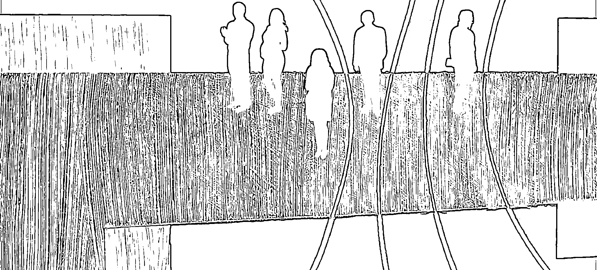

# 福利公告：

凡在【天使神秘学院】购买任何电子资料赠送实体书，详情请咨询店铺客服！

备注：如客服不知道这活动你可能进了盗版店铺！赠书活动仅在以下正版店铺购买有效哦！

# 【天使神秘学院】淘宝店

手机淘宝扫以下二维码

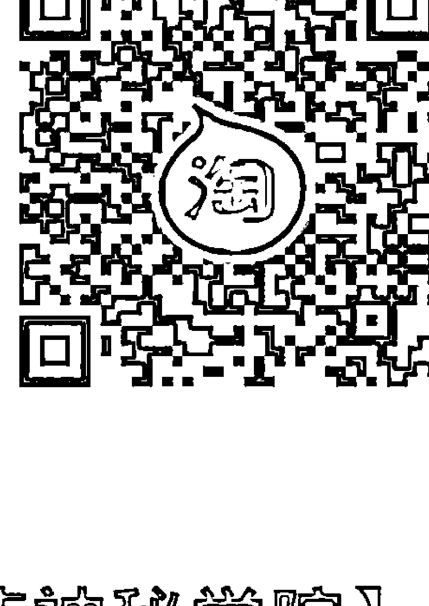

- 1. 打开手机淘宝：搜索“天使神秘学院”
- 2. 点击“店铺”按钮就是

# 【天使神秘学院】微店

手机微信扫以下二维码

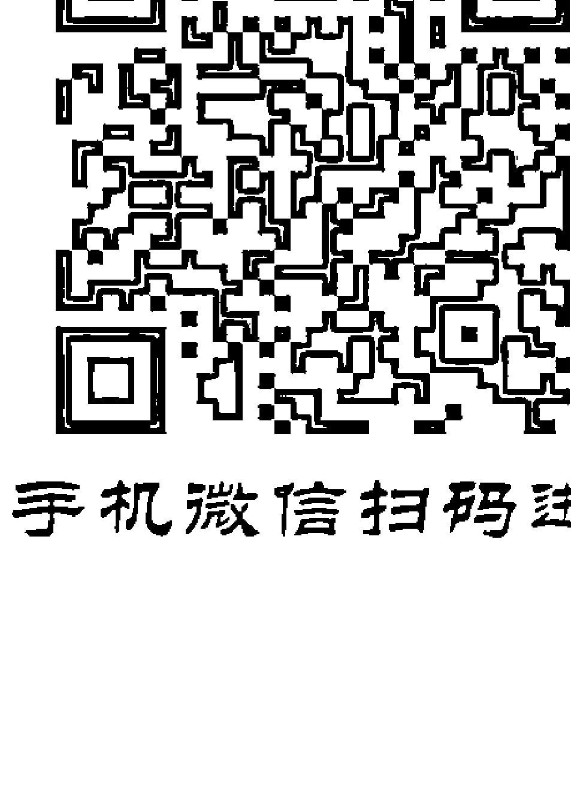

点此按“关键词”搜索书名料/看见盘中... 点此查看订单 点此加书入购物车 分类目录，往下拖动还有很多 点此联系客服收取资料 点此查看购物车

# 心灵工坊 iPsyGarden

# Holistic

探索身体，追求智性，呼喊灵性
攀向更高远的意义与价值
是幸福，是恩典，更是内在心灵的基本需求
祈求穿越回归真我的旅程

# 系统排列的全息智慧

# 一对一排列与线上个案的理论与实践

# HOLO-WISDOM

# The Theories and Practices of One to One Systemic Constellation and Online Constellation

周鼎文·著

# 【自序】

## 突破难言困境，创造丰盛人生

一家上市公司创办人已年长，想由子女接棒，但考虑子女的能力、个性及性别等因素，难以决定，以至于无法如期完成交棒，甚至子女间也开始出现不合的现象，这让他感到很苦恼。他们不想公开这些事，所以找我做私人个案，在排列里探索出谁最适合接棒以及子女们该如何分工，最重要的是如何调整心态让公司能接棒顺利。做完排列后，不止接棒问题确定，子女间的关系也变得更好，打开彼此之间多年的心结，他们非常感谢。

一间知名建筑公司，董事长的强势风格常造成沟通困难。不久前这间公司面临重大抉择：是要被另一间大公司谈判收购，还是自己独立上市？考虑当前市场压力大，独立上市有难度，也担心管理团队知道不上市后心态变化影响业绩，这位董事长迟迟无法决定，来找我做线上排列。做个案中，发现公司对于被收购的方向还是比较接近，对上市比较疏离。重要的是，董事长惊讶领悟到他个人对公司的影响竟如此之大，而他面对家族动力的方式更影响了健康。这个个案经过一对一排列后，不但协助他厘清公司的抉择：他决定接受并购，一些股份给高阶主管们，让他们可以继续为公司效力；更有价值的是，他学到如何面对家族动力以改善健康，并明白自己退休之后，想要实现自己多年来教学写书的理想。这是一个清晰果断的决定。

某领域知名的夫妻因相处问题来找我做一对一人偶个案。个案探索出原来他们的议题跟父母同住有很大的关系。这对夫妻有间大房子，他们为了爱自己原生家庭的父母，双方父母都搬来跟他们同住，但也因双方暗地的矛盾影响了夫妻关系。但他们又害怕如果不让父母同住会被外人批评不孝，他们感到很痛苦。透过我的引导，案主找到了用其他更好的方式来孝顺父母，不一定要同住才叫孝顺。这对夫妻感到重大的释然，并承诺要重新经营彼此的关系。

每个人活在世上都有自己要面对的议题，当遇到人生重大课题时，除了自己静下来好好面对外，我们都希望能和有经验的人商量，向有智慧的人讨论，并且期待有专业知识的人能帮我们从不同角度厘清问题，给予中肯建议，寻找解决之道，让我们更清楚地了解如何发挥力量。然而，不管是企业、组织、家庭或个人议题，有些议题非常私密，此时一对一排列便能提供最好的支持，帮助人们在私密情况下透过全面的系统智慧面对问题、克服难关、开创更好的未来。

所以，这些年我特别提供一对一排列，帮了许多需要的人们，其中不乏政商名人、影视明星、企业负责人。我了解这份需求，因为同样都是人，只要在不同的位置，都有自己要面对的挑战。很高兴看到这些朋友透过我们专业的支持，克服挑战，发挥让自己与这个世界变得更好的影响力。

同时，在这网路、疫情与多变动荡的时代，我特别发展出「线上排列」，透过网路就可以进行一对一排列。尤其使用人偶作为工具，更能帮助案主看到系统动力的全貌，加上排列师深刻的感知能力与丰富的经验，我所发展的「线上排列」获得了国际上正面的回响。这也促成我想把这门「一对一系统排列」与「线上排列」系统地整理出来，提供给想学习助人专业的朋友。

本书内容从知识原理、操作实务、常见议题范本，到实际案例示范与解析，能让学习者有全面的认识，适合各种助人者学习，包括企管顾问、家庭咨询师、心理辅导员、教练咨商师、医护人员、心理师、社工师、教师、法院观护人等，所有助人者都可以将这门学问融入到工作里，帮助你的客户、案主、学员与病人等。

全世界已有超过数十个国家的专业人士运用「系统排列」支持了无数企业、家庭 and 个人，但如果要成为「专业的一对一排列师」，除了阅读本书外，更要参加专业认证训练，向最资深的训练师学习，因为一对一排列师的要求比一般排列师还要高。「道石国际系统排列学院」特别训练排列师的观察与感知能力，对系统动力的深刻认识，并培养专业的助人心态与技巧。有了专业品质才能更好地帮到人们突破困境，清晰有力地创造更丰盛的人生。

本书付梓，要感恩所有个案的信任、道石学院伙伴的协助、玉凤老师与易兰珍校长的策划、陆玟的笔记整理、心灵工坊团队以及所有参与的人。

周鼎文
2020.11.20

# HOLO-WISDOM

## CONTENTS 目次

- 【自序】突破难言困境，创造丰盛人生 4

- CHAPTER 1 全息智慧：一即一切，一切即一 19
  - 一、什么是「全息」？ 20
  - 二、全息现象的应用 21
  - 三、全息的四大特性：一对一系统排列的原理 25
    - （一）由小观大 25
    - （二）信息传递 25
    - （三）超越时空 26
    - （四）转化未来 28
  - 四、身体基因：全息的储存器、接受器与发送器 30

- CHAPTER 2 一对一系统排列 33
  - 一、系统法则与系统排列 34
  - 二、一对一系统排列的作用机转 37
    - （一）全息现象由小观大 38
    - （二）画面呈现系统动力 40
    - （三）观察感知解决之道 41
  - 三、一对一排列对人们有什么帮助 42
  - 四、一对一排列的应用领域 43
  - 五、一对一排列的优势特色 44
  - 六、一对一排列的种类 46
    - （一）小人偶排列 46
    - （二）白纸或色纸排列 47
    - （三）小物品／小物件排列 52
    - （四）内在排列，运用想象力 52

- CHAPTER 3 一对一排列四大操作步骤 55

- CHAPTER 4 小人偶排列的操作要点 77
  - 一、小人偶排列操作法工作要点 78
    - (一) 个案事先准备事项 78
      1. 阅读与观摩
      2. 企业个案事先准备事项
      3. 家庭个案事先准备事项
    - (二) 工具要求 80
    - (三) 座位建议 80
    - (四) 工作步骤 80
  - 二、小人偶排列的信息场所呈现的意义 82
    - (一) 排列方式的信息——尤其是人偶的「位置」与「方向」 82
    - (二) 案主反映的信息 95
    - (三) 排列师感知的信息 96

- CHAPTER 5 常见议题——系统动力的影响与人偶排列范本 101
  - 一、堕胎 102
  - 二、退出父母冲突 106
  - 三、伴侣分手 110
  - 四、亲人过世 112
  - 五、重男轻女 119
  - 六、连结祖先力量，开创美好未来 123

- CHAPTER 6 小人偶排列——个案示范与解析 129
  - 案例 1 我为什么没有力量，不够担当？ 130
  - 案例 2 为什么我老是害怕拥有很多钱？ 142
  - 案例 3 逃避事业，逃避成为男人 157
    ——颈椎问题的背后
  - 案例 4 如何面对伴侣失和、外遇及堕胎的孩子？ 169
  - 案例 5 我很害怕我孩子的愤怒情绪 181
  - 案例 6 为什么心脑不合？没有办法真正快乐？ 196
  - 案例 7 为什么女儿总是抗拒我？批判我？ 206
  - 案例 8 如何超越内在的恐惧？我爱上我的师父...... 218
  - 案例 9 为什么我和妈妈无法沟通？ 237
  - 案例 10 性——面对家族中的秘密 247
  - 案例 11 是否退休？退休后我想做助人工作？ 266
  - 案例 12 面对事业项目的抉择 277

- CHAPTER 7 线上个案排列 297
  - 一、线上个案排列的优点、限制与注意事项 298
  - 二、线上个案排列适用范围 299
  - 三、线上个案排列实务——运用人偶的操作要点 300
    - (一) 设备 300
    - (二) 电脑软件 300
    - (三) 个案事先准备事项 300
    - (四) 形成场域 301
    - (五) 个案流程 302
    - (六) 拍下重要的排列画面 303
    - (七) 结束个案 303
    - (八）个案结束后工作 303

- CHAPTER 8 线上个案排列——个案示范与解析 305
  - 案例 1 COVID-19疫情后事业的生存之道 306
  - 案例 2 面对棘手的项目该如何处理？以及如何选定下阶段的合作对象？ 318

- CHAPTER 9 一对一色纸与白纸排列 331
  - 一、色纸与白纸排列操作要点与注意事项 332
  - 二、色纸与白纸排列操作步骤 334
  - 三、色纸与白纸排列操作重点指引 336

- CHAPTER 10 色纸排列——个案示范与解析 339
  - 案例 1 为什么我的生命没有动力？ 340
  - 案例 2 胸闷、心纠结，为什么我不能让自己的心安住？ 354

- CHAPTER 11 内在排列——运用观想与想象力 379
  - 一、内在排列的操作要点 380
  - 二、内在排列引导词示范 383
    - （一）内在排列——与妈妈／爸爸的连结与感谢 383
    - （二）内在排列——退出父母冲突，回归序位 386
    - （三）内在排列——对过世亲人的祝福 389
    - （四）内在排列——和谐心灵，超越战争冲突 391
    - （五）内在排列——连结生命源头，迎接光明未来 394

- CHAPTER 12 一对一排列实务与特殊状况处理 399
  - 一、排列现场注意事项 400
  - 二、现场特殊状况处理——案主情绪失控 401
  - 三、操作实务的指导建议 402

- CHAPTER 13 排列师的心态养成与必备能力 405
  - 一、排列师的心态、界线与修炼 406
    - (一) 关系：排列师与案主是合作关系，非拯救关系。 406
    - (二) 角色：尊重案主命运，不扮演神的角色。 407
    - (三) 目标：透过陪伴案主解决问题，同时支持其成长。 407
    - (四) 界线：未经授权或有所关联，不随意刺探系统信息。 408
    - (五) 修炼：留意起心动念，不要变成逃避或自我膨胀。 408
  - 二、排列师必备能力：知识、观察与感知、经验与实作 410
    - (一) 观察与感知 410
    - (二) 如何提升观察力与感知力 412

- CHAPTER 14 一对一排列常见问题答疑 417
  - 一、一对一个案要做几次？ 418
  - 二、个案要间隔多长时间？ 418
  - 三、个案的效果取决于什么？ 419
  - 四、一对一排列可以适用到哪些方面？ 419
  - 五、一对一排列并没有实际的代表，排列师如何去感知人偶代表呢？ 420
  - 六、排列师不确定自己感知能力时，该怎么办？ 420
  - 七、在一对一排列中，如果排列师感知到的和案主感觉的不一致，该相信谁呢？ 421
  - 八、移动人偶时，如何分辨是自己的感知、还是头脑的判断？ 421
  - 九、一对一个案时，要不要案主去感知其他人偶，或和其他人偶对话？ 422
  - 十、当案主没有感觉时，怎么办？ 422
  - 十一、一对一排列时，排列师如何做介入？ 423
  - 十二、如果案主需要身体接触，而排列师又是异性，如何做会比较合适？ 424
  - 十三、一对一色纸操作，排列师有时要做代表，有时要做排列师，如何切换角色？ 425
  - 十四、不了解一对一排列的案主觉得你是自导自演，怎么办？ 425
  - 十五、一对一排列的工作中，谁才是改变的起始点？ 426

- 【附录一】道石国际系统排列学院简介（TAOS Academy） 428
- 【附录二】延伸阅读 429

# CHAPTER 1 全息智慧：一即一切，一切即一

### 一、什么是「全息」？

「全息」（Holo）就是全部的信息。比如一张照片里有一个人像，如果我们把这张照片撕成许多碎片，从每块小碎片中仍可以看到完整的影像，这样的照片叫做全息照片。换句话说，全息就是局部可以反映出整体，一个小部分包含了整体的信息。

以上是全息的现象，当我们透过现象来深刻观照全息的本质时，我们就会发现：全息是宇宙创造万物的方式。老子说：「道生一，一生二，二生三，三生万物。」老子称一切万物的总创造力为「道」，耶稣称之为「神」，而这总创造力的创造方式，就是透过一个最小的单位来复制生成各式各样的万物，最后形成一个包容万物的整体。换句话说，一切万物都是透过一个小单位来发展形成的，因此从最小的单位就可以了解万物，从「一」就可以了解整体，这就是全息。

因此，你可以说全息就是道的智慧的展现方式，或者宇宙创造力运行的一种律则。

### 二、全息现象的应用

全息现象处处可见并被广泛应用，包括医学、生物、科技、物理学、心理学等各方面：

#### 全息生物学

张颖清教授研究全息胚，发现每个全息胚跟整体的缩影一样，内部皆包含有机体各个器官与部位的对应点（图1-1）。

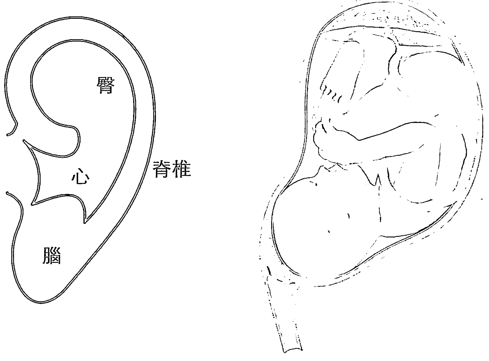

#### 全息医学

耳针诊治全身疾病是从全息现象所发展出来的，另外，脚底按摩也是从全息现象发展而来，可以反映全身的部位与器官（图1-2）。包括著名的董氏针灸，也把全身分为十个部位与胸背部，而每个小部位，包括一根手指都可以诊治全身疾病，这也是全息的现象。

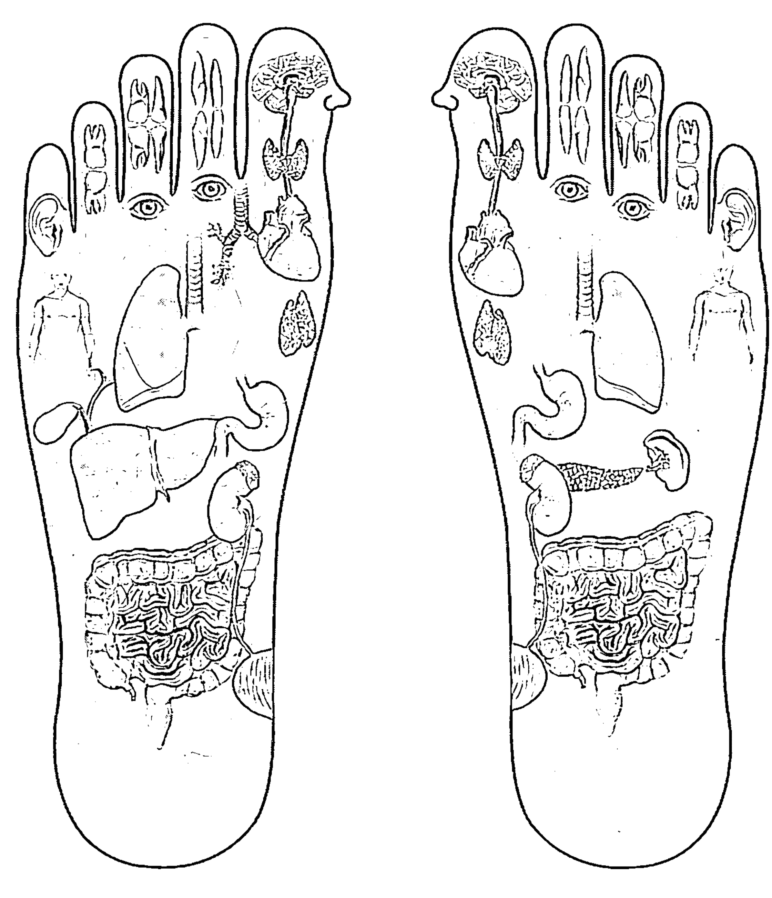
图1-2 脚底反射区

##### 全息投影技术（holography）

利用干涉原理记录物体光波的全部信息，然后利用衍射原理再现物体光波信息。全息投影技术再现的图像立体感强（图1-3），具有真实的视觉效果，不仅可以产生立体的空中幻象，还可以使幻象与人们产生互动。

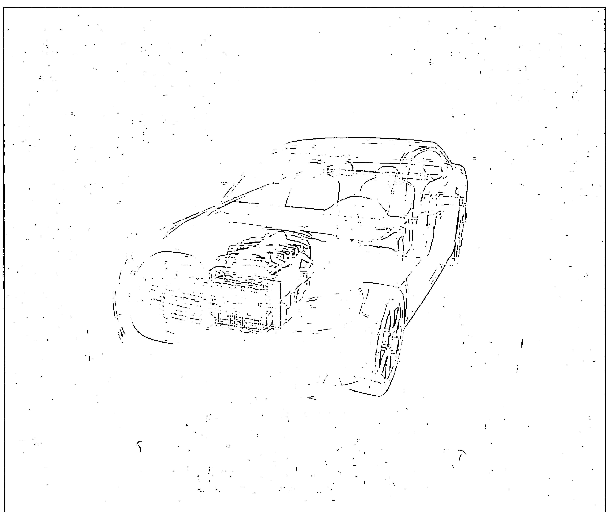
图1-3 全息投影图

##### 现代物理学

现代物理也热衷于全息现象的研究。1982 年法国巴黎物理实验室有一个惊人的发现，他们把电子做了交互缠结运动之后，不管发射到多远的距离，电子之间竟然能够有一个互通信息的反应，而且互通的时间是即时的，几乎不需要时间。这个惊人的发现违反了爱因斯坦（Albert Einstein）的理论，也就是没有任何通讯速度能够超过光速，因为一旦超过光速，就等于说打破了时间的界限。量子物理学称这种现象为「量子缠结」（entanglement）（图1-4），表示信息是可以超越时空界限相互传递。还有，全息现象也能应用在最新兴的心理学——一对一系统排列，而这也是本书探索的重点。

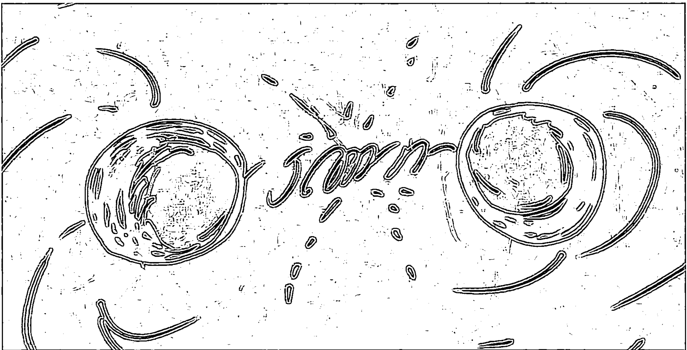

### 三、全息的四大特性：一对一系统排列的原理

根据上述，我将一对一系统排列所运用到全息的特性，归纳为下列四点：

- （一）由小观大

佛家「芥子纳须弥」，道家云「物物显太极」，英国诗人布莱克（William Blake）写着：「在一粒沙中，见到全世界；在一朵野花中，见到天堂；将无垠，握在掌中；见永恒，于一刹那。」全息的核心思想就是，宇宙是一个不可分割的、各部分之间紧密关联的整体，任何一个部分都包含整体的信息。

人跟人之间的互动方式、沟通的内容、公司的决策、运作，在系统里的各种形式，各种现象都是「信息」。在一对一系统排列里，就是透过个案当下所呈现的部分信息，来反映出系统背后的整体信息，进而探索出系统的整体动力，从更大的整体观来寻找问题的解决之道。

- （二）信息传递

量子物理学家把电子做了交互运动后发现，不管距离多远，电子之间能够产生即时相互传递信息的「量子缠结」反应。同理，人是由巨大数量的电子或量子所组成。当两个人或一群人在家庭、企业等系统里，彼此有了某些连结，建立某种互动关系，彼此之间也就产生了类似可以相互传递信息的「量子缠结」反应，比如常见的母子连心等现象。同时，这一群人所形成的系统就组成了一个巨大的量子场域，也就是形成了一个可以相互传递信息的「信息场」（the field）。

而一对一系统排列的进行，就是把这个系统的信息场浓缩出来呈现到当下个案的信息场里，就好像是实际生活的一个缩影，所以在这个个案的信息场里就包含了案主所属系统的全部信息，也就是全息。透过系统排列的方法以及排列师的专业，我们就有机会将深层的信息、较难以觉察的系统动力揭露出来，帮助案主看清真相，找出问题的解决方案。

于此同时，当我们在这个缩影的信息场里找到问题的解决方案，或者重新调整面对的方式，这个力量也会反过来传递进入到我们真实的生活里，帮助我们在真实的生活里面对问题、改善关系、实现目标。

- （三）超越时空愛因斯坦的相對論提出：時間與空間是一個不可分割的整體，他稱之為「時間—空間連續體」，他的理論震驚了世界。而享譽當代的量子物理學家玻姆（David Bohm）又將這個理論提升，他說：宇宙萬物都是連續體，不僅時間或空間是連續體，宇宙萬物皆是一個連續體。因此，外表看起來每一樣東西是分開的，但事實上每一樣東西都是另一樣東西的相互延伸。他大膽假設：宇宙就像一張巨大而細節豐富的全息照片。

不僅有科學理論的支持，在系統排列的工作裡更有實際體驗。我們在系統排列的場域裡，就好像透過一張小照片而可以看到整體的大照片，從當下的場域就可以獲取萬事萬物的全息。

愛因斯坦與玻姆的理論也說明了系統排列場域所存在的超越時空的現象：即使個案所排列出來的人物距離千里之外，並不在現場，但這個人的信息同樣可以超越空間，在當下場域呈現；同時，即使這些事件發生於過去，但我們一樣可以在當下這個現場，超越時間地把它呈現出來。我們體驗到萬物互連的信息超越時空，全都可以在這個場域呈現。這就是全息的「超越時空」特性。而當代科學的新發展正好對於一對一系統排列的全息場有了更清晰的解釋。

更進一步地，我從輔導的無數案例領悟到：整個宇宙萬物的信息都是濃縮在當下這個「一」裡，也就是所有一切在這個當下是合一的。這也說明了為什麼上述 1982 年巴黎物理實驗室的實驗，兩個電子之間的聯繫幾乎不需要時間，用「量子纏結」只是一個物理學上初步的解釋。我認為要以超越線性觀念的看法，從多維的角度來看，也就是：整體所有的一切都重疊濃縮在此時此刻的多維場域裡。換句話說，在這個多維場域裡，信息是超越時空的、全部重疊濃縮在這裡，所以它的聯繫速度不是以往所認知的三維空間加時間維度的直線距離，它打破時空界線，是一個多維的重疊濃縮時空，此地彼地、此時彼時都重疊在當下的場域。

現象的發生總在前，科學研究理論隨後，我相信未來科學家很快就會找到更多理論來解釋這些現象，並會有更多科學家投入研究，發展出更多美好的運用方式，為人類帶來更多的福祉。

##### （四）轉化未來

1963 年美國數學家及氣象學家洛倫茲（Edward Lorenz）發展出當今世界最偉大的理論之一「混沌理論」（Chaos theory），他所提出的「蝴蝶效應」（The butterfly effect）正可說明系統排列裡的運作情況。洛倫茲認為：一個微小的初始條件變化可能導致一連串逐漸放大的改變，最終導致未來完全不同的結果。這意味著，系統具有放大作用，一個微小的運動經過系統的放大，最終影響會遠遠超過該運動的本身。所以當我們在系統排列的領域裡真心改變的時候，對於自己的人生甚至整個系統，都可能帶來超乎我們想像的影響力量。就像俚語所說：「一人得道，雞犬升天。」當你得道了，連你們家的雞跟狗都能上天堂！

那在什麼時間做改變？未來可以改變嗎？

全息科學家研究發現，過去、現在和未來共同存在於一個結構上，這意味著每一個時刻都代表了全宇宙的信息，因此宇宙在時間上是全息的。而時間循環包含了空間結構，因此，全息科學家得出的結論是：宇宙是全息的。所以在一對一系統排列裡，當我們在當下這一刻找到一個好的解決之道，這個時候我們就有機會轉化並創造未來。換句話說，「當下」就是通往過去與未來的大門，當下就是改變的鑰匙，當下如果開始改變，未來就有可能帶來巨大的轉變。

然而什麼是「好的」改變？
如同塞翁失馬，焉知非福。如果我故事繼續編下去，那位丟失了馬、不用上戰場而存活下來的老翁之子，後來變成怎麼樣呢？有沒有可能有一天他不小心引發一場大火把村子裡的人都燒死了呢？這時候他活下來是福還是禍呢？所以，到底什麼是「好的」改變呢？在人類進化的過程裡，我認為還是有一個方向可循，我們自己要朝這個方向，也要幫助案主們朝向這個方向成長，那是怎麼樣的方向？那就是，領悟生命運作的「道」，活出人生的「道」。然而有人說「道」高深莫測；是的，但透過許多年前輩們的探索與智慧的傳承，以及許多實際案例的經驗累積，我把它歸納為「生命五大法則」，提供給各位參考，作為可以支持個案成長的方向（關於生命五大法則在後面章節裡有詳細說明。）

明白了全息的特性也就是一對一系統排列的運作原理，而這些信息是如何具體呈現？透過的這個載體就是——身體基因。

### 四、身體基因：全息的儲存器、接受器與發送器

信息無所不在，那麼在人身體裡面，這些信息是如何儲存、接受與發送？目前的醫學研究已證實：人身體裡面的每一個細胞都是整個身體的全息。人的受精卵和它發育成的各種細胞相比較，其DNA是相同的。人體的每一個細胞都包含了這個人全部遺傳信息（圖1-5）。

除了「儲存」全部遺傳信息外，透過這些年無數的實際案例，我的發現與假設是：

-   （1）基因不只是儲存信息的記憶庫，更是最佳的信息接收器與發送器，如同手機的晶片一樣，人透過基因的運作，可以儲存、接受與發送信息。
-   （2）人的基因運作不僅單獨影響個人的生長與生活，如同現在的互聯網，人透過基因運作而形成了人與人的互聯系統，我稱它為「人聯網」，不管我們有沒有察覺，這些信息都影響著系統裡的每一個人，並共存、共享於所有人之間，而其接受與影響的程度就在於他與所屬系統的「親疏關係」，也就是說，他是否有權利接受某些的系統信息，以及接收到的信息深淺與多寡，取決於他在這個系統的身份與位置關係。
-   （3）不只人跟人之間，人與萬物之間也是一個「萬物互聯」的系統，而這將不再只是概念，而是一種可以體驗與檢視的事實，透過新興的系統工作方式——「系統排列」——我們可以更清楚地體驗與獲知人與人、人與萬物在深層裡是如何相互影響。如此一來，我們可以更明確體認到，這個世界是一個有機的整體系統，這不再只是頭腦的觀念，更是生命存在的現實。

# CHAPTER 2

# 一對一系統排列

一群人聚在一起有了交互作用之後，就產生了一個如同有生命的有機體，形成了我們所稱的「系統」。每個人都活在系統裡，而且同時參與了好幾個系統，有家庭、工作、企業、人際、社會、國家等系統。有的緊密，有的鬆散；有的成功，有的失敗；有的相處融洽，有的會遇到困難，甚至解散。

每個系統都有其存在的功能和要達到的目標，例如企業系統如何達到經營目標、實現更好的成果；家庭系統如何讓成員們感到幸福有愛。

然而，不一定每個系統都能發揮功能、達成目標，而系統成員往往也不只像表面的互動而已，似乎還有更深層的互動在影響著彼此的關係。因此，如何能夠知道系統的深層狀態？如何幫助系統發揮功能並達成目標？如何瞭解成員的深層感受並建立融洽的互動關係呢？

德國伯特·海寧格先生（Bert Hellinger）所發展出的「系統排列」這門學問正可以幫助我們活出更好的自己、改善人我關係，並幫助系統發揮功能以達成更豐盛的目標。

「系統排列」最早是從心理治療開始的，海寧格先生觀察到人的關係裡有一些基本的互動，如果這些互動順利，人就能享有較為成功的關係。其中包括：

-   1. 歸屬感（Belonging）。
-   2. 秩序（Orders）。
-   3. 施與受的平衡（Balance of giving and taking）。

海寧格先生發現人的心理與系統存在著關鍵的運作律則，如果違背了這些律則，就會出現各式各樣的問題。總結海寧格的觀察與我上萬個案例的經驗，將人類系統歸納五大法則：

-   1. 整體法則（Wholeness）
    每個人都有歸屬於其系統的權利。如果有人被排除，就會有系統裡其他人要去填補這個空缺，因而產生牽連糾葛而失去自由。
-   2. 序位法則（Orders）
    每個人在所屬的系統依時間先後、輩分、職權、責任大小等都有其所在的位置。即使是出自於愛，錯誤的位置將會帶來系統的混亂，甚至災難。
-   3. 平衡法則（Balance）
    施與受要平衡。金錢、情感等都需要平衡對待，但強調正面回報多增加一點點，負面回報就會減少一點點，如此可讓關係變得更加幸福豐富。
-   4. 事實法則（Reality）
    尊重事實如是的樣子。對系統裡所發生的事實，沒有以成熟的方式面對，或編造事實，或成為秘密，系統裡的其他人將會承擔這些未竟之事所帶來的影響。
-   5. 流動法則（Flow）
    愛要流動，人要溝通，生命要傳承。過去發生的事，面對後也要放下，系統才會不斷有新的活力，生生不息。

系統排列幫助我們去檢視是否違背這些法則，並幫助人們學會回歸這些法則，以創造更成功、美好的人生。當整個系統遵循著生命法則的規律，每個人各歸其位，負起自己的責任，系統的事實能被承認與尊重，愛與生命力得以流動時，背後的系統就不再是阻力，而可以成為一股助力，支持系統裡的成員實現自己的理想。例如公司系統經營更成功，家庭系統更幸福，人際關係更和諧，人生使命更豐盛實現。同時，系統的成員對這個系統也能夠成為推動的力量，共同推動這個系統朝向更健康成熟、永續發展的方向。

海寧格先生以系統為觀點、全息為原理、現象學為方法、哲學領悟為引導，將許多心理學元素整合，發展出一套獨特的應用心理學——系統排列。自 1990 年代起，系統排列便在國際激起熱烈的討論與學習，海寧格先生成為世界公認的系統排列開創者。我在 1997 年親自向海寧格先生學習，並在 2001 年主持了海寧格先生第一場亞洲工作坊，正式將系統排列在亞洲拓展開來。

系統排列這門學問自海寧格先生整合開創以來，便透過許多國際專家們不斷累積經驗而開展，並融入世界各地的文化智慧以及生命力量的注入，令現今的系統排列成為一門「活的生命科學」。全世界已有超過數十個國家的專業人士學習運用這門學科，支持了無數企業、家庭和個人，享有更成功幸福的人生。

### 二、一對一系統排列的作用機轉

系統排列進行的方式主要有兩種，一種是「團體」系統排列，另一種是「一對一」系統排列（以下簡稱「一對一排列」）。團體的系統排列是用真實的人當代表來感知系統動力的信息，但在一對一的排列個案中如何來感知系統動力的信息呢？排列師在進行一對一排列的時候會利用一些小工具，例如小人偶、白紙、色紙、小物件等來幫助呈現系統的信息。不過，用這些小工具又是如何感知和呈現系統的信息呢？剛開始可能有些人會懷疑，但是在許多人親身經歷之後，往往莫不感到觸動與驚訝。

對於不了解或者心中已有評判的人，我想要對他們說：當你更深入去了解透徹時，自然會找到屬於你自己的領悟方式。包括我以及許多國際專業導師，我們已採用一對一人偶排列幫助了世界上許許多人。如果一門學問對人真正有幫助自然會留下來，而且值得更多人投入研究。聰明人就會懂得好好善用它，為自己以及這個世界創造更好的生活。

一對一排列的背後確實有其作用的道理，我將它歸納為三大作用機轉（machanism of action）：

##### （一）全息現象由小觀大

一對一排列背後的原理即是「全息」。如同我們在第一章所講，全息現象處處可見，從中醫耳穴，腳底反射到全息投影技術，從物理學家的宇宙理論到佛家的一沙一世界、當下即永恆，處處都有全息現象的存在與運用。

人的身體也是如此，在受精卵分化為體細胞的過程中，體細胞也獲得與受精卵相同的一套基因，基因的複製過程隱藏著發育成一個新機體的潛能。因此，基因即是全息現象的展現。我們身上擁有跟父母極相似的基因，而我們父母身上也擁有跟他的父母極相似的基因，換句話說，我們每個人身上都帶著我們整個家族，甚至帶著整個人類系統的信息。每個人身上都承載著這些無數的信息，所以不管我們走到哪裡，我們身上都攜帶著全部信息。

但在一對一排列裡，這些信息要如何獲得呢？團體的系統排列師用真人作為代表，感知並呈現系統裡的信息；而一對一排列師運用小工具，例如小人偶作為媒介，幫助案主把系統的信息呈現出來，特別是當案主「很專注地」把這些內在的信息用小人偶等工具排列出來時，他們身上所攜帶的信息，包括意識、潛意識以及系統所儲存的集體信息，都會灌注在這些工具裡以及所設置的場域裡，形成了一個「全息場域」——局部反映出整體，小單位包含了整個系統的信息場域。透過這個全息場域，我們就可以由小觀大，瞭解整個系統的動力情況，包括你的企業未來走向或者是家庭的深層心理狀態等。因此參與者對於一對一排列往往都會感到非常驚訝，而許多問題的盲點和深層卻又不願意面對的系統動力，就有機會在眼前呈現出來，讓案主有機會選擇用更好的方式去面對與轉化；同時，只要排列師引導得好，在一對一排列裡案主會覺得安全並且更願意敞開，因為有許多私密的議題可以用一對一排列來諮詢。

##### （二）畫面呈現系統動力

一對一排列的信息以什麼方式呈現？透過位置與畫面，以視覺化方式呈現。

人類有一種本能，就是對人、事、物的親疏關係會以「距離」來表示其深層感受。因此當案主用小人偶代表他問題裡的人物，並且把這些人物彼此之間的親疏關係在桌上排列出來時，他甚至不用經過頭腦思考，就本能地把內在的信息透過不同的位置呈現出來。以一個家庭為例，當我們請案主將他的爸爸、媽媽和小孩排列出來時，案主會把某些人排得比較近，某個人排得比較遠，某個人面對另一個人，或者背對另一個人，透過不同的距離與面對的角度，就可以讓我們瞭解到這家人彼此關係的深層信息。

同時，當人們遇到問題時，會對這些問題有自己的想法和感受，但有時候我們會太過於主觀，常常容易產生盲點，甚至有時候會太認同問題，因此心理學有個方法叫「問題外化」，指的是將人們內在的問題拿到外面來討論。一對一排列就有這樣的味道。一對一排列除了將問題外化之外，更加上了「問題視覺化」，並以一種「外在的視覺畫面」的方式將問題背後的信息呈現出來，包括意識、潛意識信息與系統動力，如此便可以幫助案主保持一點距離，更客觀、更全面地看到整體的狀況。而且案主也比較不會局限在自己個人的主觀裡，比較有機會去瞭解系統裡每個人的感受與想法，如此一來，不僅有助於找到問題的解決之道，而且會引發案主去覺察自己該如何調整。

##### （三）觀察感知解決之道

一對一排列中使用的小人偶或小物件只是工具，最重要的信息接收器是排列師這個「人」。作為中立的第三方，排列師要經過嚴格的專業訓練，讓自己有能力透过敏锐的感知與觀察力，接收並反映案主所排列出來的場域信息。排列師透過專注於自己身體的感覺，用手碰觸小人偶或小物件，就如同在團體排列中做代表一樣，成為一個信息接受器，去感知案主所排列出來的人物的身體感覺、心理感受與深層想法。排列師同時也要用眼睛觀察，觀察案主所排出小人偶或小物件的位置、觀察案主所有的小動作，包括眼睛、嘴角、表情、手指等肢體動作；案主如何選小人偶代表及如何把它們排出來，還有過程中所有的行為反應以及所有的表達與情緒反應，包括他在說某一件事的聲音，或聽到某一話的情緒反應。還有觀察案主動作與情緒上的差異，比如當他嘴巴上說著跟某個人很親近，但是卻把代表他的人偶排得很遠；口頭上說對某個過世親人已放下，但在說的時候卻紅著眼眶等。這時候排列師細緻的觀察可以幫助我們探索案主的深層信息。

接下來，排列師支持案主探索系統動力與呈現真相、尋找解決之道，面對與轉化這些動力的影響。最後透過解決之道的新排列畫面，我們看到問題的關鍵點。許多時候案主在當下便發生領悟與改變，或者在回去之後知道該選擇什麼方案，採取什麼行動，如何調整自己與系統去面對問題。

### 三、一對一排列對人們有什麼幫助

#### 1. 面對議題

看到系統及自己的運作模式與盲點，覺察系統的深層動力，找到困境的解決之道，幫助系統及自己朝向更好的方向發展。

#### 2. 創造未來

為自己及所在的事業、公司、組織做出更好的決策，選擇更好的方案，並預見未來需要注意和加強之處，以便創造出未來更好的成績。

#### 3. 支持成長

喚醒案主內在力量，更有智慧與勇氣去經營自己的事業與人生，並帶領系統裡的夥伴一起努力，轉化事業與生命軌跡，將過去的糾結轉化為祝福，朝向更成功幸福的道路邁進。

#### 4. 提升品質

領悟生命的道理，學會與宇宙大系統和諧一致的生活方式與做人處事之道，提升系統與人的品質素養，為社會和諧與人類和平服務。

### 四、一對一排列的應用領域

一對一排列常被應用在以下領域：

#### 1. 企業組織：

支援企業與組織建立更成功的經營規劃、探索組織深層動力、尋找問題解決方案，並協助重大決策的決定與執行後的檢核、人事調整與管理、接班人的選擇與規劃等。

#### 2. 事業財富

探索與呈現企業家的事業與金錢的動力、改善本身與事業和財富的關係、思考是否有無意識的損失，還是朝向成功富裕，並重新探索最能發揮的事業經營與生涯規劃方式等。

#### 3. 家庭人際

支持人們建立融洽的家庭關係、父母關係；良好幸福的婚姻關係、兩性關係、親子關係、工作與人際關係等。

#### 4. 身心健康

改善身心健康，建立更有效的情緒管理模式，並喚醒內在覺知，學會大系統的生命法則，讓自己工作與生活更自在、有活力。

### 五、一對一排列的優勢特色

一對一排列的優點很多，其中有四項優勢特色：

-   （1）用畫面呈現系統中的隱藏動力。
-   （2）具私密性，對於私密議題，個案會感覺放心較願意敞開。
-   （3）可用的代表數量多，能夠滿足需較多代表排列的需要。
-   （4）時空方便，約好時間，在安全標準的空間即可進行。

在一般傳統的諮詢，案主如果只用「語言」來描述他的議題或跟某個人的關係時，往往都是帶著自己的「主觀」意識，而且描述的內容往往是他自己的表面認知，無法深入到深層的意識。但透過系統排列，例如一對一排列會利用一些小工具，如人偶或色紙等，可以快速建立一個「畫面」，讓排列師與案主可以較「客觀」地看見案主的議題或跟某個人的關係。再加上排列師感知場域信息的能力，於探索案主的深層意識及系統的隱藏動力時，即可呈現出類似用真人做排列的場域，以幫助案主面對議題，尋找出解決之道。

對於想用系統排列來做為助人工作的人而言，團體的系統排列方式需要較多人到現場進行排列、需要熱場與控場等、需要照顧整個場域、含容（contain）整個場域，也需要個人話術和魅力，所以帶團體排列的人需要具備這方面能力和天分。然而有些人對帶領團體不太能掌控，但精於一對一的系統排列，在這個方面更有感覺及特長，那就可以專攻一對一排列，發揮個人的天分來幫助人。

### 六、一對一排列的種類

一對一排列歸納起來一般有四種方式：小人偶排列、白紙／色紙排列、小物件排列，以及運用觀想的內在排列。

#### （一）小人偶排列

小人偶是排列師必備的工具，非常好用。排列師可以從案主排出的人偶位置所呈現的畫面，獲得深層的心理與系統的信息，同時也可以直接尋找解決之道的畫面，讓案主直接有身心的領悟與體驗。一對一排列中的人偶排列，是透過人偶代表來呈現畫面，人偶的姿勢與形態如下：

| 姿勢/形態 | 描述 | 圖示編號 |
| :--- | :--- | :--- |
| 站立 | 人偶呈站立姿態 | 圖2-1 |
| 坐著 | 人偶呈坐姿 | 圖2-2 |
| 鞠躬 | 人偶呈鞠躬姿勢 | 圖2-3 |
| 磕頭 | 人偶呈磕頭姿勢 | 圖2-4 |
| 伸出手 | 人偶伸出雙手 | 圖2-5 |
| 擁抱 | 人偶呈擁抱姿態 | 圖2-6 |
| 面對過世親人 | 人偶用於代表過世親人 | 圖2-7 |

人偶有男性和女性，顏色一樣，但頭髮和衣服不同（圖2-8）。大人和小孩的大小也不一樣（圖2-9）。只要有一個時間、空間，就可以做個案。

運用小人偶做排列時，排列師對系統位置及動力要有足夠的理解，並且也要有敏銳的觀察和感知能力。

#### （二）白紙與色紙排列

運用白紙做排列的方式，是在每張白紙上寫上身分。比如排列公司、老闆、客戶時，就選三張白紙代表，分別在上面寫公司、老闆、客戶；如果是爸爸、媽媽、小孩，就選三張白紙分別在上面寫爸爸、媽媽、小孩。然後排列師站在上面輪流去感知每個不同的角色，就好像一人分飾多角的感覺。如果是運用色紙（圖2-10）排列，就不用在上面寫字，只要選擇不同顏色的紙代表不同的人，直接記住哪個顏色是代表誰即可。不管用白紙或色紙，其優點是排列師自己去站在所有不同的角色上時，可以直接像真人排列一樣去體會所有代表的感覺，如此一來他就可以直接獲得第一手信息以尋找問題的解決之道。

色紙延伸可以用拖鞋，比如用室內拖鞋，看拖鞋的位置和方向代表不同的人，然後排列師站進不同的拖鞋裡，輪流去感知不同角色的感受。

#### （三）小物品／小物件排列

人偶排列延伸出可以用小物件做排列，比如文具、西洋棋、杯子等，有時餐具、調味料瓶罐、孩子的玩具等也可用來排列，且同樣也可以創造出一個信息場域。但是要跟案主說明或註明每個小物件面對的方向，這樣才有辦法瞭解排列位置所表示的信息。

#### （四）內在排列，運用想像力

在做一對一排列時，也可以不借助工具來進行排列，這時就是用「觀想」的方式，也就是運用想像力的方式來進行「內在排列」。排列師通常會引導案主觀想某個對象在面前，並在心中對這個對象說一些話，比如對老闆、總經理、同事；或對爸爸、媽媽、爺爺、奶奶，或者某位親人，不管是活著或者過世；或對一群人說話，比如對員工們、全家人，或男性長輩、女性長輩。

其原理就是透過「畫面」的力量幫助我們帶來改變。在做團體的系統排列時，一開始是先在外在進行排列的初始畫面，當排列進入最後階段時，我們再把這一解決之道的新畫面收到心裡，相當於透過外在的結束畫面來改變我們內在舊有的畫面。所以，不同於團體的系統排列有一個外在的探索過程，內在排列是已經知道案主他直接所要面對的重點，與所要調整的系統動力，然後再直接透過內在排列改變內在的畫面。因此，如果排列師能掌握案主所要調整的重點，並透過內在排列直接改變內在的畫面，它能夠跟外在的排列一樣達到相同的效果。

## 一对一排列的四大操作步骤

一對一排列需要有團體排列操作的訓練作爲基礎，儘管兩者的形式和工具有所不同，但其基本原理都是相同的，因爲一通百通。（註：團體的系統排列操作步驟，請參考拙著《家族系統排列：核心原理與實務》，心靈工坊出版。）

以下是排列四大操作步驟：起、承、轉、合，以及每個階段必須要達成的任務（圖3-1）：

第一步：「起」——建立關係、釐清問題、收集信息、達成共識
第二步：「承」——選擇代表、探索動力、詢問歷史、揭露真相
第三步：「轉」——運用轉化技法、尋找解決之道、朝向五大法則
第四步：「合」——扣回主題、內化過程、回去之後、行動建議

一對一排列操作步驟的著重點與團體排列卻有不同，其重點如下：

#### 第一步：「起」

「起」的階段在進行一對一排列時，重點在「問問題與傾聽」。

如何問問題？要問具體的問題，可以用以下五個W來作爲基本提綱：

- What：什麼議題？發生什麼事？你想達成什麼？
- How：你如何反應？你如何做？你想怎麼做？你有何方案？
- Who：哪些人參與其中？哪些人需要加進來？
- When：什麼時候發生？
- Where：在哪裡？

一邊問、一邊傾聽、一邊同理、一邊觀察（圖3-2）。

因此，「起」的部分要達成以下四個任務。包括：

##### （一）建立關係

「起」的過程是彼此連結、建立信任和尊重的過程。排列師要真誠地對待案主，尊重案主是一個與眾不同的生命個體，認真地傾聽案主的議題敘述。同時，案主對排列師也要有信任與尊重，當雙方都感到這種信任與尊重的關係後，這時就能夠一起合作，面對案主提出的議題。

##### （二）釐清問題

排列師要協助案主將議題具體化。比如，企業組織的問題：我如何讓我的公司未來一年業績能夠增長30%？我要選擇A方案或是B方案？誰是最適合擔任總經理的人選？或者家庭的問題，我如何改善跟太太的關係，減少吵架的次數？我如何讓孩子願意跟我聊聊心裡的話？但是如果案主說：我感覺我和我自己的關係不夠好，我想要有一個好的感覺。這是一個很籠統的議題，排列師無法為一種籠統的感覺服務，因此要協助案主將議題具體化，比如可以問：「發生了什麼事？」或「你想要達成什麼？」有些求助者可能缺乏邏輯性，在表達上思路不清；有些可能心存顧慮，顧左右而言他。面對求助者的種種情況，有時排列師要循循善誘，耐心梳理，支持案主看到真正的問題所在。但有時排列師也要直接面質案主，切入要害，讓案主面對現實，無所遁逃。

##### （三）收集信息

如果是做企業個案排列，要先準備好自己的組織架構圖及企業經營的重大事件，例如公司是由誰設立的？是否有更換過股東？資金來源從哪裡來？是否有人事的重大變革等。如果是家庭個案，就要瞭解案主的生命經歷及其重大的家族事件，例如童年時候是否跟父母分開？家中是否有人早逝、夭折或被領養？家中是否有謀殺、傷害、自殺等事件？（何為重大事件可參考後面章節〈個案事先準備事項〉。）

排列師不用一開始就要收集全部的信息，可以在進行中間再詢問。重點是收集信息的過程，排列師要用心傾聽，有時候案主會說得很多，排列師要分辨哪些信息是重要的。要如何分辨呢？有一個很重要的原則，那就是當案主說哪些信息的時候是有力量的，讓你聽了心中有一種有「分量」的感覺，那就是重要的信息。
而且排列師用心傾聽，不但要聽案主描述的「內容」，更要隨時觀察案主「如何說」，關注案主細微的內在感受、情緒變化、肢體動作等，因為案主描述事情的過程中，語調的起伏、情緒的變化都是重要的信息，反映著案主的思維模式和潛意識信息。同時如果案主有情緒變化，當下要適時給予同理，不要只是在頭腦上收集信息而已。尤其當案主有明顯情緒變化的時候，排列師可以支援案主跟那個感受連結，比如問「那是什麼樣的感受？」「停留在這個感覺一會兒，你想到了什麼？」「有這個感覺時你想到了誰？」這些都是很好可以切入工作的點，成熟的排列師都會把握。

##### （四）達成共識

排列師一定要覺察自己是為了案主還是為了自己？是為了支持到案主的內在成長，還是要完成一個完美的排列？是幫助案主生出力量去解決自己的問題，還是扛起案主的責任來幫案主解決問題？排列師和案主應就排列的目標達成共識，重點是案主的意願，而非排列師個人的目標。還有一個重要的點是，如果案主的意願是想透過排列來讓其他人發生改變，以符合自己的期待，這個排列是不能進行的。必須是案主願意透過自己的改變，來讓事情朝向一個好的方向或解決，才是一個正確的共識。比如案主說：「我想要讓我先生早一點回家，能夠和我更親近一點。」排列師是無法為此工作的，因為，排列師無法改變這位先生，除非這位先生到現場，有意願改變自己，排列師才能支持到他。此時排列師就要跟案主重新調整共識，比如可以對案主說：「我沒有辦法在這裡改變你的先生，讓他早點回來，但是如果我們可以一起來探索你們之間的關係怎麼了，你如何做可以讓你們夫妻更親近一點，這是可以工作的。」

#### 第二步：「承」

在進行小人偶排列時，要先設定界限，如過桌子太大，可以用一枝筆或一條線隔開以確定排列區域（圖3-3）。「承」的部分要達成的目標如下：

##### (一) 選擇代表

排列師根據議題確定排列需要的角色代表，並請案主選擇代表，例如用小人偶做排列時，就要選擇哪一個人偶代表某個人。比如排列企業組織，哪一個代表公司、哪一個代表總經理，哪一個代表產品等；比如在排列家族系統，哪一個代表爸爸、哪一個代表媽媽、哪一個代表你自己等。如果是用色紙，就選擇不同色紙來代表這些人。顏色在這裡主要是做一個角色的區分，我們不以顏色作爲一個投射的解讀，因爲每個人有許多不同的情況，排列師主要是關注案主他怎麼排，還有排出來的情況。

接下來，請案主把人偶排列出來，這個時候你要注意觀察案主，他是怎麼樣排列的（圖3-4、3-5、3-6），比如說他排的時候很猶豫，很不確定，或者他有一些情緒浮現，比如說悲傷或憤怒，或緊抓某一個人偶（圖3-7）一直看著他等，這些細節都反映出案主的內心狀態，這都是之後要進行排列工作的線索，要很注意觀察。

圖3-4 案主用右手排。
圖3-5 案主用左手排。
圖3-6 案主用雙手排。
圖3-7 案主緊抓著人偶。

如果是用色紙做排列，這時是讓排列師拿著色紙成爲代表，請案主根據感覺將代表移動到場域中適當的位置。

要怎麼排列呢？排列過程中，請提醒案主「不是按照自己的願望擺放」，而要「根據內在的直覺擺放」，這樣才能呈現出真實的動力。排出的位置越仔細、越跟著自己內心的感覺擺放，信息呈現會越深入、越清晰。之後可以根據排列的需要，在過程中加入其他人偶或色紙代表。

##### （二）探索動力

觀察案主排出的人偶之間的位置、遠近、朝向誰、面對的方向、人偶的大小、性別以及案主的動作與感受，因爲很多動力就在案主所排的畫面裡呈現出來。

比如案主排出新聘的經理焦點不在老闆或公司上，而是朝向遠方某一個方向看去，有可能表示他正忠誠於之前離職的經理，在無意識裡跟離職經理有著相同的感受（圖3-8）。

比如案主排出資深的主管向後退，離公司有一點距離，有可能是因爲他無法接受年輕的接班人，所以採取觀望態度，甚至開始跟公司疏遠（圖3-9）。

比如案主排出把孩子擋在媽媽的前面，在深層的動力裡有可能媽媽想要離開家或不想活，而孩子想要擋住媽媽拯救她（圖3-10）。

比如案主排出一群人朝同一個方向看，有可能表示在集體系統動力裡，這個家有一個需要被重新看到的人，或者某個被排除的人（圖3-11）。

這整個過程中，重要的是排列師要一直保持感知，並且要一直保持與場域連結。排列師除了觀察外，可以用手碰觸人偶去感知代表的感受，也就是排列師讓自己就好像變成所有角色的代表一樣，只是透過人偶這個工具去接受每個代表的信息而已。然後排列師要中肯地說出代表感受，不要說武斷的話，最好用疑問句的方式，並且要跟案主核對。比如說當你碰觸案主母親的人偶代表，你感受到悲傷時，你就可以問案主：「你的母親是不是有時候會有悲傷的心情？」當你碰觸案主本人的人偶代表，你感覺到肩膀很沉重，這個時候你就可以問案主：「你是不是有時候感覺肩膀很重？」 如此跟案主核對、一步步向前探索動力。如果排列中呈現了幾種動力，可以先關注能量最強、最重要的動力。所以感知力非常重要，排列師的感知力就像音樂家的音

圖3-8 新聘的經理朝向離職的經理。
圖3-9 資深主管向後退。
圖3-10 孩子擋在媽媽的前面。
圖3-11 大家站一排，朝同一方向看。

##### （三）詢問歷史

排列師根據確認後的感覺以及場域呈現的動力，可進一步詢問案主公司系統或家族系統中曾經發生的歷史事件，必要時再添加人偶探索。需要注意的是，如果案主的情緒開始流動，排列師不要一直詢問事件，這樣反而會切斷案主的感受而將案主帶回頭腦層面，這時候排列師要把握機會準備切入議題工作。

##### （四）揭露真相

根據排列的呈現、排列師的感知以及案主的反應所瞭解到的信息進行回饋，揭示案主問題的深層信息真相與隱藏的系統動力。

#### 第三步：「轉」

「轉」的階段是排列中最重要的階段，這個階段要達成的任務是尋找解決之道，朝向生命的規律法則。透過上萬個案例，我觀察到任何一個人或一個系統出現問題，不管是公司、事業、金錢、家庭、人際或健康上的問題，往往都是因爲違背了生命的律則，偏離了「道」而發生的，而我將這些律則總結出「生命五大法則」，許許多多的問題出現都是因爲偏離了這五大法則。因此，排列師要幫助案主就是要幫助他回歸生命之道、回歸宇宙的規律，而這五大法則是非常重要的參考。

生命五大法則包括：整體法則、序位法則、平衡法則、事實法則與流動法則。在系統排列中如何支持案主朝向五大法則？具體來說有以下幾個要點：

##### （一）朝向「整體法則」的要點

系統要求一個整體性，每個屬於系統裡的人都要有一個位置，包括企業系統和家庭系統等，每個人都有歸屬的權利。如果在個案中，發現有被排除的企業成員或家族成員，排列師就要引導案主重新看到這位被排除、被忽略的系統成員，並在心中給他所屬的位置與歸屬權利，並解除對被排除者的認同與牽連糾葛，回歸自己的位置。

##### （二）朝向「序位法則」的要點

如果發現案主或系統中的人有越位或錯位的行爲，不尊重層級比你大、責任比你重的人，或站到了屬於自己的位置上扛起別人的心，或站到了不屬於自己的位置上扛起别人的责任，或无意识想拯救别人而导致自己变得自大膨胀；或者把问题的原因、过错都归罪于其他人，自己都没有责任。此时就要支持案主回归序位，也让每位系统成员回归正确的层级序位。只有案主及系统裡每个人回归序位，并真正为自己所担任的角色负起责任，整个系统才能够回复应有的序位顺畅运作。

##### （三）朝向「平衡法则」的要點

如果发现系统内成员或与系统外面的人有施与受的不平衡，或者有某些不公平事件，包括金钱纠葛、不当得利、两性关系失衡等，此时就要引导双方重新朝向平衡，例如有时是金钱偿还、认错道歉、情感弥补等。如果发现有未竟之事，就要支持这些未竟之事得到和解、跟自己和解、跟家人和解，或跟系统中、系统外的其他人和解。

##### （四）朝向「事实法则」的要點

如果问题的发生是因为案主没有面对事实、尊重事实，甚至捏造事实，此时就要支持案主如实面对生命中的一切，尊重系统、公司组织、他人和家族的命运；同时引导案主要从困扰中获得智慧，用具有智慧的方式应对现况，生出改變的勇氣與力量，進而學到此生的功課、創造具有意義的事業與人生。

##### （五）朝向「流動法則」的要點

如果在排列中發現問題的根源是案主有執著的念頭、淤堵的情緒、打不開的心結、放不下的過去，這些都是舊有的思維模式、行為模式、溝通模式、系統的集體文化，造成溝通阻塞、熱情僵滯、盲目行動，讓愛無法順暢流動。此時要引導案主表達未曾表達的愛、情感與情緒，把「盲目的愛」轉變成「成熟的愛」，讓愛重新流動，讓過去的過去，讓凍結的生命力重新流動，活在當下，生出力量和信心繼續向前。

另外，對於家族系統的排列，排列師在轉化過程的關鍵尤其是要讓案主看到系統中的「愛在哪裡」，比如說有些案主跟另一半要離婚，結果排列出來發現是因為她不知不覺地跟隨著父母離婚的遭遇，這個時候我們就可以幫助案主看到「要離婚」是對父母一份忠誠的愛，但是這種愛的方式卻讓自己帶來婚姻破裂。當我們幫助案主看到這份忠誠但卻盲目的愛的時候，就可以支援案主用正向的方式表達愛，也就是「讓自己變得更幸福快樂」來愛父母，也就是協助案主把盲目的愛轉化為成熟的愛、覺醒的愛，生出改變的勇氣與力量，進而學到此生的功課、創造具有意義的事業與人生。

#### 第四步：『合』

「合」的部分要達成的任務如下：

##### (一) 扣回主題

排列的工作方向最後一定要扣回到主題上，也就是第一步中達成共識的那個個案議題上。排列師不是在幫案主解决问题，而是支持案主自己解决问题、协助案主获得领悟，并生出力量面对生命中的议题。

##### （二）内化过程

支持案主将整个过程好好沉淀、将解决之道的画面、疗愈的画面记在心中，并信任在这个过程中，画面会在案主内在产生自己的成长转化。

##### （三）回去之后

如果排列的过程是一个具体要进行的公司方案，那就要看你和案主所约定的协助方式，是单次的课程咨询，还是定期的顾问服务。一般公司咨询建议采定期顾问，这样解决之道的方案能规划进度，排列师也能定期提供咨询服务。如果排列的过程是一个疗愈过程，回家之后就要让案主自己内在自然产生力量，不去打扰他，那么这种力量就是案主他自己的升起的，不是靠别人给他的才能够永久。

##### （四）行动建议

如果有必要去做一些具体的事，而案主不知道该怎么做的时候，排列师可根据当下动力的呈现，谨慎给予案主实际的行动建议。例如企业排列完回公司后，可开始找相关的人开会制定行动方案；家庭方面有堕胎的父母则可以为孩子取个名字，在特别的节日为他做一些好事，如种一棵树、做义工等。排列师应提醒案主须以真诚的心来行动，而非抱着完成功课的心态进行，并且选择适合自己的方式，负起自己全部的责任。

# 小人偶排列的操作要点

### 一、小人偶排列操作法工作要点

#### （一）个案事先准备事项

##### 1. 阅读与观摩

进行一对一排列之前，需请案主要先对系统排列有所了解，这部分可以请案主参阅相关书籍。通常我会请他先阅读《爱与和解》、《家族系统排列：核心原理与实务》，以及我所著关于“事业与金钱”的系统动力著作，最好是他自己可以参加讲座或沙龙，观摩一次团体个案排列的工作方式，有一些基本的了解之后，进行起来会比较顺利。

##### 2. 企业个案事先准备事项

要事先搜集重要人事及经营决策的相关资料，包括：
- （1）企业组织架构图。
- （2）主要营业项目。
- （3）要探索的议题。
- （4）预先想好的可能解决方案。
- （5）股东结构，是否有争议。
- （6）创办的资金来源、营运时的资金流动是否有不当得利。
- （7）公司经营的首要原则与目标。
- （8）公司相关人员的职权和责任，是否有特殊之到职、离职状况。
- （9）是否有重大变革或争议。
- （10）合作伙伴关系与客户关系情况等，公司重要事件的相关信息。

事先若能准备越明确，越有助于个案进行。

##### 3. 家庭个案事先准备事项

请个案务必事先搜集自己家族系统的重大事件信息，包括：
- （1）家中是否有人早逝、早夭。
- （2）年幼时，双亲是否有人过世。
- （3）是否有家人被送走，或有领养、私生子。
- （4）父母是否为彼此的第一任关系（是否之前有结婚、订婚、关系密切的情人）。
- （5）曾流产、堕胎。
- （6）家庭秘密（例如成员被排除在外、遗产分配不均、不当得利等）。
- （7）犯罪事件（如谋杀、被杀、伤害行为等）。
- （8）家族中是否有重大疾病、行动障碍或成瘾习惯（如毒瘾、酗酒、赌博等）。
- （9）曾有家人发疯、自杀、暴力事件。
- （10）移民。

#### （二）工具要求
- 1. 请用正牌的小人偶，代表排列师的初心纯正。
- 2. 平整的桌子，以平板面、玻璃面的桌子最好。桌子上不铺布，因为布太软会让人偶容易倒。桌子的形状是方形、圆形都可以；桌子的高度不要太高，可以在膝盖到肚脐之间的高度，这样方便于观察案主的身体反应。

#### （三）座位建议

从坐的位置上来说，尽量不要和案主坐面对面，而是让案主坐在排列师的一侧大约九十度的位置，这样可以避免案主的投射，并且产生一种共同面对问题的感觉。

#### （四）工作步骤

遵循上章所述的“起、承、转、合”四大步骤：
- 1. 了解信息、达成共识
案主阐述议题，排列师和案主就排列目标达成共识。
- 2. 选择代表、排出位置
案主选择小人偶作为角色的代表，并将小人偶摆放在合适的位置上，呈现视觉化的内在画面。
- 3. 认真观察、用心感知
排列师要细心观察案主的所有动作以及情绪反应；排列师用手感知每个小人偶传递的信息，觉察自已有怎样的身体感受和情绪感受、觉察感知自己想要移动的方向。
- 4. 一起面对、探索动力
排列师与案主共同探索系统动力，测试可能的决策方案。
- 5. 解决方案、引导和解
排列师支持案主创造未来的可能局面或结果，并记下自己未来的发展画面。需要面对与和解时，请案主自己说出面对与和解的话，并请案主记下有创造性或有疗愈作用的画面。
- 6. 扣回主题，回去实践
一对一系统排列的时间一般是四十至六十分钟。

### 二、小人偶排列的信息场所呈现的意义

小人偶排列的画面呈现有很多可能性，可以从中看到非常多的信息，而一位排列师的专业水准就在于对信息的掌握程度。排列师特别要应用观察与感知的能力，细心观察、敏锐感知，并且要以系统观来工作。小人偶排列的个案里，排列师最需要掌握的有三个重要的系统信息：
- 1. 排列方式的信息。
- 2. 案主反应的信息。
- 3. 排列师感知的信息。

#### （一）排列方式的信息——尤其是人偶的“位置”与“方向”

在小人偶排列里，人偶的“位置”与“方向”是最明显且重要的场域信息。案主的内在状态与其系统动力很自然地透过人偶的“位置”与“方向”，形成了系统画面的具体呈现，因此位置所代表的意涵非常重要。透过人对“位置”的本能感受，把它以视觉化的方式呈现，案主的深层心理状况、人跟人的深层关系、系统的深层动力，甚至是案主没有觉察到或不愿意承认的，都能很微妙地展现在眼前。

- 1. 人偶距离的远近反映关系的远近。

【例1】两个人离得近，表示两个人关系比较紧密（图4-1）。但如果离得太近，便是两个人关系太过紧密，有时会太过依赖（图4-2）。
【例2】如果两个人离得远，表示虽然两个人能看见彼此，但是关系比较疏远（图4-3）。
【例3】如果排出夫、妻、孩子的位置，从位置上可以看出孩子和谁站得近，和谁的关系会比较接近（图4-4）。
【例4】排列一开始排出的那个位置很重要，可以看出这个人所要面对的家庭系统或企业系统状况。比如，请一个人排出爸爸、妈妈和孩子，如果看向同一个方向，可以看出他们要共同面对一个事情。如果爸爸侧身看向某一个方向，说明爸爸有他自己要面对的事情（图4-5）。
【例5】有时候爸爸和妈妈、孩子的距离比较远，这就告诉我，这个家可能有些故事。有个神经官能症个案，有恐慌的症状，让她排出她和爸爸、妈妈来，她排出她和爸爸、妈妈的对面站了一个人，很有距离，而她看向一个比较远的方向。后来我询问她的家庭历史，了解到她的家人中有一个姑姑被送走了（图4-6）。

要特别注意的，是案主所排列出来的位置不是绝对就说明一种情况而已，排列师必须依照案主的系统事件与感知到的信息来交叉核对进行。所以当排出来的位置有一些信息出现时，你要询问案主家族历史或者发生的事件和他去核对验证，并且有时候可以移动人偶或加上这些特别事件的人物去测试，同时配合自己的感知去核对，而最重要的是接下来的转化过程，也就是要“陪同案主寻找解决之道，朝向生命的五大法则”这个原则来进行。

【例6】比如，有一个女士的议题是夫妻常吵架，排列出来是妻子站在先生的前面，看向远方（图4-7），意味着在妻子的前面有信息。排列师询问案主家庭的一些信息，案主说爸妈关系不好，她挂念妈妈。排列师排出一个代表妈妈在妻子的前面测试，呈现出对妈妈跟随、认同、……

- 2. 人偶所朝向的“方向”也透露出重要的信息。

【例1】两个人面对面，有可能是看到彼此，也有可能是对立。两个人背对背且距离远，代表疏离，不愿意看到彼此，各自有各自的想法，各自活在各自的世界（图4-9）。
【例2】背对背但距离近，表示两人有连结，但也活在各自世界，也可能表示有对立（图4-10）。
【例3】两人朝向不同角度：表示两个人各自在关心各自的事情；而两人也往往是各自受到原生家庭动力或公司部门的动力影响（图4-11）。
【例4】一个人看另一个人，但另一个人看向另一个方向（图4-12）。这时可以询问，看向外面的这个人的家族历史/企业历史，是否想要跟随某个亲人/主管离开，可以加入某个亲人/主管测试（图4-13）。
【例5】夫、妻、孩子的位置，从位置上可以看出孩子虽然和妈妈站得近，但是面对的方向是朝向爸爸的，可以得到的信息就是孩子在现实生活里跟妈妈靠近，但是内心一直关注爸爸（图4-14）。
【例6】夫、妻、孩子的位置，孩子排在爸爸和妈妈中间。很明显孩子夹在爸爸妈妈中间，左右为难（图4-15）。或者在公司案例里，有些主管会夹在两位老板中间，左右为难。
【例7】夫、妻、孩子，一个人挡在另一个人前面，有可能是阻碍另一个人离开，经常是孩子阻挡父亲或母亲离开（图4-16）。测试是否有父亲或母亲一方想离开的方式是：将想离开的一方（爸爸或妈妈）移到孩子背后（图4-17），想离开的父或母会感觉舒畅。
【例8】全家人看同一方向（图4-18），有可能表示家族里有一些没有被看到的人，或是有未竟之事在这个家里。

#### （二）案主反映的信息

排列师一定要细心观察案主的每一个表情和动作，包括极小的动作，因为案主的每个表情和动作都反映了案主的深层潜意识。案主如何摆放每个人偶、是否明确每个人偶的位置；案主是否一直摸着人偶犹豫不决，无法确认人偶的位置等，这些都是重要信息。例如，当案主选择一个较小的人偶代表现在成年的自己，这可能代表着案主的内在还没有长大，还停留在童年时期的状态；又例如，案主排妈妈的位置时很犹豫，可能说明妈妈在这个家的位置不确定等。

同时，排列师一定要用系统观来看排列的呈现：小人偶的位置是否合乎序位，是否有人被排除了等等。初步的排列呈现出来之后，排列师要先引导案主用系统观，用视觉去看整个呈现的画面，不要急着用手去碰触人偶感受。而且观察与感知到这些信息之后也要与案主有互动，比如给予同理或是指出深层的感受。看到某个画面或当你说出某句话时，案主特别有情绪反应，例如眼眶红了、紧闭双唇等，你要能及时反映出案主的感受：“看到这个画面，你好像很难过……”如此一来排列师才能够与案主一步步建立信任关系，更能推动案主内心的敞开，往深处探索，接受你的协助。

#### （三）排列师感知的信息

人偶排列好之后，外在的位置与方向信息，可以透过眼睛的感官来观察到，但除了表面可以看到的信息外，还有一些内在动力的信息，就必须透过我们内在的眼睛、内在的感知来接收。排列师透过感知，可以感知到人偶所代表的人的内心感受、深层想法、身体的反应以及人与人的关系等几个方面的信息。

排列师感知时，要先感受代表的人的身体感受，例如向前推或往后拉，想要转弯、退后、僵直等。然后再去感受情绪与想法，例如开心的、难过的、悲伤的、愤怒的、平静的等等。系统排列的工作是以身体为基础（body-based）的工作，等你熟悉代表的身体感受后，你就能更深刻去感知心里的感受与想法。感知是放松的，还是敞开的，只要回归放松在中心等待，不要特别用力去感觉。

你可以去拿、握住小人偶的头或脚，把自己放空去感知这个信息。你可能会感觉到一种力量想要转身或者离开，或想朝向某个人移动。就好像我们做团体系统排列的代表时候的感觉一样。如果要能够静下心来专注感知，多做几次就会越来越熟悉。重要的是把自己清空，才可以客观地、忠诚地去感知信息。必要时可以询问案主家里的相关信息来核对。虽然人偶本身不会移动，但可以通过你的手去移动他，透过你身体的感知，让排列的场域呈现。例如，排列师感受到代表爸爸的人偶有一个力量往后拉，你便可以把爸爸的人偶往后移动一点，看看案主有什么反应，也可以去问案主是什么感觉。然后你可以问爸爸的原生家庭的情况，也许案主会说爸爸家族有重男轻女的观念，所以家里只有男孩留下来，女孩都被送走了，例如：爸爸有一个姐姐被送养了，或是爸爸有没能活下来的姐姐哥哥。接着你可以排出被送养的姐姐或没有活下来的姐姐哥哥们。你也可以问爷爷奶奶的情况，往往原生家庭的家族命运比较沉重，或有未竟之事的时候会把家里面的人拉往原生家庭，影响他与现在家庭关系。如果是这种情况，排列师接下来工作的方向就是协助案主去面对这些被送走或过世的家人，以及爷爷奶奶把孩子送走时的心情，并请案主带着一份尊重去面对这样的命运，如此将为案主自己带来和解与祝福。

小人偶排列挑战排列师的就是感知能力。当你去做小人偶排列，就好像你在团体中做代表一样。人偶只要排出来，虽然没有移动，但是会有一个信息场在里面，真的很奇妙。如果你感知到一些信息，可以先放到心里面，然后和案主做一些交叉验证，例如询问案主：“你的某某家人是不是这种情况？”如此一来你的信心就会慢慢地提高。案主如果想去移动人偶，你也要去交叉验证，看看这个人偶代表是不是真的想要这样子移动。为了让感知的信息越来越清晰，排列师要不断提升自己的感知能力，要多做静心锻炼。

小人偶排列也可以延伸出用小物品/小物件，比如用文具、西洋棋等做排列，只要能够表示角色跟方向的都可以用，道理是相同的，呈现的感知信息也是相同的。但是我比较建议使用小人偶，因为小人偶的优点是它有一个“人”的形象，跟案主有一个比较亲近的连结，但是它又都长得很像，只是颜色不一样，这样可以避免因为案主对不同形象的物件所产生的投射。我个人不采用投射的方式来进行一对一排列，因为系统排列最强而有力的地方就是深层系统动力及集体信息的感知与探索，如果是用投射的感受来工作，会容易减弱在深层的系统动力及集体系统上的工作分量。

而且人偶的设计也很方便，它可以站、可以坐、可以躺、可以鞠躬、可以拥抱等等，这种具象化呈现可以让案主的心灵有一个更清晰的画面，而“画面”呈现所带来的力量是一对一排列的重要关键所在。

# 常见议题——系统动力的影响与人偶排列范本

以下是在家庭中经常会遇到的议题。平常我们往往只看到表面问题，没有看到背后的系统动力及影响，如果一个助人者拥有丰富的系统动力知识并能看到背后的影响，那么你对人们的帮助将会更清晰有力。从上万个各式各样的议题里，我归纳了几个大家较常会遇到的议题，并将多年来积累观察到的系统动力分享给大家，其中有许多是经过个案们的生命血泪才获得的珍贵洞见，对此我们要衷心感谢所有的案主们。

同时针对这些议题，我也提供如何运用人偶排列处理的操作步骤范本，非常实用有效，让大家马上可以上手运用，请初学时要多加熟练，并依实际情况调整使用。

### 一、堕胎

#### 系统动力

堕胎对夫妻常出现的系统动力影响有：
- 1. （1）夫妻感情破裂，严重的会分手或离婚。
- 2. （2）产生莫名的空虚或抑郁的情绪。
- 3. （3）太太的身体受影响。
- 4. （4）先生的事业会出现想填补的空洞，金钱容易从这个空洞流失。
- 5. （5）如果夫妻还有其他活下来的孩子，他或他们可能会无意识地承担堕胎孩子的感受，产生孤单感、被遗弃感，或对父母莫名的愤怒。

#### 支持重点

表达情感，心中给位置。面对堕胎议题，请排列师首先了解堕胎的原因，夫妻往往用遗忘、忽略或互相指责的方式面对堕胎。排列的重点是引导案主表达对这件事的情感，不管是悲伤、愤怒还是自责，要让这些情感流动。然后把堕胎的孩子真正放到心里。承认他们，祝福他们，并为他们做纪念的事情。如果夫妻能够一起来做个案排列，共同面对，这样对夫妻的关系来说是最好的。

#### 步骤要点

##### 步骤1

选出人偶排出夫妻与被堕胎的孩子，让孩子坐在面前地上。请父母手拿着自己的人偶，真正看到被堕胎的孩子，从心中把孩子看进眼里（图5-1）。

# 系统排列的全息智慧
### 一对一排列与线上个案的理论与实践

##### 步骤2

接下来请案主看着另一半（本人或人偶），对另一半针对这件事情表达心中的感受，要把这些难过悲伤、愤怒、自责的感受说出来。请排列师注意此时案主可以有情绪，但不要让案主掉入失控或自艾自怜里。

可引导案主对另一半说：

> “亲爱的，当初发生这样的事情，我很难过。”
> “每次想到这件事，我都很难过。”
> “当初发生这样的事，我感到很无助。”
> “我们两个都有责任，我们一起来面对好吗？”

如果案主自己有一些话，也可以允许他/她用自己的方式说出来。

##### 步骤3

对堕胎的孩子表达情感，并且负起自己的责任。请注意此时案主可以有情绪，但避免闭着眼睛狂哭，掉入自艾自怜之中，而没有去看到堕胎的孩子。

此时可以让案主手拿着人偶，去拥抱被堕胎孩子的人偶（图5-2）。

可引导案主对堕胎孩子的人偶说：
“亲爱的孩子，我是你的爸爸/妈妈。”
“对不起，我们把你拿掉了。”
“我愿意负起全部的责任，你是自由的。”

允许案主用自己的方式表达，话不用多，但要真心。如果案主偏了，要把他/她拉回来，拉回到面对孩子，并且为自己负责。

##### 步骤4

在心中给堕胎孩子一个位置，其实这些堕胎孩子最需要的就是父母的承认和接纳。最后祝福孩子们时，可引导案主对堕胎孩子说：“亲爱的孩子，在爸爸/妈妈心里，你永远会有一个位置。” “我们会做一些好事来纪念你，祝福你平安喜乐，回到生命的源头。”

### 二、退出父母冲突

#### 系统动力

卷入父母的冲突，对我们会有什么影响？

1.  孩子有时候为了爸妈的和好会发生一些不好的事情，比如说生病、身体出问题、情绪不稳定，或者发生危险的事，目的就是为了让爸妈和好。
2.  影响我们自己对婚姻的看法，有些人甚至会不想结婚。
3.  有时候孩子会承担起爸妈的情绪，比如愤怒，而出现在对爸妈不尊重的情况。
4.  甚至有时候会把这些承接而来的情绪，无意识地转移到自己现在婚姻里的另一半，造成婚姻的冲突。

#### 支持重点

很多人都明白要退出父母之间的冲突，尊重父母的命运，但真正做到是有难度的。因此，支持的重点不仅让案主在头脑层面上认知到自己要尊重父母的互动，更要从身体上，心理上及位置上，创造出回归到自己序位的画面。

#### 步骤要点

##### 步骤1

先把代表孩子自己的人偶，放在爸妈人偶的中间（图5-3）。请孩子分别对爸妈表达情感（图5-4）。

此时排列师可以引导案主对他的爸爸、妈妈说：

> “看到你们两个吵架，我很难过。”
> “妈妈我爱你，我也爱爸爸。”
> “爸爸我爱你，我也爱妈妈。”

##### 步骤2

让案主自己扶着代表自己的人偶，带着觉知地，很慢很慢地从爸妈中间的位置慢慢退出来，这个动作要越慢越好，并且要带着一份全然的觉知（图5-6）。因为这个动作可以激发案主本身内在的力量，真正让他从身体的经验、从他的心里、从位置的画面上，开始能够从爸妈之间的冲突退出来，回归到孩子的序位。

> 退出来后引导案主对爸妈说：
> “亲爱的爸爸、妈妈，我接受你们的命运，我尊重你们互动的方式。”
> “爸爸、妈妈，对不起，我只是你们的孩子，我无法帮你们，我要回到孩子的位置了。”
> “如果我的命运跟你们不一样，我的婚姻跟你们不一样，请你们祝福我！”

案主带着觉知慢慢地从爸妈中间的位置退出，最后本身自己扶着人偶，向爸妈鞠躬（图5-7）。

图5-3 先将案主夹在爸妈的中间。

图5-4 引导案主对爸爸妈妈表达情感：“爸爸我爱你，我也爱妈妈。”、“妈妈我爱你，我也爱爸爸。”

图5-7 向父母鞠躬后转身，朝向自己新的人生，不再介入父母之间。

### 三、伴侣分手

#### 系统动力

跟前任伴侣没有好好地告别，常常会发生以下的系统动力：

1.  影响后面的伴侣关系。后面的伴侣在无意识里很容易会对前任伴侣忠诚，对身边的伴侣产生莫名的情绪，严重的有可能也跟前任伴侣一样，发生分手的结果。
2.  如果与后面的伴侣成立的家庭，有了自己的孩子，我们观察到其中会有孩子认同了前任的伴侣，而产生对爸爸（或妈妈）的一些情绪，比如愤怒、竞争等。

#### 支持重点

承认、负责、心中给位置。

#### 步骤要点

##### 步骤1

案主选两个人偶，一个代表自己，一个代表分手的伴侣，彼此相对。案主看着你过去的伴侣（图5-8）。

##### 步骤2

案主承认分手的伴侣在心中的位置，以及双方曾经的付出。

对前任伴侣说：“你是我的第一任伴侣，谢谢你曾经的付出。在我的心里，永远会有你的位置。”

##### 步骤3

对于双方分开这件事情，案主愿意承担起自己的责任，同时把不属于自己的责任交还给前任伴侣。

对前任伴侣说：“对于我们分开这件事情，我们都有责任，我愿意承担我的责任，同时也把属于你的责任还给你。”

##### 步骤4

祝福彼此。案主转身走向自己新的生活（图5-9）。

对前任伴侣说：“我祝你幸福，也请你祝福我。”

### 四、亲人过世

#### 系统动力

亲人过世如果没有好好面对，常可能出现以下的影响：

1.  如果亲人过世的当时没有好好表达悲伤，或者亲人过世太突然而没有机会表达，此时情绪好像被冻结住了，就会影响后来的生活，容易产生莫名的情绪，最常见的是愤怒，或把压抑的情绪无意识地爆发到其他家人或别人身上。这样的个案需要支持他表达压抑的悲伤及冻结的惊吓。
2.  有的案主很舍不得自己的亲人死，甚至在潜意识里要跟着他走，也就是想要跟着死去。当他被这样的死亡动力牵动时，就会影响他的健康、事业、家庭关系及生命的活力，所做的事很容易朝向死亡的方向移动，甚至有时候会发生生命危险。这样的个案要引导他“全然”表达悲伤，打开心结，并让他看到过世的亲人已经安息，不要再打扰他们了，要让自己过得更好才是对过世亲人的一种成熟的爱。
3.  有些案主的哀伤来源于承接了家族对死亡的悲痛，比如家族里有人意外死亡，或者是令人难以接受的死亡事件所造成的集体悲伤，这种案例所带来的影响就是会让他的生命活力难以发挥，无法真正活出自己的人生，好像在替别人活一样，甚至难以成立自己的家庭、难以有自己的孩子。案主这时候就要面对家族里这个特殊的死亡事件，并且尊重他们所发生的事，排列师也要引导案主做一些好事来纪念他们。

#### 支持重点

每个个案情况不同，请根据具体情况加以调整。

#### 步骤要点

##### 步骤1

选择两个人偶：一个代表过世亲人，让他躺在地上；一个代表自己站在旁边（图5-10）。引导案主情绪流动，表达深层的悲伤。

比如案主对自己爸爸的去世不能放下，引导案主说出：“爸爸，爸爸，爸爸，我想你。”

##### 步骤2

通过人偶的动作让案主与过世的亲人拥抱，支持案主说出想要说出的话，和解与过世亲人间的未竟之事（图5-11）。

##### 步骤3

请案主将对过世亲人的爱转化为正向的方式，比如引导案主用过世亲人希望的方式表达爱的链接，向过世亲人承诺自己会好好地活下去。最好有具体的行动建议。

> 引导案主说：“爸爸，我爱你，现在，我知道了，我不再用痛苦哀伤的方式来爱你，我会用让自己活得成功、活得快乐的方式来爱你。”

##### 步骤4

请案主与过世亲人告别，让案主站起来，向过世亲人鞠躬（图5-12）。请过世亲人好好安息，自己会更有力量面对当下的人生，然后让案主慢慢后退、转身，向前跨一步，面向光明的未来（图5-13）。

图5-10 过世亲人躺着，自己站在旁边，让情绪流动。

图5-12 向过世亲人鞠躬。

图5-13 转身，向前跨一步，面向未来。

### 五、重男轻女

#### 系统动力

重男轻女的家庭常出现的系统动力有：

1.  基于忠诚，在这样家庭的女性往往又无意识地跟随重男轻女的观念，继续创造自己重男轻女的家庭，继续影响后代的命运。
2.  有些女性会活得像男性一样，以获得父母或家族的认可。
3.  有些女性会很没自信，自我价值感低落。
4.  有些女性会难以拥有长期稳定的两性关系与幸福婚姻。
5.  有些女性怀孕时知道怀的是女胎就会拿掉，造成更多的遗憾。

#### 支持重点

接受自己，请求祝福。排列师不要与案主共同批判或对抗重男轻女的集体意识，而是引导案主接受自己是女性的事实，看到自己的生命价值，并且能够请求过去女性长辈们的祝福。

#### 步骤要点

##### 步骤1

请案主选一个人偶代表自己。
引导案主握着自己的人在胸前，对自己说：
“我是一个女孩。”
“我接受我是一个女孩。我接受我是一个女孩。”
引导案主接受自己是女孩的事实。

##### 步骤2

选择代表父母的人偶，面对父母，请父母接受自己是女孩（图5-14）。

此时引导案主对父母说：

> “亲爱的爸爸、妈妈，请接受我是一个女孩。”
> “亲爱的爸爸、妈妈，请接受全然的我。”
> “亲爱的爸爸、妈妈，请以我为荣。”
> “请允许我荣耀自己的女性特质。”

##### 步骤3

排出家族的女性长辈们，尤其因为重男轻女而付出代价的女性长辈们。让案主面对她们、看到她们、感谢她们，肯定她们的付出，并请求她们允许自己能够和她们的命运有所不同（图5-15）。允许自己能够不再认同于重男轻女的信念，并能以自己的女性特质为荣。

此时引导案主对女性长辈们说：

> “亲爱的家族的女性长辈们，我尊重你们的命运，我感谢你们为这个家的付出与牺牲，才能够让这个家继续传承下来，感谢你们。”
> “亲爱的家族的女性长辈们，请允许我接受自己是一个女孩，请祝福我用不同的方式爱这个家。”
> “如果我不再用重男轻女的方式对待我的孩子，请你们允许我并且祝福我。”

最后，超越于男孩女孩的性别分别，引导案主对她们的女性家族长辈说：

> “亲爱的女性长辈们，请你们看到我这个人，而不是只看到我是一个女孩或男孩，请超越性别的分别，看到我这个人。我爱我自己，我要活出独特的自己来荣耀自己、荣耀天地、荣耀这个家，这是我爱你们的方式，请你们祝福我。”

图5-15 面对家族女性长辈，尊重、感谢她们，并请求她们的祝福。

### 六、链接祖先力量，开创美好未来

#### 系统动力

当案主缺乏跟父母、背后家族与祖先力量的链接时，它所带来的系统动力影响会有：

1.  觉得生命没有动力，好像做什么都没有向前的力量。
2.  做决定比较犹豫，容易反复，有时候不知道自己真正要什么。
3.  容易出现对人讨好的情况，比较害怕表达自己真正的感受。
4.  觉得孤单，好像只是自己一个人在这个世界。
5.  容易产生空虚感，或沉溺于某些行为，例如沉溺电玩、喝酒、赌博，成为工作狂、购物狂，或罹患暴食症等，有时候会逃避到宗教里。
6.  难以进入稳固、长久的伴侣关系，想要维持幸福婚姻会比其他人辛苦。
7.  有的会不想生孩子，没有那种想要传宗接代的感觉；或觉得孩子是一件麻烦事，担心没有办法好好照顾孩子。
8.  有的会移民，从一个地方又移到另外一个地方，没有根的感觉。

#### 支持重点

通过链接父母、家族与祖先的能量，引导案主将被中断的能量重新链接，并尊重父母与家族祖先们的命运与所发生的事，带着深深的尊重回归序位。让背后家族的力量不再是一种牵绊，而能够成为背后一股坚强的支持。通过链接背后的祖先我们也联系上生命的源头、连上了“根”，如此带着背后的这份支持，能帮助案主更有力量实现自己的人生。

这个排列不限只做一次。每次做，都能有不一样的收获。除了可以帮案主做之外，排列师自己本身也可以用人偶做这个排列，帮助自己联系上背后祖先以及生命的大力量，支持你面对种种挑战，实现人生的理想。

#### 步骤要点

##### 步骤1

可以请案主选出自己、父母及背后几代的男性或女性祖先代表，每一个人都有自己的父母，每个人偶的后面都有一对父母，向后推溯，再向后推溯，把他们一个接一个、一代接一代地排列出来（图5-16）。

##### 步骤2

请案主扶住代表自己的人偶看着历代祖先，向他们鞠躬表达尊重与感谢，重新链接家族中的父系与母系的力量（图5-17）。

此时可引导案主自己对长辈祖先们说出以下的话，或让案主自己朝向这个方向、说出类似的话：

> “亲爱的爸爸、妈妈们、亲爱的祖先们，谢谢你们把生命传了下来，没有你们就没有我，只要你们缺了其中一个，我就不存在于这个世界。”
> “感谢你们的付出，感谢你们为家族所做的一切，我尊重你们所有人的命运。”
> “我的身上流着你们的血，感谢你们把许多美好的特质传承到我身上，我会好好发挥。适合我的，我会把它发扬光大；不适合我的，我会用自己的方式发挥我的特质，活出我的人生。”
> “我会用我的成功和幸福来荣耀你们、来感谢你们，我会带着你们在我背后支持的力量，实现我人生的使命，为这个世界做一些美好的事来报答你们。谢谢你们，我爱你们！”

接着，案主可以用他自己的方式向他们的祖先们表达他的敬意，可以把双手放在本人自己的心上，可以是鞠躬，也可以是真正的磕头。然后引导案主把这个画面放到心里。

##### 步骤3

请案主将代表自己的人偶转身，感觉身后有父母的力量，还有祖父母、曾祖父母、历代祖先的力量在支持自己，看向光明的未来（图5-18）。

图5-16 排列出一代一代的长辈祖先们。

图5-18 转身，感觉身后长辈祖先们支持的力量，朝向光明的未来。

## CHAPTER 6
### 小人偶排列——个案示范与解析

# 系统排列的全息智慧
##### 一对一排列与线上个案的理论与实践

每位资深的排列师都有自己独特的经验和操作方式，我从我的个案里挑选了几个不同范畴及不同系统动力的案例，让大家了解我是怎么进行一对一个案排列。并不是说我做的一定是正确的，但是我看到这些案主的改变跟回馈，认为非常值得大家揣摩参考，希望能帮助大家更清楚掌握个案操作的实务，增强对系统动力的认识与感知，未来让更多的个案因此而受益。

另外，为了保护案主，我把案主身份细节做了修改，其他的部分我们尽量呈现当时操作过程及场域感受。有的案主接受旁边有受训学员观摩，在不影响个案情况下，我会对这些学员提出个案的重点指导与案例分析，这些都是重要的学习参考。

### <案例1>我为什么没有力量，不够担当？

张经理是个沉着干练的职业女性，在台北一家外商担任高阶主管，今年四十岁。

#### 【排列操作】

第一步“起”：建立关系，厘清问题，收集信息，达成共识。

周老师：“什么问题？”
张经理：“我非常想做好事情，但是我发现我不够担当，力量不足。在工作上，如果我感觉到老板信任我，我就拼命去做；如果我感觉到老板对我不认可、不信任，我什么都不想做了。我需要别人鼓励我、推动我，我才有力量向前走。”
周老师：“你的爸妈情况怎么样？”
她沉默了片刻，咬了咬唇说：“妈妈怀我的时候，爸妈就吵架闹离婚。我生下来时，我爸就和我妈离婚了，我是由我妈带大的。我在五岁时，妈妈有第二段婚姻。但到了我十二岁时，继父去世了，之后妈妈就没有再婚了。”
周老师问：“你和爸爸多久碰一次面？”
张经理：“我读国中的时候，我妈会有意识地让我去见我爸，后来碰上人生重大事件时，比如读大学、结婚，也会去见爸爸。大概二、三年会见一次爸爸。近年来，当他生病时我会去陪他。抱着爸爸感觉的很好。现在爸爸已经八十岁了，可能时日不多了。”张经理在说这些的时候，情绪表现异常平静。

第二步“承”：选择代表，探索动力，询问历史，揭露真相。

周老师对张经理说：“好，现在我们就来探索一下，这里有一些小人偶，选一个人代表你爸爸，一个人代表你的工作，一个人代表你自己。这些人偶，穿裙子的代表女生，一般的代表男生。”周老师在操作台上，做一个记号，界定场域范围。让张经理按照自己的感觉在场域内排出爸爸、工作和自己的位置。张经理把自己代表排在场域最靠边的一个角落里，爸爸排在另一边的角落里，和她对面而立。工作代表在场域界限另一边靠边的位置，和父女两人呈三角形站立，背对他们两个（图6-1）。看到张经理这样排列，周老师说：“虽然是人偶，但

图6-1 初始排列画面：案主、爸爸、工作都排在角落里，形成三角形。

看到人偶就像看到每个代表的人一样。看到这些人，我们就可以和这些人连结上。」张经理看着这些代表一个个孤单的样子，开始眼眶湿润，流下了泪。

> 周老师对张经理说：「你看爸爸待在自己的世界，后来他有再婚吗？」

> 张经理：「爸妈离婚后，爸爸三十年来一直独居。」

周老师：「这是一个独居的家庭。爸爸是单独一个人，工作是单独一个人，你也是单独一个人。」听到老师这样说，张经理的眼泪又不自禁地开始流下，看着场域中每一个孤单的人偶。

周老师：「你一直说想要找到一个伴侣，想要结婚，可是心里却想要单独一个人啊！」周老师又问：「你的父亲家庭怎么样？」

> 张经理回答：「爷爷奶奶老来得子，他们生下我爸爸时分别是五十多岁、四十岁了，因此爸爸一直害怕自己会成为孤儿，会没有人养他。爸爸之前有一个姊姊被送养。」

周老师让张经理找一个人偶作为这个被送的姑姑的代表，让张经理根据自己的感觉放在一个位置。张经理把姑姑放在爸爸身后（图6-2）。

> 周老师对张经理说：「他们都是孤单的人。加入姑姑后，你觉得你爸爸会是什么反应？你的爸爸会看向她姊姊吗？」张经理摇摇头，答道：「以我对爸爸的了解，他完全活在过去、活在恐惧和隔离中，他的人情非常淡漠，没有一个朋友，亲人也不认。」周老师转动爸爸人偶的代表，让爸爸慢慢地转身，看向他的姊姊。向张经理问道：「你的姑姑会怎样呢？」张经理：「我觉得姑姑会抱住爸爸。」

周老师：「我们试试看，好吗？」周老师让姑姑的人偶代表双手抱住爸爸，但张经理却用手推着爸爸人偶代表的脚往后退。

周老师：「他想往后退，也许你爸爸会压抑自己的情绪，在你的脑海里，是这样的认为。但也许他真正渴望的是拥抱，就像你渴望他拥抱你一样，就好像你渴望别人可以拥抱你一样。」张经理摇头。

周老师：「你害怕被人拥抱。」张点点头。

周老师让爸爸转身，对姑姑伸出手（图6-3）。张经理说：「我对姑姑没有什么感觉。」周老师：「但是，你把姑姑放在了爸爸身后很近的位置，这是你没有想到的，但你却这样排了。所以，姑姑需要被看见。」

##### 第三步「转」：寻找解决之道，表达情感，回归序位的爱。

周老师对张经理说：「现在，你看到这些会怎么做呢？」张经理移动代表自己的人偶很快向前，想靠近爸爸和姑姑。

> 「不要太快，所有的移动都要慢慢的，才是心灵的移动。太快会是头脑的移动。」

张慢慢移动自己的代表靠近爸爸，然后，又靠近姑姑，走到姑姑身边（图6-4）。

> 「是的，靠近姑姑，跟你的姑姑说些话。」

> 「姑姑，你被送走了，我可以感受到你的孤单！爸爸被留下来了，但是他也很孤单。」

张经理开始情绪激动，呜咽不已，说道：「有时候，我也感到很孤单。」周老师让姑姑的人偶代表拥抱张经理的人偶代表。张经理情绪更激动起来，开始哭出声来。周老师站起身：「现在，我来代表你的姑姑。」周老师拿了一块薄薄的垫子放胸前，站到张经理本人的旁边，她靠到周老师怀里就开始放声哭泣，有委屈、有思念，有压抑了很久对亲人的爱，她的情感开始流动了，喊着：「我再也见不到我姑姑了！」周老师代表张经理的姑姑，一只手放在她的头上，一手放在肩上。周老师代表姑姑说：「姑姑想对你说，没事，没事。你愿意叫我一声姑姑，我就满足了。」她又更加放声痛哭，喊着：「姑姑，姑姑！」然后，在姑姑的怀抱里尽情地表达这么多年对姑姑的思念和爱。

事实上，这不只是张经理对姑姑的思念，而是整个家族系统对被送走的姑姑的思念，集体系统的分离悲伤透过她表达出来了。

周老师回到排列师的角色：「你现在深呼吸，把对姑姑的链接吸到心里面。把它放到你心里面一个位置。然后跟姑姑说：『有你在我心里，我们都不孤单。』」

张经理跟随着说：「有你在我心里，我们都不孤单」。

周老师代表姑姑说：「我很开心。」接着，周老师和张经理都坐回自己的座位上。她把自己的人偶代表放到爸爸身边，一起看着姑姑。

周老师：「爸爸有他自己的人生，但你现在陪着爸爸看到姑姑，让姑姑重新回到这个家中。」她让姑姑的人偶代表伸出双手，拥抱他们父女代表。

周老师：「让他们成为你背后的支援力量，把这个画面放在你心里面。现在你知道爸爸和姑姑在你心里都有一个位置。同时，他们也都希望你过得好，往前走。」张经理点头。

##### 第四步「合」：扣回主题，内化过程，回家之后，行动建议。

周老师：「现在，我们让爸爸和姑姑成为你背后的支援力量，好不好？」周老师把爸爸和姑姑的人偶代表放在张经理的人偶代表后面，问她：「这样感觉好不好？」

张经理答：「好。」她脸上出现了愉快的笑容。「现在，我想要看我的工作了。」

周老师：「我们看一下『工作』想不想要看你？」周老师用手感知一下工作的人偶代表说道：「哎，很有吸引力，『工作』也很想看你。」然后周老师移动工作的人偶代表，转身看向张经理的人偶代表：「你看，刚才工作代表是背对他们的，但现在很容易就转过身了。」对张经理说：「你接下来不管去哪里工作，公司和部门都会很欢迎你的。」张经理慢慢移动自己的人偶，靠近工作（图6-5）。周老师提醒她：「往前走，一边感受着背后的支持力量」

周老师摸着工作的人偶代表，对张经理说：「你知道『工作』想说什么吗？它说：『来啊，来啊，太好了，我需要你！』」

张经理笑了：「我想要拥抱『工作』。」

周老师：「很好，可以的。」张经理让自己的人偶去拥抱工作代表。

周老师：「现在，把这个画面放在心里面，感受着背后的支持的力量。你不是孤单的。你可以把这个排列的画面拍下来，放在心里。」

张经理点点头，用心看着这个画面好一会儿。周老师让张经理休息，排列告一段落。

对于回家后的行动建议，周老师没有再给了，因为这个过程已经内化于张经理的内心。因为这份内在的改变，她对未来的工作充满爱和担当的力量！

#### 【个案追踪】

几个月之后，张经理告诉我们她找到了一份她热爱的工作，工作越来越得心应手，并且她认真地在成长路上继续学习，提升自我。后来听说她认识一位男朋友，两人正准备踏上婚姻的幸福。我们祝福她。

#### 【案例解析】

+   (1) 当案主一开始提到工作状态很受到老板的认可影响，表示上一辈对她的影响较大，因此排列师试着询问她与父母的关系，并且收集到她与父亲从小就分离了。而案主一开始就把自己与爸爸距离排得很远，反映出现实的情况；而两人面对面的相望，表示案主潜意识里对父亲有深深的渴望。

+   (2) 接着询问父亲的家庭历史时，案主提到父亲有一位被送走的姊姊，也就是案主的姑姑。在让案主为姑姑的代表人偶摆放位置时，案主把姑姑代表放在了爸爸代表的身后。这是一个很特别的信息，也是非常重要的线索，反映了在案主的潜意识里，爸爸跟随着被排除的姑姑的动力，都是与家人分离、孤单的人，这也反映了案主的家族系统动力。因此，当排列师把这份家族系统里深刻的分离感与孤单感反映给案主时，案主的情绪如溃堤般流动出来。这些情绪里有孩子对父亲的思念，有承接被排除的姑姑的悲伤，有家族系统里集体的分离情绪……这一切深层的情绪与动力都在这么一个简短的人偶排列里清楚地呈现出来。接着，当所有这些情绪能以一种成熟的方式流动，当被排除的姑姑重新被接纳，这个家就重新得到了一份完整，而案主本人也因此可以回归到属于自己的序位。当她能够重新跟父亲连结，感受父亲在背后支援的力量，重新面对工作时，她就不会那么无意识地把老板投射成父亲而影响到她工作的表现了。

+   (3) 所有这些情绪都储存在案主家的集体潜意识里，超越了她头脑的设定。但是当排列师让案主用人偶排列出来的时候，这些人偶的位置就把他们家族这些集体潜意识的信息呈现出来了。因此，排列师要信任自己的感知，信任案主的潜意识信息呈现，也要信任画面的移动，把握住重要的线索。

+   (4) 关于身体接触：在团体排列中，实际的真人排列常常会有身体上的接触，这样可以让案主的身体与脑细胞产生新的记忆，发挥梳理与重新创造未来的可能性。在人偶排列时，如果排列师觉得案主需要透过身体记忆去工作，排列师也可以作为代表和案主有身体上的接触，让案主有机会产生新的身体记忆。透过这个过程，让案主的脑细胞与身体细胞有重新的整理。但特别需要留意的是，当有身体的接触时，必须在两人身体之间放一个垫子或毛毯，以避免误解。在进行一对一个个案时，要有一位助理或工作人员在个案室里陪伴，以保护自己及案主的身体安全。

### <案例2> 为什么我老是害怕拥有很多钱？

刘总是一位女性企业家，在中国深圳开了一家公司，今年四十一岁，是个智慧与美貌双全的女人，育有一个九岁的儿子，生活富裕。

#### 【排列操作】

第一步「起」：建立关系，厘清问题，收集信息，达成共识。

周老师：「什么问题？」
刘总：「我很害怕我拥有很多钱。我有很多资源，也有很多机会可以赚很多钱，但我觉得有点钱、够花就好了。树大招风，有太多钱也不想让人知道，也要装作没有太多钱的样子。我怕太有钱了，有人会害我，有人会绑架我的儿子。」
周老师：「好像是说，如果我把钱都捐出去了，就没有人会害我了。」刘总笑了。周老师又问：「你恐惧、害怕拥有很多钱。你们家里曾经很有钱的人是谁呢？」
刘总：「据我了解的情况并没有。我父母都是一般人，务农为生，家里的确有很多地。当初我爷爷被骗去当兵，参加了国民党，在国共两军对战时，就缴枪做了战俘。爷爷说，他从来没有开枪杀过一个人，他在军队里只是煮饭的。但是由于曾加入国民党，怕被斗争，后来也不敢回家，就一直带着我爸爸流浪在外。」
周老师：「你们家里为什么会有很多地呢？」
刘总：「爷爷后来去了东北开垦荒地，去那里的人都有很多地。」
周老师：「你爷爷是如何开拓荒地的？」
刘总：「比如去山上，看到这块地还行，就把这块地圈起来，把树木砍伐掉。有了很多地之后，就带着爸爸耕种起这些地。而现在这些地都租出去了。」
周老师：「有了这么多地，你们就变有钱人吗？」
刘总说：「没有，只够基本生活、平常花费而已。」

第二步「承」：选择代表，探索动力，询问历史，揭露真相。

周老师对刘总说：「现在，找一个人偶代表你自己，一个代表金钱，还有代表你爸爸及妈妈的一对人偶。」刘总找了一个黄色人偶代表自己，红色人偶代表金钱，一对蓝色人偶代表爸爸和妈妈。排列出来的画面是：自己的人偶代表站在爸爸、妈妈的前面，金钱摆在自己的对面（图6-6）。

周老师：「你们家里有人被送走吗？」
刘总：「我爷爷的亲哥哥被过继送走了。我听说爷爷当年才十岁，自己坐船要去找他的哥哥，一个好心人还买了一张船票给他。」
周老师让刘总加入爷爷和那未被送走的堂祖父的人偶代表。刘总把爷爷放在爸爸的身后，把堂祖父放在了金钱的身边（图6-7）。

# 系统排列的全息智慧
## 一对一排列与线上个案的理论与实践

> > 周老师问刘总：「这一群人互望呢！后来你堂祖父到哪里去了？」
> > 刘总说：「堂祖父有四个儿子，我这些堂伯们有的做县长，有的开矿、做生意，都过得很好。在爷爷过世前，有联络到我这些堂伯们。」
> > 周老师疑惑道：「他们怎么样会变得很有趣呢？你把堂祖父放在金钱的旁边，金钱会有什么反应呢？堂祖父会有什么反应？你可以按照你的感觉移动他们。」刘总去摸着小人偶，一边嘴里说着：「他们好像关系很好，和金钱的关系很近。」一边把堂祖父转身，金钱也转身，两个人偶代表靠近地面面对面。刘总又说：「但是感觉好像哪里不对劲，好像有一种拿了别人的东西的感觉。」周老师让刘总选一个人偶，代表家族中的「不当得利」。刘总把不当得利放在了金钱和堂祖父两个人偶代表旁边中间的位置（图6-8）。
> > 周老师：「当你堂祖父被送走之后，你只听说后来堂伯们的境况，但并不知道中间的过程，是吧？也许在这里面有一些不当得利的金钱纠纷。你看到这个画面，有什么感觉？」
> > 刘总仔细看着，感知了一会，说道：「就是感觉不应该拿别人的东西。我也不想陷入里面去。我的堂祖父应该退回去了。」周老师移动三个人偶的位置，让金钱和堂祖父代表都看向不当得利，再问刘总的感觉。刘总说：「我害怕他们会打架。」周老师让堂祖父退后一些，刘总说感觉好一些。当周老师把不当得利放在金钱和堂祖父中间，刘总则又害怕他们起冲突，并显露出有些害怕、颤抖的样子。周老师：「怎么办呢？」刘总说：「我也绕过去吧。」周老师鼓励她试试看。刘总笑了笑，然后推着自己的人偶代表往前靠近，忽然开始哭泣，说道：「我害怕。」周老师问她：「有点想靠近，但又害怕，觉得那里充满张力，可是又被吸引。如果『不当得利』会说话，它会说什么呢？」
刘总：「自私、贪心。」
周老师：「我代表它说这些话，好吗？」刘总点点头。
周老师代表不当得利说：「你太自私、贪心了，你拿了别人的部分。你太自私、贪心了，你拿了我的部分。」说完后问了刘总：「你觉得堂祖父会是什么反应？」
刘总：「我觉得他应该道歉。」
周老师问：「你觉得他会愿意吗？」
刘总：「刚才觉得他想，现在又觉得他不想了。」
周老师对其他学员说：「她身上有她的系统的信息，如果她的感知是正确的，可以跟着她的方向走。」
周老师问刘总：「你可以怎么做？」
刘总：「我替堂祖父道歉。」
周老师：「那样你就变太大了」
刘总：「那我尊重他们。」
周老师启发地问道：「你还可以做什么？」
刘总说：「我做好事。」
周老师再度启发引导：「在堂祖父想道歉又不想的时候，你该怎么办？」
刘总摇摇头：「不知道。」
周老师对旁听的学员说：「这就是人们在系统当中的盲点。」

##### 第三步「转」：寻找解决之道，表达情感，回归序位的爱。

然后，周老师问刘总：「你愿意陪着你的堂祖父去道歉吗？试试看。」刘总推着自己的人偶代表慢慢靠近堂祖父。

周老师代表不当得利对堂祖父说：「你太贪心了，我不会让你得逞。」

刘总犹豫：「我感觉我和堂祖父没有多少链接。毕竟是他们家的获利，我们家并没有受益。」

周老师：「但是，你把金钱摆在他的旁边，就说明肯定是关系的。他是你爸爸的大伯。当年，家里为什么要把堂祖父送走呢？」

刘总：「我曾祖父生了两个儿子，养不起。」

周老师问：「为什么是你爷爷被留下来？如果是你的爷爷被送走呢？你现在就完全不一样了。因为被送走的是你的堂祖父，你的爷爷才会留在家里，也才有你的爸爸和你。」刘总陷入沉思，她把自己移动到堂祖父身后。

周老师让不当得利的代表看向刘总的代表，问刘总：「你觉得它会怎么想？」周老师又找了一个小人偶，代表刘总的金钱，放在刘总的代表身边，然后让不当得利的代表看向刘总和她的金钱代表（图6-9）。

# 系统排列的全息智慧
### 一对一排列与线上个案的理论与实践

周老师代表不当得利问刘总说：「你带钱来了吗？」然后让不当得利一只手伸向刘总，把堂祖父的代表移到离金钱更近的位置，让不当得利面对刘总和她的金钱。问刘总：「怎么办？」

刘总很委屈地说：「我辛苦赚的钱，不想给它。」

周老师引导说：「所以怎么办？试试看，陪堂祖父一起给它道歉。」

刘总陪着堂祖父一起面对不当得利的代表，真诚地说：「对不起，我的堂祖父拿了属于你的部分，伤害了你，让你损失了。我的堂祖父太贪心了，现在我陪着他向你深深地道歉，对不起！」

周老师又引导刘总对堂祖父说：「亲爱的堂祖父，你被送走了，你没有办法留在家里，是我爷爷留在家。那时候你一定很辛苦。我害怕有人会来抢我的钱，如果有钱我会变得不安全，我知道这也是你的感受，也是这位长辈的感受，你们都有这样的感受。求求你也向对方道歉！

周老师：「我有一个感觉，你堂祖父和不当得利好像关系不是很紧张，不是要打起来的感觉，可能彼此是合伙关系，或是有金钱上的往来，最后结果是不欢而散。而这个『不当得利』的人偶代表的就是那个合伙人。你有听过相关的故事吗？」

刘总：「我不清楚那些细节，但我知道在他们那个年代，在东北做生意都有许多类似的事。」

接着，周老师问刘总：「你觉得我们说了这些话，你的堂祖父会是什么反应？」

刘总：「他好像觉得还可以，也不是特别对不起别人。」

周老师：「他是不是好像愿意去看清『不当得利』了？」

刘总点点头：「是的。」

周老师让堂祖父对不当得利的代表鞠躬道歉（图6-10），问刘总感觉怎么样。刘总说：「感觉还不错。」

周老师让刘总也向不当得利的代表鞠躬，让刘总再说一次对不起。这次刘总的鞠躬比较真诚了，她对不当得利的代表真诚地说：「我陪着堂祖父向你道歉。对不起！对不起！对不起！」

此时，金钱的代表开始靠向堂祖父和不当得利的代表。周老师问刘总：「你感觉到什么？」

刘总：「和平。」

周老师问刘总：「这些钱属于谁？」

刘总：「大家。」

周老师又问：「你在这里学到什么？」

刘总：「双赢。一起赚钱！」

周老师：「很好，向他们鞠躬吧！」

刘总对他们行三鞠躬礼。

##### 第四步「合」：扣回主题，内化过程，回家之后，行动建议。

周老师对刘总说：「刚刚是你们家族的钱，现在，把属于你自己的钱拿出来，给你的钱放一个位置。」刘总把代表她的钱的人偶，放在自己代表的对面。

周老师：「现在要加入一个关键的人物——和你一起赚钱的人，选一个人偶代表和你合作赚钱的人。」（图6-11）

周老师问刘总：「你觉得你的合伙人愿意和你一起赚钱吗？」
刘总：「我感觉他愿意。」
周老师：「他怎么会知道你不会把他的部分的钱抢去呢？」
刘总：「我让他靠钱近一些。我在后面，我支持他。」
周老师：「嗯，你颇有悟性，很有感觉。你觉得你这样做，他会怎么样？」
刘总：「我觉得他想和我一起赚钱。」
最后，周老师让合伙人退后，和刘总并排站在一起，然后让他们都退后一些，离金钱稍微远一些。周老师：「你和合伙人如果离钱太近，你们眼里只会看到钱，看不清彼此，这样有所领悟吧？」刘总点点头。

#### 【个案追踪】

一年后，陆续听到刘总的信息，她现在越来越忙碌，事业也越来越成功。她认识许多经济条件与社会地位都不错的朋友，担任了某知名商会的会长，参与了许多公益活动，自己也过得很开心，也不再听到她提起对金钱的恐惧了。

#### 【案例解析】

- （1） 小人偶排列是非常強而有力的助人工具，如果案主夠專注時，透過人偶的位置，就能夠把深層的系統動力呈現出來。因為案主身上一直與他的系統緊密關聯著，出乎我們頭腦的想像。系統的動力一直存在案主身上，所以能夠透過案主把它排列出來。而這些排列出來的位置和方式是很有意義的，尤其是那些出乎意料的位置和地方，一般人是不會那麼排的，而案主卻那麼排了。就像上述的個案，劉總竟然把金錢和堂祖父排在一起。

- （2） 除了血緣關係會讓我們形成一個家族系統，非血緣關係事件中出現不當得利、讓出位置、生死糾葛事件，也會讓我們與對方形成了一個特別的系統。它不是血緣關係的系統，而是非血緣關係的系統，而這樣的系統所帶來的影響有時候會超越血緣關係系統。從剛才的個案過程就能看到，這個排列不僅探索她對金錢的恐懼，當她排出她的堂祖父在金錢的旁邊，信息就已經非常明顯呈現這與金錢利益糾葛有。

- （3） 對於案主而言，她所需要做的事情是帶著深深的尊重面對這一切，而不是去探索細節，排列師要幫助她回到序位去尊重所發生的事。

- （4） 然後最重要的就是扣回主題，應用於實際生活。當劉總和合夥人一起面對金錢，劉總想要退後一步時，我們去感覺這個合夥人。這個合夥人也覺得不舒服，他自然想要和劉總一起賺錢，這時候平衡就發生了。劉總讓自己站回來的這個動作，也顯示自己不害怕擁有錢了。劉總的領悟相當重要，從她的回答我們可以知道，她已領悟到要從這件事裡學到什麼了。

#### 【問題解答】

回答受訓學員對上述案例的相關問題：

- （1） 當一家人都看向錢時，為什麼會問到家裡有被送養出去的人呢？

一家人排在一起，金錢在一家人的對面。一家人一起看向錢時，有可能就有被送養出去的人或是和他們家人對立的人。然後我們可以詢問家庭的歷史，並且把那個人加進來做一個測試，來驗證我們的感知與假設是否正確。

- （2） 排列師怎麼感知到的，「不當得利」和堂祖父沒有很強烈的情緒或衝突？

排列師根據案主對這起不當得利的感覺並不是很恐懼，然後加上自己的感知。排列師只要能夠專注敞開自己，就像團體排列代表一樣，是可以感覺到這些信息的。此外，要多累積個案排列，並多做靜心，這樣就能夠提升你的感知能力。

- （3） 老師為什麼會問她，家裡誰比較有錢？

她對金錢有莫名的恐懼，而莫名的恐懼來源一是個人經歷，比如自己有錢之後發生過不好的事情；二個是系統動力，比如家族裡有人很有錢，然後有什麼不好的事情發生。因為沒有聽劉總說起個人曾在有錢之後發生過什麼不好的事情，所以，我就直接問家裡誰比較有錢，這是系統動力部分。

### <案例3> 逃避事業，逃避成為男人 ——頸椎問題的背後

來自英國的Jones是銷售汽車的業務人員，今年三十七歲，參加過許多心靈成長課程。他到處上課是為了療癒他童年被媽媽虐待的經驗。他看起來身體強壯，像個朝氣十足、時尚前衛的型男，很多人可能看不出來他的頸椎病已經困擾他二十多年了。

#### 【排列操作】

##### 第一步「起」：建立關係，釐清問題，收集信息，達成共識。

周老師：「你幾歲了？」
Jones：「三十七歲。」
周老師：「你有孩子嗎？」
Jones：「有一個孩子，曾經墮胎過一個。」
周老師：「你的婚姻狀況？」
Jones：「離過兩次。現在是第三次婚姻。」
周老師：「你的議題是什麼？」
Jones：「身體健康方面的。」
周老師：「身體具體是什麼狀況？」
Jones：「我的頸椎有兩節突出，已經有二十多年了，醫師說這輩子要好是不可能的。」
周老師：「做排列不是讓你的病好，但可以讓你心裡的結打開，更能去面對疾病。透過排列來支持，身心結合，治療效果會更好。」
周老師問Jones：「在你的頸椎病之前，有沒有發生特別的事情？」

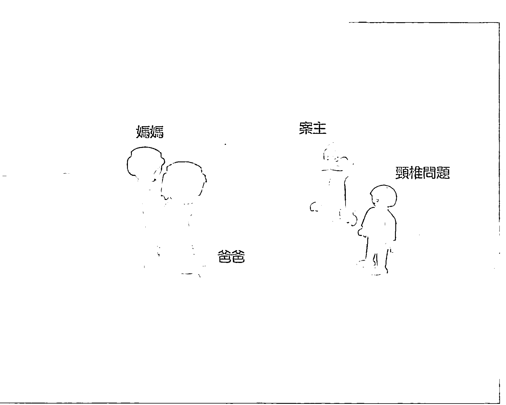

## 圖6-12 初始排列畫面。

> Jones : 「我小時候玩雲霄飛車時受傷過，傷到自己，脖子痛得厲害。」

> 周老師 : 「看來是刺激性的活動造成。按照我做中醫的經驗，這個病可以治，我會介紹相關的醫生來幫你。我在這裡給你系統與心理的支持，從心理層面來看，頸椎問題往往是想要控制，害怕自己做不好，想抓住自己的情緒感受。」

##### 第二步「承」：選擇代表，探索動力，詢問歷史，揭露真相。

周老師讓 Jones 找四個人偶，分別代表爸爸、媽媽、自己、頸椎問題。Jones 找出三個白色人偶，分別代表爸爸、媽媽和自己。父母代表並排在一起，好像關係很親密的樣子；自己則與爸爸、媽媽相對而站。至於，藍色小人偶則是頸椎問題的代表，站在自己的側邊（圖6-12）。

周老師：「你要感覺一下爸媽的關係、爸媽和你的關係，以及距離遠近。不是根據你理想中的樣子來排，而是依照你自己心裡的感覺。」Jones 調整了一下自己頸椎問題的代表，放在了自己的正後面。

老師：「你爸媽關係好嗎？」Jones 點點頭。 老師：「如果你繼續生這個病，你會得到什麼好處？」

Jones：「關注、逃避。」

周老師：「你在逃避什麼？」

Jones：「問題。」

周老師：「你在逃避什麼問題？」Jones 沉默許久，好像不知道從哪裡說起。

周老師：「你現在正面臨的，你最擔心的事情是什麼？」

Jones：「事業。」

老師找了一個人偶做事業的代表，讓 Jones 給他一個位置。Jones 把這個事業代表放在了爸媽代表的身後還有一段距離的地方。爸爸、媽媽好像一堵牆，就擋在了 Jones 和事業代表之間（圖6-13）。

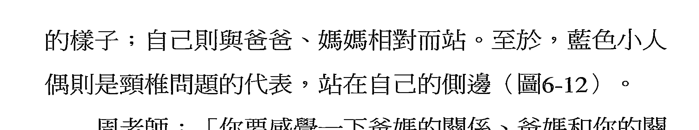

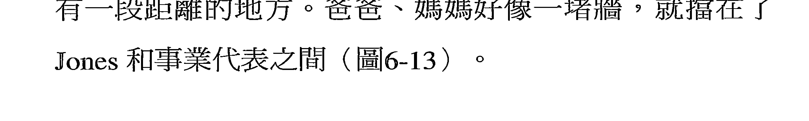

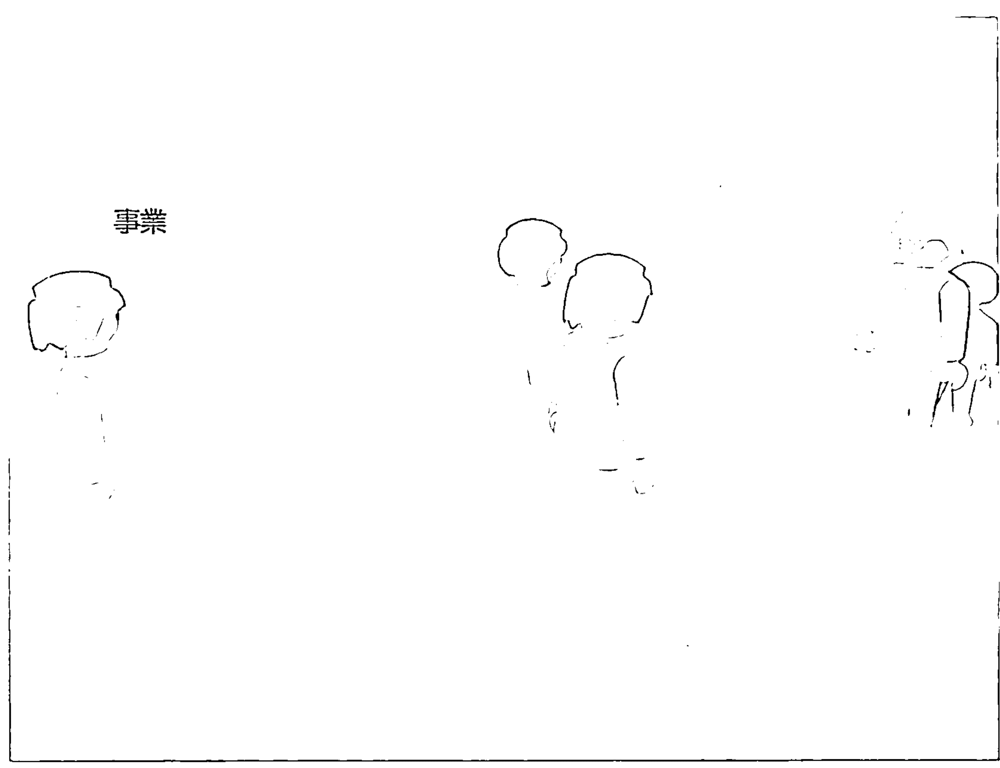

## 图6-13 加入事业。

##### 第三步「转」：寻找解决之道，表达情感，回归序位的爱。

> > 老師觸摸感知爸媽和頸椎問題的代表，對 Jones 說：
> 「你已經在爸媽關係裡待太久了，你不能一直在裡面，逃避你的事業。你看到你的事業在爸媽的身後，你自己都知道。你的病只是拉著你，對你不是大問題。你要來到事業這裡，這才是最重要的。你在這情緒裡面太久，時間長就會爛掉。情緒會給我們一種感受，但如果我们太沉浸在感受裡是會上癮的，停留在感受裡是沒有辦法修成正果的。因為感受來來去去、有好有壞，要把感受轉化為成長的動力，這樣才能夠有所成就。所以，沒有人可以把你從感受裡拉出來，一切都是你自己的決定。所以，你想要怎麼樣，你知道嗎？」
Jones：「走出來。」
周老師：「是的。你在情緒、感受、情感上已學夠了，你需要走出來。這是你媽媽以前的狀態，雖然你是用比較好的方式在經歷，但你的方式還是停留在課堂裡，還是一樣在繞。現在，你要跨出去了，要從感受裡走出來。這樣，你才能用在這裡學到的來幫到自己。你從學習畢業之後，就好好去開創事業，做你的事情。暫時不要再去上任何課程。等你事業有具體成果，想要再更上一層樓，可以再回到我的課堂裡來學習。」
老師找了五個人偶代表曾經教過他的老師們，排在Jones的側邊前方（圖6-14），對Jones說：「你的爸媽已經很好，不要再期待他們更好了。這些老師，也不是完美的老師，不要在老師身上要求得到你爸媽給你的更多關注，這樣我們就無法真正成為自己。至少未來三年，不要再上任何課，全心全意做事業，和老婆好好過日子，她是個很有愛的女人，但缺乏安全感。你不要再多說什麼，關鍵是做。好嗎？來吧，站起來，告別吧！」
Jones從座位上站起來，退後幾步，面對父母的代表。周老師：「告別不是不見，是與渴求爸媽關注的感受告別。你可以閉上眼睛，想像你爸媽在前面。」Jones自己跪了下來，給父母磕頭。周老師引導他：「你過去所有的社會經歷、課堂經歷、與人互動的經歷，都很珍貴，你現在要整合起來出成果了。這些都是你與眾不同的經歷。」

Jones 跟著老師對爸媽說：「爸媽，謝謝你們，你們給我的關注已經足夠了，你們給我的關注已經足夠了，你們給我的關注已經足夠了。」Jones 眼眶紅潤，語氣有一點激動，繼續說道：「你們給我的關注已經足夠我去開創我的事業、我的婚姻、我的人生。你們給我的關注已經足夠，接下來是我自己的人生。謝謝你們！我現在要跟這種要求關注的感受告別了。再見了。」Jones 跟父母慢慢地磕頭告別，從他非常緩慢慎重的動作裡可以感受到他心中真的在做告別。

老師再次引導Jones看著曾經幫助過他、教導過他的老師們，對Jones說：「在你心中，特別想到哪幾位老師，就在心中謝謝他們，一個個謝謝他們。」Jones閉上眼睛，嘴裡若有所言地對一個個老師說話、磕頭告別。老師引導Jones說：「謝謝你們的教導，我已經足夠強壯了，我可以去面對我的人生，去開創我的事業了。你們給我關注已經足夠了，原諒我從你們身上尋找完美父母，你們給我的關注與教導已經足夠了，我要去開創我的人生了。」Jones向所有教導過他的老師們磕頭。

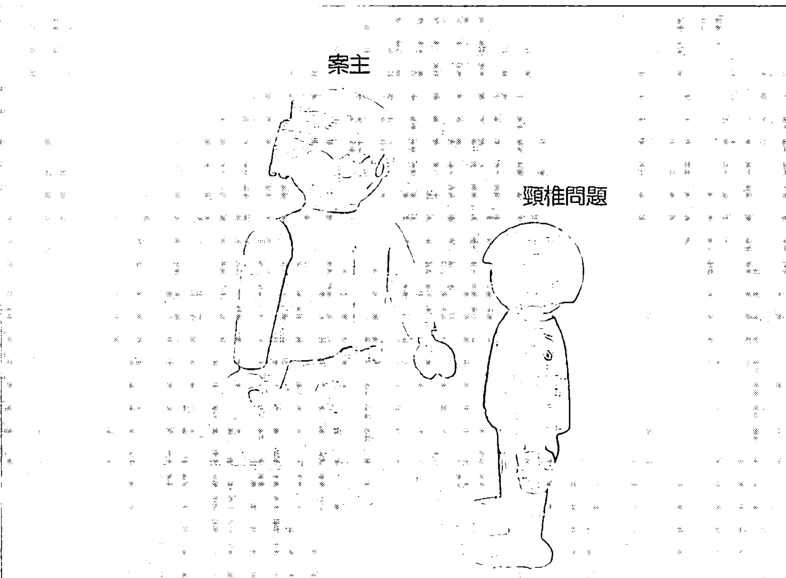

##### 第四步「合」：扣回主題，內化過程，回家之後，行動建議。

周老師拍拍 Jones 的肩膀說：「你看起來像男人了。好，看看你的頸椎病的代表，對它說謝謝。」Jones 看著自己的頸椎問題的人偶代表說：「謝謝你！讓你受苦了，我的脖子！我現在不用那麼緊張了。我不用擔心我做不好了。我長大了！」（圖6-15）

當 Jones 有所領悟之後，接著老師又問 Jones ：「小時候，爸媽怎麼叫你？」

Jones ：「長頸鹿。」

老師引導 Jones 對自己說：「長頸鹿，謝謝你，謝謝你活下來，謝謝你這麼堅強。我會照顧好自己的身體，你不用害怕。我把屬於你的感受放在我的過去，你是我的過去。我會好好照顧我的身體，找到好的醫生。謝謝你了，長頸鹿，再見了！」

老師推著 Jones 的人偶代表往前，從爸媽側邊經過，靠近事業的代表，問 Jones ：「這樣做，你願意嗎？」

Jones ：「願意。」

接著，老師讓 Jones 自己推著自己的的人偶代表，Jones 慢慢地、一步步地更加靠近事業，面對著事業（圖6-16）。

# 系统排列的全息智慧

一对一排列与线上个案的理论与实践

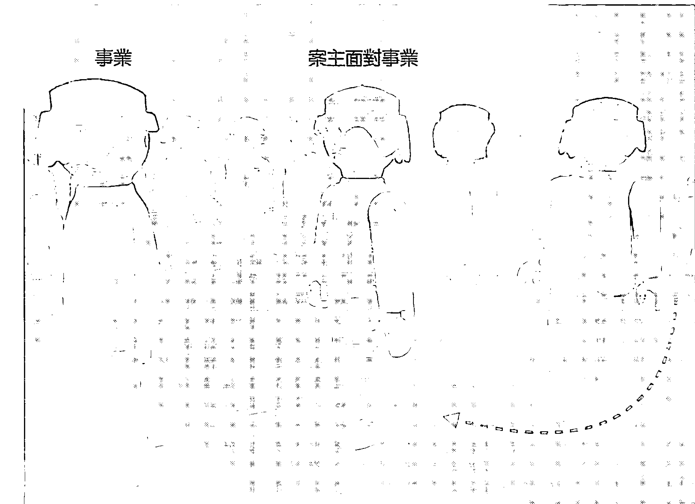

> > 周老师：「告诉你的事业一句话。」
> Jones说：「我爱你。」
> 周老师：「用英文说一句话，I am ready（我已经准备好了）！」
> Jones说：「I am ready.」

#### 【个案追踪】

一年之后，有人邀请我到Jones的英国故乡去带领工作坊。他过来当志工帮忙，并且告诉我，他这段时间努力开创他的事业，把精力都放在事业上，并且得到一点成绩了。他很感谢我当时坚决地要他不要再继续上任何身心灵课程，否则按照他过去的经验，他会继续一个课接着另一个課不停地上，卻沒有實際行動。現在的他真正成為一個男人了，腳踏實地，一步一步地經營自己的事業與婚姻，為自己的人生負起責任來。我相信將來一定會有許多有像他類似經驗的人，可以從他這裡得到幫助。

#### 【案例解析】

上述的個案，我與他有一點私交，但如果是在平常聊天的場合，我們說的話他不一定會聽進去。在一個這樣特別設置的排列下，就有讓他聽進去的機會，得到跳躍的突破。所以，對人的瞭解與觀察不是死的。平時對一個人的觀察在一對一排列時就可以派上用場，這時候你說的話他較容易聽。還有一些私密的話題，用一對一排列也很方便。在你進行一對一排列操作時，這就是你的場子，你要強而有力地維護好，你的權威是用來服務的，這是你能夠支援到人的地方。

剛開始案主排出來是這樣一種狀況：他的頸椎病在他的身後，他選了一個小孩人偶做他的疾病代表，就說明這個症狀和他小時候的經歷有關；而把疾病排在身後，又好像疾病在拉扯他。

接下來就像在做團體的系統排列，我進入代表的角色，我用手碰觸人偶，感受代表的感受。我感受到案主自己內在的狀況是在轉呀轉，他的症狀也在轉呀轉。爸爸想要往後倒，媽媽和症狀有些類似。我之前就瞭解到他的媽媽過得很辛苦，他和媽媽連結很深。

他的自省能力很好。我問他：「生病想要得到什麼好處？」他回答：「關注、逃避。」我問他：「目前最擔心的什麼？」這個答案就是他要逃避的。我準備了一個事業的代表，要他自己排，其實我心裡已經知道答案了，但我要讓他自己去回答、去排列，讓他自己去面對，這樣他自己才會生出力量。

接下來在「轉」的階段，他只是想在老師身上投射對完美父母的期待。所以我引導他感謝父母、感謝老師。這裡面要他告別的感受指的是孩子要求關注的感受，是一種低層次的歸屬感。所以我給他說了重話，那就是：父母給他的、老師給他的已經足夠了，足夠讓他去開創事業了，要把它真正用起來，不要再去上課了。我希望成為終結者。我們是在做教育，不是在賣糖果或嗎啡。我們要真正幫到他。

我們在這裡做的每一步都有對人性的瞭解為基礎，有系統觀念為基礎，不是憑空、憑感覺，這樣我們才可以一步步幫到人。

### <案例4>如何面對伴侶失和、外遇及墮胎的孩子？

艷麗是一家企業的高階主管，四十多歲，做事俐落，管人也不馬虎。但是近一年來，遇到了夫妻問題，心中有一個坎一直過不去。

#### 【排列操作】

##### 第一步「起」：建立關係，釐清問題，收集信息，達成共識。

> 周老師問艷麗：「什麼議題？」
艷麗：「和先生的互動有問題。」
周老師：「具體是怎麼樣？」
艷麗平靜地說：「兩年前的關係還可以。後來我公司較忙，又到處學習，他也支持。我可能忽略他了，於是他有了外遇，並和那女人開了一間公司。後來我才知道了這事。」
周老師問：「這事有多久了？」
艷麗回答：「去年過年的時候，我們還一起返鄉過年。去年五月份，外遇事件爆發。」
（艷麗表情生動，越說越起勁）「我先生是一家企業的總經理，外遇事件會影響他的前途和聲譽。我要他好好處理，但他總是說一句話就離開了，不理我。我問他有什麼打算，他說他還沒有想好，考慮這個問題就頭疼。我也不知道他是什麼意思。」

周老師：「關於他的外遇事件，你有什麼反應？」
艷麗很平穩地說：「我很生氣。」
周老師微笑地說：「但你說得津津有味，看起來不像生氣的樣子。」

艷麗：「每次他說要回家，我就很害怕；他要離開時，我又捨不得。」

周老師：「你不想和他離婚？」

艷麗：「我也不知道到底是想離還是不想離。我兒子不願意我們離婚。」一說起兒子，艷麗開始眼圈發紅，啜泣起來。

周老師：「你說起兒子的時候比較有感覺，說到老公好像沒什麼感覺。」又問艷麗：「你的兒子多大了？」

艷麗：「二十二歲。」

周老師：「有女朋友嗎？」

艷麗：「他有女朋友了。兒子說他的女朋友很像我一樣善良。我不想他找和我一樣的女人。」然後又說：「我想起來，我老公說過一句話，他說我們的事情和那個女人無關，他說是我們全家人都不喜歡他。」

##### 第二步「承」：選擇代表，探索動力，詢問歷史，揭露真相。

周老師：「現在找出三個人偶，代表你自己、兒子、老公，憑你的感覺排出他們的位置，越仔細、越精確越好，注意面對的方向、距離遠近。」艷麗非常仔細認真地排出了他們一家三口的位置。老公在左邊，面朝前。自己在右邊，距離老公很遠的地方，也面朝前。兒子在爸爸、媽媽的中間，比較靠近媽媽的位置，也是面朝前（圖6-17）。

周老師：「你和老公只有這一個孩子嗎？」

艷麗：「在兒子之前，有兩個墮胎的孩子；在兒子之後，又有三個墮胎的孩子。

周老師：「找出五個墮胎的孩子，排出他們的位置。」艷麗找出五個人偶代表墮胎的孩子，開始忍不住哭泣，用手撫摸著一個個孩子。

周老師：「讓他們坐下來。」艷麗抽泣著，顫抖地讓孩子們一個一個坐下來，全部坐在自己代表的前面，圍成半圓，圍繞著自己的代表（圖6-18），然後泣不成聲。

周老師：「看來這個事情是你獨自面對。你先生呢？你和先生聊過墮胎孩子的事情嗎？」

艷麗：「我跟他說過，想要去寺院超度，為孩子做善事。他很少表達，總是順從我。」

> > 周老师：「对于堕胎的事，如果你没有和先生聊聊感受，只是做表面的仪式，只是让你个人安心。夫妻并没有共同面对这个事情，没有交流心里的感受，夫妻关系绝对就疏远了，然后外遇就有可能发生。因为每一次堕胎就会切断一次关系，你们已经切断五次了。」

> > 艳丽：「我先生总是听不进去，只是顺从我做仪式，不用心。他说他的心回不来了。」

> > 周老师：「他有他的状况，他在做他的努力，但觉得别人不瞭解他，他需要别人更去瞭解他、理解他、感受他。」

> > 艳丽：「有一天，他说要和我办离婚手续，我不同意。因为他告诉我他外遇的事已经在传了，会影响到他的事业了，他可能觉得如果和我离婚，就可以告个段落。他说要我放了他，否则他对我的好印象就都没有了。我告诉他，你是在情绪中，一切都会过去。如果你不是在情绪中，你真要离婚，我也会签字。」

周老师感受了一下先生代表，然后说：「你的先生好像被困住了，无法动弹。当我们没有面对，就会有诱惑、外遇的发生。他也知道外遇对他没有好的作用，对他的事业没有好的影响。你要去瞭解他内心的感受。从现在开始，你要知道他的内在有很多的压抑、很大的压力，他自己僵在那里，逃避这一切，就被其他的事情困住了。这是一个过程，想要过这个坎，就要和他交流感受，要问他的感觉、他的感受。

> 艷麗哭著說：「我告訴他一切都會過去。他說你放心，我沒有牢獄之災，你照顧好自己和孩子就好。」

> 周老師：「你這麼去面對、表達出情緒，是很好的。但接下來，你不要困在這裡面，好嗎？你接下來的方向是轉向先生，和他多聊聊他的感受，適當時候再交流關於墮胎孩子的感受。」

##### 第三步「轉」：尋找解決之道，表達情感，回歸序位的愛。

接著周老師把艷麗的代表轉向老公代表，問艷麗：「我這樣做，你什麼感受？」並讓兒子的代表也轉身，面對爸爸的代表。

> 艷麗：「我兒子說他恨他爸爸不仗義，分不清輕重。我兒子太懂事了。」

> 周老師：「你轉身面對老公，也有一部分是因為你的兒子，你愛你的兒子。你看你的兒子都站在你的前面面對爸爸了。但你要自己面對。」

> 艷麗：「我兒子有一次說他要打他爸爸，為我出氣。The request was rejected because it was considered high risk## <案例6>為什麼心腦不合一？沒有辦法真正快樂？

雅文從臺南來，她工作盡心盡力，老闆交辦的事情總能努力達成。但私底下的她很容易多愁善感，心中總感覺有莫名的憂傷，覺得自己雖然各方面和關係看起來都不錯，但不知道為什麼沒有辦法真正快樂。

#### 【排列操作】

##### 第一步「起」：建立關係，釐清問題，收集信息，達成共識。

周老師：「什麼議題？」

雅文：「我發覺自己的心腦不能合一。頭腦想的是一回事，一直想把事情做好，可是心中想的是另一回事，總是感覺自己的心很不舒服，情緒很大，常覺得壓抑，好像沒有辦法真正快樂。」

##### 第二步「承」：選擇代表，探索動力，詢問歷史，揭露真相。

周老師：「我們來看看你的心怎麼了？」老師讓雅文選擇自己以及自己的腦、自己的心的三個代表人偶。雅文選了一個男性小人偶代表自己的頭腦，也選了一個男性小人偶代表自己的心，中間則是自己的代表（圖6-27）。

周老師：「我們要瞭解你兄弟姐妹的狀況。」瞭解到她有一個哥哥。周老師問：「你們家會比較疼哥哥嗎？」

雅文：「媽媽會。」

周老師：「有一點重男輕女的感覺。你選一個代表媽媽。」雅文選了一個媽媽代表，把媽媽排在自己的心的前側方。

周老師：「你再選一個哥哥代表。」雅文不自覺地笑著捶了一下自己的腿。此時，周老師對旁邊正在接受排列師培訓的學員們說：「要注意觀察她的動作。」雅文排出哥哥的人偶代表，放在了原來自己的心的位置，緊挨著媽媽。並且讓自己的心退後一些（圖6-28）。

周老師：「你的哥哥取代了你心的位置，擠到你和媽媽中間，心有些生氣了。」雅文一排出位置，我們很快就看出她的家庭狀況了。周老師對雅文：「你很渴望媽媽看到你。所以你對哥哥也有一些生氣。是嗎？」

雅文：「嗯，但是哥哥也滿疼我的。」

周老師：「是的，可是你的人偶更看向媽媽。你希望媽媽更看到你。」周老師感覺一下媽媽，然後對雅文說：「其實媽媽在找你，也想看到你，是你自己把自己藏在後面了。你小時候是不是常把自己躲起來讓媽媽找？」雅文點點頭。

周老師又問：「如果你希望媽媽看到你，你會怎麼做？」雅文把自己的心的代表移動過去一些，能夠看到媽媽。

周老師：「很好。」周老師讓雅文摸摸代表自己的人偶，感覺一下自己是什麼感覺。

雅文：「有些害羞。」

周老師問：「你覺得媽媽會是什麼反應？媽媽會想轉過來看你嗎？」

雅文：「會。」她把媽媽往前移，靠近自己。

周老師：「哥哥呢？你覺得哥哥會是什麼反應？好像哥哥也會看你。」又問雅文：「你差哥哥幾歲？」

雅文：「兩歲。」

周老師：「哥哥也會照顧你，是吧？」雅文點點頭。

##### 第三步「轉」：尋找解決之道，表達情感，回歸序位的愛。

老師讓雅文看向媽媽，對雅文說：「你會很開心媽媽看到你。你的頭腦說 yes，太好了。現在試著摸自己的心，對媽媽說：『媽媽，我好想你看到我。媽，我好想你看到我。』」

雅文推著自己的人偶靠近媽媽，在周老師的引導下，帶著哽咽與情緒，很渴望地對媽媽說：「媽媽，請看看我，請接受我是一個女生，請接受我本來的樣子，讓我不用跟哥哥比較。請接受我是你的女兒，我不用當兒子，你也一樣愛我。有時候，我會把自己藏起來，因為我怕我自己表現不夠好，我怕我自己不被喜歡，除非我表現得像哥哥、像男生，你們才會喜歡我。所以，我把真正的自己藏起來，做符合你們要求的事情。媽媽，請接受我本來的樣子。」雅文說著說著，情緒激動起來，讓人偶抱住媽媽（圖6-29）。

周老师拿了一条毯子放在胸前，站到雅文本人的身边说：「我现在代表你妈妈，你可以靠在妈妈的身上，就像你的妈妈就在你身边一样。」雅文把头靠在妈妈身上，坐著抱住妈妈，开始像孩子般哭泣起来。

妈妈对雅文说：「我忽略你了，雅文。」她抱住雅文的头继续说：「我忽略你了。请你做你自己，你可以做你自己。就算你做你自己，妈妈也一样爱你。只要你开心，妈妈也会开心。因为妈妈不只爱哥哥，妈妈也爱你。你不用像男生，妈妈也爱你。你不用躲起来，妈妈想要看到真正的你。如果你做你自己，可以开心地活，妈妈会很高兴。请你做你自己。」

雅文在妈妈的怀抱里感动地大声哭泣。她的哭泣不只代表她个人，因为她的妈妈跟哥哥是爱她的、对她是好的，在这哭泣背后有著集体系统里女性因重男轻女而被忽略、不受到关注的一种深层感受，透过她流动出来了。所以这是一种无意识的集体感受。案主自己说不出来，但在生活里莫名地感受到这些的情绪，现在透过她流动出来了。当一个人被全然接受时，那是多么深层的一种喜悦；当一个人能够全然地接受自己时，快乐才能够真正地升起。这个过程往往会先透过妈妈身上学到，所以妈妈对我们生命的影响是非常大的。

雅文抱住妈妈好一会儿，周老师：「就这样，好吗？」然后老师脱离妈妈的角色。对雅文说：「现在你一定有话想对妈妈说，用手扶住你自己的人偶，对妈妈的人偶说你想说的话。」雅文终于敢说出了自己心中埋藏许久的话：「妈妈，你总是关心哥哥。我记得有一次，我肚子不舒服，妈妈和哥哥坐在客厅里面，好像没有觉察到，我哭了。我给妈妈写卡片，说她比较疼哥哥。不过也能感觉到，我有什么要求，妈妈也是尽量满足我，也是很疼我的。」

周老师：「妈妈的确有时候忽略你了。不过妈妈是爱你的，也许她不能给你更多的爱，但妈妈已经把她当下能给你的给你了。哥哥也对你好，每一个排行顺序都有不一样的情况，也许你不是老大、不是男生，没有得到更多的关注，但你得到了自由，你也少负了一些责任。不要比较，妈妈是爱你的。哥哥也是爱你的。」（图6-30）

雅文释然地笑了。在这一刻，她感受到了其实她并不缺少爱，妈妈和哥哥都是爱她的，只是她以前活在自己的期待和比较中，没有意识到而已。

##### 第四步「合」：扣回主题，内化过程，回家之后，行动建议。

个案的最后，老师嘱咐雅文说：「当一个人能够全然地接受自己时，才能夠真正的快乐。你如果想太多就会心情不好，你好像有些两面：在心情好时，就会正面积极；心情不好时，你会掉入负面消极的情绪里。但是，不要长时间待在那种情绪里。生命有春夏秋冬，不要总是活在秋天，活在秋天太久了就变冬天了。我们的人生不用依靠别人给我们多少，才能做我们自己。你的人生要透过自己活出多少来决定你人生的价值。你能活出多少就活出多少，这些都是自己的。不要总是活在需要被人肯定、靠别人给予之下，那样你就被人的评判束缚住了。你需要自信地活出你自己。能活出多少，自己就展现多少，你有自己的才华和特长。如果你困在秋天里也没有关系，接受人生总有秋天，但不要长久待在秋天里，因为时间太长会削弱你自已，讓你自己沒有力量。秋天時，你就讓自己做些事情，你有一顆很好的頭腦，讓它幫助你的心，你就可以從孩子的感受裡走出來了。不要覺得世界不公平、自己很悲慘、你不被愛。每一個兄弟姐妹排行不同都有不一樣的壓力和命運，人生也會有所差異。但記得媽媽是愛你的，你能活出自己才是你對媽媽最好的回報。」雅文微笑點頭。

#### 【個案追蹤】

半年之後聽到雅文的消息，她辭去原本的工作，找到一份她喜愛的工作。她在這份工作裡，能將她天生的特質能力發揮出來。她也開始熱心參與許多公益活動，擔任志工，服務其他人。從她自信的笑容裡，我們看到她開始接受了自己，讓人感受到一份成長的喜悅。

#### 【案例解析】

(1) 系統排列除了排出我們外在的系統，比如事業系統、家庭系統外，我將它發展出也可以排列我們內在的系統，包括頭腦、心、身體等等。一個人內在的系統往往會反映出我們跟外在的關係。外在往往是我們內在的延續。和外在的關係好壞，也會影響我們內在狀態的形成，兩者是互通的。從上述個案我们看到她的心纠结在重男轻女的家庭动力里面，这样的动力也影响了她的心跟她的头脑所想要的，所以两者常常打架。她没有找到一个好的方式面对系统动力，也因此产生了莫名的忧伤以及心脑的不和谐。通过内在系统排列，我们可以把内在的情况用视觉化的方式呈现出来，让我们自己可以看到自己的内心状态，也看到自己跟外在的关系需要怎样的调整。当这份觉悟产生时，我们的内在将会变得更加清明，进而降低了无意识的情绪困扰。因此，在这个个案中，我们是从内在系统跟外在系统一起支援她，帮助她整合自己的心与脑以重新面对外在的关系。

(2) 关于重男轻女的议题，如果案主落入对父母的抱怨或者对于这个观念的批判，并把焦点一直放在自己「没有得到的」，她就会一直觉得不公平，认为自己没有得到公平的对待。这时候案主很容易就会陷入无力感之中，助人者也会跟着觉得无力。但如果我们可以帮助案主看到自己「已经得到的」，跳出「比较」的心情，找到属于自己独特的力量，这时候案主反而可以学会在这样的现实环境下，怎么让自己独特的力量更能发挥。我用这样的方式辅导了許多案主，她們所實現的人生往往更加精彩。

### <案例7>為什麼女兒總是抗拒我？批判我？

丹是從馬來西亞過來上課，她六十歲，知性、優雅，可是眉宇間常常是淡淡的愁雲。

#### 【排列操作】

##### 第一步「起」：建立關係，釐清問題，收集信息，達成共識。

周老師：「什麼議題？」

丹：「我和女兒有衝突，她比較尖銳，總是批判我。」

老師：「女兒現在具體是什麼情況？」

丹：「我的女兒四十歲了，四年前罹患淋巴癌，經過化療後，現在癌症指數歸零了。另外我先生也是淋巴癌。」

老師：「你發現你女兒什麼時候開始這樣對你？」

丹：「我是慢慢發現的，她總是與我對立。」

老師：「能說說有什麼具體的事情？」

丹：「都是些生活中的瑣事。比如，我和先生有次約好要一起回诊，但看护陪着我先生先到了医院，我没有告诉看护要等我到了再一起报到，因为我觉得看护应该知道。但是一叫号，看护就带我先生进入诊间。所以等我到了医院时，主任医师已经看完了，我没能和主任医师说到话。当我说起这件事情，埋怨看护时，我女儿就说是我自己没有安排好，不能怪别人。我觉得女儿是在挑我的问题。」

周老师：「你跟你先生，应该也是有一些冲突。」

丹：「我和先生已经分居二十八年了，开刚开始是在女儿十二岁的时候。」

周老师：「在女儿十二岁时，你们就分居了，孩子是由谁带呢？」

丹：「我先生。」

周老师：「那你觉得你离开了，孩子们会怎么想？」

丹：「我觉得他们都不需要我。」

周老师：「你的孩子长时间累积了一些情绪，遇到一个点就会爆发愤怒。」

丹：「我的大儿子、小儿子也对我有愤怒。后来，我和他们沟通，我多承担，现在大儿子和我关系就比较好了。」

老师：「你和女儿有好好地沟通吗？」

丹：「我觉得没有办法和她真正很好沟通。」

周老师：「那是因为有很多情绪在里面。女儿很保护爸爸，是吗？」

丹：「我觉得她不愿面对爸爸，但她很爱爸爸。」

周老师：「小孩子不愿面对，不表示她没有感觉，她是用不去感受的方式保护自己。她希望妈妈留下来，可是被拒绝了。当一个人需求被拒绝，她的伤是很严重的，所以她就不表达自己，这是她保护自己的方式。你女儿现在是大人了，我们要透过这个个案过程，来知道如何和女儿沟通，好吗？」

丹：「好。」

##### 第二步「承」：选择代表，探索动力，询问历史，揭露真相。

周老师：「找出你自己、你老公、你女儿的代表。」

丹找了一个绿色人偶代表老公，红色人偶代表女儿，白色人偶代表自己。然后把老公、女儿、自己排成三角形站立（图6-31）。

周老师：「很明显的，你的女儿夹在你们中间，到现在还是一样，但靠爸爸稍微近一点而已。你是看向你女儿方向的，很明显的你是关心女儿的；而你的先生是看向你的，是关心你的。你爱你的女儿，只是她夹在你们中间，她很想離開，因她沒有辦法幫你的忙，她就會生氣。

丹：「她確實是很會讓我生氣，每次我們關係緩和，都是我相信她是愛我的。」

周老師：「她有你的遺傳，她講話太利。有時話會殺人，我們要反省自己殺了多少人。她壓抑了很多情緒，是刀子嘴、豆腐心。你也是的。她一直在堅持，沒有離開。小時候她是想離家出走的。」

丹：「她是三個孩子中，第一個離開爸爸，接近我的。」

周老師：「你可以看出她的衝突是很大的，她背叛爸爸和你見面，你可以體會她的犧牲有多大。她犧牲爸爸的愛，她真的很愛你。」丹開始抑制不住地哭泣。

周老师：「你沒有錯，你們家是個張力很大的家庭，所以每個人的性格都比較強烈，孩子一半遺傳你，一半遺傳你先生。」頓了頓，周老師接著說：「這是過去那個時代的原因，你先生不是本地人，是外地人，你呢？」

丹：「我們是馬來西亞華僑。」

周老師：「基本上，你們家都有一個『離開家』的情緒在裡面，都有離開的悲傷。」

##### 第三步「轉」：尋找解決之道，表達情感，回歸序位的愛。

周老師問丹：「你想怎麼樣和女兒溝通？」

丹：「我不知道，我覺得沒辦法和她溝通，我想讓她來上課，但是她總是不聽。」

周老師：「她的語言已化作一把刀，她說話就是在亮刀。但還有比說話更厲害的就是不說話。超越語言的溝通方式，你知道該怎麼做嗎？」

丹：「我不說話，只是做；在我的角色裡做對的事。」

周老師搖搖頭，然後說：「現在我當你，你做你女兒，感覺一下，你就會體會到女兒的感受了。」說完之後，周老師握住丹的手，默默凝視著丹，等丹情緒平靜進入狀態。就這樣過了一會兒後，周老師開口說道：「什麼是超越语言的沟通和爱？肢体动作、真正看见对方、心的交流、透过拥抱。你是说不过你女儿的，她有你和她爸爸的遗传，是超越你的。但你有一个优势，你天生就被赋予了一个位置，那就是妈妈，你可以包容她，不怕被她伤害；用你的心、用你的爱去涵容她。当你被咬的时候，你不畏惧，你就驯服她了。她知道她伤不了你，她就能感受你对她的爱。刀光血影很容易，但妈妈的心要一直包容孩子，最后孩子就会放下她的刀。一次两次不要退缩，一定会有反复的情况发生，但是你仍然坚持在那里。这就是教育。”周老师接着问丹：“当我这样握着你的手，看着你的眼睛，你感受到什么？”

丹：“你刚握住我的手，我觉得好笑。因为我女儿和我之间有时候就是这个样子。在这个笑的过程当中，我能感觉到老师的手的温暖和力量，我的心就会定下来，接下来就会想要哭。”

周老师点点头：“对，这就是你女儿的感觉，她的心开始定下来了，情感开始流动了。你对女儿不要说话。一说话，她就用头脑的想法回应你。当你女儿有情感流动的时候，你就握住她的手，不要说话。”

接下来几分钟，丹不说话，她在静静地、默默地感受着这份温暖的力量和爱。然后她开始情绪激动地哭泣……

周老師抱住了她的頭，對她說：「你很委屈，你的女兒也有很多委屈，不要繼續翻舊帳了，那樣只會傷害彼此，但是要讓情感流動，透過這份愛。」丹哭了一會兒，情緒慢慢平穩，感覺整個人變得柔軟下來。

周老師：「你女兒最常說的抱怨和攻擊不滿的話是什麼？」

丹：「她小時候遇到不喜歡的事時，經常會說『可惡！』」

周老師：「你知道淋巴癌是什麼？淋巴的作用是身體的免疫系統，淋巴癌是保護系統變成了攻擊系統。她是自我攻擊，情緒向內縮。刀子本來是向外戳的，但是她只能向內戳，就會得什麼病？淋巴癌。如果我們允許她，讓她的這份愛流動，多說一些話會好一些、會讓愛流動，但光靠「說」比不上她「自我攻擊」的幾萬分之一。這要如何轉化呢？就是讓攻擊轉化成一份有愛的流動的方式，不再是那麼尖銳，她要體會你是怎麼做的，你做到了，她就可以學會。」

周老師指引丹：「現在，摸著你自己的...擁抱女兒。」

丹讓自己的人偶去擁抱女兒（圖6-32）。

周老師：「很好。一個十二歲的女孩，正在變成一個大女孩。在這個過程中，媽媽對她很重要，她需要很多媽媽的支援和擁抱。」

過一會兒，周老師問：「有沒有感覺女兒開始軟化了？」丹點點頭。

周老師：「先生看到你擁抱女兒，也會很開心的。剛才我都感覺女兒想要倒下，可是現在有力量了。女兒和爸爸得一樣的病，也是對爸爸的一份愛。」

丹也讓女兒伸出手，擁抱自己，然後慢慢靠近先生。一家人和諧溫暖地在一起（圖6-33）。她在這個片刻停留了好久好久……周老師小聲地對周圍受訓的排列師們說：「這時就是她內在的療癒畫面在運作了。」

##### 第四步「合」：扣回主題，內化過程，回家之後，行動建議。

老師向丹提出了回家後和女兒溝通的方法：「今天你學到了不用說太多的話。太多的話都是解釋，解釋是永遠解釋不清，只是阻礙愛的交流；解釋會讓你們母女互相傷害。你肯定女兒的感覺、理解她的做法、接受她的感受，承認是自己沒有安排好；不要解釋和爭辯，那會永遠無止無境。用這種方式，她可以感受到你的愛。每個人有不同的意見，不要爭論誰對誰錯，結果是最重要的，我們要的是在不同的意見之下，愛依然可以交流。這對你是一個很大的突破，你以前太會說話了。這是你的存活下來的方式，但是你要更上一層樓，記得無聲勝有聲。」

丹感激地看著老師：「我今天才學到了不說話的力量。」

周老师：「最大的力量是宁静。祝福你，我们就到这里。」

#### 【个案追踪】

几个月之后丹来了一封信息：

「亲爱的老师，感谢你为我做的个案，现在我和女儿的关系变得更亲近了，我学到了怎么样跟女儿沟通，一有机会就多去牵女儿的手、多抱抱她。我感受到女儿也是爱我的，虽然有时候两个人还是会鬥鬥嘴，但是已经不会像以前那样让人感到心就像刀割一样。我觉得我很幸运，也希望天下和孩子相处有困难的父母都能得到老师的帮助，非常感谢你，祝福你们一切顺利。」

很开心，我们也恭喜他们。

#### 【案例解析】

人偶是工具，排列也是工具，可以让我们看到动力的呈现，但帮助人的不只是呈现出动力而已，最重要是怎么「转化」。一个排列师的功力就在他如何「转」了。而转化的智慧来自于我们对人生的深刻领悟、来自我们平静清晰的心灵、来自于我们自己对生命的实践、来自对不同人## 系統排列的全息智慧

### 一對一排列與線上個案的理論與實踐

生命狀態的理解所生出的慈悲。如果我們讓剛才這個案主去對女兒說些其他什麼的也是可以，但深刻度就達不到了。所以我們不是在學技巧而已，我們是在學人生的智慧、人要怎麼活。

系統排列工作就像是一群平凡的人在這裡相約共同經歷人生的許多感動，共同探索人要怎麼活可以更成長、成熟，這是這份工作美麗的地方。我們都是平凡人，許多案主都是我們的老師，如果換作是我們活在他們的生命狀況裡，我們不一定是會做得比他們更好，所以我們要向案主學習。這也是我喜歡這個工作的地方，我們可以幫助到人，同時又可以從不同人的生命學習。這樣會讓我們的人生越來越扎實、越來越有厚度、越來越有內涵。所以我們要不斷的成長，學習生命的活法，不斷向前走。

剛才這個案例，她本身是高知識分子，她的心不一定很快地就能敞開。我們透過人偶排列就是一個很好的入口，能把她內在的東西展現出來，排列師就有很好的參考信息可以切入，這樣她的心就比較能夠敞開。整個個案最重要的一個信息是讓她看到「愛在哪裡？」我問她：「你在看誰？你在看女兒，你很愛她。」她就意識到她的愛，心就開了。讓她也看到先生對她的這份愛，她的感受也不一樣了。排列就是用具象化的呈現，把沒有意識到的東西具象化展現，讓她看到先生在意她，看到這份愛。

當案主用人偶排列出他們家的場域時，我感受這三個人之中：先生想倒下，女兒想退後，她想轉身；可是他們卻都在堅持，就表示三個人這樣的動力是存在的，只是還沒有走到那一步。但動力是可以改變的，最後排完之後，本來要轉身的她卻開始慢慢向前移動。如果今天沒有和解，她就會一直糾結下去，就算離婚也無法全然轉過去活出自己的人生。但今天有個和解，她回去知道如何能和女兒有好的互動，幾次之後，結就打開了，她才可以自在地走她自己的路。也因為這樣，她回去後和她的先生也有了和解的機會，先生的免疫系統自然會提升，並會多一份想活下來的力量，疾病的治療和預後效果也會變好。

命運是可以改變的。心的狀態改變了，即使生病過世走了，也能平安地走。死亡不是生命的終結，最重要的是要學到一些東西。學到了，死亡就不是終結，不再可怕；可怕的是我們沒有好好面對人生，我們沒有和解，心中還有糾結存在，沒有學透這一生為何而來。死亡反而是讓我們更好的去面對人生的推力。

在這個排列中，我們加入身體的接觸，我也示範了她回去可以做的方式，她回去之後就知道該如何去做了。從這個案例，大家現場看到的、學到的，會比我單純講給你們聽的效果好很多，所以要多在有老師的場域浸淫學習，很多信息是要靠現場感受來吸收，你越專注用心，就會學習成長地越好。如果回去不停在生活裡鍛鍊與反省，就會對人性深處有更多的理解。

### 案例8：如何超越內在的恐懼？我愛上我的師父......

琪羚是個溫婉柔美的女人，但是在柔和的外表之下，她知道她的內在有著難以跨越的深深恐懼，她感覺自己被一雙看不見的命運之手牽引，不知道自己如何才能讓內心和諧圓滿。在一次課程裡她提出了她的議題，希望我能用人偶排列幫她。

【排列操作】

-   第一步「起」：建立關係，釐清問題，收集信息，達成共識。

周老師：「你的議題是什麼？」

琪羚：「我感覺到內在有個很大的恐懼，感覺到有一種很強烈的感覺要把我拉走了。我想到了一些事，那是我很難跨越的困難，那就是我的命運。我一直以為不是在我的家族系統裡面，不是我們的學習能夠解決的。」

周老師：「我們所說的系統不限於家族系統，是整個生命裡面所發生的事情都可以工作。公司系統也可以，人際系統也可以，有時候動物也可以，有時候是生命裡巧遇的愛人和朋友，這些都是可以的。你想要生命朝向什麼樣的方向？」

琪羚：「我想要內在超越恐懼，得到平靜和諧。」

周老師：「那麼我們就來探索恐懼背後的真相，幫助自己得到平靜。」

-   第二步「承」：選擇代表，探索動力，詢問歷史，揭露真相。

周老師對琪羚說：「找出兩個人偶代表，一個代表你，一個代表恐懼。」琪羚找出紅色人偶代表自己，黃色人偶代表恐懼，兩個對立而站，離得比較遠（圖6-34）。接著，琪羚推著自己的人偶靠近恐懼，笑著說：「我就是感到了奇怪的吸引力。我感覺被恐懼拉走了。」周老師：「但你好像很開心的樣子。」琪羚：「我頭腦不想，但是潛意識裡有力量在拉我。」周老師摸著人偶感覺，然後說：「是你想要把它排除在你的生命之外。不管是什麼，它對你的生命都是很重要的一部分。」

琪羚：「我是想把它放在我的心裡面，它很遠離我們的生活。我需要與它和解。」

周老師：「其實是你需要和你自己心裡面這個過程和解。」

琪羚：「到目前為止，我都非常接受。我曾愛上了我的師父，我現在接受這段感情故事成為我生命很大的經驗，並給我的教導。這件事實沒有辦法被人忽視或遺忘，但它現在卻被拿來當作故事被人批判。」

周老師：「師生戀很美，從古至今流傳很多這樣的故事。世界上如果少了這麼多美的故事，就會變成黑白了。現在最重要的是，在你心裡面給它一個位置就好。」

琪羚：「但別人總是談起我的這個故事，讓我很难堪。」

周老师：「那是因为你自己没有与自己和解。」

琪羚：「我觉得自己花了很多时间想要放下，可是我无法面对人的指责。」

周老师：「对，有些人很无聊、爱批评。但这是你的人生，你过得很精彩。你并不需要让无聊的人影响你。」

琪羚皱着眉头：「我以为它不会影响我，但它还是一直影响我，让我陷入困境。」

周老师：「的确不容易。如果批评你的是陌生人或是关系远的人，你就要远离那些无聊的人。他们人生很无聊，所以才会谈论别人。过着精彩人生的人经常会遇到这种境况。」琪羚苦笑着。

周老师：「生命里这些美好的事件，让生命多了很多色彩。如果生命再来一次，你会怎么样？」

琪羚很坚定地说：「我并没有后悔。」

周老师肯定她：「是的，所以不要管其他人的闲言闲语。」

琪羚：「我先生和我互相体谅，努力地修复关系。但他情绪有很大波动，有时候会失控，我感觉他是受到我曾爱上师父事件的影响。不过，当别人提起这件事时，我先生也告诉我要坚强。」

周老师：「让他有些情绪也很好。」

琪羚：「我努力对待他，因为事件是我造成的。」

周老师：「有情绪是健康的，一段时间就会过去。关键是你自己要让它过去，才能过去。」

琪羚：「因为我爱上了师父，团体很多人都认为我是犯戒，因而远离我。我觉得没有任何地方能容得下我。」

周老师：「那是他们要修行的过程。很多人都会犯戒的，没关系，这是一个学习的过程。关键是你的心，你要原谅你自己。」

琪羚：「我觉得自己没有做错什么。我有些责任，但不是都是我的错。」

周老师：「你要接受你自己，否则你总是会看到这些人。如果你心里面有东西，就觉得这些人会影响到你。」

琪羚：「很多年来，我在做一些教学，学生们从我这里得到许多，彼此很相爱。可是过段时间，他们听说了我曾爱上师父的故事，就会觉得我欺骗了他们的感情，转而指责我。我就觉得我怎么总是遭受这样的命运。」

周老师：「你要看你自己如何创造了自己的命运。比如，我认识一位心理治疗师，他在开课时便先说，『我离了三次婚，你们在座的有没有比我更有经验的？』我觉得他自己先说出来很聪明、也很真诚。否则有人会说：『你离了三次婚，你还教我们夫妻怎么相处，你不是在骗我们吗？』但是，重点不在于我们是否是完美无缺、洁白无瑕的人，重点是我们经历了这些之后，我们从里面成为了什么样子的人。」

琪羚：「我知道自己，但别人不知道啊。」

周老师：「别人不知道是因为你自己不是真正知道，比如，当在一个团体里面，一开始你可以跟他们说，我的生命经历很丰富，我曾经爱上我的师父，曾经发生什么事，这都是我生命的一部分。」

琪羚：「就是因为他是我的师父，我才会爱上他，这不是普通的男女之爱。」

-   第三步「转」：寻找解决之道，表达情感，回归序位的爱。

周老师：「好，我们排列出来看。找出你所爱的人，放在恐惧的后面，两人贴在一起。」（图6-35）「现在你注意看喔，我要把恐惧与这个人慢慢地拉开，你注意看着后面这个人。」（图6-36）

琪羚很努力看着，然后无奈地说：「我没办法连结。」

周老师：「没关系，我们再试一次。」这次案主感觉比较好了，可以注视著后面他所爱的人。

周老师：「扶著你自己的人偶，看到你所爱的人。」

琪羚：「我感知他很大，像巨人般，无法形容。」

老师找了一个小的人偶代表，代表小时候的琪羚。然后说：「来，牵著你自己，牵著小时候的你，知道他是谁吗？」

琪羚带著似乎在逃避的异常神情说：「我想抱抱他……别人总说我是缺爸爸，因为我小时候就没有爸爸，所以找一位师父来代替。但是，我觉得他不是我爸爸。他很巨大，也很伟大。」

周老师：「是的，对于一个小女生来说，你的爸爸是很巨大的。是的，进入小时候的你，再抱抱他（图 6-37）。很不容易，他看到你了，你也靠近他了。闭上眼睛，回想你抱住你爸爸的感觉，还有你对他说的话。」琪羚慢慢静下来进入深层的感受里，她开始激动地掉眼泪，她把父女两个人偶抱在一起好久……

当琪羚抱著爸爸的同时，周老师在旁边用温暖的语气对她说：「你的爸爸，你爱他，他也爱你，但是他压抑他自己。不过现在你在心里面，感觉到和他的重新连结；你在心里面，已经再次感受和他的连结。你要记得这个连结，在适当的时候，你可以去找他；你不用得到母亲的许可，因为你已经是大人了，你要去看他是活著还是过世了；你要去找他，看他后来的生命是怎么样，很真实地去看到你爸爸的人生是怎么过的，去看到他也是一个平凡的人，他是怎么走过他后来的日子的。然后这个时候你就变大人了。」周老师把大的人偶放在小的自己的身后（图6-38），对琪羚说：「你的爸爸会很高兴，如果他还活著，看到你已经长大成人了。」

接著，周老师对琪羚说：「摸摸代表长大后的自己的大人偶，她现在是什么感觉？」

琪羚摸摸自己的人偶，那个长大的自己去感觉，然后说：「现在没有很激烈的感觉了，很平静了。」周老师引导她：「现在带著这个平静的感觉，转过来，看看这个黄色人偶。」琪羚推著长大的自己朝向黄色的人偶，在离他不远的地方停下来（图6-39），又开始哭泣起来。

琪羚问周老师：「你的意思是说我因为父爱缺失，所以去师父身上找寻。可是，是他先说爱我的，不是我去追求他。因为他是我师父，我很尊敬他，我没办法拒绝。所有有份量的人都说他是一位很伟大的人。我觉得不是我去找一个替代我父亲的人。」

琪羚情绪有些激动，周老师：「不，不，我们还没有结束。」周老师把刚才父亲的人偶放到琪羚的人偶代表身后支持她，等琪羚情绪平静一些。周老师：「像刚刚一样，用平静的心去面对。你想向他鞠躬吗？好，你扶住自己的代表，向他鞠躬，有什么话想对他说吗？」

琪羚：「我先生和我有一段时间在谈离婚，他赞成我的决定，愿意成全我的追求，但后来他很愤怒，有很多的情绪，他说他觉察到那是一种一生都没有过的强烈情绪。后来我离婚了，但师父也没有接受我。师父的弟子们都很痛恨我，就编了很多奇怪版本的故事流传。最后一刻，我向师父说对不起。现在我也不知道他在哪里。我觉得他的前途都被我毁了。」琪羚心痛得想要哭出来。

周老师：「不说最后一刻，我们在当下、在这里面面对，而且他也有他的责任。」琪羚开始泣不成声，平静一会儿，面对师父鞠躬（图6-40）。

老师感知一下，然后对琪羚说：「你知道他什么反应吗？」

琪羚：「他说不用说对不起，因为那是他要的，所以他接受。」

周老师：「是的，他也向你说对不起。」

然后周老师扶著师父也向琪羚鞠躬。琪羚有些颤抖，情绪激动，闭著眼睛哭泣。

周老师：「深呼吸，深呼吸，接受，接受。你愿意接受吗？」琪羚含著泪点点头。

周老师：「因为当你接受，你就会自由了，他也自由了。爱及情绪会来也会去，这些并不是不好的。有了这些经验之后，我们才学会用更好的方式面对，以更智慧、更圆融的方式去照顾这一切。许多高僧大德也都曾被情欲勾起过，但每一个人面对的情况不一样。所以，彼此都有责任，但是并没有什么错，已经发生了就接受，最重要是要从中学习。毕竟，你们都付出了很大的代价。对他来说，你是他生命的功课，所以他才会遇到你。这很好，你让他有机会经历这一遭，他也会从这个过程学到很多。师父本来就是站在较高的位置，所以他更要谨慎，这是他要学习的。在他有更大的成就之前，这是必然要经历的关。这是每位师父都要经历的关：情关和钱关。这只是小小的考验而已。」

然后老师感知了一下师父，代表师父说：「谢谢你来成就我，我也愿意成就你。」接下来，老师慎重地对琪羚说：「他是你的师父，但是在某一部分你们是平等的，就是你们内在的本性是平等的。他教你一些东西，你也教会他一些东西。也许上辈子你是他的师父。所以现在，要重新站在一个位置，以成人的方式去看到他。」

琪羚移动著自己的人偶向前靠近师父，然后说：「我还是想要更靠近一些。」

周老师：「可以。告诉他你想要对他说的话。」

琪羚：「我觉得没有话要说。」

老师去感知琪羚的人偶代表，然后让琪羚再次摸著自己的人偶，去感觉自己内在的力量的升起。琪羚去感觉，然后说：「我没有什么话想说。」

老师引导：「所有的分开都有悲伤，没有悲伤就是没有爱过。你对他说：『我曾经爱过你。』」

琪羚：「我说不出来。」沉思一段时间后，琪羚才说：「其实我没有说过我爱他，是他跪下来对我说的。我理不清我对他是什么感觉，好像比爱更大。我不知道该对他说什么。」琪羚伤心无奈地哭泣。

老师让琪羚再看父亲一眼，感受父亲的支持力量，然后再看师父。琪羚慢慢地平静下来，好像有了力量。

周老师：「感觉你内在的力量。」琪羚点点头。周老师接著说：「这就是你内在力量的升起，记得，你的内在和每个人都一样，都是平等的，感觉这个力量。」琪羚闭上眼睛感受，然后又点头。周老师：「你的内在和所有佛、菩萨也一样，都是平等的，就如同他们每个人也都是如此。很好，再看著这师父。」

琪羚说：「我有一个奇怪的感觉，我是平静的、没有欲望的，但我很想往前。我感受这个人偶的感觉，想要这两个人偶成一体的感觉。」

周老师：「嗯，等一下。」

老师找出一个人偶，告诉琪羚：「他代表生命，代表宇宙的生命。」然后把生命摆在父亲和师父的后面，让琪羚的人偶面对他们（图6-41）。

琪羚：「我看到生命很触动我，我很感动。」

周老师：「去感觉你自己，现在想站在哪里？」

琪羚摸著自己，说道：「我想靠近父亲，停在那里，但是我对师父的感觉没有界限，想要去到他那里，我很想和他变成一个。我一直想要往那里去。」

老师引导说：「你想超越他，是想来到生命这里，这一些如同你的爸爸是你的生命通道，生命穿越你爸爸来到你。现在，你的追寻是需要穿越某些人、某些方法，连结上你背后更大的生命。在这个穿越过程中，如果这个人的角色扮演好，就会引导你连结到更大的生命。就如同爸爸的角色如果扮演好，孩子就会因为爸爸而长大。师父的角色扮演好，你就会穿越他，来到这个更大的生命。」

琪羚：「我不想绕过去，我想和他消融。」

周老师：「可以，带著觉知，慢慢地、慢慢地进入他、穿越他、消融他，来到更大的生命。是的，就是这样，这是你的渴望，这是所有人的生命的渴望，这样才是你真正要走的对的路。因为前面你走过这些过程，才有办法走到这里。这是你的两个关，或者说是两个功课。这个方向没有错，但是要经历一些事是必要的。」琪羚点点头。

-   第四步「合」：扣回主题，内化过程，回家之后，行动建议。

琪羚：「现在我在想，也许，师父就是这把让我开悟的钥匙。」

周老师：「是的，你是要经历这些的。生命成长过程并不像我们想的那样，有些表面看来的负面事情，背后的意涵更深。开悟的路不容易，有时候也很容易，不容易的是会挑战我们最恐惧的、最需要经历的事。你正在经历这个，重点是要从经历中学习，这样才会是对的方向，否则，你会停在那里。不要停在那里，要继续往前走。」

顿了顿，老师指著师父说：「这是一个好人，好人有时候是会陪伴我们走一段人生的路，和情感的深浅没有关系。有些人没有情感，但是一辈子的好朋友。他可以保护你。没有他，你会遇到更多的麻烦。你要感谢他。」

琪羚：「我一直在努力的。」

周老师：「感谢不需要努力，只需要发自内心。他在保护你，有这份关系是对你的保护，因为他帮你划清安全的界限。你要明白。」

然后周老师对琪羚说：「好了，结束了，我们祝福你。」

【个案追踪】

琪羚之后在课堂里继续学习成长，看到她一个阶段、一个阶段不断进步，也看到她给人的感觉越来越平安、越来越祥和。现在看来，过去的这份情是生命帮助她成长的一分大礼。我们都祝福她。

【案例解析】

（1）当一个人从小心中就缺乏父亲的位置，这时候她很容易在无意识里去寻求宗教上的师父，把他取代成他心中的父亲，就算没有觉察或不承认，这是很自然的人性表现。但如果没有觉察和继续沉浸在这样的取代里，就会阻碍自己的成长。而且这样的取代对于他父亲、对宗教上的师父都是不公平的，所以在刚刚个案中，周老师帮助他们两位都能够各归其位：爸爸回到属于爸爸的位置，师父回到属于师父的位置。这样才能避免把师父投射成一个完美的父亲而阻碍真正的成长。另一方面，所有的师父也都是平凡人，都很容易被投射成完美的父母，此时徒弟就变成了孩子，然后双方就在这样混淆的爱里纠结著，这样对彼此的成长都没有好处。真正的师父会拒绝这样的诱惑，他知道自己在做什么，他会帮助徒弟变成一个成熟的成人，并透过超越父母及师父的形象角色，让自己与内在更伟大的生命连结。我们看到上述案主在过程中有一些抗拒与自己的诠释……釋，但也可以看到我如何點撥她、引導她，有時也同意她，讓她從既有的概念裡面一步一步釐清出來，讓自己的情感更加成長、成熟，面對真實的生活。

所以在這個案裡，我用了一個很特別的技巧，幫助案主把投射與真實拉開，讓恐懼與師父分開，你們記得嗎？就是我在恐懼的後面排出這個綠色的人偶，然後我要案主好好注意看著後面這個人，把恐懼與這個人慢慢地拉開。就好像把案主內心的投射螢幕慢慢移開，看到背後真正想看到的這個人的真實面貌。

對於「過去的伴侶」，從系統排列所觀察到的生命重要法則中，我們在心中要給「過去的伴侶」一個位置，承認並尊重自己生命有過這一段歷程。這份對生命一切如實的尊重，並且勇敢地從中學習圓滿它，反而超越表面的道德批判與戒律，而與真正的道德與宗教精神相通。一份情感關係就是一份情感關係，不管他的身分是什麼都要被承認，哪怕是亂倫或強暴也是一樣。我們承認的是這個位置以及這個事實，並且讓每一個涉入其中的人能夠各自負起自己的責任。因為這份承認，我們才能真正為自己的

人生負起全部的責任，也能夠從自責愧疚裡走出來，重新自己的人生；並且能夠從生命所有的事情裡，學到用更成熟、更有智慧的方式去圓滿它，這才是真修行、真解脫。

### <案例9>為什麼我和媽媽無法溝通？

江總是一家企業的負責人，是個幹練果斷的女強人，彷彿有強大的能量，什麼事都能搞定，但是她也有脆弱的一面，也有搞不定的時候。帶著她的無奈，她求助於周老師。

#### 【排列操作】

第一步「起」：建立關係，釐清問題，收集信息，達成共識。

江總：「我和媽媽的關係不太好，我不知該如何對媽媽才最好？」

周老師：「人每天都會遇到各式各樣的情況或問題。成長不是沒有任何問題，不是像童話故事般，王子公主從此過著幸福快樂的生活。而是遇到『問題』時，讓問題變成一種『情況』。如果沒有成長，就會把情況變成問題。

所以這一切都和人的成長有關。」周老師問江總：「你媽媽多大了？」

江總：「七十九歲。」

周老師：「你們的溝通怎麼樣？」

江總：「很費勁，無法溝通。家裡人的話媽媽都不聽，她只聽外面人的話。」

周老師笑笑地說：「你是不是也這樣？」

江總：「我媽經常說，因為我是你媽，所以我才要告訴你別人不會告訴你的。我覺得我媽和我是不同的頻道。」

周老師：「是你不和她同個頻道。你想要以你的方式改變她，其實她只是要你關心她。」

江總：「我知道媽媽需要我的關心，所以我很關心她。但她總是唸我，讓我很煩。我買東西，嫌我買得多，於是我不高興了，可是她說她這是稱讚我，但我聽不出來。」

周老師：「我知道你很愛媽媽，但媽媽不是完美媽媽，你不要去要求媽媽是完美的媽媽。我們也不用做完美的孩子。爸媽的事情，是爸媽要去經歷的，那是他們的決定。他們是成人，他們為他們的人生負責，決定在他們，做兒女的只能去提醒。」

周老師問江總：「你在擔心媽媽什麼？」

江總：「我媽媽很脆弱，外在開朗，喜歡助人，但我覺得是她遮蓋了很多痛苦的記憶。」

周老師笑道：「很多東西我也都不記得了。媽媽有什麼疾病嗎？」

江總：「她的腰椎有退化性疾病。我想要幫到她，可是她不接受，到了醫院也不願意做X光檢查。」

周老師：「你已經做了你該做的，每個人都有他要經歷的路，不一定都是不好的。」

江總：「我姊姊說我是我們家的支柱，我媽也說我要倒下了，他們都沒法活了。我心臟不好，覺得自己愈來愈累，承受不了。」

周老師：「為什麼？因為你太大了，成為全家的支柱了。」

江總：「我是覺得我再努力一點點，就能延續媽媽的生命。」

周老師：「我有一個朋友的奶奶一百多歲了，忽然有一天突然倒下，送到醫院，醫生說讓她平安地走。但她的孩子不要她走，非要搶救不可，插管急救，在醫院拖了兩個多月才走，老人很痛苦。這是愛？還是殘忍？所以我們活的時候，要把精力放在『活』這件事上，不要把精力放

在擔心、放在不讓她死這個事情上。因為我們的恐懼，所以才把焦點放在『不讓死』上。因為活著沒有好好去做活著時要做的事情，所以才會擔心。」周老師接著問江總：「如何在媽媽活著時和她更好的互動？」

江總：「我爸生病，我擔心他沒人照顧，我建議他去住安養院，但他不願意。我在病房裡想著，我在外面幫了那麼多人，為什麼就幫不到我的父母？我嚎啕大哭，我爸媽被嚇到了，就答應了去住安養院。」

周老師：「你做得很好，但我在想這份『過度的擔

圖6-42 探索動力：自己站在媽媽前面，媽媽在後面，兩人都看向前方。

心」是從哪裡來的？你如何在和他們相處時有更好的品質？

##### 第二步「承」：選擇代表，探索動力，詢問歷史，揭露真相。

周老師：「找出你和你媽媽的代表，排出你心中覺得彼此的關係位置。」

江總找了一個小的人偶代表自己，大一點的人偶代表媽媽，自己站在媽媽前面，看向前方。媽媽在江總的後面，看著前方（圖6-42）。

周老師去感受媽媽的代表，然後問江總：「你媽媽的媽媽呢？」

江總：「我媽媽五歲的時候，我的外婆就過世了。」

老師：「為什麼會過世呢？」

江總：「我聽家人說，外婆是擔心死的。外婆長得很漂亮，但家里很窮，她嫁給外公後，外公出了一些狀況，她整天擔心，後來得了肺病就過世了。」

老師加入外婆的代表，放在江總和媽媽共同面對的方向（圖6-43）。

##### 第三步「轉」：尋找解決之道，表達情感，回歸序位的愛。

老師讓江總把手放在自己的人偶代表上面，引導江總對著外婆說：「外婆，我是你的外孫女。」江總叫著外婆，情緒開始激動，眼裡湧出了淚水。老師接著引導她，向外婆說道：「我和你一樣有好多的『擔心』，擔心這個家，擔心有人生病，擔心有人出事，擔心有人過世……我能理解你的擔心。」

周老師問江總：「你覺得媽媽看到外婆會是什麼反應？媽媽五歲就沒了媽媽，你覺得她會怎樣移動？」

江總：「我聽媽媽說，她都忘記外婆的樣子了，她連外婆的一張照片都沒有。」

周老師問她：「你願意陪媽媽去看外婆嗎？」

江總點點頭，擦乾眼淚，對著媽媽說：「媽媽，我現在陪你去看外婆。」

江總看著外婆說道：「外婆，我現在不用當媽媽的媽媽了，因為我現在看到你了。」

江總推著自己和媽媽的代表靠近外婆，抱住她。祖孫三人抱在一起（圖6-44），眼淚直往下掉，無法自止。

過了好一會兒，周老師引導江總對媽媽說：「媽，你現在看見外婆了，當你想去找外婆時，我知道你會很平安的，因為外婆會照顧你。現在，我要回到女兒的位置了。媽媽，我是你的女兒，我現在要回到女兒的位置了。」

周老師感受一下外婆代表說：「你外婆很愛你媽媽，她是很有愛的人。」

江總：「是的，我媽說我外婆長得很美，我媽都不像她，反而是我覺得自己像外婆。」

##### 第四步「合」：扣回主題，內化過程，回家之後，行動建議。

周老師引導江總向外婆說道：「外婆，我長得比較像你。」接著，老師讓江總移動自己的人偶退後一些，看著外婆說：「親愛的外婆，我有些地方和你很像，但現在我更明白了，我不用取代你，我不用做完美的媽媽，也不用做完美的女兒。」江總慢慢平靜下來後，對周老師說：「我媽說外婆總是擔心她吃不飽飯。」

周老師引導江總：「給你的外婆一個鞠躬，把屬於她的擔心還給她。握住你自己的人偶。」

江總握住自己的人偶向外婆鞠躬，說：「外婆，我尊重你的命運，現在我要回到自己的位置了，我把屬於你的擔心還給你。再見了。」

周老師：「帶著覺知，慢慢地後退。」江總扶著自己的人偶，慢慢地後退、後退。

老師去觸摸媽媽的人偶，讓媽媽也後退一些。然後，看到江總的表情還帶著一些放不下，就對江總說：「再往後退，回到你自己的位置。」江總握住自己的人偶，繼續後退、後退。然後慢慢讓人偶起身，表情顯得平和寧靜。

周老師：「你在這裡，再向外婆鞠躬，跪著、站著都可以。」江總起身離開自己的座位，對著外婆代表的方向，跪下慢慢地磕了個頭。

周老師：「在心中對外婆說：『再見了，我要回到自己的位置了。』」

江總給外婆磕完頭，由衷地對外婆說：「謝謝你，外婆！再見了！」

周老師對江總給了回家後的行動建議：一是回去後找一個安靜的地方，在心裡沉澱這個個案的畫面、過程。二是提醒自己要回到序位。如何在現實中提醒自己回到序位？那就是不管發生什麼事情，不要第一時間就衝上去，這樣容易錯位，等心平氣和穩定下來，想好後再去做。

#### 【個案追踪】

過了四、五個月再次遇到江總，她整個人氣色好很多，她說今年過年她差一點掛掉了，但她記得她必須放下對媽媽的擔心，回到屬於孩子的位置，不要再變成外婆。也許是因為自己的心真正轉變了，她遇到一位很好的醫生，她的身體也得到治療，她覺得自己變得更健康了。而且現在和媽媽的互動也感覺越來越平和，沒有那麼多的情緒。江總親身體會到系統排列對自己的幫助，就發心要推廣這門學問讓更多的人受益。這就是一份善的循環。

#### 【案例解析】

排列師不要只是停留在理智上的規勸，我們要去看到行為背後的系統動力，否則案主的心是沒有辦法轉變的。透過排列，我們能更具體地看到案主背後的系統動力以及深層的心理狀態。剛才我們看到，江總的代表擋在媽媽的前面，很明顯的，我們要想：「那媽媽到底想要到哪個方向？」所以我就問外婆的情況，江總的信息是：「媽媽五歲時，外婆去世。」我們可以瞭解到，江總擋在媽媽的前面是潛意識裡想擋住媽媽跟隨過世外婆的力量。後來加入外婆代表，我感覺江總是往前衝的，這也呈現了她的模式，呈現出了很強的動力。很明顯這個案主是認同了外婆，承接了外婆莫名的擔心，取代了外婆的位置來照顧媽媽，所以對媽媽的態度就好像大人對小孩一樣，序位出錯了。

我們用較少的時間呈現動力後，接下來我們就有更多的時間去解除認同。我讓她陪著媽媽去看外婆，當她們抱在一起，我感覺出她想要她們抱得很緊，我就讓她慢慢退出、退出，幫助她回到孩子的位置。這個時候，排列師可以做什麼？就是讓身體記憶更深刻。所以，我就讓她本人鞠躬再退出，加深身體的記憶。

最後，我給她什麼建議？因為我感覺到她很衝動，所以讓她遇事不要衝動，先提醒自己回到序位，心平氣和後再去與媽媽互動，再去處理事情。

### <案例10>性——面對家族中的秘密

靖是一名四十多歲的婦人，面容姣好，可是氣質中卻透露出淡淡的冷和憂鬱。

#### 【排列操作】

第一步「起」：建立關係，釐清問題，收集信息，達成共識。

周老師問靖：「你想要面對的是什麼？」

靖：「我有時候膽子非常大，有時候膽子又非常小，不願意上臺講話。我想是不是和小時候的一段經歷有關係。我八、九歲時，有個鄰居老頭在他家裡經常準備好吃的，我和小朋友們會去他家捉迷藏，他就抱我、親我、摸我，後來我知道這是不好的事情，就不再去他家了。而學校老師找到我，問我這方面的事情，我將這些事情說出來後，老師卻用異樣的眼光看我。我媽媽和奶奶也知道了這事。這個鄰居老頭被抓起來了，後來他就死了。現實中，當我看到有人很像那個鄰居老頭，就會有恐懼、不安的感覺。」

周老師：「我覺得你剛才說這件事的時候，好像覺得自己做錯事一樣。」

靖：「因為這個事情，我媽媽打了我，我弟弟還罵我是流氓，讓我很難受。」

周老師：「你爸爸有什麼反應？」

靖：「他不知道。」

周老師：「也許今天有這個機會，你願意去面對。感謝你信任我。除了這個事情之外，我想問你們家人對性是什麼看法和態度？」

靖：「基本是不談的，都覺得性是低級下流的事情。」

周老師：「你們家人或是長輩，有沒有人在性方面發生過一些不愉快的事情，被遺棄、送走，或生了孩子有不好的結果？」

靖想了想，說道：「我外公的哥哥沒有生小孩，領養了一個小孩。還有我爺爺去世得早，奶奶從二十四歲起一直守寡。」

周老師喃喃道：「二十四歲就開始守寡啊！爺爺是因為什麼原因去世啊？」

靖：「爺爺家裡的人去砍別人家的樹，被人打中頭，我爺爺看到後受驚嚇而死。還有人說我奶奶在外面生了一個小孩，然後把小孩掐死了。」

周老師：「嗯，這個信息很重要。」

靖忽然又想起一些什麼，說道：「我爸爸和媽媽關係不好，我媽媽說我爸在外面有女人，還生了孩子。但我們家規很嚴，如果誰違反家規，會被沉河。」

周老師：「爸爸的外遇、奶奶的事情，應該不是憑空捏造出來的，可能有一些家族的秘密在後面。這些事情對家族的信念應該會有很大的衝擊。」

##### 第二步「承」：選擇代表，探索動力，詢問歷史，揭露真相。

周老師：「現在選一個人偶代表你自己，選一個代表爸爸，一個代表媽媽，還有一個代表鄰居老頭。把他們的位置排出來。」靖選了一個白色的大人偶做自己的代表，把自己排在代表爸爸、媽媽的兩個紅色人偶後面，把鄰居老頭排在自己右後方較遠的位置。所有人都看向前面（圖6-45）。

周老師看了靖的排列，說道：「這個排列很特別，這個事情發生在小時候，但你選了一個大的人偶代表你。你又排得很靠近爸爸、媽媽，表明一方面你好像是成人了，一方面又好像是個小孩，離不開爸爸、媽媽。你再選一個小時候的你，你會把她擺在哪裡？你也可以調整你自己的位置，也可以調整老頭的位置。」

靖找了一個小時候的自己，靠近爸爸、媽媽，然後把成人自己的位置往後放了一點，把老頭的位置放得更遠一些，看向側方（圖6-46）。

周老師對大家說：「這個個案，一般助人者的做法是直接進行案主和鄰居老頭的經歷過程，讓他們對話，然後分離。但因為我們有系統觀，可以再做得深一點。老頭的事情只是一個誘因，更重要的是家裡關於性的秘密和互動方式在影響這個孩子。所以，我們先從系統動力的方向走。我們看到爸爸、媽媽和孩子都看向同一個方向。」

周老師又問靖：「他們都看向同一個方向，有可能是面對一個人或是家裡的一些事。剛才你提到奶奶守寡，性在這個家裡就會是很隱諱的事情。」

周老師：「請把奶奶也排出來。」靖選了一個黃色人偶做奶奶，把奶奶排在爸爸身後側一點的位置（圖6-47）。

然後，周老師讓靖再找一個代表「性」，一個代表「死亡」，把它們排出來。案主找了一個藍色人偶代表「性」，擺在自己的左後方；找了一個白色人偶代表「死亡」，躺在一家人的前面（值得注意的是案主把它面朝下）。

周老師：「再找出你們家裡死去的孩子。」靖找了兩個小人偶，一個黃色，一個白色，代表這個家裡死去的孩子，放在「死亡」的身邊（圖6-48）。

周老師：「很明顯的，在這個家裡，性和死亡是對立的。家裡所有人都看向死亡，但性卻是在身後。」

聽到周老師的話，靖若有所思地說：「關於性方面，我和老公有三年多完全沒有性生活了。我現在信佛教，也皈依了。我不喜歡性這個事情。」

周老師：「好像性在這個家裡是不能被接受的。而性是生命傳承的一個力量，但是在這個家裡卻不被接受。我推測，有可能是在這個家裡因為性帶來了死亡，而死亡讓這個家難以承受，所以最好都不要有性。而你剛才也說到，聽說奶奶有一個小孩被掐死了。」

靖：「我奶奶是個很受人尊敬的人，都說要給她立貞節牌坊。」

周老師：「這就像是家裡的秘密。也許有些事情真的發生在奶奶身上，或發生在家裡其他長輩身上。因為你們都看向一個方向。」

周老師觸摸人偶代表（圖6-49），然後說：「這個家族的秘密，不管是關於誰的，都需要被看到。感覺爸爸好像要保護奶奶。」

靖：「爸爸和奶奶感情很深。」

##### 第三步「轉」：尋找解決之道，表達情感，回歸序位的愛。

周老師對靖說：「小時候的你，不知道該如何面對，只好躲在後面。現在我們讓長大的你，來面對這一切好嗎？」靖點點頭。老師引導靖把自己的人偶代表轉過來看

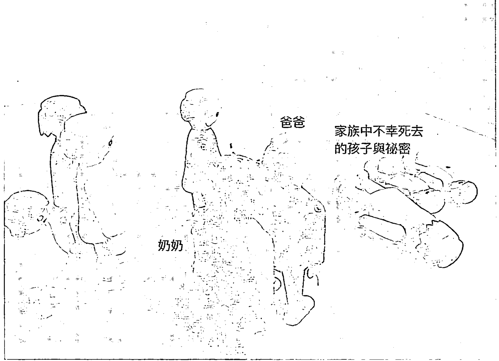

圖6-49 爸爸向前移動保護奶奶，家族的不幸與秘密需要被看到。

到奶奶和爸爸（圖6-50），對奶奶說：「親愛的奶奶，謝謝你為這個家守寡。我知道你很辛苦，我知道你也很煎熬，性對你來說是很痛苦的事情。親愛的奶奶，我愛你。現在我明白，有時候性的誘惑發生時，沒有辦法控制，這不是你的錯。親愛的奶奶，我們有很嚴格的家規，謝謝你盡力在維繫這個家，在我心裡你不是低級下賤的人，不是骯髒齷齪的人，你是我的奶奶！」

靖低著頭哭泣，一隻手擦著鼻涕眼淚，一邊跟著老師的引導繼續說：「不管別人說的是不是事實，我尊重你是我的奶奶。如果你真有孩子因為這樣死了，或是我其他的家人因為這樣而有孩子死了，我也會祝福這些孩子。」

然後，周老師引導靖面對躺在地上面朝下的「死亡」，對家族長輩說道：「親愛的長輩，你不是低級下賤的，不是骯髒齷齪的，你只是受到性慾的誘惑。我尊重你的命運，你不再是沒有臉見人的，我看到你了，而且我尊重你。」

周老師：「如果你願意的話，你可以慢慢地把長輩代表的身體翻過來，他剛才臉朝下，好像沒臉見人的樣子。」靖慢慢地把長輩的身體放正，臉朝上面。

周老師：「家裡的故事不是憑空捏造的，但也不一定是事實。如果我們非要說是奶奶，是對奶奶的侮辱。」老師再讓靖對長輩代表說：「親愛的長輩，你不是下賤的。我尊重你的命運，那時候你一定很掙扎，你受過誘惑，我也受到過誘惑，那時候我的判斷不是那麼好，所以我們遇到了意外，發生了不適合我們的事。親愛的長輩，我愛你。如果因為性的發生，讓你必須殺掉自己的孩子，我會在心裡給你和這些孩子一個位置。」

靖再面對家族裡被殺死的孩子，說道：「親愛的孩子們，我知道你們很想來到這個世界，可惜卻沒有辦法，他們殺了你們，對不起。謝謝你們為這個家的尊嚴所付出的代價，謝謝你們為了維持這個家的家規所付出的代價。」

周老師：「如果你願意，可以把他們翻過來。」靖把孩子們的身體翻過來，臉朝上，說道「你們不是骯髒下賤的，你們都是最可愛的孩子，我愛你們！」

老師問靖：「你覺得奶奶和爸爸現在比較能接受他們了嗎？你有這個感覺嗎？」靖點點頭說：「有。」

周老師引導靖：「你也要接受你自己以及小時候的自己。」這時候，靖讓代表自己的人偶拿起來，抱住小時候的自己（圖6-51）。

周老師問靖：「小時候大家怎麼叫她？」

靖：「叫靖兒。」

老師引導靖對小時候的自己說：「靖兒，你是個很棒……」孩子，很听话的孩子，但是你被诱惑了，你只是想要和小朋友一起玩，想要吃好吃的糖果，你只是身体有一些特别的感觉，你觉得这些感觉很好玩、很舒服、很新鲜，你只是身体有一些反应，这些都是健康的。当有人摸你身体的时候，你身体有一些兴奋的感觉，这也是健康的。你现在长大后，就知道这些人不适合你，你已经学会保护自己了。」

靖跟着老师的引导说完后，周老师问靖：「你觉得如果奶奶现在还活着，她会想对你说什么？她会说：『靖儿，你没有错，你是个好孩子。』」这句话触到了靖心底最敏感的部分，多年来一直觉得有错的她终于感觉到被认可了。她的情绪激动，无法自制地大声哭了出来……

周老师站了起来，拿了块大垫子放在胸前，站到靖的旁边，说道：「我现在代表你的奶奶。」然后老师用奶奶的声音对靖说：「靖儿，你没有错。靖儿，你是个好孩子，你没有错。」靖在奶奶的怀里痛哭起来，不停地说：「谢谢你，奶奶。谢谢你，奶奶……」奶奶抱住靖：「你是个好孩子，你没有犯错，你是个好孩子。」

一会儿之后，靖情绪慢慢平静下来。周老师脱离奶奶代表，问靖道：「你知道爸爸想对你说什么？」老师握住代表爸爸的人偶，代表爸爸对靖说：「我没有照顾好你，让你受伤了。我没有照顾好你，让你受欺负了。这不是你的错。我们家不谈这些事，让你受委屈了。你并没有丢我家的脸。」听到爸爸的话后，靖松了一口气。老师把手放在妈妈的人偶代表上对靖说：「你的妈妈一直支持着你！」靖感受到背后爸妈的支持。

周老师接着说：「性本身其实是好的。这个小时候的你自由了吗？你要给她一个位置。」靖让长大的自己抱住小时候的自己（图6-52）。

第四步「合」：扣回主题，内化过程，回家之后，行动建议。

周老师：「这个家里有很多秘密，你在心里面不要去刺探这些秘密，而是带着尊重去调整自己。现在，你有足够力量去面对他、邻居老头了吗？」靖点点头。
周老师：「你让自己转过来。」靖把原来背对老头的自己转过身，然后推着长大后的自己和小时候的自己一起去面对邻居老头（图6-53）。
靖忽然说：「我想感谢他，因为他让我想去认识性这方面的事情。」老师点点头，然后引导靖对老头说：「爷爷，谢谢你，和你在一起，我很开心。你做了很多好吃的东西给我们吃，我们在一起有很多开心的时候，很多孩子都喜欢和你玩。和你在一起，我很开心；你摸我的时候，我也很开心，我身体有舒服的感觉。小时候的我喜欢和你在一起玩。但是我現在我長大了，我明白你對我身體的接觸有一些是不適當的。你讓我感覺到舒服，但是按照我們的身分，你對我這樣做是不適當的；按照我們的年齡，你對我這樣做是錯的。我接受我身體舒服的感受，但是我把你做的錯事，屬於你的責任交還給你。

周老師轉身對受訓學員說道：「這部分應該這樣引導，因為一般在這樣的性騷擾或性侵案例裡，受害者對加害者會有特別的好感，可是如果我們否定這個感覺，而只是處罰兩人，那她會永遠貶低自己，覺得自己做錯事，覺得自己是低級下賤、骯髒齷齪的，這輩子不值得擁有美好的性關係。但是，當我們用一個健康的方式面對的時候，大家絕對不會想到她剛才居然想要謝謝他。」

周老師引導靖：「再說一遍。我接受我身體舒服的感受，但是我們的年齡是不適合的，你要為你犯的錯負責，我把你錯的責任還給你，我是自由的。爺爺，我尊重你的命運，我接受我自己有舒服的感受，我接受我自己性的興奮，現在，我把你的錯交還給你，再見。」然後周老師問靖：「你感覺他會怎麼反應呢？」靖答道：「我感覺他能安息了。」

周老師：「是的，因為他也自由了。這個個案有客觀的系統動力，也有內在的主觀感受。她主觀感受他安息了，她自己也可以放下了。這個爺爺也可以轉身，可以走他自己的人生，去他自己的世界了。」

然後，靖把自己和小時候自己的代表一起移動到爸爸、媽媽的身邊。周老師：「先看性的代表一眼吧。你已經把性忘了，沒有性就沒有你。性是一種能量，性是讓生命繁衍的力量。你很想有一個自己的孩子，做過試管嬰兒，但一直都沒有成功，因爲你把性排除了。即使有性，也是機械的，你的身體並沒有接受能量。性的能量並不只是生孩子，還是一種創造力。大自然的運作、人體生理的運作，很多都需要靠性能量。」

靖：「我老公好像也不需要性。」

周老師笑笑：「沒事，等你性能量開啟了，就會用上了。」

靖自己自動地讓代表自己的人偶擁抱性。周老師笑道：「哇，很好啊。」然後，老師引導靖告訴性的代表：「親愛的性能量，我愛你，你把我帶到這個世界，透過我的爸媽，我才能夠來到這個世界。性在這個家不再是一個禁忌，它是一份生命的傳承。我們接受人性的弱點，可能會發生一些出乎意料的事，但是因爲你這個能量，讓我才能夠活下來。我接受我身上的性能量，這是爸媽給我的禮物。我可以呼吸，可以心跳，可以活下來，我來到這個世界，就是因為爸媽性能量的結合。生命的力量化作性的能量，透過我的爸媽，把我生出來。親愛的性能量，謝謝你，我愛你！」

靖有點靦腆地笑著說：「我老公曾做了一件事情，我以前很不理解。我們家養了一條狗，而他表姐家也有一條狗，他們讓兩條狗交配。現在有一點瞭解了。」周老師也笑笑地說：「下次，你和老公一起去看這些事情。」

周老師：「看來，你現在性能量流動了，你可以接受自己了。你準備好繼續向前嗎？」靖點點頭。

周老師再引導靖：「現在閉上你的眼睛，想像老公在你的面前，對他說：『親愛的老公，謝謝你！謝謝你做我的老公，現在我接受我身上的性能量，也接受你身上的性能量。因為性的能量，我們可以相遇、呼吸，不管我們有沒有孩子，這份性能量也可以化作愛，讓我們彼此更相愛，支持彼此成長。現在我接受我的性能量，我也愛你的性能量，我愛你，謝謝你！』」

周老師繼續向靖說道：「現在，用你的兩隻手去摸你的心、你的乳房，去接受、去感受：這是你的身體，你愛她。這是你身體的一部分，你愛她。再多碰你的乳房一些，去感受：這是你的身體，她帶著性的能量。如果你有孩子，這將是孩子的營養來源，這是你給孩子愛的方式。你也是吃媽媽的奶長大，這是媽媽愛你的表現。你愛你的身體也就是愛你的媽媽，你接受你的身體也就是接受你的媽媽。接受她，然後告訴你自己：我接受我身上的性能量，我接受我的身體，這是我爸媽給我的愛。」靖閉著眼睛很投入地跟著引導，擁抱自己。一會兒之後，靖的臉上發著幸福的光。

周老師：「深呼吸，記得這份感受，非常好。」然後給靖出了功課：「對於家裡的秘密和孩子，你在心裡給他們一個位置，用你的方式為他們做好事。這是系統的動力，很關鍵。」靖點點頭。

#### 【个案追踪】

不久之后再次看到了靖，她的穿着打扮变得完全不一样，整个人变得更加有女人味了，她接受自己身上女性的一面，灿烂的笑容就像开花般的美丽。

#### 【案例解析】

1. 从这个案例，大家可以看到一位排列师背后的系统观、人生观以及对性的态度会对个案有什么影响。一个健康的整体系系统观能包含一切，这是一位排列师该具备的重要观念。透过这样的观念，在排列的时候，性侵事件和性能量以及侵犯她的人，在心里都要有一个位置。例如个案中的邻居老头是她生命中的第一个男人，因此在排列时，排列师要有健康的观念，并且坚守整体法则。不是说我们要接受这个人的行为——这个人必须要为他所犯的错误负责为——而是我们要接受这个“事实”，并且承认他是孩子第一个有性接触的男人，承认这是她生命的事实。如果这部分被排除，就把她生命的一部分也排除了。

2. 通常发生像这一类的性侵事件，不管孩子大小，这个孩子的感觉也必须被接受。如果被认为是肮脏下流、下贱的，就会影响这个孩子对自己的评价和生命力，长大之后不是极度的性封闭，就是性泛滥、性界限不清，因为她没有价值感，长大之后就难以享有自己的“性福”；因为她无法接受自己的性能量，生命力也无法全然发挥。当这个事实被接受时，孩子的性能量就会被接受，那么这个孩子不再因为过去别人的错误而影响了自己一辈子，一生都在惩罚自己。如此一来才能各归其位，她接受她自己的感受，他做的错事由他去负责。以上都是排列师面对这类事件要非常小心把握的。

3. 上述的案主如果只是做与邻居老头的排列，家族系统的动力还会拉扯她。因此除了在个人的经验之外，我们要看到更大的系统力量会影响身心健康。所以我以为一位排列师要同时关注个人生命经验以及系统动力，如果从事助人专业者在这两部分都能认真学习并好好发挥，将会对许许多多的个案、家族和集体系统带来极大的帮助。」

### <案例11>是否退休？退休后我想做助人工作？

林总是IT产业的老板，六十多岁，面临退休的关卡，正在犹豫要不要退休，以及下一步做什么。

#### 【排列操作】

第一步“起”：建立关系，厘清问题，收集信息，达成共识。

> 周老师：「什么议题？」
> 林总：「我现在六十幾岁，面临退休，正在犹豫退不退。我原来一直做IT生意，这两年发生了很多事情，生意没法做了。一是很多员工都离开了，只留下了几个人。二是我一直再寻找新的生意，但还没找到合适的。如果不结束IT这个生意，好像没有终、没有止。」

周老师：「那你的问题是什么？」
林总：「其实我心裡退不下来，我想做些什么，但又不知该做些什么。」
周老师：「人一定要做自己想做的事或喜欢所做的事，这样自己才会很开心，这样才是人生。你现在六十幾岁了，已经过了急需赚钱的阶段，接下来你要做的事情要考虑做什么可以发挥你自己。」
林总：「我想做助人的工作。十多年前，我曾做过身心灵的一些工作。我觉得人在物质满足之后，想要的就是心的平安。」
周老师：「人要做什么，一定要是天分加上梦想、兴趣、努力，才能成功。」
林总：「我想做助人的工作，可是觉得自己能力不是很足够。」
周老师鼓励道：「一个人如果有七十分的能力，你就可以帮助零到六十九分的人。不是非要你有了一百分的能力才能助人。在助人的过程中，我们还可以不断提升自己，获得进步。不要想一下子就变得很厉害。想想你有哪些特长？」

> 林总：「我好像没有什么天分。」
同学们开始七嘴八舌地说起林总的诸多优点，比如亲和力、热心、热情，以及想要支持别人的爱心等等。
> 周老师：「这些都是你的天分。容易与人接近，可做这一类的助人工作，你也可以加以发挥。你自己觉得想做什么？」
> 林总想了想说：「我想做像系统排列这样的助人工作，但是又不想太商业化。」
> 周老师：「做系统排列，可以有不同的做法。可以用商业模式的做法，也可以公益模式的做法。不要去排斥某一种做法。关键是我们自己有感觉，想要去做。有人喜欢商业，做得很有感觉，也很成功。有人想做公益或服务人，但是也不一定能做好，不一定成功。这些和金钱没有关系，关键是模式能否成功。你如果不想以商业模式，可以做公益模式。如果是做商业的，将给予和获得取得平衡就好。如果有人因为系统排列发生改变，感受由内而外的喜悦，还影响到家人，这都不是金钱能够买到的。有些时候，甚至你做免费公益的排列，很多人还不一定珍惜。我们帮助人，不是给人金钱，而是要给人力量，可以站起来改变他们自己的人生。我们要帮助想要成功、快乐但是有阻碍的人，我们可以帮助他们清除阻碍，获得成功、快乐。」
> 老师问林总：「你想做的工作是支持到哪些人群的？
林总：「我想做对年轻人的公益工作。」

第二步“承”：选择代表，探索动力，询问历史，揭露真相。

周老师：「我们试试看怎么样能够帮助你看清方向。找一个人偶代表你自己，一个代表你要做的助人工作，一个代表对年轻人的公益。」林总将代表自己的红色人偶和代表助人工作的蓝色人偶放在后排，站在一起，而代表公益的绿色人偶则在两个人偶的前面，三者都看向前方（图6-54）。

图6-54 初始排列画面：自己、助人工作和公益。

> 周老师：「你想要帮助年轻人变得更好？」
林总：「是的，因为年轻人是希望。」
周老师：「那你为什么对系统排列有兴趣？」
林总：「因为很多年轻人的问题和他们与父母的关系、与家庭的影响，有很大的关联。要想帮助到孩子，就要帮助到大人，孩子才会跟着改变。」
周老师：「很好，观念正确。」

「现在我们再找一个人偶代表年轻人，还有一对人偶代表他们的父母。」老师找了一个孩子代表年轻人，一对人偶代表父母，放在林总的前面（图6-55）。
林总马上推动自己和助人工作以及公益向前，靠近年轻人（图6-56）。

##### 第三步“转”：寻找解决之道，表达情感，回归序位的爱。

> 周老师：「我现在能理解，你为什么会给人感觉有压力？因为当你帮助人时的企图太强了，所以别人会退后的。如果帮助人是把自己的欲望和意图加在别人身上，别人是不愿意接受的，因为这样我们就取代了孩子的爸妈。就好像这个孩子无法处理自己的问题，而他的爸妈也帮不上他的忙，一定需要靠你帮忙一样，这个时候我们会把孩子的力量削弱，同时也把他的爸妈排除了。那么，一个助人者该怎么做呢？就是当你帮忙的时候，心里要看到他的爸妈在他的后面，尊重他的父母，这样就会变得不一样了。」

林总：「我不知道为什么我会有这样的感觉？对大人、对孩子，我觉得是会给他们压力。」
周老师：「就算你想帮的是孩子，重点是你要看到他们的父母。如果照你原本的态度，你是把他们的父母排除了，其实也把孩子排除了，你会觉得是父母做得不够好，所以孩子才这样子。到最后，父母和孩子都会转身不理你了（图6-57）。」

林总：「我以前没有觉察到自己的这个模式和方法会给人压力。」
周老师：「所以我们要用新的方式才能觉察到，才能看到我们的无意识模式。我来做一个测试。」周老师让林总找一个人偶代表要被帮助的孩子，现场演示。让代表林总的人偶面对孩子，可是当林总代表朝向孩子时，孩子转身了，背朝着他。
周老师：「一般我们会说，这个孩子怎么这样。你会怎么做？」孩子又背对着林总代表，往前走了几步。周老师：「好像发生了什么事？怎么办呢？」林总代表慢慢靠前走，往孩子的方向。
周老师：「一个人转身，他朝向的是他系统里的力量。如果你要把他拉出来，就会让他有罪恶感，感觉背叛了他的家庭。」然后周老师找林总的爸爸、妈妈代表，站在林总的后面。再找孩子的爸妈代表，站在孩子的身后。老师引导林总对孩子说：「这是我的爸爸、妈妈。我也看到你的爸爸、妈妈了。」孩子开始靠近林总。
周老师让林总对孩子的爸妈说：「我不能取代你们，你们是他最好的爸妈，我只能用我的专业来帮助他，但是我尊重你们是他的父母，谢谢你们给我这个机会可以帮你们的孩子。」孩子开始转身，微笑开心地看着林总。

> 周老师：「你开始说尊重他们父母的时候，孩子就很高興。」
> 老师接着说：「真正的帮助是什么？真正的帮助就是帮助孩子和父母有更好的连结。如果孩子和父母没有好的连结，就会和其他人的关系不好，就会开始发生许多的问题，因为他和源头失去了连结。」
> 林总顿悟道：「早点知道这点就好了呀！我从开始工作起，就和老板关系不和。」

当这个测试结束后，回到人偶排列场域。老师对林总说：「这给我们一个很重要的提醒，不管是什么工作，都是同一个事情，需要去尊重孩子的父母。这个时候，我们就不会取代他们的父母，就不会把自己变得太大，要去照顾他们。如果我们觉得他们的父母没有做好，我们来当他们的父母来帮他们，那就是把他们的父母排除，把他们变小，孩子的问题就会更多。如果我们尊重他的父母，帮助他连结他的父母，他会很开心，他的父母也会很开心，因为我们尊重他的父母也就是尊重了他。因为每个人的生命都是从父母那里来，谁批判我们的父母，就是在批判我们自己，我们会很不舒服。所以，当连结上父母时，孩子自己就会生出力量解决问题，真正的帮助就发生了。」林总肯定地点了几个头。

##### 第四步“合”：扣回主题，内化过程，回家之后，行动建议。

最后老师对林总说：「你想要助人的动力很强，现在你也学到了要调整自己的心态。接下来，你就是去做，不管是帮助年轻人和小孩，不管是公益还是商业，就朝这个方向去做就对了。我们一边做，就会一边调整、一边进步，有什么需要我支援的，随时可以回来咨询我，好吗？祝福你！」

林总坚定地点点头。

#### 【个案追踪】

一年之后，林总决定退休了，并且接受了排列师的专业培训，开始举办许多公益课程，实现他助人的理想，帮助了不少需要帮助的人。

#### 【案例解析】

在这个案例中，林总想要做公益助人的工作。好的公益应该怎么做？周老师做了一个很好的解答：

> “做公益不是单纯给对方金钱，这样会削弱对方。真正的公益是帮助人变得更有力量，站在自己的脚上创造自己的人生。而我们可以在一旁陪伴、支援他们一段时间。如何帮助人创造他们的人生呢？贫困的人一般命运比较辛苦，但如果我们可以帮助他们看到这个贫困的后面是怎么创造的，并且帮助他们了解并转换自己深层的心理状态，重新调整，用成熟的方式来爱这个家，这时候他们才有机会从过去所累积的贫困牵绊中走出来，才能够用心学习，发挥自己的能力，创造自己的人生。而系统排列就是一个很好的方式，了解一个人深层的心理状态，了解一个人怎么创造自己的命运。因爲如果不了解，而我们想要帮助一个人改变他的命运，那就是要他背叛他原本的系统，这时候他会产生一种罪恶感，而这种罪恶感会让他在无意识里把自己拉回去，这就是许多人爲什么一直保持在困境里的原因。但如果我们可以帮助他觉察到这份无意识的罪恶感，并且能够学会用一种更有意识、更成熟的爱去面对家族系统与命运的牵绊，这才有机会帮助他更有觉知地转化命运，开创新的人生。

> 比如，有些孩子有身体残疾或生病了，他们可能是透过身体上的疾病来帮助这个家，但如果我们可帮他们学到不需要用疾病来爱这个家，而能转变成用更健康的方式来爱这个家，他们就有机会来发挥好的那部分的能力。

> 有些孩子学坏了，或是遇到工作问题，或是在经济上比较弱势，我们可以怎么做？我们要了解他心中的纠结，他学坏的原因可能是心里想要获得一份爱或归属感，或者他想要为家里某些人承担，但是他方法错了。这时候我们就可以帮助他打开心里的纠结，学到用好的方式获得这份爱与归属感，改变深层的心理状态，那他们好的特质、优点的力量就更能发挥出来，同时才能带动他们经济状态的改变。所以我们在这里所做的助人工作是非常有力量、有价值的，值得大力推广，因为这能够支持更多有心行善的人与组织更有效地帮助到人。”

### <案例12> 面对事业项目的抉择

当一位排列师处理过的个案数量比较多之后，你内在可以含容的信息量就会加大，即使你是做一对一排列，仍然可以一次处理好几个系统动力，以下就是我用一对一排列，以一个更整体系统的方式，一次处理好几个系统的案例，提供给大家参考。

陈经理是中国知名儿童教育与英语教育集团的项目经理（按：“项目”等于台湾的“专案”），四十岁左右，是一个充满战斗力的女强人，但从她的话里又让人感觉到有些焦虑和无奈。

#### 【排列操作】

##### 第一步「起」：建立关系，厘清问题，收集信息，达成共识。

周老师：「什么议题？」

陈经理：「有个项目不知该不该做、怎么做？」

周老师：「是怎么样的项目？」

陈经理：「是一个儿童创意教育的项目，因为一般中国儿童的创造力相对于国外是比较弱的，而这个项目考察之后感觉效果还不错，公司要我承接这个项目，并且把它做出一个模组，如果有可能未来想推向全国。」

周老师：「这听起来很伟大，那你遇到什么问题呢？」

陈经理：「在纠结的这段时间生了两次病，失眠成了常态，压力很大。我年轻时高考和生孩子的两、三年也有过这些状态。当压力来的时候，我会失眠、熬夜、不爱动，就生病了。这段时间会莫名其妙地发烧，突然觉得天旋地转，有失衡的感觉。」

周老师：「你问这个项目不知该不该做、要怎么做，但事实上，我们除了判断项目好坏和怎么做之外，最关键的是执行项目的这个人，是你这个人的状态。好的项目，遇到某个状况不好的人，很有可能把它推向失败的结果，所以关键是我们自己内在的状况。如果我们不把自己的状况调整好，不管是怎么样的项目，最后呈现的结果都会是一样的。当我们的状况好，推动起来感觉就不一样了。」陈经理点头称是。

周老师问：「在你的生命中，有哪些特别的压力事件？」

陈经理：「这个项目把我推到一个很高的位置，好像只有我能做。这个项目起了头后却无法执行。我生病之后提出辞职，但没辞成，又在另外一个很高的位置上。我连续和下属发脾气，和人吵架，余怒未消，也和老公争吵。所有人都对我有意见。我也不知道自己为什么变成这样？」

周老师：「我感觉在你里面有些愤怒想要发泄出来。你习惯做老大，但现在情况发生改变了。什么是可以让你最好发挥的方式？」

陈经理：「目前公司的架构给我的位置是可以的。我做教育项目，觉得很合适我。」

周老师：「你想为教育做奉献，你需要做的调整是：你是否可以从拯救全国教育的位置上下来，踏踏实实地做事。」

陈经理：「我觉得自己没有拯救情结，但平台对我寄予厚望。」

周老师：「那么是一群有拯救情结的人，把你推上了一个高的位置吗？」

陈经理：「我现在没有力量，但我还是要做。我要为这个事业去奋斗，我觉得它有价值、有意义，但我不想消耗我自己。」

周老师：「你看到这里面的矛盾了吗？拯救者的特征就是：都会出现一份拯救的情怀，然后遇到挫折时，自己又会变成牺牲受害者的感受。你没有觉察到自己的拯救情结，你要好好去觉察一下。」

##### 第二步「承」：选择代表，探索动力，询问历史，揭露真相。

周老师：「找两个代表，一个是务实的你，一个是想做大事业、想拯救中国教育的你。」

陈经理选择两个人偶代表，对立而站。红色人偶是要做大事业的自己、想拯救教育的自己，而绿色人偶则是务实的自己（图6-58）。

周老师：「很特别的是，感觉是对立的。内在的两个你没有调整好，不要说利国利民了，你在做事业时，这种分裂矛盾会让你感到内耗严重，压力会更大。」周老师又说：「再排出你的亲生父母，并找一个项目的代表。」陈经理用双手一手扶着代表爸爸的绿色人偶，一手扶着代表妈妈的黄色人偶，排出父母在两个对立自己的中间，看着两个自己（图6-59）。然后犹豫一会，又让爸爸、妈妈站在自己身后，靠近务实的自己（图6-60）。

陈经理还是一直犹豫移动着人偶。老师对她笑笑地说：「你可以调整，没关系。」于是，陈经理又把拯救者排到自己的后面，靠近爸爸、妈妈。妈妈、自己、拯救者和爸爸在同一排（图6-61）。

周老师：「你把项目加进来。」陈经理选了一个白色男人偶作为项目代表，排在这几个人前面，面对这群人。

周老师触摸代表拯救者的红色人偶，然后移动人偶，将之放在项目的面前，面对这群人（图6-62）。

周老师问：「这样你感觉怎样？好像有些东西是你要面对的。」

陈经理带着惊愕表情地说道：「我的心震了一下。」

周老师：「这是因为刚才你所排的位置是按头脑排的，现在才是真正的你。有时候我们会去捏造一些情况，但是捏造和真相是有差别的。你是很特别的人，内在的感性和理性不断在打架，当你要去整合时就会觉得累。事实上你外面的压力并不大，而是你自己里面的压力大。你要好好警惕，要好好学习成长。你内在的力量要变成「相生」的，而不是一直是「相克」的，这就像是你内在的太极。想要解决眼前问题是一方面，但我们要知道自己要成长的地方是什么，当我们成长了，许多问题自然就会迎刃而解了。」

陈经理振奋地说道：「对！当我的内在冲突时，就会进入失控状态、迟钝状态。像是一种蒙的状态。」

周老师：「如果你这部分修炼好，就会是相生的。就会朝向良性的，不是对抗的方向发展。」

然后，老师问陈经理：「你的家里情况怎么样？」

陈经理：「我爸爸很早就过世了，去世之后，妈妈就嫁给了现在的爸爸。」

老师问：「你亲生爸爸是怎样的人？」

陈经理：「我爸爸是个很有才华的人，为人很好。不过，我妈妈说他去世之前迷上赌博，就像中邪了一样，经常吐血，身体很弱，可是发作起来就会出现幻觉，要磨刀杀人。」

老师问：「在这个家里，有没有人被送走或为这个家牺牲？」

陈经理：「我这一代没有。亲生爷爷很早过世。」

老师问：「爷爷怎么过世的？他是怎样的人呢？」

陈经理：「不清楚，没有人提起。因为爷爷家庭情况好，奶奶比爷爷小很多岁，爷爷的年纪可以做奶奶的爸爸了。我奶奶是自杀死的。」

老师问：「怎么自杀的？」

陈经理：「是投河死的，有人说经常看她在河边哭，后来就掉下河了；但也有人说她是在池塘边洗脚，不小心掉下去的。」

周老师：「找一个爷爷、奶奶，根据心里面的感觉给他们位置。」陈经理找出爷爷、奶奶的人偶代表，排在爸爸的身后。但老师把两个人偶退还给陈经理，对她说：「按照你心里面的感觉重新排。爸爸、妈妈的位置也要根据你心里面的感觉重新排。不要想什么是对的，只要你排出来的，就是对的。」陈经理犹豫很久，把奶奶排在项目的后面，又移动到自己的侧方，再移动到靠近爸爸的位置。

周老师：「在排的过程中，内在对抗的力量又展现出来了。」

陈经理又把代表奶奶的蓝色人偶排在了爸爸身后，另一个代表爷爷的蓝色人偶则排在奶奶身后（图6-63）。

周老师：「有一点感觉，不是那么确定。」老师去感知一下奶奶的人偶，然后说：「奶奶为什么自杀？她已经八十多岁了，应该是不想再活了。」

陈经理：「我妈说，我爸去世后，我妈带我和哥哥离开了，我奶奶很失望、很悲伤。」

周老师：「你看看，你奶奶在很年轻的时候，她的先生就去世了，儿子也去世了，孙子则被媳妇带走了，这里面好像有很多无奈悲伤的往事。」周老师又说：「可以看到，你的父系母系两家有对抗。」于是问陈经理：「你知道家里发生过战争或是大伤害吗？」

陈经理：「我姥姥（按：等于「外婆」）家里有。我姥爷（按：等于「外公」）和他的两个弟弟都去了台湾，我姥姥家族是当地的大户，有钱、有地位，后来姥姥没去台湾，就在一系列运动中被斗、被骂。」

周老师：「找一个代表你的姥姥。」陈经理把代表外婆的黄色人偶排在自己妈妈的身后，把代表姥爷兄弟的三个人偶并排站在外婆身后（图6-64）。

老师问：「当我们把全家都加进来，你有什么变化？」

陈经理：「感觉有压力。」

周老师：「现在我们来面对这两个家族。爸爸、妈妈谁比较理性？谁比较感性？」

陈经理：「我爸爸比较感性、柔软。我妈妈理性、务实。」

##### 第三步「转」：寻找解决之道，表达情感，回归序位的爱。

周老师：「好，现在我们用一个比较特别、更整体系统的方式，来面对你父母双方家族的所有重要成员。你准备好了吗？」陈经理点点头。

首先，面对妈妈的家族，老师让陈经理先对妈妈说：「亲爱的妈妈，谢谢你让我活下来，因为你的务实，把一切事情安排好，并持续完成你想做的事情。谢谢你让这个家活下来，让我活下来。爸爸突然过世，你一定很难过，谢谢你告诉我们关于爸爸的美好一切。我身上流着你的血，继承了你的优点，去务实地做成一些事，不是空有理想，这是我从你身上学到的。」再让陈经理面对姥姥，引导陈经理说：「亲爱的姥姥，你过了很辛苦的一段岁月，受了很多委屈、惊吓、被批斗，谢谢你能够忍耐这一切，谢谢你很实际地让我活下来。亲爱的姥姥，我是你的后代，我身上流着你的血，即使我经历压力，我也会把自己调整得更好。你承受的压力比我大很多，所以我知道我可以调整我自己。谢谢你把这份坚强的力量传到我身上，亲爱的姥姥，谢谢你。」然后周老师让陈经理带着自己的人偶，也带着自己的心向姥姥鞠躬。于是，陈经理扶着自己的人偶向姥姥鞠躬，自己也慢慢地、尊敬地向姥姥鞠躬。

接着面对姥爷，说：「亲爱的姥爷，我是你的后代。你离开这个家了，姥姥后来受尽磨难，妈妈也是，但是她让我们活下来了。我知道你也有很大的压力，你是迫不得已的，我知道你有你的理想。谢谢你，在我身上流着你的血、理想和热情，想为这个世界做些事，这是我从你身上继承下来的，现在我把你放在我心里。」

再对姥爷的兄弟一起说：「亲爱的舅公们，我是你们的后代，现在我看到你们了。我要告诉你们，我活下来了，请你们安息吧。」

然后老师让姥爷的兄弟们转身，对陈经理说：「你要走好自己的路。」

接下来则是面对爸爸这边的家族。老师问：「爸爸在你多大时过世的？」

陈经理：「两周岁。」

周老师问：「两周岁时的你怎么叫爸爸？」陈经理不说话。

周老师：「你妈妈说你爸爸很爱你，经常抱着你玩。」

陈经理：「妈妈说，只要我有什么声音，爸爸再累也会过来看我。」

周老师感知爸爸，对陈经理说：「我多么渴望照顾你，当听到你的哭声时。」

周老师突然模仿小孩子的哭声：「哇，哇，哇，哇，哇，哇……」陈经理开始止不住地流眼泪哭泣。周老师引导陈经理，试着叫着：「爸爸，妈妈，哇，哇！我在这里，请你们看看我。爸爸，我在这里。」

陈经理像小孩微弱地说：「爸爸，我在这里，请抱抱我。我好渴望你抱抱我。我还没有说爱你，你就走了，爸爸……」陈经理开始悲伤地痛哭起来。周老师拿起一个抱枕放在胸前，并且对她说我現在代表你的爸爸，并站起身到她旁边，陈经理立刻扑到爸爸的怀里不断大声地哭。爸爸弯着腰、低着头，以很无力的样子说道：「虽然我没有力气，但是我还是想抱你。没事，哭出来吧。」爸爸用手抚摸女儿的脸。

周老师：「请你想对爸爸说的话告诉他。」

陈经理哭着喊：「我多么希望有爸爸。我不想当没爸的孩子。」

爸爸：「我也放不下你们啊，谢谢你活下来。」

周老师再次对陈经理说：「说出来，说出你想对爸爸说的话。」

陈经理：「爸爸，我没有辜负你的期待，我活下来了。」

爸爸：「你做的很好，我看到了。」

陈经理继续说：「我没有半路夭折，我活下来了。」

爸爸：「我终于可以放心了。」

老师退出爸爸代表，对案主说：「深呼吸，把刚刚这个过程先沉淀一下。」陈经理闭上眼睛，沉静了好一会儿。

周老师：「接下来我们来看到爸爸后面的爷爷、奶奶。奶奶很辛苦，为这个家牺牲，看看奶奶吧！」引导陈经理对奶奶说：「亲爱的奶奶，我是你的后代，当时妈妈把我们带走，你一定很难过。奶奶，对不起，我知道你一定很想念我们。我的身上流着你的血。亲爱的奶奶，请原谅我，我们活下来了，请你原谅我们。」陈经理说完这些话后，说道：「我感觉奶奶放心了。」

周老师继续引导陈经理：「虽然妈妈把你们带走，但是某些部分奶奶也会感谢妈妈让你们活下来。你觉得奶奶会想转过来谢谢妈妈吗？」陈经理点点头。接下来，周老师再让陈经理看爷爷，引导她说：「亲爱的爷爷，我从来没有见过你，我是你的后代，我听妈妈说起过你，我相信你也一定是一个很有才华的人，才会培养我爸爸成为很有修养、很有才华、很有品德的人，我会把从你身上传承的你的美好品德保持下去。」然后，周老师再让陈经理面对全体家人说：「亲爱的家人们，我是你们的后代，我的身上流着你们的血，我也带着你们的力量，不管是热情理想还是脚踏实地，或者是很实际地为了存活，我身上带着这一切，我接受这一切。在我心里，我不再冲突。我知道这两种力量都可以让我活得更好，让我可以实现我想做的事。我接受来自爸爸和妈妈你们两个家族的这两股力量，我接受我身上感性和理性的力量。我接受我有理想、有热情的一面，也接受我务实的一面。我接受我自己。」

##### 第四步「合」：扣回主题，内化过程，回家之后，行动建议。

周老师：「现在看看两个自己，转过来。让两个自己靠近。这个为国为民、很有拯救者情结的你，给她一个称呼，比如『大炮』。还有这个内在想活出自己的务实的你，也给她一个称呼。」陈经理想了想后，说道：「内有理想的自己，叫做『大美』；而内想活出自己的，叫做『小真』。」

周老师：「好的，现在一手扶住大美，一手扶住小真。」，接着引导陈经理对大美说：「亲爱的大美，谢谢你，你让我看到不一样的世界，你让我觉得活着有意义、很光荣，可以为这个世界做一些事，你让我人生更有成就感、价值感。」而对小真说：「亲爱的小真，你具有务实精神和行动力。谢谢你这么真诚、真实地发脾气，我知道我有时候压抑我自己的情绪，但是你很真实，你帮助了我，你让我清晰，让我更能有力量。你真实表达时，让我减轻许多压力，你帮助我张弛有度，更加脚踏实地。我们要彼此合作，有时候听我的，让我们想要达成的都能够达成。」再对大美说：「亲爱的大美，谢谢你带给我的一切，有时候我们还要多照顾自己，这样会让路走得更远；有时候休息会更带来力量，让我们活得更平衡。」又对小真说：「亲爱的小真，谢谢你，我会记住的，当我付出爱的时候，会有一些负担，不一定那么舒服，但是我们会获得另外一种成就，那也是好的，我们要一起合作。」

陈经理脸上散发出一种给人信任稳定的感觉。接着，老师问陈经理：「你觉得项目会是什么感觉吗？」

陈经理：「它很开心、很轻松。」

周老师：「好，我们在这里告一段落。」

最后，周老师对陈经理说：「你内在的状况越好，处理工作就会越顺利。而你的内在状况受到你家族系统影响很大。光今天我们就梳理了至少七、八个系统动力，回去之后你要好好沉淀并且为他们做一些好事。接下来我们还要安排几次个案，一方面检视你回去做的功课，另外也要针对你们的公司系统，包括与老板跟同事们的互动，以及这个项目的发展做个案的呈现，看看哪些地方要多发挥、哪些地方要多留意、哪些关卡需要做改变，让你在决策和执行上心里更有数，以便可以一步一步更落实。」

陈经理：「好的，谢谢你。」

#### 【个案追踪】

陈经理后续安排了他们公司的个案咨询，针对人事互动以及项目的发展做梳理。我们陆陆续续掌握了陈经理及公司的进度消息，她告诉我们，她现在工作上很开心，觉得自己不像过去那么紧张了，更能够授权给她的部属去执行，而且现在项目进行得比预期更顺利。她很感谢我们对她的协助。

#### 【案例解析】

这个案主为什么会排出爸爸和妈妈以及背后的两大家族呢？它是有来龙去脉可以去观察的。我们观察到什么呢？首先，她的两个自己是对立的。她用两只手同时拿两个人偶一起排，说明她的左右脑同样发达，她会感性思考，也会理性思考。这是优点，但也容易有所冲突。后来验证，她看到一些场景就会蒙，蒙的原因是两个自己在打架，产生了不平衡；或者是一个自己在压抑，另一个自己想突破，于是能量内耗。我们对案内在要有基本的概念，在做助人工作时，心里要有地图、有画面、有方向。这要如何办到？要仔细观察案主。观察这个人，他的神情长相，他呈现的线索，甚至是非常细微的动作，观察他如何排列人偶，然后我们可以向他验证，就可以知道判断的方向对不对。做排列不是只是代表的移动，还要看到背后是对人性、对人的深层心理以及对系统动力的了解，这样做排列工作才不会偏入太神秘、太灵性、太能量化的一边。排列工作很多时候都需要有能落实的一面，生命五大法则中的事实法则要照顾到。你知道这个人为什么会变成现在这个样子，因为他有这样的经历，才会成为这样一个人。如果不调整，未来他的模式还会继续；但是如果调整了，就会不一样。这个个案里至少有七、八个系统动力：爸妈关系、爸爸早逝、爸爸为什么会生病、姥姥离开家、姥姥和姥爷的关系、妈妈和奶奶的关系、奶奶和爷爷的关系、爷爷的早逝等。如果我们只是针对一条线，其他动力还会影响她。这次我示范的一对一排列方法是，等我们全部了解之后，我让她在自己的位置去和亲人对话，这样就在不知不觉中解除了认同，帮助她回到自己，找到一个成熟的方式面对家族所发生的事，这是一种不同的一对一排列方式。这种做法在一开始收集家族信息的时候，排列师的记忆资料库要够大，如此要用时才可以拿得出来对话，拿出来后的效果是不一样的。排列师也可以分成几个个案来进行，每次处理一到两个系统动力，这样也是可以的。

## CHAPTER 7
## 线上个案排列

现代网络科技越来越发达，许多的购物、会议、新闻、课程、咨询都是透过线上来完成，线上课程如同雨后春笋般出现，再加上新冠肺炎疫情的流行，让许多人可能被隔离在家里，包括工作、人际交流等许多活动都只能在线上进行，因此网络已经成为现代人生活中极为重要的方式，而线上个案排列与咨询也将会成为未来的潮流。基于个案的需求，我们发展出一系列线上个案排列的方式，包括线上人偶排列、线上APP应用程序排列、线上代表排列等，可以服务到不同需要的人群。

由于线上个案排列对于排列师的要求更加严格，因此有心想学习线上个案排列者，我会强烈建议请参加一对一线上个案排列师专业训练，在训练课程里我们会有更详细的讲授以及在督导下做个案操作的训练，如此才能为案主提供更专业的协助。

### 一、线上个案排列的优点、限制与注意事项
#### 线上个案排列的优点

- (1) 可以节省时间空间，避免舟车劳顿。
- (2) 保有私人个案的私密性。

（3）尤其用人偶排列非常方便，代表的數量絕對夠，並且具有明顯的視覺效果。

#### 線上個案排列的限制：

- （1）案主需要對系統排列有一些基本的認識。
- （2）案主對排列師要有一定的信任。
- （3）案主心中願意透過線上個案的方式來面對其問題。
- （4）線上個案若產生較激烈的情緒，因排列師不在現場，會存在有一些情緒比較難以掌控的風險。因此在做線上個案時要盡量留意不要讓案主陷入無法控制的情緒，更重要的是案主在做個案前必須先簽署個案聲明書，聲明自己願意為自己的情緒負責，保證不落入難以控制的情緒。
- （5）有些議題或有些人仍然適合線下面對面接觸的個案，比如說創傷治療等，這時候我會建議大家必須採用線下的個案來協助我們的案主。

### 二、線上個案排列適用範圍

除上述特別提到情緒較難控制的人、創傷議題，或者一些需要比較多身體接觸的議題外，所有一對一排列適用的議題皆可在線上個案排列中進行。包括：

- （1）商業決策、企業管理、尋找解決方案、重大決定、人事調整、未來規劃等。
- （2）改善本身與事業和金錢的關係，探索生涯規劃、工作與人際關係。
- （3）建立融洽的家庭，改善兩性、親子關係。

### 三、線上個案排列實務
——運用人偶的操作要點

#### （一）設備

電腦、手機或攝影機及腳架，排列使用的諮詢桌，以及形成場域的隔離空間。

#### （二）電腦軟體

必須事先下載軟體到電腦上，並把手機攝影助理及案主都加入好友。

#### （三）個案事先準備事項

請案主填寫個案諮詢表，了解案主基本資料及議題。請案主了解預先準備事項（參見本書第四章〈個案事先準備事項〉），並且先畫好企業組織圖或家族圖，先將上述資料上傳給排列師。

#### （四）形成場域

- 1. 讓排列諮詢桌以及人偶各方面都準備好建立一個專注的空間。
- 2. 先打開電腦軟體，發出邀請，將手機攝影助理加入視訊會議當中。手機攝影助理必須關靜音，鏡頭對準人偶排列場域（見圖7-1）。
- 3. 排列師與案主最好都使用耳機連結電腦，聲音會比較好。
- （4）要求案主在個案過程要使用電腦，避免用手機，這樣螢幕畫面比較大，臨場感會比較好。
- （5）要求案主必須事先找到一個可以專注、不受打擾的空間來進行個案。

#### （五）個案流程

邀請案主加入會議，個案排列開始，過程按照前面所教的一對一排列步驟：起、承、轉、合的順序以及所要達到的任務來進行。

#### （六）拍下重要的排列畫面

如圖7-2、7-3。

#### （七）結束個案

#### （八）個案結束後工作

填寫個案紀錄，發送重要的排列畫面給案主。追蹤案主後續狀況。如果案主有需要，可以預約後續的諮詢。

# CHAPTER 8
## 線上個案排列——個案示範與解析

### <案例1> COVID-19 疫情後事業的生存之道

#### 【排列操作】

張經理是美國一家大型科技公司的業務經理，她的團隊有十多個人，由於這次 COVID-19 疫情影響他們的業績很大，讓她有許多擔心，她在思考有哪些盲點以及要做什麼改變。

> > 張經理：「周老師，你好！上次上了你的課真的受益良多。這次新冠肺炎疫情改變了很多東西，包括我在做的生意，還有團隊建設。這幾個月，我也有很多想法，抱著擔心和不知道要何去何從的感覺，非常不踏實。之前我所建立的商業模式也想得要有所改革。這次個案我想做一個探索，有什麼我應該改變或有沒有什麼地方被卡住了。」

> > 周老師：「尋找一個人偶代表你自己，兩個人代表你所有的團隊，還有一個人代表客戶，或者說代表金錢，因為其實客戶代表的就是你們的收入主要來源，是嗎？」

> > 張經理：「是的。」

張經理選擇了白色人偶代表她自己，藍色跟紅色人偶代表她的業務團隊，黃色人偶代表客戶。

> > 周老師：「現在你把他們排出來，你告訴我你想排的位置、誰跟誰站在哪裡，然後你想站在哪裡。」

常仔細地請周老師按照她心中的想法把代表排列出來（圖8-1）。因爲是以視訊的方式進行，周老師會跟張經理仔細核對她所想要排的位置，讓張經理確定所有人偶代表的距離遠近、面對的方向，是否準確地符合她心中此時此刻的感受。

> 周老師：「你觀察到了嗎？你把你自己白色人偶面對你兩個團隊代表的人偶，而且站得非常靠近，你真的很重視你的團隊，甚至可以說你很愛你的團隊。」

> 張經理：「對呀，你這樣講我都要哭了，你太瞭解我了。」

> 周老師：「你非常關心他們，你的團隊也非常關心你，你們好像是一群很緊密的兄弟姐妹一樣，就像一個大家庭。這是你自己排出來的，你把你們系統的深層信息呈現出來，讓自己看見了。」

> 張經理：「沒想到是這樣。」

> 周老師：「而且你一直不斷跟他們說話。」

> 張經理笑了起來：「對呀！我一直跟他們講話一樣。聊得很頻繁勒，因為最近群組裡比較多人，其實疫情發生我們幾乎每個晚上都會說話。」

> 周老師：「我們看看這個客戶。他對你們也很好奇的，想說這些人在這裡做什麼？但你非常專注於跟你的團隊互動。客戶看了一會兒沒人理他，就漸漸轉身了。」

（圖8-2、8-3）

> 張經理：「對，我覺得要跟我團隊裡的每個人講話，給每個人出口，有時候可能會忽略到我的顧客。好厲害，答對了。」

> 周老師：「雖然你心裡很愛你的顧客，也愛你的金錢，可是因為你太專注於你團隊的人，所以反而會阻礙你為你的顧客服務。你的顧客覺得奇怪，怎麼他們不搭理我？久了他就沒興趣了。這就是你忽略的盲點。你不要等顧客跑了才趕快去追。你可能太專注於處理團隊這些人太多情感的糾結，你要稍微調整一下焦點。」

張經理問：「好。你覺得顧客還要我嗎？」

周老師：「會。你有一種特別的吸引力，會把顧客吸過來，顧客會轉過來看你的，而且因為這樣，你可以帶動你的團隊去看到顧客。這才是你建立你的團隊最好的方式。」

張經理：「我知道了。」

周老師：「你要把你非常特殊的特質發揮出來，你可以吸引你的客戶去跟他們互動，同時你要想辦法訓練你的團隊也朝這個方向。」周老師一邊說著，一邊移動張經理的代表，讓她站在團隊成員的前方（圖8-4）。

張經理：「你是說團隊的成員嗎？」

周老師：「對。你要向你的團隊展現出來，你怎麼去跟客戶互動、你跟客戶如何建立好的關係，而且你會跟客戶做朋友。你跟客戶當朋友，是很重要的一點。你讓客戶感受到這是我們的團隊，你的團隊也就會跟上來。而且你的客戶因為你也信任你的團隊。你有感覺嗎？」周老師一邊說著，一邊移動張經理和客戶的代表，讓張經理、團隊成員和客戶互望（圖8-5）。

張經理：「有。你好厲害。」

周老師：「你這個人也留不住，一段時間之後，另外又有顧客來了。」周老師加入了一個黃色人偶，作為新客戶的代表（圖8-6），接著說道：「你看到顧客就好像看到什麼東西會讓你很開心，你好像磁鐵一樣吸過去，而且客戶也喜歡你，也被你吸過來。這個是你的天性特質。」張經理聽完之後大笑。周老師繼續說：「張經理你有看到嗎？所以在這個階段，我們的焦點要稍微轉換一下，從你只看到你的團隊成員，轉到發揮你的特質，然後帶動你的團隊成員朝這個方向。你有感覺嗎？」張經理笑地回答：「有。」周老師：「你發揮特質的同時，也讓你的團隊成員感受到你跟客戶互動的吸引力量，這時他們可以在他們的位置上更加以發揮，然後你不被局限在這裡面，你可以開拓更多的客戶。」周老師又加入了新客戶的代表（圖8-7），並說：「而你的團隊也可以發揮這樣的特質。這樣有感覺嗎？」張經理：「有，比起現在我一邊要照顧好我的團隊，一邊還要專注我的顧客，使得精力分散，對嗎？」周老師：「對！你照顧你團隊的方式，不是讓團隊跟顧客分開的，你照顧團隊的方式是要讓團隊跟你的顧客有一個好的連結，讓你的團隊可以感受到原來你是這樣看到顧客，有感覺嗎？」

周老師一邊感知，一邊移動人偶（圖8-7）。

周老師：「你看如果以這種方式，他們對客戶也會有很好的互動，可以獲得客戶的信任。我覺得你們的團隊滿好的，因為你帶領得很好。接著有很多客戶你可以去開發，你的夥伴也跟你靠向客戶。而你就可以在後面支持他們，同時又有新的客戶。你的成員也會看到客戶了，也懂得去看新客戶了。這樣清晰嗎？剛剛一開始時，你們的團隊是擠在一起的，對不對？」

張經理：「有，比較清楚了。」

周老師：「好。所以現在這個過程反而重新讓你的團隊有一個重要的內在調整、內在改革，你也可以把你最好的部分發揮出來。這樣清晰嗎？」

張經理：「清楚，謝謝老師。」

#### 【案例解析】

> 「信息的接收與呈現來自兩個部分，一個是觀察、一個是感知。外在觀察和內在感知的結合，便能產生洞見。」——海寧格

- 1. 我們每個人身上都帶著我們系統的信息，還有過去集體的所有記憶，包括人生、家庭或工作。所有的這一切都攜帶在我們身上。因而當案主很認真專注地把她內在的信息呈現出來的時候，就把她內在的信息畫面場域呈現在這個外在的場域裡。如果我請其他排列師來排上述個案，案主、她的團隊、你的客戶的位置，會排得跟剛才一模一樣嗎？答案是否定的。這表示每個人都可以呈現出自己所在的系統信息，而且每個人的信息畫面都是不一樣的。當案主呈現出其信息畫面時，我們每個人都可以觀察到這些位置、距離等所呈現出這個系統的重要信息。當案主很專注地把這些人偶代表排列出來時，他身上的這些系統信息就會灌注到這個場域裡。人偶只是媒介之一，也可以用其他小物品或白紙。就好像我們在做團體系統排列時，是用人當代表，人是團體系統排列的媒介和信息接受器，去代表某人的爸爸、媽媽、爺爺奶奶，只要這個人願意把自己放空，都可以感受到這些信息。現在科學家已經研究出來，所有的信息其實都是相通的。同理的，當案主專注地透過這些人偶把這些信息呈現出來，一位受過嚴格專業訓練的排列師，在心夠靜、感知力夠強的時候，一樣可以感受到案主所灌注進去的場域信息。唯一不同的是，這些信息非常細緻、非常精微，而人偶是不會自己移動的，所以排列師的心要很靜才能夠明確、深刻地去感知這些信息。透過感知的信息移動人偶，就好像我們實際的人做代表一樣。接下來，外在觀察和內在感知的結合，會產生有一些比較深層的洞見（insights），如同剛剛案主的反應。他在系統裡會產生自己的盲點，有許多東西是案主所沒有辦法覺察到的，而排列師是在這個系統以外的第三人。如果排列師的專業功力夠高，他就能呈現出案主沒有去覺察到的信息，案主往往會出現：「對！就是這樣！」或者出現「哇！我怎麼沒有想到可以這樣做！」這就是洞見顯現出來的時候。排列師把案主的覺察帶了出來，點破舊有的盲點模式。洞見顯現出來時，會給人一種清晰感、一種豁然開朗的感覺，他就知道自己下一步該怎麼做了。

- （2）所有人在自己的工作團隊裡，或在自己的公司裡，都有自己的盲點。所以成功的企業家常常都要能夠跳出自己的公司，這像剛剛我們所做的一樣，跳到一個比較高的位置去看到整體系統。這時候我們就不會聚焦在習慣的舊有思維與模式，太專注於手上做的事情，而忽略了整個大局，見樹不見林。沒有辦法比較公平公正、比較客觀地去看我們自己。但是當我們跳出 來，我們就有機會從一個更深刻、更高維、更大的整體觀來看，看到之後就有的方向了，對未來就比較不會擔心或無所適從了。我比喻這就像開車一樣，以前塞車的時候，我們就只能在車子裡乾等，但我們現在有手機或GPS導航，用衛星畫面呈現出目前的路況，這就是用一個更高更遠的維度來看，我們就知道該走哪條路了。排列師的專業價值，就是幫助案主跳脫原本所在的系統位置，站到一個更整體的高度來看到這些更深層的信息，甚至激發出許多具有創意的洞見，支持案主面對當下的情況。包括COVID-19疫情發生也是一樣，如果能善用系統排列幫助我們看到更整體的高度、看到系統的深層動力，我們就能更有覺知地調整事業系統、家庭系統的體質與動力，找出清晰的方向與步調，即使遇到疫情也能化危機為轉機，更加實現人生的理想。

### <案例2> 面對棘手的項目，該如何處理？以及如何選定下階段的合作對象？

#### 【排列操作】

陳董是一間科技及土地開發集團公司的負責人，五年前他的公司在中國大陸投標政府一項建設科技園區的項目陳董公司得標了，買了地，也開始融資，但政府後來卻要把這塊地收回去。這幾年談判下來，中國政府並沒有採取決定性的行動，加上這半年疫情的關係，雙方的協商幾乎停止了。陳董公司前後已經為這項項目投入龐大的資金，甚至影響到公司的現金流。

陳董另一個問題是，另外有兩個城市的政府機關都想與陳董公司合作開發科技園區，他想知道該怎麼做比較好？

> > 陳董：「五年前我們得標了一個科技園區的造鎮項目；去年政府覺得當時賣地的價格太低了，他們想拿回去做，我們也願意賣給他；今年政府回信說，我們可以談判，他們可能不想我完全撤資，要我留在那邊，可以幫他們一起合作。對於政府來說，就是看到我們現在開始做得比較好了，他們自己想拿回去，這有點不合道理，但是你跟政府也沒得說。」

> > 周老師：「你們投入多少錢？」

> > 陳董：「我們投了一億多美金，還有其他開銷。」

> > 周老師：「政府想收回你們原來得標的項目，而你想知道怎麼跟政府處理這個項目的問題嗎？」

> > 陳董：「可能政府裡面也有不同的想法，有些願意趕快處理，也有些人想拖延，等以後再說。目前想看看我這個項目怎麼完善處理？」

> > 周老師：「如果要處理這個項目，有哪些關鍵的人物涉入？」

> > 陳董：「有三位部長都是直接影響這個項目的最終處理方式。」

> > 周老師：「找三個人偶代表這三位部長，一個人偶代表你們公司，一個人偶代表這個項目。按照你當下的直覺把他們的位置排出來。」周老師根據陳董仔細的指示，把這幾個人偶的位置、面對方向以及彼此間的距離排出來（圖8-8）。

> > 周老師：「我們來感知一下你所呈現出來的場域信息。」周老師將手扶著每一個人偶。公司站得穩定，有一點點向後退，項目晃來晃去不穩定，最後坐下來。A部長跟B部長不想看這一切，慢慢轉過身去。C部長會看著這一切（圖8-9）。

> > 周老師：「我這樣移動人偶，你有什麼感覺？」

> > 陳董：「當這個項目坐下來的時候，我有一絲的失落感。」

> > 周老師：「對。你花了很多心力，希望打造一個科技園區小鎮，但剛剛整個場域的感覺有點拖延，沒有好像一個最終的結果。這個項目感覺好像沒什麼活力，就好像停滯在那裡。」

> > 陳董：「對！你說得對，他們好像沒有很積極在做。你講的也是現狀，本來幾年前就要開工的，可是一直在拖，後來要買回去，也沒有很積極地去做。」

> > 周老師：「這個項目沒有結果，好像不死不活的，又好像死掉了一樣。你們公司還是比較算穩定的。這三位部長裡面有兩個已經背對著，有些逃避的感覺，不願意面對。只有C部長會朝這個方向看。」

> > 陳董：「對，之前都是這兩個部長的決定。而C部長是剛上任的，他之前沒有接觸過這個項目，現在他是主管我們項目的部長。」

> > 周老師：「所以你看到A部長轉過去了，他不想面對這個燙手山芋。B部長也是一樣。但C部長會去看，而且好像會拉著他們也要來面對，不能這樣擺著。他是這個項目的主管了。」周老師一邊說，一邊擺弄人偶代表的姿勢（圖8-10）。陳董回答：「對！」

> > 周老師：「所以這很清楚看到，你現在已經跟他們談條件和價錢了，對不對？他們已經要收回去了，那也沒有關係，但要從哪裡切入？你現在看到了是要從主管的C部長。」

> > 陳董：「對，因為這兩個部長已經做完決定，不關他們事了。」

> > 周老師：「不關他們事，但還是他們的事呀！只是他們不想看，但C部長會想辦法必須讓他們看。所以你看到要從C部長切入。」

> > 陳董：「太對了！我還有盤算要拿多少錢，因為真的投了不少……」

> > 周老師：「我覺得你還有一個成本忘了算，現在不是一億、兩億美金而已，還有你壓得更重更多的時間成本。」

> > 陳董：「是。」

> > 周老師：「對吧？你怎麼算你的時間？陳董，你一個小時就可能不止幾萬美金了。」

> > 陳董：「我們損失五、六個億就對了，過去幾年他們一直拖。」

> > 周老師：「對。重點是這兩個，第一、他就是拖著不想面對，但你現在清楚知道要從哪裡下手。第二，是談多少就拿多少，我覺得有時候要乾淨利落。」

> > 陳董：「對，要乾淨利落。」

> > 周老師：「就這個部分來說，這個方案其實已經有一點沒力氣了，所以你不用在這邊太戀棧了。你要知道哪裡是切入的人。現在你自己也看到了。好好對他，他可以是你的。這部分清晰了嗎？」

> > 陳董：「非常清晰！這個C部長這樣擺了，我就更加堅定了。因為，我之前對這兩個部長還有一點幻想，覺得他們可能把項目重新找回來。但你這樣一分析也對，因為項目對他們兩個也是麻煩了。反而，C部長現在不面對不行。」

行，而且他没反对过我们的项目。但项目不可能按原方案继续做下去，因为政府既然曾反对过，就很难重新按原方案再做，这个我也知道。所以，我要果断地跟他们谈一个条件，就把精力投到那些邀请我去做的城市，不用跟他们缠那块地了。这国家不缺土地。」

周老师：「对，这个是重点。我要为你鼓掌一下，太厉害了，你有很清楚的思维，你很有整体系统观，一看就看到未来。要不然你把时间精力花在这上面，你的人生比这几亿美金更有价值，对不对？」

周老师：「这部分好了之后，再来是你刚才说还有两个市政府很有兴趣跟你们谈合作？」

陈董：「因为我们这个项目蛮知名的，很多地区的市政府都想要，他们纷纷找我们，想把这个项目落实到他们市政府的土地上。目前有两个市政府跟我们走得很密切，一个是X市政府，一个是Y市政府。我们在未来半年内，可能就能选定其中一个。」

周老师：「接下来，我们快速地挑两个颜色的人偶代表X市政府和Y市政府，代表公司的人偶还留着。你想把它们排在什么位置？你自己决定。」根据陈董的要求，人偶的位置排列如图8-11。

周老师：「好，我们一起来感知你所排列出来的场域。」（图8-12）

> 周老师：「觉得你们公司还是满稳的。」

> 陈董：「对，我们的投资人跟所有合作方都还在。」

> 周老师：「公司跟这个X市政府，感觉你们是在跳舞，不过这个跳舞很有意思，其实他很想靠近，但如果你给他太多，他就会往后一些；但你稍微在这里不动，等他一下下，他就想往前。我这样说你有什么感觉？」

> 陈董：「非常像。」

> 周老师：「所以你要跟这两个市政府合作的话，这个X市可以先，因为这个Y市在观望。」

> 陈董：「我们跟他们刚谈了还不到一个月。」

> 周老师：「对，他就是观望。你跟X市如果成功的话，他应该会靠过来。你要先让Y市观望，然后不时把信息让他们知道，说你们跟X市谈得越来越不错了。他会观望，他会从X市这里知道跟你合作的结果。如果好的话，他会靠过来。他们还蛮小心的，有一点迂回前进。」

> 陈董：「X市政府是他们的市长亲自来找我的。」

> 周老师：「对，所以让他来找你，你就赢了；你去找他，他会觉得有压力往后退。你就在那边等他，然后让他看见你在那里。如果你要去找他，你也是要很缓慢的，让他觉得很安全，然后它就会靠近。他被你们吸引了。」

> 陈董：「好。」

> 周老师：「一旦X市成功的话，Y市就会靠过来。」

（图8-13）

陈董：「我这个项目可以同时在这两个城市进行都没问题。这两市加起来有一百万人口。对，太好了，这样清晰了。我还没想到可以这样做的。」

周老师：「好，祝福你了。我们到这边告一段落。后续有什么需要帮忙的话，可以来找我们。好吧？恭喜你了。」

「陈董：好的，谢谢！」

#### 【案例解析】

有句话说：「当局者迷，旁观者清」。一位企业家一段时间必须脱离所在的位置，来到一个能够看到整体的高度，这样才能有通盘的考量，知道下一步该怎么做；当知道该怎么做之后，再回到所在的位置，这样才清晰地知道要努力的方向。这是每位企业家必须要养成的修为。它是一种内在心灵的锻炼。著名的苹果创始人贾伯斯以及日本知名企业家稻盛和夫都要求自己有这样的修为与锻炼。而这就是系统排列能带给人们非常有价值的地方，它能支持每位案主、每位企业家提高维度看到整体系统的动力。只有提高维度，才能看到未来可能发展的方向，才能放下焦虑和不确确定感，并在当下采取最好的决定与行动。透过这些信息，我们就可以决定要把我们的时间、精力、金钱，以及最关键的是我们的人生，花在什么上面。人们不是说要把钱花在刀口上面吗？我说不只是钱，更重要的是我们每个人的生命，要把时间花在刀口上。如果一拖五年、八年、十年，人生最宝贵的、赚不回来的生命就在这上面漏掉了。刚刚陈董这案例给了我们很重要的启发。

还有，刚刚这个过程很令人感到震撼，是不是？这就是全息场域的现象运用。因为我们每个人身上都带着我们系统的全部信息，当案主非常专注地透过人偶建立他的系统场域时，他就把他身上所带的全部信息灌入到这个排列场里。与此同时，当排列师有一定程度的静心功夫，当他能真正静下来的时候，就可以感受到这些场域的系统动力。在团体的系统排列里，我们是用实际的真人做代表来感知这些信息，在一对一排列的场域里，如果我们能静下来，其实就好像用实际真人做代表一样可以感知到。但一对一系统排列，尤其线上人偶排列，对排列师的静心程度以及专业素质的要求是更高的，所以有心想学习这门学问与方法的人，必须在静心与成长上扎扎实实地下功夫。不仅如此，更重要的是，这些方法是要服务背后的精神，也就是宇宙生命运作的规律——「道」。当我们心中能领悟生命运作的法则，我们小心谨慎、有觉知地遵循着整体生命的法则来助人，同时也支持案主们遵循生命法则来行动，这时候我们才能真正成为生命的通道，透过助人工作为生命服务。

# # CHAPTER 9

# ## 一对一色纸与白纸排列

# # 一、色纸与白纸排列操作要点与事项

（1）当案主设定排列师担任某一个代表角色时，如同团体排列，排列师立刻就可以去感知这个代表的感受。这时候手中拿的色纸或白纸是用来设定位置的，当排列师感受完那个代表的感受后，就把色纸或白纸放在所站的位置上，作为位置的一个标记。最后，排列师就可以用这些色纸或白纸的位置看出系统中每个角色所在的系统位置，进而可以探索系统动力。

（2）色纸和白纸操作的区别：两者区别不大，色纸是以不同颜色来区分角色；白纸则是要在上面写上不同角色的称谓名称。一般都是使用A4大小的纸（图9-1）。

（3）色纸和白纸排列操作的好处：色纸和白纸排列操作的好处是，排列师可以「亲身体会」所有角色的感受，很快地就能掌握所有角色的信息。当排列师和案主做了开始的会谈后，他便请案主选择相关的角色。若案主选择一张色纸代表爸爸，排列师就拿着代表爸爸的色纸，让案主扶着排列师的肩膀给了爸爸一个位置，如同团体的系统排列一样，排列师就代表爸爸去感知爸爸的感觉，包括身体的感觉、心里的感受以及头脑的想法，比如身体有哪里不舒服，想要蹲下来，心里面的感受是什么样等等。排列师把它说出来，报告给案主。然后把色纸放在你所站的位置地上做标记。接着继续感知下一个代表，比如是妈妈，一样让案主扶着你的肩膀给了妈妈一个位置。也许此时你可能感受到妈妈想要关心爸爸，有一个推动的力量让你想要朝向爸爸的方向走，想要到爸爸旁边去帮助他，希望他可以站起来。排列师将回馈报告给案主听。若是妈妈没有特别的移动时，就把色纸放在地上定下位置来。接着进行下一个，比如代表孩子，站到案主排的位置去感受，用符合角色的话语、合适的语调来回馈给案主。用色纸排列的好处是你可以经验这个系统里所有人的深层感受，这非常有助于探索系统动力，等到系统动力的画面呈现后，就可以朝向这个系统需要的解决之道。也许需要做一些对话、鞠躬、拥抱或和解等，这个时候就要请案主亲自上场，站在自己的角色上进行解决之道的过程。

### 二、色纸与白纸排列操作步骤

-   （1）案主阐述议题，排列师和案主就目标达成共识。

（2）排列师根据议题选择色纸或白纸代表所需的角色。

（3）案主扶着排列师肩膀，推动排列师走到场域中，按照自己的感觉给代表角色一个位置。排列师感受每个代表，并且把它报告出来，然后将色纸摆放在所站的位置（图9-2）。

（4）排列师和案主共同探索动力方向，可以用色纸或白纸增加代表的角色。当代表有增减的时候，排列师可以依次重新站在每一张纸上感受代表因角色增减所带来的变化，不管是情绪感受或想移动的方向，并用第一人称的方式表达出感受，回馈给案主。例如：孩子的代表说：「当爷爷的代表加入时，我想要靠近他。」

（5）几次来回感知、回馈询问、交叉验证与呈现系统动力之后，来到转化阶段找出解决之道。在这适当的时候，案主自己上场，排列师支持案主面对场域，并开始一些解决之道的对话或动作移动。

（6）最后排列师要扣回议题，若需要时可建议后续落实方式，并结束此次排列。

### 三、色纸与白纸排列操作重点指引

-   （1）排列师能够放空自己、保持中立，且准确体会每个角色的感受，切忌用自己的意图、想法干扰感受。
（2）排列师感受代表时，角色切换要明确快速，并描述、报告出来给案主听到。
（3）排列师描述代表感受时要用第一人称：「我……」、「我觉得……」、「我想要……」、「我的身体感到……」。还要注意语音语调，尽量不要跳脱代表的感受用来表达。但当你回到排列师的身份跟案主说话时，就要用一位排列师的专业语气说话，让案主可以区分你现在是代表角色的回馈，还是以排列师的身份跟他说话。所以你要特别留意用不同的声调、语气让案主可以清楚区分。

（4）排列师在移动的过程，需增加新的代表或说一些话的时候，要去站到其他角色去感受他的变化，可以多次交叉验证各个角色代表的感受。每次增加新的代表后要再去感受一下，这样你就会知道动力的变化在哪里。

（5）用色纸或白纸做一对一排列时，因为是一个人分饰多角，要特别留意不要好像是自己在演戏一样。焦点还是要放在如何更有力量帮到案主，方法只是一个媒介。

（6）排列师不是要去改变案主的命运，而是帮助案主更有力量面对问题，承担起自己的责任，更有智慧去处理当下所遇到的议题、回归序位、支持案主领悟并朝向生命五大法则。

（7）色纸或白纸可以用拖鞋替代、延伸，也就是用不同的拖鞋代表不同的角色。排列师穿上不同的拖鞋去感知不同角色的感受，然后用拖鞋去标明位置与方向。其他的操作过程与色纸或白纸一样。

（8）角色数量最多限制在六、七个以内，否则代表角色太多容易造成混淆。

# # CHAPTER 10

# ## 色纸排列——个案示范与解析

### <案例1>为什么我的生命没有动力？

如静看起来人如其名，从容沉静，但是眉宇间却有着淡淡的忧伤。

#### 【排列操作】

第一步「起」：建立关系，厘清问题，收集信息，达成共识。

> 周老师：「什么议题？」

> 如静：「我发现自己走不动了，做什么都没劲。我想往前走，但是走不动。」

> 周老师：「什么阻碍了你？」

> 如静：「自己阻碍了自己。」

> 周老师：「那是什么样的感受？」

> 如静：「如果继续往前走，我负不起这个责任。」

> 周老师：「比如什么？」

> 如静：「比如要办读书会，我不想开始，不敢开始。」

> 周老师：「生活中还有哪些类似的事情是你不敢开头，害怕和恐惧的？」

如静：「平时，自己想说的话也不敢说。」

周老师：「说了会怎么样？」

如静：「说了会把好好的东西破坏掉。」

周老师：「就会发生不好的事吗？」

如静：「我不知道。」

周老师：「有些话、有些事你不敢说、不敢做，你印象最深的是什么？你曾经说过或做过什么，让不好的事情发生？」

如静沉默很久，思考很久才说：「想不起来。」又说：「我从小就不想说话。对父母也没有什么要求。」

周老师：「你是怎么长大的？」

如静：「我是看着父母长大的。」

周老师：「你看着父母？是不是他们就自动喂你东西吃，帮你换尿布了？」

如静：「就是我心里有什么需求，他们就来满足我了。」

周老师笑了笑，说道：「你的心想事成的能力很强大，那你什么都不用做，事情自己就完成了，好羡慕你有这样的能力！我想问你，当你有需要，你会用什么样的方式去表达？比如，你需要爸妈帮忙时？」

如静：「十岁之前我没有记忆。十岁之后，就自己搞定。没有饭就不吃了。我妈说我小时候像猫一样，吃得很少。」

周老师：「你想往前走吗？你想达到的是什么？」

如静：「我想往前走。我想得到一些力量往前走。」

周老师：「那你希望有了力量达成什么？」

如静：「有事就会积极主动做。」

周老师：「所以，你今天也要积极主动，否则我也推不动你。具体来说，你想做什么事？」

如静：「就是对自己的理想更坚持地往前走。」

周老师：「你的理想，具体的说是什么呢？」

如静：「我想在家庭和理想之间有个平衡。」

老师：「你想要实现的理想的具体是什么？你平时在家什么都不做吗？」

如静：「我在家会很努力地照顾孩子，煮饭给他们吃。」

周老师：「如果你先生给你更多的支持，你会更有动力吗？」

如静：「是的。」

周老师：「那么，如果先生或周围人能够支持你，你就会有力量。」

如静：「他们本来就很支持我，我好像需要的不是那部分。」

周老师：「那我们从具体的事情开始。你想做哪一件事情，我们才能继续往前走？」

如静：「我想开展读书会，十个人，都是我的闺蜜们。」

周老师：「这件事情就代表了你愿意去做的一件事情。我们试着在这个课程结束后就开始读书会，等你接下来要有行动，我们才再继续你的个案工作，好吗？」

如静：「好的。」

于是个案在这里先暂停，等待案主开始有所行动，再继续做排列。如静在这两天课程的晚上，就开始规划她的读书会，并且联络了一些人。

# ## 第二步「承」：选择代表，探索动力，询问历史，揭露真相。

第三天上午，周老师请如静再坐到案主的位置，继续之前暂停的工作。周老师让如静选代表，向她说道：「选一张代表你的目标，选一张代表你自己。」于是，如静选一张红色的纸代表自己，选一张蓝色的纸代表目标。

> 周老师：「你今年多大？」

> 如静：「四十一岁。」

> 周老师：「你有几个孩子？」

如静：「两个，一个十四岁，一个两岁半。」

周老师：「你出来上课时，谁帮你带孩子？」

如静：「老公。」

周老师：「老公很好，等一下也把老公也加进来。」

接下来，周老师向如静说道：「现在我代表你。」周老师手里拿着红色纸，如静把手放在他的肩膀上，推着他放了一个位置（图10-1）。

周老师感受了一会儿后，回馈道：「当你把手放在我肩膀上，我很开心，我想笑，但是又不能表达出来，好像是隐微的笑。我和自己在一起很平静。我眼睛动来动去，看着周围的事物，亮的东西比较吸引我，没有特别的感觉，就很平静。是这样吗？」如静点头。接下来，周老师脱离这个代表，说道：「现在我代表你的目标。给我一个位置。」于是，如静推着周老师，先是离自己的代表很远，然后又转身，慢慢靠近自己的代表，推来推去，过了一会儿才停下来。

周老师感受后，回馈道：「我闭着眼睛，我觉得自己很舒服，你推来推去，我感觉很好，我喜欢别人拥抱着我，我现在是半睡眠状态。」说完后，周老师脱离代表，说道：「现在我代表老公。」如静推着周老师放在和自己的色纸很近的位置上。周老师感受后回馈说：「离得太近了，我不舒服，我觉得想往旁边移动一点会比较舒服。」（图10-2）说完及移动后，周老师脱离老公代表，以排列师的身份问如静：「你听到他们回馈，你的感觉是什么？」

如静：「我想他们自己走，不想推他们，给他们位置。我把老公排得近，我也不舒服。」

周老师：「为什么会这样？好像你有这种需要，你渴望靠近老公。你的目标就像一个小孩。」

周老师接下来又问如静：「我问你一些关于孩子的事，你生了几个孩子？」

如静：「头一胎孩子是堕胎，是结婚之前怀孕的，我年龄那时候也小，就把孩子拿掉了。」

周老师：「你的兄弟姐妹有没有没有活下来的？」

如静：「我爸妈没有堕胎的孩子。」

周老师：「你的叔叔、伯伯、姑姑、舅舅、阿姨，有没有没有活下来的？」

如静：「我爷爷、奶奶有十个孩子，只有四个活下来。有个伯伯去世得很早，差不多在我妈妈去世的那个时候就去世了。」

周老师：「你妈妈去世时，你几岁？」

如静：「十岁。」

周老师：「她怎么去世的？」

如静：「生病。去医院没有检查出原因。」

周老师：「我记得我们上次和你做过『完成和妈妈中断的连结IROM』（注），这对你是很重要的过程，你要在这部分加深它的影响，好吗？有机会还可以再做一次，好吗？今天我们不在这方面继续，今天我们从家族系统动力方面来支持你，尤其感觉跟家族中的『孩子』有关，好吗？」

如静：「好！」

周老师：「你说你奶奶生了十个孩子，只有四个活下来，她当时一定很辛苦，没有办法照顾那么多孩子。你爸

注：完成和妈妈中断的连结（IROM, interrupted reaching-out movement）：每个孩子出生后第一个想要接近的目标就是妈妈，若因为工作、生病、死亡等种种原因，妈妈无法照顾年幼的孩子，让孩子有早年与母亲分离的经验，会导致孩子想接近妈妈的目标没有达成，在长大后往往在接近事业的目标时容易触发孩童时期的挫败感，而表现犹疑和退缩，也常常影响人际关系和亲密关系。完成中断连结可以帮助案主用新的经验感受取代原有的挫败感，帮助案主能够迈向成功的目标，建立较亲密的关系。具体操作方式请参考周鼎文，2020，《家族系统排列：核心原理与实务》，心灵工坊出版。

如靜：「爸爸怎麼樣？」

如靜：「爸爸現在是老人失智，記不起東西了。」

周老師：「你媽媽那邊呢？她有夭折的兄弟姐妹嗎？」

如靜：「有。」

周老師第二次站在代表案主自己的色紙上，再次確認感受，回饋給如靜：「我看著目標就像看著孩子一樣。」周老師讓如靜找出爸爸家、媽媽家沒有活下來的孩子代表，各用一張色紙代替。如靜先找爸爸家沒有活下來的孩子代表，如靜給的位置是疊加在她的目標上面（圖10-3）。周老師對學員說：「你們看她所排的位置是不是很特别？」周老師站上去感受後回饋：「我覺得很好。」

周老師再讓如靜找媽媽家沒有活下來的孩子代表，讓如靜給位置，如靜給的位置還是在目標上面。周老師站在上面感受後回饋：「我覺得有點擠。」周老師讓如靜以白紙作為墮胎孩子的代表，並讓她扶著自己的肩膀給墮胎孩子位置，位置是在如靜和老公面前很近的位置（圖10-4）。周老師感受後回饋：「我感覺很舒服，我喜歡你這樣抱著我。和『目標』的感覺一樣。我喜歡你這樣抱著我。」

圖10-4 白紙代表墮胎的孩子，案主扶著排列師給的位置是在自己和老公面前很近的位置。

## 系統排列的全息智慧
——一對一排列與線上個案的理論與實踐

如靜情緒激動起來，抱住周老師所代表的墮胎孩子開始哭泣（圖10-5）。周老師代表孩子說：「我喜歡你一直抱著我，很舒服，我原來睜不開眼睛，現在我覺得眼睛可以睜開，我好像醒來了，好像從昏昏睡睡中醒來了。」

第三步「轉」：尋找解決之道，表達情感，回歸序位的愛。

周老師脫離出代表角色，以排列師的身分對如靜說：
「你告訴你的孩子，我是你的媽媽。」
如靜：「安安，我是你的媽媽，媽媽愛你。」
周老師又代表孩子說：「我感覺你抱著我，眼睛開始亮，有些長大的感覺。我很開心看到你。謝謝你陪我，陪我這麼久。我可以看到你了，我現在好像長大了。我感覺很熱。」

##### 第四步「合」：扣回主題，內化過程，回家之後，行動建議。

周老師脫離代表，告訴如靜：

> 「安安這個孩子，需要一點時間長大。這和你的目標感覺是一致的。這是你的第一個孩子，你愛他，他也愛你。他喜歡被擁抱，這是小孩的感受。你的目標也像寶寶一樣，需要一些時間長大。你的愛很有活力，會讓他眼睛睜開。你的目標就像你的孩子一樣，長大了。你有足夠的愛，但是不要太多、太熱了，他受不了。放下你的歉疚感，你的心裡有他，為他做一些事，但不要一直抱著不放。你已經為墮胎孩子做了六年的功課，可以放下了，不用一輩子去做。時間太久，生命的能量就會漏掉了。」

周老師告訴如靜：

> 「我們犯的錯，不要抱著一輩子。我們面對墮胎的孩子之後，用一份愛為他們做一些事，然後過一段時間後放下了。他自由，我們也自由了。」

周老師再去感受如靜，說道：

> 「這樣感覺挺好的。」

最後，如靜自己站到自己的位置上，環顧家族裡所有沒有活下來的孩子，她對他們說：

> 「親愛的孩子們，你們在我心裡都有一個位置，我會為你們做一些紀念的事。」

又對她自己墮胎的孩子說：「安安，媽媽不再陪你了，媽媽要去做自己的事情了，再見了，我愛你，祝福你。」如靜平靜地放下墮胎的孩子。

然後她轉過身，開心地對大家說：「我好熱啊！我有力量了。我要讀書給你們聽了。」

#### 【個案追蹤】

接下來，如靜如願地開了讀書會，她越讀越有自信，越分享越能表達自己。從一場、兩場的讀書會開始，變成後來定期舉辦讀書會，她終於成功地達到她的目標、實現她的理想了。我們為她感到非常開心，這些年的陪伴終於沒有白費。

#### 【案例解析】

- (1) 有幾種個案不好做，其中一種是案主生命沒有動力，要你幫她。在這種個案中，如果案主說不出自己想要什麼，排列師想要幫他就會很費勁，而且需要用到自己的力氣，也會碰上案主以後還會不出力的情況。如果案主自己的力量不出來，排列師變成幫他解決問題，反而容易造成案主的依賴。做這樣的個案就好比打太極拳，只要對手出一點力，你就可以借力。所以，必須激發案主的力量出來，哪怕只是一點點。就像揉麵團一樣，只要一點點酵母就可以發成一大塊麵團。如果案主一直說他沒有力量，你就會掉入他的感受世界。在他的世界裡，你沒有立足之地，你會在他的控制之下施不出力。我們不要陷在案主的感受上工作，因為感受會來來去去，你也會出不來。這就是為什麼在上述的案例裡，一開始我一直要詢問「具體」的事情，並且要她採取一點行動，我們才繼續往下走，重點就是要把她自己的力量引發出來。

- (2) 案主覺得生命沒有動力，最常見的原因是小時候跟母親的連結中斷，想要朝向母親的動力因中斷而受挫，造成長大之後因為害怕這種挫折而不敢積極追求自己的目標，或者行動力會偏弱。如此惡性循環，久而久之便覺得生命沒有動力。這個部分上述案主也有，所以我和她曾經在這部分做了一些工作，而我也要案主繼續加強這個部分。第二個常見原因是認同了或放不下一些夭折或沒有長大的嬰孩。在上述的案例裡，當我站在代表「目標」的色紙上時，很明顯感覺「目標」像小孩，所以我決定往第二個原因的方向進行，我詢問了所有有關沒能活下來的孩子的事情。當我們請案主排出這些夭折孩子代表的位置時，她竟然把他們疊加在「目標」上面。當我去代表那些夭折孩子的感受時，感覺又和代表「目標」的感覺是一樣。經過這樣的交叉驗證，所以接下來就確定要在孩子這個方面工作。這是這個個案的重點。這就是色紙操作的好處，排列師可以明確地去感受所有角色的感受，非常有助於尋找解決之道。

- (3) 在用色紙操作的個案中，排列師要代表所有的角色，在各種角色和排列師角色之間要有很快、很好的轉換。每次角色轉換時，你要明確告訴案主你現在做的是哪個代表，還要注意回饋感受時不同角色的語音語調。

### <案例2>胸悶、心糾結，為什麼我不能讓自己的心安住？

來自新加坡的嘉玲三十多歲，是個工作盡責的董事長特別助理，同時也是一位美麗溫柔的女士。她說她的心很糾結，胸悶，有些貧血，在現實生活中總覺得找不到自己。

#### 【排列操作】

- 第一步「起」：建立關係，釐清問題，收集信息，達成共識。

> 周老師：「糾結的心會影響到身體、心臟，因為心臟負責運輸血液到全身。為什麼會這樣？往往是我們的盲點所致。你的身體如果有些反應，就要去覺察，看看這些信號要給你什麼提醒。透過這一扇門，去看到自己內心深處需要看到的。你是什麼情況？」
>
> 嘉玲：「我覺得工作上不夠專心，造成了一些狀況，總是感覺找不到自己。還有和媽媽總是有衝突。」
>
> 周老師：「什麼叫找不到自己？」
>
> 嘉玲：「要做事情，但是不能安住自己。」
>
> 周老師再次確認：「你說的『找不到自己』和『不能安住自己』好像不是一回事，你可以具體再說一下嗎？」
>
> 嘉玲想了想，說道：「好像是想要做好一件事情，但沒有辦法定下來。」
>
> 周老師：「你的『找不到自己』的意思是『找不到讓自己安定下來的力量，讓自己在當下專心做當下要做的事情』嗎？」嘉玲點點頭。周老師：「這個澄清很重要，因為『找不到自己』有很多解釋，一定要澄清到底是怎樣的一種感覺。感覺你是『想要讓自己定下來，面對自己當下想做的事』。這是你要的感覺嗎？」
>
> 嘉玲：「是的。」
>
> 周老師：「在你現在的生活裡，關於誰或是什麼事情，讓你會有找不到自己的明顯的表現？」
>
> 嘉玲：「在任何狀態都是這個樣子。我覺得有這樣的狀態，是因為我和老公離婚有關。很長時間，我就在那樣的狀態裡無法抽離出來。我們的狀況是，結婚九個月時，他就有外遇了；兩年後他搬出去，我待在公婆家住；後來他把我們的小孩也帶走了，我雖然還在公婆家住，但我看不到孩子。」
>
> 周老師：「為什麼你不離開公婆家呢？」
>
> 嘉玲：「因為我不想要離婚。如果我搬出去，別人會說是我先離開家。後來我也想通了，覺得這樣在公婆家裡很奇怪。我不搬離公婆家還有一個原因是，我的爸媽還在世，爸爸說你結了婚就不應該離開。後來爸爸癌症去世了，媽媽說你就回來和我一起住，我才搬回家。」
>
> 周老師：「你這樣講，好像你一直遵循家裡的要求，是因為不想爸爸丟臉的、想要維護你們家庭的價值觀念——女人就應該怎麼樣，離婚是不好的事情。你被外在的一些東西束縛了，你有感覺嗎？」
>
> 嘉玲點點頭：「是的。我在工作上，別人也說我是一個帶著框架的人。」
>
> 周老師：「你在公婆家那麼久，也很委屈自己。」
>
> 嘉玲：「是的，所以我在那個狀態待了那麼久，整個狀態都很糟糕，對任何事情都會是那種狀況。」
>
> 周老師：「你對爸爸的愛的方式讓你困在裡面，這是很大的困境，所以你才會做這樣的選擇。」
>
> 嘉玲：「我怨自己和爸爸關係不是很好。爸爸過世之後，我想消除這種影響，可是一直沒有辦法親近，好像找不到他。」
>
> 周老師：「如果你爸爸當初同意，你會搬離公婆家嗎？」
>
> 嘉玲：「會。但我沒地方可去，我只能回家。」
>
> 周老師：「你沒有辦法自己一個人住嗎？你多大了？」
>
> 嘉玲：「三十五歲了。」
>
> 周老師：「你的歲數也不小了。」
>
> 周老師：「這個家族好像有很多的束縛，我們從爸爸這條線開始。」周老師對嘉玲說：「你準備好要面對自己的心了嗎？」
>
> 嘉玲：「我一直在找。我不知道如何讓自己的心打開、去愛自己。」
>
> 周老師：「所以，你要有一個願意，好嗎？即使你要違背了對這個家的忠誠，你也要有勇氣面對，可以嗎？」
>
> 嘉玲點點頭。

##### 第二步「承」選擇代表，探索動力，詢問歷史，揭露真相。

周老師拿出一疊色紙，向嘉玲說道：「現在從這些色紙中，各找一張紙作為你自己、你的心、你爸爸的代表。」嘉玲找出一張紅色紙代表自己，黃色紙代表心，青色紙代表爸爸。

> 周老師：「現在，請根據自己的直覺，排出他們的位置。三個人的距離遠近、面對方向，都根據你心裡的感覺來排。你想先排誰？」
>
> 嘉玲：「自己。」
>
> 周老師：「現在我代表你。」周老師拿著那張代表嘉玲自己的紅紙，讓嘉玲扶著他的肩膀在課室裡排出一個位置。接下來，周老師把代表嘉玲的感覺說出來：「我一直把自己的眼睛閉起來，頭是縮的，眼睛越閉越用力，好像不想去看一些事情，身體是縮的，眼睛是緊閉的。」
>
> 嘉玲上前看周老師代表的自己的樣子。周老師代表嘉玲：「我臉上很緊，擠在一起。低著頭，側著身，很難受的樣子。」（圖10-6）說完後周老師回到椅子上，問嘉玲的感覺。嘉玲說：「這就是我的狀態。我的心不在了。」
>
> 周老師：「好，我們去找回你的心。」他拿著代表嘉玲的心的色紙，而嘉玲扶住周老師的肩膀說道：「請你代表我的心。」周老師就代表嘉玲的心去感受，呈現出身體開始彎腰、低頭、跪在地上，最後倒在地上說：「我覺得快不能呼吸了，整個人被吸到地裡面了，我虛弱得難以承受，眼睛不想睜開。」
>
> 然後，周老師起身回到座位，以排列師的身分對嘉玲說：「很辛苦啊！如果你這樣下去，肯定會很不快樂。心的狀況也會很受影響，你的心是在看著你的。」周老師問嘉玲：「你的爸爸是怎麼過世的？」
>
> 嘉玲：「我忘記了是肺癌？還是肝癌？」
>
> 周老師：「爸爸是什麼時候過世的呢？」
>
> 嘉玲：「兩年前。」
>
> 周老師：「你的回答反映出你對爸爸的死還不想去接受。」
>
> 周老師代表爸爸，拿著代表爸爸的青色紙，讓嘉玲把他排到一個位置。接下來，周老師把代表爸爸的感受說出來，他東張西望地說道：「我不大想要看。我知道女兒在那裡，但我不想看。我好像在找我的什麼東西一樣。我看到前方那裡好像站了一個人，他吸引了我的注意。」（圖10-7）然後周老師退回椅子，問嘉玲：「我覺得那裡好像有一個親人。你爸爸有沒有特別的家人是他放不下的？」
>
> 嘉玲想了想，說道：「我想到了我爺爺。爺爺在爸爸過世前一個月，中風先走了，然後爸爸就走了。」
>
> 周老師：「除了爺爺之外，還可能是其他親人嗎？我感覺那一個滿有愛的人，是對爸爸很好的人、可以吸引爸爸的人。你爸爸的兄弟姐妹怎麼樣？」
>
> 嘉玲：「爸爸在家中排行老大。我二叔生活規律，不喝酒、不抽菸，但三年前突然血管爆裂走了。一年後，奶奶跌倒也走了。接下來是爺爺，然後就是爸爸。」

圖10-7 排列師拿著青色紙代表爸爸，看著遠方好像在找什麼一樣。

> 周老師：「二叔是不是也是一個很壓抑的人？」
>
> 嘉玲：「我和二叔接觸很少。不清楚。」
>
> 周老師：「現在我們看一下，爸爸加進來之後，場上是什麼情況？」他站在嘉玲的代表位置上感覺，說道：「我會偷偷看爸爸一下，再閉起眼睛。有一點想靠近爸爸，但感覺又靠不過去。我也看到自己的心。」
>
> 周老師回到座位，讓嘉玲加入二叔的代表。她找出一張綠色紙代表二叔，周老師把代表二叔的色紙放在爸爸的前方位置，站上去代表二叔。二叔身體往後仰，倒在地上：「我感覺有一股力量把我往下拉，我是突然往後倒的。我有一些哀怨的感覺，有些嘆息，我想說：『一切都沒有用。』接下來就躺在地上，像死去的感覺。」等一會兒，周老師脫離二叔的代表，起身去代表爸爸。
>
> 爸爸慢慢往前走，坐在代表二叔的綠色紙旁邊。慢慢側身下去，望著地上。說：「我很高興和你二叔在一起，有些在微笑，又有些悶悶的。」
>
> 接下來，周老師把爸爸和二叔的色紙放在一起，回到座位，以排列師的身份對嘉玲說：「爸爸的家族彼此連結得很緊密，好像有一種不成文規定把大家綁在一起。你有更貼切的形容嗎？」
>
> 嘉玲：「爸爸他們兄弟姐妹和爺爺住得很近，兄弟的感情很好，經常去爺爺家。」
>
> 周老師：「好像這個家裡面有許多規定和要求，為了維護這個家而有許多壓抑的東西。」
>
> 嘉玲：「我不清楚。我爺爺是被招贅的，奶奶是別人的童養媳。爸爸的兄弟姐妹之中，男生有七個。」
>
> 周老師：「爺爺被招贅，奶奶是童養媳，爺爺、奶奶都是離開了自己的原生家庭。作為男人，被招贅好像是放掉了自己的地位和感覺。」
>
> 周老師又站在代表心的位置，心被下面的力量拉到跪下來，在地上側躺著，說道：「我看著爸爸，可是感到有力量往下拉我。」回到座位的周老師恢復排列師的身份說道：「除了捨不得爸爸過世之外，好像這個家沉重的壓力讓你的心一直往下沉……」他又問嘉玲：「你和爺爺、奶奶的關係如何？」
>
> 嘉玲：「還滿好的。我上幼稚園時，回家就自己一個人，因為和爺爺、奶奶住得很近，放學後就去爺爺、奶奶家裡。爺爺很奇怪，常常自己坐在門口，不然就是坐在床邊看電視。我就在爺爺、奶奶家那邊坐著。在我高中時，我們家整修，我就住到爺爺、奶奶家。我奶奶是個很開通的人，她比較能接受我的新觀念。」
>
> 周老師：「爺爺中風時是全身還是一邊？」
>
> 嘉玲：「一邊。」
>
> 周老師：「有時候，一邊中風是因為想愛身邊的人卻無法愛。」周老師讓嘉玲給爺爺位置，她選了黃綠色紙代表爺爺，將爺爺排在靠近爸爸和二叔的位置。
>
> 周老師現在代表爺爺，他低頭彎腰，然後蹲下來，坐倒到地上，慢慢地說：「我感覺慢慢地在凋謝……」（圖10-8）停一會兒，平和地說：「我的人生終於可以走完了，可以鬆一口氣了。」然後安詳地躺到地上。
>
> 周老師回到座位對嘉玲說：「爺爺感覺人生無奈，想要凋謝死掉，他是往死亡方向的拉力走去的。」
>
> 嘉玲：「我感覺爺爺滿辛苦的，他不能夠講話，因為說話就會鼻子流血，臨死前，他只能用眼睛看著我們，後來甚至連眼睛也看不到我們。」

圖10-8 案主將爺爺排在爸爸和二叔旁邊，排列師代表爺爺低頭彎腰感覺慢慢在凋謝。

> 周老師再去感覺嘉玲的心。慢慢蹲下、跪下，朝向爺爺方向說：「我被爺爺吸引。」然後爬向爺爺，倒地不起，頭朝向爺爺，說道：「我感覺頭很痛，但我只能這樣陪伴爺爺，看著他，一起沉入大地，我想慢慢地閉上眼睛。」周老師對嘉玲說：「這是你的的心的感覺。」然後把代表心的色紙放在剛剛爬向爺爺旁邊的位置。問嘉玲：「你有沒有想到你的心和爺爺竟然這麼近？」
>
> 嘉玲：「沒有想到。但是爺爺生病時，我常常去看他。」
>
> 周老師：「你小時候家裡沒人，你帶著鑰匙去爺爺家的時候，是不是看到爺爺就會很安心？」嘉玲點頭。
>
> 周老師又去感知嘉玲，站在嘉玲代表的色紙上，說：「我感覺咬著嘴唇，有些無奈，看著自己的心，但又有點想妥協，雖然委屈，就讓心在那裡吧。」周老師對嘉玲說：「可以看到，你的心在愛你的家人。這些家人都是死去的。感覺你的心好像沉到大地裡的感覺，好像重病的人沉到床鋪裡面，陷下去的感覺。」
>
> 嘉玲：「對，我有這個感覺。看爺爺就是這個感覺，因為重症的人必須要幫他翻身。」
>
> 周老師：「你這麼愛你的爺爺。」嘉玲看著爺爺，紅著眼眶。
>
> 周老師：「你的心跟隨著爺爺，無法安住在這裡，剛才這些呈現讓你有什麼領悟？」
>
> 嘉玲：「我沒有想到自己這麼想要跟著爺爺。可能小時候爸爸、媽媽都不在家，家裡就我一個人，我每天放學回去，看到爺爺就會安心。」嘉玲眼眶泛紅。
>
> 周老師：「爺爺是個孤單的老人，你是個孤單的小孩。他死去了，你的心有一部分還在那裡陪伴他。當你遇到一些事情、挫折和困難的時候，就會想要循著過去的模式，在那裡陪伴，所以會有孤單、無力的感覺。」
>
> 嘉玲：「我原本以為是因為爸爸的關係。」
>
> 周老師：「爸爸很愛爺爺，對你有影響。我不知道為什麼會這樣，但你的心就是跟著爺爺。你的心可以有更好的方式愛他，否則，你的身體是沉重的，你和自己的心離得好遠。」
>
> 嘉玲：「是的，我每天運動跳躍的時候都跳不起來，感覺自己很沉重，沒有生命力。」
>
> 周老師：「你才三十多歲，許多五十多歲的人都還跳得很好。你要下定決心，這是家族共同的命運，是歷史。歷史的意思就是要讓它過去。而你是新的人，要放下過去的、時代的、家族的包袱，不要被框住。其實你可以活出不一樣的你，但是被框住的心會讓你一直跟隨過去，你自己的心應該也不想要這樣吧。」
>
> 嘉玲：「是的，我一直想要改變，可是卻找不到力量和方法。」

##### 第三步「轉」：尋找解決之道，表達情感，回歸序位的愛。

> 周老師：「你的頭腦在這樣想，你要把自己的心找回來才行。但如何把心找回來？有一點很重要，家族的這一切都已成為歷史，那就要讓歷史過去，你生活在現在，未來有無限的可能。你願意讓歷史成為歷史嗎？這是很重要的流動，你願意嗎？」嘉玲堅定地說：「願意。」周老師：「試試看，你現在做你自己。」嘉玲站到自己的位置上。周老師又說：「你知道我們可以如何辦到？爺爺已經慢慢地凋零了，生命可以休息，對他是好事，你愛他的方式就不是像過去的模式去陪伴他。你的鑰匙呢？」他拿出一把鑰匙，繼續說道：「你拿著鑰匙，回到小時候的感覺，慢慢靠到你的心，還有你的爺爺的旁邊。告訴爺爺你那時候的感覺，謝謝他陪伴你。當爸爸、媽媽不在你身邊，你一個人帶著鑰匙，孤單地回家，看到他，你就可以安心了。現在，這個陪伴可以告一段落了，要讓爺爺安息，讓你的心回來。你的心一直在代替你做這些事情，現在，要讓你的心要回來了，好嗎？等一下，我要你慢慢靠近你的爺爺、靠近你的心，告訴爺爺你的愛，還有你對他的感謝，把童年的記憶交給他，告訴他，你不再陪他了，他也希望你能好好活出來。」周老師站到爺爺的位置，對嘉玲說：「現在，我代表你的爺爺。」他說：「我感覺自己的身體在變重、變重，沉到地裡。」爺爺倒在地上。嘉玲哭著靠近爺爺，跪下來（圖10-9），真誠地對爺爺說：「爺爺，謝謝你，謝謝你在我小時候陪伴我。我不知道為什麼那個時候，家裡只有

圖10-9 爺爺倒在地上，案主哭著靠近爺爺跪下來。

我和你。謝謝你，爺爺，謝謝你！

爺爺伸出手，嘉玲拉住爺爺的手，更加放聲痛哭：

> 「我每次去看爺爺，都會這樣拉住爺爺的手。」

> 「我希望你能夠好好活著。」

嘉玲把爺爺身體放平，拉住他的胳膊，趴在爺爺身上低頭哭泣。爺爺的呼吸越來越平順。

> 「我懂的，爺爺。我懂得你對我的愛。我愛你。」

> 爺爺：「我有我的命運。」

> 嘉玲：「爺爺，現在我把鑰匙還給你，我不再陪你了，我已經長大了，我要去過我自己的生活了。」

然後她站起來，端正身子，看著爺爺，向爺爺鞠躬。

周老師從地上起身，脫離爺爺代表，對嘉玲：「有一句話要告訴你，你爺爺說，你不用跟他一樣過孤單的命運。」嘉玲泛著眼淚點頭。

周老師：「現在我代表你的心。」他蹲坐在心的色紙上，然後對嘉玲說：「你的心有話要問你『這是真的嗎？我可以不用孤單嗎？』」嘉玲肯定地說：「可以的。」周老師繼續感受，嘉玲去靠近自己的心，抱住自己的心。心紅著眼眶繼續問：「我可以不再孤單嗎？」嘉玲含著淚答道：「可以。」

心繼續問：「真的嗎？」嘉玲更加堅定大聲地答道：「真的。」然後，嘉玲緊緊抱住了自己的心。

心說道：「我和他們在這裡，我不孤單。」嘉玲默然許久。周老師脫離心的代表，對嘉玲說：「我想告訴你，你的心說：『我在這裡和過世的親人在一起，並不孤單。』所以，你要真的讓你的心知道，這種『陪伴』的方式可以一時不讓你的心孤單，但這是不適合的，你要想辦法讓你的心有另外的方式，不是用『陪伴』來滿足自己的感覺，因為這裡的誘惑力太大。你要把自己的心放到另外的地方，讓心感覺到不孤單。」

周老師和嘉玲回座位後，周老師對嘉玲說：「小時候，你有很深刻的印象，你是孤單的，你渴望有人陪伴你，讓你不再有孤單的感覺、讓你活下來，渡過那段難過的時光。後來，即使你的老公離開家，你還是不離開老公的家，這樣會有公婆陪伴，不再有孤單的感覺。所以，小時候那種害怕孤單的感受就在你現在的生活呈現出來，但已經不適合現在的你。你想要改變，但你的心卻是這樣不合理的反應。我們需要再進一步探索。」於是周老師問嘉玲：「我問你一個問題，你有幾個兄弟姐妹？」

嘉玲：「我上面有哥哥、姊姊，但在我之前還有一個流產的。他比姊姊小兩歲半。小時候我總是覺得自己是一個人，很孤單的感覺。」

周老師：「你現在跟誰住？」

嘉玲：「媽媽。」

周老師讓嘉玲再找出媽媽的代表。嘉玲選了一張粉色紙把媽媽放在代表自己的色紙旁邊。周老師感受媽媽：「你媽媽覺得，小孩子不要想那麼多。」

周老師對嘉玲說：「現在，你做你自己。我代表你媽媽。」媽媽把嘉玲摟在懷裡：「你有爸爸、媽媽，你有哥哥姊姊，你不孤單，爸爸、媽媽都愛你。」嘉玲在媽媽的懷裡哭泣，抱緊了媽媽。一會兒之後，周老師站在心的色紙，說道：「這個心比較像小時候的你，聽到媽媽就很有感覺。」然後，面對媽媽、向媽媽靠近（圖10-10）。

圖10-10 排列師站在心的色紙，感覺像小時候的案主，面對媽媽向媽媽靠近。

圖10-11 排列師站在心的色紙，案主對自己的心說話。

周老師回到排列師的身分，對嘉玲說：「好，現在把你的心帶回來吧！」接著他站在代表心的色紙上對嘉玲說：「現在，我代表心，你對心說話。」（圖10-11）

嘉玲向她的心說道：「媽媽在等你。我知道你一直有小時候孤單的感覺，謝謝你一直把這感覺告訴我，我們長大了，活下來了，不用像小時候那樣孤單了，我們可以做自己了。我們長大了，要往前走。我們可以去做我們想做的事情，不用活在小時候的感受了。」

心：「那小時候孤單的感覺怎麼辦？」

嘉玲：「我會陪著你，現在我長大了。謝謝你用這樣的事件告訴我，分享你的孤單。讓長大的我才明白，我為什麼會那麼想要去陪伴那些孤單的孩子和老人，因為我知道有很多人和我一樣孤單，所以我也想要去陪伴他們。這是我們未來要做的公益。謝謝你讓我看看清這些，我們該去做我們想要做的事情，有空的時候我們再回去陪陪他們。我們先回去看看媽媽，好不好？」

周老師：「聽起來讓人振奮。」然後，嘉玲轉身帶著心面向媽媽。

周老師：「你終於體會到我給你說的小時候的感覺了。你現在可以放下了。」嘉玲點點頭，走近自己和媽媽。

周老師：「記得你自己剛才對你的心說的話。」

嘉玲：「我終於知道我一直想要做公益這件事情，想要去陪很多人的原因了。」

周老師：「好，我們到這裡告一段落。」

第四步「合」：扣回主題，內化過程，回家之後，行動建議。

回到座位上，周老師對嘉玲說：「這是一個很重要的轉化點，記得你的發心。其實，你的心的功能是很強的，在你有這份頓悟的時候，你的心也一起振動。」嘉玲微笑點頭。周老師又說：「我覺得好像是你死抓著孤單的感覺。以後，如果這種感覺不小心再出來的時候，你知道如何去告訴你的心了。而你的心聽到你這麼說的時候，會很有力量、有振奮感、有信心，有愛生出來。」嘉玲又點點頭。

周老師接著說：「還有剛剛在這裡，有一個重要的點，就是過去的歷史要讓它過去，爺爺、爸爸、叔叔，他們有自己的命運，他們現在很舒服安心。」周老師在白板上寫下嘉玲回去要做的功課要點：

-   1. 讓家族的一切成為歷史。
-   2. 不需要和爺爺一樣，過孤單的命運。
-   3. 做一些讓心可以突破創新的事。

周老師向嘉玲說道：「去做讓你的心能突破、創新的事情，突破框架，讓你的心可以活過來。這是你的功課。回去先把舊衣服丟掉，穿上自己新的衣服。」

嘉玲愉快地點頭：「好，我一定去做！」

#### 【個案追蹤】

嘉玲後來參加了社工師專業訓練，考取了社工資格，積極參與許多幫助孩子和弱勢家庭的工作，把她的愛轉變成一種成熟的大愛。因為她學會了用更好的方式愛她的家人、她的爺爺和她的爸媽，她現在變得更開心、更有自信了。

#### 【案例解析】

一對一個案用色紙的好處是，排列師一個人就可以做個案了。因為你可以體會到所有代表的角色，所以你更能夠掌握到每個人的心理狀態，這樣非常有助於協助案主找到解決之道。作為一位排列師，你會進步很快。只是個案過程中，一個人要代表好幾個角色，所以你的切換速度要快。只要平時做代表的經驗多，你就能很快進入個案裡各個代表的感覺。

當你帶領團體排列工作坊越有經驗時，再做一對一個案會更容易上手。做完一對一個案，再去做團體排列，你的感覺也會比較容易接上。兩者其實是互通的。不同的是，以團體的形式進行排列，當你擔任角色的代表時，你就只能感知一個代表，沒有辦法深入感受其他代表。但做一對一色紙排列的過程，你可以感受到每個家人、每個代表的感受，這對案主的同理會很準確，對尋找解決之道也很有幫助。

### 關於上述個案，受訓排列師的問題解答

-   (1) 為什麼老師和爺爺連結時，會感知且那麼肯定有秘密在哪裡？
答：我有一次代表中風病人，我躺下去的時候，就感覺不斷沉下去，沉到被子裡面、沉到床裡面的感覺。在這個個案中，當我代表心的時候，就有這種沉下去的特別感覺。我先把這份感覺放在心裡。當我再去當爺爺代表的時候，我又這種感覺，就這樣有好幾個信息交叉驗證。一個是心的感覺，一個是爺爺的感覺，一個是爺爺被加進來時心是被他吸引的。透過這些信息交叉驗證得知。所以，當代表是很好的經驗。
-   (2) 為什麼要加進媽媽代表呢？
答：和爺爺告別，雖然牽絆移除了，但是力量還沒有出來，我感知到心還有一部分沒有完全動，所以又加入媽媽，把她內在的力量提升出來。上述個案的「轉」是從那裡開始的？當我擔任心的代表時，感受到心比較沉，沉入童年的孤單感。這種孤單感一般來說是孩子對爸爸、媽媽的。所以我對解決之道的思路是：讓孩子領悟到，媽媽雖然不在身邊，但她不是孤單的。在我們的知識裡面，媽媽是孩子人生一個很重要的人，是孩子最需要、最渴望的人。如果和媽媽重新有好的連結，這份孤單的感覺就比較容易去轉化。但這個案主某一部分爺爺像媽媽一樣，取代了媽媽的陪伴，孩子和媽媽的連結受到一些挫折。爺爺在孩子需要的時候陪在她身邊，所以還是要跟爺爺有一個好的告別；然後回到原始的關鍵，和媽媽連結。

-   （3）童年爸爸、媽媽不在身邊，我們感覺到孤單，長大後，我們的心如何去轉化？
答：我們看剛剛這個轉化是怎麼發生的？長大後的自己如何轉化小時候的事實呢？我們要先讓她小時候的心和現在的自己有一個區隔，然後才有可能以現在的自己把她的心拉起來。如果一直綁在一起，就無法脫離。心其實沒有什麼時間的觀念，她覺得過去的感覺就是現在。有許多人，就是帶著過去的感覺活在現在。但這樣就會產生不適當的反應，小時候的情緒就抓會住她，影響到現在的行為模式和人際關係。所以重要的是如何轉化、如何解脫出來？那就是讓心知道，我們接受她小時候的感受，她的感受是對的，就是那麼孤單，需要人陪伴。但是心並不是只有這些，這些感受只是一部分而已，當我們接受她時，我們就可以感謝心，感謝心那麼堅強，給心肯定，感謝心可以活下來。然後，讓心感受到，我們還有未來，還有要做的事情，不要讓小時候的感覺擴大到全部。當心被承認、被肯定，就可以感受到現在、未來還有要做的事情時，心就會開始轉化了。上述案主對心說話，就是對小時候的自己說話，讓現在的自己看到，因為自己小時候的經歷反而更有力量去做好當下的事情，轉化就開始發生了。轉化（transformation）就是讓過去和現在的經歷有個串聯，過去的孤單是有意義的，它讓現在的你更加有力量，這樣一來，案主就會發現過去並不是不好的，它可以幫助現在做得更好，案主的生命價值就可以體現出來。水可以成冰、可以成雲，也可以成為流動的水。如果凍結在過去就成為冰，讓愛流動就可以成為活水。煤炭也可以轉化成鑽石，讓所有過去的經歷成為我們現在的資源，讓盲目的愛轉化為更具創造力的愛，活出新的人生——這就是系統排列轉化的藝術。

# CHAPTER 11 內在排列—— 運用觀想與想像力

內在排列是運用個案的觀想與想像能力來進行內在畫面的調整，它的最佳運用時機是當排列師聽了案主的議題，很快就掌握到議題的解決之道時，而且也觀察到案主已經準備好與他自己的內心有較深的連結。此時，不一定需要排出成員的代表，排列師可以直接引導案主進行內在排列。如果排列師能夠引導案主進入較深層的狀態，它能夠發揮與外在排列相同的效果。

### 一、內在排列的操作要點

-   1. 排列師跟案主初步會談之後，排列師感覺到已掌握案主議題的解決之道，而案主對排列師也已有某種程度的信任，並且也已經準備好進入較深層的心理狀態、能夠靜下來與自己的內在有一份好的連結時，排列師就可以跟案主進行內在排列。
-   2. 排列師在進行內在排列時，務必要讓自己與案主真誠且專注。排列師可以引導案主深呼吸，回歸中心，慢慢靜下來。
-   3. 排列師引導案主以一種中正且專注的姿勢坐著，眼睛慢慢閉上，感覺自己的呼吸，感覺自己的心，讓自己完全專注在這個當下。
-   （4）若需要引導案主在心裡去想像某些人的畫面時，你要跟他確認是否已經有想像到那個人了，讓他點頭表示，他想好了就可以繼續下去。如果有些人想像能力比較弱，你可以向他說明：不需要想得太仔細，只要看到那個人的輪廓就行了。
-   （5）有時候我們會請個案想像某個人或某些人在他的面前，例如他的親生爸媽，如果個案的確沒有直接看過他們，仍然可以請他想像有兩個人在他的面前，因為事實上的確存在過。如果是想像爺爺、奶奶，可以請他想像兩個老人的樣子。所有的內在排列都可以用相同的方式。
-   （6）過程中如果案主有情緒出現，排列師要特別留意這是怎麼樣的情緒。尤其案主是閉著眼睛做這個內在的排列，所以你要區分它們是原始情緒或是替代情緒（派生情緒）。如果是原始情緒，你要讓它流動。原始情緒的特徵是深層而有力量，但是不誇張。而替代情緒的特徵是誇大且歇斯底里，這個時候你反而要阻止，不要任由替代情緒繼續下去。可以透過深呼吸，讓案主回到中心。但是，你可以透過這種情緒的出現，跟案主探索這個情緒背後的深層意涵，它到底替代了什麼樣真正的原始情緒，這個情緒背後的動力真相是什麼。
-   7. 情緒宣洩不是內在排列的重點，但有可能是過程的一部分，最後還必須有一個「收」的過程，讓情緒穩定，轉成有建設性的。內在排列的重點還是在幫助案主升起自己的力量，而這種力量是平靜的、穩定的、朝向未來的、有行動方向的，並且是與生命五大法則相符合的。
-   8. 內在排列的引導有幾個階段：
    1. 預備：將案主身心狀態準備好。
    2. 鋪墊：對接下來要引導的內容有一些心理上的解說與支持，讓案主有一份認同與同理感。
    3. 引導：內容裡有一些是需要案主跟著你說出來的。排列師要留意引導他把這些句子說出來時，不是照本宣科地唸，而是真正發自內心真誠地說出來。如果案主自己有一些想要說的話，也允許他說出來，只要方向不要走偏就可以了。
    4. 結尾：引導案主把這些畫面好好放到心裡，將這整個過程的力量收到心裡，可以深呼吸，吸到他的內心。
-   9. 排列師引導的語調要能夠清晰穩定，並且也是透過你的心真誠地說出來，這樣才能夠碰觸到案主的內心感受。
-   （10）有時候內在排列可以搭配其他的一對一排列使用，例如小人偶排列進行到一個段落、需要用內在排列引導時，就可以請案主閉上眼睛進行內在排列。

### 二、內在排列引導詞示範

以下是常用的內在排列引導詞範例，有心成為一個專業排列師的人，需要加以熟練。

#### 預備詞

好，如果你準備好了，我們就進入內在的排列。讓自己以一種中正且專注的姿勢坐著，慢慢閉上眼睛，自然地呼吸，輕輕放鬆你的肩膀，輕輕地吸氣和吐氣，感覺自己更放鬆，讓自己的心完全專注在這個當下。

#### （一）內在排列——與媽媽／爸爸的連結與感謝

##### 鋪墊詞

也許我們的爸爸、媽媽不是完美的人，但如果對他們期待太多，要求爸媽變成另外的樣子，那我們就不再是現在的自己了。因此，尊重父母如實的樣子，也就是接受全然的自己。

你的媽媽給了你生命，讓你可以去做你想做的事，讓你可以實現人生的理想，這份禮物是如此地珍貴，難以回報，那該怎麼辦呢？最好的感謝方式就是好好珍惜這個生命並且善用它，好好活出自己，這將幫助我們感到平安與完整。

好，現在就讓我們進入內在的排列。

##### 引導詞

現在請把自己凝聚起來，回到中心，想像媽媽在你的前面，看著她的臉，看著她的眼睛，發自內心對她說：

> 「親愛的媽媽，謝謝你和爸爸一起把生命傳給了我。為了讓我得到這個生命，我們彼此都付出了代價。謝謝你為我所付出的代價，謝謝你冒著生命危險把我生下來，謝謝你把生命傳給了我。我從別人那裡得不到這個生命，只有你可以給我這個生命。你給予，我接受；你是大的，我是小的；你是我最正確的媽媽，沒有人可以取代你。」

> 「親愛的媽媽，請原諒我曾經對你的不尊重，因為你所做的事情而責備你、抱怨你。請原諒我曾經認為你不夠好而想改變你。對不起，媽媽。現在我學會尊重如實的你。我真正看到我的生命是透過你而來的，也只有透過如實的你，我才能夠得到這個生命，我才能夠成為現在的我。如果你變成了別的樣子，我就不再是我。如果我生在別的家庭，我就變成了別人了。」

> 「只有你可以給我這個生命，你所給我的是最珍貴的。其他的，如果我有需要，我可以從別的地方找到，但只有你可以給我生命這個最珍貴的禮物。謝謝你，你是我正確的媽媽。除了你之外，我不要別人作我的媽媽。」

然後，用你的方式跟媽媽說謝謝，你可以鞠躬、磕頭，或深深地擁抱。起來之後，最後對媽媽說：

> 「如果有可能，我也會像你一樣，把生命傳下去給我的孩子。像你愛我一樣，愛我的孩子。如果我沒有自己的孩子，我也會好好地善用這個生命，實現人生的理想來報答你，將你給我的愛傳給更多需要的人。」

然後，深深地向你的媽媽鞠躬，越深越好、越慢越好。

### ## 結尾詞

好，現在請回到中正的姿勢，把雙手放在心上，把這個感動放在你的心裡，讓這個感動陪伴著你。深呼吸，把這整個過程的力量好好收到心裡。然後慢慢睜開眼睛，保持靜默一會兒。

#### （二）內在排列——退出父母衝突，回歸序位

##### 鋪墊詞

每個人都有優缺點，我們的爸爸、媽媽也不是完美的，他們有自己的脾氣和個性，有時候他們會吵架，吵架也是大人溝通方式之一，他們也在學習溝通。而我們要學會退出爸爸、媽媽間的衝突，去尊重這是他們之間互動的方式，這樣我們才能回歸愛的序位，自由地在自己生命的位置上好好發揮。

有時候甚至爸爸、媽媽離婚了，我們也要學會去尊重這是他們的選擇，但是在心裡我們要給雙方都有一個位置。就算他們夫妻關係就算結束了，他們永遠都還是我們的爸爸很媽媽，這點是不會改變的。

好，現在我們來進行內在的排列，退出父母衝突，回歸自己的序位。

##### 引導詞

現在把你自己凝聚起來，回歸中心，想像我們夾在親生父母的中間，他們在我們的一左一右，我們夾在他們的中間線位置，看著他們。

現在，請看著我們的親生父母，對他們說：

> 「親愛的爸爸、媽媽，看到你們爭吵，我很難過。我知道你們也很難過，但是我瞭解這就是你們大人溝通的方式，你們也在學習。我尊重你們互動的方式。我尊重你們之間的決定，你們永遠是我的爸爸、媽媽，這個關係永遠不會改變。就算你們之間有任何變化，就算你們分開了，但是在我身上，你們永遠是結合的，永遠是不分開的，因為我的生命就是你們愛的結合的最佳證明。」

> 「親愛的爸爸、媽媽，現在我要回到孩子的位置了。你們是大的，我是小的。我尊重你們面對問題的方式，現在我要回到我的位置來經歷我的生命，我會用你們給我的生命，實現我的人生理想，好好地做一些好事，讓它發光發熱來報答你們。親愛的爸爸、媽媽，謝謝你們。」

然後，帶著覺知，很慢、很慢地從爸爸、媽媽的中間慢慢退出來、慢慢退出來、再慢慢地退出來，往後退一步、再退一步、再退一步……

> 對爸爸說：「親愛的爸爸，我愛你，我也愛媽媽。」

> 對媽媽說：「親愛的媽媽，我愛你，我也愛爸爸。」

> 對爸爸、媽媽說：「現在我要回到我自己的位置，活出我自己，發揮我的人生了。謝謝你們。」

接下來，看到爸爸、媽媽他們兩個人自己慢慢向中間靠近、再靠近，按照你認為他們可以靠近的距离，靠近。也許他們最後並排，站在你的面前。如果他們兩個人有一點距離也沒有關係，讓他們保持在他們覺得的適當位置。但是不管兩個人距離遠近，你看到他們兩個人的形象畫面，你慢慢深呼吸，把他們兩個人的形象畫面吸到你的心裡。慢慢地深呼吸，慢慢地、慢慢地吸到你的心裡。這兩個形象畫面慢慢地在你的內心重疊在一起了。你的爸爸、媽媽在你的心中重疊在一起了，在你的心中他們兩個人合而為一了。把這個合一的感覺吸到你的心裡，深深地吸到你的心裡，因為你就是這樣子出生的，你就是當他們合一的時候來到這個世界。你的出生就是他們的愛合一的最佳證明。把他們在你心中合一的感受好好地印在心裡。將雙手放在你的心上，深呼吸幾口氣，把他們在你心中合一的感受好好印在心裡。（給案主一點時間讓這個畫面加深。）

然後深深地向你的父母鞠躬，越慢越好、越深越好。

### ## 结尾词

好，现在请回到中正的姿势，深呼吸，把这整个过程的力量好好收到心里，然后慢慢睁开眼睛。

#### （三）内在排列——对过世亲人的祝福

##### 铺垫词

当不幸转化为祝福，当被遗忘的人重新被尊重，你的内心将开始感到一份平静与圆满。所以，你现在准备好让过去的伤痛过去？让过世的亲人安息了吗？切记，请在你自己可以接受的情绪范围内，在心里带着爱，诚心地祝福过世的亲人。

##### 引导词

现在请以端正的姿势坐着，脚底接触地面，感觉大地的支持。从心里来看看我们家里那些过世的亲人，那些你难以放下的过世亲人，或者曾经出乎意料，不管是意外或自杀，只要是在此时此刻你心里所浮现的过世亲人。如果你现在暂时没有想到特定个人也没有关系，你只要想像在你的面前的是你家族里曾经发生不幸死亡的人，或者是此时此刻在我们心里所浮现的任何人，他们的过世是我们不愿意去面对、无法割舍，而且没有办法放下的。现在，请你真正看到他们，带着一点爱，看着他们。然后对他们说：

> “亲爱的某某亲人（们），我看到你们了，我看到你们了。不管你们发生怎么样的遭遇，我尊重你们所发生的事，我尊重你们的命运，你们会永远在我们心里有一个位置。我会把你们对我们的爱，好好地传下去。我会从你们的身上学到生命要带给我们的功课，我更会好好地珍惜我的生命，用这个生命来做一些事情，让你们的精神可以继续地流传下去，让你们的死不会白费，请你安息吧。”

如果你自己有一些话想对他们说，那就用你的话在心中对他们说出来。（给案主一点时间表达，可以流泪，可以有一些情绪，但不要落入激烈的情绪发泄里。）

接下来，想像你的心中有一道祝福的光，送到过世亲人的身上、脸上，并且想像在他们背后无限巨大的光芒，那是金色、白色的生命源头之光，迎接着他们越高、越高地飞去，越高、越高地飞去……最后你看到过世的亲人融入到无限巨大的光明里，回到生命的源头，回到那无限平安喜乐的世界。

现在请用你的方式对他们表示尊敬，可以鞠躬或是磕头，以符合你跟他们关系的方法表示尊敬。

回来的时候，记得同时也带着他们对我们的祝福。慢慢地站直腰来，往后退一步，回到自己的位置上。

##### 结尾词

好，现在请站直腰，把双手放在心上，深呼吸，把这整个过程的力量好好收到心里，慢慢睁开眼睛。

#### （四）内在排列——和谐心灵，超越战争冲突

##### 铺垫词

许多人的家族经历战争冲突，从古至今人类战争不断，武器也越来越进化，所以我们要变得更加成熟、更有智慧地处理这些冲突，否则很有可能第三、第四次世界大战后就只剩下木棍和石头了。但真正的成熟智慧要从哪里开始呢？只有从我们心灵的和平开始，只有更多人的心灵变得更加平安，意识才能变得更成熟、有智慧，我们才能用这份正面的力量来影响世界，这份平安的力量就会带到外在的世界，让这个世界可以真正朝向更平安的方向成长。

##### 引导词

请闭上眼睛，看到在我们的面前有两群人马彼此相向、相互对峙着，里面有你家族里的长辈们，也有许多不同种族、党派、国家的人们。他们相互地靠近，越来越靠近，越来越靠近……他们开始彼此相互攻击着，不管是骑着马、拿着刀，还是拿着枪、开着坦克，战争开始了。在战争里，我们看到他们斗了起来、杀了起来、砍了起来，看到有人倒下、有人流血、有人死掉、有人受伤、有人躲起来。我们看到这两群人马一边打一边靠近，越来越靠近，越来越靠近……最后变成一大群人彼此在厮杀着。因为这两群人穿着的颜色是不一样的，带着标志是不一样的，当他们混在一起的时候，彼此还能分辨要杀的是对方。但是我们能看到死伤的都是人，看到许许多多的杀害、痛苦和死亡，横尸遍野，哀嚎漫天。当我们看着这群人马在前面战斗的时候，我们看到在他们背后遥远的地方有光照过来。我们看到超过于他们，有一大群人马，我们看到更高、更远的地方，在那更高、更远的地方，那里是生命源头的大力量。生命带着无限的光芒照耀着，越来越亮，越来越亮。生命的光芒照到前面所有人的身上，而这个光芒无限灿烂、非常巨大耀眼，亮得让人眼睛都快睁不开。这个灿烂的光芒照到每个人身上，把人身上原本不同颜色的制服、不同形式的徽章，全部笼罩在金色的光芒里，全部都变成金色的了。所有人全部都变成金色了，已经分不清到底谁是敌人、谁是自己，因为我们全部都成了金色了。

这份生命之光就像我们共同的命运之神一样，我们全都是这个生命之光所创造出来的。当我们看到彼此的制服全都变成同一个颜色，全部都是金光闪闪的金黄色，人们开始放下了武器，因为他们怕杀错人了。这时候前面本来彼此冲突的人马慢慢放下武器，一起转身看向这个金色光芒的来源。我们看到他们一起转身面对这个金色的光芒，无限巨大的灿烂光芒全部照到他们的身上。突然间他们有感到一阵平安从内心升起，突然间他们明白了不管是对立的哪一方都是这个生命的一份子，都是这个更大的生命的一份子，都是这个整体的一部分，都扮演着命运之神给着每个人的角色。

为的是什么？为了共同的目的，生命的成长进化，透过经历这些过程，我们才学会用更有智慧的方式处理事情，学会更觉醒的方式来爱生命、爱自己、爱这个世界。我们一起来到生命的灵性高度，看到我们都是整体的一份子，一起都在为生命服务。我们看到照到这群人身上同样的金色光，也同样照到我们身上。这个生命之光照耀着我们，我们全身都变成金黄色了。

突然间，我们的内心升起了一份深深的领悟，我们明白：不管我们的身份、我们的长相、我们的种族、我们的文化、我们的生活形态、我们是什么样的人，我们都是这个伟大生命的一部分。我们也都是一起在这里，共同为生命服务着。

现在深深地吸一口气，感受这份祥和，将这个画面放在心里。（给案主一点时间。）

##### 结尾词

很好，记得这个画面和感受，深呼吸一口气，慢慢张开眼睛，好好记得这份平安和领悟。

#### （五）内在排列——连结生命源头，迎接光明未来

##### 铺垫词

连结上生命源头，就是透过连结上我们家族的根，连结上背后生命的源头，因为我们的生命就是透过我们家族一代代传下来给我们的。想想，如果整个家族的力量都成了支持的力量时，这股力量将是无穷无尽的。

如何得到这股力量的支援？我们必须谦卑地尊重与感恩你的家族。生命的力量将支持你更有力量去面对生活上各种的挑战，传承着你家族的爱与祝福，将这股生命的力量化为更大的开创力，为自己和下一代开创更光明的未来。

##### 引导词

现在请以一个端正的姿势坐着，双脚感觉大地的支持，回到你的中心。想像你的父母站在你的后面。你的爸爸和你的妈妈，想像他们的样子。在你的父母后面站着他们的爸爸、妈妈，也就是你的祖父、祖母、外公、外婆。再往前推溯，在他们的后面也站着他们的爸爸、妈妈，也就是你的曾祖辈。就这样，每一个人背后都站着他们的爸爸、妈妈，一代一代往前推溯。

往前推溯到你的祖先们，每一个人背后都站着他们的爸爸、妈妈。在你的背后站着千千万万代的祖先们。往前推溯，继续往前推溯，你可以感觉在你背后站着无数的人们。

往前推溯，继续往前推溯，最后推溯到生命的源头。你可以想像那是无限巨大的光明，金色的光、白色的光，超越时空，无限灿烂。那里是生命的源头。你可以想像生命透过光的链接，进入你背后你所有祖先们的心。生命就这样一代一代传下来，传给你的祖先们。生命以它的原貌，不增不减，一代代传下来，传给你的曾祖辈、祖辈、你的父母，最后传到了你身上。

感觉生命之光流入你的心，感觉你背后站着无尽无数的祖先们。生命之光流经他们的心，最后传到了你身上。记得这个画面。

敞开自己，带着深深的谦卑，带着深深的谦卑对背后无数的祖先们说道：

> “谢谢你们把生命传给了我，我是你们的后代，我看到你们经历过无数的痛苦艰难，也看到你们曾经遭受失败挫折、曾经孤独哭泣，但是感谢你们坚强的韧性，为了生命存活而奋战，付出了无比的代价。谢谢你们，我活下来了。我的身上流着你们的血，你们的欢笑、你们的悲伤、你们的尊严、你们的荣耀，都是我的一部分。我会带着这无比的智慧与力量，开创更美好的未来、造福更多的人群来荣耀你们。请你们祝福我，我会将你们的祝福传给我们的下一代。谢谢你们。”

然后挺直身子，让背后的家族就像一座大山屹立不摇地支持着你。感受这股力量，永远记得这股力量。带着这股坚强的力量，带着这股生命之光，面对你的未来。

看着你的未来，将生命之光从内心散发出去，越来越亮、越来越亮，散发到四周越来越远、越来越远的地方。

你脸上充满着微笑的喜悦，开心迎向生命的每个片刻！

##### 结尾词

很好，现在记得这个画面，记得这份感受。深呼吸一口气，慢慢张开眼睛，将这份爱、这份力量与喜悦带到你的生活里。

# 系统排列的全息智慧

## 一对一排列与线上个案的理论与实践

## CHAPTER 12

## 一对一排列实务与特殊状况处理

### 一、排列现场注意事项

#### （一）座位

进行一对一排列的时候，排列师的位置要坐在靠近门的地方，因为当遇到情绪无法控制的案主时，排列师靠近门可以迅速向外寻求协助。作为助人工作者首先第一步要先懂得保护自己，这样子才有能力协助到案主。

#### （二）地点

进行个案的地点必须在个案室、适当的机构、课室、办公室旁边等符合法律规定的地点。避免在饭店房间里两个人单独进行个案，以避免招惹不必要的麻烦。

#### （三）人员

个案过程最好有工作人员在个案室里。如果有紧急状况，工作人员可以支持应变，保护案主也保护排列师。或者工作人员必须在个案室门边，如果有什么突发事件，只要敲门或按铃就可以向他请求协助。

### 二、现场特殊状况处理——案主情绪失控

案主在一对一排列中时候会有一些情绪反应与宣泄，如果是适当的范围内，而且案主可以把持住自己、不过度激烈，这是可以被接受的。但是有时候案主反应太过激烈，甚至到了情绪失控的阶段，或有晕厥、震颤抽搐的征兆，这个时候就要及时处理。步骤如下：

- 1. 排列师提醒案主睁开眼睛，保持深呼吸，让案主回到当下。
- 2. 要求案主睁开眼睛，并用现实的问题打断，比如“你叫什么名字？”、“我是谁？”、“我的眼睛是什么颜色？”
- 3. 用痛觉刺激对方，用指甲用力掐合谷穴（拇指和食指相交处）、人中穴（鼻唇沟中）、拍打案主的肩膀，大声叫他的名字，迅速让案主平静下来，回到现实。
- 4. 若案主眼睛一直不睁开，你就要用力把他的眼皮撑开，保持撑开到他回到现实世界。
- 5. 接着，排列师可以鼓励案主：“你做得很好，现在没事了，你可以平静下来了。”
- 6. 需要时也可大声喝止。
- 7. 平静下来后，休息一下，可以喝一点水，工作人员跟进妥善照顾。
- 8. 若是经过一番折腾的处理，案主的情绪仍无法自控，或者仍停留在抽搐或昏厥中，为了案主的安全，这时候就要请救护车协助。

所以，排列师要有防范的意识，在预约报名一对一排列时，案主就要先填咨询预约登记表，并签好咨询协议，告知是否有生理、心理相关病史。有些人是不适合参加的，比如思觉失调的病人。当然，一对一排列技术也可以用于心理治疗，但实施者须有相关的专业资格。对于罹患精神疾病的案主，排列师可转介给有相关证照的精神科医师或与之合作。

同时，主办单位或主办机构要先把案主的基本情况提供给排列师，特别关注有身心疾病和高龄的案主，必要时现场需要医护人员在旁提供协助。

### 三、操作实务的指导建议

- （1）系统排列因人因事而有不同的做法，重点是帮助这个人来到力量的中心，生出智慧，提升处理问题的能力，而不是解决案主的问题。如何能够支持案主成长是最重要的。
- （2）不要太过于想要帮别人，不要太过于认同案主的问题。问题的后面是案主这个人，所以排列师的重点是对案主这个人有所帮助。
- （3）系统排列是画面呈现，呈现出问题的感受和动力。运用入偶或小物件做一对一排列时，排列师不要闭上眼睛握住人偶，给人故弄玄虚的感觉，而是静下心来轻轻地碰触去感受，就像做团体排列的代表一样，专注在你的身心反应上所感知到的信息。
- （4）排列的结果会呈现解决之道的画面，要让案主把画面放在心里，让这个力量在他的内心加深。如果未来要做什么，让他自行决定，这时候他的力量会最大。
- （5）排列师的方向要定位在“支持案主重新看清问题并寻找解决之道”，制造一个解决的方法并不是排列师的工作，但是要在所看到的信息中找出一个它本身所建议的方法，你要寻找它，但不是制造它。
- （6）真正的解决之道往往是对整体好、也会对案主好。排列师要站在一个看到整体的制高点，切不可偏袒任何一方。

## CHAPTER 12——一对一排列实务与特殊状况处理

## CHAPTER

## 排版师的心态养成
与必备能力

> “心态比技术更重要。”

——海宁格

### 一、排列师的心态、界线与修练

#### （一）关系：排列师与案主是合作关系，非拯救关系。

排列师要谨防是否特别想帮人，太想要拯救对方。案主会把自己的问题投射到你和他的关系上。当我们有这份警觉，你就会留意觉知，不落入案主所投射的角色里。有时案主好可怜，激发了排列师的父爱或母爱，你就变成了他的完美爸爸或完美妈妈。助人者要同理案主，但是不同情案主。所有助人工作的目的就是要帮助案主站回自己的位置，生出力量，来解决自己的问题，不要创造“治疗性”的关系。要让彼此的关系互动保持：在这个时空里，你有议题，我有专业。你是你议题的主人；我只能够提供专业，陪伴你面对你的议题。我们是合作的关系，一起面对。

#### （二）角色：尊重案主命运，不扮演神的角色。

排列师的责任是用自己的专业支持案主。比如案主想自杀，如果他真想自杀，谁也帮不了他。如果他决定了，那就尊重他的命运。如果他并不想自杀，我们就可以做些什么，支援到他，让他多一些选择和考虑。排列师不需做神，每个人的命运在自己的手中。做平实的事情，就不会站错位置，成为拯救者。

#### （三）目标：透过陪伴案主解决问题，同时支持其成长。

系统排列因人因事有不同的做法，真正的助人者是在陪伴案主解决问题的同时，支持案主从问题里成长，厘清方向，生出智慧与力量，提升处理问题的能力，而不是把案主的问题解决掉。因为有些问题根本就不是问题，只要案主成长了，问题自然就消失了，或者只剩下一种需要处理的情况让案主去处理就可以了。助人的目标要明确，如何能够成长提升是最重要的，不要太过于想要帮助别人，这样反而会削弱案主。

#### （四）界线：未经授权或有所关联，不随意刺探系统信息。

排列师要把握好自己的界线。当案主没有委托你去探索他们的系统，或者这个系统跟你所要进行的工作没有关联，如果排列师因为好奇或者其他理由去刺探某个人家庭、企业或组织的系统动力，这时候就好像电脑骇客骇进别人公司的系统网络偷取信息一样；如果又用这些信息来做一些不符合“道”的事，这时候有可能就会为自己带来一些反作用力量。因此，一位排列师要站在中立的立场，保持好自己的界线。尤其在支持案主的时候，更要遵循生命五大法则，这时候我们才不会无意识地卷入案主的系统里，担负起不属于我们的责任。也正是因为遵循了生命五大法则，我们才能够站在更无我无惧、无爱、无企图的位置上，更强而有力地支持到案主。

#### （五）修练：留意起心动念，不要变成逃避或自我膨胀。

助人者在过程要问自己：“这是为了案主，还是为了我自己？” 因此，想从事排列工作者要觉察自己。觉察自己或自己的系统是否有议题没有面对，却逃避到帮助别人的陷阱里。如此一来，你助人的力量会越来越削弱，甚至自己的问题会越来越严重。相反地，如果你能有这样的觉察，并且及时勇敢地面对自己的议题，你助人的力量会变得越来越强而有力，更多有需要的人自然会靠近你。

当你有一点小成绩，真的能帮到一些人的时候，下一个挑战就会出现，那就是自我膨胀。有一次我在海宁格老师工作坊里，现场有一个人看了他的工作之后，在问答时间举手站起来，在大众面前大声称赞海宁格说：“这个工作太了不起了，你就像神一样！”海宁格老师用他一贯神秘的笑容，对现场大众微笑说：“当有人把你捧为神，有一天他也可以称你恶魔，把你打倒。”

排列师工作是一门非常强有力的修炼法门，就像魔戒、照妖镜一样，一没有觉察，你的心魔马上就控制住你了，有些人还不知不觉沉醉其中。排列师要谨慎小心，抱着修练的心态，在助人过程中一关一关地修练自己，修练自己的觉察，时时观照自己的心念行为，让自己不断地成长。当你成长了，你所做的工作也会跟着成长。

### 二、排列师必备能力：知识、观察与感知、经验与实作

系统排列师必备的能力有知识、观察与感知、经验与实作。关于知识部分请参考拙著《家族系统排列：核心原理与实務》及海宁格老师著作《在爱中升华》都有详细说明。知识、经验与实作的获得还有两个必要方式：

- （1）多参加资深导师的课程，尤其是对系统排列有着正知、正念、谦卑精进态度的导师的课，大家一定要慎重挑选。
- （2）多个案操作，除了会越来越熟练，感知能力也会提升。排列师一方面要累积经验，二方面又不要被经验限制住，所以每次排列都要把自己放空归零，与当下场域链接。

在一对一排列里，排列师的观察与感知能力显得格外重要，所以本章主要谈观察与感知。

#### （一）观察与感知

##### 1. 观察

排列师的观察是非常敏锐、精确的，有时候敏锐到有人会误以为是特异功能一样，其实并不是这样。如同全息的道理，由小可以观大，由外可以观内。相由心生一样，案主的细微动作、表情、衣着打扮、排列出的人偶、色纸位置等，在在都透漏给排列师非常重要的信息。排列师要把这些信息放在心里，通过观察外在的信息，我们可以一窥案主内在的心理与系统的动力。

尤其当排列师把所观察到的现象对案主指出来时，往往对案主而言就像是一记当头棒喝，或者像在黑暗里点亮了一盏明灯，这时就有可能敲醒案主，让他更有觉知地知道自己在什么地方，在做什么。

什么时候会产生这个力量呢？只有当排列师中立地、不带任何企图、无惧地说出你所观察时，才能产生这样的力量。

##### 2. 感知

感知来自于当我们回归中心，内在成为一个中空的容器，一切来到这个空里的信息都可以观照到：或者像一面镜子，所有来到镜子前面的一切影像、声音、感觉等信息，皆毫不费力地呈现出来。

感知来自于深深的信任，当自己愿意放下过去的经验、知识和理论，放下企图、恐惧和分别心，只是让自己完全交付给存在，允许生命的大力量的指引而行动，此时所获得的信息，往往是隐藏在系统里的深层动力，甚至连案主自己也没有觉察到。

感知是把自己敞开，保持一定的距离，不聚焦于细节，只是允许所有一切信息同时存在，如同山水画般从中获得一个事物的轮廓印象，了解基本的进行方向，虽非精确细节，但却留给案主可遵循的轨迹与自由挥洒的空间以及有创意性的解决之道。

##### 3. 观察与感知合一

当观察与感知同时进行时，一方面我们警觉、敏锐地看到表面显现的形式信息，二方面我们从内在接受感知场域的深层信息。当外在与内在两股信息融会贯通时，超越观察与感知的顿悟就会产生，如石火电光般带给人们深刻的领悟。

#### （二）如何提升观察力与感知力

提升观察力与感知力最重要的两个途径：静心与多个案操作。

静心是什么？静心就是观照。静心就是回归中心，如在飓风眼中心，如如不动观照着一切。静心就像一个天空里的眼睛，看著自己正在做所有的活動。

靜心的方法有很多，對於排列師的觀察與感知訓練，我發展出一個我很喜歡的靜心方式在此分享給大家，叫做「與樹木合一」。

##### 靜心：與樹木合一

到大自然或者公園裡找一棵大樹，問它：「我是否可以邀請你跟我做這個靜心練習？」如果你心裡面感受到的答案是「可以」，你就站在跟它距離兩公尺的地方，開始這個靜心。

第一階段，觀察，十分鐘。

首先，先透過你的眼睛好好的觀察，仔細觀察這棵樹。觀察它表面的紋路、樹皮的皺褶、顆粒與顏色、條紋質地。觀察樹根是如何長的，觀察樹根進入泥土裡的狀態。越仔細觀察越好。你也可以繞圈子從三百六十度仔細觀察它。觀察它的枝幹，是怎麼生長、怎麼分岔的，是怎麼的伸展角度，上面有沒有螞蟻在爬......越仔細觀察越好。觀察它的葉子是什麼顏色、什麼樣的形狀紋路、怎樣伸展排列，仔仔細細地觀察，越仔細越好。

接下來，你往前跨一步，把你所觀察到這棵樹木的樣子，用你的身體展現出來，它是怎麼站、怎麼扎根、怎麼伸展，它的枝幹是怎麼樣茁壯、挺立，它的枝葉是怎麼樣分岔、開展、怎樣在風中搖擺……把你觀察到的樣子，仔仔細細地用你的身體展現出來。這是你是從外在觀察來變成這棵樹。

##### 第二階段，感知，十分鐘。

接下來，保持在原位，請閉上眼睛，現在你要從「裡面」來感知這棵樹。它的內在是什麼樣的一個狀態？它的根是什麼樣的一種內在力量往下伸展，這個伸展有停止嗎？這些根深入大地時是什麼感受？現在你從裡面去感覺樹幹是什麼狀態，它內在是怎樣的能量呈現？它內部汁液輸送的時候是什麼感受？它內在的精氣神是什麼狀態？當它的枝葉向天空伸展，是如何伸展？是往上還是往外？是朝向天空還是朝向陽光？去感知整棵樹在天空陽光下，在這土壤之上所展現的所有內在情況。接著，這棵樹它有感覺嗎？它的感受是什麼？是平靜的、還是喜悅的？是開心的、還是憂傷的？是健康的、還是受傷的？從內在去體會這棵樹的感受。這棵樹有什麼想法呢？樹能夠有想法嗎？如果有，它是什麼想法呢？好好去感知它。從裡面去感知這棵樹。

##### 第三階段，合一，十分鐘。

接下來，給自己一個同意的指令：「現在我要和這棵樹合而為一了」。然後就如同排列的代表者，你現在就代表這棵樹，靜靜觀照著你和這棵樹合為一的狀態，不帶任何頭腦的想法或任何批判， 這是好的或者是不好的，也不要任何想像，就只是如實地觀照著你跟這棵樹合為一。靜靜觀照著，你就是這棵樹。

你就是這棵樹。感受著周圍所有的一切場域，有鳥叫聲嗎？有風聲嗎？有人經過的聲音嗎？有蟋蟀蟬鳴嗎？有小鳥在你身上跳嗎？靜靜地融入到這整個場域裡，你就只是在空中，觀照著一切。

##### 第四階段，靜在，十分鐘。

讓自己深呼吸一口氣，慢慢地回到你自己。然後給你面前這棵樹一個鞠躬，謝謝它給你一個機會成為它。然後讓自己閉上眼睛，靜靜地站著或坐著，靜靜地大休息。大約十分鐘後深呼吸一口氣，慢慢地睜開眼睛回來，然後站起來給這棵樹一個擁抱，感謝它同你一起經歷了一次深層的靜心。

這時候你不僅做了靜心，有可能你也交到了一位好朋友，以後你可以每天跟這位好朋友一起靜心了。

最後，也是最重要的部分，當你回到生活，要將你的靜心帶入到你的個案操作中，並要在你的個案操作裡融入靜心的品質。

有一個小小的訣竅可以傳授給你：在個案操作時，你可以回想你在做靜心的狀態，與你的樹木好朋友合一時的狀態，現在你也可以與當下這個場域合而為一。從此，個案操作就是你最佳的靜心。靜心也會融入你的個案操作以及你的生活與工作裡。此時，兩者是一，不是二。

當你靜心鍛鍊與個案操作累積到一定的數量，你的觀察與感知將開始相互融合，你會經驗到當下場域自己所浮現出來的深層信息。當你無懼地將它說出來時，也許會震驚到所有人，但在深層裡，卻能為現場所有共鳴的靈魂帶來深刻的解脫。這就是「全息智慧」。

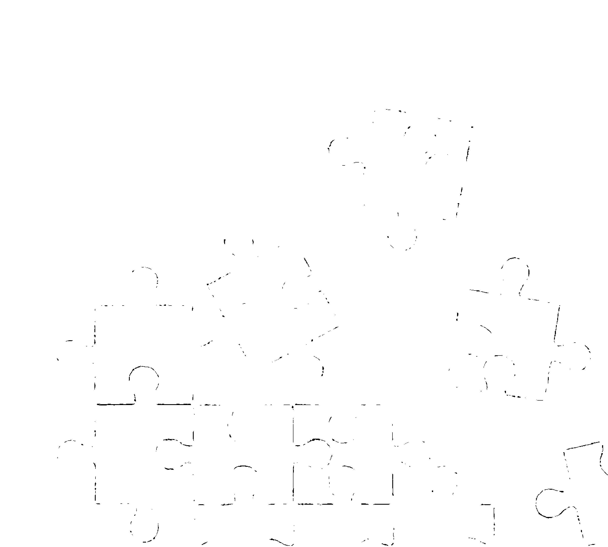

# CHAPTER 14

## 一對一排列

### 常見問題答疑

### 一、一對一個案要做幾次？

視案主情況而定，可以彈性把握個案的數量。有些案主的部分需要沉澱、吸收。比如，排列師觀察之後，可告訴案主依照你的經驗，這個個案還需要做三次，今天我們先做一部分。做得太多，他是吃不消的。若有需要，可約定何時做第二次個案。一般一個個案，一個小時左右就夠了。

### 二、個案要間隔多長時間？

可能幾天、幾週或幾個月，看案主的需要和案主消化程度。如果案主接受不了很多，也可以分段進行。如果排列師建議的功課做完了，案主狀態比較穩定，告一段落了，就可以進行下一步。不要在案主還沒有做功課時，就在同一個議題上反覆做。同一個議題，除非有新的重要信息出現，可以再做。不同的議題可以做，但有時即使是表面看起來不同，但有可能背後的系統動力是一樣的。所以，案主要把建議的功課好好完成，才是最實在的進步方式。

### 三、個案的效果取決於什麼？

個案的效果取決於：一、案主的改變意願。二、排列師專業程度。三、案主功課完成程度。

排列師不要企圖在一次個案中就要非常改變一個人。雖然有時候一次個案效果就很好，就像奇蹟發生一樣，那可能是因爲案主本身素質高、有較高的悟性、強烈的改變意願。更重要的是，發自內心，好好去完成從排列個案裡提醒我們要做的事。

### 四、一對一排列可以適用到哪些方面？

-   (1) 家庭人際：建立良好幸福的關係以及工作和人際關係。
-   (2) 企業組織：支持企業建立成功的經營決策，尋找問題解決方案。
-   (3) 事業財富：改善金錢關係，事業與生涯規劃抉擇，實現人生理想。
-   (4) 身心成長議題：促進健康，改善情緒，喚醒覺知力量，更有活力地活出自己。

### 五、一對一排列並沒有實際的代表，排列師如何去感知人偶代表呢？

排列師可以去用手去摸，感知人偶代表的感覺，就好像你在團體系統排列中擔任代表一樣。你要信任你的感受，並且可以跟案主交叉驗證。如果你感覺到人偶代表想要轉身，你就讓人偶代表轉身，然後問案主：「當我把這個人偶轉過身，你感覺怎麼樣？」案主就會去重新感受，告訴你某些答案。讓你的感知和案主的感受相互交叉進行，來推動人偶的移動與個案的進行。這沒有捷徑，最重要的是需要靜心鍛鍊與大量個案的熟練。

### 六、排列師不確定自己的感知能力時，該怎麼辦？

畫面在案主心裡，並不在排列師心裡。你可以讓案主去感覺、移動，然後排列師再加上自己的感知去核對。但是，如果你要成爲一位好的排列師，你的感知能力是絕對必須要提升的，多做靜心會非常有幫助。

### 七、在一对一排列中，如果排列师感知到的和案主感觉的不一致，该相信谁呢？

排列师要相信自己。前提是你的感知能力已提升上来了。因为排列师是中立的第三人。一位称职的排列师感知信息是中立的，没有自己的企图，因此他能够感受到真实的场域信息，然后运用专业，在适当时候回馈给案主，引导案主到正确的方向。相反地，案主对自己的议题很容易会有自己先入为主的想法和感受，或甚至会有抗拒。但同时，案主的想法和感觉也是一个非常重要的信息，没有好坏对错，聪明的排列师可以透过案主的感觉与移动，反而可以获得背后更深刻的信息，进而顺着这个信息，一样可以帮到案主。

### 八、移动人偶时，如何分辨是自己的感知，还是头脑的判断？

排列师要信赖你的「身体」。就像你做团体排列的代表时一样，你要保持在中正的状态。头脑的企图和身体的感觉要分清楚。头脑的企图是制造一个结果，而中正的代表是要找到一個對案主及整體最好的解決方向。信賴你的感知，及時和案主核對。要把焦點放在身體的感覺上，這就是多做靜心的重要性，靜心能幫助我們更精細地覺察。而平常就要多覺察自己，多留意自己頭腦運作和身體感覺的區別，在做排列工作的時候才能派上用場。

### 九、一對一個案時，要不要案主去感知其他人偶，或和其他人偶對話？

不需要。個案的關鍵是要站在案主的立場去面對一切。排列師可以代表父母或其他人說出其感受，並與案主對話。比如父母有衝突，對於案主來說，去尊重父母，讓他站在自己的位置與父母對話；不要讓他變成爸爸的角色與媽媽對話，做好自己該做的就好了。因為感知和頭腦想像不太容易區分，除非在極少的情況下有必要，或對個案有幫助，才讓案主站到不同角色與其他代表對話。關鍵還是要以案主為中心來進行個案對話。

### 十、當案主沒有感覺時，怎麼辦？

排列個案的目的不是在追求「感覺」，總體而言，是要支持案主探索系統動力，找到解決之道，最重要的是讓案主本人及其系統，領悟並朝向生命五大法則。因此，幫助案主「看見」與「領悟」就相當重要。當案主只要把相關人員的位置、距離、方向排出來，就是一個最重要的信息呈現。你要好好運用，仔細觀察，並帶領案主好好的觀察。透過觀察，就可能為案主帶來極大的領悟。因此，對於那些感覺比較遲鈍的案主，你要透過「觀察」的方式來協助他們。

另外，的確也有些案主把感覺壓抑得較深。如果他沒有足夠的信任，還有排列師沒有足夠的功力，這些案主不會輕易展現他的感受。因此，這需要你們之間關係的建立，以及排列師功力的提升，才能幫到這類案主。

### 十一、一對一排列時，排列師如何做介入？

引導案主去面對，屬於介入。如果案主有很多親人要面對，就引導案主來面對家族裡的這些人，問案主：「你現在願意不願意面對某些人？」引導他：「現在，我們來面對你的家人，你準備好了嗎？有一些話，你跟著我說，好嗎？」介入就是用專業的行為、語言，動作等，支援案主去面对核心的状况和问题。只要你的引导是朝向整体的、正确的方向，你的介入和引导就是在服务和支援案主。如果你的介入是你自己想要怎么样，那你采取的步骤和引导就是个人的介入。要注意两者的区分，不是排列师自导自演。这与真人当代表的情况是一样的。如果没有真正融入场域成员的信息，不管是真人当代表或是人偶的移动，都可能加入自己的企图，所以排列师要谨慎锻炼，仔细分辨。

### 十二、如果案主需要身体接触，而排列师又是异性，如何做会比较合适？

不管异性或同性，若有身体接触，比如拥抱时，可以拿一个毛毯或抱枕挡在两个人身体的中间，这样会好一些。一般做个案时都要安排助理或工作人员在场，这样可以保护双方，而且当有需要协助时，助理或工作人员都可帮忙。如果你事先评估这个个案可能会有身体接触，那更需要预先安排助理或工作人员在场。还有，排列师要去觉察案主是不是清楚知道你只是在个案环节中代表某个角色。如果你感觉到案主有投射或越界，你就要提醒他。如果不合適，就要避免身體的接觸。

### 十三、一對一色紙操作，排列師有時要做代表，有時要做排列師，如何切換角色？

切換角色時，你要告訴案主，你現在代表誰，並且要調整自己的聲音，用所代表角色的聲音來說話。例如代表小孩就用小孩聲音說話，代表老人就用老人聲音說話。回到排列師就用你原本的語調說話。

### 十四、不瞭解一對一排列的案主覺得你是自導自演，怎麼辦？

最好是讓案主在做一對一排列之前，先閱讀拙著《愛與和解》相關書籍，可以的話，先參加講座或工作坊瞭解系統排列。相對來說，有參加過課程的案主接受度會比較高。同時在個案過程裡要及時和案主確認、核對感覺與信息，他就不會覺得你是自導自演。

### 十五、一對一排列的工作中，誰才是改變的起始點？

答案是案主本身。排列師只是助緣，只是催化的工具，只是幫助案主看到真相的那個人，只是幫他覺察到更深層信息的人。

那改變何時發生？改變始於當案主這份「覺」醒來。覺知自己如何在愛，覺知自己如何使用生命，覺察並承認事實的真相，改變就開始發生了。所以，排列師工作第一要務就是讓案主這份「覺」醒來。

系統排列兼跨療癒和成長，永遠不要只是停留在療癒階段而已。療癒是為了成長做準備，當一個人成長了，問題自然就消失。因此，要幫助自己，也要幫助案主朝向不斷成長的路，活出更好的自己以實現人生使命，創造有愛、覺知、喜樂的生活，開始覺醒。

# Appendix 附录

## 【附錄一】

## 道石國際系統排列學院簡介（TAOS Academy）

道石國際系統排列學院（TAOS Academy）隸屬於道石教育集團，是由國際著名導師周鼎文和游玉鳳老師、易蘭珍老師以及數位國際導師所創辦之專業成長機構；乃由德國與中華系統排列學會所認可，致力於培育正知正念的系統排列導師，以提供最專業素質的服務；道石國際系統排列學院所認證的排列師是業界公認權威、嚴謹的排列師認證訓練。同時，道石學院以促進個人成長、家庭幸福、企業成功為使命，舉辦許多課程，一起播下覺醒的種子，與道同行，為人類的卓越成長而努力。

道石國際系統排列學院（TAOS Academy）在臺灣、香港、中國、新加坡、馬來西亞及日本等地，以及國際線上網路都有公益活動與成長課程，結合一群志同道合的企業家、導師與學員義工，共同為我們自己與下一代開創平安、健康、喜樂的生活。

| 項目 | 內容 |
| :--- | :--- |
| 地址 | 台北市南京東路四段186號7樓之2 |
| TEL | 02-2578-3442 |
| FAX | 02-2578-1255 |
| 網站 | www.taos.com.tw |
| E-mail | service@taos.com.tw |

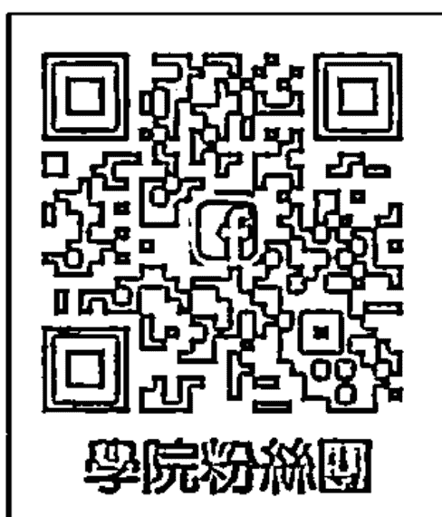

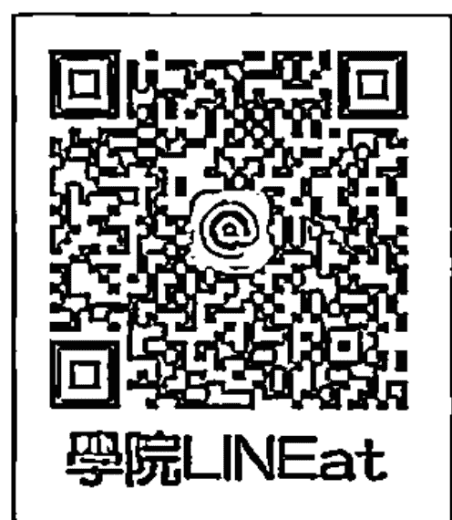

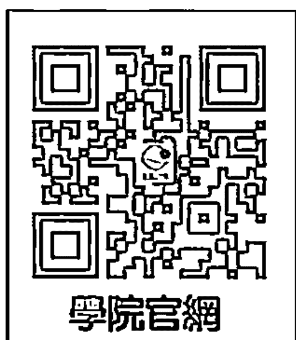

## 【附錄二】

## 延伸閱讀

-   《家族系統排列：核心原理與實務》（2020），周鼎文，心靈工坊。
-   《愛與和解：華人家庭的系統排列故事》（2018），周鼎文，心靈工坊。
-   《讀懂孩子：掌握愛與教育的祕訣》（2018），周鼎文，心靈工坊。
-   《在愛中昇華：海寧格智慧精華》（2009），伯特·海寧格 (Bert Hellinger)，道石TAOS。
-   Family Constellations Group and Individual. Jakob Robert Schneider, Sieglinde Schneider. Carl-Auer. 2 DVDs.

心灵工坊
Holistic 142

## 系统排列的全息智慧：

一对一排列与线上个案的理论与实践

## HOLO-WISDOM:

The Theories and Practices of One to One Systemic Constellation and Online Constellation

作者——周鼎文

出版者—心灵工坊文化事业股份有限公司
发行人—王浩威  总编辑—王桂花
特约编辑—简淑媛  责任编辑—饶美君
内页设计排版—董子瑽
通讯地址—106台北市信义路四段53巷8号2楼
邮政划拨—19546215  户名—心灵工坊文化事业股份有限公司
电话—02) 2702-9186  传真—02) 2702-9286
E-mail—service@psygarden.com.tw  网址—www.psygarden.com.tw

制版・印刷—中茂分色制版印刷事业股份有限公司
总经销—大和书报图书股份有限公司
电话—02) 8990-2588  传真—02) 2290-1658
通讯地址—248新北市五股工业区五工五路二号

初版一刷—2021年4月  ISBN—978-986-357-207-7  定价—580元

版权所有・翻印必究。如有缺页、破损或装订错误，请寄回更换。
ALL RIGHTS RESERVED

> 国家图书馆出版品预行编目资料
系统排列的全息智慧：一对一排列与线上个案的理论与实践 / 周鼎文著
-- 初版. -- 臺北市: 心灵工坊文化, 2021.04
面; 公分. -- (Holistic; 142)
ISBN 978-986-357-207-7(平装)
1.家族治疗 2.家庭关系
178.8
110004952

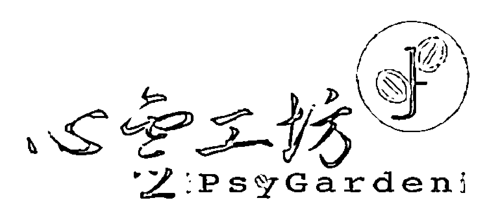

## 書香家族讀友卡

感謝您購買心靈工坊的叢書，為了加強對您的服務，請您詳填本卡，直接投入郵筒（免貼郵票）或傳真，我們會珍視您的意見，並提供您最新的活動訊息，共同以書會友，追求身心靈的創意與成長。

書系編號－Holistic 142　書名－系統排列的全息智慧：一對一排列與線上個案的理論與實踐

姓名　　　　　　　　　　　　　　　　　　　是否已加入書香家族？□是　□現在加入

電話（公司）　　　　　　　（住家）　　　　　　　手機

E-mail　　　　　　　　　　　　　　　　　　　生日　　年　　　月　　　日

地址□□□

服務機構／就讀學校　　　　　　　　　　　　　　　　　　　　職稱

-   您的性別－□1.女　□2.男　□3.其他
-   婚姻狀況－□1.未婚　□2.已婚　□3.離婚　□4.不婚　□5.同志　□6.喪偶　□7.分居

請問您如何得知這本書？

-   □1.書店　□2.報章雜誌　□3.廣播電視　□4.親友推介　□5.心靈工坊書訊
-   □6.廣告DM　□7.心靈工坊網站　□8.其他網路媒體　□9.其他

您購買本書的方式？

-   □1.書店　□2.劃撥郵購　□3.團體訂購　□4.網路訂購　□5.其他

您對本書的意見？

-   封面設計　□1.須再改進　□2.尚可　□3.滿意　□4.非常滿意
-   版面編排　□1.須再改進　□2.尚可　□3.滿意　□4.非常滿意
-   內容　□1.須再改進　□2.尚可　□3.滿意　□4.非常滿意
-   文筆／翻譯　□1.須再改進　□2.尚可　□3.滿意　□4.非常滿意
-   價格　□1.須再改進　□2.尚可　□3.滿意　□4.非常滿意

您對我們有何建議？

本人同意　　　　　　　　　　（請簽名）提供(真實姓名／E-mail／地址/電話等資料)，以作為心靈工坊（聯絡／寄貨/加入會員／行銷／會員折扣等）之用，詳細內容請參閱 http://shop.psygarden.com.tw/member_register.asp。

廣 告 回 信
台北郵局登記證
台北廣字第1143號
免 貼 郵 票

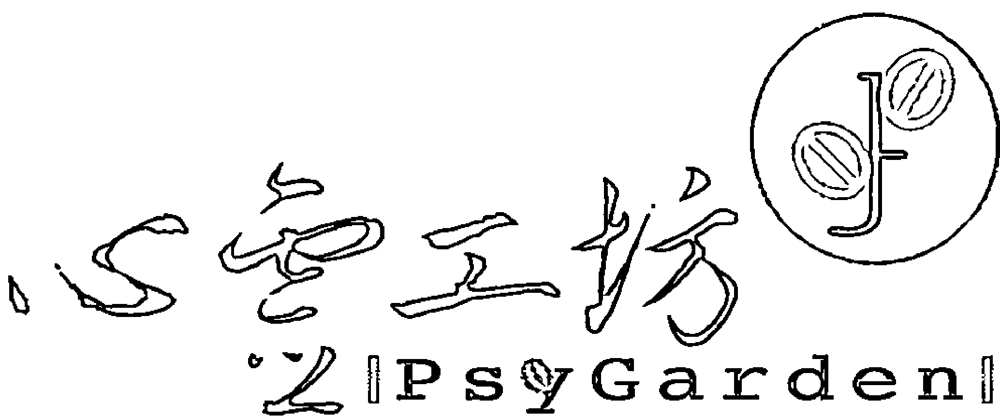

台北市106 信義路四段53巷8號2樓

讀者服務組 收

免 貼 郵 票
(對折線)

加入心靈工坊書香家族會員
共享知識的盛宴，成長的喜悅

請寄回這張回函卡（免貼郵票），
您就成爲心靈工坊的書香家族會員，您將可以——

-   隨時收到新書出版和活動訊息
-   獲得各項回饋和優惠方案

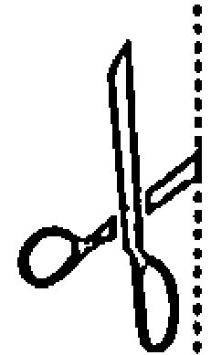- 最新與一對一排列專業教材，線上線下個案寶典。
- 最詳盡圖解式個案操作、追蹤與分析。
- 最權威教學內容，全面解析人偶排列、色紙排列與線上個案技巧。

周鼎文是國際級系統排列導師，曾輔導過成千上萬個案例。他運用「全息」原理揭開了一對一排列的奧秘。就如同人體小小的基因能含藏生物「全部訊息」，助人者若能領悟全息的智慧便能由小觀大，透過案主呈現的微型場域來了解整體豐富的資訊，從而支持案主解決困境，開創新局。

周鼎文發展出其獨特的「一對一排列」與「線上個案」以因應案主隱私的需求及網路時代的變革，並在本書詳細介紹這些方法的優勢與限制、實用且具體的操作實務，同時精確示範如何廣泛運用在企業組織、事業財富、家庭人際與身心健康上，是助人者必備的系統工作學習寶典！

書中詳列 16 項精彩的案例解析，應用範圍包括生涯規劃、金錢議題、情緒管理；夫妻相處與親子教育；企業決策與人事安排；甚至是性與秘密。

## 在本書中，你還可以讀到：

- 一對一排列的四大原理與三大機轉
- 如何使用小人偶做個案排列
- 如何進行網路線上個案
- 如何運用色紙與想像力進行排列
- 如何判斷排列位置所呈現的意義
- 如何處理排列時的特殊狀況
- 如何提升排列師的感知能力
- 如何解決一對一排列常見問題
- 常見議題系統動力與六大操作範本

ISBN 978-986-357-207-7
9 789863 572077
Holistic 142 | 心靈工坊出版 定價580元

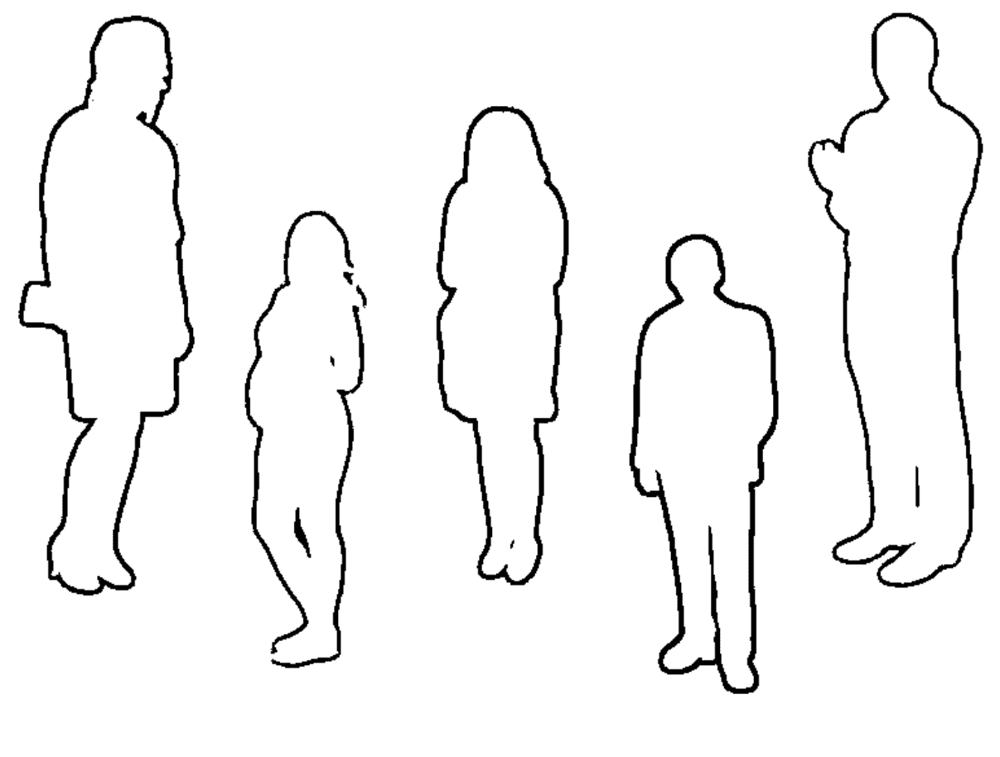