# 系统排列的全息智慧

## 【自序】

# 突破難言困境，創造豐盛人生

一家上市公司創辦人已年長，想由子女接棒，但考慮子女的能力、個性及性別等因素，難以決定，以至於無法如期完成交棒，甚至子女間也開始出現不合的現象，這讓他感到很苦惱。他們不想公開這些事，所以找我做私人個案，在排列裡探索出誰最適合接棒以及子女們該如何分工，最重要的是如何調整心態讓公司能接棒順利。做完排列後，不止接棒問題確定，子女間的關係也變得更好，打開彼此之間多年的心結，他們非常感謝。

一間知名建築公司，董事長的強勢風格常造成溝通困難。不久前這間公司面臨重大抉擇：是要被另一間大公司談判收購，還是自己獨立上市？考慮當前市場壓力大，獨立上市有難度，也擔心管理團隊知道不上市後心態變化影響業績，這位董事長遲遲無法決定，來找我做線上排列。做個案中，發現公司對於被收購的方向還是比較接近，對上市比較疏離。重要的是，董事長驚訝領悟到他個人對公司的影響竟如此之大，而他面對家族動力的方式更影響了健康。這個個案經過一對一排列後，不但協助他釐清公司的抉擇：他決定接受併購，一些股份給高階主管們，讓他們可以繼續爲公司效力；更有價值的是，他學到如何面對家族動力以改善健康，並明白自己退休之後，想要實現自己多年來教學寫書的理想。這是一個清晰果斷的決定。

某領域知名的夫妻因相處問題來找我做一對一人偶個案。個案探索出原來他們的議題跟父母同住有很大的關係。這對夫妻有間大房子，他們爲了愛自己原生家庭的父母，雙方父母都搬來跟他們同住，但也因雙方暗地的矛盾影響了夫妻關係。但他們又害怕如果不讓父母同住會被外人批評不孝，他們感到很痛苦。透過我的引導，案主找到了用其他更好的方式來孝順父母，不一定要同住才叫孝順。這對夫妻感到重大的釋然，並承諾要重新經營彼此的關係。

每個人活在世上都有自己要面對的議題，當遇到人生重大課題時，除了自己靜下來好好面對外，我們都希望能和有經驗的人商量，向有智慧的人討論，並且期待有專業知識的人能幫我們從不同角度釐清問題，給予中肯建議，尋找解決之道，讓我們更清楚地了解如何發揮力量。然而，不管是企業、組織、家庭或個人議題，有些議題非常私密，此時一對一排列便能提供最好的支持，幫助人們在私密情況下透過全面的系統智慧面對問題、克服難關、開創更好的未來。

所以，這些年我特別提供一對一排列，幫了許多需要的人們，其中不乏政商名人、影視明星、企業負責人。我瞭解這份需求，因為同樣都是人，只要在不同的位置，都有自己要面對的挑戰。很高興看到這些朋友透過我們專業的支持，克服挑戰，發揮讓自己與這個世界變得更好的影響力。

同時，在這網路、疫情與多變動盪的時代，我特別發展出「線上排列」，透過網路就可以進行一對一排列。尤其使用人偶作為工具，更能幫助案主看到系統動力的全貌，加上排列師深刻的感知能力與豐富的經驗，我所發展的「線上排列」獲得了國際上正面的回響。這也促成我想把這門「一對一系統排列」與「線上排列」系統地整理出來，提供給想學習助人專業的朋友。

本書內容從知識原理、操作實務、常見議題範本，到實際案例示範與解析，能讓學習者有全面的認識，適合各種助人者學習，包括企管顧問、家庭諮詢師、心理輔導員、教練諮商師、醫護人員、心理師、社工師、教師、法院觀護人等，所有助人者都可以將這門學問融入到工作裡，幫助你的客戶、案主、學員與病人等。

全世界已有超過數十個國家的專業人士運用「系統排列」支持了無數企業、家庭和個人，但如果要成為「專業的一對一排列師」，除了閱讀本書外，更要參加專業認證訓練，向最資深的訓練師學習，因為一對一排列師的要求比一般排列師還要高。「道石國際系統排列學院」特別訓練排列師的觀察與感知能力，對系統動力的深刻認識，並培養專業的助人心態與技巧。有了專業品質才能更好地幫到人們突破困境，清晰有力地創造更豐盛的人生。

本書付梓，要感恩所有個案的信任、道石學院夥伴的協助、玉鳳老師與易蘭珍校長的策劃、陸玫的筆記整理、心靈工坊團隊以及所有參與的人。

周鼎文

2020.11.20

## CHAPTER 1

# 全息智慧：

# 一即一切，一切即一

# 一、什麼是「全息」？

「全息」（Holo）就是全部的信息。比如一張照片裡有一個人像，如果我們把這張照片撕成許多碎片，從每塊小碎片中仍可以看到完整的影像，這樣的照片叫做全息照片。換句話說，全息就是局部可以反映出整體，一個小部分包含了整體的信息。

以上是全息的現象，當我們透過現象來深刻觀照全息的本質時，我們就會發現：全息是宇宙創造萬物的方式。

老子說：「道生一，一生二，二生三，三生萬物。」老子稱一切萬物的總創造力為「道」，耶穌稱之為「神」，而這總創造力的創造方式，就是透過一個最小的單位來複製生成各式各樣的萬物，最後形成一個包容萬物的整體。換句話說，一切萬物都是透過一個小單位來發展形成的，因此從最小的單位就可以了解萬物，從「一」就可以了解整體，這就是全息。

因此，你可以說全息就是道的智慧的展現方式，或者宇宙創造力運行的一種律則。

# 二、全息現象的應用

全息現象處處可見並被廣泛應用，包括醫學、生物、科技、物理學、心理學等各方面：

# 全息生物學

張穎清教授研究全息胚，發現每個全息胚跟整體的縮影一樣，內部皆包含有機體各個器官與部位的對應點（圖1-1）。

# 全息醫學

耳針診治全身疾病是從全息現象所發展出來的，另外，腳底按摩也是從全息現象發展而來，可以反映全身的部位與器官（圖1-2）。包括著名的董氏針灸，也把全身分為十個部位與胸背部，而每個小部位，包括一根手指都可以診治全身疾病，這也是全息的現象。

圖1-2 腳底反射區

圖1-3 全息投影圖

# 全息投影技術（holography）

利用干涉原理記錄物體光波的全部信息，然後利用衍射原理再現物體光波信息。全息投影技術再現的圖像立體感強（圖1-3），具有真實的視覺效果，不僅可以產生立體的空中幻象，還可以使幻象與人們產生互動。

# 現代物理學

現代物理也熱衷於全息現象的研究。1982年法國巴黎物理實驗室有一個驚人的發現，他們把電子做了交互纏結運動之後，不管發射到多遠的距離，電子之間竟然能夠有一個互通信息的反應，而且互通的時間是即時的，幾乎不需要時間。這個驚人的發現違反了愛因斯坦（Albert Einstein）的理論，也就是沒有任何通訊速度能夠超過光速，因爲一旦超過光速，就等於說打破了時間的界限。量子物理學稱這種現象爲「量子纏結」（entanglement）（圖1-4），表示信息是可以超越時空界限相互傳遞。

還有，全息現象也能應用在最新興的心理學——一對一系統排列，而這也是本書探索的重點。

圖1-4 量子纏結

# 三、全息的四大特性：一對一系統排列的原理

根據上述，我將一對一系統排列所運用到全息的特性，歸納為下列四點：

# （一）由小觀大

佛家「芥子納須彌」，道家云「物物顯太極」，英國詩人布萊克（William Blake）寫著：「在一粒沙中，見到全世界；在一朵野花中，見到天堂；將無垠，握在掌中；見永恆，於一剎那。」全息的核心思想就是，宇宙是一個不可分割的、各部分之間緊密關聯的整體，任何一個部分都包含整體的信息。

人跟人之間的互動方式、溝通的內容、公司的決策、運作，在系統裡的各種形式，各種現象都是「信息」。在一對一系統排列裡，就是透過個案當下所呈現的部分信息，來反映出系統背後的整體信息，進而探索出系統的整体動力，從更大的整體觀來尋找問題的解決之道。

# （二）信息傳遞

量子物理學家把電子做了交互運動後發現，不管距離多遠，電子之間能夠產生即時相互傳遞信息的「量子纏結」反應。同理，人是由巨大數量的電子或量子所組成。當兩個人或一群人在家庭、企業等系統裡，彼此有了某些連結，建立某種互動關係，彼此之間也就產生了類似可以相互傳遞信息的「量子纏結」反應，比如常見的母子連心等現象。同時，這一群人所形成的系統就組成了一個巨大的量子場域，也就是形成了一個可以相互傳遞信息的「信息場」（the field）。

而一對一系統排列的進行，就是把這個系統的信息場濃縮出來呈現到當下個案的信息場裡，就好像是實際生活的一個縮影，所以在這個個案的信息場裡就包含了案主所屬系統的全部信息，也就是全息。透過系統排列的方法以及排列師的專業，我們就有機會將深層的信息、較難以覺察的系統動力揭露出來，幫助案主看清真相，找出問題的解決方案。

於此同時，當我們在這個縮影的信息場裡找到問題的解決方案，或者重新調整面對的方式，這個力量也會反過來傳遞進入到我們真實的生活裡，幫助我們在真實的生活裡面對問題、改善關係、實現目標。

# （三）超越時空

愛因斯坦的相對論提出：時間與空間是一個不可分割的整體，他稱之為「時間—空間連續體」，他的理論震驚了世界。而享譽當代的量子物理學家玻姆（David Bohm）又將這個理論提升，他說：宇宙萬物都是連續體，不僅時間或空間是連續體，宇宙萬物皆是一個連續體。因此，外表看起來每一樣東西是分開的，但事實上每一樣東西都是另一樣東西的相互延伸。他大膽假設：宇宙就像一張巨大而細節豐富的全息照片。

不僅有科學理論的支持，在系統排列的工作裡更有實際體驗。我們在系統排列的場域裡，就好像透過一張小照片而可以看到整體的大照片，從當下的場域就可以獲取萬事萬物的全息。

愛因斯坦與玻姆的理論也說明了系統排列場域所存在的超越時空的現象：即使個案所排列出來的人物距離千里之外，並不在現場，但這個人的信息同樣可以超越空間，在當下場域呈現；同時，即使這些事件發生於過去，但我們一樣可以在當下這個現場，超越時間地把它呈現出來。我們體驗到萬物互連的信息超越時空，全都可以在這個場域呈現。這就是全息的「超越時空」特性。而當代科學的新發展正好對於一對一系統排列的全息場有了更清晰的解釋。

## 系統排列的全息智慧
### 一對一排列與線上個案的理論與實踐

更進一步地，我從輔導的無數案例領悟到：整個宇宙萬物的信息都是濃縮在當下這個「一」裡，也就是所有一切在這個當下是合一的。這也說明了為什麼上述 1982 年巴黎物理實驗室的實驗，兩個電子之間的聯繫幾乎不需要時間，用「量子纏結」只是一個物理學上初步的解釋。我認為要以超越線性觀念的看法，從多維的角度來看，也就是：整體所有的一切都重疊濃縮在此時此刻的多維場域裡。換句話說，在這個多維場域裡，信息是超越時空的、全部重疊濃縮在這裡，所以它的聯繫速度不是以往所認知的三維空間加時間維度的直線距離，它打破時空界線，是一個多維的重疊濃縮時空，此地彼地、此時彼時都重疊在當下的場域。

現象的發生總在前，科學研究理論隨後，我相信未來科學家很快就會找到更多理論來解釋這些現象，並會有更多科學家投入研究，發展出更多美好的運用方式，為人類帶來更多的福祉。

## （四）轉化未來

1963 年美國數學家及氣象學家洛倫茲（Edward Lorenz）發展出當今世界最偉大的理論之一「混沌理論」（Chaos theory），他所提出的「蝴蝶效應」（The butterfly effect）正可說明系統排列裡的運作情況。洛倫茲認為：一個微小的初始條件變化可能導致一連串逐漸放大的改變，最終導致未來完全不同的結果。這意味著，系統具有放大作用，一個微小的運動經過系統的放大，最終影響會遠遠超過該運動的本身。所以當我們在系統排列的場域裡真心改變的時候，對於自己的人生甚至整個系統，都可能帶來超乎我們想像的影響力量。就像俚語所說：「一人得道，雞犬升天。」當你得道了，連你們家的雞跟狗都能上天堂！

那在什麼時候做改變？未來可以改變嗎？

全息科學家研究發現，過去、現在和未來共同存在於一個結構上，這意味著每一個時刻都代表了全宇宙的信息，因此宇宙在時間上是全息的。而時間循環包含了空間結構，因此，全息科學家得出的結論是：宇宙是全息的。所以在一對一系統排列裡，當我們在當下這一刻找到一個好的解決之道，這個時候我們就有機會轉化並創造未來。換句話說，「當下」就是通往過去與未來的大門，當下就是改變的鑰匙，當下如果開始改變，未來就有可能帶來巨大的轉變。

然而什麼是「好的」改變？

如同塞翁失馬，焉知非福。如果我故事繼續編下去，那位丟失了馬、不用上戰場而存活下來的老翁之子，後來變成怎麼樣呢？有沒有可能有一天他不小心引發一場大火把村子裡的人都燒死了呢？這時候他活下來是福還是禍呢？所以，到底什麼是「好的」改變呢？在人類進化的過程裡，我認為還是有一個方向可循，我們自己要朝這個方向，也要幫助案主們朝向這個方向成長，那是怎麼樣的方向？那就是，領悟生命運作的「道」，活出人生的「道」。然而有人說「道」高深莫測；是的，但透過許多前輩們的探索與智慧的傳承，以及許多實際案例的經驗累積，我把它歸納為「生命五大法則」，提供給各位參考，作為可以支持個案成長的方向（關於生命五大法則在後面章節裡有詳細說明。）

明白了全息的特性也就是一對一系統排列的運作原理，而這些信息是如何具體呈現？透過的這個載體就是——身體基因。

## 四、身體基因：全息的儲存器、接受器與發送器

信息無所不在，那麼在人身體裡面，這些信息是如何儲存、接受與發送？目前的醫學研究已證實：人身體裡面的每一個細胞都是整個身體的全息。人的受精卵和它發育成的各種細胞比較，其DNA是相同的。人體的每一個細胞都包含了這個人全部遺傳信息（圖1-5）。

除了「儲存」全部遺傳信息外，透過這些年無數的實際案例，我的發現與假設是：

1. 基因不只是儲存信息的記憶庫，更是最佳的信息接收器與發送器，如同手機的晶片一樣，人透過基因的運作，可以儲存、接受與發送信息。
2. 人的基因運作不僅單獨影響個人的生長與生活，如同現在的互聯網，人透過基因運作而形成了人與人的互聯系統，我稱它為「人聯網」，不管我們有沒有察覺，這些信息都影響著系統裡的每一個人，並共存、共享於所有人之間，而其接受與影響的程度就在於他與所屬系統的「親疏關係」，也就是說，他是否有權利接受某些的系統信息，以及接收到的信息深淺與多寡，取決於他在這個系統的身分與位置關係。
3. 不只人跟人之間，人與萬物之間也是一個「萬物互連」的系統，而這將不再只是概念，而是一種可以體驗與檢視的事實，透過新興的系統工作方式——「系統排列」——我們可以更清楚地體驗與獲知人與人、人與萬物在深層裡是如何相互影響。如此一來，我們可以更明確體認到，這個世界是一個有機的整體系統，這不再只是頭腦的觀念，更是生命存在的現實。

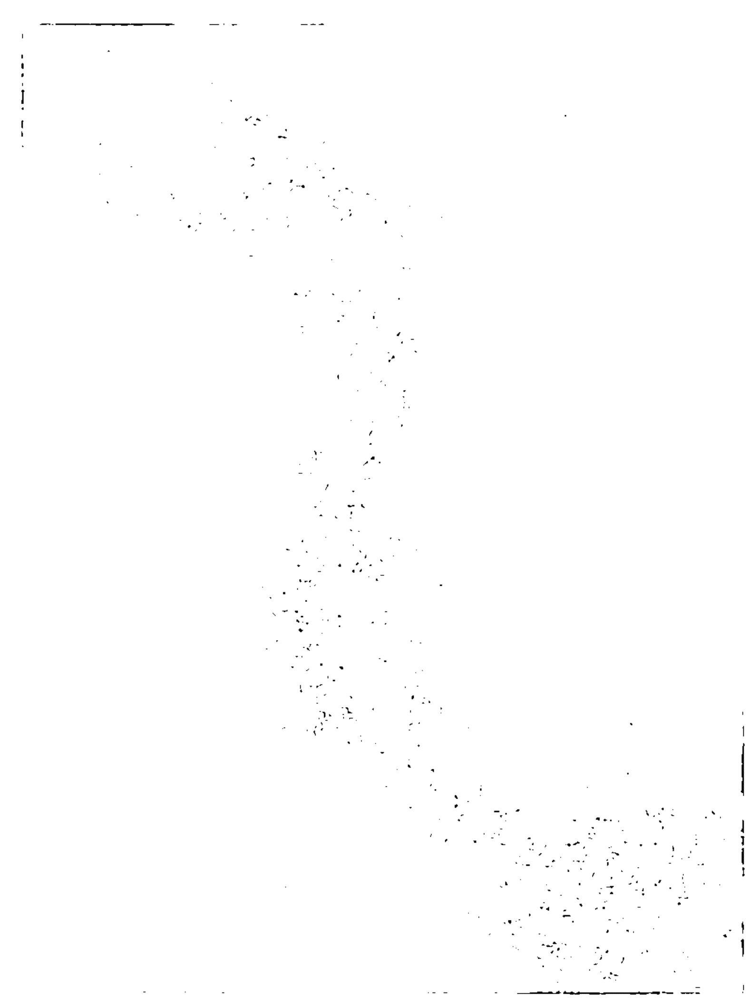

## CHAPTER 2
## 一對一系統排列

### 一、系統法則與系統排列

一群人聚在一起有了交互作用之後，就產生了一個如同有生命的有機體，形成了我們所稱的「系統」。每個人都活在系統裡，而且同時參與了好幾個系統，有家庭、工作、企業、人際、社會、國家等系統。有的緊密，有的鬆散；有的成功，有的失敗；有的相處融洽，有的會遇到困難，甚至解散。

每個系統都有其存在的功能和要達到的目標，例如企業系統如何達到經營目標、實現更好的成果；家庭系統如何讓成員們感到幸福有愛。

然而，不一定每個系統都能發揮功能、達成目標，而系統成員往往也不只像表面的互動而已，似乎還有更深層的互動在影響著彼此的關係。因此，如何能夠知道系統的深層狀態？如何幫助系統發揮功能並達成目標？如何瞭解成員的深層感受並建立融洽的互動關係呢？

德國伯特·海寧格先生（Bert Hellinger）所發展出的「系統排列」這門學問正可以幫助我們活出更好的自己、改善人我關係，並幫助系統發揮功能以達成更豐盛的目标。

「系統排列」最早是從心理治療開始的，海寧格先生觀察到人的關係裡有一些基本的互動，如果這些互動順利，人就能享有較爲成功的關係。其中包括：

1. 歸屬感（Belonging）。
2. 秩序（Orders）。
3. 施與受的平衡（Balance of giving and taking）。

海寧格先生發現人的心理與系統存在著關鍵的運作律則，如果違背了這些律則，就會出現各式各樣的問題。總結海寧格的觀察與我上萬個案例的經驗，將人類系統歸納五大法則：

#### 1. 整體法則（Wholeness）

每個人都有歸屬於其系統的權利。如果有人被排除，就會有系統裡其他人要去填補這個空缺，因而產生牽連糾葛而失去自由。

#### 2. 序位法則（Orders）

每個人在所屬的系統依時間先後、輩分、職權、責任大小等都有其所在的位置。即使是出自於愛，錯誤的位置將會帶來系統的混亂，甚至災難。

#### 3. 平衡法則（Balance）

施與受要平衡。金錢、情感等都需要平衡對待，但強調正面回報多增加一點點，負面回報就會減少一點點，如此可讓關係變得更加幸福豐富。

#### 4. 事實法則（Reality）

尊重事實如是的樣子。對系統裡所發生的事實，沒有以成熟的方式面對，或編造事實，或成為祕密，系統裡的其他人將會承擔這些未竟之事所帶來的影響。

#### 5. 流動法則（Flow）

愛要流動，人要溝通，生命要傳承。過去發生的事，面對後也要放下，系統才會不斷有新的活力，生生不息。

系統排列幫助我們去檢視是否違背這些法則，並幫助人們學會回歸這些法則，以創造更成功、美好的人生。當整個系統遵循著生命法則的規律，每個人各歸其位，負起自己的責任，系統的事實能被承認與尊重，愛與生命力得以流動時，背後的系統就不再是阻力，而可以成為一股助力，支持系統裡的成員實現自己的理想。例如公司系統經營更成功，家庭系統更幸福，人際關係更和諧，人生使命更豐盛實現。同時，系統的成員對這個系統也能夠成為推動的力量，共同推動這個系統朝向更健康成熟、永續發展的方向。

海寧格先生以系統為觀點、全息為原理、現象學為方法、哲學領悟為引導，將許多心理學元素整合，發展出一套獨特的應用心理學——系統排列。自 1990 年代起，系統排列便在國際激起熱烈的討論與學習，海寧格先生成為世界公認的系統排列開創者。我在 1997 年親自向海寧格先生學習，並在 2001 年主持了海寧格先生第一場亞洲工作坊，正式將系統排列在亞洲拓展開來。

系統排列這門學問自海寧格先生整合開創以來，便透過許多國際專家們不斷累積經驗而開展，並融入世界各地的文化智慧以及生命力量的注入，令現今的系統排列成為一門「活的生命科學」。全世界已有超過數十個國家的專業人士學習運用這門學科，支持了無數企業、家庭和個人，享有更成功幸福的人生。

### 二、一對一系統排列的作用機轉

系統排列進行的方式主要有兩種，一種是「團體」系統排列，另一種是「一對一」系統排列（以下簡稱「一對一排列」）。團體的系統排列是用真實的人當代表來感知系統動力的信息，但在一對一的排列個案中如何來感知系統動力的信息呢？排列師在進行一對一排列的時候會利用一些小工具，例如小人偶、白紙、色紙、小物件等來幫助呈現系統的信息。不過，用這些小工具又是如何感知和呈現系統的信息呢？剛開始可能有些人會懷疑，但是在許多人親身經歷之後，往往莫不感到觸動與驚訝。

對於不了解或者心中已有評判的人，我想要對他們說：當你更深入去了解透徹時，自然會找到屬於你自己的領悟方式。包括我以及許多國際專業導師，我們已採用一對一人偶排列幫助了世界上許許多多人。如果一門學問對人真正有幫助自然會留下來，而且值得更多人投入研究。聰明人就會懂得好好善用它，為自己以及這個世界創造更好的生活。

一對一排的背後確實有其作用的道理，我將它歸納為三大作用機轉（machanism of action）：

#### （一）全息現象由小觀大

一對一排的後原理即是「全息」。如同我們在第一章所講，全息現象處處可見，從中醫耳穴，腳底反射到全息投影技術，從物理學家的宇宙理論到佛家的一沙一世界、當即永恆，處處都有全息現象的存在與運用。

人的身體也是如此，在受精卵分化為體細胞的過程中，體細胞也獲得與受精卵相同的一套基因，基因的複製過程隱藏著發育成一個新機體的潛能。因此，基因即是全息現象的展現。我們身上擁有跟父母極相似的基因，而我們父母身上也擁有跟他的父母極相似的基因，換句話說，我們每個人身上都帶著我們整個家族，甚至帶著整個人類系統的信息。每個人身上都承載著這些無數的信息，所以不管我們走到哪裡，我們身上都攜帶著全部信息。

但在一對一排列裡，這些信息要如何獲得呢？團體的系統排列師用真人作為代表，感知並呈現系統裡的信息；而一對一排列師運用小工具，例如小人偶作為媒介，幫助案主把系統的信息呈現出來，特別是當案主「很專注地」把這些內在的信息用小人偶等工具排列出來時，他們身上所攜帶的信息，包括意識、潛意識以及系統所儲存的集體信息，都會灌注在這些工具裡以及所設置的場域裡，形成了一個「全息場域」——局部反映出整體，小單位包含了整個系統的信息場域。透過這個全息場域，我們就可以由小觀大，瞭解整個系統的動力情況，包括你的企業未來走向或者是家庭的深層心理狀態等。因此參與者對於一對一排列往往都會感到非常驚訝，而許多問題的盲點和深層卻又不願意面對的系統動力，就有機會在眼前呈現出來，讓案主有機會選擇用更好的方式去面對與轉化；同時，只要

#### （二）畫面呈現系統動力

排列師引導得好，在一對一排列裡案主會覺得安全並且更願意敞開，因為有許多私密的議題可以用一對一排列來諮詢。

一對一排列的信息以什麼方式呈現？透過位置與畫面，以視覺化方式呈現。

人類有一種本能，就是對人、事、物的親疏關係會以「距離」來表示其深層感受。因此當案主用小人偶代表他問題裡的人物，並且把這些人物彼此之間的親疏關係在桌上排列出來時，他甚至不用經過頭腦思考，就本能地把內在的信息透過不同的位置呈現出來。以一個家庭為例，當我們請案主將他的爸爸、媽媽和小孩排列出來時，案主會把某些人排得比較近，某個人排得比較遠，某個人面對另一個人，或者背對另一個人，透過不同的距離與面對的角度，就可以讓我們瞭解到這家人彼此關係的深層信息。

同時，當人們遇到問題時，會對這些問題有自己的想法和感受，但有時候我們會太過於主觀，常常容易產生盲點，甚至有時候會太認同問題，因此心理學有個方法叫「問題外化」，指的是將人們內在的問題拿到外面來討論。一對一排列就有這樣的味道。一對一排列除了將問題外化之外，更加上了「問題視覺化」，並以一種「外在的視覺畫面」的方式將問題背後的信息呈現出來，包括意識、潛意識信息與系統動力，如此便可以幫助案主保持一點距離，更客觀、更全面地看到整體的狀況。而且案主也比較不會局限在自己個人的主觀裡，比較有機會去瞭解系統裡每個人的感受與想法，如此一來，不僅有助於找到問題的解決之道，而且會引發案主去覺察自己該如何調整。

#### （三）觀察感知解決之道

一對一排列中使用的小人偶或小物件只是工具，最重要的信息接收器是排列師這個「人」。作為中立的第三方，排列師要經過嚴格的专业訓練，讓自己有能力透過敏銳的感知與觀察力，接收並反映案主所排列出來的場域信息。排列師透過專注於自己身體的感覺，用手碰觸小人偶或小物件，就如同在團體排列中做代表一樣，成為一個信息接受器，去感知案主所排列出來的人物的身體感覺、心裡感受與深層想法。排列師同時也要用眼睛觀察，觀察案主所排出小人偶或小物件的位置、觀察案主所有的小動作，包括眼睛、嘴角、表情、手指等肢體動作；案主如何選小人偶代表及如何把它們排出來，還有過程中所有的行為反應以及所有的表達與情緒反應，包括他在說某一件事情的聲音，或聽到某一句話的情緒反應。還有觀察案主動作與情緒上的差異，比如當他嘴巴上說著跟某個人很親近，但是卻把代表他的人偶排得很遠；口頭上說對某個過世親人已放下，但在說的時候卻紅著眼眶等。這時候排列師細緻的觀察可以幫助我們探索案主的深層信息。

接下來，排列師支持案主探索系統動力與呈現真相、尋找解決之道，面對與轉化這些動力的影響。最後透過解決之道的新排列畫面，我們看到問題的關鍵點。許多時候案主在當下便發生領悟與改變，或者在回去之後知道該選擇什麼方案，採取什麼行動，如何調整自己與系統去面對問題。

1. 面對議題
   看到系統及自己的運作模式與盲點，覺察系統的深層動力，找到困境的解決之道，幫助系統及自己朝向更好的方向發展。
2. 創造未來
   為自己及所在的事業、公司、組織做出更好的決策，選擇更好的方案，並預見未來需要注意和加強之處，以便創造出未來更好的成績。
3. 支持成長
   喚醒案主內在力量，更有智慧與勇氣去經營自己的事業與人生，並帶領系統裡的夥伴一起努力，轉化事業與生命軌跡，將過去的糾結轉化為祝福，朝向更成功幸福的道路邁進。
4. 提升品質
   領悟生命的道理，學會與宇宙大系統和諧一致的生活方式與做人處事之道，提升系統與人的品質素養，為社會和諧與人類和平服務。

### 四、一對一排列的應用領域

一對一排列常被應用在以下領域：

#### 1. 企業組織：
支援企業與組織建立更成功的經營規劃、探索組織深層動力、尋找問題解決方案，並協助重大決策的決定與執行後的檢核、人事調整與管理、接班人的選擇與規劃等。

#### 2. 事業財富
探索與呈現企業家的事業與金錢的動力、改善本身與事業和財富的關係、思考是否有無意識的損失，還是朝向成功富裕，並重新探索最能發揮的事業經營與生涯規劃方式等。

#### 3. 家庭人際
支持人們建立融洽的家庭關係、父母關係；良好幸福的婚姻關係、兩性關係、親子關係、工作與人際關係等。

#### 4. 身心健康
改善身心健康，建立更有效的情緒管理模式，並喚醒內在覺知，學會大系統的生命法則，讓自己工作與生活更自在、有活力。

### 五、一對一排列的優勢特色

一對一排列的優點很多，其中有四項優勢特色：

1. 用畫面呈現系統中的隱藏動力。
2. 具私密性，對於私密議題，個案會感覺放心較願意敞開。
3. 可用的代表數量多，能夠滿足需較多代表排列的需要。
4. 時空方便，約好時間，在安全標準的空間即可進行。

在一般傳統的諮詢，案主如果只用「語言」來描述他的議題或跟某個人的關係時，往往都是帶著自己的「主觀」意識，而且描述的內容往往是他自己的表面認知，無法深入到深層的意識。但透過系統排列，例如一對一排列會利用一些小工具，如人偶或色紙等，可以快速建立一個「畫面」，讓排列師與案主可以較「客觀」地看見案主的議題或跟某個人的關係。再加上排列師感知場域信息的能力，於探索案主的深層意識及系統的隱藏動力時，即可呈現出類似用真人做排列的場域，以幫助案主面對議題，尋找出解決之道。

對於想用系統排列來做爲助人工作的人而言，團體的系統排列方式需要較多人到現場進行排列、需要熱場與控場等、需要照顧整個場域、含容（contain）整個場域，也需要個人話術和魅力，所以帶團體排列的人需要具備這方面能力和天分。然而有些人對帶領團體不太能掌控，但精於一對一的系統排列,在這個方面更有感覺及特長,那就可以專攻一對一排列,發揮個人的天分來幫助人。

### 六、一對一排列的種類

一對一排列歸納起來一般有四種方式:小人偶排列、白紙/色紙排列、小物件排列,以及運用觀想的內在排列。

#### (一)小人偶排列

小人偶是排列師必備的工具,非常好用。排列師可以從案主排出的人偶位置所呈現的畫面,獲得深層的心理與系統的信息,同時也可以直接尋找解決之道的畫面,讓案主直接有身心的領悟與體驗。一對一排列中的人偶排列,是透過人偶代表來呈現畫面,人偶可以站著(圖2-1),可以坐著(圖2-2),可以鞠躬(圖2-3),可以磕頭(圖2-4),可以伸出手來(圖2-5),可以和人擁抱(圖2-6),可以面對過世親人(圖2-7)。人偶有男性和女性,顏色一樣,但頭髮和衣服不同(圖2-8)。大人和小孩的大小也不一樣(圖2-9)。只要有一個時間、空間,就可以做個案。

## CHAPTER 2——一對一系統排列

運用小人偶做排列時，排列師對系統位置及動力要有足夠的理解，並且也要有敏銳的觀察和感知能力。

### （二）白紙與色紙排列

運用白紙做排列的方式，是在每張白紙上寫上身分。比如排列公司、老闆、客戶時，就選三張白紙代表，分別在上面寫公司、老闆、客戶；如果是爸爸、媽媽、小孩，就選三張白紙分別在上面寫爸爸、媽媽、小孩。然後排列師站在上面輪流去感知每個不同的角色，就好像一人分飾多角的感覺。如果是運用色紙（圖2-10）排列，就不用在上面寫字，只要選擇不同顏色的紙代表不同的人，直接記住哪個顏色是代表誰即可。不管用白紙或色紙，其優點是排列師自己去站在所有不同的角色上時，可以直接像真人排列一樣去體會所有代表的感覺，如此一來他就可以直接獲得第一手信息以尋找問題的解決之道。

色紙延伸可以用拖鞋，比如用室內拖鞋，看拖鞋的位置和方向代表不同的人，然後排列師站進不同的拖鞋裡，輪流去感知不同角色的感受。

### （三）小物品／小物件排列

人偶排列延伸出可以用小物件做排列，比如文具、西洋棋、杯子等，有時餐具、調味料瓶罐、孩子的玩具等也可用來排列，且同樣也可以創造出一個信息場域。但是要跟案主說明或註明每個小物件面對的方向，這樣才有辦法瞭解排列位置所表示的信息。

### （四）內在排列，運用想像力

在做一對一排列時，也可以不借助工具來進行排列，這時就是用「觀想」的方式，也就是運用想像力的方式來進行「內在排列」。排列師通常會引導案主觀想某個對象在面前，並在心中對這個對象說一些話，比如對老闆、總經理、同事；或對爸爸、媽媽、爺爺、奶奶，或者某位親人，不管是活著或者過世；或對一群人說話，比如對員工們、全家人，或男性長輩、女性長輩。

其原理就是透過「畫面」的力量幫助我們帶來改變。在做團體的系統排列時，一開始是先在外在進行排列的初始畫面，當排列進入最後階段時，我們再把這一解決之道的新畫面收到心裡，相當於透過外在的結束畫面來改變我們內在舊有的畫面。所以，不同於團體的系統排列有一個外在的探索過程，內在排列是已經知道案主他直接所要面對的重點，與所要調整的系統動力，然後再直接透過內在排列改變內在的畫面。因此，如果排列師能掌握案主所要調整的重點，並透過內在排列直接改變內在的畫面，它能夠跟外在的排列一樣達到相同的效果。

## 一對一排列的四大操作步驟

一對一排列需要有團體排列操作的訓練作為基礎，儘管兩者的形式和工具有所不同，但其基本原理都是相同的，因為一通百通。（註：團體的系統排列操作步驟，請參考拙著《家族系統排列：核心原理與實務》，心靈工坊出版。）

以下是排列四大操作步驟：起、承、轉、合，以及每個階段必須要達成的任務（圖3-1）：

- 第一步：「起」——建立關係、釐清問題、收集信息、達成共識
- 第二步：「承」——選擇代表、探索動力、詢問歷史、揭露真相
- 第三步：「轉」——運用轉化技法、尋找解決之道、朝向五大法則
- 第四步：「合」——扣回主題、內化過程、回去之後、行動建議

一對一排列操作步驟的著重點與團體排列卻有不同，其重點如下：

### 第一步：「起」

「起」的階段在進行一對一排列時，重點在「問問題與傾聽」。

如何問問題？要問具體的問題，可以用以下五個W來作為基本提綱：

- What：什麼議題？發生什麼事？你想達成什麼？
- How：你如何反應？你如何做？你想怎麼做？你有何方案？
- Who：哪些人參與其中？哪些人需要加進來？
- When：什麼時侯發生？
- Where：在哪裡？

其中以What、How、Who的問題最重要，排列師要一邊問、一邊傾聽、一邊同理、一邊觀察（圖3-2）。

因此，「起」的部分要達成以下四個任務。包括：

#### （一）建立關係

「起」的過程是彼此連結、建立信任和尊重的過程。排列師要真誠地對待案主，尊重案主是一個與眾不同的生命個體，認真地傾聽案主的議題敘述。同時，案主對排列師也要有信任與尊重，當雙方都感到這種信任與尊重的關係後，這時就能夠一起合作，面對案主提出的議題。

#### （二）釐清問題

排列師要協助案主將議題具體化。比如，企業組織的問題：我如何讓我的公司未來一年業績能夠增長 30%？我要選擇 A 方案或是 B 方案？誰是最適合擔任總經理的人選？或者家庭的問題，我如何改善跟太太的關係，減少吵架的次數？我如何讓孩子願意跟我聊聊心裡的話？但是如果案主說：我感覺我和我自己的關係不夠好，我想要有一個好的感覺。這是一個很籠統的議題，排列師無法為一種籠統的感覺服務，因此要協助案主將議題具體化，比如可以問：「發生了什麼事？」或「你想要達成什麼？」有些求助者可能缺乏邏輯性，在表達上思路不清；有些可能心存顧慮，顧左右而言他。面對求助者的種種情況，有時排列師要循循善誘，耐心梳理，支持案主看到真正的問題所在。但有時排列師也要直接面質案主，切入要害，讓案主面對現實，無所遁逃。

#### （三）收集信息

如果是做企業個案排列，要先準備好自己的組織架構圖及企業經營的重大事件，例如公司是由誰設立的？是否有更換過股東？資金來源從哪裡來？是否有人事的重大變革等。如果是家庭個案，就要瞭解案主的生命經歷及其重大的家族事件，例如童年時候是否跟父母分開？家中是否有人早逝、夭折或被領養？家中是否有謀殺、傷害、自殺等事件？（何為重大事件可參考後面章節〈個案事先準備事項〉。）

排列師不用一開始就要收集全部的信息，可以在進行中間再詢問。重點是收集信息的過程，排列師要用心傾聽，有時候案主會說得很多，排列師要分辨哪些信息是重要的。要如何分辨呢？有一個很重要的原則，那就是當案主說哪些信息的時候是有力量的，讓你聽了心中有一種有「分量」的感覺，那就是重要的信息。

而且排列師用心傾聽，不但要聽案主描述的「內容」，更要隨時觀察案主「如何說」，關注案主細微的內在感受、情緒變化、肢體動作等，因為案主描述事情的過程中，語調的起伏、情緒的變化都是重要的信息，反映著案主的思維模式和潛意識信息。同時如果案主有情緒變化，當下要適時給予同理，不要只是在頭腦上收集信息而已。尤其當案主有明顯情緒變化的時候，排列師可以支援案主跟那個感受連結，比如問「那是什麼樣的感受？」「停留在這個感覺一會兒，你想到了什麼？」「有這個感覺時你想到了誰？」這些都是很好可以切入工作的點，成熟的排列師都會把握。

#### （四）達成共識

排列師一定要覺察自己是為了案主還是為了自己？是為了支持到案主的內在成長，還是要完成一個完美的排列？是幫助案主生出力量去解決自己的問題，還是扛起案主的責任來幫案主解決問題？排列師和案主應就排列的目標達成共識，重點是案主的意願，而非排列師個人的目標。還有一個重要的點是，如果案主的意願是想透過排列來讓其他人發生改變，以符合自己的期待，這個排列是不能進行的。必須是案主願意透過自己的改變，來讓事情朝向一個好的方向或解決，才是一個正確的共識。比如案主說：「我想要讓我先生早一點回家，能夠和我更親近一點。」排列師是無法為此工作的，因為，排列師無法改變這位先生，除非這位先生到現場，有意願改變自己，排列師才能支持到他。此時排列師就要跟案主重新調整共識，比如可以對案主說：「我沒有辦法在這裡改變你的先生，讓他早點回來，但是如果我們可以一起來探索你們之間的關係怎麼了，你如何做可以讓你們夫妻更親近一點，這是你想要的嗎？」如果雙方都同意調整過的共識，這時候就可以繼續往下工作。或者這位案主說：「我想要和先生有一個和諧的關係，可是我不知道該如何去做，我想得到幫助和支持。」這就是一個雙方都可行的共識，這時候排列師才可以爲之工作。但如果案主的要求排列師沒有辦法達成，雙方又都沒有辦法達成共識，這個時候這個排列就必須要停止。

### 第二步：「承」

在進行小人偶排列時，要先設定界限，如過桌子太大，可以用一枝筆或一條線隔開以確定排列區域（圖3-3）。

「承」的部分要達成的目標如下：

#### （一）選擇代表

排列師根據議題確定排列需要的角色代表，並請案主選擇代表，例如用小人偶做排列時，就要選擇哪一個人偶代表某個人。比如排列企業組織，哪一個代表公司、哪一個代表總經理，哪一個代表產品等；比如在排列家族系統，哪一個代表爸爸、哪一個代表媽媽、哪一個代表你自己等。如果是用色紙，就選擇不同色紙來代表這些人。顏色在這裡主要是做一個角色的區分，我們不以顏色作為一個投射的解讀，因為每個人有許多不同的情況，排列師主要是關注案主他怎麼排，還有排出來的情况。

接下來，請案主把人偶排列出來，這個時候你要注意觀察案主，他是怎麼樣排列的（圖3-4、3-5、3-6），比如說他排的時候很猶豫，很不確定，或者他有一些情緒浮現，比如說悲傷或憤怒，或緊抓某一個人偶（圖3-7）一直看著他等，這些細節都反映出案主的內心狀態，這都是之後要進行排列工作的線索，要很注意觀察。

如果是用色紙做排列，這時是讓排列師拿著色紙成為代表，請案主根據感覺將代表移動到場域中適當的位置。

要怎麼排列呢？排列過程中，請提醒案主「不是按照自己的願望擺放」，而要「根據內在的直覺擺放」，這樣才能呈現出真實的動力。排出的位置越仔細、越跟著自己內心的感覺擺放，信息呈現會越深入、越清晰。之後可以根據排列的需要，在過程中加入其他人偶或色紙代表。

#### （二）探索動力

觀察案主排出的人偶之間的位置、遠近、朝向誰、面對的方向、人偶的大小、性別以及案主的動作與感受，因為很多動力就在案主所排的畫面裡呈現出來。

比如案主排出新聘的經理焦點不在老闆或公司上，而是朝向遠方某一個方向看去，有可能表示他正忠誠於之前離職的經理，在無意識裡跟離職經理有著相同的感受（圖3-8）。

比如案主排出資深的主管向後退，離公司有一點距離，有可能是因為他無法接受年輕的接班人，所以採取觀望態度，甚至開始跟公司疏遠（圖3-9）。

比如案主排出把孩子擋在媽媽的前面，在深層的動力裡有可能媽媽想要離開家或不想活，而孩子想要擋住媽媽拯救她（圖3-10）。

比如案主排出一群人朝同一個方向看，有可能表示在集體系統動力裡，這個家有一個需要被重新看到的人，或者某個被排除的人（圖3-11）。

這整個過程中，重要的是排列師要一直保持感知，並且要一直保持與場域連結。排列師除了觀察外，可以用手碰觸人偶去感知代表的感受，也就是排列師讓自己就好像變成所有角色的代表一樣，只是透過人偶這個工具去接受每個代表的信息而已。然後排列師要中肯地說出代表感受，不要說武斷的話，最好用疑問句的方式，並且要跟案主核對。比如說當你碰觸案主母親的人偶代表，你感受到悲傷時，你就可以問案主：「你的母親是不是有時候會有悲傷的心情？」當你碰觸案主本人的人偶代表，你感覺到肩膀很沉重，這個時候你就可以問案主：「你是不是有時候感覺肩膀很重？」

如此跟案主核對、一步步向前探索動力。如果排列中呈現了幾種動力，可以先關注能量最強、最重要的動力。所以感知力非常重要，排列師的感知力就像音樂家的音感、藝術家的美感一樣，排列師要多做靜心訓練，用全身心投入並多排列，更重要的是要清理好自己的內在，這樣感知能力才會提升。

#### （三）詢問歷史

排列師根據確認後的感覺以及場域呈現的動力，可進一步詢問案主公司系統或家族系統中曾經發生的歷史事件，必要時再添加人偶探索。需要注意的是，如果案主的情緒開始流動，排列師不要一直詢問事件，這樣反而會切斷案主的感受而將案主帶回頭腦層面，這時候排列師要把握機會準備切入議題工作。

#### （四）揭露真相

根據排列的呈現、排列師的感知以及案主的反應所瞭解到的信息進行回饋，揭示案主問題的深層信息真相與隱藏的系統動力。

### 第三步：「轉」

「轉」的階段是排列中最重要的階段，這個階段要達成的任務是尋找解決之道，朝向生命的規律法則。透過上萬個案例，我觀察到任何一個人或一個系統出現問題，不管是公司、事業、金錢、家庭、人際或健康上的問題，往往都是因爲違背了生命的律則，偏離了「道」而發生的，而我將這些律則總結出「生命五大法則」，許許多多的問題出現都是因爲偏離了這五大法則。因此，排列師要幫助案主就是要幫助他回歸生命之道、回歸宇宙的規律，而這五大法則是非常重要的參考。

生命五大法則包括：整體法則、序位法則、平衡法則、事實法則與流動法則。在系統排列中如何支持案主朝向五大法則？具體來說有以下幾個要點：

#### （一）朝向「整體法則」的要點

系統要求一個整體性，每個屬於系統裡的人都要有一個位置，包括企業系統和家庭系統等，每個人都有歸屬的權利。如果在個案中，發現有被排除的企業成員或家族成員，排列師就要引導案主重新看到這位被排除、被忽略的系統成員，並在心中給他所屬的位置與歸屬權利，並解除對被排除者的認同與牽連糾葛，回歸自己的位置。

#### （二）朝向「序位法則」的要點

如果發現案主或系統中有的人有越位或錯位的行爲，不尊重層級比你大、責任比你重的人，或站到了不屬於自己的位置上扛起別人的責任，或無意識想拯救別人而導致自己變得自大膨脹；或者把問題的原因、過錯都歸罪於其他人，自己都沒有責任。此時就要支持案主回歸序位，也讓每位系統成員回歸正確的層級序位。只有案主及系統裡每個人回歸序位，並真正為自己所擔任的角色負起責任，整個系統才能夠回復應有的序位順暢運作。

#### （三）朝向「平衡法則」的要點

如果發現系統內成員或與系統外面的人有施與受的不平衡，或者有某些不公平事件，包括金錢糾葛、不當得利、兩性關係失衡等，此時就要引導雙方重新朝向平衡，例如有時是金錢償還、認錯道歉、情感彌補等。如果發現有未竟之事，就要支持這些未竟之事得到和解、跟自己和解、跟家人和解，或跟系統中、系統外的其他人和解。

#### （四）朝向「事實法則」的要點

如果問題的發生是因案主沒有面對事實、尊重事實，甚至捏造事實，此時就要支持案主如實面對生命中的一切，尊重系統、公司組織、他人和家族的命運；同時引導案主要從困擾中獲得智慧，用具有智慧的方式應對現況，生出改變的勇氣與力量，進而學到此生的功課、創造具有意義的事業與人生。

#### （五）朝向「流動法則」的要點

如果在排列中發現問題的根源是案主有執著的念頭、淤堵的情緒、打不開的心結、放不下的過去，這些都是舊有的思維模式、行爲模式、溝通模式、系統的集體文化，造成溝通阻塞、熱情僵滯、盲目行動，讓愛無法順暢流動。此時要引導案主表達未曾表達的愛、情感與情緒，把「盲目的愛」轉變成「成熟的愛」，讓愛重新流動，讓過去的過去，讓凍結的生命力重新流動，活在當下，生出力量和信心繼續向前。

另外，對於家族系統的排列，排列師在轉化過程的關鍵尤其是要讓案主看到系統中的「愛在哪裡」，比如說有些案主跟另一半要離婚，結果排列出來發現是因爲她不知不覺地跟隨著父母離婚的遭遇，這個時候我們就可以幫助案主看到「要離婚」是對父母一份忠誠的愛，但是這種愛的方式卻讓自己帶來婚姻破裂。當我們幫助案主看到這份忠誠但卻盲目的愛的時候，就可以支援案主用正向的方式表達愛，也就是「讓自己變得更幸福快樂」來愛父母，也就是協助案主把盲目的愛轉化爲成熟的愛、覺醒的愛，生出

## 系統排列的全息智慧

一對一排列與線上個案的理論與實踐

出解決問題的力量和智慧，回歸生命五大法則。

同時，在轉化過程中，排列師要支持案主瞭解到，任何問題都不是問題，對待問題的方式才是問題。人可以選擇是以正面的方式看問題，還是負面的方式看問題。如果從正面的方式看問題，就會看到「問題」是幫助人們成長的機會，看到每個問題背後都蘊含著成長的力量，也就能從中獲得那份力量，而不是白白受苦而無所得。

因此，優秀的排列師在排列裡就要能引導案主去思考：「我要從這個問題裡學到什麼？」不是怕發生困難或問題，而是要幫案主從中覺察到自己與系統的無意識模式，學到該學到的功課、學到如何更好地經營自己與所屬的系統，並且鼓勵案主要不斷持續成長，這才是系統排列最重要的意義。

## 第四步：「合」

「合」的部分要達成的任務如下：

### （一）扣回主題

排列的工作方向最後一定要扣回到主題上，也就是第一步中達成共識的那個個案議題上。排列師不是在幫案主解決問題，而是支持案主自己解決問題、協助案主獲得領悟，並生出力量面對生命中的議題。

### （二）內化過程

支持案主將整個過程好好沉澱、將解決之道的畫面、療癒的畫面記在心中，並信任在這個過程中，畫面會在案主內在產生自己的成長轉化。

### （三）回去之後

如果排列的過程是一個具體要進行的公司方案，那就要看你和案主所約定的協助方式，是單次的課程諮詢，還是定期的顧問服務。一般公司諮詢建議採定期顧問，這樣解決之道的方案能規劃進度，排列師也能定期提供諮詢服務。如果排列的過程是一個療癒過程，回家之後就要讓案主自己內在自然產生力量，不去打擾他，那麼這種力量就是案主他自己的升起的，不是靠別人給他的才能夠永久。

### （四）行動建議

如果有必要去做一些具體的事，而案主不知道該怎麼做的時候，排列師可根據當下動力的呈現，謹慎給予案主實際的行動建議。例如企業排列完回公司後，可開始找相關的人開會制定行動方案；家庭方面有墮胎的父母則可以為孩子取個名字，在特別的節日為他做一些好事，如種一棵樹、做義工等。排列師應提醒案主須以真誠的心來行動，而非抱著完成功課的心態進行，並且選擇適合自己的方式，負起自己全部的責任。

## 小人偶排列的操作要點

### 一、小人偶排列操作法工作要點

#### （一）個案事先準備事項

1. 閱讀與觀摩

進行一對一排列之前，需請案主要先對系統排列有所瞭解，這部分可以請案主參閱相關書籍。通常我會請他先閱讀《愛與和解》、《家族系統排列：核心原理與實務》，以及我所著關於「事業與金錢」的系統動力著作，最好是他自己可以參加講座或沙龍，觀摩一次團體個案排列的工作方式，有一些基本的瞭解之後，進行起來會比較順利。

2. 企業個案事先準備事項

要事先搜集重要人事及經營決策的相關資料，包括：

- （1）企業組織架構圖。
- （2）主要營業項目。
- （3）要探索的議題。
- （4）預先想好的可能解決方案。
- （5）股東結構，是否有爭議。
- （6）創辦的資金來源、營運時的資金流動是否有不當得利。
- （7）公司經營的首要原則與目標。
- （8）公司相關人員的職權和責任，是否有特殊之到職、離職狀況。
- （9）是否有重大變革或爭議。
- （10）合作夥伴關係與客戶關係情況等，公司重要事件的相關信息。

事先若能準備越明確，越有助於個案進行。

3. 家庭個案事先準備事項

請個案務必事先搜集自己家族系統的重大事件信息，包括：

- （1）家中是否有人早逝、早夭。
- （2）年幼時，雙親是否有人過世。
- （3）是否有家人被送走，或有領養、私生子。
- （4）父母是否為彼此的第一任關係（是否之前有結婚、訂婚、關係密切的情人）。
- （5）曾流產、墮胎。
- （6）家庭祕密（例如成員被排除在外、遺產分配不均、不當得利等）。
- （7）犯罪事件（如謀殺、被殺、傷害行爲等）。
- （8）家族中是否有重大疾病、行動障礙或成癮習慣（如毒癮、酗酒、賭博等）。
- （9）曾有家人發瘋、自殺、暴力事件。
- （10）移民。

#### （二）工具要求

1. 請用正牌的小人偶，代表排列師的初心純正。
2. 平整的桌子，以平板面、玻璃面的桌子最好。桌子上不鋪布，因為布太軟會讓人偶容易倒。桌子的形狀是方形、圓形都可以；桌子的高度不要太高，可以在膝蓋到肚臍之間的高度，這樣方便於觀察案主的身體反應。

#### （三）座位建議

從坐的位置上來說，盡量不要和案主坐面對面，而是讓案主坐在排列師的一側大約九十度的位置，這樣可以避免案主的投射，並且產生一種共同面對問題的感覺。

#### （四）工作步驟

遵循上章所述的「起、承、轉、合」四大步驟：

1. 瞭解信息、達成共識

案主闡述議題，排列師和案主就排列目標達成共識。

2. 選擇代表、排出位置

案主選擇小人偶作為角色的代表，並將小人偶擺放在合適的位置上，呈現視覺化的內在畫面。

3. 認真觀察、用心感知

排列師要細心觀察案主的所有動作以及情緒反應；排列師用手感知每個小人偶傳遞的信息，覺察自己有怎樣的身體感受和情緒感受、覺察感知自己想要移動的方向。

4. 一起面對、探索動力

排列師與案主共同探索系統動力，測試可能的決策方案。

5. 解決方案、引導和解

排列師支持案主創造未來的可能局面或結果，並記下自己未來的發展畫面。需要面對與和解時，請案主自己說出面對與和解的話，並請案主記下有創造性或有療癒作用的畫面。

6. 扣回主題，回去實踐

一對一系統排列的時間一般是四十至六十分鐘。

### 二、小人偶排列的信息場所呈現的意義

小人偶排列的畫面呈現有很多可能性，可以從中看到非常多的信息，而一位排列師的專業水準就在於對信息的掌握程度。排列師特別要應用觀察與感知的能力，細心觀察、敏銳感知，並且要以系統觀來工作。小人偶排列的個案裡，排列師最需要掌握的有三個重要的系統信息：

1. 排列方式的信息。
2. 案主反應的信息。
3. 排列師感知的信息。

#### （一）排列方式的信息——尤其是人偶的「位置」與「方向」

在小人偶排列裡，人偶的「位置」與「方向」是最顯且重要的場域信息。案主的內在狀態與其系統動力很自然地透過人偶的「位置」與「方向」，形成了系統畫面的具象呈現，因此位置所代表的意涵非常重要。透過人對「位置」的本能感受，把它以視覺化的方式呈現，案主的深層心理狀況、人跟人的深層關係、系統的深層動力，甚至是案主沒有覺察到或不願意承認的，都能很微妙地展現在眼前。

1. 人偶距離的遠近反映關係的遠近。

【例1】兩個人離得近，表示兩個人關係比較緊密（圖4-1）。但如果離得太近，便是兩個人關係太過緊密，有時會太過依賴（圖4-2）。

【例2】如果兩個人離得遠，表示雖然兩個人能看見彼此，但是關係比較疏遠（圖4-3）。

【例3】如果排出夫、妻、孩子的位置，從位置上可以看出孩子和誰站得近，和誰的關係會比較接近（圖4-4）。

【例4】排列一開始排出的那個位置很重要，可以看出這個人所要面對的家庭系統或企業系統狀況。比如，請一個人排出爸爸、媽媽和孩子，如果看向同一個方向，可以看出他們要共同面對一個事情。如果爸爸側身看向某一個方向，說明爸爸有他自己要面對的事情（圖4-5）。

【例5】有時候爸爸和媽媽、孩子的距離比較遠，這就告訴我，這個家可能有些故事。有個精神官能症個案，有恐慌的症狀，讓她排出她和爸爸、媽媽來，她排出她和爸爸、媽媽的對面站了一個人，很有距離，而她看向一個比較遠的方向。後來我詢問她的家庭歷史，瞭解到她的家人中有一個姑姑被送走了（圖4-6）。

要特別注意的，是案主所排列出來的位置不是絕對就說明一種情況而已，排列師必須依照案主的系統事件與感知到的信息來交叉核對進行。所以當排出來的位置有一些信息出現時，你要詢問案主家族歷史或者發生的事件和他去核對驗證，並且有時候可以移動人偶或加上這些特別事件的人物去測試，同時配合自己的感知去核對，而最重要的是接下來的轉化過程，也就是要「陪同案主尋找解決之道，朝向生命的五大法則」這個原則來進行。

【例6】比如，有一個女士的議題是夫妻常吵架，排列出來是妻子站在先生的前面，看向遠方（圖4-7），意味著在妻子的前面有信息。排列師詢問案主家庭的一些信息，案主說爸媽關係不好，她掛念媽媽。排列師排出一個代表媽媽在妻子的前面測試，呈現出對媽媽跟隨、認同、忠誠，想要離開這個家的動力。排列師接下來的工作方向就是引導案主去和媽媽互動，尊重媽媽的命運，尊重爸爸和媽媽的互動關係（圖4-8）。

2. 人偶所朝向的「方向」也透露出重要的信息。

【例1】兩個人面對面，有可能是看到彼此，也有可能是對立。兩個人背對背且距離遠，代表疏離，不願意看到彼此，各自有各自的想法，各自活在各自的世界（圖4-9）。

【例2】背對背但距離近，表示兩人有連結，但也活在各自世界，也可能表示有對立（圖4-10）。

【例3】兩人朝向不同角度：表示兩個人各自在關心各自的事情；而兩人也往往是各自受到原生家庭動力或公司部門的動力影響（圖4-11）。

【例4】一個人看另一個人，但另一個人看向另一個方向（圖4-12）。這時可以詢問，看向外面的這個人的家族歷史／企業歷史，是否想要跟隨某個親人／主管離開，可以加入某個親人／主管測試（圖4-13）。

【例5】夫、妻、孩子的位置，從位置上可以看出孩子雖然和媽媽站得近，但是面對的方向是朝向爸爸的，可以得到的信息就是孩子在現實生活裡跟媽媽靠近，但是內心一直關注爸爸（圖4-14）。

【例6】夫、妻、孩子的位置，孩子排在爸爸和媽媽中間。很明顯孩子夾在爸爸媽中間，左右為難（圖4-15）。或者在公司案例裡，有些主管會夾在兩位老闆中間，左右為難。

【例7】夫、妻、孩子，一個人擋在另一個人前面，有可能是阻礙另一個人離開，經常是孩子阻擋父親或母親離開（圖4-16）。

測試是否有父親或母親一方想離開的方式是：將想離開的一方（爸爸或媽媽）移到孩子背後（圖4-17），想離開的父或母會感覺舒暢。

【例8】全家人看同一方向（圖4-18），有可能表示家族裡有一些沒有被看到的人，或是有未竟之事在這個家裡。

#### （二）案主反映的信息

排列師一定要細心觀察案主的每一個表情和動作，包括極小的動作，因為案主的每個表情和動作都反映了案主的深層潛意識。案主如何擺放每個人偶、是否明確每個人偶的位置；案主是否一直摸著人偶猶豫不決，無法確認人偶的位置等，這些都是重要信息。例如，當案主選擇一個較小的人偶代表現在成年的自己，這可能代表著案主的內在還沒有長大，還停留在童年時期的狀態；又例如，案主排媽媽的位置時很猶豫，可能說明媽媽在這個家的位置不確定等。

同時，排列師一定要用系統觀來看排列的呈現：小人偶的位置是否合乎序位，是否有人被排除了等等。初步的排列呈現出來之後，排列師要先引導案主用系統觀，用視覺去看整個呈現的畫面，不要急著用手去碰觸人偶感受。而且觀察與感知到這些信息之後也要與案主有互動，比如給予同理或是指出深層的感受。看到某個畫面或當你說出某句話時，案主特別有情緒反應，例如眼眶紅了、緊閉雙脣等，你要能及時反映出案主的感受：「看到這個畫面，你好像很難過……」如此一來排列師才能夠與案主一步步建立信任關係，更能推動案主內心的敞開，往深處探索，接受你的協助。

#### （三）排列師感知的信息

人偶排列好之後，外在的位置與方向信息，可以透過眼睛的感官來觀察到，但除了表面可以看到的信息外，還有一些內在動力的信息，就必須透過我們內在的眼睛、內在的感知來接收。排列師透過感知，可以感知到人偶所代表的人的內心感受、深層想法、身體的反應以及人與人的關係等幾個方面的信息。

排列師感知時，要先感受代表的人的身體感受，例如向前推或往後拉，想要轉彎、退後、僵直等。然後再去感受情緒與想法，例如開心的、難過的、悲傷的、憤怒的、平靜的等等。系統排列的工作是以身體為基礎（body-based）的工作，等你熟悉代表的身體感受後，你就能更深刻去感知心裡的感受與想法。感知是放鬆的，還是敞開的，只要回歸放鬆在中心等待，不要特別用力去感覺。

你可以去拿、握住小人偶的頭或腳，把自己放空去感知這個信息。你可能會感覺到一種力量想要轉身或者離開，或想朝向某個人移動。就好像我們做團體系統排列的代表時候的感覺一樣。如果要能夠靜下心來專注感知，多做幾次就會越來越熟悉。重要的是把自己清空，才可以客觀地、忠誠地去感知信息。必要時可以詢問案主家裡的相關信息來核對。雖然人偶本身不會移動，但可以透過你的手去移動他，透過你身體的感知，讓排列的場域呈現。例如，排列師感受到代表爸爸的人偶有一個力量往後拉，你便可以把爸爸的人偶往後移動一點，看看案主有什麼反應，也可以去問案主是什麼感覺。然後你可以問爸爸的原生家庭的情況，也許案主會說爸爸家族有重男輕女的觀念，所以家裡只有男孩留下來，女孩都被送走了，例如：爸爸有一個姊姊被送養了，或是爸爸有沒能活下來的姊姊哥哥。接著你可以排出被送養的姊姊或沒有活下來的姊姊哥哥們。你也可以問爺爺奶奶的情況，往往原生家庭的家族命運比較沉重，或有未竟之事的時候會把家裡面的人拉往原生家庭，影響他與現在的家庭關係。如果是這種情況，排列師接下來工作的方向就是協助案主去面對這些被送走或過世的家人，以及爺爺奶奶把孩子送走時的心情，並請案主帶著一份尊重去面對這樣的命運，如此將為案主自己帶來和解與祝福。

小人偶排列挑戰排列師的就是感知能力。當你去做小人偶排列，就好像你在團體中做代表一樣。人偶只要排出來，雖然沒有移動，但是會有一個信息場在裡面，真的很奇妙。如果你感知到一些信息，可以先放到心裡面，然後和案主做一些交叉驗證，例如詢問案主：「你的某某家人是不是這種情況？」如此一來你的信心就會慢慢地提高。案主如果想去移動人偶，你也要去交叉驗證，看看這個人偶代表是不是真的想要這樣子移動。為了讓感知的信息越來越清晰，排列師要不斷提升自己的感知能力，要多做靜心鍛鍊。

小人偶排列也可以延伸出用小物品／小物件，比如用文具、西洋棋等做排列，只要能夠表示角色跟方向的都可以用，道理是相同的，呈現的感知信息也是相同的。但是我比較建議使用小人偶，因為小人偶的優點是它有一個「人」的形象，跟案主有一個比較親近的連結，但是它又都長得很像，只是顏色不一樣，這樣可以避免因為案主對不同形象的物件所產生的投射。我個人不採用投射的方式來進行一對一排列，因為系統排列最強而有力的地方就是深層系統動力及集體信息的感知與探索，如果是用投射的感受來工作，會容易減弱在深層的系統動力及集體系統上的工作分量。

而且人偶的設計也很方便，它可以站、可以坐、可以躺、可以鞠躬、可以擁抱等等，這種具象化呈現可以讓案主的心靈有一個更清晰的畫面，而「畫面」呈現所帶來的力量是一對一排列的重要關鍵所在。

|  |  |
| :--- | :--- |
| **A** | **B** |
| 1 | 2 |
| 3 | 4 |

# 常見議題——系統動力的影響與人偶排列範本

## 系統排列的全息智慧

以下是在家庭中經常會遇到的議題。平常我們往往只看到表面問題，沒有看到背後的系統動力及影響，如果一個助人者擁有豐富的系統動力知識並能看到背後的影響，那麼你對人們的幫助將會更清晰有力。從上萬個各式各樣的議題裡，我歸納了幾個大家較常會遇到的議題，並將多年來積累觀察到的系統動力分享給大家，其中有許多是經過個案們的生命血淚才獲得的珍貴洞見，對此我們要衷心感謝所有的案主們。

同時針對這些議題，我也提供如何運用人偶排列處理的操作步驟範本，非常實用有效，讓大家馬上可以上手運用，請初學時要多加熟練，並依實際狀況調整使用。

## 一、墮胎

### 系統動力

墮胎對夫妻常出現的系統動力影響有：

- （1）夫妻感情破裂，嚴重的會分手或離婚。
- （2）產生莫名的空虛或抑鬱的情緒。
- （3）太太的身體受影響。
- （4）先生的事業會出現想填補的空洞，金錢容易從這個空洞流失。
- （5）如果夫妻還有其他活下來的孩子，他或他們可能會無意識地承擔墮胎孩子的感受，產生孤單感、被遺棄感，或對父母莫名的憤怒。

### 支持重點

表達情感，心中給位置。面對墮胎議題，請排列師首先瞭解墮胎的原因，夫妻往往用遺忘、忽略或互相指責的方式面對墮胎。排列的重點是引導案主表達對這件事的情感，不管是悲傷、憤怒還是自責，要讓這些情感流動。然後把墮胎的孩子真正放到心裡。承認他們，祝福他們，並為他們做紀念的事情。如果夫妻能夠一起來做個案排列，共同面對，這樣對夫妻的關係來說是最好的。

### 步驟要點

#### 步驟1

選出人偶排出夫妻與被墮胎的孩子，讓孩子坐在面前地上。請父母手拿著自己的人偶，真正看到被墮胎的孩子，從心中把孩子看進眼裡（圖5-1）。

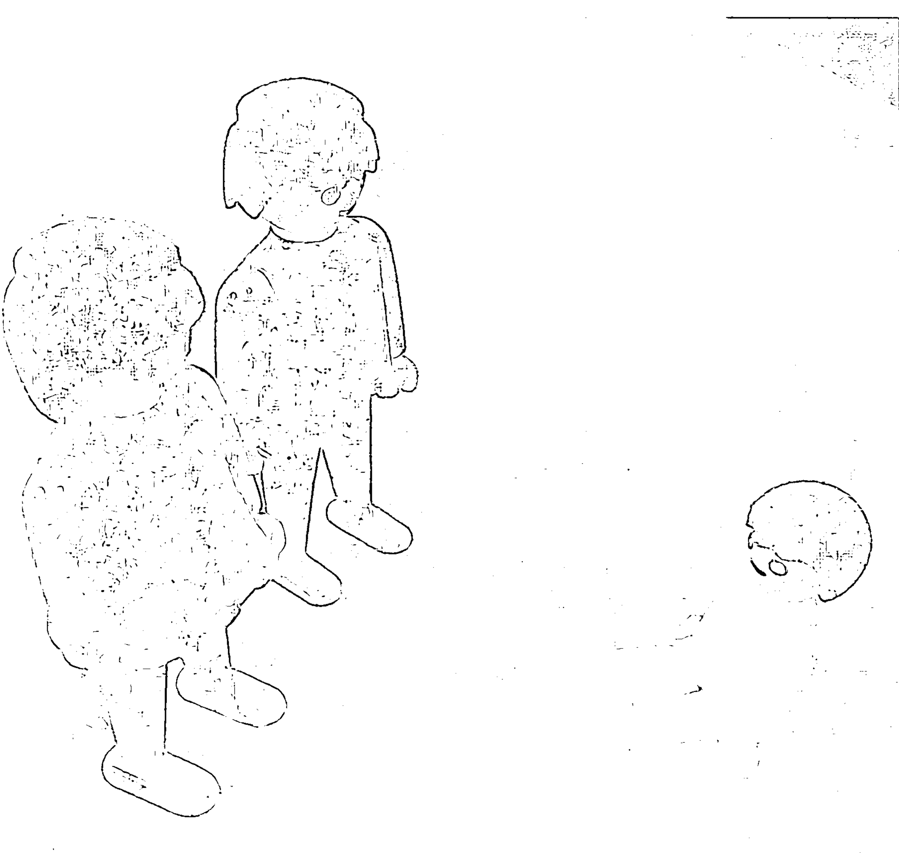

#### 步驟2

接下來請案主看著另一半（本人或人偶），對另一半針對這件事情表達心中的感受，要把這些難過悲傷、憤怒、自責的感受說出來。請排列師注意此時案主可以有情緒，但不要讓案主掉入失控或自艾自憐裡。

可引導案主對另一半說：

> 「親愛的，當初發生這樣的事情，我很難過。」

> 「每次想到這件事，我都很難過。」

> 「當初發生這樣的事，我感到很無助。」

> 「我們兩個都有責任，我們一起來面對好嗎？」

如果案主自己有一些話，也可以允許他／她用自己的方式說出來。

#### 步驟3

對墮胎的孩子表達情感，並且負起自己的責任。請注意此時案主可以有情緒，但避免閉著眼睛狂哭，掉入自艾自憐之中，而有沒有去看到墮胎的孩子。

此時可以讓案主手拿著人偶，去擁抱被墮胎孩子的人偶（圖5-2）。可引導案主對墮胎孩子的人偶說：

> 「親愛的孩子，我是你的爸爸／媽媽。」

> 「對不起，我們把你拿掉了。」

> 「我願意負起全部的責任，你是自由的。」

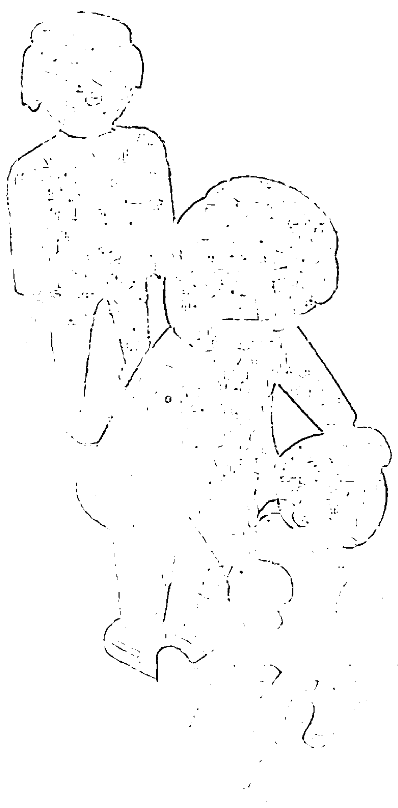

允許案主用自己的方式表達，話不用多，但要真心。如果案主偏了，要把他／她拉回來，拉回到面對孩子，並且為自己負責。

#### 步驟4

在心中給墮胎孩子一個位置，其實這些墮胎孩子最需要的就是父母的承認和接納。

最後祝福孩子們時，可引導案主對墮胎孩子說：「親愛的孩子，在爸爸／媽媽心裡，你永遠會有一個位置。」「我們會做一些好事來紀念你，祝福你平安喜樂，回到生命的源頭。」

## 二、退出父母衝突

### 系統動力

捲入父母的衝突，對我們會有什麼影響？

- （1）孩子有時候為了爸媽的和好會發生一些不好的事情，比如說生病、身體出問題、情緒不穩定，或者發生危險的事，目的就是為了讓爸媽和好。
- （2）影響我們自己對婚姻的看法，有些人甚至會不想結婚。
- （3）有時候孩子會承擔起爸媽的情緒，比如憤怒，而出現對爸媽不尊重的情況。
- （4）甚至有時候會把這些承接而來的情緒，無意識地轉移到自已現在婚姻裡的另一半，造成婚姻的衝突。

### 支持重點

很多人都明白要退出父母之間的衝突，尊重父母的命運，但真正做到是有難度的。因此，支持的重點不僅讓案主在頭腦層面上認知到自已要尊重父母的互動，更要從身體上，心理上及位置上，創造出回歸到自已序位的畫面。

### 步驟要點

#### 步驟1

先把代表孩子自己的人偶，放在爸媽人偶的中間（圖5-3）。請孩子分別對爸媽表達情感（圖5-4）。

此時排列師可以引導案主對他的爸爸、媽媽說：

> 「看到你們兩個吵架，我很難過。」

> 「媽媽我愛你，我也愛爸爸。」

> 「爸爸我愛你，我也愛媽媽。」

#### 步驟2

讓案主自己扶著代表自己的人偶，帶著覺知地，很慢很慢地從爸媽中間的位置慢慢退出來，這個動作要越慢越好，並且要帶著一份全然的覺知（圖5-6）。因為這個動作可以激發案主本身內在的力量，真正讓他從身體的經驗、從他的心裡、從位置的畫面上，開始能夠從爸媽之間的衝突退出來，回歸到孩子的序位。

退出來後引導案主對爸媽說：

> 「親愛的爸爸、媽媽，我接受你們的命運，我尊重你們互動的方式。」

> 「爸爸、媽媽，對不起，我只是你們的孩子，我無法幫你們，我要回到孩子的位置了。」

> 「如果我的命運和你們不一樣，我的婚姻和你們不一樣，請你們祝福我！」

案主帶著覺知慢慢地從爸媽中間的位置退出，最後本身自己扶著人偶，向爸媽鞠躬（圖5-7）。

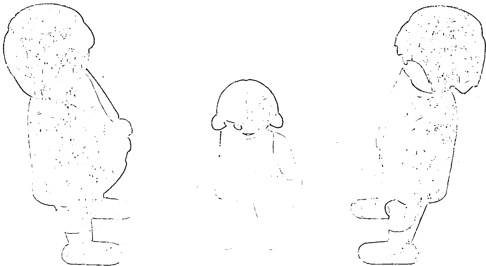

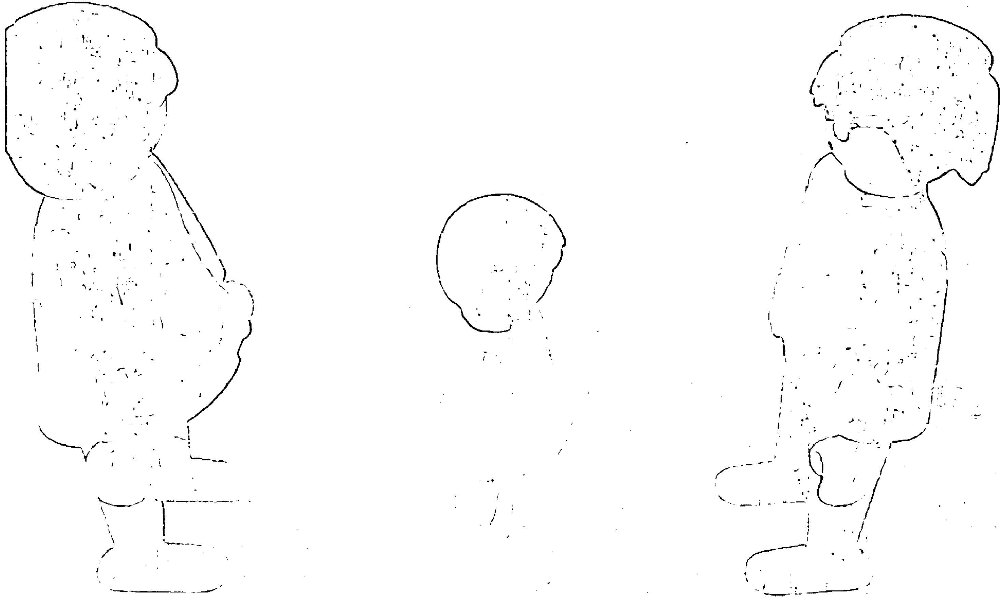

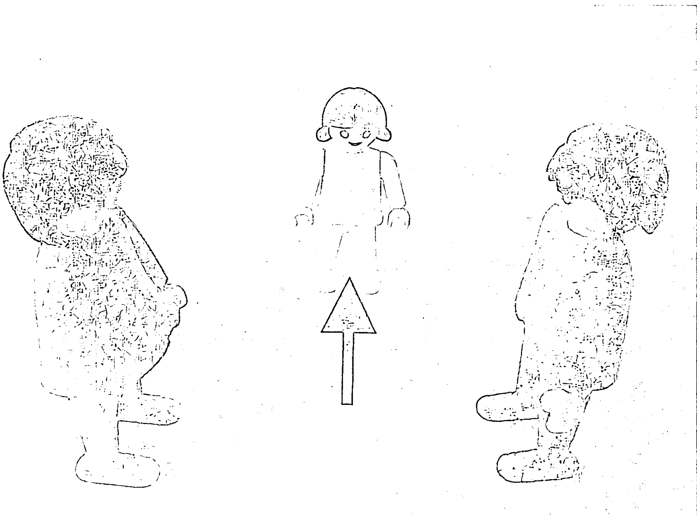

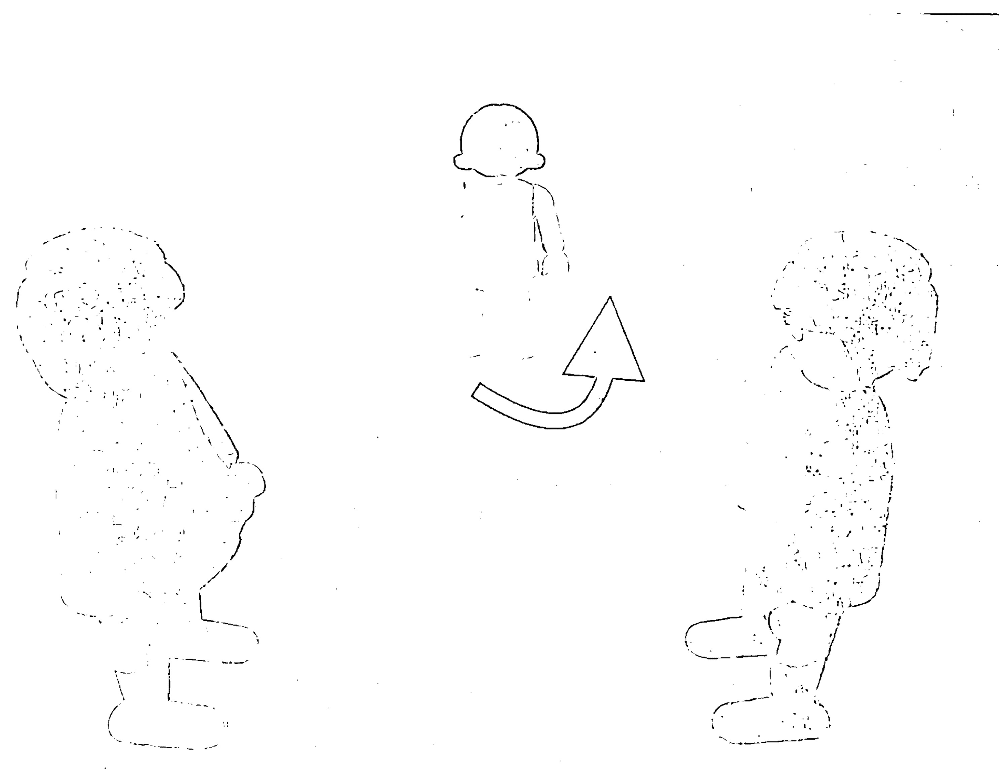

## 三、伴侶分手

### 系統動力

跟前任伴侶沒有好好地告別，常常會發生以下的系統動力：

- （1）影響後面的伴侶關係。後面的伴侶在無意識裡很容易會對前任伴侶忠誠，對身邊的伴侶產生莫名的情緒，嚴重的有可能也跟前任伴侶一樣，發生分手的結果。
- （2）如果與後面的伴侶成立的家庭，有了自己的孩子，我們觀察到其中會有孩子認同了前任的伴侶，而產生對爸爸（或媽媽）的一些情緒，比如憤怒、競爭等。

### 支持重點

承認、負責、心中給位置。

### 步驟要點

#### 步驟1

案主選兩個人偶，一個代表自己，一個代表分手的伴侶，彼此相對。案主看著你過去的伴侶（圖5-8）。

#### 步驟2

案主承認分手的伴侶在心中的位置，以及雙方曾經的付出。

對前任伴侶說：「你是我的第一任伴侶，謝謝你曾經的付出。在我的心裡，永遠會有你的位置。」

#### 步驟3

對於雙方分開這件事情，案主願意承擔起自己的責任，同時把不屬於自己的責任交還給前任伴侶。

對前任伴侶說：「對於我們分開這件事情，我們都有責任，我願意承擔我的責任，同時也把屬於你的責任還給你。」

#### 步驟4

祝福彼此。案主轉身走向自己新的生活（圖5-9）。

對前任伴侶說：「我祝你幸福，也請你祝福我。」

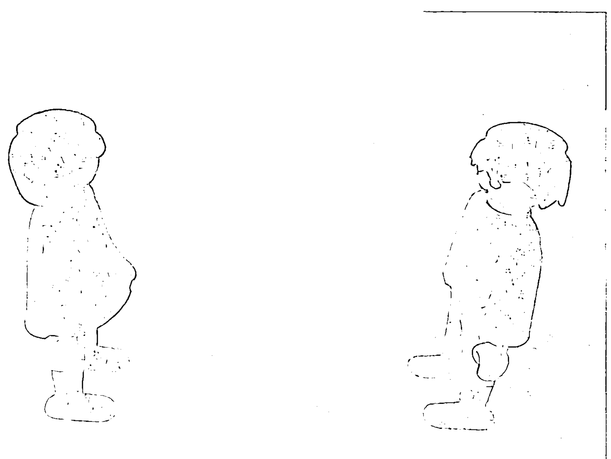

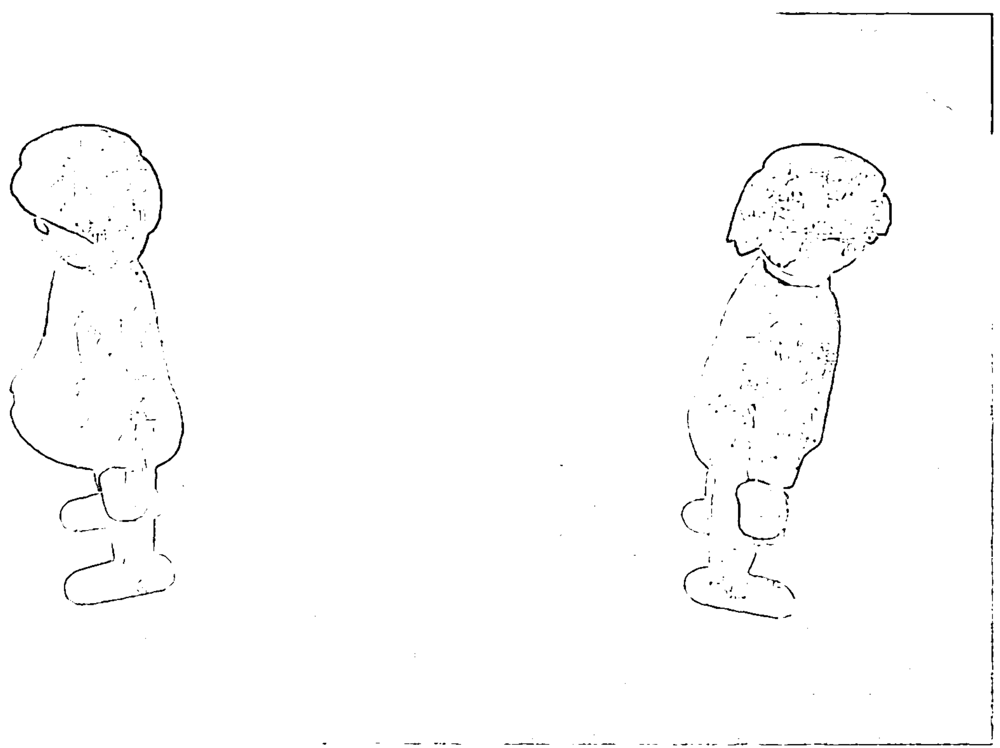

## 四、親人過世

### 系統動力

親人過世如果沒有好好面對，常可能出現以下的影響：

（1）如果親人過世的當時沒有好好表達悲傷，或者親人過世太突然而沒有機會表達，此時情緒好像被凍結住了，就會影響後來的生活，容易產生莫名的情緒，最常見的是憤怒，或把壓抑的情緒無意識地爆發到其他家人或別人身上。這樣的個案需要支持他表達壓抑的悲傷及凍結的驚嚇。

（2）有的案主很捨不得自己的親人死，甚至在潛意識裡要跟著他走，也就是想要跟著死去。當他被這樣的死亡動力牽動時，就會影響他的健康、事業、家庭關係及生命的活力，所做的事很容易朝向死亡的方向移動，甚至有時候會發生生命危險。這樣的個案要引導他「全然」表達悲傷，打開遺憾的心結，並讓他看到過世的親人已經安息，不要再打擾他們了，要讓自己過得更好才是對過世親人的一種成熟的愛。

（3）有些案主的哀傷來源於承接了家族對死亡的悲痛，比如家族裡有人意外死亡，或者是令人難以接受的死亡事件所造成的集體悲傷，這種案例所帶來的影響就是會讓他的生命活力難以發揮，無法真正活出自己的人生，好像在替別人活一樣，甚至難以成立自己的家庭、難以有自己的孩子。案主這時候就要面對家族裡這個特殊的死亡事件，並且尊重他們所發生的事，排列師也要引導案主做一些好事來紀念他們。

### 支持重點

每個個案情況不同，請根據具體情況加以調整。

### 步驟要點

#### 步驟1

選擇兩個人偶：一個代表過世親人，讓他躺在地上；一個代表自己站在旁邊（圖5-10）。引導案主情緒流動，表達深層的悲傷。

比如案主對自己爸爸的去世不能放下，引導案主說出：「爸爸，爸爸，爸爸，我想你。」

#### 步驟2

透過人偶的動作讓案主與過世的親人擁抱，支持案主說出想要說出的話，和解與過世親人間的未竟之事（圖5-11）。

#### 步驟3

請案主將對過世親人的愛轉化為正向的方式，比如引導案主用過世親人希望的方式表達愛的連結，向過世親人承諾自己會好好地活下去。最好有具體的行動建議。

引導案主說：「爸爸，我愛你，現在，我知道了，我不再用痛苦哀傷的方式來愛你，我會用讓自己活得成功、活得快樂的方式來愛你。」

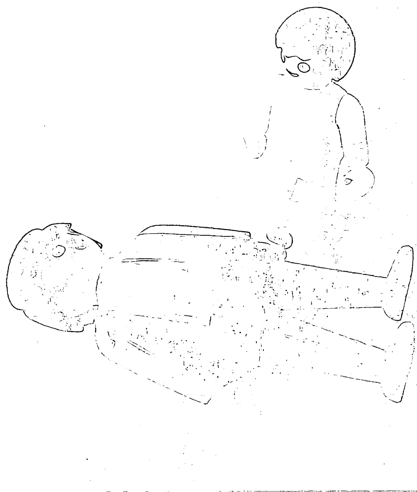

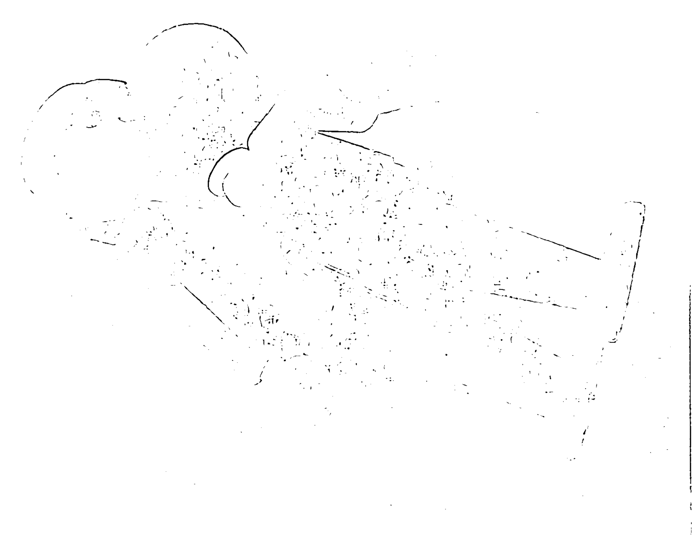

#### 步驟4

請案主與過世親人告別，讓案主站起來，向過世親人鞠躬（圖5-12）。請過世親人好好安息，自己會更有力量面對當下的人生，然後讓案主慢慢後退、轉身，向前跨一步，面向光明的未來（圖5-13）。

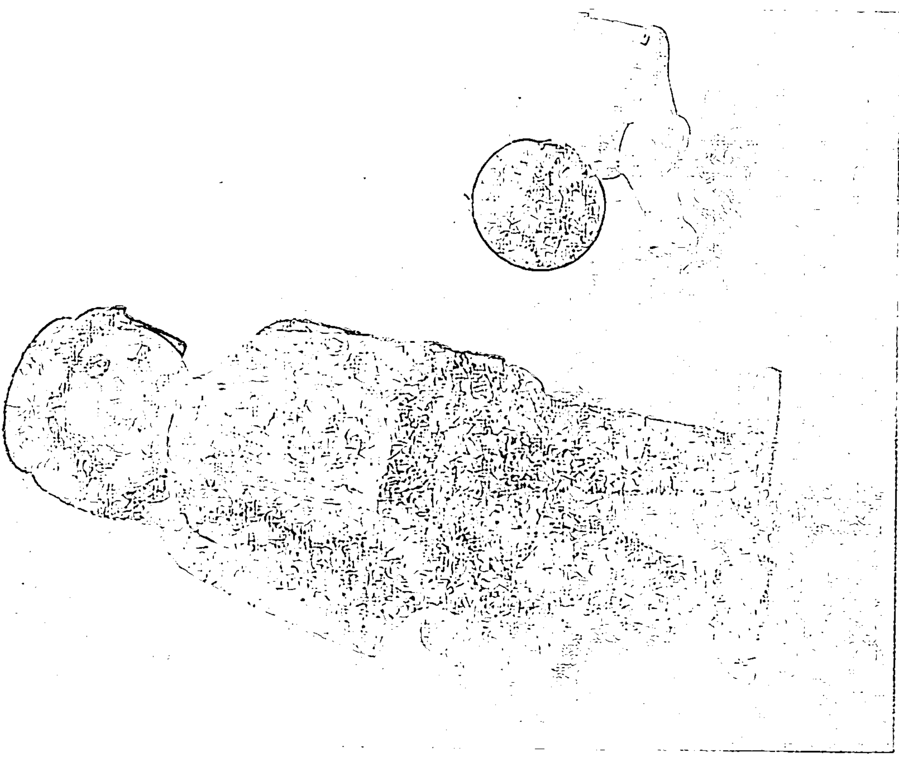

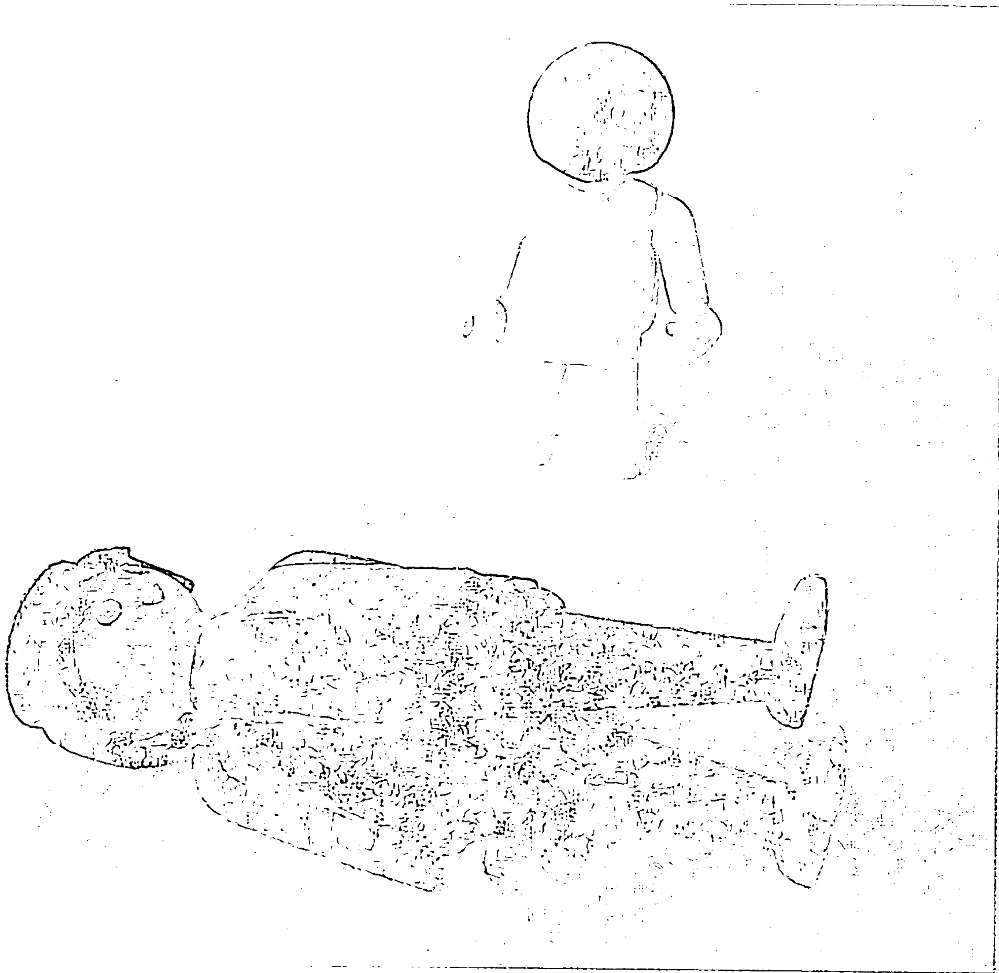

## 五、重男輕女

### 系統動力

重男輕女的家庭常出現的系統動力有：

- （1）基於忠誠，在這樣家庭的女性往往又無意識地跟隨重男輕女的觀念，繼續創造自己重男輕女的家庭，繼續影響後代的命運。
- （2）有些女性會活得像男性一樣，以獲得父母或家族的認可。
- （3）有些女性會很沒自信，自我價值感低落。
- （4）有些女性會難以擁有長期穩定的兩性關係與幸福婚姻。
- （5）有些女性懷孕時知道懷的是女胎就會拿掉，造成更多的遺憾。

### 支持重點

接受自己，請求祝福。排列師不要與案主共同批判或對抗重男輕女的集體意識，而是引導案主接受自己是女性的事實，看到自己的生命價值，並且能夠請求過去女性長輩們的祝福。

### 步驟要點

#### 步驟1

請案主選一個人偶代表自己。

引導案主握著自己的人偶在胸前，對自己說：

> 「我是一個女孩。」

> 「我接受我是一個女孩。我接受我是一個女孩。」

引導案主接受自己是女孩的事實。

#### 步驟2

選擇代表父母的人偶，面對父母，請父母接受自己是女孩（圖5-14）。

此時引導案主對父母說：

> 「親愛的爸爸、媽媽，請接受我是一個女孩。」

> 「親愛的爸爸、媽媽，請接受全然的我。」

> 「親愛的爸爸、媽媽，請以我為榮。」

> 「請允許我榮耀自己的女性特質。」

#### 步驟3

排出家族的女性長輩們，尤其因為重男輕女而付出代價的女性長輩們。讓案主面對她們、看到她們、感謝她們，肯定她們的付出，並請求她們允許自己能夠和她們的命運有所不同（圖5-15）。允許自己能夠不再認同於重男輕女的信念，並能以自己的女性特質為榮。

此時引導案主對女性長輩們說：

> 「親愛的家族的女性長輩們，我尊重你們的命運，我感謝你們為這個家的付出與犧牲，才能夠讓這個家繼續傳承下來，感謝你們。」

> 「親愛的家族的女性長輩們，請允許我接受自己是一個女孩，請祝福我用不同的方式愛這個家。」

> 「如果我不再用重男輕女的方式對待我的孩子，請你們允許我並且祝福我。」

最後,超越於男孩女孩的性別分別,引導案主對她們的女性家族長輩說：

> 「親愛的女性長輩們,請你們看到我這個人,而不是只看到我是一個女孩或男孩,請超越性別的分別,看到我這個人。我愛我自己,我要活出獨特的自己來榮耀自己、榮耀天地、榮耀這個家,這是我愛你們的方式,請你們祝福我。」

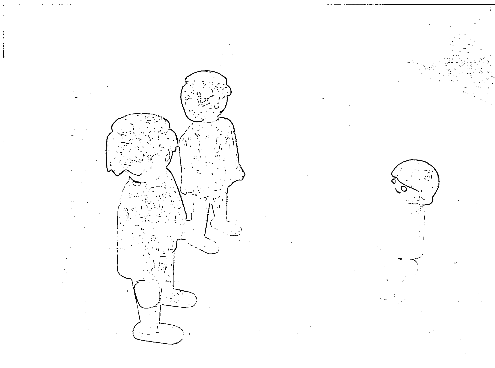

## 六、連結祖先力量，開創美好未來

### 系統動力

當案主缺乏跟父母、背後家族與祖先力量的連結時，它所帶來的系統動力影響會有：

- （1）覺得生命沒有動力，好像做什麼都沒有向前的力量。
- （2）做決定比較猶豫，容易反覆，有時候不知道自己真正要什麼。
- （3）容易出現對人討好的情況，比較害怕表達自己真正的感受。
- （4）覺得孤單，好像只是自己一個人在這個世界。
- （5）容易產生空虛感，或沉溺於某些行爲，例如沉溺電玩、喝酒、賭博，成爲工作狂、購物狂，或罹患暴食症等，有時候會逃避到宗教裡。
- （6）難以進入穩固、長久的伴侶關係，想要維持幸福婚姻會比其他人辛苦。
- （7）有的會不想生孩子，沒有那種想要傳宗接代的感覺；或覺得孩子是一件麻煩事，擔心沒有辦法好好照顧孩子。
- （8）有的會移民，從一個地方又移到另外一個地方，沒有根的感覺。

### 支持重點

透過連結父母、家族與祖先的能量，引導案主將被中斷的能量重新連結，並尊重父母與家族祖先們的命運與所發生的事，帶著深深的尊重回歸序位。讓背後家族的力量不再是一種牽絆，而能夠成為背後一股堅強的支援。透過連結背後的祖先我們也聯繫上生命的源頭、連上了「根」，如此帶著背後的這份支持，能幫助案主更有力量實現自己的人生。

這個排列不限只做一次。每次做，都能有不一樣的收穫。除了可以幫案主做之外，排列師自己本身也可以用人偶做這個排列，幫助自己聯繫上背後祖先以及生命的大力量，支持你面對種種挑戰，實現人生的理想。

### 步驟要點

#### 步驟1

可以請案主選出自己、父母及背後幾代的男性或女性祖先代表，每一個人都有自己的父母，每個人偶的後面都有一對父母，向後推溯，再向後推溯，把他們一個接一個、一代接一代地排列出來（圖5-16）。

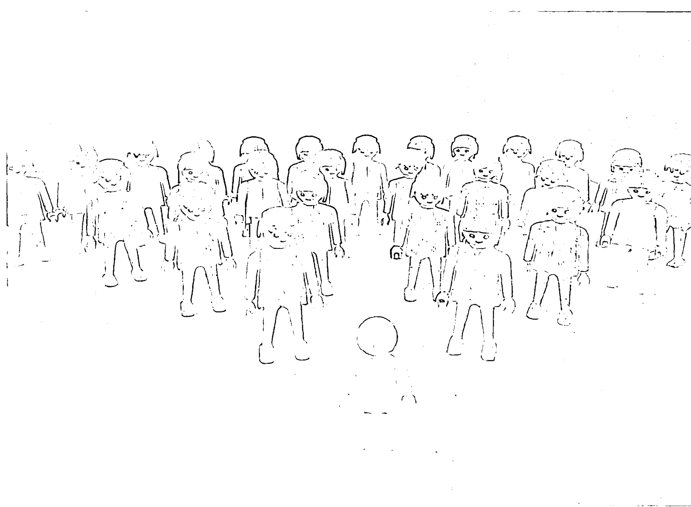

#### 步驟2

請案主扶住代表自己的人偶看著歷代祖先，向他們鞠躬表達尊重與感謝，重新連結家族中的父系與母系的力量（圖5-17）。

此時可引導案主自己對長輩祖先們說出以下的話，或讓案主自己朝向這個方向、說出類似的話：

> 「親愛的爸爸、媽媽們、親愛的祖先們，謝謝你們把生命傳了下來，沒有你們就沒有我，只要你們缺了其中一個，我就不存在於這個世界。」

> 「感謝你們的付出，感謝你們為家族所做的一切，我尊重你們所有人的命運。」

> 「我的身上流著你們的血，感謝你們把許多美好的特質傳承到我身上，我會好好發揮。適合我的，我會把它發揚光大；不適合我的，我會用我自己的方式發揮我的特質，活出我的人生。」

> 「我會用我的成功和幸福來榮耀你們、來感謝你們，我會帶著你們在我背後支持的力量，實現我人生的使命，為這個世界做一些美好的事來報答你們。謝謝你們，我愛你們！」

接著，案主可以用他自己的方式向他們的祖先們表達他的敬意，可以把雙手放在本人自己的心上，可以是鞠躬，也可以是真正的磕頭。然後引導案主把這個畫面放到心裡。

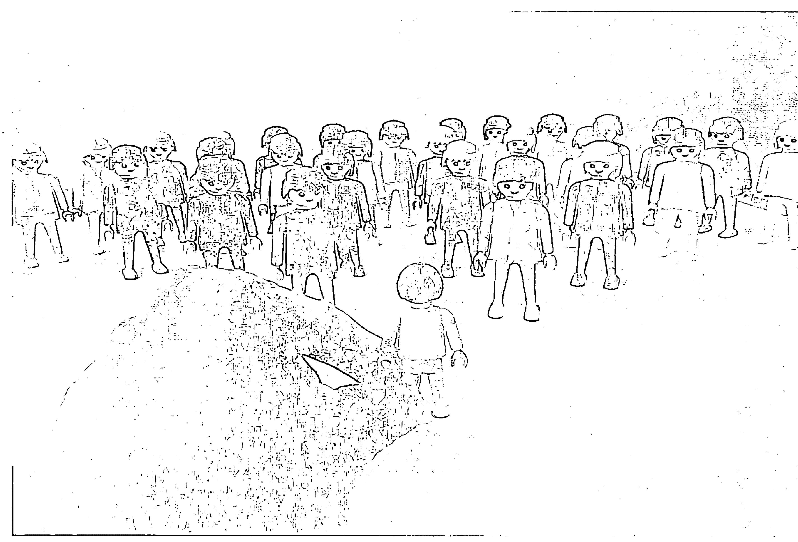

#### 步驟3

請案主將代表自己的人偶轉身，感覺身後有父母的力量，還有祖父母、曾祖父母、歷代祖先的力量在支持自己，看向光明的未來（圖5-18）。

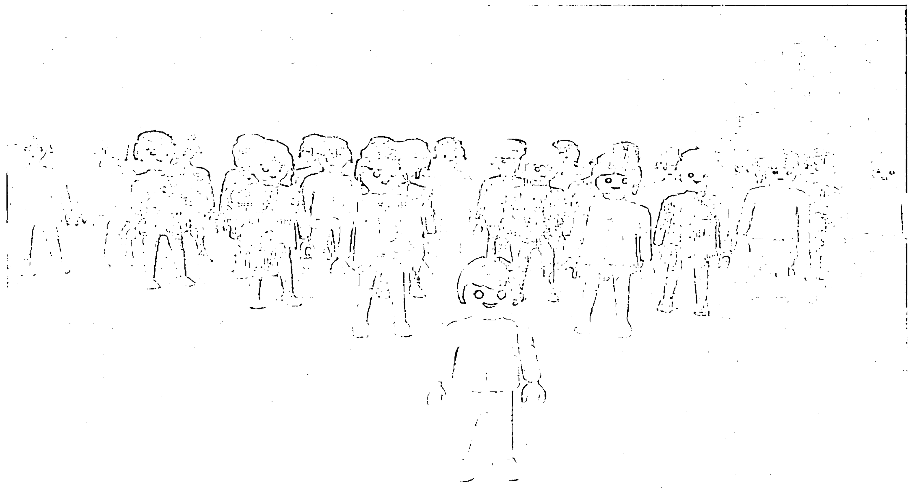

## CHAPTER 6

## 小人偶排列——個案示範與解析

每位資深的排列師都有自己獨特的經驗和操作方式，我從我的個案裡挑選了幾個不同範疇及不同系統動力的案例，讓大家瞭解我是怎麼進行一對一個案排列。並不是說我做的一定是正確的，但是我看到這些案主的改變跟回饋，認為非常值得大家揣摩參考，希望能幫助大家更清楚掌握個案操作的實務，增強對系統動力的認識與感知，未來讓更多的個案因此而受益。

另外，為了保護案主，我把案主身分細節做了修改，其他的部分我們盡量呈現當時操作過程及場域感受。有的案主接受旁邊有受訓學員觀摩，在不影響個案情況下，我會對這些學員提出個案的重點指導與案例分析，這些都是重要的學習參考。

### <案例1>我為什麼沒有力量，不夠擔當？

張經理是個沉著幹練的職業女性，在臺北一家外商擔任高階主管，今年四十歲。

#### 【排列操作】

第一步「起」：建立關係，釐清問題，收集信息，達成共識。

## CHAPTER 6 小人偶排列——個案示範與解析

周老師：「什麼問題？」

張經理：「我非常想做好事情，但是我發現我不夠擔當，力量不足。在工作上，如果我感覺到老闆信任我，我就拚命去做；如果我感覺到老闆對我不認可、不信任，我就什麼都不想做了。我需要別人鼓勵我、推動我，我才有力量向前走。」

周老師：「你的爸媽情況怎麼樣？」

她沉默了片刻，咬了咬脣說：「媽媽懷我的時候，爸媽就吵架鬧離婚。我生下來時，我爸就和我媽離婚了，我是由我媽帶大的。我在五歲時，媽媽有第二段婚姻。但到了我十二歲時，繼父去世了，之後媽媽就沒有再婚了。」

周老師問：「你和爸爸多久碰一次面？」

張經理：「我讀國中的時候，我媽會有意識地讓我去見我爸，後來碰上人生重大事件時，比如讀大學、結婚，也會去見爸爸。大概二、三年會見一次爸爸。近年來，當他生病時我會去陪他。抱著爸爸感覺的很好。現在爸爸已經八十歲了，可能時日不多了。」張經理在說這些的時候，情緒表現異常平靜。

第二步「承」：選擇代表，探索動力，詢問歷史，揭露真相。

周老師對張經理說：「好，現在我們就來探索一下，這裡有一些小人偶，選一個人代表你爸爸，一個人代表你的工作，一個人代表你自己。這些人偶，穿裙子的代表女生，一般的代表男生。」周老師在操作臺上，做一個記號，界定場域範圍。讓張經理按照自己的感覺在場域內排出爸爸、工作和自己的位置。張經理把自己代表排在場域最靠邊的一個角落裡，爸爸排在另一邊的角落裡，和她對面而立。工作代表在場域界限另一邊靠邊的位置，和父女兩人呈三角形站立，背對他們兩個（圖6-1）。

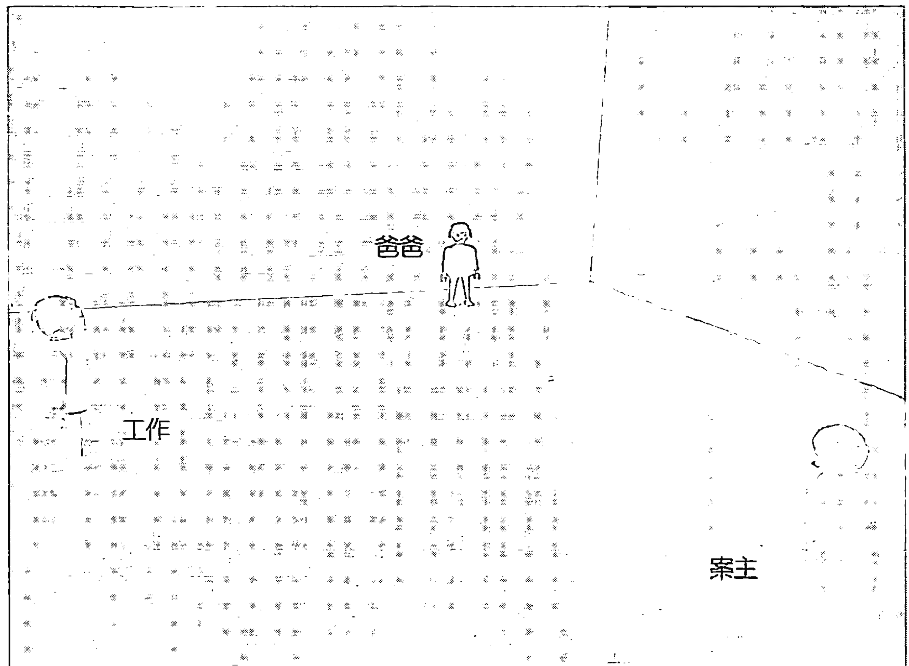

是看到人偶就像看到每個代表的人一樣。看到這些人，我們就可以和這些人連結上。」張經理看著這些代表一個個孤單的樣子，開始眼眶濕潤，流下了淚。

周老師對張經理說：「你看爸爸待在自己的世界，後來他有再婚嗎？」

張經理：「爸媽離婚後，爸爸三十年來一直獨居。」

周老師：「這是一個獨居的家庭。爸爸是單獨一個人，工作是單獨一個人，你也是單獨一個人。」聽到老師這樣說，張經理的眼淚又不自禁地開始流下，看著場域中每一個孤單的人偶。

周老師：「你一直說想要找到一個伴侶，想要結婚，可是心裡卻想要單獨一個人啊！」周老師又問：「你的父親家庭怎麼樣？」

張經理回答：「爺爺奶奶老來得子，他們生下我爸爸時分別是五十多歲、四十歲了，因此爸爸一直害怕自己會成為孤兒，會沒有人養他。爸爸之前有一個姊姊被送養。」

周老師讓張經理找一個人偶作為這個被送的姑姑的代表，讓張經理根據自己的感覺放在一個位置。張經理把姑姑放在爸爸身後（圖6-2）。

周老師對張經理說：「他們都是孤單的人。加入姑姑後，你覺得你爸爸會是什麼反應？你的爸爸會看向她姊姊嗎？」張經理搖搖頭，答道：「以我對爸爸的瞭解，他完全活在過去、活在恐懼和隔離中，他的人情非常淡漠，沒有一個朋友，親人也不認。」周老師轉動爸爸人偶的代表，讓爸爸慢慢地轉身，看向他的姊姊。向張經理問道：「你的姑姑會怎樣呢？」張經理：「我覺得姑姑會抱住爸爸。」

周老師：「我們試試看，好嗎？」周老師讓姑姑的人偶代表雙手抱住爸爸，但張經理卻用手推著爸爸人偶代表的腳往後退。

周老師：「他想往後退，也許你爸爸會壓抑自己的情緒，在你的腦海裡，是這樣的認爲。但也許他真正渴望的是擁抱，就像你渴望他擁抱你一樣，就好像你渴望別人可以擁抱你一樣。」張經理搖頭。

周老師：「你害怕被人擁抱。」張點點頭。

周老師讓爸爸轉身，對姑姑伸出手（圖6-3）。張經理說：「我對姑姑沒有什麼感覺。」周老師：「但是，你把姑姑放在了爸爸身後很近的位置，這是你沒有想到的，但你卻這樣排了。所以，姑姑需要被看見。」

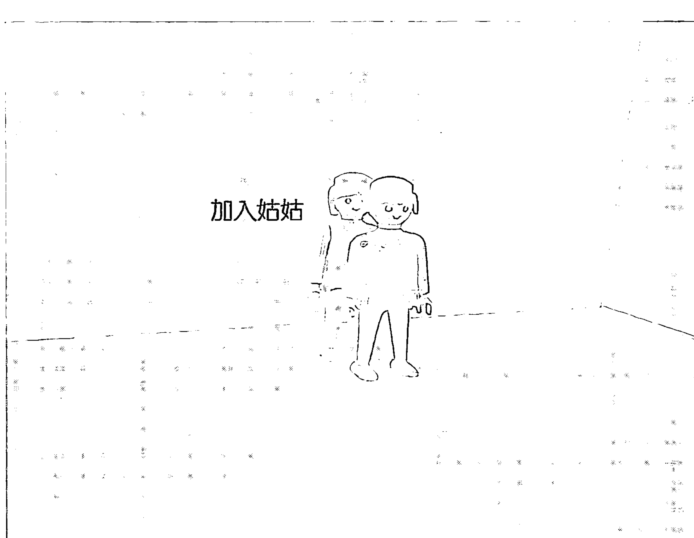

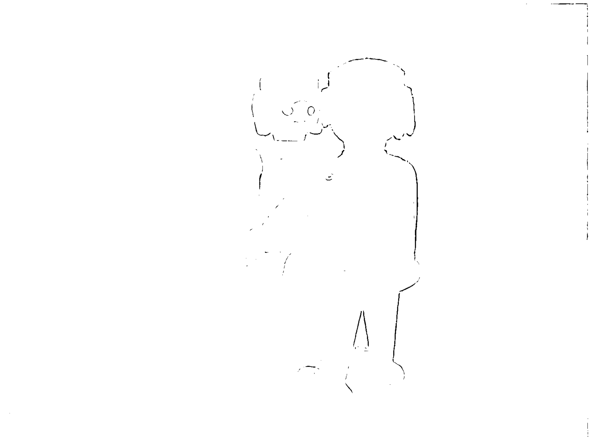

第三步「轉」：尋找解決之道，表達情感，回歸序位的愛。

周老師對張經理說：「現在，你看到這些會怎麼樣做呢？」張經理移動代表自己的人偶很快向前，想靠近爸爸和姑姑。

周老師：「不要太快，所有的移動都要慢慢的，才是心靈的移動。太快會是頭腦的移動。」張慢慢移動自己的代表靠近爸爸，然後，又靠近姑姑，走到姑姑身邊（圖6-4）。

周老師：「是的，靠近姑姑，跟你的姑姑說些話。」

周老師引導張經理說：「姑姑，你被送走了，我可以感受到你的孤單！爸爸被留下來了，但是他也很孤單。」張經理開始情緒激動，哽咽不已，說道：「有時候，我也感到很孤單。」周老師讓姑姑的人偶代表擁抱張經理的人偶代表。張經理情緒更激動起來，開始哭出聲來。周老師站起身：「現在，我來代表你的姑姑。」周老師拿了一塊薄薄的墊子放胸前，站到張經理本人的旁邊，她靠到周老師懷裡就開始放聲哭泣，有委屈、有思念，有壓抑了很久對親人的愛，她的情感開始流動了，喊著：「我再也見不到我姑姑了！」周老師代表張經理的姑姑，一隻手放在她的頭上，一手放在肩上。周老師代表姑姑說：「姑姑想對你說，沒事，沒事。你願意叫我一聲姑姑，我就滿足了。」她又更加放聲痛哭，喊著：「姑姑，姑姑！」然後，在姑姑的懷抱裡盡情地表達這麼多年對姑姑的思念和愛。

事實上，這不只是張經理對姑姑的思念，而是整個家族系統對被送走的姑姑的思念，集體系統的分離悲傷透過她表達出來了。

周老師回到排列師的角色：「你現在深呼吸，把對姑姑的連結吸到心裡面。把它放到你心裡面一個位置。然後跟姑姑說：『有你在我心裡，我們都不孤單。』」

張經理跟隨地說：「有你在我心裡，我們都不孤單」。

周老師代表姑姑說：「我很開心。」接著，周老師和張經理都坐回自己的座位上。她把自己的人偶代表放到爸爸身邊，一起看著姑姑。

周老師：「爸爸有他自己的人生，但你現在陪著爸爸看到姑姑，讓姑姑重新回到這個家中。」她讓姑姑的人偶代表伸出雙手，擁抱他們父女代表。

周老師：「讓他們成為你背後的支援力量，把這個畫面放在你心裡面。現在你知道爸爸和姑姑在你心裡面都有一個位置。同時，他們也都希望你過得好，往前走。」張經理點頭。

第四步「合」：扣回主題，內化過程，回家之後，行動建議。

周老師：「現在，我們讓爸爸和姑姑成為你背後的支援力量，好不好？」周老師把爸爸和姑姑的人偶代表放在張經理的人偶代表後面，問她：「這樣感覺好不好？」

張經理答：「好。」她臉上出現了愉快的笑容。「現在，我想要看我的工作了。」

周老師：「我們看一下『工作』想不想要看你？」周老師用手感知一下工作的人偶代表說道：「哎，很有吸引力，『工作』也很想看你。」然後周老師移動工作的人偶代表，轉身看向張經理的人偶代表：「你看，剛才工作代表是背對他們的，但現在很容易就轉過身了。」對張經理說：「你接下來不管去哪裡工作，公司和部門都會很歡迎你的。」張經理慢慢移動自己的人偶，靠近工作（圖6-5）。周老師提醒她：「往前走，一邊感受著背後的支持力量」

周老師摸著工作的人偶代表，對張經理說：「你知道『工作』想說什麼嗎？它說：『來啊，來啊，太好了，我需要你！』」

張經理笑了：「我想要擁抱『工作』。」

周老師：「很好，可以的。」張經理讓自己的人偶去擁抱工作代表。

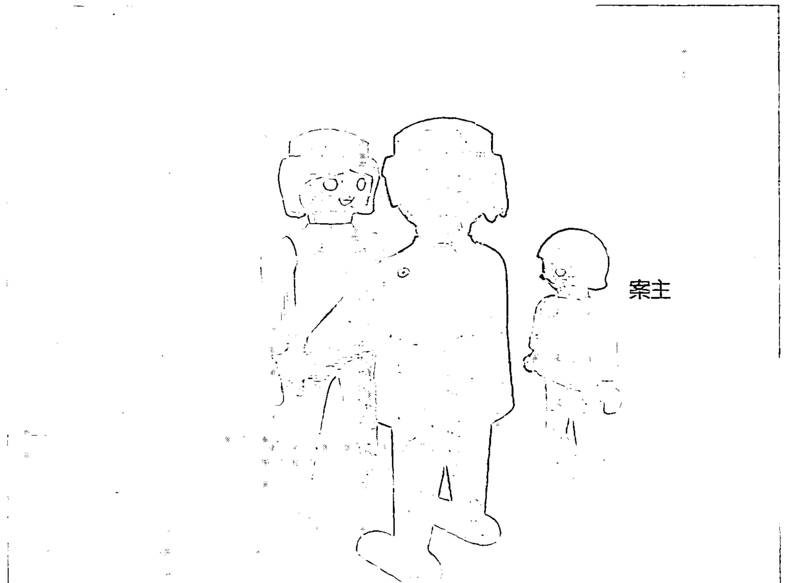

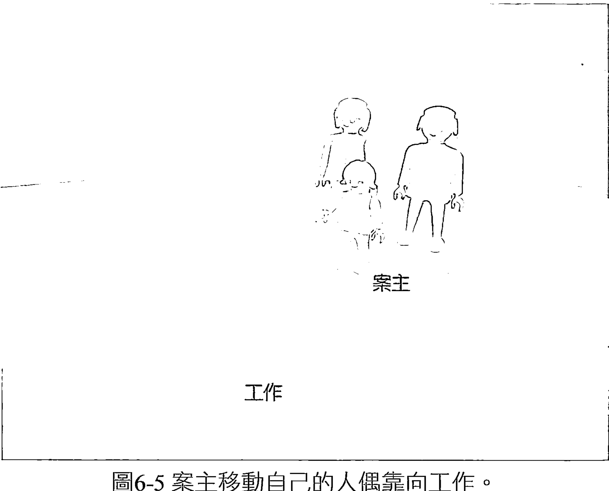

周老師：「現在，把這個畫面放在心裡面，感受著背後的支持的力量。你不是孤單的。你可以把這個排列的畫面拍下來，放在心裡。」張經理點點頭，用心看著這個畫面好一會兒。周老師讓張經理休息，排列告一段落。

對於回家後的行動建議，周老師沒有再給了，因為這個過程已經內化於張經理的內心。因為這份內在的改變，她對未來的工作充滿愛和擔當的力量！

### 【個案追蹤】

幾個月之後，張經理告訴我們她找到了一份她熱愛的工作，工作越來越得心應手，並且她認真地在成長路上繼續學習，提升自我。後來聽說她認識一位男朋友，兩人正準備踏上婚姻的幸福。我們祝福她。

### 【案例解析】

（1）當案主一開始提到工作狀態很受到老闆的認可影響，表示上一輩對她的影響較大，因此排列師試著詢問她與父母的關係，並且收集到她與父親從小就分離了。而案主一開始就把自己與爸爸距離排得很遠，反映出現實的情況；而兩人面對面的相望，表示案主潛意識裡對父親有深深的渴望。

（2）接著詢問父親的家庭歷史時，案主提到父親有一位被送走的姊姊，也就是案主的姑姑。在讓案主為姑姑的代表人偶擺放位置時，案主把姑姑代表放在了爸爸代表的身後。這是一個很特別的信息，也是非常重要的線索，反映了在案主的潛意識裡，爸爸跟隨著被排除的姑姑的動力，都是與家人分離、孤單的人，這也反映了案主的家族系統動力。因此，當排列師把這份家族系統裡深刻的分離感與孤單感反映給案主時，案主的情緒如潰堤般流動出來。這些情緒裡有孩子對父親的思念，有承接被排除的姑姑的悲傷，有家族系統裡集體的分離情緒……這一切深層的情緒與動力都在這麼一個簡短的人偶排列裡清楚地呈現出來。接著，當所有這些情緒能以一種成熟的方式流動，當被排除的姑姑重新被接納，這個家就重新得到了一份完整，而案主本人也因此可以回歸到屬於自己的序位。當她能夠重新跟父親連結，感受父親在背後支援的力量，重新面對工作時，她就不會那麼無意識地把老闆投射成父親而影響到她工作的表現了。

（3）所有這些情緒都儲存在案主家的集體潛意識裡，超越了她頭腦的設定。但是當排列師讓案主用人偶排列出來的時候，這些人偶的位置就把他們家族這些集體潛意識的信息呈現出來了。因此，排列師要信任自己的感知，信任案主的潛意識信息呈現，也要信任畫面的移動，把握住重要的線索。

（4）關於身體接觸：在團體排列中，實際的真人排列常常會有身體上的接觸，這樣可以讓案主的身體與腦細胞產生新的記憶，發揮梳理與重新創造未來的可能性。在人偶排列時，如果排列師覺得案主需要透過身體記憶去工作，排列師也可以作為代表和案主有身體上的接觸，讓案主有機會產生新的身體記憶。透過這個過程，讓案主的腦細胞與身體細胞有重新的整理。但特別需要留意的是，當有身體的接觸時，必須在兩人身體之間放一個墊子或毛毯，以避免誤解。在進行一對一個案時，要有一位助理或工作人員在個案室裡陪伴，以保護自己及案主的身體安全。

### <案例2>為什麼我老是害怕擁有很多錢？

劉總是一位女性企業家，在中國深圳開了一家公司，今年四十一歲，是個智慧與美貌雙全的女人，育有一個九歲的兒子，生活富裕。

### 【排列操作】

第一步「起」：建立關係，釐清問題，收集信息，達成共識。

周老師：「什麼問題？」

劉總：「我很害怕我擁有很多錢。我有很多資源，也有很多機會可以賺很多錢，但我覺得有點錢、夠花就好了。樹大招風，有太多錢也不想讓人知道，也要裝作沒有太多錢的樣子。我怕太有錢了，有人會害我，有人會綁架我的兒子。」

周老師：「好像是說，如果我把錢都捐出去了，就沒有人會害我了。」劉總笑了。周老師又問：「你恐懼、害怕擁有很多錢。你們家裡曾經很有錢的人是誰呢？」

劉總：「據我瞭解的情況並沒有。我父母都是一般人，務農爲生，家裡的確有很多地。當初我爺爺被騙去當兵，參加了國民黨，在國共兩軍對戰時，就繳槍做了戰俘。爺爺說，他從來沒有開槍殺過一個人，他在軍隊裡只是煮飯的。但是由於曾加入國民黨，怕被鬥爭，後來也不敢回家，就一直帶著我爸爸流浪在外。」

周老師：「你們家裡爲什麼會有很多地呢？」

劉總：「爺爺後來去了東北開墾荒地，去那裡的人有很多地。」

周老師：「你爺爺是如何開拓荒地的?」

劉總：「比如去山上，看到這塊地還行，就把這塊地圈起來，把樹砍伐掉。有了很多地之後，就帶著爸爸耕種起這些地。而現在這些地都租出去了。」

周老師：「有了這麼多地，你們就變有錢人嗎?」

劉總說：「沒有，只夠基本生活、平常花費而已。」

第二步「承」：選擇代表，探索動力，詢問歷史，揭露真相。

周老師對劉總說：「現在，找一個人偶代表你自己，一個代表金錢，還有代表你爸爸及媽媽的一對人偶。」劉總找了一個黃色人偶代表自己，紅色人偶代表金錢，一對藍色人偶代表爸爸和媽媽。排列出來的畫面是：自己的人偶代表站在爸爸、媽媽的前面，金錢擺在自己的對面（圖6-6）。

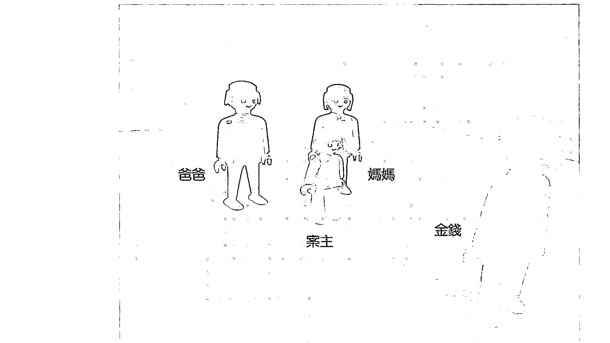

周老師：「你們家裡有人被送走嗎？」

劉總：「我爺爺的親哥哥被過繼送走了。我聽說爺爺當年才十歲，自己坐船要去找他的哥哥，一個好心人還買了一張船票給他。」

周老師讓劉總加入爺爺和那未被送走的堂祖父的人偶代表。劉總把爺爺放在爸爸的身後，把堂祖父放在了金錢的身邊（圖6-7）。

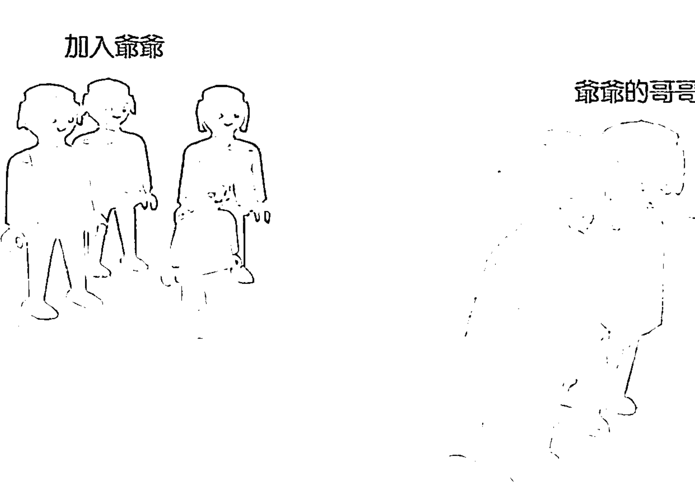

周老師問劉總：「這一群人互望呢！後來你堂祖父到哪裡去了？」

劉總說：「堂祖父有四個兒子，我這些堂伯們有的做縣長，有的開礦、做生意，都過得很好。在爺爺過世前，有聯絡到我這些堂伯們。」

周老師疑惑道：「他們怎麼樣會變得很有錢呢？你把堂祖父放在金錢的旁邊，金錢會有什麼反應呢？堂祖父會有什麼反應？你可以按照你的感覺移動他們。」劉總去摸著小人偶，一邊嘴裡說著：「他們好像關係很好，和金錢的關係很近。」一邊把堂祖父轉身，金錢也轉身，兩個人偶代表靠近地面對面。劉總又說：「但是感覺好像哪裡不對勁，好像有一種拿了別人的東西的感覺。」周老師讓劉總選一個人偶，代表家族中的「不當得利」。劉總把不當得利放在了金錢和堂祖父兩個人偶代表旁邊中間的位置（圖6-8）。

周老師：「當你堂祖父被送走之後，你只聽說後來堂伯們的境況，但並不知道中間的過程，是吧？也許在這裡面有一些不當得利的金錢糾紛。你看到這個畫面，有什麼感覺？」

劉總仔細看著，感知了一會，說道：「就是感覺不應該拿別人的東西。我也不想陷入裡面去。我的堂祖父應該退回去。」周老師移動三個人偶的位置，讓金錢和堂祖父代表都看向不當得利，再問劉總的感覺。劉總說：「我害怕他們會打架。」周老師讓堂祖父退後一些，劉總說感覺好一些。當周老師把不當得利放在金錢和堂祖父中間，劉總則又害怕他們起衝突，並顯露出有些害怕、顫抖的樣子。周老師：「怎麼辦呢？」劉總說：「我也繞過去吧。」周老師鼓勵她試試看。劉總笑了笑，然後推著自己的人偶代表往前靠近，忽然開始哭泣，說道：「我害怕。」周老師問她：「有點想靠近，但又害怕，覺得那裡充滿張力，可是又被吸引。如果『不當得利』會說話，它會說什麼呢？」

劉總：「自私、貪心。」

周老師：「我代表它說這些話，好嗎？」劉總點頭。

周老師代表不當得利說：「你太自私、貪心了，你拿了別人的部分。你太自私、貪心了，你拿了我的部分。」說完後問了劉總：「你覺得堂祖父會是什麼反應？」

劉總：「我覺得他應該道歉。」

周老師問：「你覺得他會願意嗎？」

劉總：「剛才覺得他想，現在又覺得他不想了。」

周老師對其他學員說：「她身上有她的系統的信息，如果她的感知是正確的，可以跟著她的方向走。」

周老師問劉總：「你可以怎麼做？」

劉總：「我替堂祖父道歉。」

周老師：「那樣你就變太大了」

劉總：「那我尊重他們。」

周老師啓發地問道：「你還可以做什麼？」

劉總說：「我做好事。」

周老師再度啓發引導：「在堂祖父想道歉又不想的時候，你該怎麼辦？」

劉總搖搖頭：「不知道。」

周老師對旁聽的學員說：「這就是人們在系統當中的盲點。」

第三步「轉」：尋找解決之道，表達情感，回歸序位的愛。

然後，周老師問劉總：「你願意陪著你的堂祖父去道歉嗎？試試看。」劉總推著自己的人偶代表慢慢靠近堂祖父。

周老師代表不當得利對堂祖父說：「你太貪心了，我不會讓你得逞。」

劉總猶豫：「我感覺我和堂祖父沒有多少連結。畢竟是他們家的獲利，我們家並沒有受益。」

周老師：「但是，你把金錢擺在他的旁邊，就說明肯定是有關係的。他是你爸爸的大伯。當年，家裡為什麼要把堂祖父送走呢？」

劉總：「我曾祖父生了兩個兒子，養不起。」

周老師問：「為什麼是你爺爺被留下來？如果是你的爺爺被送走呢？你現在就完全不一樣了。因為被送走的是你的堂祖父，你的爺爺才會留在家裡，也才有你的爸爸和你。」劉總陷入沉思，她把自己移動到堂祖父身後。

周老師讓不當得利的代表看向劉總的代表，問劉總：「你覺得它會怎麼想？」周老師又找了一個小人偶，代表劉總的金錢，放在劉總的代表身邊，然後讓不當得利的代表看向劉總和她的金錢代表（圖6-9）。

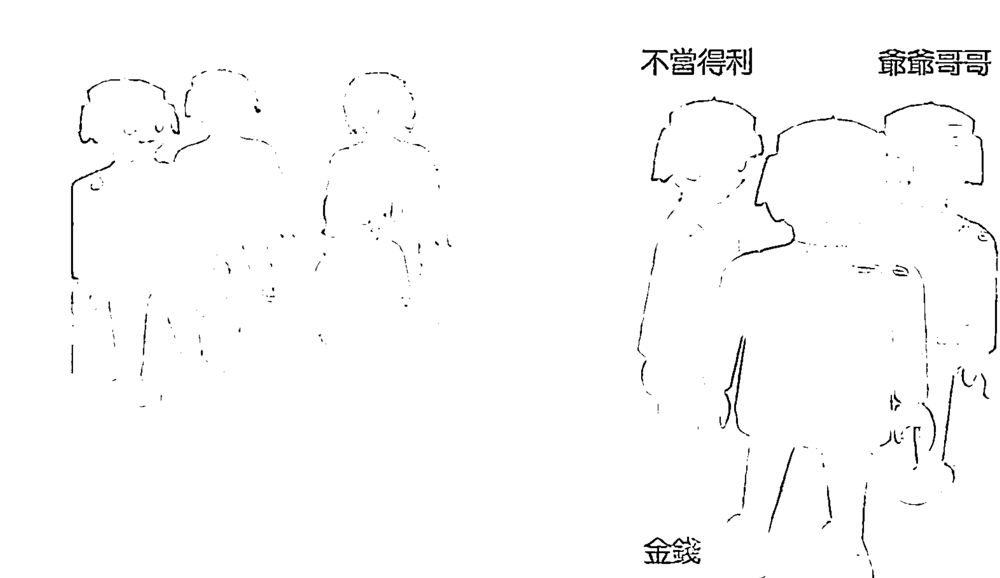

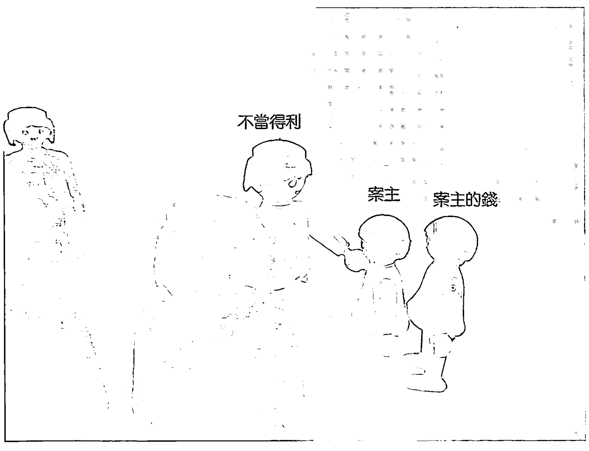

周老師代表不當得利問劉總說：「你帶錢來了嗎？」然後讓不當得利一隻手伸向劉總，把堂祖父的代表移到離金錢更近的位置，讓不當得利面對劉總和她的金錢。問劉總：「怎麼辦？」

劉總很委屈地說：「我辛苦賺的錢，不想給它。」

周老師引導說：「所以怎麼辦？試試看，陪堂祖父一起給它道歉。」

劉總陪著堂祖父一起面對不當得利的代表，真誠地說：「對不起，我的堂祖父拿了屬於你的部分，傷害了你，讓你損失了。我的堂祖父太貪心了，現在我陪著他向你深深地道歉，對不起！」

周老師又引導劉總對堂祖父說：「親愛的堂祖父，你被送走了，你沒有辦法留在家裡，是我爺爺留在家。那時候你一定很辛苦。我害怕有人會來搶我的錢，如果有錢我會變得不安全，我知道這也是你的感受，也是這位長輩的感受，你們都有這樣的感受。求求你也向對方道歉!」

周老師：「我有一個感覺，你堂祖父和不當得利好像關係不是很緊張，不是要打起來的感覺，可能彼此是合夥關係，或是有金錢上的往來，最後結果是不歡而散。而這個『不當得利』的人偶代表的就是那個合夥人。你有聽過相關的故事嗎?」

劉總：「我不清楚那些細節，但我知道在他們那個年代，在東北做生意都有許多類似的事。」

接著，周老師問劉總：「你覺得我們說了這些話，你的堂祖父會是什麼反應?」

劉總：「他好像覺得還可以，也不是特別對不起別人。」

周老師：「他是不是好像願意去看見『不當得利』了?」

劉總點點頭：「是的。」

周老師讓堂祖父對不當得利的代表鞠躬道歉（圖6-10），問劉總感覺怎麼樣。劉總說：「感覺還不錯。」周老師讓劉總也向不當得利的代表鞠躬，讓劉總再說一次「對不起」。這次劉總的鞠躬比較真誠了，她對不當得利的代表真誠地說：「我陪著堂祖父向你道歉。對不起!對不起!對不起!」

此時，金錢的代表開始靠向堂祖父和不當得利的代表。周老師問劉總：「你感覺到什麼?」

劉總：「和平。」

周老師問劉總：「這些錢屬於誰?」

劉總：「大家。」

周老師又問：「你在這裡學到什麼?」

劉總：「雙贏。一起賺錢!」

周老師：「很好，向他們鞠躬吧!」

劉總對他們行三鞠躬禮。

第四步「合」：扣回主題，內化過程，回家之後，行動建議。

周老師對劉總說：「剛剛是你們家族的錢，現在，把屬於你自己的錢拿出來，給你的錢放一個位置。」劉總把代表她的錢的人偶，放在自己代表的對面。

周老師：「現在要加入一個關鍵的人物——和你一起賺錢的人，選一個人偶代表和你合作賺錢的人。」（圖6-11）

周老師問劉總：「你覺得你的合夥人願意和你一起賺錢嗎?」

劉總：「我感覺他願意。」

周老師：「他怎麼會知道你不會把他的部分的錢搶去呢?」

劉總：「我讓他靠錢近一些。我在後面，我支持他。」

周老師：「嗯，你頗有悟性，很有感覺。你覺得你這樣做，他會怎麼樣?」

劉總：「我覺得他想和我一起賺錢。」

最後，周老師讓合夥人退後，和劉總並排站在一起，然後讓他們都退後一些，離金錢稍微遠一些。周老師：「你和合夥人如果離錢太近，你們眼裡只會看到錢，看不清彼此，這樣有所領悟吧?」劉總點點頭。

# 【個案追蹤】

一年後，陸續聽到劉總的信息，她現在越來越忙碌，事業也越來越成功。她認識許多經濟條件與社會地位不錯的朋友，擔任了某知名商會的會長，參與了許多公益活動，自己也過得很開心，也不再聽到她提起對金錢的恐懼了。

# 【案例解析】

(1) 小人偶排列是非常強而有力的助人工具，如果案主夠專注時，透過人偶的位置，就能夠把深層的系統動力呈現出來。因為案主身上一直與他的系統緊密關聯著，出乎我們頭腦的想像。系統的動力一直存在案主身上，所以能夠透過案主把它排列出來。而這些排列出來的位置和方式是很有意義的，尤其是那些出乎意料的位置和地方，一般人是不會那麼排的，而案主卻那麼排了。就像上述的個案，劉總竟然把金錢和堂祖父排在一起。

(2) 除了血緣關係會讓我們形成一個家族系統，非血緣關係事件出現不當得利、讓出位置、生死糾葛事件，也會讓我們與對方形成了一個特別的系統。它不是血緣關係的系統，而是非血緣關係的系統，而這樣的系統所帶來的影響有時候會超越血緣關係系統。從剛才的個案過程就能看到，這個排列不僅探索她對金錢的恐懼，當她排出她的堂祖父在金錢的旁邊，信息就已經非常明顯呈現這與金錢利益糾葛有關。

(3) 對於案主而言，她所需要做的事情是帶著深深的尊重面對這一切，而不是去探索細節，排列師要幫助她回到序位去尊重所發生的事。

（4）然後最重要的就是扣回主題，應用於實際生活。當劉總和合夥人一起面對金錢，劉總想要退後一步時，我們去感覺這個合夥人。這個合夥人也覺得不舒服，他自然想要和劉總一起賺錢，這時候平衡就發生了。劉總讓自己站回來的這個動作，也顯示自己不害怕擁有錢了。劉總的領悟相當重要，從她的回答我們可以知道，她已領悟到要從這件事裡學到什麼了。

# 【問題解答】

回答受訓學員對上述案例的相關問題：

（1）當一家人都看向錢時，為什麼會問到家裡有被送養出去的人呢？

一家人排在一起，金錢在一家人的對面。一家人一起看向錢時，有可能就有被送養出去的人或是和他們家人對立的人。然後我們可以詢問家庭的歷史，並且把那個人加進來做一個測試，來驗證我們的感知與假設是否正確。

（2）排列師怎麼感知到的，「不當得利」和堂祖父沒有很強烈的情緒或衝突？

排列師根據案主對這起不當得利的感覺並不是很恐懼，然後加上自己的感知。排列師只要能夠專注敞開自己，就像團體排列代表一樣，是可以感覺到這些信息的。此外，要多累積個案排列，並多做靜心，這樣就能夠提升你的感知能力。

(3) 老師為什麼會問她，家裡誰比較有錢？

她對金錢有莫名的恐懼，而莫名的恐懼來源一是個人經歷，比如自己有錢之後發生過不好的事情；二個是系統動力，比如家族裡有人很有錢，然後有什麼不好的事情發生。因為沒有聽劉總說起個人曾在有錢之後發生過什麼不好的事情，所以，我就直接問家裡誰比較有錢，這是系統動力部分。

# <案例3>逃避事業，逃避成為男人
——頸椎問題的背後

來自英國的Jones是銷售汽車的業務人員，今年三十七歲，參加過許多心靈成長課程。他到處上課是爲了療癒他童年被媽媽虐待的經驗。他看起來身體強壯，像個朝氣十足、時尚前衛的型男，很多人可能看不出來他的頸椎病已經困擾他二十多年了。

# 【排列操作】

第一步「起」：建立關係，釐清問題，收集信息，達成共識。

周老師：「你幾歲了？」

Jones：「三十七歲。」

周老師：「你有孩子嗎？」

Jones：「有一個孩子，曾經墮胎過一個。」

周老師：「你的婚姻狀況？」

Jones：「離過兩次。現在是第三次婚姻。」

周老師：「你的議題是什麼？」

Jones：「身體健康方面的。」

周老師：「身體具體是什麼狀況？」

Jones：「我的頸椎有兩節突出，已經有二十多年了，醫師說這輩子要好是不可能的。」

周老師：「做排列不是讓你的病好，但可以讓你心裡的結打開，更能去面對疾病。透過排列來支持，身心結合，治療效果會更好。」

周老師問Jones：「在你的頸椎病之前，有沒有發生特別的事情？」

Jones：「我小時候玩雲霄飛車時受傷過，傷到自己，脖子痛得厲害。」

周老師：「看來是刺激性的活動造成。按照我做中醫的經驗，這個病可以治，我會介紹相關的醫生來幫你。我在這裡給你系統與心理的支持，從心理層面來看，頸椎問題往往是想要控制，害怕自己做不好，想抓住自己的情緒感受。」

第二步「承」：選擇代表，探索動力，詢問歷史，揭露真相。

周老師讓 Jones 找四個人偶，分別代表爸爸、媽媽、自己、頸椎問題。Jones 找出三個白色人偶，分別代表爸爸、媽媽和自己。父母代表並排在一起，好像關係很親密的様子；自己則與爸爸、媽媽相對而站。至於，藍色小人偶則是頸椎問題的代表，站在自己的側邊（圖6-12）。

周老師：「你要感覺一下爸媽的關係、爸媽和你的關係，以及距離遠近。不是根據你理想中的様子來排，而是依照你自己心裡的感覺。」Jones 調整了一下自己頸椎問題的代表，放在了自己的正後面。

老師：「你爸媽關係好嗎？」Jones 點點頭。

老師：「如果你繼續生這個病，你會得到什麼好處？」

Jones：「關注、逃避。」

周老師：「你在逃避什麼？」

Jones：「問題。」

周老師：「你在逃避什麼問題？」Jones 沉默許久，好像不知道從哪裡說起。

周老師：「你現在正面臨的，你最擔心的事情是什麼？」

Jones：「事業。」

老師找了一個人偶做事業的代表，讓 Jones 給他一個位置。Jones 把這個事業代表放在了爸媽代表的身後還有一段距離的地方。爸爸、媽媽好像一堵牆，就擋在了 Jones 和事業代表之間（圖6-13）。

第三步「轉」：尋找解決之道，表達情感，回歸序位的愛。

老師觸摸感知爸媽和頸椎問題的代表，對 Jones 說：「你已經在爸媽關係裡待太久了，你不能一直在裡面，逃避你的事業。你看到你的事業在爸媽的身後，你自己都知道。你的病只是拉著你，對你不是大問題。你要來到事業這裡，這才是最重要的。你在這情緒裡面太久，時間長就會爛掉。情緒會給我們一種感受，但如果我們太沉浸在感受裡是會上癮的，停留在感受裡是沒有辦法修成正果的。因為感受來來去去、有好有壞，要把感受轉化為成長的動力，這樣才能夠有所成就。所以，沒有人可以把你從感受裡拉出來，一切都是你自己的決定。所以，你想要怎麼樣，你知道嗎?」

Jones：「走出來。」

周老師：「是的。你在情緒、感受、情感上已學夠了，你需要走出來。這是你媽媽以前的狀態，雖然你是用比較好的方式在經歷，但你的方式還是停留在課堂裡，還是一樣在繞。現在，你要跨出去了，要從感受裡走出來。這樣，你才能用在這裡學到的來幫到自己。你從學習畢業之後，就好好去開創事業，做你的事情。暫時不要再去上任何課程。等你事業有具體成果，想要再更上一層樓，可以再回到我的課堂裡來學習。」

老師找了五個人偶代表曾經教過他的老師們，排在 Jones 的側邊前方（圖6-14），對 Jones 說：「你的爸媽已經很好，不要再期待他們更好了。這些老師，也不是完美的老師，不要在老師身上要求得到你爸媽給你的更多關注，這樣我們就無法真正成爲自己。至少未來三年，不要再上任何課，全心全意做事業，和老婆好好過日子，她是個很有愛的女人，但缺乏安全感。你不要再多說什麼，關鍵是做。好嗎？來吧，站起來，告別吧!」

Jones從座位上站起來，退後幾步，面對父母的代表。周老師：「告別不是不見，是與渴求爸媽關注的感受告別。你可以閉上眼睛，想像你爸媽在前面。」Jones 自己跪了下來，給父母磕頭。周老師引導他：「你過去所有的社會經歷、課堂經歷、與人互動的經歷，都很珍貴，你現在要整合起來出成果了。這些都是你與衆不同的經歷。」

Jones 跟著老師對爸媽說：「爸媽，謝謝你們，你們給我的關注已經足夠了，你們給我的關注已經足夠了，你們給我的關注已經足夠了。」Jones 眼眶紅潤，語氣有一點激動，繼續說道：「你們給我的關注已經足夠我去開創我的事業、我的婚姻、我的人生。你們給我的關注已經足夠，接下來是我自己的人生。謝謝你們！我現在要跟這種要求關注的感受告別了。再見了。」Jones 跟父母慢慢地磕頭告別，從他非常緩慢慎重的動作裡可以感受到他心中真的在做告別。

老師再次引導 Jones 看著曾經幫助過他、教導過他的老師們，對 Jones 說：「在你心中，特別想到哪幾位老師，就在心中謝謝他們，一個個謝謝他們。」Jones 閉上眼睛，嘴裡若有所言地對一個個老師說話、磕頭告別。老師引導 Jones 說：「謝謝你們的教導，我已經足夠強壯了，我可以去面對我的人生，去開創我的事業了。你們給我關注已經足夠了，原諒我從你們身上尋找完美父母，你們給我的關注與教導已經足夠了，我要去開創我的人生了。」Jones 向所有教導過他的老師們磕頭。

第四步「合」：扣回主題，內化過程，回家之後，行動建議。

周老師拍拍 Jones 的肩膀說：「你看起來像男人了。好，看看你的頸椎病的代表，對它說謝謝。」Jones 看著自己的頸椎問題的人偶代表說：「謝謝你！讓你受苦了，我的脖子！我現在不用那麼緊張了。我不用擔心我做不好了。我長大了！」（圖6-15）

當 Jones 有所領悟之後，接著老師又問 Jones：「小時候，爸媽怎麼叫你？」

Jones：「長頸鹿。」

老師引導 Jones 對自己說：「長頸鹿，謝謝你，謝謝你活下來，謝謝你這麼堅強。我會照顧好自己的身體，你不用害怕。我把屬於你的感受放在我的過去，你是我的過去。我會好好照顧我的身體，找到好的醫生。謝謝你了，長頸鹿，再見了！」

老師推著 Jones 的人偶代表往前，從爸媽側邊經過，靠近事業的代表，問 Jones：「這樣做，你願意嗎？」

Jones：「願意。」

接著，老師讓 Jones 自己推著自己的人偶代表，Jones 慢慢地、一步步地更加靠近事業，面對著事業（圖6-16）。

周老師：「告訴你的事業一句話。」Jones 說：「我愛你。」周老師：「用英文說一句話，I am ready（我已經準備好了）！」Jones 說：「I am ready.」

【個案追蹤】

一年之後，有人邀請我到 Jones 的英國故鄉去帶領工作坊。他過來當志工幫忙，並且告訴我，他這段時間努力開創他的事業，把精力都放在事業上，並且得到一點成績了。他很感謝我當時堅決地要他不要再繼續上任何身心靈課程，否則按照他過去的經驗，他會繼續一個課接著另一個課不停地上，卻沒有實際行動。現在的他真正成為一個男人了，腳踏實地，一步一步地經營自己的事業與婚姻，為自己的人生負起責任來。我相信將來一定會有許多有像他類似經驗的人，可以從他這裡得到幫助。

# 【案例解析】

上述的個案，我與他有一點私交，但如果是在平常聊天的場合，我們說的話他不一定會聽進去。在一個這樣特別設置的排列下，就有讓他聽進去的机会，得到跳躍的突破。所以，對人的瞭解與觀察不是死的。平時對一個人的觀察在一對一排列時就可以派上用場，這時候你說的話他較容易聽。還有一些私密的話題，用一對一排列也很方便。在你進行一對一排列操作時，這就是你的場子，你要強而有力地維護好，你的權威是用來服務的，這是你可以支援到人的地方。

剛開始案主排出來是這樣一種狀況：他的頸椎病在他的身後，他選了一個小孩人偶做他的疾病代表，就說明這個症狀和他小時候的經歷有關；而把疾病排在身後，又好像疾病在拉扯他。

接下來就像在做團體的系統排列，我進入代表的角色，我用手碰觸人偶，感受代表的感受。我感受到案主自己內在的狀況是在轉呀轉，他的症狀也在轉呀轉。爸爸想要往後倒，媽媽和症狀有些類似。我之前就瞭解到他的媽媽過得很辛苦，他和媽媽連結很深。

他的自省能力很好。我問他：「生病想要得到什麼好處？」他回答：「關注、逃避。」我問他：「目前最擔心的什麼？」這個答案就是他要逃避的。我準備了一個事業的代表，要他自己排，其實我心裡已經知道答案了，但我要讓他自己去回答、去排列，讓他自己去面對，這樣他才會自己生出力量。

接下來在「轉」的階段，他只是想在老師身上投射對完美父母的期待。所以我引導他感謝父母、感謝老師。這裡面要他告別的感受指的是孩子要求關注的感受，是一種低層次的歸屬感。所以我給他說了重話，那就是：父母給他的、老師給他的已經足夠了，足夠讓他去開創事業了，要把它真正用起來，不要再去上課了。我希望成為終結者。我們是在做教育，不是在賣糖果或嗎啡。我們要真正幫到他。

我們在這裡做的每一步都有對人性的瞭解為基礎，有系統觀念為基礎，不是憑空、憑感覺，這樣我們才可以一步步幫到人。

# <案例4>如何面對伴侶失和、外遇及墮胎的孩子?

艷麗是一家企業的高階主管，四十多歲，做事俐落，管人也不馬虎。但是近一年來，遇到了夫妻問題，心中有一個坎一直過不去。

# 【排列操作】

第一步「起」：建立關係，釐清問題，收集信息，達成共識。

周老師問艷麗：「什麼議題？」

艷麗：「和先生的互動有問題。」

周老師：「具體是怎麼樣？」

艷麗平靜地說：「兩年前的關係還可以。後來我公司較忙，又到處學習，他也支持。我可能忽略他了，於是他有了外遇，並和那女人開了一間公司。後來我才知道了這事。」

周老師問：「這事有多久了？」

艷麗回答：「去年過年的時候，我們還一起返鄉過年。去年五月份，外遇事件爆發。」

（艷麗表情生動，越說越起勁）「我先生是一家企業的總經理，外遇事件會影響他的前途和聲譽。我要他好好處理，但他總是說一句話就離開了，不理我。我問他有什麼打算，他說他還沒有想好，考慮這個問題就頭疼。我也不知道他是什麼意思。」

周老師：「關於他的外遇事件，你有什麼反應？」

艷麗很平穩地說：「我很生氣。」

周老師微笑地說：「但你說得津津有味，看起來不像生氣的樣子。」

艷麗：「每次他說要回家，我就很害怕；他要離開時，我又捨不得。」

周老師：「你不想和他離婚？」

艷麗：「我也不知道到底是想離還是不想離。我兒子不願意我們離婚。」一說起兒子，艷麗開始眼圈發紅，啜泣起來。

周老師：「你說起兒子的時候比較有感覺，說到老公好像沒什麼感覺。」又問艷麗：「你的兒子多大了？」

艷麗：「二十二歲。」

周老師：「有女朋友嗎？」

艷麗：「他有女朋友了。兒子說他的女朋友很像我一樣善良。我不想他找和我一樣的女人。」然後又說：「我想起來，我老公說過一句話，他說我們的事情和那個女人無關，他說是我們全家人都不喜歡他。」

# 第二步「承」：選擇代表，探索動力，詢問歷史，揭露真相。

周老師：「現在找出三個人偶，代表你自己、兒子、老公，憑你的感覺排出他們的位置，越仔細、越精確越好，注意面對的方向、距離遠近。」艷麗非常仔細認真地排出了他們一家三口的位置。老公在左邊，面朝前。自己在右邊，距離老公很遠的地方，也面朝前。兒子在爸爸、媽媽的中間，比較靠近媽媽的位置，也是面朝前（圖6-17）。

周老師：「你和老公只有這一個孩子嗎？」

艷麗：「在兒子之前，有兩個墮胎的孩子；在兒子之後，又有三個墮胎的孩子。」

周老師：「找出五個墮胎的孩子，排出他們的位置。」艷麗找出五個人偶代表墮胎的孩子，開始忍不住哭泣，用手撫摸著一個個孩子。

周老師：「讓他們坐下來。」艷麗抽泣著，顫抖地讓孩子們一個一個坐下來，全部坐在自己代表的前面，圍成半圓，圍繞著自己的代表（圖6-18），然後泣不成聲。

周老師：「看來這個事情是你獨自面對。你先生呢？你和先生聊過墮胎孩子的事情嗎？」

艷麗：「我跟他說過，想要去寺院超度，為孩子做善事。他很少表達，總是順從我。」

周老師：「對於墮胎的事，如果你沒有和先生聊聊感受，只是做表面的儀式，只是讓你個人安心。夫妻並沒有共同面對這個事情，沒有交流心裡的感受，夫妻關係絕對就疏遠了，然後外遇就有可能發生。因為每一次墮胎就會切斷一次關係，你們已經切斷五次了。」

艷麗：「我先生總是聽不進去，只是順從我做儀式，不用心。他說他的心回不來了。」

周老師：「他有他的狀況，他在做他的努力，但覺得別人不瞭解他，他需要別人更去瞭解他、理解他、感受他。」

艷麗：「有一天，他說要和我辦離婚手續，我不同意。因為他告訴我他外遇的事已經有人在傳了，會影響到他的事業了，他可能覺得如果和我離婚，就可以告個段落。他說要我放了他，否則他對我的好印象就都沒有了。我告訴他，你是在情緒中，一切都會過去。如果你不是在情緒中，你真要離婚，我也會簽字。」

周老師感受了一下先生代表，然後說：「你的先生好像被困住了，無法動彈。當我們沒有面對，就會有誘惑、外遇的發生。他也知道外遇對他沒有好的作用，對他的事業沒有好的影響。你要去瞭解他內心的感受。從現在開始，你要知道他的內在有很多的壓抑、很大的壓力，他自己僵在那裡，逃避這一切，就被其他的事情困住了。這是一個過程，想要過這個坎，就要和他交流感受，要問他的感覺、他的感受。」

艷麗哭著說：「我告訴他一切都會過去。他說你放心，我沒有牢獄之災，你照顧好自己和孩子就好。」

周老師：「你這麼去面對、表達出情緒，是很好的。但接下來，你不要困在這裡面，好嗎？你接下來的方向是轉向先生，和他多聊聊他的感受，適當時機再交流關於墮胎孩子的感受。」

## 第三步「轉」：尋找解決之道，表達情感，回歸序位的愛。

接著周老師把艷麗的代表轉向老公代表，問艷麗：「我這樣做，你什麼感受？」並讓兒子的代表也轉身，面對爸爸的代表。

艷麗：「我兒子說他恨他爸爸不仗義，分不清輕重。我兒子太懂事了。」

周老師：「你轉身面對老公，也有一部分是因爲你的兒子，你愛你的兒子。你看你的兒子都站在你的前面面對爸爸了。但你要自己面對。」

艷麗：「我兒子有一次說他要打他爸爸，為我出氣。」

周老師引導艷麗：「進入你的人偶角色，看著兒子的代表，叫他的名字，告訴兒子：『謝謝你想幫媽媽，謝謝你安慰了我。我曾經很依賴你，我把注意力都放在你身上了，因為我自己逃避面對我和你爸爸的事情。現在我自己來面對，你不應該打你的爸爸。』」艷麗跟著說了。然後，周老師把孩子的代表移動到旁邊一點點，讓艷麗來面對老公。

周老師對艷麗說：「你兒子很愛你。這一步很重要，你要自己來走，讓你的兒子離開，回到屬於自己的位置，你要自己來面對。如果你不往老公那裡走，兒子就會陪你一輩子。」艷麗哭著移動自己的代表靠前一些，卻動不了，開始無力地哭泣。

周老師：「你兒子已經二十二歲了，他有自己的人生，無法永遠保護你。否則，他就會找一個像你一樣的女朋友，而他的女朋友一輩子只能在一邊觀望。你還是可以像媽媽一樣愛他，不用和他分開，但要讓他回到兒子的位置。」

艷麗對兒子說：「兒子，你不要管我們，你不要生你爸爸的氣了。媽媽會堅強去面對，我會好好和你的爸爸說，這是我們的事。」

周老師：「重點不是要他『不要』做什麼，而是你『要』做什麼。這樣孩子就會回歸位置、有力量。再一次，真正用心地讓孩子可以感受到。」

艷麗再用心地說：「兒子，媽媽自己會堅強去面對，我會好好和你的爸爸好好談，這是我們的事。」

老師觸摸先生的代表，感受到：「我覺得老公現在可以轉身面對你了。」

艷麗：「我對他很生氣。」

周老師：「是的，當然。他對他自己也很生氣。他父母家怎麼樣？」

艷麗：「他父母都去世得早，六十多歲就一一去世了。」

老師在先生代表的背後排出他的父母、內外祖父母的代表（圖6-19）。

周老師：「把他家人加進來，你好像就願意接近他了。」

艷麗：「是的，他的家人人都很好。」

## 第四步「合」：扣回主題，內化過程，回家之後，行動建議。

周老師：「當我把他家人加進來，他就有力量來源了。你也有力量源泉，可以透過你可以幫到他。」老師移動艷麗的人偶靠近老公一些。

周老師：「老公這個家族是你力量的來源，也是你兒子力量的來源。」老師把兒子代表也移動過來一些。並引導艷麗說：「來，扶住你自己，看著他的爸媽，看著他的家族，說道：『爸媽，爺爺奶奶，外公外婆，我是你們家的媳婦。我的先生，也就是你們的兒子、子孫有些狀況，我會站在我的位置支援他，也請你們支持我，我們一起幫他度過難關。』這段話多說幾次。」

艷麗重複說了幾次後，她對老公的代表說道：「我會陪你一起度過難關，你的所有家人們、兒子都會陪你度過難關，你的爸媽也會陪你一起度過難關。」

周老師：「試著靠近先生。對他說：『我會和你一起，照顧好爸媽。』」

艷麗依言照說：「我會和你一起，照顧好爸媽。」

老師看著艷麗，謹慎地告訴她：「回去之後，你不要和先生正面衝突，他會抗拒這些保護。他壓抑太多，有時候會失控，你要慢慢從側面去和他建立關係。他的家族是你的力量來源，多和他的家人聯絡，透過和他的家人一起轉變他。」

老師又感知一下兒子代表，說：「你的兒子也願意去看他爸爸了。你和他們家有哪位親戚的關係比較好？」

艷麗：「他的弟弟、弟媳，還有一個姑姑。」

老師加入這些代表人偶在豔麗旁邊，讓豔麗向他們說話（圖6-20），要她對他們說：「謝謝你們一直惦記我，我會好好地度過這個難關。」她轉頭對周老師說道：「特別是這位姑姑對我很好，在我先生的外遇事件上給了我很多支持。」

周老師：「這是你力量的源泉，你不要給先生壓力，要側面去支持他。這個姑姑很關鍵。現在你找到方向了，找到你力量的源泉了。你們要從這件事裡好好學到怎麼面對，然後這一切就會過去的。」

艷麗：「是的，我以前沒有好好發揮我自己，我現在知道該怎麼做了。」

周老師：「透過這個畫面，你看得很清晰了。最重要的是你的先生不再困住了，他活過來了。」

## 【個案追蹤】

艷麗按照老師給她的啓發，朝向這個方向用心去做。同時老師也建議艷麗，因爲她從小就跟媽媽分開了，針對她自己個人的情況要另做個案排列，所以艷麗跟老師做了一個與母親重新連結的個案，幫助她學習如何與人相處，不再因爲害怕分離而先把身邊的人推開。

過了這一年多，看到她的身心狀況變得越來越好，有時候她也會去做志工。她說她跟先生關係比較和諧了，先生也穩定下來，並且平和地與外遇對象分手了，這也算是圓滿一段緣分。

## 【案例解析】

艷麗剛開始說到要不要和老公離婚的事情，排列師不要給離或不離的建議，否則我們就擔負起她的責任，而是要讓她自己擔負起責任。排列師也不要試圖解決她的老公外遇問題和財務問題，這是他們自己需要去面對解決的，我們只能夠站在支持的立場，提供一個較好的方向。我們要知道排列師的位置在哪裡，排列師只是讓她找到力量、找到方向。這是第一個要點：排列師的心態問題。

第二個要點，剛開始排列時，夫妻位置很遠，排列師要想為什麼。再來，夫妻看向同一個方向，排列師也要想為什麼。然後，我搜集信息，得到信息：有五個墮胎的孩子。接著測試，加入五個孩子代表，案主產生了很大的情緒。這裡面還有一個很重要的信息，就是五個孩子都是朝向她。所以知道這個動力就是：都是她自己在面對墮胎孩子，而老公並沒有面對。案主說墮胎孩子這件事她並沒有和先生交流感受，只是為孩子們做了一些儀式，這是沒有用的。然後我去感受、觸碰、核對先生的狀態，我感受到先生是僵住、困住、無法動彈的。所以我才會說老公有他自己的問題。不過因為先生沒有來，我們不是透過這個個案來改變老公，反而是要幫助太太知道回去能夠如何做。

接下來瞭解夫妻互動，案主談到兒子有些狀況，說要打爸爸。這是第三個動力：孩子介入父母衝突。我就讓案主自己去面對，但是感覺力量不大，因為對於如何靠近老公，她不知道要如何做。這個部分我推測她可能跟她的母親連結有中斷的情況，所以建議她另外做個案排列，重新跟母親連結。但在這個個案中，我想幫助她提升力量，讓她回去有一個比較實際的努力方向。於是我用系統觀把家族中親人加進來，爸爸、媽媽、爺爺奶奶、太爺太婆。感知到先生多了一些力量，但還是有些僵。我可以感知艷麗的代表想要看先生，但先生有些僵，所以我又詢問艷麗和先生家裡哪些人關係比較好，得出姑姑的信息。姑姑加入後，先生好像活過來一樣，艷麗自己對姑姑鞠躬感謝，知道回去要和姑姑多連結，陪先生一起面對困境。

這樣一邊做排列，一邊核對感受，每次感知後要和案主核對。一是找到問題的动力，二是找到支持力量的源泉。這樣案主就會有清晰可執行的方向。

# <案例5>我很害怕我孩子的憤怒情緒

王燕從杭州過來，是個溫婉美麗、很有氣質的三十多歲女士，因為孩子問題滿面愁容。

## 【排列操作】

### 第一步「起」：建立關係，釐清問題，收集信息，達成共識。

周老師：「什麼議題？」

王燕：「和兒子的關係問題。我的兒子讀小學一年級，動不動就發脾氣，我面對他發脾氣時，感到很害怕。」

周老師：「有什麼特別的狀況？」

王燕：「比如，他上學要遲到了就怪我；他要我到他床邊看他穿衣服，我老公不讓我去，說孩子大了要讓他自己搞定，兒子就生氣了，打我，還拿東西砸我。」

周老師：「小孩需要照顧好自己的情緒。孩子打你時，你什麼反應？」

王燕：「我覺得很失敗、很痛苦，沒有把孩子教育好。」

周老師：「小孩有一個成長的過程。如果從某個角度來說，他有這個反應，比較好的一面是什麼？」

王燕想了想，說道：「是不是他不壓抑自己？」又搖搖頭：「我也不知道。」

周老師：「所有的事情都會帶來好的一面、壞的一面。你通常會想到負面，會覺得你自己不好。如果你看到優點、好處，才有可能在這個基礎上轉向好的方向。如果孩子的優點沒有得到肯定，就會壓抑。有些太乖的孩子，也許出門被人欺負，抑鬱而終。你要學會從不同角度看孩子，打開你的視野，不要鑽進死胡同。你現在站起來，換一個角度看看這個屋子，怎樣？和剛才一樣嗎？再蹲下來，看這屋子，一樣嗎？」

王燕：「不一樣。」

周老師：「所以，當我們看到的不一樣，和他們的互動也可以不一樣。你愛你的孩子，想要他的情緒好，怎麼樣去幫助他控制好他的情緒？不要放縱，也不要壓抑。他用這種方式表達，是想讓你看到什麼？然後再教他用成熟的方式來表達。」周老師又問王燕：「如果你要一樣東西，你會怎麼去表達？」

王燕：「我會直接表達。我兒子不會直接表達。如果我不懂他的意思，他就會生氣。」

周老師：「你已經長大了，可是孩子還小，還沒有學會直接表達。」

王燕：「我小時候的很多事情都不記得了，好像沒有什麼記憶。前幾天，我和媽媽聊起小時候的事情。」

周老師：「你媽媽說了什麼？」

王燕：「媽媽說我小時候脾氣很不好。」

周老師：「這就對了，孩子像你。」

### 第二步「承」：選擇代表，探索動力，詢問歷史，揭露真相。

老師對王燕說：「找出自己和兒子的人偶代表，給每人一個位置，然後再找出小時候的你，排出位置。」王燕把紅色人偶作爲現在的自己的代表，排在最前面；身後的黃色人偶則是兒子代表；身旁遠一些的紅色人偶是小時候的自己的代表（圖6-21）。然後過一會兒，再考慮一下，又把小時候的自己和兒子換了位置（圖6-22）。

周老師：「很特別。剛才是兒子在這位置，現在你把小時候的自己排在這位置上。這個隱藏的信息告訴我什麼呢？兒子的狀態就是你小時候的自己的狀態。如果你接受小時候的自己，就會看到兒子、接受兒子，你會看到兒子的優點。小時候，爸媽沒有讓你自由表達情緒，所以有些事情你就不想記起，把它們忘了。」王燕若有所思地點點頭。

周老師：「再排出爸媽的代表。」王燕選出爸媽的代表，放在長大的自己的前面（圖6-23）。

周老師對王燕說：「現在你長大了，你看到小時候的你不敢表達的那一部分。小時候的你一定是個活潑的、有很多優點的小女孩。」王燕被理解了，開始情緒有些激動，身體有些顫抖。

周老師：「現在，輕輕觸碰小時候的你的人偶，好像變成小時候的你，進入小時候的你的身體裡，先躲在長大的自己的後面，慢慢再出來。」王燕輕輕觸碰移動人偶，小時候的記憶感受就像被喚起，開始對著爸媽喊：「爸、媽，你們太沒用，我們總是被人欺負，你們都不吭聲。」

老師：「誰常被欺負？」

王燕：「我常被欺負，村裡人也欺負我的家人。他們太過分了，我爸媽常被他們欺負，他們還會打我。」王燕哭著說，越說越痛苦。對著爸喊：「爸，為什麼？我好害怕！」

老師加入欺負王燕家人的村裡人代表，放在全家人另一邊（圖6-24）。

### 第三步「轉」：尋找解決之道，表達情感，回歸序位的愛。

老師引導王燕，她顫抖地說：「小時候的我很害怕，不知道怎麼辦。我不想記住這一切！爸、媽，謝謝你們活下來，也讓我活下來。也許壓抑自己，忍耐自己，可以讓我們活下來。可是我不想這樣！小時候的我並不想這樣。」

老師對王燕：「好，深呼吸一口氣回到當下。」王燕深呼吸一口氣，平靜了些。

老師問王燕：「你現在幾歲了？」

王燕說：「我三十四歲了。」

周老師：「好，現在，你扶住三十四歲長大後的你的人偶，輕輕扶住她的肩膀，進入三十四歲的你的身體，看到以前欺負你家人的人。」

王燕說：「他們人有很多。」於是老師又加入幾個代表（圖6-25）。對王燕說：「小時候的你很害怕。但現在你長大了，如果你要把當時你你裡的感受說出來的話，你會怎麼說？」

王燕看著村裡人代表中的一個說：「他是村書記，家裡有值錢的東西都要給他。我曾做夢要殺了他。」

周老師：「好，現在我們要讓這些壓抑的情緒流動。」

老師引導王燕對他說：「我恨你！我以前很恨你！」王燕跟著說，然後記憶閘門打開了，情緒開始流動了，她自己接著說：「你欺負我們家，你們一家都欺負我們家，有次還把我鼻子都打出血了。你太過分了！你大人竟然打我！太過分了，你真的很過分。」

周老師：「再大聲說，你很過分！你太過分了！」

王燕大叫：「你很過分！你太過分了！你不是人，你禽獸不如！」

周老師：「很好，你覺得相比小時候的你，你現在有什麼變化？」

王燕說：「我不想讓她站在這裡，我想打人。」

周老師找了墊子放在椅子上，對王燕說：「現在回到小時候的感覺，用力打墊子。」

王燕喊著：「打死你，打死你們，我不知道該怎麼辦？」她用力地捶打墊子，一邊打一邊哭。

周老師：「現在我代表你的爸媽。」周老師找一塊毯子搭在自己的肩膀到腰間，慢慢靠近王燕，抱住王燕的頭。爸媽說：「小燕，我們也不知道該怎麼辦。我們知道你害怕，爸媽也被嚇到了，我們只能保護自己，要不然會更糟糕。我們被嚇到了，我們知道你也被嚇到了。現在沒事了，小燕，不要害怕了，我們躲過他們了。」王燕抱住爸媽，情緒慢慢平靜下來，停止了哭泣。

爸媽繼續說：「對不起，我們因為害怕把情緒發到你身上了。謝謝你幫我們出氣，現在你沒事了，我們都活下來了。我們活下來比什麼都重要。謝謝你活下來，謝謝你長大了。我們受的委屈夠了，只要你能活下來，爸媽再大的委屈都能接受。」王燕和爸媽抱著流淚，感受那份溫暖，維持一段時間。接下來，周老師回到排列師的聲音，對王燕說：「現在，深呼吸，感受你的爸媽抱著你，安全地深呼吸，吸到你的心裡，繼續長大、長大，長大，長到你三十四歲了……」

過了一陣子，王燕情緒平靜下來，回到現在的年齡。然後，老師脫離王燕的爸媽代表，回到自己的座位上，對王燕說：「看著你的人偶代表，帶著小時候的自己去你爸媽懷裡，就像剛才一樣。」

王燕忽然想起一段記憶：「我想起小時候，媽媽懷第三個妹妹時，為了逃避計劃生育的人，到山上躲起來。後來計劃生育有很多人來我們家，很粗暴地逼問我媽媽去哪裡了。他們拎著我就像拎手機，像土匪一樣。結果他們找到了我媽媽，而她那時已經懷孕八個月大了，還被帶到計劃生育站打針墮胎，幸好針打歪了，妹妹才可以活下來，幸運地生下。」

周老師：「他們捉到媽媽，又把針打歪，也很特別。」周老師找一個人偶代表妹妹，放到排列場中，對王燕說：「這些人有他們自己的命運，他們也付出代價。」

周老師引導王燕對他們說：「現在我長大了。我知道你們也是不得已的。你們做錯了一些事，你們有你們的問題，你們也在執行命令。我祝福你們內心平安，畢竟要殺那麼多孩子，你們一定也很難過。」王燕跟著說完這些，深吸出一大口氣。

周老師：「這『深吸出一大口氣』是個信號，表示內在的創傷得到一些釋放了。」王燕說：「現在你自己來做，你把小時候的小燕留在爸媽身邊，靠在爸媽身邊，你妹妹也長大了，給你和妹妹一個舒服的位置。」王燕把代表小時候的自己和妹妹的人偶放在爸媽的身後（圖6-26）。

王燕對妹妹說：「妹妹，你活下來我們都很開心。如果我被欺負，能換來你活下來，我也願意。我知道換成你，你也同樣會幫我。」王燕很溫暖地表達。

### 第四步「合」：扣回主題，內化過程，回家之後，行動建議。

## 系統排列的全息智慧
一對一排列與線上個案的理論與實踐

議。
周老師：「接下來，你來看看兒子。」周老師摸著兒子代表說：「看來你兒子很愛你，很黏你。」
王燕：「是的。」
老師引導王燕對兒子說：「兒子，我知道你很愛媽媽，謝謝你為我們承擔過去家族系統裡的一些情緒。現在媽媽已經自己面對了，你不需要再為我們承擔。謝謝你。」王燕一邊拿著自己的人偶代表對著兒子的代表說：「媽媽現在學會表達自己，我知道你也可以辦到。」她溫柔地說：「我知道有時候你想要媽媽幫你，但媽媽不喜歡你用很大的聲音、發脾氣的方式來要我幫忙。如果你要我幫忙，可以直接說出你的需求。」

周老師：「對兒子的要求可以說得具體一些，比如說你的音量小一些、柔和一些。我要你用較有威嚴的方式來說，就像個媽媽一樣，嚴厲一點，讓孩子知道有清晰的界限和規矩。」

王燕慢慢找到媽媽這個位置說話的嚴厲感覺，帶有威嚴地說：「兒子，你以後對媽媽說話，要態度好一些，要聲音小一些，有禮貌一些。」

周老師：「很好，有媽媽的分量了。孩子需要學習。如果不教他，他會不知道怎麼做。深呼吸，這一會兒感覺怎樣？」

王燕說：「感覺放鬆多了，更清晰一些了。」

# 【個案追蹤】

王燕持續不斷地成長，並且有很大的進步。一年之後在一個偶然的機會，她來參加我的公益活動，並且把全家都帶來參加。我們看到了她的兒子。王燕說她現在更有自信跟兒子互動，而她的兒子也長大了，態度跟情緒變得更成熟。她覺得自己像倒吃甘蔗一樣，越來越感受到幸福的喜悅。

# 【案例解析】

在做一對一系統排列的時候，案主所做的一些細微移動都要仔細觀察，往往很重要的信息都會從中透漏出來。就像上述的個案第一個關鍵信息就是：案主剛開始排現在的自己、小時候的自己和兒子的位置，後來又調整了不同的位置，把小時候的自己排在孩子的位置。所以，她看到孩子就好像看到小時候的自己，她的內在狀態投射到了兒子身上，也就是那些被壓抑的部分。

第二個關鍵：當我說到「小時候的你一定有很多優點，爸媽他們沒有看到」時，案主開始情緒有些激動。其實，她也同樣無法看到自己孩子的優點。心理學上所謂的「重新框視」（reframing），我們可以用不同的視野去看發生的事。如何辦到呢？在這個個案中，她被小時候的創傷事件阻礙了。處理的方式是：我讓她在安全的狀態下發洩情緒，感受小時候的情緒，讓情緒在安全的環境中流動，從身體接觸讓她感受到是安全的。這就是為什麼我要代表爸媽去擁抱她，因為她的身體有小時候的創傷記憶，要透過重現在身體上的創傷去療癒它。

需要留意的一點是，當你要做這樣的身體工作，旁邊就要有助理出席，以保護你和案主的安全；同時要用墊子或厚毛巾放在胸前身上，以避免誤會。

另一個部分是對妹妹。因為計劃生育，媽媽要被抓去把妹妹墮胎掉。這件事雖然也是一件可怕的事，但要幫助她從這個情緒裡走出來，看到這不幸中的大幸，要讓她看到這正面的力量。激發正面力量，把砂礫變成黃金，轉化變成更堅強的力量。

再來的工作是對小孩的部分，要點是回到現在，幫助案主站回母親的序位，以一個長輩的力量來教導孩子。最後在「合」的時候，要扣回主題，讓案主看到兒子的莫名情緒是有意義的。由於兒子的問題讓她有機會面對心裡的創傷以及家族共同的創傷，並且療癒這個未竟之事，原本的困擾就能轉化成正面的力量。如果時間充足，還可以對孩子說：「媽媽發現了你一個很好的優點，就是能夠把自己的需要表達出來，媽媽小時候都不敢表達。媽媽看到你勇敢表達自己，我覺得很好，但是要把聲音放小一些。」「合」的部分，一定要連結當下情況，它是現實生活的建議和指導。

# <案例6>為什麼心腦不合一？沒有辦法真正快樂？

雅文從臺南來，她工作盡心盡力，老闆交辦的事情總能努力達成。但私底下的她很容易多愁善感，心中總感覺有莫名的憂傷，覺得自己雖然各方面和關係看起來都不錯，但不知道為什麼沒有辦法真正快樂。

# 【排列操作】

第一步「起」：建立關係，釐清問題，收集信息，達成共識。

周老師：「什麼議題？」

雅文：「我發覺自己的心腦不能合一。頭腦想的是一回事，一直想把事情做好，可是心中想的是另一回事，總是感覺自己的心很不舒服，情緒很大，常覺得壓抑，好像沒有辦法真正快樂。」

第二步「承」：選擇代表，探索動力，詢問歷史，揭露真相。

周老師：「我們來看看你的心怎麼了？」老師讓雅文選擇自己以及自己的腦、自己的心的三個代表人偶。雅文選了一個男性小人偶代表自己的頭腦，也選了一個男性小人偶代表自己的心，中間則是自己的代表（圖6-27）。

周老師：「我們要瞭解你兄弟姊妹的狀況。」瞭解到她有一個哥哥。周老師問：「你們家會比較疼哥哥嗎？」

雅文：「媽媽會。」

周老師：「有一點重男輕女的感覺。你選一個代表媽媽。」雅文選了一個媽媽代表，把媽媽排在自己的心的前側方。

周老師：「你再選一個哥哥代表。」雅文不自覺地笑著捶了一下自己的腿。此時，周老師對旁邊正在接受排列師培訓的學員們說：「要注意觀察她的動作。」雅文排出哥哥的人偶代表，放在了原來自己的心的位置，緊挨著媽媽。並且讓自己的心退後一些（圖6-28）。

周老師：「你的哥哥取代了你的心的位置，擠到你和媽媽中間，心有些生氣了。」雅文一排出位置，我們很快就看出她的家庭狀況了。周老師對雅文：「你很渴望媽媽看到你。所以你對哥哥也有一些生氣。是嗎？」

雅文：「嗯，但是哥哥也滿疼我的。」

周老師：「是的，可是你的人偶更看向媽媽。你希望媽媽更看到你。」周老師感覺一下媽媽，然後對雅文說：「其實媽媽在找你，也想看到你，是你自己把自己藏在後面了。你小時候是不是常把自己躲起來讓媽媽找？」雅文點點頭。

周老師又問：「如果你希望媽媽看到你，你會怎麼做？」雅文把自己的心的代表移動過去一些，能夠看到媽媽。

周老師：「很好。」周老師讓雅文摸摸代表自己的人偶，感覺一下自己是什麼感覺。

雅文：「有些害羞。」

周老師問：「你覺得媽媽會是什麼反應？媽媽會想轉過來看你嗎？」

雅文：「會。」她把媽媽往前移，靠近自己。

周老師：「哥哥呢？你覺得哥哥會是什麼反應？好像哥哥也會看你。」又問雅文：「你差哥哥幾歲？」

雅文：「兩歲。」

周老師：「哥哥也會照顧你，是吧？」雅文點點頭。

第三步「轉」：尋找解決之道，表達情感，回歸序位的愛。

老師讓雅文看向媽媽，對雅文說：「你會很開心媽媽看到你。你的頭腦說 yes，太好了。現在試著摸自己的心，對媽媽說：『媽媽，我好想你看到我。媽，我好想你看到我。』」

雅文推著自己的人偶靠近媽媽，在周老師的引導下，帶著哽咽與情緒，很渴望地對媽媽說：「媽媽，請看看我，請接受我是一個女生，請接受我本來的樣子，讓我不用跟哥哥比較。請接受我是你的女兒，我不用當兒子，你也一樣愛我。有時候，我會把自己藏起來，因為我怕我自己表現不夠好，我怕我自己不被喜歡，除非我表現得像哥哥、像男生，你們才會喜歡我。所以，我把真正的自己藏起來，做符合你們要求的事情。媽媽，請接受我本來的樣子。」雅文說著說著，情緒激動起來，讓人偶抱住媽媽（圖6-29）。

周老師拿了一條毯子放在胸前，站到雅文本人的身邊說：「我現在代表你媽媽，你可以靠在媽媽的身上，就像你的媽媽就在你身邊一樣。」雅文把頭靠在媽媽身上，坐著抱住媽媽，開始像孩子般啜泣起來。

媽媽對雅文說：「我忽略你了，雅文。」她抱住雅文的頭繼續說：「我忽略你了。請你做你自己，你可以做你自己。就算你做你自己，媽媽也一樣愛你。只要你開心，媽媽也會開心。因為媽媽不只愛哥哥，媽媽也愛你。你不用像男生，媽媽也愛你。你不用躲起來，媽媽想要看到真正的你。如果你做你自己，可以開心地活，媽媽會很高興。請你做你自己。」

雅文在媽媽的懷抱裡感動地大聲哭泣。她的哭泣不只代表她個人，因為她的媽媽跟哥哥是愛她的、對她是好的，在這哭泣背後有著集體系統裡女性因重男輕女而被忽略、不受到關注的一種深層感受，透過她流動出來了。所以這是一種無意識的集體感受。案主自己說不出來，但在生活裡莫名地感受到這些的情緒，現在透過她流動出來了。當一個人被全然接受時，那是多麼深層的一種喜悅；當一個人能夠全然地接受自己時，快樂才能夠真正地升起。這個過程往往會先透過媽媽身上學到，所以媽媽對我們生命的影響是非常大的。

雅文抱住媽媽好一會兒，周老師：「就這樣，好嗎？」然後老師脫離媽媽的角色。對雅文說：「現在你一定有話想對媽媽說，用手扶住你自己的人偶，對媽媽的人偶說你想說的話。」雅文終於敢說出了自己心中埋藏許久的話：「媽媽，你總是關心哥哥。我記得有一次，我肚子不舒服，媽媽和哥哥坐在客廳裡面，好像沒有覺察到，我哭了。我給媽媽寫卡片，說她比較疼哥哥。不過也能感覺到，我有什麼要求，媽媽也是盡量滿足我，也是很疼我的。」

周老師：「媽媽的確有時候忽略你了。不過媽媽是愛你的，也許她不能給你更多的愛，但媽媽已經把她當下能給你的給你了。哥哥也對你好，每一個排行順序都有不一樣的情況，也許你不是老大、不是男生，沒有得到更多的關注，但你得到了自由，你也少負了一些責任。不要比較，媽媽是愛你的。哥哥也是愛你的。」（圖6-30）

雅文釋然地笑了。在這一刻，她感受到了其實她並不缺少愛，媽媽和哥哥都是愛她的，只是她以前活在自己的期待和比較中，沒有意識到而已。

第四步「合」：扣回主題，內化過程，回家之後，行動建議。

個案的最後，老師囑咐雅文說：「當一個人能夠全然地接受自己時，才能夠真正的快樂。你如果想太多就會心情不好，你好像有些兩面：在心情好時，就會正面積極；心情不好時，你會掉入負面消極的情緒裡。但是，不要長時間待在那種情緒裡。生命有春夏秋冬，不要總是活在秋天，活在秋天太久了就變冬天了。我們的人生不用依靠別人給我們多少，才能做我們自己。你的人生要透過自己活出多少來決定你人生的價值。你能活出多少就活出多少，這些都是自己的。不要總是活在需要被人肯定、靠別人給予之下，那樣你就被人的評判束縛住了。你需要自信地活出你自己。能活出多少，自己就展現多少，你有自己的才華和特長。如果你困在秋天裡也沒有關係，接受人生總有秋天，但不要長久待在秋天裡，因為時間太長會削弱你自己，讓你自己沒有力量。秋天時，你就讓自己做些事情，你有一顆很好的頭腦，讓它幫助你的心，你就可以從孩子的感受裡走出來了。不要覺得世界不公平、自己很悲慘、你不被愛。每一個兄弟姐妹排行不同都有不一樣的壓力和命運，人生也會有所差異。但記得媽媽是愛你的，你能活出自己才是你對媽媽最好的回報。」雅文微笑點頭。

# 【個案追蹤】

半年之後聽到雅文的消息，她辭去原本的工作，找到一份她喜愛的工作。她在這份工作裡，能將她天生的特質能力發揮出來。她也開始熱心參與許多公益活動，擔任志工，服務其他人。從她自信的笑容裡，我們看到她開始接受了自己，讓人感受到一份成長的喜悅。

# 【案例解析】

（1）系統排列除了排出我們外在的系統，比如事業系統、家庭系統外，我將它發展出也可以排列我們內在的系統，包括頭腦、心、身體等等。一個人內在的系統往往會反映出我們跟外在的關係。外在往往是我們內在的延續。和外在的關係好壞，也會影響我們內在狀態的形成，兩者是互通的。從上述個案我們看到她的心糾結在重男輕女的家庭動力裡面，這樣的動力也影響了她的心跟她的頭腦所想要的，所以兩者常常打架。她沒有找到一個好的方式面對系統動力，也因此產生了莫名的憂傷以及心腦的不和諧。透過內在系統排列，我們可以把內在的情況用視覺化的方式呈現出來，讓我們自己可以看到自己的內心狀態，也看到自己跟外在的關係需要怎樣的調整。當這份覺悟產生時，我們的內在將會變得更加清明，進而降低了無意識的情緒困擾。因此，在這個個案中，我們是從內在系統跟外在系統一起支援她，幫助她整合自己的心與腦以重新面對外在的關係。

（2）關於重男輕女的議題，如果案主落入對父母的抱怨或者對於這個觀念的批判，並把焦點一直放在自己「沒有得到的」，她就會一直覺得不公平，認爲自己沒有得到公平的對待。這時候案主很容易就會陷入無力感之中，助人者也會跟著覺得無力。但如果我們可以幫助案主看到自己「已經得到的」，跳出「比較」的心情，找到屬於自己獨特的力量，這時候案主反而可以學會在這樣的現實環境下，怎麼讓自己獨特的力量更能發揮。我用這樣的方式輔導了許多案主，她們所實現的人生往往更加精彩。

# <案例 7>為什麼女兒總是抗拒我？批判我？

可是眉宇間常常是淡淡的愁雲。

【排列操作】

第一步「起」：建立關係，釐清問題，收集信息，達成共識。

周老師：「什麼議題？」

丹：「我女兒總是抗拒我，批判我。」

老師：「女兒現在具體是什麼情況？」

丹：「經過化療後，現在癌症指數歸零了。另外我先生也是淋巴癌。」

老師：「你發現你女兒什麼時候開始這樣對你？」

丹：「我是慢慢發現的，她總是與我對立。」

老師：「能說說有什麼具體的事情？」

丹：「好要一起回診，但看護陪著我先生先到了醫院，我沒有告訴看護要等我到了再一起報到，因為我覺得看護應該知道。但是一叫號，看護就帶我先生進入診間。所以等我到了醫院時，主任醫師已經看完了，我沒能和主任醫師說到話。當我說起這件事情，埋怨看護時，我女兒就說是我自己沒有安排好，不能怪別人。我覺得女兒是在挑我的問題。」

周老師：「你跟你先生，應該也是有一些衝突。」

丹：「我和先生已經分居二十八年了，開剛始是在女兒十二歲的時候。」

周老師：「在女兒十二歲時，你們就分居了，孩子是由誰帶呢？」

丹：「我先生。」

周老師：「那你覺得你離開了，孩子們會怎麼想？」

丹：「我覺得他們都不需要我。」

周老師：「你的孩子長時間累積了一些情緒，遇到一個點就會爆發憤怒。」

丹：「我的大兒子、小兒子也對我有憤怒。後來，我和他們溝通，我多承擔，現在大兒子和我關係就比較好了。」

老師：「你和女兒有好好地溝通嗎？」

丹：「我覺得沒有辦法和她真正很好地溝通。」

周老師：「那是因為有很多情緒在裡面。女兒很保護爸爸，是嗎？」

丹：「我覺得她不願面對爸爸，但她很愛爸爸。」

周老師：「小孩子不願面對，不表示她沒有感覺，她是用不去感受的方式保護自己。她希望媽媽留下來，可是被拒絕了。當一個人需求被拒絕，她的傷是很嚴重的，所以她就不表達自己，這是她保護自己的方式。你女兒現在是大人了，我們要透過這個個案過程，來知道如何和女兒溝通，好嗎？」

丹：「好。」

第二步「承」：選擇代表，探索動力，詢問歷史，揭露真相。

周老師：「找出你自己、你老公、你女兒的代表。」

丹找了一個綠色人偶代表老公，紅色人偶代表女兒，白色人偶代表自己。然後把老公、女兒、自己排成三角形站立（圖6-31）。

周老師：「很明顯的，你的女兒夾在你們中間，到現在還是一樣，但靠爸爸稍微近一點而已。你是看向你女兒方向的，很明顯的你是關心女兒的；而你的先生是看向你的，是關心你的。你愛你的女兒，只是她夾在你們中間，她很想離開，因她沒有辦法幫你的忙，她就會生氣。」

丹：「她確實是很會讓我生氣，每次我們關係緩和，都是我相信她是愛我的。」

周老師：「她有你的遺傳，她講話太利。有時話會殺人，我們要反省自己殺了多少人。她壓抑了很多情緒，是刀子嘴、豆腐心。你也是的。她一直在堅持，沒有離開。小時候她是想離家出走的。」

丹：「她是三個孩子中，第一個離開爸爸，接近我的。」

周老師：「你可以看出她的衝突是很大的，她背叛爸爸和你見面，你可以體會她的犧牲有多大。她犧牲爸爸的愛，她真的很愛你。」丹開始抑制不住地哭泣。

周老師：「你沒有錯，你們家是個張力很大的家庭，所以每個人的性格都比較強烈，孩子一半遺傳你，一半遺傳你先生。」頓了頓，周老師接著說：「這是過去那個時代的原因，你先生不是本地人，是外地人，你呢？」

丹：「我們是馬來西亞華僑。」

周老師：「基本上，你們家都有一個『離開家』的情緒在裡面，都有離開的悲傷。」

第三步「轉」：尋找解決之道，表達情感，回歸序位的愛。

周老師問丹：「你想怎麼樣和女兒溝通？」

丹：「我不知道，我覺得沒辦法和她溝通，我想讓她來上課，但是她總是不聽。」

周老師：「她的語言已化作一把刀，她說話就是在亮刀。但還有比說話更厲害的就是不說話。超越語言的溝通方式，你知道該怎麼做嗎？」

丹：「我不說話，只是做；在我的角色裡做對的事。」

周老師搖搖頭，然後說：「現在我當你，你做你女兒，感覺一下，你就會體會到女兒的感受了。」說完之後，周老師握住丹的手，默默凝視著丹，等丹情緒平靜進入狀態。就這樣過了一會兒後，周老師開口說道：「什麼是超越語言的溝通和愛？肢體動作、真正看見對方、心的交流、透過擁抱。你是說不過你女兒的，她有你和她爸爸的遺傳，是超越你的。但你有一個優勢，你天生就被賦予了一個位置，那就是媽媽，你可以包容她，不怕被她傷害；用你的心、用你的愛去涵容她。當你被咬的時候，你不畏懼，你就馴服她了。她知道她傷不了你，她就能感受你對她的愛。刀光血影很容易，但媽媽的心要一直包容孩子，最後孩子就會放下她的刀。一次兩次不要退縮，一定會有反覆的情況發生，但是你仍然堅持在那裡。這就是教育。」周老師接著問丹：「當我這樣握著你的手，看著你的眼睛，你感受到什麼？」

丹：「你剛握住我的手，我覺得好笑。因為我女兒和我之間有時候就是這個樣子。在這個笑的過程當中，我能感覺到老師的手的溫暖和力量，我的心就會定下來，接下來就會想要哭。」

周老師點點頭：「對，這就是你女兒的感覺，她的心開始定下來了，情感開始流動了。你對女兒不要說話。一說話，她就用頭腦的想法回應你。當你女兒有情感流動的時候，你就握住她的手，不要說話。」

接下來幾分鐘，丹不說話，她在靜靜地、默默地感受著這份溫暖的力量和愛。然後她開始情緒激動地哭泣……周老師抱住了她的頭，對她說：「你很委屈，你的女兒也有很多委屈，不要繼續翻舊帳了，那樣只會傷害彼此，但是要讓情感流動，透過這份愛。」丹哭了一會兒，情緒慢慢平穩，感覺整個人變得柔軟下來。

周老師：「你女兒最常說的抱怨和攻擊不滿的話是什麼？」

丹：「她小時候遇到不喜歡的事時，經常會說『可惡！』」

周老師：「你知道淋巴癌是什麼？淋巴的作用是身體的免疫系統，淋巴癌是保護系統變成了攻擊系統。她是自我攻擊，情緒向內縮。刀子本來是向外戳的，但是她只能向內戳，就會得什麼病？淋巴癌。如果我們允許她，讓她的這份愛流動，多說一些話會好一些、會讓愛流動，但光靠『說』比不上她『自我攻擊』的幾萬分之一。這要如何轉化呢？就是讓攻擊轉化成一份有愛的流動的方式，不再是那麼尖銳，她要體會你是怎麼做的，你做到了，她就可以學會。」

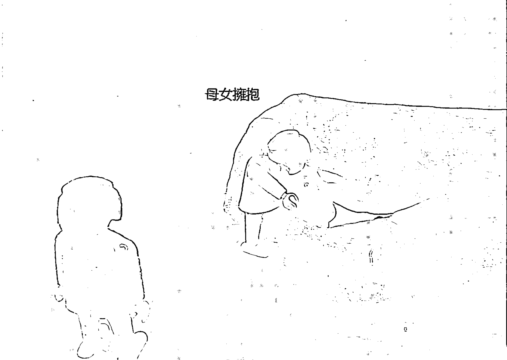

圖6-32 母女擁抱。

周老師指引丹：「現在，摸著你自己的人偶，試著去擁抱女兒。」丹讓自己的人偶去擁抱女兒（圖6-32）。

周老師：「很好。一個十二歲的女孩，正在變成一個大女孩。在這個過程中，媽媽對她很重要，她需要很多媽媽的支援和擁抱。」過一會兒，周老師問：「有沒有感覺女兒開始軟化了？」丹點點頭。

周老師：「先生看到你擁抱女兒，也會很開心的。剛才我都感覺女兒想要倒下，可是現在有力量了。女兒和爸爸得一樣的病，也是對爸爸的一份愛。」

丹也讓女兒伸出手，擁抱自己，然後慢慢靠近先生。一家人和諧溫暖地在一起（圖6-33）。她在這個片刻停留了好久好久……周老師小聲地對周圍受訓的排列師們說：「這時就是她內在的療癒畫面在運作了。」

## 第四步「合」：扣回主題，內化過程，回家之後，行動建議。

老師向丹提出了回家後和女兒溝通的方法：「今天你學到了不用說太多的話。太多的話都是解釋，解釋是永遠解釋不清，只是阻礙愛的交流；解釋會讓你們母女互相傷害。你肯定女兒的感覺、理解她的做法、接受她的感受，承認是自己沒有安排好；不要解釋和爭辯，那會永遠無止無境。用這種方式，她可以感受到你的愛。每個人有不同的意見，不要爭論誰對誰錯，結果是最重要的，我們要的是在不同的意見之下，愛依然可以交流。這對你是一個很大的突破，你以前太會說話了。這是你存活下來的方式，但是你要更上一層樓，記得無聲勝有聲。」

丹感激地看著老師：「我今天才學到了不說話的力量。」

周老師：「最大的力量是寧靜。祝福你，我們就到這裡。」

# 【個案追蹤】

幾個月之後丹來了一封信息：

「親愛的老師，感謝你為我做的個案，現在我和女兒的關係變得更親近了，我學到了怎麼樣跟女兒溝通，一有機會就多去牽女兒的手、多抱抱她。我感受到女兒也是愛我的，雖然有時候兩個人還是會鬥鬥嘴，但是已經不會像以前那樣讓人感到心就像刀割一樣。我覺得我很幸運，也希望天下和孩子相處有困難的父母都能得到老師的幫助，非常感謝你，祝福你們一切順利。」

很開心，我們也恭喜他們。

# 【案例解析】

人偶是工具，排列也是工具，可以讓我們看到動力的呈現，但幫助人的不只是呈現出動力而已，最重要是怎麼「轉化」。一個排列師的功力就在他如何「轉」了。而轉化的智慧來自於我們對人生的深刻領悟、來自我們平靜清晰的心靈、來自於我們自己對生命的實踐、來自對不同生命狀態的理解所生出的慈悲。如果我們讓剛才這個案主去對女兒說些其他什麼的也是可以，但深刻度就達不到了。所以我們不是在學技巧而已，我們是在學人生的智慧、人要怎麼活。

系統排列工作就像是一群平凡的人在這裡相約共同經歷人生的許多感動，共同探索人要怎麼活可以更成長、成熟，這是這份工作美麗的地方。我們都是平凡人，許多案主都是我們的老師，如果換作是我們活在他們的生命狀況裡，我們不一定會做得比他們更好，所以我們要向案主學習。這也是我喜歡這個工作的地方，我們可以幫助到人，同時又可以從不同人的生命學習。這樣會讓我們的人生越來越扎實、越來越有厚度、越來越有內涵。所以我們要不斷的成長，學習生命的活法，不斷向前走。

剛才這個案例，她本身是高知識分子，她的心不一定很快地就能敞開。我們透過人偶排列就是一個很好的入口，能把她內在的東西展現出來，排列師就有很好的參考信息可以切入，這樣她的心就比較能夠敞開。整個個案最重要的一個信息是讓她看到「愛在哪裡？」我問她：「你在看誰？你在看女兒，你很愛她。」她就意識到她的愛，心就開了。讓她也看到先生對她的這份愛，她的感受也不一樣了。排列就是用具象化的呈現，把沒有意識到的東西具象化展現，讓她看到先生在意她，看到這份愛。

當案主用人偶排列出他們家的場域時，我感受這三個人之中：先生想倒下，女兒想退後，她想轉身；可是他們卻都在堅持，就表示三個人這樣的動力是存在的，只是還沒有走到那一步。但動力是可以改變的，最後排完之後，本來要轉身的她卻開始慢慢向前移動。如果今天沒有和解，她就會一直糾結下去，就算離婚也無法全然轉過去活出自己的人生。但今天有個和解，她回去知道如何能和女兒有好的互動，幾次之後，結就打開了，她才可以自在地走她自己的路。也因為這樣，她回去後和她的先生也有了和解的機會，先生的免疫系統自然會提升，並會多一份想活下來的力量，疾病的治療和癒後效果也會變好。

命運是可以改變的。心的狀態改變了，即使生病過世走了，也能平安地走。死亡不是生命的終結，最重要的是要學到一些東西。學到了，死亡就不是終結，不再可怕；可怕的是我們沒有好好面對人生，我們沒有和解，心中還有糾結存在，沒有學透這一生為何而來。死亡反而是讓我們更好的去面對人生的推力。

在這個排列中，我們加入身體的接觸，我也示範了她回去可以做的方式，她回去之後就知道該如何去做了。從這個案例，大家現場看到的、學到的，會比我單純講給你門聽的效果好很多，所以要多在有老師的場域浸淫學習，很多信息是要靠現場感受來吸收，你越專注用心，就會學習成長地越好。如果回去不停在生活裡鍛練與反省，就會對人性深處有更多的理解。

# <案例8>如何超越內在的恐懼？我愛上我的師父……

琪羚是個溫婉柔美的女人，但是在柔和的外表之下，她知道她的內在有著難以跨越的深深恐懼，她感覺自己被一雙看不見的命運之手牽引，不知道自己如何才能讓內心和諧圓滿。在一次課程裡她提出了她的議題，希望我能用人偶排列幫她。

# 【排列操作】

第一步「起」：建立關係，釐清問題，收集信息，達成共識。

周老師：「你的議題是什麼？」

琪羚：「我感覺到內在有個很大的恐懼，感覺到有一種很強烈的感覺要把我拉走了。我想到了一些事，那是我很難跨越的困難，那就是我的命運。我一直以爲不是在我的家族系統裡面，不是我們的學習能夠解決的。」

周老師：「我們所說的系統不限於家族系統，是整個生命裡面所發生的事情都可以工作。公司系統也可以，人際系統也可以，有時候動物也可以，有時候是生命裡巧遇的愛人和朋友，這些都是可以的。你想要生命朝向什麼樣的方向？」

琪羚：「我想要內在超越恐懼，得到平靜和諧。」

周老師：「那麼我們就來探索恐懼背後的真相，幫助自己得到平靜。」

第二步「承」：選擇代表，探索動力，詢問歷史，揭露真相。

周老師對琪羚說：「找出兩個人偶代表，一個代表你，一個代表恐懼。」琪羚找出紅色人偶代表自己，黃色人偶代表恐懼，兩個對立而站，離得比較遠（圖6-34）。

接著，琪羚推著自己的人偶靠近恐懼，笑著說：「我就是感覺到了奇怪的吸引力。我感覺到被恐懼拉走了。」

周老師：「但你好像很開心的樣子。」

琪羚：「我頭腦不想，但是潛意識裡有力量在拉我。」

周老師摸著人偶感覺，然後說：「是你想要把它排除在你的生命之外。不管是什麼，它對你的生命都是很重要的一部分。」

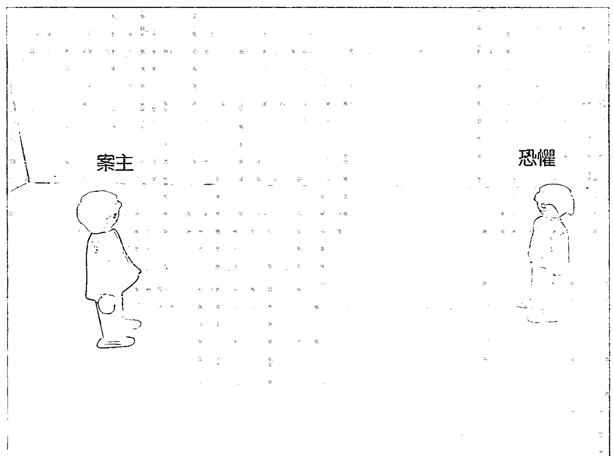

圖6-34 案主與恐懼對立而站，距離較遠。

琪羚：「我是想把它放在我的心裡面，它很遠離我們的生活。我需要與它和解。」

周老師：「其實是你需要和你自己心裡面這個過程和解。」

琪羚：「到目前為止，我都非常接受。我曾愛上了我的師父，我現在接受這段感情故事成爲我生命很大的經驗，並給我的教導。這件事實沒有辦法被人忽視或遺忘，但它現在卻被拿來當作故事被人批判。」

周老師：「師生戀很美，從古至今流傳很多這樣的故事。世界上如果少了這麼多美的故事，就會變成黑白了。現在最重要的是，在你心裡面給它一個位置就好。」

琪羚：「但別人總是談起我的這個故事，讓我很難堪。」

周老師：「那是因爲你自己沒有與自己和解。」

琪羚：「我覺得自己花了很多時間想要放下，可是我無法面對人的指責。」

周老師：「對，有些人很無聊、愛批評。但這是你的人生，你過得很精彩。你並不需要讓無聊的人影響你。」

琪羚皺著眉頭：「我以爲它不會影響我，但它還是一直影響我，讓我陷入困境。」

周老師：「的確不容易。如果批評你的是陌生人或是關係遠的人，你就要遠離那些無聊的人。他們人生很無聊，所以才會談論別人。過著精彩人生的人經常會遇到這種境況。」琪羚苦笑著。

周老師：「生命裡這些美好的事件，讓生命多了很多色彩。如果生命再來一次，你會怎麼樣？」

琪羚很堅定地說：「我並沒有後悔。」

周老師肯定她：「是的，所以不要管其他人的閒言閒語。」

琪羚：「我先生和我互相體諒，努力地修復關係。但他情緒有很大波動，有時候會失控，我感覺他是受到我曾愛上師父這事件的影響。不過，當別人提起這件事時，我先生也告訴我要堅強。」

周老師：「讓他有些情緒也很好。」

琪羚：「我努力對待他，因為事件是我造成的。」

周老師：「有情緒是健康的，一段時間就會過去。關鍵是你自己要讓它過去，才能過去。」

琪羚：「因為我愛上師父，團體很多人都認爲我是犯戒，因而遠離我。我覺得沒有任何地方能容得下我。」

周老師：「那是他們要修行的過程。很多人都會犯戒的，沒關係，這是一個學習的過程。關鍵是你的心，你要原諒你自己。」

琪羚：「我覺得自己沒有做錯什麼。我有些責任，但不是都是我的錯。」

周老師：「你要接受你自己，否則你總是會看到這些人。如果你心裡面有東西，就覺得這些人會影響到你。」

琪羚：「很多年來，我在做一些教學，學生們從我這裡得到許多，彼此很相愛。可是過段時間，他們聽說了我曾愛上師父的故事，就會覺得我欺騙了他們的感情，轉而指責我。我就覺得我怎麼總是遭受這樣的命運。」

周老師：「你要看你自己如何創造了自己的命運。比如，我認識一位心理治療師，他在開課時便先說，『我離了三次婚，你們在座的有沒有比我更有經驗的？』我覺得他自己先說出來很聰明、也很真誠。否則有人會說：『你離了三次婚，你還教我們夫妻怎麼相處，你不是在騙我們嗎？』但是，重點不在於我們是否是完美無缺、潔白無瑕的人，重點是我們經歷了這些之後，我們從裡面成爲了什麼樣的人。」

琪羚：「我知道自己，但別人不知道啊。」

周老師：「別人不知道是因爲你自己不是真正知道，比如，當在一個團體裡面，一開始你可以跟他們說，我的生命經歷很豐富，我曾經愛上我的師父，曾經發生什麼事，這都是我生命的一部分。」

琪羚：「就是因爲他是我的師父，我才會愛上他，這不是普通的男女之愛。」

第三步「轉」：尋找解決之道，表達情感，回歸序位的愛。

周老師：「好，我們排列出來看。找出你所愛的人，放在恐懼的後面，兩人貼在一起。」（圖6-35）「現在你注意看喔，我要把恐懼與這個人慢慢地拉開，你注意看著後面這個人。」（圖6-36）

琪羚很努力看著，然後無奈地說：「我沒有辦法連結。」

周老師：「沒關係，我們再試一次。」這次案主感覺比較好了，可以注視著後面他所愛的人。

周老師：「扶著你自己的人偶，看到你所愛的人。」

琪羚：「我感知他很大，像巨人般，無法形容。」

老師找了一個小的人偶代表，代表小時候的琪羚。然後說：「來，牽著你自己，牽著小時候的你，知道他是誰嗎？」

琪羚帶著似乎在逃避的異常神情說：「我想抱抱他……別人總說我是缺爸爸，因為我小時候就沒有爸爸，所以找一位師父來代替。但是，我覺得他不是我爸爸。他很巨大，也很偉大。」

周老師：「是的，對於一個小女生來說，你的爸爸是很巨大的。是的，進入小時候的你，再抱抱他（圖6-37）。很不容易，他看到你了，你也靠近他了。閉上眼睛，回想你抱住你爸爸的感覺，還有你對他說的話。」琪羚慢慢靜下來進入深層的感受裡，她開始激動地掉眼淚，她把父女兩個人偶抱在一起好久……

當琪羚抱著爸爸的同時，周老師在旁邊用溫暖的語氣對她說：「你的爸爸，你愛他，他也愛你，但是他壓抑他自己。不過現在你在心裡面，感覺到和他的重新連結；你在心裡面，已經再次感受和他的連結。你要記得這個連結，在適當的時候，你可以去找他；你不用得到母親的許，因為你已經是大人了，你要去看他是活著還是過世了；你要去找他，看他後來的生命是怎麼樣，很真實地去看到你爸爸的人生是怎麼過的，去看到他也是一個平凡的人，他是怎麼走過他後來的日子的。然後這個時候你就變大人了。」周老師把大的人偶放在小的自己的身後（圖 6-38），對琪羚說：「你的爸爸會很高興，如果他還活著，看到你已經長大成人了。」

接著，周老師對琪羚說：「摸摸代表長大後的自己的大人偶，她現在是什麼感覺？」

琪羚摸摸自己的人偶，那個長大的自己去感覺，然後說：「現在沒有很激烈的感覺了，很平靜了。」周老師引導她：「現在帶著這個平靜的感覺，轉過來，看看這個黃色人偶。」琪羚推著長大的自己朝向黃色的人偶，在離他不遠的地方停下來（圖 6-39），又開始哭泣起來。

琪羚問周老師：「你的意思是說我因為父愛缺失，所以去師父身上找尋。可是，是他先說愛我的，不是我去追求他。因為他是我師父，我很尊敬他，我沒有辦法拒絕。所有有分量的人都說他是一位很偉大的人。我覺得不是我去找一個替代我父親的人。」

琪羚情緒有些激動，周老師：「不，不，我們還沒有結束。」周老師把剛才父親的人偶放到琪羚的人偶代表身後支持她，等琪羚情緒平靜一些。周老師：「像剛剛一樣，用平靜的心去面對。你想向他鞠躬嗎？好，你扶住自己的代表，向他鞠躬，有什麼話想對他說嗎？」

琪羚：「我先生和我有一段時間在談離婚，他贊成我的決定，願意成全我的追求，但後來他很憤怒，有很多的情緒，他說他覺察到那是一種一生都沒有過的強烈情緒。後來我離婚了，但師父也沒有接受我。師父的弟子們都很痛恨我，就編了很多奇怪版本的故事流傳。最後一刻，我向師父說對不起。現在我也不知道他在哪裡。我覺得他的前途都被我毀了。」琪羚心痛得想要哭出來。

周老師：「不說最後一刻，我們在當下、在這裡面對，而且他也有他的責任。」

琪羚開始泣不成聲，平靜一會兒，面對師父鞠躬（圖6-40）。

老師感知一下，然後對琪羚說：「你知道他什麼反應嗎？」

琪羚：「他說不用說對不起，因為那是他要的，所以他接受。」

周老師：「是的，他也向你說對不起。」

然後周老師扶著師父也向琪羚鞠躬。琪羚有些顫抖，情緒激動，閉著眼睛哭泣。

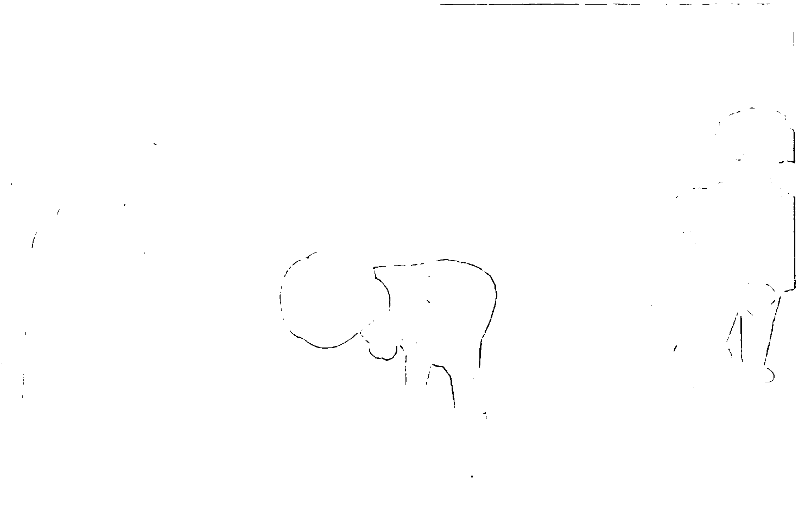

圖6-40：案主向她的師父鞠躬……

周老師：「深呼吸，深呼吸，接受，接受。你願意接受嗎？」琪羚含著淚點點頭。

周老師：「因為當你接受，你就會自由了，他也自由了。愛及情緒會來也會去，這些並不是不好的。有了這些經驗之後，我們才學會用更好的方式面對，以更智慧、更圓融的方式去照顧這一切。許多高僧大德也都曾被情慾勾起過，但每一個人面對的情況不一樣。所以，彼此都有責任，但是並沒有什麼錯，已經發生了就接受，最重要是要從中學習。畢竟，你們都付出了很大的代價。對他來說，你是他生命的功課，所以他才會遇到你。這很好，你讓他有機會經歷這一遭，他也會從這個過程學到很多。師父本來就是站在較高的位置，所以他更要謹慎，這是他要學習的。在他有更大的成就之前，這是必然要經歷的關。這是每位師父都要經歷的關：情關和錢關。這只是小小的考驗而已。」

然後老師感知了一下師父，代表師父說：「謝謝你來成就我，我也願意成就你。」接下來，老師慎重地對琪羚說：「他是你的師父，但是在某一部分你們是平等的，就是你們內在的本性是平等的。他教你一些東西，你也教會他一些東西。也許上輩子你是他的師父。所以現在，要重新站在一個位置，以成人的方式去看到他。」

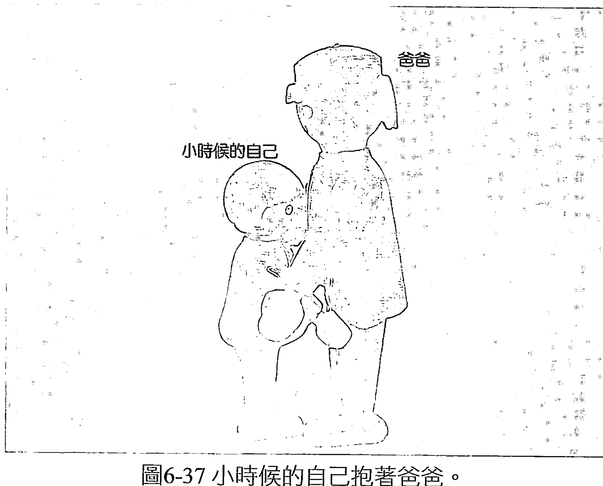

琪羚移動著自己的人偶向前靠近師父，然後說：「我還是想要更靠近一些。」

周老師：「可以。告訴他你想要對他說的話。」

琪羚：「我覺得沒有話要說。」

老師去感知琪羚的人偶代表，然後讓琪羚再次摸著自己的人偶，去感覺自己內在的力量的升起。琪羚去感覺，然後說：「我沒有什麼話想說。」

老師引導：「所有的分開都有悲傷，沒有悲傷就是沒有愛過。你對他說：『我曾經愛過你。』」

琪羚：「我說不出來。」沉思一段時間後，琪羚才說：「其實我沒有說過我愛他，是他跪下來對我說的。我理不清我對他是什麼感覺，好像比愛更大。我不知道該對他說什麼。」琪羚傷心無奈地哭泣。

老師讓琪羚再看父親一眼，感受父親的支持力量，然後再看師父。琪羚慢慢地平靜下來，好像有了力量。

周老師：「感覺你內在的力量。」琪羚點點頭。周老師接著說：「這就是你內在力量的升起，記得，你的內在和每個人都一樣，都是平等的，感覺這個力量。」琪羚閉上眼睛感受，然後又點頭。周老師：「你的內在和所有佛、菩薩也一樣，都是平等的，就如同他們每個人也都是如此。很好，再看著這師父。」

## 系統排列的全息智慧
一對一排列與個案的理論與實踐

琪羚說：「我有一個奇怪的感覺，我是平靜的、沒有慾望的，但我很想往前。我感受這個人偶的感覺，想要這兩個人偶成一體的感覺。」

周老師：「嗯，等一下。」

老師找出一个人偶，告诉琪羚：「他代表生命，代表宇宙的生命。」然后把生命摆在父亲和师父的后面，让琪羚的人偶面对他们（图6-41）。

琪羚：「我看到生命很触动我，我很感动。」

周老师：「去感觉你自己，现在想站在哪裡？」

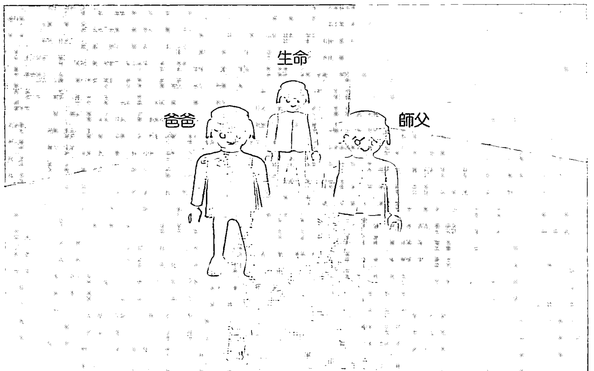

图6-41 老师加入「生命」，把生命摆在爸爸和师父的后面。

琪羚摸著自己，說道：「我想靠近父親，停在那裡，但是我對師父的感覺沒有界限，想要去到他那裡，我很想和他變成一個。我一直想要往那裡去。」

老師引導說：「你想超越他，是想來到生命這裡，這一些如同你的爸爸是你的生命通道，生命穿越你爸爸來到你。現在，你的追尋是需要穿越某些人、某些方法，連結上你背後更大的生命。在這個穿越過程中，如果這個人的角色扮演好，就會引導你連結到更大的生命。就如同爸爸的角色如果扮演好，孩子就會因爲爸爸而長大。師父的角色扮演好，你就會穿越他，來到這個更大的生命。」

琪羚：「我不想繞過去，我想和他消融。」

周老師：「可以，帶著覺知，慢慢地、慢慢地進入他、穿越他、消融他，來到更大的生命。是的，就是這樣，這是你的渴望，這是所有人的生命的渴望，這樣才是你真正要走的對的路。因爲前面你走過這些過程，才有辦法走到這裡。這是你的兩個關，或者說是兩個功課。這個方向沒有錯，但是要經歷一些事是必要的。」琪羚點點頭。

第四步「合」：扣回主題，內化過程，回家之後，行動建議。

琪羚：「現在我在想，也許，師父就是這把讓我開悟的鑰匙。」

周老師：「是的，你是要經歷這些的。生命成長過程並不像我們想的那樣，有些表面看來的負面事情，背後的意涵更深。開悟的路不容易，有時候也很容易，不容易的是會挑戰我們最恐懼的、最需要經歷的事。你正在經歷這個，重點是要從經歷中學習，這樣才會是對的方向，否則，你會停在那裡。不要停在那裡，要繼續往前走。」

頓了頓，老師指著師父說：「這是一個好人，好人有時候是會陪伴我們走一段人生的路，和情感的深淺沒有關係。有些人沒有情感，但是是一輩子的好朋友。他可以保護你。沒有他，你會遇到更多的麻煩。你要感謝他。」

琪羚：「我一直在努力的。」

周老師：「感謝不需要努力，只需要發自內心。他在保護你，有這份關係是對你的保護，因為他幫你劃清安全的界限。你要明白。」

然後周老師對琪羚說：「好了，結束了，我們祝福你。」

### 【個案追蹤】

琪羚之後在課堂裡繼續學習成長，看到她一個階段、一個階段不斷進步，也看到她給人的感覺越來越平安、越來越祥和。現在看來,過去的這份情是生命幫助她成長的一分大禮。我們都祝福她。

### 【案例解析】

(1)當一個人從小心中就缺乏父親的位置,這時候她很容易在無意識裡去尋求宗教上的師父,把他取代成他心中的父親,就算沒有覺察或不承認,這是很自然的人性表現。但如果沒有覺察和繼續沉浸在這樣的取代裡,就會阻礙自己的成長。而且這樣的取代對於他父親、對宗教上的師父都是不公平的,所以在剛剛個案中,周老師幫助他們兩位都能夠各歸其位:爸爸回到屬於爸爸的位置,師父回到屬於師父的位置。這樣才能避免把師父投射成一個完美的父親而阻礙真正的成長。另一方面,所有的師父也都是平凡人,都很容易被投射成完美的父母,此時徒弟就變成了孩子,然後雙方就在這樣混淆的愛裡糾結著,這樣對彼此的成長都沒有好處。真正的師父會拒絕這樣的誘惑,他知道自己在做什麼,他會幫助徒弟變成一個成熟的成人,並透過超越父母及師父的形象角色,讓自己與內在更偉大的生命連結。我們看到上述案主在過程中有一些抗拒與自己的詮釋,但也可以看到我如何點撥她、引導她,有時也同意她,讓她從既有的概念裡面一步一步釐清出來,讓自己的情感更加成長、成熟,面對真實的生活。

(2)所以在這個案裡,我用了一個很特別的技巧,幫助案主把投射與真實拉開,讓恐懼與師父分開,你們記得嗎?就是我在恐懼的後面排出這個綠色的人偶,然後我要案主好好注意看著後面這個人,把恐懼與這個人慢慢地拉開。就好像把案主內心的投射螢幕慢慢移開,看到背後真正想看到的這個人的真實面貌。

(3)對於「過去的伴侶」,從系統排列所觀察到的生命重要法則中,我們在心中要給「過去的伴侶」一個位置,承認並尊重自己生命有過這一段歷程。這份對生命一切如實的尊重,並且勇敢地從中學習圓滿它,反而超越表面的道德批判與戒律,而與真正的道德與宗教精神相通。一份情感關係就是一份情感關係,不管他的身分是什麼都要被承認,哪怕是亂倫或強暴也是一樣。我們承認的是這個位置以及這個事實,並且讓每一個涉入其中的人能夠各自負起自己的責任。因為這份承認,我們才能真正為自己的人生負起全部的責任，也能夠從自責愧疚裡走出來，重新自己的人生；並且能夠從生命所有的事情裡，學到用更成熟、更有智慧的方式去圓滿它，這才是真修行、真解脫。

### <案例9>為什麼我和媽媽無法溝通？

江總是一家企業的負責人，是個幹練果斷的女強人，彷彿有強大的能量，什麼事都能搞定，但是她也有脆弱的一面，也有搞不定的時候。帶著她的無奈，她求助於周老師。

#### 【排列操作】

第一步「起」：建立關係，釐清問題，收集信息，達成共識。

江總：「我和媽媽的關係不太好，我不知該如何對媽媽才最好？」

周老師：「人每天都會遇到各式各樣的情況或問題。成長不是沒有任何問題，不是像童話故事般，王子公主從此過著幸福快樂的生活。而是遇到『問題』時，讓問題變成一種『情況』。如果沒有成長，就會把情況變成問題。所以這一切都和人的成長有關。」周老師問江總：「你媽媽多大了？」

江總：「七十九歲。」

周老師：「你們的溝通怎麼樣？」

江總：「很費勁，無法溝通。家裡人的話媽媽都不聽，她只聽外面人的話。」

周老師笑笑地說：「你是不是也這樣？」

江總：「我媽經常說，因為我是你媽，所以我才要告訴你別人不會告訴你的。我覺得我媽和我是不同的頻道。」

周老師：「是你不和她同個頻道。你想要以你的方式改變她，其實她只是要你關心她。」

江總：「我知道媽媽需要我的關心，所以我很關心她。但她總是唸我，讓我很煩。我買東西東西，嫌我買得多，於是我不高興了，可是她說她這是稱讚我，但我聽不出來。」

周老師：「我知道你很愛媽媽，但媽媽不是完美媽媽，你不要去要求媽媽是完美的媽媽。我們也不用做完美的孩子。爸媽的事情，是爸媽要去經歷的，那是他們的決定。他們是成人，他們為他們的人生負責，決定在他們，做兒女的只能去提醒。」

周老師問江總：「你在擔心媽媽什麼？」

江總：「我媽媽很脆弱，外在開朗，喜歡助人，但我覺得是她遮蓋了很多痛苦的記憶。」

周老師笑道：「很多東西我也都不記得了。媽媽有什麼疾病嗎？」

江總：「她的腰椎有退化性疾病。我想要幫到她，可是她不接受，到了醫院不也願意做X光檢查。」

周老師：「你已經做了你該做的，每個人都有他要經歷的路，不一定都是不好的。」

江總：「我姊姊說我是我們家的支柱，我媽也說我要倒下了，他們都沒法活了。我心臟不好，覺得自己愈來愈累，承受不了。」

周老師：「為什麼？因為你太大了，成為全家的支柱了。」

江總：「我是覺得我再努力一點點，就能延續媽媽的生命。」

周老師：「我有一個朋友的奶奶一百多歲了，忽然有一天突然倒下，送到醫院，醫生說讓她平安地走。但她的孩子不要她走，非要搶救不可，插管急救，在醫院拖了兩個多月才走，老人很痛苦。這是愛？還是殘忍？所以我們活的時候，要把精力放在『活』這件事上，不要把精力放在擔心、放在不讓她死這個事情上。因為我們的恐懼，所以才把焦點放在『不讓死』上。因為活著沒有好好去做活著時要做的事情，所以才會擔心。」周老師接著問江總：「如何在媽媽活著時和她更好的互動？」

江總：「我爸生病，我擔心他沒人照顧，我建議他去住安養院，但他不願意。我在病房裡想著，我在外面幫了那麼多人，為什麼就幫不到我的父母？我嚎啕大哭，我爸媽被嚇到了，就答應了去住安養院。」

周老師：「你做得很好，但我在想這份『過度的擔心』是從哪裡來的？你如何在和他們相處時有更好的品質？」

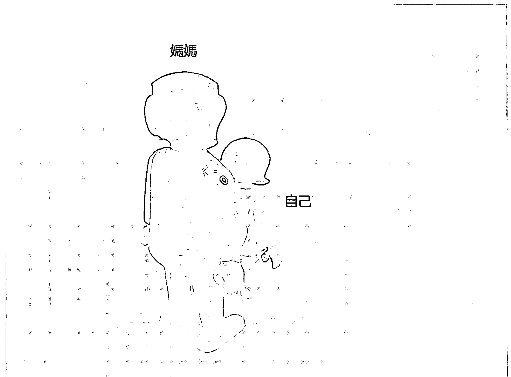

圖6-42 探索動力：自己站在媽媽前面，媽媽在後面，兩人都看向前方。

第二步「承」：選擇代表，探索動力，詢問歷史，揭露真相。

周老師：「找出你和你媽媽的代表，排出你心中覺得彼此的關係位置。」

江總找了一個小的人偶代表自己，大一點的人偶代表媽媽，自己站在媽媽前面，看向前方。媽媽在江總的後面，看著前方（圖6-42）。

周老師去感受媽媽的代表，然後問江總：「你媽媽的媽媽呢？」

江總：「我媽媽五歲的時候，我的外婆就過世了。」

老師：「為什麼會過世呢？」

江總：「我聽家人說，外婆是擔心死的。外婆長得很漂亮，但家裡很窮，她嫁給外公後，外公出了一些狀況，她整天擔心，後來得了肺病就過世了。」

老師加入外婆的代表，放在江總和媽媽共同面對的方向（圖6-43）。

第三步「轉」：尋找解決之道，表達情感，回歸序位的愛。

老師讓江總把手放在自己的人偶代表上面，引導江總對著外婆說：「外婆，我是你的外孫女。」江總叫著外婆，情緒開始激動，眼裡湧出了淚水。老師接著引導她，向外婆說道：「我和你一樣有好多的『擔心』，擔心這個家，擔心有人生病，擔心有人出事，擔心有人過世……我能理解你的擔心。」

周老師問江總：「你覺得媽媽看到外婆會是什麼反應？媽媽五歲就沒了媽媽，你覺得她會怎樣移動？」

江總：「我聽媽媽說，她都忘記外婆的樣子了，她連外婆的一張照片都沒有。」

周老師問她：「你願意陪媽媽去看外婆嗎？」

江總點點頭，擦乾眼淚，對著媽媽說：「媽媽，我現在陪你去看外婆。」

江總看著外婆說道：「外婆，我現在不用當媽媽的媽媽了，因為我現在看到你了。」

江總推著自己和媽媽的代表靠近外婆，抱住她。祖孫三人抱在一起（圖6-44），眼淚直往下掉，無法自止。

過了好一會兒，周老師引導江總對媽媽說：「媽，你現在看見外婆了，當你想去找外婆時，我知道你會很平安的，因為外婆會照顧你。現在，我要回到女兒的位置了。媽媽，我是你的女兒，我現在要回到女兒的位置了。」

周老師感受一下外婆代表說：「你外婆很愛你媽媽，她是很有愛的人。」

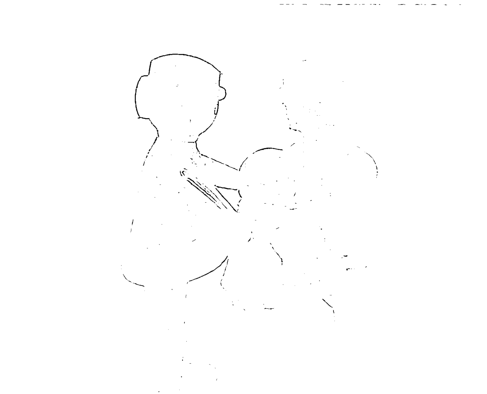

圖6-44 祖孫三人抱在一起。

江總：「是的，我媽說我外婆長得很美，我媽都不像她，反而是我覺得自己像外婆。」

第四步「合」：扣回主題，內化過程，回家之後，行動建議。

周老師引導江總向外婆說道：「外婆，我長得比較像你。」接著，老師讓江總移動自己的人偶退後一些，看著外婆說：「親愛的外婆，我有些地方和你很像，但現在我更明白了，我不用取代你，我不用做完美的媽媽，也不用做完美的女兒。」江總慢慢平靜下來後，對周老師說：「我媽說外婆總是擔心她吃不飽飯。」

周老師引導江總：「給你的外婆一個鞠躬，把屬於她的擔心還給她。握住你自己的人偶。」

江總握住自己的人偶向外婆鞠躬，說：「外婆，我尊重你的命運，現在我要回到自己的位置了，我把屬於你的擔心還給你。再見了。」

周老師：「帶著覺知，慢慢地後退。」江總扶著自己的人偶，慢慢地後退、後退。

老師去觸摸媽媽的人偶，讓媽媽也後退一些。然後，看到江總的表情還帶著一些放不下，就對江總說：「再往後退，回到你自己的位置。」江總握住自己的人偶，繼續後退、後退。然後慢慢讓人偶起身，表情顯得平和寧靜。

#### 【個案追蹤】

周老師：「你在這裡，再向外婆鞠躬，跪著、站著都可以。」江總起身離開自己的座位，對著外婆代表的方向，跪下慢慢地磕了個頭。

周老師：「在心中對外婆說：『再見了，我要回到自己的位置了。』」

江總給外婆磕完頭，由衷地對外婆說：「謝謝你，外婆！再見了！」

周老師對江總給了回家後的行動建議：一是回去後找一個安靜的地方，在心裡沉澱這個個案的畫面、過程。二是提醒自己要回到序位。如何在現實中提醒自己回到序位？那就是不管發生什麼事情，不要第一時間就衝上去，這樣容易錯位，等心平氣和穩定下來，想好後再去做。

過了四、五個月再次遇到江總，她整個人氣色好很多，她說今年過年她差一點掛掉了，但她記得她必須放下對媽媽的擔心，回到屬於孩子的位置，不要再變成外婆。也許是因爲自己的心真正轉變了，她遇到一位很好的醫生，她的身體也得到治療，她覺得自己變得更健康了。而且現在和媽媽的互動也感覺越來越平和，沒有那麼多的情緒。江總親身體會到系統排列對自己的幫助，就發心要推廣這門學問讓更多的人受益。這就是一份善的循環。

#### 【案例解析】

排列師不要只是停留在理智上的規勸，我們要去看到行為背後的系統動力，否則案主的心是沒有辦法轉變的。透過排列，我們能更具體地看到案主背後的系統動力以及深層的心理狀態。剛才我們看到，江總的代表擋在媽媽的前面，很明顯的，我們要想到：「那媽媽到底想要到哪個方向？」所以我就問外婆的情況，江總的信息是：「媽媽五歲時，外婆去世。」我們可以瞭解到，江總擋在媽媽的前面是潛意識裡想擋住媽媽跟隨過世外婆的力量。後來加入外婆代表，我感覺江總是往前衝的，這也呈現了她的模式，呈現出了很強的動力。很明顯這個案主是認同了外婆，承接了外婆莫名的擔心，取代了外婆的位置來照顧媽媽，所以對媽媽的態度就好像大人對小孩一樣，序位出錯了。

我們用較少的時間呈現動力後，接下來我們就有更多的時間去解除認同。我讓她陪著媽媽去看外婆，當她們抱在一起，我感覺出她想要她們抱得很緊，我就讓她慢慢退出、退出，幫助她回到孩子的位置。這個時候，排列師可以做什麼？就是讓身體記憶更深刻。所以，我就讓她自己本人鞠躬再退出，加深身體的記憶。

最後，我給她什麼建議？因為我感覺到她很衝動，所以讓她遇事不要衝動，先提醒自己回到序位，心平氣和後再去與媽媽互動，再去處理事情。

### <案例10>性——面對家族中的祕密

靖是一名四十多歲的婦人，面容姣好，可是氣質中卻透露出淡淡的冷和憂鬱。

#### 【排列操作】

第一步「起」：建立關係，釐清問題，收集信息，達成共識。

周老師問靖：「你想要面對的是什麼？」

靖：「我有時候膽子非常大，有時候膽子又非常小，不願意上臺講話。我想是不是和小時候的一段經歷有關係。我八、九歲時，有個鄰居老頭在他家裡經常準備好吃的，我和小朋友們會去他家捉迷藏，他就抱我、親我、摸我，後來我知道這是不好的事情，就不再去他家了。而學校老師找到我，問我這方面的事情，我將這些事情說出來後，老師卻用異樣的眼光看我。我媽媽和奶奶也知道了這事。這個鄰居老頭被抓起來了，後來他就死了。現實中，當我看到有人很像那個鄰居老頭，就會有恐懼、不安的感覺。」

周老師：「我覺得你剛才說這件事的時候，好像覺得自己做錯事一樣。」

靖：「因為這個事情，我媽媽打了我，我弟弟還罵我是流氓，讓我很難受。」

周老師：「你爸爸有什麼反應？」

靖：「他不知道。」

周老師：「也許今天有這個機會，你願意去面對。感謝你信任我。除了這個事情之外，我想問你們家人對性是什麼看法和態度？」

靖：「基本是不談的，都覺得性是低級下流的事情。」

周老師：「你們家人或是長輩，有沒有人在性方面發生過一些不愉快的事情，被遺棄、送走，或生了孩子有不好的結果？」

靖想了想，說道：「我外公的哥哥沒有生小孩，領養了一個小孩。還有我爺爺去世得早，奶奶從二十四歲起一直守寡。」

周老師喃喃道：「二十四歲就開始守寡啊！爺爺是因為什麼原因去世啊？」

靖：「爺爺家裡的人去砍別人家的樹，被人打中頭，我爺爺看到後受驚嚇而死。還有人說我奶奶在外面生了一個小孩，然後把小孩掐死了。」

周老師：「嗯，這個信息很重要。」

靖忽然又想起一些什麼，說道：「我爸爸和媽媽關係不好，我媽媽說我爸在外面有女人，還生了孩子。但我們家規很嚴，如果誰違反家規，會被沉河。」

周老師：「爸爸的外遇、奶奶的事情，應該不是憑空捏造出來的，可能有一些家族的祕密在後面。這些事情對家族的信念應該會有很大的衝擊。」

第二步「承」：選擇代表，探索動力，詢問歷史，揭露真相。

周老師：「現在選一個人偶代表你自己，選一個代表爸爸，一個代表媽媽，還有一個代表鄰居老頭。把他們的位置排出來。」靖選了一個白色的大人偶做自己的代表，把自己排在代表爸爸、媽媽的兩個紅色人偶後面，把鄰居老頭排在自己右後方較遠的位置。所有人都看向前面（圖 6-45）。

周老師看了靖的排列，說道：「這個排列很特別，這個事情發生在小時候，但你選了一個大的人偶代表你。你又排得很靠近爸爸、媽媽，表明一方面你好像是成人了，一方面又好像是個小孩，離不開爸爸、媽媽。你再選一個小時候的你，你會把她擺在哪裡？你也可以調整你自己的位置，也可以調整老頭的位置。」

靖找了一個小時候的自己，靠近爸爸、媽媽，然後把成人自己的位置往後放了一點，把老頭的位置放得更遠一些，看向側方（圖6-46）。

周老師對大家說：「這個個案，一般助人者的做法是直接進行案主和鄰居老頭的經歷過程，讓他們對話，然後分離。但因為我們有系統觀，可以再做得深一點。老頭的事情只是一個誘因，更重要的是家裡關於性的祕密和互動方式在影響這個孩子。所以，我們先從系統動力的方向走。我們看到爸爸、媽媽和孩子都看向同一個方向。」

周老師又問靖：「他們都看向同一個方向，有可能是面對一個人或是家裡的一些事。剛才你提到奶奶守寡，性在這個家裡就會是很隱諱的事情。」

周老師：「請把奶奶也排出來。」靖選了一個黃色人偶做奶奶，把奶奶排在爸爸身後側一點的位置（圖6-47）。

然後，周老師讓靖再找一個代表「性」，一個代表「死亡」，把它們排出來。案主找了一個藍色人偶代表

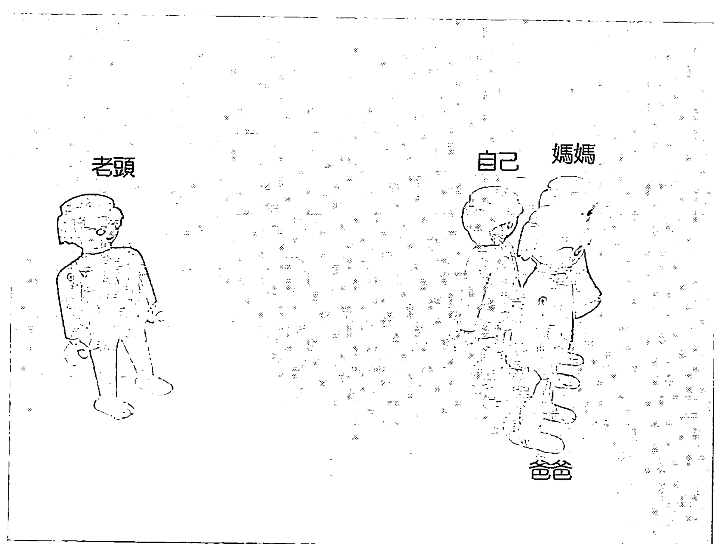

圖6-45 初始排列畫面。

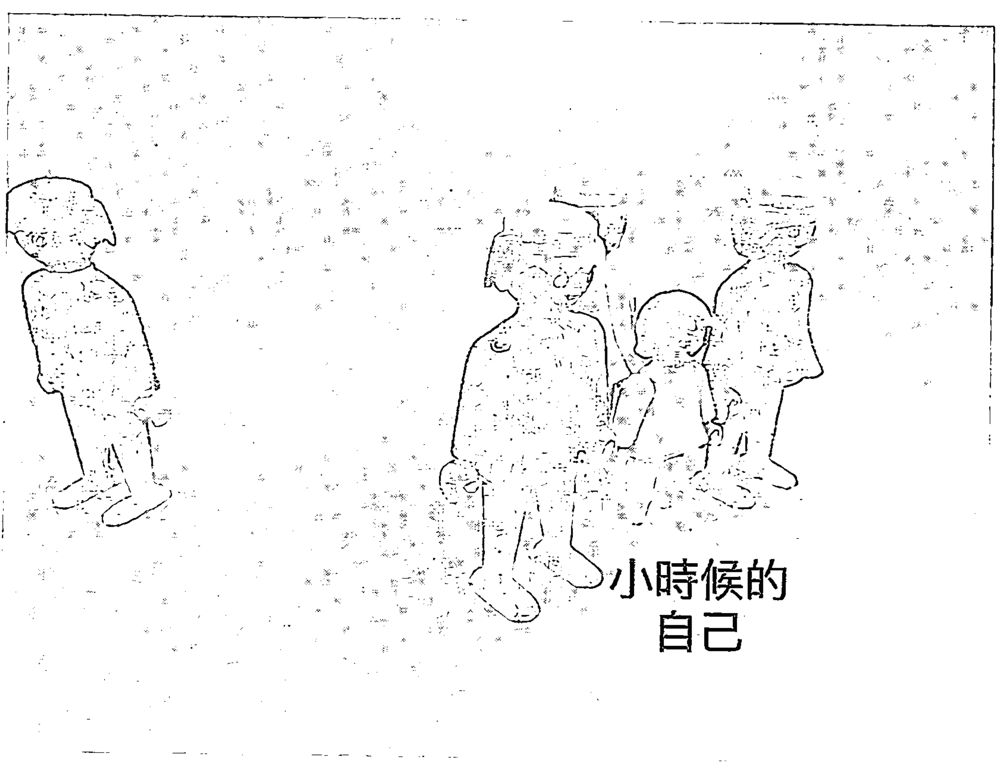

圖6-46 加入小時候的自己。

## 系統排列的全息智慧
一對一排列與線上個案的理論與實踐

圖6-47 加入奶奶。

圖6-48 加入性、死亡以及家裡不幸死去的孩子，死亡是面朝下。

「性」，擺在自己的左後方；找了一個白色人偶代表「死亡」，躺在一家人的前面（值得注意的是案主把它面朝下）。

周老師：「再找出你們家裡死去的孩子。」靖找了兩個小人偶，一個黃色，一個白色，代表這個家裡死去的孩子，放在「死亡」的身邊（圖6-48）。

周老師：「很明顯的，在這個家裡，性和死亡是對立的。家裡所有人都看向死亡，但性卻是在身後。」

聽到周老師的話，靖若有所思地說：「關於性方面，我和老公有三年多完全沒有性生活了。我現在信佛教，也皈依了。我不喜歡性這個事情。」

周老師：「好像性在這個家裡是不能被接受的。而性是生命傳承的一個力量，但是在這個家裡卻不被接受。我推測，有可能是在這個家裡因為性帶來了死亡，而死亡讓這個家難以承受，所以最好都不要有性。而你剛才也說到，聽說奶奶有一個小孩被掐死了。」

靖：「我奶奶是個很受人尊敬的人，都說要給她立貞節牌坊。」

周老師：「這就像是家裡的祕密。也許有些事情真的發生在奶奶身上，或發生在家裡其他長輩身上。因為你們都看向一個方向。」

周老師觸摸人偶代表（圖6-49），然後說：「這個家族的祕密，不管是關於誰的，都需要被看到。感覺爸爸好像要保護奶奶。」

靖：「爸爸和奶奶感情很深。」

第三步「轉」：尋找解決之道，表達情感，回歸序位的愛。

周老師對靖說：「小時候的你，不知道該如何面對，只好躲在後面。現在我們讓長大的你，來面對這一切好嗎？」靖點點頭。老師引導靖把自己的人偶代表轉過來看到奶奶和爸爸（圖6-50），對奶奶說：「親愛的奶奶，謝謝你為這個家守寡。我知道你很辛苦，我知道你也很煎熬，性對你來說是很痛苦的事情。親愛的奶奶，我愛你。現在我明白，有時候性的誘惑發生時，沒有辦法控制，這不是你的錯。親愛的奶奶，我們有很嚴格的家規，謝謝你盡力在維繫這個家，在我心裡你不是低級下賤的人，不是骯髒齷齪的人，你是我的奶奶！」

靖低著頭哭泣，一隻手擦著鼻涕眼淚，一邊跟著老師的引導繼續說：「不管別人說的是不是事實，我尊重你是我的奶奶。如果你真有孩子因為這樣死了，或是我其他的家人因為這樣而有孩子死了，我都會尊重這些長輩，我也會祝福這些孩子。」

然後，周老師引導靖面對躺在地上面朝下的「死亡」，對家族長輩說道：「親愛的長輩，你不是低級下賤的，不是骯髒齷齪的，你只是受到性慾的誘惑。我尊重你的命運，你不再是沒有臉見人的，我看到你了，而且我尊重你。」

周老師：「如果你願意的話，你可以慢慢地把長輩代表的身體翻過來，他剛才臉朝下，好像沒臉見人的樣子。」靖慢慢地把長輩的身體放正，臉朝上面。

周老師：「家裡的故事不是憑空捏造的，但也不一定完全是事實。如果我們非要說是奶奶，是對奶奶的侮辱。」老師再讓靖對長輩代表說：「親愛的長輩，你不是下賤的。我尊重你的命運，那時候你一定很掙扎，你受過誘惑，我也受過誘惑，那時候我的判斷不是那麼好，所以我們遇到了意外，發生了不適合我們的事。親愛的長輩，我愛你。如果因為性的發生，讓你必須殺掉自己的孩子，我會在心裡給你和這些孩子一個位置。」

靖再面對家族裡被殺死的孩子，說道：「親愛的孩子們，我知道你們很想來到這個世界，可惜卻沒有辦法，他們殺了你們，對不起。謝謝你們為這個家的尊嚴所付出的代價，謝謝你們為了維持這個家的家規所付出的代價。」

圖6-51 自己抱住小時候的自己。

周老師：「如果你願意，可以把他們翻過來。」靖把孩子們的身體翻過來，臉朝上，說道「你們不是骯髒下賤的，你們都是最可愛的孩子，我愛你們！」

老師問靖：「你覺得奶奶和爸爸現在比較能接受他們了嗎？你有這個感覺嗎？」靖點點頭說：「有。」

周老師引導靖：「你也要接受你自己以及小時候的自己。」這時候，靖讓代表自己的人偶拿起來，抱住小時候的自己（圖6-51）。

周老師問靖：「小時候大家怎麼叫她？」

靖：「叫靖兒。」

老師引導靖對小時候的自己說：「靖兒，你是個很棒的孩子，很聽話的孩子，但是你被誘惑了，你只是想要和小朋友一起玩，想要吃好吃的糖果，你只是身體有一些特別的感覺，你覺得這些感覺很好玩、很舒服、很新鮮，你只是身體有一些反應，這些都是健康的。當有人摸你身體的時候，你身體有一些興奮的感覺，這也是健康的。你現在長大後，就知道這些人不適合你，你已經學會保護自己了。」

靖跟著老師的引導說完後，周老師問靖：「你覺得如果奶奶現在還活著，她會想對你說什麼？她會說：『靖兒，你沒有錯，你是個好孩子。』」這句話觸到了靖心底最敏感的部分，多年來一直覺得有錯的她終於感覺到被認可了。她的情緒激動，無法自制地大聲哭了出來……

周老師站了起來，拿了塊大墊子放在胸前，站到靖的旁邊，說道：「我現在代表你的奶奶。」然後老師用奶奶的聲音對靖說：「靖兒，你沒有錯。靖兒，你是個好孩子，你沒有錯。」靖在奶奶的懷裡痛哭起來，不停地說：「謝謝你，奶奶。謝謝你，奶奶……」奶奶抱住靖：「你是個好孩子，你沒有犯錯，你是個好孩子。」

一會兒之後，靖情緒慢慢平靜下來。周老師脫離奶奶代表，問靖道：「你知道爸爸想對你說什麼？」老師握住代表爸爸的人偶，代表爸爸對靖說：「我沒有照顧好你，讓你受傷了。我沒有照顧好你，讓你受欺負了。這不是你的錯。我們家不談這些事，讓你受委屈了。你並沒有丟我家的臉。」聽到爸爸的話後，靖鬆了一口氣。老師把手放在媽媽的人偶代表上對靖說：「你的媽媽一直支持著你！」靖感受到背後爸媽的支持。

周老師接著說：「性本身其實是好的。這個小時候的你自由了嗎？你要給她一個位置。」靖讓長大的自己抱住小時候的自己（圖6-52）。

第四步「合」：扣回主題，內化過程，回家之後，行動建議。

周老師：「這個家裡有很多祕密，你在心裡面不要去刺探這些祕密，而是帶著尊重去調整自己。現在，你有足夠力量去面對他、鄰居老頭了嗎？」靖點點頭。

周老師：「你讓自己轉過來。」靖把原來背對老頭的自己轉過身，然後推著長大後的自己和小時候的自己一起去面對鄰居老頭（圖6-53）。

靖忽然說：「我想感謝他，因為他讓我想去認識性這方面的事情。」老師點點頭，然後引導靖對老頭說：「爺爺，謝謝你，和你在一起，我很開心。你做了很多好吃的東西給我們吃，我們在一起有很多開心的時候，很多孩子都喜歡和你玩。和你在一起，我很開心；你摸我的時候，我也很開心，我身體有舒服的感覺。小時候的我喜歡和你在一起玩。但是我現在長大了，我明白你對我身體的接觸有一些是不適當的。你讓我感覺到舒服，但是按照我們的身分，你對我這樣做是不適當的；按照我們的年齡，你對我這樣做是錯的。我接受我身體舒服的感受，但是我把你做的錯事，屬於你的責任交還給你。」

周老師轉身對受訓學員說道：「這部分應該這樣引導，因為一般在這樣的性騷擾或性侵案例裡，受害者對加害者會有特別的好感，可是如果我們否定這個感覺，而只是處罰兩人，那她會永遠貶低自己，覺得自己做錯事，覺得自己是低級下賤、骯髒齷齪的，這輩子不值得擁有美好的性關係。但是，當我們用一個健康的方式面對的時候，大家絕對不會想到她剛才居然想要謝謝他。」

周老師引導靖：「再說一遍。我接受我身體舒服的感受，但是我們的年齡是不適合的，你要爲你犯的錯負責，我把你錯的責任還給你，我是自由的。爺爺，我尊重你的命運，我接受我自己有舒服的感受，我接受我自己性的興奮，現在，我把你的錯交還給你，再見。」然後周老師問靖：「你感覺他會怎麼反應呢？」靖答道：「我感覺他能安息了。」

周老師：「是的，因爲他也自由了。這個個案有客觀的系統動力，也有內在的主觀感受。她主觀感受他安息了，她自己也可以放下了。這個爺爺也可以轉身，可以走他自己的人生，去他自己的世界了。」

然後，靖把自己和小時候自己的代表一起移動到爸爸、媽媽的身邊。周老師：「先看性的代表一眼吧。你已經把性忘了，沒有性就沒有你。性是一種能量，性是讓生命繁衍的力量。你很想有一個自己的孩子，做過試管嬰兒，但一直都沒有成功，因為你把性排除了。即使有性，也是機械的，你的身體並沒有接受能量。性的能量並不只是生孩子，還是一種創造力。大自然的運作、人體生理的運作，很多都需要靠性能量。」

靖：「我老公好像也不需要性。」

周老師笑笑：「沒事，等你性能量開啓了，就會用上了。」

靖自己自動地讓代表自己的人偶擁抱性。周老師笑道：「哇，很好啊。」然後，老師引導靖告訴性的代表：「親愛的性能量，我愛你，你把我帶到這個世界，透過我的爸媽，我才能夠來到這個世界。性在這個家不再是一個禁忌，它是一份生命的傳承。我們接受人性的弱點，可能會發生一些出乎意料的事，但是因爲你這個能量，讓我才能夠活下來。我接受我身上的性能量，這是爸媽給我的禮物。我可以呼吸，可以心跳，可以活下來，我來到這個世界，就是因爲爸媽性能量的結合。生命的力量化作性的能量，透過我的爸媽，把我生出來。親愛的性能量，謝謝你，我愛你！」

靖有點靦腆地笑著說：「我老公曾做了一件事情，我以前很不理解。我們家養了一條狗，而他表姐家也有一條狗，他們讓兩條狗交配。現在有一點瞭解了。」周老師也笑笑地說：「下次，你和老公一起去看這些事情。」

周老師：「看來，你現在性能量流動了，你可以接受自己了。你準備好繼續向前嗎？」靖點點頭。

周老師再引導靖：「現在閉上你的眼睛，想像老公在你的面前，對他說：『親愛的老公，謝謝你！謝謝你做我的老公，現在我接受我身上的性能量，也接受你身上的性能量。因為性的能量，我們可以相遇、呼吸，不管我們有沒有孩子，這份性能量也可以化作愛，讓我們彼此更相愛，支持彼此成長。現在我接受我的性能量，我也愛你的性能量，我愛你，謝謝你！』」

周老師繼續向靖說道：「現在，用你的兩隻手去摸你的心、你的乳房，去接受、去感受：這是你的身體，你愛她。這是你身體的一部分，你愛她。再多碰你的乳房一些，去感受：這是你的身體，她帶著性的能量。如果你有孩子，這將是孩子的營養來源，這是你給孩子愛的方式。你也是吃媽媽的奶長大，這是媽媽愛你的表現。你愛你的身體也就是愛你的媽媽，你接受你的身體也就是接受你的媽媽。接受她，然後告訴你自己：我接受我身上的性能量，我接受我的身體，這是我爸媽給我的愛。」靖閉著眼睛很投入地跟著引導，擁抱自己。一會兒之後，靖的臉上發著幸福的光。

周老師：「深呼吸，記得這份感受，非常好。」然後給靖出了功課：「對於家裡的祕密和孩子，你在心裡給他們一個位置，用你的方式為他們做好事。這是系統的动力，很關鍵。」靖點點頭。

# 【個案追蹤】

不久之後再次看到了靖，她的穿著打扮變得完全不一樣，整個人變得更加有女人味了，她接受自己身上女性的一面，燦爛的笑容就像開花般的美麗。

# 【案例解析】

（1）從這個案例，大家可以看到一位排列師背後的系統觀、人生觀以及對性的態度會對個案有什麼影響。一個健康的整體系統觀能包含一切，這是一位排列師該具備的重要觀念。透過這樣的觀念，在排列的時候，性侵事件和性能量以及侵犯她的人，在心裡都要有一個位置。例如個案中的鄰居老頭是她生命中的第一個男人，因此在排列時，排列師要有健康的觀念，並且堅守整體法則。不是說我們要接受這個人的行爲——這個人必須要爲他所犯的錯誤負責——而是我們要接受這個「事實」，並且承認他是孩子第一個有性接觸的男人，承認這是她生命的事實。如果這部分被排除，就把她生命的一部分也排除了。

(2) 通常發生像這一類的性侵事件，不管孩子大小，這個孩子的感覺也必須被接受。如果被認爲是骯髒下流、下賤的，就會影響這個孩子對自己的評價和生命力，長大之後不是極度的性封閉，就是性氾濫、性界限不清，因爲她沒有價值感，長大之後就難以享有自己的「性福」；因爲她無法接受自己的性能量，生命力也無法全然發揮。當這個事實被接受時，孩子的性能量就會被接受，那麼這個孩子不再因爲過去別人的錯誤而影響了自己一輩子，一生都在懲罰自己。如此一來才能各歸其位，她接受她自己的感受，他做的錯事由他去負責。以上都是排列師面對這類事件要非常小心把握的。

(3) 上述的案主如果只是做與鄰居老頭的排列，家族系統的動力還會拉扯她。因此除了在個人的經驗之外，我們要看到更大的系統力量會影響身心健康。所以我認為一位排列師要同時關注個人生命經驗以及系統動力，如果從事助人專業者在這兩部分都能認真學習並好好發揮，將會對許許多多的個案、家族和集體系統帶來極大的幫助。

# <案例11>是否退休？退休後我想做助人工作？

林總是IT產業的老闆，六十多歲，面臨退休的關卡，正在猶豫要不要退休，以及下一步做什麼。

# 【排列操作】

第一步「起」：建立關係，釐清問題，收集信息，達成共識。

周老師：「什麼議題？」

林總：「我現在六十幾歲，面臨退休，正在猶豫退不退。我原來一直做IT生意，這兩年發生了很多事情，生意沒法做了。一是很多員工都離開了，只留下了幾個人。二是我一直再尋找新的生意, 但還沒找到合適的。如果不結束IT這個生意, 好像沒有終、沒有止。」

周老師：「那你的問題是什麼?」

林總：「其實我心裡退不下來，我想做些什麼，但又不知該做些什麼。」

周老師：「人一定要做自己想做的事或喜歡所做的事, 這樣自己才會很開心, 這樣才是人生。你現在六十幾歲了, 已經過了急需賺錢的階段, 接下來你要做的事情要考慮做什麼可以發揮你自己。」

林總：「我想做助人的工作。十多年前，我曾做過身心靈的一些工作。我覺得人在物質滿足之後，想要的就是心的平安。」

周老師：「人要做什麼，一定要是天分加上夢想、興趣、努力, 才能成功。」

林總：「我想做助人的工作，可是覺得自己能力不是很足夠。」

周老師鼓勵道：「一個人如果有七十分的能力，你就可以幫助零到六十九分的人。不是非要你有了一百分的能力才能助人。在助人的過程中，我們還可以不斷提升自己, 獲得進步。不要想一下子就變得很厲害。想想你有哪些特長?」

林總：「我好像沒有什麼天分。」

同學們開始七嘴八舌地說起林總的諸多優點，比如親和力、熱心、熱情，以及想要支持別人的愛心等等。周老師：「這些都是你的天分。容易與人接近，可做這一類的助人工作，你也可以加以發揮。你自己覺得想做什麼？」

林總想了想說：「我想做像系統排列這樣的助人工作，但是又不想太商業化。」

周老師：「做系統排列，可以有不同的做法。可以用商業模式的做法，也可以公益模式的做法。不要去排斥某一種做法。關鍵是我們自己有感覺，想要去做。有人喜歡商業，做得很有感覺，也很成功。有人想做公益或服務人，但是也不一定能做好，不一定成功。這些和金錢沒有關係，關鍵是模式能否成功。你如果不想以商業模式，可以做公益模式。如果是做商業的，將給予和獲得取得平衡就好。如果有人因為系統排列發生改變，感受由內而外的喜悅，還影響到家人，這都不是金錢能夠買到的。有些時候，甚至你做免費公益的排列，很多人還不一定珍惜。我們幫助人，不是給人金錢，而是要給人力量，可以站起來改變他們自己的人生。我們要幫助想要成功、快樂但是有阻礙的人，我們可以幫助他們清除阻礙，獲得成功、快樂。」老師問林總：「你想做的工作是支持到哪些人群的工作？」

林總：「我想做對年輕人的公益工作。」

第二步「承」：選擇代表，探索動力，詢問歷史，揭露真相。

周老師：「我們試試看怎麼樣能夠幫助你看清方向。找一個人偶代表你自己，一個代表你要做的助人工作，一個代表對年輕人的公益。」林總將代表自己的紅色人偶和代表助人工作的藍色人偶放在後排，站在一起，而代表公益的綠色人偶則在兩個人偶的前面，三者都看向前方（圖6-54）。

圖6-54 初始排列畫面：自己、助人工作和公益。

周老師：「你想要幫助年輕人變得更好？」

林總：「是的，因為年輕人是希望。」

周老師：「那你為什麼對系統排列有興趣？」

林總：「因為很多年輕人的問題和他們與父母的關係、與家庭的影響，有很大的關聯。要想幫助到孩子，就要幫助到大人，孩子才會跟著改變。」

周老師：「很好，觀念正確。」

「現在我們再找一個人偶代表年輕人，還有一對人偶代表他們的父母。」老師找了一個孩子代表年輕人，一對人偶代表父母，放在林總的前面（圖6-55）。

林總馬上推動自己和助人工作以及公益向前，靠近年輕人（圖6-56）。

第三步「轉」：尋找解決之道，表達情感，回歸序位的愛。

周老師：「我現在能理解，你為什麼會給人感覺有壓力？因為當你幫助人時的企圖太強了，所以別人會退後的。如果幫助人是把自己的欲望和意圖加在別人身上，別人是不願意接受的，因為這樣我們就取代了孩子的爸媽。就好像這個孩子無法處理自己的問題，而他的爸媽也幫不上他的忙，一定需要靠你幫忙一樣，這個時候我們會把孩子的力量削弱，同時也把他的爸媽排除了。那麼，一個助人者該怎麼做呢？就是當你幫忙的時候，心裡要看到他的爸媽在他的後面，尊重他的父母，這樣就會變得不一樣了。」

林總：「我不知道為什麼我會有這樣的感覺？對大人、對孩子，我覺得是會給他們壓力。」

周老師：「就算你想幫的是孩子，重點是你要看到他們的父母。如果照你原本的態度，你是把他們的父母排除了，其實也把孩子排除了，你會覺得是父母做得不夠好，所以孩子才這樣子。到最後，父母和孩子都會轉身不理你了（圖6-57）。」

圖6-55 加入年輕人還有他們的父母。

圖6-56 案主馬上推動自己、助人工作及公益向前靠近年輕人。

圖6-57 年輕人和父母都轉過身。

林總：「我以前沒有覺察到自己的這個模式和方法會給人壓力。」

周老師：「所以我們要用新的方式才能覺察到，才能看到我們的無意識模式。我來做一個測試。」周老師讓林總找一個人偶代表要被幫助的孩子，現場演示。讓代表林總的人偶面對孩子，可是當林總代表朝向孩子時，孩子轉身了，背朝著他。

周老師：「一般我們會說，這個孩子怎麼這樣。你會怎麼做？」孩子又背對著林總代表，往前走了幾步。周老師：「好像發生了什麼事？怎麼辦呢？」林總代表慢慢靠前走，往孩子的方向。

周老師：「一個人轉身，他朝向的是他系統裡的力量。如果你要把他拉出來，就會讓他有罪惡感，感覺背叛了他的家庭。」然後周老師找林總的爸爸、媽媽代表，站在林總的後面。再找孩子的爸媽代表，站在孩子的身後。老師引導林總對孩子說：「這是我的爸爸、媽媽。我也看到你的爸爸、媽媽了。」孩子開始靠近林總。

周老師讓林總對孩子的爸媽說：「我不能取代你們，你們是他最好的爸媽，我只能用我的專業來幫助他，但是我尊重你們是他的父母，謝謝你們給我這個機會可以幫你們的孩子。」孩子開始轉身，微笑開心地看著林總。

## 系統排列的全息智慧
——一對一排列與線上個案的理論與實踐

周老師：「你開始說尊重他們父母的時候，孩子就很高興。」

老師接著說：「真正的幫助是什麼？真正的幫助就是幫助孩子和父母有更好的連結。如果孩子和父母沒有好的連結，就會和其他人的關係不好，就會開始發生許多的問題，因為他和源頭失去了連結。」

林總頓悟道：「早點知道這點就好了呀！我從開始工作起，就和老闆關係不和。」

當這個測試結束後，回到人偶排列場域。老師對林總說：「這給我們一個很重要的提醒，不管是什麼工作，都是同一個事情，需要去尊重孩子的父母。這個時候，我們就不會取代他們的父母，就不會把自己變得太大，要去照顧他們。如果我們覺得他們的父母沒有做好，我們來當他們的父母來幫他們，那就是把他們的父母排除，把他們變小，孩子的問題就會更多。如果我們尊重他的父母，幫助他連結他的父母，他會很開心，他的父母也會很開心，因為我們尊重他的父母也就是尊重了他。因為每個人的生命都是從父母那裡來，誰批判我們的父母，就是在批判我們自己，我們會很不舒服。所以，當連結上父母時，孩子自己就會生出力量解決問題，真正的幫助就發生了。」林總肯定地點了幾個頭。

# 第四步「合」：扣回主題，內化過程，回家之後，行動建議。

最後老師對林總說：「你想要助人的動力很強，現在你也學到了要調整自己的心態。接下來，你就是去做，不管是幫助年輕人和小孩，不管是公益還是商業，就朝這個方向去做就對了。我們一邊做，就會一邊調整、一邊進步，有什麼需要我支援的，隨時可以回來諮詢我，好嗎？祝福你！」

林總堅定地點點頭。

# 【個案追蹤】

一年之後，林總決定退休了，並且接受了排列師的專業培訓，開始舉辦許多公益課程，實現他助人的理想，幫助了不少需要幫助的人。

# 【案例解析】

在這個案例中，林總想要做公益助人的工作。好的公益應該怎麼做？周老師做了一個很好的解答：「做公益不是單純給對方金錢，這樣會削弱對方。真正的公益是幫助人變得更有力量，站在自己的腳上創造自己的人生。而我們可以在一旁陪伴、支援他們一段時間。如何幫助人創造他們的人生呢？貧困的人一般命運比較辛苦，但如果我們可以幫助他們看到這個貧困的背後是怎麼創造的，並且幫助他們瞭解並轉換自己深層的心理狀態，重新調整，用成熟的方式來愛這個家，這時候他們才有機會從過去所累積的貧困牽絆中走出來，才能夠用心學習，發揮自己的能力，創造自己的人生。而系統排列就是一個很好的方式，瞭解一個人深層的心理狀態，瞭解一個人怎麼創造自己的命運。因為如果不瞭解，而我們想要幫助一個人改變他的命運，那就是要他背叛他原本的系統，這時候他會產生一種罪惡感，而這種罪惡感會讓他在無意識裡把自己拉回去，這就是許多人為什麼一直保持在困境裡的原因。但如果我們可以幫助他覺察到這份無意識的罪惡感，並且能夠學會用一種更有意識、更成熟的愛去面對家族系統與命運的牽絆，這才有機會幫助他更有覺知地轉化命運，開創新的人生。

比如，有些孩子有身體殘疾或生病了，他們可能是透過身體上的疾病來幫助這個家，但如果我們可以幫他們學到不需要用疾病來愛這個家，而能轉變成用更健康的方式來愛這個家，他們就有機會來發揮好的那部分的能力。

有些孩子學壞了，或是遇到工作問題，或是在經濟上比較弱勢，我們可以怎麼做？我們要瞭解他心中的糾結，他學壞的原因可能是心裡想要獲得一份愛或歸屬感，或者他想要為家裡某些人承擔，但是他方法錯了。這時候我們就可以幫助他打開心裡的糾結，學到用好的方式獲得這份愛與歸屬感，改變深層的心理狀態，那他們好的特質、優點的力量就更能發揮出來，同時才能帶動他們經濟狀態的改變。所以我們在這裡所做的助人工作是非常有力量、有價值的，值得大力推廣，因為這能夠支持更多有心行善的人與組織更有效地幫助到人。」

# <案例12>面對事業項目的抉擇

當一位排列師處理過的個案數量比較多之後，你內在可以含容的信息量就會加大，即使你是做一對一排列，仍然可以一次處理好幾個系統動力，以下就是我用一對一排列，以一個更整體系統的方式，一次處理好幾個系統動力的案例，提供給大家參考。

陳經理是中國知名兒童教育與英語教育集團的項目經理（按：「項目」等於臺灣的「專案」），四十歲左右，是一個充滿戰鬥力的女強人，但從她的話裡又讓人感覺到有些焦慮和無奈。

# 【排列操作】

第一步「起」：建立關係，釐清問題，收集信息，達成共識。

周老師：「什麼議題？」

陳經理：「有個項目不知該不該做、怎麼做？」

周老師：「是怎麼樣的項目？」

陳經理：「是一個兒童創意教育的項目，因為一般中國兒童的創造力相對於國外是比較弱的，而這個項目考察之後感覺效果還不錯，公司要我承接這個項目，並且把它做出一個模組，如果有可能未來想推向全國。」

周老師：「這聽起來很偉大，那你遇到什麼問題呢？」

陳經理：「在糾結的這段時間生了兩次病，失眠成了常態，壓力很大。我年輕時高考和生孩子的兩、三年也有過這些狀態。當壓力來的時候，我會失眠、熬夜、不愛動，就生病了。這段時間會莫名其妙地發燒，突然覺得天旋地轉，有失衡的感覺。」

周老師：「你問道這個項目不知該不該做、要怎麼做，但事實上，我們除了判斷項目好壞和怎麼做之外，最關鍵的是執行項目的這個人，是你這個人的狀態。好的項目，遇到某個狀況不好的人，很有可能把它推向失敗的結果，所以關鍵是我們自己內在的狀況。如果我們不把自己的狀況調整好，不管是怎麼樣的項目，最後呈現的結果都會是一樣的。當我們的狀況好，推動起來感覺就不一樣了。」陳經理點頭稱是。

周老師問：「在你的生命中，有哪些特別的壓力事件？」

陳經理：「這個項目把我推到一個很高的位置，好像只有我能做。這個項目起了頭後卻無法執行。我生病之後提出辭職，但沒辭成，又在另外一個很高的位置上。我連續和下屬發脾氣，和人吵架，餘怒未消，也和老公爭吵。所有人都對我有意見。我也不知道自己為什麼變成這樣？」

周老師：「我感覺在你裡面有些憤怒想要發洩出來。你習慣做老大，但現在情況發生改變了。什麼是可以讓你最好發揮的方式？」

陳經理：「目前公司的架構給我的位置是可以的。我做教育項目，覺得很合適我。」

周老師：「你想為教育做奉獻，你需要做的調整是：你是否可以從拯救全國教育的位置上下來，踏踏實實地做事。」

陳經理：「我覺得自己沒有拯救情結，但平臺對我寄予厚望。」

周老師：「那麼是一群有拯救情結的人，把你推上了一個高的位置嗎？」

陳經理：「我現在沒有力量，但我還是要做。我要為這個事業去奮鬥，我覺得它有價值、有意義，但我不想消耗我自己。」

周老師：「你看到這裡面的矛盾了嗎？拯救者的特徵就是：都會出現一份拯救的情懷，然後遇到挫折時，自己又會變成犧牲受害者的感受。你沒有覺察到自己的拯救情結，你要好好去覺察一下。」

第二步「承」：選擇代表，探索動力，詢問歷史，揭露真相。

周老師：「找兩個代表，一個是務實的你，一個是想做大事業、想拯救中國教育的你。」

陳經理選擇兩個小人偶代表，對立而站。紅色人偶是要做大事業的自己、想拯救教育的自己，而綠色人偶則是務實的自己（圖6-58）。

周老師：「很特別的是，感覺是對立的。內在的兩個你沒有調整好，不要說利國利民了，你在做事業時，這種分裂矛盾會讓你感到內耗嚴重，壓力會更大。」周老師又說：「再排出你的親生父母，並找一個專案的代表。」陳經理用雙手一手扶著代表爸爸的綠色人偶，一手扶著代表媽媽的黃色人偶，排出父母在兩個對立自己的中間，看著兩個自己（圖6-59）。然後猶豫一會，又讓爸爸、媽媽站在自己身後，靠近務實的自己（圖6-60）。

陳經理還是一直猶豫移動著人偶。老師對她笑笑地說：「你可以調整，沒關係。」於是，陳經理又把拯救者排到自己的後面，靠近爸爸、媽媽。媽媽、自己、拯救者和爸爸在同一排（圖6-61）。

周老師：「你把項目加進來。」陳經理選了一個白色男人偶作為項目代表，排在這幾個人前面，面對這群人。

周老師觸摸代表拯救者的紅色人偶，然後移動人偶，將之放在項目的面前，面對這群人（圖6-62）。

周老師問：「這樣你感覺怎樣？好像有些東西是你要面對的。」

陳經理帶著驚愕表情地說道：「我的心震了一下。」

周老師：「這是因為剛才你所排的位置是按頭腦排的，現在才是真正的你。有時候我們會去捏造一些情況，但是捏造和真相是有差別的。你是很特別的人，內在的感性和理性不斷在打架，當你要去整合時就會覺得累。事實上你外面的壓力並不大，而是你自己裡面的壓力大。你要好好警惕，要好好學習成長。你內在的力量要變成「相生」的，而不是一直是「相剋」的，這就像是你內在的太極。想要解決眼前問題是一方面，但我們要知道自己要成長的地方是什麼，當我們成長了，許多問題自然就會迎刃而解了。」

陳經理振奮地說道：「對！當我的內在衝突時，就會進入失控狀態、遲鈍狀態。像是一種矇的狀態。」

周老師：「如果你這部分修練好，就會是相生的。就會朝向良性的，不是對抗的方向發展。」

然後，老師問陳經理：「你的家裡情況怎麼樣？」

陳經理：「我爸爸很早就過世了，去世之後，媽媽就嫁給了現在的爸爸。」

老師問：「你親生爸爸是怎樣的人？」

陳經理：「我爸爸是個很有才華的人，為人很好。不過，我媽媽說他去世之前迷上賭博，就像中邪了一樣，經常吐血，身體很弱，可是發作起來就會出現幻覺，要磨刀殺人。」

老師問：「在這個家裡，有沒有人被送走或為這個家犧牲？」

陳經理：「我這一代沒有。親生爺爺很早過世。」

老師問：「爺爺怎麼過世的？他是怎樣的人呢？」

陳經理：「不清楚，沒有人提起。因為爺爺家庭情況好，奶奶比爺爺小很多歲，爺爺的年紀可以做奶奶的爸爸了。我奶奶是自殺死的。」

老師問：「怎麼自殺的？」

陳經理：「是投河死的，有人說經常看她在河邊哭，後來就掉下河了；但也有人說她是在池塘邊洗腳，不小心掉下去的。」

周老師：「找一個爺爺、奶奶，根據心裡面的感覺給他們位置。」陳經理找出爺爺、奶奶的人偶代表，排在爸爸的身後。但老師把兩個人偶退還給陳經理，對她說：「按照你心裡面的感覺重新排。爸爸、媽媽的位置也要根據你心裡面的感覺重新排。不要想什麼是對的，只要你排出來的，就是對的。」陳經理猶豫很久，把奶奶排在項目的後面，又移動到自己的側方，再移動到靠近爸爸的位置。

周老師：「在排的過程中，內在對抗的力量又展現出來了。」

陳經理又把代表奶奶的藍色人偶排在了爸爸身後，另一個代表爺爺的藍色人偶則排在奶奶身後（圖6-63）。

周老師：「有一點感覺，不是那麼確定。」老師去感知一下奶奶的人偶，然後說：「奶奶為什麼自殺？她已經八十多歲了，應該是不想再活了。」

陳經理：「我媽說，我爸去世後，我媽帶我和哥哥離開了，我奶奶很失望、很悲傷。」

周老師：「你看看，你奶奶在很年輕的時候，她的先生就去世了，兒子也去世了，孫子則被媳婦帶走了，這裡面好像有很多無奈悲傷的往事。」周老師又說：「可以看到，你的父系母系兩家有對抗。」於是問陳經理：「你知道家裡發生過戰爭或是大傷害嗎？」

陳經理：「我姥姥（按：等於「外婆」）家裡有。我姥爺（按：等於「外公」）和他的兩個弟弟都去了臺灣，我姥姥家族是當地的大戶，有錢、有地位，後來姥姥沒去臺灣，就在一系列運動中被鬥、被罵。」

周老師：「找一個代表你的姥姥。」陳經理把代表外婆的黃色人偶排在自己媽媽的身後，把代表姥爺兄弟的三個人偶並排站在外婆身後（圖6-64）。

老師問：「當我們把全家都加進來，你有什麼變化？」

陳經理：「感覺有壓力。」

周老師：「現在我們來面對這兩個家族。爸爸、媽媽誰比較理性？誰比較感性？」

陳經理：「我爸爸比較感性、柔軟。我媽媽理性、務實。」

第三步「轉」：尋找解決之道，表達情感，回歸序位的愛。

周老師：「好，現在我們用一個比較特別、更整體系統的方式，來面對你父母雙方家族的所有重要成員。你準備好了嗎？」陳經理點點頭。

首先，面對媽媽的家族，老師讓陳經理先對媽媽說：「親愛的媽媽，謝謝你讓我活下來，因為你的務實，把一切事情安排好，並持續完成你想做的事情。謝謝你讓這個家活下來，讓我活下來。爸爸突然過世，你一定很難過，謝謝你告訴我們關於爸爸的美好一切。我身上流著你的血，繼承了你的優點，去務實地做成一些事，不是空有理想，這是我從你身上學到的。」再讓陳經理面對姥姥，引導陳經理說：「親愛的姥姥，你過了很辛苦的一段歲月，受了很多委屈、驚嚇、被批鬥，謝謝你能夠忍耐這一切，謝謝你很實際地讓我活下來。親愛的姥姥，我是你的後代，我身上流著你的血，即使我經歷壓力，我也會把自己調整得更好。你承受的壓力比我大很多，所以我知道我可以調整我自己。謝謝你把這份堅強的力量傳到我身上，親愛的姥姥，謝謝你。」然後周老師讓陳經理帶著自己的人偶，也帶著自己的心向姥姥鞠躬。於是，陳經理扶著自己的人偶向姥姥鞠躬，自己也慢慢地、尊敬地向姥姥鞠躬。接著面對老爺，說：「親愛的老爺，我是你的後代。你離開這個家了，姥姥後來受盡磨難，媽媽也是，但是她讓我們活下來了。我知道你也有很大的壓力，你是迫不得已的，我知道你有你的理想。謝謝你，在我身上流著你的血、理想和熱情，想為這個世界做些事，這是我從你身上繼承下來的，現在我把你放在我心裡。」再對老爺的兄弟一起說：「親愛的舅公們，我是你們的後代，現在我看到你們了。我要告訴你們，我活下來了，請你們安息吧。」然後老師讓老爺的兄弟們轉身，對陳經理說：「你要走好自己的路。」接下來則是面對爸爸這邊的家族。老師問：「爸爸在你多大時過世的？」

陳經理：「兩周歲。」

周老師問：「兩周歲時的你怎麼叫爸爸？」陳經理不說話。

周老師：「你媽媽說你爸爸很愛你，經常抱著你玩。」

陳經理：「媽媽說，只要我有什麼聲音，爸爸再累也會過來看我。」

周老師感知爸爸，對陳經理說：「我多麼渴望照顧你，當聽到你的哭聲時。」

周老師突然模仿小孩子的哭聲：「哇，哇，哇，哇，哇，哇……」陳經理開始止不住地流淚哭泣。周老師引導陳經理，試著叫著：「爸爸，媽媽，哇，哇！我在這裡，請你們看看我。爸爸，我在這裡。」

陳經理像小孩微弱地說：「爸爸，我在這裡，請抱抱我。我好渴望你抱抱我。我還沒有說愛你，你就走了，爸爸……」陳經理開始悲傷地痛哭起來。周老師拿起一個抱枕放在胸前，並且對她說我現在代表你的爸爸，並站起身到她旁邊，陳經理立刻撲到爸爸的懷裡不斷大聲地哭。爸爸彎著腰、低著頭，以很無力的樣子說道：「雖然我沒有力氣，但是我還是想抱你。沒事，哭出來吧。」爸爸用手撫摸女兒的臉。

周老師：「請你把想對爸爸說的話告訴他。」

陳經理哭著喊：「我多麼希望有爸爸。我不想當沒爸的孩子。」

爸爸：「我也放不下你們啊，謝謝你活下來。」

周老師再次對陳經理說：「說出來，說出你想對爸爸說的話。」

陳經理：「爸爸，我沒有辜負你的期待，我活下來了。」

爸爸：「你做的很好，我看到了。」

陳經理繼續說：「我沒有半路夭折，我活下來了。」

爸爸：「我終於可以放心了。」

老師退出爸爸代表，對案主說：「深呼吸，把剛剛這個過程先沉澱一下。」陳經理閉上眼睛，沉靜了好一會兒。

周老師：「接下來我們來看到爸爸後面的爺爺、奶奶。奶奶很辛苦，為這個家犧牲，看看奶奶吧！」引導陳經理對奶奶說：「親愛的奶奶，我是你的後代，當時媽媽把我們帶走，你一定很難過。奶奶，對不起，我知道你一定很想念我們。我的身上流著你的血。親愛的奶奶，請原諒我，我們活下來了，請你原諒我們。」陳經理說完這些話後，說道：「我感覺奶奶放心了。」

周老師繼續引導陳經理：「雖然媽媽把你們帶走，但是某些部分奶奶也會感謝媽媽讓你們活下來。你覺得奶奶會想轉過來謝謝媽媽嗎？」陳經理點點頭。接下來，周老師再讓陳經理看爺爺，引導她說：「親愛的爺爺，我從來沒有見過你，我是你的後代，我聽媽媽說起過你，我相信你也一定是一個很有才華的人，才會培養我爸爸成爲很有修養、很有才華、很有品德的人，我會把從你身上傳承的你的美好品德保持下去。」然後，周老師再讓陳經理面對全體家人說：「親愛的家人們，我是你們的後代，我的身上流著你們的血，我也帶著你們的力量，不管是熱情理想還是腳踏實地，或者是很實際地爲了存活，我身上帶著這一切，我接受這一切。在我心裡，我不再衝突。我知道這兩種力量都可以讓我活得更好，讓我可以實現我想做的事。我接受來自爸爸和媽媽你們兩個家族的這兩股力量，我接受我身上感性和理性的力量。我接受我有理想、有熱情的一面，也接受我務實的一面。我接受我自己。」

第四步「合」：扣回主題，內化過程，回家之後，行動建議。

周老師：「現在看看兩個自己，轉過來。讓兩個自己靠近。這個爲國爲民、很有拯救者情結的你，給她一個稱呼，比如『大炮』。還有這個內在想活出自己的務實的你，也給她一個稱呼。」陳經理想了想後，說道：「內在有理想的自己，叫做『大美』；而內在想活出自己的，叫做『小真』。」

周老師：「好的，現在一手扶住大美，一手扶住小真。」，接著引導陳經理對大美說：「親愛的大美，謝謝你，你讓我看到不一樣的世界，你讓我覺得活著有意義、很光榮，可以為這個世界做一些事，你讓我人生更有成就感、價值感。」而對小真說：「親愛的小真，你具有務實精神和行動力。謝謝你這麼真誠、真實地發脾氣，我知道我有時候壓抑我自己的情緒，但是你很真實，你幫助了我，你讓我清晰，讓我更能有力量。你真實表達時，讓我減輕許多壓力，你幫助我張弛有度，更加腳踏實地。我們要彼此合作，有時候聽我的，讓我們想要達成的都能夠達成。」再對大美說：「親愛的大美，謝謝你帶給我的一切，有時候我們還要多照顧自己，這樣會讓我們路走得更遠；有時候休息會更帶來力量，讓我們活得更平衡。」又對小真說：「親愛的小真，謝謝你，我會記住的，當我付出愛的時候，會有一些負擔，不一定那麼舒服，但是我們會獲得另外一種成就，那也是好的，我們要一起合作。」

陳經理臉上散發出一種給人信任穩定的感覺。接著，

## 系統排列的全息智慧
### 一對一排列與線上個案的理論與實踐

老師問陳經理：「你覺得項目會是什麼感覺嗎？」
陳經理：「它很開心、很輕鬆。」
周老師：「好，我們在這裡告一段落。」

最後，周老師對陳經理說：「你內在的狀況越好，處理工作就會越順利。而你的內在狀況受到你家族系統影響很大。光今天我們就梳理了至少七、八個系統動力，回去之後你要好好沉澱並且為他們做一些好事。接下來我們還要安排幾次個案，一方面檢視你回去做的功課，另外也要針對你們的公司系統，包括與老闆跟同事們的互動，以及這個項目的發展做個案的呈現，看看哪些地方要多發揮、哪些地方要多留意、哪些關卡需要做改變，讓你在決策和執行上心裡更有數，以便可以一步一步更落實。」

陳經理：「好的，謝謝你。」

## 【個案追蹤】

陳經理後續安排了他們公司的個案諮詢，針對人事互動以及項目的發展做梳理。我們陸陸續續掌握了陳經理及公司的進度消息，她告訴我們，她現在工作上很開心，覺得自己不像過去那麼緊張了，更能夠授權給她的部屬去執行，而且現在項目進行得比預期更順利。她很感謝我們對她的協助。

## 【案例解析】

這個案主為什麼會排出爸爸和媽媽以及背後的兩大家族呢？它是有來龍去脈可以去觀察的。我們觀察到什麼呢？首先，她的兩個自己是對立的。她用兩隻手同時拿兩個人偶一起排，說明她的左右腦同樣發達，她會感性思考，也會理性思考。這是優點，但也容易有所衝突。後來驗證，她看到一些場景就會矇，矇的原因是兩個自己在打架，產生了不平衡；或者是一個自己在壓抑，另一個自己想突破，於是能量內耗。我們對案主內在要有基本的概念，在做助人工作時，心裡要有地圖、有畫面、有方向。這要如何辦到？要仔細觀察案主。觀察這個人，他的神情長相，他呈現的線索，甚至是非常細微的動作，觀察他如何排列人偶，然後我們可以向他驗證，就可以知道判斷的方向對不對。做排列不是只是代表的移動，還要看到背後是對人性、對人的深層心理以及對系統動力的瞭解，這樣做排列工作才不會偏入太神祕、太靈性、太能量化的一邊。排列工作很多時候都需要有能落實的一面，生命五大法則中的事實法則要照顧到。你知道這個人為什麼會變成現在這個樣子，因為他有這樣的經歷，才會成為這樣一個人。如果不調整，未來他的模式還會繼續；但是如果調整了,就會不一樣。

這個個案裡至少有七、八個系統動力:爸媽關係、爸爸早逝、爸爸為什麼會生病、姥爺離開家、姥爺和姥姥的關係、媽媽和奶奶的關係、奶奶和爺爺的關係、爺爺的早逝等。如果我們只是針對一條線,其他動力還會影響她。這次我示範的一對一排列方法是,等我們全部瞭解之後,我讓她在自己的位置去和親人對話,這樣就在不知不覺中解除了認同,幫助她回到自己,找到一個成熟的方式面對家族所發生的事,這是一種不同的一對一排列方式。這種做法在一開始收集家族信息的時候,排列師的記憶資料庫要夠大,如此要用時才可以拿得出來對話,拿出來後的效果是不一樣的。排列師也可以分成幾個個案來進行,每次處理一到兩個系統動力,這樣也是可以的。

## CHAPTER 7
## 線上個案排列

現代網路科技越來越發達,許多的購物、會議、新聞、課程、諮詢都是透過線上來完成,線上課程如同雨後春筍般出現,再加上新冠肺炎疫情的流行,讓許多人可能被隔離在家裡,包括工作、人際交流等許多活動都只能在線上進行,因此網路已經成爲現代人生活中極爲重要的方式,而線上個案排列與諮詢也將會成爲未來的潮流。基於個案的需求,我們發展出一系列線上個案排列的方式,包括線上人偶排列、線上APP應用程式排列、線上代表排列等,可以服務到不同需要的人群。

由於線上個案排列對於排列師的要求更加嚴格,因此有心想學習線上個案排列者,我會強烈建議請參加一對一線上個案排列師專業訓練,在訓練課程裡我們會有更詳細的講授以及在督導下做個案操作的訓練,如此才能爲案主提供更專業的協助。

## 一、線上個案排列的優點、限制與注意事項

### 線上個案排列的優點

- (1)可以節省時間空間,避免舟車勞頓。
- (2)保有私人個案的私密性。
- (3) 尤其用人偶排列非常方便，代表的數量絕對夠，並且具有明顯的視覺效果。

### 線上個案排列的限制：

- （1）案主需要對系統排列有一些基本的認識。
- （2）案主對排列師要有一定的信任。
- （3）案主心中願意透過線上個案的方式來面對其問題。
- （4）線上個案若產生較激烈的情緒，因排列師不在現場，會存在有一些情緒比較難以掌控的風險。因此在做線上個案時要盡量留意不要讓案主陷入無法控制的情緒，更重要的是案主在做個案前必須先簽署個案聲明書，聲明自己願意為自己的情緒負責，保證不落入難以控制的情緒。
- （5）有些議題或有些人仍然適合線下面對面接觸的個案，比如說創傷治療等，這時候我會建議大家必須採用線下的個案來協助我們的案主。

## 二、線上個案排列適用範圍

除上述特別提到情緒較難控制的人、創傷議題，或者一些需要比較多身體接觸的議題外，所有一對一排列適用的議題皆可線上個案排列中進行。包括：

- （1）商業決策、企業管理、尋找解決方案、重大決定、人事調整、未來規劃等。
- （2）改善本身與事業和金錢的關係，探索生涯規劃、工作與人際關係。
- （3）建立融洽的家庭，改善兩性、親子關係。

## 三、線上個案排列實務——運用人偶的操作要點

### （一）設備

電腦、手機或攝影機及腳架，排列使用的諮詢桌，以及形成場域的隔離空間。

### （二）電腦軟體

必須事先下載軟體到電腦上，並把手機攝影助理及案主都加入好友。

### （三）個案事先準備事項

請案主填寫個案諮詢表，了解案主基本資料及議題。請案主了解預先準備事項（參見本書第四章〈個案事先準備事項〉），並且先畫好企業組織圖或家族圖，先將上述資料上傳給排列師。

### （四）形成場域

- （1）讓排列諮詢桌以及人偶各方面都準備好建立一個專注的空間。
- （2）先打開電腦軟體，發出邀請，將手機攝影助理加入視訊會議當中。手機攝影助理必須關靜音，鏡頭對準人偶排列場域（見圖7-1）。
- （3）排列師與案主最好都使用耳機連結電腦，聲音會比較清楚。
- （4）要求案主在個案過程要使用電腦，避免用手機，這樣螢幕畫面比較大，臨場感會比較好。
- （5）要求案主必須事先找到一個可以專注、不受打擾的空間來進行個案。

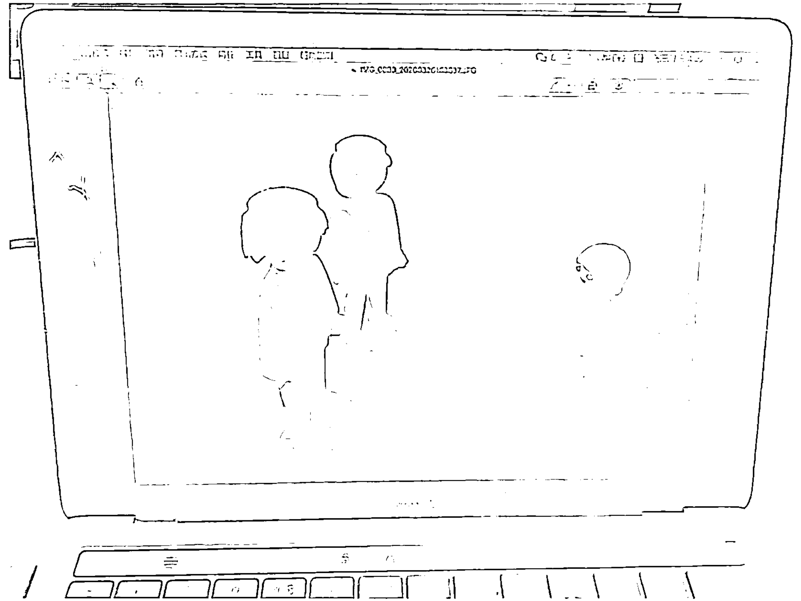

### （五）個案流程

邀請案主加入會議，個案排列開始，過程按照前面所教的一對一排列步驟：起、承、轉、合的順序以及所要達到的任務來進行。

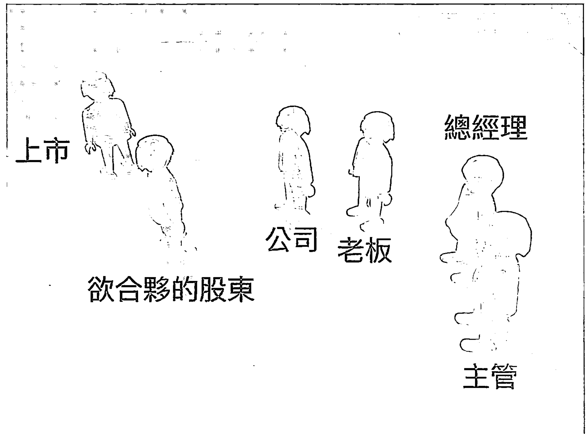

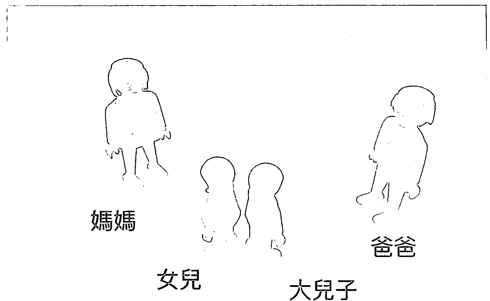

### (六)拍下重要的排列畫面

如圖7-2、7-3。

### (七)結束個案

### (八)個案結束後工作

填寫個案紀錄,發送重要的排列畫面給案主。追蹤案主後續狀況。如果案主有需要,可以預約後續的諮詢。

## 線上個案排列——
### 個案示範與解析

## <案例1> COVID-19 疫情後事業的生存之道

### 【排列操作】

張經理是美國一家大型科技公司的業務經理，她的團隊有十多個人，由於這次 COVID-19 疫情影響他們的業績很大，讓她有許多擔心，她在思考有哪些盲點以及要做什麼改變。

張經理：「周老師，你好！上次上了你的課真的受益良多。這次新冠肺炎疫情改變了很多東西，包括我在做的生意，還有團隊建設。這幾個月，我也有很多想法，抱著擔心和不知道要何去何從的感覺，非常不踏實。之前我所建立的商業模式也想得要有所改革。這次個案我想做一個探索，有什麼我應該改變或有沒有什麼地方被卡住了。」

周老師：「尋找一個人偶代表你自己，兩個人代表你所有的團隊，還有一個人代表客戶，或者說代表金錢，因為其實客戶代表的就是你們的收入主要來源，是嗎？」

張經理：「是的。」張經理選擇了白色人偶代表她自己，藍色跟紅色人偶代表她的業務團隊，黃色人偶代表客戶。

周老師：「現在你把他們排出來，你告訴我你想排的位置、誰跟誰站在哪裡，然後你想站在哪裡。」張經理非常仔細地請周老師按照她心中的想法把代表排列出來（圖8-1）。因為是以視訊的方式進行，周老師會跟張經理仔細核對她所想要排的位置，讓張經理確定所有人偶代表的距離遠近、面對的方向，是否準確地符合她心中此時此刻的感受。

周老師：「你觀察到了嗎？你把你自己白色人偶面對你兩個團隊代表的人偶，而且站得非常靠近，你真的很重視你的團隊，甚至可以說你很愛你的團隊。」

張經理：「對呀，你這樣講我都要哭了，你太瞭解我了。」

周老師：「你非常關心他們，你的團隊也非常關心你，你們好像是一群很緊密的兄弟姐妹一樣，就像一個大家庭。這是你自己排出來的，你把你們系統的深層信息呈現出來，讓自己看見了。」

張經理：「沒想到是這樣。」

周老師：「而且你一直不斷跟他們說話。」

張經理笑了起來：「對呀！我一直跟他們講話一樣。聊得很頻繁勒，因為最近群組裡比較多人，其實疫情發生我們幾乎每個晚上都會說話。」

周老師：「我們看看這個客戶。他對你們也很好奇的，想說這些人在這裡做什麼？但你非常專注於跟你的團隊互動。客戶看了一會兒沒人理他，就漸漸轉身了。」

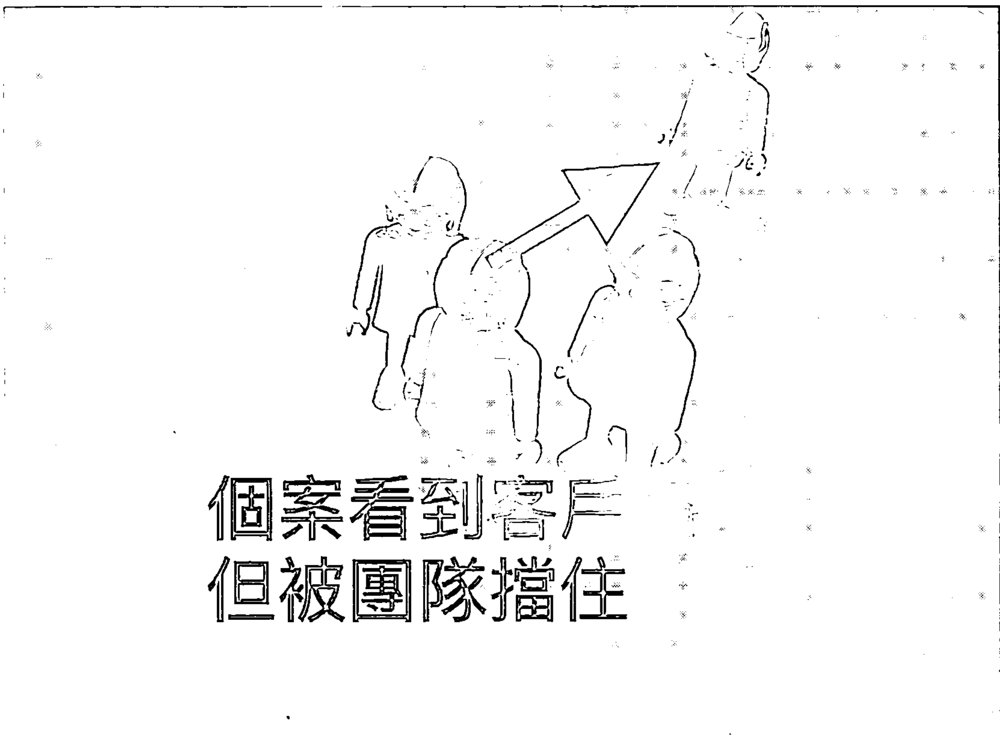

（圖8-2、8-3）

張經理：「對，我覺得要跟我團隊裡的每個人講話，給每個人出口，有時候可能會忽略到我的顧客。好厲害，答對了。」

周老師：「雖然你心裡很愛你的顧客，也愛你的金錢，可是因為你太專注於你團隊的人，所以反而會阻礙你為你的顧客服務。你的顧客覺得奇怪，怎麼他們不搭理我？久了他就沒興趣了。這就是你忽略的盲點。你不要等顧客跑了才趕快去追。你可能太專注於處理團隊這些人太多情感的糾結，你要稍微調整一下焦點。」

張經理問：「好。你覺得顧客還要我嗎？」

周老師：「會。你有一種特別的吸引力，會把顧客吸過來，顧客會轉過來看你的，而且因為這樣，你可以帶動你的團隊去看到顧客。這才是你建立你的團隊最好的方式。」

張經理：「我知道了。」

周老師：「你要把你非常特殊的特質發揮出來，你可以吸引你的客戶去跟他們互動，同時你要想辦法訓練你的團隊也朝這個方向。」周老師一邊說著，一邊移動張經理的代表，讓她站在團隊成員的前方（圖8-4）。

張經理：「你是說團隊的成員嗎？」

周老師：「對。你要向你的團隊展現出來，你怎麼去跟客戶互動、你跟客戶如何建立好的關係，而且你會跟客戶做朋友。你跟客戶當朋友，是很重要的一點。你讓客戶感受到這是我們的團隊，你的團隊也就會跟上來。而且你的客戶因為你也信任你的團隊。你有感覺嗎？」周老師一邊說著，一邊移動張經理和客戶的代表，讓張經理、團隊成員和客戶互望（圖8-5）。

張經理：「有。你好厲害。」

周老師：「你這個人也閒不住，一段時間之後，另外又有顧客來了。」周老師加入了一個黃色人偶，作為新客戶的代表（圖8-6），接著說道：「你看到顧客就好像看到什麼東西會讓你很開心，你好像磁鐵一樣吸過去，而且客戶也喜歡你，也被你吸過來。這個是你的天性特質。」張經理聽完之後大笑。周老師繼續說：「張經理你有看到嗎？所以在這個階段，我們的焦點要稍微轉換一下，從你只看到你的團隊成員，轉到發揮你的特質，然後帶動你的團隊成員朝這個方向。你有感覺嗎？」張經理笑地回答：「有。」

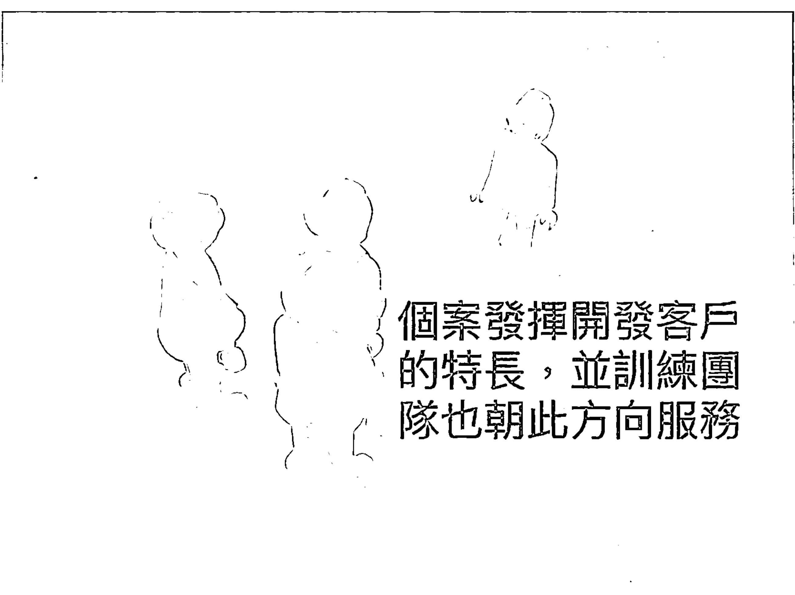

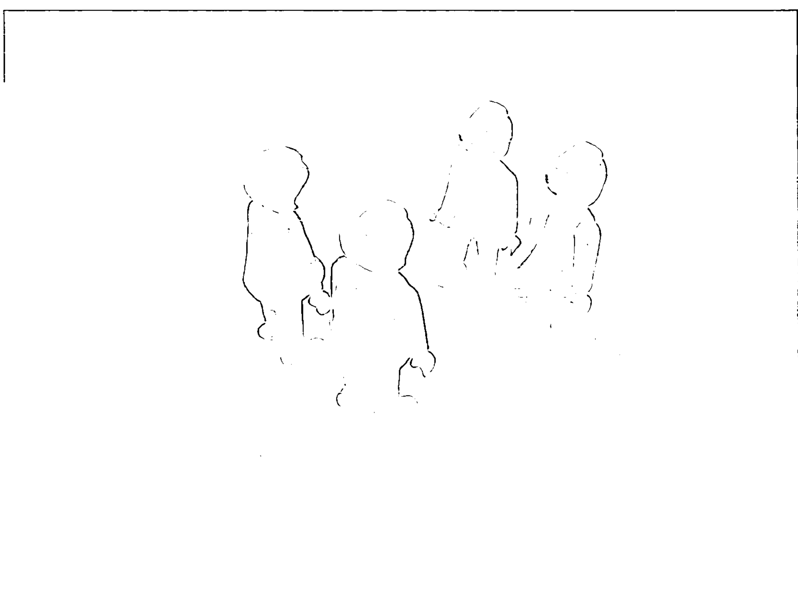

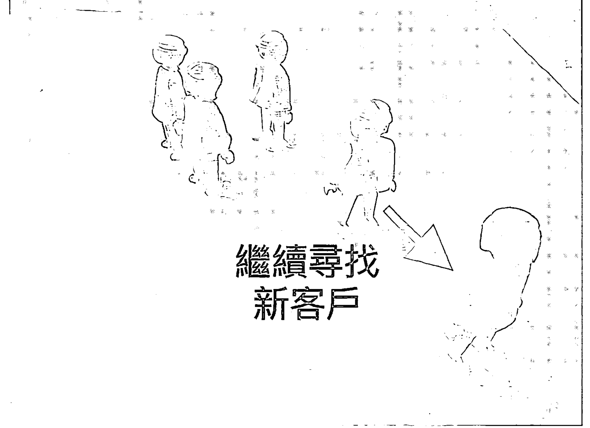

周老師又加入了新客戶的代表（圖8-7），並說：「而你的團隊也可以發揮這樣的特質。這樣有感覺嗎？」

張經理：「有，比起現在我一邊要照顧好我的團隊，一邊還要專注我的顧客，使得精力分散，對嗎？」

周老師：「對！你照顧你團隊的方式，不是讓團隊跟顧客分開的，你照顧團隊的方式是要讓團隊跟你的顧客有一個好的連結，讓你的團隊可以感受到原來你是這樣看到顧客，有感覺嗎？」

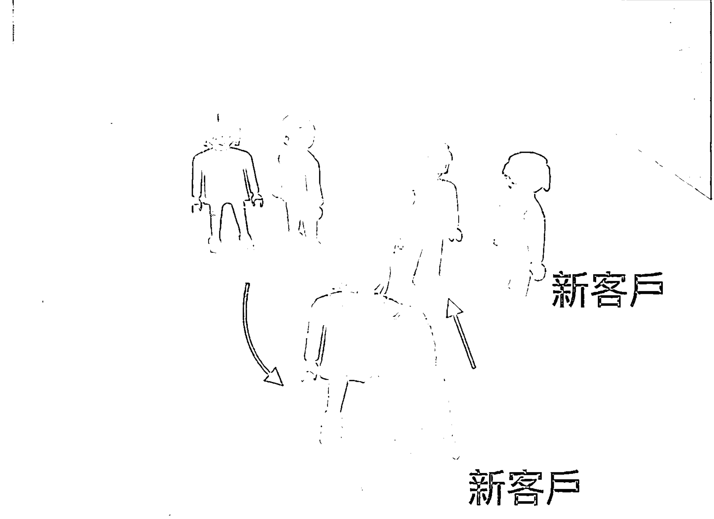

張經理：「有。」
周老師一邊感知，一邊移動人偶（圖8-7）。

周老師：「你看如果以這種方式，他們對客戶也會有很好的的互動，可以獲得客戶的信任。我覺得你們的團隊滿好的，因為你帶領得很好。接著有很多客戶你可以去開發，你的夥伴也跟你靠向客戶。而你就可以在後面支持他們，同時又有新的客戶。你的成員也會看到客戶了，也懂得去看新客戶了。這樣清晰嗎？剛剛一開始時，你們的團隊是擠在一起的，對不對？」

張經理：「有，比較清楚了。」
周老師：「好。所以現在這個過程反而重新讓你的團隊有一個重要的內在調整、內在改革，你也可以把你最好的部分發揮出來。這樣清晰嗎？」
張經理：「清楚，謝謝老師。」

### 【案例解析】

> 「信息的接收與呈現來自兩個部分，一個是觀察、
> 一個是感知。外在觀察和內在感知的結合，便能產生洞
> 見。」
> ——海寧格

（1）我們每個人身上都帶著我們系統的信息，還有過去集體的所有記憶，包括人生、家庭或工作。所有的這一切都攜帶在我們身上。因而當案主很認真專注地把她內在的信息呈現出來的時候，就把她內在的信息畫面場域呈現在這個外在的場域裡。如果我請其他排列師來排上述個案，案主、她的團隊、你的客戶的位置，會排得跟剛才一模一樣嗎？答案是否定的。這表示每個人都可以呈現出自己所在的系統信息，而且每個人的信息畫面都是不一樣的。當案主呈現出其信息畫面時，我們每個人都可以觀察到這些位置、距離等所呈現出這個系統的重要信息。當案主很專注地把這些人偶代表排列出來時，他身上的這些系統信息就會灌注到這個場域裡。人偶只是媒介之一，也可以用其他小物品或白紙。就好像我們在做團體系統排列時，是用人當代表，人是團體系統排列的媒介和信息接受器，去代表某人的爸爸、媽媽、爺爺奶奶，只要這個人願意把自己放空，都可以感受到這些信息。現在科學家已經研究出來，所有的信息其實都是相通的。同理的，當案主專注地透過這些人偶把這些信息呈現出來，一位受過嚴格專業訓練的排列師，在心夠靜、感知力夠強的時候，一樣可以感受到案主所灌注進去的場域信息。唯一不同的是,這些信息非常細緻、非常精微,而人偶是不會自己移動的,所以排列師的心要很靜才能夠明確、深刻地去感知這些信息。透過感知的信息移動人偶,就好像我們實際的人做代表一樣。接下來,外在觀察和內在感知的結合,會產生有一些比較深層的洞見(insights),如同剛剛案主的反應。他在系統裡會產生自己的盲點,有許多東西是案主所沒有辦法覺察到的,而排列師是在這個系統以外的第三人。如果排列師的專業功力夠高,他就能呈現出案主沒有去覺察到的信息,案主往往會出現:「對!就是這樣!」或者出現「哇!我怎麼沒有想到可以這樣做!」這就是洞見顯現出來的時候。排列師把案主的覺察帶了出來,點破舊有的盲點模式。洞見顯現出來時,會給案主及所有人一種清晰感、一種豁然開朗的感覺,他就知道自己下一步該怎麼做了。

（2）所有人在自己的工作團隊裡,或在自己的公司裡,都有自己的盲點。所以成功的企業家常常都要能夠跳出自己的公司,這像剛剛我們所做的一樣,跳到一個比較高的位置去看到整體系統。這時候我們就不會聚焦在習慣的舊有思維與模式,太專注於手上做的事情，而忽略了整個大局，見樹不見林。沒有辦法比較公平公正、比較客觀地去看我們自己。但是當我們跳出來，我們就有機會從一個更深刻、更高維、更大的整體觀來看，看到之後就有的方向了，對未來就比較不會擔心或無所適從了。我比喻這就像開車一樣，以前塞車的時候，我們就只能在車子裡乾等，但我們現在有手機或GPS導航，用衛星畫面呈現出目前的路況，這就是用一個更高更遠的維度來看，我們就知道該走哪條路了。排列師的專業價值，就是幫助案主跳脫原本所在的系統位置，站到一個更整體的高度來看到這些更深層的信息，甚至激發出許多具有創意的洞見，支持案主面對當下的情況。包括COVID-19疫情發生也是一樣，如果能善用系統排列幫助我們看到更整體的高度、看到系統的深層動力，我們就能更有覺知地調整事業系統、家庭系統的體質與動力，找出清晰的方向與步調，即使遇到疫情也能化危機為轉機，更加實現人生的理想。

## 系統排列的全息智慧
## 一對一排列與線上個案的理論與實踐

### <案例2>面對棘手的項目，該如何處理？以及如何選定下階段的合作對象？

#### 【排列操作】

陳董是一間科技及土地開發集團公司的負責人，五年前他的公司在中國大陸投標政府一項建設科技園區的項目。陳董公司得標了，買了地，也開始融資，但政府後來卻要把這塊地收回去。這幾年談判下來，中國政府並沒有採取決定性的行動，加上這半年疫情的關係，雙方的協商幾乎停止了。陳董公司前後已經為這項項目投入龐大的資金，甚至影響到公司的現金流。

陳董另一個問題是，另外有兩個城市的政府機關都想與陳董公司合作開發科技園區，他想知道該怎麼做比較好？

陳董：「五年前我們得標了一個科技園區的造鎮項目；去年政府覺得當時賣地的價格太低了，他們想拿回去做，我們也願意賣給他；今年政府回信說，我們可以談判，他們可能不想我完全撤資，要我留在那邊，可以幫他們一起合作。對於政府來說，就是看到我們現在開始做得比較好了，他們自己想拿回去，這有點不合道理，但是你跟政府也沒得說。」

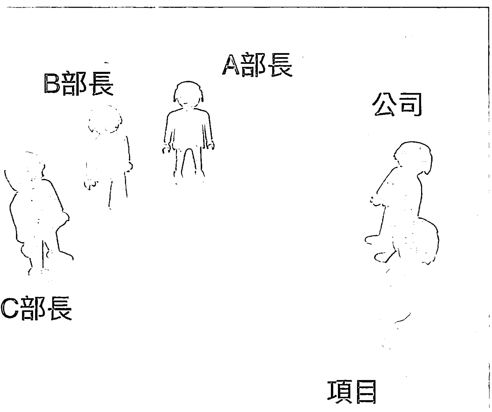

周老師：「你們投入多少錢？」

陳董：「我們投了一億多美金，還有其他開銷。」

周老師：「政府想收回你們原來得標的項目，而你想知道怎麼跟政府處理這個項目的問題嗎？」

陳董：「可能政府裡面也有不同的想法，有些願意趕快處理，也有些人想拖延，等以後再說。目前想看看我這個項目怎麼完善處理？」

周老師：「如果要處理這個項目，有哪些關鍵的人物涉入？」

陳董：「有三位部長都是直接影響這個項目的最終處理方式。」

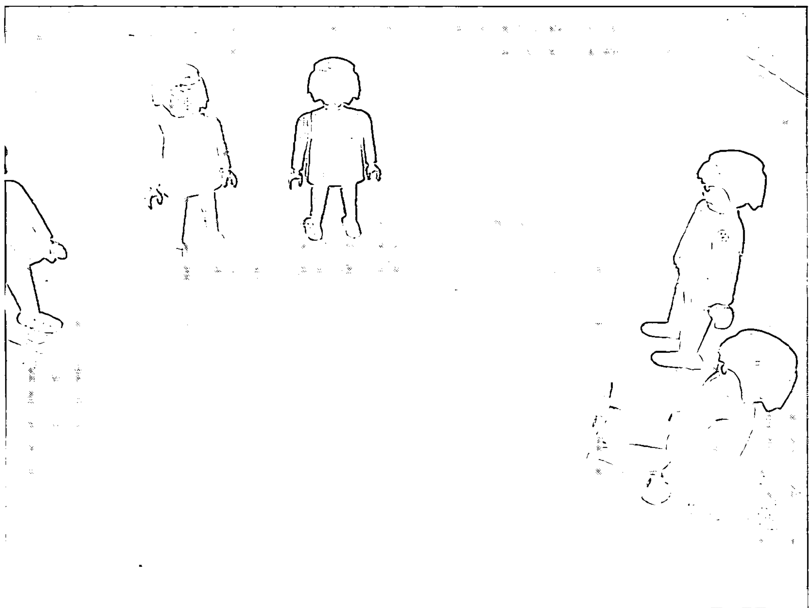

周老師：「找三個人偶代表這三位部長，一個人偶代表你們公司，一個人偶代表這個項目。按照你當下的直覺把他們的位置排出來。」周老師根據陳董仔細的指示，把這幾個人偶的位置、面對方向以及彼此間的距離排出來（圖8-8）。

周老師：「我們來感知一下你所呈現出來的場域信息。」周老師將手扶著每一個人偶。公司站得穩定，有一點點向後退，項目晃來晃去不穩定，最後坐下來。A部長跟B部長不想看這一切，慢慢轉過身去。C部長會看著這一切（圖8-9）。

周老師：「我這樣移動人偶，你有什麼感覺？」

陳董：「當這個項目坐下來的時候，我有一絲的失落感。」

周老師：「對。你花了很多心力，希望打造一個科技園區小鎮，但剛剛整個場域的感覺有點拖延，沒有好像一個最終的結果。這個項目感覺好像沒什麼活力，就好像停滯在那裡。」

陳董：「對！你說得對，他們好像沒有很積極在做。你講的也是現狀，本來幾年前就要開工的，可是一直在拖，後來說要買回去，也沒有很積極地去做。」

周老師：「這個項目沒有結果，好像不死不活的，又好像死掉了一樣。你們公司還是比較算穩定的。這三位部長裡面有兩個已經背對著，有些逃避的感覺，不願意面對。只有C部長會朝這個方向看。」

陳董：「對，之前都是這兩個部長的決定。而C部長是剛上任的，他之前沒有接觸過這個項目，現在他是主管我們項目的部長。」

周老師：「所以你看到A部長轉過去了，他不想面對這個燙手山芋。B部長也是一樣。但C部長會去看，而且好像會拉著他們也要來面對，不能這樣擺著。他是這個項目的主管了。」周老師一邊說，一邊擺弄人偶代表的姿勢（圖8-10）。陳董回答：「對！」

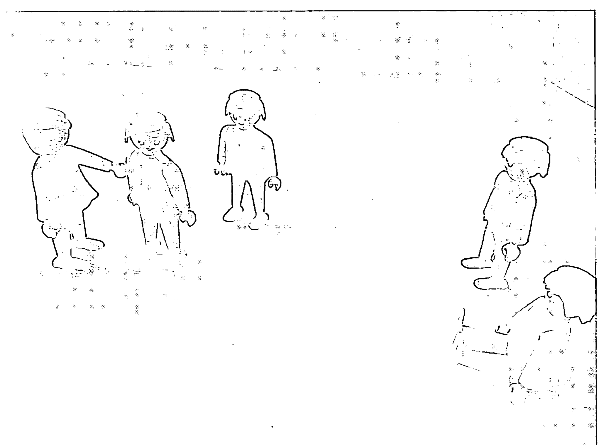

周老師：「所以這很清楚看到，你現在已經跟他們談條件和價錢了，對不對？他們已經要收回去了，那也沒有關係，但要從哪裡切入？你現在看到了是要從主管的C部長。」

陳董：「對，因為這兩個部長已經做完決定，不關他們事了。」

周老師：「不關他們事，但還是他們的事呀！只是他們不想看，但C部長會想辦法必須讓他們看。所以你看到要從C部長切入。」

陳董：「太對了！我還有盤算要拿多少錢，因為真的投了不少……」

周老師：「我覺得你還有一個成本忘了算，現在不是一億、兩億美金而已，還有你壓得更重更多的時間成本。」

陳董：「是。」

周老師：「對吧？你怎麼算你的時間？陳董，你一個小時就可能不止幾萬美金了。」

陳董：「我們損失五、六個億就對了，過去幾年他們一直拖。」

周：「對。重點是這兩個，第一、他就是拖著不想面對，但你現在清楚知道要從哪裡下手。第二，是談多少就拿多少，我覺得有時候要乾淨利落。」

陳董：「對，要乾淨利落。」

周老師：「就這個部分來說，這個方案其實已經有一點沒力氣了，所以你不用在這邊太戀棧了。你要知道哪裡是切入的人。現在你自己也看到了。好好對他，他可以是你的。這部分清晰了嗎？」

陳董：「非常清晰！這個C部長這樣擺了，我就更加堅定了。因為，我之前對這兩個部長還有一點幻想，覺得他們可能把項目重新找回來。但你這樣一分析也對，因為項目對他們兩個也是麻煩了。反而，C部長現在不面對不行，而且他沒反對過我們的項目。但項目不可能按原方案繼續做下去，因為政府既然曾反對過，就很難重新按原方案再做，這個我也知道。所以，我要果斷地跟他們談一個條件，就把精力投到那些邀請我去做的城市，不用跟他們纏那塊地了。這國家不缺土地。」

周老師：「對，這個是重點。我要為你鼓掌一下，太厲害了，你有很清楚的思維，你很有整體系統觀，一看就看到未來。要不然你把時間精力花在這上面，你的人生比這幾億美金更有價值，對不對？」

周老師：「這部分好了之後，再來是你剛才說還有兩個市政府很有興趣跟你們談合作？」

陳董：「因為我們這個項目滿知名的，很多地區的市政府都想要，他們紛紛找我們，想把這個項目落實到他們市政府的土地上。目前有兩個市政府跟我們走得很密切，一個是X市政府，一個是Y市政府。我們在未來半年內，可能就能選定其中一個。」

周老師：「接下來，我們快速地挑兩個顏色的人偶代表X市政府和Y市政府，代表公司的人偶還留著。你想把它們排在什麼位置？你自己決定。」根據陳董的要求，人偶的位置排列如圖8-11。

周老師：「好，我們一起來感知你所排列出來的場域。」（圖8-12）

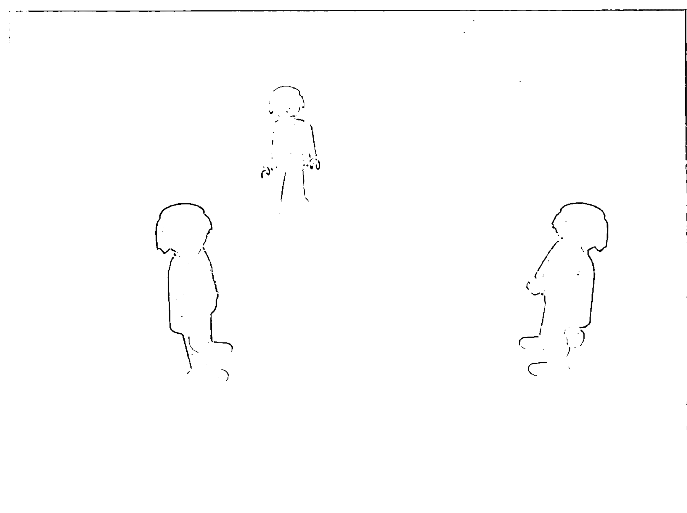

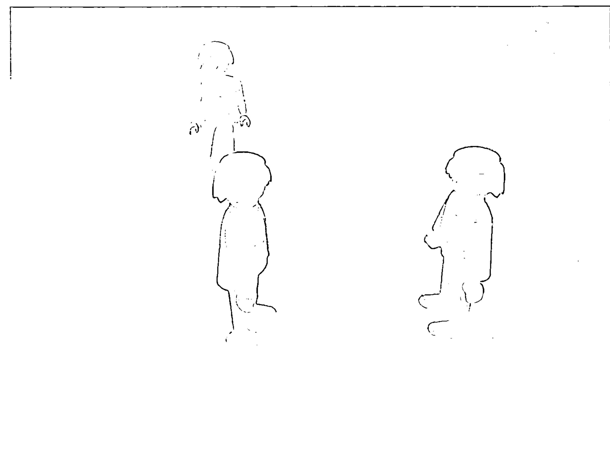

周老師：「覺得你們公司還是滿穩的。」

陳董：「對，我們的投資人跟所有合作方都還在。」

周老師：「公司跟這個X市政府，感覺你們是在跳舞，不過這個跳舞很有意思，其實他很想靠近，但如果你給他太多，他就會往後一些；但你稍微在這裡不動，等他一下下，他就想往前。我這樣 你有什麼感覺？」

陳董：「非常像。」

周老師：「所以你要跟這兩個市政府合作的話，這個X市可以先，因為這個Y市在觀望。」

陳董：「我們跟他們剛談了還不到一個月。」

周老師：「對，他就是觀望。你跟X市如果成功的話，他應該會靠過來。你要先讓Y市觀望，然後不時把信息讓他們知道，說你們跟X市談得越來越不錯了。他會觀望，他會從X市這裡知道跟你合作的結果。如果好的話，他會靠過來。他們還滿小心的，有一點迂迴前進。」

陳董：「X市政府是他們的市長親自來找我的。」

周老師：「對，所以讓他來找你，你就贏了；你去找他，他會覺得有壓力往後退。你就在那邊等他，然後讓他看見你在那裡。如果你要去找他，你也是要很緩慢的，讓他覺得很安全，然後它就會靠近。他被你們吸引了。」

陳董：「好。」

周老師：「一旦X市成功的話，Y市就會靠過來。」（圖8-13）

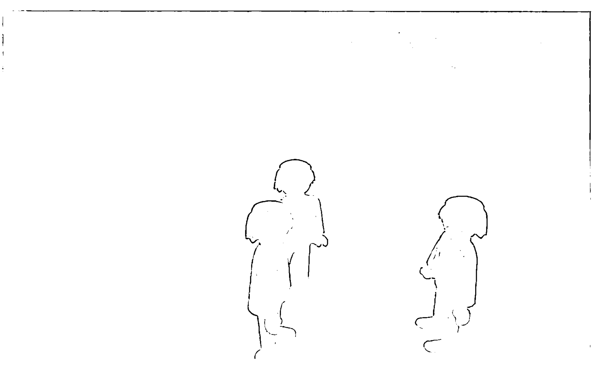

陳董：「我這個項目可以同時在這兩個城市進行都沒問題。這兩市加起來有一百萬人口。對，太好了，這樣清晰了。我還沒想到可以這樣做的。」

周老師：「好，祝福你了。我們到這邊告一段落。後續有什麼需要幫忙的話，可以來找我們。好吧？恭喜你了。」

陳董：「好的，謝謝！」

#### 【案例解析】

有句話說：「當局者迷，旁觀者清」。一位企業家一段時間必須脫離所在的位置，來到一個能夠看到整體的高度，這樣才能有通盤的考量，知道下一步該怎麼做；當知道該怎麼做之後，再回到所在的位置，這樣才清晰地知道要努力的方向。這是每位企業家必須要養成的修為。它是一種內在心靈的鍛鍊。著名的蘋果創始人賈伯斯以及日本知名企業家稻盛和夫都要求自己有這樣的修為與鍛鍊。而這就是系統排列能帶給人們非常有價值的地方，它能支持每位案主、每位企業家提高維度看到整體系統的動力。只有提高維度，才能看到未來可能發展的方向，才能放下焦慮和不確定感，並在當下採取最好的決定與行動。透過這些信息，我們就可以決定要把我們的时间、精力、金錢，以及最關鍵的是我們的人生，花在什麼上面。人們不是說要把錢花在刀口上面嗎？我說不只是錢，更重要的是我們每個人的生命，要把時間花在刀口上。如果一拖五年、八年、十年，人生最寶貴的、賺不回來的生命就在這上面漏掉了。剛剛陳董這案例給了我們很重要的啟發。

還有，剛剛這個過程很令人感到震撼，是不是？這就是全息場域的現象運用。因為我們每個人身上都帶著我們系統的全部信息，當案主非常專注地透過人偶建立他的系統場域時，他就把他身上所帶的全部信息灌入到這個排列場裡。與此同時，當排列師有一定程度的靜心功夫，當他能真正靜下來的時候，就可以感受到這些場域的系統動力。在團體的系統排列裡，我們是用實際的真人做代表來感知這些信息，在一對一排列的場域裡，如果我們能靜下來，其實就好像用實際真人做代表一樣可以感知到。但一對一系統排列，尤其線上人偶排列，對排列師的靜心程度以及專業素質的要求是更高的，所以有心想學習這門學問與方法的人，必須在靜心與成長上扎扎實實地下功夫。不僅如此，更重要的是，這些方法是要服務背後的精神，也就是宇宙生命運作的規律——「道」。當我們心中能領悟生命運作的法則，我們小心謹慎、有覺知地遵循著整體生命的法則來助人，同時也支持案主們遵循生命法則來行動，這時候我們才能真正成爲生命的通道，透過助人工作為生命服務。

## CHAPTER 9

## 一對一色紙與白紙排列

一對一排列還有一種方式是用色紙或白紙為工具來進行個案。小人偶排列時，排列師要去感知人偶。一對一色紙排列則是由排列師一個人來感知所有角色。

色紙或白紙排列比較像團體的系統排列，不一樣的是，團體的系統排列有很多人擔任角色代表，色紙排列則由排列師單獨一人來擔任所有角色代表，色紙或白紙只是用來標明排列的位置。

### 一、色紙與白紙排列操作要點與注意事項

- （1）當案主設定排列師擔任某一個代表角色時，如同團體排列，排列師立刻就可以去感知這個代表的感受。這時候手中拿的色紙或白紙是用來設定位置的，當排列師感受完那個代表的感受後，就把色紙或白紙放在所站的位置上，作為位置的一個標記。最後，排列師就可以用這些色紙或白紙的位置看出系統中每個角色所在的系統位置，進而可以探索系統動力。
- （2）色紙和白紙操作的區別：兩者區別不大，色紙是以不同顏色來區分角色；白紙則是要在上面寫上不同角色的稱謂名稱。一般都是使用A4大小的紙(圖9-1)。
- （3）色紙和白紙排列操作的好處：色紙和白紙排列操作的好處是，排列師可以「親身體會」所有角色的感受，很快地就能掌握所有角色的信息。當排列師和案主做了開始的會談後，他便請案主選擇相關的角色。若案主選擇一張色紙代表爸爸，排列師就拿著代表爸爸的色紙，讓案主扶著排列師的肩膀給了爸爸一個位置，如同團體的系統排列一樣，排列師就代表爸爸去感知爸爸的感覺，包括身體的感覺、心裡的感受以及頭腦的想法，比如身體有哪裡不舒服，想要蹲下來，心裡面的感受是什麼樣等等。排列師把它說出來，報告給案主。然後把色紙放在你所站的位置地上做標記。接著繼續感知下一個代表，比如是媽媽，一樣讓案主扶著你的肩膀給了媽媽一個位置。也許此時你可能感受到媽媽想要關心爸爸，有一個推動的力量讓你想要朝向爸爸的方向走，想要到爸爸旁邊去幫助他，希望他可以站起來。排列師將回饋報告給案主聽。若是媽媽沒有特別的移動時，就把色紙放在地上定下位置來。接著進行下一個，比如代表孩子，站到案主排的位置去感受，用符合角色的話語、合適的語調來回饋給案主。用色紙排列的好處是你可以經驗這個系統裡所有人的深層感受，這非常有助於探索系統動力，等到系統動力的畫面呈現後，就可以朝向這個系統需要的解決之道。也許需要做一些對話、鞠躬、擁抱或和解等，這個時候就要請案主親自上場，站在自己的角色上進行解決之道的過程。

### 二、色紙與白紙排列操作步驟

- （1）案主闡述議題，排列師和案主就目標達成共識。
- （2）排列師根據議題選擇色紙或白紙代表所需的角色。
- （3）案主扶著排列師肩膀，推動排列師走到場域中，按照自己的感覺給代表角色一個位置。排列師感受每個代表，並且把它報告出來，然後將色紙擺放在所站的位置（圖9-2）。
- （4）排列師和案主共同探索動力方向，可以用色紙或白紙增加代表的角色。當代表有增減的時候，排列師可以依次重新站在每一張紙上感受代表因角色增減所帶來的變化，不管是情緒感受或想移動的方向，並用第一人稱的方式表達出感受，回饋給案主。例如：孩子的代表說：「當爺爺的代表加入時，我想靠近他。」
- （5）幾次來回感知、回饋詢問、交叉驗證與呈現系統動力之後，來到轉化階段找出解決之道。在這適當的時候，案主自己上場，排列師支持案主面對場域，並開始一些解決之道的對話或動作移動。
- （6）最後排列師要扣回議題，若需要時可建議後續落實方式，並結束此次排列。

### 三、色紙與白紙排列操作重點指引

- （1）排列師能夠放空自己、保持中立，且準確體會每個角色的感受，切忌用自己的意圖、想法干擾感受。
- （2）排列師感受代表時，角色切換要明確快速，並描述、報告出來給案主聽到。
- （3）排列師描述代表感受時要用第一人稱：「我……」、「我覺得……」、「我想要……」、「我的身體感到……」。還要注意語音語調，盡量不要跳脫代表的感受用來表達。但當你回到排列師的身分跟案主說話時，就要用一位排列師的專業語氣說話，讓案主可以區分你現在是代表角色的回饋，還是以排列師的身分跟他說話。所以你要特別留意用不同的聲調、語氣讓案主可以清楚區分。
- （4）排列師在移動的過程，需增加新的代表或說一些話的時候，要去站到其他角色去感受他的變化，可以多次交叉驗證各個角色代表的感受。每次增加新的代表後要再去感受一下，這樣你就會知道動力的變化在哪裡。
- （5）用色紙或白紙做一對一排列時，因為是一個人分飾多角，要特別留意不要好像是自己在演戲一樣。焦點還是要放在如何更有力量幫到案主，方法只是一個媒介。
- （6）排列師不是要去改變案主的命運，而是幫助案主更有力量面對問題，承擔起自己的責任，更有智慧去處理當下所遇到的議題、回歸序位、支援案主領悟並朝向生命五大法則。
- （7）色紙或白紙可以用拖鞋替代、延伸，也就是用不同的拖鞋代表不同的角色。排列師穿上不同的拖鞋去感知不同角色的感受，然後用拖鞋去標明位置與方向。其他的操作過程與色紙或白紙一樣。
- （8）角色數量最多限制在六、七個以內，否則代表角色太多容易造成混淆。

## CHAPTER 10

## 色紙排列——個案示範與解析

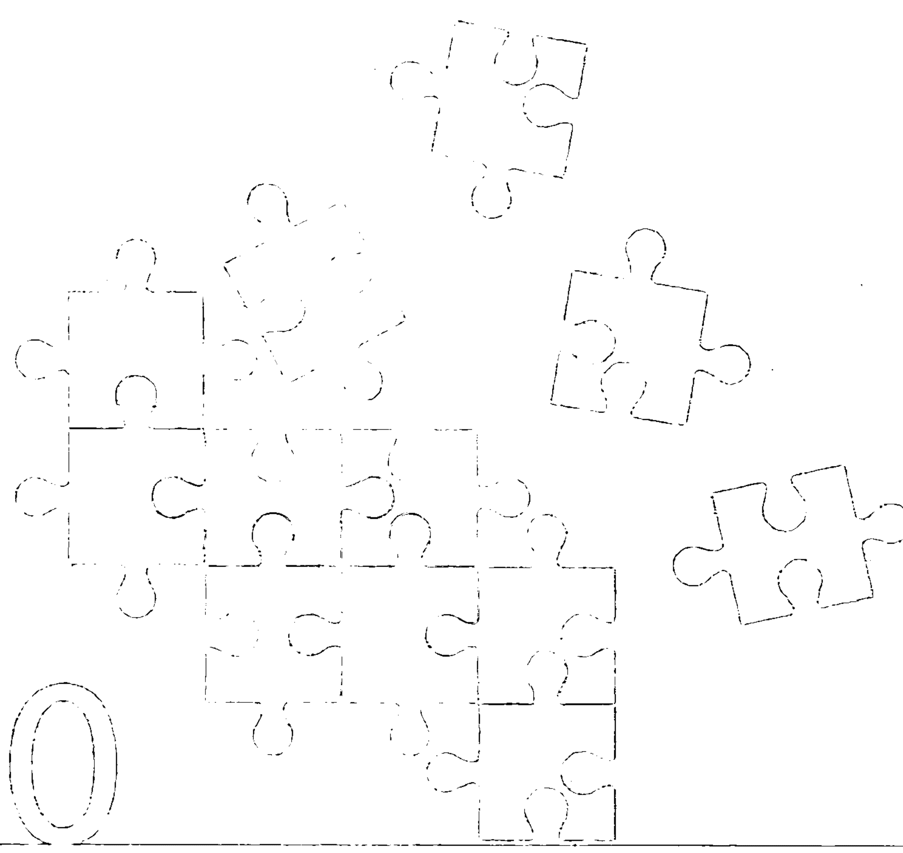

### <案例1>為什麼我的生命沒有動力？

如靜看起來人如其名，從容沉靜，但是眉宇間卻有著淡淡的憂傷。

#### 【排列操作】

第一步「起」：建立關係，釐清問題，收集信息，達成共識。

周老師：「什麼議題？」

如靜：「我發現自己走不動了，做什麼都沒勁。我想往前走，但是走不動。」

周老師：「什麼阻礙了你？」

如靜：「自己阻礙了自己。」

周老師：「那是什麼樣的感受？」

如靜：「如果繼續往前走，我負不起這個責任。」

周老師：「比如什麼？」

如靜：「比如要辦讀書會，我不想開始，不敢開始。」

周老師：「生活中還有哪些類似的事情是你不敢開頭，害怕和恐懼的？」

如靜：「平時，自己想說的話也不敢說。」

周老師：「說了會怎麼樣？」

如靜：「說了會把好好的東西破壞掉。」

周老師：「就會發生不好的事嗎？」

如靜：「我不知道。」

周老師：「有些話、有些事你不敢說、不敢做，你印象最深的是什麼？你曾經說過或做過什麼，讓不好的事情發生？」

如靜沉默很久，思考很久才說：「想不起來。」又說：「我從小就不想說話。對父母也沒有什麼要求。」

周老師：「你是怎麼長大的？」

如靜：「我是看著父母長大的。」

周老師：「你看著父母？是不是他們就自動餵你東西吃，幫你換尿布了？」

如靜：「就是我心裡有什麼需求，他們就來滿足我了。」

周老師笑了笑，說道：「你的心想事成的能力很強大，那你什麼都不用做，事情自己就完成了，好羨慕你有這樣的能力！我想問你，當你有需要，你會用什麼樣的方式去表達？比如，你需要爸媽幫忙時？」

如靜：「十歲之前我沒有記憶。十歲之後，就自己搞決定。沒有飯就不吃了。我媽說我小時候像貓一樣，吃得很少。」

周老師：「你想往前走嗎？你想達到的是什麼？」

如靜：「我想往前走。我想得到一些力量往前走。」

周老師：「那你希望有了力量達成什麼？」

如靜：「有事就會積極主動做。」

周老師：「所以，你今天也要積極主動，否則我也推不動你。具體來說，你想做什麼事？」

如靜：「就是對自己的理想更堅持地往前走。」

周老師：「你的理想，具體的說是什麼呢？」

如靜：「我想在家庭和理想之間有個平衡。」

老師：「你想要實現的理想具體是什麼？你平時在家什麼都不做嗎？」

如靜：「我在家會很努力地照顧孩子，煮飯給他們吃。」

周老師：「如果你先生給你更多的支持，你會更有動力嗎？」

如靜：「是的。」

周老師：「那麼，如果先生或周圍人能夠支持你，你就會有力量。」

如靜：「他們本來就很支援我，我好像需要的不是那部分。」

周老師：「那我們從具體的事情開始。你想做哪一件事情，我們才能繼續往前走？」

如靜：「我想開展讀書會，十個人，都是我的閨蜜們。」

周老師：「這件事情就代表了你願意去做的一件事情。我們試著在這個課程結束後就開始讀書會，等你接下來要有行動，我們才再繼續你的個案工作，好嗎？」

如靜：「好的。」

於是個案在這裡先暫停，等待案主開始有所行動，再繼續做排列。如靜在這兩天課程的晚上，就開始規劃她的讀書會，並且聯絡了一些人。

第二步「承」：選擇代表，探索動力，詢問歷史，揭露真相。

第三天上午，周老師請如靜再坐到案主的位置，繼續之前暫停的工作。周老師讓如靜選代表，向她說道：「選一張代表你的目標，選一張代表你自己。」於是，如靜選一張紅色的紙代表自己，選一張藍色的紙代表目標。

周老師：「你今年多大？」

如靜：「四十一歲。」

周老師：「你有幾個孩子？」

如靜：「兩個，一個十四歲，一個兩歲半。」

周老師：「你出來上課時，誰幫你帶孩子？」

如靜：「老公。」

周老師：「老公很好，等一下也把老公也加進來。」

接下來，周老師向如靜說道：「現在我代表你。」周老師手裡拿著紅色紙，如靜把手放在他的肩膀上，推著他放了一個位置（圖10-1）。

周老師感受了一會兒後，回饋道：「當你把手放在我肩膀上，我很開心，我想笑，但是又不能表達出來，好像是隱微的笑。我和自己在一起很平靜。我眼睛動來動去，看著周圍的事物，亮的東西比較吸引我，沒有特別的感覺，就很平靜。是這樣嗎？」如靜點頭。

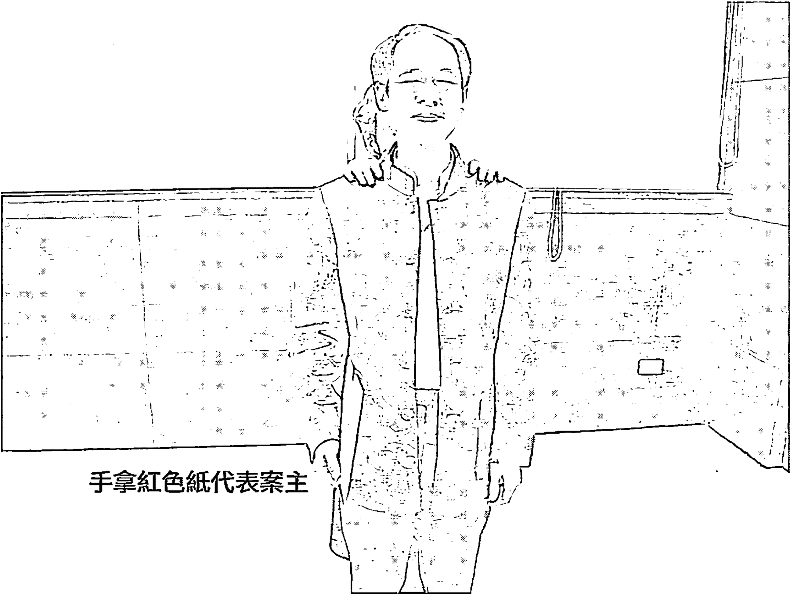

示意圖10-1 排列師手拿紅色紙代表案主，案主雙手推著排列師的肩膀排出位置。（為保護當事人隱私，以下皆以示意圖表示。）

接下來，周老師脫離這個代表，說道：「現在我代表你的目標。給我一個位置。」於是，如靜推著周老師，先是離自己的代表很遠，然後又轉身，慢慢靠近自己的代表，推來推去，過了一會兒才停下來。

周老師感受後，回饋道：「我閉著眼睛，我覺得自己很舒服，你推來推去，我感覺很好，我喜歡別人擁抱著我，我現在是半睡眠狀態。」說完後，周老師脫離代表，說道：「現在我代表老公。」如靜推著周老師放在和自己的色紙很近的位置上。周老師感受後回饋說：「離得太近了，我不舒服，我覺得想往旁邊移動一點會比較舒服。」（圖10-2）說完及移動後，周老師脫離老公代表，以排列師的身分問如靜：「你聽到他們回饋，你的感覺是什麼？」

如靜：「我想他們自己走，不想推他們，給他們位置。我把老公排得近，我也不舒服。」

周老師：「為什麼會這樣？好像你有這種需要，你渴望靠近老公。你的目標就像一個小孩。」

周老師接下來又問如靜：「我問你一些關於孩子的事，你生了幾個孩子？」

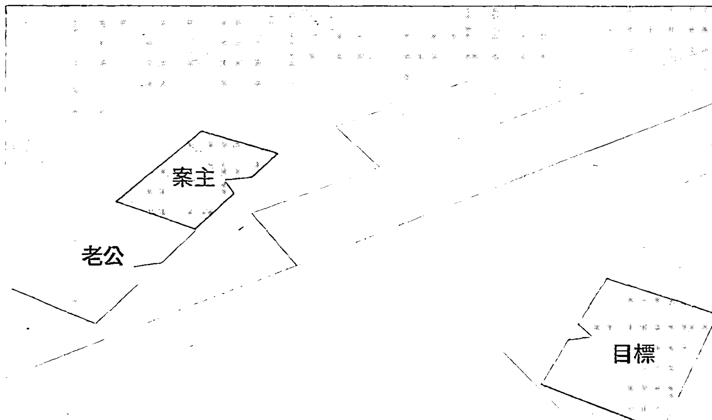

圖10-2 紅色紙代表案主的位置，綠色紙代表老公，藍色紙代表目標。

如靜：「頭一胎孩子是墮胎，是結婚之前懷孕的，我年齡那時候也小，就把孩子拿掉了。」

周老師：「你的兄弟姐妹有沒有沒有活下來的？」

如靜：「我爸媽沒有墮胎的孩子。」

周老師：「你的叔叔、伯伯、姑姑、舅舅、阿姨，有沒有沒有活下來的？」

如靜：「我爺爺、奶奶有十個孩子，只有四個活下來。有個伯伯去世得很早，差不多在我媽媽去世的那個時候就去世了。」

周老師：「你媽媽去世時，你幾歲？」

如靜：「十歲。」

周老師：「她怎麼去世的？」

如靜：「生病。去醫院沒有檢查出原因。」

周老師：「我記得我們上次和你做過『完成和媽媽中斷的連結IROM』（註），這對你是很重要的過程，你要在這部分加深它的影響，好嗎？有機會還可以再做一次，好嗎？今天我們不在這方面繼續，今天我們從家族系統動力方面來支援你，尤其感覺跟家族中的『孩子』有關，好嗎？」

如靜：「好！」

周老師：「你說你奶奶生了十個孩子，只有四個活下來，她當時一定很辛苦，沒有辦法照顧那麼多孩子。你爸爸怎麼樣？」

如靜：「爸爸現在是老人失智，記不起東西了。」

周老師：「你媽媽那邊呢？她有夭折的兄弟姐妹嗎？」

如靜：「有。」

周老師第二次站在代表案主自己的色紙上，再次確認感受，回饋給如靜：「我看著目標就像看著孩子一樣。」周老師讓如靜找出爸爸家、媽媽家沒有活下來的孩子代表，各用一張色紙代替。如靜先找爸爸家沒有活下來的孩子代表，如靜給的位置是疊加在她的目標上面（圖10-3）。

周老師對學員說：「你們看她所排的位置是不是很特別？」周老師站上去感受後回饋：「我覺得很好。」

周老師再讓如靜找媽媽家沒有活下來的孩子代表，讓如靜給位置，如靜給的位置還是在目標上面。周老師站在上面感受後回饋：「我覺得有點擠。」周老師讓如靜以白紙作為墮胎孩子的代表，並讓她扶著自己的肩膀給墮胎孩子位置，位置是在如靜和老公面前很近的位置（圖10-4）。周老師感受後回饋：「我感覺很舒服，我喜歡你這樣抱著我。和『目標』的感覺一樣。我喜歡你這樣抱著我。」

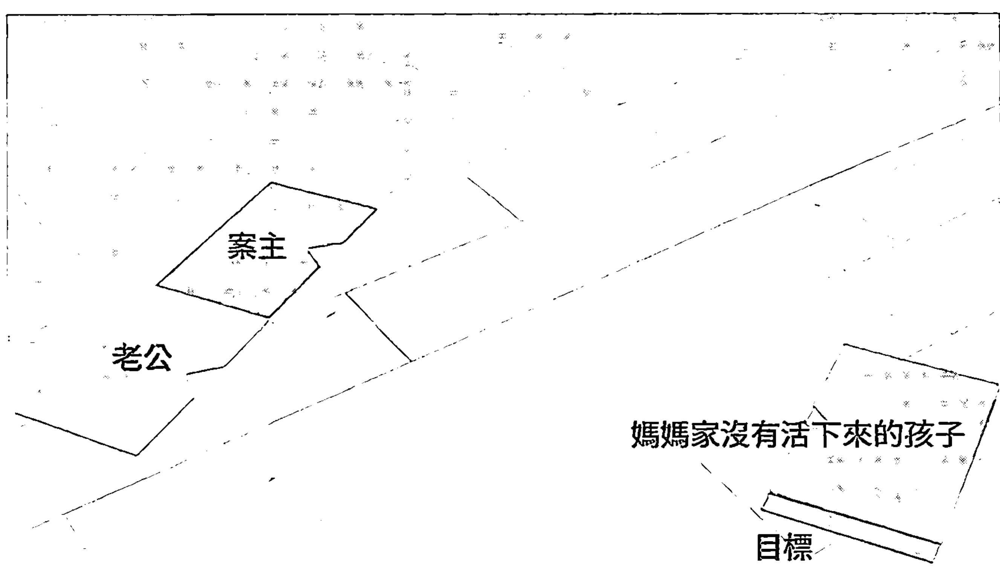

圖10-3 案主把爸爸家沒有活下來的孩子代表色紙位置疊加在目標上面。

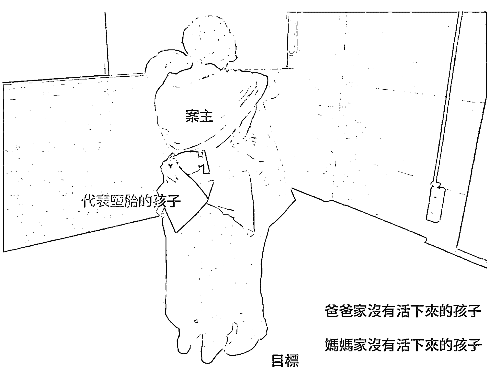

圖10-4 白紙代表墮胎的孩子，案主扶著排列師給的位置是在自己和老公面前很近的位置。

如靜情緒激動起來，抱住周老師所代表的墮胎孩子開始哭泣（圖10-5）。周老師代表孩子說：「我喜歡你一直抱著我，很舒服，我原來睜不開眼睛，現在我覺得眼睛可以睜開，我好像醒來了，好像從昏昏睡睡中醒來了。」

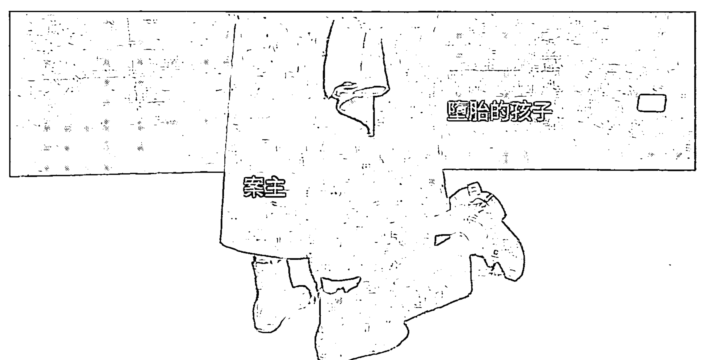

圖10-5 案主情緒激動，抱住排列師所代表的墮胎孩子哭泣。

第三步「轉」：尋找解決之道，表達情感，回歸序位的愛。

周老師脫離出代表角色，以排列師的身分對如靜說：「你告訴你的孩子，我是你的媽媽。」

如靜：「安安，我是你的媽媽，媽媽愛你。」

周老師又代表孩子說：「我感覺你抱著我，眼睛開始亮，有些長大的感覺。我很開心看到你。謝謝你陪我，陪我這麼久。我可以看到你了，我現在好像長大了。我感覺很熱。」

第四步「合」：扣回主題，內化過程，回家之後，行動建議。

周老師脫離代表，告訴如靜：「安安這個孩子，需要一點時間長大。這和你的目標感覺是一致的。這是你的第一個孩子，你愛他，他也愛你。他喜歡被擁抱，這是小孩的感受。你的目標也像寶寶一樣，需要一些時間長大。你的愛很有活力，會讓他眼睛睜開。你的目標就像你的孩子一樣，長大了。你有足夠的愛，但是不要太多、太熱了，他受不了。放下你的歉疚感，你的心裡有他，為他做一些事，但不要一直抱著不放。你已經為墮胎孩子做了六年的功課，可以放下了，不用一輩子去做。時間太久，生命的能量就會漏掉了。」

周老師告訴如靜：「我們犯的錯，不要抱著一輩子。我們面對墮胎的孩子之後，用一份愛為他們做一些事，然後過一段時間後放下了。他自由，我們也自由了。」

周老師再去感受如靜，說道：「這樣感覺挺好的。」最後，如靜自己站到自己的位置上，環顧家族裡所有沒有活下來的孩子，她對他們說：「親愛的孩子們，你們在我心裡都有一個位置，我會為你們做一些紀念的事。」又對她自己墮胎的孩子說：「安安，媽媽不再陪你了，媽媽要去做自己的事情了，再見了，我愛你，祝福你。」如靜平靜地放下墮胎的孩子。

然後她轉過身，開心地對大家說：「我好熱啊！我有力量了。我要讀書給你們聽了。」

#### 【個案追蹤】

接下來，如靜如願地開了讀書會，她越讀越有自信，越分享越能表達自己。從一場、兩場的讀書會開始，變成後來定期舉辦讀書會，她終於成功地達到她的目標、實現她的理想了。我們為她感到非常開心，這些年的陪伴終於沒有白費。

#### 【案例解析】

（1）有幾種個案不好做，其中一種是案主生命沒有動力，要你幫她。在這種個案中，如果案主說不出自己想要什麼，排列師想要幫他就會很費勁，而且需要用到自己的力氣，也會碰上案主以後還會不出力的情況。如果案主自己的力量不出來，排列師變成幫他解決問題，反而容易造成案主的依賴。做這樣的個案就好比打太極拳，只要對手出一點力，你就可以借力。所以，必須激發案主的力量出來，哪怕只是一點點。就像揉麵團一樣，只要一點點酵母就可以發成一大塊麵團。如果案主一直說他沒有力量，你就會掉入他的感受世界。在他的世界裡，你沒有立足之地，你會在他的控制之下施不出力。我們不要陷在案主的感受上工作，因為感受會來來去去，你也會出不來。這就是為什麼在上述的案例裡，一開始我一直要詢問「具體」的事情，並且要她採取一點行動，我們才繼續往下走，重點就是要把她自己的力量引發出來。

（2）案主覺得生命沒有動力，最常見的原因是小時候跟母親的連結中斷，想要朝向母親的動力因中斷而受挫，造成長大之後因為害怕這種挫折而不敢積極追求自己的目標，或者行動力會偏弱。如此惡性循環，久而久之便覺得生命沒有動力。這個部分上述案主也有，所以我和她曾經在這部分做了一些工作，而我也要案主繼續加強這個部分。第二個常見原因是認同了或放不下一些夭折或沒有長大的嬰孩。在上述的案例裡，當我站在代表「目標」的色紙上時，很明顯感覺「目標」像小孩，所以我決定往第二個原因的方向進行，我詢問了所有有關沒能活下來的孩子的事情。當我們請案主排出這些夭折孩子代表的位置時，她竟然把他們疊加在「目標」上面。當我去代表那些夭折孩子的感受時，感覺又和代表「目標」的感覺是一樣。經過這樣的交叉驗證，所以接下來就確定要在孩子這個方面工作。這是這個個案的重點。這就是色紙操作的好處，排列師可以明確地去感受所有角色的感受，非常有助於尋找解決之道。

（3）在用色紙操作的個案中，排列師要代表所有的角色，在各種角色和排列師角色之間要有很快、很好的轉換。每次角色轉換時，你要明確告訴案主你現在做的是哪個代表，還要注意回饋感受時不同角色的語音語調。

註：完成和媽媽中斷的連結（IROM, interrupted reaching-out movement）：每個孩子出生後第一個想要接近的目標就是媽媽，若因為工作、生病、死亡等種種原因，媽媽無法照顧年幼的孩子，讓孩子有早年與母親分離的經驗，會導致孩子想接近媽媽的目標沒有達成，在長大後往往在接近事業的目標時容易觸發孩童時期的挫敗感，而表現猶疑和退縮，也常常影響人際關係和親密關係。完成中斷連結可以幫助案主用新的經驗感受取代原有的挫敗感，幫助案主能夠邁向成功的目標，建立較親密的關係。具體操作方式請參考周鼎文，2020，《家族系統排列：核心原理與實務》，心靈工坊出版。

### <案例2>胸悶、心糾結，為什麼我不能讓自己的心安住？

來自新加坡的嘉玲三十多歲，是個工作盡責的董事長特別助理，同時也是一位美麗溫柔的女士。她說她的心很糾結，胸悶，有些貧血，在現實生活中總覺得找不到自己。

#### 【排列操作】

第一步「起」：建立關係，釐清問題，收集信息，達成共識。

周老師：「糾結的心會影響到身體、心臟，因為心臟負責運輸血液到全身。為什麼會這樣？往往是我們的盲點所致。你的身體如果有些反應，就要去覺察，看看這些信號要給你什麼提醒。透過這一扇門，去看到自己內心深處需要看到的。你是什麼情況？」

嘉玲：「我覺得工作上不夠專心，造成了一些狀況，總是感覺找不到自己。還有和媽媽總是有衝突。」

周老師：「什麼叫找不到自己？」

嘉玲：「要做事情，但是不能安住自己。」

周老師再次確認：「你說的『找不到自己』和『不能安住自己』好像不是一回事，你可以具體再說一下嗎？」

嘉玲想了想，說道：「好像是想要做好一件事情，但沒有辦法定下來。」

周老師：「你的『找不到自己』的意思是『找不到讓自己安定下來的力量，讓自己在當下專心做當下要做的事情』嗎？」嘉玲點點頭。周老師：「這個澄清很重要，因為『找不到自己』有很多解釋，一定要澄清到底是怎樣的一種感覺。感覺你是『想要讓自己定下來，面對自己當下想做的事』。這是你要的感覺嗎？」

嘉玲：「是的。」

周老師：「在你現在的生活裡，關於誰或是什麼事情，讓你會有找不到自己的明顯的表現？」

嘉玲：「在任何狀態都是這個樣子。我覺得有這樣的狀態，是因為我和老公離婚有關。很長時間，我就在那樣的狀態裡無法抽離出來。我們的狀況是，結婚九個月時，他就有外遇了；兩年後他搬出去，我待在公婆家住；後來他把我們的小孩也帶走了，我雖然還在公婆家住，但我看不到孩子。」

周老師：「為什麼你不離開公婆家呢？」

嘉玲：「因為我不想要離婚。如果我搬出去，別人會說是我先離開家。後來我也想了，覺得這樣在公婆家裡很奇怪。我不搬離公婆家還有一個原因是，我的爸媽還在世，爸爸說你結了婚就不應該離開。後來爸爸癌症去世了，媽媽說你就回來和我一起住，我才搬回家。」

周老師：「你這樣講，好像你一直遵循家裡的要求，是因為不想爸爸丟臉的、想要維護你們家庭的價值觀念——女人就應該怎麼樣，離婚是不好的事情。你被外在的一些東西束縛了，你有感覺嗎？」

嘉玲點點頭：「是的。我在工作上，別人也說我是一個帶著框架的人。」

周老師：「你在公婆家那麼久，也很委屈自己。」

嘉玲：「是的，所以我在那個狀態待了那麼久，整個狀態都很糟糕，對任何事情都會是那種狀況。」

周老師：「你對爸爸的愛的方式讓你困在裡面，這是很大的困境，所以你才會做這樣的選擇。」

嘉玲：「我怨自己和爸爸關係不是很好。爸爸過世之後，我想消除這種影響，可是一直沒有辦法親近，好像找不到他。」

周老師：「如果你爸爸當初同意，你會搬離公婆家嗎？」

嘉玲：「會。但我也沒地方可去，我只能回家。」

周老師：「你沒有辦法自己一個人住嗎？你多大了？」

嘉玲：「三十五歲了。」

周老師：「你的歲數也不小了。」

周老師：「這個家族好像有很多的束縛，我們從爸爸這條線開始。」周老師對嘉玲說：「你準備好要面對自己的心了嗎？」

嘉玲：「我一直在找。我不知道如何讓自己的心打開、去愛自己。」

周老師：「所以，你要有一個願意，好嗎？即使你要違背了對這個家的忠誠，你也要有勇氣面對，可以嗎？」

嘉玲點點頭。

第二步「承」：選擇代表，探索動力，詢問歷史，揭露真相。

周老師拿出一疊色紙，向嘉玲說道：「現在從這些色紙中，各找一張紙作為你自己、你的心、你爸爸的代表。」嘉玲找出一張紅色紙代表自己，黃色紙代表心，青色紙代表爸爸。

周老師：「現在，請根據自己的直覺，排出他們的位置。三個人的距離遠近、面對方向，都根據你心裡的感覺來排。你想先排誰？」

嘉玲：「自己。」

周老師：「現在我代表你。」周老師拿著那張代表嘉玲自己的紅紙，讓嘉玲扶著他的肩膀在課室裡排出一個位置。接下來，周老師把代表嘉玲的感覺說出來：「我一直把自己的眼睛閉起來，頭是縮的，眼睛越閉越用力，好像不想去看一些事情，身體是縮的，眼睛是緊閉的。」

嘉玲上前看周老師代表的自己的樣子。周老師代表嘉玲：「我臉上很緊，擠在一起。低著頭，側著身，很難受的樣子。」（圖10-6）說完後周老師回到椅子上，問嘉玲的感覺。嘉玲說：「這就是我的狀態。我的心不在了。」

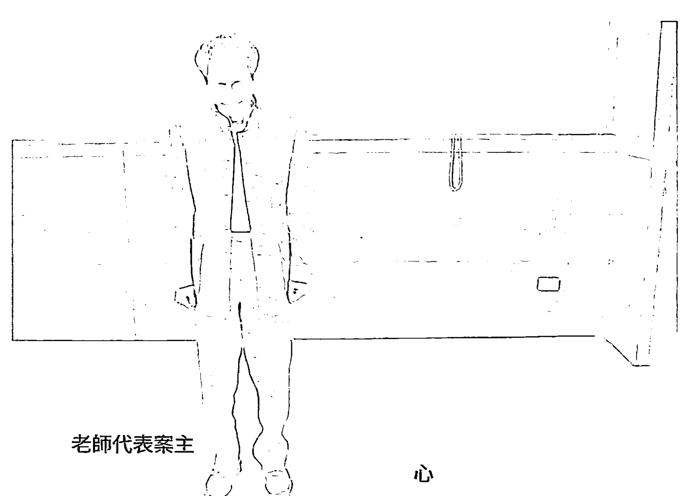

圖10-6 排列師代表案主,把案主的感受呈現出來。(為保護當事人隱私,以下皆以示意圖表示。)

周老師：「好，我們去找回你的心。」他拿著代表嘉玲的心的色紙，而嘉玲扶住周老師的肩膀說道：「請你代表我的心。」周老師就代表嘉玲的心去感受，呈現出身體開始彎腰、低頭、跪在地上，最後倒在地上說：「我覺得快不能呼吸了，整個人被吸到地裡面了，我虛弱得難以承受，眼睛不想睜開。」

然後，周老師起身回到座位，以排列師的身分對嘉玲說：「很辛苦啊!如果你這樣下去，肯定會很不快樂。心的狀況也會很受影響，你的心是在看著你的。」周老師問

## 系統排列的全息智慧

  嘉玲：「你的爸爸是怎麼過世的？」

  嘉玲：「我忘記了是肺癌？還是肝癌？」

  周老師：「爸爸是什麼時候過世的呢？」

  嘉玲：「兩年前。」

  周老師：「你的回答反映出你對爸爸的死還不想去接受。」

  周老師代表爸爸，拿著代表爸爸的青色紙，讓嘉玲把他排到一個位置。接下來，周老師把代表爸爸的感受說出來，他東張西望地說道：「我不大想要看。我知道女兒在那裡，但我不想看。我好像在找我的什麼東西一樣。我看到前方那裡好像站了一個人，他吸引了我的注意。」（圖10-7）然後周老師退回椅子，問嘉玲：「我覺得那裡好像有一個親人。你爸爸有沒有特別的家人是他放不下的？」

  嘉玲想了想，說道：「我想到了我爺爺。爺爺在爸爸過世前一個月，中風先走了，然後爸爸就走了。」

  周老師：「除了爺爺之外，還可能是其他親人嗎？我感覺那是一個滿有愛的人，是對爸爸很好的人、可以吸引爸爸的人。你爸爸的兄弟姐妹怎麼樣？」

  嘉玲：「爸爸在家中排行老大。我二叔生活規律，不喝酒、不抽菸，但三年前突然血管爆裂走了。一年後，奶奶跌倒也走了。接下來是爺爺，然後就是爸爸。」

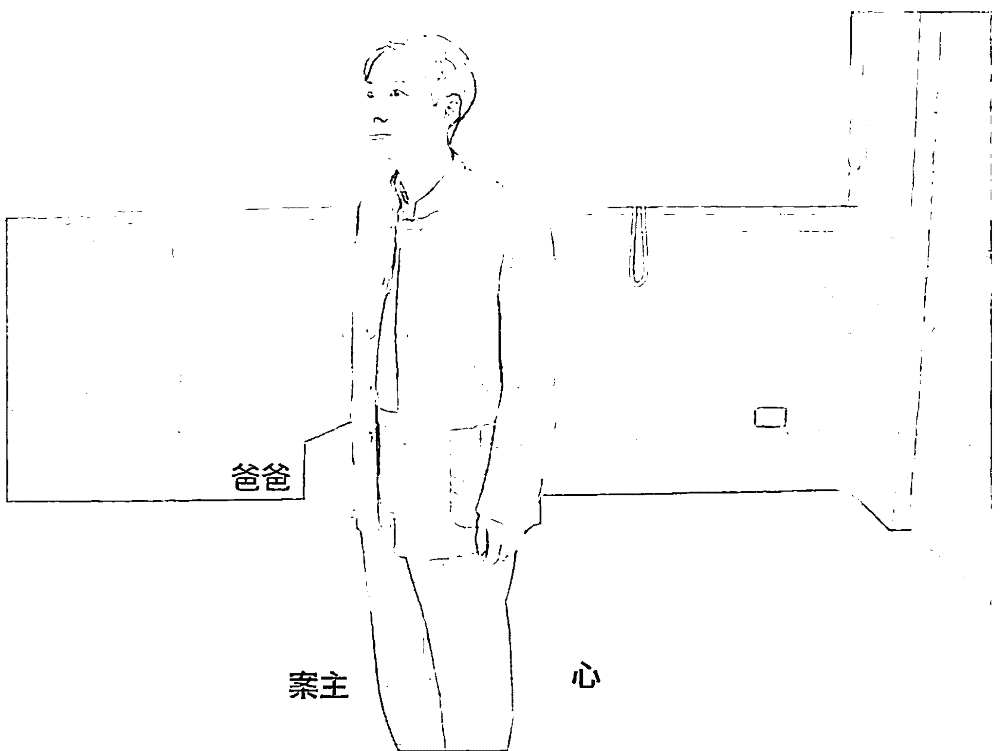

  周老師：「二叔是不是也是一個很壓抑的人？」

  嘉玲：「我和二叔接觸很少。不清楚。」

  周老師：「現在我們看一下，爸爸加進來之後，場上是什麼情況？」他站在嘉玲的代表位置上感覺，說道：「我會偷偷看爸爸一下，再閉起眼睛。有一點想靠近爸爸，但感覺又靠不過去。我也看到自己的心。」

  周老師回到座位，讓嘉玲加入二叔的代表。她找出一張綠色紙代表二叔，周老師把代表二叔的色紙放在爸爸的前方位置，站上去代表二叔。二叔身體往後仰，倒在地上：「我感覺有一股力量把我往下拉，我是突然往後倒的。我有一些哀怨的感覺，有些嘆息，我想說：『一切都沒有用。』接下來就躺在地上，像死去的感覺。」等一會兒，周老師脫離二叔的代表，起身去代表爸爸。

  爸爸慢慢往前走，坐在代表二叔的綠色紙旁邊。慢慢側身下去，望著地上。說：「我很高興和你二叔在一起，有些在微笑，又有些悶悶的。」

  接下來，周老師把爸爸和二叔的色紙放在一起，回到座位，以排列師的身分對嘉玲說：「爸爸的家族彼此連結得很緊密，好像有一種不成文規定把大家綁在一起。你有更貼切的形容嗎？」

  嘉玲：「爸爸他們兄弟姐妹和爺爺住得很近，兄弟的感情很好，經常去爺爺家。」

  周老師：「好像這個家裡面有許多規定和要求，為了維護這個家而有許多壓抑的東西。」

  嘉玲：「我不清楚。我爺爺是被招贅的，奶奶是別人的童養媳。爸爸的兄弟姐妹之中，男生有七個。」

  周老師：「爺爺被招贅，奶奶是童養媳，爺爺、奶奶都是離開了自己的原生家庭。作為男人，被招贅好像是放掉了自己的地位和感覺。」

  周老師又站在代表心的位置，心被下面的力量拉到跪下來，在地上側躺著，說道：「我看著爸爸，可是感到有力量往下拉我。」回到座位的周老師恢復排列師的身分說：「除了捨不得爸爸過世之外，好像這個家沉重的壓力讓你的心一直往下沉⋯⋯」他又問嘉玲：「你和爺爺、奶奶的關係如何？」

  嘉玲：「還滿好的。我上幼稚園時，回家就自己一個人，因為和爺爺、奶奶住得很近，放學後就去爺爺、奶奶家裡。爺爺很奇怪，常常自己坐在門口，不然就是坐在床邊看電視。我就在爺爺、奶奶家那邊坐著。在我高中時，我們家整修，我就住到爺爺、奶奶家。我奶奶是個很開通的人，她比較能接受我的新觀念。」

  周老師：「爺爺中風時是全身還是一邊？」

  嘉玲：「一邊。」

  周老師：「有時候，一邊中風是因為想愛身邊的人卻無法愛。」周老師讓嘉玲給爺爺位置，她選了黃綠色紙代表爺爺，將爺爺排在靠近爸爸和二叔的位置。

  周老師現在代表爺爺，他低頭彎腰，然後蹲下來，坐倒到地上，慢慢地說：「我感覺慢慢地在凋謝⋯⋯」（圖10-8）停一會兒，平和地說：「我的人生終於可以走完了，可以鬆一口氣了。」然後安詳地躺到地上。

  周老師回到座位對嘉玲說：「爺爺感覺人生無奈，想要凋謝死掉，他是往死亡方向的拉力走去的。」

  嘉玲：「我感覺爺爺滿辛苦的，他不能夠講話，因為說話就會鼻子流血，臨死前，他只能用眼睛看著我們，後來甚至連眼睛也看不到我們。」

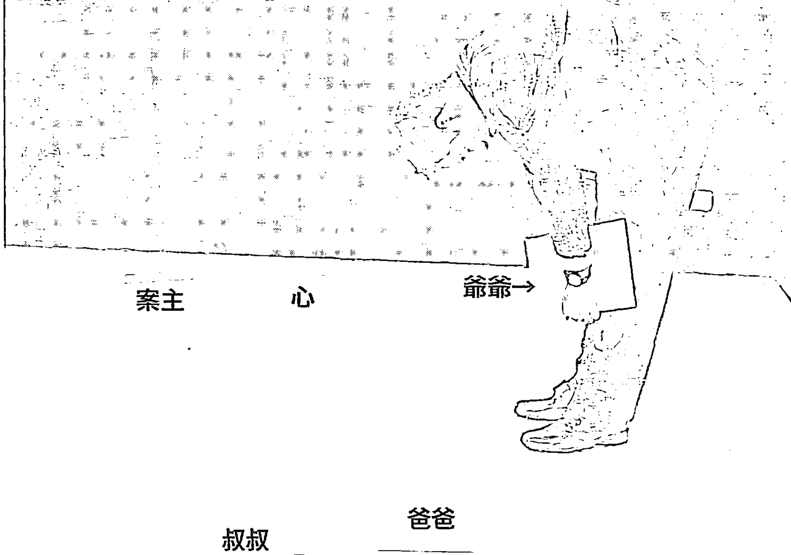

  周老師再去感覺嘉玲的心。慢慢蹲下、跪下，朝向爺爺方向說：「我被爺爺吸引。」然後爬向爺爺，倒地不起，頭朝向爺爺，說道：「我感覺頭很痛，但我只能這樣陪伴爺爺，看著他，一起沉入大地，我想慢慢地閉上眼睛。」周老師對嘉玲說：「這是你的心的感覺。」然後把代表心的色紙放在剛剛爬向爺爺旁邊的位置。問嘉玲：「你有沒有想到你的心和爺爺竟然這麼近？」

  嘉玲：「沒有想到。但是爺爺生病時，我常常去看他。」

  周老師：「你小時候家裡沒人，你帶著鑰匙去爺爺家的時候，是不是看到爺爺就會很安心？」嘉玲點頭。

  周老師又去感知嘉玲，站在嘉玲代表的色紙上，說：「我感覺咬著嘴脣，有些無奈，看著自己的心，但又有點想妥協，雖然委屈，就讓心在那裡吧。」周老師對嘉玲說：「可以看到，你的心在愛你的家人。這些家人都是死去的。感覺你的心好像沉到大地裡的感覺，好像重病的人沉到床鋪裡面，陷下去的感覺。」

  嘉玲：「對，我有這個感覺。看爺爺就是這個感覺，因為重症的人必須要幫他翻身。」

  周老師：「你這麼愛你的爺爺。」嘉玲看著爺爺，紅著眼眶。

  周老師：「你的心跟隨著爺爺，無法安住在這裡，剛才這些呈現讓你有什麼領悟？」

  嘉玲：「我沒有想到自己這麼想要跟著爺爺。可能小時候爸爸、媽媽都不在家，家裡就我一個人，我每天放學回去，看到爺爺就會安心。」嘉玲眼眶泛紅。

  周老師：「爺爺是個孤單的老人，你是個孤單的小孩。他死去了，你的心有一部分還在那裡陪伴他。當你遇到一些事情、挫折和困難的時候，就會想要循著過去的模式，在那裡陪伴，所以會有孤單、無力的感覺。」

  嘉玲：「我原本以爲是因為爸爸的關係。」

  周老師：「爸爸很愛爺爺，對你有影響。我不知道為什麼會這樣，但你的心就是跟著爺爺。你的心可以有更好的方式愛他，否則，你的身體是沉重的，你和自己的心離得好遠。」

  嘉玲：「是的，我每天運動跳躍的時候都跳不起來，感覺自己很沉重，沒有生命力。」

  周老師：「你才三十多歲，許多五十多歲的人都還跳得很好。你要下定決心，這是家族共同的命運，是歷史。歷史的意思就是要讓它過去。而你是新的人，要放下過去的、時代的、家族的包袱，不要被框住。其實你可以活出不一樣的你，但是被框住的心會讓你一直跟隨過去，你自己的心應該也不想要這樣吧。」

  嘉玲：「是的，我一直想要改變，可是卻找不到力量和方法。」

### 第三步「轉」：尋找解決之道，表達情感，回歸序位的愛。

  周老師：「你的頭腦在這樣想，你要把自己的心找回來才行。但如何把心找回來？有一點很重要，家族的這一切都已成爲歷史，那就要讓歷史過去，你生活在現在，未來有無限的可能。你願意讓歷史成爲歷史嗎？這是很重要的流動，你願意嗎？」

  嘉玲堅定地說：「願意。」

  周老師：「試試看，你現在做你自己。」嘉玲站到自己的位置上。周老師又說：「你知道我們可以如何辦到？爺爺已經慢慢地凋零了，生命可以休息，對他是好事，你愛他的方式就不是像過去的模式去陪伴他。你的鑰匙呢？」他拿出一把鑰匙，繼續說道：「你拿著鑰匙，回到小時候的感覺，慢慢靠到你的心，還有你的爺爺的旁邊。告訴爺爺你那時候的感覺，謝謝他陪伴你。當爸爸、媽媽不在你身邊，你一個人帶著鑰匙，孤單地回家，看到他，你就可以安心了。現在，這個陪伴可以告一段落了，要讓爺爺安息，讓你的心回來。你的心一直在代替你做這些事情，現在，要讓你的心要回來了，好嗎？等一下，我要你慢慢靠近你的爺爺、靠近你的心，告訴爺爺你的愛，還有你對他的感謝，把童年的記憶交給他，告訴他，你不再陪他了，他也希望你能好好活出來。」

  周老師站到爺爺的位置，對嘉玲說：「現在，我代表你的爺爺。」他說：「我感覺自己的身體在變重、變重，沉到地裡。」爺爺倒在地上。嘉玲哭著靠近爺爺，跪下來（圖10-9），真誠地對爺爺說：「爺爺，謝謝你，謝謝你在我小時候陪伴我。我不知道為什麼那個時候，家裡只有我和你。謝謝你，爺爺，謝謝你！」

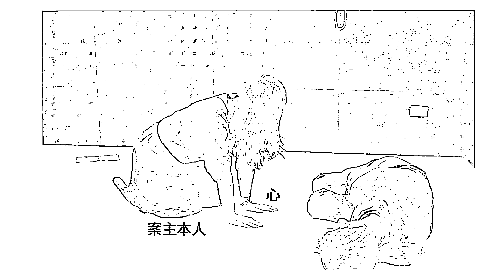

  爺爺伸出手，嘉玲拉住爺爺的手，更加放聲痛哭：「我每次去看爺爺，都會這樣拉住爺爺的手。」爺爺說道：「我希望你能夠好好活著。」嘉玲把爺爺身體放平，拉住他的胳膊，趴在爺爺身上低頭哭泣。爺爺的呼吸越來越平順。嘉玲說道：「我懂的，爺爺。我懂得你對我的愛。我愛你。」

  爺爺：「我有我的命運。」

  嘉玲：「爺爺，現在我把鑰匙還給你，我不再陪你了，我已經長大了，我要去過我自己的生活了。」然後她站起來，端正身子，看著爺爺，向爺爺鞠躬。

  周老師從地上起身，脫離爺爺代表，對嘉玲：「有一句話要告訴你，你爺爺說，你不用跟他一樣過孤單的命運。」嘉玲泛著眼淚點頭。

  周老師：「現在我代表你的心。」他蹲坐在心的色紙上，然後對嘉玲說：「你的心有話要問你『這是真的嗎？我可以不用孤單嗎？』」嘉玲肯定地說：「可以的。」周老師繼續感受，嘉玲去靠近自己的心，抱住自己的心。心紅著眼眶繼續問：「我可以不再孤單嗎？」嘉玲含著淚答道：「可以。」

  心繼續問：「真的嗎？」嘉玲更加堅定大聲地答道：「真的。」然後，嘉玲緊緊抱住了自己的心。

  心說道：「我和他們在這裡，我不孤單。」嘉玲默然許久。周老師脫離心的代表，對嘉玲說：「我想告訴你，你的心說：『我在這裡和過世的親人在一起，並不孤單。』所以，你要真的讓你的心知道，這種『陪伴』的方式可以一時不讓你的心孤單，但這是不適合的，你要想辦法讓你的心有另外的方式，不是用『陪伴』來滿足自己的感覺，因為這裡的誘惑力太大。你要把自己的心放到另外的地方，讓心感覺到不孤單。」

  周老師和嘉玲回座位後，周老師對嘉玲說：「小時候，你有很深刻的印象，你是孤單的，你渴望有人陪伴你，讓你不再有孤單的感覺、讓你活下來，渡過那段難過的時光。後來，即使你的老公離開家，你還是不離開老公的家，這樣會有公婆陪伴，不再有孤單的感覺。所以，小時候那種害怕孤單的感受就在你現在的生活呈現出來，但已經不適合現在的你。你想要改變，但你的心卻是這樣不合理的反應。我們需要再進一步探索。」於是周老師問嘉玲：「我問你一個問題，你有幾個兄弟姐妹？」

  嘉玲：「我上面有哥哥、姊姊，但在我之前還有一個流產的。他比姊姊小兩歲半。小時候我總是覺得自己是一個人，很孤單的感覺。」

  周老師：「你現在跟誰住？」

  嘉玲：「媽媽。」

  周老師讓嘉玲再找出媽媽的代表。嘉玲選了一張粉色紙把媽媽放在代表自己的色紙旁邊。周老師感受媽媽：「你媽媽覺得，小孩子不要想那麼多。」

  周老師對嘉玲說：「現在，你做你自己。我代表你媽媽。」媽媽把嘉玲摟在懷裡：「你有爸爸、媽媽，你有哥哥姊姊，你不孤單，爸爸、媽媽都愛你。」嘉玲在媽媽的懷裡哭泣，抱緊了媽媽。一會兒之後，周老師站在心的色紙，說道：「這個心比較像小時候的你，聽到媽媽就很有感覺。」然後，面對媽媽、向媽媽靠近（圖10-10）。

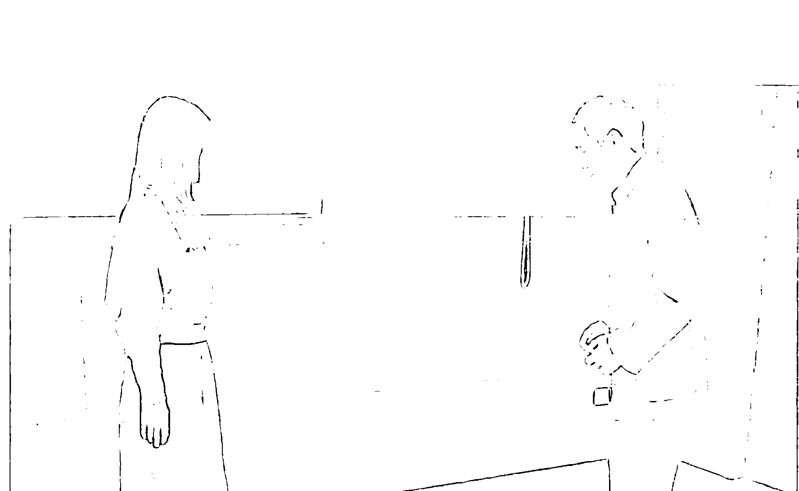

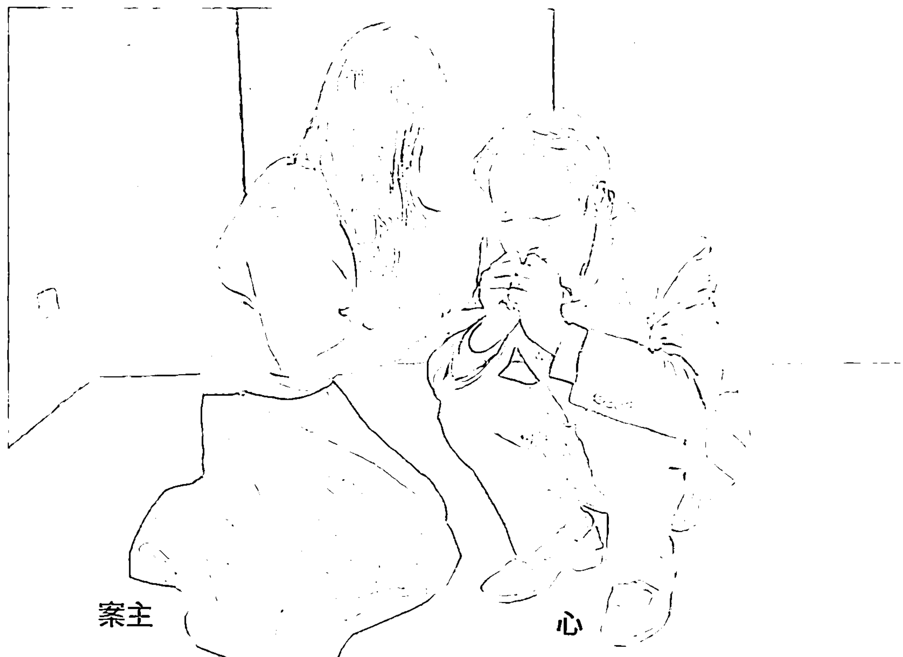

  周老師回到排列師的身分，對嘉玲說：「好，現在把你的心帶回來吧！」接著他站在代表心的色紙上對嘉玲說：「現在，我代表心，你對心說話。」（圖10-11）

  嘉玲向她的心說道：「媽媽在等你。我知道你一直有小時候孤單的感覺，謝謝你一直把這感覺告訴我，我們長大了，活下來了，不用像小時候那樣孤單了，我們可以做自己了。我們長大了，要往前走。我們可以去做我們想做的事情，不用活在小時候的感受了。」

  心：「那小時候孤單的感覺怎麼辦？」

  嘉玲：「我會陪著你，現在我長大了。謝謝你用這樣的事件告訴我，分享你的孤單。讓長大的我才明白，我為什麼會那麼想要去陪伴那些孤單的孩子和老人，因為我知道有很多人和我一樣孤單，所以我也想要去陪伴他們。這是我們未來要做的公益。謝謝你讓我看清這些，我們該去做我們想要做的事情，有空的時候我們再回去陪陪他們。我們先回去看看媽媽，好不好？」

  周老師：「聽起來讓人振奮。」然後，嘉玲轉身帶著心面向媽媽。

  周老師：「你終於體會到我給你說的小時候的感覺了。你現在可以放下了。」嘉玲點點頭，走近自己和媽媽。

  周老師：「記得你自己剛才對你的心說的話。」

  嘉玲：「我終於知道我一直想要做公益這件事情，想要去陪很多人的原因了。」

  周老師：「好，我們到這裡告一段落。」

### 第四步「合」：扣回主題，內化過程，回家之後，行動建議。

  回到座位上，周老師對嘉玲說：「這是一個很重要的轉化點，記得你的發心。其實，你的心的功能是很強的，在你有這份頓悟的時候，你的心也一起振動。」嘉玲微笑點頭。周老師又說：「我覺得好像是你死抓著孤單的感覺。以後，如果這種感覺不小心再出來的時候，你知道如何去告訴你的心了。而你的心聽到你這麼說的時候，會很有力量、有振奮感、有信心，有愛生出來。」嘉玲又點點頭。

  周老師接著說：「還有剛剛在這裡，有一個重要的點，就是過去的歷史要讓它過去，爺爺、爸爸、叔叔，他們有自己的命運，他們現在很舒服安心。」周老師在白板上寫下嘉玲回去要做的功課要點：

- 1. 讓家族的一切成為歷史。
- 2. 不需要和爺爺一樣，過孤單的命運。
- 3. 做一些讓心可以突破創新的事。

  周老師向嘉玲說道：「去做讓你的心能突破、創新的事情，突破框架，讓你的心可以活過來。這是你的功課。回去先把舊衣服丟掉，穿上自己新的衣服。」

  嘉玲愉快地點頭：「好，我一定去做！」

### 【個案追蹤】

  嘉玲後來參加了社工師專業訓練，考取了社工資格，積極參與許多幫助孩子和弱勢家庭的工作，把她的愛轉變成一種成熟的大愛。因為她學會了用更好的方式愛她的家人、她的爺爺和她的爸媽，她現在變得更開心、更有自信了。

### 【案例解析】

  一對一個案用色紙的好處是，排列師一個人就可以做個案了。因為你可以體會到所有代表的角色，所以你更能夠掌握到每個人的心理狀態，這樣非常有助於協助案主找到解決之道。作為一位排列師，你會進步很快。只是個案過程中，一個人要代表好幾個角色，所以你的切換速度要快。只要平時做代表的經驗多，你就能很快進入個案裡各個代表的感覺。

  當你帶領團體排列工作坊越有經驗時，再做一對一個案會更容易上手。做完一對一個案，再去做團體排列，你的感覺也會比較容易接上。兩者其實是互通的。不同的是，以團體的形式進行排列，當你擔任角色的代表時，你就只能感知一個代表，沒有辦法深入感受其他代表。但做一對一色紙排列的過程，你可以感受到每個家人、每個代表的感受，這對案主的同理會很準確，對尋找解決之道也很有幫助。

### 關於上述個案，受訓排列師的問題解答

- （1）為什麼老師和爺爺連結時，會感知且那麼肯定有祕密在哪裡？
  答：我有一次代表中風病人，我躺下去的時候，就感覺不斷沉下去，沉到被子裡面、沉到床裡面的感覺。在這個個案中，當我代表心的時候，就有這種沉下去的特別感覺。我先把這份感覺放在心裡。當我再去當爺爺代表的時候，我又有這種感覺，就這樣有好幾個信息交叉驗證。一個是心的感覺，一個是爺爺的感覺，一個是爺爺被加進來時心是被他吸引的。透過這些信息交叉驗證得知。所以，當代表是很好的經驗。

- （2）為什麼要加進媽媽代表呢？
  答：和爺爺告別，雖然牽絆移除了，但是力量還沒有出來，我感知到心還有一部分沒有完全動，所以又加入媽媽，把她內在的力量提升出來。上述個案的「轉」是從那裡開始的？當我擔任心的代表時，感受到心比較沉，沉入童年的孤單感。這種孤單感一般來說是孩子對爸爸、媽媽的。所以我對解決之道的思路是：讓孩子領悟到，媽媽雖然不在身邊，但她不是孤單的。在我們的知識裡面，媽媽是孩子人生一個很重要的人，是孩子最需要、最渴望的人。如果和媽媽重新有好的連結，這份孤單的感覺就比較容易去轉化。但這個案主某一部分爺爺像媽媽一樣，取代了媽媽的陪伴，孩子和媽媽的連結受到一些挫折。爺爺在孩子需要的時候陪在她身邊，所以還是要跟爺爺有一個好的告別；然後回到原始的關鍵，和媽媽連結。

- (3) 童年爸爸、媽媽不在身邊，我們感覺到孤單，長大後，我們的心如何去轉化？
  答：我們看剛剛這個轉化是怎麼發生的？長大後的自己如何轉化小時候的事實呢？我們要先讓她小時候的心和現在的自己有一個區隔，然後才有可能以現在的自己把她的心拉起來。如果一直綁在一起，就無法脫離。心其實沒有什麼時間的觀念，她覺得過去的感覺就是現在。有許多人，就是帶著過去的感覺活在現在。但這樣就會產生不適當的反應，小時候的情緒就抓會住她，影響到現在的行為模式和人際關係。所以重要的是如何轉化、如何解脫出來？那就是讓心知道，我們接受她小時候的感受，她的感受是對的，就是那麼孤單，需要人陪伴。但是心並不是只有這些，這些感受只是一部分而已，當我們接受她時，我們就可以感謝心，感謝心那麼堅強，給心肯定，感謝心可以活下來。然後，讓心感受到，我們還有未來，還有要做的事情，不要讓小時候的感覺擴大到全部。當心被承認、被肯定，就可以感受到現在、未來還有要做的事情時，心就會開始轉化了。上述案主對心說話，就是對小時候的自己說話，讓現在的自己看到，因為自己小時候的經歷反而更有力量去做好當下的事情，轉化就開始發生了。轉化（transformation）就是讓過去和現在的經歷有個串聯，過去的孤單是有意義的，它讓現在的你更加有力量，這樣一來，案主就會發現過去並不是不好的，它可以幫助現在做得更好，案主的生命價值就可以體現出來。水可以成冰、可以成雲，也可以成為流動的水。如果凍結在過去就成為冰，讓愛流動就可以成為活水。煤炭也可以轉化成鑽石，讓所有過去的經歷成為我們現在的資源，讓盲目的愛轉化為更具創造力的愛，活出新的人生——這就是系統排列轉化的藝術。

## CHAPTER 11

## 內在排列——運用觀想與想像力

## 系統排列的全息智慧
一對一排列與線上個案的理論與實踐

內在排列是運用個案的觀想與想像能力來進行內在畫面的調整，它的最佳運用時機是當排列師聽了案主的議題，很快就掌握到議題的解決之道時，而且也觀察到案主已經準備好與他自己的內心有較深的連結。此時，不一定需要排出成員的代表，排列師可以直接引導案主進行內在排列。如果排列師能夠引導案主進入較深層的狀態，它能夠發揮與外在排列相同的效果。

### 一、內在排列的操作要點

1. 排列師跟案主初步會談之後，排列師感覺到已掌握案主議題的解決之道，而案主對排列師也已有某種程度的信任，並且也已經準備好進入較深層的心理狀態、能夠靜下來與自己的內在有一份好的連結時，排列師就可以跟案主進行內在排列。
2. 排列師在進行內在排列時，務必要讓自己與案主真誠且專注。排列師可以引導案主深呼吸，回歸中心，慢慢靜下來。
3. 排列師引導案主以一種中正且專注的姿勢坐著，眼睛慢慢閉上，感覺自己的呼吸，感覺自己的心，讓自己完全專注在這個當下。
4. 若需要引導案主在心裡去想像某些人的畫面時，你要跟他確認是否已經有想像到那個人了，讓他點頭表示，他想好了就可以繼續下去。如果有些人想像能力比較弱，你可以向他明：不需要想得太仔細，只要看到那個人的輪廓就行了。
5. 有時候我們會請個案想像某個人或某些人在他的面前，例如他的親生爸媽，如果個案的確沒有直接看過他們，仍然可以請他想像有兩個人在他的面前，因為事實上他們的確存在過。如果是想像爺爺、奶奶，可以請他想像兩個老人的樣子。所有的內在排列都可以用相同的方式。
6. 過程中如果案主有情緒出現，排列師要特別留意這是怎麼樣的情緒。尤其案主是閉著眼睛做這個內在的排列，所以你要區分它們是原始情緒或是替代情緒（派生情緒）。如果是原始情緒，你要讓它流動。原始情緒的特徵是深層而有力量，但是不誇張。而替代情緒的特徵是誇大且歇斯底里，這個時候你反而要阻止，不要任由替代情緒繼續下去。可以透過深呼吸，讓案主回到中心。但是，你可以透過這種情緒的出現，跟案主探索這個情緒背後的深層意涵，它到底替代了什麼樣真正的原始情緒，這個情緒背後的動力真相是什麼。
7. 情緒宣洩不是內在排列的重點，但有可能是過程的一部分，最後還必須有一個「收」的過程，讓情緒穩定，轉成有建設性的。內在排列的重點還是在幫助案主升起自己的力量，而這種力量是平靜的、穩定的、朝向未來的、有行動方向的，並且是與生命五大法則相符合的。
8. 內在排列的引導有幾個階段：
    1. 預備：將案主身心狀態準備好。
    2. 鋪墊：對接下來要引導的內容有一些心理上的解說與支持，讓案主有一份認同與同理感。
    3. 引導：內容裡有一些是需要案主跟著你說出來的。排列師要留意引導他把這些句子說出來時，不是照本宣科地唸，而是真正發自內心真誠地說出來。如果案主自己有一些想要說的話，也允許他說出來，只要方向不要走偏就可以了。
    4. 結尾：引導案主把這些畫面好好放到心裡，將這整個過程的力量收到心裡，可以深呼吸，吸到他的內心。
9. 排列師引導的語調要能夠清晰穩定，並且也是透過你的心真誠地說出來，這樣才能夠碰觸到案主的內心感受。

### 二、內在排列引導詞示範

以下是常用的內在排列引導詞範例，有心成為一個專業排列師的人，需要加以熟練。

#### 預備詞

好，如果你準備好了，我們就進入內在的排列。讓自己以一種中正且專注的姿勢坐著，慢慢閉上眼睛，自然地呼吸，輕輕放鬆你的肩膀，輕輕地吸氣和吐氣，感覺自己更放鬆，讓自己的心完全專注在這個當下。

#### （一）內在排列——與媽媽／爸爸的連結與感謝

##### 鋪墊詞

也許我們的爸爸、媽媽不是完美的人，但如果對他們期待太多，要求爸媽變成另外的樣子，那我們就不再是現在的自己了。因此，尊重父母如實的樣子，也就是接受自然的自己。

你的媽媽給了你生命，讓你可以去做你想做的事，讓你可以實現人生的理想，這份禮物是如此地珍貴，難以回報，那該怎麼辦呢？最好的感謝方式就是好好珍惜這個生命並且善用它，好好活出自己，這將幫助我們感到平安與完整。

好，現在就讓我們進入內在的排列。

##### 引導詞

現在請把自己凝聚起來，回到中心，想像媽媽在你的前面，看著她的臉，看著她的眼睛，發自內心對她說：

> 「親愛的媽媽，謝謝你和爸爸一起把生命傳給了我。為了讓我得到這個生命，我們彼此都付出了代價。謝謝你為我所付出的代價，謝謝你冒著生命危險把我生下來，謝謝你把生命傳給了我。我從別人那裡得不到這個生命，只有你可以給我這個生命。你給予，我接受；你是大的，我是小的；你是我最正確的媽媽，沒有人可以取代你。」

> 「親愛的媽媽，請原諒我曾經對你的不尊重，因為你所做的事情而責備你、抱怨你。請原諒我曾經認為你不夠好而想改變你。對不起，媽媽。現在我學會尊重如實的你。我真正看到我的生命是透過你而來的，也只有透過如實的你，我才能夠得到這個生命，我才能夠成為現在的我。如果你變成了別的樣子，我就不再是我。如果我生在別的家庭，我就變成了別人了。」

「只有你可以給我這個生命，你所給我的是最珍貴的。其他的，如果我有需要，我可以從別的地方找到，但只有你可以給我生命這個最珍貴的禮物。謝謝你，你是我正確的媽媽。除了你之外，我不要別人作我的媽媽。」

然後，用你的方式跟媽媽說謝謝，你可以鞠躬、磕頭，或深深地擁抱。起來之後，最後對媽媽說：

「如果有可能，我也會像你一樣，把生命傳下去給我的孩子。像你愛我一樣，愛我的孩子。如果我沒有自己的孩子，我也會好好地善用這個生命，實現人生的理想來報答你，將你給我的愛傳給更多需要的人。」

然後，深深地向你的媽媽鞠躬，越深越好、越慢越好。

##### 結尾詞

好，現在請回到中正的姿勢，把雙手放在心上，把這個感動放在你的心裡，讓這個感動陪伴著你。深呼吸，把這整個過程的力量好好收到心裡。然後慢慢睜開眼睛，保持靜默一會兒。

#### （二）內在排列——退出父母衝突，回歸序位

##### 鋪墊詞

每個人都有優缺點，我們的爸爸、媽媽也不是完美的，他們有自己的脾氣和個性，有時候他們會吵架，吵架也是大人溝通方式之一，他們也在學習溝通。而我們要學會退出爸爸、媽媽間的衝突，去尊重這是他們之間互動的方式，這樣我們才能回歸愛的序位，自由地在自己生命的位置上好好發揮。

有時候甚至爸爸、媽媽離婚了，我們也要學會去尊重這是他們的選擇，但是在心裡我們要給雙方都有一個位置。就算他們夫妻關係就算結束了，他們永遠都還是我們的爸爸很媽媽，這點是不會改變的。

好，現在我們來進行內在的排列，退出父母衝突，回歸自己的序位。

##### 引導詞

現在把你自己凝聚起來，回歸中心，想像我們夾在親生父母的中間，他們在我們的一左一右，我們夾在他們的中間線位置，看著他們。

現在，請看著我們的親生父母，對他們說：

「親愛的爸爸、媽媽，看到你們爭吵，我很難過。我知道你們也很難過，但是我瞭解這就是你們大人溝通的方式，你們也在學習。我尊重你們互動的方式。我尊重你們之間的決定，你們永遠是我的爸爸、媽媽，這個關係永遠不會改變。就算你們之間有任何變化，就算你們分開了，但是在我身上，你們永遠是結合的，永遠是不分開的，因為我的生命就是你們愛的結合的最佳證明。」

「親愛的爸爸、媽媽，現在我要回到孩子的位置了。你們是大的，我是小的。我尊重你們面對問題的方式，現在我要回到我的位置來經歷我的生命，我會用你們給我的生命，實現我的人生理想，好好地做一些好事，讓它發光發熱來報答你們。親愛的爸爸、媽媽，謝謝你們。」

然後，帶著覺知，很慢、很慢地從爸爸、媽媽的中間慢慢退出來、慢慢退出來、再慢慢地退出來，往後退一步、再退一步、再退一步……

對爸爸說：「親愛的爸爸，我愛你，我也愛媽媽。」

對媽媽說：「親愛的媽媽，我愛你，我也愛爸爸。」

對爸爸、媽媽說：「現在我要回到我自己的位置，活出我自己，發揮我的人生了。謝謝你們。」

接下來，看到爸爸、媽媽他們兩個人自己慢慢向中間靠近、再靠近，按照你認為他們可以靠近的距離，靠近。也許他們最後並排，站在你的面前。如果他們兩個人有一點距離也沒有關係，讓他們保持在他們覺得的適當位置。但是不管兩個人距離遠近，你看到他們兩個人的形象畫面，你慢慢深呼吸，把他們兩個人的形象畫面吸到你的心裡。慢慢地深呼吸，慢慢地、慢慢地吸到你的心裡。這兩個形象畫面慢慢地在你的內心重疊在一起了。你的爸爸、媽媽在你的心中重疊在一起了，在你的心中他們兩個人合而為一了。把這個合一的感覺吸到你的心裡，深深地吸到你的心裡，因為你就是這樣子出生的，你就是當他們合一的時候來到這個世界。你的出生就是他們的愛合一的最佳證明。把他們在你心中合一的感受好好地印在心裡。將雙手放在你的心上，深呼吸幾口氣，把他們在你心中合一的感受好好印在心裡。」（給案主一點時間讓這個畫面加深。）

##### 結尾詞

好，現在請回到中正的姿勢，深呼吸，把這整個過程的力量好好收到心裡，然後慢慢睜開眼睛。

然後深深地向你的父母鞠躬，越慢越好、越深越好。

#### （三）內在排列——對過世親人的祝福

##### 鋪墊詞

當不幸轉化為祝福，當被遺忘的人重新被尊重，你的內心將開始感到一份平靜與圓滿。所以，你現在準備好讓過去的傷痛過去？讓過世的親人安息了嗎？切記，請在你自己可以接受的情緒範圍內，在心裡帶著愛，誠心地祝福過世的親人。

##### 引導詞

現在請以端正的姿勢坐著，腳底接觸地面，感覺大地的支持。從心裡來看看我們家裡那些過世的親人，那些你難以放下的過世親人，或者曾經出乎意料，不管是意外或自殺，只要是在此時此刻你心裡所浮現的過世親人。如果你現在暫時沒有想到特定個人也沒有關係，你只要想像在你的面前的是你家族裡曾經發生不幸死亡的人，或者是此時此刻在我們心裡所浮現的任何人，他們的過世是我們不願意去面對、無法割捨，而且沒有辦法放下的。現在，請你真正看到他們，帶著一點愛，看著他們。然後對他們說：

> 「親愛的某某親人（們），我看到你們了，我看到你們了。不管你們發生怎麼樣的遭遇，我尊重你們所發生的事，我尊重你們的命運，你們會永遠在我們心裡有一個位置。我會把你們對我們的愛，好好地傳下去。我會從你們的身上學到生命要帶給我們的功課，我更會好好地珍惜我的生命，用這個生命來做一些事情，讓你們的精神可以繼續地流傳下去，讓你們的死不會白費，請你安息吧。」

如果你自己有一些話想對他們說，那就用你的話在心中對他們說出來。（給案主一點時間表達，可以流淚，可以有一些情緒，但不要落入激烈的情緒發洩裡。）

接下來，想像你的心中有一道祝福的光，送到過世親人的身上、臉上，並且想像在他們背後無限巨大的光芒，那是金色、白色的生命源頭之光，迎接著他們越高、越高地飛去，越高、越高地飛去……最後你看到過世的親人融入到無限巨大的光明裡，回到生命的源頭，回到那無限平安喜樂的世界。

現在請用你的方式對他們表示尊敬，可以鞠躬或是磕頭，以符合你跟他們關係的方法表示尊敬。

回來的時候，記得同時也帶著他們對我們的祝福。慢慢地站直腰來，往後退一步，回到自己的位置上。

##### 結尾詞

好，現在請站直腰，把雙手放在心上，深呼吸，把這整個過程的力量好好收到心裡，慢慢睜開眼睛。

#### （四）內在排列——和諧心靈，超越戰爭衝突

##### 鋪墊詞

許多人的家族經歷戰爭衝突，從古至今人類戰爭不斷，武器也越來越進化，所以我們要變得更加成熟、更有智慧地處理這些衝突，否則很有可能第三、第四次世界大戰後就只剩下木棍和石頭了。但真正的成熟智慧要從哪裡開始呢？只有從我們心靈的和平開始，只有更多人的心靈變得更加平安，意識才能變得更成熟、有智慧，我們才能用這份正面的力量來影響世界，這份平安的力量就會帶到外在的世界，讓這個世界可以真正朝向更平安的方向成長。

##### 引導詞

請閉上眼睛，看到在我們的面前有兩群人馬彼此相向、相互對峙著，裡面有你家族裡的長輩們，也有許多不同種族、黨派、國家的人們。他們相互地靠近，越來越靠近，越來越靠近……他們開始彼此相互攻擊著，不管是騎著馬、拿著刀，還是拿著槍、開著坦克，戰爭開始了。

在戰爭裡，我們看到他們鬥了起來、殺了起來、砍了起來，看到有人倒下、有人流血、有人死掉、有人受傷、有人躲起來。我們看到這兩群人馬一邊打一邊靠近，越來越靠近，越來越靠近……最後變成一大群人彼此在廝殺著。因為這兩群人穿著的顏色是不一樣的，帶著標誌是不一樣的，當他們混在一起的時候，彼此還能分辨要殺的是對方。但是我們能看到死傷的都是人，看到許許多多的殺害、痛苦和死亡，橫屍遍野，哀嚎漫天。

當我們看著這群人馬在前面戰鬥的時候，我們看到在他們背後遙遠的地方有光照過來。我們看到超過於他們，有一大群人馬，我們看到更高、更遠的地方，在那更高、更遠的地方，那裡是生命源頭的大力量。生命帶著無限的光芒照耀著，越來越亮，越來越亮。生命的光芒照到前面所有人的身上，而這個光芒無限燦爛、非常巨大耀眼，亮得讓人眼睛都快睜不開。這個燦爛的光芒照到每個人身上，把人身上原本不同顏色的制服、不同形式的徽章，全部壟罩在金色的光芒裡，全部都變成金色的了。所有人全部都變成金色了，已經分不清到底誰是敵人、誰是自己，因為我們全部都成了金色了。

這份生命之光就像我們共同的命運之神一樣，我們全都是這個生命之光所創造出來的。當我們看到彼此的制服全都變成同一個顏色，全部都是金光閃閃的金黃色，人們開始放下了武器，因為他們怕殺錯人了。這時候前面本來彼此衝突的人馬慢慢放下武器，一起轉身看向這個金色光芒的來源。我們看到他們一起轉身面對這個金色的光芒，無限巨大的燦爛光芒全部照到他們的身上。突然間他們有感到一陣平安從內心升起，突然間他們明白了不管是對立的哪一方都是這個生命的一份子，都是這個更大的生命的一份子，都是這個整體的一部分，都扮演著命運之神給著每個人的角色。

為的是什麼？為了共同的目的，生命的成長進化，透過經歷這些過程，我們才學會用更有智慧的方式處理事情，學會更覺醒的方式來愛生命、愛自己、愛這個世界。我們一起來到的靈性高度，看到我們都是整體的一份子，一起都在為生命服務。我們看到照到這群人身上同樣的金色光，也同樣照到我們身上。這個生命之光照耀著我們，我們全身都變成金黃色了。

突然間，我們的內心升起了一份深深的領悟，我們明白了：不管我們的身分、我們的長相、我們的種族、我們的文化、我們的生活形態、我們是什麼樣的人，我們都是這個偉大生命的一部分。我們也都是一起在這裡，共同為生命服務著。

現在深深地吸一口氣，感受這份祥和，將這個畫面放在心裡。（給案主一點時間。）

##### 結尾詞

很好，記得這個畫面和感受，深呼吸一口氣，慢慢張開眼睛，好好記得這份平安和領悟。

#### （五）內在排列——連結生命源頭，迎接光明未來

##### 鋪墊詞

連結上生命源頭，就是透過連結上我們家族的根，連結上背後生命的源頭，因為我們的生命就是透過我們家族一代代傳下來給我們的。想想，如果整個家族的力量都成了支持的力量時，這股力量將是無窮無盡的。

如何得到這股力量的支援？我們必須謙卑地尊重與感恩你的家族。生命的力量將支持你更有力量去面對生活上各種的挑戰，傳承著你家族的愛與祝福，將這股生命的力量化為更大的開創力，為自己和下一代開創更光明的未來。

##### 引導詞

現在請以一個端正的姿勢坐著，雙腳感覺大地的支持，回到你的中心。想像你的父母站在你的後面。你的爸爸和你的媽媽，想像他們的樣子。在你的父母後面站著他們的爸爸、媽媽，也就是你的祖父、祖母、外公、外婆。再往前推溯，在他們的後面也站著他們的爸爸、媽媽，也就是你的曾祖輩。就這樣，每一個人背後都站著他們的爸爸、媽媽，一代一代往前推溯。

往前推溯到你的祖先們，每一個人背後都站著他們的爸爸、媽媽。在你的背後站著千千萬萬代的祖先們。往前推溯，繼續往前推溯，你可以感覺在你背後站著無數的人們。

往前推溯，繼續往前推溯，最後推溯到生命的源頭。你可以想像那是無限巨大的光明，金色的光、白色的光，超越時空，無限燦爛。那裡是生命的源頭。你可以想像生命透過光的連結，進入你背後你所有祖先們的心。生命就這樣一代一代傳下來，傳給你的祖先們。生命以它的原貌，不增不減，一代代傳下來，傳給你的曾祖輩、祖輩、你的父母，最後傳到了你身上。

感覺生命之光流入你的心，感覺你背後站著無盡無數的祖先們。生命之光流經他們的心，最後傳到了你身上。記得這個畫面。

敞開自己，帶著深深的謙卑，帶著深深的謙卑對背後無數的祖先們說道：

> 「謝謝你們把生命傳給了我，我是你們的後代，我看到你們經歷過無數的痛苦艱難，也看到你們曾經遭受失敗挫折、曾經孤獨哭泣，但是感謝你們堅強的韌性，為了生命存活而奮戰，付出了無比的代價。謝謝你們，我活下來了。我的身上流著你們的血，你們的歡笑、你們的悲傷、你們的尊嚴、你們的榮耀，都是我的一部分。我會帶著這無比的智慧與力量，開創更美好的未來、造福更多的人群來榮耀你們。請你們祝福我，我會將你們的祝福傳給我們的下一代。謝謝你們。」

然後挺直身子，讓背後的家族就像一座大山屹立不搖地支持著你。感受這股力量，永遠記得這股力量。帶著這股堅強的力量，帶著這股生命之光，面對你的未來。

看著你的未來，將生命之光從內心散發出去，越來越亮、越來越亮，散發到四周越來越遠、越來越遠的地方。

你臉上充滿著微笑的喜悅，開心迎向生命的每個片刻！

##### 結尾詞

很好，現在記得這個畫面，記得這份感受。深呼吸一口氣，慢慢張開眼睛，將這份愛、這份力量與喜悅帶到你的生活裡。

## CHAPTER 12

## 一對一排列實務與特殊狀況處理

## 系統排列的全息智慧
一對一排列與線上個案的理論與實踐

### 一、排列現場注意事項

#### （一）座位

進行一對一排列的時候，排列師的位置要坐在靠近門的地方，因為當遇到情緒無法控制的案主時，排列師靠近門可以迅速向外尋求協助。作為助人工作者首先第一步要先懂得保護自己，這樣子才有能力協助到案主。

#### （二）地點

進行個案的地點必須在個案室、適當的機構、課室、辦公室旁邊等符合法律規定的地點。避免在飯店房間裡兩個人單獨進行個案，以避免招惹不必要的麻煩。

#### （三）人員

個案過程最好有工作人員在個案室裡。如果有緊急狀況，工作人員可以支持應變，保護案主也保護排列師。或者工作人員必須在個案室門邊，如果有什麼突發事件，只要敲門或按鈴就可以向他請求協助。

## 二、現場特殊狀況處理——案主情緒失控

案主在一對一排列中有時候會有一些情緒反應與宣洩，如果是適當的範圍內，而且案主可以把持住自己、不過度激烈，這是可以被接受的。但是有時候案主反應太過激烈，甚至到了情緒失控的階段，或有暈厥、震顫抽搐的徵兆，這個時候就要及時處理。步驟如下：

1. 排列師提醒案主睜開眼睛，保持深呼吸，讓案主回到當下。
2. 要求案主睜開眼睛，並用現實的問題打斷，比如「你叫什麼名字？」「我是誰？」「我的眼睛是什麼顏色？」
3. 用痛覺刺激對方，用指甲用力掐合谷穴（拇指和食指相交處）、人中穴（鼻脣溝中）、拍打案主的肩膀，大聲叫他的名字，迅速讓案主平靜下來，回到現實。
4. 若案主眼睛一直不睜開，你就要用力把他的眼皮撐開，保持撐開到他回到現實世界。
5. 接著，排列師可以鼓勵案主：「你做得很好，現在沒事了，你可以平靜下來了。」
6. 需要時也可大聲喝止。
7. 平靜下來後，休息一下，可以喝一點水，工作人員跟進妥善照顧。
8. 若是經過一番折騰的處理，案主的情緒仍無法自控，或者仍停留在抽搐或昏厥中，為了案主的安全，這時候就要請救護車協助。

所以，排列師要有防範的意識，在預約報名一對一排列時，案主就要先填諮詢預約登記表，並簽好諮詢協議，告知是否有生理、心理相關病史。有些人是不適合參加的，比如思覺失調的病人。當然，一對一排列技術也可以用於心理治療，但實施者須有相關的專業資格。對於罹患精神疾病的案主，排列師可轉介給有相關證照的精神科醫師或與之合作。

同時，主辦單位或主辦機構要先把案主的基本情況提供給排列師，特別關注有身心疾病和高齡的案主，必要時現場需要醫護人員在旁提供協助。

## 三、操作實務的指導建議

1. 系統排列因人因事而有不同的做法，重點是幫助這個人來到力量的中心，生出智慧，提升處理問題的能力，而不是解決案主的問題。如何能夠支持案主成長是最重要的。
2. 不要太過於想要幫別人，不要太過於認同案主的問題。問題的後面是案主這個人，所以排列師的重點是對案主這個人有所幫助。
3. 系統排列是畫面呈現，呈現出問題的感受和動力。運用人偶或小物件做一對一排列時，排列師不要閉上眼睛握住人偶，給人故弄玄虛的感覺，而是靜下心來輕輕地碰觸去感受，就像做團體排列的代表一樣，專注在你的身心反應上所感知到的信息。
4. 排列的結果會呈現解決之道的畫面，要讓案主把畫面放在心裡，讓這個力量在他的內心加深。如果未來要做什麼，讓他自行決定，這時候他的力量會最大。
5. 排列師的方向要定位在「支持案主重新看清問題並尋找解決之道」，製造一個解決的方法並不是排列師的工作，但是要在所看到的信息中找出一個它本身所建議的方法，你要尋找它，但不是製造它。
6. 真正的解決之道往往是對整體好、也會對案主好。排列師要站在一個看到整體的制高點，切不可偏袒任何一方。

## CHAPTER 1

## 排列師的心態養成與必備能力

## 系統排列的全息智慧

一對一排列與線上個案的理論與實踐

> 「心態比技術更重要。」
> ——海寧格

### 一、排列師的心態、界線與修練

#### （一）關係：排列師與案主是合作關係，非拯救關係。

排列師要謹防是否特別想幫人，太想要拯救對方。案主會把自己的問題投射到你和他的關係上。當我們有這份警覺，你就會留意覺知，不落入案主所投射的角色裡。有時案主好可憐，激發了排列師的父愛或母愛，你就變成了他的完美爸爸或完美媽媽。助人者要同理案主，但是不同情案主。所有助人工作的目的就是要幫助案主站回自己的位置，生出力量，來解決自己的問題，不要創造「治療性」的關係。要讓彼此的關係互動保持：在這個時空裡，你有議題，我有專業。你是你議題的主人；我只能夠提供專業，陪伴你面對你的議題。我們是合作的關係，一起面對。

#### （二）角色：尊重案主命運，不扮演神的角色。

排列師的責任是用自己的專業支持案主。比如案主想自殺，如果他真想自殺，誰也幫不了他。如果他決定了，那就尊重他的命運。如果他並不想自殺，我們就可以做些什麼，支援到他，讓他多一些選擇和考慮。排列師不需做神，每個人的命運在自己的手中。做平實的事情，就不會站錯位置，成為拯救者。

#### （三）目標：透過陪伴案主解決問題，同時支持其成長。

系統排列因人因事有不同的做法，真正的助人者是在陪伴案主解決問題的同時，支持案主從問題裡成長，釐清方向，生出智慧與力量，提升處理問題的能力，而不是把案主的問題解決掉。因為有些問題根本就不是問題，只要案主成長了，問題自然就消失了，或者只剩下一種需要處理的情況讓案主去處理就可以了。助人的目標要明確，如何能夠成長提升是最重要的，不要太過於想要幫助別人，這樣反而會削弱案主。

#### （四）界線：未經授權或有所關聯，不隨意刺探系統信息。

排列師要把握好自己的界線。當案主沒有委託你去探索他們的系統，或者這個系統跟你所要進行的工作沒有關聯，如果排列師因為好奇或者其他理由去刺探某個人家庭、企業或組織的系統動力，這時候就好像電腦駭客駭進別人公司的系統網路偷取信息一樣；如果又用這些信息來做一些不符合「道」的事，這時候有可能就會為自己帶來一些反作用力量。因此，一位排列師要站在中立的立場，保持好自己的界線。尤其在支持案主的時候，更要遵循生命五大法則，這時候我們才不會無意識地捲入案主的系統裡，擔負起不屬於我們的責任。也正是因為我們遵循了生命五大法則，我們才能夠站在更無我無懼、無愛、無企圖的位置上，更強而有力地支持到案主。

#### （五）修練：留意起心動念，不要變成逃避或自我膨脹。

助人者在過程要問自己：「這是為了案主，還是為了我自己？」因此，想從事排列工作者要覺察自己。覺察自己或自己的系統是否有議題沒有面對，卻逃避到幫助別人的陷阱裡。如此一來，你助人的力量會越來越削弱，甚至自己的問題會越來越嚴重。相反地，如果你能有這樣的覺察，並且及時勇敢地面對自己的議題，你助人的力量會變得越來越強而有力，更多有需要的人自然會靠近你。

當你有一點小成績，真的能幫到一些人的時候，下一個挑戰就會出現，那就是自我膨脹。有一次我在海寧格老師工作坊裡，現場有一個人看了他的工作之後，在問答時間舉手站起來，在大衆面前大聲稱讚海寧格說：「這個工作太了不起了，你就像神一樣！」海寧格老師用他一貫神祕的笑容，對現場大衆微笑說：「當有人把你捧為神，有一天他也可以稱你惡魔，把你打倒。」

排列師工作是一門非常強有力的修煉法門，就像魔戒、照妖鏡一樣，一沒有覺察，你的心魔馬上就控制住你了，有些人還不知不覺沉醉其中。排列師要謹慎小心，抱著修煉的心態，在助人過程中一關一關地修煉自己，修煉自己的覺察，時時觀照自己的心念行爲，讓自己不斷地成長。當你成長了，你所做的工作也會跟著成長。

### 二、排列師必備能力：知識、觀察與感知、經驗與實作

系統排列師必備的能力有知識、觀察與感知、經驗與實作。關於知識部分請參考拙著《家族系統排列：核心原理與實務》及海寧格老師著作《在愛中昇華》都有詳細說明。知識、經驗與實作的獲得還有兩個必要方式：

1. 多參加資深導師的課程，尤其是對系統排列有著正知、正念、謙卑精進態度的導師的課，大家一定要慎重挑選。
2. 多操作個案，除了會越來越熟練，感知能力也會提升。排列師一方面要累積經驗，二方面又不要被經驗限制住，所以每次排列都要把自己放空歸零，與當下場域連結。

在一對一排列裡，排列師的觀察與感知能力顯得格外重要，所以本章主要談觀察與感知。

#### （一）觀察與感知

##### 1. 觀察

排列師的觀察是非常敏銳、精確的，有時候敏銳到有人會誤以爲是特異功能一樣，其實並不是這樣。如同全息的道理，由小可以觀大，由外可以觀內。相由心生一樣，案主的細微動作、表情、衣著打扮、排列出的人偶、色紙位置等，在在都透漏給排列師非常重要的信息。排列師要把這些信息放在心裡，透過觀察外在的信息，我們可以一窺案主內在的心理與系統的動力。

尤其當排列師把所觀察到的現象對案主指出來時，往往對案主而言就像是一記當頭棒喝，或者像在黑暗裡點亮了一盞明燈，這時就有可能敲醒案主，讓他更有覺知地知道自己在什麼地方，在做什麼。

什麼時候會產生這個力量呢？只有當排列師中立地、不帶任何企圖、無懼地說出你所觀察時，才能產生這樣的力量。

##### 2. 感知

感知來自於當我們回歸中心，內在成爲一個中空的容器，一切來到這個空裡的信息都可以觀照到：或者像一面鏡子，所有來到鏡子前面的一切影像、聲音、感覺等信息，皆毫不費力地呈現出來。

感知來自於深深的信任，當自己願意放下過去的經驗、知識和理論，放下企圖、恐懼和分別心，只是讓自己完全交託給存在，允許生命的大力量的指引而行動，此時所獲得的信息，往往是隱藏在系統裡的深層動力，甚至連案主自己也沒有覺察到。

感知是把自己敞開，保持一定的距離，不聚焦於細節，只是允許所有一切信息同時存在，如同山水畫般從中獲得一個事物的輪廓印象，了解基本的進行方向，雖非精確細節，但卻留給案主可遵循的軌跡與自由揮灑的空間以及有創意性的解決之道。

##### 3. 觀察與感知合一

當觀察與感知同時進行時，一方面我們警覺、敏銳地看到表面顯現的形式信息，二方面我們從內在去接受感知場域的深層信息。當外在與內在兩股信息融會貫通時，超越觀察與感知的頓悟就會產生，如石火電光般帶給人們深刻的領悟。

#### （二）如何提升觀察力與感知力

提升觀察力與感知力最重要的兩個途徑：靜心與多操作個案。

靜心是什麼？靜心就是觀照。靜心就是回歸中心，如在颱風眼中心，如如不動觀照著一切。靜心就像一個天空裡的眼睛，看著自己正在做所有的活動。

靜心的方法有很多，對於排列師的觀察與感知訓練，我發展出一個我很喜歡的靜心方式在此分享給大家，叫做「與樹木合一」。

**靜心：與樹木合一**

到大自然或者公園裡找一棵大樹，問它：「我是否可以邀請你跟我做這個靜心練習？」如果你心裡面感受到的答案是「可以」，你就站在跟它距離兩公尺的地方，開始這個靜心。

**第一階段，觀察，十分鐘。**

首先，先透過你的眼睛好好的觀察，仔細觀察這棵樹。觀察它表面的紋路、樹皮的皺摺、顆粒度顏色、條文質地。觀察樹根是如何長的，觀察樹根進入泥土裡的狀態。越仔細觀察越好。你也可以繞圈子從三百六十度仔細觀察它。觀察它的枝幹，是怎麼生長、怎麼分岔的，是怎麼的伸展角度，上面有沒有螞蟻在爬……越仔細觀察越好。觀察它的葉子是什麼顏色、什麼樣的形狀紋路、怎樣伸展排列，仔仔細細地觀察，越仔細越好。

接下來，你往前跨一步，把你所觀察到這棵樹木的樣子，用你的身體展現出來，它是怎麼站、怎麼扎根、怎麼伸展，它的枝幹是怎麼樣茁壯、挺立，它的枝葉是怎麼樣分岔、開展、怎樣在風中搖擺⋯⋯把你觀察到的樣子，仔仔細細地用你的身體展現出來。這是你從外在觀察來變成這棵樹。

**第二階段，感知，十分鐘。**

接下來，保持在原位，請閉上眼睛，現在你要從「裡面」來感知這棵樹。

它的內在是什麼樣的一個狀態？它的根是什麼樣的一種內在力量往下伸展，這個伸展有停止嗎？這些根深入大地時是什麼感受？現在你從裡面去感覺樹幹是什麼狀態，它內在是怎樣的能量呈現？它內部汁液輸送的時候是什麼感受？它內在的精氣神是什麼狀態？當它的枝葉向天空伸展，是如何伸展？是往上還是往外？是朝向天空還是朝向陽光？去感知整棵樹在天空陽光下，在這土壤之上所展現的所有內在情況。

接著，這棵樹它有感覺嗎？它的感受是什麼？是平靜的、還是喜悅的？是開心的、還是憂傷的？是健康的、還是受傷的？從內在去體會這棵樹的感受。

這棵樹有什麼想法呢？樹能夠有想法嗎？如果有，它是什麼想法呢？好好去感知它。從裡面去感知這棵樹。

**第三階段，合一，十分鐘。**

接下來，給自己一個同意的指令：「現在我要和這棵樹合而為一了」。然後就如同排列的代表者，你現在就代表這棵樹，靜靜觀照著你和這棵樹合為一的狀態，不帶任何頭腦的想法或任何批判，這是好的或者是不好的，也不要有任何想像，就只是如實地觀照著你跟這棵樹合一。靜靜觀照著，你就是這棵樹。

你就是這棵樹。感受著周圍所有的一切場域，有鳥叫聲嗎？有風聲嗎？有人經過的聲音嗎？有蟋蟀蟬鳴嗎？有小鳥在你身上跳嗎？靜靜地融入到這整個場域裡，你就只是在空中，觀照著一切。

**第四階段，靜在，十分鐘。**

讓自己深呼吸一口氣，慢慢地回到你自己。然後給你面前這棵樹一個鞠躬，謝謝它給你一個機會成為它。然後讓自己閉上眼睛，靜靜地站著或坐著，靜靜地大休息。大約十分鐘後深呼吸一口氣，慢慢地睜開眼睛回來，然後站起來給這棵樹一個擁抱，感謝它同你一起經歷了一次深層的靜心。

這時候你不僅做了靜心，有可能你也交到了一位好朋友，以後你可以每天跟這位好朋友一起靜心了。

最後，也是最重要的部分，當你回到生活，要將你的靜心帶入到你的個案操作中，並要在你的個案操作裡融入靜心的品質。

有一個小小的訣竅可以傳授給你：在個案操作時，你可以回想你在做靜心的狀態，與你的樹木好朋友合一時的狀態，現在你也可以與當下這個場域合而爲一。從此，個案操作就是你最佳的靜心。靜心也會融入你的個案操作以及你的生活與工作裡。此時，兩者是一，不是二。

當你靜心鍛練與個案操作累積到一定的數量，你的觀察與感知將開始相互融合，你會經驗到當下場域自己所浮現出來的深層信息。當你無懼地將它說出來時，也許會震驚到所有人，但在深層裡，卻能爲現場所有共鳴的靈魂帶來深刻的解脫。這就是「全息智慧」。

## CHAPTER 14

## 一對一排列常見問題答疑

### 一、一對一個案要做幾次？

視案主情況而定，可以彈性把握個案的數量。有些案主的部分需要沉澱、吸收。比如，排列師觀察之後，可告訴案主依照你的經驗，這個個案還需要做三次，今天我們先做一部分。做得太多，他是吃不消的。若有需要，可約定何時做第二次個案。一般一個個案，一個小時左右就夠了。

### 二、個案要間隔多長時間？

可能幾天、幾週或幾個月，看案主的需要和案主消化程度。如果案主接受不了很多，也可以分段進行。如果排列師建議的功課做完了，案主狀態比較穩定，告一段落了，就可以進行下一步。不要在案主還沒有做功課時，就在同一個議題上反覆做。同一個議題，除非有新的重要信息出現，可以再做。不同的議題可以做，但有時即使是表面看起來不同，但有可能背後的系統動力是一樣的。所以，案主要把建議的功課好好完成，才是最實在的進步方式。

### 三、個案的效果取決於什麼？

個案的效果取決於：一、案主的改變意願。二、排列師專業程度。三、案主功課完成程度。

排列師不要企圖在一次個案中就要非常改變一個人。雖然有時候一次個案效果就很好，就像奇蹟發生一樣，那可能是因為案主本身素質高、有較高的悟性、強烈的改變意願。更重要的是，發自內心，好好去完成從排列個案裡提醒我們要做的事。

### 四、一對一排列可以適用到哪些方面？

1. 家庭人際：建立良好幸福的關係以及工作和人際關係。
2. 企業組織：支持企業建立成功的經營決策，尋找問題解決方案。
3. 事業財富：改善金錢關係，事業與生涯規劃抉擇，實現人生理想。
4. 身心成長議題：促進健康，改善情緒，喚醒覺知力量，更有活力地活出自己。

### 五、一對一排列並沒有實際的代表，排列師如何去感知人偶代表呢？

排列師可以去用手去摸，感知人偶代表的感覺，就好像你在團體系統排列中擔任代表一樣。你要信任你的感受，並且可以跟案主交叉驗證。如果你感覺到人偶代表想要轉身，你就讓人偶代表轉身，然後問案主：「當我把這個人偶轉過身，你感覺怎麼樣？」案主就會去重新感受，告訴你某些答案。讓你的感知和案主的感受相互交叉進行，來推動人偶的移動與個案的進行。這沒有捷徑，最重要的是需要靜心鍛鍊與大量個案的熟練。

### 六、排列師不確定自己的感知能力時，該怎麼辦？

畫面在案主心裡，並不在排列師心裡。你可以讓案主去感覺、移動，然後排列師再加上自己的感知去核對。但是，如果你要成為一位好的排列師，你的感知能力是絕對必須要提升的，多做靜心會非常有幫助。

### 七、在一對一排列中，如果排列師感知到的和案主感覺的不一致，該相信誰呢？

排列師要相信自己。前提是你的感知能力已提升上來了。因為排列師是中立的第三人。一位稱職的排列師感知信息是中立的，沒有自己的企圖，因此他能夠感受到真實的場域信息，然後運用專業，在適當時候回饋給案主，引導案主到正確的方向。相反地，案主對自己的議題很容易會有自己先入爲主的想法和感受，或甚至會有抗拒。但同時，案主的想法和感覺也是一個非常重要的信息，沒有好壞對錯，聰明的排列師可以透過案主的感覺與移動，反而可以獲得背後更深刻的信息，進而順著這個信息，一樣可以來幫到案主。

### 八、移動人偶時，如何分辨是自己的感知、還是頭腦的判斷？

排列師要信賴你的「身體」。就像你做團體排列的代表時一樣，你要保持在中正的狀態。頭腦的企圖和身體的感覺要分清楚。頭腦的企圖是製造一個結果，而中正的代表是要找到一個對案主及整體最好的解決方向。信賴你的感知，及時和案主核對。要把焦點放在身體的感覺上，這就是多做靜心的重要性，靜心能幫助我們更精細地覺察。而平常就要多覺察自己，多留意自己頭腦運作和身體感覺的區別，在做排列工作的時候才能派上用場。

### 九、一對一個案時，要不要案主去感知其他人偶，或和其他人偶對話？

不需要。個案的關鍵是要站在案主的立場去面對一切。排列師可以代表父母或其他人說出其感受，並與案主對話。比如父母有衝突，對於案主來說，去尊重父母，讓他站在自己的位置與父母對話；不要讓他變成爸爸的角色與媽媽對話，做好自己該做的就好了。因為感知和頭腦想像不太容易區分，除非在極少的情況下有必要，或對個案有幫助，才讓案主站到不同角色與其他代表對話。關鍵還是要以案主爲中心來進行個案對話。

### 十、當案主沒有感覺時，怎麼辦？

排列個案的目的不是在追求「感覺」，總體而言，是要支持案主探索系統動力，找到解決之道，最重要的是讓案主本人及其系統，領悟並朝向生命五大法則。因此，幫助案主「看見」與「領悟」就相當重要。當案主只要把相關人員的位置、距離、方向排出來，就是一個最重要的信息呈現。你要好好運用，仔細觀察，並帶領案主好好的觀察。透過觀察，就可能為案主帶來極大的領悟。因此，對於那些感覺比較遲鈍的案主，你要透過「觀察」的方式來協助他們。

另外，的確也有些案主把感覺壓抑得較深。如果他沒有足夠的信任，還有排列師沒有足夠的功力，這些案主不會輕易展現他的感受。因此，這需要你們之間關係的建立，以及排列師功力的提升，才能幫到這類案主。

### 十一、一對一排列時，排列師如何做介入？

引導案主去面對，屬於介入。如果案主有很多親人要面對，就引導案主來面對家族裡的這些人，問案主：「你現在願意不願意面對某些人？」引導他：「現在，我們來面對你的家人，你準備好了嗎？有一些話，你跟著我說，好嗎？」介入就是用專業的行為、語言，動作等，支援案主。

## 十二、如果案主需要身體接觸，而排列師又是異性，如何做會比較合適？

  主去面對核心的狀況和問題。只要你的引導是朝向整體的、正確的方向，你的介入和引導就是在服務和支援案主。如果你的介入是你自己想要怎麼樣，那你採取的步驟和引導就是個人的介入。要注意兩者的區分，不是排列師自導自演。這與真人當代表的情況是一樣的。如果沒有真正融入場域成員的信息，不管是真人當代表或是人偶的移動，都可能加入自己的企圖，所以排列師要謹慎鍛鍊，仔細分辨。

  不管異性或同性，若有身體接觸，比如擁抱時，可以拿一個毛毯或抱枕擋在兩個人身體的中間，這樣會好一些。一般做個案時都要安排助理或工作人員在場，這樣可以保護雙方，而且當有需要協助時，助理或工作人員都可幫忙。如果你事先評估這個個案可能會有身體接觸，那更需要預先安排助理或工作人員在場。還有，排列師要去覺察案主是不是清楚知道你只是在個案環節中代表某個角色。如果你感覺到案主有投射或越界，你就要提醒他。如果不合適，就要避免身體的接觸。

## 十三、一對一色紙操作，排列師有時要做代表，有時要做排列師，如何切換角色？

  切換角色時，你要告訴案主，你現在代表誰，並且要調整自己的聲音，用所代表角色的聲音來說話。例如代表小孩就用小孩聲音說話，代表老人就用老人聲音說話。回到排列師就用你原本的語調說話。

## 十四、不瞭解一對一排列的案主覺得你是自導自演，怎麼辦？

  最好是讓案主在做一對一排列之前，先閱讀拙著《愛與和解》相關書籍，可以的話，先參加講座或工作坊瞭解系統排列。相對來說，有參加過課程的案主接受度會比較高。同時在個案過程裡要及時和案主確認、核對感覺與信息，他就不會覺得你是自導自演。

## 十五、一對一排列的工作中，誰才是改變的起始點？

  答案是案主本身。排列師只是助緣，只是催化的工具，只是幫助案主看到真相的那個人，只是幫他覺察到更深層信息的人。

  那改變何時發生？改變始於當案主這份「覺」醒來。覺知自己如何在愛，覺知自己如何使用生命，覺察並承認事實的真相，改變就開始發生了。所以，排列師工作第一要務就是讓案主這份「覺」醒來。

  系統排列兼跨療癒和成長，永遠不要只是停留在療癒階段而已。療癒是為了成長做準備，當一個人成長了，問題自然就消失。因此，要幫助自己，也要幫助案主朝向不斷成長的路，活出更好的自己以實現人生使命，創造有愛、覺知、喜樂的生活，開始覺醒。

## 附錄

## 【附錄一】

### 道石國際系統排列學院簡介（TAOS Academy）

  道石國際系統排列學院（TAOS Academy）隸屬於道石教育集團，是由國際著名導師周鼎文和游玉鳳老師、易蘭珍老師以及數位國際導師所創辦之專業成長機構；乃由德國與中華系統排列學會所認可，致力於培育正知正念的系統排列導師，以提供最專業素質的服務；道石國際系統排列學院所認證的排列師是業界公認權威、嚴謹的排列師認證訓練。同時，道石學院以促進個人成長、家庭幸福、企業成功爲使命，舉辦許多課程，一起播下覺醒的種子，與道同行，爲人類的卓越成長而努力。

  道石國際系統排列學院（TAOS Academy）在臺灣、香港、中國、新加坡、馬來西亞及日本等地，以及國際線上網路都有公益活動與成長課程，結合一群志同道合的企業家、導師與學員義工，共同爲我們自己與下一代開創平安、健康、喜樂的生活。

台灣道石教育
地址：台北市南京東路四段186號7樓之2
TEL：02-2578-3442
FAX：02-2578-1255
網站：www.taos.com.tw
E-mail：service@taos.com.tw

## 【附錄二】

### 延伸閱讀

- 《家族系統排列：核心原理與實務》（2020），周鼎文，心靈工坊。
- 《愛與和解：華人家庭的系統排列故事》（2018），周鼎文，心靈工坊。
- 《讀懂孩子：掌握愛與教育的祕訣》（2018），周鼎文，心靈工坊。
- 《在愛中昇華：海寧格智慧精華》（2009），伯特·海寧格（Bert Hellinger），道石TAOS。
- Family Constellations Group and Individual. Jakob Robert Schneider, Sieglinde Schneider. Carl-Auer. 2 DVDs.

最新與一對一排列專業教材，線上線下個案寶典。
最詳盡圖解式個案操作、追蹤與分析。
最權威教學內容，全面解析人偶排列、色紙排列與線上個案技巧。

周鼎文是國際級系統排列導師，曾輔導過成千上萬個案例。他運用「全息」原理揭開了一對一排列的奧祕。就如同人體小小的基因能含藏生物「全部訊息」，助人者若能領悟全息的智慧便能由小觀大，透過案主呈現的微型場域來了解整體豐富的資訊，從而支持案主解決困境，開創新局。

周鼎文發展出其獨特的「一對一排列」與「線上個案」以因應案主隱私的需求及網路時代的變革，並在本書詳細介紹這些方法的優勢與限制、實用且具體的操作實務，同時精確示範如何廣泛運用在企業組織、事業財富、家庭人際與身心健康上，是助人者必備的系統工作學習寶典！

書中詳列 16 項精彩的案例解析，應用範圍包括生涯規劃、金錢議題、情緒管理；夫妻相處與親子教育；企業決策與人事安排；甚至是性與祕密。

# 在本書中，你還可以讀到：

- 一對一排列的四大原理與三大機轉
- 如何使用小人偶做個案排列
- 如何進行網路線上個案
- 如何運用色紙與想像力進行排列
- 如何判斷排列位置所呈現的意義
- 如何處理排列時的特殊狀況
- 如何提升排列師的感知能力
- 如何解決一對一排列常見問題
- 常見議題系統動力與六大操作範本
