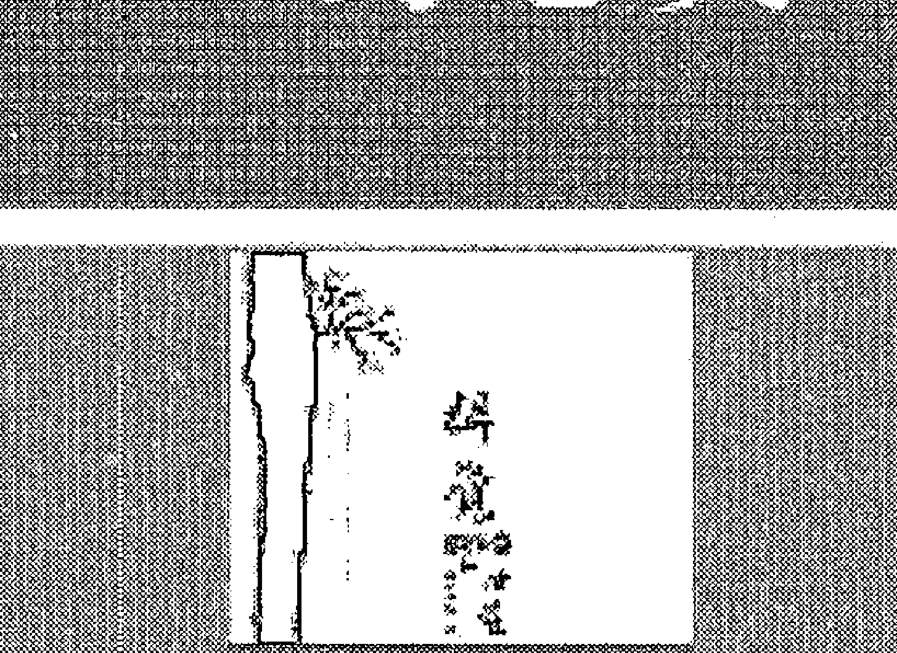
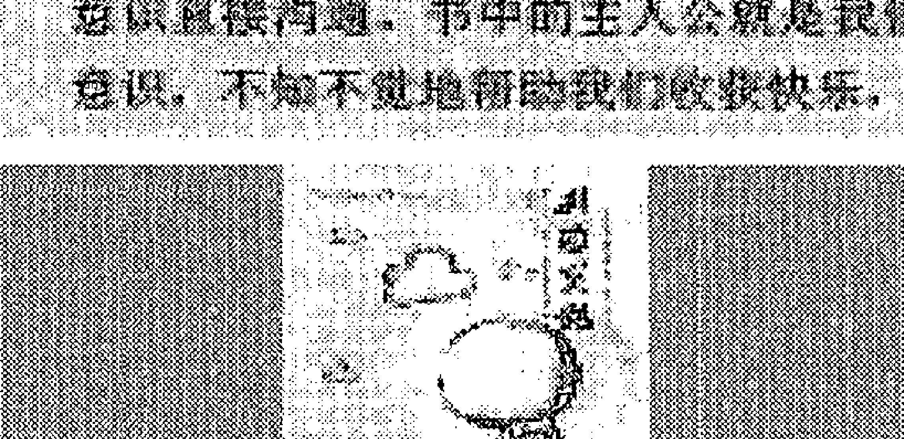
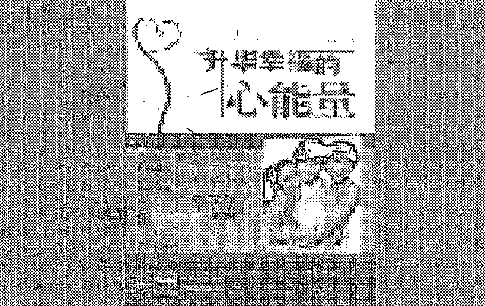

## The Spiritual Life

## 约书亚的传导
灵性人生

[荷兰]帕梅拉·克里柏 著 艾琦 晓悦 译

约书亚——
生活在两千年前的先知耶稣
为你开启灵性人生

世界图书出版公司

## 约书亚的传导

光之工作就是存在看，做你本来的自己。保持内心的宁静，并将宁静辐射给他人。

“灵性至尊”也曾深度陷入情感依赖陷阱。

个人主义作为思想基础使灵魂深度的轮回感

新时代的关系，无论是私人关系还是更广泛

体系载。

灵性伴侣进入你的生命只是将你从无明中唤

一种全新的方式感知自己。爱情也会发生在师生关系、亲密关系和所有会擦出火花

的关系中。

爱中存在着被对方完全认知和理解的承诺。志同道合者之间的和谐来自于从内

心深处感受到的内在融合，对自身阴暗面的明晰认知，以及放下和原谅的能力。

助人者给得太多，或者给得方式不正确，实际上是在掩盖他内在的匮乏。

每次读完约书亚的信息，我都有一种被“加持”的感觉。内在会充满信

心与喜悦，因为他是那么懂得我们的心，也知道如何适当地给予我们鼓励。

让我们在这条困难的灵修道路上，感受到爱与支持。

> ——身心灵作家 张德芬呼吁大家行动。

责任编辑：黄秀丽 于彬

封面设计：谥之静

### 约书亚的传导：灵性人生

(荷兰) 帕梅拉·克里柏 著

艾琦 晓悦 译

世界图书出版公司

- 北京
- 广州
- 上海
- 西安

## 图书在版编目（CIP）数据

约书亚的传导：灵性人生 / (荷) 克里柏著；艾琦，晓悦译. —北京：世界图书出版公司北京公司，2012.12
书名原文：The Jeshua Channeling：The Spiritual Life
ISBN 978-7-5100-5632-1

Ⅰ. ①约… Ⅱ. ①克… ②艾… ③晓… Ⅲ. ①心灵学—通俗读物 Ⅳ. ①B846-49

中国版本图书馆CIP数据核字（2012）第310925号

### 约书亚的传导：灵性人生

著 者：[荷兰]帕梅拉·克里柏 (Pamela Kribbe)
译 者：艾 琦 晓 悦
责任编辑：黄秀丽 于 彬
封面设计：谧之书

出 版：世界图书出版公司北京公司
出 版 人：张跃明
发 行：世界图书出版公司北京公司
（地址：北京市朝内大街137号 邮编：100010 电话：64077922）
销 售：各地新华书店
印 刷：北京博图彩色印刷有限公司

开 本：787 mm × 1092 mm 1/16
印 张：16
字 数：195千
版 次：2013年3月第1版 2013年3月第1次印刷
版权登记：01-2012-8206

ISBN 978-7-5100-5632-1
定价：36.00元

版权所有 翻印必究

## 推荐序

### 让内在充满信心与喜悦的灵性讯息

张德芬

很高兴《约书亚的传导：灵性人生》在大陆出版。去年，当《灵性炼金术》在台湾出版之后，方智出版社和我本人都收到许许多多朋友的回馈和感激，告诉我们这本书是如何打动了他们内心的最深处，让他们内在有了巨大的改变。也有朋友把这本书当成《圣经》一样在读，上面画满了红线，写满了心得、笔记。

这次，作者帕梅拉又为我们带来了许多美好的讯息，她自己经过前年的一段黑暗谷底的经历，管道变得更加通畅，自己也更为沉淀、落地。而这本书的翻译艾琦更是被帕梅拉视为“天赐的一个礼物”，她精通荷兰文、中文和英文，是个热爱生命又愿意奉献的人。现在她正在把我《遇见未知的自己》这本畅销书翻译成英文，她的专业、善良、服务的精神，深深让我感动。

这本书最让我受益的就是它谈到了走向臣服的三个障碍——三个偶像，这是我们每个走在灵修道路上的人都可能犯的错误：虽然我们已经抛弃了传统的“神”的概念和形象，但心里却始终有个权威在指使我们、操控我们；其次我们还有很多的“应该”和“不应该”在影响我们的行为，当然也妨碍我们的快乐和自由；最后就是我们对其他人的怜悯，有时也妨碍了我们自己的成长。

这也是我和其他众多读者都喜欢约书亚的讯息的原因吧！他虽然是所谓的“高灵”，却非常懂得人性，又知道该如何抚慰我们的心。他给的建议都不是在空中高来高去那种，而是非常落地、非常实用的智慧忠告。像这一次，他就建议了几个让我们联结自己灵魂热情的方法：

1.  感受灵感和激励
2.  真实对待自己的本性
3.  保持界限，并敢于说“不”
4.  耐心和节奏

每次读完约书亚的讯息，我都有一种被“加持”的感觉，内在会充满信心与喜悦，因为他是那么懂得我们的心，也知道如何适当地给予我们激励，让我们在这条困难的灵修道路上，感受到爱与支持。

## 中文版《约书亚的传导：灵性人生》自序

我非常感谢几位朋友对这本书出版的慷慨相助。最初，本书大约一半的内容是以英文的形式发布在互联网上的，我从来没有期望这些讯息会有很多的读者。有一天，我收到了郭宇（“约书亚的传导”另一部分内容的翻译者。编注）的邮件，他告诉我，他想将这些讯息翻译成中文。我，还有和我一起工作的丈夫为此既感动又惊喜，之后我们创建了中文网站“约书亚的传导”（www.jeshua.net/zh）。过了一段时间，张德芬，这位中国知名的灵性作家也跟我们取得了联系。她被网上约书亚的讯息所鼓舞激励，又为我们的书在中国出版提供了帮助。从2010年开始，“约书亚的传导”在台湾出版成书。现在，“约书亚的传导”又要在中国大陆出版，我们非常高兴。

就这样，“正确”的人以如此轻松而神奇的方式出现在我们行经的道路上，使现在这一切成为可能。我对此深怀敬畏。我非常感激张德芬和郭宇将“约书亚的传导”介绍给中国大陆的读者。从中国读者的回应中，我感到我们是一体的，我们有着共同的悲欢。我们深受触动，感觉到了彼此心与心的联结。

《约书亚的传导：灵性人生》这本书大部分是由艾琦从荷兰语翻译过来的。艾琦也住在荷兰。和她的相遇又是一个共时性奇迹。我们惊讶于这件事是否有更高的力量主导。我们深深感激艾琦的奉献精神以及精湛的翻译能力。她所做的不仅是对字词的翻译，更是在传达约书亚和他的母亲玛利亚的灵性讯息。尽管我完全不懂中文，我仍能感到她与传导有着本质上的、超越了字词层面的联结。

非常感谢这本书的出版商，世界图书公司北京公司，特别是我的编辑黄秀丽。我们的合作很顺畅，感谢世图对这本书的关注以及为出版所做的努力。

最后（但并非不重要的），我要感谢我的丈夫格里特。当我在作坊中进行传导时，他一直坐在我身旁给予支持，给我提供安全感，仅仅“在那里”。不仅仅是在传导期间，在我们的日常生活中，他的情感和精神支持对我来说也是无价的。尽管这本书上只有我的署名，但其实它是我们两人心连心协作的结晶。

帕梅拉·克里柏
2012年10月于荷兰

## 导言

每个人都向往充满灵性的人生。充满灵性的人生指的是以热忱且不抗拒的态度生活，与内心最深处的愿望和梦想融合。充满灵性的人生是对人生说“Yes”，同时觉知你的人生有比这个物质世界更高的次元支持和引导。这个更高的次元是你的源头——你的灵魂所处的次元。你的灵魂为肉身的你提供无限的灵感，通过直觉和感受与你沟通。你的灵魂渴望在地球上的体验和创造；作为肉身的你，渴望灵魂的智慧和觉悟。从这一角度讲，灵魂和肉身互相等待着，双方联袂的结果就是喜悦、灵感和满足感的诞生。

当你和灵魂联结时，你的人生中会出现一股意识流，它将你带近内我，邀请你将内心深处的你展现给这个世界。你与灵魂的联结是走向内在，并自内向外地体验外在的世界。当外在的体验和创造来自于与灵魂的联结时，它是自然且毫无困难的。在你的人生路上，自然会出现帮助你实现内心愿望的人和机遇。充满灵性的人生既富于激情，又充满宁静和光。

恐惧是走向灵性之路的最大阻碍。聆听灵魂的声音意味着认真对待你的感受，即使它与周围环境对你的教育和期待存在矛盾。忠于自己会使你偏离他人为你计划好的路途，会使你与周围环境发生冲突。

### 约书亚的传导：灵性人生

聆听灵魂的声音会使你隐藏在灵魂最深处的情感浮上表面，也经常会使你日常生活中的某些方面发生戏剧性的变化，比如亲密关系、工作和居住环境等。冒这个险会带来恐惧，恐惧被拒绝或“偏离正常”，恐惧孤独，恐惧不再被你爱或尊敬的人接受。最后，“走向内在”要求你放下所有外在的权威，完全信赖内在的声音，内在的声音通过你的感受与你沟通。遵从内在的感受而不是外界的评判，这是一个逐渐转变的过程，需要勇气和真诚。同时，它也是一个带给你察觉和满足的神奇过程，通过任何其他途径和方法都无法获得如此的效果。

这本书激励你走上这条转变之路。它教你学会如何与灵魂沟通，教你正视恐惧，并最终放下恐惧。书中详细介绍了恐惧的源头以及灵魂生生世世的旅程。此外，这本书还描述了在这个新时代中灵性的整体提高是如何进行的，在此提高过程中，每个人都被邀请放下恐惧，走上充满灵性的人生之路。这是一个从基于恐惧的群体意识向认知灵魂且灵魂合一的心灵意识转换的时期。这个心灵意识的种子曾经被一位导师，一个充满灵性的人，一个游走以色列将讯息传给所有“有耳能听”的民众的人种下，这个人就是约书亚，也就是众人熟知的“耶稣基督”。你也可以将这个心灵意识苏醒的时代看做基督再生的时代——不是基督这一单独的个体，而是一种集体能量的再生。这个集体能量来自于所有充满灵性的个体，它并非仅处于一位导师或一个宗教之中，也不处于各种人生规则和戒律的集合之中，它是一种感受、一种灵感、一种合一，是温暖、慈悲且充满活力的能量。除了传递讯息，本书还倾力为你传递这一刚刚苏醒的基督意识能量。

### 讯息来源

本书的所有篇章都是透过通灵传导获得的讯息。通灵传导的意思就是某一灵性能量通过某个“传导者”传递信息。这本书中的传导讯息是我与内在基督能量联结的产物，这一基督能量以两个导师的形象——约书亚·本·约瑟夫（耶稣）和玛利亚（约书亚的母亲）对我彰显。

进行通灵传导时，我处于一种轻度的出神状态，一种身体放松、内心宁静的状态。在这种状态中，忙碌的大脑思维让位给开放、基于直觉的意识觉知——它不思考而是静观。我于精神上对约书亚或玛利亚开放，当他们中的一位“加入”我时，我会感到被他们的爱和光环绕。约书亚给我的感觉是明晰和关切的，玛利亚则让我感到温柔、慈悲，充满喜悦的轻松和自由。他们的觉知轻柔地流过我，并赋予我洞见，我将这些智慧用语言表达出来。

传导过程中，我不觉得自己是灵媒或具有灵视能力。传导对我来说是一种灵性体验，而不是对超感知的体验。虽然我在出神状态中会经历一些超感知现象，比如看到颜色或画面等，但这并非事情的本质。通灵传导的本质在于创造通道，通向更高的觉知、更高的自我接受性以及更多的理解和爱。通灵时，我的意识被提升，超越了我日常生活中所习惯的那个层面。我与宏大、永恒且充满爱和光的能量场联结，对此我感到既亲切又自在。事实上，我与自己的灵魂联结，所传导的讯息是我的灵魂与约书亚或玛利亚合作的成果。

我曾问玛利亚通灵时我身上都发生了什么事，她回答说：

> “通灵时，你忆起了自己是谁。你暂时回到了家，并看到你所有的担忧和恐惧之间的关联。这使你心中充满了快乐，并将喜悦和无忧的能量传递给他人。以我的名义说话时，你进入了我们彼此合一的那个层面——人类目前对此还无法理解。是你在讲话，还是我？那是我们之间充满喜悦的合作。我在天堂以无条件的爱浇灌你，这使你的大脑充满了喜悦和洞见，你将它们转译成词汇、语句和整篇文字。我们的目的是让你们忆起‘你是谁’，忆起你拥有爱、被珍视和喜悦的权利。你们需要具体的讯息：为什么我在这里？我该怎样做？我该何去何从？我们理解这一点并尽量满足你们的需求。然而，我们带来的最根本的讯息却一直是：上帝爱你，他从未遗弃你，你是安全的，你就在家中，此地此时。如果你们在聆听或阅读这些传导文字时能够对此有真切的感受，我们的目的就达到了。”

通灵时，我并未失去自己的觉知，也没有出体。我处于“有意识的接受状态”，将感受到的洞见转译成具体的语言。转译过程中，我很清楚自己无法将约书亚和玛利亚给予我的爱和鼓励完全转换成人间的词汇和概念，和他们充满爱的能量相比，语言显得苍白。

这本书中的讯息先是在参加工作坊或各种聚会的人们面前被娓娓道出，之后我将其打印成文字重新编辑。编辑过程中我不断与约书亚或玛利亚沟通，以尽量准确地描述我接收到的智慧和洞见。这一过程中，我并不是进行“自动书写”，我的觉知也没有被某一外在的能量“接管”，我以转译者和设计师的身份有意识地参与了这些传导。

## 个人背景

我想介绍一些我的个人情况，以使读者更清楚地了解这本书的背景。我从小就对各种哲学和灵性问题感兴趣，孩提时代的我就很喜欢《新约圣经》中关于耶稣的故事。我并非成长于一个宗教色彩浓重的环境，我的家人对宗教持中立态度。是我自己主动去阅读了儿童圣经中的故事，至今书中的插图和书页的芳香依然在我的记忆中徘徊。耶稣的形象深深地触动了我，他代表着美丽和纯洁，我读那本书时，心中充满了无法言喻的渴望。

18岁时，我去莱顿大学就读哲学专业，开始学习以理性的方式对待和处理各种人生问题。这使我着迷，和令人窒息的中学相比，大学对我来说是一个绿洲：自由且毫无限制地思考各种实质性的问题，我充满热情地投入学习。1992年我以优异成绩毕业后，又开始在内梅亨大学攻读博士学位，专业方向是科学哲学，主要研究心智和物质世界的关系，研究的中心问题是：物质实相是否是客观可知的？科学能否揭示物质实相（包括我们人类的心智）的基本原理？科学本身是否受到某一主观因素——决定理论的形成方向却丝毫不被我们质疑的隐性世界观——的影响？我以极大的兴趣对这些问题进行着不断的研究和探索，然而，在获取博士学位的前一年，我陷入了人生的困境。

那时我已经和一位我认为会与其厮守终生的男人在一起住了四年，他是科研人员，对人生的看法充满了理智，我深受他的影响，忽视自身的感受和灵性。我偶尔会读一两本略带灵性色彩的书，但不敢让他知道，看到他走进来，我会立刻将书藏在枕头下面！我自认为已经把灵性方面的东西抛在了身后。

后来我在大学遇到了一个男生，刚刚相识的我们便开始热烈地讨论各种关于哲学和灵性的问题。他的神采和个性唤醒了我内在的某一部分，我深深地爱上了他。对他的爱也从根本上改变了我那有条理、有规律的生活，我开始怀疑一切我以前认为是理所当然的事情。某些深藏于内心深处的感受也开始苏醒，在我的人生中处于凝滞状态的热情和灵感，现在以爱情的形式涌现出来。经过情感激烈的一年，我离开了以前的伴侣，希望与我深爱的这个男生开始美好的生活。然而，事与愿违，经过一段时间的努力磨合，我们不得不承认，虽然我们真心相爱，也有着共同的兴趣，却并不适合彼此。

经历了这个沉重的打击后，我接受了美国哈佛大学提供的奖学金，决定去国外暂住一段时间。在那里我感到异常孤独，有时甚至感到绝望。课间休息时，我坐在这所闻名世界的学府的台阶上，目光空洞地看着前方。学术知识无法再使我感到充实，即使它们来自于这个世界上最清晰的心智。虽然我写完了关于科学哲学的博士论文，但我知道自己对在大学谋职并不感兴趣。我渴望汲取充满生命力的知识，不再以理智而是以感受来理解人生。

我在哈佛大学对面的一家书店看到了珍·罗伯兹传导的赛斯资料，赛斯讲述信念的创造力、平行宇宙的存在以及心智的灵性来源和运作方式。阅读时，我不仅感受到这些讯息——更高层面的哲学——对我的感染力，也感受到字里行间中充满的能量，这能量来自于超越物质实相的次元。赛斯资料中洋溢的灵性、光明和幽默使我重新认识到人生的意义，我开始对“通灵传导”感兴趣，将做博士研究所需要阅读的书籍扔在一边。不过，我一走进课堂，就得赶忙把赛斯资料藏起来，仿佛在做违法的事情一样。只是，我无法将这种“捉迷藏”的游戏一直坚持下去。

1997年博士毕业后，我告别了大学，开始寻找能够将我对哲学和灵性的兴趣付诸于实践的机会。我一边教哲学课，一边工作。我通过中介公司先后做过几份秘书工作。在大学时，我习惯了一个人独立地完成各项工作，因此很不适应充满社交和等级特性的办公室生活。经过几年的屡战屡败，我于2000年拜访了一位居住在祖特尔梅尔（Zoetermeer）的灵性治疗师及生物能量场（aura）解读师优柯。她解读我的能量场，告诉我她看到的颜色和画面以及随之而来的感受。我被她的解读方式深深触动。她对我说：“是时候了，你要跟从内心深处的灵感生活，不要再受制于内在的恐惧和不自信。”这使我感到难以接受，却不得不承认她是对的。那时的我，工作不快乐，亲密关系也没有任何激情，内心不安宁，而我却不知该如何是好。

我对优柯的拜访是我人生的转折点。那一年我参加了她讲授的“提高直觉力”的课程，这门课对我的情感冲击很大，旧有的痛苦、愤怒和恐惧浮现出来，我对它们从未有过如此清晰的觉察。我感到情感层面上发生了颠覆性的变化，这使我受益匪浅。我感到内心的平静，也觉得自己更有力量，而且有生以来我第一次感到真正“住在”我的身体中，也第一次感到与地球的联结。我开始在灵性方面如鱼得水，也很快学会了解读生物能量场。不过，与物质实相建立联结，并面对由此唤起的情感却不那么容易。优柯象母亲一般引导我走过这一阶段，我仿佛获得了重生。

那一年，我也接受了回溯催眠。在催眠状态中，我回到了不同的前世，这一神奇之旅使我认识到灵魂的次元，它远远超过活在这一生的我们，我看到自己在地球上多次轮回中——甚至在来地球轮回之前——经历的黑暗和光明以及善与恶。对前世的回忆——那时我已能自发地看到前世的一些画面——给我留下了深刻的印象，一切都逐渐变得明了。我那时的男友——我们已经同居几年——很难理解我的所作所为，我们分手了。

这时，格里特出现了。那时我刚刚开始上网，在网上搜索关于前世、业果和轮回的资料。我看到格里特的主页，我们很快便开始了频繁的联系。我感觉自己和他有着强烈的内在联结，仿佛与他相知很久似的。当我们于2001年第一次见面时，我的感觉得到了验证。那是我第一次去看他，离开时，他送我去火车站，我们一起在站台上等火车。我们默默地并肩坐在椅子上，虽然嘈杂的人声不断，我却感到有一种深度的宁静围绕着我们，仿佛通往其他次元的门暂时为我们打开，我们的灵魂在无言的温柔中互相问候，互相拥抚。我的内心深处涌起无边的喜悦，就像我已经回到了家，理所当然地享受着亲密，这是如此的温柔、快乐和轻松。我遇到了我的丈夫。

几个月后，我辞去工作并退掉在祖特尔梅尔租的房子，搬到蒂尔堡（Tilburg）和格里特住在一起。我很快就身怀有孕，并于2002年生下了我们的女儿劳拉。那一年我的工作室也正式开张，提供生物能量场的解读服务。一切都进展得那么快那么顺利，我很满足。经过各种变动和波折后，我真切地感到自己被某一更高的力量引导着，那是我灵魂的力量。我内心深处的灵感终于与地球实相建立了联结，我开始跟从灵魂的声音生活。

## 与约书亚相遇

格里特和我有个习惯，就是晚上时时会做一次催眠，有着多年催眠经验和兴趣的格里特能将我带入催眠状态。我们以这种方式探索内在的心理面向——比如前世记忆或情感层面上的能量堵塞，并提出一些关于人生和灵性方面的问题。2002年的一个夜晚，我感受到一个陌生存有的出现。此前我曾与一些指导灵有过接触，他们给予我温柔的能量和充满爱的建议。但这个存有却完全不同，它比较庄严且富于感染力，我们决定探明它是谁——或它是什么。当我开始与这一能量沟通时，我感到这是一个充满智慧的男性存有。他的名字约书亚·本·约瑟夫——耶稣的阿拉姆语名字——清晰地出现在我的“内在之眼”中。一瞬间，我内在的深度觉知被唤醒，我知道确实如此，我感受到的是耶稣的能量。虽然我对这一切的真实性怀疑了很长时间——更别说向外界透露，但我从一开始就对约书亚·本·约瑟夫的能量感到很熟悉。在祖特尔梅尔做回溯催眠时我回到了某一前世，那时我是约书亚的忠实信徒，他的讯息和神采征服了我的灵魂，他的死使我心灰意冷。我还记得那个催眠师对我说：“那一生是你的灵感之源，灵魂之火。”当时的我迷惑地看着他，现在我明白了他的意思。我要在这一生再次拾起这一灵感，并在这个时代——和两千年前相比时机更加成熟——重新展现这一灵感。

约书亚没有用耶稣的名字介绍自己，他使用了约书亚·本·约瑟夫的名字以强调他的人性。他并非宗教信仰中描述的那个神圣人物，而是一个站在我们身边的兄弟和朋友，亲切且容易接近。他曾是人类的一员，完全了解光明和黑暗以及善与恶。你会像对待大师或权威一样仰视他吗？你会无视他带来的讯息吗？这个讯息就是：基督意识已经在每个人之内萌芽。约书亚不想高高在上，恰恰相反，他要我们意识到我们与他的平等性。约书亚像兄弟一样亲切，当我问他问题时，他总会直截了当地给我回答。最初，他常常建议我要在能量层面上更好地保护自己，不受客户的各种问题和负面情感的影响——我有着过于友善的倾向，很容易就和他人的能量溶在一起，事后则感到很累，且难以放下。约书亚明确地告诉我这样做并不是“帮助”他人，他强调，与大地的联结——关爱自己，敢于说“不”——对于平衡我那敏感和富于同理心的一面尤其重要。

我常常以“明晰的感受”或“简短的语句”等方式接收他的讯息，随着时间的推移，我们之间的沟通已经不再是“对话”，而是一种能量上的调谐。这一能量上的调谐带给我意识上的明晰和宁静，他的能量就像是我的基准点，帮助我与自己灵魂的神圣核心建立联结。

最初我没有告诉任何人关于与约书亚沟通的事情。一年后我们才邀请了几位朋友参加通灵聚会，那时，约书亚也开始将一些具有普遍意义的讯息传给格里特和我（“光之工作者”系列），我们将这些讯息放在了网上。2004年，一家灵性中心邀请我们在公开场合进行通灵传导，虽然心中充满了恐惧，但我还是觉得应该接受他们的邀请。这次公开的通灵传导为第二系列的“约书亚传导”——都是在公众面前进行的——拉开了序幕（我们已将两个系列的约书亚传导编辑成书）。虽然我一直对在公开场合传导讯息感到恐惧和迟疑，但每次聚会的气氛都是如此特别，约书亚的能量是如此真实强烈，在场的人们也深受感染，这一切都激励我继续坚持下去。我们遇到越来越多志同道合的人，我们有着共同的兴趣以及对灵性的开放态度。约书亚的到来使我与灵性家人相遇，这是一份极其珍贵的礼物。

最初，约书亚就告诉我他的讯息是专为某些人准备的，他将这些人称为“光之工作者”。他说这些人是地球新意识的先锋，他们首先觉醒，并将成为后来人的榜样和导师。我对此感到奇怪，这听起来给人一种精英感。某一特定的团体？他们是谁？约书亚在《生命的疗愈：约书亚的传导》一书中描述了光之工作者，他们的特征如下：

-   ——光之工作者自小就觉得“与众不同”，他们常常远离社会，感到孤独和无人理解。随着年龄的增长，他们常常（被迫）成为寻找并开创自己独特之路的个人主义者。
-   ——他们常常对传统的组织和工作机构感到不适应。光之工作者天生蔑视权威，他们反抗一切以权力或等级制度为基础的规则或价值观，即使他们本人既羞怯又谦虚，却有着强烈的反权威倾向，这与他们的人生使命有着直接的关系。
-   ——他们热心助人，比如以心理治疗师、医生或职业为职业。即使他们在其他领域工作，内心也有着强烈的助人愿望。
-   ——他们的人生观具有一定的灵性色彩，在意识或潜意识的层面上，他们从未忘记地球之外的光之域，他们来自那里。他们会想家，感到自己并不属于这个地球实相。
-   ——他们天生就尊重生命，具体表现为对动物的爱护和对环境的关心，人类对动植物的暴力行为使他们深感痛心。
-   ——他们善良、敏感且有同理心。他们不知该如何应对攻击性的言行，也很难为自己挺身而出。他们的心中充满梦幻，爱出神，是理想主义者，难于坚定地立足于这个世界。因为他们很容易被他人的（负面）情绪感染，所以需要时时独处，以重建与自身的联结。
-   ——他们在地球上经历的许多前世都与灵性和宗教信仰有着密切的关系，在过去的各种宗教体系中，他们以僧侣、修女、隐士、女巫、巫师、巫医或神父的身份大量出现。在各种社会团体中，他们是物质世界和彼岸世界的桥梁，因此常常遭受拒绝甚至被审判。他们中的许多人曾因为自身拥有的能力而死于火刑，被审判的创伤在他们的灵魂深处留下了深深的刻痕。

我发现自己很符合这些描述，随着时间的推移，我发现我的很多客户也具有这些特征。他们的问题大多与下述几个方面有关：觉得自己与众不同，有着改变地球意识的强烈愿望，敏感且高度理想化，对向世人展现真实的自己充满了恐惧。正是这些人被约书亚的讯息触动，深深地感到与他的联结。实践证实了约书亚的话：被这些传导讯息深深吸引的人正是光之工作者。这并不是说他想将一些人排除在外，而是说光之工作者才会受这些讯息的影响并感到受益匪浅。 在约书亚另外的传导中，他一直强调光之工作者并不比他人更高或更好。

> “光之工作者”这个概念可能会引起误解，因为它将一些人与大众区分出来。这可能会使人错误地认为这些人因着这样或那样的原因高于他人——那些“并不进行光之工作”的人。这种想法是错误的，完全违背了光之工作的本质。让我来简要地讲一讲为什么这样说。
>
> 首先，任何优越于他人的想法，无论它多么隐晦，都是无明。那些认为自己更好或程度更高的想法只会阻碍你向那个开放且充满爱的意识觉知发展。其次，光之工作者并不比他人更好或更高，只是与不属于这个群体的人相比，他们有着不同的背景而已。正是这一历史背景——后面会具体讨论这一点——使他们拥有某些心理特征，这些心理特征则成了他们与众不同的标志。第三，每个灵魂在其发展过程中都迟早会成为光之工作者，因此，“光之工作者”这个词并非只限用于某一群组的灵魂。
>
> 虽然会引起一定的误解，我们还是使用“光之工作者”这个概念，因为它会唤起你的某些回忆，使你认识到“我是谁”，这个词唤起你内在的纯洁和真实。此外还有一个很实际的原因，这个词时时出现在各种灵性书籍中，你们已经对它相当熟悉。

约书亚在上面这些话中提到的历史是光之工作者所经历的漫长生命周期，这一周期中，意识觉知经由一条条曲折的路发展到目前的这一刻。在这一刻，光之工作者被邀请站起来，跟从内心深处的灵感生活。我感到约书亚来到我身边是为了通过我唤请光之工作者对自己真诚，并跟从内心深处的灵感生活。我可以感受到约书亚呼唤中的急迫，仿佛他在说：“就是现在！站起来，信任你自己！”你于外在世界的表现并不重要，首要任务是将自己从内在的恐惧和怀疑中解放出来，为灵魂创造空间，以使其展现于物质实相。

本书第一部分的主题是“获得自由”。在第一章“三次坠落”中，约书亚带我们回到在地球上的轮回刚刚开始的时刻，回到亚特兰蒂斯古文明，为我们讲解在地球上生生世世轮回的意义。解释我们如何在次次轮回中通过接触黑暗和幻相，逐渐成长，进入心灵意识的层次。与此同时，这一心灵意识正在试图帮助我们有意义地度过今生。

第二章描述基督能量在这个新时代的再生。约书亚讲述了从自我到心灵的集体意识转变是如何进行的。在这一时代，越来越多的人渴望走向内在，体验充满灵性的人生。光之工作者是这一转变的先锋，同时他们也在战胜恐惧和迟疑，以展现自己。约书亚请光之工作者以慈悲的心态对待自身的痛苦，并超越痛苦，与地球再次联结。

在第三章中约书亚讲述如何寻找并跟从来自内心深处的灵感，以唤醒灵魂的爱和热情。他指出了阻碍我们跟从本源感受的三个陷阱：对上帝、社会和他人的错误理解。他教我们如何与灵魂重建联结，耐心地为我们讲解在日常生活中获得灵感、利用灵感的具体方法和步骤。

第四章的重点是新时代的合作——一种不建立于权力和权威基础上的合作关系。当你进入充满灵性的人生时，会渴望与心灵伴侣的交流与合作。约书亚提醒我们这一过程中可能出现的阻碍以及在与心灵伴侣互动时可能出现的旧有情感的反射和波动，并悉心教导我们如何获得建于内心感受和互动基础上的、具有开放性和灵活性的合作关系。

第二部分“灵魂的实体化”由第五到第十二章组成，这一系列的传导来自于我们以“灵性和工作”为主题的工作坊，涉及三个论题：什么使你获得灵感？哪类工作最能唤起你的热忱？什么样的恐惧阻碍你获得成功？相对而言，约书亚在这一部分的传导中减少了理性分析，他的话语更赋予我们灵感，更具激励性，引导我们在内心深处寻找“我是谁”和“我到底想要什么”的答案。

## 与玛利亚相遇

第三部分的传导讯息来自另一位导师，约书亚的母亲玛利亚。她也为本书探讨的重点“灵性人生”带来了智慧之光。她从女性的角度指导我们，代表着基督能量的女性面向。在介绍第三部分的内容之前，我想先讲一讲与玛利亚相遇的经过。

她在我的人生中出现之前，我已进行了几年的通灵传导。我对基督教所描述的玛利亚并没有特别亲近的感觉，对我来说，她有些过于忍耐和完美，而且不将世间的苦难挂在心上，其实我并不喜欢“永远带着全然的理解牺牲自己”的态度。所以，有一天下午，当我忽然“听”到她的名字并感受到一个与“忍耐和夸张的顺从”毫无关联的存有时，真是惊讶至极。当时我正坐在沙发上沉思，并自问除了约书亚之外是否还会成为其他指导灵的传导者，忽然间，我感觉到了她的出现。

因为心存怀疑，我决定对此置之不理，将这一切当做臆想。然而，玛利亚的出现越来越频繁，而且她给我的建议都极具价值，我心想：“那我就把这一切暂时当真，看看事情的发展如何。”事实证明这是一个很好的决定，因为正是那一时期，我从事的生物能量场解读工作面临困境，我越来越忙，到了需要超时工作的程度。我开始胃痛，迫切需要休息和安静。玛利亚很快就成了我的慰藉之源，她的能量不仅充满了温柔和友善，也是独立和自由的。我发现她的性格与宗教信仰对她的描述大相径庭，我明显地感觉到了她的有力和独立，以及略带嬉戏性的轻松和愉悦。玛利亚鼓励我为自己着想，不要受迫于各种外在的期望。她强调说，我是为自己而活的，完全可以根据内心深处的愿望作选择。因为我极度需要安宁和自己的时间，我决定不再做一对一的个人解读，只以群组的形式工作。这个决定很好，它使我获得了很多空间和自由，也让我有时间进行写作，更能享受与先生和女儿在一起的生活。就在我需要充满智慧和母爱的能量时，玛利亚来到了我的身边。约书亚教我如何更好地运用我的男性能量——自我觉知，设定界线和敢于为自己挺身而出；玛利亚则教我更加信任自身的女性能量——及时放下，关爱自己，并让喜悦进入我的人生。除了这些私人性的接触外，玛利亚很快也出现在我主持的工作坊或聚会中。这本书的第三部分几乎都是玛利亚传递的讯息，只有一篇传导除外。

在第十三章中，玛利亚描述了她作为约书亚母亲的一生。和约书亚一样，玛利亚强调她也曾是具有血肉之躯的人，也有情感上的高峰和低谷。在这一章中，她描述了自己为了孩子“受难的渴望”，如何作为灵性意义上的母亲而放弃“尘世母亲”的抗争。

> > “这是爱的体现，”玛利亚说，“是我们应该给予孩子更应该给予自己的爱。”

第十四章的侧重点是新时代的儿童。玛利亚讲述了新时代儿童敏感程度的提高。这些儿童带着更多的“灵魂能量”来到地球，相对于他们的长辈，他们较难忘记甚至否认本源的“自己”。在许多方面，他们都比我们更加进化，也因此，他们常常和目前占主导地位的标准和价值观发生冲突。这一章详细描述了可能会出现的各种问题，并为如何与新时代儿童沟通与互动提供了很多极具价值的建议。

在第十五章中，玛利亚讲述了历史长河中女性能量的变迁。她描述了女性能量在社会及个人层面上被压抑的结果。她带我们回到过去，从多个角度描述男女之间曾经的冲突。接着，她给出了女性从过去的创伤中解脱出来的各种方法。此外，玛利亚还提到了抹大拉的玛利亚（圣经中耶稣的女追随者，译注）以及与她的关系。

第十六、十七章揭示了男性与女性能量联袂合作的种种方式。第十六章里，玛利亚讲述存在于每个人之内的“天使和冒险家”，这是曾经一起快乐共舞的女性能量和男性能量。她描述了人类内心中的女性能量是如何觉醒的，这种觉醒一方面激发更多的慈悲和温柔，另一方面也使敏感的人更加敏感和缺乏勇气。为了减弱这种负面效应，玛利亚强调了一种新的男性能量的重要性。这一男性能量赋予人们力量而不是权力，使人认知本源的自己而不是自我。在第十七章中，约书亚描述了人类社会中女性和男性能量之间的异化和分离。他详细讲述了这种异化和分离所引起的种种心理上的不平衡，并呼唤我们再次于内在联合两种能量。

第四部分汇编了在我们主持的各种灵修工作坊和讲座中约书亚和玛利亚对各种问题的回答。其中大多是关于如何在工作中获得灵感和热忱的问题，还有许多关于健康、亲密关系、金钱和亲子关系的问题。灵性人生的源泉就在我们自己心中，我们的神性和人性在此交融，对这一点的洞察是贯穿全书的主线。这一系列的传导讯息鼓励我们信任内心，并认识到我们是谁：人间的天使，来地球轮回的上帝火花。约书亚和玛利亚邀请我们重建与灵魂的联结，并跟从内心的灵感、喜悦和创造力——我们神性的一部分——生活。

## 目录

推荐序 让内在充满信心与喜悦的灵性讯息 张德芬

中文版《约书亚的传导：灵性人生》自序

导言 / 001

# PART 1 光之工作者来到地球

### 第一章 三次坠落 / 003
-   - 离开天堂成为“我”——第一次坠落 / 006
- 经历亚特兰蒂斯的黑暗——第二次坠落 / 010
- 光之工作者被抛弃——第三次坠落 / 015

### 第二章 基督意识的诞生 / 020
-   - 什么是提升？ / 022
- 光之工作者的轮回之痛 / 025
- 柔顺的人将会继承大地 / 027

### 第三章 “天使我”与内在小孩 / 029
-   - 臣服之路上的阻碍：三个伪神 / 032
- 与激情共舞 / 044

### 第四章 新时代的合作方式 / 048
-   - 史上的灵性群组和团体 / 049
-   - 被拒绝的心理创伤：灵魂个体在地球上的诞生 / 052
-   - 新时代的灵性网络 / 056
-   - 与灵魂家族重聚时的情感陷阱 / 058
-   - 成熟的关系 / 066

# PART 2 灵魂的实体化

### 第五章 爱自己 / 073
### 第六章 敞开心灵 / 080
### 第七章 接受你之所在 / 087
### 第八章 让你的光闪耀 / 092
### 第九章 拥抱你与他人的不同 / 098
### 第十章 给情感一些空间 / 104
### 第十一章 接纳灵感 / 112
### 第十二章 成为未来的自己 / 117

# PART 3 女性能量的再生

### 第十三章 成为“灵性母亲” / 125
### 第十四章 养育新时代的儿童 / 133
-   - 新时代儿童的特征 / 137
-   - 新时代儿童面临的问题 / 139
-   - 指引新时代的儿童 / 142
-   - 处理你孩子的痛苦 / 145

### 第十五章 女性能量的尊严 / 148
-   - 男性精神能量的统治地位 / 149
-   - 对女性的性伤害 / 153
-   - 男性统治的源由 / 158
-   - 对男性统治的宇宙影响 / 161
-   - 通往自我疗愈的喜悦之路 / 163
-   - 要有耐心 / 165
-   - 分离不再：玛利亚和抹大拉的玛利亚 / 165

### 第十六章 天使与冒险家 / 169
### 第十七章 男性能量与女性能量的平衡 / 178

# PART 4 问答篇

### 第十八章 约书亚的解答 / 187
### 第十九章 玛利亚的解答 / 214
### 译者后记 / 220
### 编后记 / 223

# PART 1 光之工作者来到地球

- * 第一章 三次坠落
* 第二章 基督意识的诞生
* 第三章 “天使我”与内在小孩
* 第四章 新时代的合作方式

## 第一章 三次坠落

约书亚讲述光之工作者的使命是在物质世界经验光明和黑暗的合一性，学习什么是真正的爱。光之工作者经历过“三次坠落”：灵魂成为独立的“我”，从天堂坠落，初尝二元世界的对立；在亚特兰蒂斯时期投生转化为人，卷入星际权力斗争，经历极端的黑暗；在基督时代转世为光之工作者传播爱与光，遭到世俗权威和组织化的宗教的拒斥。地球正处在一个生命周期结束的时刻，光之工作者将依从内心生活，以此提升地球意识。

亲爱的朋友们：

我是约书亚。我站在你们面前，向你们传送着我的能量和爱。我愿意在这个具有挑战性的时代支持你们。地球正在发生转变，一些旧有的议题浮出水面。这些老旧的能量来自久远的时代，来自那个你们多次轮回累积了甚多经验的时代。如今那些陈旧的层面再次浮现出来。

今天我想谈一下那个久远的年代，我要带你们去深入了解自己，了解你们现在为何会站在这里。你们是古老的存有，累积了无数世经验。你已经经历了漫长的时空之旅，不仅是在地球上。请让我带你们回到最初的时刻。实际上，并没有一个开始，不过为了方便起见，我会设定一个起点，你们经历了一个巨大的生命周期，对这个周期来说确实有一个起点。

现在我要带你回到你作为一个个体的灵魂、一个单独的“我”诞生的那一刻。“我”，对现在的你们来说是如此熟悉，但在那个时刻却完全是一件新鲜事物。成为分离的个体，你才能获取大量的经验，包括幻相。没错，幻相具有同样的价值。正是成为一个“我”从整体中分离出来，经验随之而来的幻相，你才能找到那所“不是的”；你才能发现幻相并从内而外彻底地经验它。然而，在最初的时刻，这是不可能的，最初只有“全一”，没有什么在它之外，它就像一个无差别的爱与合一的海洋。你可以尝试一下，看看能否在那里经验和恐惧和无知！

藉由让自己变得脆弱并耽于幻想，你积累了大量经验。这些经验能够让你真正懂得合一的内涵、爱的真谛。你会明白，爱不是抽象的概念，爱是活生生的、创造性的能量。爱触动着你，令你的心灵充满深度的喜悦。这就是你旅程的最终目的。你渴望着回家，渴望成为神，渴望作为“我”去经验合一。你并不需要放弃“我”，你需要通过“我”与整体联结，来经验最深的喜悦，在“一切万有”中添加你独有的能量。藉由“成为神”，你为“一切万有”的创造增添了新鲜和宝贵的成分。

我要请你回到刚刚“成为我”的时刻。那时你是天使，也可以说你作为天使被创造出来。在那个遥远的开端，你第一次“成形”，第一次了解何为形式，你能够感受到那个原始能量的柔嫩和天真吗？忽然之间，你就成为了“你”，与周遭的一切分离并区别开来，经验到成为一个独特的个体的神奇。那时你和神圣之光的源头是如此接近，你有满满的爱和喜悦，并且富有创造性。你体内有着难以置信的渴望，你渴望去经验，去了解，去感受，去创造。我要请你进入内在，在那里呆一会儿，看看你是否能感受到那个真相：在你内在最深处你是天使……

我只能概述一下这一段广阔的历史。现在我要在时间上跨一大步了，我要带你回到地球形成的最初。那时你早已存在了，你比地球这一有形星球更为古老。你是作为原始的“我之意识”诞生的，那一时刻远早于地球形成的时间。

现在想象你们正在致力于地球上的生命发展。物质元素的出现为意识显化为物质形式提供了广泛的可能性。生命在慢慢地进化，从矿物、植物，再到动物，你们深度地卷入了这个创造过程。你们以何种方式参与的呢？

你们是天使，你们也是天神。你们培育了蔬菜王国，你们对地球上的“生命之网”有深切的了解和关爱，你们也给动物带来爱、关怀和以太层面的滋养。

你们携带的天堂和伊甸园的记忆就来自于这个时期。那时，自然界有着完美的平衡，你们生活在其中，照管、守护着生命。你们尚未显化为肉身，而是在以太与物质世界之间盘旋。你们是即将以肉身形式诞生的天使。

请记住这个纯真的时代，记住天使——天神意识是什么样的，记住你是多么热爱地球以及地球上的生命。去感受你们意识中天真烂漫的孩子气的面向。那时，你们像孩子一样在天堂里嬉戏。你们总是喜欢冒险，喜欢开玩笑。这是一个安全的环境，你们笑啊，唱啊，尽情展现自己，体验着自由表达的喜悦。你们玩心很重，但是你们对生命# 约书亚的传导：灵性人生

对指导法则深怀敬畏，你们深深地喜爱生命、尊重生命，不想用任何其他方式对待各种生命形式。

所以，从某种意义上来说，你们是地球生命的父母。这就是为什么你们看到现代科技破坏自然界、看到人类滥用自然力量时，会如此震惊。为什么这些会对你影响至深呢？因为从你培育这些能量时你就怀着无比的珍惜之情。你的核心本质与地球、与许多的生命形式紧密相关，你们之间的关系类似父母与孩子、创造者与创造物。你们是天使，当你们培育地球生命时，并不知道为什么这么做。一旦你听到了冒险的召唤，你就像一个孩子一样，为即将经历的新奇事物激动颤抖，于是你遵从内心喜悦和兴奋感的指引，在那些欢迎你的地方播下了能量种子。

在你的协助下，人间天堂才得以建立。有了你，地球上才有了生命的辉煌，植物和动物才会如此丰富，生命形式才会如此多样；有了你，各种生命形式才会无拘无束地发展。

请专注于这一画面片刻，请记住你是谁。

这些听起来似乎过于宏伟，但我请你们允许自己想象一下：你曾经是其中的一部分。你曾经是生命花园中的天使，那喜悦的、天真的天使，你们养育生命并珍爱他们。

### 离开天堂成为“我”——第一次坠落

地球已发展了数百万年，这一切很难简而言之。在某一个时刻，你在伊甸园里幸福的冒险生涯被外来者打扰了。我们可以将这一影响称为“坏”和“黑暗”。

来自宇宙另外次元的存有开始干预地球的发展，企图对地球上的生命施加权力和影响。这股强有力的黑暗能量从无到有，令你们的“天使自我”深受震动。这是你们第一次遭遇邪恶，你们没有准备，它撼动了你们世界的根基。你们第一次体会到不安全感，第一次知晓了人类感情：恐惧、震惊、生气、失望、悲伤和愤怒。你们问：这些都是什么？这里发生了什么？

感受一下，当你们第一次遭遇黑暗，遭遇二元世界的黑暗面时，阴影是如何笼罩于你的。慢慢地，你滋生了对权力的渴望，曾经令你惊骇的权力欲开始控制你。这一切源于你们对攻击者感到愤怒，你想抵制陌生人的入侵，你们想保卫地球。

在这里我谈的是来自地球之外的某个种族给地球带来的影响。该种族的起源并不重要，重要的是你们部分地吸收了这些存有的能量。你们因此而堕落（fall）。不是圣经上的堕落，在这里，堕落这个词与罪恶和内疚并不相关。堕落只是一个经验，从某种意义上来说，落入黑暗是你们的宿命，因为你们是二元世界的一部分。藉由成为“我”，藉由从整体中分离出来，二元性的种子得以在你们之内产生。这是造物逻辑的一部分，一旦你落入二元性，你将探索二元性所有极端的面向。

你渴望有力量去保卫自己的领土，因此你逐渐成为战士。历史进入了一个新的极端，你陷入了各种各样的星际战争。请花一点儿时间去感受堕落的发生，去感受孩子——天使的玩乐能量是如何堕为严厉而狂暴的星际战士能量的。这一段历史很长，宏伟深广，你们全都经历过。现在我请你允许自己展开想象并和我一起去旅行一会儿。

你们卷入了一场残忍而宏大的战争。你们熟悉的科幻文学描绘了战争的状况，实际上，这些作品不仅仅是“科幻”，其灵感来自于遥远年代的真实事件。很多事件都真实地发生过，你们曾经深陷其中。为了争夺权力你们迷失了自己。在这一历史阶段中，你们透彻地经验了“自我”的能量。

我在“光之工作者系列”里谈到过这些，现在我要跳一大步，讲讲下一个重要的阶段。

经过了很长很长一段时间，你们厌倦了争斗。你受够了。伤心、厌倦，某种乡愁爬上心头。你曾经长时间地痴迷于战争和冲突。当你第一次跌入黑暗时你是天真的、未经检验的，权力的幻相给这颗初生的、未经检验的心灵带来了催眠般的影响。

但在某一时刻，觉醒发生了。昔日关于天堂的模糊记忆在脑海中浮现，令你想起你曾有的喜悦和天真。你希望重返伊甸园，不再战斗。藉由充分经验“自我”，你耗尽了自我的能量。你已了解了战争的所有面向，了解了所有与胜利和失败、控制和屈服、杀戮和被杀相关的情绪。你对权力的幻相破灭了，你发现权力并不能带来它所承诺的爱、幸福和满足。你从催眠状态中醒来，渴望着某种新事物的出现。

当你超越了斗争的能量，联结上心的能量时，你重新变得天真和“未经检验”。你像个小孩子一样，爬上墙探头望向一个全新的国度。主导这个国度的不再是斗争和权力，而是爱和联结。你听从灵魂的召唤，穿越了权力之墙。你们走到了一起，并认出对方是你的灵魂伴侣，是同一个家族的成员，都是在伊甸园玩乐的天使。

光之工作者的家族成员，都诞生于同一个灵魂波。如今他们再次看到了彼此。他们被同一个召唤吸引，将要履行同一个使命。你知道你不得不做点什么，要发展出真正的心灵意识，要重返天堂，你知道你必须得做点什么。你感到你得再次和地球打交道。这一次，你要成为人，你要以人类的肉身来体验星际战争和你们滥用权力给地球带来的影响。

在权力斗争中，地球一直是各方关注的焦点。很多外星势力为了争夺地球的统治权而发动战役，给地球、依赖地球生存的生命、进化中的人类集体灵魂带来了负面影响。地球为什么这么重要？并不是那么容易解释的。简单地说，地球是孕育某种新事物的地方，不同的次元和实相在这里相会，形成了一个十字路口通往未来。有非常多的能量在这里相遇并混合，包括植物、动物，特别是人类。这一点是非常特殊的。当这些能量能够和平共处时，整个宇宙就会发生巨大的光爆炸。这就是地球一直是星际战役中心的原因。

你们参与了战争，你们是加害者，你们尝试侵略和操控地球上的生命和意识。这对人类的发展带来了伤害。此时人类正处于婴儿期，人性仍是天真无邪。和你们不同，人类的灵魂来自不同的能量波，刚刚进驻人身。在“光之工作者系列”中我们将这些灵魂称之为“地球灵魂”。这一组灵魂更为年轻，他们一直在地球上演化，不得不应对外星人的操控。外星人的操控降低了人类的能力，为了控制地球灵魂，他们向人类年轻而开放的意识心灵投射恐惧和自卑的能量。

现在让我回到你做出投生为人的决定的那一刻。你有两种动机。首先，你感到你的内在已做好改变和转化的准备。你想放下“自我”的斗争态度，以另一种存在方式发展。你不知道这意味着什么，你还没有充分的把握，但是你感到，投生地球你会获得你所需要的挑战，你的发展具有更多的可能性。

第二，你知道你得为你在地球上做过的事做出补偿。不知为何，你感觉到，在最初，你和地球有着基于爱和尊重的深度联结。然而你对战争的沉迷败坏了这个联结。现在你需要将两个极端、将天使——孩子和强悍战士的两面性整合在一起并转化。有哪一个地方比地球更适合做这项工作呢？你既感到和这颗星球有深度联结，也感到你承担着提升地球的业力债务。你希望改变和扬升地球的意识状态。于是你成了光之工作者。

### 经历亚特兰蒂斯的黑暗——第二次坠落

亚特兰蒂斯是非常古老的文明，比你们所熟知的历史上记载的文明要古老得多。亚特兰蒂斯在大约十万年前兴起，一万年前消亡。其开端甚至早于十万年。那时外星种族投生为人，以此种方式侵略地球。这些灵魂有非常高的心智水平。而地球上的社会和社区大部分由地球灵魂组成，你们称之为“原始社会”。

甚至在亚特兰蒂斯之前，就有外星势力企图影响地球。他们用各种不同的方式从星际领域发射“思想体”（thought forms）到地球上。“思想体”是他们在以太和星光层面联结人类的能量，因此可以影响人类的思想和感情。“思想体”仿佛一张具有传染效果的网，当你从家庭和社会中获取一些想法和信念时，就是“思想体”在影响着你。在你周围的星光层也会发生类似情况。一般来说，星际战士向人类投射的“思想体”能量是具有操控性的，但同时有光能量的温柔，人类可以自行决定接受什么拒绝什么。在某一时刻，星际势力希望给地球带来更深刻的影响，于是他们寄居于人体，投生于地球。这符合他们内在的发展之路。你们也是这些星系势力中的一员。在你们的灵性文学中，源自这些星系领域的种族经常被称为“星际人类”或“星际种子”。

亚特兰蒂斯是地球原住民和外来灵魂混合集结的结果。你们——光之工作者的灵魂波——投生地球，是因为你希望给地球带来变化和进步，是因为你想提升自己，从“自我意识”提升到“心灵意识”。当你们来到地球的时候，因第一次栖居于人类肉身而深感笨拙和不适。进入如此稠密的物质，你感到被囚禁的压抑。你习惯了呆在更流动、更轻盈，具有更大精神力量的身体内。在更高频率的次元里（那里物质少一些，密度更小），你的精神对物质环境有更直接的影响力。你想要某种东西，念头一转就可以立刻创造出来，或者吸引它过来。你的头脑习惯于更快的创造速度，你觉得在地球上这个反应实在太慢了。于是，当你第一次来到这里，你感到自己莫名其妙地被禁锢在一个坚硬而僵直的身体里。你感到不安，因为你的渴望不再那么容易实现，你身处于一个受限的环境里，你对生命的掌控力看起来很有限。

于是，你迷惑了。在过往的星际时代，你的心智能力受过高度训练。要将“思想体”投射到其他生物身上，你得拥有相当大的精神力量。你的心智本来像一套尖刀，如今却不得不在一个完全不同的环境中证明它的价值。你在地球上经验到的疏离和压抑，令你直觉地想用这项老式武器去解决这个问题。因此你开始在地球上使用你的心智力量。刚开始，你打算用心灵来联结地球实相。在你投生地球之前，你知道，你们心灵的土壤还处于休整期，还需要种子，需要光的种子——虽然你们有着强大的分析能力和精神影响力。然而，当你纵身跃入地球实相时，你的意识被遮蔽了，你们忘记了这一点。

你不得不和地球灵魂打交道。你并不理解这些原住民。你认为他们是依据本能行事的野蛮存有。你不了解他们直接的、自然的表达感情的方式。你认为这样做太原始了。这些人习惯于使用感情和本能，而不是大脑。你有着不同于他们自然性情的能力和天赋。

尽管你很多次在地球家庭出生，很多次身为他们的孩子被抚养长大，你们之间仍然逐渐生出鸿沟。你们运用卓越的心智能力，发展出前所未有的技术。这一切都缓慢而自然地发生着，历经几万年。

无须赘述细节，我想请你感受一下那里发生的事情。你能想象你参与到其中了吗？你能想象你流落在这个并不是家的地方有什么感受吗？你知道：“我在这里计划做一些事情，但那是什么呢？让我想想，我有某种我能自如使用的力量……这让我和其他人区别开来……我得用这些才能维护自己。”你能识别出你内在的某种骄傲和野心吗？你能记起来这些都是属于你的吗？这就是亚特兰蒂斯能量。

就这样，地球逐渐形成了新的文明，其技术空前发展，对社会各个层面都产生了影响。这里我想谈一谈亚特兰蒂斯的技术。尽管被蒙上了遗忘的面纱，但你们作为星际人类的一员，要清楚地记得自己能运用心智力量，特别是第三眼的力量来影响物质实相。第三眼是直觉和精神意识（psychic awareness）的能量中心（脉轮），位于双眼的后面。

在你第一次投生为人时，你非常熟悉第三眼的力量，它是你灵魂的第二天性。你知道它怎么运作。你知道物质（物质实相）都有意识的形式，那是一种特定状态的意识。你能洞察到意识与物质的合一，于内在与物质意识联结，从而影响甚至创造物质。你可以用意念移动和操纵物体。你知道这个秘密，不过在近代你忘记了这个秘密。

在你们现在所处的时代，物质、物质世界和意识、心智是分离的。受现代科学的影响，你已经忘记了所有的存在物都是属灵的，都是某种形式的意识，你能以一种创造性的方式与之联结与合作。在古代，这些都是不言自明的知识，但是在亚特兰蒂斯时代，你们的心灵沉睡不醒，第三眼主要受控于自我意志能量中心。你们站在新的内在实相、基于心灵意识的实相的大门前，跌入地球稠密实相令你们如此震惊，你们暂时失去了幼嫩而新鲜的灵感。你们允许自己误入歧途，允许自己过度使用混合了第三眼能量的意志。你们是那么渴望让事情变得更好，却以自我为中心，专制地对待地球灵魂和大自然。

亚特兰蒂斯的全盛时期存在着诸多发展的可能性。其技术高度发展，由于通灵术和精神控制被很好地理解和运用，在某些地区其发展程度超过了现代。那时人类可以远距离进行心电感应，意识可以离开身体游走，也可以和外星文明进行沟通。

但是也有很多地方出错了。通常，人们被分为政治一灵性精英和普通人。普通人主要由地球灵魂组成。他们被看做低等的存有，“是手段而不是目的”，经常被用于基因实验。基因实验属于亚特兰蒂斯试图在生物层面上操控生命的野心计划的一部分，目的是创造更多更优良的生命种类。

顺便说一下，亚特兰蒂斯社会也有正向的一面，那就是男女平等。男女之间的权力斗争、在人类历史后期女人被残酷压制的情况在亚特兰蒂斯时期不存在。女性能量因为直接关系到第三眼的力量（直觉、千里眼、精神洞察力）的使用而被充分尊重。

现在我要带你来到亚特兰蒂斯的衰败期。如今，这个能量仍在运作，你们仍旧尝试与之妥协。你们曾经深度卷入那个时代的错误行为中。

在亚特兰蒂斯时期你们依从意志和第三眼的力量生活，心的能量还没有完全开放。在某一时刻，你们痴迷于用技术创造无数的可能，野心勃勃地试图创造优等生命种类。你们实施基因工程，用好几种生命种类做试验，你们既无法理解也感受不到，这样做是对生命的不尊重。你们对实验对象没有丝毫同情和慈悲。

在亚特兰蒂斯出现的这一被误用的能量，再次出现在20世纪的德国。纳粹政权进行了大量残酷的实验，对所谓的低等生命种族采取一种临床式的冷血态度。他们冷漠无情，对受害者缺乏怜悯之心，只是机械地“处理”他们，这一切和亚特兰蒂斯时期的情况十分相似。如今，你们对此充满深深的恐惧。在亚特兰蒂斯之后的轮回中，你们以受害者之身感受到了事物的另一面。

然而在亚特兰蒂斯时期，你是罪犯。业力也随之而来。这是你们以罪犯身份入世、经验黑暗面的关键时期。现在我告诉你这些，不是要让你们感到羞愧和有罪，不是的。我们都曾参与这段历史，扮演过各种角色，有过各种伪装。这就是所谓的二元性——经验以及扮演所有可能的、从极致的光明到极致的黑暗的角色。如果你允许自己了解自身的黑暗面，如果你接受你曾经扮演过作恶者，你会获得更多的平衡、自由和喜悦。这就是我告诉你们这些的原因。

在某一时刻，你们和其他灵魂团体对技术的追逐，极大地影响了自然界。地球上的生态系统遭到破坏。亚特兰蒂斯的衰败并没有突然发生，那时已有许多警示性的征兆。然而，自然界的声音并没有引起人们注意，大量的自然灾害就发生了。最后亚特兰蒂斯被淹没、被毁坏。

这些事情是如何影响你的内在的呢？这是一个令人震惊的经验，一个创伤经验——这是另一次坠落，你再次坠入二元世界。

在亚特兰蒂斯时期你投生为人，你失去了你曾经努力达到的与心灵能量的联结。亚特兰蒂斯坠落之后，你强烈地意识到——比任何时候都强烈：你并不能通过操控生命来找到真理，哪怕这样的操控有崇高的目的。此时，你们的心才真正地打开，那寂静的心灵之声告诉你，有一种智慧就是生命本身，并不需要你去控制。只要你倾听并臣服于生命之流、心灵与情感之流，那么你就能与那个智慧调和、结盟。这个智慧不能靠意志和头脑创造，只有你站在更高的视野，听到爱的声音时，才能获得。

你们慢慢地知晓了这个神秘的知识，因你们的谦卑和臣服。但是那喜悦的心的能量并未到觉醒的时刻。时机尚未成熟。你们在亚特兰蒂斯期间曾经施加给其他存有负面的影响，这一阴影笼罩着你。你们须得深刻地感受到并经验这些事情的后果，真正的觉醒才会发生。

历史漫长，我要再迈一大步，带你来到亚特兰蒂斯消亡之后重返地球的那一刻。亚特兰斯蒂早已被历史的长河冲刷得干干净净。当你们再次投生为人，这一段记忆便深埋于灵魂记忆里，伴随着羞愧和自我怀疑。亚特兰蒂斯的衰亡令你们震惊，令你们困惑，但同时为你们的心灵之光打开了一道缝隙。

### 光之工作者被抛弃——第三次坠落

下一个重要的循环周期开始于基督能量来到地球之时，其显著的标志就是我的来临。你们中的很多人曾经在那个时代前后活过。在我出生前的几个世纪，一大批人在地球上转世。你内心中有一个声音在召唤，吸引着你“不得不去那里”。已经到了这个时刻，在你的精神之旅中，你需要在与你们休戚与共的地球上迈出新的一步。

基督能量的降临，我的到来，部分原因是你们已经准备好了。如果地球上没有出现一个接受我的能量层，我不会来。可以说，你们“接住了我”。你们的能量提供了一个通道，藉由这个通道我可以将基督能量锚定在地球上。这是我们共同努力的结果。真的！你们的心灵已经足够开放，对我以及我所代表的一切。在那个时代，你们是心灵最开放、最能接受爱和智慧的那部分人。

某种谦卑在你内在升起。对此最好的表达是：臣服于未知，不想再控制和安排事物。你们的心真正地开放了，对新事物，对那些摆脱了力量控制的事物，对一切不同与过往的事物。正是你们心里这份信任和开放，使你们能够接受我。

我像一束光降临地球，唤醒了那些为进入天国做好准备的人，唤醒了他们的神圣核心。你们被我打动了，被我从内在核心表达和辐射给你的那个东西打动了。基督能量深深地影响了你，不仅是在那个时代，甚至在基督之后的生生世世，直到现在。在这些轮回中，你们尝试将基督能量再次带回地球，通过不同方式的教学和治疗来传播它。你们是鼓舞人心的、热情的光之工作者，为了给这个星球带来更多的公正、公平和爱而一直辛勤工作。

在那个时代，在基督能量已经觉醒的时代，你们反对高度组织化的宗教，反对独裁者对人民的镇压。你们为自由而战，为女性能量的解放而战，为内心的价值观而战，而这些价值，在那个时代几乎没有被意识到。在过去的两千年，你们是自由战士。因为知道“我是谁”，你们被拒斥被迫害、被惩罚被折磨，常常被施以火刑或被送上绞刑架。你们携带的大量的情感创伤，都源自那个时代。

你们遇到的这些斗争和阻碍，是亚特兰蒂斯的业力在起作用。角色翻转了。你们成为受害者，经受了深刻的孤独、恐惧和绝望，深切地体会到被拒斥的情感伤痛。这是你们第三次坠落，第三次落入经验。这次坠落让你认识到你们的心灵使命：理解光明和黑暗的合一性，学习什么是真正的爱。第三次坠落引你来到这里，成为此刻“你所是的”。

在今天这样一个变革的时代，一个快要迈入新的循环周期的时代，你们的心真正地向基督能量开放了。那个智慧——拥抱、转化对立的事物，识别所有不同形式的显化物背后的神圣之流——在你心中抽芽生长。你们的爱不仅是抽象的知识，而且从心而来，是真挚的、纯净的和神圣的流动，流向他人，流向地球。从他人的面容中，你们认出自己，无论他们是“光明”还是“黑暗”，是富有还是贫穷，是光之工作者还是地球灵魂，是人类还是动物或者植物。深植于基督能量的爱在对立物之间架起桥梁，填平鸿沟。你们明显感到：世间万物息息相关，休戚与共。

你们曾经是天使，守护着地球。当你们想盗取天堂的能量投入权力之舞时，你与你天真无邪的那一面切断了。你们抛弃精神家园，投生人身，更深入地参与到物质幻相世界。你们从天使变为战士。当你转世到地球想体验人类的模样和觉受，却受惑于操控事物的渴望。亚特兰蒂斯因此而消亡，作为战士的你因此而倒下。之后你重返地球，经验权力达至顶峰后的衰亡，品尝作为暴力侵害牺牲品的滋味。你们在这一循环周期的后期体验到的，如今仍然影响着你经验事物的方式，你们仍旧在努力克服内在被拒斥的创伤。经历这些，你们完成了循环周期，重回起点。你们重回天使本性。不过，如今的你是拥有肉身的天使，对极致的光明与黑暗、极致的爱和恐惧，有真实而鲜活的了解。你们是睿智和慈悲的天使，是人类天使。

我非常尊重你们，因为你们不可思议的旅程。现在我站在你们面前，我们是平等的。我是你们的老师和指导者，也是你们的兄长和朋友。我给你们爱和友情，不是以抽象的形式，而是以一种陪伴和理解的能量。我知道你们是谁。现在，请你们通过我的面容，认出你们自己。

你们处于这个伟大的循环周期的末端，你们已经获取了很多的经验。

# • 约书亚的传导：灵性人生 •

今天我想谈谈亚特兰蒂斯。认出你们在那里显化过的能量，能够帮助你们进入内在的平静与合一。亚特兰蒂斯能量是非常强大的心智能量，伴随着非凡的、与众不同的骄傲和自大。

请你们勇于识别你们内在的这一黑暗能量，勇于接受你们曾经如此经验过和生活过：你们曾是罪犯和作恶者，也是受害者，请感受这两者。允许这个事实进入你们的意识，这样做能够开启你生命中的最伟大的智慧——不评判的智慧。藉由意识到自身的黑暗面，你放手不再评判对错，不评判他人，也不评判自己。所有评判的依据都消失不再，代之以理解和慈悲。然后你开始真正理解何为爱，何为“光之工作”。实际上，“光之工作”这个词，错误地暗示了在光明和黑暗之中存在某种斗争，“光之工作者”的工作是击败黑暗。但是真正的“光之工作”不是这样的。真正的“光之工作”指的是识别世间万物蕴含的爱之光和意识之光，即使它隐藏在憎恨和攻击性的背后。

活在地球实相中，你们仍受惑于评判的渴望。比如你们喜欢评判政治运作的方式、人们对待环境的方式。评判这些是对是错并不难。在这个星球上，你也很容易感到自己是陌生人，与他人疏离，甚至无家可归。试着花点时间联结你内在的犯罪者能量，允许你进入到亚特兰蒂斯能量。这个能量依旧留在你灵魂记忆里，去感受：在那里，你做过这些事，这样做你感觉很好。你们所有的坠落经验令你们充分地体验循环周期的各个部分，你们的心因此向上帝创造的本质——爱、创造力和纯真开放。你，经历过极致光明和极致黑暗的你，像一个天真的孩子，满怀率真，带着对生命的热情和好奇离开了天堂。在这趟旅程中，你只能从经验中学习。“坠落经验”是无可避免的，它们是获取新东西、获得更多的满足的必需手段。这趟旅程的核心目的是：“经由经验获得智慧”。因此，请你认出并荣耀你那勇敢的“天使——孩子”面向，在未知的冒险旅程中看到它的活力、勇气和坚持不懈，感受你无邪的天真，即使你身处黑暗。

我请你们尊重自己，包括你们黑暗的面向。此刻请感受一下亚特兰蒂斯能量的力量和自觉意识（self-consciousness）。它也有积极的一面，藉由这个能量的运作，你获得了很多天赋。现在，邀请它进来，允许自尊和自制的感觉回来，宽恕自己过去犯下的暴行。是的，你给他人造成了伤害，你是施暴者，你有多么悔恨，你就有多么开放——以开放的态度对一切生命予以尊重。当你宽恕自己，你就开启了喜悦之门，放手不再评判。你看到了这个结果。如果你识别出你自身的黑暗面，如果你能够宽恕自己，你就不再需要评判自己，评判任何人。这对你的灵魂来说是多么大的喜悦！

你们仍然经常自我批评，以此自我折磨。你们告诉自己，还有很多的事项要完成。今天我请你们回溯曾经取得的成就，是让你们知道，在这个伟大的循环周期里你们的旅程意义深远。别再仰视我，别再把我当做导师。在两千年前，我就已经履行完那个角色的功能，那个时代已经结束。你们是新纪元的基督，你们会给二元对立的世界带来和平，藉由向他人辐射你们内心的和平。你们感受到了吗？你们已经准备好了去扮演这个角色。我要做的，是像你们的朋友和兄长一样，给你们提供支持和鼓励。我们本是一体。

## 第二章 基督意识的诞生

约书亚讲述了“灵性人生”的内涵在于将自我意识转变为心灵意识。这就需要光之工作者的“提升”，即通过内在的成长和觉知提高振动频率，越来越多、越来越频繁地与永恒、安宁和平静的内在聚合。光之工作者因为第三次坠落时遭受的轮回之痛，并不信任这次地球之旅，然而地球转化时机已到，柔顺的人终将继承大地。

亲爱的朋友们：
欢迎你们！很高兴能和你们一起度过这个下午。其实，相对于你们的“我”本不存在，在这里讲话的是一股聚合能量，我们一起形成了能量场。此时，基督意识正在以前所未有的规模重生于地球。约书亚是先驱，是新流动和新意识的创造者。正在此处说话的“我”超于其上，我也是你们，你们的心灵和我是一体的。我们一起形成了新意识的场，重生的基督能量的场。能够和你们在一起欢庆这次重生，我心中充满了喜悦。
请你感受将我们带到一起的“觉知”。我们被共同的愿望、信念和亘古长存的古老感受带到一起。你们已将基督能量在心中珍藏了生生世世，等待着它浮上物质层面的机会。现在，这一时刻终于来到了！这是一个在全世界范围内发生转变的时期，你们生于这一时期并非偶然，见证基督能量在全球范围内发芽成长并助一臂之力是你们的愿望。无论地球还是你们灵魂的发展都存在着周期。从出生到圆满的成长以一定的节奏进行。此时，你们正在经历一个成长周期的结束，并已感受到了新周期的开始。

地球也同样处于旧周期即将结束的时刻。她承受了人类对她长期的不敬，现在达到了忍耐的极限。这并不是说地球在评判人类对待她的方式，她慈悲且富于理解，愿意帮助人类走向内在获得自由。只是，她现在到了进入新意识的时刻，地球需要从控制它已久的、以自我为中心的力量中升华出来。

你们可能已经开始为地球承受的灾难——树木的砍伐、动植物种类的灭绝和大气污染等感到痛心。尽管如此，地球却正处在升华和自我实现的过程中。虽然她似乎被拖入破坏和污染的负面循环中，但她具有不可思议的力量，会为自己开创一条崭新的路。人类也不像他们以为的那样坚强。地球的力量在于她能够与高次元的能量调谐，与宇宙中智慧和爱的能量调谐。因此她能够继续生存，并找到一种地球上所有生命体都能够和谐共处的生存方式。

人类面临着选择：是否经由直觉与高次元沟通调谐？是否听从内心的呼唤？是积极参与这次转变，还是不惜一切代价地维护我们以为安全和确定其实并非如此的旧思想？作为光之工作者的你们，从出生那一刻起内心深处便拥有改变和创新的强烈愿望，是人类的先锋。你们是最先促使新意识发芽成长的人。你们的成长周期与地球同步，两种周期互利互生。

# • 约书亚的传导：灵性人生 •

你们在这一时期来到地球是为了使以心灵意识为目标的大转变顺利进行。你作为楷模，向人们展示什么是听从内心的生活。你们的社会依然受大脑思维的主宰，恐惧常常是这一思维模式的驱动力。恐惧导致控制欲，而思考似乎能够满足这种欲望，只是你永远无法通过思考来真正掌控人生：思考是日常生活中的重要工具。事实上，它是一种在你们的社会中运作已久的古老的男性能量，它阻止你们信任内心的感受，阻止你聆听内心的声音。这次大转变的特征之一是恢复女性能量。以感受、情感和直觉的形式在你的生活中逐渐显现的女性能量会使你与内心深处的愿望联结。请仔细聆听，听听此时内心深处的愿望。已经没有时间拖延，行动起来吧！这一时期一切都在加速运转着，你们和地球上所有的生命一起，处在激流中。

你出生前便知道这一时期将提供给你内在成长和发展的巨大机会。也是在这一生，你跃入一个充满未知的无常深潭，但是你也知道，恰恰在这一时期你需要克服重重困难才能回到内在的家，为漫长的生命周期画上完美的句号，并实现真正的你——一个内在深处的天使，在地球上轮回、有血肉之躯的天使。

### ● 什么是提升？

这一时期人们常常提到提升（Ascension）这个词。提升就是“上升”，意思是通过内在的成长和觉知来提高自身的振动频率。意识成长主要体现在敏感度的提高、以同理心对待他人的能力和愿望的增强，以及对物质、成功和表象关注的减少。实质上，提升并非从低级到高级的转变，而是从外缘向中心或者说由外向内的转变。

想象你是一颗闪光的星：太阳。在太阳内核你与上帝是一体的，是无条件的爱与创造的力量。你超越了时间和空间，超越了所有有形之物，无须肉体来感受和存在。在某一时刻，太阳内核产生了体验的渴望，渴望活力和运动。你内在的上帝，那个无形亦超越一切的上帝，寻找一个物质实体以从中体验情感、爱的二元性和恐惧。上帝渴望体验，并因此创造了你们，你既是创造者也是受造者。

你的每一次生命和轮回都代表着你这颗星的一缕光线。当你在光的最远端，你处于深度的物质形态。此时你有可能看不到光源——你的本源。你忘记了你是谁，以并不体现内在阳光的想法和行为方式来定义自己的身份。

“提升”或“频率提高”意味着你沿着光线攀援，逐渐接近内核。渐渐地，你不再以光线的末端——你在这个地球上的肉体和个性来定义自己。你开始感受到本质的自己，开始与灵魂——超越肉体和时空的你沟通。你与神圣本源的沟通逐渐增多，与存在其中的喜悦和创造力联结。肉体的你越接近光的内核，就越将本质的你在地球上实体化。因此，提升也意味着更大部分的“高我”或灵魂来地球上轮回。就是说（自我）上升的同时你灵魂的更大一部分“降落”在地球上。这是提升的关键：灵魂在地球上实体化。不是说你提升地球，而是你从神圣本源、从灵感（inspiration）的最深处来到地球上。

你的内在有着强烈的愿望，希望与“高我”或“大我”联结，将高层能量运用于人际关系和工作中。为什么此生中这个愿望如此强烈呢？因为你们正处于一个生命周期结束的时刻。

你们已经通过在地球上和宇宙中其他地方的多次轮回积累了丰富的经验。正如第一章中所言，你们在生生世世中扮演了不同的角色：温柔的天使、坚强的战士以及脆弱的受害者等。你们经历过极端的人生和与神圣本源最大的隔绝。在你的生命周期中总有那么一刻，你与本质上的“你”极度生疏，可以说无法与上帝再离得更远，黑暗仿佛无处不在。这种深度的被遗弃感恰恰是灵魂成长的转折点。在极度失败的时候，永远存在着一扇回归本源之门。这时候你被邀请在极深的层面上放下和臣服。你的“自我”感到疲惫，无力争斗，不知如何是好。只有那时你的灵魂才能够碰触你。当你放弃争斗，伸臂呼唤“大我”，允许灵魂以无限的光芒照耀你时，提升就开始了。

此时，你们中的许多人都已经或正在抵达这个转折点。你的人生中会出现多次放弃（自我的）争斗、学会臣服的机会。一旦你选择了臣服，新的人生就开始了。你开始做灵魂在这一生真正想做的事。你并不孤单，你身边有许多灵魂——我称他们为光之工作者，在这一历史时刻进入转折，沿着光线回归光的本源。你们将会改变地球，你们的意识转变影响着人类的集体意识。

一旦你开始提升，便进入一股激流。你会发现自己不再关注以往所忙碌的一些事情，你的人际关系以及工作上的固定模式也会发生改变，你的思维和感受都会产生明显的变化。

与以自我为基础的旧意识相比，这样做最大的区别在于：你的人生转以心灵意识为基础。灵性人生意味着相信直觉，聆听内心的声音，不受外界信息轰炸的影响。灵性人生意味着内心平静得可以听到直觉的声音，察知阻碍你的情感模式，找到它们，消除它们，当你感到恐惧、愤怒或悲伤时，保持意识的清醒，不再让这些负面能量冲垮你。提升意味着你越来越多、越来越频繁地与永恒、安宁和平静的内在聚合。

在走向这一意识层面的路上，你会遇到很多旧痛：愤怒、恐惧、悲伤、受挫感和失望。这些情感有被展现、被体验的需求。当你的身体感受到这些情感时，迎接并有意识地拥抱它们，就会释放它们。在这个净化情感的过程中，要对自己有耐心。浮上表面的旧痛只能通过关注和接受慢慢地消除。即使需要很多时间，甚至看起来毫无希望，你也迟早会来到痛苦基本消失的那一刻。那时你看到内在的光，你的心灵开放，你接受了自己。即使仍然会有负面观念影响你的情感生活，你也会逐步解决它们，因为你已经拥有解决问题的工具。

### ⚫ 光之工作者的轮回之痛

情感阻滞在你们光之工作者身上常玩的一个小花样就是对地球生活的抵触。你们中的许多人有这种由恐惧、旧痛、愤怒和怀疑组成的抵触。你出生前这种抵触就已存在。你们带着轮回之痛开始这一生。这种痛主要来自在地球轮回的最后2000年。我来到地球之后的数世纪，你们跟随我的足迹，试图为地球带来新的意识形态。那时候你们已经脱离了以自我为中心的旧意识。换言之，无论在时间、精神还是情感上，你已将大部分的暴力倾向甩在身后。你周围的大部分人都无法理解你，你不被接受，你的思想在那一时期显得过于进步和激进。你不被理解。你受宗教中无组织的神秘的那一面吸引，因为在其中你还能感受到最初的基督能量的流动。你们常常被印上异教徒或女巫的烙印，有些人甚至真的死于火刑。追捕的历史在你的情感体中留下了深深的痕迹。在你出生前，你又鲜活地忆起曾经的痛，这使你对这次的地球之行充满不信任。

你们所有人都带着过去的重负，那是灵魂的痛苦经历和伤疤。因为这些负担，你们不敢发自内心地展现真实的自己。你使自己变得脆弱，昔日曾经因为心灵的品质被拒绝的回忆再次涌上心头。你曾经是一位心灵武士，你经常感到昔日之火重新在心中燃烧。而另一方面，你又害怕在现实中展示这种能量。你知道也感受到你曾经深受其苦。你迟疑着、约束着自己。灵性能量被储于内在，不能被展现，从而引起不安、自我怀疑甚至忧郁。因为，如果你的本质灵感无法流动和闪烁，你又为何来到地球上呢？这就是很多光之工作者面临的两难之局。

当灵魂的你开始这一生时，你一方面向往这个时代提供的内在成长的未知可能性，另一方面，你对再次来到地球心有抵触。此时此地的你还时时感受到这种矛盾的心情。你心存理想，希望人类走向他们与地球之间的新平衡。这个理想使你内心燃烧着热情的火焰，你为人类破坏地球的行为感到愤慨，并采取行动以改变这种现实。同时，亦有一个黑暗的声音对你低语：“无所谓，反正在这里我也无法是本来的我，不管他们。我得小心谨慎，不冒任何危险。”这个声音建立在愤怒、失望和苦楚的基础上。更深一步，则是害怕再次被拒绝被审判的恐惧，不受这个世界欢迎的恐惧。

我告诉你：“你是受欢迎的，在这里，在地球上。”你等待的时刻到了，此时此刻你可以安全地做你自己。这一生命周期即将结束，你已扮演了人生剧中从罪犯到受害者所有的角色。你知道二元的极端、现在是你在荣耀的智慧中充满喜悦地展现的时刻。你带着和平而来，也会被和平地迎接。你来的意义之一就是勇敢地展现你内在的珍宝。这不是要你去劝服他人接受某一特定实相，或改换成另一生活方式，而是让你展现心灵意识的实相，并告知那些愿意接受的人——如《圣经》所言“有耳能听的人”。当你敢于让内在的光闪耀时，他们自己就会走向你，出现在你的人生之路上。这种闪耀与斗争无关，也不是所谓的劳力的付出。
这一时期的光之工作是找到内在的平衡，并与他人分享因这种平衡而获得的内心平静和单纯。你欲与世界分享的能量现在可以很容易地流动，不再有曾经存在的抵抗。当你信任直觉的声音，你会在人生路上获得需要的机遇和机会。现在是你作为光之工作者内心充满喜悦、完全受世人尊重和欢迎的时刻；现在是你疗愈因为与众不同而遭审判的旧痛的时刻。充满信任，敢于走出来告诉世人你所知道和感受到的一切。为了你自己这样做，为了疗愈你自己，帮你自己带着以往的经历回到纯洁。

### ● 柔顺的人将会继承大地

我想用《圣经》中的一句话提醒你们：“柔顺的人将会继承大地。”这句话是什么意思？哪些人又是柔顺的人呢？柔顺的人已经放下自我，与其神圣本源——“大我”合一；柔顺的人已经在地球上的多次轮回中体验过极端的光明和黑暗；柔顺的人懂得谦卑且不再评判他人的行为；柔顺的人知觉将所有生命连在一起的意识。柔顺的人就是你们。

柔顺的人将会继承大地。你们将继承新地球。因着你所做的一切努力，你来到了二元性所能提供的经验范畴的边界。现在到了超越二元世界的时刻，不是通过暴力，而是通过宁静和关于你是谁的深度内在知觉。通过知觉那流过一切生命体的能量流并与之调谐，你可以脱离二元性以及其中的恐惧和怀疑。你与超越二元世界的深层本源调谐，调谐程度越高，从本源通过你流入地球的能量越多，从而形成能量流。这是你在地球上要做的光之工作。

# •约书亚的传导：灵性人生 •

如果你们问我：“我的人生目的是什么？如何才能完成我这一生在地球上的任务？”我会说：“你就是人生目的，你就是任务。”在你灵魂中诞生的基督意识是这一漫长历史的目的和意义。到了你认真去做的时候了。爱你自己，即使依然有恐惧和怀疑，跟随希望通过你在地球上展现的光。时机已经成熟，道路也已通畅，你唯一的任务就是相信自己。

## 第三章 “天使我”与内在小孩

约书亚讲述了人类意识需要从控制转为臣服。臣服是不抗争、不反抗，顺应生命之流。在通往臣服的路上，光之工作者需要战胜三个伪神：权威的上帝、社会准则和对他人滥施的慈悲；需要抛弃外在强加于自我的规则，厘清自我与他人的界限；让“天使我”的觉知之光来指引、安抚内在小孩。“天使我”是觉知，是“高我”；内在小孩是经验，是“低我”，是“天使我”成长和实现合一的燃料。

亲爱的朋友们：
我从发自内心的基督能量对你们说话。我是约书亚，但我并不单纯是两千年前生活在地球上的那个特定的个体。在这里，我所代表的远不止于此。我代表着你内心振动着的基督能量。因此，我在这里说话，也是你们自身的能量在振动。在我们待的这个房间里，是你们发自内心的热切渴望，使它们转化成了语言。
我和你们聚在一起，并不是简单地要传导一篇演讲，而是为了庆祝新纪元的到来。在这个时代，新意识的觉醒看起来是那么遥远。

# • 约书亚的传导：灵性人生 •

在你们的世界里，似乎有很多不和谐与冲突，你们的内在也是冲突不断。但是，觉醒已经开始了，一个崭新的意识向度已经在地球上诞生了。经过很长一段时间的准备，它已经逐渐站稳了脚跟，启蒙的浪潮席卷了整个地球。你们是觉醒意识的弄潮儿。在很大程度上，你们就是能量波本身。

在灵性觉醒的进程中，你们是否信任并臣服于内心的召唤至关重要，无论是在个人层面还是集体层面。在政治层面，世界各国领导人不得不经常面对这个议题，不过要对政治问题基于心灵作决定，却相当困难。政治领域并没有准备好。要想让地球摆脱如此多的冲突，要想和平解决这些冲突，唯有臣服于心灵的智慧。这是唯一的机会。

在普遍意义上，不分种族、宗教和文化的人们的联结与合一是世界和平的基础。世界各地的人之间的认同感已渐渐生起，尽管外在仍存在很大差异。现代科技缩短了人与人之间的时空距离，更增强了这一趋势。与此同时，这种相互理解却威胁到了老旧的、建立在恐惧基础上的“我们”和“他们”的意识。好与坏、对与错、“我们”与“他们”的意识使得老旧的敌意延续下去，又滋生了大量的情感混乱。为了维持其权力，政客们仍旧使用诸多这类分裂的概念。

但是，最终在政治层面上做出决定的是你们，是你们自己。政治反映的是大多数人的意识。当越来越多的意识觉醒的独立个体聚集在一起，新的意识层面就能随之产生。我不想在政治层面上详述这一议题，我更愿意谈一谈在个体层面如何工作。在这个层面，你们正在学习如何将心的能量整合进生命中，学习臣服和控制。

此刻，我要请你单纯地感受一下臣服的能量。今天这股能量聚集在这里并从你们内心深处流淌出来。你如此强烈地渴望根植于臣服和放下之上的自由、信任，但是你们常常不知道如何将这股能量整合进你的日常生活之中。

想要控制生命的愿望源于何处？我所指的控制是：对生命施加力量，强迫生命之流听从你的意愿，往你自认为的正确和公平的方向流动。为什么你企图控制生命？为什么你一直活在紧张和焦虑之中？控制源于恐惧，恐惧在你们的生命架构中根深蒂固。一个孩子被抚养长大、接受教育、走向社会，均受控于控制机制。控制机制无处不在，控制被当做好习惯传授给你。如果你想控制你的生命，你想组织安排好你的生活，那你就是一个明智、理性的人。

臣服和不可预见性令你恐惧。你觉得臣服就是放弃，就是不知道做什么，臣服会令你受制于情绪危机，淹没于混乱的情绪之中。这些都是限制性的臣服概念，其源头是恐惧，来自基于自我的意识（ego based consciousness）。其实，臣服是一个非常积极的概念。臣服是一种生活方式，是一种存在方式，它在于你信任生命本身，无需控制、强迫和操纵。

“自我”因为害怕而渴望控制。“自我”认同的意象并非来自灵魂深处，而是由外在世界提供。“自我”持续不断地运作以维持它的“自我形象”：一个成功的商人、富有同情心的家庭主妇或者一个治疗师。维持这些自我形象的目的在于控制他人关于你的想法。但是，“自我”总有失算的时候。过度劳作、生病或者一段关系的破裂，都会导致“自我”失控。在“自我”看来，这些迫使你放下和臣服的危机，会给它带来致命的打击。

“自我”因此总是藉由危机而臣服。“自我”运作的模式是控制与危机持续不断地交替出现。宝藏隐于危机之后，在你生活中真正出现危机的时刻，你才有机会被邀请去观看。在危机背后总有一些积极的元素，召唤你与心灵更亲近。生活总是用这种方法，令你亲近自己，亲近你内在的知识和智慧，即使你依“自我”的命令而活。在你的生命中，迟早自会出现一些给你带来挑战、让你臣服的情景。生活总会给你机会，让你选择臣服作为你的生活方式。

你们知道这一点。你们全部都知晓危机之后臣服的时刻。这是一个意识明晰的宝贵时刻，你意识到被一个看不见的神圣之流带着走。它会给你带来最好的，你可以信任它，即使它并不能给你带来你所期望的。你们渴望永久地跟从高等意识而活，渴望将这种存在方式整合进日常生活中，而不是在遭遇深度危机、极度绝望之后再被迫臣服。臣服是你们所有人渴望的生活方式。

你们都是衣衫褴褛的战士，你们已经旅行得太久。有时你从内心深处感到自己衰老而疲惫。但是，这其实是你们对老旧事物的厌倦。你们在寻找一种无需费力活着的存在方式，鼓舞人心的、闪着光亮的流动着的存在方式。你无需在关系或工作中、无需为了实现其他目标而耗空自己直至崩溃，然后在危机来临时臣服。你要做的是向前迈一步，或者向后退一步，全心聚焦于这样一种生活方式——其标志是放下、信任和臣服。臣服意味着不抗争、不反抗，而是顺应生命之流，信任生命会精确无误地给你带来所需要的东西。要相信你所需要的都被宇宙知晓，都会被满足。接受你现在的生活，活在当下。对于我谈到的这种生活方式，你们渴望已久，这种渴望深沉而真挚。这是来自你们灵魂深处，来自你们内在的神圣之流的灵性渴望。

### 臣服之路上的阻碍：三个伪神

一方面，你们渴望放下面具，依据灵魂设计的蓝图，真诚而开放地活着。你渴望生活的品质是真挚、诚实的，你渴望与他人有爱和联结。另一方面，放下面具对你们来说异常艰难。你们在某一种架构中被抚养长大，其信仰根植于你的精神之中，阻止你与灵魂联结。在这里我要特别谈一下三个偶像或者“伪神”，你们经常向他们寻求指引，但是事实上他们会引你入歧途。你会偏离中心，失去平衡，无法臣服，无法知晓你们真实的身份。

#### 第一个伪神：被奉为至上权威的上帝

第一个伪神是上帝，是人类设想出来的万物之主。这个上帝是人类自己构建出来的意象，对你们的文化影响至深。

你们中的一些人认为自己已经放下了这个传统的上帝形象。你们称自己不再相信那个拥有审判和惩罚权力的上帝，他高高在上，就像学校的训导员一样记录着你的成败得失。你们称你们相信那个慈爱的上帝，他在任何时候都会宽恕你，并给你鼓舞和激励。其实那个老旧的严厉的上帝依然活着。你经常苛责于自己，对自己毫无爱心，无论是在关系领域还是在工作中，或是在灵性成长的道路上。你是不是经常对自己说“你失败了，你做得不对，你应该取得更大的进步”？你经常以这种方式折磨自己：我辜负了上帝的期望，我让我的灵性导师或高我失望了，我没有完成使命，我对这个世界没有一丝贡献……

你们中的一些人相信，也可以说私下里相信，有一种高等秩序存在，你得服从或响应。无论它是为你安排好的“灵魂使命”或者“生命道路”，或者一个给你分配任务的高等灵性阶层，还是告诉你做什么、去哪里的指导灵，总之你相信在你的灵性层面存在着更高的权威，你最好是听他的。但是，一旦你相信在你外在有一个权威，他能够指引你在生活中应该做什么，传统的上帝就再次显形了。这样的上帝意象会推导出一个真理：事物是被规定好的，你能做的要不听天由命，要不逆天行事。这是一个错误的意象。

当然，在你们出生之际，灵魂设定了你们的生命任务，也可以说是你们此生的最高目的，但这并不是被你们之外的某人或某物安排的。这是你自己的选择，出自你们的心愿。生命中被预先设定的部分是由你们自己创造和选择的，从某种意义上来说它只是有可能发生，但没有任何一件事是完全被规定好的。倾听你的感觉，倾听你的心灵之声，感受你最深切的渴望，你可以藉此随时和高层灵感联结，获悉你的生命目的。在此我建议你不要听太多抽象的灵性教义，不要让它来指导你如何生活，要倾听你那些所谓的“低级部分”：日常生活中显化出来的强烈情绪。灵魂是通过情绪来接近你并向你传递讯息的。

如果你想知道灵魂此刻想告诉你什么，请看一下反复在你生命中并吸引你的情绪是什么。以一种友好但诚实的态度看着它。不要因你的情绪而指责别人，也别在自身之外寻找原因，将它们视作你自己选择的结果。比如说，如果你经常愤怒或烦闷，就要问一问：它们来自哪里？你缺少什么吗？愤怒在告诉你什么？什么样的讯息藏在愤怒背后？是没有得到他人的承认和重视的感觉吗？你是不是不敢在他人面前做你自己，害怕坚持你所相信的真理？你是否经常隐藏你真实的感觉？清晰地表达界限对你来说是不是很难？灵魂经常经由愤怒向你大声喊出你真实的渴望——做真正的自己！向世界展示你原始的灵魂能量吧！如果你能够从愤怒中认出你灵魂的渴望，你就看到了你的“天使我”在你的内在小孩之中闪光。

你的天使我是你的“高我”，它想联结物质世界，投生肉身，以自身的光芒照耀地球实相。这是“我”之中觉知（knowing）的那部分。你的内在小孩是你的“低我”，代表着你生命中的激情，它意味着渴望、感情和创造力。这是“我”之中经验（experience）的部分。如果能与你的“天使我”和谐相处，内在小孩会成为享乐和创造力之源；如果得不到“天使我”的爱抚，内在小孩漂泊无依，就会成为狂乱情绪之源。愤怒会演化为憎恨甚至复仇的欲望；恐惧会扭曲为防御、神经症和挫败感；悲伤会恶化为沮丧和怨恨。原初的情绪是指示灯，是“我”之中经验那部分带给你的讯息，是你的内在小孩向“天使我”伸手求援。情绪表达的是纯粹的，未知的经验。情绪是未被理解的表达。与“天使我”联结，情绪是指针，可以被后者看到和理解。正因如此，情绪就成了转化和探索的仪器，你的“高我”的愿望是由“低我”满足和实现的，“低我”以觉受的内容来呈现“高我”提供的觉知。如果“天使我”能照亮内在小孩，你就会经验到深度的喜悦；你的情绪体会获得平衡，情绪随之平静下来。“天使我”和内在小孩的和谐流动由内在的直觉和智慧带来，藉此而活，你的生命便轻松随意且闪耀着光芒。

你内在的“高”和“低”、“天使我”与“内在小孩”，是有意义的有机统一体，因此“高”和“低”的概念并不真正正确。这是“觉知”和“经验”的欢乐共舞，它们相互影响，带来真实可感的智慧，否则，智慧只能流于理论形式。

想要在这一刻获得关于生命的指导，你最好将目光投向你的内在小孩。关注他的需要，意味着给予他高层意识的灌洗、天使的抚触。为了说明这一点，我想再提及上面那个关于愤怒和刺激的例子。一旦你能联结你的情绪，将之作为孩子来正视，你就可以邀请内在小孩接近你。你可以问他，他为什么沮丧，他需要从你这里获得什么疗愈。让内在小孩回答你，让他清晰地表达出来。想象他用一种生动的方式、用独特的脸部表情和清晰的肢体语言告诉你答案。也许他会给你一个明确的答案，比如“我要你辞职”或者“我要上舞蹈课”，又或者是概括性的讯息，比如“我需要更多的玩乐和放松”，“我不能任何时候都很友好，你知道的”。认真对待这些回答并尽可能地听从他们。也许你还不能即刻遵从内在小孩的意愿行事，但你可以从小事做起，逐步实现你的渴望。

当你带着爱拥抱和接纳愤怒、挫败和悲伤的内在小孩，就是你的“天使我”在抚慰它们，就是你的灵魂在对你说话。从关注你的情绪开始，找到藏在情绪背后的渴望，再一步一步地实现这些渴望。

在我描绘出的“天使我”和内在小孩的画面中，并没有那个权威上帝的位置。“高”和“低”的关系是开放的，它们充满活力，不断进化，相互补足彼此。“天使我”不会命令“内在小孩”做任何事，“内在小孩”也不会以权威凌驾于“天使我”之上。正是在它们的互动中，你才发现这一刻什么最适合你。

藉由“天使我”和内在小孩的亲密联结，你就能找到你生命的目标。在这个联结中，你会找到什么是真正打动你的。没有一个外在的权威可以取代这个联结，也没有一个权威为你做这个联结。老师能做的只不过是为你指出：在你内在的神圣领域，你的内在小孩应该获得内在天使的珍爱和鼓舞。在这个领域，你找到“你之所是”，找到了你的激情所在。通常，关于如何生活的灵性指导几乎都是不充分的，至少是不具有普遍意义。大道无形，每一个生物体都有它自己的“形式”，都有活出他自己的真理的方式。这就是你独一无二的灵魂本质的神奇之处。真正的灵性教师不会教你具体的“做什么”和“不做什么”，类似“不要吃肉”或者“每天冥想两个小时”等指令。真正的灵性教师知道，你要寻找的真理全都在你与自己的深度沟通里。他们会阐述在他们的灵性追寻之路上获得的帮助是什么，但不会将之变为规则和教条。

如果你将目光投向大多数的宗教传统，会看到上帝正是以这个形象存在的。大部分的情况都源于宗教传统中的恐惧和滥用权力。从对清晰的规则和教条的需要、等级化的组织倾向，可以看出恐惧和权力是如何发挥作用的。同样的情况也发生在新时代灵性运动里，比如现时流行的很多预言和投机性理论就存在这样的问题。如果你没有跟从自身的感觉而是盲目遵从，你会感到不安并开始自我怀疑。“我做得对吗？”“如果我不能在2012年开悟怎么办呢？”“我的脉轮是否足够纯净以进入第五次元？”这些问题肯定对你的内在成长毫无帮助。我请求你：转向你们自己。不要专注于地球的运动、行星的移动、气候的变化或者上师的评断，并以此来确定你自我实现的层次。你，是宇宙的中心，是你的世界的标准和试金石。并没有一个上帝在你之外；并没有一个上帝比你知道的更多；并没有一个上帝决定你做什么不做什么。你过去向外投射的上帝其实是在你之内，这个上帝也不是全知的。在你之内，在所有“受造”之内的神圣法则，是一股顽皮喜悦的力量，它的成长和进化是开放的，难以预测。

在这幅图像里，“低”有非常重要的存在理由。“低”是成长和实现的燃料。“低”和“高”、光明和黑暗，都扮演着各自的角色，发挥不同的作用。只有接受了这两个极端的面向你才会开悟。某些团体靠忽视、抵抗黑暗这种片面的方式来抵挡光明境界，这样会带来不平衡，会制造对地球生活的微妙阻抗或轻视。

做错事、犯错误，都没问题，比起设法避免犯错误，这些可能带给你更大的成长。“坏”事物中沉睡着光的种子。内在经验过“坏”，你才能经验到“好”的美丽、纯净和真实。你不可能“不经验就学会”。你，上帝在你之内，已经跃入物质世界的“深渊”，你得透过经验知晓知识，而不仅仅是将知识运用于经验。在某种意义上，没有事物没有灵性。所有的经验都是神圣的有意义的。你不需要外在的规则告诉你什么是健康的、什么是正确的、什么是灵性的。试金石是你的心，如果它感觉适合你，那就是对的。其他的都随它去。

#### 第二个伪神：社会准则和理想

另一个使你与原始灵魂能量疏远的“伪神”是“社会”，是那些控制世界的社会准则和理想。这些东西透过你被抚养的方式、你接受的教育和你的工作环境传递给你。大部分的社会准则根植于恐惧，以及掌控和构建生命的需要，社会因此演变为一个整洁的、井然有序的排练场。很多行为准则的促成，依据的都不是人们真正的感受和经验，而是外部看起来的样子。

依据这些行为准则行事会给你带来巨大的压力。想一想“不合群”、“不够成功”、“不够美貌”、“不美满的关系”等字眼背后的恐惧。当你与虚幻的成功和幸福的自我形象比较时，你的创造性能能量就会阻塞，你在这个世界上不再有家的感觉。

因为所有这些“做什么”和“不做什么”，都会成为你的第二皮肤，阻止你探索自身原始的创造力。你害怕打破常规，但正是这股原始的灵魂能量，想经由你流出的独特能量，在地球上如此受欢迎！正是这一部分的你，注定要在此时此刻给地球带来意识转化。

联结你的创造冲动，用你独有的方式表达出来，这可能需要你偏离社会设定的目标和理想。可能会发生这样的情况：你对自身生命节奏的探索、你在物质层面表达的真实的自己，并不符合社会规定好的“时间表”——你该在什么时候，该怎样取得某种成就。你可能花了很长的时间去深入了解你究竟是谁，表面上看来却没有任何成就。其他人这样做可能不会有效果，也不会带来成功，但是你却非常努力地致力于内在工作，发现了大量关于自己的有价值的东西，慢慢去探索“我是谁”、“我的自然能量会引我向何方”等，然后将它们整合到你的情感体和肉体之中。无须关注外在的成功，只需聚焦于什么让你感觉好，什么是适合你的，什么令你放松和受鼓舞。如果你找到了这种生活方式，经验到了内在的平和与宁静，你就能很容易触碰到你原始的灵魂能量。

对于社会的要求和期望，人们有很多的恐惧。奇怪的是，这样的“社会”其实是不存在的！实际上，只是一大群人聚集在一起，每个人都带着他自己真诚的渴望和根深蒂固的恐惧。每个人都渴望最深刻的自由：简单地做自己，没有恐惧，没有他人的评判。请想一想，当你十分注意别人怎么想你的时候，实际上你在成为别人最可怕的敌人。你遵守他们的规则，恐惧他们的评判，你让错误的理念存活下来，你压制你们双方直至窒息。你成了他人的“社会”！

特别是你，新时代的先锋战士，能给陷入恐惧的人们做出表率。当你真正做到独立自主，当你密切倾听自己的感受并据此而活，当你放下外在的评判时，你就是他人的榜样。评判缘于恐惧，而不是爱。它通常建立在老旧的准则和规范之上，没有人记得其真实来源。这些老旧的、已经与人类心灵脱节的标准，正等着被转化，被那些勇于开创新视野的人们从内在转化。社会在等着你们，等着鼓舞人的理想和准则出现，帮助人们和心灵联结，和最真实的渴望联结。当你成为爱的榜样，而不是恐惧的信徒时，你就对集体意识的转化做出了贡献。

要敢于邀请你玩乐的、孩子气的部分进来，要经常接触你的内在小孩，它清楚地知道它之所需。你很难感觉到你真实的渴望，你经常觉得自己失去了热情，原因在于你不允许内在小孩嬉戏、幻想和做梦。当你用外在的标准衡量自己，考量诸如“什么适合我这个年纪、性别、社会背景”时，你就在自我设限。你不允许内在小孩这个梦想家、空想家突破这些外在的限制，和你内在的法则联结。

你们都携带着某种灵感（inspiration）而生，渴望在地球显化某些东西，为你自己，也为他人（社会）。你来这里并不是要住进一个象牙塔。你是地球集体意识的一部分，你要做变革运动的领导者和鼓吹者。这令你幸福和满足。和你内在小孩联结，一次一次地感受它那原始的热情和魔力，你会打破限制和界限的幻相，为你的人生找到一条光明坦途。你离那些令你渺小和恐惧的伪神越远，你就越自由，越能臣服于心灵，宇宙就越支持你，并提供给你必要的手段，让你的热情结出硕果。

#### 第三个伪神：同情他人、和他人一起受苦的慈悲

现在我要谈一下第三位“伪神”。很可能，在你的日常生活中，这一位是最吸引你的。你和你的同伴、你心爱的人一起受苦，以此来表达你的同情和慈悲，替他们分忧解愁。现在，你可以问一下自己：这怎么可能是一个偶像呢？如果我有能力，难道我不应该和他人特别是我心爱的人联结并帮助他们？其实，我在这里谈的是一种倾向：你涉入周围的人太深，你被拖入他们的痛苦、问题和负面情绪之中，你和自身的神圣核心与内在的安宁失去了联结。施与这样的同情、与他们一起受苦并不是你的责任，这样做无法帮助到他人，也不会彰显“你所是的”。
很多你们口中所说的“高度敏感”，源于你对他人的能量过于开放而失去了自己的能量。在这种情况下，你们的所说的同情，也就是感受到他人的情绪和情感的能力，不过是失去了自身的平衡。你们没能洞察到他人的负面能量仅仅属于他自己，而不属于你。这个负面能量活在他人的人生中，扮演着特定的角色，你要做的是以你的慈悲和理解照耀它们，但是，如果你陪他们一起受苦，将无助于每个人的人生目标的实现。

当然，你更愿意看到你亲爱的人——你的配偶、孩子、父母和朋友获得幸福、满足。你希望他们的问题解决，希望他们感觉舒服些。但是你要记住，他们的问题是他们自己创造出来的。无论是关系问题、金钱问题，还是健康问题、精神疾病，无不反映出灵魂深处根深蒂固的冲突。在内心深处的某个部分，他们渴望经历这些困境，以便看得更清楚。这些人一而再再而三地受同样的苦，似乎他们是受害者，实际上，他们想要更彻底地经验那个问题的某一面向，他们并没有做好准备接受你的帮助。如果你一味地想要提供帮助，你就很容易变得固执，变得想控制他人，你也会耗尽你的能量资源。你因此而放弃了臣服的生活态度。

假如你给得太多，或者给的方式不恰当，你就会耗费能量，与你所帮助的人产生情绪勾连。你幸福的感觉有赖于他人提供。你的情绪能量和他人的纠缠在一起，混淆不清，这是你失去力量、活力和自我意识的重要原因之一。你对责任感和愧疚感的固着，固执地想为他人负责等感觉，很容易分解毁坏你自身的能量。很少有别的事项能做到这一点。

在这种“帮助关系”中，权力议题通常会浮现出来，虽然可能并没有人想控制他人。助人者给得太多，或者给的方式不正确，实际上是在掩盖自己内在的匮乏。不过，当你过分专注于要帮助的对象时，通常不会意识到这一点。帮助他人会令你感到更强大、更自信，那个被你关注、被你帮助的人，也会感到惬意。不过他很快就会意识到，他可以用他的情绪和情感影响你。他们知道如果事情变得更糟，他们就会从你身上获得更多的关注，因为你是那么强烈地渴望让他们变得更好。因为可以对你施加权力，于是他们会继续扮演受害者角色。这样的关系存在着强大的能量交换，终将耗尽你们彼此，因为这样的行为并不符合灵魂的意旨。你们会“削减”彼此，陷入极为受限的角色之中。这里面体现不出任何灵性真理。助人者最终会感到挫败，因为受害者没有进步。受害者对进步不感兴趣，进步也不符合他们的利益，他们只在受害者角色上“投资”。他们挖深坑往里面跳，最终麻痹瘫痪。你们双方都因此而愤怒并彼此责备。

你们很容易对周围的人升起怜悯和亏欠之心。你们有强烈的冲动，想要在地球上传播光和觉醒的意识，因此对别人的痛苦特别敏感。全球化的灾难——有些地方陷于贫困和战争，有些地方环境遭到破坏和污染——令你们深为痛苦。你们自身遭受这些苦难时，受的影响最深，特别是在你们面临挑战要收回自身的力量时。

靠削弱自己并不能帮助别人，认识到这一点很重要。你经常想，如果你吸收一部分别人的情绪，如果你更深地联结他们，就会帮到他们，这很像是为他人分忧。但实际上，你将他人的烦恼接手过来，只会让烦恼加倍，阴影更深；你和他人一起受苦，他人的阴暗面会让你的力量分散、碎裂。你会认为，他们还在受苦，你怎么有资格幸福、安宁和富足？这是一个严重的错误。

要想真正地帮到他人，你的能量应该用于问题的解决上，而不是问题本身。你需要变得更强大而不是更渺小。你辐射出越多的自我意识和独立精神，就越能运用你“解决问题的能量”，也就越能真正地帮到他人，而无须耗尽自己。如果你和他人一起受苦，只不过是确认问题而已；如果你保持一颗如如不动之心，不予回应他人沉重的情绪能量，你就会开启新的视野，找到新的看问题的方式。恰恰是不与“问题能量”共振，光才会透进来。

真正的灵性指引从来不尝试解决他人的问题。它像一盏觉知的灯塔，映射出他们的问题，让他人能换一种方式看待问题；让他们看到问题也是有意义的，有价值的；让他人重获自由意志，并对问题负起责任。你内在的某种东西触动了他人的心并给他们带来鼓舞，这就是爱和接纳的能量。你为他们带来“解决问题的能量”，而不是为他们做任何事。你只是存在着。这就是光的工作：做你本来的自己，保持内心的宁静，并将宁静辐射给他人。你不需要将他人的负担扛在肩上，或者解决他们的问题；你只需要在那里存在着，开放地与他人分享“解决问题的能量”。将光带到地球，这就是你在地球上的核心使命。

对自己真诚、照顾好自己、倾听你的直觉，是你将爱的频率锚定在地球上的先决条件。这就是你的灵魂想要的。无论何时，只要别人能轻易带走你的能量，或者你出于恐惧和掌控的需要而给得太多，你的光辉就会暗淡，此时你需要休整，需要在情绪上疗愈自己，以重新获得天性中的平衡与活力。留心一下这种情况在你的日常生活中是怎样发生的。如果你在为他人焦虑，担心他人怎么想你，想着应该怎样帮助他们，你的思维就在兜圈子，旧有的情绪也会席卷而来，你会再次陷入恐惧与控制。通常，你们想让事情变得更好，想帮助他人走出困境或者解决他们的问题，你们倾向于释放太多的能量。但是请注意以下问题：你是真的致力于解决问题呢，还是想让这个问题延续下去？问一下自己：你为之服务的，是一个偶像，还是你的内在之光？

# ·约书亚的传导：灵性人生·

你试图控制事物看起来既正确又明智，不过你这么做往往是受恐惧的驱使。你在生活的各个领域都努力这么做，并因此而筋疲力尽。但是你深陷于此不能自拔，你被迫投进去更多的能量。你感到你欠某人的，你欠了某个组织、社会甚至上帝的。你被逼得太紧，当你的情绪能量已经耗尽时，是时候为自己找一个平静的空间呆着了，是时候从外在转往内在了。暂时和外界切断联系，重新联结你的内在小孩，能够很大程度地帮助你归于中心、保持平衡。联结你的内在小孩，你也唤醒了“天使我”，内在小孩的“监护人”。联结你的“低我”和“高我”，仔细地感觉他们、倾听他们，你就能感到他们是如何在当下这一刻欢乐共舞的。当你归于中心、重获宁静后，你就会清晰地知道什么是你该去做的，是你该去追求的。

# ● 与激情共舞

人人生来就有激情。想象那激情是一朵美丽的红玫瑰，你在出生之前，手执这朵精致美丽的花儿，站在天堂的边缘。你犹豫着是否要跳入地球实相，你有些沮丧地怀疑自己是否已准备好。不过你仍然从内心深处感到一种火热、一种激情，就像那朵玫瑰一样。现在你再想象你纵身一跃投入肉身，带着这朵玫瑰，它就位于你的腹部和心脏的地方。现在，让玫瑰的能量在你体内苏醒，允许你原始的激情、你的灵感在这一刻呈现给你。看一眼这朵玫瑰，它看起来像什么？看一下第一个跃入你脑海的画面是什么。它看起来有点伤心，有点疲惫，还是充满了活力？你看到了玫瑰在发芽、开花吗？它需要从你那里获取什么吗？也许是更多的水和阳光，也许是更多的爱和关注。是不是它想换一个环境，到一个更富饶的地方去呢？想象你给了它所需要的，想象在内在层面上这是如何影响你的。

红色是地球的颜色，也是海底轮的颜色。红色是激情的象征。你经常对你的激情心怀恐惧。你害怕这股原始的能量在你生命中绽放，因为它的流向总是与社会和传统所认为的正派、正确和正常背道而驰。但是，每个人都有原始的激情和灵感，它恰恰是你们能够存在于此时刻的神圣源头。在你允许这股能量流经你的生命之前，在你接受它的指引之前，你不会真正满足，也不会有灵感产生。作为一种生活方式，臣服的本质在于“臣服于自己”，对你灵魂深处的激情臣服，对孕育你的“此在”的灵感（inspiration）臣服。
以下几种方法可以帮你识别你是否和你灵魂深处的激情联结。

# ——触摸灵感。它去哪里，你就应该去哪里

臣服作为一种生活方式，意味着你听由真正的灵感指引。臣服并不是被动的能量。向那些真正激励和鼓舞你的事物臣服，你就为内在生机勃勃的能量流打开了大门。要找到属于你自己的流动，你需要找出你在哪种活动中能量的流动是自然而然的。问一问自己：什么令你感到愉悦和安宁？
从事什么样的职业你会感到轻松从容？什么样的工作你做起来毫不费力？这些事物和活动的本质是什么？感觉到它们的本质，要知道本质只有一个，但其演化成的具体事物与活动却有很多种。

# ——忠实于你的本性。你做起来最自然的事，就是你擅长的事

你的激情，就是对你来说最自然的东西。它是吸引你的某项活动、某个职业、某种表达方式，你从事起来兴趣盎然、乐在其中。它既亲近又自然，对你来说，不言自明。要想发挥你的自然天赋，获取某项成就，你得学习某些技能，接受常规教育，但相对来说，你做起来是轻松和喜悦的。你的能力和天赋总是与你的激情相匹配，包括那些从一开始你就擅长的活动。

# ## ——认真对待自己。保持清晰的界限，敢于说“不”

认真地对待自己。如果你能够对那些阻止、切断你的生命之流的事物和人说“不”，你就已经臣服于自己；如果你敢于对那些不适合你和你觉得不对的事物说“不”，你就可以跟随激情之流而动。臣服于你自己，臣服于你独有的激情，有时需要一点决心甚至顽固的精神。即使别人说你愚蠢而痴傻，也要走自己的路，信任内心的声音。

忠于你自己。敢于杰出，敢于与众不同！你知道，你无可选择。如果你不选择这么做，你的灵感就会干涸，你的生命之流就会阻塞，你会感到挫败、空虚、愤怒以及不满足。“要不顺应，要不对抗。”玫瑰枯萎，激情消退，心理疾病随之产生，比如孤独、人际关系失和，直至抑郁。因此，要敢于说“不”，敢于明确界限，捍卫自己的空间。别害怕变得“任性自私”——那只是“伪神”的标准。

# ## ——一步一步来。保持耐心和节奏

如果你联结你的灵魂能量，联结你的灵感，你日常生活的路径会变得清晰。你会遇到一些人、一些场景，通常这些都是机遇。它们会按照适合你的速度和节奏出现。要顺应那显化机遇的生命之流，那么请安住当下，一步一步来。别事事跑在你的梦想之前、你的热情之前，“照料生命，生命就会照顾你。”你仅需要感受到你的激情，将之委托给你内在的上帝就够了。让你的“天使我”为你的“内在小孩”照看这些梦想和渴望。你需要的，只是臣服和信任！

非常感谢你们今天来到这里，非常高兴能够和你们在一起。请记住，“我”，正在说话这个人，也代表着你们自身的能量。是你们自身的能量在邀请你们。它呼唤你要敢于活出真正的自己！

# # 第四章 新时代的合作方式

约书亚讲述了历史上隐秘的灵修团体在新时代变得公开化，更多的光之工作者聚在一起形成网络。在这个协作过程中，也出现了各种陷阱，最重要的陷阱是情感依赖。人们常常以业力为由，不肯放下与灵魂伴侣的关系。新时代的关系呼唤人们以激发彼此的喜悦、灵感为基础，放开执着，一起灵性成长。

亲爱的朋友们：

你们中的许多人盼望着与志同道合的人沟通交流。许多人曾在这一生中感到孤独、与众不同并因此在人群中感到不自在，甚至会感觉不适应一对一的关系。你们出生时便具有与家人的能量场完全或部分不相符的内在频率。这意味着你很快就发现自己无法完全融于周围的世界。你不同于他人，你比较敏感，对于周围的苦难和不公平反应强烈，以至于你不得不将自己与世界隔绝从而重新找到自己。这是你所属的这群人的特性。

你们是光之工作者。你们来这里是为了照亮这个自然神性被恐惧、权势遮上面纱的世界。这面纱使神性隐藏。这是一层无常的面纱，使人们看不到人生的实际意义——彼此之间以及与地球之间充满爱与和谐的生活。你们是那揭开面纱的人。你们可以面对这一切，并“与众不同”。你们会打破习惯、传统和作为地球人类的思维方式。你并不孤单，你们结伴从远方而来，为实现在地球上的任务做了生生世世的努力。作为一个群体，你们一次次地找到彼此，在次次轮回中，在地球上，以及来到地球之前。你们彼此相遇时，便会闪出记忆的火花，哪怕只是初次见面。因着你们共同的任务以及多次在地球上一起轮回的经验，你们之间存在一个联结彼此的纽带。

志同道合的人相遇是一种神奇。因为这一相识超越了个人层面（你在这一生的背景和个性），而是在灵魂层面上的觉醒，这会加速你内在的成长与整合。对于灵魂而言，没有比被志同道合的人或心灵上的兄弟姐妹认知更温暖、更赋予灵感的了。这种相遇常常使你的灵魂更深度地轮回，就是说在物质次元上更深层更丰富地展现。志同道合的人的欢迎是对灵魂的慰藉。

在这次传导中，我想讲述在地球上与灵魂家族相遇的作用，还有新时代中灵性群组和团体的作用。地球新时代的诞生和你与灵魂家族的重聚同时进行，不过其方式与以往截然不同。因此，我先讲述你们的过去。

### ◎ 史上的灵性群组和团体

在灵性历史上存在着隐秘和公开两种不同的（灵修）体系。隐秘派追求内在的灵性，在个人经验上是与上帝、本源或“一”的直接联结。在整个历史中，于内在寻找人生意义的一些人意识到超乎肉眼所能见的次元的存在，他们通过拒绝一切外在事物而进入这一未知的领域。

他们如此渴望获得这一领域的知识，以至于不再遵循惯例，而是去寻找与神圣本源的个人联结，通过这一联结体验到照亮他们的爱和自由。

他们中的有些人试着为这些经验命名并传给其他寻找的人。定义光之经验——深层理解上的神秘经验，是一件危险的事。事实上，你根本无法将这种经验及其派生知识用言语教传给他人。言语太苍白。在最理想的情况下，你以能量帮助他人打开通往类似经验的大门。他们明白你教他们的词语和概念只不过是工具，用以描述根本无法用言语表达的事物的工具。他们超越这些词语，接触到这些词语所描述的次元。他们就是《圣经》中所说的“有耳能听”的人。最坏的情况则是人们将灵性的学习成长建立在字词表面意思的基础上，他们很快就无法从本是灵性学习基础的活生生的知识之源获得滋养。这种学习变成了对各种规定和标准的收集，完全忽略了不同个体的独特性。渐渐地，这种学习相对于活生生的现实生活变得呆板和死气沉沉。当如此这般的标准和规定成为一个有组织的宗教的基础时，就形成了公开的（灵修）体系。公开式的灵修是组织化、制度化的宗教，如天主教。在这种形式下，宗教总会与权力勾结在一起，因为“组织”本身成了目的，并出现了各种与原始灵性本源少有关联的利益关系。

在公开的（灵修）体系中，最初的灵性动力被某些体制遮盖，这些体制多是由某一权威择选并传教给众人的制度和教条的集合。那些隐秘的灵修形式过去只能在各大宗教信仰下的某些神秘派别中找到，这些派别存有以自己特有方式寻找上帝的那些人的原始实证经验和记录。他们中的某些人得到公开灵修体系的承认和允许，其他人则被拒绝，并因思想不同而受到审判。

聆听并被我的话语吸引的你们，毋庸置疑是隐秘灵修的人。你们在多次轮回中一次次感受到被充满活力的灵性所吸引，不受规则和制度的约束，也因此你们常常参加与传统相悖的团体和运动。你们宣扬带人回归充满活力的灵性本源同时更贴近现实生活的信仰形式，你们脱离教堂等权威机构，也常常因此付出沉重的代价。

你们在与公开灵修体系关系紧张的情况下生活。因为对灵性的天生兴趣，你们寻找与现存组织和机构的联系。每一生中，孩童时期的你们常常是爱做梦的、敏感的理想主义者，你心中充满了关于人生的问题以及对意识发展和疗愈整体性的关注。自从亚特兰蒂斯那一生你的心轮被打开，并作为光之工作者来到这里的生生世世，你都感受到一种呼唤。因为无法很好地适应社会，你们常常隐居于修道院等灵修居所，在那里不得不应对并非总与你对灵性的理解相一致的信仰体系。

你们中的许多人在修道院墙内依然感到“与众不同”和孤独。虽然这些组织也为隐秘灵修，即真诚而非基于权威的灵性地表达并为自由和爱留有一定空间，但公开灵修体系依然占据主导地位。当你看到教堂或你所属的宗教组织以等级模式运作，几乎没有为自由和充满爱的灵修形式提供任何空间时，你常常会为自己的理想主义感到绝望。

真诚的灵性与权力、权威和等级制度产生了矛盾。实质上，灵性导师或教导的觉悟和能量根本无法通过组织来传给他人。一个组织想要的是建立结构、支配能量并将其引导到某些特定轨道上。在这个引导过程中，灵性教导或导师的原始能量被抽象化。看看我最初的教导现在变成了什么样子？那时我是唤醒世人存在于每颗心中、易接近的光和意识的次元。我所要传递的讯息，几乎无法用言语形容，但是被我的能量触动的每个人，都能理解我说的是什么，人们想到我时的那份感动正是基督能量在内心的涡动。你们在多次轮回中试图将这一心灵觉醒的能量在地球上展现，却常常被想要将我的能量归入教条和学规的宗教组织拒绝。

历史上教堂逐渐演变成权力和权威的公开（灵修）体系。你们在基督之后的生生世世多次面对一个两难之局：如何才能在体验内在灵性的同时也融入社会？你在这个世界上寻找一个可以完全诠释灵感的地方。当你真的加入一个自称灵性的组织后，常常会感到幻想破灭或被迫离开。而当你加入与你一样寻找回归灵性本源之路的志同道合的人所组成的团体时，你又步入危险的境地。你们常常被判为异教徒，受到暴力的处罚甚至被处以死刑。

历史的痕迹依然伴随着你，它主要体现在你对于公开展示是什么赋予自己灵感和动力的恐惧。你们对于表现自己的内在灵性感到迟疑，这一迟疑使你难以使灵魂能量在地球上顺畅地流动，并难以找到真正使你感到充实的富于灵感的工作。你们对于各种组织和运动也存有不信任感，你们成了个人主义者，成了自己寻找人生之路的独行者，独立于团体、家庭和社会之外。

这一切并非毫无缘由。在多次的转世轮回中只能自己照顾自己、被社会拒绝或者在团体中感受孤独都是你的成长之路。在回答“如何在这一时代与志同道合的人——‘灵魂家族’重新联结”这一问题之前，我想先详细解释这一点。

# • 被拒绝的心理创伤：灵魂个体在地球上的诞生

在人类历史早期，社会以群体的形式运作是很常见的，你的身份由你在群体中所扮演的角色来确定。目前社会基本上依然以此形式运作，虽然渐渐出现了将每个人以独特个体来对待的趋势，这一趋势甚至也呈现在某些传统的社会群体中。现代社会已显示个人主义的到来，这一潮流先在西方落脚，从政治层面上体现为民主的国家体制和更平等的法律程式。

心灵层面上的个人主义者意味着什么呢？它意味着每个人都是一个独特的展现，其特性和品质无法用外在的因素来衡量。将一个人视为个体意味着认知他那并不源于生身父母或社会环境的生命意识的内在核心。这样，一个人就能获得自由和责任的空间，因为他可以跟从自己（而不是他人）的意愿做出选择。事实上，个人主义作为思想基础使灵魂深度的轮回成为可能。哲学上，你可以无穷尽地讨论个人主义的定义及其优缺点，你可以从各种角度来理解这一概念。我在这里想说的是，通过个人主义思想的存在，通过认知并承认个人的独特性以及从中衍生出来的价值和权益，我们就可以获得灵性上的突破。由此而产生了一个精神空间，灵魂也因此获得了更有力地展现于地球实相的机会。这使人们的自我意识增强，并提出“我是谁”以及“我的人生目的是什么”之类的问题，社会环境对个人独特性和人生目的的局限越来越少。虽然这会引起一些混乱，却是一个通向内在认知和成长的正向发展。这一发展也触动了你们，从亚特兰蒂斯时期起便在地球上轮回体验的光之工作者。你们习惯于以团体的形式运作，在亚特兰蒂斯时期便是精英队伍的一员（见第二章），你们凭着高强的精神能力在社会中获得领导地位。那时的你们带着一定的得意和骄傲，在某种程度上，你们觉得自己优越于低层阶级，并毫不顾忌地对低层阶级施行权威。

这只是对你们在亚特兰蒂斯时代所扮角色的大致描述，并不涉及细节。我在这里想说的是，那时的你依然觉得自己属于特权一族，对自己的社会角色和所起的作用毫无怀疑。你们经常在管理层面扮演领导的角色，即使你感到封闭和孤独，你仍对自身的能力以及在整个社会中的价值充满了自信。

对你们来说理所当然的这一切随着亚特兰蒂斯的沉没也走到了尽头。这一古老文明的没落不仅结束了所有宏大的影响深重的意识试验，也结束了你们理所当然的自信。亚特兰蒂斯的沉没在你们的意识层面上带来了很大的刺激，你们开始意识到来地球轮回的目的并不在于控制和操纵生命。

在亚特兰蒂斯时期你们开发了在生物层面上操纵生命的技术，你们自以为可以成为生命的创造者和操纵者。这一幻觉见证了“自傲”——如古希腊人所言：一种挑战命运并最终引起远超过自身能力的反力的鲁莽和自信。你们在精神层面上的能力很高，知道如何运用精神能量来获得当代技术依然无法达到的成就。你们来到地球的目的其实是让自己理解真正的创造只能源于内心。

技术性的创造（无论是唯物论还是万物皆有灵的泛神论）不是源自内心的创造。技术性的创造无法公平对待每个生命形体中独特的灵魂，以操纵生命为出发点的技术性创造无法提升生命。只有创造者和受造者平等时，创造出的实相才能茁壮成长为一个特有的、唯一的和独立的生命形式。平等意味着爱、尊重和信任。想一想将孩子带到这个世界上的父母，只有父母信任孩子的生命力和独特性并在孩子希望脱离父母护佑的双翼时放开孩子，孩子才能够长成一个稳定、独立的成人。上帝也如此创造了你们。带着与众平等生相处的愿望，他以独特的生命之光、自由意志和发现自己体验自己的渴望创造了你们。这是你能够送给“你之所造”最大的礼物。与此同时也要求你能够放开你之所造，信任并尊重他们特有的成长之路。

在亚特兰蒂斯时代，你们用头脑进行技术性的创造，这一试验被大地母亲一扫而尽。你们为此感到茫然。你们真诚地相信这一试验对牢固的亚特兰蒂斯古文明的毁灭感到大失所望。它使你们的自我形象发生了巨大的转变，你们失去了自信，但也因此产生了内心的觉醒。这一灾难的结果是：你开始以开放的态度看待与意志力和心理操纵完全不同的那些力量。你开始理解爱的创造力，这是在亚特兰蒂斯沉落时地球用以震动其基础的力量。因其趋向平衡的自然倾向，受宇宙力量支持的地球之心开始介入，这一介入也同样动摇了你们的基础。你知道新的一章在等待着你，你将不再以理所当然的安全感或成就感开始这新的一章，你赤裸裸地、脆弱地踏入了心灵的意识实相，并以新的方式认识理解物质实相。

当你再次来地球轮回时，对亚特兰蒂斯的记忆已被从肉身记忆中抹去。不过，你对曾经拥有的能力和天赋依然有着模糊的印象，还隐约记得一些似乎是被禁止的、最好还是隐瞒不提的事情。对于在亚特兰蒂斯时期运用力量的方式，你们留有恐惧和内疚。你们带着这个业力再次来地球上轮回。（亚特兰蒂斯）之后的一次次轮回中，你们成为高高在上、无法接近的社会权力的受害者。虽然你小心翼翼地踏上这片（心灵）处女地，进入心灵的意识实相，你却感到这个世界根本不欢迎你对心灵意识的传播，你甚至因为与众不同而受到审判。

你们体验着业力循环的另一面，体验着什么是不能加入任何团体、不被接受或被暴力地驱除的孤独。没有任何一个团体给你家的感觉，即使有灵魂伴侣组成的团体存在，你们也常常受到各种社会权威的审判并最终被迫解散。你们在一系列的“受害人生”中体验到深度的孤独和自我怀疑。这里我不再讲“迷失”，因为我已经在其他传导中详细讲述过这一点。

我想强调的是，在这一时期重新回到起点，也就是某一个体形式的诞生，虽然会有阵痛，却是无价的。你被迫在这个走向圆满的阶段挖掘自身的力量并延伸到你的本质内在：一个神圣、独立且富于创造性的生命体。和团体以及志同道合的人失去联系有一个作用：邀请你真正地发现你是谁。这个真正的你不仅独立于所有的社会结构之外，也独立于他人赋予你的那个理所当然的角色之外。这段历史为你们现在面对挑战做好了事先准备，现在你们要做的是：让基督意识在每个个体灵魂中觉醒。不再是自上而下的教导，也不是跟从某一体的团体大师，现在基督意识自下而上地作为自由独立的心灵能量诞生，基督意识本就是心灵能量。

新时代的能量产生于正在觉醒的人类个体意识，它产生于每个单独的个体。觉醒后，志同道合的人们彼此联结，体验认出彼此的喜悦和满足。他们会相互赋予灵感并互相帮助提高内在的成长。顺序是先个体后群体。一个人点亮了自身“爱和自我接受”的光，便能够与志同道合的家族成员联结。一个敞开基督心灵的独立个体产生的电磁辐射被志同道合的灵魂接收，这种志同道合者之间的吸引就自然而然地发生了，毫无阻碍。

在这一时期，没有必要为了觉醒而加入某一体组、群体或学派。一旦你已经觉醒，便会突然遇到很多与你能量共振的人。那时，组织一个具有共同目标的团体也不是必须的。这不是组织机构和灵性公社的时代，而是由众多独立个体组成众多网络的时代，这些独立个体以各自不同的专长互相补充，每个人代表集体灵感的一个方面，互动着成长。

# ●新时代的灵性网络

在进入新时代的过程中，心灵家族的成员将再次自下而上地聚集。

网络模式将取代传统的具有高级领导者和执行底层的金字塔模式。新的模式建于独立个体之间并不紧密的合作关系之上，这些独立个体起着网络节点的作用。每个独立个体拥有自己的网络，这些互相联结、丰富的“子网络”具有部分的交叠，不再有掌控一切的中心。如果有事情需要安排的话，每个人都以适合自己的方式贡献一份力量，不再有人以传统的方式领导指挥。这是一种更顺畅更灵活的合作方式，不再有过度的确认、落实和安排。合作建立于每个个体在当下直觉上的调谐和沟通。

这种结构和规则极少的合作方式，适合隐秘（灵修）的人。这一时期，隐秘派的知识和觉悟将被公开。以前，此类灵修方式只能在隔绝的状态下进行和传承，远离社会，远离过于规范化的宗教组织。然而，这一时期传来了自下而上的呼唤，对不脱离日常生活的、活生生的灵性的渴望广泛地存在于人们心中。这一时期存在着对灵修中隐秘一面的需要。

你作为光之工作者的内在觉知现在受到这个社会的欢迎。随着你敢于跟从内在的觉知生活，你会遇到其他与你志同道合的人。 一旦光之工作者在这一时代相遇，他们会以既不高高在上又不与社会隔绝的方式聚在一起。他们会全身投入在地球上的生活并使他们的觉知和爱在社会中流动。这看起来不可思议，但时机已成熟。当你们将各自的力量聚合在一起时，就不再需要传统的组织结构。

请赋予你传承的隐秘灵修以荣耀。让你们“在一起”的力量带领你创造新的合作方式。放弃“一对众”的组织观念，向基于心灵的组织概念开放。当你以毫无期待地接受对方的态度与他人相遇时，你们之间便会出现灵感的流动。从流动中你可以感受到那一刻有什么共同创造的可能性。如果可能性存在，便会在你们的人生之路上发生一些可以帮助你们在物质实相实现它们的事情。会有超越你、在你之上的灵感之流帮助你，你们那与地球和宇宙的护佑力量相连的心灵能量将带给你提升。在两个或两个以上的个体将其能量聚合以调谐于灵感之流的地方，行事会简单容易，且会出现同步性——每一块拼图都会适时地落在其应落的地方。这就是你们的未来之路，这就是你们的心灵之路。

因为过去的经历，你们在某种程度上对于加入某一团体或组织感到迟疑。你们很清楚在团体中可能出现错误的权力关系。可以说，你们曾经被公开的灵修体系唾弃，并因此对团体持有批判、疏远甚至不信任的态度。这一态度中隐含着重要的品质，如独立自主和对自身个体性的觉知，只是这一品质与痛苦以及对再次公开展现你的观点和激情的恐惧交织在一起。尽管如此，此时也不是你将自己隔绝于世的时刻。现在，这个世界远比以前更准备好接受你的贡献。只要你说“YES”，就有人和机遇等待着你。与志同道合的灵魂家族成员相遇是这个时代能给你的珍贵礼物之一。我邀请你们信任呈现在面前的机遇，与此同时保持辨别意识和分辨能力。为了解释清楚，我现在讲讲在你与灵魂家族相遇过程中可能出现的陷阱。

## 与灵魂家族重聚时的情感陷阱

与志同道合的人相遇会带来无限的喜悦。建于内在联结和灵魂互认基础上的关系是疗愈和灵感之源。这一相遇为将新意识传导到地球奠定了宽广的基础。尽管如此，在寻找志同道合者时也存在着一些危险，这是在愿望过于强烈或者将这种关系过于理想化、浪漫化时会出现的心理陷阱。

### 情感依赖

所有人心中都深藏着对安全感的渴望。你们思念被无条件的爱环绕的存在状态。在以前的传导中我讲过你们全都携带着的“宇宙出生之痛”早已存在于你的灵魂诞生之时，你第一次感到从所属的神圣整体中分离的时刻。在每次轮回中都跟随你的这一古老的痛，是你在各种关系中情感独立性的基础。当这一独立、与家分离之痛不被你认知接受时，它就会自行运作，体现为在各种关系中寻找绝对的爱的倾向。虽然宇宙出生之痛只能由你自己疗愈，你却相信在你之外的一种爱、一个团体、一个神，会将你治愈。这是对情感依赖陷阱的简单描述。当你因为孤独和归属的愿望去寻找灵魂伴侣时，这一陷阱会立刻出现在你的面前。

一旦你觉察到自己的这一动机，即使是很轻微的程度，也要警觉起来。你要知道开始某一关系时所带的期望迟早会成为你的阻碍，你迟早会在各种关系中引入将你驱离他人的能量。这种能量可以有不同的形式，比如你依赖于他人对你的肯定，或者随着时间的推移你感到被某一关系囚禁却不知为何如此，或者你开始变得嫉妒或有占有欲，你想去改变他人而对方会抗拒你的要求。无论如何，这一关系不再是你当初所希望的。获得安全感——回到自己的家——的承诺，没有他人只有你自己才能实现。通往天堂的钥匙在你自己手中。天堂就是对“你所是的你”无条件的爱，当你在自己心中打开天堂之门时，你就会把对自己的爱和慈悲带到各种关系中。爱和慈悲是被你带入某一关系的，而不是你从他人那里期望得到的。通过带入爱和慈悲，你为关系奠定了坚实的基础。关系中充满了喜悦和理解，你便不会在关系中失去自己而依赖他人的存在。这是成熟关系的模式，对于私人关系和工作关系都适用。

过去，灵性组织和团体常常是情感依赖的滋生地。个体受鼓励去将自己的需求、情感和觉知置于更高的整体利益之下，尤其在灵性圈子中看低个体情感曾经是很平常的事。许多光之工作者今天依然感到难于对自己的情感说“YES”，难于认真对待自己的情感。这些在东西方都有深重影响的灵修体系，力劝你在你之外、在人类之外寻找解脱，指导你思想、感受和行动的不是你那作为肉身指南针的直觉——它不是别的，正是一个平衡的情感体——而是某个更高的原则。事实上，你被鼓励放弃自己的力量和独特性以遵从一个具有误导性的联合主张、一种基于压抑个体性的团体思想，而不是个体能量自由且充满喜悦的聚合。

与之相关联的还有一个现象，就是许多灵性体系中的精神领袖或导师宣称自己是灵性权威，决定追随者的生活方式并将之合理化。并不是说所有的导师都是不好的，他们中的相当一部分人曾因着与他人分享灵性觉知的真诚愿望起步，却忽视了情感依赖陷阱的力量。他们低估了追随者对其完美化和神圣化的程度，落入了灵性上傲慢至尊的错觉陷阱。他们开始相信自己的优越至尊，忽视他们“作为人”的一面，并因此更加证实他们尚未战胜情感依赖的陷阱，甚至变得依赖追随者的敬仰和肯定。

这常常在追随者心中留下创伤。即使他们已在某一时刻脱离了曾经从属的群组或团体，“不许为自己思考和感受”、“必须为更高的利益牺牲自己”等信条依然在他们心中留有痕迹。你可以在许多光之工作者身上看到这一心理遗传。你们常常感到很难完全发自自身、发自自己内心情感地对某些情况做出反应。对你来说，为你自己站出来以及认真对待自己的需求是一种禁忌。你们学会了和自己的情感体保持距离，依然感到很难接受内在的成长和觉知与情感携手而行的事实。因为否认个人情感的重要性，你失去打开心通往内心之门的钥匙。打开通往内心之门的方法是：有意识地接受你的情感，聆听它传给你的讯息，关照其中的痛苦和恐惧。这是一条独行之路，路上偶尔有老师、心理师或好友的帮助，但这是你个人的流动，你的选择，你的路。

想一想你是否因着归属感或个人渺小无助的感觉而有参加某一群组的需求？为了某个导师、精神领袖，或者更世间化一些，为了伴侣或领导而放弃你的个体性将永远无法使你获得基于心灵的关系。新时代的关系，无论是私人关系还是更广泛的合作关系，只能通过坚强独立的个体承载。只有当你对自己的情感痛苦负责时，才能追求成熟的关系。一旦你发现自己对与灵魂家族——无论是生活伴侣还是其他志同道合的人——相遇的期望很高，就要自律自省：你将什么“你认为自己没有的”投射在他人身上？这通常是你经由这种相遇将自己从孤独中解脱出来的暗自希望。此类愿望不是好的引导。不要逃离现实，不要将浪漫的期待投射到你遇到或希望遇到的人身上。这种浪漫的投射使你远离真正的目标：爱此时此地“你所是的你”，在此时此地现实中充满人性的、不完美的关系中体验丰盛和富足。

要知道你一直是你的各种关系富足的源泉。你在一段关系中的经历和体验取决于你允许自己在此关系中付出和接受什么。一段关系本身永远不会使你的人生缺乏爱，但一旦你试图通过某一关系来补充自己内心的缺乏，它反而会加强这种缺乏并使其显现。让你与他人的关系反射你内心的丰盛，它们会实证并加强你的丰盛。

### “对付其余的人”

灵性群体也经常扮演缓冲简单原始的物质实相的角色。你们在许多前世都加入了团体或修道院，因为只有那些地方才会为你的敏感以及对灵性的兴趣提供空间。或许你曾经参加过对抗现存宗教或政治体系的激进团体。在上述两种情况中，你都是参加了与社会保持距离并坚持自己生活方式的团体或群组。早在某些前世就有的无从归属或被排挤在外的感觉，在这一生可能会唤起你加入某一灵性团体或群组的错误动机。带有一点讽刺意味地，我将这一动机称为“我们对付其余的人”的陷阱。它本身就表达了你想脱离世界、独自或与一个群组一起远离社会、不再参与社会的愿望，这其中常常掩藏着无力和失望的情感。

这个时代应是灵性集成的时代：天地灵性的合一。灵性领域被某些团体或权威——宗教组织——独占的时代已经结束。基督意识在个体层面的诞生意味着基督能量自下而上地经由每一单独的个体展现，而不是通过某一组织或权威的中介。现在光之工作者对世人展现其内在灵性已成为可能，你们不再需要与世隔绝以体验表达深度的灵感。

可能你依然认为这个社会原始且充满了物质性。但是，这个世界确实已经发生了变化，如果你持开放态度的话，会看到这令你惊讶的转变。你们中的许多人在寻找机遇。你，细腻敏感且爱做梦的你，认为应该保护自己不受社会严酷性伤害的你，现在受到这个世界前所未有的欢迎。这并不是说你要尽一切努力在社会中找到一席之地，而是你要迎接自己，意识到你可以为社会做出有价值的贡献，现在已经没必要再脱离社会，使自己与社会隔绝。你现在可以走进社会，在“物质世界中”生活。或许你依然感到与众不同，继续保持与他人不同的生活方式，这没什么。现在你真的没必要继续与世隔离、脱离社会，与一群志同道合的人一起形成对社会的缓冲。

寻找志同道合者组成的团体以在社会中保护自己，以及因为不满和无力感而远离社会，这些都是加入灵性群体的不纯动机。现在不是隔绝而是参与的时代。这并不是说参与现有灵修体系，我的意思是精神和物质现在完全可以合一。这不只意味着你现在可以在工作上以及各种关系上前所未有地融入这个世界，还意味着在你之内形成深层的联结，这一联结出现在灵性的你和情感的你之间、高低脉轮之间以及你的知识和感受之间。这才是参与的真正含义：让灵性和物质在你之内聚合并喜悦地共舞。享受世间的快乐，迎接情感这个极具价值的信使，相信这个世界上有你充分成长绽放的空间，这就是参与。

当你以此方式在这个世界生活，志同道合的人就会自然而然地在某一时刻出现在你的人生之路上。他们之于你，不再是充满敌意世界中的避难所或安全的港湾，而是帮你将灵魂能量更充分地在地球上展现的丰富灵感的源头。

### 无法放下与灵魂伴侣之间的关系

有时一个与你志同道合的人——你将其看做灵魂伴侣——只会陪伴你人生中短短的一段时间。这可能引起很多困惑。与志同道合的人相遇会勾起很多情感，它唤醒你内心深处的某一方面，使你很难接受你们的相遇只是短暂的。这经常出现在亲密关系中，有时也会出现在与灵性导师、心理师、一群朋友或同事的关系中。我这里讲的是与志同道合者之间积极正面却又不得不放下的关系。紧抓住这种关系不肯放手，是我要说的第三个陷阱。

有时一个灵魂伴侣进入你的人生只是为了将你从无明中唤醒。你自己并未意识到这一无明，直到另一个人以其自身的光和能量使你睁开双眼。每个人都有与印象深刻的人相遇的经验。使你印象深刻的那些品质，其实也存在于你之内，只是处于沉睡状态而已。因着你在他人身上看到这些品质并受到触动，你的内在也开始苏醒：你通过他人来唤醒自己。

让我来举个例子。比如你遇到一个非常平静耐心的人，一个信任人生自然韵律、平静地走自己的路的人。有可能你在人生路上偶然遇到这个人并被他的耐心和平静深深吸引，这说明你内在的某一方面等待着被唤醒。你感到被这个人吸引并找机会与其继续保持联系，你被这个人迷住，与他一拍即合。他也喜欢你的陪伴，并从中获得灵感。你感到日益增长的情感并渐渐产生了某种程度的爱情。事实上，产生爱情意味着你通过他人以一个全新的方式感知自己。也就是说，你通过一个全新、洁净且开放的窗口看自己，你为看到的景色欣喜！其实与灵魂伴侣相遇总会产生某种程度的爱情，因为它帮助你以更加充满爱的方式看待自己。在亲密关系中，爱情明显含有性的成分。但是，“爱情”也会出现在师生关系、亲子关系以及所有会擦出火花的关系中。这里说的不是性欲，而是你在他人身上体验到的全新的开放和喜悦。

尽管你们之间有着能量上高度的一致，你们相遇的短暂也是有益的，你应该渐渐放下对方。有时因着世间的阻碍你们无法再次相遇，可能他或她已结婚承担着一个家庭的责任，或者你搬到了另一个城市，再或者你们因工作相遇而其中一方被解雇了等，也有可能你们之间在某一时刻在情感上疏远因为其中一方不想再保持联系。这看起来好像残酷的命运游戏，却常常有着灵性上的原因。极有可能这只是你们人生之路的交叉，以唤醒彼此，从而你们可以分别走上更爱自己、更有自我意识的路。这并不一定是悲剧。从世间的角度看或许如此，因为你不肯放下对方。

如何才能知道一段关系是否只是短暂的？又如何知道是否到了分开的时间？答案很简单：你会感觉得到。如果到了分开的时刻，你的内心常常早就知道了。当你们相互赋予的灵感以及相遇相伴的意义减小时，你能感觉得到，只是常常因为某些深层的情感原因，你不肯承认这一点。这一关系赋予你安全感，你不想失去它。事实上这是情感依赖的陷阱，因为你害怕独自一人而不肯放开对方。或者你认为对方离开你无法生活而你需要留下来帮助他，你不想离弃他，这也是一种情感依赖，是对方的情感依赖。从灵性角度讲，对方正需要你放开他，这样他可以完全为自己负责。然而，从世间的观点看，你们不想让对方痛苦，从而犹豫着不肯结束这一事实上早已不再有任何积极意义的关系。因为情感上的困惑，你们有时使用“志同道合的灵魂伴侣”等概念来合理化自己不肯放下某一关系的行为。你说你们本该相互厮守，因为你们是灵魂伴侣。即使当初的友谊和喜悦已经变成了互相责备和误解，你依然认为分手是“不负业力责任”，因为你们作为灵魂伴侣应该一起来解决问题。这是一个沉痛的误解。当一段关系陷入情感闹剧时，你首先应该为自己的情感负责，放手这一关系。其实，那时已经毫无“关系”可言，而是两个人因给对方的空间过少而加强了双方情感上困惑。直到双方敢于放下，并分别面对自身的情感痛苦时，问题才能得到解决。

即使你们之间有业力——前世未解决的情感问题，你也一直可以通过对自己负责而非对他人负责的态度来消除。无可否认，那些早在某些前世便已相识的灵魂相遇会唤起深层的认知，但它与这一生中你们之间关系的目的无关。你们这一生可能是短暂的相遇、长久的伙伴或者充满了冲突。这些可能性也存在于那些与你灵魂从未相遇过的人身上。不要用“业力”或“灵魂伴侣”等词汇来合理化你明知不好却不肯放下某一关系的行为，比如“我们经常争吵，可是我不会离开他，因为他是我的孪生灵魂，我们要一起把问题解决”或“我的情感告诉我，我已经受够了，想结束这段关系，可是我怕我们之间的业力没有消除，来生又得重新来过。”

上述这些不恰当的灵性理由事实上指明了你对于放下并信任自己的感觉的恐惧。为了察知你真正的感觉，请察看现在，察看你们之间的能量互动，根据你此时此刻的感觉来作判断。不要过于推测你们相遇的业力缘由，那样会使你用头脑思考你们之间本来应该如何或本来可以如何。察看现在，信任你的感觉，做出决定。放他离开会有痛苦，但不会比你现在的痛苦更多。在一段关系中否认自己，竭尽精力、委曲求全以维持感情，这些都比独自品味孤独更加痛苦。当你以诚实和开放的态度面对孤独时，你会从沉重的负担中解脱，从通过与他人建立依赖性关系来对抗孤独的负担中解脱。你不再将自身的痛苦归为他人的义务或责任，便会因此打开通往新关系的门。那时再出现在你人生之路上的关系，无论在世间意义上是短暂还是长久，将因着你在内心释放的臣服和放下的能量而茂盛成长。

## 成熟的关系

成熟的关系有以下几个特征：

### 喜悦、认知和灵感

成熟关系的基础是喜悦、自在和灵感互动的结合。你们之间有着明显的轻松和友善，你不试图去改变对方，你接受其独特性。你们之间可能也存在意见不同或沟通不畅，但这不会从本质上破坏你们的关系。两个单独个体都为自身负责，有意识地不把那些源于旧有情感痛苦的期望投射在对方身上，感受上的矛盾与困惑会被谈开。彼此相处时体验到的苦痛会被认知和探讨，从而成为通往对方的桥梁而不是障碍。

### 现实的态度

成熟的关系充满爱，却不是完美的。爱中存在着被对方完全认知和理解的承诺。即使在志同道合的人之间，一段（爱情）关系到底意味着什么也必须被转换为一个更现实的概念。即使你们彼此互补且深深理解对方，也需要保持你的个体性，相守意味着相互之间持久的沟通和调谐，这要求同理心以及对对方阴暗面的理解。每个人都有其阴暗面，彼此承认并接受对方的阴暗面很重要。正是因为意识到了这一点，你可以避免它成为你们之间的障碍。志同道合者之间的和谐并不存在于终其一生的爱或者能量的完全融合中，就像某些灵性幻想对于完美伴侣（或被称为“另一半灵魂”或“孪生灵魂”）所描述的那样。将关系完美化或浪漫化会导致不现实的期望，并最终成为情感疏远以及互相指责的首要原因之一。志同道合者之间的和谐来自于从内心深处感受到的内在融洽、对自身阴暗面的明晰认知，以及放下和原谅的能力。

### 一起灵性成长

与志同道合的人相聚是情感的绿洲，是你在沙漠上跋涉一程后重新恢复精力的地方。你从未被周围环境认知与理解的那些方面现在被他人看到和承认，这使人获得满足和自由。这种情形已多次出现在光之工作者灵魂的相遇中。如果你不落入这一相遇所带来的陷阱，与他人在一起会赋予你深度的完整感和放松感，这真是令人愉悦的体验。这是在物质实相中回家，使你更能享受人生，经由与他人的深度联结来体验充实和满足感。从中产生的喜悦和创造性几乎总会传播给他人。你们可能会一起做一些事情（在工作上或作为业余爱好）、一些从灵性角度看丰富他人的事情，在做的同时自己也能感到充实。你们相聚的喜悦和爱将会照亮他人，并创造不同。

### 不具有权力关系的合作

当志同道合的人相遇并进入成熟的关系时，会形成不同的合作方式。它可以是爱情、友谊或者以将某一灵性品质带到世间为目标的具有创造性的合作关系。多个个体之间这种创造性的合作会导致组织的形成。此类组织基于觉知的独立个体的合作，每个人以平等的方式发挥其天赋，这些不同的品质和能力以协同的方式聚合在一起：整体大于各部分的总和。这样的网络不会将协调领导的角色置于一个人身上。当然，可能会有一个人作为某些活动的组织者，但是完全不存在绝对意义（权力）上的领导。团体能量并非从某一点被引导，而是由聚合的个体灵感推动。每个参与者都感到自己被灵性之流承载，这一灵性之流使不同事物在适当的时刻和适当的地点聚集“同步性”。正是这灵性之流使得不存在固定权力关系的合作成为可能。

你们都向往与志同道合者相遇带来的喜悦和满足。在这个时期，这种相遇以适合隐秘灵修的方式发生：自由、开放和灵活。在这一时期，志同道合的光之工作者形成的网络能够在现有社会中运作，贯穿于旧有的结构体制之中。因着现代通讯技术，比如因特网，穿越等级和地位彼此相遇并产生心灵的碰触成为可能。这一时期，基督意识在地球上的诞生首先起于个体，并自下而上地在社会中流动。它将在各个领域激发人们以不同的方式思考和感受。这## 第四章 新时代的合作方式

这不是政治运动，虽然这一新意识大规模的到来也会影响到政治运行的方式。基督意识的苏醒是向内走的运动，走向你神圣内在核心的运动。一旦你的意识与这一神圣内在核心建立联结，你的外在实相也会发生变化。你所吸引而来的人和机遇正是你内在实相的反射。此时此地你读着这些文字，你吸引我，因为你渴望我的能量，你在其中感到被熟知。我与你志同道合。我是你。你感受到我的吸引，因为你在我的能量中认出自己。我是在你之内诞生的基督，在我们的联结中创造喜悦。我们是一体。

## PART 2

## 灵魂的实体化

-   1. 第五章 爱自己
- 2. 第六章 敞开心灵
- 3. 第七章 接受你之所在
- 4. 第八章 让你的光闪耀
- 5. 第九章 拥抱你与他人的不同
- 6. 第十章 给情感一些空间
- 7. 第十一章 接纳灵感
- 8. 第十二章 成为未来的自己

## 第五章 爱自己

约书亚讲述了灵魂实体化的第一步在于正视自己的情感需求，疗愈自身的情感创痛，让自己幸福。不要同与你意识层面不同、不理解你的动力和灵感源泉的人建立亲密平等的关系，那样是对自己不诚实，会使自己渺小，会变得不幸福。

亲爱的朋友们：
今天与你们在一起，我心中充满了喜悦。我很了解你们，比你们认为的更了解。我在地球上轮回过，也经历过你们现在经历的两难之局。你们现在的处境和我在地球上生活时——2000年前——的处境一样。我是约书亚。我曾到过你们中间——以携光者和信使的身份——你们是最先获得我的信息的人，我说的“你们”是指我称为光之工作者、与我的使命息息相关并亲自承担部分使命的一群灵魂，你们与基督意识在地球上的降临有着直接的关系。在地球上播种（基督意识）的决定来自于你们都有一席之地的光之世界。在某一时刻，你在那里做出了唤醒地球能量实相的决定。
这一决定并非无可置疑。即使在我生活的精神世界，作规划时也会出现不同的意见。地球在某一时刻陷入了黑暗，无法看到出路，我那时做出了播下光之种子的决定，由此会创造无数的可能性，帮助人们找到出路——在内在寻找光的路。我就是那颗种子。

我的使命——把爱带给地球，从一开始便具有危险性，被误解的危险很大。我不想成为通常意义上的领导人，不想实施权力或强迫他人。我想作为人们的榜样。这是光之工作的核心特性，你们也如此。它的实质不是领导他人，而是作为他人的榜样。你没必要拖着他人走，你只需站在“你所是的你”中央，其他人就会聚集在你身边，以感受和体会你散发的光。

光在本质上与意识没有什么不同。在你内在意识强烈、根据自身经历积累了很多洞见和自知之明的领域，你可以以自身的能量和光芒帮助他人。你的意识具有特殊的品质，可以帮助他人认识自身的阻碍，并有意识地消除它。

跟在他人身后督促他人永远不是你的使命。那些能够且愿意被你帮助的人，会自己走向你。这并不意味着你不能让他人看到你的存在，我想强调一点：现在是你明确、显著地展现自己并让世人看到你是谁的时刻。然而，你可以放弃作战的态度——不存在什么战争，不存在光和黑暗之间的战争，也不存在善与恶的战争。这是寻找和表达你自己的过程，为了生活在地球上的每个人。每个有呼吸有灵魂的生命体，都在成为自己的过程中、在自由和幸福成长的过程中获得最大的喜悦。在这一方面，你们能够成为他人的榜样。

履行光之工作者使命的第一步也是唯一的一步：将你自己从旧有负担中解放出来并允许自己获得幸福。散发你体验到的喜悦和自由之光，这是你对他人最大的吸引力。这样他们便能够获益于你的能量，变得幸福……如此这般，你释放在你之内的光之工作者——天使的你——的能量。这似乎与你所学的传统、与你所知的灵修教导有很大的冲突。

基督信仰在世界传播的若干世纪中，出现了对我之所讲以及我的教诲目的的许多误解。我从未让你忽略、抛开个人需求，把作为光之工作者变成一种牺牲，然而却出现了这一情形。你们所有人，作为灵魂，都受孕于我带来的能量。你们在灵性上受孕，并有将基督意识在地球上传播的愿望——在我来过之后你们在地球上度过的生生世世中。

受孕有时使你们感到如此充满灵性，以至于忽视了自身的情感需求。你们经历过许多痛苦，遭遇过许多阻碍和冲突。你们被视为异教徒、女巫和持异议者，你们试图突破封锁为维护和恢复真正的基督思想而斗争。只是你们常常失败，这在你的灵魂深处留下了深深的刻痕，现在仍在疗伤。

现在，基督之光照耀的时刻来到了，基督能量渐渐受到这个世界的欢迎，在你们的实相中将出现巨大的转变。你们感受到了这一点。你们感到激动，感受到一种能量的召唤，你知道让这一能量在地球上生根是你出生的目的。虽然你内心跃跃欲试，却同时受到恐惧的禁锢，因为你在过去2000年中已经经历了太多。激情开始冷却，恐惧和深度的痛苦像无形的绳索，阻止你的力量在你的能量场、肉体以及整个生命体中畅流，你难于将灵魂的力量与地球真正联结。

这是我现在要讲的：如何再次拥有力量并感受你是谁？如何再与“你本是的天使”联结？现在，请试着感受我曾经是谁以及我现在是谁……约书亚、耶稣……一个拥有如此长久的历史、在无数故事中出现的人物。忘掉这些故事，感受我的能量。它就在此处，纯粹又纯洁，正如你们的心一样，纯粹又纯洁。我请你们再次信任内心的轻声细语。我们是一体。基督能量现在要流入这个世界，带来这个实相所需要的光。种子可以发芽了。

你们带来这里的能量——光的能量——实质上是意识的能量。它意味着带来真诚和正直，意味着突破传统的权力和等级制度。这不是一个容易的过程，你们在这一方面已积累了经验，也经历了许多痛苦。回想一下因为宗教信仰不同而遭受审判、被称为异教徒的时代，你们曾经身处那些时代……一直如此。

现在到了你放下旧有包袱、再次成为不抗争的光之战士的时刻。所以我说：你的第一个任务就是“拥有幸福”，觉知你的情感需求，迎接你所是的你。感受地球如何将你当做朋友和主人，感受地球如何为你提供富足：足够的食物、足够的房屋、足够的金钱、足够的充满爱的关系，以及你对所做事情拥有的足够的知识。你被允许拥有这一切，以在某种程度上创造“肉身的你”和“天使的你”之间的平衡。

这一点很重要，因为过去这一平衡已被打破。你们体验到的恐惧存在于你们“作为人”的一面——有情感且脆弱的生命体，你们背负着过去不被人接受的心理创伤，你曾经过于富有革命性、过于与众不同、过于激进、过于富有煽动性并过于顽固。因着不被接受，你的情感体中存在着深度的痛苦。这是被拒绝、失望和被遗弃的痛，直到现在它依然影响着你，所有人都如此。这一生中，在你成长的生活环境中，这一痛苦再次被碰触，其实这是超越你此次轮回的旧情感。

此时你的首要任务是面对这一情感和痛苦，观察它，并在充满爱的新意识中接纳它。正是充满爱的新意识可以消除这一负面振动并疗愈旧痛。为了实现这一疗愈，请你对自己真心和诚实，给自己面对恐惧、关照痛苦的时间，就像天使对待小孩子那样。这是你此时真正的内在任务。

其他真的没有太多可做的。只要你将自身的这部分——黑暗的一部分——疗愈，光就会闪耀，这本就属于你的光就会照亮世界。光是实实在在的，虽然你看不见它，它却是强有力的能量。经由你那萌发的光，你会在人生路上吸引各种境遇和情形，以帮助你为他人履行光之工作并实现你在这方面的梦想。你的光必须先流向自己，自内向外地理清并疗愈各个黑暗的角落。然后，你会吸引使你能够将光传播给他人的各种人生机遇。

它如何进行，你该以何种方式“工作”，这些都不重要。我很理解你想知道如何才能最好地使灵魂实体化——以何种方式？通过什么职业？用什么办法？但这相对来说比较简单，将来会清楚的。难的是你自身的恐惧和阻碍，是你对自己的不信任。

你们一直是与众不同的，你的一生都经历了这一不同。过去，在意识层面上你和周围环境常常存在着不同，因此你的思想和行为偏离群体意识。光之工作者常常是敏感和充满梦想的人，他们深思关于人生的各种问题，难于接受权威——固定的规则和组织结构，且对灵性感兴趣。这些特性使你常常脱离社会并在某种程度上隔绝自己，而你们又是理想主义者，有战斗性、独特且充满灵感。你常常不被周围环境认知，没有人与你分享你的“与众不同”，你因此感到孤独。对自己诚实，并将实际信仰与内心深处的情感和觉知紧密联结，这需要勇气，需要你面对内心深处的恐惧，爱它接受它，敢于独处其中。作为光之工作者，疗愈自身情感上的伤痛意味着照顾好自己，即使你感受到他人的不理解，即使你觉得无法满足他人的期望。你甚至可能感到应该和你珍爱的人分开，你同情他们，却发觉已经无法在不委屈自己的情况下和他们生活在一起。

不要试着去和一个与你意识层面不同、不理解你的动力和灵感源泉的人建立亲密平等的关系。换言之，不要努力试图从他人那里获得你的内在小孩渴望的爱和承认。送给自己你所寻找的一切，试着从你的内在给自己爱和鼓励，没有其他任何人可以替你做这件事。如果你试图在不理解你意识实相的人那里乞求爱，你只会使自己变得渺小，会对自己不诚实，会变得不幸福。那样的话，你还是独自一人为好。在某种意义上，孤身和寂寞在你们的人生之路上是不可避免的。我这样说不是为了使你们气馁，只是指出它出现在许多光之工作者身上，如果你们接受它，就会获得寻找自己人生之路的自由。

你们能够赋予这个世界的是如此特殊。它们具有创新性，且大多数超越群体意识的界限。你能够与这个世界分享的常常——尤其是在最初——完全不被人们理解，你的能量甚至会引起抗拒。在你想打破人们或组织中的无明或权力结构时，几乎总会出现恐惧。你有可能唤醒人们内心的恐惧，此时最重要的是：你与他们的直接反应保持距离且不因此气馁。衡量你是否做得好的标准是你自身的感受，你的心。关注你自身的正直和真诚，如果你能在心中感受到它们就好。你并非总是带来微笑和融洽，也有可能触动一个人内心深处的痛，但因为你是以充满爱的方式做的，所以仍会产生疗愈效果。

你们为自己的使命做好了准备。要明白这个使命首先开始于内在，目的是从群体观念、恐惧以及外在赋予你的理想和目标中解放出来。获得自由并以自身的智慧来感受，这是你使光之能量流动的第一步，事实上，也是唯一的一步。

感谢你们在这里。此时我们聚合的能量以及将来阅读这些文字的人的能量会做工，创造新的可能。这是你传给这个世界的能量，如果我们一起合作，这一能量会更强。你们无法预见这一能量将会带来的改变，我可以。我为你们在这里充满感激和喜悦，如此真诚，如此纯洁。

## 第六章 敞开心灵

约书亚请光之工作者放下旧痛，重新回到自己深信不疑的信任状态。在工作中遇到阻力的时候不要去抗争，而要维持住心之能量。如果你感到工作极不开心，或觉得无法在工作中闪耀内在的光，你要在内心深处放下，信任会有做其他事情的机遇。

亲爱的朋友们：
今天我来这里问候你们。我要拥抱你们，安慰你们，因为你们心中有伤痛需要疗愈。所有这些伤痛都与你的灵魂之痛有关：内心怀疑真实的你是否好，或者你这个太阳是否能够照耀世界。你们诞生时经历的阵痛导致了你们的保留态度。你因此无法安定下来，不能以自发、自然的方式在这个世界做自己。
聆听我话语的你们都是光之工作者——负有使命的灵魂。只有当你们能够自由且毫无保留地闪耀自身的光，能够在爱和真诚中做自己时，才能感到幸福和满足。为了在此处闪耀你之光，你必须不再自我怀疑，不再害怕被批评。你紧抱不放的实质上是对他人评判的恐惧。

如果你一直看着外在世界，且不断询问现行规范和价值观会有什么评价，你会在内心产生极度的恐惧。这些规范和价值观不见得与你的自身经历相吻合。此外，你们文化中存在着各种各样互相矛盾的规范和价值观，满足所有这些外在的理想和期望是不可能的。如果你一直试图与它们保持一致，会在内心造成混乱。你之内会出现无数个并非来自于灵魂的声音，这使你很难找到自己的路，比如在工作领域体现社会性。

一旦你们在工作领域中进入社会，就会出现很多刺激元素使你改变自己以适应世界——适应这个世界指定的好坏与对错。这是一个错误的决定，改变自己的愿望更加强了你的自我怀疑。依照他人的理想和期望生活，使你疏远自己，疏远你的自然冲动。然而，正是在工作和社会成就上，你更需要一直发自内心地感受对你来说什么是该做的，更需要放下外在的评判，向内走，聆听纯洁的内心。这对你们来说是困难的，因为怀疑已在你们的内心深处生根。

我想多谈一些这背后的原因。在你们的灵魂历史中，曾经有段时间，那时你们对自己毫无怀疑，并对他人施以权威（见第一章“三次坠落”）。那是你们以权力为人生课题、以作恶者和审判者的身份学习的若干次轮回。你没必要为此感到羞耻，那是你人生路途的一部分。你们每个人都曾经用后来使你感到惭愧的方式使用过权力，因为使用权力便造成了业，因此你在后续的人生路上遇到了反力——拒绝你并想摧毁你的力量。然而，在某一时刻，你在内心深处为自己曾经滥用权力的罪行感到异常羞耻。即使你并未意识到这一点，犯罪及羞耻感却是你深度的自我怀疑的原因之一。

滥用权力是“自我”成长的一个自然阶段，用以体验操控他人和集中权力的感觉。让我们以中立的态度看看权力会带来什么。一个以权力为目标的人依靠他人的能量滋养自己，为了感觉良好，为了感到安全平安，为了被承认和肯定，试图以他人的能量使自己变得坚强。这就是权力的能量能够在你身上起到的作用，直到你发现自己因着权力而感到空虚。

权力的能量不是养料，它是伪养料，是短暂的，不会长久。它使你的自然本性——爱——窒息。爱不能靠他人滋养，爱是纯粹的给予。爱源于一个无尽的源泉。爱无须外在的任何人。主动的给予使爱喜悦，给予本身就是对爱的滋养。

在持续的生生世世的旅途中，你们于内在探索这一点。这是在内心深处苏醒的过程，你无法强迫一个灵魂放弃权力，一个灵魂只有通过内在觉知发现权力无法给予她所想要的，才会放弃它。你们渐渐认识到权力和控制无法使你感到满足，一个完全由“自我”控制的意识阶段过去了。你们于内在层面上发生转变，并试着与一个不同的能量流接轨，它带你们走上新的人生之路。你们体验心灵的能量，想要在这一能量流中觉醒，被它带向一个基于爱与和谐的世界。这个世界目前尚未出现在地球上，你们属于传播这一爱的能量之波的第一群灵魂。

地球大部分处于黑暗之中，被以权力为目标、以自我为中心的能量施了魔咒。评判这一点并没有意义，这是每个灵魂在通往合一之路上所经历的自然过程的一部分。万事万物都有其自然的韵律。现在是你们完全放下权力和自我的能量走入心灵领域的时候了。也正是这个时候，你需要面对那些使你完全无法展现你是谁的内心恐惧了。此时，你正经历着全面的身份危机或身份转化，就像一栋需要从地基开始重建的房子。也因此，它是如此的深入，这一过程需要你付出更多的能量和努力。

我与你们在一起，会用我的能量支持你们，因为我在地球上生活时也曾经做过同样的事情。我与你们是平等的。我曾是光之工作者，也一样经历过阻碍和你们目前在世界上遇到的困难，因此我愿意且能够用我的能量支持你们。今天，请你们感受我的能量，在空间中，在气氛中，在你们的身体中。这一能量可以充满你全身的每个细胞，我们是一体。我们在彼此心中，我们是同一颗跳动的心。请感受这一能量。这只能在此处，因为你们现在的心灵是开放的。否则我的能量将会衰退，因为我不会强迫你们。因着你们，我的能量可以来到此处，你们是我能量的接收器，基督意识的诞生通过你们而实现。

在你之内存在着阻力和障碍，你的灵魂依然带有曾经的阵痛。你们会消除这一切。记住我的话：‘你们会消除这一切，会以心中的力量站起来！’这会将喜悦和丰盛带给你和他人的人生。在喜悦中做你自己，自发地展现内心的情感以及你对爱和智慧的贡献，这是多么美好的事情啊。你们在漫长的旅途中积累了无数的经验，现在正走向圆满。 此时我想对你们讲的最重要的一点是：敢于生活。敢于再次敞开心灵，敢于信任人生。

让灵感在你之内流动，充满你身体的每个细胞。现在是这一能量在地球上展现的时刻，不要再阻止它。每个人心中都有着对生活的恐惧。你们曾经做过自我意识很强、有权力的斗士，现在则在内心感到孤独和颓废，心中充满了怀疑和恐惧。但是我告诉你：你们是新时代的领导者和导师，你们心中充满了新的力量和对人生的新理解。因着你心中的慈悲和智慧，你们可以作为他人的榜样，展示给他人什么是“纵有各种脆弱却依然坚强着”。没有无谓的心机和花样，不戴面具，真诚地做你自己，跟从内心的感受生活。

这不是让你去做什么英雄或大师，而是做你自己。在各个方面做你自己，包括你所有的情感，所有的脆弱、恐惧和怀疑。它们可以存在，它们如此人性，本就是作为人的一个属性。你们以为必须要先克服所有这一切才能成为你所是的导师或光之工作者，其实并非如此。作为导师或光之工作者是做“你所是的你”，就在现在，此时和此地。曾经的我也不是完美的，完美是一个误解和陷阱。你们常常忙于“变为”，变为被外在传统或权威称为实际责任或灵性责任的那些（形象）。这种完美形象是一个幻相，是海市蜃楼，你一碰触它们，它们就会立刻消失。这个世界需要的是有血肉之躯的人，拥有真诚之心的人。仅此而已。

因此，我邀请你们敞开心灵，不要怀疑自身的纯洁和纯真。正是这一怀疑阻止你们成为我在你们之内看得如此清楚的闪耀的天使。感受你到底是谁：内在天使，这是你的“高我”或“真我”。请在内心中感受，我邀请你们今天使这一能量在地球生根，想象这一能量通过你的双脚与你脚下的大地联结。只要有意愿，你就可以做到这一点，做的时候你是否能够感到或看到什么并不重要，只需在内心说出这个意愿：我将我的光、我的心与地球联结。这就足够了。要知道这意味着你走上了一条新路，意味着你有了对人生、对你面前尚未被开拓的新领域敞开心灵的勇气。你们正在地球上创造新的意识实相，先在你之内，然后传播给他人。

现在我回到一个具体的话题——工作。工作是你与社会相遇的界面，在那里你遭遇阻力、旧有的恐惧以及你正在超越的权力和权威。在工作环境中，常常是旧有能量在运作，运作方式常常表现为以恐惧为基础的领导方式以及阻碍你能量自由流动的限制性的结构和规则。我不建议你去抗争，这不是正确的方式。我只要求你在这种工作环境中维持心灵的能量。身处并非基于心灵的能量中，对自己的心灵能量保持忠诚，这就是光之工作。这样，你的内在就不受周围环境的牵制。

这一内在的工作——维持某一意识层面对你的工作环境和职务会产生一定的影响。一些人会受到你的触动，另一些人则很少或根本没有被触动。这没有什么，万事万物都有其特定的时间和地点。你的任务是在你目前所在之处保持这一心灵能量，有时它意味着你如此偏离周围的环境，以至于你觉得自己不再适合这一环境而离职或被辞退。如果你感到工作极不开心，或觉得无法在工作中闪耀内在的光，你就要在内心深处放下，信任会有做其他事情的机遇。你真心喜欢的工作会出现，它会出现在你面前。没有必要去争取或抗争，你只需听从某些信号，它们来自于你的感觉，来自于你日常生活中发生的、触动提醒你的某些事情或某次相遇，你没必要做更多。聆听和关注内心深处，它会为你展露一条新的路。你对直觉的认知和信任是吸引外在机遇的磁铁，它们会创造能够帮助你以最佳方式传播光并使光在地球上生根的机遇。

事实上，这只关乎一个决定：我要生活。生活意味着冒险，意味着以开放的态度重新信任内心。生活意味着臣服，允许你的情感被触动，允许你重陷旧痛再次体验这强烈的感受，允许人生并不是静止和稳定的，允许人生发生改变并向前发展，允许你在一生中并非总是感到安全。接受你根本无法躲藏这一点，鼓足勇气，即使感到恐惧，还是要去面对和解决问题。

生活是站在舞台中央，在聚光灯下。这需要勇气和信任，即使你害怕被伤害、击败和侮辱。正是这一勇气会把你带回家，疗愈你，使你幸福。我在你身边扶佑你，许多天使和灵魂导师都在你身边，拉着你的手。你并不孤单，永远不。你在地球上的每一分钟都## 第七章 接受你之所在

约书亚继续谈工作。光之工作者遇到自身能量无法自由流动的环境是很常见的，此时你的情绪波动是认识自己的最好工具。你可以看到你在哪些方面不爱自己。所有人都陷入内在的光与黑暗的抗争，请将爱赋予这一抗争。

亲爱的朋友们：

我发自内心地欢迎你们，感谢你们今天来到这里。你们是我的兄弟姐妹，是光的生命体，拥有无穷的机遇。你们被囚禁于遗忘之网、幻相之网，在其中你们缺少使你能够看到自身之光的明镜。这个网、这一幻相陷阱的意义是使你能够独立于外在世界，看到自身的光。由此，你成为一个知觉自己神圣本性的独立的创造者。这是你们来到地球的任务和使命。你们来这里的目的是点燃内在的光并在地球上传播光。你们是光的天使。你们是勇敢的。即使在你遇到困难，感到受困于一个你并不适应的环境时，你们依然能够一直走向内在，直到找到你内在的上帝。在地球上成为“真正的你”是完全可能的。我会帮助你们。我是约书亚，曾经为了将基督意识的一部分带给你们而来过地球。这个使命由你们来完成，你们来完成我未竟的事业。

我曾站在一个涌入地球、为地球带来新机遇的浪潮的前锋。你们抓住了这个机遇，并将其播种于你的灵魂中。你们正将基督意识之光在你之内孵化，使其诞生于这个尚未准备好的世界。

你们是先锋，因此你会经常身处一个对你的希望、期待和渴望毫无反应的环境。在你的日常工作中，你常常感到需要为了做真实的自己而抗争。今天我想谈谈这一抗争。

你们中的许多人做着并不适合自己的工作，或者在一个无法获得灵感的环境中工作。这会制造紧张，使你内心产生疑问。但这并不是无谓的。在你尚未找到真心喜欢的工作前所做的一切努力，都是你光之工作的一部分，由此你点燃内在的光。试想一想，你身处一个不被认知、自身能量无法自由流转的环境，你被恐惧和烦恼压倒，失望和气愤在心中涌起。你感到受束缚，感到失望和愤怒。此时你站在一个十字路口上。

有两个可能。第一，你可以对抗整个世界，试图改变它。失败后，你感到愤怒和苦楚，也许你会被解雇或受排挤。第二个可能是尽量适应在你工作环境中占主导地位的思想观念。因为你由此削弱了自身的能量，一段时间后会感到迟钝且毫无生气，没有任何灵感。上述两种情况下，你坚持一段时间后都会感到已成为周围顽固势力的受害者。然而，还有另一条路可走。

你也可以选择将在不适合自己的工作环境中遇到的一切情感波动都看做更好地认识自己的工具。你可以将自己的一切反应和经历看做探索内在的旅程，这一探索之旅使你更加认知自己。不要带着对自己和对工作环境的评判去做这件事。通过将你的情感波动看做带给你宝贵信息的信使，你就会越来越认识到自己的动机和深层的愿望。这一自我认知并非徒劳，你越理解自己的感受，就越接受自己，也就闪耀更多的光。

从这个角度看，所有这些令人棘手的恐惧、失望和烦恼等情感并非毫无意义。你的心告诉你：“我被困住了，我被困住了，我要敞开，要流动，要体验喜悦。” 每次你感受到这些情感，都是你的心在对你诉说。你的心努力告诉你真相，她让你看到你会被他人的评判影响到何种程度，让你看到你因着与自己能量不合的环境而失去平衡的程度。

你的心让你看到你在哪些方面不爱自己，在哪些方面评判自己做得不够好，又在哪些方面认为自己需要改善或者成为不同的人。你在工作环境中经常遇到的正是这种评判的能量，比如不欣赏你的人，以及阻止你发挥创造性和阻碍你成长发展的各种组织结构。这些组织结构是你内在评判的反射。它们接触到你内在黑暗的一角——你不自信、不允许自身的光闪耀的一角。

神奇的是，你们自己选择了这一光明和黑暗的争战。经由来到地球，借肉身轮回，你选择了这个二元性。面对一个不适合自己的工作环境是你们人生之路的一部分。通过战胜它唤起的内在黑暗，你会获得很多感受和理解。你将能够帮助他人战胜内在的黑暗，因为你对此已有深层的体验。正因为你已经历了内在的争战，才能以明确实在的方式传播光和爱并使其在地球上生根。由此，你拥有关于地球生命的光与黑暗两方面的知识。

因此，请你尊重敬爱自己，为了你将走的路，为了你为新意识铺设轨道的内在工作，也为了他人。即使你认为完全是一个人独行，即使你认为只是在忙于解决自己的问题，你也会创造一些能被他人接收的能量，这是觉醒的能量。

我和你们在一起，就在你们身边。基督能量也在你之内，尽管你并非总能意识到这一点。你们的内心与基督能量有一线联结。所有这些能量线组成能量束——你们所有“高我”的能量。在地球上生活、寄居肉身并有人类特性的你，只是你“全我”的一小部分，一个片段体。你的“全我”分散在许多不同的次元，同时在许多世界中体验和展现。

“我真正是谁”这一点很难用地球上的词语来解释。我并非只是那个你们所知道的地球上的人格——耶稣。我是一个能量束的一部分，你也是这一能量束的一部分，我代表这一聚合基督能量场在此讲话。你在这一时期正在做的其实就是将你的“大我”或“高我”、你的“基督自我”引导到地球上并使其生根。

你们能与“基督自我”联结，而且你们也时常这样做，你们能感受到这一能量的脉动。当你们与尚未认知这一能量的人和组织结构接触时，却较难维持且信任这一能量。然而，正是在这一冲突以及它在你内心唤起的恐惧中，你变得坚强和更有意识，你的光闪耀得更明亮。请你保持勇气，不要迷失于对自己和社会实相的评判中。维持你的光，向内走。问问自己：我在能量场的哪个位置？我是否能够维持住自己的光能，还是因为怀疑和恐惧而失去光芒？如果它真的发生了，我是否能够面对这一事实并用慈悲拥抱自己，以使自己保持和光的联结且独立于外在的力量？

不要忘记：你们是导师，你们创造自己的实相。当你们任由自己进入恐惧和毁灭性的自我怀疑时，也创造了自己的黑暗。黑暗出现时，也依然存在拥有爱以及选择希望和信任的机会。这是你的选择，没有任何外在的力量可以剥夺它。

不要去和黑暗作战，无论它是你自身的情感还是外在的社会力量。要忍耐。尊重你参与的进程和你所进行的抗争的深度。让一切都发生，相信你的人生会在适当的时刻出现机遇。因着你正在进行的内在抗争，给自己慈悲， 爱自己。这是你来这里的目的。

如果你身处一个只有爱的次元，在那里一切都毫无困难地流动，没有任何幻相之网，也就不会出现这一问题。然而，你来地球是有目的和目标的。你具备籍由意识之光穿越黑暗的内在力量。这是你的伟大之处：你并非是一个天使，而是作为光之天使来到地球上，将这里的黑暗纳入自心，在心中将其转化为爱。

在你之内和社会中发扬对黑暗的爱和理解，是你正在完成的最大的内在成就。当你将自己从自我评判和内在的怀疑中解放出来时，将会唤醒你之内爱和慈悲的能量，并自然而然地传播给他人。各种境遇和机会也会自然而然地出现在你的人生之路上，明确地展示给你哪些工作领域更适合你的能量，能够使其最顺畅地流动。

你现在就可以创造一个新的开始，通过在此时此地接受人生路上你所处的位置。你们陷于内在的光与黑暗的抗争中，并将爱赋予这一抗争——以尊重的态度观察它，赞美你自身的勇气，尽管有时它使人生显得如此艰难。这是一个新的出发点。

我和你们在一起，我从内心深处明了这一过程，我和你们是平等的。请你们静默片刻，感受此时此刻充满这一空间的能量。想象这一能量——你们所有人和我心中的爱——如何与地球联结，想象我们如何将爱的能量，以及天使的我们，引导到地球上。

我以上帝和人类的方式深深地爱着你们，你们是我的兄弟姐妹。当我来到地球上时，我是导师和先锋。现在我以平等的身份站在你们身边。不要仰视我，请把我当做你的兄弟姐妹。让我牵着你的手，引你走出黑暗。在基督能量场中，我们是一体，不可分离。

## 第八章 让你的光闪耀

约书亚讲述完全沉浸于心灵——天使意识的必要性。顺感觉之流而行不是“等待”，也不是“什么都不做”，它是一种敞开内在迎接一切的意识警醒状态。

亲爱的朋友们：

带着喜悦和爱我来到你们中间。我的能量涌入这一空间，你们都能感受得到。你们所有人都是正在涌入这个世界并将新讯息带到这里的新能源的一部分。

地球本身也参与了这次以使心灵能量在地球上生根为目的的意识转换。你们不仅身处这一转换过程中，也是先锋，为他人开创新的道路，创造新的机会。

创造新道路和新机会首先始于内在。只有当你们于内在层面上更加对光开放，才会使光在外在世界中展现为新的社会形式，以及彼此之间交往和对待地球的新形式。

你们对这一意识转换以及对新地球诞生的贡献始于内在。将自己从旧有观念和恐惧中解放出来，这就是光之工作，是你的使命。由此你们在这个世界上创造真正的不同。即使你无法将内在的体验立刻展示给他人或无法将它立刻运用于某些工作环境中，你也要相信内在之路的力量，并对自己已获得的成就给予肯定。你通过内在之路为他人播下种子，这颗种子终会发芽，并长成一株成熟的植物，根植于大地，承接天堂的花朵。你会在日常生活中找到一个方式，使你的灵感繁盛地成长，并展示给他人。

现在我带你们回到我以约书亚的身份在地球上轮回的时代。那时的我是一个希望在地球上展现自身之光的天使，在一个需要为新意识播种的时代。那时我只能植入沉睡的意识能量，促使这一能量生长开花的任务由你们——我亲爱的兄弟姐妹——完成。你们为此做过生生世世的努力，这是光之工作者的使命，在其中，我是你们一起所共同承载的能量的象征：基督意识。

那一生，孩提时期的我就意识到心中承载着一种特殊的能量。这是赋予我的能量，我感到自己已经由内心的通道与上帝——宇宙父亲和母亲、一切万有的源泉——联结。我强烈地意识到这一能量的存在，清晰地感到必须一直保持对这一内心能量的专注，从而在肉身生活和物质世界最大程度地保持心灵的能量。我的使命是将我的意识能量带回内在核心——在我之内的爱与光的源泉。

一旦我处于这一意识的内在核心，周围的一切都如愿发生，都按其应有的方式发生。我无须努力或强迫性地去做什么，一切都自然而然地发生着，没有任何困难。当我需要在某处宣讲或现身时，各种机会就自行出现在我的面前。我被引导着，通过与内在源泉保持一致，做自动出现在面前的事，把握自行出现的机遇，我感到自在舒畅。以这种方式顺生命之流而行，是最自然的存在方式。

你们盼望这种存在方式，以这种方式吸引人生中的各种机遇是你们成长之路的一部分。想象你的内心有一个光之中心，一个有着电磁效应的太阳。太阳之光越强，你的灵魂之光越能在地球上展现，各种机遇也越容易出现在你的人生之路上。你没必要苦苦思索、怀疑或在大脑的指挥下忙碌地生活，你会在外在世界中自动吸引那些对你来说富有成效和乐趣的事情。因此，最重要的是内在的工作，它是其他一切事物的基础。

我在地球上生活时，有时也会因为周围发生的事情而感到绝望——如此多的不公正，对我所带来的一切又存在着如此多的阻力和误解。每次我陷入怀疑和困惑，经过一段时间后，我都意识到应该放下它们，回到激励我的光与爱的源泉，回到我的内心。在其中，我可以放下外在，放下出错的一切，放下所有的失望和烦恼。如此，我可以再次拥有耐心，再次信任生命之流将会带给我需要的一切。

现在，请你们与内心的信任调谐，路就在那里。你们使内在之光流动并在地球上展现。这是一个内在的过程，要求你以诚实开放的态度看待内心深处的情感、愿望和恐惧，要求你把爱和理解送给你之内充满阻碍和恐惧的部分，使他们不再为你的内在之光带来阴影。这是你的内在使命。你越这样做，内在之光就越强烈，从而吸引各种机遇，助你使内在之光在地球上生根。

在你们成长的社会中，你们已经习惯了凭借思维和行动的能量生活。因此，你们很难真正信任内心的呢喃，很难相信自己被一个能够自行赋予你所需的意识之流承载。你们习惯了通过苦思冥想和辛勤工作来实现愿望。然而，心灵之流要求你放下这种生活态度。

你们对此感到困难的原因存在于很久以前，并与历史交织在一起。这里我只想简单地讲一讲。请跟我回到虽然远古却依然影响目前社会的一个时代，这就是被称为亚特兰蒂斯的古文明。我想请你们注意的是那个时代你们运作思维及行动能量的方式。

在亚特兰蒂斯时代，思维能量——精神能量——得到充分的发挥，由此破坏了自然的平衡。你们中存在着在灵性和生物学上探索人生秘密的愿望，你们对各种生命形式做实验，以试图掌控生命，并想创造新的生命形式以帮助你们控制地球上的生命。

这离你们来地球的真正目的相距甚远。在这一生命周期中，你们被邀请提高并发展自身的心灵能量。在意识到这一点之前，你们极度地用头脑生活，试图通过精神能量来操控生命。我这里并非想要使你们感到内疚或惭愧，我提及这一进程是为了明确说明你们目前正处于在地球上轮回的生命周期中的哪个阶段。

在亚特兰蒂斯时代及其后，你们从内心认识到通过大脑思维来操纵生命最终只会导致破坏、痛苦和苦难。经过亚特兰蒂斯后，你们因为新认知的产生以及对过去的愧疚，开始约束自己的力量。之后的次次轮回中，你们亲身体验到作为精神操纵和肉体暴力的受害者的感受。在亚特兰蒂斯时代你们是统治者，试图通过精神力量和精神操纵来了解宇宙秘密的行为说明了你们的自傲和无知。你们的心灵能量处于沉睡状态，尚未发展成熟。

基督能量在地球上的诞生意味着从精神能量（自我）到心灵能量的蜕变。这一蜕变已在地球上落脚，且正在高速进行。你们是将这一蜕变首先在内心实现的先锋。你们正在克服亚特兰蒂斯的后遗症，履行你这一生命周期的使命：基于内心，基于与一切万有的联结，基于爱和单纯去生活。

如果你观察自己所处的社会，仍然会看到亚特兰蒂斯的遗痕。认为可以通过思维或理智来掌控社会的想法依然很强烈，依然存在着对将能量结构化和秩序化的偏爱。这是精神操纵，人类自然的创造性无法以此方式得到发展。

你们的社会为个体性和独创性提供的空间过少。许多自发的灵魂冲动在生命早期便已被抑制和约束，因此你在孩童期和青春期便迷失了自己。没有人教你要信任内心，信任内在的觉知和直觉。你可以为此感到愤怒或失意，但是，如果你从自身所处的灵魂成长周期这一更高的层面看，就会意识到你曾经在某些前世实体化了这一令人窒息的精神能量。

试着去认识你在这一生并非这一心理的受害者。你作为重建者来到这里，以从自身的旧能量中解脱。你正在将自己从旧能量中解放出来，以内心感受为指导、以头脑思维为工具创造一个新的平衡，从而在这个物质实相中做工。

你们所有人都在探索以实现新的平衡。窍门是放下头脑思维的控制欲，沉浸于心灵——天使意识，它是“真正的你”的内在核心。你与内心的联结越紧密，对行动、安排和控制的需求就越小。你信任人生会将你带到最适合你的地方。

精神意识过强的群体对上述生活方式持有的误解之一是，认为这一生活方式是被动和静止的。其实跟从内心的生活方式却恰恰相反。顺感觉之流而行不是“等待”，也不是“什么都不做”，它是一种敞开内在迎接一切的意识警醒状态。在内在意识之光的照耀下，过去的情感、恐惧以及被压抑的愿望都被允许浮出表面。臣服当下意味着回到自己的家并接受内在的一切，这样太阳才会照耀。如果你能够接纳“你所是的你”，其他的一切都会自然而然地发生。

事实上，我在地球上所做的唯一的一件事是：对自己的心灵能量保持忠诚并使其在地球上流转。其后果如何，他人又如何反应，这都不是你的责任，而是他们自己的选择。你只需专注于自身的“顺其自然”，看事情如何自行发展，让人生的神奇做工，信任它。这是我今天带给你们的讯息。

## 第九章 拥抱你与他人的不同

约书亚回忆了光之工作者作为天使为创造地球生命做出的贡献。成为你所是的天使，允许自己敏感，敢于与众不同，是解决地球生活冲突的根本办法。要经常问自己：我是否真能看淡社会赋予我的所有虚幻的期待、要求和理想？

亲爱的朋友们：

衷心欢迎你们今天来到这里。在我们所处的这个地方，我和你们的光一起顺畅地流转，将我们与地球联结。很高兴能够以这种方式与你们在一起。我的能量将你们环绕，在你们允许它进入的地方自由地流经你们。在你们对我的能量开放的地方，它自行增殖，并通过你们触动他人。因为我的能量不是个人性的，它是宇宙的能量。

我是正在你们心中萌芽的基督能量，它就像你们自己的能量，而且已在你们心中存在很久。现在是让它在地球上成长绽放的时候了。你们正在将这一能量释放出来，并与他人分享。这个过程中，你也会遇到有时可能阻碍你的内心旧痛。今天我想讲一个你们曾经是谁的故事，它发生在远古时代，那时地球还很年轻，尚未有人类居住。通过这段回忆，可以帮助现在的你更容易地接受自己并拥有爱。

我想带你们回到地球上刚刚有生命的时候。那时人类还不存在，不过你却在那里——作为一个天使。你们是在地球上创造生命的天使。你们生活在一个比地球上的物质振动频率更高、密度更低的次元，你们没有肉身实体，不过有星光体，你或许可以将其想象成一个可以轻易游移的透明体，它不像你已经习惯的肉身那样“密实”和坚固。

我邀请你们在幻想中旅行，体验以这种形式存在于地球上的感受。你可能唤起的影像与亚当和夏娃的伊甸园并不会相差太远。放下《圣经》的相关描述，想象一个拥有柔和温暖的环境、一望无际的绿、各种各样的植物和树木、充满馨香并土地肥沃的地球。

想象你在这个乐园中游走，穿过美丽旺盛的植物，作为一个天使在灵性层面上播种，以使更多的生命形式在地球上成长。你们都是老天使，为矿物、植物、动物等各种形式的产生创造可能，从而最终为即将在地球上体验展现的人类播下种子。可能你无法想象，它听起来如此伟大，所以要跟从你的幻想，同时问自己是否在这个故事中感到灵魂深处的共振，或者它是否唤醒你的某些记忆。你可以想象自己以这种方式在地球上与植物、树木和花朵进行能量交换吗？可以想象你以灵性滋养动物并为他们提供能量吗？你们中的许多人都很珍爱地球上的动物，珍爱一草一木，一山一石和大自然的一切。你们与地球上这些非人类的生命有着很深的关系，因为你们曾经与地球一起是它们的创造者和守护者。带着喜悦和臣服之心，你们加入将在地球上演的这个进程。你们知道必须帮地球做好这次历险——一次将在这里进行的宏大意识试验——的准备。许多生命形式将在地球上定居，你们自己在很远的将来也会作为人类定居地球。

你们身处历险的前夜。作为充满爱的光的天使，你们以温暖和鼓励拥抱这些自行进化的存在体，你们创造能量像子宫一样包住它们，温暖又充满怜爱，鼓励它们成长并走上新的路程。新的物种并非以物质的形式而是以灵性的形式产生，在产生于物质层面之前，先在精神层面上出现一个物种的灵性蓝图。你们创造新的灵性蓝图，并助其在地球上展现。你们有的人创造花朵，有人创造动物，有的人则创造岩石以及火和水等元素。

虽然进化论认为新物种的进化依循物竞天择的规律——一个纯粹的物质进程，其实在地球上所有的表象形式背后都存在着一个灵性的源泉。作为创造天使的你们，是地球生命形式发展的驱动力。你们与地球密切合作，熟知且深爱地球之灵——我们称她为盖亚，你们曾经在远古时期与她合作过。

那时，你们即将参与地球的进程，处于即将进入的生命周期的前夜，这一生命周期中，你们与地球的关系将一直处于中心地位。在那个远古时期，你们纯洁明净，如孩童一般。那时你们尚未体验到恐惧和分离感，以一种自然的方式与他人、与周围的生命联结在一起。我想唤起你们这段回忆是因为你们现在已进入这一生命周期的尾声。

那时的你们对于寄居肉身的生活——出生和死亡——一无所知，也不知晓与其相随的一切幻相，现在你们已经抵达在物质实相中轮回的最深处。通过（最终）成为人，你们认识了恐惧、权力和自我的能量，体验到了与内在永恒的天使之光失去联结的感受，在这个意义上讲，你们被“驱离伊甸园”。你们了解了二元性的两个极端：光明和黑暗，慢慢行走在回家的路上。

你们的振动频率为了能够在物质实相轮回而被降低，现在又开始提升，随着频率的提升，你们又联结上在伊甸园——地球上的乐园——作为创造天使时的自己。

## 第九章 拥抱你与他人的不同

因为那时远古的振动，你与曾经的天使的你的振动联结。你们向往那一时期星光体的自由和流动性，向往那时认为理所当然的游戏性和自然性。这种向往是好的，它指出了真正的你所在的方向，能够帮助你从漫漫旅途中积累起来的重负中解脱。

这一重负并非毫无意义。通过所经历的一切，你完成了深度的内在转变。你不再是伊甸园中游戏的精灵，你正在成为一个完全肉身化的天使，觉知创造的所有极端，拥有只有经由轮回才能获得的爱和智慧。肉身化这个词正如其字面意思所言：化成肉身。你正在成为化成肉身的上帝之爱，正在将上帝的实质——爱、喜悦和创造性——化成物质的形式。由此，你和你的兄弟姐妹一起，是“上帝所造的万物之冠”。实质上，你就是上帝，是创造者，同时也是受造的一部分，是上帝发现自我、认知自我和创造喜悦的愿望的表达。

认识你灵魂的漫长旅程，你会对自己的日常工作有不同的看法。工作是你们接触社会、接触他人展现能量的方式和内在动机的一个领域。在这一领域中存在着许多恐惧：害怕失败，害怕改变，害怕被淘汰。也存在着太多的竞争和权力之争，许多人感到难于在这种环境中让自己的灵魂能量成长绽放。

你与内在天使的联结越多，就变得越敏感，越向往灵性的、自由和柔顺的人生，不受奋斗、竞争和疏远主宰。你的心中依然有着作为地球守护者、曾经为地球带来新思维方式的天使的记忆。你思念伊甸园，因此，当你走入社会时发现它远离能够触动你、激励你的一切。

解决这一问题——你与社会的冲突——的方法是：完全认知和接受自己的与众不同。解决办法是你更加成为你所是的天使，比现在更加允许自己的敏感。或许你会有异议：“那样的话我的处境就更加困难，我会更不适应，更痛苦。”尽管如此，这就是解决问题的方法。

如果你在现实中坚持真正的自己，就会从束缚你的能量中解放出来。只有在你相信它们能够左右你的时候，它们才会束缚你。你赋予社会左右你的权力时，才会害怕外在的评判，害怕你在他人眼中的等级或地位。当你放下这一恐惧，真正自内向外地感受和体验自己，你会认识真正的自己，无需他人的反射或肯定。这样你才是一个自由的人！

你对社会评判的恐惧可能源于教育抚养，源于孩童时期的渴求，渴求安全感，渴求常常置若罔闻的父母的肯定。这一恐惧也可能源自某些前生，其中你因为与众不同而被威胁或审判。从社会压力中获得内在解脱的关键是战胜自身的恐惧，在这一方面，你的敏感和“与众不同”会助你一臂之力。如果你聆听你与众不同的内在源泉，就会与内心的智慧建立联结。因着这一智慧，你认识到不必去满足他人的要求，认识到你为了自己而来到这里，有着自己的灵魂历史，你的内在目标是最重要的。

你不必再为他人表现。你可以问自己：“我自己想要什么？这一生我要如何展现自己？什么使我感到满足和快乐？”你认识到这才是该问的问题，而不是“我对社会有足够的贡献吗？我在他人眼中是否成功？”如果你对“你是谁”更加敏感，而且不再试图压抑或根据外在理想塑造你的本性，你就会战胜这个社会中束缚你的能量。你会在内心深处感到已经独立于这一束缚能量，它事实上再也无法触碰你。

想一想你是否曾因获得社会的某些承认而感到开心？并非为了炫耀或感到优于他人，而是因为它使你得到安慰：“我归属于某一群体，我被接受，这个地球上毕竟有我的一席之地，尽管我与他人不同。”如果你察觉自己渴望被承认，需求外在更伟大的人或事物的安慰，就要立刻觉醒。这种思维方式使你自己变得渺小，使你仰慕“更智慧”的社会权威，使你在对外在评判置之不理时觉得自己过于强势、过于鲁莽。你会置疑：“我是否真能看淡社会赋予我的所有虚幻的期待、要求和理想？我是否真的能够走自己的路，独立于一切关于义务责任、存在价值、理想抱负、金钱和地位的集体信念？我是否真的相信可以完全做自己，并为真正的自己在地球上找到一席之地？”

你们也许正在换工作，换成自己内心喜爱的工作。新工作中，你能够使自身的能量顺畅地流动，能够自由地表达你的自然本性。我肯定地告诉你们，只要你于内在获得自由，敢于与众不同，你喜欢的工作会自行出现在你的人生之路上。你会看到，许多活动和可做之事出现在你的面前，你甚至不觉得它们是通常意义上的工作。你将做自己擅长和喜爱的事情，且能够由此支付生活费用。你可以放下对“工作”的整个看法。只要你与你的灵魂联结，你所需的一切会自行出现于人生中，这也同样适用于物质层面。

忆起你是谁——生命的守护者和内在深处的天使。你带着爱，带着对地球和一切地球生命的深度关切来到这里。你被真心地允许去做你自己，将能量深植于地球，接受喜悦和丰盛。

## 第十章 给情感一些空间

约书亚邀请你与内在的感受建立联结，那是你灵魂的声音。联结之路从情感开始。情感是你的内在小孩恐惧、愤怒和悲伤的呐喊。请他尽情展现自己，然后你满怀爱意地接受他。

亲爱的朋友们：

衷心欢迎你们！光之工作者一起在地球上形成通往新能量的桥梁，你们正在将灵魂能量导入地球，我愿助你们一臂之力。在我生活在地球上的那个时期，我是先锋，正如现在的你们一样站在最前面，最先进入新的领域。今天我要以比喻象征的形式讲讲你们正在进行的内在抗争。

你们来到地球就仿佛跃入一个深渊。想象你真的从天堂的边缘跳下，纵身跃入海洋。因为你从很高的地方跃身而下，所以入水很深。你沉入又冷又黑的水底，不知自己身在何处。你迷失了方向，但是直觉告诉你要游出水面。

水面上既明亮又温暖，你开始向上游动。你不会游泳，挣扎着摆动四肢，在某一时刻你感到自己开始向上游动。远处现出一点光，你越接近它，就越不容易迷失方向。

在某一时刻你将头探出水面。你进行第一次呼吸，感受着美妙的放松和喜悦，一瞬间你意识到自己是谁。你仰望蔚蓝的天空，深切地感受到：“这是我的家，是我所来之处，我的源泉。”这次呼吸——象征性地讲——是你与心灵能量的第一次接触。

首先你沉入“自我”的能量之中——物质世界中的迷惑和幻相，直到在人生的某一处你接触到心灵能量和无条件的爱。今天你们所有人都已经体验过这第一次呼吸，都曾经将头探出水面，都曾经仰视过天空，看到且感到：这是我的家。然而，你依然经常没有自信地在水中挣扎，难于将头维持在水面上。你害怕再次沉入水下，再次失去觉知。

尽管如此，这第一次呼吸已经奠立了坚实的基础。一旦你曾经将头探出过水面，体验到真爱的能量，你再也不想回到水下，它就像吸引你、邀请你的炼金药。为了重获这一能量和感受，你愿意付出一切。只要你真正经历过第一次呼吸，就会一直专注于一个目标：学会游泳，使头一直保持在水面上。

今天我想讲讲将头保持在水面上的方法，即与真正的你保持联结的方法，这“真正的你”就是你的内在之光、你的神圣内核、天使的你等，无论你如何称呼它。真正的你源于对人类而言极难想象的巨大创造力，它就像一个浩瀚无际的空间，承载着充满希望的深层寂静，也充满了无数的可能。一个强大的火力——创造的渴望——被封闭于这个空间中，你的灵魂渴望经由创造在物质形态中展现和体验。

带着灵魂的原始力量接触地球是你的目标。开始这一生前，你希望将灵魂能量肉身化，为了它将带给你和地球的喜悦。这是你轮回的最高目标：将你的能量以肉身的形式与其他轮回转世的生命体分享，通过彼此之间的互动和交流体验爱与合一。如何实现这一目标？又如何找到归宿呢？

当你跃入深渊时，随身携有一个指南针，那就是你的感受。你在地球上轮回时，受到肉身的限制，还有父母在以爱抚养你的同时所赋予你们的各种限制性的信念和恐惧。你于内在有一定程度的迷失，因为你在物质实相中看不到自己原始的力量和美丽。然而，你确实带有一个指南针，那就是你的感受。

感受是什么？其实很简单，对于扑面而来的一切，对于所经历的一切，你的内在都有一个简单的回答，“YES”或“NO”、吸引或排斥。你的内在总有一个觉知：某件事对你是好还是不好。最初你的指南针非常清晰纯净，然而随着你的成长，尤其在易受影响的孩童时期，你接触到很多新鲜事物，也接受了很多来自周围环境的令人困惑的信息。再复杂化一些，你还携有来自某些前世的影响，它们使你在某种程度上形成了这一生的基本信念。事实上，你们再次回到地球是为了校正你们的指南针。

重要的是你再次与来自灵魂深处的初始的“YES”和“NO”建立联结，不再受周围环境中恐惧或误导人的信息影响。这正是你们目前身处的抗争。象征性地讲，虽然你们的头在水面之上，却感到有水流试图将你拉下水面。

与内在感受建立联结，要从情感开始。在以前的传导中，我曾经讨论过感受和情感的区别。感受代表你灵魂的声音，情感则是你的内在小孩恐惧、愤怒和悲伤的呐喊。感受通过直觉对你讲话，它们邀请却不强迫你；情感则通过闹剧和剧烈的身体感受来大声呼唤，与之相伴的是迷失自己，失去对内在的觉知。

你的原始感受并非情感，它是平静安宁的认知。如果这一内在指南针出现错乱——这已发生在你们所有人身上——你的情感体会做出相应的反应。你越违背内心的感受，你的某些情感反应就越强烈，这是你的情感在帮你认识到“你是谁”！同时，它们也会使你失去平衡，为你制造麻烦。

如果你长期忽略内在的感受和觉知，可能会越来越感到恐惧、紧张甚至惊慌，也可能会有越来越多的受挫感，越来越容易恼怒，或者开始忧郁，感到强烈的孤独和被遗弃感。无论如何，你因为否认内在的一些真实存在，在情感上感到困扰和精疲力竭。

为了发现你否认和压抑的是什么，你必须首先关注情感，它使你痛苦的同时，也是带给你重要信息的信使。走向内在，明确且诚实地面对这些情感，不怪罪于外在，不以外在的一切为借口，这是最基本的。一旦你将情感上的反应看做自身的，看做自己的选择，就会重获自由。看看你的日常生活中哪些情感模式一直反复地出现，选择一个你目前正想解决的问题，走向内在，看看最常出现哪种情感。试着不带任何评判地完全感受这一情感，认知它，让它完全地展现。聆听它，就像聆听一个哭着请你帮助的孩童一样。

事实上，你是被邀请守护一个孩童的天使。你内在的天使是感受指南针的携带者，她明晰地觉知“什么对你最好”。你迷惑的那部分，一直漂于情感的极端——如恐惧和愤怒——之上的那部分，是一个哭泣或呐喊的孩童。这个孩童寻求你牵引的手。通过认知和接受你的内在小孩，你会找回你的指南针，你的内在小孩可以准确地告诉你需要什么。

如何才能听懂内在小孩的话语？首先要认知且面对你的内在小孩和他的情感。这不是一件容易的事，需要诚实和勇气以觉察你因何像一个愤怒、恐惧和不讲理的孩童一样反应。将自己不满的原因归于外在因素且怪罪他人相对来说更容易一些，这使你暂时感觉良好，是一种安慰，不过这是表象上的安全感。尽管你们喜欢被各种责任和义务转移视线，从而不去关注那些沉睡的负面情感，但被以这种方式压抑的情感依然存在，在你真正地正视且彻底了解它们之前不会被清除。

请静下来，看看什么使你感到困扰，你的内在小孩受困于何处。承认他，让他诉说，邀请他表达他的情感，让他完全地愤怒、恐惧或悲伤。重要的是，你于内在创造空间，让你的内在小孩站出来展示自己。因为你不是那个内在小孩，你是承载和拥抱那个内在小孩的意识觉知。一旦你在心中为内在小孩创造空间，你的内在天使就会走上前台照顾那个情感受伤的孩童。

这是自我疗愈过程中的第二步。第一步是坦白地承认被掩藏的情感，第二步是充满爱地接受这些情感。你向自己伸出援助之手，用理解和慈悲拥抱内心深处的恐惧和失望。你可以将正与你心中的黑暗情感——它代表你的阴暗面——抗争的内在小孩引回你的内在天使——你最阳光最充满爱的一面。如果你理解这一游戏，就会拥有打开深度内在转变之门的钥匙。

如果你已经失去了与内在直觉的联结，就请拉起内在小孩的手以回到你的内在核心。像充满爱的父母一样，拉起他的手，给他机会展示深层的情感和无力感，告诉他你理解他，理解这些情感和痛苦。这是自我疗愈。这不是让你去解决内在小孩的问题，而是让你看到且接受你的内在小孩，这是解脱的关键。只有在你不肯正视沉重的情感负担，抵御它，且认为它是负面的时候，它才会持续地使你痛苦。你以这种形式推开内在小孩，结果使他更气愤、更悲伤或更恐惧。只有你邀请他来到你的近前，以理解和接纳的疗愈能量安慰他，他才会放松。一旦你对自身最难于接受的情感说“YES”，且毫不退缩地面对，就会释放出一种原始力量，一种存在的力量，对“所是”说“YES”的力量。这样，你就接近了你原始的感受和知觉，这时你便恢复了内在指南针的功能。你越这样做，越会有内在的答案来告诉你如何解决某一特定问题。你内心的寂静之声又开始发言。

水与情感有关联。在你们潜游大海的画面中，你们与水抗争，挣扎着将头探出水面，从而不被水下的激流带走。现在我请你们想象在一个宽阔的海面上静静地漂浮，想象你无所事事，只是静静地浮在水面上。现在你不再和水抗争，请静静感受它如何承载着你。在你完全放松的状态下，看看蔚蓝的天空，让它的美丽深深地浸入你。感受你周围的一切——海的力量、天空的广阔和照耀你的太阳的温暖，体验这个赋予你的无限空间。

这时你是一切的主人，你通过充满平静的内心与周围的一切力量调谐。想象你现在翻转身体开始游动，顺畅自如地游着。你的身体正在如何运动？缓慢还是快速，潜入水中还是漂在水面？无论你如何游动，感受体内的生命喜悦，感受你不仅是自己游动，也同时被水推动，水流潺潺，温柔地滑过你的身体。

这是自然的状态，是完全可以出现在地球上的状态。这就是所谓的“跟从内在指南针”，当你不再与水抗争，而是与它合作时，就会进入这一状态。水代表情感，与情感合作的意思是你聆听情感带给你的信息但不将它们当做绝对的真相。情感来自你受伤的那部分，如果你任自己被情感淹没，且将它们当做真相，你会得出各种关于人生的结论，这些结论会阻止你开始新的体验。比如，当你感到愤怒，你的内在小孩认为周围的人都是不可信的坏人时，你可能选择把这个由情感引起的想法看做真相。而你的经历又一次次地证明周围的人确实是令你无法信任的坏人，因为你本就以这个观念为基础看待周围的一切，你渐渐地形成一个对世界充满讽刺和怀疑的看法。也可能你根本没有意识到你的想法受情感痛苦的左右，你陷入愤怒的情感中，未与它保持任何距离。没有内在的觉知来创造空间并帮你从正面角度看问题，没有觉知告诉你：“这是你对外在世界的反应，你自己选择以愤怒作为反应，没人强迫你这样做。”一旦你在愤怒中认识到自己应负的责任，你就向光迈出了第一步，愤怒就能够被疗愈。

你试图通过将情感绝对化成信念来控制它，例如“人们是不可信的”、“人生充满了痛苦”、“我无法一个人生活”等。承受不满和痛苦仿佛更容易些，只要你能够有所依赖，比如以某一外在因素为借口来说明你为何如此不幸。尽管如此，这种减少痛苦的方式依然是一种自我折磨的形式，你用这一方式将自己淘汰。你于内在变得强硬，变得和你那些关于世界和他人的坚固信念一样僵化。你的感受不再流动，你越来越受拘束和限制，最终在某种程度上“心死”以不再感到痛苦，你们很怕感受内心的情感和面对自己的脆弱。

尽管如此，这就是获得内在解脱之路，且是唯一的一条路。你那携有无数痛苦的内在小孩因此获得解救。这是你充满自发性的一部分，它期望在你允许的情况下为内心的情感敞开表达之门。如果你对内在小孩伸出手说：“来，让我们一起耐心地看看到底发生了什么事”，他就会放松，并将情感释放出来。通过拥抱你的内在小孩，你就对所发生的一切负起责任。你聆听他，与此同时，放弃你将一切归罪于外在世界的需求。你不再对人生下结论，而是专注于自身的痛苦和体验，这才是你可以掌控和做主的事。

你越以理解来拥抱自己的情感，越会忆起你是谁：你是你的内在小孩的守护者、父母和天使。你并非毫无缘由地得到了他，他也不仅仅是你的负担和麻烦。你的内在小孩也代表着你的力量、活力和生活乐趣。看看一个幸福的孩童闪耀着的光彩，散发着天然的喜悦和自发性，天使也无法与之抗衡！

你的内在小孩代表着你灵魂中最具创造性、探索性和进取心的一部分，正是经由内在小孩与天使的合作，你的灵魂在宇宙的创造之舞中进化。

这一创造之舞越以充满喜悦的方式于你的内在展现，生命之流越来越来源于你心灵深处的愿望之泉。这会自然而然地发生，能够帮助你在地球上展现心灵能量的人、环境和物质便会轻而易举地出现在你的面前，无须任何抗争。

我从内心深处向你们致意，在爱和纯真中向你们伸出双手。我们是平等的，我与你们没有任何不同。我也曾经是人，曾跃入水中，也曾经历过恐惧和黑暗。因为我深度地了解你们正在进行的抗争，所以能够看到你们的勇气、美丽和温暖，我来这里是为了提醒你们也看到这一点，邀请你们珍爱并唤醒你们之内坚不可摧的光。

## 第十一章 接纳灵感

约书亚带领大家联结最原初的灵感，以红玫瑰为象征。他请我们认识它的美丽、纤柔和脆弱，在它身上看到你自己的脆弱时也看到你的勇气。你的使命是赋予这朵玫瑰空间和养料：生存所需的光（觉知）、解渴之水（感受）和生根的土壤（与大地的联结）。

亲爱的朋友们：

感谢你们今天来到这里，给我机会与你们分享我的爱。我爱你们，不是作为高高在上的大师或导师，而是作为你们的朋友和兄弟站在你们身边。我要在你们感到现实艰难、无法再坚持下去的时刻，拉起你们的手。

在并不反射光的能量环境中认知自身的光是一个挑战。你们正在地球上点燃并展示内在之光，正在将自身的能量深植于地球，从而使你的光在地球上生根并传播给他人。不过，在这一过程中，他人却不必成为你思想和感受的焦点。为了将你的能量引导到地球上，为了实现你的人生目标，首先且最重要的就是你对自身的关注。

你们来这里不是为了帮助他人，而是为了认知自身的光且使其生根于地球。你们来这里是为了找到自身与地球之间的平和与安宁，为了疗愈旧痛，为了实现内心的愿望。你们来这里是为了随着灵魂的音乐起舞，跟从你自然本性的韵律行动。这一与你自己深度且无条件的调谐会使你获得自由，使你充满喜悦和灵感。你会闪耀，像一颗星。你的光闪出火花，鼓励并激励他人也这样做。

我想带你们回到你们出生前的时刻。请跟我来，告诉自己你并不是你的肉体，不是你的思想，也不是你的情感，你是承载且将灵性赋予这个躯体、这些情感和思想的觉知。在这个躯体、这些思想和情感成为你的一部分之前，你已经存在了。

想象你处于一个没有肉身、没有思想和情感的存在状态，一个觉察更明晰的感受实相。你准备从那里来到地球，以人类肉身的形式轮回。一方面，你将之看做负担，感受到跃入物质实相时遭受的恐惧和阻力。与此同时，你也感受到内在深处的渴望、激情和灵感，它们说：“是的，我要去！”

在说“YES”的激情中存在着对充实人生的承诺。想象这激情是一朵红玫瑰，娇艳、坚强、温暖且充满了爱。让玫瑰的能量——你灵感的核心——涌向你，想象你将这朵玫瑰放入心中，感受这一承诺，感受这娇艳似火的红玫瑰的神奇。这一能量是此时此地你在地球上的生命基础，是你人生的动力。

看一看在你将这朵玫瑰带到地球上的那一刻——你出生的那一刻——发生了什么，感受你如何带着它入住一个幼小的身体，看看你如何将这朵玫瑰献给你的父母，请想象孩童的你将这朵红玫瑰捧在手中，送给你的父母。

先看看你的母亲。将玫瑰送给她，她有什么反应？她能接下这朵玫瑰吗？

玫瑰吗？记住她的反应。

再看看你的父亲。你将同一朵玫瑰送给他。“请收下，”你说，“这是我送给你的。”看看你的父亲如何反应。

现在感受那朵玫瑰又回到了你的心中。不要再把父母的反应放在心上，无论他们如何反应都没有关系，全然接受它。你感到玫瑰又再次回到了你的心中，并于其中感受到你独特的能量。你珍视这朵玫瑰，即使他人没有承认或好好地接受它，它也一直是完整无损的。这一充满活力的灵感属于你，是你轮回的本质，他人无法拿走它。你已成功地将这朵玫瑰带到地球上，深处这一物质实相中。红色是海底轮——位于会阴处的能量中心——的颜色，你经由海底轮与地球联结。

整个一生中，你一直将这朵玫瑰展示给周围的人。这并非有意所为，而是自然的显现，自然而然地展现出来。你们常常自问：“我到底是谁？我为什么来这里？我在地球上的任务和使命是什么？”你就是你的使命。你的使命是认知内在的玫瑰并使其绽放，你的任务是与内心深处的愿望和理想达成一致，并信任它们。每朵玫瑰都以其独特的方式成长绽放，他人无法告诉你什么是你的使命。然而，如果你与自己的灵感之流建立联结，你会知觉它，并找到完全符合它的工作或活动。

现在与你所是的玫瑰联结，与你内心深处的激情以及在地球上展现自己的意愿联结。让一个红玫瑰的画面自发地出现在你的眼前，它什么样子？是含苞欲放还是悠然绽放？是低垂着头还是已经枯萎？不要去评价，全然接受它所呈现的样子。无论它的状态如何，观察它、感受它都是一件好事。问候它，认识它的美丽、纤柔和脆弱，你在它身上看到自己的脆弱时，也同时看到自己的勇气。你的使命是赋予这朵玫瑰空间和养料：生存所需的光（觉知）、解渴之水（感受）和生根的土壤（与大地的联结）。

觉知、感受和与大地的联结，相对于身体而言，是你们的头、心和四肢，三者一起组成使灵感具体化的通道。与灵感之流调谐的最大阻碍是恐惧。你们有发自内心的愿望和珍视的理想，但是你们害怕偏离主流，害怕这个世界不接受你的能量，害怕没有同伴。你害怕聆听感受的声音，害怕它带给你危险。

你的使命是正视恐惧并从中解脱出来，这就是光之工作。由此你开创出一条新路，你脱离恐惧和努力适应他人的旧传统，成为先锋。你将以自己特有的方式在地球上找到一席之地，找到一个任你的玫瑰尽情绽放的地方。要信任这一点！

观想你将心中的玫瑰托在手上，问它：“你需要什么才能成长绽放？”让玫瑰告诉你你此时此刻的愿望。要真诚，放下外在的评价和期待。他人并不比你更了解你自己，你自己内心的感受才是最重要的。

你们都已经准备好迈出人生的新一步，这是走向（内心）深处的一步，也是你唯一的一步。其他的一切都使你在原地踏步，使你遵循不自信也不信任他人的旧有能量轨道。

跟从内心深处的愿望就是跟从“高我”，她知道什么最适合你。你的高我协助你实现这一生的目标，如果你聆听她的声音，就会有一条路自行铺在你的面前。你的灵魂吸引所有适合你的机遇，信任这一点，地球上有你的一席之地。

在轮回的生生世世中，你们都是备受激励的光之工作者。在这种激励下，你有时过于牺牲自己，迷失于理想、群体感和信仰之中。现在是你关注自己的时候了，你是否能在地球上轮回为人的同时又与上天联结，从而使灵感和与大地的联结处于一种平衡之中？你这一生的目的是重新获取天与地之间的平衡，以及给予和接受的平衡。如果你能够在所有层面上接受、珍视且滋养自己，换言之，如果你能够接纳，你的灵魂能量就会绽放，你就完成了使命。这个世界如何接纳你的能量是这个世界的问题，不是你的。首先你自己要敢于接纳，敢于与真正的你和平相处，其他的一切会自然发生。

谢谢你们今天来到这里。你们是席卷地球的新能量的一部分。你们从远方而来，也已走过漫长的旅程。你们身处一个新时代的前夜。你们成功地来到了这里，现在可以放松，以充满喜悦的方式做自己，感觉喜悦地做自己便已足够。

## ·约书亚的传导：灵性人生·

## 第十二章 成为未来的自己

约书亚邀请光之工作者进入未来，看到“未来的自己”如何基于心灵的意识与地球、他人沟通。每当你感到迷失方向时，都可以与新地球联结，与“未来的自己”联结，请他鼓励你，为你指明道路。

亲爱的朋友们：

我以基督能量之心向你问候。这一能量也存在于你们的心中，并创造了我们之间深度的联结。你并不孤单，你在心灵层面上被志同道合的人环绕，不仅在这里也在天上。

今天我要带你们去未来的能量实相，带你们认识新地球。

想象你的身体比你所习惯的肉身更轻盈、密度更小，体内所有细胞的振动频率更高。想象你身体中所有的细胞都充满着活力之光，现在你看到它们燃烧的火焰。感受这些互相合作的细胞的活力，你的觉知和意愿唤醒了你所感受到的这一能量。

感受你的身体越来越轻，越来越富于弹性，越来越具有流质性，仿佛你一直在轻舞！与此同时，感受你的双脚稳踏大地，感受并建立与盖亚之心的联结。

地球深处正在经历一次重生。地球是一个心灵体，她的振动频率也将获得提高。盖亚已准备好进入一个新的意识进化阶段。她试着以尽可能柔和的方式实现这一转变，尽管如此，这一进程将会坚定地进行下去，无法阻挡。她的转变与你们的成长和觉察同步进行。然而，地球上也有某些力量试图阻止这一转变，试图让一切维持原样。如今，已经不断有更多的光照耀这一权威的、以自我为中心的能量。在新时代，这一阻碍力量将无法继续维持下去，正因为如此，它会进行更顽固的抵抗。因此，新旧之间的抗争可能会在全世界范围内引起难以预料的、痛苦的戏剧性场景，这是旧能量的垂死顽抗！

现在让我们进入这一时期。你感受到自己带着更轻盈、更敏感的身体离开旧地球，来到了新地球。这依然是同一个地球，但是她已处在一个新的意识实相中，在另一个次元。地球已经完成了内在和外在的转变。

看看四周，首先映入眼帘的是已经恢复光彩的大自然，到处都是欣欣向荣的绿，树木、植物、花草都欢快地向你问候。动物也发生了改变，它们不再充满敌意，不再好斗，生活在和谐之中。

人们以小群组的形式生活在大自然中，并与大自然互动，那时的科学技术和大自然处于一种平衡的状态。试着体验这一实相，你无须清楚地知道每一个细节，请注意你随时的感受。

想象你在新地球上有一间房子，一栋符合你所有愿望的美屋。先看看房子所处的位置，看看它的周围环境，是在绿林中还是在广阔的平原上？是在海边还是在沙漠中？看看房子的附近，体验房屋本身，观察它呼吸你的能量。看看它如何与大地、与你联结，那是属于你的地方。有时那里也会有其他人——你心爱的人们——来拜访你。然而，这间房子是你的，完全属于你一个人，一间根植于地球并以崇敬和尊重之心建起的房子。这是为你而建的！

体验这间房子如何经由屋顶与上天、与宇宙相连的。屋顶可能是玻璃的或者是敞开的，你看到一束光——宇宙能量——经由屋顶洒入房间，照在你身上，赋予你灵性。屋内的你感到轻松自在，你感受到与大地的联结，并享受地球赋予你的一切。屋内的氛围亲密又安全，与此同时你感到房子里充满了上天的灵性。你知道身处此地是有目标的，你并非独自一人，你是住在附近的一群人中的一员。请继续观想。你走出房子，来到一个广场上，一个很大的广场，你看到那里站着一群人。他们看到你很高兴，你很熟悉地和他们打招呼，他们是你的朋友、你的亲人。你不必对他们解释你是谁，你们彼此理解，一起组成一个群体。大家互相牵着手，你们以此方式与对方、与地球和上天联结，你们组成一个新时代的群体。

生活、工作和居住都与旧时的地球不同。大家互相聆听，经由感受分享洞见，通过直觉上的沟通做出决定。抚养孩子的方式也不同，你们了解每个孩子都有其自身的原始灵感，每个孩子都有其独特的灵性，长大后会以特有的能量形式展现出来，展现于建筑、农业、科学或者医疗、心理和能量疗愈等领域，每个人都以其独特的能量之流为这个群体作贡献。在这个群体中，你们了解最珍贵的就是每个人内在的原始灵魂能量，抚养孩子的重心在于赋予这一能量自由，以使其绽放。

现在请感受你在这个群体中的角色。每个人在群体中都已找到一个自然的位置，这样你可以做自己喜欢做的事。观想你正坐在这群人之中，感受你能够付出什么。你擅长什么？喜欢从事什么？如果你无法知道自己具体从事什么，就仅仅感受能量。你拥有哪类能量？做什么使你感到备受激励？观察你如何将它们送与他人。现在，观想你正在做着自己喜欢的工作或事情，看看他人如何带着感恩之心接受你的给予，再看看你又是多么地开心。当你将自己独特的品质具体化，你会感到自己受某一更高能量的引领，这一能量直接来自（宇宙的）本源，来自上帝。这是神圣的能量，是你的天命的能量。在新地球上，你看到自己与他人自由地分享，并得到爱与感恩的回馈。在这个群体中你感到安全，感到在地球上生活和工作是如此充满愉悦，来到地球是如此快乐。

想象你又回到了自己的房子。请用心感受从大地经由双腿流入你身体的能量，体验盖亚充满爱的能量，以及她想为你提供你一切所需的愿望。然后，再感受自上天经由头顶、喉部和心部进入你的灵性之流。两股能量流聚合在一起，在你的整个气体能量场中游动。你感到充满了活力，感到快乐。让我们带着这一能量回到现在，回到当下。

现在的你可以感受并体验这一能量。它使你忆起你是谁。你在此处作为真正的你去给予和分享，并因此获得回馈，这是你与生俱来的权利，这个地球上有你的一席之地。你们生活在一个转变的时期，此时这个转变正在加速，且变得更加剧烈。这意味着许多矛盾的出现，你们由此很难感受到这一能量。

在地球上的某些区域，新旧能量之间的矛盾已经很明显，在其他区域则比较隐晦。在地球整体能量场中，已经出现了交错变化的能量状态。你们比较敏感，所以很容易感受到这些不同的能量状态。我想强调一点，你时常感受到的受挫感、阻力和恐惧不仅仅源于自己，也来自环绕地球的能量层。它会对你有暂时的影响，但不会长久。

新旧之间的冲突也发生在你们身上，光之工作者面对着舍弃旧有的挑战。你可能会放下人生中的许多事物：与他人的各种关系、工作或生活环境等，以前它们对你来说都是难以舍弃的。在你的人生中可能会出现大规模的清理，以至于你感到惊慌，并问自己是否走对了路。诚然，失去某些人或事物并非毫无缘由。重要的是要信任这个过程，有新事物在等着你，它会使你更充实。现在不是徘徊和犹豫的时候，现在是做出抉择、敢于冒险的时候，重要的是你为自己挺身而出。当你感到无法承受、感到迷失方向时，请与新地球联结，与在新地球上居住、生活和工作的“未来的自己”联结。向你“未来的自己”发出请求，请她为此时此地的你指明道路，请她鼓励你。你拥有“未来的自己”的智慧，时间只是一个幻相。你已经在那里，在那个新世界。现在请感受你从那里赋予自己的信任，从未来推你自己一把，要有信心！

# PART 3

# 女性能量的再生

- 1. 第十三章 成为“灵性母亲”
- 2. 第十四章 养育新时代的儿童
- 3. 第十五章 女性能量的尊严
- 4. 第十六章 天使与冒险家
- 5. 第十七章 男性能量与女性能量的平衡

## 第十三章 成为 “灵性母亲”

玛利亚讲述她在地球上的经历。她是一个有主见的女孩；她有尘世母亲一样的激情和痛苦；她目睹着她的孩子约书亚走上十字架，不得不接受这是他自己选择的命运。最终她知道，约书亚不是她的孩子，她放下了尘世母亲的牵绊，成为灵性母亲——基督能量的女性面向。成为自己内在基督小孩的“灵性母亲”，是每个人都要走的路。

亲爱的朋友们：

我带着极大的喜悦和一颗开放的心来到这里。我是玛利亚，我曾经是约书亚的母亲。我代表着基督能量的女性面向，现在这一能量在地球上越来越大规模地涌现出来。

女性能量是创造的主要力量，是“一切万有”基础的部分。她孕育生命，她的生命力流经所有人。没有她，你不会存在，既不会有灵魂也不会成为人类。女性能量的流动也带着魔法般的力量，照亮了现在的黑暗、你内在的争斗和沉重的心情。

有时你们会很怀疑你们在地球上生命的目的。我告诉你们，你们这一生是有价值的，而且服务于一个目的。你要在这里做重要的事情，你的存在影响着你周围所有的生命，你给这个世界带来了变化。但是，这些都不是你关注的焦点。你根本不需要关注他人去制造影响。你只需要关注自己，关注自己存在的整体性。当你充满了爱的意识，接受了“你所是的”所有的面向，你就创造了一个通道，光可以轻易地到达你，也可以经由你自然而然地流向他人。你真的只需将注意力放在自己身上，去完成你在地球上的使命。

关于这点，今天我想谈一下你怎样才能成为你自己的“灵性母亲”。在基督教传统中，我代表着母亲能量。但是这意味着什么呢？母性是女性能量非常重要的面向：母亲似乎有创造生命、滋养、照料他人的天性。但是这个意象完整吗？历史上关于我的意象都被扭曲被误解。现在我要讲一讲我在地球上作为耶稣母亲的生活。

我经常被描绘为一个圣人，但那时我确实不是这样一个人。我只是一个平凡的拥有血肉之躯的女性。我了解情绪混乱，熟悉你们生命中经历的各种情况。在我出生的家庭，我是最小的一个孩子，排行第七，有好几个哥哥和姐姐。我相当有主见，作为最小的一个孩子，我很早就学会了照顾自己不依赖他人。我的父母也照顾我，但我并不是他们关注的中心。在一定程度上这符合我的天性，我喜欢呆在自己的幻想世界里，也喜欢独来独往。

对一个女孩来说，我算得上结实，又爱冒险。我对事物有很强的内在感觉，很不容易偏离自己的轨道。我并不关心他人对我的看法。我的哥哥们时不时地戏弄我，因此我很早就认识到建立骄傲和自尊非常有必要，因此我能够做我自己。我有一点不同：我能够感觉到能量，我能“看穿”他人。经常是这样，在他们闲聊的时候，我能感到他们隐瞒的那些既暴力又沉重的情绪，虽然表面上看起来他们既平静又镇定。这一点有些困扰作为孩子的我，因为我感到有什么不对，我想知道为什么，但是没有人向我解释这一点。我因此很孤独，我经常感到被误解。我喜欢呆在大自然中，喜欢房子周围的小动物。

在童年的时候我经历的最糟糕的事情是母亲的死亡。那时我还很年轻，只是一个十几岁的孩子，因为我是最小的孩子，所以母亲相当老了。她的死亡让我第一次面对“失去”。这是非常痛苦的经验，我感到被击碎了，被抛弃了。她死时我坐在她的床边。我感觉似乎我的某一部分离我而去，逐渐消失再也不能回来，我抓不住它，不得不放手。这是我生命中不得不学习的最伟大的一课：放手。

现在我要跨很大一步，来到我儿子约书亚出生的那一刻。像所有的母亲一样，我非常喜欢我的宝贝，希望保护他免受伤害。刚开始，我没有真正意识到约书亚有什么特殊之处。我所知道的是，在我一生中，有一只看不见的手，一直在指引着我们的生命。我感到有一个更大的存在力量经由我们的生命运作着，不依从我们的意愿，不屈从人类的需要和渴望。我还知道这伟大的力量是仁慈和睿智的，对他的智慧，人类的思维无法理解。只是在后来，我们才意识到生命带给我们的，正是我们想要的。然而当它实际发生的时候，看起来是那么残酷和不公正。

我抚养约书亚的时候情况就是这样的。当他长大了，他明显与别人不同。他拥有卓越的天赋和才能，就像当年的我，非常有主见。一方面，我认出了并理解他身上这一特殊的能量，但另一方面，我发现接受这一点很难。作为一个母亲，我希望保护我的孩子，让它远离邪恶力量。但我的儿子不想被保护，他想大声地说出来，公开地在世界上发出他的光芒。他被一个内在的使命驱动着，被一个伟大的力量指引着，他要走他自己的路，去给这个世界带来变化。我用了很多年，经历了很多痛苦才接受这一点。他的表现引发了既有秩序的不信任，他面临着危险；他违反了规则打破了界限，他不受欢迎，甚至被威胁。渐渐地，我放下了恐惧以及控制他的需要，为他带来的独一无二的光让出空间。

用地球上的话来说，我不得不释放掉我的“母性”。我不得不放下我焦虑的、傲慢的、有控制倾向的那一部分。直到最后，我才意识到他不是我的孩子。是的，他是我生的，他经由我的身体来到这个世界上，但是他并不属于我。他是一个成熟的灵魂，想用自己的方式去构建和创造人生。来自天国的神圣的力量支持着他，支持他走一条特别的路。这些不是对我们所有人都适用吗？来到这个世界上的每一个孩子，都有属于他自己的路，他灵魂做出了这样的选择。作为一个母亲，你必须意识到他有自己的命运，你得尊重它。一旦孩子离开了你的子宫，你就得学习让他们做自己，信任他们与生俱来的力量，相信他们有能力去解决在人生中遭遇的各种问题。

实际上，在十字架死去是约书亚自己的选择，他允许这件事的发生。我不得不接受这一点，这是他自己要走的灵魂之路，对他来说恰如其分。目睹他死亡时，我流下了苦涩的泪水，心里满是黑暗和绝望。不要以为我能轻易地超越这些痛苦，平静地对待事情的发生。我不是圣人，我被这件事击垮了，真的，那一天是我灵魂的暗夜。不过，这个经验也是伟大真理的教诲，最终令我解脱（那是后来的事了）。约书亚在我生命中的出现提升了我，后来，我也允许我自己成长。基督能量经由他给我带来了挑战。这是我在那一生所做的最勇敢的事：当我看着他被残忍的刽子手处死时，我依然信任那伟大的力量，那更高的智慧在指引着我们所有人。

经由向那更高的智慧之源臣服，将我和我的悲伤交由他处置，我的内在被深深地唤醒。我的“高我”被唤醒了，我的尘世生活得以继续。我真正地意识到，内在的和平和自由——那也是你们渴望的，从来不能靠控制生命获得。在你们的文化中，“母性”意味着紧握和控制。据说一个好母亲，能够为她的孩子上刀山下火海，为孩子战斗从不停歇。尽管无条件的爱有时表现为坚韧和执着，但对我来说，真正的母性意味着放下恐惧和对约书亚的期望。让他做他自己，这是我最了不起的成就。这样我才能感觉到“他所是的”蕴含的惊人的美丽的纯净，这样我才能作为他平等的灵魂伴侣、灵性意义上的母亲存在。这是我最重大的生命任务：学习成为灵性母亲，放下地球母亲的情绪。

这一世我死之后来到了现在的世界。我很疲惫，我经历了太多的事，穿越了太多的情感起伏。但是，我又感到深深的富足。一束伟大的光照亮了我，使得我的“高我”能够在地球上显化。我自由了，我彻底接受了事物是它所是的本来面目。我放下了不安、控制性的地球母亲的母性，成为了“灵性母亲”。

你们都要成为自己的灵性母亲。你们都在和自身某些负面部分作激烈的斗争，你常情绪阻塞，有很多关于自己的负面信念。请试着注视它们，以灵性母亲而不是解决问题的母亲的目光。她看着你，她认出了独一无二的能量，她并不想改变你，而是以“你所是的”为荣。感受一会儿这样的母亲能量。你可以感觉到这个能量经由我辐射而来，但它并不是我的，我不拥有它。它更像某一个意识层面的震动，抵达它我必须提升自己彻底解脱。它是宇宙能量，你们每个人都可以接近它。这是你们的遗产，因为你们要成为你内在基督小孩的灵性母亲。

不再想解决问题，只是看着它们，让它们在那儿，一会儿你们就## 约书亚的传导：灵性人生

可抵达灵性母亲的能量。你是有这些问题，但你仍能对自己满怀爱意和欣赏吗？这就是开始。

记住母亲是如何注视她新生的宝宝的。一方面，你和他身体很亲近；另一方面，你似乎得遥视他，你对这个神奇的存在有着深深的敬畏。

这样一个小东西，自足而圆满，不仅是身体，也包括他的灵性。他有一个成熟的灵魂，他会选择自己的生命道路。这是怎样一个奇迹！

敢于用这种方式看待自己。创造一些距离感，意识到终其一生，你一直走在自己的道路上，一直尝试创造出更令自己满意的现实。就算你犯错了——你们称其为错误，也是你在尝试创造幸福或者消除痛苦和绝望。这一刻请你以自己为荣，慷慨地接纳自己的错误。你无须完美，实际上那是很无聊的，你就这样活着、经验着，怀着好奇心去经验这些，即使是负面的事物。

作为人类，发生在你身上最坏的事，是你不再被任何事物打动，不再向任何新事物敞开心房。当你完全被某个内在问题或在某一信念系统中卡住时，就会出现这种情况。无论什么时候你完全卡住了，或者别无选择地、被动地忍受悲惨的人生，都意味着你在灵性上死了。你的生命中不再有空间，不再有可供呼吸的空气，不再有新奇感。

如果是这种情况，尝试对这些情景或问题抽离，尝试围绕它呼吸。想象这个问题在你身体的某个地方，在你感到紧张和痛苦的地方，让你的呼吸轻柔地流向那里，带点距离围绕着它。感受轻柔的气息围绕着那股紧张而逼仄的能量，认出在那里你灵魂的闪光——那是纯净的意识和新奇感。记住你只是暂时呆在这里，你不需要把这些痛苦太当真！这是个游戏，一个伟大的游戏，一转眼之间你就回到了彼岸。你不需要将一切搞得很沉重，这只是一瞬，再次呼吸再次开放，你会超越特定的问题。你比这个问题重要得多。感受在你一呼一吸之间，事物是如何重新活跃起来的。

如果感到根本找不到内在空间，尝试活动下身体。除思考这个问题外做任何事都可以。去户外散步，将注意力转移到别处，让能量流动起来，重新与呼吸的气流、新奇感、“你所是的”光联结。你不去注意那个问题，答案和新的观点就会浮现。答案从来不会从头脑和意志中来。如果你坚持“现在就要找到答案”，你就是在给自己压力，然后你会卡住。答案存在于你更开放更扩展而非更狭小更聚焦的意识中。如果你的头脑固执且不安，不能放下问题，那就去活动身体，跑步、走路或者游泳都行。身体的活动会安抚你大脑的能量使之重回平静。

联结你内在的灵性母亲，你就给自己再次创造了空间。你抽身后退一步，放下评判，就为“存在”创造了新的空间。你也为负面的事物创造了空间，因你内在的母亲意识到，它们的出现是有来由的，有一个跟过去有关的明确的原因。当你非常伤心，感到梦想破灭时，想象母亲把手放在你的肩膀上，感受她轻柔的抚触。一个真正的母亲仅仅是看你一眼就能看穿你、安慰你。这个安慰从天堂而来，从你内在很深的地方升起。让它与你在一起。安抚自己，要知道你很好：你正在尽力做，犯点错不算啥。错误也是伟大游戏的一部分。要给生命留有一些“余地”：作选择、犯错误，然后重新作选择。这就是生命的真义。生命就是持续不断地行动、成长和发现，以及伴随始终的新奇感。生命的艺术在于你遇到每一件事时，都能创造空间去选择。如果你可以自由选择你想要走哪条路，你想经验什么，你就是地球生活的“导师”。事情会变轻松，即使在极端的环境里，答案也会不请自来。你任由生命的魔法运转。

现在我居住于自由的、充满创造快乐的国度里。我已卸下了地球生命的负担。我很高兴能拜访这里，经由心灵与你们联结。我希望你们记得，你们可以在地球上用自己的方式分享同样的自由和快乐。如果你们敢于放手，信任那双“爱之手”的指引，自由就会降临到你们身上。这是庆祝生命的时刻。允许光、空气和空间进入到你的生命，让它们依着你神圣灵魂的节奏，重新流动起来。

## 第十三章 成为“灵性母亲”

## 第十四章 养育新时代的儿童

玛利亚讲述了新时代儿童的特征。他们比老一代的“光之工作者”更加敏感，更富于直觉性，更难以适应社会。因此他们可能情绪激烈，难以管理或者切断感觉通道，患上“自闭症”。玛利亚指出了几个支持这些孩子的方式：发展他们的直觉，帮助他们表达，提供整体性医疗方式。无论是内向还是外向的孩子，作为父母、老师和治疗师，首先应该做的是深入你自己的感觉，与他们的直觉相应。

亲爱的朋友们：

我在这里，我是玛利亚。在我谈及今天的议题——新一代的儿童——之前，我想提醒你们注意一点。你们尝试在每一天的生活中彰显你的“光之存在”，但是你们经常会有沉重感，仿佛被囚禁于你身体的监狱，或者因陷于情绪和情感的牢笼而窒息。我们，我的朋友和我，都非常尊重你们在生命中所经历的和所取得的成就。我们爱你本来的样子，我们希望你更加尊重自己，尊重你们已经获得的成绩。只要你们能保有希望、珍爱你们的梦想，即使遭遇挫折，你也会显现出你的伟大和力量。你们正在地球上播撒光的种子，这些种子很快就要结出果实。感谢你们的内在工作，你们已经为新一代灵魂的转世架好了桥梁，这些灵魂希望在地球上发出自己的光亮。今天，我要谈一谈这些灵魂。

### 约书亚的传导：灵性人生

在我谈这些之前，我想请你们回到你们进入地球实相的那一刻，感受一下“你是谁”。感受你那婴儿般纯真而美丽的能量，感受投生时意图的诚挚、能量的精妙。喔，你们和地球的联结是多么的久远！有多少次你以初生婴儿的姿态跃入地球。现在请你感受一下这一次投生的意图。你可能携带着某些个人困难，希望在这一世解决；也可能是你灵魂上留有很深的伤疤，你希望得到疗愈。但是，除了这些，你也受那更宏伟更具有普遍意义的理想指引，你想提升地球的灵性意识，帮助地球成长。你们知道，你们将在过渡时期转世，这个时期危机和机遇共存；你们知道，有一些必须要做的工作，你们得在内在层面上工作，得为人类建立新的思维和感觉模式开辟道路。你们感到了与这个伟大的全球化的转化目标的联结，你们做好准备，再次深入物质实相，去帮助地球这一和平星球实现她久远的梦想：在人们中间新意识的一体化，各种生物之间重归和谐。

一次一次地，你们打破旧思想旧感觉的界限。每当你们在传统的架构和规则中感到窒息时，在内心深处你要知道，你的灵魂不会在一个由恐惧主导的环境、关系中得到滋养。打破藩篱是必然的。有时，和过去告别很痛苦，在新的旅程中，也会遇到很多艰难险阻。但你必须忠于自己的感觉，知道什么是不对的，什么对你没有意义，哪些被忽视了。这些低语看似唠叨挑剔，但会让你忆起灵魂最初的目标和意图。你一直无法很好地适应社会，不能满足社会对你的要求，因为社会并不能回应你灵魂的需要，并不知道你的灵魂想以什么样的姿态活在地球上。你们注定是“与众不同”的，这不是神或者其他外在的权威安排好的，而是因为“你所是的”。在你们的灵魂演进的某一时刻，你一直被新意识所激励鼓舞。这个新的意识可以称之为“基督意识”，是基于心与爱的意识。你们怎么称呼它不重要，重要的是你们被这意识所感动，被灵感的火花击中，从此它驱动你做梦、寻找，以及扩展你们的意识。这个在地球上点燃新意识的火花现在影响了很多灵魂，新时代的孩子们听到召唤后，好几十年里成批地转生。他们将会完成你开创的事业。

你们是上一代的光之工作者，通常生于1980年以前。你们是先驱和开拓者。和“新时代的儿童”一样，你们受同一个理想激励，你们的灵魂听到了同样的召唤。但是，你们诞生的背景并不相同，你们遭遇到的，尤其是在上个世纪六十年代和七十年代，更多的是关于自我表达的自由、情感、创造力与性方面的传统信念，以及与此相关的深层恐惧。如果你们回到四十或五十年前，你们会发现集体能量与现在相比有很大的不同。

那时的能量没有这么透明，它更稠密更阴郁，因此不像现在这样爱的能量、干净的能量更容易进入地球。女权运动的兴起促进了爱与洁净能量的流动。这项运动始于20世纪初，越来越多的人意识到与男性能量平等的女性能量具有其独特本色；越来越多的人意识到生命的另一个维度——感受性。人们极需女性能量的复苏。伴随着运动的进行，在上个世纪六七十年代，人类在情感、直觉和创造性方面得到了很大发展。

老一代的光之工作者做了很多工作，消耗心血良多。他们不得不穿越自我怀疑、孤独的内在之旅，在为新一代的降临打开新局面之前。如果你是他们中的一员，你要知道，你为你的继任者设定了灯塔。

现在你正把火炬传给下一代。你给他们提供了支持和鼓励，他们也以心中那份热情和纯净激励着你。他们在很大程度都不同于你们。你们可以暂时地或者部分地适应外在与你们不协调的环境，但他们做不到，即使是在行为上。他们丝毫不能假装。当他们遭遇那些用传统的方法抚养孩子的限制性能量时，其感情和身体都会深度反抗。大多数孩子都不能适应。特别是那些最敏感的孩子，在充斥着老旧能量的环境里身体和情绪都会“撞坏”崩溃；行为上会出现很多问题，因此环境不得不发生改变。压制、忽视问题不再成为可能。新一代的孩子将会迫使社会反省那些关于孩子，关于生命的旧观念。

比起你们中的大多数人来，现在出生的孩子，在投生地球实相时携带着更充分的灵魂意识。当你们进入地球实相时，需要穿过“无知之幕”，它会将你与我现在所在的次元分开。这个“无知之幕”就像一副眼镜，你一旦戴上它，你就会相信你是一个分离的“我”，囚禁在身体的牢笼里。当然，“无知之幕”有它的价值，是为了让你经验地球上的二元性。只不过，到现在“无知之幕”变得透明了。不同次元沟通的时间到了。越来越多的人穿过帷幕，越来越多的人意识到“我”不限于“我的身体”和“我的人格”，而要大得多。越多的人这么做，就有越多的管道生成，越多爱的宇宙能量透过这一管道灌注于地球次元。乘着这一波宇宙能量的浪潮，新时代的孩子们来了。

请在这一片刻感受一下这些孩子的能量，感受他们所乘坐的宇宙能量波。不用去思考，只需敞开心房允许这个感觉经由你流过。这些孩子的能量在更高的频率上振动，嬉戏着、闪着光，像蝴蝶一样飞舞，但是又非比寻常地智慧和深沉。这些孩子非常有意识地在地球上展现他们那一部分伟大的灵魂、他们的神圣自我。他们想为地球意识的转化做出贡献，但是，他们也充分认识到这样做可能给他们带来麻烦。他们的高我层面，也就是最有意识的那部分，有意识地做出了这一选择。但是在情绪自我或者“内在小孩”的层面，他们会因为和地球实相发生冲突而受伤。在地球上的失落与困境给他们带来了很高的风险，因为在频率较低的环境里，他们不会切断其敏感性和高频振动。因此，他们得在地球上找一个安全的环境自如表达他们的能量，否则就不得不处理内在强烈的怀疑和挫败感。这些灵魂勇敢而富有爱心，为了地球的转化甘冒风险。当你转世地球时，你也有同样的爱的勇气和力量。

现在我要谈一谈新一代孩子的特征。不是所有的孩子都是一样的，有些孩子比其他孩子特征更明显。现在有一种说法，似乎所有的孩子都不同。当然，这些孩子经由更薄的帷幕进入物质世界，表达其灵魂的意图更为强烈。但是每一个灵魂的发展程度是不一样的，在新一代的孩子中，有一些孩子特别敏感，与其他人很不一样，他们通常被称为“新时代的儿童”或者“新儿童”。现在我要谈一下这些孩子身上最重要的特征。对今天的孩子来说，这些特征在某种程度上仍然适用。事实上，随着意识在集体层面的发展，“新人类”已经在地球上诞生了。人类正朝着在社会意识和灵性方面更聪明的物种进化，他们有能力与大自然和谐相处，尊重同伴，与他人更有一体性。“新时代的儿童”预示了“新人类”的发展方向。

### ● 新时代儿童的特征

- 新时代儿童高度敏感，有很强的同理心以及心灵感应能力，和能量的无形世界的界限是流动的，感知内部世界与感知外部物质世界一样容易。他们不会被那些与内在不一的外在行为所误导，他们的直觉非常敏锐。

- 新时代的儿童是和平的缔造者。他们感到一种冲动，想要调停对立各方并平息冲突。这一点连同他们的直觉能力，常常使他们看起来很早熟，有一种与年龄不相称的智慧。他们可以在很深的层面上理解父母，远超过父母对他们的理解。他们尝试帮助父母，并在他们与父母之间建立起理解的桥梁。他们很容易就成为“父母的父母”，这可能会减损他们自然的、无拘无束的、孩子气的天性。当他们强烈地意识到自己帮助者的角色时，可能会承接太多的负担，承担太多的责任。

- 新时代的儿童是理想主义者。他们是灵性的、富有哲理和想象力的，他们受平等、友爱的理想激励，尊重大自然。你会经常注意到，在他们的能量场中，最高的两个脉轮（指眉心轮和顶轮，译注）打开了。经由这两个能量中心，大量的灵感和洞见涌入，令他们热情勃发。另一方面，由于这两个脉轮的高度开放，他们又很容易焦躁不安，过于梦幻和不现实。他们的能量还不能充分地扎根大地，他们还需要和身体、和地球这颗行星充分地联结。

- 新时代的儿童更注重感觉而不是思考。让他们事先做好准备，去适应组织和规则非常困难，后者限制了他们的个性和自发的灵感。实际上，他们会经常“教导”我们如何冲破传统的藩篱，我们的传统常常过分强调思考和分析。在某种程度上，所有孩子都是“感觉家”，而不是“思想家”。不过，新时代的儿童更为敏感，将他们区别开来的特征是：他们在身体和情绪方面无法与严苛的、僵化的环境相适应。他们会生病，会出现严重的行为障碍，他们的意识状态已经深深地扎根于心灵，不能再回来。

- 因他们强大的直觉和社会适应无能，新时代儿童常常被视作固执的、叛逆的“怪物”。但是，叛逆并不是他们的意图，他们只想做自己。假如他们感到社会没有一个容纳他们的空间，他们就会与自我隔离，甚至辍学流为社会边缘人群。因为较少受恐惧驱使，自我防卫本能较少，因此他们通常不会遵从纪律，也对权威不“感冒”。当然，他们可能为此深为痛苦，不明白为什么他人不能理解他们的遭遇。他们因此感到孤独，与人群疏远，不知道活在地球上有什么意义。但是，如果他们找到了生命的方向，开始在物质世界中表达他们创造性的灵性能量，他们就会生机勃勃，很多人会被他们的深邃智慧、理想抱负、温柔的特性，以及与人相处的非竞争性感动。

### ◎新时代儿童面临的问题

以上这些特征显示出新时代儿童可能面临的问题。最大的问题是他们特殊的能量得不到周围的人的认同和理解。假如他们没有机会和方法去表达自身的感觉，就不会有真正的沟通。此时会出现几种“行为失常”：

这些孩子会非常叛逆，脾气暴躁，难于管理。他们感到自己被误解甚至被虐待，他们真地想对这些说“不”，但是他们不知道该怎么说。他们还不具有正确地表达和沟通的技能。过一段时间后，他们自己都不知道在其内在发生了什么。假如父母和老师不能给他们的感觉一个说法，不能敞开心扉倾听他们，不能正确反馈他们的内心生活，他们就会自我封闭，并上演难以控制的、非理性的行为。此时，需要外界给予他们更多的关注，并以深切的同理心去了解这些孩子到底被什么触动了，以至于他们与自己的感觉失去了联结。

还有种情况也经常发生。这些孩子感到自己不受欢迎或者被误解，于是撤回能量，不再与外在的环境联系。他们并不会用攻击性的行为、不守规矩的举止来发泄情绪，而会将自己封闭在狭窄的自我世界里，别人很难接近他们。这类小孩极端敏感，对周围不和谐的能量有强烈的反应。他们是如此敏感，因此界限很容易被他人越过，为了能够存活下来，他们不得不关闭感觉中心。这种生存机制就是通常意义上的“自闭症”。自闭症儿童看起来是矛盾的。一方面被认为没有同理心，即无法以他人的观点感知事物。但实际上他们极端敏感，对他人的能量有高度的易感性。可以说他们难以守住自己的界限，他们不能让自己接触他人，也不能去扩展意识以包容接纳他人，否则他们的世界会崩溃，他们会被混乱吞没。他们无法沟通或者社交无能是一种“逃生机制”，并不是他们灵魂的本质特征。

叛逆、情绪激烈、无法集中注意力，这些尝试用外在的方式来解决自身问题的儿童，与那些撤回能量、关闭感觉中心，尝试用内在的方式解决问题的儿童一样，都有一些共同的特征：

| 特征描述 |
| :--- |
| 他们都感到不受欢迎。他们的真实自我不被认同，不被欣赏 |
| 他们在肉身的“扎根”还不够强壮和深入，你可以在他们的星光体上观察到一些影像，显示他们和地球的联结不够充分。这意味着他们与地球之间尚未建立情感根基，内在还缺乏安全感，无法轻松、开放地探索世界。基本上，他们“感觉不轻松”，因此要让他们无忧无虑，“就这样好了”，是比较困难的。 |
| 他们可能会有一些身体上的疾病，对某些事物或者物质元素反应强烈 |
| 他们进入青少年时期后，可能会很难在社会上找到属于他们的位置，比如很难找到适合他们的教育模式甚至工作 |

现在我想多谈一点如何支持这些新时代儿童和青少年，帮助他们找到正确表达自己的办法。首先，我要强调，不要因为我谈到新时代儿童问题的成因而感到愧疚。通常，他们的父母已经给予了他们最大限度的照顾和支持。很多父母意识到他们的孩子是不同的，对这些孩子的接受度越来越高。因他们的开放和意愿，一个庞大的学习工程拉开了帷幕。正是这些父母和他们的孩子，在寻找对待新时代儿童的方法上，为整个社会铺平了道路。

有时，新时代儿童与地球实相痛苦的“碰撞”，源于他们自身有意识的选择。他们心里清楚，他们想带来一些新鲜的东西。需要用不同的角度来看待他们的困难。在灵魂层面，他们对自身的遭遇负责，他们接受这些挫折和阻碍。社会并没有“反对他们”。在很多方面，社会沉睡不醒。沉睡的是旧有的习性，新时代儿童就是唤醒社会的“警铃”。是的，他们有点像你们，你们感到了吗？老一代的光之工作者经历过同样的困境。不同点在于，现代转化速度加快了，已经到了转折点。新时代儿童既是“加速”的结果，又是“加速”的原因。

### ● 指引新时代的儿童

作为新时代儿童的父母、老师或者治疗师，刚开始要做的是联结他们的内在实相。要提供真正的帮助，就要有意愿对他们开放，接受他们经验事物的方式，以及有能力与他们进行语言和非语言沟通。如果一个人想指导这些孩子，那他最应该拥有的品质是倾听能力，以及对新鲜事物保持开放。

是否拥有专业知识和技能并不重要。这些反而可能碍事。有关新时代儿童的理论，通常是对外在行为进行分类，针对外在可见的症状进行诊断。要成功深入这些孩子，这样做缺少了至关重要的元素：与他们的内在联结，联结他们正在经验的情绪和情感。正是这些情绪和情感导致了外部行为的产生。

要想以开放的公正的态度对待他们，你必须要放下成见和预期；要想真正和他人联结，不管那人是谁，你首先要做的就是放掉所有你对他的想法。这样，你就可以敏锐地、直觉地感知当下。当你想与他人的灵魂能量联结时，这也是一个美妙的方法。

当指导者与孩子的关系符合这些描述时，就会给孩子的发展提供可能性。下面我会介绍一些常用的方式，称不上全面，不过指出了大体的方向。

- 正面评价那些独特的、与众不同的品质。帮助他们记起“他们是谁”；帮助他们认识到高度敏感和理想主义是他们最美的品质；让他们明确自己在哪方面“与众不同”，鼓励他们运用这些品质为世界做出贡献；用创造性的办法来表达他们的高敏感性，让他们从中体验到快乐；让同类的孩子聚在一起交流经验、分享能量。

- 发展直觉。用快乐的方式训练直觉，帮助他们与身体和情绪联结，增强他们的自我意识。对敏感的孩子来说，因为他们年轻而不易受限，所以很容易学到这些能力：扎根大地、从内在知道自我界限在哪里、凭直觉找出什么对自己有益。等他们年长一些，其感觉、想象和幻想的自然倾向会受到更多的限制。此时第一要务就是帮助他们意识到正是自身情绪和受限制的信念阻碍了直觉的流动。如果他们在这方面有问题，通常源于能量在较低的三个脉轮受阻。恐惧、挫败和失望，随后便会感到不安全、抑郁，甚至想死。

- 尊重他们成熟的灵魂。要知道“高度敏感”以及“成为与众不同的人”部分是他们有意识的选择；相信他们与生俱来就有解决自身问题的能力。别把他们当做受害者。尽可能地欣赏他们的才能和天赋，让他们自己去寻找答案和解决方法。鼓励他们联结自身的热情和灵感，帮助他们在地球上表达灵感、落实灵性能量。

- 给自我表达提供空间。新时代儿童和少年的能量飘渺而“唯心”，难以触摸。因此，对他们来说，在物质世界表达自己很重要，这可以是一些创造性的方式，比如绘画、音乐或者体育运动和游戏。重要的是让他们知道如何让能量扎根，并让他人看见。这样他们就能将能量带到地球。所有这些，都应该基于他们可以在物质世界中享受自我表达的乐趣。当他们被鼓励自由探索和实验后，就会找到适合自己的方法。

## ——非传统医学

治疗这些孩子的身体症状，采用温和的整体性疗法非常有益，比如阅读、康复治疗和一些非传统医学的治疗方式。通常这些孩子的症状与其整体能量与心理状况有关。因为他们对能量非常敏感，这些孩子很容易在能量（心理）层面上对治疗方式产生反应。在身体上的反应反而排在第二位。有一点非常重要，治疗师或家长不要单纯地针对他们的外在症状下功夫，而要在内在联结特定孩子的特定情况。可以在内在层面上问问孩子治疗是否有对他们有益。等他们年龄够大了，就会参与作选择。

## ——教育

开明教育以孩子以及他们的内心世界为出发点。过去，知识被自上而下灌输给孩子。孩子被当做空空的容器，需要一些有用的知识去填充。如果将孩子视作有自己的兴趣和目标的成熟灵魂，教育形式就会大不相同。挑战不在于“无中生有”，而是唤醒和解放一直存在于孩子内心深处的能量。这是他们自然的灵魂能量，这个能量想在物质世界显化，想表达。孩子自然而然地就想学习、探索，了解世界。只有当他们被强迫着系统性地学习那些知识——跟他们经验事物毫不相关的知识，他们才会非常不情愿学习。维护孩子天生的学习渴望并与之工作，是新型教育的基础。此时，教师的角色是非常不同的。首要的，当他和孩子在一起的时候，存在状态应该是开放的、直觉式的。从一开始，老师就得信任每一个孩子拥有天生的独特的能力。他们允许孩子带路，支持孩子，给孩子提供获得目标需要的知识和材料。

## 处理你孩子的痛苦

如果你是敏感儿童的父母，当你看到他们受苦，不得不应付世间艰难时，你会非常想保护他们不受伤害。不经意地，你会将外在世界视作敌人，而你的孩子是易受攻击的受害者。你会担心和怀疑，如果孩子没有你什么都做不了。看到你的孩子受苦，你会堕入深深的恐惧、悲伤和失落。但是，这些特殊小孩出现在你的生命中是有其内在逻辑的，这里面有很深的含义和积极的意图，有一天你会明白，你应该以别样的眼光看待这些孩子。不要将他们看做一个无助的存在，而应视他们为老师，或者是天使。他们来这里是为了给你传递某种讯息。

现在我请你跟我一起进行下面的冥想。如果你还没有孩子，你可以邀请一个假想的孩子来这里。

想象你来到一个迷人的花园。你在这个和煦宁静的地方打开心房，目光四处移动。花园里有很多植物和鲜花。感受这个季节的节奏，感受时间在温柔、缓慢地交替循环。

现在你往一边看去，想象一个孩子正向你走来。注意这个孩子给你带来的第一印象。他或她轻轻地拉起你的手，你们一起在花园漫步，享受自然的美景。

过了一会儿，你们找了一个迷人的地方，可能是长椅，或是一片开放的草地。你们两个都坐下来，你仔细地看着这个孩子，看着他的小脸，深深地看进他的眼睛里。一会儿转化发生了。慢慢地，孩子的脸变成了天使的脸。你看到这个孩子在发光，变得越来越轻盈，他完全属于另一个世界。也许你注意到了环绕着他的光体的颜色。

很快，你看到天使的外表令人敬畏。你感到自己越来越小，就像一个小孩。花一点时间释放掉成人的负担，再次体会作为一个孩子自然而然的好奇感。你睁大眼睛，看着面前这个华丽宏伟的天使，你感到他或她有话对你说。他或她首先通过眼睛传递能量给你，你接收到了而且感受到了能量的本质。

接着，你问天使：“你为什么来到地球？”“你带来了什么礼物？”你请天使回答，不一定是语言，他们也可以通过感觉说话。你瞬间知道了答案，即使没有语言和想象参与。

当你接收到答案后，问他：“我能为你做的最高层次的事是什么？我怎样支持你的使命、你的事业？”

让“天使—孩子”告诉你，用语言或者感觉。

当你们之间建立起持续的心与心的联结之后，就可以和天使说再见了。

通常，孩子最需要从你身上获得的事物，也是最能帮助你的事物。你最能支持孩子的性格和能量，恰好是你在灵魂层面希望获得发展、指导的性格和能量。下面是一些例子：

你可能有一个内向的孩子，他将感觉隐藏起来，你与之沟通困难。你需要做的是和他的直觉相应，然后很耐心地深入自己的感觉中，这样会帮到你的孩子。通常，你帮助孩子发展出对他有益的品质，也有助于你的内在发展。你可能是一个对很多事物都有自己固有的想法的人，或者是一个非常实际、高效的人，从来没有探索过你的情绪和情感领域。这种情况下，你的孩子就是在邀请你恢复平衡。表面上看来，孩子只是带给你烦扰，其实在这些烦扰背后是有深意的。你的孩子给你带来了一个挑战，你得发展出某种特质，这个特质很好地对应了你内在发展之路。

另一种可能的情况是，你有一个很活跃的、意志坚强的孩子，他轻易就能跨越你的界限，强迫你清楚地表明你得做什么，你不能做什么。这类孩子可能令你心烦，有时他们的存在会让你不知所措。其实，他们是在“要求”你厘清你的界限，自觉而坚定地说出你的需要。如果你们之间有很多斗争，通常显示你并没有决定清楚哪些是你能够忍受的，哪些是你不能忍受的。你的孩子邀请你清晰地厘定你自己的空间，并在你们的关系之中决定你的位置所在。通常你的其他关系里也有这些问题，孩子的行为和你的反应，不过是将这些问题放大了。很可能在你的孩子出生之前，问题就在那里了。现在，你的孩子要你真正地意识到“你是谁”并支持自己。而这正是你内在发展之路所需要的。

当你发展出支持你孩子的品质时，对双方都有好处。你日益增强的理解力、爱、独立精神和自我意识，可以使你成为孩子的榜样，成为一盏灯塔。用这种方式，你们疗愈彼此、激励彼此、共同成长，在这一过程中，新的能量在地球上诞生了。火炬一代传一代，而且照得更亮。

我们赞美你的爱、承诺与奉献精神。愿你可以享受这趟你和你的孩子一起进行的探索之旅，并从中获得乐趣；愿你能怜悯他们，不过尤其是要对自己慈悲，因为你们错误难免。记住，错误总是最重要的学习工具。我们相信，你手中的火炬会持续燃烧，火花蔓延，会照亮一代又一代的火炬手。无论你做什么，无论你快乐还是绝望，无论你是慈悲的还是爱评判的，无论你是开放且信任他人的还是沮丧和抑郁的，我们都爱你。我们会继续支持你、鼓励你。你是受欢迎的，一直都是！

## 第十五章 女性能量的尊严

玛利亚讲述了男性能量与女性能量分离的过程。男性能量在人类历史上一度居于统治地位是有缘由的，一是因为业力，女性也曾掌握极大的权力而压迫男性，二是因为外星力量的操纵。对女性能量的压抑最直接的后果是给两性带来的性伤害。女性原型被分为圣母玛利亚和抹大拉的玛利亚，女性的圣洁和激情、精神和肉体被割裂。而男性则失去了与身体、情感的联结。新时代是圣母玛利亚和抹大拉的玛利亚合为一体的时代。

亲爱的朋友们：

我是玛利亚。我带着喜悦，带着许多充满爱、愿将他们的能量与你们分享的指导灵和天使来到这里，因为我们都爱你们。我们是兄弟姐妹，因着一个共同的目标走在一起：在地球上生活并散播光的火花，使和平与爱再次回到人们中间。

你们所有人的灵魂都已走过漫长的旅途，来到二十一世纪的这一刻——属于地球深度转变进程的这一刻。许多人开始行动，他们的灵魂被一种渴望、归家之心和觉知触动。今天我想讲讲女性能量在地球上的重生，这一重生与这个时代中人们重新恢复对灵性的兴趣有着直接的关系。

在过去的几十个世纪中，女性能量在各个层面上受到压抑。女性不仅在过去的若干世纪中没有权利，即使现在在地球上的某些区域依然如此，而且女性能量——赋予生命的、具有创造性和灵性的力量——本身也备受否定和蔑视。男女性能量的不和谐导致了很多痛苦和苦难。地球上存在着一个所谓的女性集体灵魂——因着女性若干世纪以来的经历聚合而成的能量。作为女性，每个人都承载着这一能量的一部分。试着感受什么样的痛苦存在于这一集体灵魂中：恐惧、愤怒、疏离感、哀伤、弱势感和被遗弃的感觉。你可以在自己的身体中感受到这些痛苦。不要害怕，你现在正需要感受和认知这些痛苦，从而经由一个内在的觉知过程将它们疗愈。

请试着感受灵魂之女性一面的伤痛。所有女性在成长过程中，都深受关于女性特质的某些期待和臆想的影响。因着妇女解放运动和女性平等权利的到来，关于女性的思想观念也发生了很大的变化。然而，在情感层面上，在海底轮和脐轮处，依然存在着旧有的历史能量，你们无法通过理智思维简单地消除它，这是甚至能够击垮很有自我意识的女性的旧痛和无力感。今天我想谈谈这一旧痛。

### 男性精神能量的统治地位

这里所涉及的历史时期中，女性和男性能量逐渐疏离并最终分道扬镳。男性能量和女性能量本是创造过程中的平等伙伴，它们在每个灵魂中都是平等的，没有男性灵魂和女性灵魂，只有选择以男身或女身轮回的灵魂。男性和女性特质并非坚实的个体，而是造物元素。

如果你以男身轮回，那么在你之内男性的体验临时占据主导地位，可以说灵魂希望对其受造的男性一面进行更深入的研究。尽管如此，如果一个男性自始至终地承认其女性能量是他自身的一部分，也是造物本身对等的一部分，这一研究过程就会进展得最顺利。当一位男性疏离其自身的女性能量，只将它投射于外在，而不将它当做自身的一部分，他的男性特质就会发生片面性的扭曲，趋向于刻板。他会变成一个毫不敏感、缺乏同理心的人，试图以理智掌控人生。他的感受中心已基本处于关闭状态，生活在一个认为理智高于感受的幻相中。这种在情感上无法接近、试图以理智掌控世界的人，在若干世纪以来都曾是男性的楷模，有着深度文化影响的、在西方依然活跃于科学、政治和常规医学领域的楷模。

这一影响也导致了一个人类观或世界观的形成，在这一观念中，人类被极端地定义为理智、有思考力、能够通过理性思维来分析世界并由此操纵世界的生命体。整个现代科学奠基于一个想法：通过理性思维可以探明实相，理性思维是揭示大自然、人生和意识的本质的最佳工具。理性思维注重分析，通过理解各个组成部分的运作来解释整体。在量子力学出现前很长的一段时间中，物理学的目标是通过无生命的物质粒子来解释生命的实质特性。这个世界被描述成一台复杂得不可思议的机器，通过了解各个部件就能够了解整台机器。人类的意识、思想、感受和愿望也必须通过纯粹的物质存在层面——遵循某一机械定律而互相影响的大量微粒——来分析理解。

这一世界观受到了现代物理——量子力学——的挑战。量子力学在某种程度上指出正是在最基本的物质层面，我们的意识在创造物质实相上起着极为重要的作用。这一新的物理学科彻底颠覆了现代的、机械化的世界观。不过，这里我们不再继续讨论这一点，重要的是要意识到这一机械化的人类观或世界观依然严重影响着心理学和医学领域中观察人、对待人的方式。灵魂受到了完全的忽略，相信灵魂被看做陈腐的迷信。当你将一个人看做纯粹的物质实体，因着偶然的机遇发展出了觉知和情感的能力，你就是将他看做一台机器。这直接与人类内心深处的自我觉知抵触：他们是充满生命活力、有感受、有自由意志并通过意识觉知来影响人生的个体。纯机械化的人类观不会导致健康的、充满生命力的心理学或医学。当然，常规医学以其对人体的科学分析方法获得了多次成功，不过也因此遗失了很珍贵的一点：人的整体性。这一整体性首先将一个人看做一个肉身化的灵魂，带着某些目标和愿望来到地球，并依据其目标和愿望在地球上设计展示其肉身以及人生之路。

整体性的方法更以感受而不是理智为基础。这一方法将人看做一个整体，而且这个整体并不简单地等于各个部分的总和。灵魂是无法用理智来解释的，直觉以及经由感受而非思考获得的内在觉知才是听懂灵魂的工具。和分析法相比，这一方法中女性能量具有明显的优势，这并不是说分析法是完全错误的，悲剧是二者被认为互不相容。理想地说，一个统合的形式会形成健康、充满活力的医学，它将二者的优点结合起来。任何一个单一片面的方法都是不正确的，男性的逻辑思维方法具有很明显的作用和价值，但如果将这一方法宣称为唯一正确的方法，它就会出现统御和简化的倾向，变得狭隘和傲慢。

在人类历史中，对实相逻辑和理智的对待方式几乎使女性方式受到了完全的压抑。悲剧性的后果是，人类失去了与身体和精神的直觉性联结。人们——男性和女性——对身体和精神的运作变得陌生，他们以为“专家”——例如医生和科研工作者——比他们有着更深入、更客观的知识，他们感到自己被掌控在专家手中，那些比他们自己更了解“他们所是的机器”的人。由此，人们失去了对人生的掌控，与自己天生的权利——作为创造者经由自身的觉知来创建人生——失去了联系。这是“真正的我”的核心：选择一个肉身、选择一条人生之路以积累经验并丰富内在的神圣的创造者。如果你从内心深处知晓且感受到这一点，就会从另一个角度来看待病痛和精神上的痛苦，它们不再是偶然的、机械性的缺损，而是具有深层内涵和意义的经历。直觉是觉察这一内涵和意义的唯一途径。理性的知识不会对你有什么帮助，你与内在实相的直觉联结却可以。当人们再次能够感受到内在实相，再次感受到这一赋予他们灵性的“神圣火花”，医学就会呈现出一个完全不同的面貌。理性思维将会辅助直觉性的觉知，整体性的、女性的看待健康的方法将不会像现在一样被严酷地对待。

技术则是深受片面的逻辑思维方法影响的另一个领域，充斥于日常生活中各个方面的现代技术，同样是对大自然机械化的科学处理方式的结果。这一方法曾经获得了不容争议的巨大成功，不过它的重点是对自然力量的掌控、制造使生活变得轻松舒适的机器和仪器，以及开发远距离沟通的工具。然而，这让人们对大自然的体验也遗失了珍贵的一点：感到与自然实相是一体的，感到自己是彼此联结的生命之网的一部分。很多现代人已经不再有这种感受。这一感受在古代却是理所当然的，人们认为大自然和人类一样具有灵性，认为自然力量（大地、水、空气和火）以及动物、植物和矿物都是有意识的。后来这种感受被作为原始迷信而摒弃。从某种意义上讲，古代社会中确实存在着一些迷信，即人们有时将本属于他们自己的力量投射在其他生物身上，比如用动物祭祀以取悦掌管天气的神明，或者宣称某种动物是神圣或肮脏的。我们并不是说古代的整体性经验从各个方面都优越于现代的男性思维方式，但现代社会所失去的最珍贵的就是对生命的一体性、对与大自然共处过程中给予及获取之间的平衡的深层认知。

人类与大自然的共处已经不再是合作，而是大自然对人类需求的服从。人类将大自然看做一个物品，一台机器。当你不再认为动物、植物、矿物以及生活在地球上的所有个体都具有意识，就与将大自然看做满足人类需求的用品只有一步之遥。因着这一片面的逻辑思维方式，大自然不再具有灵性，对人类与大自然之一体性的直觉性认知无法软化强硬的男性能量，同理心以及与大自然之间的感受性联结等女性特质也被长期地压抑，这打破了地球生命网中取予之间精致的平衡。

我们刚刚谈论了占主导地位的、注重逻辑思维的男性能量在你们的历史中如何在心理学、医学和技术领域中排挤女性能量，现在我们要谈一谈它如何在情感和精神上触及女性，谈一谈女性整体的伤痛。为了理解这一伤痛的核心，我们必须先谈一谈性。

## 对女性的性伤害

对女性能量最深的伤害发生在性领域。我这里所讨论的性不仅仅是指与他人的性行为。性是居于腹部的能量之流的一部分，这一能量之流涵括了你生活、创造和享受的热情与激情。你的情感中心位于腹部，情感是行动的激情：盼望、给予、被触动、自我展现和体验学习。你的情感中心赋予你人的特性，性是你情感中心的一部分。

你在本质上是一个灵性的生命体，通过与肉身的结合在地球的物质实相中展现自己。灵魂与肉身、灵魂与大地的结合点就是你的情感中心。你的灵魂以情感为通道在地球上体验与展现，如果你的情感处于困扰、烦乱或关闭的状态，你的灵魂能量便无法顺畅地流动。只有你的情感中心变得明晰，感到平静和安宁，你的灵魂能量才能自如地流动。灵魂通过情感体与地球联结，使其深层的冲动具体化。经过情感体，灵魂才能真正地“轮回”，才能在物质实相中实体化。灵魂的女性部分——情感体，因为性上面频繁的暴力侵犯而受到了伤害。

强迫性的性行为或那些持续的关于（你所是的）女性的负面资讯导致了性伤害，其后果是：居于你腹部的生命力受到破坏，你与内在的激情失去了联结，且失去了对自身尊严和力量的信任与信心。从能量的角度讲，你与最低的三个脉轮——太阳神经丛、脐轮和海底轮或多或少地失去了联结，你退回到较高的几个脉轮，失去了与大地、与你的身体和情感的联结。这种情况目前已出现在很多女性身上，你们中的许多人在灵性上已经成长，有着开放的心灵，乐于与他人分享，却不能入驻最低的三个脉轮。具体地说，这意味着你很难认真地对待和通彻地感受自己的情感，对自身的力量和尊严没有真正的信心，无法为其挺身而出。因为最低的三个脉轮被斩断根基，你很难将自己内心深处的愿望和理想在物质实相中具体化。这使你们感到受挫和悲伤，我召唤你们，亲爱的姐妹们，请理解你们承受的伤痛，并经由理解，以温柔和爱拥抱这一伤痛。

为了使你们更好地理解，我想谈一谈遭受过性暴力的女性。请注意，所有人都在某种程度上有过类似的遭遇，在这一生或某一前世。性强暴使一个女性失去身体之锚。为了能够承受这一痛苦，她将觉知带离身体。之后，她常常无法完好地回归身体，处于似在不在的游离状态，她被迫离开对她而言在某种程度上变得陌生的身体。为了能够在情感层面上求生存，她离开耻骨部位和腹部。因为她在这些部位感到不自在，这些部位也渐渐对她关闭起来。起初她不愿感受那里的一切，渐渐地她就不能再感受那里的一切。她失去了与情感的联结，目光呆滞、动作机械，不再有灵性。她不再有激情，感到自己如行尸走肉，只有在极其必要的情况下才会偶尔存在于世。她再也无法感受热情、快乐和惊喜。

身体是你体验情感的媒介。在你的脐轮处居有产生情感并将情感转译于地球实相的能力。身体也是灵魂的通道，情感中心在其中起着关键的作用。在此，你的灵魂以情感的“地球语”与你沟通，这里是最神圣的光——灵感、自我实现和轮回——的入口，同时也是最大的黑暗——恐惧、被遗弃感和幻相——的入口。如果你在这一圣殿中遭遇了一个忽视你的意愿并藐视你的气节的入侵者，你的灵魂会感到深度的绝望，并由此产生耻辱感。对性的亵渎会导致深度的伤害，因为性使你直接与你的神性以及在你之内运作的神力联结。

性是驱动创造的生命力，它使生命流转、运动和改变。性是渗透于整个创造过程中对合一的渴望。性为静态的一切带来动力，它表现为对立的两极相互吸引，并在这吸引之舞中通过与另一方融为一体再落回自身以体验狂喜。没有性的力量，就没有被创造的实相。

你们可以将创造看做“存在”和“成为”的游戏。首先是“存在”，一个亘古的、无法分割的存在，它包含了一切，也渗透于一切之中。之后则是处于运动状态的“成为”，它为“存在”赋予形态，为“存在”进入更丰富的“意识存在”状态创造可能。“成为”在一个无限的创造之火中造出各种形态，“存在”经由这些形态认知自己，在一块石、一朵花、一只动物和一个人中认出自己。这使“存在”感到喜悦，喜悦是创造的目标。“存在”在“成为”不可战胜的生命力和动力中滋养自己，同时，“成为”则为“存在”不可触及却又渗透一切的“在场”而备受激励。

你们，我所爱的人，在你们所做的一切中演绎着“存在”和“成# ·约书亚的传导：灵性人生·

性“为之舞”。性是“成为”，是你走出自我限制、成长、体验并觉知你是谁的最深层的行动。古希腊人称之为厄洛斯（Eros，爱神，罗马名为丘比特。译注），由此产生了现代用词Erotiek（色情）。厄洛斯是对合一与融合的渴望，是从你自身升华而出并与使你深感充实和圆满的力量联结，是你在爱上某个人的那一刻体验到的内在力量。爱并不只限于性关系，事实上，你会爱上使你充满热情、使你愿意付出很多时间、使你获得灵感，你自愿去做的一切事情。这可以是工作或业余爱好，可以是艺术活动、林中散步、与你的孩子做游戏或与朋友交谈。在你能够敞开心灵、感到备受激励或与外在的某物某人接触时体验到合一的一切场合，都有厄洛斯在运作。

在性关系上，厄洛斯之力可以使人们之间产生深度的联结，并在他们之内唤醒强烈的爱的力量。当你的生命体于心、灵魂和小腹对他人敞开，性便会以其真正的形象绽放。这不仅意味着肉体上的享乐和冲动，也意味着在感受上因着“在一起”的能量而扬升和舞动，由此产生的喜悦可以帮助灵魂将她的光与灵感更加深植于地球。厄洛斯打开了实现你最深层愿望的大门，也打开了使你受到深度伤害的门。在性中，你最热烈的生命之火与你最大的脆弱相遇；在性中，你敞开自己，付出自己，也最容易被触动。当你的性能量被伤害、羞辱、虐待或被压抑时，你的灵魂上会留下深深的刻痕，最基本的情感——安全感——受到侵害，遭受性暴力是你作为人最深的痛苦之一。

最近几千年来分娩过程中的剧痛有着几个原因。许多女性在最低的三个脉轮处与她们的身体没有很好地联结。她们在精神上将自己拒于这一部位之外，或者这个部位因为性方面的痛苦经历而硬化。怀孕，这一强烈的能量变化影响了最低三个脉轮的内部能量管理，它可能会导致强烈的情感波动和身体的不适。并非所有的身体不适都起源于妊娠期身体发生的变化，能量（心理）也是导致这些不适甚至分娩之痛的重要原因。当女性在腹部不再感到不自在，敢于感受和指明痛苦，敢于坦然地为她们的愿望和梦想站出来，且敢于全然地享受性，怀孕分娩之痛便会减少。她们将更加投入这一过程，更加信任自己的身体并因此消除许多恐惧和压力，这样，痛感就会大幅度地降低。

男女性能量的失衡不仅表现在女性身上，也对男性有着影响。因着占统治地位的、过于注重理智思维的男性能量，男性关闭了他们的情感。各种关于“作为男性”的主导观念使他们无法公开展示自己内心的情感，无法跟从内心。男性中的女性能量受到了压抑，许多敏感的男性感到失落，忍受着自我怀疑、恐惧和无能的痛苦。男性的情感压抑也可能会导致对性强烈的执着，并因此使女性感到不悦和过分。当一个男性自我表现为硬汉时，你会看到他那渴望与女性能量融合的原始愿望扭曲成了纯粹的肉体上的性饥渴。这一肉体上的饥渴并未包括厄洛斯的整个次元，除了能够获得外在的短暂的压力释放外，根本无法满足他深度的灵性和情感需求。他将永远处于不满足的状态，与女性保持一种爱恨交加的关系，对她们产生执着。这暴露了他在情感上的依赖性，虽然他想表现得刚强和无法接近，就像一个“真正的男人”那样。解决这一两难之局的唯一办法就是敢于与自身的女性能量建立联结，找到通往自身情感、愿望和厄洛斯的通道。试着在一个不断告诉你要压抑女性能量的环境中这样做，看看有什么结果。无论男性和女性都曾经遭受过对女性不友好且敌视自身感受的男性能量的压制。

在此意义上，同性恋在你们的历史上是一个赐福。同性恋创造了使男性可以将其女性能量更强地具体化并与其男性能量合一的通道之一。同性恋在你们的社会中扮演着一个进步的、灵性的重要角色。因着他们的与众不同、他们的独创性和艺术天赋，他们常常是挑战和冲破界限的人，这需要勇气和自信。在性角色分配严格的区域，同性恋对占统治地位的道德规范是一种深度的挑战，唤起了许多嫌恶、暴力和仇恨。在一个社会中，男女性能量之间的不和谐越强烈，就越难以宽容和尊重的态度对待同性恋。同性恋使男女性能量以融合的形式具体化，从灵性角度讲，这是灵魂自然的状态。难于接受男性同性恋的社会，常常有着强烈的控制欲，且对女性能量充满流动性的、无疆界的一面有着深度的憎恨。女性能量的这一面被看做是反复无常、歇斯底里且不理智的，因为无法用理智思维来控制它。在女性中这一能量也受到压抑，通过将她们的角色减为母亲、伴侣和家庭妇女而实现。当这一能量在男性同性恋中展现出来时，所有传统的界限都被打破，引起了相应的反应。对于同性恋的盲目憎恨常常与对感知情感的深度恐惧成正比。若干世纪以来，我们一直尊敬同性恋者，在极度二元化的世界观中，他们作为独行侠，维持了两性之间更平衡的能量。

## 男性统治的缘由

为什么男性能量在历史上的某一时刻获得了统治权？感受贫乏、理智刻板的男性形象又如何在全世界范围内成为男性的楷模？情感压抑以及对于女性能量的抵御又源于何处？

在历史上的某一时刻，男性能量脱离了女性能量。男性能量中涌动着一种任性和执意，它导致了压抑和排挤女性能量的意愿，这其中的原因不止一个。在你们所经历的漫长历史中，女性能量也曾经占据过上风。在有文字记载的历史时期之前，曾有过女性占统治地位的时代。角色互换是二元性的特性之一，曾经的黑会变成白，反之亦然。从本质上讲，女性运用权力的能力并不低于男性。女性能够使用她们的第三眼施加强烈的精神影响，况且强壮的身体并非获得社会权力的决定性因素。女性完全可以和男性一样实施权力，她们也如此做了。在男性集体记忆中，依然存在着这一回忆——痛苦和屈辱的回忆，这使他们产生了报复和复仇的愿望。

### 帕梅拉的插言：

约书亚在他关于“性与灵性”的传导中也有着同样的叙述。我问玛利亚她能否给出在那一时期女性如何在地球上拥有统治地位，她建议我自己通过回溯回到这样一个纵容主义的社会形态起主导作用的前世，我听从了她的建议。我把回溯记录放在这里，因为它比较具体地描述了那个男性受女性统治的时代。

我看到自己出生，母亲带着厌恶的情绪迎接我。她在怀孕期和分娩后都感到很疲劳，并不真心想要我。她是被迫怀孕的，她必须为社会生育，这是那些自己无须生育的女性权贵指派给她的任务。这个社会中有三个阶层：女性权贵、负责生育的女性以及如奴隶般做工的男性。负责生育的女性其实也是奴隶，只不过她们被告知自己执行着光荣的任务。她们在物质和身体上得到善待，不过却承受着频繁怀孕、为社会生育的巨大压力。

我渐渐长大，也开始感受到自己对母亲的抵触，我在她身边会感到不快。她的身体被作为生育机器这一点，严重地影响了她的心理健康。她总是情绪低落，心怀不满。她不喜欢我，并不想要我这个孩子。很小的时候，我就知道自己永远不要成为她。长大后我不想成为专职生育的女性，我可以感受到其中的屈辱，我很小就决定要努力向上爬，以逃脱这一命运。我没有父亲，使女性怀孕的精子采集于某些被选中的男性，然后置于一个所谓的“育妇”的子宫中，没有性行为，男性也不参与抚养。采集精子的过程如同酷刑，在没有任何享受和乐趣的情况下让他们排空所有的精子。一个影像出现在我的眼前，画面中一个男子被捆在一台机器中，他的生殖器不停地被刺激，直到他排空所有的精子，他身体的其他部位则承受着剧痛。我认为这是一种强奸，我忽然明白，这一不断重复的男性经历，会形成一种性经验，它在后来的轮回中导致各种变态的行为，以及对残酷性行为的享受。

我在这个社会中长大，并成功地成为一个无须生育的女权贵。这个阶层由类似于女主教的人组成，她们极尽操纵之能事，拥有行政和灵性上的权力。当她们仍是女童时，如果在抚养和教育过程中表现出足够的洞见、智商和精神力量，长大后便会进入权贵阶层。当我进入这一阶层后，便陷入了一个矛盾的境地。一方面，我这样做只是为了能够不当“育妇”，我对权力并无兴趣。另一方面，我不得不——为了不被看穿——在这一阶层中毫无保留地显示出自己的雄心勃勃，我看到自己被恐惧驱动着。当我遇到一个男人——“劳动阶层”的一分子——时，这一矛盾变得更加激化。这些男人做着各种各样的工作，例如建筑和制造业，主要是体力型工作。这个男人身上有种吸引我的磁力，我爱上了他，虽然我并不被允许与他有任何感情上的纠葛。高层女性只是隐蔽地和男性发生性行为，杜绝一切情感上的亲密和联结。而我却感受到自己对他的情感，他也同样爱我。我无法抑制自己的情感，终于有一天，我们的秘密关系暴露，我被那些权贵们判处死刑。

我印象中这一生发生在亚特兰蒂斯时代的末期。这个故事只描绘了浩瀚历史中的几个片段，我并不是说它完全阐明了女性在何时且如何在地球上掌控权力，而是希望能通过这个小片段来说明女性在某一社会形态中统治男性并不是不可想象的。当女性掌控权力时，她们并非通过体力而是通过精神上的影响和操纵来实施权力。精神力量可以具有如此大的统御力，以至于男性完全没有质疑掌权者的权威并使用他们的体力来推翻它。尤其在那些灵性和超自然能力被认为非常具有现实性的远古社会，女性能量可以更容易地获得统治地位，因为她们与灵性和超自然能力具有天生的联结。以此为背景，便可以更容易地理解为什么在后来的各个时期中男性集体灵魂中存在着对女性如此多的怨恨和愤怒。

现在我请玛利亚继续。

### • 对男性统治的宇宙影响

除了男性统治的业力背景外，还存在着宇宙中的外星力量，它们试图促进对生命之机械和理性的对待方法。曾经有一理性能量，它试图掌控生命，试图扼制造物过程中流动性的、游戏性的、活生生的一面。在隐秘灵修派的文献中，这一能量有时也被称为“爬行类外星人”，意思是它们与爬行类生物有一定的关联。当你想到一只爬行动物，例如一条蛇或者一只鳄鱼，你会感受到这种能量——冰冷且毫无同理心。这些动物和其他动物一样是清白无辜的，只不过爬行类动物是这一能量在地球上具体化的通道之一。可以说这一能量借助于这些动物显化。在恐龙——巨型爬行动物——的时代，动物甚至是这一能量在地球上展现的主要通道。这一能量的主要部分并未在地球上实体化，而是居于另一个非物质的次元，并从那里影响地球周围的能量场。这一影响在二十世纪曾经出现过一个峰值——德国的纳粹统治。那时有数百万人被以异常冷酷、卑鄙的方式残害，这一行动的领导者们在某种程度上受到了上述宇宙力量的影响。

你们在轮回之初首次接触到这一力量。起初，你们作为如神灵般飘渺的、天使般的生命体来到地球周围的大气层中（见第一章），你们佑助地球上的万物，并激励矿物、植物和动物发展出新的形态。在某一时刻，你们感到了某一黑暗力量的对抗，这一力量试图征服并掌控地球。那时的你们第一次体验到了情感，它分为不同的形式，从惊讶伤心到愤怒沮丧。你们开始反抗这一入侵者，慢慢地，你们被拉入对手的情感体中。当你试图去对抗他人时，就一定会发生这样的事。只要你投入情感能量，就一定会吸收你想战胜的能量。从这个意义上讲，开始抗争就意味着失败，因为开始抗争的那一刻，你便已经允许对方进入你的能量场。尽管如此，与这一所谓的爬行类外星力量相遇并不是毫无意义的，它帮助你们变得更加密集与紧凑。通过与它们抗争，你们的振动频率降低，并开始降入物质实相，由此开始在二元实相中轮回。或许这看起来比较负面，不过人生并非是黑白分明的。这一“下降”从某种意义上来说，也是一个正面的发展。你们不仅吸收了黑暗，黑暗也吸收了你们的光。这一互动迟早会将黑暗从它对权力无穷尽的渴望中解放出来，已经吸收黑暗的你们将会自内向外地将其照亮。

你们常常认为在地球上的进化意味着“向美好升华”，成为天上的天使，将一切黑暗都弃于身后。然而，这并不是你们的使命，也并非其意义之所在。其意义在于“你能够用内在之光触动黑暗”，在你降入恐惧和幻相运作的物质实相中。由此，你所是的光获得新的品质。可以这样比喻：你作为天使的白光，因着经遇黑暗像通过棱镜而发生色散一样，展现为各种不同的颜色。这些颜色同样反映着“存在”的色彩，它尚未以这种形式出现过。亮丽的颜色映射出喜悦、爱和理解，浑暗的颜色则代表自我怀疑、幻相和恐惧。从这个意义上讲，黑暗——没有光——是造物的一个创造性元素！它帮助白光在新的层面上获得完形，在一个拥有绚丽光彩的层面上。你们在地球上进化的目标是创造为你带来喜悦和充实感的明亮、美丽、璀璨的颜色。为了创造这些颜色，你们（曾经）需要黑暗。

不要评判黑暗，不要将其投射于他人、社会结构或外星力量上。你是黑暗的一部分，正因如此，你才是使壮丽新光彩诞生于宇宙的活生生的桥梁。人生并不是黑白分明的，当你将二者都看做人生的一部分，就会理解什么是神奇。黑暗是造物的一部分，应获得尊重。如果你平和地接受自身的黑暗，光芒就会于内在闪耀。

## 通往自我疗愈的喜悦之路

合一的时刻到了，接受导致男女性能量不平衡之漫长历史的时刻到了。目前女性能量正于心灵层面上苏醒，虽然因着曾经的痛苦和苦难，许多女性的情感中心中存在着恐惧和愤怒，但目前在女性集体灵魂中出现了一个强大的灵性推动力，它主要针对于对男性能量的理解和原谅。

我们想给出几个方法，以在个人层面上助你释放曾经的旧痛和无力感，重新过上拥有厄洛斯、激情和创造性的生活。

- 做自己喜欢的事

问问你自己是否敢于跟随激情生活，还是依然努力使自己顺应周围的人对你的希望和期待？你给自己多少空间？你能够做自己喜欢的事吗？与你的腹部联结，让呼吸柔缓地转动脐轮，然后与你的内在小孩建立联结。你的内在小孩希望能够自由且无忧无虑地在地球上嬉戏，你能感受到吗？你的内在小孩需要什么？你能够给他吗？

- 运用“我”的力量

你们中的许多人认为“给予比接受更好”，认为为了他人的利益而压抑自身需求是灵性的表现。此外，若干世纪以来，女性自小就被教导要服侍男人，用身体之美取悦他。此类教导使“做自己喜欢的事”以及“将身体看做愉悦和享受的源泉”成为禁忌。尽管女性已获得解放，她们依然感到具有自我意识和独立自主是不好的，没有勇气毫无顾忌地运用她们男性的能量：放下羞耻心，为自身的意愿和渴望挺身而出，并以愉悦自己而非取悦他人的方式享受其身体。

当你察觉自己拒绝自身的快乐，因为你认为这是不好或自私的，就请深思。问问自己是否依然受困于现在已不必遵从的旧有的道德规范？要敢于重新运用男性能量并使其与你的女性能量整合，运用男性能量中“以我为出发点”的一面，以实现你的愿望和梦想。

坚强独立的女性不仅对（社会）整体有积极意义，也是合一所导致的自然结果，她们完全尊重自身的意愿并敢于跟从厄洛斯来全然地爱。身心灵平衡的、柔顺且有力的女性吸引身心灵平衡的、有力且柔顺的男性。如此这般，在整体规模上逐渐会有一个新平衡的产生。

- 要有耐心

疗愈性方面的伤害，需要耐心、理解和温柔。如果你对表达自身需求和讲明自己的接受限度心存恐惧，请知晓这一恐惧在这一生或某一前世是有其实际原因的。这也同样适用于对情感的过度控制，或者对亲密关系的信心缺乏。所有这一切情感都来自于你灵魂中尚处于“受惊状态”的一部分，你的这一部分尚未疗愈曾经遭受过的精神创伤。

精神创伤是尚未解决的情感问题，它困于你的身体和心里，通过破坏性的思维或行为模式显示出来。解决这一问题的第一步是认识到此类破坏性的模式是某一深度内在伤害的反应。如果你能够从这一角度看待你的思想和行为，就能够去原谅自己这些破坏性的模式。接受和原谅是消除旧有创伤的重要因素，它们的能量能够创造改变的空间。强迫自己放弃破坏性的模式，会给自己“这一模式是不好的”的负面信息，由此你无法接近自己被伤害、有创伤的那部分。相反地，如果你以理解和爱来看待对自己的否定和怀疑，就会获得内心的平静、勇气和从中升华而出的信心。不是一蹴而就，而是一步一步地来，要对自己有耐心，耐心是爱的一种形式。

- 分离不再：玛利亚和抹大拉的玛利亚

最后我想针对基督教对我作为女性的描绘说几句话。教堂为我设计并维护的形象是“神圣的童贞女”。在各种画像中，你们常常看到我耐心地微笑，顺从于我的命运，且高高在上，远离地球上的苦役。

我那一生中的某些时刻，确实体验到了深度的内在宁静。如果我没有自内向外地认知其对立面的话，是无法达到这种状态的。我是一个生活在地球上的女性，充满了激情和情感，和你们一样。我从来不是完美和神圣的，我是一个坚强的女性，固执又任性。我对正义具有强烈的直觉，在这一方面显得急躁和激烈。我了解地球上所有的人类情感，从恐惧和绝望到爱和狂喜。我最低谷的时刻就是约书亚被钉上十字架时我内心激烈的斗争，反叛、悲痛和愤怒几乎彻底控制了我，最终我还是能够顺从约书亚的意愿。我意识到他自己选择了这条路，也因此，这一事件才有其重要意义。作为母亲的我无法理解这一意义，经过漫长激烈的内心斗争，我才终于能够放下他。他逝去后，我们之间有过多次的接触和沟通，由此我更明确地体验到他远不止是我的儿子。慢慢地我接受了这一事实，并在若干年后臣服于使我升华的光和觉知，我渐渐懂得这一光和觉知是我、你和每个人的一部分。

现在请你们接受那个真正的我：一个有血有肉的女性，在方方面面都是你们的姐妹。不要将我神圣化，把我的性和厄洛斯还给我，这样我才能站在你们身边，厄洛斯与灵性之间的自然联结才能被恢复。厄洛斯和灵性是彼此的扩展，基督教常常将它们说成是对立的两个方面。充满激情地生活，带着对合一和自我实现的自然愿望生活，这都曾被判为自私和不纯。人们被认为天生便具有原罪，灵性则被定义为将你从自身的人性中解救出来的工具。在基督教中，灵性和性——厄洛斯意义上的性——成了对立的两方面。

基督教将我描述成纯洁灵性的完美典范，而另一位女性则代表另一个极端：激情、厄洛斯和罪，她就是抹大拉的玛利亚。在我被降减为神圣童贞女的同时，她则被烙上了妓女的烙印。你是否看到这一教义对女性之性是如何地难以接受？二者只能择一：圣母玛利亚或妓女，二者之间没有任何空间，没有任何空间给厄洛斯——腹部与心的联结，激情和灵魂的联结。

# ·第十五章 女性能量的尊严·

让我来为你们讲讲抹大拉的玛利亚的故事。她是一位坚强独立的女性，难于接受当时运作于社会各方面的男性统治。她拒绝社会仅仅因为她是女性就强加于她身上的各种界限和限制。她以违背当时占统治地位的道德标准的方式过着独立和自由的生活。她未婚，一生中保持着不只一个性关系。这与她是否是妓女毫无关联，她跟从自己的意愿开始某一关系，并通过尽可能地保持独立而体验喜悦。因为她的行为偏离了社会规范，她常常受到那些不赞成她的生活方式和勇气的人们的评判。其后果是，她为自己戴上盔甲——心灵的保护层，籍此她将自己的脆弱隐藏起来，虽然她于内心深处感受到其女性能量所受到的伤害。她自由体验厄洛斯的行为并未得到他人的首肯。

当她遇到约书亚时，她的心中产生了美丽的奇迹。约书亚看穿她自我保护的盔甲，她的视线与一位男性相遇，一位已全然接受其女性能量并与其男性能量整合的男性，一位因此能够认知她的力量和独立性的男性。他看到她的力量，以及她的敏感和深度的灵性直觉。抹大拉的玛利亚感到约书亚了解自己，她再次敞开了心灵。他们之间建立了终生的友谊。

抹大拉的玛利亚代表着人类历史中被长期禁锢的女性能量：独立性、精神力、厄洛斯和激情。在抹大拉的玛利亚的完形中，聚集了许多女性的伤痛：由被压抑的激情转化成的愤怒、恐惧和自我怀疑，这一痛苦的情感混合至今依然存在于许多女性之中。

抹大拉的玛利亚自身已经从中解放出来，她的心充满了慈悲和温柔，此时此地你可以感受到她的能量。请感受她的温柔和力量的结合，感受她的自由和独立，让这一能量进入你的生命体，做一个自由独立的女性。不要过于看重他人认为你该如何，要为你的女性身体感到骄傲，即使它并不符合这个社会所推崇的那些理想标准。自内向外地感受你那既有力又美丽的身体，感受你的身体如何耐心地辅助你，感受它如何帮你处理无数的情感问题，并时时刻刻都尽它最大的努力支持你且及时向你发出各种正确的信号。感谢你的身体，你是美丽的，感受你心中的火花和腹部的激情。它们使你美丽，它们使你闪耀。感受我和抹大拉的玛利亚的共同存在，要知道我们都是姐妹。

抹大拉的玛利亚和我彼此相属。在基督教的历史上，我们都被剥夺了实质性的一部分。我被剥夺了性和厄洛斯，她则被剥夺了心灵及精神上的深度。抹大拉的玛利亚被降减成性和情欲——我被剥夺的那部分，由此，我们在某种意义上属于彼此。我们今天都在场，作为一个完整的女性——于头脑、心和腹部都拥有自身完整性的女性。我们来这里帮助你们放下古老的历史，开始男女性能量之间的新的喜悦之舞。正如我们曾经是我们所处时代的先锋，你们现在也是先锋。我们将接力棒传给你们，请相信自己，女性能量的未来在你们手中。

## 第十六章 天使与冒险家

玛利亚讲述了女性能量作为天使、男性能量作为冒险家的关系。女性能量缺乏男性能量的保护，将会导致腹部能量中心产生细钩，勾住他人的能量不放，彼此能量交换失衡。此时，呼请男性骑士能量，将会有助于结束恶质的上瘾性的关系。

亲爱的朋友们：

我是玛利亚，约书亚的母亲。我以开放的心灵对你们说话，我想告诉正坐在这里的你们，你是如此的美丽。你们形成天地之间的通道，建起联结天地能量的桥梁，轮回为人就是其中的桥梁。

正是这一时期，地球敞开了接受更多的光、爱和宇宙能量的大门，它们渗入地球的程度逐渐提高，带来了整体层面上的变化。越来越多的人敞开心灵，也因此产生了迷惑。敞开心灵通常不会立刻带来福佑、爱和自由。一般来说，在你的人生中首先会出现深度的迷惑，因为很多你认为理所当然的事情不复存在。当你打开心轮后，你的内在变得高度敏感，由此，一切都变了。

事实上，你们对于合一意识得以窥豹一斑，你们是这一意识的一部分，你们彼此联结，且在更深的层面上合一。当你敞开心灵——意识进化过程中自然的一步，你的觉知不再仅仅局限于自身的范围，你的能量便更容易与他人的能量互动。事实上，这是你正在进步且已经上路的标志。你再次忆起：我们是一体的，在意识层面上是一体。从灵魂进化的角度讲，这也表明了你的内在天使——你曾是的天使——已经醒来。

很久以前，你作为一个闪耀的光体离开神圣本源——上帝。你是你，这是你首次作为你自己。你是一个依然与上帝很近的天使，依然能够感受到上帝的手。你仍然牵着他的手，虽然你知道自己将要松开他慈爱的手，走上征途。你内在的另一部分想要寻找和体验，我将这一部分称为你内在的冒险家。你最深层面的内在本质是一个天使，然而，你也拥有神圣的另一面，我叫它冒险家，它是你渴望体验、想要实践新形式、渴望在物质实相中轮回的那一面。

今天我要讲一讲天使和冒险家的故事。泛泛而言，可以说你的内在天使代表你的女性能量，内在的冒险家则代表男性能量，这是在宇宙和所有生命中扮演基本角色的两个创造元素。女性能量是神圣本源的能量，是家的能量。你有时可以感觉到它，它是如此轻灵、如此纤柔、如此精致，以至于你会很容易地错过它。这一能量，天使的能量，较高层面上的女性能量，此时正在涌入地球，唤醒你们的灵魂。然而，这一过程也是逆向的：你们的灵魂正在觉醒并因此吸引这一女性能量之流，二者互相增益，这是一个神奇的发展过程。女性能量曾经受到长期的压抑，充满了痛苦，遭受过伤害，以至于女性的集体灵魂承载着许多旧痛，例如自卑感、不安全感和奴婢感。

天使能量——较高层面的女性能量——来到地球以唤醒并改变地球上的意识觉知。然而，她无法单独做到这一点！为了能够在这个沉重密实的物质实相中重生并扎根，她需要另一个创造元素——冒险家（内在的男性力量）——的帮助。

你们灵魂的男性一面渴望去展现、去体验，想要通过实体形式来体验作为“我”是什么感觉。这个冒险家渴望新的体验，想要了解什么是“相对于他人的我”，甚至包括“与他人抗争的我”，他想要体验在天堂、在原始的合一意识中无法体验的一切。这个冒险家带着你走上漫长的旅途。

他带你走入短暂的童话世界，比如你与一切万有分离，你的肉身就是你的一切，你只能通过五种感官和理智来了解实相。这一童话说明了人类觉察事物的局限性，然而从另一个角度讲，却是一个具有创新性的实验。上帝想要不断地创新自己，也因此创造了幻相的可能性，由此，你们全然地投入某一模式，并将自己与其视为一体。你说“这就是我”，也因此亏待了“真正的自己”。与此同时，你以一个全新的方式体验这个世界，探知各种各样的情感。

请感受你内在深处的冒险家，他说：“我要出征，我要去体验，去经历。”感受他的意愿、渴望和创造性。这一能量波推动你们、诱惑你们离开上帝，走出天堂。你的内在天使受到冒险家的诱惑，这不是什么罪过，它更像一个浪漫的故事，你们一起出征的童话故事。

想象你是一个女身形式的天使，你正准备出发，进入一个完全不同的、离家很远的、全新且陌生的物质实相。你感到很好奇，激动又有些害怕。这时，在你身边站着一位男身形式的存有，这就是那个冒险家，他说：“我们走吧，我很想去，我会一直在你身边保护你。”于是，你跃身而起，你们一起踏上征途。你们一起多次历险，其中不仅充满了快乐，也经历了许多危难和别离。你们在目前身处的世界——地球这一次元——经遇了许多痛苦和磨难。

对这些痛苦的描述之一就是你内在之天使和冒险家的分离。在地球历史上的某一时刻，男性能量走上了一条事后看来颇具摧毁性的路。男性能量想要体验可以体验的一切，这一能量中存在着一个自私的、常走极端的迫切欲望。男性能量极端地探索体验了攻击、控制和统治。由此，女性能量沮丧地退出世界舞台，变得极其渺小。她无法灭绝，因为她是“受造”重要的构成部分，她只能暂时地被压抑。这也发生在地球的历史中，你们于内心承载这一历史，你们就是历史，你们承载着男性和女性的一面。

现在到了天使与冒险家握手言和的时刻，其标志之一就是天使能量——充满爱和光、柔顺、慈悲且具有同理心的能量——再次显现于地球。请感受这一温柔的天使能量如呢喃细语般渗入你，她为你们而来，响应你们的呼唤。你们是这一能量的通道，你们有意识地这样做，这是你们发自灵魂深处的愿望。然而，你们肉身的一面则感觉到其中的困难和阻力，因为你们的敏感力由此得到大幅度的提高。天使能量使你敞开心灵，而以开放的心灵接触周围的能量，可能会遭遇深度的刺痛。周围的负面能量对你的影响如此之大，以至于你会问自己：“我该怎么办？我真能应对如此高的敏感力吗？”与此同时，你于内心深处开始想家，因为你的天使能量唤起你对家——你的源头——的回忆。她可能使你感到忧伤，感到自己像一个无家可归的游子，在这个看起来远离天使能量的世界流浪。

然而这个世界正在觉醒，此时地球最需要的是男性能量的转化，以能够与新的天使能量、与更优雅的女性能量共舞。地球上的女性能量正在超越其过去，她变得更有力量，更有自我意识。然而，只有和重生的、已转化的男性能量合作时，女性能量才能得到完全地发挥。

请再次回顾这个冒险家，想想他的无畏、勇气和行动力。这个冒险家天生就拥有你那以自我为出发点的一面——你说“我想、我希望、我选择”的那部分。没有这一面，你就无法在地球上发挥作用，你甚至不会迈出轮回这一步。在地球上轮回是勇敢的一步，它要求勇气、行动力和远见等男性品质。这一男性能量极具价值，本是你的天性。只是，男性能量后来与攻击性和统治欲有着如此强烈的关联，以至于你们不知该如何运用它。这真是遗憾，因着你那正在觉醒的敏感力，你才更需要它！你的内在天使需要保护，并非需要一个攻击者的保护，而是需要一个骑士来谦恭却有效地为她创造空间和行动的自由。他如何做到这一点呢？以其有独特力量的剑。你的内在骑士了解你所能承受的界限，当你过度受压抑并完全迷失自己，当你为了他人而耗空自己时，他会通过你的感受来提醒你。这个骑士不断地向你发出各种信号，如果你重新学会对他信任，就会发现敏感力的提高并不一定会导致柔弱和疲惫。你的内在骑士于你和外在世界之间创造了一个缓冲区，并非由阻力和暴力，而是由觉知。

试一试你能否感受到天使和冒险家在你之内共舞。关注你的心，关注位于胸部中央的心轮，想象此处有一朵莲花浮在水面上，这是一片静谧安宁的水，你看到莲花缓缓绽开，各种轻灵的能量在莲花周围舞动，闪烁着轻柔的光，它们使你忆起“你是谁”！你是一个牵着上帝之手的充满爱的天使，与生命本源有着直接的联结。感受这一原始能量缓缓流经你的身体，与最低的几个脉轮建立联结。让这一能量流过你的胃部、腹部和耻骨部位，进入你的双腿。感受这一能量的精美和细微，欢迎它来到地球，进入你。这是蕴含着直觉力和超感知能力等品质的能量，是女性能量之较高形式的展现。接受它，让它完全流过你的身体，让这一能量充满你，你并不缺乏保护。现在，请感受你内在的男性能量，让这个冒险家穿上骑士服，成为一个闪耀着力量和坚强之光的骑士。仔细观察你的内在骑士，感受他佑助你之内在天使的愿望。你的内在骑士能够帮你获得更明晰的觉察，助你维护自身的能量。感受你的内在天使在他的佑护下感到安全。看一看你能否让这两种能量融合，或者说你能否同时接受它们。给你的骑士一个机会！

你们常常抱怨在地球上的生活，常常想：“我为什么会在这里？我根本不适合这里，我在这里完全没有家的感觉。”如果你能够与你的内在骑士握手言和，就会获得一把重新接受地球、重获安全感的钥匙。你的内在骑士想要在这里，在这里获得新的体验，在这里探险。他是敏感之人与地球建立联结且获得平衡的关键，尤其是那些具有高度敏感力的人。

关于高度敏感力，一定要分清两点。首先是敏感力本身：觉察且认知你周围的各种情感和情绪的能力。其次是你如何运用它，如何对待它。

所谓敏感就是说你感受和觉知的能力比较强。如果你能够让他人的感受和能量流过你，这便不是什么问题，只有当你死死抓住他人的感受和能量不放时，才会出现问题。如果你任这些能量钩住你不放，它们就会一直流连于你的能量场中。所以，问题不在于敏感力本身，而在于你能量场中的那些能量细钩，通过它们，各种情绪，尤其是他人的负面情绪便会钩住你不放。它们进入你自身的能量系统，向你呼唤：“帮帮我，请为我做些什么，请帮我解脱！”你们听到呼唤，并常常盲目地投入自己，甚至忘记这是他人的情感，把它当成自己的问题和负担。

感受能量和紧守能量有着很大的区别。紧守能量会导致问题的出现。为什么会这样？为什么你如此容易吸收他人的负面能量？为什么你的能量场中有这些能量细钩？这里有多个原因。第一个原因是灵性方面的。此时此刻，地球上的合一意识越来越强烈，你们越来越感受到与一切万有的联结。由此，你们常常感到自己要对他人的情绪和情感负责，这是地球上一个较新的灵性经验。然而，这是一个误解，过于与他人同感同悲会降低你的能量振动频率，因你与这一负面能量一同振动，而非照耀它。

此外，还有一个原因，它常常与你的童年有关。你们一出生便比较敏感，比你们的父母更有觉察力。你们很容易感受到他人的情感痛苦，却不知如何应对。为了在各种情感迷惑所形成的混乱中创造一定的秩序，你们采取的措施之一就是成为他人的骑士，而不是你自己的骑士。你常常不知不觉地为他人两肋插刀，通过与你的父母或家人共同受难，你仿佛承担并解决了他们的部分负担。这常常是你和周围的人建立关系的唯一方式，为了建立某种联系，并在混乱中创造秩序，你以这种方式降低自己的能量振动频率。

那时，你们中的很多人都患有“助人症”。你自然而然地感受到他人的痛苦和担忧，并想要解决这些问题。这其实也常常是一种建立联系的方式，你希望以这种方式获得他人的爱和肯定。孩提时代的你，除了付出自己之外没有其他办法，对于一个孩童而言，这是一个生存机制。另一个选择就是与世隔绝。然而，这导致了你们成年后的不平衡，你们以这种方式贡献自身的能量，却忘记了自己的意愿和愿望，你的敏感与忘我以及能量枯竭成了同义词。你孩童时期强烈的天使能量现在则成了负担，你们中的有些人甚至希望能够失去超感知力和直觉力，因为它们耗散你的生命能量。

这并不是解决问题的办法。问题不在于敏感力本身，而在于你使用它的方式。虽然你已习惯于将这一禀赋用于帮助他人，现在却是你将它用在自己身上的时候了。重要的是让那个骑士为你效力。重要的是走向内在并察看你的能量场中何处还有能量细钩的存在，你通过它们死死守着他人的问题不放。这些能量细钩不外乎是一些信念，比如“我必须帮助他，我不能丢下他不管，我不能以自己为先。”或者“我必须做个友善的人，我该合群，我必须要适应他人，否则的话会被排挤在外。”正是这些信念要求你去改变、去顺应。始作俑者并非你的敏感力，而是那些你在孩童时期为了能够在情感方面获得生存而培养出来的一系列旧信念。

让我来举个具体的例子，以说明它在你之内如何运作。让一个在你的一生中对你很重要的人出现在你的脑海，看看你们之间的能量互动。想象你手持一朵红玫瑰站在他的面前。这朵娇艳的玫瑰正在恣意地绽放，它代表你的活力、生命力和热情，你将玫瑰拿在太阳神经丛——你的胃部——前面。想象你站在此人面前，将玫瑰送给他，与其分享你的热情和生活的一部分。看看此人是否接受你的玫瑰，看看他如何接过你的玫瑰，接过以后又发生了什么？此人对你的玫瑰如何反应？你又有什么感受？

如果你们之间的能量互动是积极正面的，那个人会因着你的能量变得更开心、更充满喜悦。由此，同等的能量也会流回到你，你的给予立刻获得了回报，这是等效的能量交换。如果你感到在这一互动过程中玫瑰变得枯萎甚至凋谢，就要问问自己为什么还要把玫瑰送与此人，是因为害怕失去这个人？你能否决定将玫瑰留在自己手中并走自己的路？

这是一个觉察你如何与他人进行能量交换的方法，你可以通过想象，检视自己与任何一个人的互动。玫瑰代表了你的力量源泉、你的激情和活力。如果你感到与某人在一起活力会降低，就要内省，看看你于哪方面正在尽自己最大的努力以讨人欢心或被人接受。问问自己：“这是我想要的关系吗？这是滋养我的关系吗？”如果答案是负面的，就请你的骑士来保护你，允许他斩断这一关系，并将你的能量还给你。

爱不会滋长于能量交换不平衡的环境，更不会在这种环境中绽放，这一环境充满了旧的情感模式——令人上瘾的模式，将人们长久地禁锢其中。你们双方都没有维持这一关系的责任，要敢于为自己挺身而出，请你的内在骑士帮助你。当你的女性能量给予过度时，你很快会感到疲倦和空虚。请赋予你内在的男性能量以空间，没有懊悔和歉疚地脱离这一关系。无论你说“是”还是“不”，你都是美丽和纯洁的。请感受你内在之男性和女性能量的正直与诚实，与内在的冒险家携手，这样你内在的天使就会完全地在地球上轮回。如果你内在的天使和冒险家都能够欢庆他们原始的喜悦和彼此之间的爱，天堂之于地球就不再遥不可及。

## 第十七章 男性能量与女性能量的平衡

约书亚讲述了如何平衡女性能量和男性能量。他请你在想象中看到内心深处的小女孩和小男孩——这是你灵感的源泉，请他们帮你重回平衡。

亲爱的朋友们：

很高兴你们来到这里。今天我们一起庆祝新时代。因你内在的转化，新时代已经出现，正处于成长和进化过程中。你们是帮助新地球意识诞生的先驱和先锋。在你们所处的转化阶段，内在仍存在很多疑惑。你们一只脚踏入了新的实相，思考和经验事物的方式是新的，但是另一只脚还悬在半空，或者说在真空中。你们退不回去了，但你们害怕整个的改变，害怕向前走将两只脚都踏入新的土地上。新的意识模式属于未知的领域，看起来和外在世界、和你从学校或者家里习得的传统价值和习惯并不和谐。

社会上很大部分人还紧抱着老旧的信念系统不放，由恐惧和控制欲主导。但是，也有很多变化发生。很多以前是自然而然的事情如今已摇摇欲坠、濒临破灭。在西方社会，有很多人感到生命缺乏意义。

人们的注意力更多地投向周围发生的事物的内在面向。他们对心理学和灵性感兴趣，很少关注外在的成功和物质财富。特别是在富裕的社会，人们发现成功和物质财富并不必然创造真正的幸福和满足。成功与满足不同。当你能联结并表达自身的灵魂能量时，你能感到真正的满足。这才是创造力的本质：发现你的灵魂能量，并以你独特的天赋和才能在地球上表达。这是让你真正感到快乐、温暖发光的所在。此时，你可以感动他人，他们会看到真正的你：光之天使。你是有意识地把光带到地球实相的天使。这个世界被幻相遮蔽得如此之深，以至于很多人看不到每一个存在物的内在之光。

你们选择来到这里，在地球上彰显你的灵魂能量。在这个历史阶段，你们不仅仅是为自己而来，你们内在的发展如此丰富，已经有很多东西可以和他人分享。现在，在全球和星际层面上，有很多事情正在发生。巨大的能量转换已经影响到了你们的日常生活。无论何时都有人在改变意识状态，以不同的方式思考。当他们提出新问题、质疑旧秩序时，就在邀请新的能量进到生命中来。新的动力进入之后，通常会颠覆你们的生存方式和生活环境。现在，一部分人渴望改变并努力实现；另一部分人则在抗拒，不愿意轻易跟随新事物。这部分人的恐惧和怀疑最多。这样会导致内在的紧张和冲突以及意识的分裂。数百万处于这一意识阶段的人都是这样。抵制变化和变动并因此而紧张是人类属性的一部分，这会使地球大气层变得沉重。即使你活得非常有意识，如果你未放下的恐惧和怀疑与这沉重共振，你仍会受影响。

你怎么处理你内在的冲突？你是怎样放下旧有的恐惧和信念系统的？你是怎样联结灵魂能量的？你怎样在这个世界上表达它？今天，我要回答这些问题，谈一谈你内在男性和女性能量的平衡。

每个灵魂都能接通男性和女性能量。本质上，男性能量在物质世界中处理你外在显化的面向，与专注、识别力和行动的力量相关。它能占据空间并划定清晰的界限，使“我”成为可能。女性能量天然地倾向于内在世界，倾向于事物的内在层面，与感觉、灵感和超越“我”的界限联结他人有关。女性能量具有流动性和接受性，和男性能量融合时，会带来创造的最高形式。平衡两性能量，能使你认识到你最大的潜力。

从某种意义来说，女性能量是未显化的能量，是潜在的实相。它也是真实灵感的源头——你灵魂流出的由衷的渴望。女性能量是通往灵魂的桥梁。灵魂无形无相。请感受这一点。此刻你经验到一个肉身的自己，身体使你成为实相的一部分，你有眼睛，有手，你是男的或女的。但是你能感到，尽管这是“现在的你”的一部分，却不是全部的你。你是赋予身体和形式以灵魂的“那一个”，你从内在将它带到生命中。你在本质上是无形的，你是纯净的意识，是完整的“一”。请感受这极乐的自由！感受你作为意识是如何完全独立于你的身体的，你自由地选择它暂时成为实相的一部分。

因为某种原因，你们暂时栖居于身体之中。你在这里，是因为你想在这里。这流动的、自由的女性能量想要和那显化成形的男性能量共舞。男性能量使得灵魂进入这个特定的物质实相并经验实相，帮助灵魂在地球上创造性地表达自己。男性和女性能量都是创造的“积木”，如果二者和平喜悦共舞，会产生美丽和富足。

但是，很多人的男性能量和女性能量人为地割裂开来，无法协作。简单地说，你可能有过多的男性能量或者过多的女性能量。如果男性能量过多，女性能量就会被压抑，你会过分关注外在世界的表现、他人的认同和评价。你切断了与灵魂能量、鲜活流动的感觉和情感的联结。你可能会变得僵硬、武断、缺乏同理心。如果你有过多的女性能量，男性能量就会被压抑，你可能会优柔寡断、缺乏行动力、界限模糊。你可能会感到被他人的情感和需求所淹没，难以维护自己。找到平衡是关键。

## 第十七章 男性能量与女性能量的平衡

持续的联结。它们一直想告诉你，你真正想要的、需要的是什么。如果你过分认同男性能量，你就会受制于外在世界对你的期望和需要。从根本上来说，你被不安全感驱使。你对付不安全感的办法是强迫自己遵从不符合内心意愿的规则。这不是真正的安全感，你的女性能量不会滋养你。你只是藉由变得好斗和好控制来建立外在的安全感。因此你对他人的想法、感受和行动非常依赖。你和你那独特的内在指引失去了联结，你的“自我”因此紧张不安，不断地需要认同，总想控制一切，它依靠权力幻相而活，你的灵魂因此而窒息。

那些男性能量失去平衡的人害怕臣服于女性能量无形、流动的天性。在你们的社会里，总的来说男性能量过剩。恐惧很明显：人们总是神经质地忙忙碌碌，几乎不留出时间让自己能无目的、自由自在地呆着。每件事都必须被强制性地、高效率地计划和安排好。而且，当你们渴望某种事物，或者真地想让生活中出现点变化时，你们总想立即行动。你们通常不会给出时间，让一个想法或意图慢慢地生长、演进并在你们的实相中诞生。这个过程是有机的。一旦你打算做什么或者想拥有什么，内在动力系统就会启动。它遵从自然的节奏，无须你控制或施加力量。与女性能量失去联结的男性能量在社会中居于统治地位，因此你们倾向过度思考过度忧虑。你们的思维疯狂跳跃，不安、空虚感和灵感的缺乏甚为普遍。你们不会真正地信任女性能量。她似乎想要把你带往不同的方向。你的情绪告诉你诸如“放手、留点时间给自己、更开放地与他人沟通”等，直到你某一刻再也无法忽视灵魂的呼唤。如果你想仅靠男性能量活着，你终将陷入某种形式的危机，不是生病就是有其他不适。危机是给你机会，让你在男性和女性能量之间找到平衡。

当女性能量过于独立、与男性能量联结不够时，会发生什么呢？和紧张和控制性的自我相反，你会有一个虚弱和不稳定的自我。女性能量失去平衡，意味着你很容易“过度”。你对他人的能量高度敏感。你很难说“不”，你的界限不清晰，因为你不能用男性能量来为自己设立空间。你很容易卷入他人的情感和渴望中，因此你也很难知道自己想要什么。你很有同情心，很容易了解他人的感觉。你也有能力深入自己的情绪和情感，却不能真正地向世人展现自己的感情和创造力。你与男性能量联结不够，因此缺乏自我意识，不能以自我为中心，不能关注自己，不能坚持自己的立场。天性流动的、接受性的女性能量需要被锚定为清晰的“我”。如果女性能量愿意相信男性能量，放下恐惧，成为分离的、有自己的需要和清晰的界限的“我”，男性能量就能给予她这个“我”。很多人都有这种女性能量带来的恐惧，特别是女性，因为女性被教导要敏感、甜美和顺从（男人则被教导为要坚强好斗）。但是如果不发展男性能量，成为独特的个体，她们的创造能量就会被浪费和消解掉。灵魂会因为不能被充分表达而悲伤、消沉和抑郁。

新时代呼喊平衡的男性和女性能量。意识到在某种意义上女性能量居于基础和首要地位是很重要的。我并不是指谁“更好”或“更高”。女性和男性彼此相关，以阴阳象征为代表，平等而互补。但是女性能量通往灵魂——你无形的本质。藉由联结你的女性能量，你才能向你最深的灵感敞开，了解你“在这里”的目的。

### 约书亚的传导：灵性人生

现在想象你与女性能量联结。想象她位于你心中，感受她的柔软和温暖。她非常熟悉你，非常接近“你所是的”。想象她在心脏的后部开了一个通道。从那里你可以联结光、源头之光、你的灵魂之光。花点时间感受一会儿，也许你会看到天使的形象或者指导灵。看到什么不重要，你仅仅需要感受到爱的存在、宇宙的支持。你回家了。这就是与你灵魂能量联结的方法，只是去感觉能量的明亮和清澈就好了。当它流入你心里，你可以看到我们离你有多近。我们“居于彼岸”，属于经由你们运作的实相的一部分。实际上，你们也是这一边的实相的一部分。你们的“大我”和“高我”在这里，陪着你在地球上工作。

现在想象你正在呼请男性能量。你请求这个能量来帮助你与心灵能量充分联结，并扎根于地球上。感觉强有力的男性能量轻柔、顺畅地流进你的手臂和大腿。它形成你清晰的存在感、自我意识和中心感。感受它如何将你的心灵能量锚定在你的身体和地球上。男性能量给你勇气、洞见和稳定性。要知道，你的男性能量喜欢以这种方式与女性能量联结。它想服务于女性能量，想让灵魂能量在时空和物质层面上显化。藉由男性能量的包围和保护，女性能量感到安全和喜悦。感受一下天堂和人间是如何在你之内联结的。

现在我们的内在之旅继续。想象你正在一片美丽的森林中漫步。秋天，天空湛蓝，落叶片片。太阳暖暖地照在你的皮肤上，你很享受。过了一会儿，你找到一个很舒服的地方坐下来，可能是树下的一条长凳或者某一处柔软的地方。你安静地坐着，专注于呼吸，释放掉身体里的紧张。你感到地球承载着你，内在安静祥和。然后，空气中传来一群孩子的声音，你情不禁地面露微笑。你看到两个孩子走过来，一个男孩一个女孩。他们确实是在向你走过来，因为他们想带给你点什么。

他们站在你身旁，一脸无忧无虑的幸福。女孩走上前递给你一件东西。可能是一件东西，但也不一定。也许仅仅是她的存在或者她的眼睛辐射的光芒让你忆起什么。你想起了什么呢？当她看进你眼睛里去时是什么样的能量在振动呢？她传递给你的能量远比她的手递给你的东西重要。接收她的能量并感谢她，请她坐在你的左边。现在你注视着小男孩，他也想给你点东西。你看着他并收下他的礼物。可能是一个符号、一个物体或者一种感受，也许他仅仅是碰了下你，你就知道了。你感受到这个信息并收下了它。感谢他并请他坐在你的右边。

感受这两个孩子是你的一部分。他们一直在你身边提醒你忆起“你是谁”。他们原初的特质属于你。现在，拉起他们的手放在你的膝盖上，你内在所有的疲劳和匮乏感都烟消云散。想象地球敞开开来，你的恐惧、忧虑和忧郁全都被她带走，在她的子宫里得到中和。允许孩子们新鲜的能量进入到你的能量领域。让这个能量带你重拾生命的热情，为你找回有魔力的、信任他人的、孩子气的面向。

从想象中回来之后，你并不需要将这些孩子放走。他们是你的部分，令你原初的灵气勃勃。任何时候当你感到紧张不适和不满，你都可以和这两个孩子联结。他们会告诉你如何恢复平衡。你再次进入森林或者其他你喜欢的地方，你可能会看到这个女孩和男孩想告诉你什么。信任你随之而来的想象。保持它的轻松和游戏性，这并不是一个严肃的练习。这只是个游戏。这个方法可以帮助你联结你内在核心的极为有力的两性能量。

你们正在两性能量之间创造新的平衡。在你们的社会里，二者彼此疏远，误会良多。任何时候，只要你重新于内在联结这两个能量使之平衡，你都会向他人辐射这个能量，将更多光和爱带到地球上。感谢你们做的这些。我们深深地爱着你们。

## PART 4
### 问答篇

- 第十八章 约书亚的解答
- 第十九章 玛利亚的解答

## 第十八章 约书亚的解答

约书亚回答了有关工作、身体、亲密关系的问题。亲密关系恐惧症是恐惧面对自身的某一部分；“灵修症”通常是放下旧有情感包袱时出现的身体反应。

问：我曾患倦怠综合症（burn out），极度疲倦，也因此被迫走向内在……现在我不知什么时候才是再次走入“险恶的外在世界”的最佳时刻（虽然我有时觉得时机已到）。我该怎么做？在尚未完全恢复的时候就开始行动，还是多给自己一些时间？

约书亚：从某种意义上讲，你永远不必重回那个“险恶的外在世界”。你所患的倦怠综合症让你看到，你曾经如此信任且认为理所当然的生存方式实际上反而摧毁了你，使你的创造性大幅度降低。你旧有的生存方式是一种抗争的方式，试图在这个世界上争取一席之地，并死守不放，因为你害怕失去对它的掌控。你的倦怠综合症迫使你放弃掌控，进入你以前试图避开的无常和孤独的领域。这一病症使你认识到你“真正想要”和“真正所需”的是什么。为此要感激你的身体。

要知道你永远不必再以旧有模式生活，只要你允许自己以一个全新的生存方式走进这个世界。你已敞开心灵，前所未有地觉知什么更能激励你。要相信藉由这一觉知，你已重新调谐并能以新的方式走入世界。你的心中会重新产生与这个世界联结以及重使内心灵感流动的愿望。

阻碍你的是那些以能量形式处居第三脉轮——太阳神经丛——的情感记忆。你忆起自己患病前如何无视内在的信号，如何对自己不忠，你依然感受到那时的疲惫和厌倦。消除这一阻碍的关键是：原谅自己曾经的所作所为。导致你生病的并不是“险恶的外在世界”，而是你那渴求他人肯定并使你超出所能承受界限的内在小孩。

看着这个孩童，感受他的痛，拥抱他。对他负起责任，告诉他你完全接受他，这正是他所需要的，因为他需要安全感。感受自己的独立性，要知道你能够给予他人的确实很多。观察周围环境中是否有什么信号，是否有工作或创造性领域中的新机遇，看看它们是否适合你。如果你的内心由此开始欢唱，就请跟随这一感觉。要敢于再次与这个世界联结。

> 问：我已经换过几次工作，每次都陷入困境，因为各种权力关系使我感到窒息。难道是我无意识地吸引这一切？为什么每次都发生在我身上？好像我一直吸引那些并不适合我的人。

> 约书亚：你于内在存在着一定程度的分裂，由此你也吸引外在世界的“分裂情境”。一方面，你心中充满了爱的能量，以理解和慈悲对待他人。你富于同理心，愿意设身处地地为他人着想。另一方面，你在工作环境中的某些情感使你无法给予自己爱和慈悲。你觉得自己没有存在价值，由此你常常是给予大于接受。这一无价值感在你的人生中吸引各种被误解、被轻视的情境。

你对此感到无力抵抗，因为你无法肯定你遇到的“有权人”到底是对还是错。虽然你感到愤怒和受伤害，你内在的某一部分却认同他的观点。你心中有个信念：你的能力不够强，必须比他人更加勤奋努力才能取得同样的成果。这是一个具有毁灭性的想法，请不要将其与灵性上的服役他人和无私混淆在一起。它显示出你的“自我”过于软弱，不能表明自己的界线，因此，你内在之最美——心的能量——成了对此并不珍惜的粗暴能量的受害者。

为了吸引那些与你相合的能量，你需要于内在层面上检视那些局限和压制自己的信念。看清它们的本质：它们只是你在某一时刻被“植入”的负面想法，并不说明“你是谁”。请接受你确实带有这些想法的事实，并拒绝它们继续存在于你。要知道，敢于表明自己的界线并对那些与自己无益的事情说“不”，这从灵性角度上讲也同样是你。你觉得这样做就是将自己降低到攻击性能量的层次，而在工作环境中你恰恰受到这一负面能量的烦扰。然而，来自“小我”的权力争夺完全不同于发自内心的表明自己。后者与攻击性和自私无关，它关乎洞察力以及对自身之纯洁和气节的维持——在忽视它们的能量环境中。当你能够于内在感到且觉知为自己挺身而出不是错，当你能够认知和保护自己的尊严时，你就不再吸引这些情境，他人展示权力的行为就不会再于个人层面上影响到你，此类情况再也不会出现于那些吸引你的工作中。

问： 我同时做两份工作，一份工作是为了获得收入，另一份工作是我真心喜欢的，却收入菲薄。我选择的路对吗？

约书亚： 有时，从旧到新的转变是一个循序渐进的过程，这也适用于你的情况。要一直相信在这个世界上你可以跟从内心生活，与此同时也可以获得足够的收入。你于内在深处怀疑你以及你的洞见和灵感是否真受周围环境的欢迎。你曾经在地球实相中深感失落，并做出不再对这一物质实相付出真心的决定，因着一次次的失望，你屏蔽了自己的直觉。

你对与他人的心灵联结所持的保留态度，使你无法放弃旧工作。这个只为挣钱的工作，为你在经济上和情感上提供一种安全感。你无须真正地投入，只需将一切维持在表面。你害怕以全然臣服于内心的方式生活，这一点投射于物质实相，导致你目前尚无法凭靠自己真心喜欢的工作来维持生活。要觉察自己对在情感上臣服的恐惧，关爱你那没有安全感的内在小孩。你用安全和信任的能量拥抱自己的程度越强，你的心灵能量与地球的联结就越强，在物质领域中，你真心喜欢的工作带给你的收获就越多。

> 问：虽然我身处一个传统的工作环境中，却觉得能够以一种谦逊的方式闪耀自身的光。不过我也时时会有离开那里的想法，什么才是属于我的工作？

> 约书亚：你很谦逊。在工作环境中，你确实让自身的光闪耀，有些人也因此受益。另一些人则因为没有感受到而错过了。关于“什么才是属于我的工作”的问题，你需要认知自己在工作中的感受。不是问自己“我的工作是否对他人有益”，而是“我在工作中是否充满了灵感和喜悦”。如果你感到自己在工作中充满了灵感和喜悦，就可以肯定你所做的工作确实是内心所愿，你的周围环境也会完全接受你。只有在取予平衡的情况下，你内心才会真正感到喜悦，你感到被源自灵魂的能量流——激情和热情之流——承载。如果你目前的工作缺乏激情和热情，你就在某种程度上拒绝了自己。你内在强有力的灵性能量希望展现自己，不想再受各种预定的条条框框限制。因此，最好将这一能量以更直接的形式引到外在，让它与地球有更强的联结，有更坚实的基础。

问：作为艺术工作者，我发现自己在工作中过于关注外在世界对我的期望，这阻碍了我更好地感受灵感、跟随灵感。我该如何做？

约书亚：你的艺术工作使你不得不面对你内心“做一个听话的好女孩”的想法。一方面，你并不在乎这一点，与外界的权威抗争。然而，这一激烈的抗争下也隐藏着你对权威评价的执着。你之内有一个小女孩，她非常希望获得母亲的肯定，并获得绝对的保护和关爱。长大后，你将这一内在小孩的愿望投射在他人身上，比如你所爱的人或者你的上司。你希望获得他们对你绝对的肯定，虽然你也在同时寻找一个能够不依赖他人的肯定、能够全然做自己的方式。这导致了你内在长期的迷惑：“我是为自己而做还是为了讨他人的欢心？”这也导致了你心中日益积累的愤怒，愤怒自己一次次——半知半觉地——为了满足他人的愿望而拒绝自己。解决的方法是：觉知你的内在小孩对于无条件的安全和保护的渴望，并为自己负责。做到这一点，你就会为自己挺身而出：不是因着“失去自己”和“没有界线”的模糊感受而抗争，而是籍由与你的情感——你的内在小孩——的正面、切实的联结。那时，就会有一股内在的创造之流，引导你在艺术世界中遨游。

问：我刚刚开始灵性治疗的工作，也非常喜欢这一工作，它使我备受激励，也感到充实。可是，我却觉得难于启口收取费用。而我确实需要一定的收入来支付生活费用。如何才能解决这一两难之局？

约书亚：许多人都认为做自己真心喜欢的工作不该收取费用。你在自己真心喜欢的工作中最受激励，最具灵感，能够给予他人的最多。你在自己真心喜欢的工作中能够展现自己的最优面：在漫长的成长过程中——常常不止一生一世——精炼出来的天赋和能力。你在地球上给予“自己的最美”，为什么要拒绝因此获得回报的机会呢？

从未有任何一个灵性律则讲过给予比接受更神圣，不过确实有人类的教义将之奉为神圣的信条。这与灵性毫无关系。事实是，你要像照顾他人一样照顾好自己，像尊重他人一样尊重自己。你们依然受某些教义的影响，将灵性上的服务与压抑自身的物质需求和愿望联系在一起。然而，你来地球是为了使你的人性和灵性合一，只有你理解并接受自身的人性，合一才成为可能。你可以有物质方面的愿望！你们并非必须过没有乐趣和享受的生活，重要的是平衡！

当然，如果你沉醉于物质上的奢华和身体上的享受，就会失去平衡，但这并不真正是你们光之工作者面对的危险。你们的问题在于，你们认为有偿服务是一种罪过，因为你们认为照顾自己是不对的。你告诉自己赚取超过生活最低需求的收入是自私的，你不允许自己有丰裕的生活，因为你认为这不是自己该有的。潜意识中，你认为收取费用是拿走他人的所有。因为你如此看待赚取收入，所以你将收取费用看做不得不做的事——你毕竟需要谋生。你将自己创造的丰裕看做他人的牺牲，这也阻碍了你在现实生活中真的获取自己所愿意接受的一切。

你的接受是对他人的剥夺？你的丰裕是他人的牺牲？让我们来看看你做自己真心喜欢的工作——对你来说就是能量治疗——都会发生什么。当你与来访者进行能量交流时，你试图用心去感受能够为对方做些什么。你向对方的能量敞开自己，听从自己的直觉——内在更高层面的觉知，你感到能量开始自发地流动。这对你来说是充满喜悦的一刻，你感到自己暂时远离这个世界上的各种烦恼，感到自己在这一充满爱的能量中扬升。你用双手疗愈对方，与此同时，也在你们二人周围建立了一个能量场，在其中你们进行开放且充满爱和光的“能量上的相遇”。你的客户体验到的是无条件的爱，你的治疗缩短了他们与“真正的自己”的距离。治疗完毕，他们心中充满了感激，并感到备受鼓舞和激励。他们想要为这一能量付酬。

留心你内在的反应：“我很喜欢这工作，但我真的可以收费吗？”“严格地说，我只是做了半小时的能量治疗，收取这么多费用合适吗？”“我所做的没什么了不起，这一切都是自发的，收费是不是不对？”事实上，当你问自己这些问题时就已经对自己不诚实。你知道有神奇发生，知道治疗进行得很顺利，知道你所赋予对方的极具价值。这些啃噬你的怀疑正说明了你对自己空间的恐惧，说明你认为照顾自己是不对的。在这一方面不断贬低自己是对你自己的不公，此类谦逊并非来自于自我价值感和对自己全然的爱。事实上，你阻止自己和客户进入取予的良性循环。让我来具体解释这一点。

比如说，一个人想感谢你，以言语（称赞和感谢）或行动（金钱、物质、某些帮助）的方式，试着不要认为他没必要这样做而拒绝。感受他所给予你的能量的温暖，即使他以金钱的方式感谢你。允许自己接受这一温暖和友爱的回报，不要害怕“自我”因此失去控制。接纳——允许并接受他人想给予你的一切——是送给你自己的一个珍贵礼物。它使你与地球联结，使你感到在这里受欢迎，使你希望自己的创造力与物质实相能有更强的联结。与地球的联结越强，你所做的光之工作就越充满力量，充满爱。他人会因此受益，因着真心喜欢的工作而获得丰裕，并非只是为了你自己，丰裕带给你喜悦、享受和快乐，因此你的灵性力量会增强，你更加希望与他人分享你的力量。这样，就形成了一个使双方都获得成效和丰盛的取予的良性循环。

重新审视你对金钱的观念。金钱是你与客户以一种自然的方式使你们之间的能量交换获得平衡的工具。事实上，这是一个使治疗师与客户的关系保持明朗的极佳方式。如果你明确说出对自己的付出希望获得何种回报，对方也就能够清楚地了解你是如何看待自己的工作的，也就知道他该如何回报你。你给予他人感谢你的机会，并由此避免了你们之间可能出现的情感依赖。“能量上的相遇”发生后你们之间的能量重新获得平衡，由此彼此之间不存在亏欠或责任等“残余能量”，这是两个成熟灵魂的相遇过程。

问：目前我病休在家。但是我知道自己不会再回去做这份工作，我想要做自己真正喜欢的工作。不过我还是问自己：“是不是过于仓促？我想要的是不是太多？”我心中充满了怀疑。

约书亚：你决定告别以前的工作，由此你也做出了放下并不适合你的生活方式的决定。其实这并非只与工作有关，更重要的是你目前所处的探索过程。你生病前尚能压抑下去的一些内在情感现在开始苏醒，要好好地感受这些内在情感，要有耐心。一般来讲，当你于内在开始某种转变时，外在机遇也会出现在你的面前，将你带近充满喜悦的工作。如果你还不知道自己到底想做什么或者能做什么，就先静等一段时间。关注内在，看看你的内心想要告诉你什么。如果你尚未完成内在的过程，于外在层面上强迫行事也是毫无意义的。要有耐心，完成你目前所处的情感过程，之后你会发现，解决问题的方法会自然出现。

而然地出现在你的面前。要敢于信任。

问：我专职灵性辅导，可是客户很少。这是我真心想做的工作，我该信任一切都会自然而然地变好，还是应该更积极地吸引顾客？或是承认失败？

约书亚：虽然你喜欢这个工作，却并不真正相信自己，你的内心深处有着“我不够优秀”的信念。你深受各种关于爱和兄弟姐妹情谊等理想信念的鼓舞，希望将灵性带给地球，问题是“你在其中扮演什么角色”？你在“要服务他人，要竭力而行”的教导——尤其是作为一个女性所受的教导——中长大，这使你难于将自己置于中心地位，难于相信自己有帮助他人走上内在之路的力量、能力和洞见。你将这种自信看做傲慢和自负，由此你使自己与内在直觉、智慧和觉知产生了一定程度的分离，从而未能吸引那些本来会找你咨询的客户。认知这一点是痛苦的，不过，请把它当做对你的邀请，邀请你面对被自己否认的那部分，面对你贬低自己并限制自身力量和自我觉知的那部分。当你能够真正发自内心，能够完全根据内心深处的洞见说出自己的意见时，就会吸引更多的客户。真正触动他人的并非你的灵性观念、你所受的培训或你采用的治疗方法，通过将自己看做一个充满爱的人、一个有许多洞见和经验与他人分享的人，你便会向周围发散另一种能量，并唤起回应。

问：我打算开办一个能量治疗室。一方面我迫不及待地想开业，另一方面又有些害怕，也对自己所能提供的服务缺乏自信。这是否说明我尚未准备好？还能不能开业？我该如何克服自己的恐惧？

约书亚：你已经做好了开业的准备。你之内确实存在着恐惧，这一恐惧有着悠久的历史。然而，不再让恐惧决定你一生中该做什么和不该做什么的时刻到了。要看清恐惧的本质，它们是你内在曾因被拒绝或被审判（某些前世）而深受伤害的那部分的哭喊。事实上，这一恐惧试图帮助你，它想吸引你的注意，并对你说：“不要再这样做，否则的话你会再次受伤害。”回应这一哭喊的方式是认知并接纳内在的恐惧：“我曾经受过伤害，非常害怕再次处于可能被伤害的情境中。不过我于灵魂深处知晓，现在时代不同了，我所经历的一切都是一个富有意义的整体拼图的一部分，现在我可以信任那个神圣整体——一切万有、上帝。我是一切万有的一部分，我是受眷顾的，我是安全的。”

你害怕自己没有足够的能力成为灵疗者这一点，与你在这一生以及某些前世中被否定的经历有关。你对这工作拥有足够的知识和觉知，因为你念念不忘他人曾经对你的工作评判，所以开始怀疑自己的能力。这些评判源于恐惧，在早期的历史中，甚至现在，基于直觉的工作被某些人看做精神操纵和巫术。这些人害怕由此展现的力量，原因之一是人们由此变得独立并将命运掌握在自己手中，另一个原因则是人们认为“感觉”既不理智又无法控制。重要的是，你要明白你现在可以自由地运用你的直觉，明白你自身的诚实和正直保护着你，明白现在女性能量正在苏醒，因此，正是你的能量更能与他人的需要和兴趣衔接。

问：我感到身体不适已经很久。它从我的左耳开始，沿着头颅骨、后脖、肩胛骨、心和肺的后部一路下行，最后从左臂离开身体，并有一部分“悬”在我身侧。我还感到我的身体左侧气流受阻，而且右眼感光差。我知道所有这些不适相互之间是有关联的，是我潜意识的某个部分阻止我臣服。我该如何解决这一问题？

约书亚：身体的不适与你内在的情感痛苦有关，这一情感痛苦因外在世界对你的评判而起，像厚茧一样将你包住。你将那些攻击性的评判吸收并内在化，由此你不再知道哪些来自于外在世界而哪些又源于内在。你之内有一个评判性的声音，它限制你，使你无法表达你灵魂的觉知。你内在有着极其强烈的灵感，生生世世以来，你一直试图将其展示于地球。在觉知领域中，你是一个先锋，却处处碰壁，不被理解。由此产生的伤痛现在需要你的理解和慈悲，如果能在更深的层面上理解自己，而不是针对身体上的不适来自我评判，你就会渐渐从束缚你的蚕茧中解除。

你激情如火，有着为了大家的利益而全身投入抗争的倾向。然而，需要被你从自我评判的牢狱中解放出来的不是激情，而是慈悲。激情是极具价值的能量，不过，它也会转化为令人无法安宁的狂热。可能会有一种渴望悄悄潜入你，使你很难安于现状。激情可能会以这一方式阻止你接受自己，阻止你活在当下。消除旧的能量阻塞或灵魂的伤痛需要温柔、耐心和信心。要像对待一个身体需要慢慢成长的孩子那样对待自己，你是蝶蛹，化蝶之前需要经历各种不同的成长阶段，在各个阶段中辅导自己是一种工作，它助你在更深的层面上真正了解人类经验的各个极端。你接受了这一工作，就会破茧成蝶。推动这一工作的燃料和马达正是你累世积存下来的情感痛苦，它会被你用觉知疗愈，被你带入光中。因此，不要评判你的恐惧、愤怒和痛苦，温柔且耐心地对待它们，相信如果你能够发自内心地接纳它们，它们就会为你指出通往解脱和蜕变的路。内心深处的创伤几乎总是基督意识苏醒的温床。

### 约书亚的传导：灵性人生

问：我无法找到回归自己的路，是因为童年的什么经历吗？我无法与自己的激情和灵感联结。

约书亚：你出生时带着嬉戏、敏感和爱做梦的能量，你周围的人没有觉察到这一点。你的父母一心要将你“好好抚养大”，这对他们来说，就是教给你一系列关于“好与坏”以及“该做什么和不该做什么”等的评判。他们的教育方式中有着权威性的一面，使你难于坚信并跟从自己比较细腻的感受——其中惊奇幻大于评判。你无法与周围坚实且决断的能量抗衡，你不断地改变自己以适应他人，因为你需要他人的保护和肯定。从灵魂角度讲，你的人生使命正是在那些与你能量不和谐的环境中保持自己内心的感受之流。

童年时的你有些游离于身体之外，我的意思是你的觉知和自我感受没有与身体完全地联结。因为这个原因，你也常常感到恍惚，常常发呆，就好像“你并不完全真实地存在”。你未曾或者很少关注自己的情感，由此很难感受到生命中的激情和灵感。如果你想感受激情，就要先感受自己的情感。通过将意念完全集中在身体上你可以与自身的情感建立联结，比如通过关注呼吸，试着感受身体的哪一部位比较紧张——或其他的感觉。你与身体的联结变强后，就能够去感受体内的情感负荷。

然而，当你全然地关注自己的身体时，会感受到一定的阻力，因为会遇到那些你长期以来一直试图逃避的情感。孩童时期的你盲目地将它们推开，因为它们过于强烈。你为他人理解的缺乏、为各种激烈评判的攻击性感到震惊，你感到沮丧、惊慌、恐惧、不受欢迎和被遗弃。你对这一情感感受的对策是拉开距离、半游离于身体之外，从而不再对这一切感到痛苦。

久而久之，这一生存策略本身变成了问题。当你远离情感时，似乎体验到一种安宁。不过这种紧张、不自然的安宁阻碍你真正地生活。真正的生活是一个感受、体验并从中学习成长的过程。如果你拒绝感受，就会导致生活的凝滞。你的愿望无法实现，生活从你的身边走过，你只是作为观众站在场外观看。

只有在决定放弃这一生存策略后，你才能感受这些情感。尽管有着阻力和恐惧，你也要面对并接受这些尚未消化的旧有情感。或许你会暂时地陷入忧伤，为了曾经因为远离生活而不得不放弃的那一切，就像人们形容的那样哀悼过去；也或许某一时间你会因为曾受到的不公正对待而感到强烈的愤怒。你需要正视和体验所有这一切，才能整合身体和情感。未经处理——察觉、体验和理解——的情感已退化为生存机制，这一生存机制迟早会变得比那些情感更具破坏性。因此，认知这一生存机制并感受它后面的情感之流是极其重要的。

一旦你认知自己的各种情感，并已体验其中最强烈的那部分，你内在的感受之流就会以更友好的方式展现为激情、喜悦和热情。一旦你准备好面对人生中所有的情感，包括负面情感，激情就会开始流动。当你认识到正是负面情感帮助你走近自己、走近灵感时，就不存在什么负面情感了。所有的情感——以其原始的、自发的形式——都是信使，无论它们具有何种特性，它们的讯息总会指向一个源泉，一个没有好坏之分、充满流动性、体验性和创造性能量的生命源泉。情感是灵魂的信使，如果你欢迎它们，它们就会带你回家。

问：最近我逐渐看到阻止我放下并臣服的情感模式。我常问自己：认知这些情感模式，就是说我感到它们的存在并接受它们，这就足够了吗？还是需要寻找这些模式的根源，并重新体验过去那些痛苦的经历？是不是必须这样才能真正地放下？

约书亚：没有这个必要。觉察并放下情感阻碍并不一定非要完全了解其根源。那些根源常常很久远，存在于这一生或某些前世。最重要的是感受并认知内在那些根深蒂固的情感，做到这一点，就能够释放它们。你感到忧伤、沮丧或愤怒，这些情感进入你的觉知，使你认识到自己曾经压抑了它们。在释放过程中，可能会有某些画面或者回忆浮现出来，你可能忆起童年发生的某些事情，或者会看到一些无法理解的画面——它们常常来自前世。深入了解这些画面或回忆或许有一定的帮助，尤其是为了释放被压抑的情感，不过，回溯不是为了探知到底发生了什么事情，而是了解你当时的感受和体验，了解你对所发生的事情有哪些情感上的反应。从这一角度看，寻找根源有一定的帮助，因为它将你带近自身的感受，它可以帮助你了解现在的自己，了解你为何对某些事情产生某种反应。它助你对自己更加理解和慈悲，理解和慈悲具有疗愈作用。

但是不要在细察情感模式根源的过程中迷失。这其中的陷阱是：它有可能变成大脑的练习——你过度思考过去可能发生了什么。没必要追溯具体发生的事情，要跟从自己的感受，看看在情感层面上都浮现出什么，这才是出发点。“我现在有什么感受？”“因为什么事情而烦恼？”以开放的心态，不带任何评判地慢慢进入你的情感，看看它们想对你说什么。有时，你的感受确实邀请你去探知情感的根源，那么就跟从你的感受，跟随那些浮现出来的画面和回忆，任讯息自由地浮出，感受恍然大悟的那一刻：“现在我明白了！”有时，你只是觉察到情感负荷，静静地感受它就已足够。静静地感受就是疗愈的能量。

刚刚开始体验旧有情感时，你常常有着深入地探寻到底发生了什么的倾向，这有可能是一次有意义的内在旅行。到了某一时刻，你会感到已经挖掘得足够，许多问题已得到解答，到了感受情感、接受情感并以理解拥抱它们的时刻了。消除旧有情感模式不能一蹴而就，这是一个内在的成长过程，需要耐心和信心。

你们常常缺乏耐心。于是你的大脑开始质疑：“内在工作真的有帮助？所有的根源我都知道了，为什么还没解决问题？难道我需要继续寻找根源，需要更深的挖掘？”如此这般，你使自己变得不安，并开始怀疑自己。放下控制欲，放下内在那个催促的声音。要信任生命本身！所有的生命形式都有其自身的成长韵律和节奏，在矿石、植物、动物和孩童身上都能看到其自身的节奏。大自然在适当的时刻提供适当的机遇来辅助这些成长的过程，生命也以同样的方式佑助你。你不必一味地抗争和征服。生命会佑助你！它会为你提供各种机遇，帮助并加速你的内在成长。信任这一点，你的成长过程就会变得更加愉快和轻松。

问：为什么我如此地热爱一切生命，却感到更希望生活在彼岸？

约书亚：因为你依然带有轮回之痛。你开始这一生之前，曾经非常地犹豫不决。你的灵魂依然记得前一生的忧伤和苦楚。与此同时，你深深地感到与地球的联结，依然为地球生活的丰盛、美丽和纯真而感动。你已敞开心灵，并选择在这一生播种并传播心灵意识。然而，因为敞开心灵而体验到的敏感，也使你变得脆弱，使你有时怀念那和谐的安全感——你认为它只存在于灵界。你的挑战是在物质次元中保持这一和谐的安全感。你来这里是为了疗愈旧痛，其方法是全心投入生活，体验“这里欢迎我，我在这里是安全的”。这样，你会将一片天堂带到人间。

重要的是，不要将你对地球生活的反感归罪于自己，要将它看做一个需要你帮助的孩童的呼唤。你的能量恰恰可以使这个孩童再次感到轻松自在。

你出生时的创伤与灵魂品质被拒有关。每个人于灵魂深处都具有某种可以给予他人的能量，当你感到备受激励时，在你之内流动的就是这一能量。身处这一能量之流时，你会感到充实和充满热情，感到自己被某一更高的力量指引并辅导你的能量提升。如果这一能量之流不被周围的人接受，如果它被忽视、误解甚至被暴力拒绝，就会引起灵魂深处的创伤，我将其称为‘灵魂品质被拒’。实质上，这是最深度的痛苦，远远超过肉体上的痛苦。

这一痛苦是你作为人类在地球上所能经遇的最有力的挑战，因为你需要完全地靠自己，你被邀请在无人支持的情况下也有着深度的自信。灵魂品质被拒常常导致绝望和对再次轮回地球的抵触。你关闭了内在的一部分，拒绝再次面对你曾经经历的痛苦、孤独和被遗弃感。

尽管如此，你内在的另一部分却决定再次迎接挑战，否则的话，你现在就不会在这里。你的这一部分明白这一过程的重要意义，它勇敢地迎接蕴含于“被拒之痛”中的挑战：觉知自身的独立性以及坚不可摧的内在之光。这一觉知使你在这个世界——也包括那些与你之内在振动不和谐的地方——感到安全。这一觉知轻微地改变了地球的能量场，在地球上为天堂创造了一些空间。

问：我为他人做过能量治疗后，总觉得需要清理我自己的能量场。是否存在着一种可以为自己清理负面能量的方法或仪式？还是跟从感觉选择比较适合自己的方式——比如我在治疗他人后总会洗手，还是有什么更好的方法？

约书亚：永远要跟从感觉，你所谓的“感觉比较适合自己的方式”来自你的直觉。对于你，洗手意味着治疗的结束，你通过洗手这一动作与客户拉开距离。你有着用水清洗自己的愿望，这一愿望启动了水在能量层面上的清洁作用。这是你内在的意识状态、外在动作以及具有某一象征意义的用具之间的互动。你的意识状态在其中起主导作用，具体的仪式则是次要的。你是源头，是创造者。没有你的认可和灵感就不存在任何具有改变力量的仪式。因此，如果你寻找用以标志某一过渡状况的仪式，最好的方法就是相信“感觉比较适合自己”这一点。由此你会选择一个易于实现且使灵感更容易流动的方式。

此外，你还可以问问自己为什么觉得需要清理自己的负面能量。看来你认为治疗他人会使你吸收他人的能量并使其成为自己的一部分。真的是这样吗？治疗时，你将自己调准到客户的能量频率上，你会感受到强烈的情感，恐惧、惊恐、愤怒或忧伤等。感受它们却并不一定就必须吸收它们，记录下来便已足够。你可以在“记录”他人情感的同时保持自己的独立性。事实上，只有这样你才能为他人做能量治疗。

你吸收他人能量的情况，常常是你无意识地允许他人的能量——它常常与你自身的某些能量相似——进入自己。这个新来的能量紧紧钩住你自己的能量并增强它。例如，你的客户心中有自卑感，而你也如此，在治疗过程中，你的自卑感受到触动，治疗后你开始怀疑自己刚刚做的是否够好，你认为这是你自己产生的怀疑，事实上，这是客户的部分自我怀疑进入了你的能量系统，并导致你比平时更加怀疑自己，这是你无意识地吸收客户负面能量的情况。你没有意识到这一自我怀疑并非完全来自于你自己，无法很好地看清你们之间的分界。

因着内在的意愿，洗手对于释放他人的能量会有所帮助。不过，更重要的是了解到底发生了什么。如何了解这一点？正是通过体验。只要你在治疗他人后有不好的感觉——不满意、累、自我怀疑等，就要认真对待这些感受，试着接近它们的核心。不要去探究这一感觉是来自你还是你的客户，客户的负面能量只不过是你自身负面能量的放大镜而已，它们能够帮助你清晰地认知那些尚未意识到的情感模式。关注隐藏在那些感受之下的信念：“我不懂”、“我做得不对”以及“我要改变自己以更加适应他人”等。让这些信念——你曾在过去接受并一直携带着它们——完全进入你的觉知。一旦你明白这些信念左右着自己的思维和感受，你就能够觉察他人心中的这些信念，由此你就不会再轻易地吸收他人附在这些信念之上的负面能量。觉知自己内在的负面程式是保护自己不吸收他人负面能量的最佳方法。你的觉知是保护你、使你“保持清洁”的最佳工具。自我觉察越强，对他人负面能量的易感性就越低。当你不再无意识地与他人的负面能量共振时，就能够带给对方深度的疗愈。这样，闪耀着美丽光彩的你就会成为他人的榜样，鼓励他人前行。

问：我常常感到心中充满了强烈的热情，想要实现那么多的理想和计划。可是，又常常因为无法实现内心的愿望而感到泄气和失意。这些愿望似乎过于抽象和理想化，以至于无法付诸行动。

约书亚：这其实是一个关于展现灵感、在物质实相中实现灵魂愿望的问题。光之工作者一方面充满了实现内心理想的强烈热情，另一方面却害怕展示真正的自己。这与曾经的旧痛有关，你们曾经因为向世人展示灵性的自己而受到审判。对于你而言，你曾经在多个前世中多次受控于权威的宗教能量，它不停地教导你要为了更高更大的利益牺牲自己的情感和需求。这一基督教义多次鼓励你压抑自己那自然的冲动和热情，以满足他们对“神圣的你”的要求，你内在的神性被定义为与人性——情感、性、乐趣——完全的脱离。

具体地说，你被教导跟从自身的自然冲动、感受和愿望生活是有罪的，这一教条在你的能量场中留下了深深的刻痕。因此，你对灵性热情的体验具有两面性，一方面它带给你喜悦和存在意义，另一方面，曾经的回忆却使你害怕感受热情。

你们中的许多人都具有这一两面性，其原因也常常与上面的描述相似。你们许多人对于在地球上展现自身的灵魂能量有着矛盾的态度。为了在地球上展现灵感，重要的是了解这一点：你想以最明亮的光照耀的地方，内在黑暗会受到最强烈的触动。你想再次在某一方面与灵魂建立联结时，也会同时唤起你在那一方面曾经被拒的回忆。我邀请你们以充满爱和觉知的方式对待这一被拒之痛和对再次被拒的恐惧。

使灵感展现于地球是一个极具创造性的行为，它同时也是自我疗愈的过程。通过使自身的能量在地球上流动，你不仅为自己创造了空间，也认识到你在这里是受欢迎的，这会疗愈旧有的伤痛。被这个世界认同并不重要，重要的是你认同自己且赏识“你所是的你”，这使你变得伟大和独立。一旦你能够在对伤痛的深度恐惧中拥抱自己，就能够地球上创造一个使你的灵性热情尽情绽放且硕果累累的温床。所以说，自我疗愈是实现内在理想的重要基础。当你在感知内在热情和理想的同时，也了解了展现自己时的迟疑和不自信，就会为内在的“YES”与“NO”之间建立一座桥梁，就会在跟从内心愿望的同时拥有耐心和慈悲，并会逐渐信任这一物质实相。

问：对于2012年有着各种各样的预言。这一年对我们意味着什么？会出现一次重要的意识大提升吗？

约书亚：目前正在进行着意识大蜕变，许多人被卷入其中，它首先体现在人生的转变上。不要误解意识的提升，它意味着开始面对旧有的恐惧以及情感能量的阻塞，而不是忽略和逃避。意识提升最先导致的就是与内在黑暗的沟通变得更强，这可能会使你的生活出现某种程度的变动，比如亲密关系、工作环境、居住环境等的改变。意识的提升使你认识到你所做的许多事情并非发自内心，而是出于你所学到的基于恐惧的反应模式。你会认识到自身的情感生存机理，一旦你觉察到这一点，就会开始放下这些生存机理。这会对你在日常生活中感受和行事的方式产生极大的影响，这一转变非常彻底，目前许多人正身处其中，从外在角度看，仿佛他们的生活偶尔处于混乱之中。然而，这是成果丰硕的混乱，它在深度层面上宣告了一个新的生活方式——以灵魂的韵律生活——的到来。

随着越来越多的人接纳这一基于心灵意识的新方式，它最终会在地球上具体化，带来一个新的社会实相——跟从灵魂的韵律而不是恐惧的韵律生活。这一过程如何以及何时显现于外在世界，目前仍不确定。事实上，这也不重要。

没有人知道2012年地球上将会发生什么，因为外在物质层面所发生的一切都是人类集体心灵意识之内在活动的外在投射。这一内在活动取决于你们所有人此时此刻所做的数百万个小决定，那些关于如何对待自己、面对恐惧以及聆听内心的决定。你们所有人一起决定未来。

预言其实并没有什么灵性上的价值。一些超感知能力比较强的人可能会感受到某一可能性——其中会有一系列的事情发生，就像你自己也有的关于某事是否会顺利的预感。此类预感可能具有一定的价值，因为它会助你察觉你此刻真正想要什么，以及对未来的希望和期待。

待。为了其他目的而不断试图预知未来与提高自身的内在觉察毫无关系。对预知的需求常常是因为恐惧和不自信。你们来这里不是为了预知，而是活在当下体验人生，并经由这些体验而获得内在的喜悦。

对于某些外在资讯的关注，也会成为一个陷阱。你会毫无必要地担心，担心都会发生什么事情。也或许你寄希望于2012年这一神奇的分界线，然后因为那一年并未有什么特别的事情发生而深感失望。你之内并不存在着一个机关到2012年会自动启动——只因为这一年是2012年。意识的提升无法通过外在来实现，你才是创造者、你的觉知过程的“体验者”，要聆听并跟从自己内心的韵律。

> > 问：正在觉醒的基督意识如何显现于外在世界？为什么到目前为止依然没有什么迹象？
>
> 约书亚：它已经显现于外在世界，不过只有那些想看见的人才会看见。这就像你走在一个破旧杂乱的建筑工地上，忽然间你看到旧砖砖缝间开着几朵生气蓬勃、充满爱意的小花，它们全然地绽放着，恣意地展现美丽，类似的事情会触动你。同样，你也会被一个闪耀着爱之光、一个使你感到“一切都好”的人触动。充满爱的人闪耀着单纯的光，他们安宁的能量使你感到慰藉。
>
> 你可以在一些人身上看到耐心、慈悲和真诚等品质，它们是已觉醒之基督意识的显证。你越发展自身的这些品质，就越能在他人身上看到它们；你越成为基督意识的一部分，就越会看到它在周围世界的觉醒。

> > 问：我试着在工作中彰显基督意识，试着在一个远离合一意识和慈悲的环境中维持它。与此同时，我也感受到同事们深度的情感痛苦，这使我感到筋疲力尽。

> 约书亚：你尽力过度，过于重视他人却忽略了自己。维持合一意识和慈悲也同样意味着专注自身和远离他人的痛苦，与他人同感同受并不会提高周围世界的觉知程度。同感同受很容易变成“一起痛苦”——因为你认为自己必须支持和帮助他人。由此，你向那些对你无益的影响敞开了能量场。象征性地说，你邀请他人将他们的垃圾扔在你这里，你从能量层面上说：“把垃圾扔过来吧”，然后你又问自己为何会如此筋疲力尽！我并不想拿你寻开心，不过我现在要说的比刚才更重。你以为收取他人的垃圾就会使他人受益？并非如此，你的照顾和关注会使他人暂时感觉好受一些，但对他们没有真正的帮助。事实上，通过降低自己的振动频率来帮助他人，不会使任何人受益。你只是证实了他们的苦难，其实你是说：“是啊，这一切真的很糟。”

维护个性之完整，与他人相处时保持你那光和喜悦的本然能量，这样才能帮助他人。你认为这是自私和缺乏同理心的表现，事实上，这样做会帮助他人从另一个角度看问题，你于能量层面上表示：“我看到你身处困境，不过创造这一困境的是你自己，因此我坚信你也具有走出困境的能量。”只要他人对你的讯息持有一定的开放态度，你就会帮他看到自身的责任，并找到走出困境的方法。

一般来说，与他人相处时失去能量说明了你对自己的不忠。你的任务不是拯救世界，甚至不是改变它。你为了自己来到这里，你来这里是为了爱自己，接纳“你所是的你”。只要你做到了这一点，就会获得内心的平静，并将平静带给他人。如此，你散播的光既不会消耗能量，也不会使你感到疲倦。这是一个自发的过程，因为你就是光。

> 问：我（男性）的问题正好相反。不执着于他人的问题，保持自己的个性对我来说很容易，不过我害怕与他人建立关系，有亲密关系恐惧症。我该怎么办？

约书亚：重要的是明白“亲密关系恐惧症”到底是什么。你所恐惧的并不是与他人建立关系，而是害怕在与他人的关系中过于迁就他人而失去自己。因为害怕失去自己，你疏远他人，拒绝他人的接近。只是，这样你并未真正放下他人，反而觉得他人具有一定的威胁性，所以刚刚与某人结识时，你会因为害怕以后发生什么事（比如失去自己）而不能完全地做自己。所谓的“亲密关系恐惧症”其实是你害怕自己的感受，因此常常与他人也与你自己、与你自身的恐惧、愿望和情感保持一定的距离。

泛泛地说，在各种关系中，女性倾向于失去自我界限，男性则倾向于过度坚守自我界限。女性常常害怕被遗弃，男性则对建立关系有一定的恐惧。在男性集体能量中存在着对开放感受中心的恐惧，也就是说对自身女性能量的恐惧。在女性集体能量中则存在着对“运用男性能量表明自身界线”的恐惧。无论上述哪种情况——过多或过少地设定自己的界线，解决的方法是一样的：明晰地认知并保持自己的个性。

与他人保持密切关系的同时专注自己，与内在的宁静保持完全的联结，这做起来确实比较困难，然而，只有当你专注自己、内心感到宁静时，才能与他人建立真正的联结。试想：当你认真观赏一件美丽的物品，或用心聆听音乐或某人的话语时，你会渐渐沉入内在的世界。你用全身心去感受，与外在世界沟通的同时也完全处于自身的能量场中。对他人敞开心灵的同时也完全保持自己的个性，是你们所有人——男性和女性——都在寻找的平衡点。

约书亚的传导：灵性人生。

问：我很难察觉自身的感受。我习惯用大脑思考，一旦我感受到什么，大脑中立刻就会冒出很多想法。渐渐地，我就无法分辨直觉和自己的想法了。

约书亚：重要的是以平和的心态看待大脑思维，强行推开或者抵制各种念头，反而会增强它们。对很多人而言，思考并不是他们自愿的，这是一个自发的过程，并不受你的控制。烦恼、担忧和恐惧常常使人们陷入思考无法自拔，从而无法接近自身的感受。

过度思考是因为你想要掌控人生。大脑告诉你，通过长时间的苦思冥想能够找到解决问题的方法。事实上你知道并非如此，因为你看到自己的思路在原地打转。一生中，你不肯轻易舍弃的事情很多，其中最难放弃的就是掌控人生的愿望——你对臣服的抗拒。

思想跟随意愿，一旦你有了放弃抗争的意愿，并相信解决问题的方法会自然而然地出现，内心就会变得平静。没有必要刻意压抑各种念头，因为这样会再次进入另一种形式的抗争。单纯地静观它们，当你觉得这些念头开始将你拉进思考的漩涡时，做几次深呼吸。当你领悟到“过度思考会使人走上恐惧之路”时，就会挣脱它的羁绊。

控制欲源于恐惧或者缺乏信任。当你陷入思考的困境无法自拔时，就说明恐惧存在于你的内心深处。如果你能够关注这一恐惧，理解它，就会引起意识上的转变。因着你的关注，恐惧逐渐消失，你自然也就不再过度思考。当你再次感到恐惧时，开始可能仍会陷入思考的困境，不过，随着你不断地觉察内心深处的情感波动，内心日渐平静，也就会渐渐地不再出现思考上的失衡。

问：哪些身体上的不适与灵修有关？我听说身体上的不适，比如睡眠不好、疲惫和某些过敏症都是与灵修有关的症状。我从小到大经常生病，这与灵修有关吗？

约书亚：与灵修有关的症状一般是放下旧有情感包袱时引起的身体反应。一旦你走向内在，觉察并认知内在的情感，它们就会获得释放。能量开始流动，你的身体需要应对并与这一能量整合。觉察内在使各种旧痛和旧有信念浮出表面，这会暂时导致身体上的不适。

你可以将此类病痛称为灵修症，这是籍由身体排除各种情感负荷而引起的症状。这些症状都是暂时的，一般会持续几周或几个月。

比如，你正在试着疗愈童年的情感创伤。你忆起曾经发生的一些事情，感受自己内心如何看待父母的某些行为，试着帮你的内在小孩放下旧痛。这一过程中，你体验到各种强烈的情感，愤怒、忧伤、失望或歉疚。因为你并不抗拒这些情感负荷，所以能够在觉知过程中将它们渐渐消除。这虽是一个积极正向的过程，却为身体带来了很大的压力。身体对情感的反应一向很强烈，承受这一切需要消耗很多的能量。因此，经过一段时间的净化，你可能会感到身体疲倦，并对各种外在刺激变得过度敏感，这一切都很正常。解决这一问题的最佳方法就是臣服，通过睡眠或者跟从身体自发的愿望——比如多喝水或多与大自然相处——给身体恢复的机会。

各种与灵修有关的症状事实上都是内在成长所导致的积极反应。它们都是暂时的，说明身体需要重新适应情感层面上的新平衡。当你感到自己的身体对外在压力或刺激变得敏感时，最好给自己一些时间和空间，使这一转变顺利进行。

如果疾病严重，或者历时超过几个月，就说明存在着尚未觉察的旧痛。与灵修有关的症状多因放下旧痛而起，严重的疾病则是持守旧痛的结果，是因为没有察觉某些深层的情感能量阻塞。对于灵修症状而言，旧有情感负荷已经浮出表面，而对于严重的疾病来说，一些潜在的信念依然固守着各种情感负荷不放。分清它们很容易，灵修症状虽使你感到不适，却不具危险性。因为它们，你或许不得不放慢生活的节奏，从容行事。虽然你没有耐心，也极富行动力，你于内心深处却知道放慢脚步对你有好处。一般来说，随着觉知程度的提高，敏感力也获得提高后，你会趋向一个更宁静、更朴实简单的生活方式。然而，对于那些严重影响身体健康的疾病，你则需要检视身体想透过它提醒你什么。某些情感负荷以疾病的形式显化于身体，通过关注并接受它们，你就能够逐渐认知它们。这个主题足可以成为一次单独的传导。

如果你无法确定某一病痛是因为“放下”还是“持守”情感旧痛，可以试着去感受不舒服的那个部位。全然地关注它，完全接受你感受到的痛和不适。问问身体，如何才能疗愈这些不适，直觉会为你提供答案。如果你带着开放且真诚的态度与身体对话，就会觉知是否有某一情感旧痛需要你的关注。不要评判自己，每个人清理旧有情感负荷的节奏都不同，有的人在一生中比他人清理得更多——比如通过疾病，因为这是他灵魂的选择。因此身体不适的性质和程度与灵魂的成长程度无关。对身体病痛的体验会使你获得极深的洞见，使你快速获得内在的解放，其他任何方式都无法与之相比。因此，如果某一身体病痛并非因灵修而起，而是有着更深层的原因，这并不是坏事。放下评判，接受“此时此刻你所是的你”。

对于你而言，你在这一生中被邀请在多个层面上照顾好自己。你有着时刻帮助他人、带着同理心透过较高的几个脉轮与他人交往，并在与他人交往的过程中失去自己的倾向。在与他人的关系中，你曾经对自己不忠，现在的那些病痛迫使你将能量好好集中并维持在自己身上。虽然这种令人不悦的提醒方式有时让人难以接受，但是，这些病痛却以这种方式帮助你创造一个给予和接受、联结和放下之间更好的平衡。你的病痛不是因为灵修，而是因为深层的情感能量阻塞。在更深的层面上，你的灵魂要在这一生结束能量上的不平衡，它通过这些病痛邀请你完全地接纳自己，并赋予自己所需的空间。

## 第十九章 玛利亚的解答

玛利亚回答了如何养育自闭症儿童、敏感儿童，以及女性如何面对过往的伤痛、如何释放愤怒的问题。

问：我该如何照顾患自闭症的六岁女儿？
玛利亚：首先我想说，你很爱你的女儿，她也能够感受到你的爱，这是我想说的最重要的一点。你的爱环绕着她，如永恒、无形的拥抱。虽然这并不能解决她的问题，以及你在你们的关系中所面临的问题，爱却是成就心愿的重要前提。请感受你的爱，它是如此真挚和坦诚，这是你能够给予一个孩子最美的礼物。
你有时感到疑惑和绝望，这是完全可以理解的。你们之间深深的爱，是你们关系的基础。如果某些事情的进展并非如你所愿，这既不怪你，也不怪她。她为自己设定了这一生的挑战，患自闭症也是有原因的。她想以一种单纯的方式在地球上生活，她携带着纯洁的爱的能量，这一能量将会触动许多人。然而，这要求耐心，她的耐心以及你们共同的耐心，耐心地使这一能量生根地球。她选择将一种纯净的高频能量带到地球，这很难用言语描述；与此同时，也选择了相对而言比较不受保护的人生。她的能量并不适合这个物质世界，因此她需要一个转译者，一个帮她将能量转译给地球实相的人。她选择了不受保护且高度敏感的人生，以维持自身之光的原始品质。

你也可以从这个角度来看，请容许我将这个问题一般化。一个正常的孩童——正常是指比较容易迎合社会——可能有迷失自己的倾向，他很容易被社会上的各种期望和标准影响，即使最开明、最敏感的父母也常常无法避免这一点。而一个有先天问题的孩童，例如有自闭症很难适应社会的儿童，他内在次元的不肯屈折的那部分得到了保护。周围的人们需要适应这个孩童，而不是他迎合社会。这种情况对父母、医生或教师来说常常是个问题，然而问题之中隐藏着珍宝，这个孩童的与众不同邀请人们去寻找沟通的新方法，使人们不再认为一切都是理所当然的，并能够以开放的态度看待他的内在实相。

在你们的母女关系中，你要做到的是信任并聆听她。这一点你已经做得很好！你拥有很大的内在空间。请相信是你女儿自己选择了她的人生之路，她已在某些方面取得了相当的进步。请相信是她选择了你们作为她的父母，这样你们可以一起让她的光在地球上闪耀。你们都做得很好！

> 问：我的两个儿子都高度敏感，不过方式不同，因此他们彼此不合，我心里很难受。虽然我一心向往平静与和谐，却也时时陷入与他们的争吵之中。我该怎么办？

> 玛利亚：对你来说，重要的是坚持自己，跟从自身的感受，并明确设定界线。你的觉知有时会自发地提升，透过较高的脉轮运作。因着透过最高的两个脉轮运作，你更具同理心，与此同时却常常失去与个人中心——腹部——的联结，那里存在着你的基础感受，它告诉你“这是我想要的，那不是我想要的”。因此，你的内在小孩有时会感到受困。

你自己也很敏感，很有同理心，热心对待他人，这是源于你对“在一起”和“彼此联结”的渴望，不过你也因此亏待了自己。重要的是，你要敢于进行内在的能量转变，认真地对待愤怒和了无兴趣等情感和感受。

你与孩子之间以及他们彼此之间的争吵是有原因的，它邀请你设立界线并请他们尊重你。这是那些自身高度敏感、理解孩子且不愿伤害孩子的父母常常遇到的问题。作为父母，他们常常失去平衡，因为他们压抑自身的情感并与内在小孩失去了联系。因此，在母子关系中你可以让自己变得更有力量一些。

两个孩子中，一个与你的敏感方式相同，另一个则显得强势些——他也同样敏感，只是表现方式不同。两个孩子都与你有着很强的联结。试着将他们看做已经长大的灵魂，然后聆听他们的心声。至少要相信你们之间的纷争是你学习的机会，学习维持自身能量平衡的机会，这样你会更容易理解并能够从另一个角度来看待这一切。

通过提高自我意识和增强自信，你会更好地引导两个孩子。正是通过坚持自己，你才会帮助他们。你会为他们树立一个榜样，教会他们什么是敏感的同时也坚强有力且拥有自我意识。如果你能够将这一点付诸实践，你对他们的帮助将远大于所有言语上的说教。因为敏感的孩子能够感受到你的能量，他们很少听你说些什么，而是感受你是谁。因此，多给自己一些空间，你会看到自己从中受益，人生也会变得更加美满和谐。

问：我该如何实现辅导孩子的理想？我很喜欢和孩子们在一起，却因恐惧和怀疑而感到气馁，我总是想：“没人需要我。”至今我都未能将理想付诸实践，也因此感到受挫和没有自信。我该怎么办？

玛利亚：（因为有不少人提过类似的问题，玛利亚此处的回答具有一定的综合性。）

你们内心都有着真切的愿望，它来自灵魂深处的灵感。要珍惜这一愿望，以充满耐心和爱的方式对待它。这一愿望在唤起热情的同时也会唤起恐惧，它使你忆起某些旧痛，源于童年或某些前世的痛，那是因为你希望与周围世界分享自己的某一品质而遭受拒绝的痛。这一受拒的经历在某些前世常常是暴力的审判，在你的灵魂深处留下了创伤。这一创伤使现在的你们对于重新彰显自己原始的灵魂能量感到犹豫和迟疑。理解并接受这一点是自我整合的第一步，也是最基础的一步。没有耐心以及对自身之恐惧和怀疑的评判，都是否认内在那些希望被认知的旧痛。

要耐心地疗愈受伤的内在小孩。你的热情是很好的指南针，不过它也会使你失去内心的平静，因为你希望尽快走出内在的伤痛。事实上，整个疗愈过程的目的并不是你于外在世界的展现，而是内在的疗愈。灵魂来地球上轮回的首要目标是内在的自我实现，是为了学习爱自己和接纳自己。这是灵性创造能量的基础，一旦打好了基础，自内向外的流动就会自发地进行。

你想要跟从内心的声音去生活和工作，这说明你希望进入依然隐藏在灵魂深处的恐惧和黑暗的核心。当你完成内在的疗愈后，将灵魂能量彰显于地球的愿望就会实现。你想要将心灵能量展现于物质实相，那么就要比以前更加放下过去，放下从小受到的教育和那些不再滋养你的关系。与内心深处的灵感之源联结会引发一系列的变动，因此，在灵性能量显化为某一具体物质形式之前，你可能会觉得好像没有前行反而后退了几步。通过与灵魂深度的沟通，你开创了新的处女地，最初这可能会引起生活上的不安、变故甚至混乱。这一切都是极其正常的，如果展现灵魂愿望的过程充满了坎坷，不要犹豫，正是这些坎坷使你于内心深处认识到“你是谁”以及你能够给予他人的是什么。

体验、面对和认知内在的恐惧和旧痛会提高你的同理心。你渐渐变得不再评判，你的目光变得温和与智慧，就在你想“嗯，我明白了，是为了自我疗愈，而不是为了他人”的这一刻，会出现寻求你帮助的人们和帮你达成工作愿望的机遇。那时你已经准备好，更容易实现外在的展现。对自身的恐惧和怀疑全然地说“YES”，并像对待一个内心惊恐、需要帮助的孩子一样牵起它们的手，能够加快这一刻的到来。

希望做与孩童有关的工作，反映出你内心深处有着疗愈内在小孩、重建自发性、独创性和生命意义的愿望。一方面，为孩童们提供疗愈服务之前应先疗愈自己的内在小孩；另一方面，二者互相增益，每个来访的孩童都会为你的自我疗愈做出一份贡献。你目前正在进行的内在工作正是为将来做准备，是对你最好的训练，使你成为那些孩童以及他们父母的温和、智慧的辅导者。

> 问：我觉得很难运用自身的创造力，也觉得做女人很难，我该怎么做？

玛利亚：你的女性能量曾经受到伤害，因此内心存在着愤怒，你不知道该如何应对它。一方面，你觉得自己理该愤怒，另一方面却又不愿感受它，并且试图超越它，你拒绝愤怒的负面能量。重要的是以正面的态度对待自身的愤怒，因为愤怒中也蕴含着生命力。负面情感中同时存在着一个指引，一把钥匙。不要否认或疏远愤怒，明晰地觉察它。在能量层面上，不要向上关注，而是要向下，向下关注腹部的脉轮——内在小孩的情感所在。居于那里的情感负荷等待着你的关注，等待你听到它们的呼唤。

你自身的女性能量曾经受到伤害，因此你时时处于愤怒中。不必害怕这一愤怒，对它说“YES”，接受它。面对愤怒并与之沟通，你就会放弃对它的抗拒和抵触，它也就失去了负面性。否认使负面性得以存在，一旦你正视愤怒，就会纯然地体验到其中的力量——业已受挫的生命力。

你可以将愤怒想象成一个处于尾椎部位的火球，关注它，让意识渐渐沉到尾椎——反映你与大地之联结的能量中心。时时自内向外地感受这一能量中心，表面看起来那里似乎毫无动静，其实那里沉睡着一座即将喷发的火山。一旦你与它建立联结，就可以迎接这一能量之火，并使它通过海底轮经由双腿与大地联结。一旦你与自身的愤怒建立联结，并与之握手言和，就会获得内在的平衡，并重获创造力。

### 译者后记

▶ 艾琦

记得曾看到过一组照片，是某位摄影师拍摄的地铁众生相，看到照片的那一瞬间，心中很是震撼，虽然乘客的装束各异，面相各异，但却散射出共同的能量：疲惫！每张照片都充满了疲惫，疲惫筑成了厚厚的一道墙，既供倚靠，又是监牢；在知与不知之中，疲惫就成了许多人的伙伴。这些人，并非仅仅坐在地铁中。

于是，很多理论体系、励志话语就应景而出。

> > “人生本就是受苦，梅花香自苦寒来。”“加油！你可以的！你有这个能力！再坚持一下，成功就在眼前！”

在他人与自己的期望与鼓励下，我们努力着，努力学习，努力工作，努力奔波，努力维持外在的一切，努力成为他人想看到的那个人，刻意或不知不觉地回避着那些让人不知所措的问题：我是谁？我来做什么？我到底想要什么？我真的幸福吗？

《灵性人生》这本书带着我们一步步地认知自己，帮我们看到自己真正是谁，又来这个世界做什么，为什么活着。当然，认知自己仅仅是开始，下一步就是活出真正的自己：我到底喜欢做什么？在哪些方面能够找到灵感与热忱？如何将这些灵感与激情运用在日常生活中？如何与他人合作，共同创造出一个温馨和谐的生活工作环境？又如何与新时代儿童沟通？所有这一切，都可以在这本书中找到答案。

当我们了解这些“知识”并将其付诸于实践后，就不会再自问“我是否幸福”，因为我们知道答案，知道我们是幸福的。地球不是眼泪谷，也不是荆棘场，而是供我们学习、体验、创造、嬉戏的场所，轻松自在，惬意舒心。当然，这本书并不是什么魔法宝典，看了一遍（或几遍）就忽然拥有了丰盛圆满的人生。这本书是指月之指，是领我们进门的师傅，至于我们是需要长久的理解与实践，还是拈花一笑便足矣，就看我们自己了。

每个人都有其独特的成长旅程，对于我来说，能够有幸翻译这本书也是机缘使然。我也挣扎过，也义不容辞地努力过，在赛斯的帮助下稳稳地站起来后，觉得自己已经拥有内心的平静，希望能够通过翻译来帮助他人也获得内心的宁静和喜悦时，这本书悄然出现在我的面前，感谢最先将约书亚讯息介绍给中国读者的郭宇。虽然当初只是本着一份助人的愿望，翻译过程中，却发现自己真是受益匪浅。短短几个月来，发生了令人惊讶的转变，内在的转变。在平静内心的基础上，又学着接受生命之本然，（并非仅仅“知道”这个道理，也真正地从内心深处感受到，并自然而然地彰显于行动中），轻松地走在人生之路上。当然，前面的路还很长，我离“做真正的自己”还真的很远很远。不过“迢迢万里路”本身就是一种美丽，我知道生命一直在赐予我们一个个未知的礼物，知道我们拥有的时间还很长很长，奇遇还很多很多。

这本书能够出现在您的面前，作者帕梅拉当然是重要的一环，但本书的编辑黄秀丽也起着不可或缺的作用，是她满怀热忱、积极却不乏耐心地促成了这本书的出版。在此，向这颗美丽的心灵表示感谢！也希望这本书能够如一根银线、一串珍珠般，将一颗颗美丽的心连在一起。

## 约书亚的传导：灵性人生。

经过苦寒的梅花确实香气怡人，但苦寒并不是花香的充分条件。春花清新，夏花娇艳，秋花妩媚。玫瑰浑身棘刺，亦有醉人之香。喜悦人生，丰盛人生，本就属于我们，不一定非是苦寒之香。衷心希望这本书能够陪伴您，带着一颗宁静之心，欣然走在感受喜悦、体验丰盛的人生之路上。

### 编后记

很难言说编辑这本书时的感受。一年多以前，无意间接触到约书亚的信息，至今仍记得当时的震动。埋在心内多年的困惑厘清了。身为女性，为何当我目睹其他女性被伤害被虐待的事件时，情绪会有极大的激荡，身体也会出现剧痛？藉由约书亚和玛利亚，我察觉到在我内在上演了男女两性能量争斗的战场。彼时我正因情感剧创接受心理治疗。心理咨询师为我咨询时，我看到了我内在的男性将一柄锋利的宝剑刺入我的胸膛。他以这种极端的方式来表达对女性能量的又爱又恨。而这一切，都在“约书亚的传导”中有清晰的叙述。

怎样才能让更多的人感受到约书亚和玛利亚的能量呢？当时并未想到将接触到的信息出版成书，因为我尚未进入图书出版业。不过有时候上天会响应你的意愿。等我真的成为图书编辑之后，我立刻给素不相识的帕梅拉发了一封邮件，她欣然同意此书在中国大陆出版。

编辑《约书亚的传导：灵性人生》的过程，是自我疗愈的过程。细读每篇字句，我能感受到约书亚和玛利亚的爱，还有远在荷兰的帕梅拉的爱。有一晚，我在梦中去了荷兰与帕梅拉相会。约书亚的能量明亮、有力，仿佛照耀内心黑暗的太阳；而玛利亚的能量温柔喜乐，有一些调皮，对女性情感一面有更加细腻的觉察。在我编辑书稿的那几天，就是我最愉快的时刻，我被光和爱围绕。

本书有两个译者。其中《三次坠落》、《“天使我”与内在小孩》、《成为“灵性母亲”》、《养育新时代儿童》和《男性与女性能量之间的平衡》五个章节由赵晓悦从英译版译成，其他十四个章节由艾琦从荷兰语译成。两位译者的译本各有特长，都从不同的层面闪耀出约书亚和玛利亚传导的光辉与特质。

黄秀丽

2012年10月

## 美好五分钟系列图书

- 书名：美好五分钟——加深恋爱的100则修习
- 美好五分钟——减压安眠的100则修习
- 美好五分钟——高效工作的100则修习
- 作者：[美]杰弗里·布兰特利 温蒂·米尔斯斯坦
- 书号：978-7-5100-2585-7 978-7-5100-2721-5 978-7-5100-2722-2
- 定价：22.00元

“美好五分钟”的概念很简单：花一分钟确立觉知状态，再花一些时间设定一个明确的意念，然后把剩下的时间用以关注当下的意识，一心一意地投入到有针对性的修习中。美好五分钟能够帮助你把平凡变成非凡，并且重新找到生活的活力和激情。

《加深恋爱》让你重新珍视与爱人的关系，并用冥想的方法修复与享受它。

《减压安眠》让你摆脱工作的压力和生活的劳碌，告别匆忙的一天，进入平静的夜晚，享受美好的睡眠。

《高效工作》将帮助人们轻松地应对压力和工作，创造一个美好的工作状态。

## 脊椎告诉你：健康秘密

作者：肖然
书号：978-7-5100-0014-7
定价：35.00元

- “身体如婴儿般柔软而富有弹性”，才是真正的健康
- 中医经络学+心理学+西医神经学，三者的智慧融合
- “身心合一”的全方位健康之道（完整、系统地看待身体与心理，保证我们的整体健康）
- 手诊脊椎，解密疾病根源
- 梳理情绪，打开彻底治愈之门（通过身体，解密经历、情绪、行为模式与疾病）
- 多种经络疏通的养生治病方法
- 健康理念与实用保健方法的完美兼顾
- 随书附赠视频VCD，教您解读自己和亲人的健康状态。

中国友谊出版公司

## 身·心·灵心理成长系列

国内顶尖催眠大师——格桑泽仁最新力作
生命之路 得到觉悟
得觉的力量
作者：格桑泽仁
书号：978-7-5100-2993-1
定价：23.00元

作者笔下的“得觉”，一为汉语中“得到觉悟”之意，描绘的是人的精神所处的状态；二指心理学理论的“自我对话”；三是人们通过学习获得成长的过程；四取自藏语“平安吉祥、快乐安康”之意。引领读者去看、去感受、去经历生命的过程。全书采用催眠式的语言，与读者的潜意识直接沟通。书中的主人公就是我们每个人，在阅读的同时，积极的催眠暗示渗透到我们的潜意识，不知不觉地帮助我们收获快乐，得到觉悟，持续成长。

刹那冥想——熙攘俗世中，还你清净心
作者：[美] 马丁·保罗森
书号：978-7-5100-4052-8
定价：22.00元

“熙攘俗世中，还你清净心。” 美国组织培训大师马丁·保罗森用简单明了的步骤教你如何进行刹那冥想，同时，还提供了一些关于时间半径的知识和理念，将有助于你快速掌握刹那冥想的诀窍，轻松获得心灵上的放松。

三位当红女星孙俪、姚晨、高圆圆联袂推荐
两岸三地众知名心理学家的智慧结晶
升华幸福的心能量
作者：李子勋、杨凤池、彭凯平等众心理学家
书号：978-7-5100-1427-7
定价：26.00元