#### 細胞的靈性療癒

# Secrets of Your CELLS (典藏版)

# Discovering Your Body's Inner Intelligence

生物化學博士教你的細胞轉化修煉！

中科院研究員兼化學師
王季慶

日本東京大學農學博士
台灣多所大學教授
江晃榮

心靈導師及暢銷作家
吳九箴

美國加州大學醫學博士
德州聖安東尼奧市立醫院主治醫師
Larry Dossey, MD
勞瑞·杜西博士

美國西雅圖大學心理諮商博士
Eli Jaxon-Bear
伊萊·賈克森—貝爾

腦神經科學暢銷作家
Leigh Fortson
利·佛森

——名家好書推薦

Sondra Barrett, PhD
桑德拉·巴雷特◎著
黃漢耀◎譯

癌細胞基因開關、細胞記憶、
DNA修復冥想、能量場、
弦理論、三效和螺旋程式，
這些來自細胞分子層次的靈性療癒，
透過科學實證研究，
不再只是冥想中的形上學，
而是確實和我們心念緊密相連的實相。

# St. Royal College

# 天使神秘学院

-   ※ 专业占卜预测机构
-   ※ 神秘学培训机构
-   ※ 水晶能量研究中心
-   ※ 官方淘宝：http://strc.taobao.com
-   ※ 官方微博：http://weibo.com/715104687
-   ※ 新书发布QQ群：316790219
-   ※ 购买更多好书请联系院长大天使

大天使
天使神秘学院  院长
QQ：715104687
手机/微信：13641926204

微信公众平台：strc2011

# 制作说明：

本书由《天使神秘学院》出重金从台湾购入的原版书籍扫描制作完成。为达到最好阅读效果，特地把原版书全部切开后，再经由专业扫描设备高精度扫描完成，并经过一张张的PS后期处理最终成书，其间花费大量的人力、物力以及时间，只为能给大家提供经济并优质的神秘学学习资料而努力。

本学院强力谴责某些机构和个人，把本学院花心血制作完成的电子书籍，包装后直接放在自家淘宝网上低价倾销的行为，以谋取不劳而获的经济利益。如果长此以往最终将无人愿意再为大家花心思制作电子书，那以后可能大家再无新书可读。

为让大家以后能够读到更多的好书，也为了本学院的良性发展。本学院恳请大家尽量做到如下几点：

-   1. 尽量在本学院的网站购买电子书籍。
-   2. 请勿用技术手段把电子书内的水印及加密去掉。
-   3. 在收到电子书后小范围传阅即可，千万不要公开传播，更别挂到淘宝网上低价销售。

同时为答谢广大支持者，学院电子书将做如下调整：

-   1. 学院会把一些早已收回制作成本的电子书折价销售。
-   2. 最新制作的电子书籍会开放打印功能，大家购买后有条件的可自行打印成书。

天使神秘学院
2017年6月

> 我們的信念，可以改變細胞和基因的實相，
> 因為，細胞就是我們，我們就是細胞。
>
> ——桑德拉・巴雷特

# 【推薦序】生命之樹的靈性療癒 江晃榮

# 【推薦序】靈性療癒，要有實相為皈依 吳九箴

# 【譯者序】

# 【作者序】神聖的靈性轉化科學工程

# 【前言】「分子的擁抱」與細胞建立親密關係

008

011

015

016

032

# 第一章 細胞就是生命的聖殿

037

-   - 聲音是宇宙的起源／因為分子互相擁抱，所以人也渴望擁抱／細胞就是聖殿
-   - 聖殿：細胞膜的構造／滋養我們的細胞膜／細胞就是生命／我們就是細胞
-   - 深入聖殿／為自己創造聖殿／細胞人類學／靈性建築

# 第二章 我是誰？細胞的迷失，來自心靈的迷失

065

-   - 我是誰？／細胞如何說我是／識別你或我／醫學上的應用／自我認知的失誤
-   - 細胞迷失來自心靈迷失／嗅覺、記憶、我／身體的自我標記
-   - 免疫系統是身心靈共同運作的生命守護者／免疫防衛部隊有三種
-   - 為什麼我們會發炎？／認出我是誰／聲音的力量／用「聲音」回覆自我
-   - 用聲音止痛／整合的我

# CONTENTS

# 第三章 覺察——細胞需要和我們對話 099

-   細胞會說話／接收器／分子的化妝舞會／細胞的求救／掌握身體線索
-   細胞說真話／細胞願意傾聽——我們呢？／人際互助增進健康
-   我們與細胞是命運共同體／讓細胞回歸當下／愛的訊息／提高催產素的親和效應
-   我們的本性充滿愛／傾聽禱告的細胞受體／愛細胞就是愛自己

# 第四章 細胞是管弦樂團 129

-   細胞設計的生命建築／細胞能改變形狀的用意／決定細胞生死的關鍵
-   細胞也懂佛法／當你真正放下，癌症也能被放下／柔軟可以改變癌細胞？
-   不要用「頭腦」去處理，要用心去「感受」／「覺」的力量，可以轉換意識頻率
-   細胞能量改變，心情就會改變／肌肉僵硬和酸痛，都是在傳送訊息
-   細胞是管弦樂團／細胞都是有「意識」的／清理我們的管子——薩滿通樂
-   召喚細胞巫士／伸展細胞，破除限制

# 第五章 能量是來自上帝的禮物 169

-   氣的能量／能量不滅／細胞內「發電廠」的身世／粒線體是來自上帝的禮物
-   我們的能量銀行：ATP／再生能源／消耗能量就是獲得能量
-   能量也會產生「自由基」／吃降血脂藥的人，要補充COQ10／何時額外補充能量？
-   壓力與緊張會消耗能量／能量圖／管理好能量，就能維持好心情／身心良藥
-   能量場／神聖能量

# 第六章 我們的信念，可以改變基因 203

-   「關閉」癌症基因／展現自己的時候到了／生命的基礎設計
-   DNA的神聖設計：分子的一夫一妻制／完美的密碼編排
-   我們的信念和態度，可以改變基因／細胞的自我修正和自殺程式
-   每個細胞都自知「終須一死」／癌細胞只是轉化細胞／躲避檢測／DNA修護觀想
-   生命的目的

# 第七章 細胞不僅有記憶，也可以被教育 237

-   設定「細胞記憶」／不只用鼻子，而是用全身細胞呼吸／想像和信念，可以創造實相

# CONTENTS

第八章
DNA中藏有宇宙神性的密
五感都有記憶機制／重建細胞記憶／細胞與宇宙共鳴／為什麼要感恩？
感恩我們的心／記憶不在大腦，而在每個細胞裡／全像記憶／片斷記憶
感官的全像學習／細胞是可以被教育的／想像帶動療癒／細胞的心靈
意念與觀想，改變身體運作／圖像與象徵語言／轉化記憶波／推開聖性大門
圖像的療癒魔力／人類細胞可以傳承祖先的潛意識？
集體潛意識埋藏在「沉默DNA」中？／螺程設定／三的密碼
三神一體的細胞記憶／生命中的「三」——自我創造／分享相同的密碼

277

第九章
感通——細胞的慶祝
萬物是互相聯結的靈性系統／祝福分子的婚姻／擁抱神聖的生命／永遠只有一個你
靜心傾聽／「弦理論」與細胞架構／保持能量／最豐盛的遺產
重新學習，重整記憶／智慧的來源／細胞的祝福

301

【附錄一】氣功修煉的身體祝福
325

【附錄二】能量圖
333

【參考書目】
334

# 【推薦序】

# 生命之樹的靈性療癒

現代人的日常生活離開不了科學與技術，科技是基礎科學的應用，幾百年來靠著眼見為憑的實驗，使得大部分人崇信科學，認為科學萬能，可解決一切問題，但果真如此嗎？

其實科學是無能的，科學的研究是偏狹的，不在追求真理，宇宙間許多現象是現今科學無法解釋的，如神佛，靈魂，外星生命，命理，輪迴轉世，超能力等，都是科學上難以證明或說明，這些可說是：框架以外的科學。

以西方醫學而言，能治療的疾病很有限，因這種以藥物為主的對抗性醫療，並不去探討生物體內肉眼看不到的真正細胞聲音，因此才會發生很多奇蹟與意外，如癌末病人靠祈禱信心療法而活下來，有錢人靠西醫所謂SOP標準化的治療流程也逃不過死神召喚，有太多例子足以說明現代科學衍生的醫學其實有許多盲點。

筆者是主修生物化學的，但二十餘年來業餘一直探討超心靈與外星生命等課題，也常受到只相信現代科學的所謂「學院派」科學研究者的嘲諷，但筆者一直相信「框架以外的科學」是值得探討的，只是研究此類課題的人少之又少。

但當我看到這本《細胞的靈性療癒》譯著時，心中非常雀躍，真的是吾道不孤，這本書內容極好，與我過去的研究幾乎完全一樣；作者也是生物化學家，專長是顯微細胞生物學，所以書中以現代細胞學及遺傳學為基礎，展開西方科學所不及的細胞現象，也就是肉眼看的能量或稱為靈魂的區塊，並與疾病現象及自我治療相結合，清楚點出了生病的原理及如何不藥而癒的原理。

有趣的是作者發現古文明中有二十世紀才解謎的DNA雙螺旋結構，筆者也曾發表類似文章，即五千年前蘇美人民代黏土板也有標題是生命之樹的DNA雙螺旋結構，證明人類有已失落的上一次，甚或上幾次古文明，而且科技是超越現代人的，換句話說科學的發展並非持續性的，而是跳躍式，中間有斷層。現代科學幾百年前從頭開始，發展至今的所謂高科技其實是遠古文明早就有了，科學家為何不去好好探討以補充現代科學盲點呢？

本書作者掌握了此一正確觀點完成本書，這是一本值得珍藏，一讀再讀的好書，不僅是從事科學、醫學、生物學的人該仔細閱讀，對一般民眾而言，更是科普教育良好教材，需人手一冊去推廣，現代科學才能更上一層樓。

是為序

江晃榮序於台灣，台北 二〇一四年四月三日
生物化學博士，大學教授，台灣外星人研究所所長
www.netra.tw

# 【推薦序】 靈性療癒，要有實相為皈依

長久以來，進入靜心冥想的修行和療癒，往往依存於個人主觀的認知和信念，猶如佛洛依德說的，每個精神官能症的患者，都等於在內心創造一個屬於自己的宗教，甚至擴大自己的認知，來改變傳統宗教的教義，以符合自己精神官能症的需求。

因此，儘管有不少高僧大師，提出的冥想內修經典，已非常接近實相，但這只是少數，其餘許多帶著創傷或邪念修行的人士，主張或宣傳的冥想內容和信念，不少是充滿怪力亂神或荒謬失常的邪道，不僅誤導許多內心脆弱需要協助的人，甚有不肖之徒還會以此來騙色斂財，或謀財害命。

例如，新聞報導中有不少實際案例，日月明功教主陳巧明，為建立個人權威虐死高中生，還有一堆神壇宮廟，自稱龍王、神明下凡，性侵詐財事件多不勝數。

這些魚肉信徒的教主或壇主，就是我上面所說的，依附在冥想修行和傳統宗教中，再來改造教義，或自創教義儀式，以符合自己精神官能症需求的走火入魔者。

長期以來，我也遇過不少修行朋友，幾乎每個人都有自己的一套教義和信念，有的攀附佛道，有的假托上帝之名，有的甚至深信自己是外星人的後代或使者，有的自稱是幾百年前的高人轉世。

老實說，人人都有信仰自由，但錯誤的信念不僅害自己走火入魔，也會危害到社會和他人。

然而，我知道這些活在自己狹隘信念世界的人，之所以如此，源頭都是為了離苦，只是他們沒有看見實相，沒有正念和正信，才會被自己的妄想和恐懼，綁架威脅，進而在無明狀態下做出一連串的傻事。

靜心冥想沒有錯，這也是一個自我修行和療癒的最佳道途，但關鍵在於要有實相為皈依。

這本由生物化學家所寫的《細胞的靈性療癒》，內容就是依據科學研究實證，所發展出的靜心冥想的系統性療癒指南。書裡提供大量科學數據和研究成果，這些驚人結論竟然和佛經及道家心法，甚至和易經哲理，都有不謀而合的一致性。尤其透過科學實證的觀察和研究，得知細胞和免疫系統的運作，確實受到人們心情和信念的影響，包括癌細胞和體內發炎機制，都不只是生物層次的運作，而是長期心念和生活習慣的產物，這些發現，更讓我在冥想中的療癒信念，得到科學實證上的支持，而且和中醫經絡臟腑學說也緊緊相扣，讓我在靜心冥想的療癒功效，更為顯著。此外，書中更從科學角度，證實過去大家所討論的細胞記憶，DNA修護冥想、能量場、弦理論、三爻八卦等，確為真實不虛的實相存在，這對專心致力於靜心觀照的我來說，無疑是一大福音和助力。作者更在書末提出，人類可以不被基因束縛，也不會讓基因決定我們命運的科學實證，這更鼓舞了所有不向命運低頭的人們，也將徹底改變宿命論者的消極和悲觀信念。

最重要的是，從今以後，所有修行者，都可以拋掉內心主觀或似是而非的信念，都可以依據這本生物化學家提出的實相，來做安全和正向的靜心冥想修練。

這是科學支持靈性修行的一個轉捩點，也是靈性修行跨入科學領域的里程碑。

因此，我在此推薦給所有關注靈性療癒的朋友們，這本書可以做為大家修行或自我療癒的依據，至少，修行療癒時有了這本書，你們走火入魔的機率會降低，同時，你們離實相也就不遠了。

吳九箴，二〇一六年四月二十三日，於台北

# 【譯者序】

毫無疑問，每一個細胞都是靈魂的化身，每一個細胞都是我的化身；

這些事實暗示著，靈魂是無限的，「我」也無窮無盡……

細胞內，轉世的每一粒分子，是我。細胞外，宇宙每一顆點亮的星星，也將是我。

「我」靈性飽滿，無內無外……

黃漢耀

# 【作者序】

# 神聖的靈性轉化科學工程

> 每一位認真探究科學的人，已經信服：靈性及宇宙自然律的彰顯——靈性凌駕於人類肉體之上。 ——愛因斯坦 (Albert Einstein)

從生物學的細胞研究，跨接至靈魂的探索，這段難以置信的豐富之旅，是「自我」與「信念」的不斷突破，過程崎嶇艱辛。四十年前，我獲得生物化學博士學位，當時我對生命中的化學現象充滿好奇，目眩神迷。

生命的化學變化是可檢驗的、客觀的、可量化的；而且我相信，如果我們有本事鎖定異常的化學反應，人類身體上的任何病變，通通可以修復。於是我一頭栽進免疫學與血液學研究，這些學問帶領我進入細胞的微宇宙裡。

每次用顯微鏡觀察細胞，神奇的經驗已經不是頭腦層次的知性認識——我見到的世界太美麗了，令人瘋狂著迷。於是我開始攝影，捕捉微世界中活潑人類細胞的神奇與美麗（圖1是我的第一張攝影作品）。

細胞的神秘世界，為什麼令我痴醉，其中有何奧秘，我百思不解。不管什麼道理，就我所受的科學訓練，我一直是很「理性」的人，認為任何東西如果無法被測量、被證明，就不是真的，只是幻覺，或可能是錯覺。我個人以為，分析與統計才能呈現真實，最終的結論才不致於模稜兩可，或出現灰色地帶。

然而，研究累積的經驗愈來愈多，我的嚴謹科學信念也不斷冒出裂痕。我看見有些病人不明不白死去，就生物學統計而言，這絕對是「不應該的」。還有一些兒童，他們的白血球攻擊性超強（血癌），理論上應該不久於人世，可是至今仍活蹦亂跳，「不應該」出現這個現象才對。這些反證證明顯示，統計學的範疇與預測，不能僵硬地套在人類身上，因為人是不容易測量的，不是實驗室裡界定清楚的化學試管。一名八十四歲婦人患有嚴重的白血病，化療對她無效用，醫生因此評估，婦人只剩幾個月的壽命。可是她心目中自有盤算，孫子即將大學畢業，而且結婚六十年的紀念日也將屆臨，這可是比五十週年「金婚」更具愛意的大日子，她必須好好活著才能慶祝。婦人果然辦到了——在沒有化療的情況下。甚至，她還與所愛的親人多相處了兩年。我實在搞不懂這是怎麼回事，非常困惑。是什麼樣的機制讓她繼續活下去的？我終於慢慢體會，生死的問題與治療不能簡化，不能單單以分析的架構來處理，我必須敲掉自以為是的科學硬殼，不該單獨倚賴所謂的科學評估與預測。這些想法，是我觀念上的一次突破。就在此時，一名父親請求我的協助，希望幫他罹患血癌的兒子，以微攝影拍攝癌細胞的模樣，好幫助兒子修煉觀想。這位男孩很有創意，想像身體內的每一個治療細胞就是電子遊戲的「小精靈」（Pac-Man），四處追獵癌細胞，然後像遊戲中小精靈吞噬彈丸般，把癌細胞吃掉。以充滿創意的想像治療疾病，這是主流醫學斥為無稽的荒唐行為，可是男孩的創造性想像卻引起我的共鳴。孩子們可以真正看到健康細胞的模樣——比癌細胞更強大——說不定有機會以心灵的力量治愈疾病。我后来也常建议癌症患者，何不把体内的癌细胞想像为落尘，而自己的治疗系统就是一台威力强大的吸尘器。

没多久，我就在医院每周一次，为有兴趣的孩子们上演「幻灯秀」，教他们分辨健康与异常的细胞，除此之外我不多做其他解释。孩子们很天真，很认真地学习着，丝毫不知这对在一旁解说的我，意义多麼重大。我不禁想，只要是人，不论任何年纪，对于生命中的转化经验，一定都像这些孩子一样，完全乐在其中。

这时，一名五岁的男生阿尔罗瓦跟我特别契合，他不断要求多看幻灯片，而且再三拜託，於是我不时邀请他与他的小妹妹一起来我家，与我的孩子共同欢度周末。我们会坐下来画图，画的当然都是细胞，各式各样的细胞，也会到公园去散步。突然，阿尔罗瓦稳定了一年多的病情开始恶化，他讲话结巴，愈来愈不清楚。我想起自己接受治疗时，治疗师采用的完形心理疗法，因此鼓励阿尔罗瓦表达不满情绪（像是打枕头、大叫）。我问他：「什麼事让你不高兴？」想不到他毫无迟疑直接说，对继父很生气。他认为生父是被现在这个继父赶出家门，愤恨不平。

我曾從完形治療師學來一招半式，告訴他不妨擊打沙發，發洩內心的憤怒。阿爾羅瓦果然抓起沙發上的抱枕，打了好一陣子。幾天後，阿爾羅瓦的病情出現改善，有可能那是他改服新藥的效果，但是我覺得沒那麼單純，這似乎是奇蹟，我已經不那麼確信藥物萬能，不再把阿爾羅瓦的改善完全歸因為藥物作用。我看出自己觀念上的變化，對於藥物的想法與信念已經偏轉。

那一陣子，我其實很擔心，害怕阿爾羅瓦死去，悄悄離開我們。我找上一名心理治療師，希望他能幫助我減緩恐懼。第一次面談時，心理師點燃鼠尾草淨化空間，這是我前所未有的體驗，很快，我覺得非常放鬆，比進門前更清爽，思想更澄澈。我立刻感受到，此人不只是一名心理師，他還是一位巫士（Shaman）。他帶領我進入更深刻的世界，充滿信任感，我突然感覺，在人生的重大課題上，我需要他的引導，特別是這一段期間的困惑，我覺得所受的科學訓練沒有用武之地。我立刻拜他為師。

跟巫士一起學習的日子，是我真正的轉捩點。他幫我重新架構何謂治療，並加入心理與靈性的因子。我的治療之旅開始深化，我也終於跨出第一步，探索我身為治療者的真正角色。在拜師學藝期間，我找到了終身的努力目標——在治療的過程中結合科學與靈性。

在實驗室裡，我最重要的研究是針對白血病辨認出細胞特徵，藉此找出更正確的診斷與更成功的治療。在顯微鏡下觀察細胞的特性與行為，讓我看到白血球成長過程如何改變形狀。與正常細胞的次序、規律相比，白血病的細胞顯得雜亂無序，骨髓白血病細胞的顯微照片顯示出每一個細胞的不同異常形狀（圖2），正常的骨髓細胞，形狀不會有太大的差異。多年的研究，我們的團隊獲致有效成果：對致命性的急性白血病，可以達成更可靠的確定性診斷。這是成就非凡的一大突破，可是，我內心卻沒有喜悅，反而有挫折感。很可能是因為我在診斷學上提出的問題有誤，而且當時的治療沒有任何新的選擇——所以，竟然沒有人從我的研究中獲益。在這種打擊下，我真的認真考慮該不該辭去實驗室的研究工作。不過話說回來，以顯微鏡檢查活細胞的研究，對我影響深遠。早期的實驗室研究，我目睹白血球偵測到細微的惰性塑膠珠（inert plastic beads）異物時，立刻採取保衛戰，迅速滑動、變形，企圖消滅入侵的塑料物。一場神奇的驅逐大戰在我眼前展開。塑料珠又不是細菌，白血球真的聰明到這程度，判定塑料是有害人體的異物？亦或只是碰巧，純然是生物學上的一次特定行為？

巫士的學習對我影響深遠，特別是目睹細胞英雄式的防衛戰鬥，不顧自身危險，我看到的已經不僅僅是被設定好的組織體，我還看到了神聖，他們是上帝的手工製品，是造物主神聖設計的證明。從書本與課堂的學習，我認識了細胞與分子的世界，現在，我接受了在這些之上，有一個不可見的神聖世界，這個世界比生物學更為豐富，包含了靈性、驚奇，及更神秘、更偉大的靈魂。

我親愛的小朋友阿爾羅瓦，最後還是走了，令人悲傷不捨，在這同時，我收到一份診斷書，太令人震驚了，我有肝炎！

每天早上，我就是醫院病房裡的「氣球阿姨」，我一直送小朋友氣球，讓他們能戴起來玩。有時候小朋友力氣不夠，氣球吹不大，就會遞過來要我幫忙——上面沾著口水。這是我的疏忽，忘了致命的風險，而且我的工作常接觸血液與唾液，預防措施確實做得不夠。

肝炎愈來愈嚴重，醫生警告說，再不好好照顧有可能陷入昏迷，到了這一步，距死亡只有二十四小時。醫生的強勢預警，改變了我的人生方向。當時我不停想，如果年紀輕輕就將辭世，那麼就應該重新設定生命中的輕重緩急事項。由於我很想多陪孩子，於是搬離舊金山，選擇風景優美的海濱住下。想不到我遇到一些特別的好人，他們對主流醫學避而遠之，選擇另類醫療；其中有些人是治療者、瑜伽行者、有機園藝工作者、整體醫療治療師，還有創作不墜的詩人。這些朋友常常到我家聚會，耳濡目染之下，我更全面了解何謂治療，及該如何自救，重獲健康。

生平第一次，我體驗到替代藥物的另類療法，包括能量醫學，推拿、針灸、斷食、靈氣、觸摸治療……我試圖淨化被病毒汙染的身體，淨化被絕望籠罩的心靈。

我不斷累積經驗，愈來愈相信「另類」醫療真的有用，雖然它的有效性仍未獲得西方科學的認可，我逐漸接受這個觀念：治療時不能只是治療身體，心靈、情緒、靈魂都有各自的角色，必須兼顧。我觀察自己，情緒與職業倦怠可能影響內在的環境，讓我更容易致病。

終於，我和鄰居們成為好友，聚會時他們也會問我問題，並表明希望多了解生物學與化學。

我第一次站上講臺，開口教人，所謂教學相長，在教導的同時我也必須深化自己的科學知識。我必須深入淺出，以簡單的概念向他們解釋高深的生化知識，也就是說，我必須懂得比以前更多。一名熱情的鄰居，無意間得知我愛好顯微鏡攝影，她不斷建議我拍攝礦物質，並與占星學做比較。占星學？什麼和什麼！許多的新知識，我已經開放心胸學習，但是占星實在無稽，我躊躇不前。不過這位朋友再三請託，一方面礦物質是人類細胞的重要成分；另一方面，為了教導小孩認識自己的身體，結合各種學問的知識有其必要，能更加有趣，更令他們好奇，終於，我答應了。當我從照片看到十二個基本礦物鹽只有四種不同造型，我好奇心大起。這些分子樣態似乎與占星系統有某種程度的關聯。我做了一些小小研究，發現礦物鹽的四種造型，與占星學的地、水、火、風四要素相符合，顏色的象徵也互有關係。後來我終於了解，自然或物理圖案與象徵意義之間，彼此互符互應，而這正是古代醫學與語言，及榮格心理學的思想軸心。雖然我仍有些懷疑，但是卻為此而著迷。當代的顯微世界百態，有可能與古代的神秘智慧合而為一嗎？我揭露的可能是某種「超越」的實相嗎？

我真 的 發現了化學分子之外的形上意義嗎？我愈來愈讚嘆我們的細胞與分子，它們果 然是宇宙自然律的神聖設計。

探究設計與圖案的背後，竟然是沒有設計與圖案，於是我們升起無限的信心……

當代科學所展示的，有關宇宙的一切——它有條不紊的自我組織；眾多星系、生 命、意識的潛力與穩定、平衡；遍及一切的存在——幾乎是不可能的。這似乎在說 明，我們之所以能於此時此地存在，是無限精巧的超自然設計。

> —— 赫伯特·班森，《Timeless Healing》 (Herbert Benson,MD.《Timeless Healing》)

我放下顯微鏡與實驗室，靈機一動，跑到西南部拍攝照片，那是原住民的洞穴繪畫。

圖案與關聯性一一浮現，一千多年前的美洲原住民「醫藥輪」(medicine wheel)，竟然和 細胞有關，也就是說，擁有和細胞一樣的結構：醫藥輪的中央部分就像細胞核；而圍繞外 部的線條代表細胞受體。

受到醫藥輪的啟示，我的思考跳躍，覺得洞穴中的繪畫可能另有意含，不光是表面 的圖樣。

其中一個象形符號（圖3），用細胞的角度比對，很清楚可以看出那就是DNA。有了這次經驗，我很興奮，開始探索顯微世界為什麼可以投射到古代的象徵符號裡。人類學家只能推測這些古老的圖像可能有哪些意義，而我認為那是古人的靜心觀想或內照返視。薩滿巫士、原住民、修行人、夢境探索者往往描述說，可以在夢中「預先看見」日常生活事件。因此，古代人類的心靈事先遇見內在的細微世界，實在不足為奇。不斷探索，思索洞穴繪畫，我在深沉的冥想中也能進入不同境界，時而出現強有力的感受，那是薩滿巫士追求治療之旅的圖像。我深刻感受到，古人確實看到了「細胞」或「DNA」，而後科學家百年來的研究成果，賦予名相以代表這些實相。

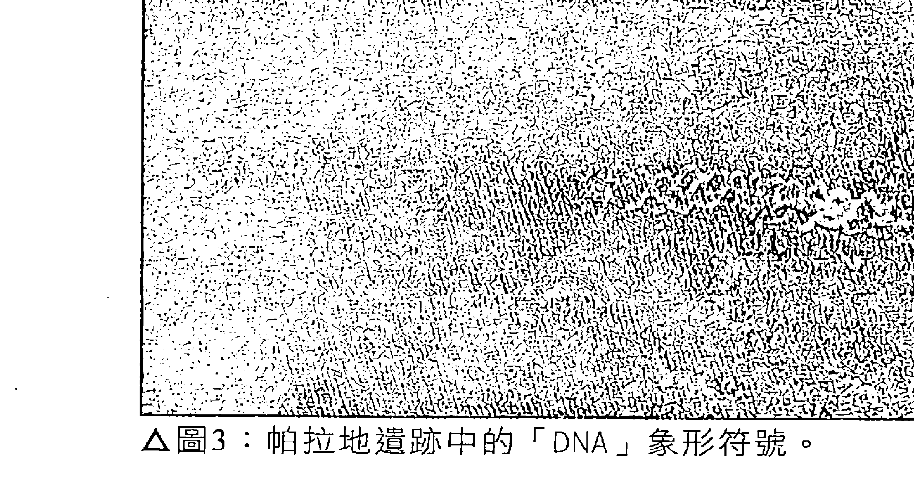

古人內觀，然後以繪畫的方式外顯他們的體驗，如果這與現在的科學研究互相符合，實在令人嘆為觀止。以分子與細胞為主題，架構出生命的神聖與靈性內涵，成為我治療之旅的首要目標。有時候我稱此為「細胞人類學」（cellular anthropology），大家知道，人類學是在研究人類文化，細胞人類學則是探索我們的細胞建築結構如何影響人類文化。某種不可見的境界建構了古早傳統，影響當代知識，其實那一直是古代知識的一部分。例如幾世紀以來，修行者一直以曼陀羅（mandala）穩定自性，進入聖境。下圖是電腦繪製的DNA圖（很多人覺得那是藝術家畫的曼陀羅。實際上那是當代科技的產物，電腦繪製的DNA圖）。觀察這個圖，大家會說那是曼陀羅或分子？是藝術還是科學？是古代亦或現代？

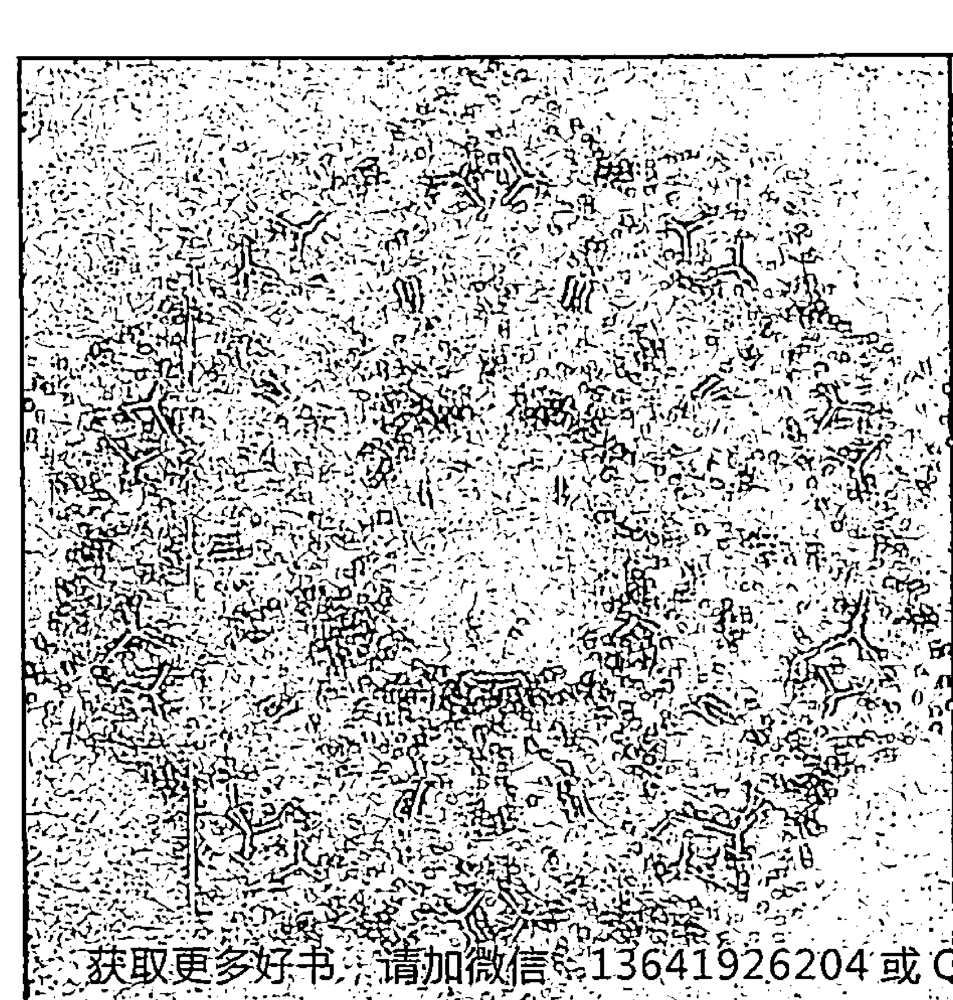

#### 細胞的靈性療癒
Secrets of Your CELLS

知識的本源來自許多層面，我把自己設定為「密碼發現者」，我的目標是開放的，希望隱藏在生命結構中的秘密，及隱藏在神聖傳統中的訊息，能被揭露，能被我們所見。

我看見分子中的神聖幾何，也聽到分子訴說的創造故事。

表面上我的工作焦點是分子與細胞，但實際上我希望提供身心合一的整體圖像，及身心如何影響人體細微而不可見的運作。我在身心醫學（Body-mind medicine）這個新領域或「心理神經免疫學」（PNI, Psycho neuro immunology）的教學，讓我越加信服，所有的治療系統都是互相關聯的。

有件事情說來有趣。不少學生問我，減少壓力或促進身心療癒，哪些練習技巧更有效？及觀想是不是真的有用的？

為了回答這些疑問，我必須實事求是，逐一拜訪馬林縣（Marin County，加州之一郡），以金門大橋與舊金山市區聯絡）執業的治療師，耗費相當多時間，令我見聞廣增。

沒多久，我開始帶領治療團隊，不光只是課堂上的教學。團體治療的實務讓我們走進心理學。我沒有太多心理學專業，經驗也不足夠，沒受過訓練，更沒有證照，我只是個研究人體細胞的科學家，可是經過多年來的體驗，我終於獨創「心理教育團療」（Psychoeducational groups），特別適合成人癌症患者，自體免疫疾病與心臟病人。

我先教導病人引發這些疾病的生物學因素，然後針對個人壓力與疾病，提供各種解決技巧，包括觀想、氣功真言（持咒），及從我「醫療百寶袋」掏出的各式各樣放鬆技巧。

我認識一位心理神經免疫學的老師，他邀請我至他們的學會，為健康醫療專業人士舉辦系列的講座。於是我全國跑透透，到他們的各地分會開講，主題不離身體的免疫網路、能量、壓力管理。

九一一事件中，紐約世貿中心、五角大廈、賓州都遭到攻擊，事件發生後兩個星期，我到達這些地方，因為幾個月之前我已經安排好，將到這些地區演講，真是奇巧無比，我的講題是教導健康專業人士如何減輕壓力，及能量管理——特別是他們在突發事件中親臨第一線，該如何應變。

當我抵達這些地區，戰火蹂躪下滿目瘡痍的景色真是不忍卒睹，我很害怕，在一片廢墟中，心裡七上八下，一直擔心能不能順利教授這些專業人員平衡自己的能量；我該如何幫助這些護士、輔導員、心理師？他們站在最前線，要讓家園破碎、生離死別、悲傷恐懼的創傷受害者重新站起來，而且這些助人者也要不斷更新自己，降低自己的焦慮。大家面對的壓力難以想像，我也感受到壓力，徬徨無助！

於是我靜下心來，開始祈禱，希望獲得引導。答案浮現了：以你多年來巫士修煉的智慧，幫助大眾。是的，原先我來的目的，是要用科學的知識幫他們進修。更多的答案出現了：可以運用語言，支撐他們知性的了解，再運用充滿智慧的技巧，進入他們的內心，擴展靈性。

這真是前所未有的經驗，某個不可知的力量帶我擁抱過去所學的一切，擁抱身、心、靈的治療，並完全整合起來，接通了科學與靈魂。在大團體中，我教大家提昇能量的氣功，及靜心冥想，很快，他們都能從沉重的壓力中再次充電，重獲身心靈的力量。

在不甚理想的外在環境（眾多陌生人擠在不熟悉的飯店小房間），及心靈散碎的內在壓力下，我們步步為營走了出去，原本我並不期望有人能獲得深刻體驗，進入自己的感覺中，然後願意提出來與大家分享。

但出乎我的意料，許多人紛紛表示，自從悲劇發生後這是他們第一次能夠放下，表達情緒，甚至能放懷大哭。因此，我終於相信自己，除了科學知識外，我還有許多深藏不露的法寶可以教別人。我可以當境提供不同技巧，治療他們的心。我長途跋涉，走過科學與靈性的世界，本書就是我豐收的成果。我要寫出來是因為我對細胞與分子，和傳統智慧之間的關係闡述，有獨到的見解。我希望提出的新觀點能讓更多人受益，特別是渴望靈性、希望開展靈性以好好照顧自己身體的大眾。我也希望展現神聖的內在，在這一片神聖區域裡，科學與靈性治療是互通的。這才是生命的真正運作：從細胞學習到的功課。科學的大門已開，裡面是令人驚奇的發現，同時，靈性也不斷透露更深層的真理。在這本書裡，我們將探索科學與靈性，發現實用的治療方法，以神聖的內涵貫注心靈與分子，進行轉化。這時候，細胞將是我們的良師與引導者。

## 作者序 神聖的靈性轉化科學工程

## 【前言】

> 人類是細胞的殖民地，細胞無時無刻不在運作。細胞成就我們、穿透我們，可是人類卻有一個幻象，以為所有的成就都是自己的功勞。真正的主人是細胞，細胞由內創造我們，養護我們：……我們才有求生存的意志，才能研究、實驗。
—— 艾伯特·克勞德（Albert Claude，一九七四年諾貝爾醫學獎得主）

進入本書的每一章，就是一次新奇的探險。有如愛麗絲掉落兔洞突然縮小一樣，你將置身於神秘的顯微世界，探索數以兆計的小細胞，牠們的組合整體就是「你」。

你也即將看到，這些閃爍神聖火花的細胞是完美的容器，不僅僅是能見的細胞核、細胞膜、受體、基因、液泡、導管……構造多到令科學家眼花撩亂，你也将對細胞的形狀與運動大為嘆服；除此之外，還有更多顯微鏡看不到的神奇，那是細胞教導我們的功課，讓我們我們能活得更完整、更健康，及數千年來修行者或巫士以直覺、內觀「看到」的秘密，他們的發現以藝術的方式呈現，作品散落世界各地。

《細胞的靈性療癒》打開了大門，讓你通向細胞的智能與古代的智慧，這些莊嚴神奇的內涵，完全內在於你境。

## 「分子的擁抱」

細胞是最古早的活祖宗，所有生命體的起源，他們是生命的建築磚塊，是生物化學的基本原理，促進生命成長與轉化。每一天的每一刻，千千萬萬的細胞樂團合奏偉大交響曲，由聰明的細胞智能指揮、督導，不斷維持整個系統的平衡，互相合作、互相溝通，運作不息。基本上，細胞的功能就是「分子的擁抱」（molecular embrace），如同手與手套的關係，彼此完美結合一起，所以才能成為生命的建築磚塊，我認為，這是天才的傑作。

## 神聖的細胞

本書有兩個人類經驗向度：科學的驗證，及靈性的探索——橋接科學與神聖。科學知識用的是我們的知性頭腦、資料、度量、分析、證明。科學家想知道，細胞為什麼運作？

至於神聖或靈性經驗，科學就沒有用武之地，科學不是用來欣賞生命、讚嘆生命的，所以在呈現科學的同時，我也必須呈現靈性觀點。我常說，內心的體驗、直覺、自然昇起的靈感，是科學的女性面。萬事萬物皆有陰陽，我們不能只重視可以測量的經驗。細胞的生理運作能力，與細胞的哲學教導同等重要。本書這兩方面都兼顧到。

所以，我邀請各位打開你們的心，在那個可測量的小生命身上，除了看到生化互動外，也要看到詩，看到神聖的種子，在科學真實之外發現更深邃的真理。

我們是數以億計的個別能量體——也是完整純一的靈魂體，我相信身體除了傳承了世代代延續的智慧，也繼承打開最後奧秘的神聖鑰匙。

我把本書設計為一本『引導手冊』，觀想引導及探索引導，鼓勵大家以實際的方法了解細胞世界，發動你的身體，同時也激發想像力。我希望各位愛上你們的細胞，與細胞建立立親密關係，並享受這份美好。
我現在是在胡思亂想或胡說八道嗎？當然不是。細胞可以接受你發送給它們的訊息，讓你們的關係更緊密。
當你覺得放鬆，內心平靜，細胞也會跟著一起放鬆，運作得更有效率。
我們的選擇影響自己的生命經驗，同時也影響細胞，我們給細胞什麼，細胞就做出相等的回應。
輸送新鮮空氣給細胞，它們就產生能量，更有活力，更有效率，用歡笑、愛、音樂滋養它們，令人愉快的腦內啡就會加強分泌，整個人快樂似神仙。如果滿懷憂愁，內在的製藥工廠就會生產壓力荷爾蒙，轟炸細胞，讓它們受傷——使我們也很受傷。
我在書中提供很多資訊與探索引導，目的是幫助大家學習如何善待你們體內億萬個小生命——當然那就是你自己——用正面肯定的方式滋養他們。
書本中的「引導」，我運用的是「身體祝福」（body prayer）的方法，這個名詞是我向朋友借用的，有一次朋友帶我體驗了一場美妙的儀式舞蹈，很協調很感動，他說那就是「身體祝福」，我覺得這個詞很有意義，於是借來使用。「身體祝福」是神聖的一刻，靈魂在這一刻之中完全表達出自己。身體祝福包括氣功修煉，這是古代的道家法門，教我們集中心念、調息、導引、入靜、存思觀想。道家的動功若能心意集中，整個身體就會飽充能量，而且能轉化意識，煉氣化神。如此一來，你每天的生活充滿覺知，脫胎換骨，氣機勃勃，然後天機自得，神聖的知識就會落實在你身上。

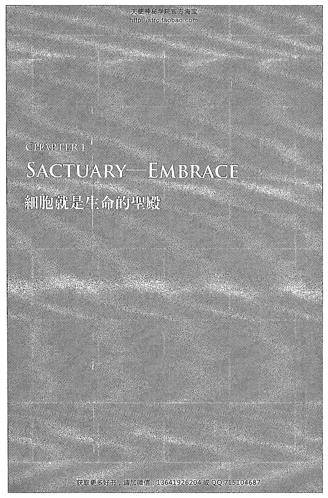

## CHAPTER 1
### SACTUARY—EMBRACE
### 细胞就是生命的圣殿

每一個人的體內，都帶著一百五十億年的靈魂，因此，當我們偶然相逢，奇遇的經驗多麼值得珍惜與敬重。當我們與自己相逢……我們體內的氫原子，迄今已經存在了一百四十億年——想想看，其中有多少故事可對我們傾訴，果真是無邊無量。

> —— 馬休·福克斯，《One River, Many Wells》

你可曾想過生命是如何開始的？地球是如何創造出來的？我讀過一些描述生命起源的神話，也翻閱科學上探討生命與地球如何形成的文獻報告，如此而已。但是，有一次一名小女孩很天真問我，如果她的小弟弟死了，會去哪裡？我才猛然一驚，認真思索我對創造、生命、死亡，究竟了解多少。然後，我把思索的問題與獲得的答案放進剪貼簿，並劃分為兩大範疇，全部收羅在本書之中，這兩大範疇就是：科學與驚奇，分子與神秘。我們就在本章開啟這個話題。

#### 聲音是宇宙的起源

「很久很久以前……」許多生命起源的故事都是這樣開頭的。但是，多久以前？再怎麼麼以前的以前，總有一個開始點吧？接著還可再問，在生命開始以前，宇宙是什麼模樣？空、無底洞、虛無？只有水和石頭？物質的創造只是大自然隨機的意外或其中有著神聖的導引？這些問題是人類互古以來的疑惑。

神話故事要我們思考『生命』，思考生命在宇宙的位置。每一個文化都有珍貴的神話，象徵似地解釋生命源起。

大多數的宗教與靈修傳統，也有一套創造的故事，說明人是怎麼來的。舊約信仰裡提供兩個創造故事，七天造萬物與亞當、夏娃。新約則稍作補充，『上帝說：……』祂說什麼就出現什麼，也就是在一開始的時候，上帝是以聲音創造宇宙。

聲音是一種很基本的原始力量，『音波顯像學』(science of cymatics，使聲音具象化的研究)就是以不同頻率的聲波震動傳播物質，如油、水、細沙，就可得出不同幾何圖案。

例如以每秒二十五次的頻率均勻震動沙子，最後沙子將呈現逐漸向外的螺旋圖，與銀河系的外觀，或DNA分子的雙螺旋結構，極為類似。

既然聲音可以改變物質的形狀，那麼，以聲音改變生命應該不是天馬行空的胡亂想像。

實際上，在印度教、佛教、蘇菲教派的經典之中，描述聲音的能量與更細微的能量（意念的震動），確實創造了宇宙。現代科學的創世紀就是「大爆炸」理論（The big bang），宇宙萬有就是巨大的爆炸「碰」一聲而開始的。在這裡我們又發現，聲音也是一個創造故事的主角。我把這些神話帶進現代是要強調，聲音——包括我們想法與信念的樂音或噪音——塑造我們的實相，也創造連續生命中的每一個當下。在科學的創世神話中，一切始於空無的真空狀態，在這個狀態中沒有聲音，當然也是因為聽到聲音的生物尚未被創造，接著一個大爆炸後什麼都有了。我們。大爆炸的振動在空間之中不斷迴響，把基本的粒子組織成氣體，然後更複雜的分子與生命也加了進來。這個創世故事雖然以最尖端的天文學、量子物理，化學、生物學為事實根據，但很可能最後仍無法被證明，就像宗教的創世神話一樣，到頭來只是文化信念支配的有聲有色推測。

我過去一直以為，聲稱人類來自星雲的所有人士，只算是詩人，不是科學家。可是檢視演化的痕跡與傳說，整個天空與多如恆沙的星星，當然包括太陽，存在的時間比我們還長久，於是我改變看法，必須承認地球內的所有礦物或礦物質，無一不是星球膨脹與爆炸的產物。

這些元素的組合創造了細微與粗重的構造物，經過長時間演化，不斷有其他物質加入，形成更為複雜的結構。錯綜複雜的分子互動中造就了我們，也許，我們是這個星球上最複雜的結構，我們具現科學的創造神話。

因為分子互相擁抱，所以人也渴望擁抱

我對生命如何在這個星球開始的看法如下：分子在熱水中擾動、搖動、攪動、相混，最早的分子祖先——碳、氫原子形成鎖鍊，像珍珠迅速串在一起。分子鏈聚合在一起，形成一片扭動的型態。

然後再因緣聚合與更大的擾動，為細胞的創造提供環境與良機：霹靂雷電，天外隕石，大地搖晃，地表爆炸，無時無刻的擾動造成地球環境無止無盡的大變動，碳氫化合物擁抱得更紧密，不断飘动的分子找到另一个同伴，它们盘绕交缠，贴在一起，在飘浮其中的盐水互相拥抱，黏合为一，形成了让生命待产的「容器」，生命能够存在，必先有个可以安身立命的容器。

> 我曾把心中浮现的这个图像写成一首诗：
遥远时代草莽未开，当时未有生命，
如一锅滚烫热水的世界，分子漂浮当中，
空气大骚动，电光！烈火！大爆炸！
分子突然拥抱，创造一个个圣殿，
形成小小一滴水，再一滴滴汇成海洋。
万古推移，微量难见的一小粒油液滴，慢慢化成细胞，
细胞之内充满期待与神圣的生命薪火。

法国耶稣会教士，也是哲学家、古生物学家的德日进 (Pierre Teilhard de Chardin) 在他的《人之现象》著作中提到，因为分子拥抱，所以人也互相拥抱。

这个说法很浪漫，人的拥抱是意识、知性与爱意的展现，分子大概没有这个能力，但 是它们的智慧透过拥抱，创造出无奇不有的生命样态。 分子的拥抱在因缘俱足下创造了柔软、能迅速回复原貌的容器，保护细胞，也定义细胞。

#### 细胞就是圣殿

没有容器……就没有生命。

「生命」，有一部分的定义是，它存在某个地方。

> ——卡尔．齐默，《Discover magazine》（《发现》杂志）

> ——大卫．狄默，《Discover magazine》（《发现》杂志）

无论我们对生命起源有什么看法，毫无疑问，人的身体就是分子的汪洋大海。人体是大规模化学变化所建构。然而，大规模的化学变化仍不足以形成生命。

把所有的基本成分，糖类、油脂、胺基酸、DNA、RNA、矿物质、维生素，混成一团，还是成全不了生命的。能量的火花、生命的气息，再加上最根本的灵性，才能创造出生命，这些东西与化学物质截然两样。唯有神圣的星火找到圣殿，生命才会出现。生命所留住的圣殿就是细胞。

三百多年前，英国的科学家虎克（Robert Hooke）用自己设计的显微镜观察一片软木塞，发现其中有许多孔洞，他觉得这些孔洞很像空的房间，因此称之为「Cell」（单人房间），这就是「细胞」（Cell）一词的由来。

可是虎克看到的是软木塞的死细胞，跟活细胞很不一样。当时虎克不明白他看到的东西是生命的基本单位，而是视为装着「生命汁液」的容器。

请让眼睛暂时休息，放下书想一想：细胞是一个空间，生命与维持生命的成分寄存在里面，受到保护——细胞是生命的圣殿。每一个人身上存在数以兆计的细胞，一个人体内的圣殿难以胜数，所以，我们的身上充满圣性。

#### 名词解释

圣殿就是「反省并歌颂圣灵的地方」细胞的 Cell 这个字来自拉丁文「Cella」，意思是贮藏室或空室。这是细胞的定义之一。也可以指「静修的斗室」。另外还代表「关人的囚室」，不鼓励大家去的地方。「圣殿」Sanctuarum，Sanctus 是反省并赞颂圣灵的地方。圣殿既是微生命（细胞）的存在地，也是人类追寻神圣的场所。这两种圣殿——生理的与圣洁的——同时存在于我们身上。只要明白这个道理，并找到之间的关联性，生命就会发生改变，我就是很好的见证。自从对「圣殿」有了全新的领悟，我开始视「我的细胞」，还有「我自己」，就是神圣的，我是神圣的存在体。

细胞是我生命的部分也是全部，而且我随时觉知，会好好照顾它们。譬如说，我会觉知自己带着细胞去散步，如此一来我觉得所有的细胞充满能量，活力十足。为了滋养细胞，我开始改变，戒除不健康的习惯。我已经彻底了解，细胞的生命与我的生命是一体的，我们是不可分割的命运共同体。

#### 静心祷念

花些时间想一想，你将如何成为圣殿？内在的什么东西让你产生平静的安全感？你的哪个部分跟另一部分比起来更像圣殿？

#### 探索

由内而外探索你的圣殿

阅读底下的引导之后，请闭上眼睛，想象自己展开旅程，进入属于自己的终身神殿，好好享受你的旅程。

找一个不受打扰的地方，放下一切杂务，入静五至十分钟。注意自己的呼吸。吸气时，把气吸进自己设定的中心点，然后呼气，感觉外吐的气扩散到自己觉得最远的点。感觉内在的中心点与最远的边缘点连接起来。每一次呼吸，感觉你充满生命力。每一次呼吸，你可以感觉细胞世界的圣殿。让你的经验由内而外，这个由内而外的身体，就是自己的圣殿。只要心意转向这里，你就身处当中，不必刻意留住这个圣殿。在圣殿中入静，一直到你感觉可以离开了。离开时睁开眼睛，手摇一摇，对自己的细胞微笑。感谢它们精心设计出容纳「你」的生命体。

#### 圣殿：细胞膜的构造

想了解神奇的生命，先要探索辛勤工作的细胞容器。每一个人或动物的细胞圣殿，表面就是细胞膜（cell membrane，图1-1），很柔软很有弹性（植物细胞相反，是较硬的细胞壁）。细胞膜是由碳氢链分子（脂质）与蛋白质构成的薄膜，可以与外界接触保持活性。脂质具有一些特性：它的分子一端是亲水性的，另一端却是疏水性的。这两层脂质形成细胞膜。

疏水性的『尾』与细胞膜的内部相通，亲水性的『头』面对充满水分的外在环境，非常聪明也非常有弹性的脂质薄膜具有许多功能：

- 保护作用，让细胞内容物与外界隔离。
- 半渗透作用，允许某些东西进，某些东西出。
- 携带身份认证的密码，定点接收基本资讯。

总而言之，当细胞成熟时，细胞膜变得更柔软更富弹性，而且能够辨认其他细胞，更有能力对环境做出反应，更迅速移动，改变形状。

以显微镜观察，我们的细胞相当坚实，然而深入细胞膜却发现，整个像美乃滋一样的保护层似乎是敞开的，所有的组合分子反而向内移动。细胞是不是具备正常功能，取决于细胞膜的流动性，而细胞膜的流动性又与我们吃下的东西息息相关。

#### 滋养我们的细胞膜

细胞膜的主要化学成分是脂质、蛋白质、胆固醇。脂质与胆固醇控制细胞膜的形状、功能、流动性。

最新的理论指出，食用过量的反式脂肪、饱和脂肪与胆固醇，会让细胞膜变硬，因为吸收饱和与反式脂肪的细胞膜，弹性会愈来愈差。肉类、奶油、动物食品都是饱和脂肪的来源，反式脂肪则存在于氢化过的油类与人造奶油中。

不饱和脂肪则让细胞膜移动更迅捷，也更灵活有弹性。不饱和脂肪的来源包括橄榄油、坚果类与其他蔬菜油。细胞膜的另一种构成物是胆固醇，无论胆固醇是身体自己合成的或来自饮食，过量的话会让细胞膜开始变硬。

为什么细胞膜的弹性与流动性很重要？因这些条件决定养分进入细胞的程度、细胞受体能不能迅速回应环境讯息，特别是免疫细胞，能不能消灭病原体。

#### 细胞的灵性原理

#### 探索

自我发现之旅：细胞容器的具体化

把细胞具象化的学习，可以让我们获得深广的智慧，更加了解细胞。大部分人面对细胞时，只有抽象的概念，似乎远在天边。数以兆计的小小东西在人体内忙碌工作着，宛如科幻小说，我们等一下要介绍的练习，可以帮助我们更接近细胞，也让细胞更真实，触手可及。首先，我会鼓励参与工作坊的成人学员「变成细胞容器」。方式如下：

至少要有四个人，围坐在地板上，形成圆圈，背向圆心，肩膀互靠。这时候容器成形，里面就是受保护的神圣空间。大家闭上眼睛，觉察听到什么，有哪些感觉与感受。几分钟之后睁开眼睛，再次觉察你听到、看到什么，有哪些感觉与感受。

#### 组成细胞膜的第三个主要成分是蛋白质

，蛋白质的分子比较大，在细胞膜内有特定的作用。有些蛋白质可以由外而内，通过细胞膜的脂质双层，进入细胞，另有些蛋白质则只能在细胞膜中浮动。

> 你的饮食水分够吗？有丰富的不饱和脂肪吗？像酪梨、坚果、鱼类，你会吃很多含反式脂肪的包装食品吗？请多多选择可以滋养细胞，滋养你生命圣殿的食物。

#### 由于蛋白质的作用

，细胞膜才有本钱辨别「密码」，并「倾听」讯息快速做出反应。

细胞膜之中的脂质与胆固醇是一种媒介，让蛋白质运作、移动，蛋白质本身是行动的分子，既接收讯息，也能辨认身份标记。

我们会在未来的章节进一步介绍。

#### 以下两位参与者的经验分享：

向外看时我很惊讶，我觉得内在的圈子是受到保护的，我像是守卫。同时，我觉得被前面的整个环境接纳，我觉得开放，不断扩大。——MP

你从自己身上与自己的细胞学习到什么？向外看时，你注意到哪些不寻常的东西？与往内看时有哪些差别？数分钟后，现在大家转身，面对「细胞」的圆心，再次闭上眼睛，专心倾听几分钟，然后张开眼睛，注视圆圈内的空间，接下来与其他伙伴讨论你们的经验，十至二十分钟。

> 我觉得这个变成细胞的练习，是一种自我组织系统的学习，并体验边界的意义。闭眼之时，我们面对的是，比新组成的细胞更为广阔的远方世界，有些人在听到噪音时，觉得受到团体的保护。有些人觉得，组成整体，他们就有一份责任，有些人如果没有能力承担，可能觉得害怕。我们每个人与外在世界都有不同的关联，这个关联取决于个人独特的观点。

——J M

#### 细胞就是生命

现在你已经体验为什么细胞是某种容器，而且也有实际的感受经验，我想再请大家思考一个问题：细胞为什么会有生命？

为了成全并维持生命，大自然运用宇宙已经准备好的建筑砖块：碳原子、水分子，及含藏无尽生命故事的基因密码。

细胞是最小的生命单位——虽然并不是每个科学家都同意这个定义。我们知道，生命的存在实际上是碳原子组成不同种类的化合物，进而形成细胞。而生命能够生存，必须处理如下事项：

我们所有的生理功能，都是靠细胞用生命去养护的，细胞或单打独斗，或靠其他细胞的帮助，透过细胞社群共同合作。每一秒钟细胞进行好几回生化反应，执行生命运作的伟大事业。微小的细胞是人类生命的缩影，他们维持生命的运作，与我们为了维持生命的运作是大同小异的。细胞和我们一样，也要呼吸、进食、消化、防卫、回收（我们回收废弃物，细胞回收原子），及再生。

- 有能力成长、有能力繁殖（制造更多的自己）。
- 继承并传承基因的智能。
- 找到食物并利用食物——新陈代谢，把食物转换成能量。
- 排泄废物。
- 感觉到刺激，并对刺激起反应。
- 适应环境。
- 维持结构的完整，并能够自我修护。

能量（细胞回收消耗的能量，我们靠休息回复能量，或以饮食补充能量）。

#### 我们就是细胞

虽然每一个细胞是个别、独立的，但它们合作无间，形成一个整体社区，可以再创造、平衡、沟通。细胞需要其他的细胞才能繁荣茁壮。把单一细胞隔绝在培养皿之中，这个细胞就无法生存，生命程式会转向死亡。分子与细胞不断地移动、互动，也不停维持整个结构的完整——这就是生命。

人体中的数兆细胞，源于精子与卵子的拥抱共舞，一切都是从受精卵开始。从单一细胞不断分裂的胚胎发展期，每一个细胞都有特定的样态与责任。细胞的不同形状与大小，影响或决定它们的功能。像方块的皮肤细胞喜欢堆叠在一起，形成身体的覆盖面；每一平方公厘的皮肤，就多达一百万的皮肤细胞辛勤工作。

同时，像变形虫一样的白血球细胞，正在组织中巡弋，找寻有危险性的入侵者。（图1-4）

铁饼形状的红血球细胞（图1-3），在血管中忙碌奔驰，携带氧气供应各器官组织；在正常人类的一滴血液中，包含了三百万个红血球细胞，及五千个白血球细胞。

## # Chapter 1 细胞就是生命的圣殿

虽然细胞的大小形状不一，任务也不同，却具备基本的样态与功能（图1-5）。细胞膜的外层极富弹性，具有辨别与保护的功能；细胞核包含基因密码。细胞骨架除了维持细胞的结构外，还能够调节运动、挑选讯息；高尔基体负责处理进出细胞的蛋白质；形状像太空船的能量产生器就是粒线体；而溶酶体（lysosomes）这个小颗粒，专门分解老旧或损坏的胞器与蛋白质。简单介绍完细胞容器内重要元件的功能，大家有没有想到，细胞的各种求生存技巧，带给什么启示？我们可以学到什么功课？每一个细胞都在努力维持自身的完整性、平衡与流动性，细胞非常负责，带领我们走过人生，直到最后一口气——而我们该如何带领自己的细胞呢？

△图1-2：两个神经细胞。
△图1-3：人类红血球细胞。
△图1-4：清道夫白血球细胞，正要清除塑料珠。
△图1-5：细胞的基本结构。获取更多好书，请加微信：13641926204 或 QQ:715104687

### 与细胞共鸣

这是一个很简单的练习，找出自己的边界感，并进一步体验『细胞我』的经验。请阅读下述指示，然后进入境界中体验。
安安静静坐著，闭上眼睛，呼吸保持自然，现在，吸气时让气息进入你觉知的中心点，每一次吸气，让自己与气息合而为一，进入这个中心点。
接下来，注意最远端的边界，那是你身体之外的最外围，在哪里？是你的皮肤吗？还是超出你的身体之外，在某个地方？注意这个边界有什么特征，是坚硬的吗？有没有破损？还是严重破坏？
现在，观想自己进到细胞宇宙之中，你在核心，整个细胞容器会保护你。完整、没有缺损的边界，完全容纳你，也善待你。只要你喜欢，何不颂唱或低吟，让自己和细胞我的整个部分关联起来。每一次呼吸，发出声音，慢慢持续几分钟，这个动作可以让细胞与你共鸣。「mmm」的低吟特别有力量。
下一章，我将教导大家如何进一步与细胞共鸣。
最后，慢慢调回平常的自己，感谢这个神圣的设计，因为那就是你。

### 深入圣殿

以最广泛的定义而言，「圣殿」就是庇护圣堂，安全的隐密处或避难处。就灵性的观点而言则另有含意，「圣殿」是神圣的场所、圣洁的区域，或内有圣坛的地方——这个地方弥漫圣灵，也跳动着生命的火花。

在欧洲，教堂往往建立在神圣之地，也许是这个地区曾展现奇迹，或者是圣者的安息处所。在这个地区上如果设立圣坛就成为圣殿，现代大部分的犹太教堂，主祷室就是圣殿。

在任何神圣场所，人们聚在一起祈祷的地方，就是内涵最深、最神圣的圣殿。

如同细胞，人类也因为安全、神圣的理由，建造各种「容器」。在物理世界之中，人为了智慧，为了团结或互相支持，也为了祈祷，不断找寻圣殿。因此，我们也可以在家里，甚至是车子里找到圣殿。在原住民的传统中，整个部落的人围坐在祖灵圣火旁，进行治疗、祝寿，或找寻智慧。

我们加入团体，迎接爱人进入生活里。我们互相碰触，手牵着手。我们在伟大的土地上，重新创造圣殿与分子的拥抱。

### 为自己创造圣殿

真正踏入自己生命中的圣殿，我们才可能探索更多的细胞秘密。我们最内在的圣殿就是我们的细胞核心。因此，面对自己神圣的本性，我们才能真正指认内在完整的庇护圣所，并且往外创造与之相当的神圣性。譬如，每次外出旅行，我一定带着蜡烛和檀香，及一套特别的衣物，这样整个饭店房间才真正是「我的」空间。

在家里，花园就是我的圣殿，每个温暖的清晨就是我修行的场地。在内心里，我会创造圣坛，提醒我自己本身就是圣殿，里面烛火常明。无论空间多么窄小，在我们创造的空间之中，可以随时提醒自己的圣性，也能进一步观想：每一个细胞就是生命的圣坛。

### 安排自己的圣殿

如果你还没有专属的圣坛，也没有圣殿，静下心来想一想，什么地方最适合，而且里面该摆设什么东西。蜡烛、奇石、水晶、檀香、植物、全家福照片，祖先或心灵导师的图像都可以考虑。简单朴素的衣裤及外加蜡烛已经足够，可以让你在自己的神圣空间静心，点燃内在的圣性。

创造圣殿就是在拥抱自己，荣耀自己，慢慢静下心来倾听内在的智慧要告诉我们什么，同时让我们整合各个部分。当我们踏入圣殿，进行仪式或修练，就是在为自己、为细胞建立全新的生命旋律，而且日日更新。

### 细胞人类学

显微镜的发明，拉大并深化人类对生命的了解，也让我们观察到细胞的运作，替未知的神秘与实相打开一道大门。其实几世纪之前，显微镜与望远镜被认为魔力强大，一般人禁止使用，免得破坏他们的世界实相或真实感。

身为现代科学家，我的研究离不开显微镜，我也从显微世界中学习到生命是神圣设计的功课。如同本书序言所说，刚开始研究分子与细胞时，我并没有想过要在微世界里，找到神话或神圣的意义。然而，它们却自行揭示出神奇与神妙的领域，让我不得不用「人类学」的角度，试图诠释我看到的一切。

### 什么是「细胞人类学」？

「人类学」是研究人类文化与人类起源的学问。
「细胞人类学」则考察细胞的起源与状态，对人类的传统、价值、艺术，有什么贡献。

> 细胞人类学家就是一密码发现者，他找寻隐藏在分子结构中的灵性线索，也找寻隐藏在艺术与建筑中的社会性与灵性线索。再次检视「医药轮」（图1-6），你可以想像它也

## # 灵性建筑

我认为内在宇宙（包括细胞），是灵性建筑的模板垫石，也是建筑鹰架，建构出信念、价值、艺术与仪式。

原始的人类创造故事与象征，还有音乐与祝祷，希望接触或感动高高在上的天神。人类造出雄伟的建筑与圣光祭坛，颂唱祷词，在沙中作画，手舞足蹈，慢慢发现宇宙的基本形式与无所不在的能量。

我们的细胞就藏有如此玄妙的无上秘密。细胞内藏的秘密与外显的生命运作，就是在教导我们何谓神圣。以细胞为师，向细胞学习，最后我们终将发现，神圣和能量一样，无所不在。

## 静心

#### 探索

观照下述问题时务必记住：「细胞是圣殿」，这只是你生命的隐喻。

- ☆长大之后的你，变得死板强硬，还是更柔软有弹性？
- ☆你的分别心是轻或重？你允许多少事物进入自己的身、心、灵？
- ☆在什么地方你觉得最安全、最能被照顾？
- ☆你的圣殿在哪里？你觉得自己的圣殿应该是什么样子？
- ☆你认为自己最亲爱与最神圣的东西是什么？
- ☆如果你的灵魂也是某种容器，那像什么东西？
- ☆圆满自足对你而言代表什么意义？

接通细胞圣殿

发现细胞，领悟自己的生活。

- 学会安住在自我创造的状态。
- 改变需要改变的事物。
- 让自己成长。
- 向往的神圣就在你周围。
- 筑一座圣殿。
- 找到神圣的空间。

现在，你愈来愈熟悉自己的细胞运作，也愈来愈能与自己的细胞合为一体，所以，你必须在每天的生活里检视自己的行为与想法，是否符合「细胞是圣殿」的立场，同时也要让「细胞是圣殿」的观点随时鼓舞你、启发你，让你的生活因此神圣起来。

只要继续阅读本书，我会在每一章介绍新的功课与学习，并介绍不一样的细胞建筑特性。这个旅程是急不得的。你要慢慢来，每走一段风景，你的理解就变得更深入。没什么好急的，细胞是神圣的容器，而你也是！

## CHAPTER 2

### IAM—RECOGNIZE

我是谁？细胞的迷失，来自心灵的迷失

> 从细胞至「我」，是一段不可思议的旅程。
> ——克里斯多福·沃恩，《生命缘起》（Christopher Vaughan,《How Life Begins》）

现在，我们已经认识细胞圣殿，在接下来的这一章里，我们要讨论细胞如何「指认」自己。也就是说，我们将遭遇很多层次的「自己」：细胞的指认标记，包括如何认识自己的身份；如何指认别人，区分你、我；如何参与自我创造。

心智的作用可以分辨自己或别人，并定义自我界限，其实细胞也有这个本事。细胞能够分别自己与别人，这种神乎其技的能力，大家可曾想过？我们免疫细胞家族，更是个中高手，可以执行捍卫生命的艰巨任务，稍后我们将有详细介绍。

细胞与我们自己，都懂得说「我是」（I AM），因此，当我们透彻了解细胞与灵魂互有关联，而且都是神圣的，在这种终极的体验中，我们终于可以大声说：「我就是我自己」（I AM THAT I AM）。

许多传统宗教，包括犹太教，最初指称上帝的名字就是：「我是」（I AM）。

當我們能夠擁抱自己是什麼人，當我們說「我是」，我們果真與自己的一切共鳴，成為真正的自己？果真聖性充滿？

#### 我是誰？

每次開始講授神奇的細胞時，我一定請學生造句，填充以下的句子：

-   ☆我是：（I am…）
-   ☆我要：（I want…）
-   ☆我有：（I have…）

各位造出來的句子是什麼呢？我的用意其實是希望導出更多的延伸思維，包括千古以來，人們一直在問的問題：「我是誰？」、「我為什麼在這裡？」。這就是本章的主題，認識自己、區分他人。請先花個幾分鐘想一下，你可以有多少方式認識自己、界定自己。

你有幾個身份『標記』。你有名字、有性別，還有與眾不同的容貌，並在家譜中佔有一席之地。你也有好幾組專屬的數字標籤：生日、身分證字號、手機號碼、銀行帳號……科技愈來愈進步，要證明『你』的帳號與密碼也隨之快速增多，想要優遊網路，這些更不可或缺。

你有你的專業與頭銜，你在家庭中的角色、職場中的地位、你的宗教屬性、你的靈性修行，如果這些都符合你的信念系統，好極了，那就是紫微星高照，是一副塔羅好牌，是擁有的一組幸運數字。這代表什麼呢？代表你部分的身份認同，也代表你的信念與可以付諸行動。

你如何認識自己呢？是你在這個世界上採取某種行動造成的？是你的自我感覺受到外界或內在的刺激所形成？如果你知道自我感覺與細胞的自我認同一模一樣，相信你一定願意更進一步思考更多問題。

認識自己就像耕耘園圃，你必須探索不可見的一切，並慢慢培養覺知，且必須是深耕，而不是挖土做表面功夫。提到表面功夫，我馬上聯想到細胞，細胞表面是身分鑑定的關鍵。

『我是誰？』這個問題不僅心智要回答，我們的細胞也要回答，當這兩者能因此展開對話，一來一往不斷深入，我們就更有安全感。身體與心靈都有自我認同的責任，能夠定位自己，分別敵我，如此才能保護自己，排除危險，知道什麼可信任，什麼東西不可信任。我們也因此偵測出界限並保護界限。

#### 免疫的功能

免疫，immune 這個字語源自拉丁文的 immunis：免除公共服務，免除公共責任。保護、排除特定的感染或毒素，以特定的抗體或敏銳的白血球細胞抵抗疾病。

身體的免疫系統就是在發揮這種作用，認識自己，區分敵人，不斷檢查細胞的身分與界限。

免疫細胞的基本工作就是分辨「自己」或「別人」，並同時與大腦、內臟、勇氣、想法、信念、荷爾蒙合作無間。

#### 细胞如何说我是

有人说免疫细胞是第一感觉中枢，因为它们可以感应到危险。这一切都是由基因提供讯息，影响生化物质，形成独特的识别身分，让免疫细胞采取不同行动。 在我们进一步探索免疫系的特殊行为之前，请先参考 图2-1与图2-2的细胞身分识别。

在细胞的奇妙设计之中，我们上一章讨论的细胞膜有提供身份识别的本事。就像我们观察一个人的容貌就能分辨他是朋友或陌生人，细胞也能从表面细胞膜的‘容貌’，分辨其他细胞是‘自己人’或‘别人’。

是蛋白在细胞膜的‘签名’，形成细胞的身分条码。

和人一样，细胞也有多重身份，除了表面容貌的身分识别之外，细胞也有「区域码」或「邮递区号」，显示细胞的来源与「职业」，例如心脏细胞负责输送血液；白血球细胞对抗入侵者；红血球细胞携带氧气到各组织……。

两个细胞接触时，它们的身分标记立刻启动，让它们分辨遇到的是「自己人」或「别人」。如果判定出是「别人」，立刻再鉴定是「安全的」或「危险的」。有威胁性的敌人要立刻动员防卫。在求生存的大千世界里，「别人」往往具有威胁性，是致病的微生物入侵。

现代一些科学家提出理论认为，分子的振动对细胞的识别活动，有某种程度的影响。

细胞的识别作用，常有人以「锁与钥匙」的机制（lock and key mechanism）做比喻。

当某个细胞的身份识别记号，被另一个细胞侦测到，并进行解码，如果两个细胞经过受器（receptor）的解码后，判定都是自己人，那就像钥匙符合锁孔一样，两个细胞就可以一起合作，否则就判定为不安全的异类。免疫学家与生化化学家利用细胞身份识别的特性，设计出一些分析方法，运用在临床医疗上有绝佳的效果。

#### 醫學上的應用

細胞身分識別最早的臨床應用，是紅血球細胞的血型配合，確保輸血的安全性。紅血球細胞的表面分子可分為四類A、B、AB、O（見圖2-3），只有相同的血型才能安全無虞互相輸血。唯一例外是O型，其他血型不會把O型捐贈者的血液判定為「別人」。

隨後，當代醫學有更進一步的運用，這一次是白血球細胞，讓器官移植更可靠。例如某病人需要腎臟，捐贈者的器官必須接受檢驗，看是否接近病人的細胞身分標記。如果身分標記差異很大，那麼捐贈者的腎臟就是外來者，會受到威脅，被病人排斥（有時候是捐贈者的器官排斥新主人）；這時候免疫系統將攻擊新器官，讓移植手術以失敗收場，這些相異的身分標記稱為「人類白血球組織相容性抗原」（human leukocyte histocompatibility antigens, HLAs）。

#### 什麼是抗原？

抗原：任何觸發特定免疫反應的物質，抗原通常是蛋白質分子。

細胞表面的識別差異，在漫長的演化過程中，並不是專門用來做輸血或器官移植的。白血球細胞抗原密碼，在生物學上的角色和臨床應用不同，是讓免疫細胞做「自我保護」之用，而且他們的免疫反應有高反應與低反應之分。

身體內的所有細胞，標記的都是「自己人」，受過訓練的免疫細胞知道怎麼回事，不會排斥或消滅自己人。很不幸，有些自我毀滅細胞逃脫監測，隨後導致「自體免疫性疾病」（autoimmune diseases），終其一生，細胞區別敵我的能力每況愈下，所幸，現代的「白血球組織相容性抗原」檢測，可以在臨床上提供有效判準，讓醫護人員了解病人的自體免疫傾向，及病人對藥物與疫苗的反應。

細胞裡有一組不同的抗原標記，在三千多個HLA標記中，只有六個與器官、骨髓、幹細胞移植有重要關聯。而所有的身份標記都可視為抗原。

#### 名詞解釋

我是否曾經失去分辨能力，辨別不認識的人、地方或行為？

#### 重點整理

在上百種自體免疫疾病中，有百分之七十五的比例發生在女性身上。因此自體免疫疾病的發生率占全美國第三位，次於心臟病與癌症。

-   常見的自體免疫性疾病有：
-   Ⅰ型糖尿病
-   類風濕關節炎
-   瀰漫性毒性甲狀腺腫
-   紅斑性狼瘡

#### 名詞解釋

什麼是自體免疫失調症？自體免疫性疾病：這種疾病是由於免疫系統誤以為某些細胞或特定的分子有危險性，企圖消滅它們，結果卻誤殺自己人而引起身體的疾病。

#### 自我認知的失誤

自體免疫性疾病是辨識自己的能力出問題：我們的細胞或蛋白質分子認不出自己人，於

除了識別出錯之外，某些自體免疫異常是因為不適當的免疫抑制，或不抑制造成的，

也就是說，自體免疫性疾病，可能是錯誤辨識或錯誤調節造成的。

某些組織或蛋白質，在失去或改變身分標記時，被認定為『不是自己人』——它們的人當作外來入侵者。

當免疫細胞把別的細胞識別為『危險入侵者』，立刻展開攻擊，奮力摧毀它們，常見的例子就是『多發性硬化症』（multiple sclerosis），保護脊椎神經的『髓鞘』蛋白質，被當成外來物質而遭受攻擊，年深日久之後，神經系統逐漸毀壞。

在醫學的研究中，細胞的身分識別是很重要的領域，相信科學早晚會有突破性發展，幫助細胞重獲正確身分，或除去沒有能力辨別自己人的細胞，屆時自體免疫疾病將日漸減少。

#### 細胞迷失來自心靈迷失

細胞與心靈的「自我辨識」是並行不悖的。珍芮·艾哲堡博士 (Dr. Jeanne Achtererg) 是心理神經免疫學的先驅研究者，她鼓勵自體免疫疾病的患者問自己一些問題：

> 「我為何迷失自己？」

> 「我該如何重整自己？」

問這些問題的目的並不是在暗示，患者的某種自我感或思考模式會創造自身的疾病，而是希望藉由上述問題，開啟另一片治癒向度。

我們並不是因為診斷出罹患自體免疫性疾病，才知道有時候我們無法認識真正的自己，不是嗎？生活上，有些時候，我們會忘了自己是誰！這與免疫性疾病沒有直接的因果關係。

我們從父母那裡遺傳了基因程式與人類白血球組織抗原（HLA）的身分標記。這些身分標記不僅顯示免疫反應的特性，同時還有一種超越性特質，而那卻是顯微鏡所觀察不到的「我」。

以前如果小孩子走失，最佳的尋人工具就是獵犬，只要把孩子穿過的衣服或蓋過的毯子讓獵犬嗅一嗅，就可出發找人。獵犬嗅到的是小孩的獨特氣味，而那就是「細胞掉落物」。細胞的抗原身分標記充斥在汗水、尿液或唾液之中，產生獨特的氣味，而且在二十四小時之內氣味依然濃烈。新生的嬰兒可以辨認出母親，而不會把其他女人也當成媽媽，靠的就是氣味。

成人也可以在隱約中嗅出氣味差異。瑞士的科學家有一項很有趣的研究，顯示我們的性吸引力有一部分是細胞散發出的味道。

科學家首先觀察老鼠，他們的求偶對象一定是不同的基因族群。為什麼老鼠知道另一隻老鼠的基因傾向呢？科學家懷疑，是透過嗅覺嗎？

科學家以「電子鼻」大量分析老鼠尿液中的揮發成分，終於發現不同基因傾向的尿液中有不同的氣味類型。答案揭曉，老鼠的求偶行為受細胞氣味影響。

以這個動物實驗為基礎，一九五五年，瑞士的生物學家克勞斯・魏德金（Claus Wedekind），研究「白細胞抗原」的差異與男性吸引力的關聯。首先，他讓男大學生穿上新的白色T恤兩天，期間內不得使用除臭劑、潤膚水、有香味的肥皂。然後穿過的衣服放進硬紙盒中，並讓女大學生聞味道，並加以評分，好聞或難聞，是「性感」男生穿的，或毫無性感可言的人穿的。評分時她們不能看到穿衣的男人是誰。

結果顯示，如果女生覺得味道好聞，她們的白細胞抗原標記與T恤的男主人差異極大；如果女生覺得難聞，白細胞抗原標記就很類似。原來，好氣味的性吸引力，是由細胞身份標記的差異造成的。

從演化的觀點看，這個研究結論很合理。由於白細胞抗原身份標記代表免疫能力與免疫反應，如果我們與身分標記差異甚大的人配對，後代子孫將遺傳更加多樣的免疫能力，反之則經不起更嚴苛的環境考驗。

研究人員還有個意外發現，如果女生服用避孕藥，那麼她們會喪失分辨遺傳差異的能力。

多年前，我正在教授吸引力與味道互有關聯的課程，當時正好聽到一個故事，可說是上述研究的最佳註腳。

#### 嗅觉、記憶、我

当时，有一名女性决定怀孕生子，希望喜获麟子能化解每况愈下的婚姻。但她结婚后一直服用的避孕药完全停药后，她竟然觉得老公的体味臭不可闻，而且恶心到不得不离婚。刚开始，她觉得以这种理由离婚，对老公很愧疚，可是后来知道了生物的原因——避孕药干扰她的嗅觉，闻不出彼此相似的基因——她大大松口气，也逐渐明白为什么婚姻关系时有冲突。

另还一位女士收养八个月大的小婴儿，每次要抱抱时，总觉得婴儿不是很亲，有排斥的动作。「会不会是味道的问题？」她怀疑。结果，答案就是她所想的。其实养母可以和婴儿更亲近的，只要收集一些有生母汗水的衣物，问题必能迎刃而解。

嗅觉与免疫功能是侦测自我身份的两大系统，而这两个系统同时连接至记忆，某些免疫细胞可以记住先前的入侵者，只要它们再度来犯，立刻施以攻击。同样，某些气味让我们想到所爱的人、创伤事件，或其他重要经验的细节。

我母親每次盛裝時，都要噴上雅詩蘭黛香水，所以每次聞到那種香水味，我就會想起慈愛的母親，這就是我的記憶認同。氣味與記憶有關的另一個鮮明例子，就是阿茲海默症。失去嗅覺有可能導致記憶喪失，也失去自我感。

然而，失去嗅覺不代表將罹患阿茲海默症。鋅的缺乏或許會造成味覺與嗅覺的喪失，同時讓免疫功能下降。你有沒有因為喉嚨痛而服用鋅錠？鋅可以回復失去的嗅覺，並刺激免疫功能。

#### 身體的自我標記

除了細胞的標記，我們的身體也有身分標記特徵。包括大家知之甚詳的指紋，還有視網膜、聲紋、遺傳足跡。這一切都是獨一無二的，而且不會因為年齡與健康狀態而改變（只有極罕見的神經症狀造成指紋改變，而糖尿病也可能改變患者的視網膜）。

有一個很有趣的現象發生在少數女性身上，稱為「慢性疲勞症候群」（chronic fatigue syndrome, CFS），她們的指紋慢慢消失。慢性疲勞症候群是一種相當複雜的身心疾病，至少連續三個月出現讓身體衰弱的疲倦，一直無精打采，無法從事正常活動。在這種情形下，她們確實失去部分的自己。

對於慢性疲勞症候群，有些醫生的診斷是——「完全由頭腦想出來」，這種病目前沒有治療良方，但至少我們了解，有部分因素是免疫失衡，有些人的血液化驗顯示過度活動的免疫狀態。有可能是先前病毒感染的疾病雖然治癒，但是免疫系統卻誤判病毒依然存在造成。

#### 免疫系統是身心共同運作的生命守護者

免疫系統是細胞身分的保護者，也是身體最複雜的網路。底下我用最簡潔的方式說明免疫細胞的運作。那真是神聖細胞的奇蹟運作！

我們龐大而多樣的免疫網路，是細胞社群的結合，並與神奇的分子和個人日常生活經驗的互動，而日常生活經驗包括：態度、情感、壓力、快樂……。所以，免疫是一種身心經驗的合體運作。基本的主角當然是白血球細胞，及抗體與細胞激素（cytokines），此外還包括我們的頭腦、荷爾蒙、生活型態。

我們的白血球細胞像靈敏的獵犬，可以偵測到微環境中潛在的危險，整個白血球細胞

#### 免疫防衛部隊有一種

我們的先天性免疫細胞（嗜中性球與巨噬細胞），是快速打擊的免疫部隊，只要是入侵者，來者必拒。而淋巴細胞有學習能力，可以做更長期的免疫抵抗。

免疫細胞家族有兩個基本族群：較質樸的吞噬細胞，與較老練、可教育的淋巴細胞。

-   嗜中性球
-   嗜酸性球
-   淋巴細胞
-   樹狀細胞
-   單核細胞——巨噬細胞

吞噬細胞或清道夫細胞站在第一線偵查，只要出現不是自己人的微生物，立刻把它們「吃」掉，同時也會吃掉其他有威脅性的細胞或細胞殘骸，故名「吞噬」。它們四處滑行巡邏，可以改變形狀，滑入較小的空間與組織，阻止外人侵犯聖殿。它們可以查出細菌、黴菌，即使肺部的小塵粒也逃不過法眼。吞噬細胞可以像警察一樣保護我們，避免感染，不過，吞噬細胞對自己做過的英勇行為毫無記憶。

第二支免疫防衛部隊就是淋巴細胞，接續吞噬細胞完成清除工作，消滅隱藏或更微小的病毒，更神奇的是，它們會記住入侵者的身分標記，所以說它們較老練、可教育，而且

#### 為什麼我們會發炎？

更厲害的是，會跟著我們終身學習。

當你正在花園賞花，順便修剪玫瑰樹枝，一不小心，手指被割了一下，傷口滲出幾滴鮮血。這時，好幾百萬的細胞緊急動員，立刻搶救，除了止血，還會修護那一小片肌膚。血漿中的血細胞泳渡整個區域，清洗並稀釋任何毒素。白血球細胞也聽到警報，嗜中性球掃描到微生物，判斷出那不是自己人，立刻迎頭痛擊「統統抓起來」，大口大口吞下去，慢慢消化。

這時候，為了對這些免疫戰士進行補給，紅血球細胞趕緊帶來氧氣，並清除廢棄物。另一種較小型的血細胞——血小板，迅速填補整個區域，讓入侵者與毒素無所逃遁，也不再繼續湧入。「攻擊」事件發生後的二十四小時，清道夫巨噬細胞開始善後。

馬上，細胞根據化學訊號開始重建新組織。

細菌、黴菌等等病原體，在整個防衛過程中完全被消滅，而且整個區域也清理完畢，

这样的剧情，我们一生经历不知多少次，而这就是所谓的「发炎」。下次如果你被割伤、蚊虫咬伤、瘀伤、烫伤，记得仔细观察，受伤的区块红肿、发热，并出现疼痛，这些发炎现象代表你的免疫细胞正在奋力执行任务。发炎是最基本的免疫反应。无论那是外来的移植器官或恼人的尘埃，白血球细胞都会严阵以待。任何破坏身体的状况，免疫细胞绝不会坐视不管，而且立刻采取防卫反应。很不幸，这种反应有可能失衡；科学家发现许多疾病恰好是自然发炎造成的，譬如，大家都知道高脂饮食引起冠状动脉疾病，但是更深入的研究却显示，血管发炎是更主要的潜在因素。糖尿病的组织损坏效应有部分原因是因为发炎，长期肥胖的危险性也是如此。为了减轻发炎，身体适度的活动与富含水果与蔬菜的饮食是必要的，体内足够的抗氧化分子才能降低发炎的危险性。了解细胞的行为之后，你终于了解该怎么做才能减缓或避免细胞失衡带来的风险。然后你的细胞一定会更爱你。第二支防卫的白血球细胞部队，就是淋巴细胞，保护我们不再受到病毒与微生物的持续攻击。淋巴细胞包括T细胞、B细胞、与NK（natural killer）自然杀手细胞，他们分工合作，各有功能。

T細胞來自胸腺（thymus-derived），又分為「輔助T細胞」、「調節T細胞」：輔助與調節免疫反應，及「抑制T細胞」。B細胞在骨髓中成熟，所以來自骨髓（bone marrow-derived）。B細胞生產抗原，可以覆蓋、中和抗原，被覆蓋的抗原很容易就被消滅。自然殺手細胞是最早到位的防衛者，可能在其他免疫反應尚未分配工作時，立刻殺死被病毒感染的細胞。他們對心理健康狀況與生活形態很敏感。當你覺得孤苦無依，你的殺手細胞也會心情沉重，行動呆滯。這時候靜心冥想，或看一部喜劇片，可以讓你心情好起來，殺手細胞受到激勵也將活力倍增。當吞噬細胞站到第一線阻擋入侵的微生物，T與B細胞則處於備戰當中，它們會選擇最適當的武器，一舉殲滅入侵者。吞噬細胞只知執行它們天賦任務，什麼都不記得，但是淋巴細胞卻發展出記憶，這是兩者的最大區別。有記憶的淋巴細胞可在未來遭受攻擊時，立刻辨別敵情，搬出最適當的武器防衛組織。這也是為什麼接種麻疹疫苗後，一輩子不再發病，因為淋巴細胞馬上認出麻疹病毒，並徹

#### 底瓦解病毒的入侵。

我們的整個免疫網路有個令我噴噴稱奇之處，就是消滅入侵者的多樣安全防衛與抵禦方法，完全內建在系統之中。細胞是合作無間的，它們不會孤立無援，而我們可以阻礙或幫助它們加強戰鬥力。我們與細胞的關係可以是合作或疏離的夥伴關係，而彼此的關係決定我們能不能永保安康。和諧的舞步是兩方面共創的，「免疫之舞」更是複雜與精心設計的團體舞蹈，需要身體、心靈、分子各方面的配合。細胞的宇宙非常講究互助合作，唯有如此，我們的生命才有保庇。我們的生活型態，攝取的營養、身體活動，及生活壓力，都在整個舞蹈中扮演一定角色。長期的慢性壓力將減緩免疫反應，幸好，放鬆身心可以改善一切。現在就讓我們滑進舞池，享受這場免疫之舞。

#### 認出我是誰

我們終於見識到細胞不可思議的智慧，辨認並保護自己人。現在我們改變一下話題，思考為何我們能成為完整、有多重面相、有意識的人類？為什麼我們會有自我感？及如何強化？

從孩童時代開始，我就有一種堅強的核心信念，認為每個人來到地球都有特定的目的，因此，我們該如何善用人之初就賦予的豐沛能量，去愛人、努力工作、照顧大地或照顧子女、勇敢去夢想並以創造力實踐夢想？每個人都可能攜帶鼓舞的種子，成就我之所以為我、我之所以在這裡的生命目的。可是，萬一我們沒有這個鼓舞的種子，看不到也聽不到鼓舞，怎麼辦？

有一陣子，我找不到鼓舞的力量，也失去人生方向，「我」完全迷失，只能選擇走一條全新之路，希望開展靈性，於是請薩滿巫士收我為徒。

我修習聲音法門，鑽研「非線性科技」（nonlinear technologies），希望接近我覺察不到的那一部分的我，經過修煉、奉獻、整合，我逐漸恢復更多的我，這一條路讓我拾起破碎的我，逐一縫合。過去縈繞的問題又再度升起：

> 「我為什麼在這裡？」

> 「我有什麼獨特天賦，能讓我利益眾生，讓全世界更加美好？」

這些問題相信很多人在人生的某個階段，都曾提問過，然而，我們的答案或思考方向有沒有更新？境界有沒有提昇？

如果沒有，也許必須以非傳統的模式來獲得不一樣的訊息，供我們醞釀解答。我把這個方向稱為「神聖的科技」（sacred technologies）。

在拜師習藝期間，我慢慢累積能量，為的是徹底認識自己並完美表達自己。在薩滿或原住民傳統裡，能量稱之為「藥」。每一個人的藥代表他的個人天賦、目的，及醫療整個部落的力量。我的藥或天賦之一就是「聲音」。

當我們開顯自己的力量並付諸行動，才能真正成為自己，更有智慧地貢獻自己，善用於自己的天賦或能量，並藉此找到途徑認識自己、進入自己、整合自己。由於聲音是我的天賦禮物，是我的「藥」，因此我願意貢獻出來，讓各位的生命更快樂，也讓神聖的細胞更快活。

心理治療師亞登·馬凱賓居（Arden Mahlberg）特別擅長用聲音幫助病人重新發現核心的自我感。他曾講過一個以「mmmm」低哼聲療癒的案例。一名三十五歲的男士討厭自己的工作，但為了三餐又不得不做。他很憂鬱，也害怕失敗。麥伯格開給他的處方就是「聲音」：想像「mmmm」的聲音，然後哼出聲來。

起初，想像與發聲確實讓患者獲得更多休息，好好睡覺——這是基本的好處。經過幾個月的練習，男士竟然創造出一個全新的自我認同，伴隨而來的是全新的安全感，他終於安心轉換跑道，不再擔心失敗。

每當「談話治療」沒有多少進展時，馬凱賓居就用「聲音」療法，哼出聲音可以幫助病人找回自己。想像後再哼個五至二十分鐘，每天不可間斷的。根據他的經驗，哼「mmmm」一段期間后，病人都更能肯定自己，更有自信，并有能力做出更清晰的选择与决定。除此之外，他们还能用全新的眼光看自己，生活出现新节奏与新能量。他们在本质上重新发现自己，找到自己的本性。你曾经觉得自己是谁，也不知身在何处吗？底下有个很好的练习可以帮助你。

#### 探索自我的聲音

探索这项实验将强化你的自我感。如果你觉得目前没什么毛病，诸事顺利，这项实验也将是有趣经验，能提升自己的幸福感。找个不受打扰可以安静五到十分钟的地方。坐下来，很放松的姿势。闭上眼睛，想象“mmm”的声音。你也可以只是想象“mmm”这个英文字，或假装你听到“mmm”的声音，另一个选择是让所有的声音静下来。这个练习先做几分钟。

现在进行第二步，练习发出声音。深呼吸，以鼻子吸气，嘴巴闭着。呼气，让气从鼻孔出来，同时发『mm』声，并让声音跟吐气同步进行，直到气尽。

再做一次深呼吸，发『mm』声，感觉声音振动，振动到骨头、身体各组织。首先振动的是身体什么地方？至少重复做九次才能感觉到效果。

现在实验高低音调，大声、细声、轻声。可有感觉到声音从不同的地方发出来？现在让牙齿互相碰触，感觉『mm』声有什么不一样？

接下来要每天练习，直到你的『mm』声可以持续至少五分钟。每做一个回合后，要静默一阵子。注意自己的感觉。你一定会发现，练习五至二十分钟后，整天的感觉完全不一样。最好能把经验记录下来。

你注意到身体的变化吗？出现新的觉知或感觉某方面更敏锐？还有你的自我感、你的界线有什么改变吗？

伟大的导师告诉我们，至少要二十一天才能变化身心。我建议练习三天为一回合，共练习二十一回合。

> 注意！开车时禁止练习，因为在谐和的「mmm」声中，人的意识进入变换状态，脑波放缓，人的反应也较慢，要在安静时练习，不宜在活动中。

#### 用「聲音」回復自我

「mmm」声的治疗效用可以追溯到数千年前，苏格拉底说过，嗡嗡的哼声让他精神集中，感到满足，有安全感。卡比尔（Kabir）这位修炼苏菲的诗人说，声音令他进入忘我的出神狂喜。印地安的胡帕（Hupa）传统告诉我们，起床后感觉精神不振，哼声将让灵魂重回身上。

马凯宾居选择「mmm」声是因为，那是自我的声音原型（archet）——证据不胜枚举。不管那个文化，婴儿在吸吮时都发出「mmm」声。当嘴巴空着时「mmm」就变成「妈妈」，成为全球共通的言语。在许多语言中，「妈妈」特别强调「mmm」的声音。父母亲用低哼声哄孩子入眠。人满足时，会发出嗯——嗯声，「mmm」——mmmm，真好吃」。无独有偶，在许多传统里「mmm」亦是神圣的声音：「阿门」、「嗡」、「南无」、shalon（希伯来的祝平安）、salaam（穆斯林额手礼）、shema（犹太祷词）。

印度奥义书里「mmm」的声音可以区別我与非我、自己与別人、內在与外在。在其他神圣的传统中，这种声音可以连接天堂与凡间。「阿门」（amen）是祈祷结束的声音。人类学家也是萨满的安吉丝·艾灵（Augeles Arrien）描述说，「m」是子音，让祈祷者沉淀；「ah」敞开我们的心，「mmm」让我们重回大地。

当我们听到或制造重复的声音，脑波就会变慢，类似可以恢复精神的「德塔波」（delta waves）睡眠，这种脑波也可以在满三个月的胎儿上首次测到。也就是说，当我们低哼，等于重新创造平静的子宫意识，也创造一个新的平安处所。

低哼声振动身体，从体内的细胞穿透骨头、肌肉，直透心灵，这时我们愈来愈协调，大部分的细胞开始共鸣。在这样的境界中，我们处于最佳状态，心念专一。

如果你有修习瑜伽、太极拳、气功，那么，建议你加入「mmm」的声音训练。你将发现对身体的帮助更多。

#### 用聲音止痛

很多人知道，重复单一、单调的声音，可以诱导并深化静心状态。实际上，接受我辅导的当事人有些无法入静，我就使出最后一招，教他们持咒，或发出「ｍｍｍ」声，果然奏效。

观察了许多运用成效，我突发灵感，何不用在免疫疾病的患者身上，他们的细胞身份识别都出现问题。在一年的期间里，我组织了一个团体，共八名女士，都有慢性疲劳症候群，这种病我们前面介绍过，有免疫整合的问题，认知与记忆愈来愈不行，全身乏力，生活乏味。通常罹病的人自我要求很高，或虽然是女性却扮演强势的男性角色。这种症候群可能代表在某个层次「失去自我」。平常可以做好的事，现在做不来，读过的东西转眼即忘，总觉得力不从心，万分疲倦，即使一觉醒来还是无精打采。

我请团体的所有女士练习「ｍｍｍ」，观察她们能不能回复以往的正常状态。想不到大家异口同声表示，练习几分钟后就感觉能量涌出，然后整天都觉得比之前更好过。

于是我开始推广，也不断发现这真是提升健康幸福的有力工具。例如，一名自体免疫疾病的男士，肌肉与关节结持续疼痛，因为免疫系统大量破坏正常细胞。止痛药的效果不彰，我教他低哼「ｍｍｍ」及其他的声音，结果疼痛大大减缓，成为他最有效的止痛处方。每一个细胞、分子、原子都会振动、移动，嗡嗡有声。无线电天文学家侦测到，全宇宙弥漫嗡嗡声。也就是说，如果能听到原子的声音，那一定类似「嗡」，古印度人说的神圣声音，在印度传统中，那不只是声音而已，还是天神的名字，也是神圣意识的彰显。神话学家坎贝尔（Joseph Campbell）描述这个内在嗡嗡声，说是最根本的振动与能量，是宇宙自身的彰显。如果声音彰显或组织整个大宇宙，那么，用同样的嗡嗡声，不是可以帮助自己彰显个人宇宙吗？

- ☆我可以认识自己吗？
- ☆我是如何认识自己的？
- ☆我为什么不能认识自己？
- ☆我如何辨认別人？
- ☆我自己的哪些部分需要加强？

> 静心观照

#### 往下扎根——自我创造的宣言

身体意识练习

下面的练习将帮助你获得坚固的自我感，并以意念重新创造你想要的自己。
选择一处你觉得像圣殿的地方，花点时间感受你已「安住」此处，然后说些话——默念或大声说出皆可——感谢你的细胞，并感谢伟大力量让你拥有现有的一切。感觉踩在大地的双脚，那么的踏实，你可以从大地的能量获得更多生命力。这时候你可以观想，头部好像有无形的天线接通上天。双脚可以稍为前后挪动，直到感觉大地非常坚实。
想像你是条绳索，通天接地。以你的腰部画圈，旋转腹部、臀部，慢慢转，好像在摇呼拉圈。这时你的肩膀应该与地面平行，尽管腰部慢慢在动。以这样的姿势与动作，直到你感觉像已经下锚定位。
接下来改变转动的方向。两边都转过之后，你可能发现某一边转起来更轻松，也比较自然。哪一边比较舒服呢？

现在，加进「mmm」声，一边转一边哼，接通大地也接通你的细胞。持续几分钟。

现在你的双脚定位稳固，好像生根一样紧抓大地。抬起手臂向天，然后手腕弯曲，双手好像往下按，下降到胸部的高度，双手触心，再往下，双手触腹，然后慢慢弯腰，触地。

这些动作至少做三次。

让你的意念贯注在整个身体祝福的动作。例如，当你抬起手臂向天，你可以请求指引，或请求人生的下一步该注意什么；当你弯腰再次站直时，为你当前拥有一切而感恩；当你双手触心、触腹时，向更高自我承诺，你会活得很好；当你触地，把你的意念植入大地，也许你大声说，你会尽所有努力，让祝福的种子逐渐长大茁壮。

只要你觉得从站立的地方往下扎根，并做完整个动作三次，你就是在宣示自己的本质，宣示自我创造行动。

我们的细胞，只要是健康的，都知道自己的身分，都知道自己是谁，可是我们的心智却不断追问：「我是谁？」、「现在我是谁？」当我们经过转化更趋成熟，能够接纳我是谁，我是怎样的人之后，就能在更深入的地方欣赏「我就是我」。接纳是人类自我认知的一个部分。

最近，一名学生打电话来分享细胞与自我对她的启示。某天大清早慢跑，有段超陡的山坡路特别辛苦，她说，几乎苦到极限，所有的细胞都在尖叫，细胞很受伤，想停下来。然后她的意识（我所谓的心灵）说了，如果通过考验，到达山坡上，大家都能获益。

就在这时候她突然领悟细胞与意识，或物质与心灵间的合作关系。细胞可以做它们该做的事，不必心灵的协助，可是，当心灵接纳这个事实并说，让我们多前进一点点——不放弃——我们整个存在体都能获益，当然也包括细胞。我们的坚持与奋斗，添加了新的自我感。

只要接纳并承认我们的选择会影响细胞的健康，那么我们就是在拥抱细胞的本性，拥抱细胞的神圣性，我们愿意照顾他们、滋养他们。因为我们知道，细胞与我都是一体的。在下一章里，各位将认识意识如何将讯息送给每一个细胞，及细胞间如何互相对话。

## CHAPTER 3: 觉察——细胞需要和我们对话

> 我们平滑的肌肉细胞……总是按照进度工作不懈……依照整个系统的需求，打开并关闭连接管 (tubules)。细胞藉着简单的接触进行沟通；沟通从不间断，可是却跟我们不同，不必用上任何一句话。这个完美的安排就是一种生态系统。
——列维·托马斯，《细胞生命》(Lewis Thomas, 《The Lives of a Cell》)

我们将继续探索细胞与自己的神圣本性，这一章的探讨主题将由「我」转向「我们」。

细胞教我们很多事情，在感受性方面包括倾听、被倾听，以及互相沟通的价值。细胞如何「倾听」呢？那是透过「受点」(receptor site)，位于细胞外表的「天线」。

### 细胞会说话

如果有机会听到细胞的交谈，你想，有可能听到它们说要如何加薪升职，讨论期中考会不会拿高分吗？当然不可能出现这些话题！

我们会听到它们讨论，移动快一点或慢一点，更多深呼吸，往前推或往后拉。我们也听到它们问：「哪些讯息我该回应？」……

愈了解细胞如何管理我们体内不断改变的「炼金」环境，我们与细胞的关系就愈良好。我们也将因此更欣赏自己，赞叹自己真是神奇的创造物。在前两章，我们介绍了细胞的表面，也就是细胞膜（见图3-1）。我们认识了细胞膜，知道细胞携带可资辨识的标记，显示自己的本性——我是谁。细胞膜同时也有一种特别的能力——与其他细胞沟通。沟通凭藉的就是细胞膜的天线，奇妙地辨认特定的分子。如果分子身分符合，进行管制的细胞就放行，拥抱它们。细胞就是以这种机制，在不断改变的环境中辨认分子。

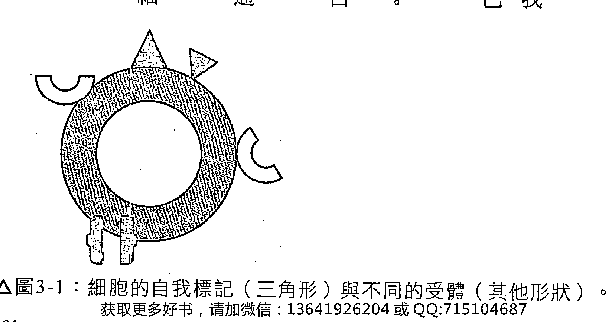

### 接收器

我们的细胞必须注意哪些讯息？危险的化学信号、能量或资源的需求、加速、减速、放松或休息的分子讯息、修补、资源回收。细胞的反应非常迅速，能在瞬间辨识，以十亿分之一秒的速度回应，快速移动、补充能量，保障我们的健康，它们是怎么做到的呢？

> > 得过诺贝尔奖的契里斯田・德・杜夫（Christian De Duve）把这个现象称为「分子的互补性」（molecular complementarity），他说：「生物上的讯息交换，是以化学互补为基础，两个分子结构，如果彼此配合，就产生互补关系——整个动态关系就像两个伴侣不会僵硬排斥。当他们拥抱，就是在模塑互相延伸的内容广度。拥抱让他们密切黏合。」
>
> ——契里斯田・德・杜夫，《生命之尘》 (Christian DE Duve, 《Vital Dust》 )

每一个细胞表面安装着数以千计的「受点」，藉以侦测讯息维持生存。而当中受体（receptor）的形状各有不同，各司其职侦测特定的讯息。就像之前提到「锁与钥匙」的比喻，细胞受体只能辨认特定的化学信号，并加以回应，这表示，受体与讯息必须同时具备正确的三度空间几何结构，才能互相呼应。有些科学家认为，双方面——受体与讯息——的振动，在动态的对话中扮演一定角色。也就是说，受体不是固定的；会随着讯息而改变自己，不停改变。

细胞膜是由双层脂质组成的，称之为「磷脂」，合成稳固的「泡泡」。这些蛋白质受体就飘浮在液态的表面上，有些可以同时接触细胞的外部与内部。受体把细胞外部可以「抓进来」，送进细胞内部，并告诉其他细胞，讯息已经「收到了」。细胞可以对讯息进行反应，在细胞内部提供必要的机制处理讯息。其中，包括受体生理结构的「形构」（conformational）改变，也就是说，受体接触到可资辨识的特定分子，会改变形状。

> > 细胞生物学家布鲁斯·利普顿在他的《生物学信念》（Bruce Lipton, The Biology of Belief）书中因此写道：「细胞膜的活动，组成了细胞的「脑部」。」

虽然如此，细胞的智慧仍远远超过细胞膜受体，详情请待下一章分晓。分子与受体结合的终极目标（如果分子真有目标的话），就是希望细胞进行特定的活动，包括制造更多能量、减速、收缩。大家可以想像，当分子互相拥抱，受体开始「抱住」发出信号的分子之时，如果抱得太紧，那么开关可能「开」得太久；反之，如果抱得太松，细胞没有感觉，不知道发生什么事。只有抱得「恰到好处」，不松不紧，彼此才有交集，才能鼓励细胞改变，采取不同行动做它该做的事。

细胞受体有这么重要的功能，人类是在六十年前研究肾上腺素时发现的。肾上腺素是遭受急难时的分子信号，告诉身体要赶紧行动，刺激肝细胞释出葡萄糖至血液中。危急状态是身体与心灵的极大挑战，会触发「或战或逃」（fight—or—flight）反应，肾上腺素会让产生的能量移到肌肉，而且血压上升提供细胞氧气，也将加速制造维生的任何物质。

身体的所有细胞几乎都有肾上腺素受体，而每一种类的细胞都有自己的特定反应方式。肾上腺素（图3-2）

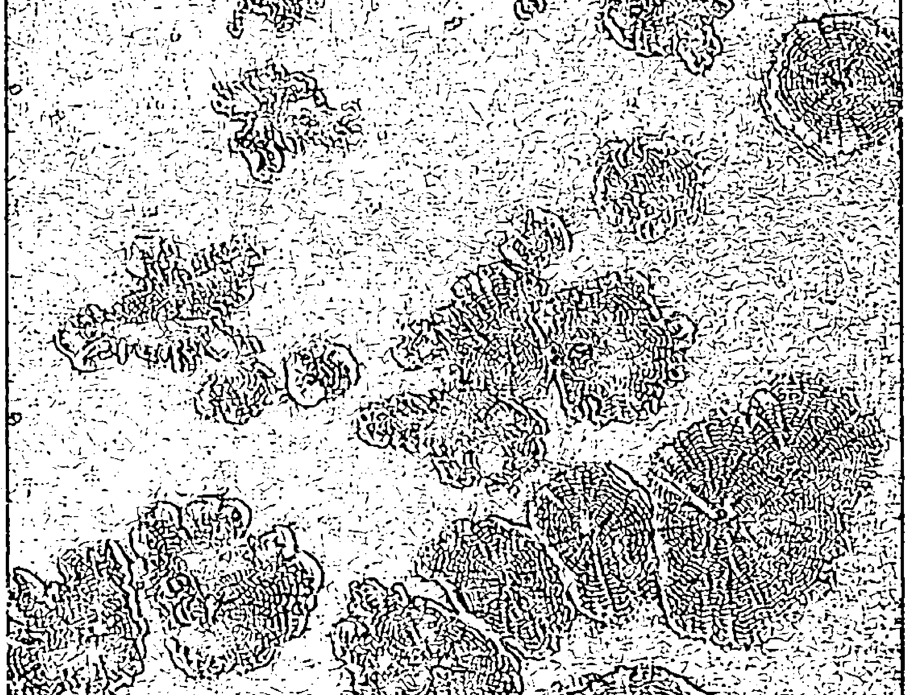

来时，心脏细胞跳动更快，而胰脏的白血球细胞不再分泌胰岛素。身体每个部分各有自己的职务，要让我们安然渡过危险。

为了让各位对不同的受体形状有个概念，请比较肾上腺素的外形（图3-2），与咖啡因的外形（图3-3）。各个位可以清楚看到细胞需要不同的受体，才能对多样的化学物做出正确反应。

如果指派你一个任务，要为细胞的每个不同受体涂上不同的颜色，那么平均起来每个细胞表面将五颜六色，像色彩纷乱的马赛克，至少有七十个不同色调，其中五万个受体是同一色调，一万个受体是另一色调，十九万九千个受体又是其他的色调：……

> ——坎迪丝·珀特，《情绪的分子》

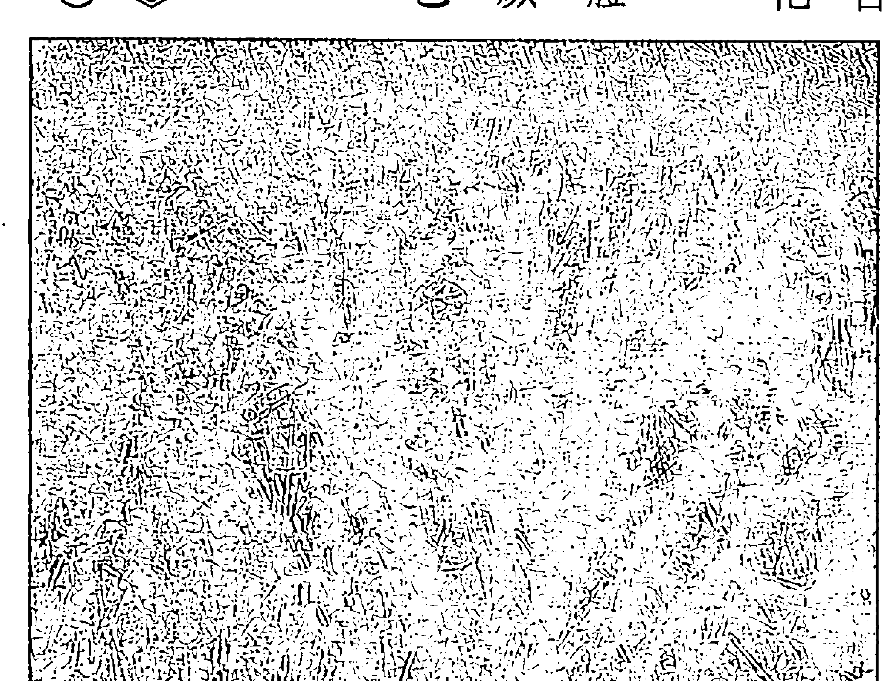

### 分子的化裝舞會

我们的身体生产数以千计的不同分子讯息，现代药物的发展就是利用这种现象，合成「假」讯息，模仿化学作用，或模仿分子的形状，制造对人体有利的反应。例如，经常用来降低血压的乙型阻断剂（beta blockers），只适合某些肾上腺素受体，可以不让自己的肾上腺素发出「赶快行动」的信号，心脏就不致于加速跳动。

### 除了控制高血压外，乙型阻断剂还有其他效用。

我首度至美国心脏协会演讲时，主办人之一的心脏病学家好意问我，需不需要服用「普奈」（propranolol），我当然知道它的效用，那是乙型阻断剂，可以减缓紧张与心跳。当人面对大众做公开演讲，或参加重大考试等高压力状况时，普奈能降低紧张情绪。可是我婉拒他的好意，因为我有自己的「药」，纯天然的，在开讲前静坐，这是神奇的方法，可以和细胞沟通，放松身体的紧张，让情绪和缓下来。

### 細胞的求救

分子的讯息像海潮，不停涌现，那是维持生存的必要沟通。出现危险时，细胞会呼救，警告同伴，并请求能量支援，邻近与远处的细胞也将同时动员起来。处于压力之时，我们特别需要能量，细胞将因此迅速补充资源。在这个关键时刻，我们可以帮细胞补足养分，同时也让他们回复平静状态，凭藉的就是心灵、分子与细胞的共同合作。这三者的沟通非常神奇。

分子说的是他们特有的语言，而且是同步的合唱。如果我们感受到威胁，或想到什么而烦恼未来，细胞会集合起来立即反应，保护并防卫家园，也将调动资源维护我们的生存。几乎是刹那间，我们与细胞一起走出危险，进入安全之地。

了解细胞有能力感受到危险信号，包括我们的想法、想像，及身体经验，可以提醒我们「活在当下」，不随便起烦恼心的重要性。

### 掌握身體線索

瑞士的心理学家荣格，他长期观察病人后发现，某些情绪状态常伴随着身体反应，像是心跳加速、手心冒汗等。此后，许多生理徵兆成为测量情绪变化的有用指标，甚至制成测量机器，测谎器就是最好实例。测量机器的出现，在人类漫长的历史长度中，只不过以公分计而已，一直以来人凭藉的都是感觉能力，我们就先来观察人体本身的情绪信号。
身体内最显著的分子改变来自混合的压力荷尔蒙。那个恶汉大摇大摆走过来——似乎很有威胁性。我们小心翼翼骑车，避免交通事故。我们总是胡思乱想，以为祸事即将降临，其实什么都不会发生。这些统统是「烦恼」。
在细胞的世界里，肾上腺素是非常明显的压力信号，让我们准备好应付危急情境，或逃或战。这时血糖升高，心跳加速——这就是身体的线索，情绪与分子发生改变了。血液循环为腿部的大块肌肉添加燃料，好让我们的逃命快一点。这些血液是从手部调来的，这也是为什么压力或恐惧会令双手变得湿冷，我们的呼吸急促，下颚紧缩，肩膀与颈部收紧。所有的生理改变都是细胞与分子沟通的结果。肾上腺素与其他的压力荷尔蒙分子，与心脏、肌肉、肺脏的细胞受体关联起来，如果压力长期而持续，免疫细胞也将动员。

當細胞播放出危險警報，整個身體的緊急反應都可被檢測出來。警報解除的效果也一樣：那個大搖大擺的男子竟然對你微笑，還加上問好；你剎車得恰到好處，沒有發生意外；我們也懂得放鬆自己，煩惱不再。因此，呼吸慢了下來，緊張的下顎與肌肉放鬆了，手部溫暖起來。

細胞知道環境改變了，它們所放出來的消息我們聽得到，整個內部也開始回應並做出調整。所以，只要對這些回應有更多的覺知，我們就能善加管理，甚至用意念影響它們。

只要掌握自己的身體線索，我們就能夠學習如何反應，讓自己更健康。

現在，暫時放下雜務，幾分鐘就好，靜下心來感受現在的身體有什麼感覺。

### 身體掃描

- 閉上眼睛。注意身體哪個部位感覺較緊繃。
- 注意雙手的溫度。
- 現在把手放在胸部，另一隻手放腹部，感受呼吸的節奏，哪個地方的起伏較大，胸或腹部？注意下顎與肩膀，是不是緊緊的？

這些觀察讓你了解自己現在的身體狀況。

如果你想進一步探索，那麼，請先回想曾經覺得有壓力，或覺得害怕的時刻。

就讓壓力、害怕的時刻在心中徘徊，注意和先前的狀況相比，現在的身體有什麼不一樣。

呼吸有比較急嗎？肩膀開始緊縮？

現在放下那些回憶，觀想某種非常放鬆的景像或很寧靜的環境，讓你的細胞回復平衡。

你的想法與你的細胞方才經歷了危險與安全的對話。這是一場心靈與分子的神聖互動，值得喝彩。請注意，這不是身體狀況觸發「壓力荷爾蒙」，是我們心靈推動了整套的化學反應。

身體的線索可讓你感知內在的情緒狀態，這些反應一輩子不會變，所以你可以隨時隨地注意它們。例如，下次如果參加會議，發現雙手開始發冷，這代表細胞可能要告訴你「危險」。收到訊息的你，將採取什麼行動呢？

### 細胞說真話

一八八〇年代末期，一名病人向她的主治醫師說，每次外頭飄來某種臭味，手腳就感覺一陣電流通過。這位法國醫生隨後的研究發現，皮膚的電流會隨著情緒波動而改變。他的研究促成當代「精神生理學」的誕生，皮膚的電流反應也讓許多醫學測量儀器得以問世，包括最著名的測謊器。榮格也研究皮膚的電流反應，並認為這是一窺潛意識秘密的生理窗口。

大家可以想像以前的年代，有這樣的發現，科學家有多麼興奮。你坐在斑剝老舊的實驗室，手指夾著精心設計的電線，接到一台嶄新的大型機器。每一次你想到愛人美麗或帥勁的面龐，機器的指針就會高低跳動。你想像中的朋友並沒有在場，可是你的情緒與生理都有反應。心愛的人只出現在想像，可是你的生理卻發生改變。

時間進展到一九八〇年代，生理學家潘諾貝克（James Pennebaker）受邀，前往教授操作測謊器的技師，何謂精神生理學壓力。這些技師想知道，當嫌犯被審問時，身體與心理有什麼反應。基本上，接受測謊的人，如果說出謊話，可以測得他的壓力反應，除了皮膚電流變化外，還可以得知他的心率、肌肉緊張、聲音改變，及其他情緒不適的生理改變。操作測謊器的技師們紛紛問潘諾貝克，請他解釋，當嫌犯終於承認犯行，機器顯示他們的生理反應是放鬆，不再有壓力，可是，未來他們可能遭到判刑、坐監，怎麼可能會放鬆？潘諾貝克被問得啞口無言，他也不知道答案，不過他後來發現這與說出實話後，內心的踏實有關。他請德州大學選修生理學的學生，把內心不曾告訴別人的醜陋秘密寫出來。潘諾貝克發現，揭露內心隱私的學生，免疫力與健康改善了，而且壓力荷爾蒙也降低了。他解釋這種現象說，當一個人隱瞞痛苦或恐懼的故事，包括犯罪、受虐、傷害別人、做壞事，無形中會帶給自己壓力，細胞則依據不舒服或焦慮症狀，也產生程度不一的壓力。但是，如果把秘密表達出來，就有鬆口氣的赦免感。換句話說，透露出深藏的憾事，讓他們放下焦慮不安的心結，回復到正常狀態。隨後細胞也有機會從緊張中緩和下來，啟動平靜的化學方程式，而他們也真的放鬆了。將近二十年的時間，潘諾貝克一直鼓勵大家，把內心的秘密書寫出來，我們也採納他的意見，放在書中稍後的探索練習裡。許多接受他建議的人，發現自己的免疫系統真的增強了。甚至學生的考試成績也大大改善。有些人的生活完全改變，幾乎人人受益匪淺，包括：整天煩惱的人、疾病末期的人、暴力犯罪受害者，還有大屠殺的生還者。在整個研究中，潘諾貝克對於健康問題最感興趣，他特別關注受過虐待的人，因為這些人內心藏有巨大的秘密。潘諾貝克覺得，如果能找出方法讓他們分享秘密，這些人的健康是不是可能獲得改善？是的，真的可能改善，而且不必透露隻字片語給任何人。方法只是把內心的秘密寫出來，寫完後立刻銷毀，光是如此就有改善健康的正面效益。這使健康有問題的人開始好轉：譬如哮喘患者肺功能漸入佳境，關節炎的患者關節不那麼痛了。這一切只是把心中的秘密傾吐出來，一連四天，每天十五至二十分鐘坐著寫。這個很有潛力的工具也放在我們以細胞為主的醫療百寶袋之中，因為我們以意念發揮影響力，請細胞傾聽我們的心聲。潘諾貝克的研究非常有建設性，他的研究證明了，我們的細胞聖殿活在聖經所昭告的境界中：「真理令你自由！」

## 細胞的秘密原想
Secrets of Your CELLS

#### 探索
細胞不說假話

你不必活在創傷或疾病的陰影裡，有個方法可以扭轉劣勢。每天騰出十五至二十分鐘，把你覺得困擾的想法或感受寫出來：包括你認為的壓力來源與隱藏的羞愧感。連續寫四天，不必多也不能少。並不是寫故事，而是把你對故事的情緒表達出來。你不必拿給別人看，也不一定要重讀。寫完後撕掉或燒掉隨你便。這是為了你和你的細胞所做的練習，邀請你釋放情緒，然後統統放下。

我們與內在聖殿有非常緊密的互動關係，因為細胞追求真理，了解真相。

我們想些什麼，包括不欲人知的秘密，都會讓生理有反應。我們把心事藏心底，隱瞞朋友、家人、鄰居、同事，但是絕對瞞不過細胞。細胞聽得到頭腦裡的所有對話，也聽得到內心中的竊竊私語。正因為如此，只要釋放創傷的故事與情緒，細胞也能放下罷礙，成為我們安全的避風港。

## 細胞願意傾聽——我們呢？

我從細胞聖殿學習到很多事情，很明顯，我們想什麼，細胞就聽什麼，而且一五一十反應出來。這個啟示促成我觀察自己的傾聽行為，進而有了全新領悟。

最近我和朋友一起散步，她又開始講自己的私事，沒多久我知道「又來了」，她的故事已聽過好幾遍了啊！我有點煩，很想反駁。突然我內心「啊哈」一聲，聽到心中說：「為何不能只是傾聽，何必反駁？聽完後再決定怎麼做不遲啊！」其實我常反駁別人，不一定說出來，但會在內心駁斥他人的說法。這時我的生理反應可能進入煩厭或批評狀態。你呢？因為內心藏著秘密，所以更容易在自我對話時急於審判或批評他人，細胞會毫無保留反應出這種傾向。細胞會聽到我們所受的壓力或即將噴火的憤怒，並產生相對的回應。因此，內在的批評是不必要的，最好打散任何不當的起心動念。

所以我開始覺知這一切，並提醒自己全然傾聽，全然聽朋友在說什麼。這時候我的身體放鬆了，深刻感覺到與她同在。

### 人際互助增進健康

這真是全新的體驗，在純然的傾聽之中，內心的煩躁與批評都消失了。有了這項領悟之後，每一次只要發現聽別人說話，內心就湧現批判，我就聯想到細胞，提醒自己只是傾聽就好，在這項改變下所得到的結果是，整個人感覺更舒坦，彼此的關係也變得更好。這並不是說，與別人交談時我被動而不互動，而是我能夠覺察，改變反應模式，純然只是傾聽，並讓細胞不僅傾聽外界的聲音，也聽見我不分別、不執取的心聲，後者特別重要，何必讓細胞接收不必要的訊息，包括我如何評論別人，批判自己，產生無謂的壓力，在身體累積毒素。細胞教我們的功課可以引伸智慧。誰都希望別人傾聽而不批判，如果我們的愛人、同事，甚至政府，都能像細胞一樣，在傾聽中以真實回應我們，這難道不是生命中的一大幸福嗎？傾聽與溝通在良好關係中扮演重要角色。那麼，良好的關係會讓我們更健康嗎？五十年前一項橫跨數十年的全面調查，共有四千五百名男性和女性參與，調查社交活動與健康習慣的關係。這項流行病學調查，讓研究人員獲得開創性發現：沒有或少有社交接觸的人，壽命短於有豐富社交接觸的人。也就是說，社交關聯性對人體健康有重大影響。

流行病學家對賓州羅塞托鎮（Roseto）的居民很好奇，因為與全美國相比，鎮民的冠狀動脈疾病與心臟病死亡率特別低。這些鎮民到底做了什麼，或有什麼養生秘訣？研究人員非常想一探究竟。

經過詳細調查之後，發現鎮民們根本沒有養生秘訣，甚至還違反一般的健康常識：他們不喜歡運動，有些人還過胖、抽菸；他們熱愛美食，更享受高脂食物，而且都有引發心血管疾病的高風險因子。可是鎮民卻非常健康，這是怎麼回事？原來秘密在於，雖然生活上的健康習慣不良，但是他們有很強烈的社區意識，社交與家庭生活關係，非常緊密。

好幾年後，年輕的一代離開羅塞托鎮出外打拚，他們決心改造不健康行為——戒菸，加強運動，改變飲食減少高脂食物——詭異的是，年輕一代心血管疾病的比率反而上升。

太奇怪了？原因竟然是：他們失去與家人、鄰居的緊密互動，而這樣的社交關係正是他們的長輩樂在其中的享受。

從這個非常特異的研究，我們得知，社會的隔離是心血管疾病的前兆，比吸菸或膽固醇過高更危險。

心理神經免疫學的研究也證實，人際支持系統可以避免病毒感染，幫助病人更快回覆，也能維持心臟健康。一九九〇年之前有一項實驗室研究：志願者在隔離的環境裡，暴露於感冒病毒中，並持續接受監控。果然，從免疫資料可以看出，所有人都受到病毒感染，然而只有部分志願者出現感冒症狀，經過調查對比後得知，感覺生活壓力大，而且生活少有社交互動的人更容易感冒。

### 我們與細胞是命運共同體

社區是療癒網路的一部分，而且一直往內延伸至細胞，單一細胞如果孤獨放在培養皿，絕對活不下去。實際上細胞也有程式設定，一旦被隔絕，很快就會死亡。同樣，腦部的神經元如果無法聯絡其他細胞，也將步入死亡！互動的聯繫是求生存的需求之一，因為單獨的細胞活不久。我們看到的微世界是更大有機體的對映：就像細胞必須聯繫別的細胞才能存活，我們也是如此，必須定期與朋友、家人、社區接觸。人際關係滋養我們的細胞、身體，也滋養靈魂。我不免想像：未來醫生開給病人的處方將是：『邀兩位朋友外出晚餐，在公園散步，隔天早上打電話給我。』

活在當下的我們何必空等未來的醫生，現在就可以服用這個處方「藥」。不要再拖了，就讓我們誠心邀請友人或家人，共進可以滋潤細胞的快樂午餐。

> 偉大的先知希勒爾（Hillel）教導我們：「如果不是現在，該什麼時候？——現在只有一個。過去只是記憶，未來也不過是夢景……只有現在是真的——讓你的每一秒都化為真實。」—— 拉比·大衛·亞倫，《The God-Powered Life》

## 讓細胞回歸當下

我們溝通與關係的品質也會影響細胞。特別是如果發生人際衝突，我們更要懂得放下。如果放不下，一直活在過去的衝突情境中，壓力荷爾蒙將持續升高，對身體與億萬個細胞聖殿都是災難一場，我們更容易疲倦、生病。所幸，我們有機會選擇。

細胞一直是活在當下的，但是我們的想法可能一直活在昨天，於是過去的想法影響耐心傾聽的細胞，回應負面情緒。這也是為什麼我們不斷強調，必須讓紛亂的心思回復平靜狀態。
下一次，如果你的心把你帶入壓力的泥沼，請顧慮到細胞，他們是神聖的容器，何必隨著你顛三倒四。把你的注意力從過去或未來拉入現在，也就是，讓你的心休息，安住在當前。讓自己成為細胞的好朋友。讓細胞淋浴於平靜與滿足的分子之中，淋浴於愛的化學反應之中，回歸當下。
多年前我開車到加州索諾瑪（Sonoma）主持工作坊。沿途卻心神不寧，一下子煩惱錢不夠用，一下子擔心男友安危。我忘記優美的葡萄園風光，心思四處亂飛。突然靈光乍現，「啊哈！」我想到：「細胞一直活在當下！」
我收到的訊息很響亮、很清楚。沒必要的煩惱與緊張是我創造的，沿途一直干擾讓我無所適從，再這樣下去，我不知會把車開到哪裡？
哇噢，感謝你們，細胞！回歸當下。

## 愛的訊息

我們已經了解危險、威脅、壓力對身體與細胞的不良影響。還好，我們內在的製藥工廠還能生產愛的分子，及關懷、同情、放鬆的分子。實際上，愛與關懷是接通科學與神聖的完美大橋。

我們探索了主要的壓力荷爾蒙，腎上腺素，藉此了解細胞受體的運作，人在面對壓力情境，除了釋出腎上腺素與皮質醇（Cortisol），不論男性或女性還會釋出另一種「藥」：催產素（oxytocin），一種令人感覺合一與平靜的分子。催產素與懷孕產子有關，能夠幫助女性生產時收縮子宮，並在產後加強乳汁分泌。透過分子的化學合成可製成人工「催生劑」（Pitocin），幫助分娩時的催生引產，用在動物上可刺激母性行為，例如，沒有交配過的母老鼠，常常會吃掉同類——剛出生的小老鼠，但是注射大量催產素後不僅不吃小老鼠，好像突然湧現愛心，行為變得像母親，愛護並照顧小老鼠。

刺激所有溫血動物的連結行為（bonding behaviors）。加州大學的研究顯示，為了回應壓力，女性往往變得「照顧與友善」（tend and befriend），造成這個親善現象的原因當然是：催產素。
以前一直認為只有女性荷爾蒙才能合成催產素，但是現在我們知道了，男性跟女性一樣也能合成催產素——在平靜的狀態下，男性荷爾蒙受到抑制，同時增強雌激素。想像一下古代的部落文化，男人外出打獵，女人則守護家園、照顧孩子，並加入社群活動、準備食物、清理部落環境、縫衣織布、製作生活器物……與其他女人分享社群一份子的責任，讓部落永續生存。
這種分享的細胞推動力，即使到了今天仍然可以在女性身上找到。當女人想要走過充滿無力感的煎熬時光，她們的推動力就是保護與養育，在「照顧與友善」的驅動下，烘焙餅乾，料理美食享用，關心子女的需求，打電話給姊妹好友。女性找尋連結，希望被傾聽、被擁抱。
女人這種「照顧與友善」的反應，年代久遠，遠溯人類漁獵時代之前，那是雌性靈長類的基因程式經過長期演化的結果。雄性靈長類有不同的程式設定，是戰鬥性、競爭性的，對於照顧受傷的同類——身體或情緒傷害——往往退避三舍。

心理學家認為，這是生化反應造成的差異，也說明了為什麼男人在面對壓力時往往以孤獨的沉默回應。他們落寞穴居小洞天；而女人重回廚房，拿起手機連接室外的另一片天。在催產素之中，我們發現了分子的訊息，心情發生改變，我們平靜下來，與別人更加親愛。雖然不分性別，男女都能利用這些分子訊息，但是女性得天獨厚更容易「管理」它們，因為女人生產更豐富的雌激素。

### 擁抱，就可以得到催產素

要用什麼方式獲得催產素呢？買來服用或到婦產科打一針？這些都不是天然的。有一個最快速、最簡單的好辦法，大家可以試試：「擁抱」，是的，擁抱別人。擁抱是送給神聖細胞的最佳禮物，讓你們的關係更親密。探索看看吧！

### 提高催產素的親和效應

磨蹭媽媽，記住媽媽的味道。媽媽也以餵撫回報，撫摸與挪動也在鼓勵寶寶對她更親愛。同樣的道理也適用於成年人，觸碰朋友的手，按摩情人肩頭。這些動作都在刺激分子訊息，提升感情連結。催產素釋放到血液，有可能是由親近關係或身體接觸而啟動。新生的動物寶寶以鼻子愛人們的深情碰觸，能夠提高催產素產量，這個道理可以解釋為何前戲可以提高性慾。性愛刺激能增加催產素分泌，而且在性高潮時達到最高峰。男性射精之後，體內催產素達到高峰後，男人的催產素維持較長的時間，也許說明了為什麼他性愛之後很快就睡著。因為催產素的效應之一就是深沉的放鬆。另外一個效應就是：思考模糊。如果做愛後你覺得思想『一片空白』，很可能是催產素的放鬆效果，讓你暫時失去思考推理能力。催產素的產量隨年齡增加而增高。年齡愈大的女性，生育能力可能隨之下降，但是親和友善的能力卻大增。男人如果必須照顧子女，那麼催產素也會增加，而且和子女的關係更親愛。當父親握住孩子的手，他的睪固酮下降，因為他『愛的化學物』增加。是的，我們還有別種『愛的化學物』：我們的『手指』，是生產親愛與愉悅的化學藥廠。

### 我們的本性充滿愛

催產素可能是人類依附關係與親密感情的主要生化物質。溫情的按摩、充滿意象的催眠，都是促進連結關係的好辦法。迷幻藥與大麻的藥物作用也能增加親密感。某些植物可能含有催產素，像是大麻、藍升麻根，但，也許是身體受到這些植物成分的刺激，從細胞釋出催產素。

連結關係——有如符應而完美的分子擁抱——可以多方面促進健康。接受催產素注射的動物，血壓與壓力荷爾蒙明顯降低。牠們的傷口癒合更快更平整。常常被撫摸的寵物兔，被細菌感染而生病的機率，比沒有被撫摸的兔子還低。

這些現象讓我們了解，為什麼愛情、做愛、親密關係、養寵物、撫摸寵物有助健康，也可以減輕壓力。到目前為止，人類女性的壽命平均高於男性，這會不會是因為更健康的親密關係帶來的正面效應？

## 傾聽禱告的細胞受體

細胞不斷傾聽分子的訊息，這方面我們已經學習很多，但是細胞還願意傾聽其他的訊息嗎？這些難以量化的通訊訊息包括：意念、靈性導引、禱告。

舊金山綜合醫院心臟科住院醫師伯德（Randy Byrd）有項開創性的研究架構：「禱告的力量」，探討禱告對於加護病房的心臟病患有沒有實際幫助，而病患並不知道有人在禱告。研究結果顯示，受禱告祝福的人，他們的心臟突發狀況與併發症，比沒受禱告的病人還少。

在這項開創性架構之後，類似的研究風起雲湧，結論也都相仿：接受禱告的病人，身體健康都獲得改善。

和細胞一樣，我們與信賴、值得尊敬的人交往。細胞的運作方式是：如果入侵者或壓力分子釋出的訊息不被信任，就會部署戰鬥細胞消滅敵人。現在想一想，從什麼地方，從什麼人那裡，你可以收到愛與友善的訊息？每一次接觸時，我們就會對自己的細胞傳送愛的分子。這不正顯示：我們的本性充滿愛與神聖嗎？

我們的細胞一定是用某種方式收到訊息。傾聽禱告的細胞受體在哪裡？到目前為止沒有人知道。另一位研究隔空治療的先驅科學家勞瑞·杜西（Larry Dossey），認為禱告的能量以極低頻的電磁波動接觸並影響細胞。這個神秘現象截至目前仍無確定解答，但至少我們又發現細胞也有另一種形式的溝通回應。

## 愛細胞就是愛自己

我們的細胞具有傾聽能力，當我們以感恩與愛護的態度發送訊息，他們也以感激恭敬的方式接受訊息，讓我們的生命更加圓滿。所以，我們必須注意對自己、對別人、說了什麼話。我們也必須覺知用什麼方式溝通，如何對待自己、對待別人。請記住：細胞正在傾聽。

我們的細胞是分子的親密擁抱而形成的，那是上帝的傑作，是生命的神聖火光。細胞是容器，準備盛裝神聖的愛，準備在當下融合。細胞所含蘊的就是施與愛的偉大功課，就是開放與柔軟、養育與保護，及溝通與真實。

我們的細胞願意開放，辨別並接受訊息。我們也要問問自己：願意像細胞一樣嗎？我們願意開放並接受訊息嗎？我們願意像細胞輸送訊息一樣，輸送或施與別人嗎？我們送的訊息是以假亂真，還是能分享我們的完整感？我們像細胞一樣活在當下嗎？
這些問題，細胞都有很明確的答案。且讓我們細細傾聽。

### 溝通問題

1.  我的接納度如何？我能傾聽多深？
2.  我需要溝通什麼？我能順利溝通嗎？
3.  我最有利的溝通項目是什麼——語言文字、感情、禱告、能量場？
4.  我說真話，活在真實中嗎？
5.  我的溝通可以增進彼此的合作嗎？
6.  如何讓我的關係更為神聖？
7.  我最神聖的關係是什麼？

我們還要傾聽更多。

> ——美國詩人瑪麗·奧利弗，(Mary Oliver)

## CHAPTER 4
### THE FABRIC OF LIFE—CHOOSE
#### 細胞是管弦樂團

「每一個細胞都能接受環境的訊息，而且給予明確回應。」——波意士·雷斯柏格，《生命自己》（Boyce Rensberger，《Life Itself》）

什麼力量促使細胞與意識做出改變？什麼力量促使細胞選擇某個專注焦點，而不是別的？細胞生物學家長久以來一直相信，細胞出現某些行為是因為基因、蛋白質與分子的訊號造成的。然而當代的先驅科學家卻指出，扭動、彎曲、推進，這些「機械力」主導細胞的表現行為。

深植於細胞的設計是一種明確的動態網路，決定細胞的方向。當細胞受體傾聽分子時，細胞結構或所謂的「細胞串」（strings）也開始有動作了。細胞串會振動，往前推同時往後拉，引導細胞做該做的動作，形成細胞運作的另一種奧秘。

細胞串或細胞陣（matrix）的張力程度，控制了細胞的表現與命運。繃緊的拉力觸發某種基因訊息，帶來某種結果。拉力的鬆弛又啟動另一種訊息，引發另一種結果。同樣的基因、同樣的內在智慧，因為力道緊緩的差異，而有不同未來。這個力量推拉鬆緊平衡的過程，是宇宙設計好的自然律，稱之為「張拉整全」，或張力均衡結構（tensegrity）。一張張拉整合是人造結構的指導規則，也是細胞與更複雜組織的指導規則。我們可以在人類建築、原子、蜘蛛網、星星、分子裡發現「張拉整合」。（圖4-1、4-2）

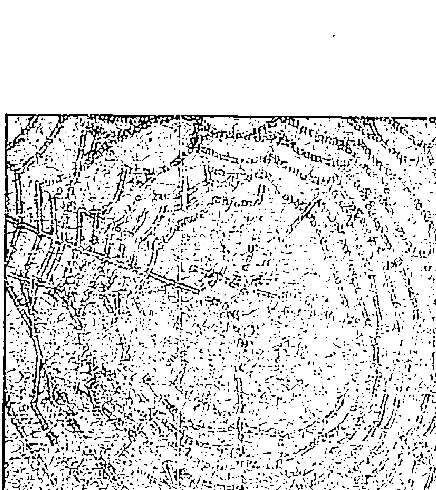

△圖4-1：蜘蛛網與細胞骨架有類似的設計。

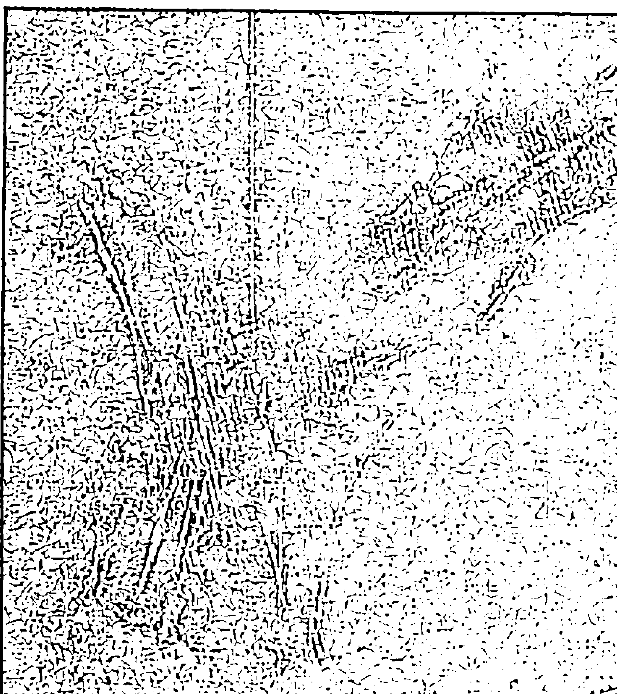

△圖4-2：細胞的張拉整合（細胞骨架）——（小鼠胚胎纖維母細胞）長線條結構；右上方的暗影部分是細胞核。

#### 名詞解釋

拉力和張力的平衡

張拉整合（Tensegrity）：任何支撐並保持平衡的物理結構。相反的兩股力量，張力與壓力達到平衡。結構之所以呈機械式穩定是因為內力與外力的平衡。Tensegrity 這個字是 tensional integrity（張力整合）的合成，由未來學派建築師富勒（Buckminster Fuller）提出，用來描述張力與壓力共創雙贏關係。富勒就是運用此一概念設計出聞名的球形穹頂，成為最穩定的人造建築物（圖4-3）。

唐諾·印格伯博士（Dr. Donald Ingber）是哈佛大學的名師，一九七O年代還是生物系的大學生。他在選修設計課時學習到，許多藝術雕塑依靠長管的支撐而形成穩定的創作作品。當時他有個直覺：細胞也應該是「張力結構均衡」的雕塑傑作。

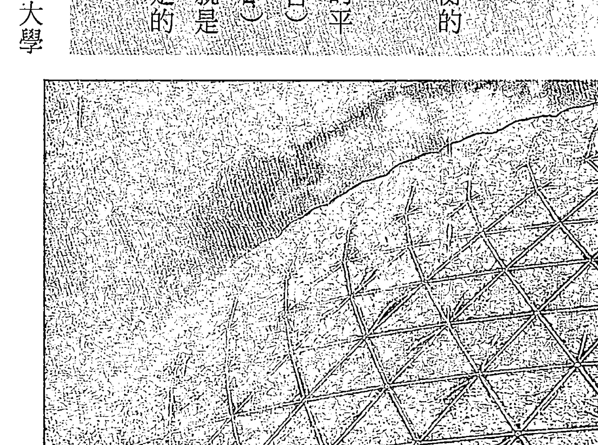

現在的印格伯教授已將「張拉整合」融入細胞學說，認為那是一種細胞的設計與智力表現，可以調整細胞的行為。就生物角度而言，張拉整合的概念讓我們了解細胞如何改變形狀，而且機械式的伸縮如何影響細胞的選擇與行動。

如果不是某一次的「同步性」（synchronicity）經驗，我可能忽略張拉整合的重要性，對細胞少一分了解。

時間回到一九八八年，那時我研究生理學已有好幾十年了，有一天，我到書店翻閱雜誌，兩篇風馬牛不相及的文章，分散在陳架上左右兩端，可是卻同時引起我的注意。一本是《瑜伽月刊》（Yoga Journal），另一本是《科學美國人》（Scientific American）。兩本雜誌都有一篇文章發揮富勒的張拉整合思想，而且對我而言都是前所未聞的新觀念。

其中一篇是卡斯塔尼達（Carlos Castaneda，美國人類學家，拜印地安巫士唐望為師，並寫出以唐望為主的系列書聞名）的文章，探討古代的修鍊，稱之為「張拉整合運動」（tensegrity movement），他認為這種運動可以提升人類的意識。

另一篇文稿由印格伯執筆，深入分析生命的建築結構。他描述的細胞是張拉整合構造，讓細胞有能力做出決定。文內指出，我們身體中的微物質與微生命，它們的構造完全符合張拉整合原理，即使我們的意識運作也適用。

#### 細胞設計的生命建築

細胞裡神奇的建築設計，指的就是「細胞骨架」（圖 4-4）。如同人有肌肉、骨骼，細胞也有骨有肉，細胞骨架就是連結細胞各個部分的支架。細胞骨架可以運輸分子、協調訊息，調節基因的表達。由於細胞骨架有能力平衡細胞內的張力與壓力，因此最新的生物對這方面的研究當然不缺席。

細胞的智能儲藏在基因裡，很多的科學家滿意這樣的學說。然而，基因由長螺旋的DNA分子建構出的化學密碼只是文本，這樣文本就像食譜，可以按譜製作出人體所需的蛋白質原料，現在問題是，怎麼做出來的？也就是說，一定要有廚師、廚房，那麼，誰是廚師，廚房在哪裡？

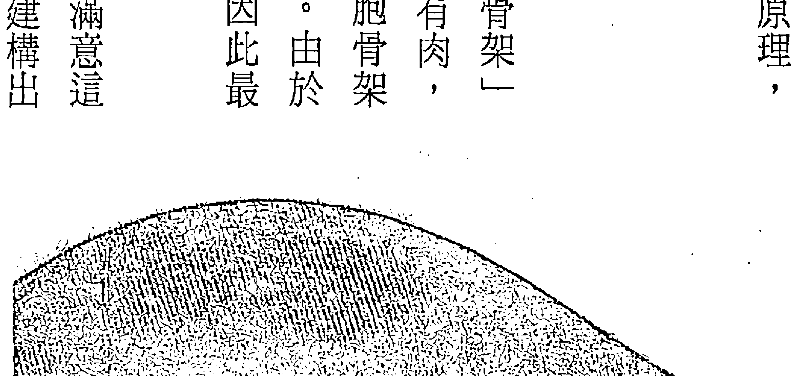

△圖4-4：細胞骨架結構

著名科學家布魯斯·利普頓（Dr. Bruce Lipton）主張，如果研究我們的細胞是如何建造出來的，而不是一直想為基因解碼，也就是說，不要只是研究食譜，而是研究菜餚是怎麼做出來的，那麼我們就知道誰是廚師，廚師在哪裡；或是說，終於知道細胞智能的秘密。在細胞社群裡，基因只是藍圖，細胞骨架才是幕後的設計師。

科學家發現，細胞的智能是細胞骨架與受體交互作用而生成的。且讓我們開始想像：自己不斷縮小，縮到比細胞還小，這樣我們才能檢查細胞內部構造與支架。諾貝爾醫學獎得主德·迪夫把這個縮小的觀察員稱為「細胞人」（cytonauts）——在細胞內行的人。

為了進入細胞，我們首先要從表層穿越不斷顫動的受體。進入後，馬上聽到千奇百怪的細小聲音飄盪。我們停下來注意聽，抬眼便看到很大的一顆「心」，那是細胞核，在細胞中心，我們也注意到，耳際一直出現低沉的轟隆聲，像是不停運作的能量產生器，原來那是粒線體。

我們把注意力拉回雙腳踩踏的「地上」，一看，竟然沒有「地」，空空如也的透明，全部像凝膠一樣的細胞質，而且很有彈性，輕輕一踩，有如踏上彈簧床，人還彈跳起來。

仔細觀察周圍，整個像果凍般的環境裡，四處都是閃閃亮亮的細線與長條管。我們移動時，細長線也隨著我們擺動。如果我們在這一頭稍為用力踩下去，細胞的另一頭就隨之波動，調整壓力。整個動態的振動正是細胞智能的傑作。

細胞骨架的結構是由三種不同蛋白質組成的，分別是微細管（microtubules）、微絲體（microfilaments）、中間絲（intermediate filaments）。這些絲絲管管的東西，是細胞內的支架與滑輪，不斷擺動，像蜘蛛網布滿整個細胞，能夠施加力量引導、管理、協調細胞的行為。

幾十年前，科學家就知道，微細管可以幫助細胞移動、分裂、改變形狀，但是直到最近我們才了解，微細管可以合作一起管理細胞的張力，而且張力的改變影響基因的呈現與細胞的運作。簡單講，改變細胞的物理狀態，就會改變基因。譬如，伸展開來的細胞，與內縮或不規則的細胞，命運大不同——即使它們內含的基因訊息一模一樣。

細胞的伸展、收縮、脹大、鬆弛，裡面支撐結構的變化，顯現出不同的細胞能力與基因程式。這個動態的交互影響力，可以讓細胞『傾聽』，做為下一步該『選擇』做什麼的判準。

信號就像丟入水塘的小石頭，波動的漣漪傳送到細胞裡，訊息被細胞聽到了。接著是沉默，等待採取行動，或進一步傾聽。

——克里斯多福·沃恩，《生命緣起》（Christopher Vaughan, 《How Life Begins》）

#### 細胞能改變形狀的用意

讓我進一步思考：細胞改變形狀與張力，代表它們僵硬或放鬆，每一種物理狀態影響未來的行動。譬如免疫的吞噬細胞接收到訊息迅速拉長，從容朝被捕食的對象移動。一碰到細菌，吞噬細胞就用黏性蛋白質黏住細菌，並再次改變形狀，裹住入侵者，吞噬消滅。

另一個形狀改變裝置就是微細管，大約每十分鐘就拆解重建，這個不斷進行的程序讓細胞保持在改變狀態，也保持在可以隨時反應的待變狀態。這顯示我們的細胞是非常變通的，可以靈活改變。圖4-5是人類白血球細胞（嗜中性球）的照片。

圖中的嗜中性球正在辨認另一物種的紅血球細胞，並緊隨其後監視。

#### 決定細胞生死的關鍵

細胞的張力與形狀，主導生命或死亡。活的細胞總是「一選一」，「不是」繁殖「就是」成長；換言之，細胞要麼複製自己，要麼成長。繁殖的細胞以基因訊息製造另一個細胞，不製造資源讓「成長」的細胞使用。

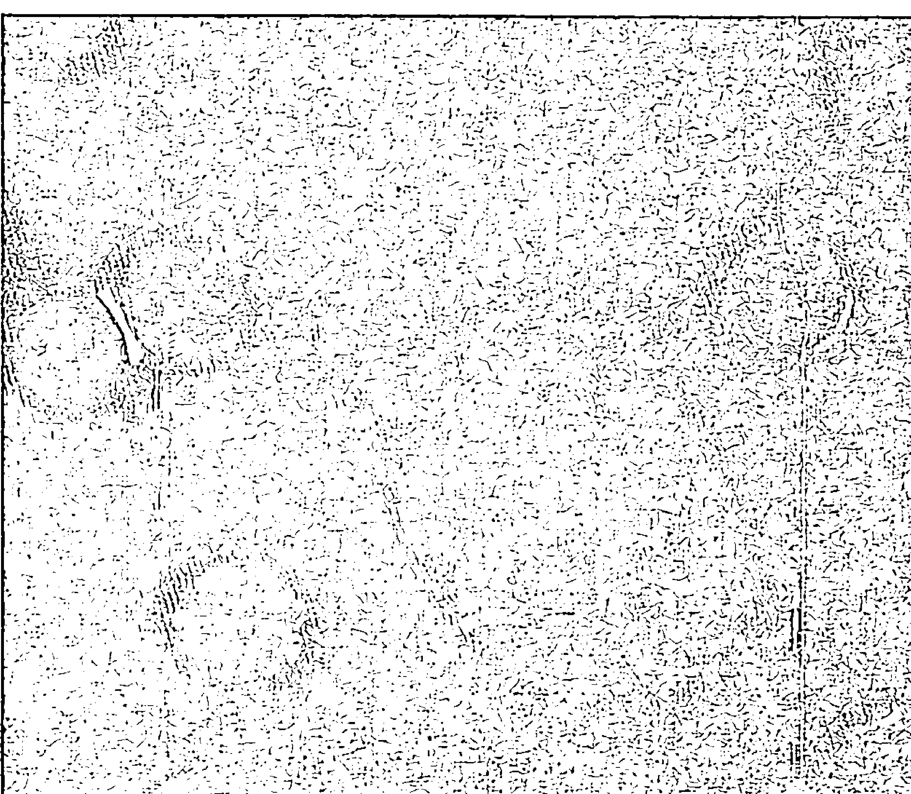

△圖4-5

### 表格四之一：繁殖與成長細胞的比較

成長的細胞運用不同的基因訊息讓自己生長，可是卻不能繁殖（見表格四之一）。

| 類別 | 功能 | 成長 | 備註 |
|------|------|------|------|
| 分泌更多肝細胞 | 以上全部 | 分解來物，產生荷爾蒙，產生激素與酵素 | 以上全部 |
| 腎上腺細胞複製更多的自己 | 生產腎上腺素，並釋放到血液 | 製造抗體，並接手與保護身體 | 製造抗體，並接手與保護身體 |
| 免疫細胞產生更多的保護球 | 分泌更多肝細胞 | 以上全部 | 製造抗體，並接手與保護身體 |

觀察培養皿中的細胞如何成長，我們看到細胞牢牢固定在培養皿表面，然後在這個新家散了開來，細胞黏附、伸展、散開，基因發出信號開始分裂。

新細胞不斷生出來，直到蓋滿整個表面，如同覆蓋皮膚上的傷口，細胞不斷伸展，製造更多細胞，直到細胞彼此接觸。

造更多細胞。就這樣不斷分裂，直到培養皿變得擁擠，這時有些細胞開始改變形狀，變成圓的，不再無止盡伸展。到最後，細胞真的超多，終於為占有一席空間或資源而競爭時，基因的複製信號戛然而止，細胞不再分裂，甚至啟動「自毀」基因。也就是說，細胞「選擇」犧牲自己，成全整個社群的利益，讓其他細胞獲得空間與食物。這種利益眾生以成人之美的行為，不正是細胞的利他主義哲學嗎？在極度伸展發揮最大張力（生長的基因信號）與極度內縮呈現微弱張力（死亡的基因信號）之間，細胞的張力都是「剛剛好」。在這種剛剛好的物理狀態中，基因程式指導細胞製造一些特別的「好東西」，讓細胞成熟、發展。成長基因負責讓細胞供應生存與生長所需的資源。細胞或複製，或成長，或死亡，一次只能有一個選擇。身體內所有細胞都攜帶相同的基因（唯一例外是成人的紅血球細胞，沒有基因）。某個基因程式因為細胞充滿張力而啟動，另一個細胞則可能因為細胞釋放張力而啟動基因程式。也就是說，細胞的張力與位置，都將影響基因的執行。而這一切都是細胞骨架在幕後決定。細胞黏附，然後盡可能伸展以複製自己。一而再，再而三重複相同模式，最後，細胞『放下』，不再黏附，也不再伸展，細胞用盡所有力量讓自己圓滿而『捨』——溫柔且

#### 高貴的死亡

學習放下，讓生命大扭轉，無有恐懼，不再執著或抓取……放下能讓生命成長，我們終於發現，愛與放下是同樣一件事……都能讓我們在無常的生命輪迴中回到當下，讓我們圓滿面對人生的每一刻。

——傑克·康菲爾德，《心之道》（Jack Kornfield，《A Path with Heart》）

#### 細胞也懂佛法

按照佛法的教導，學習放下執著，就能走上日趨成熟的靈性之旅，我們的細胞不正是如此嗎？當我們放下，就能立地成佛，細胞放下之後，就能進化為更成熟的社群份子，讓整體的大社群生生不息。

放下執著成就靈性或進入開悟境界，只能是修行或哲學的意境嗎？或那是因為人內觀微宇宙而有所體會？放下又將如何影響人的靈性成長？

#### 細胞的三個狀態

教學相長是千真萬確的，在我教學生涯中果真發現，只要把細胞的行為具象化，就能透過身體正確掌握有關「一身」的重要意涵，而這是一心所無法真確理解的。

底下的細胞狀態探索，可以幫助你掌握細胞的智慧。做這項練習至少要騰出十五分鐘，備妥紙筆，或一組彩色鉛筆，方便事後把心得寫下。如果你們是團體，就要有人負責管控時間，提醒大家變換狀態，大約以五分鐘為限。如果是自己做練習，你可以設定計時器，或約略估算時間。

用最舒服的姿勢坐在地板上，心情很放鬆，不要為雜事分心。現在，想像自己是一個細胞，正要做選擇：

想像你是黏附在地板上，盡力伸展的細胞，努力延伸，延伸到可以分裂，製造更多細胞。你正在複製自己。

接下來你將體驗內縮，被溫柔死去的程序籠罩。

或者，你可能變成長細胞，不再緊緊黏附在地板上，而是長大成熟。你可以扮演任何完成發展的細胞，例如勇猛的免疫細胞，舞動的神經元，或輕快跳動的心臟細胞。發揮你的想像力，並注意你最喜歡哪種狀態。

記住，每種狀態五分鐘，然後換至另一種狀態，好好體驗。最後換到第三種狀態。三種狀態的順序你自己安排。練習結束後，把你的經驗記下來。你覺察到什麼？學習到什麼？

這是奇妙的探索，大家從己身學很多東西——甚至比讀完生物學更重要，細胞的狀態是身體行為的隱喻。你是從哪個狀態開始的？你會製造更多的自己嗎？——意思是，你會一直重複某些行為嗎？你經常卡在重複的類型中嗎？你是否抓得太緊，忘記放下？有哪些事情你必須徹底放下？在你的人生中，目前是成熟階段嗎？

我的一名學生在做練習之前說，不想體驗死亡階段。於是他先做其他兩個，可是到了最後卻欲罷不能，允許自己體驗「捨」的滋味，完完全全放下。完成後他如釋重負。死亡階段的重點是「捨」，沒那麼嚇人的，放心。

#### 當你真正放下，癌症也能被放下

直到二〇一〇年，我才真正看懂細胞也能放下，「放下」不僅有心理意義，也有隱喻的象徵內涵。我把自己的發現與帶領癌療團體的友人分享。想不到我們熱烈討論細胞與療癒，新的可能性從「放下」這個主題中浮現。朋友告訴我，他的團體中，有很多人的癌症痊癒了，或減輕了，這對醫生來說是「不應該發生的事」。雖然「不應該」但事實擺在眼前，就他的觀察，其中有個因素是這些人放下了某些「大事情」。也許那是他們面對死亡的恐懼，或關係的危機，懂得「放下」是療癒的秘密。團體中有很多人都從必死的診斷中復原，症狀減緩，當然也包括我朋友，他是第四期的淋巴癌，至今已六年了，不是好好活著。我以細胞也能放下的過程回饋他的分享，我們兩人獲得更多的體會與發現。是的，細胞黏附，盡量伸展，在最大的張力下複製相同的細胞。

這個象徵放在個人身上等於：當我們對某些東西執著，細胞就會很緊繃，就會做出同樣的事，犯同樣的錯誤。同樣的執著程式複製一模一樣的身心靈。我們無法解脫，只能重複相同的老梗。
人很嚴重的內心『緊張』（如細胞的張力）就是『不夠』──不夠好，不夠有錢，不夠專業、不夠美麗……我執著在這個心結上。如果能放下『不夠』……，身心靈就會接收到不同訊息，細胞也能進入不同狀態，幫我們釋放緊張嗎？
只要放下執著，就能讓細胞放下某些沒必要的驅力程式或迴路程式，最後癌細胞很可能一凋亡，因為癌症在人體中是不被需要的程式？或者，罹癌的人有一天想通了，終於放下心中大事，這等於向腫瘤宣示，我允許你們這些癌細胞放下某些執著，因而有效啟動癌細胞的死亡程式？
如果我們與細胞更親近，那麼，細胞必然會幫助我們更了解自己？
如果能放下恐懼，放下某段感情，放下某種毀滅性的情境行為，這不僅是情緒改變，更可能是細胞層次的協力化？

#### 細胞的靈性療癒
Secrets of Your CELLS

以上的問題都是我與朋友討論出來的，而且一直在心中迴盪。但是有件事請大家注意，我們並沒有得出結論說，一個人之所以有癌症，或癌症沒有好轉，是因為他們「沒有」放下、「不能」放下、「不想」放下。不是這樣的，癌症是相當複雜的現象。我們提出來的問題僅供大家進一步思考，更了解生命。

#### 柔軟可以改變癌細胞？

改變細胞的張力或改變細胞的環境，就可能改變癌症嗎？ 科學家在實驗室發現，某些癌細胞比健康的正常細胞僵硬，並破壞正常細胞成長。 當我第一次從文獻中，得知乳房腫瘤比正常乳房細胞更硬時，我一點也不意外。因為很多癌細胞都是不成熟的，比正常細胞更沒有彈性。 一般而言，尚未成熟的細胞比成熟細胞硬一點。賓州大學的科學家發現，癌症的乳房組織比正常組織硬，不僅如此，他們更證實，健康細胞如果在硬的材質上生長，會出現異常組織。為什麼？因細胞內的「管線」被拉長，是機械性張力增加所致。

相較起來，在化學作用下可以避免拉力、黏附力與張力，讓細胞長成為正常的乳房組織。
科學家假定，突變的基因可能活化生化機制，增加細胞的張力，成為導致癌症的先發事件。科學家進一步主張，干擾癌細胞的機械作用，可能抑制細胞內的基因突變。
另一名科學家印格伯（Donald Ingber）也正在研究，改變腫瘤的物理環境，是否可能反轉癌症的發展程序。
他模仿健康的組織，把人工物質植入腫瘤環境，企圖操控癌細胞。也就是說，印格伯在腫瘤環境中提供「軟墊」，希望成長中的癌細胞改變基因。
我們一直嘗試解開奇蹟療癒之謎。有沒有可能，當一個人用某種方式軟化態度、軟化他的組織，就能藉此讓細胞往正常之路前進？
我之前曾實驗過，白血病的白血球細胞很可能變成正常細胞，於是這引發另一個問題：癌細胞可能變得正常嗎？
答案是：在實驗室裡運用溫和的化學物，確實可以造成改變，細胞膜變得更具流動性；但是離開實驗室後，這些化學分子有用嗎？問題依然一籮筐。

#### 不要用「头脑」去处理，要用心去「感受」

不過，針對這些問題的討論，必能擴大我們的探索視野，包括：如果僵硬的環境是源於正常細胞的解體，那麼，個人或整個社會的僵化怎麼辦？執著、缺乏彈性如何影響我們的身心發展？

我們每個人如何共創更柔軟、更溫柔的環境？我一直覺得很奇怪，為什麼有些人不喜歡表達柔軟？

> ——美國喜劇演員莉莉·湯姆琳 (Lily Tomlin)

癌症的预防与治疗是我的兴趣之一，因为我长期与病童相处，我发现，化疗与放射性疗法带来希望，可是也带来灾难性副作用。大家一直在问，有没有其他治疗方法，以更温和、毒性更少的方式让疾病反转。我也一直在这条路上探索，最后终于学习到「张力整合」的角色，透过物理机制改变细胞，也在身心灵方面更加深化，融合萨满与内在修行，整合到治疗里。

我在自序中提及我是小儿科病房的「气球阿姨」，及我与阿瓦罗（Alvaro）的一段友谊。他的白血病本来已经缓和下来，可是一年后又再度复发，我很难受，死亡似乎近在眼前，令人不知所措。我打电话给心理学家品克森（Tomas Pinkson）医生寻求支持，问他：「怎么办？我不会处理！」

他语气坚决的告诉我：「你不必处理，只要去感受！」可是我就是不想感受——那么的无力与悲伤——所以才打电话给他呀！

我们约好时间到他的办公室见面，很单纯、很朴素的专业空间。随后品克森带我走进似乎是治疗室的地方，真是令人惊喜，里面是另一种世界，充满原住民的疗愈风格。

地板上铺着那瓦霍族（Navajo）的毛毯，旁边还摆着战鼓，墙上有些古朴绘画，及印地安纳灰球族（Huichol）的藝術品。品克森邀請我坐在地上，如同原住民的習俗。

我坐定後，他點燃一束看起來像細枝的東西，朝它們吹了幾口，馬上昇起裊裊煙霧。事後我得知這叫「使麻吉」（Smudging，用燻煙致敬、保護），是美洲原住民用來淨化能量、集中能量的儀式。

從這一刻開始，品克森「非智性」、「非線性」的智慧與薩滿修煉令我心生嚮往，於是他成為教導我治療——包括身體、心靈與靈魂——的老師。

然後我慢慢學習到何謂放下，也懂得放下疑惑不止的分別心，進入清淨不染的道心。

#### 「覺」的力量，可以轉換意識頻道

我第一次進入薩滿境界，是鼓陣帶來的機緣。

時間是一九八五年，在一個很怪異的部落中心，我收到品克森的邀請，大老遠開車經過狹窄蜿蜒的山路才辛苦抵達。

當時，不停閃動的燭光，照亮沒有電燈的活動中心。大夥在地上圍成一圈，有些人打鼓，有些人搖著手搖鈴，也有人喃喃咒唱，更多人則安靜坐著。我是很理性的科學家，從我的眼睛看出去，這種場面非常古怪、很詭異。

我懷疑當初是否鬼迷心竅，才會答應來到這裡。

我不得己找地方坐下來，一個最靠近大門的位置，以防萬一，如果狀況不對勁，方便奪門而出。我的內心碎碎唸，不斷抗拒：「趕快走人吧！瘋子才來這裡！讓大家坐在地上，還圍一圈，搞什麼鬼怪！」

但最後我還是乖乖坐著，閉上眼睛，把心安頓下來，往好的方面想，希望今晚不致浪費時間，有些心靈成長的收穫……鼓聲響起，震動性的節奏，手搖鈴也隨之打拍子，我慢慢跟隨鼓聲，心情逐漸平穩，內心也靜了下來。

雖然心裡仍有掙扎，身體稍稍扭動不安，但規律的鼓聲讓我融入整個氣氛裡。

就這樣，內心竊竊私語的交談聲完全停了。我的想像力開始飛馳。然後，為什麼我要來的理由清楚浮現：我來這兒是想接通無邊廣大的智慧，找尋理性所不曾體驗的境界。很快，我完全投入這個神聖空間，很平靜的感覺籠罩全身。

寧靜，對自我的存在若有所悟。我覺得接通自己，接通房子內的其他人，也接通了神聖的當下，此刻，我的內心平和。事後，我無法否認這個在半推半就中，感應到的神聖經驗。但是有一部分的理性卻在碎碎唸，認為那只是自我的獨白，因為不符常理。我必須找出一個科學的解釋，說明為什麼意識與感情會因此而改變，要不然怎麼相信發生在我身上的事是真的，怎麼相信薩滿儀式能帶來平靜與智慧，何況不只是我，房間其他人的意識都改變了？然而，我在很久很久以後才找到答案，而且是在我弄通複雜奧妙的細胞骨架之後，但相隔已經數十年了。

#### 細胞能量改變，心情就會改變

擊鼓、歡笑、運動、做愛，或任何的愉快經驗，使我們體內的化學物波濤洶湧，其中含有非常特別的「腦內啡」（endorphins）。

當腦內啡分子潮起潮落，腦波變動不止，細胞張力跟著緩和，我們就會由內而外，重新創造情緒狀態。

我們的細胞有能力運用節奏或感官接收的震動能量，創造出愉悅狀態。只要能量開始流動，我們的肌肉就會開始變得柔軟，甚至達到一種和諧的境界，充滿合一感，一切盡在會意的不言之中。

這時候細胞內的分子，像是在低哼、像是在擊鼓、放光、擺動，隨著感應共鳴；思想改變了，身心靈也同時起變化。

細胞骨架的角色，在這一刻已非基因所能規範。那是一種「形態的改變」與「能量轉化」。

#### 肌肉僵硬和酸痛，都是在傳送訊息

「變形」（shape-shift）對薩滿巫士、魔術師或神秘教派而言，是超級不尋常的字眼。

你讀過卡斯塔尼達的著作，他的「巫士導師唐望變形為美洲土狼」、哈利波特故事裡的「天狼星變形為黑狗」嗎？

雖然變形的觀念常常融入神話或小說之中，但我們卻用它來代替觀點與情緒的改變，或身心靈的能量變化。

很多古老智慧都提到，改變身體的場和位能，就能改變意識（反之亦然），我們的潛能和存在也會跟著改變。

科學家也支持這項古老的智慧：如果依照某些路徑移動身體，就會改變我們的感覺或改變力量，做出以前不能做的事。也就是說，我們的細胞國度改變了，「我變形了」！

古代的修行者早就知道，身體某些張力的改變，就能讓身心能量與宇宙能量結合，改善健康，促進內心祥和，因此修行人潛心創出許多有益身心的招式或姿勢，譬如，薩滿舞、太極拳、導引術、瑜伽，及一些稀奇古怪的儀式性姿勢。

人類學家卡斯塔尼達，到墨西哥雅基族追隨薩滿唐望研究巫術與魔法多年，他的心得是：古代的身體修煉，能讓我們感覺到能量的流動與身體變形。他把這項修煉稱為「魔法通行證」，同時調整外部與內在能量，有效改變意識。

現在問題來了，如果我們拿到「魔法通行證」，例如薩滿舞、氣功，有可能改變細胞內的張力嗎？或改變基因、改變記憶型態？如果細胞內張力整合的屬性真的改變了，那麼，某種身體活動可以延壽、可以改變心情與能量，就有新的合理解釋。甚僅如此，我們愉悅、寧靜、幸福的潛能也將因此而擴大。運動或修行的命功可以改變我們的生命，難怪印度教大師奧羅賓多（Sri Aurobindo）要說，這是「細胞的瑜伽」。我們的細胞改變形狀，移動、成長並「選擇」做什麼，協調張力整合。它們以張力的釋放管理我們的身體。而我們的身體又必須伸展、運動，讓組織保持健康、柔軟。瑜伽還有其他的運動與功法，包括按摩或脊椎按摩，也可視為一種治療，因為「動」讓我們進入自己的身體，幫助自己整理思想、提昇能量，也鼓勵自己「放下」某些用不到的狀態。讓細胞進入薩滿的境界。如果能夠覺察發生在身上的外在與內部力量，我們就能改變生命。科學與神聖的智慧在此地相遇。當我們有僵硬的肌肉，就會改變細胞整體的結構。如果小腿肌肉過度使用，變成又痠又痛的「鐵腿」，或當你上課久坐，忽然站起來卻手扶桌子，頸部僵硬一陣疼痛，有過經驗的人就知道這是什麼意思。

緊繃的結構如果持續，身體就有痠痛的反應。肌肉是由很多束的細胞組成的，能夠伸長、收縮、固定，以一個固定姿勢拉緊肌肉會減少血液循環，造成習慣性疼痛。僵硬的肺部細胞會妨礙呼吸。

它們像架在固定位置的纜線，四通八達延伸。身體的每一個部分，與其他部分是相通的，形成互聯的網路，每一個部分都在全體的擁抱之中。

——狄恩。巨漢，《身體任務》
（Deane Juhan，『Job's Body』）

> 觀照細胞族群的柔軟或僵硬，我們等於揭露細胞傳出的訊息：伸展與「動」是重獲活力與改變的良方。你今天有沒有伸展筋骨？

#### 細胞是管弦樂團

我們的細胞也有「音調」，肌肉亦然。什麼意思？用弦樂器來比喻好了，小提琴弦的鬆緊，按住弦的不同位置，都會發出不同聲音。同理，細胞處理不同的化學信號，有賴於細胞內「管」、「絲」在什麼地方受力，與受力的大小而定。我們已經介紹過，細胞族群的生理結構，是由微細管、微絲體、中間絲這些絲絲管管組成。於是當我們從事身體動作的能量修行或薩滿修煉時，細胞結構會「變形」。因此，宇宙的弦樂當然不能漏掉細胞，正是「細胞內也有弦樂」。只有個人的修行覺受，才能體驗這一切是不是真的。弦會震動另外的弦。撥一下吉他的弦線，隔壁的弦將隨之震動，弦線互相共振。鼓也一樣，敲一下鼓，「咚」，附近的鼓也隨之震動。現在看看細胞裡的弦（管與絲），同樣的道理，對於運動、聲音、低哼、音樂、咒語，是不是也隨之震動？

了解共振的概念，大家就能看出細胞內和諧智慧的新意義。也許，細胞內的管緣或支架，正是動作、能量、震動感應與療癒的生發所在。

練習低哼、舞蹈、打拳、運動，來個按摩……找出什麼動作能讓你放下。

#### 細胞都是有「意識」的

西北大學的科學家研究指出，「細胞的移動正是細胞智力的展現。」
細胞朝向其他細胞移動，似乎是「有意的」。

在顯微鏡的觀察下，可以看到它們碰觸，然後滑開。為了方便移動，細胞用「奇怪的眼睛」，「看」也「閱讀」其他細胞的能量，這種「奇怪的眼睛」是由微細管組成的，稱為「中心粒」（centrioles，每個細胞有兩個中心粒）。 以前的科學家認為，中心粒只負責主導細胞分裂，但是當代的最新研究卻主張，中心粒還負責主導細胞的運動。每一個中心粒有非常獨特的數學構造，三的三次方——九組三聯管（triplets）組成，共二十七個微細管，排列在中空的通道（見圖4-6）。 中心粒很像彎曲的水管，整個構造非常特殊，功能也很特殊。有人認為，中心粒可以偵測到鄰近細胞所發出的紅外線能量，而這也是他們互相「看得到」的原因。 感應能量的中心粒微管，交叉、扭轉、彎曲、屈縮，附近的細胞也以同樣的方式回應。 得過諾貝爾獎的克里克（Francis Crick）與國際知名的數學物理學家潘羅斯（Sir Roger Penrose）爵士，他們在歐洲科學院的研究指出，中心粒藉著改變形狀傳送訊息，讓電子從中心粒的微管一端，流向另一端。依照這些科學家的說法，在細胞微管中流動的電子是「有意的」。

好，「有意識」指的是什麼？在什麼地方？

有一種說法相信大家都同意，也就是當我們醒著，且在知覺的情況下，這時就叫做「有意識」。依照這個標準，潘羅斯與麻醉學家哈默奧夫（Stuart Hameroff）進一步指出，微細管可以影響人類意識。

哈默奧夫以麻醉劑的使用——乙醚與氟烷——證明他們的理論。也就是說，當麻醉劑生效，腦細胞內的微細管就「凍結」，人昏昏入睡，意識的知覺狀態停擺，可是腦部一些求生存的基本功能依然保持活動。

結論是，當腦部的微細管被麻醉劑「凍結」，人類的意識就不見了。

微細管與細胞結構在人類意識中扮演如此重要的角色，至今才慢慢揭秘，真是令人振奮，眼界大開，也是將來值得大力推展的有趣研究。

#### 清理我們的管子——薩滿通樂

經過多年的訓練，我已經成為「我想成為的薩滿巫士」。

回想過去，在剛入門時，焦慮與沮喪不時偷襲，我想改變，可是卻無法改變，我困住了，陷在慌亂的泥沼裡，老舊的習慣與想法陰魂不散，要把我拉進泥沼吞噬。

每當這時候，我就去找品克森，他是我的薩滿老師，每一次他總對我說：

> 「清清你的管子！」

有時候他還補上一句：

> 「管子不通，先靈就無法穿透你，帶動改變！」

我從來搞不懂他說的管子（Pipes）是什麼管，還是菸斗？也不知道管子在哪裡？是我的動脈嗎？微血管還是氣管，或能量通道？我不好意思問，也沒有真正想弄清楚這謎一般的什麼管，我只把它當成巫士的專有名詞，時候未到當然無法了解。

過了好多年後，我才學會一些方法，不再受困，不讓心靈或心情卡在黑暗的低潮中。

#### 召喚細胞巫士

持咒或薩滿舞讓我煥然一新改變，重新回到當下。譬如最近有一天的早晨，我正在處理這本書的文稿，過去的無力感猛然來襲，我覺得心情鬱悶，感情脆弱，身體與心靈愈來愈遲鈍。我暫且休息，點上蠟燭，燃起鼠尾草，然後閉上眼睛，我開始吟唱，感覺自己的心、胸腔、腹部隨著低吟聲而振動。

就在這時候，一個想法浮現：我的細胞一定也在振動，那些不可見的、可以彎曲的、在細胞聖殿交錯分布，而且有一「奇怪眼睛」的細管，啊！「管子」，也一定在振動、彈跳、扭擺，而其中的電子也隨之進進出出，川流不息。

「啊哈」！我突然頓悟。這些中心粒就是薩滿口中的管子——「清清你的管子」！吟唱與持咒的低哼激活內在的「細胞巫士」（cellular shaman）。

細胞薩滿拉動無形的琴弦，而當這些夜光絲被拉動或推動，萬般變化。細胞薩滿可供選擇，召喚細胞巫士。

## Chapter 4 細胞是管弦樂團

想一想：你有沒有某些特別的行為類型，像是對父母的態度很不耐煩；緊張時大吃大喝；或等不到公車時一直咬指甲。類似的行為說明著，你的某種執著，一再帶你回到過去的老毛病，讓你的覺察意念全被丟到路邊。

重複而沒有察覺的行為，就像基因，已經植入到細胞裡。假設能斬除舊習性，創造出新習性，就能改變你的感覺、行為與反應。心理治療有用，而召喚你的細胞巫士也很有效用。

聆聽薩滿鼓聲，可以聽錄音帶、CD或上網抓檔案，親身參與更好，你必能從中發現新東西。

感恩儀式：彎曲手腕，前後慢慢抖動。抬臂向天，慢慢抖動手腕，送出你的感謝。轉而向地，觸地，表達你的感謝。重複這些動作三次。每一次，你可以做不同的禱告或誠心感謝，充滿感激，從痛苦解脫，執行新的戒律，原諒某人。你將聽到自己身上的薩滿智慧。

### 冥想之旅

深度

進行冥想之旅的前置作業，就是找一個好地方坐下來，也可以稍微走動。走動時專心感覺雙腳如何帶動你。以感覺最舒服的方式看看四周，傾聽和風吹拂，注意空氣與陽光走過皮膚的感覺。嗅嗅周圍的氣息，吸氣、呼氣，讓空氣在體內流進流出，把包容萬有的宇宙在一呼一吸間融入心中。

下面的引導，你可以用錄音的方式自製，或用回想的方式在內心呈現。無拘無束，解放你的想像力，享受一趟美妙的觀想之旅。

現在，你看到自己走進完美的獸皮大帳篷，裡面非常溫暖。場地中央有個火堆，不時傳來柔軟的鼓聲，空氣中滿盈松香。這是你的家，你和細胞可以安安靜靜休息。

眼睛習慣黑暗之後，四處張望看看——有人圍坐一圈，正在擊鼓、吟唱。找個位置坐下，注意旁邊有什麼人。鼓聲節奏分明，與你的心跳和拍，你吸進去的能量也注入心輪，你的心與鼓聲共振。

你的心臟細胞敲打出的節奏與鼓聲應合。細胞彈奏的曲調，流淌過整個身軀。你的呼吸、你的動作、舞步，你的低吟，都隨著節奏，與細胞一起擊鼓。細胞擊鼓起舞時，你很平靜，在平靜中不斷擴大，接合更廣大的能量。你接觸到自己的細胞巫士，牠們在音樂聲中嬉戲，你也接觸到自己的神性。

好好享受這個溫暖時光，你可以開口問你的細胞，問你的薩滿，問坐在旁邊的人：「為了擴大生命，有什麼事我該知道的嗎？我該怎麼做？」
放鬆，傾聽。無論出現什麼，你都全然接受。坐在旁邊的人，也許有事相告，希望你的旅程順利。

繼續保持平靜，感謝細胞帶給你如此豐富的訊息。感謝旁人的引導智慧。
現在我們已經走過觀感之旅，該是走出來回到現在生活的時候了，現在用用你的雙手，雙腳動一動，你已經回到完全清醒的現實生活裡，並在你的生活中用行動實踐。

只要身體做出動作，我們就是在創造新的行為類型；細胞與肌肉神經像無數蜘蛛吐出交叉的羅網，織出一片新經驗。我們終於打破硬化的舊習慣。如果下一次你發現被討厭的老毛病套牢，請用動作或聲音掙脫。重點是，你必須走出第一步。

### 靜心冥想

- ☆ 有什麼東西是我必須放下的？生活上哪方面張力太強，或太緊張了？
- ☆ 我是否執著於某些想法、某些人、某些習慣，以致於妨礙成長？
- ☆ 有什麼東西可以讓更加擴大？有什麼東西把我限制住？
- ☆ 為何我一直重蹈覆轍？

### 伸展細胞，破除限制

我到新墨西哥州的聖塔菲訪友，朋友建議我參觀古代舉行儀式的原住民聖地，目前偶爾舉辦祭典，他已經參加好幾次了，這是個很棒的提議。出發那天寒冷，還好陽光燦爛，是冬季的深藍天空。我們抵達班德利爾國家紀念碑（Bandelier National Monument）的入口，停車場稀稀落落，無人守衛，也沒有管理員。原來整座國家公園與紀念碑已經關閉，因為聯邦政府缺少經費，所以封館節省開銷。

關門封館？怎會落得如此拮据？我大老遠跑來朝聖，還特別備妥整套攝影機，希望照些珍貴相片存檔，我在加州與亞歷桑那州拍攝不少古代原住民的岩石畫與象形文字，準備以後整理研究，現在來到新墨西哥州，豈能錯失良機。我一直在喜歡收集古文物資料，好不容易來這裡，不去探望祖先，向祂們學點東西太說不過去了，何況我發願解開古文化中語言符號背後的象徵意義！看著入口處阻擋的圍籬，我與朋友互望一眼。該怎麼辦很明顯，既來之則入之，翻爬過去！這附近只見車輛不見人影，想必來者跟我們也是有志一同。翻牆吧！我們進入園區，開始漫遊，到了花崗岩巨石後，那是一處叉路，往上必須爬梯，別有洞天的景點；若一直走則稍稍下坡後就回到出口。雖然我一直怕高，但就此打道回府卻心有不甘。我們選擇往上爬，到了一處臺地，美麗風景全在腳下，等一下再繼續走就能看到古印地安人的洞穴壁畫。想不到這時聽到有人大喊：「下來！公園封閉，下來！班德利爾國家公園封閉了！」那是巡守員，要求我們離開這裡。我極不情願，幾分鐘後反駁：「我們交稅幹什麼！」我大聲說：「這是納稅人的公園，我們有權利進來，而且我們不會破壞裡面的東西！」他則說：「公園關閉！馬上離開！」

突然間，我有很大的失落感，被趕出這個聖地令人難過。在洞穴裡漫遊，接觸到聖地時，我似乎感受到幾個世紀之前的靈魂，他們曾在這個地方生活、成長、禱告、歡笑，與族人手握著手起舞、互相關懷。站在這片神聖的土地上，先人的活動歷歷在目，現在必須離開此處無法繼續緬懷，很令我傷感。

我的反駁無效，巡守員一直催促。我們只好悶悶不樂下去。下梯時雖然跟著朋友，卻是一陣慌亂，半途中，我用顫抖的手從背包取出相機，為山頂的回憶做最後巡禮，感覺我好像正在進行最後一刻的神聖之旅。

這一章的最大重點，就是：「人人都有力量伸展。」恐懼雖然令人心驚膽跳，但是我們不必然要受它指使，僵在某處。我與我的細胞選擇「動」。動才能生陽、生力量，讓你與細胞充滿陽剛氣。

此外，人人都可選擇回想內在靈魂深處的一切知識。我們來人世間走一回，就是要做對的事情，並啟動內在神性。

心中的魔障、文化教條、或個人業障，都可能妨礙我們的回想，妨礙神性的啟動，但是別怕，伸展我們的細胞，別忘了，一切智慧均安住在細胞裡。

## CHAPTER 5
### ENERGY–SUSTAIN
#### 能量是來自上帝的禮物

有一股能量、生命力、活的力量在跳動，把你轉化為行動，因為獨特的你在任何時刻的表達都是獨特的。如果你能量不通，那只是一時的，絕不是生活環境造成的。與別人相比，你的表現好不好，有沒有價值，都不是你能決定的，也不是你該關心的。你該關心的是，一直保持你自己，清楚明白、直接了當，同時讓你的通道隨時開敞。

> ——美國舞蹈家瑪莎・葛蘭姆（Martha Graham，一八九四——一九九一）

我們在前幾章已經學習到，細胞與細胞之間能夠交換訊息，而且他們透過分子與移動，或以振動改變形狀，互相說話聊天。可是能量呢？我們沒有提到能量。

本章，我們將進入變化多端的能量場：細胞的分子能量，大格局的活能量或生命力，及充滿能量的個人關係——我們該如何投資，並更新資源。

首先我們要弄清楚人類如何看待宇宙的變化，那就是愛因斯坦最有名的公式：

```
E＝MC²
```

這裡的 E ＝ 能量，M ＝ 質量（物質），C ＝ 光速。

這個公式告訴我們，物質與能量是可以互換的，是同一種東西的不同面相。物質只要移動得非常、非常快，而到某個程度，就會轉變成能量，也許那就是光能。這個公式也告訴我們，物質內藏有能量。

我們體內數十億的細胞，要繼續存活下去，必須隨時都有足夠的能量，這些能量從什麼地方來呢？我們是如何管理的呢？

#### 氣的能量

科學家定義的能量很簡單：有能力運作的就是能量。能量是可以測量的，熱量、卡路里、焦耳、基礎代謝率，及細胞裡傳遞能量的分子，三磷酸腺苷。生理能量有多種形式：生物能、化學能、熱能、電能、核能、電磁能，及量子能。

情緒也是一種能量，快樂、憤怒、激情、悲傷、討厭、熱心，都是能量。許多無法測量的生命奧秘也藏有能量：氣、愛、信仰、靈魂、禱告。無論我們如何指稱，能量的正面特質可以促進我們的健康、幸福與喜樂。而能量的消退帶來疲倦、沮喪，讓生命力降低。

當我還在求學時，生物化學課的老師所介紹的能量，就是細胞如何透過複雜程序產生。

化學能量。這個程序持續發生，以此維持健康並隨時修護我們的細胞聖殿。

多年後，就在我終於弄懂細胞分子的整個能量生產過程，我開始教授壓力管理。也就在這時候，我深入瞭解能量滲透至身體與心靈，滲透至細胞與靈魂。我們是誰與我們做了什麼，莫不是能量塑造的。

我們是「能量體」，因此必須知道如何管理自己的個人能量，也要協助管理全球資源。

當我們在修煉中逐漸發展出覺知，並覺察到內在與周圍的能量，這時候就會發現身體哪部分的能量有虧損，容易疲勞，容易生病，及哪一部分很豐盈，生機旺盛。於是我们開始有許多選擇，可以決定和明智地投資自己的能量，管理自己的能量。

就我個人而言，開始有意義探索能量是在生病時，那時心願極強，希望瞭解治療的本質。我開始研究各大文化的治療傳統，發現能量全是療癒的核心，其中包括：中醫、靈氣，雙手觸療、瑜伽、按摩、脊椎指壓、薩滿儀式等等。這些治療都跟分子能量沒有關係，而是一種不可見的能量在我們身體內外流動，而這些能量各地都有不同名稱——qi、prana、kundalini、kupuri、num……——名稱不同，但描述的都是同樣的能量。

傳統中醫描述說，「氣」（qi或chi）在身體上到處流動，而且「氣」流動的管道就是經絡，若能量在經絡中阻塞或分佈不平衡就會生病，這時就要以針灸來平衡氣血。把這些觀念引申，變成某種身體運動，就是所謂的「氣功」。

我第一次認識「氣」時，內心有諸多懷疑，覺得當中妄想的成分很高。直到後來和一名氣功大師學習，經過多次練習，「氣」不再是虛無縹緲的妄想——我真的感覺到！

氣功的意思是：「開發你的能量」，有人認為那是起源於古代薩滿的舞蹈。不僅如此，氣功與中國文化中的「太極」有關，在修煉時可以實質接觸到氣，同時能改善健康，更有精神。以我的經驗為例，自從每天練氣功之後，已經十幾年不曾感冒。

「氣」流經身體各處，比較接近表面的部位會形成穴道，在手掌上有一個重要穴位，就是勞宮穴，氣功的出氣、採氣都是以手掌中心的勞宮穴為主，從那裡放射出一股不可見的能量，不同於呼吸或脈搏。我希望各位嘗試一下手中的氣感，特別是懷疑不信的人，感受一下就知道了！

用幾分鐘的時間，為自己發現「氣能量」。坐或站皆可。全身放鬆。

握拳，手指接觸掌心，中指碰到掌心的地方就是勞宮穴。你可以用另一隻手，摸一摸這個能量中心，記住勞宮穴的位置，然後手放鬆。
現在雙手合攏，用力摩擦，讓循環加快，手心溫暖，發熱產生氣。接下來，雙手在胸前平伸，與肩同寬。一掌的掌心朝天，另一掌向地。手肘略彎。肩膀、手保持放鬆。呼吸很自然，不要用力。
握拳然後張開，做三十次，不要用力，感覺像氣筒在打氣。手臂依然在胸前直伸，現在換另一手朝天，另一手向地，握拳後打開，做二十次，做完後輕輕握拳。
手臂縮回來，手肘靠腰，現在握拳的手互對，然後慢慢張開，變成手掌互對。接著，手掌互相靠近，很慢很慢，這時手掌心應該會有感覺，微微的刺感或其他因人而異的感覺，你呢？你有什麼感覺？
再慢慢把互相靠近的手拉開，一直到沒任何感覺。就這樣靠近、拉開，好像兩手之中有個看不見的球撐住……
這就是「一氣」。

每個人對氣的感受經驗，描述很不一樣：熱、癢、麻、刺痛、吸力、彈力、悸動、溫暖。剛開始你可能什麼也沒感覺到，這可能代表過程中還不夠放鬆。下一次再試的時候可事先做些暖身運動，或覺得心情有夠放鬆。多練習幾次，多少會有感應的。特別是一手朝天一手向地的「太極」，多練習可讓手的敏銳度增加。

懷疑論者反駁說，許多神秘能量根本無法被測量，無法測量就不能證明它們存在，所以用這些能量來治療，就是詐騙。

當然，以一個科學家的立場，我可以理解這種駁斥，可是別忘了，在我們以高科技「看見」病毒之前，病毒就不存在嗎？病毒就是騙子嗎？在還沒有顯微鏡的時代，某些「未知的力量」或「微生物」會致病，只是我們還不知道，不是不存在。

是的，科學必須以客觀的測量才能宣稱某些東西是真的。所以我也很盼望有朝一日能夠發明儀器測出「氣」，然後大家學習更多新知識，讓「氣」為人類的治療做更多貢獻。

在這同時，我也希望各位能直接「練功」，那個看不見的力量一定能造福你，而不是耗費時間爭論氣不存在。各位也可上網查詢「互補與另類醫療全國中心」（National Center for Complementary and Alternative Medicine，網址：nccam.nih.gov.）看看西方科學家如何研究氣的效用。其中有一篇研究顯示，針灸治療可以緩解疼痛，增加體內的腦內啡。

#### 能量不滅

所有生命都需要能量才能存活，除了愛因斯坦的 E=MC² 之外，還有大家知道的熱力學第一定律：「能量守恆」，能量不被創造也不會消失，而是轉化成另一種能量。植物轉化能量的功力比我們還強，把太陽轉變為分子能量，也就是以陽光讓它們的環境做一些化學改變——氮、水、二氧化碳——變成可以維持生命的複雜有機分子。這個過程稱為「光合作用」。植物是自給自足的太陽能收集者，同時也能提供其他植物養分。

人類只能有限地利用太陽能——幫助細胞製造維生素 D，還能讓皮膚變成健康的古銅色、讓心情變好，如此而已。不僅人類，其他動物也無法利用太陽能轉化分子，變成食物。反而動物們必須追、跑、飛、搶食，更把植物當食物吃下肚，才能轉為活動的能量。這件事提醒我們，在這個星球上所有生命是互相依賴的，及「綠色能量」對人類的生存多麼重要。

#### 細胞內「發電廠」的身世

細胞內的能量產生器就是「粒線體」（mitochondria）。還記得能在細胞內漫遊的「細胞人」嗎？從他的角度看，粒線體就像在天上飛的香腸，或某種外星太空船（圖5-1）

我們體內的所有細胞——紅血球細胞除外——都有粒線體。這個能量的「發電廠」，有一個與其他細胞組織不同的奇特來歷。最早以前，它並不是發電廠。

幾十億年前有一種古老的細菌，能夠把大氣中有毒的氧氣轉化成有用的東西。這些細菌老祖宗是活細胞的初期版本。這些細菌聚在一起，可以分工合作創出偉業，是單獨細菌做不來的，於是它們形成族群不斷演化，變成我們今日所認識的細胞粒線體。

粒線體的作用是為我們的細胞提供動力，除此之外還有如下的特性：

- 粒線體含有自己的DNA，與細胞核的DNA不同。
- 粒線體的基因提供自定的訊息生產能量。
- 粒線體外膜含有獨特的脂質分子，這種脂質分子只能在細菌找到。

我們的DNA是儲存在細胞核裡，但是粒線體有自己的DNA（mtDNA），首先，它們的形狀與一般DNA不同。mtDNA是圓形，而細胞核DNA是螺旋形（細菌的DNA也常常是圓的）。

mtDNA的基因訊息是製造能量，及製造更多的粒線體。

還有很特別的一點，我們的mtDNA是遺傳自母親。因為男性的粒線體住在精子的尾巴，受精時精子尾巴沒有進入卵子，所以，卵子持有能源生產的鑰匙，它是DNA通過遺傳而來。

#### 細胞的秘密 Secrets of Your CELLS

#### 粒線體是來自上帝的禮物

由於粒線體有特殊天賦，能把吃下的食物變成高能燃料，所以我們的細胞才能夠：複製，生產新物質、移動打擊入侵者、運送分子進出細胞；讓心臟跳動、讓眼睛看得見、讓肌肉正常運作，可以走路、拿東西——這些都需要能量。

每天，無數的粒線體提供每個人至少三磅的分子能量。當然，如果你跑個馬拉松，細胞就必須更勤奮工作，才能提供額外能量讓你加足馬力。

實際上粒線體的數量是身體細胞的三倍之多。另外，細胞工作得最辛苦的地方，例如心臟或肌肉，往往需要更多的能量，而這個地方粒線體更是大量群聚——一個細胞內有幾千個粒線體。

#### 我們的能量銀行：ATP

現在，我們將深入查看聖殿中化學能量的流動。提供細胞燃料的能量，儲存於高能量分子的化學鍵之中，稱為「三磷酸腺苷」（adenosine triphosphate, ATP，見圖5-2）。有三個「磷酸基」（P.P.P）附在「腺苷」（A）上，後兩條鍵就是連結磷酸基的「高能鍵」（見圖5-3）。

當其中一個高能鍵斷裂，能量就釋放出來，成為細胞活動的燃料。到目前為止我們仍不清楚那是什麼形式的能量，但可以確定那是細胞能量的來源。

細胞用來生產能量的資源就是「糖」（葡萄糖）。無論來源是蜂蜜、玉米糖漿、義大利麵、蔗糖、糖果、水果……我們的細胞都需要葡萄糖。

脂肪與蛋白質是第二大資源，這也是為何如果身體無糖可用時，就會消耗儲存的脂肪與蛋白質，變成能量。所以在飢餓時，細胞會消化肌肉的蛋白質，讓人体衰弱，產生許多疾病。

細胞燃燒糖讓粒線體產生ATP，因此身體需要攝取養分，包括碳水化合物、水、氧氣、維生素B，及輔脢酵素Q10。我們的細胞，運作效率雖然不見得百分百，但至少他們懂得回收用過的資源，而且一再重新運用。

#### 再生能源

細胞生產ATP。ATP釋出能量。能量釋出後ATP變成「二磷酸腺苷」(adenosine diphosphate,ADP)。這些ADP必須回收。我們的細胞每分鐘要回收數十億使用過的ATP。ATP與ADP之間有很複雜的交互反應。另還有高能分子，稱為「磷酸肌酸」（creatine phosphate，見圖5-4）我們的肌肉與腦部隨時儲存磷酸肌酸，方便能量爆發時快速取用。當ATP斷裂一個磷酸鍵，從中釋放能量時，磷酸肌酸馬上提供高能量磷酸，讓ADP補充能量，再變回ATP。

這場化學之舞顯示細胞多麼地善用資源，儘量減少廢棄物，並儘量增加回收比率。細胞真是天生的環保小天才！

#### 消耗能量就是獲得能量

身體生產的數量，多到令人吃驚。每天細胞生產的ATP，幾乎是我們體重的一半，而且每幾分鐘就要補充ATP。

最大的能量製造廠就是肌肉細胞，因此大量的粒線體也集結在裡面，收縮、緊張的肌肉，每次「燃燒」葡萄糖分子，只能產生兩個ATP，因為緊張時人體吸入的氧氣量比較少，而在放鬆時反而處於有氧狀態，這時，大約只生產三十個ATP。

如果你常覺得全身倦怠，這可能代表你的壓力很大，進入厭氧狀態，ATP的生產變得效率奇差，而且厭氧狀態下的新陳代謝還有個副產品——乳酸，特別是過量運動後乳酸不斷堆積，讓肌肉覺得痠痛，或當用腦過度，乳酸在腦細胞內呈過度飽和，會令人產生焦慮感。

如果你的壓力很大，怎麼辦呢？要把這種狀況視為警訊，在提醒你必須好好照顧細胞，休息一下，放鬆心情散步十分鐘，或靜坐，做幾次深呼吸或去按摩。十分鐘的休息散步，所生產的ATP，足以應付你接下來九十分鐘的打拚所需。

放鬆、靜一下，身體就能補充更多氧氣，你的細胞就會用更多的能量來獎勵你。用意念來柔化你的細胞，全身放鬆，這時細胞內的支撐架就從張力十足中緩和下來，你的呼吸更深入，更多的能量製造出來。此外，人體內大塊的肌肉反而是能量的主要來源，這似乎很弔詭，當你愈使用肌肉，愈多的能量生出來，這時候，肌肉更努力工作，對粒線體的需求量就愈多，其實這也沒什麼弔詭之處，因為越努力工作的細胞，會製造愈多生產能量的粒線體。

#### 能量也會產生『自由基』

身體的運動紓解肌肉的緊張，供應細胞更多氧氣。基本上，以能量運動，你的獎品就是得到更多能量。除了注入更多能量外，規律的運動養生還能減少壓力，助你平衡身心。

能量生產的過程涉及分子內的電子移動，有時候移動的電子在外力影響下逃逸，變為單獨一個不成對的電子，形成所謂的「自由基」。

由於自由基很不穩定，會攻擊我們的細胞，這種現象稱為「氧化壓力」（oxidative stress）。皺紋就是氧化壓力的信號。DNA突變，視網膜黃斑退化，甚至心臟病，都可能是氧化壓力造成的。

粒線體生產能量時，很容易形成自由基，讓自由基反過頭來破壞自己。容易形成自由基的地方也包括免疫細胞，因為它們在攻擊微生物時也製造出自由基。

還好，我們的細胞是很有智慧的，自有一套保護機制，避免自由基的傷害，因為，它們會生產「抗氧化劑」消除自由基。細胞生產的抗氧化劑包括：硫辛酸（lipoic acid）、褪黑激素（melatonin）、超氧化歧化酵素（superoxide dismutase）、穀胱甘肽（glutathione）、

#### 輔酶酵素 Q 10 (Coenzyme Q10)

如果細胞無法合成這些抗氧化劑，保護我們不受自由基傷害，沒關係，食物也能提供其他的抗氧化劑補救，包括維生素 A、C、E，礦物質硒，紅酒中的多酚，及深色水果如藍莓、李子。

一般而言，紅酒放置過久應該產生氧化，但是幸好紅酒中有一種特別的物質「白藜蘆醇」（resveratrol），保護紅酒避免太快氧化，當然，這樣的物質也能保護享受紅酒之樂者的細胞。

我們所選擇的好食物，不僅滋養身體，同時還能保護細胞。多吃蔬菜水果的人比較不會罹患各種慢性病，原因在於他們食用的東西含有較多的抗氧化劑，可以對抗身體的「氧化壓力」。當代的醫學理論指出，慢性病的起因是自由基傷害細胞引起發炎所致。

當代醫學有一種隱憂，那就是有些常見藥物會有副作用，抑制細胞中 ATP 的產量。

#### 吃降血脂的人，要補充CoQ10

特別是服用降血脂的史他汀類（statin）藥物，這類藥物抑制了肝臟的膽固醇合成，可是也抑制了輔酶酵素 Q 10 — 生產 ATP 的主要成分。「史他汀」有兩大副作用，肌肉疼痛與疲倦，這是因為 CoQ10 耗盡所致。

為什麼 CoQ10 那麼重要，因為在能量製造過程中，它有幾個重要角色，特別是抗氧化功能，因為 CoQ10 可以保護粒線體不被自由基傷害。解決副作用的辦法是，服用史他汀藥物時最好也能補充 CoQ10，這方面你可以跟醫生商量看看。臨床研究顯示，服用史他汀的患者，每天補充 50 至 100mg 的 CoQ10 可以補救肌肉疼痛與極度疲倦的困擾。

#### 何時額外補充能量？

我們的身體在某些特定狀況，需要額外補充能量。下述的情況裡，各位更必須特別注意自己吃了什麼，做了什麼，注意適時補足能量：

- 成長或發展的過程中，例如兒童、青少年、孕婦。
- 手術後的復元，包括牙科手術。
- 慢性或急性疾病。
- 從事大量體能活動。

#### 生活壓力大的人

#### 壓力與緊張會消耗能量

面對壓力情境時，如果能量不夠，免疫細胞就無法保護我們，容易造成感染，而且腦部的ATP產量不足，心思不夠敏捷、心情遲鈍，如果這時候再分泌壓力荷爾蒙，骨頭、心臟、腸胃都會受損。大家都很清楚：長期的壓力將把我們榨乾。

壓力造成身體的緊張，呼吸淺弱、心跳加快、緊張，不論身體或心靈，都是能量喪失的主因。緊張的肌肉快速消耗能量，而且，這時能量補充的效率奇差無比。

快速思考、應付危機也需要消耗能量，一旦補充不足，能量很快耗盡，這時我們就無法解決問題，也不能應付眼前的挑戰。

這套觀念我教過數以千計的人，而且很有趣，不用我提醒，每個人幾乎知道自己的能量水平處於什麼狀態。

你也可以的，現在就回答這個能量指標的問題：從一至十，一是能量最低，十是能量最高，你對自己現在的能量水平打幾分？我常用這個指標問參加研討會的學員。早上，學員的能量水平非常高，午餐後，百分之七十五的人，能量水平變得更低，這時候，我會教大家快速提升能量的氣功（我將在這一章的後頭介紹給讀者練習），果然，學員的能量水平就逐漸恢復。

#### 能量圖

圖5-5的能量圖是心理學家泰耶（Robert Thayer）設計的，目的在研究解決生活問題時能量與緊張的角色。

參與研究的人都有生活上的挑戰——離婚、失業、龐大負債、送父母進安養院、重病——而且尚無解決之道。他們記錄一天中能量、心情、緊張的起伏變化，同時要在圖中記錄感覺問題的嚴重性。

基本上，一天當中高緊張、低能量時，受試者心中的問題放大了，變成災難，然而，問題本身還是老樣子，只是他們感覺問題變得更嚴重。也就是說，當能量被緊張消耗掉，人會不知所措、無助、悲觀，因此，面對生命挑戰時，人會變得脆弱、無能。

好，我們現在明白其中緣故，那麼接下來該怎麼辦？第一步就是先知道你在什麼時候容易受傷。這就需要能量圖了，從中了解一整天的能量變化。

運用附錄二提供的能量圖，記錄每天的能量、心情，持續一週。把附錄二的能量圖複製七份，然後每天最好在固定時間，記錄五、六次。用能量指標，從一到十，一分是最低能量，十分代表最高能量。你可以用彩色筆，或用自己喜歡的形狀做記錄。

一旦知道自己的能量類型，就可以再追蹤一個星期，追蹤期間你可能練氣功、散步、喝咖啡、飲酒、吃糖果……或其他你覺得可以變化能量的活動。然後把這兩個星期來的異同做個比較。根據你的心得做最好的選擇，相信可以增強自己的能量，讓生活更美好。

我有一名學生，每次兼職的工作上班前，都要吃個甜甜圈，說是可以提高能量。我請他記錄能量圖，幾天之後他嚇了一跳，吃完甜甜圈之後能量確實快速昇高，可是來得快也去得快，沒多久反而能量低落，都是甜甜圈害的！沒錯，能量圖很有說服力，他立刻改變習慣。 有時候，選擇改變只需要小小的數據資料，不必長篇大論遊說。追蹤自己每天的能量變化，就會出現嶄新人生。 第一次做能量圖時，我發現自己的能量高峰出現在早上十點。我一直是夜貓子，看到自己的紀錄，終於明白為什麼早上總是要昏沉很久才覺得慢慢「醒來」。於是應付早晨身心遲鈍的處方就是：我在本書傳授大家的氣功與身體祝福。 目前我早晨的精神狀況大幅改善，更有活力，只要我練功，身心能量好得很，而且整天的心情都能保持愉快。 如果說，你發現自己的能量在下午開始衰退，例如下午四點最低潮，同時緊張升高。知道這件事後，就可以改變作息，或重新安排工作計畫，把重要會議或接見重要人士的時間挪開；或如果能量低潮時有些重要工作不得不做，那麼最好事先管理好內在資源，避免緊張、保持好心情；或訓練自己全身放鬆、短暫快走，用些方法增加能量，降低緊張。

最後以自己的經驗，學習對自己最有效的方式維持並更新能量，如果你相信，自己有能力管理心情與能量，就有信心面對挑戰情境，而這個態度與自信，就是你的獨家心法，就是降低緊張與壓力密技。

別忘了之前我們提到的自然法則，愈使用能量，就有愈多能量補充。熟悉自己能量的變化節奏，就不會自認為是緊張與壓力的受害者，能量充實與否完全操之在我，放鬆、多動就能產生新能量，這是我們從細胞與粒線體學到的人生功課。

#### 管理好能量，就能維持好心情

了解自己的能量節奏，是享受健康人生，做出正確選擇的重要一步。你必須先認識它、接受它，然後才能徹底實踐。

如何認識呢？

- 記錄自己的能量圖。

Chapter 5 能量是來自己上帝的禮物

天使神秘学院官方淘宝 http://strc.taobao.com

获取更多好书，请加微信：13641926204 或 QQ:715104687

191

#### 細胞的靈性療癒 Secrets of Your CELLS

☆注意身體線索：脈搏、呼吸、手掌溫度、肌肉緊張度。
☆注意心靈線索：什麼人或什麼事讓你心神不寧？什麼人或什麼事可以鼓舞你、支持你？

如何接受呢？

☆運動。
☆靜坐、放鬆。
☆釋放壓力。
☆養氣。
☆歡笑。

如何實踐（再生能量）呢？

☆練功、太極養生功或太極拳。
☆自我照顧，擬定自我照顧計畫，按步就班施行。
☆騰出安靜的獨處時間。
☆不要太煩忙、向忙碌緊張說「不」。
☆學習靜坐觀想，或其他的靜心練習。
☆每天充電。
☆開發更多靈性資源。
☆散步。
☆集中心思於有意義的交心，比散亂的交談重要。
☆遊戲、找尋歡笑。
☆珍惜自己、尊重自己。
☆問自己，什麼事能帶給生命意義與歡樂，每天多做有意義、帶來歡樂的事。
☆列出做什麼事能帶來快樂的清單，下次當你心情焦慮或出現不安舉動，即將做出毀滅性行為時，把清單拿出來看，挑一件帶來快樂的事情，改變行為與心思。

#### 开发能量的气功练习

各位可在附录一找到练气功的完整版，底下的练习是整套功法的简单描述。你可以自己一个人做，或约更多人进行团体练习，这些功法包括：

- ☆ 站桩
- ☆ 转腰
- ☆ 开息
- ☆ 能量冲洗
- ☆ 能量伸展
- ☆ 波浪操
- ☆ 胸腺伸展
- ☆ 阴阳调和：平衡左右半脑
- ☆ 收功

#### 身心良藥

氣功、太極拳、瑜伽，基本上是靈性的鍛鍊，是非常神妙的委婉方式充實能量，而不是直接鞭策我們的分子與細胞，也因此瑜伽與氣功愈來愈流行，它們確實能鬆緩現代人的壓力。

* ★我在家如何做資源回收？
* ★什麼事可以讓我恢復精神？什麼事可以讓我支持下去？
* ★什麼事或什麼人浪費我的能量？
* ★我如何更新能量？
* ★消耗能量時，我如何回補？
* ★我要用什麼方式投資能量、管理能量？

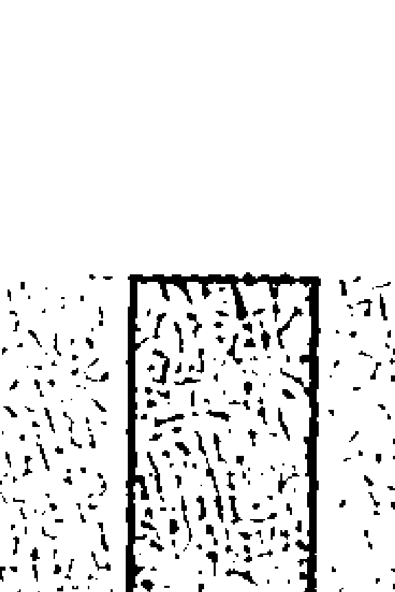

於是西方的醫學研究人員，開始用生理測量的方式探索這些功法的效益，結果很明顯，確實都能提昇柔軟度，是讓人更加放鬆的有氧運動。打太極拳的長者能改善平衡感，比較不易跌倒而改善生活品質。

雖然這些功法的原始目的是在深化靈性，但是傳到西方後，我們以科學方法從生理角度切入，了解到這也是一帖身心良藥，而且它們產生的能量灑漫全身，可以為細胞所用，當然，也能為我們所用。

#### 能量場

練氣功時我們會產生氣場。

不知道各位有沒有經驗，走入某個空間時，突然覺得令人不快的「奇怪氛圍」，或非常溫馨的寧靜？你的經驗就是你感應到那個空間的能量。當你走進焚香燃燭的大教堂，裡面有上百人在默禱，你立刻感受到聖靈籠罩，或你走進喧鬧夜店，裡面煙霧瀰漫、人影雜沓，震耳欲聾的能量撲到你身上尖叫，這就是所謂的「场」。

一个人的静观打坐，和在团体中的感受截然不同。吟唱或持咒，一个人的声音，与在团体中被所有的声音笼罩，感受更是天差地别。与别人一起祷告，我们发出的愿力强大，整个觉受经验更澎湃。这就是气场的效应。

倍受尊崇的生物学家鲁柏·谢德瑞克（Rupert Sheldrake）提出一个广受争议的理论，但我觉得真是眼光独到。他认为能量场弥漫整个地球，可称之为「形态生成场」（morphogenetic field）。

他用「结晶化」的效应具体说明形态生成场理论：在实验室新合成的分子，要好几个月的时间才能结晶，形成新结晶体。

有了第一次之后，往后世界上任何地方的实验室，用同样的化学分子合成结晶，结晶化的实验时间大幅缩短。

这并不是因为第一家实验室公布他们的技术，让别家实验室仿效而缩短结晶的流程，而是分子本身透过能量场「学习」如何结晶，因此缩短结晶化的时间。

#### 細胞的靈性療癒 Secrets of Your CELLS

我在教氣功時，有一套特別難學的動作，必須花好幾個星期，學員們才能學會。但是，自從這個第一次之後，我在全國各地教學，學員們學習的速度加快，而且愈學愈快，到後來學員不到一星期就學成，這個現象令我非常驚訝，因為我的教法一模一樣，所以我同意謝德瑞克所說的「形態生成場」，透過事件的重覆，全球的「場」發生改變，學習變得更順利。

中距離的跑者羅傑·班尼斯特（Roger Bannister），是全世界第一位在四分鐘內跑完一英里（約一六〇九公尺）的飛毛腿，這可是百年內自從有賽跑紀錄以來的第一次，可說是不可能的任務。

可是自從紀錄一破，開始有愈來愈多跑者達成這個百年不可能的任務，甚至還有跑者再破紀錄。這會不會也是能量場改變，塑造出人類新能力與新可能性的形態生成場？

我們每個人都可以創造能量場，因此，在地球上某一個地方的學習與行為，影響地球其他地方的人類學習與行為。

這是看不見的能量，是無限的奧秘，是我們目前所無法完全了解的穿透性力量。

是的，人人創造能量場，名稱為何並不重要，只要是活物，身上一定有電磁場。

記得初學氣功時，老師帶我們戶外教學，地點在可以俯瞰太平洋的大樹林。他要我們每人選一顆樹，站在樹前，伸出手採氣，然後測氣——感覺樹木每個部分的不同氣場。我非常驚訝，因為我真的感覺其中有別。

接著，老師拿出一些紙袋，放入我們不知道的某種物品，要我們感覺袋中物的能量，大家半信半疑測了老半天仍不知什麼名堂，老師親自示範後告訴我們，袋中的薑與蒜是「熱」能量，蘋果是「冷」能量。這一課真是令人大開眼界。

這是氣，或形態生成場發揮作用？我說不上來，但是這項經驗卻向我證明了一件事，每件東西都有獨特的能量簽名，只要我們願意相信、願意接納，就能注意到能量簽名的存在。

我就站在紅杉樹前祝禱，感覺非常空靈、平靜，這是在家中祝禱所不曾有的感覺。

這些紅杉，整個紅杉林，還有大海、太平洋，我的小花園、我的寵物，這一切都跟我們分享相同的能量，我們應該停下腳步、多花一點時間與它們相處，認識它們，擁抱它們，感謝這個上天所賜的珍貴禮物。

#### 神聖能量

探索生命能量的另一種方式，或許是檢查死亡的那一刻發生了什麼事。

如果你們跟我一樣，曾目睹至愛的人離你而去，一定明瞭那種難以磨滅的印象與感覺。

前一分鐘，親愛的朋友還好好活著，下一分鐘卻沒有了呼吸，全無生命力。曾經閃亮的眼睛閉上了。他身體內的細胞與分子沒變，但是，曾讓他活著的那股「神聖能量」消失了。

死亡的那一刻是悲慘的，也是神聖的。是否因為靈魂賦予了生命能量，我們才活著？

當生命之火熄滅，有人想知道生前、死後的重量有沒有變，是不是有什麼東西逃逸了？

測量結果顯示，重量還是一樣。

精細的靈魂、生命的能量，不可能有重量，當它讓一個人活著，我們才能感受它的存在。

我的好朋友「阿爾羅瓦」的妹妹問了一個很深奧的問題，「他死後會去哪裡？」，她想知道，但我不知道，只能詞窮以對。同時我也很想知道：推動他那個小身體的力量，究竟是什麼能量？最後到哪裡去了？也許，E=MC² 是條線索，他的生命能量轉化，變成「光」。這些問題，科學永遠不可能提供答案，我也不想追究，我只知道，我們活著時，所擁有的只有選擇當下，及充斥在我們細胞中的神聖能量。我們在活著時使用能量、投資能量；在活著時散播愛、分享愛，最後在離開時留下愛。在生命的短暫旅程中，我們選擇愛人，關心別人也關心這個星球，並相信肉身死後，我們的神聖能量還能一代代傳承下去。為了感謝這個世界，為了讓整個宇宙活潑歡笑，我們以善意與恩惠回報。死亡的星辰送來基本物質；樹木與植物供應我們氧氣與食物；朋友與家庭溫暖我們的心，滋潤我們的靈魂。

> 我們天天接受這些奇蹟的禮物，我們的細胞因此而震動，產生能量產生智慧；我們也因此而感動，在神聖中感恩、回饋。
>
> 活物皆有能量。活的有機體在環境中展現能量……展現在身體的行為與行動上。
>
> 死亡時，身體的能量釋放出來，能量以其他的形式繼續存在。能量流動……是宇宙大流的一部分，你的能量在你死後仍將繼續流動，以各種新的形式無止盡流動。
>
> ——魯柏·謝德瑞克，《大自然的重生》(Rupert Sheldrake, 《The Rebirth of Nature》)

## CHAPTER 6

### PURPOSE—CREATE

我們的信念，可以改變基因

設計藍圖、細部指令，及如何建造你的工作命令，如果白紙黑字寫在紙上，恐怕相當於一千冊的百科全書。最不可思議的是，你身上的每一個細胞，都有這一套百科全書。

> ——美國天文學家、科幻小說家卡爾·薩根，《惡魔出沒的世界》（Carl Sagan，一九三四—一九九六，《The Demon Haunted World》）

這一章我們將深入探索基因所扮演的角色，也要討論基因與DNA這些當代文化圖像，與古代的形上學關係，時至今日，這些形上訊息仍有相當大的啟示。在科學家還不了解細胞膜與細胞骨架的智慧之前，基因——密碼資訊的聖經——是當然的代表。但是，基因很被動，在被啟動——被分子、細胞骨架、環境、心靈、運動啟動之前，什麼也不做，真的是一事無成。還記得第四章介紹，基因可以決定細胞是要選擇複製，或選擇成長。基因雖然攜帶複製與成長的訊息，但一次只能選擇一個：不是複製，就是成長。當然，不管怎麼選擇，最終都毫無選擇，只有一條不歸路——死亡，死亡也編寫在基因密碼裡。細胞裡的DNA藏有身體建築的線索，及神秘的生與死密碼（圖6-1）。

#### 「闡閉」癌症基因

這幾十年來，我一直為DNA的神妙驚嘆不已，無論是從科學、藝術，乃至於形上學角度，充滿好奇與興趣，我是攝影愛好者，早期的藝術作品幾乎都是透過顯微鏡捕捉DNA螺旋分子的美麗身影。

另一方面，身為研究室的科學家，我不斷探索能否改變細胞中的基因密碼。因為看到接受化療或放射治療的患者，癌症還沒有醫好，副作用卻帶來災難，身體更加衰弱，我急欲尋求另類的治療方式：讓癌細胞重歸正常，而不是殺掉它們，並以健康的細胞陪葬——我們可不可以用不同的方式重新設定癌細胞？而且我們用的是簡單、天然、溫和的物質？

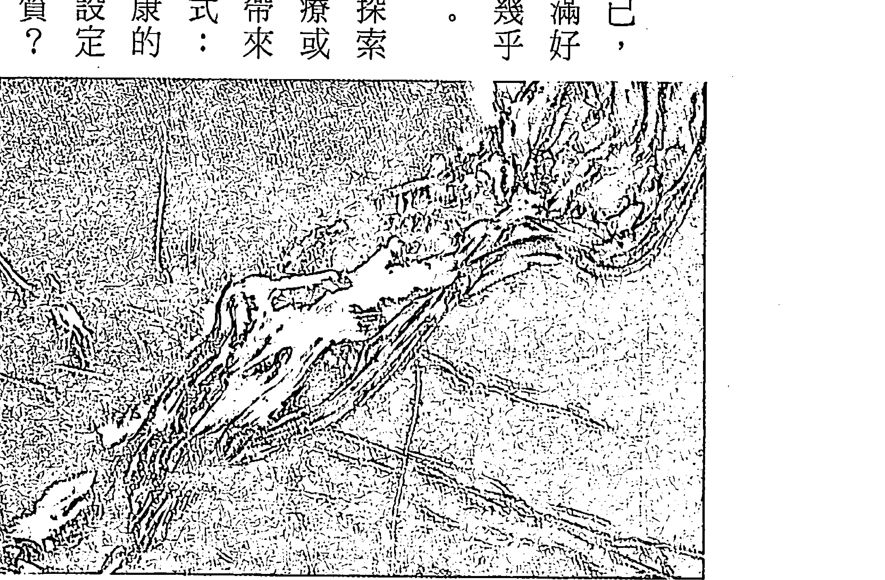

科學基礎，並從細胞的層面運用我的發現，對付癌症。
於是是我調轉船頭，離開基礎科學研究——這個決定我自己也很驚訝——開始探索被標簽為「不科學」的古代治療方式，希望幫助癌症病人。當時我的目標是：找尋古代療法的

更多的延伸研究與更深入的精準研究必須執行，可是其中卻牽涉到放射性的研究，這方面我不是內行，而且我本身也不願涉入。

確實慢慢回復正常細胞的特性。
我的研究顯示，人類某些惡性的白血球細胞，如果用溫和的化學藥劑與荷爾蒙治療，

人興奮的好消息，因為用我的這些觀念研究、治療癌症，在一九八〇年代初期並不普遍。
同事們紛紛勸我放棄這個「整體研究」。然而我卻收到全國癌症學會的贊助。這是令人

癌症基因的開關「關掉」，並把健康基因的開關「開啟」？
就我們目前的了解，基因有兩個基本型：攜帶建構訊息的基因，與調節細胞成長的基因。在癌症的案例中，我希望找到方法，改變調節基因的程式。換個方式說，可不可以把

於是，我開始臨床面對癌症病人，而不是在實驗室面對癌細胞，然後，我的關注焦點又再次轉變，希望找到方法提昇人的生命品質，無論癌細胞有沒有惡化。是的，在疾病纏身的情況下，如何讓人的生活過得更好？

在這同時，許多科學家繼續在細胞層面的研究披荊斬棘，而且屢有新突破，有效造成惡化細胞的基因改變，我們在這一章也會介紹這方面的成就。

#### 展現自己的時候到了！

繁殖是眾多的生命需求之一，細胞也需要繁殖，它們的繁殖就是複製，複製的流程是由細胞核負責管理，同時也負責協調細胞的其他部分。

在複製之前，基因必須從核膜、細胞骨架的協調活動中接收到訊息，這個訊息告訴基因：「展現你們自己的時候到了！」

神聖細胞的核心就是細胞核（nucleus），內含有機體的遺傳指令，那就是基因。

三十多年前，科學家開始「人類基因體計畫」（Human Genome Project），對人類所有的基因進行解碼與分類（基因體就是人類全部的基因碼），人類的基因體包含了大約二萬五千到三萬個基因。
但，老鼠的基因體有二萬五千個、迴蟲一萬九千個、大腸桿菌約五千個基因。

| 名詞 | 解釋 |
| :--- | :--- |
| 細胞核 | 細胞內由核膜包覆的區域，是遺傳訊息的聖殿。 |
| 基因體 | 一個物種的整體基因訊息。 |
| 基因 | 遺傳訊息的基本單位。 |
| 染色體 | 細胞內含有遺傳性質的物體，由核蛋白組成。人類有四十六個染色體。 |
| DNA | 長線型的螺旋分子，內有生物訊息的基因密碼。 |
| 遺傳密碼 | 由三個一字一組成一組序列，形成密碼，寫在DNA螺旋上。 |

#### 生命的基礎設計

基因是DNA的基本語言，基因包含了身體所有蛋白質合成的指令。蛋白質是複雜、大型的分子，由較小的次級單位——胺基酸——所組成。蛋白質調節細胞的活動、建構細胞。我們的頭髮是由蛋白質組成的，唾液中的酵素也是，才能把吃下的脆餅化成有益人體細胞的養分。蛋白質是調節器、是訊息快遞，也是身分標記與受體。沒有蛋白質就沒有生命。人體內包含了十萬種以上的不同蛋白質。

每一個基因「包裹」不同的密碼，指揮身體的成長與運作。

「結構基因」（structural genes）決定你的長相、眼睛的顏色；決定你的身高、鼻子的形狀、頭髮的角質、皮膚的膠質……。

「調控基因」（regulator genes）會告訴細胞什麼時候該成長、什麼時候該停止成長。此外還有「停止／開始」的基因，發出特定訊息指示某個系列的運作啟動或停下來。

#### 細胞的奥秘探索 Secrets of Your CELLS

在人类的基因组（genome）之中，百分之九十八的遗传物质没有明显的功能，剩下的百分之二负责控制所有的蛋白质。过去，这些无码的遗传物质被称为「垃圾DNA」，不过最近科学家开始研究，想知道其中是否另有玄机，毕竟垃圾好好处理也可能变成黄金，非常环保。

更何況上天所创造的东西，天生我必有用，恐怕只是我们知识不够的误解吧。

身体内的所有细胞含有相同的DNA与可以识别的遗传信息，但成熟的红血球例外，因为它的细胞中无细胞核，也就没有DNA。

以想像，所有的基因就是一本电话簿，染色体就是电话簿的其中一页，遗传密码就是每一页中的文字。

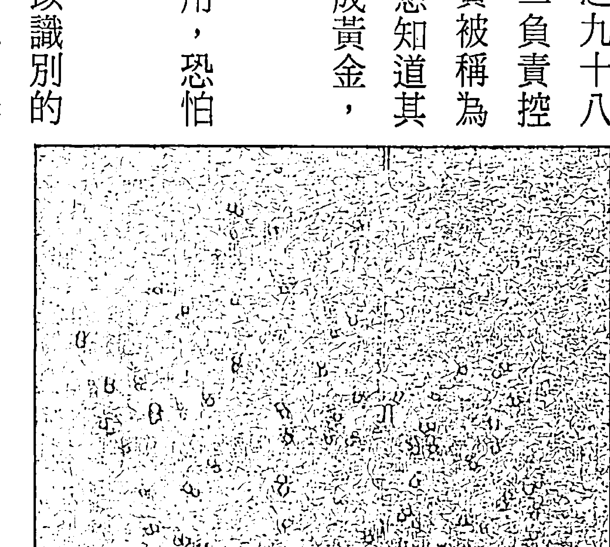

△图6-2：46个人类染色体。每个染色体尾部的亮点就是端粒（telomeres）。

基因在染色体上直線排列。人體細胞含有四十六個染色體。染色體都是成對的，基因亦然；其中一半來自父親，另一半來自母親。每一個人都有二十二對「常染色體」（non-sex chromosomes，與性別的決定無關），及一對「性染色體」，決定性別：X基因與Y基因。兩個X基因因為女性，一X一Y則為男性。當細胞開始分裂，染色體組織起來，沿著單元中心複製，並共享一個區間。

#### DNA的神聖設計：分子的一夫一妻制

長螺旋的DNA斷片就是基因，基因提供特定蛋白質的合成藍圖。DNA是雙股螺旋的分子（圖6-3）。

雙螺旋分子更堅固，比單螺旋更不容易摧毀。

每一個人體內的所有DNA，如果頭尾相接，總長度大約一百一十億英里，相當於地球到太陽的距離，來回六十趟！

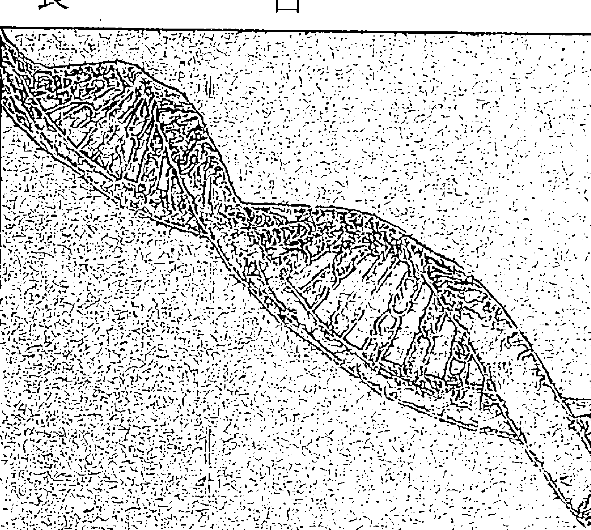

△圖6-3：螺旋DNA，兩股螺旋中間的連接線就是一對鹼基。

#### Secrets of Your CELLS

聖經中提到雅各的天梯（Jacob's ladder），從地面伸展直通天上，上帝的使者藉此天梯來來去去。雅各夢見的這個梯子，是因為看到雙螺旋DNA嗎？「雅各的天梯」這個影像對猶太人而言有重大的象徵意義，對基督徒、回教徒亦不例外，那是接通上帝與靈魂的通道。

當代的科學知識讓我們知道，DNA也能通達「天上」，直抵太陽，也許這正是隱藏在細胞中的神聖秘密之一。

DNA是藍圖，因此，它的設計必須非常正確。DNA是由四大建築磚塊建構成的，這四大建築分子稱為「鹼基」（nucleotide bases），它們的名字分別是：

- A：腺嘌呤（adenine）
- T：胸腺嘧啶（thymine）
- C：胞嘧啶（cytosine）
- G：鸟嘌呤（guanine）

DNA携带的碱基不同，就有不同的编码，制造不同的蛋白质。

这里我们又看到一个化学互补的实例：这四大建筑砖块是『一夫一妻』的，每一个碱基只能有一个固定伴侣。如果双螺旋上的一个螺旋的碱基是T，对面螺旋的伴侣一定是A。同理，碱基G的伴侣，在另一螺旋上必定是C。这个配对绝无例外。

配对错误的后果就是疾病，但之前会先启动修护系统，让不对称的伴侣『分手』。

这种固定配对的方式，有一个很大的好处，就是可以快速侦测到乱点鸳鸯的错误，因为错误配对的地方DNA会『打结』，这时候修护基因，就会立刻冲出去抢救。

#### 完美的编码编排

分子的一夫一妻与双螺旋结构，这样的设计是在确保DNA的完整性。

把DNA当做是一座盘旋弯曲的楼梯，一边的阶梯，必须与另外一边完美配合，才不会歪斜。

等於是梯子一邊帶有遺傳指令的鹼基，必須要有對面伴侶的互補配合，才能形成完整的遺傳組序。

我們先隨便想一個遺傳碼：ATAGCTTT，那麼，對面伴侶互補的編碼必定是：TATCCGAAA（別忘了它們是一夫一妻關係）。大自然的神聖智慧讓這兩股鹼基完美結合在一起。

> 這個世界的整個基因庫……每樣生物的結構，都是那麼剛好，不可再減少……剩下最終極的四……非常簡單卻意義深長的密碼訊息。
>
> ——美國化學家、小說家卡爾·傑拉西（《Carl Djerassi》）

四個鹼基——A, T, C, G——組編的遺傳密碼在生命世界通行無阻。無論是蜜蜂或河馬，橡樹或蚊子，地球上的生物採用同樣的編碼系統。不同的編碼排列，讓我們成為人，或變成老鼠。

DNA的密碼是由「A, T, C, G」中任取三個鹼基，構成一組「三聯體密碼」（triples）或稱為「密碼子」（codons），因此我們說遺傳密碼是由三個「字」組成的。

一個密碼子決定一種胺基酸，人體內的胺基酸種類大約二十種。密碼子取A,T,C,G任意三個字為一組，整個排列組合共有六十四種可能性。因此，密碼子除了提供訊息組成二十種胺基酸外，還提供「開始／停止」的訊息，告知從什麼地方開始讀取訊息，讀到什麼地方停止。

底下是一個DNA的閱讀組序，與三個字組的密碼子舉例：

```
`AAAATGCGTTCG`
```

細胞所讀取的密碼子是：

- AAA
- ATG
- CGT
- TCG

正確的互補鹼基為：

- TTT
- TAC
- GCA
- AGC

錯誤的對應變成：

- GTT
- TGG
- GCA
- AGA遺傳密碼有一個自然法則，就是每一個物種會把新的DNA視為是自己的，然後不斷複製數百萬個基因。這個現象等於讓病毒有機可乘。病毒感染的方式就是把牠們的遺傳物質注入人體細胞，讓我們的細胞機制複製這個新的遺傳訊息，產生更多病毒，造成危險疾病。

#### 細胞內的易經

三聯體，共有六十四種排列組合，奇妙的是，古代的「占卜天書」《易經》，卦爻也是「三聯體」，組合成六十四卦（圖6-4）。

遺傳密碼與易經的六十四個組合，是天地間的「巧合」嗎？或古代的形上學系統與細胞的互通感應？細胞學與形上學這兩套學問，果然是一陰一陽之謂道？

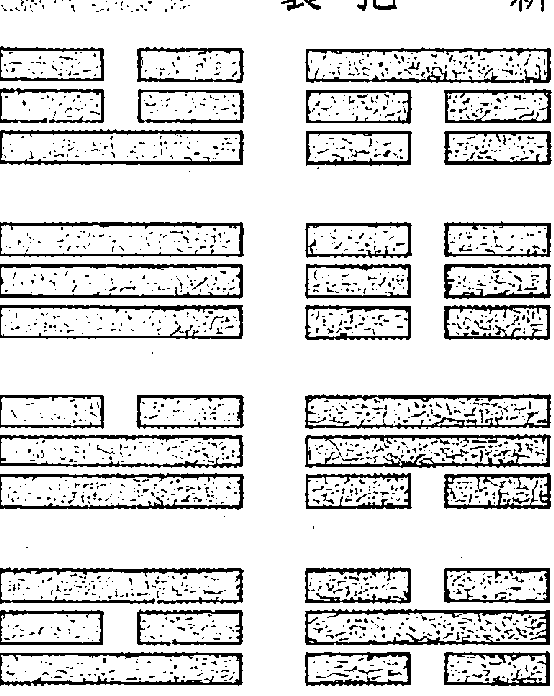

圖6-4：八個「三聯體」就是易經的八卦，一條直線是陽爻，象徵「創生」；一條斷線是陰爻，象徵「廣納」。每個「三聯體」代表一種自然現象：天、地、風、雷、水、火、澤、山。兩個三聯體相疊，形成一個卦。

#### 我們的信念和態度，可以改變基因

身體的每一個細胞都有相同的基因，也都有相同的遺傳物質。基因與蛋白質的不同指令，造就了不同的細胞。但是幹細胞卻能使用所有的遺傳訊息，因此有可能變成任何的細胞類型。

幹細胞所處的分子環境，將決定它們變成血液細胞或腎臟細胞，還是變成心臟細胞或骨頭細胞，一旦變形成型，就不可能再變為別種細胞。

骨髓中尚未成熟的紅血球細胞，只能發展為成熟的紅血球細胞，不可能逆轉，變回幹細胞，或變成白血球細胞。只有紅血球細胞才能製造血紅蛋白。皮膚細胞，雖然內含製造血紅蛋白的遺傳訊息，卻無法製造任何血紅蛋白。

腎臟細胞的原廠設定與心臟細胞很不一樣，雖然兩者都有相同的遺傳指令，也有正常細胞都有的過濾器：允許特定訊息進來，對某些密碼開放，其他一律擋駕，或忽略。

換句話說，每一個細胞都能防止某些遺傳訊息被啟動。為什麼細胞懂得煞車，不讓某些訊息表達出來？這可是當代非常熱門的研究主題，同時創出一個新概念，稱為「表觀遺傳學」（epigenetics），簡單說就是：環境可以修飾基因的表達。「表觀遺傳學」指出：遺傳密碼雖然無法改變，但是基因卻可能被飲食、藥物、生活形態所影響。翁尼許博士（Dr. Dean Ornish）從表觀遺傳學的角度切入，研究男人的前列腺癌。改變生活形態的男士，包括吃素、減少生活壓力，獲得社會支持等等，三個月後，檢查發現，前列腺的癌基因發生明顯改變，這些癌基因的「啟動率」，降得非常低。這些針對動物的研究顯示，外部的變動會影響基因，而且遺傳的指令會發生改變，甚至影響後代子孫。例如，母親在懷孕期間的飲食，會影響後代的基因表達。最有名的就是杜克大學的刺鼠實驗。刺鼠是圓圓胖胖的黃色齧齒動物，他們有很特別的刺鼠基因，繁衍的下一代往往有癌症與糖尿病傾向。

研究人員在母刺鼠懷孕時就改變牠們的飲食，結果生出來的小刺鼠，基因沒變，卻很健康，變成精瘦的棕色小鼠。母刺鼠攝取的飲食富含簡單的調節分子，這種調節分子可以在大蒜、洋蔥、甜菜中發現。DNA的調節分子稱為「甲基供給體」（methyl donors），包括膽鹼、甲硫胺酸、葉酸，我們的食物與營養補充品都有這些東西。醫藥人員長久以來一直鼓勵懷孕的婦女多攝取葉酸，讓小寶寶的頭腦發育更健康，確實有其道理。表觀遺傳學的研究令人非常興奮，因為它提供證據，讓我們對生物的遺傳有了全新的認知：人不是被基因決定的。致命的遺傳性疾病，不必然會傳給下一代，只要我們願意學習，做出有效改變。基因不是永遠不變的，正好相反，基因對改變這件事，是保持開放態度的。我們的生命線，不是由基因操控，反而，我們的生命線與細胞骨架的絲線，可以改變基因的命運。總之，表觀遺傳學告訴我們一件好消息，基因與遺傳密碼的實際結構無法改變，但是它們的表現可以改變。

#### 身體祝福：伸展我們的DNA

站著，面對讓你感到美麗的東西，或是閉起眼睛，感覺自己的雙腳穩穩站在大地之上，感覺你的腳底完全接觸大地。你的頭部堅挺，脊椎挺直。現在舌抵上顎，這叫「內在的微笑」。

現在，開始脊椎運動，以腰部小幅度轉圈，先順時鐘方向轉幾分鐘，再換成反時鐘方向。沒多久你可能覺得背部也隨著轉動。呼吸很放鬆、很自然，轉圈時不必計數，專心在轉圈上，你可以低哼「mmm」，安撫細胞也安撫自己。這時候你也可以想像，現在的動作可以產生能量，可以減少壓力，也可以修改DNA的錯誤。直到你覺得練習夠了為止。

感覺雙腳依然穩穩踩在地上，有如生根一般，也宛如通向天際，天地一體，雙手手指交叉置於腹部，表示感謝這一切。以上的練習是基礎的氣功動作，有空的話多練習無妨，能讓你的細胞接天通地，也讓你與細胞接通，人、細胞、天、地，合而為一。

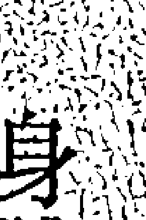

#### 細胞的自我修正和自殺程式

每一天，人體內的億萬細胞不斷分裂，製造新細胞。細胞分裂時，DNA也不可能開著，它們的雙螺旋鏈伸展、分開，完整複製出去，包括所有的遺傳密碼。這時候錯誤會發生，『三聯體』的字母可能漏掉、添加，或放錯字，這種錯誤就是『突變』（mutation），造成胺基酸的改變，也改變蛋白質的形狀與功能，讓蛋白質無法正常運作，結果影響細胞健康，也不能保護或修護細胞。所幸天縱英明，大自然是智慧的，我們的細胞早就有內建多重的維修系統。大致上，我們的細胞不會出錯，但偶爾還是會有漏網之魚。我們的細胞一天出錯的次數大概一千次左右，雖然不算多，但是老天有眼；DNA螺旋上設置辨識錯誤的機制。當錯誤或損害出現，立刻觸發『P53基因』出動搶救。P53系統是細胞成長中的『檢查員』與『煞車器』，它也可以命令其他基因。當錯誤被檢查出來時，P53基因下令其他基因不得繼續複製，直到DNA被修護。一旦受損的DNA被修好，P53基因亮起綠燈，允許細胞再度複製。

如果受損的部分無法修護怎麼辦？基因只能忍痛犧牲，命令細胞「自我毀滅」，這就是所謂的「細胞自殺程式」（programmed cell death），或稱之為「細胞凋亡」（apoptosis），apoptosis 這個字來自拉丁文，意思是「飄落的樹葉」，傳神描述了細胞溫和的慢慢死去，就像樹葉凋零後隨風飄落，在大地上逐漸枯萎死亡。

「細胞凋亡」與受傷或壞死的「細胞毒素死亡」很不一樣。樹葉凋亡後回歸大地，成為養分滋養掉葉的樹木。凋亡的細胞也會被吞噬細胞回收再利用。而細胞壞死的毒素死亡，是細胞損傷或爆裂，內容物釋放到細胞環境中，因為釋出的物質可能具有危險性，會損害周圍組織。

細胞本身有非常多的物質，一旦裂解，其中壞死物極可能傷害別的分子。而「細胞凋亡」是緩慢的過程，允許鄰居回收或掃除細胞殘片，一步一步做環保的結果，讓附近沒有災損。

總結 P53 的角色特徵，那就是「損害控管」，有能力改正基因的錯誤，避免 DNA 的錯誤擴大，抑制腫瘤細胞成長，必要時命令細胞「計畫性自我毀滅」。

總之，細胞真的非常有智慧，有無數的支援系統，確保族群的健康與生存。

#### 每個細胞都自知「終須一死」

正常細胞不可能長命百歲，死亡是正常與必要的功能。

「細胞凋亡」就像古代皇帝對臣子的「賜死」，目的在確保正常細胞的發展。例如胎兒的身體發展出來後，這時「細胞的計畫性死亡」對沒有必要的「鰭細胞」賜死，消除之，否則人手可能變成鵝掌。

「細胞凋亡」也會消滅胸腺中的免疫細胞「叛徒」，這些反常的免疫細胞會攻擊自己；此外，不和其他細胞聯繫的自私腦細胞，也會被賜死。

另外，受損而無法修護的細胞，也會被要求「切腹自殺」，一切犧牲都是為了細胞族群的最大利益。

#### 細胞的靈性療癒 Secrets of Your CELLS

由此可見，每一個細胞都有自知之明，知道自己終必一死，但是不正常的細胞卻無此自覺，「忘記」終將死去的命運。

細胞世界有多種策略清除不健康的細胞，當中P53基因不是唯一的權威。條狀染色體的「端粒」也能調節細胞的死亡（第210頁，圖6-2）。端粒是DNA重複序列組成的珍珠串，它們是一種死亡倒數計時的分子時鐘。每一次細胞分裂，「珍珠」就少掉一些，讓染色體縮短。

出生時，人類白血球細胞內的端粒長度，大約是八千核苷酸單位，到年老時，可能僅剩一千五百單位長度。

基本上，正常的細胞可以分裂五十至七十次，每分裂一次端粒就縮短一些，最後端粒的珍珠串縮得非常短，無法通過細胞內部的自我檢查，被認定為受損或衰老，終於不再分裂，在安靜中結束一生。

#### 航向未知的旅程

讓我們稍稍暫停，思索一下自己的死亡。西方文化常把死亡視為某種失敗，而不是生命的自然結果。

其實人人都知道，任何事物都有個『起頭』，過渡到『中間』，最後『結束』，生命也是如此。不錯，我們害怕死亡；然而只要透徹了解，這是無法避免，是很溫柔的自然歷程，很可能我們更能寬心以對，減少恐懼，不是嗎？

長久以來我一直幫助兒童面對死亡，我必須不斷檢視自己對死亡的預設、信念與恐懼。這個自我檢視的能力來自我對薩滿的修煉。

西元一九八九年我與薩滿老師品克森一起在舊金山教課。我負責身心科學的知識傳授，而他帶領大家做古代原住民的薩滿修鍊。其中一項是死亡之旅的練習體驗，我練過多次。每次上課的前一週，他會預告，要大家事先有心理準備，大多數人對這個練習沒什麼興趣，所以也沒什麼好準備的。有一次上課之前，海灣地區發生大地震，課表進度完全亂了套，死亡之旅那一班只好由我頂著代課，這可是我第一次帶領。完成整個練習後，想不到討論非常熱烈。其中一名人體免疫缺陷的男士承認，起先一點也不想做，因為他可能是全班距死亡最近的人。但是體驗了自己對死亡的恐懼後，反而放鬆，寬心不少。另一人說，這次體驗讓她想開個派對，慶祝生命。現在我貢獻這個練習，最好能有半個小時的清靜時刻，才能深入自己內心。雖然練習時最好有鼓聲相伴，沒有鼓聲的簡易版也沒有關係。這是一個回歸內在的練習，必須找一個完全不被打擾的安全場所，也要準備書寫或繪圖工具，方便記錄心得。記住，你的經驗不會帶來任何傷害。請坐下或躺著，眼睛閉起來，專心呼吸，注意呼吸時胸部、腹部的起伏，吐氣——吸氣。感覺安全，很平靜。想像你的生命剩最後幾分鐘。你在什麼地方？有誰陪伴？請用心靈之眼創造這一切。想像你的呼吸停了，也不再心跳。你的靈魂離開身體，你的意識飄浮在上，看著下面的一切，你看見自己，也看到所愛的人。你可以停留在這裡，傾聽發生了什麼事。當你準備好，可以切換場景來到自己的葬禮中，你在上面飄浮著，目睹親友齊聚舉行儀式，這是什麼地方，有些什麼人，他們在說什麼？現在看看你的訃文——上面寫什麼？讓自己有充裕的時間體驗這一切。當你覺得可以了，把注意力拉回到呼吸，注意自己的心跳，感覺很放鬆，充滿生命力。很好，把你的感覺寫下來或畫出來。

#### 癌細胞只是轉化細胞

這種小偏差造成的後果。任何正常程序難免會有點小差錯，就像電腦偶爾也會當機，在細胞世界中，癌症正是這種小偏差造成的後果。有趣的是癌細胞常被稱為「轉化細胞」（transformed cell），就心靈的角度而言，「轉化」這個字常常是正面的。有些細胞轉化成癌症的人已經開始數日子，也排定生活優先處理的事項。雖然這些作法很不得已，也令人同情，卻也反應出癌症對我們的威脅性。不過，如果能從正面的角度看，那些轉化的細胞，也有可能不是要殺死我們，而是要提供某些新的訊息，改變我們的生活。

那麼，正常細胞如何轉化成癌細胞呢？

癌症的生成基本上都是細胞內部生變，例如遺傳密碼出錯，這種情形常發生在細胞分裂時DNA複製出狀況。遺傳密碼出錯也可能是由有毒化學物質造成的，或放射線、病毒、吸菸、其他致癌物。偏差的遺傳訊息將造成畸形成長、惡性轉移，終身被腫瘤細胞紊亂生活。

#### 躲避檢測

單一的基因突變不見得會把正常細胞轉化為癌細胞。大多數的癌症都是基因的多重錯誤而發展出來的，那是調控基因中一系列基因突變的後果，調控基因包括：癌症基因（oncogenes）、腫瘤抑制基因（tumor suppressor genes），這些基因刺激細胞成長，抑制腫瘤擴散。

突變將改變細胞的調節與溝通功能。這是為何癌症的生成難以檢測的原因，因為基因的突變都是日積月累造成的，有可能經過幾十年的基因偏差才發展出癌症。

癌症很少遺傳。雖然乳腺癌的BRCA1被懷疑與遺傳有關，但並不是百分之百確定。大多數的乳腺癌發展，都是基因「多重錯誤」造成的。同樣的道理，結腸癌也是腫瘤抑制基因出問題所致。

各位還記得嗎？身份標記就是細胞的「臉」，免疫系統的戰士們看到的都是熟人，而不是陌生人的臉，自然不必防衛或展開驅逐攻擊，基因修護系統因此按兵不動。結果讓癌症不斷坐大，DNA修護機制依然無關痛癢，不動如山。

我們稍早前曾介紹「P53基因」是檢查員，扮演搶救基因錯誤的角色，但水能載舟亦能覆舟，當P53發生突變，檢查能力立刻消失，不僅救不了正常基因，反而允許異常的細胞擴展地盤。

#### 細胞的靈性原創 Secrets of Your CELLS

實際上，人類過半的癌症都驗出突變的P53，而且，突變的P53甚至保護癌細胞，讓癌細胞避免被消滅。因此，如果癌症驗出P53，後果更嚴重，必須採取更為積極的治療。

造成P53突變的因素很多，最常見的就是抽菸。抽菸者比不抽菸的人，更容易造成P53的反轉而產生肺癌。不過希望還是有的。一個成年開始抽菸的人，一旦戒菸，異常的P53就會消失不見。也就是說，如果是二十歲以後才開始抽菸，抽菸的傷害是可以逆轉的。

可是如果學會抽菸時的年紀太小，例如青少年時期甚至更早，那麼很不幸，基因的傷害可能是永久性的。

癌細胞不見得會完全被殺死，因為依然有不正確的溝通與不適當的修護系統，無法識別癌症的危險性。

未來是否會出現更先進的生物學或醫學發展，或更成熟的身、心智慧，進行全面的內在療癒，減緩這些問題？我們可以透過什麼方式介入，讓基因不要製造那麼多錯誤？

這些都是明日的希望。但是我們現在很確定一件事，就是想要好好保護基因的話，我們的壓力一定要減少。

#### DNA修護觀想

DNA的修護速度，影響疾病與癌症的損害程度。長期的壓力減緩DNA的修護能力。中國有一項大規模的研究，探討如何改善DNA修護速度，研究結果帶來多線曙光。

研究人員發現，罹患癌症但病情減輕的人，DNA修正錯誤的速度，與健康人士相比，仍然緩慢許多。這些病情減輕的人開始學氣功與降低壓力的技巧，三個月之後，他們細胞的修護速度增快將近兩倍。

研究證實，「新」能量醫學，包括氣功與聲音振動，可以影響錯誤的DNA能量。古代的氣功、太極拳、瑜伽，及苦行僧的旋轉舞，都運用螺旋運動，化為治療能量，極可能因此讓損耗的DNA重新歸位？長期的壓力損害我們的免疫系統、生殖系統、消化系統與記憶力，甚至傷及骨骼。這也是為什麼降低壓力的技巧，包括靜坐、觀想，對我們的健康有很重大的幫助。

#### 消除不健康的細胞

觀想或引導式想像可以做為補助治療，特別是降低壓力、減緩疼痛，現在愈來愈多人願意接受，而且可以施用在正受癌症之苦的病人身上。大量的明確資料顯示，被診斷出癌症的人心情低落，或因為化療所產生的副作用，在練習引導式想像後，許多人的症狀減輕，心情好轉。

有一個很流行的觀想劇本是，教大家想像免疫細胞擔任除惡務盡角色，幹掉害人的癌細胞。但是就我們的了解，免疫細胞並非「除魔」的主角。如果我們願意觀想一個全新的螺旋模型，修正錯誤基因，效果可能更理想吧？

底下我提出兩個不同觀想版本，消除體內異常細胞。我只是建議，更重要的是各位無限的想像力。

放鬆，專注在呼吸上，感覺身體上接觸的地方，包括椅子、地板、坐墊⋯⋯等等。你的呼吸愈來愈平靜。如果體內有癌細胞，想像它們的模樣，不必與生物學上的模樣雷同，而是你如何「感受」它們。現在開始觀想用某些工具消除癌細胞。我舉個例，想像癌細胞就像塵垢堆疊一起，而你拿吸塵器，強力的氣流把這些討厭東西吞捲而去。讓你的清除工具力量超強大，壓過腫瘤細胞！

當所有的異常細胞被清理掉，再觀想全新、健康的組織生出來。觀想時間隨個人需求而定，然後把意識拉回到呼吸，離開境界，重新回到生活常態。

#### 修護與覆蓋

我們的細胞難免出錯，因此體內總是有異常細胞存在，這個版本是集中我們的力量，改變異常基因。

#### 改變異常基因

跟上一個觀想一樣，放鬆……。現在觀想身體內的錯誤基因一一被改正。像雙螺旋的DNA搭配完美，移去或糾正當中的錯誤。

或者，你也可以想像新的蛋白質覆蓋在有錯的基因上，緊緊黏著讓它們不能動彈。引導你的想像，把異常基因移走，然後你的基因變得非常健康、非常完整。觀想時間依自己需求而定，然後回到呼吸，回到常態。接著，把你的經驗寫下來或畫出來。

我們的DNA是神聖的舞蹈師——雙螺旋結構安排的程式可以繁殖，也可以自我犧牲。有生也有死。這些深植於每個細胞內部，因此細胞都有能力偵測，並改正基因訊息的錯誤，如果無法改正，溫和的死亡機制——「細胞凋亡」，就會被啟動。

大家都知道，陽光的紫外線可以穿透人體，讓基因突變。另外，香菸中的化學物質會隨著呼吸進入細胞，改變基因結構，製造出錯誤的蛋白質。

如果不可見的媒介可以造成改變，帶來傷害，難道我們不能用自己的能量或觀想，也造成改變，扭轉傷害，或移除傷害的部分？古代的療癒方法，例如在「迷宮中行禪」（walking the labyrinth）或持咒，都能提供助力，轉化細胞出錯的傷害。

#### 生命的目的

每一個細胞都有目的，每一個細胞都有活下去的理由，為整個細胞族群做出貢獻。

把浮現心中的任何感謝都表達出來。

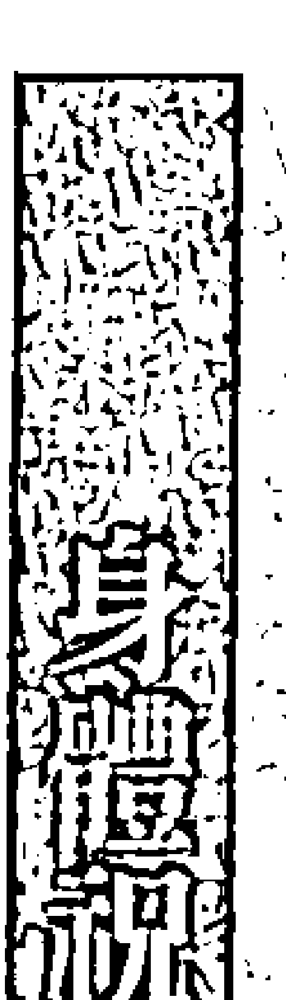

感恩

這是很簡單的練習，隨時可做。

以氣功的站樁開始，旋轉腰部與身體。

旋轉時，感謝所有的細胞照顧你、保護你，讓你活得健健康康。你們是一體的，是互相榮耀的合夥伴，共同創造你的生命。

> 艾克哈特·托勒 (Eckhart Tolle) 建議我們自問：「我要奉獻什麼給生命？」細胞的生命期有限，我們何嘗不是如此，靈魂離開身體就是我們的大限之日。離開之前我們該做什麼？

我們也一樣，每一個人都有目的，都有活下去的理由，為族群的繁盛做出貢獻。

我相信，每個人對這個世界都有回饋的遺贈，這也是我們來人間走一趟的理由。生命旅程就是找出我們該創造什麼，而且盡最大努力表現出來，利益眾生。

#### 靜心練習

- 我在哪方面最有創造力？
- 我心目中理想的細胞是何模樣？
- 我當前最主要的目標是什麼？
- 目前生活中，我在什麼地方見過螺旋狀東西？
- 在我臨終之前有什麼事必須完成？

## CHAPTER 7
MEMORY—LEARN

细胞不但是有记忆，也可以被教育

所有的记忆（创伤与欢笑）交织一片……在个人的传记之中，附着于身体的肌肉、组织、骨头里，也在时间更迭的生理节奏里。这些节奏还存在于更广大的灵魂世界里，由嗅觉与听觉系统启动。

> ——美国的音乐家、医生、教育家、音乐生死学家泰蕾丝·施罗德——谢克（《身心健康杂志》〈为濒死而做的音乐：新领域的音乐-Thanatolog〉）（《Advances：The Journal of mind body Health》）

### 设定「细胞记忆」

你曾经带着一颗破碎的心，在不得已之下，走进未知的世界吗？

我第一次为身体记忆松绑，当时是心碎的，而且满腔怒火。我无法克制内心风暴，好好工作，一直寻求方法让内心平静下来。

那时候，我接受邀请，向一些肿瘤学专家传授我觉得有用的治疗方法，及如何减轻压力。我很兴奋有这种机会，因为这些专业人士是实际照顾病患的临床工作人员。

邀请我的人是一名开诊所的肿瘤科医生——在一个礼拜前我们还是恋人，但邀约之后我们分手。非常尴尬的局面，现在该怎么办？照计划前往，还是取消？

我们稍微讨论，决定以专业为重，个人感情事小，因此照计划前去演讲，更何况那些专业人员已经期待好久了。

演讲的地方有数百公里远，在漫长的车程中，我边开车边生气，也很心痛、伤感。入住旅店后仍然恼火，心情恶劣，无法闭眼休息。我的情绪乱七八糟，很清楚，我连自己都快保不住了，怎么教别人什么治疗方法！怎么办？

当一个人生活平稳，也没有太多外缘干扰，心很容易就静下来，但是对刚刚经历感情波折的人而言，心情不可能很快回复。

演讲排在晚上，我还有一些时间可以让心平静，于是在海边散步许久，听涛声看海景，我还练气功、祷告、静坐冥想。过了好几个钟头，我必须承认，完全无效，我的心还是骚动不安。

没想到，在叹息声中，我突然灵光一闪，我想起带领病患团体的一种方法，平时很少用，但到了这种地步也只好姑且一试，反正再坏也不过如此了。

我花了几个钟头做练习，感觉愈来愈好，内心逐渐平静，心思也慢慢集中。真的有效，我又重燃演讲的热情。

经过这番波折，我不但重拾信心，而且觉得对这些肿瘤专家的技巧传授一定有更精彩的即兴发挥。

上课时间到了，我的内心依然保持稳定，特别是「他」意外现身时，我也平常心以对，太好了，不动摇的定力真是令人惊喜。

这次的经验告诉我，尽管情绪大风大浪，细胞仍然可以平静如常。因为我们的细胞可以设定记忆，影响肌肉甚至影响心灵。这正是这一章所要探索的主题。

这个细胞记忆的设定，我已经教过成千上万的民众，有些更是九一一事件的生还者。

这套方法有很大的治疗潜能，我提供出来，希望对大家有所帮助。然后我将从科学的视角分析，讨论为什么有那么大的魔力能够影响神圣的细胞。

#### 感激

#### 感恩，重新唤醒细胞

腾出十五到二十分钟，待在不被打扰、很安全的地方。旁边备妥笔记本。读完下述的引导后，全身放松，闭上眼睛。你也可以大声唸出来或把声音录下来，也可以上我的网站 (sondrabarrett.com/communication-2) 聆听，也欢迎下载这个「感恩练习」。在感觉舒服的地方坐下或躺下。闭眼，感觉身体接触的椅子或地板，仔细感觉身体所接触的地方。注意你的呼吸，注意气息从鼻孔一进一出，也许你可以感觉到气息进出时出现温度差异。很专心呼吸，让你的胸部与腹部，随呼吸自然起伏，注意你的气息有多深，观察呼吸的节奏，跟随这个节奏。

在这一次的探索里，你将想像、感觉，假定身体的某个特定部分正在呼吸。察觉这个正在呼吸的部位，直到满意再换下个部位。
好，现在开始察觉前额，想像、感觉其中的某个点正在呼吸。
接下来把注意力放在鼻子与双唇间的人中部，想像或感觉它正在呼吸。现在下巴正在呼吸。接下来换成颈部或喉咙。然后再把注意力往下移，停留一下，直到感觉某个位置

- ☆ 两个肩膀
- ☆ 手肘
- ☆ 手掌心
- ☆ 足踝外侧
- ☆ 脚底
- ☆ 足踝内侧
- ☆ 小腿肚
- ☆ 膝盖内侧
- ☆ 你的大腿内侧
- ☆ 腹部——感觉你的腹部正在呼吸

接着，感觉胸腔随呼吸而动，感觉你的心跳，感觉的同时甚至能听到心跳声。一旦可以实际感觉心跳，用你的心回想某个人、某个时间、某个地方让你觉得感恩，或某人对你很感谢。让整个印象、场景、经验自然流动，不要有任何批判。尽可能让这个感恩或感谢的印象成真。注意你在什么地方，和什么人一起。注意场景中有哪些声音，有什么气味，还有你的感觉，完全投入你的感觉，让整个经验宛如真实一般。你的心回想整个感恩的情境。现在，你已经准备好了，每一次心跳，你的心脏细胞会把你感恩记忆的讯息，传送给你身体的每一个细胞。每一次的心跳，讯息就注入两肩，沿着颈部，进入脑部。身体与这个经验共振，与心灵也与细胞共振。你可以停留在这种美好的感觉，直到满意为止。你也可以想像，把感恩的讯息传送给某人，甚至可以把感恩讯息传送给地球上的每个人。当你准备好，觉得可以离开这个地方，让你的体验落实下来，方法是：以拇指轻触食指，其他手指也行，形成一个小圆圈，然后再次回想当中种种的感官接触，包括香味或声音，眼、耳、鼻、舌、身的感官感觉都能帮助你把记忆传送到细胞，并牢牢安住。现在，把注意力重新放回呼吸。感觉到你坐的椅子或躺的地板，注意你感觉到什么。放松手指，把刚才形成的小圈解除，放开手指头，把触发记忆的感官感觉释放出来。现在睁开眼睛，感觉整个人焕然一新，充满觉知，你知道你可以在有需要时，随时创造这种体验。花个几分钟把刚才的体验写下来或画出来，或身体动一动，表达并强化你的感受。你的全新体验将落实在细胞记忆里。

#### 不只用鼻子，而是用全身细胞呼吸

这个练习很奇妙，能有效转移生理状态与心理态度。每一次重复这种体验，把感官感受落实之后，你的细胞就会学到新东西。很快，你的烦恼与不爽心情随之逆转。多练习几次之后，落实的感官感受成为细胞记忆，立刻带领你进入宁静的平安之地。

现在，让我们一步步探讨这个练习的科学基础。首先，让身体呼吸是源自瑜伽、催眠与渐进式放松。

这些方法的目的就是，让你进入放松状态，解开心结，想像力因此自由飞驰。暗示性指导——想像、感觉、假定身体某个部分正在呼吸——让你放下批判心，并敞开心胸，也许你会这样想：『搞什么，这些地方不会呼吸啊！』这就对了，所以我们才要请你『假设』这些地方正在呼吸，关键是你能不能以心灵之眼或心灵的力量让它成真。更严格讲，身体的任何地方都是细胞，你认为细胞不必呼吸、不需要氧气吗？

意念是非常重要的工具，可以协助你深沉放松，如实感觉，并具体化你的经验。或再怎么不济，至少你能好好放松，很多人都从中获益，当然包括我自己。

#### 想像和信念，可以创造实相

很多人认为想像不是真的，什么也办不成，或许你跟这些人都是同一国的，对不对？

> 想像比知识重要，那是柳暗花明的生命预演。
——爱因斯坦（Albert Einstein）

「正子断层造影」（Positron-emission tomography，PET）可以用來檢查從事特定活動時，腦部有哪些部位受到刺激。掃描之前，先服下放射性葡萄糖，進入體內後，正子斷層造影偵測到藥物在腦部某些區域「發亮」而得知哪些部分受到刺激。有一項實驗，受試者要觀看圖片，結果腦部的視覺區發亮。接著請受試者閉眼，想像或回想剛才看到的圖片，腦部相同的地方亮起來。這項研究顯示，無論你是真看到，或只是想像，腦部的活動都是一樣的。無數的研究都得到類似的結論。

然後你進入自己的心，這是一種動態經驗，你確實感覺到自己的心跳。再次強調，我們的目標是放鬆身心，接下來的引導：「你的心回想整個感恩的情境」，這是一種感情暗示，也許，你沒什麼好感恩的，也從沒人感謝你。但是生命中你一定曾經感動過，對良辰美景、豔麗的黃昏彩霞、別人的善意、純真笑容、香色味俱全的美食……。
也許你回想起所愛的某個人，可是他已過世，或與某人同歡笑的珍貴時光。無論浮現的是什麼印象，那一定是你的珍藏、你的感動，也是現在讓你驚喜的片段。重點是「用你的心回想」，那已經不是記憶的浮光掠影，而是現在與過去的別有深意互通。

我們先簡單看看大腦圖。耳朵的旁邊與上面是顳葉（temporal lobes）處理聲音與記憶。

腦部所獲的訊息是交織一起的完整經驗，成為全像式（holographical）的經驗或印記。正所謂「用進廢退」，愈常拜訪感覺記憶叢集（constellation），愈能讓這些區域成為有利的治療工具。而且更重要的是，無論我們的經驗是真的，或想像的，都一樣有效。

曾經練習過引導式想像的人，都知道那是鼓勵我們儘量運用身上的所有感官，回想曾經發生過的感動體驗，甚至把感動以心靈的力量提升為感激，這也是我們上面那個練習的重點，愈常在街頭漫遊的人就愈容易找到路，正是這個道理。

#### 五感都有记忆机制

分辨气味的嗅觉是五大感官之一，也能唤出我们的记忆。烤鸭的香气、披萨、檀香、咖啡、香水味，一接触某种气味，我们会想起过去或想起肃然起敬的神圣时刻。

新生宝宝在出生的二十四小时内就能分辨妈妈的味道，落实在记忆里。声音的听觉也是重要感官，让细胞的振动与声音记忆互相搭配，成为神圣的低吟或神圣的颂赞。

因此，我们可以藉着感官经验教导自己的「身心」，教导它们新的行为，由内而外接受全新的世界，并且被这个新世界祝福。

#### 重建细胞记忆

在即将结束我们的想像之旅时，有一项引导是：以拇指轻触食指或其他手指，形成小圆圈，目的是让感官经验的声音、影像、气味等等，落实到记忆里，那是一种邀请，邀请细胞训练记忆力，把多种感官经验放进细胞记忆里。

这是一种条件反射的制约作用，而我认为那是一种「重建作用」（reconditioning），让细胞成为非常有力量的治疗工具，而且随时取用。

在观想之旅结束后，把心得写出来、画下来，或活动身体，都能帮助我们以后更快速接通细胞或找回记忆。任何完整的放松或治疗练习，最后都有一段落实体验的方法，鼓励细胞互助合作，重建并更新细胞记忆。

西方早期有一项医学研究，当冥想进入非常放松状态时，研究人员释出某种香味（这一次实验是释出薰衣草香味），让放松经验落实在嗅觉记忆里。过了一段时间，只是释出薰衣草味，也能让受试者进入放松状态。

我是在全国四处教课的热心老师，经常长途开车一个城市又一个城市奔波，然后又是上课，回答问题，一天下来疲累不堪，压力甚大。所以，我身上总是带着薰衣草，闻一下就足以令我放松，调整呼吸，释放肩膀的紧张僵硬。

回想感动或感恩经验的观想引导，就是想像每一次心跳，全身的细胞与心跳共振。还记得细胞骨架内的丝丝管管如何与声音、能量、想法共振的吗？还记得一个细胞如何带动邻近细胞一起振动的吗？

#### 细胞与宇宙共鸣

新时代的艺术家荷西·艾果利斯（Jose Arguelles）认为，唯有把过去五根（眼、耳、鼻、舌、身）记忆的讯息整合起来，才能真正与当前的经验共振。

著有《寂寞的脉动》的作者乔治·伦纳德（George Leonard，《The Silent Pulse》），是一名教育家与合气道高手，他讲过一个故事，话说十六世纪有名钟表匠，手工制成一座精巧美丽的木质老爷钟。

有一天要把精品老爷钟挂起来时，看到店里各式时钟的摆锤都有自己的方向与节奏，当老爷钟挂好，摆锤开始摇动，奇事发生了，所有摆锤都一起往同方向规则摆动。

真的像变魔术，所有的钟摆都在同步共振。

我曾注意到培养皿中的每一个心脏细胞，一开始都以不同的节奏跳动，然后跳动的节奏愈来愈接近，最后像钟表店的钟摆，完全趋于一致。

现在回到感动或感恩的意念，同样的道理，跳动的心脏细胞也能「说服」其他细胞以我们就是以同样的节奏相互感应，一来一往共鸣。

写这本书时，创作歌手杰森·麦兹（Jason Mraz）的成名曲「I'm Yours」一直是我们开心的泉源，百听不厌。当你与某首音乐共鸣，或与某个观念、某个地方、某位朋友共鸣，

聆听音乐时如果先听柔和的，然后转为快节奏，就能快速观察到心跳与音乐的共振现象，当然，其中也有感动的成分，这也是为何听音乐可让人心情愉快的缘故。

生物学家同时也是未来学家的谢德瑞克可能要是说，细胞分享「形态生成场」的共振。因为整个能量场笼罩细胞，让大家以同样的节奏共振。

细胞也能够形成改变「共业」的能量场。相同的节奏跳动，也就是，我们以意念启动核心共鸣，而这样的共鸣有可能与宇宙的核心能量合场，同步共振。

#### 为什么要感恩？

初次带领团体观想时，我引导大家回想平静或欢乐的时光。令人惊讶的是，有些人竟然想不出曾经有过平静或欢乐时刻，生活太贫乏了吧！所幸感动的时刻似乎较普遍，大多数人也较容易进入状况。我们会对某人、某地，或某片电影、某某宠物觉得感动，或是某人对我们的某些行为很感谢。感恩的理由多得很。最特别的是，我们还能假定自己很感恩。感恩是一种态度。

> > ——美国作家卡罗奈·麦斯 (Carolyn Myss)

正向心理学告诉我们，撰写感恩日记或一天回想三个感恩事件与友人分享，对个人的生理与情绪健康有益，也对社交活动有帮助。同时，心跳与血压下降，免疫系统增强，而且整个人变得和善、宽宏大量、知足，也更富同理心。如果在工作场合所表达感恩，员工将加强合作，更富生产力。

可见每天花个几分钟表达感恩，对自己并没有任何损失，反而，全身的每个细胞都要感谢你，对你感恩。

我经常在周末带领「灵性细胞」工作坊。平常我都有感恩的习惯，感谢细胞那么用心照顾我，星期日早晨，我站在花园中真诚感谢细胞带给我生命中该有的一切，包括昨晚与学员分享不断涌出的智慧。突然，我觉得内在有了回应，一阵轻笑说：「终于，你办到了，付出终于有收获了！」

我怀疑是否是细胞在对我说话？还是我的感恩与细胞共鸣，并启动内在的喜乐能量？我隐约感觉到，此刻，我和细胞的关系与沟通更加深化。我们更紧密相连，更甚以往。

#### 感恩我们的心

根据「心数研究所」（Institute of Heart Math）的调查，我们的感觉与回忆，影响心脏细胞的跳动并投射出电磁能量。当我们感受到正面情绪，心跳的间隔与恐惧或愤怒大不相同，这个心跳间隔称之为「心律变动」（Heart-rate variability, HRV）。

「心数研究所」发现，HRV 增加与正面的情绪、心思和社交互动有关。当我们处于焦虑、愤怒、恐惧，或执着于负面想法，HRV 降低。一旦停止负面想法，或回想感恩的时刻，或感觉被爱，HRV 增加。

我们放射出电磁场能量波，除了影响自己也影响周边的人。当内心平静，人与人之间就有正面的共振。如果在生意场所教导员工如何改变情绪状态，可以改善他们的合作、人际关系与生产力。

「心数研究所」的研究显示，我们的心脏细胞是强有力的发电机，能产生共振能量，改变环境的能量场。

著有《心的密码》（The Heart's Cade）的心理学家保罗·皮索尔（Paul Pearsall）相信，心脏细胞也有「心灵」。

#### 记忆不在大脑，而在每个细胞里

接受骨随移植手术的波修，在医院听到一些离奇的故事，那是移植手术病人讲的与换心有关的传奇。

其中有一个很好笑的故事，一名中年女士接受换心手术，捐心者是一位二十岁的飆车族。女士本来最爱听古典音乐，换心后却狂听摇滚乐，猛吃绿咖哩、垃圾食物、啤酒，这些东西都是那位飆车少年的最爱。

## Chapter 7 细胞不仅有记忆，也可以被教育

另一个故事颇为感人。一对夫妻开车游山玩水，却因细故在车上吵了起来，在不留神的状况下被偏离车道的大卡车猛撞，丈夫当场死亡。几个小时内丈夫捐出的心脏，移植到一名西班牙裔的年轻人身上。

几个月后，接受波修辅导的妻子提出请求，希望帮忙安排与受赠者相见。见面那一刻，妻子问换心少年，可不可以把她的手放在少年胸上。少年看她期待的眼神，爽快答应了。

捐赠的母亲出现古怪神情，急着问「copacetic」是什么意思，妻子告诉她，每当她和丈夫吵架再度和好时，就会说「一切 copacetic」，代表「没事了」。

这时母亲面露微笑告诉大家，当儿子从手术室出来，说的第一句话就是「一切 copacetic」！

神秘且不可思议，这名受赠心脏的少年是西班牙裔，只会说一点点英文，连他母亲都不懂「copacetic」的意思，为什么他却能说出这个字来，难道心脏的细胞有记忆吗？

波修提醒大家，mind（心灵）不是居住在头脑里，而是安住在 heart（心脏）。中文里 mind与heart指的都是「心」。原住民朋友劝告我们，「用心思考」。于是，如果把心捐给别人，心中记忆应该也转移到他的身上，这应该是见怪不怪的平常现象吧？

对许多科学家而言，心脏——或细胞——有记忆也有「mind」（心灵），似乎颇为荒谬。心灵或心智应该居住在神经元环绕的头脑里才对，他们这样认为。确实，几百年来科学家在头脑里为记忆找到座位。但却出现另一批很有创见的科学家，没有把记忆与心灵定位在体内某部位，而是大胆指出，记忆与心灵在我们身体上的任何地方。

### 全像记忆

人的学习能力安住在心、头脑，或在整个身体里？心在哪里？生理的头脑不像心，在身体中有个明确的区域。头脑可以被看到、被摸到、被解剖、被侦测。头脑被坚硬的头盖骨包覆，是重约三磅的褶皱潮湿组织，具有学习能力，可以把复杂的分子讯息转换为电子化学信号，变成有意义的资讯。

整个资讯网路携带我们求生活命的资料与命令，指挥身体系统的运作：呼吸、心跳、体温、饮食消化等等。虽然那是本能的操作，但是头脑也可以被训练或植入程式，让人活得更快乐。然而心灵却是看不见、摸不着，我们顶多以测量的方式了解其效应。心灵与头脑必须互动，由头脑执行心灵的愿望，并一起学习。单独的神经元无法学习，因为学习是众多神经元之间的互相沟通，技艺更是整个网路中细胞与能量的连串，我们的感官通道藉此创造出独特的生命经验。史丹佛大学的神经科学家卡尔・普里布兰（Karl Pribram）指出，记忆是以「波」的形式储存于脑部和全身各处。

全像（holographic image）与一般摄影的最大不同是，以雷射光打到全像底片的任一部位，就投射出完整的影像，不像一般摄影，只出现局部影像。

普里布兰说，记忆也是全像式的，整个密码波传透全身。启动记忆的某一片断，其他部分也会播放出来。

当我回想起儿子可爱的脸，不管那是实际的脸，或照片上的笑脸，并不是收藏在大脑里的某个地方。

那么，为什么我想到儿子，他的笑脸立刻一清二楚？在我身体某处一定是以密码形式珍藏他的许许多多脸庞，就像电脑以数码方式贮存、处理讯息，我们用电子化学码压缩一辈子的记忆与庞杂的奇思怪想，收藏在身体里。

虽然普里布兰的观念无法被普遍接受，但是他提出不同论点，让我们更深入了解细胞的智能，是以振动波的方式或储存全像讯息。

#### 感官的全像学习

一名癌症病人站在医院对街，他接受化疗已经一个多月了，感觉很不舒服。现在即使看着医院大门，那个熟悉的不舒服又浮上心头。

大门打开，传来的是院内特有的怪味，他的胃一阵痉挛，有点想吐。看到医院建筑、闻到医院里的味道，让他联想到不愉快的化疗经验。他的潜意识已经被制约，不舒服的记忆与呕吐感，再度被启动。

## Chapter 7 细胞不仅有记忆，也可以被教育

透过学习，细胞可以回想身、心的感官状况。心理学家欧内斯特·罗西（Ernest Rossi）称此为「状态依赖学习」（state-dependent learning），当然，普利布兰一定说，这叫「全像记忆」。

心灵的多重印象——色、声、香、味、触——让你创造全像感官感觉，并与之前的记忆相结合，而任何的感官感觉将把过去的所有经验拉回来。我们就是在这种「制约」条件下学习。

### 细胞是可以被教育的

感官感觉的输入触发了过去的回忆，同时价值取舍也一并浮现，这时候我们不仅仅仅怀念过去，也同步学习新行为，感恩就是其中之一。

大家应该听过俄国鼎鼎大名的心理学家巴夫洛夫（Ivan Pavlov）吧？他因为研究制约行为得到诺贝尔奖。

狗看见香喷喷的肉块会流口水。听见铃声呢？当然不会流口水。可是巴夫洛夫却让狗看不到肉，光听铃声就流口水。如何做到的？原来，巴夫洛夫让狗看到肉时，也同时听到铃声，久而久之，只听铃声的狗狗就知道等一下有肉吃了，于是嘴馋而流口水。这个实验让巴夫洛夫发现，大脑可藉此而改变，以获取新知识或新行为。就像他训练的狗，听见铃声等于预告等一下有肉吃。狗狗的细胞学到一件新的反应，听铃声流口水，也就是说，这种制约条件重新编排心理神经回路，在学习中创造新经验。巴夫洛夫的发现跟我们有关系吗？有的，可以帮助我们了解有一些无意识行为与态度是因此被制约的。或者，我们可以「忘掉」某些不良习惯，也可以学习新的行为模式。罗彻斯特大学的世界级心理学家罗伯特·阿德博士（Dr.Robert Ader），他的研究显示，我们的免疫系统也可以透过感官刺激而受到制约。本来，阿德博士的兴趣是想了解不愉快经验与记忆的机制，也就是，为什么只接受一次化疗的人，接下来的反应那么不舒服，只是看到医生、听到护士的说话声，在候诊室闻到院里的味道等等，都让他坐立不安？一开始阿德先研究动物，他用化学药剂注射到老鼠身上，让老鼠胃部不舒服，在这同时也喂他们特别的饮料：糖精水。也就是说，喝糖精水时，有这么一次不愉快的反胃经验，然后观察老鼠会继续喝糖精水，还是会避开。出乎预料的是，喝最多糖精水的老鼠竟然受到感染，逐一死亡。

阿德觉得奇怪，他注射到老鼠身上引起反胃的化学剂是化疗常用药「癌得星」（Cytoxan），这种药会抑制免疫功能，怎么会让老鼠死去呢？

原来，死掉的老鼠虽只注射过一次癌得星，然而每次喝糖精水时，他们的身体「想起」药物的免疫抑制效果，这个身体记忆让老鼠的免疫力愈来愈差，终于被感染而步上死亡。

这个实验成为味觉感官触发长期免疫抑制效应的要例。因此，不只味觉、触觉，嗅觉也能对身体产生制约。阿德无意中的发现告诉我们，免疫反应也能透过感官被制约，或「被训练」。

继阿德博士之后，更多的研究都显示，五种感官引起的刺激可以提昇或降低免疫记忆。

既然如此，我们的信念、预期，甚至是观想，都能变成记忆，进而影响免疫反应，绝对不是天方夜谭，更值得科学家大力研究。真正的重点是：

细胞是可以被教育的！细胞是可以学习的！细胞透过五种感官而学习新东西！

#### 感官训练

感官制约训练是非常有用的技巧，可以放进你的「医药袋」之中。下次静坐或感恩练习时，当你感觉很放松，不妨焚香，用你最喜欢的香味，或换一种新气味。感觉、注意香味，也感觉自己的放松状态，大约要进行四、五次，才能让细胞学习并记住，随后，只是焚香或出现香味，你就进入放松、平静状态。当你想迅速变换心情，这就是非常好的方法。这是一种学习，是心灵的程式设定。感官输入（香味），触发心理反应（放松、平静），可以在三十秒内搞定。愈常练习，启动的速度愈快。

#### 想像带动疗愈

二十多年前，我不断教导小朋友想像的好处，希望他们不用怕别人的取笑，反而要勇于想像。老实讲，那时候我只是理论派的纸上谈兵，想像有什么威力，我果想像「烦恼」也算的话，那就另当别论，我一定是冠军）。然后，就在我即将开一门课——心理神经免疫学——之前，忙着整理教材时，左手背突然冒出一堆疹子，又红又痒，我换了好多香皂、沐浴乳、洗衣粉，情况仍然一样糟。含有抗过敏的可体松乳霜或治疗皮肤病的药，又吃又抹还是无效。

有一天，我突然想到，「既然我相信想像的好处，也教小朋友想像，自己为何不试试看！」

我闭上眼睛，做了几分钟缓慢深长的呼吸，身体很放松时，突然有个很奇怪的影像跳出来，就像小朋友的天马行空——一名小精灵，自我介绍名叫「魔弟」。他手持鹿角杖，自诩能清除皮肤下面的任何脏东西，他是专程来帮我的。魔弟清除脏污后，我睁开眼睛，疹子还在——可是第二天全都不见了。

是奇迹？还是巧合？或我的愿望、信念与意念的力量消除了疹子？真相可能永远不明，但我的手臂又恢复正常，有好几个星期，直到，唉！一名以前医院的同事，多年来搜集的「骗局」！第二天，疹子又重回手臂。

这个故事强力显示，我们的信念影响疗愈，不仅如此，我们亦受信念影响。我的内心既相信又怀疑想像对红疹的影响力。我的「专家」出现，强化我的怀疑，让想像带来的治疗效力完全破功。难怪有些医生预估癌症病人活不过半年，而病人真的在半年之内走了。

许多人一直认为想像不是「真的」。果然如此，那安慰剂效应又该如何解释？不含任何药物，对人体无毒无害，一颗颗有如糖果的假药，确实能缓解疼痛，降低疾病威力，甚至可以抑制化疗引起的反胃。一定是我们的心灵与细胞携手合作，才能达成如此效果。

这个全像的母体提供每一个细胞「细胞心灵」（cellular mind）。每一个细胞反映全像、包含全像，就是全像，这项发现是非常珍贵的线索，足以让人了解我们这个神秘、多层次的身体是如何建构的。

#### 细胞的心灵

心灵安住在每一个细胞里，如果你改变某个细胞的心灵，其他细胞也将与之共鸣。譬如说你观想一颗种子发芽茁壮，这个影像在大脑会送出脉冲至无数的感觉神经元，并触发连锁反应。人体有百亿的神经元，每一神经元都有能力做五千多个连结。透过想像、思维、感受做更多的连结，就可开启更多改变的大门。
而且，想像时心灵之眼或细胞里，能感受到更多感官感觉与更丰富的感情，那么，更多元的讯息与更多的电子、能量、化学反应，将流通全身，我们的观想也将更有力。
想像自己从事体育活动，就是在提醒身体神经、肌肉的共同运作。前苏联的奥运选手，其中一名选手乔治，他做瑜伽已经十多年，有一次不小心滑倒摔断腿，必须打石膏固定，这样一来瑜伽就没办法做了。
可是每天时间一到，他也能练瑜伽，而且姿势更自由、奥妙，原来，他用的是观想。
通常，以石膏固定四肢，经过一段期间后肌肉多少会萎缩，而且没力气。乔治拆石膏之后腿部依然健壮，没萎缩，有力的很。想像的力量真是不可思议！
我的气功老师「宋大金」（Dajin Sun）亲自告诉我，少年时代还住在中国乡下，天天背大袋大袋的米粮包，有次不小心，整个背骨被过重的米包压断。这是非常可怕的伤害，几乎麻痹，除了眼睛，还有嘴巴稍微动一下。那是小儿麻痹症，一辈子的全身瘫痪。

不错，他的身体瘫痪，但不幸中的大幸，米尔顿的心灵非常健康。

带着好奇与机敏，他玩起心灵游戏。谷仓的脚步声，走的是谁？来人又是什么心情？

他倾听周边的一切声音，并根据这些声音编排奇幻故事。

有一天，他的父母暂时离开，让米尔顿单独待在房间中间，他被固定在摇椅上免得跌落。米尔顿孤单望着窗外，非常希望靠近窗户，这样才能欣赏辽阔的农场风光与温暖阳光。

然后，椅子竟然轻轻摇了一下。

「刚才怎么回事？」是风吗？还是自己想靠窗的愿望太强烈，刺激了身体，让麻痹的身子动了一下？

对大多数人来说，这种小事根本不值得注意，但是米尔顿却像发现新大陆，激励自己深入发现更多东西。

他可以想像让椅子摇动，但想像可以成真吗？他希望自己能动，而身体真的能动吗？

他想起以前如同自由自在的蝴蝶，在农场四处游荡，未来还可能吗？

他开始搜索记忆，寻找最喜欢的动作，最喜欢的感官感觉，他也想像自己像猴子一样灵活爬树，他想像手掌与手指抓住树枝的感觉，还有爬上树干、爬上树顶时，腰要怎么用力、腿怎么支撑……

通常，想像身体动作时他会看着自己的手，有一天，他看到自己的手指抖动，这带来很大鼓舞，他继续练习心灵的想像，同时也观察正在学走路的小妹妹，研究妹妹如何慢慢踏出每一步，他观察又观察，默默记在心上。每一个经验，无论是想像或真实发生过，都是记忆中的感觉片断。

经过不断的锻链，这个有坚强毅力的年轻人变得愈来愈强壮。他的身体慢慢动了，不到一年的时间，竟然可以撑着拐杖走路。后来甚至大胆以独木舟旅行，深入荒野。

是什么力量，帮助这名奋斗不懈年轻人复原？难道时间一到他自然就好，还是他以坚定的意念回想感官记忆，用观想的方式恢复行动能力？

后来的米尔顿·艾瑞克森（Milton Erickson）现代催眠治疗之父。他的觉知、坚持，还有他的无限想像力，改变的不只是自己的人生，他还帮助过数百万人。

#### 图像与象征语言

运用心灵力量奇迹似疗愈的故事不胜枚举，艾瑞克森的例子只是一个见证，证实意念与观想的力量，可以改变身体运作，也可以改变细胞的功能。

针对无数运动选手的研究显示，身体训练时如果结合观想，他们的表现比光是接受身体训练的选手好很多。我的一名学生是健身教练，就把这套方法实际应用于多名客户身上。在训练举重之前他会请客户观想「举重若轻」。果然，在实际举重时，他们的力气比没有观想的人增加不少。

心理学家、宗教人士、医疗科学家、神秘学者与萨满，对于想像为何可以促进身体健康，各有各的解释。心理学家可能认为，那是我们意识发生改变，驱动更深层的潜意识信念。

而宗教人士可能说，上帝听到了祷告，并立刻给予回应。科学家则以为想像改变了身体上分子、细胞、神经的传送网络。神秘学者与萨满可能说，能量改变之后，什么都可能发生。

尽管对于想像的机制有五花八门的理论建构，为什么可以「心想事成」，可是有时候或有些人心想事不成，这依然是伟大的神秘啊！

或许我们可以说，想像之所以有效果是因为带给人们希望，或让他们对自己的生命与疾病产生控制感。但至少，观想是一种操作性的技巧，透过学习解决日常生活的问题。

目前我们很确定的是，放松状态是必要的，才能让观想产生效益，在压力降低的生化与能量环境中，神经系统自动保持平衡，因而产生疗效。身体与心灵的语言是图像与象征，为疗愈能量添加柴火。现在，科学已经开启大门，开始了解为什么想像对身体有那么大的影响力。想像创造连结，帮助我们接通神圣，接通自我与细胞！

#### 转化记忆波

现在我们已经学会如何建构记忆，接下来的目标是，如何消除身体与心灵中的负面记忆？

当然，这是一种象征说法，重点是，只要我们觉得有需要，就能挥剑斩除。斩除的方法就是创造某种仪式，加入我们的意念，断除过去种种不堪的关系。
我们用过这种方法，力量非凡，不过效果短暂，但至少能让我喘口气，暂时从负面关系解脱，而且，消耗能量的不堪记忆与情绪像潮水退去，在我清醒时减去许多负担。
至于「萨满巫士」则可能指出，我们的身上或能量场有一个聚集点，紧紧拉住每一个记忆。据说这个聚集点就在我们肩部后方，当我们想起受辱时刻，这个聚集点以悲伤或愤怒与我们的身体共振。
然而，我们在这一章已经学习很多，知道记忆与执著并不是一个点或一条线，而是多层次的「全像」波动，像涟漪一样荡漾全身。因此，如果我们想忘记，或更正确说，想要改变记忆对心灵产生的效应，问题就变成：「我如何改变记忆的波动型态？」
脑细胞的电子讯息是以波的形式传递，当波与波交遇，就像池塘中的涟漪交会，互相重叠、中断。因此，如果想要消除过去痛苦关系的记忆波，为什么不制造更多新波动，同步干扰、淹没旧波？换句话说，创造新波动「盖掉」或消除旧的波动形态。这个方法可行吗？

#### 细胞的觉性源态 Secrets of Your CELLS

我思考良久，后来想到了西藏的「颂缽」，它们可以「唱歌」，就像以手指摩擦葡萄酒杯边缘可以产生低哼振动声，以音钥摩擦西藏颂缽也能震动出声。传统颂缽是由七种以上的金属制成的，所以能发出多种的和谐梵音。几世纪以来，颂缽出现在打坐、治疗、宗教仪式之中。

摩擦边缘让颂缽发出声音，会让我进入深沉的静观境界。

还记得吗？声音就是电磁能量波。如果各位有机会可试试颂缽的魔力，让它的声音带你进入放松状态，然后跨入静观境界。能量的波动将完全笼罩你、充满你。

我方才提的问题：「如何改变记忆的波动形态？」答案就在颂缽里。我用音钥不断摩擦钵缘，让声波完全充满我，然后再一次摩擦发声，一次又一次。

每当心绪不宁，过去的负面回忆不断啃噬之时，我发出意念，想像颂缽发出新的声音波动取代不愉快的回想波——然后我觉得被转化了，情绪缓和下来，我看到也感觉到负面波动离我而去。

我知道，对某些人来说，这样的方式称不上「解决方式」。但如果记忆以波动的方式存在，而且声音可以引起记忆波的振动共鸣，当一切都是「真的」——别忘了心想可以事成，观想可以成真——那么，不久之后的未来治疗者，可以帮助我们调整振动频率，进入全新状态。那时候我们就能与细胞共鸣，把具有破坏性的负面效应抛出体外，不是吗？

每一个人都必须找出明路，清除具有磁吸效应的不健康态度，扭转消极心态，强化自己的身心灵，让负面记忆因此而松动、转化。

色声香味触的感官感觉是开启神圣感的大门。特别是声音与气味，更是仪式或修炼的重要成分。藏铃与持咒的声音，及焚香的气味，几乎都与神圣互有关联。教堂、寺庙或帐篷旁的户外仪式，都有持咒或颂唱，有些我们曾经听过，有些没听过却似曾相识。

这个时候点燃的檀香或其他神圣芳香充满空间，而明亮的烛火更添神圣气氛。透过感官，我们开始回想「人性本圣」，意识敞开，迎接超常状态，整个经验是以讯息波动的方式在全像记忆中重新编码，并引起共振，开启经验中的神圣之光。

我一直觉得传统宗教仪式中不断重复的祷词，是在召唤每一个人内在的圣性，帮助我们回想自己的高贵与圣洁。

先人首创这些传统之时，并没有生理、心理的科学知识，不知道能带来身心灵的正面冲击效应，当然，这样的分析是不必要的，但是人的圣性却真的因此而开启。他们只是把沉浸在声音与香味中的经验落实。他们既然可以，我们也能同样做到。

利用感官强化觉知

我们的感官是接收讯息的导管，只要细心关注，感官也是让我们进入圣性的大门。

和往常一样，找一个安全、不被打扰的环境，并至少腾出十五分钟，先阅读引导然后照着做。

请闭上眼睛，注意听周遭的声音。接纳所有的声音，不必分辨那是什么声音，或开始想声音从哪里来的，甚至睁眼找寻。不必费这么多心思，只是静静聆听所有的声音。

当你在户外，沐浴于大自然之中，也可以做这个练习，只是静静走过，静静听一切声音，就能听到多层次的细微声音，这个体验保证令你惊讶。

这个「观音」法门能够让你接通内在与外在，接通粗重的物质与轻逸的「乙太（ethereal，真实的自然，ether-real）。刚开始可以先尝试三十秒，然后再拉长时间。

进入状况之后，你可以选择「观音」之外的「观身」。先感觉身体的呼吸，感觉空气接触皮肤。停留在这个触感里，你的气息如何进入体内，身体与椅子、身体与大地接触又是什么感觉。

接下来是眼睛的「静观」。睁开眼睛，静静「观看」一切，不要贴标签也不要有任何批判，你可以只是把焦点集中在某件东西，注意「观看」，也可以同时「观音」。现在，你的心应该非常安静，安住在这个「静心」境界中。

可能你会发现，你的心灵与能量在不断提升。很好。我们的觉知能力又一次提升。

别忘了经常做这个练习。现在，可以把心得与体验记录下来。

-   ☆ 我需要回忆什么？
-   ☆ 我应该忘记什么？
-   ☆ 我有哪些不知变通的习惯性反应？
-   ☆ 我的内心渴望什么？
-   ☆ 我必须探索哪方面的智慧？
-   ☆ 我最后悔什么？
-   ☆ 我该更常回想哪些事情？

## CHAPTER 8

### WISDOM KEEPERS-REFLECT

#### DNA中藏有宇宙神性的密码

Secrets of Your CELLS

> ——约翰。布里格斯与大卫。匹特，《混沌的七堂生命课》
（John Briggs and F. David Peat, 《混沌的七堂生命课》）

到前面为止，我们已经研究过细胞的多重面相——圣殿、奇迹似的分子建构、倾听大师、尽责的信使、勇敢的抉择者，我们也认识细胞如何运作、如何辨认自己人，及如何沟通、学习、记忆。

我们同时也学习了一些功法，希望鼓舞细胞、提升能量、促进健康。我们在一步一步的摸索中，逐渐窥见细胞的神圣本性。这一章我们将跨前一步，提出问题：「细胞可曾对我们的先人提供灵性讯息？」

我们祖先的旅行可曾踏入内心，发现神秘国度，认识细胞的功能与结构？我的意思是，先人对分子与细胞的内观，是否成为神圣智慧的活水源源，所以才能一代又一代恒久传承，成为跨文化的灵性教导，而这一切是否早已植入细胞的结构之中？

然，我并不是在暗指古人可以看到「细胞」，而是说先人早已懂得拜访内在世界，从中汲取智慧，并把不同的体验一次又一次交棒传递。

内观、灵视或艺术家早已「看到」的东西，后来才被科学家发现，这是见怪不怪的事实。到秘鲁探险，研究当地萨满的人类学家杰瑞米·那拜（Jeremy Narby）提出证据证明萨满灵视中「宇宙巨蛇」（cosmic serpent）与分子生物学的DNA几乎没什么两样。

那拜在亚马逊雨林与原住民萨满同住，重复看到他们的绘画，两只蛇互相缠绕。那拜很清楚，许多宗教与传统文化中，蛇是原型象征，他也看过许多蛇形图腾，但是这一次那拜确信宇宙巨蛇的图像绝对与DNA有关联。他结论说，萨满会先服下死藤水（ayahuasca）酿制的迷幻剂，随后进入细胞的意识中，接着再把他们所见所闻画出来。

阅读那拜的著作之前，我早已开始诠释萨满艺术中的生物学。而且在我以显微镜探险之前，也不知道何谓象征主义（symbolism），而是长期沉浸在微宇宙之中累积出一些心得，才开始觉得与古代的艺术有某种呼应。我很兴奋，决定走出实验室四处游历，找出更多呼应。正如有些科学家主张的，上帝就存在于我们脑部的连线之中，而且我们对灵性沟通的需求就存在于神经系统中。

看到現代生物學就隱於古代藝術裡，讓我更加確信，人類很清楚自己是神聖的存有與神聖的設計。於是我不得不問：「為什麼我們天生具有這種看見與知道的能力，可以不必具備科學工具，也不必借助科學定律與方程式？」

古人可以藉著藝術、舞蹈、姿勢，表達並彰顯神聖的智慧。他們以象徵與儀式接觸，尊榮眾神，並以此教導下一代。而靈修傳統更以打坐、冥想、內觀、藝術，引導眾生返歸神聖的生命本質。

神話學大師坎貝爾（Joseph Campbell）把科學、神話、宗教等等學問融匯一爐，他寫道，科學的發現讓我們體認到，內在的本性就是宇宙的反映，也能讓我們與遠古智慧遙相接應。他還說，我們正在建構的知識，已經超越外在的自然，也超越內在的神秘。

神話就是秘密的開啟，讓永不耗竭的宇宙能量傾注於人類文化的彰顯之中。

#### 圖像的療癒魔力

在這裡我們先暫停討論，容我稍稍說明個人對神聖藝術與神聖儀式的獨特經驗。

> ——坎貝爾（Joseph Campbell）

話要從我當「氣球阿姨」時說起。就在我脫下實驗室白袍，在醫院當志工照顧兒童時，我會跟孩子們一起繪畫。有時候我會請他們畫出自己的疾病或生病的感覺。他們畫得很盡興、很自在，然後我們閒聊，談到他們畫像中的含義。

當時我的角色不是科學家，不是醫護人員，也不是在研究任何治療方法，純然只是陪伴與安撫的志工，減輕他們的不適與待在醫院的壓力。我不斷發現，光是畫圖這個簡單的遊戲，確實能減輕他們的焦慮，帶給更多內心平靜。

圖像擁有啟動療癒的魔力，因為圖像不必耗用心智（intellect）。

> —— 榮格（Carl Jung）

在我自己的療癒旅途中，我確實感受到透過藝術與舞蹈表達自己的感覺，真的能釋放內在的許多壓抑。那可能是盈眶的眼淚，大大鬆口氣，或突然的「啊哈」頓悟。繪畫與動作成為我的導師，非常有力。

從細胞的角度看，繪畫與身體的動作是二合一的，我可以用它們表達喜怒哀樂，這是語言文字或智力所達不到的。療癒，對我與許多人來說，是可以通過身體的動作表達而達成，因為動作就是內在的彰顯。

#### 細胞的靈性療癒 Secrets of Your CELLS

人在混亂之時，藝術幫助我們保持清明，藝術活動帶給我們歡樂與內心平靜。畫圖時，我們處於放空狀態；跳舞時，煩惱與悲傷隨著舞步飄散，轉憂為喜。散步在大自然之中，那是療癒與身心靈健康所必備的狀態。我們可以藉著靜心澄慮改變意識狀態，當患者進來，我仍處於非常深沉的放鬆，然後我也引導患者進入靜心的放鬆狀態，我們同時處於非常適合療癒的氛圍裡。

離開加州大學醫學院的那段日子，我以個人身分幫助罹癌的成年人，我以觀想為治療工具。我教癌友靜心打坐、管理壓力，並運用想像力治療自己。這些病人不斷要求我為他們「設計」一套觀想劇本。當時觀想或引導式想像成為支持性醫療照顧的觀念才剛起步，但我早就發現觀想的效用，那是超越心智的訊息接收，而且也是一種可以針對個人需求量身訂做的治療技巧。

這些動作其實就是原住民文化中的薩滿「巫醫」，也就是說，我可以進入意識變換狀態中存取訊息。巫醫或巫士的靈視是人類天生本具的才能，但大多數人不拿出來使用，於是逐漸退化，而我經過多年修煉，終於也能一窺堂奧。在輔導室裡，在患者還沒有進來之前，我可以藉著靜心澄慮改變意識狀態，當患者進來，我仍處於非常深沉的放鬆，然後我也引導患者進入靜心的放鬆狀態，我們同時處於非常適合療癒的氛圍裡。

#### 人類細胞可以傳承祖先的潛意識？

科學研究顯示，讓腦波減慢到α或θ波（alpha or theta state）可以促進觀想或催眠的圖像效力。沒錯，觀想必須進入非常深沉的放鬆境界，全然的放鬆，如同巫士的靈視，允許圖像自由流動。進入放鬆狀態時腦波漸漸變慢，每秒約4至10個週期（每秒振動4至10次）。人在清醒狀態時腦波振動每秒12至38次。

我在輔導室的目標就是，讓我的圖像與患者的圖像以正面的方式共振，然後讓患者「回歸」到自己的圖像。我常常自問，這些圖像是從哪裡冒出來的？是我接通「宇宙意識」嗎？是上帝在對我說話？或全是我的創造？更嚴重的話，會不會是虛假的幻影？

最後，老實講，我完全無從判斷這個圖像來自何處，而且也有不夠安穩的感覺，於是我不再提供服務，輔導室也結束運作。現在回想起來有點可惜，有點後悔，因為這項服務真的有用，幫助了許多人。但是我的「科學心態」放不開，我心智產生的分別心無法在直觀的神秘領域來去自如，反而四下掛心，覺得不舒服。

從有歷史紀錄以來，就可看到人類以圖畫、象徵、想像做為治療工具。這種古老且不斷傳承的治療系統就稱為巫覡宗教或「薩滿教」(shamanism)。「薩滿」(shaman) 的指稱源自西伯利亞「通古斯族」(Tungus)，「通古斯」的意思是智者，他們可以穿透過到某個神祕境界——或想像的國度——在其中遊歷，並把所見所聞的體驗帶回來，翻譯成族人可以了解的訊息。

我不是薩滿巫醫，但我奉獻幾十年的時光探索內在世界，拜薩滿為師。

他們以意念改變意識狀態，進入「非常態的實相」裡。透過鼓聲、頌唱唸咒、跳舞、服用影響精神狀態的植物、冥想、做夢或非常深沉的放鬆，打開另一種實相的大門。在儀式的催動下，薩滿在另一個實相或靈界找尋訊息，希望對個人有所指示、對部落有所幫助。

而這些訊息往往是圖像、象徵、歌唱，必須由薩滿詮釋、解讀。

在薩滿的境界裡，圖像、隱喻、故事，就是傳遞知識的最佳工具。神話就是「知識的故事」或「科學的敘述」。他們的科學就是「去認識」……智慧是由對各種事物的深入探究，及對神祕的透徹意會所凝鍊出來的。

> ——傑瑞米·那拜，《宇宙巨蛇》 (Jeremy Narby，《The cosmic serpent》)

#### 集體潛意識埋藏在「沉默DNA」中？

透過古人流傳下來的象徵圖像、雕刻與神話，我們得以向祖先學習。但是榮格更進一步指出，我們潛意識裡的圖像與神話，是先人留下來的沒錯，但那是一種生物學的傳承，植入於我們的記憶之中，稱之為「集體潛意識」（collective unconscious），那不是人類學考古研究的傳承學習，而是生物學上的心理遺產。

神話、傳說、象徵，具有跨越時空的神聖性與神秘性，集體潛意識內具有普遍性的象徵稱之為「原型」（archetype）。原型是最原始的圖像，或遠古的殘留物。根據榮格的說法，原型是有生物學根據的。

榮格相信，神話種族的遺傳記憶，是演化過程與先人經驗的遺跡。這些神話故事在我們開始認知之前，就一直存在於記憶之中，因此在我們出生之時，就攜帶著有關這個世界的先驗知識。

如果這樣的說法成立，那麼，這些先驗記憶，到底儲存在人體的什麼地方？DNA嗎？

著名的外科醫生作家倫納德·史萊恩（Leonard Shlain）在他的暢銷著作《藝術與物理》（Art and Physics）中提醒我們，DNA分子是一座大圖書館，儲存各種生命設計藍圖，從指紋到頭髮的顏色，及所有蛋白質的合成，然而，並非所有的資訊都是有用的，還記得第六章提到細胞生物學家歸類的「垃圾DNA」嗎？史萊恩質疑，垃圾DNA只是當前的科學家不明瞭它們的價值，不可能一無是處，也許那就是古代記憶的源頭：「這絕對不是天方夜譚，在那螺旋蜿蜒伸長的書架中，一定有些區域載明人類演化的歷史。」或許吧，稱呼「垃圾DNA」未免過於極端，倒不如說是「沉默的DNA」。古聖先賢的眾多記憶說不定就儲存在沉默DNA裡。萬一史萊恩的看法是對的，未解碼的DNA藏有大量的遠古知識，那麼，讓我非常振奮的是，在這些遠古知識中，一定內含可以拿來應用的治療智慧，這不是非常值得期待的福音嗎？古代常見的旋轉或螺旋動作，這些神聖的身體修煉，有可能帶領我們與螺旋分子——DNA——共振，並因此而釋放集體潛意識裡的記憶，為我們所用？太極拳、氣功、跳舞、拙火瑜伽，這些修煉是否可以讓DNA裡的宇宙輪迴記憶倒帶，然後播放出來？

#### 螺旋程式設定

螺旋的DNA是神話般的神秘象徵。在神話學裡，螺旋象徵成長與變形轉化，讓大自然的本根與我們的本性互相連結。

> ——皮耶羅·費魯奇，《人類的可能性》（Piero Ferrucci，《What We May Be》）

許多遠古文明中，螺旋圖像是諸多神聖象徵之一，而自然界中螺旋狀的東西往往成為膜拜對象，舊石器時代的螺旋貝殼就是被供奉的聖器。帶著曲線的波浪螺旋物一直出現在古代的繪畫與雕刻中，象徵富饒與繁殖，也象徵賜予生命的大地之母。指導生命運作的DNA，是否也以螺旋的象徵扮演生命設計師的角色，賦予我們再生的力量？

在大自然裡，螺旋的特性就是流動與生長。銀河或星系團，在內部星際氣體的作用下，造成螺旋形狀（圖8-1）。
捲曲的大象鼻子、松球、葡萄藤、都是螺旋狀的實例，及類似圖8-2的鸚鵡螺。這一切都是設計好的程式，存在DNA的密碼上，而DNA本身就是螺旋形狀。風的移動與水的流動，也會出現大宇宙設定好的螺旋形。螺旋也與亡者的靈魂有關，古人陵寢中出現許多螺旋裝飾。螺旋的葡萄藤是希伯來的神聖象徵，代表永恆的生命，這個象徵也出現在安息日麵包中。

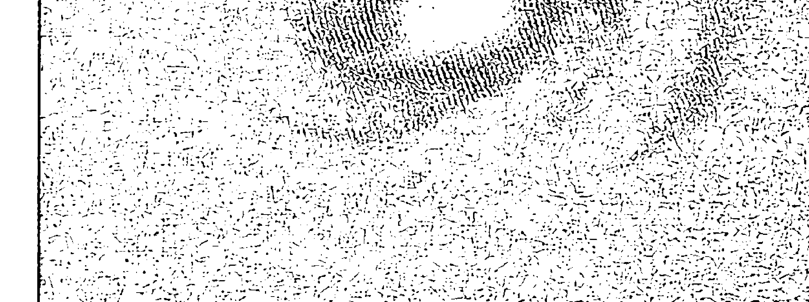

> 一個人想了解不可見的世界，先要仔細觀看可見的世界。
——猶太法典塔木德，《The Talmud》

#### 三的密碼

螺旋就是轉化與美麗，不僅呈現在古代的神話之中，即便當代的生物科技文化，也很崇拜神聖的基因密碼，因為當中藏有療癒所有疾病的秘密。

DNA不僅僅是螺旋狀的象徵與生物學形態而已，裡面還有許多名堂，特別是它們的密碼。在神話學與生物學互相輝映的象徵中，DNA的「三聯碼」又是一例。正所謂「三生天下萬物」，

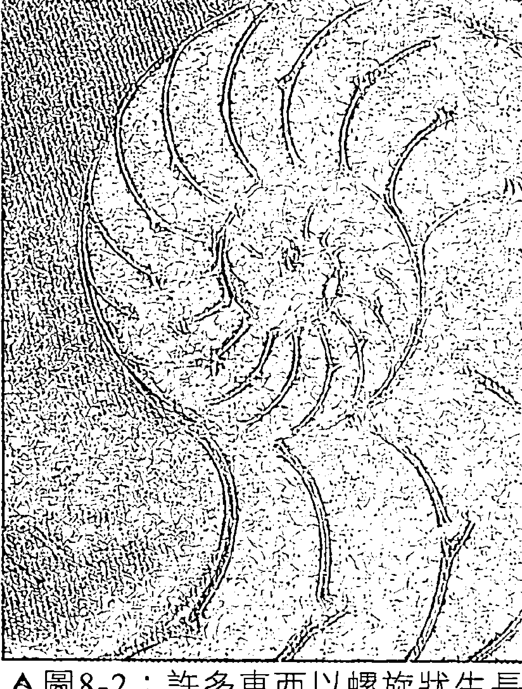

生命本身由「三」而來，三個字的遺傳密碼是創造一切生命的「必需品」，那是一種三合一或三位一體（Trinity）。我們在第六章討論過形成DNA遺傳劇本的四大建築磚塊，其中只要三個磚塊就能合成正確的胺基酸，構成蛋白質，這正是三個字的密碼。

三聯碼調節基因的表達，細胞的生長、細胞的鬆與緊，及細胞的生與死。還記得第四章介紹的「中心粒」，他們正是三的三次方管狀結構。細胞裡的中心粒，中央是中空的管子，而三個為一組的微管，一共九組，圍繞著中空管（可參考第159頁，圖4-6）。西北大學的分子生物學教授古特爾（Guenter Albrecht-Buehler）斷言，這就是一種大宇宙的設計，不可能是演化上的偶然，而且一定有某種目的。

其他不是「偶然」的設計，包括人類胚胎細胞經過「三個星期」變為「三層」：外胚層（ectoderm）、中胚層（mesoderm）、內胚層（endoderm）。製作軟木塞的「栓皮櫟」，及製作紅酒的葡萄，這些植物要經過「三年」的成長期才能收穫。

> > 「三」是萬物中最圓滿的數目。
> ——羅馬數學家、哲學家尼科馬丘士（Nicomachus）

## Chapter 8 DNA中藏有宇宙神性的密码

另外還有三合一的「三脑理论」（triune brain）。分别是「爬虫类的脑」，即脑干，维持基本的生存机制；「哺乳类的脑」，让我们具备情绪与养育能力；「人类的脑」，负责思考与推理。

在生物学的大脑之外，我们是居住在太阳系的第三个星球，属于三度空间。十七世纪的天文学家克普勒（J. Kepler）更断言，由于基督教三位一体的神圣性，因此我们所处的世界只能是三度空间。还有，听故事要连听三个才尽兴，盖无三不成礼也；愿望只能许三个，而且要三思而行，否则浪费愿望。还有三只熊与三只小猪，耶稣诞生时有东方三先知、三人行必有我师焉……。

> ——迈可尔·施耐德，《建构宇宙初学者导引》（Michael Schneider，A Beginners Guide to Construction the Universe）

三角形是世界上最明显、耀眼的神圣象征。

人人都会画三角形，三条线围起来的空间就是稳定的物理结构。三角形的象征在各大传统宗教都看得到，在埃及，那是神性的象征，于基督教，那是三位一体的符号，而基督教艺术中，上帝的光环传统上是三角形，其他圣者才是圆的。

### 三神一体的细胞记忆

基督教有三位一体——圣父、圣子、圣灵。犹太教的上帝有两个面向——Yahveh（天父）、Shekinah（神圣的女性面）、Ruach（上帝的气息）。犹太神秘学「卡巴拉」（Kabbalah）的生命树是三条圆柱。印度教的神殿有三位神祇，所谓「三神一体」（Trimurti），包括梵天（Brahma，创造神）、湿婆（Shiva，破坏神）、毗湿奴（Vishnu，保护神）。

发明毕氏定律的数学家毕达哥拉斯认为，三角形是智慧的象征。此外，三角形也代表女性（倒三角▽）与男性（正三角△）。 祈祷时，我们双手自然合起来，形成一个三角形，这也是佛教的「合十」，代表「专心一不乱的礼敬」。当我们练完道家气功，收功时双手朝下交叠置于丹田附近，形成一个倒三角。打坐时，如果结跏趺坐，即是腿部双盘的莲花坐，这时整个身体会形成三角形。

> 「三神合一」（Triads of gods）的观念非常原始，远古时期……是宗教历史上的原型，很可能是基督教三位一体的源头。

> ——荣格，《心理学说三位一体》（Carl Jung，《A psychological approach to the Dogma of the Trinity》）

古希臘的創造神話描述，在混沌之中出現三個不朽神：蓋婭（Gaea，大地女神）、依柔絲（Eros，愛神）、塔耳塔洛斯（Tartarus，地獄之神）。北美印地安那瓦荷族（Navajo）的創造傳說提到三個新生種族，分別是：土狼、第一個男人、第一個女人。道家有天、地、人三才說，道教亦有「一氣化三清」的太清、玉清、上清仙境。佛教的三個特質，有些則代表創世的三位神祇。

#### 表格八之一：各傳統文化的三神一體說

| 傳統文化 | 創造的三神（一體） |
|---|---|
| 古希臘 | 大地女神 蓋婭、愛神 依柔絲、地獄之神 塔耳塔洛斯 |
| 希伯來 | 天父 Yahveh、神聖的女性 Shekinah、上帝之氣 Ruach |
| 基督教 | 聖父、聖子、聖靈 |
| 古印度 | 梵天 Brahma、毗濕奴 Vishnu、濕婆 Shiva |
| 道教 | 玉清境 元始天尊、上清境 靈寶天尊、太清境 道德天尊 |
| 佛教 | 佛、法、僧 |

#### 生命中的『三』——自我創造

為何我要帶大家走一趟形上巡禮？因為這一切都與科學、神聖、生命自身有關，而且我更要邀請各位深入探索。

> 對於『三』的喜好與習慣：……是一種連結的歷程，也是細胞記憶中養育與整合的歷程，為的是創造，創造我們真正的自己，創造我們的所需，創造有能力奉獻的富足。 —— 保羅·波修，《心的密碼》

至於生物學的創生核心，也與『三』有關，分別是『遺傳密碼』、『胚胎發展』、『生命』的三域系統（three domains of life，分為古細菌域、細菌域、真核生命域）。我們在故事與神話中擁抱『三』，並在其中建構神秘，建構落實於人間的諸神聖殿。『三』在我們的文化與時空中交織穿梭，而這些智慧的表達，可也是細胞中的遺傳？

從古至今，許多有關世界創造的哲學都圍繞在『三』，如果創造性的『三』落實在個人生命，又是什麼光景？能夠更快捷帶來正面的改變嗎？同時也開顯創造的企圖並轉化感請？如果『三』應用在我們的打坐或身體動作的修練，將帶來何種變化呢？

### 揭露

#### 用意念发现『三三』的力量

發願成為探索細胞秘密的探險家——細胞人。體驗創造性改變——在意念上活用『三三』，看能不能更容易造成改變。譬如：每個練習做三次，禱告三次，看看產生的效應和以前有什麼不一樣，是不是帶來更多改變？

再進一步延伸，重複做三天，然後是三個禮拜，記錄自己的心得，看看有多少變化？

無論是我們的細胞，或神聖、修煉傳統無不指示：任何事的完成，『三三』都是關鍵。

#### 開發細胞的創造力

騰出時間，思考你希望人生做哪些改變？或志向更遠大，希望世界做那些改變？先界定清楚，規劃不能太複雜。把想法寫下來，成為你的意念或禱詞。 現在把意念化為一套有三個身體動作的練習，底下就是實例：我很放鬆站著，感覺雙腳穩穩踏在大地上。我扎根在大地。

雙手慢慢抬起，高舉過頭，伸展、張開，迎向天空，說出心意：「我感謝現有的一切，願意更加開放，接收智慧，利益眾生。」然後慢慢放下雙手，置於心輪附近，呈禱告姿勢。

我提醒自己，別忘了讚嘆自己、讚嘆別人與一切眾生內在的神性。

這次的祝福一共有三個主要的身體動作。

我全心全意專注於這次的身體祝福，希望為整個世界帶來正面改變。彎腰，我以手接觸大地，把我的心意化成種子，種植入地。誓願成就這一切。我重複這個身體祝福三次。

#### 第一個動作（連接）：感覺站在大地的雙腳。覺察你與大地的連結。

#### 第二個動作（結合）：把你的呼吸、意念、感受與身體結合在一起。思考一下如何做

#### 第三個動作（行動）：種植祝福的種子，傾聽，並採取行動。

很簡單的，就像數一、二、三。三是圓滿的數字，成就一切。完全不用等待，只要我們數「一、二、三」，立刻

> > 「穿透二元對待」：……這是意識的偉大跳躍，讓我們越過二元化的限制，體會到超越的無限。——邁可爾·施耐德，《建構宇宙初學者導引》

#### 分享相同的密碼

「三」與三角形也不斷出現在神聖藝術之中。印度用於冥想的「聖輪」（Sri Yautra），就是在象徵全宇宙或子宮的創造性（圖8-3）。

其中，向下的三角形代表女性，是能量法則（Shakti），向上的三角形代表男性，是智慧法則（Shiva）。

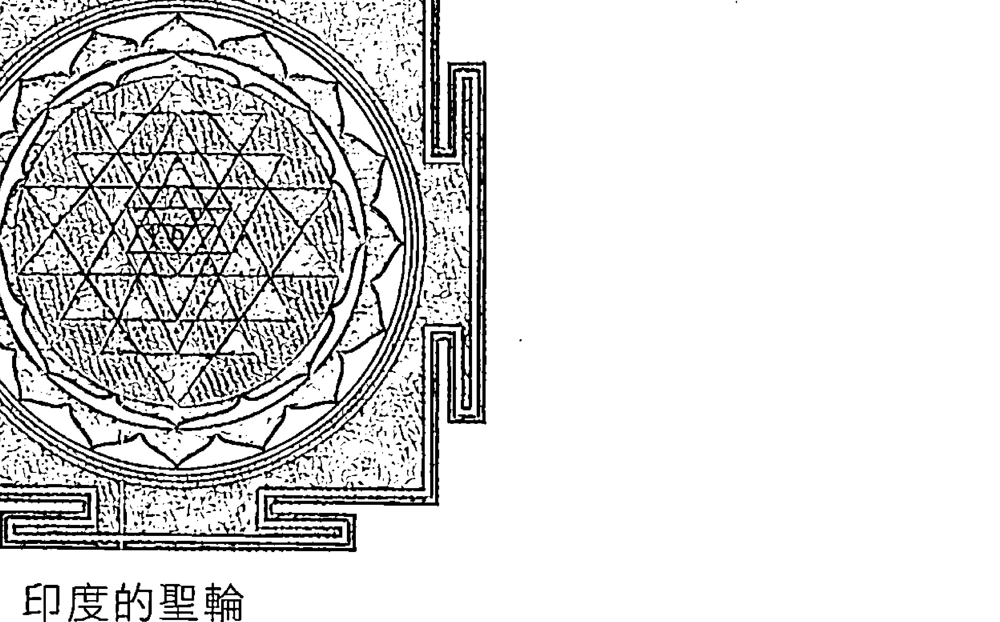

#### 和地心的星生际线 Secrets of Your CELLS

圣轮由九个交错三角形与几个圆圈组成，这个「宇宙图」是一个神圣空间。中间最小的圆是一个点（bindu）。万物皆由这个点开始创生，统一为分殊为众多。

这是一个古代的曼陀罗（mandala，圆），我看起来感觉是细胞的象征，因为两者的结构非常类似。图的中央有许多「三联」的三角形（是DNA的三联密码吗？）而外围的圆周像是细胞膜，边缘还有「受体」。基本上，冥想的人看到这个图可以收到许多讯息，同时精神更加集中。

现在我们再回过头来，看一看富勒设计的圆球形穹顶（第132页，图4-3），各位可以见到三角形是稳定结构的关鍵，如同「圣轮」的结构，也像是细胞骨架中的丝、管「纤维」。

我们知道，万事万物莫不息息相关——我们的细胞与身、心、灵；现代科学与古代智慧——都是伟大的设计。爱因斯坦说：「看到宇宙的安排无限巧妙，遵守某些定律，而我们对这些定律只有模糊的了解。」

我常在想，爱因斯坦的这句话说明他终于了解，上帝正是这些定律的创造者。所有的生命都分享相同的密码，也分享无限的神奇与神秘。我们都是神圣的，从身体到每一个分子。

現代科學不斷演進，量子物理與能量研究不斷移向舞台中央，等於說，我們的細胞與分子就是無盡的能量，或無盡的量子作用，這個事實不容抹滅而且愈來愈受重視，因為我們就是神聖的存在，也是神聖的象徵。

在結束本章之前，我將提出兩個象徵供各位進一步思考，一個是古代的，另一個是現代的。

第一個象徵就是「醫藥輪」，我曾在序言提過。第一次看到醫藥輪令我驚嘆不已，覺得細胞的智慧盡在其中矣。這個醫藥輪的石壁畫既代表細胞也代表整個生命。

我認為往四個方向延伸的三條線，代表細胞中心粒，三體為一組的神奇排列，指揮我們的細胞也指揮我們的生命（可參考第62頁，圖1-6）。

第二個象徵是現代科技的作品，也曾激發我的無限想像。那是DNA的原子結構圖（下圖）。

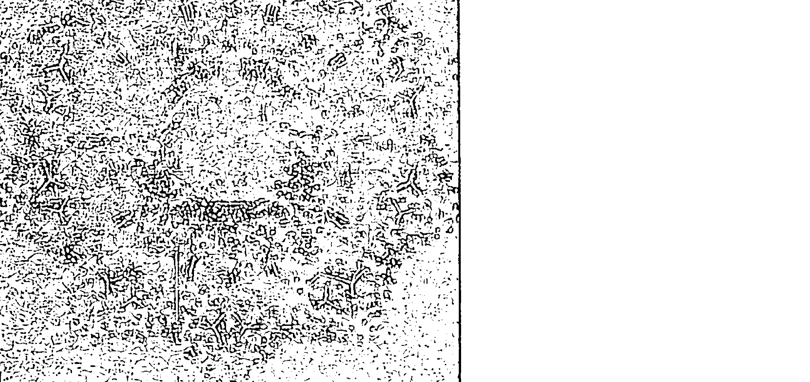

許多人初見此圖認為就是曼陀羅。可是不是？不是研究分子生物學的人，誰會聯想到細胞的DNA？人類很久以前就以曼陀羅幫助自己集中心思並感通神明。我認為觀看此圖也有同樣的效果。

然後人的視線越過居住的部落與火堆，看見了某種無法碰觸的無限世界。他們撞見了聖靈，而那正是宇宙的清晰反映，也是那個無法探觸世界的映射，萬物的本質反射而……隨後，我竟然滑入靈界，直探本源……我的靈魂解放，自由翱翔。

> ——安娜·奥尔特斯，《美国原住民的灵》(Anna Lee Walters, The Spirit of Native America)

這一章，我提出令人振奮的觀點，說明神聖的藝術就是一種「直接的認識」，是人對生命神聖設計的直觀，而我也真的相信如此。

我也在這一章邀請各位以細胞的「三聯密碼」為師，把「三」落實在生活與修煉中，體驗其中秘密，與大自然的創造力量合一，藉此而成長、轉化。

## CHAPTER 9
CONNECTION—CELL—EBRATE

### 感通——細胞的慶祝

> >当人注视神秘的永恒与生命，注视不可思议的实相结构，不得不肃然起敬。如果每天只是认识这个神秘的小小一部分，就算不虚此行。永远不要失去对于神圣的好奇心！——爱因斯坦 (Albert Einstein)

在这本书里，我们不断采用获得诺贝尔奖的迪夫（Duve）爵士所创的名词「细胞人」(cytonaut，在细胞里航行的人)，献给一切有志于探索细胞的有心人。我们曾深入细胞，发现一些神奇的化学反应，我们也曾改用显微镜，从更广阔的视角观察生命，探求细胞带给我们的伟大功课。我希望这是一趟值回票价的有趣探险。现在我们即将重走走过的足迹，带回美丽的回忆，为细胞庆祝，祝福这个神圣又神奇的小东西。

#### 万物是互相关联的灵性系统

细胞，这个最古老的灵魂，是所有生命的共同祖先。除了与其他动、植物分享相同的DNA密码外，我们还以同样的基本化学元素，包括碳、氢、氧、氮、硫、磷等等，形成生命基础。

我们的生化动能反应也极为类似，都是从太古以前微生物开始演变的。我常常在想，如果认识到这项事实，接受生命体，分享相同的「成分」与活动，会不会让我们更加尊重生命的神圣性，及彻底体会万物息息相关的重要性？

而这也是我撰写本书的目的——提醒大家，我与其他生命体是互相关联的，同处地球，分享这个星球上所有的一切。我们有缘相聚在一起，分享奇妙的量子物理、分子DNA，及细胞的灵魂本质。

所有生命体都需要乾净的空气、水、食物。

美丽的雨林，全世界的大树小树、欣欣向荣的农场、赏心悦目的花园，不断制造生命所需的氧气供我们呼吸，我们则排出二氧化碳，让植物转变成食物——这是一个息息相关的生态环境。某个物种的废物排放（植物排放氧气，动物排放二氧化碳），正好是另一物种维持生命的必需品。

对我来说，这是一种神圣设计的伙伴关系。很可惜，太多人看不到这种关联性，不用说遥远的热带雨林或寒带冻原区，即使隔壁的动物、邻近的花朵也漠不关心，结果不断出现全球持续发生的触目惊心灾难：像是二零一二年的日本大地震，福岛的核电厂核心融化，美国中西部的超级飓风，索马利亚大饥荒……无论这些灾难的发生地点距我们多遥远，在地球这个大家庭，我们的细胞与能量场影响下一代。如果分子不再发展，互相認識，那麼就不可能有生命。也許上帝就是最優秀的生物化學家。 我們不是曾介紹過「分子的擁抱」嗎？德·迪夫博士認為這是一種分子的互補，分子與生物體因此得以運作。生物的認知是以分子間的動態關係而開展的。分子的動態關係讓細胞得以互相親近，這是一種親密的交換，從微宇宙的層次植入我們的身體系統之中，生命也因此成長、繁盛。 分子的擁抱是普遍現象，也是身體內化學運作配合得宜的基礎，包括酵素如何在細胞裡引起化學反應。對於免疫識別、訊息轉換、荷爾蒙反應與DNA的配對，更是關鍵因素。 大自然的這種基本設計，顯示出「接觸」或「擁抱」多麼重要，不只是細胞與分子，對我們與其他一起分享地球的生物，同樣重要。 人類嬰兒如果不被撫摸，就無法存活。在醫院的育嬰房裡，如果小寶寶沒有被抱抱、呵護，很快就會失去生命。身體接觸才能讓嬰兒妥善發育，這個現象讓我們了解，互相親近這麼一個簡單的動作，竟是生命不可或缺的關鍵。就在貓媽媽，或狗、羊、鹿媽媽輕舔小寶貝時，這些小動物的神經系統受到刺激，可以正常發展。

> 「天人合一」（as above,so below），上面的世界与下面的世界是一致的、相应的。这个古代的智慧揭露了生命之所以成为生命的本性。

#### 擁抱神聖的生命

從本書的第一章，我們了解，分子的擁抱或彼此合併，為生命創造出神聖火花，演變成錯綜複雜的現象。它們分享或送出電子，在分子的層次中為互助合作的生命機制揭開序幕。我們擁抱愛人、母親、子女、朋友。我們擁抱符合自己價值的觀念。我們擁抱大自然裡的空氣，從裡到外享受美好人生。就在擁抱大自然時，我們回歸自己，發現自己的存在，也許這時候我們頓悟，原來，大自然就是聖殿。

回想當初我搬到郊區，加入社區花園志工，才深深體會大自然的妙理。大清早，我們把植物的種子埋進土裡，那種神聖的感覺就像我透過顯微鏡觀察細胞一樣。生命的不可思議在我眼前展開，一粒小種子、一個小細胞，都讓我驚異讚嘆。我也曾到學校指導孩子管理花園。小朋友興高采烈種植紅蘿蔔，學習如何善待植物，他們輕易就能擁抱大自然，真是令我印象深刻。這算是一種令人驚喜的生命創造活動。我

們除了在課堂上對他們講解食物的來源，也實際讓孩子動作，親自種植可以與大自然連接的生命之根。 同時也藉此榮耀我們的細胞。 在學校的花園，也在世界上的所有地方，我都能體會自己與大自然是全然不可分割的，

#### 擁抱

- ★你能全心全意擁抱什麼？
- ★什麼人或誰願意擁抱你，也擁抱你的觀念？
- ★現在，你可以馬上擁抱誰？

花個幾分鐘靜下來，逐漸變成體內的細胞人，隨時保持覺知，與正在擁抱你、呵護你的細胞一起合作。注意你的心靈之眼，無數的分子與細胞是不是在你的關愛眼神下，更溫柔、更有活力，更能相互合作。它們不是互相競爭，希望得到你的寵愛；反而，它們互相分享，為你的生命與靈魂協力創造。感受一下你的體驗，感謝它們的努力。

> > 如果，你一生中所說的唯一禱詞是：『謝謝你們。』足矣。——德國神秘主義哲學家梅斯特·艾克哈（Meister Eckhart）

#### 永遠只有一個你

我們在第二章終於認識到，自己是神聖的存在體。對於沒有任何宗教信仰的人來說，這也是無庸置疑的，因為這是生命的本性，是物理事實。

生命即神聖，你的身體與心靈，你的分子與細胞，就是你的身體整體，就是你的生命表達。是的，你也是獨特的，而且永遠只有一個你。人總是吹毛求疵，喜歡看自己的缺點與過錯——忘了自己的優點與善良，而這正是我們來到這個世界時的禮物，其中還有歡笑、愛與創造力。

全然接納全部的自己，包括過去那個不求甚解，心智不夠成熟，迷失在群眾中屢屢跌倒的自己。人生一定有一次全然接受自己的大和解時刻。生命中的每一個決定都是我們的導師，都能帶來更成熟的智慧。

最近我在隱修中心舉辦工作坊，傳授第七章裡的練習。講解時有點掙扎。因為煎熬的

是我好不容易把科學的自己，與敏感和靈性面整合一起，可是我總覺得內心分成兩半。最後一堂課了，我到花園散步，靜下心來，想把分成兩半的自己整合起來。現在說出這件事相信大家不會覺得有什麼奇怪：真的，細胞迅速帶領我回到「當下」，不再掙扎煎熬，這樣的禮物我非常感謝，而且真心誠意對我的細胞說謝謝，這時我聽到隱約的聲音說：「終於，你做到了——你真的說到做到！」我常常在做身體祝福時感謝細胞，而且是非常有誠意的感謝，然而這一次在意識改變的入靜狀態中，終於出現回應。我與科學心靈的距離不再遙遠，和以前相比真的進步很多。更大的驚奇還在後頭，細胞突然又傳送更多訊息，我聽到他們說：「我們是你最古老的祖先。我們活過數百萬年，是的，就像你說的，我們知道如何生存與繁衍。你在學習中所分享的功課正是如此；我們必須成為神聖的存在體。我們正手握上帝所賜的生命之火。你身上所具有的正是無數的火苗，讓火苗成為你的靈性嚮導。放鬆心情與我們溝通，讓我們連繫起來。你如何照顧我們，我們就如何照顧你。」

#### 靜心傾聽

很快，我分裂的部分合而為一——科學知識與靈性追尋完美的整合。我知道，我接收到的教導，不再只是生物學上的推論或想像，而是真正的細胞實相，也對人類生命充滿詩意的反省。那是一種豁然貫通的感覺，很真實，細胞告訴我說：「我就是我」。

接著，我內心那個科學家的部分開始擾動，忙碌遊說，企圖否定方才的體驗。但是我不為所動。如果說我們能夠與這個星球對話，從觀想裡獲得訊息，為什麼我們不能與細胞對話，並從細胞的觀點獲得他們的訊息？我為什麼不能從細胞那裡開啟智慧？對於不相信完整與生命體驗的科學家而言，這一切都是非常理性的瘋狂舉動。然而，對於勇於冒險的細胞人來說，種種可能性都是可以接受的明白事實。

我們的直覺、內在聲音、神聖性、預感都是「我就是我」的一部分。能夠把內在宇宙的一切表達出來，這種偉大的冒險才叫做生命。

我們在第三章學習細胞如何互相傾聽，及互相傾聽的重要性，而不是保持緘默，卻背後不斷爭辯、批評、審判、不信任。我們也要傾聽自己內在的聲音，特別是我們正在尋求

細胞 一直在 傾聽 我們 所有的 聲音，包括喋喋不休的雜念，同時也在傾聽中接收無數的分子訊息，藉此決定該採取哪些行動。許多科學家認為，只有神經細胞才能詮釋訊息，那是管窺之見。

所有的細胞都能對輸入的訊息做反應，而且是剎那間反應，十億分之一秒，甚至百億分之一秒，遠遠超出意識的覺察。

不錯，細胞是在量子層次運作的，可以執行百萬次的訊息調動，人的心靈真是深不可測。而且細胞時時刻刻都安住在「當下」，很流動、很柔軟，有彈性，隨時都在調整，隨時都可以改變。

就在我們掌握當下，並靜心傾聽，不隨意躁動，細胞就安安靜靜接受這些訊息，立刻做出明智選擇。他們不會浪費能量爭論，或像無頭蒼蠅急躁盲動。也因為如此，我們才有機會開展生命。

## 第四章
『弦理論』與細胞架構

第四章，我們解開細胞建築裡的秘密，看到細胞的智能表現。我們也學習細胞的構造，了解微細管、微絲體的力量，這份了解成為轉捩點，讓我開始讚嘆細胞的神聖本性。

> > 請記住，細胞傾聽發生在你身上的任何事情。
>
> 害怕時，它們協調身體活動，幫助穩住局面，無論你的害怕是真實發生或想出來的。
>
> 你有很多選擇——逃跑、呆住、躲藏、或改變心態面對挑戰——每一種選擇都將改變細胞。
>
> 你面臨的挑戰值得讓細胞總動員嗎？或危險的情境只是你的妄想？
>
> 練習問自己：我們的細胞聽到什麼樣的訊息？我真的關心它們嗎？或我只是胡思亂想，讓它們白忙一場？我與它們可以創造互相關照的夥伴關係嗎？也許，細胞提供的生命功課對你來說，只是一個隱喻，然而，細胞真的教導我們很多東西，無論你的態度是什麼，細胞永遠是我們的好老師。

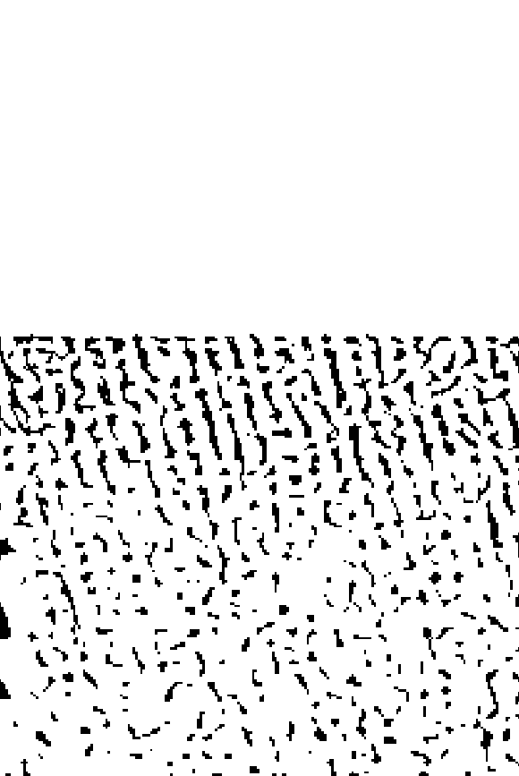

古代的疗愈智慧，包括能量医疗，声音与祷告的治疗应用，虽然尚无法被当今的主流医疗接受，然而古人的智慧根据的就是奥妙的细胞结构变化。最后，我们以解剖的角度深入细胞结构，了解持咒吟唱、能量流动、呼吸运动的疗法，可以造成细胞的回应，因而产生正面疗效。

可不可以說細胞就是薩滿巫醫？細胞結構的變形與移動，是否就是希望改變我們，讓我們變得更好？我們的任何意識形態，是否也是由這些絲管支撐物所帶動，而且能在顯微鏡下觀察到？

我對細胞設計的了解，讓我透析出某些修煉功法的益處，像是太極拳、瑜伽、跳舞、氣功，即使只是散步走路，也是一種行禪。上述功法的作用可以伸展並柔軟細胞內的構成組織。我們的意識可能不知道，「放下」才能讓療癒順利進行，但我們的細胞很清醒，知道得一清二楚，移動或變動才能幫助療癒。

> 「放下」是療癒的核心，必須身心兩放，才能身心兩癒。

我認為最重要的功課是，讓細胞也隨我們放下，我介紹了許多方法，包括：身體動作、回歸當下、低哼、寫出心得與自己的真實感受。

#### 細胞的秘密 Secrets of Your CELLS

量子物理學結合廣義相對論，發展出「弦理論」（string theory），以「能量線」說明宇宙的生成與組成，這些概念超出我的知識範疇，我幾乎無法看懂。

不過，我們曾學習過細胞內的絲與管。也許大宇宙的能量線與細胞小宇宙的管線，有助於我們從另一個角度探討萬物是否息息相關，及我們、細胞，及地球上的所有生命體，是否因為絲、弦而互有關聯？

說不定哪一天這些探討將收編到「弦理論」裡。正所謂「上行，下效」；「有諸外，必有諸內」（as above,so below;as without,so within）。生命的奧秘令人無限神往。

> > 靜心冥想

- ☆誰可以撥動我的「弦」？
- ☆什麼事可以讓我「動」起來，讓我「變形」，表達出更高層次的生命？
- ☆我想「放下」什麼？

## 保持能量

第五章我們學習到，只有在能量充沛的條件下，細胞才能完全彰顯自己。體內數百億的細胞，能夠製造出龐大的分子能量供我們所需。可是，如果需索無度，超出它們供應的極限，會有什麼後果？

細胞每天生產三磅的ATP，讓我們可以觀看、可以呼吸，讓血液流動、讓身體移動、讓我們思考，維持免疫能力，修護損壞的組織，還有，讓各位順利閱讀本書。

我們怎麼知道，哪一天能量不會用竭？怎麼辦？該做什麼或不做什麼，讓維持生命的能量在內外流動時保持平衡？我們，還有我們的細胞必須休息、補給，所以我們必須像投資股票一樣，小心翼翼，明智地投資能量。

確定你沒有浪費能量。慎選與你相處的人，最好這些人可以滋潤你，激勵你。學習找...

#### 細胞的靈性療癒
Secrets of Your CELLS

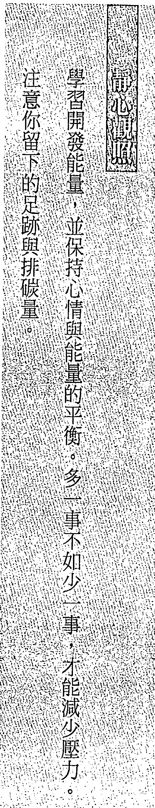

多年前，一名與癌症奮戰的好友告訴我，當初有一個很好的機會錯過了，那就是向一些西山。每個人必須慎重反省：我該如何明智管理能量，包括內部的能量供應，及外在的能量使用？我們該選擇哪些食物？誰才是真正的朋友？我們的工作與休閒形態該怎麼調整？我一直試圖在日常生活中活用細胞管理能量的智慧。如果離開房間我就關燈，刷牙或洗碗時不會任水龍頭嘩嘩沖水。可用的廢棄物我一定回收，我也支持當地有機農夫的辛苦收穫；我購買的是沒有化學品汙染的食物。除了氣功修煉之外，我還不斷學習如何養氣，維持並建構能量。我坐在花園中寫作，在果樹的芳香與鳥兒歌唱之下，靈魂充滿能量。對我來說，與別人分享能量，讓我產生更多能量。當我們保持覺知，注意自己與細胞的能量，隨時保持平衡，我們就是在幫助地球與未來的子孫維持平衡能量。

學習開發能量，並保持心情與能量的平衡。多一事不如少一事，才能減少壓力。 注意你留下的足跡與排碳量。

### 最豐盛的遺產

我們在第六章介紹基因的表達，也一併思考生命的目的。我在二十年前就開始撰寫本書，現在，我活得比原先的期待還久，真是有意思。

當我們進入老年，自然會回想走過的腳印，反省我們帶給這個世界多少祝福。一名朋友這樣告訴我：

> >「離開時，讓這個地方比你來的時候更好。」

所以，我留下的第一筆遺產就是「愛」，用愛祝福子子孫孫。因為我透過他們學習分享愛，所以我也以愛回贈。

另一筆遺產是我留下的這本書。讓各位在初次規劃或重新規劃遺產時，拿來當參考。幫你如願。

你來這裡的目的是什麼？如何在你離去時讓世界變得更美好？你將怎麼做，而且將留下什麼？我們都是受益者，也從能量與基因那裡獲贈禮物，我們如何照顧它們、照顧所有生命體，讓大家獲得最大的好處？我們的滿足可以擴及他人嗎？

#### 細胞的靈性療癒 Secrets of Your CELLS

你的基因是很簡單的化學碼，卻擁有創造你（複雜生命體）的一切訊息。搖搖手上紙袋裡向日葵與菠菜的種子，這些小東西含有生長且供應我們食物的完整訊息。然而光有基因仍然不能成就未來的植物，還要加上我們的照顧、水、陽光、土壤，才能彰顯生命。

整個環境與基因互相對話才得以成就生命，如同基因的溝通才能指導細胞完成使命。

甜菜根時，兩株甜菜土壤相同，日照、澆水也沒兩樣，可是發育起來卻「各奔前程」，因為種植的盆器形狀差別很大。所以當一株甜菜枝繁葉茂欣欣向榮，另一株卻乾枯瘦小。人類就像這些種子！

環境的微小改變，將對生命體造成巨大變異。我又再一次學習這項功課，就在我種植兩株

細胞與心靈必須不斷滋養，被健康的環境育養，才能凸顯最好的自己。

科學家如今終於告訴我們，環境影響基因的表達。種子就是實例。我們可以用善意改造遺產、改造命運與基因，使得環境更加美好，再讓好環境影響基因，提昇心靈。這個正向循環的肯定不斷強化我們的心靈能力，讚嘆基因也讚嘆自己，這時候基因不再是決定健康與命運的主人，我們才是操諸一切的主人。

## 當下覺醒

- * 你要留給當前人類與後代子孫的第一筆遺產是什麼？
- * 為了達成目標，你可以做什麼？成為怎樣的人？

## 重新學習，重整記憶

第七章探索了細胞的記憶與習慣。

我們學習到，透過身體或心靈的重複活動，像是寫個不停、跑步、彈鋼琴、游泳、歡笑、送出愛，每個活動將造成新的連線，植入神經元，並擴及肌肉，改造細胞骨架，讓細胞『脫胎換骨』。痛苦與歡樂會在我們的身體串聯，這兩大經驗是人類求生存的必要學習，身體感官可以幫我們回想這些經驗。於是我們充滿信心逆向操作，為了學習正面的新行為與新習慣，正好利用感官這些經驗。創造愉悅經驗——又甜又脆的多汁蘋果，薰衣草或梔子花香，肌膚被愛人溫柔碰觸——這些經驗。

些感受都能讓新功課深植細胞之中。細胞記憶隨我們旅程的腳步逐漸增多。細胞一起學習，一起創造愈多，就愈容易回溯。認識到自己能夠有意識地讓細胞創造新的記憶與新的力量，就能提升自我管理能力，重拾自信。是的，人人都可以教導細胞新的特技。

規律的運動習慣，說實在的，有時候要堅持下去，我也很掙扎。光知道那對身體有益還不夠，還要發揮信念產生力量，相信如果能夠以[三三]為單位做一個循環，三次、三天、三星期……就能烙印在細胞，創造新行為模式，成功將會近在眼前。[三三]的神奇力量幫助我們改變，護持行動，穩住意念。

前几天，一名運動員朋友來訪。大家好久不見，不過我們沒有聚餐敘舊，而是長走一整天，第二天意猶未盡再走一趟。他離開後的星期一，我獨自一人瀟灑走一回。連走[三三]天路讓我心情大好，能量更充沛，而且心思非常集中。不停的走動、呼吸新鮮空氣，青青翠綠的大自然，三天下來，讓我的身心與走路合而為一。

你也可以用三天一回嘗試這種開心的挑戰，接着是六天、九天或二十一天。有人說，二十一天可以養成習慣，記住這個秘密！挑戰自己。任何對自己有益的練習，就是在揭露

## 智慧的來源

我們的細胞是聖殿也是智慧的泉源，這些主題在第八章皆有觸及，分子的精巧設計，既專業又充滿美感，有如林布蘭（Rembrandt）或康定斯基（Kandinsky）的繪畫，西藏唐卡（thanka，描繪佛教或曼陀羅的彩色刺繡畫），或原住民的醫藥輪。

> 感官是一道出入門，內通身體、外通世界。這是一個交會點，讓外在的一切歸於內。
——傑。邁克爾森，《身體內的上帝》（Jay Michaelson，《God in Your Body》）

每一個個別細胞都有神妙特技，也有令人嘆為觀止的建築結構，更厲害的是，它們連接起來的互助合作，能力更是超級強大。其中的複雜精妙甚至超越我桌上的電腦千萬倍。細胞的能力至矣盡矣，它們建構的連線足以發揮人性與生命潛能。細胞讓我們讚嘆、無限感恩。
細胞與你是怎樣的合作關係。我寫作本書的目的還未完成，且讓細胞探索你無盡的潛能，再把最大潛力發揮出來，當這一天來臨，我的任務才算完成。

## 哪一種神聖的圖樣可以引起你的共鳴？

智慧來自何方，在你之內或在你之上？有空時多多注意大自然的圖案。留意樹上的葉子，花瓣的模樣，石頭的形狀。觀想細胞的外形與其中錯綜精妙的設計。觀察蝴蝶、蜂鳥、秋蟬、成長中的樹木。我們分享的這一切令人驚嘆。

有一陣子，我帶領癌症團體進行「螺旋之旅」。第一天，無人說出螺旋設計有任何意義，或與自己的生命有任何關係。後來大家逐漸注意螺旋形狀出現在許多場合，才明白其義，或自己挑選的床單，都隱含螺旋。這些圖樣令他們感覺愉快，意境深遠。同樣的道理，唯有在覺知中觀看，我們才能體會生命與人際間的美麗、智慧與神聖。

心靈慢慢沉澱後睜開眼睛，我們是否看到家園、大自然、聖壇的偉大設計？這些設計的風貌，是否與細胞的樣態若合符節？這其中是否包藏某種智慧？

我們創造的家園、友誼、祭壇，都是神聖的空間，可以讓細胞樂在其中，因此，人人內心都有一種神聖感。

## 細胞的祝福

有人說，不管我們做多少事，寫多少書，或科學上多少石破天驚的發明，一切到頭來都將逝去，都是夢幻一場；然而，真正重要的卻是我們曾經愛過，曾經默契互通。而我寫這本書所分享的知識，是因為我們都曾充滿力量的神奇細胞愛過，我很希望各位能把這樣的訊息傳承下去。

我們永不孤單，因為細胞永遠與我們同在，而且不斷提醒我們，生命是神聖的，充滿靈性。我們的細胞一直安住於當下，含有無限深廣的智慧，充滿喜樂，而且一直處於行動之中。於是，我們也可以透過行動——跳舞、歡唱、分享、前進——帶給自己祝福，轉化現在改變未來。

現在，你這名充滿好奇的細胞人，已經了解自己也了解細胞。你也知道仿效細胞將解除心中負擔，不再執著，不再妄念紛飛，也能安住於當下，享受生命的鮮美滋味。

我的頭腦會想出千奇百怪的藉口，告訴我何必採取什麼行動——我想各位知道我的意思。可是這時候只要想到細胞，心情就會馬上放鬆，放開緊握的雙手，不再堅持「我不想做、我不能做」。細胞創造出更大的空間，讓我為自己的健康與幸福施展身手。

我會為了細胞考慮種種後果，然後做出更好的選擇。決定怎麼做並不是道德命令，要要求自己「應該」怎樣怎樣——而是我真心誠意關懷細胞，關懷這個上帝創造的小小聖殿。

祝福各位找到類似的感動，讓前進的每一步都能榮耀、護持這些聖殿，隨身攜帶有關細胞的飽滿認識，跨入未來。

我願意與各位分享我的祝福：

偉大的聖靈、聖父靈母。幫助我照顧無數微小的聖殿，這些聖殿構築我的生命，撐開我的靈魂。引導我隨時保持覺知，關心別人。萬物息息相關，願世人交心互爱，尽己之所长，为了明天与下一代，努力改善自己和环境，留下充满智慧与关怀的丰盛遗产。

## 【附录一】气功修煉的身體祝福

我真誠希望各位從氣功的修煉中，享受與細胞合一的喜悅。底下介紹的是一系列的完整功法。我必須強調，即使只做其中一套動作，助益也非常可觀。

所有的動作都很容易學習，最好一次只記住一種，並介紹給你的孩子、朋友、家人。也許其中只有一、兩種做起來令你心曠神怡，特別有感覺，這樣也很好，因為你感應到內心的真正需求，往最好的方向前行。你的細胞也會感動不已，愛上這些功法。

練功之前，我要提醒各位一件事！找一個你覺得舒服的地方，如果是戶外，避免溫度太冷或風太大。穿著寬鬆舒適的衣物，不要太緊身以免壓迫呼吸。

如果人在室內，情況允許的話，最好脫下鞋子，讓雙腳感覺大地。如果在戶外，只要場地很安全，能脫掉鞋子更好，注意腳下的土地不可潮濕、冰冷，而且，最好場地是不被干打擾別人，因為你有可能會發出聲音。隨時保持放鬆，讓細胞接受撫慰與治療。

愈常練習，愈能感受內心的平靜，愈能開拓能量，滋潤身心。我建議每個功法至少能做三次。道家视『三』為神聖數字（所謂『道生一，一生二，二生三，三生天下萬物』）。所以我才建議大家做三次，讓『三』生『萬』，能量周身流轉。

再怎麼精簡，每次至少騰出十至二十分鐘練習。以我為例，每次練習，這一系列功法我都從頭做到尾，而且重做三次，只有『轉腰』例外，我會多做幾次，直到滿意為止。後來我發現自己只要站著、排隊、等車或等什麼，就會自動轉腰，非常享受。

現在，有請各位好好享受這些身體的活動。

### 基本姿勢：站樁

感覺你的雙腳站在大地上，堅穩、踏實。雙腳分開與肩同寬。你可以想像，每隻腳如樹根一般穩扎入地底。此時，你可以感覺大地的能量上湧，充滿全身。或你想像雙腳從大地吸收能量，全身盈滿。
你雙膝微彎，肩膀放鬆，雙臂自然垂放兩旁。現在舌頭輕抵上顎（這叫「內在的微笑」）。頭擺端正，下巴與大地平行，觀想頭部頂天，能量通貫而下。
如果覺得還沒站穩，左右稍微搖動一下，調整重心。

所有的功法都是以這個基本姿勢起首的。另外還有一個站樁方式，就是做好以上準備後，手肘輕輕上提，大約提至腰部，打開雙掌並手掌互對有如抱球狀，心靜下來，心靜自然會產生「氣」。以上就是練氣的基本功。初次練習首重姿勢的熟悉與內心感覺。有些老師會要求上手的學生至少站樁三十分鐘。站樁可以強化腿部、身體，也強化你的決心。

### 轉腰

類似的動作我們第二章與第六章都有介紹。從基本的站樁動作開始。接著扭轉腰部，腹部、臀部也隨之轉動，想像你是條繩子，上接天下接地，天與地把你拉住，感覺你像是在搖呼拉圈。肩部與下巴，與大地保持平行。

繼續轉腰，直到你覺得穩穩站定，然後改變轉動的方向。也許你覺得順時鐘轉動比逆時鐘更輕鬆、更自然，只要覺得順手，某個方向多轉幾圈無妨。然後你可以加入低哼「mmm」，做到滿意為止。

### 開息

這個功法或站或坐隨意。手心與手背交疊，輕靠腹部（丹田），現在手肘是彎的，雙手很放鬆，肩膀也放鬆。接著雙手往兩邊輕輕拉開，這時你腹部前面創造出另一個空間，可集納更多的「氣」。雙手拉開時吸氣，手掌轉過來互對，手指朝前，呼氣，雙手互相靠近，然後回復最先的動作，雙手互疊輕靠丹田。

開始做時，不要在意自己的呼吸，保持自然即可，習慣後你的動作將配合呼吸。重點在於雙手拉開時吸氣，合攏時呼氣。

這是一個讓你放鬆的動作，與站樁、轉腰、低哼，合起來做就是一套迷你系列功法。

### 能量沖洗

當你想舒緩壓力，清掃紛飛雜念，這套功法是最完美的選擇。

站定，雙臂自然下垂。緩緩抬起手臂，手肘稍彎，手心向上，手指朝外，吸氣，手臂繼續上抬，過頭，行成托天的姿勢。暫停、吐氣，吐盡後吸氣，觀想接收到宇宙中的「氣」，翻轉手掌，手心向下，對著頭頂，手指伸直沿身體慢慢放下，過頭後吐氣，這時觀想手指放出新鮮的「氣」，把身體不需要的能量沖洗掉，你也可以觀想新鮮能量貫注到每個細胞。

雙手緩慢放下進行能量沖洗的時間長短，隨個人吐氣的快緩而定。

如果手在某個地方感覺不到能量，或覺得氣感遲鈍，手稍微停住，感受當中有什麼變化再繼續。手下降至腿部時繼續觀想「能量沖洗」小腿、雙腳。完成後甩甩手，把「用過」的能量還諸天地，或由大地回收。

這套功法隨時都可以做，只要你覺得有需要。我建議每回至少做三次。當你覺得焦慮、疲倦、心思不集中時特別有幫助。尤其是重大會議開議前或將主持大局，能量沖洗讓你鎮定、精神飽滿、自信十足。

### 能量伸展

雙手輕靠腹部，手臂向外，慢慢抬起手臂，越過身體中點，上達唇部。翻掌，掌心向外，緩緩向上推出，越過頭頂，雙掌向天，手臂逐漸挺直成托天狀。然後雙手畫圈左右分開，掌心向下，慢慢垂至身體左右兩側。再緩緩輕放於腹部，重新開始。這個動作至少做兩次。

能量伸展與能量沖洗合在一起做，可以提振精神，沖走廢「氣」，充滿新鮮能量。記住，做時保持放鬆。好好享受充實的能量吧！

### 波浪操

從站樁姿勢開始，別忘了保持「內在的微笑」。慢慢抬起手臂，與肩同寬、腕部放鬆，再用手臂畫圓做圓周運動，記住，手臂與雙手不得高於胸部。你的腕部非常柔軟，手肘朝下、放鬆，手心朝地，手部上下轉動，起伏如波浪。讓整個身體進入動的狀態，而不光是手臂在動，每次手臂往上時，感覺像是把背部或雙腳的能量提上來，感覺好像在水中轉動，感覺身體中的液體都在流動。別忘了配合呼吸。

### 胸腺伸展

這是很有幫助的「張拉整合」伸展動作，能夠強化胸腺。胸腺是人體主要的免疫組織，是T細胞的出生地。動作完成後你可以輕拍胸骨上方的胸部。據說，輕拍的動作結合低哼聲，在流行性感冒的季節，有很好的預防效果。延續之前的波浪操，當雙手與手臂達到胸部時，手心朝外，雙手向兩邊外側伸展，頭部向一邊轉過去，雙手輕柔畫圈轉動數次。暫停。手掌慢慢轉向，掌心相對，收攏雙臂至與肩同寬，再次手心朝外，雙手向兩邊外側伸展，頭部轉向另一邊，同樣雙手輕柔畫圈轉動數次，再次掌心相對，收攏雙臂至與肩同寬。然後掌心朝下，輕輕放下手臂，自然下垂於左右兩側，重複這些動作至少兩次。

### 陰陽調和：平衡左右半腦

這是另一個「張拉整合」的功法。可以平衡左右半腦，相當於瑜伽的左右鼻孔通氣。

先以站樁姿勢開始，右手靠近腹部，掌心向下，右肘稍彎，左手在身體左側自然下垂，掌心向下。雙手同時緩緩抬起，當右手通過身體中線時，左手向外伸展，然後雙手高過頭頂，完全伸展，手心相對，暫停。

轉成手心向下，雙手緩緩下降，當左手降至身體中線時，右手向外伸展，雙手慢慢下降，回復站樁姿勢。

現在反方向操作。雙手同時緩緩抬起，當時左手通過身體中線時，換成右手向外伸展，然後雙手高舉過頭，完全伸展。再次雙手緩緩下降，當右手降至身體中線時，右手向外伸展，然後雙手下降，回復站樁姿勢。

確實要花點時間。這個功法我花了好幾個星期才完成熟練，所以大家不必急，因為左右半腦能夠協調好，我最近教授的一班，大多數人下課都已學會，只有一人還不是很協調。

提示：快速學會的要訣是，讓身體學習，而不是知而後行，讓心思介入，反而礙手礙腳。

### 收功

練完氣功，最後記得要「收氣」或「收功」。站樁姿勢，雙手交疊輕靠下丹田，感覺前後左右四周的氣場，用意念把氣收到腹部附近，輕壓手掌，把氣全納入體內。持續個幾分鐘。平常時，你也可以用這個姿勢，只是站著，全身放鬆，膝部微彎，保持內在的微笑，閉上眼睛，感覺氣在流動，注滿全身，為細胞補充能量。這是一種站姿的入靜。

如果你從未練過氣功，最好能找一位有經驗的老師，同時製作自己的「能量圖」。請用附錄二的表格，多複製幾份，每天記錄自己的能量變化。

我建議大家至少觀察一星期，知道自己什麼時候能量最低潮。這個時候再輔以氣功。剛開始每天至少練功十分鐘，這時候能量圖的記錄不能中斷，持續一段時間後，比較練功前後的能量升降型態，看有沒有改變，或練功後能量確有提升。

當然每次練功前記錄，練功後再次記錄，那就更好了。我相信「能量開發」絕不是秀才的紙上談兵，一定可以在親身體驗中說服你。

## 【附录二】能量圖

### 註記與觀察

------------------------------------------------------------

| 能量水平 | 時間點 | 6 am | 8 | 10 | 12 | 2 | 4 | 6 | 8 | 10 | 12 | 2 am |
| :--- | :--- | :--- | :--- | :--- | :--- | :--- | :--- | :--- | :--- | :--- | :--- | :--- |
| 10 | | | | | | | | | | | | |
| 9 | | | | | | | | | | | | |
| 8 | | | | | | | | | | | | |
| 7 | | | | | | | | | | | | |
| 6 | | | | | | | | | | | | |
| 5 | | | | | | | | | | | | |
| 4 | | | | | | | | | | | | |
| 3 | | | | | | | | | | | | |
| 2 | | | | | | | | | | | | |
| 1 | | | | | | | | | | | | |

標示你的能量節奏：從10（最高）到1（最低），至少記錄五天。

- □ : 能量
- ○ : 心情
- △ : 緊張
- 或是選用自己喜歡的圖形、顏色。

# 參考書目

Aaron, Rabbi David. The God-Powered Life: Awakening to Your Divine Purpose. Boston: Trumpeter, 2009.

Achterberg, Jeanne. Imagery in Healing: Shamanism and Modern Medicine. Boston: Shambhala, 2002.

Achterberg, Jeanne, Barbara Dossey, and Leslie Kolkmeier. Rituals of Healing: Using Imagery for Health and Wellness. New York: Bantam, 1994.

Ader, R. “Conditioned Immunopharmacological Effects in Animals: Implications for Conditioning Model of Pharmacotherapy.” In Placebo: Theory, Research and Mechanisms, edited by L. White, B.Tursky, and G. Schwartz, 306—23. New York: Guilford Press, 1985.

——. Psychoneuroimmunology. New York: Academic Press, 1991.

Ader, R., and N. Cohen, eds. “Behaviorally Conditioned Immunosuppression.” Psychosomatic Medicine 37 (1975): 333—40.

Ader, R., D. Felten, and N. Cohen. Psychoneuroimmunology. New York: Academic Press, 2001.

Ainsworth, Claire. “Stretching the Imagination.” Nature 456 (December 2008): 696—99.

Albrecht-Buehler, G. “Autonomous Movements of Cytoplasmic Fragments.” Proceedings of the National Academy of Sciences of the United States of America 77 (1980): 6639—43.

——. “Cell Intelligence.” basic.northwestern.edu/g-buehler/FRAME.HTM.

——. “The Cellular Infrared Detector Appears to Be Contained in the Centrosome.” Cell Motility and the Cytoskeleton 27 (1994): 262—71.

——. “Changes of Cell Behavior by Near-Infrared Signals.” Cell Motility and the Cytoskeleton 32 (1995): 299—304.

——. “Does the Geometric Design of Centrioles Imply Their Function?” Cell Motility 1 (1981): 237—65.

——. “Role of Cortical Tension in Fibroblast Shape and Movement.” Cell Motility and the Cytoskeleton 7 (1987): 54—67.

——. “A Rudimentary Form of Cellular Vision.” Proceedings of the National Academy of Sciences of the United States of America 89 (1992): 8288—92.

American Autoimmune Related Diseases Association (AARDA) and National Coalition of Autoimmune Patient Groups (NCAPG). 2011 Study Report: “The Cost Burden of Autoimmune Disease.”

Amundson, S. A., T. G. Myers, and A. J. Fornace Jr. “Roles for p53 in Growth Arrest and Apoptosis: Putting on the Brakes after Genotoxic Stress.” Oncogene 17, no. 25 (December 1998): 3287-99.

Apanius, V., et al. “The Nature of Selection on the Major Histocompatibility Complex.” Critical Reviews in Immunology 17 (1997): 179-224.

Argüelles, José. The Mayan Factor. Santa Fe, NM: Bear & Company, 1987.

Arrien, Angeles. The Tarot Handbook: Practical Applications of Ancient Visual Symbols. New York: Tarcher/Putnam, 1997.

Astin, J. A., et al. “Mind-Body medicine: State of the Science, Implications for Practice.” Journal of the American Board of Family Practice 16 (2003): 131-47.

Aubert, G., and P. M. Lansdorp. “Telomeres and Aging.” Physiological Reviews 88, no. 2 (April 2008): 557-79.

Barrett, S. “Induction of Differentiation Markers on Human Acute Leukemia Cells.” Blood 51 (1978): 625a.

——. Molecular Messengers of the Heart. KABA, 2002. Compact disc.

——. “Psychoneuroimmunology: Bridge between Science and Spirit.” In Silver Threads: Twenty-Five Years of Parapsychology Research, edited by B. Kane, J. Millay, and D. Brown, 170-80. New York: Praeger, 1993.

——. “Psychoneuroimmunology: Bridge between Science and Spirit.” In Radiant Minds: Scientists Explore the Dimensions of Consciousness, edited by Jean Millay, 65-79. Doyle, CA: Millay, 2010.

Bartolomeo, P. “The Relationship between Visual Perception and Visual Mental Imagery: A Reappraisal of the Neuropsychological Evidence.” Cortex 38 (2002): 357-78.

Bartrop, R. W., et al. “Depressed Lymphocyte Function after Bereavement.” Lancet 1 (1977): 834-6.

Beliefnet.com. “The Three Jewels of Buddhism.” Excerpted from Robert Thurman, The Jewel Tree of Tibet (New York: Free Press, 2005). beliefnet.com/Faiths/Buddhism/2005/04/The-Three-Jewels-Of-Buddhism.aspx#ixzzIVDHWS9r.

Bennett, Mary Payne, and Cecile A. Lengache. “Humor and Laughter May Influence Health: I. History and Background.” Evidence-Based Complementary and Alternative Medicine 3, no. 1 (March 2006): 61-63.

Bennett, William P. “Molecular Epidemiology of Human Cancer Risk: Gene-Environment Interactions and p53 Mutation Spectrum in Human Lung Cancer.” Special issue, Journal of Pathology 187, no. 1 (January 1999): 8-18.

Benson, H., with Marg Stark. Timeless Healing: The Power and Biology of Belief. New York: Simon & Schuster, 1996.

Benson, H., et al. "The Relaxation Response." *Psychiatry* 37 (1974): 3746.

Berk, L., et al. "Humor Associated Laughter Decreases Cortisol and Increases Spontaneous Lymphocyte Blastogenesis." *Clinical Research* 36 (1988): 435A.

Berk, L., et al. "Eustress of Mirthful Laughter Modifies Natural Killer Cell Activity." *Clinical Research* 37 (1989): 115A.

Berk, L., et al. "Modulation of Neuroimmune Parameters During the Eustress of Humor-Associated Mirthful Laughter." *Alternative Therapies in Health and Medicine* (2001): 62-72, 74-6.

Berkman, L. F., and S. I. Syme. "Social Networks, Host Resistance and Mortality: A Nine-Year Follow-up Study of Alameda County Residents." *American Journal of Epidemiology* 109 (1979): 186-204.

Besedovsky, H. O., et al. "Hypothalamic Changes during the Immune Response." *European Journal of Immunology* 7 (1977): 323-25.

Biémont, C., and C. Vieira. "Genetics: Junk DNA as an Evolutionary Force." *Nature* 443, no. 7111 (2006): 521-24.

Bishop, J. M. "The Molecular Genetics of Cancer." *Science* 235, no. 4786 (January 1987): 305-11.

Boorstin, Daniel J. *The Discoverers: A History of Man's Search to Know His World and Himself*. New York: Random House, 1983.

Braun, W. E. "HLA Molecules in Autoimmune Diseases." *Clinical Biochemistry* 25 (1992): 187-91.

Brill, et al. "The Role of Apoptosis in Normal and Abnormal Embryonic Development." *Journal of Assisted Reproduction and Genetics* 16, no. 10 (1999): 512-19.

Bruhn, J. G. "An Epidemiological Study of Myocardial Infarctions in an Italian-American Community." *Journal of Chronic Diseases* 18 (1965): 353-65.

Bulloch, K. "Neuroanatomy of Lymphoid Tissues: A Review." In *Neural Modulation of Immunity*, edited by R. Guillemin et al., 49-85. New York: Raven Press, 1985.

Butcher, Darci T., Tamara Alliston, and Valerie M. Weaver. "A Tense Situation: Forcing Tumour Progression." *Nature Reviews Cancer* 9 (February 2009): 108-22.

Byrd, R. C. "Positive Therapeutic Effects of Intercessory Prayer in a Coronary Care Unit Population." *Southern Medical Journal* 81, no. 7 (1988): 826-9.

Campbell, Joseph, and Bill Moyers. *The Power of Myth*. Edited by Betty Sue Flowers. New York: Doubleday, 1988.

Campeau, P. M., et al. “Hereditary Breast Cancer: New Genetic Developments, New Therapeutic Avenues.” *Human Genetics* 124, no. 1 (2008): 31-42.

Capra, Fritjof. *The Hidden Connections: Integrating the Biological, Cognitive, and Social Dimensions of Life into a Science of Sustainability*. New York: Doubleday, 2002.

Caspar, Donald. “Movement and Self-Control in Protein Assembly.” *Biophysical Journal* 32 (October 1980): 103-38.

Castaneda, Carlos. “Magical Passes.” *Yoga Journal* (January/February 1998): 74-84.
———. *Magical Passes: The Practical Wisdom of the Shamans of Ancient Mexico*. New York: HarperPerennial, 1998.

Castillo-Davis, C. I. “The Evolution of Noncoding DNA: How Much Junk, How Much Func?” *Trends in Genetics* 21, no. 10 (October 2005): 533-36.

Chen, Christopher, et al. “Geometric Control of Cell Life and Death.” *Science* 276 (1997): 1425-28.

Cheney, Paul. “Chronic Fatigue, Mycotoxins, Abnormal Clotting and Other Notes.” *Townsend Letter for Doctors and Patients*. tldp.com/issue/157-8/157pub.htm.
———. “New Insights into the Pathophysiology and Treatment of CFS.” Presentation to the CFIDS and FMS Support Group of Dallas-Fort Worth, October 2001. Summary by Linda Sleffel. cfs-ireland.com/cheney2.htm.

Childre, Doc, and Howard Martin, with Donna Beech. *The Heartmath Solution*. San Francisco: HarperCollins, 1999.

Clarke, A. R., et al. “Thymocyte Apoptosis Induced by p53-Dependent and Independent Pathways.” *Nature* 362 (April 1993): 849-52.

Cohen, Kenneth S. *The Way of Qigong*. New York: Ballentine, 1997.

Cohen, S., and S. L. Syme. *Social Support and Health*. New York: Academic Press, 1985.

Cohen, S., D. A. Tyrell, and A. P. Smith. “Psychological Stress and Susceptibility to the Common Cold.” *New England Journal of Medicine* 325 (1991): 606-12.

Cohen, S., et al. “Human Relationships and Infectious Disease.” *Journal of the American Medical Association* 277 (1997): 1940-45.

Cong, Y. S., et al. “Human Telomerase and Its Regulation.” *Microbiology and Molecular Biology Review* 66, no. 3 (September 2002): 407-25.

Cousins, Norman. *Anatomy of an Illness as Perceived By the Patient*. Toronto: Bantam, 1979.
———. *Head First: Biology of Hope and Healing Power of the Human Spirit*. New York: Penguin, 1989.

Crick, Francis. “The Genetic Code.” In *What Mad Pursuit: A Personal View of Scientific Discovery*, 89-101. New York: Basic Books, 1988.

Cross, R. J., et al. “Hypothalamic-Immune Interactions.” *Brain Research Journal* 196 (1980): 79-87.

Davidson, R. J., et al. “Alterations in Brain and Immune Function Produced by Mindfulness Meditation.” *Psychosomatic Medicine* 65 (2003): 564-70.

de Duve, Christian. *Life Evolving: Molecules, Mind, and Meaning*. New York: Oxford University Press, 2002.

———. *Vital Dust: Life as a Cosmic Imperative*. New York: Basic Books, 1995.

De Volder, A. G., et al. “Auditory Triggered Mental Imagery of Shape Involves Visual Association Areas in Early Blind Humans.” *Neuroimage* 14 (July 2001): 129-39.

Deamer, David W. “How Did It All Begin? The Self-Assembly of Organic Molecules and the Origin of Cellular Life Evolution: Investigating the Evidence.” *Paleontological Society Special Publication* 9 (1999).

Demarquay, G., P. Ryvlin, and J. P. Royet. “Olfaction and Neurological Diseases: A Review of the Literature.” *Revue Neurologie (Paris)* 163 (2007): 155-67.

Denton, Michael. *Nature's Destiny: How the Laws of Biology Reveal Purpose in the Universe*. New York: Simon & Schuster, 1998.

Desai, A., and T. J. Mitchison. “Microtubule Polymerization Dynamics.” *Annual Review of Cell Biology* 13 (1997): 83-117.

Dong, Seung Myung. “Detecting Colorectal Cancer in Stool with the Use of Multiple Genetic Targets.” *Journal of the National Cancer Institute* 93, no. 11 (2001): 858-65.

Dossey, L. “The return of prayer.” *Alternative Therapies in Health and Medicine* 3, no. 6 (1997): 10-17, 113-20.

———. “How Healing Happens: Exploring the Nonlocal Gap.” *Alternative Therapies in Health and Medicine* 8, no. 2 (2002): 12-16, 103-10.

———. *Meaning and Medicine*. New York: Bantam, 1991.

Einstein, Albert. “Ist die Trägheit eines Körpers von seinem Energieinhalt abhängig?” *Annalen der Physik* 18 (1905): 639-43.

Eisenberg, D. T. “An Evolutionary Review of Human Telomere Biology: The Thrifty Telomere Hypothesis and Notes on Potential Adaptive Paternal Effects.” *American Journal of Human Biology* 23, no. 2 (2011): 149-67.

Eisenberg, David, with T. Wright. *Encounters with Qi: Exploring Chinese Medicine*.

Elgar, G., and T. Vavouri. “Tuning In to the Signals: Noncoding Sequence Conservation in Vertebrate Genomes.” *Trends in Genetics* 24, no. 7 (July 2008): 344-52.

Epel, E. S., et al. “Dynamics of Telomerase Activity in Response to Acute Psychological Stress.” *Brain, Behavior, and Immunity* 24, no. 4 (2010): 531-39.

Eremin, Oleg, et al. “Immuno-modulatory Effects of Relaxation Training and Guided Imagery in Women with Locally Advanced Breast Cancer Undergoing Multimodality Therapy: A Randomised Controlled Trial.” *The Breast* 18, no. 1 (February 2009): 17-25.

Erickson, M. H. “Further Clinical Techniques of Hypnosis: Utilization Techniques.” *American Journal of Clinical Hypnosis* 51, no. 4 (April 2009): 341-62.
———. “Special Inquiry with Aldous Huxley into the Nature and Character of Various States of Consciousness.” *American Journal of Clinical Hypnosis* 8 (July 1965): 14-33.

Erickson, M. H., and E. L. Rossi. “Autohypnotic Experiences of Milton H. Erickson.” *American Journal of Clinical Hypnosis* 20, no. 1 (July 1977): 36-54.

Evans, N. D. “Substrate Stiffness Affects Early Differentiation Events in Embryonic Stem Cells.” *European Cells and Materials* 18 (September 21, 2009): 1-14.

Fearon, Eric R. “Human Cancer Syndromes: Clues to the Origin and Nature of Cancer,” *Science* 278, no. 5340 (November 1997): 1043-50.

Fell, J., N. Axmacher, and S. Haupt. “From Alpha to Gamma: Electrophysiological Correlates of Meditation-Related States of Consciousness.” *Medical Hypotheses* 75, no. 2 (August 2010): 218-24.

Fenech, M. “Chromosomal Damage Rate, Aging and Diet,” *Annals of the New York Academy of Sciences* 854 (1998): 23-36.

Florez, H., et al. “C-Reactive Protein Is Elevated in Obese Patients with the Metabolic Syndrome.” *Diabetes Research and Clinical Practice* 71, no. 1 (2006): 92-100.

Fontani, G., et al. “Effect of Mental Imagery on the Development of Skilled Motor Actions.” *Perceptual and Motor Skills* 105, no. 3, pt. 1 (December 2007): 803-26.

Francis, M., and J. W. Pennebaker. “Putting Stress into Words: The Impact of Writing on Physiological, Absentee, and Self-Reported Emotional Well-Being Measures.” *American Journal of Health Promotion* 6 (1992): 280-87.

Frankenhaeuser, M., et al. “Sex Differences in Psychoneuroendocrine Reactions to Examination Stress,” *Psychosomatic Medicine* 40, no. 4 (1978): 334-43.

#### Secrets of Your CELLS

Fuller, Buckminster. “Conceptuality of Fundamental Structures.” In *Structure in Art and in Science*, edited by G. Kepes, 66-88. New York: Braziller, 1965.

———. “Tensegrity.” *Portfolio Artnews Annual* 4 (1961): 112-27.

Furlow, F. Bryant. “The Smell of Love: How Women Rate the Sexiness and Pleasantness of a Man's Body Odor Hinges on How Much of Their Genetic Profile Is Shared.” *Psychology Today* 29 (1996): 38.

Gardner, Russell, and Gerald A. Cory. *The Evolutionary Neuroethology of Paul MacLean: Convergences and Frontiers*. New York: Praeger, 2002.

Garfield, C. A., with H. Z. Bennet. *Peak Performance: Mental Training Techniques from the World's Greatest Athletes*. New York: Warner Books, 1984.

GDB Human Genome Database Hosted by RTI International [online]. North Carolina. Available from: gdb.org/gdbreports/CountGeneByChromosome.html

“Genes and Chromosomes.” Centre for Genetics Education. Internet: genetics.edu.au/factsheet/fsl.

German, Bruce, et al. “Olfaction: Where Nutrition, Memory and Immunity Intersect.” In *Flavors and Fragrances*, edited by Ralf Berger, 25-32. Berlin: Springer-Verlag, 2007.

Ghanta, V., et al. “Neural and Environmental Influences on Neoplasia and Conditioning of NK Activity.” *Journal of Immunology* 135 (1985): 848-52.

Goh, A. M., C. R. Coffill, and D. P. Lane. “The Role of Mutant p53 in Human Cancer.” *Journal of Pathology* 223, no. 2 (January 2011): 116-26.

Gordon, Ilanit, et al. “Oxytocin and the Development of Parenting in Humans.” *Biological Psychiatry* 68 (2010): 377-82.

Gregory, T. R. “Genome Size Evolution in Animals.” In *The Evolution of the Genome*, edited by T R. Gregory, 4-71. San Diego, CA: Elsevier, 2005.

Håberg, S. E., et al. “Folic Acid Supplements in Pregnancy and Early Childhood Respiratory Health.” *Archives of Disease in Childhood* 94 (2009): 180-84.

Haffner, S. M. “The Metabolic Syndrome: Inflammation, Diabetes Mellitus, and Cardiovascular Disease.” *American Journal of Cardiology* 97 (2006): 3A-11A.

Hainaut, P., and M. Hollstein. “p53 and Human Cancer: The First Ten Thousand Mutations.” *Advances in Cancer Research* 77 (2000): 82-137.

Hameroff, Stuart R. “Ch'i: A Neural Hologram? Microtubules, Bioholography, and Acupuncture.” *American Journal of Chinese Medicine* 2, no. 2 (1974): 163-70.

———. “The Entwined Mysteries of Anesthesia and Consciousness: Is There a Common Underlying Mechanism?” *Anesthesiology* 105 (2006): 400-12.

Hameroff, Stuart R., and Roger Penrose. “Conscious Events as Orchestrated Spacetime Selections.” *Journal of Consciousness Studies* 3, no. 1 (1996): 36-53.

———. “Orchestrated Reduction of Quantum Coherence in Brain Microtubules: A Model for Consciousness?” In *Toward a Science of Consciousness: The First Tucson Discussions and Debates*, edited by S. R. Hameroff, A. W. Kaszniak, and A. C. Scott, 507–40. Cambridge, MA: MIT Press, 1996.

Hameroff, Stuart, et al. “Conduction Pathways in Microtubules, Biological Quantum Computation, Consciousness.” *Biosystems* 64, nos. 1-3 (2002): 149-68.

Hardy, K. “Apoptosis in the Human Embryo.” *Reviews of Reproduction* 4 (1999): 125-34.

Harner, Michael. *The Way of the Shaman: A Guide to Power and Healing*. New York: Bantam, 1980.

Harold, Franklin M. “Molecules into Cells: Specifying Spatial Architecture.” *Microbiology and Molecular Biology Reviews* 69 (2005): 544-64.

Harris, W S., et al. “A Randomized, Controlled Trial of the Effects of Remote, Intercessory Prayer on Outcomes in Patients Admitted to the Coronary Care Unit.” *Archives of Internal Medicine* 159 (October 1999): 2273-8.

Hart, Mickey, with Jay Stevens. *Drumming at the Edge of Magic: A Journey into the Spirit of Percussion*. San Francisco: HarperSanFrancisco, 1990.

Hassett, James. “The Sweat Gland.” In *A Primer of Psychophysiology*, 32-46. San Francisco: W. H. Freeman, 1978.

Hazum, E., K. J. Chang, and P. Cuatrecasas. “Specific Non-opiate Receptors for β-Endorphins on Human Lymphocytes.” *Science* 205 (1970): 1033-35.

Heinrichs, Markus, et al. “Social Support and Oxytocin Interact to Suppress Cortisol and Subjective Responses to Psychosocial Stress.” *Biological Psychiatry* 54 (2003): 1389-98.

Hoffman-Goetz, Laurie, and Bente Klarlund Pedersen. “Exercise and the Immune System: A Model of the Stress Response?” *Immunology Today* 15 (1994): 382-87.

Holden, C. “Paul MacLean and the Triune Brain.” *Science* 204, no. 4397 (June 8, 1979): 1066-68.

Hooper, J., and D. Teresi. *The Three-Pound Universe*. London: Macmillan, 1986.

Horgan, Bonnie. “Consciousness, Microtubules and the Quantum World: Interview with Stuart Hameroff, MD.” *Alternative Therapies* 3 (May 1997): 70-79.

House, J. S., K. R. Landis, and D. Umberson. “Social Relationships and Health.” *Science* 241 (1988): 540-45.

Huang, Sui, and Donald E. Ingber. “Cell Tension, Matrix Mechanics, and Cancer Development.” *Cancer Cell* 8, no. 3 (September 2005): 175-76.

Iggo, R. “Increased Expression of Mutant Forms of p53 Oncogene in Primary Lung Cancer.” *Lancet* 335, no. 8691 (March 1990): 675-79.

Ingber, Donald E. “The Architecture of Life.” *Scientific American* 278, no. 1 (January 1998): 47-57.

———. “Cellular Tensegrity: Defining the New Rules of Biological Design that Govern the Cytoskeleton.” *Journal of Cell Science* 104 (1993): 613-27.

———. “Tensegrity I. Cell Structure and Hierarchical Systems Biology.” *Journal of Cell Science* 116 (2003): 1157-73.

———. “Tensegrity: The Architectural Basis of Cellular Mechanotransduction.” *Annual Review of Physiology* 59 (1997): 575-99.

———. “Tensegrity-Based Mechanosensing from Macro to Micro.” *Progress in Biophysics and Molecular Biology* 97 (2008): 163-79.

Irwin, M., et al. “Partial Sleep Deprivation Reduces Natural Killer Cell Activity in Humans.” *Psychosomatic Medicine* 56 (1994): 493-98.

Jung, Carl. *Collected Works*. Vol. 11, *Psychology and Religion: East and West*. Princeton, NJ: Princeton University Press, 1969.

———. *Man and His Symbols*. New York: Doubleday, 1964.

———. *Memories, Dreams and Reflections*. New York: Alfred A. Knopf, 1961.

Kabat-Zinn, Jon. *Wherever You Go, There You Are: Mindfulness Meditation in Everyday Life*. New York: Hyperion, 1994.

Kadouri, L., et al. “Cancer Risks in Carriers of the BRCA1/2 Ashkenazi Founder Mutations.” *Journal of Medical Genetics* 44, no. 7 (2007): 467-71.

Kenfield, S. A., et al. “Smoking and Smoking Cessation in Relation to Mortality in Women.” *Journal of the American Medical Association* 299, no. 17 (May 2008): 2037-47.

Khajavinia, A., and W. Makalowski. “What Is Junk DNA, and What Is It Worth?” *Scientific American* 296, no. 5 (May 2007): 104.

Kiecolt-Glaser, J., et al. “Marital Quality, Marital Disruption, and Immune Function.” *Psychosomatic Medicine* 49 (1987): 13-34.

———. “Psychosocial Modifiers of Immunocompetence in Medical Students.” *Psychosomatic Medicine* 46 (1984): 7-14.

———. “Slowing of Wound Healing by Stress.” *Lancet* 346 (1995): 1194-96.

Koshland, D. E. “Molecule of the Year.” *Science* 262, no. 5142 (December 1993): 1953.

Kosslyn, Stephen M., et al. “Topographic Representations of MentalImages in Primary Visual Cortex." *Nature* 378 (1995): 496-98.

——. "Two Types of Image Generation: Evidence from PET" *Cognitive, Affective & Behavioral Neuroscience* 5 (2005): 41-53.

Kroeger, M. "Oxytocin: Key Hormone in Sexual Intercourse, Parturition, and Lactation." *The Birth Gazette* 13 (1996): 28-30.

la Fougère, C., et al. "Real Versus Imagined Locomotion: A [18F]-FDG PET-fMRI Comparison." *Neuroimage* 50, no. 4 (May 1, 2010): 1589-98.

Lafreniere, D., and N. Mann. "Anosmia: Loss of Smell in the Elderly." *Otolaryngologic Clinics of North America* 42 (2009): 123-31.

Laurance, Jeremy. "Why Women Can't Sniff Out Mr. Right When They Take the Pill." *The Independent Health News*, August 2008.

Lauterwasser, Alexander. *Water Sound Images*. New Market, NH: Macromedia, 2006.

Lee, D. A., et al. "Stem Cell Mechanobiology." *Journal of Cellular Biochemistry* 112, no. 1 (January 2011): 1-9.

Leonard, George. *The Silent Pulse*. New York: Bantam, 1981.

Leventhal, Kandice R., et al. "Matrix Crosslinking Forces Tumor Progression by Enhancing Integrin Signaling." *Cell* 139, no. 5 (November 25, 2009): 891-906.

Li, G., and V. C. Ho. "p53-Dependent DNA Repair and Apoptosis Respond Differently to High- and Low-Dose Ultraviolet Radiation." *The British Journal of Dermatology* 139, no. 1 (July 1998): 3-10.

Lipton, Bruce H. *The Biology of Belief: Unleashing the Power of Consciousness, Matter and Miracles*. Santa Rosa, CA: Mountain of Love/Elite Books, 2005.

Lloyd, A, O. Brett, and K. Wesnes. "Coherence Training in Children with Attention-Deficit Hyperactivity Disorder: Cognitive Functions and Behavioral Changes." *Alternative Therapies in Health and Medicine* 16, no. 4 (July/August 2010): 34-42.

Locke, S., and L. Kraus. "Modulation of Natural Killer Cell Activity by Life Stress and Coping Ability." In *Biological Mediators of Behavior and Disease: Neoplasia*, edited by S. Levy, 3-28. New York: Elsevier, 1982.

Loeb, Lawrence A, K. Loeb, and J. Anderson. "Multiple Mutations and Cancer." *Proceedings of the National Academy of Sciences of the United States of America* 100, no. 3 (February 4, 2003): 776-81.

Lusis, A. J. "Atherosclerosis." *Nature* 407, no. 6801 (2000): 233-41.

Lyles, Jeanne N., et al. "Efficacy of Relaxation Training and Guided Imagery in Reducing the Aversiveness of Cancer Chemotherapy." *Journal of Consulting and Clinical Psychology* 66, no. 1 (1998): 1-10.

Lyons, William. *Emotions*. Cambridge: Cambridge University Press, 1980.

Lyon, Mary M. "Phantom Memories." *Psychology Today* 37, no. 6 (November/December 2004): 18-19.

MacLean, Paul D. *The Triune Brain in Evolution: Role in Paleocerebral Functions*. New York: Plenum Press, 1990.

Malmo, R. B. "On Emotions and Memory." *Canadian Journal of Psychology* 14 (1960): 1-8.

Mantzaridis, G. *The Philokalia*. Vol. 4. Trans. G. Palmer, et al. London: Faber and Faber, 1995.

Clinical Psychology 50, no. 4 (August 1982): 509-24.

Macfarlane, A. "Olfaction in the Development of Social Preferences in the Human Neonate." Ciba Foundation Symposium 33 (1975): 103-17.

MacLean, Paul. "The Triune Brain in Conflict." Psychotherapy and Psychosomatics 28, nos. 1-4 (1977): 207-20.

Mahlberg, Arden. "Therapeutic Healing with Sound." In Music and Miracles, compiled by Don Campbell, 219-29. Wheaton, IL: Quest Books, 1992.

Margulis, Lynn, and Dorion Sagan. Microcosmos: Four Billion Years of Microbial Evolution. Berkeley, CA: University of California Press, 1986.

Marks, D. F. "New Directions for Mental Imagery Research." Journal of Mental Imagery 19 (1995): 153-67.

Maslinski, W, E. Grabczewska, and J. Ryzewski. "Acetylcholine Receptors of Rat Lymphocytes." Biochimica et Biophysica Acta 663 (1980): 269-73.

May, P., and E. May. "Twenty Years of p53 Research: Structural and Functional Aspects of the p53 Protein." Oncogene 18 (1999): 7621-36.

Mayo Clinic. "Loss of Smell (Anosmia)." February 8, 2011. mayoclinic.com/health/loss-of-smell/MY00408/DSECTION=causes.

McCraty, R. "Coherence: Bridging Personal, Social, and Global Health." Alternative Therapies in Health and Medicine 16, no. 4 (July/August 2010): 10-24.

Ming, Ye, et al. "Stress-Reducing Practice of Qigong Improved DNA Repair in Cancer Patients." Shanghai Qigong Institute, 2nd World Conference on Academic Exchange of Medical Qigong, 1993.

Misteli, Tom. "The Inner Life of the Genome," Scientific American 304, no. 2 (February 2011): 66-73.

Misteli, Tom, and David Spector, eds. The Nucleus. Cold Spring Harbor, NY: Cold Spring Harbor Laboratory Press, 2010.

Molinoff, P. B., and J. Axelrod. "Biochemistry of Catecholamines." Annual Review of Biochemistry 40 (1971): 465-500.

Moons, W. G., N. I. Eisenberger, and S. E. Taylor. "Anger and Fear Responses to Stress Have Different Biological Profiles." Brain, Behavior, and Immunity 24 (2010): 215-19.

Naber, Fabienne, et al. "Intranasal Oxytocin Increases Fathers' Observed Responsiveness during Play with Their Children: A Double-Blind Within-Subject Experiment." Psychoneuroendocrinology 35 (2010): 1583-86.

Narby, Jeremy. The Cosmic Serpent: DNA and the Origins of Knowledge. New York: Tarcher/Putnam, 1998.

National Center for Complementary and Alternative Medicine, National Institutes of Health. nccam.nih.gov.

Newman, John D., and James C. Harris. "The Scientific Contributions of Paul D. MacLean (1913-2007)." *Journal of Nervous and Mental Disease* 197, no. 1 (2009): 1-2.

Newman, M. G. "Can an Immune Response Be Conditioned?" *Journal of the National Cancer Institute* 82 (1990): 1543-45.

Ng, Mei Rosa, and Joan S. Brugge. "A Stiff Blow from the Stroma: Collagen Crosslinking Drives Tumor Progression." *Cancer Cell* 16, no. 8 (2009): 455-57.

Nobelprize.org. "The Cell and its Organelles." August 14, 2011. nobelprize.org/educational/medicine/cell/.

Oh, B., et al. "A Critical Review of the Effects of Medical Qigong on Quality of Life, Immune Function, and Survival in Cancer Patients." *Integrative Cancer Therapies* 11 (June 28, 2011): 101-10.

———. "Impact of Medical Qigong on Quality of Life, Fatigue, Mood and Inflammation in Cancer Patients: A Randomized Controlled Trial." *Annals of Oncology* 21, no. 3 (March 2010): 608-14.

Ornish, Dean, et al. "Changes in Prostate Gene Expression in Men Undergoing an Intensive Nutrition and Lifestyle Intervention." *Proceedings of the National Academy of Sciences of the United States of America* 105 (June 2008): 8369-74.

Palomaki, A., et al. "Ubiquinone Supplementation during Lovastatin Treatment: Effect on LDL Oxidation Ex Vivo." *Journal of Lipid Research* 39 (1998): 1430-37.

Parham, P., and T. Ohta. "Population Biology of Antigen Presentation by MHC Class 1 Molecules." *Science* 272 (1996): 67-74.

Paszek, Matthew J., et al. "Tensional Homeostasis and the Malignant Phenotype." *Cancer Cell* 8 (September 2005): 241-54.

Pearsall, Paul. *The Heart's Code: Tapping the Wisdom and Power of Our Heart Energy.* New York: Broadway Books, 1998.

Pearsall, Paul, Gary E. Schwartz, and Linda G. Russek. "Organ Transplants and Cellular Memories." *Nexus Magazine* 12, no. 3 (April/May 2005).

Pennebaker, James. *Opening Up: The Healing Power of Expressing Emotions.* New York: Guilford Press, 1991.

Pennebaker, James, et al. "Confronting Traumatic Experiences and Health among Holocaust Survivors." *Advances* 6 (1989): 14-17.

Pennebaker, James, J. K. Kiecolt-Glaser, and R. Glaser. "Disclosure of Traumas and Immune Function: Health Implications." Journal of Consulting and Clinical Psychology 56 (1988): 239-45.

Pennisi, Elizabeth. "DNA Study Forces Rethink of What It Means to Be a Gene." Science 316, no. 5831 (2007): 1556-7.

Penrose, Roger. The Emperor's New Mind. Oxford, UK: Oxford University Press, 1989.

Pert, C. B., et al. "Neuropeptides and Their Receptors: A Psychosomatic Network." Journal of Immunology 135 (1985): 118-22.

Pfeifer, G. P., et al. "Tobacco Smoke Carcinogens, DNA Damage and p53 Mutations in Smoking-Associated Cancers." Oncogene 21 (2002): 7435-51.

Pribram, Karl. Languages of the Brain: Experimental Paradoxes and Principles in Neuropsychology. Englewood Cliffs, NJ: Prentice-Hall, 1971.

Pribram, Karl, ed. Rethinking Neural Networks: Quantum Fields and Biological Data. Hillsdale, NJ: Erlbaum, 1993.

Pribram, Karl, and Donald Broadbent, eds. Biology of Memory. New York: Academic Press, 1970.

Pribram, Karl, et al. "The Holographic Hypothesis of Memory Structures in Brain Function and Perception." In Contemporary Developments in Mathematical Psychology, vol. II, edited by R. C. Atkinson et al. San Francisco: W.H. Freeman, 1974.

Puree, Jill. The Mystic Spiral: Journey of the Soul. London: Thames & Hudson, 1980.

Rapaport, M. H., P. Schettler, and C. Bresee. "A Preliminary Study of the Effects of a Single Session of Swedish Massage on Hypothalamic-Pituitary-Adrenal and Immune Function in Normal Individuals." Journal of Alternative and Complementary Medicine 16 (2010): 1079-88.

Reichlin, Seymour. "Neuroendocrine-Immune Interactions." New England Journal of Medicine 329 (1993): 1246-53.

Rensberger, Boyce. Life Itself: Exploring the Realm of the Living Cell. New York: Oxford University Press, 1996.

Roitt, Ivan, David Male, and Jonathan Brostoff. Immunology. 4th ed. St. Louis, MO: Mosby Year Book, 1996.

Rood, Y. R., et al. "The Effects of Stress and Relaxation on the In Vitro Immune Response in Man: A Meta-Analytic Study." Journal of Behavioral Medicine 16 (1993): 163-81.

Rose, N. R. "Mechanisms of Autoimmunity." Seminars in Liver Disease 22 (2002): 387-94.

Rosen, Sidney, ed. My Voice Will Go with You: The Teaching Tales of Milton H. Erickson. New York: W.W. Norton, 1991.

# 参考书目

> Erickson. New York: Norton, 1991.

> Rossi, Ernest. The Psychobiology of Mind-Body Healing: New Concepts of Therapeutic Hypnosis. Revised edition. New York: Norton, 1993.

> Sachs, L. “The Adventures of a Biologist: Prenatal Diagnosis, Hematopoiesis, Leukemia, Carcinogenesis, and Tumor Suppression.” Advances in Cancer Research 66 (1995): 1-40.

> —. “The Control of Hematopoiesis and Leukemia: From Basic Biology to the Clinic.” Proceedings of the National Academy of Sciences of the United States of America 93 (1996): 4742-49.

> Schleifer, S., et al. “Lymphocyte Function in Major Depressive Disorder.” Archives of General Psychiatry 41 (1984): 484-86.

> Schneider, Michael S. A Beginner's Guide to Constructing the Universe: The Mathematical Archetypes of Nature, Art, and Science. New York: HarperPerennial, 1994.

> Selivanova, Galina. “p53: Fighting Cancer.” Current Cancer Drug Targets 4, no. 5 (August 2004): 385-402.

> Seyle, H. The Stress of Life. New York: McGraw-Hill, 1956.

> Sheikh, Anees, ed. Imagination and Healing. Farmingdale, NY: Baywood Publishing, 1984.

> Sheldrake, Rupert. “Morphic Resonance and Morphic Fields—An Introduction.” February 2005, sheldrake.org/Articles&Papers/ papers/morphic/morphic_intro.html.

> —. The Rebirth of Nature: The Greening of Science and God. New York: Bantam, 1991.

> Shlain, Leonard. Art and Physics. New York: HarperPerennial, 1991.

> Siegel, G. J., et al., ed. Basic Neurochemistry: Molecular, Cellular and Medical Aspects. 6th edition. Philadelphia: Lippincott-Raven, 1999.

> Singh, R. B., et al. “Randomized, Double-Blind Placebo-Controlled Trial of Coenzyme Q10 in Patients with Acute Myocardial Infarction.” Cardiovascular Drugs and Therapy 12 (1998): 347-53.

> Slagter, H. A., R. J. Davidson, and A. Lutz, “Mental Training as a Tool in the Neuroscientific Study of Brain and Cognitive Plasticity.” Frontiers in Human Neuroscience 5 (February 2011): 1-12.

> Smyth, J, K., et al. “Effects of Writing About Stressful Experiences on Symptom Reduction in Patients with Asthma or Rheumatoid Arthritis.” Journal of the American Medical Association 281 (1999): 1304-09.

> Sobel, D. “Rethinking Medicine: Improving Health Outcomes with Cost-Effective Psychosocial Interventions.” Psychosomatic Medicine 57 (1995): 234-37.

> Spiegel, David. “Imagery and Hypnosis in the Treatment of Cancer Patients.” Oncology 11, no. 8 (1997): 1-15.

> Spiegel, D., et al. “Psychological Support for Cancer Patients.” Lancet 2 (1989): 1447-49.

> Stanford University. “The Equivalence of Mass and Energy.” Stanford Encyclopedia of Philosophy online. First published September 12, 2001; substantive revision June 23, 2010. plato.stanford.edu/entries/equivME1.

> Stapleton, M. P. “Sir James Black and Propranolol: The Role of the Basic Sciences in the History of Cardiovascular Pharmacology.” Texas Heart Institute Journal 24 (1997): 336-42.

> Stoll, G., and M. Bendszus. “Inflammation and Atherosclerosis: Novel Insights into Plaque Formation and Destabilization.” Stroke 37 (2006): 1923-32.

> Strous, Raul D., and Yehuda Shoenfeld. “To Smell the Immune System: Olfaction, Autoimmunity and Brain Involvement.” Autoimmunity Reviews 6 (2006): 54-60.

> Stryer, Lubert. Biochemistry. 5th ed. New York: W. H. Freeman, 2002.

> Sullivan, Regina M., and Paul Toubas. “Clinical Usefulness of Maternal Odor in Newborns: Soothing and Feeding Preparatory Responses.” Biology of the Neonate 74 (1998): 402-8.

> Syrjala, Karen L., et al. “Relaxation and Imagery and Cognitive-Behavioral Training Reduce Pain during Cancer Treatment: A Controlled Clinical Trial.” Pain 63, no. 2 (November 1995): 189-98.

> Talbot, Michael. The Holographic Universe. New York: HarperCollins, 1991.

> Taylor, S. E. The Tending Instinct: Women, Men, and the Biology of Relationships. New York: Holt, 2003.

> Taylor, S. E., S. Saphire-Bernstein, and T. E. Seeman. “Are Plasma Oxytocin in Women and Plasma Vasopressin in Men Biomarkers of Distressed Pair Bond Relationships?” Psychological Science 21 (2010): 3-7.

> Teilhard de Chardin, Pierre. The Phenomenon of Man. Translation by Bernard Wall. New York: Harper and Row, 1961.

> Thayer, Robert E. “Energy, Tiredness, and Tension Effect of a Sugar Snack Versus Moderate Exercise.” Journal of Personality and Social Psychology 52 (1987): 119-25.

> —. The Origin of Everyday Moods: Managing Energy, Tension, and Stress. New York: Oxford University Press, 1996.

> Thomas, Lewis. The Lives of a Cell: Notes of a Biology Watcher. New York: Bantam, 1974.

> Thorsby, E., and B. A. Lie. “Certain HLA Patterns Signify the Likelihood of Developing an Autoimmune Disease.” Transplant Immunology 14 (2005):175-82.

> Thurman, Robert. The Jewel Tree of Tibet. New York: Free Press, 2005.

> Tobias, L. “A Briefing Report on Autoimmune Diseases and AARDA: Past, Present, and Future.” Detroit, MI: American Autoimmune Related Diseases Association, 2010.

> Turner, D. D. “Just Another Drug? A Philosophical Assessment of Randomised Controlled Studies on Intercessory Prayer.” *Journal of Medical Ethics* 32 (2006): 487-90.

> Uchino, B. N., J. T Cacioppo, and J. K. Kiecolt-Glaser. “The Relationship between Social Support and Physiological Processes: A Review with Emphasis on Underlying Mechanisms.” *Psychological Bulletin* 119 (1996): 488-531.

> United States National Institutes of Health, “The p53 Tumor Suppressor Protein.” In *Genes and Disease*. Bethesda, MD: National Center for Biotechnology Information, 1998. ncbi.nlm.nih.gov/books/NB K22183/.

> Van Over, Raymond. *Sun Songs: Creation Myths from Around the World*. New York: Signet Books, 1980.

> Vaughan, Christopher. *How Life Begins: The Science of Life in the Womb*. New York: Dell, 1997.

> Ventura, A., et al. “Restoration of p53 Function Leads to Tumour Regression in Vivo.” *Nature* 445, no. 7128 (2007): 661-65.

> Vincent, C., and J. P. Revillard. “Characterization of Molecules Bearing HLA Determinants in Serum and Urine.” *Transplantation Proceedings* 11 (1979): 1301-2.

> Vogelstein, Bert, and Kenneth W. Kinzler. “The Multistep Nature of Cancer.” *Trends in Genetics* 9, no. 4 (April 1993): 138-41.

> Waterland, R. A., and R. L. Jirtle. “Transposable Elements: Targets for Early Nutritional Effects on Epigenetic Gene Regulation.” *Molecular and Cell Biology* 23 (2003): 5293-300.

> Watson, J. D., et al. *Molecular Biology of the Gene*. San Francisco: Pearson/Benjamin Cummings, 2008.

> Watters, Ethan. “DNA Is Not Destiny: The New Science of Epigenetics Rewrites the Rules of Disease, Heredity; and Identity.” *Discover*, November 2006, 33-37, 75.

> Wedekind, Claus, et al. “MHC-Dependent Mate Preferences in Humans.” *Proceedings of the Royal Society of London* 260 (1995): 245-49.

> Weinshenker, B. G. “Natural History of Multiple Sclerosis.” *Annals of Neurology* 36 (1994): S6–S11.

> White, Ray. “Inherited Cancer Genes.” *Current Opinion in Genetics & Development* 2, no. 1 (February 1992): 53-57.

> Wickramasekera, I. “A Conditioned Response Model of the Placebo Effect.” In *Placebo: Theory, Research and Mechanisms*, edited by L. White et al., 255-287. New York: Guilford Press, 1985.

> Winkelman, Michael. *Shamanism: The Neural Ecology of Consciousness and Healing*. Westport, CT: Bergin & Garvey, 2000.

> Wolf, S. L., et al. “Reducing Frailty and Falls in Older Persons: An Investigation of Tai Chi and Computerized Balance Training. Atlanta FICSIT Group. Frailty and Injuries: Cooperative Studies of Intervention Techniques.” *Journal of the American Geriatrics Society* 44, no. 5 (May 1996): 489-97.

> Wu, Ge. “Evaluation of the Effectiveness of Tai Chi for Improving Balance and Preventing Falls in the Older Population—A Review.” *Journal of the American Geriatrics Society* 50 (April 2002): 746-54.

> Yan, Johnson F. *DNA and the I Ching: The Tao of Life*. Berkeley, CA: North Atlantic Books, 1991.

> Zeidan, F., et al. “Mindfulness Meditation Improves Cognition: Evidence of Brief Mental Training.” *Consciousness and Cognition* 19, no. 2 (June 2010): 597-605.

> Zeisel, Steven H. “Importance of Methyl Donors During Reproduction.” *American Journal of Clinical Nutrition* 89 (February 2009): S673—S677.

# 延伸阅读

## Body-Mind Essentials

Pearsall, Paul. *The Heart's Code: Tapping the Wisdom and Power of Our Heart Energy*. New York: Broadway Books, 1998.

Seligman, Martin. *What You Can Change and What You Can't*. New York: Ballentine, 1995.

Sternberg, Esther. *The Balance Within: The Science Connecting Health and Emotions*. New York: WH. Freeman, 2000.

## DNA and Genes

DNA Learning Center Blog. “Blackburn, Greider and Szostak Share Nobel for Telomeres.” blogs.dnalc.org/dnaftb/2009/10/05/ blackburn-greider-and-szostak-share-nobel-for-telomeres=2/.

Lipton, Bruce H. *The Biology of Belief Unleashing the Power of Consciousness, Matter and Miracles*. Santa Rosa, CA: Mountain of Love/Elite Books, 2005.

## Energy, Stress, and Relaxation

Becker, Robert. *The Body Electric: Electromagnetism and the Foundation of Life*. New York: William Morrow, 1985.

Benson, Herbert, with Miriam Z. Klipper. *The Relaxation Response*. New York: William Morrow, 1975.

Gerber, Richard. *Vibrational Medicine*. Santa Fe, NM: Bear & Company, 1988.

Hameroff, Stuart. Quantum Consciousness. quantumconsciousness.org/.

Sapolsky, Robert. *Why Zebras Don't Get Ulcers: A Guide to Stress, Stress-Related Diseases, and Coping*. New York: W. H. Freeman, 1998.

Wolf, Fred Alan. *The Body Quantum*. New York: Macmillan, 1986.

## General Biology

de Duve, Christian. *Life Evolving: Molecules, Mind, and Meaning*. New York: Oxford University Press, 2002.

———. *Vital Dust: Life as a Cosmic Imperative*. New York: Basic Books, 1995.

Denton, Michael. *Nature's Destiny: How the Laws of Biology Reveal Purpose in the Universe*. New York: Simon & Schuster, 1998.

Hoagland, Mahlon, and Bert Dodson. *The Way Life Works*. New York: Times Books, 1995.

## Immune System

Rensberger, Boyce. *Life Itself: Exploring the Realm of the Living Cell*. New York: Oxford University Press, 1996.

Thomas, Lewis. *The Lives of a Cell: Notes of a Biology Watcher*. New York: Bantam, 1974.

Vaughan, Christopher. *How Life Begins: The Science of Life in the Womb*. New York: Dell, 1997.

Nobelprize.org. “Blood Typing.” September 16, 2011. nobelprize.org/educational/medicine/landsteined.

Nobelprize.org. “The Immune System—In More Detail.” September 16, 2011. nobelprize.org/educational/medicine/immunity/immune-detail.html.

## Indigenous and Shamanic Wisdom

Narby, Jeremy. *The Cosmic Serpent: DNA and the Origins of Knowledge*. New York: Tarcher/Putnam, 1998.

Pinkson, Tom. *The Shamanic Wisdom of the Huichol: Medicine Teachings for Modern Times*. Rochester, VT: Destiny Books, 2010.

Suzuki, David, and Peter Knudtsen. *Wisdom of the Elders: Honoring Sacred Native Visions of Nature*. New York: Bantam, 1992.

Winkler, Gershon. *Magic of the Ordinary: Recovering the Shamanic in Judaism*. Berkeley, CA: North Atlantic Books, 2003.

## Sound Healing

David, William. *The Harmonics of Sound, Color and Vibration: A System for Self-Awareness and Soul Evolution*. Marina del Rey, CA: DeVorss, 1980.

Dewhurst-Maddock, Olivia. *The Book of Sound Therapy*. New York: Simon & Schuster, 1993.

Goldman, Jonathan. *Healing Sounds: The Power of Harmonics*. Rockport, MA: Element, 1992.

Mahlberg, Arden, The Integral Psychology Center. integralpsychology.com.

## The Senses and Imagery

History of Hypnosis. historyofhypnosis.org/milton-ericksonl.

Pribram, Karl. Studies of the Brain. karlhPribram.net/.

Samuels, Michael, and Nancy Samuels. *Seeing with the Mind's Eye: The History, Techniques and Uses of Visualization*. New York: Random House, 1975.

## Symbolism

Joseph Campbell Foundation, jcf.org/new/index.php.

Nozedar, Adele. *The Illustrated Signs & Symbols Sourcebook; An A to Z Compendium of over 1000 Designs*. New York: Metro Books, 2010.

Schneider, Michael S. *A Beginner's Guide to Constructing the Universe: The Mathematical Archetypes of Nature, Art, and Science*. New York: HarperPerennial, 1994.

#### 細胞的靈性療癒

生物化學博士教你的細胞轉化修煉！【典藏增訂版】

- 原著書名／Secrets of Your CELLS: Discovering Your Body’s Inner Intelligence
- 作 者／桑德拉·巴雷特 (Sondra Barrett, PhD)
- 譯 者／黃漢耀
- 出 版 者／人本自然文化事業有限公司
- 出版總監／吳定驥
- 責任編輯／黃惠菁
- 校 對／黃惠菁
- 封面設計／李東記
- 排 版／黃惠菁
- 製 版／海王印刷事業股份有限公司
- 總 經 銷／槃通文流社有限公司
- 地址／23150新北市新店區中央五街42號
- 電話／(02)2218-2708 傳真／(02)8667-6045
- 劃撥帳號／19650094 槃通文流社有限公司
- 讀者意見信箱／service@3eyeintegrated.com
- 訂書信箱／sdn@3eyeintegrated.com

- 香港經銷商／
  - 〔時代文化有限公司〕九龍旺角塘尾道64號龍駒企業大廈3樓C1室
  - 〔一代匯集〕九龍旺角塘尾道64號龍駒企業大廈10樓B&D室
  - 〔香港聯合零售有限公司〕新界大埔汀麗路36號中華商務印刷大廈

版權聲明／本書著作權交由槃通文流社有限公司全權代理，如有意洽詢，請寫信到版權洽詢信箱enquiry@3eycintegrated.com聯繫。

SECRETS OF YOUR CELLS © 2013 by SONDRA BARRETT
Complex Chinese language edition published in arrangement with Sounds True, Inc., through The Artemis Agency

2016年6月 增訂初版一刷 〔版權所有，翻印必究〕
◎本書若有缺頁、破損、裝訂錯誤，請寄回本公司調換。

# 國家圖書館出版品預行編目(CIP)資料

細胞的靈性療癒 / Sondra Barrett作. -- 增訂初版. -- 新北市：人本自然文化, 2016.06
面； 公分. -- (@Spirit ; 5)
譯自 : Secrets of your cells : discovering your body's inner intelligence
ISBN 978-957-470-598-6(平裝)
1.自然療法 2.細胞
418.96

# 名家好評推薦

> 這本書像是引人入勝的愛麗絲探險。由神秘的顯微細胞世界，進入生命的起源——能量的火花、生命的氣息。再加上根本的靈性，才能創造生命。她將生化與神性劃為一體！——中華新時代協會心靈輔導師 王季慶

> 書中以現代細胞學及遺傳學為基礎，展開西方科學所不及的細胞現象，也就是肉眼看不到的能量，或稱為靈魂的區塊，與疾病現象及自我治療相結合，清楚點出了生病及如何不藥而癒的原理。——日本京都大學生物化學博士、台灣多所大學教授 江晃榮

> 細胞修煉其實就是「內觀」的科學修行，當你的內觀可以潛到細胞層次，你的療癒也將更深且更細緻。——心靈勵志暢銷書作家 吳九箴

> 桑德拉雖然是卓越的生物化學家，可是卻能在《細胞的靈性療癒》書中採擷人體的美麗，把細胞的小格局生命，拉高為大格局的人生功課。這不僅是天才之作，更是神聖之作。——美國前第一夫人希拉蕊「衛生醫療顧問團」委員 德州達拉斯市立醫院主治醫師 勞瑞·杜西博士 (Larry Dossey, MD)

> 桑德拉有科學家的天賦，更可貴的是，她還有藝術家的「心」。——美國里拉九型人格精神學院創辦人 伊萊·賈克森-貝爾 (Eli Jaxon-Bear)

> 受過專業醫學訓練的人，竟然勇闖細胞與生物的神秘領域，巴雷特博士的勇氣與慧眼令人欽佩。她結合科學理性與智慧靈性，用全新的角度帶領我們感受身體的內在世界。——癌症醫學暢銷書作家 莉·佛森 (Leigh Fortson)

#### 細胞的靈性療癒
Secrets of Your CELLS
Discovering Your Body's Inner Intelligence

生物化學博士教你的細胞轉化修煉！

ISBN 978-957-470-598-6
00460

BOM 005 定價 NT$460 HK$153