# 能量七密码

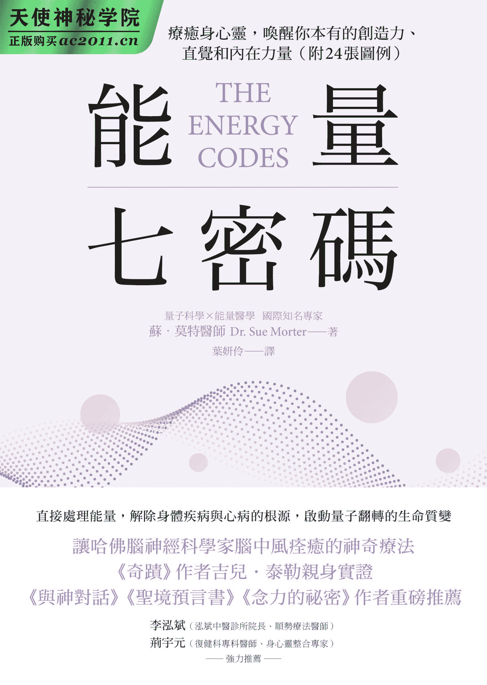

作者简介

苏．莫特医师（Dr. Sue Morter）

国际知名讲者，以及生物能量医学和量子领域的专家。创立 Morter 生物能量协会，致力于疗愈及身心健康教育。此外，她也出现在 The Opus 、The Cure Is... 、Discover the Gift 、Femme 等纪录片中。

译者简介

叶妍伶

英国爱丁堡大学翻译硕士。译有《泛工业革命》（合译）《压力更少，成就更多》《五星级沟通术，你的成功巨浪》《畅销书密码》《遇见你之前》，以及诺拉．罗伯特、史蒂芬．金等多位作家的作品。

免责声明

本书含有作者的意见与想法，目的是针对书中所提到的主题提供有帮助且信息丰富的素材。本书贩售时很清楚作者和出版社不会参与医疗、健康或本书提到的个人专业服务。读者在采纳书中任何建议和推论之前，应该先咨询专业医护人员。

本书作者与出版社特别声明不为读者直接或间接使用与运用本书内容所导致的责任、损失、风险负责。

书中部分人名和人物特征已经过修改。

名家赞誉

「我终于找到了一本书，能阐述所有灵性书籍文献中神祕的智慧与形而上的洞见，还化为我们能实际运用的知识。苏．莫特医师所撰写的《能量七密码》提供了简单到吓死人却又无比实用的说明，把所有的真相转化为操作手册，让大家真的可以隔夜就翻转人生。灵性知识是一回事，灵性工具又是另一回事。对那些准备好、也愿意建立新人生的人，工具都在这里了。作者笔触锐利，力量强大超凡。」——尼尔．唐纳．沃许（Neale Donald Walsch），《与神对话》作者

「在人类健康与意识成长转型的过程中，苏．莫特医师的《能量七密码》建立了新的境界，透过跨学科的方式进行疗愈。苏．莫特医师结合了瑜伽的运动艺术和刺激能量的吐纳法、深奥的信念和开拓心胸的静心法，带领读者进入最美好的疗愈体验——提升心智让大家发现真实的自我与使命。」——詹姆士．雷德非（James Redfield），《圣境预言书》作者

「苏．莫特医师是最振奋人心且真实的医疗人员，她用真正全人的医疗观点，专注于身体里互相连结且蓬勃有力的能量系统，包括灵魂的使命、灵魂的角色，还有利用运动的力量去彻底改变能量。每天看看《能量七密码》的七大原则，获得一份有效的处方，就能活得光彩、健康与和谐。」——琳恩．麦塔格特（Lynne McTaggart），《疗愈场：探索意识、宇宙能量场与超自然现象》《念力的祕密：叫唤自己的内在力量》《八的力量：地表最强小型念力疗愈场》等书作者

「《能量七密码》提供了深入的洞见与强效又实用的技巧，出色地结合科学与灵性的世界，这两个世界原本就交错在一起，而本书让读者看到我们的实相与伟大。我强烈建议各位阅读苏．莫特医师的杰作，她会在书中协助引导你活得更圆满充实，表现你真实的潜能。」——杰克．坎菲尔（Jack Canfield），《心灵鸡汤》《成功法则》系列丛书共同作者与《从现况到目的地》作者

「优秀出色又平易近人，《能量七密码》里面装满了深入又强大的原则和实践方式，好用又切身，可以转变人生。苏．莫特医师不但特别开明也富有远见，连结了天堂和人间，并邀请我们充分地发挥创造者的角色。我非常推荐这本书。」——艾妮塔．穆札尼（Anita Moorjani），《死过一次才学会爱》作者

「在这本强大又精采的书中，苏．莫特医师在科学、灵性与个人真实转变的境界之间搭起桥梁。她多年的研究、调查和实践会永远改变你和你的人生。当你运用这些实用、有效并经过验证的工具时，你就能疗愈你的身、心和实相。我爱这本书！」——乔．迪斯本札医师（Dr. Joe Dispenza），《启动你的内在疗愈力，创造自己的人生奇迹》《未来预演》作者

「很简单，苏．莫特是行家。你若有荣幸成为她的患者，或是在听她授课的时候就会感受到她真诚的心得，还有她整合了神圣的真相并具体实践。她在书中熟练地结合了灵性与科学，足以改变人生。苏医师将她多年的研究与经验灌入这本力量强大的著作中，比任何人都能协助你转变。你现在手中就握有一把强效的钥匙，可以开启真正的转变。请善用。」——麦可．柏纳德．贝奎斯（Michael Bernard Beckwith），天堂之爱国际灵性中心（Agape International Spiritual Center）创办人

「偶尔，会有这么一本真实、清晰、天才的书可以有效改变你的人生。《能量七密码》就是这样的书。这是使用者手册，可以让你更清楚你究竟是谁，并创造持续的幸福、健康与奇迹的人生。」——玛西．许莫芙（Marci Shimoff），《快乐不必理由》《给女人的心灵鸡汤》作者

「这本书会让你知道为什么以热情拥抱你的能量本质——有灵魂的自己——是这辈子最重要的事。非读不可！」——珍妮特．布蕾．艾特伍德（Janet Bray Attwood），《热情测试》（The Passion Test）作者

推荐序
疗愈的奇迹吉儿．泰勒博士（Jill Bolte Taylor, PhD）

我时不时会碰到其他生命旅人，我们的经历和信念竟能发出强烈的共鸣，让我忍不住跳上跳下开口歌唱。我第一次见到苏医师时不只想唱歌，简直快乐得想跳舞。不论是心智对人生的影响或生命的真义，我们的理解都非常相近，能与她对视相谈，真是其乐无穷。

二〇〇八年，我在ＴＥＤ演讲，题目是［你脑内的两个世界］（My Stroke of Insight）。这部影片在网络上迅速爆红，引发数百万人共鸣，不只是因为我是经历严重脑出血后又痊愈的哈佛脑科学家，更因为我在这过程中从神经学的角度察知了科学与心灵的关联。

微生物学之父路易‧巴斯德（Louis Pasteur）说，机会是留给准备好的人。我就是那个对的人，拥有相符的学经历，能从脑中风的经验中获得最多启示。这么说来，苏医师就是最适合从能量医学、静心、领悟和身心觉察的独特体验中凝聚智慧的人。

苏医师的父亲是米尔顿‧西奥多‧莫特医师（Dr. M. T. Morter Jr.），他是一位受人敬重的脊骨神经科医师，生前不断追求并提出尖端先进的见解，奠下生物能量学这门科学领域的基础。他开发了生物能量同步疗法（BioEnergetic Synchronization Technique, B.E.S.T）的专利技术来刺激身体的自然疗愈力。对他来说，这份对生物能量训练的追求既符合直觉，也具临床实证。

苏医师耳濡目染，生物能量学早已成为她的生活方式，是一种觉醒与深刻的知晓。苏医师既受过传统脊骨神经科教育，又有数万小时以上的临床经验，俨然成为新兴量子医学领域里的佼佼者。这是我的第一手观察，因为苏医师协助我重新平衡受伤的大脑而得以痊愈。经过数次疗程后，我觉得我象是中风后十七年来第一次回到家。

我们的社会要求所有发展中的科学都必须接受现况的挑战与测试，但传统科学必须用科学方法执行，这表示测试结果应该呈线性发展且要能够被复制。然而，无法以科学解释的疗愈奇迹每天都在发生，因为我们身处的世界并不依照线性规则运作。

活在这个时代很幸运，当前的神经科学家正运用创新的方法，协助我们去了解非线性医疗模式成功案例背后的生物机转。

那场演讲的最后，我告诉大家我中风之后努力复健，因为我看到了不同的世界，那里的人都很美丽、平和、慈善、友爱——他们知道自己每个当下都可以选择要做什么样的人。苏医师就是这样的人，她的人生使命就是要帮助大家成为这样的人。用我的话来说，平静就在一念之间。当我们有意识地选择让整个大脑一起运作，就有能力体会深刻的内在平静。苏医师将在以下的篇章介绍她的技巧，训练你获得内心的平静。我永远感激她为全人类带来这份礼物。

愿你享受人生的旅程！

（本文作者为哈佛脑神经科学家、「哈佛脑库」代言人、畅销书《奇迹》作者，

曾荣获二〇〇八年《时代》杂志全世界百大影响力人物）

前言
解开能量七密码，活出生命真相

我闭着眼睛坐在幽暗的宴会厅里，身旁有数百名与会者一起静心，这时我忽然发现自己轻飘飘浮在空中，被光环绕，炽热到觉得自己象是一团光线织成的火球。我感受到自己绵绵无尽。我可以看到三百六十度环景的每个方向都有明亮的光线，比我在沙漠中见过最晴朗的天光还要明亮十倍。我不觉得自己有一副身体，却觉得自己是一束清晰的光线。我的心灵之眼所见无限，我知道我就是那道光。我就是宇宙，我也是宇宙蕴含的万物。这道灿烂的光辉包围了一切，渗透了我的存在，这就是我。我可以看到地球在我下方，就像颗弹珠，我的每次呼吸都让光化为爱，流过我，进入地球。我的能量绵绵不绝，和万物融为一体。

没错，这个体验颠覆了我的世界！

我的意识觉醒之旅

我从小就听父母在餐桌上讨论能量：一切都是能量，我们每个人都由能量构成。我父亲是优秀的脊骨神经科医师，他的研究广受国际认同，他是脊骨神经领域的传奇、「能量医学」的先驱。我在他的影响下长大，总是希望待在他身边，时时寻求他的认同与肯定。稍长些，我在父亲的诊所和他共事，也参加他主持的知名研讨会。原本我只观察父亲的工作，后来变成一同打拚的伙伴。在我获得脊骨神经科执照后，和他在一起度过了许多有意义的时光。我们打从心底想为人类付出，每当发现能帮助更多人的新能量疗法，便十分雀跃兴奋。

尽管我如此熟悉能量的概念，却从不知道它是如此辽阔无边。在这次亲身经历后，我所认知的真实改变了。当下，我就知道这才是真正的我：我就是这股智性的纯粹能量——炽烈明亮、充满活力。安详平静。永恒。超越时空。盈满智慧。我的存在不容质疑，也不费力气。我无所缺、无所求。我非常完整、完全。这是一个完美无瑕的状态，我知道这就是我的家。它比任何真实更真确，我只想留在这里。

这和我过去的人生经验截然不同。我曾数度陷入痛苦折磨，即便在状态最好时都象是要登上陡峭的山巅。一切都好费力。每一天，我都打从心底认为自己被送上了战场。身为孩子的我为了要处理这种感受，变得很害羞、怯懦，每个转角都会让我相当害怕、没有安全感。我连续两年夏天都在场边旁观垒球队，因为我很害怕上场会「做错」；等我真的上场挥棒时，我击出了全垒打。我认为这表示在踏出第一步之前应该要多观察、学习，否则就可能会失败。国高中时，我凡事打安全牌，所有的成就都高于预期，因为我只做「对」的事，这样我才会觉得很安全，并且获得别人的认同，成为大家眼中的「好人」。我参加啦啦队和校队，成绩很好，在全国戏剧比赛中获颁「最佳女演员」，还被票选为全校「人气王」与「未来最可能成功」的学生。尽管我如此努力，也获得了那么多肯定，却始终害怕自己不够好。事实上，大部分的日子里，我都战战兢兢、如履薄冰。

到了三十多岁，因为完美主义和过度付出，我自认是好医师、好公民、好朋友，却感到疲惫不堪。尽管我获得了专业与财务上的成功，却少了爱、喜悦、圆满和真实的自我感受。我的身体也尝到了苦头，尤其是每天严重的偏头痛，让我一起床就头痛欲裂，几乎没办法上班。我发现自己愈来愈纳闷：我的人生真的就是这样吗？

有一天，我的内在断线了。虽然我的世界观里从来没有上帝，但那时候我很绝望，愿意舍弃旧有的做法，寻求协助。那个晚上，我离开房间走入阳台，抬头望着天空，用逼问的口气说：「你倒是给我说清楚啊，我怎么会这么茫然！」

就在我承认自己无法掌控人生的那一刻，出现了变化。我感觉自己更轻盈，人生开始好转。一连串巧合接二连三出现——有人邀我去静心营讨论意识与启发，有人介绍书籍给我，或教我怎么以完全不同的方式来面对人生。我参加了这些静心课，觉醒立刻改变了我对于真实的观点。不久后，我就在宴会厅有了那次深刻的体验，让我从此脱离委屈与挣扎，不再时时陷入痛苦与磨难。

我想你一定也经历过不少挣扎与麻烦，身心俱疲到了临界点，所以你能体会我的经历。或许你曾心碎，找不到永恒的爱情；或许深受病痛、压力、贫穷所苦，经常感到失望或绝望。受苦的方式太多了：自尊低落、愤怒、悲伤、怨恨、懊悔；无力放下过去，无法活在当下；愧疚、遗憾；无法创造出真心热爱的生活；或是源自焦虑、忧郁、失落、虐待；又或是因为我们失去了真实的自我感受。

我很确定你曾经历过这些感受，因为我们都经历过。这就是现代人的状况……但其实，不是这样的！事实上，人类正在演化，即将突破这个困境，我们正面临转折点，人类的意识就要有所突破了。我们常自觉渺小、痛苦、不安全，但这种观点并非唯一的选择。我们内在还有另一个选择——我们其实生来就具备另一个视角，可以透过全般意识活出我们真实的伟大。

透过「能量七密码」，我会教你如何有系统地切换到这个视角，带给人生更多收获。我会让你看到更快乐、更成功的自己，此时此地就为你所用——就像我那天在宴会厅里体验到的自己。我所认识的那个自己，每一寸都是真实的我……也是真实的你。因为这不只是我的真相，也是你的真相，那就是真实的我们。

最棒的是，我们不只能时时自发地在静心时观照这个真相，还能伴随每日的醒卧作息，放心而持续地活出这个真相——能量七密码就是我的承诺。能量七密码不是要让你学着怎么偶尔出窍，虽然听起来那可能很有趣，但能量七密码的力量远大于此。你会在练习的时候做出改变，进而让你的世界里每个面向都大幅提升进步。你将用能量七密码让所有问题全都消失。

很难相信吗？听起来奇妙到难以置信吗？我保证这都是真的。当你透过能量七密码所得到的视角去生活，你的生命就变得有意义；不仅如此，你的人生也会变得圆满。使命感与热情就是你生活的燃料。你的健康会大幅改善；症状消失了；你会觉得活力十足、生气勃勃。你会拥有一套简单又有效的工具来面对所有病痛。你会感觉头脑清晰、正面积极、充满力量，并能深刻连结自我与接下来的每一天。你的内在状态会一直感觉到自我价值与给自己的爱。你可以活出完整的自己，而不是只让理性、被制约的大脑带着你过日子。你会根据最深沉的内在智慧做决定，而你随时都可以汲取内在的智慧。你的所作所为皆是精采的冒险，而你就是旅程中最主要的创造力量。你就是人生的创造者，有意识地实践你真心所爱的目标。人生很神奇，充满奇迹、惊喜与信任。

我很清楚，因为我每天都在过这样的生活，而且已经协助数千人学会这样过生活。自从我二〇〇一年在宴会厅意识觉醒之后，便立刻体验到不同。我忽然有能力解决生活中困扰已久的问题；事实上，我不再把问题当作是问题了。我可以轻易理解每一项挑战都是要让我觉醒、进化——臻于至善。我的人生变得更快乐、更健康，远超过我过去的所有认知。我体验到自然痊愈的奇迹：偏头痛消失；脊椎侧弯打从出生就一直困扰着我，但我的脊椎在几个月之内开始修正——现在完全没问题了；接下来几年内，象是两次压迫性骨折（两条手臂各一次）还有严重扭伤脚踝，都能迅速康复，不需要靠传统患肢固定的方式。我不再因为完美主义而绑手绑脚，反而能和生命共同协作，打从心底感到轻松自在。我不再来去匆匆。我相信时机的变化。我不再觉得必须向每个人证明自己的能耐，反而发现单纯存在的美好。成功不是我的目标，圆满才是；但生活一圆满，成功好像自然就会发生。

我不需要努力招揽生意，病患数就逐渐增加，疑难杂症的挑战也消失了。患者痊愈后不断推荐亲朋好友前来。我不须外求，就有好员工找上门。州长办公室邀请我加入印第安纳州脊骨神经科医师鉴定考试委员会，我也收到其他专业会议的演讲邀请。我的生活自然轻松地不断拓展。

这些正面改变让我很兴奋，也很想一次又一次回到那超凡出神的体验。不仅如此，我想学习如何安住在那里。我的任务就是学会怎么进入那个领域——不只是为了我自己，更是为了让其他人也能体会到真实本质，并得到无穷无尽的收获。接下来那几年，我把我的生活变成行动实验室，有了许多发现，并开始分享我的发现。没多久，参与的人都开始看到惊人的成果。我知道我在进行一件大事，甚至是一场革命——事实上，对我来说，这就是在实践人类的使命！

从人类出现在地球的那一天开始，我们就在寻找不同的方式来面对自己真实、无尽的本质（也就是「有灵魂的自己」），并试图穿越那渺小、受到限制、心怀恐惧并且被痛苦约束的自我（即我们的自尊，或称为防御性格）。很多人一辈子都靠防御性格过活。当我开始和其他人合作（早期的方法后来渐渐演变为书中和大家分享的步骤），他们渐渐找到了自己的突破方式，我知道我走在对的路上，寻找钥匙，释放我们所有人的潜能。大家开始分享静心的过程不只是放松身心，集中精神进入平和的状态，而是会开始体验到广阔的真相，透过内在之眼「看」这个世界，并且能汲取内心深处的智慧——尽管他们过去并不晓得自身蕴藏了如此的智慧。他们告诉我，他们不再执着于言词争论，而能够用更高的视角看到新的解决方法，让困境中的每个人都受惠。他们发现自己更能去爱、更慈悲，更愿意原谅，身体与情绪也逐渐复原、痊愈。

我发现我们的本质时正在静心，通常只有修为高深的瑜伽大师才能进入这个领域，但我知道我们都应该要生活在那个层次——我们所有人都应该要能发现那个领域，只要我们知道怎么找。

解构能量七密码

幸好，我的超凡体验在身心留下了不可磨灭的印象。当我回到宴会厅那天的身体里，我还巨细弥遗记得每一个细节、体内的所有感觉，我知道要再度体验就是要重建当时我身体和意识的状态：我集中精神的方式、缓慢而刻意的呼吸、强烈感觉到以核心为中心、奉献的心情，还有一股亲密、温柔、关爱的感受，这全都是谜团的线索。我不断回想并仔细检视那个经验中的每个小细节，试着去重建，观察自己的意识能不能回到那个状态。

接下来几个晚上，我都花许多时间静心，有时甚至彻夜静心，白天则咨询病患与客户，落实我在超凡出神时学到的一切。每一次练习，不管有没有进入同样的意识状态，我都详细记录身心的感受与变化，直到又能随心所欲超凡出神为止。

一场又一场的研讨会、一位接一位病患累积下来，我解构了能量七密码，让我和其他人都能运用我们真正的本质。在这个过程中，一系列改变生命的法则和练习出现了。我把这套方法拆解成几个步骤，去芜存菁，留下最有效的方法，让我们都能活出有灵魂的自己。而因为这些步骤和察觉、定心与显现体内的能量有关，我将这套练习称为「能量七密码」。之后，我从研究中发现古老的典籍与现代科学都证实了我所发现的道理。能量七密码很全面、完整，最棒的是，每个人都能轻易上手。

我们有觉醒的能力，可以体验更高层次的自己，也有能力活出潜能，享受体能最佳的生活。事实上，我们人生的使命就是要做到这一点。了解、体验并活出我们的神性（不只是在静心的时候，而是在日常生活中），就能每天生活在人间天堂里。

你需要的知识就在你手中，我已经用浅白的文字为你在书中描述了能量七密码的步骤。这套系统改变了我和数万人的生命，我很确定这套方法也能改变你的人生。

发现你的伟大

你会发现，我想和你分享的不在于我求学期间学会了如何诊断问题、解决问题，而是什么适合你——什么才是真实的、对的。当我们的注意力放在病症或预防时，总是在想哪里有问题、该怎么处理。我要传递的讯息不一样。你必须先理解你到底是谁，是由什么所组成的。没错，这本书会让你知道你能够如何恢复身体、心智和情绪的健康，更棒的是，这本书也会让你知道你要怎么拥抱自身的美好，并了解到你根本一点问题也没有，这才是最深奥的真相。我希望你也能从很深刻的层次体验到这一点，并学着表现出来，每天都能活出自己的伟大。

这比任何外在成就都来得重要，不管是赢得什么奖杯、打破什么纪录、获得更多财富、减重瘦身或职场升迁。这一项内在成就比一切更重要：唤醒你的真实本质。听起来或许很不可思议，但这项工作就在人类意识的最前线。能量七密码确实很尖端！

然而能量七密码并不是一门新知识，能量七密码是圣经、古兰经、犹太圣经、印度奥义书和许多古代典籍的基础。全世界各地的文化数千年来都在追寻同样的问题，我们总会在人生某个阶段开始想探究我们是谁、为什么会来到这里。

能量疗法也可追溯到人类最古老的纪录。古代埃及象形符号就描述了利用能量来调理身体或治疗疾病。古代的基督徒把「双手贴在身体上」创造出奇迹般的疗效。早在五千多年前，古印度将人类的潜能与发展记录成文，称为《吠陀》，其中便记载了体内流动的能量，以及提高振动的频率可以加速康复，并且唤醒更高层次的意识。这些行为不是想象出来的「魔法」，事实上，这些文献都奠基于「我们都是能量体」的真相。

现在，科学研究证实了古代医者早已明白的道理。科学证实了人类能量场的存在，这个能量场就和我们的身体发肤一样真实、敏感，而且会剧烈影响我们的物理现实。例如，我们发现了ＤＮＡ其实是透过能量场接受指令去行动。在史丹佛大学医学院教授布鲁斯‧立普顿（Dr. Bruce Lipton）的研究中，我们也发现了细胞壁表面传来的刺激会启动基因，造成生物有机体的变化，但过去大家都以为启动基因密码的是细胞核。这表示细胞环境传来的讯息（包括我们的思想和情绪状态），都会在细胞表面产生能量流动，决定了这个细胞接下来要做什么。这项发现贡献卓越，开启了一门新的学科：表观遗传学。这表示比起基因遗传，环境对人们的健康安乐更为重要。这个环境就是由我们每个人思想与行为的能量所构成，思想和行为会产生化学分子并造成化学分子移动，进而启动ＤＮＡ与细胞功能；换句话说，我们所想、所做的事会影响我们的能量，我们可以创造疗愈的可能！

看到这些新突破，储存与维护能量流的重要性就更显而易见了。如果我们想要掌握真正的潜能，就必须打造大脑与身体中的回路，才能有意识地以能量体的形态生活。当我们这么做，就能全面疗愈自己，并像大师那样创造出伟大的人生体验。

我不需要科学来告诉我这是真的；不过，因为我从小在重视科学的家庭长大，如果有一件事能获得科学支持，那我心中被制约的科学家就会很高兴能有这些科学证据来验证我的经验。科学实证可以帮我的大脑追上我的心、我的直觉和与生俱来的深奥智慧。

幸好，现在科学很进步，可以缩短距离，让可见的物质世界愈来愈接近不可见的直觉、意象与心灵世界。这么一来，每个人都有机会可以在通晓道理之前就先体验并信任这个道理！

眼前的问题是：我们要花多少时间才愿意把追求自己的真实本质当作人生要务，并开始追寻？我们什么时候才会明白，其实透晓生命的真实本质并以本质生活才是人生中最重要的事？答案往往是我们要在痛到无法承受以后才会开始寻找方法，探寻人生是不是还有更多意义。但我想问，何不现在就开始活出最真实的自己？为何要等待？现在就开始的话，你接下来的日子都能欢庆你这辈子最高的成就了。本书会引领你一步一步完成这个目标。

书里写了什么？

在第一部［全新的观察方式：量子翻转］中，你会建立起基础，就能成功地从现在被恐惧所限制的生活方式，转变为真正的自己，活出完整、充满创意、不受限制的自己。这个部分会打下根基，让你能和自己互动，也能和外在世界互动，这样你就能运用无穷的潜力，创造出真正想要的生活。了解第一部的内容之后，你就准备好要迈向有灵魂的自己、展开第二部的学习。

在第二部［全新的存在方式：能量七密码］中，你将学会七个能量密码，开启你内在需要的电路，活出有灵魂的自己。能量七密码是一套完整的系统，可以修复不平衡的状况，唤醒你真实的伟大，最重要的是，让你过上神奇的生活。简单直白来说，这七个密码会让你知道如何体现真实的你，创造出你真正热爱的人生。

以能量作为医疗方式，你可能是第一次探索，或者已经很熟悉这个领域。不管你是哪一类型的读者，能量七密码的革命性方法会提供独特的洞见和程序，不只改变你的人生，也会影响你周遭的每个人。

在第三部［全新的生活方式：心想事成］中，我们会讨论要如何将能量七密码整合到日常生活当中，也会让你知道这个崭新的生活方式最终将如何放大你的存在感，以及你对这个世界的贡献。

本书是一套强大的转化工具，理论来自量子物理、神经生物学与能量疗法，我费了很多工夫才让这套方法可供读者自行操作运用。从见证的结果看来，你可以是完全崭新的自己（更健康、更快乐、拥有更多能力），只要几个月，甚至几周，就能从现在开始感受变化——只要你应用在书中学到的知识！不管你用哪种方式生活，日子都会过去，所以我要邀请你真正拥抱这项功课——我保证未来的你会很感激现在这个决定。

准备好要开始了吗？很好，来吧！

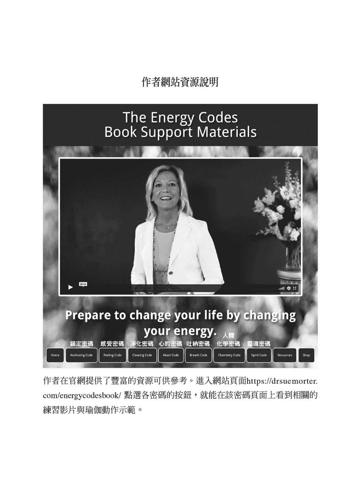[作者网站](https://drsuemorter.com/energycodesbook/)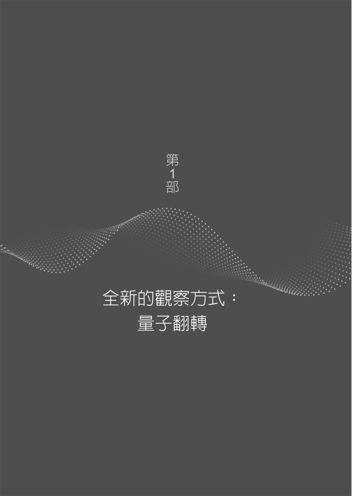

第一章
觉醒：从痛苦转为狂喜

「一切都是能量……包括这张讲桌。」我经常在演讲时这么说，然后用笔敲敲木质的桌面。当这两样固体相碰发出声响，我可以看到有些观众的脑筋通了。

我的演讲里最重要（同时对许多与会者来说最惊人）的讯息，就是在身体这个具象有形的形态之下，人类都是纯粹的、智性的、有意识的能量——就跟宇宙万物一样。

我们通常不觉得脚底踏的地板、使用的设备或是我们遇见的人都由能量构成，但其实这一切都是能量。更重要的是：我们每个人都是能量。人类五感所察觉到的物质世界其实就是能量经过压缩后，变得密集到让我们得以触碰。我们把压缩过的能量称为物质，但实际上这就和光波、声波、脑波或其他种能量一样。

能量七密码改变了我的人生

我父亲是能量医学界的先锋，当他的女儿就表示我从小听到、也看到很多事情，能证实我们的本质就是能量。我的父亲莫特医师在长远的职业生涯中担任过两所脊骨神经学院的院长，他也是研究员与教育家，和全世界数十万名病患与医疗人员携手，永远走在医学突破的最前线。尽管我接收到的信息已经相当震撼了，我和父亲共事多年期间的所见所闻还是没办法让我做足准备，见识到身为能量体究竟是什么意思，又有什么意涵。直到我深刻体验到，原来我就是能量，我才以最深切的方式了解到我究竟是谁、我究竟是什么——进而发现我们所有人真正的本质。

我们都是能量。我们的身躯、心智、想法，都是能量。我们的血肉和骨骼也是能量。我们是纯粹由能量组成的立体生物，而对这个真相了解的程度，决定了我们是生活在痛苦中，还是狂喜中。

在我觉醒之后，我发现父亲的研究中并没有提到我们究竟是谁、到底是什么。学习从纯粹意识的层次去宰控自己，并从不可见的「灵性」能量层次由内而外来探索人生，对我来说很新鲜，因此我向古代东方传统与修习过内功的大师请益，寻找答案。最后，我离开了家族企业，走上自己的道路，传授我所实践与体验的深奥真相。我以为父亲能够理解。他说他懂，毕竟，他刚开始从事医护工作时也做过一样的事，他也从家族中开拓出新路。我离开家的时候他很失望，而且我有些决定得不到他的认同，但整体来说，我们两人就象是硬币的两面，都在治愈世界各地的人，并带给众人力量。

父亲往生那年，我五十一岁。他离开人世时，我在他身边握着他的手。我不希望他离开，他是我的偶像、我的英雄、我的导师。他所开发出来的基本技巧，我每天都还持续在运用。我们共享了那么多东西，就算当时我俩已经不再并肩工作。我简直无法想象没有他的人生。

父亲过世前对我说：「我打从心底爱妳。」

我轻声对他说：「爸，我也爱你。」

他去世之后过了两周，我在科罗拉多主持一场三天的女性营队。还有二十分钟就要上台，展开营队的第一堂课，这时我收到了哥哥泰德寄来的电子邮件，内容很简单，「这是爸的遗嘱。」我母亲多年前就过世了，所以他们夫妻的遗产要怎么分配都写在我父亲的遗嘱中。

我读完后倒抽了一口气。我父母的房子出售后所得会按比例让我继承一部分，而其他所有地产都只给我的两个哥哥。

他不爱我了吗？我纳闷着。我做错了什么，为什么会被他排除在外？我摸索着身旁的椅子撑住自己，泪水盈眶。好几分钟过去了，我只能坐在那里摇头。怎么会这样？我觉得天崩地裂。等一下我要怎么上台讲课？

我并不需要、也不想要这笔钱或这些物质的东西，不过无法得到我母亲的茶具和画作确实打击很大。那不是重点，重点是父亲在遗嘱里将我排除在外，我无法想象比这更决绝的行为了。我们一起工作、一起发现、一起成就。我的青春都用来争取他的认同和注意，后来我还花了很多年，不远千里替他授课，有时还必须放下自己的工作。此时，我觉得他撤回了所有的支持，不再认同我这个人和我所做的一切。那股痛苦很深刻，简直无法承受。

「苏医师，准备好了吗？」有个声音把我拉回房间，提醒我即将要上台。我现在怎么能替其他人上课？我又问自己。然后我想起了我的工作，还有我传授的真理。我得振作——恢复我的思绪、情绪，还有最重要的能量。我得重新整合自己「粉碎四散」的能量，才能感到完整，得以继续我在这世上的使命。我立刻运用过去十五年来的发现，把我教导别人的道理应用在自己身上。

我用了「能量七密码」。

首先，我的身体静了下来，安全感与平和感洗涤我全身上下。我的思绪也静了下来，稳稳降落在踏实的自我意识上，就像一团温暖的光球在我体内愈来愈大、愈来愈亮。霎时间，我知道自己没有被这意外的转折伤害。一切都会好起来。我从经验中知道几分钟前似乎毁天灭地的事，未来会在更广阔、更完整的脉络中帮助我。

最主要的是，我又能感受到父亲爱我的真相了。我可以看得出来，最终，这份遗嘱的安排不是一种背叛。我可以把他的安排当成是爱的礼物，会在最完美的时间让我知道里面包了什么。

新的视角接手之后，我脸上绽放了笑容。我从内心深处感受到力量和能量。我等不及要上台，一年之内我有超过两百五十天都在做这件事：将我们令人赞叹的发现分享给大家，让更多人知道自己究竟是谁，并且在有意识地透过这种观点来生活之后，我们如何能奇迹地转变生命的每个面向。

那一周随着日子过去，我持续运用能量七密码，保持冷静、关爱，体验每一个当下。接下来那几周和那几个月，只要浮现关于我父亲遗嘱的负面想法或情绪，我就会再度使用能量七密码，不只是处理负面的想法和情绪，更从中获益。我更能谅解身涉其中的每一个人，最终理解这个安排背后更深远的意义（我会在后面的篇章和大家分享）。

此时，我必须说，如果这件事发生在我年轻一点的时候（在我灵性突破之前，或发展出能量七密码之前），结果会非常非常不同。我会把父亲的选择理解成「我哪里有问题？」或是「我做错了什么？」，然后陷入质疑自我的漩涡里。我可能会觉得很愤怒、很受伤，或许因此远离家人，可能还会毁了我们之间的关系。因为我的职业和父亲紧密相连，我或许还会抛下毕生的职志。我很确定那对我来说会是一条痛苦又委屈的道路。

我怎么知道？因为任何人在还没有体验到生命本质之前，当我们碰到难关，就会觉得自己不够好，似乎自己有什么缺陷、错误、问题。若不知道其实我们很完美、完整、完全，若不认识「有灵魂的自己」，我们就只能走「我不够好」的旧套路，不晓得还有其他选择。

人类的问题并不在于不完美、有缺陷或有问题，我们的问题在于相信自己不完美、有缺陷或有问题。这个根深柢固的误解形成了所有问题的基础，导致我们无法发挥全力、深感痛苦。这项误解会把礼物变成负担，把爱变成得不到回报的需求，把难关变成毕生的折磨。

幸好，我们不必再继续活在这种误解中。我们不必一直告诉自己我们是谁，还有生命中有哪些是「真的」。我们可以找回自己的伟大，实现自己的伟大，并且接纳自己就是强大的能量体，然后从这里开创新局。

只要我们记得我们都是能量体，能量就是一切的关键。

活在痛苦或狂喜中

我在静心过程中不由自主转化为「光束」，这个体验让我看到了真相：我的本质就是能量体，我再也无法忽视或否定这个真相。当我化成明亮的光束漂浮在空中，我进入了另一个实相。我觉醒后用不同的方式观察人生，也看到了我自己在里面。感觉就好像我在潜水，从面罩后面观察一切，我知道当下所体验的水下世界比岸上的生活更真实、更真切。那感觉就象是我已经在那里待了一辈子，永远都不会离开。我在那里感觉就像回到家一样，比我过去的任何一个「家」都更自在。我这辈子大部分时间都觉得很害怕，但那时候，我不但不害怕，还忽然觉得自己非常的完整。我不需要去哪里，不需要做什么，我就能绝对地存在，与万物合一。

这种全面包围我的完整感受，和我以往体验到的自己截然不同。我在父亲的研讨会中和他合作时，确实找到了使命与意义，却一直深受偏头痛与疲倦感所苦，连续多年都需要在午休时小睡。我随时做好准备，去预防冲突、修补问题，并且满足每一个人。人际关系通常需要费心经营，但我总是能「让一切顺利」，即便这表示有的时候我必须违心。从脊骨神经科学院毕业之后，我成立了自己的诊所，在外获得了成功，内心却少了真正的满足与深刻的喜悦。简单来说，我很委屈。不是因为我做错了什么，而是因为我没有顺从自己真实的本质去生活。

当我们受委屈，并不是因为我们有缺陷或是不值得过好日子，而是因为我们想要解决问题、减轻痛苦、克服挑战，却用当初产生这些痛苦、挑战与问题的方式来处理。这些问题是怎么来的呢？都是因为我们的思维和防御性格。

☼防御性格的痛苦视角

在认知到自己是能量或灵魂之前，我们都相信每个人就是一具身体，有自己的想法。光是这个对于身分的误解就导致了许多说不出的委屈，这是生命中所有问题的核心。

为什么？因为这个观点让我们看不到自己真实的本质，会觉得少了什么，所以我们认知到自己有缺失、有问题、有错误，然后我们会把所有的时间和精力都用来弥补那个不足的感觉，我成长的过程和刚执业那几年就是这样。压力、失能、疾病都是这种误解的副产品。我们觉得少了什么，就会努力去证明自己是对的或是我们值得过好日子；我们会想要去弥补错误。我们如果还不晓得自己就是能量，就无法感觉到自己生来就圆满、幸福。为了在人生航行时获得方向感，大脑就开始编故事，叙述着我们哪里有缺失、有问题、有错误。

这些想法和主张就会在能量的层次影响我们（因为我们就是能量）。思考的力量会影响我们的实相，这些内心剧场也一样。当大脑看不到其实我们和宇宙交织在一起，万物原本就都合而为一，就会开始写故事，说我们多么孤单、孤立，我们看到的自己都孤单无依。因此我们感觉很孤立，觉得不安全。我们以为自己需要被保护才能存在于这个世界，便随时提防威胁，扫描着外在世界，看看有哪些地方还没有得到接纳、认同，还没有获得足够的爱——我们以为要这样才能够安身立命。我们没有从自身的欲望出发，积极追求我们所爱的人生，而是一直在想办法求生。

这个奠基在恐惧之上、以求生为中心的个性，往往被称为自尊或错误的自我意识，但我称之为防御性格。不管你叫它什么，这种防备心强烈的人生观会限制我们，导致我们不愿尝试，因为「安全」最重要。这让我们的人际关系都有条件，让我们失衡，不时产生压力，最后大幅消耗我们的体力、心力和情绪。

除此之外，防御性格参与了一场没有胜算的战争，因为它以为问题就在我们身上，整场战争都是基于这个毁灭性的信念。尽管我们都有方法来处理这种心态，甚至还能扭转这个观念，但所有人都无法脱离这痛苦的视角，因为人类就是这个样子……可是，实情并非如此！

所幸，能量七密码最深刻的作用就是整合防御性格与我们真实的本质——有灵魂的自己；整合之后就能提供几乎无限潜能，可以疗愈生活的每个面向。我们在改写规则、扭转局势，扬弃只能靠防御性格过活的旧观念。我们要进化成全新的人种，用更完整的方式去活、去爱、去存在。

☼人间天堂：进化为有灵魂的自己

当我们把自己视为纯粹、伟大的能量体，旅程就会自动展开，让我们体验圆满的人生。就是那么简单。

原本我们的大脑创造了许多以恐惧为基础的故事，在我们知道自己就是能量体之后，就能跳脱这些恐惧剧场来生活，我们都有选择，可以用另一种方式生活——发自我们的本质，活出有灵魂的自己，用这个视角看世界。我们不再专注于外在事物，不断观察周遭环境有没有任何危险或威胁；我们将注意力转向内，注意内在或周遭的能量，让这股能量显示一切的真伪。当我们这么做，人生就能顺风顺水，爱与拓展的机会将自然流露，我们只需要挺身而出、大声说好，让机会迎面而来。我们充满爱，也充满力量。我们会知道自己与万物合一，也能感受到自己与万物合一，不再空虚。压力和烦恼不复存在，因为我们知道，生命中的一切遭遇最终都是为了让我们更幸福、更宏观，不须怀疑。

我所描述的这个平和安详、神奇奥妙的状态来自亲身经历。我唤醒有灵魂的自己、展开生命旅程，就是在我决定随遇而安、顺势而为之后，一旦觉醒就再也回不去了。我感觉身体在发光；我的大脑只想要沉醉在那个状态里，不想去分析；我获得了全新的视角，看到了我们真实的本质与身分。尽管我当时还没整合我的体验（事实上，我本来觉得有点晕头转向，还被带到附近的房间躺下来休息），我知道我所认知的真相从此改变。后来证实了我的观察是对的，在那次体验之后，我的生活出现了许多精采的发展，一点也不夸张！

那晚我回到家后，进入了狂喜的状态，完全不想离开。接下来那几天，当我的头离开枕头时，会觉得自己似乎忽然回神，有一种直升机就在我头顶盘旋、准备起飞的感觉。就好像我接收了超高频率的能量，我的身体和心智都搞不清楚状况。然后，当我躺下来或开始静心时，就会立刻沉浸在难以想象的超凡境界。我的脑海中出现斑斓绚丽的各种色彩、形状，不同的次元也在我脑海中开启——那是我见过最美丽的景象。接下来许多藤蔓花样同时绽放，让我接收到许多讯息，看到不同的真相。一切都如此宏大、明亮、纯洁！我在狂喜中，那就是梵文和瑜伽修行者所说的「三昧」境界，我一点也不想离开！

连续好几天，我躺在床上，单纯体验着自己成为一股纯粹的、天堂般的能量。我的防御性格开始和有灵魂的自己结合，我感受到脑中和心中的自由，感受到身体松弛下来，深沉又美好。我花了很多时间体验这奇妙的感受，因为认知到我们都是宇宙中的存在而敬畏不已。这个过程并不只是一瞬间。这难以捉摸的能量展开过程只是第一步，接下来我才逐渐理解到身为能量体，活出有灵魂的自己是什么意思。

过了大约一周，我已经整合了足够的超高频能量，可以自然地站坐行走。即便如此，卧室以外的世界感觉好喧嚣。我变得异常敏感，能够注意到日常生活中的任何细微声响，象是背景里的广播和电视，还有迅速移动的人事物——匆匆经过我身边的行人、急驶而过的车辆，甚至是餐厅里团团转的服务生。刚开始，我的身体很轻盈，几乎察觉不到。后来，随着时间过去，我开始能有意识地更持续定心于体内，产生了一股不可思议的力量。

即便如此，回到原本的日常生活还是一大挑战。我觉得自己在「两个世界中来回」，不知道如何正常运作。我再也没办法看着对方的脸、辨识他们的肢体语言、信任他们所说的话了。我开始看到他们在表象之下所展现的能量。有些讯息自动在我面前透露，感觉更真实、更正确。我的注意力被拉到实相的另一个层次，过去我完全无法察觉，就算是幼年较敏锐时也没有这种观察力。

☼我的选择：接受内在的认知与导引

我大约六岁的时候，有天在河床上玩，阳光照耀着小溪水面上的阵阵涟漪。蝌蚪在浅水区嬉戏，夏日的空气完美静谧。我看着我的手在水面上，周围有淡淡金光，朝四面八方散发。我在那个年纪时，经常可以看到每个人身上不同颜色的能量气场——例如，我爸爸在治疗病患或教学时会散发能量，我妈妈在画画时也会，还有学校操场上的其他小朋友。我以为这很正常，大家都看得到。

然而好几次当我提到我所见的气场，听其他人说他们没看过这景象，得到很痛苦的经验之后，我开始害怕别人觉得我很奇怪，并且否定我；到了八岁左右，我干脆关闭了我的能力。可是，在我二、三十岁时，我又忆起了那美好的经验，很向往能重新再见到人们的气场，但我已经办不到了。我怀疑这一切是不是我「编」的，就像很多小朋友都会捏造故事一样。

当我进入能量场之后，我不但又能像小时候一样看到众人的能量，还可以感觉到。这一直都是真的，只是我说服了自己，所以我才看不到！

我又再度发现自己能察觉别人察觉不到的现象，也再次因为这项能力感到不安，特别是因为我常常没办法解释我看到了什么、感觉到了什么。我把我看到或察觉到的讯息拿来问病患，他们却不承认我提出的现象。他们的能量模式显示出难受的情绪，象是悲伤、恐惧或愤怒，在我看来很明显，可是他们都说「我很好」「我没事」。

只是这回我不再隐藏我的观察了，我会坚持到底。然后我发现病患本来不晓得我在说什么，却在复诊时说我的观察才是对的，只是他们一直没发现。例如瑟西儿来就诊时，我发现她的能量很弱，便问起她的状况，当时她说她的感情很顺利，后来回到诊间却说她一直在否认，其实她和先生之间有很严重的问题。当我发现布莱恩周边的能量正在消失，他也说他没事，不介意因为工作必须出差，后来却说他发现自己该换工作了。这种情况多不胜数，很多人会回头告诉我，他们不晓得自己的心结，但在门诊结束后「灯就亮了」。

我可以观察并感觉到一个人能量场的扰动，而那个人甚至都还没察觉。我经常因为观察到缺损的能量场而开口关心病患，点醒他们，这才发现了潜藏的问题，象是幼年遭受性侵的创伤或不健康的行为模式。只要病患的意识点亮了，照亮更大的格局，就能解决这些问题。我注意到我的洞察纷纷得到证实，就象是别人的意识只能察觉到表象，在那之下还有一层细微的真相，需要时间和细心，那层真相才会更明显。

其他改变有点难处理，象是我愈来愈能感知自己的能量场。有时当我在和别人说话，我会感觉到并看到自己身边的能量场，接着忽然感觉到我的能量覆盖了其他人的能量，但其实我们之间还有点距离。我会不由自主往后退，这样我的能量才不会太强势，但那些人就会往前进，缩短我们的距离。这让人很苦恼！感觉就好像我们在彼此的能量场「里面」，因为我们的能量完全叠在一起。我会一直往后退，然后他们一直靠过来，最后我们就在会议室里或人行道上前后「舞动」（后来我发现能量场本来就会重叠，除非神经系统发展出敏锐的感受﹝或称为「回路」﹞来察觉，否则我们不会发现，大部分人都觉得人和人之间的空隙「没有什么」。但能量场其实就是社会最基础的建构方式，让我们彼此相连）。

这种全新的存在方式刚开始会有点尴尬，我和世界的每一次互动都在说「我回来了」。真实的我回来了。我小时候虽然经历过很特别、很神祕的时刻，但现在的我感觉更自在、更沉着。我不分日夜、不需理由就能感受到喜悦、温暖、闲适。我呼吸的方式不一样了，比以往更深沉。我知道一切都很好，过去工作或人生所经历的痛苦都会变得不同——好像有些「答案」已经呼之欲出。

同时我也知道这个全新的、放大的、真实的自我必须学着如何在持续面对的矛盾冲突中找到方向——怎么做出「理性」的决策，又同时顺从内心所知，不只是为了我自己，更是为了让我能够当个好医生、好朋友和许多社群领袖的好闺密。举例来说，很多时候我看得出有些大型都会区社群的领袖有操守问题，这项情报能让我做出最好的决策而不致为难，也不会让我觉得自己是叛徒。有时我和别人说话时，可以清楚看到他们挖洞给自己跳，只是为了保护或防守那个「比较狭隘」的自己，好像他们潜意识中很坚持要用那个虚假的身分生活，靠小题大作和悲情痛苦地活下去。

简单来说，我现在所能看见的真相——我们其实都是完整而强大的能量体——不一定符合别人对自己的观察，或他们生活的方式。我发现自己站在交叉路口上选择：我该顺着真相走吗？要生活在狂喜中，还是回到自欺欺人、否认真相的痛苦生活里？我在人生中所累积的一切，我的友谊、事业、感情好像都会成为赌注，但我可以清楚看出这个新的真相比一切都还重要。这是我的真相，我决定要走下去。

渐渐地，我顺着内心浮现的能量讯息，选择了狂喜——有时我的选择超越了逻辑或别人眼中的真实。有些顾问强烈建议我在临床医疗过程中纳入特定的仪器或手法，或是宣称那是「医疗科技的最新突破」，但如果我觉得这项建议不太对劲，就能轻松选择说「不了，谢谢」，然后过了几个月或几年，就有报导证实那项仪器并没有宣称的效果。有些会议看起来好像是很棒的机会，可是如果能量流没有鼓励我，我就会婉拒这类邀请，随后会发现参与那个商业行为或机会的人有操守问题，尽管有时可能要等好几年才会水落石出。

恩典引导着我的人生，让我觉得备受保佑。有时我只是特别注意到一个特定的方向，接下来（通常是几个小时或几天之内）就会有个很棒的机会邀请我去那个地方（参加纪录片录像或在重要的会议演讲），而我根本完全不需要费力去安排。还有数不清有多少次，当我想和一个很久没联络的人搭上线，我会打电话或传简讯给对方，然后马上就收到对方回讯那天正好有个问题要问我，或是想跟我分享看法，然后我就出现了！

我的生活变得很奇妙，用轻松不费力又充满喜乐的方式自然开展，过去那种让我瘫痪的不安全感、内在冲突和自我质疑都消失了。我终于能站在高点，接收决策的频率，不需要想太多。我只是顺从看见的能量，感受到起心动念，当下我就知道自己真正的选择是什么；然后，奇迹般地，这些瞬时动的念永远都是对的。各种事件的发展都证明了我的直觉比我受过教育且重视逻辑判断的大脑还会做选择。不管是成立新公司、办公室搬迁或释放掉和我理念不合的合作关系，这些决定现在都变得很简单，都来自我内心深处。流过我身体的能量成了我的指南针，随着时间过去，我不再需要外在意见来认可我的决定了。

用这种绝对的内在认知与导引来过生活，给我的不只是自由解放而已。我不再努力奔走、协调安排，违背我的意志去调整生活，我让生活来带领我——一条正确的道路就自然出现，在我面前展开了。有一股更高深的智慧超越了我受过教育但受到制约的大脑。

当我顺应内在逐渐明朗的真相，人生的新方向于焉展开。我感觉到有一股力量带领我去开设更多能量疗愈课程。我在自己的诊所候诊室开课，这些课马上就额满，学员多到只能站着上课。我也定期开设静心课，和病患与学员分享自己在静心过程中的体验。

☼能量译码

有天晚上在静心的状态中，我发现一道能量直接从我的脊椎中央，环绕在我的下骨盆。这时候，我的大脑中心「亮了起来」，让我全然感受当下，有一种通晓一切的感觉席卷全身。接下来的那堂课，我引导所有学员进行类似的过程。当他们依照我的顺序静心时，我观察他们的能量场如何回应。我看得出来我的分享协助了很多人唤醒自己调整或掌握能量场的能力，在生活中创造出更多改变。接下来的那堂课，他们纷纷说起两堂课之间有哪些新进展。

一周又一周、一个月又一个月之后，他们都经历了真正的转变。例如邦妮终于在优柔寡断许久之后，发现她其实可以辞掉工作。妮可在修习多年后有了突破，终于进入深沉放松的静心状态。寇特妮终于能在静心时放下防备，让能量流过全身，终结了持续二十年的偏头痛。能有这些成果，都是因为他们持续练习用特定的模式吐纳、放松大脑并透过引导来静心。我持续观察、做笔记并开始译码。清楚的原则和做法逐渐浮现，最终成就了你在本书里将学会的能量七密码。

我还受邀到附近的医院谈我在诊所里分享和传授的能量医学工具，当时主流医疗根本还没办法接受这种主题。这些演讲活动的回响很热烈，因此我收到愈来愈多邀请，规模愈来愈大。这一切都发生得很快，而且毫不费力，全都是因为我随遇而安，对可见的能量大声说好，让这股能量与生俱来的智慧从我内在散发出来。我确实看到能量从一种处境流向另一种处境。

现在的我把所有处境都看成是宇宙的波动，在推着我朝伟大的自己前进。我把存在已久、毫无帮助的人脉化成了动力，并且在伤痛中找到爱的存在，甚至化解了原本疏离的关系。除了彻底治愈偏头痛和脊椎侧弯的问题，我还觉得自己比二十年前更年轻。我现在不但相信奇迹，还经常看见奇迹。既然我现在知道这些奇迹的源头在哪里，也知道要怎么进入源头，我就能经常协助别人在生命中体验奇迹。

我们确实可以过着这种充满恩典的生活，这其实是每个人与生俱来的权利。我们每个人和我们的生命其实原本就是这样设计的。因此，既然这可以发生在我身上，也必定能发生在你身上。

事实是，醒悟到个人身分的变化（从原本依赖防御性格求生到活出有灵魂的自己），就是人生的终极目标。当灵魂接触意识，人类醒悟到真相，我们就会明白平静的真义。这就是我们存在的意义——发现我们有灵魂、身为能量的本质，并且以真实的本质在具象有形的躯体中生活。我们要来唤醒人性中的神性，感受人间天堂，活在万物合一的空间里。

我们此时此刻就能获得这一切。要怎么做？因为事实上我们已经是有灵魂的自己了，我们可以自发地在十亿分之一秒内体验真相，就像我那天的静心过程一样。真相就在这里，等待我们去发掘。我们并不需要到特别的地方做特别的事才能成为有灵魂的自己。没有证照，不需要跳火圈，只是……我们不晓得。我们不晓得自己真实的本质，才会陷入防御性格的状态。

我将透过能量七密码教你如何发现你很完美、很完整，唤醒你真实的自己，明白你的伟大，并增加真实自我在日常生活中的存在感。觉醒之后，你的人生就会有神奇的转变，就和我一样。

尽管有些人能自动从防御性格转变为有灵魂的自己（象是我，或是很多人也曾经历过类似的深刻变化），但对多数人来说，实践有灵魂的自己要分成好几个阶段。不管你过去是否曾经刻意朝觉醒的目标练习，事实上你这辈子都在试着觉醒，因为这就是我们来到人世间的目的。没错，你生命中所有遭遇都是为了要唤醒你真实的本质，因此，我认为人生就是一场「觉醒项目」。

明白觉醒的过程之后，你就可以帮助自己有意识、有目标地以更快速、更轻松、更优雅的方式觉醒。我已经为你建立了觉醒模式，当你能「看到」我们演化前的模样和未来演化的方向，就可以帮助大脑完成这项改变，更充分地观察并活出有灵魂的自己。

觉醒模式

觉醒模式反映出进化过程的三个意识层次，层次愈高就愈能发现及活出真相。觉醒模式像硬币一样，有正反两面。模式的背面（如图 1-1 硬币图的数字面）又分成两个阶段，代表了防御性格。当我们身处这个阶段，是一直在求生的状态，利用身体的预设反应，把所有精力都用来思考怎么保护自己，拟定维安策略。当我们随遇而安，不再依赖神经系统的反应或神经回路，并打造出高能量的全新回路，就走到了觉醒模式的正面（硬币的人头那一面），这时我们便能够发挥创意和天赋，成为生命的创造者。来到觉醒模式的正面，我们才能进驻能量所处的位置，有意识且主动地透过有灵魂的自己去创造人生。

☼第一阶段：受害者心态

觉醒模式背面的第一阶段，在图 1-1 的左下角，就是在求生时从受害者的角度看世界。简单来说，这个阶段里的人觉得人生就是要接受一连串的遭遇，而且相信自己根本无力反击。在这个阶段，我们完全不知道自己有创造力和影响力，所以会有很强的宿命感，很会逆来顺受。我们相信自己没办法做想做的事，因为外头的阻力并非我们所能掌控。事实上，我们可能在觉醒模式的背面住太久了，甚至不晓得原来自己不快乐，或其实人生可以不必这么苦。我们只会一关又一关地过，以为就只能这样子活下去，因为人生就是这么苦。

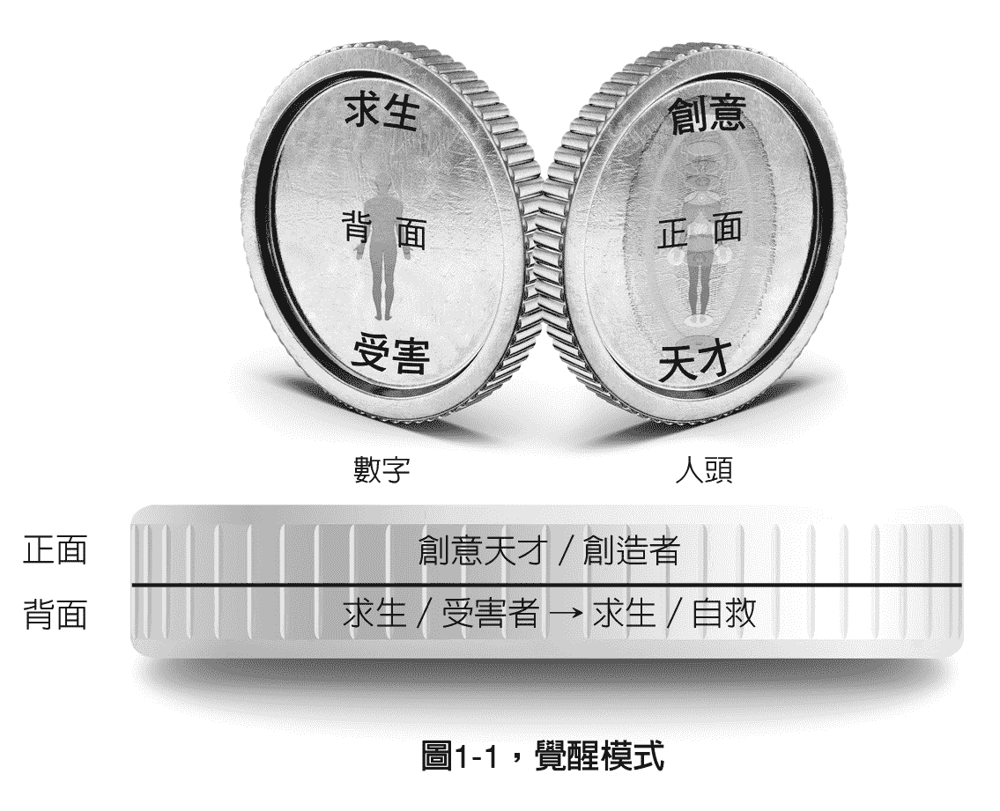

例如，在第一阶段里，你可能会认为你不快乐、不满足是因为出身贫困，或是没机会上大学、结婚结得太早、没有机会追求你的热情或职业，或者没有足够的钱去做真正想做的事（甚至你可能连想都想没过你为什么会不快乐）。这个阶段会有愤怒、恐惧、绝望、无助、沮丧、宿命、努力活下去等情绪。这阶段的人的人生观认为「人生就是一关又一关，我没办法控制，人生就是这样」——你或许没有这样讲，但这个观念自然推展到生活中，被你当成了人生的真相。

☼第二阶段：自救

这是现在大部分人所处的阶段。他们的意识已经从第一阶段往前进一大步了——可是还在觉醒模式的背面，因为这些人仍旧是靠防御性格在过活，潜意识里还是觉得自己不够好，并未透过有灵魂的自己了解自己真实的力量和伟大。

在这个阶段，我们不再接受命运悲惨论，而是觉醒后认为我们活在痛苦中，但有可能不必活得那么痛苦。我们不再是向命运低头的受害者，觉得自己可以做点改变，可以更快乐、更健康、获得更多尊重、完成更多成就，所以开始想着要做点什么才能创造这些改变。

在这种思维里，我们还是觉得人生（不管「好事」或「坏事」）都是生命设下的关卡，但至少我们相信自己可以做点什么（不一定一辈子都能创造改变，但至少某些时间点可以）。我们发现自己经常能够改善处境或解决问题——有可能在选择特定的观念和行动之后，就能掌控我们的遭遇。有了这种正确的思维，我们告诉自己吃得苦中苦，方为人上人，并且在过程中发现痛苦带来的礼物和益处。这个阶段里的人经常想着：「虽然人生很苦，但吃苦就是吃补。」很多人都认为：「不如意，我就去解决问题，这些挫折不会打倒我的。」

我之所以称这个阶段为「自救」，是因为我们在这时会努力去修补自己或别人身上的错误、缺失或伤痕，努力过得更快乐。很多以应对技巧、心理治疗、励志成长为主题的书或课程都落在这个意识层次上——诊断问题之后，就忙着去修复。这个思维确实曾经帮助我减轻痛苦，并在我年轻时协助我达成目标，我非常感激，也很感谢这个思维帮助了我的许多患者。这比活在困境里好太多了，而且这个观念也帮助了我们许多年。不过，这还不是我们想要抵达的高层意识，而且这个观念并不重视我们真正的能力。

不断寻找、发现问题，并且砸资源去处理问题，只会让我们更擅长解决问题，导致我们需要问题来解决，才能「了解我们的本质」。在这个阶段，我们还是要靠痛苦来察觉喜乐与自身的完整。如此一来，我们永远无法跳脱陷阱。从更深的层次来看，第二阶段的我们其实还是觉得自己有所不足，只是有工具来弥补缺憾罢了。我们还是没把自己当作能力强大的创造者，所以这种思维没办法帮我们往前进。

幸好，我们可以到另一个意识层次，超越「人生给我什么材料，我就尽量做出好产品」的观念。在觉醒模式的正面，我们可以体验到自己真实的本质、能力和光芒。当我漂浮在地球上方，沐浴在自己的光华之中，我就理解了自己的本质——以及我们所有人的本质。对，包括你！

☼第三阶段：创造者

觉醒模式的正面对人生有非常不同的诠释。在这里，我们可以透过有灵魂的自己成为充满创意的天才或创造者。你会发现人生中没有所谓的逆境，也不需要吃得苦中苦才能成为人上人，或是在黑暗中寻找一丝曙光，因为人生打一开始就没有什么错误、缺失或伤痕。虽然说「黑暗中的一丝曙光」是个很美丽的概念，当我们被困在觉醒模式的背面时可以帮助我们，不过到了正面，我们知道人生中所有的挑战都是为了让我们进阶、升级。我们能够察觉、感受并且认知到我们在灵魂的最高层次里扮演了创造的角色。人生所有起伏都有目的，那就是为了让我们觉醒，察觉自己的伟大。没错，我们带领着自己走在觉醒的过程中，较高等的我们在邀请凡间的我们进入觉醒的过程，体验一直在寻找的完整自我。

从这个观点来看，人生不断为我们往前、往外拓展，或许当下不觉得，但全世界无一例外。我们的防御性格逐渐融解在这个真相里，因为防御性格也发现，如果生活中的挫折其实是要指引我们往更顺畅的方向走，那就是有条更顺畅的路。我经常在演讲时问学员：「我们要怎么知道好事会降临？」答案是：「因为好事一定会发生！」

我们不需要「在逆境中创造优势」，因为这表示有坏事发生了，而我们应该要努力把坏事变成好事。假设其实不管人生中碰到什么状况、发生什么事，打一开始就不是坏事呢？当然，如果你碰到的处境愈痛苦，就愈难接受这个观念。没关系，我们在书中会继续讨论这个观念，现在我只要你想想：如果你有能力看到你生命中的大小事之所以会发生，其实都是为了让你更好，那会怎么样？如果你知道你在这个过程里也有分量，你可以唤醒你自己，察觉真相，获得更多自由与能力，那会怎么样？如果人生最痛苦的其实是你隐藏了最伟大的礼物，永远无法得到，那会怎么样？这份醒悟会确实改变你在地球上的生命质量——而这就是你来到凡间的原因。

生命过程中发生的每一件事都是为了让你更好——如果你有能力用这个观点来理解生命，就可以活在顺流之中，和人生一同协作。你会看到幕后更宏观的计划，并更快在每个遗憾中看到你的收获。例如，你会看到失去工作其实是为了让你找到真正能实现自我的行业；你会发现让你无法发挥实力的伤，其实是要教你怜悯并更深刻地了解自己；你会拥抱丧亲之痛，因为这让你的心进入更深刻的领域，解锁了原本无法到达的境地；你会发觉自己深刻感激生命与人生所有奥祕难解的安排。最终，你不会再把损失当成损失，你会看见，每次生命出题给你，不管多难，都会有更丰硕、更甜美的收获。明白这点以后，你的委屈会大幅减少，甚至消失。

现在，请你想象自己能够前往未来，已经学会如何协调你的身、心和能量场，所以这些重大课题都不会产生痛苦与委屈。这就是你在这本书里会获得的能力：你能够有意识地运用你的一切能力，忽略防御性格所描述的故事，所以每个人生经历都有意义，带领你一步一步深入了解自己的完整、真实本质，并信任宇宙。

透过信任来诠释生活中发生的遭遇（知道「一切都很好」而且每个遭遇都是为了让我们更好），那么在人生出题的当下，我们就能够省下精力，不必去原谅自己或造成困境的人。这就是有灵魂的自己才具备的观点，这个阶段里的人会想着：「出现在我人生里的每件事都是为了让我更好，所以我在更高等的意识里创造了这个经历，就是为了让我发现自己的伟大。」

开始在觉醒模式的正面生活

当我们从这种「一切都很好」的观点出发，就碰到了觉醒模式正面的门槛。但觉醒不只是重塑我们的观念就好了，光知道我们的本质或改变对生命本质的理解还不够。对自己说一些灿烂的光的故事还不够，还差得远呢。

千年以来，许多传统观念都认为人类是灵性的存在，来到地球或凡间经历一遭。我想要提出一个不同的理解：其实我们是灵性的存在，来到具象有形的能量世界获得灵性的体验。为了体验并彻底活出自己的真实本质，我们一定要开始有意识地以能量体的方式生活在物质世界里。

这表示我们不只要清楚知道我们就是能量或灵魂，还要体现出能量或灵魂的本质。我们一定要透过具象有形的身躯把抽象无形的能量带入生命中，并认同自己就是那股能量。当我们这么做，就能自动转变为有灵魂的自己，开始在觉醒模式的正面生活，而这个彻底、根本、忽然的转变，就称为「量子翻转」。

体现才能启动量子翻转，不能只有体悟

在量子物理学中，有个现象称为「量子翻转」，意指原子（量子世界里的基础元素）可以立刻改变方向，不像其他物质必须先减速。你可以想象滚弹珠上坡，在线性物理学中，这颗弹珠上坡之后会慢下来，直到零动能，再下坡然后一路加速。在量子物理学的情境里，这颗弹珠可以上坡之后直接下坡，不需要慢到几乎停下来。在一瞬间，这颗弹珠几乎是同时间往两个方向进行——不必慢下来转向，而是瞬间直接翻转到新的方向！没错，原子可以在两个动能相同的稳定状态之间跳跃，不必经过零动能的状态——这就是量子翻转（见图 1-2）。

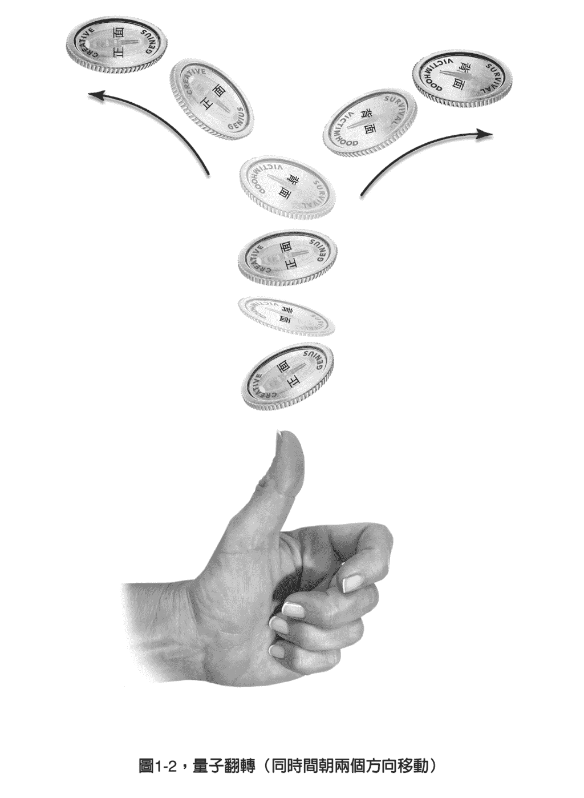

进入觉醒模式的正面并成为有灵魂的自己就像这样。那一瞬间，我们开始看到完全不同的世界，然后根据新的观点做选择。

基本上，我们可以看到两个不同的方向，不管选哪种方向，都会创造出实相。其中一个方向带我们到觉醒模式的正面，另一个带我们到背面。我们可以自由选择，然后量子宇宙会完全支持我们的选择。不管我们是不是前半辈子都在推着弹珠上坡，我们的实相可以在选择的瞬间改变。而且，就像量子翻转所证实的，我们不必静止下来才能转身！

量子翻转的过程中，大脑必须很投入。这个方法和你过去研究过的方法的差异，在于我们采取完全不同的方式来使用大脑——要结合身体与灵魂。你会发现我的重点在身体。毕竟，虽然我们都是灵魂体，却还是进入了这个三维的具象世界，并拥有了一副躯体。因此，要把自己从这个过度活跃、充满恐惧的思维中解放出来，身体很重要，我们可以充分运用自己的身体，也应该在觉醒的过程中运用身体。你会发现，体现有灵魂的自己就要打造新的回路——身体里的回路，这么一来，有灵魂的自己的能量才能够顺畅流通。我们还要打造身体与大脑间的回路，让思想接收这股能量。

要活出有灵魂的自己就要靠回路——有了感官回路与沟通系统，就能够察觉、锚定并启动体内的能量，释放我们真实的本质。

这就好像我们每个人都是一座城市，而神经系统就是电网。没有接上线的地方我们就「看」不到，这些区域的街灯要等到我们有意识地将能量带过去才会发亮，接下来意识能量会流过去，我们就能用新的方式察觉到那里怎么了。

能够开灯或进入这个充满光明的状态，就表示我们回到了自己真实的本质。灵魂就是光。身为灵魂体，我们其实就是由超高频能量组成，那就是光。今日的科学告诉我们，就连细胞在执行任务时都会发光。科学发现大脑和脊椎神经里的神经元在传送脉冲时会产生光子（光的微小粒子，会影响我们的原子结构），用光来沟通。光线通过组织里的微管（细胞骨架的组成部分，遍布于细胞质中）启动大脑的速度，比神经突触还快。我们真的是很惊人又充满奇迹的——能量体！

我们之所以不了解自己的神性，并不是因为缺乏神性，而是因为没有正确的神经回路可以感知这股神性。因为少了这个回路，我们的能力受到限制，无法体验自己真实的本质。要体现我们的完整（能认知、感受并活出来），我们必须要建立并启动神经回路才能「点灯」。我们就是要直接和能量系统合作，来建立回路。

当我们真的理解一切都是能量，包括我们自己也是能量，就会开始看到真相，在这个具象有形的层次下，和人生进行更细致的互动。在这里，生命是流动的，一切都会改变和流动，因此最容易创造改变。在这里，我们有最强大的力量可以创造出自己真心喜爱的生活。

要获得体验人生的完整能力，关键就在于体现你就是能量。我们一定要体悟自己就是能量体的真相，也要充分体现这个事实。接下来的几章里，你将学会体现能量之后要怎么掌握直觉，透过直觉比运用理性判断更能实践你创造的人生。你会发现这方法不但有效、可靠，能够创造出正面、持续的改变，也是最快的路径，可以让你在具象有形的躯体里体验你完整的能量。

有了这把钥匙，你就能解锁与生俱来的创造力，改变生活的每个面向——身体状况、人际关系、自我感受、对这个星球的贡献。若是少了这份认知，我们就会被困在狭隘的观点里，被挣扎、委屈、痛苦锁死。

我们要怎么启动神经回路以感受、锚定、开启我们真实的本质，活出有灵魂的自己？这就是能量七密码能提供的效果。

什么是能量七密码？

能量七密码是一系列你可以自行操作的练习，能够促成你的量子翻转——让你离开困惑、疾病、疲倦和挫折，获得喜悦、才华、健康、力量与创意。这些练习会教你怎么建立全新的内在回路，支持你身为能量体的真实本质。在体内重新建立自然的能量流之后，你就能从防御性格转变为有灵魂的自己。

能量七密码会给你一套工具，让你打从自己的身、心、灵里就清楚知道生命中的一切都是能量。你会在这个新的境界里生活，远离痛苦和各种小题大作的内心剧场。从这个丰富又深刻的观点看生命将改变一切的意义，你接触到的每样东西，几乎都会有新的意义。当你把意识带入身体里，就会发现能量七密码非常踏实，能让你从更高的意识层次感知一切，就像树木的根扎得愈深，就能长得更高。

以能量体的身分生活，你就能体现你真正的天赋，毫无质疑或犹豫。例如，能量七密码的学员洁米现在就能够从容地为年迈的母亲做决定，以前她总是很痛苦、挣扎。许多青少年运用能量七密码找到自己在世界上的定位，终结了自毁的行为，象是毒瘾、饮食失调或自残——有些人已经对生活麻木到必须要自残才「有感觉」。但是当我们看到自己就是充满创意的能量体，就是天生的领袖，不需要从众或互相比较时，那股必须要融入或找到归属感的压力就消失了。当你了解你就是创造者，这项新知识就会协助你体验当下与耐心，过去你可能从未感受过，未来你就能以领袖之姿展开新生活，尽管你过去可能不知道自己有领袖气质。

而且，练习能量七密码的感觉非常好！我会引导你练习呼吸、静心，和一些简单又有效的动作，象是特定的瑜伽动作，让你的能量能够在身体里和人生中流动。能量淤积会造成疼痛，或是让你没办法看到最真实的自己。能量流恢复之后，你就会马上看到许多正面的改变，包括：情绪、生理、心理的失能状况或疾病都获得疗愈、能量更强、更积极进取、思考更清晰；生活里的每个面向都更好且互相平衡；还能观照自己真实的本质，活出神性的目标。你不再「思考」你的人生要怎么前进，而会发现自己打从心底就很清楚要怎么大步向前，好像「人生本来就应该这样」而且接下来的发展都很顺。

例如，玛莉本来觉得没办法在她的工作中得到任何收获，她身边都是缺乏创见的人，每天开口闭口都是很小心眼或负面的话。她想要辞掉工作，追求另一个能够支持她的职业，让她成长、提升。在练习了能量七密码之后，她发现在目前的职场里她就能够完成她的使命，而且每天上班过程中练习一次，就能深刻地获得成就感。她现在知道她生命中发生的遭遇都是要协助她觉醒，这个观点的变化改变了她对所见一切的诠释，也改变了她的想法和做法。

灵魂就是力量，是自然最强大的力量——而你就是灵魂。能量七密码不会把你变成不一样的人，只会协助你展现出与生俱来的伟大，只是你还没开启你的潜力而已！

能量七密码靠能量运作。我见过能量七密码提升了其他以能量为基础的疗法，效果加倍，例如针灸、脊骨复健、头荐骨疗法、整骨术、天使灵气、指压、结构整合法、反射疗法、筋膜放松法和按摩等。我不但在自己的患者身上看到效果，我的学员当中有医师、护理师、能量心理学家与能量诊疗师，他们也观察到很好的效果。不过，我的目标不只是要提升你的健康和幸福，也当然不限于「修复」你生命中的缺憾或伤痕。能量七密码会启动量子翻转，让你获得动能，进入觉醒模式的正面，经过觉醒之后有意识地以能量体的身分来生活，并且协助你维持新的生活方式。

换句话说，这本书不是要运用大脑来理解我们真实的身分，也不只是要让你获得启发，或疗效。这本书要让你体现你就是能量体，让你过着创意天才的生活。这会彻底改变你的人生经历，与你所开创的生活。

你的能量状态会直接影响你的观点和生命状态。我很清楚这一点，因为我就是这样生活的，我也可以清楚看到能量状态如何影响其他人的生活。你也是。经过量子翻转到觉醒模式的正面之后，活出有灵魂的自己不是靠大脑想想而已，这个过程中我们还打开了眼界，接受不同的真实和全新的世界观。我们在第一章已经有了很好的开始，接着到第二章继续。

第二章
你就是人生的创造者

第一章让你知道你就是能量，能量就是你真实的本质，你其实就是能量体，同时也说明了你有多清楚自己就是能量，而且能透过这项认知来生活，就决定了你的生命中有多少痛苦或狂喜。我会在这一章里证明这一切，让你知道因为你是能量体，所以只有你能创造人生体验；当你能够从能量的层次来理解人生，而不是把人生当作一齣又一齣内心剧场，你就能创造出你真心喜爱的人生。

要从防御性格量子翻转到有灵魂的自己，就必须先认出有灵魂的自己。首先，你必须晓得你的生命故事之下其实是能量。为了协助你打开心胸接纳这深刻的真相，并且让你做好准备进行量子翻转，我会和你分享我这一路上得到的观察与基础的真理。我们到了第二部就会进行量子翻转。

这世界上还有一个更庞大的真相、更巨大的存在，而我们都是其中的一部分，只是很多人并不清楚。自古以来，这个道理就代代相传，许多古老悠远的文化都遵循这个道理在生活，可是现代的宗教、文化与社会结构把我们带离了这个灵性的、能量的、人我相连的真相。量子科学支持这个观点，证明了每个人都彼此相连，而且我们也和地球、和这个具象世界相连。现在，我们的文化和灵性修行要追上量子科学，并以真实的能量体身分生活，深刻了解到所有的存在都是能量。其实很多人就是缺少这份领悟，才会不断地寻找！幸好，我们发现真相并活出真相的时刻已经到了。

这背后的学理很复杂，但我会讲得很简单。我已经把最重要的原则过滤为「能量七密码的五大真相」。我花了很多年不断寻找人类真实的本质，发现我们就是能量体，这五大真相对我帮助很大，希望它们也能协助你找到真实的自己。

能量七密码的五大真相分别为：

•一切都是能量。

•你的人生反映了你的能量。

•你就是人生的创造者。

•你的人生就是你的作品，而且一直在拓展。

•生命的目标就是要发现你的创造力。

让我们来仔细检视这五大真相。

真相一：一切都是能量

宇宙中的一切都由能量组成，这些能量有不同的波长，以不同的频率振动。纯粹的光线频率最高，包括不可见光和人类肉眼可见的光。音波也是一样的能量，只是经过压缩。同样地，我们的思绪和情绪就是不同频率的能量，其实物质也不过就是经过压缩的能量。我们的「正面」想法就是比较开阔、敞开的能量，而「负面」的想法则是比较稠密浓厚的能量模式。我们稍后会学到如何运用这些能量模式来管理人生的结局。

物质的躯体由数不尽的各种能量所构成，体内的五大循环系统（呼吸、荷尔蒙、免疫、心血管和消化系统）就是能源光谱里的不同频率，而这五大系统的频率又和每个器官的频率不同。

身体里有大大小小的能量场，不管是完整的有机体或细胞、组织、器官、腺体、系统，都有能量场；器官里的分子、原子和次原子粒子，也都有各自的能量场。所以，世界的万事万物（包括看得见和看不见的事物）在本质上都是能量，以特定的频率和波长在振动。

如果一切都是能量，便代表没有一样东西不是能量，也代表没有任何东西能独立存在。物和物之间是切不断的。如同我的同事、生物物理研究员詹姆士‧欧旭曼博士（Dr. James Oschman）在《能量医学》（Energy Medicine: The Scientific Basis）中所述，万事万物都存在于「有生命的矩阵」里，一层又一层，彼此相连。在最真实的层次里，万物都互相连结，形成一个联合的能量场。

最让我着迷的是，因为这些单独的能量层都透过沟通路径连在一起，每一层都知道其他层在「做什么」，我们就是一个联合的能量系统。在本书中，我们将学会如何搭上万物表象之下的频率，觉醒后了解到我们和宇宙相连，而且我们就是宇宙的一部分，这一切都由细微的频率所组成。

我们往往以为每个人都是独立的，每个活动都是独立的，我们以为自己的想法或行为不会影响到其他人或其他事，然而真相是：在这个矩阵、网络或联合的能量场里，万物都相连，每件事都会影响其他事。在最基础的层次上，我们都是宇宙，不分你我。这代表我们每个人做的事都会互相牵连——我们在生命中某阶段做的事会影响到人生的其他阶段，也会影响到每个人和每件事。这也代表，尽管大脑想要相信每个人都是独立的、孤零零的，但我们的资源其实比想象中更为充裕。

科学多年来都在验证万物之间的连结。加州大学洛杉矶分校荣誉教授薇乐莉‧杭特博士（Dr. Valerie Hunt）的研究影片，让我在研究这个主题时有了最大的突破。她曾经在我父亲的研讨会播放这段影片——她利用克里安摄影技术（即电子摄影术）揭示了人类体内与周遭的生物能量场在体验不同的想法和行动时，会有哪些变化和波动。例如，如果一个人吃下完整、健康、新鲜的食物（如蔬菜水果），那他的能量场就会很宽厚、坚固；当他吃下垃圾食物，他的能量场就弱到几乎察觉不出来。当受试者的狗走进房间里，他的能量场就变大了，而且狗狗在他身边绕时，他的能量也会跟着狗。当一个人诵唸着梵咒「唵」，能量场会大十倍。这段影片显示每个人的能量场都有特定的振动频率，而这个频率会根据我们内在的活动（思考、感受、行为等）而改变，也会因为我们接触的外在环境而改变。这个发现经过持续研究已获得证实与提升，电磁场疗法装置，如脑波图和超导量子干涉仪等科技现在可以更仔细地观察并量测能量，也就是宇宙万物最基础的元素。

能量会双向影响或互动，也就是说我们的存在和能量会影响周遭，而周遭的能量也会影响我们。心数机构（HeartMath Institute）曾分享研究结果，指出人们可以透过情绪（体内不同的振动频率）影响ＤＮＡ（也是一种体内的振动频率）。愤怒和仇恨会让ＤＮＡ分子缩短，爱、喜乐、关怀则会让ＤＮＡ分子延长。因此，情绪的振动频率会直接影响我们的身体和健康。

俄国物理学家弗拉迪米尔‧琶普宁博士（Vladimir Poponin）在一九九〇年代证实ＤＮＡ的存在就足以影响周遭环境。他在真空玻璃管中随意射入一束雷射光子（具象世界中所有物质与能量的最小粒子），再把人类ＤＮＡ样本放入真空管，光子竟然排列成ＤＮＡ分子的螺旋状，而且在ＤＮＡ样本移出后，这束雷射光子依然维持螺旋状——显示我们的存在就能够影响这个世界。人类就是靠这种方式创造「实相」——千年来不断影响光子排列。

因此，能量是持续在互相交流、互相影响的。一个能量场的振动会影响一切以相同频率振动的事物。如果你在房间的两端各放一把吉他，并调整频率，那么只要在其中一把吉他拨Ｇ弦，另一把吉他的Ｇ弦也会振动。人类也是如此，生活中的各个面向亦然。能量七密码会协助你学会如何让生活的每个面向都能协作，发挥你的天赋，让所有系统互相支持，获得真正的平安、健康、幸福。

杭特博士率先发现我们的能量场变化会影响到健康，她认为身体的问题都是从能量场开始的。她说：「目前，许多人类的疾病都还被标示为『原因不明』；换句话说，疾病的成因无从判断，因此唯一的治疗方式就是减缓症状。但生理的症状之所以会出现，往往是源自能量场的扰动。如果能调整能量场，症状就会消失，我们就会痊愈；如果直接治疗症状，压力源还是会持续造成能量不协调，这才是问题的根源，那么病症还是会回来。」

生物能量场决定了身体的状况，甚至有证据指出人在受伤之前，能量场就会受到干扰，因此可以从能量场的扰动预测伤害——意思是当一个人的能量场受到扰动时，这个人可能会走不稳，结果踩空，伤了脚踝，那么其实这些「意外」也不是随机发生的事件。

这些科学发现只不过是证明了我这一辈子心底蕴藏的真相——而你心底可能也清楚。

总之，一切都以能量相连。我们所选择的思想和情绪会直接影响ＤＮＡ和细胞功能，而我们的ＤＮＡ会影响周遭的世界，所以我们会影响我们所存在的实相。我们靠着思想与情绪所发出的振动频率创造了这个世界的实相。很不可思议，对吧？不过，当你获得最深刻的理解之后，这一切都很合理了。

真相二：你的人生反映了你的能量

人生反映了我们的意识；换句话说，我们在寻找什么，就会找到什么。我在观察病患和他们的症状与态度时，得到了深刻的心得。

在我能主动察觉到表象之下的细微能量所透露的真相之后，观察别人的能量场让我很着迷，我喜欢看他们的能量场如何随着生活作息而变化。我观察病患，看他们的症状是否符合我所注意到的能量场扰动。我每天看诊十小时，会见到五十至六十名病患，所以我可以有效收集庞大的有用信息。

我所观察与感受到的一切，都证实了我们每个人都是拥有高智能且会互相回应的能量，依照我们的想法和情绪以不同的频率振动。例如，我可以看到别人因为我们讨论的话题而热血澎湃，她的能量变得明亮有活力；如果有人讨论起「自己非做不可的事」，他的能量就变得很渺小微弱。我也能看得出来别人是不是很紧张，或者说了一些违心之论，因为他的能量场会「摇晃」。我不再从别人的肢体语言或语调来收集信息，而是真正看到他们能量场的频率变化，看到了颜色与波动的改变。

经验渐增之后，我开始注意到能量的几个特色。例如，一个觉得自己很委屈的人自认为被困在逆境里动弹不得，他认为自己无法改变人生或关系，那他的能量场就很薄，大约只能环绕他的身体五十公分，就往外散逸；如果是一个对自己充满信心，也决定要有所成就、愿意采取行动的人，那他的能量场会很厚实，可以环绕自己好几公尺。我还注意到了第三种模式（虽然较不常见）：通常快乐、喜悦、心胸开朗、灵感丰沛的人，他们的能量系统很强大，而且会一直流动。这些人的能量场以身体核心为中心往外发散，有时会比房内的天花板还高，而且会覆盖身边的其他人。我就好像可以看穿别人的身体，直视他们的真实本质，并且看到他们用哪种人生观在过日子。

我反覆观察这三种模式，就更清楚能量模式的光谱，还有每个人对应的人生观，因此才发现了「觉醒模式」。不管一个人的能量是往外散逸、只能罩住自己，或是很完整、从核心出发往外流动，这些能量似乎都直接反映出这个人是生活在觉醒模式的正面或背面（后来我才发现对某些人来说，能量场会决定他们是生活在觉醒模式的正面或背面）。换句话说，他们的能量场愈集中在核心，就愈清楚自己的真实本质与能力。

这项突破让我很雀跃，因为这让我更清楚要怎么从防御性格转化为有灵魂的自己。若我们都能有意识地将能量模式从散乱薄弱调整为厚实集中，便能够有意识地建立神经回路来体验有灵魂的自己。

散逸的能量无法平顺流动或发挥强大的力量。想象一下，如果在流速很快的小溪里丢一大把石头会怎样？溪水会朝四面八方飞溅，甚至在溪流的水道之外留下水坑。水都喷出去了，溪流整体的动能自然就被削弱了。一部分的溪水会缓慢流过障碍物，在溪流中形成小水洼，而无法流畅地通过。阻碍水流的石头就像能量场里的「包袱」「泥流」或「淤塞」，全部加在一起，这些小石头就形成了「干扰」，那是能量流变缓而淤积的副产品，导致能量无法维持足够的动能，来保持身体健康或活力，因为这滩水缺少了回路。如果有回路，能量就通畅了。

要逆转颓势，就要求助于自然。我们的能量就像水银，一种像水一样的液态金属。你可以想象自己回到了理化教室，你的水银试管掉了，这时水银会变成小水珠往四面八方散开；不过，当你把水银珠聚在一起，就会合并成一滩大水银。就像水银一样，我们的能量想要找回自己，会通力合作拼出「最好的自己」。

现在你可以想象液态水银形成一道洪流，不断地吸收小珠子。我们的能量场本来就会这么做，只不过它也需要有一条可以遵循的路径（就像水银珠需要往正确的方向推一下）。你会学着怎么创造这些路径或回路，并感受与指挥你的能量场回到集中的能量流（第三章介绍身体能量系统时会详谈）。

当我们受到创伤、批评、惊吓或被拒绝时，能量就会往外「飞溅」或散逸。人生不如意的时候，我们可能会有意识或无意识地感到受挫。当我们碰到无法理解的事情（让人不知所措、惊慌害怕、心烦意乱），或者无法接受、无法消化某件事，我们的能量就会往外溅洒。如果小溪忽然被倾倒了砂石，水流就无法流过；我们的大脑也一样会停下来，能量就不通了。这些被拒绝的、不情愿的反应通常会化为思绪和情绪，造成能量淤积或体内的低频。而因为我们的能量就是人生的模板，这些淤积就会造成意识阻塞或失能，呈现在具象有形的世界中。这种情况就象是能量流里的「石头」，水流一碰到就往外溅（这样理解比较容易），然而如果我们还未唤醒有灵魂的自己，这就会是我们意识中的盲点。当我们运用能量七密码的工具，将注意力集中在这些盲点上，就可以将散逸的自己导回到主流，形成完整的能量场。

我的「人体能量图」（图 2-1）简要说明了我在医治病患时所见到的能量场。我相信这张图可以帮助你更了解能量的概念。

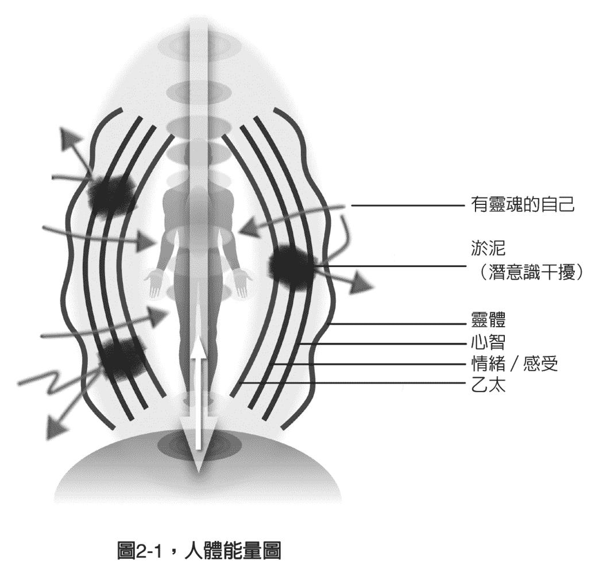

☼人体能量图

人体内有许多不同的能量频带，各有不同的振动频率。为了更有效学习，我们会讨论基础的五层，从最外围慢慢进入到体内，分别是：

一、灵体：我们的本质或纯粹的能量。

二、心智：包括我们的思想和信念等。

三、情绪与感受：我们所感知或感受到的频率。

四、乙太样板：脉轮所在的位置。

五、身躯：我们在地球上的载具。

在瑜伽哲学中，这五层可以对应到《鹧鸪氏奥义书》中所描述的躯瞉（kosha）。我开始研究能量时还不晓得印度教的传统结构，几年后才欣喜地发现原来古代典籍验证了我的发现和我开发的疗法。

这些能量一层比一层更厚实（或更浓缩），波长更短，且每一层都会影响下一层。请注意，第一层（纯粹的能量体或灵体）贯穿了每一层，最终会影响我们整个系统。就算是厚实的肉身也不过是经过压缩的灵体，因此，当我们唤醒灵体的能量，整个系统都会受到影响。这会启动身体不由自主的转变，以及奇迹般的疗愈，我们过去可能都读过或听说过类似的案例，这就是为什么我们要学习直接与精微的能量协作，让能量自主。

在这张图中，可以看到我们的目标是要让表层、较高频率的意识能量（我们真实的本质，即有灵魂的自己）完全甦醒，进入我们的肉体，在核心创造出意识能量。这就是「体现」，指我们可以将自己的本质和神性完全压缩成更精巧的形式，直至成为具象，然后我们就能活出有灵魂的自己。能量扰动、包袱或淤积（可能因为挫折或拒绝而发生在精神或情绪层，导致我们无法理解或接纳人生的遭遇），会让纯粹的本质能量无法走完旅程。当我们的大脑无法理解我们的真实本质时，能量就会淤塞。

这些包袱就代表我们还没唤醒有灵魂的自己，这个「往外溅洒」的行为就是防御性格作祟。当能量愈往外散逸，系统便愈迟滞愚钝，就会误以为要往外寻求自我肯定才能完整。这么做只会造成恐惧和压力。另一方面，当体内的能量愈完整统合（当你接纳人生中发生的一切），不论外在局势如何变化，你将愈能感受到自己完整无缺，愈能淡定、和谐、优雅地过日子。

☼始料未及的印度之旅

我的第一趟印度之旅就用很意外的方式让我看到了真相。就在我第一次觉醒之后，我便与刚认识的静心团体老师分享自己的多维度经验。我说我看到了色彩缤纷的另一个世界，不同于我们的世界，还看到我身体「里面」的组织，也看到了自己的大脑在发亮，还经历了不同的境界。我的视线可以穿透万物，就好像每样东西周围的空气都在物体的表面跳舞。

我还体验到了所谓的「蓝色珍珠」，也就是透过更高的意识层次来观照现实。后来，这个静心团的团长邀请了几个人去拜访她的印度家乡，一个叫作布达巴地的小镇，那也是印度心灵大师赛巴巴（Sathya Sai Baba）的家乡，他在当地还有一座修道院。我开心接受了邀请，知道这趟横跨地球半圈的冒险旅程中一定有硕大的收获在等着我。

我出发的时候以为可以利用我的医疗知识来帮助遇见的人，同时学习一些（我才刚踏入的）新领域知识。让我意外的是，我以为我能帮助的这群人拥有我不曾拥有的宝物。布达巴地多数的居民都没有太值钱的资产，而且似乎什么都不想要，可是每个人都有彻底开放的灵魂。

村民不管是在小店里工作、走在街上准备去串门子，或是去采买生活用品，都散发出美丽、温暖的光辉，他们充分活在当下，那真是一道奇景。他们直接不闪躲的眼神接触带给我敞开心扉的连结，我在美国可能要数天或数周才能和人对上眼几次，但是在印度，每个人就是这样诚恳地互动。因此，他们不会因为能量场里有淤塞就陷入泥沼，尽管他们大可以心情不好。他们就是以灵性的存在过活，和自然共振。尽管外在物质世界有所欠缺，他们却活得很平和安详。我发觉他们的存在就是一份极大的礼物，和我出窍时所感受到的频率一样，只要我们记得怎么进入更高层次，人人都能体验得到。

有灵魂的自己不会有能量淤积。在我们真实的状态里，大脑很清楚我们很完美、完整。当我们处于有灵魂的自己的能量模式中，我们会持续在生理、心理、情绪的层次感受到这股完整，这就是绝对的幸福。

不管干扰或淤积出现在哪一层，我们都会觉得生活受阻，或者「不对劲」。如果淤积在心智或情绪层，我们就会透过觉醒模式背面的人生观来诠释每一件事。我们会一直处于辩论状态，总是觉得自己才对，这样就可以和每个人保持距离，不必掏心掏肺。我们会很纳闷为什么世界那么不友善、不体贴；我们会觉得很受伤、很失望、很幻灭。我们会活在痛苦里。既然某一层的干扰会影响到下面的每一层，那么心智或情绪层的淤积就会造成身体不适，造成伤害、失调或疾病。这就是杭特博士在研究里所说的，而这也证实了大脑和身体之间确实有连动关系。

认清我们的能量在哪里散逸很重要，这是治疗所有「问题」的关键。在第二部中，我会提供你工具，让你发现能量散逸点，并导回散逸的能量，你就能体验绝对的幸福。

不过，现在，我只希望你理解你的能量愈往外散，你的人生经验就会愈困惑、愈痛苦；相反地，你的能量愈集中，就能愈轻松、愈快乐地掌握人生。你愈能把散逸的能量导回核心，就拥有愈多力量。

我也希望你知道，你确实拥有整合能量的能力——你本来就拥有疗愈的力量，可以解除能量的扰动，让我们来看下一项真相……

真相三：你就是人生的创造者

有一天，我的病患凯伦和我在诊间里，准备要开始疗程。她说她前一阵子出车祸，肩颈处极度疼痛难受。她原本压力就很大，说自己「压力已经大过头了」。她描述车祸时，我看到她的能量往体外散逸，好像怎么都留不住。她哭着说看到卡车迎面撞上时有多么惊恐害怕，我温柔地把手放在她的肩膀上——就在我碰到她的时候，她的能量场开始稳了一点。我一见状就决定不再问诊，请她在诊疗床上躺下。

我观察她的能量卡在哪里（从哪里散逸，或停滞在哪里），然后把我的手放在她的心口和肚子上。那里的能量开始变化。当她的意念随着我的手移动，这两处的能量就逐渐强化了。她说觉得自己沉稳多了，我也目睹了她的能量系统逐渐稳定。当我放开手，请她回想车祸，她的能量又开始往外溅洒。我再请她回想我的手放在她的心口和肚子上，然后让她自己去创造那种感觉。这时，她就有能力自己把能量收回核心了。

我们都有能力带领或管理自己的能量在体内流动，也能够让能量更集中。这就是能量七密码要教会大家的事。我们都会在不知不觉中造成能量散逸，可能是因为饮食、想法、我们待人的方式或人际关系。我们的经验也会影响能量，然后再创造出下一个经验。经过这个反馈回路，我们就会创造出自己的实相——所以，我们都是自己人生的创造者。这是拥抱自己最重要的观点。当我们理解这个观点，就能获得无限的自由与力量。

这一切要怎么运作？要了解这个道理，就要看看能量系统中的光子。这是量子世界里已知的最小粒子，小到不含任何物质。你可以把光子想象成能量与物质之间的起点。光子可以被视为能量，却又能够作为粒子来测量。物质测试的结果显示光子是物质；能量测试的结果也显示光子是能量。光子会回应我们的期望与思想（不管是有意识或潜意识的思想都会）。

☼光子密度与量子核心

讨论能量模式时，其实是在讨论人体系统或生物场里的光子排列。当我们说我们有能力引导或管理能量时，指的是我们有能力移动光子，从而影响电子——改变我们场内的电子排列方式。我们的身躯会反映出光子与电子的模式。

要改变光子与电子的排列，可以靠意志。你可能听说过「专心致志」，其实背后的道理很简单：你专心在哪件事情上，就会增加那里的光子密度。换句话说，当我们把注意力或意识都集中在一件事上，我们的注意力就会在能量层重新排列光子。我们的目标和意念会在物质世界变得更加「真实」或明确，因为光子和其他次原子粒子会根据你的焦点而排列。因此，我们的注意力放在哪里，就表示我们会在哪里汇聚能量——换句话说，我们的创造力也会集中在那里。

如果我们集中更多能量于外在世界，就会依赖外在来肯定自己、来获得认同；如果我们滋养自己的核心，就可以从内觉察、关注自己，从而拥有更高的安全感和幸福感。

这其实就是吸引力法则所阐述的现象——吸引力法则是一套形而上的原则，意指你的思绪、情绪、言语和行为都有能量，可以吸引类似的能量到生命中。这套法则在实现愿望的过程中忽略了一个关键，那就是光子与电子的排列（意即我们所创造的人生篇章）不只会受到意识的焦点（我们在想什么或注意什么）所影响，同时也会受到潜意识所影响（我们不知道其实自己悄悄地在想一些事情）。我们稍后会在书中更深入探讨。

现在，可以先这么想：如果我们不知道自己已经完整无缺，不了解自己真实的本质与幸福感的根源，我们的注意力就会往外寻求方向、指引和保护。我们训练自己有能力去察觉外在环境，却毫无头绪要如何前进。为了感受到自己的完整、幸福与真实本质，我们一定要将注意力往内导向核心，才能更注意核心，并且在核心建构更密集的量子模式。把能量集中在内部，感官神经系统就会开始察觉到我们真实的本质与核心深奥的智慧，如此我们就会感受到自己的完整了。

凯伦就是很好的例子。当她把焦点都放在车祸的回忆，重新体验当时的恐怖，她的能量就变得很破碎，往能量场的外围飘散。当我把手放在她身上，请她把注意力放在那里时，她内在核心的光子密度增加了，她的感官神经系统可以察觉到能量「回家了」，所以她就能冷静下来。一旦她知道如何集中意念，就能自己导引能量。

这再度让我们看到了防御性格与有灵魂的自己拥有完全不同的能量模式。防御性格的人察觉不到自己的完整，或根本不知道自己已经很完整了——因为防御性格的基础就是「不够」，我们永远觉得不够安全、不够完美。这种人生观充满畏惧，总是在扫描外在世界有没有威胁和疏忽。这种心态聚焦于外在，所以我们的能量会从核心往外散逸。当我们活出有灵魂的自己，能量集中于内，专注于核心，就能感觉到自己就是能量体，完整无缺。

为了在生活中更意识到有灵魂的自己，我们必须更了解身体和生物能量场。因此我们要透过集中意念于核心，让有灵魂的自己拥有更高的光子密度。我们要把焦点由外转向内——原本总是很在意别人怎么看我们，转而从我们内部感受到自己真实的样貌。唯有这么做我们才能觉醒，成为真实的自己。

图 2-2 可以帮助我们理解。你可以把这想象成人类生物能量场的剖面图，外层有各种不同的能量淤泥，内层就是我们的真实本质。我们愈是聚焦于外在（把能量导向表面），就会让愈多淤泥进来，外在层就愈厚；而外在层愈厚，我们的核心（有灵魂的自己）就愈没有空间。目标有两个：清除外在层的淤泥，同时让核心增加密度与厚度。

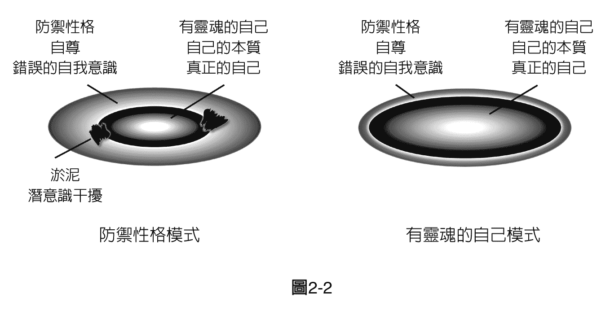

我们也可以从这个角度来观察觉醒模式的进展：从防御性格原本很害怕、很容易大惊小怪的状态，转变为有灵魂的自己，过着优雅无痛的生活。我们的能量愈往外散，或是能量场有愈多淤泥，就愈无法理解或找到自己的真实本质，便愈容易在人生里挣扎。真实本质的能量愈强，就愈不会往外散，我们就不会有太多痛苦。

透过能量七密码，我们会持续增加核心的密度，散发出真诚与踏实感（也就是有灵魂的自己），并收回防御性格往外溅洒的能量。透过这种方式改变我们的生物能量场，就可以改变我们的人生观、哲学和人生体验。

我们都在这条路上——逐渐觉醒，发觉自己真实的本质，活出有灵魂的自己。这代表以能量来说，我们愈来愈统合，愈来愈一致，愈来愈不会往外散逸。我知道人生有时候好像和这个观念对立，可是，我向你保证这是真的。第四和第五项真相会有更多说明。

真相四：你的人生就是你的作品，而且一直在拓展

科学证据显示，具象的宇宙一直在扩张。你的人生是宇宙作品的一部分，你的意识也是，它们也不断在扩张。有些科学家、包括我都认为，这表示我们不断在进化，我们一直在甦醒。这代表你人生中发生的一切，都是为了让你的人生能够更加开阔。生命中的一切都是为了你好，任何境遇都是好的。我知道有时候人在逆境中不会觉得一切都是为你好，但只要你运用第二部的练习，就会开始察觉到这个真相。

生命中很多境遇，如果有得选，我们永远都不会选择挫折，所以才会很难接受，很难理解。可是当我们觉得自己在接受的过程中挣扎，那就表示我们内在某处卡住了——维持我们生命活力的能量在那个区域散逸了，缺乏足够的动能让能量继续流动。能量七密码可以帮助你的大脑不再挣扎或拒绝生命中的困境（因此能量就不会受阻）。我们可以用新的架构来理解生命中的波折起伏，我称之为「转运站对话」。

☼体验更广阔的真相

艾丽是我的学员，她很可爱、聪明且坚强。她当时四十岁，以为自己可以避免过去影响她的人生。我认识她的时候，她有严重的偏头痛和其他身体状况。她小时候就曾经因为胃病和消化道失调（如恶心、便祕、腹泻等症状）而住院，这些问题待她长大后也没间断。她很容易发胖，而且在感情中很难投入真心与亲密关系。

到了二、三十岁的时候，艾丽觉得自己尽了一切努力在过「正常生活」。她在工作上的表现总是出人意表，不断追逐成功，这样才不会辜负自己。她和男人有说有笑，往往只是为了感觉到有人在乎她，但又觉得自己的性生活太过将就。当我问她为什么要如此费力去寻求爱与归属感，她说她爸爸从她四岁开始就猥亵她，小儿科医师却说她的伤是因为骑脚踏车时太用力了。因为这些经验，她在成长过程中一直不知道如何分辨真相与谎言。她的防御性格很擅长隐藏罪恶感与羞耻心，而她多年来不断努力隐藏她的自我形象，用她的话来说，她觉得自己：「比深埋在泥土里的蛇还要下流。」

二十岁那年艾丽未婚怀孕，对象是她还在交往的年轻男子。为了不让父亲靠近孩子，也为了保护兄弟姊妹的孩子，她决定必须让家人知道真相，公开她父亲持续猥亵她的事实。她担心家人不支持——果然应验了，她妈妈和兄弟姊妹都不相信她，甚至威胁要让她住进精神病院，不要再做出这么令人不安的指控。

艾丽怀孕期间和爸妈住在一起，却觉得很孤单。她选择将女儿出养，才不会受到她父亲侵犯。她接受谘商，也很努力让自己过得好。最后儿童福利局起诉了她的父亲，因为她的外甥女告诉学校辅导员，她也受到侵犯，她父亲才终于受刑。但艾丽依然能感受到过去的痛苦，与当下的内在冲突。四十岁了，她觉得自己身心俱疲、情绪压抑，而且忍受了多段不健康的感情。她的例子完美描述了透过防御性格生活时会有什么遭遇。艾丽需要新的人生观。

有次我在授课时，有位绅士问我：「我目睹了这么多创伤与背叛，这一切怎么可能都是『好』的？」我当下的回答反映出我在静心过程中得到的印象，那就是「转运站对话」。这个观点帮助了艾丽和其他学员：

我们不能创造或摧毁能量。所以，既然我们自己就是纯粹的能量，我们知道我们一直是能量，以后也还会是能量。此刻，虽然我们在地表上这个具象的空间里有具象的体验，但我们的躯体并不是我们的全部，我们的能量——我们的灵魂——才是我们真实的自己；当我们离开我们的身体，下了这趟班机，我们还是真实的自己。我们会从浩瀚的宇宙中看着自己，纳闷着：如果我们用这副躯体出现在这个星球上并非偶然，而是一趟有意义的旅程，要用有灵魂的自己体验出更广阔的实相呢？如果是这样，我们要怎么解释目前的人生际遇？这时候「转运站对话」就能帮得上忙了。

☼转运站对话：学会用广阔的视角看人生

你可以想象自己在宇宙转运站里，和其他人在转机，准备搭上这一趟班机。你在等待的时候和转运站里的其他灵魂闲聊，讨论着你们到了凡间以后有什么计划。你说你想要学习、想要成长，想要体验看看自己能不能发掘真实的本质，唤醒能量，开创自己的人生。

其中一个灵魂说：「我想要习得智慧。」

另一个灵魂说：「我想要习得勇气。」

第三个灵魂说：「我想要体验毫无条件的爱。那你呢？」

「嗯，」你可能会说，「我想要透过很多体验来唤醒自己。我想要知道我有多少宽恕、原谅的能力。好，我要选择挑战宽恕第十关。不是第三关或第四关哦。我这次要拚了！」

「宽恕第十关……哇！那，你要怎么破关？」

「嗯，我也不确定。我想我一定会碰到某个……几乎不可原谅的人吧。」

这时有个乘客问了这个重要的问题：「这关有什么？」

你说：「嗯，或许这个人下班之后喝多了，还坚持要开车，穿越了马路中线，直接迎头撞上我的车。既然是第十关，可能他害死了我的家人，或甚至害我终生残废。这种遗憾大可以避免，可是他就是完全没有责任感。在我痛苦、愤怒多年，并因为无法原谅他而一直受苦之后，我会在内心深处发现真实的自己，若非这种等级的痛苦，我可能永远无法找到我真实的本质——然后我就能原谅他了。」

你停了下来，想到了转运站人来人往其实很适合找旅伴，你想问问有没有人愿意和你一起去凡间活一遭。

「谁想要当那个驾驶？」你问。没人举手。

「拜托嘛，」你恳求着，「我等了好久才终于有机会进化，这是我求来的机缘。有没有人愿意帮我抓住这个机会？」

有人终于开口了：「我来吧，我知道这对你很重要。再说，这可以协助我完成自己的任务，我想要学会饶恕自己。」

「太好了！谢谢你。你愿意为我这么做，我很感动。好，那我们凡间见！」然后你们就上机了，准备面对灵魂最艰巨的挑战。

转运站的对话当然只是一个比喻，让你理解自己不是独立的凡人，而是累世的能量。我们都会忍不住想要打断生命的自然流动，但这个比喻可以疗愈我们，让我们不要太切身地去理解生命中的境遇，而把这些波折都当作是人生中的课题，让灵魂能够再次相遇。当我们用这个广阔的视角来看人生，就会知道我们其实创造了自己想要的广度，并且发掘了美、力量、善良、勇气、关爱等特质的深度；换句话说，我们的伟大有很多不同的面向。

你可以理解这个比喻让我们获得了多少力量，得以重新面对生活中发生的一切吗？这个比喻让我们不再把自己当成受害者，也不再从觉醒模式的背面来思考人生经历。我选了一个很激烈的例子，因为这则故事协助了全球数千名学员转化。以能量来说，这个比喻会在你的心中留下一个位置，让你敞开心胸接纳转运站对话，进而产生疗愈的力量。

我们现在能用全新的方式来理解人生了：「好，我原本只会化悲愤为力量。如果真的是我自己创造了这个处境，要来唤醒我的灵魂然后进化呢？让我更清楚我真实的本质呢？我现在还不了解自己的伟大，如果是我在更高的层次上要求这个经历，让我能探索更美好、更强大、更伟大的自己呢？」

这个看法不但能给人力量，还能让你彻底解放。我想请你深呼吸，继续看第五项真相。

真相五：生命的目标就是要发现你的创造力

把自己视为生命的创造者，并且进入真实的本质，活出有灵魂的自己，不代表你的遭遇就会变得轻松，或是就不会经历痛苦。可是，当你拥有了新的人生观，理解到人生遭遇是来协助你破关升级的，那你就会明白，你不需要在这个关卡带来的痛苦上再添更多委屈。你不会觉得事事都是在针对你，不会觉得这些事情很负面，绑手绑脚，限制了你、限制了周遭的人、限制了这个世界。你不会去制造能量的淤泥或包袱来困住自己。有了这个人生观，你就会知道自己是强大的创造者，生命很仁慈宽厚，会顺着你的计划完美开展。只要你选择相信转运站对话，就能帮自己从痛苦与喜乐的经验中获得能量与解脱，朝着最正面的方向前进。

艾丽的认知转变就是很棒的例子。她过去处境艰难，也曾经无法为自己发声辩护，但她明白这一切关卡都是为了要让她的灵魂进化，所以她不只很感激过去的波折，也开始发现「存在的伟大」。她现在认为自己是所有生命体验的创造者，因此在面对过去时，她能透过已觉醒的人生观来检视折磨她的痛苦回忆。她能够顺利且自然而然地宽恕过去，对过去伤害过她的人放下愤怒与仇恨，将来就没有什么好原谅的了。

有了这份领悟，艾丽积极运用能量七密码的练习（你即将在第二部学到）来化解过去残留的情绪，活出有灵魂的自己。结果她生活中的方方面面都痊愈了：头痛和消化道问题没了，她瘦了二十五公斤，目前还继续瘦身中，而且她现在不管是和家人或情人相处，都能拥有充满爱与信任的关系。

我小时候也曾经受到远房亲戚性侵多年，我知道如何引导艾丽进行能量七密码。我的童年让我搞不清楚信任、爱与外在连结，因为侵犯我的人威胁我，若我告诉任何人，下场会很惨。我接下来的几十年都失去了说出真相的能力。后来，我运用能量七密码化解了我的困境，又在许多场合教学，所以我才会如此坚信能量七密码的力量。我真的很感激那位远亲的恶劣行为，让我学会了饶恕，也让我产生了去看到每个逆境潜藏的善意的浓厚兴趣。我不只想从前世和环境去找答案，这个经历让我不断地追寻，最后发展出了能量七密码，完成这本书。

当我现在从觉醒模式的正面回顾这一生，我可以看到自己在不同阶段拥有不同的人生观——从过去认为人生处境逼我吞了很多委屈，到后来彻底自由、拥有自己的力量。在这个新的位置上，我不再受到外在世界控制，任由外界「给」我不同的遭遇——显然我人生中的经历是我要的，都是为我好，都要我自己去体验；显然是我在森林里留下面包屑，带领那个更渺小、更独立的我去发现原来真实的我更伟大，而我就是人生的创造者。

我对转运站对话的理解，让我有能力原谅父亲所做的遗嘱决定——并且深情、真情地往前进，让我能继续对他的研究做出贡献。尽管刚开始似乎很痛苦，这段经历让我学到最多，更清楚自己的能耐与力量。我发现我不需要外在认同或肯定才能察觉到更伟大的自己，并活出更伟大的自己。不管外在有什么变化，有灵魂的自己就存在于我的所有层次中。过去，我深爱父亲，也会持续深爱他，就算是他在遗嘱中排除了我，也不会动摇我的价值、能力和创造力。知道这一点，并真正在生活中实践，影响比深远更深远。

当我们能原谅侵犯我们的人（因为我们知道他们所扮演的角色让我们最终能解放自己、拓展人生，而我们就是人生的创造者，是我们在转运站要求与他们结缘才有了这段遭遇），就表示我们正站在觉醒模式的正面观照人生。这不代表我们要怪自己招惹了如此剧烈的痛苦或创伤，而是指出了我们真正伟大之处。如果你迟迟无法获得想要的支持，或许是因为你不需要。如果你一直没收到你要的东西，或某个能让你活得更轻松的东西，或许那是因为你已有足够的力量可以自行创造。如果有件事造成了不可置信的痛苦，或许那是为了让你看到你的伟大之处，因为你就是宇宙，没有其他更强大的事物能伤害你。或许你此生的任务就是要来凡间觉醒，理解这一点。

我要请你花点时间想一想。当我想通了以后，这个观点从此改变了我的人生。

另一个重点是，我们在转运站所提出的要求中没有细节：我们不知道究竟我们在寻找的那个机会将会用什么方式呈现。就连我们在故事中所用的饶恕第十关也只是比喻；你可能会透过这样的悲剧来过关，但这个关卡情节未必如你所想。但请放心，我们就和纯然的意识一样。

艾丽向我求助时，对她至关重要的一点是，她必须明白她没有在转运站要求任何人侵犯她，这不是她创造出来的过程；她要求并创造了体验饶恕第十关的机会，并发现她有能力可以无条件地爱自己和其他人。

有时候转运站对话比我们的真实处境激烈，大部分的人可能只是碰到家人不支持或老板难搞。为什么有些人要承受剧烈的遗憾、病痛、伤害呢？因为大的能量体可以挑战大关卡，而且他们会马上着手。大的能量体会在转运站要求轰轰烈烈的遭遇，因为简单的关卡已经无法让老灵魂学到新技能了，无法成就这一趟的「伟大」。对于已经来过凡间很多趟的旅客来说，他们需要真正的挑战才能撼动能量体的基础；他们都能毫不犹豫地果断处理小事，所以大能量体需要重大关卡，就像艾丽那样，才能找到他们的圆满和伟大。

☼从能量的层次而非关卡的层次思考

在我们还不明白自己的具象人生经验也有能量、灵魂的维度之前，我们只会用关卡的路线来过活——我们相信外在及生活表面所发生的情节，不知道这趟旅程中有宇宙的安排。我把这种人生观称为「碰碰车生活法」。人生不断拓展，为了让我们觉醒，我们透过摩擦来成长——摩擦造成了心理痛苦，让我们从挫折中学习教训，我们透过摩擦来发现真实的自己。我们花很多时间，不断体验哪些不是真相，来发现哪些才是真相。就像游乐园里的碰碰车，我们互撞，然后倒退，转方向盘，再撞上其他东西，用这个消去法来找到真相。

可是当我们搞懂了转运站对话，我们就获得了力量，可以用这个全新的方式来面对人生。当你知道你就是人生的创造者，而且有意识地承担这个角色，你就拥有了不同的能力和权威——原本只是坐在后座或尴尬地遥控，后来可以光明正大坐在驾驶座上。这会帮助你有意识地进化，逐渐完整，而非无意识地纠结在关卡的层次（可能要卡关卡好几个月，或好几年）；你可以直接在能量层次面对人生，只要花几分钟、几小时或几天，就能疏通能量。我们会看到自己在能量层次迅速有效地做出持久的改变。

当你有机会「搞懂」转运站对话，就会发现在接纳与领悟的瞬间，你就开始摆脱恐惧与无知，有意识地完成人生的使命。你会开始清理这些创伤和难关带来的能量淤泥，淘出关于真实本我的真相。最意味深长的是，你会把自己放在振动区间，真正的启发就会从那里开始。你原本处在三维空间的局限之中，但你将能够进入多维度的神性空间体验，并获得更高的视角。

关卡层级只是症状层级，真正的根源在于关卡之下流动的能量。记住这点，我们就会明白唯有到了能量层级，才有最强大的力量可以创造变化。关卡路线永远比较难。为什么？因为我们的大脑开始写故事情节之后，就摆脱不掉——故事情节让大脑有错误的方向感和踏实感。大脑会让故事「很合理」或「不对劲」，这些故事都会消耗能量，让我们要多费工才能解决问题。越过了关卡和情节，我们就能自由做出有效率且持久的改变，让能量流通，进而创造更多新能量，或者更新既有的能量，让我们恢复活力。

我们很快就会谈到要怎么做。目前，你的工作是开始认为你的人生中没有让你活不下去的问题，也没有你必须回应的问题。把所有「问题」都当成项目。痛点并不是需要修理或疗愈的「故障」，只是一些疑问，而答案就深藏在你心中，必须从心底释放，让答案浮现在你的意识里。系统中任何迟滞的能量都会成就你的伟大，只是这份能量被包起来了。每一个包袱都会让你更完整，让你对自己和这个世界更自在。最终，当这些包袱都打开，重新连接上你的系统能量流，你心底最深层的丰盛富足就会浮现在你的人生意识中，为你展现灵感、创意、奇迹，让你发光发热，让你看到几乎是充满魔力的人生。

在开始从能量层级改变人生以前，你必须更了解你的能量系统——它看起来是什么样子、如何运作，有什么工具可以运用，以做出正面、持久的改变。因此，在第三章，我会给你一堂生物能量基础的速成课。到了第二部，就会开始学习能量七密码，从理论出发，找出有灵魂的自己，体现你的真实本质。

第三章
隐形的你：生物能量基础

想象你是一个能量体，来到这个世界。你才刚结束转运站对话就登机了，接下来，你紧急着陆，瞬间能量四散，你原本的自己变得很破碎，完全失去方向感，无法在新世界探索。你罹患了「宇宙失忆症」，不记得自己到底是谁。因为你不知道自己真实的身分，要在这个世界游历只能靠你在具象世界里的遭遇来找到方向，所以你发展出一个全新或错误的自我。为了要在你经历的过程中搞懂人生，你的大脑会编出很多故事情节，解释你为什么会有失落感、谁造成你的失落感，以及你碰到的事情对你、对其他人、对这个世界有什么意义。这些故事情节都会变成大脑的信仰和理念，形成很狭隘的人生观，完全不像你真实本质的人生观那么宽宏。

所有人都会经历这种能量四散、失去自我的过程。我们共同的命运就是要把自己四散的能量重组在一起，从宇宙失忆症中甦醒，并忆起我们真实的身分。

这就是为什么我把人生称为「觉醒项目」。生命是为了要持续鼓动有灵魂的自己所拥有的高频能量（亦即让我们的灵魂能够持续完整地进入体内），这样我们就能在地球上发现并体验到自我的完整。随着不断把四散的能量都整合到自身的系统中，我们会建立新的神经回路，并拓展出更开阔的人生观。统整好能量之后，我们就会知道自己真实的身分，而伤痕、缺陷、错误所带来的痛苦便不复存在。我们会感觉到彻底的完整。

你的系统本来就有疗愈的力量

幸好你正前往这个完整之境。你的系统原本就设计好了，要朝整合的方向前进，而且会不断提供你线索，透过身体病症使你察觉你的能量正在散逸。你的大脑可能会把这些症状当成是问题、麻烦或不健康的行为模式，例如排斥亲密关系、委曲求全的感情或是在争执中推卸责任。不断失业、持续发生财务困难、反覆的身体病痛，都是为了要提醒你生活已经失衡了；其他症状可能是长期或持续头痛、背痛或消化道问题。这些暗示都是为了要让你知道除了你认可的生活方式，人生还有更多选择。

这些症状会持续造成痛苦，直到我们找到方法去化解——通常只有在明白这些症状的用意之后，才会找到化解之法。我们要在经历困境时，让真实的灵魂体逐渐显露出来，如此才能取用真实本质的高频能量，例如勇气、宽恕、怜悯、爱、创意、接纳与喜乐，从而解决所有问题。

内在能量层次也有讯号或症状。其实你从小到大有很多次经验，只是你可能不知不觉——或许是能量的转变造成身体的感受，象是胃部打结、喉咙肿胀、面对批评或有突发状况时就紧咬牙根，有些人回想到过去时也会咬牙；可能是背脊发凉、手臂上的鸡皮疙瘩，或是在毫无准备的情况下被点名上台就会双腿发抖。当我们不习惯从能量层次来理解人生时，这些身体变化是最有效简单的安抚、疗愈，能让我们感受到完整。在能量层次，我们不需要在问题产生变化前就急着去解决。比逻辑理性思考和策略更高等的智慧会引导我们疗愈，逐渐臻至完整。事实上，大脑也不必意识到我们的系统究竟在做什么。

让我说几个亲身经历，来帮助你了解我在说什么。

☼布达巴地的意外收获

在布达巴地，我还遇到了其他意外的惊喜。每天早上，我和旅伴会走进修道院，坐在坚硬的大理石地板上数小时，和上万人一同静心，等待赛巴巴大师。这过程很难受，因为我才刚进入静心和灵修的世界，而且当地的街道和居民都很脏，有很多灰尘，我不习惯那里的食物，还有各种臭味刺激我的感官。若不是因为离家太远，而且我受邀到印度前就在静心过程中获得了奇幻的体验，我肯定没待几天就打道回府了。然而，有股力量让我继续留在那里。

有一天，我和旅伴没有去修道院静坐，而是留在老师家中。她家就在修道院墙外，从窗外可直接鸟瞰中庭广场，看着赛巴巴大师每天早晨缓缓步入大殿。那一天要为修道院中的女性赐福，所以赛巴巴大师没有走平常的路线，而是转到了我们三楼露台的正下方。那天特地为他铺了红毯。当他来到红毯末端，他在数千名女众前停下脚步，举起手做出祝福的手势。

我有点质疑这种华丽的崇拜仪式，因此仅只远观，但最奇怪的事情发生了——当赛巴巴大师的手从身体正面往上抬时，我的手也举起来了！我的双手不受大脑或意志控制。同时间，我的胸口一阵火热。一股圆满而美好的感受在我体内点燃了，我觉得自己轻盈如羽毛。一秒钟之后，有股能量往我胸口袭来，强烈到我整个人失去平衡往后倒。我们团里的另一个女生茱莉亚是很强大的能量治疗师，她也有一样的反应。我们两个往后倒之后，不可置信地互看了一眼。

忽然间，我觉得脸红发烫。茱莉亚扶我靠着墙壁坐下来。几分钟后，整个房间红得发亮，好像有一盏聚光灯打开了，亮到让我什么都看不到。这时候，光线变成橘色、黄色、绿色、蓝色、靛色、紫色，最后是白色。我后来发现一感受到颜色变化，我体内的情绪就跟着变化。满室红光时，我感到相当深刻的归属感；当周围都是橘光时，就变成了一种安抚人心、充满智慧、与众连结、无所不知的感受；接下来则是在房间散发黄光时有一种明快澄澈的感觉；当这些颜色都混合在一起，我所感知的一切便融化成最让人喜欢的温暖与奇幻感。一种「充满爱」的粉橘色闪着、闪着即变成金光，然后化为绿色调，接下来我觉得爱温暖地将我环抱。当我的周遭在这股爱的气氛中安定下来以后，光线变得更强烈，好似倒持望远镜，我内在的视线相当集中、聚焦，有一种「因果关系」填满了我的存在，就像胎动一样，我觉得我想要再经历上百万次。接着，纯净明亮的钴蓝光充满了整个空间。我的头颅中心又冷又热，里头的空间好像穿越了光年，而我找不到能量体的边界。紫色的光线这时闪过，我在一片空虚中坐了好一阵子，最后消失在无垠的白光中。感觉过了许久，我在全然的狂喜之境振动，我想永远待在那里。感觉就像我透过吐纳逐渐完整。

当我睁开双眼，房间里什么都没有。我的同伴体贴地让我留在那里体验整个过程。这个体验让我和其他人明白感受到体内那深奥的领域开始找到回家的路，并将会持续带我回家。这时，我用了全新的方式进入这个让人惊叹的能量世界。能量在流动，我的意识跟着能量，好像一切就只有能量。确实，我感觉到自己就是能量。后来我才学会如何刻意进入那个状态，也学会如何透过隐藏的奥祕矩阵连结其他人，那矩阵就在我们每个人存在的基础里。再过一阵子，我就发现我们每个人都办得到。

赐福事件发生得很快，不是我当时所能创造或靠练习来体验的。这次和其他次进入能量领域的过程都是自发的——不受我的大脑控制。放松心智不去控制，后来变成重要的关键，让我能够协助数千人运用能量七密码，不过当时我只是单纯享受这过程。

☼身体觉醒瑜伽

从印度返家之后，我进入能量领域的旅程就加速了。我不断经历这种新「体验」，有时在日间、有时在夜间。我发现自己一直活在能量层次的状态，会在想法尚未成形之前就看到并感觉到能量在移动。我并未刻意去显示能量，而只是观察，这完全超出了我平常的理性思考。有时夜里醒来，我的姿势很奇怪，后来都无法做出一样的动作。我觉得好像进入了某种未知的能量模式或形状，我的能量系统在睡眠过程中要对上那个模式。这很神祕，但也很美好，因为我的脊椎侧弯好了。我一出生就有脊椎侧弯的问题，压力和脊椎错位还造成了偏头痛。

夜里的活动持续着，我发现能量模式就是在表达神圣几何符号，和瑜伽姿势一样。后来我能够在白天做出晚上的动作了。我不熟悉瑜伽，但这种自发行为让我往疗愈与整合的境界跨了一大步。事实上，我重新发现并诠释了古老瑜伽里蕴藏的丰富疗愈智慧，许多精华已经因为数百年来翻译为外文而消失了。理解了瑜伽真正的潜力与目的之后，我获得全新的认知，开发出一套教学系统：身体觉醒瑜伽。这套课程已带领数千人体验奇迹与启示，有些人在瑜伽垫上见证奇迹，有些人则是在做完瑜伽之后。瑜伽可以完美辅助能量七密码练习，所以我在第二部的每个章节末都会提供一个瑜伽体位，让你给身体更牢固的基础，唤醒你的意识。

除了夜间瑜伽，我还发现自己在睡眠过程中从体内意识到了截然不同的体验。当时我半睡半醒，进入了梦境，有点象是夜里自然地开始静心。我感觉到我的能量在体内「解决问题」，好像在疏通自己的纠结。能量从我的体外拉进来，从头顶上方穿过全身，再从双脚流出去，能量经过时明显在我体内造成结构变化。我的肌肉放松了，感觉好像能够滑入某些身体部位，我以前从来没有过这种经验，就好像我可以藉由呼吸进入所有身体部位，打开并放松。我脊椎的关节会松开，肠道和腹部的组织会放松，我的身体会由内往外自然伸展，我便学着参与或跟随这股深层的内在能量运动（古人称这种觉醒过程为昆达里尼能量与三摩地，指往内深刻地集中精神）。

我愈是有意识地依随感官并和当下的感受「合作」（温柔地揉捏能量影响的区域），便愈能感受到能量的轨迹，让组织顺着能量稳定下来。有时候，能量的变化会伴随情绪，我可能会忽然泪崩，或者没来由感觉到狂喜。这个过程神圣超凡。

身体心理学（Somatic psychology）发现，人碰到创伤或情绪超载时，无法完全消化这个经历，而未消化完的部分就会分散到大脑里、储存在身体里——进入能量场。为了从身心系统释放创伤，并重新整合脑中破碎的感受和记忆，我们一定要有意识地去理解有哪些经历被分散了，才能重新组合出完整的「情节」。我靠这个信念成功协助诊所内的病患多年，可是我自己的经历却不同。我只顾着帮助病患，却一直没有理清自己的人生「情节」和来龙去脉，也不想化解心中未愈的伤痛。事实上，我完全没用上理性思考的大脑；我的大脑只有观察并跟随能量。这样一来，我处理的是情节之下的原始能量，面对更深刻的层次。在这个体验中，唯一存在的只有我的觉知，能量流过了我的身体，还有能量产生的效果，即能量流动时带来的改变。其实，我愈是接纳能量在我身上的作用，就愈能够察觉到我自己就是那股穿过身体组织的能量，我就是在体内抒解包袱的那股能量。这个体悟带来的变化非常广大。

能量在流动，我可以看得出来，也感觉得到，能量解开了尘封的情绪，那些我过去完全不想知道的情绪。对我和我分享的对象来说，能量修复的结果很明确：黛丝打破了她越野赛跑的纪录；珍妮克服了不孕，在医生诊断出不孕症之后生了好几个小孩；大卫在十年前失去妻子后就陷入忧郁，后来走出了忧郁症的阴影。能量的世界很真实，那是我们通往自由与幸福的道路。

在这个层次上（思考、精神、情绪之外），我要请你面对你人生中所呈现的问题或症状，因为问题的根源在这个层次，能量就是在这里变得破碎而往外散逸。若想在能量层治愈我们的人生，就必须让逻辑思考的大脑放弃控制。我们必须让能量带领，让大脑跟随。我们的能量就是真实的我们，永远不会失败。要让能量带领，我们就必须内观，看能量在内在流动，观察能量的方向和解答，不要参照外在世界。若要意识到有灵魂的自己，并活出有灵魂的自己，就要用这种方式参照自己的能量。

古代东方的吠陀教义认为，人生有八项最重要的功课，其中一项就是学会从外在世界抽离感知，转而关注内在世界——将我们的觉知从人生情节的相对真相，转移到能量的绝对真相。我认为这很有道理，我先从自己的体现过程中发觉这项道理，后来才认识了吠陀教义。我们如果真的想觉醒，真的想要充分掌握人生，就必须教大脑整合深处的能量智慧，了解生命的真相，并学会自我参照。目的不是要学会如何应对外在世界，而是要让我们的思绪、行动、表达都变得更有创意、更有创造力。我们要让所有的行动都符合真相、符合真实的自我，唯有如此，我们才能体验真正幸福、圆满、健康、平安的人生。

能量七密码会给你一套系统化的方式，让你学会自我参照，并活出核心的能量。为了妥善利用能量七密码里的练习，你要先了解能量系统的模样、功能，并知道如何整合能量，这就是我们的目标。

能量流动的架构

许多能量疗法从业者都会跟你说，我们的能量系统会动，然而能量的流动是有架构的。我的「人形环状图」（图 3-1）就描绘了能量在系统中的动线，呈现出我们体内和身体周围的特定路径；此外，我们体内还有几个自然的能量基地或能量中心，称为脉轮。环面就是一面会折射光线和力量的镜子，在人形环状图中围绕人形的就是一个等边的三维能量力场。

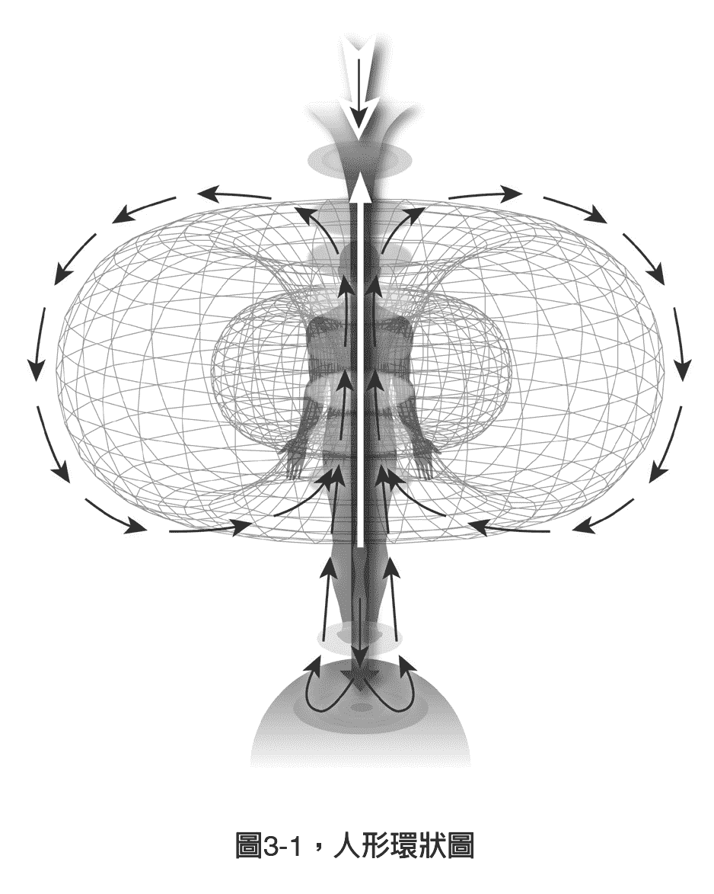

☼人形环状图

在这张图里，有个人站在地球表面，能量流过他的系统，也会像个甜甜圈环绕他。他的心脏周围有个比较小的能量场，集中了高度的能量。从头顶往下的箭头代表了高频的宇宙能量，来自体外，冲过身体中心，从双脚窜出，深入地底。往下穿过这人身体的能量就是我们的真实本质；那是纯粹的精神能量，纯粹的意识。那就是真正的你。你的能量往下倾泻到地面再往回冲，创造出能量流，也就是我们所知的肉身。

宇宙能量往下冲击地球，有灵魂的自己所具备的高频能量也跟着落地，可让人类使用、消耗，这代表我们能够以人类的姿态感知并进行意识的进化。能量从身体中枢往上，沿途开启不同的能量中心。尽管我们无法记起自己的真实本质，因为来到凡间着陆之后能量四散，但这股能量非常真实透澈。那就是灵魂，我们真正的自己。这股能量不但打造了我们的身体，且不断再生，也创造了我们在具象人生中所体验的一切。

在能量流动和创造实相的过程中，脉轮相当关键。脊椎就是我们身体的主要能量中枢通道，沿着脊椎，有七个旋转的能量中心。

☼脉轮

每个脉轮（能量中心）就象是广播频道，各有独特的振动频率——每一个频率对应到光谱上有各自的颜色。赛巴巴大师赐福时，我在楼上看到了空间里的颜色变化，那就是因为能量流过了不同的脉轮，唤醒了我系统中枢通道上的能量中心。随着能量穿过我的身体，能量经过不同的脉轮时，我就会体验到那个脉轮独特的频率、特质，并唤醒对应的内涵。

环状能量场会如图 3-1 箭头标示的方向流动。从脚下的箭头可以看到，我们的本质能量一从中枢通道往下碰到地面之后，就会回流再沿着中枢通道而上。这股能量向上时，会碰到脉轮或身体电磁场内旋转的能量涡流。脉轮会将高频光能（即光子）转移到身体不同的部位。最终，我们有多擅长整合这些能量，就决定了我们的意识层次有多高。

当脉轮都敞开，并且让能量通行无阻，能量就可以在毫无干扰的情况下顺利在体内往上升。在图 3-1 中，能量穿过中枢通道一路往上升，从头顶正上方的顶轮冲出去，然后像喷泉一样从四面八方洒下来，再从脊椎根部的海底轮回到体内。能量以这个模式持续循环，创造出环状流，不断从头上补充能量。我再强调一次，那股能量就是你。我们的系统在设计之初，是要用这种方式来维持颠峰的健康和幸福状态，因为我们正是流过身体的能量（充满智慧、蕴含丰沛创造力的精神能量）。能量流不受阻碍，我们的具象人生才会完整；只要流动不顺畅，我们就会感受到能量散逸，或想法扭曲。

如果能量包袱堵塞了任何一个脉轮，就会干扰能量流，造成能量摇曳，因为能量必须绕过淤塞物，无法顺畅流过中枢通道。能量开始摇曳，就会造成能量场变形，扭曲了我们对真相的觉知——让我们误以为没有机会、没有爱，感受到匮乏和贫穷。图 3-2 是另一张环状图，他的能量场因为能量不稳，所以变形了。

回头看能量七密码的第二项真相「你的人生反映了你的能量」，我们可以看到这个环状能量场创造了我们的实相。当你展望这个世界，你的观点就会依照能量场而变化。任何包袱、干扰或脉轮频道之间的神经回路断线，都会造成能量场变形，让你用扭曲的滤镜去看世界。防御性格认为人生很苦，或误以为自己就是不够好。

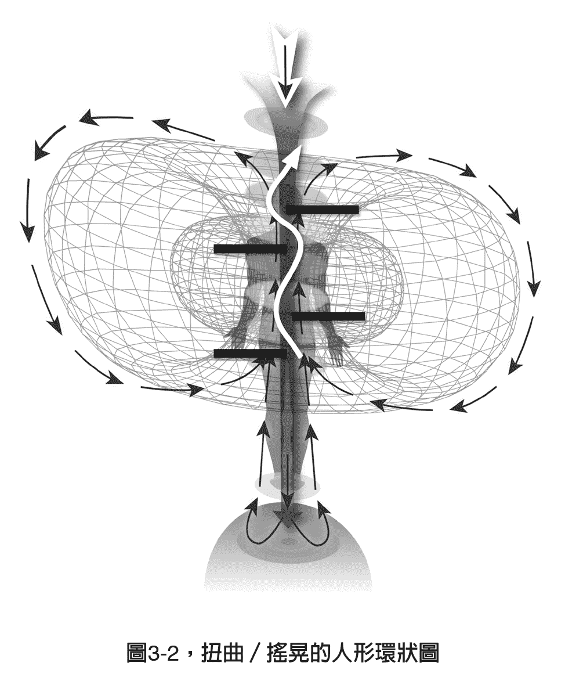

能量多半会透过脉轮成为具体的实相，因为脉轮和我们的意识有直接的关联。每个脉轮掌管不同的生活面向，而那个脉轮的能量状态会影响我们的看法与应对。任何一个脉轮若能量流动不足或受到干扰，就会造成某个生活面向失能。每一个脉轮掌管一个内分泌腺体，所以能量的平衡流动也会影响我们的内分泌（我们会在第九章探讨新科学如何结合了光、能量和化学，让我们更了解自己是何等奥妙的生物）。

好比通过脊椎底部海底轮的能量如果不够多，一个人就会觉得不够踏实，在生活中会缺乏归属感，无法掌握自己的天赋、能力和权利，活出精采的人生。海底轮若气不稳，就会影响到上方的脉轮，因为能量会往上走。第二个受到影响的就是脐轮，可能会导致人际关系受挫、创意不足或性能量失衡。第三个脉轮（太阳轮）受到影响则会造成自尊下降、世界观不清楚，导致防备心和痛苦都更加强烈。

【表 3-3】整理出脉轮系统的不同能量，与各脉轮所代表的意识层级。我们将在第二部深入探讨脉轮如何影响我们的实相。

为了进行量子翻转，体现有灵魂的自己，并获得更平静、更顺畅、更喜乐的人生，我们一定要消除能量场中的断裂、淤积或干扰，让能量顺畅地流动。就像我反覆说的，「人生不顺就是因为身体里的能量不顺！」而且，「身体里的能量不顺，人生就不会顺！」

能量流通，就能打开脉轮。脉轮愈是敞开，让能量得以通过，并且流经中枢通道，我们就能表现愈多真正的能力与潜力。举例来说，脐轮气场通顺的人，因为脐轮掌管心智活动，他就能掌握自己的能力并充满自信；若是心轮气场通顺，就能真诚地对人和善、友爱；这两个脉轮能量通顺的人，就能够用充满爱的方式去展现个人能力。

因此，我们的系统愈流畅整合，就愈能体现有灵魂的自己。让中枢通道有健康的能量流，就是我们最主要的功课。

我们要和所有的生命能量合作，清除干扰，活出完整而真实的自己。

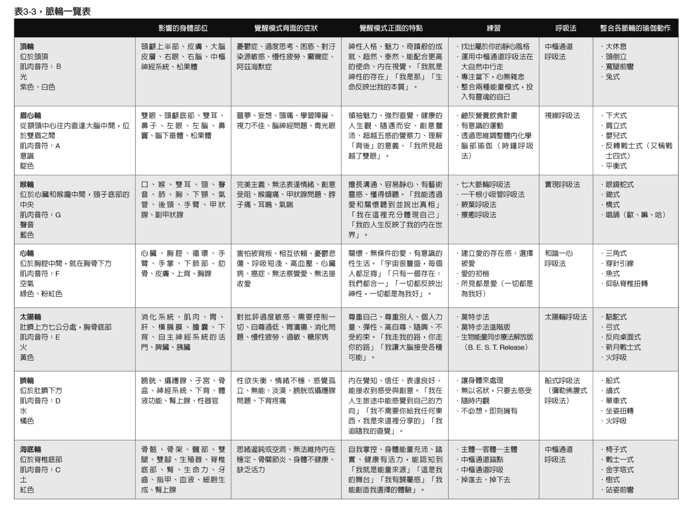

在我说明如何清除能量包袱之前，我想让你用另一种角度来看待能量流：我希望你把包袱想象成能量的缺口，而非障碍物。

建立神经回路，感受到有灵魂的自己

人生不顺遂时，我们经常觉得象是有障碍物阻挡在前，然后就会说：「我得找到这个障碍物，想办法搬走。」

事实上，没有「障碍物」这种东西，这是一种误解。我们如果把包袱、干扰或情绪淤泥当成是意识生命力的缺口，会更有力量。一切都是能量，如果有个地方的能量不流通，就是那个地方没有能力让能量流过！这个地方没有活力或意识，让能量通过。灵魂在那个地方不活跃，不过……那不是因为灵魂不在那里，而是因为大脑还没有觉醒，还没有察觉到灵魂。换句话说，大脑没有意识到那个区域里，我们真实的本质——我们的本性或我们的伟大。

要体现就是要觉醒——唤醒我们的大脑或意识，察觉到有灵魂的自己就在体内，我们才能把有灵魂的自己放入肉身里生活。我们要「开机」或「让灵魂上线」，最简单就是用神经回路来比喻。我们之前已经稍微提过这概念了，但现在要更深入一点。

有灵魂的自己拥有电磁回路。东方传统称为经络网或经脉，贯穿全身，而当经脉打通时，有灵魂的自己就能将能量与观点带入肉身中。这个回路会让我们的中央神经系统充满活力，并以生物能量学的方式（编按：通过生物系统的能量流）来接收有灵魂的自己所带来的微妙能量——身体的能量层接上灵魂的能量层，创造了我们在凡间的人生。

我用障碍和阻碍来描述能量场里回路没打开的地方，是因为大家已习惯这样联想。事实上，能量场里没有障碍或阻碍，只是缺少了有灵魂的自己的回路。

身体里的这些地方为何会断线或能量四散？通常是因为我们碰到了不知道该怎么面对的状况，造成心神不宁，便选择回避——我们一直去想要怎么处理这个状况或求生；我们没办法感受到自己的完整，所以不会直接迎向挑战。当回路开启时，我们很清楚自己的真实本质；相反地，如果某个地方的回路没有通电，我们就无法感受到自己真实的本质。我们的能量会摇晃，能量场会变形，我们的视线变得模糊，健康变差，生命中的其他面向也会受挫。因为我们没有可用的回路，让我们能更准确地感受到自己，安然度过各种处境——不管是亲密关系的挑战、情绪冲突或长期的身体病痛。

安琪拉的经历可以说明这点。她从小在迷信的家庭中成长，长期受虐（包括心智、情绪与性虐待）让她深受创伤，直到十六岁才找到离家独立的方法。她打三份工，在学校当义工，暑假则跨州去工作，这都是她求生的方式。她的父母都心智失常，她没有任何倾诉的对象，也不知道要去哪里求助。在我认识她之前，她从来没有把这些细节告诉任何人。她关闭了她的回路，就是为了活下去。她不敢让自己接受信任与爱，也害怕人生。透过能量七密码，她完全改变了对自己的印象，并且能够察觉内心深处的事实。长期贫血、鼻窦炎、耳骨破裂、膀胱炎、重度忧郁症、严重身体疼痛、癫痫发作和创伤后压力症候群都消失了；她曾经被诊断罹患乳癌，但因为能量七密码和其他自然疗法，癌症已经缓解。现在安琪拉很快乐，过着灵感丰沛的生活——绘画、园艺、旅行、享受紧密的人际关系。她继续发展她的回路，面对她的人生经历，不再为了安全感而回避问题了。

当我们打开神经回路，就会唤醒那个脉轮里的意识。那个脉轮所对应到的身体、心智、情绪伤害都能得到治愈。当我们记得自己有多么完整时，就能一点一滴将生命力带回原本沉睡关机的区域，自然就会带来健康与活力。虽然我们经常把治愈想成是「解决问题」（治疗疾病或失能的器官），但其实不是这样的。当我们真正疗愈时，问题就消失了，因为我们创造了一个健康的状态，笼罩了生活的每个面向。拥有生命力就是拥有完美的健康状态，没有疾病、没有器官失能。

莎拉的经历可以说明神经回路上线之后的状态。她开始上我的初级课程时，很难表达内心深处的真相。她体验到剧烈的焦虑，完全关机，甚至必须离开训练室好几个小时。莎拉说一想到要让真实的自己发亮或大声说出真相就「从骨子里发抖」，她从来不觉得这么做很安全、舒服，也从来没有人请她表现过自己。这股抗拒影响了她整个能量系统。

我们一起练习之后，她学会怎么「打开」每个脉轮的能量，开始体现真实的自己，疗愈了许多面向。如她所说：「我的椎间盘本来几乎都被磨光了，后来又重新长出来。严重的肠躁症消失了！膝盖下方、脸上和手上的干癣都没了！脚踝、双脚、手腕和手掌的关节疼痛也消失了！原本乳房摄影和抹片检查看到了异常状况，现在检查出来都是正常的。偏头痛没了，足底筋膜炎没了，深层的恐惧和悲伤都没了，没了，没了！」她现在很开心地在教授能量七密码，协助其他人痊愈。

很多能量医疗的方式（包括古代和现代）都是要解决问题，但能量七密码的宏远目标是要让你体现最真实、最完整的自己，自然就会修复你生活的所有面向。灵魂就是人生的复原力，因为当我们的能量体（真实的我们）打开所有回路时，能量体（灵魂）就是我们体内的治疗师，身体就会得到疗愈。

那我们要怎么开启神经回路，才能察觉到体内细微的能量，连结到有灵魂的自己呢？我们要怎么在能量的层次上「记得」自己（意即把能量都抓回来），重新连接能量流，让我们能够由内而外获得疗愈，而不是从外而内解决症状？我们不只要有不同的思维，还要用全新的方法来运用心智。这需要一套全面的做法，让身心灵同步协作。

让身、心、灵（或呼吸）和谐，以整合能量

完全整合身体系统时，能量就会顺畅，就像环状图里的人。整合身体系统要双管齐下：未解决的问题和潜意识的干扰都会造成能量破碎，并且由防御性格来控制我们的言行。身体里有许多内建的神经回路还没开启，所以我们要启动这些神经回路，连结上高频能量，唤醒有灵魂的自己。这是一体两面，因为我们要面对的就是完整的自己：身、心、呼吸。

先来看看身体所扮演的角色。

☼身体的角色

当我们能量破碎，并且由防御性格所掌握时，我们会认同理性的大脑，相信我们拥有一副躯体和一个灵魂（假设我们相信灵魂）。但其实，我们已经学到了，我们就是那个灵魂，而这个能量体拥有一副身体和心智（大脑）。身体和心智都只是工具，帮助我们在地球上拥有最美好、天堂般的人生，但我们一直没依照原本的规画和设计来好好使用身体和心智。

我们不只是拥有凡间体验的灵体：我们是在能量光谱上的具象端、拥有灵性体验的灵体。这两者的差异极大——前者以防御性格生活，后者则以有灵魂的自己生活。身体在这差异中扮演了关键的角色。

我们常把身体当成具象人生的载具。但身体把我们放进三维空间，让我们拥有具体的外形，和物质互动；身体也是我们和其他灵魂维度互动的工具。事实上，身体就是灵魂最主要的沟通媒介，灵魂透过身体的翻译，来和心智「说话」。

身体若有状况，一定会先反映在能量层。身体知觉就是身体感受到了能量的变化，因此，身体是我们进入能量领域的重要门户。透过身体，大脑才能察觉细微的能量变化，显示能量场的状态；大脑也必须透过身体才能和能量场互动，导引能量来改变能量场的模式，让我们在人生中获得不同的结果。

接下来看看大脑所扮演的角色。

☼心智的角色

若是以防御性格过生活，心智着重在保护我们——人身安全，还有自我感受。在这种情况下，思考的大脑负责发号施令，运用的是较原始、反射性的身体和大脑部位，永远在戒备，不断和过去比较，也一直担心未来有潜在威胁。大脑会持续释放压力荷尔蒙到体内，启动不同程度的战或逃反应。

为了让有灵魂的自己甦醒，我们一定要将观察的大脑用来感受能量的变化、注意能量散逸的情况、导引能量整合。较原始、以反应为主的思考大脑做不到这一点，要靠比较进化、较高等的创意与直觉中心——也就是有灵魂的自己。一定要让中央神经系统的感官能力负责，这都是我们既有的工具，只是我们还不懂得善用。「直觉的心灵是一种神圣的天赋，理性的思维则是忠实的仆人。但我们已创造出一个尊崇仆人却轻忽天赋的社会。」爱因斯坦说出这段话时正是这个意思。

也就是说，用来思考和反应的心智就象是高速旋转的天花板吊扇。你不可能把手指插进去，来感受扇叶另一边有什么，因为你的手指会断掉。思考的大脑也是一样，因为高速运作让你的能量无法顺畅、自然地流过，当能量从下往上升、要唤醒你所有潜力时，就会受到阻挡。有灵魂的自己就在那里，你的本质能量受到了防御性格的错误信念所限制。

旋转扇叶的后面有个不同版本的人生，我们一定要接触到才能体验自己完整的潜力。为了一窥扇叶的另一面（先别提怎么碰了），我们要让扇叶的速度慢下来，才能穿过去。能量七密码提供了一套有效的方法，运用身、心和呼吸接触到有灵魂的自己。当我们透过能量七密码把心智和身体拴在一起（让心智发挥最高等的功用，好好观察、好好引导），心智就会慢下来。这是因为身体的振动频率比心智慢，心智一旦透过意识连接到身体，就会慢到接近自然和地球的频率（这是大脑的阿尔法波，你可能有听过）。忽然间，我们（纯粹的意识）就能从另一个充满恩典的视角来观看人生了。

连接心智和身体能帮助思绪慢下来，检视我们是否一直想求生。能量七密码的练习会让心智回到最初的设定：利用专注力、注意力、意念与意志，去感受、定心并启动身体里的本质能量。我们会重新训练大脑，强化并锻鍊神经回路，让我们触碰到更深刻、有灵魂的自己。我们不再被恐惧和保护欲主宰，而是让智慧与爱来驱使，有灵魂的自己会提供讯息与方向，让我们无痛且迅速地进化。

要完成身体与心智间的连结，并且让天花板电扇慢下来，就要靠呼吸。

☼呼吸的角色

我们都知道呼吸的重要，这是身体赖以维生的功能。我们在没有水或食物的情况下或许还能撑上好几天，甚至好几周，但停止呼吸几分钟，就无法连接上肉体，只得搭机离开这个具象世界。呼吸是多数静心练习的重点。呼吸短浅急促时，大脑就会启动原始的求生模式，开始靠反应和防备运作（加速风扇运转），启动身体的战或逃反应，选择要战斗或逃跑；如果呼吸很缓慢、细致，并且深入肺叶下半部，那里有许多自主神经末梢，透过呼吸打开这些末梢后马上就能安定身心，脱离求生模式，进入较有创造力的状态。专注、刻意、深入的呼吸能将我们拉离生活的表象，进入生活的内在。

你可以观察自己。现在，只要你将呼吸放慢、放深，一边阅读一边从鼻子吐纳，你会发现你的呼吸让你更进入当下，撷取更多讯息。短浅的呼吸会让身体系统浮躁，让能量散逸，尤其是当你身处在压力下时。

呼吸不仅可以维生，还能够改变人生。吐纳就是「具象」的灵气，就是生命力。呼吸停止时，就是灵魂要完全离开身体了；咽下最后一口气，灵魂就走了。所以呼吸能把生命力带到气不足的地方也很合理。呼吸可以活络经脉或能量通道，也能启动身体系统里还没上线的神经回路。

呼吸就是透过这种方式将散逸的能量聚拢到体内：有灵魂的自己频率较高，透过吐纳，这股较高的频率可以整合身体系统较低的频率，加强振动，唤醒我们那个区域的意识，让神经回路上线。吐纳真的就是把智性的能量吸进身体里，这股能量是所有创造力的来源，透过吐纳进入我们的身体——穿过粒子之间的空隙、组成原子、组成分子、组成细胞，最后组成身体里的所有组织。

能量的整合就像三大生命元素在共舞——身、心、灵（或呼吸）。在第二部，你将学会整合能量的舞步。其实很简单：灵魂和身体对话，身体再翻译给大脑（心智）听；当大脑不听身体说的，就会断线！我们会教大脑如何聆听，这样就能轻松自然地让扇叶慢下来，能够倾听并感受到身体代替有灵魂的自己发言，依据这些讯息逐渐觉醒。

运用想象力整合能量

处理能量系统时要运用想象力。量子科学告诉我们世界万物都先存在于能量层，才有具体的实相——我们要先具体且有意识地想象，把次原子粒子排列成特定的模式。想象力就是改变能量模式的工具，但这不代表我们的想象不「真实」！这表示你的想法要很原创、有创造力并来自你真实的渴望，不是被习惯制约或是为了回应当下的困境。我称为「阿尔法思考」，因为这会用到大脑的阿尔法波。你的想象力会让你接触到真实的自己。

现在，我要和你分享一位学员的真实故事，她就运用了能量七密码。

☼音乐回到了洁若琳的生命中

我在祕鲁库斯科展开觉醒之旅远征，开场就是带领大家一同静心，结束后就有个女人拿着一小张照片来找我。

她在我面前跪下，双手发颤，把照片递给我。

「这是我儿子，迪伦。他一直很想去马丘比丘，但他已经过世了，我答应会替他完成这趟旅行。」

我点点头让她继续说下去。

「我上网搜寻『马丘比丘朝圣之旅』，就看到你的照片。我本来以为会找到祕鲁僧人，但迪伦要我和你一起来，所以……我们才会在这里。」

迪伦在远征前三个月就结束了自己的生命，洁若琳的心都碎了。我安慰她说我们会协助她找回心中的平静——但我也知道，从她的故事中有这么强烈的能量包袱看来，她这趟的收获可能不只有内心的宁静而已。

我把照片收进背包，接下来那几天，我更认识了洁若琳。她前夫会家暴，虽然已经离婚，但为了钱还在打官司，迪伦却已经离开了这个星球。我们会面后过了几天，她走进了祕鲁圣谷的庙宇，眼神缥缈；就算是团队里的人沿途照顾她、不时拥抱她，她还是觉得自己很孤单。因此，当她说她不会和我们一起爬上华纳比丘的山峰时，我并不惊讶。她无法承受登山的辛苦。

我说我懂，我们沿途都会念着她。

在山巅之上，我进行了一场仪式，让我们待在有灵魂的生活中，让迪伦看到我们优越的视野。团员葛瑞格在我捧着迪伦相片时拍了张照，这样下山后就可以给洁若琳看。

那天晚上我们搭火车回饭店时，葛瑞格坐在我旁边。他给我看山顶的那张照片时，热泪盈眶。天空中有道光线直接洒在迪伦的脸上，好像箭头直接从上天连结他的双唇。葛瑞格和我对看，我也止不住泪水，我们知道很深奥的事情发生了。迪伦送了个讯息给他妈妈，要她知道他一直在她身边。

洁若琳看到这肯定的讯号之后，便全心投入能量七密码，原本无法瓦解的悲痛，随着呼吸逐渐松动。很快地，她就体验到心智与情绪的解脱。接下来几个月，她投入学习怎么活出有灵魂的自己。不管我在世界哪个角落办活动，她都来看我，并告诉我：「我知道这里就有答案。我每天都可以感受到答案在协助我面对人生的茫然与困惑。」

洁若琳受过专业训练，是歌剧演唱家，非常热爱音乐。能量七密码中有一部分就是要取用我们真实的本质，我认为或许音乐是条路，能让她恢复——结果音乐的作用不仅于此。

透过能量七密码与转运站对话，洁若琳开始理解她的苦痛折磨中原来有宝贵的礼物。她找到了呼吸，也找到了核心，还找到了新的表达方式来展现过人的才华，利用音乐来疗愈，让音乐治愈她的伤痛。过去她受的训练是为了演出，但现在歌唱、调音、创作来自她体内不同的能量。她的声音不一样了，更重要的是，感受也不一样了。她又能重新察觉到生命，因为她学会锚定核心，把空气带入腹腔，安抚人心的韵律就住在那里。她还运用了课程中学到的练习和工具，感受了她的悲伤、痛苦、破灭，并逐一化解这些感受。

洁若琳把原本离线的部分重新接上线之后，便能穿过包围她多年的痛苦与困惑，重新找到笃定、踏实与澄澈感，那是她过去不曾拥有的感受。在这股新的力量与安定之中，她开始和其他丧子的父母对话。她为癌症病患举办了疗愈音乐会，他们都觉得痛苦程度大减，补充了生命活力与喜乐，并且和她一样开始帮助其他人面对悲伤。

这一切的觉醒过程都发生在她丧子的一年后，我们社群以外的人从来没有办法这么彻底地转变。「体恤之友」是个国际组织，协助丧子的家庭面对伤痛，而执行长说在他十五年的任内，从来没见过任何人像洁若琳一样在这么短的时间内就走出伤痛。执行长问：「她是怎么办到的？」

因为量子翻转，洁若琳每天都可以感觉到儿子在身边，他甚至用一种神性的协作方式引导着她。她很清楚，因为她能洞察自己的核心，从那个安定踏实的地方活出有灵魂的自己。她在那里体验到了不同的世界之间没有疆界、没有区隔，那是她的人间天堂。当然，有时候她还是会觉得迪伦已经死了，当这个念头出现时，她就会用能量七密码唤醒有灵魂的自己。她不需要想念他，因为她可以感觉到他就在身旁，透过他们神性自我的永恒能量紧紧相依。

☼其他学员与病患的经历

以下是其他学员和病患透过能量七密码实现变化的真实案例。

麦可和我约诊，要讨论他的忧郁症和重度焦虑症。他当时要吃七种药，而且已连续七年都没办法一觉到天亮了。他被诊断患有思觉失调症，当时不管心智、情绪或身体都承受着痛苦。在练习能量七密码并运用生物能量学几个月后，他已经能够正常生活，并只须服用一种处方药，而且没过多久，医生就宣布他可以不再服药。

柯琳的童年很难熬。她父亲在她十一岁时就过世了，而控制欲强又专横的祖母一直不让她妈妈独立抚养她。柯琳有语言、认知与身体发展障碍，并在十九岁时确诊罹患糖尿病，必须长期施用胰岛素。她和祖母的关系非常敌对，和其他人也很难建立感情。运用能量七密码之后，柯琳的身心状态出现了惊人的变化。她不但可以用更怜悯包容的态度和祖母互动，在祖母过世时保持冷静，还第一次交了真心的朋友。过去六年来，她的身体检查结果都确定没有糖尿病，也不再需要靠药物来维持血糖值了。她的视力大幅改善，散光的情况也消失了（近视度数从七百度降到三百二十五度）。她觉得自己用截然不同的人生观在过活，并归功于能量七密码，才让她获得新的能力与疗愈方法。

我也见证过很多人在处理好能量问题之后改善了过敏、气喘、长期伤痛或各种疼痛与疾病，我会在书中继续和大家分享能量七密码带来幸福与健康的真实案例。

七道能量密码

能量七密码就是通往有灵魂的自己的地图。你可以依照第二部提供的方法自行练习，恢复心智、情绪、身体的功能，创造平衡与幸福的生活，活出真实的本质与灵性使命。

这七道密码对应着七个脉轮（也就是身体的能量中心），从脊椎底部延伸到头顶。它们环环相扣，最好按照顺序来译码。

先简介一下能量七密码：

锚定密码：让灵魂回到体内。我们一直以为自己靠大脑过活，以为人生就是如此，因此，我们努力「想」着怎么过更好的生活。可是我们体内流动的原始能量，让我们看见了真实本质是不一样的。当我们把注意力转往内在，稳定我们的知觉，锚定密码就会带我们跨出第一步，把我们的专注力从外在世界导引回能量核心，专注于我们的真实本质，进而认同我们就是有灵魂的自己。

感受密码：灵魂的语言。将专注力锚定于身体核心之后，我们继续唤醒感官神经系统，并训练感官神经系统的觉察能力。当我们察觉或感受到体内能量的变化，身心灵之间就会展开灵性对话。这个革命性的新方法让我们了解生命中的遭遇并加以回应，让我们更能成为有灵魂的自己。

净化密码：潜意识的疗愈力。大部分的人都因为人生中的几个重大经历造成情绪超载，大脑意识与潜意识层的沟通已经被关掉了。这表示我们没办法施展手脚去创造想要的人生，因为还没有解决的问题在意识之外拦着我们。藉由净化密码，我们会学习怎么开启潜意识的大门，处理过去经验残余的情绪，并重新整理过去经历所吸附的能量，让能量得以流回系统，同时给我们和谐有效的能量，让我们实现愿望、更臻于完整、更接近有灵魂的自己。

心的密码：人生的万灵丹。爱给我们的振动频率，就是有灵魂的自己的能量。这股能量是我们的真实本质，也是我们靠肉体生活时所能感受到的最高频率。爱也是万用溶剂，可以溶解所有的包袱、淤泥，化解所有能量干扰、愈合所有伤口。藉由心的密码，我们会刻意创造出令人惊叹的振动频率（尽管很多人在接触能量七密码之前都以为我们必须要从别人身上才能找到爱或得到爱），我们在自己身上感受到的爱最强大。防御性格产生了低频的能量淤泥，我们会用爱来化解，并创造更多感官神经回路来感受、启动并活化有灵魂的自己。

吐纳密码：生命本身的力量。我们会在这一章学会这套最强大的工具，让我们把能量或灵魂体现在具象的躯体里——就是靠吐纳，把意念化为现实。呼吸就是能量、活力或生命力，呼吸就是生命。当我们有系统地将生命能量纳入能量淤积的区域，就会削弱防御性格的力量。当我们把呼吸带入身体核心，就会为有灵魂的自己带来能量与活力。前几种练习也会让我们为有灵魂的自己带来能量与活力，但是吐纳密码会教我们更进阶的呼吸技巧，治愈身体，并持续唤醒最高的意识与全部的潜力。

人体化学密码：体现灵魂的炼金术。我们很习惯回应外在环境，却不习惯发自内心去主动创造自己热爱的生活。因此，我们的视角和身体都处在求生模式下，制造战或逃反应所需的压力激素。人体化学密码会给我们钥匙，让我们敏捷又有效地将心理状态从「受到威胁」切换为「很安全」，更顺利地从防御性格转变为有灵魂的自己。

灵魂密码：能量合一之所在。当我们认为自己是由大脑来主导人生，我们就会觉得每个人都是孤立的：人我分离、人和大自然分离，甚至也和自己的能量分离——脱离了我们真实的灵性自我。但我们的系统本来就要我们去体验万物合一的连结，我们的本质就是同样的能量。当我们进展到了灵魂密码，原本散逸的能量已经整合在一起了，便可以启动更高等的大脑中心，跳脱战或逃反应，我们自然会有不同的人生观。透过灵魂密码，我们专心让思考的大脑停下来，完全活在当下，就能做足准备，察觉到灵魂的沟通其实一直在我们内在，然后根据灵魂的讯息而动，没有任何迟疑。这就是创造者，这就是活出有灵魂的自己。

全新的疗愈方式

能量七密码代表一种全新的疗愈方式。一般来说，我们的文化认为幸福感的建立方式是由外往内、从上往下、从现在往过去回溯。如果我们想创造出真心想要的生活，一定要改变这种文化——更重要的是，我们一定要有能力创造自己的命运。为了让能量七密码发挥最大的功效，并充分整合能量、体现灵魂的能量，我们一定要改变对于健康、疗愈和真实本质的观念。

1. 真正伤害（和疗愈）我们的不是外在世界。别再以为是病毒、细菌和其他微生物害我们生病了，也不要误以为药品和手术能让我们「好起来」。我们一定要知道让能量完整发挥疗愈力必须先从内做起，因为所有的问题都来自我们的能量场。

2. 我们「不只是人类」。当我们在研究传统灵疗（甚至是非正规疗法，如瑜伽）时，往往会认为自己只是凡人，不断寻找上帝或灵魂，祈求神明来拯救我们脱离人生苦海。事实上，我们在找的就是自己。我们都是能量体——而且，因为宇宙间万物都彼此相连，我们就是能量的来源，我们就是神性的能量。我们的根都在天堂，而我们来到人间就是为了体现神性的自我。

3. 你的人生没有「出问题」。你没有问题要克服，没有难关要征服。当我们能够量子翻转，从觉醒模式的正面来看待人生，就会发现一切都没有错，因为我们所有的人生经验自始至终都是为了我们好。

在学习能量七密码的过程中，你会深入了解每一个密码并学会如何自行练习，也会知道每个练习结束后可以期待哪些变化与功效。书中会教你怎么完成量子翻转，充分活出有灵魂的自己。上述的理解会让你更加投入能量七密码，启动完整、神性、有能量的自己，整合每一层能量。

有了正确的观念之后，就让我们开始学习能量七密码吧！

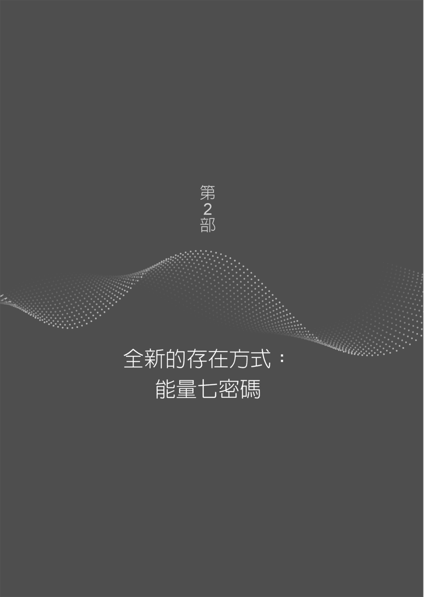

第四章
锚定密码：让灵魂回到体内

有一天下午，我坐在餐桌前写教案，忽然感觉到头颅里的振动，强烈到我必须甩头好几次才能摆脱，继续专心工作。那股振动停了以后我继续打字，过没多久又来了，我又甩甩头。那股振动一直持续下去，愈来愈强烈，最后我只好放下工作去躺一躺。

我一贴上枕头，就感受到一阵晃动和明亮灿烂的感受从头颅内部与周围散发出来，象是一道金光上下扫描我的身体核心，从头颅中心到脊椎末端。这道光让我把注意力放在自己体内。就像我第一次出窍的体验，我知道自己在感受另一个「我」——只不过这次没有幻化为无边的光线，我感受着那道光在体内。天堂与人间结合在一起，我自然本质中的灵魂在我的肉体中甦醒了。这不是我刻意创造的体验，我发觉自己正在感受体内深处的变化，我以前不晓得我办得到。我感觉到自己可以看见胸腔、颈子和头颅里的景象；我脑中有很多不同地点的景致，有些地点来自异世界。这画面好熟悉，却是我从没去过的，至少在我此生的回忆中没有。不过，每个画面出现时，我都觉得我就是来自那个地方，好像我曾经造访过数百遍。

接下来那几周至几个月，我时不时会感受到这股振动；我发现如果将注意力集中于身体和心，就能驾驭这股振动，不须停下手边的工作——我可以让这个过程自然发生，而不会影响当日的安排。我只要揉捏核心肌群，把呼吸送进振动的区域，就能主导这股庞大的能量，将它集中在一个部位上。当我这么做时，可以感受到能量在我的核心集中后提升强度，我觉得自己好像想起了某个深处的回忆。

在这个过程中，我的思绪、情绪、感受也有了戏剧性的转变。能量在我的核心愈集中，我就感到愈自由、愈轻松。我这辈子大部分时候都觉得自己很脆弱、焦虑、破碎，但此时我觉得很镇定，身体很稳重，整个人很踏实。在这个状态下，我的人生逐渐展开——去疗愈、去流动。随着能量在我体内的存在感愈来愈强，我人生经历中的每个面向都有翻天覆地的变化——后来我才晓得，那就是有灵魂的自己在主导我的生命了。

我之前也有过很类似的身体振动与生命振动；我们每个人都经历过，只是程度不同。如果我们不懂这振动的意义（这就是能量在吸引我们的注意），通常都会忽略掉。当我感受到能量振动时，那股感受强烈到我无法忽视，但这不是什么新奇的现象，也不是出窍的结果，只是我的觉醒变得愈来愈明显。

过了几年，我才知道能量要我把注意力集中在身体核心的现象，在梵文中称为「摄心」（pratyahara），东方的意识大师会教导学生透过摄心存在于完整的能量中。不过在能量突发成长的过程中，我想要用自己的方法观察，所以我凭借能量系统的导引作为罗盘。能量七密码就是从这个练习过程中逐渐发展出来的——第一步就是「锚定密码」。顾名思义，锚定密码就是要让我们有能力将能量安定在体内，把无形的能量锚定在有形的身躯里。要活出有灵魂的自己，这就是第一步。

什么是锚定密码？

我们都是能量体，在候机室选好了人间目的地，也选好了怎么来到这个世界成长；但离开候机室以后，我们搭乘立体的班机，一着陆能量就四散了。就象是我们的心智朝一个方向走，身体朝反方向走，灵魂或呼吸又选了不同的方向，我们不记得自己到底是谁，也不记得自己从哪里来（这就是旅行的乐趣）。我们努力想要搞懂自己是谁、身处何地、我们有没有危险、要怎么融入群体、怎么遵守规定、怎么讨好最重要的人才能活下去等；我们努力想要搞清楚方向，在学习过程中过于重视心智思维而忽略了其他部分——完全靠头脑生活，不重视身体、能量和我们的自然本质。其实真相早已存在于心中，我们只要参照就好了，但我们的文化一直强化逻辑思考，搞得身边每个人都觉得我们应该要凡事用脑。

靠脑子来过活的问题在于我们会活得不完整，也会觉得不自在。我们会觉得不舒服、不完整、不安全，把时间和心力都用来弥补缺陷或否认感受，但这都解决不了问题，因为真正的问题是我们不晓得自己已经很完整，我们就是有灵魂的自己。要踏实生活、运用完整的能量，关键就藏在我们有生命、会呼吸的具象肉身里。

为了在世上安身立命，并且掌握幸福、快乐、创意的能量，我们一定要学会锚定——意思就是把我们的能量体安定在这架人间班机与具象、有形的肉身里。我们不能只靠脑袋过活，而是要让整个系统都好好过活：身心灵都要。我们要体现灵魂。毕竟，我们的身躯是能量中最集中的一层；身躯并非独立的能量。若我们的能量不在体内，就等于要搭乘人间班机离开了——所以身体在这趟人间之旅中当然很重要！

当我们明了我们就是灵魂，而且拥有心智和身体时，就能体现所有的能量。我们用身心来深刻体会人间的遭遇，但不该把身心误以为是自己真正的身分。为了整合灵魂和身心，我们不能再往外寻求身分认同与方向感，而要调整自己的感官频率，对上有灵魂的自己。

该怎么做呢？

我们要把专注力放在身心的中枢能量通道上，那是脉轮所在的通道，有灵魂的自己就住在这里。透过能量七密码的各种练习，我们会开始打造这个家，这样就能感知有灵魂的自己，让完整的能量贯穿全身。

锚定密码会让你踏实地把能量安定在身体里，你不会再以为人生由头脑主宰。这是转移注意力的第一步，让你的注意力从外在世界转移到真实本质的能量核心。你还是会运用大脑和五感，只是使用方式和过去不同：你会导引心智向内感受，而非往外关注，我们的目标就是要让你的身心灵彼此协作互助。身心灵的统整会给你足够的掌握力，统整散逸的能量，在混乱中建立架构。这会唤醒你体内的疗愈力，提供动能让你每天都感受到平静与幸福。你的人生就会变成你所选择的冒险，而不是为了生存而奋斗、忍耐。

锚定密码的练习能有效提升观察力，让我们更轻易察觉到有灵魂的自己留下了哪些线索，教我们如何散发出最大的光芒。锚定密码只是第一步，后续还有更多强大的练习，但这几个练习就足以在你体内产生明显的能量变化。当你校准了中枢通道的能量，创造出更大的能量流，这些变化就会让你的身体、心理与情绪都大幅好转。

锚定密码的练习源自古老的传统（摄心瑜伽），但我简化并优化了部分流程，如此一来每个人都可以上手，毫无例外，每个人都能从现在开始锚定自己的能量。不必远赴印度或西藏，也不需要花好几年静坐沉思才能「准备好」接收这门知识。其实，你根本不必打断你的生活作息！你可以随时随地在任何时刻进行这些练习，每个练习只需要几分钟。

开始练习之前，我要提醒你几个重点：这些练习不能只是想想而已。你不能只是想象自己在做，必须要真正身体力行。你必须运用整个人体系统去打造神经回路：身体、心智、呼吸、灵魂和能量都必须上场。

我们必须身体力行，才能避免大脑靠想象编故事，写出许多委屈的情节。我们要身体力行才能直接走向能量来源，找到解决问题的根本之道。能量七密码的练习就是你训练身心灵的「指导手册」，让你活出有灵魂的自己。

锚定密码的练习

☼第一项练习：主体─客体─主体

你有没有过在看电影时感受非常强烈，完全入戏？你可能会对着银幕说话，甚至看着紧张的追逐戏、脚底忍不住想跑起来，又或许是沉浸在痛苦的对话里，禁不住泪流满面。然后忽然间，什么原因也没有，你又能抽离出来，和其他观众一起继续在银幕前看电影……在你回到现实生活时，内心起了剧烈的波澜。就算只是一下下，但你确实感受到自己在观影时进入了那个世界。

我们在人生中也会这样——把精力都集中在外，完全陷入那个情境，甚至忘了我们才是身体的主宰。我们把能量都往外丢，投射到关注的事情上，把能量定在那里，而非在自己身上。当我们的能量和外在实体交缠在一起，就没办法放轻松，无法感受到自己很坚强、安全、完整。能量散逸会削弱人体系统，导致免疫力崩盘，影响我们疗愈的能力。

能量之所以会散逸，是因为我们把能量丢给了所爱的人或正在享受的体验。就算我们在很正面的状况下将能量往外投，也会削弱自己的力量，因为我们失去了自我感。这就是为什么很多人在感情里「失去了自我」。他们的能量没有集中在自己体内，而是让自己（能量主体）和投射情感的对象束缚在一起。

相反地，当我们把知觉和焦点都拉回中枢通道，就能在与他人互动时依然集中能量，也更有能力去处理各种境遇，因为我们的能量很安定、稳固。

为了协助大家有意识地进入这种境界，我会运用「主体─客体─主体」的练习（图 4-1）。

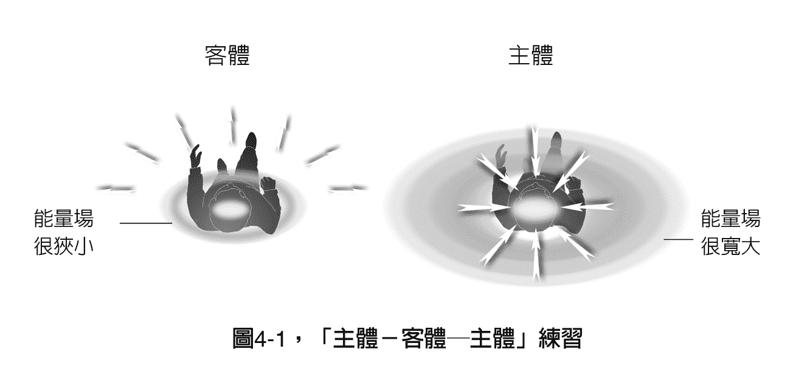

◆ 步骤：

1. 看着一公尺外的某样东西，可以是一个人或一件物品。

2. 把注意力都集中在上头，认真研究。感觉自己把能量全部抛过去。

3. 现在把意识拉回自己身上，回到核心。感受你的能量全部回到体内，透过双眼往外看。

4. 感受这股变化。你周边的视野扩大了，或许还能看到自己的鼻子和脸颊，甚至可以感觉到自己又安住在身体里。

5. 保留这股自我觉知，深呼吸几次。

我经常在团体课程中带领这个练习。我站在学员前方说：「把你们的力量都投在我身上，分散你的力量，把你的力量全都给我。」然后，下一步我就会请他们，「现在，收回你们的所有力量。把你的能量都召回——带你的能量回家。」

当学员把力量都投掷到我身上时，我整个人往后退，就好像大浪袭来；当他们收回能量时，我又会被往前带。每次都一样——每个人都会观察到。

能量投射的矛盾之处在于，当我们把能量和注意力都投掷到某个人或某件事上时，能量其实会把他们推远，因此感情中才会有这么多复杂的行为和反应，象是暧昧、困惑、控制欲等。与其去搞懂为什么喜欢的人会扑朔迷离、欲擒故纵或保持距离，如果能把能量锚定在自己的核心，我们就能表达爱意，邀请所爱之人更靠近，因为我们没有要强加自己的能量在他们身上。这个练习会让我们更负责任地运用能量，也更能够反应（我会在后面的章节详述有灵魂的自己会如何经营感情）。

把专注力从外面转移到自己内在（从投射的对象回到自己），会让我们的感情生活有完全不同的结果，也会给我们无限创意。我们很习惯泼洒自己的能量，有时甚至没意识到自己正在把能量往外抛，但这会让我们一直靠防御性格来生活，活在各种小剧场里。

只要稍微调整觉知，安定回自己内在，就能开始活出有灵魂的自己。接下来的锚定密码练习则是要给你更多的工具，让你展开转变，只要你在练习时「持续观照」自己就会更有效。要知道，持续观照自己不代表你在生活中就比较淡漠；事实上，你比较不会被制约。因为你比较不需要依赖外在世界来获得认同与肯定，所以会更投入生活。

☼第二项练习：中枢通道锚点

要体现有灵魂的自己，第一步就是要依序在体内锚定意识。中枢通道锚点就是很基本的工具，因为有灵魂的自己就住在中枢通道（或核心）里。

这项练习中会有四个锚点，让我们把本质能量栓在中枢通道上。海底轮就是我们与地球连接的闸口，让我们能完整地存在，并参与这个具象的世界。因此我们要运用古老的瑜伽练习「根锁」（mula bandha），将注意力集中在海底轮。

根锁

很多人特地写信来感谢我教他们做这个练习。根锁会让我们立刻定神定心，但请注意：这可能会让你无法「发完脾气」！我一直听到很多人说一做完根锁，气就消了。

要轻松不费力地转化能量，就要先把觉知都集中在脊椎根部。这会让你马上把散逸的能量都收回系统中，并且把能量拴在那里。

想象房间里飘了很多氦气气球，透过根锁，我们就能把气球的绳子都抓在一起，在底端系个沙包，让气球安定在地面上。就是这样！原本散乱的能量都稳了。我们的觉知忽然间从系统的外层和表层，转移到了身体的核心，这个小动作就能让你的人生观从防御性格切换成有灵魂的自己。

练习完之后，你会立刻感觉到深刻的踏实感与幸福感，你会觉得你一直都属于这里，这趟人生就是「你的演出」。你继续收集能量气球，从散乱的气场中逐渐稳下来，在体内感觉到灵魂的力量与存在。你不会再把自己当成受害者，只能忍受人生的遭遇，相反地，你会成为人生的创造者。透过根锁，我们就能开始建立感官神经回路，打造新认同。这听起来好像很简单，只是把意识从大脑转移到身体核心，但其实这很了不起！

◆ 步骤：

1. 收缩骨盆底部的肌肉，往肚脐的方向带，好像要把能量从地面往上拉到体内（这很像凯格尔运动，或象是在排尿过程里中断尿流）。如果你要好几天、甚至好几周才能熟练也别担心，会愈来愈熟练的！

2. 练习收缩骨盆肌肉几次，掌握到诀窍后，用尽全力收紧，然后放掉一半。在这个状态下做几次腹式呼吸——不要吸进胸腔里（用胸腔呼吸会开启战或逃反应，因为交感神经的末梢就在肺部的上半叶。腹式呼吸才能展开创意与疗愈，因为腹式呼吸能安定副交感神经末梢，并增加肺部下半叶的血流量）。

3. 现在再放掉一半，停在那里做几次腹式呼吸，直到感觉自己不须用力就有一股存在感。我们的目标是要创造肌肉组织里的觉知，因为通常我们不会注意到骨盆的组织，接着要更细微地觉察骨盆区域。最终，在你更熟练且骨盆组织也更灵敏之后，你只要轻轻收缩肌肉就能集中能量——不过现在，你有多少力气就用多少吧！

4. 一天之中能练几次就练几次，想练几次就练几次。多做无妨！

透过我改良的根锁练习，能量场就能够更轻易地收敛在脊椎根部，那里的组织也会逐渐甦醒。你会感受到新的频率，让那里的组织知道有灵魂的自己要住进来了！

揉捏心口

接下来的锚点，我们要沿着中枢通道往上移到心轮，也就是胸口中央。和根锁一样，我们要紧缩这里的肌肉，将意识的注意力带过来，并且把能量「锁」在这里。

如何把能量安定在心口呢？

◆ 步骤：

1. 收缩胸口中央的肌肉，用力——不必往左边靠近心脏，而是要在脉轮的位置，就在胸腔中央脊椎上方。收紧胸大肌，往后贴向脊椎；收拢肩胛骨往下带；收紧三角肌（靠近肩膀的位置）往下沉，然后从这里进入胸腔内部（如果你觉得这些肌肉名称令人困惑，就想象你在做仰卧推举，仰躺在地上，拿起沉重的哑铃往天花板的方向推举。或者推其他很重的东西，感受你用到了哪些肌肉）。

2. 肌肉用力，维持住，做几次腹式呼吸。然后就像根锁的练习一样，肌肉用力的程度先放掉一半，做几次腹式呼吸。

3. 再放掉一半，继续腹式呼吸。逐渐熟练之后，让你的觉知渗透到胸腔内部深处。试着收缩脊椎周围和心脏后方的小肌肉，就在身体核心深处。

4. 一天练习数次，能练几次就练几次，想练几次就练几次，最终你在收缩心口侧面和后面的肌肉时，心口中央前方会感觉很开阔。你的心脏和脊椎之间有相连的组织，你可以在练习时想象自己很放松，让那个组织来支撑。你放松时会感觉很美好！

用这个方法收缩心口，会把我们的意识与本质能量固定在身体里，就像根锁一样，让我们多了一个接触点能够安定有灵魂的自己。这会加强你的觉知转移，更从外转往内，真的把意识能量带到心口，获得沉着、放松、疗愈与爱的感受。你的大脑会体验到，原来启动这充满爱的灵魂多么美妙。

收缩喉咙

沿着中枢通道，喉咙就是下一个锚点。我们要把喉咙锁紧到觉得呼吸时像星际大战里的黑武士——气管紧缩到空气通过的声音都能听见，也能明确感受到空气流过。练习时，吸气吐气都应该要发出明显的声音。这项练习在瑜伽中称为「喉式呼吸法」（ujjayi pranayama，又名胜利呼吸法），能让我们接受声音的引导，成功进行量子翻转，活出有灵魂的自己，那才是我们应该生活的方式。

◆ 步骤：

1. 下颚微张，闭起双唇，轻轻紧缩喉部肌肉，同时把舌头根部往上提、往后拉，缩紧气管的开口。下颚微微向后收（但不要咬紧牙根），感觉到后脑勺和头顶往天花板的方向提。

2. 做几次深沉的腹式呼吸，鼻吸鼻吐。让空气经过鼻子进出时，呼吸自然发出嘶嘶声，就像海风卷起沙子一样。这感觉和打鼾非常像。你想多大声就多大声！

当你的喉咙紧缩到呼吸的声音都能听得见，你就知道自己的本质能量已经稳定在中枢通道上的锚点了。当你的心神跟着声音进入身体的中枢通道，就会把意识往身体核心拉。若要成功体现灵魂，这很重要——你的自信心会大幅提升，思虑也会更加清晰。

打开第三眼

现在我们来到中枢通道的最后一站：头部的中央。能量从喉部继续往上升，接下来就要导引到脑中，就在两个半脑的中间和下方。松果体对我们非常重要，而这里就是松果体的家。

松果体有很多感光细胞，称为视杆细胞和视锥，和眼球里的感光细胞一样。双眼会接收可见光的能量，并传递到大脑。松果体的功能之一可能就是要「看到」并接收内在世界细微、不可见的高频能量；换句话说，你的第六感就存在于松果体。我为了体现灵魂，建立了神经回路并发展出特别细腻的感知能力后，就能够亲身感受到灵敏的第六感。

◆ 步骤：

1. 双眼可以张开，也可以闭起来，将注意力集中在额头中央、双眉之间或人称第三只眼的位置上。将注意力集中在自己身上（主体），感受到你的注意力都集中在这一点上。

2. 如果你需要多花点力气才能感觉到能量集中在那里，可以把眼球往上转，直到感觉到眼睛后面在出力。

3. 继续维持这股力气，做几次腹式呼吸。

这个练习和「主体─客体─主体」很接近，这个锚点的目标就是要发现你自己就是「双眼后方的能量」。这会把你的焦点明显从外在环境转移到内在世界，从「外头」回到核心的「家」。要让能量锚定在体内，你就要成为透过肉眼往外看的那股意识。

现在你已经很熟悉中枢通道上的四个锚点（图 4-2），可以开始把这个通道视为维持生命所需的能量运河或贯通整个能量系统的超高速公路。当你不需要锚点的引导就整合能量时，就可以放松锚点，感觉灵魂进入身体里。不过，这个晚点再说，现在还是要用力绷紧肌肉！

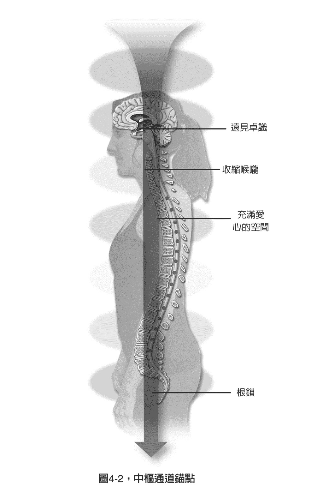

刚开始练习时，一次收缩一个锚点：海底轮、心轮、喉轮、第三只眼。维持肌肉用力，同时让呼吸经过鼻子进出时都要发出声音。当你沿着中枢通道从下往上练完之后，把这四个锚点连在一起，就象是在疏通水管一样——从双眼后方的张力到紧缩的喉咙，听着自己的呼吸，再用力紧缩心口，最后到根锁，然后一路向下连接地表，像树一样往下扎根。

练习去感受将锚点连成线，去想象、去感觉——如果感觉不到就靠想象。愈常练习，愈能锻鍊那个区域的感知能力，感官系统的回路增加了，就能加强意识到有灵魂的自己，也会强化有灵魂的自己的能量流。

前文引述过爱因斯坦的名言：「直觉的心灵是一种神圣的天赋，理性的思维则是忠实的仆人。但我们已创造出一个尊崇仆人却轻忽天赋的社会。」感知的能力才是运用理性大脑的正确方法——让大脑成为直觉心灵的仆人。现在，让大脑运用过去从未试过的方式来引导、掌握感官，就会让你在真实本质中甦醒，你才知道自己原来从未觉醒。

除了这四个锚点，以下的独特呼吸法也能完整启动中枢通道的本质能量。

☼第三项练习：中枢通道呼吸

我发现很多时候人之所以没有办法完整运用自己的能量来生活，追根究柢就是他们根本没在呼吸！呼吸就是能量——当我们把呼吸带入体内再呼出去，就会把能量带进自己的能量场再排出去。在吐纳过程中有意识地连结我们的锚点与地球，就能有效启动能量中心（脉轮）并强化中枢通道里的能量，让有灵魂的自己能够安坐在体内。

中枢通道呼吸法是能量七密码中很基础的练习（图 4-3）。透过身体核心呼吸，你可以具象体验多维度实相（身─心─灵），并迅速脱离求生与反应模式，发现更崇高的人生使命，从那个视角综观人生。

就和其他练习一样，这里也要用腹式呼吸——表示每次吐纳，吸气时都要撑大肚皮、吐气时收肚子，不要把空气浅浅地送进胸腔。当你根据步骤说明透过中枢通道呼吸，请特别留意自己的注意力要跟着空气在身体核心上下移动、通过不同的能量中心，就像搭着电梯在电梯井里上上下下，不要跳过任何一段。这是启动所有电磁场与神经回路的关键。

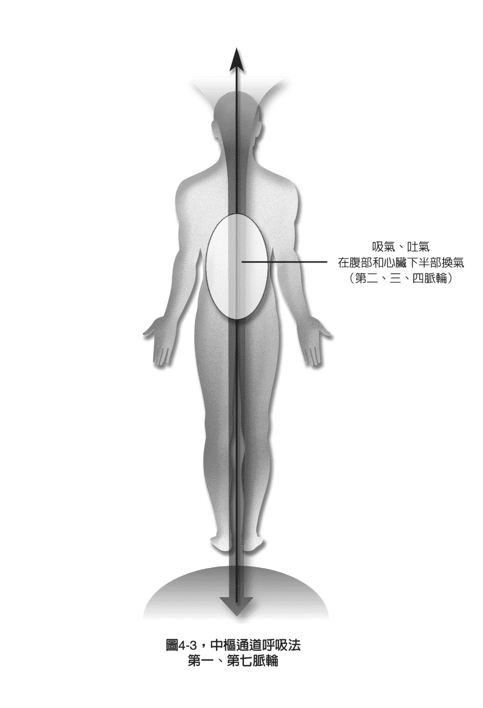

◆ 步骤：

1. 先从锚点开始——利用根锁把骨盆底部往上抬，心口用力，就像在做仰卧推举一样，再来喉咙的呼吸要像星际大战的黑武士，最后双眼后方用力。

2. 把注意力移到头顶上方（约十五公分处），从那里吸气。刚开始，可以想象有颗金色或白色的光球，放轻松试试（最终，你会明白你就是那颗光球，所以你会感受到自己从头部上方进入头顶，穿过中枢通道，就好像你搭着电梯要去地下室。不要从外部视角来想象）。

3. 将空气一路吸到通道末端，进入腹部，锚点用尽全力。吸气时撑大肚子。

4. 从腹部吐气，透过海底轮直接泄入地，四个锚点还是要出力，吐气时将肚子贴向脊椎。

5. 现在反过来：从地面将空气从海底轮带向腹部。吐气时，感觉自己就是那股能量，沿着中枢通道往上，直达头顶。

重复整个循环。请注意完整的循环要包括两次呼吸：一次从头部上方十五公分处吸气，让空气进入心口、腹部、核心，最后吐气到地上；另一次是从地面吸气经过所有的脉轮，从头顶吐气。

刚开始练习时，用舒服的速度吐纳，这样你就能集中精神维持锚点用力，运气在中枢通道上下移动。熟练之后，你就能自然地在锚点用力，也可以刻意加快或放慢吐纳的速度，创造不同的效果。若你呼吸得较快、较用力、较大声，就可以运气击破脉轮之间血管和组织里的情绪包袱；缓慢、温柔、深沉的呼吸则可以建立神经回路，整合细微的能量。呼吸慢一点也能更放松，减缓压力与长期精神紧绷所造成的影响。我会提供更多细节让你掌握这些技巧。

如果要尝试激烈版的中枢通道呼吸法，每次四拍：吸气两拍、吐气两拍。你会注意到呼气声变成「呼吁」。你可以想象强大的气流穿破你在中枢通道所观察到的所有包袱。

若要尝试温柔版，把呼吸放慢到六拍、八拍或十拍，保持吸气和呼气的长度一样。

不管是哪一种中枢通道呼吸法，最重要的是有意识地跟着呼吸在系统中上下（最理想的状态，是让自己变成那股呼吸），沿路启动所有的神经回路。练习时不要跳过任何锚点或任何一段通道。

如果你一天练习数次，就会进步很快，尤其是每晚睡前练，让呼吸成为入睡前最后一件事，还有起床后第一件事，在下床前就先呼吸。睡眠前后，是潜意识与意识沟通最密切的时段，所以也是最适合创造新自我实相的时段。

要发挥最大功效，确保每天的每一口呼吸都是中枢通道呼吸！你每次从体外吸入空气，穿过全身，然后排出体外，再吸一口气，都是在启动潜意识的觉知，让你察觉到你不只是这副具象的身躯。你从自己多维的实相里吸气，不断在让自己更加年轻。我每个礼拜练完都觉得自己少了一岁。

☼第四项练习：掉进去、掉下去

「掉进去、掉下去」是随兴版的中枢通道呼吸法，目的稍微不同。就像「主体─客体─主体」的练习，这会把我们所有的能量拉到身体中心，否则能量就会四散——在我们的头里、肩膀两侧或身体外缘。透过这个练习，我们会让能量掉进来，然后一路掉下去，就像湍急的瀑布般沿途冲刷情绪包袱，以强劲的能量流冲出体外、倾泻入地。

这个「冲洗」的练习对我们有宝贵的价值，能让我们摆脱迟滞的能量，象是过去的旧思维、人生剧场情节、坏习惯、想要控制处境的欲望等。我们黏着这些无用的能量不放手，并非因为觉得这样很好，而是因为我们以为人生就是如此。这是我们熟悉的观念。可是如果不放手，这些包袱会继续削弱我们的能量场与能量流，在生命中创造痛苦的摩擦，其实它们也很想被释放。

不过，如果我们可以利用能量逐渐放手、适应变化——透过这个练习，让能量冲洗我们全身——习惯能量冲洗的感觉，大脑要放掉过去的观念和思绪就会愈来愈容易。这是因为放掉全身的能量，感觉就像放掉某种思维或情绪。大脑很难放下人生剧场的情节，可是放掉能量比较简单、快速，而且那才是情绪包袱所在的位置。所以放掉能量以后，我们就能让大脑去追求更高的创意与创造力。

想象一下你和别人起了冲突，你真的很希望那个人可以理解并同意你的观点。接着想象这个人忽然懂得你想要表达的重点，并且全部同意。剎那间，你原本想要用来说服他的力气都消了。你不再坚持作战计划，因为任务已经完成了。外在世界的变化（因为另一个人的态度转变，摩擦消失了），造成你内在世界的变化，然后能量瞬间流泻，因为你的欲望已经结束了。

不过，这个例子是从外而内的变化，但我们毕竟无法控制外在环境——却能够反过来，由内而外产生变化。我们可以练习去感觉，假设对方已经理解我们了，假设对方不需要我们开口就完全懂了。这样一来，我们就会放下作战计划，在形成冲突之前就终止摩擦。这种练习在消除迟滞能量时很有用，可以解除防御性格带来的影响。

◆ 步骤：

1. 现在，请留意头部与肩膀周围的能量（可能比腹部、髋部、腿部的能量更明显）。

2. 尽可能把所有能量都集中在头部中央，同时把气吸入核心。身体上半部要完全放松。

3. 用力紧缩四个锚点，让自己集中于核心。

4. 吐气时，让能量一路沿着中枢通道往下掉到你坐着或站着的地方。然后放松所有的锚点，但注意力仍留在身体核心。「掉进去」会让你感觉到大脑中央的创意中心有更多能量，「掉下去」则会让你放掉一切，锚定于根部。感觉超棒的！

5. 一天之中，在海底轮练习间歇掉进去、掉下去。把骨盆底部往下沉、腹部下沉、双肩下沉、脚掌打开，走路时就会感觉到能量落入地面。随着每一步，感受到充满爱的支持像瀑布一样往下落。

当我们把精神寄托在某件事或结局的时候，就会紧抓着能量，让能量无法流通，结果什么都动不了、流不了、改不了。这会让我们困在能量环状图里的心智层，我们的灵魂就无法落入身体核心，这样就看不到真相。主动移开受阻的能量只是自我掌握的一部分，我们会透过能量七密码学会当自己的主宰。我们要习惯搬移能量，而不是紧握着能量，这样才能保持能量流动、顺势而为，同时保持能量锚定在体内。

最理想的状态会创造出更多空间给创意、爱和幸福感，不需要外在环境配合，也不需要外界肯定。稍后在其他章节中，你也会发现爱的力量就像营火，把沉重迟滞的能量化为创意，就可以积极地用来提升人生体验。

锚定密码对应的脉轮：海底轮

锚定密码的练习会在整个人体系统产生重要的影响，特别是脊椎末端的海底轮。每一个脉轮都掌管不同面向的意识与生活面、影响特定的身体部位，促进身体健康、强化人生经验、影响你的人生观。

海底轮攸关我们最原始的存在，代表我们的生存与安全。不会控制海底轮的人往往心神不宁，能量无法安定在体内，在人生中也容易觉得焦虑、不稳定、不安全，经常被困在存亡攸关的议题里。他们可能很重视物质、好战善斗、个性轻率或重视外在；他们容易在沟通、感受、自尊等方面碰到大问题，因此可能结了好几次婚或换过很多份工作；或者他们可能会把这种倾向「塞在」身体深处，表面上看起来很坚强快乐，但是内心会有剧烈的冲突，到了极限点，他们的身体再也承受不住能量的流失，就无法压抑恐惧了。

有海底轮问题的人也经常强烈感受到缺乏归属感。他们的内在会感受到实相（在双眼后方），可是这个实相却与他们的言行不符。结果，他们容易质疑自己、感觉疯狂，或经常用抽身的方式来面对问题。因为海底轮在我们的意识层控制身体的存在感与幸福感，会影响到身体各种症状，如体质虚弱、免疫力差、生命力低落，还有身体结构的问题，象是骨质疏松、关节疼痛、关节脆弱和双腿双脚不稳。

如果你的能量不在海底轮里，你的能量就不在身体里；如果你的能量没有完整地存在身体里，你就会受折磨。锚定密码的练习可以帮助你！

【表 4-4】整理了海底轮的特质，请注意脉轮的能量如何映照出身体的状况。

由于海底轮位于中枢通道的底部，能量（真实的我们）就是从这里进入我们在凡间的肉身，海底轮太弱或受伤就会产生涟漪效应，影响整条通道，最后能量就无法进入脑部的创意中心。若是这样，我们就永远无法体验自己真实的命运。我们只能尽力让人生好过一点，一直活在觉醒模式的背面，靠生存模式度日。因此，启动海底轮并且让能量顺利流过，对我们的幸福至关重要。

锚定密码就是让我们完成目标的工具。利用锚定密码的练习，你可以建立强烈的安全感、归属感和幸福感，因为能量在海底轮整合好了。你会开始发现「这个世界就是我的舞台」而且「我办得到」；你可以培养一辈子用不尽的生命活力，不会觉得必须努力融入世界；你会觉得人生能让你尽量发挥、尽情冒险，并体验到健康、活力、一切在我。

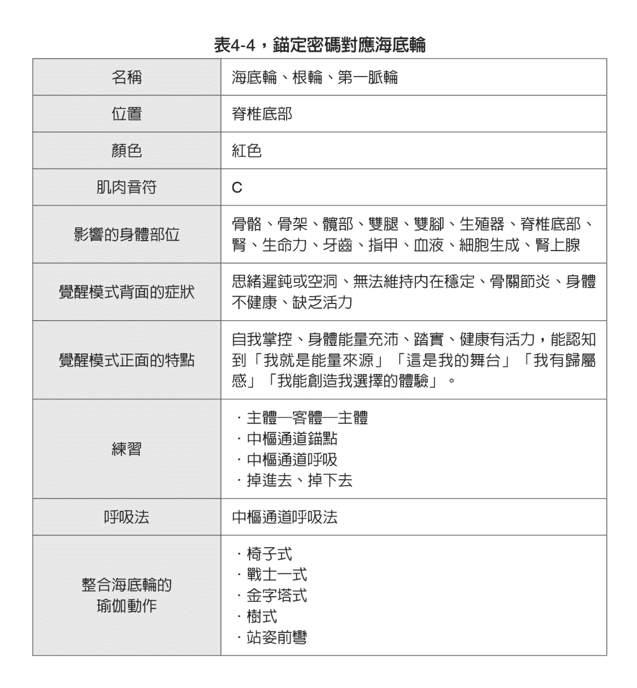

锚定密码的瑜伽动作

为了强化你的能力，协助你完成能量七密码的功课并提升效果，我要在这里加几个特定的瑜伽动作。当你能专心并且把握当下，瑜伽就能让你体验身心灵合一，让你在做动作和呼吸时，将意念集中在身体部位上。你就是需要身心灵合作才能让本质能量安定在身体里，从而获得主导和管理能量模式与能量流的能力。

我所教授的身体觉醒瑜伽，会在每个动作中为身体建立意识沟通的神经回路。如果你以前对瑜伽不太有兴趣，别担心。就算你没有做过瑜伽，也能做我建议的这些基础练习。不要小看这些好像很简单的动作，虽然简单，累积起来有很强大的效果，就连经验丰富的瑜伽学生或老师都很有收获。许多长期修习瑜伽的老师（三十年以上）都很惊讶，多了不同的引导方式原来可以有明显的变化。我相信这些动作也能够帮助你！

☼椅子式

椅子式（utkatāsana / Chair）很简单，任何人都能轻松练习。它能有效整合海底轮的能量，让你的能量稳固存在于中枢通道底部，有益于有灵魂的自己安住。如果站着或平衡感觉很吃力，你也可以坐在……没错，你猜对了，你可以坐在椅子前缘来练习！

首先，我们要假装坐在椅子上。

◆ 步骤：

1. 双脚打开与臀部同宽。脚跟和脚掌踩稳，感觉到你和地面相连。

2. 膝盖弯曲、屁股往后坐，好像要坐到椅子上一样。坐骨往后推，这样膝盖才不会往前超过脚尖。双膝平行，不要往外开。如果你想要更稳一点，膝盖可以并起来。

3. 如果可以，请高举双臂过头；若没办法就尽量举高。

4. 维持这个动作，深呼吸三至十次，然后腿伸直、放松，双手放下回到身体两侧。

现在，结合锚定密码的练习和身体觉醒瑜伽的椅子式，强化效果。

1. 维持椅子式的动作，把意念集中在脚下三十公分深的地底处。感觉你自己定在那股能量里。

2. 抬起脚趾头，再放下。重心往后放在脚跟上，感觉中枢通道打开来；再往前把重心放在脚趾头上，感觉中枢通道关起来（这可以帮你感受到中枢通道）。准备好之后，重心往后放，停留在那里，把意念集中在中枢通道上。

3. 右脚踩稳，再踩稳左脚，脚趾放松。转一转脚踝，踝关节用点力，感觉「自己在那里」。轻轻抬起再放下，强调膝盖的动作。收缩大腿和臀部肌肉，捏捏髋关节前面、后面、内侧、外侧——同时深呼吸，感觉到空气在中枢通道上下移动。如果你并起双膝站稳，现在可以捏捏膝盖，感觉到自己在那里建立了神经回路。

4. 捏捏根锁。把肩胛骨往内收、往下放，捏捏心脏后方的位置。双臂尽量向上伸，感觉到你用能量将双臂插入肩窝，收下巴。眼睛往上看，感觉眼睛后方的肌肉在用力。感觉到整个中枢通道都对齐了，感觉到脊椎的前侧——通过脊椎，往下到双腿和双脚，最后直入地下。

5. 沿着中枢通道深呼吸数次。把能量从地底下三十公分处往上提到你所站的位置，往上吸气，让能量进入中枢通道。在核心聚气，然后往上吐气，通过心轮、喉轮、第三眼，最后从头顶呼出去。吸下一口时，从头顶吸气，经过头、喉、心、腹及根锁，然后通过双腿到地面。最好是你就化身成那道呼吸，穿过身体。

☼整合海底轮的其他瑜伽动作

你可以运用下列的瑜伽体位配合椅子式，加强锚定密码的功效（我针对能量七密码推荐了不同的瑜伽动作，若想获得更多相关资源，请至[drsuemorter.com/energycodesbook](https://drsuemorter.com/energycodesbook/)）。

当你做任何动作都觉得很稳固、踏实的时候，就可以加上中枢通道呼吸法，把能量和呼吸从脚底拉上来，通过中枢通道，从头顶呼出去，然后再从头顶吸进来，经过中枢通道，从根锁呼出去，直下脚跟入地。

•战士一式（vīrabhadrasana I / Warrior I）

•金字塔式（pārśvottānāsana / Pyramid）

•树式（vṛkṣāsana / Tree）

•站姿前弯（uttānāsana / Standing Forward Fold）

练习锚定密码时常见的挫折

我在团体课程教授锚定密码时，不免会听到学员提出一些共同的问题。通常这些问题都很容易解决。

•问题一：没办法同时在肌肉用力时呼吸。

有些人觉得很难把气吸进肚子里，同时挤压或提起腹部肌肉和骨盆底部，他们会搞不清楚现在到底要做什么动作。当他们问我：「我要肌肉用力还是深层呼吸？」我的答案总是：「没错！」你要试着两个动作一起做，才能感受到过程中的阻力。

只要记得，我们创造阻力就是为了找出一条路径，认识真实的自己。肌肉用力同时呼吸所产生的内部阻力，可以让我们的意识进化，才不会继续写故事或开碰碰车。

在这个世界上，我们可以透过很多种方式学习，其中一种就是透过阻力。举例来说，和别人争辩时更清楚自己是谁，因为争辩让彼此的差异更加明显。同样地，当我们把肌肉往内施力并向外伸展时，就在身体内部创造了阻力，因为呼吸会把腹部撑起来，肌肉又拉紧，所以往内压和向外推之间就产生了差异。我们会透过感官系统感受到差异，然后以过去没体会过的方式发现我们应该要「住」在身体里。透过阻力，我们可以学会「我们是谁、我们在哪里」。在内部创造阻力，就不需要在外在世界的关系里创造阻力。大脑放松了，身体放下战或逃反应，我们就创造了一个更适合的环境，让有灵魂的自己可以出现。在这之后，我们便会放松骨盆底部，继续感受到自我。

•问题二：肌肉用力时没什么感觉。

很多人长年都靠头脑主导生活，已经没办法察觉身体的细微感受了。不要紧！如果你练习肚子内部用力却感觉不出来，把手放在肚子上，轻压直到有感觉为止。

例如为了把意念集中在脊椎底部的海底轮，你可以按按下腹部，就在耻骨上方一点点的位置，甚至把手或脚放在屁股下，坐下去。至于心轮，你可以把指头放在胸骨上，「往内按」，再挺胸去感受你的手，或仰躺靠胸骨把重物提起，就像做仰卧推举一样。要感受喉轮，就用手掌或手指在颈子（前侧或后侧）轻轻施加一点压力。至于头颅中央的松果体，眼睛向上转时按按眉心。你真的不要担心怎么做才「对」。

下一章会让你更清楚这种状况下要怎么做，现在先按照这些建议做就行了。这里的目标是要把注意力和意识带到你正在使用的身体部位，这样你就可以开始建立光子密度——就是让有灵魂的自己在那里更有存在感。你的感受力会恢复，也会愈来愈强！

•问题三：同时间要做的事情太多了。

开始做这些练习时，尤其是中枢通道呼吸法，你会觉得同时间好像要专注在很多事上。不过，若要在人生中游刃有余也是这样，象是学开车就必须手脚并用，或者准备晚餐时要让每一道菜都同时准备好，或者练习完美的高尔夫挥杆——天啊！我邀请大家去体验看看，所有的能量七密码工具在刚开始运用时都会觉得有点机械感、有点难为情，可是就像你学会的其他事一样，熟能生巧。事实上，你可能在几天之内就觉得做起来更简单了。如果你身处在让你感受到爱自己的空间，可能会进步得更快。

如果你没办法在所有锚点用力的同时透过中枢通道呼吸，那就先从海底轮开始就好。

在一天开始之前，先花点时间把骨盆底部往上提，感受到能量的存在。吐纳几回，然后放松。一天之中，只要记得，就多做几回，再慢慢加上心轮的练习，在呼吸时感受到意识在这两个脉轮上；然后加上喉轮，最后注意到你的第三眼。你很快就能在所有锚点用力时呼吸自如了！

最重要的是不要放弃。

根锁练习每个人都做得到，这个小动作其实就能有极大的效果了，因为这会开始让你的大脑准备进行量子翻转，这就是整套能量七密码练习的目标。先从小处开始，一步一步来，在中枢通道建立你的觉知，打通呼吸，最后就能做得很自然。其他密码的练习也一样：视自己的需要，把练习先拆解成小动作，但是要持续练习。效果真的很强大，放弃太可惜了。

当你的意识与注意力能够安定在身体核心，你就更能和有灵魂的自己互动，认知到你就是有灵魂的自己。因为你会感觉到在不同的人生经历中，你的能量模式如何随之变化，就能发展出全新的方式来理解生活中发生的大小事，也会用全新的方式来回应。过去的你会继续靠故事情节在小剧场里过活，但现在你会更快就感受到效果！我的目标就是要协助你过着自己想要的生活，不再回应外在世界，你本来就是人生的创造者。这个世界需要更多有原创想法的人，唤醒自己完整的能力——那就是你！你该觉醒了。我们会在下一章启动你更多潜力！

第五章
感受密码：灵魂的语言

我有一段感情谈了八年，原以为我们会白头到老，结果几年前分手了。尽管当时我已着手建立新的神经回路，并开始从幻化为光线的体验中逐渐整合新能量，但结束一段感情毕竟还是不同的挑战。

分手的过程并不愉快。我前一年才失去了母亲，隔年连男友也没了。我们虽然对于要怎么分开有共识，但一切的发展都和讨论的不太一样。某个周日夜晚，我从机场回到家，里头空了一半。我们协议好要把狗留给我，他却带走了。我简直要崩溃。

我从未想过自己会经历这种痛苦。痛彻心扉，直达灵魂深处——最糟的是我毫无心理准备。我在这个世界上从来没有过这种感受。分手过程中，我还是继续旅行和演讲，我知道这是我真正的人生道路——我还要对诊所负责任，我僱了员工和其他医生，病患也需要我的照顾和引导；若班机被取消或行程有状况，我就没办法向病患和工作团队负责。我体内累积了愈来愈多我从未见识过的庞大压力。

有一天，我正要离家去上班，忽然想起忘了一样东西，得回头去拿。我走回卧室，走向衣橱……然后就瘫在床上了。破碎的内心爆炸了，我全身都在放情地哭泣。眼泪好像从骨子里溢出来，挟带着一道道绝望，涌上我的喉咙，从我的双眼和嘴巴流出，甚至直接从肌肤里渗出来。

我一直尽力保持生活规律，下定决心要坚强地向前走，完成既定的计划。我对自己说：「不要去想就好了。」我没法想象自己还要再多感受一件事会有多疲惫，可是在我情绪耗竭的状态下，分手的伤痛就像水坝溃堤般奔腾汹涌。

我摊开四肢躺在泪海中，放下一切，让自己沉浸在痛苦中。或许我拚累了，撑不下去了，或许我就是该觉醒了。不管是什么理由，在那之后，关于「我是谁」的内在体验从此不同了。

我一边啜泣，一边揉着胸口和腹部，紧抓着核心，然后脑中出现了这句话：「如果这一切都消失了，至少我还有『我』。」

瞬间，尽管还流着泪，我感受到了前所未有的喜悦。这让我迷糊了：我这几年来从没有这么失意过，可是却又感觉到喜不自胜。

因为我不再试着要让一切更好，所以一切都变好了。在那之前我就像行军中的勇士，可是我已经精力透支到再也无法上战场了。当我放下盔甲，让自己去感受，所有情绪都浮现了。我可以放下原本的观念，不必那么坚强，不必负责所有营运。防御性格的所有努力都在那瞬间化为灰烬，我没有妥善处理的情绪一股脑涌上来，向外宣泄，带给我极大的快乐。

在那张床上，我的理性大脑和防御性格向有灵魂的自己投降了。在那之前，我完全不晓得自己一直处在战斗模式中。我想要保护自己，想要「弥补错误」，这想法一直在我的潜意识里，但我终于承受不住，感受到了核心能量，放下一切，陷入情绪中。那一刻，前几年出窍的经验又更深刻地回到我体内。

现在我不会等水坝溃堤才体会情绪。我现在经常活在感受中，如果有什么事让我抽离了核心，我会沉浸在那情绪中，让自己感受到底怎么了，然后感觉到能量场在充电。我不再让理性大脑和防御性格去主控生活，因此省下了不少伤痛；我让我的身体——我的感受——来告诉我该怎么做。

所以在这一章里，我要和大家分享这些练习。

什么是「感受密码」？

透过锚定密码，我们导入有灵魂的自己，把能量拴在肉身中，让有灵魂的自己能够安住。我们让大脑意念集中在身上，建立身心灵之间的关系，因此有灵魂的自己才能住进来。这股新的连结就是要铺路，让有灵魂的自己能够增加存在感，开始接收宝贵的讯号——充分体验人生究竟是怎么一回事。

人生就是一场觉醒项目——唤醒有灵魂的自己，我们才能透过最高等的真实本质和世界互动，并体验由神性引导的魔法生活。要觉醒就要有摩擦——各种碰撞都是因为我们还不知道自己有多么伟大，或是我们哪个身体部位的神经回路还没有开通。如果没有阻力，我们就不知道生活中还有哪些方面没点亮；我们需要被挤出现状，才能看到我们必须把能量导引到哪里，重新整合破碎和散逸的自己。

我们不能避免摩擦。这件事没得选，在完全活出有灵魂的自己之前，摩擦会让我们看到还有哪些地方需要建立神经回路，让我们唤醒自己的伟大。不过，我们确实可以选择要在哪里产生摩擦：在我们内在世界的能量层，或到外在世界去惹是非。

以下的例子可以让你了解摩擦的道理。假设有人讲了你的坏话，让你很难过，他的话让你的心智和情绪产生了一些反应，然后你开始撰写情节，描述这些话对你有什么影响、对你和其他人的关系会有什么影响，还有对这个世界有什么影响。你的大脑说：「怎么会这样呢？」「他不应该这么做。」「这样我以后要怎么生活？」过了一阵子，你可能会问自己：「为什么我过不去？」或「为什么我放不下？」

你「过不去」是因为你的大脑在故事情节的层次运作。大脑没办法处理你的感受，因为人类的整个系统就是要你去思考这个经验到底要给你什么教训，反省过了才能往前进——开通某些回路，并整合散逸的能量。很多时候，当能量重新整合在一起，会有一种「顿悟」或「灵光一闪」的感觉。你的能量一转换，开启了那些回路之后，故事情节就不一样了，大脑也会用不同的角度来看待产生摩擦的那个风波。

从防御性格的观点出发，摩擦看起来就像：「这太疯狂了，我放不下。我过不去！」但有灵魂的自己会认为摩擦传递的讯息是：「我们要把能量集中在这里，一直练习，直到你能够集中能量，顺势而为——尽管这过程可能会消耗你的心力。」因为，不管你是发自内心顺势而为，还是因为筋疲力竭只好顺其自然，对有灵魂的自己来说，放下就是放下了。就好像「没关系，我会在这里，你准备好时就会发现我在这里——不管你要花多少时间，我都会等你」。

摩擦当然会获得我们的注意，也一定会帮助我们成长，但我们可以不要透过故事情节来成长——这就是感受密码的功效。通常，我们会对自己说一个很痛苦的故事，然后想要搞清楚「为什么」自己会有那种经历。我们可以换个方法，只要去留意风波过程中你的能量变化就好，专注在能量所透露的讯息，并管理能量。身体就像中间人或翻译，让有灵魂的自己能和大脑持续对话。这个对话就是感受密码的重点，能让我们更有意识地选择真相的面貌。

原本你的生活由大脑主导，这时要改由身体主导，从思考转变为感受，从解释转变为感知，就能让观点大幅改变。这会强化你的直觉和能量流，让你的肉身可以疗愈、康复，因为你的身躯不再受压力和「强者生存」的故事情节所苦。这会打开对话管道，让大脑、身体和有灵魂的自己能够直接沟通。不过感受密码要有效，我们就必须学会辨别感觉和情绪的差异。

传统心理学中，当我们提到「体会自己的感受」，意思是要让自己充分体验情绪状态，才能释放否认或尚未处理的情绪，让停滞的能量再度流动。但是体会感受和体会情绪并不一样。两者都在我们系统里的同一个频宽上，可是如果我们想要靠脑子想通，就只能体会到「情绪」；若用身体去感受，便会察觉到来自细胞、内脏的感觉——那才是「感受」。感受密码就是要协助你辨别能量场中感受层次和情绪层次的差异。

过去认为迷走神经负责中枢神经系统（大脑）输出给身体器官的信息，但现在医学认为内脏传递给大脑的信息中，有八〇％至九〇％是由迷走神经负责接收——将来自核心的提醒回报给我们。深沉自我本质的感受相当细微，但是对我们的觉醒很重要，让我们能从内唤醒更伟大的实相。和运动神经系统相比，感官神经系统的神经数量多了数十倍、数百倍、数千倍，这表示察觉内在的变化更为重要。接着我们会根据内在变化采取行动，表现出来。

迷走神经能传递器官的讯息，而肠神经系统的魔力更为强大。肠神经系统被视为身体的「第二个脑」，让我们能够整合信息、消化后从核心产生反应，不需要知会头部的大脑——我认为肠神经系统因此构建了我们深层的真相与认知。能量七密码会教你如何察觉到更细微的能量层，更轻松、更有效地体现真实。

当你的世界里出现摩擦时，你会有三种反应：心理反应、情绪反应和身体反应。现在你已经认识能量了，所以先不看情绪反应（这和故事情节有关），我们先来看看身体反应，因为身体反应来自能量场的变化。

就算是一年前、十年前或二十年前发生的状况（可能是结束一段感情或失业），如果这件事所产生的摩擦还没有在能量场中化解掉，就还是会引发身体上的反应，象是肚子不舒服等。这件事会在同样的身体部位影响我们，自然有原因；当我们注意到身体感受并学着去处理时，就会建立能量所需的神经回路来突破这个区域。如果我们停留在故事情节的层次，能量就必须绕道，让中枢通道摇晃不稳，导致外在生活相应失能。换句话说，当我们直捣黄龙，人生就会简单许多。

神经回路如果都在沉睡，我们就要花更多心力，因此情绪上会感到疲惫。我们会变得比较僵硬，需要弹性时就容易折断，需要全速前进时就会撞车。若启动的神经回路愈多，我们就更容易获得勇气、宽恕、喜乐和复原力。那是因为这就是灵魂真实本质的特色，我们唤醒的灵魂本质愈多，就愈能充分用与生俱来的能力去面对人生。

感受密码会给你一套全新的能量语言，我称之为「身体的声音」（body-talk）。若要和有灵魂的自己沟通，这就是关键。我们要听得懂身体的声音，并翻译给大脑听，才能发现每个人生际遇的启示和功课。接下来的几道密码中，我们将学会怎么更有效地沟通，把摩擦要教我们的道理整合到生命中，活出更完整的自己，整合度更高，灵魂全面上线。

感受密码

☼第一项练习：让身体来处理

「让身体来处理」就是要打断过去重视故事情节的旧模式，转而将注意力都放到身体上。这样一来，我们就可以整合故事情节下的能量，而不会让大脑一直瞎忙着编故事。这个革命性的练习提供了捷径——完全改写游戏规则，能让你省下好几年的时间，不必去处理情绪与心情，直接面对问题来源，针对能量着手，当下就化解问题。

当生活中出现摩擦，让你有情绪反应或情绪「激动」时，立刻问自己「哪里」，而不是「为什么」——也就是说，「我感觉到这股情绪出现在身体的哪里？」而不是，「这种事怎么会发生在我身上？」

这个简单又能改变人生的练习要怎么做？

◆ 步骤：

1. 将注意力往内集中，注意身体内部，感受情绪反应带来的能量变化。有个地方会「很激动」，可能是很紧绷、在颤抖或是嗡嗡响、坐立难安、尖锐的疼痛、身体发热、发寒、重复的一连串动作等。能量会转变。

2. 你要问自己和感受相关的问题：

•这个感觉出现在身体的哪里？是在心里、喉咙、头部、肠胃，还是大腿？这个感觉也可能不在身体中枢上，是不是在肩膀或手臂？会不会跑来跑去？

•这感觉像什么？（这种感觉可能有很多形式。不要批评，也不要解释，只要观察，然后去感受和体验。）

•这个感觉最接近哪个能量中心或脉轮，最靠近哪个意识区域？参考【表 3-3】就能回答得更清楚。例如：手掌对应心轮，双腿对应海底轮。

3. 接下来，和这个意识断讯的部位沟通，让身体知道你正在建立连结。可以从身体内部揉捏、挤压这个部位，让你的身体知道：「我听到了，我叫大脑来关心你。」

4. 挤压那个部位的肌肉，同时做锚定密码的中枢通道呼吸法，并把气送到那个部位。从中枢通道的其中一端开始，看哪边比较接近你感受到的部位，然后靠意念把那个部位「拖进」中枢通道的能量流。举例来说，如果你的大腿不由自主一直颤抖，就用中枢通道呼吸法把气从脚底下的地底带上来，沿着中枢通道到大腿，同时大腿肌肉用力，把大腿「拖过来」，带进中枢通道的气流里，整合到海底轮和其他锚点中。继续吸气，让能量上升到腹部和心脏，然后从腹部或心脏吐气，再往上让气从头顶流出去。接下来反向：从头顶吸气，穿过锚点，进入心脏和腹部，吐气时挤压大腿肌肉，把能量推入地底。想象大腿和小腿是中空的，让能量可以直接穿过。

5. 再做一次，至少要做完两轮（提醒：一趟完整的呼吸法是上下各一次，不管从哪个方向先开始都可以）。继续做，直到能察觉能量变化；若还没办法感觉到，就持续做六到八次。会有感觉的！

要让意识进化，让灵魂入体的速度更快，「让身体来处理」是最强效的练习。不必再浪费时间和精力去编写故事，描述谁对谁错，也不需要再责怪自己或别人，或者回避整件事。只要找出身体当下哪里有反应，那就是身体想要得到你的注意，然后直接处理那个点就行了。记住，你要处理的不是身体的疼痛或肌肉的抽动而已，那是灵魂的讯息，像雷射笔般要让你清楚知道哪里需要建立能量的沟通流和感官神经系统的回路，最终让你能更充分地感受到灵魂在体内，理解自己有完整的能量和无限的潜能。你的灵魂能量透过身体和大脑对话，让大脑知道信息流和能量流在哪里有断层。

要大脑别再编写故事，而改用这种方式去和身体互动，刚开始可能会很困难、很陌生——但其他做法都没有用，因为故事情节没办法解释你怎么走到这一步。我们自编自导的故事和我们的灵魂与人生完全无关，只不过我们注定要学会怎么摆脱故事情节。最有效的方法就是不要随着故事情节来改变我们的真相。我们应该要直接处理最真实、原始、永恒的能量，那才是最纯粹的自己。你的能量会跟随你的意识，当我们有意识地透过建立回路的练习，沿着中枢通道呼吸，就能够让完整的能量存在身体里。

我想强调我绝对不是要你否认任何涌现的情绪。我在工作坊中会和大家说，一定要先认同自己的感受。每一次都要先感受到自己的感受，同时做「让身体来处理」的练习。如果你想要认真处理情绪，就一定要有意识地活在当下，体验所有细节。不过我相信你可以学会怎么更快速、更全面地处理表象之下的能量。大部分人最终都会发现他们可以直接处理能量，不必再和情绪纠缠。

你也会发现，「让身体来处理」需要我们放下防备。不过，通常我上课上到这里时都会跟学生说，当你愈脆弱，力量就愈强大。你愿意去感受并察觉到体内真正的变化，并让自己去体验、面对，这过程会让你觉得自己很脆弱、容易受伤，因为你在认识真正的、真实的你。防御性格运用了很多防备策略要保护你，让你不受伤，而你在这过程中必须卸下防备，透过身体感受，连结到体内那个痛苦、受困、受伤的部位。

吊诡的是，在能量层次去面对伤痛其实比较容易，而在故事情节的层次去处理伤痛却更加困难，威胁性更高。感受密码不会让你被困在是非对错里，不会被情绪和评断绑架，而只是让破碎的能量流回系统里，最后让能量都整合在一起。然后，那个事件带给你的汹涌情绪就忽然奇迹般消失了。就算原本感受到恐惧和冲动，我们忽然间从体内就能拥有智慧、喜乐和复原力。

☼第二项练习：无以名状，只要去感受

这个练习能有效减少我们编故事的时间和心力，那就是：不要再描述自己的症状了。帮停滞的能量取名字、贴标签只会让能量更停滞，因为你让这个处境更「真实」了。记住，你的心念愈强，那件事的存在感就愈强！

当你碰到一个状况，产生了摩擦，造成了情绪，你可能会去描述你的情绪。有没有发现描述完那情绪更强烈了？为什么会这样？因为你现在不只体验到了那股情绪，还同时为它创造了脑中的小剧场。好比你在车阵中觉得很焦虑，你的身体可能会感受到不安、躁动、不耐烦。如果你直接面对情绪来源，利用中枢通道呼吸法把那个身体部位和感受「抓回去」，立刻整合能量，可能会马上好过一点；但如果你想着，我觉得很焦虑，忽然间你不只是体会到了身体的感受，还在情绪上回应了你为焦虑所创造的故事。

你一描述自己的感受（尤其是被标示为负面的感受，象是焦虑、恐惧、愤怒或悲伤），你几乎就必须走进故事情节，因为你对这些感受有偏见，认为它们会影响自己。你不想要感到焦虑、害怕、生气或难过，便抗拒或回避了你的感受，结果只会让你更难放下这些情绪，难以解决问题。不过，如果你能跳脱编故事或评断自己的心态，就能更快释放自己、获得自由。

所有情绪皆生而平等

所有能量皆生而平等，所以每一种情绪也都生而平等。明白了这一点，你的脑子就能顺利从故事情节层次切换到能量层次。当我们不想要某些情绪（当我们认为快乐、欢喜才是「好」的情绪，而恐惧、愤怒、悲伤、羞耻、愧疚是「不好的」情绪），就很难不去描述情绪。这会让我们更难处理能量。既然所有的情绪都是不同频率的能量，就没有哪一种情绪比较好、哪一种比较差的分别。每一种情绪在宇宙能量脉冲里都有独特的角色。宇宙能量脉冲不断扩张、锚定，扩张、锚定，而我们和大自然的一切都要经历这个自然的循环。所谓正面的情绪就是扩张的力量，而负面情绪则是锚定的力量。例如，愤怒和恐惧是为了要保护我们不要受到危险，是频率较低、比较重的能量；相反地，爱、希望、灵感会打破我们的界线，透过较高的频率协助我们扩张。

这样想吧：水母在海中优游，靠的是身体不断收缩和扩张。收缩才是水母前进的方式，然后再扩张。每个体验都有意义，人类需要各种可能的体验。例如，愤怒就是系统预设的方式，让你更收缩、更贴近「灵魂在体内」的状态，而不是任由能量散逸——直到你学会刻意地放下，身体就不需要再透过能量振动去表达愤怒。

现在，召唤一点愤怒。想想某个惹毛你的人或事，你体内和周围的能量场会有个地方特别紧或「收起来」。注意这种感觉，以后你就能认得出来。然后再想一件让你欢乐无比的事，你应该会感觉到能量场扩张。

当我们在故事情节的层次上运作，能量收缩与扩张所伴随的情绪，只不过是能量本身的反映或副产品。两者我们都需要，但如果能学会怎么处理能量，而不是等着能量发展成情绪，我们就能掌握人生，而不是被人生掌握！

如果我们能把情绪视为能量（亦即明白是能量透过情绪让我们扩张或收缩），就不会害怕悲伤，也不会觉得丢脸是很糟糕的事；相反地，我们会知道每一种情绪都在无限扩张的宇宙潮流中扮演自己的角色，导引注意力到能量散逸或破碎的地方，让我们看到在那个方面，有灵魂的自己还没觉醒。这是一股精心安排的力量，让我们能继续建立回路，充分整合能量。

疾病其实是路标

身体疾病也是一股能量。很多人怕生病，但我们可以用另一个角度来面对疾病：生病让我们注意到能量场哪里需要启动。当我们从这个角度看待疾病，就能够更迅速掌握问题背后的道理，跨越难关，而不是一直怪自己怎么「造就」了这个恐怖的局面。我的学员当中，很多人听到这个解释都松了一口气，把疾病当成是宇宙的提醒，要我们更清楚自己的伟大——就像一个不离不弃的好朋友，要我们看见自己的伟大，过程中绝不放手。

停滞的能量以疾患症状的方式显现在身体上时，你可以用处理情绪的方法来面对。生病，其实是因为能量散逸；换句话说，这是回路的问题！我们的能量四散，自己却还不知道。当我们几乎完全把注意力集中于外在世界，就会忘了注意体内的变化。我们察觉不到太轻微的变化或能量流的细微波动，所以能量必须「大声说」才能获得我们的注意。生活或身体失衡，就是能量传来的警讯。

除非我们把感知收回到体内，重视并注意体内的变化，从而做出决定，否则警讯只会愈来愈大声，直到我们觉醒成为有灵魂的自己为止。身体缺乏回路，能量流只能冲撞，我们的意识在这个部位尚未开启，所以才会产生摩擦。能量无法在系统里顺利流动，就必须去其他地方，才会过度刺激周围组织，造成发炎、疼痛、机能亢进或疲倦。这些组织开始过度反应，最后就会疲劳、损坏，终至故障。细胞故障就是所谓的慢性退化性疾病，其实这只是有灵魂的自己要大脑多注意能量。创伤或疾病会出现，都是要我们找出哪里需要开启回路，才能继续成为最伟大的自己。

明白这道理不只可以疗伤，还可以协助灵魂进化。

可惜的是，大家最不想做的事就是去关心和在乎自己受的伤。症状很严重时，我们往往想要摆脱症状——远离这个状态，当成是外来的、陌生的、强加在我们身上的状态。不过，我们愈是不晓得自己哪里能量受阻，失衡或疾病的过程就愈严重。

我认识琼安时，她三十二岁，因为胃溃疡和结肠炎经常痛苦难耐。整夜严重腹泻和腹痛让她根本无法入睡。她当时要吃五种药，可是每一种都无法改善症状。她的医生建议她动手术，她因此非常害怕。她不想要动手术。她妈妈就是因为手术并发症过世，所以她很害怕同样的事情会发生在自己身上。可是，她又很希望能「摆脱烂结肠和胃不好」的困扰。她的问题其实不在此，但这是她唯一想做的事。

西医的做法向来就是单独检视病症：先描述病症，让症状有更多分量、强度和故事脉络，最后让问题更难解决。接下来西医会藉由手术取出问题，或用药物掩盖症状。这些策略虽然短期内会奏效，最终却会让我们远离真相，无法根治真正的问题。

琼安和我运用能量七密码，她开始找到这辈子始终蕴藏在「表象底下」的情绪能量。现在这股情绪能量高涨到必须宣泄，从体内开始吞噬她。透过我们共同的努力，琼安明白不需要搞懂到底是什么故事情节造成她的情绪能量包袱，她就可以释放能量，重新设定系统，恢复正常功能。我看过上百个案例，他们的生活中发生了一些事，令他们无法「消化」随之而来的情绪，导致身体也无法消受。身体是意识的反映。琼安学会了怎么在故事情节之下优雅地疗愈自己，运用能量七密码的练习，她完全复原了，不需要动手术。她再也不会排斥或抗拒自己了，其实那是身体想要提升，甚至拯救她的人生。在她懂得拥抱真实的自己（有灵魂的自己）时，她的身体就不再发出警讯要她注意，身体就能自愈了。

我要邀请你做的事刚开始很违反直觉：挺身面对问题、挺身面对痛苦。带着你的注意力和痛苦正面交锋，然后全神贯注直捣核心，让你的大脑去接受讯息，理解身体哪个部位需要什么，因为身体会给你提示，你要做的就是察觉并感受到内部的讯息。或许不是透过文字，但现在你会知道怎么诠释灵魂的语言，为大脑翻译，也会知道该如何回应。愈来愈熟练之后，你就能运用这些练习侦测到摩擦或能量的起伏去解决问题，让你恢复健康，甚至预防疾病。

玛莎带着一岁半的女儿海瑟到我的诊所，说海瑟一岁半以来肠道蠕动的状况都很差，只排过一颗杏仁大小的大便。她也很少睡超过二十分钟，除非在车子里才能睡久一点。玛莎和先生、她妈妈轮流全天候二十四小时照顾小孩，尽量让她舒服。我问了两个问题：产程中有困难吗？婚姻顺利吗？我碰到婴儿健康有异状时最常问这两个神经情绪问题。玛莎一听就哭了。他们夫妻原本要离婚，后来发现她怀孕了，决定为了宝宝继续在一起。

我运用生物能量疗法治疗宝宝，并透过能量七密码和玛莎挺身面对真相，因为她还有些尚未化解的能量。玛莎的能量逐渐开始流动之后，觉得焕然新生。小婴儿的肠胃功能与睡眠模式在几天内就恢复正常了。我们在她的系统内建立了净化与过滤的能量流，让她接下来几年都不会有耳鼻喉的问题。玛莎从内在世界中解放，人生又再度展开了。她可以和体内那股提醒的力量产生连结，更加意识到最深的真相——有灵魂的自己。她的婚姻危机也化解了，真正过着「从此幸福快乐的生活」。

当我们真的明白这道理，就会晓得原来我们的系统设计得如此完美。慢性病是为了让我们看到必须把注意力集中在哪里。感谢上天，只要我们看到了人生要把我们引导到哪里，要恢复健康永远不嫌晚，因为疾病的重点不在疗愈，而在于发现。我们的系统，还有我们整个人生都是设计要来让我们看到自己原本就有多完整。

我希望你和我一样雀跃——不只是因为我们有无穷的疗愈力，更因为人体内建了导引系统，可以随时带领我们的人生往最美好的方向前进。能量七密码会让你看到如何建立神经回路，移除能量场里的扰动，避免抽象的能量影响具象的世界，产生创伤和健康问题。如果你目前身体有状况，请放心，没关系！在已经生病的部位建立回路，和事先建立回路来预防疾病的方法一模一样。这是同一套机制。能量再度顺畅流动时，不管有没有疾病，你都能恢复健康，因为顺畅的能量流反映在具象世界里就是健康和平安。

「无以名状，只要去感受」属于感受密码的练习，我希望你不要去描述你的病痛——意思就是不要自我诊断，也不要焦虑地冲去找医生诊断。道理和不描述情绪一样：我们一开始描述一件事，就会编故事。我们上网去查自己到底怎么了，然后就会想接下来这个病症会怎么恶化。当我们的身体出状况、开始不受控时，我们当然会想要负起责任，多加注意；可是无法立刻改善时，便不应该忽略了更宏观的潜藏真相：这些症状虽然表现在具象世界里，其实根源在能量场——如果我们想要真正彻底地「治疗」病症，最终必须从能量场着手。你在学这些练习时，当然不希望冒任何风险，如果你觉得病症还是需要靠药医，不妨想想我父亲最爱说的话：「你会头痛不是因为身体缺了阿斯匹灵！」我们先看看起因，再想想这个病因要给我们什么礼物。

我想让大家看看学员凯特的例子。

☼凯特唤醒了内在的医者

十五年前，凯特的肩部旋转肌受了伤，始终没有痊愈，这些年来经常感到疼痛或动作受影响。我建议我所有的学生都去学瑜伽，所以凯特也去了，并在练习时融入能量七密码的呼吸法。让她气馁的是，有天上完瑜伽课后，她受伤的肩膀痛得不得了，一路延伸到手臂，最后整个身体侧边都在痛。

她一感觉到痛，就立刻跟自己重复那个关于肩伤的故事：「嗯，医生确实说过这伤没办法完全好，我的肩膀再也无法和以前一样，我只能将就。他们说我以后都没办法再——」她还没把话说完，便忽然停住了。她想起了我的亲身经历，我自己就曾经靠能量七密码来疗伤，所以她换了个想法：「如果这其实是我肩膀的能量在变化，其实是能量在疗伤呢？」她决定休息一下，专心做着呼吸练习。

三天之内，不只瑜伽课造成的疼痛消失了，肩部受伤造成的所有症状也都消失了。十五年来，她第一次感觉到完全无痛，肩膀可以做各种动作都无碍。只靠着本章所教的呼吸法，三天后，肩伤的迹象就完全消失了，她不过就是先选择不要去描述感受到的症状，也不要让别人的预言（故事情节）限制她的疗愈力。她集中所有的意志，全心指挥大脑——感受能量的扰动、把能量流带到肩膀再整合回中枢通道。结果呢？肩膀完全复原了，有灵魂的自己整合度更高了。

当我们打断过去的信念模式，让能量穿越自己编写的故事，我们就能进入逻辑之外的奇妙境界，蕴藏无穷创意的境地。第一步，就先从感受密码开始，教大脑去感受并支持能量的流动，来修复所有需要我们注意的问题。如果我们能在大脑编故事之前就先察觉身体的讯息，就能让有灵魂的自己来掌舵，带领我们整合能量。届时，我们不只会恢复健康，还会开始展现真正的、伟大的自己，成为人生的创造者。

☼第三项练习：随时内观

前两项练习能让你看到「让身体来处理」在整合能量的过程中是多么重要的基础。因此，我想邀请你持续练习「让身体来处理」，最终让它成为你的生活方式，我称之为「随时内观」。

「让身体来处理」比较象是分类工具，当不愉快的感受出现时（或甚至是很奇妙美好的感受出现时，我们可以建立回路来延长这种感觉——之后会有更多说明），「随时内观」顾名思义就是要我们每天过日子时不忘持续调频，随时留意身体能量层的变化。

这么做就不会让能量波动升级成高涨的情绪、故事情节或疾病，处理能量会让我们更冷静、更有力量，只要随时观照体内的变化，我们还会因为持续和有灵魂的自己沟通获得许多好处——创意迸发、灵感乍现，并且会从核心深处更清楚真相。当我们采取行动和灵魂沟通，就是让有灵魂的自己开始活在具象世界里，让你可以用真正有魔力的方式生活，时时受到灵魂启发。这会让你的灵魂自由——又因为灵魂就是真正的你，所以这会让你自由。

为了建立「随时内观」的新习惯，我建议你每天醒来就扫描中枢通道。做法如下：

◆ 步骤：

1. 展开一天的活动之前，趁你还躺在床上，缓慢地把注意力从头顶沿着中枢通道往下，经过大脑中央，向下到头颅和颈子交接处，做几次中枢通道呼吸法，再往下到喉咙，一公分一公分地慢慢往下到胸口心轮的位置。然后从核心深处再往下到脐轮，进入胃部和肚脐。继续沿着肚脐往下到第二脉轮的智慧中心，从那里再往下通过腹部到脊椎末端。

2. 扫描时速度要慢（再提醒一次，要一公分一公分地慢慢移动），而且要很彻底，才能侦测到能量的波动或身体有哪个部位差点被忽略了。任何感觉都要留意，也要观察中枢通道的能量流有没有断层。如果你专注地沿着中枢通道一公分一公分地扫描头、颈、胸……忽然，你的注意力都在心口，好像中间跳过了五公分，或是你忽然想起那天要做什么——这就是断层。如果会这样，你就知道你没办法沿着中枢通道扫描，因为你的能量回路在那个区域还没有全部接上或接通。

3. 如果你察觉到某个部位的感受或断层，就回头去从身体内部揉捏那个部位，把呼吸带到那里去，再继续沿着中枢通道上下。这会开始建立感官回路，让那个部位有更多觉知，启动那里的意识能量。这会让你更清楚你的真实本质那天想要你注意生活中的哪个面向。

4. 你在整合这个部位时，若有任何感觉、意识或讯息，都要记下来。如果你听到内在的智慧透过身体感受在传递讯息，要引导大脑去听听那个声音。最重要的是，你要带着你的发现「一起过日子」。当你回顾这一天时，你可以观察这份觉知对你产生了什么影响。

5. 若想知道这个断线的部位掌控了生活的哪个面向，你可以查看本书所附的脉轮表（见【表 3-3】）。如果你感觉到某个部位会疼痛、有特别的感受或特别麻痺没感受，不要描述症状，不要把那个现象当成是病症或必须治疗的状况，只要专心整合能量就好。好比你觉得喉咙紧紧的，可能快生病了，不要描述你现在喉咙发炎，只要去处理能量就好了。通常，喉咙马上就不痛了。我在工作坊里经常看到这种现象：学员一回家后就立刻回报他们不再描述症状，结果就没有那么多病痛需要医了。请记住我们是川流不息的能量，我们最主要的重心就是保持能量流动。当能量受阻，造成身体不适，我们往往会想要找出「病名」然后对症下药。我要邀请你用书中这些有效的方法让能量流动，观察变化。

6. 继续观照这一整天下来能量场里的变化——不要去描述你观察到的情绪或感受，只要持续内观，更清楚你下次进行中枢通道呼吸法时要怎么整合能量，哪里需要特别按压出力就行了。

7. 晚上入睡前，躺在床上时，再扫描一次身体，特别留意你早上注意到的部位。有没有感觉到差异？做中枢通道呼吸法时，特别去按压那些有感受或断层的地方，然后放松入睡。

我有很多回路都是凌晨三点到五点间靠这个练习建立起来的，所以如果你半夜醒来了，不要伸手去拿手机或平板，也不要躺在床上说些失眠症的故事给大脑听，你应该用更智慧的方法利用这段时间来练习，这样你就不会再受烦恼所苦了。顺道一提，在古老的东方智慧里，清晨三点到五点是最神圣的时刻，意识的进化等重要修行都在这个时间完成。

起床后和睡前就扫描身体很容易，帮助又很大，不过若在一天当中任何时刻想更了解人生经历如何影响自己的时候，都可以随时内观。例如，你可以花几分钟想想今天经历的冲突或挑战，让身体来处理，看哪个身体部位有反应，再从身体内部揉捏、按压那个部位，把呼吸带到那里去，结束后再继续一天的工作。

你也可以回顾整个人生，想想哪些人生经历显然就是实践了你的转运站对话，并记录下来（你会很清楚哪些经历就是，因为你的人生中不断在重复同样的关卡）。当你回顾这些人生经历时，将注意力集中到身体上，看身体会提示什么讯息给你，再运用本章的练习来回应身体。

你愈常练习，就愈容易解读身体的讯号，而那就是有灵魂的自己所传递的能量语言。你在接下来的章节中所学到的练习会让你更懂得译码，不过现在你只要尽量花时间内观，熟悉、感受语言的节奏，让身体感受透露出你还需要启动哪些天然自成的伟大——最后你就能长驻在真实力量的发源地。

☼第四项练习：不必想，即刻拥有

在感受密码的最后一项练习中，我们将比较系统里的不同能量，然后感觉到最能帮助你实现愿望的那股能量。本书虽然主要是要协助你疗愈人生的所有面向，带领你恢复健康，让你重新回到有灵魂的自己，却也可以引导你透过体现你的本质能量，去实践心中最真实深切的渴望。

具体的实相会根据能量模式展开，能量之间的互动有结构，不会因人而异。能量的振动频率决定了生命中会出现什么。在这项练习里，我们要进入身体内部，感受两种能量频率的差异。这些频率很重要，影响了你实现灵魂愿望的能力。这是个体验的练习，要感受「想要一个目标」和真正「获得」的差异，然后你可以把你要的能量模式留在体内，进而创造并实现目标。我这三十多年来和病患与学员一起面对他们的健康与幸福，在我的经验中，这是最有效的工具之一，可以协助他们转变，并疗愈他们自己发现的问题。现在这个练习也能让你体现你要的结果。

每种情绪只能用一种频率振动，如果用了这个频率，就没办法使用其他频率。「想要」的频率和「拥有」不同，所以如果我们散发出「想要什么东西」的频率，就不会发出「拥有那样东西」的频率。同样地，这也是结构的议题，每个能量模式都启动之后，会创造出特定的结果。所以，若你想要在人生中实现某个目标，一定要靠振动频率去体现「拥有那个目标」的感觉——你一定要在体内创造出那种感觉，就是你已经拥有了想要的目标时会有的感觉；如果你一直只是「想要」那样东西，光子的排列就是想要，而不是拥有。除非你调整振动频率，否则你的目标就不可能实现。

但我有好消息，一旦你从「想要」的频率改成「拥有」的频率，你的目标就不可能不实现！

◆ 步骤：

1. 闭上眼睛，进入身体内部，想想你真的很想要的一个目标。留意身体的感受，尤其是哪些身体部位有特别的感觉、是什么样的感觉。

2. 现在想象你已经拥有了你想要的结果，你的目标已经实现了，变成了日常现实的一部分。注意你体内对于「拥有」这个目标有什么感觉。留意哪里能量比较强，感受这股差异。

3. 接下来，练习靠意志把「拥有」的振动频率找回来，然后把那个感觉留在意识里，愈久愈好。只要你的注意力飘到「想要那个目标」，就把「拥有」的振动感觉找回来，甚至可以把那个感觉连接到身体感受强烈的部位。这也会建立能量场里的新连结路径，持续练习，不久后就会变得很容易，甚至自动自发。

我目前已经看过数百人透过这个练习来调整振动了。

克里斯准备好要谈恋爱了。他之前结过婚，离婚时很心碎，但这时他已经准备好要谈新感情了。可是当他描述想要的生活时，他的渴望变得压力很大，大到他的能量往上跑，几乎在他说话时冲出体外。我让他注意到这一点，然后请他想象一下如果他已经拥有了一段幸福的感情，他的身体里产生了什么感觉。他的能量立刻降到心脏的位置，甚至稳稳扎根在核心深处。感受到能量在体内，并透过呼吸来建立回路、留住能量，同时想象着自己已经拥有这段感情，而不只是想要这段感情，他立刻就松了一口气。

洁芮来找我的时候能量场很沉重，好像被拖垮了，能量场很「扁」。她后来也证实自己在暗处待得太久了。她让我知道她一直有自杀的念头。她想要有不同的感受，却好像没办法改变感受。我透过这个简单的练习，让她想象自己已经度过难关，身体对不同的能量有什么感受。她立刻就有了变化。她透过中枢通道呼吸，能量就开始流动，渐渐想象自己已经拥有了更快乐的生活，在体内创造出幸福感，而不是只盼着未来生活会变好。洁芮建立了新路径，让能量从中枢通道得到力量往外流，课程结束后她觉得自己变了个人。过了几天我又见到她，她说她「开放的心胸和轻盈的脑子」里还留着那股能量，这可是她的原话。洁芮把未来带到了当下，让身体建立全新的能量模式，就像未来已经成真了一样。过了几个月，我和她对话时，她整个人都更明亮了，而且「完全没有任何痛苦烦恼或伤害自己的念头」。事实是，她「真的觉得很快乐」！

请记住，为了让开启的每一步都充满力量，让你一步一步迈向有灵魂的自己，灵魂需要体现。如果你把体现的元素加进你的活动或仪式当中，加入你肯定自己的每一句励志小语或梦到的所有梦境，就能更快在具象世界里实现你的目标。为什么？因为最终所有的接纳、释放、创造和进化都必须发生在我们内在，我们的能量场内。这些想法都需要体现。

同样地，你会发现当愈来愈多沟通回路启动之后，深处的内在核心和大脑不断对话，你渐渐离开了防御性格，你的欲望便会随之改变。你会发现你想要的和过去不一样了。内心深处出现的冲动可能会让你的大脑吓一跳，但你的心看到这些念头冒出来可能会愉快地唱起歌来。记住，不要拘泥于这些事要怎么发生，只要提高振动频率就会发生！

抓住，别漏接了！

你可以利用这些练习来锚定生命中的美好经历，让注意力集中在身体上，在享受你爱的人生经验时保持内观。我称之为：「抓住，别漏接了！」

这个练习和其他练习一样，当你感觉充饱了愉快的能量时就可以用，而不是在难过时使用。这个练习就好像你在整个微妙的能量或脉轮系统里「散播好消息」，用高频率能量重新启动回路，而这些能量来自你的喜悦。例如，只要我和学员在觉醒之旅中造访全球胜地时看到了绝美的景色，我们就会做这个能量练习。当你每天都让大脑连结上有灵魂的自己，透过每个呼吸、每个当下，你会在日常生活中找到更多这样打从内心深处感受喜悦的时刻。

感受密码对应的脉轮：脐轮

感受密码对应的是第二脉轮「脐轮」，梵文称为「本我轮」。这个脉轮掌管情绪与感受层，或人类能量系统的本体。这也就是为什么整合脐轮有稳定情绪的效果。如果脐轮不会摇晃、没有波动，我们就会放下编剧的角色，情绪上也比较不会有反应，较能处理能量层里的感受。

脐轮较弱的人会有情绪和精神状态的问题，象是忧郁症或焦虑症。他们可能会太情绪化，或为了压抑感受而有逃避现实的行为。他们可能没办法信任自己或他人，也可能会有下消化道问题，身体排除废物和毒素的功能也不好（象是肾脏和膀胱），或生殖系统有状况。

【表 5-1】列出了脐轮的特征。

感受密码可以改善能量流并强化脐轮的活力，让我们更有创意和性欲，在人际关系中也能有更多信任——不只是人际关系，还包括我们与金钱、权力、时间的关系。

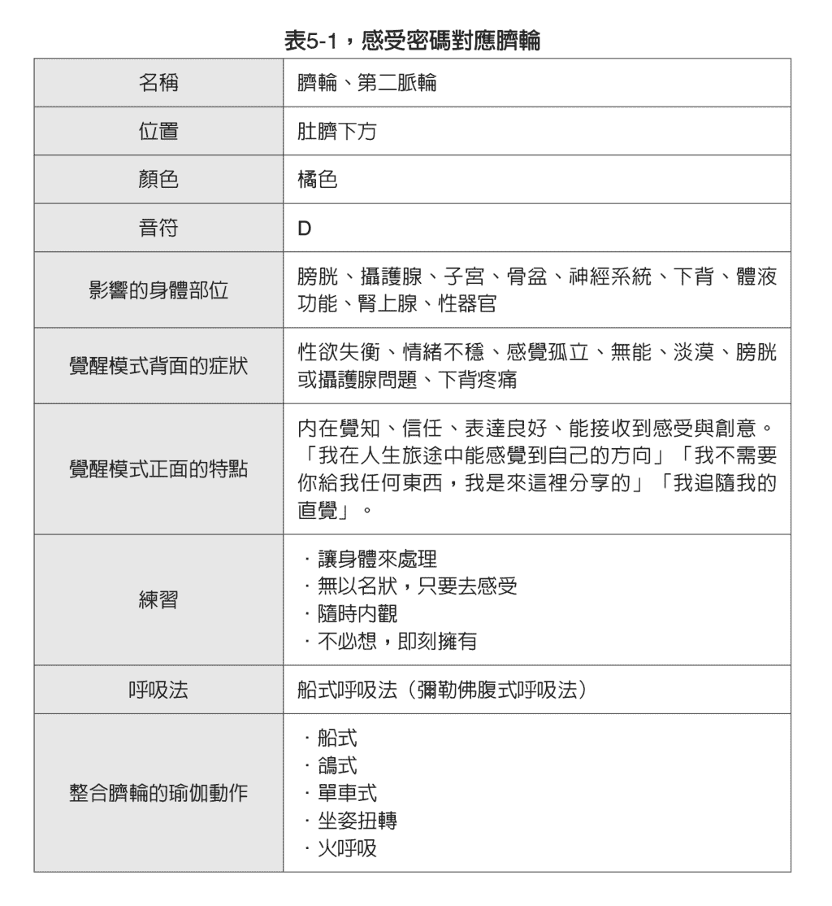

感受密码的瑜伽动作

就和其他脉轮一样，脐轮的健康可以靠瑜伽动作来改善。

船式（navāsana / Boat）可以让这个能量中心的能量流更协调、更顺畅。

☼船式

◆ 步骤：

1. 坐在地板或地垫上，双脚并拢，膝盖朝向天花板。

2. 双手放在大腿后面支撑自己，坐得愈挺愈好，海底轮用力，延长脊椎，保持胸口开阔（下巴放轻松，不要对着天花板）。

3. 双手还是扶着大腿，上半身往后倾，双臂打直，上半身和地板呈六十度角。不要太往后倒，否则脊椎会弓起来。如果你继续撑着骨盆底部（根锁），延伸脊椎，应该可以感觉到核心肌群在用力。

4. 用核心肌群稳定自己，双手从大腿上移开，将双手延伸到地垫前方，掌心对掌心，保持在大腿两侧，上半身停留在六十度角，感觉体内的力量。

5. 如果你感觉自己很强壮、平衡，把双腿抬起来，让小腿平行地面，更进阶可以抬高小腿，让大腿和小腿呈一直线。继续稳定上半身、延长脊椎。

6. 维持这个姿势做五次深呼吸，双脚放回地面，休息时做一、两次深呼吸。

7. 重复上述动作二到五次。

现在，把感受密码和身体觉醒瑜伽的练习整合到船式中：

1. 维持船式的动作（双脚离地或留在地面上），找到重心，把注意力集中在坐骨接触地垫的点往下六十公分处。

2. 从内按压、揉捏四个锚点上的中枢通道肌肉，包括眼睛往上看，感觉到眼睛后方的压力，让核心甦活起来。

3. 大腿、小腿和脚掌的肌肉都用力收缩（这会建立上千个小回路，可以运送能量信息，并启动你的组织沟通网）。

4. 手臂和前臂的肌肉都用力收缩，延伸手指。

5. 将呼吸从双脚和收缩的双腿带到根锁，往上沿着中枢通道呼出去，沿途从内按压、揉捏肌肉，感觉呼吸从头顶出去。下一口气吸进来时，从头顶吸入，穿过中枢通道各锚点，到达海底轮，从双腿和双脚呼出去。

6. 对着天空抬高心口，感觉到快乐喜悦的成就感，做船式时带着热情呼吸，会建立很多回路哦！

☼整合脐轮的其他瑜伽动作

除了船式，你还可以运用以下的瑜伽动作来强化感受密码。

做这些动作时，揉捏特别有感觉的部位，能帮助你将灵魂集中在身体的核心里，更加整合破碎的能量，并建立回路来延续你的方向感，让你在离开瑜伽垫后有笃定的感觉。记住，创造体内的阻力能让我们导引自己，避免到外在世界去创造摩擦。

用力收缩肌肉，能让你找到自己真实的核心，但是做这些动作时放松（意指不揉捏、按压有感觉的部位）也很有效，因为放松会让你的系统感觉柔和。做动作时要多深呼吸几次，只要去想象同样的路径，让能量有方向就好，这也会让整个系统都放松。

•鸽式（eka pada rajakapotāsana / Pigeon）

•单车式（dwichakrikāsana / Yogic Bicycle)

•坐姿扭转（ardha matsyendrāsana / Seated Spinal Twist）

•火呼吸（kapalabhati prānāyāma / Breath of Fire）

透过感受密码，我们会愈来愈熟悉灵魂的语言，了解有灵魂的自己如何和具象的身体沟通。我们将学会倾听灵魂的提示和暗示，也就是身体的感知，可以显示有灵魂的自己在能量场里的变化。这些沟通讯息会让我们知道自己过去有哪些「未了的心愿」必须去处理，才能达到更完整的更高境界。接下来在「净化密码」中，我们会往前迈进一大步，去实践自己的真实潜能。我们将会更充分了解未了的心愿何时会导致回路断线，然后清除这些路障，让能量顺利流动。我们将检视潜意识如何决定我们要在人生中实现什么——这并非由意识所决定；我们也将学会如何清理潜意识，加速疗愈和整合，迈向有灵魂的自己。

第六章
净化密码：潜意识的疗愈力

小时候，我经常在五点钟起床后下楼，看到父亲坐在书桌前陷入沉思，只点亮头上的一盏灯。

「你坐在这里多久了？」我问他。

「够久了……但又有点不太够。」他笑着回答。「我在想事情，快要想通了。」

最后他总能想通！他领先时代，利用鼓舞人心的魅力和大家分享他习得的所有新知。数百名医师从世界各地前来参加父亲的研讨会，向他学习，运用他开发的疗法帮助了数万名病患，解决了传统西医无法治疗的问题。

这一切都从一九七〇年代初期开始。当时我父亲经营一间一流的脊骨神经科诊所，他那时候很好奇为什么明明是同样的疗法，有的病患会康复，有些却没有起色。在寻找答案的过程中，他研究了各种自然疗法的派别和治疗方式，寻找成功案例的共通点。

他发现，当体内有能量流时（特别是贯穿全身的电磁能量流），病患就会好起来；能量停滞的时候，病患便无法痊愈。

我父亲的研究和理解因为量子科学这个新领域而更上一层楼，量子科学重视能量流与能量流所产生的能量场。最让他高兴的是，当他把所学应用在病患身上，可以得到实时的临床结果来佐证在这开创性的新领域中发现的理论（当然，科学一直在进展。例如，我们过去认为电脉冲或神经脉冲的运动创造了身体周围的电磁能量场，但现在我们知道是能量场先产生了神经系统！能量先存在。这就是为什么我们要处理能量场——也就是我们最主要的系统）。

我父亲的核心工作就是认识到几乎在所有案例中，若人体内有疼痛或失能的现象，那么一定有个还没化解的情绪阻挡了能量流。他发现能量系统的运作方式很像消化系统，两者都在分解和吸收我们的人生经历。不过，当我们经历不知该如何应对的人生处境时，就会把尚未化解的情绪与想法都包起来，而不是去处理和吸收——就像食物没有充分消化又留在人体系统里太久。最后，愈来愈多没处理的人生事件（与伴随而生的思绪和情绪）日积月累，阻碍了系统里的能量流动，如果我们不面对，就会有病症——有时候还很严重。

我父亲也晓得很多人并不知道想法会影响情绪和能量流，也因而影响了他们的复原力。想法往往来自潜意识，这个部分不在意识能够察觉的范围，却又扮演了关键的角色，影响身体里和生命中发生的大小事。他深知，如果人们想要痊愈，一定要有办法存取并释放包藏在潜意识里的情绪和思绪。同时，他也找到了做法。

我父亲的研究探讨了神经系统中意识与潜意识的关系，还有让两者顺利沟通或无法沟通的机制，我称之为「活门」。

他开发的疗法可以打开这道活门，让我们能够触及尚未处理的潜意识扰动（也就是散逸的能量）。因为能量散逸，我们才没办法维持生理、心理、情绪的健康。接触并释放这些淤积的能量，能让人体系统里的能量再度流通，继续疗愈我们的身体与人生，维持健康、常保青春。

我父亲开发了生物能量同步疗法（简称 B.E.S.T.），这个疗法可以让原本因为人生挫折而散逸的能量同步，流回体内，自然地让身体自愈。基本上，这个疗法就是在断线的地方建立沟通的连结。

过去三十多年，全世界数百名医师已利用生物能量同步疗法治疗了数万名病患，获得惊人的成效。各种病症都出现了奇迹般的疗效：很多原本被诊断出慢性病或退化症的人，在能量再度于体内自由流动后逐渐复原，甚至有人的组织严重受创，之后却再度新生——这些前所未闻的医学案例确实发生了，还持续增加中。三十二岁的丹尼尔在田里驾驶收割打谷机时发现机械故障，想要扳开其中一两个零件，结果无名指和小指被碾进去，必须从手掌连接处截肢。他利用生物能量同步疗法，集中意志让能量流贯穿全身与手掌，他的手指在未动手术的情况下竟自己长回来了——他长出了新的指头，包括骨骼和指纹。当沟通系统能够符合当初的设计、运行无阻时，他的身体便能自行治愈。

我和父亲共事时，很清楚我的人生使命就是要持续发展他的工作——让更多人有能力自我疗愈，并明白他们就是人生的创造者，可以管理自己的能量并改变人生。我希望大家都能够自行创造改变，不需要依赖医生来移除能量包袱或解决能量扰动。我想把这份知识的力量交到大家手中，便请父亲帮我开发一套人人都能自行操作的生物能量同步疗法，所以我和父亲、哥哥一起创造了「生物能量同步疗法解放版」（简称 B.E.S.T. RELEASE）。二〇〇六年，我们三人在芝加哥向一群病患展示了这套方法，而当大家采用这套自愈方法，同样在现场就看到了「奇迹」。

我每年在课程中将「生物能量同步疗法解放版」传授给数百人，现在，我会透过这本书教你，再搭配有效的相关练习，构成了「净化密码」。

什么是净化密码？

当生活中发生令人非常难过的事，难过到我们的意识没办法完全处理，潜意识就会把一部分包起来，这样我们的意识才能往前进，继续处理日常生活中的大小事。

你可以把意识想象成大脑里的一个小房间，房间的地板上有一道活门——底下就是潜意识。不如意的事情发生了，整个意识的小房间里都装满难过的心情，有一些则溢出来，因为活门开着，就往下流。如果这件事真的让人很难过，就会影响整个系统——神经短路，活门关闭了，流下去的水就被关在下面。这时候，活门关闭前最后进入潜意识的讯息就是「难过」，而身体得到的诠释就是「紧急事件」。

潜意识控制了身体不受意识控制的功能（象是心跳、呼吸、消化），所以难过的讯息会变成紧急事件传送给身体。现在活门关上了，没有新的讯息能够进入潜意识、关掉紧急事件的指示；过一阵子，难过的情况可能在意识层被解决了，我们理解、原谅、放下、接受了那件事，然后相信这件事结束了，我们安全了。不过，如果活门始终没打开，潜意识就无法收到好消息，那么潜意识和你的生理反应便还是会反映出问题仍旧存在。身体会停留在紧急状态中，费尽全力来钻牛角尖。最终，这可能会导致器官故障或崩溃，象是肾上腺疲劳、甲状腺耗竭和内分泌失调，然后，因为这个问题存在于潜意识，我们甚至不晓得身体到底怎么了，也不记得为什么身体会变成这样。

活门当然只是比喻，实际上是要让大家了解丘脑和下丘脑的沟通过程。丘脑和意识有关，这个脑部范围有许多功能，其中之一就是接收五感，理解外在世界发生了什么事。下丘脑则与潜意识有关，在意识之下接收丘脑提供的讯号，传递指令给内在世界（也就是身体），让身体知道要怎么回应。下丘脑在能量七密码的练习中也很重要，可以将内在的信息传递给意识，让意识层接收到内部深层的智慧，其实这些智慧来自迷走神经与肠神经系统。

活门也象征了意识进行决策和潜意识接收决策的关系。例如，在漫长的一天结束之后，丘脑从感官得到信息，知道入夜了，我们白天的工作完成了，就会告诉身体现在很安全，可以放松并准备睡觉了；但如果下丘脑没办法听到这个讯息，我们的身体和大脑其他部位就不会放松，还会继续全速运作，可能会造成失眠、焦虑症或其他器官失能。如果有让人难过的事情发生，导致丘脑和下丘脑不再对话，或减少对话量，我们就没办法有意识地控制或主导生活。在这种情况下，即使我们有意识地行事，藏在潜意识活门下的情绪仍旧会主宰我们，我们会觉得事情总不如自己（意识）想得那么顺利。从这里就可以看出人体的系统有多么精细：被藏起来的会想要被发现，所以会设法把我们唤醒。

当我们排斥、抗拒一件事，神经就会短路，干扰我们的生活。仔细观察，我们对生命中的大小事不是欣然接受，就是全力抗拒。当我们说出，甚至想着或感觉到「这不可能会发生」或「我不能接受」——当我们拒绝去看事实（因为我们不喜欢所见的一切，或者有事情不如期望），我们就会抗拒。我们不让自己充分消化那股能量。当我们开始抗拒，就关闭了改变生活样貌的能力——我们本来可以挺身而出，可以释放能量，可以往前进的。我们的抗拒变成了能量扰动或包袱，卡在系统里，让能量流停止了。

当我们抗拒一件事，那件事不会消失，反倒是把这件事推过了活门，送进潜意识，在那里至少有一部分眼不见为净。除非我们打开活门看看里面有什么，重新盘点，否则那件事会一直留在潜意识里，主导我们的思绪、决策、生理反应和振动频率，进而影响到我们吸引来的实相。尽管我们没办法透过意识「看到」这件事，我们还是不断在那件事情上投入能量（和力量），结果那件事就会消耗资源。这些精神大可以用来疗愈或创造。这件事会造成我们无法专注，持续溅洒能量。

换言之，若我们不能接受这件事，就没办法和它一起活在当下。我们会一直去想这件事「应该」怎么发展，会为自己找理由，甚至写下新的故事情节，让自己很委屈。这样一来，我们就没有透过这个经历建立神经回路，让有灵魂的自己住进身体里，所以我们就困住了。能量无法流动，真实的自己也就困住了，接下来具象的身体只是反映出能量而已，所以身体也会受苦。身体没办法再有效运作。本来只是能量问题，最后就看到身体组织开始出问题了。

或许你一直想要创造你自己选择的人生，却迟迟无法创造出真实而持续的改变。你或许试过很多心灵成长的方法、每天对自己喊话，或是制作愿景板，把你想要的未来画面都贴上去。你要的未来之所以还没实现，是因为你还不懂潜意识怎么运作；你的愿望没有实现，是因为你脑中的活门关了。尽管你有意识地采取了一些行动，但在意识之下的能量经过振动，散发出不甘心、不服气或害怕、恐惧等讯息。你也知道，你散发的振动频率就会在具象世界里实现。

幸好，打开活门永远不嫌晚，你随时可以让潜意识得到好消息：那个遭遇已经结束了，你再也不必委屈了。为了创造出你真心热爱的生活（充满生气、健康平安、快乐美满、交流愉快的生活），你必须开始接受人生的起伏。觉醒模式正面的视角可以让你明白，生活中发生的大小事都是为了让你的人生至善至美，绝对是为了你好。接下来你必须找到方法打开活门，才能更新能量模式，让潜意识知道你过去所排斥、抗拒的人生经验已经化解了，你现在没事了，不需要再活在紧急状态中。

我就是要带你去那个境界：你的能量模式创造出你目前的人生体验，这个能量模式可以改变。我们必须从身体着手，打开中枢通道，建立神经回路让能量顺流。只有意识恍然大悟或大受启发还不够，你必须要体现你明白的道理，因为实相是从内在创造出来的——是从能量创造出来的。只有我们体现了灵魂，才能改变能量在潜意识的表达方式，进而改变正在创造的现实，把你的欲望吸引到具象世界中。

净化密码会给你几种不同的方法，让你找到潜意识里能量困住的原因。当你明白这些过去造成了你的困境或疾病，自然就会想释怀、放下。你在意识层讲了很多故事来说服自己和别人，以为这就是你无法处理或面对过去的理由，但我们会在意识之下进行净化与清理！一旦你能打开内在的活门，就能利用净化密码和后续几章的练习来清除潜意识的扰动，重新设定能量系统。

通常我们会卡住，原因往往和我们想的不一样。真正的根本原因通常更深层。当我们利用净化密码的练习来释放活门下的能量，重新整合到系统中，能量就能自然地回到核心，回到有灵魂的自己。只有当能量回到核心，我们才能用意识发挥强大的创造力。

在教这些步骤之前，我想先分享瑞秋的故事，她接受生物能量同步疗法后，成效卓著，改变了人生。瑞秋的经历让人知道创伤困在潜意识里，就算事件已经解决，还是会留下长期的影响。

☼瑞秋终于释放了创伤

瑞秋在医院产房准备生老三时，发生了惨剧。产房里的护理人员替她打无痛分娩针，本来要她侧躺，但因为无法顺利施打，就请她坐在产台末端，让她弯腰。他们顺利打了无痛分娩，药效开始作用。照顾她的两名护理人员正好同时转过身，她重心不稳，但因为无痛分娩麻醉了她的腿，她没办法把自己撑住，便惊慌地摔下了产台，当下就把孩子给生了出来。

三天后，她在医院病床上醒来。孩子没事，她有事——她只要抬起头就会很难受。这种眩晕现象完全没改善。她在床上和沙发上躺了三年，因为她只要坐起身就会晕好几个小时，还会吐。

我在这时候认识她。她「走进」诊间时，由先生和公公搀扶着，每一步都颤颤巍巍，象是要在独木舟上努力站稳。我们那天的对话相当简短，因为她状况很不好，我希望立刻展开治疗。

我马上先判断是哪种潜意识扰动让她没办法好起来。我想知道原因，都过了三年，她的身体状况还和意外后的第三天一模一样。为什么她的身体没办法自愈？

在第一次疗程中，我利用生物能量同步疗法治疗瑞秋，她瞬间就变得很难受。过一阵子她觉得好些了，我们就回溯过去与目前的生活。她说她向医院提告，却发现自己根本不可能获得需要的医疗照护，因为没有医生想被牵连进诉讼案。她来找我的时候，觉得每个人都拒绝她，她很气馁，觉得这辈子就这样无解了。显然，受伤的当下带给她很多恐怖的情绪，三年后，她的情绪还是被锁住。

第二次疗程让我更清楚她的生活面貌。尽管表面上或意识里，她不再对医院生气了，甚至说愿意原谅这间医院，但她心里还是放不下。我对她说，为了让她的身体好起来，她可能必须要撤销诉讼，因为在潜意识里，她的系统可能还想继续生病，因为潜意识认为如果她康复了，就更不可能胜诉了（当然，这不是她的意图，但这念头会出现在潜意识里）。

她撤销了诉讼。不过，即便在这之后，她的系统还是牢牢锁在防备心态中。活门还是关着。我继续治疗她，利用生物能量学和能量七密码的练习来建立神经回路。我看得出来，我渐渐打开了她的系统，她也迅速开始康复。三个月后，她竟然能参加垒球队，担任三垒手，参与我们诊所赞助的球赛。很多人会说这是奇迹——这是因为我们打开了活门，让她能够清点自己的创伤，让创伤不再影响她的身体、心理和情绪。所有深埋的焦虑、烦忧和不甘心原本都存在她的身体中，她的身体又卡在紧急状态里想要求生，所以身体根本没试着自愈。

在净化密码的练习里，你将学会瑞秋所用的同一套疗法，这个方法还帮助过上千名患者康复，你也可以用来帮助自己。

净化密码

☼第一项练习：莫特步法

莫特步法（Morter March，图 6-1）可以每天做，不但能改善大脑的整合能力，还可以启动并协调不同的上脑中心和身体系统，包括感觉皮质、运动皮质、身体的左侧及右侧、左脑、右脑、上半身、下半身、视觉中枢、呼吸中枢、小脑，而小脑就是存放潜意识的地方。这会同时启动所有的系统，在体内建立一个主要的重设键，让我们更轻松、有效、迅速地整合想要体现的能量。这个运动很接近我父亲与同事乔治．古德哈特医师（George Goodheart）所开发的步法。他在一九六〇年发展出应用肌肉动力学（Applied Kinesiology，简称 AK），发展出对侧运动（又叫作交互跨步），让身体有自我疗愈的效果。这个运动可以让我们清除潜意识里的心结及伴随而生的压力，从而让有灵魂的自己进入身体里。

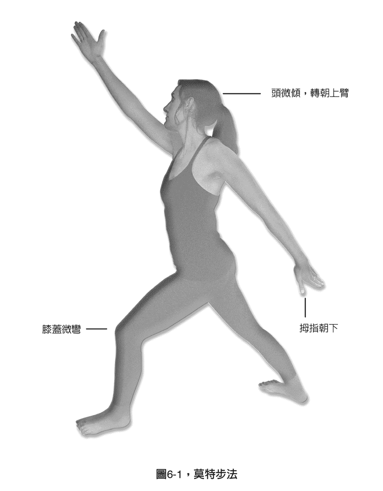

◆ 步骤：

1. 双脚张开与髋部同宽，延展脊椎伸直。

2. 左腿往前踩一步，左膝往下沉，感觉到左腿肌肉用力。让意识进入身体里。

3. 右臂向上举，呈四十五度，指尖对着天花板与墙壁相连之处。手掌朝身体，让拇指朝上。

4. 左臂往后下方延伸，呈四十五度角，指尖一样对着地板与墙壁相连之处。转动手掌，让拇指朝下。延展手指，让指头醒过来。

5. 微微将头转向右边，直接看着右臂和右拇指中间的部位。闭上左眼。

6. 维持这个姿势，做一次腹式呼吸，保持不动，深刻地感觉到健康、包容、接纳和爱。

7. 数到十再吐气，如果憋不了那么久就尽量。

8. 吐气后把腿收回中心，两脚平行与髋部同宽。

9. 换右边做一样的动作，然后左右再各做一次，即一回四次。愈常做莫特步法这个净化密码练习，就会开始看到愈多改变。

※注意：如果你没办法站起来，这个练习也能在床上做。

莫特步法有什么用处？其实很奇妙。身体的求生系统会排出优先级，将能量和资源用来处理目前最大的威胁。创伤的经验没化解的话，就会留在潜意识，而这股情绪会让身体持续做出反应，好像你还处在紧急状态中，这件事还没过去；换句话说，当你被情绪淹没时，活门就关了。这会让意识和潜意识停止沟通，潜意识就永远都不会晓得危机已经解除，还会一直继续命令身体无谓地反应。

为了让身体释放过往创伤所封锁的能量，重新感觉到这股能量，我们必须先让神经系统以为有更重要、更危急的事情要处理——这就是为什么进行莫特步法时要憋气。你一憋气，神经系统就开始好奇你有没有办法马上再吸一口气进来。假设你不行，神经系统就会放松绷紧的肌肉，才不会消耗太多氧气，这样你就有更多氧气和能量可以评估如何正确回应你目前的状况。被情绪淹没的感觉减退了，系统又能有效率地处理信息，身体和大脑都会觉得很安全。经过重新分配后的新能量就可以用来疗愈身体，而不会被浪费在错误的危机感上。莫特步法的身体动作会启动大脑的各个部位，这时旧的神经回路就会重新连结，新的回路就能建立起来。

在释放和重新调整时，我们可以集中精神，让神经系统获得潜意识的新讯息。或许我们宽恕了某个人或原谅了某件事、愿意接纳原本没办法接受的事情、能够更投入某个人的生命，或感觉到爱——不管以前有多困难。当我们感觉到或看到自己原谅或接纳的那个当下，能量系统就透过莫特步法的身体动作重新设定了，信息同步后就能整合能量。神经系统会重新评估注意力和能量要怎么安排，接下来会重新分配能量，我们的能量场便会随之改变。能量又能在身体里顺流，因为神经系统已经接受了事实，知道我们已经接纳或原谅了原本潜意识很执着的事。这样一来，我们就会愈来愈接近觉醒模式的正面，成为人生真正的创造者，而不会像个受害者，甚至不知道自己被什么困住。我们会有更多动能去过每一天，会觉得更轻松自由、有活力、更乐观，获得更多灵感和启发。我们真的会开始感受到有灵魂的自己扎根在身体里。

我很喜欢和大家分享莫特步法，很多人都认为这是一套宝贵的整合工具。几年前，我在伦敦希斯洛机场，远远就注意到对面有个人在机场大厅练习莫特步法！当然，我马上穿越重重人潮去给他一个拥抱！

为了更加整合能量，莫特步法还有进阶版。我建议大家先从莫特步法练起，熟练到像你的第二本能之后，就可以加入进阶版。

☼第二项练习：莫特步法进阶版

这个练习是莫特步法加上其他步骤，我称之为「莫特步法进阶版」（mPower Step，图 6-2），可以提升细微的身体能量场（包括脉轮系统）和神经系统。同步之后，就可以让你透过新的方法去感受和存在，你就能创造所有的人生经历。

莫特步法进阶版强调中枢通道，能在我们的核心创造更密集的光子。我们在体内创造了更强大的觉知，就能产生具象可见的有灵魂的自己，而你的感官神经系统就能随时察觉到。这会让你更容易进行量子翻转，从防御性格转变为有灵魂的自己。做莫特步法进阶版时，集中精神在核心，你会同时打开大脑和身体的很多部位，一个一个启动，让你的神经系统（尤其是心智）能够轻松接收更多信息。这样一来，便能很快扬弃过去的旧模式，这就是我们要的！

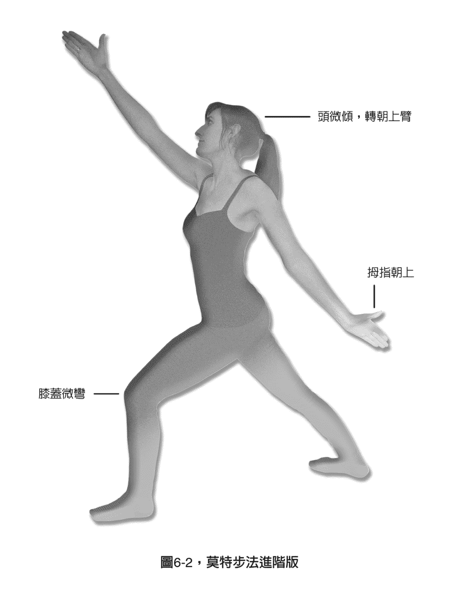

◆ 步骤：

1. 像莫特步法一样先站好，左腿往前一步，右手举高呈四十五度角，左臂往后呈四十五度角，头微微转向右边，闭上左眼。

2. 「打开」脚掌和手掌，唤醒那里的小脉轮（想象脚掌和手掌开花了）。抬起脚趾再放下。

3. 转一转手掌，让两只拇指都朝上。下手往外，才不会觉得手臂在背后扭转。要检查自己做得是否正确，就在头顶合掌，然后打开双臂，两只手的手掌都朝向左边，下手放到身体后方四十五度角的位置。并拢肩胛骨，心口抬高。

4. 把能量固定在锚点上：先揉捏、按压根锁；捏捏你的心脏中央，好像从内拥抱你的胸口；喉咙紧缩，这样你就能感觉并听到空气上下经过的声音；看着举起的拇指时，把注意力带到眼睛后方。另外，让大腿尽量靠拢，把根锁往上提，带更多的能量到体内。

5. 专心沿着中枢通道上下呼吸，就和锚定密码里的练习一样。从头顶把呼吸带到身体核心，吸进腹部。吸气时将大腿并在一起，感觉到锚点。感觉能量流进身体里，感觉很自在舒服，真实的你愈来愈靠近了！把气憋在身体里，吐气时从双脚排入地底。

6. 从脚底六十公分处带入呼吸，通过双腿，进入腹部。尽量憋气，感觉自在舒服。

7. 让呼吸沿着中枢通道而上，从鼻子吐气，节奏迅速强力，感觉到吐纳的能量冲到头顶，你就像鲸鱼喷水一样。试着把肺部里最后一丁点空气都吐干净。

8. 没气时再深吸一大口，往后踩回中心，双脚定在髋部下，伸长脊椎。

9. 换右边做一样的动作，然后左右再各做一次，即一回四次。

做这些动作时，你可能会觉得自己的系统在「重新调校」，那很好。如果你会头晕或分不清天南地北，那就在沙发后或靠着墙壁做。你正在创造你想要的改变，愈来愈活出真实的、力量强大的、有灵魂的自己。

除了透过这个运动清除旧模式，我还要介绍一个「更新」神经系统的新方法。我们正开始在具象的身体核心里建立能量的存在，同时也会让潜意识知道，这个较为放松的状态才是我们要的，是我们的新基础。如果你在练习这些动作时能加上感激或喜乐的感受，就会加速重新设定你的潜意识，让你有更多动能得以持续改变，从防御性格进化为有灵魂的自己。

现在你学会了莫特步法和莫特步法进阶版，已经准备好要面对潜意识的扰动，终结困顿或不满，并透过「生物能量同步疗法解放版」来释放能量了。记住，真正让我们困住的原因总是和我们所想的不一样，以下的练习会让我们看到真相。

☼第三项练习：生物能量同步疗法解放版

运用「生物能量同步疗法解放版」练习，我们会深入内在，释放过去的行为模式，不再受到牵绊。我们会清楚找出潜意识扰动的位置（这种扰动让我们无法体验自己真正想要的人生），然后在最需要的地方建立回路。

一开始，我们要先找出情绪包袱，这个方法称为「肌肉测试」（muscle testing）。透过肌肉测试，我们可以知道潜意识里藏着什么，因为潜意识会透过中枢神经系统和身体直接沟通。

你可以自行进行（图 6-4），也可以两人一组共同进行（图 6-3）。练习「生物能量同步疗法解放版」时，你可以选择让你最舒服自在的方式，不过，我建议在还不熟悉肌肉测试时，可以找人一起练，因为手臂肌肉伸长又有伙伴的话，比较容易观察出结果。

从肌肉测试开始：说实话的反应

◆ 两人一组进行测试，步骤：

1. 面对伙伴站着，请对方伸直一只手臂，平行于地面。打开手掌，手腕放松，手掌朝下面地。请他往前看，睁开眼睛。

2. 仍旧面对你的伙伴，一手放在他的前臂上，另一手放在另一边肩膀上，协助他在测试时能够站稳。

3. 请你的伙伴保持这个姿势，你用一点轻柔的压力在他的前臂上往下按，感受一下他会用多少力量来抗衡。测试一下你要施多少力，他才能继续保持手臂平举。

4. 请对方说一句「实话」。例如，如果对方的名字是大卫，就请他说：「我的名字是大卫。」测试手臂的强度，手臂应该能继续施力与你抗衡，但仍能保持平举。

5. 请对方说一句谎话。例如，如果对方的名字是大卫，就请他说：「我的名字是保罗。」测试一下手臂的力量是不是变弱了。接着请他想一句谎话，当他想了一件潜意识无法接受的事，看看手臂的力量是不是减弱了。

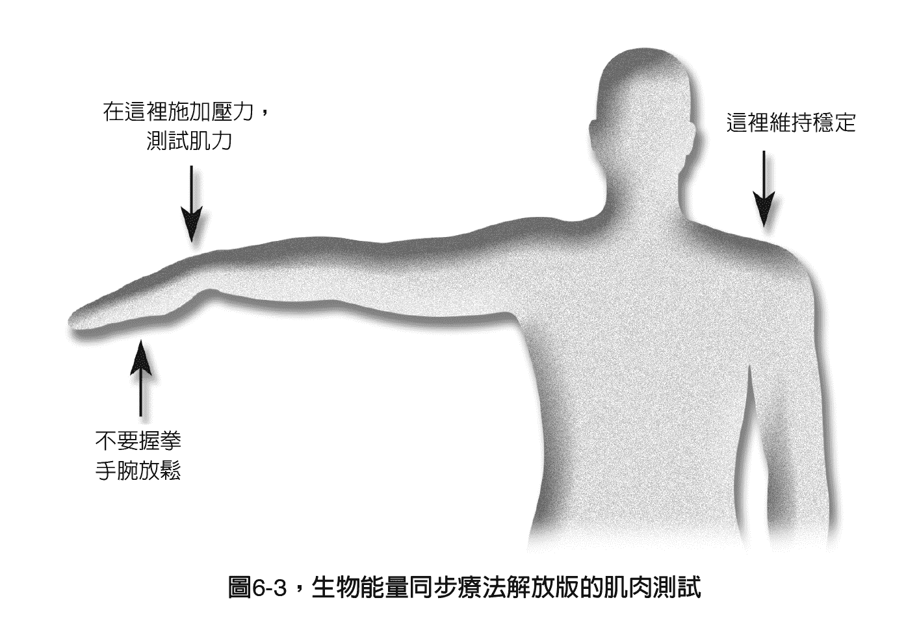

◆ 运用Ｏ环（O-Ring）自行测试，步骤：

1. 把拇指和食指或中指的指尖连在一起，做一个圈（第一个圈），用力圈紧。

2. 另外一只手也做一个圈（第二个圈）。你要用第二个圈来测试第一个圈的强度。

3. 第二个圈先收扁，放进第一个圈里面。

4. 说一句实话。例如，如果你的名字是大卫，就说：「我的名字是大卫。」试试看第二个圈能不能撑开第一个圈。第一个圈应该撑不开。

5. 接下来，说一句谎话。例如，如果你的名字是大卫，就说：「我的名字是保罗。」试试看第二个圈能不能撑开第一个圈。第一个圈应该会被撑开。

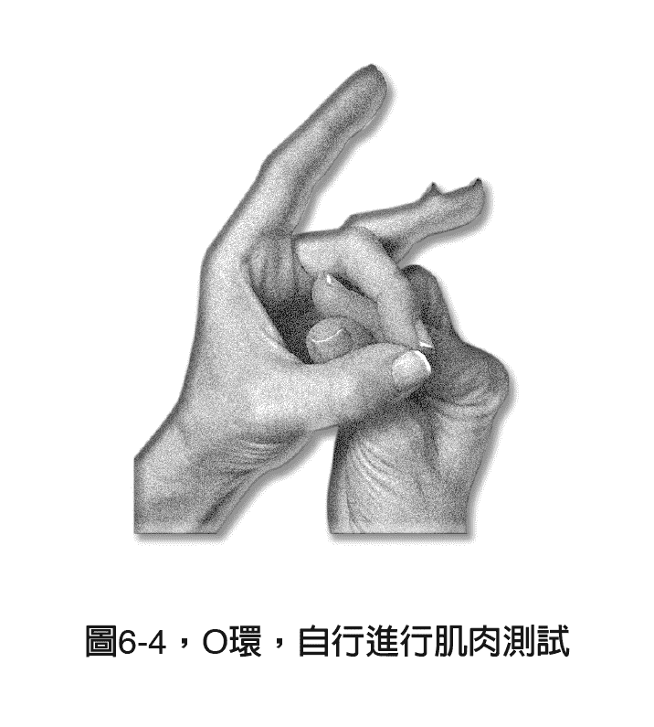

感受一下说实话和谎话时有什么不同的感觉，实话和谎话分别对你的肌肉抗力有什么影响。

找出潜意识里埋藏的祕密和情绪

1. 利用上述测试法，想一想你的目标或信念（或请你的伙伴想），一件有意义而且有心的事。要用现在式，并且以正面的口吻说出来。不要说成是以后迟早会做到的事情，要讲得好像这件事已经发生了，例如「我的身体很健康」「我的生活很幸福圆满」或「有我就够了」。不要描述成你想逃避的事情，例如「我想瘦十公斤」，你可以用现在式说出你的理想体重，例如「我现在是五十公斤」。如果有伙伴，就测试一下手臂的肌肉强度；若是自行进行，就测试手指的肌肉强度。利用正面表述找出哪个想法让你的肌肉变弱了（没办法维持手臂平举，或圈被撑开了），那就表示有潜意识的包袱。

2. 你发现有个信念会削弱肌肉的力量时，运用左页净化表里（表 6-5）列出来的六个词，来确认是哪一种反应情绪造成肌肉强度减弱。或许答案不只一种，如果有两、三个词都会削弱肌肉强度，那就反覆测试，直到你能确认哪一个词的反应比较强。最后选出一个词，这股情绪就是潜意识能量场里淤积的模式，可以透过「生物能量同步疗法解放版」来释放。

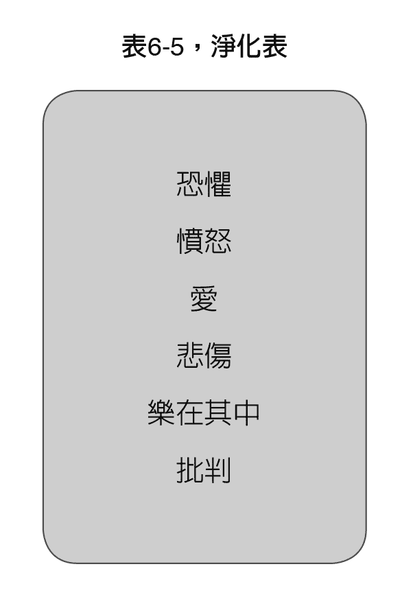

如果肌肉强度减弱，代表潜意识里存放了我们承受不了的情绪。当那个情绪被带到意识层放大，就会短路，导致我们没办法一边想着那件事，同时还维持肌肉抗力。大脑没办法同时做这两件事，所以肌肉就会放松。肌肉测试就是利用身体内建的沟通系统，来协助我们像侦探一样找出无法释怀的情绪经验。

【表 6-5】里的单词包含了心理学研究所辨认出来的四种基础情绪，是所有衍生情绪的根本。例如，愤怒是一种基础情绪，愤怒发展出来的衍生情绪则包括了气恼到恨。恐惧也是另一种基础情绪，可以衍生出焦虑、紧张、强迫症。在练习中运用这些基础情绪，就可以找出所有情绪根源的能量，不管这些情绪刚开始看起来有多复杂。

我和同事在临床经验中发现「批判」和无法「乐在其中」会导致人们无法活在当下、打开活门，保持能量流动。事实上，批判就是防御性格的入口，把你和有灵魂的自己分开。我们看过许多患者先批判一段人生经历，例如：「这很糟，这种事不应该发生。」然后他们就拒绝那段经历，没办法与之共存。最后，他们就无法参与完整而喜悦的人生，自然就无法乐在其中。

那么，爱的情绪怎么会导致扰动呢？其实问题不在爱，而是我们怎么思考爱，怎么理解爱。例如，假设我们过去有段很受伤或失望的经历，潜意识会觉得爱可能很危险，会想保护你不要再去爱。当你开始去爱的时候，潜意识便会暗中破坏，就是为了要保护你的「安全」（用一种很消极的方法！），免得你又在爱里受伤。

置入（更新）新的信念

1. 练习莫特步法或莫特步法进阶版的动作（看当下哪个动作对你来说比较熟悉自在——请记住，莫特步法进阶版毕竟比较强效，还是要继续练习！）

2. 维持这个姿势，先想好你透过肌肉测试找到的基础情绪（如恐惧或愤怒），放入这句话的引号里，并专心想着：「我宽恕所有『 』造成的扰动，不再让『 』影响我已知或未知的目标。」（即意识里或潜意识里的目标。）

3. 继续维持这个整合能量的动作，吸气，然后憋气。你可能会立刻感觉到身体里的能量模式在改变。换边。

4. 两边各做两次。

5. 运用肌肉测试，再次测试你的基础情绪。这时，你的手臂（或指圈做成的Ｏ环）应该就能维持强度了。（若无法维持，请再找找正确的词，可能刚开始你搞错基础情绪了。然后再净化一次，再测试你原本的目标和信念。这次你的手臂〔或Ｏ环〕应该就能维持强度！﹝如果没有，那就是因为上述的原因，你要再找出真正的基础情绪，再净化一次。﹞）

※若需要透过影片看「生物能量同步疗法解放版」，请前往[drsuemorter.com/energycodesbook](https://drsuemorter.com/energycodesbook/)。

如果你觉得这些练习太复杂，可以先从肌肉测试或莫特步法进阶版开始，直到完全熟练，那么接下来把这些动作组合在一起就会容易许多。净化密码里的练习吸引了全球各地的患者，到我的诊所来寻求健康或幸福，所以请你相信我，你也会想学会。你可能还在故事情节的层次里，没办法完全理解这些练习带来的变化，但这些练习会持续改善你的生活。当你清除了过去的潜意识模式，让淤积的能量重新流过身体，你的人生会更优雅、更轻松、更有魔力。生命就会开始顺流，大问题和小问题都会化解，有时候就算你不明白为什么或怎么化解也无妨。

我父亲、哥哥和我在一群患者前第一次展示「生物能量同步疗法解放版」时，我们就已经看到了卓越的成效。我在台上示范，志愿上台的那位先生并没有告诉我他要释放的目标。我没有请他说出来，他只是在心中默想，让我引导他完成整套流程。刚开始进行肌肉测试时，他的肌肉强度很弱；净化完之后，他的肌肉抗力就变强了——完全能承受他的想法，系统没有短路。隔天他来找我，并告诉我：「我不知道这和我昨天心中默想的那个压力有没有关系，但是昨晚是我五年来首度一觉到天亮！」当我们让脑中的潜意识和意识能够更充分沟通的瞬间，他的整个系统就调整了、放松了，然后开始自愈。

在另一场工作坊里，有个坐轮椅的女生，她已经好几个月都没办法走路了，因为她的背和腿非常疼痛又疲弱。我们和她一起练习，进行生物能量同步疗法。活动结束时，她不但能从轮椅上站起来，还上台和我们一起跳舞，让数百名学员都乐坏了！

净化密码对应的脉轮：太阳轮

净化密码和第三脉轮有关，那是我们能量场的中心，就在胸骨底部、肚脐上方七公分处。梵文将第三脉轮称为「太阳轮」，拥有一千颗太阳的能量。太阳轮同时掌管意识和潜意识，位于自我的核心，也就是产生自我认同的地方。当这个地方很干净、能量能够顺流时，我们就能开放地接纳各种处境，不会排斥或抗拒。当我们清除了抗拒或排斥所带来的心理因素，就能打开能量流，迎接真实的自己。

太阳轮不通的人通常搞不清楚人我分际，他们会被困在「客体」里，而无法持续担任「主体」，展现自我。他们通常自我价值感低或使命感低落，可能也没办法「自己立足」或采取行动，因为他们不信任自己和自己的能力；或者相反地，他们可能会因为眼高手低而感到挫折，或者经常过劳，因为他们想要证明自己，或想要在这个世界里为自己建立一席之地。

一般来说，太阳轮较弱的人都会「想太多」，他们的心思一直在寻找，却始终找不到答案。他们很容易进入「我不够好」或「我不够有分量」的心态，心中有一口很深的井，装满了来自潜意识的懊恼、羞愧、窘迫或愧疚感。这种负面的信念会限制我们的人生。其实，各种信念都会局限我们，因为那是脑子想出来的。当我们连结上核心自我，就会学着更开阔。我们会释放故事情节与信念下的原始能量，去处理这些能量。运用前几页的练习来清除所有信念，故事就会瓦解，自我的真实本质便会自然显露。

太阳轮还存放了和消化吸收有关的能量，包括生理、心理和情绪的能量。太阳轮掌管胃、肝脏、胆囊、脾脏和胰脏，能否代谢吃进去的食物，反映了我们能不能藉由意识消化我们的人生。当能量在代谢过程中「卡住了」，我们就没办法跳脱思考的大脑，体验有灵魂的自己。

【表 6-6】总结了太阳轮的主要特色。同样地，请注意这个脉轮的能量属性如何反映在身体部位上。

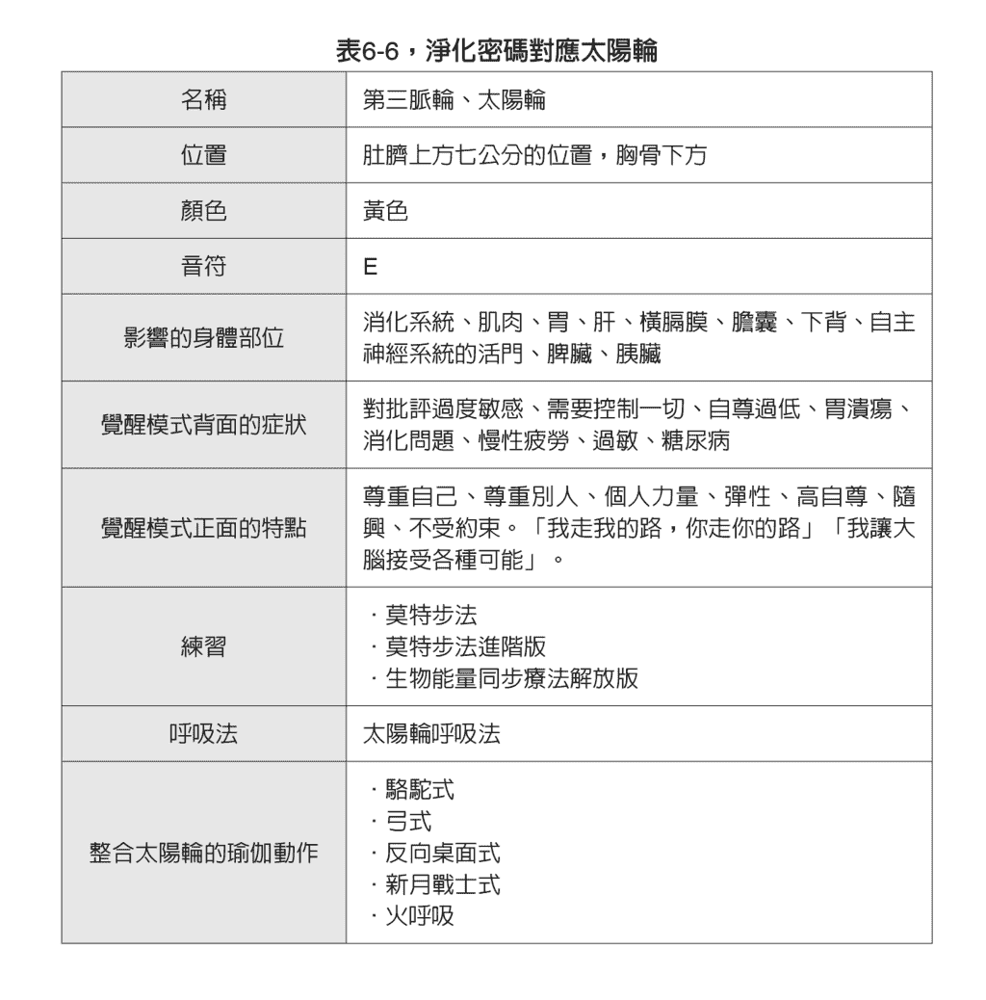

净化密码整合了太阳轮，可以平衡太在意批评的现象、想要控制一切的急迫感，以及其他自尊低落带来的问题；也能强化身体，治疗消化问题，包括慢性病，如克隆氏症、溃疡性结肠炎、糖尿病和食物过敏。

以下瑜伽动作可以让你更加整合太阳轮。

净化密码的瑜伽动作

有些瑜伽动作能让你更轻易地掌握太阳轮。骆驼式（ustrāsana / Camel）可以协调能量中心，让能量顺流。

☼骆驼式

◆ 步骤：

1. 跪在地垫上，膝盖就在双臀正下方，左右小腿保持平行，双脚和膝盖维持一直线，脚掌不要相对。趾头点地会比较轻松，延伸趾头则比较进阶。

2. 抬高心口，延展脊椎，开始往后仰。想象裤子后方有口袋，把双手放进想象的口袋里，支持脊椎。如果你能做比较进阶的动作，请把手放在脚跟或小腿上（如果觉得双脚太远，可以把瑜伽砖放在脚掌外侧，把手放在瑜伽砖上）。

3. 降低上半身，靠近地板，尾骨朝膝盖延伸。身体正面往上提，髋关节屈肌和骨盆底部的肌肉用力。肩胛骨放低，心口抬高朝向天花板。

4. 如果你觉得够安全自在，还可以把头往后仰，让喉咙畅通，延伸开展太阳轮的区域。

5. 维持这个动作，做五次深呼吸。结束动作时，腹部肌肉用力，把自己的身体一节一节收回原本的跪姿。坐在脚跟上休息。

6. 重复做二到五次。

现在，我们把净化密码和身体觉醒瑜伽的练习结合骆驼式：

1. 维持动作，你跪着的地方往下六十公分处有能量，想象那是一个很大的碟型能量盘。那就是你和大自然的连结，那就是大自然的支持。

2. 找到太阳轮的能量中心，就在胸骨下方、肚脐上方。这个区域抬高，面对天空。

3. 根锁用力，两边肩胛骨向内缩，揉捏、按压心脏后方。

4. 吸气进入身体正面，从头顶吐气。眼睛往上转，感受张力，让呼吸通过中枢通道。

5. 下次吸气时，把呼吸从头顶带进中枢通道，经过核心，往下吐到地面。揉捏、按压身体正面的核心肌肉再放松，打开脉轮系统的心智面向（你的腿应该也在用力，因为腹部伸展，所以腿会自动用力，但是你要更深入地启动腿部肌肉，将大腿正面的肌肉往上提）。

6. 重复整个呼吸循环数次。从颈部和背部温柔地结束动作，坐在脚跟上休息。

骆驼式可能会让你释放出思绪和情绪，开始流泪或流汗。你可以好好欢迎自己的反应，这表示你释放了潜意识活门下尘封已久的能量。你清理出了一条通道，让有灵魂的自己能够表达。做骆驼式时可以重复中枢通道呼吸很多次。

☼整合太阳轮的其他瑜伽动作

你可以在骆驼式之外加上这些瑜伽动作，来强化净化密码的效果。

揉捏、按压有感觉的地方，可以协助你在做这些动作时稳定重心，让你建立回路。做这些动作时要放松，可以帮助你感觉到能量流动。不过，当你在放松肌肉组织时，要想象能量从中枢通道往上流进了破碎或摩擦的区域。

•弓式（dhanurāsana / Bow）

•反向桌面式（purvottanāsana / Reverse Table Top）

•新月战士式（anjanayāsana / Crescent Warrior）

•火呼吸（kapalabhati prānāyāma / Breath of Fire）

到目前为止，我们介绍了安定能量、整合能量和净化能量的方式，在你的系统中带来重大改变，包括让中枢通道与大脑有更强健的连结，并建立新的路径让你打开潜意识的活门。这些都会帮你打下基础，让你进行量子翻转——届时你就能开始体现有灵魂的自己，脱离防御性格，在完整与爱的基础上创造人生。

净化密码为你布置了舞台，让你跳脱故事情节去生活，在生命的能量里流动。这是真实解放前要做的功课：排除无法释怀的情绪包袱，让淤积的能量不再牵绊我们，整合最下方的三个脉轮，释放出丰沛的新能量，用来开创我们真实的人生道路。现在，我们可以开始体现地球上最强大的疗愈能量——爱的能量，就集中在心轮，有灵魂的自己就在这里发出振动。爱不只住在我们体内，爱就是我们。你和灵魂，都由爱所构成。训练你的头脑去找到并释放真正的你——你就是爱——释放地球上最强大的转化力量。当我们的精神由内而外集中于爱，就能为所有人「放大」爱的存在，让爱发亮、无所不容。

你准备好要体验纯粹的、改变世界的爱了吗？让我们接着看下一章。

第七章
心的密码：人生的万灵丹

我母亲过世后的那三周，我只能……坐着。我要照顾病患、开课，还有很多工作要处理，可是我根本没办法出席。我只能坐在自家后院里，看着树丛，纳闷着我此生最要好的挚友——我的母亲——怎么真的离开了。

我的幸运草魔法

有天，我终于感觉到自己该回到现实生活里继续服务。我走到后院「感谢」我的心，留了个空间盛装我的悲恸。我任由目光慵懒随意地落在后院，注意到清晨的阳光洒落树荫。我穿过露台、跨过小溪，走向那束阳光洒落的地方。那一方阳光照耀的土壤上头，有一小片三叶草……正中央则有一株四叶幸运草！

我的泪水潸潸落下。我妈妈最喜欢采四叶幸运草，但我这辈子只找到过一、两株。她曾经在怀我的时候找到一株四叶幸运草，后来还送给我。这是我们的信物，我感觉到了她的存在；这就是征兆，要让我知道她还在我身边，我会好好的。我采下幸运草，去上班，又能感觉到我和她的连结，感觉到我和生命的连结。

当晚我回到家，再度泪流满面。我带着破碎的心走到后院里的同一个位置。就在那里，彷彿我没摘起第一株幸运草，夜光下又有一株幸运草在闪闪发亮！眼泪沿着我的脸庞滑下。我把那株幸运草也摘起来，然后安心入睡。

隔天上午，当我准备去上班时，我发觉自己在想着幸运草，还有找到幸运草时的心情。我发现自己有所期待，还想再找到一株，而且相信只要我能找到，就表示生活会很顺利。就在我到后院要去找第三株幸运草时，我停下脚步，在心中对自己说：「苏，你不能一直寄托外在世界。你要学着在内心就能有安定感，这可是你教大家的。」我的目光垂落地面，一股温暖的接纳感浇灌我全身。

就在我接受了内在的指导，不往外寻求答案时，第三株幸运草出现在我左脚边！没错，我采了起来，然后就去上班了！

失去挚爱的母亲让我很伤痛，而这股悲痛其实让我打开了超感官，就好像连结上了更深层的自我及生命。我的直觉更敏锐了，每一种心情浮现的时候，我的大脑就更能接受无法解释的智慧和道理。

接下来几个月，我总共找到了六十九株四叶幸运草，有的在我家后院，有的在其他地方；有时候在路口，我得立刻跳下车去采；或是和朋友在公园里散步时，我会落后他们好几步，忙着采四叶幸运草，送给我身边的人。朋友帮我统计，住附近的小朋友开始出现在我家门口，问我是不是「幸运草阿姨」——如果就是我，那我可不可以教他们怎么找幸运草。接着我会带他们走进后院，告诉他们：「你们要用心找，而不是用眼睛。」我的内在实验室开发了我的直觉第六感，而我在直觉的引导下，随意停下脚步，蹲下来一摸……毫无意外，我手边一定有株幸运草。孩子们会乐得大叫：「我也是！」真的很神奇。

忽然，有一天，魔法消失了。不管我多努力寻找，就是没有幸运草。两周过去了，什么都没有。我的反应和大家一样，开始问自己：「我做了什么，害我失去了这份连结？我的世界里少了妈妈给我的信号，我要怎么活下去？」不管我多努力硬逼，就是没办法靠大脑找到幸运草。

我当时不晓得，其实祕诀就在我眼前。

几天后就是我妈妈的生日，若她还在世，就已经七十岁了。我一想到这件事，整个人就亮了起来。我立刻冲到后院，找到了第七十株幸运草……还有第七十一、第七十二株！我采幸运草的时候可以听到她在幽冥宇宙里咯咯笑，好像她一直在我身边，等着我搞懂这道理。找到幸运草的祕诀就是要有一颗喜乐、感恩的心。

我就是透过这个历程看透了三维实相的面纱，理解了更宽宏的世界：我在用心看！我母亲过世之后，我很脆弱，心被剖开了，却让我看到平常看不到的真相——因为开放，所以我能让能量流进我的生命中。

魔法持续了一阵子，后来就开始下雪了。即便在雪季里，我偶尔还是会看到一株小小的四叶幸运草在雪中闪闪发亮。

当我们打开了心就会这样，即便哀痛欲绝（事实上，尤其是在深刻的痛苦中），我们仍旧会被带进连结的神圣空间里。很多人在苦痛中觉醒，这就是我们都在寻找的连结，而能量七密码可以协助我们更优雅无痛地产生连结。

我母亲过世近一周年时，大家纷纷问我要怎么纪念她，也很好奇我会不会继续收集幸运草。我的回答是，「不会，我会完整保留幸运草的回忆，用别的方式纪念她。」所以那天早上，我做了其他事，也留下了美好的经验——可是那天下午四点钟，我发现自己又忍不住回到后院去找幸运草了。

我踩在草地上，看到遍地都是四叶幸运草！接下来的四十五分钟，我不停地采幸运草。然后我上楼去找容器装，又下楼继续采了四十五分钟！我同时可以找到两、三株四叶幸运草！我泪如雨下，不断收集至宝，一个半小时内总共采了一百二十四株——直至内心的狂喜满溢，令我无法承受时才停下。

一年前我发现幸运草时，只能顺着能量前进，不确定这到底是怎么一回事；这次，是我用意念产生的体验。我的心已为我开启，就和之前一样——不过，这一次，我的心更开阔了。我本来就知道，理论上人人都有这种能力，但我这时已经超越理论，而透过实务来体验了。此时我知道我可以用开放的心来连结母亲，甚至交流，因为她没有「离开」，只是回到宇宙的班机前往下一站。

那天，从无比的狂喜中冷静之后，我决定要和我的个案一同研究怎么心花朵朵开，让他们也能体验这种境界的爱与合一。敞开心胸接受自己的脆弱，让能量优雅地流过，成为我生活的新基准，改变了我的觉知，让我光用意念就能连结到最深层、最本质的自我。我们不能靠头脑去达成这个目标，反之，如果我们想要体验自己真正的力量，就必须要敞开心胸接受自己的脆弱，走进生命中，才能活出精采的人生。这是因为爱的振动频率就是灵魂的特质。要真正在内在建立有灵魂的自己，让有灵魂的自己能够表现，我们一定要安住在爱的频率、发送爱的频率、活在爱的频率里。

本章的「心的密码」会教你怎么让最深层的「心我」（heart-self）稳固踏实，并产生连结，让你留在那里。你将学会怎么运用身体，从（靠大脑）想着爱，转变为体现爱、成为爱。你学会了之后，不但可以创造出遍地都是幸运草的奇迹，感受到满满的喜悦与连结，还可以完全地爱你自己，并用纯粹而健康的方式爱其他人。

什么是心的密码？

所有的古老灵修传统都认为爱有神性的力量。当我们感觉被爱，就会有更好的感受；当我们能毫无保留去爱一个人，就会觉得更自由，更能够进入美好的体验中。

完成量子翻转就能从防御性格进化为有灵魂的自己，这个改变的一大好处就是能用不同的方式体验爱。防御性格也能让我们接受爱、付出爱，但这种经验和有灵魂的自己完全不同。处在防御性格的状态时，我们认为爱和我们是分开的，必须从别人或别处得到爱。我们会花很多时间和精力去尝试各种不同的方法，就是为了「获得」爱。我们潜意识里会努力去控制别人或利用心机去获得爱，我们会不断取悦别人、掌控别人、诱惑别人。

防御性格想要保护我们不受伤，所以会自动设定时间和对象的条件，让我们能够安全地去爱。这个有条件的爱说「只要你用这种方式对待我，我就会爱你」或「只要有这个条件，我就有安全感去爱」。这些条件严格限制了我们感受爱、幸福、喜悦的体验，因为这个世界不太能在每个转折处都符合我们的条件和期待，所以我们会爱得很保留，所以我们为爱讨价还价。我们决定自己要不要去爱，我们设下了条件，结果感受到不满与不悦——我们会觉得自己应该获得想要的对待，当我们没办法用这种方式「获得」爱，就深入故事情节，从爱的匮乏中写下关于自己的剧情，自怨自艾。

这些苦难和折磨最常发生在能量外溅的时候——因为我们没有体现有灵魂的自己，只会自圆其说。这些折磨不只是害我们一直编故事、写剧情而已，还会让我们的振动频率一直卡在低频，没办法完全看到有灵魂的自己。

心的密码将会引导你迎向截然不同的爱，消除所有的条件，让你不再依恋别人的付出、不在爱里讨价还价。当我们能够发出爱的频率，就会感觉自己被疼爱着，因为我们就是在爱中生活。我们会打从心底产生爱的感觉，随时随地；我们的爱和付出将无法衡量；我们会无条件地去爱，因为我们不需要从任何人身上「获得」爱；我们的幸福感不依赖别人的行为，不会再因为别人的反应或互动而失望；我们能单纯活在当下，并能够一次又一次地去爱。

就算你只做本章的部分练习，也会感受到强烈而具体的爱，而那就来自你心里。不过在开始之前，我要先化解一些常见的疑虑。

我常常被问到：「无条件的爱是不是表示我再也不在乎其他人了？」当然不是！无条件的爱就是：你不必把爱寄托在别人身上。

在防御性格下，爱的过程就是一种托付的体验。我们紧握着让自己感到安全的想法或信念，我们的爱有条件，觉得只有在特定环境下，爱才存在。不过，若我们能感受到真实的自己，不透过外在取得的想法、形象或目标来建立认同，就能无拘无束地关怀和在乎其他人，我们就不会担心他们可不可靠，或如果失去他们，对我们的安全感会有什么影响。我们不会烦恼感情会怎么发展。

不把幸福寄托于外在世界，能让我们体会无条件的幸福和喜乐，让我们能够去爱。这会让我们更健康，生活各方面都有更好的体验。修行的书籍里共通的主题就是不寄托于外，这是面对人生与爱最理想的方式。例如在佛教传统中，执着就是所有苦难的根源。

请注意，不把幸福寄托于外和「冷感、疏离」不一样。不把幸福寄托于外，表示你发自内心不为结果烦恼，重点在于爱的行为，而不是结果。疏离则是一种冷漠，保持着自我和结果之间的距离，也保持着自我和爱的距离，如此设下保护罩的经验会让我们自以为很安全，但其实会让快速振动的能量无法安定，反而会造成更强烈的不安全感。这会让人对生命提不起劲，甚至冷漠厌世。

疏离感往往来自创伤或压力很大的环境，让我们觉得非逃不可。如果身体逃不开，我们便会让思绪或情绪逃跑，因此我们很疏离，短时间之内会觉得自己受到了保护，但长期下来会让我们更寂寞、更孤绝、更忧郁，让我们乐观开朗的个性看不到生活中的灵感，造成更多疾病，如血压过低、身体康复不易、肾上腺疲劳、甲状腺问题、消化问题、肾脏问题、呼吸道问题和其他症状。

要让身体恢复健康，就必须让灵魂住进身体里；若要用最强效的方式在最短时间内恢复健康，我们必须要让灵魂住进有爱的身体里。爱所伴随的振动频率是终极的疗愈能量——修复一切的万灵丹。爱是最棒的中和剂，可以为身心灵带来和谐。这股能量会在心头升起营火，烧掉所有问题、所有症状、所有干扰，被爱的振动频率转化：困惑慌乱的心境会变得清澈明晰，仇恨转化为宽恕，偏见转化为体谅与关怀，分离与孤立化为和睦与情谊，悲伤转变为无法衡量的喜悦。

爱是万用良药。我们愈能在爱里生活，就愈能持续将爱应用在所有人生处境里，如此又愈能够和有灵魂的自己合一。事实上，只有透过爱的振动，有灵魂的自己才能住进我们的具象生命里。爱就是入口，通往有灵魂的自己。

为什么？因为爱的振动频率广阔无边。我们以灵魂的形式前往具象的物质世界（在地球这一站跳下宇宙的班机时），第一股压缩的能量就是爱。哇！当我们落入存在核心时，爱很容易感受，因为我们就是由爱所构成的。

爱是你的真实本质，而不是我们要参观的地点。心的密码会教你怎么随心所欲进入爱的振动（随时随地，在任何处境里），然后让灵魂一直住在那里。这些练习会带领我们通往内心的爱。我们不需要继续发出「想要」从外在世界找到爱的频率，我们自己就有能力让身体和感受都记得我们就是爱，我们可以随时立刻坠入爱的频率中，最后学着留在爱里。当我们能办到，就能持续无条件地和众人分享这份爱，放大爱的体验，这就是我们来地球的目的。

有灵魂的自己始终定锚在爱里，这就是为什么有灵魂的自己在梵文中被称为「喜乐层」（anāndamaya kosha）。当我们活出有灵魂的自己，就能在爱的状态里感受狂喜。每天练习心的密码，你就能很快学会怎么在接下来生命中的每一天里实现狂喜。

心的密码练习

☼第一项练习：建立爱的存在感——选择被爱

这项练习会让你一路直达爱的振动，这股力量一直在你体内，等着你来点燃。这会给你具体实际的爱的体验，我们一直在寻找这种体验，以后你就知道不必再向外求。这也会给你无比的自由，让你成为最真实的自己，不需要再有任何心机。这个清澈明晰的自我很重要，能让我们活在爱的频率里，在人生中不断疗愈、创造。

◆ 步骤：

1. 想着你很爱的一个人或一样东西，可以是你的朋友、家人、宠物、青梅竹马、现在的情人或你还没遇见的灵魂伴侣！也可以是你爱的季节、地点、珍惜的回忆，甚至是一样对你意义非凡的东西。只要能让你产生爱的感受就可以。

2. 当你想着你很爱的这个人或这样东西，你要明白这个爱的对象就是在为你展现爱的频率。这个人不是把爱带给你，而是把你心中的爱带出来，让你的大脑能感受到你心中原本就有的爱——你就是这股爱，这个对象会让你「现形」。

3. 现在，在你的心中装满这个人、这样东西或这份回忆。让这画面填满你的感官，然后将注意力集中在身上。感受一下你想着这个画面时体内有什么感觉。

4. 接下来，放大这个体验。加倍，再加倍，让你的体内装满你对这个人或这样东西的爱，让爱满溢，扩散到整个房间。然后再放大，比房间还大，让你的全身都专注地感受爱的体验。注意你的身体在爱的过程里有什么感受，记住这种感受。

5. 现在把你的手放在心口，对自己说，「这是我的。」接受所有的爱。把这份比房间还大的爱放入灵魂中心，全然接收。把能量收回来（就像锚定密码的练习），然后感觉爱在身体的所有孔隙里。

6. 手放在心口，从身体内部揉捏、按压根锁，深刻地用身体感受这股振动。然后沿着中枢通道呼吸，经过所有的锚点，充分运用前几章所学到的练习。你会开始感受到爱的振动逐渐在体内稳定。

7. 深呼吸数回，培养这种感觉，这就是无条件的爱在振动。

8. 接下来，重复前五个步骤，不过这次你要回想一个你曾经好好被爱的时刻。你感觉到自己充分、坚定、无条件地被爱着，或许是被奶奶疼爱，或许是妈妈，又或许是情人或好友，也可以是宠物（如果你从来没有这种经验，也没关系。若是这样，你就靠想象——去想象自己充分被爱的感觉，而对方就是爱你原本的样子。你可以自己选择情境）。

9. 注意身体有没有哪个部位感觉到能量高涨，那就从体内揉捏、按压，让呼吸沿着中枢通道往下直通地底，吐气时打开脚掌。抬起脚趾再放下，想象着自己（不只是能量）碰到地面，在地底扎根。

10. 连结神经回路，从胸腔正中央的心口一直往下连接躯干，通过骨盆和双腿，从双脚出去连到地底。

你现在心里的感受就是无条件的爱。在做这个简单的练习时，你会明白，你过去以为爱是其他人或其他东西给你的感受，必须从外在世界获得；但其实爱一直在你心里，你只需要连接上就行了。透过能量七密码建立回路，能让你常常有这种体验，甚至不需要外在世界的刺激。只要你想产生爱，你就能产生爱，而且你就能完整接收爱。

你创造了爱，你接收了爱——没有附加条件。这至关重要！要让大脑察觉到体内更多爱的振动（建立神经回路让爱流动），你不能光靠爱别人，你也要爱自己。这么做会创造出光子排列，表示你真的清楚「我被爱着」。当然，真相是我们都由爱构成，所以我们不可能不被爱着——但我们必须要让防御性格得到被爱的体验。我们必须要体现被爱的感觉，好在身体里创造最初被爱的感觉，然后在这个世界里反映出我们被爱的实相。

做这个练习时，你的意识会知道你在产生爱；同时间，你的潜意识会知道你在接收爱。这个经典模式适合每天练习很多遍。要完全转换成由觉醒模式的正面来过生活，就必须让细胞熟悉这广阔的振动，如果不熟悉，我们就没办法一直留在觉醒模式的正面，因为爱就是我们真实的身分，能让我们真实感受到有灵魂的自己。

为了说明这个练习有多么重要，我要和各位分享我母亲的转变。她原本只会照顾别人，明明为所有人付出了爱，她却不让自己接收爱……不过后来她变了。

☼我妈妈说：「我也要！」

我母亲爱所有人，总是在关怀其他人，不断地付出，到了影响生活平衡与健康的程度。

有一天，她在饭店大厅的盥洗室洗手，转身要拿毛巾，这个简单的动作竟造成她腿骨断裂。我们当下的反应就是骨质疏松，六十岁以上的女性很常见。检查过后却发现，她的骨质密度和二十四岁的女性一样高！

如果她骨裂不是因为缺钙，那究竟是为什么？

根据生物能量学研究身体的能量场，「断裂」通常先发生在能量场，然后才会表现于具象世界，在步行于人行道时扭伤脚踝。进一步察看精微的能量体，显然我妈妈一定有哪里不对劲，因为通常转身擦手不会断腿呀！她的腿骨断裂很可能是因为能量断裂——散逸的能量为了落地而穿过她的腿。她的能量场受阻了，就在她侧身时显现出来。（如果我当时就知道可以运用能量七密码来安定和整合我们的能量场，就会用我教你的这些练习来帮助她，让她省去血光之灾！）

巧的是，当时我妈妈才正要在她的助人路上把她自己也加进来。她正学着检视自己的需求，并说出口（她那一代的女性往往做不到），尽量找到平衡点。不过她还没着手理解或说明自己真正的感觉或「为自己发声」，所以觉醒的能量没有通道可以好好发送讯息。为了让她学会说「我也要！」，能量只好创造一个外在处境（也就是摩擦）协助她转变。生命一直用慈爱的方式支持她，可是这个讯息必须要更大声，她才听得到！

好吧，这招确实有用。我妈妈在那之后开始让她的爱不仅流向他人，也能流向自己。当她聊到不同环境下的挑战，她的言词反映出新的观点，接收愈来愈丰盛的爱，而这个体验也日益茁壮。对过度给予的人来说，这些练习可以帮助你找到能量的平衡点，身体就不必送出太剧烈的讯息！

学习能量七密码的过程中，我们开始重新定义对爱的看法，以及要怎么在各种处境里体验爱。我们软化了限制性的信念，减少体验爱的阻力。总是有人跟我说他们「爱上了」这项功课——那是因为把心智安定在身体的核心，让大脑察觉并放大我们的真实本质之后，自然就会有爱的感觉。爱无比丰盛，无穷无尽，所以每个人都有很多爱。事实上，你接收愈多爱，就能产生愈多爱；你产生愈多爱，就能接收愈多爱！

☼第二项练习：爱的初检

爱是转变的催化剂——我们所爱的一切都会在这股振动里改变。在这个练习中，我们要在能量七密码的基础上增加爱的振动，体会到爱就是我们的本质。

这能够确保我们不会机械化地练习，所有练习都会在爱的精神下完成，因此会有更强的威力。特别是，我们要利用「爱的存在呼吸法」把三个改变人生的元素结合在一起，创造改变：呼吸、爱和存在。呼吸可以推动体内的能量，爱可以产生变化，存在能让大脑专注于内在。

原理是这样的：理想状态下，我们在难过时，会「让身体来处理」，而不是马上对故事情节做出反应。我们会找到身体感受特别强烈的部位，揉捏、挤压那个地方，接收意识发出的讯号。接下来我们会沿着中枢通道上下呼吸，将感受特别强烈的地方带进能量流，让能量流过核心，同时继续揉捏和呼吸。不过，我们现在知道，只要在呼吸时让爱开始振动，就可以强化自己疗愈和改变的能量。启动「爱的开关」可以巨幅提升我们整合散逸能量的能力，因为身体部位有特别强烈的感受，就是因为散逸的能量。

刚开始真的有点难。在辨识哪里有散逸能量并整合时还要启动爱，会有点困难，尤其在你刚学着指挥自己去启动爱时。所以我想要提供一个不同的方式，我称为「爱的初检」。

◆ 步骤：

1. 当你压力很大或面临挑战时，让身体来处理。注意身体哪里有强烈的感受或高涨的能量，揉捏、按压那个区域，记住位置，等一下再回来。这不只会减少能量散逸，也会阻止你去编写故事情节（例如，你不会继续争执、不会因为恐惧而退缩，或做一些会后悔的事）。

2. 稍后，当你压力小一点之后（例如躺在床上时），再回想那个情境。透过「建立爱的存在感」练习，想象你真心喜爱的一样东西或一个人，把感官刺激如味道、声音或任何能强化印象的细节都加进来。现在，一次又一次放大爱的感觉，直到爱大到那个画面已经开始模糊。

3. 注意身体的感受。不管你有什么感受，都要用意念维持能量模式。目标是要记住爱在身体里的感受，并锁起来。

4. 当你在这个爱的状态下，慢慢沿着中枢通道呼吸六至八次，察觉变化。

5. 进行中枢通道呼吸法时，把你面对的难题带进来。揉捏、按压一下你原本感觉到能量散逸的部位，让爱的存在化解难题，并且在受影响的部位建立神经回路。

在这个练习中，我们要为爱的营火添加柴薪，把你碰到的难题和压力拿去烧。这和一般的仪式不同，有些人会把苦恼写在纸上拿去烧掉，而在这个练习里，你为心口添火，在内心完成这项任务，就不需要外在的仪式。此外，体现爱的火焰，你就能在看见生活的摩擦时持续体现你创造的改变。

「爱的初检」练习的原则就是「重要的事情先做，一步一步来」，就能更轻易化解能量扰动，因为我们不会在难过的时候点燃爱。当人生一下子丢太多难题给你，当情绪快要让人喘不过气，你就可以运用这项练习，去面对该放下或疗愈的事物。持续练习「建立爱的存在感」，就愈来愈容易点燃内心的爱。最终，我们让能量顺流，融化所有淤积的能量，整合散逸的能量，坠入爱里，而在那个状态下生活就会变成我们的「本能」——就和呼吸一样自动。（在医疗保健产业工作的人请注意：处理患者的能量时，请炽烈地燃烧心头的营火，而不是设下结界或保护罩。很多人教我们要保护自己，但显然前者更有效，因为后者只会更加分化防御性格和有灵魂的自己。）

☼第三项练习：所见都是爱（即「一切都是为我好」）

过去三十多年来，我很荣幸能有机会在病床边陪伴许多人，特别是在他们临终前。出乎意料地，这些对话都有类似的脉络：「我的经历都很好，每个人生曲折都有道理。就连我以前很厌恶的事情，现在也很喜欢了，这一切成就了我精采的一辈子。」他们指的是人生中所有的经历——有喜有悲、有胜有败、有生有死，所有的一切。这就是生命即将抵达终点时，大家心里所想的事。

我的问题是：如果我们终究会获得这个观点，拥抱所有的人生经验，为什么不现在就开始？

当我们现在就认为生命中的所有发展都是为了我们好，用这个心态来经历人生，就会开发出一个不同的滤镜，改变自己看待和体验人生的方式。如果我们愿意把所有人生遭遇都看成是爱的行为（明白那是真实的自我深情地给地球上的自我一个具象的体验，好让地球上的自我能够觉醒，明白自身的伟大，并拓展爱的能量），我们自然就能用不同的方式来诠释这些遭遇。同时间，原本的抗拒、排斥、批判而造成能量场的扭曲、变形，也能因为观念改变而稳定。接下来我们会更容易看到爱，更容易体会爱，更容易发现并无条件地分享爱。

爱很丰盛，存在于万事万物中。人生完整时，所见都是爱。当我们认知到这一点，就会开始从转运站对话的观点看出，就连生命中最折磨难受的过程都是基于爱。我母亲过世是我人生中最深刻的痛——但当时表面上看起来是遗憾，这件事也打破了我过去的纪录，让我明白爱原来还能让我们有更多感受，同时也让我用更深层的方式和母亲团聚。

事实上，人生中每一次交流都是爱和爱的相互作用，只是不同版本的爱在互相连结。当你觉察到人生就是一则爱找到爱的故事，就是有灵魂的自己在我们体内觉醒、逐渐获得爱的视角，这就是发自内心、也就是我们一直在描述的「爱的振动」。然而，若我们还未能用这种意念带领自己走过人生，那生命看起来就充满坎坷。物以类聚，我们必须体现爱，才能吸引爱进入人生的体验。我们就是要透过「心的密码」来加强这部分。

我们也可以透过量子科学来理解。量子科学让我们知道实相中的一切其实反映了我们的意识，也就是说，当生活出现了变化，是因为我们的意识把那个体验吸引过来，让我们觉知。如果我的生活很安宁，那是因为我的内在世界经过充分整合，便能察觉到安宁；如果我的生活很痛苦，那就反映出我体内有回路断线了，必须重新接上，能量场才不会扭曲变形。本质上，三维的世界就像电影银幕，能让我们看到哪里整合好了，哪里还没。

如果我们不明白外在世界只是反映了我们的内心，以为外在世界的人事物都是独立的，那我们就会想要改变环境，因为生活过不去；当我们明白一切都是爱的力量，生命中之所以有起伏，是因为爱要引导我们觉醒，迎向有灵魂的自己，就能用截然不同的方式去体验生活中的苦难。碰到真的很棘手的状况时，我们会马上知道这反映了自己内在的实相，这是一份礼物，要协助我们在各种处境下都能找到维持爱、和谐与安宁的方法。接下来我们就可以将这份礼物交给身体，用爱来转化。这其实就是我们在人世间的功课，要把爱带到生命的每个面向中。

◆ 步骤：

1. 想着目前面临的挑战，可以是感情里的冲突、健康状况、财务危机，或者你面临的损失与威胁。

2. 问自己：「如果这项挑战是我送给自己的礼物或机会，要我拓展爱的能力，我要怎么改变？」

3. 运用「爱的初检」与「建立爱的存在感」练习，让身体和心来处理目前的挑战，检查哪里需要建立新的神经回路，让新的营火将旧模式转化为新模式。

4. 如果你愿意，可以采取后续行动。问自己：「我现在可以选择用什么方式透过这个体验更深刻地爱自己和其他人？」或者换个方式想：「如果这个难题是要我在爱中长大，我的心会教我怎么做？」或「宇宙要告诉我什么，才能让我接受自己不凡的能力，在爱里生活？」然后顺从你的心！

很多人都觉得必须等待外在世界的证明（例如我的四叶幸运草），才能把一切都看成爱。但其实只要你改变心境就做得到。在黑暗的房间里，要打开灯才能看见，同样地，你要打开大脑的开关，才能进入爱的境地。我们愈能把生命中每个人、每件事都看成爱的存在（不管第一眼看起来是不是），就愈能找到爱的振动。愈常做这些练习来产生爱的振动，就愈容易透过这个方式来看世界。我们可以融化中枢通道里的淤泥，让能量不要摇摇晃晃，能量场就不会扭曲变形。爱会强化我们的能力，带领我们更深入体现有灵魂的自己。

这可以协助你在人生过程中不依恋也不疏离，也不会有畸形的人际关系。当你能够体现爱，活出有灵魂的自己，幸福指数就会往上飙升，你的感情关系会产生变化，会自动具备疗愈、回春、补给能量的能力，逐步迈向恬适安宁的心境。在爱里，人生会从求生模式转为协作模式，为你开创一趟神奇又狂喜的冒险。

心的密码对应的脉轮：心轮

心的密码和第四脉轮（即心轮）有关，梵文称为「不为所动」，代表了我们的本质就是爱。心轮位在胸膛中央，是一个入口，让大脑可以连结到爱和合一的境地，让宇宙万物相连。心轮掌管所有爱的表现。第三脉轮代表我们的自我感受，第四脉轮则代表我们如何看到自己和全世界与全人类的关系。心轮所呈现的爱可以聚合万物，也是许多灵修的人在找的答案。

很多心轮有状况的人会觉得很孤立、和爱脱节，甚至对自己都感到陌生。他们会觉得自己很像「局外人」，好像与每个人之间都有所连结，但他们偏偏沾不上边。这会导致焦虑、忧郁、寂寞和许多身体病症（例如心脏问题、循环问题和呼吸问题），这就是无法「接纳生命」或接收爱的能量。

第一、第二和第三脉轮的能量代表了我们各自对自我有什么原始的感受，而这三股能量交会于心轮，在此处和更上方的脉轮能量整合，更上方的脉轮能量频率较高，反映出我们的天使意识。心轮就是我们的神性和人性结合之处，能让我们的灵性在体内觉醒。

当我们启动心轮的能量，会打开自己最脆弱的一面，在爱里找到力量。处理心轮能量时，我们的偏见会减少，更能活在当下、更接近神的视角——如此就更能接纳生命的变化，不会逼着我们以自我中心的低脉轮信念去挑战遇到的困境。我们会更有耐心、包容别人的批判，也不会去评断。我们的灵魂在体内会更自在、放松，因为我们不再频频启动战或逃反应。我们会更感激生命，因为我们明白自己可以用新的方式去爱。毕竟，我们都是充满神性的灵魂，终于要开始体验有灵魂的自己了。

这世界有个普遍的误解，以为我们不能同时拥有力量和爱。我们误以为「强者不仁，仁者不强」，但这是错的，我们可以两者兼备！脆弱并不是软弱，脆弱能让我们直接面对自己的心，通往无限可能，带来最强大的力量。要同时掌握力量和爱这两种原生的特质，就要整合第三和第四脉轮的能量元素（第三脉轮是我们心中的自我认同，第四脉轮则是充满爱、有灵魂的自己）。这样一来，我们就能存在于最理想的状态，有力量地爱、爱得有力量——真诚、温柔、坚强又脆弱。

防御性格在寻找爱或表现爱时，可能会过分强求，而难以让灵魂安定下来，也无法整合自己的力量。这就是典型的「滥好人」，我们尽心尽力对别人好，就是为了要得到爱、欣赏、感激和自我认同。在这个状态下，我们往往没办法做出爱自己的决定。我们创造出一个空缺，所有的爱都往外流，没有一丁点能整合到能量场里。

【表 7-1】整理出心轮的特质。同样地，请详读心轮和身体部位如何互相影响。

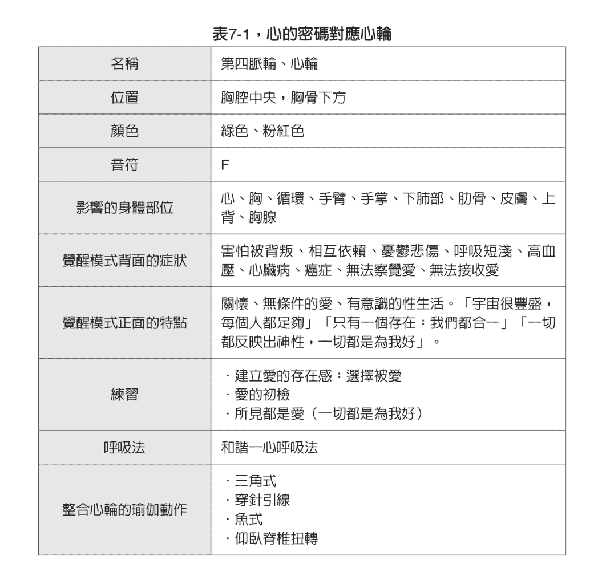

在平衡心轮时，我们会减少相互依赖、依恋、冷感，以及对背叛的恐惧。我们的感情生活自然会有更多爱、体谅和自在。反映在身体上，我们会看到血压稳定、循环改善、心肺问题减少，还会让身体更健康。

心轮的瑜伽动作

☼三角式

除了心的密码练习，三角式（trikonāsana / Triangle）这个瑜伽动作也能帮你打开心轮、整合心轮，让能量再度顺流。

◆ 步骤：

1. 站在瑜伽垫侧边，双脚分开约一公尺。

2. 右脚脚尖向外转，朝瑜伽垫的短边，不要朝向身体。

3. 左脚微微向内，让脚跟成为离身体最远的点。

4. 稍微调整髋部的位置，略往右脚靠近，稳定双膝。

5. 从右腿把能量拉上来，膝盖骨往上提，靠近臀部，让股骨进入髋关节。用同样的方式甦活左腿，把能量往上拉，穿过骨盆底部，根锁用力。

6. 保持身体侧弯，不要往前或往后，将上半身尽量带向右腿。右手尽量接近瑜伽垫的上缘，轻松落在右脚、右小腿或右大腿上（不要把重心放在膝盖上，也不要过度延伸膝盖）。你也可以在右腿旁边放一块瑜伽砖，把手放上去。

7. 上半身转向侧边，臀部不要摇晃，左臂从肩膀直接连向天花板。你应该会觉得侧腰和下背在伸展。

8. 慢慢将手臂收回肩窝，用能量启动心脏周围的肌肉。

9. 维持这个动作，深呼吸数回。结束时慢慢弯曲右膝，把上半身带回中央，双脚脚尖朝前。

10. 左侧重复同样的动作。

现在，在三角式里整合心的密码：

1. 维持三角式时，把注意力带到双脚下方的空间，地下六十公分处。再把注意力放到左手上方六十公分处。想象你被拴在这两点中间。

2. 双腿用力，脊椎伸直，双臂也完全伸直，同时收进肩窝，启动心脏周围的肌肉。在手中灌入活力，直达指尖。把能量收入核心。

3. 满怀爱意地吸一口气，把能量从下方带上来，穿过双腿，进入根锁，填满骨盆腔。下腹收紧，靠近脊椎。肩胛骨并拢就可以按压、揉捏心脏后方。这样一来，在双腿夹紧的情况下，你在身体里创造了一个「座位」，让神经回路可以转化地面拉上来的能量，收进体内的核心（这能够有效让大脑不要一直想要控制全局，让爱流贯，也可以更深层地建立中枢通道，让我们更容易察觉到有灵魂的自己）。

4. 下手的手掌（或如果你的手掌要按住瑜伽砖，就用手腕）贴紧前腿的小腿内侧，让心口朝天，同时间揉捏、按压身体的整个核心。从身体的整个核心把爱吐出来，穿过手臂、手掌、颈子和头顶。再次吸气时，把爱从头顶上方和手掌外缘吸进来，穿过颈子和手臂，吸入心脏。然后揉捏、按压心脏和根锁，把爱往下吐出去，穿过双腿和脚掌，直入地底。吐气时揉捏、按压大腿和小腿。

5. 放松根锁，重复整个循环，进行三至四次呼吸，揉捏、按压核心，透过每次呼吸循环建立感官知觉。这会让你开始更常在核心感觉到充满爱的自己，更快建立沟通回路。

☼整合心轮的其他瑜伽动作

除了三角式，你也可以利用以下的瑜伽动作来强化心的密码。记得在练习时要揉捏、按压想整合能量的身体部位，也要放松身体，好好想象，感觉到能量（你自己）沿着中枢通道上下移动。在练习时，有爱的感觉就会大幅增强这些动作给你的力量。

•穿针引线（sucirandhrāsana / Thread the Needle）

•鱼式（matsyāsana / Fish）

•仰卧脊椎扭转（supta matsyendrāsana / Reclined Spinal Twist）

运用心的密码，我们体现了无条件的爱，这是世上最强效的疗愈配方。爱的营火可以转化任何限制与挑战，我们可以将爱的振动用于「检查」让你压力很大或很受伤的状况，让挑战带来的能量不要卡在身体里。所有人生难题都可以用爱解决，而你就是由爱组成的！

下一章，我们会为这把火增添更多柴薪，透过呼吸点燃体内有灵魂的自己。气息就是生命力的能量，就是灵魂。我们该开启脉轮、唤醒各层次的意识了。

第八章
吐纳密码：生命本身的力量

「苏医师，是妳吗？」

有天我走在医院走廊上，要前往等候区探望好友，她才刚因为中风动完手术。恢复室的值班护士快步朝我走来，她的名字是南西，她的孩子曾是我的病人。

「妳还记得我吗？」她问，「妳很多年前救了我儿子的命！」

「我当然记得啊！妳好吗？达仁好吗？」

「他很好，现在从军了，壮得跟牛一样！」南西有一对双胞胎，达仁是她儿子。他四岁左右时，曾被诊断为「无法求生」而转诊到我这里。达仁的双胞胎妹妹气色很好，他却苍白又虚弱，有多种过敏反应还有呼吸道问题。他的维生能力不断下降，医生认为他撑不了太久，不知道能做什么，恰好南西的姊姊过去是我的病人，就推荐这对母子来找我。

我在诊疗过程中观察达仁，发现他的呼吸方式「反了」。一般小孩都是先把气吸进肚子里，然后胸膛才会起伏；达仁的呼吸很短浅急促，只进到肺的上半部，肚皮几乎不动。我用生物能量同步疗法在他的头部和身体施压，也协助他呼吸。他的淤积能量一清除，呼吸方式就变了，健康马上就有改善。达仁活过来了。第一次疗程结束后，他的气色立刻有了变化，双唇红润了起来，双颊在几分钟内就变得很粉嫩！回诊时，我发现他持续正确地呼吸；接下来的几周到几个月，他的维生能力醒过来了，变成了一个调皮的孩子。很快地，双胞胎的游戏时间就变成他带头了！

我常常和病患分享达仁的故事，教他们怎么呼吸，他们的进展和达仁一样。我也和父亲分享这些实例，把呼吸技巧整合到生物能量同步疗法的基础训练。有了我们的研究和疗效报告，受过生物能量同步疗法训练的医生与看护便开始在疗程中运用特定的呼吸法，在世界各地的病患身上都看到了卓越的成效。

过了几年，我理解到：在核心启动能量，是体现高频能量体验的基础，我知道有意识的呼吸能更加提升高频能量的体验。偶尔我会感觉到身体里某些部位不够快活，或是这些部位没有散发出「我的灵魂和能量就在这里」的感觉，就会刻意把呼吸带到这些部位，而我的直觉往往很准确，所以我开始教病患和学员不同的呼吸法，让他们唤醒和病症相关的身体部位。

接下来的几个月和几年之内，我发现我们可以预防很多病症或受伤的反应，只要按顺序启动相关的身体部位，这套呼吸法可以启动体内各层级的能量，也能够唤醒脉轮的意识。我们的脉轮原本可能都在沉睡，因为没有能量协助我们觉醒。练了呼吸法之后，大家的呼吸、思维和举止都变得更积极、更有自信且更有同理心——这都是因为实现了更伟大的自己。他们学着用呼吸来处理身体的病症和不适之后，防御性格就撤退了，有灵魂的自己就甦醒了！

「吐纳密码」的呼吸法就是我多年来传授给病患和学员的同一套方法，我自己也每天靠这方法养生。这套练习法的许多招式来自传统复健疗法，用来强化脊椎并增强神经肌肉系统的疗愈力，只是我透过自己体现灵魂的经验和在诊所里累积的临床效果，将这些疗法整合在一起。如果你经常练习，这套方法可以唤醒你体内沉睡的灵魂，有灵魂的自己正在等待你的注意呢！

什么是吐纳密码？

气就是灵魂。气息就是生命。气息就是你！一个人若是断了气，灵魂、生命和你就离开了身体，我们搭乘这趟班机来人间进行的体验就结束了。然而这并非单行道，我们其实可以趁自己在人间的时候，为这趟航班灌入更多生命、更多灵魂。我们可以将更多灵魂带入身体里，更加充实有灵魂的自己。要这么做，就要懂得吐纳、运气。「吐纳密码」就是在了解呼吸，进而给身体更多生命力。利用呼吸，让更多真实的自我进入能量场和具象的身体里，让能量顺流，我们就能充分体现要体验的人生。

到了这个阶段，我们已经做过了很多呼吸法——利用呼吸来锚定意识、让能量在系统内流动、学习灵魂的语言、发现并清除能量的包袱或扰动，并将爱的震动整合到能量场内。前几章我们学会许多呼吸法，现在我们要特别深入加强呼吸的作用，增强对能量的理解，更清楚自己真实的本质。

专心关注身体的某个部位，同时把呼吸带过去，唤醒那个部位，并让能量存在于那里，活出生命力。脉轮是能量流的关键，会和呼吸一起创造出身体与生活里的转变。用这个方法能最快速地让有灵魂的自己「建立」存在感，实现有意义的变化。记住，体内的能量不通，生命里的能量就不通。

吐纳密码会强调脉轮。脉轮不只是能量中心，也是能量锚点，储存了不同层级的意识。结合在一起，这就是你（不是那么具象的你，而是能量组成的你）！运用呼吸法活化脉轮，你就有能力轻松又优雅地用意念创造改变，不必在故事情节和人生教训里被折磨好多年。当脉轮没有被生命能量启动，就无法发挥功能，失能的脉轮就会反映于外；当脉轮的回路被启动，我们就会体验到身体、思绪和情绪都更加和谐。

海底轮启动了以后，我们会更有归属感，也会感受到生命的支持，反映出幸福与平安。我们会感到身体的活力与健康，会有远见和梦想，而且能采取行动来实践抱负。如果海底轮还在沉睡、失衡，甚至过度刺激，我们的思绪就会失衡，会觉得自己是受害者，无法感受到支持，也无法开创人生。

吐纳密码会协助我们直接将能量吐纳到每个脉轮里，因此每个脉轮所掌管的能力和特质都会充满能量。靠意念来运气最棒的地方，就是在大脑还没有搞清楚到底发生了什么事之前，就创造了变化。例如，当你把气息带入太阳轮（掌握个人力量的位置），然后让能量在体内流动，你就会感受到自己有更多力量，行为也会有更多力量，即使你（的大脑）可能没有意识到自己已经获得了更强大的力量或自尊。你会实践你的理想，因为你已经在能量层级上改变了。

有意识的呼吸能整合一切。这表示有意识的呼吸能把物理层次的思绪、感受、感知、化学激素，与能量层次的振动和回路结合在一起，这是我们手上最强效的转化工具，比只做静心更有价值。当我们选择把呼吸带到某个脉轮或身体部位里，就是决定要在那里创造改变，并且让有灵魂的自己上线。我们决定要把灵魂和细微的能量透过呼吸带入身体能量，让灵魂成形，将自己塑造成潜力更强大的模样。

七十二岁的派特学了这套呼吸法之后，这辈子才首度把呼吸深深带入核心本质。同时，她终于能够接纳并宽恕童年时期受虐所造成的情绪伤痛。这套呼吸法也能帮助你。

吐纳密码的重点在于实现——靠呼吸把你的梦想、欲望、愿景带来这个世界。因此我又称吐纳密码为「实现密码」。这套练习要提醒我们：外在生活反映了我们内在世界的能量有没有整合、启动、觉醒、流通。内在世界的能量若没有整合，我们于外在世界所实现的目标可能就不会长久或无法持续。内在若没有整合，就要花很多能量去创造，还要花更多能量去延续。

防御性格和有灵魂的自己都能够实现目标，但两者所实现的目标感觉很不同，因为防御性格靠不安全感和恐惧实现目标。为了赢，别人必须输。我们可能要牺牲健康才能得到成功的事业，或牺牲感情才能获得认同——在这些情况下，我们或许能「成功」，但失去了亲密关系或健康。

若想有成就又要圆满，一定要先整合内在。若我们学会整合能量，打从心底活出有灵魂的自己，不但能用更少的时间获得更多成就，实现欲望时还能皆大欢喜，因为宇宙无比丰盛，我们不必抢夺别人或牺牲自己才能创造想要的人生。整合内在之后，实现目标时就能创造出永续的结果。我们会逐渐被至善至美吸引，我们的欲望也会更符合我们的灵魂，就能自然实现。

我们愈能运用能量流唤醒脉轮，逐一整合，大脑就愈能感觉到我们的真相。我们的行为会反映自己的真实本质，我们真正的人生使命就会出现并开始推动。当我们建立好回路，能够支持更强大的能量流，就不会把挑战看成是问题，也不会觉得生活中的挫折是冲着自己来的，然后拚命编造故事情节。我们会顺着能量，在能量淤积之前就先化解掉。我们会把生命中发生的一切都视为觉醒的过程，把生命中的经验教训视为指引，让我们知道哪里需要灌注爱、光、气息，并建立回路。

这就是我的人生现在展开的方式。

☼我年纪愈大愈年轻

现在的我比三十年前的我更年轻。

此话不虚，一点也不夸张。以体内的能量和我的工作量来说，我更年轻了。我每周都会搭飞机，每年演讲超过两百五十场。我有团队和公司要管理，持续编写课程与工作坊的教案，还要在世界各地许多遥不可及的国度带领团体课程。我每天上午六点起床，往往到午夜才休息，成天忙着开会、教学、搭飞机、写作、访谈、训练、治疗病患、讲电话。更别提我还要花时间整理行李、遛狗、维系美好的感情。每一天、每一周都是这样，但我永远不觉得累。我平均每天睡六小时……然后就迫不及待要起床展开新的一天了。

我是怎么办到的？全都是因为能量流。

三十年前，我的生活完全不是这么一回事。当时我二十五岁，可没办法做这些事。那时候，我在诊所里工作，每天下午都必须小睡。我到了冬天就会得支气管炎，平时就常偏头痛、脖子痛、背痛、屁股痛、肩颈僵硬，还有挥之不去的疲倦感，身上总是有某个地方在痛。但在我的能量觉醒之后，所有疼痛都消失了。我每天的工作时数多了五小时，可是当一天结束时，我觉得能量充沛，又可以轻松开始工作。能量持续更新，太棒了。

能量持续更新为我带来最大的好处，就是我对人生和生活愈来愈充满热情，我拥有了察觉、信任和说实话的能力，不担心其他人会怎么想，也不担心结果会不会成功。我的犹豫（也就是我的恐惧）彻底消失了，更能接受亲密关系，更能表现自己的脆弱，也更愿意倾听并接收别人的意见，不必回避也不必拒绝。我的完美主义化为爱，我爱人生的不完美，我知道这都是美好的过程，要带领我们走向更伟大、更有意义的结局。我以前必须要完成很多事来证明自己，现在我能欣赏我们都是凡人。因为我的能量和资源非常丰沛，所以我也更能为其他人服务。

我的人生愿景也更开阔了。原本我觉得自己在一座城市里的一间诊所「尽一己之力」，现在我明白、也接纳了我的新角色，就是要成为将远见带向全世界的灵性导师。我敞开心门接受所有遭遇，让体内的能量顺流，支持我在全世界数十个国家教学。许多人越洋参加我的研讨会、学习这套方法，或在莫特照护机构接受治疗，因为我让更伟大的自己被看见，让更伟大的自己实现目标。

回顾过去，我觉得最神奇的地方是我以前不太敢上台说话，因为我不觉得自己有什么重要的道理可以说，也不觉得我的想法特别到能够影响别人。我运用本书中的练习和原则进入有灵魂的自己后，发现自己在分享的一切正是别人想听的信息。最深层的我知道，这其实就是我该做的事，我只是透过呼吸把生命带入了原本就该实现的目标。

我们每个人都有能力找到人生使命——我们内心深处都知道要去做的那件事——可是我们不允许自己有这个念头，也不给自己足够的支持去实现。让我们先好好想想：你要创造的、你要完成的每一件事早就存在你心里，只等着你去连结必要的回路，让你的欲望能见到光。

事实上，到了这一章，我希望你能真正理解到你所有的人生经验就是有灵魂的自己在试着用更有效、更出色的方式引导大脑。你一直在进步，更清楚自己有多么伟大、坚强、能干——你只要揉捏、按压紧绷的地方，揉散那些能量包袱，因为那是身体在提醒你可以透过本章的练习发现能量包袱，让呼吸穿过包袱，你会因为身体的发现而爱上这套练习！

前几章给了我们很多工具，让大脑注意到身体要传达的讯息。当大脑和身体开始协同呼吸，我们真正的命运就会从内涌出，让我们觉得很明显——明显到不实践都不行。人生会自然开展，不必用力推，也不必勉强，也不会像防御性格在实现目标时耗费能量。我完全不用费力去安排，就一直接到邀请，让我有机会表达我的理念，因为我在开发体内的回路，呼应机会所产生的振动频率。你也做得到。

只要把呼吸带到沉睡的地方，你可以轻松唤醒更伟大的自己。在这一生中，你可能会透过其他方式发现灵魂在传递讯息，可是藉由这套练习法，你可以马上发现灵魂的讯息，然后实现目标，为自己庆贺。

吐纳密码承诺要给你这样剧烈的转变。特定的呼吸法可以逐一启动你的脉轮，用更精准、更积极的方式开启回路。

吐纳密码的练习

☼第一项练习：七大脉轮呼吸法

世上万物都由能量构成，所有形体都由原子组成，原子可以再分为次原子粒子，而次原子粒子一直在无限的空间里移动。这个空间存在于所有粒子里和所有粒子之间，就和形体一样重要。事实上，这个合一的场就是人生的布景。例如，你知道目前科学研究发现植物的根是在泥土分子间的能量空间里生长，而不是在泥土里吗？或者人类其实是走在能量「垫」上，而不是真的踏在地板上？一切都是能量！为了更健康、更有活力，我们要启动粒子之间的无形能量，并维持能量，这些粒子构成了我们的组织，让组织有生命。为什么？因为我们就是那个无形的空间！我们就是粒子之间的灵魂。当我们有觉知地呼吸，活跃的能量就会流过身体，刻意启动生命的每个面向，让我们更加完整。

粒子之间的空间缩小时，身体各部位会变得比较拥挤，我们的灵魂就会更加压缩。当我们难过或收缩时，能量包袱就会成形，导致情绪或身体出问题。为了让能量顺流，我们要让粒子间的空间保持开阔——你可能会说我们要给自己「足够的空间来呼吸」！

古代东方关于调息运气的经典，会让身体产生特定的效果。我把这些调息运气法融会贯通到体现灵魂的经验里。在部分练习中，你会打开自己，接收每个脉轮的疗愈振频或创意振频，在细胞的层次整合到身体与大脑的频率中。

请记住：你就是气息，靠这副身躯活在人世间。那何不学着住进整栋房子里？

中枢通道呼吸法：第一与第七脉轮

锚定密码所教的中枢通道呼吸法连结了中枢通道的所有锚点，特别是让能量穿过顶轮和根轮（海底轮）。我再简明扼要地复习一下这项练习。记得要把气深深吸入肚子里，吸气时扩大腹部，吐气时压缩腹部。

◆ 步骤：

1. 想象有一根垂直的通道从头顶上方贯穿身体到脊椎末端，通往脚下的土地。

2. 从内部揉捏、按压你的锚点：根锁、心轮、喉轮、眼睛后方。

3. 专注于头顶上方，吸气，把气带到头颅中央，进入喉咙，进入心脏，让气抵达腹部。

4. 从腹部把气往下吐，经过根锁，从脊椎末端出去，直达地底。

5. 接下来，从地底深处吸气，经过脊椎末端，进入腹部。

6. 沿着中枢通道往上吐气，经过心脏、喉咙、眼睛后方，从头顶吐出去。

7. 现在，练习让自己成为沿着中枢通道上下移动的气息，你要成为搭电梯上下的那股本质。更深层的体验会在最后这个步骤出现。

这个练习最重要的部分就是：你要有意识地跟随气息沿着中枢通道上下移动，不要跳过任何一个部位。练习时要成为那股沿着通道移动的气息，用想象的就好。这个练习会连结宇宙细微的高频能量与体内踏实的具象能量，还有地球，创造出一条路径，让你的不同能量深刻地整合。因为所有脉轮都在中枢通道上，这个通道就像身体的主机板，气息会启动开关；启动之后，每个脉轮的微妙功能就会更轻易、更明确地展开。

船式呼吸法（弥勒佛腹式呼吸法）：第二脉轮

船式呼吸法（图 8-1）以中枢通道呼吸法为基础，专注于下腹部，也就是第二脉轮的位置。呼吸时，紧缩肚脐下方的肌肉与骨盆腔深处的肌肉，会把活跃的能量生命力储存在身体里，而不会让能量在系统内流通。肌肉收缩会建立一个「漏斗」，就不只是通道了，这会让能量在身体里停留更久（更彻底地启动组织）。

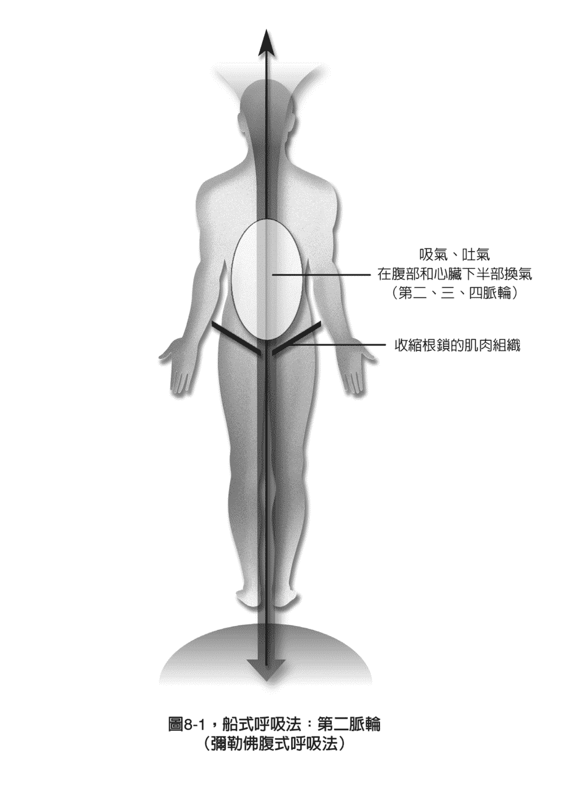

所有人做这个练习都会有收获，特别是本我轮失衡或承受包袱的人。透过这个方式呼吸可以增强活力，唤醒第二脉轮的创造力，培养内在智慧，也就是「信任直觉」的能力。每毫秒有数十亿位元的信息在轰炸我们的能量场，这就是信息的发源地，就在下腹部的第二脉轮。信任直觉就是信任决策力，信任我们的评估远胜过逻辑思维。

进行中枢通道呼吸法，从头顶吸气，穿过中枢通道，抵达肚脐下方的第二脉轮。

◆ 步骤：

1. 同时收缩根锁，从内将括约肌往上提。

2. 吸气和吐气时，根锁继续用力。你可能会觉得有点难，因为你同时肚子要放开又要用力。让两者互动，创造出这个脉轮空间的觉知。这就是之前说过的：创造内在磨擦或阻力。

3. 加上整套中枢通道呼吸法，从头顶上方到脊椎末端到地底，再从下往上，但根锁要全程用力。这会整合第二脉轮的能量与中枢通道上其他位置的高频能量。

太阳轮呼吸法：第三脉轮

太阳轮呼吸法（图 8-2）运用肌肉收缩来启动太阳轮。这个呼吸法结合了第三脉轮，能强化自尊，让你更果断，得到更多力量。如果这个脉轮没有启动，就很难感受到自己的真实本质——就算感受到也很难实践。这个呼吸法，搭配其他脉轮的呼吸法，可以为热情之火加油，改变人生。

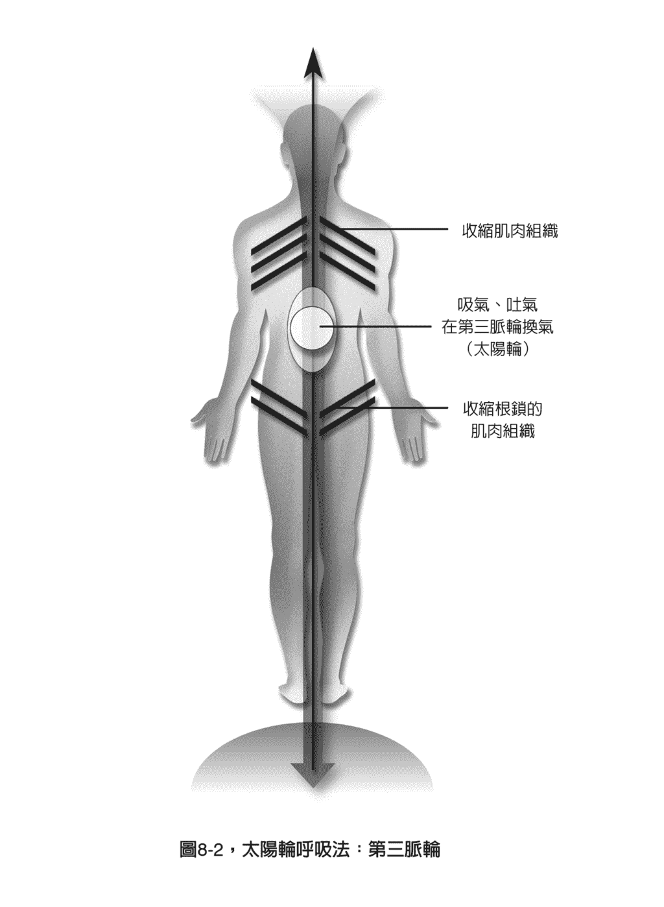

◆ 步骤：

1. 沿着中枢通道呼吸时，收缩根锁，收缩胸腔上半部的肌肉，肩胛骨并拢往下垂。从内揉捏、按压胸膛，好像你稳稳地「捧着」心口，或者从胸膛内部拥抱自己。

2. 呼吸时带到肚脐上方、肋骨下方（这个位置若是被击中会立刻昏过去）。从这个区域呼吸的方式，我称为「棒球与葡萄柚呼吸法」。

3. 吸气时，把上腹部的这个位置往外推，鼓得像葡萄柚一样大；吐气时，要缩成和棒球一样。

4. 练习棒球与葡萄柚呼吸法，然后同时做中枢通道呼吸法。从头顶上方吸气，让太阳轮区域的「棒球」膨胀成「葡萄柚」，然后吐气到地底，让「葡萄柚」缩回「棒球」。

5. 再反过来，从地底下吸气，穿过身体，从头顶吐出去，吸气时太阳轮像「葡萄柚」，吐气时像「棒球」。

和谐一心呼吸法：第四脉轮

和谐一心呼吸法（图 8-3）着重于拓展心轮，也就是第四脉轮，启动爱的能量与心的动能，同时将意识锚定于有灵魂的自己。这个呼吸法也会协助你化解冲突、接收爱，立刻邀请更多的喜悦与安宁进入生命中。

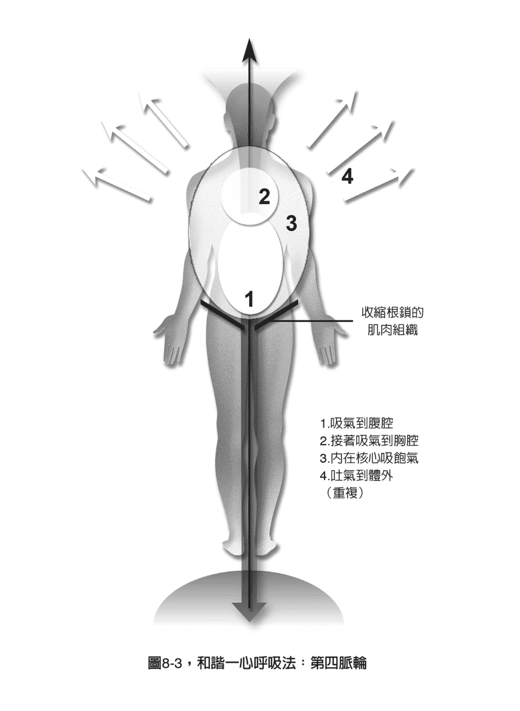

◆ 步骤：

1. 先从船式呼吸法开始，让下腹部吸满气。

2. 继续吸气到肚子里，直到胸口中间（心的位置）也吸满气，胸腔往上提，最后填满上肺部的气管。

3. 随着呼吸让能量超越身体，想象呼吸流出身体，往外扩散。

4. 吐气时，胸口和上肺部先消气，然后吐掉胸膛的气，再吐掉腹部的气。

5. 吐气到最后，将肚脐往内缩往上提，好像要碰到脊椎。把气完全吐干净，肺里的最后一口气都不剩。如此能重新设定你神经系统的战或逃反应。

6. 反覆练习六至八次，配合中枢通道呼吸法一起做，从你站着或坐着的位置底下把气吸到肚子里，从头顶吐气，再反过来从头顶上方吸气，吐到地底。

实现呼吸法：第五脉轮

实现呼吸法（图 8-4）会启动喉轮，也就是真相的位置。这里的意识甦醒之后，我们可以更真诚、更坦率地听和说。我们会专注于实现最伟大的真相，不只是我们个人的真相或防御性格的观点或意见。这会让生命优雅展开，因为我们坦率、自由且符合宇宙的法则。

运用这套呼吸法来协助你，让世界认识真实的你，实现你的目标，并且透过有灵魂的自己来采取行动，扬弃防御性格。

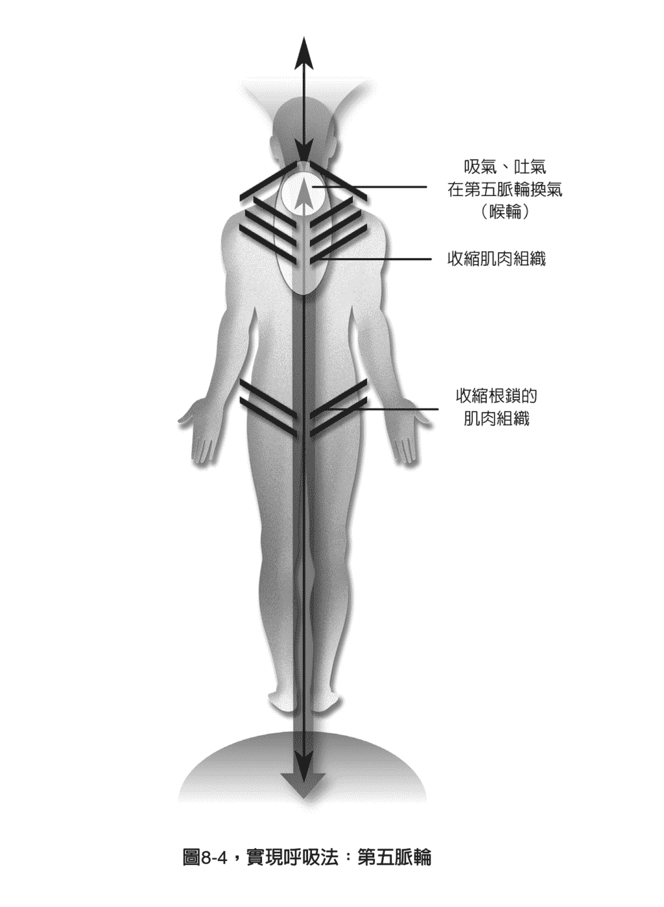

◆ 步骤：

1. 根锁定位，先做太阳轮呼吸法——揉捏、按压你的腹部，肩胛骨收紧往下带，胸腔肌肉用力。让呼吸填满腹部和心口。

2. 下巴保持水平，带向颈子后方。想象下巴「锁在」那个位置，每次吸气和吐气都要集中在这里。核心其他地方的肌肉都要收缩，只让喉咙放松。

3. 从头顶上方吸气，用意念带到喉咙。从喉咙下方沿着中枢通道吐气，让气息入地。再从地底吸气，经过身体到喉咙，从头顶吐气。让喉咙成为呼吸交换的枢纽，但是要确定你感觉得到气息（那就是你）沿着中枢通道上下，就像温暖的、液态的光。

视线呼吸法：第六脉轮

视线呼吸法（图 8-5）会启动上脑中心和第三眼，协助你更准确地察觉处境，并看透防御性格的面纱，直视有灵魂的自己，看到真相。这套呼吸法会培养出更澄澈清晰的思想与内在觉知，让你读懂身体透露的微妙能量讯息。若要获得最佳效果，可配合本章其他呼吸法，稳定第三眼以下的中枢通道。

在这个练习中，先暂时不做中枢通道呼吸法，我们要想象从额头前方的焦点吸气，经过大脑中央，从后脑勺吐气。在做这个练习时中枢通道的锚点都要用力，尤其是根锁。

闭起眼睛，眼球向上转，感受到这个锚点在用力。专心注意这个区域，但身体要放松，如果注意力飘散了，就再用力一次。

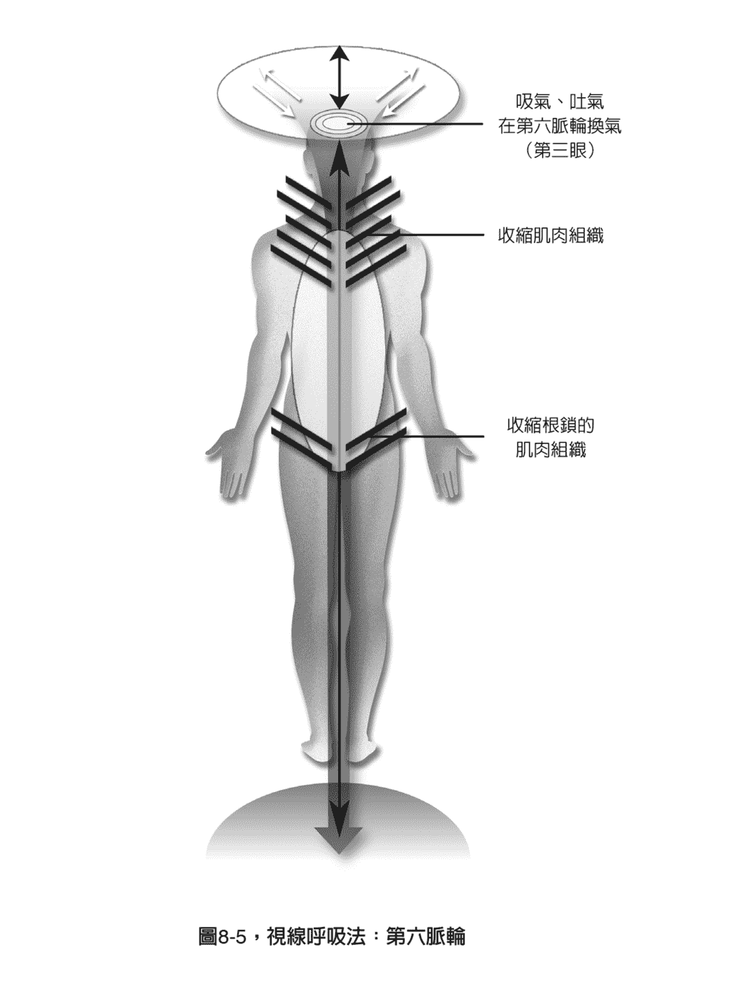

◆ 步骤：

1. 察觉自己从额头前方吸气，经过大脑中央，双眼后方的锚点。想象你感觉到气息填满了大脑所有细胞间的空隙，启动脑细胞、滋养脑细胞。

2. 从后脑勺吐气。气从多远的地方吸进来，就要吐多远。

3. 现在反过来，从后脑勺吸气。

4. 把气吐到额头前方的焦点。

5. 重复数回，然后每次换气时要将这个动作连结到垂直的中枢通道。从头顶上方吸气，进入大脑中央的锚点，再一路沿着中枢通道往下吐气到地底。

☼第二项练习：一千根小吸管呼吸法

我们其实就是由上千条能量的小通道所组成，这些小通道梵文称为「脉」，大条的称为「经络」，就存在我们身体里。「一千根小吸管呼吸法」（图 8-6）会让我们将意识带到不同的经脉，更加甦活我们的系统。若要疗愈伤害或长期疼痛，这套呼吸法就是康复的基础，我们会把「空间」吸进肌肉和结缔组织里，也会唤醒中枢通道上的组织和身体较外层的组织（包括四肢），可以帮助你发挥天赋、才华和人生使命，因为这会清除情绪包袱，让你觉醒，感受到振动与真相，让你获得过去没有的能力。这套呼吸法有整合能量的强效。

首先，你要先想象身体分成三截，如图 8-6 所示：

第一截：从双脚到髋部上缘。

第二截：从髋部上缘到肩膀，包括双臂。

第三截：从肩膀上方到头顶。

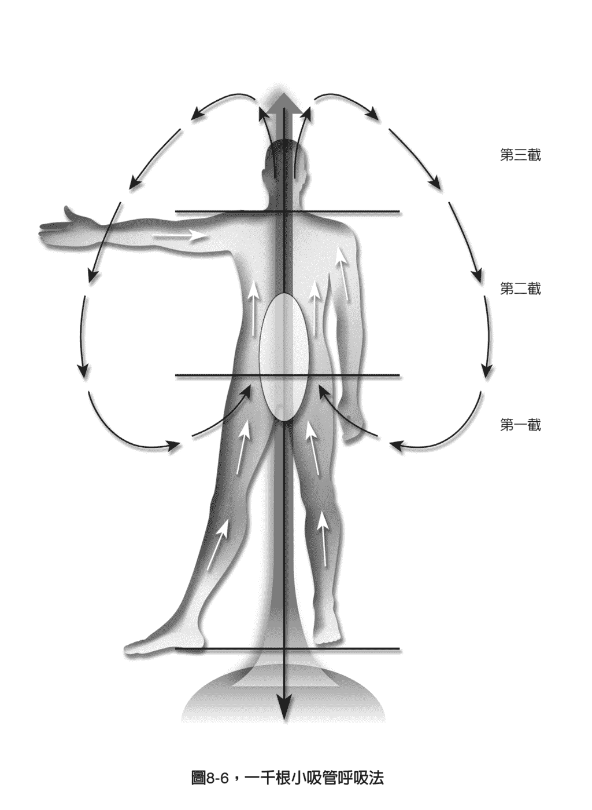

◆ 步骤：

1. 先收缩第一截的所有肌肉（从双脚到髋部上缘）。

2. 吸气往上穿过这个区域，从脚掌下方开始，好像你的能量体有一千根小吸管，你要用这些吸管把浓稠的奶昔一公分、一公分地吸上来。

3. 身体内部继续收缩，用力吸气。到了第二截，吐气，但不要放松肌肉，连第二截的肌肉（从髋部上缘到肩膀和手臂）都要继续用力。再吸气时，把能量一公分、一公分地往上提，穿过身体，提到肩膀上方。

4. 把气吐到肩颈的位置，但不要放松肩颈以下的肌肉。

5. 接下来，加上第三截（从肩膀上方到头部，包括颈、脸、口、头皮）。吸气时，透过这个部位的小吸管一公分、一公分地把能量带到头顶。

6. 憋气一秒钟，然后从头顶吐气，身体的肌肉都不能放松。

7. 感受能量如涌泉喷出，再沿着身体外围往下流，然后，全身放松！想想第三章介绍过的人形环状图和三维能量。

8. 深吸气，吐气，放松地发出「啊——」的声音。感受到新能量从头顶灌入体内，好像你就站在瀑布下。让身体感觉很舒服。你的系统获得能量补充了。

9. 重复练习两、三回。

10. 最后同时收缩全身肌肉，从头顶吸气，穿过全身吐到地底。

这是一套比较进阶的呼吸法，最好在能量七密码工作坊中看教练示范或是看在线示范影片（请见[drsuemorter.com/energycodesbook](https://drsuemorter.com/energycodesbook/)）。因为有强大的疗效，所以我希望大家透过书本也能学会。熟练之后，你就掌握了强大的工具，可以清除体内细微能量流的扰动——让你的能量流看起来就和人形环状图一样。请试试，你会愈来愈熟练。

你也可以结合「一千根小吸管呼吸法」与本章的其他练习来疗愈创伤与慢性疼痛，你一定会爱上这方法带来的效果！

☼第三项练习：蕨叶呼吸法

蕨叶呼吸法（图 8-7）整合了脊椎里的能量细流，能让我们努力创造的变化持续得更久。这套呼吸法会建立细小的神经回路，刚开始听起来可能很复杂，但熟练后会愈来愈简单自然。

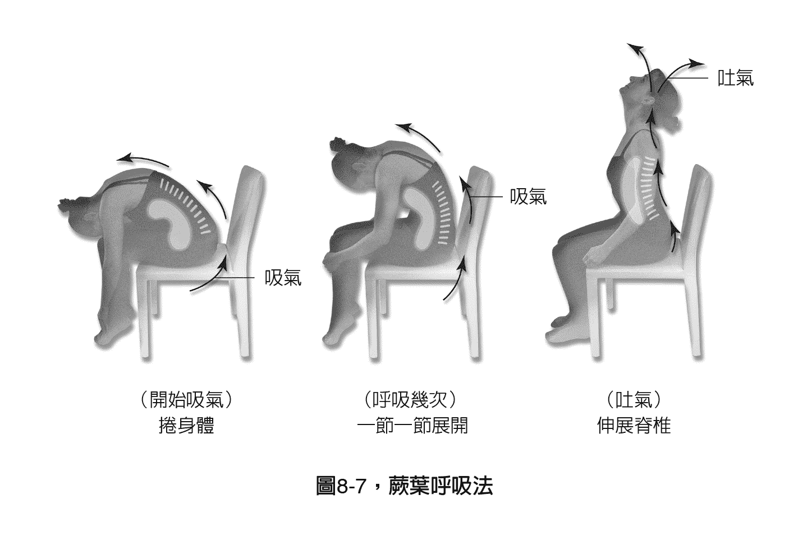

想象一株卷起的蕨叶，观察它是怎么紧密地卷成圈。现在想象这个圈缓缓展开，曲线逐渐伸直，蕨叶最后完全开展。这就是我们接下来要做的事：先卷起来，再慢慢打开身体，一边做一边深呼吸。

进行蕨叶呼吸法时，能量系统中有一个地方要用力——就在腹壁后方，根锁上方，脊椎末端，荐骨正面。不少东方的练习将这个位置称为「丹田」。丹田用力，每次吸气时，逐渐打开身体，并将丹田往上提。我们要一节一节打开脊椎骨，打开的过程中，每一节都会轮流成为身体曲线的顶点。

◆ 步骤：

1. 坐在椅子上，或在地上铺瑜伽垫后，盘腿坐在垫子上。

2. 收缩根锁，找到丹田的位置（即腹壁后方，根锁上方，荐骨前方的空间）。想象一个小光球，进行以下几个步骤时，让光球沿着中枢通道往上。

3. 吸气，让下颚抵住胸口。继续吐气，将胸口往下卷，靠近腹部，再往内收，让胸口靠近大腿。整个人卷起来，就像收合的蕨叶。在身体不会痛的情况下，尽量往内卷，一直吐气直到肺脏里完全没有空气。想象你的脊椎就像蕨叶一样弯曲成完美的螺旋，不是只把脊椎底部凹起来而已。

4. 吸气，双手贴着大腿上方。把脊椎往后推，远离双手，一节一节慢慢把身体往上顶。在完全坐直之前，下颚都要抵着胸口，躯干都伸直了以后才展开颈椎。伸展颈椎时，想象自己一节一节地伸展颈椎，最后到了头颅下方。（注意：在脊椎逐渐开展、伸直的过程中，都要吸气，刚开始可能需要吸两、三口；如果你需要吐气，就维持姿势吐气，吸了气以后再继续伸展。）

5. 接下来，让鼻尖朝向天花板，双眼同时往上转，让气息从额头中央和头顶呼出去。

6. 以同样的姿势吸气，然后吐气，再开始卷起来，身体往下卷时要把气吐干净，最后全身卷起，下颚抵着胸口，胸口往下靠近腹部。让额头和头顶朝向地板。和开展时一样，你可能会需要好几口气，如果你得吸气，那就暂停动作，深吸气之后，从这个姿势继续往下卷，一边卷一边吐气。

7. 重复两、三回。

这个练习中最重要的就是要让意识集中于每一节脊椎，能量才能沿着整条脊椎充分整合。这个练习可以结合其他呼吸法一起做（如七个脉轮各自的呼吸法和一千根小吸管呼吸法），即可大幅提升整合效果。当你愈来愈熟练这些呼吸法，很清楚所有该注意的细节，就会真正感觉和察觉到身体里不同的能量结合在一起。当你能感觉到你的真实自我就是体内的能量，便能掌握并主导能量的流动；当你可以左右体内的能量，就能左右人生中的能量，很快改变你的处境，迈向梦想中的奇幻人生。你不只能疗愈自己，还能开创人生。

不急，我们现在就可以发挥疗愈力！

☼第四项练习：疗愈呼吸法

身体会痛苦（更准确地说，是身体失能或持续缺乏自愈能力），是因为那个部位能量流不足。能量包袱会造成过多的能量堆积，就像河道淤塞，就会产生疼痛。若要让能量顺流、重获健康，就要让能量穿过淤积处，让停滞的能量流通，再度整合到系统中。

如果身体有个部位很虚弱，这表示体内流过那个部位的能量不足，就像河道被堵住以后，水流就变细了。要加强那里的能量流，就要把意识和注意力带过去，透过呼吸灌注能量，疏通淤塞。疗愈呼吸法（图 8-8）可以将能量导到较虚弱的部位，让身体恢复功能。

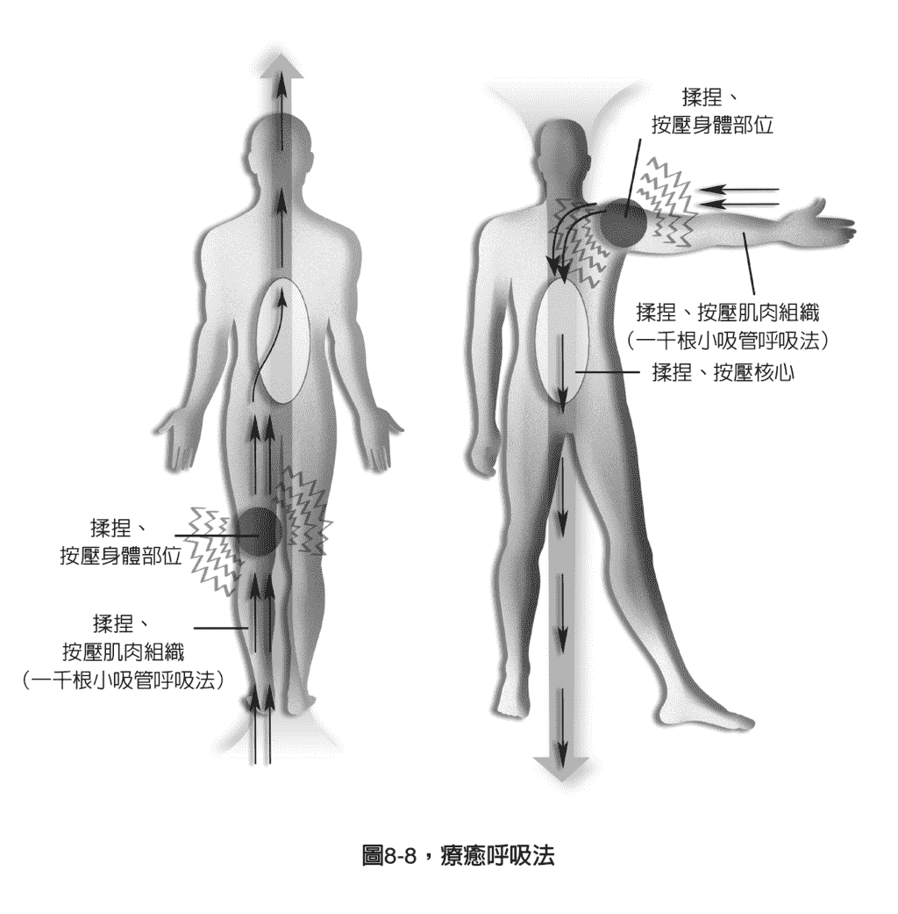

◆ 步骤：

1. 揉捏、按压疼痛的部位。不要只是机械式地按压，可想象自己从体内拥抱这个部位，让意识碰触到这个部位，并表示：「我在听。我不会忽略你了。我在拥抱你要告诉我的讯息，我现在知道我们要一起面对。」

2. 接下来，让气息穿越这个部位，进到心脏中央，然后从中枢通道的另一端吐气。让气息穿越这个部位的意思是从四肢中最靠近的一肢吸气，把呼吸带进来。例如，如果你的膝盖会痛，你要先用「一千根小吸管呼吸法」揉捏、按压膝盖，然后透过想象，从脚底吸气把能量从地底带上来，穿过脚掌、小腿，抵达膝盖；然后穿过膝盖，经过臀部、腹部，一路往上直达心脏。接下来吐气，经过喉咙、大脑、头顶。如果是髋部疼痛或失能，你的起点也是脚底。如果健康问题是在肩膀，那就从手部或头顶吸气，看哪边比较相关。不管你从哪里吸气，都要吸到心脏，然后从中枢通道的另一端吐气。

3. 当你让呼吸穿过有状况的部位时，要沿途从内揉捏、按压肌肉。在呼吸时要同时揉捏并伸展肌肉。这会让能量直接穿过组织，唤醒能量回路，所以要吐纳、伸展、揉捏。

4. 接下来逆向，从中枢通道的新端点吸气，经过心脏，吐气时穿过有状况的部位，再从原本的起点把气呼出去。气息经过时，沿途的肌肉都要用力收缩并延展。

这套疗愈呼吸法可用于所有疼痛、紧绷或经常有状况的身体部位。刚刚我已经提供了几个常见的例子，让你知道如何修复这些部位。若需要影片示范，请至[drsuemorter.com/energycodesbook](https://drsuemorter.com/energycodesbook/)。

这些不同脉轮的呼吸法也可以修复心理或情绪的创伤，可能是来自身体、精神、情绪或性虐待。「让身体来处理」对我特别有用，根据不同的脉轮表现来进行特定的呼吸法也很有用。此外，我建议你在做这项练习时，特别留意并感受你的心是不是有一股深刻又紧密的连结（如果你觉得很难，可以温习心的密码）。我和我的患者分享这个建议之后，他们的情绪张力减退了，人生观改变了，而且都能完成量子翻转。我很清楚这也能帮助你。

吐纳密码对应的脉轮：喉轮

吐纳密码对应到第五脉轮，即喉轮，就在心脏和喉头的中间、颈部底座的位置。梵文的意思是「特别纯净」。喉轮不只掌管我们的声音和呼吸，若让脉轮发挥作用，也可以实现我们真正的道路，因为有灵魂的自己就是靠脉轮代言的。喉轮会和外在世界互动，表达我们真实的创意本质。喉轮也和想象力有关。要成为人生的创造者，我们经常要冒险采取一些行动，即便没有证据能证明这些行动会不会有结果、够不够安全，而当我们有意识地呼吸，唤醒喉轮，就会感觉到自己逐渐获得引导与启发。

【表 8-9】整理了喉轮的特质。请注意喉轮的能量特质反映到哪些身体部位。

在整合喉轮时，完美主义、创意受阻和说不出我们内心的真相、无法分享真实的想法等现象都会获得改善。我们会感受到充分连结与自由。常见的效果还包括：沟通更顺畅、更容易静心、艺术表现更丰沛；甲状腺问题、喉咙痛、耳鸣、气喘等健康问题也会在喉轮平衡后改善。

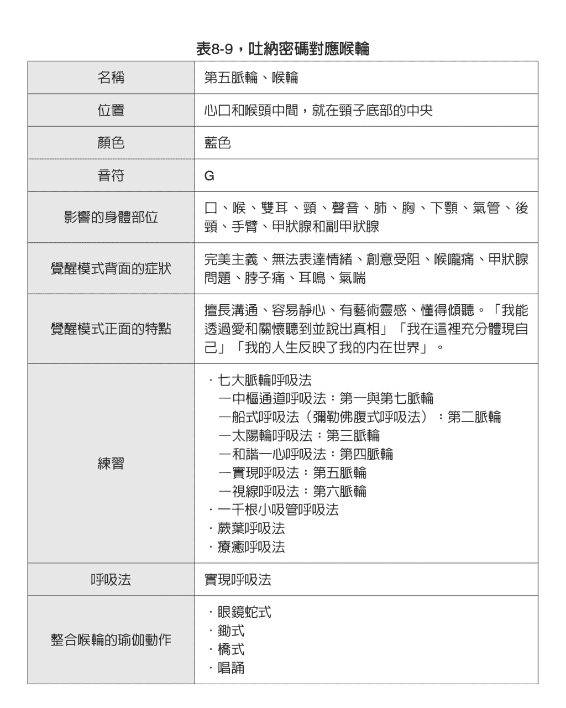

除了本章介绍的呼吸法，下列瑜伽动作也能帮你启动并整合喉轮，促进能量顺流。

吐纳密码的瑜伽动作

☼眼镜蛇式

虽然眼镜蛇式（bhujaṅgāsana / Cobra）也可用于其他脉轮（最知名的是心轮），而且能够改善喉轮的瑜伽动作也很多，但我在这里选择眼镜蛇式，是因为这个动作很简单，每个人都做得到。此外，眼镜蛇式会沿着中枢通道的正面开启沟通与觉知的线路。

◆ 步骤：

1. 趴在瑜伽垫或毯子上。如果可以，把腿并拢，大拇趾靠在一起。如果会不舒服，双腿距离不要超过臀部的宽度。

2. 额头贴在地上，把双手直接带到肩膀下方，指头朝前。

3. 手掌贴地。脚背贴地，启动双腿。启动根锁，把胃部和下腹部往上提、往内缩。

4. 下巴微向内缩，让头和心口离地愈远愈好，双腿和脚背继续贴地。你的背会呈曲线。肩胛骨往下带，不要耸肩，不要让肩膀靠近耳朵。

5. 下巴往上抬，对到天花板与墙壁相接之处，露出喉咙。不要只是把头往后仰，要延伸颈椎并用力。

6. 从这里吸气和吐气，感觉到呼吸沿着中枢通道上下移动。

7. 结束时缓缓收下颚，让胸口和头贴回地板。双臂往前伸到头顶或往两侧延伸，头转向侧面。深呼吸，身体放松。然后进行下一个练习。

现在，将吐纳密码与身体觉醒瑜伽练习一起整合到眼镜蛇式中：

1. 趴在地上，双手放在肩膀下方，双腿并拢，大腿内侧和双膝一起用力往外推。

2. 脚背贴地，想象趴着的位置下方六十公分处有能量库。

3. 根锁用力，腹部贴地，同时吸气，从脚底之外把能量沿着中枢通道的正面往上拉近核心。感觉到你就在这个开阔的腹部空间里。肩胛骨用力靠近，往下垂，吸气时把心脏和胸腔拉到肩膀前方，打开喉咙。

4. 眼球往上转，感觉到张力，吐气时穿过那个空间，从头顶呼气出去。

5. 吸下一口气时，从头顶上方六十公分处吸气，吸进大脑中央，经过喉咙和胸口，沿着身体正面往下到腹部，让腹腔贴地。

6. 吐气时，根锁用力，然后从脊椎末端、双腿、双脚吐气，双腿持续用力，就像「一千根小吸管呼吸法」一样，脚背贴地。感觉到做眼镜蛇式时全身连成一直线。

☼整合喉轮的其他瑜伽动作

除了眼镜蛇式，你还可以利用以下动作来强化吐纳密码的练习。揉捏、按压你想着的部位会很有用，但是做这些动作时放松也很有效。尽量在做这些动作时融入吐纳密码的练习。

•锄式（halāsana / Plow）

•桥式（setu bandhāsana / Bridge）

•唱诵（Oṁ, Ma, Ha）

吐纳密码透过有意识的呼吸启动能量流，并把能量流带入每一个脉轮，让我们能更充分地体现有灵魂的自己，实现欲望与真实的道路，疗愈生活中的所有面向。接下来，「荷尔蒙密码」会提供另一个关键提示，让我们理解怎么体现有灵魂的自己，并让我们创造适合的条件，让身体能够配合。健康和活力在下一章等着你！

第九章
人体化学密码：体现灵魂的炼金术

二十年前，约翰走进我的诊所时，病历厚到根本搬不动。其中一部分厚达二十五公分，全都是检查报告、诊断结果、扫描影像、诊疗方式、血检结果、骨科和神经科的意见，以及各种病症的描述：关节炎、痛风、糖尿病、溃疡、溃疡性结肠炎、慢性头痛、颈部疼痛、背部疼痛、膝盖疼痛、甲状腺和肾上腺疲劳、湿疹、牛皮癣、胃食道逆流等。「他们宣告我活不过一年，」他声音颤抖着说，「我听说妳用神奇的方式帮助了很多这类病人。」

他语气谦和，又深受病苦，我能感受他的难过。「请坐，」我说，「来看看我们会有什么发现。」

我们讨论了几分钟，翻阅报告，我发现他时不时把手伸进口袋，拿一点东西放进嘴里。我原本以为他是要控制血糖，所以一直吃坚果，可是他的动作太频繁了，不可能是血糖管理。

我只好开口问。「约翰，你在吃什么？是零食吗？」

「哦，这个吗？不是，这是盐。我爱盐巴……就是嘴馋！」

「所以你每一、两分钟就吞盐巴？」我问。

「对。我买量贩包，每天早上倒一点到口袋里，时不时抓一点来吃。」

我马上明白他到底怎么了。他的问题没有太空科学那么深奥——他有盐瘾！盐有毒素，会造成身体脱水，还会过度刺激他的系统，造成高血压和身体过酸。他还对其他刺激物上瘾：糖、汽水、尼古丁、咖啡因，不一而足！

接下来几周，我们透过自然的方式处理他体内的激素，利用生物能量疗法清除潜意识的包袱，解除他必须持续刺激身体的瘾头。几个月内，约翰大部分的症状都好了。剩下的症状都很容易控制，再花几个月就消除了。

七年后，约翰幸福愉快地走进我的诊所，我正好经过挂号台。我已经好多年没见到他了。他搬到佛罗里达，那时回来看孩子。他特地来谢谢我，给我看孙子的照片时透露出他人生美满。

「想来点零食吗？」我故意问。

「才不要！我现在状况好得很，一点都不想要破坏。」他说。

什么是人体化学密码？

多年前，立普顿医师在出版《信念的力量：新生物学给我们的启示》之前，在研讨会中听到了我和父亲、哥哥一起发表的简报，介绍如何运用生物能量学进行自然疗愈。表观遗传学是个全新的科学领域，立普顿医师发表了具突破性的表观遗传学研究发现。简单来说，表观遗传学研究基因表现，了解基因在哪些情况下会有特定的行动，或者生活方式、年龄、疾病或思维如何影响基因。人类向来很想了解自己与生俱来就能影响或疗愈身体的能力，而表观遗传学提供了一些答案。

对我来说，或许最精采的发现在于身体内每个细胞的表面都有天线或接收器，会告诉基因如何根据外在环境所传来的能量或化学讯息来反映。不管我们的基因如何构成，或者ＤＮＡ如何排序，或者我们从父母或祖父母身上继承了哪些素质，细胞会根据细胞表面接收器从环境所接收到的「信息」来行动。最棒的是，我们能大幅控制这些「讯息」，还有我们要为细胞创造什么样的环境，因此我们可以有意识且刻意地告诉基因要如何行动。

我们的细胞和万物一样依赖能量来获得信息。这股能量在身体产生化学激素（如荷尔蒙、酵素等）时就会从抽象转为具象，而身体是根据能量场的信息来产生激素。这些化学激素会创造出内在「环境」主导细胞功能，主掌人体化学。当我们的能量场有了变化，人体化学也会有变化。例如，能量场会决定甲状腺和肾上腺要制造多少荷尔蒙，这些腺体的细胞会透过细胞表面和天线一样的接收器「察觉」到身体的能量。

因为内外会互相影响，我们也可以反向操作：由人体化学影响我们的能量。这表示我们的人体化学可以阻挡、也可以帮助我们体现有灵魂的自己。

这一章会教你如何创造出理想的环境，让身体自然地冷静、放松、平衡并且更有效率。当身体进入了最理想的状态，能量场就甦醒了。我们可以重新启动关闭的回路，整合破碎的能量，让身体获得力量自我疗愈、产生创意（这原本就是身体与生俱来的能力），最后活出有灵魂的自己。换句话说，当身体在最理想的状态时，我们就能布置舞台，让幸福人生上场。

在这个过程中，身体的酸硷平衡很重要。

体内酸硷值的重要性

本章一开始就先介绍约翰的故事，其实就是在描述人体化学，特别是全身体液的酸硷平衡，这决定了细胞要活在酸性（酸硷值偏低）或碱性（酸硷值偏高）的环境里。这很重要，因为细胞在碱性环境里能够保持健康活力，并拥有自我修复的能力（胃部细胞除外）；在偏酸的环境里则会故障或崩坏。

九五％的病症都发生在身体偏酸时，癌症是极酸状态下最极端的结果。其他常见疾病如胃酸逆流、骨质疏松、高血压、痛风、关节炎、高胆固醇、甲状腺亢进、糖尿病和蓄积过多脂肪等，都是酸性身体环境下的症状。可惜的是，多数人的身体都太酸了，细胞无法发挥修复能力，所以现在慢性病才会如此普遍。虽然大部分人都知道不要成天嚼盐块，但我们每天还是在不知不觉中破坏了身体自愈的能力。

我们的身体总是会先把能量用来求生。尿液和唾液的酸硷值是身体系统的指标，让身体晓得我们面临求生的威胁（过酸）或是目前很安全（微硷）。我们的细胞生来要漂浮在碱性环境里，在发挥作用的过程中产生酸性物质。身体太酸就会威胁生命！身体极酸则称为酸中毒，会导致心脏问题、中风、肾衰竭和重大器官衰竭。所以身体如果有其他问题，甚至是严重的病症，也要先恢复酸硷平衡，才能分配疗愈能量和资源去处理疾病。

因为身体必须时常维持碱性，而很多人的旧伤会复发，或是有慢性疾病——这表示其实他们始终没有痊愈。例如，如果有人说背会痛，而身体过酸，如果我作为一名医师，只处理身体症状的话是看不到进步的。为什么？因为他们的身体把所有的疗愈能量都用来中和酸硷、避免系统失能了。背痛不会死，但酸硷失衡会死。系统在恢复酸硷平衡之前，会选择将所有能量都用来管理攸关性命的问题，所以比较不要紧的细胞就得不到修复所需的资源。

过去三十多年来，我看过数千名病患因为酸硷失衡，持续有背痛、膝盖受伤、头痛、忧郁症或焦虑症，迟迟无法恢复。当我们修复他们的体内化学平衡，让身体多一点碱性，系统就能转换焦点，开始处理这些较不急迫的身体状况了。

尽管有这么多证据，酸硷平衡还是个备受争议的主题，主要是因为有很多变量会导致检验结果互相冲突，例如要检查病患的哪一种体液、病患的膳食、情绪状态和测试期间还有哪些健康疑虑（酸硷值测试会用唾液和尿液，因为身体会尽量维护血液酸硷值，甚至牺牲骨骼和肌肉里的碱性矿物质）。此外，酸硷值的检查报告和建议也饱受误解。例如，罹患第四期癌症的病患可能会测出碱性尿液，那是因为细胞崩坏，而不是因为身体维持了化学平衡。过去四十年内，我见过许多营养建议和饮食风潮，而我和父亲的临床观察发现，摄取碱性饮食以维持「硷库」（在细胞外液里，最后会成为肌肉与骨骼组织为身体储存矿物质的地方），让身体获得足够的碱性物质，能让身体有疗愈的力量。

人体化学（而不是我们的意志力或情商）最终会决定我们自愈或转变的难易度，因为人体化学在能量场里和意志力或情商的影响力一样大。事实上，身体的酸硷值会影响到我们能不能实现人生中的欲求，因为我们能否连结有灵魂的自己、得到灵感、获得鼓舞、主动积极和疗愈自己，这些都和酸硷值有关。

因此我们想了解这个关键问题：要如何平衡体内酸硷值？

很多东西都会影响人体化学。我经常想成这是一碗家常的综合汤，里面有很多成分，最后创造出不同的组合。这些成分有的很明显：饮食、呼吸的空气、摄取或吸收的化学物质等；有些成分则比较不明显，象是意识和潜意识里的思绪、情绪和信念。

有趣的是，大脑里储存潜意识的「空间」也是制造这碗身体化学汤的地方。许多东方传统医学称这个空间为「婆罗门之窟」「创造之窟」或「协作之窟」，一般相信这里就是创意思维生成的位置，我们的新实相也在这里产生。这是许多身体功能的指挥中心，所以这里发生的事情将大幅影响体内的酸硷值。荷尔蒙、神经传导物质、神经突触的反应之间如何交互影响听起来很复杂，但你可以用以下这个简单的方式来理解。

想象大脑中央有个小小的洞穴，地面由下丘脑细胞组成，会接收体内的信息（也就是内在世界的讯息），并以化学激素的方式回应；若体内化学失衡，就要由这个地方来调节。现在，想象自己坐在这个小洞穴里。如果你把腿伸直，就会碰到旁边的脑下垂体，这个腺体会控制荷尔蒙系统。下丘脑和脑下垂体可以直接互动，前者是后者的「沟通中心」，在这里交换信息，理解身体需要哪些荷尔蒙、量又是多少。洞穴的墙壁由丘脑构成，它会接收五感的神经冲动，这些信息来自外在世界。若往后倒，你就会碰到松果体——这个腺体的细胞有很多杆状和锥状细胞，就和眼球一样。松果体和双眼都能感光，大脑中间无法接触到外在世界，但松果体可能可以感受到比可见光更高的频率，例如我们的能量体频率和有灵魂的自己（我自己就经历过）。最后，在洞穴地面有个活门，下面就是潜意识，我们意识所否认、抗拒或切割的人生经验都和未觉醒的自己一起藏在这里。这些细胞和腺体的所有反应都会持续影响我们的能量和生理。

丘脑、下丘脑和松果体收集了信息，会让许多重要成分流进这个洞穴。洞穴不断散播和传送身体的化学汤，透过脑下垂体、脑脊髓液和其他神经讯息传递给细胞。大脑和身体的细胞就浸泡在这些汤的讯息里，并加以回应。

这碗汤的化学性质不只决定了我们怎么痊愈，也会决定我们何时觉醒、用什么方式觉醒，最终明白我们就是多维度的永恒能量体——即有灵魂的自己。人体化学会让我们完成量子翻转。

我们先来看看有哪些成分会加进身体的化学「汤锅」里。

我们摄取的饮食

你可以把消化系统想成是一个烧柴的炉子，当你把柴火放进去，就会变成燃料消耗掉，副产品就是灰烬。一旦物质被身体代谢了之后，产生的副产品就是「灰烬」。我们把碱性的副产品称为「硷灰」，酸性的副产品称为「酸灰」。

我们摄取的饮食在消化之后会影响身体酸硷。有些酸性物质（如咖啡）在代谢之后会产生酸性，有些碱性物质（如蔬菜）在代谢之后会产生碱性；还有些物质（如柠檬和柳橙）虽然是酸性物质，但代谢之后会产生碱性，另外有些碱性物质（如牛排）代谢之后则会产生大量酸灰。

为了创造并维持健康的细胞环境，我们要吃大量能产生硷灰的食物，减少会产生酸灰的食物。否则，身体就必须从硷库提取碱性物质来中和食物所产生的酸灰，才不会导致消化系统过酸，肾脏和结肠的组织都被烧坏，在代谢的过程沿途造成细胞损坏、疾病等。当我们吃了许多会产生酸灰的食物，借用的碱性物质比还回去的多。若只是偶尔为之就不是大问题，但若长期持续摄取酸灰食物，硷库就会耗竭，最后身体无法缓冲。这时，系统会继续变得愈来愈酸。在这些状况下，原本应该要在碱性环境里漂浮的细胞就会逐渐损坏、崩解，疾病就产生了。

脂肪蓄积就是体内过酸的结果。因为脂肪是碱性的，身体会留住脂肪和体液，好中和或稀释体内逐渐累积的酸液。身体若呈碱性，就比较容易减重。

接下来，表观遗传学就上场了。长期以来，大家都以为某些疾病（如糖尿病、心脏与循环问题和癌症）和遗传有关。或许真的相关，但之前说过，基因行为并不完全和遗传获得的ＤＮＡ素质有关，细胞生存的环境也会影响基因行为。在很多案例中，长期摄取会产生酸灰的食物将在体内创造出酸性环境，让疾病更容易发生。

这项发现令人振奋！原本我们以为如果你遗传到了好发体质，迟早会发病，但原来这些疾病是可以预防的，只要在体内创造出碱性环境就好了。我们透过生物能量同步疗法医治病患后获得长期的证据，显示当一个人减少摄取让身体变酸的食物，并增加摄取让身体变硷的食物时，就有更强的自愈力。只要给身体适当的协助，身体便会自动回到健康的自然状态。

「人体化学密码」会提供你工具来创造新的化学汤「食谱」，恢复人体化学平衡，给细胞所需的理想碱性状态。细胞需要碱性状态才能适当发挥功能，能量场和细胞表面互相传递讯息也需要碱性环境，这样细胞才能产生适当的化学物质，让大脑诠释信息。在酸硷平衡的环境里，感官系统才能对人生有正确的回应。

碱性食物主要为蔬菜水果，其他食物会产生不同比例的酸灰。动物性蛋白质让身体变酸的能力最强，第二、三名分别是乳制品和谷类。咖啡因让身体变酸的能力也很强，糖、汽水、酒精和含人工色素与人工调味剂的加工食品也不遑多让。另外，尼古丁和会让人上瘾的化学物质当然也会产生酸性和其他伤害身体的效果，这部分文献相当丰富。光是靠多吃碱性食物未必能抵消其他食物所产生的酸性。例如，一天之内吃下太多动物性蛋白质（超过三十克）所产生的酸性，不管我们吃再多蔬菜，都无法在二十四小时内中和掉。

我父亲总是说：「我们的饮食要愈接近大自然的形态愈好。」不过，现在基因改良进展飞快，就连吃原型食物也不安全了。有些研究发现基因改良过的食品会影响哺乳类动物的肾脏、肝脏、心脏、脾脏和肾上腺素，我认为这是因为身体不认为这些是「真正的食物」。我和很多人一样相信经过基改的食品因为天然化学性质被改变了，身体比较难完整代谢，或是在代谢的过程中难度会增加，因此酸灰累积更多，身体得花更多力气才能消化。因此，我们应该尽量吃有机食物，不要吃基因改造食品。

饮食对我们的人体化学健康很重要，但另一个因素可能有更强大的影响力：我们的思绪。

我们产生的思绪

思绪会产生化学物质。低频思绪会产生让身体变酸的化学物质，高频思绪会产生让身体变硷的化学物质。爱的体验在我们的系统内让身体偏硷的力量最强大。

承受压力时，身体会产生化学激素（如「压力荷尔蒙」可体松），以抵御压力。可体松浓度持续升高会造成体内酸性，因为战或逃反应会先面对我们的求生威胁，之后才处理身体要过滤、净化和痊愈的需求。当我们感觉很愉快时，身体会产生不同的化学激素（如「快乐荷尔蒙」多巴胺），呈现出截然不同的人体化学。亚瑟．盖顿（Arthur Guyton）在《医用生理学教科书》（Textbook of Medical Physiology）中说，脑部网状刺激系统扮演守门员的角色，会将大脑收到的刺激排序，但这个系统会受到我们的思维左右。因此，我们的内在思维可以直接影响战或逃反应，导致体内酸硷值无法调节。思绪的影响力强过健康饮食为体内化学平衡带来的好处，这表示就算我们吃下完美的碱性饮食，身体可能还是会偏酸，因为意识或潜意识的思维会产生低频的情绪，如愤怒、憎恨、怨恨、悔恨，或者是造成酸性物质在体内累积过多的冠军——多虑。没错，习惯动不动就烦恼或持续烦恼所产生的过多酸性，身体根本无法中和，不管吃多少碱性食物都没有用。

如果体内酸硷失衡不是饮食造成的，我们可以在数周之内就把偏酸的身体调整回来。不过，我看过太多病患的唾液和尿液酸硷值过低，显示身体已经非常酸，但是当我请他们记录饮食的时候，又发现他们的饮食内容近乎完美，而且已经持续了一阵子——早该影响体内酸硷值了。碰到这种情形，接下来就要了解他们的思维模式，还有哪些思绪会带来什么情绪。有时候病患很清楚自己面对了难题，正在经历压力、恐惧、担忧与愤怒，不过，我们往往会发现他们的意识并没有这些负面的感受或想法，他们把精神集中于疗愈、爱、宽恕，可是身体系统却还是很酸。在这种情况下，就是潜意识里潜藏的模式在产生酸性。要解决这种问题，我们会运用净化密码的练习、生物能量同步疗法、生物能量同步疗法解放版等工具来清除病患脑中活门下的潜意识危机，重新设定主导丘脑和下丘脑关系的「指挥中心」。

潜意识对人体化学的影响力不容小觑。身体一定要得到正确的讯息，知道危机解除，现在已经安全了，才能以放松的意念真正放松；当我们去度假时，才能真的恢复青春，体内的环境才能再度充满能让我们恢复健康的化学物质，我们也才真的能够自愈。

意识无法靠谅解和宽恕过去的人生经验来调节体内酸硷，所以我们必须要靠净化密码的能量练习来建立新的神经回路，解决潜意识的扰动问题，尽管我们可能不知道潜意识有什么状况。人体化学密码又增添了更强效的资源，因为当我们让体内酸硷达到理想状态时，就更能够增加能量流，接纳有灵魂的自己。

身体本来就能自行制造化学激素，如果我们能创造更多，体内的化学环境就会有稳定的力量，就能持续反馈给能量场和人体化学，让我们能更轻松地在各种外在环境下安定有灵魂的自己。换句话说，我们更能够面对压力，不管是防御性格或有灵魂的自己都可以！

人体化学密码的目标就是要创造出等同于安宁、和谐、喜悦、幸福和自愈的身体化学「汤」。我们体内的化学物质愈接近幸福圆满的状态，那么外在环境变迁时，维持幸福圆满的机会就愈大。改变身体的状态就能让幸福圆满更具体，让我们更能将能量锚定于幸福圆满的状态中，而那才是我们应该存在的真实状态。

芭芭拉是我的患者，她的经历最能说明这个道理。

芭芭拉的症状不只有膝盖痛、背痛、手腕痛、喜怒无常、嗜睡、胀气，还有忧郁症、焦虑症、失眠，工作时也无法专心。她发现自己对很多事都会过度敏感，严重到无法参加团体活动，也无法谈感情。有时她绝望到想要放弃生命。

进行碱化后才过了十天，芭芭拉的关节疼痛就大幅改善了。三周内，她的焦虑症明显减缓，而且能一觉到天亮了。情绪波动和专注力不足的现象也每天都有改善。「就好像我的身体里长出了一个新的人！」她说。几周之后，芭芭拉被开除了。她一直都对工作环境很不满意：老板朝令夕改，又不重视她对业绩的贡献，常常安排了会议又突然取消；她给公司的建议，老板从来不听。即便如此，芭芭拉从来没想到自己会被开除——还是用电子邮件通知的。她很失落，因为那份工作是她的生计，也是她发挥才能的方式。「感谢老天，我正在进行碱化身体的计划；感谢老天，我学会了这套方法。这是我这辈子第一次好好面对挫折。以前，像这样的打击会让我好几个礼拜、甚至好几个月都提不起劲。」她说。多亏了现在偏硷而更为强大的身体，芭芭拉比过去更清楚自己在人世间的分量，她的内心深处一直都明白那份工作不适合自己，而她现在很清楚生活中的发展都是为了她好。她能量稳固，不需要靠外在肯定，她可以从内稳住自己——那是多么伟大的心境！

人体化学密码的练习会让我们透过食物、思绪和情绪处理体内化学，创造出碱性环境，让有灵魂的自己可以发亮，身体能够自愈，人生得以圆满。我在书中列出了硷灰营养饮食计划，可帮助身体达到最理想的酸硷值，还有许多帮你掌握思绪的练习。你很快就能平衡体内化学，如果你持续进行能量七密码的练习更好。

我们先从营养饮食计划开始吧。

人体化学密码的练习

☼第一项练习：硷灰营养饮食计划

硷灰营养饮食计划详细列出能创造理想酸硷平衡与荷尔蒙平衡，让身体自愈、细胞再生、恢复生气的食物。碱化身体的时间愈长，就愈年轻。

七五％至八〇％的新鲜蔬果

在理想情况下，我们会生吃蔬菜水果。如果刚开始很难，就慢慢来。或许刚开始身体太酸，无法生成足够的酵素来消化大量生食——老年人的消化系统，以及长期摄取垃圾食物、油炸食物和快餐而虐待了消化系统的人都会这样，但只要你慢慢开始，你的耐受度会愈来愈高，年纪也不会是问题。我看过九十几岁的人在几周或几个月之内就因为碱化饮食而变得更年轻。

如果有些蔬菜水果你吃了会有不好的反应或「过敏」（例如口腔酸酸的、皮肤痒、起疹子或鼻子不舒服），那就选你能吃的，因为这些反应其实透露出你的身体太酸，你需要你能接受的生食来碱化身体。身体的酸硷值升高后，你就能接受更多种类了。身体会依照供需来制造酵素，所以如果你的饮食中有些没吃过的食物，先煮过，这样身体比较容易接受。不过，记得保持开放，让你的身体产生变化，未来就能吃下更多不同种类的鲜食。如果你希望身体更有活力，就要吃下更「鲜活」的食物！

食物的搭配也会影响到身体的消化能力，因为不同的食物需要不同的酵素，而这些酵素可能会互相冲突。例如，蛋白酵素专门消化蛋白质，淀粉酵素、麦芽糖酵素、蔗糖酵素和乳糖酵素则消化碳水化合物，这两类酵素需要的环境就不一样。如果蛋白质搭配碳水化合物一起吃，酵素分解各种食材的效果就会比较差；如果分开吃，就能消化得比较完整。瓜类因为水分较多，最好避开油腻的餐点，否则水分会稀释酵素的环境，让消化变慢，这就是为什么如果午餐吃了一片西瓜，你就会饱得很不舒服。同理，吃饭时最好不要喝大量的汤汤水水。

若你有关节发炎、长期鼻窦充血、过敏、肌肉疼痛和各种慢性头痛，或唾液酸硷值偏低，可以参考以下的指南与【表 9-1】。这些饮食方式能够帮助消化，增加硷库的存量。

•蛋白质和蔬菜一起吃，别和淀粉一起吃。

•淀粉和蔬菜一起吃，别和蛋白质一起吃。

•水果单独吃。

•避免乳制品。

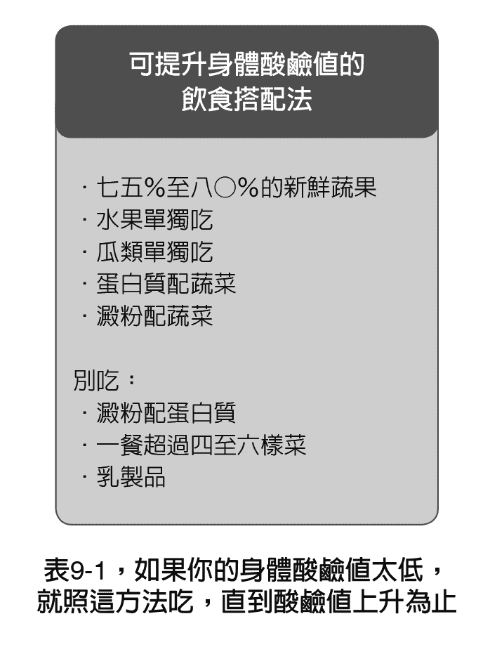

只要你的酸硷值测出来偏低，就应该大幅减少动物性蛋白质的摄取量，直到酸硷值升高，症状减缓为止。

饮食时间也会影响到身体消化不同食物的程度。中午前，身体要消化蔬菜水果最容易。若你想要碱化饮食，中午前要少吃点油腻的蛋白质。最丰盛的一餐适合当午餐，从中午到傍晚六、七点消化能力最好，那时身体深入了消化模式，接下来身体就会进入吸收循环，一天之内吃进去的营养都会在这时候吸收到细胞结构中，帮助身体。这会持续到凌晨三点。在这段时间里，你的系统会开始消除一天内所产生的毒素，丢弃不需要的消化副产品（也就是你不必储存的东西），在你上午醒来之后，这个循环会持续到中午。最理想的状态下，晚上七、八点以后就不要进食了。

太早醒来，通常有两个原因：一是你可能摄取了太多有毒食物或会让身体变酸的食物，所以系统在消化的循环中承受了不少压力，已经过载了；第二个原因，东方传统医学认为和意识的发展有关，你在消化的循环中可能比较能接收高频能量，所以你的意识会在睡眠中升高到潜意识和细胞层。因此，若想要更进步，通常会建议断食。我带领过许多人进行排毒与净化疗程，协助他们减重、提升能量振动，以及治疗气喘、过敏、慢性头痛、背痛、结肠炎、胃溃疡、食物过敏、荨麻疹、睡眠不足、暴躁易怒、食物成瘾等问题。改善体内化学环境以后，你的系统可能会「想要」你醒来，这样意识才能接通新的「振动频道」，建立新的神经回路。

所以，如果你夜里醒来也不要难过，别担心自己到了早上可能没有获得足够的休息。其实，你只要温柔地进行中枢通道呼吸法，扫描身上有没有能量特别高涨的部分，利用这个机会提升振动频率。接下来在醒着时，追踪、记录你的酸硷值（表 9-2）。如果在理想的范围内，那么你就是在提升频率；如果没有，就采取必要的改变，让身体的酸硷值落在理想的范围内，这样你就可以调整到新的振动频率，让有灵魂的自己上线。

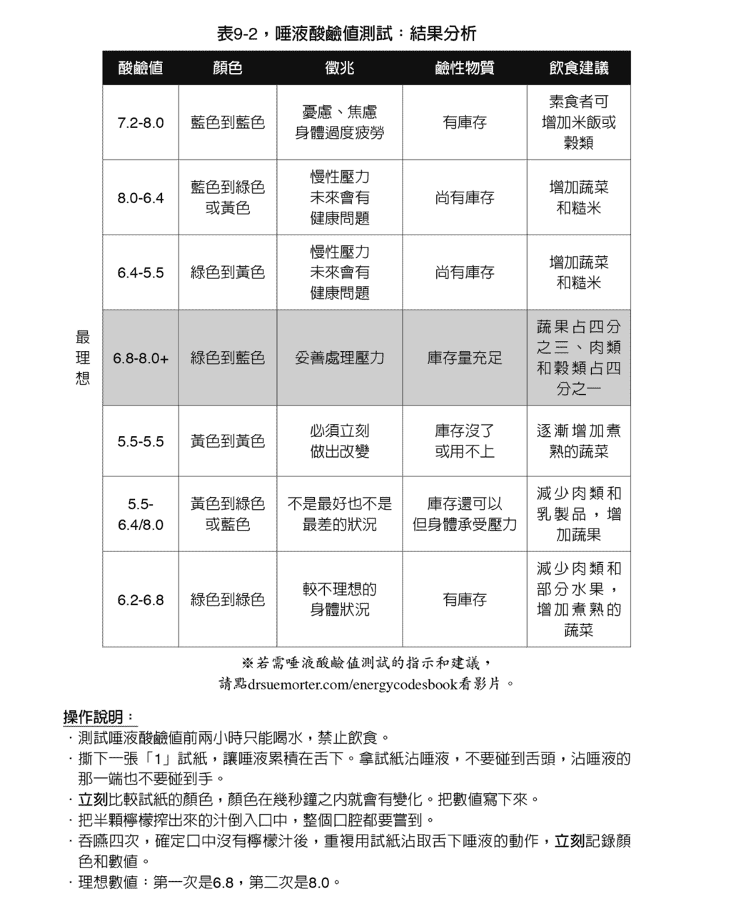

能量七密码宽限值

如果你在进行这个营养计划之后，很想吃一些会让身体变酸的食物，不要误以为你意志力薄弱，其实嘴馋有更深层的原因。之前提过我们在进化过程中都会经历「拓展再锚定、拓展再锚定」的循环，当我们开始整合能量，调整体内的化学汤，能量场可能会拓展——这表示我们的能量场有一部分可能跳到了更高的振动频率，意识也相对扩张了。忽然间，我们可能没办法认出自己，因为我们的思维频率比平常更高。我们的心智敞开了，而我们在更深的细胞与振动层上反而不熟悉自己了。

这时候，潜意识会开始想办法让我们连结上熟悉的频率，感觉更踏实一点。结果我们就会想念「慰藉型食物」，以降低振动频率，身心就会更自在。这些「锚定灵魂的食物」通常是比较有分量的食物，象是肉品或乳制品、脂肪含量高的食物（如冰淇淋和油炸品），以及刺激性高的食物（象是糖和淀粉）。这些食物不但能量比较沉重，也会让身体变酸，而酸性会让能量的振动频率降低（尽管糖会让我们亢奋，好像有扩张的效果，但只是暂时的。吃糖的长期副作用是细胞活动增加，导致酸性，产生酸灰，让振动频率下降）。

以上的解释只想让你知道会有这些口腹之欲很正常。如果你允许自己在特定时刻满足口腹之欲，不但能断了嘴馋的念头，还能让能量锚定，整合能量场拓展以后的新能量。所以，有意识地宠自己其实可以协助你在整合能量的过程中往前进。不过，你应该有注意到我说的是「有意识」！如果我们无意识地宠溺自己，往往会发生两件事：脱轨或退步。如果我们没有自觉地享受口腹之欲，可能会觉得自己「半途而废」而责备自己。我们会怪自己太软弱、缺乏意志力和纪律、不够自爱，这种自我批评会把我们丢回防御性格，浪费更多时间和精力，让我们失去动能和速度。如果我们能换个方式，更意识到怎么解释身体的经历，就不会自责，这才是往前进的关键。

无意识地沉迷于口腹之欲太久，也会让我们退步。我们可能会在情绪上投降，以为自己永远都没办法吃正确的饮食、好好照顾自己。因此，你要有警觉心，知道自己可以宽限多久。身体有三日、七日和二十一日的循环，如果你连续三天以上都很想破戒，那就要提醒自己第七天就是最后一天，这七天之内都要用能量七密码来安定能量。你不会想要进入二十一日的循环，这很重要，因为很多研究都证实了二十一天就能养成固定习惯，如果你花了二十一天建立酸性饮食的习惯，要戒除就更难了。

理想中，当你觉得需要食物的慰藉时，就放肆一下——但只能一下下，在你能控制的范围内。你只要更深入练习呼吸，还有我们推荐的瑜伽动作与能量七密码的其他练习，就会感觉更踏实。平衡之后，会让你习惯从真正能持续带来慰藉的境地获得安慰：有灵魂的自己。长期来说，外在所提供的慰藉（不管是食物或其他种安慰）都只有暂时的效果，无法持续。

☼第二项练习：有意识的运动

要建立正向人体化学并创造合适环境，让有灵魂的自己安居，还有另一个方法，就是透过刻意而有意识的身体运动。

通常大家在做运动时，并没有完全将意念集中于体内。很多人在跑步机或重训时会听音乐或看电视，结果就分心了。他们把心思放在其他地方，这样身体才能用力更久。他们说：「这样可以让我撑完一堂。」

如果你在运动时进行中枢通道呼吸法，其实只需要更少的时间就能获得一样或更好的效果。我训练过专业运动员、三铁选手和越野赛跑冠军，协助他们打破自己的纪录，靠的就是在健身时进行中枢通道呼吸法。当你运动或健身时，将意识和意念集中于让呼吸沿着中枢通道上下，你可以走得更远、更快，完全不会累。这是因为你把觉知带往有灵魂的自己，反而能获得更多能量。我称这种刻意的练习为：有意识的运动。

当你同时刻意移动身体与呼吸，就会开始建立神经回路，连结身（动作）、心（注意力）、灵（呼吸）。数千年前古代的东方大师就教我们要用这种方式结合身心灵了，这可以真正在很短的时间内就改变体内化学。

若你在做动作时都能保持觉知，瑜伽就是最棒的意识运动，身体觉醒瑜伽结合了中枢通道呼吸法里的意识元素和传统瑜伽动作里的心智专注。如果你不喜欢瑜伽，还有很多种意识运动可以为有灵魂的自己建立神经回路。其他常见的运动如健美体操、慢跑、举重都可以融入中枢通道呼吸法，我上课时会仔细教授，而你可以到[drsuemorter.com/energycodesbook](https://drsuemorter.com/energycodesbook/)看意识运动的示范影片。

图 9-3 的常见运动，画出了你吸气或吐气时能量如何沿着中枢通道流动。

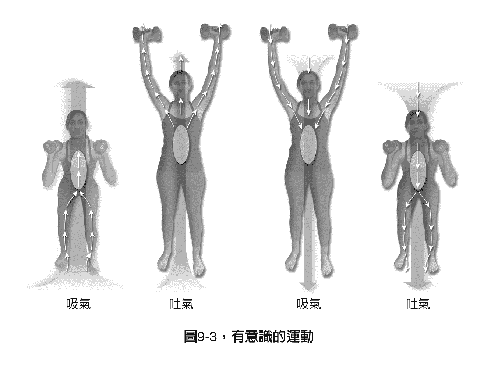

◆ 步骤：

1. 举重时，从地底把气吸上来，经过根锁，把气吸入核心。

2. 放掉重量时，沿着中枢通道从头顶吐气。

3. 再反过来，从头顶吸气。

4. 重复数回，每次运动都要沿着中枢通道呼吸。

我已教导数百名患者和学员如何在运动时让能量流贯全身，成效卓著。你每天的运动时间不但会变得更愉快（因为你真的能在身体里马上感受到自己更强壮、心情更振奋），而且还能随时保持能量充沛。当然，把意识运动加入能量七密码的练习中，就能加速人生的转变。

☼第三项练习：透过思维调整体内化学

这项练习要运用你的思维来刻意碱化身体。你要集中精神想些正念、高频的念头，当脑中出现低频的思绪时，就能立刻察觉并加以调整，避免造成酸性体质。这项练习可以加强其他练习的结果，创造出健康的体内化学环境，对细胞和能量都更好，让有灵魂的自己觉得你的身体更像家。

◆ 步骤：

1. 先从中枢通道呼吸法开始，把能量拴在锚点上。

2. 集中精神想着人生中的胜利时刻——当时你克服了重大挑战，感觉胜利在握。仔细回想，注意体内的能量如何流动。或许是觉得头顶亮了起来、双肩轻盈或心口澎湃。温柔地从内揉捏、按压那个区域，把注意力更集中地带过去。

3. 维持那个动作，温柔地沿着中枢通道上下呼吸，直到全身都有那股振动的感受——也就是说，直到你的心、头、喉咙（或任何有感受的部位）察觉到的胜利感也能在腹部、臀部、双腿等部位感受到。你要让全身都打开，充满同样的感受。

这是个反射性静心式呼吸练习。你会创造出一个开放的状态，这样整个系统都可以呼应同样的振动频率，因为振动会影响体内化学。你要让整个身体都感受胜利的振动，你要体现这股胜利。

你可以用这项练习搭配更高的振动频率，象是灵感、喜悦、爱。用这种方式调频，收听不同的正向「频道」，体现不同的频率，就可以开始透过思绪影响体内化学。

请注意这和「正面思考」不一样，正面思考没办法疗愈你。正面思考（就算意识和潜意识之间的活门开着）也只是不让你进行负面思考，这会干扰你身体的自愈机制（如果活门关上了，我们的思绪就很难影响健康和幸福）。尽管你在这个练习中会集中精神感受正向思维，但这不同于单靠大脑进行正面思考、鼓励自己或做梦。你是大范围地把正向情绪的振动带到全身——这么一来，所有组织的振动频率都会提高；把那个身体部位的灵魂唤醒，再将灵魂锚定于可以对你产生更多影响力的位置。

你也可以运用这个练习把「怎么做」和「好」结合在一起——让梦想的可能性结合你已经拥有这个梦想的感受。我们通常会觉得目标或梦想很远大，想要达成那个目标，但同时又心想：「我凭什么认为自己能得到？」「我怎么可能办到？」但如果我们不相信一件事（如果我们不把自己的名字写上去，这就表示我们没有把自己的名牌贴上去），就代表我们的能量里没有那样东西，这东西的能量就没有活在我们的能量场内。那么，我们现在已经明白了，如果这个想法不在我们的核心和能量场里，就不会成真，或者成真了也无法持久。当我们有足够的信念，愿望就能实现并且长久，这要靠我们的感受，我们在细微能量和具象的身体里都要能感觉到自己就是那个目标。为了达成这一步，我们必须体现梦想的振动，调整能量流，创造想要的结果。这个练习可以帮助你。

结合「怎么做」和「好」的练习

◆ 步骤：

1. 坐下来想象「好！」，就这个字，想象整个宇宙对你说「好！」，想象世间一切只有「好！」。感觉就像你在最能接纳未来和最能成就梦想的状态——能量大幅扩张，你感觉到自己很完整、很圆满。

2. 继续坐着感受最奇妙的「好！」，注意能量在体内的感受和能量流动的方式。有没有哪个身体部位把你的能量往特定方向拉？或许能量朝四面八方扩张，或是身体某个地方感觉很轻盈。

3. 现在想一个目标。既然还是目标，那就是个还没实现的愿望，我认为当你想着这个目标时，能量会有点变化。这可能表示这个目标会带来潜意识的扰动，让你无法达成——或许是因为你打从心里觉得难，或是觉得没资格拥有这么美好的未来，不管是哪种念头，你身体的感受和干脆的「好！」不一样。

4. 注意身体的能量模式，把能量锚定在觉知中，注意哪个身体部位有高涨的能量，或是哪里的能量特别突出。

5. 回到「好！」的模式，然后慢慢在两种模式中切换，让这两种模式逐渐在觉知中连结。很快地，两者就会连在一起，开辟出一条能让光子流过的新路径，这样一来，你的目标和「好！」就会出现在同一个能量模式里。身体会逐渐适应这个混和模式，愈来愈熟悉。

如果你有个梦想，又不知道该怎么实现，因而犹豫不前，这个练习能帮助你开辟出能量的通道，让宇宙为你说：「好！」

你要知道，你的梦想属于你，那就是你的一部分，否则你就会有不同的梦想。当这些梦想能让你的人生至善至美，这些梦想就「注定会实现」。不管你的意图、愿望、梦想是什么，记得一切进展都会先从体内开始！

☼第四项练习：脑部瑜伽（时钟呼吸法）

瑜伽就是要同时移动不同的身体部位，将注意力集中在这些地方，并且有意识地呼吸。奇妙的是，同样的动作也能活化脑部细胞，我称之为「脑部瑜伽」。

上脑中心和婆罗门之窟所送出的讯息对体内化学平衡很重要，因此我们要启动并活化这个区域的组织，让这两个区域能更有效沟通。我们要让这两个区域「做运动」——移动一下，同时呼吸。这可以唤醒脑部，让我们更明白我们就是有灵魂的自己。

这个运动的基本原则就是：动眼的时候头不动。

◆ 步骤：

1. 鼻子朝前方，下巴与地板平行，眼睛尽量往上转，好像要看着天花板。你会立刻感觉到双眼后方在出力。

2. 接下来，揉捏、按压其他锚点（根锁、心口、喉咙），同时眼睛一直朝上转（整个运动过程中锚点都要用力）。

3. 深呼吸把气从地下带上来，沿着中枢通道进入核心。呼吸时放轻松，感觉很舒服，然后从核心沿着中枢通道吐气，让呼吸进入双眼后方用力的位置，从头顶呼气出去。

4. 现在想象墙上有个大钟。你的眼睛往上看，那就是十二点的方向。现在双眼转到一点钟的方向，看着一点钟，从头顶上方深吸一口气，往下进入双眼后方用力的位置，再沿着中枢通道往下进入核心。从核心吐气，经过根锁，吐气入地。

5. 接下来让双眼转到两点钟的位置。从地底吸气沿着中枢通道进入核心，再从核心沿着中枢通道往上吐气，感觉到双眼后方的新张力，把气吐完，想象从头顶呼出去。

6. 接下来双眼转到三点钟的位置，重复上述步骤，从头顶吸气进入身体，锚点用力，经过身体之后从下方吐气。

7. 重复这些动作，直到顺时钟走完一圈。

8. 完成一圈之后，进行鼻孔交替呼吸法（梵文称为「纯净通道呼吸法」）。食指按着第三眼，用中指和拇指轮流按着两边的鼻孔。右边鼻孔打开时吸气，然后按住右边的鼻孔，放开左边，吐气；接着从左边吸气，按着，从右边吐气。结束时从右边鼻孔吐气。整个循环重复六次。

整套脑部瑜伽最好做四回——张开眼睛做一次顺时钟、一次逆时钟，再闭上眼睛做一次顺时钟、一次逆时钟。尽管你可能不会每次都做完整的四回，我还是建议你只要一开始这个练习，就要完成一圈，不要做到一半停下来。若能顺向、逆向各做一圈，就能达成体内平衡。

这个练习结束后，你要看着正前方，你的头脑中心会立刻有不太一样的感觉。你会有更强大的自我感或主体感——灵魂在体内建立了存在感往外看世界。脑部瑜伽也会启动我们想要活化的脑部重点区域，也就是第三脑室、称为婆罗门之窟里外周围的区域，可以增加循环与电磁能量流，建立理想的环境，做出健康平衡的体内化学汤。就像弹钢琴可以让手指感觉更敏锐、动作更灵巧，这个练习也会让脑部的重点区域更灵敏、更灵巧。

人体化学密码对应的脉轮：第三眼（眉心轮）

人体化学密码对应第六脉轮，也就是额头中央、眉心上方。第六脉轮拥有高等智慧直觉、洞察力和灵感，这个能量中心通常称为「第三眼」。梵文称第三眼为「指挥所」。第六脉轮连结到松果体和脑下垂体也不是巧合，本章已经说明过了，松果体和脑下垂体就在婆罗门之窟里，负责管理体内化学、唤醒意识。本章提供的营养建议和身心练习对于启动这两个腺体很重要，也有助于稳定第三眼，提升身体的能量振动，让我们更健康、更有生气、更有力量。我们在这里结合天堂（松果体）和凡间（脑下垂体）的能量，透过整合能量发展第六感，这就是我们在人生历程中要完成的任务。

第六脉轮能量受阻的人通常无法「看清」自己体内和周遭发生的事。他们可能会忽略身体的信号，误解了哪里的能量或体内化学需要调整；可能会受低频思想或感情模式蒙蔽，持续在体内制造压力；也可能很难信任内在认知（这些讯息来自下丘脑，就是要说明身体和能量场里发生了什么事）。他们可能有头痛、眼睛问题或晕眩等状况，也可能受忧郁症或成瘾行为所苦，因为体内化学失衡，又没有足够的能力调节酸硷。

【表 9-4】整理了第六脉轮的特色。同样地，请注意第六脉轮的能量会如何对应到身体部位。

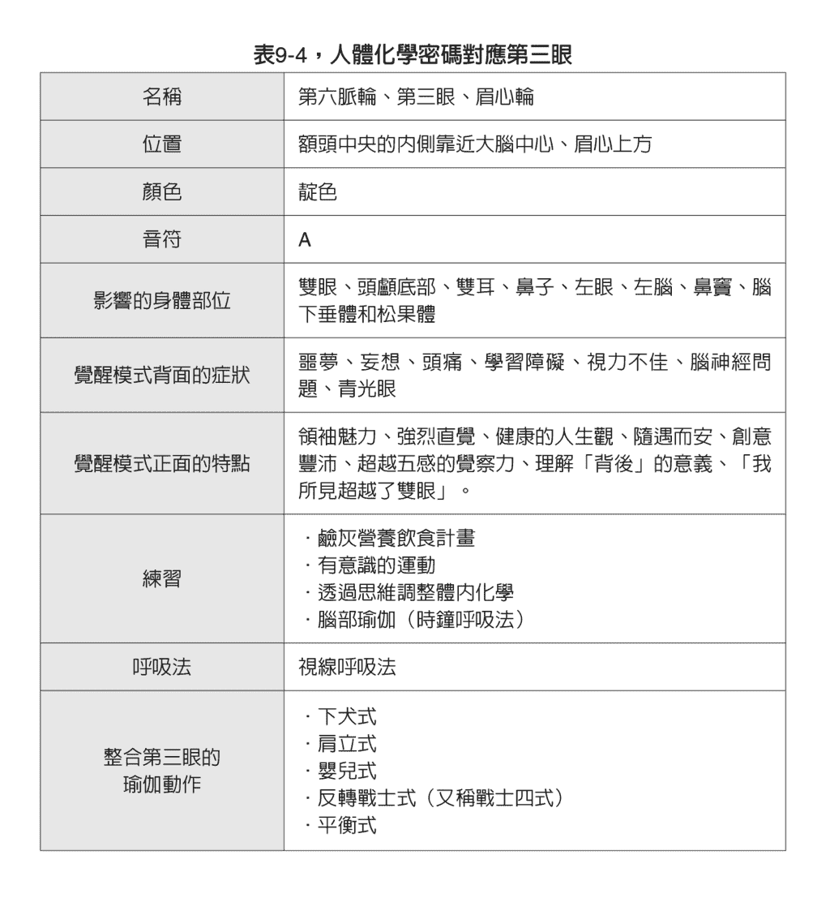

人体化学密码的瑜伽动作

除了本章的练习，下列瑜伽动作也可以整合和平衡这个能量中心。

下犬式（adho mukha śvānāsana / Downward Dog）可能是最典型的瑜伽动作。通常这是瑜伽新手学到的第一个动作，在各种练习中都很普遍，小孩也经常在游戏过程中自然做出这动作。下犬式直接把灵魂整合到我们凡间的人生里，对第三眼帮助很大，因为这个动作可以把能量、注意力和血流导向大脑。

☼下犬式

◆ 步骤：

1. 双手双膝贴在瑜伽垫上。双手打开与肩同宽，食指和中指朝向正前方。整个手掌要稳稳贴在垫上，这样才能感觉到手掌和五指都完整接触到地面。

2. 双腿分开与臀部同宽，脚趾头往下，慢慢抬高臀部向后。双腿尽量深植，这样身体会呈三角形。感觉到脚掌和脚趾稳稳踩在瑜伽垫上（如果你的脚跟碰到了地板，那就踩稳，双脚的外缘也要踩稳），脚趾要朝向瑜伽垫前方，或微微朝内。

3. 手臂深植，让肩胛骨往两侧滑开，离开双耳，让肩膀上方更开阔。手肘内侧轻轻转向天花板，这样两只手都能紧贴瑜伽垫。

4. 下巴微微向内缩，上背不要拱起，要维持颈椎和脊椎呈一直线。看肚脐。

5. 维持至少六十秒（或尽量愈久愈好）。

6. 结束时，眼神先看向双手。膝盖微弯，把背缓缓降到地面。

现在，把身体觉醒瑜伽练习结合下犬式：

1. 维持下犬式的动作，想象双脚锚定于地底的能量库，就在瑜伽垫下六十公分处。脚掌的四个角落都要踩稳，汲取那股能量（你可以稍微抬起脚趾，让脚拇趾掌丘更稳固地踩在瑜伽垫上，再放下脚趾）。

2. 启动双腿，如果腿伸直了，将膝盖骨和大腿肌肉往上提，股骨的上缘进入髋关节；如果膝盖弯起来，就拥抱骨头周围的所有腿部肌肉。感觉一切都启动了。

3. 根锁用力。将呼吸从脚底沿着双腿往上带进核心，就像吐纳密码中的「一千根小吸管呼吸法」。吸气时让核心充满能量。双手稳稳按在瑜伽垫上，但不要让肩胛骨靠近耳朵。揉捏、按压心脏周围，用肌肉把肋骨两侧朝胸口中心包起来。感觉到这会让你的手更稳固地连结到地面。

4. 双眼坚定地往上转，感觉到眼球后方的张力，同时从头顶吐气——也要让呼吸穿过手臂，从手掌吐进地底。

5. 吸下一口气时，眼睛继续朝上转，从头顶上方六十公分处吸气，也要从双手下方六十公分处吸气。让呼吸穿过头部、大脑中央、喉咙、胸口，同时让呼吸从手掌往上到手臂、肩膀，进入心脏。让两股呼吸合并，往下进入腹部。揉捏心脏，感觉很舒服！

6. 接下来吐气时，根锁用力，从脊椎末端把气送到双腿、双脚，腿部要持续用力，双脚的四个角落都要用力踩地。

☼整合第三眼的其他瑜伽动作

你可以用这些动作配合下犬式，来增强人体化学密码的效果。请记住，从身体内部揉捏、按压你想要更加注意的身体部位很重要，可是放松也很重要。做这些动作时可加入吐纳密码的练习。

•肩立式（salamba sarvāṅgāsana / Shoulderstand

•婴儿式（bālāsana / Child's Pose）

•反转战士式（vīparita vīrabhadrāsana / Exalted Warrior，或称战士四式）

•平衡式（Balancing Poses）

关于你最真实的本质，你已经学到了很多，也知道如何释放或整合能量，体验真正的自己。你已经学会了如何处理思绪、情绪，甚至食物，让有灵魂的自己扩张并顺利表达。

下一章［灵魂密码］是能量七密码的最后一道密码，你会看到连结上核心自我本质后是什么样子，并了解如何在维持完整连结的状态下生活。

第十章
灵魂密码：能量合一之所在

许多年前，当时我已开始发展能量七密码的练习好一阵子，也观察到自己和学员身上不管是生理、心理或情绪都有惊人的效果，我感觉到自己必须更深入每日练习瑜伽。让我高兴的是，我发现瑜伽确实能让我更快启动神经回路，整合并诠释体内化学与能量场的信息，更能理解并进入有灵魂的自己。

当我在做瑜伽动作，感觉到身体有个地方特别紧绷时，我会从体内去揉捏、按压那个区域，接触那个部位的组织。接下来，我会用气「突破」那个部位。虽然瑜伽老师教我要把气「带进」紧绷的地方，可是我发现用气「穿过」那个部位的效果很不同，只有这么做才可以建立互连的沟通回路。当我用气穿过紧绷的部位时，我发现那股张力会瞬间释放，我可以带着更多力量、韧性和轻松的感觉完成瑜伽动作。我的身体感觉更轻盈，同时变得更强壮。

有天我起了个大早，开车半小时到常去的瑜伽教室。我本来想要上某个老师的课，因为他的教学方式我非常喜欢，但当我抵达教室时，发现那位老师不在，会有代课老师。我很失望！虽然我不断练习并教授能量七密码，但我还是被自己的期望、预期和预设立场给绑架了——我发现事情不如计划时不免很失落。

代课老师的课我以前上过，但不是很喜欢。倒不是他教得不好，只是步调对我来说太慢了。刚开始上课那几分钟，我发现自己很气馁，一直想着：「这不是我今天想上的课！」然后，上了十分钟左右，我对自己说：「苏，这太扯了！现在是上午六点。妳五点就起床了，开了半小时的车来到这里。妳可以选择接下来的一小时都这样提不起劲，也可以随遇而安。妳要记得人生中不管碰到什么，都是来支持妳的。」有了这个念头之后，我就能顺着老师较缓的步调来上课了。

当我让呼吸慢下来，去配合老师的节奏，让灵魂进入核心时，我发现老师带领的动作对我来说有种新的涵义，让我获益良多。我们重复连续三个不同的瑜伽动作，让我的思绪放下所有杂念进入当下，我完全感受自己在这间教室里、在这副身体里。我听着老师的指导，但同时我的频率也接上了更深刻、更核心、更内在的自己。

忽然间，我察觉到有个模糊的白色物质在我体内漂浮。当我闭上眼睛，可以「看到」这股能量组合成我在做的动作；然后，当我慢慢进展到下一个姿势，这团白雾也会刻意跟着移动——当我够沉静，这团白雾就会让我看到这个动作的细节。我不但从来没有体验过，也从未听过任何老师如此深入地讲解。这股强大的存在会透露智慧，带领我的系统进入下一个动作。我从细胞层感觉到这就是瑜伽的起源，我们身体内部就是「知道」该怎么动。瑜伽就是接受灵魂本质的引导，透过意念让身体进入不同的姿势，只要我们能取用这古老的智慧，就能轻易地发现这种状态。

我目睹了灵性的自己，只想停下动作，感受这股存在——可是我知道我之所以能觉察到这股能量，就是因为我的注意力、意念、随遇而安的自在、呼吸和身体动作都完美地结合在一起，我想要继续下去！我察觉到自己慢了下来，没有跟上老师的指示，因为我不想要分心。好笑的是，我一开始嫌老师的步调太慢，但现在又觉得他教得太快了。

这个情境正说明了我们必须要拥抱生活的节奏与速度，不管发生什么，都要信任、配合宇宙。这样一来，我们就能主动运用脉轮和婆罗门之窟里的重要脑部细胞，以及上脑中心，这会让我们成为人生的创造者，真正顺势而为，接受灵性的振动。当外在生活不断展开，我们能信任宇宙顺势而为的时候，就会从内感觉到灵魂的存在；当我们学会呼吸、学会活在当下，学会同时重视内在世界与外在世界，就能轻松活出有灵魂的自己。

后来当我回想起那堂瑜伽课，我发现身、心、呼吸与动作协调了之后，我就能体验细微又全面的自己，过去我只能在完全静坐时才能进入这个状态。我要启动许多神经回路，让我能察觉到自己的细微能量频率——这个振动频率自动开启了打造新回路的程序，不需要我用意识去指挥。以前若是听到瑜伽老师的指示或看到教室里其他人的动作，我的注意力就会消散一点，就没办法完整收听另一个「频道」的细微真相。但让我兴奋的是，如果我能做到这种程度的整合，我就能教其他人做到。

有了这个经历之后，我开始教学员怎么在做动作时召唤那团白雾，进入更深层的自己。很快地，他们不管是不是在做瑜伽，都能有这种深刻的体会。你只要训练大脑去察觉我们都是有形的灵体，就能看得到自己的真实本质。

什么是灵魂密码？

我有时候会碰到一些人说：「我不是很灵性的人。」这根本不可能，因为我们都是灵魂。灵魂就是能量，体内的灵魂就是呼吸。真正的灵性不是宗教，也不是神话，真正的灵性要具体得多了。有灵魂的自己就是我们每天、每一分钟都要把身体、思绪和能量整合为一股力量。

当我们投入合一的状态、做出各种行动时，「灵性」就成了我们体验、表达和生活的方式。灵性和我们密不可分。当我们让直觉来引导思绪，就是在过灵性的生活；当我们明白自己并非接受灵性能量的引导，其实我们就是那股灵性能量（灵魂就是真实的我们，不是我们发现了灵魂或利用了灵魂），那我们就是有灵魂的人。

灵魂密码将这份真相安定在我们心里，让我们获得工具去连结核心深层的智慧，让这股智慧可以随时出现在身体系统里。在这一章，我们不再察觉和管理能量，而要集中思绪，不再把能量当作身外之物。就像两个朝夕相处的人，不必开口就知道对方在想什么，他们的默契就来自意识合一。

这就是我们的终极目标：让思绪和灵魂持续又紧密地合作，最后合一，那就是量子翻转。届时有灵魂的自己会进入防御性格里，身体和思绪会成为灵魂的仆人，让灵魂透过身体和思绪在凡间表达意见。整合灵魂之后，我们就能获得强大的力量和爱去展开人生。我们不会想着成就、不会想要控制或讨好别人，我们会知道自己现在就很好，人生不但很安全，还会一直带来美好的发展。事实上，根本不必想太多，人生就是要让我们去活、去体验的。在这种放松状态下，不管发生什么，我们都能活在当下；不但如此，我们还能开创新局，而不是一直想办法回应。我们能在不犹豫、不迟疑的情况下就展开人生体验，而这些体验会让我们更清楚自己的真实本质和此行的目的。

当我们靠防御性格过活时，五感都专注于外，偶尔还是会有直觉；可是当我们把注意力收回到内心世界，会察觉到更深刻的真相一直在给我们提示。真相从第二脉轮沿着中枢通道而上，随时供我们参考，只不过我们的大脑过于分心，一直想着人生「应该」是什么样貌，无法专心去察觉真相。

当我们的大脑能接纳灵魂的真相，全然地信任，就能更快察觉到体内不断上涌的进化脉冲，并加以诠释。很快地，你的一言一行、一意一念都是来自这深沉的认知。我们原本要回应人生的起伏，这时会和生命协作，一起开创和实现新的可能。这就是能量七密码的目标：建立更多神经回路，察觉到这些波动和脉冲，直到我们能自然又直觉地体会这些波动，变得比外在世界的讯息更「大声」。只要有意识地根据大脑接受到的灵魂讯息决定自己要做什么或不做什么，就能更强化灵魂的力量。靠我们与生俱来的智慧和真相来生活，就是活出有灵魂的自己。

这三十年来我不断旅行和教学，和上万人谈过话，从没听过任何人说顺从直觉之后很后悔，倒是听过几百次有人发觉直觉出现了却没理会，之后说：「啊，我好后悔！」我们真应该统计一下！

我们都碰过不知所措的时刻，如果能把注意力导向核心，就能察觉一股波动冒出来，导引我们走向最崇高的道路。但因为我们没受过训练，不知道怎么引导注意力，所以接收不到直觉。结果呢，我们可能会根据防御性格狭隘的思维、情绪或感官信息来做决定。最后的选择往往不一样，只是防御性格的选择通常不是内在认知要我们做出的选择。灵魂密码会教我们充分整合身心灵，得到明确又肯定的方向，不费力就轻松从内心获得指引，因为内心才是我们的依归。

有时就算你已经整合了身心、呼吸和能量，但当你需要直觉的时候……就是什么讯号都没有！你察觉不到任何波动或脉冲，就是觉得内心很空洞、黑暗，象是一片空白。这其实是有原因的，所以你不要又开始觉得自己不够好、不够格或有所欠缺，放弃了追随真相的能力。那个原因就是：你进入了创造力的空窗期。

☼创造力的空窗期

很多人以为人生是一条直线，但其实，人生的进展是弧线——形成一圈又一圈的圆、层层叠叠，就象是一个向上的螺旋。每走完一个圆，你就完成了一次循环，来到了那趟旅程的制高点，更接近圆满的人生。这就是我们进化的过程，我称之为「人生的循环」；或放大一点来看，就是「进化的循环」。一个循环结束后，就会往上到下一轮的进化体验。

每个循环可以分成三阶段（图 10-1）。在第一阶段里，我们会「创造」。我们会有新的波动或脉冲、新的灵感，会主动去实现。在这个阶段，我们会为世界带来一点新意——新公司、新感情、孩子、作品或音乐创作。接下来是「持续」的阶段，你的项目会完成它的使命，让我们从中获益。我们在这个阶段会持续贡献，感觉充满活力，甚至可能会体验到成功和丰盛。接下来，当这个项目达成之后，我们就会有成就感或满足感，然后觉得自己必须要往前进。如果我们不眷恋在持续阶段所得到的体验，就能够轻易通过最后一个「摧毁」阶段。在这个阶段，项目会告终，我们必须要放手才能开始新循环。

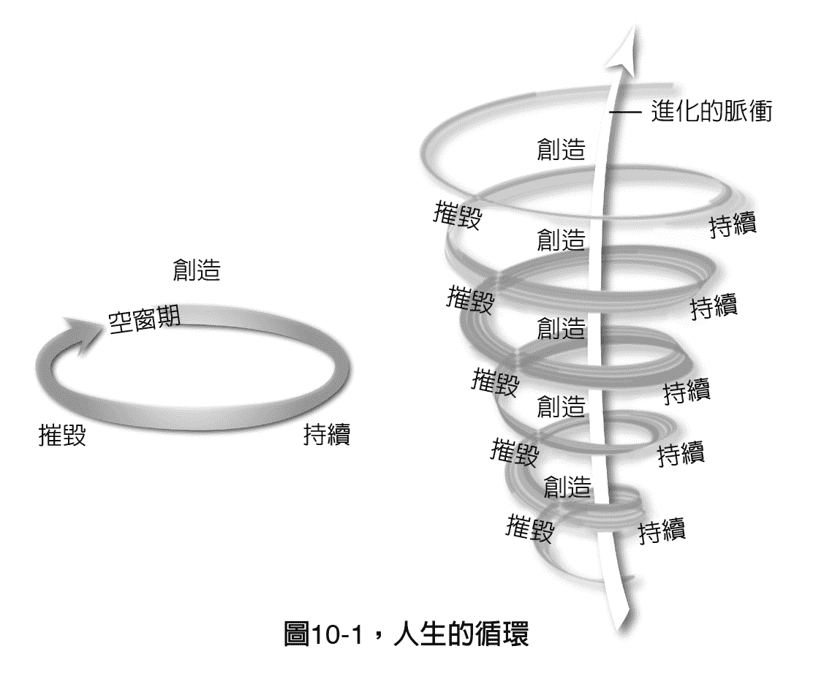

不意外，摧毁阶段往往是最难面对的。如果我们不知道人生是这样的循环，只要绕过这个弯，新的起点就在前方（如果我们只看得到眼前，看不到远方），那就很难放手——尤其是在我们经历人生却不理解深藏的真相时，我们不知道现在面对的难题和困境会如何帮助自己进化和扩张。

在感情里最能清楚看到大家不愿意放手。你有多少次在一段恋情、友谊或职场人际关系里待得太久？你有多少次不愿意分开，但其实你知道分开才能让你的人生更好？当我们打造了一样东西，都希望它能够长长久久。尽管爱能永远存在，但具象有形世界里的我们只有在完成循环时才能感觉到永续的爱。

每个人都要沿着这些循环而上，没办法跳过令人难受的阶段。不过，我们可以选择要用防御性格或是有灵魂的自己来走过这些路程。当然，我们的目标是要唤醒神经回路，就能以有灵魂的自己来经历人生，并且顺势而为，让人生经验更加圆满。然后我们就可以说：「我来了，我放下一切执着，该来的就是会来。」如果我们有所保留，不愿意顺势而为，就更难放下、前进，也就没办法感受到下一个充满创造力的波动。

当我们知道自己正随着循环进化，我们的创意本质不断地重生，就更容易看出顺势其实很安全，要让每个进化的波动浮现，并且去感受这些波动。

就算我们在每个阶段都能完全拥抱生命，知道一个循环的结束并不是终点，还是会遇到「创造力的空窗期」。这个空窗期是一种暂停、静止的过程，是一个循环结束、另一个循环要开始之前的空间。在这个空间里，我们可能会往内寻求直觉或认知，想知道接下来会有什么发展，却没有得到任何提示。我们甚至可能会觉得不知道自己是谁。我们的能量飘散，可能在好几个心跳的时间里离开了循环，飘进了无限可能中。

这很正常。当我们碰到空窗期，那是因为我们抵达了旧的边界外缘、穿过了边界，进入了自己还没经过检验的那个部分。我们无从参考，就连有灵魂的自己也没见过，因此我们的直觉无法引导我们。我们要能够在空窗期、在未知的状态下也处之泰然，学会随遇而安，做好准备迎接下一轮的创造力。有些古老的东方传统表示一切都同时存在，「唵」的声音结合了所有振动，而梵文的「乐」指的是「内在最本质的声音」，则是一片寂静，那就是空窗期。当我们能在「无」的状态下处之泰然，就能完成量子翻转，完整呈现自我。

这是很重要的学习，因为矛盾的是，空窗期来自丰盛！在空窗期不可能找到任何讯息，因为我们什么都不缺。因此，我们的任务就是要在广阔的虚空中找到意义，换句话说，我们要在无限可能中创造欲望！

本章的练习和工具会帮助你不再执着于过去，更优雅地进入空窗期，前往人生下一个充满创造力的阶段。你愈能轻易地往前进，就愈能安定在有灵魂的自己里面，建立神经回路，表达真实的自己，恐惧、质疑和不确定都不会把你拉回防御性格。最终，灵魂密码就是要我们学会活在这个优雅的状态中，相信你的人生会在必要时开展，你可以马上看得出来人生的发展都是为了你好，都是要引导你继续成长。拥抱所有人生经验，不要委屈、怀恨、质疑或对抗自然的人生循环，你就能够成长，还能更快整合能量、实现更多愿望。

灵魂密码的策略会让过度活跃的大脑冷静下来，和有灵魂的自己接上频率，让有灵魂的自己真实存在，并察觉到持续送出的波动。这一章将带领我们越过目前能量医学的认知，我们会将能量视为一体、靠能量生活，并且开创出非常不同的实相。我们愈能够认知到自己和能量并没有分别（我们是由灵性能量组成，我们就是灵性能量），就愈能将能量视为一体，便能够更快不加思索采取行动，不质疑、不怀疑、不必获得他人同意才有足够的安全感进入新领域。当我们有意识地翻译灵魂的讯息，织入具象的生活中，就把天堂带到了人间。我们会真正成为创造者，住在人间天堂——因为在你的境界里，天堂人间已没有分别。

这就是灵魂密码要教我们的事，让我来介绍灵魂密码的练习吧。

灵魂密码的练习

☼第一项练习：找出属于你的静心风格

要让大脑知道它的工作就是服侍真实的你，它就要开始倾听真实的你在说什么。我们在寻找的「你」就是存在于深层、真实、真诚、有灵魂的自己——你知道你内心深处那个真正的你。要活出圆满的人生，你的大脑必须持续服侍这个你，永远听话。为了达成这个目标，你必须教育大脑：它的工作不是一直思考，它必须慢下来，获得足够的时间来做真正的工作，也就是观察真正的你发出了什么提示。你可以每天腾出一点时间，打断大脑过度思考的习惯。最后，你要记得：大脑就像小狗一样需要反覆训练，但能量场可以立刻改变。你的目标是要指导大脑和能量互相合作，才能有效率地创造出持久的变化。你不需要长期训练，但刚开始要规律练习。大脑就像天花板吊扇一样快速旋转，要让思考慢下来和灵魂协作，就得靠静心。

静心时，我们会把注意力从外在世界转往内，倾听有灵魂的自己。这很类似在之前的练习中所做的，不过现在我们不是要把能量场当作身外之物来观察，而是要集中精神训练大脑（它只是我们的工具），让大脑学会自动察觉和诠释真实的我们，就和我在瑜伽课的体悟一样。

要让思考中的大脑屏除思绪或慢下来并不容易，这相当反直觉，防御性格就是要大脑不断地思考。有些静心练习比较适合你，有些不太适合你——有些人靠视觉学习，必须要透过文字或图像才记得牢；有些人靠动觉学习，他们必须要亲自操作或演出来才能学会；有些人靠听觉学习，必须要听别人的指引或解释。

我根据三种主要学习方式，列出了不同的静心法，这些会用上你已经拥有的神经回路。最好每天规律练习二十分钟，就能训练大脑在必须倾听有灵魂的自己时静下来，建立更多神经回路，让你接受内在的指引。

如果你靠「视觉」学习

◆ 步骤：

1. 舒服地坐好，点一根蜡烛，设定闹钟在五分钟后响。

2. 做几回腹式呼吸，然后从身体内部揉捏、按压锚点：根锁、心口、喉咙、双眼。

3. 开始缓慢温柔地进行中枢通道呼吸法，整个静心过程都要用中枢通道呼吸。

4. 现在，只要看着烛火。你的目标就是整整五分钟都专心看着烛火。这表示思绪不免会跑进脑子里，但你要打断思绪。每当有个念头跑进来，你就说：「我等一下再来想那件事。现在——只有烛火——什么都别想。」你或许能多做几次深呼吸才会有下一个杂念！

透过静心来训练大脑处理更少的思绪，我们才能察觉内在传出的讯息，也才能有意识地选择把注意力投入外在的哪些事上，不被大脑的过度活动所控制。像「我不知道自己做得对不对」「我没办法静心」或「这太蠢了！」的思绪都很普遍——也很完美，因为这些念头让我们知道大脑在搞什么。所以当这些念头出现时，只要对自己说：「不，你现在不能这样。现在，只能看烛火。」给大脑一个视觉焦点，就能让它更轻松地进入自己的角色：服侍真正的、有灵魂的你！

如果你靠「动觉」学习

◆ 步骤：

1. 舒服地坐一会儿，慢慢地呼吸。不要勉强呼吸沿着中枢通道上下，只要顺着呼吸——注意呼吸如何自然地经过鼻子、往上进入鼻窦，再往下进入喉咙和下肺部。

2. 做几次深呼吸，然后温柔且缓慢地从身体内部揉捏、按压心脏，再揉捏、按压喉咙。继续温柔地顺着呼吸。注意揉捏、按压过的部位和呼吸有什么感觉，就好像你和它们在一起——都在身体里。例如，你可能会注意到鼻孔凉凉的或温温的，或是空气进入鼻窦时有一股明显的气流。吐气时，你可能会注意到喉咙的变化，或是肺脏怎么排气。有时呼吸往上行感受比较明显，有时是下行比较明显。尽量注意每一刻、每个动作的感觉。

3. 现在开始刻意延长呼吸，慢慢吸气到四拍、六拍或八拍，然后用同样的长度吐气。最终要能让呼吸慢到十拍、十二拍、十四拍或更长——不管你从哪里开始，重点是吸气和吐气的长度要一样，感觉呼吸流过全身。刚开始数拍子可以帮助你，甚至你必须数拍子才能持续规律练习。渐渐地，你不必数拍子，身体系统就能感受并察觉呼吸的韵律。

靠动觉学习的人指派大脑去追踪呼吸，就可以打断大脑「失控的思绪列车」，让大脑有机会搭载着核心的能量流，体会有灵魂的自己。

如果你靠「听觉」学习

◆ 步骤：

1. 安静地坐在不会被打扰的地方。

2. 闭上双眼，唱或唸出你选的梵咒——那是一个单字或单词，能带来特定的能量回响，要反覆唸诵或唱出来。静心时常用的梵咒包括「唵」（Oṁ，或写成「嗡」），那是宇宙的声音；「萨南」（Sat Nam），表示「我就是真相」或「真实」；「唵哪玛需玛雅」（Om Namah Shivaya）则表示「我和宇宙意识合一」。你也可以选择其他梵咒，象是「哈利路亚」「我就是我」或反覆唸着「我」。

3. 静静地或唸、或唱、或诵、或（最好）在心中默唸梵咒，至少持续五分钟。多练习之后，你就会感觉到思绪消退，梵咒的声音充斥于你的觉知。最后，唸咒的时间可以延长到二十分钟。如果思绪跑掉了，只要温柔地将根锁用力，把思绪拉回来再开始。

靠听觉学习的人会觉得反覆唸咒很有帮助，更容易静心。重复唸同样的字或词会有象是催眠的效果，帮助大脑冷静。你所发出的声音在体内回荡，可以感觉到自己就在体内，更能察觉到自己就是「幕后的力量」。这会给你新的观点，你就不需要那么依赖大脑了。就算是默唸或心想着梵咒，你也能启动对听觉学习者会有效的神经回路，脑子就会静下来。

当你能在静心时温柔地住进身体和心里、刻意放松所有肌肉，就能从这些练习中获得最多益处。

此外，任何能从身体发出元音的声音（象是啊、咿、欧、呜），都能让我们的能量中心上线，唤醒意识。如同表 3-3 所示，每个脉轮都有一个特定的音符，能用同样的频率振动。这就是为什么我们都喜欢音乐，也就是哼歌、口哨和唱歌会吸引我们的原因，因为我们感受到了振动的频率。古典音乐特别能把我们带到完整的「琴键启动」状态，我们会觉得很欣喜、青春、灵光乍现。这是因为古典音乐同时发出不同的振动频率，以不同的韵律启动我们的脉轮，让我们感到很满足。其他音调和振动的排列方式（如东方文化里的唱颂）也会启动能量中心，让我们冷静地体会当下，同时保持头脑清楚。基于这些不同的原因，透过梵咒和音乐来调节身体的振动，能够整合不同的能量中心与意识阶层。

我最常听到在学静心的人说：「我想要静心，可是脑子就是一直想事情，停不下来。」这很正常，这就是你需要静心的原因！拥抱这个体验，不要批评，你要让一直思考的大脑和有灵魂的自己建立更好的关系，渐渐爱上静心。

每周静心三、四次，静心练习就会让思绪停下来，你可以体验到在处理思绪的大脑之外，你还有你自己，这样你就能体验到我们在寻找的深层存在。我们必须要充满爱怜地让天花板吊扇的扇叶慢下来，才能进入叶片和叶片、思绪和思绪之间，看到那空间里有什么。

下一个练习结合了许多强效的元素，搭配在一起创造出动态静心，让我们能够进入有灵魂的自己。

☼第二项练习：运用中枢通道呼吸法在大自然中行走

当我们身处大自然，你比较放松，压力消失了，感觉很自在，更接近「真实的自己」，好像关于自己的错误认知都卸下了。你可能会觉得轻飘飘、乐陶陶的，或许还有更清楚透澈的思维。

自然的能量会缓和并活化我们，支持我们最具创造力的思考。这些能量会让我们的生理机能脱离防御性格的求生模式，让有灵魂的自己开启创造模式。当我们走在大自然里，那里的能量会让我们冷静、安定下来，让我们恢复生气，优美地展现自己。我们会感受到一股认知，不受错误的自我感受扭曲。大自然是地球上最强效的离子交换环境，在自然的振动回响中，我们能获得身体与能量的支持，完成量子翻转。

本章进行的多数练习都是坐着静心，让我们处理能量场并进行中枢通道呼吸法。但这项练习会让我们动起来，帮助我们在潜意识里建立神经回路，就能更清楚地看见真实的本质自我。光靠静心来接触优美、静态的有灵魂的自己还不够（尽管这是个美好的起点），最终，我们必须要透过行动让有灵魂的自我进入凡间。我们要活出有灵魂的自己，让自己在日常生活中动起来，改变在具象有形世界的所有体验，而不只是让真实的自己存在于静心的真空状态。

走进大自然就是最完美的能量七密码功课。大自然和有灵魂的自己拥有相同的振动频率。当我们花时间待在大自然里，就更能找到自己真正的频率，和谐地让灵魂安住在体内。中枢通道呼吸法可以提高能量场的觉知，创造新的神经回路来唤醒我们的本质自我，并整合原本散逸或迟滞的能量，我们就能意识到自己的完整、活得更圆满。当我们结合这两者，把自然和规律的步行运动加进去，强效的炼金术就会发生在我们的身体内、大脑里、呼吸中。

◆ 步骤：

1. 选一个自然环境（可以是树林、草原、海岸、溪边、山里，甚至是你家附近……），只要能接触到大自然都可以。

2. 把注意力带到被称作「第八脉轮」或「北极星」的能量中心，就在头顶上方约五十公分处。你可高举双臂过头，弹一下手指。记住那个位置，掌管我们人生目标的高频能量就在这个脉轮里。

3. 能量七密码的四个锚点都要用力，进行中枢通道呼吸法，这次在呼吸的过程加入北极星。一样，要感觉很轻松舒服。

4. 练习靠振动把大自然优美环境的感受和内在世界连结在一起，让内在的庇护所去学习外在庇护所，让两者更一致，这是个很棒的练习！我的一位老师「每天都要走进自然一小时」，这确实深刻地帮助我体现灵魂。

大自然的元素可对应到我们的系统和进化循环的阶段。例如，水对应情绪，和进化循环里的创造阶段有关。流水可以推动迟滞的情绪，并促进创意流。土地对应海底轮，和进化循环里的持续阶段有关，行走在树林间能让我们更稳定、更平衡。火的元素对应到心智思维和太阳轮，也就是进化循环里的摧毁阶段。火可以烧掉固有的旧思维，点亮心灵中受到阴影蒙蔽的范围。空气的元素（以风的形式出现在大自然里）则对应到创造力的空窗期，风会让能量扩张，协助击破沉重的能量，让新的循环出现。

这些能量结合在一起，会帮助我们整合能量。例如，原住民围着营火跳舞时，就是踏实地传承文化、分享回忆，同时烧掉沉重的能量与思维包袱，祈求更明晰的愿景。当我们迎风站在山上，可能会觉得时间暂停了——因为我们站在进化循环的空洞里——但仍然锚定于数百万年之久的山峦循环中。

当我们整合好，有了更多神经回路，就能更准确而全面地诠释体内进化的波动。我们的欲望来自内心的画面，我们的选择来自更高的境界，就存在于灵魂的使命中。我们的想法好像很创新、很有创意，那是因为这些想法来自完整圆满的能量。我们可以将这份完整圆满与整合应用于每日生活中，更充分地活出有灵魂的自己。

没错，这一切都始于简单的海滨漫步或森林健走。

☼第三项练习：专注当下，心无杂念

当大脑一直在想事情时，我们其实不在当下。我们在别的地方（过去或未来），或是心不在焉地重复习惯，不停地处理信息，将自己置身于特定的处境中，因为这是我们习惯或预期的状态。我们对预测很买单，会预设一件事要有什么发展，但有时生命根本还没展开。要改变这行为，我们一定要培养新的模式：心无杂念。

我的人生就是最好的例子。

从预测到当下

几年前，在我还没有活出有灵魂的自己之前，我张开眼的那瞬间，身体就已经感受到了一整天的张力——我要经营诊所、看病人、管理医师和员工、传授父亲的练习技巧……为了完成这一切，我必须跟上要命的节奏。我脚还没沾地，人就已经进入高绩效表现模式了。因为我在脑中创造出高绩效表现与极端忙碌的现象，所以我本人也呈现出那种极端的能量模式，每天的生活不得不用那种方式展开。

自动导航就象是这样。没有成长的空间，没有创意或随兴的空间，没有空间让有灵魂的自己（也就是真正的我）出现，我当然无从认识有灵魂的自己。如果你进入了自动导航，你永远都不可能拥有原本来凡间想要体验的生活。

要脱离自动导航模式，我们必须深入核心，完全进入当下，也就是此刻所在的位置。毕竟，当你活在当下，不存在任何问题。你可以用这股不同的能量创造优势。

现在，我每天都能好好醒来，展开这一天，不预设这天会发生什么事。如果我发觉我的心思开始想要理解、诠释、预测、分析或分类任何信息，就会进行中枢通道呼吸法。当我专注呼吸，把注意力完全集中于有灵魂的自己，感受那慈爱的存在，就能打开回路好好活着。

当我的学生为了即将发生的事情感到焦虑或慌乱时，我就会请他们深入核心问自己：「这一刻，现在，我好吗？我知道明天很恐怖，下礼拜可能很难熬，可是现在，我好吗？」意识思绪必须承认，的确，「这一刻，这个当下，我没事。」那下一刻呢？下下一刻呢？答案都一样。

当你让自己体验这些当下之后，你就会逐渐醒过来，从潜意识发现如果你来到了当下这一刻，你其实好端端的根本没事。只有当你超前进度，投射未来，没有立足于当下，你才会觉得焦虑或害怕。

◆ 步骤：

1. 当你早上醒来、还没下床前，做几次中枢通道扫描，注意身体的反应，有没有哪些部位已经启动了或更需要你的注意。

2. 揉捏、按压启动的部位或能量无法轻松流动的地方，缓慢而温柔地透过中枢通道把呼吸带到那个部位去整合能量。

3. 利用脉轮表（见表 3-3），看看这个身体部位影响了意识的什么方面，或对应到哪个能量系统。一天之内，有意识地给这个部位更多注意力，注意这带来哪些生活的提示，可能要你提升某个生活面向。

4. 当你把双脚放到地面上开始行走时，观察你能活在当下多久。当你离开床、看着镜子、刷牙、用浴室时，可以观察一下你的日常作息会不会让你脱离当下，让你开始想着未来或过去。只要享受你正在做的事就好，你愈是专注当下，就愈能快乐地活出有灵魂的自己。

刚开始，你可能会觉得自己必须慢动作前进才能活在当下。不过，当你建立了愈多神经回路，准备就愈充分，可以更快速地运用「当下」的能力过生活。这是个很重要的习惯，最适合练习的时间就是起床后，这时大脑还没有全面启动自动导航。刚睡醒时，意识和潜意识之间的沟通最顺畅，最能够开发新功能和新模式。一天之中有愈多时间进入专注当下、心无杂念的状态，就能够建立愈多回路，甚至在活动时也能维持内在深刻的沉静。

当你能够锚定、整合于当下，并且把需要的回路都带上线，就算你要想着未来，也能维持处于当下的生理机转。你可以在非常自在舒适的感受中朝未来迈进，你会知道，每一个当下你都很清楚要做什么，因为你就是不断地活在当下——没有条件、没有包袱、没有批评、没有拒绝、没有恐惧。

☼第四项练习： 整合两种能量模式，投入有灵魂的自己

在身体里或人生中，最快最直接的改变方式就是透过能量，因为能量移动的速度比什么都快——绝对比改变思考模式和信念更快！思绪的庞大力量可以主导光子，让「实相」在具体有形的世界里实现。在这个练习中，我们会同时处理思绪与能量，就更能体会和体现有灵魂的自己。

我们如何定义自己，会具体地影响我们所创造的人生。当我们用「我是」造句时，我们就创造了一个效果强大的指令，来排列我们的能量，而我们的具象世界便会以此为蓝图逐步实现。因此，一定要很注意「我是」后面的句子怎么完成。

现在，我要请你重新感受当你用「我是」造句时，体内有什么感觉。不管后面接的是什么，我们的体内都会有一股能量冲出来。防御性格所造的「我是」和有灵魂的自己所造的「我是」，将带来很不同的能量感受。

现在，我邀请你来认识透过有灵魂的自己发出主张时，体内能量流的模式（有灵魂的自己就是绝对不受波动的神性，存在于你的体内；而防御性格代表着观点、批评和狭隘信念所对照的世界。这个练习会让两种能量合而为一）。注意体内哪里有丰沛的能量？能量往哪里冲？在哪里整合？哪个部分特别明显？哪个部分好像退到了背景，在这过程中模糊了？

有个值得注意的模式是：身体外围的肌肉在我们进入核心时会放松——如果有只熊出现在屋子里，战或逃反应要用的肌肉会收缩；当我们把大脑的注意力带到中枢通道，运用核心深处的肌肉，从那里呼吸，这些外围肌肉便会自动放松。我们的身体和情绪都会更集中，能量就会和身体的中央管线一致。

当我逐渐转变为有灵魂的自己、内在的导引开始整合时，我发现双眼后方的肌肉有显著的变化。当我开始建立回路，由内而外运作，那里的肌肉会规律地放松，不再从外而内地回应。当我打开第三眼，我的顶轮开始连结到另一个世界，看到的能量和生命都是能量体。

你也可以在完全进入核心时注意双眼，肌肉会更容易放松，你可能会感觉到灵魂轻松不费力地在眼睛后面「坐下来」。当我注意到这一点，就开始将眼睛的焦点视为一道门，让我能有意识地进入有灵魂的自己。荷尔蒙密码里脑部瑜伽的时钟呼吸法，能帮助我们启动有灵魂的自己的能量。在瑜伽修行者的传统中，这个练习称为「凝视」（drishti），用来提升或主导某个姿势的能量，唤醒那个眼球动作对应的上脑中心——不过，你不需要随时做脑部瑜伽也能获得这个效果。

「整合两种能量模式，投入有灵魂的自己」练习，会帮助你整合防御性格与有灵魂的自己，最终协助你带着爱与强大的力量投入凡间的角色——成为绝对的、神性的你。

◆ 步骤：

1. 首先，要触发你的防御性格视角。先想着你不擅长但很希望自己会做的一件事，例如，你可能希望赚更多钱或有更好的身材。或许你也可以想想你今天要完成多少事，可是你认为你没有足够的时间。只要选一件事，让你感觉比较不自在、不能干或准备不足。你会感受到身体里的压力，因为这些想法为防御性格建立了存在感。

2. 想一阵子，留意自己产生了什么思绪和情绪。观察你专心想着这些情境时，你的身体里有什么变化。有没有觉得脖子紧紧的？有没有觉得一阵能量穿过心头？或是觉得双腿无力？花一分钟探索一下体内的能量怎么了，然后记下来。

3. 现在，要发展更伟大的自我，请深入身体核心，将注意力集中于脊椎周边、腹部和心窝。从那里呼吸，深沉地放松到外围的肌肉组织，同时对自己说：「我是。」当你这么专心时，能量会剧烈改变。

4. 注意自己出现了什么不一样的思绪和情绪，然后感受体内能量的变化。你有没有忽然觉得很踏实？或是心口膨胀？花点时间感受，让大脑察觉所有来自核心的细微变化，然后记下来。

5. 现在，你要结合这两种模式：深层流动的能量来自有灵魂的自己，让这股来自核心的能量穿过中枢通道，进入防御性格所造成的紧绷部位。「一起」呼吸这两种感受，二者会合一，你会产生一种全新而正面的能量模式，消融了狭隘思维所带来的旧模式。电磁能量会以更加整合、稳固、不受波动的方式流动。你可以观察自己这一天下来就算有狭隘的想法，也能安坐在内心绝对幸福的境地里。这会让你感觉很好！你会画一条新的底线，不再一直拿自己和外在世界比较，新的神经回路也会上线，让你接受内在「我是」的指引。

透过这种方式连结这两种独立的能量模式，能让潜意识获得生理证据，知道我们要靠岸了，之前的问题不必再当成威胁了。你会让潜意识看到你感觉更有力量了，因为当你回顾老问题时，身体更放松了。这很厉害！如果潜意识能体验到能量的转变，就会得到成功的反馈。潜意识会开始觉得：「你知道，我能改变这个。我只是把喉咙里面和肩膀上面被防御性格卡住的那团巨大能量，转变成系统里真正的力量。」

能量七密码的练习会改变身体原本的沟通系统，从单向的出口斜坡变成双向高速公路，我们会持续感受到能量流动，立刻邀请能量进入其他带来灵感、胜利感或扩张感的能量。我们会持续移动体内的能量，再配合我们想要的体验，就能有意识地改变并创造人生。这就是真正的创造者。我们拥有所有的能力，可以透过身体创造出我们所爱的人生，只要我们更清楚能量运作的方式，妥善运用能量的精妙之处。

一旦你能辨别有灵魂的自己在身体里的感觉，活跃的大脑就可以靠自我肯定和鼓励大幅增加你充分体现灵魂的速度，你可以用字句或能量来肯定自己；换句话说，我们可以化解狭隘思维创造的能量，只要你利用「我是」来发挥创意造句，同时体现灵魂的能量模式。你可以用这个方法，不再用由外而内、从上而下等颠倒的方式改变自己和人生，开始用唯一有效的方式由内而外产生转变。

灵魂密码对应的脉轮：顶轮

顶轮是第七个脉轮，掌管更高的本质，有时称为「超意识」。梵文称顶轮为「千瓣莲花」，这就是我们进入另一个维度的入口。

当顶轮的能量获得整合，我们就愈能脱离想个不停又充满恐惧的脑袋，进入超意识和毫无杂念的心境——换句话说，我们能脱离防御性格，进入有灵魂的自己。一直想个不停的脑子终于能够停下来。我们会感受到更平静、更专心、更开放，做好准备且没有偏见和评断。当这一切发生，我们会将有灵魂的自己视为一体，防御性格的错误自我感会崩解、融解、瓦解——忽然间，我们这辈子第一次不在乎了！我们不在乎自己没办法再躲起来了；我们不在乎人生的发展能不能维持自己设定的形象了；我们觉得不加以防备好像也不要紧，不争辩下去好像也无所谓。忽然间，我们能够和那个刁难我们的人共同活在当下。有些话原本会造成冲突（象是「你不懂我」或是「你不够格」），但这些话再也伤不了我们了。因为我们锚定在自己的能量里，连接上了真实的灵性本源，我们不会惊慌失措、不会魂飞魄散，不会因为别人的行为或反应而失焦或忘记原本的意图。我们累积了本质的能量，体现了有灵魂的自己，所以不管在什么处境下，都不需要防备。我们只要留在心中，活在爱的当下，因为我们知道生活中的所有转折都是为了更高的使命。

当我们成为有灵魂的自己，所有防御性格带来的不安全感、麻木和自我质疑都会被抛到窗外。我们知道自己是谁，清楚什么才重要。我们知道要怎么行动，不会不情愿、难堪或觉得丢脸。我们会很自在地成为有灵魂的自己，在这个世界里采取慈爱的行动。

若顶轮没有整合，能量就会卡住。我们会觉得自己很孤立——没办法和别人、和灵魂，甚至自己的能量产生连结。这会导致意志或自尊之战、想太多、忧郁、焦虑和其他精神疾病，象是癫痫和阿兹海默症。相反地，当顶轮能量整合好，我们的能量系统就会像千瓣莲花般绽放。我们会不断扩张、不断接收、不断进化为最自然的状态：充满爱的、活在当下的、有灵魂的自己。

【表 10-2】整理了顶轮的重要特质。

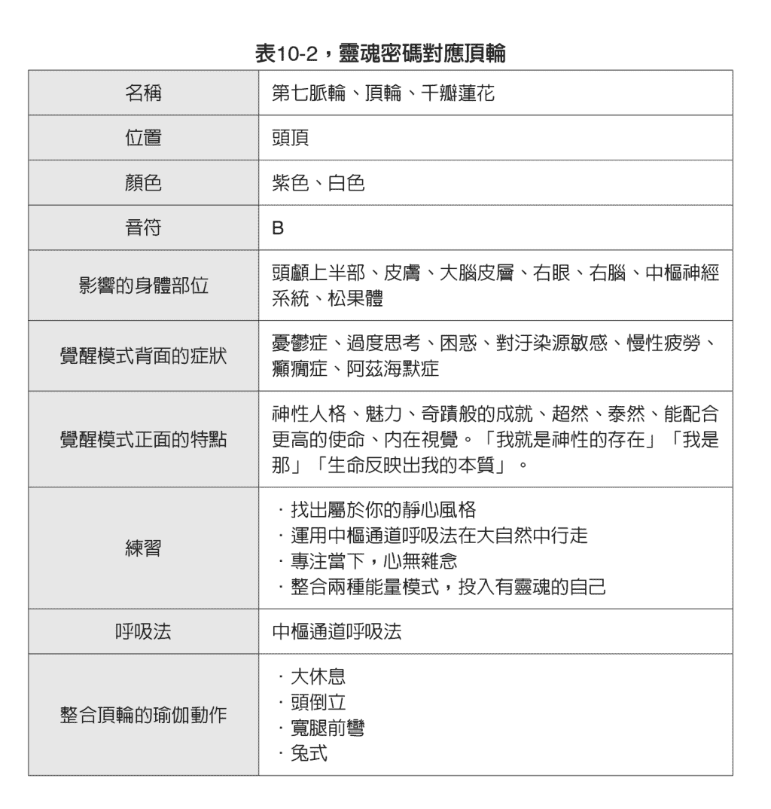

灵魂密码的瑜伽动作

除了灵魂密码的练习，下列瑜伽动作也会帮助你整合、平衡顶轮。

大休息（śavāsana / Corpse Pose）是瑜伽课结束前最常做的动作，通常也是大家最喜欢的动作！梵文指「摊尸式」，但其实就是静止不动、放下一切。这个动作对中枢神经系统非常好，也对应到顶轮。

☼大休息

◆ 步骤：

1. 仰躺在瑜伽垫或地板上，双脚打开与臀部同宽，双臂放在两侧。让双脚落下，双手放松，手掌朝天花板。让颈子呈现最自然的曲线，后脑勺贴地。

2. 有意识地放松全身，先从双脚开始。让一股柔软又能卸下防备的波浪往上拍向双腿、臀部、核心、心脏，感觉到松弛感沿着手臂扩散到手腕和手掌，然后放松上胸腔、喉咙、颈部、脸，以及头皮。感觉能量自由流贯全身。

3. 让呼吸放松地进入自然韵律——不要太深，也不要太浅。将注意力转往内，如果有哪个身体部位没有放松，让大脑去发现，然后有意识地让那个部位更松软。全然进入什么都不想的领域。

4. 维持这个放松状态至少五至十分钟（或更久，看你有多少时间）。

5. 当你准备好要结束大休息，温柔地动动手指和脚趾。头往两侧转一转，感觉到后脑勺接触到瑜伽垫。当你准备好，把双膝收到胸前，滚向侧边。用婴儿式深呼吸一、两回，慢慢坐起来。

现在，将灵魂密码与身体觉醒瑜伽结合大休息：

1. 做这个动作时，仰卧在地上，感觉到下方六十公分处有一大股能量。

2. 能量波沿着身体而上时，有意识地让能量随着中枢通道，往上穿过全身，环形场的能量流则从核心出现。

3. 开始中枢通道呼吸法。每个身体部位放松时，更深入核心与大脑中央。让大脑放松到思想以外的境地，让心无杂念的状态深深锚定在系统里——也就是骨盆底部。

4. 开始放松每个身体部位，顺序很象是在用「一千根小吸管呼吸法」放松肌肉。先从双脚开始，一路向上到全身，但是心口和根锁要最后放松。

5. 在这个深层沉静的空间里待几分钟，让有灵魂的自己在意识表面浮现。

6. 当你准备要结束这个动作时，先从核心开始，温柔地从体内揉捏四个锚点，并进行中枢通道呼吸法。从体内小声地发出「嘛」的声音，可以在这种时刻让有灵魂的自己有更明确的表达。

7. 启动核心之后，开始移动小肌肉群（手指、脚趾等）。记住，你要由内而外运用能量七密码建立新的神经回路。这个练习会强化这些回路。

☼整合顶轮的其他瑜伽动作

除了大休息之外，你也可以利用下列瑜伽动作来强化灵魂密码的练习。请记住，揉捏你想注意的部位很重要，但放松也很重要。

•头倒立（śirṣāana / Headstand）

•宽腿前弯（prasārita pādottānāsana / Wide Angle Forward Fold）

•兔式（sasangāsana / Rabbit）

恭喜你！我们已经介绍完能量七密码的七套练习。你现在拥有了所有工具与知识，可以进行量子翻转、活出有灵魂的自己了。能量七密码唤醒了你的能力，让你拓展觉知、体现有灵魂的自己，并且让有灵魂的自己得以表达，让你成为人生经验的创造者。

接下来，你将在第三部学会如何让能量七密码成为每天都能持续轻松进行的练习，加速量子翻转。我们会介绍觉醒模式正面的人生，你会从这里开始以创造者的角色拓展人生。

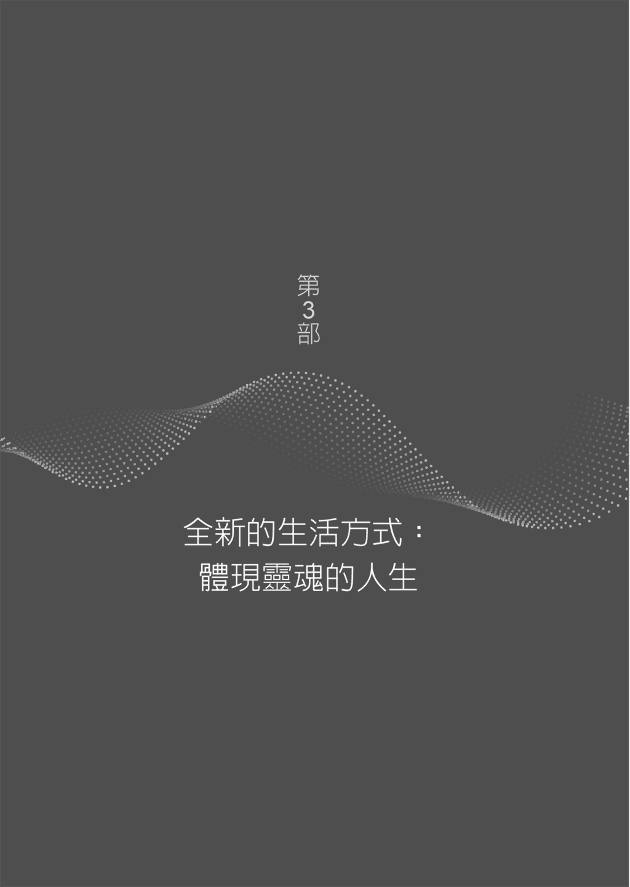

第十一章
量子翻转，一天一次

本书第一部提供了全新的人生观，让我们能够用全新的观点看自己、看人生、看世界。我们学到了我们其实都是明亮的灵魂（能量体），在这条路上逐渐觉醒，明白自己的伟大，也更加清楚人生和生命中的一切发展都反映出我们哪里需要觉醒。在第二部能量七密码的练习里，我们学会如何觉醒、用新的方式来和灵魂相处，也学会如何回应人生。在第三部中，我们要探讨全新的生活方式——我们不能进行完一次量子翻转就算了，还要持续建立回路，让自己活在觉醒模式的正面，才能够在每一天都更加体现有灵魂的自己。

现在你已经体验过「唤醒」有灵魂的自己是什么感受了，你可能会想要把学到的所有技巧用最简单的方式结合在一起，在生命中创造最显著的差异。这就是本章的重点：用能量七密码来建立新习惯和新的生活方式。我会提供你一些清楚又简易的方式来落实能量七密码，开始主动有效率地做这些练习，让你完成化为肉身来凡间的使命，体现有灵魂的自己。

再忙碌的人也能将这些练习无缝结合到每日作息中，你可以选择用不同的方式来组合这些练习。如果你喜欢规律，可能会喜欢比较短、制式的练习法；如果你喜欢弹性，我也会分享一些能随意搭配（但一样有效）的每日练习。只要选出最适合你的练习，就可以开始，因为这才是最重要的事……你现在就要开始有意识地投入能量体，那才是真正的你。你要今天就有意识地活出你的自然本质，成为有灵魂、也有肉身体验的灵体。这个世界上没有其他方法能让你在人生中创造更卓越的改变了。

同样地，这些练习的目标是要持续不断建立神经回路，让高频能量减轻你的能量负担和包袱，启动你尚未觉醒的意识和身体部位，让有灵魂的自己甦醒。你体验过能量整合之后就回不去了！不过，你要记得这种事情没办法「一劳永逸」。量子翻转和觉醒模式正面的生活不能只是靠理解，要真正达到量子翻转并活在觉醒模式的正面，就要靠体现。

要让粒子之间的空间产生转变（那就是真实的你所居住的位置），你就需要和这些练习共同生活，并持续进行，把这些练习当作是你在凡间的生活方式。这表示你要反覆做，才能训练大脑。你希望大脑预设的角色就是服从体内流贯的能量，而不是保护和防备，要不然你的思想又会跟着脑袋里的故事情节去反应。持续练习能量七密码，能让大脑不要再催促人生前进，那只会把你的注意力拖离核心，让你远离直觉的领域。

就和其他练习一样，要训练大脑察觉你的本质就是能量体，需要决心和勤奋。这得花一点时间（虽然不一定要很久），你才能彻底运用整个系统，在身体各处建立新回路，完整地在身体里体验有灵魂的自己。如果你专注做这些练习，便会几乎立刻感觉到差异——不过充分整合并不会马上达成，要有耐心。你可以用最适合个人进化的节奏来整合能量，这会符合你来到凡间前在灵魂转运站所做的决定。

别担心——你会觉得很棒！开始规律练习，就会有动力。细胞记忆很接近肌肉记忆：你一回应新的、高频的振动（来自有灵魂的自己），所有的整合练习都会结合在一起。换句话说，你不必每天从头开始，你每次做能量七密码的练习，就会从原本累积的进度开始。这个练习会让你支持自己持续下去。

你决心要觉醒并体现神性本质的振动，会加到这个复合效果上，因为真正的决心是一种爱的形式，决心的振动就是有灵魂的自己在振动。你的决心会带你到你想去的地方，你真诚、发自内心、宝贵的意念会产生一股能量，就和你的终点站一样。对能量来说，这股振动和上脑中心一样，比原始脑更高。只要用这个方法，你就会在大脑领悟之前就展开旅程。当你透过真诚的决心体现这股振动……你就抵达终点了！

我在本书一开始就说过的话很值得在这里重申：你可以变成全新的自己——更健康、更快乐、拥有更多力量，只要几个月，甚至几个礼拜就能做到。不过你必须应用所学才有可能。不管你做了什么选择，时间都会过去，就看你怎么运用时间。我想请你以决心、热情和使命感拥抱这份功课，让你拓展能量、体现灵魂。我保证，你会很感谢自己做了这个决定。

让我们来看看你要怎么做才能有效地把这一切都应用在日常生活中。我常常被学员问到：「我该在什么时候做这些练习？」我的答案就是：「永远没有不适合的时机！」

永远没有不适合的时机！

经历过灵魂出窍的体验后，我就一心想要再创造一次这个体验。身为医师，我用科学的方法来进行，能够有系统（并持续）地重现大家认为很奥祕也无法进入的状态。在我的研究过程中，我发现这些练习可以随时随地进行——不管你在做什么！我不是要你和我一样狂热，但我相信你应该每天练习能量七密码。我们几乎可以在从事所有活动的同时开发感官神经回路，你愈常在日常活动中做这些建立神经回路的练习，就愈能够轻松不费力地建立回路。

你可以挑战自己，看你能多频繁地在不同的日常活动中加入两个最基础的练习——中枢通道呼吸法和主体─客体─主体、让身体来处理。你可以和自己比赛，看你一天之内可以花多少时间利用这些练习来建立回路，同时持续正常作息。让这些「入门」方式为你打开灵魂的大门。

你可以从这些练习开始同步建立回路，这张清单可以没完没了，所以你也能把你的活动事项加进去。

你在做这些事情时都可以建立神经回路：

•躺在床上

•讲电话

•传简讯

•上网

•看电视

•烹饪

•吃饭

•洗碗

•上厕所

•洗澡

•走路、慢跑或做其他运动（参阅［人体化学密码］中「有意识的运动」）

•排队

•做瑜伽（一箭双鵰！）

•购物

•花时间在大自然里（又一箭双鵰！）

•照顾宠物

•开车

•通勤上下班

•阅读

•用电脑工作

•性行为

•上课或演讲

•决策过程

•洗衣服

•针对某个挑战苦思时

•刷牙

•园艺

•度假

•________（你想做什么都可以！）

在开发能量七密码、随时随地建立新回路时，我用一个很简单的动作提醒自己把握机会练习，象是开车前要系安全带时，我只是稍微做了一些调整：伸手到肩膀上方去拉安全带，然后从身体内部揉捏心口，沿着中枢通道上下吸气和吐气，这样一来我就建立了新回路——却完全没有打断一天的进展。然后我又多做了一步：接着我要看着后照镜倒车，这时我会有意识地把颈子多转一点，收下巴，感觉到双眼后方的力量。接下来我会把气吸上来进入头脑的中央，从头顶呼气出去——又建立了通往上脑中心的回路，开启了一条高速公路，从我的心连结到我的创意天才。

当你用这种方式过日子，人生的伟大冒险变成了：「我要怎么在买菜时建立回路呢？还有我搬行李箱的时候？或是从储藏室拿出箱子时？除了专心妥善地抬起这些物品，象是膝盖微弯，重物要靠近身体才不会伤背，我是不是也能沿着中枢通道上下呼吸？」

我要请你看看自己多么有创意，既能进行练习又能继续过生活。你还想得到哪些方法呢？如果你想要有更多点子，欢迎你一起来讨论。请加入我的脸书专页（请上脸书搜寻：DrSueMorter），你会找到各种支援和相关讨论，了解我的学员和其他人怎么进行练习。

要展开这种全新的生活方式，刚开始你可能需要时时提醒自己，你可以把便利贴放在目光所及之处——浴室的镜子上、冰箱上、车子的仪表板上。你也可以在手机或其他数位装置上设定闹钟（例如每十五分钟、每三十分钟或每六十分钟），或在进行日常活动时搭配能量七密码练习，这样不管在做什么都能同时练习。我的一个学员就建立了习惯，每次去洗手间就做中枢通道呼吸法。她刚开始是用这方法来自然疗愈尿道发炎（确实在二十四小时内见效），然后她就把这列为新的能量七密码功课了。她想：「有何不可？要不然我那时候还能做什么？我可以好好运用时间啊！」

以下介绍其他方法，让你将能量七密码整合到生活中，不必「另外找时间」。

☼坐太久了要动一动

现代最常见的健康警讯之一就是坐太久很伤身，建议要经常休息。有些专家说，每坐半小时，就必须站八至十分钟，运动两分钟，我想请你利用这个休息时间做几组身体觉醒瑜伽动作。做瑜伽比单纯站起来伸展更有益，那是完全不同的效果。瑜伽会让身体进入神圣的几何形状，让更高频的能量自动流过，把身体变成广播频道电台，不必费力就能接收有灵魂的自己和我们的终极目标。每次练习时，你可以只针对一个脉轮做一个瑜伽动作（目标是一天之内把七个脉轮都做完）；或者在休息时快速扫描全身，看哪个脉轮需要你的注意，然后选一个瑜伽动作来因应（请参阅后面的「三十分钟可以做什么？」，里头列出了根据每个脉轮推荐的瑜伽动作）。若不做瑜伽，你可以在休息时做莫特步法或其进阶版，这对中枢神经系统和电磁系统也有强大的整合功效。

还有一个方法也能有效利用你「起身动一动」的时间，那就是呼吸练习。你可以在每次要从椅子上起身时练习蕨叶呼吸法：准备要站起来时，身体先往前卷，然后一节一节打开脊椎，缓缓站直。做一千根小吸管呼吸法也同样有效。

如果你休息时不能站起来，可以把右手放到后面去，从右边拉住椅背，右脚往前，左脚在身体后方，或许放在椅子下。收缩四个锚点，左手横过身体去碰右膝，下巴转过去碰左肩，然后沿着中枢通道深呼吸，把气往上带，通过双腿，穿过身体，从头顶呼出去。再回到自然坐姿，从头顶深呼吸，把气挤到心里，穿过身体，再从双腿往下呼气到地底。换边再重复。利用呼吸搬运能量，就和站着一样有效，也能建立回路，活化重要通道，让我们体现灵魂。

你可以选择任何一种呼吸法，就看你那天察觉到自己有什么需求：船式呼吸法能带来创意和智慧，太阳轮呼吸法可以给你力量，和谐一心呼吸法可以给你爱与欢乐，实现呼吸法让你说出真相，视线呼吸法可以强化你的内在视觉，看到人生的奥祕。每一个呼吸法都能为身体中央核心带来更多生命力，整合并保留能量，让能量不要散逸或在一天之内逐渐减少（稍后我会为大家复习这些练习）。

☼持续内观

最后，本章的重点虽然是如何积极地开发回路，但我想要提醒读者，你要「随时内观」并练习「让身体来处理」遇到的处境。每次只要你感觉到情绪上涌，能量场突然有变化，就让身体来处理。这是最快最直接的路径，让你的意识进化（并疗愈人生），因为透过身体的感受，你会直接从有灵魂的自己得到方向，知道你最需要朝哪里努力。

我总是让身体来处理。当我在想事情、思考未来的计划或考虑是否要回应邀请时，总是注意体内有什么变化。我不断参照核心的内在流动，注意我在想事情的时候能量有没有流动。如果没有（可能是因为能量淤积或断层），那我就会着手建立回路，揉捏身体能量特别紧绷或有感受的部位，用呼吸带进中枢通道。别把这当成正规的练习，这是随时都可以进行的功课。

当我们用「随时都可以做」的态度来面对人生，就会发现每个体验、每个当下都是建立回路的机会，可以协助我们疗愈、扩张和进化——换句话说，让我们觉醒为有灵魂的自己。这取决于我们想要在多短的时间内看到变化。如果你和我以及众多学员一样，迫不及待想迎接自己在觉醒模式正面的生活，你可以随时保持专注！尽量练吧，你不可能练太多的。

这种内在的参照、呼吸和画面，会让你的存在感更强烈——不管是当下那一瞬间或是整个人生。这会唤醒你，让你保持警觉，避免你又回到自动导航的机械式生活方式，因为你随时都会更留意深层的核心，拥有更多原生的资源，让你有更强大的能力可以优雅、轻松又有意识地面对人生际遇。这也会让你更准备好去爱。

我们先来看一些比较固定的选择，协助你把能量七密码整合到每日行程里。你可以从中挑选，也可以全部都做——看你有多少时间。做愈多愈好，这些练习不会互相排斥！

早晨与睡前流程

最适合建立神经回路的时间就是上午刚醒来和晚上入睡前。在这半睡半醒的状态里，意识和潜意识的活门最为敞开，两者可以轻易地互相沟通。当意识和潜意识连接在一起，我们深处的真相就会在意识中浮现，导引我们以最真诚的方式完成心之所愿。我要请你养成习惯，以能量七密码来开始和结束每一天。在这套流程中，你会用中枢通道扫描来开始每一天，结束时则会沐浴在爱的振动中，逐渐转变。

☼早晨扫描

开启一天的生活之前，趁你还在床上，可以做灵魂密码里的「专注当下，心无杂念」练习：扫描中枢通道，从身体内部揉捏、按压需要你注意的部位，整合那里的能量。订下当日目标，优先运用这些能量。可参考【表 3-3】来决定你那天要注意什么，然后鼓励能量流到那些部位去，规律地把呼吸带过去。

假设你在扫描时发现脖子会痛，回应这股知觉，揉捏、按压你的脖子，让呼吸穿越那个部位，连结到中枢通道。参考表格，了解喉轮还会影响哪里，把【表 3-3】里吸引到你注意的部分记下（或许是「完美主义」或「无法表达情绪」特别醒目），那一天请好好观察。订下目标，放下完美主义，让自己尽力表达情绪，同时让呼吸穿过喉部，连结到中枢通道。你的身体在提示你需要注意哪些地方，才能准备好下一回的进化。

☼睡前感恩

晚上爬上床时，我总是说：「哦，我爱我的床！」难道你不爱你的床吗？你的床就是一个完美的茧，非常适合用来做这个练习，因为我们在床上觉得很安全、备受呵护。在床上建立回路的效果最棒了。要效果最强大，那就要活在爱的当下，呼吸爱的能量。爱就是一股振动，可以打开意识和潜意识之间的活门。当下是全然的专注与觉知，呼吸则会把能量或灵魂带到身体各处。你可以舒服地在床上培养，不需理由就能感受到爱的能力。

完美的睡前仪式是「建立爱的存在感」练习（请翻到［心的密码］进行），可以搭配日间的「专注当下，心无杂念」。和早晨的流程一样，你可以躺在床上做，就在入睡之前。让你全身充满爱和深沉的感激，透过中枢通道呼吸把那股振动锚定在能量场里。注意中枢通道的流动有没有干扰，在逐渐沉睡的过程中把回路建立在干扰的区域。

若要加强效果，可在睡前做莫特步法进阶版，两边至少各做一次。

每个人都在讨论感恩的重要，但我想从人生创造者的角度来谈。做睡前的感恩练习时，我们刻意把创造出感激之意的事情带到思绪里——不是为了在外面的世界追求什么结果，而是为了要学习如何体验感激。我们表达感恩以创造出有灵魂的自己的振动频率（喜悦、爱、欣赏、存在），最后，我们能够随时自行创造出这种振动。当我们有能力想着感谢的事物、召唤感恩的振动时，就能进行下一步——在没有任何理由时也能心怀感激，这会协助我们达到「不管今天我的人生发生了什么，我都很感激，没有任何事、任何人能影响我！」的境界。当我们知道不管外在处境如何，自己就是内在体验的主宰，当我们感觉到自己就是创造者，会给我们强大的力量。

十分钟可以做什么？

如果你能每天腾出十分钟练习能量七密码，本章会提供很多充分整合能量的方式让你妥善利用时间。理想状况下，我们会很习惯能量七密码的练习，所以你不必去思考要做什么，可以让能量（也就是真实的自己）来引导思绪，理解身体需要什么。愈是熟悉所有的练习，要从工具箱里找到当下需要的练习就愈容易。不过，以下列出了几个不同的流程，几乎不花时间就能给你完整的支持。

☼十分钟的「专注当下，心无杂念」

在「专注当下，心无杂念」的练习中，我们让失控的思绪停下来，不要一直想着过去和未来，让大脑全然而有意识地专注于当下这一刻，没有任何想法。这和自动导航相反。我们走进每一天、每一刻，都是全新的，没有期望，面对无限可能，我们只要观察前方和心里有什么在逐渐展开就好。

我鼓励你慢慢把这个练习增加到十分钟。如果在忙碌的一天里，你的思绪急驰中，休息的时候进行更有效，不过当然任何时候做都很有帮助。练习时四个锚点都要用力，再加上中枢通道呼吸法。要成为体内的能量，沿着中枢通道移动，不要只是想象那股能量跑上跑下。要把有灵魂的自己视为一体，集中意念进入通道，成为那股能量，不要想其他事——全然专注化为那股能量，进入体内。

你不妨挑战自己：「我能不能放松思绪，利用四个锚点来连成一线，放松所有肌肉，但是维持专注于核心的存在，以中枢通道呼吸——我能不能做十分钟？」

☼十分钟的脉轮呼吸

吐纳密码以古老的传统呼吸法为基础（梵文称为「调息」）。瑜伽修行者运用这些练习研究意识，来整合不同层次的存在，建立动能，逐渐证悟。一个接着一个做这些呼吸练习，可以在体内建立觉知，最终会让你唤醒有灵魂的自己，不只是深呼吸而已。

在十分钟内，你可以做完六项基础脉轮呼吸法，每项练习给自己九十秒（约五至十回呼吸）。我们来简短复习一下：

1. 中枢通道呼吸法（第一与第七脉轮）：首先，启动根锁、揉捏心口、收缩喉咙，然后轻轻把眼睛往上转。沿着中枢通道上下呼吸。

2. 船式呼吸法（第二脉轮）：进行中枢通道呼吸法最后一次吸气时，尽量把肚皮往外、往前撑。要吸气时，把和根锁一起往上提的肌肉往下压；吐气时，把肚皮收回来靠近脊椎。进行船式呼吸法可以让创意自由奔驰。

3. 太阳轮呼吸法（第三脉轮）：接下来，往上进行太阳轮呼吸法。收缩上半身所有肌肉，以及肚脐下方的肌肉。利用呼吸让肋骨下方的空间膨胀、缩小、膨胀、缩小，就像葡萄柚和棒球一样——进行太阳轮呼吸法可以获得个人力量。

4. 和谐一心呼吸法（第四脉轮）：从太阳轮呼吸法吸气变成弥勒佛的大肚子时，继续往上呼吸，进入太阳轮区域，把气带到胸腔和上肺部，这样你就会用一大口气同时吸进腹部和上肺部。继续吸气，直到呼吸贯穿全身，然后像一个大球从四面八方吐气。现在，从这个大球把气吸进腹部，然后继续吸气，直到上肺部充饱气为止。这会启动你的爱与喜悦。

5. 实现呼吸法（第五脉轮）：紧接着和谐一心呼吸法，把气全部吐光，再吸气。收缩喉咙以下的身体部位，将注意力全用来强化通过喉轮的呼吸，尽量打开喉咙，就好像在打呵欠，可是嘴巴要闭起来（这样吸气可以打开喉咙），从头顶呼气出去。现在反过来，从头顶吸气进入喉咙，用同样的方式打开喉咙，然后从全身往下吐气入地。这个练习很接近中枢通道呼吸法，可是交换点在喉咙，而不是核心、心脏或腹部。

6. 视线呼吸法（第六脉轮）：眼睛往上转，感觉到眼睛后方在用力，确认第六脉轮的位置，记住这个位置。把注意力集中在一样东西上（例如烛火、护身符、石头、花，或空间里任何一样东西），放在面前六十至九十公分处。呼吸时想象空中有一条线，从视线焦点连向大脑中央，想象吸气时会把注意的焦点「移向」你，靠近第六脉轮的中心（或第三眼）。从后脑勺将气吐出一样的距离（用想象）。然后反过来，从后脑勺吸气，前方吐气。现在把视线呼吸法和熟悉的中枢通道呼吸法连在一起，但这一次交换点是第三眼，而不是中枢通道的其他地方。

一天之中，你可以随时做十分钟呼吸法：可以是休息十分钟时、等其他人开午餐会议时、在才艺班门口接小孩时，或是在月台等车时；换句话说，你不必好好坐着、闭上眼睛，集中精神，以致必须回避公共场所（但尽量不要做鬼脸哦）。这个练习既安全又能整合能量，所以你还是能维持正常活动（当然，我不建议你在操作重机具或动手术时练习，除此之外应该都没问题）。如果偶尔你需要多点支持稳定新的振动模式，可以散散步再回去工作，以彻底整合新回路。

☼十分钟的脑部瑜伽

利用脑部瑜伽（见 317 页）活化重要的上脑中心时，要维持头部不动，让眼睛转一圈，并沿着中枢通道呼吸。在这十分钟内，我建议你：①前六、七分钟做脑部瑜伽，这样应该足够顺时钟、逆时钟各做一回。接下来可以：②花三、四分钟做几次锚定密码的瑜伽动作，③搭配中枢通道呼吸法。这个顺序很重要，脑部瑜伽能够加速启动上脑中心，所以我们要确定能稳固地整合身体里的变化。如果你感觉头重脚轻，那就再继续做。熟练之后，一整天任何时间都可以更轻松地做这组练习。

☼十分钟的蕨叶呼吸法

这组练习：①蕨叶呼吸法做五至七分钟后，接着：②做几次锚定密码的瑜伽动作，③搭配中枢通道呼吸法（若需要复习蕨叶呼吸法，请见 280 页）。这个练习要丹田（大型能量储存槽）用力，并且整合脊椎里的能量流。透过能量七密码产生的变化，可藉由这组精细的整合运动更加持久。

三十分钟可以做什么？

同样地，如果你能倾听身体的需求来选择能量七密码的练习最好，设计一组三十分钟的练习也能更快、更强效地产生变化。如果你能腾出三十分钟，需要规画好的练习帮你有效建立回路，就从以下几组练习中选择吧。

☼呼吸法与静心

这套组合比单独静心的整合功效更强。利用这组练习，你可以选择适合你的静心风格，让你在最符合自己学习风格的状态下（听觉、动觉或视觉）自然收效。首先，要做脉轮呼吸，这很重要，因为这么做能让能量流贯系统（就像前导一样），接着静心就能大幅增强效果，在建立回路的过程中有所突破。

这套「生活静心」是我过去十七年教授静心课的重点。这套方法可以结合日常生活与静心体验，感觉到能量的传递和整合。这对我的病患和学员特别有帮助。其他静心法会让内在与外在世界的差异更明显，但我们是要融合两个世界（体验人间天堂），而不是要排除其中一个世界。

这套组合可以帮助入门新手和老手从静心过程中获得最大功效。我们从静心美好的体验中获益，再结合到神经系统中。

◆ 步骤：

1. 坐在椅子上或盘腿坐在地上、瑜伽垫上。

2. 进行十分钟脉轮呼吸。

3. 接下来花五分钟做火呼吸（或称头颅光明净化呼吸法）。这和其他呼吸法一样，只是节奏比较快。这套呼吸法有净化系统内电磁回路的效果，就象是能量的除旧布新大扫除，把能量包袱都烧掉。

4. 先从鼻子把气都吐干净，腹部里完全没有空气，让下腹部靠近脊椎，然后放松，让腹部自动吸入更多空气，再用力从鼻子吐气。重复一遍，加快速度。你会发现其实专注地用力吐气，吸气是反射动作，可自动进行，你只要在呼气之间放松腹部肌肉就行。要完整地练习，就把火呼吸加上几次深沉缓慢的中枢通道呼吸法（中枢通道呼吸法可以替换为鼻呼吸，让脑部更平衡，若需影片讲解，请看[drsuemorter.com/energycodesbook](https://drsuemorter.com/energycodesbook/)）。

5. 现在彻底放松，不必管呼吸法，全身肌肉也都松开。接下来的十五至二十分钟，坐着用适合你的方式静心。

6. 结束静心时，两侧各轮流做两回脊椎扭转，伸展、弯曲，让身体整合能量并记住你刚才的体验。仰躺在地上，沿着中枢通道上下呼吸，弯起膝盖，放到身体左侧，脊椎、颈子、下巴右转。放松之后换边重复一次（如果你因故不能躺在地上，也可以坐在椅子上转。利用椅背来支撑，膝盖朝前，脊椎、颈子、下巴先往右转，再往左转）。

7. 躺在地上（或坐在椅子上）要弯曲脊椎时，先收缩身体正面，让自己蜷成一颗球，抱着膝盖屈向胸口，愈紧愈好。要伸展脊椎，就做骆驼式，或趴在地上，双手放两侧伸直，将胸口往上抬（你也可以小心地在椅背较低的椅子上往后伸展，把胸口往上抬，同时保护你的背）。

瑜伽会让能量主动流贯全身。不过，一堂愉快的瑜伽课最后几分钟做完大休息，我们往往就坐起身，下课离开了。如果我们能在大休息之后，坐起来静心一会儿，就能整合刚刚在瑜伽垫上获得的更多能量。我知道有些瑜伽教室可能没办法让你留在里面静心，所以我建议你到教室外找个安静的地方或坐在车上迅速静心，再离开停车场。

当你进入奇妙的当下，若能多花十分钟渗入核心内在的自我，会对身体里的回路工程非常有帮助。记得要等神智清醒后再开车！

☼三十分钟的身体觉醒瑜伽

瑜伽本身就有很强的整合功效，尤其是配合能量七密码的专注呼吸。在本书中，我提供了很多基础瑜伽动作，可以打开每一个脉轮，增加能量流。你可以按照顺序来做这些动作，或整合到你的能量流练习中，逐一启动所有脉轮。为了更方便练习，我把讨论过的瑜伽动作都列在这里，按照影响最显著的脉轮来分类。

我还把这些动作组合成短时间就能发挥高效的身体觉醒瑜伽流程（表 11-1），帮助你建立能恢复能量的神经回路，让你重新设定防御性格，启动有灵魂的自己。

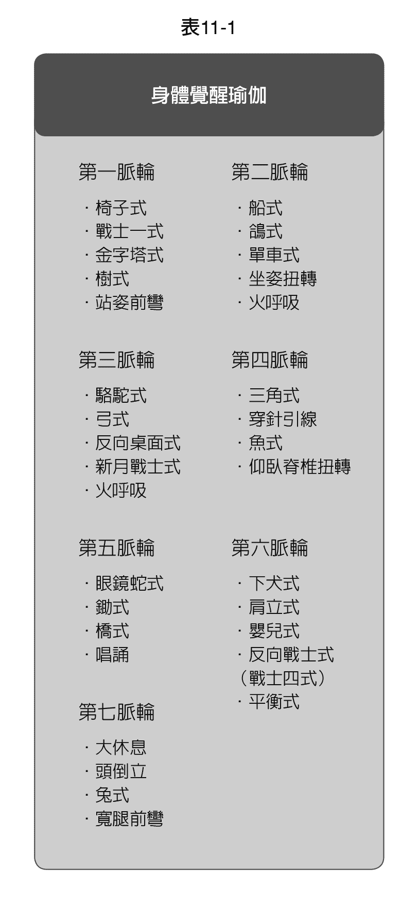

☼三十分钟的疗愈呼吸法

如果你受了伤、身体虚弱、疼痛，或有健康状况（这都表示你身体里有个部位能量不通或淤积），可能会想要花三十分钟在那个部位进行疗愈呼吸。假设你持续尿道发炎，或好了又反覆发作，你可以花半小时深呼吸，刻意让呼吸通过第一和第二脉轮。当你想到现有的症状时，就让身体来处理。你也可以运用「生物能量同步疗法解放版」来清除潜意识的扰动与尚未化解的情绪，这些因素都可能会造成身体持续出问题（象是尚未化解的愤怒经常导致尿道炎）。让你的身体来告诉你要清理什么情绪，解决之道可能就会自然出现。如果你膝盖疼痛，在呼吸的过程中，膝关节要施加足够的压力才能突显膝盖的感受，如影片所示，把呼吸带到关节部位。一天之内，可利用短暂时间做一回、两回或三回不同身体部位的特定练习。记住，不管你的症状是什么，练习的方法都一样，这样你就能举一反三，将这套练习用来面对头痛、膝盖痛、肩膀痛、胃部紧绷、肠胃不适、呼吸急促或身体任何感觉紧绷、异常之处。

能量一直设法沿着身体往上行，努力整合，所以能量淤积一定是在疼痛或没有反应的部位上方。一定要从下往上让呼吸穿过那个部位，这样效果最好。记得最后的呼吸要流过全身，结束前做「一千根小吸管呼吸法」。

本章的所有练习都会放大有灵魂的自己。整合能量时，身体会觉得很棒，身体本来就希望可以恢复能量流。它原本就配备了自我疗愈、自我调节、自我启发的能力——就是要前往真实的、有灵魂的自然与原生状态；换句话说，身体原本就被设计用来做我们现在要它做的事。身体只需要大脑和意念的一点帮助，然后它原有的动能就可以接手了。我们的任务就是要协助身体开始，然后顺着自然的流动。当我们把正在寻求的蜕变视为能量的流动而非行为的改变，就会更容易蜕变，这是因为防御性格比较愿意拥抱能量流，而不愿意拥抱改变。

只要我们把防御性格视为一体，就很难迎接改变；但是当我们把有灵魂的自己视为一体，就会感觉到变化，当成是能量的流动——能量动起来，感觉就很好。当我们进入身体核心，让能量流动，胃就不痛了、脖子就不痛了，原本虚弱的体质也逐渐强壮了，因为带给我们力量的生命力流贯了全身。我们会注意到「改变」正在发生——但其实重点不在改变，重点是能量流。当我们允许能量流动，改变自动会发生。变化会从后门钻进来，很美妙的！

现在，你已经获得了一套容易操作的练习，能够建立回路，察觉到有灵魂的自己，并活出有灵魂的自己，接下来我们要探索回路，建立美好的人生。那就是量子翻转后，觉醒模式正面的人生。

第十二章
觉醒模式正面的人生：以充满灵魂的方式生活

在开启有灵魂的自己七年之后，我受邀到科罗拉多铜山的女性会议演讲。演讲结束后，观众席有个人朝我走来，问我有没有兴趣隔年在另一个大型会议中简报。「好啊！」其实我并不晓得自己答应了多么盛大的活动。

神奇的「心流」

没多久，会议主办单位联系我，问我有没有演讲影片，能让他们知道我的简报会是什么样子。我没有影片纪录，但当时正着手制作影片，因为美国最畅销的管理学与组织行为学大师东尼．罗宾斯（Tony Robbins）的管理顾问团队也请我提供影片，这样我才能去演讲。所以我赶快完成了影片寄出去，马上就得到了回覆。他们不但希望我能去演讲，还邀请我担任第一天上午的开幕演讲贵宾！

这个机会让我大喜，我开始想我要说什么、用什么方式来说……令我意外又失落的是，我的脑子一片空白！我虽然很努力，但脑子里就是什么都没有。我就要在美国讲师协会的年度大会中，在两千多名专业讲者面前演讲了——这是他们年度最大的盛会——而这个「脑子一片空白」的状态简直帮倒忙！我的旧回路深信我得做好计划，而我持续试图做计划。

我的思绪都集中在那场演讲应该如何进行，顺势而为的念头根本没出现过。

离那场会议还有好几个月，我每隔几天就会坐下来想一想。尽管纸笔都准备好了，我脑中还是没想法。过了几周、又过了几个月，我想到就慌，每次要构思就愈来愈紧张。我甚至觉得是纸笔的问题，所以丢下了纸笔去开计算机！但还是一样……什么都没有。

很快地，距离会议只剩两周了，然后剩一周。我还是完全不知道自己该说什么。我很确定想讲一个主题，但那只要十五分钟就说完了，而我上场的时间有一小时又十五分钟！我决定要提早飞去会场——「离开这里」，我脑袋就会比较清楚。我在饭店房间里待了一天半，还是什么都没有。就在上台前夕，我还在苦思。我熬到半夜才睡，隔天一早就醒来，希望能灵光一闪。「去洗澡吧！天才的灵感总是在洗澡时出现！」我很乐观地想要说服自己。我奋力一搏，但上场前还是毫无斩获。那天上午，我换好了衣服，沿着走廊朝电梯走去，感觉自己的职业生涯还没起飞就完了。那是我人生中最痛苦的一段路！

工作人员在后台帮我别麦克风时，我听到他们在介绍我，提到了我的名字，然后亲切的舞台总监推了我一下，说：「我想他们在叫你了！」沿着缓坡走上舞台时，我觉得自己好像在海盗船的跳板上。末日近了，我感觉得到。

当我从幕后现身，走进灯光里，有个庞然大物出现在我体内，换他来当家。就好像尼加拉瓜大瀑布突然从我头顶倾泻而下，灌注我全身！我能做的就是活在当下，让我身上的每个细胞都去传递从我心中涌现的字句。我在巨大的舞台上，从一边飞到另一边，觉得自己根本没碰到地面。当我望着观众席，我可以看得出来他们都全神贯注在听，那是我人生中最魔幻的一刻。当我说完最后一句话，朝计时器看了一眼——太神奇了，就在我目光瞥过去的瞬间归零。在我的场次结束之前，观众起立鼓掌了三回。

我回到后台又开始呼吸，协会主席热泪盈眶地走向我，说我的演讲「远远超乎期待」，还「拉高了未来演讲的标准」！

那场会议之后，许多人寄信或电子邮件来让我知道那场演讲的影响多么深远。有些人引用了演讲界专家的话，问我有没有拜他们为师（我一个也没听过）。他们深信我一定彩排了无数次，反覆钻研演说结构才能这么顺利无瑕。不，其实那天发生的事远超过我所能研究、计划或彩排的能力，我的理性思维绝对没办法创造出这等精采。我那天的表现纯粹就是进入当下，那就是心流。这改变了我，从此我能够由内往外发挥的能力也变了。

这也改变了其他人。七年后，当我回到美国讲师协会的年会，很多人在走廊上和我打招呼，容光焕发地描述多年前的那一场演讲带给他们的影响。我的能量流也改变了他们——我相信这程度远胜过我自己能给他们带来的影响。在那之后，我总是让直觉主导并带领打从内心涌现的能量流，来回应观众的需求。有灵魂的自己就是用这种方式运作。有灵魂的自己可以获得完整且高深的认知，我们的智能完全无法预测。

这个美好的经验（尽管我一直抗拒到最后一刻）说明了我们在意识进化的过程中身处何方。有了能量七密码，我们都能变成漏斗，让灵魂纯粹的存在毫无阻挡地流过，往外散播，神奇地改变自己和别人的生活。当我们建立了能量流，且明白灵魂的存在就是真实的我们，就能进行彻底而全面的量子翻转。

虽然我无意间在第一次出窍时窥见了内在本质的真相，我们还是需要建立回路才能完整地体现灵魂，每天都活出有灵魂的自己。没关系！这就是人生。你不会忽然抵达终点，经历超完美的一生，而是会逐步理解自己究竟是谁，一瓣接一瓣，逐渐绽放为盛开的莲花。我们开始在不同的层次上疗愈康复，丰盛而完整地拓展我们深处的美丽与伟大。

在本书最后一章，我想要让你看看当我们真的成为漏斗，让有灵魂的自己将能量流畅地注入，生命会是什么样貌。觉醒模式正面的人生对每个人来说都很独特，各有不同的表现方式，但有些共同的特质会组成新的人生观，让我们和谐互动。

正面的人生：大格局

觉醒模式正面的人生最显著的特色，就是我们不会再让心智思维主导生活，而会认同有灵魂的自己。我们经常用「我的想法」或「我的意见」来表示客观的第三方，而不会觉得我是我、灵魂是灵魂。我们不会再以大脑为尊，因为大脑会自动退位，成为观察者、辅助者。在觉醒模式的正面，我们的状态就是不一样——我们会信任宇宙、信任能量流。

一旦到了正面，我们会很笃定地知道内在的世界就是真实的世界，外在世界只是反映了内在。因此我们会知道，不管发生了什么，「我们都能处理。」一直分析的大脑会退到幕后，不再过度思考，它会知道我们就是自己所察觉到的本质能量，我们要顺势而为，不必抗拒。没什么要我们去「做」的，我们只需要做真实的自己就好了。

我们的想法会符合更崇高的善意，也会在未来的处境中看到更崇高的善意。我们不会再怀疑，会清楚知道所有的人生际遇都是要让能量扩张——让每个人的能量扩张——不管发生什么，「都是为了我们好。」因此，爱会自动出现。没有批评，没有拒绝，只有接纳和全面的关怀，踏实地整合在能量里。

我们会信任自己的欲望，因为我们知道爱已经过滤了欲望。我们不会不敢说出欲望或不敢实现欲望，我们将透过远见采取大胆又充满爱的行动。我们知道自己由善念组成，所以会信任自己的欲望和行动，毫无迟疑，没有保留，我们全力以赴！我们会很清楚，之所以会有欲望，是因为这个欲望是我们的一部分，准备要诞生在这个星球上了——就算它看起来和我们想得很不一样。我们会放下执着，不强求人生该以什么方式展开，因为我们踏实地活在人间天堂，最终一切都会让人生至善至美。

当我们宣告自己的欲望、愿景和力量，其他人就会开始体会并察觉到我们的存在和能力，他们就会想要靠近。我们说话时，他们就会听。我们会发现自己获得升迁的机会、事业往前迈进，或是接下了开创未来的角色，尽管这可能不是我们追逐的目标。我在本章开头所分享的故事就提到，生命会流向我们、流过我们、成为我们的一部分，远超过我们的想象。

记得我们在转运站的终极计划是要体验我们的神性——天堂之爱。因此，我们可以把即将面对的难关当成是最有力的支持，这是为了让我们完成目标。经营家庭关系、财务和工作都会用到我们的回路，再带领我们面对自己在转运站订制的重大关卡，让我们发现自己的伟大与爱的力量。例如，当我发现父亲在遗嘱中排除我之后，我让身体来处理，每次感觉到受伤，就召唤爱的存在感，逐次建立爱的回路，让爱又能在家人间顺流（甚至有一天，我兴高采烈收到了一个包裹，里面就是我母亲珍藏的茶杯！）。我们每个人都能办到。

有时真的很难相信我们可以选择「去爱就好」，然后让能量在生活里运作。我想再度邀请你试试。多数人（包括我）都不是在这种环境下长大的，没有人教我们「去爱就对了」原来是这么聪明的一件事，甚至我们可以就这么做。但当你用这种方式接纳了你自由意志的力量，就会开始体验到你在凡间是个充满爱与力量的存在。

这份爱毫无条件，因为你不需要条件就能体验爱，只需要做出有意识的选择。真实的你，那个人生故事幕后、住在真实本质里的你就是人生食谱里唯一的成分，你拥有足够的力量可以整合散逸的能量、化解河流中的淤泥、转化自己和身边众人的人生，以宇宙的力量实现愿望。

通往使命的道路：为世界带来觉醒模式正面的影响

我们来到凡间是为了成为人生的创造者，主宰我们的实相。生命中的每件事都是能量，代表你可以打造一切。你在这段人生中所经历和遭遇的一切都完美反映了你的内在世界，代表你才有能力打开属于你的人间天堂。这是你的命运，你的任务就是要实践你真实的伟大潜能，并且让你的力量从内涌现；你要做的就是建立回路，来体现流过你身上的光明与智慧。运用能量七密码，你的灵魂可以安居在体内，让你从内体会真实。你会在核心建立自我，学会透过有灵魂的自己生活，逐渐扩增爱的容量。你每次呼吸就会将更多生命带入细胞中，活化之间的空隙，唤醒你真实的创造潜力。最后，你会完整地连接上灵魂，打开你的系统，拥抱更伟大的自己，因你体现了真相，你知道自己就是由爱所组成，生命中的一切都是为了你好。

自从你离开转运站在凡间着陆之后，每一刻、每一个处境、每一个体验，人生都在提供你进化所需的磨练，让你更能够体会爱——只要你还在凡间，人生就会继续给你机会。这个世界在爱里创造，你的人生使命就是要发掘你体内的创造者；你在人生开展的路上。

你就是生命的呼吸，如果你希望有灵魂的自己能好好活过来，就要吐纳更多生命的呼吸到体内，而不是把能量放到外在世界里。当你认真、诚恳、恭敬地将注意力转往内，沿着中枢通道上下呼吸，就能为社群和人类做出极大的贡献。

要在这个世界上发挥最大的影响力，你不需要有人追随，只需要有某个崇高的外在任务或使命。你只要更成为你自己——有灵魂的自己，剩下的一切就会自然发生。

当你把注意力都转向内，转变很快就会发生，因为你所唤醒的自己不受时空的限制。例如，原本别人说你的项目要五年才会实现，但这时可能在一年内就带来丰厚的收益。灵感和资源会忽然冒出来，让你在真实道路上走得更远。复杂的难题轻松解决了，而且皆大欢喜。所有人都是赢家。

当你愈来愈活在体内爱、平静、丰盛与和谐的振动里，就会开始察觉到身边也有同样的特质，就象是与一个所见、所闻、所感受到的一切都是为了「善」的电台调频一致。当你允许自己「不论如何都要爱」，外在世界就不得不回应无条件的爱。这会花一点时间，但成果会远播。不可能不远播！当你住在感激、欢庆、喜悦的空间里，接纳了所有人——欢迎所有人，你也在人群中看到了自己——你体内的创造者便终于能够获得此行来凡间要过的生活了。

把有灵魂的自己当成是和宇宙相连的自己。我在课堂中总是说：「我们就是宇宙万物。」当我们活在这个空间里，自然就能够从连结的振动频率去观看。事实上，打从一开始，我们就透过防御性格一直在寻找这份连结。我们花了一辈子，在感情里、活动中和自己的期待里想找到这份连结，最终却发现根本不可能找到，因为外在世界只是反映了我们如何体现内在这股「连结的频率」。我们愈是专注于启动有灵魂的自己，就愈会注意到有灵魂的自己，让有灵魂的自己在人生中与这个世界更为具体。我们会找到一直在寻觅的连结——其实它一直都在，它就是人间天堂，是让我们体验创造者的完整潜力、真正过着我们想要的生活的无线电台。还有什么比这更有意义的呢？

我们一同展开了一段旅程，现在已经来到了旅程尽头，我想要分享最后一个重点，帮助你把学到的一切带回现实生活，那就是……

保持亲密：你的内心深处是很脆弱的。倾听内心的声音，听听你该注意什么，然后不要评断，也不要编故事，直接去处理。当你能亲密地和有灵魂的自己连结，就能察觉到哪里最需要你下工夫，支持你以更真诚的态度投入这个世界，表达你自己。

用神圣的态度顺势而为：宇宙表达的方式非常深奥，但值得你拥抱接纳，因为你就是宇宙。

最后……好好练习。尽量多做，练习时保持愉悦、全心全意。这是你在凡间最重要的功课。

如果你想要和其他人分享这些练习，就送他们这本书，然后一起讨论，获取丰富的心得。当我们互相支持、一同成长，就能建立充满爱的信任感，创造出这世界原本就要给我们的外在体验——人生逐渐拓展，让我们发现自己的伟大。

一个人对真实的自己说「好」，就会有强大的力量——永远不要低估这份力量。现在，你要选择你的人生经历了。你的觉醒会启动你身旁的能量场，你的振动回响能够影响全世界。实践你的力量本来就是你的命运，你要成为爱的神性能量体。人间天堂等着你，只要你愿意在此时此地实现。你说好吗？

这不是我送你的礼物，这是你送给世界的礼物，因为当你投入、体现灵魂，就能获得完整的力量而成为人生的创造者，全世界都会受益。

献上我满满的爱，来自有灵魂的我内心深处。

苏医师
