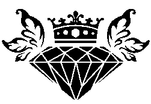
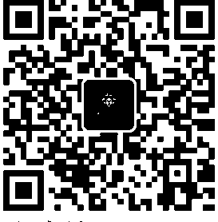
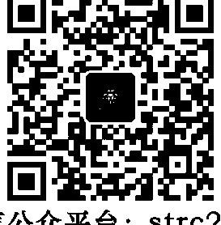
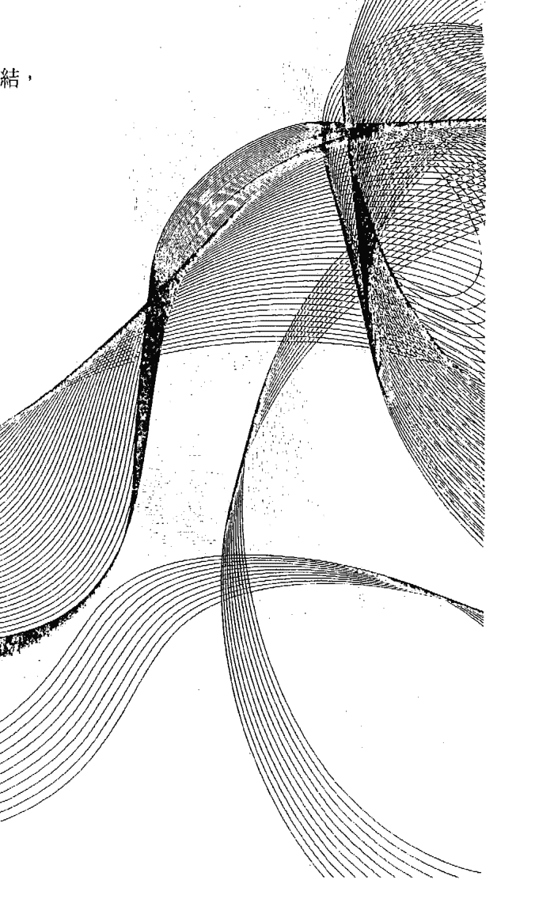
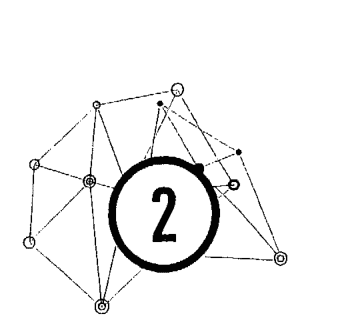
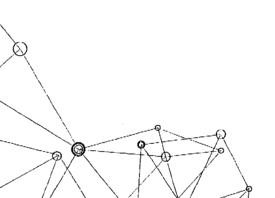

能量

## ENERGY STRANDS

# 校准

告别耗损关系，加深滋养连结，每天都能做的能量断舍离

当你了解各种能量的本质，你就站在生命中一切至关重要事物的中心，知道如何优雅地使用个人的力量。

丹妮絲·琳恩 Denise Linn——著

心意——譯

# St. Royal College
天使神秘学院

- 专业占卜预测机构
- 神秘学培训机构
- 水晶能量研究中心
- 神秘学资料库
- 微信信号：strcdts
- 微信公众平台：strc2011
- 读书交流QQ群：
  - 占星塔罗占卜师交流群：814594478（加入密码：PDF）
  - 神秘学其他综合群：659338717（加入密码：PDF）

微信号：strcdts

# 天使神秘学院

天使神秘学院 院长QQ：715104687

微信公众平台：strc2011

## 制作说明：

本书由《天使神秘学院》出重金从台湾购入的原版书籍扫描制作完成。为达到最好阅读效果，特地把原版书全部切开后，再经由专业扫描设备高精度扫描完成，并经过一张张的PS后期处理最终成书，其间花费大量的人力、物力以及时间，只为能给大家提供经济并优质的神秘学学习资料而努力。

本学院强力谴责某些机构和个人，把本学院花心血制作完成的电子书籍，包装后直接放在自家淘宝网上低价倾销的行为，以谋取不劳而获的经济利益。如果长此以往最终将无人愿意再为大家花心思制作电子书，那以后可能大家再无新书可读。

为让大家以后能够读到更多的好书，也为了本学院的良性发展。
本学院恳请大家尽量做到如下几点：

- 一、 尽量在本学院的网站购买电子书籍。
- 二、 请勿用技术手段把电子书内的水印及加密去掉。
- 三、 在收到电子书后小范围传阅即可，千万不要公开传播，更别挂到淘宝网上低价销售。

同时为答谢广大支持者，学院电子书将做如下调整：

- 一、 学院会把一些早已收回制作成本的电子书折价销售。
- 二、 最新制作的电子书籍会开放打印功能，大家购买后有条件的可自行打印成书。

能量

ENERGY STRANDS

# 校准

告别耗损关系，加深滋养连结，每天都能做的能量断舍离

丹妮絲·琳恩 Denise Linn —著
心意—譯

## 各界推荐

> 人體能量場有很多對應網絡，與宇宙萬物每個部分相連結，能量是一種意識的顯化，由意圖／意念所產生，而人的「起心動念」也是一種「意識的觸動」所產生能量變化。在感官覺受交錯式的衝擊下，讓人在心身靈複合體各個層面與客體的協同上，需要不斷淨化調和與療癒整合，讓生命能量流的旅程臻至圓滿。
>
> 作者提供獨特的心靈守護法則，從自我覺察陰暗自我（shadow self）、理解能量網絡的連結機制，到如何整復、轉化的操作工程，強化賦予自己天賦的意識能量（束）。對於處在認知世界現實中心物分離混亂的現代人來說，提供了心身靈安頓和樂的最佳終極指南。
>
> ——Amy逸美／意識結構研究會社團負責人

當我拿到這本書的初稿時，就無法放下這本書了。

這是不可多得的自我能量照顧與清理的教科書，丹妮絲輕鬆簡潔的文筆，觀念也非常正確，搭配栩栩如生的案例故事，就彷彿她在你面前親自講課般的生動有趣。

> 最後，不管外在世界發生了什麼事情，請永遠記得你是誰，當你記得你是誰的時候，你的內在就會非常強大，所有的問題自然會迎刃而解，一切都會符合你的最高福祉。這不只丹妮絲一再強調的概念，也是我認爲本書最重要的概念。這是一本所有身心靈工作者都應該熟讀，也是會讓你功力大增的好書，在這邊強力地推薦給大家。
>
> —— 王永憲／加拿大自然醫學博士

> 能量狀態造成了個人的生活現實，而思想心態又引導著我們個人的能量狀態。在人際互動中的愛恨情仇，或愛或恐懼的牽掛，形成了持續掛勾著的能量通道或能量束。
>
> 在近代不論是心理學或心靈靈修課程中，對於情緒勒索、能量爭奪、人際操控，甚至能量功法都提及了能量束的觀念及技巧。但本書將能量束做了最完整的整理說明：從其成因到應用技術，及破解與防護之法。對研究及實際修煉人際互動和能量運作的朋友們來說，是必備的參考書，也是一般入門朋友可以從能量角度了解人際互動的自助自保手冊。
>
> 推薦您值得一讀！
>
> —— 周介律／光中心創辦人

如作者所言：「我們的靈魂熱愛真理，而通向真理的道路就是你的能量場必須足夠強壯才行。」同樣從事能量工作，所以很清楚這樣的想法。我們從出生開始便與這個世界作了連結，凡所感知到的或是意識到的、甚至幾世之前，我們都會因為我們此刻的存在而形成能量的連結。透過此書的分享讀者可以理解能量束的形成與如何強化自己的能量。

> ——庫瑪（Kuma）／《光的療癒者——活在第五次元的世界》作者

> 放下生命中不必要的負累，與他人擁有和諧愉快的連結，身心靈輕盈安康，是多數人的共同渴盼。本書作者例舉許多生動故事，娓娓解說「能量」是如何影響我們的生活與人際關係。為了提升更好的生命品質，須細心覺察那些耗損我們的能量牽絆，好好淨化與釋放。更別忘了帶著溫柔與愛，隨時滋養與善待他人。謝謝作者的智慧洞見，浩瀚宇宙中，我們都是一體的，彼此不孤單。
>
> ——潘月琪／資深藝文主持人．口語表達訓練講師．TED×Suzhou年會講者

> 生命就是能量，當我們能夠從根本去理解這一點並學會運用能量時，我們的生活就會發生驚人的變化。你準備好放下過去了嗎？你厭倦了關係中能量耗盡的無力感嗎？讓我們一塊跨步向前，讓《能量校準》這本書教會你所需知道的一切，並讓你更加了解生命中重要關係的形成、維護與強化。
>
> ——雪柔·理查森（Cheryl Richardson）／《紐約時報》暢銷書作家

> 深入的好書之一。
>
> ——詹姆斯·范普拉（James Van Praagh）／《紐約時報》暢銷書作家

> 《能量校準》不僅教導你了解能量束是生命的一部分，和其運作方式，還教導你生命是能量施與受的一個大連續循環。你可以控制這種美妙、充滿智慧的能量，並運用它來引導你走向幸福的道路。
>
> ——約翰·霍蘭德（John Holland）／靈媒、《穿梭陰陽界》作者

> 丹妮絲在本書提供強大且易於理解的引導方針，透過學習辨識你的附著物、如何釋放不健康的關係並培養積極正向的關係，你會體驗到一種與眾不同的自由感！身為一個高度敏感的同理者，我發現丹妮絲的書既能給人力量又能令人感到安慰。
>
> ——凱莉·理查森（Kerri Richardson）／《你的雜物有話要說》作者

## 目录

前言：放下的旅程
010

导读：关于能量束的真理
014

1 理解能量束
023

2 探索你的能量束
097

3 切断捆绑的关系：释放耗损你的能量束
143

4 保护和屏蔽你的能量场
185

5 强化那些赋予你力量的能量束
239

后记
280

> 谨以此书献给
> 卢安·西比克……
> 我的生命因为你，
> 而变得更加光亮。

## 前言／ 放下的旅程

> 当我们试图以单一的角度看待某件事，我们会发现它和全宇宙都有关系。
> ——约翰·缪尔（John Muir）

约莫五十年前，皇家夏威夷旅馆前有着一棵巨大的榕树（也许这棵树到现在还矗立在那里）。对于观光客来说，那只是岛上的一部分，然而，对那些有灵视力的人们来说，他们会“看见”一条粗大且闪闪发亮的能量束，从树上穿过酒店，一直延伸到地下的一个SPA按摩中心。这个按摩中心的位置颇为隐秘，除非客人已事先知道，否则，基本上一般人是很难找到这里的。有趣的是，几乎每个星期都会有人走进按摩中心，然后说他们是跟着树上闪亮的能量束走进按摩中心。当时，我在那家按摩中心和我的老师莫儿娜·西蒙那（Mornah Simeona），荷欧波诺波诺回归自性法的创始者）一块担任按摩师的工作。莫儿娜是夏威夷的卡胡纳（Kahuna，夏威夷词汇，是当地对工匠、专家、僧侣、药师、教师以及其他智者的总称），也是传统疗法治疗师。对于按摩中心这些络绎不绝的人潮，我感到十分困惑，便问了莫儿娜，“那些客人到底在说什么呀？我没有什么看到什么闪亮亮的光束，一路从树上链接到这个地下室啊？！”

莫儿娜缓缓地答道：“刚开始在这里工作的时候，为了要吸引兴趣相投的顾客，我就在这棵大榕树里锚定了一股链接到我们 SPA 按摩中心的能量束。因为，在我的传统文化中，古老的疗愈师会知道能量的锚定与链接该怎么设置，所以，只要是能够有意识地看见这股能量束的顾客们，就会自己走进我们的按摩中心。然而，并不是每个人都能够有意识地看见这股能量束，这也是为什么，当一些人走进我们的按摩中心时，才会异口同声地说，他们不知道自己怎会走下楼到我们的 SPA，似乎是有一股莫名的能量牵引着他们。”

事实上，莫儿娜的生意也的确是兴旺无比，甚至连国家元首也曾光顾。她接着说道：“即使你看不到那些将我们和宇宙链接在一起的能量丝（filaments）、能量束（strands）以及能量紧带（cords），但它们就是确确实实的存在。有些人会强化我们的能量，加深我们与自己以及造物主之间的联系；然而，也有些人会耗损并削弱我们的能量。然而，当你了解了能量的本质，你不但能掌握生活中的重要事务，也会知道如何优雅地使用个人的能量”

> 力量。“莫儿娜的话语，开启了我对于能量本质的了解，以及我们是如何地与宇宙链接在一起。

和莫儿娜相处了几年后，我开始到世界各地去旅行，除了花时间和萨满及大地治疗师相处，也向他们学习原始部落对能量与疗愈的见解。我发现，不同的原始部落间却都有个共通点，就是认为我们的能量是与世界联系在一起的。为了生活更加平衡，每个（部落）传统文化中都有强化或释放这些能量束的方法。在本书中，我会分享自己多年来学到的一些方法，以支持你去了解这些能量束，获得更和谐的人生。

- 能量缆（cables）
- 能量索（ropes）
- 能量带（ribbons）
- 能量束
- 能量线（thread）
- 能量网（cobwebs）
- 能量丝

本书会是开启你了解能量“能量缆（cables）、能量索（ropes）、能量带（ribbons）、能量束、能量线（thread）、能量网（cobwebs）和能量丝”流向的旅程。你会知道该怎么使用古老的萨满技巧，来释放羁绊你的能量系带，也会学到该如何强化那些能赋予你力量的能量束。这不但是神圣的，也能提供灵魂一个暂时的栖身处。

能够发现并释放那些不再赋予你力量的能量系带，是一个放下的旅程……而且这也能协助你重新找回生命的脉络。当你愿意开始探险、认识并释放那些限制你的能量系带时，你可能就会意识到该是放下负累的时候了。当你意识到阻止你成为真我的能量为何时，你就会发现生活中已没有什么人可以怪罪、没有人有错，没有什么好担心的，也没有什么事真的可以让人感到内疚或羞愧的。你没有问题，你就是你，你是完美的。你不需要隐藏真正的自己，也不需要做个烂好人，总是先满足别人的需求后再顾到自己。在你愿意放松、放手的那个片刻，你就会了解到……一切安好如昔；而这也是本书更深层次的能量。

## 导读／关于能量束的真理

与人讲话聊天时，你是否有过越聊越觉得自己的能量逐渐低落，与此同时，对方却变得越来越生龙活虎、神采奕奕的经验呢？这现象可能是代表着：你的能量正单方面地流进对方，所以你才会觉得越来越累，而他们的精气神却是益发旺盛。
或者是，你有那种没来由地感到兴高采烈的经验？这现象可能意味着，与你共享爱情能量系带的某个人正想念着你，而他们的爱也随着这个能量系带传来（这种喜悦的念头，通常会同时触发接收者和发送者）。这些都是能量束在生活中呈现出的实例。
藉由这本书，你会认识那些可以提升、降低你能量的人事物，同时，你也会学到该如何释放那些不再滋润你的能量，以及如何保护自己的能量。我们的灵魂热爱真理，而通向真理的道路就是你的能量场必须足够强壮才行。透过本书所列的练习活动，相信你会从中逐渐了解能量的奥秘。
写这本书时，我陷入了两难的困境：一部分的我，并不相信所谓的切除能量系带以及使用心灵守护法，因为这会导致我们产生人类彼此之间是可以相互分离、孤立的错觉。另一部分的我，那个在原始部落学过能量保护方法的我，又见识过恶意的精神攻击以及吸取他人能量，所造成的毁灭性伤害。我的挑战是，我想要分享那些可应用于生活的洁净法及守护法给你们，但是，又不希望你们会产生人类彼此之间是可以相互分离的想法。

我希望人们阅读我的书后，可以张开双臂拥抱生活，能够在融化他人的心房后，发现书中宝贵的知识。但又担心分享了能量保护法后，可能会让你对这个世界存有恐惧，并且产生他人可以随意伤害你，以至你必须要随时自我保护的错觉。

最终，我还是决定跨步向前，并且教导你们我毕生在能量领域里面所学到的知识。在这期间，我也会从灵性的角度来分享一些关于我们是谁的提醒，因为我知道这是真实的——你不是一个与周围宇宙分离的人。

从神圣的角度来看，你也无须保护自己；从更深层的意义来看，这一切都是你的一部分。

这本书是给有那么一段时间，突然忘记自己是谁的你。身为人类，我们总是会忘记自己是谁，不仅仅是我，我们每个人都老是会忘记自己是谁，而这也是人类天性的一部分。当我们忘记自己是谁的时候，我们会相信自己和周遭的人以及宇宙是分离的。然而，那段忘记自己是谁的时间却是无价的，因为我们会开始理解、学习如何断开那所谓的负面能量束，并且学会延伸所谓的正向能量束。

从神圣的立足点来看，没有什么外在事物可以真正地伤害你。我曾经在一个濒死的枪击事件中有过类似经验，当时连医生都觉得身为受害者的我已经回天乏术。在这个深具意义且真实的经验中……“我”进入了一道金色光芒中，也很确定地知道那就是“我”真正的家，一切都是那么地熟悉，因为“我”曾经在那待过；事实上，“我”似乎是从未离开那个家。我在地球的人生反倒是像一场梦，而且有着我们是彼此分离的假象。

就在医生们努力地为我做急救时，我进入了这个有着金黄色光芒的时空里，我想起自己一直以来都知道，却已遗忘的事实：我们是宇宙中的一切。我进入的这个时空是如此真实，呈现出的实像景观和我之前在地球所经历的人生非常地不同，但，又是那么地相似。

我十七岁的人生直到那个时候，似乎都只是个梦，而我经历的那个如天堂般的时空似乎才是真实的。

当我在讲述这个经验时，你可能会觉得不可思议也很难理解，就当医生认为我已经死了，我记得那时的“我”正逐渐离开身体，并且成了万物的一部分……无边无际，“我”与众生、万物合一。你，也在那里，我们都在。万物一切存乎于我，也存乎于你，我们是合一的。

你是万物的一部分。你是西藏白雪皑皑的山脉，也是非洲一名新生儿的气息；你是北极清新的空气，也是洛杉矶的袅袅烟雾；你是一个圣人的神圣能量，也是一个帮派成员的焦虑——这一切都是你，也是我。但，我们只有在非常高维度的意识状态下（或者在我的情况，是近乎死亡），才会理解这个事实。在这个红尘俗世中，我们相信他人可以伤害我们，然而，那些人之所以可以伤害我们，是因为我们相信了“他人可以伤害我们”的想法。我们相信负面的精神攻击、能量吸血鬼会把我们吸乾，而他们之所以可以，是因为我们相信他们可以。不仅仅个人信念导致这些负面实像的产生，还有人类的“集体无意识”。当我们因为跌倒、摔下阶梯，而感到疼痛时，那个感觉是真实的；当人们对我们产生负面情绪，我们感受到的痛苦也是真实的。身为人类，我们成了“集体无意识”的一部分，这个“集体无意识”认为我们与万物分离，而且周围万物可以伤害我们，因此这个伤害的实像俨然而生。当我从另一净土回来后，我记住了一个真理：我们是合一的，我们和宇宙也是合一的；然而，这个真理对我来说只是个记忆。当“我”回到自己的身体后，我立刻被我们所存在的时空给迷惑。我还是会动怒、还是会害怕被伤害、受伤了还是会生气、还是会有人会来消耗我的能量，那个对真理的记忆并没有帮我减轻多少能量上的损耗。我提出这个观点，是希望当你在学习如何保护自己能量场，以及学习如何消除其他人所带来的负面影响的同时，也能在最深层次上了解到，每一条能量束、每一个链接、每一颗恒星和星系——这一切的一切都是你。当某人似乎在耗损你的能量时，事实上，真正正在吸取你的能量的是，存在于他人身上那个部分的你。当某人似乎正在为你补充能量时，真正正在为你补充能量的是，那个存在于他人身上那个部分的你。

身为人类，我们认为宇宙是远在天边，就像星星般的遥不可及。但事实是，天堂就在这里，天堂就存在于你、我心中。就像是收音机的调频一样，你可以从爵士乐调到摇滚乐等不同的频道，每个电台频率都有它的范围，不会互相覆盖；而那个我们称之为天堂的地方、那个我们彼此合一不分离的地方，就存在于当下现在，那只是个调频的问题。你、我，都是一个无所不在的波浪起伏频率，只是在地球上，我们都把频率调整到宇宙是分离的频率上了。

但，即使知道这一点，你还是可以在必要时保护自己，还是可以将耗损你的能量紧带切除。事实上，这么做也是有必要的，因为你要能够立足在自己的光中，才能触及更高的意识层面。然而，我建议你在切除能量紧带的同时，先观看你的内心，找到（内在）能量紧带存在的地方，礼敬并珍爱它……在未来，吸引负面依附的可能性会降低些。

你可能会问：“我怎么可能去珍爱那些住在体内的施虐者或瘾君子呢？那些可都是我死命想从别人那里截断的能量系带啊，我怎么可能会去珍爱它们呢？”所谓的“阴暗自我”就是你的批判和压抑，而那些批判和压抑的程度，也就是你在“召唤”那些你不想要的负面能量附着在你身上的力度。如果你无法珍爱这部分的自己（这比批判它们要好），你就会分化你。无论你严厉地批判什么，你都是在吸引那些（负面能量）；如果你批判它，它会分化你。无论你严厉地批判什么，你都是在吸引那些你批判的人事物来到身边。我知道这听起来很奇怪，但事实上，你的批判其实就是在强化你和被批判人事物之间能量系带的链接。

曾有一位参加活动的学员杰瑞，趁着休息时间找我闲聊，在谈话过程中，他提到所有的女驾驶都很差劲。因为，他几乎每天都会被女驾驶乱超车，或者是差点被女驾驶撞倒。但是，他从未想过，正因为他那强烈的批判和信念，而四处吸引了那些技术差劲的女驾驶出现在他的生活中。

过去，我在书里所提供的讯息大部分都是以跳跃的方式进行，因此你们可以像拣选樱桃般的四处挑选你要的讯息。但是，这本书所提供的讯息却是依照特定的顺序进行着。

在第一章，你会了解什么是能量束，以及附着在你身上的能量系带有哪些。你也会了解那些穿流于你、朋友、家庭成员、熟人和祖先之间的能量，以及了解那些流入和来自过去、目前恋人的能量流动。除此之外，你也会逐步了解所谓的梦境、鬼魂、星际连结、脉輪和天體等。

在第二章，你將探索自己身上可能會對（自己的）情緒和健康產生影響的能量束，並且你將瞭解所謂的能量吸血鬼、精神攻擊、人的依附等的無價訊息，也會瞭解到殘存能量和前輩能量會如何影響你的幸福等。此外，通過學習和掃描能量的漏洞，你將發現那些正在影響你、你的身體和住家的能量束。

第三章，將為你提供具體、有效、歷史悠久且功能強大的方法，來切除和釋放任何耗損或削弱你的能量繫帶。

在第四章，你將學到那些關於能量保護以及何時使用能量保護等，鮮為人知的訊息。你也會逐步學習如何密封、保護自己的能量場，以及何時使用和不使用它們的方法。

最後，在第五章，你將學到如何提振、強化和建立人群交流、愛情與歡樂的能量束，以及如何強化你和宇宙的神聖連結。你也將會學到如何在自己的住家創造一個專屬的神聖空間，且只允許充滿活力、閃亮的能量光束流向你、通過你，並在你的身邊流動。

你也會發現我經常用不同的詞彙去表達、重複類似的信息。你甚至也可能會發現本書的某些觀點，曾經在我寫的其他書籍中出現過。其實，我是故意這麼做的，因為，「重複乃技能熟成之母」，而這也是一種非常傳統的教學方式。我的學習大部分都來自原始部落文化，這些文化中的智慧和故事，常是一次又一次地，以一種略微不同的方式告知族人，而這就是他們所認為的最佳學習模式。我以全然的愛支持你繼續跨步向前，邁向這個神聖的旅程。

# # 理解能量束

> 我们的生命像是汪洋中的岛屿，或像是森林中的树木。枫树和松树可藉由彼此的树叶轻声呢喃……然而，树根们也在暗黑的地底相互交融，岛屿们也在海洋底部相互交游。

——威廉·詹姆斯（William James）

依附其他的人事物是人類的天性（也許這始於我們打從娘胎就有臍帶和母親連結著的關係）。我們對這些事物的依附讓我們明瞭自己是如何地與周圍的世界連結著。我們的語言表達方式已經證明了，在潛意識中我們其實是對這些連結有察覺的，例如我們會說：感覺「被束縛」，或「沒有任何附加條件」，或者是「我需要斷絕關係」。從比較深的層次上來說，我們可以感受到自己與周圍世界的連結，即使我們看不到那些連結，但是，這些連結是真實存在的。

能量束雖是隱形的，卻非常真實地存在著，無數的能量線和通訊線，將我們與其他人、不同的地方和事物連結在一起。能量可以透過這些連結流動與消退。這些將我們與周圍世界連結在一起的能量束、能量繫帶、能量絲、能量線和能量線，可能是輕薄、短暫的，也可能是像巨大的河流般流動，而且這些連結甚至可能來自我們的過去，並存在了好幾世代。強烈的情緒（例如：愛和恐懼）能夠通過以上這些能量連結迅速傳播；身體上的痛苦、愉悅、知識和智慧也可以通過此連結來傳遞。

有些附著物的能量是有益處的，它們會讓我們覺得生龍活虎、能量充沛；然而，有些連結卻不是這麼的有幫助，反而會耗損或削弱我們。當兩個人開始互動，能量繫帶在他們之間形成了，而這個能量繫帶可以讓人感到活力充沛，也可以讓人感到精力竭。有時，你可以從能量繫帶中失去能量；有時，他人可以利用這個繫帶從你身上獲取訊息；甚至有些人會利用一些陰暗手段，藉由能量繫帶操控你。大部分的人對這些能量繫帶是無意識的，但在潛意識中還是會感知到這些連結的存在。

一些靈視者和通靈者，通常可以看到這些從太陽神經叢連結到太陽神經叢的能量束，不過它們也可以依附在身體的任何部位。兩人之間的情感關係越強，繫帶的連結就越強，而這個能量繫帶也可以讓我們感覺到另一方，即使那人在千里之外。有時候，我們甚至可以透過繫帶感知到另一個人的感受或想法。能量束可以將人們聚在一塊，然而，當關係不再具有建設性時，能量束會對結束關係造成困難。同時，能量束也能與不同的地點、場所連結。

西方文化中，大部分人對於能量束可以從他們身上連結到其他人與地方的了解是非常模糊的。他們以一種分離且彼此互不相干的方式看待世界，不覺得自己是萬物的一分子，而是把自己看成有別於萬物的優秀族群。他們並不了解，每個行動、每個人以及每個物體都有一股流動的能量絲與世界萬物連結的概念。

然而，過去那些以大地為本的原始文化，卻能夠了解能量場的密切與卓越。他們懂得如何感知那些可以促進美好生活的能量束，也懂得如何消除及釋放那些對他們生活不利的能量束。很多原始文化都相信，每個人都有一股能量絲與土地及其他人相互連結著。他們相信，如果人們旅行到很遙遠的地方，這股與土地連結的能量絲會因為過度延伸而變薄，人們也可能因此變得虛弱，甚至生病。對於人類的能量束是相互連結而且也和地球連結的想法，是全球原住民的共同信念。

在本書中，你將了解古代治療師一直都知道的秘密：我們生活在一個充滿能量的宇宙中，而能量隨時隨地都在影響我們。你將學習用傳統方法來恢復自己的個人能量、學習如何斷開有害的關係及過去事件，以及如何保持能量場的潔淨。此外，你會探索能量束與集體無意識的連結，你也會發現能量束與脈輪（身體的能量中心）、指導靈、天使、宇宙和造物主之間的聯繫。除此之外，你將了解自己連結到住家內部每個物體的能量絲，與擁有潔淨的能量場之間有什麼關係。你也會發現哪些能量束是在支持你的命運，以及如何釋放那些阻礙你的能量束。

# 什麼是能量束？

我把連結我們與周圍宇宙的能量繫帶稱之為「能量束」——也稱為「親和束」，因為除非「有緣分」，否則人、地、物的能量不會附著在你身上；換句話說，也就是彼此擁有相匹配的頻率。

我對「親和力」的定義是：人們對人、事、物、想法，所產生的自然吸引力；一種固有的相似度或協議；同時，它也表示一種密切的形似或聯繫。在化學領域中，親和性是原子結合在一起的驅力。我在本書使用此術語的方式為「正向親和力」，這意味著它可以增加你的能量，還有能夠消耗能量的「負向親和力」。這些能量束可以薄如微絲或蜘蛛網，也可以強大得像粗繩一樣。它們可以是透明的、彩虹般的隨著光線閃爍，也可以是暗淡的、黏稠的、密集的或是模糊的。

能量束不僅僅是連結人、事、地、物之間的乙太繫帶和星際繫帶；同時，它們還可以下意識地作為向我們周遭人、地、事、物發送和接收能量、訊息的一種途徑。人與人之間的關係是這麼運作的：當你與某人建立關係時（無論是負向消極還是正向積極的方式），具可塑性的能量絲會將你與其他人，以及他們與你之間連結起來，從而將訊息、情緒和能量頻率在你們之間流動。來自原始文化中具有高度直覺力的人和薩滿通常能夠看見或感知這些能量束。正如我之前提到的，有時這股能量束會從太陽神經叢散發出來；有時也會從身體的其他部位發射出來，例如：第三眼那一帶、頭頂、心輪區，甚至是脊柱底部附近的海底輪。能量束的顏色、質地和大小都不同。戀愛中的兩個人，彼此心輪之間所形成的繫帶，可以很粗大、光彩照人且晶瑩剔透；顏色有藍色、綠色，甚至粉紅色或金色，顏色總是明亮動人。然而，如果有人憎恨另一個人時，連結他們的繫帶可能呈現出暗沉的豌豆綠或是骯髒的灰色，同時能量繫帶可能是黏稠且呈纖維狀的。你和另一個人之間的能量流，可以使你充滿活力或是精疲力竭。在很大的程度上，能量也會像海洋般的起伏不定，有時是由你給予能量，有時則是你透過能量繫帶接收，有時你和另一個人會同時給予和接收。如果你與某人聊天後感到精疲力盡，但是他們在談完話後卻是精神奕奕、充滿活力，那麼，這可能是能量束枯竭造成的。換句話說，能量從你這傳遞到那個人身上，他們卻沒有反饋能量到你身上，這就是一趟單程的能量旅行；所以，聊完天你會覺得精疲力盡。

你和過去所有戀愛關係的人之間，幾乎都存在著能量束的附著物。這些能量繫帶可能纖細的像是一股耳語，也可能粗的像高速公路。訊息、能量、愛的感覺和負面有害的想法都可以在這股能量束中來回流動。例如：你跟另一個有繫帶連結的人，同時擁有相同的想法和情緒，或者你們兩人可能同時出現在某個地方，或購買相同的物品，或直覺地知道對方在做什麼或有什麼感覺。

當（能量）繫帶的連結很強時，即使那個人身在地球的另一邊，你仍可能會感知到他們的情緒、身體疼痛或他們的想法……因為能量束讓你們結合了。有時，即使你和另一個人沒有肢體上的接觸，能量束還是可以成長並且變得更堅固。你可能會感知對方的情緒，並將他們的想法當成自己的想法；這特別容易發生，如果對方是強大的（能量）發送者，而你是開放的接收者的時候（重要的是，你要有辦法辨認情緒是出於你自己，還是來自於那個與你有能量連結的人。在本書中，你將學習如何分辨什麼樣的情緒是出自於自己，什麼樣的情緒是來自於他人）。

你是否曾在離鄉遙遠的他方，遇到舊識呢？當然，這個相會可能是個巧合，但也可能是因為能量繫帶的連結，把你們牽在一塊了。當肉體之間的距離變近時，存在於你們之間的能量流被強化了，而且像是磁鐵一樣地把你們吸在一塊；也像是漁夫捲著釣竿上的魚線，要把釣到的魚拉上岸一樣。在關係中投下的情感越多，吸引力就越強（負面情緒往往會比正面情緒產生更強烈的吸引力）。你認識某人的時間越長，且越是與他們親近，那麼，這股能量束就會變得越粗越強。如果你們彼此靠近（通過電話、信件或是網路聯繫），這股能量束會提振、增強，甚至把你們拉到一塊。

# # 絕對可應付一切的能量三原則

一般來說，了解能量本質對於更深入地認識那些將我們與周圍宇宙連結在一起的能量束，是很有價值的。有三條絕對適用於能量束及一切萬物的原則。這三個原則也是構成即將探索的「關於自己能量流出與流入」的基礎：

- 1. 萬物都是由不斷變化的能量所組成。
- 2. 我們沒有與周圍的世界分離。

多數人完全沒有意識到能量束對他們的幸福、安康和生活的影響。在本章節，你將會了解能量，並發現那些將你與周圍世界連結在一塊的能量絲、能量束和能量繫帶等。在後續的章節中，你將學到如何斷開那些耗盡你能量的繫帶，並增強那些能夠強化你能量的繫帶。

# 3. 萬物皆有靈。

那些生活在以大地為本的古老文化的人們都知道，所有形式的生命（從雲層、樹木、漫遊在大平原的水牛、山脈和石頭）都是短暫的能量模式。這是一種可以追溯到原始時代，世界各地原始族群共同的認知。目前，在我們的概念中認為宇宙是固定的，與祖先的認知相違背。

# 1. 萬物都是由不斷變化的能量所組成。

我們沉浸在能量海洋中，這些能量在時間和空間中不斷地流動和不斷變化。萬物都是能量。物理學家們確認原子和分子——即使是看起來很堅固的物體——也在不斷地運動。在固定物體的表面下方（也就是存在於時間之河中），是一個能量不斷旋轉、融解和凝聚的場域。

所有生命都擁有與生俱來的和諧及宇宙秩序，因為能量脈動及電子波動會從存在中轉入、轉出。我們周圍（以及我們內部）的世界，便是這種能量模式在不斷流動的關係中的相互作用。它是宇宙中既對立又和諧的兩種原力之間的舞蹈：陰和陽、神秘和有形——也是黑暗與光明之間無限又規律的永恆戲碼。

# # 2. 我們沒有與周圍的世界分離。

當我們汲汲營營地追求科技發展時，忘記了所有生物和地球萬物都是相互連結的原始智慧。我們忘記了自己是與活生生的宇宙相連結，而這個宇宙與生命萬物共同歌唱，並與心靈共同脈動。我們忘記了每個人和萬物都有靈性，我們都是純能量的呈現，且永遠都處在波動中。這就是為什麼我們需要與這樣的觀點重新連結（就如同你在子宮裡與母親連結般的自然），並且銘記外在世界中沒有一樣不是你。由於我們目前採取線性方式來感知現實，因此無法在智力層面上完全理解這一點。我們每個人的內心，都對超越時間、空間的「合一」和「一體」之地有所渴望、嚮往，也有所記憶。我們無法用言語表達，甚至無法以人們能理解的方式記錄下來。然而，在每個人內心深處，我們都是明瞭的。人們在現代世界中遇到的許多困難，都源於一種錯誤的信念：我們是獨立存在的生物，我們既沒有親密地與地球相連，也沒有親密地與地球上的動物、樹木連結在一起。我們認為我們是彼此分離的，有時我們甚至是與自己分離的。認為我們可以獨立於環境之外而存在的想法是一種錯覺，這種錯覺可能為我們帶來嚴重後果。正是這種信念使得全球汙染、仇恨、戰爭、貪婪，以及許多其他事物的流行成為可能，而這些事情不但充斥著我們的報紙，也困擾著我們的睡眠。由於這種彼此分離的集體信念，我們在情緒上很難感受到自己與私人領域之外的事物的連結。然而，現在至關重要的是，我們不僅要將自我意識擴展到個人環境，還要將自我意識擴展到超越時間和空間範圍之外，不僅是環顧我們的家，還要環顧我們的社區以及地球。

# 3. 萬物皆有靈。

西方文化中，很少有人知道那些原始文化所理解的奧秘。原始文化知道，我們周圍的宇宙不僅是一個巨大的能量流動場，我們還與它們緊密相連，而且宇宙中的一切都存有意識。即使是最頑固的懷疑論者，也會同意動物是有意識的生物。現代科學已經證明，植物有自己的意圖，並能夠對人類的能量場做出反應；然而，石頭、山脈和河流的意識也不亞於此。古代的原住民對此很了解，他們會在釣魚之旅開船前，先向海洋神靈尋求祝福、在採摘植物時感謝植物，並在獵取動物後感謝動物延續他們的生命。古代原住民們腳下的地球，不被認為是無生命的：地球是母親。將感恩之情獻給地球，並且在挖掘她的肉體（土壤）之前乞求寬恕，因為那些以大地為本的原始文化都了解萬物一切都活生生地存在著。

- 1. 你是由不斷變幻的能量場所組成。
- 2. 你並沒有與周圍的世界分離。
- 3. 你周圍的世界（和你內在的世界）是活生生的，並且擁有意識。

當你能夠理解外在的一切都是你，那麼，對於能量束的了解，以及釋放那些你不想要的能量束來說，會簡單許多。

我想另外提一下：雖然能量束有時會以線條的方式被看見，還有一種更深入的方式可以理解它們。我們能夠把能量視為線束，是因為它們允許我們將無法定義的東西予以定義。這就像是脈輪一樣，我們通常會把脈輪描繪成彩色的能量球，即使它們是朦朧且不全然是如此的模樣。氣場和脈輪的顏色是流動的，而且不斷地轉換和變化，但是，當我們將脈輪和氣場視為彩色能量球時，會更容易了解它們。

這就如同上帝在許多文化中，會被賦予肉身的道理是一樣的，因為這會使我們更容易與他人產生連結。要我們與難以捉摸且四處存在的東西產生連結，可能是困難的。因此，如果你無法「看見」那些將你和宇宙萬物連結在一起的能量束及繫帶，請不要氣餒。能量的可視化，是一種幫助你了解能量的效用和成因的比喻。當你將它們想像成繫帶時，這也會使得所有繫帶切除和能量束釋放的方法更容易生效，從而為你的生活增添更多的祝福、恩典與愛。

在下一節中，你將了解有哪些獨特和特殊的能量束正在影響你的能量，進而影響生活。當你閱讀到關於那些可能附著在你身上的能量時，你可能會想要掃描自己的生活，以開始辨識出哪些能量束正在影響你。

# 你附着了些什麼呢？

我們每個人都有大量的能量束湧入周圍的宇宙，所以你並非孤立於世，你是與所有萬物連結在一起的……所有萬物。

你有能量束連結到自己的父母、兄弟姐妹、孩子、流產的嬰兒、兒時朋友、性伴侶、麻煩或奇怪的老闆、同事，甚至連結到精神領袖、治療師和療癒師。你可能自己創造能量帶、能量絲附著在公眾人物、影視名人、政治家、相交不深的人和鄰居身上。此外，你和你的住家以及住家裡面的所有物品、動物、目前的寵物和過去的寵物、過去的生活、祖先、你在世界各地居住時遇到的當地人、住過的房子、出生的地方、星辰、月亮、你的指導靈、天使、造物主……都有能量絲連結著。

### 家庭束

身處在子宮裡的嬰兒，透過臍帶與母親相連。除了肉體上的連結，還有能量上的連結，而這個連結在臍帶被剪斷後，甚至可以持續。這也就是為什麼母親可以知道，她的寶貝孩子在不遠的路上遇到困難了。這個繫帶通常很結實，而且母親距離孩子多遠也都不重要，孩子還小的時候，這個繫帶可以伸展而且和距離長短無關。情緒能量在孩子和父母之間來回穿梭、流動。直到孩子變得更加獨立和自給自足，這個繫帶才會減少甚至消失。有時候，母親和孩子都不願意放棄這種連結，這種關係可以保持支持、愛和親近；但是，當比較負面的情緒在彼此之間流動時，父母或孩子也必須承擔。例如：你和母親相處得精疲力竭，所以決定搬到遙遠的地方居住以爭取自己的獨立，但不知怎地，你仍感到精疲力竭，特別是在與母親聯絡之後。你們可以分開四十年，生活在不同的地方，但這個家庭成員仍然會耗損你的能量。之所以發生這種情況，是因為這股能量束變得厚實而黏稠，不管你身在何處，它還會在你們彼此之間延展。來自母親的能量束也可以充滿愛，讓流經過的能量溫柔地支持你度過生命中的高低起伏。任何家庭成員之間的能量線束都是如此；然而由於曾透過臍帶連結，母親和孩子之間的能量束往往更強烈。即使你對父母不甚了解，或者他們已經過世，你與父母之間強烈的能量束連結還是存在著。被收養的孩子即使對親生父母一無所知，仍然與他們的親生父母連結著，如同他們與養父母之間的連結一樣。奇特的是，諸如食物偏好，甚至宗教傾向等事物也都可以透過這些能量束傳遞。連結雙胞胎之間的能量束特別強烈，通常就算他們相隔遙遠，還是能夠知道對方的感受，甚至是想法。根據家庭動態，這類型的能量繫帶可以增強或削弱。當家庭成員之間的連結繫帶可以灌注一種持續、療癒且充滿活力的情感支持…；然而，當這個繫帶停滯、沉悶和沉重時，則帶來反效果。換句話說，無論你去到哪，你的家人都如影隨形。

創傷可以透過家族的能量束傳遞，最新的科學研究也證實，創傷可以在家族世代中傳遞。二○一六年，科學期刊《生物精神病學》發表了一篇標題為〈大屠殺的暴露引發了FKBP5甲基化中的代際作用〉的文章，文中闡述創傷可以透過基因傳遞給下一代。

西奈山創傷研究部門的主任瑞秋·耶胡達博士（Dr. Rachel Yehuda）領導了一項研究，她的團隊訪問了三十二名創傷倖存者及其子女，也為他們進行抽血，並專注於研究一種名為FKBP5的基因。研究人員注意到他們身上所謂的「表觀遺傳變化」——指不是基因本身的變化，而是附著在其上的化學標記所產生的變化。舉例來說，第一代創傷的倖存者（如經歷二戰大屠殺、九一一恐怖攻擊或卡崔娜颶風），為了因應恐怖的事件，基因會產生遺傳適應或應變的作用。然而，沒有經歷過類似創傷的第二代，卻存在著完全相同的基因變化。耶胡達博士表示，當科學家們觀察倖存者的孩子時，發現他們在壓力相關基因上的同一位置，也存在著和第一代創傷倖存者相同的表觀遺傳變化。從靈性的角度來看，創傷能透過基因傳遞，它也透過家庭能量繫帶傳遞給後代子孫。

我的客戶蘿莉曾告訴我，她在長期間，總會莫名地對身著制服的人感到非理性的緊張；旅行時，只要被要求出示身分文件總會陷入恐慌。她一直無法對這兩個現象做出解釋，直到有一天她與祖母交談之後，才稍微有些了解。她的祖母是猶太人，童年恰逢納粹德國時代，她從未想要與孩子或孫子女們提起那個年代。祖母居住的地方很遙遠，也與蘿莉的父親關係疏遠，因此在蘿莉的成長過程中極少見到祖母，對她也不太了解。然而，在一次親密的談話中，蘿莉的祖母說道，儘管時隔多年，她依然存在著被穿著制服的男子強行帶走的恐懼感。祖母也和蘿莉分享了她小時候，需要出示身分證件（偽造的文件）時所承受的驚嚇；她雖然從未被帶到集中營，但幾十年來都生活在恐懼中。這股能量繫帶將祖母的恐懼，甚至她對穿著制服者的身體反應，都傳遞給了蘿莉。

在許多情況下，我們與家庭成員的連結繫帶，是我們最強大的能量連結之一。無論你是否意識到它們的存在，也無論你與他們的關係是正面還是負面的，這些繫帶都持續地發揮作用。幸運的是，現在你將學習如何辨識、評估並在必要時釋放那些對你無益的家庭能量繫帶。

來，那個黑暗時期的創傷卻一直伴隨著她。

這是一個祖母經歷創傷後，將創傷與恐懼透過家庭能量緊帶傳遞給子孫的例子，而且這也最有可能是蘿莉感到莫名恐懼的原因。蘿莉在做了能量緊帶的切除後，她畢生對穿制男人的恐懼感，以及對出示文件時的恐慌都完全消失了。你可以切除負面能量緊帶，但同時仍然與你愛的人保持正面的連結。

即使是身處遠方，家庭束也會對你的情緒產生強烈影響。當你們彼此的距離縮短，這種影響則會變得更為強烈。當某個人（也許是你久未見面的父母或者是舊情人）走進你的生活，那個盤繞在角落且乾燥的能量束，可能會突然變得緊繃、強化，就像是久未澆水而癱軟的植物一樣，在突然被澆水後，就會變得挺直且警覺。即使你久未見到某人，那並不代表連結著你們的繃帶消失了，它可能只是處在休眠狀態。

若是已經過世的家庭成員，你們之間的能量束連結還是可以很強勁。有時，這些連結具有持續性和支持性，但有時則具有耗損性。如果某人活著的時候，你能感受到他的愛與支持，那麼他死後，如果能量連結仍然存在，它還是可以持續支持你。然而，如果這位家庭成員在生前就會耗損他人能量或很黏人，那麼死後能量束如果存在，就很可能是耗損性的。

此外，你和不具有血缘关系的家人之间，连结的繫带也可以很强大。我和我先生大卫、女儿梅朵，一起从华盛顿州的家开车前往旧金山湾区参加一场婚礼。大卫和我轮流开车，我们在进入俄勒冈州时迷路了（这发生在GPS普及之前）。那时轮到我开车，我对导航的想法就是停车、问人，然而大卫的想法是不要问任何人，他宁愿仰赖地图。我想停下来找一个可以帮忙指路的人，大卫却对我的提议越来越生气，他确信自己终究可以透过查看地图来弄清方向。我们很少吵架，但此时我们的愤怒已节节高升，而且在蜿蜒曲折的农村更是越来越找不到路。

最后，我喊道：“我受够了！”当我看到下一户人家时，我要停车问路！就在说完这句话后，我们看到长长的土石路尽头，有一栋小房子。我把车开进了车道，当车子滑行到这户人家门前停住时，扬起的灰尘已把车子的两侧弄脏。大卫还来不及阻止，我已经下了车，并且跑上阶梯到了宽阔的门廊上。我捶打着这户人家的前门、我厌倦了迷路、我也很气大卫，因为他不采纳问路的建议。经过一段时间，就在我决定转身离开时，终于有人把门打开了。

当我转过身，我的继姐珊蒂赫然地站在眼前。这太令人惊讶了！多年来，我一直没跟她联络，甚至连她住在哪都不知道，然而……她现在就真真实实地站在我眼前。最后，我

这感觉起来就像是一种奇迹，然而因为我了解能量束的运作，所以能理解这是如何发生的：这正是当两个人近在咫尺，让长期被忽视的能量束变得活跃，并将两人像超级磁铁般拉在一块的完美例子。

#### 祖先束

能量束除了可以将你和直系亲属连结在一块之外，也可以藉由血缘回溯到好几世代之前。在某些地区，这被称为祖先症候群。你当然会与自己的祖先有些相似之处（例如：眼睛的颜色、身高），这可以简单地归因为基因遗传，然而研究发现职业偏好似乎也是代代相传（即使孩子出生时就被领养，而且对他们的祖先一无所知也是如此）。

事实是，我们每个人都是延续祖先血统的一部分，也是以后扩展血统的一部分。它是一种坚定不移的频率、光和能量之绳，让前人的情绪、经验和思想传递到你身上或是流经过你。在很多方面，我们每个人都像是一棵老树根上的嫩芽。你透过祖先束与自己的祖先相连结。如果你的祖先都是高贵、优雅、高尚的人，那么这些能量束可能对你大有益处。如果你的祖先不那么光彩或经历过大规模的恐惧、创伤、愤怒、缺乏自信或悲伤，那么这些情绪会影响你。

情绪也可以透过祖先束传递到你身上。换句话说，你所感知到的恐惧或沮丧可能不是属于你个人的；它可能是从祖先那里流露出来，并透过家庭繫带传递给你。

有时候，透过祖先束所传递的情绪和感受，会真实得有如你自己的情绪感受，因为它们深深地嵌入你的内在。祖先束里，那些可以影响你的事件包括：战争、压迫、奴役、饥荒、瘟疫、毁灭性疾病、犯罪和冤屈等。即使你不了解自己的祖先，它仍然可能会影响你，因为你的能量繫带和祖先连结在一块，透过祖先你也会与那些事件连结。然而，很棒的是这些祖先束可以被释放，你就不会再从祖先那里承受负累，也不会传递给后代。

我的客户科克，一出生就被领养，直到成年后他才意识到自己的真正的根源。他分享在童年时，就常常会用泥土将很多捡来的石头「黏」在一起，做成一些小房子。领养他的家人对这项技能，和娃娃屋大小的精美创作感到惊讶。等成年之后，他从事祖先的研究时发现自己的血缘祖先是石匠，因此相信自己的技能就是来自于他们。换句话说，来自科克祖先的能量束已连结在他体内，而祖先的技能借此传递给他。

另一位客户朱莉告诉我，她总是一种被压迫的感觉，并且非常害怕权威，要是这个人物是日裔身分，更是令她畏惧。她也害怕大声、大胆地说话，害怕与他人分享自己

的想法。她说自己并不是一个有偏见歧视的人，所以对自己在面对日裔人士产生的情绪反应有所警觉。她想知道这一切感受源自于哪里。当然，朱莉会有如此的感受，可能原因有很多，包括她目前的生活问题、家庭成长、她小时候无意间听到的事情，或者是前世的问题。然而，她做了一些家庭研究，发现她的几个荷兰亲戚在第二次世界大战期间，曾在荷属东印度群岛实习过，在那段时间里，日本士兵曾让他们经历艰辛、困苦的生活。朱莉不记得家人曾和她谈论过这件事，凭着这些讯息，她了解到她的状况可能就是源自于此。（虽然这个案例是近代祖先对能量束造成的影响，但有时候我们会受到来自好几世代前的祖先束缚。）朱莉把爱传送给那些曾经遭受过苦难的亲戚们，然后切除了与那些事件相连的能量纠带。几乎是立刻她就感觉轻盈了些，她说这感觉就像一个奇迹，因为一直以来害怕大胆、大声说话，以及对权威人士的恐惧似乎都消失了。她也分享说，之后就算被一群日本游客包围，也不再像以前那般焦虑（并且因为这股焦虑而感到内疚），能够轻轻松松地与他们交谈。

#### 朋友和不熟的人

凯西来找我咨询，是因为自从她的挚友婚姻触礁，凯西的情绪就开始变得不稳定。

「我需要帮助，希望你可以帮忙缓解我的状况。」她说。「我现在的生活很美好，与男友的关系良好，热爱我的工作，觉得自己的健康状况处于最佳状态。但是，自从我最好的朋友婚姻面临挑战，愤怒、悲伤的浪潮却意外地朝我席卷而来，而且这些情绪每次都来得出其不意。就在发生这种情况后，我打电话给我的朋友雪莉，她告诉我，在我感受强烈情绪的那一刻，她正在和先生吵架。」

她接着说：「我与雪莉的情绪相吻合，我可以感知到雪莉当下的情绪。我爱我的朋友，也不想结束与她的友谊，但是我需要摆脱这种情绪云霄飞车的困扰。你能协助我吗？」

你和朋友之间，甚至是和不熟的人之间产生能量束连结，是常见的现象。如果这个能量束强而厚实，那么能够感受到朋友的情绪也是常见的状况（这有点像是电影《E.T.外星人》，小男主角艾略特能身临其境地感知到E.T.的一切感受）。我帮凯西做了能量束的切除，也跟她分享了一些用得上的方法。后来，凯西高兴地回报说，现在即使她的朋友和

先生吵架，朋友的情绪不会再干扰她，她也睡得更香甜了。凯西觉察能量束的移转强化了她与朋友的友谊，也让她自己的生活更加平衡。

你甚至可能和偶然认识的人产生能量束连结，这类能量束能有多粗壮和强劲，有时令我颇为震惊。我的另一位客户约翰先前出现喉咙痛的症状，他是一名教师，常会被班上的孩子们传染风寒、流感，但是这次的喉咙痛却一直没有好转。他看过医生，但找不到任何问题，当他来找我时，我能感知到一条灰绿色、近乎病态的能量束从他的喉咙里冒出来。

我问约翰是否知道身边有谁的喉咙出问题，但他想不出任何人来。我帮他做了能量束的释放，在接下来几天里，他感到非常惊讶，因为持续痛了将近四个月的喉咙就这么好了（这很常见，这类能量束被释放后，连带有关的疼痛也会一并被释放）。然后，我教了约翰几招方法以防止能量束的反复发作。

约翰隔周打电话告诉我，他发现同校另一位老师（他与约翰的教室只隔了一堵墙，而且约翰跟他不太熟）患有咽喉癌，他的喉咙不但持续疼痛，他也没告诉任何人自己罹癌的事。约翰觉得他和这位老师之间肯定存在着能量束的连结。然而，这种依附、连结是颇为常见的情况，即使只是偶然认识的人，你和他之间也可能存有能量束的连结。

我曾经在一个派对上，和大伙在起居室里围坐在一个大圆圈。主人的猫在房间的中

央漫步，并以非常性感的方式伸展四肢和滚动。我看向猫咪伸展四肢两端的人：一个男人和一个坐在房间另一边的女人。他们看似对彼此不感兴趣，而且各自跟自己的男、女朋友在一起。后来，我听说这两个人一直有着地下恋情，虽然当时屋里没人知道，但是猫咪却已略知一二。猫似乎感受到了他们之间流动的能量，所以才会呈现出正在享受这股能量的模样。

这边还有一个能量束可以如何发挥功用的例子可供分享。当我们一家住在西雅图时，有个朋友丹尼。他去过我的一些研讨会，也成了我们活动的帮手，总是支持着参与者和我们一家。有一次，我需要出席澳洲的一场活动做教学，他自告奋勇说要送我去机场，我也很感激。

在雪梨授课时，我下榻的酒店位在一个名叫曼利的海滨小镇。就在抵达后不久，我去当地药房买了些OK绷，排队结帐时，我注意身前一名戴着沙滩草帽的男子。我对他说我很喜欢这顶帽子，由于队伍很长，我们就开始聊天。我在这场谈话中发现，罗杰（戴草帽的男人）最近到西雅图时曾遇到丹尼，那顶草帽正是丹尼转送给罗杰的！

这个情况是，丹尼和我之间有朋友束连结着，他的部分能量还残留在那顶草帽里，因此，当我和罗杰近距离接触时，我的「丹尼朋友束」便开始振动，所以才会下意识地被这顶草帽吸引（即使我从没见过丹尼戴过它）。

#### 所谓的敌人束

注意那些来自你认为是敌人，或者不太希望你幸福的人所带来的能量连结。通常，你和那些非常不喜欢的人之间的连结，会比你和所爱的人之间的连结要更厚更强。你以什么

样的强度在关注某件事，这个强度就会增强繫带对你的附著。如果你对于你不喜欢的人有强烈的情绪，那往往会强过你的爱情能量束，因为不喜欢的情绪是比较强的。

我遇过许多人永远不会使用『恨』这个字的新时代人，他们说从来没想过要有『敌人』，因为那是『不灵性的』。很多人会说，他们从未在生活中讨厌过任何人或任何事，也对恨这个概念感到震惊。然而，当我观看从他们身上流出的能量束时，有些看起来就如同那些坦承心怀仇恨的人的繫带一样。事实上，有时它们甚至更强大，尤其是在那些怀有「宗教狂热」的人之间。宗教狂热并不只限于传统宗教，还包括那些与宗教或政治团体一样热心（并且同样具有批判性）的新时代人。

当然，新时代社群中有许多人都有优雅、清澈且丰盈的光繫带从他们身上流入和流出。社会各个阶层都有拥有这些闪亮能量束的人，这些人是轻盈、明亮的人，从不厌恶他人，也不觉得有谁是敌人；他们为地球带来活力和欢乐。但是，也有许多人压抑和否认自己对别人的愤怒和怨恨（就像试图将沙滩球压向游泳池深处一样），他们越是下压负面情绪，负面情绪就越发强烈。

你所反抗的事物会持续存在着。如果有人抵抗或是否认真实的自己，不论他们想压抑的事物为何，都会变得更加强大，而那些相应、黏着的能量也会堵塞流动性。顺道一提，如果你感受到所谓的强烈负面情绪，那并并不意味你是个坏人或是不够灵性的人，这只意味著

你是一个凡人。挑战之处在于，当你批判这些情绪并且试图压抑时，它们就会对你造成伤害。压抑，实际上就是强化了与压抑相关的能量束。
「敌人」束、强烈愤怒束、怨恨束或苦涩束，似乎都可以「焊接」到你的灵魂中。想要否认它们的存在是很自然的，然而更好的策略是温柔且充满爱地接纳自己。后退一步，用同情的心观察自己。举例来说，假设你发现自己憎恨某人，不要去批判或压抑自己的感受，而是仁慈地对自己说：「天啊！真有趣，我似乎正在产生怨恨。」当你对自己有同理心并能够接纳自己时，繫带就不会以耗损的方式附着在你身上，反倒会开始消失，因为它们已经没有东西可附着了。

#### 恋人及性伴侣的能量束

恋人间存有独特的能量束。爱情的强度以及性接触的激情，创造了强大的连结，这些能量束可以是美丽、强壮和清澈的，但也可以是暗沉、黏稠和沉闷的，特别是如果在性或情感关系中出现问题。此外，如果其中一方是黏人精或不值得信任，那么常见的情况是，另一方会因为两人之间强大的能量束流动，而感到一种持续性的耗损，即使他们的关系已经结束也是如此。这些能量束就是那么地强大！

就算是随意的一夜情，也会产生持久的繫带连结，如果不予以清除，则可以持续数年或数十年。如果某人有数不清的恋人和性伴侣（特别是当其中涉及到罪恶感或羞耻感），也没有清除这些附着物，那么这些无数的能量束会纠结交织在一起，甚至可能妨碍此人未

来与真命天子／天女的交往关系。

你是否有久未谋面，但未曾完全忘怀的旧情人呢？你们两人之间的能量束可能已经

萎缩和乾枯了，但是一旦你们互相联络，或者只是对方突然想起你，也会让能量束强化和

变得紧绷。还记得前面提过久未浇水而瘫软的植物，只要一浇水就突然变得挺直而警觉的

例子吗？这就是旧情人间的能量束会发生的情况。

检测过往的能量束并清除它们是很重要的，否则可能会停留很长的时间，干扰你当

前和未来的感情关系。我们与另一个人越是亲密，能量就会益发强大、无所不在，在我们

身上停留的时间也会越长。此外，即使你处于一段充满爱的关系里，计划着两人长远的未

来，记得定期清理你和伴侣之间的能量束，以保持关系和谐，这是很值得的。

有心人出于欲望，可能将性欲望衍生成的能量束附着在你身上，这甚至可能发生在

公共场合，某个陌生人传递了看似随意（但强烈）的渴望到你身上。这不是善用能量的

例子，而且会扰乱你的能量场。能够理解这一点是很有价值的，因为如果发生在你身上，

你

就能释放这样的繫带（或者为自己建立防护罩）。（有关建立防护罩保护自己免于不必要的能量入侵的方法，请参阅第四章。）
有个性伴侣连结的例子：你也许有个旧情人总自认是个情场高手，并相信自己所有的旧情人仍然都对他有所渴望。当你们在一起的时候，他可能已经透过这样的思维在你身上植入了一条厚实、多汁的能量繫带。就因为它是如此的强大，你们就算分手，它仍然可能存在并毁损你的能量。你或许觉得自己已经迎向新生活，并把他抛在脑后，但是他可能会定期想起你，甚至重复在脑海播放过去你们之间的性爱画面。每次只要对方这么做，都会灌注更多的能量到这个能量束中，这么做会吸走你一小部分的能量。当然，他可能不知道自己正在将能量束深植到你的金场（auric field，又称灵光场，是一种包围在身体四周的能量场）上，但是他的想法仍会耗损你的能量。
你可能会想：「搞什么啊！都多久以前的事了，我那时候甚至没有很喜欢他耶，他也太自以为是了吧！为什么对他的想法会不时地冒出来？」这类的杂念浮现，可能会特别令你觉得惊讶，因为你自认已处理好跟他之间过往的问题了，而且那人早已不在你的生活范围中。这就很可能是他对你的回忆，正经由繫带传递过来所造成。如果他对你的想法主要是与性有关，能量束可能会附着在第一脉轮甚至第二脉轮上（有关繫带附着和脉轮的讯息，请参阅第三章）。如果他渴望你的爱，繫带也可能会延伸到心轮，也就是他正在向你

#### 来自陌生人的能量束

你是否曾经在拥挤的环境中购物，或在街上与拥挤的人群站在一起之后，发现自己异常疲惫和精疲力尽？或者是在那天晚上做了奇怪的梦呢？又或者，当你从人群中回家，就算没做任何会把自己弄脏的事情，你就是觉得自己不干净，需要洗个澡呢？能量束可以发送自任何人或任何陌生人，然后钩住你的太阳神经丛（solar plexus，印度瑜伽概念中的第

带，并且很难去吸引健康且充满爱的感情关系。

有时你和旧情人之间的繫带，也可能成为他与多重性伴侣间大量精神碎片的载體，以及重播他们旧时画面的载體。换句话说，任何与他亲密的人都能分享他与你的能量繫带，因为他可能把所有人的能量都混在一起了。这种繫带可能会让你吸引负能量进入生

「种植繫带」。同样的，他可能也不知道自己正在毁损你的能量。

除非你有一些「东西」没有处理到（压抑的情绪，或未解决的关系问题，甚至是你脉轮中的家庭负累），否则对方是无法将繫带连结到你的脉轮。换言之，只有相匹配的频率存在，他的繫带才有可能附着在你身上。不妨把繫带想成魔鬼黏的样子：如果你没有魔鬼黏可黏贴的表面，它根本无法附着上去。

三个脉轮，位置大约在胃部） 他们可能不知道自己正在这样做，就像你没注意到这件事的发生一样。不过，这情况有时感觉起来，就像是有人抓住你的胳膊在跟你说话。如果你已疲惫不堪，钩子会钩得更深且更难脱落。比如说，你正在旅行且有时差，并处在挤满疲累旅客的机场，那么就很容易让许多不属于你的负面能量附着在你身上。除非你的能量强劲且充满活力，否则当你身处在人群中，能量束就会朝你飘来。然而，只要你能发现这些能量束，它们是容易移除的，除非其中涉及到某些情绪，例如：人群中有人对你大喊大叫，或者暴躁的驾驶对你比中指。

如果你和陌生人在一起，发现自己将双臂交叉在身体前，这通常是一种潜意识的动作，用来抵挡附着物依附在太阳神经丛上。女性通常会在人群中将钱包置放在太阳神经丛前，这么做除了可以保护财物安全外，她们也潜意识地在保护自己免除陌生人的能量依附。

在人群中另一种会发生的依附状况是，你与某人眼神接触的时间比平时长了一、两秒，你们便被一条无意识的能量束连结了，你会很容易一而再、再而三地在公共场合看到同一个人。也许你先在一家餐馆看到他，然后在一家商店看到他在排队，隔一阵子又在另一群人中看到他。发生这种情况时，你就知道临时繫带已连结上，这不是坏事，只是需要稍加注意。

### 宠物束

有个方法可以让你判断自己是否在出外时，不小心黏上了一些附着物，那就是观察自己这一两个晚上的梦境。你可能会做一些不寻常的梦，那些附着在你身上的能量，通常会出现在你的梦中，这些梦会让你觉得是“不属于你的梦”。

有些最强劲的能量束是来自人类和动物伙伴之间。狗可以从深度睡眠中一跃而起，然后跑到前门去迎接主人的情况并不少见，即使主人并非在固定时间返家，而且距离家里还有一英里远也是可能的。因为狗可以感觉到在它与主人间的能量束波动，随着波动增强，狗便可以感受到主人已离家不远。有很多宠物迷了路（可能是与狗主人一起度假或搬家后），然后自己旅行数百公里后返回家园的案例，例如三岁的拉布拉多犬巴克，从维吉尼亚州的温彻斯特自行前往南卡罗来纳州的默特尔海滩（全程超过八百零五公里），回到了主人身边。

科学家宣称，这是由于狗拥有灵敏的嗅觉，所以能够找到回家的路（而猫则是对磁性的波动很敏锐）；然而，很难想像巴克能够在成千上万、有如茫茫大海般的各式气味中，嗅出回家的那八百零五公里路。更有可能的是，它是循着链接自己与主人的能量束回到家。（动物可能会返回原本的家，或是返回搬到新居的主人身边，取决于链接的系带中哪一条比较强而有力）。

宠物主人的情绪也会经由能量流的方式“旅行”到宠物身上。宠物可以感知主人的情绪，并且经常透过模仿相同的情绪来予以回应。虽然情况并非总是如此，但是透过观察宠物的情绪，我们通常能很容易地得知主人的情绪状态。

宠物会透过潜意识的“承担”，来担负、缓解宠物主人身体的病痛，以减轻病痛对主人的影响。宠物会在主人出现病状之前先发病，比如说宠物主人开始感到背部疼痛，那么，常见的情况是宠物会先产生背痛的症状，因为背痛的频率已先透过能量束流动；或是宠物罹患糖尿病，那么宠物主人可能有糖尿病的初期征兆，而宠物正为主人抵挡、缓冲糖尿病的袭击。

当然，主人和宠物的身体状态不见得有这样的链接，但你的宠物如果发生过前述的类似情况，你无须感到内疚。请不要因为自己的内疚，而贬低了它们的天赋（即承担你的身体状况）。动物伙伴把“承担”视为一种服务，以此作为对主人的爱。我们每个人都有自己的灵性之旅，而动物一样也在它们的道路上前进着，能为主人减轻疼痛以及降低身体不平衡的宠物，在心灵之旅中是属于道行比较高深的。

尽管罕见，有时候也可能是相反的情况：人类承担了宠物的身体状况。某次旅行途中，醒来后我发现自己的右臂疼痛无比，但我不懂为什么，明明睡在舒适的床上，也没做任何费劲的事情，更没有拉伤肌肉！于是，我打电话回家告诉我先生这件事，他说：“这很奇怪，今天我也无法带萨迪去散步，因为她的右臂也在痛（萨迪是我们家可爱的米克斯老狗狗）。”我“承担”了我们家宠物的疼痛，并体现在身上。

潘密拉告诉我，当她和爱猫小谭一起睡在床上时，她常常梦到自己在追老鼠甚至是吃老鼠。她相信这个梦绝对不属于她，因为吃老鼠的想法对她来说很恶心，但是在她的梦境中老鼠却尝起来很鲜美。因此，她觉得这是因为她与小谭有强烈的能量束链接，才会梦到小谭的梦。

有时候这些能量束非常坚韧，即使动物过世了，灵魂还是会在主人身边逗留。也许你有过从眼角瞥见已故宠物的身影，或是听它的叫声，可能代表你们之间的能量链接还存在，所以它的灵魂仍在附近。

有时候，这些能量束会彼此融合，已故的宠物会附身到别的动物体内，然后与原本的主人再次一起生活。卡莉的爱猫芝麻，只会从一个特别破旧的碗吃东西。卡莉认为那个碗很丑，所以拿新的碗替代，但芝麻却一直悲伤地喵喵叫，卡莉只能重新拿出丑丑的旧碗给它使用。无论卡莉尝试了多少个不同的碗，芝麻就只要那个旧碗，最后卡莉终于放弃。

### 与野生动物链接的能量束

芝麻过世后，邻居的猫生了小猫，卡莉领养了一只，将它命名为肉桂。随着小猫逐渐长大，卡莉注意到它的许多习性都和芝麻一样。例如：每当肉桂被吓到，就会死命躲到洗衣篮后面的小空间，就像芝麻一样。它也像芝麻一样喜欢睡在同一个窗台上，同样也会打鼾。每次吃饭时间到了，肉桂就会开始大声喵喵叫，不愿意吃东西，卡莉越来越相信肉桂就是芝麻（当卡莉翻找芝麻的旧碗时，肉桂竟然发出呼噜声，只要食物是装在旧碗里，肉桂都会开心吃饭）。

卡莉说：“我无法确实证明，但心里知道肉桂就是芝麻。它回到我身边了。”有些能量束连死亡都无法抹灭。

我们和野生动物之间也有能量束链接在一起。很多年前，我和澳大利亚的原住民一起生活过。北领地部落的一位长老说想教我一些部落的方法，但必须确认我和他们属于同一个动物氏族才行。于是我们去了原住民的圣地——丛林地，他们告诉我那里的大地灵很强悍，会伤害外来者。为了骗过它们，部落的原住民要我抓起地上黄色和红色的赭石土往身上抹，又给了我他们的汗液，涂抹于身上的赭石土层，保护我不受大地灵伤害。接着他们要我背对着一棵树坐下，看是什么动物会来接近，这样就能找出我的动物氏族。

背对着粗糙的老树坐在地上，我感到不舒服且闷热。蚂蚁爬过我的腿，苍蝇沉闷的嗡嗡声又充斥耳边，空气感觉起来既沉重又压抑。没有动物出现！时间一分一秒过去了，我开始担心如果大地灵发现我是外来者可能会被激怒。

突然间，一只大乌鸦在我附近停了下来。它向我跳过来，一边好奇地左右打量着我，这时原住民从灌木丛中跑出来：
> “我们也是乌鸦氏族！”
乌鸦则吓得飞走了。长老表示：
> “既然我们是同一个氏族，这样就可以教你一些部落的方法了。”
而这也就是我与原住民文化美妙链接的开始。

在此之后，我与乌鸦并没有过什么特别的链接，我也没有很喜欢乌鸦。然而，神奇的事发生了！自从丛林地的事件发生后，无论我去到哪里，乌鸦都会朝我聚集过来。曾经有人这么说过：
> “你和乌鸦是有事吗？”
> “他们似乎总是会聚集在你附近。”
是的，我和乌鸦确实有“一事”，在澳大利亚丛林地的经历，让一股能量在我和当时那只乌鸦之间展开了，透过那只乌鸦，有一股光束将我和乌鸦的集体能量链接在一块（当你以灵性的方式与野生动物链接时，也会与这个物种的集体灵性链接在一起）。因此，无论我走到世界的哪个角落，乌鸦都会在我附近聚集。

我们不仅有能量束与野生动物相连，动物之间也有它们自己的能量束链接，例如：迁徙的鸟类会循着无形的能量束，来引导它们迁徙的旅程。

#### 图腾动物束

动物盟友（也称为图腾动物或个人灵性动物），与氏族动物不同，图腾动物是与你特质共鸣的特定动物。每个人都有一或好几个图腾动物，当你知道自己的图腾动物为何，能量束会将你与这种动物和它们的集体精神链接起来。这是强大又奇妙的能量！

你可以透过图腾束获得能量，也可以透过图腾束启动自己内潜藏的特质。假设老鹰是你的动物盟友，那么你可能会比大多数的人更常看见老鹰的踪迹，它们会潜意识地感觉到这股链接，受到你的吸引。此外，强化这股能量束能提高你内在的“老鹰特质”，像是独立性、能够看到更广阔的远景、能在生活上变得更加专注与果决。

#### 你和地球之间的能量束

在原始文化中，人们对于将我们链接到陆地、山脉、山谷、树木、植物、动物、溪流、河流和海洋的能量束非常了解。多数以大地为本的文化认为，你出生时除了会有一条脐带链接到母亲身上，还会有另一股能量束将你链接到更伟大的大地之母身上。人类住在出生地的时间越久，系带就会变得越深越厚，倘若离开此地，对他的能量场的破坏性就越大。

我和澳洲原住民共度的那段时光里，了解到他们相信有一条浑厚而结实的系带，将人类与其出生地链接在一块。有人告诉我，旅行时这个链接的系带会变薄（就如我前提到的那样），会损害旅人的健康。一个人居住在某个地区的时间越长（特别是如果那个人的祖先也住在那里），那么这个能量系带就益发强大。

我邀请不同部落背景的长老前来美国时，很多人会告诉我，这样的长途旅行很危险，因为能量系带可能会变得太薄。他们相信我们与地球的链接，就像是婴儿与母亲透过脐带链接，大地的系带支持着我们，正如如同脐带支持着子宫里的婴儿。

我的一位澳洲原住民首领朋友纳德简，为了取回一位名叫雅根的原住民战士头骨，鼓起了极大的勇气前往英国。雅根于一八三三年被杀，而他的头骨以“人类学之好奇心”的名义被送往伦敦作为展览品。纳德简虽然很介意自己的能量束会变薄，但是能够取回族人的头骨是更重要的。

你不仅和自己的出生地有系带链接，只要搬到新的地区，大地系带会延伸出去，并开始锚定在新的土地上。因此当你搬到新的地方，最好能打赤脚在地上走动一番，这会使你的大地系带更容易沉入新的土地并固定。一旦系带扎根了，你的身体和能量会更加踏实及平衡。

能量束将我们与大地之母链接的想法，可能是许多原始文化感到与地球链接是很重要的原因之一。这种与我们脚下土地相链接的需求，也可能是出自于生理因素。纵观历史，原住民们几乎总是赤脚、坐在地上，也在地上睡觉。通过直接接触（或透过汗水浸湿的动物皮毛做成的鞋子或睡垫，可充当电导体），存在于地球表面的一些电子会转移到他们的身体里。新的科学研究发现，环境是常被忽视但有益健康的因素，而生活在现代文明的我们，却很少人懂得善用。与地球亲密接触被称为“接地”，科学发现“接地”能为健康带来巨大的好处。（在第四章，你将了解接地如何能够有效地帮助你在周围形成防护罩以保护安全。）

越来越多证据显示，大地电流振荡所创造出的正向环境，有助于身体系统的正常运作。也就是说，直接接触土壤，可以让大地电流稳定我们器官、组织和细胞中的生物电子环境。此外，这些振荡对于调节昼夜身体节律的生理时钟（例如：皮质醇分泌），可能是颇为重要的一环。科学研究也建议，直接接触大地土壤可以减少急性和慢性的发炎症。新兴研究也提出临床上睡眠模式的正向变化（包含睡眠呼吸暂停与失眠问题）、疼痛减轻、呼吸系统疾病减少、神经健康的改善和降低血栓形成等。其他研究则发现罹患骨质疏松症的机率降低、葡萄糖的调节获得改善和免疫反应增强。我们的身体在基因编程上，就是设定为必须接触大地土壤。（只是过去五十年开始，我们穿的鞋子含有绝缘的橡胶或塑料鞋底，使我们与大地电流分开。）诺贝尔奖得主费曼在他的电磁学讲座中指出，当身体接地时，身体会成为地球巨大电子系统的延伸，亦即我们的身体会进入自然和谐之中。许多结论性研究也显示，人体接地对大脑和肌肉组织中的电生理特性，能产生显著的影响，光是每天与大地土壤亲密接触几分钟就能有所不同。虽然我们的灵魂与自然界的链接仍然存在（地球、树木、植物、丘陵和山谷），这股将我们与大地生命线链接的脐带都颇为薄弱，以至于处于危险之中。

与大地链接令人着迷的地方，就是与我们祖先相关的土地进行链接。常见的现象是，当你站在自己祖先的土地上时（即使你不在那个地区长大），一种似曾相识的感觉会浮现脑海。这是因为沉睡在我们体内的祖先土地能量束会被启动，开始振动且丰盈起来。我的一位客户罗素，知道他的远祖是来自苏格兰，但是在四十六岁前从未去过那里。他说，在苏格兰只要看到荒原和高山，就觉得自己回家了，他感到坚强、踏实与平和。原因可能很多，但其中一个是寄居在他体内的祖先记忆被唤醒了，并透过他的能量束来到那块土地，而祖先的记忆也藉由土地回传到他身上。除了那些将我们链接到地球的能量束之外，似乎无生命物体也有能量束与大地相连。当我跟一些澳洲的原住民朋友，和一位在原住民妇女委员会工作的朋友一块采访乌鲁鲁（即艾尔斯岩）时，他们告诉我绝对不可以拿走乌鲁鲁的任何一块石头。那些石块已紧密地与大地相连，不喜欢被移动（这是众多原住民文化的传统智慧），因此捡取或移动这些石头被认为会带来厄运。该区的一名护林员也表示，他常常会收到一些附带手绘地图的石头，好让他把石头放回确切的位置。显然有不少人把石头捡回家，遭逢了厄运，所以才会归还这些石头，期望好运能够再度降临。

### 来自童年与过往的能量束

你的能量束不仅可以将你链接到地球上的某些地方与位置，它们也可以锚固在过去的事件中。也就是说，我们不但可以和自己的旧经历链接，甚至还可以链接到自己的幼儿期（包括创伤事件和美好事件）。从能量的观点来看，最好不要有太多的系带将你链接到过去，这只会堵塞你的内部回路。例如你在童年时曾有被红毛狗咬伤的恐怖经历，和这个事件的能量可能就会形成一个能量附着物（事件虽然过去了，但并不表示完全消失，还是可以继续在你的能量场中摆荡着）。往后要是你遇到一只红毛狗（或和红色头发的人擦身而过），过去“被红毛狗咬伤”这个经验的能量紧带，可能会立刻变得丰盈，当年的创伤会流入潜意识中，因此你将突然感到一阵原因不明的头痛。我们大多数人，都有数百甚至数千条能量束把我们与过往相链接，它们都可以瞬间被启动，会使你很难活在当下。

#### 前世束

有时你可能会跟前世住过的地方之间产生“位置束”(location strands)。你是否曾到达一个新的地方，却产生强烈的似曾相识之感呢？也许你第一次到某个国家旅行，却觉得一切都很熟悉？能量束不仅可以将我们与出生地链接，也可以把我们（或我们的祖先）曾经居住的地方链接起来，还可以穿越时空，将我们与前世相链接。这些相链接的系带可以持续好几世代，这就是为什么我们会以看似神秘的方式找到自己前世所认识的人。当深深的信任和深刻的爱情发生时，这些系带是光彩照人的，而且可以再次地把你们拉在一块，就像是近距离接触的两块磁铁。当前世与你关系密切的人就在附近时，即使那是一段麻烦的关系，你也会变得像个音叉，开始与那个人以相同的频率振动或产生共鸣。能量束接着会将你们拉到一块，如果你们有未解的情绪存在（无论是正面或负面的），情况会更甚。当你遇到这样的人时，有时会有似曾相识的感觉，觉得自己已认识这个人，却又不清楚是在何时何地认识的。想要释放或增强前世的亲和束，只要用处理普通能量束的方法就可以了。

#### 合约、应许和承诺束

无论你何时做出承诺、誓约、应允或签署某项合约以满足其要求时，一股能量束会将你与此承诺的能量链接起来。你的承诺也有意识，就像人和动物一样。链接到概念的能量束，影响力也能像链接他人的系带一样强大。这很难理解，不过事实就是如此。

当你向另一个人做出承诺时，承诺束会产生结合效应。例如：你在结婚时说出“我会爱你、尊重你直到死亡把我们分开”，在那一刻（你真心诚意说出那些话的那一刻），强大的承诺束会将你和心爱的人链接在一起。即使你们后来离婚，能量束通常还是完整保持着（除非有意识地被释放）。这就是为什么旧有的情感关系通常很难放手，因为承诺束仍然与你链接在一起。然而，如果你全心全意地对非实体的事物做出承诺（例如：效忠你的国家），那么一股能量束就会把你链接到自己国家的集体能量中，而这其实是一个想法，不是一个东西。尔后，如果你对自己的国家感到失望，但没有切断承诺的系带，那么你的能量可能会失衡，因为你的心态与你的承诺并不一致。

### 念头束

就如同你的承诺有能量甚至有意识一样，念头也是如此。这就是为什么常会有好几个人虽处在不同地域，却同时拥有相同念头的情况。因为这个念头的意识出现，然后在天空（或以太）中漂浮，寻找有缘人进行链接。如果刚好有几个人振动的频率与念头的频率相同，它就会与这些人链接。这个概念对原始文化的住民来说，并不奇怪。当我和澳洲原住民相处时，他们告诉我，艺术设计和创作主题会穿越无形的领域，寻找有缘人（通常会是个孩子）采用并将之绘制出来。有时这些设计会透过家族束传递，就算后代对此艺术作品完全不了解，仍有可能绘制出祖先的设计；有时设计则会随意选择它想依附的人。无论如何，相关的文化知识确实会提到艺术有自己的意识、自己的意志和自己的欲望。这个来自原住民族的观念，充分反映在伊莉莎白．吉儿伯特非凡的著作《创造力》。她在书中谈到，虽然念头没有实体，但的确拥有意识，甚至拥有意志——它们是精力充沛的生命形式。伊莉莎白相信地球上不只有动物、植物、细菌、病毒的存在，还包括念头，这些念头虽然是与我们分离的，但是它们能够与我们互动！它们可以来“敲门”，如果你没有与它们链接，它们就会去找另一个接收者。伊莉莎白指出，念头在我们的周围如同永恒的漩涡，寻找着有意愿和有时间的人类伙伴，这包括所有的想法：艺术、科学、工业、商业、道德、宗教和政治。

### 来自集体无意识的能量束

“集体无意识”是荣格创建的一个术语，指的是全人类所共有的无意识心智。这是一种集体现实，我们全都与之有关且受其影响。荣格写道，集体无意识包含了“追溯到最初的远古时期，我们祖先的精神生活”。荣格觉得集体无意识对人类产生了深远的影响，像是人们会同时拥有相同的梦境。他也写到一个事实：即使原始意象和原型之间距离遥远，也会同时出现在各式各样的人身上。你是否听说过世界各地在短短几天内，产生相同的发明、念头或相同的科学发现呢？这种情况发生的次数，远远超出我们所知道的数字，而这就是我们与集体无意识和念头意识相链接的结果。集体意识内含有不同的频率层，通常我们与其中某个频率的链接会特别强。比方说，有些能量束会将我们与宗教、政治团体、种族和国家的特定系带链接起来，端看你所认同的是什么。有时，你和这些团体之间存有如发丝般细的能量束，有时能量则可长成如同树干般大小。举例来说，一个强烈认同天主教的教徒，往往会产生粗大的能量绳，与天主教的集体能量场链接。认定自己属于某个政党的人，往往也会对该党的集体能量领域产生链接。

因此，在选举后的几天里，许多人会抱怨说，他们感到异常沮丧和疲惫（或异常兴高采烈），部分原因在于能量束将他们链接到集体政治能量场。许多的情绪经由能量束传递到他们的政治集体意识中，这些情绪被集体能量场（来自感受相同的众人）的综合能量放大加强，然后再回传到那些有链接的人身上。所以即便有些人没有特别投入选举活动，集体情绪的能量束还是可以影响那些稍微亲近某个政党的人身上，所以，他们也可能会莫名地感到沮丧（或兴高采烈）。

观看令人觉得心烦意乱的新闻，会让你与那些事件产生系带链接，对某些人来说，他们仿佛是身临其境。二〇〇四年，泰国在发生海啸之后，很多人因为看了电视报道而饱受摧残。他们日复一日情绪激动、心烦意乱地观看海啸事件的影片。玛丽，一个因为我的书而认识我的读者，打电话给我，因为她需要我协助处理她无法停止观看这些新闻报道的情况。事实上，她对此感到愤怒，而且气到和我说话时不停啜泣，还感到呼吸困难。由于对这场悲剧感到哀恸，玛丽提到自己因此无法入睡，严重地影响了日常生活。

与此同时，我的朋友艾力克和他的泰国籍太太，刚好住在离海啸发生地不远的一个村庄，他却说：
> “丹妮丝，这里很平静呀！我们其实对此一无所知，因为这里没有电视，我也没收听广播。”
他告诉我，一些美国朋友可说是黏在电视机前面，还一直打电话给他分享海啸的新闻。有些人甚至还因为 he 并没有因此感到沮丧，而对他生气。艾力克对朋友的怒气感到惊讶，因为村子里的生活还是一如往常，村民没有心烦意乱也没有牵肠挂肚，根本没有意识到这个灾难事件。

艾力克的心神并不像很多人因为海啸事件而有所耗损。然而，距离海啸发生地点数千英里外的玛丽却非常沮丧，这是因为她在电视上一次又一次地观看恐怖的影像，与海啸事件的集体意识链接了起来。我建议玛丽不要再观看新闻，并利用省下来的时间去做实质、有意义的事情，像是做志工或是捐钱给红十字会等。一周后，玛丽回我电话，感谢我提供的相关建议，当她开始采取实际行动（并停止看新闻）时，她就感觉好多了。

二〇一七年美国总统就职典礼结束后，许多人与我联系，并分享他们的焦虑。有些人说自己非常痛苦，身体出现了头痛、胃痛和呼吸困难等不适的症状，也有许多人分享了他们的愤怒、沮丧，并谈论他们的情绪如何严重影响了生活。另外也有人是对那些心烦意乱的人感到愤怒，他们抱怨说：“那些人也该停了！”

在这些案例中，每一个人显然都与选举期间的媒体报道有所沾黏。他们正将焦虑的情绪投注到混乱的集体情绪中，而那些集体的负面情绪则以更强大的力道回传到他们身上。

我们家没有电视，不会看到战争、飓风、海啸、地震、政治等恐怖的视觉影像。我们透过收听广播或阅读报纸来了解世事，但是不会观看针对重大事件抽丝剥茧的报道。

發現在觀看視覺報導時，幾乎不可能不和世事的集體無意識產生連結。了解世界動態是好事，但是，當你對你無法改變又無能為力的事件感到心煩意亂時，就會耗損你的能量，也會削弱你在世界上產生正向、積極影響的能力。如果你覺得自己無法不看世界災難的新聞，這裡有個建議：不要只是陷在自己的情緒中，請做些實質、有意義的事，例如參加遊行、做志工、捐款、打電話或寫信給你的議員反映意見，或是聯繫有關的組織。對你所關心的事採取行動，不要讓自己的能量頻率把你拖累到生病或情緒失能。

### 夢境束

有天早上我被一個關於海草，且充滿愛的夢境殘影給喚醒了。印象中我從未夢過海草，也不會經常想到，海草甚至可以說是不會在我生活裡出現的東西，所以這好像只是一個愚蠢的夢境。那天稍晚，我打了電話給好幾個月沒聯絡的姐姐海瑟，在講電話的過程中，她說她讀了一本關於海草的書讀到睡著，我就秒懂自己為何會做那個夢了。就在她睡著之前，她對海草的想法已經透過連結我們的能量束傳遞給我了。這些『旅行』而來的海草影像讓能量束變得豐盈，讓我起了打電話給海瑟的念頭。與我們有連結的人的思想和情感會出現在我們的夢境是常見的情況。

通常夜間夢境不會有能量束與你相連結，但是那些與你有連結的事物，往往會出現在你的夢境中。你的夢境可以讓你更清楚了解自己能量附著的位置，也能了解哪些能量束需要增強或哪些需要釋放。

當你以日記的方式記錄自己的夢境時，會開始發現自己和哪些人事物有所連結。特別要去注意那些重複的夢境和惡夢，因為這兩種夢通常都帶有訊息和線索。

以下是一個在夢境中發現親和束的例子：我的學生蘿拉做了個令她不安的夢，她在一家放滿十字麵包（cross buns）的麵包店。當她試圖拿起一個上面帶有糖霜十字的甜麵包時，發現麵包很燙，手卻被猛地拉到麵包裡拔不出來，她感到害怕。

當蘿拉檢視自己的夢境時，想到了新主管的姓氏，恰好是克羅斯（Cross）。他第一天上班見到她時就輕聲地說：「你很辣！」新主管在工作場所特別注意她，令她感到非常不安。蘿拉需要這份工作，也不想在辦公室裡惹事，但她感知到他已經把一股能量束鉤在她身上，讓她覺得精力竭盡。

蘿拉使用了本書後面所教的一些方法後說：「丹妮絲，我使用你的釋放法後，簡直就像發生奇蹟一樣。我之前老覺得克羅斯先生在工作時一直盯著我看，甚至感覺自己在他眼中根本赤裸裸。我變得討厭去上班，但有天晚上用了你的能量束切除方法後，第二天上班是，不久後他就被解僱了，我不知道為什麼，不過現在我們有個人見人愛的主管。事情能這樣的發展和解決，真的是很棒！

你的夢境可以顯現出連自己都不知道的繫帶附著物，那些附著物正在消耗你的能量，所以能夠記住和檢視它們是很值得的。你可以考慮買本日記，並在醒來後立刻把夢境記錄下來（大多數的夢在醒來十分鐘內會被遺忘，因此有必要寫下來）。

你是否在行經酒吧或賭場時，覺得自己不乾淨或精疲力盡，或者注意到情緒起伏像是雲霄飛車般橫衝直撞呢？這可能你在酒吧時，有「星光體生物」依附在你身上了。並非所有的星光體附著物都會降低你的能量，只是多數情況之下會。星光體附著物，也稱為靈體附著物，會用多元的形式現身。

就像有害的細菌、病毒和寄生蟲在我們生活中會造成嚴重破壞，非物理的病原體也會附著在我們身上並擾亂生活。牠們是乙太生物，是由充滿情緒和意圖的人類思維所產生。星光靈體或多或少會在乙太場中漂浮，可以抓住易受傷害、過度開放或疲憊的人們，甚至可以說這是一種寄生。

在有靈視力的人眼中，牠們有著各種怪異的型態。第一次「看到」這些實體，是我十七歲經歷九死一生的創傷後，住院時看到的。醫院的走廊和房間裡，就有很多這些畸形「生物」存在。有些漂浮在周圍，有些則黏在醫院的病床或椅子上……似乎會影響周遭人們的思維和情緒。牠們有很多看起來像是小魔怪或巨魔，看起來也很真實，我很詫異其他人居然看不見牠們。好消息是星光體附著物很容易去除（去除方法，請參閱第三章）。

一些最具破壞性的星光體附著物，會黏在那些服用大量毒品或酗酒的人身上。甲基安非他命這樣的藥物，會在一個人的金場創造極大的裂縫，在一個安非他命癮君子身上看到為數不少的星光體附著物沾黏也是常見的情形。有時候這些生物會蒙蔽或取代這些人原本的個性。

之前我們家的房子還在蓋的時候，有位建造商雇了不少工人。其中一個工人，就稱他為雷蒙吧，個性非常樂天，只要有他在大夥就很開心，他總是會找出生活中正向積極的人事物。當我們的愛犬佩珀去世時，雷蒙好心地為牠挖了墳墓，我們非常感激。有一天，我和雷蒙聊天時，他的眼睛莫名其妙地突然變黑，臉部扭曲有如恐怖的惡魔，感覺就像個完全不同的人在窺視著我，我驚愕不已，覺得「他」就像從恐怖電影冒出來的邪惡生物。

突然間，雷蒙的臉又恢復正常，我們繼續聊天，他似乎對發生的事情渾然不覺。然而，我稍後「掃描」他時，看到無數的星光體附著物鑽進他的身體。第二天他就沒來工作了，後來才聽說他其實一直在食用安非他命，還犯下幾起搶案而被捕入獄。等到出獄後，雷蒙的言行舉止變得非常不穩定，家人便將他安置在精神療養院了。

一個人的個性被為數眾多的星光體附著物改變、取代，是常見的情況。雷蒙是很棒的人，但吸食安非他命讓他的金場出現破洞，導致黑暗靈體有機會附著到他身上。那些黑暗能量聚集起來的能量，強過他的本性，最終它們便取而代之（有毒癮的人也是可能擁有強大、閃亮、充滿活力且乾淨的能量場，但當事人需要擁有非常專注、有紀律的個性，這是極為少見的）。

不用擔心星光體附著物會控制你，或是讓你罹患精神疾病。事實上，除非你的精神狀態本來就已處於崩潰邊緣，否則它們的影響不會這麼大，它們只能與你內在相匹配的頻率產生連結。許多人會把生活中的不順歸咎於這類靈體，這只是不願為生活挑戰負起責任的藉口。

如果有人一直認為自己的生命飽受這類靈體的摧殘，這反倒暗示他們可能給予靈體生物太多控制權，或長期怨天尤人，甚至可能下意識地享受如此戲劇化的生活。

### 鬼魂和大地靈的附著物

星光體附著物與鬼魂不同。鬼魂是地球上的靈魂，或是已經死了的無形生物，但還無法過渡到另一個世界，通常是因為鬼魂與某個地方、事件或人有強烈的連結，所以被困在地球上。鬼魂束附著在身上會非常耗損能量，不但任何事情都難以完成，而且還會感覺到肩膀沉重、胸悶；幸運的是，鬼魂束很少見。最常見的情況是，鬼魂生前是你認識的人，或者是與你住的地方有強烈的連結。

與其他類型的能量束一樣，鬼魂能夠影響你，是因为你有著某種與鬼魂相匹配的頻率。有人可以和鬼魂同住在一個屋簷下二十年，卻完全不知道它的存在；如果沒有相匹配的頻率，鬼魂就不會有任何可以「掛鉤」的機會，你也不會被它干擾。然而只要頻率匹配，就算是只在你家住一晚的訪客，也會跟鬼魂之間形成能量束，例如說鬼魂生前會酗酒，而訪客也會酗酒，他們之間就有可能形成一股能量束。

重要的是你得記住，鬼魂不會傷害你，是你自己的恐懼傷害了你。雖然它們可以讓你感到害怕，但這是你的恐懼所帶來的挑戰，而不是鬼魂。

我的學生山姆曾遇到這樣的狀況，他試圖逃跑時卻撞到牆壁，他本來認定是鬼推他去撞牆的。但是仔細回想事發經過，他才意識到他是因為「自己害怕」而撞到牆壁，鬼魂並沒有推他。你的恐懼甚至會創造出像是甩門聲、被推的感覺，或是物體漂浮的現象，恐懼的精神能量會影響有形的實物。另外，恐懼反而會讓鬼魂跟你黏得更加緊密，所以鼓起勇氣是很重要的，你有肉身；他們沒有。你才是主控者，請放下恐懼，踏入恩典、同情和愛之中，那麼鬼魂束就會消失了。

清除鬼魂的最好方法，就是像對待受苦的朋友那樣對待它們。請你輕輕地、親切地，充滿愛地說：「你好！我很遺憾告訴你這件事，你已經死了……更確切地說，你的肉身已經死了。」大多數的鬼魂都不知道自己已經死了，多半是陷入一種恍惚的狀態，沒有意識到自己已經失去了肉身。讓大多數的鬼魂意識到他們不再擁有肉身，是一個啟發。當他們能夠了解這一點時，會覺得如釋重負。

接著你可以繼續說：「現在是你進入光的時刻。我會為你點亮一枝蠟燭，淨土之光會引導你走入光中。祝你旅途愉快！」通常他們離開的瞬間，你會感覺到蠟燭火焰升高，或是有股輕盈的感覺充斥整個房間，那就是鬼魂進入光的時刻。

有些人會對鬼魂起依賴之心，特別是容易感到孤獨寂寞的人，房子裡的鬼魂對他們來說就像是個同伴。雖然說起來這不是有害的情況，有時候還能互利互惠，但為了鬼魂好，最好還是送它進入光中。

鬼魂通常很容易被移除或斷開，除非你跟生前的對方感情深厚。只有在相當罕見的情況下，你可能需要向專業的「魔鬼剋星」尋求幫助（有關鬼魂的更多資訊，請參閱第二章）。

### 成癮問題和迷戀束

能量束如果連結到成癮問題或迷戀時，會以奇特的形式顯現。每種癮頭都有充滿活力的能量場，如果你連結上了，縱使只有一個，都很難不被影響。一旦你被某種「固定模式」的集體頻率「鉤」上了，流向你的能量會在你身上增強，然後再流回集體能量場以獲取更多能量，然後再回流到你身上，形成一個惡性循環，這也是為什麼成癮問題出現時很難終止的原因。這些能量束是最需要被移除的，如果不這麼做，它們就會把你拖進毫無生產力且重複的行為模式中。

這種能量束可以出現在各種與不健康行為有所連結的事物上，像是食物、毒品、酒精……甚至是一個人。如果你對某人做過或說過的事有所迷戀，還一遍又一遍地在腦海裡重複播放、痴迷地一直看著對方臉書、開車經過對方家，或者不停查看手機是否有來自對方的訊息，你很可能在那個人身上植入了迷戀束（如果有人瘋狂迷戀你，則你的能量場上可能被植入不健康的能量束。

是否有些食物是你明知道對身體不好，卻還是無法抵抗誘惑，甚至吃得越來越多？這表示你可能把迷戀束和那個食物的頻率做了連結（是的，我們可以將能量束連結到某些食物上）。

不健康的行為模式、迷戀束和上癮束是最難移除的。通常需要的不僅僅是切除儀式，還需要你進入深度的冥想狀態，去找尋能量束連結的位置，注意那些與它相連結的回憶與事件，再來才是進入每個事件中進行切除。

這些類型的能量束通常會與其他的能量束交織在一起，如果你只是切除它，而沒有找到它所依附的根源，那麼這個能量束幾乎是立刻就會復活。（關於能量束根源的了解，請參閱第二章。）

以下是這類能量束如何運作的例子：布莉安娜打電話給我，因為她對前男友提姆無法自拔。她說：「丹妮絲，我無法克制自己。我知道不應該，但覺得自己像個跟蹤狂。我會開車經過他的住處，查看臉書動態，而且一直想著他。我知道提姆不會打電話給我，但我還是一遍又一遍地查看手機，看看他是否有聯絡我。我還會拿出我們的合照，然後一直看。問題是我其實沒有那麼喜歡他，他提出分手的時候，我卻還是感到非常沮喪。我試過切除這個能量束，但是根本沒用，我需要幫助。」

在經過個人諮詢後，布莉安娜進行了一次放鬆的冥想之旅，她找到了「提姆束」，並隨著它深入自己的內在。當她發現附著在能量束上的回憶時，她震驚不已：布莉安娜九歲時，她的父親遺棄了家庭，這對年幼的她來說是晴天霹靂。她再也沒有收到父親的消息，也一直想念他（甚至擔心他會離開是她的錯）。

儘管她已經長大了，也不再經常想起父親，這些能量束依然存在於她的能量場中。所以，當提姆與她分手時，就像是她父親離開的回聲一樣。「提姆束」與她的「父親束」交織在一起，所以只有切除提姆束是不夠的，於是她在冥想中專注地切除了不健康的父親束。

你清除負面的能量束後，還是可以維持和對方的關係。釋放了雙方之間具有耗損性的緊帶，並不代表你與那個人就得一刀兩斷，釋放只是代表你們之間的負能量束不會再造成影響。能夠了解這點很重要，特別是在家庭關係方面。

一周後，布莉安娜打電話給我。「丹妮絲，太神奇了，我沒有做什麼事情來遺忘提姆，但是上周我幾乎没有想到他耶！先前的那股迷戀已經完全消失了。在冥想中釋放了不健康的父親束後，似乎也清除了我和提姆之間的能量。我感覺輕盈多了，謝謝妳！」

因此，如果你試圖清除任何類型的成癮束或迷戀束，你可能需要更深入地找到能量束。

### 療癒束、治療束、老師束、醫生束

如果你是療癒師或按摩治療師，可能有接觸患有特殊疼痛或疾病患者的經驗，然而在進行治療之後，對方的病痛沒了……你卻似乎有了相同的病痛。

「吉娜是一位成功的治療師，她來找我是因為她似乎吸收了所有客戶的病痛。」丹妮絲，他們離開時都感覺神清氣爽又快樂，我卻感到精疲力盡，好像正在體驗他們的病痛。」

這種情況會發生，通常是因為客戶和療癒師之間有強勁的能量束形成，療癒師關愛的能量流向客戶，而客戶的痛苦則回流給療癒師。同樣的狀況也可能發生在客戶與治療師、老師、精神導師或醫生之間。如果你從事的工作與助人有關，而且發現執行完療程感覺到自己的能量下降，建議你可以學習如何立即釋放能量束附著物，就不會再承擔那些不平衡的現象了。

非常重要的一點是，你必須了解，如果你接收了客戶（甚至是朋友）的病狀或情緒等，那都不是他們的錯，請不要責怪他們（若非你的內在存有與他們相應的頻率，你是無法承接他們的東西的）。

### 梵咒、唱誦和祈禱束

當我們對他人的病痛或不幸感到同情時，常會把他們的狀況吸收到自己身上。雖然這顯示你是個仁慈、富有同情心的人，這也意味著你是以他們的疾病與不幸來看待這些客戶、朋友或熟人，而不是把他們看成完整、莊嚴、卓越的個體。如果你把他們看成美麗閃耀、強健的個體，並依此與他們互動，你就不會承擔他們身上的東西了。

此外，當你將對方視為完整、強壯和健康的個體時，對他們來說也有好處，會提醒他們記住自己是誰，並邁向更活力充沛的狀態。如果你把某人視為生病或處於劣勢，他們也會傾向這樣看待自己，然後變成一種自我實現的預言。

無論你何時做禱告，和做什麼樣的禱告，都會有一股能量束展開並且將你與該類祈禱的集體無意識連結起來。每一個說過特定祈禱詞句，或念誦特定經文的人，都會增強集體能量的活力與生命力，也就是說從事該類祈禱的人越多，禱詞的生命力就越強。

這也是為什麼古代梵唱的力量如此強大的原因之一。成千上萬（甚至數百萬）的人，創造了令人難以置信的能量泉源，同時也創造出一個深厚的「能量環」。因此，當你唱誦源自吠陀經的梵咒「OM Namah Shivaya」（意即我向濕婆神頂禮）時，這股能量會從你的能量束湧向集體能量場，集體能量和光也會湧回你身上。

我的第一位啟蒙老師，也就是我在〈前言〉中提到的莫兒娜女士告訴我，《主禱文》帶有光與能量的集體意識，而且具有療癒力和保護性。她不是傳統的基督徒，但是她具有非凡的能力可以感知能量並鼓勵我重複誦讀《主禱文》。有趣的是，我遠住在切諾基的祖父母也經常以《主禱文》做禱告！無獨有偶，他們也說《主禱文》帶有威嚴和優雅。

### 能量束與你的脈輪

各式各樣的能量束能附著在身體的任何部位，但是最常見的附著點是你的脈輪中心。脈輪是身體的能量中心，會與你生活各個方面的狀態保持一致，例如胸腔中間的脈輪中心稱為「心輪」，它會與心靈相關的事物產生連動。跟人際、愛、戀人和家庭情感相關的能量束，通常會附著在心輪上。你在努力了解和探索能量束的同時，不妨先了解一下自己的脈輪，以及哪些能量束會附著在哪些脈輪上。

以下為脈輪列表，以及常會附著在其中的能量束列表：

- **第一脈輪**：位於脊椎底部的能量中心，稱為接地緊帶（grounding cord）也稱為海底輪。它除了將你連接到地球，也和生理層面連結。它能支持你的體力，並在必要時啟動你的求生本能。這裡是性繫帶（sexual cords）可以附著的地方，特別是遭遇相關的創傷事件之後，需求無度的伴侶的能量也可能會依附於此。即使是小孩子這裡也可能有附著物，因為對孩子們來說，透過海底輪不但可以接地，還可以連接大地母親，也可說是活力的來源。此外，如果有人試圖控制或操縱你，那麼他可能有繫帶會在這裡跟你連結。

- **第二脈輪**：這個能量中心大約是在你的肚臍和海底輪之間；雖然它的位置高過薦骨（骶骨），但有時也被稱作臍輪（sacral chakra；或稱為生殖輪）。來自他人的情緒經常附著在這裡，你周圍的人平常的情緒也會附著在這（也包括戀人的情緒在內）。此外，對宗教、靈性團體或政治團體的情感附著物也很常附著在這裡，祖先束和家庭束也是如此。

- **第三脈輪**：這是腹腔神經叢（solar plexus）附近的能量中心，被稱為太陽輪（solar chakra；或太陽神經叢）。因為它與恐懼有關，通常這個能量中心在身體上帶有最多附著物。如果你對某人或某種情況，有著全面性、隱匿或低層次的持續性恐懼，通常都會附著在此處。此外，如果你沒有一流的自尊，這裡通常是負面附著物最容易穿越保護屏障，然後附著在你身上的區域。

- **第四脈輪**：這個能量中心位於胸腔中央，通常被稱為心輪。情愛關係的能量一般是附著在心輪，通常是件好事，除非這段關係不平衡。依附在療癒師和心靈導師們心輪的附著物，通常都是來自他們的病人和學生。當這個脈輪堵塞時，愛很難順暢地流動。附著在這裡的能量束，也可能會讓你產生一種絕望的感覺。

- **第五脈輪**：這個能量中心稱為喉輪（throat chakra），因為位於喉嚨下方的中央。一般認為，這個脈輪和溝通有關，從不敢說出心裡的想法，到話多成了不恰當的溝通都是。如果某人試圖壓制你溝通的能力，對方的能量很可能透過附著於喉輪的能量束傳遞到你身上。當喉輪堵塞時，你會難以說出實話或表達你的擔憂。

- **第六脈輪**：這個能量中心稱為眉心輪（third-eye chakra；或稱為三眼輪），與你的直覺以及感知靈性領域的能力有關。如果有人想「進入你的腦袋」，或者肖想你的智慧，他們的附著物通常會錨定在第六脈輪。此外，如果你與過世的人連結過度，這裡通常也是能量連結的附著點。

- **第七脈輪**：稱為頂輪（crown chakra），這裡是我們與神性（Divine）連結的區域。這裡的附著物可以是美麗的，閃閃發亮的光束，不過這裡也是那些把你看作通往神性之路的人的能量會依附的地方。他們可能也想要或嫉妒你與靈性世界的連結，所以他們會潛意識地依附在這裡。這個脈輪最好能夠保持乾淨，不要讓那些渴望你無條件相信他們的人有附著物，但脈輪或能量中心是最普遍的區域。（例如宗教領袖、老師、政治人物、控制狂等）的能量沾附。你的身體還是有其他地方黏著能量束。

### 天體束

我九歲到十二歲時是和祖父母同住。我的祖母是位占星師，和祖父一塊接受曼利・P・霍爾（Manly P. Hall，加拿大歷史學家，也是神秘主義者、聖哲、秘教主義者、歷史學家）的培訓。她在我出生當天就排了我的星盤，她經常告訴我星星的效應以及對我們生活的影響。她說，根據人們出生時星星的位置，每個人都有一條隱形的線與那些星星相連結。小時候我曾經想像自己能看到她所說的那些光線，即使成年之後，我對於天體與人類的連結這個概念依然很著迷。

連接我們和宇宙的能量束大部分都很薄，甚至薄到幾乎無法辨認，儘管如此，我們還是和宇宙有著深刻的連結。每個人都有能量流向恆星、月亮、太陽和無邊無際的天體，這就是為什麼占星術是有用的。此外，能量束也會把我們與天使、指導靈連結起來，這些都是很值得強化的能量束，可以增強我們與祂們的連結。

> > （你將在第五章學到如何強化這些對你有益的繫帶。）

### 重疊束

有時候，能量束會糾結在一塊或相互重疊，解開它們就像是解開纏繞在一塊的紗線般困難。同時會出現一個有趣的現象，如果其中有人發出強烈的情緒，就會透過糾纏的能量束，傳遞給所有人。比方說，瑪莎和好友傑瑞之間有一條很粗的能量束連結著，另外還有一股細絲般的能量和不太熟的肯尼相連，但如果傑瑞和肯尼的能量束有所交疊，那麼瑪莎每次感到沮喪，抑鬱之情會同時傳遞給傑瑞和肯尼。另外有個例子則是顯示於夢境中：海倫做了個跟她堂兄傑克有關的夢，夢裡面傑克的名字變成威爾（Will），他正在後院埋葬一具屍體。同時在場的還有海倫兒時的朋友特蕾莎，但她們已經多年未聯繫。小時候，特蕾莎私底下一直在霸凌海倫，但對外總是擺出不知情的樣子。这个梦令人感到不安且非常真实。海伦进一步研究时，想起整个大家庭（包括她的堂兄杰克）最近正好为了祖父留下的遗嘱（will），吵得不可开交。海伦认为这个梦境反映出，有些关于遗嘱的资讯被隐藏起来，她怀疑杰克（虽然外表看起来友好）就是那个隐藏资讯的人，杰克在梦中被称做「威尔」应该不是巧合。

她马上意识到特蕾莎和杰克有类似的特质，他们往往外表看似友善，但其实心怀秘密。她断定他们的能量束必定是交织在一起了，因为她注意到，做了那个梦之后，每当她想到杰克也会联想到特蕾莎。或许正是因为他们有着相似的频率，所以能量束才会交缠在一块。海伦后来发现，杰克确实试图隐藏有关遗嘱的一些事情，他并不诚实。

### 伴随束

能量束有时候会以伴随的方式传递。许多年前（在我结婚之前），我曾前往夏威夷探望妹妹，并试图从当时遭遇的生命低潮重新振作。我从未去过夏威夷，因此对旅程感到很兴奋。在离开之前，一位朋友给了我一张折叠的纸条，她说：「丹妮丝，这是我夏威夷朋友的姓名和电话号码。我想，如果你们能相约碰个面会很棒的，因为你们有很多相似之处！」我谢过她，把这纸条塞进了我的钱包底部。

### 灵魂束

有些人在灵魂层面上与我们紧密地连结在一起，即使我们相距大半个世界，还是可以透过连结彼此的能量束来感受到对方。很多年前，我在伦敦的一个身心灵活动进行教学，遇到了玛丽卡，我们立刻感到一股亲切感，彷佛认识彼此一辈子，而且无论去到哪，都会有人说我们看起来像姐妹。这就奇怪了，因为她身材纤细，有着苍白的皮肤和一头红发；

几个月之后的某一天，我在整理钱包时，看见了布里姬当初给我的纸条就躺在角落里。我打开纸条，见到她当初以华丽的笔迹写下的正是盖瑞的全名和电话号码！这就是伴随束的例子，因为布里姬与我有能量束相互连结，也与盖瑞有所连结，而我和盖瑞就在不知情的情况下，事先透过能量联系了彼此。

我爱夏威夷，也很开心能够拜访妹妹，尤其是经历过密西根州冬天的沉闷与黑暗之后，夏威夷的温暖与阳光，感觉起来就像天堂。随着一边疗愈受伤的心，我也在威基基海岸的酒吧找到一份女服务生的工作。有位名叫盖瑞的酒保很可爱，我每次点鸡尾酒时，都会趁他在调酒时跟他说笑。最后，我们开始约会了，而且从他的角度来了解这个岛屿很有趣，能发掘哪里有最棒的海滩，以及哪些商店的玉石首饰正在特价中。

我则身材壮硕，有着深色头发和深色皮肤。她的穿着非常时尚，而我是走嬉皮风；她来自芬兰，我来自美国。只是每当我们在一起，旁人便能感知到我们在灵魂上的连结，所以才会认为我们像姐妹（实际上，我们根本就不像）。

当我们对照彼此的生活时，惊人的相似之处就像是科幻故事般神奇。譬如说，我们都写过身心灵相关的书籍，都有个会在静修研习会负责打理餐点的女儿，甚至都还跟女儿合写了一本食谱！在那个极少人知道风水是什么的时代，我们在差不多的时期开始教导风水认证课程，也教导我们称之为「灵魂教练」的课程。我们都喜欢在生日时收到紫丁香。更巧的是，我们发现我们在同一天购买了相同的CD，也在同一天购买了完全相同的口红。

彼此相似之处非常多，最奇怪的是一件发生于我们认识前的事。玛丽卡在赫尔辛基的医院做了些血液检测，医生问说：「你是不是吃了很多木瓜？」玛丽卡答道：「没有啊！」

医生说：「喔，那你一定是服用了高剂量的木瓜酵素。」

玛丽卡回说：「也没有，我从来没服用过木瓜酵素啊！你为什么这么问？」

医生脸上带着惊讶的表情说：「因为你血液中的木瓜酵素含量非常高，我们不知道该如何解释这个现象。」

有趣的是，那时我住在夏威夷，到处都是结实累累的木瓜树，随时可以采摘。我那时没什么钱，所以常以木瓜和芒果果腹，因此我体内的木瓜酵素含量必定很高。玛丽卡和我在灵魂层面上有着极为深刻的连结，即使彼此相距数千里远，我们的连结依然强劲到可以让讯息和智慧即刻地在彼此之间传递。也许在地球上的某个角落，你也跟某个人分享着灵魂束；你可能会遇到他们，或者可能永远不会与他们有所连系，然而这一个连结非常强大，以至于还是可以透过时间和空间感受到。

### 电脑和社交媒体的能量束

有一种系带连结存在于现今的网路世界中。你与从未见过面的脸书朋友也能够产生能量束的连结，所以建议最好确保社交媒体上的朋友是让你觉得舒服的人。那些发送给你的电子邮件（且存放在你的档案中），也可以透过细细的能量束与你产生连结，是否觉得有哪些令你不舒服的电子邮件需要删除的呢？即使你切除了和发信者的能量束，若仍保存着对方的留言（或讯息），你们的频率又会再次连结上。因为保留讯息，就等于保留了对方一部分的能量。那些存在通讯录中的人，即使你不常想到他们，他们还是可以透过能量束与你连结。如果通讯录里面还留存着一些与你关系不太正面的人，建议把他们从通讯录中删除。

### 连接家中物品的能量束

你可以和人、物品、动物以及植物产生能量的连结。有些人面对飓风即将来袭，却还是不愿意离开房子，这是因为他们与房子的连结，要比与自己身体的连结还要强。你家里大多数的物品，甚至是房子本身，和你之间都有能量束流动。

无生物之间确实有所谓的「秘密生活」。你是否曾注意到，车子借给别人开之后，你再来开就觉得哪里怪怪的？或者，如果别人使用过你的洗衣机或洗碗机后，它们的运作也变得有点不同？

动物和植物有能量特征，无生物也是如此。物体具有吸收周围人类情感特征的能力，甚至可以储存过去事件的影响。人类会将自己的能量印在物品上，甚至会赋予物品某种性格。与你共振的机器或物品（而且你有能量带与它们连结），对你来说操作起来会比其他人容易，这现象在比较老旧的机器或汽车中更是明显。

你的能量也会与家中的照片、纪念品以及传家宝产生很强的连结。如果你和物品具有负面连结，即使它们没有陈列出来，依旧可以削弱你的能量，这就是要避免房子杂乱的重要原因之一。在第五章，你将了解更多关于杂乱的影响，以及家中物品和你的能量连结的更多讯息。

### 阳光通道

你是否曾注意过，当身边出现某些不凡的人时，你的能量总是会受到提升，他们的能量也不会因为你或他人而有所耗损？这些人就像阳光般的存在，当你晒太阳时，太阳不会因为你而消耗自己的能量，你只是单纯反射它的光芒。这些人拥有能量源，他们身上有许多金黄色的光束流动着，看起来就像阳光从他们散射出来般。不少大师和圣徒就属于这一类，不过，大多数能够让光像瀑布般流过的「阳光通道」都是一般凡人。他们的命运也会起起落落并有着各式各样的情绪，然而他们的能量通常都不会因此有所损耗，因为那些不断流经他们的能量并不属于他们本身，而是透过他们来传递的宇宙能量。

你我多少都曾扮演过阳光通道的角色。当我们与能量源头连结时，身边人的能量都会跟着提升，我们本身的能量也不会被耗损。事实上，当身边人的能量提升时，我们的能量也会跟着被提升，因为我们发散出去的能量越多，被灌注的能量也会跟着变多。在那个时候，我们确实就是个通道时，感觉是很棒的！

有时候，我们会在静坐冥想时达到那个境界，有时候是在大自然中（当你与大自然连结时），有时则是出现在你谈恋爱时；这感觉起来就像是沐浴于一种恩典之中。成为阳光通道时，最重要的是要记住不把事情个人化或往心里去。

### 庇护通道

就如同有些人是生命能量的管道，有些人则是带着庇护的能量。当他们出现在你身边时，那些令人耗弱的能量就会无法接近或穿透你，就好像你处在他们的保护伞下。拥有此庇护特质的人，往往会从事与助人相关的专业工作，像是护理、社工、急诊、警察、救护车驾驶，甚至是与监狱有关的工作。他们不会被身边发生的悲惨事件影响，对那些正在经历苦难的人来说，他们就像是天堂般的存在。当然不是每个带着庇护能量的人都一定如此，这里只是稍作举例，但是当这样的人出现在你身边时，你会知道的，他们就像是暴风中的安全避风港。

### 与源头连接

最有助益的能量束是那些连结宇宙伟大原力的能量束。祂有很多的名字：造物主、宇宙意识、神、女神、源头、伟大的奥秘、神圣的施恩者、宇宙生命力、大地之母、爱：……无论你怎么称呼，祂就是那股延续我们的力量，就是那股连结所有事物、所有生命的原力。不管是透过细得像蜘蛛丝、还是粗得像参天巨木的能量束，你就是和生命的源头连结了。与祂的连结越强，生活就会越平衡。加深、加广与这股创意原力连结的方法有很多，对有些人来说是冥想、瑜伽，对有些人来说则可能是音乐、绘画或舞蹈，或是亲近大自然、来个僻静之旅或独处。不论你的道路为何，都很值得去探索。扩展自己与造物主之间的能量束，或许是生命中最有价值的追求。

在这个章节中，你已学到什么是能量束，以及那些可能附着在你身上的能量束。在下一章，我会教你如何探索目前到底有哪些能量束正与你连结着。你也会学到如何扫描自己的能量体，来感知哪些能量束对你有益或无益。

## 探索你的能量束

我们文化目前的模式（或观察现实的方式），是将世界视为由众多分离的领域组成。牢记。

想像一位强大的女性，在夜晚的星空下站在山顶上，她的双脚稳稳地踩踏在土壤上，双臂高高地张开举向天空，你可以看见无数的能量束从她的脉轮中流出。这些能量线有的薄弱又细致，就像是蜘蛛丝，有些则紧绷到几乎快要断裂，还有些瘫软在她的脚下，盘绕着，就像是一条古老且被遗忘的绳索。其他的则是彼此交织在一起，有些似乎是由光构成的，向上延伸到星星和月亮；还有的深入到地球土壤中。这些系带都有不同的颜色和不同的声音，有些是移动的、振动的和起伏的（像是在打拍子），有些看起来几乎就像固体并冻结住；有些甚至看起来是锯齿状，带着张牙舞爪的红色，嵌入她身体的切口看起来很粗糙，宛如一道伤口。

如果你能看见从身体流出和流入的能量流，所见到的东西会类似前面的叙述。你会看见自己透过能量线和宇宙的每个部分相连结，流进你体内的大多是不可或缺且美妙的能量。然而，你可能会观察到一些会使你虚弱的能量——就像前面提到的，那位山上的女人连结着张牙舞爪的红色能量束。在本章中，你将了解能量束耗损会带来的影响，以及何时该采取措施释放那些不健康的系带。你也会学到如何「看见」你的能量束，并了解到哪些能量束正在影响你。一旦了解负面系带和识别它们的方法时，也有些关于能量的要点必须牢记。

## 能量束更深层的性质

现今的世界是由人与人、地区与地区之间的恐惧和骚乱所统治。不过，一个新的模式正在逐渐蓬勃发展，大家开始重视团结、合一、内在即时互连和「当下性」。随着新旧之间的鸿沟缩小，为了弥合差距，能够接触两种模式，并予以尊重是很有价值也是很重要的。以下是有关能量束更深层性质的讯息。

能量束让你成长。从心灵的层面来看，我们在这个星球透过「不平衡」取得成长。一株植物如果需要使劲钻出遍布石头的土壤才能成长，通常会长得比温室内的植物要健康。生活中所面临的挑战可以琢磨你，让你成长为灵性的存在。所以，与其为了你拥有看似负面的能量束而抱怨连连，不如学着尊重它们，并感谢它们让你有机会学习如何处理，进一步成长。如果感觉到有些能量束正在损耗你，能够认知到它们是你灵性旅程的一部分，会是很有价值的。

那些附着在你身上的系带，并非出于偶然。你所拥有的能量束种类，以及它们所附着的位置都不是出于偶然，这一切始终出自频率共振。如果你想知道你自己内在无法接受什么事物，或者你对自己的批判是什么，不妨去看看那些损耗你的能量束是什么。如果你想看到自己内在的欢庆、爱与接纳，那就去检视那些能够激励你去做更多好事和更多爱的能量束，这就是吸引力法则。但是，即使拥有负面系带你也不必感到内疚，这只是我们伟大的生命之舞的一部分。我们都有负能量束，也都在向它们学习，并非出于偶然。

除了你，没有其他人存在。从最深层的灵性角度来看，除了你之外，没有其他人的存在。我在前言中谈过这个议题，现在想谈得更深入些。

这句话到底是什么意思？在我十七岁、医生认为我已经死去的那个片刻，我在另一个时空领域深刻体验到与万事万物合一的感觉。这种意识就像呼吸般自然，跟我所有的人生经验一样确切与真实。

当我从「天堂」这个制高点望向人间，我「看见」地球上的人类感到自己是与万物以及其他人分离开来的。我们相信其他人会伤害我们，所以要保护自己免于受到周遭世界的伤害，而这个集体信念是如此地强大，以至让它成了实像。然而，这个信念是个幻像，我们每个人都是「光、爱和灵性」这颗永恒宝石的不同面，就如同我之前曾说过的，外在世界没有什么可以真正地伤害我们。

只不过，难就难在我们通常无法感受到那股令人振奋的合一感。我们偶尔会在某些瞬间感受到——也许是在冥想、做爱，或一些觉知力高涨的时刻。大部分的时候，我们还是被「分离」给蒙蔽了，尤其是当我们感到受伤，或有人在耗损能量时，更会觉得「分离」无比真实。

我们相信这一切会发生都是别人的问题，与自己毫无关系。怎么还会有人持不同的意见呢？我懂这种感受，因为我也不常体验到合一与恩典，也会觉得自己与周遭的人群和世界分离。奇妙的是，我依然记得自己知道「我们是合一」的经验。

如果你跟我一样的话，其实只要能「表现得」像是彼此不分离一般，你的生命就会开始转变。用你的想像力观想一个广阔、团结一心的生活领域，随着时间的流逝，你会开始了解所有的能量束（不论是负面的还是正面的）都是你的一部分，负能量束可以呈现出你尚未拥有、尚未喜爱，或尚未拥抱的特质。

但是，这并不代表你不该切除任何系带，不代表你不该保护自己。真正的重点在于，你能了解那些系带都是你内在的呈现。当你意识到自己不仅仅是山、是橡树，而不只是个肉身；当你意识到你遇到的每个人不仅仅是你的一部分，而且还是更加彰显的自我意识的一部分时，你就会开始了解生命深层的本质。

我们常会不记得自己的灵性源头，也常会忘记自己是谁，当你发生这样的状况时，请参阅这个章节的内容，这也会让你了解到，什么时候或为什么要清理你的能量束。

## 沉重连接的征兆

当你连结上会造成负面影响的能量束，通常都伴随着一些征状。当然，这些征状有许多成因，不过有些时候你就是遇到有某些人事物在吸取你的能量。看看下列所述的征状，是否有与你相符的。

- **连续性的精疲力竭**：精疲力竭的感受可能来自工作过劳、缺少睡眠、摄入不健康的食物，或是正在做你不喜欢做的事。但是，有时候你所感受到的疲累感是来自依附在身上、具损害力的能量束，它们正在啜饮你的生命能量。如果你持续感受到精疲力竭，也找不出身体上的原因，就很可能是有人事物正在吸取你的能量。

- **非你惯常的行为模式**：有时候你的感受或反应并不是你的，而是来自另一个人。举例来说，吸取你能量的是某个人，他们往往没有意识到自己正在这么做；有时候这可能只是暂时的情况，比如你有个朋友正经历一段艰困的时光，因此潜意识地在吸取你的能量。不过，有时候是一股强大的负面能量束锚定在你身上，长时间地在耗损你的活力。

来，菲利普正在找新的出租公寓，房仲带他去看一间光线明亮但空荡荡的房子时，他突然觉得很沮丧，想起了过去生命中所有不顺遂的时光，甚至觉得自己的生命不值得留恋，也许该自我了断。这种感受让菲利普很惊讶，因为他平常是个积极向上的人，当天晚上回到家后，那种阴沉沮丧的感觉仍然围绕着他。他决定使用本章所教的一些方法来检视是否有相关的负能量附着在他身上。进行了一趟内在旅程，他察觉到自己在参观那间公寓时，确实有东西附著在他身上，所以采取了一些步骤进行清理。清理之后，他觉得轻盈了许多，也回复成正常的自己。隔天早上，菲利普打电话给房仲问道：「可否请你告诉我，前一位房客怎么了吗？」经纪人沉默了一会，然后不情愿地回答说：「他突然过世了。」「冒昧问一下，他是怎么过世的？」房仲一阵迟疑，终于说道：「我听说他非常沮丧忧郁……然后自杀了。」菲利普于是了解，前一位房客的沮丧仍然回荡在公寓里，并且附着到他身上了。菲利普告诉我他觉得自己很幸运，因为他能够发现这个沮丧忧郁的模式并不属于他，所以能够予以释放。

苏是一位按摩治疗师，曾经参加过我的工作坊。她告诉我她有个关于人因为附着的能量，而「采纳」了别人行为模式的例子。她说自己是非常值得信任的人，朋友和家人常常会赞美她是个多么信任可靠。

然而就在某个晚上，她开始变得怕东怕西。出门前一定会再三检查门是否真的锁好了，有时甚至还会特地开车绕回家，就为了再次确定门是否上锁。她也开始一而再、再而三地检查钱包是否还在包包里。

苏说这并不是她会有的行为。直到有次她与某位新客户闲聊时，对方提到他总是一而再、再而三地检查家里或车子，因为担心自己会忘记上锁，苏这才发觉自己异常的行为模式，是在与这位新客户合作后才出现的。

这个行为模式透过他们之间的连结，传递给了苏。当苏释放了那个能量束后，就不再异常担心门是否上锁。她不但保住了这位新客户，也建立了一个健康的界线，让彼此处在各自的能量中。

还有一个例子是我在墨西哥开设梦境工作坊时所发生的。有天吃晚餐时，坐在我旁边的女士告诉我她一直无法入睡。为了能够睡觉，她服用过各式各样的营养补给品和药物，但是都无法改善失眠症状。她说自己很难入睡，还经常在半夜醒来，我对她产生了巨大的同情，因为无法睡个好觉是件很悲惨的事。
那天晚上我准备睡觉时，想起了这位女士，并传送爱给她。我这辈子极少发生无法立刻入睡的情况，但是那晚我却一直躺在床上盯着时钟看（通常我阖眼后三十秒内就会睡着，先生对于如此迅速入睡的功力感到佩服不已）。
搞了几个小时后我终于睡着，结果隔三十分钟又醒了！一整晚下来，我大约每半小时就会醒来一次，隔天清晨我试着弄清楚到底发生了什么事，突然间，我的脑海闪过那个无法入睡的女人的脸。我才意识到，在我们的聊天过程中，我建构了一股能量束与她连结，因此她的失眠成了我的失眠。在用了『包、拉、接地』的方法后（你可以在第三章找到这个方法），我终于可以好好睡个回笼觉了。

- **随机且不想要的念头**：我们的大脑每天都充斥着数百万个念头，几乎都是出于我们自己。我们可能会随机冒出一些自己也无法接受的念头，或我们是如何看待自己的想法——这就是念头、想法的本质。
不过，有些随机的想法有时并非来自你的大脑，而是来自你和他人之间的能量束所形成的结果。有人会想起你，而这个想法会透过你们之间的能量束传递，所以你可能会一觉醒来突然想到某个人，或者一位久未想到的人突然出现在梦中。

在我的生活中，这些随机的念头通常代表有人正在想我。我很爱这样的念头，就像是一种灵性电话系统，让我们保持联系。这些念头往往是发自内心的。如果有位长时间没想到的人，忽然随机出现在我脑海里，我就会打电话或发电子邮件给他们，他们几乎都会说他们刚好正在想我（而且是带着爱的能量）。我非常享受这种神秘且奇妙的事。

有时候，这种随机的念头可能非常让人不安，这可能表示有人正以不太正面的方式想着你；它们可能是一些负面的想法，且经由能量束传递给你。

我的学生海柔分享了一个她觉得是来自他人负面随机想法的经历。有天她突然兴起了想要毒害爱猫的念头，她对此深感震惊与不安，因为她非常疼爱家里的毛小孩，牠们是她的生活伴侣。这个突如其来的想法深深地困扰着她。

几天后，这个念头又出现了，她简直吓坏了。她决定让毛小孩都进到屋里，不让他们继续待在院子里。海柔告诉我，这一次她就知道那个念头并不属于她，但是不明白这个想法到底是从哪来的。不久之后，她隔壁的邻居便因为毒害附近的猫而被逮捕。海柔这时才意识到，可能是邻居把能量束附着在她身上，而毒害毛小孩的想法也跟着传递过来，她才会产生毒害猫的想法，而且刚开始感觉真的很像是她自己的想法。

我还有另一个例子，有次和客户正在吃午餐，谈话过程中我时不时地会问起她前夫的事。她说她已经不会想起前夫，甚至已经四年没有跟他联系了。隔天下午，她从儿子那边得知前夫打电话问候她，而且他打电话的时间点就正好在午餐时，我们正在谈论他的时候（他也多年没有打电话给儿子了）。她了解到两人之间必定还有连结的能量束，他才会在那个时间点接收到这个念头，因而打了这通电话；而这位客户也意识到该是切除系带的时候了。

> > 那些你似乎无法控制的情绪：有些附着的能量束会让你体验到一些自己似乎无法控制的情绪。

珍妮特是当时我们住在加州中部海岸时的邻居，有天晚上她突然很惊慌地打电话给我，因为她的朋友正处于一段充满暴力关系的婚姻中，每当朋友的丈夫情绪激动时，她会打电话给珍妮特，请她载她到附近的妇女收容所，等丈夫冷静下来。珍妮特跟这个朋友其实不是很熟，也从未见过她的丈夫，但珍妮特还是同意载她一程。她的朋友花了点时间才顺利住进收容所，珍妮特等朋友一切安顿好后才离开。大约六个小时后珍妮特回到家，却发生了一件令她非常沮丧的事情。他们两夫妻结婚四十六年，一直过着平静的生活，吵架次数屈指可数，而且很快就可以化解（我们夫妻俩都认识珍妮特和她先生，两位都是头脑冷静、温和和善于接纳的人，所以我相信珍妮特的话。

珍妮特告诉我，那晚他们如同往常般坐在一块看电视上播的电影，她先生说了些无关紧要的话，但是一股排山倒海而来的暴怒突然席卷了珍妮特，她愤怒地抓起一个又大又重的花瓶，瞄准了客厅的大窗户准备砸过去。她先生脸色惨白、惊恐地看着珍妮特，在他们数十载的婚姻生活中从来不曾发生过这种事。

珍妮特使尽全力才阻止自己把花瓶砸向窗户，她也被这个突发事件吓坏了。她坐下喘口气，想起了之前跟我聊过关于能量束的话题，于是决定拨打电话给我。

在谈话过程中，她意识到自己待在妇女收容所时必定是接收到了一些暴力的能量。她提到，身处在收容所时感到无助以及毫无防备，不但同情那位朋友，也同情其他待在收容所的受虐妇女。她觉得当时一定有能量束附着在身上，而且可能是来自收容所的一些残余能量（当然不是每个人待在收容所都会遇到这个状况，珍妮特的能量当时恰好非常开放，且充满同情）。我分享了一些方法，让她可以处理那些附着的系带。珍妮特非常高兴终于了解事发原因，这样在未来就可以避免重蹈覆辙。

对人、事、地不健康的连结：对人、事、地产生连结是很自然的事，然而如果能量依附过多或是过度强烈，我们的能量循环不但会卡住，人生目标也会变得模糊不清。我们有时候会听到有人为了抢救珠宝，完全不顾性命地冲进冒着熊熊大火的房子里，这可能是有非常强大的能量束将他连结到珠宝上。而生活在杂乱住家环境里面的人，即使那些物品他们已经不爱了或没再使用了，却还是难以舍弃，因为他们对物品产生无法释放的能量连结，他们的生命力也会因此而阻塞。

### 为逝去的恋情伤心：

你有想要回到过去恋情的冲动吗？你的脑海里是不是常在播放你和昔日恋人同做某些事的回忆呢？如果你已不再处于恋爱关系中，但对旧情人的强烈占有欲却从未减少，或总是不断地回想过去，那么你可能和对方有着很强的能量束连结。

如果你经常会检查手机，看某个特定的对象是否曾传信息或来电，或者是不断追踪对方的脸书动态，或是故意开车绕到他家看他是否在家，这就是有不健康的能量束附着。有时强迫性的能量束附着会让你所关注的人陷入混乱，然而对方如果拥有强大的能量场，就不会受到影响。

你是否一直想离开某段关系，但是每次觉得好不容易脱离时，那个人不知为何又再次回到你的生活中呢？或者，有某个人非常依赖你，你好像也无法脱离这段关系？你是否一直害怕遇到某些人，或为了避开他们而过滤电话或简讯呢？你是否在靠近某些人的时候，会开始咳嗽或产生窒息的感觉呢？这些都是拥有不健康能量附着物的征兆。

有些能量连结可以超越生死。遇到熟人过世，我们有时会难以释怀，这样的话，能量束就会保持强大。能够和已逝的至亲紧密连结是很不错的，然而偶尔会导致遗族无法处在当下，因为他们有部分的生命力是聚焦在逝者身上。这种能量束也会让逝者继续留在人世间，无法走向光中。

### 执着的想法：

你是否会一次又一次地重播过去的某个事件呢？童年时期的创伤事件是否不断出现，甚至会毫无预警浮现呢？即使已事过境迁，你是否对某些人曾经说过或做过的事，仍然感到愤怒、怨恨或痛苦呢？是否会一次又一次地回顾这些事件呢？是否会因为困在那些重播的回忆里，而不断拒绝朋友和家人的邀约呢？如果这些问题你有任何一个回答“是”，那么你的执着想法通常是强烈且负面的能量束附着物。

### 与脑中的某人重复对话：

你是否一次又一次地重播某些谈话，而且对你所说的或他人所说的话感到沉迷呢？你是否一直与脑中的某个人进行重复性的对话呢？如果你会不断地反思某人所说的事，不断地希望当时能说某些话，或者不断地重复别人对你的批判或批评，那么你和那些人之间就有可能存在着基于恐惧所产生的系带。

### 计划复仇的方法：

你是否曾强烈希望那个超你车的人，在下个路口被开超速罚单呢？是否常想着要在网络上留下店家的负评呢？是否因为某人曾对不起你，而思考如何复仇？是否想过要写匿名举报信给老板告同事的状？是否有时不单纯停在想象阶段，而是实际付诸行动？

如果是的话，代表你和其他人之间存在着强烈的能量连结。不过请不要强烈地批判自己；会对别人亏待自己而产生报复心态的人，通常在潜意识里认为自己没有能力。等这些想法开始消退时，你会知道你正在取回和使用自己内在的力量。

### 同情痛：

你有过身边的人跟你抱怨头痛之后不久，你发现自己也开始头痛欲裂呢？莎拉去医院探望做了胆囊切除手术的朋友，离开后，她的胆囊出现剧烈的疼痛。会得到“同情痛”的人，通常极富同情心和善良，他们可以感受到世界的痛苦，对身陷痛苦的人有着深切的同情心。不过，这些人经常拥有相当多的能量束，全都连结到他们同情的人身上，因此他们的能量系统常是超载的，可以说他们确实“承担”了世界上的痛苦。

### 抑郁和绝望：

这些情绪可能是很多原因造成的，其中一个原因是你把能量“流”给其他人事物很长一段时间了。这也有可能是祖先束造成的。戈登跟他的汤姆叔叔感情非常好，因为从小到大，叔叔都一直支持戈登（尤其戈登有着相当不愉快的童年）。然而，汤姆叔叔晚年却变得抑郁和沮丧。

汤姆去世后，这下变成戈登很沮丧，他原以为是因为太想念叔叔的缘故。但这种沮丧感一直持续存在，尽管接受了治疗，戈登仍然无法摆脱那种绝望感。直到他检视了自己的能量束，看到和叔叔之间有一股巨大的能量束，他才了解自己到底发生了什么事儿。他正在感受并吸取他叔叔的沮丧感。

> 他记得我曾说过：你既可以维持一段关系，同时释放你和对方之间的负能量束，所以戈登照做了。

戈登说，就在他进行负能量束的释放时，立刻就感到如释重负。六个月后和我联系，他说这感觉就像是奇迹，他不再感到抑郁，那些沮丧感就这么烟消云散了。

这些都是沉重的绷带连结症状，或是拥有那种会把你拽下、耗损你的能量束的症状。下一步是弄清楚何时该采取行动。

# 何时该采取行动呢？

你现在已经了解不健康附着物的一些影响，接下来你将探索何时该采取行动去释放这些能量束。如果放着不管，能量的附着物就会随着时间的推移而增长，当你的能量因为下列所述而感到耗损时，就该予以清除：

- 能量吸血鬼
- 精神攻击
- 附身
- ‘毒’人
- 梦想践踏者
- 不属于你的那些悲伤、恐惧愤怒以及其他情绪
- 至亲过世后的丧恸复原
- 住家或工作地残存的能量以及前辈的能量
- 不是以爱为本的团体，像是宗教、灵性或政治组织等团体

# 能量吸血鬼……是真的吗？

最需要采取行动的时刻之一，就是当你与生活中的某个人相处，却经常感到疲惫不堪的时候。随着时间推移，这将对你的健康、幸福造成破坏性的影响。造成这种疲劳感的原因可能很多，大多数情况下，如果你靠近别人感到能量缓慢、停滞，那就只是彼此能量场的不对盘而已，没什么好担心的。

然而，有些人无论在哪里似乎都会“啜饮”身边每个人的能量，他们通常是不断寻求他人认同的人。你可能会注意到，他们拥抱你时会抱上好几次，或者抱的时间就是会比你习惯的稍微多了那么几秒。他们经常想表达自己的情绪，不断告诉别人他们的问题，然后好像就重新变得活泼有活力……你却觉得疲惫不堪。虽然保有同情心，并以开放的心态倾听很重要，但如果你觉得自己变得非常疲累，那么可能就是遇到了“能量吸血鬼”（澄清一下，我并不喜欢“能量吸血鬼”一词，感觉充满了批判性，但我之所以选择使用，是因为它能表达出你所感受到的能量变化——觉得自己的生命力被吸走了）。

这些人通常不知道自己耗损了你的能量。他们不是坏人，只是常觉得自己得不到足够的爱（或自认不值得）。他们不相信自己能够满足自己的需求，所以会下意识地认为，满足能量需求的唯一方式，就是从别人那里攫取。

这种想法削弱了他们的生命力，进而变得虚弱。他们陷入绝望的困境，无法意识到自己其实有能力运用自身的能量泉源。我们应该对能量吸血鬼感到同情，他们通常没有真正的朋友，也难以维持一段长久的关系，因为他们的伴侣会变得精疲力尽。

我在大型的授课活动结束后，常会有参与者跑来给我一个大大的拥抱，并说：“来吧！我要给你一些能量！“在大部分的状况中，我不但没有接收到能量，反而是觉得自己的能量受到耗损。这些拥抱者却欢天喜地地离开了，因为他们相信自己给出了能量，做了件好事。我没有责怪他们的意思，如果他们了解自己其实是在耗损他人能量，一定也是震惊万分。他们只是不清楚自己做了什么罢了。

重度的能量吸血鬼通常是非常戏剧化的，这意味着旁人的注意力都会聚焦在他们身上，也就是有更多的能量供他们吸取。能量吸血鬼有时会让人们相互攻击，因为只要有人支持他们，他们就能吸收那些能量。他们会参与争论，甚至对他人发起看似不公平的情绪攻击，这些言行都是来自他们潜意识的目标，想要促使情绪性能量的生成。

他们会曲解你的话并拿来挑衅你，特别喜欢利用你在脆弱时讲的话来作文章。他们缺乏了解他人观点的能力，觉得不管什么情况自己都是“对的”那一方，喜欢摆出“我最正确，你错了”的言行。

能量吸血鬼还有一个特征就是不相信任何人。他们身边总是偏执的氛围，同时会保持高度的警觉，彷佛只要有人出声反对或是批评，他们就要趁机大吵大闹一番。如此一来就会产生戏剧化场景，他们便可藉着这个大好机会吸取能量。

旁人常会将他们视为完美主义者，但是他们之所以一直想控制外在环境，其实是为了掩盖内在缺乏控制的感觉。他们甚至会认为是其他人在耗损能量，所以自己才要通过“耗损回来”予以反击（我遇过许多抱怨自己是能量吸血鬼受害者的人，实际上才是耗损他人能量的人）。

能量吸血鬼另一个常见的特质，就是表现得像无助的受害者，会不断地怨天尤人，对别人的帮助需索无度。那些试图提供帮助的人成为拯救者之后，能量只会越来越耗弱，因为对能量吸血鬼来说永远没有什么满足的一天。

你是否曾遇过一些人老是嚷着要辞职不干或是离开负面情况，却好像根本没有要付诸实行的意思呢？其实，他们只是希望你能阻止他们，这也是吸吮你能量的一种方式。你每试图说服一次，就会注入能量，他们便能取得所需的“燃料”。

他们也会利用罪恶感来操控他人，以取得能量。举例来说，能量吸血鬼可能会说：“你前天离开公司时，没有把公司车的钥匙留下，所以我只好搭计程车，由于没有装暖气，因此我感冒了。还有，计程车里的空气奇差无比，我的过敏也发作了，所以那份报告没办法准时给你。”

能量吸血鬼会自认理直气壮，潜意识里还希望你会觉得过意不去并向他道歉，这样一来，他们就能攫取更多的能量。

自恋者、被动攻击者，以及“奉献者”算是能量吸血鬼吗？一般来说，这三者都可归类为能量吸血鬼。奉献者常会在没有人要求的情况下，主动做一些事，以期受到别人的感谢，要是结果不如预期，就容易怀恨在心。他们也可能主动提出帮助，然而你要是真的接受了，他们也会不爽。被动攻击者则是一边口头上支持你，一边出小动作来贬损你。

在所有的关系中，都会同时接受及给予能量，有时候你会付出比较多，有时候可能会变成接收比较多，这都是正常的。那些会耗损你的能量束，连结到的往往是跟那些相处起来让人疲惫不堪的对象。与这类人相处——甚至光是想到他们，就会让人觉得无比疲累和精疲力竭，这就是所谓的能量吸血鬼。

# 吸引力法则和吸血鬼：

你或许想过生命中的某些人，可能就是所谓的能量吸血鬼。不过，在把矛头指向那些“嫌疑人”之前，不妨先检视一下我们常说的吸引力法则。如果你曾经是个遭到能量吸血鬼荼毒的“受害者”，有个可能是，你的内在有着会吸引他们的课题，因此你们在某个程度上有着相同的振动频率。能量吸血鬼通常会受到缺乏个人界限或个人力量的人吸引（所谓“个人界限”不是说你身边有一道墙围着，而是你不会通过贬低自己，来追求别人的认同）。

你是否需要检视一下自己在生活中的界限呢？是否时常怨恨别人的所作所为？是否常常……

有关设下高效的保护屏障和保护方法，请参阅第四章。

如果你的生活中有能量吸血鬼的存在，或有那种在他们身边待了一阵子后会感到虚弱的人，与他们见面前，请考虑先为自己设下保护屏障（更好的方法是尽可能避开他们）。

的时候了！能量吸血鬼需要“食用”恐惧和弱点。阻止他们的方法，就是掌握自己的内在权力、勇气和恩典，他们就会离开了。

你是否也下意识地觉得自己没有足够的力量、活力或爱……而且无论如何就是不够满足呢？这样的话，你可能拥有和能量吸血鬼相应的频率，该是提升你如何看待自己与人生

因此，你的生命中如果出现了能量吸血鬼，请检视自己内心是否认同他们的潜意识想法。

别急着批判能量吸血鬼，他们是无法独立自主的人，所以才需要从别人那攫取能量。

觉得自己受到不公平的对待？如果你的回答是肯定的，或者你总是把别人的需求看得远比自己重要，甚或是不敢说出自己害怕被拒绝的事实，那么这些情况都能够让你的能量被能量吸血鬼吸个精光。

# 精神攻击

精神攻击是存在的。跟让人精疲力竭的能量吸血鬼是不一样的状态，能量吸血鬼是从别人那吸取能量，而精神攻击是来自某人有意识（或潜意识）想伤害你。这很直接，而且非常扰人，就像某人一拳揍在你的胃上，只是用的是能量。想要了解更多精神攻击的资讯，以及如何保护自己，请参阅第四章。

# 附身

另一个需要采取保护行动的时刻，是遇到附身的情况（亦即一个外来灵体占有某人的肉身，或与某人共享一个肉身）。这是一种内在的连结，被附身的人通常与附在他们身上的灵体有很强的能量束连结。关于附身的纪录可以一路追溯到人类最早的历史。在我的训练初期，我的夏威夷卡胡纳教会我如何释放亡灵（也可称为大地亡灵），她还训练我释放附身的灵体。她说，附身是非常罕见的情况，但还是希望我能有所准备。

早期许多人会来找我释放鬼魂，状况有点像好莱坞电影演的那样——当鬼魂被释放时，门会砰砰响、窗户会轰然关上、灯光会闪烁（后来，我才知道自己下意识喜欢这种戏剧感，但当时的我并不知道。再次验证了，你关注什么，就吸引什么到你身边）。有名女子前来求助，她相信自己已被附身了，理由看来也颇充分。去了她家后，我按照被教导的方式释放了鬼魂，女子很高兴附身的灵体终于离开她了。

我不清楚那是不是真的附身事件，因为大部分的情况都是心理因素及幻觉造成的。但是，当我离开她家准备开车时，却找不到本来停放在她家门前的车。我的车子不见了！我确实有把车上锁，也有把车轮上锁呀！我感到无比困惑，找了一阵，发现车子居然停放在半条街远的地方，而车轮和车门都锁得好好的。如果不是一群壮硕的橄榄球队成员把我的车抬来这里，那么就是有超自然现象发生了。

我不确定这到底是怎么回事，但是看着自己那辆被移动的轿车时，我意识到该是停止聚焦在鬼魂以及附身事件的时候了。自此之后，那些附身事件就没有出现在我的生活里了。在接下来四十八年的教学生涯里，我只遇见过零星几个鬼魂和一起附身事件。你关注什么，就吸引什么到你的生活中。

我之前提到唯一一起附身事件是发生在澳洲。那是一个大型活动的教学现场，中场休息时我急着去吃午餐，但是想跟我说话和签书的人大排长龙。有两个女人上前找我，其中一个看起来脸色苍白又茫然。她说：“我的朋友被附身了。我很害怕，因为她昨天试着把车驶离路面。”

我知道真正的附身事件其实很稀有，大部分的症状都是出自心理因素，所以我并不是很担心。有些人会藉由幻想自己被附身，来获得“我很重要”的感觉，也有些人想藉由这种戏剧化的表演来获取同情。于是我不假思索地说：“好！让我们把那个讨厌的灵体赶出她的身体吧！”

我没有想到要保护自己，因为当下不觉得需要防范什么，加上也不认为这个女人真的是被附身了。如果我知道那是真正的附身，就不会那么大意了（看我当时多想要去吃午餐）。我告诉疑似被附身的女人，我会狠狠地捶打她的胸口，这样外灵就会离开她。我把手握成一个松散的拳头，敲打着她的胸口，数着“一、二、三”，并大喊：“滚！”

她身体震了一下，嘴角和额头周围因压力而生的皱纹不见了，眼神也清明许多。她惊讶地松了一口气，惊呼道：“祂走了！祂走了！谢谢你！噢，天啊，终于走了！”

我自认她已经释放了“认为自己被附身”的信念，然后就把这件事抛到脑后，继续回答下一个人的问题。整个队伍终于慢慢消化掉了，当我转身去拿钱包时，突然出现严重的肌肉收缩，我的身体感觉起来像是被紧紧地束缚着，好像癫痫发作一般。我摔倒在地毯上，抽搐着，活动发起人吓了一大跳：“发生什么事？要不要请医生来？”

我可以听见他说的每一个字，但那些字好像被什么蒙住了一样，听起来闷闷的而且很遥远，仿佛在长而黑暗的隧道的另一端。我狂乱地思考着这到底是怎么回事？突然间我懂了：那个女人是真的被附身了，而灵体从她身上离开后，跳到我身上来了。可恶！整个过程，发起人都在一旁看着，所以他很清楚我在说什么。于是，他立刻抓起一张纸，疯狂地在上面画了“大卫星”（他是犹太人，相信大卫星能够保护我），然后把整张纸往我嘴里塞，试着让我吞下去，好把附身的灵体给赶出去，而我则是担心这团纸会把我给噎死。但是，一切仍然变得越来越黑暗，我眼前的光点逐渐模糊，就在光点逐渐缩小时，我听见内在的声音说：“记得你是谁。”这几个字改变了一切。记得你是谁。对我来说，我认为我是永恒的一切，没有什么东西不是我。我是无限。造物者降临于我……成为我，一切只有爱与恩典的存在。随着这些文字的浮现，光点变得越来越明亮……直到我浸没在光芒万丈、闪闪发亮的金黄色光中。就在那一刻，我知道外灵以及附身都已经不存在，那个附着在我身上的不明物已经离开了，只有那光亮还存在着。“记得自己是谁”使得一切产生了很大的不同。虽然我坚信如此，然而活动发起人却很肯定地认为，我是因为吞了那团他画了“大卫星”的纸后才恢复正常的（在他的坚持下，我确实设法把那团纸嚼一嚼后给吞了下去）！我很尊敬“大卫星”，但是我知道不是祂把灵体给赶跑的。

无论如何，我还是很感激他快速的临场反应。我们一块去吃午餐，并顺利完成后续的活动，附身事件没再留下任何残余的能量了。

要不要告诉你们这个故事让我我很挣扎，因为不希望让你们的内，在，因为可能发生附身事件而感到恐惧（我几乎可以保证，真正的附身事件绝不会发生在你身上或你身边，这真的是极为罕见）。然而，我还是决定分享它，因为如果你真的碰上附身事件，请记住你是谁，就这么简单。

你是一个伟大、闪闪发亮的光体。你不需要背诵任何特殊的词语，这方法不仅适用于所谓的附身，也适用于生活中的所有挑战。当你记得你是谁，当你记得你是无限的恩典、爱和光亮时，就不会有空间留给其他的东西了。你不是生命中的受害者，也不需要成为受害者。

# ‘毒’人

你可能会觉得生活中的某些人是有毒的，如果是这样，你应该立即采取行动，将他们从你的能量场中驱除。这些人会耗尽你的能量，或者是让你觉得很自卑（毒人是指你和那個人之間的能量束對你來說是有毒的。

他們不是能量吸血鬼，因為不會吸取你的能量；他們也不是精神攻擊者，因為不會有意識地希望你生病。這些人的心態非常消極、負面，似乎會傳染給所有周圍的人。

遇到風和日麗的一天，他們寧可談之後馬上就要變天了，或是今天天空氣有多糟糕；如果有人讚美他們的新髮型，他們反而會開始抱怨自己花了多少錢，或是美髮沙龍裡面的氣味有多可怕。無論面對什麼話題，他們都有辦法找到負面的方法來應對。

他們面對生活的方式，就是單純且徹底地消極、負面。令人抓狂的是，唯一讓他們感到高興的事，就是其他人也跟他們一樣消極、負面，這樣他們可以一起跟著抱怨。

我們很難不去批評那些老是消極、抱怨的人，但是你對另一個人的批判，可能會傷害到自己。與其嚴厲批判他們，倒不如對他們抱持同情心（沒有人真的想要四處消耗他人的能量，他們只是想要被愛、被接受，卻不知道該怎麼做）。要了解的是，雖然他們對你有毒，並不表示對誰都有毒，他們的靈魂本身是沒有毒性的。就像有些人對草莓或海鮮過敏，但不代表草莓和海鮮有毒一樣。

### 夢想踐踏者

夢想踐踏者與其他類型的能量消耗者不太一樣，他們通常是帶著善意且有愛心的人。然而，如果你的生活中出現了夢想踐踏者，那麼一定要切除相關的負面能量束。

通常夢想踐踏者是善良的人，而且常是你很親近的人或家庭成員。他們藉著「要保護你」的幌子，來批判和貶低你的夢想，會說你的夢想不可能實現，因為你沒有技能、金錢、時間、教育背景或任何看似合理的原因。他們的說法多少也有憑有據——你可能真的沒有錢、沒有技能、沒有一定的教育背景、沒有足夠的智力或時間——所以他們自認正在拯救你免於失敗或失望的痛苦。但實際上卻是在扼殺你與夢想一起前進的創新和靈感的火花。

這些是最難清除的能量束，因為這些人是有意識地希望你過得更好，覺得自己正在保護你。我們也很難對他們的話聽聽就算了，因為夢想踐踏者往往是你生命中最親近的人，而且宣稱只是希望你過得更好。

我非常清楚夢想踐踏者是什麼樣子。我高中的輔導老師當年一直建議我不要上大學，說我應該專心趕快找個老公嫁了，當個家庭主婦就好。我父親也跟我說，大學比較適合男生去讀，因為男生是家裡的經濟支柱（但他這麼說還滿奇怪的，因為我母親擁有多個大學學位，母親是家族中第一代接受大學教育的人）。輔導老師和父親都認為他們在幫我——甚至是在幫助未來的我（雖然不容易，我還是進了大學就讀）。在我的生命中，有過無數次被告知我所擁有的東西，不足以讓我的夢想成真。然而，每一次我都會踩一踩自己的腳跟，並向全世界（以及向自己）宣告我絕對有資格，然後繼續往前走。如果你的生活中有夢想踐踏者出現，不要讓他們的言語影響你是很重要的；不要被那些話語影響，也不要認為那是你的問題。記得提醒自己，在他們的心目中，他們覺得自己是在幫助你。我們很難不去聽夢想踐踏者說的話，而且當他們已經在為你可能的失敗感到悲傷時，就更難以溫柔、充滿愛的愉悅之心來面對。但努力是值得的，如果你決定對切除夢想踐踏者所帶來的能量連結，請記住你們的關係還是存在的，切除只是斷開你的夢想被踐踏時所產生的負面反應。

### 不屬於你的悲傷、恐懼或憤怒

如果你持續產生一些「不屬於你」的情緒，也是切除負面能量束的時機。當然，相對於探索某種情緒是否源自你的內心，隨意宣稱情緒不屬於你是容易許多。如果你已經探索了自己的內心，但還是找不到任何合理的解釋，那些情緒就真的有可能不是你的了，這時就該切除連結到引發那些情緒的人的能量束。有時候一種不屬於你的情緒，可能是與未來事件或未來的集體意識相連結。二〇〇一年九月十一日的早晨，我在加州被一個惡夢給驚醒：一棵大樹，就像摩天大樓一樣又高又大，被擁有深色鬍子的中東男子從根部開始砍伐。很多人從樹上跌落而死亡，處處血跡斑斑，然後這棵大樹便頃然坍塌。這是個極為恐怖的惡夢，導致我立刻起床衝到車子上，連睡衣都沒換，直接把車開上附近的小山丘。我需要山丘上這樣開闊、寬廣的空間來穩定呼吸。這沉重的恐懼讓我心煩意亂，我最直接的猜測是心靈存有一些自己從沒探索過的黑暗面，所以必須做很多的內在工作來進行清理。當我看向東方的地平線時，聽到內在的聲音說：「它從今天開始。」我以為這表示我需要從那天開始做一些深刻的清理工作。

我的夢讓我在無意識中和未來的事件產生能量連結了。這個即將發生的悲劇經由能量束傳遞給我，我卻以為那是出自我的內心的『東西』。要不是媒體報導，我可能永遠不會知道那股哀傷的感覺，是來自一起未來的事件，根本不屬於我自身的能量。因此，如果你被一些無來由的情緒襲擊，花些時間辨識它的來源是很重要的，它可能跟未來發生的事有關。

終於，我開車回家了，但是卻覺得越來越沉重。回到家，一個紐約的朋友打電話來，我跟她說了那個讓我耿耿於懷的夢境。我們大概聊了三十分鐘左右，朋友家的電視一直是開著的，突然間她驚呼道：『丹妮絲，天啊！新聞報導說，有一架飛機撞到世貿中心的雙子星大樓了！』她開始邊看電視邊驚恐地跟我實況轉播，由於我家沒有電視，因此無法立即看到朋友所述的影像。幾天後看見那些新聞影像，以及人們從高塔墜落的情景，幾乎完全符合我在夢中的所見。

#### 至親死亡後的悲傷復原

人生中最難面對的事件之一，就是至親的死亡——包括最愛的朋友、家庭成員和寵物。那種失去的傷痛，痛徹心扉，因此能夠盡情地悲傷是很重要的。在一些原始文化中，悲慟的時間是一年，不過有些人能以比較快的速度度過悲傷周期，有些人則需要幾年的時間。不管時間長短，都沒有對錯，面對悲慟，確實是需要時間的。

有時候，當你覺得悲傷期已經結束了，心裡卻還是有一股沉重的感覺持續著。這可能是你與過世的至親之間的能量附著物正在耗損你。也許該是帶著愛，放下它的時候了，但請記得，這不代表你們之間愛的流動就沒了，愛還是會持續地綻放。『放下』只是代表你會好好地繼續過自己的人生，而他們可以在靈界中繼續他們的修行。

### 住家或工作地殘餘能量以及前人的能量

當你搬進新環境時，可能會感到精疲力竭或是覺得不像原本的自己。如前面提過的，任何的改變都會帶來壓力，然而有時候是新環境殘餘的能量，或是前人的能量在耗損你。

換句話說，你和那些之前的能量，或是之前在這裡活動的人有繫帶連結。如此一來，進行切除程序就很重要。

我在第五章會分享關於清理空間能量的技巧，對這個情況會有所幫助。在清理了殘餘的能量後，你可能會想要在周圍建立一個防護罩，而方法也可在第四章找到。

#### 不是出於愛的團體

另一個需要採取行動、釋放能量繫帶的重要對象，是那些不支持你或無法賦予你力量的團體。如果你參與了一個不良善、不具備愛的團體（可能是宗教、心靈、政治或志工組織），同時注意到自己每次參加完活動後，能量都有所耗損，那麼你就該切除和這個團體之間的連結。

桃樂絲告訴我，她這輩子一直都是浸信會信徒，甚至她的父母、祖父母和曾祖父母都是。小時候她很喜歡去教堂，但是等她成年後，她注意到自己每次從教堂回來會覺得疲憊不堪、精疲力竭。她覺得浸信會信仰沒有任何問題，但在那段期間，她和浸信會信仰的能量無法相呼應。

桃樂絲切除與教堂組織（並非宗教本身）的能量束連接後，她覺得自己終於可以輕鬆地呼吸了。她沒有意識到這件事對自己造成這麼大的壓力，因為被切除的繫帶能量又稠密又強大，她認為這是家族祖先與教會緊密的連結所造成。

重要的是記住，就像桃樂絲所做的那樣，你是可以切除跟組織或團體之間的能量束，同時保有和信仰或哲學的能量束。

## 調查以及評估你的能量束

在這個章節中，你會學到一些方法來探索和追查你的能量束。你也會學到一些觀想和探測技巧（dowsing，占卜法，用於尋找地下水、金屬、礦石、寶石、石油及各種物品與材料）以挖掘你原有的內在知識。你的直覺越強，在尋找和探索能量束的過程中所獲得的結果也就越強大，直覺將使你更清楚了解自己對什麼事物產生附著。首先，有三件事對啟動你的直覺至關重要。

## 啟動你的直覺

- 相信你的直覺：即使我們生活在一個推崇邏輯、貶低直覺的科技年代，你還是有一部分與周圍隱形的能量相互連結著。即使你在意識上已忘了這個連結，你還是可以使用它。很多人在事故發生的前幾秒，就能感知到有事即將發生；或是在準備接起電話的同時，腦海就會浮現來電者的影像。也有些人看到流星劃過夜空時，會產生合一感，一種對生命中至關重要事物的預知。在這時候，我們內心所產生的感受和感知，就是內心的聲音正在對我們說話。這個聲音不斷給予我們指導和訊息。想要聽見它的聲音，首先你必須信任它，即使它對你的意識思維似乎沒有意義，也該關注這個聲音。聽聽它在告訴你什麼。

- 願意犯錯：信任直覺最大的障礙之一，就是你害怕犯錯。為了培養你的直覺，請放下「凡事都要正確」的需求。我在教授直覺養成的課程時，注意到那些表現最好的學生，往往是那些不在意自己是否答錯的學生。害怕失敗的人會下意識地限制直覺力的自由流動。你必須願意失敗，擁抱你的失敗！每次的失敗，你都會從中學到一些東西。當你犯錯，你就會和初學者的思維方式產生連結，這也是你準備學習、傾聽和接受的立基。

- 練習你的直覺力：發展你的直覺力與學習任何新技能沒什麼兩樣，你需要練習，才會熟能生巧。有很多簡單的練習方法，比如說，你在等紅綠燈時可以猜猜變成綠燈前，有多少紅色車輛會通過。你不會一直猜對，但是當你猜對的時候，請注意自己的感覺，以及身體隨之而來的任何感覺。情緒和身體感覺，是擁有高度直覺力的人在尋找答案時會使用的內在指標。例如我的學生喬治具有高度直覺力，當他的直覺集中且清晰時，他的胸口正中央總會出現特殊的感覺。當你練習時，可以開始學著辨識身體給你的訊號。

## 以掃描的方式找能量束

探索你的能量束最有力的練習之一，就是在冥想狀態下掃描你的身體。這很簡單，卻也是覺察能量束最有效的方法。以下就是做法：

- 在你覺得非常安全、舒適的地方坐下或躺下，請注意保暖。
- 閉上眼睛，並做幾個深長且舒緩的呼吸。
- 想像自己正站在一個綠草如茵的山丘，你踏出了自己的身體，並近距離地看著自己的身體。
- 當你觀察自己的身體時，你會看見各式各樣的能量束、能量帶、能量繩，甚至是一些能量網，從你的脈輪或身體的其他部位流出。請注意它的顏色、質感、尺寸、溫度，並看它們連結在哪裡。
- 選擇其中一股能量束，並想像自己正在觸摸它。如果可以，輕輕地提起它並把手滑到它的下方，然後想像自己正隨著它來到你所依附的那個人、地方、事物或情況。
- 等你從冥想中離開後，把過程中所覺察到、經驗到的事情寫下來。

### 用探測術找能量束

另外一個練習，就是用探測術來尋找你的能量束，而探測術正是一種深入利用直覺的方法。在探測工具的協助下，這種預測方法可以幫助你找到問題的答案，像是透過解讀靈擺或探測杖（dowsing rod，又稱占卜棒）的移動方式等。靈擺是由加重的物體組成，可以從一個固定點來回擺盪。它可以是水晶、石頭、大珠子、鑰匙或其他能掛在鏈子或繩子上的東西。你不需要特別去購買，甚至可以自己動手做一個。如果你打算用項鍊，只要確保鍊墜是一塊石頭或飾物，讓它有足夠的重量可以來回擺動，這樣你就靈擺啦！

人類已經使用探測術數千年之久，阿爾及利亞的史前壁畫描繪了早期的水源占卜師，也有研究發現古代的中國人和埃及人早已使用探測術。探測術的第一份文字撰述出現在中世紀，《坤輿格致》（De re metallica；或譯為《礦冶全書》，由採礦學之父阿格理科拉所著，詳細地描述了如何使用探測術探測金屬礦物）的內容頗為令人驚豔。這本書於一五六九年首次出版，其中包含許多木版插畫，展示了各個階段的探測術所使用的占卜棒。

雖然探測術有著許多流派，但是這種古老藝術的施行者都同意一點：它是有效的。為什麼幾個世紀以來，探測水源可以如此成功？一個解釋是，水源占卜師能夠探測出地下水所發出的細微電磁場，這個理論有其科學基礎，因為流動的水確實會產生自然電場，卻無法解釋為什麼其他形式的探測術也是可行的。

許多人認為探測術之所以有效，是因為水源占卜師刻意把自己調整到能與智慧之流共振，因此能夠進入所有人的集體無意識中。水源占卜師從中接收訊息，導致肌肉抽動，從而引起占卜棒轉動或靈擺的擺盪。換句話說，水源占卜師的身體成了能量流的接收站，而探測工具則成了接收訊息的放大器。值得注意的是，所有的探測都會受到水源占卜師個人潛意識認知的影響。

任何人都可以學會探測術，因為探測術的資源易於取得，但是如果要探索你的能量束，建議從使用靈擺開始，因為這是一種比較容易掌握的方法（至於如何使用探測術切除繫帶，請參閱第三章的練習）。

以下是施行探測術的步驟：

### 靈擺的製作或取得：

如果你決定購買靈擺，請找一個看起來及感覺起來都很棒的靈擺，並在購買之前先試用一下。擺錘可以是由石頭、水晶、木頭或金屬等材質製作而成的精美造型。最好的靈擺會擁有對稱的形狀，並在其中一側有個尖端，不過其他形狀也是可以的。

在開始使用靈擺之前，你需要為它「充電」。你可以將手放在上面，並想像光從你的手注入到靈擺裡。替靈擺充電往往可以增強它的工作效能。

下一步是將繩索或鏈條牢固地握在拇指和食指之間，距離擺錘幾英寸遠（舒適的範圍在三到十二英寸之間），這樣它就可以自由、平穩地擺動。將手肘緊緊地貼在身上，或把手肘放在桌上，都有助於穩定你，以及讓你的能量更踏實。

了解靈擺提供答案的方式：問一個你已經知道答案的問題，來幫助你解讀靈擺以什麼樣的擺動來回答問題（是或否）。舉例來說，如果你問靈擺「地球繞著太陽轉嗎？」而它以垂直於你身體的擺盪方向回應你，那麼這個動作就代表「是」。通常（但不總是如此），當靈擺在你的身體前面以垂直於身體的方向擺盪時，就代表答案是肯定的；與你的身體平行的擺盪，就意味著否定。順時針擺盪通常意味著肯定，而逆時針通常意味著否定。

為了熟悉你的靈擺，透過提出非常簡單且直接的問題來練習是很好的，例如：「我是男生嗎？」或「現在是白天嗎？」等你可以明確知道，哪種擺盪方式表示肯定，哪種擺盪方式表示否定時，就能開始問自己想知道的事情了。不過，透過靈擺取得答案之前，你一定得先捫心自問以下兩個問題：

- 我可以嗎？你是否具備接收所尋求答案的先備知識？舉例來說，如果你想問念頭束的問題，但是並不知道念頭束是什麼，那麼靈擺就只能提供很有限的解答了。
- 我應該嗎？你需要仔細考慮，在這個特定時間獲取有關此問題的知識，是否符合你的最佳利益。你也需要考慮，這是否對所有相關人員都有幫助，因為有時候我們其實還沒準備好接受問題的答案。

信任你的第一個反應：你除了用已知答案的問題來練習，也可以問一些你不知道答案但可以找到答案的問題。最重要的是，相信任何透露給你的訊息——你還是可以挑剔訊息，但是請不要經常懷疑自己。在提出新問題時，請完全停止靈擺後再重新開始。你練習的次數越多，準確度就越高，你的信心也會逐漸提升。一旦你對自己的探測能力有信心了，就可以用這個技巧來探索自己的能量束。

如果以上問題的答案你都是肯定的，那麼你就真的準備好使用靈擺了。請記得先詢問簡單、清楚的問題，有經驗的占卜師能夠非常熟練地以簡潔的方式提問。你構建問題的方式，會決定你接收到的信息的有用程度。

剛開始使用靈擺時，不要擔心靈擺沒有立刻產生反應。有時候，初學者會很怕得到錯誤的答案，造成靈擺動也不動。請有意識地放下必須「正確」的想法，徹底地清理內心的想法。當紛亂的想法安靜下來時，你就成了個天線，可以進入自己的潛意識和集體無意識。你無法控制探測術，你只是一個通道，有時答案會很容易地透過你浮現出來，有時則什麼都沒有。請放下！當你能夠放鬆並好好享受時，反而能取得更好的成果。而且，就如同大多數的技能一樣，多練習會讓你變得更熟練。

如果靈擺動都不動，你可以把它握在手中幾分鐘，也可用同一個方向來搓揉它，或是對著它吹氣。這些技巧通常會增強靈擺的靈敏度。

等你對靈擺的使用已經上手時，可以開始詢問不同的人以及不同的情況，來看自己最親密的親和束在哪。你可能會對結果感到驚訝，不過，你接收到的第一個結果會是最好的。

我建議你使用是非題的方式來詢問。舉例來說，你可以問：「我跟夏琳之間有很強的繫帶連結嗎？」如果答案是肯定的，那麼第二個問題就可以是「這個連結是正向的嗎？」

你可以繼續再問，每個問題都會提供更多的訊息。請記住，每次要問新的問題時都要讓靈擺停住以重新設定。而這些接收到的訊息，你也可以寫下來。

辨識真實的程度：有時答案既不是肯定的也不是否定的，而是取決於正確度或百分比。

譬如果說，如果你想知道蓋兒阿姨的能量束對你的能量有多大的影響，可能會發現有48%的影響，而你的朋友蘇珊對你則只有8%的影響。你也可以探測看看自己能量場的負面與正面影響有多少。

你可以使用圖形的陰影區來確定這一點。如果靈擺進入圖表中最黑的區域，就表示可能會發現，特定的能量束對你造成了破壞性的影響；如果它擺動到淺色的區域，則代表該能量束對你的影響很小。

探索住家的能量耗損：對我們的能量產生最大耗損的能量束，可能是我們與住家和家裡物品的連結（這就是為什麼清除雜物，可以對你的能量產生如此強大的影響）。

不妨帶著靈擺在家裡或生活環境中四處走動，看是否有特定區域或物品的能量束正在耗損你的能量。你只要站在不同的區域或將心神聚焦於不同的物品，看靈擺是表達了肯定還是否定。「肯定」意味著這是良好的能量連結，「否定」則表示這是負面的連結，你可以藉此來清理負面附著物。舉例來說，如果祖母送你的茶具會讓你想起她是個可怕的控制狂，那麼它可能就有著負面的能量束與你連結著。

你也可以透過冥想來掃描家裡的環境。該如何做呢？先放輕鬆，然後閉上雙眼並想像自己正緩慢地走過家裡一個又一個的房間。在每個房間中停留一下，去感受這個空間的能量，想像自己有能力去感知能量，還能注意到哪股能量束與哪個特定物品或區域連結。注意自己與每個物品連結時，能量是否出現高低起伏的情況。

在本章，你已經了解到負面能量束的影響，如何進行探索和評估，以及何時是釋放那些負面能量束的適當時機。在下一章，你將學到切除耗損你能量束的實作方法。

## 切斷捆綁的關係：釋放耗損你的能量束

本章適用於你需要解開或放下生命中的某些人事物的時候。你將學到如何釋放、切除或精簡耗損你的能量繫帶。然而，重要的是你得記住，當你的能量強勁、清晰且頻率得到調整時，你並不需要另外花功夫處理，負面能量束就會自行萎縮。在我們開始討論如何切除和釋放能量束之前，有一些事情請你務必牢記在心。

隨意切除能量束，而不清楚了解自己為什麼要切除，甚至是不了解那些能量束存在的根本原因，有時候這反而會造成你能量上的不平衡。你必須清楚意識到自己「為什麼」要切除這個連結，並對這個神聖的能量束釋放儀式抱持尊重之心。

請記住，從某些層面來說，不管能量束是健康還是不健康的，都是你自己選擇擁有的。

當然，擁有負面繫帶大部分都不是出於有意識的選擇，但是在靈性層面上，你可能已經與這些能量束「簽約」（甚至是終身合約），好讓它們附著在你身上（所謂的終身合約，可能是你還在靈界時，為了讓自己的靈性有所成長，對於這一次人生體驗所做的一些選擇），這可以說是很個人的生命責任。

只是，對於自己要從這些耗損能量的附著物學到寶貴的教訓，可不是令人覺得開心的事。

但是，這種認為自己是「生命的受害者」的想法不盡然正確，其成因很可能是當今社會傾向推崇「受害者」的身分。

電視充斥著各種「受害者」的新聞，觀眾無不急急忙忙地去可憐他們，對於他們遭遇悲劇感到遺憾。在我們的文化中，認為自己是個受害者，比起為自己所有的人生經歷負責要容易許多。請不要誤會我的意思，我們當然該對任何處境艱難的人抱有同情心。如果是我們自己遭遇困境，也該對自己抱有同情心，但重要的是要記住，從「靈性」層面來看，沒有受害者，只有志願者。

## 擁有負能量束是否能讓我們有所得呢？

接下來有些不太好回答的問題要請你好好思考，這對你了解和釋放那些對你不利的能量束是有幫助的。如果你的回答多數是肯定的，請不要因此批判自己，這只代表你是個正常的人類。如果我們誠實以對，幾乎所有人在回答這些問題時，至少都會有一個的「是」。

- 你是否下意識地享受著被需要的感覺，即使這些需求無度的人正在耗損你的能量？
- 你和自己的關係是否不太健全，以至於總是吸引負面的關係進入你的生命呢？
- 你是否很享受猜對不喜歡的某人的本性或情況的發展呢？
- 你是否為了讓生活更具戲劇性，而跟其他人說「某人是能量吸血鬼！」這樣的話語？
- 你是否對於自己持有的信仰，或所屬的組織懷有一股正義感呢？
- 你是否喜歡感覺自己是個「好人」，而「他們」是「壞人」？
- 你是否享受常常能出頭當個「英雄」，吸引「有毒的」能量束和情況進入生活中，讓你覺得自己能夠撥亂反正？
- 你是否認為忙碌等同於你的個人價值，因此創造出大量附著的能量束？
- 你是否擁有脆弱的人際界限，並且自覺有取悅他人的必要？
- 你是否發現自己會一而再、再而三地修改與某人之間的對話，或是對自己說的話感到內疚？或者，你是否會因為某人成為你可以無話不說的依賴，而感到怨恨，且完全不在意對方會有什麼感受？
- 當有人好像在批判你時，你是否容易覺得被冒犯，並且覺得自己的任何回應都是正當的？

如果你對以上任何一個問題的回答是肯定的，這可能是肇因於你擁有負面的能量附著。

## 你的能量束根源是什麼？

在切除之前，能夠探索附著物的根源為何是很值得的一件事。為了獲得真正的自由，你需要療癒並解決造成附著物產生的潛在原因，如果不這麼做，切除負面能量束就只會是暫時的解決之道，它很快又會再黏回來。不管你切除幾次，都會繼續「復活」。

負能量束可能代表某些你內在缺乏或不願承認的事物。能量束會連結到某個擁有你尚未開發特質的人身上，這種情況也很常見。比方說，有名女性可能對某位極有自信的政治明星產生連結，因為她潛意識渴望能培養出自尊，然而她沒有這個自信，因此會把能量束連結到那些有自信的人身上。從一些特定的能量束就能夠看出一個人所缺乏的力量或特質。

我們往往很難用嚴格的標準來看待自己，並意識到某些情況下，我們可以從有的負能量附著物中學到重要的教訓。一旦能夠如此自我檢查，就是釋放負面能量束的第一步。

物。舉例來說，若某人說的話或做的事令你感到被冒犯時，能量束就附著上了，因為你需要覺得自己是「正確的一方」。如果你發現他們的言行不恰當，但是沒有起任何情緒反應，這樣就不會有能量束產生。

## 他們不是壞人

另一個例子是，吉拉德內心有很多壓抑的憤怒，他卻相信自己是個恬靜的人。任何處在他身邊的人都能感受到吉拉德外表下那股沸騰的情緒，大部分的同事都把他歸類為被動攻擊者。由於無法接納自己的憤怒，吉拉德只要遇到有人正在生氣，就會嚴厲批判對方，因為他把對自己的批判投射到別人身上。

吉拉德也因此將能量束植入每一個他不認同的人身上，只要他持續自我批判，這個情況就會持續上演。換句話說，他會連結上許多憤怒者的能量場，他的能量中心會被自己和他人的憤怒給堵塞。

我要再重申一次，了解你身上負面能量束的來源是非常值得的。最棒的是，當你解開了自己的問題，那些被你不健康頻率所吸引的人以及能量連結也會逐漸離去。

請不要錯以為這些你需要切除連結的人很壞很邪惡，而你是無辜的受害者。這種強烈的批判會創造出各式各樣的能量束，並把你的能量場搞得亂七八糟（再次提醒，如果沒有可依附的東西，它們不會無緣無故地與你產生能量連結）。

不過，我明白這些人確實感覺起來很像惡人。我也知道當你與一個殘酷、不公平或不仁慈的人相處時，真的很難放下自己的憤恨，我也有過這樣的經驗。然而，這種情緒不但會對你造成損害，還很難從能量場中清除。如果你真的被其他人誤會，最好的反擊就是把他們從你的能量場中，完全且永遠地清除乾淨。為了做到這點，你必須要能全然地放下。你必須放下自己的批判之心，放下對這些人的判斷必須是正確的需求。這是人類最難做到的事情之一，一旦能夠做到，就會為你帶來最甜美的果實。你會感到自己變得輕盈，並且更能與自己和外在世界和平共處。最重要的一個觀念是，你要明白切斷能量束並不會改變對方，也就是說，如果他們以前是個大混蛋，切除之後他們可能也還會是個大混蛋。切除能量束只是代表他們不會繼續在你的能量場裡糾纏不清，也不會再為你製造麻煩。有時候就在你切除繫帶後不久，切除對象會突然打電話給你，或是想要再與你聯絡。這可能是因為，他們潛意識裡感受到你們之間的能量束已被斷開，所以想要把你拽回來。如果這是一段失衡的舊關係，這通電話不盡然是要把你拉回去，而是他們想要繼續吸取你的能量或是控制你。如果你放下某人後，對方試圖要再回到你的生活中，最好就是以愛祝福他們，並完全忽略他們的來電或訊息。

## 有時候你並不需要切除繫帶

在切除任何繫帶之前，不妨先看看是否有其他實體的方式可以阻止能量被耗損。有時候只需要簡單的環境轉換、移動一些物品就可以產生巨大的變化。比方說，如果有個親人相處起來老是讓你覺得精疲力盡，光是減少彼此相處的時間就可以弱化能量束的連結。或者是和家裡的某些雜亂的物品之間有負面能量束，整理一番就可以將它們移出你的能量場。

## 做任何切除之前，請回到中心並專注

施行能量束切除儀式也許看起來很簡便，但是有些物品可能擁有非常強勁的聯繫，能量束可能會「復活」。這時直接把物品從生活中移除會是比較好的方法；同樣的，你也可以比照處理與他人之間的關係，少花時間與那些耗損你能量的人相處，你可能就不需要做清理了。

這會讓你的儀式更有力量。你必須進入冥想的狀態，如果思緒開始四處飄移，請輕柔但堅定地把它帶回中心。想讓心念專注，你可以專心於將某個圖像視覺化，或是念梵咒。比如說，你可以想像一朵玫瑰，觀想每片玫瑰花瓣的弧度，想像它的香味，以及它的莖是附著在哪裡等等。專注地去感受這朵玫瑰，讓其他事物逐漸消逝，如果你可以如此專注、平靜地維持冥想狀態二十分鐘，就能成功釋放那些束縛著你的能量束了。有些切除法則是結合了觀想。如果你還無法順利進行觀想，不必擔心，你的意圖才是結果的創造者。維持清晰、專注的意圖，就能如同觀想般的有效清理繫帶。不時會有人跟我說，他們認為只使用觀想這個方法，是無法順利切除能量束或設立保護屏障的。事實不然，觀想可說是最具有力量的方法之一。在我女兒梅朵大約三歲半的時候，有位名叫露絲的朋友來家裡拜訪。跟她聊天時，我可以感覺到自己的能量越來越低落，為了阻止能量繼續耗損，我開始觀想我們之間有一朵美麗的粉紅玫瑰。我希望能藉此緩解在雙方之間流動的擾人能量，而這個觀想也確實造成了巨大的轉變，我的能量很快便開始恢復。就在那時，梅朵蹣跚地走進客廳，指著露絲和我之間的空間說：「媽咪，媽咪！你看那朵玫瑰，好美啊！」她「看見」了我所觀想的玫瑰，這對觀想的有效性來說，實在是個很有力的肯定。你的觀想確實具有舉足輕重的影響力！

## 繫帶清理法

我也在這裡說明一下，釋放與某人之間的繫帶連結，不代表你再也無法和他們建立良好的關係，釋放負面繫帶反而有助於改善關係。這也並不代表你不關心那個朋友，或者不想和對方成為朋友，只是意味著任何有害或耗損的能量都被消融了。

這個釋放不但會讓你擁有更多能量和活力，也能讓你設立清晰的界線。你的情緒就只是你的情緒，你的想法就只是你的想法。恐懼的背後是愛，而不健全的能量束通常是來自恐懼。釋放恐懼、走進愛，那麼，任何的負面繫帶都會消失無蹤。

我接下來會分享一些有效的方法來釋放不健康的能量束。這些方法都很有效，但對不同的人來說效果會不一樣。因此，我建議你多方嘗試，這樣很快就會知道哪個方法對你最有效了。

## 清理法1：用刀子切除能量束（實體和非實體的刀子都行）

不論你是用實體或非實體的方式切除，都需要懷有惻隱之心和強烈的意圖。如果你在切除時帶著悲傷或憤怒，那麼或許能切除繫帶，但是悲傷或憤怒會吸引對方的能量回頭，

### 非實體的繫帶切除法

1.  自我淨化：淋浴，用鹽擦洗身體，然後再用冷水沖淨（這會讓你的能量場煥然一新）；你也可以泡個鹽水澡，再用冷水沖淨。然後穿上乾淨的淺色衣物（淺色反射，深色吸收；你會想要不健康的附著物離開你，而不是被吸收。）
2.  喝大量的水：在進行儀式時，保持水分充足是很重要的，有能量水是最好的。你可以用手握住裝了水的水瓶並給予祝福，或是把它放在陽光下（月光和星光也可以）照射至少五個小時，讓天體的原力為它注入能量。
3.  書寫記錄：清楚知道你將要釋放的是什麼人和／或事。有時，準確地寫下你的願望並將它置放在你的個人祭壇上是很有幫助的。如果你沒有祭壇，點燃蠟燭後將願望列表壓在蠟燭底下也是可行的。
4.  在舒服的地點坐下：閉上雙眼，放鬆，還可以播放一些背景音樂，音樂能讓你很快進入狀況。做幾個深而完整的呼吸，隨著每一次吸氣，想像閃閃發亮的新鮮能量充滿著你；隨著每一次的吐氣，將所有不需要的人、事、物予以釋放。
5.  喚請引導：喚請你的指導靈、天使和祖先來引導和支持你。帶著感恩的心，請求祂們為了眾生至高的福祉來協助你釋放那些不需要的人、事、物。
6.  觀想：當你覺得放鬆了，請想像自己站在高聳且綠草如茵的山丘上。你可能看到遙遠的遠方有著白雪皚皚的群山，或是燈火閃耀的海岸，請花些時間好好認識一下這個制高點。想像這些青草正隨著微風緩緩搖曳，還看見鬆軟的白雲飄過頭頂。花些時間感覺自己是強壯而踏實的，接著有一條蜿蜒的道路通往山頂，任何與你有負面連結的人、事、物，都可以按照你的意願，走上這條通向你的道路。
7.  切除並釋放：你注意到自己的雙手握有一把銳利的大剪刀（需要雙手操作的大剪刀）、剪刀（單手操作即可的剪刀）或刀子，而握起來感覺很神聖。你第一個想要切除能量束的人出現在道路上，想像他們來到你面前，接著檢視一下連結你們的能量束，如果顏色鮮豔且充滿活力，你可以考慮不進行切除；如果顏色黯淡無光或萎縮，就拿起你的剪刀剪掉它吧。如果你覺得剪刀變鈍了，把它高舉過頭，讓太陽光磨利它。有時候能量束會在剛切除後立即復活，那麼請持續一次次地切除，甚至是拔除，你最終還是能切斷它。
8.  確認：當你切能量束時，請帶著清晰的意圖說：「我的是我的，你的是你的。」或者，你也可以說：
    - 「我，（你的名字），特此釋放並切斷與你之間，所有無用和不支持我們至高福祉的能量束。」
    - 「當我切除與你的連結，我尊崇我的個人空間，也尊崇你的個人空間。我們自由地站在各自的光中。我是自由的，你是自由的。」
    - 「只留下那些具有福祉和能賦予力量的存在。」
    當你做出口頭宣言時，會感覺到自己的能量場頓時減輕了。
9.  表示感謝：感謝這個人（物品或情況）出現在你的生命中，並為他們的旅程獻上真誠的祝福。這是整個儀式中的相當重要部分，因為讓整個循環圓滿了，讓你得以更輕鬆地在沒有負面附著能量的情況下繼續前行。

### 實體的繫帶切除法

實體的切除法結合了觀想以及使用真正的刀具。施行步驟和非實體繫帶切除法類似，不過你需要穩穩地站著。握住所使用的刀具，從你感知到能量束所在的位置切開連結。你可以特別注意太陽神經叢這塊區域，因為這裡是最常被附著物阻塞的地方。請小心別割傷自己！在儀式過程中眼睛都不要閉上。儀式完成後，確保你所使用的刀具已經用冰冷的水沖洗掉殘餘的能量。

### 黑線法

拿一張你要切除能量束對象的照片以及自己的照片。將每張照片各自捲起來，並用黑線、黑繩或黑紗線纏繞在其中一捲上面（如果你沒有照片，可以改為在紙上寫下名字捲起來）。捲完後請留下至少長二十三公分的線頭，用來纏在第二張照片捲上。接著請在能夠靜心冥想的空間，專注於一個意圖：釋放所有不需要的一切。你可以使用這段祈禱詞：

> 我祈求聖靈的純淨之光，
> 流向我、穿透我。
> 我被造物主的愛擁抱著、保護著。
> 只有支持我和滋養我的存在，
> 能與我連結。
> 我是安全的、強壯的，且安然無恙。
> 一切安好。

利用刀具切除繫帶是非常傳統的儀式。我曾在峇里島參加一場婚禮，看到婚禮主持人能用於切除繫帶的傳統刀具。接著拿起刀具乾淨利落地切除兩捲照片之間的黑線。我建議你可以把這兩捲照片丟得遠遠的，例如把它們埋起來。最理想的處理方式是，請你抱持所有能量束都是清晰、明亮並符合至高福祉的意圖，把它們給燒了。

在西藏，有種稱為「鉞刀」的新月刀形法器，可以用來切斷那些對你無用的物質、世俗聯繫。這種刀的頂部造型是另一種法器「金剛杵」，一般認為有助於消除無知，以迎向開悟。藏傳佛教中還有另一種刀具「金剛橛」。這是一種三面的儀式刀，用途廣泛，西藏人的使用方法之一是消除「邪惡的思想形態」，然後進行淨化。當地人相信，金剛橛可以切除與無形體、人和思想形式之間的負面連結，其中還包括一些由群體產生的思想形式。思想形式是由個人或一群人的想法、念頭、觀念以及情感能量擴張所形成，有些人可以感知到它們。像是有些人進入一個剛發生完爭吵的空間時，可以感知到房間裡的沉重感。

其他傳統文化也使用不同的儀式刀具來切除連結。在新異教徒（neo-pagan，多種新興宗教運動信仰者的統稱，常採用古老異教信仰的思想或儀式，如薩滿文化等）的傳統中，有一種「儀式刀」是用來引導能量（不是用來切斷繫帶），而另一種名叫「波林」的小鐮刀，則是用來切除負面能量繫帶。

也有人告訴我，在一些美洲原住民傳統中，熊爪或鷹爪可用來象徵性地拉出繫帶。雖然聽起來頗有道理，但是我沒有相關資料能支持這個說法。

### 使用水晶或石頭進行切除

水晶或石頭的使用步驟和前面所說的方法類似，但是請使用具有菱面或尖錐狀的水晶或石頭，不要用打磨過的。被切割成箭頭或刀子形狀的黑曜石是非常有力的切除工具，黑碧璽魔杖也很棒，它們的使用方法與刀子相同。

## 清理法 2：包、拉、接地

這個方法最好在戶外進行，但是也可以用內在冥想的方式進行。這個方法就像是把雜草從土地上連根拔起一樣。

### 戶外：包、拉、接地

1.  打赤腳，並找到中心：如果你是在戶外執行的話，最好是打赤腳站在地上，能靠近樹木會更好。把身體重量平均分配到雙腳上，輕輕地前後左右搖擺，直到感覺找到身體的重心。靜止後想像你是生命之樹，你的樹根正在向地底延伸，而樹枝正高高地飛向天空。
2.  觀察：閉上雙眼，想像你正在掃描自己的身體，注意看看是否有粗糙而黯淡的能量束存在。不需要找出每一股能量束的根源，只要能覺察那些無法與你的生命力共振的能量束就夠了。
3.  包：找到你想移除的第一股能量束的定點，然後想像你的雙手包覆其上好固定它（你可以實際做出動作，或單純觀想自己這麼做）。
4.  拉：等感覺到這股能量束已被固定住時，用輕柔但堅定的力道把它拔出來。你可能需要前後左右搖晃一下，讓它鬆脫。道理就跟想要完整拔除雜草時，不要用蠻力硬拔，這樣才不會從中間斷掉。當能量束拔除時，你可能會感覺到體內竄起一種激動感，這種反應很常見，所以不用太在意。順利移除能量束時你會知道的，因為它已不存在任何壓力。
5.  接地：當能量束一移除，立刻把能量束的一端接地好中和它，因為大地母親可以轉化所有的能量附著物。接著請想像自己身上所有拔除能量束後所留下的洞，都被光和愛給填滿了。

你可以重複使用這個程序來拔除負能量束。完成拔除儀式後，請洗個長長的澡，並記得用冷水沖淨身體。另外，你也可以用愛普森鹽（Epsom Salts，又稱瀉鹽，得名於其產地英國愛普森鎮，是一種天然的硫酸鎂礦物質）泡澡，記得泡完再用冷水沖淨。在接下來的二十四小時內，你應該會注意到出現了實質性的差異。

### 室內：包、拉、接地

「包、拉、接地法」也可以在室內以觀想的方式完成，而且也一樣有效；關鍵點就在於，儀式執行時，你必須要有非常清晰的意圖。記得在儀式完成後，以上述同樣的方式淨身。

## 清理法3：靈性修剪

另一個清理耗損連結的強力方法，就是請求高靈的支持與協助。協助可以來自你的指導靈、精神圖騰、祖先、天使或造物主。喚請祂們的支持與協助，進行一次「靈性修剪」，請祂們從你的靈魂中修剪掉那些不再需要的東西。舉例來說，你可以請求大天使麥可前來，祂的協助是清理繫帶最強而有力的方法之一！你可以配合以下祈禱詞，請求祂用光芒之劍，切除任何不需要的能量束：

> 大天使麥克，我帶著深深的感激，請求您幫助我和（另一個人的名字）釋放那些捆綁彼此的限制性連結。我明瞭自己在這個連結中的角色，並對我所學到的功課表示尊敬。我現在已準備好釋放並放下。我請求所有繫帶都被融解並轉化為我倆的至高福祉。我請求寬恕與和平在我們之間流動，並用愛把我們封存在各自的能量場中。

你也可以觀想你的靈性指導者正在移除那些負面能量束，你可能真的會看見他們拿著神聖大剪刀進行修剪。這些繫帶在被修剪的時候，你可以想像自己是身處在廟宇或神聖的地方。我要再次提醒，對所有被釋放的能量束表達感恩是很重要的步驟，這能夠強化你所獲得的成果。

## 清理法 4：靈擺探測和融解法

我們在第二章學過，靈擺是能夠幫助你了解身上附著什麼能量束的有力工具，它也可以用來釋放負面能量。以下為釋放的步驟：

1.  想像一條繩索或線束：觀想那些你想要切除的繫帶就在眼前，想像它們就存在於你和特定對象、上癮行為、物品或信念之間。
2.  在你面前握住灵摆：把灵摆握在面前，让它自然旋转或前后摆荡。刚开始的时候，你会觉得是你在控制它，但这没关系，到了某个时间点，你开始会感觉到是灵摆自己在移动。在此之前觉得是你自己在控制它不会造成妨碍。
3.  观想灵摆射出充满活力的光芒：当灵摆摇荡或旋转时，想像这充满活力的光芒越变越明亮，同时开始切除任何不需要的能量束。
4.  从你的头顶开始：当灵摆开始像钟摆般摆荡时，让它距离你的身体几公分远，或是把它高举过头。接着慢慢降低灵摆，让它同时间切除系带（你也可以凭直觉从耻骨附近开始，把灵摆由下往上带，不一定都要由上往下进行）。
5.  让它自己停止：不要担心灵摆的摆动速度，就让以它自己的速度进行，甚至有时候你会觉得它似乎有自己的想法。这是很棒的事！就让灵摆自行停止移动，放手让它完成这个仪式。等灵摆停止移动，就代表系带已经被切除了。

## 清理法 5：紫色火焰、金黃色光

這是我最喜歡的方法，因為既簡單又優雅，我也不需要去一一找出自己要切除的負面能量束。這個轉化火焰能量的淨化法，只會清理掉那些不需要的能量束。

我第一次見識到紫色火焰的威力是幾十年前的事了。我從房間走進家裡的客廳，忍不住停下腳步，因為客廳感覺起來完全不同，似乎瞬間活了起來，充滿活力！

我問了從南非前來拜訪的朋友里奈特：「客廳是怎麼回事？！」

她害羞地說她用紫色火焰淨化了客廳。『我希望你不會介意我這麼做。』

「當然不介意！這實在是太棒了，房間裡那種光亮的感覺明顯有感啊！我想跟你學！』

里奈特解釋道，紫色火焰不但能將負能量轉化為正能量、釋放能量束、清理業力、提升頻率、加速靈性成長，而且還可以提供保護屏障。紫色在可見光譜中是頻率最高的顏色（如果你仔細看彩虹，會在彩虹末端看到一點）。有很多的靈性導師在他們的冥想中，都會使用紫色來做清理。

我從那時開始使用紫色火焰，發現真的效果顯著。只要簡單把紫色觀想成火焰，同時帶著專注的意圖，就可以啟動紫色火焰的淨化特質。使用這個有力的方法來釋放不健康的能量束，請參考後面的步驟。操作這個清理法的時候，可以考慮播放舒伯特的聖母頌（Ave Maria）當背景音樂，因為這首曲子有助於啟動紫色火焰。

### 紫色火焰可消融繫帶

- 1. 淨化：請先洗個澡，確定全身都已擦洗過，並用冷水沖淨；或是先泡個鹽浴，再用冷水沖淨。接著穿上乾淨的淺色衣物。
- 2. 點蠟燭：當火柴的火焰接觸到燭芯的剎那，神聖的時刻即已展開。在那一瞬間，請把意識聚焦在「清理能量束」這個意圖上。
- 3. 放鬆：做幾個深呼吸，允許身體進入放鬆的狀態。
- 4. 把意識放到你的心輪：想像你的胸口正中央有一小團紫色的火焰（有些人喜歡從第三眼的區域開始，功效是一樣的）。把注意力放在這團紫色火焰上，它變得越來越大，也越來越亮。看著它起伏、跳動和閃爍，直到你的整個身體被它包覆起來。
- 5. 大聲肯定：請求紫色火焰的更高能量通過你，並肯定地說：「我與紫色火焰合一。紫色火焰流過我，並存於我的內在，所有不需要的存在正在融解並轉化為更高的頻率。誠心所願，也如我所願。」
- 6. 完成儀式：整個儀式完成時你會知道，因為當你的頻率調整好後，紫色火焰的火光、劈啪聲和起伏會逐漸減緩，最後會像修道院中的一盞燭光般寧靜，而非陣風中的竄長火焰。

### 金黃色光融解繫帶

另一個我也很喜愛的清理法是冥想金黃色光，不過，同時也需要透過高我與高我之間的對話來完成。前三個步驟：淨化、點蠟燭、放鬆進入冥想狀態，都和紫色火焰法一樣，從第四個步驟開始有所不同：

- 4. 與高我連結：在冥想中，想像那位你想脫離的人的高我。請把對方看作是完美無瑕的。雖然很有挑戰性，但是請觀想此人處於最自然的狀態，不帶恐懼、憤怒、憎恨、控制問題，和／或操控行為；想像這個人是健康、完整以及充滿光的。
- 5. 分享与倾听：想象他们的高我就站在你面前，接着告诉你对这段关系的感受，以及你因彼此之间发生的事件感到痛苦。请诚实地打从心底说出真实的感受，然后花些时间聆听他们的高我所说的话。有可能是道歉、解释，或是分享受到的伤害和痛苦，无论如何，请让他们有机会公开且自由地分享。请你以开放的心胸倾听，而不是试图为自己辩护，或告诉他们为什么他们错了。只要单纯地倾听就好。
- 6. 宽恕：宽恕对方的行为不是必要的（因为有些行为是难以宽恕的），但是宽恕对方是有可能的。请记住，宽恕一个人并不等于纵容对方的行为。问问自己是否愿意原谅站在你面前的这个人，如果你能宽恕的话，会比较容易释放负面能量束。如果你无法宽恕，并且继续让自己充满憎恨、苦涩或愤怒，那么能量束就会紧紧抓住你。如果你還無法原諒對方，那麼就原諒自己的不寬容吧，這會是個很棒的第一步。
- 7. 觀察能量束：看一下你和對方之間是透過什麼樣的能量束連結起來的？是否有些看起來很健康，有些則死氣沉沉呢（如前所述，如果你願意的話，你可以釋放不健康的連結，保住充滿活力的連結）？
- 8. 祈求金黃色光：接著透過祈禱詞喚請金黃色光前來。我喚請聖靈的金黃色光前來。我帶著感恩之心，請求這道光除去所有不需要的存在，並淨化以及在未來幾個月中保護我。賜福，賜福，賜福。想像雙手之間有一顆從活力和溫暖之中誕生的金黃色光球，這就是神性之光。把這道光高舉過頭，然後慢慢地帶往身體，你可能會注意到有金黃色光從手中流出，這時可多留意脈輪區域的感受。請注意，當這道光流過能量束時，不僅會消融不健康的能量束，還會淨化和強化健康的能量束。你的整個身體都隨著璀璨的光芒脈動與閃耀。這道強烈、無所不在的光正在療癒你、保護你，並消融所有不需要的存在。然後把光球帶到你的身體上，將接地能量注入金場，最後將光球朝天空高舉，讓它向上漂浮並離開。
- 9. 獻上感恩：為這一切獻上感恩與祝福。感恩有助於封住能量束的斷口，並防止新的能量束連結。

## 清理法6：用羽毛清理繫帶

自人類有史以來，羽毛一直是薩滿和各地原住民舉行祭典和儀式時喜歡使用的工具。在許多部落傳統中，鳥類被認為是穿梭於精神界和物質界的使者，因此牠們的羽毛被視為這兩個世界之間的通道。此外，羽毛的羽莖是一根開放的管子，許多文化認為它是祈禱和能量的通道。羽毛被認為是與靈界使者或超自然存有溝通的途徑。在原住民文化中，羽毛有各式各樣的用途。舉例來說，有些羽毛會用於治療、跳舞、漁獵豐收、淨化、保護房屋以及祈雨等。另外還有友誼羽毛（獻給你的導師、朋友或任何你尊重的人）、答覆羽毛（握住它以接收問題的答案）和煙薰羽毛（用於清理空間）。羽毛也用來表彰勇敢的行為或成就，也能拿來切除或清理能量束。

由於羽毛能夠精巧地調節精細的能量，因此適用於清除能量的每個階段，從初始的評估到切除繫帶都可以。羽毛也能讓你進入以前可能無法到達的覺知層級，如果你的意圖明確又專注，一根羽毛就可立即切除任何無益的能量束。

想使用羽毛來淨化能量，並剪掉附著在身上的負面能量束，你需要花點時間與羽毛的能量產生深度連結。把它握在你的心臟旁邊，想像自己和羽毛的能量融合，以及與那隻鳥（羽毛的來源）的鳥靈融合。當你與鳥靈合一時，你們將會一塊合作釋放能量束。

請先從短暫的輕彈動作開始，用羽毛把整個身體從頭到腳輕彈過一遍。想像羽毛有著「以太刀」般鋒利的切割能力。如果你碰到一個感覺黏稠或沉重的區域，這可能代表那裡的能量卡住或停滯不前。請在這個區域和你的羽毛一塊努力，做出短暫、快速的切割動作來消除負面能量。

當你感覺到能量開始轉變，並感知到有股繫帶已被切除，就可以把輕彈羽毛的動作改為長而順滑的撫觸。這個動作能夠緩和與平復切除繫帶後所產生的不穩定能量。用羽毛完成繫帶切除後，務必記得淨化它們，把羽毛揮過燃燒的鼠尾草、雪松或杜松所產生的煙霧，即可達成淨化。

如何選擇你的羽毛：每根羽毛都有不同的能量。最好的羽毛，就是那些從天而降，「選中」你的羽毛。如果有從事美洲原住民「療癒醫藥」（medicine）的朋友送你羽毛作為贈禮，這根羽毛會有很大的功效。當然你也可以用買的，通常工藝品店以及一些釣具店都有在販售羽毛。此外，帕瓦儀式（北美印第安人為議事、祈神或慶祝舉行的祈禱會或討論會）中的攤販們也經常會販售羽毛和羽毛扇。

然而，千萬不要隨便抓一根羽毛就覺得「這根就行了」。想在商店或攤位找到最合適的羽毛，你要先非常放鬆，讓眼皮稍微闔上，然後呼喚或請求「你的羽毛」出現在你眼前。接著你會看到某根羽毛似乎比其他羽毛都要耀眼明亮，這就是「你的羽毛」的徵兆。

羽毛的照護：尊敬你的羽毛能夠提升淨化的效率。你需要把它們放在一個特別的地方，並且偶爾撒一些玉米粉「餵養」它們，然後再把玉米粉抖掉。這是象徵性地餵養了鳥靈，並補充羽毛的能量。許多鳥類身上會有蠕蟲，如果羽毛未經處理，這些蠕蟲最終會啃食掉你的羽毛，破壞它們的美麗和實用性。將羽毛存放在雪松、鼠尾草、硼砂或菸草中，可以防止這種狀況出現。

用來切除繫帶的羽毛形式：用於切除繫帶的羽毛有三種形式：單根羽毛、羽毛扇和翅膀。你可以使用未經裝飾的單根羽毛，也可以用皮革或布條包裹羽莖末端，包裹的皮革或布條也可以再加上珠子當裝飾。另外一種選擇是使用羽毛扇，羽毛扇通常是將幾根羽毛湊在一起，再用皮革或木頭底座予以固定。翅膀和羽毛扇有比較大的面積可以移除能量，然而相較於單根羽毛則比較難控制。

## 清理法7：煙薰

一股細緻的煙霧裊裊地穿越靜止的空氣向上捲曲，在儀式、淨化和通靈中喚起強大又立即的連結。幾千年來，世界各地的人類都會燃燒香料植物、香木、樹脂和其他芳香物質，以此作為引導祈禱、願望和夢境到靈界的方式，同時也用來淨化生活空間和人。

煙霧可用於淨化亦可用於傳輸。它能將平凡之物變得神聖，能直接和我們最強大且最重要的感官之一「嗅覺」對話。嗅覺與我們埋藏的記憶、情感和感知等整體相關的感覺連結著，這種連結讓煙霧可以有力且立即地改變能量。人類也相信祈禱可以透過煙霧直達天聽，而造物主的祝福也可以隨著煙霧降臨。

在薩滿傳統中，燃燒藥草可用來清理人和地方場所的負能量，這個方法稱為「煙薰」。過去我曾在非洲與祖魯族人共處，他們會用燃燒的藥草來淨化任何剛出獄或是剛從戰場回來的人。他們相信，這些不祥之地的能量會附著在這些返家的人身上，還可能會連帶影響家庭成員（亦即，歸來的人身上與這些地方的人事物有著深厚的負面能量連結），因此，祖魯族人會燃燒藥草來淨化並釋放那些能量束。

在其他我拜訪過的原始文化中，大部分都相信燃燒特殊藥草所產生的煙霧，可以釋放繫帶以及清理負面能量。一位巴西的薩滿也跟我提過，他們會燃燒藥草來清理一些地方的負能量。他們會讓燃燒的煙霧充滿整個房間，而且要濃到令人視線模糊的程度，接著再打開一扇窗戶來釋放所有的「壞」能量。

用於煙燻的鼠尾草和雪松：鼠尾草是清除能量最有效的香料植物之一。過去傳統上是平原印第安人在使用，近年來鼠尾草因為卓越的清理和淨化能力，而深受大眾歡迎。由於效果立即可見，因此是釋放負能量束一個不錯的選擇。鼠尾草煙霧特有的刺鼻氣味，非常適合消除沉重或停滯的能量，並釋放暗黑、黏稠的能量束。我的族人切羅基人（北美印第安人的一族）和其他一些部落、傳統文化都會使用雪松來達到同樣的目的。儘管不同的地區會運用不同種類的藥草，但你的使用意圖和祈禱會比藥草種類更為重要。雪松也是許多北美印第安人文化中，用於淨化與祝福的常見藥草。不同的部落與文化會使用不同的藥草。

### 用煙霧「清洗」你的金場

你可以透過以下方法來淨化你的金場，並釋放負面能量束。

- 1. 把燃燒中的藥草或薰香放到碗裡，再把碗放置於桌面上，接著雙手手掌合攏成碗狀，將煙霧牽引到你的身上。
- 2. 用煙霧淨化頭部，並說：「我的想法是純潔的。」
- 3. 用煙霧淨化你的眼睛，並說：「我能看到真相。」
- 4. 用煙霧淨化你的耳朵，並說：「我能聽到真相。」
- 5. 用煙霧淨化你的喉嚨，並說：「我能說出真相。」
- 6. 用煙霧淨化你的心，並說：「我的心是開放且清晰的。」
- 7. 用煙霧由上往下淨化你的整個身體，並說：「我的身體是強壯的。」
- 8. 將煙霧牽引到每個脈輪上，過程中請抱持著釋放無益能量束的意圖。

當你把煙霧牽引過自己的身體時，把心思聚焦在清理的意圖上。明瞭煙霧正在清理干擾和負面存在，讓你的身心對於即將進行的能量術切除做好準備。在進行切除儀式之前，這是用來淨化氣場的最佳方法，甚至還可以移除比較小的附著物。

### 煙薰捆

煙薰捆是將乾燥的香料植物聚集在一起，然後用繩子緊緊地捆在一起，傳統上是藉著燃燒後產生的煙霧進行煙薰淨化。你要先點燃乾燥的煙薰捆，接著熄滅它，讓悶燒的藥草散發出刺鼻的煙霧（請注意以下關於燃燒藥草的注意事項）。

使用煙薰捆進行煙薰淨化，是最簡單常用的方法之一。你可以製作自己的藥草包、網路或在商店購買。鼠尾草一般來說是最常用於煙薰的藥草，但是其他藥草也同樣有效。

煙薰捆所產生的煙霧可即刻創造巨大的能量轉換，當你想要轉換整個能量場時，這也是絕佳的方法之一。煙薰你的身體並帶著釋放負面能量束的意圖，將燃燒中的藥草放在充滿沙子的容器裡（避免容器過熱），然後將合攏成碗狀的雙手放在煙霧中，牽引煙霧洗滌整個身體。

### 同時使用羽毛和煙霧來清理

另一個清理繫帶的強效方法是結合羽毛和煙霧。這兩個元素結合在一起，能夠創造空氣和火的煉金術，對於切除能量束和淨化能量是非常有力量的方法。羽毛自然調頻的力量，結合燃燒藥草的淨化與靈性的屬性，便能創造出極為神聖的空間和療癒。

請用你的非慣用手握住一碗盛著正在燃燒著的藥草（或是薰香或是鼠尾草捆）。你也可以使用鮑魚貝殼來盛裝，但是找個深一點的碗是比較實際且方便的替代方法。請確認這個貝殼或碗夠深，不會有火花或燃燒的葉片從裡面飄出，掉到房間裡面。你必須在碗裡放入夠多的沙子、鹽或土壤來隔絕藥草燃燒的熱度，你的手才不會被燙傷。接著用慣用手拿著羽毛，每當你切除繫帶，就把煙霧搧到身上；羽毛清理法請參閱第一六九頁。每次燃燒藥草都要特別留意不要燒傷自己或引起火災。另外，要注意別讓燃燒的餘燼掉到地毯、傢俱或衣物上。你可以在藥草碗底下放置鮑魚貝殼或防火的碟子來承接飄散的火花。等煙燻儀式結束，就用水澆熄藥草捆或是把它放置在安全的地方（例如水槽）幾個小時，以確保它完全熄滅。絕對不可放著燃燒的藥草不管，儀式一結束要用水確實、完全地澆熄。很多人常犯一個錯誤，就是自以為煙燻捆已完全熄滅了，結果外出一段時間返家後，驚訝地發現它又開始悶燒了。

## 清理法8：鹽

鹽在任何能量束釋放法都能提供強而有力的幫助，而且非常有效。放眼世界各地，鹽自古以來就被公認為是絕佳的淨化工具，海鹽和岩鹽都非常適用於清理。儘管兩者的整體效果是相同的，但還是存在著細微的差異：海鹽帶來水與海洋的能量，因此對於淨化用來進行情緒療癒的空間非常有效；岩鹽來自土壤，與大自然關係緊密，因此有助於平衡和整合。要使用鹽來釋放能量束，請先在淋浴或泡澡時用鹽擦洗身體，並專注想著鹽粒正在刷洗掉並釋放那些不需要的能量束，記得洗完要再用冷水沖淨身體。你也可以直接泡個鹽水浴。在進行其他的能量束切除法之前（像是刀子法或金黃色光），先拿裝有食鹽的新容器在切除法準備進行的房間四周撒一些鹽，請特別注意角落，因為那是停滯不前的能量最喜歡聚集的地方。在執行切除儀式時，你也可以站在用鹽畫成的圓圈裡；等切除結束後，請立刻把鹽掃乾淨並丟棄（你可以倒在水槽裡）。如果你人在戶外，可以用愛普森鹽來取代食鹽。一般的食鹽不利於植物生長，但是愛普森鹽是不同的礦物質（硫酸鎂）且不會傷害植物，同時也具有很棒的清理特性。等用了鹽潔淨法之後，請好好地洗個冷水澡。冰冷的水可以清除能量場中剩餘的任何黑暗能量，記得一定要讓冷水沖洗過你的頭頂，只需要幾分鐘就能清除不需要的能量。如果你無法淋浴，請改用冷水清洗手肘以下的部位，然後在擦乾雙手前，將手上的水從頭頂猛烈地甩掉。另一個方法是，你在清理完成後，於浴缸的水中加入幾杯愛普森鹽（或採一比一的比例混合食鹽和小蘇打），並泡澡至少二十分鐘。你可以添加一些精油，像松樹或冷杉這類常綠植物可供清潔和淨化。雖然柑橘和桉樹油也可以淨化，但是加在泡澡水裡可能會對某些人產生刺激，因此我不建議採用這兩種精油。等你泡完離開浴缸，你的能量場會變得更乾淨。此外，愛普森鹽中的鎂可以透過皮膚吸收進身體裡，有助於你放鬆。

## 清理法9：瀑布沖刷

這是一種非常有效且簡單的方法。如果你沒有時間進行密集的清理，這個方法就很有用，你可以直接在停車場或公共廁所操作。比方說，你在擁擠的購物中心購物時，突然覺得自己的能量疲弱不振，就能到最近的洗手間執行這個清理法。首先快速掃描一下，看看有哪些繫帶從你身上流出。請保持不批判的態度去注意或察覺它們，然後用雙手快速且強而有力地掃過你身體的前方和側邊。每一次做大力揮掃的動作時，都大聲、有力地發出「噓」的聲音，一次又一次地重複，同時觀想能量束受到釋放，並想像自己站在一個清新有活力的瀑布下，這些能量束都被沖走了。

你不一定非要躲在隱密的地方進行這個清理法。我就曾經在劇院的大廳裡做過這個清理法。儘管路人用奇怪的眼光看著我，但是我不在意，因為我後來感覺好多了。

## 清理法10：火呼吸法

還有一種強大的清理法是利用你的呼吸。你可以先做幾個深長且完整的深呼吸，讓自己回到中心。想像自己每次吸氣，都吸進生命能，每次吐氣，都釋放出所有不需要的東西，然後逐漸加快呼吸節奏，直到呼吸變得非常快速。一旦你感知到停滯的能量束已經被釋放了，就可以使用長長的吐氣來撫平和鞏固自己的能量。你的雙手也可以跟隨著呼吸所產生的空氣流動來回移動，好提升清理的效果。以下是實施步驟：

- 1. 以雙腳之間隔至少一個腳掌的寬度站好，身體緩緩地前後左右擺動，直到找到自己的重心為止。
- 2. 身體放鬆，微微屈膝（換句話說，不要鎖住你的膝蓋）。兩手輕鬆地垂放在身體兩側。
- 3. 做幾個深長而完整的呼吸，並從鼻子大聲吐氣（開始之前你可能需要先擤擤鼻子）。
- 4. 專注想著你打算釋放的人、事、物，一邊吸進生命能，接著在吐氣時，釋放所有不需要的人、事、物。
- 5. 慢慢加快呼吸速度直到非常快速。如果你覺得頭暈，就減慢速度直到你覺得症狀緩和為止，然後再次上緊發條加快呼吸（這個方法不建議高血壓患者或是青光眼患者使用）。當你使用這個呼吸法時，會發現有些能量束脫離了。
- 6. 準備結束這個程序時，減緩你的呼吸速度，並做幾個深長而完整的呼吸。這時你應該會感覺到自己變得輕盈、明亮，如果查看自己身上的能量束時，應該都是豐盈、明亮且光彩照人的模樣。

## 清理法11：鐘

我也很喜歡利用物品的聲音（像是鐘、頌缽和鑼）來進行清理。聲音可以浸透空間中的分子，或是穿透分子與分子之間的空間，而鐘聲具有粉碎負能量和停滯能量束的能力。鐘的音調可以促進能量的流動，並恢復能量振動的平衡。即使我們認為聲音已經消散，聲音所形成的同心圓其實仍持續產生共鳴。此外，聲音會以一種神秘的方式判斷你身上哪一股能量束需要被剷除。

縱觀歷史，鐘往往與神秘主義有關。古代的金屬工匠們認為，在鐘的製作過程中可以實現一種煉金術。在某些文化中，鐘是由不同的金屬所製成，使用的每種金屬被認為是帶有不同的行星能量（這個想法最早是由亞里斯多德所提出）。當人們敲響這樣的鐘時，我們相信能夠產生將居住空間的能量和宇宙調和一致的力量。鐵是鏽紅色，並在古代戰爭中佔有重要地位，因此象徵火星。鉛沉重、遲鈍，象徵土星。水銀由於移動速度快，被視為水星的象徵。銀代表月亮，而太陽是黃金。神聖羅馬帝國的皇帝魯道夫二世，曾下令用這些金屬和其他材料製成一口鐘，認為可以激發出龐大的能量。在一些傳統文化中，認為金屬鐘的響聲可以驅除有害的靈體和負面能量。希伯來人的拉比（猶太人的特別階層，主要為有學問的學者，是老師，也是智者的象徵）在進入寺廟最神聖的區域之前會敲響鐘，以遏止負面能量接近。中世紀的歐洲，每當教堂的鐘聲響起，不僅是在提醒信徒該去做禮拜，同時也是在驅散黑暗勢力。不只有歐洲，鐘也被廣泛地運用於日本、中國、西藏、印度尼西亞、印度和中東的寺廟、修道院和儀式中。在佛教文化裡，鐘聲是給佛陀的獻禮，而埃及的古墓壁畫顯示，古埃及的祭司會利用敲鐘賜福並消除暗沉的能量。

### 如何利用鐘來釋放能量束

- 1. 首先，把鐘靠近你的心。用愛填滿它，並想像你的愛以螺旋的方式在碗狀的鐘身內部轉動著。
- 2. 把鐘拿開到距離身體約莫幾公分遠的地方，請與你的太陽神經叢保持平行。
- 3. 敲響鐘。如果鐘錘（也稱為鐘舌）開始旋轉，通常表示能量不平衡。但是，不用擔心，你就持續敲鐘，直到鐘聲變得清澈響亮。
- 4. 最後，讓鐘與恥骨平行（靠近你的海底輪），然後慢慢地把鐘往上舉並高舉過頭，在你這麼做的同時，心中專注地想著所有無益的能量束正在融解。

### 岩里島鐘

鐘的形式有很多種，其中一種很特別的是岩里島鐘。它們擁有清越的音調，所以常被用來做清理。岩里島鐘之所以能夠如此不同凡響，可能是出於於製作過程，不但與月亮的陰晴圓缺同步，而且製造過程的每一個步驟都伴隨著祝福以及對神的祈禱。岩里島鐘的製造至少需要兩個月，在它製作完成的那天，曾經由一場美麗的祝聖儀式將生命召喚到新鐘當中。

### 藏鐘

藏鐘（梵名稱為鍵椎）是清理能量束的絕佳工具。雖然藏鐘源自西藏，但是自從西藏被中國接管後，西藏難民開始在北印度和尼泊爾製造這種鐘。藏鐘的每一個部分都性特質、力量和救贖；而鐘本身代表了女性特質、智慧和偉大的空無。將鐘和金剛概結合在一起使用，象徵陰陽調和，可以創造出內在合一，以及有助於兩股原始生命創造力的平衡。

有時候藏鐘的表面會印上一些恐怖的臉孔，這些是神和女神的圖像，用來祛除惡魔和黑暗力量。鐘的頂端通常會有一個由八片蓮花葉所組成的曼陀羅，象徵著神的聲音。鐘底邊緣會有五十一個金剛，代表敲此藏鐘所能化解的五十一道生命挑戰。傳統上來說，喇嘛搖響藏鐘時會一面用金剛橛做手印，此舉象徵神的舞蹈。藏鐘也可當成頌缽使用，你可以用木槌在鐘口邊緣摩擦繞圈。

在這個章節中，你已經學到一些方法來解開或釋放那些損耗你的能量束。在下一章，你會學到一些保護的技巧，有助於不再接回那些負面能量束。

## 保護和屏蔽你的能量場

想像深夜時分，你身處在森林深處一幢堅固的房子裡，而屋外的暴風襲擊著樹木，帶著閃電的豪雨敲打著屋頂。屋外雷雨交加，你舒服地蜷在火爐前一把大大的椅子上讀著一本好書，嘴裡啜飲著香醇的波特酒，聽著古典樂。你覺得自己很安全、很舒服地待在這個小天地裡。

這就是當你受到強大的能量場保護的模樣。不論外面發生什麼事，你都會舒服地被保護著。

能量保護是讓極為強大的能量場環繞著你，讓「你的」依然是你的，而「他們的」依然是他們的。這種屏蔽技術在世界各地的文化中已有超過數千年的歷史，在每一個原始文化中的長老、祭師、薩滿、男巫醫和女巫醫，仍維持著能量保護的重要性。

我們可以將能量場比作一個如同水晶般清澈的游泳池。如果游泳池四周沒有架設圍欄，所有的鄰居和閒雜人都會跑進來游泳，那麼游泳池就會變得混濁不堪。這就如同我們的能量場，如果沒有設下個人界限，我們的能量就會變得非常黯淡、死氣沉沉。

我們在生活到處設有保護措施，舉例來說，我們有安全帶、煙霧探測器、電板蓋和護欄來保護身體安全，因此保護和看守我們的生命能量也是很合理的。

在這一章，你會學到自己什麼時候可能需要保護能量，而且是什麼樣更深層的能量在起作用，以及一些非常有效的心靈自我防衛法。首先，我們要來探討能量保護是否是個長久之計，以及為什麼。

## 能量保護是長久之計嗎？

能夠防護你的能量以及讓它保持強壯與清晰當然是個好主意，然而，別急著跳進來啟動防護，因為從一些靈性的理由來說，你或許「不該」這麼做。

-   1.  它強化了我們是彼此分離的假象：如同之前所說過的，從靈性的角度來看，外在世界的一切都是你，所以沒有什麼是需要你隔絕開的。我們每個人都與一個充滿活力的宇宙相連結，這個宇宙與生命一起歡唱，與強韌的靈魂共振。宇宙中沒有什麼事物是獨自存在。當你與自己的源頭連結時，就沒有恐懼存在，也沒有必要屏蔽自己。因此，從靈性的角度來看，設立屏障會在你和世界之間形成障礙，此舉也強化了我們彼此是分離的錯覺。

-   2.  它會消弱同情心：每當你設立屏障、隔絕某人，無異於在雙方之間築一道牆。舉例來說，很多人在與壽命將盡的人相處時會想要保護自己。因為臨終者的能量通常很低落，而且生命力也不斷流失，所以陪伴者擔心自己的能量也會跟著耗盡掉。但是，比起在自己的四周架設屏障，連結臨終者的靈魂反而是更好的方法。當你與某個人的靈魂（不是肉體，也不是情緒體）連結時，就只會有「愛」存在，愛不需要盾牌來屏障，每一次的靈魂相遇都是如此。

若你還不是很能理解，請想像一下你在醫院裡，就快要走向生命的盡頭了，你會希望身邊的人為了不被影響而對你進行隔絕防護嗎？很大的可能，你也不希望別人這樣對你。你會希望他們都能看見你的光亮、你的靈魂，看見最真實的「你」……而不是你那即將死去的肉身。

有時候最重要的是放下你的恐懼，以及放下需要自我保護的感覺，並找到自己的力量、勇氣和恩典。假如你在遇到某人之後，注意到自己的能量下降，在啟動保護機制之前，請花點時間將自己調整到對方的頻率。換句話說，就是找到那個人的靈魂和愛所在之處——那個你們彼此不分離的地方。這是很神聖的。一旦你能找到那個地方，就沒有保護自己的需要與理由了。

我十七歲時被不知名的槍手開車衝撞，還身中一槍，對方甚至打算再開第二槍。那個瞬間，我直直看進槍手的雙眼，怪的是我竟然不害怕，而是看見了他的靈魂並對他深感同情。當時我們就是在那個「彼此不分離」的聖域連結上了，那是神聖的一刻，我到現在依然對於這件事感到驚訝和敬畏。

對方原本似乎鐵了心要再開第二槍，卻遲遲無法下手，當他拿槍瞄準我時，整隻手臂都在抖動，彷彿內心正在掙扎。隨後他轉身回到車上，驅車離開。這場「相遇」似乎消融了我們之間的藩籬——甚至深入他的靈魂——改變了一切。

在那個「應該」保護自己的時刻，我並沒有卯盡全力自我保護，雖然看起來有些愚蠢，但這反倒救了我一命。

### 3. 強化自己是「生命的受害者」的想法

不斷保護自己，可能會強化自己是生命受害者的想法，因為此舉堅固了「他人可以傷害你或耗損你」的信念。一個不停想要保護自己能量的人，似乎在自我催眠說：「我就是那種需要保護的人，因為外在世界有很多東西可以傷害我。」

這會成為一種自我實現的預言。換句話說，你越是保護自己，就越會吸引那些需要讓你做自我保護的人、事、地、物。這會讓你覺得是被動受到命運擺佈，而不是主動掌握自自己的命運。

基於這三個理由，我們或許不需要進行能量保護，而且保護自己的能量場也不是一件可以隨便對待的事情。就我個人而言，我很少自我防護，但是我們確實會遇到需要保護能量場的時候。舉例來說，每當我因為恐懼而忘記自己是誰的時候，我就會採取保護措施。夜晚時分，我如果獨自走在城鎮裡某個不熟悉的地區，一旦我感到害怕就會立刻架設防禦性的能量盔甲罩住全身。或者和一個極為強勢的人說話時，我只要一感覺到自己的能量正直線下降，也會立刻在身上設下保護罩。我不會猶豫，而你也不應該猶豫，如果你覺得需要在自身周圍放置防護罩時，做就對了。

當你決定設立屏障保護自己時，請不要自我批判。我們有時會感到自己的靈性飛漲，有時也會覺得自己不過是一個凡人，能夠尊重自己擁有這兩種狀態是很重要的。我要再次強調，只要你感覺到脆弱，覺得需要自我保護，那就毫不猶豫地去做。

通常在你精力充沛時和他人相處，一切都會很平順。但是，如果有天你的能量停止流動，可能會被周圍的負面能量影響，並感到疲憊不堪，這很有可能是因為你接收了他人的能量。

這並不代表他們是壞人，只是你們雙方的能量不太對盤而已（也可能發生相反的情況，也就是當你與頻率相匹配的人在一起時，能量會提升並且變得閃閃發亮）。我建議，每當你感覺需要保護能量場時，可以靜心自問：「這符合我的最高福祉嗎？」如果是的話，就進行該做的措施。

## 這是我的還是其他人的？

每當我們與其他人在一起時，能量場就會受到影響，能量可能會上升、下降，有時則會保持中立。然而，我們通常很難分辨哪些能量是自己的，哪些又是別人的。

如果你原本心情愉悅，結果一走近某人，你的能量卻下降了，可能是因為吸收了對方潛在的情緒。如果一遠離他們，你的能量又上升了，這就證明你的能量受到他人影響。

年輕時我曾是專業的指壓按摩師。我注意到有時療程前明明心情愉悅，但是把手放在客戶身上，自己的情緒狀態就瞬間轉變。那一剎那，我的情緒可能會從快樂轉變為焦慮、憤怒或沮喪。當時我誤以為這些情緒都是自己的，還會想辦法從生活中找出合理的解釋。

某個溫暖的春天早晨，索爾來到我的指壓工作室。原本我正為窗外綻放的水仙花感到歡欣鼓舞，但是當我把手放在索爾的背上時，整個人突然陷入了一股黑暗的憂鬱，感覺起來就像我本來待在一個明亮的房間，突然有人把燈給關了。我對自己做了掃描，想看看是什麼情況引起這種突然的憂鬱感：是不是我和先生之間有我不知道的問題？還是我童年時期的哪個問題造成的？

結果我一把手從索爾身上移開，那股憂鬱就消失了。療程結束後我與索爾談話，他告訴我他剛失去工作，覺得非常憂鬱和不安。我這時才明白，這些突如其來的情緒轉變都是客戶的情緒！後來為了加以驗證，按摩時我會詢問客戶的感受，他們的回答幾乎都可證實他們是這些情緒的來源。

能夠感受到他人的情緒和思想並不罕見。如果你注意到自己在特定的人身邊或待在特定的地點時能量會下降，那麼你所感覺到的可能就不是你的能量。你是否有以下經驗：

-   * 走進擁擠的購物中心之後，感到精疲力竭。
*   與難以相處的同事工作了一天，結束後感到自己快被榨乾了。
*   傾聽某人的問題後，感到能量耗損。
*   站在陌生人旁邊（可能是在店裡排隊）忽然感到煩躁。
*   突然間，肚子莫名其妙感受到像刀刺的刺痛感。
*   參訪醫院、養老院或監獄後，感到能量耗損。
*   和別人坐在候診室、聚會或餐廳，之後出現不明的情緒（你甚至可能會吸收到廚師的情緒）。

## 精神攻擊

世界各地的文化都有精神攻擊的記載，這類攻擊既可以強大到讓人完全陷入混亂，也可能相當微小。有可能發生精神攻擊已經存在很長一段時間，但是我們都沒有察覺到。這有點像地心引力，它不斷施加壓力在我們身上，但是我們對地心引力已習以為常，所以沒有什麼特別的感覺。只有當它停止時，你才會意識到它的存在。

舉個例子來說，如果使用精神攻擊的人過世了，或是你進行了釋放儀式，你才有可能感覺到能量的轉變。持續性的精神攻擊不斷發出嗡嗡聲（例如：來自心懷不滿的家庭成員，可能就是你生活中的一部分），你卻一直沒有察覺它的存在，一旦被釋放，你就會感覺到身體輕飄飄的。有時候精神攻擊是蓄意的，但大多數的時候都是來自潛意識。

有些人可能會潛意識地將負面想法集中在你身上來進行攻擊。大多數的潛意識精神攻擊之所以發生，是因為有人在生你的氣。他們生氣地想著你，結果你便開始頭疼。他們沒有意識到自己正在傷害你，這只是他們焦慮下的副產品，但是，這只會發生在你們之間有著能量束連結。這一類的精神攻擊幾乎都來自你認識的人，也就是那些已經有能量連結的人。偶爾攻擊者是你不認識的人，但是這種情況極為罕見。潛意識精神攻擊會以多種方式彰顯出來，你可能因胃痛而醒來，或是沒來由地感到心煩意亂。這些症狀源頭可能是你自己，也可能成了你他人精神攻擊的目標。你自己甚至也可能在無意間向其他人發送了潛意識的精神攻擊。

我年輕時曾和一位我認為非常不講理的老闆共事。有天他指控我做了一些我沒做過的事，我很沮喪，但又不可能老實告訴他我有多痛苦，所以就沒有針對此事再多說什麼，整天壓抑著自己的情緒。然而，那天晚上回家後，我的情緒炸鍋了。我怒吼道：「他媽的！真希望有一台蒸氣壓路機從他身上輾過去！」我甚至想像他的身體被輾過後，變成卡通般薄薄的紙片人。我當然不希望他受到傷害，但是在那個當下，想像他一遍又一遍被輾成紙片人，確實讓我氣消了不少。通常當一個人的情緒受到壓抑時，他們的思想形態就會變得更加強大。事後也確實產生了一些後果，我想當時的我必定有著非常專注且強烈的想法。

隔天我去上班的時候，老闆看起來糟透了。我問說：「你還好嗎？」他回答道：「不知道怎麼回事，今天早上起床時我覺得自己好像被蒸氣壓路機輾過。」我震驚萬分而且覺得糟透了。我不是故意要傷害他，但顯然我在無意識中傳給他有害的能量了，而這就是一種精神攻擊。這是對能量的誤用，即使我並不是有意識地知道自己在做什麼，但我發誓再也不會那樣做了，後來就算遇到讓我真正動怒的情況也不曾做過。

然而，我確實有幾次興起這個念頭，特別是如果我關心的人受到了虐待。但是到目前為止我都信守了誓言，因為我知道精神攻擊可以多麼強大。

如果你擁有的個人能力和內在力量越強大，就越不可能會將憤怒發洩到他人身上。會發送潛意識負面思想的人，通常是感到權力被剝奪，或自認是生命受害者的人，因為他們缺乏個人力量。當你有能力為自己發聲，就越不可能把怒氣的矛頭指向另一個人。如果我當時能夠告訴老闆我有憤怒，並冷靜地告訴他原因，我的情緒就不會因為受到壓抑，進而爆發成精神攻擊。

如果你沾沾自喜地認為從來不曾向某人發送過潛意識的精神攻擊，不妨問問自己是否曾經在生氣時，因為以下情況而向某個人發出了惡意的想法……

-   - 有人在車陣裡危險行車？
-   有人搶你停車位？
-   有人排隊時在你前面強行插隊？
-   有人在電話中對你無禮？

如果你的回答是肯定的，那麼有可能潛意識地傳遞負能量給某些人了。請不要因此而感到內疚，我們都做過同樣的事，能夠原諒自己是很重要的。如果你驚覺自己正在做這件事，請立刻停止，因為精神攻擊遲早會以其他形式回到你身邊。在本章後面，你將學習如何擊退精神攻擊，以及如何阻止負面能量回到你身上。

## 刻意製造精神攻擊

在極少數的情況下，有些人會有意識地送出負面能量。如果遇到這種情況，你可能會發現自己很難集中精神。在過去，這些消極的思想被稱為詛咒、法術、黑魔法或指骨頭（透過儀式將骨頭指向某個人來詛咒他，後來引申為預測某人或某事的毀滅、垮台或失敗，或者是對某人施以責備或誹謗）等等。

當某人正在經歷強烈的情緒，並將這些感受以一種像雷射般集中的強度導引到另一個人身上時，就會產生所謂的精神攻擊，但是有方法可以抵禦。要是你受到刻意攻擊，只要你能量夠強大，就沒有任何東西能夠傷害你，甚至不知道自己受到攻擊。因為你跟精神攻擊會在不同的頻率上，就像你調到古典音樂頻道，這時即使隔壁頻道正在播放咆哮聲，你都聽不到。

然而，一旦你感到疲倦、身體不好、酗酒、吸毒，或正在經歷情緒劇變，你的能量場可能會變得比較薄弱，此時的精神攻擊可能就會對你造成毀滅性的影響。

有次在澳洲，一位原住民朋友告訴我一些氏族成員正在針對一位暢銷作家進行「指骨頭」儀式，因為她聲稱那本以原住民為主題的暢銷書是真實故事，實際上並不然。我沒有權利對此採取任何行動，所以只能為牽涉其中的雙方祈禱。儀式完成後不久，作家的兒子就發生了嚴重的車禍，所幸最後平安無事。那位作者從來不知道「指骨頭」儀式，儘管如此，儀式似乎也大大地影響了她的生活（她的書起初是列為非小說類書籍，後來重新被列為小說類）。

「指骨頭」一詞是指原住民拿著骨頭，然後將它指向他們想要傷害的人的方向，是一種精神攻擊。在過去，這是很嚴重的攻擊，部落中的受害者常常會無來由地橫死，找不出任何身體上的原因。

精神攻擊在我的生命中發生了幾次，還是有意識的精神攻擊。這些經歷常出乎意料地發生，並且可能非常具有挑戰性，因為通常你不會知道攻擊來自哪裡。

有次，一位參加工作坊的女士跑來提議我們應該要一起授課，因為對她的事業有所幫助。我跟她並不認識，只知道她曾參加過幾場活動，因此禮貌地回答說，我都是一個人教學，而且沒有共同教學的計劃。她堅持認為業力暗示我們要一起教學，還說她看見自己未來會在世界各地教導數千人的團體……而我就是幫助她達成夢想的人。我不想漠視任何一個人的夢想，但我知道自己不是那個能為她做這件事的人，所以還是委婉地拒絕，她好像也明白了，然後我就把這件事給全忘了。

一個星期後，我突然三不五時覺得自己無法呼吸，有時也會覺得胸口出現激烈的收縮感，這些狀況不斷地發生，而且都很突然。我的健康狀況良好，所以不知道自己為什麼會這樣，於是進行了深度冥想。我看到胸口纏繞了密密麻麻的厚重黑色能量束，他們壓迫著我的肋骨，難怪我會覺得呼吸困難！

接著一個女人的臉孔忽然浮現，她看起來像是氣得快要中風了。一看見她的臉，我就明白自己受到精神攻擊了。我很訝異竟然是她，我幾乎都快忘記之前的那段談話了。

我立刻開始移除這些十分密集、黏稠，幾乎像是焦油般的能量束。每次我一切除，能量束又會重新連結上，因此我不得不調高自己的頻率和振動，好讓它們無法繼續附著。最後終於把它們全部去除，但是在接下來的幾個月裡，每當我疲倦或者能量下降時，又會出現另一波攻擊。

我很好奇這些精神攻擊到底是不是有意的，所以進行了一些秘密調查。當我發現她接受過黑魔法訓練時，了解到這些攻擊極有可能是蓄意為之。

我能理解她為什麼會攻擊我。她因為我不認同她的想法而感到沮喪，特別是她如此深信我就是那個能讓她成名的關鍵。我不喜歡被攻擊，但我能理解那是出自更深層的動機，另外，我也意識到她有一些情緒失調的問題。走在同情的道路上，去理解別人為什麼做出這些行為是很值得的，你會更容易原諒和放下！

從業力定律的角度來看，我也對她感到同情，業力定律就是當一個人有意識地發出能量傷害另一個人時，這些傷害會加倍回到自己身上。我知道她傳送給我的東西最終還是會傷害到她自己，能量的運行一直都是如此。不管是立即發生，發出精神攻擊的人一定會逐漸衰弱，甚至衰弱到無法衡量的地步，這是無法逃避的後果。

儘管報復他人或讓別人感受你所受到的傷害，當下會感覺良好，但是這只會傷害你自己。請不要這麼做！你的靈性層級越高，「回報」到你身上的速度就越快，這就是我所說的「即時業力」。我之所以要提醒這點，就是為了防止你肖想：「天啊，我真的好想整一下我的前老闆！幹嘛不發送一個小小的精神攻擊給他？」這個精神攻擊會回到你身上，請不要這樣做！

我偶爾也會覺得那個女人這樣攻擊我很不公平，我又沒有做錯任何事。但是我會自我提醒，這個攻擊之所以發生，背後必定有更深層的道理。我深入思考後，意識到自己內心潛藏著「我會接受到不公平對待」想法，這種思維模式可以追溯到我童年的經驗。因此我了解到這次的精神攻擊就是處理這種思維的大好機會，我沒有報復，而是專注於清理這個舊思維。同時，我也樹立了堅固的能量保護盾，不停地拔除那些試圖穿過盾牌的負面能量束。最後這個攻擊停止了，我也沒再聽過她任何的消息了。

## 精神攻擊的症狀

接下來提到的症狀不見得都與精神攻擊有關。然而，你要是有很多符合的症狀，也沒有健康方面的問題，那麼最好檢視一下自己的能量束，看看是否遭受到精神攻擊。

-   - 突如其來的疼痛：可能會在同一地點發生，或者每隔幾天在同樣的時間重複出現。
-   疲勞和嗜睡：你無來由地感到精疲力盡、疲憊不堪。
-   頭痛：你常突如其來地頭痛，甚至可能是劇烈頭痛。
-   感覺身體很冷：你感覺到一股不尋常的寒意，或者老覺得很冷，怎麼樣都無法變暖和。
-   夢魔：晚上睡覺時會做異常恐怖的夢。通常攻擊者會出現在夢中，或者是以象徵性的形式出現。舉例來說，我的學生唐納德持續在夢中看見一頭長有又尖又長利牙的鹿，有時則看到一頭帶有邪惡紅眼的新生幼鹿。唐納德最後意識到，這可能代表一名嫉妒他的同事迪爾伯恩（Dearborn，字面上與「剛出生的鹿」相近），在耗損他的能量。他很幸運這事相當好解讀的夢境，通常這類惡夢不太容易分析和聯想。

-   感覺自己被監視：你可能覺得身邊有人，或者可以從眼角瞥見有人影，但是轉頭一看卻沒有人在。
-   思緒模糊：你會感覺腦袋鈍鈍的，很難清楚表達自己的意思，也很難集中注意力。
-   呼吸受限：會感覺呼吸短促或呼吸困難。你也可以覺得胸口有股壓力，好像有人坐在你身上一樣。
-   沉重、沮喪的感覺：你對自己產生了不尋常的消極情緒，同時可能感覺胸部有壓力，呼吸困難，或者感覺到被壓迫。
-   強烈且突然的情緒：你會沒來由地感到沮喪，或者對一些平常不會介意的情況，突然過度反應，你會覺得這些情緒中似乎有一種急迫感。

這只是一個簡短的清單，當然，產生這些症狀的原因需要你仔細判斷。但是，如果你有這些症狀，也覺得自己可能遭受精神攻擊了，那麼通常這就是答案。

## 為什麼有人會對你施行精神攻擊呢？

相信某個人抱有傷害你的想法，可能有點令人害怕。第一次遭遇精神攻擊時，我也感到震驚。我自認是個善良、體貼的人，也不希望任何人受到傷害，因此無法理解為什麼會有人想要傷害我……你可以說我很天真，甚至是太天真了點。

生活的確不總是公平的，壞事有時就是會發生在好人身上，然而，我們會從每一次的經驗中學習和成長，即使是不那麼令人愉快的經歷也能讓我們學習到寶貴的一課。以下是某些人之所以攻擊你的可能原因：

嫉妒：大多數的攻擊來自嫉妒你的人。也許你在工作中取得了進步而他們卻沒有；也許你和他們理想中的對象結了婚；也許兄弟姐妹覺得父母比較疼你；抑或是他們的生活停滯不前，而你的生活卻歡樂地向前行……這個清單還可以無限延伸。無論如何，嫉妒是精神攻擊最常見的原因。請記住攻擊者的行為是來自於恐懼（或無知）——如果有人嫉妒你，他們的內在核心可能就是害怕自己不足。了解嫉妒你的人只是出自於恐懼和不安時，能夠幫助你培養同情心。

意見分歧：攻擊也可能來自那些無法取得你認同，因而沮喪的人。舉例來說，你們之間可能出現了政治或宗教上的意見分歧。

### 精神疾病：

精神病患者無法看清楚他們周圍的世界，可能會因為幻覺而誤以為受到冒犯，他們的潛意識攻擊可以又快又狠。我的母親被診斷為妄想型思覺失調症患者，在我還小的時候她便進出精神病院多年，她有時會很暴力，一些相關機構常會擔心我的安全。然而，我和母親之間的能量束卻非常堅固，即使我身處幾百公里之外，也能感知到她發作了，尤其是針對我的那些負面意念。這股能量非常強烈，有時候我覺得自己像是被棒球砸到頭一般（她的妄想常讓她視我為敵人，有次她認為我和尼克森總統共謀引起了水門事件。還有一次，她認為聯邦調查局正在監視我，所以便拿著「我知道我們被監視了」的標語，在我家門前來回地走著）。

### 毒癮：

患有嚴重毒癮的人，不但能量場會有破洞和裂痕（因此星光體生物可以趁機附著在他們身上），通常也無法清楚地理會外在世界，因此他人不具冒犯意圖的行為，對他們來說可能就是一種冒犯，所以會送出炙熱的精神攻擊給對方。

附身：附身是非常、非常罕見，但有時候還是會遇到。然而，有99.99%的機率顯示，我們所認為的附身根本就不存在，你也可能一輩子都不會碰到被附身過的人。我們通常是把心理狀況不穩定的人誤認為是被附身。

我把附身歸類為精神攻擊，是因為兩者帶來的感受有些相似，但是附身又與精神攻擊不同。附身是指一個靈體（甚至是地縛靈）占用某個肉身一段時間，只要能量場有破洞，就很容易發生這種情形。而這些破洞通常是因為長期吸毒（或飲酒過度）所引起；偶爾疲憊不堪的人，或者總是將個人力量交給他人者，也會出現被附身的情況。

## 是我吸引來這些攻擊的嗎？

有些人會問：「是我吸引來這些攻擊的嗎？」從靈性的角度來看，所有的生命經歷的確都是我們吸引而來的，好讓我們能夠學習成長。這不代表你有什麼毛病，或你是個負面的人，這只是生命經驗的其中一部分。如果你成為精神攻擊的目標，請不要批判自己，因為你並不清楚整個來龍去脈，不如把它看作一種經驗的學習。

我就遇過一個這樣的例子。芭芭拉在參加了我的課程六個月後，決定與丈夫離婚。離婚的想法已經醞釀了三年多，因為她的先生是個會暴力相向的酒鬼，她也明白是自己「允許一先生這麼對待她的。芭芭拉知道該是改變人生的時候了。當她提出要離婚時，先生覺得這都是她參與的「新時代」花樣在搞鬼，而她最近才剛參加完我的課程，因此他認為是我的錯……於是就衝著我們兩個人而來。

芭芭拉害怕地躲了起來，鎮上的家庭暴力避難所擔心她的安危，就建議她暫時離開加州，等先生冷靜下來再說。可以想見，她先生這下只能把怒氣集中在我身上，他會把車停在我們住所外面等著，還會以令人恐懼的方式跟蹤我的車。他寫了幾封威脅信，甚至入侵我的電腦。在這些事情發生的同時，我可以感受到他的憤怒，這也是一次極為強烈的精神攻擊。最後，我們夫妻倆申請了禁止令，獲得了堪稱加州最強大、最長的一份禁止令。

我知道自己沒有傷害過這個男人，也不曾勸芭芭拉離婚（我永遠不會那樣做，因為我沒有資格代她做決定）。與其想破頭，問自己到底做了什麼事吸引這樣的經驗出現，我反而告訴自己：我並不知道整件事到底是怎麼回事。我也提醒自己，即使不明白為什麼我會被扯進別人的困境，但是這是造物主計劃的一部分——後來也證明了它確實是！

在三年的禁止令到期後，芭芭拉的先生寫了一封道歉信給我，並且感謝我。他寫道，這個經歷對他來說是前所未有的美好經驗，因為徹底轉變了他的生命。他曾是加州全球企業的高級行政主管之一，但是因為這件事而失去了工作、名聲、妻子和朋友。在做了很多深入的探索後，他進了一所按摩學校並成為治療師。他了解到自己為了滿足父母的期望而成為一位成功的商人，但是他壓根兒不喜歡這份工作，然而在失去一切之後，他發現自己的心願是成為治療師。他說，如果當時沒有拿到我的禁止令，他的心願就永遠不會發生，那份禁止令是他需要的生命警示。

當然，我也因為經歷了這一切而有所成長。在過去，我一直害怕為自己挺身而出，所以我的收穫之一就是願意為自己的權利站出來，並前往法庭申請那份禁止令。和你們分享這段經歷，是在提醒大家，我們常常不清楚整件事的來龍去脈，只覺得自己平白遭受精神攻擊。不過，這些事件雖然常帶有更深層的目的，但是你願意學習如何屏蔽和保護自己的能量場，仍然有其益處。

## 在精神攻擊中考慮自己的角色

如果我們遭到精神攻擊，其實自己要承擔一部分的責任，從更高的角度來看，這可說是我們「自找的」。吸引這類事件到生命中，是一種靈性成長的方式。有時候，光是承認自己必須承擔部分責任就可以緩解局勢了，這就像發生爭論時，如果其中一方願意先退一步，經常就解決一半了。

### # 谋事在人，成事在天

即使你不相信保护技巧，知道爱是最强大的保护屏障，也相信天使会永远保护你，但是知道如何保护自己也没什么损失。你必须愿意在事件中采取行动，在生命中，我们可以信赖灵性，但是积极采取措施自我保护也很有用。

打个比方，假设你为了走捷径，而考虑穿过镇上某个危险地区的小巷，并自认已经架设了保护屏障，所以一切都会平安无事。我想请你记住，不要觉得事事都靠保护屏障就没有问题，你也要尽自己的一份力量。有时只有保护能量是不够的，你还要必须采取行动。

正如同我之前所说的，你无须对自己吸引这类事件而感到内疚，因为你的灵性正在成长。你需要学习的功课可能就是为自己的权利挺身而出，并采取行动。例如我一开始对禁止令是很恐惧的，甚至对整个事件感到尴尬与羞愧，想着我该如何负起责任。然而经过深刻的反省后，我意识到这一辈子都不曾为了自己的权利站起来发声，我从来不曾兴风作浪、挑起事端，因为我总是不惜一切代價地想维持和平状态。

禁止令是我生命中第一次为了自己挺身而出，这是一个有力的人生课程，从那时候开始，我感到自己更为强大也更有自信。我们都在这个事件中有收穫。

动——像是就不要走这么危险的捷径了。我相信我们应该尽可能以最美好的方式来看待世界，并对人生保持乐观，但我也相信一句谚语「谋事在人，成事在天」。这是什么意思呢？即使你相信上帝会看管你的「骆驼」，但是你也该把它绑好，以免它跑掉呀！你也是需要出力的。相信光、感恩和喜悦是很好的，但如果你不幸成了精神攻击的受害者，最好还是准备采取行动。这就像是你开车出游，相信会有一趟美好的旅程，但我想你并不会只启动白光保护车子而已，你也必须扣上安全带！如果不幸发生事故，你都做好了身体上和灵性上的准备。

有天晚上我快要睡着的时候，想起忘了关上鸡舍的门。外面很冷，躲在被窝里很温暖，于是我便想：「没关系，我可以请求天使保护我的鸡！」于是，我请求大天使麦克站在鸡舍门口，并在夜晚时保护我的鸡，我相信一切都会安好。

到了清晨时分，我看见鸡舍外面有三小堆黑色羽毛，惊醒之后我立刻披上长袍，跑到山坡上的鸡舍查看。就如同我梦中所见，地上有三堆黑色的羽毛……当我进入鸡舍时，公鸡盖茨比不见了，被土狼抓走了。盖茨比是一只温柔的公鸡、一位绅士（这也是我们叫牠盖茨比的原因），牠之所以遭遇这场意外，就是因为我没有「绑好我的骆驼」。这是我未曾忘怀的教训，光是召唤天使并不够，我自己也该采取相对应的行动。

## 保護和精神自我防衛的準備

我要提醒你，有時候光是認為壞事不會發生，或者認為天使一定會保護你是不夠的，你需要積極主動。只要覺得有需要，保護自己不是什麼丟臉的事。除了採取身體上的保護措施以策安全，還有一些非常好的技術可供你保護好能量場，這樣無論身在何處，都能感受到自己內在的專注與強大。

以下是準備保護自己的一些撇步。在執行任何保護法之前，請先執行以下步驟：

-   1. 調頻：每天早上花些時間回到自己的內在中心，讓身體與大地實際相連（接地），深入到自己內心深處最平和、寧靜的地方。連結這個地方可以讓你的能量場在白天時變得更強大、更有活力。

每天花些時間提高自己的覺知，並感知一下自己的能量場，問道：「現在對我來說什麼是真的？」靈魂熱愛真理，這種靈性實踐可以幫助你了解身邊的能量束。定期花些時間，檢視身邊的人以及所處的環境，同時注意自己的身體是否有哪個部位感受到任何影響——了解你的反應基準是非常重要的。當你習慣這樣做之後，就會更容易知道何時需要保護自己，何時不需要。

### 2. 讓自己遠離負面的人事物：

如果發現有東西正在降低你的能量時，請立刻離開那個環境，而不是立即架起屏障。有時候你只要保持適當的距離就夠了。透過空間創建個人界限，你也可以解除情緒上的連結。不要隨之起舞，也不要把事情個人化，這都與你無關！通常，你對某人所產生的負面反應，可能會比他們的負面能量更容易傷害到你自己。你可試著改變對話的主題，例如有一個人以一種消極的方式在抱怨家人的不是，你就說說自己在上班途中看到的玫瑰花有多美。通常想改變另一個人的認知是沒有用的，你能做的是拆招回應而非隨之起舞。

### 3. 透過對方角度看世界：

面對深層的真相並非易事。試著想像一下，從可能會傷害你的人的角度來看世界是什麼樣子。這很困難，但你還是可以試試看；你不需要接受，你只需要理解。如果你能夠對耗損自己能量的人產生更多的同情和理解，他們就越無法耗損你的能量，這個練習可以軟化你們兩個人之間的矛盾。

### 4. 觀想你的一天：

花些時間觀想你的一天，並觀想整天都很放鬆且充滿活力。你可以把一分鐘當作一個小時，這樣只需要二十四分鐘來進行這個練習；然而，即使只觀想六十秒也會讓你的一天有所不同。保持樂觀，並且聚焦在那些讓你感覺很棒的事物上。如果在觀想的過程中，你發現自己覺得匱乏或憂慮，請立即做自我檢視。立刻轉念，並消除那些限制性想法，將注意力轉移到能夠帶給你歡樂的事物。這個練習可以讓你一整天都活力滿滿，如此一來就可能不太需要屏蔽自己了。

只要與其他人在一起，你的能量場都會受到影響，通常也很難分辨出哪些是你的能量，哪些是別人的。不用擔心，有些非常有用的方法，可以讓每個人在有需要時保護自己的能量場，無論身邊是誰，我們都能感到自己內在的專注與強大。我建議你全部嘗試一遍，這樣就能找出最適合你的方法。

## 守護法和精神自衛法

### 守護法1：白光

我們常看到畫像中的聖人周圍都會有一道光芒環繞，或者頭頂光環。有時這種光被稱為基督意識，代表有益的正能量；而在童話《綠野仙蹤》中，好女巫都會在發光的泡泡中出現，所有好的能量都在那個泡泡中。所以白光守護法會教你如何創造自己的閃亮白光泡泡。觀想一個白色光體把自己整個包覆起來，是保護能量最常見和最有效的方法之一。

請觀想任何無益的能量都無法接近光球，或是從光球上彈開。這種方法的有效性取決於你的意圖有多清晰，以及你的專注力和引導這個意圖的能力。在大多數正常的情況下，光是想像白色光球包裹著你就很有效，如果你需要創造一個更強大的原力場時，有些方法可以放大它的效能。

-   1. 想像一個像雞蛋般的球體環繞著你的身體。它必須距離你的身體至少三十公分，但不超過九十公分，我會建議以四十六公分為標準。這個球體充滿了閃耀的白光。
-   2. 這個球體表面非常堅固，可以與防彈玻璃相比擬，球體是透明且耐用的。
-   3. 检查整個表面是否有任何的孔洞、裂縫甚至是皺折。另外，請注意這個保護罩是否有任何變薄的地方。在理想情況下，球體表面應該是像高度拋光的鏡子一樣光滑閃亮。
-   4. 如果有任何需要修復的地方，請想像自己利用宇宙膠水或魔法棒來進行修復。球體表面應該平順、光滑到沒有任何東西能夠附著在上面。
-   5. 只有至高和最有益的能量能穿過白光球那強大、半透明的襯裡。你的能量可以從中流出，但是只有最純淨的頻率才能進入你的白光球體，它是一個隱形且強大的力場。

除了白色之外，你也可以使用其他顏色的光球。你可以想像粉紅色光球以充滿愛的能量包覆著你，或者觀想一個綠色的光球以充滿療癒的能量環抱著你。金黃色光常代表神聖和內心智慧，紫色光則可以把負面的存在轉化為正面的。紫光能將黑暗能量轉化並消融於光中，可以幫助你釋放過去的阻滯能量，也可以將恐懼和焦慮轉化為愛和喜悅。所有不需要的存在，都在環繞著你的閃耀紫光中融解。

有時可以想像光球頂部有個半透明的開口，讓白光或金黃色光從天空像瀑布般流下，並透過你輻射出來。這是很益處的。只有像天堂般的光動能量才可通過這個開口，在光球底部是個單向的排出口，所有不需要的存在都能淨空，並釋放到地面中和掉。除了至高福祉，沒有其他存在可以進到光球裡。

很多年前，有個朋友告訴我白光救了她的性命。當時她正在穿越馬路，一輛車子對著她直衝而來。她說：「丹妮絲，我當時沒有時間跑開，所以我把手放在頭上，抓住白光後就雙手向下拽，像是關上百葉窗一樣。我立刻就被白光包覆。」

她继续说道：「汽车打滑后停了下来，而且就停在我的白光防护罩边缘。司机颤抖着走出车外，不敢相信地说，他的车子好像撞到了某种隐形力场。」

「这到底是怎么回事？我差点把你撞死了！」他大声问道。我的朋友于是告诉他关于白光的事，但他不怎么相信地摇着头离开了。

「我会和你分享这个故事，只是想让你知道白光保护球多么强而有力。但是如果有车子朝着你直驶而来，我还是要建议你赶紧跑开。如果你的直觉表示，出门前「请在身上使用白光」，那么照做会是个好主意。」

### 守护法2：护身符

护身符是你可以放在身上的东西，无论是挂在脖子上、放在口袋里或是随身携带的物品裡（像是钱包），放在护身符里面的物体具有保护性。一般来说，我们佩戴时会把护身符隐藏起来，但是也可以大方秀出来。

避邪物和具有特定保护目的护身符在多数宗教中都很常见。基督徒使用十字架和念珠，回教徒使用法蒂玛之手，原始文化中的萨满则拥有药袋或装有神圣物体的药草束，这些都具有保护力。每个原始文化都有使用护身符的传统，而在世界各地的古墓中，考古学家发现古人甚至会制作避邪物以保护来生，例如古埃及人会将避邪物放在往生者身上，保护他们前往地府。

虽然西方文化没有强大的避邪物和护身符传统，但是时至今日还是有人会使用。有些人带着幸运符或兔脚护符，这都是常见的西方传统护身符。我最近参加了纳瓦霍美国原住民的葬礼，尽管葬礼是遵循基督教的礼俗，棺木里除了放基督教十字架，还放了我朋友生前使用的药袋，以保护他的往生之旅顺遂。想当年太空人爱德华·怀特登月时，不也带着一个黄金十字架、大卫星和刻有圣克里斯多弗圣像的小牌子。

现代护身符可以是受到拥有神圣力量之人祝福过物品，也可以是你为了保护目的而净化、祝福过的石头或水晶。或是心爱的家人（像是祖父母）所给的、深具意义的小东西，或者是传统上用于保护的药草，例如鼠尾草或迷迭香。

即使是项链上面镶的小宝石，或是钱包、口袋里的小颗水晶都可以协助你在周围建立一个防护罩。这里有一些常被拿来当成护身符的水晶：

-   ● 黑碧玺、黑曜石、阿帕契泪石、玛瑙、烟晶、鸡血石和煤玉都非常适合用来驱离无益的能量，这些是用来避开沉重能量危害最好的选择。
-   ● 琥珀非常适合用来避开负面事物（古罗马人广泛使用琥珀，就是为了这个目的）。
-   ● 岩盐非常适合用来接地和提供保护。如果你住在潮湿的地方，请将岩盐放在小塑胶袋中，这样它就不会受潮而弄脏你的衣物或钱包。
-   ● 各种玛瑙都常用来消除负能量。由于每颗玛瑙的保护性质都不太一样，你应该亲自挑选属于自己的玛瑙，选择一颗感觉强大的。蓝纹玛瑙非常适合儿童佩戴。
-   ● 天青石、孔雀石和石英水晶可以创造柔软、充满爱与活力的屏障（它们也是儿童和老人良伴）。这几种的材质都很脆弱，需要定期清洁，尤其是水晶（净化水晶或任何矿石，请把他们放在流动的冷水中冲洗三分钟，或放在户外的星空和月亮下过一个晚上，也可以在暴雨中放置三小时）。

虽然一般相信护身符拥有强大的力量，但是它们其实会根据你的意图和信念做出回应。如果你认为某个物品含有强大的能量，它就会为你提供保护；如果你认为它没有，它就不会。过去我曾多次收到来自不同原始部落中，代表权力的礼物，我觉得这都是非常荣幸的经验。然而有一次，我收到了驯鹿的干胎衣，拉普兰人相信这能为萨满带来力量和保护。这是一件非常特别的礼物，我也知道这个礼物对萨满来说是强大的，但是这个干胎衣看起来干燥、丑陋又不太卫生……由于我不相信它的力量，所以它对我来说，也不会有保护的力量。

另一位原住民朋友告诉我，他的药袋里装有在越战时杀死的敌人的头皮。他说那些头皮可说是他的护身符，我听到后实在吓坏了。对我来说，死人头皮会带来负面能量，但是对他来说，却是代表一个伟大战士的价值。所以在选择护身符时，请注意自己对物品持有的信念，还要弄清楚你的意图为何。

### 以下是制作专属护身符的方法：

-   1. 制作或购买一个小袋子，以便放在衣服底下或其他别人看不到的地方。小袋子的长宽各为三英吋会是个合适的尺寸。你可以用绳子把它绑着，挂在脖子上，或是放在口袋、钱包里，也可以挂在腰带上。
-   2. 挑选你想放在保护袋中的物品。我建议可以从一块黑曜石和一些干燥的鼠尾草开始，随着时间的推移，你可以在袋子里添加其他物品，甚至是写着文字的纸片，例如：「请大天使麦克保护我。」
-   3. 把袋子接近你的心，并予以祝福，说三遍：「我很安全且受到保护。一切安好。」

### 守护法 3：架设屏障

我之前跟澳洲原住民一起生活的期间，受赠了一面「女人的盾牌」。这是一块窄窄的木头，大约宽十五公分，长五公分，很难想像这么小的盾牌能够在战斗中达到保护之效。

然而，我得知只要女性拿著這面盾牌，她的能量就會受到保護，因為它能夠啟動她周圍的能量場。聽到這段說明時，我就明白了。屏蔽自己就是為自己創造一個安全和受保護的能量場（這與白色光球不同，因為它是一個實體屏障）。

架設屏障並不代表你關起心門，也並不代表不與其他人連結，只是代表你擁有非常明確的界限。架起屏障，可以幫助你避免陷入別人的問題中。你的意圖不是將自己與他人分離，而是繼續待在自己的能量場裡面。透過架設屏障，無論你身在何處都能安然處於自己的能量場中，而不是與別人的能量交纏在一起。

> > 請記住這句話：『我的是我的，你的你的。』

有同理心的人尤其需要能量充沛的防護屏障，因為他們很容易感知到其他人的一切。就好像大大敞開自家前門，讓不管認不認識的人都可隨時進到屋裡、睡在他們的床上、吃他們的食物、留下垃圾，甚至搬進來。如果你是一個有同理心的人，學習如何保護自己就像鎖好大門一樣，只有你的能量能待在你的花園和家裡。架起屏障吧！

一旦你覺得需要架設屏障時，請想像在自己面前握著一面盾牌。你可以想像羅馬式盾牌、維京人的盾牌、美洲原住民的水牛皮盾牌，甚至是神力女超人的盾牌！你可以握起拳頭，並放在太陽神經叢的位置，就好像你手裡持有實體盾牌一樣。你也可以在睡覺前想像盾牌放在身邊，這樣就能提供夢境盾牌，在你睡覺的時候不讓能量外流。

### 如何創造個人屏障：

-   1. 想像一個盾牌：觀想一面類似圓桌武士所擁有的盾牌，不過是由光和能量所組成。盾牌相當輕巧，但擁有非常強大的威力，散發出來的能量正環繞著你的全身。盾牌可以是透明的、銀色的、金色的，甚至可以用寶石裝飾，像是紅寶石。
- 2. 觀想符號：在腦海中將你覺得強大又具有保護力的符號放在盾牌上。有些人會把十字架放在盾牌上，代表基督之光；有些人把心形放在盾牌上，象徵愛；有些人放置五芒星或神明或女神圖像（像是卡莉女神或觀音菩薩）。你可以按照自己的喜好來想像這面盾牌。如果你覺得需要，也可以把它畫出來，加強觀想的效果。你可以把盾牌圖放在床墊和床底座之間，這樣可以在睡覺時深化和強化你的盾牌。
- 3. 祝福並強化你的盾牌：帶著你的盾牌進行一段內在旅程。為了啟動它的力量，請先想像你將盾牌高舉到天空，開啟了內部屬於大氣的靈性。然後觀想雨水（來自天空的水）像瀑布般的沖刷它，灌注了屬於水的靈性，接著再想像一道閃電擊中它，帶出火的靈性與力量。最後，請想像讓盾牌接觸土壤，以啟動土的靈性。拿起你的盾牌，把它抱在心口，用愛的能量灌注它，你現在就擁有一個非常強大的盾牌了。

## 守護法 4 ：鏡面反射

你也可以運用幾種鏡球保護技法，它們都很有效。

-   1. 架設保護性的屏障，想像你在一顆鏡球裡面——這顆球的外觀是閃亮、光滑的鏡面。只有最高頻的正能量可以進入，其他的能量都會被反射回去。這個方法也適用於因應精神攻擊。
-   2. 另一種方法也是想像自己被一顆能量球包圍，但鏡子是在能量球裡面。透過這種方式，你的能量會反彈回自己身上而不會外洩，會包藏在能量球裡，而你也能待在自己的能量場裡面（你也可以在內外同時「安裝」鏡面）。
-   3. 第三種方法僅適用於最嚴重的情況。由於它成效卓越，所以應該謹慎使用。如果你遇到極為棘手的對象，無法保持自己的能量場完好無損，那麼你就可以使用這個方法。使用這個方法時必須伴隨著慈悲之心，而不是出於憤怒或恐懼，這點非常重要，因為你是在導引能量給另外一個人。

> 請想像一個鏡球（內部有鏡子）包覆著那位讓你覺得深受其害的人。如果他們發出充滿愛心、快樂的能量，它會加倍反彈回他們身上；如果他們發出不友善的能量，也會加倍反彈回去。因此，任何的負能量（他們可能發送給你）都會留在鏡像球內。

## 守護法 5 ：水晶

水晶在世界各地的文化中都會用於保護和啟動能量，以下是使用水晶進行保護的步驟：

### 1. 選擇『對』的水晶

想選出適合的大小和形狀，你可以先問問自己打算怎麼使用水晶……

-   - 想戴在身上。
- 想放在藥袋裡。
- 想放在身邊。
- 想放在枕頭套裡面。
- 想黏在太陽神經叢上（用醫療用膠帶）。

接下來，決定你要使用拋光過的水晶、天然石或者是經過打磨的？購買守護水晶時，最好讓它們選擇你，所以當你在挑選時，請注意那些似乎在呼喚你的水晶。它可能看起來會比其他水晶更耀眼明亮。

-   2. 淨化你的水晶：你可以讓它日曬五個小時，或是用尤加利精油以單一方向擦拭。另外，也可以用胡椒薄荷皂以及冷水清洗，這樣也能達成淨化的效果。水晶的能量非常具有流動性，因此必須常常淨化它（其他像是煤玉或黑曜石，則不需要常常淨化）。
-   3. 貢獻你的水晶：把水晶高舉到你的第三眼並說：「我將你獻給守護和力量。我很安全、受到保護，而且一切安好。」
-   4. 使用你的水晶：用慣用手握住水晶，並掃過全身三次——水晶一定要掃過你的頭頂、身體的側邊以及身體前方（當你拿著水晶掃過頭頂時，請一邊想像水晶也從後背往下掃）。如果你需要更多的保護，請握著水晶掃過全身九次，這樣可以將你包覆在安全的保護罩中。

## 守護法 6 ：海鹽

人類使用鹽來達到守護的目的有著悠久的歷史，鹽可以說是世界各地最普遍的守護法。人們相信鹽能夠吸收黑暗能量，所以有些文化會沿著窗台撒鹽，防止負能量進入屋內；有些文化會在新家的地板上撒鹽，然後再把鹽掃到屋外。有些地方有將鹽放在口袋裡來保護自己的傳統。即使到了現代，我們還是會在肩膀上撒鹽以祛除無益的能量。

你可以在藥袋中放入一小塊（或幾顆顆粒）鹽，或把鹽放進黑色絲綢束口袋，再把袋子放在包包裡面。你可以在床周邊的地板上撒一圈鹽，當成夜間的能量保護。或者，你也可以在家中的角落放置少量的鹽來架設保護能量。如果你生活在潮濕的環境中，請把鹽放在小容器裡面，否則受潮之後會在地板或家具上留下鹽漬。

你也可以使用鹽晶燈——這是在天然鹽礦內部裝上燈泡所製成的燈，可以在放置的空間中產生保護能量。據信這些鹽晶燈所釋放出的負離子能夠淨化空氣。

## 守護法 7 ：認養保護樹

樹木可以提供難以置信的強大庇護力量，特別是你和一棵樹的頻率同步之後。你可以在院子裡、鄰里、地方公園或步道上認養樹木。選擇那棵呼喚你的樹，然後創建連結，你可以靠著樹或坐在樹下至少十五分鐘，並對樹木發送愛和感激。想像樹會說話，聆聽它想告訴你什麼。當你與自己認養的樹建立關係時，請與它交談，並表示衷心的感謝，你和樹之間就建立起能量束。你們之間的能量束在那些看得見能量的人眼中，會是美麗、粗碩的光束。無論何時你需要保護，只要去想你的樹，這個光束就會變得豐盈，你的能量就會變得踏實與堅固。淨化能量最快的方法之一就是去環抱樹，或是將背倚靠在樹上，讓樹療癒的能量淨化你並協助你接地。如果是你建立起關係的樹，這個方法會特別有效。在它附近冥想，或者只是把手放在樹上就能使你身在保護和優雅的氛圍中。

## 守護法 8：架設活力屏障時可使用的精油

精油除了有淨化的特性（在第三章中討論過），也非常適合用於守護能量。當我遇到需要架設防護罩的情況時，就會使用精油。我通常會在包包裡放一到兩小瓶精油，以備不時之需。嗅覺與我們的情緒系統密切相關，比任何其他感官都更為重要。當我們使用精油時，我們的身體和心靈之間會產生強大的連結，這個連結是紮實且具有保護性的。在許多文化中，使用精油往往也是作為守護之用，例如西藏的雪巴人會使用杜松油揉搓他們的繩索，以求保護在山上往來順利。

如何使用精油作為守護的方法呢？你可以把精油滴在手掌，用手揉搓後吸氣。我通常會在手掌上放三滴，雙掌互相摩擦後，再將雙手蓋住鼻子吸氣三次，以保護我的能量。接著會用手當扇子，將氣味掃到頭頂和身體上，也會掃過我的後腦勺，並想像保護性的氣味也掃遍背部。如此一來，我全身都會包覆在保護罩中。

有時，我也會在喉嚨上、第三隻眼、頭頂和後頸各滴一滴精油，以強化這個保護罩。

如果你需要一次性地保護更大的空間或好幾個人時，擴香儀就能派上用場。

你也可以將精油與水混合，並使用噴霧器噴在身體和／或衣服上。我經常帶著迷你噴霧瓶旅行，以便在旅途中維持防護罩。噴霧可以淨化和提升能量，也能提供保護。

當你選擇精油時，請記住，你的靈魂有著與生俱來的智慧，在需要特殊保護時，祂絕對知道哪種精油最適合你。因此，在選擇精油之前，請先花些時間調整自己的頻率，並與自己的內在智慧同在。

> 注意：雖然精油是一種天然物質，但是有些人的皮膚與精油直接接觸時會產生過敏反應，尤其是臉上嬌嫩的肌膚。因此，如果要把精油直接塗在皮膚上，請特別留意。

如果你是敏感肌，仍希望在身體上直接使用精油，建議先和一些基底油混合再使用，例如：荷荷巴油、胡蘿蔔油、杏仁油或甜杏仁油。

這裡有些你可以使用的保護油（大部分都有對淨化和防護有益）：

| 精油 | 特性與調和建議 |
| :--- | :--- |
| 羅勒 | 草本、甜、新鮮、綠色。適合與檸檬、檸檬草、甜橙、玫瑰等精油調和。 |
| 洋甘菊 | 柔軟、溫暖、溫和（適合保護兒童）。適合與玫瑰、薰衣草、依蘭依蘭、橙花等精油調和。 |
| 雪松 | 樸實、木質、溫暖。適合與鼠尾草、絲柏、乳香等精油調和。 |
| 絲柏 | 溫暖、柔軟、木質。適合與乳香、胡椒薄荷、雪松等精油調和。 |
| 丁香 | 木質、樸實、溫暖。適合與肉桂、肉蔻、甜橙等精油調和。 |
| 尤加利 | 清新、乾淨、刺激。適合與檸檬、薄荷、百里香等精油調和。 |
| 冷杉 | 清新、清澈、木質、綠色。適合與橙花油、柑橘油、松樹、杜松等精油調和。 |
| 乳香 | 溫暖、木質、甜美。適合與玫瑰、雪松、沒藥、檀香等精油調和。 |
| 杜松 | 木質、綠色、清新。適合與常青樹（如：冷杉和松樹）、迷迭香、岩蘭草、快樂鼠尾草、檸檬草等精油調和。 |
| 沒藥 | 溫暖、樸實、辛辣。適合與乳香、丁香、檀香等精油調和。 |
| 甜橙 | 清新、乾淨、陽光充足。適合與百里香、尤加利和其他柑橘類精油調和。 |
| 廣藿香 | 溫暖、樸實、木質。適合與佛手柑、快樂鼠尾草、胡椒薄荷、天竺葵等精油調和。 |
| 胡椒薄荷 | 清新、涼爽、乾淨。適合與葡萄柚、迷迭香、尤加利等精油調和。 |
| 迷迭香 | 清新、辛辣。適合與柑橘油、茶樹、薄荷、冷杉等精油調和。 |
| 鼠尾草 | 木質、樸實。適合與柑橘油、雪松等精油調和。 |
| 岩蘭草 | 溫暖、木質、樸實。適合與松樹、羅勒、玫瑰、天竺葵等精油調和。 |

還有很多其他可以用來保護能量的精油，以上這些都是比較基礎的。

## 守護法 9：靜坐冥想和觀想

幾乎任何形式的冥想都能夠增強你的能量場，例如閉上雙眼，全然地放鬆，想像你處在青蔥翠綠的大自然中。圍繞在身邊的是你這輩子所見過最明亮、最耀眼的光芒，你一看著——它的強度和力量持續成長。接著想像來自星星、太陽和地球的能量束注入那股光芒中，讓它變得更加明亮閃耀，並與你的內在中心同在。當你張開眼睛時，要相信這股令人難以置信的光芒仍然持續地包圍你、守護你。這種冥想對於能量保護很有效，因為你是如此明亮，沒有東西能夠穿透你的能量場。

我建議你每天早上都要練習，花些時間讓自己接地、回到內在中心，想像一股能量束從腳底流入土壤。接著靜心，沉入你內心深處最平和的地方。這樣做可以讓你的能量場在白天變得更強大、更有活力。

一個有趣、簡單又有效的保護方法是使用視覺觀想。想像你的前方有一個宇宙拉鍊，它就從你的腳底開始。想像你的能量場被拉鍊封進能量球裡，然後你把宇宙拉鍊一路往上拉過頭頂。你可以在頂部留下一個小開口，以便讓天體能量流進能量球。

你也可以將手放在恥骨附近，並想像手裡拿著一個大拉鍊，然後用手拉拉鍊一直到頭頂，包覆住你的能量。

## 守護法10：祈禱和梵咒

誦讀一段保護性祈禱文可以立即讓你與神性連結。對有些人來說〈主禱文〉就有這個功效，對其他人來說，則是向基督、聖母瑪利亞、真主阿拉、佛陀或耶玛雅（Yemaya：非洲優魯巴族認為耶玛雅是孕育一切萬有的女海神，代表創造一切生命的上主）祈禱。無論是向那個神聖源頭祈禱，祈求能量保護都是有效的。當我們家準備做長途旅行時會祈禱，雖然聽起來簡單得像是小孩子的祈禱，但是祈禱完就會覺得安全且受到保護。以下是可用來祈求旅途平安的祈禱文：

在我們前方的天使；在我們後方的天使。
在我們左右兩側的天使。
在我們上方和下方的天使。
我們是安全的，受到保護的，而且安好。

然後觀想每位車內乘員都被天使的翅膀所包圍。另一個我會使用的祈禱文是「南無阿彌陀佛」。對我而言，這是一個強大而直接的保護。我在禪宗佛寺生活過好幾年，所以佛教對我來說很有親和力。
我念誦這個咒語曾經經歷過幾次奇蹟。有一次，我們一家三口在冬天開車穿過喀斯喀特山脈時，撞到了一個冰塊，汽車立刻側翻、打滑，眼看就快掉下陡峭的懸崖邊時，我大喊：「南無阿彌陀佛！」車子幾乎立刻停了下來……我們離懸崖邊大約只差一英尺。這是一個令人難以置信的驚險時刻。
還有一次，我與朋友凱蒂坐在一家加州的小咖啡館，突然發生了芮氏規模6.4級的大地震。地板開始晃動，櫃子上的物品也紛紛掉落，我抓住對面凱蒂的手，看著她的眼睛開始念誦：「南無阿彌陀佛！」即使許多東西都被震倒在地，我們卻經驗了內心的平和與寧靜。凱蒂說那一刻對她來說感覺非常神聖，對我來說也是。

## 守護法11：打手印

打手印是一種透過不同身體姿勢，發揮特定能量的方式。許多文化使用手印來啟動不同種類的能量。屏障手印是透過站姿（雙腳平均分配身體重量）進行，將雙手握拳，兩手腕處交叉，然後雙臂帶著力道放在胸前。重複這個動作三次，而且每次都要帶力道這麼做，就能保護你的能量場了。

此外，潛意識打出的手印也是具有保護性的。簡單地將手臂交疊放在太陽神經叢上也是一種手印，可以保護你的太陽神經叢不受負能量侵害。你會發現人們在不確定的狀況下，會自然地做出這個動作。如果你處於某個地方後感覺自己的能量下降，只需將手臂簡單地交疊並放在太陽神經叢上即可。

## 守護法12：天使、指導靈、靈性守護者，以及祖先保護者

靈界的高靈們很樂於協助並維護你的安全，只需呼請你的天使們、指導靈和庇護者，他們能夠即刻提供幫助。

呼請大天使麥克用保護性以及愛的能量包圍你。想像巨大而強大的大天使麥克，拿著光之劍站在你身後保護你以及確保你安全無虞。無論你身在何處或去哪裡，他的光明之翼都會擁抱你，讓你處在安全的保護網中。

在西方文化中，我們並不太重視祖先的力量。然而，在那些尊崇祖先的文化中，祖先就是他們最有力的支持者和保護者。你是祖先血脈的傳承者，他們當然會想支持你，只要你願意開口請求，就能接受祖先的保護力。你可以謙卑地說：「我呼請創世以來至今的祖先們，給予我支持與保護。」或者，如果你有特別親近的長輩，即便他們過世了也可以呼請他們協助，你可以說：「喬叔叔，你在世的時候從來不在意別人對你的評論，我很敬仰你。我很希望你能幫助我不去在意同事們的閒言閒語，幫助我站在自己的能量中。非常感謝你！」

當你呼請你的靈性助手時，永遠記得要表示感謝。通常你可以立即地感受到祂們的幫助。在第五章，我將分享更多關於如何呼請天使進入你家和生活的方法。

## 保護法13：讓自己扎根與大地連結（接地）

在第一章，你已經了解我們與地球和大自然之間連結的各種能量。除了提供連結之外，大地母親還可以保護你並讓你更加腳踏實地。

躺在土地上，無論是背部朝地或肚子朝地，想像你正把遭遇的困難傳遞給大地母親。觀想她的能量正充滿愛地向上伸展，並有力地圍繞你，呼請大地母親用充滿保護能量、紮實且強大的斗篷圍繞著你。你也可以赤腳站在土地上，或把雙手放在土地上呼請大地母親。赤腳走在靠近海邊濕潤的沙地能夠祛除負能量，而且可以強化你的能量場。如果你很難到戶外去，室內的盆栽植物也可以供你接地，觸碰葉子就可以讓你的能量紮實地接地。如果清理出來的能量很濃重，那麼植物的狀況可能會受到耗損能量的影響，你需要給它時間復原，才能再次使用這個方法。透過接地，你就接上了地球的電場，你會感覺到她在你的能量場消融掉那些不需要的能量。大地母親是最終的治療師，她可以同步你的生理脈動，並用負離子補充你的身體。這真的很有效！在原始文化中，人們相信，當一個人感到不舒服時只要躺在地上就能使事物平衡。當你處於平衡狀態時，你的能量場是強大的，因為，你的周圍有一個保護罩。

## 潛意識的架設屏障

上述所有方法都有效，你可以嘗試每個方法後，再找出最適合你的。

有些人從不採取任何保護措施，卻可以自然地受到保護。醫護人員、臨終關懷工作人員等，他們因為工作的關係，會自然發展出某種防護層。

## 當能量場耗損後，你可以如何補救？

如果發現自己能量受損，或者精神攻擊讓你虛弱（即使你已經使用了保護技巧），你可以採取以下措施來重啟你的能量：

-   - 踏步：將腳跟重重地敲擊地面，就像正在踩踏出打鼓般的節奏，這樣就能開始祛除對你無益的能量。用腳跟有節奏地踩踏，或是打鼓至少十二分鐘，都能夠有助於清理你的能量場。
- 熱水澡及冷水澡：請先沖個熱水（或溫水）澡，然後轉到冷水（你所能承受的冷度）淋浴幾分鐘。如果你能耐得住冷，請再用冰水淋兩分鐘，這非常有效。接著再打開熱水，讓身體回暖，最後用冰水淋浴結束；你可以重複這個循環幾次。快速地在熱、冷水之間來回沖洗可以擺脫舊能量，這很像狗需要大力地把水從身上甩掉一樣。冷水不只是對你的身體產生衝擊，也會振動你的能量場，因此舊能量無法再輕易地附著。此外，在熱水澡或冷水澡階段用鹽擦洗身體，都有助於能量的恢復。

## 保护他人

作為一般通則，在未經他人許可的情況下，施加保護措施在對方身上是不當的能量使用。這也代表你對他人的批判——擅自認定他們需要保護。我不希望有人在未經我許可的情況下，在我周圍架設一層保護罩，你會願意別人這麼做嗎？請不要逾越這道界線。

例外狀況只有對你自己的孩子這麼做。你可以讓他們出門上學前，先用充滿愛的粉紅泡泡環繞他們，或請求天使將他們擁抱在光之翼中。或是，以孩子的名義認養一棵樹，並請求樹木保護他們平安。此外，由於你和親密家人的能量已交織在一起，也可以為他們施展守護法。我的一位客戶就為先生施行了守護法，她的先生有嚴重的呼吸和咳嗽的問題，工作也正好遇到瓶頸，就連辦公環境都充斥著有毒的能量。她並沒有事先告訴先生此事，但是就在她開始實施這些保護法的當下，他的咳嗽就停止了，也恢復了活力。她說成效實在是太驚人了。

## 能量瞄準—投射祈禱

有時候將保護能量瞄準他人可能是對的。能量瞄準不同於能量保護，它是將一種即時、有效的保護能量流聚焦到另一個人身上。這是直接且刻意的，就像是一道具有生命力的雷射光一樣。能量瞄準是運用在緊急情況，例如你看到一隻狗在車陣中穿梭，一時間也無法提供實體保護，就可以立刻投射出閃耀的能量流，將牠包覆在保護光中。你可以想像這道光是從天而降、像瀑布般流進你的身體，然後從太陽神經叢或心輪向牠射去。另一個例子則是在公共場所看到被家長粗暴對待的孩子，你可能會想到如果當場出聲指責，或許反倒給孩子造成更多的傷害（家長因為你的干涉而更加生氣，統統往孩子身上發洩）。這時，你就可以進行能量瞄準並投射慈悲、寬恕和愛的能量給那孩子和家長。

此外，如果世界上有某個地區需要協助或是遭受迫害，你可以拿出地圖或使用谷歌地圖，將意念專注於該地區，進行能量瞄準並投射保護性的祈禱，別忘了還要抱持著這是為了所有人員至高福祉的正向心念。

在本章，你已了解什麼是能量保護，而且也了解使用的正確時機。此外，你也知道如何辨識你的能量何時受到攻擊，以及在受損後如何修復你的能量場。現在，你已經擁有了完整的工具箱，可以隨時使用這些方法來維護你的能量。

什麼是精神攻擊、發生的原因、如何預防和弱化攻擊，以及一些很棒的保護法。在下一章，你將學到如何維持既平衡又強大的能量場。

## 強化那些賦予你力量的能量束

> > 萬物皆為頻率振動。
——愛因斯坦

大多數人花費寶貴的時間專注於自己不想要的東西，以及生活中沒有效用的事物。他們一遍又一遍重播老闆的惡言，或因為不喜歡鄰居播放的嘈雜音樂，而希望鄰居趕快搬走，也可能因為覺得自己太胖了而不開心。然而，你的能量會流向你所關注的人事地物，並在生活增長。你關注什麼，能量就流向哪！

多年來一直認為自己體重過重的人，體重就會維持在這個狀態。原因可能在於，他們一直跟別人抱怨自己好胖、瘦不下來云云，會不停地思考「過重」這個問題，還會因此對自己做出批判。

他們花了很多時間專注於自己超重，這反而會變成他們的實相。總是抱怨鄰居音樂吵雜的人，他們的生活也就經常圍繞在吵鬧的嗓音中了。

在前面的章節中，你已了解到什麼是能量束、如何釋放耗損你的能量束以及如何保護自己。在本章，你將會知道該如何強化連結宇宙的正能量束，以及如何維持自身的頻率，並隨著正能量束波動。你將學習如何擴展和讓那些錨定在你身上的正向能量束更豐盈。這將為你帶來更多活力，並展開生命力。你也會學到如何在生活空間創建一個聖殿，讓你的個人能量場保持強大並充滿活力。

我突然驚醒。「大衛，醒醒啊！」我把丈夫搖醒，他是睡得很沉的人，因此很難叫醒。「怎麼啦？」儘管仍半睡半醒，他還是口齒不清地回應了。「我夢到海瑟待在一艘小船上，而且晚上的大海波濤洶湧，天氣非常寒冷，一道巨大的海浪把她打落到冰冷又黑暗的海裡了。這個夢感覺起來很真實，我好害怕！」「親愛的，繼續睡覺吧，這只是個夢啊！」他邊說邊轉過身，又沉沉地睡死了。我卻輾轉反側，難以成眠。我很擔心親愛的姐姐，我知道她出事了！我立刻把自己的禱告投射給她，並用保護性的白光包圍她。

海瑟那時在一艘研究船上擔任船員，那個晚上我並不知道她人到底在哪裡。在輾轉難眠和不斷地祈禱中，我終於再度睡著了，隔天起床後我仍繼續用光球包圍她。海瑟只要出海就會呈現出完全失聯的狀態，所以直到她兩個星期後回家，我才才有機會跟她分享那個噩夢。海瑟安靜了很久才跟我說，那個晚上研究船位在阿拉斯加水域的阿留申群島。有十一位研究員和工作人員登上一座小島進行研究，但是突然出現的暴風掀起滔天巨浪，所以無法把他們接回船上。

這十一位人員沒有攜帶任何防護裝備，被困在尤尼馬科島的海灘上，要度過風雨交加且低於零度的夜晚是很困難的。研究船上的其他船員非常擔心他們的安危，因此海瑟和另一名同事便自告奮勇駕著充氣橡皮艇駛過巨大的風浪，把必要的救生裝備送到島上。巨浪在黑暗中一波又一波地襲擊著橡皮艇，海瑟和同事有好幾次差點被巨浪打落海，她說自己能夠順利存活真的是個奇蹟。我想那天晚上傳送的能量應該對她很有幫助。

## 你與所愛之人的共通繫帶

這是一種非常特殊的能量束，我稱它為「共通繫帶」，是一股將家人和所愛之人連結在一塊的繫帶。我們不僅可以透過它們相互調整，還能夠讓我們知道自己並不孤單，明白自己背後有一個充滿力量、愛和智慧的社群在支持。你擁有的共通繫帶越清晰、越明亮，你就會越平衡。

當關係發展蓬勃時，這股繫帶會是美麗、發亮、厚實且強韌的。因此，對於那些為愛做出長期承諾的人，或是非常關心彼此的人來說，即使彼此相隔千里，這些能量束還是會閃閃發光。愛、訊息和情感都能夠迅速地透過共通繫帶傳送給彼此。這就是為什麼丈夫即使正在上班工作，也能斷定他的妻子在房子前面結冰的路上滑倒了；母親可以斷定自己遠在戰地的士兵兒子遇到麻煩，或者是住在不同城鎮的雙胞胎，可以斷定手足正感到興高采烈。

共通繫帶將我們與親愛的朋友、家人、祖先、心愛的寵物、靈性大師、天使和造物主連結起來。當我們之間的共通繫帶清晰而閃亮時，生命就會是和諧、完整的。

然而，有時候在人際關係中，一些振動干擾會在彼此的共通繫帶中製造碎片。雖然愛還是能透過共通繫帶傳遞，但是品質就無法像正常情況那樣清澈。這些干擾可能來自其他人、事、地、物，這種現象就如同振動的小行星帶反覆撞到能量束般。這些振動干擾（就像小行星漂浮在銀河系中）會穿過能量束，使能量的流動變得崎嶇不平。因此，我們有時會誤解對方所說的話，或者覺得自己被誤會了。我們可能自認正在進行體貼的善意溝通，但是到了對方心中卻受到誤解，並非按照我們自己原先所想的意思傳達。

這種振動干擾可能來自其他人，也可能來自你所在之處的能量或家裡的能量。在本章中，你將學習一些可以保持個人能量場強度的方法，並讓你的共通繫帶充滿活力。這些簡單的練習可以用來清除你跟摯愛之人能量束裡的碎片。

## 能量束：二十一天豐盛之旅

- 步驟1：在一天當中選擇一段特定且不會被打擾的兩人時光，大約是四到七分鐘的空檔，而且要每天都能夠專注進行，並持續二十一天。比如說，你可以選每天早上七點五十六分到八點之間。
- 步驟2：讓你的能量盡可能地乾淨。你可以先淋浴或泡澡，如果無法的話，就清洗你的臉、雙手以及雙腳。
- 步驟3：坐著並面向你摯愛之人，不論他（她）人在哪。你可能會需要使用指南針，如果你們兩人處在同一個地方，那就直接面對面坐著。
- 步驟4：進入冥想狀態，觀想流動在你們之間的能量束是明亮、潔淨和強韌的。它們強大到不會遭受任何事物破壞。

## 給靈魂一個家

這個練習就像把車送廠檢修、調整一樣，會對你們的關係產生巨大的影響。在進行時，如果你覺得需要多做一輪的檢修、調整，也可以再做一次。不過，這個練習也不一定要持續二十一天，通常只是調整幾天，就可以幫助你們重建兩人之間的「愛」能量束了。

家中能量會影響你的生命能量，而影響一個人能量束最大的，就是居住環境。如果你想擁有豐盛、健康、清晰的親和束以及共通束，就需要住在一個可以感到歡快的家。調節你家的能量會是最有價值的「投資」，因為可以幫助你與廣大的世界和你所愛之人建立起明亮的能量連結。

家中的能量是你的內在世界與外在宇宙之間的十字路口，也是內在和外在現實世界之間的交匯點。它可以讓人煥然一新和充滿希望，也可以在你面對人生的轉變時，提供僻靜和充電的空間，或者是混亂不安時一片帶來平靜的綠洲。它能在各種情況下提供療癒，也是力量和靈性的匯集之處。你家不僅可以強化和療癒你，也可以成為一個和諧的模板，讓所有來到你家的人都能進入更高的靈性頻率中。每個人都會因為家中的能量而閃耀，並充滿活力的光芒。

你的住所不單純只是供你睡覺或尋求安慰的地方，也是時間和空間的交叉點，一個可以吸引能量或祛除能量的地方。居家環境中的每個物品都能影響你的能量，使其上升、下降或是保持中立狀態，因為你和物品之間有著能量連結。

為生活空間注入宇宙秩序感，以吸引誠信、平衡到你的生活中是非常值得的。你家可以在未來提供庇護以及幫助你重建信心，它能夠提供一個神聖的空間，當你身處其中時不但能夠想起自己是誰，也能夠想起此生來到地球上的目的。你家的能量可以促使你走向優雅的進化，也可以讓你深陷泥淖、裹足不前。

幸運的是，有些方法可以讓你家裡的能量永久轉化成強大的力量。透過調和居住空間與擺設，還有釋放那些對你現在和未來生活都無益的物品，就等同於在居住空間內打開了通道，讓你家成為能量的匯聚點。你家也會以愛和光的形式將這股能量發散出去。

為了將你的家建成一個聖殿，讓你能夠安然地更新能量、補充內在資源，並強化能量束，你可以做以下幾件事：

- 1. 清理家中雜亂物品。
- 2. 清理家中的空間。
- 3. 在家中設立一座聖壇。
- 4. 在家中建立卓越的能量場。

## 雜亂越少，喜悦更多

清理雜亂是維持高頻率和能量束暢通的最佳方法之一。你身上有能量束連結到家裡的每件物品，那些對你有正向意義的物品，或是與你關係良好的人贈送的物品就能擁有清晰的能量束。如果是與你關係不好的人所送的，通常你們之間的能量束也會是陰暗或疲軟的。你對物品有什麼聯想和記憶也會影響到能量束。

每個物品都有一股繫帶與你的脈輪或能量中心連結。雜亂無章會讓你看不見那些阻礙能量運作的負面能量束，你會容易感到精疲力盡，以及不堪重負。當你的能量束被堵塞時，你的生命也會感覺被阻塞。

假設你床上有著祖母留下來的棉被，但是她生前老愛抱怨生活大小事，那麼那些抱怨的能量可能會連結到那床棉被上。這會影響你和棉被之間的能量連結，進而影響睡眠狀態。如果想讓自己的能量束與生命力共振，並強化自己與宇宙的能量連結，那麼請著手清理雜物，讓你家的能量閃閃發亮！

釋放耗損能量的繫帶，方法之一就是清除與負面人物、地方、經驗或事物有關的「東西」。比方說，你覺得身上還勾著前夫的能量束，想要進行釋放，家裡卻放了不少他送的物品，你每次一看到又會想起他，那麼這時候可能該做些整理（舊情人所贈送的東西不一定都帶著耗損你的能量。如果這些物品是與負面情緒有關聯，就會降低你的能量，甚至會強化你和另一個人之間不愉快的能量連結）。

離婚、分居或分手後，最重要也是最需要清理雜亂物品的地方之一就是你的床。睡在兩人曾經共枕而眠的床上，常會讓人陷入舊情難忘的處境。如此一來，你能量束切除做得再努力勤快，你們之間的繫帶還是會繼續重新連結（如果你買新的床墊，那麼可以用鼠尾草來淨化。另外，請記得清理床頭板和床架。如果床架是木製的，你可以敲一敲音叉，然後將音叉末端放在木頭上，讓振動穿透木頭予以淨化。如果是金屬床架，則可用敲鐘或敲鑼來淨化）。

從靈性的層面來看，放下實物等同於放下生命中的情緒阻塞與障礙。「雜亂」可能是表面下藏有其他「隱情」的指標；也可能是對恐懼的一種緩衝（例如：害怕被拒絕或擔心未來），或者是負面關係、未解決的兒時問題、覺得自己不夠好、不斷地取悅別人、照顧別人，卻不關照自己的需求等課題。

如果不加以注意，那些與物品之間的能量束，是能夠完全阻塞我們的能量。如果無法解決物品雜亂的情形，我們的其他能量束就會看起來像老鼠窩。光是簡單清除你不喜歡和不使用的東西是不夠的，如果你沒有到「源頭」找出物品雜亂的主因，只會一次又一次地累積。擁有越多，不代表越好。研究顯示，擁有的物品越多，不會讓我們變得更快樂、更健康、更聰明或更有愛心。我們處於一個超大規模的社會，我們的家園則堆放過多的物品。把清理雜物當成健身運動是件很有意義的事，當你能夠這麼做時，需要照顧、清洗以及絆倒你的東西就變少了。從更深層的意義來說，清理雜物可說是一種找回靈性權力的練習，因為只要物質需求開始超越情感和靈性需求時，就會出現雜亂的情況，也代表你的能量束被能量碎片給堵塞了。有些人是出於生理狀況而強迫似的囤積雜物，他們跟那些家裡單純就是很亂的人非常不同。囤積症患者擁有非常獨特的大腦模式，驅使他們緊抓著各種物品不放，而這種狀態需要專業的醫療協助。我在這裡所提供的相關訊息，並不適用於不幸擁有囤積症的人。說到底，重點從來不是物品本身，而是我們賦予物品什麼樣的意義。舉例來說：一個粉紅花瓶可能就只是個粉紅花瓶，但如果這是你的摯愛在上戰場前，送給你的最後一件禮物（而且他再也沒有回來），那麼對你來說花瓶可能就帶有真愛的意義；或者是因為他戰死沙場，看到花瓶反而讓你生起內疚感（例如是你鼓勵他去參戰）。它也可能對你來說代表著一段刻骨銘心、絕無僅有的愛情。因此，創造出阻礙的不是物體本身，而是你賦予它的意義。

如果你很難擁有一段積極正向的親密關係，周圍還充斥著代表過去失敗戀情的物品，那麼這些物品就會在你的潛意識中，一次又一次地告訴你在親密關係方面有多失敗。於是，這就成了一種自我實現預言。

在第二章中，你學會如何掃描自己的身體，和檢視身上所連結的能量束。你可以使用同樣的步驟來掃描居住空間，檢視自己和哪些物品擁有最強的能量連結，你也可以掃描看看是否有任何會耗損能量的物品需要清理掉。

每個人對於「雜物」的想法不盡相同。如果你很喜歡或一直有在使用，這個物品就不屬於雜物。另外，有時堆放在A處的雜物，或許換個地方放就不再是雜物了。我的建議是仔細走過家裡一遍，看著每個物體，一一自問是否喜歡或者有在使用。如果答案是否定的，就可以考慮將它移出生活空間，你的能量束會因此感謝你的！

當你住在零雜物的環境時，會更容易釋放那些惱人的能量束，也更容易維持有益、強健且清澈的能量束。在完成了住家的雜亂清理後，下一步是淨化並進行空間清理。

## 空間清理技巧

在古代，人們懂得在自己的住所中創造和諧感的重要性。他們發展了不同的技術和方法來釋放停滯的能量，以便在生活空間中喚起歡樂與活力。每個古老文明和原始文化都會使用空間清理技術，清理法和工具也會隨著不同的族群部落而有所差異，但清理的目的都相同——為了在生活空間中創造更大的和諧與清晰。

美洲原住民會在儀式中使用鼓、搖鈴以及燃燒藥草，中國人用鑼、誦咒和燃香，而中世紀的歐洲則是使用鹽和禱告來淨化能量。在中東則是悶燒像是乳香、沒藥等乳脂以祛除負能量。其中有些傳統方法也完整地保留到現代，例如希臘東正教的牧師會在教堂裡搖晃薰香爐，而人們為了驅邪會把鹽撒過肩膀，這兩種方法都是古老的空間清理技術，不過還有很多的清理技術都已隨著時間的流逝而失傳了。

過去四十五年來，我不斷練習淨化和調和家庭能量的技術，我稱之為「空間清理」。我初創這個名詞時，還擔心大家會不會以為它的意思是拿著掃把在空中揮舞，而不當成一回事。但幸運地，這個詞在大家心中留下了印象，現在則受到普遍的使用。

無論使用什麼名稱，當今的空間清理技術都是源自於世世代代的人類使用過的古老技術。

## 清理住家空間就是為你的生命清出空間

這些在幾世代前為人類帶來活力的古老儀式，也可以為現今的家庭和企業注入平靜與平衡。當你家做了空間清理後，惱人的能量束就很難繼續在家中的能量場停留。許多人發現這些古老儀式能夠很順利地應用在現代生活中，最重要的是，大家發現這些儀式是有效的！

經歷了一個世紀快速的科技進步後，人類正在恢復失去的空間清理傳統。西方企業會聘請專業的空間清理師，因為發現這樣可以提高銷售額和生產力。美國一些最大的房地產公司也在使用空間清理師所提供的服務，以大幅促進房地產的銷售。在開始建造大型郊區住宅的開發計劃之前，土地管理公司會先雇用空間清理師在土地上進行祝福。一年前從未聽說過空間清理的屋主，現在會拿著搖鈴、焚燒鼠尾草，並且吟唱梵咒，因為他們發現空間清理完後，房子的氛圍感覺起來更好了。

## 住家能量反映出人的思想與意圖

你家裡交織著無形但確實存在的能量束，「家」不只是個無生命的物理結構，而是存有振動的能量和無形能量場的容器……而這些能量場能夠反映出你的想法與意圖。每個空間都有能量，家裡的每一立方公分都是由無限流動的能量束所組成。當你進入一個立刻讓你感到明亮和能量提升的空間，或者走進一個讓你感到耗損和疲憊的房間氛圍，這就代表你正對環境能量作出反應。如果你進入一間剛發生過爭吵的房間，覺得緊張和沉重，這也是體驗到殘餘的能量，即使爭吵結束還依然存在空間裡。有時家裡或辦公室的能量會變得停滯不前。在這種情況下，你可能會感到疲倦和無精打采，或是變得煩躁和憤怒。然而，學習一些簡單的技術來淨化空間能量，可以對你的感受和生活產生積極顯著的影響。當你從靈界喚請祝福和協助時，負能量束會脫離，數不清的奇蹟和喜悅會充滿你的心，你的房子就成了你靈魂的安居之處。任何清理技術最重要的要求，永遠都是你的直覺和內心提示。當你向靈性敞開心扉時，就會被引導到適合你的工具、資訊和儀式。走過家裡的每個主要房間並一邊搖鈴（敲鐘也可以）、在聖壇上點燃薰香，或者早晨時用羽毛撥動鼠尾草燃燒時所起的煙霧，可以讓你的心神一整天都保持清晰。當你在家中做空間清理時，負能量束通常會跟著脫離。以下有幾個步驟可用在你的空間清理中。

## 空間清理步驟表

- 1. 安靜地坐著：閉上雙眼，觀想空間清理帶來如水晶般清澈的能量到你家。「直覺」就是讓你家進入能量世界的鑰匙。
- 2. 大量的水：在空間清理前後和整個過程中，你都必須攝取充足的水分。水能協助你的身體傳遞能量，並有助於釋放清理過程中可能帶來的不必要能量。
- 3. 把食物拿開：在清理的過程中，最好不要把裝有食物的敞開容器放在附近，因為食物可能會吸收能量。
- 4. 不穿戴珠寶：請脫下珠寶，特別是金屬戒指或手鐲，它們多少會阻礙你在清理過程中感知能量的能力。如果珠寶脫不下來也別擔心，清理還是有效的。
- 5. 聚焦你的意圖：清楚地知道你要住家、其他居住者和自己獲得什麼。
- 6. 讓雙手變敏感：慢慢做幾個深呼吸，感知空間的能量。環繞房間一圈，或使用你任何一個感官來感知房間裡的能量。
- 7. 慢下來：記得讓你的心念靜下來，並在空間清理時一步一步慢慢走。這會讓你感知到微妙的能量流。
- 8. 感受空間裡的能量：空間清理所需的技能之一，就是要能感知能量場。為了發展這項技能，請你伸出一隻手並慢慢地沿著空間周圍走動。注意各個區域所帶來的不同感覺，你的手臂可能會在不同的地方感到沉重或輕巧、溫暖或寒冷。可能有些地方感覺很黏稠，有些地方則很光滑。這不是你幻想出來的，你是正在感知能量（一般來說，感覺黏稠或沉重的區域是特別需要清理的地方）。空間清理的秘訣就是慢慢來，穩住你的心念，並相信你所感知到的東西。
- 9. 站在門口：把身體重量平均分配到雙腳，站在你要清理的房間門口。花幾分鐘時間將你的能量和意圖集中在這個空間。
- 10. 打破停滯不前的能量：拿起你要使用的工具（鐘、鑼、鼓、燃燒的藥草、精油噴霧），從入口開始繞行一圈，並保持著你正在創造美好能量漩渦的意圖。舉例來說：如果你是用鐘當清理工具，請在入口處內敲響第一聲，然後一邊敲鐘一邊繞著房間走一圈，同時專注於觀想房間裡的能量將會閃閃發光！
- 11. 撫平空間的能量：清理完房間後，需要撫平空間的能量。你可以用手在房間四周輕輕地撫摸，就好像在撫摸一隻貓一樣，直到你感覺空間能量已穩定與平順（你也可以用羽毛等工具來撫平能量）。
- 12. 喚請祝福：每清理完一個房間，就喚請靈界存有的支持和指導，並想像房間充滿了光和愛；你可以默默地祈禱，也可以大聲地祈禱。這是清理過程中最重要的部分，你必須帶著敬意、尊重和奉獻的心來完成。
- 13. 畫一個數字8：完成一個房間的清理後，請用清理工具畫一個8字形，將房間的能量封好，然後繼續清理下一間。建議從家裡較低的樓層開始。
- 14. 懷抱感激之情：完成後，帶著感恩的心回到最初開始清理的那扇門（通常是大門口）。一旦完成清理，負能量束就很難流入你的家中，也只會有正能量束流出或流進你的身體。
- 15. 洗手：用冷水沖洗手肘以下的部位。在擦乾手前，先把手甩個幾次。冷水和甩手都有助於釋放可能附著在手上或身體上的任何能量。

## 空間清理的工具

### 選擇空間清理工具

清理時使用的工具，只是承載你意圖和祈禱的媒介。工具本身無法使住所成為聖殿，鐘、鼓或鑼只是個聚焦點，讓你把能量引導到空間裡。然而，你選擇的工具很重要，因為當你覺得與它擁有緊密的連結時，工具就更能協助放大你的意圖。每個人對空間清理工具的喜好不盡相同。有些人可能會愛上鼓，覺得每次聽到鼓聲，就能更敏銳地感知到能量；有些人則覺得燃燒鼠尾草可以產生強烈的能量轉化。最棒的空間清理工具就是你最受吸引的那一個。你付了多少錢，或者工具來自哪裡，都比不上你對它的熱愛來得重要。

## 強化你的空間清理工具

為了使你的空間清理工具更加強大，請將它拿近你的身體，並視之為自己身體和靈魂的延伸。當你和空間清理工具頻率相互調和時，一種特殊的煉金術會強化你所執行的每一個空間清理儀式。

## 淨化你的空間清理工具

在空間清理前後，你都應該淨化使用的工具。如果你用的是石英水晶，你可以把它們放在陽光下曬，或是用乾淨、流動的冷水中沖洗。如果你用的是鼓、鐘（鈴）或羽毛，可以用燃燒的鼠尾草或雪松松針的煙霧，進行煙霧淨化。你的空間清理工具應該特別收在一個地方，並保持潔淨，這一點很重要，因為這可以讓工具四周的能量保持清新和活力。

以下我們常使用的一些工具。除了可以用來清理住家和能量束，也可以用來喚請祝福和愛進入你家。你家裡的能量越強、越明顯，你的能量束就會越強韌、越有活力。

# 鐘

世界各地都有美麗的鐘，它們的製作材料和鐘聲也各有不同。如果你覺得跟眼前這個鐘有著連結感，你也喜歡它的聲音，就可以當成空間清理的工具。 關於鐘的故事與歷史多到可以寫滿一整本書；請善用直覺與適合你的鐘相遇吧！

# 頌缽

和尚將大大的金屬頌缽拿在手上，他的手指環繞著這個冰冷、平滑的頌缽，而頌缽的重量也沉沉地落在掌心。專注且誠心地，他拿起木槌輕敲頌缽的邊緣後，便拿著木槌順著缽的邊緣滑行，一股低沉的嗡嗡聲逐漸強而有力地浮現，他的雙眼輕闔，呼吸逐漸變得深而緩慢；聲波穿越他後逐漸滿溢屋內。他輕輕放下木槌，靜靜坐著直到頌缽的聲音逐漸成為呢喃……他緩緩睜開雙眼，看著身邊的整個空間似乎隨著能量和光而閃耀著。 西藏頌缽有時又稱為喜馬拉雅缽，源自西藏、尼泊爾或北印度，而且擁有淨化家中能量的絕佳聲音。它們在亞洲的使用歷史可以追溯到三千年前，所創造出來的聲波可以強勁到讓人覺得牆壁似乎要被震垮了。它的聲波可以直抵你的內在靈魂，也可以淨化你和家裡的能量束。事實上，有些西方醫生會用頌缽來治療癌症患者，因為發現頌缽的聲音能對生病的細胞產生良好的作用。用於靈性領域時，它的聲音也可以投射出強大的能量形式。亞歷山德拉·大衛·尼爾是法國的冒險家，在二十世紀早期花了十四年的時間探索西藏。她曾見過一名偏僻寺廟的喇嘛所敲擊的頌缽發出光芒，喇嘛說頌缽所發出的聲音能夠創造出形體甚至是靈性的存在。他也表示一個人的思想和意圖會隨著頌缽的聲音傳遞，並轉化成能量的形式。

# 水晶頌缽

水晶頌缽有個非常特別的功能，是可以調和房間裡面的光能和你的個人能量場。對於清理任何不需要的能量束可說是成效卓越，尤其是那些連結到你的第三眼和頂輪的能量束。石英水晶頌缽所創造出的能量就像是自然界中的煉金術，而且還可以大幅度地直接提升一個空間的意識。在進行靈性儀式時使用水晶已有悠久的歷史，石英水晶能夠傳遞訊息以及能量，因此當年也被用在原始的石英收音機零件上。

水晶頌缽的尺寸從直徑六英寸到二十英寸都有，不同尺寸的水晶頌缽發出的音調也有所不同。這些頌缽能用木槌輕輕敲擊，發出像是鐘聲般純粹的聲音。你也可以用橡膠包覆的木槌繞行水晶頌缽的邊緣直到它開始「歌唱」。當心不要讓水晶頌缽的振動變得太強和持續時間太長，這可能會讓水晶缽裂開。水晶頌缽的聲音會進行漩渦式運動，能為空間中的能量創造出充滿魔力的漩渦。

# 薩滿鼓

薩滿都用鼓聲來退散負能量、淨化空間以及釋放繫帶與附著物。一直以來，以大地為本的文化都會用鼓聲來清空負能量，好迎接正能量。

我的靈魂與擊鼓有著很親近的連結，也看過使用鼓聲清理後的深層結果。我擊鼓已經有好幾十年了，但是在非洲和祖魯人一起生活時的經歷，讓我更加深刻地感受到了鼓聲的力量。

有一天晚上，我在波布那一間由稻草和泥土築成的小屋裡，與祖魯族的精神領袖科瑞多·穆特瓦（南非納塔爾省祖魯族的薩滿巫醫兼作家）坐在一起。小屋中間燃著柴火，透過火焰上方的屋頂開口，我能夠看見天上閃爍的星星。火堆上有些小餘燼漂浮起來，好像要加入天上那些閃閃發光的亮點。

科瑞多旁邊放著一個巨大且用舊的鼓，他會用手有節奏地敲擊它。鏗鏘有力的鼓聲充滿我的體內，而且感覺像是直接穿透了我，直抵生命的核心。除了節拍之外，一切都已不存在；時間既沒有開始，也沒有結束；沒有黑暗與光明之分，也沒有好與壞之別……一切事物就只是單純地存在著。

如果宇宙是由一股有節奏且不斷變化、不斷流動的能量所組成，那麼鼓聲就是將我從岸上推向那古老而原始的聲音流——也就是我稱為「家」的地方。這次的經歷也加深了我與擊鼓的連結。

對我來說，鼓提供了一種深奧且精緻的通道來釋放附著物、溶解黑暗能量、清理負能量束，以邀請充滿愛的能量進入室內空間。我已經好幾次使用鼓來清理黑暗能量。

我們一起用擊鼓來歡慶生命的循環、讚頌我們的生命，釋放那些積累停滯的情緒，好能夠更親近造物主。我也教過如何擊鼓以及帶領過鼓圈（一群人圍坐成圈一同擊鼓）。鼓是我的同盟摯友，引領我進入自己靈魂的中心，而它的另一項禮物就是淨化空間與人們。

鼓聲是我們基因編程的一部分。鼓聲將我們與古早之前，人類部落圍在營火旁生活的記憶相連結。它那富有韻律的節奏是宇宙的脈動，也是宇宙心跳。美洲原住民部落相信，

## 用鼓聲進行空間清理

擊鼓並配合吟唱能夠打開一條神秘的通道，鼓聲可以讓我們連結造物主與大靈。在西伯利亞的薩滿文化中，他們相信鼓聲能夠建造一座橋讓你往來於不同的世界之間。一旦停止擊鼓，這座橋就會消失。

1. 向你的鼓致意：用手緩緩地摩擦鼓的周圍就是在向它致意了。你可以想個名字或是神聖的頭銜來稱呼你的鼓，例如「星之歌手」或是「大地母親的心跳」。
2. 將鼓抱近你的心：想像愛的能量流進鼓中，並讓你的意識充滿整個鼓內。
3. 靜止不動，讓內在能量堆疊：當感覺能量達到巔峰時，請以一聲吼叫示意，或者直接開始擊鼓。這能夠喚請高靈前來協助。
4. 開始擊鼓：鬆鬆地握住鼓棒，保持手腕靈活，你該揮動手腕來擊鼓，而非用手臂施力。從心跳般的兩聲「咚—咚—」開始敲擊會是很棒的開始，因為這就是人類最原始的聲音，而且我們都曾在子宮裡聽過這種聲音。
5. 讓呼吸變得深沉並讓身體放鬆：讓節奏進入它自身的和諧中。用你覺得最喜歡的節奏（不論它聽起來如何）擊鼓，讓它自然「成長」。信任自己的直覺、放下自我，允許鼓聲自然地流露，並與鼓的靈性連結。
6. 擊鼓到整個房間說清理已完成：你的直覺會告訴你何時該停止。
7. 用鼓畫數字8：把你的鼓握在身前，以畫出數字8的方式移動它，這樣可以把能量封住。當數字8畫完，你應該回到開始擊鼓前的角落或區域。
8. 感恩造物主的協助：可以說出來或是在心裡訴說你對鼓的感謝。然後保持靜止，讓高靈充滿整個空間與你。

空間清理工具的使用方式與能量切除雷同。鼓與其他清理工具最大的不同，在於鼓聲能很快地破開沉重、濃稠且厚重的能量。換句話說，鐘、編鐘、精油、羽毛和薰香就適合用在祛除較輕的能量。

## 響鈴：呼喚高靈

不是所有部落都使用鼓，儀式用響鈴也很常見。我也喜歡使用響鈴，因為對我來說，用響鈴呼喚高靈通常要比用鼓來得容易。那較為柔和的鈴聲就是可以把我引進周圍世界的擴張意識中。
現代社會中，大家一般是用響鈴來安撫嬰兒。這在原始文化中也是常見的做法，由於部落會使用響鈴驅趕負面靈體，因此也認為響鈴能保護嬰兒。
響鈴可以用在清理負能量以及創造保護和祝福的能量。部落的響鈴是用不同的材料所製成，像是葫蘆、龜殼、陶土、牛皮甚至是雕刻的木頭，而且都會以象徵性的方式來裝飾（例如每一個部分的裝飾都有含義）。
鼓會被視為神聖的物品，是因為它的節奏能夠創造出連接實體世界和靈性世界的橋梁，而部落響鈴的節奏也能夠改變意識，並且把我們傳送至其他界域。
當你搖動響鈴時，它的聲音能夠柔和地清除那些對你或家裡無益的能量束，同時讓有益的能量大量流入你所在的環境中。拿著響鈴從你的頭頂開始搖動，並同時往身體下方遊走，就可以同時清理你的能量場和周遭的能量，也能夠清理身上最微小的附著物和無益的能量束，並且增強你的正能量束。

## 強化你和宇宙之間的能量束

將平衡、有活力的能量引進家中最有效的方法之一，就是使用居家聖壇。居家聖壇的使用記載可以一路追溯回最早期的人類歷史，甚至是追溯到人類還處在穴居期的史前時代。專家學者曾在洞穴的壁架上找到由熊骨和其他物體組成的聖壇。直到現代，我們也會無意識地設立出變化型的聖壇。

舉例來說，大家習慣在家裡的鋼琴上放照片，這就是一種潛意識的祖先聖壇，而放在壁爐上方的擺飾就是和古希臘敬拜女神赫斯提亞的聖壇相呼應，因為把聖壇擺在壁爐旁邊能夠庇佑家宅（和火爐）。

聖壇不需要和特定宗教有關聯，簡單搜集一些對你有意義的物品就能夠為你的家增添能量。設立聖壇也能很大的助益，因為可以幫你的家裡提供一道靈性帷幕，也會像燈塔一樣向更高的靈性存有或界域傳送訊息，請求他們的幫助，同時在空間中散發閃耀的能量。

## 為什麼設立聖壇是很有幫助的

聖壇的力量往往在於它的外觀。聖壇的結構和擺放的物品之所以會吸引我們的心靈，是因為它們為無形賦予了有形的形式，讓神性能以雙眼可見的方式彰顯出來。

由於靈界不可見的本性，人們往往很難理解。然而，一旦物體被精心放置在聖壇上，代表實體的思維、計劃、想法或夢想時（基本上它們是不可見的），就是在為你的意圖提供實質媒介。

設立聖壇是神聖的行為，也是帶有力量和恩典的行為。只要花幾分鐘的時間站在聖壇前，你就能夠超越現實維度進入一種由光、聲音和能量所融合的精巧存在狀態。設立聖壇能加強你和宇宙連結的能量束，注入能量讓所有的能量束散發光芒和充滿有活力的頻率，這也會對流進、流出你身體和住家的所有能量產生深遠的影響。

## 從零開始建立你的聖壇

1. 聖壇的位置：你可以用很多方法來決定聖壇的位置，然而，最好的位置就是你覺得最適合自己的地方。空間大小不重要，一個有效又充滿愛的聖壇不會因為尺寸大小而影響它的力量。重要的是，你在意圖明確的情況下，盡最大的努力來創造出代表自己內在的聖壇。所以不管設立在架子、壁爐、窗台、咖啡桌、梳妝台或地板上都無妨。

2. 準備自己的聖壇：決定了聖壇的位置後，收集你需要的材料。選出想要放在聖壇上的物品，並決定好擺放的方式，最後淨化所有物體和空間的能量。你需要決定想讓聖壇呈現出什麼樣的感覺，不妨多花些時間來進行這個步驟，因為這是為聖壇奠定基礎和能量。這是非常重要的一個環節，聖壇會擁有什麼樣的基本能量，就是在一開始建立的時候就決定了。聖壇的持續能量取決於你在這些準備階段所帶有的注意力和貫徹性。

3. 聖壇布的選擇：聖壇布可為聖壇的其餘部分提供踏實的接地狀態，代表聖壇的根基。聖壇布可以為任何聖壇增添豐富性和深度。你所選擇的顏色和材質，需要能夠讓你感受到理想中「親和束」擁有的感覺。以下是不同顏色的聖壇布所帶有的象徵：

| 顏色 | 象徵意義 |
|------|----------|
| 紅色 | 行動、勇氣、體力、腳踏實地。 |
| 橘色 | 樂觀、社交聯繫、熱情和耐力。 |
| 黃色 | 心神清明、快樂、愉悅。 |
| 綠色 | 成長、豐盛、療癒、和諧、希望。 |
| 藍色 | 信仰、信任、溝通、誠意、智慧。 |
| 紫色 | 貴族、優雅、靈性調和、尊嚴。 |
| 紫羅蘭色 | 與靈性和天使界的連結。 |
| 粉紅色 | 愛、真誠、純真。 |
| 白色 | 輕盈、純淨、簡潔、清潔。 |
| 黑色 | 毅力、力量、優雅、深度、智慧。 |

4. 神性的象徵物：每個聖壇都應該放一個代表靈性或神性能量的物品。至少要有一個能夠代表超越「普通生命維度」（亦即我們所生活的實體領域）的象徵物，這可能是來自大自然的贈禮、一位靈性導師或古代神祇的圖片，或是耶穌、聖母瑪利亞、佛陀的神像。

5. 代表你（以及朋友和家人）的物品：聖壇上出現「你自己」也是很重要的，所以需要放置一些能夠代表你的物品，可以是照片、水晶、石頭或紀念品等等。你也可以加入代表其他人的物品，以確保你們之間的能量連結是正向有益的。

我在自己的聖壇上，放了一小隻手工雕刻的石頭母熊來代表我，一隻公熊代表我先生，還有一隻小熊代表我女兒。我讓它們面對面圍成一圈，並在圓心放了一顆心形的玫瑰水晶。

6. 向你的聖壇獻上敬意：這個奉獻儀式能夠將能量引入聖壇，將之啟動並為你和家人、朋友帶來積極、有益的能量。你可以參考這裡的啟動祈禱詞：

> 「願存乎萬物之中的造物主能為這個家帶來祝福。願這座聖壇燈塔能夠提醒每一個人內在本然的神聖喜樂之火。讓歡樂、愛、指引以及和平充滿這些物品和聖壇所在位置。願這些物品能賜福內在平靜和喜樂於我們家。」

7. 保護聖壇的能量：聖壇的能量建立好之後，別忘了讓它不斷保持清新與更新，才能永遠作為力量及平靜的源泉。有很多方法可以使用，最簡單也是最強大的方法就是定期在你的聖壇前冥想、靜心。冥想能夠淨化聖壇上的物品，也能夠強化那些連結你內、外世界的能量束。祈禱詞和意圖的力量會將能量注入聖壇，這些能量也會散發到宇宙中，並放大你內心所想的事物，使它成為世上的療癒和發起行動的力量。這股能量也會返回到你身上，讓你感到充滿生命力與平和。這是一個雙向的過程，不但會對你的生活產生驚人的影響，還可以不斷地增強聖壇的效力。

## 聖壇和家裡的石頭與寶石

人類很早就開始在聖壇（和個人生活空間）使用拋光的水晶寶石，以達成治療的目的。人們認為不同類型的水晶擁有獨特的能量，有些能啟動療癒程序並用於放鬆，有的則可喚起活力。在家中的聖壇放上特別挑選的水晶，有助於快速與特定能量連結。以下是一些水晶的能量特質：

- 瑪瑙：成功、幸福。
- 琥珀：保護、治療。
- 紫水晶：同情、洞察力。
- 海水藍寶：和諧。
- 東陵玉：治療。
- 雞血石：治療、強身健體。
- 紅玉髓：身體接地。
- 黃水晶：心神清晰。
- 祖母綠：靈性療癒。
- 螢石：心靈調整、鎮定。
- 石榴石：體力、決斷。
- 玉：療癒、智慧。
- 黑玉：接地、保護。
- 青金石：靈性、直覺、尊貴。
- 孔雀石：體能、療癒、淨化。
- 月光石：情緒平衡、陰性特質。
- 黑曜石：接地、保護。
- 蛋白石：情緒清晰。
- 橄欖石：靈性和身體療癒、恢復活力。
- 葡萄石：冷靜、無條件的愛、療癒。
- 石英水晶：靈性調整。
- 紅寶石：力量、健康和靈性上的熱情。

你從大自然中收集來的石頭也可以成為療癒能量的來源。 同樣地，特別之人送給你的石頭也會包含你們彼此的能量連結，將這些石頭放在聖壇上也是將能量植入空間的一種方式。

- 藍寶石：奉獻、靈性。
- 透石膏：做夢的能力、直覺、冥想。
- 拓帕石：擴張、知識。
- 碧璽：淨化、療癒、保護。
- 綠松石：治療、平衡。

## 以植物與花為供品

在世界各地的聖壇上，你會發現有些地方會以水果、鮮花和穀物當作供品，因為它們代表了地球母親所帶來的恩惠。 一顆新鮮的甜橙、一小碗米飯、美麗的鮮花——這些都能夠為聖壇增添豐盛、美麗和豐富的感覺，無論它們放置在家中的哪個角落皆然。 這些供品能吸引相對應的正能量，並且將能量鞏固在家中。

## 喚請天使到你家

邀請祝福進入你家最好的方法之一就是喚請天使能量。有個非常簡單的方法可以讓你家充滿光明和活力：點燃一枝蠟燭，靜下心，觀想天使替住家和家裡所有人移除不需要的能量束。想像身後有個大天使，將你籠罩在祂翅膀的光芒中，放下、臣服，相信一切是安好的。

有個秘訣可以讓這個方法成為最強大的方法：相信天使並信任祂們可以切除所有不需要的人事物。天使是存在的（即使你不相信），如果你真誠地信任祂們，這種方法會更有效。

我很樂意與你分享一些相關經驗，希望能加深你與天使界的連結。實不相瞞，在我接觸到天使之前，我也不相信天使的存在。但現在我知道天使和我們之間只有一線之隔，而光是簡單地閱讀這段與天使有關的訊息，你就已經開始創造更多充滿愛的能量束與天使連結了。

第一次體驗到天使的存在，就是當我十七歲重傷住院的時候。有一天晚上，我被劇烈的疼痛給痛醒了，感覺再輕微的力量都能把我撕裂，一波又一波的痛楚席捲著我的身體。

我默默請求希望有人能夠幫助我。

這時我聽到門嘎嘎作響地打開了，然後是一陣腳步聲。不久後，我感覺到一隻手輕輕地滑入我的手中。緊接著，疼痛消退了，取而代之是一股美好的安全感。我睜開眼睛，預期會看到那位進來安慰我的好心護理師或醫生，但房間裡卻空無一人！

奇怪的是，我當下還是能感受到那隻手溫暖的觸感。「明明就是有人把手放在我的手中啊！」不過無法否認，儘管我可以感覺到「祂」的手指與指甲，眼前真的沒有任何人。

然而一股平靜與放鬆感隨之而來，我也沉沉地睡著了。那晚之後，每當我感覺疼痛不堪，那隻溫暖的手就會在夜晚出現撫慰我。有時候這隻手感覺起來是男人的手，有時候像是女人的手，還有一次是小巧如孩子般的手。我很感激祂們的協助，如今我已經明白那是天使的手。

從那個時候開始，天使就以各種形式進入我的生命。大多數的時候，祂們是以突如其來的洞察力或直覺出現；有時是無形的，就像我住院的經驗一樣。但在極少數情況下，天使會以人類的形象出現。

這次體驗發生在我十八歲那年。出院後，我的生活一直很艱苦，我住在高速公路旁的拖車場，而且在卡車中繼站洗碗，試圖掙錢讀大學。當時沒有認識的任何人在身邊，所以特別感到孤單，那些冷颼颼的冬夜對我來說更是特別難熬。高速公路的冷風和從未中斷的噪音會通過拖車的金屬車身滲入我住的小空間。嚴酷的工作和對生活的絕望令我難以承受，而我經常是在悲傷與疲憊中入眠。

在某個寒冷的冬夜，我在凌晨三點左右沮喪地醒過來。我覺得受夠了，想逃離這樣的生活，一種萬念俱灰的冷靜從心裡冒出來，我知道該是自我了斷的時候。

我帶著赴死的決心離開拖車，走到大馬路上，打算穿越一個大公園往一座橋走去。地上覆蓋著一堆堆骯髒的雪，當我走過被路燈照亮的公園時，看見一位年紀相仿的青年坐在公園的長椅上，頭低垂著。

在一般情況下，我不會在凌晨三點接近一個陌生人，但那個晚上我自認無論如何都要結束生命了，所以想著：「如果他想要傷害我，那又有什麼大不了的？反正我過不久就要去死了，也沒什麼好損失的。」

我走上前並問候他還好嗎？他抬頭看著我搖搖頭，喃喃地說：「不！我不好！」

我在他身旁坐下，他繼續跟我說在生活中所遇到的困境，最後坦白他也是準備要到那座橋去自我了斷。

我們聊了很長一段時間後，我說：「嘿，你還年輕，雖然現在狀況很低潮，但是一會好轉的。」

他振作了起來，說我幫了他大忙，非常感激我。我心情也好轉起來，忘了想要跳河的事，所以就轉身回家了。當我走過公園的時候，太陽正冉冉升起，之前看起來灰灰髒髒的雪堆現在變成粉紅色，而且在暗色的土地映襯下看起來很是美麗。當我踏進拖車時，我儘管知道儘管我的人生正值低潮，但情況會好轉的……而我的情況也真的好轉了。

多年後，我了解到了那場巧遇並不是偶然。我相信在那個寒冷的冬夜，我遇到了一位天使，而且是「真正的」天使。當然這的確是個無解的謎，但是那個人對我來說永遠都會是一位天使。

天使會以不同的形式现身，然而大多數的時候祂們是隐形的。不是只有我受过隐形天使的帮助，一位学员也经历过同样的情形。

一次我在爱尔兰传授关于天使的课程时，发生了一件超乎寻常的奇迹。当时有个练习活动，需要参与者高举他们的右手。

有位在场中央坐着轮椅的男子感到相当沮丧，因为他的疾病让他无法举起手，但他很想跟着我的口令做动作。突然间，他觉得有人在他背后抬起了他的手臂，当他转头想看看是谁在帮忙时，却没有任何人站在那里。

儘管如此，他仍可以感觉到那个握住他手臂的人的手指和手，他的手臂上甚至有被握上的凹痕。我要求參與者舉起手臂五次，而那隱形的手每次都幫他舉起手臂。他的太太就坐在他旁邊，也看見了他上手臂的指痕，似乎有隻看不見的手正在幫忙。課程結束後這對夫婦來找我，他們雙眼閃著淚光，覺得自己親身經歷了奇蹟。

我和朋友安德莉亞有次在倫敦喝咖啡時，也遇到以人樣現身的天使。當時安德莉亞是世上最暢銷雜誌之一的總編輯。我們坐在一間沒什麼客人的小咖啡館裡，縮在小茶桌旁聊著彼此生活中的瑣事，就在我們即將結束談話時，有位滿頭白髮、穿著粉紅色西裝，頗為引人注目的七十多歲女士走進了咖啡館。她點了一杯卡布奇諾後就直接走到我們的茶桌旁，並詢問她是否可以跟我們坐在一起。

我們愣了一下，因為其他桌子都是空的，而我們這桌的位置小到連我們自己都覺得很擠，但我們還是答應了她的要求。她坐下來並把咖啡放在桌上後，便轉向安德莉亞開始說話，而這些話好像是從她的靈魂直接流入我朋友的心中。

她給了安德莉亞一些生活上非凡的見解與指引。後來我和安德莉亞忍不住面面相覷，暗想：

> 「這實在是太不可思議了！」

當我們回頭望向那位白髮女士時，她消失了……完完全全地消失了！她既不在咖啡館裡，也不在街道上，就這樣消失了！

我們驚訝地看著她那杯原封不動的卡布奇諾，然後又望向彼此。安德莉亞向前傾身低聲對我說：「那是個天使啊！」我也點著頭說道：「那是天使沒錯！」天使是真實存在的，而祂們是來幫助我們的。祂們的存在與否，就只取決於想法上的一線之隔。當你在清理自己那些無益的能量束和家裡的能量場時，請喚請祂們的協助與支持。

## 後記

> 「當你了解這些能量束的本質後，你就站在生命中一切至關重要的事物的中心。你也會知道如何優雅地站在個人力量的中心。」

感謝在這段探討能量束本質的旅程中有你同行。正如我在前言中所提到的，我摯愛的夏威夷老師曾告訴我：她的一席話引導我走過幾十年，也啟發了我的了悟之旅：我們並沒有與周圍的世界分開，我們是遼闊且充滿活力能量海洋的一部分，而它不斷地與我們互動著。我們不僅僅是受到生命力量海洋意識的影響，我們每個人都是其中完整、不可或缺且充滿生命力的一部分。我們的內在與這一切都相互連結著。大量的能量束從我們每個人身上湧入一個時間和空間都是幻像的領域，也湧入了過去、現在和未來都存在於連續性的當下。跟隨我們個人和集體能量束，到達浩瀚宇宙最遙遠彼岸的旅程是神聖的。我很榮幸有這個機會能和你一起走在這條道路上，我親愛的靈魂旅者，我們探索了將我們與世界上所有事物連結在一起的能量束。

我們一同了解到如何分辨那些與我們連結最為緊密的人事地物、以及能夠提升或耗損我們能量的人事地物，還有多種切斷捆綁著我們的能量束的方法，並且強化、擴張那些能夠賦予我們力量的能量束。

希望我在你閱讀整本書的過程中，帶來了溫柔的陪伴。我真誠地希望在這本書中獲得的訊息能夠對你的人生旅程有所幫助。

## 致謝

非常感謝我親切又高尚的編輯莎莉·梅森—施瓦布（Sally Mason-Swaab）和優秀的文案編輯瑞秋·薛爾茲（Rachel Shields）。非常感謝我可愛的女兒梅朵·琳恩（Meadow Linn），以及我堅強的丈夫大衛·琳恩（David Linn）總是提醒著我生命中真正重要的是什麼。非常感謝派迪·艾倫（Patti Allen）、泰瑞·鮑文（Terry Bowen）、凱莉·喬怡克（Kelly Chaumchuk）、盧安·西比克（LuAnn Cibik）、蘿拉·克拉克（Laura Clark）以及菲利希亞·摩西那·德海堤（Felicia Messina D'Haiti）……在我寫這本書的時候，你們持續地協助打理家務。我對你們的感激之情實非筆墨能敘述。

## 能量校準：

### 告別耗損關係，加深滋養連結，每天都能做的能量斷捨離

- 作者／丹妮絲・琳恩
- 譯者／心意
- 總編輯／盧春旭
- 執行編輯／黃婉華
- 行銷企畫／鍾湘晴
- 封面設計／AncyPI
- 內頁排版設計／Alan Chan
- 發行人／王榮文
- 出版發行／遠流出版事業股份有限公司
- 地址：臺北市南昌路二段81號6樓
- 電話：(02) 2392-6899
- 傳真：(02) 2392-6658
- 郵撥：0189456-1
- 著作權顧問／蕭雄淋律師
- 2019年4月1日 初版一刷
- 新台幣定價380元 (如有缺頁或破損，請寄回更換)
- 版權所有・翻印必究 Printed in Taiwan
- ISBN 978-957-32-8480-2

ENERGY STRANDS
Copyright © 2018 by Denise Linn
Originally published in 2018 by Hay House Inc. USA
Traditional Chinese translation rights arranged with Hay House Inc. USA through
Bardon-Chinese Media Agency, Taipei.
Traditional Chinese translation copyright © 2019 by Yuan-liou Publishing Co.,Ltd.
Tune into Hay House broadcasting at: www.hayhouseradio.com

遠流博識網
http://www.ylib.com
E-mail: ylib @ ylib.com

與人講話聊天時，是否曾有越聊越覺得累，對方卻變得越來越生龍活虎的經驗呢？這現象可能是代表著：你的能量正單方面地流進對方。或者是，有過那種沒來由地感到興高采烈的時刻嗎？這可能意味著，與你共享情愛能量繃帶的某個人正想念著你，而他們的愛也隨著這個能量繃帶傳來。

萬事萬物都是能量，包含人類在內都是透過「能量束」相互連結。生活中不停和形形色色的人、事、物互動，我們會在不知不覺中，接收到對方的情緒、想法和痛苦。

即使彼此相隔千里、多年未曾聯繫或天人永隔，若沒有經過有意識的清理調校，這些能量會一直黏附在身上。如果是一段負面關係，能量束的存在會阻礙我們完全終止關係，讓生命的流動變得困難。反之，如果是充滿愛與支持的關係，則可以透過強化能量束，讓它持續守護我們。

透過本書，你會了解什麼是能量束，以及附著在你身上的能量繃帶有哪些？你將探索自己身上可能會對情緒和健康產生影響的能量束，也會了解到殘存能量如何影響你的幸福等。

最後並提供簡單具體、且功效強大的方法，來切除和釋放任何耗損或削弱你的能量繃帶。還有如何密封、保護自己的能量場，以及提振、建立人際、愛情與歡樂的能量束，甚至強化你和宇宙的神聖連結。

### 不可思議的能量校準實例

- * 布莉安娜沒那麼喜歡前男友，卻無法克制地追蹤對方動態，而清理彼此的能量似乎沒有起色，直到她進行能量束探測後，發現問題的根源居然是自己和父親的關係。
- * 薩拉使用書中的清理工具後，原本對她有非分之想的主管不久後被解僱，而新主管不僅受人尊敬，工作氣氛也更好。
- * 約翰的喉嚨痛了四個月，求醫也找不出任何問題，丹妮絲為他清理連結喉嚨的不健康能量後就好了。約翰沒多久發現，這股能量可能來自罹患咽頭癌的隔壁同事。
- * 戈登在很親近的叔叔過世後變得異常抑鬱，檢視能量束時，發現自己身上不只有叔叔的關愛能量，還有老年的情緒。他清理了負能量束，只讓叔叔的愛留下來。