## 醫師推薦！

## 能量石的療癒力

療癒身、心、靈。實現願望

內科醫師解說53顆能量石『處方箋』

堀田忠弘

日本堀田醫院院長

- 珍珠、琥珀、鑽石、紫水晶、纏絲瑪瑙、紅寶石、藍玉
- 翡翠、紅珊瑚、藍寶石、月光石、貓眼石、粉晶...

笛藤出版

## St. Royal College 天使神秘学院

- 专业占卜预测机构
- 神秘学培训机构
- 水晶能量研究中心
- 神秘学资料库
- 官方微信 : strcdts
- 微信公众平台 : strc2011
- 读书交流QQ群 :
  - 占星塔罗占卜师交流群 : 814594478 (加入密码 : PDF)
  - 神秘学其他综合群 : 659338717 (加入密码 : PDF)

微信号: strcdts
天使神秘学院

天使神秘学院 院长QQ : 715104687

微信公众平台: strc2011

## 制作说明：

本书由《天使神秘学院》出重金从台湾购入的原版书籍扫描制作完成。为达到最好阅读效果，特地把原版书全部切开后，再经由专业扫描设备高精度扫描完成，并经过一张张的PS后期处理最终成书，其间花费大量的人力、物力以及时间，只为能给大家提供经济并优质的神秘学学习资料而努力。

本学院强力谴责某些机构和个人，把本学院花心血制作完成的电子书籍，包装后直接放在自家淘宝网上低价倾销的行为，以谋取不劳而获的经济利益。如果长此以往最终将无人愿意再为大家花心思制作电子书，那以后可能大家再无新书可读。

为让大家以后能够读到更多的好书，也为了本学院的良性发展。本学院恳请大家尽量做到如下几点：

- 一、尽量在本学院的网站购买电子书籍。
- 二、请勿用技术手段把电子书内的水印及加密去掉。
- 三、在收到电子书后小范围传阅即可，千万不要公开传播，更别挂到淘宝网上低价销售。

同时为答谢广大支持者，学院电子书将做如下调整：

- 一、学院会把一些早已收回制作成本的电子书折价销售。
- 二、最新制作的电子书籍会开放打印功能，大家购买后有条件的可自行打印成书。

天使神秘学院
2019年1月

## 醫師推薦！

## 能量石的療癒力

療癒身、心、靈。實現願望

內科醫師解說53顆能量石「處方箋」。

堀田忠弘 ◎ 日本堀田醫院院長

## 前言

## 記憶了宇宙訊息的能量石

在這個世界上有一種獨一無二，每一件都充滿了既溫柔又能魅惑人心的神秘光輝，內部並棲宿著療癒力量的存在，那就是「能量石」。
身為西洋醫學醫師的我，第一次將能量石導入醫療之中，是距今七年前的事。當時的我雖然同時併用西洋醫學與漢方中藥來進行治療，卻無法感到滿足，因此著手研究各種各樣的替代醫療（所謂的替代醫療，指的是現代西洋醫學之外的醫學與醫療之總稱）。
當時，我得知運用能量石來進行治療的「寶石光線療法」，對此感到非常有興趣。這種療法是於大約100年前，在印度由一位享有盛名的醫師——貝諾特修·巴塔恰利亞醫師所開發，並予以體系化，所以這套體系也以印度傳承的醫學為基底。

能量石是在地球這顆生命體之中，歷經了長久歲月洗禮並經過宇宙光線的照射而形成的結晶體。能量石內部蘊含了宇宙與地球的能量（生命能量），每顆能量石各自記憶著各種來自宇宙的固有訊息。這就是能量石的本質，也是能為人類帶來療癒力量的根源。

即使我們一心想过著健康的生活，但在日常生活中，身體仍會有虛弱或染上疾病的時候。其最大的原因就來自包括水與食材等所受到的環境污染，以及生活習慣導致的問題，此外還有來自精神上的問題。

精神性的原因影響健康甚鉅的，即是潛意識之中的負面記憶。雖然不存在於明意識之中，卻會在心底深處造成憤怒、恐懼等記憶，將大幅影響我們的思考與行動，嚴重時便會破壞身體的平衡。而能量石的力量，不僅能改善身體，更能深入這些位於潛在意識層的記憶，發揮療癒的力量。

身體與心靈是緊緊相繫的。人類是由身、心、靈所共同組成的能量體。因此，本書中提到“身体”时，指的便是身、心、灵三位一体，当必须单独提到肉体部分时则以“肉体”来表示。只要取得身体的平衡，不但自愈力（肉体自然拥有的治疗伤口与疾病的力量）将更容易涌现，人类本來具有的直觉等能力也将获得觉醒，从而更能发挥身为一个人的各种力量。此外，稍后本书中也将详述，能量石如何帮助我们达成人类潜在拥有的“生之目的”。简单来说，能量石不仅能治愈身体症状、疗愈心灵，更能成为支持我们精神的力量。这份力量，与守护着我们的慈悲宇宙一样是伟大的存在，能量石可以说正是来自宇宙的礼物。若能善加利用能量石的力量，一定能帮助我们打造健康的身体与丰富的人生，获得至高无上的幸福。堀田忠弘

## 醫師推薦！能量石的療癒力 目次

## 第1章 能量石「醫力」的秘密

前言 記憶了宇宙訊息的能量石……002

濃縮宇宙光線的能量石……010

人類根源乃是石頭……010
岩石、礦物、礦石、寶石以及能量石的差異……011

來自宇宙的禮物……013

能量石擁有最精妙的波動……014

自古以來便以一種療癒的方式廣為運用……014
能量石的「醫力」之根源……016
淨化潛在意識中的負面記憶……018

## 第2章

- 帮助自己·活出自我——能量石的力量……021

- 活化生命能量的出入口「脉轮」……022

  - 认识脉轮的运作……022

  - 不同脉轮所蕴含的意义……027

### 支援人生目标……035

- 人是因為目標而誕生的……035

- 九顆行星的影響力……036

- 從「本質數」與「命運數」得知人生的目標……044

## 第3章

- 你的身體深知需要何種能量石……051

  - 以直觀來選擇的方法……052

  - 憑本能尋求需要的東西……052

  - 能量石告訴我們什麼……054

  - 以體況與內心問題來選擇的方法……056

## 第4章

- 確實找出適合自己之能量石的方法……056
- 能量石的價值……058
- 日常生活中與能量石相處的方法……060
- 直接接受能量石的能量……060
- 重整能量石的能量……061
- 能量石並非萬靈丹……063
- 身體振作時更能發揮能量石的力量……063
- 對應用狀使用「能量石」完整指南……067

  - 摩爾根玉……068
  - 貓眼石……069
  - 翡翠……070
  - 粉晶（玫瑰晶）……071
  - 方解石……072
  - 蛋白石……073
  - 電氣石……074
  - 鐵鋁榴石……075
  - 天河石……076
  - 天青石……077
  - 藍玉（海藍寶）……078
  - 拉長石（光譜石）……079
  - 藍寶石……080
  - 藍銅礦……081
  - 虎眼石……082
  - 鋰雲母……083
  - 菱錳礦（印加玫瑰，紅紋石）……084
  - 灰簾石（丹泉石，坦桑藍）……085
  - 綠玉髓……085
  - 孔崔石……086
  - 黃剛玉（黃藍寶）……090
  - 黃水晶……091
  - 黃玉（黃晶，拓帕石）……092
  - 紅碧玉……094
  - 紅珊瑚……095
  - 紅玉髓……096
  - 尖晶石……097
  - 金剛石（鑽石）……098
  - 金紅石（髮晶）……099
  - 薔薇輝石（玫瑰石）……100
  - 青金石……101
  - 紅寶石（紅玉）……093

## 第5章

- 砂孔雀石 : 102
- 血石（血玉髓） : 103
- 榴石（榴石） : 104
- 珍珠 : 105
- 赤鐵礦 : 106
- 纏絲瑪瑙 : 107
- 石榴石（深紅寶石） : 108
- 砂金石（東陵石） : 109
- 杉石（舒俱徠石） : 110
- 水晶石 : 111
- 水松石（拉利瑪） : 112
- 日長石 : 113
- 紫鋰輝石（孔寶石） : 114
- 紫水晶 : 115
- 紫翠玉 : 116
- 翠綠橄欖石 : 117
- 翠玉（祖母綠） : 118
- 螢石 : 119
- 月長石（月光石） : 120

## 結語 以真正的健康為目標: 140

### 補充不足的光線，治療疾病的替代療法: 122

### 進行寶石光線療法時使用的代表性能量石: 126

### 寶石光線療法之實例: 134

### 在醫療現場感受到的能量石功效: 122

### 以天地之能量治癒疾病的「寶石光線療法」: 121

## 第 1 章

### 能量石

### 「醫力」的秘密

## 濃縮宇宙光線的能量石

## 人類根源乃是石頭

我們人類所居住的這個地球在距今約四十六億年前，反覆接受了數次小行星的撞擊。當時的地球表面，是一片濃稠的熔岩之海。在反覆的撞擊過程中，較重的元素逐漸下沉，形成了地球核心，較輕的元素則浮上來，形成了被稱為「地幔（mantle，又稱地函）」的地層部分。接著，更輕的元素又在地球表面形成地殼，當地殼表面冷卻時，大氣中的水蒸氣化成了雨降落於大地，使得地殼中的礦物質溶解，形成了海洋。不久之後，海水中蘊含的礦物質與宇宙光線中蘊含的生命能量合為一體，形成了被視為生命起源的物質，慢慢孕育並誕生出地球上的生命。

我們可以如此回顧地球的歷史：最初的熔岩冷卻後形成了岩石與各種石頭，繼而有了水與土，生命從而誕生。換句話說，岩石在地球上乃是比生命起源還要古老的存在，甚至說岩石就是生命的源頭也不為過。正因為我們人類有過如此的根源，對於大地與岩石才會莫名地，本能般懷抱著一種安心感與親近感吧。

## 岩石、礦物、礦石、寶石以及能量石的差異

描述石頭的詞彙，有岩石、礦物、礦石、寶石、能量石等等五花八門。為了明確定義能量石的性質，本書便先對這些不同種類的石頭做簡單的說明。岩石的形成，可分為三種方式（火成岩、沈積岩、變質岩）。火成岩，是地殼深處累積的液化岩石（岩漿）朝地表上升，冷卻後形成的岩石種類。沈積岩，是火成岩的一部分經過風化與雨水侵蝕後成爲土砂，堆積而成的岩石種類。而變質岩，則是位於地底的岩石受到非常高的壓力與高溫影響後，使其成份組成產生了變化所形成的岩石種類。

礦物，是形成岩石的最小單位，由幾種元素以一定的化學結構與結晶構造所形成。例如水晶，就是由一種叫做石英的礦物所形成的大型結晶。數種的礦物結合而成的集合體就是岩石。 礦石，是含有大量鐵等具有使用價值的金屬礦物。寶石，則指的是礦物之中外形美觀而數量稀少，又或是具備耐久性，能作為裝飾品使用的種類。 不過其中也有些例外。例如由生物或植物形成的珍珠、珊瑚、鱉甲、琥珀等，嚴格來說並不能稱之為礦物，但由於外形美觀以及同樣採集自地底之特性，而被歸為寶石的範疇。 關於能量石，並無如岩石一般嚴謹明確的定義，多半指的是礦物或寶石之中，具備能帶給人們幸運與療癒力量的種類。 存在於自然界中的所有石頭，或多或多或少都暗藏著某種力量。那力量雖肉眼不可見，卻能影響我們的肉體與精神，帶來療癒作用。而其中力量顯著強烈的，即是能量石。

## 來自宇宙的禮物

能量石是受到地層中高壓與高溫的影響，歷經非常漫長的歲月洗禮，並有數種元素接受宇宙光線的照射之後形成的結晶。
不只如此，由於每顆能量石都是具有微妙差異的素材在不同的環境下形成的，因此每一顆都充滿獨一無二，非人力所能為的神秘美感與力量。正是這份力量，能夠帶給人們幸福，同時也是引領人們走上健康之路的力量根源。這一點，可說是能量石與人工寶石最大的不同點。
宇宙，充滿了對萬物的愛，守護並療癒著一切，釋放推動進化與發展的力量。在這樣的宇宙力量下誕生的美麗生命體——地球之中，一顆顆的能量石帶著各自不同的個性與藝術之美被創造出來了。
於是能量石，堪稱為來自宇宙的禮物。善用能量石那能夠使身心平衡的療癒力，可幫助人類與生俱來的本能覺醒，以最大限度活用這樣的本能，就是對贈予我們這美好禮物的宇宙，最大的回報。

## 能量石擁有最精妙的波動

自古以來便以一種療癒的方式廣為運用

人類使用能量石，能追溯到古老的西元前數千年前，無論東西洋都留下使用能量石的記錄。能量石用途廣泛，除了當作裝飾品外，也被人類當作權力的象徵、護身符、治療工具，以及療癒身心之用等等。這一定是因為人類從能量石上感受到了超越人類智慧的不可思議力量之故吧。古代的人們，一定是從經驗中得知藉由將能量石佩戴在身上的行為，不只能突顯本身性格、展現魅力，更能獲得精神上的安定，充實精氣神，對於幫助疾病恢復方面也有顯著的效果。

約莫西元前一五〇〇年，古埃及所留下的世界最古老咒術醫學文獻記錄「埃伯斯紙草文稿（Ebers Papyrus）」中，與蓖麻子油、橄欖油一併使用於各種各樣疾病治療的，便有青金石（琉璃）、藍銅礦、赤鐵礦等能量石，以及金、銀、銅等金屬礦物。

其後，除了將寶石用於裝飾之外，人們依然不斷地將其貼在身體疼痛的部位，或磨成粉末服用，也有將石頭浸於酒精或清水之中再加以飲用的例子，總之能量石自古以來便廣泛運用於治療用途。

如此，將能量石當作藥石使用的傳統，成為傳承醫學的一大支柱，時至今日仍在印度的阿育吠陀（Ayurveda，印度傳統醫術）、中國醫學，以及西藏醫學中代代相傳，受到推崇守護。我於七年前開始運用能量石進行「寶石光線療法」，至今已幫助近千人恢復健康。

以我過去從西洋醫學與漢方中醫的治療中獲得的經驗得知，能量石能發揮比藥物更高的療效。因此本書中大膽將宇宙創造物，也就是能量石的力量稱為「醫力」。

因為「醫」這個字，本來就帶有「順應自然天理治療」的意味。

## 能量石的「醫力」之根源

世界上的一切存在，都以極小幅度振動著。這是已經獲得現代科學肯定的事實。振動產生一定數值的周波數，我們將之稱為「波動」。

因此，說世界上的一切都是由「波動」構成並不為過。不只是肉體或能量石這類物質的構成是如此，就連我們人類的言語、感情、意識、心魂，一切的一切都有其固有的波動。這些波動與能量石的波動產生共鳴時，就能創造強力的力量。

能量石散發的波動，可用以下四種大項基本分類。

- 宇宙光線的波動
- 地球（地核、地幔、地殼、海洋）的波動
- 從固有結晶構造散發出的顏色之波動
- 產生地點的環境波動

> > 換句話說，隨著能量石所採掘的地點、原石最初附著的母岩、內在蘊含的元素的份量、顏色、外型、大小等等的不同，造成每一顆能量石都擁有相異的波動。

還有一點，就是濃縮於能量石之中的宇宙光線造成的波動。

擁有一切生命的物體，都能在宇宙光線形成的生命能量之下，進行生命活動。這一點人類也不例外。因此也可以這麼說：宇宙光線，就是生命力的源頭。宇宙光線包括肉眼可見的紅、橙、黃、綠、藍、靛、紫七種可視光線，以及肉眼不可見的紫外線和紅外線兩種不可視光線，加起來共有九種。我們每一天的生活之中，都接受這樣的宇宙光線，藉以維持自身健康。當這宇宙光線失去平衡時，就會產生光線不足的情形，導致身心失衡紊亂，從而演變為疾病與各種問題。所以，欲恢復健康，就必須正確地補足缺乏的光線。濃縮了宇宙光線的能量石，便是最有力的補給源，而且無論怎麼使用都不需擔心匱乏。使用能量石調整不足的光線，引導人們獲得原本應有的健康肉體，便是我所從事的寶石光線療法之原理。（關於寶石光線療法的詳細情形，可參考第5章。）同時，濃縮於能量石內部的，並不單純只有來自宇宙光線的光而已。在宇宙光線結晶化的過程之中，來自宇宙的訊息也成為記憶，留在能量石之中。來自宇宙的訊息，一言以蔽之，就是「讓一切生命都能徹底發揮與生俱來的獨特光芒，同時創造出完美協調的世界」。這個訊息，為了以各種不同的方式傳達，而化作各種不同語言，刻劃在一顆一顆能量石當中。含有這份來自宇宙訊息的宇宙光線，其帶有的能量，就是能量石中蘊含的醫力本

## 淨化潛在意識中的負面記憶

體狀況也會越來越好。來具有的自然治癒力（肉體本來就擁有自行治療疾病或傷口的能力）得以湧現，身質。靠著這樣的醫力，我們的肉體與心靈將獲得平衡，精神也將獲得療癒，人體本以下將深入探討，能量石又是如何為心靈帶來影響。隨著世界上的物質享受越來越豐富，科學越來越發達，反而出現越來越多覺得身心失去協調的人，這個狀態真是令人感到非常諷刺。身心之所以會失調的原因，包括飲食及電磁波在內的環境因子、受到農藥或添加物污染之食材等的物質原因，以及精神性的原因，這兩者交互影響，可說錯綜複雜。若主要原因為物質原因時，相對比較容易解決，但若主要原因為精神原因的話，對應起來就比較棘手。大部分的精神性原因，即使自己明白問題何在，卻還是無法控制。那是因為存在潛在意識之中的負面記憶，大大地影響了思考模式的緣故。

恐懼或不信任、罪惡感、自卑感、悲傷以及絕望，若能將以上負面記憶從潛在意識中解放，對於慢性的肉體疾病和精神性疾病，將具有重要且相當大的療效。

想要清除潛在意識中的負面記憶，可以藉由聲音、香氣、花草，以及石頭等各種各樣的方式來進行。而我認為在這些物質之中，能量石最能深入潛在意識，將波動傳達到意識底層。

內含來自宇宙訊息的能量石持續發出正面積極的波動，慢慢地改變人們意識的狀態。

意識一起了變化，會連沉睡於意識底層的潛在意識都受到影響，連帶思考方式與行動也會變得圓滑柔軟，慢慢地原本存在於潛在意識中的負面記憶便會得到解放。

(不只如此，若能不光依賴能量石的力量，有能力的話，最好試著努力自行回溯自己潛在意識中負面記憶發生的原因，效果會更好。)

能量石展現出的效果，會依每個人潛在意識中負面記憶的程度與內容而有所不同。有些人馬上就能獲得明顯效果，也有必須歷經幾年才得以收到成效的人。即使短期間內無法感受能量石的效果，幾年下來，也一定能明顯感受到能量石的成效。

第4章中介紹了各種能量石的特徵，去了解它們各自傳遞了來自宇宙的何種訊息，並好好加以運用，才是最重要的。

健康的光采，請務必試試活用能量石吧。能量石的醫力，必定能幫助人打從精神開始獲得療癒。為了讓身、心、靈都散發。

## 第 2 章

### 幫助自己。活出自我

能量石的力量

#### 認識脈輪的運作

地球上存在的一切生物，都需要宇宙光線（生命能量）。沒有宇宙光線，所有生物都將不存在。我們人類也一樣，藉由將充滿於空間之中的生命能量輸入體內，便能培育生命力。當這種能量過度或缺乏時，自癒力（肉體與生俱來，能治癒疾病與傷口的能力）便面臨低下，開始無法維持健全的生命活動力，導致容易生病。這部分在前一個章節也約略提過了。欲取用這樣的生命能量，有兩種途徑可循。一是調整呼吸，另一個便是肉眼所不可視的「脈輪」。

> > 活化生命能量的出入口「脈輪」

所谓脉轮，在梵语中指的是「车轮」的意思。在超感应方面获得觉醒的人，或是悟道的人都能够看见脉轮，这时看见的景象有如发光的车轮，「脉轮」一词便是据此命名的。脉轮被视为生命能量的出入口，主要的脉轮沿着身体的中心线排列，共有七个。

脉轮主要的运作，可分为三种。

- ① 將肉体、心灵與精神統合為一個身體。
- ② 透過經絡（「氣」流通時的通道）或內分泌腺（調整荷爾蒙分泌與運作的器官），將取得的生命能量提供給體內的臟器與組織。
- ③ 與異次元的存在進行溝通。

當我們的肉體、心靈與精神順利調和至平衡狀態時，人類本來擁有的絕大力量便可得以發揮。

七個脈輪各自帶有其固有的精神意義，與特定的臟器密切相連。當某處的臟器發生異常時，與此臟器相對應的脈輪便會失去平衡。相反地也是如此。當某個脈輪失去了平衡，與其對應的臟器便會受到影響。

脈輪的活動力越高，不只能讓肉體的機能變好，腦部活動與靈感等感受性也會提高，創造力與直覺也將更能獲得發揮，有些人甚至可能因此預知未來，或使用心電感應與異次元的存在取得聯繫，彼此溝通。
像這樣，脈輪一方面維持身體的健全狀態，一方面幫助人類發揮與生俱來的優越能力，具有很重要的作用。

#### 與天地相繫活出自我

七個脈輪，各有其固有的對應顏色。而將相同色系的能量石置放於各個對應脈輪的位置，藉此調整脈輪平衡的方法，早在很久之前便開始被運用著。
另一方面，我也調查了發源於德國的振動醫學（研究波動對醫學產生何種效果的學問）之中所提倡的，從周波數（波動）層面來關注能量石與脈輪之間的關係。
結果，我有了很有趣的發現。
除去珍珠、紅珊瑚、琥珀等非礦物系之外，其他所有的能量石都擁有與第1脈輪及第7脈輪共鳴的周波數。

#### 七個脈輪的場所及其重要特徵

七個脈輪，分別位於身體中心線上的七個位置。來自地球的大地能量與來自天外的宇宙能量經由脈輪吸收至體內，使能量於體內循環。

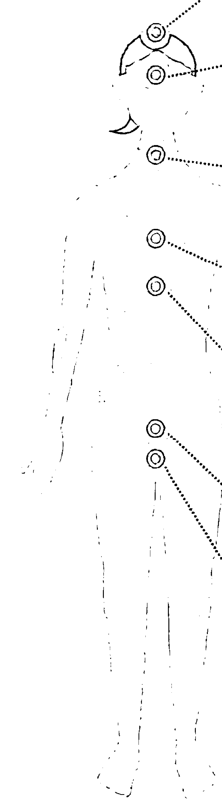

- ### 第7脈輪
  - **與大自然合為一體**
  - 【脈輪位置】頭頂部
  - 【脈輪顏色】紫色

- ### 第6脈輪
  - **感知超越五感的世界**
  - 【脈輪位置】眉間
  - 【脈輪顏色】靛色

- ### 第5脈輪
  - **培養展現本然自我的堅強意志**
  - 【脈輪位置】喉頭
  - 【脈輪顏色】藍色

- ### 第4脈輪
  - **提高體諒之心與愛的力量**
  - 【脈輪位置】胸部正中央
  - 【脈輪顏色】綠色

- ### 第3脈輪
  - **信任自己的力量並開拓人生**
  - 【脈輪位置】心窩
  - 【脈輪顏色】黃色

- ### 第2脈輪
  - **尊重他人的心情構築良好的人際關係**
  - 【脈輪位置】下腹部
  - 【脈輪顏色】橙色

- ### 第1脈輪
  - **作為自我存在基礎的本能力量之根源**
  - 【脈輪位置】肛門與性器官之間
  - 【脈輪顏色】紅色

所謂的共鳴，指的是相隔一段距離的兩個物體在周波數相同的情形之下，相互吸引，令能量擴張的現象。共鳴可使能量擴張，提高脈輪的活躍度。因此，在此我們可簡單將共鳴想成活性化即可。

我們可以將第1脈輪想成有著與地球（也就是大地）相同的波動，而第7脈輪則有著與天空相同的波動，所以能量石也就等同於擁有與天地相接的能量。這也就是為什麼，當人們持續接受來自能量石的能量時，便能一方面感到腳踏實地，一方面內心湧現豐富的感性之故。

不只如此，除了第1脈輪與第7脈輪之外，還能與其他脈輪中的兩個產生共鳴。也就是說，一個能量石共能促進四個脈輪的活性化。

同時，即使是非礦物系的珍珠，也能促進第2、第5、第7脈輪的活性化，而紅珊瑚則對第1、第2、第5脈輪的活性化有幫助，此外琥珀則促進了第1、第3、第7脈輪的活性化。

前面已經提過，使用與脈輪相同色系的能量石促進脈輪的活性化或幫助其鎮靜化，是自古以來已經證實運用的方式，而我認為，運用能量石時不只是顏色，波動的共鳴更是相當重要的。

從這觀點看來，能與脈輪產生波動共鳴的能量石，不一定會與脈輪有相同色系。

舉例來說，第2脈輪的對應顏色雖然是橙色，但在波動上能與第2脈輪產生強烈共鳴的能量石卻是祖母綠，而第3脈輪的對應顏色雖是黃色，與其產生強烈共鳴的能量石也並非黃色，而是白色的月長石。而且，即使只是含有成份種類的一點差異，或是份量的不同，都會導致石頭的顏色產生相異，更別說加熱等處理過後的石頭，其呈現出的色澤也會改變。當然，脈輪的顏色大多都和能予以活性化的能量石色系相近。例如，紅玉髓是一種能活化第2脈輪的能量石，而紅玉髓的外觀便與第2脈輪的屬色共通，都是橙色。也就是說，大多數時只要使用與脈輪相同色系的能量石，便能產生效果，所以不必想得太複雜。

無論如何，能量石都能確實幫助我們完成「腳踏實地扎根大地，與蒼穹相連活出自我」的願望。

#### 不同脉轮所蕴含的意义

那麼，以下便為大家介紹各個脈輪代表的意義及對身心帶來的影響，和最能刺激各脈輪活性化的能量石。

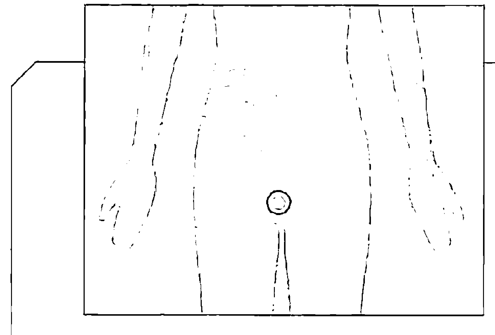

第1脈輪作為安定身體的基座，給予身體基本的生命活力—能量。能讓我們扎根大地，成為屹立不搖的存在，確立自我。此脈輪帶來內在的安定、自信心、自尊心的建立。

另一方面，當與父母之間出現問題，或是夫妻感情失和，生活在氣氛緊繃的家庭環境，抑或處於感覺自我存在受威脅的職場環境時，此脈輪的活躍度就會減低。此外像是對於自我出身與周遭環境抱持強烈自卑感的人也屬同一種類。在以上情況下人們將失去積極向前的生命力，如此，與此脈輪相對應的人體器官活動力也會減低。

想提高此脈輪的活躍度，首先包括雙親在內，要對與自己的存在密切相關的人心懷感謝。才能確定自己的存在，奠定健康生活的基礎。

作為自我存在基礎的本能力量之根源

【強烈共鳴的能量石】紅珊瑚

【脈輪位置】坐骨周邊

【脈輪顏色】紅色

【關聯器官】直腸、肛門、膀胱、尿道、副腎、前列腺、骨、關節、脊髓等

- ### 第1脈輪的活躍度下降時易出現的症狀
  - 容易便秘、長痔瘡、漏尿或引起膀胱炎
  - 容易骨折
  - 關節疼痛
  - 體力衰退
  - 情緒容易不安定

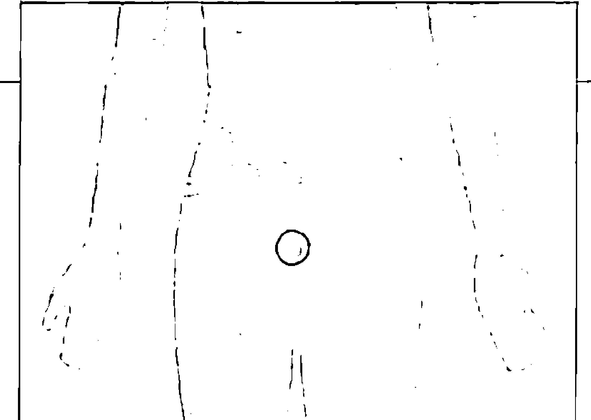

#### 第2脈輪

##### 尊重他人構築良好的人際關係

- 【強烈共鳴的能量石】祖母綠
- 【脈輪位置】下腹部（肚臍下方4～5公分處，也就是「丹田」部位）
- 【脈輪顏色】橙色
- 【關聯器官】大腸、小腸、腎臟、子宮、卵巢、睾丸等

第2脈輪主掌人際關係，重視相互尊重、圓滑的人際關係。對生殖機能具有影響。此脈輪的活躍能幫助自己與他人關係親密、帶來性方面的喜悅。在第1脈輪運作下扎根於大地後，第2脈輪的能量使我們更能品嚐人生喜悅。

當情緒煩躁、責怪怨恨他人時，此脈輪機能便會衰退，對肉體影響包括生殖機能，甚至會使相關臟器產生病痛，或導致排斥性愛、性冷感，也有出現過度依存性愛的情形。

在面對討厭的人時，就把對方當成是面與自己對照的鏡子吧。其實那是內在自我嫌惡的部分。了解這點後，看待他人的目光將會改變，厭惡的心情也能變得淡然。同時，也因認同了自我嫌惡的部分，內心獲得解放，心情得以舒緩，連帶也使人際關係慢慢改善。

##### 第2脈輪的活躍度下降時容易出現的症狀

- 腸胃不適，容易拉肚子
- 腎機能衰退，容易浮腫
- 生理痛、生理不順等婦科問題
- 產生性冷感、性障礙傾向，或是相反地太過依賴性愛

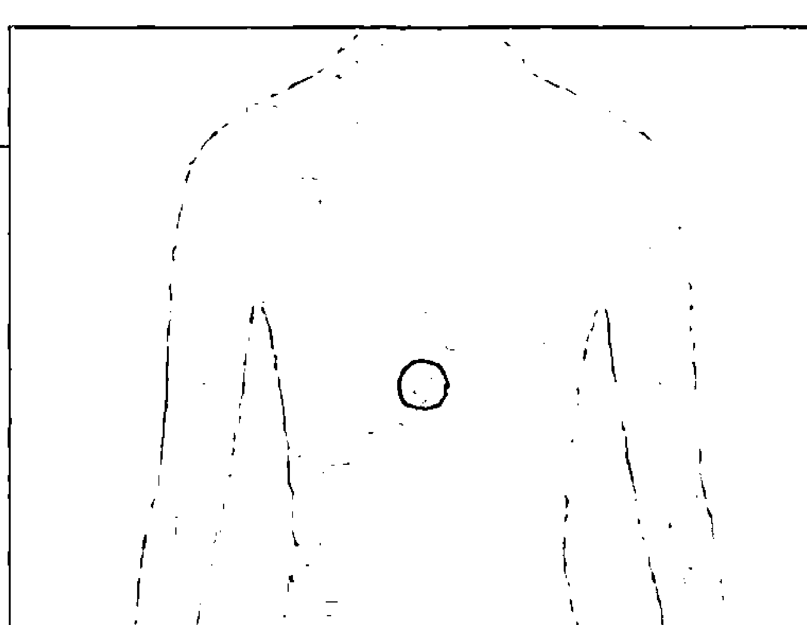

#### 第3脉轮

##### 信任自己的力量并开拓人生

【关联器官】食道、胃、十二指肠、胰脏、肝脏等
【脉轮颜色】黄色
【脉轮位置】心窝
【强烈共鸣的能量石】月长石

第3脉轮促进自觉，帮助人们依照自己的希望开拓人生，掌管信赖自我、秉持自信向前的能量。当人们能相信自己的梦想目标向前迈进时，此脉轮便会变得活跃。另外脉轮能量也会让肠胃健康良好。

相反地，丧失自信、踌躇不前，或背负过多不必要责任感、性格易怒的人，此脉轮的机能将会衰退。脉轮机能衰退也会对消化器官带来不良影响，造成食欲不振、下痢、胃部不适。过度操心或思考，都会使肠胃虚弱，怒气则会造成肝脏出问题，事物的发展不如己愿而焦躁不安，会对胰脏造成伤害。

当坐困愁城不知何去何从时，请提起勇气试着踏出第一步吧。如此一来，事情的发展将会不可思议地朝自己意想不到的方向演变。最重要的，一定要先相信自己。

##### 第3脉轮的活跃度下降时易出现的症状

- 消化不良、胃酸过多等，消化器官方面的不良症状
- 容易疲劳
- 糖尿病
- 肝功能低落

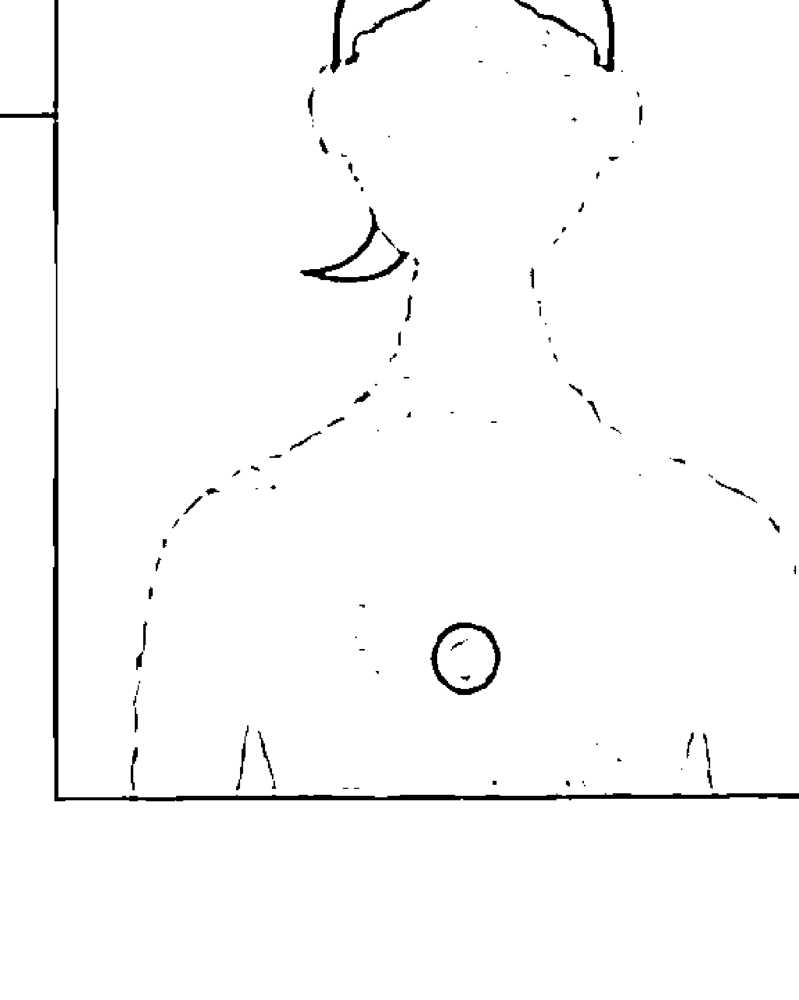

#### 第4脈輪

##### 提高體諒之心與愛的力量

- 【強烈共鳴的能量石】粉晶
- 【脈輪位置】胸部正中央
- 【脈輪顏色】綠色
- 【關聯器官】心臟、血管、血液、乳腺、胸腺、免疫系統

第 4 脈輪又被稱為愛之脈輪，幫助人們從給予與接受（ Give & Take ）的關係中，發現付出的喜悅，並演變為真正的愛。

此脈輪首先能協助人們無條件接受原原本本的自己，從而對周遭的人付出滿懷的愛，進而培養忍耐與寬容的心。

培養了如此的心境後，不僅能發現愛的重要，也能對何謂真實的愛有所自覺，進而養成樂觀的思考方式。更容易發現、欣賞人心之中的真善美。如此一來，在肉體方面，心臟與乳腺的活動將變得良好，免疫力（體內對抗疾病的作用）獲得提昇。

相反的，當內心存有拒絕、嫌惡、否定、悲觀等負面情緒時，此脈輪的運作也將變得不活躍，與其相關的臟器活動力隨之低落。特別是本脈輪與免疫力息息相關，當人體免疫力降低時，就容易罹患重大疾病。

- ### 第4脈輪的活躍度下降時容易出現的症狀
  - 心悸與心脈不整
  - 高血壓
  - 身體抵抗力低落
  - 乳腺疼痛

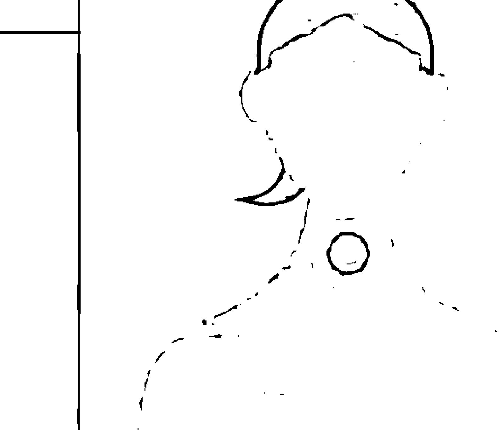

#### 第5脉轮

##### 培养展现本然自我的坚强意志

- 【强烈共鸣的能量石】土耳其石、青金石（琉璃）
- 【脉轮位置】喉部
- 【脉轮颜色】蓝色
- 【关联器官】甲状腺、口腔、喉咙、支气管、肺部、皮肤、耳朵、肩膀、淋巴腺

第5脉轮能丰富沟通能力，令人们更能接受自我及万物本来的面貌。此外，也帮助培养自我意志力。当此脉轮活跃运作时，人的价值感将更能获得肯定，与人沟通时更能感受到对方在言语外所欲表达的想法感觉。同时也更有耐性去完成既定目标。

由于自己的意见经常不被认同，或自己的发言常造成气氛尴尬，几次经验下来导致不敢表达自己真正的意愿，或明明排斥却无法完全拒绝，无法着手于真正想做的事，最后变得满嘴藉口。这样的人该注意，这或许就是第5脉轮出现问题的警讯。如果察觉自己有这种倾向，请记得一定要坦率地将自己内心所想的说出口，或是先立下简单的目标，循序渐进地去完成。

- ### 第5脉轮的活跃度下降时易出现的症状
  - 吞咽困难、喉咙有梗塞感
  - 甲状腺（位于喉部分泌荷尔蒙的器官）出现问题
  - 口内炎、肩膀僵硬、容易耳鸣
  - 容易罹患感冒

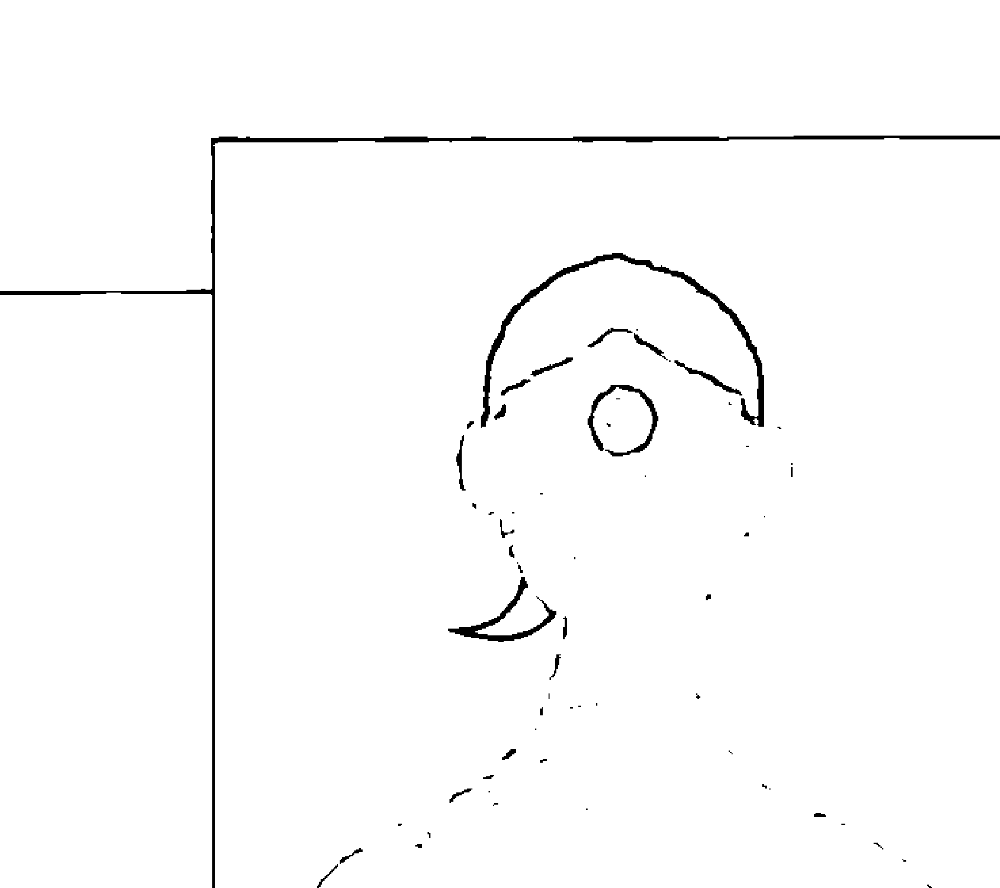

#### 第6脈輪

**【關聯器官】** 腦、神經系統、眼睛、耳朵、鼻子

**【脈輪顏色】** 靛色

**【脈輪位置】** 雙眉之間

**【強烈共鳴的能量石】** 紫水晶、水晶

##### 感知超越五感的世界

第6脈輪引導人們利用五感獲得的訊息基礎，以客觀方式思考，進而感知超越五感的世界，也可說是開發第六感的脈輪。相信人人都曾有過「靈光一現」，或某種難以言喻的直覺經驗。能夠捕捉這種超越五感訊息，並超越一般理論、思考、經驗之訊息（＝直覺、靈感）的，就是第6脈輪。本來我們人類就具有這種能力，只是因科學的發達而失去使用的機會，沉睡於身體中。

任何事物都非經由科學解釋、理論證實不可的態度，反而讓人類好不容易擁有的直覺能力無法覺醒。當第6脈輪活躍時，將會頓悟過去怎麼思考也不明白的事物，或召喚幸運、獲得重大發現等，發生一些意想不到的好事。如果你也感受到了什麼，就去順應那個聲音吧。如此，沉睡的力量將會覺醒。

- ### 第6脈輪的活躍度下降時易出現的症狀
  - 為頭痛所苦
  - 眼睛疲勞、睡眠出現障礙
  - 記憶力減退、健忘

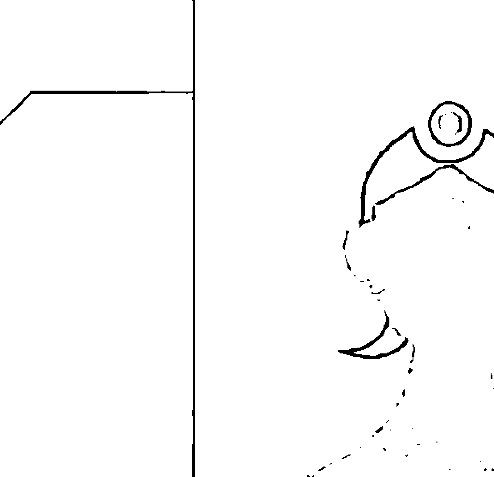

#### 第7脉轮

##### 與大自然合為一體

- 【強烈共鳴的能量石】紅寶石
- 【脈輪位置】頭頂部
- 【脈輪顏色】紫色
- 【關聯器官】松果腺體

人類無法脫離大自然生存，如何與大自然（宇宙）合為一體成為人類永遠追求的主題。第7脈輪就擔負著聯繫起人類與大自然的任務。
此外，我們人類不只在地球這個三次元的世界中受到許多人的扶持而生存著，同時也受到來自其他次元的許多存在支撐。此脈輪也可幫助我們與這些多次元中的存在取得聯繫獲得溝通，藉以提昇並發揮自身才能。
能令第7脈輪運作活躍的，就是不求回報的愛。不過，當所有脈輪都均衡地獲得活性化時，更高階層的能力即可覺醒。不需執著於第7脈輪，請由各脈輪中讀取自己當前必須面對解決的問題，並確實地著手應對吧。
附帶一提，與本脈輪息息相關的松果腺體，是位於大腦兩半球間的器官，專司將多次元的情報傳遞給腦部，並掌控免疫力與睡眠荷爾蒙的分泌。

- ### 第7脈輪的活躍度下降時易出現的症狀
  - 一味追求物質上的充足
  - 傾向否定超越人類智慧的事物

### 支援人生目标

#### 人是因为目标而诞生的

前述提及能量石具有如何治愈人心灵与肉体的「医力」，接下来要谈的是能量石所具备的足以支撑精神目标力量。

关于能量石的力量，是奠基于印度吠陀经（原文为梵语。拉丁转译为Veda。又称为章达经、韦陀经、围陀经等，是印度的宗教文书与圣典之总称）中的知识，日后并成为印度行星宝石学及行星数字学的基础。

所谓的行星宝石学，是一门由人类与行星以及宝石之间的关系，来探求宇宙本质与人类生存之道的学问。

吠陀经中，认为万物一切存在皆可由数字含括。藉由数字来理解吠陀经中森罗万象

#### 九顆行星的影響力

象（指宇宙中所發生的一切事物）之法則，這種手法與學問即稱為行星數智學。在本書中介紹的，是筆者師事對上述學問極有研究的船川明男先生後，再加上解釋，並透過每天的診療來實證，重新建構過的學問體系。我們人類的本質乃是超越身與心的靈，靈將永遠存續、進化、成長。因此，人類可以不斷地投胎轉世體驗人生。這就稱為輪迴。在每一次的輪迴轉世中獲得的經驗記錄於潛在意識的深層部分，作為情報資訊保留下來。人們就以這些受到保存的情報資訊為基礎，決定下一次的人生，選擇達成其目標所必須的環境。而為了最有效率地實現目標，就必須活用行星的力量。每顆行星都有其不同的特徵，所有生物都受到來自行星的巨大能量影響。人類誕生前，能判斷哪顆行星的能量最能幫助自己達成目標，從而選擇於那顆行星的力量最大的日子誕生。一般常識認為嬰兒的出生日受到母體與子宮狀態的影響，殊不知與胎兒自身的意志也有相當大的關係。

生日期，那么只要先知道与某人出生年月日一致的行星特征，就能得知此人的人生方向性及目标了。在得知了自己今世诞生时的目标后，大多数人便能够理解自己过去经历过的事，或现在面对的问题究竟对自己的意义何在。那些都是为了达成目标而必需的经验。在一生之中为我们带来影响的有太阳、月亮、火星、水星、木星、金星、土星、罗睺与计都九颗行星（不同于现代天文学上太阳为恆星，月亮为卫星，这里引用的是印度的行星宝石学中的天文概念）。罗睺与计都这两颗星实际上并不存在，它们是基于计算数式而导出的「概念」上的星体。这两颗星表示出太阳与月亮轨道的交会点，罗睺是从地球看出来北半球侧的交会点（昇交点），计都则是位于南半球侧的交会点（降交点），分别被认为是引起日蚀与月蚀的星体。从罗睺与计都的存在来考量，九大行星并非实际存在的星体，而是应该当作一种存在于支配宇宙全体的法则之中的能量体来理解。从这样的概念，行星宝石学便导出了与各大行星拥有相同能量的对应能量石。例如太阳对应红宝石，月亮对应珍珠等。在身上配戴与属于自己的行星对应的能量石，是接受行星能量最简单也最有效果的方法。同时能量石也能在我们实现人生目标的路上，助我们一臂之力。

##### 數字與行星以及能量石之間的關係

在行星寶石學與行星數智學之中，認為一切現象都能以九個數字加以統括。而每個數字都有著其固有的意義和各自的象徵主題。此外，每個行星也都各有其對應的寶石。從每個人的出生年月日可以算出自己受到哪一顆星的影響。

從出生年月日中算出的數字，分為本質數與命運數兩種。無論哪一種都是一到九這九個數字的其中之一，有時也會出現本質數與命運數數字相同的情形。（計算方法請參見左頁）

本質數是代表每個人一生主題的數字，從本質數可推算出與生俱來的個性和資質，以及生存的目標。

命運數是支援我們的生存目標，讓人生更充實的數字，也可說是代表附加主題（副主題）的數字，主要會在二十五歲到四十歲之間帶來較大的影響。

每個數字都各自對應著以下主題和行星，以及能量石。本質數或命運數都以相同的方式查對即可。

#### 計算方法

##### ○本質數的計算方法

從出生日來計算。
如果出生日期為一位數字，該數字即為本質數，若是二位數，則將兩個數字相加，直到得出一位數為止。

【例1】7日生的人→ 本質數為7

【例2】29日生的人
2+9=11→1+1=2→ 本質數為2

※10日生的人，1+0=1→本質數為1。

##### ○命運數的計算方法

從西曆的出生年月日來計算。
將出生年月日的數字相加，直到得到一位數為止。

【例】1984年12月7日出生的人
1+9+8+4+1+2+7=32
3+2=5→ 命運數為5

※1984年12月7日生的人，本質數為7，命運數為5。

※一般來說，日期的變更都以午夜0時為界，但印度的行星寶石學與行星數智學中，卻認為日期應在破曉時進行變更，也就是日出前約一小時。例如7日凌晨2點出生的人，將視為6日出生。
不過，在這種計算方式之下，當日出時間不同，日期變更的時刻也隨著改變，因此不同的季節也會對計算方式產生不同的影響。不清楚自己正確的出生時刻，或即使出生於破曉之前，卻不知道自己生日當天正確的日出時間者，可以同時計算一般日期的數字，與前一天的數字，兩相比較後再做選擇。

### 本質數 & 命運數

【對應的行星】太陽 【該行星顯示的主題】不求回報的愛、寬容 【能量石】紅寶石（代用石：紅石榴石）

【對應的行星】月亮 【該行星顯示的主題】謙虛、慈悲 【能量石】珍珠（代用石：月長石）

【對應的行星】木星 【該行星顯示的主題】信賴、自由 【能量石】黃剛玉（代用石：黃玉、黃水晶）

【對應的行星】羅睺 【該行星顯示的主題】承受與包容、自制 【能量石】鐵鈣鋁榴石（代用石：纏絲瑪瑙）

| 序号 | 对应的行星 | 该行星显示的主题 | 能量石（代用石） |
|------|------------|------------------|------------------|
| 5 | 水星 | 喜悦、知性 | 祖母绿（代用石：翠绿橄榄石、砂金石） |
| 6 | 金星 | 纯真、无限 | 钻石（代用石：白色电气石） |
| 7 | 计都 | 创造、革新 | 猫眼石（代用石：虎眼石） |
| 8 | 土星 | 希望、乐观 | 蓝宝石（代用石：坦桑蓝） |
| 9 | 火星 | 感谢、勇气 | 红珊瑚（代用石：红玉髓、红碧石） |

### 相同的行星亦有三種不同類型

那麼到此，讀者們都了解對自己人生帶來莫大影響的兩個數字（本質數與命運數），也熟悉自己對應的行星以及散發與行星相同能力的能量石了吧。只要擁有自己本質數及命運數相對應的能量石就足以發揮效果，若能更深入了解本質數與命運數的象徵意義來活用能量石，其效果將會得到更上一層樓的發揮。以下是關於這點的說明。

即便是同一顆行星，在不同人身上也可分為濕婆（S）、婆羅門（B）與毗濕奴（V）三種不同類型。濕婆、婆羅門與毗濕奴都是印度教的神祇，濕婆是掌管破壞與再生，婆羅門是掌管創造，毗濕奴則是掌管維持與發展的神。在印度，人們相信宇宙由這三位神祇來統括。

在我造訪了幾次印度之後，發現這三位神祇其實就代表了三種人類的特徵。於是我試著將S、B、V三神的特徵套用在許多人身上進行驗證，果然發現無論是誰，性格都脫離不了這三種類型。

而本質數與命運數所顯示的人生主題，一樣可細分為這三項。如此一來，每個個人誕生到世間的目的（目標），以及其人生的主題，都可據此正確地判斷出來了。

想知道自己屬於這三種之中的哪一種類型，雖然也有和計算出本質數與命運數一般的算式可演算，但由於其方法非常複雜，故在此只介紹簡易的檢視版本。請檢視下列S、B、V三大分類中的細項。找到完全符合的，就是你所屬的類型。如果自己也不清楚或無法判斷時，可請身邊與你熟悉的人代為檢視。因為由自己來檢視時，可能會參雜對自我的期許，導致難以判別或結果不夠準確的情形。

#### 【S（濕婆）型】

- ①想改變自己的心情很強烈
- ②任何事都想分出是非黑白
- ③不拘泥於世間常識

#### 【B（婆羅門）型】

- ①為了實現理想而努力不懈
- ②只要全力以赴就不輸給任何人
- ③喜歡受到注目

#### 【V（毗湿奴）型】

- ① 希望活用自己的優點與特質
- ② 喜歡按照自己的步調行事
- ③ 善於奉獻自己輔助別人

本質數與命運數所擁有的三種類型其各自顯示的人生主題，從47頁起以表列方式整理。

先以前述方式算出自己的本質數和命運數，接著找出自己所屬的類型，便可按圖索驥得知自己更詳細的人生主題與副主題了。

姑且以先前舉例說明過的1984年12月7日出生者為例解說，這天出生的人將可從中讀取到什麼樣的訊息呢？

根據計算，這天出生的人在三種類型中屬於S型，所以我們一起來看看本質數7、命運數5、隸屬S型的人得出的結果吧。

本質數7對應的行星是計都，這樣的人經常以創造嶄新的事物、不斷地進步作為人生首要目標。又因為他屬於S型，將會以超越物質層面，也就是在精神、靈性的層面獲得成長進步為目標。為了實現這個目標，具有輔助與支援能量的能量石就是貓眼石。

與他的命運數5對應的行星是水星。這表示他人生的副主題是帶給周遭喜悅，藉由取悅別人，他的人生將會更豐富。

接著看看符合以上條件的S類型，這類型的人將能在工作之中獲得喜悅。換句話說，他的願望便是從事帶給自己喜悅的工作，並且透過這份工作取悅別人。特別是由於命運數多於三十五歲至四十歲之間帶來較大影響，在這段期間之中想必會特別有實現以上目標的感觸，並較容易獲得實現的機會。當力量不足或遇到困難的時候，能支援、幫助他實現目標的能量石，便是祖母綠。

除了熟知自身的本質數、命運數之外，若能從家人或朋友等周遭的人的數字及行星之間的關係來分析，一定能更加了解對方。同時，雙方也能相互支援對方的人生目標，讓彼此之間的關係更緊密。

當人們的人生朝向自己選擇的目標前進時，最感欣慰的便是我們的精神。若無法察覺這一點，只是盲從慾望而活，則會讓精神疲憊，身心都將承受極大的壓力。要知道，我們的精神所希望的，是能夠活得像自己。而本質數與命運數能夠為我們昭示出人生方向，能量石則能輔助我們活出自我。

### 由本質數檢視不同類型的人生主題

1
【影響強烈的行星】太陽
【共通的主題】愛（不求回報的愛）、寬容
【能量石】紅寶石
【類型 S】追求真實，並將真實傳達給他人
【類型 B】以正確的判斷力取悅他人，帶來幸福
【類型 V】將自己的力量用來幫助需要的人

2
【影響強烈的行星】月亮
【共通的主題】謙虛（遵循神明旨意的心）、慈悲
【能量石】珍珠
【類型 S】擁有高貴的精神
【類型 B】與神聖的存在合而為一
【類型 V】重視他人的尊嚴

3
【影響強烈的行星】木星
【共通的主題】信賴（對自我意志的信賴）、自由
【能量石】黃剛玉
【類型 S】擁有持續的行動力
【類型 B】擁有克服壓力跨越障礙的堅強忍耐力
【類型 V】相信自己，也受他人信賴

4
【影響強烈的行星】羅睺
【共通的主題】承受與包容（無論何事都能原諒、接受）、自制
【能量石】鐵鈣鋁榴石
【類型 S】擁有堅定不移的精神力
【類型 B】秉持柔軟的精神力跨越意外
【類型 V】無論何事都能保持肯定的態度

5
【影響強烈的行星】水星
【共通的主題】喜悅（取悅他人，帶給他人喜悅）、智慧
【能量石】祖母綠
【類型 S】在工作上獲得成功與發展
【類型 B】控制自己
【類型 V】以他人之喜為自己之樂

6
【影響強烈的行星】金星
【共通的主題】純真（無私慾）、無限
【能量石】鑽石
【類型 S】將一切奉獻給別人
【類型 B】以自身的經驗為眾人服務
【類型 V】不受邪念操控，活出自我

7
【影響強烈的行星】計都
【共通的主題】創造（隨時都能創造出新鮮事物並不斷進步）、革新
【能量石】貓眼石
【類型 S】超越物質層面
【類型 B】不墨守成規，總是在進化、成長
【類型 V】珍惜自己的感性，活得有個性

8
【影響強烈的行星】土星
【共通的主題】希望（總是保持希望，也帶給別人希望）、樂觀
【能量石】藍寶石
【類型 S】發揮超越常識的力量，帶給他人感動
【類型 B】不依賴他人，靠自己獨立完成
【類型 V】活用特別專長，過著滿足的人生

9
【影響強烈的行星】火星
【共通的主題】感謝（對任何事都懷抱感恩的心，也受到他人感謝）、勇氣
【能量石】紅珊瑚
【類型 S】不論遇到何種困難都能找出解決之道
【類型 B】即使陷入困境也不輕言放棄，堅持到最後
【類型 V】活用自我長才，帶給他人喜悅

### 由命運數檢視不同類型的人生副主題

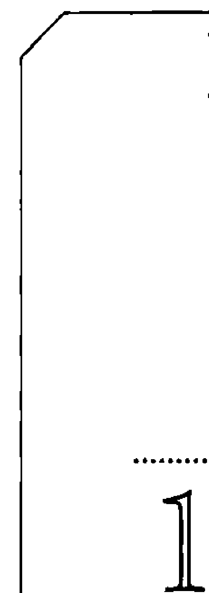

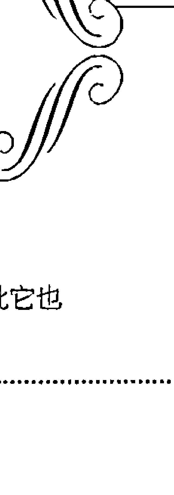

※命運數所對應的行星特別是在35歲到40歲之間影響甚鉅，因此它也是讓人生更充實的指標。

- 1 【影響強烈的行星】太陽
【共通的主題】愛 (不求回報的愛)、寬容
【能量石】紅寶石
【類型 S】以獨特的思考方式與行動來帶領人群
【類型 B】工作努力不輸給任何人
【類型 V】為他人拼命付出

- 2 【影響強烈的行星】月亮
【共通的主題】謙虛 (遵循神明旨意的心)、慈悲
【能量石】珍珠
【類型 S】克服種種困難，擁有人情味
【類型 B】融合知性與感性，發揮強大力量
【類型 V】與任何人相處都抱持著體貼的心

- 3 【影響強烈的行星】木星
【共通的主題】信賴 (對自我意志的信賴)、自由
【能量石】黃剛玉
【類型 S】擁有挑戰新事物的意志力
【類型 B】擁有樂觀向前的態度
【類型 V】自己決定的事便會貫徹到底

- 4 【影響強烈的行星】羅睺
【共通的主題】承受與包容 (無論何事都能原諒、接受)、自制
【能量石】鐵鈣鋁榴石
【類型 S】面對一切事物都能坦然接受
【類型 B】接受發生在自己身上的一切事
【類型 V】接受自己喜歡自己

- 5
【影響強烈的行星】水星
【共通的主題】喜悅（取悅他人，帶給他人喜悅）、智慧
【能量石】祖母綠
【類型 S】在工作中享受樂趣
【類型 B】提昇直覺與創造力並且加以活用
【類型 V】徹底理解自我特質並用於服務他人

- 6
【影響強烈的行星】金星
【共通的主題】純真（無私慾）、無限
【能量石】鑽石
【類型 S】捨棄私慾
【類型 B】總是擁有安定的心
【類型 V】帶給人們喜悅時自己也能感到幸福

- 7
【影響強烈的行星】計都
【共通的主題】創造（隨時都能創造出新鮮事物並不斷進步）、革新
【能量石】貓眼石
【類型 S】尋求未知事物並不斷進步
【類型 B】能打破僵局
【類型 V】活用自己的個性特徵

- 8
【影響強烈的行星】土星
【共通的主題】希望（總是保持希望，也帶給別人希望）、樂觀
【能量石】藍寶石
【類型 S】發揮所有智慧與努力在一切事物上
【類型 B】不輕言放棄
【類型 V】任何時候都懷抱希望而生

- 9
【影響強烈的行星】火星
【共通的主題】感謝（對任何事都懷抱感恩的心，也受到他人感謝）、勇氣
【能量石】紅珊瑚
【類型 S】面對與自己相關的一切全力以赴
【類型 B】無論什麼事都積極面對
【類型 V】總是不忘笑容

## 第 3 章 你的身體深知需要何種能量石

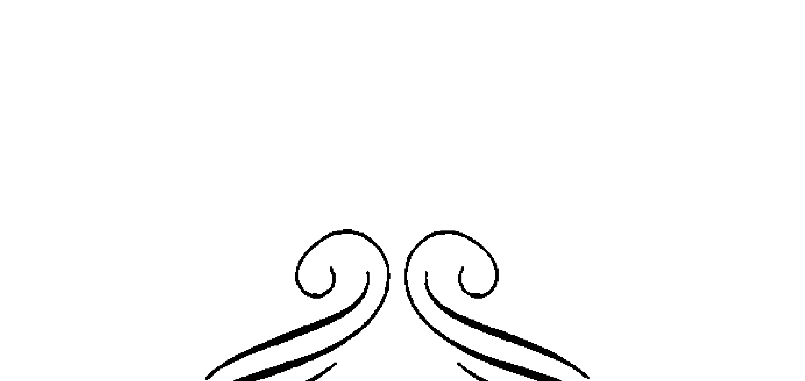

### 以直觀來選擇的方法

#### 憑本能尋求需要的東西

本章中將介紹實際上該如何選擇適合自己的能量石，以及平日保養能量石的方法。我曾在電視上看過野生動物吃泥土的畫面。這是因為動物靠本能與嗅覺知道，泥土之中含有生存所需的礦物質。與此相同，我們人類的身體也擁有知道自己需要什麼的本能。當血糖值下降時身體就會尋求甜食，礦物質不足時，就會想吃含鹽分較高的食物，又或是當體內酵素（促進體內化學變化的物質，多半存在於生食之中）或維他命不夠了，就會自然而然地想攝取生菜。

另一方面，當這種自然的生理慾求受到理性壓抑，或在壓力過大的情形之下攝取了對身體而言不必要的食物時，健康就會失衡。例如為了不讓血壓上升而克制對鹽分的攝取，為了避開對身體不好的生冷食物而減少食用生菜的機會……等等。附帶說明，上述關於鹽分與生菜的觀念都是錯誤的。

的確，攝取過多鹽分之中含有的鈉，是造成血壓上升的原因，但同時只要確實攝取足夠的鉀與鎂，血壓就不會上升了。相反地，若是過度減少鹽分攝取，反而會造成重要的礦物質不足，引發其他重大疾病。鹽分對身體是很重要的物質，食用時請選擇富含必要礦物質與高能量的天然鹽吧。

另外關於生菜，加熱之後會造成一部分維他命的流失。我們人體之中有消化酵素（促進消化的酵素）與代謝酵素（促進體內物質分解的酵素）兩種酵素，光吃加熱過的熟食會不斷消耗體內的消化酵素，同時也會連帶使得代謝酵素的數量減少。而生菜本身就含有酵素，食用時藉由生菜本身的酵素來進行消化，能夠節省體內消化酵素的消耗。

其結果，體內的代謝酵素獲得增加，提高能量的產生，體溫隨之上升，免疫力也跟著提高了。所以就算是身體容易冰冷的體質，也不需要為了迴避生冷食物的理由而拒吃生菜。

### 能量石告訴我們什麼

接下來談談能量石。很多人在第一眼看到能量石時，都會產生一種受到吸引的感覺。這就是本能察覺到自己現在需要什麼的緣故。本來打算購買水晶，卻不知何故改買了青金石。有過類似經驗的人應該不少吧。之所以會從原本想買的水晶，轉而購買青金石，是因為第5脈輪發生問題，而身體深知青金石比水晶更能幫助我們解決這個問題。就像這樣，不知不覺受其吸引，或在無意識下選擇了的能量石，有很大的可能性是，在那個當下它已經與你產生共鳴的緣故。真正與你產生共鳴的能量石，會具備以下特徵。

- 說不出為什麼，但令人感到心安
- 令人產生被溫暖包圍的感覺
- 內心感到和平沉穩
- 感覺到體內充滿能量
- 呼吸變得順暢
- 彷彿能聽到石頭正對自己溫柔地說著什麼

只要出現以上這些感覺，或許眼前的石頭就是現在的你所需要的。

能量石是宇宙光線在地球這個生命體中經過長久的歲月進行結晶化，緩慢成長的產物。如果沒有經過人工挖掘出來，還會繼續成長下去。能量石的內部充滿生命能量，也帶來宇宙的訊息。

繼續思考下去，甚至可以說能量石本身就是一個生命體。與能量石帶來的訊息產生共鳴的人，或許就是聽見了石頭的溫柔低語也說不定。

一如每個人都是世上獨一無二的存在，能量石也各不相同。獨一無二的人與獨一無二的能量石受到緣份的牽引而相遇，其實並非出自偶然，而是一種必然。若是邂逅了與自己相合的能量石，請一定要好好珍惜。

當沉浸於悲傷之中，或感到徬徨迷惘、身心俱疲時，能量石傳遞給我們的信息一定能起某種作用。

### 以體況與內心問題來選擇的方法

### 確實找出適合自己之能量石的方法

當身體取得平衡，也擁有坦率心情的情形下，人的感覺會變得敏銳。這種時候來選擇石頭，依照前述的方法就沒有什麼問題。

然而有時身體疲倦了，感覺也跟著變遲鈍，無法順利傾聽自己內心的聲音，選出最符合需要的能量石。這種時候只要按照以下介紹的方法，依然可以順利選出適合的能量石。

- 1. 從身體不足的光線來選擇
這是我所實踐的寶石光線療法（詳細情形請參閱第五章）之原理來進行選擇的方法。當體內的宇宙光線不足時，會產生一定的症狀。由寶石光線療法可

### ② 從顏色來選擇

我想人人都有自己喜歡的色系。以此為基準，從喜歡的顏色中，再參考第四章介紹的各種石頭不同的效能來選擇吧。光是顏色本身就有相當大的效果，而喜歡的顏色，其實就是現在的自己所需要的顏色，也是能帶給自己力量的顏色。

### ③ 從脈輪來選擇

若能判斷自己肉體或心靈產生的問題，是屬於哪一個脈輪所掌管的話，可以選擇與此脈輪有強烈共鳴，能促進該脈輪運作活躍的能量石。 例如，腸胃總是感到不舒適的人，就可以選擇主要促進第2脈輪活性化的石頭，想要提昇感性的人，就可以選擇能加強第6脈輪或是第7脈輪的能量石來使用。

④從「本質數」與「命運數」來選擇
由本質數與命運數所選擇的石頭，能幫助我們活出自我，發揮個性與特徵，讓人生更豐富快樂的能量石，也可說是自我的守護石，要一輩子珍惜。相對於從脈輪選出的能量石，其功效是幫助我們調整「當下的狀態」，而以本質數與命運數選出的能量石，則是能幫助我們立定未來的目標，成為「理想中的自己」。

⑤從宇宙信息來選擇
第四章中將介紹各種不同能量石各自的效能，以及每種能量石中所蘊含的宇宙訊息，請從中選擇自己能理解接受的。

### 能量石的價值

寶石的市場價值，可由大小、美觀程度、內嵌物體、發光度來加以評價，而後反映在價格上。能量石也一樣，越稀有罕見，或是擁有特別能撼動人心之美的，其價值也相對地高。不過，在治癒身心疾病、療癒精神這方面的功效，卻不會因價格的高低而受到影響。即使是價格評價低的能量石，只要找到自己喜歡的，反而可以用合理的價格購買，這一點倒是購買能量石的一個好處。

從地底開採出的石頭，都是宇宙的創造物，各自具有獨特的能量。

只要選擇能與自己產生共鳴的石頭即可。並不是越大顆越好，也無所謂是否內嵌了什麼物體。（以能量石來說，就有像是被稱為髮晶的這類石頭，視場合與需要的不同，有時內嵌物體的石頭反而是好的。）

只要能在能量石神秘光芒的引導下，對宇宙無限的世界敞開心胸、淬鍊感性，就可以說是具有價值的好石頭。

最重要的是，自己的心是否受到那顆石頭的吸引，是否真的感受到它的美。

如果將高價的寶石比喻為玫瑰花，許多的能量石其實都是盛開於路邊的野花。

玫瑰花氣質出眾、高貴典雅，而野花則給人樸素的安心感。有些人在野花的美麗中獲得慰藉，也有些人在野花的活力下洗滌心靈，找回本然的真我。

沒有執優執劣的問題。所謂的價格與價值都是因人而異的東西，而蘊含於能量石中，來自宇宙的訊息，是不需要區分優劣勝負的。

請不要受到價格或名稱的誤導，以自己的感性選擇屬於自己的能量石吧。

### 日常生活與能量石相處的方法

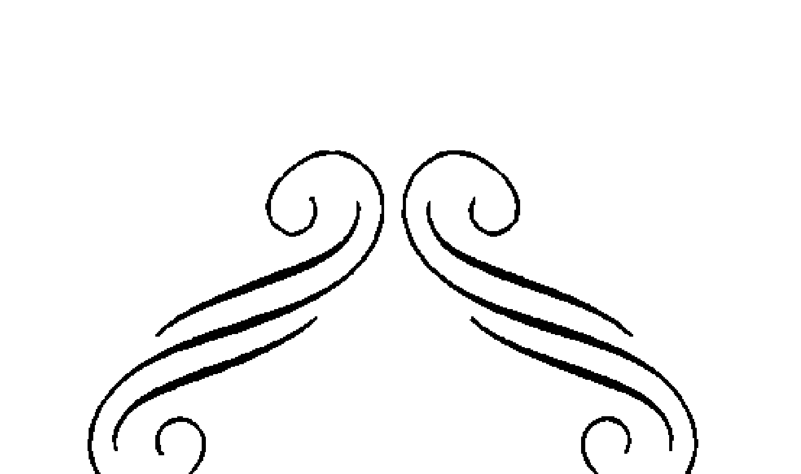

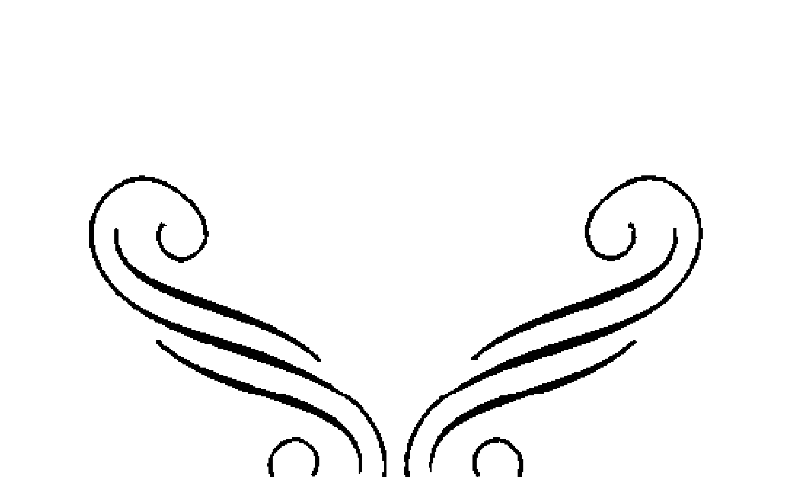

### 直接接受能量石的能量

如果是個人用途的能量石，建議佩戴在身上是最好的方法。在印度，當人們將能量石當作裝飾品佩戴在身上時，一定會讓石頭直接接觸肌膚，如果鑲嵌在戒指或項鍊上，也會注意不讓鑲嵌的底座遮蔽了能量石發出的光芒。這是因為讓能量石直接接觸肌膚，石頭的波動才能直接傳導到身上的緣故。除了將能量石佩戴在身上外，也可將原石擺放於寢室內，或安置於書桌上。放置在室內的能量石，除了觀賞外，也該不時拿起來把玩，遙想石頭的發源地，和石頭說說話，感受石頭傳遞出的訊息。懷抱感謝之心接觸能量石這偉大宇宙的贈禮，石頭也會回敬強大的能量。

### 重整能量石的能量

此外，有很多人詢問可否同時佩戴不同種類的能量石，或是擔心不同能量石是否有能量抵觸的問題。其實，所有的石頭都是地球的細胞，這些事完全不需要擔心。

能量石在散放來自宇宙與地球的能量的同時，一方面也接收來自人們的思念（思緒）能量。無論是喜樂的正面能量，或是悲傷的負面能量，各種正負感情，都會與石頭的結晶構造產生共鳴，吸收到石頭中。能量石在到達你手中為止，經過多人之手，歷經一段長途跋涉的旅程，因此無論正負好壞，可能已經吸收了許多人的能量。所以對於剛入手的能量石，最好先加以「淨化」重整，使其恢復空白狀態。這裡的淨化，指的是消除石頭原本吸附著的種種思念能量的行為。藉由淨化，將石頭上附著的種種思緒能量消除，使石頭恢復本來充滿能量的狀態。此外，自己使用一陣子後，由於石頭裡也吸附了許多來自你個人的情感能量之故，當感覺到能量石的光輝減弱，或是摸起來觸感不同了，都可進行淨化。

### 净化的方法有以下几种：

- ① 放在朝阳之下接受阳光照射一小时。
- ② 在满月时接受月光照射三小时。
- ③ 放置于水晶簇上一天一夜。
- ④ 放在装有自然盐的容器之中，放置一天一夜。
- ⑤ 浸在干净的溪谷流水或泉水中一小时。

能量石会因结晶构造不同而受到太阳光或盐分的影响，导致有时变色、变质。只要用以上的方法一个月进行一次净化程序，对能量石就不会有太大影响了。不过，话虽如此，需事先声明有些石头较无法承受某种净化方式，关于这部分，请参考第四章中各种能量石的指南。

几乎适用于所有能量石的净化法，就是放置于水晶簇上的方法。水晶簇乃是集合了许多微小水晶的结晶体，能反弹来自各方位的负面能量，帮助「气」的流向回归正常。

### 能量石并非万灵丹

### 身体振作时更能发挥能量石的力量

最后想简单说明一下，在利用能量石帮助疗愈身心时的注意事项。
我所应用于医疗现场的宝石光线疗法（详细内容请参阅第五章），没有任何副作用。宝石光线疗法并非医学治疗，使用方式也就像是个人借用能量石的力量一样。所以这种疗法没有年龄限制，也无关性别，只要是身心抱持着烦恼的人都可以试着活用能量石的力量。

但是，使用上仍然有几点需要注意的地方。
首先要了解能量石并非万灵丹。使用时一定要找出最适合身体的方式。

例如，月长石的力量能够发挥于促进体内代谢（处理老废物质）良好，改善肥胖与痛风。可是若以为只要拥有月长石就能解决身体出现的问题，就是错误的观念了。不去改善运动不足、嗜食垃圾食物或摄取过量化物质的问题，只是在身上佩戴着月长石，这是没有意义的。不可以完全依赖能量石的力量。

世上的一切事物都有其原因与结果。各种身体上的问题，在日常生活中也都有其发生的原因。不只是刚才举例之中的物质问题，也一定有些是夹杂了心理因素的问题。关于身心的不协调，首先请试着回头思考自己的日常生活习惯，一定能找出其中一些问题点。

你的身体深知与你相关的所有问题，也知道该怎么做才能解决问题。只要抱着坦率的心情和自己对话，身体一定会以某种形式给你答案。

像这样，透过自己的身心问题，与内在的自我对话时，若能再加以活用能量石，就能发挥更大的效果。最后必能扎根大地，上直通天际。其结果能发挥自己的个性特征，使人生更丰富，最终达成与宇宙之间的协调。

我衷心希望各位都能找到最适合自己的能量石，并与其建立起良好的关系。

### 净化能量石的方法

能量石会逐渐吸收拥有者的能量。所以当第一次入手一颗能量石时，或感到手头的能量石力量减弱的时候，可以借助大自然的力量，清除石头已吸收的能量。不同的石头适用不同的净化法。可以参照第四章的能量石指南。

#### 放置于水晶簇上 一天一夜

这是适用于所有种类的能量石，也是最建议的净化法。水晶簇上带有非常强烈的能量。

#### 放在装有天然盐的容器中， 放置一天一夜

使用这种方法时，可在容器中的盐上先盖一层保鲜膜后，再放上能量石。

#### 浸在干净的溪谷流水或 泉水中一小时

不建议使用自来水或市售矿泉水等经过人工处理的水。

#### 放在朝阳之下 接受阳光照射一小时

请于天亮时到早晨八点之间进行此种净化法。

#### 在满月时接受 月光照射三小时

若在非满月时照射，照射时间就需再拉长。上弦月时大约需照射八小时。

### 特别能促进脉轮活性化的能量石

※在此列举的能量石，是与各个脉轮在波动上最容易产生共鸣的能量石。因此，能量石与脉轮颜色有些并非一致。当然，选择与脉轮颜色相同色系的能量石，也都具有促进脉轮活性化的效果，因此不必想得太过艰深。只要从自己的喜好中凭直觉选择即可（选择能量石的方法可参照第三章）。

※除了珊瑚或琥珀等来自生物的能量石之外，几乎所有的能量石，都能与第1・第7脉轮产生共鸣。

- 第7脉轮: 红宝石
- 第6脉轮: 紫水晶， 水晶
- 第5脉轮: 土耳其石， 青金石
- 第4脉轮: 粉晶
- 第3脉轮: 月长石
- 第2脉轮: 祖母绿
- 第1脉轮: 红珊瑚

## 第4章 对应症状 使用「能量石」 完整指南

## 摩尔根玉

### ○来自宇宙的讯息○ 带着勇气面对

摩尔根玉有着稳重的淡粉红色，属于与祖母绿及蓝玉同样的绿宝石（Beryl）家族。被视作象征爱、优美与清纯的石头。

摩尔根玉的名称由来，源于宝石爱好者摩尔根氏（J.P. Morgan）。摩尔根玉传授给人们体贴他人的心与智慧，培养敏锐的直觉力及洞悉真实的眼光。

乍看之下给人纤细而优雅印象的摩尔根玉，在面临逆境与恐惧时却能带来坚强面对的勇气与力量。

### 对身体的作用

#### 强化关节 对视网膜也有所作用

摩尔根玉具有强化软骨及关节机能的作用。在膝盖痛、关节炎、关节风湿引起的疼痛发作时可以发挥效果。此外，它对于视网膜（眼球深处的透明薄膜）也有所作用，提高视网膜辨识颜色的能力。

### 对意识的作用

#### 洞悉事物的真实

没有决断力、优柔寡断、容易踌躇或抱持消极心情的人，能从摩尔根玉的力量中获得救赎，重新拥有坚强面对事物的勇气。

此外，摩尔根玉还帮助人们培育洞悉真实的眼光以及稳重的心。拥有摩尔根玉的人往往不再任凭自己内心的想法制裁、批判或苛责他人。

### 摩尔根玉可改善的精神症状

- 优柔寡断没有决断力的人
- 常在内心苛责他人的人

## 【Cat's eye・猫眼石】硬度8.5

### 猫眼石

### ○来自宇宙的讯息○ 不执著于自己的思考

### 对身体的作用

#### 促进能量产生

猫眼石能提高细胞内的能量产生，促进关乎免疫作用的淋巴球作用。此外，它还能帮助抑制潜伏于体内的病毒与细菌，减少寄生虫的增殖。当身体必须中和水银等重金属或化学物质的毒性时，也能发挥相当效果。

猫眼石（Cat's eye）不只是石头的名称，也用于形容这种石头如猫眼般中央带有一道如目光般光芒的外观。有这种猫眼效果的代表性矿物就是金绿玉。通常提到猫眼石，指的就是这种「金绿玉猫眼石（chrysoberyl cat's eye）」。一如在黑暗之中也能维持视力的猫眼，猫眼石具有的便是洞察事物的力量。在宝石光线疗法中，猫眼石可用来补充肉眼所不可见的红外线。另外在行星宝石学中，猫眼石则是计都的代表石。

### 对意识的作用

#### 发挥创造力

持有猫眼石的人，通常能够不固执己见，站在对方的立场思考，产生尊重他人的心态。一方面重视自己的感性，一方面与他人协调。猫眼石的存在，能帮助人们发挥创造力，突飞猛进。

### 猫眼石可改善的精神症状

- 将自己的价值观强加于别人身上的人
- 无视于对方立场或想法的人

## 翡翠

### ○来自宇宙的讯息○ 控制自己

翡意味着红色，翠意味着绿色。翡翠这个名称的由来，其实是有著绿色羽毛与红色腹部，从背部到尾巴部分则是青色的水鸟「翠鸟（又名鱼狗）」。这种矿石在日本历史已久，从�的文时代的遗迹之中就发掘出翡翠制成的勾玉。

翡翠在中国称为「玉」，自古以来便是王之象征，受到中国人特别的看待。例如君王的宝座，便称为玉座。身份高贵的人身上都佩戴着玉，玉石被认为是能够传授仁、义、礼、智、信五德之石。

### 对身体的作用

#### 促进微血管中的血流

翡翠具有促进微血管血流的作用。一旦流遍全身的血液循环良好了，也就能避免手脚冰冷的毛病产生。此外，翡翠还能提高消化器官系统的运作，对肠胃虚弱的人也很具功效。

### 对意识的作用

#### 增强对事物的毅力

无论是工作、艺术、运动，想在各种领域交出令人满意的成绩单，都需要有坚强的自我控制力、意志力与耐性毅力。翡翠即是能增强人们对事物之毅力的能量石。此外，它还能帮助人们看见他人好的一面，从而抱持善意与人相处。

### 翡翠可改善的精神症状

- 连别人的小毛病都忍不住在意的人
- 没有毅力，做任何事都轻言放弃的人
- 感情起伏激烈无法控制的人

## 粉晶（玫瑰晶）

### ○来自宇宙的讯息○ 接受原原本本的自己

### 对身体的作用

#### 帮助心脏活动，促进血液循环

粉晶支援防止心脏肌肉及血管逆流的瓣膜，促使血液循环良好。对心脏相关的各方面疾病都有全方位预防与改善的效果。此外，粉晶还能活化与免疫相关的胸腺运作，提高免疫力，所以推荐给抵抗力较弱的人或容易感冒的人。

### 对意识的作用

#### 培育体贴的心

粉晶能引导人们不失去自我，接受原原本本的自己。当人们恢复积极向前的开朗态度时，对人也能自然抱持温柔体贴的心。粉晶是一颗以温暖的波动培育宽容精神的能量石。

### 粉晶（玫瑰晶）可改善的精神症状

- 精神上陷入苦恼与深深绝望的人
- 失去自我，不知所措的人
- 在意自己的缺点无法喜欢自己的人

粉晶之中，被认为栖宿着象征爱与美的女神维纳斯的力量。持有粉晶能帮助提高女性气质，受到温柔的波动包围。

粉晶的波动，与亦称为心轮的第4脉轮有着极为强烈的共鸣。因此粉晶稳重的疗愈力量能帮助人们加深体恤的心，肯定自己也同样肯定他人，宽怀地接受一切。除了能帮助人们培育爱，在另一方面，粉晶美丽的色泽之中也充满了抚平人们伤口的温柔与暖意。

## 【Calcite·方解石】硬度3

### 方解石

### ○来自宇宙的讯息○ 活用自己的特性

方解石（Calcite），这个名字来自拉丁语中意味著「石英」的「calx」（calx同时也是「钙（calcium）」这个字的语源）。众多方解石的集合体便是大理石。依其中含有铁元素或锰元素等成份的不同，外观上呈现黄色、橙色、粉红色、绿色、白色等多種色彩。听说在古代的中国与西藏，人们也将方解石磨成粉末，用来治疗各种各样的疾病。

### 对身体的作用

#### 缓和过敏症状

方解石具有缓和过于敏感的免疫反应的作用。因此，患有异位性皮肤炎或花粉症等过敏症状的人，若持有方解石，便能发挥缓和症状的效果。像是异位性皮肤炎的瘙痒感与湿疹、肌肤干燥，花粉症的喷嚏与鼻塞、眼睛酸痒等症状都能获得舒缓。

### 对意识的作用

#### 尊重对方的个性

方解石能帮助人们真正理解对方，从而尊重对方与自己不同的个性。此外，这种能量石还能引出持有者本身的个性。当人们一方面尊重对方立场，一方面发挥自己个性与力量时，美好的调和与喜悦便将从此诞生。

### 方解石可改善的精神症状

- 勉强自己配合周遭而疲惫不堪
- 厌恶独处，过度需要他人倾听自己的人

## 【Opal·蛋白石】硬度5.5～6.5

### 蛋白石

### ○来自宇宙的讯息○ 珍惜当下，过着无悔的人生

### 对身体的作用

蛋白石能活化肾脏与膀胱的活动，促进排除体内累积的化学物质，发挥解毒效果。此外，还能促进热量产生，改善虚冷体质，提高生殖机能。拥有蛋白石者身心的抗压力都能获得加强，身体也较不易疲倦。

### 对意识的作用

蛋白石能帮助人们察觉自己的长处，肯定并喜欢自己。这么一来，面对与自己相关的事物时将更能富有责任心，尽可能地全力以赴。借助蛋白石的力量，珍惜每个人生中错过就不能重来的瞬间，活出无怨无悔的人生吧。

蛋白石「Opal」的语源，是来自带有「宝石」之意的拉丁语「opalus」。在光线的折射之下，会产生红蓝绿黄等微妙的色彩变化，散发出彩虹般的神秘光芒。 自古以来，蛋白石就被视为象征幸福与希望的宝石而受到珍藏。此外，持有蛋白石能帮助提高艺术品味，也被认为是能增进恋爱与相遇缘份的能量石。

- 自我厌恶的人
- 对未来过于杞人忧天的人
- 为了平衡自己的痛苦或悲伤而勉强他人者

## 【Tourmaline·电气石】硬度7～7.5

### 电气石

### ○来自宇宙的讯息○ 突破自己的壳

### 对身体的作用

#### 进行免疫系统的调整

电气石能对掌管自律神经与荷尔蒙等，位于大脑视床下部的「间脑」发挥作用，进行免疫系统的调整。此外，还能帮助强化血管壁，预防或改善动脉硬化、脑出血、心肌梗塞等心血管方面的疾病。

### 对意识的作用

#### 分享喜悦

电气石能帮助人们打破封闭自我的壳。所以特别推荐给闭门不出的蜗居族、受到集团排挤的人，或是不擅与人交往的人、认为自己不被人所爱的人。另一方面，拥有电气石，还能加深与大自然的连结，懂得与他人分享喜悦，自己也从而拥有喜乐。

电气石指的并非单种矿物，而是包含11种的矿物集体名称。只要有些许成份上的不同，便会呈现出种种大相径庭的外观，虽然都名为电气石，但有粉红、黄、绿、蓝、黑等等不同色彩。每一种都具有在加热后会发出静电的特异性质，故而称之为「电气石」。

这种拥有带电性质的电气石，很明显地被视为「带有能量的石头」，自然而然地自古以来便在祈祷或占卜、祝祭仪式之时受到广泛使用。

### 电气石可改善的精神症状

- 无法融入人群，不擅与人交往
- 认为自己不被人所爱，感到孤独的人

## 【Hessonite·铁钙铝榴石】硬度6.5～7.5

### 铁钙铝榴石

铁钙铝榴石是石榴石的一种，外观呈褐色透明的石榴石便是铁钙铝榴石。其名称的由来源自于希腊语中意味著「更少」的「hesson」。自古以来，世界各地的各种民族都珍爱这种能量石，认为它拥有优越的治疗力，可守护身体健康。另外在古希腊与古罗马，也爱用于装饰品上。 在行星宝石学中，铁钙铝榴石被视为释放出与罗睺（位于北半球，月亮与太阳的运行轨道交会点上，虚构的行星）相同，属于紫外线领域的能量光线。

### 对身体的作用

#### 活化神经细胞的运作

铁钙铝榴石能激发脑神经细胞的讯息传达机能，与活化颞叶中与味觉相关的细胞运作。持有铁钙铝榴石能改善健忘症或味觉障碍。此外，铁钙铝榴石还能帮助强化骨骼与韧带的结合，对于脊椎骨的变形、网球肘与肌腱炎的治疗都能发挥功效。

### 对意识的作用

#### 拥有精神上的柔软性

铁钙铝榴石带给人们的是精神上的柔软弹性，即使遇到突发状况，也能不轻易妥协、冷静处理，养成坚持到底超越困难的毅力。此外，铁钙铝榴石也培育欣然接受一切事物的温柔宽容之心。

### 铁钙铝榴石可改善的精神症状

- 对于周围不听从自己意见而感到不满的人
- 容易改变主意的人
- 在任何事上都抱怨自己的人生

## 【Amazonite·天河石】硬度6～6.5

### 天河石

### ○来自宇宙的讯息○ 诚实表达自己的想法

### 对身体的作用

#### 调整身体与精神使之均衡

天河石能帮助刺激大脑的中心部脑干，使人打从内心涌现喜悦感。由于呼吸与心脏的活动、体温调节机能、睡眠与觉醒的节奏等等维持生命的神经，都集中在脑干，所以天河石也可以说能帮助我们调整身心，使之均衡。

### 对意识的作用

#### 增添知性灵感

天河石能帮助养成冷静沉着的思考力。感觉迷惘时、不知所措时，又或是内心有所忧虑的时候，这颗能量石能带来力量，为人们的知性增添灵感，让自己的想法能够坦率地传递给希望传递的对象。

虽然并非天河石的实际产地，但其名称的由来正是「亚马逊河」。有着绿色外观的天河石形似翡翠，所以有时也被称为「亚马逊翡翠」。外层的纹路有如映照在水面的天空，因此在日本多称之为「天河石」。

自古以来天河石并被称作「希望之石」而受到珍藏。它能帮助化解身心不协调的情形，为拥有它的人带来一丝希望之光。

### 天河石可改善的精神症状

- 对于自己熟悉的事物仍忍不住——寻求他人建议的人
- 总是担忧着亲近的人而忍不住自己操心的人

## 【Celestite·天青石】硬度3～3.5

### 天青石

### ○来自宇宙的讯息○ 在伟大存在的围绕下拥有安心感而生

### 对身体的作用

#### 促进全体消化管道的机能

天青石具有促进全体消化管道机能的作用。推荐给慢性消化不良及肠胃较为虚弱的人。此外，它对于骨骼与软骨也有强化作用，经常骨折的人、有骨质疏松症的人佩戴天青石都会有不错的效果。

### 对意识的作用

天青石的英文与中文名称都含有「天空色的石头」之意。天青石的主要成分是硫酸锶，依据组成元素的不同而可能呈现无色透明或是灰色、黄色，以及橙色或带绿色的各种外观颜色。其中最普遍的就是石如其名，有着天空般淡蓝色的种类。

天青石是象征着清净、博爱以及净化精神的能量石，能带来心灵的平安，蕴藏能调整身心平衡的力量。

#### 带来幸福的心情

天青石能令人产生被围绕在伟大存在中的安心感，产生幸福的情绪。当卷入麻烦之中时，持有天青石能够帮助稳定心情。

不只如此，天青石还能唤起纯粹且深厚的感情。因此能够帮助持有天青石的人以温柔的心情待人接物，无论和谁都能良好的相处。

### 天青石可改善的精神症状

- 对自己怀抱的问题感到悲观的人
- 失去希望的人

## 【Turquoise・土耳其石】硬度5～6

### 土耳其石

### ○来自宇宙的讯息○ 信任内心深处拥有的东西

土耳其石一如其名，是过去由土耳其商队发现产于波斯（现在的伊朗）的矿石，并将之带到欧洲，因而得名。土耳其石是人类历史中最古老的几种矿石之一，约6000年前起就受到人类采掘。古埃及与古印度文明中，都将土耳其石用于各种装饰品上，受到当时的权贵喜好。

土耳其石也是特别能活化第5脉轮的能量石。能够协助人们与他人间的沟通圆滑，自己的想法也能更无阻碍地传达给对方。

### 对身体的作用

#### 调整荷尔蒙

荷尔蒙是令人体机能保持运作顺畅，有如身体润滑油般的存在。而土耳其石能够发挥效果，协助人体调整女性荷尔蒙、男性荷尔蒙、成长荷尔蒙等各种各样的荷尔蒙。

### 对意识的作用

#### 促进乐观向前的心态

人都容易从表面判断他人，或产生猜疑之心，而土耳其石能培养乐观的心态，使持有者接受他人在自己眼中所见的原貌。此外，也能帮助人们信赖自己内心深处的感觉，产生积极向前的力量。

### 土耳其石可改善的精神症状

- 看见对方缺点时便无法接受的人
- 无法放心将工作交付给别人的人
- 太在意自己的缺点，而丧失自信的人## 拉长石（光谱石）

◎来自宇宙的讯息◎ 将一切交给伟大的力量

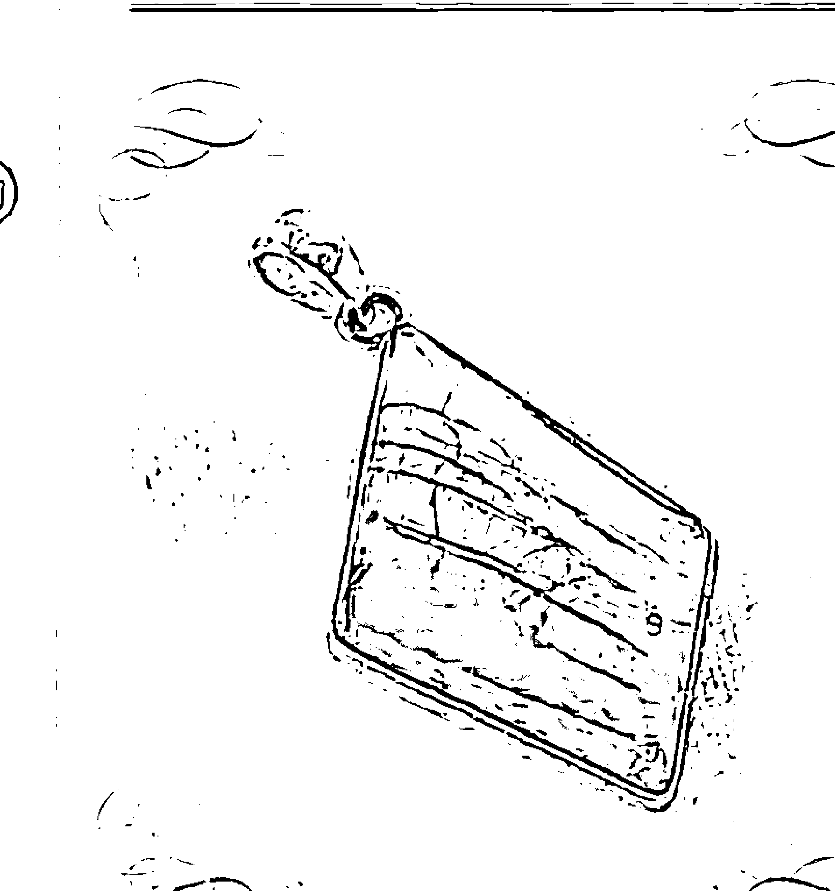

拉长石，也就是拉布拉多石(Labradorite)，其名称来自发现这种矿石的地点，加拿大的拉布拉多半岛(Labrador)。

拉长石和月长石、日长石一样属于长石家族的一份子，外表会随着光线产生不同颜色的变化。将拉长石对着光线，会产生蓝色、黄色、橙色等光谱（按照波长顺序将光分解）的光芒，所以也被称为「光谱石」。

拉长石发出的神秘光芒，也被认为是来自宇宙的情报，会带给拥有它的人某种灵光乍现。

### 对身体的作用

#### 消除浮肿，排出毒素

拉长石能帮助提高肾脏机能，将积存于体内的各种毒素与老废物质排出体外。除了有肾功能障碍的患者之外，身体经常浮肿或慢性疲劳的人、想调整血压的人也都能获得效果。

### 对意识的作用

#### 对自己诚实

拉长石具有提高直觉力的作用。拥有这种能量石的人，神经感觉会变得更纤细，更容易对宇宙敞开心胸。当莫名地感觉不安或恐惧时，拉长石也能带来内心的平安稳定，教人们将一切交给冥冥中的伟大力量。

拉长石也教导人们诚实面对自己的重要性。推荐给总是掩饰真正的心意，只懂得配合周遭反应行动的人。

### 拉长石（光谱石）可改善的精神症状

- 感到不明原因的恐惧或不安时
- 太在意周遭反应而掩饰自己真正的心意

### 蓝宝石

○来自宇宙的讯息○ 希望

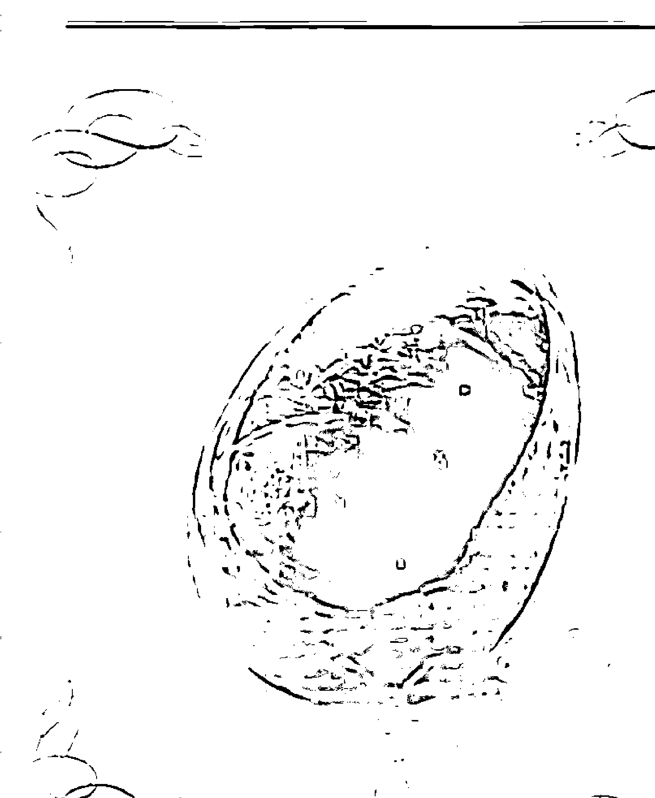

### 对身体的作用

蓝宝石能对末梢神经起作用，缓和三叉神经痛（对脑部传导颜面感觉的便是三叉神经）、坐骨神经痛以及肋间神经痛等。此外，蓝宝石对于皮肤及毛发的新陈代谢，如黑斑雀斑、脱毛掉发等问题的改善都具备效果。

### 对意识的作用

蓝宝石能帮助人们从至今的思考、行动模式中提高意识等级，引导成长，令人无论何时都不放弃希望，持续向前进。对于在意周围目光与自己所处立场，一味忍耐的人，蓝宝石能给予他们信任自己的力量。 蓝宝石能维持平稳的心，提高集中力、记忆力及使灵思泉涌的效果。

### 蓝宝石可改善的精神症状

- ○太在意他人目光，或在意自己所处立场而一味忍耐的人
- ○害怕改变
- ○注意力涣散不易集中的人

## 【Azurite·蓝铜矿】硬度3.5~4

### 蓝铜矿

> ○来自宇宙的讯息○ 活在当下

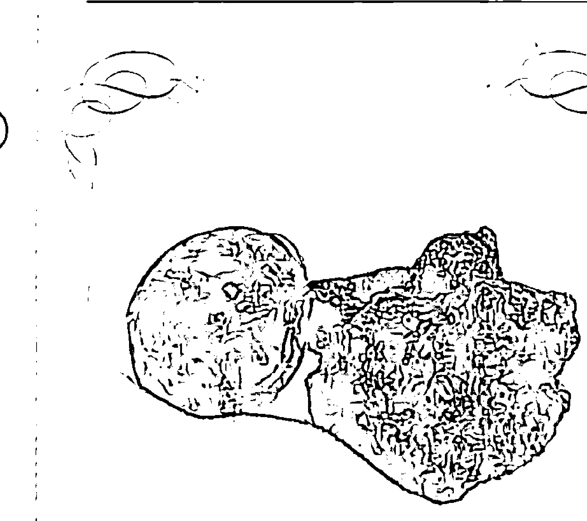

蓝铜矿深浓的靛蓝色彩，令人联想起神秘宇宙的存在。其名称，来自波斯语言中带有「青色」之意的「lazward」。从古埃及与古希腊时代起，蓝铜矿这种宝石就被奉为神圣之物，使用于祈祷或预言法事中。此外也被当作医药使用。人们认为蓝铜矿中栖宿着古老的精神与力量，当作神圣的宝石加以崇拜。

### 对身体的作用

#### 提高丘脑与丘脑下部的运作

丘脑位于生命活动的中枢部位，蓝铜矿能提高此处的运作，调整自律神经（司掌脉动与血压等不经由意识控制的体内神经律动）、荷尔蒙、睡眠与情动。此外，也可抑制癌细胞因子的活性化。

### 对意识的作用

#### 重视自我特性

我们人的本质即是精神，无论经过几度重生都会沿着独自的道路行走进化，渐渐成长。在这条路上，蓝铜矿能帮助我们不回首过去，不与人相较，珍惜现在，活在当下。

### 蓝铜矿可改善的精神症状

- 无法摆脱过去，停滞不前的人
- 对自己的艺术才能或工作能力怀抱自卑感的人
- 因特定状况（交通事故等）而陷入恐惧情绪的人

## 【Aquamarine · 蓝玉】硬度7.5~8

### 蓝玉（海蓝宝）

○来自宇宙的讯息○ 信任自己

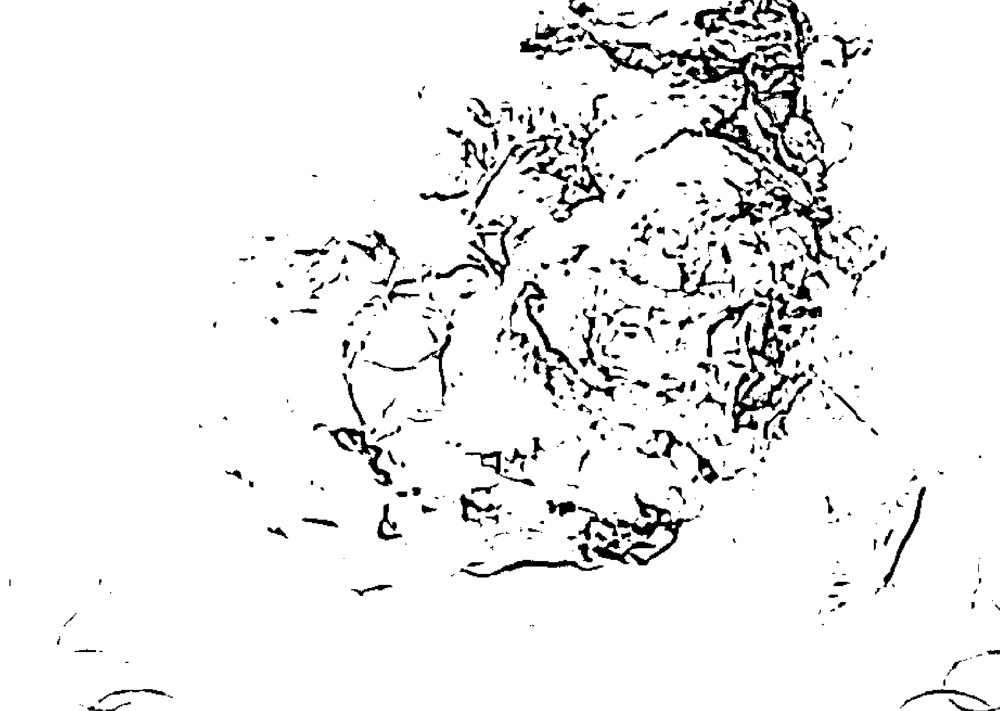

关于蓝玉有这样的传说：「本属于海底美丽海妖的宝物，受到海浪拍打上岸之后，成为人类眼中的宝石。」它的名称也是由带有「海水」意义的拉丁语而来。从古罗马时代起，渔民们就习惯以蓝玉当作护身符，保佑航海安全并带来渔获丰收。象征生命之源「海洋」的蓝玉，定也将如守护航海者一般，守护着拥有人吧。

蓝玉与祖母绿一样都属于「绿宝石」的一份子，内含的微量元素使外观呈现淡淡水蓝色，而祖母绿的绿色则是内含铬元素之故。

### 对身体的作用

#### 促进支气管黏膜的再生

蓝玉能促进喉咙或支气管黏膜的再生，所以当感觉喉咙梗塞、声音嘶哑时，或罹患慢性支气管炎、扁桃腺炎等疾病时，可期待蓝玉发挥的效果。

### 对意识的作用

#### 对待任何事物都能积极向前

蓝玉带来的效果，一如眺望蔚蓝大海时，总能感到长久累积于身心的压力获得解放。拥有蓝玉的人身心都能获得放松，心情变得积极向前，涌现坦然面对眼前事实的勇气与自信。

### 蓝玉（海蓝宝）可改善的精神症状

- 面试或开会时容易紧张脸红的人
- 夫妻吵架或与人相处时情绪容易激动的人
- 患有幽闭恐惧症或惧高症的人

## 【Lepidolite·锂云母】硬度0.5~4

### 锂云母

○来自宇宙的讯息○ 肯定他人的美善

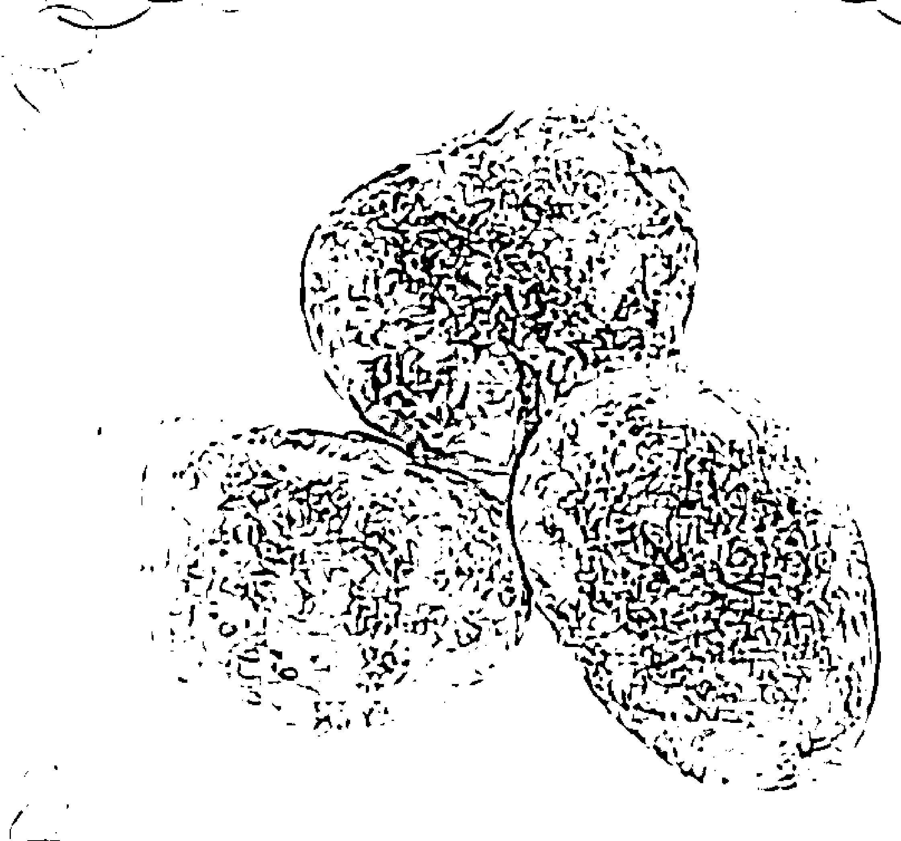

锂云母是云母矿物的一种，依照含成分的不同而有颜色的变化。云母本身虽是一种常见矿物，但含有锂元素而呈红色或粉红色的锂云母，却是只有在特殊条件下才能形成的。由于其中含有闪闪发光的鳞片状结晶，其名称由来也是从希腊语中意味着鳞片的「Lepidos」演变而来。

从古早时代起，锂云母便被称为「变革之石」，当人们面临崭新挑战时，锂云母便会发挥支援的力量。此外，因为这种石头质地柔软，处理及净化时都要特别注意。

### 对身体的作用

#### 帮助关节活动顺畅

锂云母对手肘与膝盖、肩膀等关节处起作用，能使关节的活动圆滑顺畅；且具有强化覆盖骨头表面之骨膜的作用，对缓和腰痛、椎间盘突出、关节风湿等病痛都颇有效果。

### 对意识的作用

#### 将障碍变为希望

无论前方遇到何种障碍，锂云母都能给予人们将障碍变为希望的柔软弹性。让人们无论何时，都能抱持希望而生。

此外，当意想不到的负面思考盘旋脑中挥之不去时，请试着碰触锂云母。这时，将感觉自己能够控制情感，心境也变得平和安定。另外，拥有锂云母的人也能够坦然肯定他人的美善。

### 锂云母可改善的精神症状

- ○灰暗沉重的想法挥之不去时
- ○无法坦率承认他人的优点时

## 【Rhodochrosite·菱锰矿】硬度3.5~4

### 菱锰矿（印加玫瑰，红纹石）

○来自宇宙的讯息○ 总是受人喜爱

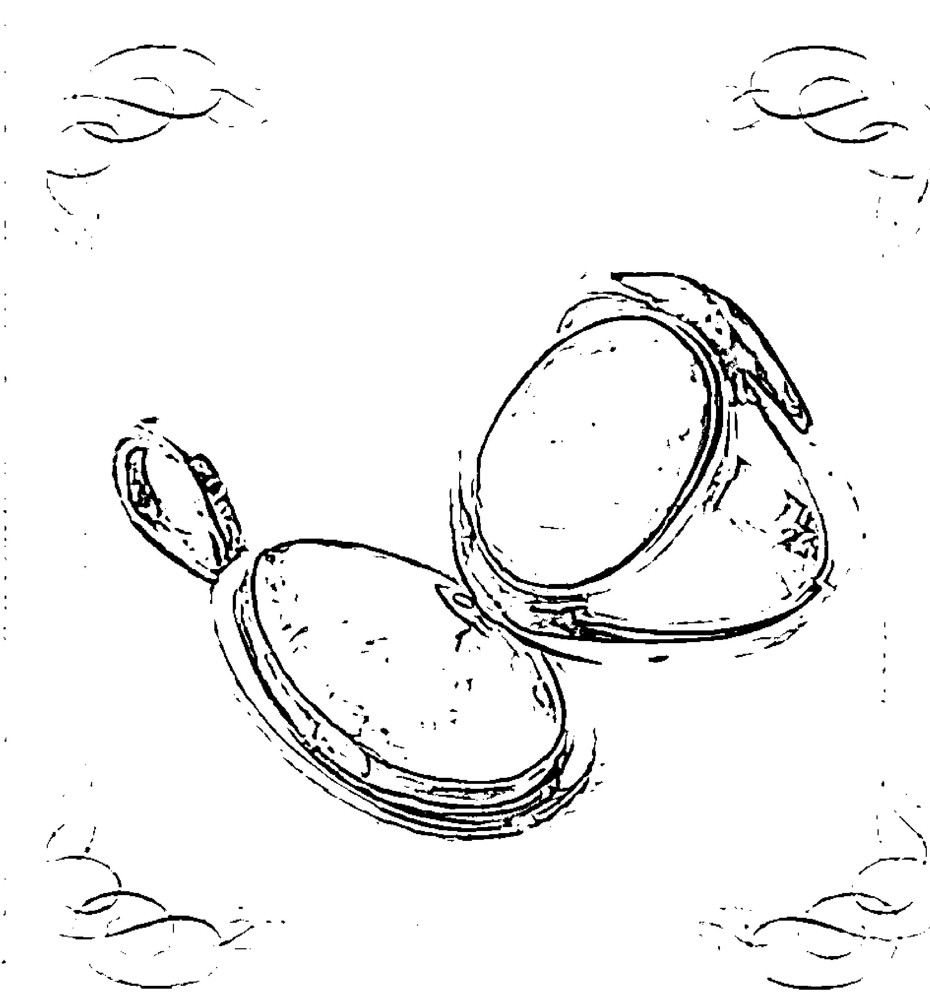

### 对身体的作用

#### 促进荷尔蒙分泌

菱锰矿对卵巢与睾丸产生作用，能促进女性荷尔蒙、男性荷尔蒙等的分泌，提高生殖能力。经常有生理不顺、生理痛等问题的女性，持有菱锰矿也能收到改善的效果。同时还能帮助调整自律神经的平衡，维持身体健康。

名称来自希腊语中「玫瑰色的石头」之语源。外观上呈现粉红色或玫瑰色的美丽色彩，有些是纯粹的半透明，也有深色条纹图案，种类非常丰富。由于中南美洲，尤其阿根廷盛产非常美丽的玫瑰色菱锰矿石，所以又别名「印加玫瑰」。在古代印加帝国，这种矿石被称作「玫瑰模样的珍珠」而受到人们珍爱。

### 对意识的作用

#### 无畏无惧

人类受到宇宙如此伟大存在的包围，并在当中成长。人生当中虽然会遇到感觉不安或恐惧的时刻，但宇宙永远都无私地爱着我们，保护、支持着我们，所以什么都不需要害怕。持有菱锰矿石，能让我们明白这个道理。

由于质地非常容易碎裂，在取用时都要十分小心。此外，受到紫外线照射时有褪色的可能，因此净化时请避免长时间曝晒于太阳光下。

### 菱锰矿（印加玫瑰，红纹石）可改善的精神症状

- 一人独处时便会感到不安的人
- 从未对自己做过的事感觉满意
- 不知道对什么感到不安，只是一味恐惧的人

## 【Chrysoprase・绿玉髓】硬度7

### 绿玉髓

○来自宇宙的讯息○ 在各方面获得成长

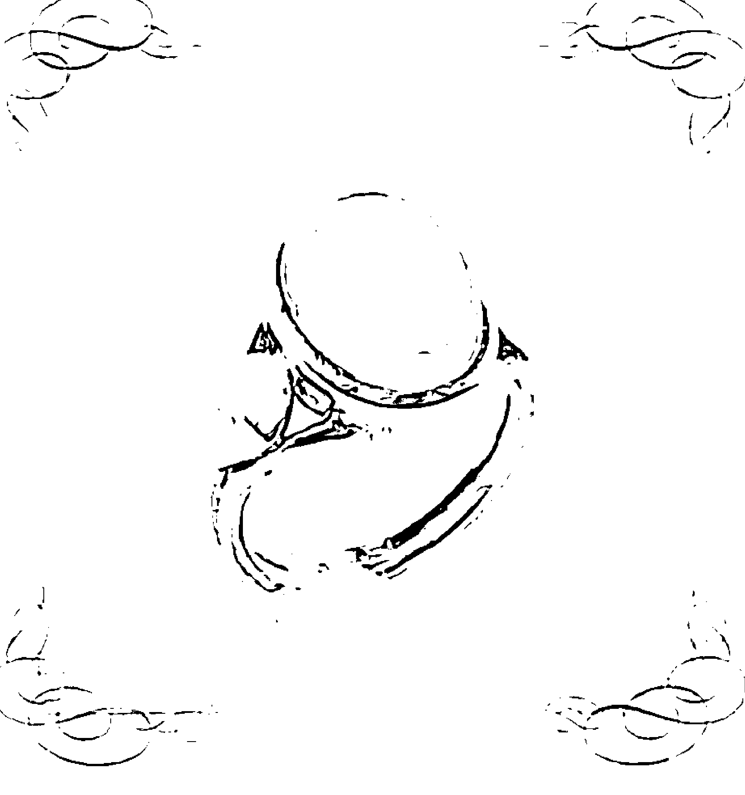

### 对身体的作用

#### 强化听觉神经与鼻腔黏膜

绿玉髓有活化听觉神经运作的功效，耳朵听不清楚时可发挥其效果。此外，它还具有强化副鼻腔黏膜的作用，对苦于慢性鼻炎的患者也很有效。

### 对意识的作用

#### 提高与人之间的协调性

当自己对自己无法产生自信，或遇到难以解决的困难时，绿玉髓能带来希望与激励。不限于一件事，而是帮助人们在各方面都能获得成长。
另一方面，绿玉髓也具有提高人与人之间协调性的作用，所以人际关系不顺时，能发挥帮助解决问题的功效。当必须与不合的人见面时建议可将绿玉髓带在身上。

绿玉髓有着令人联想起新叶的嫩绿色，与红玉髓同属石英家族。
从古罗马时代起，绿玉髓主要就被人们镶嵌于贝壳浮雕上，做为装饰用。据说西元前3世纪征服东西世界的亚历山大大帝也将绿玉髓视为胜利之石而爱用过。
另一方面，绿玉髓也被认为是对肾脏病具有疗效的药物而受到广泛使用。

### 绿玉髓可改善的精神症状

- 受过去经历纠结的人
- 踌躇不前无法重新出发的人

## 【Malachite·孔雀石】硬度3.5~4

### 孔雀石

○来自宇宙的讯息○ 内心充满祥和喜悦

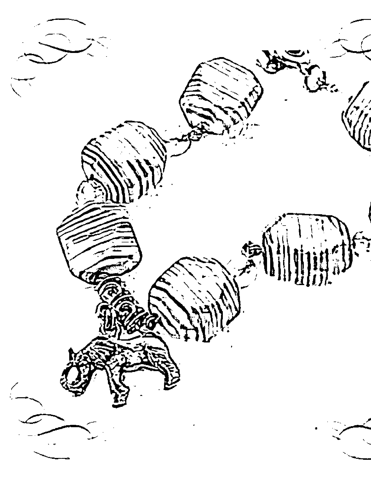

### 对身体的作用

#### 促进能量产生

孔雀石具有强化口中黏膜与牙龈的作用，对于改善口内炎与牙周病都有很好的效果。此外，还能促进体内能量的产生，对于手脚冰冷或体力不足的毛病都有改善的效果。

远自西元前4000年前起，孔雀石就被人们用来当作鲜绿色颜料的制作原料。其名称「Malachite」的由来则是源自于希腊语中的植物「锦葵」(malache)。这是由于锦葵的颜色与孔雀石相近之故。「孔雀石」这个名称则是因外观令人联想起孔雀羽毛图案的缘故。

### 对意识的作用

#### 带来冷静的分析力

孔雀石帮助人们冷静检视自己内心，对于发生的事加以分析、理解，引导出解决问题的力量。其结果，使人们能从对经济能力的不安或对疾病灾害的恐惧等负面情绪中获得解放，内心充满祥和与喜悦的情绪。另外，孔雀石也是培养奉献心的能量石。

据说将孔雀石磨成的粉末做为眼影使用，可收除魔驱虫的效果，连埃及艳后也是爱用者。而因为孔雀石质地柔软不耐水，不论在取用上或净化时都要小心注意。

### 孔雀石可改善的精神症状

- 对灾害、身体健康、经济能力的不安多出常人一倍的人
- 不维持整洁便坐立不安的人

## 【Tiger’s eye·虎眼石】硬度7

### 虎眼石

○来自宇宙的讯息○ 直到最后仍不放弃

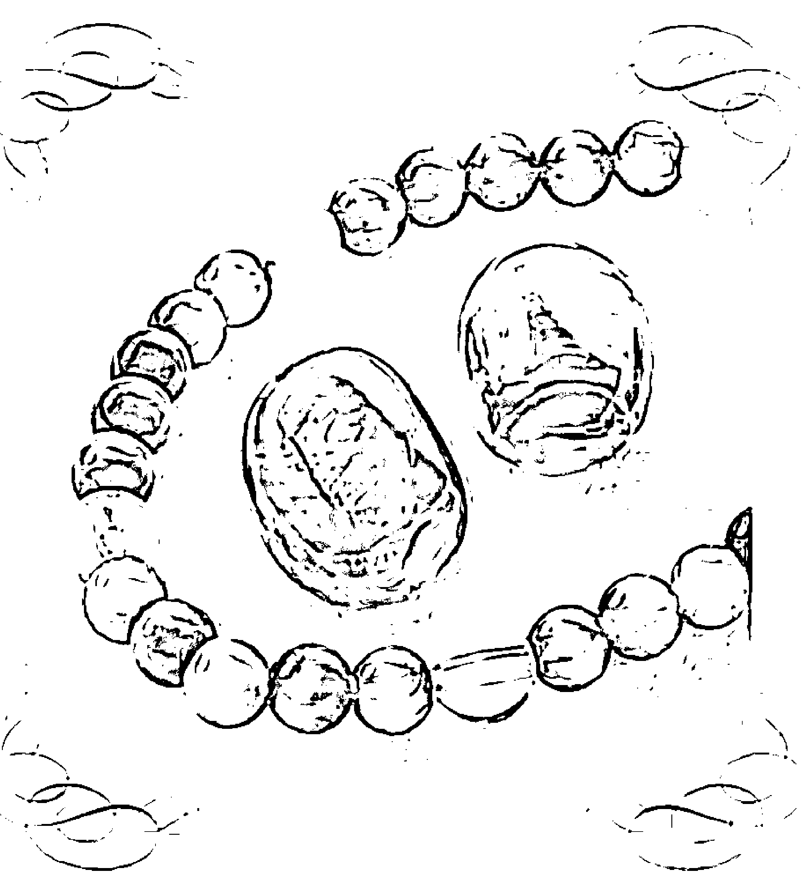

### 对身体的作用

#### 缓和膝盖与腰部疼痛

虎眼石的能量能促进骨骼与软骨的形成。骨折或膝盖酸痛、腰部疼痛的患者佩戴虎眼石，对疼痛能有一定的缓和效果。此外，虎眼石也支援气管与支气管的运作，能改善多痰症状。

茶色中带着鲜丽金黄色的条纹，在光线反射之下神似炯炯有神的虎眼，因此而得名。

### 对意识的作用

#### 给予强烈意志与力量

虎眼石被认为是能引导成功、招来幸运的能量石。古埃及人也崇拜虎眼石的力量，将其镶嵌于神像的眼部。他们相信如此一来，神像眼部将释放出足以反射驱离邪恶势力的神圣眼力。

遇到困难而感到挫折时，虎眼石能帮助人们控制自己的心志，引导人们涌现奋起向前，直到最后一刻都不轻言放弃的坚强意志。
此外，虎眼石也能令人对家族产生强烈感情，加深家人之间的羁绊。

古印度人也珍爱此种色彩变化之下形成的美丽宝石。在行星宝石学中，虎眼石亦可代替能发出等同计都星能量的猫眼石。

### 虎眼石可改善的精神症状

- 消极丧气的人
- 对事物容易放弃的人
- 对家族心怀不满的人

### 琥珀

◎来自宇宙的讯息◎ 巧妙顺应变化

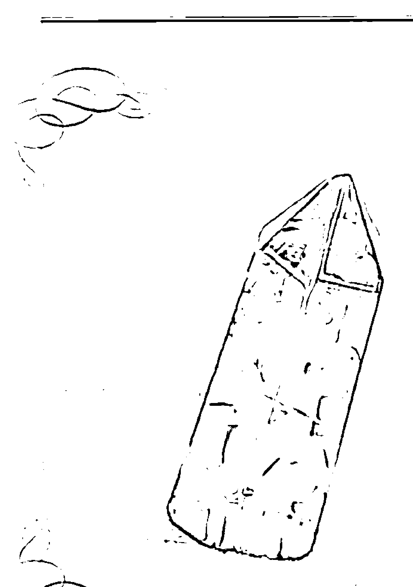

### 对身体的作用

使关节动作圆滑顺畅。琥珀能促进关节液的分泌作用，帮助关节活动更为圆滑顺畅。因此，有膝关节问题或腰痛毛病者可尝试琥珀的效果。此外，琥珀能令掌管消化机能的第3脉轮运作活跃，所以也推荐给肠胃等消化器官常感疲惫的人。

琥珀乃是针叶树的树脂于数千年前石化演变的产物。由于与矿物一样是从地底采掘出来的，方便上经常被通称为矿物。有些琥珀之中可看见被包含其中的昆虫或植物。

旧石器时代琥珀除了被当作装饰品外，也常被利用为治疗药品。在古埃及或古希腊，祭司们常在仪式之中于身上佩戴琥珀，将其视为具有神圣守护力量的护身符。

琥珀的比重轻，能浮于海水之上，超过摄氏150度即开始软化。也由于琥珀具有如此不耐热的性质，净化时请避免使用照射日光的方式。

### 对意识的作用

培养包容的心。森罗万象（意即宇宙中所有存在的万事万物）都在全知全能的宇宙掌管之下。活在这当中的我们，透过种种体验，顺应其中变化，方能渐渐获得一颗柔软的心，无论有什么遭遇都能够包容。琥珀这种能量石，便能帮助我们培养这样的包容心，让我们面对并承认已经发生的事，同时涌现新的力量，再次站起来面对现实。

### 琥珀可改善的精神症状

- 当事情不如愿便感灰心失望的人
- 无法顺应对周遭变化封闭自我的人

## 【Tanzanite・灰帘石】硬度6~7

### 灰帘石（丹泉石，坦桑蓝）

○来自宇宙的讯息○ 挑战极限

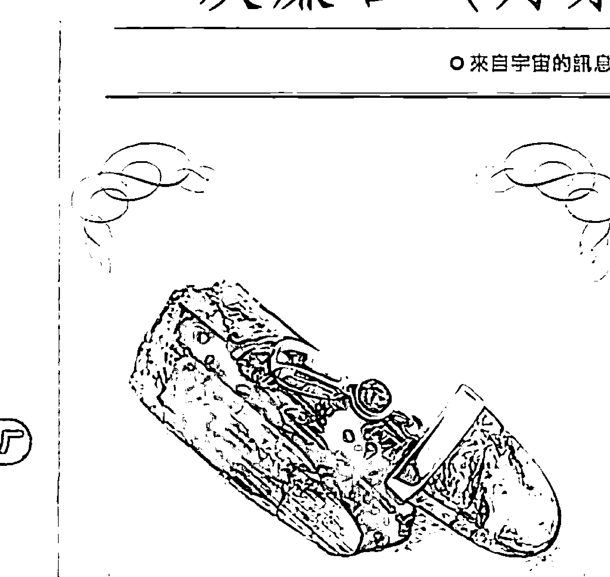

### 对身体的作用

#### 排出体内毒素

我们在日常生活中，透过摄取食物或水，甚至受到空气中戴奥辛等重金属物质对身体的不良影响，在体内累积了不少毒素。灰帘石能帮助我们从皮肤排出这些累积于体内的毒素。

意味著「坦桑尼亚（Tanzania）之石」的坦桑蓝，其正式名称为「灰帘石（Blue Zoisite）」。这是于1967年发现于坦桑尼亚的能量石，而其后由蒂芬妮（Tiffany）公司冠以「坦桑蓝（Tanzanite）」名称将之商品化，才成为现在一般熟知的名称。「Zoisite」这种矿石依照构成成份之不同，颜色也五花八门，其中呈现蓝色或紫色的才被称为灰帘石。现在，这种矿石只在坦桑尼亚等少许非洲国家才能采集，非常稀少珍贵。在行星宝石学中可用來代替释放等同土星能量的蓝宝石（参见80页）。

### 对意识的作用

#### 提高意识，给予灵感

灰帘石是一种能引导人们提升意识层次，给予灵感，让人们探索宇宙奥妙时，足以洞察真理。感性获得提升，灵感也磨练得更敏锐时，对于生存的目的必將更能深入理解。灰帘石也是正在挑战自我极限之人的绝佳推手。特别是对在肉体与精神状态都需超越极限的运动员最能发挥效果。此外，灰帘石能帮助人们抹消不安，给予勇气和深思熟虑的能力，而获得心灵的平静。

### 灰帘石（丹泉石，坦桑蓝）可改善的精神症状

- 对将来感到不安恐惧的人
- 感到不安和焦虑的人

## 【Yellow Sapphire·黄刚玉】硬度8.5

### 黄刚玉（黄蓝宝）

○来自宇宙的讯息○ 相信自我的意志

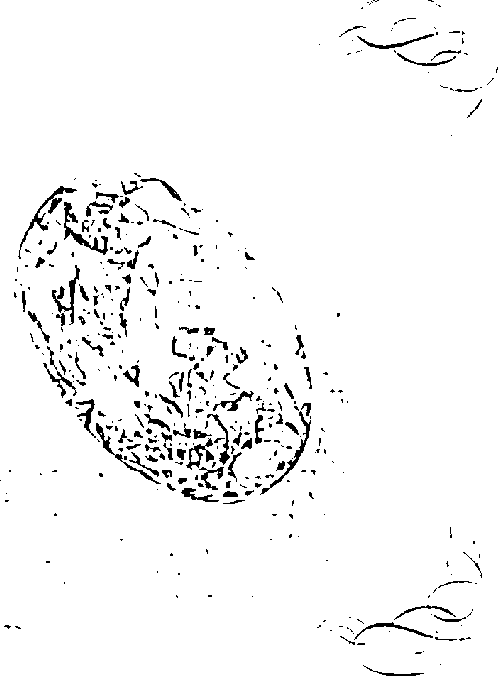

黄刚玉又称黄蓝宝，一如其名，就是黄色的蓝宝石（简称黄宝石）。与红宝石一样是属于「刚玉」家族的矿物。刚玉依构成上之內容物的不同，呈现红色的即为红宝石，除了红宝石之外的则统称蓝宝石（Sapphire）。所以，「蓝宝石」事实上是有各种颜色的。
在行星宝石学中，黄刚玉拥有的能量，被认为与来自木星的宇宙能量相同。

### 对身体的作用

#### 强化肠胃·骨骼·关节
黄刚玉能帮助消化吸收顺畅，维持良好肠胃机能。由于对消化肠道产生良好作用，因此也能提高肠管免疫（肠内进行的免疫作用），具有强化自愈力的功效。此外，还能强化骨骼与软骨及关节组织，缓和腰部与膝盖的疼痛。

### 对意识的作用

#### 保持明快的心情 成为愉快的人
黄刚玉能引导我们一扫迷惘，信任自我的意志。因此推荐给容易受到他人意见左右的人。若能确实拥有自我意志力，即使面对不合理的事物一定也能坚强面对。在黄刚玉这种能量协助之下，就能渐渐保持明快的心情，拥有人生。

### 黄刚玉（黄蓝宝）可改善的精神症状

- 动不动便想寻求他人建议者
- 对自己没有自信的人

## 【Citrine・黄水晶】硬度7

### 黄水晶

> ○来自宇宙的讯息○ 将一切朝向自己引导

### 对身体的作用

#### 帮助排出体内积蓄的毒素

黄水晶能促进身体新陈代谢，具有帮助排出体内毒素的解毒作用。持有黄水晶的人会变得更容易出汗，随着汗水排出毒素，从身体内侧健康起来。此外，黄水晶还具有保护胃黏膜的作用，对于胃有毛病的人具备相当的功效。

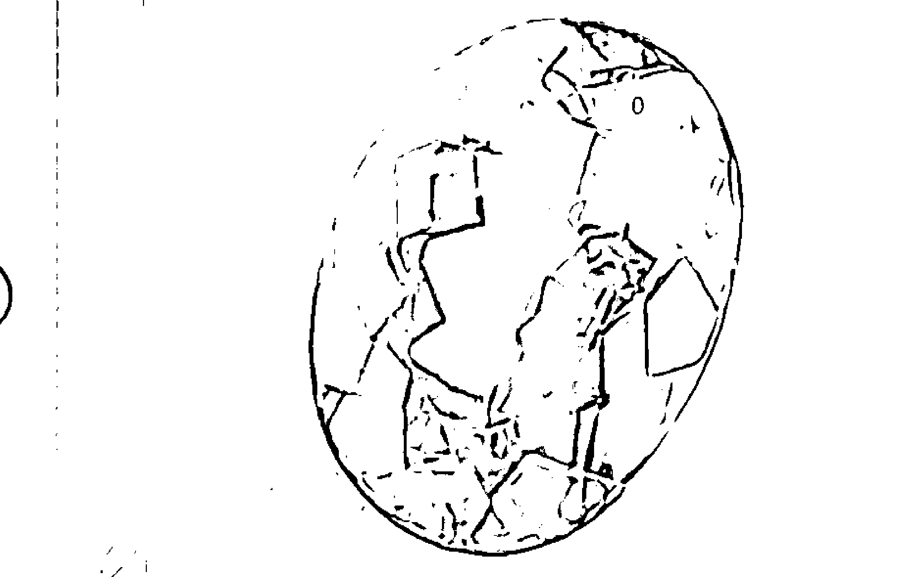

黄水晶因颜色类似柑橘类的水果「香橼（Citron）」而得名。从前黄水晶被认为是能带来商业繁盛的宝石，因而受到人们的珍爱。此外，黄水晶与日长石相同，都是象征太阳的矿石之一。阳光普照万物，为大地注入能量，拥有黄水晶的人也能获得高度能量，提高生命力。

### 对意识的作用

#### 疗愈来自身体方面的自卑感

想再长高一点，或希望脸能再小一点，人们多多少少对自己的身体都怀有不满，甚至演变成自卑情结。患有疾病的人，也可能会怨恨自己为何不能拥有健康的身体吧。这些关于身体的自卑感，能在黄水晶的能量之下获得疗愈。黄水晶能教人明白，自己的身体其实就是最适合用来砥砺自己精神的地方。

### 黄水晶可改善的精神症状

- 对自己的身体抱持强烈自卑感的人
- 对特定的人怀抱敌意的人

## 【Topaz·黄玉】硬度8

### 黄玉（黄晶，拓帕石）

○来自宇宙的讯息○ 彻底发挥自我特性

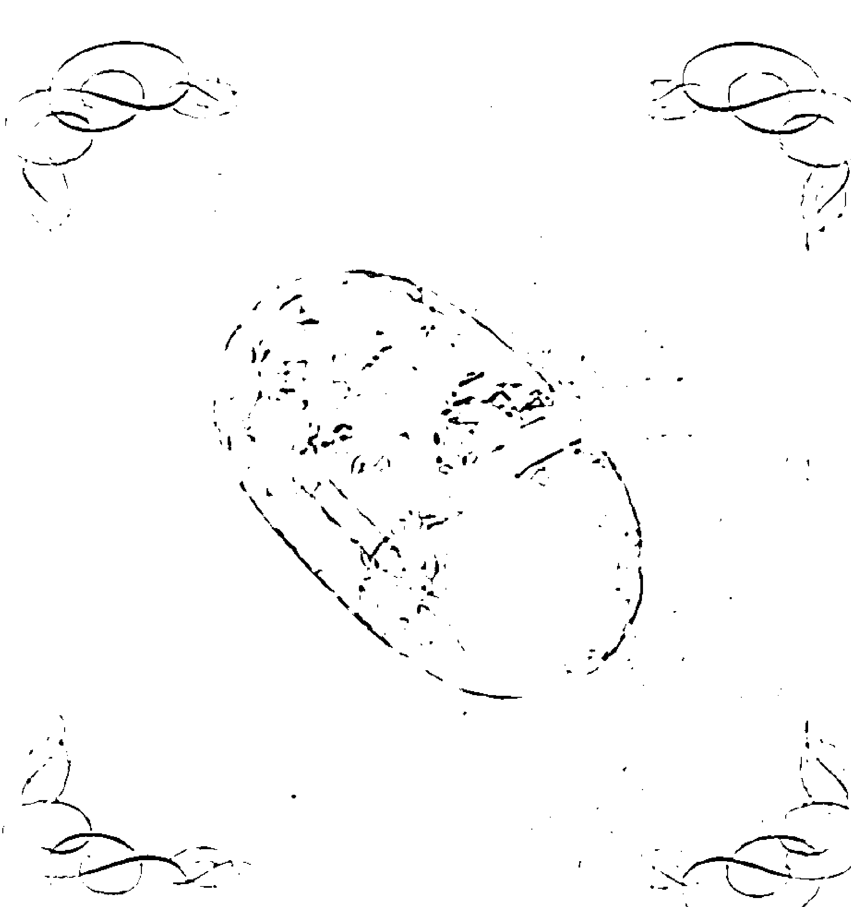

### 对身体的作用

#### 改善肌肤问题

黄玉能促进皮肤的新陈代谢，发挥创造健康肌肤的作用力。对于黑斑雀斑、异位性皮肤炎、湿疹、割伤或搔痒性伤口等肌肤问题都能发挥极高的治愈能力。

### 对意识的作用

#### 柔软变通的思考力

黄玉能帮助人们充分发挥各自的性格，培养柔软的思考力，以最适合自己的方式获得成长。此外还可提高创造力与感受性，让人们察觉人生中的各种可能性。如此一来，人们就能跳脱制式的框框，从无形的压力之中获得解放。

由于黄玉会受到光与热的影响而改变颜色，所以虽名为黄玉，但外观上却有无色或蓝色、粉红、橙色等多种色彩。

其中最具代表性，被称为「帝国黄玉 (Imperial Topaz)」的黄色石头，在古埃及被人们视为太阳神的象征而受到崇拜，古埃及人也将它当作驱邪的护身符而爱用著。黄玉发出的美丽光芒，更是经常被比喻为太阳光，而这种能量石也正拥有如太阳般坚强明亮的能量。

### 黄玉（黄晶，拓帕石）可改善的精神症状

- ○ 只从一个面向思考事物的人# 【Ruby·紅寶石】硬度9

### 紅寶石（紅玉）

○來自宇宙的訊息○無條件的愛

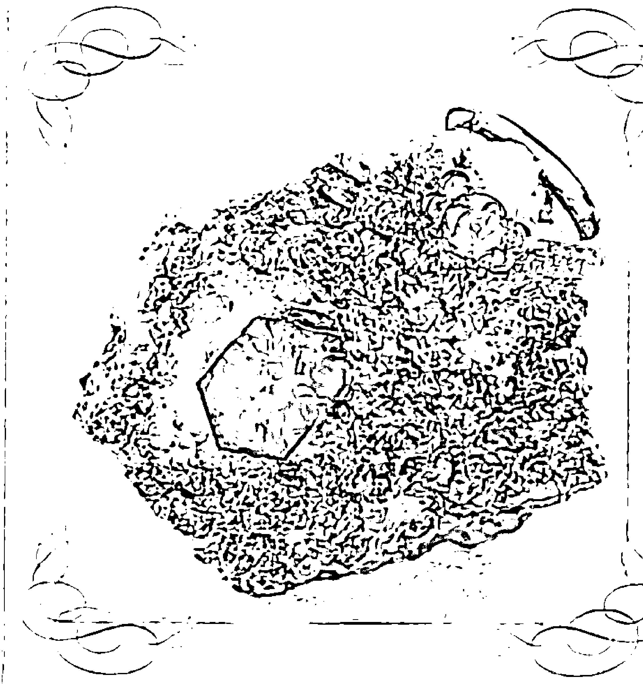

鋼玉（corundum）之中外觀呈現紅色的種類就被稱爲紅寶石，和藍寶石是不同顏色的家族兄弟。古代的印度人認爲紅寶石是能夠克服恐懼，增加快感的石頭，將紅寶石當作秘藥或治療肝臟的藥品來使用。

紅寶石之中濃縮著紅色的光線，充滿熱情、熱意、勇敢等波動與生命能量，且與第7脈輪有著強力的共鳴。

在行星寶石學中，紅寶石被視爲太陽之石，擁有紅寶石的人能獲得等同於太陽的能量。

### 對身體的作用

#### 提高生命能量

紅寶石能改善血液循環，促進細胞再生，給予人體組織活力。此外，對於造血的骨髓也有所作用，助長紅血球、白血球及血小板的產生。失去元氣的人、容易感冒的人、手腳冰冷或貧血等，只要與血液有關的問題，紅寶石都能發揮效果。

### 對意識的作用

#### 授予不屈不撓的精神力

在紅寶石的作用下，隨著體力精力的充實，心思靈感的強化，人們就能擁有不屈不撓的精神力量。因此，紅寶石是一顆增強領導能力，幫助人們積極挑戰事物的能量石。對於不夠積極的人，紅寶石能夠給予勇氣。此外，在紅寶石的影響之下，即使是面對敵人也能給予無條件的愛。

### 紅寶石（紅玉）可改善的精神症狀

- ○提不起幹勁
- ○經常感覺疲倦
- ○不夠積極，或精力不夠充沛的人

## 紅碧玉

○來自宇宙的訊息○珍惜當下而活

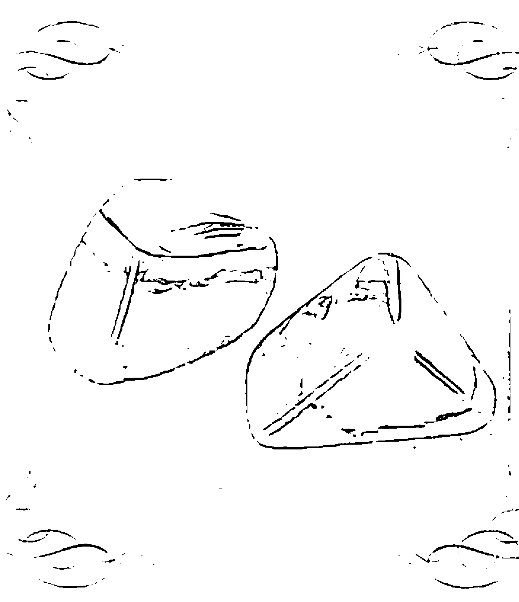

包括水晶在內，只要是屬於石英家族的礦物，而其中因含有20%以上的不純物質而呈外觀不透明的礦石，都總稱為「碧玉」。而紅碧玉一如其名，就是紅色的碧玉。

紅碧玉被認為擁有太陽能量，自古以來便是聖石之一。古代的秘魯人將紅碧玉用來當作避邪的護身符，美洲原住民則在祈雨儀式中使用紅碧玉，稱其為帶來雨水之石。歐洲人則認為「將紅碧玉放在孕婦肚子上，能使生產過程順利」，也當作安產護身符佩戴在身上。

### 對身體的作用

#### 減緩年齡老化的速度

紅碧玉具有除去活性氧的作用（抗氧化）。而活性氧正是致使人老化或產生疾病的根源之一。此外，紅碧玉還有促進鹼性的作用，防止身體的酸化傾向。對於日常生活中維持與增進健康，以及想延緩老化速度的人，紅碧玉都有值得期待的效果。

### 對意識的作用

#### 培養正確的判斷力

推薦給陷入後悔不安等負面情緒的人。持有紅碧玉將自然懂得珍惜眼前，湧現腳踏實地向前走的力量。

此外，紅碧玉能引導事物朝正確方向演進，幫助人們分辨是非善惡，養成正確的判斷能力。特別是對於明知正做著錯誤的事卻無法停手的人，紅碧玉能發揮絕大的效果。

### 紅碧玉可改善的精神症狀

- ○陷入後悔或不安情緒而一蹶不振的人
- ○明知錯誤卻無法停止的人

## 【Red coral·紅珊瑚】硬度○3.5～4

### 紅珊瑚

○来自宇宙的讯息○ 发挥自己的专才，为他人带来喜悦

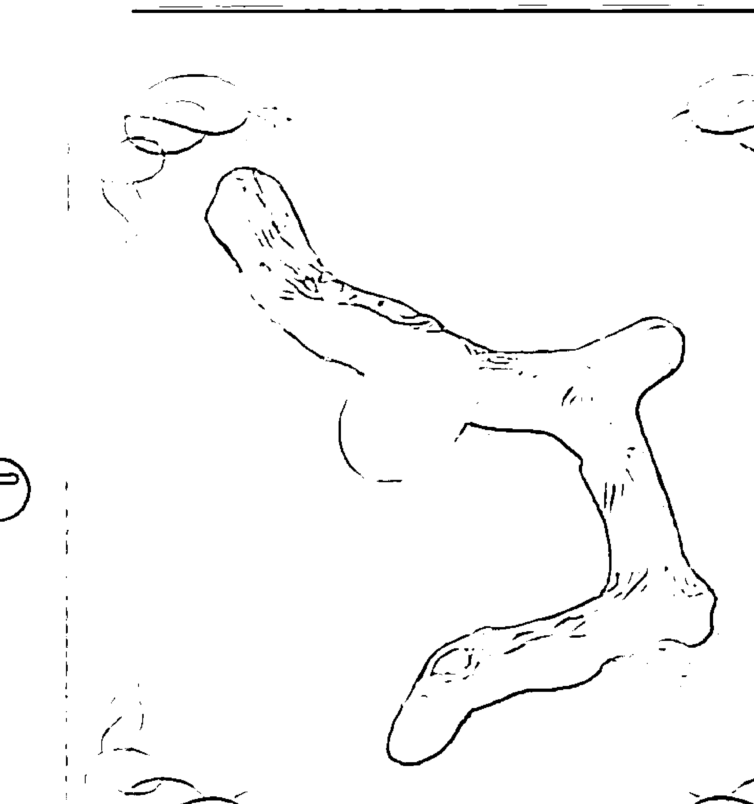

珊瑚（Coral）这种能量石严格来说并非矿物，其来源是珊瑚虫这种生物。珊瑚古来就被航海者当作行船安全的护身符使用。

珊瑚有红、粉红、白等各种颜色，其中红珊瑚作为能量石又具有最大的能量。拿红珊瑚透过棱镜（透明的三角柱）观看，可看到黄色光线放射，因此红珊瑚能为体内补充不足的黄色光线。此外，其波动频率与第1脉轮产生强烈共鸣，能为我们提高生命能量。在行星宝石学中认为红珊瑚接受来自火星的能量，被视为珍贵的能量石。

### 身體的作用

#### 對肌肉與關節起作用

红珊瑚对肌肉、肌腱、骨头与关节都有所助益。具有减缓痉挛、肌肉酸痛、肌腱炎、腰痛、肩膀僵硬等症状的效果。另外也能帮助肝脏与消化器官的运作，改善肝脏机能低落及消化不良的毛病。

### 對意識的作用

#### 懷抱感恩的心，積極向前

当感觉到自我存在受到威胁而内心受伤时，红珊瑚能够疗愈这种受伤的心情。同时还能养成感恩的心与积极向前的态度，增加欢笑、喜悦、安心等正面积极的情感。

### 紅珊瑚可改善的精神症狀

- 遭受雙親或他人的虐待或壓抑，造成心理傷害的人
- 對初次見面的人感到恐懼的人
- 容易混亂焦慮的人

## 【Carnelian·红玉髓】硬度○6.5～7

### 紅玉髓

○來自宇宙的訊息○ 接受他人的思考與行動

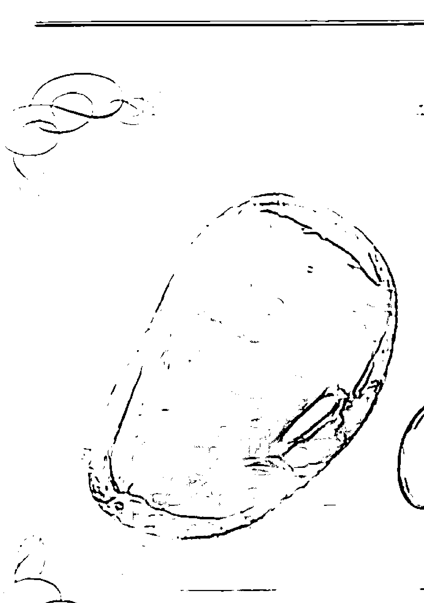

紅玉髓（Carnelian）的語源來自拉丁語中具有「肉」意味的「carnis」。在礦物學的分類上，紅玉髓與石英屬於同一家族。帶有條紋或花紋的紅色石英石，一般就稱之為紅玉髓。在西元前2500年的美索不達米亞文化遺跡中，就曾發掘出以紅玉髓製成的首飾。在行星寶石學中，紅玉髓與紅碧玉（請參見94頁）同為紅珊瑚的代用石，被視為能發出等同於火星的能量。

### 對身體的作用

#### 促進血液成份的產生

紅玉髓正如其名，對骨髓產生作用，可促進搬運氧氣和二氧化碳的紅血球、掌管免疫能力的白血球、以及凝固血液的血小板細胞產生。因此，紅玉髓對貧血的人或有血液方面疾病的人是有相當功效的。

### 對意識的作用

#### 給予面對未來 迎向未來的勇氣

人生總會經歷痛苦。然而過了一段時間回頭看，會發現當時的經驗都成為力量，幫助著現在的自己。紅玉髓就是能幫助人們擁有更多面對未來來的勇氣，並且讓我們更能理解他人的思考與行動。當紅玉髓的力量發揮在戀愛時，將吸引到對彼此而言都是理想的伴侶。

### 紅玉髓可改善的精神症狀

- ○ 陷溺於過去失敗經驗或事故而無法重新振作的人

## 【Spinel·尖晶石】硬度○8

### 尖晶石

○來自宇宙的訊息○ 為他人盡心盡力

### 對身體的作用

#### 促進血液循環 提昇免疫力

尖晶石能促進副交感神經的活化。副交感神經越是活躍，身心越能獲得舒緩放鬆，血液循環變得更好，體溫也會上升。此外，還能增進白血球中的淋巴球數量， 提高免疫能力，維持全身的健康。

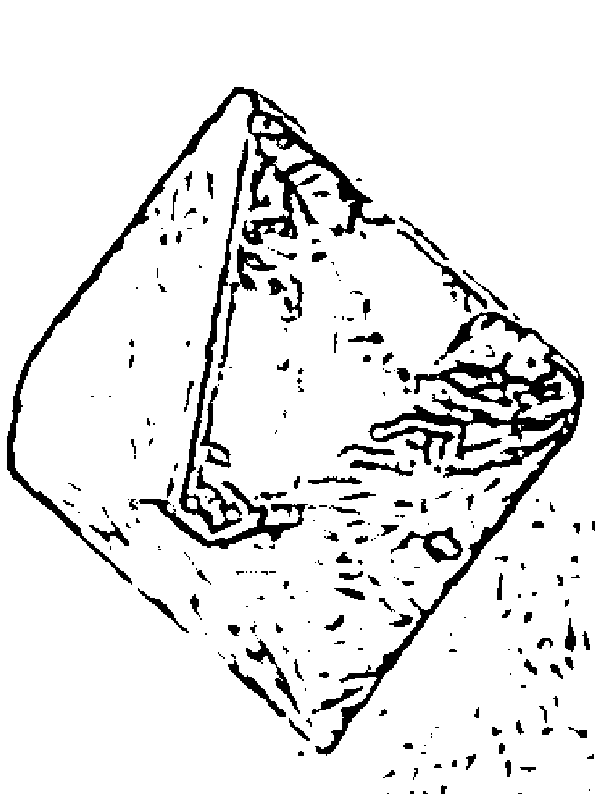

### 對意識的作用

#### 帶來熱情、意志、勇氣

持有尖晶石的人，在需要給予他人評價時，會受到引導而去注意良善的一面。適合推薦給很難發現他人優點，總是在找他人缺點的人。尖晶石能讓持有者願意為他人盡心盡力，這是作為領導者所需要的資質，也將因尖晶石的幫助而獲得發揮。擁有尖晶石亦能帶來朝目標前進、精益求精的熱情與意志，以及不屈不撓的勇氣。

尖晶石是由鋁與鎂形成的礦物，依內含的鐵元素、鉻元素、鋅元素與錳元素之含量的微妙不同，使其外表分別呈現紅、橙、綠、藍、紫或黑等不同的顏色。

特別是紅色的尖晶石，因爲擁有豔麗的光澤，經常被與紅寶石混淆。也因此，在行星寶石學中，可代替紅寶石，為持有者帶來等同於太陽發出的能量。

### 尖晶石可改善的精神症狀

- ○眼中只看得見他人缺點的人

## 【Diamond·金刚石】硬度○10

### 金刚石（鑽石）

○来自宇宙的讯息○ 純真

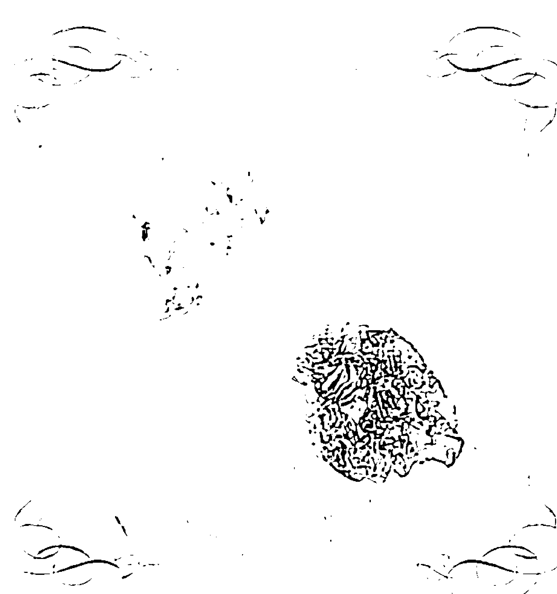

### 對身體的作用

#### 促進性荷爾蒙的分泌

金剛石有助於促進女性荷爾蒙、男性荷爾蒙，以及保持年輕的荷爾蒙等種種荷爾蒙的分泌。此外，也對腎臟、膀胱、尿道、前列腺的運作有所助益。還能幫助人體排解來自農藥與食品添加物的毒素。

### 對意識的作用

#### 帶來堅強的精神力與不屈的信念

當生病，或遭遇霸凌、面對大考等重大事件時會特別感到恐懼的人，金剛石的能量將有助於產生堅強的精神力量與不屈的信念。精神上受過傷的人，也能在金剛石的能量幫助下踏出新的一步。另一方面，金剛石也為人們培育豐富的自然與藝術美感。

### 金刚石（鑽石）可改善的精神症狀

- 失去生存力量的人
- 恐懼疾病，或因霸凌事件而對特定人物感到恐懼的人

在所有礦物之中硬度最高的金刚石（也就是鑽石Diamond），其名稱之由來乃源自希臘語中帶有「征服欲」意味的「adamazein」。金剛石以無色為基準，但也有藍色、粉紅色、黃色、綠色等多種色彩。而無色金剛石因為其堅硬無瑕的形象，在人們心目中成了永恆羈絆的象徵。

金剛石透過棱鏡（透明的三角柱）觀看時，會發出藍色的光線，當人體藍色光線不足時能幫助補充，引導身心達到健康狀態。在行星寶石學中，金剛石釋放的能量等同於金星能量。

## 【Rutile quartz·金紅石】硬度○6～6.5

### 金紅石（髮晶）

○來自宇宙的訊息○ 萬物皆有所聯繫

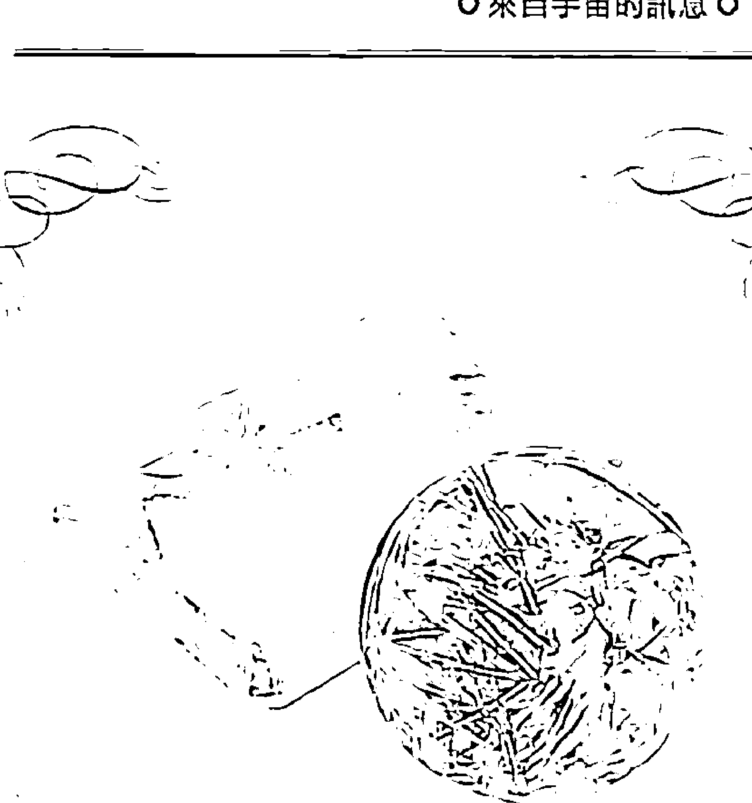

### 對身體的作用

#### 阻擋電磁波

手機、電腦、微波爐、電視等等的電器製品所產生的電磁波都對人體帶來極大的影響。而金紅石的作用，即能幫助阻擋這些肉眼不可見的電磁波。

### 對意識的作用

#### 相信自己走的路

人生在世絕不孤單，一切都是聯繫在一起的。所以請相信自己，鼓起勇氣踏上自己選擇的路前進吧。金紅石將爲擁有明確目標、內心充滿希望的人助上一臂之力。

金紅石（Rutile quartz）中的「Rutile」，來自拉丁語中「閃耀著金黃色」意味的「rutilus」。「Rutile」是一種二氧化鈦的結晶；水晶（quartz）之中包覆著髮絲狀的「Rutile」所形成之能量石，故名爲「Rutile quartz」。

與高級寶石不同，在能量石的世界之中，石頭之中包覆著異種內容物的種類，比一般的石頭具有更高的能量。金紅石內含的髮絲狀，在西洋被稱爲「愛神的箭」，由此可知金紅石也被當作能帶來幸福良緣的能量石而受到人們喜愛。

### 金紅石（髮晶）可改善的精神症狀

- 感到孤單寂寞的人
- 帶著不滿的情緒，任憑時光流逝的人
- 一遇到困難就失去動力的人

## 【 Rhodonite·薔薇輝石 】硬度 ○5.5～6.5

### 薔薇輝石（玫瑰石）

○來自宇宙的訊息○ 對愛與溫柔的覺醒

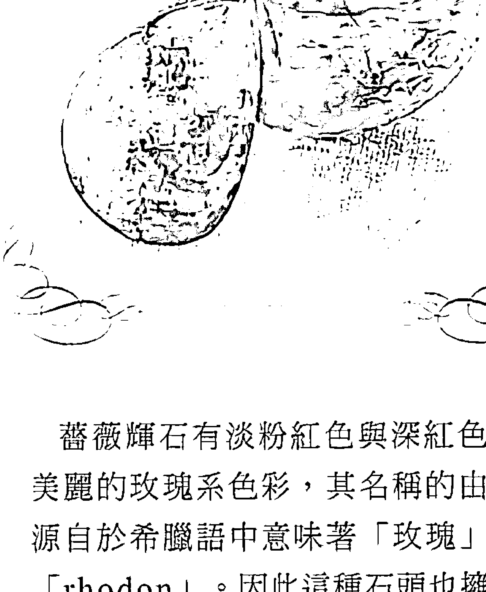

### 對身體的作用

#### 對血小板有所作用，具止血效果

薔薇輝石能促進血液中的血小板凝結，有止血的效果。尤其對產後的出血特別有效。此外，它還對某種病毒起作用，能抑制病毒的增生。

薔薇輝石有淡粉紅色與深紅色等美麗的玫瑰系色彩，其名稱的由來源自於希臘語中意味著「玫瑰」的「rhodon」。因此這種石頭也擁有了「薔薇輝石」如此美麗的名字。 這種能量石，能引出人們的潛在能力，將精神引導至更高層次的領域。傳說擁有薔薇輝石的人能對愛敞開心胸，因此也被視為戀愛的守護石，經常被當作戀愛護身符來使用。

### 對意識的作用

#### 鼓起勇氣出發

真正的愛與溫柔，就是放棄一切的執著與束縛，一心一意支援對方的幸福。薔薇輝石是一顆能幫助人們對這樣真實的愛與溫柔有所覺醒的能量石。 當人們無法肯定自己的決斷或行動是否正確，或是內心脆弱容易挫折時，薔薇輝石能教導人們鼓起勇氣出發的重要性。

### 薔薇輝石（玫瑰石）可改善的精神症狀

- ○因為太擔心而過度干涉別人時
- ○沒有自信，陷入自卑沮喪的情緒

## 【Lapis lazuli・青金石】硬度○5.5

### 青金石

○來自宇宙的訊息○ 展現原原本本的自我

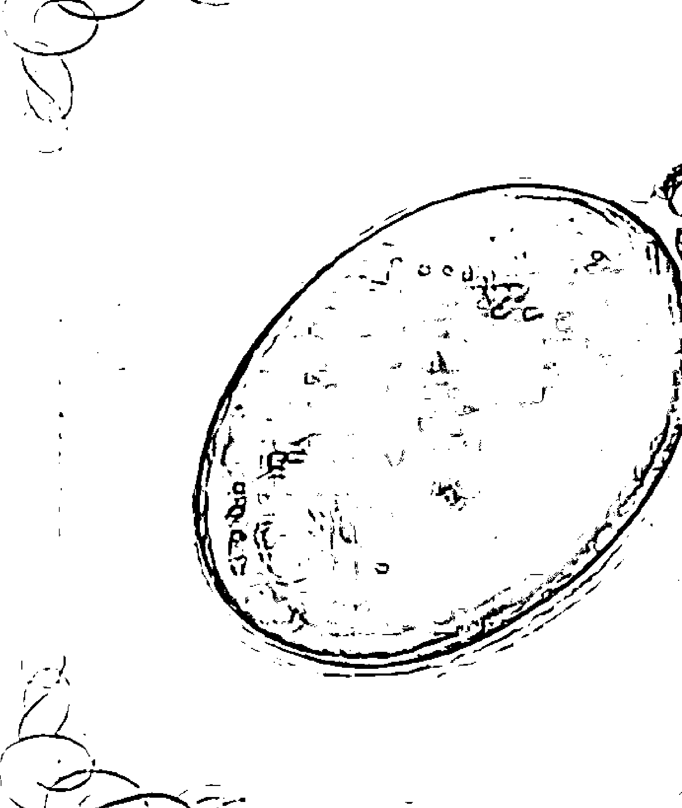

群青色的石頭上滿佈著金色的黃鐵礦，這就是青金石，也是至今擁有最悠久歷史的石頭之一。在西元前5000年到6000年的古埃及、印度、中國等不同地域，青金石都被視為「神聖之石」，當作護身符來使用。古埃及不只王族與祭司會將青金石佩戴在身上，像是著名的圖坦卡門黃金棺木上也使用了青金石做為裝飾。不分東西洋，青金石都被認為是蘊含神明力量的幸運寶石。

青金石的波動和土耳其石（參見78頁）相同，都和第5脈輪有著強烈共鳴。

### 對身體的作用

#### 促使副交感神經活躍

青金石能促進副交感神經活躍，副交感神經具有引導身體鎮定下來的作用，因此能幫助人們身心獲得深度放鬆。當情緒激動或焦躁不安時，青金石都能發揮效果。它對腎臟及膀胱的運作也有刺激活化的作用，還能促進體內能量循環。

### 對意識的作用

#### 以強烈的意志力控制自己

青金石是能夠支援人與人之間溝通的能量石。無法坦率說出內心想法，或是相反地將話說得太重時，青金石都能發揮力量，幫助人們不加修飾地表現出原原本本的自己。此外，青金石還能活化第5脈輪，培育控制情感的強烈意志力，如此一來，一旦決定的事，一定能夠貫徹到最後。

### 青金石可改善的精神症狀

- 無法將內心想法坦然說出口的人
- 藉口太多，或是太多嘴的人

## 【Chrysocolla·矽孔雀石】硬度○2～4

### 矽孔雀石

○來自宇宙的訊息○ 秉持自我不受周圍左右

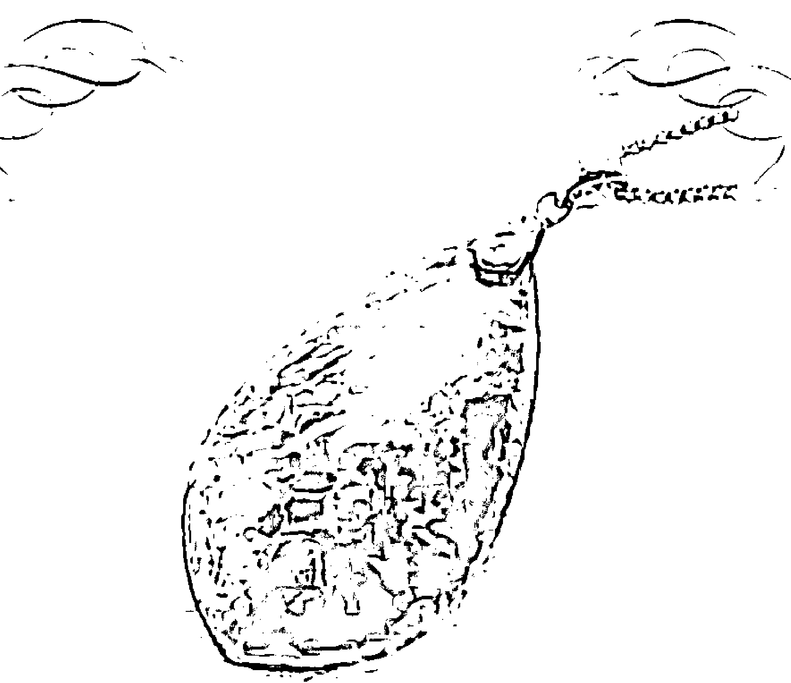

### 對身體的作用

#### 調整自律神經的平衡

交感神經掌管身體的活動，而矽孔雀石能壓抑交感神經不使其過於興奮激動。推薦給壓力較大、容易緊張的人。矽孔雀石能調整自律神經的平衡，提高免疫力。

### 對意識的作用

#### 提高女性魅力

矽孔雀石能助長纖細而體貼的溫柔心思，提高女性魅力。另一方面，也能幫助人們不受周遭左右，確實保有自我。持有這種能量石的人，必也將擁有寬大的胸襟。

矽孔雀石（Chrysocolla）名稱是由希臘語中意味著「金」的「chryso」，以及意味著「膠」的「kolla」組合而成。由此也可看出，過去此類礦石是被人們運用在接緊起黃金時使用的。

矽孔雀石的外觀呈現鮮豔的藍綠色，有如蔚藍的海空相映一般美麗，也像從太空俯瞰地球時的顏色。

### 矽孔雀石可改善的精神症狀

- ○ 遭遇意料外的事便陷入混亂的人
- ○ 被認為沒有女性魅力的人
- ○ 因苦無機會實踐自己想做的事而感到不滿的人

## 【Blood stone・血石】硬度○7

### 血石（血玉髓）

○来自宇宙的讯息○ 人人皆平等拥有各自存在的价值

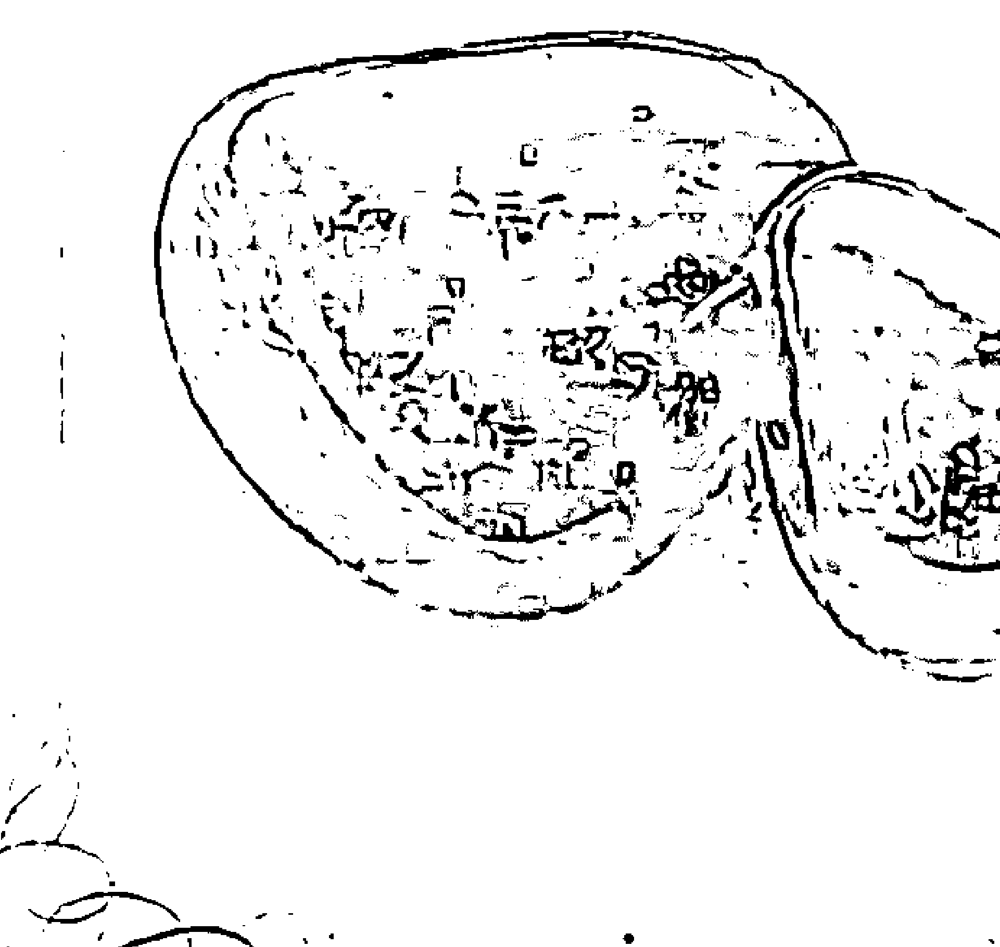

血石是碧玉的一种。暗绿色的石头中星罗棋布着如血斑的红色斑点，因此被称作血石或血玉髓。关于血石里的红色斑点有一个传说，据说那是当基督被钉上十字架时滴下的血落在碧玉上而形成的。

在古代埃及，人们将这种矿石磨成粉，与蜂蜜混合后当作止血剂使用。此外当士兵们上战场时，也会佩戴血石作为护身符。

### 对身体的作用

#### 促进葡萄糖转换成身体能量

血石能促进体内的能量变换。换句话说，也就是帮助肌肉中储存的名为「肝糖」之物质进行转换，分解成葡萄糖，转换成身体活动所需的能量。肉体活动量大的运动选手等，便很适合运用血石来保持自身能量。

### 对意识的作用

#### 给予超越困难的勇气

血石是颗教会人们懂得人人皆平等，且各自拥有其存在价值的能量石。另一方面，这也是一颗协助人们不轻言放弃的石头。即使过去或现在有过什么痛苦经验，但当下再怎么苦恼也都于事无补了，血石如此告诉我们，同时给予人们解决问题的意欲，产生超越困难，面对未来的勇气。

### 血石（血玉髓）可改善的精神症状

- ○事事都先责怪自己
- ○觉得自己不如他人，没有存在价值
- ○对任何事都提不起兴趣而感到烦恼的人

## 【Sphene·榍石】硬度 05～5.5

### 榍石（榍石）

○來自宇宙的訊息○擁有夢想

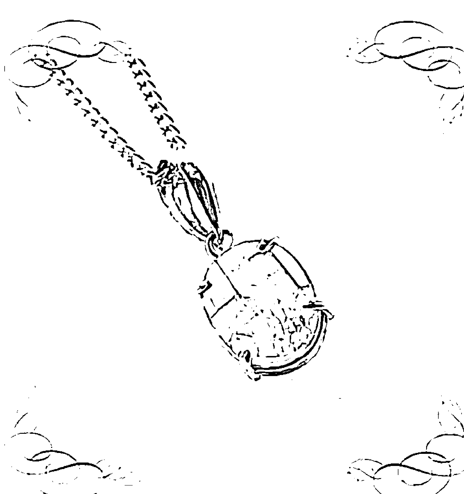

### 對身體的作用

#### 促進側腦葉運作的活性化

腦部側腦葉掌管情緒與感情，以及對聲音與形狀的辨識，榍石能促進這個區域運作的活性化。側腦葉深處有掌管記憶的海馬體以及語言中樞，是人腦非常重要的部位。因此榍石也特別推薦給情緒平板、情感貧乏、喜怒哀樂不分的人。

榍石（Sphene）名稱的語源來自希臘語中意謂「楔子」的「Sphenos」，一般認為這是因為構成榍石的結晶體，多呈現楔形的緣故。

礦物組成成分中含有許多鈦元素（titanium），所以也被稱為「Titanite（榍石）」。受到內含錳元素或鉻元素的影響，外觀也會呈現黃、綠、藍、黑等各種顏色。透明度高的榍石甚至可發出超乎鑽石以上的光芒。

### 對意識的作用

#### 腳踏實地

榍石能幫助逃避現實的人腳踏實地面對自己的人生。另一方面，榍石也能教導人們懂得擁有夢想的重要性，實是一顆能夠幫助取得現實與夢想之間平衡的能量石。而在朝向夢想努力過程中遭遇挫折的人，或是已決定的事項卻無法完成的人，若能擁有榍石，將能夠增強貫徹到底的意志力。

### 榍石（榍石）可改善的精神症狀

- 逃避現實，總想逃離他處的人
- 已經決定的事卻無法實現的人

## 【Pearl·珍珠】硬度○2.5～4.5

### 珍珠

○來自宇宙的訊息○ 養成慈悲心

### 對身體的作用

#### 減輕發燒、發腫、過敏等症狀

珍珠能減輕伴隨發炎或碰撞傷而來的發燒及紅腫症狀。此外，也能緩和異位性皮膚炎或花粉症的過敏症狀。由於珍珠具有抗氧化作用（對老化原因之一「活性氧」的抑制作用），對於延緩老化有相當大的效果。

### 對意識的作用

#### 保持平穩心情

不只身體，珍珠對於過度敏感的心靈也有很好的緩和鎮靜效果。當人們煩躁不安、容易發怒或陷入深刻悲傷時，珍珠淡淡的光芒能為人們帶來平穩的心情。隨之而來的便是獲得清明的思考力，不再受到過去痛苦回憶糾纏，進而產生慈悲之心，更懂得去尊重他人的想法。

### 珍珠可改善的精神症狀

- ○ 感到受糟蹋而大受打擊的人
- ○ 當對方不如自己所願便煩躁易怒

自古以來，珍珠都象徵著青春與美。氣質高雅而美麗的光澤，是來自進入貝類體內的物質歷經歲月長久淬鍊而呈現出的神秘光芒。關於珍珠與美貌之間的關聯性，最有名的即是埃及艷后為了保持美貌而將珍珠放入醋中溶解飲用的軼聞。除此之外，珍珠粉在中國及古代波斯也都被當作退燒藥或感冒藥使用。

珍珠透過棱鏡（透明的三角柱）觀看呈現橘色（橙色），能補足人體不足的橙色光線。行星寶石學中，珍珠散發的能量等同於月亮的能量。

## 【Hematite·赤鐵礦】硬度 05～6

### 赤鐵礦

○來自宇宙的訊息○ 已發生的一切都是正確的

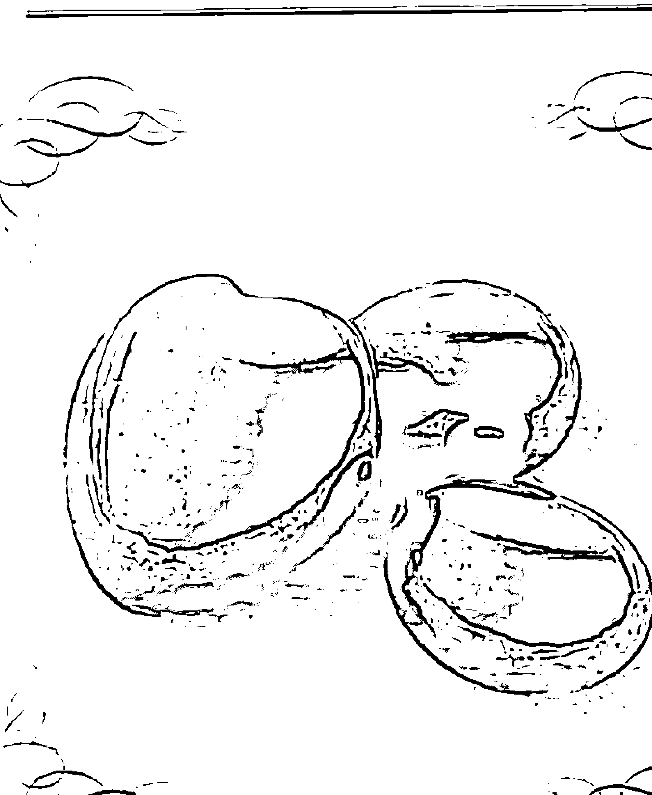

### 對身體的作用

#### 促進血液流動

赤鐵礦對血管起作用，有助於血液的流動與搬運。血液肩負著傳送營養與氧氣到身體各個角落的任務，當血液流動順暢，細胞就能充滿活力生機。

### 對意識的作用

#### 促進柔軟的思考力

一遇到挫折便自暴自棄的人，佩戴赤鐵礦後將發現發生在自己身上的一切，其實都有著更深的含意。
赤鐵礦培養人們寬容的精神，從而樂於接受他人的言語作為，對於發生的事物能抱持柔軟彈性的思考力。不只如此，赤鐵礦還能提高創造力，避免思考落入窠臼，使思考活動變得活潑。

赤鐵礦是鐵礦石的一種，散發金屬性的光輝。能作為鐵原料的赤鐵礦，由於在切割或研磨時會產生大紅色的粉末，其名稱也就來自於希臘語中意味著「血」的「hema」。事實上，這種赤鐵礦在火星上也發現過。據推測，可能是數十億年前，當火星還是水之行星時形成的。
古羅馬人將赤鐵礦與戰神Mars結合，稱其為「引導勝利之石」而加以崇拜。戰士遠赴戰場出征時，常會在身上佩戴赤鐵礦當作護身符。

### 赤鐵礦可改善的精神症狀

- 思考落入窠臼的人
- 無論行動或思考都易於自暴自棄

## 【Sardonyx·纏絲瑪瑙】硬度 7

### 纏絲瑪瑙

○來自宇宙的訊息○無論什麼事都能寬容接受

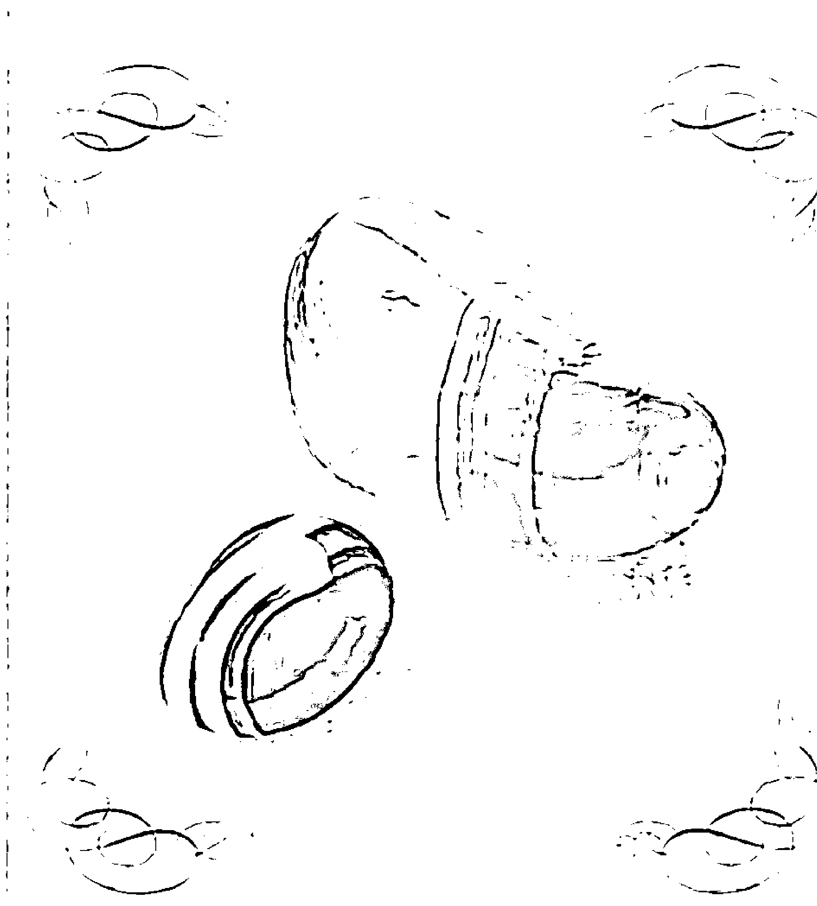

### 對身體的作用

#### 消除化學物質毒素

纏絲瑪瑙有助於消除體內累積的農藥或食品添加物等化學毒素。此外，它還能強化骨骼與韌帶的結合度，抑制病毒與細菌所引起的感染症狀，對於傳遞訊息的神經細胞也有活性化的作用。

纏絲瑪瑙顧名思義屬於瑪瑙家族。onyx即為縞瑪瑙，一般來說縞瑪瑙指的是黑色單色，或是有黑白兩色層積花紋的黑色縞瑪瑙，這裡介紹的纏絲瑪瑙則是有著紅白雙色條紋的種類。其名稱中的「sard」指的就是紅色或赤褐色的石英。

### 對意識的作用

#### 引導夫妻關係圓滿

纏絲瑪瑙能令夫妻或戀人之間的羈絆加深。若總是在意對方不好的地方，愛情必將減退，而纏絲瑪瑙能夠幫助人們察覺對方美善的一面。

當人們擁有寬容的心，便不會為了小事堅持己見，心情變得開朗從容，不只是夫妻關係，也能開拓更豐富的交友關係與人脈。

在寶石光線療法之中，這種能量石通常用於補充紫色光線。而在行星寶石學中，等同於羅睺所發出能量的是鐵鈣鋁榴石，纏絲瑪瑙則可作為鐵鈣鋁榴石的代用石。

### 纏絲瑪瑙可改善的精神症狀

- ○夫妻關係不佳的人
- ○容易在意小事的人

### 石榴石（深紅寶石）

○來自宇宙的訊息○擁有面對困難的勇氣

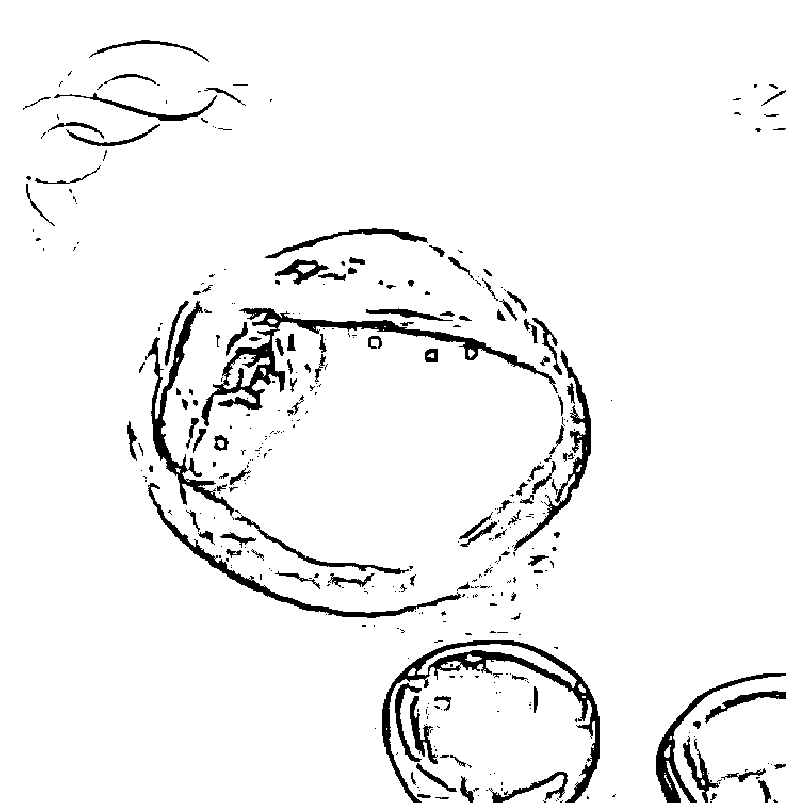

### 對身體的作用

#### 提高生命能量

深紅色的石頭本具有喚起生存本能的力量，能夠提高生命能量，給予身體細胞與組織活力。也因爲能夠強化體力與持久力，對於消除疲勞和從事高度勞動都有很大幫助。

### 對意識的作用

#### 養成對事物積極的態度

石榴石能幫助人們在面對夢想與目標時不再害怕失敗，產生超越障礙的意念與勇氣。此外，當感覺痛苦或失意時，石榴石的能量也能讓人誠實面對內心的自我，而不虛張聲勢。如此一來內心感到輕鬆了，人也就能重新出發了。

石榴石（Garnet）其實是此種礦物的總稱，其下還可細分爲14種類。一般最常見的石榴石是深紅色的，也被稱爲鐵鋁石榴石（Almandine Garnet）。人們相信這種石頭能帶來勝利，過去十字軍東征時也曾將此能量石當作士兵的止血藥物以及防止受傷的護身符使用。在行星寶石學中，石榴石可做爲能散發等同於太陽能量的紅寶石之代用石。不如試著佩戴石榴石，感受太陽的能量吧。

### 石榴石（深紅寶石）可改善的精神症狀

- ○ 對自己能力存疑而喪志的人
- ○ 遇到困難或感到痛苦時仍隱藏內心真意的人

## 【Aventurine·砂金石】硬度 7

### 砂金石（東陵石）

○來自宇宙的訊息○ 深刻觀察事物，看透其本質

砂金石主要產於印度，因有著與翡翠相似的美麗綠色外觀，而也被稱為「印度翡翠」，除了當作裝飾品外，也應用於各種用途。

古代西藏人認為砂金石是「能提高洞察力的石頭」，而對其抱以崇敬的態度。在建造佛像時，也因佛眼能夠洞察真理，往往使用砂金石鑲嵌於佛像眼部。

在行星寶石學中，砂金石可用於代替散發與水星相同能量的祖母綠石。

### 對身體的作用

#### 促進神經的訊息傳達機能

腦部發出的各種指令透過神經傳導物質乙醯膽鹼（acetylcholine），經過各種神經線來到身體各部位。砂金石能提高這種訊息傳導的機能，幫助來自腦部的資訊順暢地傳遞至身體。

### 對意識的作用

#### 對他人的意見、想法抱持肯定態度

砂金石能幫助人們不被表面事物迷惑，培養看穿事物本質的能力。若能看穿事物本質，就能了解其背後的成因，讀取其中的含意。同時也能擁有更坦率的心情，去試著肯定別人的意見與想法。

### 砂金石（東陵石）可改善的精神症狀

- 容易陷入恐慌或歇斯底里的人
- 受惡夢所苦的人

### 杉石（舒俱徠石）

○來自宇宙的訊息○ 接受原原本本的一切

### 對身體的作用

#### 令動物本能獲得覺醒

杉石能夠刺激腦幹，而腦幹主管呼吸、血液循環、發汗調節體溫等等人體生存最根源的機能，因此杉石也被認為能刺激動物本能的覺醒。而提高根本生命力後，現代人不足的生命能量便可獲得補充。

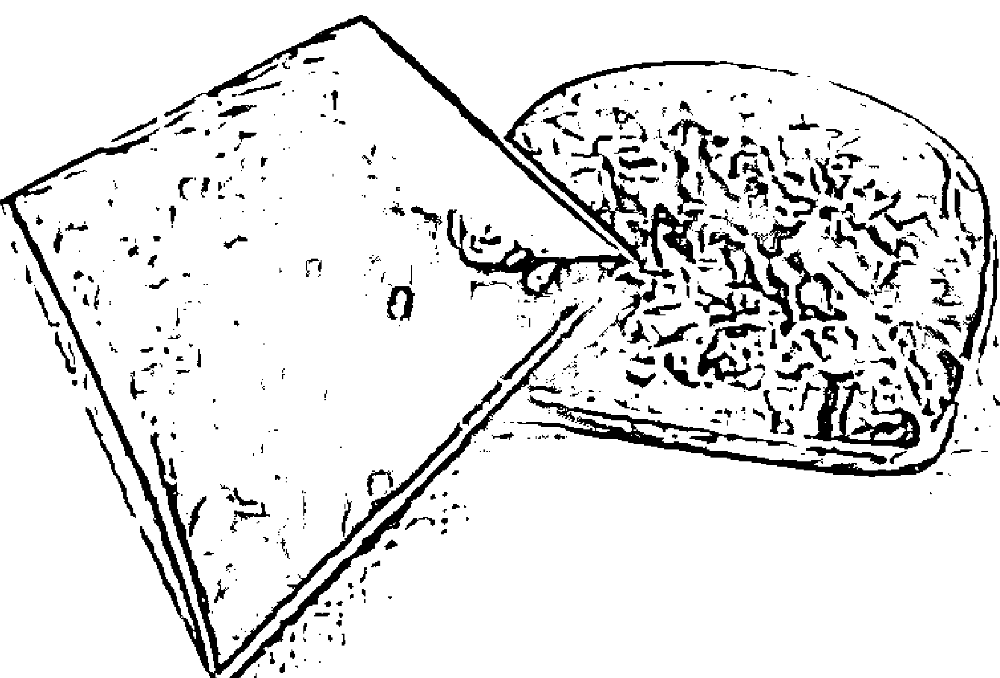

### 對意識的作用

#### 安心生活

杉石能幫助人們原原本本地接受一切事物，對於眼前發生的狀況也會願意去克服，所以適合推薦給正面對層層難關與考驗的人。只要能接受現實而活，就會懷抱意志，產生興趣，產生堅強前進的動力。其結果就是過著具有安心感的人生。

杉石是於1977年才在日本愛媛縣岩城島發現的，與其它能量石比較起來歷史還相當淺。其名稱是來自發現這種礦石的岩石學者，杉健一教授的姓氏。

杉石蘊含了幫助人們強化內在的力量，當陷入逆境時，能喚醒不屈不撓的精神。此外也因具有趨避危險的效果，所以也常被當作護身符使用。

### 杉石（舒俱徠石）可改善的精神症狀

- ○ 事情不如所願時便傾向否定的人
- ○ 總是對未來懷抱不安的人

## 【Crystal·水晶】硬度 7

### 水晶石

○ 來自宇宙的訊息 ○ 安心生活

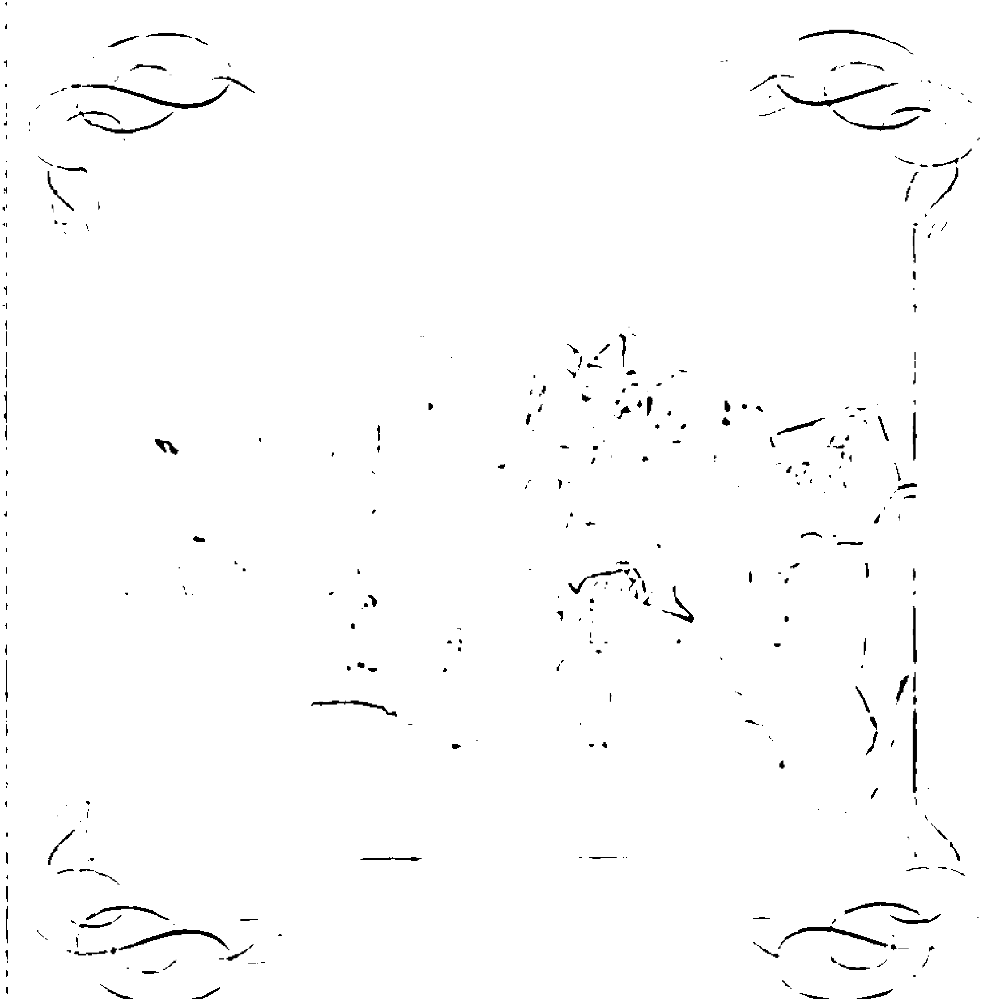

被誤認為是冰而獲得此名的水晶 (Crystal)，是石英大型結晶化之後的產物。石英是種類最豐富的礦物，玉髓、瑪瑙、碧玉等等都屬於石英家族。而其中無色透明的就是水晶，也稱作水晶石。

在眾多能量石之中，自古以來最受愛用的便是水晶。水晶在世界各地被用於咒術、裝飾品、治療、冥想等用途。日本的神社之中也有許多供奉著以水晶製成的神像。

### 對身體的作用

#### 幫助排出體內毒素與老廢物質

水晶能激發人體新陳代謝 (體內新舊物質的交替)，有幫助人體從皮膚排出體內毒素的作用。此外它還能促進胃部黏液的生成，保護胃黏膜。想消除疲勞的人或胃潰瘍患者，可嘗試水晶的功效。

### 對意識的作用

#### 引發潛在能力

水晶能帶給人們安心生活的力量，及分辨是非真實的能力，擁有的水晶的人多半更能相信自己，積極向前。此外，當心情不穩定或感情起伏大、內心不安時，水晶也有助控制心情，帶來安定。

有時，水晶能引出人們預知或透視等潛在的特殊能力，令意識力大幅提昇。

### 水晶石可改善的精神症狀

- ○ 茫然而不安的人
- ○ 情緒焦慮，難以獲得心靈平靜者

## 【Larimar·水松石】硬度 ○4.5～5

### 水松石（拉利瑪）

#### ○來自宇宙的訊息○ 培養寬容精神

### 對身體的作用

#### 促進荷爾蒙的分泌

水松石能促進女性荷爾蒙、成長荷爾蒙等各種荷爾蒙的分泌。也促進皮膚與毛髮的新陳代謝，對於黑斑、雀斑、濕疹、圓形禿、毛髮稀少等都有改善的效果。

這顆能量石發現於1970年，算是歷史較淺的，在礦物學上的正式名稱是「藍色針鈉鈣石（Blue Pectolite）」。主要產地為多明尼加共和國，有著令人聯想起加勒比海的美麗湛藍色。

### 對意識的作用

#### 讓希望覺醒

水松石被認為是愛與和平的象徵，能帶給人們生之喜悅。同時它也教導人們何謂不變的友情、事物的調和之道，以及體恤他人的心情，並且能夠鎮壓內心的憤怒情緒。

水松石能令持有者內心產生對他人的寬容心境，當感覺到快被怒氣沖昏頭時，水松石能夠幫助鎮壓激動情緒，讓人漸漸冷靜下來。此外，無論陷入多麼絕望的情況之中，水松石的力量都能引導希望覺醒，幫助人們脫離困境。

由於水松石有不耐太陽久曬的傾向，進行淨化時請避免採取照射日光的方式。

### 水松石（拉利瑪）可改善的精神症狀

- 常批評與自己想法不同的人
- 陷入嚴重的沮喪與絕望之中時

### 日長石

○來自宇宙的訊息○ 無論與誰都能以真我來交往

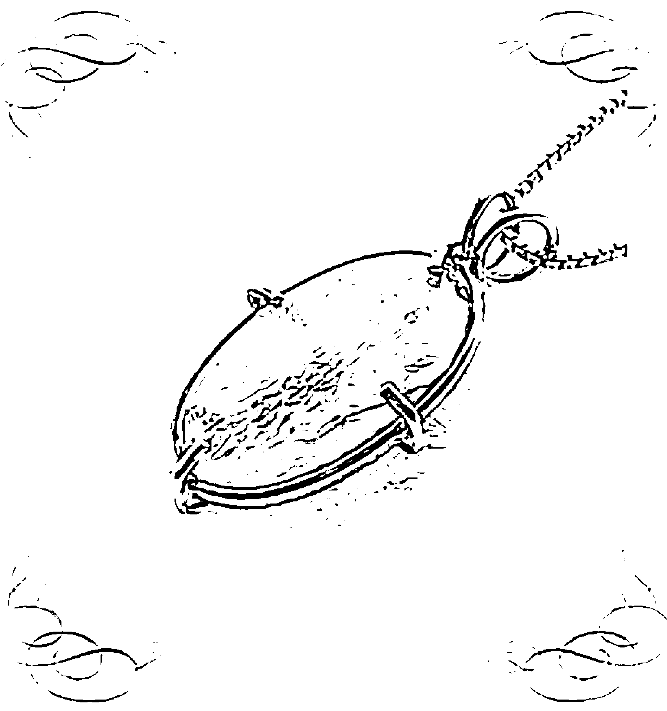

### 對身體的作用

#### 改善生命能量之流通

一如太陽孕育了地球的生態系，日長石能令人類生命能量的流通更為活躍，有著強化生命力的作用。身體狀況不佳，生病或體力減退時，或是感到憂鬱時，這顆能量石能給予身心兩方面活力。

### 對意識的作用

#### 朝人生投射光明

日長石的能量，能幫助解放受到壓抑的感情，療癒心靈的傷口，朝擁有者的人生投射光明。

此外，這顆能量石也能助長人們順應變化的柔軟精神力。一方面肯定各種人的各種不同想法，一方面在無論面對誰時，都能以原原本本的真我來和對方交往。

日長石與月長石相同，都屬於被稱為「長石」種類的礦物。因含有成份的不同，日長石不同於月長石，外觀發出金黃色或赤褐色的亮光。

一如這顆能量石的名稱「日長石」，它不僅有著令人聯想起太陽的色澤，而且被認為其中棲宿了來自世界各地的太陽能量，受到相當的珍視。古希臘人認為日長石是太陽與太陽神的象徵而加以崇拜。

### 日長石可改善的精神症狀

- ○受過去經驗牽絆而無法重新振作
- ○自尊太高而遠離人群的人

## 【Kunzite·紫鋰輝石】硬度 6.5～7

### 紫鋰輝石（孔賽石）

○來自宇宙的訊息○ 愛別人如同愛自己

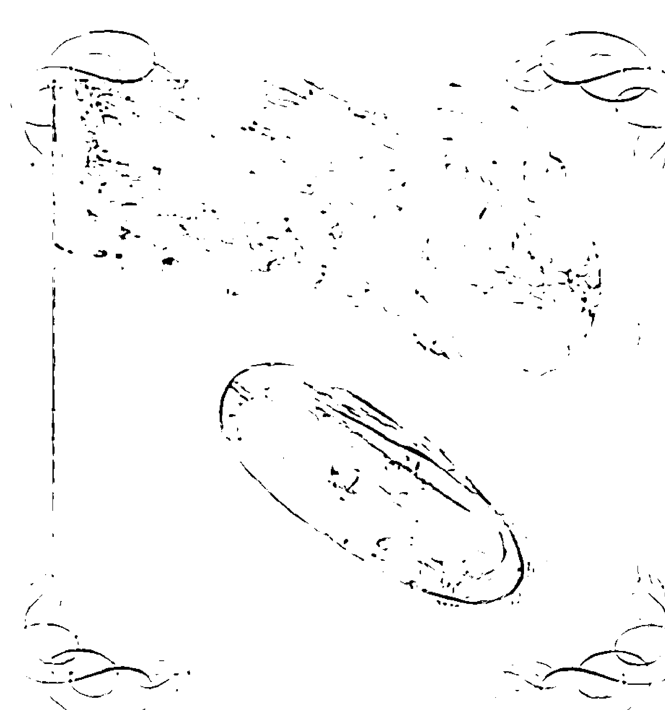

### 對身體的作用

#### 促進營養吸收、美肌

紫鋰輝石能幫助人們吸收身體需要的營養素。當日常生活中感覺營養不足或體力減弱時，又或是容易疲勞的人，持有紫鋰輝石將特別容易感受其效果。此外，想要擁有彈性光滑美肌的人也可藉助紫鋰輝石的力量。

紫鋰輝石是於1902年在美國加州開採發現，屬於比較新的能量石。

紫鋰輝石別名孔賽石（Kunzite），這個名稱的由來，是來自美國的寶石權威專家G.F.孔賽博士而獲得的命名。由於其顏色常令人聯想起鳶尾花，所以又有一個別稱是「加州鳶尾」。

### 對意識的作用

#### 重拾愛的心情

紫鋰輝石能幫助緩和對他人的憤怒情緒。擁有紫鋰輝石的人能夠擺脫對人的不信任與否定感，重新獲得愛與信賴的感覺。只要能愛別人形同愛自己，就能不吝對他人付出愛了。

能夠對人對事付出愛，最終將能幫助自己從對物質的執著中解放，提高人格的完成度。

紫鋰輝石代表無限的愛，被認為是代表一切單純事物的石頭。

### 紫鋰輝石（孔賽石）可改善的精神症狀

- ○對特定人物的怒氣無法平息的人
- ○太執著於外觀或物質層面的人

### 紫水晶

○來自宇宙的訊息○不過度堅持

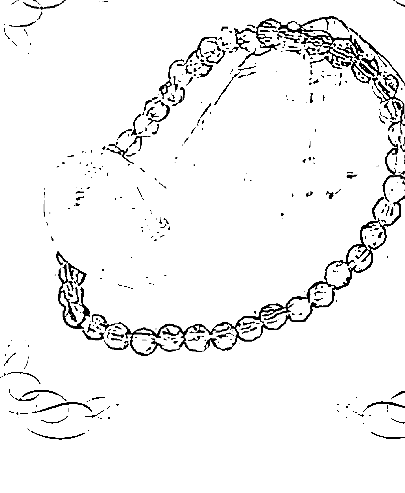

有美麗紫色的水晶，自古至今都被視為具有深度的靈能作用，而受到許多人的愛用。這是一顆能幫助人們湧現靈光，開發直覺能力的能量石。

紫水晶的波動，與第4脈輪之間有著強烈的共鳴，其共鳴度僅次於粉晶（請參見71頁）。因此，紫水晶也能幫助人們培養愛與體貼的心。

需注意的是，在對紫水晶進行淨化時，為了避免褪色，請不要採用照射日光的淨化方式。

### 對身體的作用

#### 支援心臟與記憶力 提升視神經的運作

因為紫水晶能活化第4脈輪，因此對於心臟及乳腺等胸部健康的不適具有作用。此外，還能幫助刺激掌管思考與創造性的腦前葉，提高記憶力。對於視神經的運作也有提升作用，能有效預防眼睛疲勞或防止視力衰退。

### 對意識的作用

#### 鎮定情緒、改善失眠

紫水晶的力量，能幫助人們無論何時都能在不鑽牛角尖的狀況下，展現出原本的自我。它還能鎮定不安與恐懼的情緒，具有幫助人們重獲冷靜的力量。在鍛鍊直覺能力及培養正確決斷力這兩點上，也頗具功效。此外將紫水晶放置於枕邊能改善失眠症狀。

### 紫水晶可改善的精神症狀

- 太過堅持己見，不願肯定別人
- 太過在意他人眼光的人
- 因焦慮而失眠的人

### 紫翠玉

○來自宇宙的訊息○ 抱持希望改變自己

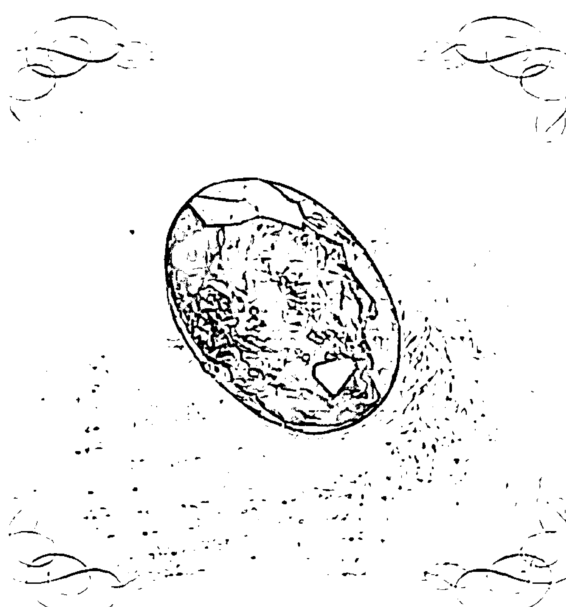

紫翠玉與貓眼石相同，都是屬於金綠玉（金綠石）的變種石。在日光下呈現綠色，到了夜晚在蠟燭或燈泡的照射下卻會轉變為紅色或紫色，頗為珍貴罕見。不同的光芒有各自相異的波長不同而相異，而石頭在吸收波長時，不同的波長便會呈現出不同的色澤。綠色代表知性，紅色代表熱情。同一顆石頭上兼具這兩種顏色，且白天夜晚呈現不同面貌，這樣的特異性，正體現了宇宙「萬物皆變」的真理。

### 對身體的作用

#### 活化腦幹

紫翠玉擁有幫助腦幹活性化的效能。腦幹掌管生命中樞，與呼吸、血液循環、調整體溫的發汗作用、以及睡眠與覺醒等生理現象密不可分。腦幹獲得活性化，就能提高生命力，同時令愉快與不悅的情緒表現更為豐富。

### 對意識的作用

#### 培養寬容的態度，接受他人

紫翠玉能培養寬容的心，使人們容易接受他人。若想成為一方面不失希望，一方面能為他人堅強忍耐的人，或許可以藉助紫翠玉的能量。紫翠玉還能幫助人們克服恐懼的心，給予希望。

### 紫翠玉可改善的精神症狀

- ○對於比自己懶惰、怠於工作的人感到超乎常理的暴躁時

## 【Peridot·翠綠橄欖石】硬度 ○6.5～7

### 翠綠橄欖石

○來自宇宙的訊息○ 秉持自我而生

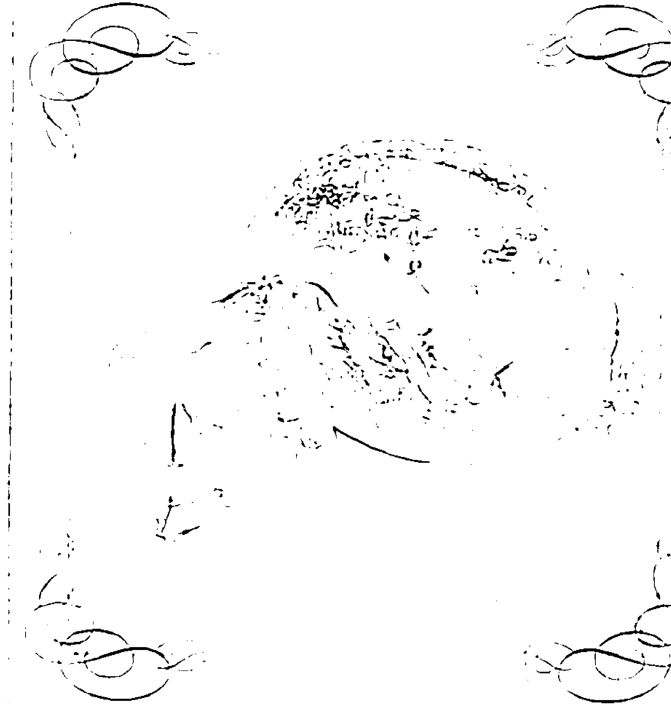

### 對身體的作用

#### 促進血清素的分泌

翠綠橄欖石對掌管腸內免疫的小腸起作用，有助於培養腸內益菌。此外，它還可促進腦內神經傳導物質之一的血清素分泌。可幫助解除不安或焦躁的情緒，保持明朗快樂的心情。

### 對意識的作用

#### 冷靜洞察事物本質

每個人都有屬於自己的個性，也都承蒙上天賜予特殊的才能。翠綠橄欖石幫助人們活用那份屬於自己的個性與才能，秉持自我而生。

此外，當不知道發生了什麼而陷入混亂時，翠綠橄欖石發揮的能量有助於冷靜洞察事物本質，找出解決問題的根本之道。另一方面，也有助於修復夫妻關係。

在古埃及時代，人們因此礦石的光輝燦爛而受到魅惑吸引。不只在黑暗之中發出光芒，即便於人工照明之下更是倍增光輝的翠綠橄欖石，也被稱為「夜晚的祖母綠」。人們相信它能除去黑暗中的恐怖，驅退不好的事物，有護身作用。

在行星寶石學中，翠綠橄欖石可代替祖母綠，釋放等同水星的能量。除了從地底採掘之外，翠綠橄欖石也曾被發現於隕石之中。

### 翠綠橄欖石可改善的精神症狀

- 過度受到他人意見左右時
- 夫妻感情不穩定時

## 【Emerald·翠玉】硬度 7.5～8

### 翠玉（祖母綠）

○來自宇宙的訊息○ 提高體貼的心與協調性

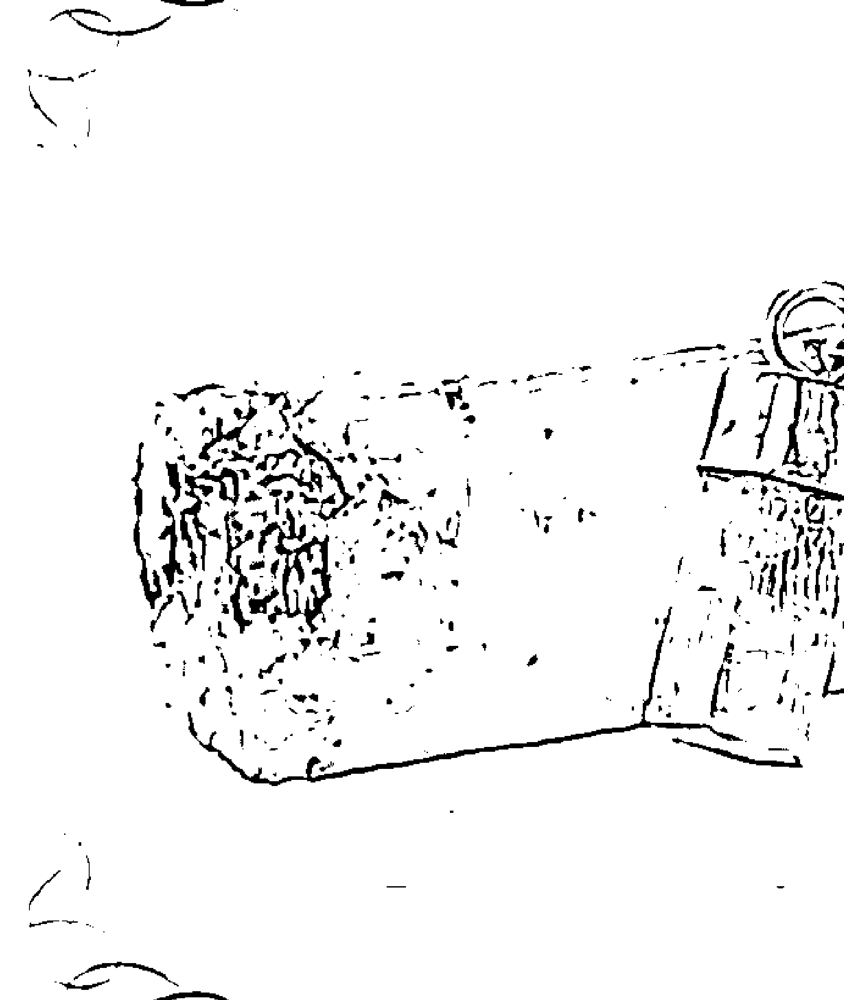

### 對身體的作用

#### 活化神經系統與消化管道的運作

祖母綠能幫助提高中樞神經與末梢神經的活動，同時能刺激活化腸胃與肝臟等消化管道的運作。因此，祖母綠對於神經痛、自律神經失調、不分種類的神經痛、胃潰瘍以及肝臟機能的低落，屬於神經系統與消化管道的症狀大多都能發揮功效。

### 對意識的作用

#### 幫助理解事物本質

祖母綠最大的特徵便是能給予人們冷靜的思考分析力，增進對事物本質的理解力。使我們養成為他人設想的心意，提高協調能力。如此一來人們將不再執著於自己的欲望，從他人的喜悅中感受到自己的喜悅。

在「綠寶石」類的礦物之中，有著濃綠色澤的種類便是俗稱的「祖母綠」（此外像是藍玉等種類的礦石，也同為綠寶石家族）。祖母綠具有高度療癒效果，自古以來便不分東洋西洋而廣泛地被視為神聖的寶石並受到愛用。

在寶石光線療法之中，祖母綠向來被用於補足綠色光線的不足。在波動上，與第2脈輪產生非常強烈的共鳴，是能夠給予下腹部內臟強大力量的石頭。此外，在行星寶石學中，祖母綠放出的能量等同於來自水星的能量，也非常受到重視。

### 翠玉（祖母綠）可改善的精神症狀

- ○ 人際關係失衡，失去自我而陷入混亂之中的人
- ○ 總是擅自自私行動的人

## 【Flourite·螢石】硬度 4

### 螢石

○來自宇宙的訊息○ 持續好奇心

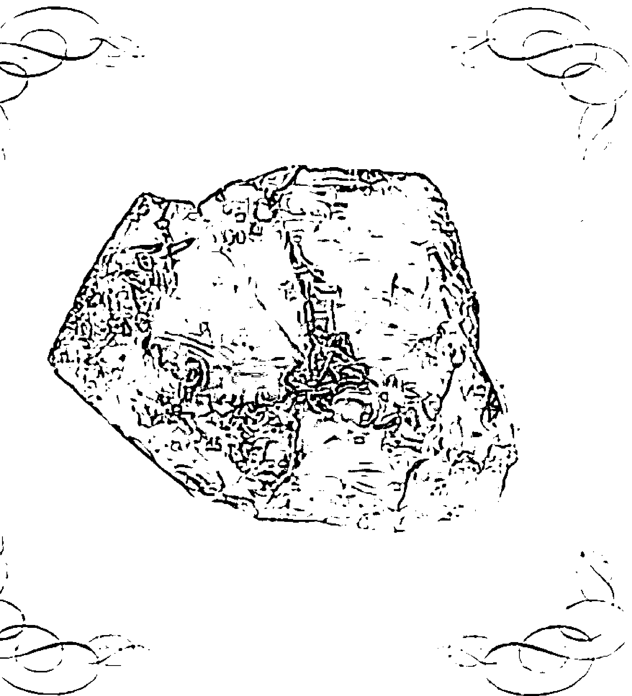

### 對身體的作用

#### 提高肺部機能 改善視力

螢石能幫助吸收氧氣，排出二氧化碳，有助於提高肺部機能。對於慢性呼吸器官障礙以及肺炎患者有良好效果。此外，對相當於相機鏡頭的眼睛水晶體，也具有調整作用。因此，螢石也用於近視或遠視的預防及改善。

由於加熱之後會發出青白色的螢光，因此在日本便稱為「螢石」。在結晶構造上，螢石具有無論如何切割都必呈現正八面體結晶的特性。

螢石雖有綠色、紫色、藍色、粉紅等顏色，但在礦物來說很特別的是，其顏色不以產地來區分（幾乎所有的礦石，都能由其顏色來判定出產地）。而螢石硬度低故易於加工，自古以來便受到廣泛利用為雕刻的素材。但也因質地軟易切割，處理上必須相當慎重，且需特別注意的是，淨化時要避開照射日光的方式。

### 對意識的作用

#### 自己種什麼因，便得什麼果

螢石教導人們，種什麼因，便得什麼果。身體狀況不佳或運氣不好，追根究底都是肇因於自己。了解這點後，螢石會發揮力量，幫助人們看見希望，湧現好奇心，便能吸引高興或快樂的事到身邊。換句話說，螢石也是頗能引導幸福快樂人生的能量石。

### 螢石可改善的精神症狀

- ○將自己的不幸或不滿歸咎於他人時
- ○怨恨令自己不愉快的人，或遷怒於人時

## 【Moonstone·月長石】硬度 6～6.5

### 月長石（月光石）

○來自宇宙的訊息○ 一切都不需加以虛飾

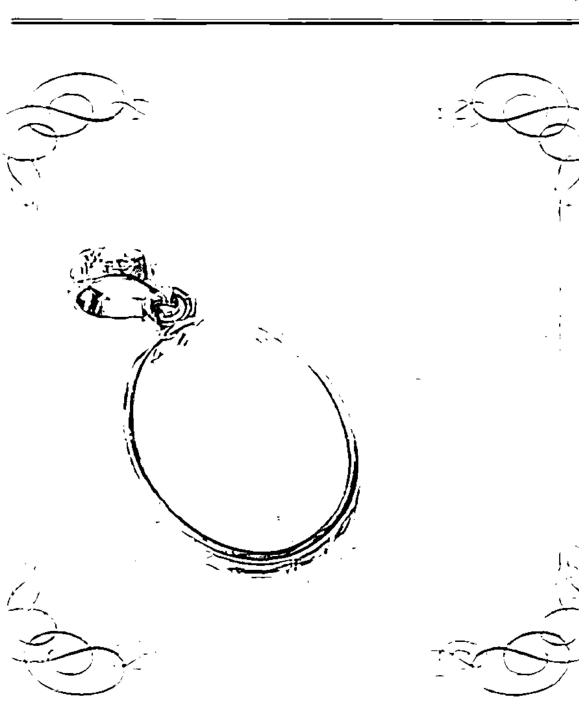

月長石散發的乳白色光芒，令人聯想起月亮。古印度人便認為月長石是「月神棲宿的神聖之石」而加以崇拜。中世紀的歐洲也稱月長石為「旅人之石」，長途旅行或航海時，會攜帶月長石做為護身符。

月長石透過稜鏡（透明的三角柱）觀看時，發出藍色光線，在寶石光線療法之中用於補足所需的藍色光線。在行星寶石學中，月長石被視為珍珠的代用石，可釋放等同於月亮的能量。

### 對身體的作用

#### 廣泛地對身體各方面起作用

月長石能促進代謝（處理體內老廢物質），預防肥胖或改善糖尿病症狀。還能減輕精神壓力，緩和花粉症或異位性皮膚炎等過敏症狀。此外還有提高口鼻運作能力，及調整荷爾蒙等效果，在身體各方面，具有廣泛的效用。

### 對意識的作用

#### 提高對自己的信賴

月長石能引導人們認識自己原本的面貌，讓人們發現，保持自己原樣不加以虛飾才是最好的。如此人們便能擺脫本來感覺到的自卑或罪惡感。月長石還能發揮安定的力量，抑制過度的不安與焦慮，消解擔憂情緒。

### 月長石（月光石）可改善的精神症狀

- 事情不如己願便焦慮暴躁的人
- 對自己的判斷沒有信心的人
- 過度不安或擔憂的人# 第5章 以天地之能量治癒疾病的「寶石光線療法」

## 在醫療現場感受到的能量石功效

## 補充不足的光線，治療疾病的替代療法

在本章之中，我將介紹我於醫療現場實際執行「遠距射線療法teletherapy（寶石光線療法）」這種「替代療法（所謂的替代醫療，指的是除了現代西洋醫學之外的醫學與醫療之總稱）」的經驗談。

「tele」是遠距離，而「therapy」是治療的意思。換句話說，我進行的寶石光線療法，便是使用能量石的力量，進行遠距離治療的方式。

七年之間，我以寶石光線療法治療的患者人數將近一千人，目前依然如此，每天對約兩百六十名，年齡從零歲至八十幾歲的患者進行治療。同時還有許多來自日本各地的患者家屬與我聯繫，表示希望接受寶石光線療法的治療。

在我的患者中，有不少短期便以惊人速度改善症状的，也有从原本不明原因的病症中恢复的人。从这许多病例看来，能量石的确发挥了效果，这已是不争的事实。

地球上存在的所有生物，都平均接受着来自光的能量，进而在地球上各自从事着生命活动。当某种光线有所不足时，便会招致身体健康失衡，或甚至罹患疾病。而能量石可用于补足这些光线不足的问题（生病的原因），帮助人体恢复原本的平衡。这就是宝石光线疗法的原理。

宝石光线疗法是由印度享有盛名的佛教学·密宗学研究家，同时也是医师兼哲学家的贝诺特修·巴塔哈利亚博士（一八八七～一九六四）所开发确立，并予以体系化的一套治疗法。宝石光线疗法始于博士遇见一只濒临死亡的小猫。博士为了帮助这只几乎已经回天乏术的小猫，试着以传自古印度的宝石疗法来进行救治。

当时博士取来喜玛拉雅水晶（产于喜玛拉雅的水晶），对着小猫的身体旋转。开始虽然没有明显反应，但当旋转超过一千两百次之后，小猫的毛开始竖立，旋转三千次之后，小猫便恢复了呼吸。

从事这件事之后，博士开始对另一只陷入病危状态的小猫进行实验。这次博士取用嵌入四颗水晶石的圆盘，安装马达后锁定日连续对着小猫旋转，如此一来，小猫竟戲劇化地復原了。確信旋轉水晶所釋放的能量能治療疾病後，博士開始對當時罹患百日咳而已經病入膏肓的親生女兒進行遠距治療。他將女兒的照片貼在馬達前，然後旋轉水晶，沒想到兩小時後，百日咳的症狀就消失了，女兒也完全痊癒。從這個實驗之中，博士更確信了水晶發出的光線振動，甚至能透過照片傳達給本人，因此開始正式研究寶石光線療法，並予以體系化。

運用寶石光線療法，能將光線傳遞給遠距相隔的人，緩和其身心的不舒適。使用這種寶石光線療法，只需要有天然能量石與患者的照片，患者本人不必在場。透過患者的照片就能將光線傳遞給對方，也不需擔心產生副作用。接受治療的人，都能確實接收能量石的能量，漸漸地調整身心的平衡，恢復自己本來的健康狀態。一定有許多人感覺不可思議，為什麼這樣的方式能夠成立呢？發想出寶石光線療法並開發確立的巴塔恰利亞博士，同時也是一位「放射感知（Radiesthesia）」的研究者。放射感知（Radiesthesia）是一個造字，由「放射（radiate）」與「感受（esthesia）」組合而成，中文翻譯為「放射感知」。簡單說明就是「一切事物都在振動狀態之下，並擁有一定的周波數，放射出細微的能量。人們能感知此種能量，因可傳遞給手指的肌肉或自律神經系統，所以也可以進行測量」這樣的概念。

巴塔恰利亞博士從放射感知的研究之中，發現人類的波動數值與其照片、指紋、筆跡、血跡相同。而既然如此，那麼透過照片治療時和對著本人治療時的波動便應該相同。

接下來講解的概念比較艱深：物質的最小單位是以能量構成，也就是由被稱為「量子」的基本個體所組成。我們人類也一樣是由量子組成的。即使是最尖端的現代科學「量子物理學」中也已經承認，擁有與本人相同波動量子的對稱物（照片、指紋等等），與本人的量子之間一定有所關聯。換句話說，當一方產生變動時，另一方也會受到影響隨之變動。

所以，在接收能量石的光線而令照片的組成產生變動時，同一瞬間本人也會接收到相同效果而產生變動。照片雖然是過去拍攝的，但由於被拍攝的對象是患者本人，所以隨時都能將生命體本身的訊息持續傳遞給照片。

## 進行寶石光線療法時使用的代表性能量石

在第一章中也已簡單提過，光線可大致分為九種。共是紅、橙、黃、綠、藍、靛、紫七種可視光線，以及肉眼看不見的紅外線和紫外線兩種不可視光線。紅外線是比紅色光線擁有更長波長的光線，紫外線則擁有比紫色光線更短的波長。這兩種肉眼不可見的光線，有補助七種可視光線的作用。

這九種光線所對應的身心症狀，以及能補足這九種光線的代表性能量石，是巴塔恰利亞博士由阿育吠陀等傳承醫學以及占星學等，加上博士本身的醫療經驗所導出的結論。

基本上，治療時是根據不同的症狀，從九個種類之中選擇使用能量石。不過我在進行寶石光線療法時，會考慮身體出現的症狀與心靈狀態兩方面來選擇使用能量石。診斷出失去平衡的脈輪時，也會一併檢視患者的本質數與命運數，找出相對應的能量石來使用。

以下再次列出分別代表九種類別光線的能量石，以及當欠缺此種光線時容易出現的身體方面的症狀。

內容來說，有部分於第四章對能量石進行說明時也曾多次提過，不過本章中偏向於整理出我在治療環節中的經驗，也增加了比第四章更嚴重的症狀或病情。至於對心靈產生的作用，請參見前一章。

附帶一提，使用能量石做治療時，不只看其表面呈現的顏色，也可透過棱鏡（透明的三角柱）觀看，這時能量石發出的顏色也是選用的關鍵。例如，珍珠透過棱鏡觀看時放射出橙色，鑽石透過棱鏡觀看時則放射出藍色光線，都與肉眼看時的表面色彩不同。

### ◇ 紅色光線

補足欠缺紅色光線時的能量石【紅寶石】

**對身體的作用**

- 促進血液循環
- 適用症狀：手腳冰冷、血栓症（血管阻塞引起的疾病）、動脈硬化（血管硬化）、腦梗塞（腦部血管阻塞的疾病）、高血壓等等
- 提高生命能量促進細胞再生，給予身體組織活力
- 適用症狀：身體衰弱、體虛、免疫力降低等
- 提高骨髓（製造血液之處）的運作
- 適用症狀：小至貧血，大至各種血液相關疾病
- 提高對感染症的抵抗力

### ◇ 橙色光線

補足欠缺橙色光線時的能量石【珍珠】

**對身體的作用**

- 緩和發炎或碰撞傷引起的發燒紅腫症狀
- 適用症狀：感冒、麻疹、流行性感冒、扁桃腺炎、鼻炎、支氣管炎等
- 緩和過敏症狀
- 適用症狀：異位性皮膚炎等過敏疾病、過動症、多汗症等
- 提高對感染症的抵抗力
- 抗氧化作用（防止造成老化或疾病的氧化作用進行），強化細胞膜

### ◇ 黃色光線

補足欠缺黃色光線時的能量石【紅珊瑚】

**對身體的作用**

- 提高並強化肌肉的柔軟性
- 適用症狀：延緩老化，幫助全身重返青春
- 適用症狀：痙攣、肌肉疼痛、肌肉僵硬、肌腱炎、抽筋等
- 活化肝臟與胰臟及消化管道
- 適用症狀：肝炎、肝硬化、胰臟炎、糖尿病等
- 強化骨骼與關節
- 適用症狀：骨折、關節疼痛、腰痛等

### ◇ 綠色光線

補足欠缺綠色光線時的能量石【祖母綠】

**對身體的作用**

- 對神經系統普遍起作用，提高神經系統的運作
- 適用症狀：所有的神經痛、與腦相關的所有疾病、痲痺症狀、自律神經失調等
- 活化所有消化管道的運作
- 適用症狀：胃炎、腸炎、胃潰瘍、下痢、便秘、肝臟功能障礙等
- 提高對病毒與細菌或寄生蟲類的抵抗力
- 提高肺部機能
- 適用症狀：肺炎、呼吸困難等

### ◇ 藍色光線

補足欠缺藍色光線時的能量石【月長石】

**對身體的作用**

- 調整荷爾蒙的運作
- 適用症狀：更年期障礙、生理失調、糖尿病等因荷爾蒙分泌紊亂或荷爾蒙分泌異常導致的所有疾病

### ◇ 靛色光線

補足欠缺靛色光線時的能量石【鑽石】

**對身體的作用**

- 改善泌尿器官、生殖器官的運作
- 適用症狀：膀胱炎、前列腺肥大症、腎臟病、子宮囊腫、不孕症等
- 促進體內對化學物質的解毒作用
- 抑制過度的過敏反應
- 適用症狀：異位性皮膚炎、花粉症、氣喘、對化學物質的過敏等
- 改善從口部到氣管支氣管全體的運作
- 適用症狀：牙周病、口腔炎、打鼾、聲音嘶啞、咳嗽等
- 幫助順暢處理體內物質，調整新陳代謝
- 適用症狀：肥胖症、痛風等
- 提高抗壓性
- 防止電磁波的影響

### ◇ 紫色光線

補足欠缺紫色光線時的能量石【藍寶石】

**對身體的作用**

- 使淋巴系統流動順暢，提高全身免疫力

### ◇ 紅外線

補足欠缺紅外線時的能量石【貓眼石】

**對身體的作用**

- 提高未梢神經的運作
- 適用症狀：所有類型的神經痛、味覺障礙、視力障礙、激烈的頭痛、肌肉痙攣等
- 強壯毛髮及指甲、皮膚
- 適用症狀：皮膚炎、掉髮、黑斑雀斑等皮膚表面的色素沈澱等
- 提高對病毒類的抵抗力
- 活化全身细胞
- 排解有害物质在体内造成的毒素
- 提高对病原菌的抵抗力
- 促进体内能量的产生

☆ 补充红外线与紫外线这两种不可视光线的能量石，可与其他能量石组合使用，将更能发挥能量。

### ◇ 紫外線

補足欠缺紫外線時的能量石【纏絲瑪瑙】

**對身體的作用**

- 排解化學物質與有害物質在體內造成的毒素
- 提高對病毒或細菌等病原菌的抵抗力
- 強化韌帶與骨骼之間的結合

## 寶石光線療法之實例

接下來要介紹的是，有哪些患者接受了寶石光線療法後，是如何治癒了疾病的實

### ◇ 病例一（八歲·男童） 令性情乖戾愛反抗父母的男童個性轉變為穩重

這是一個小學男童的病例。這個男童脾氣暴躁、好動，有一生氣便亂丟東西的毛病。性格乖戾不受父母教誨，也有尿床症狀。在學校的情形也差不多，給同班同學帶來許多困擾。於是他 的雙親便與我商量，看是否能以寶石光線療法來改善他的現狀。

對這個病例，一開始我選擇了珍珠與藍寶石以及月長石來使用。珍珠能幫助人們保持平穩心境，有減輕情緒變動幅度的作用。月長石能緩和精神上的敏感。而藍寶石能抑制暴躁的情緒，讓不安定的情緒趨於和緩穩重，此外也有提高集中力的效果。使用這三種能量石進行遠距治療兩週後，男童的母親便向我聯絡，表示男童已經大幅減少躁動的情緒。再經過四個月後，雖然有時還是會有情緒起伏的時候，但與從前相比，個性已經收斂穩重許多，也不再朝人丟擲物品了。另外，治療途中，男童原本的級任老師因病而改由其他老師擔任級任，在這件事之後聽說他的情緒變化又更為安定了。或許環境的變化正好給了正面的幫助，加上寶石光線療法的功效，開始治療的一年四個月後，如今他已經成為一個穩重的好孩子，母親也感到很欣慰。現代社會之中，連兒童都感受到許多壓力。其實這位男童原本也應該是一個坦率的好孩子，而在能量石的能量影響之下，他終於恢復本來的狀態。

### ◇ 病例二（五十六歲，男性） 原本因呼吸困難而痛苦不堪的症狀，在治療四個月後完全獲得改善

這位男性有二十年的期間都從事重鋼的焊接工作。他在這三十年中認真於焊接工作的結果，卻也造成吸入過多的粉塵而導致肺部狀態惡化，因呼吸困難而苦不堪言。雖然曾接受醫師治療，卻被宣告不可能痊癒。我在觀察了這位男性的本質數與命運數之後，發現他有過於堅持己見而缺乏柔軟彈性的傾向。因此，我選擇使用對應於他生命行星的貓眼石。貓眼石也有排解有害無質、促進細胞活性化的作用。不只如此，我另外還使用了能促進化學物質排出、緩和不安恐懼情緒使心情柔和的鑽石，以及同樣能令擔憂情緒平靜和緩的月長石，加上具有提高肺泡機能、提昇肺活量作用的祖母綠來進行治療。

最初，這位男性依然對妻子堅稱「我的痛苦一定沒人能夠明白，但我還是要繼續工作」。說著想要繼續工作而在黃昏出門散步時，男性的妻子也跟在他身邊。這時男性總會對妻子說「我很痛苦，別跟我說話」，並且只能緩慢地行走，看起來有氣無力的模樣。入浴的時候也因為無法順暢呼吸，所以甚至不能泡在澡盆中太久，一直處於這樣的狀態。

然而開始接受寶石光線療法一個月後，我收到了來自男性妻子的來信。信中提到：

> 「大约从三天前起，我先生似乎已经不再感觉痛苦。和以前完全不同，看起来很轻松的样子。散步的时候步伐变得快速，气色也变好了，也恢复了力道。」

之后再接受了三个月的治疗，太太来信写著「今年夏天虽然非常炎热，但我先生连一天也没有休息，每天都健康地去工作。医生，真的很感谢您。」看到男性恢复地如此顺利，我也比什么都感到开心。

### ◇ 病例三（七十五岁・男性） 脑梗塞恶化的后遗症，在一个月内获得大幅改善

这位患者在五年前得了脑梗塞（脑部血管梗塞的疾病），但由于本人勤于复健的缘故，之后也恢复成能够开始工作。然而最近他的女儿前来找我咨询。女儿向我表示，这位患者（父亲）在大约两年前开始变得只能拖著脚行走，又大约半年之后连站立都有困难，也必须开始使用纸尿布。更严重的是，他会将食物之外的东西放进口中，搞不清楚烟灰缸与杯子的区别，意识朦胧时连正常的对话都无，有时还会说些莫名其妙的内容。

在對這位男性的治療上，我選用了有改善血液循環作用、能提高肉體與精神雙方面的能量的紅寶石，以及活化腦部運作的祖母綠，幫助和緩焦躁不安情緒的月長石與水晶，最後再加上改善泌尿器官機能的金剛石。一個月後，女兒向我報告「父親已經不再說些莫名其妙的話，能夠正常與人對話了，身體狀況也變好，會問我要不要出外走走。看起來似乎已經恢復成原本的父親了，我真的非常高興。」這位男性在那之後依然持續接受寶石光線療法，症狀也獲得更進一步的改善。

### ◇ 病例四（八十一岁·女性） 接受寶石光線療法半個月後，能夠自己排尿

這是一位患有糖尿病的八十一歲女性患者，我接受了其女兒的諮詢後開始治療。患者（母親）受糖尿病與膀胱炎所苦，且患有尿道閉塞，必須將尿管插入尿道才能順利排尿。而因為接受膀胱炎治療時使用了含抗菌物質的藥物，導致產生腸炎的副作用，變得無法正常攝食。

首先针对她的糖尿病我选择使用红珊瑚，同时针对膀胱炎选择使用鑽石来进行治疗。另外因为她无法顺利排尿而造成情绪不安，精神上也承受极大压力，对此我再加上能调整荷尔蒙并缓和不安情绪的月长石与水晶。治疗的效果，在她接受宝石光线疗法十天后便出现了。从这时起，即使没有插管，多数尿液也能被排出在纸尿布中。据说在这之前，她的纸尿布几乎都是干燥的。而再经过半个月后，患者排出更多尿液，且之后就每天都能靠自己正常排尿了。「除了宝石光线疗法之外没有接受任何其他的治疗，所以这都是宝石光线疗法的功劳。我只能说这是奇迹了，真的非常感谢您」，女儿和母亲都很高兴地这么表示。虽然从这位女儿看来认为是一项奇迹，但其实只要正确运用能量石的力量，像这样的症状很多都能以惊人的速度复原痊愈。

### 結語 以真正的健康為目標

我認為人的生涯有如一場旅行。

旅途前往的目的地或許很近，或許是很遠的國度。旅程時間長短也因人而異吧。可是，無論怎樣的旅行，一定都先決定了目的地之後，一邊懷著興奮又忐忑不安的心情出發，不知道此行將會發生什麼事，能否品嚐到珍奇的美味，或是遇見令人意想不到的邂逅。在旅途之中，或許會經歷令人感動的事物，或許會因迷路而擔心害怕，有時候或許也會弄壞了身體。當然，這趟旅途之中一定會與許多人相遇，體驗各種各樣的接觸。當我們歷經種種經驗結束旅程，最後將回到自己應該回去的地方。

在這場人生的旅途之中，能量石就像是迷路時路邊值得信賴的指標，有時也扮演急救藥的角色，協助我們恢復身體健康。為了能讓你的旅程能如計畫中一般順利，能量石默默地在背後發揮支持的力量。而從這樣的能量石神秘的美，我們還能一窺深遠宇宙的奧妙。能量石神秘的光芒，就已經能夠帶給我們療癒與喜悅。

本書的中心主旨，是以我身為醫師的立場，來介紹能量石的力量，並記述下我透過寶石光線療法所確認的事物。

我們人必須在身、心、靈三者皆健全，並均衡地調和為一體時，才稱得上是真正健康的狀態。在醫學如此進步的現代，人的平均壽命也在不斷延長，但有多少人是真正健康的呢？這是我一直抱持著的疑問。

只要身體健康，人們就能發揮各種能力。例如創造力、靈感、直覺等能力，也都伴隨著身體的健康而會自然湧現。不只如此，只要確立自我目標展開人生道路，必將自然而然地充滿生命力，過著更為充實的生活。我認為只有在這樣的狀態之下，才能稱得上是真正的健康。

衷心地希望，你的人生旅途也能以真正的健康爲目標。

二〇〇九年六月

堀田忠弘

## 參考文獻

- 『寶石的神秘力量』林陽著／中央 ART 出版社
- 『引導命運接近的行星與寶石之力』鬆川明男著／恆河舍
- 『身體知道一切』堀田忠弘著／かんき出版
- 『快樂礦物圖鑑』堀秀道著／草思社
- 『快樂礦物圖鑑 2』堀秀道著／草思社
- 『礦物・寶石的組成』宮脇律郎著／新星出版社
- 『能量石百科全書』八川シズエ著／中央 ART 出版社
- 『原石百科全書』八川シズエ著／中央 ART 出版社

- 設計 持田直子
- 能量石攝影 玉井幹郎
- 插圖 中林やすひろ
- 攝影協力 Kcjones http://www.kcjones.co.jp/

國家圖書館出版品預行編目（CIP）資料

| 項目 | 內容 |
|---|---|
| 書名 | 醫師推薦！能量石的療癒力／堀田忠弘 著；邱香凝翻譯.-- 初版.-- |
| 出版地/出版者/出版年 | 臺北市：笛藤，2011.09 |
| 載體 | 面；公分 |
| ISBN | ISBN 978-957-710-577-6（平裝） |
| 主題標題 | 1. 另類療法 2. 寶石 3.能量 |
| 分類號 | 418.99 |
| 資料號 | 100016033 |

ISHI GA SUSUMERU POWER STONE by Tadahiro Hotta
Copyright © Tadahiro Hotta 2009
All rights reserved.
Original Japanese edition published by Makino Shuppan Co., Ltd. Tokyo.

This Complex Chinese language edition is published by arrangement with Makino Shuppan Co., Ltd., Tokyo in care of Tuttle-Mori Agency, Inc., Tokyo. through Bardon-Chinese Media Agency, Taipei.

## 醫師推薦！能量石的療癒力

定價280元

2011年9月10日 初版第1刷
著 者：堀田忠弘
翻 譯：邱香凝
封面・內頁排版：果實文化設計
編 輯：賴巧淩・伍曉玥
發 行 所：笛藤出版圖書有限公司
總 編 輯：賴巧淩
地 址：台北市民生東路二段147巷5弄13號
電 話：(02)2503-7628・(02)2505-7457
傳 真：(02)2502-2090
總 經 銷：聯合發行股份有限公司
地 址：新北市新店區寶橋路235巷6弄6號2樓
電 話：(02)2917-8022・(02)2917-8042
製 版 廠：造極彩色印刷製版股份有限公司
地 址：新北市中和區中山路2段340巷36號
電 話：(02)2240-0333・(02)2248-3904

訂書郵撥帳戶：笛藤出版圖書有限公司
訂書郵撥帳號：0576089-8

○ 本書經合法授權，請勿翻印 ○
（本書裝訂如有漏印、缺頁、破損，請寄回更換。）

ISBN 978-957-710-577-6

9789577105776

00280

笛藤出版 定價：280元

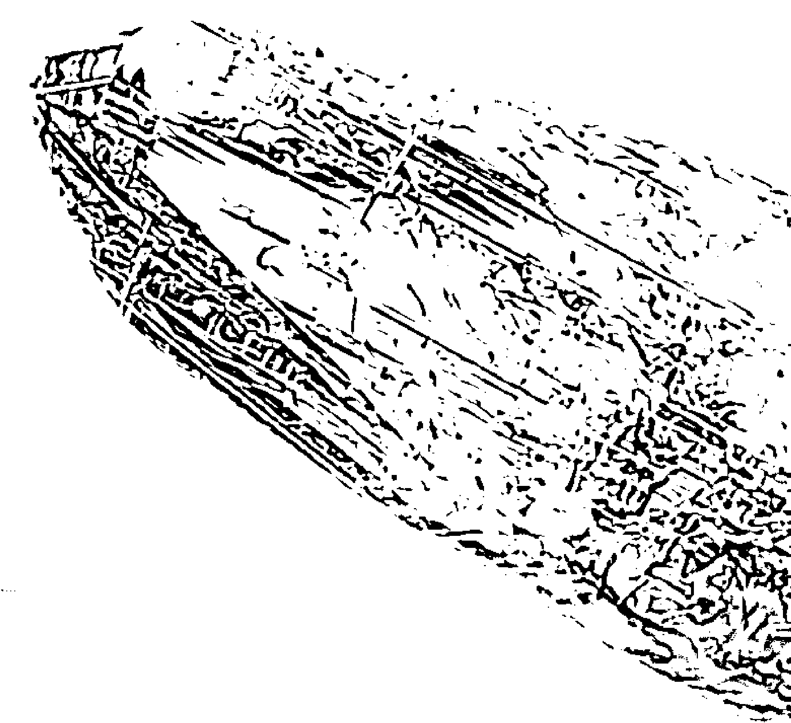

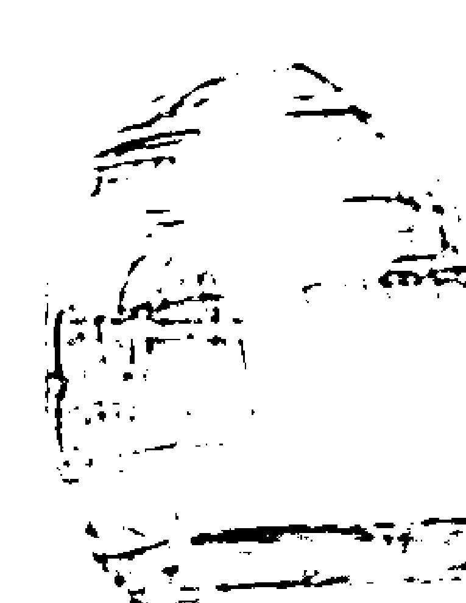

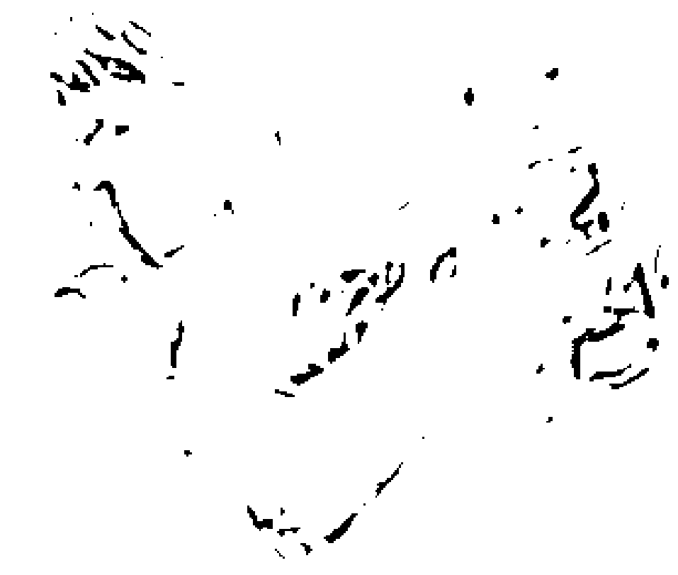

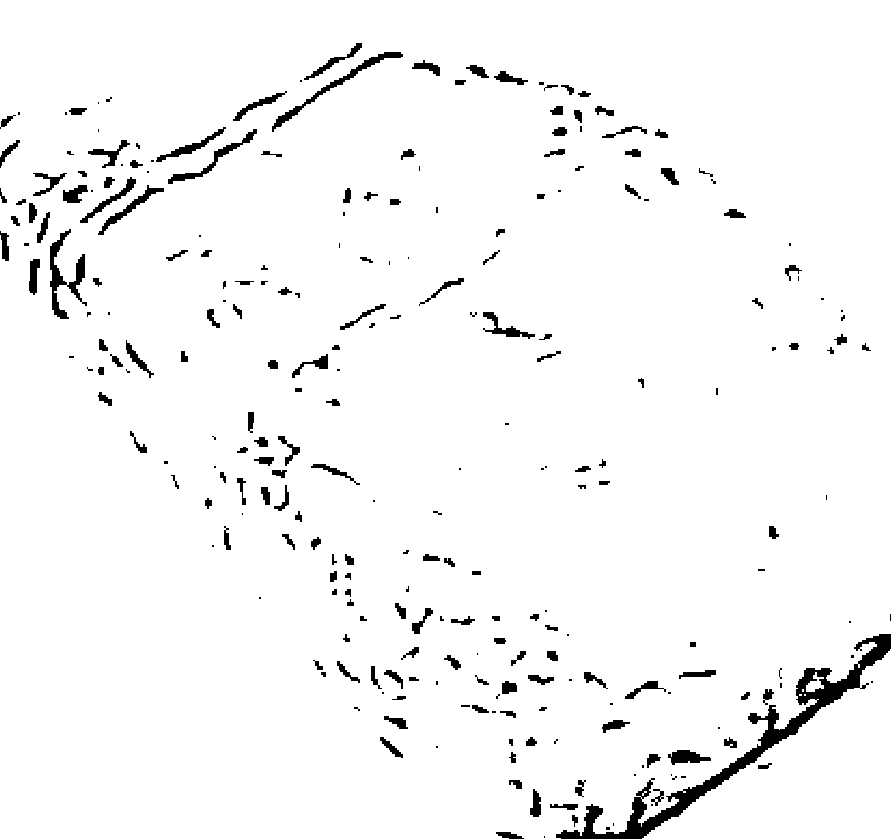

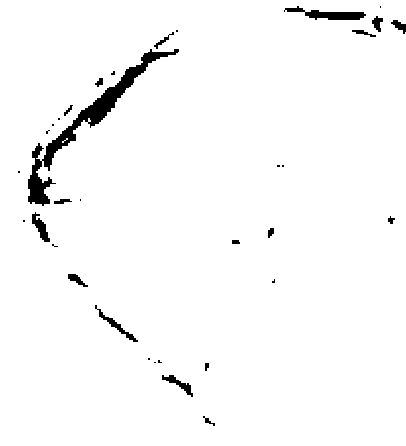

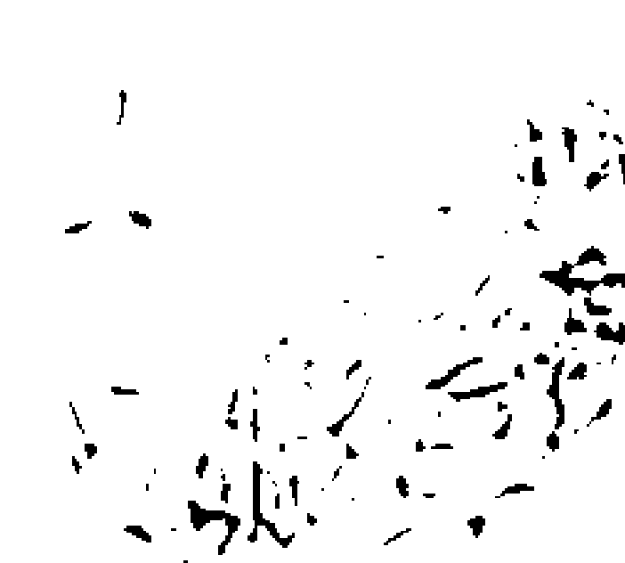

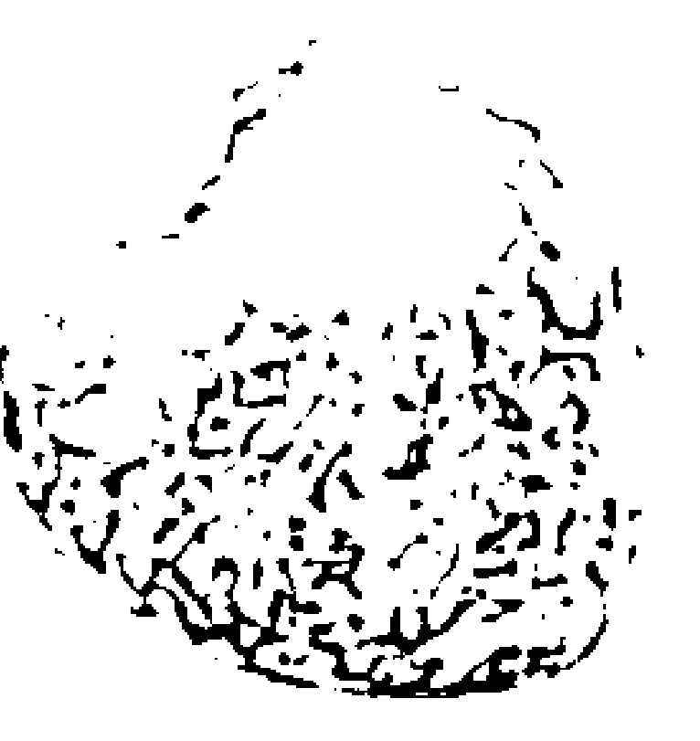