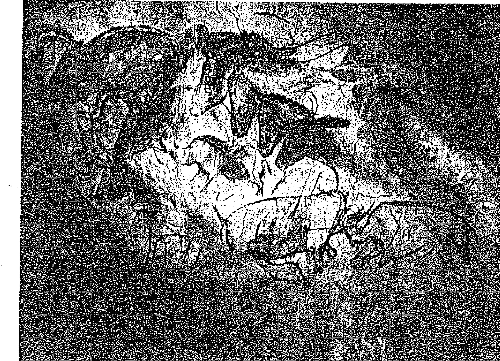

# 萨满与另一个世界的相遇

## 每個人都有靈魂旅程的能力

自從有人類意識以來，薩滿旅程，亦稱為靈魂旅程（soul journey）或以靈的形態旅行（journey in spirit），便是人類經驗的一部分。在中国神话裡，就有飛天、上升到天庭的天門、甚至升至星空 中揮開慧星等豐富的傳說。由中國薩滿流傳下來的道教，認為人可以羽化登天成仙。道士有時也被稱為羽士或羽衣等，這些都說明薩滿有進行上升旅程或靈魂飛行的能力。

很開心有越來越多的中文讀者，對親身接觸靈性世界感到興趣，而且能有機會讀到麥可·哈納博士的新書《薩滿與另一個世界的相遇》的中文版。哈納博士是薩滿實踐工作的大師，也是薩滿研究領域的知名學者，相關領域無人能出其右。

現在每個人都可以輕鬆參與上升到上部世界的薩滿旅程，當然這種旅程從來就不是具有某些特殊天賦的少數人所專屬的。這本書中有各種啟發性的靈魂飛行，都是來自於眾多現代的薩滿旅程，以及薩滿療癒實踐者的親身經驗，其中有许多人甚至只是薩滿的初學者而已。

另外，亞洲地區成千上萬的薩滿追尋者，現在也有機會透過薩滿研究基金會亞洲分會提供核心薩曼（Core Shamanism）課程，來學習探索其他世界。我深感榮幸，能參與眾人重新找回個人靈性主權的過程。

## 打開意識之門，進入薩滿的頻率次元

如果說哈納博士的著作《薩滿之路》是協助我們進入下部世界意識旅程的指南針，他最新著作《薩滿與另一個世界的相遇》則是引領我們前往上部世界意識旅程的羅盤。薩滿所認知的上、下部世界並非物質性的地域，而是經由意識的轉換才可踏入的頻率次元。進行薩滿旅程也並非少數人的特權，而是所有人與生俱來的能力與權利，只要擁有正確知識、練習與嘗試的意願，任何人皆可跳出意識的框架與限制，安全的進入古老薩滿們認為比我們這物質實相更真實的世界裡。在那裡，我們將獲得指引、教導、療癒、力量與智慧。哈納博士所創始的薩滿研究基金會的主旨之一，就是協助現代人找回個人靈性的自主權，透過自身的體驗與探索找答案，尋求的是知道（Knowing），而非相信（Believing）。

《薩滿與另一個世界的相遇》這本書是哈納博士數十年的教學經驗及上萬名學員薩滿旅程報告的精華整理。除了指引我們如何透過鼓聲前往上、下部世界，哈納博士藉由學員們的經驗分享，說明了薩滿的宇宙觀與意識狀態，釐清可能發生的行程問題，也描繪了經驗的個人化與多元性。如果你想了解薩滿療癒的層次與範圍，知道薩滿如何診斷及提供療癒，哈納博士也在這本書裡有很清楚的陳述，是薩滿實踐者的必讀。薩滿療癒在靈性上的運作，可以作為現代西方醫學的互補，那也是哈納博士與薩滿研究基金會一直努力不懈的推廣方向。

在課堂上，老師常說薩滿是石器時代或更早的智慧。對於住在現代都市的我們，雖然回不去舊時代，但內在深處對這些古老智慧卻是相當熟悉的。選擇打開這扇意識之門與否，取決於每個人的自由意志，但那扇門永遠會為你的選擇而開。

## 現代薩滿的上升旅程

《薩曼與另一個世界的相遇》延伸我前一本著作《薩滿之路》（The Way of Shamans）的意圖，將帶領你前往更高的隱喻與實際的境界。透過接下來的閱讀，你將知道現代的核心薩滿如何藉由鼓聲的驅動，在薩滿旅程中，上升到上部世界的天界。在天界裡，你可以獲得有助於日常生活的智慧與慈悲的指引；你也將體驗重要的療癒，甚至學會療癒其他人的方法。書裡引述一些現代西方人士的故事，是我從上千個個案裡挑選出來的，這些故事描述了現代薩滿上升到上部世界的力量與價值。

現代薩滿和中國幾千年前的薩滿，運用的療癒方法與占卜方式息息相關。薩滿之鼓在現在的薩滿訓練工作坊裡，又再度宏亮的響起了，不過我們也可以使用一種新的輔助設備：薩滿旅程的鼓聲光碟。這種鼓聲光碟讓居住在都市的薩滿實踐者，在戴上耳機後，就可以自行上升到上部世界的天界，並安全而返。現代薩滿透過當代科技的協助，將天界慈悲的智慧與療癒力量帶回擁擠的都市。無論是透過現場的鼓樂演奏，還是播放光碟鼓聲，薩滿的上升旅程都是將天界的和諧更進一步帶回我們的地球。

## 謝辭

首先，我要對為薩滿研究基金會的薩滿知識保存所（Shamanic Knowledge Conservatory，簡稱 SKC）資料庫提供薩滿上升旅程及其他各種經驗的數千名學員致謝。沒有他們的協助，本書就無法問世。我要特別感謝那些經驗被收錄在薩滿知識保存所，並且運用在聖境研究（Celestia Study）的人。

我這一生要感謝的名單，幾乎可以寫成一本書了，有太多人和許多族群在這條通往《薩滿與另一個世界的相遇》上幫助過我。然而為了實際所需，我不得不將想要表達的謝意，限制在過去五年來薩滿研究基金會所獲得的各種協助，包括人力支援、原住民、薩滿知識保存所，以及對這本書的幫忙。

我長久以來的好友及支持者：貝倫博士（Dr. BOLZAN）與梅琳達·麥斯菲爾博士（Dr. Melinda C. Maxwell），他們的慷慨協助對我來說非常重要；如果沒有他們的幫助，這本書可能就無法出版了。同樣重要的是貝西·葛登（Betsy Gordon）、安潔拉絲·阿爾林博士（Dr. Angeles Arcien），以及葛登基金會和阿爾林基金會的大方贊助。我誠摯的感謝他們。我也要向薩滿研究基金會的理事會成員們給予的堅定支持、時間付出及睿智的建議，致上謝意；近期的理事們，包括麥斯菲爾博士、羅伯特·李·莫里斯（Robert Lee Morris）、法蘭西斯·E·沃罕博士（Dr. Frances E. Vaughan）、勞夫·菲爾德（Ralph M. Field）、海勒·布爾契（Heather Burch）與傑夫瑞·大衛·埃仁瑞契博士（Dr. Jeffrey David Ehrenreich）；以及三位幹事：蘇姗·莫卡爾克（Sandra Hanner）與我自己。

在這些年間，薩滿研究基金會及其工作的其他重要支持者，包括波卡拉·雷貢德（Bokara Legendre）、塔拉基金（The Tara Fund）、伊麗莎白·馬歇爾（Elizabeth Marshall）、愛德加爾·布朗（Edgar Brown）、德拉·克拉克（Della Clark）、唐·恩斯林（Don Ensslin）、瑪格麗特、柯罕地產（the Estate of Margaret Cohan）、費茲爾中心（the Fetzer Institute）、法蘭克·佩斯二世基金會（the Frank Pace Jr. Foundation）、愛麗西亞·蓋茲（Alicia L. Gates）、約翰·費茲爾紀念信託（the John Fetzer Memorial Trust）、蘇珊·莫卡爾克、羅伯特·李·莫里斯、克勞蒂雅·庫恩茲（Claudia Kunze）、共享願景慈善基金會（the Shared Vision Charitable Foundation）、史德林基金（the Sterling Fund）、大亞特蘭大地區社群基金會（the Community Foundation for Greater Atlanta）、約翰及潔西卡·謝勒爾（John and Jessica Schairer）、西雅圖基金會（the Seattle Foundation）、流動基金集團（The Book End Circle）。還有許多人不及備載，他們透過捐款、擔任職員或成為基金會的團隊成員，或是用其他方式給予協助。我對所有人致上深切的謝意。

薩滿研究基金會有兩位卓越的特別人士必須獲得表彰。其中一位是薩滿研究基金會的副會長姍德拉·哈納，她是我的妻子、顧問、編輯、啦啦隊長和評論家，在我們踏上薩滿冒險旅途這半個世紀以來，總是一路相伴。她在支持與投入這份工作中所展現的耐心和謙遜，一直令我十分欽佩。沒有她，就沒有這本書。另一位則是薩滿研究基金會的執行長蘇珊·莫卡爾克，她精湛的電腦技能、慷慨、創意，以及擔任執行長期間所付出的辛勤工作，使我有時間能夠完成這本書。在本書出版的最後準備工作上，她也提供了許多細節上的協助。

我要向諾爾·布爾屈（Zoële Butch）致上無限的謝意，他多年來在基金會總部完成了兩人份以上的重要工作，展現出卓越的效率與風度。前助理研究員吉莎爾·萊恩·貝瑞（Cizelle Rhyon Berry）以許多年時間，使薩滿知識保存所—非尋常意識地圖繪製—（MaPpings of Nonordinary Reality，簡稱 MONOR）計畫的資料庫井然有序。柯琳·朱德森（Coles Judson）一度接續了貝瑞的工作。我也要感謝路易斯·李柏格（Louis G. Leedus）、詹姆斯·哈納（James Hanner）及卡羅蘭·菲（Carolyn Fee）為基金會所付出的一切。

目前，薩滿研究基金會是由蘇珊·莫卡爾克領導。我要向全體優秀職員、所有經驗豐富的薩滿實踐者和老師們，致上深深的感激。我要感謝的人太多了，難以一一列舉，但我一定要向比利·布魯頓（Bill Brodgar）表達感激。他和我一樣都是人類學家，也是《薩滿》（Shamanism）期刊的榮譽編輯；他直到退休前，都還不顧身體健康，始終為基金會執行重要的國際任務。

我還要推崇另一位薩滿研究基金會成員及人類學家，即已故的海莫·拉帕連恩（Hemmo Lappalainen）。他為基金會在西伯利亞及中亞地區進行了先驅研究；基金會在一九九三年的圖瓦（Tuva）遠征之旅得以成功，他也是其中的重要關鍵人物。

我要特別讚揚薩滿研究基金會歐洲執行長保羅·烏庫西克（Paul D. Ucchic）的中流砥柱、慷慨、能力與謙遜，他在妻子蘿絲薇莎（Roswitha）的協助下，發展出卓越的跨國工作團隊。他為基金會在海外進行教育工作，而在中亞圖瓦等地的工作，鞏固了基金會在歐亞地區的運作。

應獲得認可的，還包括在拉丁美洲與西班牙的愛莉西亞·蓋茲（Alicia L. Gates），以及亞洲地區的凱文·唐納。

除了上述名單外，我知道自己一定漏掉了其他同樣值得感謝的許多人。我只能請求曾經幫助我完成這本書的諸位，能在各種層次上了解已屆八十幾歲的我，在此刻或許無法想起每一位應該感謝的人。

不過，我確實記得薩滿研究基金會成立的第一年時，那些給予願景及支持的重要人士，包括諾曼和麥可·班奇（Norman and Michael Benzies）、桃樂絲·李登（Dorothy S. Lyddon）和她 的女兒瑪莎（Martha）、大衛·柯爾賓（David Corbin）、南恩·莫斯（Zan Moss）、大衛·洛克菲勒二世（David Rockefeller Jr.），以及永遠年輕、先知遠見、英勇膽大的勞倫斯·洛克菲勒（Laurence S. Rockefeller）。

最後，我要感謝北大西洋出版社的創辦人李察·葛羅辛爾（Richard Crossinger）邀我出版本書，我也要向出版社的道格·瑞爾（Doug Reil）、凱西·格拉斯（Kathy Glass）及所有職員表達謝意。最後，我要向我在北大西洋出版社的卓越編輯溫蒂·泰勒（Wendy Taylor）致敬與致謝。她的專業精神及深思熟慮是一份大禮。

## 為後人留下的洞穴圖像

這本書是對薩滿方法的大胆實踐：敲打鼓聲，並透過鼓聲的語調與節奏那༔的語言，與另一個世界的靈性存有建立對話。那是一個與我們這物質世界互相連結的意識世界。那裡有慈悲的導師、療癒的力量以及神聖的智慧，它們都在等著與我們連結。

## 上升到上部世界的比較經驗

在準備進行上部世界的意識旅程時，不管你是首次經驗或經驗過多次，以下的經驗都是有意義的。它可以幫助你了解自己的旅程，或其他人的旅程，因為薩滿的意識旅程是對現代人相當重要的學習過程。

## 下降到下部世界的比較經驗

在準備進行下部世界的意識旅程時，不管你是首次經驗或經驗過多次，以下的經驗都是有意義的。它可以幫助你了解自己的旅程，或其他人的旅程，因為薩滿的意識旅程是對現代人相當重要的學習過程。

## 訓練資源

如果你是一位正在學習(core shamanism)的實踐者，請參閱以下的資源以幫助你進一步的學習和探索。無論你是從事個人療癒工作、家庭療癒，或指導他人進行薩滿療癒實踐，這些資源都能提供你實質的幫助。

## 核心薩滿與療癒：給醫生及健康照護專業人士的資訊

### 核心薩滿的主要概念

#### 一、對自然與人類的假設

核心薩滿認為，自然與人類並非分離的，而是相互關聯的。損害自然即是損害人類，因此學習薩滿療癒的過程，即是重新連結自然與人類的過程。在現代社會中，許多人已忘記自己與自然之間的這種連結，而薩滿療癒正是幫助我們找回這種連結的重要方式。

#### 二、健康與疾病的發病機制及病因

核心薩蔓的觀點認為，健康與疾病的發生並非單純的生理問題，而是與我們的靈性與心理狀態息息相關。疾病可能源自於我們與自然的disconnect（斷裂），也可能是因為我們的內心渴望未能得到滿足，或我們對一些建議與知識缺乏了解和信任。透過薩滿療癒，我們可以重新建立與自然的連結，恢復心靈的平靜，從而改善健康問題。

#### 三、診斷

在核心薩滿療癒過程中，診斷是通過與靈性存有的對話來達成的。這些靈性存有會以夢境、閃電、直覺或感應等方式與你溝通，並提供關於你問題的洞察與建議。診斷並非一成不變，而是根據個人的意識狀態與與靈性存有的連結程度而定。

#### 四、治療

治療是透過與靈性存有的交流進行的。在治療過程中，你會聽到這些靈性存有所給出的指引與建議，並藉由擊鼓、冥想等方式，將這些指引內化並將其應用到你的生活中。治療可能包括面對恐懼、療癒傷痛或解決內心的矛盾。

#### 五、核心薩滿的訓練與實務工作

核心薩滿的訓練包括學習擊鼓、學習與靈性存有的互動，以及學習如何辨識與處理來自靈性世界的訊息。這些訓練通常透過體驗、閱讀以及與其他薩滿實踐者的交流來完成。實務工作則是將這些知識應用到自己的生活中，並協助他人進行療癒與成長。

#### 未來展望

隨著越來越多的人開始接觸核心薩滿療癒，這門靈性實踐的未來將有更多的發展與探索。透過體驗核心薩滿，人們可以重新找回與自然和靈性世界的連結，並從中獲得更深的智慧與療癒。

## 聖境研究資料的貢獻者

以下為聖境研究（Celestia Study）資料的貢獻者：

- 貝倫博士（Dr. BOLZAN）
- 梅琳達·麥斯菲爾博士（Dr. Melinda C. Maxwell）
- 貝西·葛登（Betsy Gordon）
- 安潔拉絲·阿爾林博士（Dr. Angeles Arcien）
- 葛登基金會和阿爾林基金會
- 路易斯·李柏格（Louis G. Leedus）
- 詹姆斯·哈納（James Hanner）
- 卡羅蘭·菲（Carolyn Fee）
- 比利·布魯頓（Bill Brodgar）
- 海莫·拉帕連恩（Hemmo Lappalainen）
- 保羅·烏庫西克（Paul D. Ucchic）
- 蘿絲薇莎（Roswitha）
- 爱莉西亞·蓋茲（Alicia L. Gates）
- 凱文·唐納（Kevin Turner）

## 註釋

### 1. 薩滿與靈魂旅程的關係

靈魂旅程是薩滿實踐的重要部分，它意味著人可以離開肉體，訪問不同的意識領域，並與靈性存有溝通。這種經歷在許多原住民文化中都受到尊重與珍視。

### 2. 鼓聲的科學基礎

一些研究顯示，特定的節奏特別是每分鐘205到220次的穩定節奏，可能對大腦波動產生影響。這種影響可能是透過聽覺驅動的方式達成的，表示透過鼓聲改變意識的過程是可信的。

### 3. 薩滿療癒與現代醫學

薩滿療癒雖然不替代現代醫學，但它可以作為其中的補充。透過與靈性存有的對話，人們可以找到更深層次的啟示與療癒方法。

### 4. 薩滿學說與東方哲學的融會

在東方哲學中，與自然的連結也被視為重要的靈性修行方式。核心薩滿的方法與這些哲學思想有許多相似之處，這也說明了薩滿療癒的普適性與深度。

## 參考書目

### 1. Eliade, Mircea. The Myth of the Eternal Return and Other Essays.

### 2. Wasson, Gordon. The Tabernacle of Sacred Sound: The Rites and Rituals of the Siberian Shamans.

### 3. Hanner, Michael. The Way of Shamans: A Guide to the Sacred Journey.

### 4. Hanner, Michael. The Healing Power of the Shaman: Exploring the Soul's Journey.

### 5. Hanner, Michael. Shamanic Healing of the Self and Others: Practical Experiences on the Other Side.

## 充滿驚奇的薩滿旅程

本書收錄了一些西方人士進行的上升旅程（ascensions）經驗，他們前往許多薩滿研究學者所謂的上部世界（the Upper World），也下降到下部世界（the Lower World）；這兩個世界是相對於我們所居住的中部世界（the Middle World）。上部世界與下部世界完全存在於非尋常世界中，只屬於靈性存有的領域；而我們所居住的世界，除了有我們可以輕易感知到的尋常面向，也有屬於靈性存有的領域，以及沒有薩滿訓練就比較不容易感知到的非尋常面向。

上部世界和我們在尋常世界中抬頭可見的現象，以及太空人在太空觀察到的現象，非常不同。即使是宇宙中最遙遠的銀河系，依然不是薩滿們所知的上部世界。同樣的，當西方人士下降到下部世界時，也不會穿越地質學家指出的地球內部岩層，他們進入的是在我們世界之下靈性存有的純粹領域，那是一個沒有物質限制的領域。

這本書裡提供了西方人士在這三個世界中的非尋常經驗，主要是在上部世界，部分原因是當代西方對「上面」如果有什麼的話，會有怎樣的靈性存有最感好奇。換句話來說，真的有天堂嗎？或者天堂只是一個幻想或是一種隱喻？

我們的證據顯示，這個問題的答案要取決於哪個世界，是尋常世界或非尋常世界？在非尋常世界中——要透過典型的薩曼技術，包括聽覺驅動才能到達——毫無疑問的，上部世界裡有天堂、天界聖樂、神靈和其他靈性存有、靈體。證據也顯示，在我們自己的世界（中部世界）也有靈性存有。

薩滿與另一個世界的相遇

## 薩滿旅程帶來的挑戰

這本書裡從上升旅程經驗得到的證據，挑戰人們心中只有一個天堂的信念，以及人們認為只有少數古代先知、已逝的聖徒、偉大宗教的創始者才可往返天堂與人間。同樣的，這些報導也挑戰了無神論者的信念，無神論者認為天堂是虛構出來的。即使在今日的基督教中，有些神職人員也認為天堂只是一種感受，而非某個地方。

很多年前，我在《薩滿之路》一書中，將前往下部世界的薩滿旅程介紹給西方人士，三十多年來已有許多人透過旅程到達那裡。這是本書對於下部世界的強調不如上部世界多的原因之一。不過，本書的最後一章，將提出某些西方人士在下部世界新發現的驚人訊息。

由於本書收錄的宇宙學報導，是薩滿知識非常重要的文獻，在有限的篇幅中，我不會拿來與瀕死經驗生還者的描述、或是與原住民薩滿們的親身旅程做比較；原住民薩滿們的資料出乎意料的相當稀少。我同意這些資訊及其他比較研究的重要性，並積極主張我們需要執行這些工作。包括你手上這本書在內的各種作法，就是鼓勵人們展開這類調查。

我還要說明的是，我並不打算利用這本書連結不同學科。我是人類學家、薩滿學家（shamanologist）、一個薩滿實踐者；在本書中，我也是西方薩滿經驗的宇宙學家（cosmogather）。如此而已。想要將薩滿和心理學等其他學科融合的人，應該試圖抗拒使用《北非諜影》（CasaBlanca）這些電影中「把慣犯都抓起來」這種標準的化約主義方法。我並不反對化約主義，但我認為只有真正精熟任何要被「化約」的領域後，才可進行。就薩滿來說，應該歷經大量的第一手經驗、實驗和研究，在熟悉薩滿之後，同樣精通於比較的領域。不可否認的，這並不是一件容易的工作：然而，認真的學術研究何曾容易？  

## 邀請你親身經驗薩滿旅程

多年來我們在工作坊和課程中，花了很多心思教導想要學習核心薩滿的西方人士如何前往其他世界，我們除了給予基本指示外，並不提供多餘訊息。他們所獲得的細節，可參見〈附錄 A〉和〈附錄 B〉。我們邀請你親自運用同樣的薩滿旅程方法，將自己的經驗與書中的描述做比較。不過，附錄不是「如何使用」的工具書，而是要給讀者一個機會，親自測試書裡收錄的西方人士在上部世界（及一些下部世界）所發現的實相世界和本質。

不幸的是，一旦你閱讀過這本書，你對上升到上部世界、或下降到下部世界，就不再保有純真無知的狀態。即便如此，如果你接受了上述邀請，你可以期待自己將會有驚人的發現，包括你不必再倚賴他人的報導，可以親身體驗那裡有什麼或沒有什麼。經歷過核心薩滿後，你可能不再同意教會、國家和科學宣稱的宇宙論鐵律。

## 與另一個實相世界相遇

我要呈現的新資訊，也就是他人經驗的紀錄及提供的啟發，是這本書主要的任務與貢獻。我徹底搜尋了薩滿研究基金會的資料庫，尋找在非尋常世界裡的普遍經驗，這些都是我們有潛力到達的範圍。搭配上述的核心薩滿原則，這些紀錄為我們身為人類所處的情況提出了重要觀點，能為有興趣的讀者擴展視野。

我選擇在我有限的時間裡，收錄了我認為真的重要、乃至緊急的訊息，帶到當今危急的世界裡。我們一直根據古老故事中的基本信念，對靈性事物爭執不休。薩滿是第一手知識，而非故事（就算是我的故事！）；在許多原住民文化中，薩滿就是一知者。

我希望這本書有助於讀者減少自己對組織性宗教宇宙論教條的依賴。我希望它能激發你在薩滿旅程中，與另一個實相世界相遇，或受到更進一步的鼓舞，因為在那裡我們會找到不可思議的慈悲、協助和療癒，這是我們這個世界所迫切需要的。就某種程度來說，這本書是資料導向的靈性自主證詞；也是一項邀請，邀你利用這些知識和自由，為自己和他人的生命帶來更多智慧、慈悲和喜悅。

## 靈性力量與洞穴力量追尋

## 靈性力量的保護

一九五七年二月，我和一小群修爾族（Shuar，過去被稱為希瓦洛族（Sharo））男人，在亞馬遜流域上游的雨林山區，長途跋涉了幾星期後迷了路。我們又累又餓、還迷失了方向，最後遇見另一隊友善的修爾族獵人，告知我們正朝反方向前進。他們分了些糧食給我們，指出要前往的修爾族聚落方向。離開獵人隊後，我們很快來到一條湍急的小河邊，不久前落在安地斯山脈西側的暴風雨讓小河的水量充沛。這使我們無法繼續前進，只得等待水位降低，等了幾天後仍不見好運。夥伴們安靜的等候，似乎一點也不受情況干擾，而我開始越來越不耐煩；我知道我們可以用輕木樹幹打造木筏，以瓜多竹作槳來渡河。

我向夥伴們提議了許多次，說我們不該繼續等待水位下降，而該製作木筏和槳來渡河。他們卻一再拒絕這麼做。

我越來越不耐煩，最後挑战认伙伴們，指出他們聲稱自己是偉大的勇士，卻不願渡河。於是，他們一言不發的快速打造了三艘木筏，準備渡河。河面大約有四十五公尺寬，第一艘木筏由兩位印第安人划槳，載著我們部分的行李成功抵達對岸。接著我和兩位划槳手登上第二艘木筏。我們划過了四分之三的河面時，被沖到激流，木筏翻覆，掉落到湍急的洪流中。我們拼命游過最後距離，存活了下來。第三艘木筏也成功渡河。

在集合後稍作休息，要繼續出發時，我對他們說道：「剛才真是驚險。我猜我們很幸運能活下來。」

我期待有人同意我的看法，至少默認，但夥伴們依然靜靜站在那裡，就像刻板印象中嚴肅的印第安戰士那樣。他們給我的感覺是這沒什麼了不起，顯得不為所動。

他們的毫無反應令我困惑不已，因為這些人和之前無視於我的催促，遲疑不肯渡河是同一批人。於是我很笨拙的指出他們原本不想渡河、害怕渡河，現在卻表現得彷彿這沒什麼。

他們彼此交換了眼神，但仍不發一語。接著其中一位我很熟識的夥伴終於回應了。他說：「是這樣的，我們並不是害怕渡河，因為我們不會死。至於你，我們就不知道了！」

在那一刻，這段危險的亞馬遜河渡河經驗，為我開啟了一扇通往重要靈性知識的大門。之後，我逐漸從修爾族人得知，除了傳染病之外，他們都受到靈性力量的保護能免於各種死亡。我不知道這股力量是會離開的。所以，未受保護的人確實會死。因此，在啟程展開危險任務之前，人們會觀看跡象，了解他們是否仍然擁有其守護靈所提供的保護力量。如果是負面的跡象，他們就不會啟程執行任務，特別是攻擊敵人的任務。

和修爾族一樣，世界各地的原住民薩滿們知道靈性力量對於人的健康、生存和療癒他人的能力是基本要件。少了這股力量，人們就無法抵抗疾病或災難。在傳統薩滿文化中，人人皆在日常生活中都有這樣的覺察。

在二十世紀初期，傑米·安谷洛（Jaime de Angulo）曾與美國北加州的阿楚格威族（Atsugeve）相處過一段時間，他說得很好：「沒有這股力量，你無法有任何作為。有了這股力量，你就可以無所不能。」

這股力量像是力場似的滲透薩滿全身，使他能夠運用這股力量去幫助與療癒其他人。薩滿對於力量的觀念，與我們對能量的概念很相似，但前者包含了更多：能量、智能，以及自信。

靈性力量並不是政治力量，或是掌控他人的力量；而是一種攸關健康與生存能力的力量。

## 具有力量的靈性存有

談到這裡，讓我解釋我所謂的「靈性存有」（spirit）是什麼意思。就像我在其他地方曾說過的，可以將靈性存有定義為：「一種有生命的存有（living essence），祂具有智能及不同程度的力量；最容易在全黑之下看見，較少在光亮的環境中看到；在意識的轉換狀態中，比在尋常狀態中更容易見到。事實上，有人懷疑在尋常意識狀態中根本看不見祂們。」

換句話說，並非全部的靈性存有都有顯著的力量。薩滿們通常直接將有顯著力量的靈性存有稱為「力量」。在原住民文化中，特別重要的是能為所愛的人提供保護力量的守護靈（guardian spirit）。薩滿以適當方式召喚來這股力量後，可以提供積極的療癒協助，為薩滿的患者治癒疾病與痛苦。薩滿則是透過經驗學習得知哪些靈性存有具有力量。

力量取得的方式各有不同。在西伯利亞和南美洲部分地區，獲得個人力量的常見方法，是經歷一場到死亡關頭走一遭的重病。如果他突然奇蹟般的痊癒了，當地社群會斷定這是因為某位靈性存有同情他而介入，解除了他的疾病之苦。在這類案例中，族人通常會去找這位痊癒的患者，看看這股療癒力量是否可用來幫助其他為疾病所苦的人，通常是患有類似疾病的人。也就是說，病患的痛苦可以激發靈性存有的憐憫之心。有時候透過這種方式，一位薩滿就被創造出來了。

## 尋求靈性力量：力量追尋與靈境追尋

理想上，一個人應該不必透過生病求得這股力量。傳統薩滿文化中的成員深知這點，所以鼓勵身體健康的年輕人自願受苦，希望透過受苦，祖靈或許會願意介入並分享祂們的力量來幫助年輕人。這股力量不僅是一種療癒的能量，也是一股原力（Force），能夠為日常生活提供支持，幫助人們避開災難與困苦，並且獲得良好的成果。

在這類取得力量的方式中，最著名的是力量追尋（Power Quest），更常見的說法是一靈境追尋（Vision Quest）。不過，需要一提的是並非所有成功的力量追尋都涉及取得靈視（visions）。例如，在美國華盛頓州的南奧卡諾根族（Southern Okanagan），追尋者或許不會看見靈性存有，而是透過聽覺經驗，如歌聲或言語來接收力量。

力量追尋並不適合生病的人，而是由健康且往往相對年輕的人來進行。某種程度上，這是一種靈性生命的保險，用以促進個人的成功與生存。

幾乎任何人都可以在各種與世隔絕、有祖靈和其他守護靈存在的地方，尋求靈性力量。這類場地包括：山頂、洞穴深處、偏遠地區的瀑布、北極荒原、某些峽谷、當地墓園或廢墟遺址、偏遠的山徑，以及其他地區。但有一項元素是達到目的所不可或缺的：靈性存有必須深信來到祂們的場域尋求力量的訪客，是值得協助的。在抵達這些地方時，來訪者通常會以歌唱或默禱，請求靈性存有的協助。

## 自願受苦以激發憐憫與協助

追尋的形式各異。無論是哪種文化，一般而言，追尋者需要透過自願受苦，例如承受恐懼、飢餓、乾渴、嚴寒或酷熱，以及體能上的耗竭等，來證明自己。在薩滿的信念中，受苦不是在贖罪，而是吸引具有力量的靈性存有前來協助。

在北極某些因努伊特族（Inuit）中，力量追尋的成功方法之一是於隆冬之際，在特製的孤立圓頂冰屋裡待上四、五天，不吃不喝。到了指定的時間，一位長者，通常是一位薩滿，會打開冰屋，將他帶回家。冰屋裡甚至連取暖的油燈也沒有，所以是承受酷寒加上不吃不喝的苦難。有報導指出在某些案例中，力量追尋者也可能在這段時間內赤身裸體。另一種較不挑戰生命危險的例子，是我自己在修爾族所做的力量追尋，涉及在安地斯山脈森林茂密的東側山坡上千辛萬苦的攀爬，在近乎冰凍的瀑布下浸浴，在強烈的曼陀羅（Basilanosisa sp.）汁液的協助下獲得靈視之前不能吃固體食物。

為了力量追尋而自願受苦的方式，有時仍會出現在北美洲大平原上的原住民部落中，人們為了尋求靈視及力量，經常先透過淨化方式或關在淨汗屋中脫水。他們會刻意承受酷熱之苦，並且開始察覺到靈性存有的出現與顯化。隨後，追尋者在一位薩滿祭師（藥師）或是其他長老的陪同下，前往偏遠孤立的山頂。追尋者獨自留在山頂，經過事先安排的天數後，長老才回到山頂將他帶回。

在大平原部落裡，有更極端的靈境追尋或力量追尋。追尋者會被包裹在毯子或被褥中，放入一個事先打造好和使用過的L型地洞。靈境追尋者的神聖菸斗也一起放進去。洞口會被蓋起來將光線降到最低，使追尋者在白天和黑夜都能獲得靈視經驗，並且透過孤立、剝奪他的感官覺受、寒冷來增加受苦的程度。在淨汗屋儀式後的追尋過程中，不准喝水，是為了來強化受苦。

除了受苦之外，一般還會伴隨對祖靈的祈求「可憐我吧！」，並且尊稱祂們為「祖父們」，對亞馬遜流域上游及北美洲大平原的原住民來說，「祖父們」往往是指所有祖先，這是因為許多薩滿文化中並沒有專門指稱祖先的詞語。同樣的，受苦的目的是要喚起祖靈的憐憫，如此一來，祂們或許會讓祈求者有靈視經驗，給予他們靈性力量。祖靈可能會以動物或人的形象現身。

祖靈為何要提供協助呢？答案真的很簡單：祂們在死後，離開尋常世界了；祂們選擇留在中部世界，以便幫助自己的宗族後代或後代的盟友。在適當的召喚下，並且認為受訪者值得協助時，這些靈性存有會以祂們選擇的形態現身、溝通，並賦予追尋者力量來克服生命中的困頓與危險。我經常把祂們稱為一類慈悲種族中心的靈性存有。

當祂們自己得到紀念與景仰時，就會幫助祂們的後代；當祂們的子孫或後代的同盟受到威脅時，祂們有很強烈的復仇心。

祂們給予保護的慈悲具有兩種形式的條件：（一）當祂們自己得到紀念與景仰時，就會幫助祂們的後代；（二）當祂們的子孫或後代的同盟受到威脅時，祂們有很強烈的復仇心。

祂們給予保護的慈悲具有兩種形式的條件：（一）

還有其他不需要受苦或乞求同情的方式，可以獲得靈性力量。我稱之為「吸引靈性存有」（Spirits and Spirits）。在召喚及與靈性存有工作的過程中，薩滿們經常服用族人或特定動物喜歡的食物或飲品。薩滿的目的，是吸引靈性幫手，甚至與靈性幫手及其力量合為一體。因此，西伯利亞和蒙古的薩滿們會祈禱並且飲用伏特加酒，來引誘喜愛伏特加的祖靈（經常也是已故薩滿的親戚們），與祂們合為一體。北美洲西北海岸的薩滿們則是透過祈禱與吃鰷魚，吸引熊、白頭鷹和一位印第安人等的靈。後文會再談到這個主題。

## 沃爾特·克萊恩在奧卡諾根族的發現

一九二〇年代末期，一位在航線不定的貨船上工作的美國人類學學生，在北非海岸附近跳船。他的名字是沃爾特·克萊恩（Walter Crane）。他游泳上岸，希望能和巴巴里人（Berbers）住在一起。他達到目的了，學會說一口流利的阿拉伯語，住過摩洛哥、敘利亞、衣索比亞和阿。

拉伯，在埃及的底比斯協助考古挖掘工作。一九三六年，克萊恩獲得哈佛大學的人類學博士學位。在經濟大蕭條年代，他在美國華盛頓州中北部的聯邦公共事業振興署獲得一份臨時工作，採訪奧卡諾根印第安長老關於傳統知識及消失中的文化，包括昔日的山洞力量追尋。

一九五○年代初期，克萊恩在加州大學柏克萊分校擔任兼任講師，教「原始宗教」。克萊恩是一位熱情洋溢、激勵人心的老師。我很榮幸在他生命的最後兩年成為他的學生，當時克萊恩正因癌症而步入死亡，他的病也奪走他一隻手臂。

克萊恩和他傑出的妻子墨玖莉（M. L.），靠著在自己的公寓中銷售人類學二手書籍和論文著作勉強度日。儘管他們收入微薄，兩人還是經常去拜訪西岸的北美印第安部落，帶回驚人的故事；故事通常和薩滿們有關，他會在課堂上講述這些故事。克萊恩和當時的大學同僚大不相同，他並未試圖以心理學觀點來詮釋薩滿。學生們熱愛克萊恩，甚至尊敬他；因為克萊恩為他們的生命帶來無可比擬的仁慈、開放與對人類學的熱情，這一切也因為他正面臨死亡的事實而更顯非凡。他喚醒了我對薩滿最初的興趣。

沃爾特·克萊恩為人謙遜，因此直到他過世二十年，在我也教人類學很久之後，我才意外的發現他對美國哥倫比亞河高原的辛塔特族（S’Haa.）或南奧卡諾根印第安部落撰寫了鮮為人知的著作。歷經某些困難後，我終於獲得一本影本，內容包含他向部落長老蒐集得來的力量追尋資訊，雖然內容有限但卻相當重要。

克萊恩將焦點放在小孩進行的力量追尋上；據聞男孩要尋求的是能夠幫助他們未來生活的一般性力量。克萊恩得知的一個案例，是一位父親將兒子放在洞穴裡過夜，讓他能獲得力量。

## 威拉德·帕克訪談帕維奧佐族的力量追尋

除了沃爾特·克萊恩對奧卡諾根族的報導外，我也找到民族學家威拉德·帕克（William P. Park）非常珍貴的文字紀錄，因為他得知洞穴力量追尋對於內華達州的帕維奧佐族（北派尤特族／Zoqueue Plateau）薩滿們很重要，他是在一九三○年代初期到中期訪談了這些薩滿。

帕克談到帕維奧佐長老們非常注重嚴格遵守傳統程序，才能成功完成這類追尋。他說，帕維奧佐薩滿們在進行洞穴追尋時會隨身帶著食物，以獲得某些特定的附加力量，例如增進他們療癒工作的成功率。這與上述使用食物吸引靈性存有以獲得力量的作法一致。在此，我要引述帕克的一段話：

力量追尋沒有準備工作。要尋求靈視的人，在進行追尋之前或在洞穴時，也不需斷食。這場力量追尋，也沒有自我折磨或長期的體能付出。

想要尋求力量的人，在得知有可能獲取力量時，會在傍晚時分進入洞穴。午夜和

## 我的洞穴力量追尋

撰寫《薩滿之路》幾年後，我得知在維吉尼亞州的仙納度河谷（Shenandoah Valley）中有個適合的洞穴。我希望自己已經擁有足夠的資訊了，我決定去那裡進行洞穴力量追尋，尋求一種特殊的薩滿療癒力量，看看在沒有改變意識狀態的植物或聽力驅動的協助下，會發生什麼事；因為帕克或克萊恩都不曾提及有使用這些東西。

我很認真看待帕維奧佐族的方式。當我找到洞穴進行自己的追尋時，我打算帶的三明治裡夾了幾種不同動物喜愛的食物。

有時，祖靈如果覺得幫助某人或許將可幫助祂們的後代時，祂們似乎願意協助不是自己的後代子孫，甚至是來自另一個文化或種族的人。這是我在南美洲的修爾族及科尼波族（Condo）所學到的。多年來，我試圖以各種方式協助北美的原住民，例如一九七三年在傷膝谷（Wounded Knee）的事件。

帕克沒有提到攜帶食物進入洞穴在靈性上的理由，但基於我對於吸引靈性存有的知識，使早晨用餐的食物，也可以帶進去。

## 靈性力量與洞穴力量追尋

我終於在一九八二年的某個夜晚，獨自來到洞穴入口，心中默默召喚靈性存有對我心懷憐憫，賦予我在協助療癒他人的工作上有更大的力量。我帶著手電筒下降到洞穴深處凹陷的平台上，大約花了十五分鐘。我在那裡關掉燈光。眼前一片漆黑而安靜無聲。接著，根據我所得知的線索，我應該開始睡覺，睡到午夜醒來時，吃一點點食物，接著不要再睡，直到有情況發生為止。

坐在冰冷的岩床上一段時間後，我按下手錶上的按鍵，看看微弱光線下顯示的時間。大約是晚上九點。我進入洞穴後已經過了兩小時。根據我所獲得的資訊，無論發生什麼事，我在黑夜完全結束之前不能有燈光。然後我就可以離開洞穴，因為古法的規矩之一是，追尋者只能在隔日黎明之後離開洞穴。否則，還不如完全不要進入洞穴。在這夜結束之前，我還有其他事情得做。

被闇黑包圍著，我感到與生機盎然的陸地完全隔離。我內在有兩種恐懼搏鬥著。較輕微的恐懼是在這地底獨處的夜晚，什麼都沒發生。畢竟，我並不屬於用這古老方式獲得特殊靈性力量的洛磯山脈西側北美原住民。或許，沒有他們的文化背景或沒有我之前在修爾族（希瓦洛族）的經驗中所使用的強烈致幻物質，想有任何靈性力量接近我，是一種痴心妄想。而且，我

靈性存有與另一個世界的相遇

我心想，事前不需斷食，甚至還得吃個午夜點心，這是哪門子的靈境或力量追尋呀？換句話說，這樣能吸引靈性存有？

黑暗已變得有些泛紅，感覺像是正在逼近的死亡安靜而耐心的等待著。我更深層的恐懼是，我可能會因此喪命，獨自在這巨大的岩石墓穴內死去，成為自己魯莽行為下的受害者。我多年前在亞馬遜瀑布旁的靈境追尋經驗，明白靈性存有可能會盡全力嚇唬我，並且測試我對祂們的信任。在亞馬遜時，至少我有修爾族的夥伴保護我不犯下致命的錯誤。不過，這回在洞穴內的追尋，可沒有活生生的指導員能幫我了。誰也不能在此陪伴我。這是個全然獨處的實驗——一場賭注，賭我已經有足夠成功的資訊，靈性存有也在那裡並且願意幫助我。

最後我爬進睡袋嘗試入睡，這是在洞穴裡要做的下一步。在岩床上，我將帶來要在午夜時吃的三明治放在頭旁。我提醒自己要在午夜醒來，希望不會一睡整晚，導致失敗。

睏意逐漸襲來，我長期的背痛使進入洞穴成為一趟艱困痛苦的跋涉，我的身體想休息了。

我睡著了，仍然擔心自己可能無法在接近午夜時醒來。

我根本無須擔心。一根羽毛輕撫過我的臉頰，把我驚醒。我全身充滿一股興奮感。我按了手錶上的按鍵，微弱的數字顯示還有兩分鐘就十二點了。我在被羽毛撫醒的震驚中，同時也因及時從沉睡中被喚醒而能遵循午夜的指示，鬆了一口氣。我在黑暗中摸索著三明治，找到並吃掉它。現在我計畫保持清醒，直到某種重大事件發生為止。

我坐在那裡，精力充沛且神智清醒，對於任何可能發生的事情保持警覺。十五分鐘過去了，半小時過去了。我開始感到失望。或許什麼也不會發生。

突然間，遠方洞口的方向傳來隆隆蹄聲。聲音越來越響亮，顯然是一群動物。我不敢相信我所聽見的聲音。

牠們奔騰的聲響越來越近。這根本不可能。然而那聲音大到我得摀住耳朵。我會被亂蹄踩死嗎？我蹲下身。接著轟隆的蹄聲從我兩側飛奔而過，往洞穴更深、更遠處衝去。雖然我看不見牠們，當牠們奔騰而過時，我聽見牠們的噴氣聲。我們是馬。牠們以類似心電感應但更強烈的方式和我溝通。

接著又有一群較小群的動物快速跟上，牠們的呼吸和蹄聲不如之前那麼大聲。我們是美洲野牛。牠們說道。然後牠們也離去了。

洞穴再度恢復安靜。我狂喜不已，全然的狂喜。喜悅和感謝的淚水流下我的雙頰。這是個奇蹟。這不是夢，因為我仍然完全清醒。

接著，當我坐在那裡時，一股強烈到難以描述的力量，從牛馬群來的方向朝我衝過來。但這一次既沒有聲音也沒有警告。牠像是一列貨運火車勢不可擋的衝來，穿越我的身體。一股強大的力量充滿了我的全身，使我震驚不已。力量來了！隨之，那動物也走了。

我興奮得睡不著，但還是爬回睡袋，大約一個小時後，我打起盹來。結果，又被喚醒了。

我躺在睡袋裡慢慢四處張望。我覺得自己並非獨自一人。泛紅的黑暗又更濃密了，但儘管如此，我似乎可以看見洞穴裡最大的那面牆。在牆的高處，一個真人尺寸的人類形象逐漸顯現，就像被模糊投影到電影銀幕上一般。那形象慢慢變得越來越亮，最後我看出那是一位有一頭深色長髮、帶著微笑的苗條年輕女子。她似乎有點面熟。

我相當困惑。這會是誰呢？彷彿是要給我答案般，正微弱的傳達她的名字給我。我最初感覺那似乎是個英文名字；接著，它更強烈演變成類似某種不知名語言的發音。

當祂無聲無息的穿越黑暗，遠離洞穴凹壁的同時，回頭對我喊道：「我是 XXX，XXX，XXX！」祂說：「我是一與萬有。你和我是一體的。」然後，一切只剩下寂靜。

我感受到不可名狀的敬畏與感謝之情。幾分鐘後，我努力回想起傳統薩滿知識，接下來要做什麼及不可做什麼。我應該繼續睡覺，接收夢境，夢會教導我如何使用新獲得的力量。我不可做的是，直到我非常、非常老邁之前，都不可直接揭露滲透我全身的動物力量的身分。

這一次，我等著那名字再度變形，它感覺不像是真實的名字。至少不是我能認得的名字。但它並未改變。這是真正的、也是最終的名字，她傳話說。

我又等待了一會兒，再也沒發生其他事情。我按了手錶的按鍵。時間是早上六點三十五分，過了我認為可能是日出的時間。

不過我在原地又坐了更久一會兒，以免太早離開洞穴。不想冒險觸犯追尋的規則，因而喪失稍早傳送給我的動物力量。在等待時，我注意到此刻的黑暗很舒適，而且不再重要，幾乎像個幻覺般。

我找出手電筒，在抵達洞穴裡的這個位置後，這是我第一次打開燈光。我捲起睡袋，往上朝洞口走去。前一天的背痛已經消失。

朝洞口往上爬了十五分鐘後，看見天光和洞穴外的森林綠意。我爬上去，走出洞口，走進了令人眩目的溫暖陽光中。能回到家，回到有陽光賜予萬物生命的家真好。

在洞口下方的坡地下坡時，我伸手觸摸了植物和灌木叢美麗的葉片。能夠回到充滿綠色生命與陽光的地球表面，感覺像是一份大禮。我感謝靈性存有們的協助，並且允許我重返這個世界。

我知道我已經轉變了，因為 XXX 的力量已經確確實實的與我合為一體。

## 後記：誰是伊萊絲？

雖然我的洞穴力量追尋很成功，但對於那位現身試圖引誘我，名為伊萊絲的女子所代表的意義一直很困惑。接下來幾年，我從閱讀中得到的結論是，她可能是古希伯來女神萊莉絲（Lilith），雖然名字有些差異。

我興致盎然的發現根據各種古老的後《聖經》猶太資料，萊莉絲以洞穴為家；她是所有動物的情婦，也是嬰兒殺手，以誘惑單獨睡覺的男人聞名。

根據某些力量追尋的傳統，在遇到動物力量之後，接著將會做一場夢。我在洞穴時的確發生了，只不過我可以保證那並非入睡時的夢境。在那場夢或事件中，追尋者的協助力量通常是代理人形顯現的祖靈。然而，也有人說在極罕見的例子中，第二次出現的靈性存有可能不是來協助的存有，而是企圖妨礙尋求者追尋過程的有害存有。我是從一件事中體驗到災難與行事方式的改變。因此，幾十年前我就要她走開，從未尋求她的協助。為了強化我與她的分離，我現在在本書揭露她的身分。在薩滿中，一般認為這種公開的聲明，加上想要斷除連結的意圖，通常可以送走個人力量的靈性存有。在這同時，我一直景仰XXX，並且對我與XXX的關係保密。不過，我已經老了，我們姑且拭目以待，看XXX還要匿名多久。

## 最後一項觀察：古歐洲人的洞穴力量追尋

這或許是繼古歐洲人數千年前進行過的洞穴力量追尋後，第一筆由西方人士進行洞穴力量追尋成功的紀錄。不過他們已經先出版了成果——就印在洞穴岩壁上！（參見圖一。）

圖一 | 群馬壁畫，法國肖維洞穴（Chauvet Cave）。舊石器時代早期的歐里納克文化（Aurignacian period），距今約三萬一千年前。由法國文化傳播部文化事務地方管理處的萊因—阿爾卑司地區地方考古處提供。

## 靈性存有確實存在！

讀者或許自然會好奇，在洞穴發生的事情是不是我的想像而已。這是可以理解的，因為現場並沒有可以證實我這些經驗的證人。不過幸運的是，靈性存有偶爾會同時向兩人或更多人顯化祂們的存在與力量，甚至向大規模群眾示範演出。當這種現象發生時，這些公開的展露往往被稱為奇蹟。

對於與靈性幫手親密互動的薩滿而言，奇蹟幾乎是療癒工作的例行事件。事實上，由靈性存有造成的療癒奇蹟，可能是原住民社會裡的薩滿最著名的特色。不同於幫助薩滿執行療癒工作，靈性存有往往試圖透過奇蹟和一小奇蹟（Bicho-Miracles）來傳達祂們的實際存在狀態。通常在薩滿或薩滿實踐者的協助下，靈性存有會送出一甦醒的召喚，可說是企圖教育人們關於祂們的存在。現在我要分享幾則我親自參與其中的故事。

## 奇蹟一：一對新的十分錢硬幣

一九九三年八月，我受邀在美國加州太平洋園林（Pacific Grove）阿西洛莫爾（Asilomar）會議中心舉行的超個人心理學學會（Transpersonal Psychology Association）年會上，發表兩場演講。研討會的主題是「心理學新典範」。其中一場演講，我受邀將薩滿當作新典範案例，介紹給數百位觀眾。

我打算不僅要談薩滿，也要讓每個人都有機會進行一趟前往上部世界的薩滿旅程，嘗試薩滿工作的力量。坦白說，我不確定這些排排坐在椅子上的數百人是否能夠成功，但覺得值得一試。

我默默請求靈性存有協助我，讓觀眾對靈性存有的實際存在狀態有深刻印象。祂們回覆說，我應該要將演講廳的燈光關掉，接著從我的袋子裡拿出兩大塊白水晶。我從自己的薩滿經驗中得知，白水晶如果使用得當，能擴大其中的靈性力量。

演講廳完全暗下來後，我默默請求靈性存有的協助，並以古老的方式啟動水晶，它們在黑暗中短暫的發出一陣微弱光芒。同時，觀眾席中傳來一聲尖叫。我要求開燈。隨即看見一位女士站在觀眾席中，伸出右手揮舞著。

我請她到觀眾席走道的直立式麥克風前分享她的經驗。我預期她會對自己的主觀經驗說幾句話就坐下了，再由其他自願的聽眾進行分享。但迎接我的是個驚喜。

她在麥克風前持續高舉右手，宣稱她尖叫是因為她手裡突然出現了兩枚全新的十分錢硬幣。

我既訝異又開心，沒想到事情會顯化到這種程度。我請這位素未謀面的女士上台來。她把硬幣拿給我和所有人看，大家掌聲喝采。我對觀眾說，這兩枚十分錢硬幣閃閃發亮，像是才剛鑄造出廠的。

我向她道謝，也必須承認對於這樣的公開顯化，我感到相當自滿。我以為事情到此就結束了。就在她離開講台返回座位時，一個男性聲音從觀眾席中喊出一件我完全沒注意到的事情。

「一對新的十分錢硬幣！」他察覺到這不僅是物質上的無中生有，還是一個訊息，這訊息重申了這場研討會的主題「新典範」。

（譯註：「一對新的十分錢硬幣！」（new paradigms）十分近似。（new paradigms）英文發音，與「新典範」（new paradigms）十分近似。）

現場超過四百人目睹了這起事件。幾年後，那位女士在一場研討會找到我，提醒我她是誰。她說從那時起，她一直保留著那兩枚十分錢硬幣，並且從皮包拿出來給我看。它們依然閃亮如新。

## 奇蹟二：接受不可能的療癒及說夏威夷語

在成功的薩滿療癒工作中，當靈性存有願意介入時，奇蹟幾乎是例行事件。祂們特別喜歡幫助有直系後代血統的薩滿；當病人也用某種方式幫助該名薩滿時，靈性存有甚至會提供更大的協助。另一項加值但並非必要的元素，是病人也是其直系後代。

一九九〇年代初期，三位不同眼科醫師診斷出我患有黃斑部病變。他們都認為我眼睛的情況無法好轉了。到了一九九〇年代末期，醫生發現我的病情惡化，結論是病情無法逆轉。

由於我太太太姍德拉和我計畫要到夏威夷的大島度假，一位女學生建議我們拜訪位於科納海岸的夏威夷薩滿祭司，一位她認識的靈性巫師（Kia’i），去請求協助。感覺上這是件該做的事。我也好奇想要見見藍納奇拉・布蘭特（Lanaika Brandt）。他有一半德國血統，完全皈依夏威夷宗教，而且據說是夏威夷群島僅存的五位真正靈性巫師之一。

我們在一個名為庫克船長的小社區找到他，社區以此為名是因為該地距離基亞拉凱庫亞灣（Kealakekua Bay）只有幾公里遠，那裡是十八世紀英國探險家及航海家最初登陸夏威夷及日後遭殺害的著名地點。

藍納奇拉大方的同意了，只要我遵守他所說的日常作息，他就會治療我的眼疾。連續五天的早晨與夜晚，我安靜躺著；他在我的上方，在一個布滿樹葉和花朵的傳統夏威夷木製神像群前祈禱。

這期間我沒經歷什麼重大事件。直到第五晚，也就是最後一晚，我感受到一位亡靈進入我的意識之中，讓我看見一段彩色的畫面。我們（靈性存有和我融為一體）朝南往下看著海灣。

我猜那是附近的基亞拉凱庫亞灣，我們位在懸崖的半空處俯瞰著它。前方水面上，有兩艘橫帆船下錨停泊著。當時我並不知道庫克船長是駕著兩艘船前來，但我心想著：「庫克船長！」好奇這位靈性存有是否是個英國水手，甚或是庫克本人。隨後我又猜想這位靈性存有是夏威夷人。但我並不確定。

接著奇怪的事發生了：這位靈性存有開始以我不懂的語言清楚的對我說話。我甚至聽不出來那是不是夏威夷語，因為我會的夏威夷語只有幾個字，像是任何來到夏威夷群島的訪客都會說的「阿囉哈」和「馬哈囉」（謝謝）。但這位應該是男性的靈性存有不斷重複說著同一句話，顯然堅持要我記得祂的話。我辛苦的把訊息逐漸背起來，因為我得專注的忽視藍納奇拉的背景祈禱聲。我閉著眼睛躺在那裡，默誦那句話給自己聽；希望儀式結束後，藍納奇拉可以告訴我那些話是不是夏威夷語。當藍納奇拉的療癒工作完成了，我立即寫下那些字，並對他解釋發生了什麼事，大聲的唸出訊息。內容是：「黑勒黑勒阿庫伊卡波諾。（Ee e hele pe e...」 

「這是很好的徵兆。」他笑開了。「你剛剛說了夏威夷語。字面上是：「去吧！去吧！朝一切正面前進。」這段訊息的意思是：「（在生命中）全力往前進；一切都是正面的，你走在筆直的道路上。」

最近我把這位靈性存有給我的訊息，以及藍納奇拉的翻譯，送到夏威夷（希洛）大學的夏威夷語教授，請他檢查我所收到的句子及其翻譯的準確性。他回覆：「……這段夏威夷語相當正確，甚至包括了『』這個方向冠詞。」他唯一的建議是「在第一個黑勒後，加個『逗點』。」

當然，那位靈性存有並沒有告訴我要有個逗點！

我問藍納奇拉：「什麼是筆直的道路？」我沒聽過這個說法。

「那是道德之路，正確的道途。」藍納奇拉回道，並且補充：「你受到祝福，生命中會得到支持，你的眼睛會有好的結果。要記得，療程可能會花上幾個月時間。」

果然，幾個月後，我請眼科醫師們再檢驗我的眼睛時，他們完全找不到黃斑部病變的跡象。他們說這種逆轉狀況是不可能的，唯一的解釋是之前的診斷錯誤（儘管他們在十年左右的診斷是一樣的！）

大約三年後，我看到一本由李察·卡茲（Richard Kaˈz）撰寫，關於斐濟（另一個太平洋小島文化）的新書，書名為《靈性存有的筆直道路》（The Straight Path of the Spirit）。我一眼就看到了書名，因為自從與藍納奇拉會面後，我再也沒有找到任何提及「筆直道路」的紀錄。在卡茲的書中，我發現靈性存有對我說的話，與其他太平洋群島島民所知的一致，而且這是他們靈性知識的一部分。

薩滿 與另一個世界的相遇

## 奇蹟二：說芬蘭語

當薩滿與靈性幫手合為一體，或薩滿納入靈性幫手時，說靈性存有的語言是非常自然的事。值得注意的是，就像我在夏威夷被治癒眼疾的案例一樣，如果現場有人懂得那種語言，可以幫忙譯出這些話。

這是另一個案例。我的課中，有一堂課會邀請靈性幫手和參與者融為一體，藉此為他們提供療癒力量。隨著鼓聲的節奏，每位參與者要耐心等待，直到某位具療癒力的靈性存有與他們合在一起，使參與者開始唱歌、跳舞，將療癒力量帶給其他人。參與者一個接著一個進行這項工作。

有一回，有位靈性幫手與我融合了。就像往常，當我感受到祂的療癒力量時，我開始在成員圍成的圓圈裡自然地唱歌、跳舞。行進之間，我開始說著自己也不懂的語句，強而有力地重複說著同樣的話，直到我的舞蹈結束，最後又坐下為止。

課堂尾聲，有些學員做了分享。其中一位芬蘭女士舉手問我，是否知道我之前在唱什麼。我一點概念也沒有。她接著說，我剛才一直用芬蘭語唱歌，重複著同樣的句子：「一再也不要大」

## 性文化的中心思想

Chapter 2 靈性存有確實存在！

## 奇蹟四：說古挪威語

學了！─這使大家大感震驚也都笑了，因為學生們知道我最近拒絕當大學教授的生活。

當然，我並不懂芬蘭語。

和上述的例子一樣，對非薩滿來說看似不可能或奇蹟般的事件，其實是相當單純、甚至是 很普通的，只要知道：（一）靈性存有真的存在；（二）靈性存有如果有意願，祂們可以透過 萨满說話。我在二○○八年教一堂進階入門課程時，請求一位自願者示範了這些真實狀態。教職員之一的阿曼達・佛格爾（Amanda Foulger）好心的同意了。

我問她是否知道祖先所屬的民族。她說她的祖先主要來自英格蘭，其次是蘇格蘭血統，還 有很遠房的挪威血統。身為加州人的她，只懂得英文。

接著我請她在重複不斷的鼓聲協助下進入一個「薩滿意識狀態」（shamanic state of consciousness，簡稱 SSC），與一五○○年代或更早的祖先融合為一，允許某位祖先透過她來發言。這一切 是當著大約四十人面前發生的。

幾分鐘的鼓聲後，阿曼達站起身來，鼓聲也停止了。她開始大聲說話，緩慢的前後揮動手 臂。結束後，她又坐下，學員們面面相覷，一臉困惑，因為她說的話似乎完全無人能懂。

## 奇蹟五：醫生無法提供的療癒

不過，席間有一位熟悉斯堪的那維亞語言的學員舉起手。她說，阿曼達剛才說的是挪威古語。而且她說，透過阿曼達說話的靈性存有，顯然正在打獵，與夥伴討論他們該往哪 一個方向前進。這使全班感到非常驚訝，包括阿曼達，因為她完全不懂挪威語。

下面報導的作者是肯恩·愛默森（Ken Emerson），他在某次「靈性小船」團體練習中擔任患者。這個活動，有時也稱為「靈性獨木舟」或「靈性木筏」，它以各種不同形態在北美洲的西北海岸、亞馬遜流域的西北地區、澳洲、印尼，流傳已久。以下是他描述的：

我在二〇〇四年被診斷出患有α1抗胰蛋白酶缺乏症。α1抗胰蛋白酶是由肝臟製造的酵素，缺乏時會導致肺氣腫。最後肝臟會受損，造成肝硬化。替代療法是由肝臟以點滴注射α1抗胰蛋白酶的替代酵素。我從二〇〇四年起就持續接受注射；但我的肺功能還是持續退化。

二〇一一年四月，我參加了一場由阿莉西雅·蓋茲（Alicia Gates）和阿曼達·佛格爾帶領的薩滿研究基金會為期兩週的密集工作坊。我獲選擔任靈性小船活動的個案。在活動結束後，我隨即明白我接受了一場療癒。我的肺被清理乾淨，呼吸不再困難，我的心跳規律而強健。

回家後，我和胸腔科醫師商議安排一次診察。他做了所有常規的檢測，包括胸部X光、肺功能檢查和血液檢查。結果使他很驚訝，還以為儀器故障了！他又重測了一次，卻發現結果和之前一樣。胸部X光片顯示完全沒有肺氣腫的跡象，雖然某些組織損傷仍然存在。肺功能的數值顯示百分之八十二正常；以前的數值是百分之七十七。

α1抗胰蛋白酶濃度從七十四增加到七十七（正常為九十到二百）。

我的醫生無法從醫學角度解釋這些巨大變化發生的原因。我像是耶誕節早上收到禮物的 孩子，開心的微笑著。他問我發生了什麼事。我沒有說出細節，只說那是我從慈悲的靈性存有獲得的療癒成果。他只能搖著頭回應說，我所收到的東西是他永遠無法提供的。他停止了我的點滴注射療程，我們預約六個月後再回診檢查。

回診時也進行了同樣的檢測。這次結果顯示：沒有肺氣腫跡象，肺功能百分之一百一十二 正常，α1抗胰蛋白酶的濃度達八十。我們會繼續每隔六個月監測一次。這回，我離開診所時，醫師和我都在微笑！

## 萨满与另一个世界的相遇

這些案例中，靈性存有不僅教育我們關於祂們的存在，也展現出祂們的療癒和協助能力。我記得多年前出版了一本很受歡迎的書《奇蹟課程》（A Course in Miracles）。我克制了自己想把本章（從薩滿的角度來看），稱為「奇蹟，理所當然」（Of Course There Miracles!）的欲望。

Chapter 2 靈性存有確實存在！

## 半世紀的薩滿追尋之路

薩滿們具有妄想症，而且很可能有精神分裂問題，這是我一九五〇年代初期在加州大學柏克萊分校當人類學學生時所學的。證據來自於薩滿們宣稱能夠看見靈性存有，和祂們交談，甚至以祂們來療癒人們。然而，由於薩滿們有時真的有效治癒了病人，值得從心理學觀點來檢視，深入研究。沃爾特·克萊恩非常反對這種以純心理學角度看待薩滿們。

這種對薩滿們的認知是西方偏見的產物，可回溯至幾世紀前宗教審判對薩曼的嘲弄與迫害，當時在歐洲的薩曼被稱為「女巫」（witches），至今芬蘭北方偶爾仍會這麼稱呼。

隨著十八世紀啟蒙運動時代，科學的興起後，宗教審判的酷刑和處決，逐漸由更隱微的政教分離壓力所取代。

在當時那個世紀，歐洲薩滿殘存的最後行跡之一｜觀想法（visualization），在某種程度上仍存在於民俗療法中，稱為『靈魂旅程』（Journeys of the soul）。

然而，十八世紀的學者宣稱沒有科學證據能證明靈魂的存在。新興的醫學體制於是基於上述理由，認為可以把觀想療癒法丟了。直到佛洛伊德在十九世紀末期，要患者「想像」自己坐在一輛在鄉間奔馳的火車上，並描述他的所見之前，觀想旅程的「異端邪說」一直未能重返歐洲醫界。

時至今日，學術界對於認真看待靈魂、靈性存有及薩滿，仍然抱持著遲疑不前的態度。這些人不曾親自實際嘗試過薩滿的方法，即便是支持薩滿的人類學家，也傾向用西方的偏見或典範的架構來詮釋，而不是以直接取得的知識來檢視薩滿。

雖然這些學者們或許不再具有種族中心主義的態度，但多數學者仍傾向於透過認知中心主義（Cognitivism）的觀點來檢視薩漠，也就是在不曾親自經歷過意識的轉換狀態下，就對其他人在此種意識狀態的經驗效力加以判斷的傾向。這類學者少了適當的參與觀察，要負起在尚無定論之前，就將薩滿歸到目前流行理論的責任。在二十世紀下半葉前，人類學要獲得原住民行為與習俗的正確認知，所用的「參與觀察」仍偏好口述的田野方式，沒有任何人類學家試圖實際參與薩滿的事件。

同時間，薩滿的療癒事蹟和難以置信的他方世界旅程，使西方學者既著迷又困惑。無實際經驗的法國理論家路西安·勒維─布喇（Lucien Lévy-Bruhl）在二十世紀初出版的《低等社會人的心智功能》（Les fonctions mentales dans les sociétés inferieures）一書中，認為薩滿們这些惊人经验的「原始」记录的确真实不虚，但這些人是前理性「未開化」心智的俘虜。这种看法至今並未完全消失，可由更近期另一位具影響力的無實際經驗作家朱利安·傑恩斯（Julian Jaynes）的書得證，他以長篇大論探討前農業族群的意識狀態，卻不曾調查過迄今仍存在於地球上以狩獵與採集為主的「前農業」族群。

相較於二十世紀數十年來，多數精神分析家對薩滿所表達的看法，勒維─布喇對於部落及薩滿的意見或許已經算是相對仁慈了，這些精神分析家將薩滿經驗視為「幻覺」，薩滿們是發病的精神病患或「部分緩解」的精神病患。深受佛洛伊德派精神分析理論影響的人類學家魏斯頓·貝爾（Weston La Barre），甚至主張幾乎所有神秘經驗，包括薩滿經驗，都是精神官能症或精神疾病的具體顯現。

卡爾·榮格（Carl Jung）在進行了他稱為前往下部世界的「旅程」後，主張了不同於上述論調的觀點，也不同於佛洛伊德的看法，他在下部世界接受以利亞（Elias）的教育，學習靈性存有的實相世界，以利亞告訴他：「我們真實不虛，並非象徵。」又說：「你可以稱呼我們為象徵：：：但我們就和你的同胞一樣真實。」我們的確是你們所謂的真實存在。值得注意的是，榮格將這些話祕密寫在他的《紅書》（Red Book）中，這本書直到二〇〇九年才獲得出版，距離榮格去世近半個世紀。

無疑的，米西·伊利亞德是二十世紀在學術上復興薩滿，承認薩滿其實上是泛人類（Universal）事件的最重要人物，他在一九五一年以法文出版了經典著作《薩滿：古老的出神技術》（Shamanism: Archaic Techniques of Ecstasy）。伊利亞德認為雖然各地方的薩滿在實踐上各有變化，但關鍵性的一致特色是薩滿會在出神（Trance）或狂喜（Ecstasy）的狀態，旅行到其他世界。

這本書至今仍是薩滿論述上非常傑出的一般參考書。儘管伊利亞德清楚的表達薩滿本身是－種方式而非宗教，他在書中仍然主張薩滿是其他所有靈性體制與宗教的始祖。然而，即使是伊利亞德也不免落入薩滿們有心理疾病的看法。遲至一九五〇年，在我第一次進行亞馬遜流域田野工作的六年前，他採取的立場是－絕大多數的薩滿都是（或曾經是）精神病患。

因此，從學者的一心理學－觀點來看，薩滿們並非－騙子和江湖郎中－，而純粹是瘋了！不過薩滿們運氣很好，誕生在可以接受他們的－瘋狂－文化中。他們甚至可以利用自身的瘋狂來服務人們的集體妄想症，並在這些人當中以薩滿的身分生活。

當然，這些－瘋狂－文化是屬於－未開化的一部落；相對於發生過兩次世界大戰、大屠殺及其他大規模的種族滅絕行動、都市暴力、以及對地球維生系統的加速破壞等方式顯現了一精神健全一的「已開化」的西方文化。

我在人類學研究所生涯中學到的另一件事（並非向沃爾特・克萊恩學的），是田野工作要保持懷疑的一「客觀性」。人類學家基於好的教養，或實際上是要避免和原住民資訊提供者之間產生距離，他們並不會直接在原住民面前表現出懷疑的態度，而是在回到學術社群時才會顯現出來，這時他們才會使用西方心理學及社會學的假說來詮釋原住民文化中的一真實一情況。他們認為這種虛偽的作法完全恰當。在這當中隱含了對現代西方知識優越感屈尊俯就的自大，以及認為原住民的功能是作為研究的主題，而不認為原住民或許可以成為西方社會的老師。

我一樣被教導過，在田野研究中有「土著化」（go native）的危險，這是一不穩定的人格一可能會去嘗試的。其中一位「越界」的民族學家或文化人類學家，就是史密森尼學會美洲民族學處的法蘭克・庫辛（Frank C. Cressey）。約一個世紀前，庫辛在正式成為祖尼族（Nez）祕密社會的一員後，停止出版祖尼族信仰，因此使西方世界無法取得他的研究發現。他也達成祖尼族第一戰士的階級，對許多學術同儕來說這是一則令人震驚的醜聞，因為他無法一保持應有的距離一，所以未能達成他的學術義務。

## 從學術象牙塔到亞馬遜雨林

一九五六至五七年，我帶著這樣的學術背景，投入了在亞馬遜流域上游的第一次田野工作。我意圖要越過西方殖民的邊疆，體驗尚未被征服的美洲原住民部落社會生活。要在北美進行這種體驗的機會，已經遲了約一個世紀，所以我選擇南美洲，特別是厄瓜多東部的希瓦洛領地或恩祖利修爾族（Cusse. Shuah），他們以幾世紀來對抗征服者的能力建譽。我在人類學上對民族誌報導的責任和意圖，是要為他們製作精準的民族誌，或描述其整體文化，因為他們那轟動的一縮頭術——導致許多對其生活和思想上駭人聽聞、不準確且充滿偏見的紀錄。

一九五六年，在抵達修爾族後不久，我注意到有個男人日夜都在森林裡遊走，對著靈性存有說話。剛從學術界的高塔走出來的我心想：「啊哈！我找到一個了！」於是，我問族人他是不是一個薩滿。他們回答：「不，他是個瘋子！」

儘管他們視他為瘋子，他們並不認為他有幻覺。畢竟在這個社會中，幾乎每個人都服用過當地的迷幻藥，知道真的有靈性存有，因為他們都親眼見過。

他們之所以認為這個男人瘋了，是因為他無法切斷自己與靈性存有的接觸。他對族人並無幫助。相反的，他們的薩滿能有意識的選擇何時要接觸靈性存有，有幫助他人的明確目標。我的薩滿真實教育於是由此開始。

Chapter 3 半世紀的薩滿追尋之路

## 卡洛斯寫下《巫士唐望的教誨》

我在舊金山灣區意外的投入一群由充滿冒險精神的心理學家、詩人、音樂家、植物學家、化學家、不受世俗束縛的人們所組成的網絡，這組織雖小但成長快速；這些人對 LSD 迷幻藥、墨西哥蘑菇、佩奧特仙人掌（peyote）及南美仙人掌毒鹼（酶斯卡靈／bosque）的經驗，引起人們極大的興奮與討論。這時西方文化開始有人能夠理解薩滿早已知道的事物。對於日後被稱為『迷幻的六○年代』來說，這些人算是先驅。艾倫·金斯柏格後來從印度回來，留著一頭驚人的長髮，這是美國反主流文化長髮時期的開始。在拜訪他與其他人位於舊金山戈夫街（Gough Street）的住所時，我開始覺得自己在學術界之外，找到了第二個家。

這些六○年代初期對意識與隱藏世界進行探索的人們，多數受過良好教育、聰明理智、創造力十足且能言善道；他們集中的舊金山地區，也是滋養先前『跨掉的一代』（Beat Generation，譯註：或稱『疲憊的一代』，意指一九五○年代左右，不願服從社會常規、信仰自由主義的一群放蕩男女，許多是具有重要影響力的作家與藝術家）的地方。能與他們共度時光，目睹新時代運動（Zeek Age Movement）的快速革命，實在令人興奮。

在一九六三年初期，我在加州大學的贊助下，於柏克萊做了一場以『亞馬遜流域上游的藥物與實相世界』為主題的公開演講。當時，迷幻藥或致幻藥物還不是個『危險的』學術主題。

## 《迷幻藥與薩滿》

卡洛斯既幽默又真摯。他以精彩的故事敘述了他與佩奧特仙人掌，以及和一位名為唐望（Don Juan）的雅基族巫士（aje）的際遇。珊德拉·哈納和我鼓勵他把故事寫下來。幾週內，他就帶給我們第一批文字紀錄。內容非常感人，想必是很準確的民族誌敘事，所以我們鼓勵他將更多的紀錄帶來。

隨著他持續的來訪，可能的章節開始累積，顯然卡洛斯已經撰寫了足夠一本書的手稿。我們幫他將書稿送到紐約的葛洛夫出版社（Grove Press），隨即遭到退稿，據說社長後來懊悔不已。當然，這本書在歷經許多困難和戲劇性發展後（這是另一段留待他日再說的故事了），最終由加州大學出版社於一九六八年以《巫士唐望的教誨》（The Teachings of Don Juan）為名出版。儘管如此，有件事是顯而易見的，西方民眾對於原住民靈性及哲學知識漠不關心的狀態，即將改變。

即使在這之前，伊利亞德一九五一年出版的《薩滿》在一九六四年要出英文版時，美國對於這個主題的興趣正快速成長，加州尤其如此。這方面的興趣又因一九六○年代的 LSD 等迷幻藥的廣泛使用，而大幅受到激發。

Chapter 3  
半世紀的薩滿追尋之路

在一九六四年之前，美國的迷幻藥探索者極少有人知道他們正在重新發現的領域，和薩滿及藏傳佛教中，為他們的經驗尋找架構。他們談到「旅程」(journey)而非「旅程」(journey)，而且幾乎沒有人聽過薩滿或薩滿旅程。

在伊利亞德的書問世的同時，舊金山的海特─艾許柏里區(Haight-Ashbury)的一嘻皮─迷幻藥探索者，開始出現奇怪的現象。透過使用 LSD 迷幻藥和其他改變心智的物質而產生的迷幻旅行，使許多人斷定他們是已故的美國印第安人轉世再生。因此，不少人開始穿戴珠子、鹿皮和羽毛。從薩滿觀點來看，許多人或許在迷幻旅行中確實體驗到與靈性存有融合的經驗，尤其是當靈性存有想要獲得認可時。

我在這個年代，在柏克萊任教，試圖與人類學同儕溝通我的死亡藤蔓及其他薩摩經驗。他們試著表現出支持與感興趣的樣子，但我察覺到我的經驗不僅衝擊到他們的俗世典範，也抵觸了他們的教會信仰觀念。我不再去做不可能的溝通，轉而在柏克萊龐大的大學圖書館館藏裡，尋找在文字裡和象徵上志同道合的夥伴。

最初，我專注於找尋部落使用致幻藥物但被忽視的證據，尋找死亡藤蔓具有強大效力的證據，以及後來的曼陀羅。我在北美、中美及南美洲使用這些物質及其他植物的經驗，使我認為人類靈性經驗必然源於這些精神性藥用植物的使用；換句話說，植物是信仰經驗的重要來源，

因此也是宗教和薩滿的重要起源。我深入研究宗教起源的學生還沒有認真看待這些植物性物質的使用與衝擊，所以我以極大的好奇和期待，在民族學及跨文化的歷史學文獻中挖掘資料。

我發現有很多的證據顯示，某些地區的薩滿們確實使用致幻植物，以求能體驗另一實相世界。在飛行一女巫一、狼人、吸血鬼和殭屍故事的背後，似乎都有這類致幻植物。我在討論歐洲中世紀末期及文藝復興時期的薩滿（當時稱為一巫術一），如何使用致幻植物而倖存下來的文章裡，收錄了其中一些發現。 19 後來這篇文章，也納入我主編的《迷幻藥與薩滿》（Hallucinogens and Shamanism）一書中，這本書主要是由一九六五年於美國人類學學會年會專題論文中的各篇論文組成。卡洛斯·卡斯塔尼達也參與了這場研討會。他的論文，不像其他人，並沒有參加這次出版。那是他個人的決定。

其他人則同時投入了類似的學術研究，尤其是高登·華森（Gordon Wasson）在墨西哥的馬薩特克族（Zapotec）中體驗到的一神奇蘑菇一 20，艾伯特·霍夫曼（Albert Hofmann）在發現 LSD 後所出版的文章 21、阿道斯·赫胥黎（Aldous Huxley）用酶斯卡靈的經驗描述 22，以及提姆希·利里（Timothy Leary）對哈佛學生介紹的西洛賽本（Psilocybin，譯註：由俗稱迷幻蘑菇的裸蓋菇提煉的迷幻劑） 23 等。

因此，在一九六〇年代初期至中期，我們許多人的假設是這些都是一藥物造成的一，因此很多篇出版文獻認為古代服用致幻植物造成了一宗教經驗一的起源。 24 在那些年間，盛行的

## 鼓聲和藥物是通往相同靈性領域的不同途徑

在我們的研究中，發現影響意識的工具，除了藥物外，還有如鼓聲這樣的聽覺驅動法。在北美西部，以鼓聲來進行的意識轉換，已經被證實能有效達到與服用迷幻藥物時相似的狀態。

我仍未找到任何在北美西部的人是使用鼓或其他聽覺驅動工具，達成通往其他世界的薩滿旅程。我在許久以後才得知，加拿大某些阿薩巴斯卡族人（Athapaskans）在進行薩滿上升旅程會使用鼓聲。33

顯然世界各地最常用簡單而單調打擊聲的聽覺驅動法，作為薩滿旅程的工具。通常使用鼓，在某些地方也使用其他打擊樂器，例如：澳洲多數原住民用的是拍梆（clackers）。在熱帶潮濕的東南亞，薩滿們通常用鑼和金屬手鐲，而不是鼓。

在世界某些區域中，像是北美洲某些地區、墨西哥、南美洲和西伯利亞34，用沙鈴提供單調的打擊聲之外，通常還會搭配食用溫和的迷幻劑，例如：佩奧特仙人掌，或是會改變意識的落線豆嗅劑（Anadenia suzuki）及某些特定品種的菸草。顯然，除了鼓的運用外，薩滿在聽覺驅動法中還用了許多形式。

其中一種是弓琴（musical bow），以及和這種樂器相關的口琴（bowed harp），這兩種樂器都能發出打擊樂器重複的撥弦聲，因此為薩滿們所用。今日在蒙古和西伯利亞通常較偏好口琴，而亞馬遜流域上游的修爾族仍然使用弓琴（參見圖三a）。弓琴的纖維琴弦會在薩滿張開的嘴邊撥弄出聲，嘴巴可以當作撥弦的共鳴箱。

身旁人幾乎聽不到弓琴的聲音，但它重複的撥扣聲在腦袋的感受夠強烈，足以讓修爾族  
薩滿改變意識狀態。人類學家在法國著名的  
舊石器時代晚期的《三兄弟》(Les Trois  
Fiches)洞穴壁畫中，認出一個半人的形  
象，據推測這是薩滿與野牛靈性存在的結  
合正在演奏弓琴（參見圖三b）。如果壁  
畫呈現的是薩滿在洞穴從事的工作，那麼  
比起鼓，安靜的弓琴是聽覺驅動工具的不  
錯選擇，可以避免鬆動洞穴上方的岩石。

## 鼓聲能影響心智的科學文獻

一九七○年代末期，我搜尋了解釋鼓如何影響心智的相關科學文獻時，在英文文獻中僅找到三篇重要著作。這令人既驚喜又失望，因為即使在西方世界，我們都知道在休閒娛樂、送葬隊伍、軍樂隊中，鼓一直被用來轉換個人的意識狀態。或許，鼓聲已成為我們生活中自然的一部分，以至於缺乏心理距離而不再對其原因感到好奇。

我找到的三份文獻中有兩篇是由安德魯·內爾（Andrew Nether）在一九六○年代初期的開  
創性科學研究，他研究鼓聲對腦波模式的影響。根據他的實驗室研究得到的結論是，鼓聲會對中樞神經系統產生不尋常的變化。他將此稱為「聽覺驅動」（auditory driving）40，我有時則把它稱為「音效驅動」（sonic driving）。內爾注意到有兩個要素特別重要：（一）鼓聲含有許多頻率，因此能在電流上同時刺激大腦的多個感官及運動區塊；（二）鼓聲以低頻率為主，因此可以在發出大聲響時提供大量能量，又不會製造痛苦不適與損傷；用相似強度發出的高頻率聲音，則會造成這些後果。內爾也提到鼓聲與儀式及宗教經驗的連結。41

第三份文獻的作者是精神科醫師沃夫岡·伊雷克（Wolfgang Eric），他研究了加拿大卑詩省及美國華盛頓州的撒利希印第安人，他們「薩滿靈性之舞」的治療效果。他和同僚發現撒利希族在薩滿初始作業程序中，主要是以每秒鐘四到七下的頻率敲擊鹿皮鼓。他提到這是腦電波圖（EEG）頻率範圍中的 θ 波，是一準備產生神入狀態最有效的一頻率範圍。42 這比我發現有效進入薩滿旅程的節奏更快速，這兩種都具有響亮而單調節奏。

雖然有內爾和伊雷克的研究，用鼓聲轉換意識狀態的效果在學術界仍然充滿爭議；之後內爾的研究飽受批評，例如吉爾伯特·洛蓋特（Gilbert Roget）。不過洛蓋特的論點又遭蓋伯·圖洛（Gabe Hulox）強烈批評。43 由心理學家梅琳達·麥斯菲爾（Melinda Maxwell）及珊德拉·哈納所進行的新科學研究，則支持薩滿鼓聲能產生重大心理與生理作用。44

無論如何，對實踐薩滿有興趣的人，並不需要等待學術界的辯論與科學研究的定論。他們

## 音效｜視覺驅動

只需在進行旅程時聆聽薩滿鼓聲，親自發掘鼓聲的重要性。在進入另一個世界時，聽覺或音效驅動的效果只是薩滿和其他原住民族無數發現的其中一種。稍後，我們將回到如何在薩滿旅程使用鼓。

如果在進行旅程時，薩滿需要四處移動，有時也會用上另一種工具，我稱之為「西伯利亞眼簾」（Siberian eye curtain）。西伯利亞薩滿們戴上的頭冠或頭飾會垂掛一排流蘇，長度直到他們的眼下，使他們能夠同時看見兩個世界。在工作時，戴上這些眼簾的薩滿們通常會左右晃動頭部，對尋常世界的感知就不會一直遭黑暗打斷。

我發現，這些視線上的干擾，能強化鼓聲打破寧靜所產生的規律聽覺。

就像薩滿鼓聲會在意識中產生所謂的聽覺驅動效果，晃動的眼簾流蘇似乎具有與聽覺驅動同時存在的視覺驅動效果，尤其是在進行旅程時。兩者搭配在一起，產生「聽覺｜視覺」（auditory-visual）驅動或「音效｜視覺」（sound-visual）驅動。鼓聲和眼簾的晃動一分離了尋常世界，幫助薩滿們穿越尋常世界，前往其他世界（參見圖四）。然而，這種方法要有效，要讓外在的光源保持昏暗，光線才不至於干擾薩滿所接收的視覺影像。

## 核心薩滿

我經過幾十年來的實際實驗、跨文化研究及田野工作，逐漸辨認出共通、或近乎相同、以及常見的薩滿原則與實踐之道，包括使用聽覺驅動來轉換意識狀態。尤其是在一九七〇年代，我積極發展出教導這些原則的實踐方式，持續精練、深入其中。這項工作，部分是從我個人的薩滿療癒及占卜的實踐中發展出來的，部分則是為了回應人們想要接受薩滿方法的訓練請求。

這些薩滿實踐基本的跨文化原則，就是用我所謂的「核心薩滿」為基礎。我在︽引言︾曾說過，核心薩滿是由薩滿中那些共通、近乎相同、以及常見的各項特點所組成，再加上通往其他世界的薩滿旅程特色。對多數西方人士來說，學習並執行核心薩滿，包括進行薩滿旅程，遠比模仿單一文化中某一位薩滿的實踐方法，更具成效；因為每個文化都有自己的象徵、神話  
及概念上的細節。如果那不是你自己的文化，那些細節、特殊作法和意義，將無法像特定原住民族那樣適用於你。因此，人類學家瓊·湯森（Corgi Township）謹慎的區分核心薩滿與新薩滿（neoshamanism）。更多資訊請參見〈附錄D〉核心薩滿的主要概念一節。

許多西方人士對這條失落已久的靈性之路，具有非比尋常的渴望。為了回應這樣的需求，我在一九七○年代中期至末期，開始在北美及歐洲教導西方人士可以實際運用的核心薩滿、提供訓練工作坊。我特別強調以鼓聲進行薩滿旅程，因為我發現這是讓西方人士入門接觸靈性存有的重要方法，靈性存有是進行薩滿工作及薩滿療癒不可或缺的要素。

漸漸的，訓練工作坊越來越頻繁、複雜，時間也加長。為了適應需求，這三十年來，我開始受薩滿研究基金會之邀，輔導已成為該基金會教職員的前期學員來引導工作坊；薩滿研究基金會是為了保存世界各地、研究和教導薩滿及薩滿療癒而設立的非營利組織。

如今，薩滿研究基金會跨國的教職員，除了教導薩滿旅程之外，還有許多薩滿實踐，包括找回力量動物、祛除靈體入侵的療癒、找回靈魂碎片、占卜、亡靈引導、解除靈體附身，以及許多其他薩滿實踐的進階薩滿入門課程。這些內容全都在核心薩滿的架構下傳授給學員。

## 什麼是薩滿？有哪些靈性存有？

根據考古學及比較民族學的證據，許多學者相信薩滿至少已經存在三萬年了，或許還更古老。毫無爭議的是，薩滿是一種在心智、情感與靈性能力上進行目標性的整合，是最禁得起時間考驗的療癒方式。儘管「薩滿」（shaman）一詞是源自西伯利亞及中國北部的通古斯族（Hunus）語，基本實踐在世界各地的相似度，使人類學家也將薩滿一詞普遍應用於其他地區。

直到二十世紀，每一大陸的原住民族都仍施行薩滿，包括歐洲最北端離群索居的薩米族（舊稱拉普族）、澳洲原住民、南非的布希族。

> 閉上眼睛，你將會找到路。  
> ｜普雅魯普（Piyarup）印第安人神話¹

## 薩滿的一些專有名詞

在世界上多個地區，如美洲的原住民、西藏、蒙古、中國、印度、非洲、澳洲的土著，以及北美與南美的原住民族。然而，在外來疾病、戰爭、傳教、迫害等許多因素的影響下，原住民薩滿們的人數在過去五世紀以來大幅減少，而且往往是隨著自身文化對薩滿知識的徹底失傳。但過去數十年間，這個情況已經開始有所改變。

定義往往就頗負爭議，就薩滿們（shamans）及薩滿（shamanism）而言更是如此。我這裡提供的是我個人半個世紀與薩滿們工作、在使用薩滿工作的有效定義。以下的說法並不想滿足所有人，甚至無法滿足大多數人，但這些說法是我這本書所要闡述的。

儘管薩滿們所做的工作其實含括了整個已知的靈性工作，薩滿的普遍特色是刻意改變意識狀態（也就是伊利亞德所說的「狂喜」），在此與靈性存有做有目的的雙向互動。薩滿最特殊的特色是出體旅行到其他世界，但並非世界各地的薩滿都是如此。2 在這裡需要說明的是，某些原住民社會的薩滿們完全不進行旅程，有些只到中部世界；有些會到中部世界以外的世界，但也不一定都會去上部世界和下部世界。他們共有的特色，是在非尋常世界裡，有紀律的與靈性存有互動，以幫助和療癒他人。

無論是否進行旅程，薩滿大幅仰賴守護靈或靈性幫手的協助，在意識的轉換狀態中與祂們

## 兩個實相世界

互動；要轉換到這種狀態，世界各地的薩滿們最常見的輔助工具是聽覺（音效）驅動法。無論是在傳統原住民環境，或是在現代社會裡，薩滿們的工作都是在這樣的整體架構下進行。薩滿們處理疾病和受傷的靈性層面，和非靈性層面的治療可說是相輔相成。

薩滿們的療癒工作應該與巫術（sorcery）有所區別，我稍後將再探討這個主題。

薩滿的基本假設是有兩個實相世界（holy）的存在，對於個別世界的感知要視個人的意識狀態而定。這個假設在核心薩滿非常明確，但通常在原住民薩滿是隱晦不顯的，因為他們通常對嚴格區分兩個實相世界並不明確感興趣。甚至，我認識的某些原住民薩滿們，似乎很享受這兩個實相世界之間模糊界線所帶來的戲劇與故事效果。

薩滿進入另一個實相世界的主要目的是與靈性幫手一起工作，進行療癒、占卜、為患者及個案完成其他任務。要進入另一個實相世界，需要藉由我在《薩滿之路》一書所描述的方式，進入薩滿意識狀態來達成。3 薩滿意識狀態可淺可深，最常見的進入方式是短暫的藉由聽覺驅動的協助。

處在尋常意識狀態下所感知到的是尋常世界；在薩曼意識狀態下，進入與感知的則是非尋常世界。這兩種意識狀態都被稱為實相世界，是因為兩者都能親身經驗，且擁有各自的知識形態。

## 薩滿的「靈視」

了，因為他們的任務是要成功感知到他人無法感知的。薩滿實踐者的特徵之一，是在紀律與目的下，能隨心所欲的往來兩個世界，以療癒及幫助他人的能力。

非尋常世界並非在雙方同意下成立的（consensual）實相，否則薩滿實踐者就毫無功用，也都與人類生存相關。

「靈視」（seers）是薩滿及薩滿旅程很重要的面向。正如伊利亞德所說：「看見」靈性存在的……是個確切的跡象，顯示某人在某種程度上到達了「靈性狀態」，也就是說他超越了世俗的人性狀態。「英文中的一『先知』（seer）所指的可能是古歐洲時期那些身為『視者』（seer）的薩滿。同樣的，在亞馬遜流域上游的馬希根卡（Masirica）印第安人，將薩滿稱為『看得見的人』。然而，『靈視』對薩滿來說是個概括說法，它不僅是觀想而已，而是所有感官的覺受，包括聽覺、觸覺、嗅覺和味覺。

薩滿們與相信靈性存有的人有所不同，因為薩滿們是從親身經驗明確知道靈性存有的存在。他們看得見靈性存有，摸得到、聞得到祂們，也與祂們對話。這就是為什麼世界各地許多部落社會中，薩滿指的不僅是一看得見的人，也是一知曉的人，或是一具有知識的人。

薩滿相信靈性存有的存在，不亞於你相信你的家人、朋友和熟人的存在，因為你每天會和他們對談及互動。相同的，薩滿知道靈性存有確實存在，因為他們也每天與祂們互動；更常是在每個夜裡互動，因為在黑暗中更容易看見靈性存有。此外，黑暗也是辨認靈性存有的重要媒介，因為黑暗能去除光線世界下尋常影像與靈性存有相互混淆的可能性。

東方靈性實踐裡常見的「第三眼」概念，也在其他地方出現。比方說，通常澳洲原住民所謂的「力眼」(Shonar Ch) 是位在額頭中央。跨文化的薩滿都認為白水晶有不可取代的重要性格，有時會被壓入這個中心位置，幫助初學薩滿能夠以薩滿的方式看得更清楚。6 在更早期的美洲帕維歐佐族(Pavios) 薩滿，會帶著白水晶進行我在第一章所描述的洞穴力量追尋，這是為了接下來能「看穿任何事物」。7 不過，薩滿們的靈視並不侷限於在黑暗中感知而已，通常能延續到看穿尋常世界裡對多數人來說看似不透明的晦暗物體。在薩滿的祛除療癒工作中，就能看見或感受到病人體內的疾病。8

「看穿任何事物」的能力，是薩滿經驗中常見的特色。這股力量能利用自身的光芒穿透黑暗與物質，正如拉斯穆森(Knut Rasmussen) 對伊古盧里克愛斯基摩族(IGLUKESRBO) 所做的紀錄：

「在黑暗的圓頂冰屋中」坐在長椅上，向靈性幫手祈求的年輕薩滿，第一次體驗到這道光時，他所在的冰屋彷彿突然升空；他能看見前方遠處，穿越山脈，地球彷如一片大平原，他的眼睛能看到地球盡頭。一切再也無法逃出他的眼睛了。9

## 如何成為一位薩滿？

對薩滿而言，「靈視」涉及的是以心觀看，或在心裡知道你感知到的東西是真實不虛的。

這種情感上的確信不疑，是經驗直接現身的必要條件，通常是用來描述薩滿靈視的特徵之一。

一九六八年，我與寮國苗族（Hmong）的薩滿專家，法國民族學家雅克‧勒穆安（Jacques Lebossé）討論到薩滿的靈視。儘管他是一位傑出的田野工作者，卻從未問過薩滿們是否看見影像，因為他們已經告訴勒穆安，他們是「以心觀看」。因此，勒穆安想當然耳的認為，他們並沒有視覺上的感知。我鼓勵他對苗族薩滿朋友做更進一步訪談。果然，幾個月後他回覆說，當薩滿們在進行旅程和其他工作時，確實在閉上並罩住眼睛時看見影像，他們一樣說自己是以心觀看，純粹是因為這份情感上的確信不疑是直接現身的一部分。這種在情感上的確定，對西方薩滿療癒工作來說，同樣是成功不可或缺的一部分。

西方人士很容易就會假設薩滿們是全職做這項專業工作。然而，事實上薩滿們大部分時間是用來做尋常工作，例如農耕或狩獵、採集及處理食物、撫養小孩等。到了晚間，他們受人請託時，才會以有紀律和受約束的方式進行旅程，執行其他薩滿工作。他們在意識的轉換狀態中進行的靈性工作非常激烈，工作中連吃頓飯都不可能。因此，很難想像一個人能經常在這種意識的轉換狀態下工作一整天。薩滿必須是兼職的。

成為薩滿的方式很多。例如在西伯利亞，有些薩滿可能是透過家族繼承了力量與知識。在西伯利亞的其他地區，以及南美洲某些地方的原住民，人們要經歷過諸如天花等致死的重病，卻又奇蹟般痊癒；又或者遭遇類似雷擊這種恐怖意外而存活下來。當這類事情發生時，社群成員特有的結論是，有療癒力量前來拯救此人。所以，他們有時會向這位受到力量祝福而痊癒的人，請求協助療癒其他病人。這位痊癒的人縱使不確定自己是否有能力，幾乎不會拒絕有需求的親友。如果他介入的結果是成功的，一位薩滿就此誕生了。

某些原住民族文化會觀察兒童是否顯現出直接與靈性世界接觸的跡象，例如是否自發性的唱著顯然是來自靈性存有的歌曲，例如加州的波莫族（Pomo）。如果有這種跡象發生，那麼這個孩子的療癒力量可能會受到大人的測試。然而，即使在這類案例中，孩子在長大成人之前很少會被認可為成熟的薩滿。世界各地的薩滿實踐者，一般都是成熟的大人，通常是已育有小孩的大人。

在一些特定文化中，向已被確立為薩滿的人，付費接受他的訓練是常見的作法。例如，東格陵蘭的愛斯基摩族薩滿通常有多位收費的老師。在厄瓜多東部地區的修爾族，唯一所知能成為薩滿的方式是向另一位薩滿以提供靈性幫手的形式購買力量。在一九五〇年代，一般的費用是以一印第安寶物（SHEE）計價。要支付一位知名薩滿為期一週的訓練工作和力量傳送，一個人可能需要花上兩、三年的時間累積足夠的羽毛頭飾、吹箭筒、吹箭筒毒箭所需的毒液，或許還要一隻獵犬，甚至是一把前膛式獵槍。如今，修爾族依然盛行薩滿，但付費方式通常是大筆的厄瓜多幣了。

成為薩滿還有其他方式。例如，在祕魯東部的科尼波族裡，初學者可在一位薩滿的指導下，向一棵高大的聖樹——木棉樹（*Ceiba*）的靈性存有做基礎的學習。15 在古老年代的北極因努伊特族，成為薩滿最重要的方式之一，通常是在極端孤立受苦之下，由靈性存有啟蒙。要獲得啟蒙，學徒必須在隆冬之際，由一位薩滿的督導，在小型圓頂冰屋中獨處幾天，沒有暖氣、燈光、食物，極少或沒有水，直到靈性存有帶來啟蒙與療癒力量為止。16

或許成為薩滿最神祕而獨特的方式之一，是在意識的轉換狀態中經歷解體。這類型啟蒙經驗的描述，在西伯利亞的部落及澳洲原住民間最常見。稍後我們會檢視這類重要的薩漫經驗及其涵義（參見第十一章）。

雖然成為薩滿的方式很多，當得到靈性幫手的支持力量時，如何成為薩滿的方式並不重要。換句話說，關鍵不在於一個人是如修爾族那樣付費給薩滿，或如因努伊特人在傳教年代之前那樣，要在孤立黑暗的冰上幾乎餓死和凍死。而是很簡單的問題：一個人的薩滿工作對於尋求幫助的人是否有效？如果有效，那麼他是如何或在哪裡受訓練，或者是是否受過正式的訓練，對於會認定他為薩滿的人來說並不重要。薩滿是以他們的工作成果聞名，最終的評斷是由薩滿代為療癒、占卜和其他目的的人來決定。

## 薩滿、祭師、薩滿祭師

薩滿和祭師（shaman）不可混為一談。無論是在部落或主要文明中，祭師通常是負責主持慶典，這些慶典必須以特定方式執行由來已久的傳統禮儀及儀式，主要是以祈禱向靈性存有及神祇致敬。理想上要能完美的公開執行儀式，使祈禱或獻祭的每一個細節都沒有任何偏差。

這類儀式或許非常優美，但並不是薩滿。薩滿更大程度上來說，是一項揭露訊息的特殊活動；雖然薩滿們也會祈禱和獻祭，但他們更多是從這個世界移動到其他世界，為人們帶來訊息。當然，在某些文化中，也有人同時從事祭師和薩滿的工作。這些人是薩滿祭師（shamans）。

一個墨西哥西北部胡伊丘（Huichol）印第安人的瑪拉阿卡麥（Baleku）就是一例。一個人要成為瑪拉阿卡麥前，必須先花多年時間學會完美的執行祭師的儀式，就和其他傳統的祭師一樣。瑪拉阿卡麥還得同時透過當地致幻藥物的協助，通常是佩奧特仙人掌或曼陀羅，學習改變意識狀態和進行旅程。有些瑪拉阿卡麥的祭師身分多於薩滿，有些則是薩滿身分多於祭師。

北美洲大平原部落的藥師也一樣可被視為薩滿祭師。透過靈境追尋、淨汗屋和其他意識改變的方法及儀式，他們學會與靈性存有直接互動，通常是在黑暗之中。此外，他們也學習複雜的傳統公開儀式與祈禱，藉此向受到社會認可的靈性存有致敬。通常會花多年時間來學習完美執行這些儀式。

## 薩滿與靈媒

一位特定的藥師是否能在技術上被定義為薩滿，主要是依據他與靈性存有直接互動程度的多寡而定，部分則是依據他是否能在意識的轉換狀態裡進行旅程。這類旅程在北美大平原部落中往往是相當微妙的狀態，很難被外人認出，且旅程大多在中部世界。外人可能要花多年時間才能明白某位藥師是否會進行這類旅程；如果有進行薩滿旅程，他們是否偶爾也會旅行到中部世界以外的世界。

在區分原住民祭師與薩滿時，我不是要做讓人不滿的比較，因為兩者的工作各有對社群的傳統價值。但這兩者的差異應謹記在心，因為如果「薩滿」的意義變得模糊不清，可能會造成困惑與誤導。

薩滿有許多專門的業務。靈媒（Beritushp）或通靈（Channeling）就是重要的例子。在作為靈媒時，靈性幫手或指導靈會來到已進入意識的轉換狀態且讓出控制權的靈媒身上，自願將祂顯化出來。薩滿會視情況需求而定，也會有不同程度。這種舉動在薩滿之間有各種名稱，如自願附身（Voluntary Possession）、融合（Merging）、合體（Union）或化身（Embodiment）。

在原住民薩滿中，與薩滿合體的靈性存有往往會被敬為神、女神或祖靈。一反過去數十年的立場，現在的我認同靈媒是薩滿工作中的重要面向。然而，如果一位靈媒並不執行其他薩滿工作，也很難被稱為正式薩滿（esoteric）。這使我想到的是阿弗雷德·羅素·華萊士（Alfred Russel Wallace）研究與描述的十九世紀英國靈媒。17

正式薩滿能邀請靈性幫手，透過他們發言、回答問題，但這樣的合體通常是為了使薩滿有力量療癒他人。要更進一步區別靈媒與薩滿的差異，是前往其他世界的薩滿旅程。協助薩滿旅行的靈性存有，並不稱為「指導靈」（guide），因為這是個通靈用語，會與正式薩滿的靈性力量動物混淆——力量動物會在薩滿旅程引導一個人從一處前往另一處。

在深層的意識轉換狀態裡，在中部世界完全與靈性存有融合的薩滿，對於顯化的靈性存有透過他進行的溝通或作為，可能並無知覺。相反的，處在旅程狀態的薩滿，通常對於發生的一切有相當的覺察（除了重建過的薩米族方式之外），並且會盡可能試圖記得旅程的許多細節。

所以，薩滿通常能在事後講述靈性世界裡的細節；而自願一退出一以協助通靈工作的薩滿，從意識的轉換狀態返回尋常意識狀態後，往往對於發生的事物記憶有限。

雖然薩滿旅程是薩滿工作最突出的特色，多數精熟的薩滿會在不同程度上將靈媒、自願附身、合體及化身納入他們的工作內容中，這些也是薩滿工作中重要的部分。當薩滿將靈性幫手帶回來療癒患者或透過自己回覆問題時，情況更是如此。

兩個實相世界的概念，有助於了解「合體」與「化身」之間的微妙差異。在非尋常世界中，薩滿的靈體或靈魂可與其他世界的靈性存有融合或合而為一，但薩滿在中部世界的身體並不介入其中。因此，這不是一化身一。然而，如果這些靈性存有與薩滿在中部世界的身體融合了，當在做通靈工作或從事某些特定薩滿療癒，則可稱為一化身一；雖然在更深的層次上，這仍是薩滿自身的靈體或靈魂與其他靈性存有合體或合一的形態。

這是視原住民當地文化而定的，一位只執行靈媒工作的人也可能被視為薩滿，這常見於韓國及東南亞某些地區。關於這一點，我改變了早期的立場；儘管如此，這些人看來仍然不是正式薩滿。在日本，有女性靈媒擅長讓亡靈附身，以幫助祂們和生者溝通。除此以外，我並未讀到他們會療癒患者的任何報導。如果他們沒有進行療癒工作，或許不該被稱為薩滿。

這種受限或經刪減而形似薩滿的工作存在的原因，已流失於歷史中不可考了。但顯而易見的是，歷史因素對現存的薩滿工作具有極大的影響。

原住民會提供薩滿們及其家人食物和其他援助，作為薩滿們占卜、療癒及其他服務的報答。協助他人的薩滿不需要擔心家人會挨餓。由於這種部落的回報方式是比市場經濟中冷漠的現金交易更隱微，某些西方人士誤以為薩滿做的是不收費的工作，尤其當這類回報並未被公開提及時更是如此。

我有個例子可以說明。有一回，我帶著一群北美大平原印第安人藥師學會的成員，前往奧地利，參加一場國際療癒研討會。多數成員之前從未到保留區以外的地方進行他們的神聖工作。在國際研討會中，藥師們在進行群眾療癒之前，先發表了一段他們會向保留區族人說的話。就像在保留區時一樣，他們謹慎的宣告：「我們做這項工作不收取費用。」說完這段對歐洲人的致詞，這些藥師在絕對的黑暗中執行一項令人印象深刻的傳統療癒活動。當療癒結束燈光打開後，觀眾顯然充滿敬畏與感佩。他們帶著敬意，安靜的成群離去，而沒有留下任何禮物，因為觀眾對藥師的話信以為真。

歐洲觀眾不了解的是，藥師向族人不收取費用的說明，是在表明他們的療癒工作不是為了賺錢而做，無論貧賤富貴都能請求他們做療癒工作。儘管如此，在保留區的療癒結束後，幾乎每個人都會留下某種禮物。除了菸草這類象徵性的獻禮之外，往往還有裝了大筆金錢的信封，這是患者家屬的特別贈予。

對這群藥師來說，歐洲人沒留下任何禮物的舉動使他們非常震驚，以至於他們原定在歐洲停留整個月，但接下來的時間，全都不願意再做另一場療癒。他們寧可待在飯店裡看電視，特別是看西部片，直到返回美國的時間為止。

我分享這個故事的原因之一是，在現今的當代西方圈子裡，對於薩滿的物質層面有某些浪漫的理想主義──有時甚至嚴重到，對於除了接受一袋菸草以外、還為其服務收費的薩滿，會被西方人士投以質疑的眼神。西方人士需要知道今日在西北海岸的美國原住民間，人們會留下一百美元或更多錢來答謝一位傑出薩滿所給予的兩小時療癒服務，這筆錢會由薩滿及協助的鼓手分享。同樣的，在二十世紀初期，加州原住民蒙諾｜優庫茲族（Kopiyokes）的薩滿，一場療癒服務通常可收到三十到五十美元的謝禮，相當於一位農場工人至少一到兩週的薪水。18

謝禮在不同社會中會有不同的形式，但一定都有。在某些部落社會中，薩滿可能會清楚的指定要多少謝禮來交換他們的服務。亞馬遜流域上游的修爾族，一位傑出薩滿的療癒工作，傳統費用是一頭豬、羽毛飾品、吹箭筒、獵槍或以上這些物品的組合。如果薩滿得長途跋涉到患者所在的地區，往往得先預付費用！

重要的是，謝禮一事不該放在薩滿的心中，因為這類斤斤計較的想法會干擾薩滿們工作所需的專注力，他們幫助他人是以充滿慷慨及同情之心，與靈性存有一起工作。同樣的，對薩滿們提到費用一事，可能會使他們在進行療癒時，無法得到慈悲的靈性存有的協助。

原住民薩滿們的工作時數似乎很長。當太陽下山，他們做完一天的日常雜務後，接下來開始進行部落中的薩滿任務。這些工作有時顯得非常費力，例如在西伯利亞的薩滿們，就得連續數小時的跳舞、擊鼓，以及做其他身體活動。

## 薩滿安全嗎？

在一些原住民地區，知名的薩滿們也可能被請去遠方「出診」，他們需要走路、划船、騎馬（或騎馴鹿）相當長的距離去探訪衰弱的患者；雖然較常是由患者來尋訪薩滿。

薩滿們艱辛的工作流程，以及社群對他們不斷的需求，使某些西方觀察人士納悶怎麼會有人想要成為薩滿。的確，許多原住民薩滿的年輕親戚，因為害怕無法擁有屬於自己的生活，而不願意成為薩滿。

即便如此，幾千年來仍有许多人成為薩滿。為了解釋這點，一些人類學家提出，個人成為薩滿是為了擁有社會權力與聲望。當然，有時也會涉及這些因素，此外為了追尋財富也是原因之一，厄瓜多的修爾族就是如此。但從跨文化及從薩滿內在的觀點看來，經濟與社會因素並不是特別重要，薩滿還擁有遠勝於此的非物質報償。外人因為不具備薩滿的經驗知識，而無法理解薩滿在與靈性存有工作，以及幫助受難或痛苦中的人，常經驗的靈性喜悅與狂喜狀態。

我的看法是，不懂薩滿是不安全的。事實上，所有人類與靈性存有都有無意識的連結，但絕大多數西方人士對薩滿缺乏有意識的知識，因此無法運用它們來協助及保護自己。此外，他們也可能在不知情中，以非尋常方式運用了可能會傷害他人的薩滿方法。

例如，紐約市或任何大都會地區都是薩滿的惡夢所在。這些地區有數百萬人擠在一起，往來緊繃充滿壓力，經常對他人相當吝嗇，而且對於自身在靈性層次上傷害他人的力量毫無察覺或控制。當漫畫家畫出某人以一敵意的眼神一看著別人時，其實就是人們對他人造成靈性傷害的一種隱喻。透過薩滿的知識及訓練，一個人能對這類力量具有全然的覺察，並藉此幫助他人，而非傷害他人。

世界各地的薩滿們都知道，對他人深刻的敵意可以致使對方身染重病。明白這一點的薩滿（而非術士）們會保持覺察與紀律，控制他們怒氣的非尋常或靈性面向，只會發洩在尋常那一面上。藉此，明智、有經驗的薩滿們會謹慎的控制自身的靈性力量，以保護他們憤怒的對象不受到心理或靈性上的傷害。

這類薩滿的自我控制不僅是利他的。在薩滿文化中，眾所周知的是薩滿既能傷害、也能療癒；人們也知道在靈性上造成傷害是非常嚴重的過失──這不僅是道德上的問題，還具有自我毀滅性。在世界各地的原住民文化裡，俗民智慧都教導：有害的薩滿行為或法術，遲早會產生反效果，並對加害者加倍奉還。

相反的，對於一變壞一薩滿們的加倍懲罰，獎勵了那些專注於自己為人類去除痛苦能力的薩滿。當薩滿們大方的使用他們的力量療癒他人時，慈悲的靈性存有往往會賦予他們更大的力量，幫助他們在這條道途上持續進展。

## 薩滿

## 與另一個世界的相遇

## 中部世界裡麻煩的靈性存有

我們的家｜中部世界｜具有各式各樣複雜的靈性存有，其中許多靈性存有毫無慈悲或慈悲有限，甚至會成為疾病與麻煩的根源。有些則是正面的存有，就像很多自然界的靈性存有和靈性幫手，其中最知名的是力量動物，我們稍後會簡短的討論到這類靈性存有。

這裡，我將簡要的描述某些中部世界裡麻煩的靈性存有，因為祂們並非本書的焦點。

## 類慈悲的本族中心靈性存有

某些亡者的靈性存有具有強烈意志與力量，要留在中部世界守護仍活著的親人。通常祂們在活著時具有相當大的力量，但後來力量喪失了，通常是在生命末期喪失的。亡者的靈性存有經常徘徊在中部世界裡祂們過去熟習的場所。我的修爾族夥伴在渡河時，保護他們的就是這些一類慈悲的種族中心「（quasi-compassionate ethnocentric）靈性存有，通常只為自己的名，他們希望能將相同力量吸引到孩子的成年生活中。

在傳統因努伊特族也有這種力量靈性存有，例如，他們佩服亡者的狩獵技術或其他力量的顯化，希望孩子們擁有祂們的力量，所以用已故親戚的名字為孩子命名。藉由將孩子冠以其名，這類靈性存有能把力量與保護，傳遞到下一代。

## 實例一：修爾族（希瓦洛族）的祖靈

修爾族的靈性文化在二十世紀下半葉遭傳教及殖民的衝擊而嚴重衰退之前，他們會尋求祖先的力量來抵抗疾病與厄運，避免在充滿世仇與鬥爭的敵意世界遭到殺害。簡言之，這股力量是確保值得援助的後代能平安長壽的。年輕男性會前往偏遠的神聖瀑布去尋求力量，女性則在住所附近的森林中搭建的小側棚裡尋求她們的力量靈性存有。男女都使用迷幻藥來幫助他們感知靈性存有。

當男人是戰士時，他們在對抗敵人時所需的保護及成功，這股力量更顯得特別重要。

## 實例二：恩加納桑族的木偶

就像其他種族中心的靈性存有，其悲憫之心通常並不會擴及外人，尤其是與恩加納桑族為敵的部落。當恩加納桑人要與其他部落對戰時，他們會以特製雪橇載著這尊木偶出戰，這與古希伯來人帶著神聖法櫃出戰相當類似。

恩加納桑人的這尊木偶年代不明，但肯定非常古老。近兩百年來有一段艱辛的歷史，從恩加納桑人手中至少被偷走一次，後來又尋回。二十世紀中期，這尊木偶是由恩加納桑族最知名的薩滿保管，但他年事已高，因而擔心他死後木偶的遭遇。於是他將木偶送到一位俄羅斯民族學家尤里·西姆琴柯（Ye. Sinchenko）手上，放到他在莫斯科的寓所保管，以防落入錯誤的人手裡。

一九八○年代，蘇聯經歷了一段社會經濟動亂時期，食物在莫斯科變得稀有，尤里·西姆琴柯很快就沒錢餵飽家人。他聯絡了一位來訪的芬蘭民族學家，看看恩加納桑木偶是否能到西方變賣，換些錢買食物。海莫·拉帕連恩同意幫忙，並且將木偶偷渡出俄羅斯。海莫的一位朋友兼同事接著與我聯絡，解釋他必須依尤里的請求賣掉木偶，並告訴我他開的價錢。

海莫和我一致認為我們不想讓木偶在開放市場的拍賣中流失。因此，我們為薩滿研究基金會找到足夠的資金買下尤里手中的木偶。我代表基金會將木偶安置在我們家，妥善包裹好，儲藏在安全的地方。我想要等到前蘇聯的政治經濟狀態穩定後，將這尊力量木偶安全的歸還給恩加納桑族人。我小心敬畏的對待木偶，供奉我認為恩加納桑族人所吃的食物，保證我會送之回家。我已在很早前就認定靈性存有是真實不虛的。

接著，我注意到隨著木偶——離開自己的族人越來越遠，一連串死亡事件也跟著發生。首先，那位恩加納桑族薩滿塞米（S.B.O.）在將木偶交給尤里·西姆琴柯不久後就死亡了。接著，在西姆琴柯將木偶轉到海莫·拉帕連恩手上帶到芬蘭後，西姆琴柯也死了；當海莫把木偶帶到美國給我，他回到芬蘭後也死了。不用說，這一連串事件對我的良心有很好的影響，我在心中把這位靈性存有升格到神祇地位以保安全。連續多年，我一直向祂供奉傳統祭品。

## 不具道德感的靈性存有及法術

在中部世界各種重要的靈性存有中，有所謂的無道德力量，這些力量連種族中心靈性存有那種狹隘的慈悲都沒有。在未獲得許可下，以這些力量影響他人的生命，就是法術的徵兆。

這些無道德靈性存有的效力範圍只在中部世界，祂們包括了天然元素的靈、某些小物件及生物的靈，例如修爾族的斬扎剋（Escurak）接受了菸草的賄賂，會執行「主人」想要的任何意願，無論主人是薩滿或術士。

在歐洲常見的法術形式之一是使用土、風、火和水等四元素的靈，這些都是不具道德感的元素。亞洲人的第五元素──木，也具有同樣角色（通常較少得到認同）。

一位愛爾蘭女士為我描述了這類法術在當代歐洲現存的形態，她的祖母教她如何將花園裡的泥土（土元素）或壁爐中的炭（火元素）抹在額頭上，藉此取得元素來供給她力量。

我們可以推測這類取得手法可能是法術一詞的起源，雖然其英文字的拼法略有不同。

不具道德感的元素之靈缺乏慈悲，會單純提供力量來強化術士的意圖，無論好壞。術士會運用這些中部世界的靈性存有，試圖影響乃至傷害他人的生活。這與核心薩滿的道德標準背道而馳，核心薩滿強調的是來自上部或下部世界、超越這個中部世界的慈悲靈性存有協助。

如果一位薩滿基於某些理由變壞了，企圖對另一個人或生物造成傷痛與苦難，這類慈悲靈性存有通常會將牠們賦予薩滿的力量收回。一旦發生了，這個失去力量的人就無法再療癒他人；在法術盛行的社會中，缺乏這股力量的保護，可能會導致重病，甚至死亡。

## 典型的法術實例：修爾族再一例

修爾族（希瓦洛族）為受限於中部世界的薩滿們可能遭受的麻煩，提供了很好的例子，這是我半個多世紀前在這個部落所學到的。與中部世界的靈性存有工作既麻煩又危險，而這正是修爾薩滿們的世界。他們沒有上升到上部世界，往下部世界的旅程也很短——只去到湖泊及河流中。受限於中部世界靈性存有的社會，通常在施魔法（法術）方面會變得很強勢。我將以過去式來描述他們的施法方式，雖然我從來訪的修爾族人得知我要描述的內容至今仍在暗地裡持續進行。不過，據說由於厄瓜多警方的介入，公然流血事件已經減少許多了。

我在修爾族的田野調查期間，族人由於在靈性上強烈倚賴無道德的水元素之靈，強調水是根本的力量來源，部落間廝殺的狀況隨之惡化。不像稍早提及的愛爾蘭水元素案例是直接取得力量的來源，這是某些威力強大靈性存有的共同特性，包括棲居於神聖瀑布當地的祖靈、棲居在水底第一位不朽的薩滿──楚奇（HsEsE.）、潟湖裡的大蟒蛇等。薩滿們會與這類靈性存有工作，間接取得水的力量。

除了自然元素外，修爾薩滿們也與其他無道德感的靈性存有工作。好薩滿和壞薩滿通常都有小型的靈性幫手，例如昆蟲、蛇及棘刺等，視類型而定，祂們通常也稱為斬扎剋或吞奇（ggoe.）。『好』薩滿或療癒薩滿利用祂們來治療患者，而『壞』薩滿使用祂們來施法。

這類靈性存有相當缺乏道德感，且隨時可以接受薩滿們的『賄賂』，幫助他們。斬扎剋和吞奇的靈喜愛菸草，所以薩滿會日夜飲用綠菸草水來餵食祂們，使祂們與薩滿的身體保持融合狀態，藉此吸引祂們，保有祂們的服務。

幾乎所有修爾薩滿都讓這些小型靈性幫手與自己的身體融合在一起，不僅藉此來協助他們療癒患者，也保護他們不受瓦委克（Wawek）或亞浩契烏威辛（Yahquch: Jwisch），『變壞』而成為術士的薩滿的威脅。例如，當術士發射出斬扎剋及吞奇『飛鏢』意欲殺害或重傷他人時，受害者的斬扎剋能夠匯聚成保護主人的防護罩。

## 受苦的存有

中部世界裡也有非自願停留於此的亡靈，祂們不像類慈悲的種族中心靈性存有是自己選擇留下的。這類亡靈通常不具力量，但仍可以是疾病的普遍來源。

這類靈體最常見的現象是不知道自己已經死亡了，只知道自己很寂寞，且通常不快樂。因此，祂們經常被稱為「受苦的存在」，有時也被稱為「流浪的」或「失落的」靈魂。祂們不快樂，所以試圖進入生者的身體／心理，或只是緊跟著某個人。當祂們與生者融合在一起或緊附在旁時，通常可以使祂們強化自己仍然活著的假象。祂們不僅能影響夢境，「亡靈的記憶還可能與生者的夢境混在一起，導致生者誤以為祂們正在經歷自己前世的經驗。」

受這類影響支配的人不僅在夢中會受到影響。在更極端的案例中，他可能混淆到失去適當的社會功能，不再是社會的一員。因此，靈體方面的麻煩可能會對一個人的身體健康和社群生活造成嚴重後果。在受到請求時，給予靈性上的幫助來療癒這些人，也是薩滿的工作。

## 前往其他世界的薩滿旅程

由於我們的中部世界有種族中心的靈性存有及其他靈性問題和衝突，難怪許多薩滿們會前往其他世界，去尋找與獲得無條件慈悲的靈性存有的協助，之後我將稱這些靈性存有為「慈悲之靈」(compassionate spirits)，祂們提供知識、智慧、療癒知識及力量來幫助薩滿們及其患者。這是西伯利亞圖瓦族許多「天空薩滿」(sky shamans) 及地球上其他薩滿們的方法，他們擅長從我們以外的世界中尋求慈悲之靈的協助。這也是核心薩滿根據四十年來數千名西方人士的經歷和實驗為基礎，持續運用薩滿旅程的重要原因。

薩滿旅程（有時也稱為「魔法飛行」或「靈魂旅程」）是去另一個實相世界，到達我們之上和之下的世界，是相對於其他靈性傳統，薩滿最獨特的面向。這些旅程的主要目的，是為他人或自己在其他世界取得非凡的知識與協助。

## 薩滿的三個世界

因此，薩滿旅程經常成為薩滿的重心，用以請求其他世界裡全然慈悲之靈，在療癒和占卜上創造不可能（即奇蹟般）的結果。在這項工作上，薩滿不只是一个懇求靈性幫手為他人去除苦難與疾病的請求者。透過這種短暫卻親密的結盟，原住民文化的薩滿們被族人期待能創造出單純倚靠祈禱所無法達成的療癒及協助成果。

薩滿旅程涉及三個世界：在我們之下的世界，一般稱為下部世界；在我們之上的世界，通常稱為聖境（Heavens，編註：也就是上部世界）；以及這兩者之間，我們所生活的世界，也就是中部世界。一九六〇至六一年，我在祕魯東部的烏卡亞里河（Ucayali River）地區的科尼波族居住並學習薩滿，第一次覺察到這些世界之間差異的重要性。

多年後（一九六四年），我在閱讀米西．伊利亞德著作的英文新版本時，發現有一個普遍跨文化的概念，這個概念有時被稱為『三個宇宙地帶』（Three Cosmic Zones），沿著世界軸心（Axis Mundi）或世界樹（World Tree）層層相疊。我不用『三個宇宙』地帶，長久以來我一直稱作『三個世界』，是因為在非尋常世界裡，在我們之上的確還有一整個世界有待我們發現，也還有一整個世界是在我們之下；每個世界裡都有許多層或區。因此，我們通常會說這些是上部世界、（我們的）中部世界，以及下部世界（參見第112、113頁的圖六及圖七。）

## 每個世界裡有多少層？

各文化認為每個世界裡有多少層的差異很大，個人經驗及文化的限制會影響算出來的數目。在許多沒有文字的族群中，人們很少需要用到超過十根手指頭來算數，或許一部分是因為稅收及買賣這類文明化的計算需求不是他們生活的一部分。在祕魯的亞馬遜部落等地，薩滿們似乎只數到上部世界和下部世界的幾層而已。相反的，與算數技能已經充分發展的主要文明（如中國）有緊密接觸的薩滿們，數到最多層。在亞洲內陸和西伯利亞社會的薩滿們，在上部世界最多數到四十九重「天」。

給這些層「正式」的數字或特色，並不在核心薩滿的方法論內。相反的，個別的薩滿旅行者透過親自調查的結果，各有適用的結論。隨著人們自行展開薩漫旅程，他們將逐漸熟悉上部世界或下部世界各層的順序，以及在什麼狀況下可以找到什麼。

就像核心薩滿的一般狀態，以下資訊是經過跨文化研究、實驗和實踐後，歸納出來的。薩滿工作中，的兩個實相世界裡有三個主要一屏障（Barriers）。這些屏障有時也稱為「過渡地帶」（Transition zones）。

受過訓練的人通常都可以在聽覺驅動的協助下，輕鬆穿越。然而，少了薩滿協助，靈性存有通常無法穿越這些屏障。值得一提的例外是力量動物，一般來說祂們似乎都能輕鬆穿越所有的屏障。

## 出發點是每位薩滿的宇宙中心

薩滿的地圖都在他們的心裡。因此，對他們來說，最重要的是知道起點在哪兒，就像勘測員必須有個基準點作為參考點，用這個基準點作為起點完成所有地圖。當薩滿們從同一出發點進行的旅程越來越多後，他們心裡的地圖也會添加越來越多的細節。

出發點通常是薩滿在尋常世界裡親自造訪過的地方。一般而言，每位薩滿都會有一個前往上部世界重複使用的特定出發點，還有另一個出發點則用來前往下部世界。這些出發點會成為薩滿心裡固定用來觀想的點，以便能用最準確的方式進入非尋常世界的浩瀚宇宙。

無論薩滿使用的出發點在哪裡，它都將成為薩滿各自的宇宙中心，因為之後所有的地圖繪製工作都從此開始。如果一位薩滿使用某個地方作為前往上部世界的出發點，使用另一個地方前往下部世界，那麼在繪製自該點出發的旅程地圖時，每個點各是那個世界的宇宙中心。由於薩滿們知道這兩個出發點在中部世界的距離與方向，他們可以輕易將自己在上部世界和下部世界的發現，與這些點的相對關係畫出來。有時，薩滿們只用一個特殊的出發點通往上部和下部世界。如果是如此，就更容易畫出上部與下部世界相對位置的地圖了。

在這些旅程中，薩滿們可以旅行到通常無法察覺的一時間之外─的宇宙，多數人透過夢境和神話才能得知。一時間之外─是個偶然的用詞，由傑出的俄羅斯民族學家威爾德莫·波格拉.

## 薩滿知識保存所

我在一九六○年代開始大量累積薩滿相關的出版品館藏。接下來在一九七○年代，我也開始收集西方學員在進行薩滿旅程的相關敘述或其他薩滿經驗。如今這些資料已成為基金會的薩滿知識保存所的館藏，其中也收集原住民薩滿的相關出版品及薩滿工藝品。

收集這些西方報導的目的，是想要知道一世界之外是否還有其他存在。就像老派的民族學者所創，他在二十世紀初期出版的文獻中以此描述西伯利亞原住民薩滿們的旅程。3 虽然並無證據顯示波格拉斯受過薩滿訓練或進行薩滿工作，他對於薩滿旅程經驗到的深層宇宙本質似乎相當理解與尊重。4

西伯利亞恩加納桑族的已故薩滿圖比亞古（H.P. B.），曾經請我的俄羅斯民族學家朋友，已故的尤里・西姆琴柯幫他弄一台電腦，因為他聽說了電腦的能力。由於圖比亞古的記憶力日漸衰退，要記憶他在薩滿旅程所發現的一切，是需要協助的。然而沒有電，也不懂電腦，他無法用電腦記錄下記憶。

如今圖比亞古早已離世，他的知識也隨之消失了。不過，現在我們多數人都有電力和電腦可用，因此可以記錄及繪製個人的發現。這就是薩滿知識保存所的功能了。

## 薩滿與另一個世界的相遇

116

## Carol Faulkner Swim

## My Map of Non-Ordinary Reality

## Three Levels in My Upper World

## Four Levels in My Lower World

Entrance to Upper World  
LORD SAANDA  
MY KEEPER OF  
HYALINE CHANNELS  
TEACHER OF MAISTRY

Middle World  
The Realm of the Plants, Minerals, Animals &  
Humankind, Planets, Stars, & Galaxies, — the  
Physical Universe

Entrance to Lower World  
ANCIENT FOREST  
ANASTASI  
VILLAGE - Home of THE  
AncesTors

WATERFALL  
BETWEEN THE LINES  
Shamanic  
TEACHER  
Helping Spirits  
Making Peace

Cave  
At 1st Level  
At 2nd Level  
At 3rd Level  
At 4th Level

Three Generations  
TEACHERS  
Temple of Healing  
Knowledge

JUNGLE

Place of the  
Marriage  
Initiation

Three Wise Men  
Teach on WEALTH

THE HEART OF THE  
UNIVERSES  
ELECTROMAGNETIC  
CIRCULATION

THE EMERALD  
CITY  
CATHEDRAL  
OF TRUTH

PLACE I WENT  
DURING  
Death & Resurrection  
Experience

I SAT ON  
THE RINGS  
OF JUPITER  
AND WATCHED  
THE 5 SUNS

Home of the  
ANGELIC  
Beings

Home of the  
Reiki  
MASTERS

Liberty at  
Human  
Relationships

Visit in Spirit  
Channeled

Psychopomps.  
1st Processing  
Station

Center of  
THE Source

Now Teacher

圖八 三個世界的地圖。聖境研究投稿人卡羅·福爾克納爾·斯溫（Carol Faulkner Swim）的探索紀錄。  
薩滿研究基金會薩滿知識保存所的西方人士館藏。

## 薩滿與另一個世界的相遇 118

## Roger Keith Swim

## My Map of Non-Ordinary Reality

圖九 | 三個世界的地圖。聖境研究投稿人羅傑·基斯·斯溫（Roger Keith Swim）的探索紀錄。  
薩滿研究基金會薩滿知識保存所的西方人士館藏。

## Chapter 5

前往其他世界的薩滿旅程

田野工作者的筆記中，每個人對薩滿旅程的描述也都是宇宙學上的事實。在接下來的章節裡，我有時會將多位西方人士的描述歸到較大的標題下，而極少對個別描述有我個人的分析。一般而言，我會試圖抗拒想要進一步分析的誘惑。我不多做分析是基於一些好理由。首先，這些旅程各自具有非常豐富的多重經驗，將它們歸到一項經驗是不合理的。其次，我希望鼓勵讀者自行探索，並且能隨心所欲的練習自身的靈性自主性。

接下來的章節所採取的方法呼應了這個觀點。這裡提出一項警告：有時候我會提出建議或推測。但它們不是教條，而是我個人的想法，目的是要激發他人。對上部世界經驗的詮釋，終究是屬於體驗者本身的範疇。

要知道另一个人在非尋常世界遭遇的所有意義，根本上是不可能的。如果體驗者沒有後續的上升旅程，取得更多資訊，他自己可能也無法明白某個經驗的意義。可惜的是，我們不可能對這些西方人士做後續的採訪，並將事後的評論納入這本書裡。  7

這裡呈現的紀錄都是原來的內容。為求內容的簡潔，有時會經過編輯，但基本上所有的原始資料都保存在薩滿知識保存所。最後要聲明的是：在接下來的章節裡，一「西方人士」一與一「學員」一等詞是可相互替換的，因為指稱的是同一群人，他們差不多都在某個時候曾經以學員身份參與薩滿研究基金會在北美洲的核心薩滿課程。

## Chapter 6

西方人士的初次旅程：下部世界與力量動物

我的第二位靈性幫手是一尾鯊魚。有一天，我乘著海洋獨木舟出海。祂游到我身邊來，安靜的隨伺在旁，輕聲說出我的名字。我非常震驚，因為我以前沒見過鯊魚，祂們在這個水域很罕見。後來，祂幫助我獵捕，總是在我需要時出現在身邊。

│ 阿悟哇（阿悟哇）｜，伊古盧里克愛斯基摩族薩滿

我在《薩滿之路》中寫過如何為他人找回力量動物，收回靈魂碎片也是用類似的方法。

這個方法主要是用來為他人連結任何他們曾經擁有或依然擁有的力量動物，而非獲得新的力量動物 — 一般來說，獲得新的力量動物是比較費力的過程，例如我在洞穴經驗中所描述的過程（參見第一章）。

我現在要描述的是一種提供給西方人士的入門或練習式旅程，幫助他們與至少一隻力量動物建立親密關係，成為他們在占卜工作中提供協助的幫手。本章引用的完成旅程案例，主要是來自基金會的薩滿知識保存所的館藏。我選用下部世界，主要是因為比起上部世界，我們似乎更容易在下部世界遇見植物與動物，包括力量動物，雖然兩個世界中都有祂們的蹤跡。如果能和力量動物保有良好關係，祂們能輕鬆的伴隨旅行者往來三個世界。

一隻經常可以幫忙回答問題或幫助人的動物，在定義上，就是那個人的幫手動物（pet-pal）。當進行下部世界旅程時，如果遇到一隻動物願意協助你，或願意載你，那麼旅者很容易就知道這是一隻幫手動物！順便一提，一個人可以有多少幫手動物，並沒有一正式的「限制」。一九八〇年代通常介紹這類幫手動物是「力量動物」（power animal）。

在世界各地的薩滿文化中，薩滿們對於非尋常世界的特殊動物夥伴或幫手有所覺察，在人類學文獻中通常稱為「守護靈」（guardian spirits）。這些動物幫手在文獻的名字包括：監護靈（custodial spirits）、助理圖騰（assistant totems）、守護天使（guardian angels）及妖精（familiars）。

這些守護者並非薩滿們獨有，因為原住民文化認為幾乎每個人都需要靈性協助才能長大成人，無論協助是來自守護靈或其他力量。不過，薩滿們和大多數人不同的是他們知道自己的守護靈是誰，只因為他們會不斷到非尋常世界與祂們互動。

在北美洲西北海岸地區的原住民中，這類守護靈通常被稱為「力量動物」。我個人偏好使用這個詞，是因為能提醒我們，這隻動物在連結狀態下會為一個人帶來強大的力量。可以把力量動物或守護靈比喻為電流變壓器或轉接器，負責接收宇宙巨大的力量，再調整成可以安全傳輸給人類的形態。薩滿們是與力量動物等中介「力量」一起工作，而非直接召喚整個宇宙本身，就是因為這股力量非常強大。

這股力量形似能量；原住民向西方人士描述時，有時會翻譯為「能量」(energy)。不過，力量的概念不僅是我們平時所知的一「能量」而已，這我在之前第一章經已討論過。這股力量也具有知識，可以將某些特質傳送給某個人。因此，這股力量與學校物理課定義的一「能量」不盡相同。

基督教的守護天使也是守護靈，雖然外型不同，但在某些角色和功能上與力量動物相仿。原住民通常能看出這個相似之處。例如，多年前我曾和一位年長的夏威夷原住民女士一起工作，她是一位療癒者，也是族人驕傲的知識寶庫。不過，傳教士已在夏威夷活動一百七十多年了，夏威夷當地的宇宙觀，基督教義和夏威夷原來的靈性概念已經夾雜不清了。因此，她使用了英文的「守護天使」來描述力量動物或守護靈。順便一提的是，夏威夷人的一「守護天使」之一是鯊魚，我不確定傳教士是否能夠理解這點，但本章開頭引述的伊古盧里克愛斯基摩薩滿能完全了解。

力量動物並不是薩滿們唯一連結的宇宙力量。薩滿們的工作裡還有數不盡的植物幫手、元素之靈、地域之靈、天體之靈、祖靈等。然而，在薩滿實踐中，力量動物幾乎無所不在。這其中部分的原因，或許是我們與其他動物有親密的關聯，又或許是因為力量動物身為動物，行動力高，只要薩滿召喚協助就會來。

力量動物的重要性遠超越召喚祂來協助。力量動物將人與不可思議的宇宙力量連結在一起，調節這股力量的形態，使人不至於受不了。薩滿們和其他擁有這類靈性守護者的人類，本身也是力量充滿或充滿力量的；而且只要他們持續與這些宇宙靈性代表保持連結，就能維持這樣的狀態。

力量動物大多是慈悲之靈，會特別幫助具有相似作為的人，例如療癒他人。如果某個人停止了慈悲的行為，力量動物並不會懲罰他，而是單純的收回祂們的協助而已。除非這個人又獲得了新的力量資源，否則他的力量將會逐漸萎縮，直到他喪失免於疾病與苦難的保護為止。

在薩滿文化中，這股力量連結是人們防禦疾病與苦難的力量，就像是包圍且滲透人體的力量。擁有這股力量的個人不僅受到保護，生活也會更順遂，就像在河水裡順流而行一般。

力量動物常會來來去去，就像其他靈性連結也可能是暫時性的。因此，為了在生命中保持健康與成功，薩滿的一項重要工作就是與靈性力量保持連結。事實上，如果薩滿們或其他人發現自己生了重病或遭逢其他不幸，通常就意味著他們的力量動物及靈性幫手已經離開了。

多年前亞馬遜地區的印第安人曾對我解釋，人們一旦失去這類靈性連結，就會身陷危險。

## 薩滿與另一個世界的相遇

124

## 特定地點的地洞

地表上的地洞是前往下部世界常見的出發點。如果你知道某個地窖的入口，但從未從那裡走下台階，這也可以用來當作出發點，因為它提供了從已知到未知的轉變狀態。卡爾·榮格穿越地窖的著名旅程，就與薩滿們前往下部世界的方法有無意識的相似處。  10 不過，對多數西方人士而言，使用洞穴或地面上的地洞比較容易成功。

## 湖泊或海灣

在美国北加州的原住民萨满们，有時會從曾到訪、且在湖畔入睡過的偏遠山區湖泊，下降到下部世界。  11

## 遇見動物的旅程

雖然下部世界裡同時有人類和動物的靈性存有，但動物形態往往更常見。  12 為了提升新手旅程的成功率，通常讓他們在第一次旅程時見到一隻動物就好，任何動物皆可，而且沒有其他任務。以下是案例之一。

## 學員經驗分享（二）：與馬共舞

走出黑暗的洞穴後，正面迎來的是一片無垠的景色，籠罩在明亮到幾乎令人眼盲的光芒中。我發現自己站在一片鼠尾草點綴其中的金黃平原裡。我下坡走向一座開放式圍欄，裡面有幾匹白馬。我向馬群前進時，其中一匹馬吸引了我的注意力。我們目光交接，隨即被鎖定在一種強烈而近乎催眠的連結狀態中。

後來，我們共同展開一段充滿活力與節奏的跳舞。白馬狂野的甩動鬃毛，將前腳高舉到空中，接著重擊地面。有時她將前腿抬得很高，似乎讓整匹馬變得更巨大了，並且高高聳立在我上方。在這段時間裡，她的臉似乎變得更像女人，有一種很神奇的外觀。她的鬃毛變成蓬亂的白髮；長形的馬臉變成一張年輕美麗的女性臉龐。

我們共舞了很久。我覺得累了，想要停下來爬到她的背上乘坐。起初她對我的請求感到遲疑。但在我的堅持下，她終於平靜下來，以較溫柔的舉動靠近我。但在爬到她的背上之前，我就聽見回到中部世界的鼓聲訊號。騎乘之旅得等到下回了。

上述的旅程說明了薩滿旅程常可體驗到的神話本質。在這個案例中，馬的臉變成了一張年輕美麗的女性臉龐。動物揭露其人類特質的能力，早已為部落文化的薩滿們所知；這是一「動物族人」一（animal people）一詞，以及為什麼動物和人類經常在神話中合而為一。

## 學員經驗分享（二二）：騎狼

在下個初學者遇見動物的旅程案例中，旅行者希望能遇見老鷹。結果她遇見了一匹狼，她說這完全出乎我的意料。這類不預期的際遇在薩滿旅程中是相當典型的，也是為什麼有經驗的薩滿旅程者不再擔心他們是否「捏造」在薩滿意識狀態發生事物的部分原因。他們理解正規的心理學模式無法輕易解釋許多薩滿的奧祕。

以下是她的紀錄，在旅程發生的同時同步口述（關於這項技巧，參見第三三四頁）。她出發前往下部世界的地點，是位於紐約州北部山區的一座湖泊。

我開始播放錄音帶，播送鼓聲。我躺在地上試著放輕鬆：：：還沒發生什麼：：：我盯著青蛙池塘：：：只是看著它，沒還決定要進入池塘：：：還沒孵出的小青蛙：：：我的腳在池塘裡了：：：令人有點害怕。我讓全身進入池塘裡：：：第一個感受是我從腳到脖子都在冷水中：：：我決定要潛下去。

下面的石頭間有空隙，我設法讓身體穿梭於石頭間，周遭都是水：：：身體感到很放鬆，很輕鬆。我覺得自己被下方的某個通道吸了下去。不過那個通道很明亮，似乎有很多光芒，雖然我人在水底，仍能輕鬆呼吸。彷彿鼓聲就是水、拍擊著。

我移動得很快：：：我能聽見狼群的聲音，但什麼也沒看見，彷彿牠們在遠方。我看見一隻黑毛的動物。牠非常黑。現在我的身體很熱。我好像正在穿越隧道，但我看見這毛茸茸的黑狗——不對，牠是一匹公狼。牠抬起頭：：：我的身體覺得非常熱。牠高舉著頭，像是在對月亮唱著歌。

我處在一個非常黑暗的地方，在黑夜裡。這裡是很空曬。真奇怪，因為我不記得走出隧道。隧道直接敞開成了這片空間，有大量的雪，有一大堆的星星。巨大、浩瀚、開闊，地平面上什麼也沒有。星星使這裡變得很明亮，這裡有一匹黑狼：：：牠擁有湛黃的雙眼，牠正盯著我看。我看著牠，牠看著我，我們倆動也不動。我的肚子深處有某種感受，是恐懼。牠的舌頭掛在嘴外，牠只是盯著我看。星星非常明亮。

我們彷彿催眠了彼此。我動彈不得。我感覺腎上腺素充滿全身，因為我很害怕，我知道我該害怕。牠的眼睛單純說著：「我屬於這裡。」（是我還是狼？我不確定。）牠用鼻子指示我朝星星望去。我應該要盯著某個特定的星群：：：我想那是昂宿星團。去年夏天，我在祕魯看過這些星星。鼓聲就像是伴侶。這裡的感覺很孤寂，但這匹狼伴隨著我。

## 動物占卜的旅程

薩滿們與多數其他人主要的差異，是薩滿們有現成、可靠的方式取得回答問題、解決麻煩的隱藏知識。因此，世界各地薩滿們的重要工作之一，是幫助人們獲得生命中各種問題的答案。

這項工作被稱為「占卜」，指的是獲取一般人通常無法取得的隱藏（奧祕的）知識。當然，非尋常世界並不是真的一藏起來了——讓我們找不到；只是我們必須知道如何進入。薩滿們可為家人、朋友、陌生人或只為自己從事這項工作。薩滿最獨特的占卜方式，或許是運用旅程進入非尋常世界，為問題尋找答案。以下例子是幾個新手練習進行旅程，向動物提問。

## 學員經驗分享（二）：深度智慧的回答

在第一個例子中，旅行者問了一個看似簡單的問題，但得到了比她預期的深度智慧回答。

我從印象中的某個蟻穴往下旅行，很快就到達了下部世界。當我出來時，出口站著一頭母鹿——祂非常美麗。我問了我想問的問題：「我該住在哪兒？」

祂轉身開始順著一條小徑跑去。我跟在祂後面跑著，但跟不上祂。一頭大公鹿從我後面跑來，把我頂到祂的背上。我在一群正在奔跑的鹿群間。祂們帶我來到森林中，帶我去看了許多東西，但我幾乎不記得內容。公鹿說我需要學會生活得像頭鹿，以及在某個時候我感覺到有獵人朝向我們開槍。最後，我們跑到山丘上。山丘上有一棟小屋，但感覺很模糊。我看不太清楚。

我擔心自己會睡著，請求鹿讓我在這段旅程上保持清醒。公鹿把祂頭上的鹿角拿下來放在我頭上。我開始活力充沛的跳起鹿的舞蹈。鹿群又開始奔跑，但這回我跟著祂們一起跑。我的身體發生了變化，這時我是半人半鹿。與鹿同奔完全沒問題。這種感覺非常自由、開心。

我們終於跑回到山丘上的小房子前。現在我可以清楚的看見房子，有獸皮覆蓋的小圓篷，可能是個圓頂帳篷。公鹿指示我走進去，但祂先將鹿角放回到我頭上（這時我已經完全變回人類模樣），並且在我背上披上某種斗篷。這件斗篷是用皮草、鹿皮，以及鹿角或鹿蹄做成的。感覺非常特別，像是某種慶典的服裝。我被送入帳篷。帳篷內有位非常老的老人坐在地上。祂看起來像個薩滿，有一張削瘦的東方臉龐。祂的頭上也帶著鹿角。祂一隻手拿著一面薩滿鼓，要我穿越那面鼓。我把頭放進了鼓中的隧道。裡面很黑暗——我感到害怕，退了出來，離開了帳篷。我和鹿群待了一陣子（我不記得細節），然後回到帳篷內。我進去鼓裡了，這一回是自願進入鼓中。那隧道非常黑暗而狹窄。我感到呼吸困難。最後，我的頭從另一端伸出來，那裡非常美麗，像天堂一樣。有一座湖，四周長滿柳樹，衣著精緻、面帶微笑的人們成群在湖邊散步。

我試著離開隧道去探索這個新世界，卻發現薩滿在我的腰間綁了一條繩子，防止我走太遠，或是確保我回得去。我穿越隧道回來，出來時我看見腰間還有另一條和鼓相連的繩子，這是一條金繩。薩滿告訴我，它讓我永遠可以回到這另一個世界。

我又回到鹿群中，牠們帶我到不同地方去看不同事物。～我感到很模糊，不太記得其中的細節。～我一直問牠們我要住在哪裡，但牠們都不肯回答。在某個階段，牠們帶我去看遠方一座類似工廠的煙囪建築，非常骯髒。公鹿對我說，我得先把它清理乾淨。我感到很沮喪。

一隻老鷹飛來，把我從頭頂抓起來。我們不斷的飛翔，飛過各式各樣的景色。我問牠，是不是要帶我去看我的家。牠說這全是我的家。

接著，鼓聲就召喚我回來。

她的旅程除了取得問題的答案之外，還有其他的教導。首先，有一頭母鹿來引導她，接著是一頭公鹿載著她、教導她。由於母鹿和公鹿都給她協助，因此這可能是一場教導，來幫助她了解動物不一只有單一性別，而是鹿。接下來的旅程可為她釐清這一點。

她被告知要生活得像鹿一樣，也看見鹿如何遭受威脅；還有一則靈性生態訊息：她的家是個「非常骯髒」的工廠。她被接納，成為動物（在這個例子裡是成為鹿）的一員，學習鹿的舞蹈，收到一件有鹿角頭飾的鹿皮服裝，這和西伯利亞及蒙古薩滿們偶爾會穿著的服裝很相似（但她對此一無所知）。她明白那是一件慶典用的服裝。的確，一個人在旅程上收到這樣的服裝時，得到的訊息通常是要在尋常世界做一件相同的服裝，穿著它進行薩滿工作，藉此向給你這件衣服的靈性存有致敬。

接著，她被領到薩滿的小屋（祂有一面鼓，也帶著鹿角）。祂教她如何經由鼓進行薩滿旅程的方法。這段經驗真實到她甚至在隧道中感到呼吸困難。她出現在像是天堂的地方，想要繼續探索。

然而，她無法前進，因為靈性薩滿在她的腰際綁了一條繩子。不可思議的是，這正是西伯利亞部落使用的技巧，用來確保薩滿會從旅程中歸來，她事先完全不知道這項細節。這是個非常好的例子，無論我們的文化背景為何，我們在非尋常世界還是會被傳授一些特定而古老的薩滿技術。她收到了這個方法，想必就是告訴她可以利用這條繩子，穿過鼓聲而前往「天堂」。

所有顯現或授予她的一切，都可以推斷是在回答她「我該住在哪兒？」。她應該與鹿群和諧共處；她應該住在靈性薩滿的小屋；她應該透過鼓來生活；她應該生活在鼓之後的天堂中；

她應該生活在許多地方（各式各樣的景色）；她應該生活在骯髒的工廠附近。她的家無所不在，正如旅程最後的老鷹所說。這的確是薩滿對「家」的意義，以及薩滿該住在哪裡的觀點。

## 學員經驗分享（二二）：轉化對力量的恐懼

下一位旅行者的問題是：「我該如何轉化我對力量的恐懼？」這是一份同步敘述（參見第三三四頁）的紀錄：

我跑進洞穴，來到一段階梯，一階一階的往下跑。我往旁邊跨了一步，又朝下一階段梯跑下去。我到達底部了。

我跑進黑暗之中。看見前方有個水池，我掐住鼻子，以雙腳在前的姿勢跳進水池。我在下沉、翻滾、下沉、翻轉、翻滾著。

我的腳先著地，踏在下部世界的岩架上。一頭灰熊在那裡迎接我。我問灰熊：「我該如何轉化我對力量的恐懼？」

祂用手掌抓住我，跳下了懸崖。我緊靠著祂的胸膛。我們翻滾著，一路滾下峽谷。我們在草原上著陸。灰熊放開我，開始穿過草原。

祂帶我走進一攤流沙。我的手抓著熊掌。我很害怕。流沙已深到頸部。沙子淹沒了我們的頭。變成一片黑暗，我只感受到灰熊的力量。我用雙手抓住熊掌。好悶。我的心跳非常大聲。灰熊開始抽開祂的熊掌，但我仍緊抓不放。我說：「不，不要，不要放開。」

但熊掌抽離了，流沙從四面八方壓過來。這時我懂了：我要在這裡待多久都可以。我不喜歡這裡了。我努力掙脫出地面，回到水池。我泡在深水裡，看見灰熊就在岸邊；祂正抱著肚子大笑。

「祢到底想要告訴我什麼？」我大喊。

祂回答，我要想要害怕多久都可以；我要被封悶多久也隨我高興；當我對那樣的處境感到厭煩時，可以用掙脫流沙的同一種方式重獲自由。

我朝灰熊走去。祂已經停止大笑，但仍帶著微笑。

祂再度用熊掌握住我，以三隻腳奔跑著。我們來到懸崖邊。祂很快停下來，把我丟出去。我可以聽到祂的狂笑。

我正在墜落、墜落、墜落、一直墜落。色彩改變了。我隻身一人。但我不介意孤單一人。我仍在自由下墜中。空氣很清新，有點涼。我掉在一朵雲上面，雲是溫暖的。我在這朵雲上休息。

我看見天空有個點，越來越大。是灰熊。祂緊緊捲成一團球。祂降落我的肚子上，瘋狂笑著，牽起我的手。我們朝地平線飛去。我問灰熊，我們要去哪兒。

祂說：「我們要去另一層的恐懼。」我不確定我想要前往另一層的恐懼。

祂說：「這是妳要求的；現在別放棄。」顏色在改變。祂現在把我緊夾在他的腰部。我們縮成一團球滾動，滾到懸崖邊，在熾熱的懸崖上跳著舞，我們被火焰吞噬了。X和他的朋友也。灰熊和我燒起來了。我們倆都成了骨骸，但骨頭燒不起來。我注意到灰熊現在不笑了。她笑著說。「我覺得很好笑。」

祂說：「妳經常在真正害怕時笑了。笑聲既是妳的力量，也是妳的防護罩。除非妳準備好了，否則別要我突破這層防護罩。」

火焰平息了。我覺得冷，我的骨頭很冷。這裡遍地都是骨頭。在這片夕陽紅的骨頭沙漠中，我的骨頭和灰熊的骨頭手牽著手。

灰熊告訴我，從此以後我不會再漠視自己的恐懼。我那部分的恐懼將被埋在祖先的骨頭中。

祂給我的骨頭一把鏟子，要我開始挖。祂的骨頭坐在旁邊，一副監工的樣子。我開始越挖越快，越挖越快。從這個洞飛出的沙土量令人感到振奮。挖土、挖土，越來越深、越來越深。我從洞底往上看。

灰熊傾身看著我。祂大喊：「還要更深。」

我無法把沙土拋向洞外了，所以我開始鑽洞。我變成了鼯鼠的模樣，越鑽越深、越鑽越深，深到大地之母的心中。

我在洞底找到了一顆跳動的紅色心臟。這顆心臟有韻律的跳動著。我趴在這顆心的上面聽著心跳，心跳聲越來越強、越來越快。

我問這顆心：「我該如何轉化對力量的恐懼？」我請求這顆心幫助我。

祂包覆著我。我躺在這顆心的中心裡。心之心完全抱住我了。隨著每一次心跳，我被沖向到心臟外，讓我有種非常情緒化的感受。心跳一下又一下的跳著，我感覺被沖到腿部了。

我仍在腿部的血管裡。我就在大拇指的關節處。我問大拇指骨頭，祂是否認為我可以找到回去的路，因為我在好遠的地方。

大拇指骨頭說：

「妳在比妳想的地方更遠。妳祖先的骨頭在妳的骨頭之中。妳想要尋求解脫恐懼，會受到祖先的骨頭和妳骨中之骨的支持。恐懼除了某些有效的警覺作用之外，其實是在浪費非常珍貴的能量。為了你的生命目的，提供給你的力量和能量遠超過你的想像。」

事實上，妳害怕濫用力量，妳經常檢查自己的動機，妳把一切都推給偉大的靈性存有、我們的主、太陽、中央太陽，或推給那無法說出的一切，這些都意味著妳遠離妳自己運行的軌道了。妳將重新被校準。

無所畏懼。『無所畏懼』說起來很容易，但這是該起而力行的東西。妳的頭痛往往是阻礙力量和訊息的進入所造成的。我要對說的話都說完了。回去吧！

我向我的大拇指道謝。但我還不想回去，或許我可以回到那顆心臟。我把手放在頭上，從大拇指的血管往上流，回到心臟中；現在我明白這是我的心。我問心臟該怎麼轉化我對力量的恐懼，牠是否有其他訊息要告訴我。

心臟說：『妳用恐懼限制自己的力量。如果你準備好要接受更多力量帶來的責任，力量就是隨手可得的。』

我感覺頸後一陣抽搐。我願意結束這段旅程回去了。心臟說，我可以從我來的洞口回去了。

我慢慢的回來。我現在往上看，看見灰熊的骨頭看著我。我明白在這段旅程中，我得到的部分答案是：我想要經歷恐懼多久，就會有多久。

我聽到召喚回程的鼓聲。灰熊用祂那骨骸的手抓住我。我們奔越一大片骨頭，跑上懸崖。我們不斷滾著、滾著、滾著。現在我們飛越了第一道懸崖地帶。

我們站在懸崖邊，我謝謝灰熊所給予的協助。我進入隧道，從水池回來，爬上第一道階梯、第二道階梯，進入洞口，回到我的身體中。旅程就結束了。

上述旅程有幾個經典的薩滿面向。旅行者問了灰熊問題後，祂立即帶她進入各種可怕的經驗來回答問題：跳下懸崖、淹沒於流沙中、被丟出懸崖外、在火焰中燃燒到只剩骨頭。旅行者僅剩下骨骸的情況，也在西伯利亞或因努伊特族薩溝們的解體描述可見（參見第十一章）。

旅行者發現她不僅在這些經驗中存活下來，也從中得到問題的答案。她還發現灰熊是來幫助她的，甚至直接在腦海中向她說出回答。

旅行者發現回答問題的不只是這隻動物，心臟、腳趾骨頭也回應了。由於祂們都在非尋常世界幫助她，顯示祂們都是協助她的靈性存有，或是她的靈性幫手。以後她可以回來找祂們獲得更多協助。

正如世界各地的薩滿們都知道，這位旅行者也開始發現一切事物，乃至於骨頭，都是有生命的，並且都能與薩滿對話。最後，旅行者在回程時問到了時，認真的回溯自己的旅途。這是薩滿旅程的部分紀律。

## 了解力量動物給予的答案

正如稍早討論過的，動物可能會直接以想法或言語回答問題。這類答案通常比較不那麼含糊。不過，很多時候動物可能以搖頭、點頭，或用其他動作來回答問題。這種以點頭、搖頭或身體動作的回答方式，通常動物做的第一個動作就是答案了。

占卜旅程的新手經常不了解動物已經以頭部或身體回答了問題，因此沒發現已經有答案了，還繼續旅程。例如，有位進行占卜旅程的男性新手，他在下部世界遇見一匹馬，向馬問了一個只需回答「是」或「否」的問題。那匹馬以右前蹄在地面上扒了兩次。這位新手旅行者非常失望，認為他沒有得到答案，繼續旅程。

那匹馬消失了，隨後又回來；這回牠就像馬戲團中的馬兒，戴著華麗的羽毛頭飾，四處騰躍。旅行者仍然不懂這是什麼意思，於是繼續前進。那匹馬消失後，又再度出現，這回做出空翻和其他各種花式把戲。旅行者仍然不知道有什麼意義。因此當旅程結束後，他告訴我他沒有得到答案，很失望。

我和他分享了我知道的一種可能性：動物所說或做的第一件事通常就是答案，無論旅行者是否了解。由於他不懂那匹馬已經用頓足的方式回應了，所以馬兒決定要引導他，牠是一匹表演馬。當他還是看不懂時，那匹馬又表演給他看，表示牠是一匹會耍把戲的馬。雖然這位旅行者仍然不懂答案，但處在相同情境的其他旅行者可能已經知道要把戲的表演馬，早就用前蹄頓地的方式回答了。想必是要引導這位旅行者，學會肢體語言或這隻動物的模式，才能了解答案是什麼。

許多人即使沒有受過薩滿訓練，也能立即感知到非尋常動物肢體語言的隱喻。有一則著名的案例，是十九世紀中期一位知名的德國科學家佛雷德瑞茲・凱庫勒・馮・史特德尼茲（Friedrich Kekulé von Stooden），他以發現苯分子的結構而馳名，這個概念為許多現代的進階有機化學打下了基礎。凱庫勒努力了很久，始終無法找出困擾當時化學家的苯分子結構。

關於凱庫勒發現苯分子的其中一項紀錄（有許多版本，但全都傾向於幻境），是他在一八五九年的某個夜晚獨自在家時，在黑暗中看見了一條蛇咬著自己的尾巴，形成一個圓。他立即看懂，那條蛇是用肢體語言告訴他一直都沒注意到的答案：苯的結構是圓狀或環狀。因為這個幻境經驗，凱庫勒在一八六五年發表了他的苯環理論。一九八八年，加州IBM阿爾馬登研究中心（IBM Almaden Research Center）的一群科學家，首度用特殊顯微鏡看到苯環，證實了凱庫勒的理論。

英國病理學家威廉・貝弗里奇（William Beavidge）撰寫了關於科學發現的傑出論文《科學調查的藝術》（The Art of Scientific Investigation）一書，引用了許多科學史上的案例，許多聞名至今的研究者都曾連續幾週、幾個月、幾年努力解決問題，仍無法獲得讓他們找到答案的隱喻。

# 從符號到意義

由於我們已詳述了一個需要學會動物肢體語言的旅程案例，現在我要簡單介紹，在薩滿觀點中，力量動物常用來回覆答案的符號資訊。

薩滿們在旅途中遇見的視覺符號，並沒有一正式的意義。每位薩滿和每一趟薩滿旅程的旅行者，都要自行發現其中的意義。沒有人比旅行者本身更有資格知道符號代表的意義。

這並不表示其中的意義會立即獲得理解，但這確實意味著每個答案對旅行者來說都是完美的。靈性存有知道關於旅行者的一切，祂們給予的訊息和建議會考量這些。如果旅行者是佛洛伊德派的精神分析師，靈性存有將會知道，也會恰當的運用他所能理解的符號架構來溝通。

如果旅行者是亞馬遜流域的印第安薩滿，靈性存有就會用他所了解的符號來溝通。假設精神分析師和亞馬遜薩滿接收到的生命建議都一樣。為了使他們透過符號溝通後能做相同的事情，和他們溝通的方式必須有所不同，因為他們來自不同的文化歷史與環境。同樣的，處在相同文化中（例如現代西方一文明）的每個人，在旅程中也會接收到不同的符號，才能獲得一樣的答案，因為每位旅行者都擁有屬於自己的個人歷史和對符號的理解。

換句話說，同樣的符號對不同的人具有不一樣的意義，對不同的外來文化也是如此。

例如，如果將聖母瑪利亞的形象以那不勒斯人所認知的模樣，就像教堂中穿著袍子的雕像那樣，顯現給未受傳教影響的澳洲原住民看，這個形象對原住民的意義將不同於它對義大利天主教徒的意義。要讓澳洲原住民看見相同的意義，至少必須以不一樣的形態顯現。或許會是形似祖先、有一頭蓬亂頭髮、身體赤裸的原住民女性長者。我真的不知道。薩滿們是以心觀看，不是用頭腦觀看，這表示對兩個人來說，非尋常世界同樣的事物在心中的感受必須是一致的，無論其外觀為何。

因此，不同的人看到的非尋常世界事物往往必須是不一樣的，才能具有相同的意義。一般而言，在非尋常世界中，力量動物給予的影像對我們每個人來說都是完美的。這是直接靈性經驗的盡善盡美，是一種尋常世界不常見的臻至完美。

薩滿要如何知道影像代表的意義呢？答案很簡單──薩滿會進行旅程，向影像提問。這是使用旅程獲得隱藏知識的眾多優勢之一：你可以在旅程中解決任何謎題，必要時可以在後續旅程處理，直到你覺得獲得適當的答案為止。

## 與另一個世界的相遇

## 薩滿與另一個世界的相遇

## 神奇狐狸

為了學習薩米族任何僅存的薩滿療癒方式，而且當時我也有個人的健康問題，我約到了著名的薩米療癒者，如今已去世、人稱「神奇狐狸」（Miracle Fox）的米克凱爾·高普（Mikkel Gøp），在他位於挪威最北端近阿爾塔（Alta）的家中見面。當海莫·拉帕連恩和我依約抵達時，屋裡一片黑暗，看起來空無一人。

海莫多次敲門，始終沒有回應。我們等了半個多小時。最後他回到門前，把門推開。厚重的木門慢慢開啟，發出恐怖影片中才有的咯吱聲響。眼前除了一片黑暗和看起來無人使用的房間外，什麼也沒有。我在裡面找到另一扇門，打開了門。

突然間有人從後面跳出來，把我拋到隔壁房間的地板上，使我大受驚嚇。茫然中，我抬頭看見一個高大的年輕人站在我面前，用我聽不懂的語言大叫著。接著從另一個方向離開了房間，留我躺在地板上。

海莫幫助我站起來，並解釋那年輕人對我大喊的是：「你相信太陽的力量嗎？」這是個挑戰，而非問題。

這是人類學田野工作中的高潮之一。我不僅相當戲劇化的得知在歐洲大陸這偏遠地區，仍有拜日信仰，也仍有療癒前先驚嚇患者的古老薩米族薩滿手法。那年輕人顯然是神奇狐狸的助手。當神奇狐狸出現時，我很肯定的回答了他的問題。的確，有誰會質疑太陽的力量？

這時，我有確切的證據顯示歐洲仍有一些薩滿！我不會分享那次療癒的細節，但是以神奇狐狸常用的手法進行，避開任何可能的目擊者，在關起門的浴室裡進行！我需要一提的是，他並未使用鼓進行旅程，甚至沒有用到鼓。

後來我又再度拜訪米克凱爾，我發現雖然他知道如何輕敲鼓面占卜，但顯然不知道如何利用鼓進行旅程。事實上，我找到傳統的薩米族用鼓進行旅程的最後一筆紀錄，是一九三○年代初期在芬蘭北部的伊納里湖（Inari Lake）附近。我用「傳統」一詞，是因為擊鼓旅程正逐漸重返那裡，薩滿研究基金會和我教導的學員的協助是促成復興的原因之一，這些學員中有一位薩米族人。

## 全球性的靈性破壞過程

企圖消滅薩滿，基督教並不是唯一。諷刺的，前蘇聯『無神』的共產主義也認為薩滿對北歐亞大陸是一項威脅，包括居住在俄羅斯境內的薩米族。蘇聯無法任薩滿們一直與靈性存有保持接觸，因為根據馬克斯主義│列寧主義，靈性存有是不可能存在的。

此外，薩滿們的名聲和影響力也威脅到當地共產官員的權威性。例如，在西伯利亞東南部黑龍江流域的人們，及越過邊境住在中國最北端的原住民族，只不過是擁有一面薩滿鼓，就會遭到蘇聯或在文化革命期間的中國共產主義者當場處決或終生監禁。數百名、甚至可能數千名，不知名的西伯利亞原住民，因為他們的薩滿『異教』而遭受殺害或死於勞改營。

歷史上許多其他主要文明，包括中國、蒙古、伊斯蘭世界等，都曾經迫害薩滿們。例如，當伊斯蘭教幾世紀前滲入了中亞部分地區後，當地宣稱有上升旅程經驗的人，就會當作異教徒。又例如，雖然烏茲別克（Uzbeks）仍有一些薩滿實踐者，但他們已經同化成伊斯蘭教徒中的伊瑪目（Imams，譯註：伊斯蘭教的尊者），也已不再旅行到其他世界了。這似乎是很謹慎的作法。同樣的，蒙古的薩滿們，也曾遭人以佛教的名義處死，他們在中國各個不同年代間也遭到儒家及佛教徒的迫害。

世界各地對薩滿們的迫害，雖然毫無慈悲，卻符合政治上的邏輯；因為對於建立與掌控國家信仰或是相信其他宗教信仰的威權者來說，薩滿的本質就是一項威脅。例如，我們在後文將會知道，實踐薩滿上升旅程的個人，往往能和建立政教體系最崇高的先知一樣，直接獲得源自相同領域的靈性指引。這自然會對政教體系產生顛覆。畢竟，如果一般大眾也能成為天啟神示的信使，將會威脅到那些壟斷式宗教的創世論與教義主張，因為這些宗教是以創教者的言語和奇蹟為基礎。

而很諷刺的悲劇是：曾經擁有薩滿信念的歐洲人，在改宗為基督徒後，往往也讓世界其他原住民遭受他們自己的文化曾在羅馬人手下所經歷的相同改宗過程。這個全球性的靈性破壞過程，蔓延到某些地區的時間比較緩慢。直到近期，我們開始在歐洲工作與復興薩滿實務之前，歐洲大陸上的薩滿上升旅程和其他旅程幾乎完全消失了；但在其他大陸的偏遠地區，薩滿存續了更久，某些原住民薩滿們仍然進行旅程和實踐薩滿上升旅程。這是我們接下來要關注的主題。

## 西方民俗傳說中的聖境旅程出發點

到自然或人類建築中特殊或神奇的地點，是用來進行類似的薩滿旅程。薩滿上升旅程重要的步驟之一，是挑選一個「出發」點或啟程地點。

以下描述幾個例子。這些知識是由「西方人士」，也就是薩滿研究基金會課程中的學員，在親自進行上升旅程前所分享的。

某些西伯利亞及北美洲北部的原住民薩滿們，會運用他們屋子中央持續燃燒的火所產生的煙作為焦點。他們閉上或罩住眼睛，觀想著冉冉上升的煙，穿越屋頂的排煙口往上升。在南美洲的熱帶森林中，希瓦洛族薩滿們常隨著神聖雪茄長達兩呎的煙，上升到上部世界。有些作者主張，從煙囪出入和在天空搭著由馴鹿拉的雪橇這類著名的工作，純屬紐約客克萊門特·摩爾（Oebert Moore）的想像。他在一八二三年寫下孩子們最愛的故事：《聖尼古拉斯（St. Nicholas）》。然而，就像我一直對學員說的，這故事的根源似乎還更深遠，源自於過去的薩滿世界。

聖尼古拉斯（St. Nicholas）是第四世紀在土耳其的一位主教，以能夠在空中進行魔法旅程到達義大利等地而知名。他在土耳其生活一事並不令人意外，因為說突厥語（土耳其語）的人本來就以他們在中亞地區持續進行的薩滿活動而聞名。

或許因為人們認為他有能力飛越海洋到達遠方的土地又成功返回，聖尼古拉斯於是成為地中海及歐洲其他地區的水手們信奉的守護聖徒，其中一位荷蘭水手在十七世紀初期發現了新阿姆斯特丹（日後的紐約市）。荷蘭人將聖尼古拉斯奉為新阿姆斯特丹的守護聖徒，也將聖尼古拉斯在耶誕節會送禮物到人們家中的荷蘭傳統習俗帶到紐約。

英國佔據新阿姆斯特丹後，將該地改名為「新約克」（紐約），他們的文化與荷蘭文化混合在一起，英國後裔納入荷蘭民俗傳統中聖尼古拉斯會在耶誕節到訪的習俗。他們也採用了荷蘭的這個習俗，使得「辛特爾克勞斯」（Sinterklaas）這個名字，至今仍用在德語國家中的聖徒稱呼上。

## 出發點（二）：柱子與樹木

神聖樹木或由聖木做成的柱子，也可作為從中部世界啟程的梯子。在一「薩滿」一詞起源處的西伯利亞，這類樹木通常是樺樹或落葉松。它或許聳立在森林深處的神聖樹叢中，或是做成一根鑿有階梯的柱子，支撐圓頂或圓錐帳篷的中央，穿越排煙口。南美洲南方的馬普切族（Mapuche）薩滿們也用有階梯的柱子作為旅程的起點，並以鼓聲輔助（和西伯利亞人一樣）。（見圖十。）

同樣的，美國加州的印第安薩滿們，有時會觀想自己爬上祭典用的一圓屋中柱，令人聯想到亞洲地區使用樹木進行上升旅程的方式。在這些屋子裡，中柱是最神聖的位置，因為它讓中部世界得以與上部世界連結。同樣的，在西伯利亞從薩滿們的圓頂及圓錐帳篷排煙口長出的樹苗，代表的是連結不同世界之間的世界樹或世界柱。

辛特爾克勞斯的「爾」，在紐約式的英文發音中往往變輕聲而消失了，結果成為了美國今日所說的「聖塔克勞斯」（Santa Claus，譯註：中文譯為「耶誕老人」）。這其中的許多線索，都讓人聯想到現代的耶誕老人最初可能是源自西伯利亞的薩滿，而且可能是由薩米族人傳達的。

## 界的上升旅程

如今，在德語國家中，五月柱的柱身會有三道等距離的水平圓環，這三道環象徵的主題也在我們蒙古留傳下來，它們代表了薩滿手杖上的上部、中部及下部世界。

長青的冬至樹（也就是耶誕樹），據說是由德國人帶來美國，德國人則是分享了斯堪的那維亞半島的世界樹傳統。它看起來像前基督教的瑞典，在烏普薩拉市（Uppsala）異教廟宇旁的巨大的長青樹，那是用來象徵「永遠青綠」的(world tree)伊格椎索的迷你版。

安置在耶誕樹頂端的星星呼應的是北極星，如今化身為伯利恆之星。樹枝上環繞在樹身的燈光（過去是蠟燭），令人想起環繞北極的星星。十九世紀的耶誕樹枝上還掛著天使的圖像，就如同西伯利亞的艾文奇族（Aivik），也就是通古斯族的薩滿們的靈性幫手及守護靈，會坐在薩滿砍下來放在屋子裡象徵世界樹的小樹枝上。

現代美國在十二月二十五日慶祝耶誕節，這離（北半球）冬至只差幾天，這個習俗似乎仍保有某些薩滿元素。有些部分是從拜日傳統殘存下來的，例如守著耶誕之火以鼓勵太陽強化光芒。

或許，對太陽的崇拜不僅留存在薩米族的薩滿中，也如前面所敘述的，在今日德國人的潛意識留下來了。德國鄰近夏至的某個聖徒日之夜，人們會砍下長青樹，將它豎立在山頂上的戶外空間。直立的樹周圍疊滿柴堆，燃燒的火焰可以從其他也燃著火堆的山頂上望見。傳統上，家族會在火堆旁聚集享受宴饗，孩子們則在柔和的仲夏之夜玩耍，看著營火的火星飛向夜空。

據說羅馬人在我們前基督教時代，看過德國山頂上的夏至營火。我訪談過幾位現代德國夏至祭典

## 出發點（三）：山巔

山頂是薩滿們常用的出發點，即使是在薩摩亞群島等太平洋孤立的島嶼上也是如此。34 就像樹木這種出發點能成為薩滿的世界樹一樣，某個特定的山頂也能成為薩滿意識中的宇宙大山（Cosmic Mountain）。

宇宙大山在西伯利亞和蒙古的薩滿文化中也很有名。35 就像在北歐神話中的世界樹變成了伊格椎索，世界大山或宇宙大山也在印度和西藏的神話中統一成為一須彌山（Mount Meru）。根據梵文史詩《摩訶婆羅多》（The Mahabharata），靈性大師納拉達（Narada）透過「瑜伽之力」登上了須彌山。36 我在印度時比較了某些瑜伽士的修練方式後，發現納拉達的上升旅程與薩滿旅程很相似。

據說在這座宇宙大山之上，是香巴拉（Shambhala）這處完美的奧祕之地。許多人在尋常世界中為了找到香巴拉，透過各種在地球上的探險活動四處尋找須彌山，但都沒有找到。37 然而，就像薩滿們所知的，真正的完美之地存在於中部世界以外，也就是存在尋常世界之外。

## 出發點（四）：陽光與銀河

在西伯利亞東北部，當楚科奇薩滿們想要上升到上部世界時，會將意識專注於自己曾經見過從雲層間灑下的夕陽光芒，然後利用太陽的光芒作為斜坡路，前往上部世界。38 亞馬遜上游的庫貝歐族（Cubeo）也以類似方式，利用夜晚從地平線爬上銀河。39

## 出發點（五）：旋風、龍捲風、海龍捲

另一種上升到上部世界的方法，是搭乘旋風、龍捲風或海龍捷。一八九〇年，在北美洲西部印第安仍遵行薩滿的一場印第安鬼舞（Indian Ghost Dance）中，一位可能住在今日堪薩斯的阿拉伯荷族（Apache）唱的歌，呼應了這種經驗。在這首上升聖境的歌中，他與老鷹之靈結合，在旋風或龍捲風中迴旋上升：

我繞著圓走，  
我照著圓走，  
沿著地球的地平線，  
沿著地球的地平線。

## 出發點（六）：彩虹

展翅著豐翼的羽毛飛翔，  
展翅著豐翼的羽毛飛翔。 40

一位西伯利亞楚科奇族的薩滿記得的某道彩虹 41，就是前往上部世界的典型出發點。 42 在某些薩滿文化中，這個入口是以「彩虹橋」或「彩虹道」為名。 43 同樣的，彩虹中的七條色帶是往上爬的七級台階。

對澳洲原住民來說，理想的彩虹是薩滿看見從水洞升起的彩虹，因為同一位置可用來進入下部世界，並且走上彩虹前往上部世界。澳洲薩滿們有時會把彩虹當作繩子往上爬。 44

## 擊鼓過彩虹：西方人士的上部世界旅程

我已從土地〔上升〕到天空。我正走過彩虹。｜圖瓦族天空薩滿的聖歌¹  
在兩個世界間我旅行著，於是我更清楚了解已去的先人。｜布里雅特族薩滿，雅爾·杜卡洛夫（Bayat Dusayov）的詩²  
圖瓦和西伯利亞某些地區的『天空薩滿』擅長在上部世界工作。無論是在字面上或隱喻上，圖瓦人都認為天空薩滿是最高層級的薩滿。他們不使用改變心智的物質，完全只靠鼓聲。³ 在現代加拿大西部河狸河（Bayet River）流域的阿薩巴斯卡族，同樣也只使用鼓走上『通往天堂之徑』⁴，智利的馬普切薩滿們用樓梯上升時，也只藉用鼓的協助。⁵（參見第一六〇頁的圖十。）

## 上升旅程的準備工作

學員在收到上升旅程的說明後，包括原住民薩滿們所使用的出發地點等，會自行選擇上升方式。要順帶一提的是，對西方學員和原住民的天空薩滿來說，彩虹是最受歡迎的啟程方式之一。

許多人的第一份任務，是去探索並回報他們的發現。旅程之前先有任務或目的，是薩滿旅程和「迷幻經驗」的明顯差異之一。

旅行者除了知道上部世界有很多層之外，並未獲得任何相關資訊。在上升旅程期間，也沒有任何口語引導（在鼓聲中也聽不到）。參與者只知道如何到達，但並不知道在那裡可找到什麼。

儘管學員們往往對上部世界的本質感到好奇，我們仍建議他們得自己去探索發掘。使用的的方法，基本上與「附錄 A：上升到上部世界的比較經驗」所描述的方式一樣。

上升旅程與核心薩曼的原則及實踐是一致的，僅維持最基本的準備，如此一來，學員們「西方人士」才不會被期待制約住。例如「天堂」、「多重天」或「天國」這類字眼是絕口不提的，事先也沒有任何暗示的資訊，只使用「上部世界」一詞。同樣的，也不會提到可能遇到諸神。

## 西方人士的經驗是想像的嗎？

這些旅程不是「引導式冥想」，學員唯一聽到的尋常世界聲音就是單調的鼓聲。這麼做是因為學員應該擁有獨立自主的經驗。

這裡用的鼓聲，與原住民薩滿們用來展開上升旅程及其他旅程的鼓聲相似。不過，通常薩滿們在與特定的靈性存有結合後，靈性存有會用比較不規律的節奏一接手一擊鼓的韻律。但在一群人擊鼓或製作旅程錄音時，這種作法並不可行。旅程中的鼓聲是即時現場演奏的，或者在少數案例中是用薩滿旅程的鼓聲錄音光碟。兩者都很有效。

就像西伯利亞南方的圖瓦天空薩滿們，西方參與者也完全不用會轉換意識的物質，進行上升旅程。此外，多數人之前從未上升到上部世界。這些西方人士包括美國人、澳洲人及加拿大人，他們幾乎全都是歐洲人的後裔，也有一些是從歐洲來參加的。

儘管原住民薩滿們認為他們的旅程非常真實，許多西方人士最初難以接受這些上升旅程，僅是他們的想像而已。有經驗的旅行者通常沒有這個問題，因為他們大量練習過這項技術後，已知道另一個世界的存在。本章裡多數上升旅程的報導人都是初次進行旅程。

這類經驗只是想像的嗎？這是讀者最終必須自己找到答案的問題。要能成功找到答案，我

## 萨满 与另一个世界的相遇 168

## 學員經驗分享（二）：人類學家看見的內臟迷宮

薩滿經驗並不是想像力的證據，我已在第二章分享了一些來自靈性存有世界的「奇蹟」證據。以下另一則案例，是參加了我一堂工作坊的知名人類學家愛德絲．唐納（Ethel Tunet）的經驗，她寫道：

……這發生在一九八七年七月，我去阿拉斯加之前……參加了麥可．哈納在維吉尼亞州舉行的薩滿工作坊。他教導工作坊的參與者，如何躺在黑暗中進行薩滿旅程。我們觀想往上爬，爬上一棵樹、一座山或一棟建築，或諸如此類。經過觀想的第⼀個階段後，經驗本身會自行接手，我們會遇見某種「導師」。

我們躺下來，麥可穩定的擊鼓。我觀想自己的上升旅程，發現我來到了雲層邊。……我心裡又想著：「真是老掉牙，跟卡通影片⼀樣。」……我又往上一點，來到一整面布滿家電的牆面，有錄放影機、光碟機、音響、收音機，右邊有個大型電視螢幕。螢幕上影像偏深紅色，充滿了整個長方形螢幕。看起來就像是某種內臟迷宮的側面，被拉

建議讀者閱讀〈附錄A〉及〈附錄C〉中提供的訊息。

## 學員經驗分享（二二）：鳳凰的宮殿

以下是另一位來自澳洲的人類學家參加工作坊的經驗。這是第一次上升到上部世界。

四個月後的十一月，我來到阿拉斯加的希望角（Point Hope），在愛斯基摩人中安頓下來，我坐在恩斯特·法蘭克森（Ernst Fackson）的家中，恩斯特把一頭環紋海豹的屍體拖入屋裡。他的妻子將海豹放在紙板上，接著開始去皮。她讓我幫忙割掉海豹的脂肪。之後在海豹的腹部劃下一刀，露出內臟。我覺得很奇怪，仔細的思索一番。那深紅色的部位，肝臟、脾臟、腸子、肺部、心臟等等，非常引人注目，它們全都放在一起，很有秩序、很輕鬆的一同滑動。

兩天後，我想起來了，因為我的日誌有記載。那些內臟和我七月時在薩滿旅程中，在電視螢幕上看見的內臟是同一組。7

長了，完全不像人類的內臟。它們怎麼會出現在這裡？這是怎麼回事？……當然聲改變時，我循著來時路往下走，最後記起來我正躺在地板上。我周遭的學員開始一一坐起來。我們將自己的經驗告訴哈納；他照單全收，但並未加以心理分析。

## 西方人士的上升旅程

他事後寫道：「這段旅程對我來說真是太精采了。覺察自己已經回到工作坊的場地以及周圍的人後，我發現我無法清楚表達我的想法。我似乎找不到能描述這場經驗的言語，卻又急切

## 學員經驗分享（二）：走過彩虹，漂浮在魔法之地

這位西方人士在聆聽薩滿旅程鼓聲的錄音時，選擇爬上一道記憶中的彩虹。當他聽著鼓聲時，房間裡並沒有播放任何一尋常世界一的音樂。他運用同步敘述的方式，在經驗發生時同步記錄。 關於同步敘述的資訊，參見第三三四頁。

在古老的北歐神話中，據說索爾神會跟著彩虹上的木篷車走，轆轆的車聲會製造雷電。這使她既驚訝又非常開心，因為她的名字叫做朵拉（Hóra），在瑞典語中等於是索爾的女性稱呼。

當人們展開這樣的工作時，他們開始累積許多這類的小奇蹟，於是得知如何進入諸神與女神的世界，在那裡一切依舊發生著，可以重新找回失落的神聖知識。薩滿旅程者會發現眾神未死。

我爬上了彩虹，我腳下的路感覺很平順，像絲綢一般。我感到有股力量將我往上拉。我看見下面有山坡和一條路。我正在彩虹上，向上爬。我看見上方有雲朵，顏色有白、有灰，感覺很蓬鬆。我到達彩虹的頂端，踩在一朵雲上。我很驚訝雲朵撐得住我的體重。我走在雲朵上，走在雲朵之中。

當他穿越雲層時，其實是穿越了前往上部世界的過渡區或『屏障』。這層屏障也會以其他形式顯現，例如具滲透性的薄膜（參見第一一一四頁的描述）。他隨後提到的屏障，是上部世界裡不同層之間的屏障，通常比較不那麼結實。

一隻老鷹朝我飛來。我問牠：『我在哪裡？』牠說：『你在上部世界。』

我來到了上部世界，越飛越高：：：乘著老鷹的大翅膀飛翔。

我飛得越來越高。我看見人鳥神，牠們飛得更高。

我乘著老鷹的翅膀飛翔，穿越另一層屏障。我看見森林、樹木、大自然，感覺並不那麼嚴峻。我繼續向上飛去，一直飛翔著，越來越高，繼續翱翔。我覺得我在尋找太陽。

我又穿越上一層。這裡是夜空，繁星點點的夜空。我可以感覺到我們太陽的存在。我來到很遙遠的地方。感覺我在飛翔時被宇宙的原力照耀著；我猜這是某種蘊滿力量的賦予吧。我感到非常強而有力，但也很溫柔。

我仍然越飛越高。這裡有各式各样的能量：太陽風、光芒和各種能量。我一直飛得越來越高：：：

## 學員經驗分享（三）：仙樂裊裊

時間似乎慢下來了，一切感覺很放鬆。我在雲朵之間漂浮著，只是漂浮著，感覺彷彿可以漂浮升空。

飛翔，越來越高，繼續穿越另一層屏障。我不知道這一層層是不是永無止境。我感受到強烈的光。我往上飛去，與光融合為一。回去恐怕不容易。我在這裡很開心，飛著，向上翱翔，到四處翱翔。我感受到光，飛得越來越高。我穿越了另一層屏障。明亮的光芒。我感到宇宙在根本上是良善的......

我身處在上部世界。這裡非常美麗，像一座美麗的漂浮島嶼，四處都是明亮的光芒。是一個魔法之地。我依然越飛越高。這是很棒的翅膀。我在背景裡聽到仙樂，是天體的音樂，我以為太空中不會有聲音。

回去的時間到了。這是一段漫漫長路。我飛回去，在旋風之中，在雲的隧道之中。快速的穿越世界。我回來了。

我現在說話有點困難。我得到的訊息是：萬物相互連結。我仍在空中漂浮著。一點也不誇張。10

## 學員經驗分享（四）：不一樣的難忘旋律

這是另一個人首次上升到上部世界的紀錄，他也聽見美妙的音樂。

最初我找不到一個讓我感覺自在的出發點。要選擇從童年家裡的煙囪，還是從塔馬爾巴斯山（Mt. Hamalpas）上升呢？我感到猶豫不決。最後，我覺得塔馬爾巴斯山強烈的召喚我，我發現從那裡上升會比較容易。我花了一些時間在舊金山上空，俯瞰整個灣區美麗的風景。

不久，我覺得自己開始趴著往上漂浮。我穿越一層雲或霧，進入一個完全單調的地方，到處都是一片晦暗的灰色。這個地方最有意思的是，我聽見了音樂。聽起來像是一把小提琴正演奏著非常美麗又令人難忘的旋律。音樂是這段旅程最精采的部分。

音樂清晰到我難以相信這不是工作坊現場其他人真的在演奏音樂。我想要問其他學員是否也聽見音樂。幾位同學分享，他們聽到了音樂，但我們們聽到的卻是不同的樂聲。

## 學員經驗分享（五）：聖歌與歡迎

下一位旅行者經歷了歌聲，以及上部世界有人正等著她的到來｜這也是一種常見的狀態。

我發現自己在一個滿是方塊、多角形、幾何形的水晶、鑽石和大理石的環境裡，這裡又硬又冷。我在各種裂縫、形狀和缺口 中摸索前進。突然間，我來到一個天井或某種開放式的露台。露台中央有塊白色大理石，形成大約一公尺寬的淺圓形水池。彎形的板凳面向水池排列著。水池中央有只金紅色的高脚杯或酒杯，表面鑲著珠寶，或許杯中也有珠寶。

我聽見前方有個男聲正在吟誦，像是葛雷果聖歌（Gregorian Chants），後方則有女聲的合唱回應著。我的吸引力轉向左方，看見往下走幾步階梯後的另一區，有另一片大理石，那裡的中央有個圓形的碗或窪坑，燃著熊熊火焰。我穿過了火焰，覺得心情很愉快，並沒有被火焰吞噬。

接著，我察覺有人在那裡，我認得祂們是我的長老或祖先。祂們正等著我。我（尋常世界中的我）問，在場之中，有沒有像耶穌或印度大師尤迦南達（Paramahansa Yogananda）這樣的聖人？我被告知祂們是在更高層。所有對話都是透過類似心電感應

## 學員經驗分享（六）：不可思議的美與愛

我接下來觀察了自己。我有棕色的皮膚，穿著慶典用的白色長袍，披著紅色肩帶，看起來好像是很重要的人。長老們圍繞著我，我突然往右邊看，出現了一道往上的階梯｜｜下寬上窄，形似扁平的金字塔。我看見頂端有座祭壇：：：13

我問：「我誕生之前，是來自哪裡？」這些光的存在隨即帶我步上另一段旅程，到達一個非常翠綠的地方。那是美得不可思議的綠，完全不像尋常世界中任何一種綠。那裡有一片美麗的森林，全然超乎我的想像。如此不可思議的美與綠；氣味美妙，樹木哼唱著音樂。

我被帶到森林中心，那裡有個房間。我坐下來，看著這個森林房間的四周，感受著到森林的愛沖刷全身，滋養著我、愛著我。然後，我被帶到更上面，一直往上、再往上，穿越這片綠，看見許多圓繞著圓，園又繞著圓，全都是愛的圓，我們全都是愛。

我從未看過或感受過那樣的愛，那麼的綠。我被告知，我在尋常世界裡對樹木的愛是

一隻大鳥將我抓起來，飛到遠方，飛到我靈性的家。在那裡，我變成了光的存在，和其他光的存在在一起。

的方式傳達。

## 萨满 与另一个世界的相遇 180

## 學員經驗分享（七）：轉換成為全新的身體

我第一次旅程是前往上部世界。我從山頂一棵古老的橡樹向上爬，看見一隻老鷹飛下來抓住我，帶我飛到我的目的地。我像個孩子似的騎在老鷹身上，飛入氣流中。

祂鼓勵我起身離開，自己飛翔，去體驗離開肢體後的自由與輕盈感。

我越飛越高，飛到了宇宙外圍。我毫不費力的滑翔，一條龍抓著我飛到一處平行入口，那是個散發著金黃色彩的前廳。那裡有個玻璃圓頂，像座天文台。我發現自己漂浮到中央，周圍全是知識之書，充滿整個書庫。在這裡，我體驗到全新的『身體』感。我正進行著某種轉換：放下舊有的感官感覺，學會轉形到全新的模樣。

接下來，我被放到地板上，來到門外，進入了隧道。當我到達這個出入口的尾端時，我撥開了帷幕，走進一個有山坡、白雲和豔麗天空的美麗仙境。我來到一座由同樣光彩形成的噴泉，並且聽到聲音，接著看到一男一女的臉龐，他們現身要我脫下衣服，走進水池淨身——這是非常必要的淨化，我必須洗去我帶來的一切。之後，我摸著自己的身體，它仍然有人間身體的形態，但這時它變成透明的，散發著能量。我的手穿過了我的新身體。我走出水池，體驗著彩虹之水從我體內向四面八方流出的感受。我變成了噴泉。我全身被重新整理過，我有種完全脫離不適的自由感。我聽見歌唱的聲音。

## 學員經驗分享（八）：水晶圓柱及水晶階梯

在以下的案例裡，旅行者利用來自天上的光芒幫助他上升。這位首度拜訪上部世界的訪客，並不知道利用（自雲層間散發下來的）光芒上升，是西伯利亞及澳洲原住民薩滿們最喜愛的技巧。 16 這位旅行者接下來遇見水晶圓柱和水晶樓梯，他也不知道澳洲原住民經常在上部世界發現白水晶的顯現。

例如，澳洲薩滿曾在上部世界的旅程中遇見聖師（Telly-Teacher）拜雅瑪（Baijane）。祂會坐在巨大的水晶上，以閃亮的液態水晶或一固態光一點化訪客，幫助他們連結天空或上部世界。 17 白水晶受到世界許多地區原住民薩滿們的崇敬與使用。 18

我走出噴泉，發現一群身穿發光長袍的存有圍著我。我聽見一個聲音的漩渦，受邀加入它。我毫不遲疑的走進其中，接受重新建構，為上升的旅程做準備。 15

我走出水池，體驗著彩虹之水從我體內向四面八方流出的感受。我變成了噴泉。我全身被重新整理過，我有種完全脫離不適的自由感。我聽見歌唱的聲音。

## 學員經驗分享（九）：更多學習，才能走得更遠

這位旅行者曾經旅行到上部世界，但並未遵守訓練的指示，從中部世界的某個地點出發。相反的，她從上部世界（顯然是第一層）的某處出發。上升後，她來到一座水晶城市；她爬上一座金色樓梯，要去更高層，然後被告知她已經看得夠多了—，在走得更遠—之前，需要回去做更多的學習。21

## 第二組：探索上部世界各層

接下來這組紀錄，每個工作坊或研討會的學員都有相同的任務──探索上部世界的各層。但他們回來後的報導，對各層的狀態與內容卻大相逕庭。這是上部世界在非尋常世界很重的面向。正如我之前提過的，每個人都有不同的背景，為了在靈性上有相同的經驗（也就是完美的經驗），它必須對個別來說都是完美的。這是非尋常世界與尋常世界間的差異之一；尋常世界並不是靈性存有為每個人量身訂做的完美狀態。

## 學員經驗分享（二）：各層的差別

這一位上升到上部世界第一層之後，做了一段簡短、「不囉嗦」的紀錄。

第二層：似乎與第一層相似，但更精緻與精細。這裡有些歷史人物，例如喬治·華盛頓、蘇格拉底、柏拉圖及其他人。

第三層：我從一座像富士山的圓錐形山，上升到這一層。這裡的事物更精細。我覺得很難看清楚這裡有什麼，但我感覺有人的存在。

第四層：這裡有更多光。「物質」更精緻。我聽見「音樂」，是以長合音的形態呈現，持續很長一段時間。還有很像是大型合唱團的歌聲。

第五與第六層：這兩層很相似。音樂改變了，但仍持續著，但我看不見，不能輕鬆的分辨出形態。

第七層：我在這裡察覺到一顆巨大的球體——太陽。不過，這顆太陽並不熱。我覺得自己被拉向太陽。當我被拉進太陽時，似乎連身體的最後一點都被蒸發掉了。我察覺不到身體的意識，然而仍感受得到個人的意識。那最後一點的個體性，使我與純粹的極樂與祥和分離開來。

## 學員經驗分享（二二）：穿越許多層，體驗包容的愛

我：：：往上穿越了黑暗與彩光能量的十五個過渡區（或十五層）。我首先遇見黑暗和一道（橫跨在黑暗中的）帶狀區。我穿越那一層，進入更黑暗的地方，這裡有些紫光，然後到了上一層，仍是黑暗，其中帶有綠光。我繼續往上穿越帶有紫色迴旋能量的黑暗，接著又向上來到帶有黃綠能量的黑暗之中。

大約在這個時候，我聽見非常細緻的合唱，有兩種音調和諧共振著。我再往上，遇見更多黑暗，其中有紫光能量不斷在我面前掃過。接著上一層仍是一片黑暗，以及灰色的霧，又上一層，同樣是黑暗及紫色能量。

這時，我決定轉身往回看看我來自的地方（地球）。我看見所有光不可思議的混合體｜｜那是我穿越過的各種力量形態。非常美麗、很多層。我看不見地球：：：但感受到它在宇宙生命能量中浩瀚無垠的存在。在（我所看見的）這個黑暗背景中，我看到彩色能量飄來飄去：：：綠色：：：黃色：：：紫色。我沒有返回（地球）的需求。

我只是感覺到愛：：：排山倒海而來，包羅萬象的：：：愛。沉浸於其中一段時間後，我轉身繼續旅程，跟著合唱聲往上升：：：進入斑斑點點的灰霧中。這時我們被召喚回來。所以，我穿越黑暗和所有螺旋的彩色能量，回到地球上。

## 學員經驗分享（三）：越來越亮的光

我上升很快速。往上穿越一層層，越來越亮。由灰到米灰、到棕色、金色、黃色，又到白色──一層接著一層，非常快速，在一個類似旋轉圓筒之中。最後我穿越到白色之外，到達某種水晶的顏色。那裡是一個水晶色的空間。

我問道：『我最遠是到這裡嗎？』
水晶色彩空間的一側開啓了，讓我看見星星。它們並不是我熟悉的星座，而是以一種我不認得的方式分散開來。其中一顆星星似乎在召喚我，所以我快速的朝它前進，抵達一個非常不同的世界。如果你能想像得出來的話，這裡的居民看起來像是寶藍色的驚嘆號，約以身高四分之一的距離漂浮在地面上方，還有相稱的建築。我正要開始與它們對話時，鼓聲就傳來回程的訊號。

這趟旅程的旅行者和許多瀕死經驗一樣，從隧道（這個案例中是旋轉圓筒）上升時，看到越來越亮的光。旅行者穿越七層不同的顏色後，進入一個有寶藍色人的世界，開始與它們對話。或許可以在未來旅程中繼續這場對話。

## 學員經驗分享（四）：奧丁及眾神的甘露

迎接我的是一位披著金邊藍色斗蓬、戴著金色頭飾的男人，祂的肩上停著一隻老鷹。我和祂走在一個像宮殿般宏偉的地方，許多人在長廊上圍成一個圓，一匹狼就躺在地上。祂們給我一只美麗的酒杯，裡面裝了蜂蜜酒——那是眾神的甘露。

男人說，祂就是奧丁神。祂身旁一邊是西格倫（Sigrun），另一邊則是兩位女性，分別叫做拉娜（Freja）及克麗絲汀（Krisia）。祂們都穿著白袍。我問祂那些人是誰，祂說祂們是我的家人，我以前見過其中許多人。

接著，擺了一張長桌，我和那個人一起坐在首位——我一直說祂不可能是奧丁神。我請祂為群眾介紹我。桌上有許多裝著食物的大碗，有起司和麵包。

隨後我到外面散步。城堡位於美麗的湖畔上方，山坡上有類似公寓的建築矗立在巨大的基地上。祂（奧丁，或是和我一起走著的那個人）告訴我，這裡隨時歡迎我，我想來就可以來。我在那裡看見年輕時的老爸。我看見阿瑪（Amma）和西格倫。

這是個明亮、開放、非常美麗的地方，感覺似乎有很多人。這一切讓我有點不知所措。當回程的鼓聲響起時，我仍和祂一起探索這個地方。

我發現要離開時，我很激動；我在那裡時，也感到很迷惑。有一股難以承受的感覺。我想要認識那些人，而我感到很困惑。我覺得受歡迎，但同時又覺得理所當然。

## 學員經驗分享（五）：遇見哲學家、作曲家與聖母瑪利亞

西方人士經常很驚訝會在上部世界遇見神祇。以下案例描述的是一位德國古典鋼琴家的上升旅程經驗，她宣稱自己是無神論者與共產主義者。

我從熟知的一處壁爐和煙囪中，順著煙展開旅程：上升到一層雲（屏障）的飛毯上，看見一座金子打造的小佛像。我順著煙繼續上升到另一層雲的飛毯上。我在那裡看見身穿白袍、頭帶桂冠，列隊前進的形體。最初牠們似乎沒有注意到我。後來牠們聚在一起討論該拿我怎麼辦。

其中一位離開眾人，向我走來，指出往上一層的路，在那一層有位身披白色棉布的長鬚老人。祂坐在一片黑暗森林之前，招手要我進去。

森林非常黑暗，我有點害怕。接著景色轉成一座童話森林，我在裡面遇見了穿著紅衣的侏儒怪、睡美人和灰姑娘。我則身穿粉紅禮服。出現了一位一身藍色服裝的年

## 泛靈論者。

在不暗示可能會遇見神祇的情況下，現代西方人士在進行薩滿上升旅程，又會是什麼狀況呢？

Chapter 8  
193 擊鼓過彩虹：西方人士的上部世界旅程

## 學員經驗分享（二二）：遇見偉大的人道主義者與思想家

上升到上部世界後，這位旅行者來到某一層，那裡：

......看起來像是麥斯費爾·派瑞許（Maxfield Parish）及阿爾瑪·塔德馬（Alma Tadema）風景畫的混合體，但更美麗。那裡有座大湖，湖的另一端有座漂亮的鮮藍色寶石瀑布。有許多白色大理石般的圓柱和圓拱屋頂建築，可供人坐下來沉思。金色、黃褐色──非常秋天的色彩──滲入了風景之中。還有寬闊寧靜的草地和各種樹木。感覺像是我踏進了一幅圖畫。光的調性與色彩很奇異，有黃色、玫瑰色、桃色、橘色、紅色與赭色。

她的經驗是很好的例子，顯示訪客在上部世界經常與傳說中的英雄與諸神有親密的相遇。

事實上，她感受到某些恐懼是好的徵兆，因為許多情緒上的經驗，無論是恐懼或愛，都顯示當事者進入了非尋常世界。令人不意外的是，這位旅行者很快的放下無神論，前往印度，在印度教的修行會所中住了許多年。

形體是聖母瑪利亞。

最偉大的人道主義者和思想家，或聚成小組談著話，或獨自坐著書寫，或在湖邊沉思，其中包括愛因斯坦、哥白尼、基督、但丁、莎士比亞、榮格、甘地、泰瑞莎修女、達文西，還有其他人。一切都非常寧靜，但你可以感覺到這些人形的靈性存有正在進行重大討論，做著重大決定。

## 學員經驗分享（三）：看見佛，流下喜悅的淚水

我飛快的展開旅程，往上飛去。我只是浩瀚宇宙中的一小點意識，此外什麼也不是。就如星塵粒子般，我飛越無限。我看見一道通往美好銀光的黑暗隧道。我聽見音樂，我就是那音樂。我繼續旅行，穿越許多層，許多層內之層。我目睹了光亮，看見不同層的新靈魂被光的存有擁抱著。我看見耶穌懷著大愛擁抱新靈魂。我穿越雲朵般的一層層，來到一層幾乎令人難以承受的驚人光明之中。在這一層裡有許多佛。我不得不繼續旅程。我是空無，然而我仍存在於自己的意識感知之中。

我看見地球和太陽系。我拜訪某個能量之一環，光亮、強烈的能量環繞地球在振動著。

我對地球充滿愛，大量的愛。我必須加入環繞地球的巨大白色光環，分享這份愛。

我被瀑布吸引了過去，到達瀑布後，我發現當我喝下瀑布的水時，所有真理都在我面前揭露。我在水中沐浴時，我的本質也展現了出來。那幾乎是我的本質的真理。28

## Chapter 8 擊鼓過彩虹：西方人士的上部世界旅程

學員經驗分享（四）：遇見耶穌、佛陀，成為萬物的一部分

奔跑、往下飛，爬上山。大蜥蜴帶我爬上火山。空無的黑暗。某種灰濛濛的感覺，是新的一層嗎？有一處開口。有些影子。突然間，我坐在上弦月的邊緣，就在空中。新的開口。我繼續進入第三層。那是一處非常遙遠的地方，我看見一座灰色的山。我爬上那座山。水晶：：：一個山洞？我在某種桌子前坐下。非常光亮，像顆太陽，極度光亮。是一個山洞，一位老師？我繼續穿越各種開口、洞口、門口：：：還有更多的灰濛濛。我停下了一會兒。雲層。再往上升一層。我遇見耶穌，圖畫書中穿著藍色與粉紅色的耶穌。祂說：「妳應該繼續往前。那位亞洲年老的導師｜｜佛陀｜｜應該就在不遠的地方。」我再度往上升，現在我無法再繼續往前了。我變成鼓、變成萬物的一部分。我可以聽到某處的「銀色音樂」，那是星辰的音樂。後來音樂消失了，只剩下鼓聲、光芒，整體的能量都在那裡。

我的身體感到疼痛。訝異我化為整體／空無的一部分後，還能感到疼痛。在這個房間裡，我看見其他人在光亮、在空氣、在聲音之中。返回的鼓聲訊號響起。我試著從相同的路徑返回。耶穌、導師、灰色山脈、黑色火山、禿鷹。下山，穿越森林。在這房間裡，全然錯位了。我在這裡、我的身體在這裡，我的心智只有部分在這裡。

裡：：： 30

薩滿 與另一個世界的相遇

學員經驗分享（五）：造物女神

我從光中再度現身時，我有八隻手臂，就像濕婆神像那樣。天空降下一道光索。我利用光索將自己往上拉，來到一座美麗的庭院。我與另一位女性走在一起。我們穿著看似用光製成的白色服裝。我朝一間茶室走去，我知道在那裡我將看見心愛的人。我走進去，光線很昏暗。祂的臉在陰影之中。我愛著祂臉�誌的剪影。

祂越過桌面伸出手，我突然融化在聽起來像蛙鳴、或蚱蜢聲、或笛音的音樂中，以及一片朦朧的光。我在這片光與音樂中停留了很久。這裡非常美麗，是難以形容的美。當我與這片音樂和光融為一體時，我開始看見許多臉龐，男人與女人的臉。我不認識這些人，但祂們的感覺很熟悉，我能清楚的看見祂們。

突然間，我走在一處霧茫茫的坡頂上。我看見一位穿著簡單莎麗服的女性背影。我朝她走去，問她我是否該與她會面。她轉身面向我，我在她面前坐下。最初她看起來很平凡，但接著她開始變化，看起來非常豐富、非常真實，具有一種年長女性的美。

她在我面前的地板坐下，張開兩條腿，開始像生產般拉出食物。這不是一般的食物，是調理過的美麗食物。她不停的這麼做，直到我們周圍放眼所見到處都是成堆的食物。這令我非常吃驚與開心，終於我明白了她就是造物神，當我明白這點後，她擁抱了我，親吻了我的嘴。

薩滿 與另一個世界的相遇 200

學員經驗分享（六）：遇見已故父母

「你的選擇。」我隨即被告知。我和一群老鷹飛過海洋。美麗的聲音重複的唱著「家」。我再度感到困惑，好奇我聽到的是「家」（POB）還是「嗡」（OQ）。我們被放到沙灘上。我們著陸的沙灘上有許多動物存有。「鼓聲」敲起返回的信號，我回來了。

最初我很難過、很困惑｜｜不安，因為這不是很平順的過程：：：出現兩位天使，帶我到一座花園，來到一棵美麗的樹下，青青草地上有把長椅。

首先，我父親來到我面前，手一揮，我面前出現了一座池塘，有許多小蓮葉和青蛙跳來跳去。其中一隻青蛙吐出一顆珍珠到我的手上。我把珍珠放進口袋。接著父親揮手讓池塘消失。隨後我的X阿姨出現了。她手一揮，我來到小沙坑的底部，各種植物、動物、石頭、海洋，一切萬物都來拜訪我。她揮手讓這一切消失。然後我的母親出現了。她為我小時候對我做的一切向我道歉。我告訴她，我已經原諒她了。她手一揮，一座平滑如玻璃般的池塘出現了。我變成小孩躺在上面，療癒的光充滿全身。不久，小孩子的我回到大人的身體中。

光從上往下流瀉，又向上反射。天使們帶著我進入另一層。那裡有一座水晶城市

學員經驗分享（七）：遇見已故親人、至尊

我開始感到我所熟悉的「我」已經消失了。這真是奇特。我被往前推出去，來到一個紫色的圓形場所。它充滿了閃耀的深紫色水晶。接著，我站在長有深綠色植物的深紫色土壤中。然後進到一個有花朵閃爍的金橘色圓球裡。我來到一座花園，聽見植物和天使在唱歌。聽見嬰兒的哭聲、人們的談話聲，我像是萬物的一部分。我像是動物、植物、人、空氣、土壤和上帝。我是萬物。我在自己之內、在自己之外汩汩流出，從我之內汩汩流進我之內。我感覺是在另一顆球上巨大的球。

我說道：「我在哪兒？」我聽見自己的心智回答：「一個心智，一個全體。」我聽見花朵在唱歌，我看見祖母、父親、母親、姪女和曾祖母。由於我從沒有遇見或看過曾祖母的照片，我記得心裡想著：「原來妳長這樣。」

和一座扁平的珠寶城市。城市一座又一座，越來越簡單。這裡有雲朵、彩虹和光束。我聽見長笛、其他音樂，還有歌聲。光芒流瀉而過。我失去了自我感，消散在生命原力之中，聽見嗡嗡聲、雷聲、更多哼聲。我是不可思議的黃色光芒的一部分，感受到極度喜樂、充滿活力、熱情，幾乎是一股性欲感，沒有更好的說詞。我感受到包容一切的愛。

32

## 薩滿與另一個世界的相遇

204

## 給予忠告的慈悲靈性存有

原住民薩滿與西方人士經常描述上部世界裡有擬人的神祇和祖靈的存在。相較於仍停留於中部世界的一類慈悲種族中心靈性存有，這些在上部世界裡的慈悲靈性存有或許是我們最熟悉的，祂們是已超越了紛亂中部世界的「已超脫慈悲之靈」（transcended compassionate beings）。

> 許多「藉由鼓聲上升」夢見到天堂的人──他們沒看見神；只看見為神做工的人。

> 我的「靈性存有」夥伴接著說：「……當你來的時候，問了問題：……將確實會成為優秀的薩滿，你會發現一切。」

| 加拿大卑詩省印第安河狸族薩滿，杜南｜薩（Dunne-za）1  
| 西伯利亞恩加桑納族薩滿前往下部世界旅程遇到的靈性存有導師 2

學員會先被告知，將遇見的導師可能是歷史上的知名人物。這麼做的目的是為了努力避免「設定」旅行者期待會遇見宗教人物。儘管如此，這些西方人士很快就自行發現他們的導師有許多是知名的宗教人物。

學員的功課是在上部世界尋找自己還不知道的擬人形導師。這裡的假設和以前一樣，都不是要學員去「獲得」一位新導師，而是要將他們既有的導師帶到意識之中。當學員遇見一位承認是他們的導師的擬人形存有時，他們要提出問題或請求療癒。

學員要遵行附錄 A 的指示，前往上部世界；但除了上部世界在「上面」這點之外，他們並不知道上部世界的特徵，也不知道會在那裡有什麼際遇，他們只知道要去尋找自己的導師。導師的身分、所在地點和環境，完全要靠他們自行發現，他們會遇到什麼經驗也是要自己探索。

尋求這類個人幫助是薩滿的一部分，也是西方人士進行薩滿旅程的重要課題。本章將專注於呈現他們尋找導師、向導師尋求忠告等經驗的紀錄。

有幾個相關要點要在此一提。加拿大卑詩省及美國華盛頓州地區的撒里希族原住民，經常將這類擬人形的靈性存有稱為「印第安人」（See Being）或「力量之人」（Power Being），藉此與「力量動物」一區分。然而，要注意的是導師除了以人形現身之外，也可以動物或任何祂們選擇的形態顯現；也能在旅行者請求祂們的幫助後，以看不見的方式「安排」後續的旅程經驗。

這些西方人士先前已經去過下部世界，熟悉在薩滿旅程召喚力量動物幫助的方式。讀者會發現接下來的紀錄，經常有力量動物在上部世界幫助他們。

他們已經「飛越彩虹」，現在準備好學習更多薩滿在上部世界的工作。其中一項重要任務，是取得人們至今仍不知道的答案，就像他們已在下部世界學會可利用力量動物的幫助一樣。就像讀者已經了解的，「占卜」指的是取得人們在尋常世界裡未能發現的隱藏「奧祕」知識。原住民經常仰賴薩滿與靈性幫手的互動，為社會成員獲得重要、甚至是救命的資訊。

## 在上部世界尋訪導師

這些超脫的靈性存有已經準備好無條件的回應任何人的忠告或療癒請求。祂們給予的建議，似乎也避免會在中部世界對任何生命造成傷痛或苦難。

不過，在教導學員體驗薩滿時，我會避免使用「神祇」或「諸神」等靈性詞彙，給予學員最大的自由空間可以自行發現；我訓練出的薩滿研究基金會教職員也採取相同的作法。因此，我採用「導師」（teacher）一詞，給學員非宗教性定義的拜訪目標。

學員會先被告知，將遇見的導師可能是歷史上的知名人物。這麼做的目的是為了努力避免「設定」旅行者期待會遇見宗教人物。儘管如此，這些西方人士很快就自行發現他們的導師有許多是知名的宗教人物。

學員的功課是在上部世界尋找自己還不知道的擬人形導師。這裡的假設和以前一樣，都不是要學員去「獲得」一位新導師，而是要將他們既有的導師帶到意識之中。當學員遇見一位承認是他們的導師的擬人形存有時，他們要提出問題或請求療癒。

學員要遵行附錄 A 的指示，前往上部世界；但除了上部世界在「上面」這點之外，他們並不知道上部世界的特徵，也不知道會在那裡有什麼際遇，他們只知道要去尋找自己的導師。導師的身分、所在地點和環境，完全要靠他們自行發現，他們會遇到什麼經驗也是要自己探索。

## 學員經驗分享（二）：曾在夢中遇見的導師

要再度重申之前說過的，學員準備上升到上部世界時，從未提及或暗示「天堂」一字。這些上部世界的導師們，似乎都是準備好要來幫助與療癒所有訪客的慈悲之靈。此外，每位導師往往都以完全適合訪客的形態現身，儘管對其他人來說可能不具吸引力；如果訪客具有迥異的個人歷史，或來自截然不同的文化時，更是如此。

現在，讓我們閱讀一些西方學員首度與上部世界導師進行占卜工作的紀錄。每位學員都已學會上升旅程的方法，以及如何提出自己的占卜問題。這是學習薩滿的學員可以用來改善自己生活的方式之一。以下呈現的是某些具代表性的導師，以及導師回答問題的方式。

到上部世界去尋找導師、向祂提問的旅程，對我產生了深刻的影響。我再度躺下來，閉上眼睛，蓋上一條領巾遮去光線。房間很昏暗。我們的指示是先到一個在尋常世界就知道的起點，往上前進，穿越一層屏障或薄膜。當看見靈性存有以人形現身時，要問：「祢是我的導師嗎？」如果是肯定的答案，就提出自己的問題。如果在那裡沒找到導師，就往上一層，再試一次。

我決定要問的問題是：「在我的靈性道途上，我現在應該在哪方面著力？」以下是旅程的經過：

我從童年時的住家，那裡屋頂上的陽台跳上去。我以為我會飛起來，但我幾乎立即被一陣銀色且速度極快的旋風吸了進去。我穿越表面，走到一個玻璃般的平面以上。這裡沒有可以提問的對象，我擔心著，試圖再往前進，心裡又想著或許我並沒有真的給第一層機會──我驚慌了起來，什麼事也沒發生；除了光，我什麼也沒看見。

終於，一位曾在我夢裡拜訪過的大師出現在我身邊，祂對於我的驚慌，面帶微笑，那抹微笑含有嘲笑、嚴肅、責備、保護、愛憐、以及被我的驚慌逗樂了等各種意味。彷彿信號般，祂以從前在夢裡碰觸我的方式碰了我的手臂。當下一陣灼燒感，那不是疼痛的燒傷，而是一股炙熱感，很像電流一樣。

我問祂，祂是不是我的導師。祂用不可思議的表情看著我，因為在我的手臂感受到那股能量後，我還問了這個問題。但祂笑著說：「是的。」

我問道，我該在哪方面著力。我聽見：「就那樣。」我認為那是指我剛剛經歷過的：能量轉移、熱、光、粒子，像電流一樣。在我開口繼續提問前，祂似乎消失無蹤了，但我知道祂還在那裡。

我說：「我看不見祢。」

接著，我看見一個微小的火花在一旁盤旋、飛奔、跳舞。我正要對祂說話時，我的感知出現了轉變，我知道祂變大了，變得非常龐大。我的周圍都是祂。除了濃厚的紫色、盤旋、閃爍的不斷開展之外，我什麼也看不見。我在祂之中。

我聽見：「看！」這句話既是一個問題，也是一道指令。祂又變回原來的男人形態，並且告訴我：「妳所看見的一切，妳都與之連結著。」

接著有位女性出現在祂的左側，也就是我的右側，比我們上方高一點。祂比了個手勢，彷彿是將我介紹給她。我無法看清楚她的模樣，因為她不斷的變化成許多女人。她似乎就是所有女人。彷彿我看見的是愛、恩典與力量。（我還要加上「光輝」，但那裡的一切似乎都散發著光輝。）祂說：「看透罩紗，看見她！」

她說：「就像妳來到這裡的方式那樣。記得嗎？」

我充滿了敬畏。這時候鼓聲傳出回程的信號。我立即以飛快的速度從螺旋體回來。

我睜開眼睛，覺得全身滾燙，我熱到立即坐起身來，拉掉領巾，摸著額頭，感覺像是大火上身般的發燒。我看著我的手，發現我那只祖母綠和銀製的全新戒指整個變形了，彷彿融化似的！

我花了好長一段時間讓穿越我身體的能量粒子平靜下來。我去午餐時，感覺像是走在印象派畫家修拉（Seurat）的點畫之中。我想我還得花更久的時間，才能對我得到的答案有所領會。

我離開了那裡，發現我來到一棟像圖書館的希臘建築。這裡非常安靜，我注意到來擁抱了他們，我們全都一直哭著。感覺非常療癒與美好。

我漂浮到隧道中，媽媽和祖父在那裡。最初我並不想擁抱他們，但我後來……

## 學員經驗分享（二二）：大量訊息

下列這位學員的紀錄有重聚、圖書館、合唱、變成空無與萬物，以及更多事物。

上述的上升經驗說明了導師不僅會回答問題，也會傳遞強大的靈性力量，像電流一樣。在這個案例中，力量的傳輸就是對訪客提問的回覆，也是她生命中的一份禮物。在與導師工作時，這是常見的現象：你可以向祂們尋求資訊，祂們也提供你幫助。同樣的，你如果請求祂們的幫助，例如請求療癒，祂們通常不僅是療癒你，也會提供如何療癒他人的資訊。變形的戒指是那類訊息的一部分——與她經驗的真實狀態，以及贈予她的力量的真實狀態有關。

裡面有很多人，但每個人都很專注，或在閱讀，或往上看。他們沒有看見我或向其他人看。

我的導師「告訴」我，這些人正在形塑自己的道途。他們相信輪迴轉世，因此才會在這裡，往上看著未來要去的一世。

我放眼看去，看見這些人如果能不要一直盯著上方，轉向四周看看，就會發現天堂裡除了他們正在盯的點以外，還有更多事物存在。由於這裡沒有牆壁，他們其實可以看見其他人正在做的其他事。

我們離開此地，去到另一處，那裡的人們坐在雲朵上，輕鬆自在。我們繼續往前，來到上帝、耶穌、佛陀和其他存有居住的地方，他們周圍都環繞著許多人。這是我在教會學到的天堂模樣，只不過所有的偉大導師都在那裡。

接著我們去聽了合唱，那是非常美麗的音樂。音樂進到我之內，我的細胞變成了音樂。我深受感動。後來，我們前進到更遠的地方，我在寧靜的山坡上坐了一會兒，大概是喘口氣吧。我的導師什麼也沒說，我們只是安靜的坐著。

我問是不是還有更多。所有的宗教都擁有天堂的真理的一部分嗎？我能在這裡找到一切嗎？

問畢，她拉著我的手，我們漂浮到更高處，來到「光的存在」所在之處。

這感覺像是終極裡的終極。祂們無法彼此靠得更近，因為祂們每一位都散發著大量的光。我被迷住了。光從祂們身上放射出來，照到好遠好遠的地方。我的腦海出現了「燈塔」一詞，但燈塔的光是來自燈塔上方，而祂們全身都發著光，發光的部分向外延展了好幾哩遠。祂們與整個龐大的集體和諧一致。我很驚訝祂們彼此之間是那麼隔離。喔！祂們在能量上都處在非常棒的狀態，但彼此之間沒什麼溝通。

我很訝異我不想在這裡停留，但我「也」沒有走得更遠。突然間，我同時變成空無和萬物。我像是那偉大的「我是」。我沒有結束也沒有起點，但我也沒有喪失我是誰的感受。我是那麼龐大、那麼廣闊。在寫這些文字時，我仍感受著這種感覺，但實在沒有文字可以形容它。那是完全的靜止、完全的浩瀚。

這位西方學員收到相當驚人的大量資訊，並且變成空無與萬物。不過，她顯然忘了每次拜訪一位導師時，只能問一個問題的指示。只問一個問題，是因為導師會在問題提出後，安排一拜訪者的經驗，所有經驗通常是指向答案的一部分，無論訪客是否能立即理解。在旅程中提出超過一個問題，幾乎不可能知道剩下的旅程是哪個問題的象徵性答案。

## 學員經驗分享（三）：富蘭克林

再重申一次，西方學員被告知如何尋找導師，但不知道祂們是誰。這是薩滿靈性自主權的一部分：自行透過直接經驗去發現。以下的紀錄中，這位美國人的問題是：「我如何才能快樂？」

為了到達上部世界，我去到夏威夷茂宜島上矗立著伊歐火山錐（Hao Zee Dle）的山谷中。我爬到火山錐的頂端，讓霧氣將我抬起，穿越雲層（屏障）。

我看見遠方有些粉彩色，開始朝它們飛去。四周漂浮著粉彩方塊，我開始搜尋，看我的導師會在哪一個。有個粉紫色方塊的一角有道門，我穿越那道門。

門後，有一位老人坐在白色書桌後。我認出祂是班傑明·富蘭克林（Ben Franklin）。祂有一頭及肩的白髮，戴著一副小眼鏡。祂穿著長袍，我知道祂是我的導師。我們溫暖的問候彼此。

我問祂：「我如何才能快樂？」祂立即拿起一只白色的塑膠小湯匙，開始用湯匙餵我吃冰淇淋。全是我以前沒嚐過的口味，因為我以前不認為我會喜歡那些口味。但它們好吃極了！這是很棒的經驗，但好像還不夠，所以我請祂給我更多幫助。

祂讓我躺在巨大的鬆餅機中，把蓋子蓋在我身上。我在裡面站了起來。祂把蓋子打開時，我就走出來。留在鬆餅機裡的是我以為我是那個人的硬殼而已，也就是加諸於自己身上的所有限制。祂拿起那只硬殼，把它放到一缸水中，硬殼就溶化了。接著祂開玩笑的把溶液彈到我的臉上，並把剩下的水倒在雲層，變成了雨。我覺得卸下了肩上的重擔。我甚至不記得剩下的旅程了。

這位訪客問的問題是：「我如何才能快樂？」導師立即餵她吃美味的冰淇淋。一位導師所說或所做的第一件事通常是答案的核心，即使訪客並不明白。在這個案例中，她吃到的是所有她沒試過的冰淇淋口味，因為她以前不認為自己會喜歡那些口味。她並不明白她已經得到了隱喻式的答案，所以請求更多幫助。為了補充答案，導師為她做了治療，一場將她加諸於自己身上的「所有限制」去除的療癒。她覺得卸下了肩上的重擔。

如之前所述，導師經常不僅給予答案，也提供療癒。此外值得注意的是，在鬆餅機蓋在她身上時，她並沒有疼痛的反應。這並非因為缺乏感官的覺受（她嚐到冰淇淋了），而是因為我們從未在上部世界發現疼痛或苦難。我們的中部世界獨有的一項特性是，幾乎必然會經驗疼痛，只是疼痛程度大小而已。

## 學員經驗分享（四）：基督

下面這位訪客的出發點是他曾在尋常世界裡的坦尚尼亞，攀登過的吉力馬札羅山。他的問題是：「我該如何給予幫助？」

我往上跳躍時，穿越了一層雲（屏障），立即看到一隻黑鳥，祂帶著我穿越一層薄雲，來到第二層。我發現自己在一個充滿螺旋雲的世界，這些雲將我包覆起來，帶著我穿越一層薄雲中的大洞，來到第三層。

這一層充滿了粉彩色，我感受自己充滿溫暖與平靜。我四處尋找導師，但沒找到任何人。我明白我得再往上一層時，看見多雲的天空中有個開口。一道閃電開啓了空間，成為我前往第四層的管道。

我立即發現自己來到兩座開啓的巨大金色大門前。我開始走進去，體驗到的感覺像是走到了古埃及皇宮。內部有美麗的噴泉，許多孩童在水邊玩耍。

我進入一間充滿了顯貴人士的大廳，大家似乎正等待某個特殊人物的到來。我來到廳堂中央，雙腳交叉坐下，和大家一起等著。我面前有兩個寶座。我隨即想著：「天啊，我有兩位導師，一男一女！」

我聽見小號角響起。一位穿著簡單白袍的人物從舞台右邊走出來。令我驚訝的是，祂朝向我走來，順時鐘方向繞著我走，然後停在我的正前方。我站起身來，認出祂是基督。我問祂是否是我的導師。祂一言不發，給我一個溫暖的大微笑，我知道確實就是祂。

我於是我問祂我的問題：「我該如何給予幫助？」

祂舉起左手，掌心朝向我，做出和平的手勢。

令人驚訝的是，我隨即往上升起，穿越祂展開的手掌，進入第五層天界，我發現自己站在祂的身邊，來到銀河的末端，凝視著繁星。我滿心敬畏，但覺得來到這裡是很自然的事情。接著我們倆都變成了星星，開始在其他星星周圍完全放開的玩了起來。隨後我們回到大廳中。我感謝祂給我的手勢，說我希望很快能再見到祂。

這位旅行者事後解釋：

「雖然我從小是希臘東正教徒，我真的很驚訝，發現基督是我的導師，因為我對教會的獨裁主義與教條感到反感。很久以來，我一直避免參與主流的宗教活動。」

他的問題是：「我該如何給予幫助？」「我們無法為他解讀，因為只有他有資格詮釋他的導師給他的答案，一個為他完美設計的答案。如果訪客不確定自己對答案的詮釋，他可以多次拜訪導師以獲得更詳細的資訊。」

## 學員經驗分享（五）：梅林

有時旅行者會與靈性幫手進行雙向對話。下個案例是很好的示範，他在提出占卜問題後，與導師有一段對話。正如我先前所述，通常我們在一趟旅程不會問超過一個問題，以避免混淆了哪個象徵性回應是在回答哪個問題。然而，在這個案例中，旅行者問的許多後續問題都仍在主要問題的架構下，他的問題是：「我該如何釋放那些緊抓不放的感受，進入平靜的生活？」由於他在這段對話之後並沒有遇到其他象徵性的溝通，所以沒有產生混淆。

在這次旅程中，旅行者和原住民薩滿一樣，記得他上升了幾層才抵達皇宮般的建築，並在那裡找到導師。現在他知道導師所在的層次，就可以返回那裡進行更多學習。他也聽見了號角的聲音，這是很好的進展徵兆，因為他在上部世界的經驗不再受限於視覺感官而已。

為了幫助你了解一位導師可能如何回答問題，下面是一個可能的詮釋：耶穌的答案可以是：「你可以透過和平給予幫助」（祂的手勢）、「透過穿越我」（訪客不自主的穿越了祂的手），以及「無論你在哪兒，我都在你身邊」（祂和訪客一起來到銀河末端）。總結的答案可能是：「你可以透過我在和平之中給予幫助，因為我永遠與你同在。」我推測導師的行動所代表的可能意義，這只是為了示範如何推測出象徵性答案。

我是從美國懷俄明州黃石國家公園的老實泉出發。隨著噴射的水柱往上飛去。我向下看見圍觀的群眾，但他們看不見我。我往南飛向大堤頓山，在到達這群山脈最高的中央山峰時，我直接向上飛越一個位在類似塑膠膜（屏障）中的開口。

我四處張望，最初只看見天空。接著我看見一位留著灰色長髮和鬍子的老隱士站在洞穴前。洞穴外有樹木，一隻貓頭鷹棲在其中一棵樹上。我接收到的想法是這位隱士就是梅林，但我同時感到相當質疑，因為我很長久以前就駁斥了上帝是住在天上灰髮長鬚老頭的想法！但我還是很訝異這個形象會出現在我面前，因為我從未讀過或想過有關梅林的事物。

我一邊想著這些，一邊不斷的問祂：「祢是我的導師嗎？」祂一點也沒有歡迎我的感覺。事實上，祂似乎對我很厭煩。總之，我跟著走進洞穴，祂在裡面忙著弄火。

我決定往上旅行，乘著火花向上飛升，穿越洞頂上方的一個洞。我穿越了另一層塑膠般的薄膜，來到另一層。右側是一片熱帶風景。我走過去，誰也沒找到。我決定再前往上部世界的另一層。那裡有一道我所見過最光亮完整的彩虹，我趴在上面，以頭向前的姿勢，向上滑到彩虹的頂端。從那裡，我穿越另一層透明薄膜，來到第三層。月球非常靠近，我看得見它的曲線和月表山脈的質地。岩石是黑色的，但看起來又像白色，因為月球沐浴在我們的太陽光芒之中。

我找不到任何人，所以決定回到梅林身邊，再度提出我的問題。

我往下旅行，從洞穴的煙囟口進入，雙腳著地，來到祂身邊。我再次問道：「祢是我的導師嗎？」

祂似乎被我的質疑態度惹惱了，說：「是的，我之前告訴過你，我是。」

我向祂問了我的問題：「我該如何釋放掉那些緊抓不放的感受，進入平靜的生活？」

祂回道：「停止懷疑，停止問那麼多問題。」

我決定更深入的探索。我問祂：「我該如何釋放憤怒？」

祂說：「停止懷疑你的經驗。」

我問祂：「我該如何釋放悲傷？」

祂說：「你就在那裡。要記得，體驗你的經驗。」

接著我問祂：「我該如何釋放掉緊抓不放的恐懼？」

祂說：「你就在那裡。體驗你的經驗。你將釋放所有不是你的一切。」

最後我問祂：「我該如何釋放出愛的豐足？」

祂回道：「先釋放前三者─憤怒、悲傷與恐懼─剩下的全都是愛。」

## 學員經驗分享（六）：耶穌基督

這時回程的鼓聲信號開始了，我往下穿越屏障回來，再度下降到中部世界老實泉的基座。7

其他人只能透過故事向眾神與女神學習，但上升到上部世界時，旅行者能直接與祂們互動。這位旅行者事先並不知道某位神是她的導師，因此預備了這個世俗的問題：「在我的賺錢事業中，下一步將怎麼做？」許多人或許不認為這對耶穌來說是個恰當的問題，然而祂身為一位靈性導師，選擇現身來回應。正如她所發現的，耶穌不僅現身，還提供了象徵性的答案。

薩滿與另一個世界的相遇 222

耶穌玩著手中握著的一顆紅蘋果。我開始向祂鞠躬，在祂的腳邊坐下，祂要我別那樣做，因為我和祂一樣，都足以成為導師。

我向祂問了我的問題：「在我的賺錢事業中，下一步將怎麼做？」

祂答道：「信任。」

我很好奇，祂拿著手中這顆蘋果做什麼，到底是要吃掉還是怎樣。祂用一個柔和的綠光泡泡將我全身包起來，那是一種療癒、保護性的防護罩，整個流過我的身體。

天空變成一片明亮的色彩，有各種粉紅、藍彩和綠彩。

我望入祂的雙眸深處，我的心喜悅的歡唱著。一股強烈的感受使我開始哭泣。祂

我在空中看見公羊頭的影像，然後是武士騎馬穿越天空的影像。一波金黃色彩開漂浮到空中，再度告訴我要信任，然後消失無蹤。

開始流過草原，將所有的草都變成黃金。當金色波浪到達我面前時，我與它一同飛翔，將我飛越而過的一切都轉變成美麗的金色。之後我再度坐在草原上，玩著一波波飛濺到天空的色彩，直到返回的時間為止。

8

事後她說：一直到我與夥伴分享旅程時，才懂了蘋果的意義。我是個電腦顧問，我有一台麥金塔電腦──由蘋果公司製造！顯然無論我做什麼樣的事業，我將會賺錢──黃金。我仍然

不懂明亮的色彩或空中影像的意思。｜
上述紀錄是薩滿旅程即使在電腦時代一樣有用的例子。它也示範了喜悅和淚水的結合，一種狂喜狀態靈性合一的典型顯現，這是我們將在第十一章探索的重要主題。｜
至於這位學員心中仍然關切的一明亮色彩｜和｜空中影像｜等問題，她可以在未來旅程詢問她的導師。其中一個可能性｜｜這僅是可能性｜｜是她的賺錢事業的下一步｜是用麥金塔運用色彩。不過，我們必須記得的是，只有她才有資格詮釋她的旅程。｜
還有一點需要一提：她的問題有些模糊。她真的只想知道下一步將會發生什麼事嗎？換句話說，她是完全宿命論者嗎？詢問｜將來｜的問題，會涉及到預言，這是非常進階而複雜的占卜形態，她還沒準備好。｜
又或者她真的想要問的是，如何改善她的現況？如果是如此，比較好的問法是：｜我該如何做：：：？｜在占卜中，仔細的闡述問題相當重要。｜
順帶一提，薩滿占卜完全可以詢問｜應該｜的問題；薩滿與心理治療是完全不同的系統。｜
要知道的是，無論一位靈性導師告訴你｜應該｜做什麼，你都應該將導師視為朋友，而非專制的獨裁者。如果在占卜後，某人宣稱｜靈性存有告訴我｜要做這、做那，來為自己的行動辯解，這就犯下了嚴重的錯誤。他還不了解他與靈性幫手是平等關係，他在尋常世界裡放棄對後續行動負責是犯了嚴重的錯誤。

薩滿與另一個世界的相遇 224

## 學員經驗分享（七）：會說動物話的女導師

下個首度拜訪的案例，涉及的是實用的問題：「今年冬天我該到哪兒度假？」「我們夏天應在哪裡露營？」在似俗氣，但這和一位西伯利亞薩滿在放牧馴鹿時，可能會問：「我們夏天應在哪裡露營？」在脈絡上是一樣的。這份紀錄用的是現在式，因為旅行者使用了同步敘述法（使用錄音機或其他電子錄音方式；詳情請見〈附錄A〉，第三三四頁）。

我爬上彩虹，腳踩的地方像絲一樣滑順。我感覺有股力量把我往上拉。我看見下方的山坡和一條道路。我爬到彩虹上，看見上方有雲朵。雲有白色、灰色，非常蓬鬆。

我來到彩虹的頂端，踏上一朵雲（屏障）。我很驚訝它撐得住我的重量。我順著雲朵走，走在雲之中。

一隻老鷹飛來，我問牠：「我在哪兒？」

牠說：「妳在上部世界。」

Chapter 9 給予忠告的慈悲靈性存有

225

## 學員經驗分享（八）：仍在世的靈性存有

導師偶爾會是仍活在尋常世界裡的人，但在上部世界遭遇到他時，可成為某個人的導師。

這些通常是薩滿的靈性存有或其他高度靈性發展的人的靈性存有，往返於這些領域。在世之人

對於這類天上際遇幾乎毫無覺察。這或許也好。否則，在世之人可能會犯下錯誤，產生不當的

自大，導致他的慈悲之靈因失望而離開。失望的是，當他整個人回到中部世界時和靈性存有就不一樣了。

導師有時是在尋常世界裡無法認出的人。這對導師的答案品質似乎並無差別，詢問他的名字或許顯得很冒昧。但導師的身分也可能在意外中被發現。以下就是這樣的紀錄。

多年來，我的主要導師之一，是一位在上部世界住在一處無名鄉間木屋中的老人。

有一天，在尋常世界裡，我在加州某條路上開著車，來到一處美麗山谷，一股衝

動讓我，在那裡停下來。一條誘人，的小徑往山谷上延伸而去，我決定跟著小徑前進。我

非常訝異的發現，這與上部世界靈性導師住的小屋幾乎一模一樣。周圍還都有小圍

籬。

我忍不住上前敲了門。一位年輕人現身。我解釋這棟小屋使我想起別的地方的一

棟小屋。他親切的邀請我進去。我進去後，在昏暗光線中看見一位老人家半躺在沙發

上。他轉頭面向我，微笑著。這真是個美好的衝擊。我認出他在上部世界是我的導師，或者說，他是我上部世界導師在尋常世界的老化版本。

我們開始交談，就像遇見老朋友似的，雖然他說話結結巴巴。他長期以來患有不治之症，迫使他停止繼續當風景畫家。事實上，他患病的時間，差不多與我認識他是我上部世界導師的時間一樣。

我並未告訴他有關導師的事，但在某種程度上他似乎知道些什麼。他說我看起來很眼熟，並送我一幅他的畫作，蹣跚的寫下『致我的老友』。他大約在兩年後過世，但現在我知道他的名字了，我仍可去拜訪他。11

## 隱喻式溝通

上部世界多重天界裡的存有經常以隱喻形式提供資訊。為什麼？這自然與許多心理學家，例如佛洛伊德和榮格，試圖透過研究夢境解讀的奧祕非常相似。

從薩滿觀點來看，隱喻是一種靈性存有用來提供比字面溝通更深層訊息的工具。隱喻式溝通，經由薩漫解讀後，確實包含請求給予的訊息，但也有超越字面的意義，教導了更深刻的知識。靈性存有經常透過隱喻，教導我們一件事，簡單來說就是：萬物一體。透過重複展現我們平常認為不同的事物，事實上都是一樣的，力量存有在靈性上巧妙的教育我們。

隱喻式溝通的另一項優勢，是迫使訪客努力了解訊息；於是，為解讀而付出的努力，引發了比字面溝通更深刻、更長遠的情感影響。

辯這些質疑，單純的邀請懷疑論者進行自己的實驗，透過實驗來得到自己的結論。（要開始實驗，讀者可以參考〈附錄 A 〉。）同樣的，一個人可以為完全陌生的人向導師尋求答案。通常答案會準確到讓陌生人和占卜者都感到訝異。

如果想知道一個人長達十年的薩滿旅程經驗，可以請參見姍德拉·哈納所著的《愛瑪的漫長旅程》（Emma’s Odyssey），二〇一四年一月由北大西洋書屋（North Atlantic Books）出版。

Chapter 9 給予忠告的慈悲靈性存有

231

## 學員經驗分享（二）：以蓮花與佛陀相連，療癒被遺棄

這份第一人稱紀錄是來自一位西方人士，他在請求療癒之前，先確認了他遇見的存有是他\的導師。在尋求任何建議以及請求療癒之前，這是推薦的作法，因為在一趟上升旅程中，可能\會遇見許多令人敬佩的神或歷史人物，但祂們並非當事人的導師。以下是他的紀錄。

我的問題是：「可以請祢療癒我靈魂中被遺棄的問題嗎？」

我從瑞士山頂上，進入上方領域。那裡大霧朦朧。我感覺自己飛過西藏山區，能
從雲層縫隙之間看見群山。接著，我看見某種薄膜中有處開口。在那裡我很訝異，遇
見了佛陀。我問祂是不是我的導師。祂微笑著，閉上雙眼，給了我一朵蓮花。我請求

祂療癒我遭遺棄的問題。

祂將蓮花放入我的胸口，蓮花的花莖與祂相連。祂從我的胸部吸出煙塵，用蓮花清理胸腔。接著，祂將一把蓮花放進了我的胸腔，再以白紙封起來。

祂在我的頭上戴上一頂金冠，並且握著我的肩膀，凝視我的眼睛深處。祂在我的左耳上放了一朵蓮花，讓我坐下。地面上滿是玫瑰花瓣。兩名年輕女菩薩在我肩膀披上一件彩色長袍，在我的髮中插了更多花朵。

我變成了光的蓮花，感受到白光與橘光的精髓，我看見一顆橘色球體。佛陀說：「這是你的入門儀式。」我與球體合而為一。我處在祥和之中，並且停留在那裡直到回來的時間為止。要回來時，我本來想把蓮花還給佛陀，作為致謝之意。但我改變了主意，決定把我的心給祂。回到尋常世界後，我覺得我仍與那蓮花相連，因為我的胸腔裡有蓮花，我也透過花莖與佛陀相連。

## 事後，這位學員談論了這場經驗：「旅程後，我們要與課堂中的學員分享經驗。最初我很遲疑，因為我怕遇見這樣偉大的存有，聽起來像是炫耀。然而，我很快發現我身旁的女士遇見了基督，課堂中的另一位朋友遇見了穆罕默德。這使我確定我的經驗是許多精采與美麗的經驗之一，我們沒必要限制自己不能前往最非凡的地方，遇見最睿智的存有，以求得到祂們的幫助

## 學員經驗分享（二二）：希波克拉底斯的蛇杖

我從對我來說很重要且熟悉之處的營火所產生的螺旋煙霧往上升。我的力量動物伴隨我到達薄膜處。我穿越了薄膜，但不見人影。這片風景閃閃發亮，像被陽光照亮的鑽石與水晶。我感受到一陣輕風，隨後被捲入旋風中，再往上升了一層。仍不見人影。

風又吹來，我被捲上了另一層。我聽見音樂、歌聲和笑聲，看見一座白色大理石的廟宇，很像希臘的巴森農神殿。我爬上大理石階梯，到達頂端時看見人們在開放的大型中庭享受著饗宴，坐在首位的是一位穿著飄逸長袍的男人，祂招手要我過去。

我上前問道：「祢是我的導師嗎？」「是的。」祂答道。我問了祂的名字，祂說祂是希波克拉底斯，醫藥之父。我問道：「我該如何療癒腰部和腹部的疼痛？」

祂伸出一根手杖要我握住，手杖上面有一尾蛇交纏著。當我握住手杖時，那尾蛇開始移動，爬過我的手臂，從我的背部 downwards 爬，來到我的腰間，盤旋在我的腹部上。

與指引。這是我生命中最自在與開心的經驗之一。

Chapter 10 給予療癒的慈悲靈性存有

237

## 學員經驗分享（三）：梅林用發熱水晶幫助療癒氣喘

患有氣喘的當事者在這趟旅程，單純請求導師顯示療癒的一方式一。或許更好的問法是直接請求療癒，但她還是得到了成果。

我到最近去過的新墨西哥州北部的一處營地，從那裡一棵特別的樹往上爬。一隻老鷹飛來，說牠雖然不是我的力量動物，但願意帶我到我要去的地方。我們往上飛，穿越雲層後，牠離開了我。我往上飛到更遠處一顆明亮的星星上。胸口的壓力和稀薄

我可以感覺當蛇爬過後，疼痛離開了我的身體。
接著我看見一小群魚游過，然後一大群魚游過。我看見一只盛滿茶的杯子，許多裝著米飯和葡萄的碗。導師告訴我，葡萄能幫助我保持強健、身體安康。我每天都要運用整棵葡萄樹和葡萄。
鼓聲召喚我回來。
疼痛不曾再現，我對這場療癒很感恩。我研究了葡萄樹和葡萄，發現它們具有強力的抗氧化劑能保護身體。我在飲食中增加了米飯和魚類的攝取，我現在變得更有活力。

薩滿與另一個世界的相遇 238

## 學員經驗分享（四）：梅林用發熱水晶幫助療癒氣喘

我飛過星星，來到一處有明亮光芒和閃亮風景的土地上。

接著我呼叫導師現身。

梅林從空中出現。祂要我跟著祂，然後帶我來到一座水晶洞。我請求祂為我顯示療癒我的方法。祂讓我坐在房間中央的一張椅子上，一旁的桌上放著一只盒子。祂打開盒子。裡面有一顆發熱的巨大白水晶。房間裡很冷，但水晶散發出難以想像的熱氣。

祂拿出水晶說：「這是妳在許多年前被取走的東西：妳的熱情之熱度；妳的力量之光。將它歸還的時間到了。炙熱的水晶，將融化妳緊握在胸口，對失落的恐懼與悲傷的冰柱。」

祂將水晶放入我的胸口。我立即感受到熱度，我的胸腔變得清澈。我問道是否還有什麼我需要知道的相關事物。

祂說：「妳屬於許久以前的妖精一族，溫柔而美麗，但在遭受錯誤對待時也會尋求報復。妳的天賦與力量也在許久以前被偷走了，現在是歸還它們的時候。」

我告訴祂，我想念祂。

祂說：「我從未離開，但現在我將在這裡讓妳看得見、聽得到。我將在妳的右耳細語，在魔法、植物與地球靈性存有的道途上引導妳，使妳能再度回想起一切。我會

## 學員經驗分享（四）：請求已故印度大師消除背痛

與在尋常世界裡曾經是精神導師的上部世界靈性導師一起工作，是常見的薩滿實踐；這提醒了我們，死者與生者之間的屏障對薩滿來說，並無特別意義。一位女士在下述的旅程中，請求她在上部世界的導師療癒她的背痛，她的導師是一位已故的知名瑜伽士。她帶著導師之前在上部世界送給她的非尋常蛋白石。

在她的旅程中，出現了一項她過去不曾聽聞的經典薩滿主題，即走過一座狹小橋樑，越過危險峽谷，才能到達導師、神、往生者所在的地方或其他領域。她提到那橋只有一線寬。西伯利亞的阿爾泰族（Altai）薩滿們，也有類似的描述，說那橋只有一根頭髮寬——9，其他地區的原住民薩滿也知道以細繩跨越的峽谷。她在跨越時非常恐懼，這是個好現象，因為她的恐懼顯示她真的處在非尋常世界裡，而且對旅程很認真看待。以下她的旅程：

我的美洲豹帶我前往上部世界，穿越薄膜。祂帶我來到一處非常崎嶇的岩架上。我能聽見石頭滾落的聲音。祂帶我來到一處有一根長線的地方，把我留在那裡。我得走過這條線，這把我嚇死了。我小心翼翼的將一隻腳踩在另一隻腳的前方，因為我很怕高，但我知道我必須獨自走過去。

我以前走過兩次了。走在這條繩子上，越過有雲朵飄過的巨大峽谷。這真的嚇死我了，我屏息前進，不敢往下看，但我走上去。我越過了峽谷。我撥開前方的灌木叢，穿了過去。

這是喜馬拉雅山山脈中某座山的一側。我走上階梯，走進導師住的洞穴。導師是一位印度大師，我從歷史上得知祂。我是個不曾有過任何疼痛的人，但最近這些日子我坐下時，背部會疼痛難耐。

我對導師說：「我要這痛離開我，因為真的很痛，我不習慣這種痛。」

## 學員經驗分享（五）：穿越交界世界，進入金色城市

我前往上部世界的旅程令人非常激動，使我的心獲得療癒。這是一趟關於我與『往生』人們關係的旅程，我想要得到療癒。我必須去到第二層，才能找到光與人們。第一層非常混沌而嚇人，我需要鯨魚的幫助，幫助我穿越在上部世界旅程的第一層。當我穿越雲層後，我看見一座金色城市，其中有各種不同年代與風格的建築。

祂說：「我們坐下來冥想。妳有那顆蛋白石嗎？」我說：「有。」祂將蛋白石放在我的左手，然後盤腿坐著。我也跟著做。我和瑜伽導師一起冥想，過了一小段冥想時間後，祂指示我到洞穴外的一條小溪。我走進了小溪，來到一個大水塘。我走進大水塘，完全浸入水中。水塘──真的很黑──變成一個狹小的開口。我進入開口處，發現我來到了自己的脊椎中。我往下前進到疼痛所在的腰部時，看見一節節的脊椎骨。我聽見電流爆裂的聲音，逆時鐘方向繞著我的身體轉。回程的鼓聲響起。我往上從脊椎出來，回到洞穴；我向瑜伽士道謝。我走過了橋。我的夥伴等著我。我們回來了，祂帶我穿越薄膜回到這裡。現在，疼痛真的消失了。

來自各種不同時代的人們走在街上。當我看見母親時，我哭了出來。她死於一九八八年，我一直沒機會與她道別。她抱住我很長一段時間，告訴我她愛我，她一直在這裡幫助我，還其他所有之前來到此的人。

接著我看見了吉姆·史密斯——祂看起來就和我最後一次看到他時一樣：黝黑英俊，才二十七歲。吉姆是我生命中的愛，他死於一九七八年。

我問祂是否是我的導師，祂說是的。我告訴祂，我要請求療癒上癮的行為。祂消失了。我發現自己走在一排空洞的墳墓旁，立在上面的墓碑都一片空白。

我飄到墳墓上方，突然被靈性存有包圍著。祂們告訴我：「這是妳害怕的。」這時，我並不怕和祂們在一起；我們全是一體的。接著，我走在街上，望進一路經過建築的窗內。每扇窗內都是我在生命中感受到被愛或神聖時的景象。這時，鼓聲召喚我回來。我在這段旅程大多在哭泣，不是因為哀傷而哭，而是對所有與我在一起的靈性存有保持的感激之情。11

注意到她提及第一層——混沌而嚇人——。從我大量的經驗來判斷，我可以很自信的說這不是第一層，雖然她感覺是。其實，那是我所謂的『交界世界』，是一個介於中部世界與上部世界邊界的地帶。交界世界通常不會出現，除非旅程者專注於最近往生者及死亡議題上，而這顯然就是她的狀態。

## 學員經驗分享（六）：烏鴉族人給予的頭痛治療

以下經驗是很好的示範，當導師為了製造成功的療癒成果，以及教育訪客時會展現一嚴酷的愛一。一位接受訓練要成為認證薩滿諮商師的學員想要知道：「我該如何停止這些頭痛？」如果他提出的要求是：「請治癒我的頭痛。」結果或許比較好。但他並沒有這麼做，他問「我該如何做。」

烏鴉是這位學員的力量動物，帶著他去找貓頭鷹（西方傳統的智慧象徵），後來烏鴉又化成一個男人，就是他的導師。上部世界的導師很慈悲，但祂們也可能會用幽默的態度施以嚴酷的愛，如本例所述。祂們也會進行深度對話，如以下內容。下述旅程是使用同步敘述技巧的錄音紀錄（關於此技巧的資訊請見《附錄 A》）。

我俯瞰山谷，非常晴朗的一天，我能一眼望見海岸。貓頭鷹和我在一起，我們啓程了。在山頂上環繞飛翔，往上飛去。出現了美麗的全景圖。現在我們飛得夠高了。我們看見島嶼和周圍海岸。往另一個方向看，我能往上看見魁北克、新布藍茲維（New Brunswick）。

越飛越高：：：現在是一大片雲層。我們正在穿越雲層。好，我們剛穿過雲層。我們穿越雲層：：：我們飛得越高，似乎就越昏暗。空氣變得很稀薄。來到另一片雲層。我們穿越雲層：：：貓頭鷹正順著雲層的上端飛離我。它們像是光的同心圓，我們正急速通過──再度像是隧道般。不過它並不是真的：：：它不像隧道那樣有明確的邊界。只有這些圓。不同色彩的光，紅色、紫色、綠色、白色。我們只是快速的上升，經過下方的雲層。現在我們來到一片霧濛濛之中，這有點像是：：：穿越了它。正在水平的飛翔著。好，現在我們離開了霧氣，下方是一片綠色丘陵起伏的風景。我望著下方某個丘陵，看見一座像是三個圓錐體的結構。中央是個大圓錐，兩側各有一個小圓錐。我們降落到地面，那裡有階梯通往中央圓錐的入口。貓頭鷹說，要從階梯走上去，並敲門。祂說會在外面等我。所以我上前敲了門。門打開了，裡面空無一人。現在有一隻烏鴉。一隻黑色大烏鴉飛到我面前。祂離開我，飛到建築中央，中央有个小房間。很小｜｜像個圓柱體。一個圓柱形小房間，往上延伸到圓錐的頂端。小房間有個門。祂飛到門附近，門開了，祂進入內部。我跟著祂。祂在坐墊坐下之後，變成了一個男人。祂的個子小，皮膚是淡棕色的。現在，祂把襯衫掛起來，正在穿褲子。祂身旁有個裝滿箭的囊袋。祂現在只是盤腿坐著。祂正在｜｜看來祂正在冥想。祂只是安靜的坐著。祂望向另一邊，然後示意要我坐在祂面前。這真的很詭異｜｜祂對我說的話｜｜祂正說著：「我已經很了解你了。但再重來一遍對你也無害。」祂給我一枝綠箭和一枝紅箭。現在祂給我一根羽毛。祂對我說：「你有太多事情了。你有千萬個想法朝千萬個方向去。你不知道你要來還是要去。我要給你這根羽毛。當你有太多事情的時候，我要你拿著這根羽毛，我要你用右手拿著它，我要你迅速的把它立起來，把它豎起呈九十度角，當你這麼做時，所有的蠢行都會停止。─祂說來吧，試試看。」

我覺得這有點蠢。但我還是拿起羽毛，用右手握著羽毛，伸直出去再往上豎起。開始了。我轉動著羽毛。好，我把羽毛豎起，和手臂呈九十度角。只是把它握在那裡。感覺鼓聲節奏慢下來了，感覺我的思緒慢下來了，彷彿一切都在慢動作中。祂對我說：「好，你不是有什麼話要對我說的嗎？」

「是的，我有個問題。我想要知道如何停止這些頭痛。我該如何停止這些頭痛？」祂說：「你現在頭痛嗎？」我說：「不，我沒頭痛。」祂說：「那你在操什麼心？」我說：「我擔心頭會痛。」祂說：「你為什麼要擔心頭會痛？你現在並沒有頭痛。」我說：「沒錯，但我肯定我會有頭痛。」於是祂說：「你怎麼確定你會有頭痛？」我說：「我老是在頭痛。」

祂說：「你現在沒頭痛。」

我說：「是的，但我會有頭痛。」

祂說：「你怎麼知道你會有頭痛？」

我說：「我一直有頭痛。」

但祂說：「你現在並沒有。」

「好，聽著，我現在沒有。但我一星期裡會頭痛一、兩次。頭痛真的會阻礙我去做要做的事。」

這傢伙看著我的模樣，彷彿我簡直是個白痴般。彷彿我一點道理也沒有。好，現在，祂以絕對真誠的模樣看著我，祂說：「你知道嗎？我看這些頭痛對你來說真的很重要。它們已經變成你真實的伴侶。」

祂繼續說：「我想這些頭痛如果離開了，你會覺得很寂寞。你會開始想念它們。或許在沒有頭痛的兩、三週後，你會開始夢見它們。你會進行薩滿旅程到上部世界來請求：「能不能再給我一次頭痛？好讓我说再見？」」

「沒錯，我和頭痛確實還沒了結。」我說：「我從未好好與頭痛真正的分離。」

於是祂說：「我看得出來你真的非常喜歡頭痛。你想要的話，我可以給你一個頭痛好讓你開始與它分離。」

說著，祂從身後工具箱取出一把榔頭。

我說：「不，不，我不想應付那種東西。」

祂說：「我真的認為你應該試試，因為你知道你不該這麼突然就停掉這類事情。

你需要逐漸脫離這些頭痛。只要你繼續在這段與頭痛的關係中衍生出這樣的折磨，就這樣去除頭痛，不再有它，對你可能不好。你可能會很不舒服，要經歷戒斷過程，開始發抖，可能會把你搞瘋。我真的該用榔頭敲你的頭，因為我挺擔心你，擔心你沒頭痛後該怎麼辦。」

我說：「我真的不認為我想要做這件事。我是說，我不想要祢用榔頭敲我的頭，因為那會痛。而那正是我來找祢的原因——我想祛除頭痛。」

於是祂把榔頭收起來，祂說：「你知道嗎？你們白人都是瘋子。你告訴我，你不想要頭痛，但我真的覺得頭痛對你很重要。我只是在這裡幫助你的導師。我想要給你，對你來說最重要的東西。我不希望你離開時覺得沒得到你想要的東西。我的工作是給你對你來說最重要的東西。」

祂說：「那很好，你感到困惑是好事。沒錯，你感到困惑是好事。」接著，祂說：「你確定你真的不想要頭痛？」

我說：「不，我不認為我想要頭痛，但我真的感到很困惑。」
祂說：「你還剩下幾分鐘（鼓聲）錄音。你確定在剩下的錄音時段，你想要一直感到困惑？我知道你對困惑並不熟悉。」
我說：「是的，這真的很不舒服。好像我不知道要跟你說些什麼。」
祂說：「如果你想有確定感，如果你認為困惑是壞事，如果你想對事情很肯定：……」祂伸手到工具箱，拿出榔頭。「我可以在你頭頂敲一下。你會有個很讚的頭痛，你整個生活都可以壓縮到一個美好的小包裹中。你會精準的知道你該做什麼。你將不再感到困惑。剩下的一整天都沒問題了。真的很簡單。你會覺得很糟，吞兩顆止痛藥，就可以上床睡覺。然後就解決了整天都在困惑中度過的問題。」
我說：「天啊，你真是難懂。不，我不要你用榔頭敲我。把那該死的榔頭收起來！」
祂說：「你聽起來有點生氣。」
「沒有，我沒有生氣。」
祂說：「你叫我把該死的榔頭收起來！那在我聽來，是有點生氣。」
我說：「我想我是有點生氣，因為我感到很挫敗。因為我現在感到很困惑。這不是我預期會在這裡遇到的。」

祂說：「你如果生氣，你在笑什麼？」
祂說：「有，你笑了，你咯咯笑了。」
「好吧，有啦，因為這整個情況好詭異。」
祂站起身來說：「過來，我有東西給你看。」
我跟著祂走出前門，從一旁進入其中一個小圓錐體的門內。就在要穿越門時，祂說：「我要你就在这里停下。這真的會非常沉重。」
接著祂搖著頭說：「我不知道耶。我不知道你是否有力量做這事。你可能無法安然渡過這一關。這裡的東西是重量級的。我不知道你是否有那麼想要成為薩滿諮商師。」
我對祂說：「少來，祢如果不想給我看，何必帶我來這裡？」
「好吧，但你被擊倒時可別怪我。」
於是我們走下階梯，走進雨中，充滿了各種不同礦物的雨中。這些是水晶──各種不同的水晶。有石英，有──我不知道它們的名字。有黃色、綠色、紅色。它們似乎都閃耀著自己的光芒。
祂看著我說道：「你對這有什麼想法？」

## 學員經驗分享（八）：愛因斯坦療癒分離的恐懼

我進行這趟旅程的目的是找到一位導師，請祂療癒我對分離的恐懼。

我去到墨西哥的巴哈加利福尼亞地區一座山的山頂準備啓程。我等著有某人來載我一乘，但我失了神。接下來，我只知道一隻老鷹朝我飛來，往我肚子撞下去。我說：「嘿，這是怎麼回事？」

老鷹說：「我已經環繞了一會兒，但你作夢去了，我得引起你的注意。」

接著，這個影像消失，我們來到一棟郊區房子，某間男孩的臥房。我在一部《會飛的男孩》（The Boy Who Could Fly）電影中看過這間房間。我們從窗戶看出去，老鷹說：「我們走。」

我說我不想騎在祂上面，祂要我變成我的鳥，一隻羽尾金色的白色老鷹。於是我就變形了，我們飛到空中，穿越了蓬鬆的白雲。

我從雲層上望向地平線時，我看見一棟長形建築，中央有座塔，塔上插著旗。我朝它飛去，到達時我看見那是一所學校。孩童在階梯跑上跑下。我朝副校長的辦公室飛去，知道我的導師不在那裡。

接著孩童們消失了，我走在空蕩蕩的走廊上，走進了一間科學實驗室。除了角落一個頭髮濃密的老人外，室內空無一人。祂轉身，我認出祂是愛因斯坦。

愛因斯坦說：「一切都是相對的。」然後大笑。 13

至於，祂說：「是，我是。」然後又說：「你有許多你不願認同的導師。」

於是，我明白：中部世界的導師不一定會以導師的形態出現。祂們可能是與我們有衝突的人，或是街上的陌生人。

愛因斯坦說：「你不如希望我是你的導師。」

我說：「你是我導師嗎？」

祂說：「我看起來不像你希望的導師的模樣。」

我重複說道：「你是我導師嗎？」

我的心裡說著：「才怪。」但我還是問道：「你是我導師嗎？」

## 導師為什麼不長久的停留在中部世界，給予療癒與幫助？

原因之一是因為薩滿無法長時間維持持續融合或化身狀態下所需的專注力。

關於這類議題還有許多要學的知識，但這份知識最好是在薩滿研究基金會「薩滿與薩滿療癒三年進階入門課程」（Three-Year Program of Advanced Initiations in Shamanism and Shamanic Healing）的進階訓練及實踐中，透過經驗來取得。

## 解體、合體與療癒力量

### 解體經驗

有種相當知名的薩滿經驗，長期以來令學者及民族誌學者困惑不已，即關於原住民對於薩滿們的身體遭解體的傳聞。人類學文獻中記錄了駭人聽聞的傳聞，描述薩滿們的身體遭撕扯、剁開、吞食，或者遭解體後又被重新組合回去。1儘管許多紀錄的細節不盡相同，但在多數解體的案例報導中，薩滿們發現自己遭到攻擊，身體被摧毀到只剩骨頭。這類引人注聽的經驗，尤以西伯利亞地區的報導最有名，但也常見於因努伊特人、澳洲原住民及其他薩滿民族中。

學者及人類學家似乎無法解釋這個現象，但有些人認為薩滿們如果不是說謊，就是有精神病。對其他人而言，解體經驗只是另一項證明了薩滿在靈性形態上具有野蠻和原始本質的證據。

然而，我以實驗為取向的調查，加上親自實踐與教導薩曼的經驗，使我得到相當不同的結論。要理解這些解體經驗如何發生在薩滿們身上，關鍵在於覺察兩個實相世界的存在，因為薩滿們的解體經驗是發生在非尋常世界。在非尋常世界裡，薩滿可以在上、中、下三部世界裡體驗到解體經驗。

一九七○年中期，我開始在工作坊教導萨满時，發現從未聽聞過萨满解體經驗的學員會自發地體驗解體經驗，有時甚至在初階工作坊首度旅行到下部或上部世界時發生。他們的解體經驗可能在任何時候不預期的發生，而且完全無痛。此外，西方人士經常在這類經驗中提到深度的狂喜狀態。我在這裡所謂的「狂喜狀態」，指的不僅是神學用語上的意識轉變狀態，而是與「萬物」融合、與宇宙合一的狂喜感受。

此外，出人意料的是他們的經驗與原住民薩滿的傳聞非常相似，例如西伯利亞薩滿的經驗。我開始察覺到我們所記錄的經驗，並不是以文化預期為基礎。我們先來看看由帕普夫（?）所提供，在人類學上知名的代表性西伯利亞經驗案例。

### 實例（二）：一位西伯利亞撒摩耶族薩滿的故事

一位撒摩耶族（Samoyed）薩滿病重等死中。在近乎無意識的狀態下，他不自主的進行了一趟前往下部世界的世界的旅程，在那裡由兩位靈性動物幫手──老鼠及貂，引導前進。他跟著祂們來到沙漠中，看見遠方有座山。經過三天的旅程後抵達山邊：……注意這類離開我們的世界的旅程是「在時間之外」發生，而非尋常世界裡的歲月。下面提到的「三年」亦然。

……「他」進入了開口，來到一位斥身裸體正在鼓動風箱的男人面前。火上有一口「大如地球」的大鍋。裸體男人看見他，用一把巨大鉗子抓住他。這個新手──薩滿──只來得及閃過這樣的念頭：「我死定了！」男人砍下的頭，把他的身體剁碎，全部丟進大鍋。男人把身體烹煮了三年：……「後來」鐵匠在河裡撈出──撒摩耶族薩滿──漂浮在水中的骨頭，將它們重組，再度用皮肉把骨頭包覆起來。

鐵匠也將撒摩耶族薩滿的眼睛換掉，讓他能以薩滿的方式觀看，修復了他的耳朵，使他聽得懂植物的語言。

這些事件顯然都發生在非尋常世界的旅程。西方人士也有可能經歷遠離幾天乃至幾年的經驗。

## 解體是薩滿入門儀式嗎？

解體經驗鮮活而不可思議的本質，使某些西方學者把它們當作是正式的重大儀式或薩曼入門儀式。雖然這些經驗可被合理的視為入門儀式，但並不表示通過這些儀式隨即就是薩曼了。通常一個人必須經過許多月或幾年以薩滿方式成功療癒與幫助他人後，才能被稱為薩曼。一個人具有透過薩曼工作製造療癒奇蹟的能力，是成為薩曼真正的要素；而要賦予某人薩曼的名號，決定權是在見證奇蹟的其他人手裡。

當某個人所做的是嚴肅認真的薩滿工作時，由靈性存有展開的入門程序其實是沒有終點的過程。通常最好的薩滿及薩滿實踐者，是經歷了最長期實踐與經驗的人，通常包括重複的解體經驗。

在我所知的西伯利亞薩滿之間，彼此幾乎存在著競爭意味，想讓他人知道他們經歷了多少次解體。或許這是因為解體和療癒一樣是深度教導，在深層的靈性層次轉變了薩滿旅行者。接下來由一位歐美女士進行的旅程案例，就說明了這一點。

### 實例：一則西方人士的深度報導

這位女士，妮可琳娜·豪弗爾森（Nicolina Halvorson，以下簡稱妮可），帶著前往上部世界的願望，向一位來自西伯利亞的薩滿老者求助，開始了一次深刻的旅程。

這位女士，妮可琳娜·豪弗爾森（Nicolina Halvorson，以下簡稱妮可），帶著前往上部世界的願望，向一位來自西伯利亞的薩滿老者求助，開始了一次深刻的旅程。

她從未聽過或讀過有關解體的經驗。令她驚訝的是，她在向導師詢問如何達到最佳的健康狀態後，遭到解體，並且以新的身體器官重新組合。

這是她用耳機聽著鼓聲錄音帶進行旅程，並大聲錄下她在上部世界上升旅程經歷的同步敘述。

我從台地上緩慢的往上漂浮。我開始穿越一朵雲，往上漂浮。這是灰色的積雲。

我仍在往上漂浮。我正在穿越另一種東西：一層透明的薄霧。

現在我站在一片平原上。地面是濛濛的黃。有個印第安人騎著一匹形似幽靈的馬逐漸接近。牠轉身朝朦朧的山脈而去。有另外兩匹馬，騎在馬背上的是印第安人。牠們看起來很輕盈，如幽靈般。

現在我轉向另一個方向。我看見一位印第安公主般，非常美麗的女神。她穿著鹿皮衣，胸前掛著一串玻璃珠子，上面有紫花和黃葉的圖案，以黑珠子圍著邊。某種動物的尾巴掛在她的腰間，貂尾掛在她臀部的皮帶上。她穿著飾有珠子的軟鹿皮鞋，珠子樣式與她胸前的珠子一樣。

現在我能更清楚的看見她的臉。她纖瘦高颺，顴骨很高，綁著有珠子的頭帶。頭帶兩端各有某種動物物件掛在她的太陽穴旁。她微笑著。

「妳是我的導師嗎？」

她是我的導師。

「我有個問題，能請妳回答嗎？我要如何才能擁有最佳的健康狀態？」

她朝我的雙手伸出她的雙手。她將雙手放在我的手上。她的皮膚相當柔嫩溫暖。

我感受到一股電流從她的手流進我的手臂，延伸到我的手肘。某種帶有綠光的東西穿越了我的手肘，到達我的肩膀。像是霓虹光般的紫光在我的雙肩旋轉著。

我們的手合而為一。我們在手部融合在一起。我開始接收從她身上流出的能量。

一道紅色霓虹般的光，從我肩上紫色光芒中射入我的胸腔。

導師握住她的雙手，妮可感受到「一股電流」流進她。這是靈性力量給人的感受之一，當它被傳輸到薩滿身上，或從薩滿身上傳給患者時，感覺像某種能量。

的確，旅行者立即認出她正「在接收能量」。

以綠色和紫色光顯現的力量或能量，發送紅光到她的胸腔。接著白光從她的胸部浮現而在胸口，有時特別有力量的人，胸口會有白光。

4

亞馬遜地區的修爾族薩滿會看見一個人的力量以彩虹光顯現在胸口，有時特別有力量的人，胸口會有白光。

妮可正在經歷靈性的死亡與重生。正如伊利亞德所注意到的：「所有超自然光的經驗，顯

### 「開悟」，是薩滿入門儀式的一部分

白光從旅行者胸口浮出，顯示這力量爆發的一種形態。修爾族在意識轉換狀態下，也以類似方式看見光芒四射的力量影像（Btsar B），在神聖瀑布處的黑暗中爆發。

白光接著從她的心流出。對伊古盧里克愛斯基摩人來說，從身體散發出光芒是「發光」或「開悟」，是薩滿入門儀式的一部分。一位伊古盧里克族薩滿如下描述道：

我得到了我的高芒（samanoka），我的開悟，頭腦與身體的薩滿光，如此一來，我不僅可以看穿生命中的黑暗，同樣的光也從我之內往外發光，人類無法察覺，但地上、天上和海中所有靈性存有都看得見，牠們現在來到我身邊，成為我的靈性幫手。

白光浮出我的胸口。它爆發開來，製造出煙火，像沖天炮般衝上天，然後在我兩旁落下。現在一道白光從我的心流向她的心。我們的心相連在一起。白光之流變得很強大。我們整個胸腔都由白光相連在一起。

靈性重生。

妮可繼續描述：

光從妮可的心散發出來，如前面所述，將之與導師的心連接在一起。她與守護靈或導師融合為一體。這種一與導師融合一是薩滿經驗中另一種典型的步驟，正如賴瑞·彼得斯（Peters）所描述的，在西伯利亞部落及尼泊爾塔曼族（Himalayas）的薩滿們，當他們與上部世界的存在有導師連結，會在白光中與他們合為一體。妮可繼續記述：

現在連結開始發生在我們的額頭之間。那是一道黃色的光，現在變成固態的金黃色枝條。一道在她與我的額頭間固化的光。我們成為一體。綠色的光環繞著我的腰，變成8字形，將她的腰與我的腰連接在一起，在我們的腰間流動著。

她的手不再疊在我的手上。現在我們的手指連結在一起了。我們只有一組手指，從我的手連到她的手。沒有指甲。我們在指尖相連了。一道紫光環繞著我們的髖部，

我們的腿在膝蓋部位有粉紅光相連。我們的腳趾合而為一。金黃光芒包圍著我們，我們合而為一。我們融合為一個身體。我們合一了。我們旋轉著。我們是一顆球。旋轉著。像團金黃的風滾草滾過了大地。光的火花流瀉而出。我們是一團光的旋風。我們是旋轉的光。我們是一道旋轉的光。金黃色的光。扭動前進著，散發著火光。現在我們是純淨的電流。

黃光變成金黃色的枝條連接著她與導師的額頭。對澳洲原住民薩滿來說，前額是一力眼所在之處，使一個人能以薩滿的方式觀看。10 與導師的融合持續進行，「8字形」將她們連接在一起。（8字形，這個無限的符號常見於西方旅行者自發性的經驗中）。接著她們合而為一，變成了純淨的能量或力量。妮可描述道：

我們撞到了什麼。我們滾成了石頭，像是某種巨大花崗石，並且分裂成兩半。我是一塊扎實的黃金。我變成黃金石的模樣。她也是黃金石的模樣。我是一塊結實的礦石。我是黃金。我是黃金的形態。我的人形不再。

這令我有些害怕，擔心我能否再度恢復人形，因為變成黃金是種癱瘓無能的感覺。

一隻手從黃金的另半邊伸出。她向我伸出手來。我也從黃金中伸出手。我們再度手握著手。我的右手在她的左手中。她從她那半邊的金球中踏出。我再度看見她。

她試著把我拉出來。我出來得很容易。只有手臂出來了。我是一具骷髏。我是—具散發著紫光的骷髏。我的骷髏是由紫水晶組成的。我全部就只有這樣了。

她以療癒石──也就是力量石的形態，收到新的身體器官。這與澳洲烏瑪傑拉部落的薩滿入門過程一樣，在這樣的過程中，阿特南卡拉（amnonqara）石會放在入門者的身上，表示提供他一組新的體內器官。16 宾宾卡（Binga）部落也有類似的入門經驗描述。17妮可繼續描述：

皮肉開始出現了。是皮肉，是新的皮肉。我現在也有肌肉了，非常強健的肌肉。是強健的新肌肉。皮肉是新的，頭髮是新的，牙齒是新的。我在細胞的層次上受到療癒。由寶石療癒了。我仍然認不出自己。我幾乎感覺到我有翅膀，彷彿我是個天使。我覺得我死去了。

接收新皮肉的過程，在原住民薩滿中是很典型的解體經驗。給予旅程者全新的身體後，療癒就完成了。學者一般認為這個過程代表死亡，然後重生為薩滿。的確，她說：「我死去了。」

這與稍早的西方人士覺得他死後復生的描述很相似。妮可繼續旅程：

我是個天使，我有翅膀，是金黃色的翅膀。我穿著白袍。我有金光，從頭部散發出來。

我覺得我死去了。

## 解體、合體與療癒力量

現在我躺著。導師坐在我身邊。我看見綠色的人在我的腳邊。我不知道祂們是真人，還是埃及木乃伊。牠們看起來不像人類。中間那個似乎是人類。我想她有訊息要傳達給我。她用拖盤端著某種東西給我。是顆球，玻璃球。她說：「這充滿了光與能量，妳所需的能量。」

這是一件禮物，來自古老存有的禮物，非常重要的禮物。要三個人才能把它送給我──一個人握著能量，另外兩個人進行某種幫助與保護。它非常美麗，是一件非常美好的禮物。我很感激。

我不知道該說什麼。「謝謝妳。」

這是一件力量禮物。她收到一顆「充滿光與能量」的玻璃球禮物。她將之稱為「玻璃」而非「水晶」，意味著她看見的是某種她還未完全認識的東西，因為磨成球狀的水晶球，是薩滿水晶球的直接傳承，代表光與能量──在亞馬遜流域上游及澳洲原住民薩滿們用來當作厲害的力量物件。20 妮可繼續描述：

「謝謝」似乎不足道盡我的感謝。紫光以光柱形態從我的肩膀出現。現在鼓聲召喚我回去。導師將我扶坐起來。我們相互擁抱，我向她道謝。

我正在走回去。她在我的身後，但我不知道她是否要跟我來。我往下飄。我往下飄去。玫瑰花瓣也一起往下飄。我回來了，坐在高原上。

# 這是一段充滿情緒的旅程。事後，妮可如此說道：

我詢問該如何獲得最佳的健康狀態，我被改變了、充電了、變成了純然的能量，然後變成金屬。我感覺我真的是金屬。然後我從骷髏開始被重建，接受來自礦物王國和寶石的幫助。我被重建後，又收到我所需的全部能量，並且被告知將會知道如何照顧我自己。被變成那麼多不同的東西讓我有點震驚。我覺得我的問題得到回答了，我獲得比預期更多的回覆。

成為與我所習慣的截然不同的東西，有時使我感到害怕。我是金屬，然後變成骷髏時，某部分的我很害怕我無法得到身體其他部位。當我成為天使時，我也不知道是否能再度取回我的身體。許多時候，我對於發生在我身上的事感到很驚恐。我想我得花點時間才能消化吸收這一切。［導師］並未告知我將被療癒或重建。她什麼也沒告訴我，我什麼都不知道，一切就開始發生了，所以我有些震驚。

我想我覺得我死了。我回來的最初感覺很驚恐，因為我不知道我還認得我的孩子們嗎？我還認識任何我以前認識的人嗎？但我很肯定隨時間的流逝，我會認得一切。事實上，我可能還是認得每個人。但我覺得自己煥然一新。我被重新創造了，我沒有恢復成最初的我，而是先變成天使。我終於得到一個身體，但那是個天使。那時我知道我仍非自己。然後導師摸了我的臉頰，我變回了自己。她幫助我變回自己。我被告知，現在我有了新身體，我會知道如何照顧它。像是她給了我第二次機會。

當然，「第二次機會」是描述她已經展開生命新起點的另一種說法，或者說她經歷了入門經驗。她從骷髏的階段被重建：重新扶起、重活、重組──這些用詞全都適用。

「解體｜重構」對薩滿而言是關鍵事件，即使是入門經歷亦然，一項很重要的原因是，這不僅是以新的力量使某人重新活過來，也能徹底擴展薩滿對於實相世界的感知。透過這類經驗，薩滿旅行者會暫時抹除在尋常世界的個人歷史，這是一回想起──他們與非尋常世界為一體的過程中重要的一部分。

為了比較，讓我們來看看澳洲烏瑪傑拉部落中一位男子，伊爾帕魯可納（Il-pa-lug-a）的案例。和上述那位西方女性一樣，他經歷了解體及重建過程，運用寶石取代了體內器官。當他從意識轉換狀態回來後，他全然不知自己身處何處。

## 解體、重構與合體

什麼是一「重構」？它是一個記憶，也是無數記憶。它是夢時代（Dagbubu），是神祕的實相世界，是沒有時間存在的實相世界。它是與宇宙合為一體的記憶，是我們在透過受孕與分娩進入這個尋常世界成為個體之前，就已經存在的記憶。它是宇宙意識的記憶，是我們從何而來、並將返回於此的記憶。除了接收到新力量之外，從「解體｜重構」中獲得的一份意外禮物，是經歷脫離尋常世界意識狀態時，不僅會在身體上也在心智上體驗到重構，回想起與難以形容的無垠宇宙整體合一的狀態。

這種重構，因為是種合一狀態，所以沒有特別明確的特質，因此幾乎無法加以描述。即使主流宗教歷史裡神聖合一的經典故事，都無法有效的傳達深層的狂喜合一經驗，因為這些是超越語言限制，難以形容的經驗。

因此，我們也無須訝異，民族誌學者和其他西方觀察家極少從薩滿們取得這類經驗。確實，幾乎沒有證據顯示大多數西方田野工作者甚至想過要從「原始」民族獲取這類難以形容的經驗。正如稍早曾經提過的，有一、兩個極罕見的例子可以見於傑出的半愛斯基摩（可能是個薩滿）民族誌學者努德·拉斯穆森的著作中。

這種往往伴隨著解體而來，難以描述的深度狂喜經驗，鮮少傳述給研究人員，也很少記錄在民族誌的文獻裡。相反的，可以輕易描述的解體細節則很容易記錄，也出現西方人士的民族誌報導中。

所以不難理解許多西方學者為什麼會貿然假設，原住民薩滿只有能力經歷「粗糙的」經驗。

24

特別值得注意的是，有意圖的上升到上部世界進行解體並再返回的練習，並非源自比較宗教的文獻，而是直接源自核心薩蒙的經驗過程。如今回顧起來，我可以說這種起源於薩滿研究基金會會直接的核心練習，在某種程度上與西藏喇嘛最高階的施身法（Tionh dan），雖然我不清楚他們是否有人會離開中部世界去進行這個過程。因當地的靈性與宗教細節，施身法的目的與儀式方法相當繁瑣；部落薩滿使用其中某種方式，喇嘛使用另一種方式。

尼泊爾的塔曼族村落，在語言和文化上都屬於西藏，其施身法的解體過程是幫助社群療癒的方法之一，且發生在中部世界。明確來說，塔曼族薩滿們的施身法儀式，其意圖是由薩滿在自己的體內集結當地社群的汙染，然後邀請當地會吞食社群活人因而造成疾病的鬼魂前來吞食薩滿們而非居民，並且吸收了汙染。薩滿們藉此滿足了鬼魂的飢餓，同時鬼魂透過這種特殊的解體形式吃了薩滿，消化了汙染。薩滿在解體之後，往往與靈性存有產生神聖合一，可能得到無限合一（Tionh dan ）。

## 學員經驗分享（二）：體驗整個宇宙

原則及實踐始終保持一致，不受文化傳承與預期心理的束縛，只提供最基本方法的指示，使學員能獨立發現解體後的結果。

以下幾則記述，是帶著尋求解體意圖所進行的上升旅程。

我請求親愛慈悲的靈性幫手，帶我前往上部世界，去接受解體。

我穿越隧道來到上部世界，結果被丟入太陽之中——緩慢燃燒，身體一層又一層的融化、在太陽中消失成灰，然後變成細微粒子。這些粒子想要彼此結合，而獲得允許。接著，我進入夢的狀態，我一開始作夢，整個夢和我又被丟入太陽中，緩慢的燃燒。我的夢和我再度化為灰燼和粒子；然後我又進入夢的狀態，當我一開始作夢，整個夢與我又再度被拋入太陽中。相同的循環，連續發生了幾次。

召回鼓聲開始時，我處在自己的整體之中，被空間（外太空般的空間）填滿。彷彿我的身體是個容納了宇宙的殼。我完全的中空、空無（沒有器官與骨頭），卻填滿了整個宇宙。我覺得我是有窗的殼，透過窗，我看見也體驗了整個宇宙。

經過解體經驗後，當我在戶外會有一種感受，覺得庭院裡所有植物都和我一樣，是把整個宇宙含納在內的殼。非常美麗。

## 薩滿與另一個世界的相遇

## 學員經驗分享（二二）：整個宇宙都在我身體之內

：（大象、梅林、老僧侶和銀體）四位執行了解體，我看起來像一片薄而透明、如蜘蛛絲般的殘存，開始向四方拉長伸展。牠們一拉再拉，由中心持續往外拉，拉到地球之外，越過了太陽和行星，越過了眾星和星雲，到達了宇宙的外緣。當牠們拉到極限時，這蜘蛛絲（像超薄蜘蛛網）突然變成宇宙的外界。同時，我突然變成了一個宇宙。我被召喚回來之前，有那麼一瞬間，體驗到這種與宇宙合一新形態的經驗。

## 學員經驗分享（三）：和宇宙生命原力連結

我一展開旅程，就一再重複我的意圖，請求慈悲的靈性存有將我解體。我旅行到上部世界，快速抵達絲萊思特（Celeste）──我的行星導師之前，我繞著她的外圍，一圈又一圈的繞著，接著又繞著她外圍的星環。然後我繞著地球的大氣層，我看見所有美麗的生物；後來，我被往上帶，一直往上、往上，來到遙遠的外太空：：：越過蛇、昆蟲和鳥類、樹木和花朵、群山和溪流──我通常覺得這些存在是與我分離的。此時，它們以最親密的方式成為我的一部分。

整個宇宙都在我的身體之內，這是一個相當特別的經驗，有星星和星雲、老鼠和星星、星雲和光的能量體。我的身體隨之變得非常冷，所有的組成｜｜細胞層次的每一點一滴｜｜變得冷凍而僵硬：｜｜變成在外太空的大冰塊。這是破壞、解體的開始，所有細胞層次的連結都凍結了。

遠方出現一顆極度炙熱而光亮的球體，一顆超新星朝我飛奔而來；隨著它的靠近（但它距離我仍然非常遠），我開始慢慢的融化｜｜滴滴答答｜｜就像薩爾瓦多·達利（Salvador Dalí）的畫作般，融化到宇宙之中。隨著超新星越靠越近，強烈的熱氣瞬間將我整個融化，「我」所如是的「我」：：：消失了：：：融化到宇宙之中：：：融化為許多小滴（碎屑）的存有：：：四散在宇宙浩瀚的空間之中。我與天界存有及上部世界的本質合而為一。我花了很長一段時間與那股能量和律動融合在一起，靈性存有要我盡情吸收一切。牠們讓我看到不同的光能量｜｜紫光與黃光｜｜牠們帶我到地球上與各種動物、植物和水融合。我問牠們，我有哪些特定部位需要有所改變：：：牠們說：沒有，沒有特定部位，只是整體的能量轉換：：：朝向「心」與「光」。

牠們在宇宙外緣重組我：：：我完全可以感受到肌肉組織從頭頂到腳趾的形成：：：再度組成一個整體｜｜擁有驚人的力量與寧靜。我以這種形式在宇宙中存在了一段時間（我想我已被重組完成了）。我躺在那裡時發生了許多事。星辰灑落在我身上，被我的皮膚吸收：：：光（紫光與黃光）的能量再度前來：：：我和這一切融合在一起。

突然間，我的胸口出現重擊聲，非常真實、具體的發生在肉體上。祂們說，正給我宇宙的心跳，使我再也不會有（和宇宙）分離的感覺。我要學會的是放下個體感。

祂們給我的心跳是宇宙的心跳，現在這心跳（我的心跳和宇宙的心跳）是一體的。現在，我的體內一直和這股宇宙生命原力（直接）連結——我們是一體的。

這心跳以這種形式賦予我生命——在這個個體化的世界裡——但我將永遠不會忘記我體內的心跳是宇宙的心跳。它將我與萬物連結在一起，是與靈性世界的直接連結。我將永遠不會忘記、逃避或駁斥這份連結。現在它透過我胸口的心跳，以非常當下的方式存在於我之內（儘管它早已始終存在著）；這是一種重新覺醒：：：重新憶起（！）：：：來自靈性存有真正的禮物。如今，身、心、靈有意識的連結在一起——再也不會遭到遺忘。我已經體驗過。

我從超新星回到地球，從大氣層滾落到我的樹上，在我的巢裡著陸——在那裡被撐住。

## 學員經驗分享（四）：不斷的解體

我還沒能說出請求解體的意圖，老鷹就用爪子將我攫起。祂飛到巢中，把我的肉體撕裂，吃下我，將我反芻到小鷹口中。我被小鷹消化，在祂們成長、羽翼豐盛時，成為祂們細胞的一部分。我變成祂們排泄在岩石上的尿尿。雨後，我變成液體，被地球吸收到土壤中。我從樹木的細根往上旅程，從樹幹往上、再往上，進入樹枝、進入樹葉之中。我被蒸發到空中。水氣的我，變成了雲。我被風吹著，變得非常飽滿，爆發成雨。雨變成了溪流、河川，以及有船隻載浮載沉的大湖。

我是水。我是船身後激起的浪花、激烈的流動、飛濺到空中。我飛越了水壩，又進入河川。我往前進，成為淨水廠的水，為人類提供用水。我從水龍頭流出，進入玻璃杯。我被某個人飲下。我穿越他的身體，成為尿液被排出。我與其他水融合，被沖走，來到另一座淨水廠，流入海洋。我是浪潮製造的浪花，被帶到空中。我是一個微小的分子。我往上旅行，成為噴射氣流中的冰晶。我漂浮著、融化著、往上行去，越過銀河系的邊界。我在安靜無聲中漂浮。

我看見一個內爆的大星雲，我被它的力量吸入。我變成了數百萬個自己，被噴到宇宙之中。我重新匯聚成小水滴，老鷹出現了，用祂的嘴含起水滴，帶我飛入太陽。我變成蒸汽。老鷹揮翅一掃，將我所有的粒子都匯聚起來，我形成了多面的水

## 意外的解體

他將我帶回巢中。鳥巢底部躺著一具我的人形，看起來像是消了氣的塑膠充氣娃娃。老鷹拿起水晶的我，放在扁平的我的太陽神經叢。我膨脹變大，再度恢復我的人類模様。如今，水晶就在我之內。
老鷹說：「妳和宇宙已經合而為一，現在宇宙就在妳之內。」我為這份美麗的禮物與旅程，向老鷹道謝。
我聽見召喚回程的鼓聲，遲疑不願回到尋常世界。

我覺得單就旅程的想法就已經非常驚人了。我帶著令人非常震驚的經驗回來，卻幾乎找不到可以形容的言語。我可以用敘事的方式描述旅程內容，但永遠無法描述這

## 學員經驗分享（二）：宇宙的慈悲是不可抗拒的原力

以下兩位西方人士被告知在上部世界可尋求與宇宙合一，但沒有向他們提及解體經驗。其中一位成功的獲得各種合一經驗。另一位則在上升旅程的尾聲意外的解體經驗後，體驗到宇宙合一經驗。

## 學員經驗分享（二）：既空無一物、又一切存有

以下案例的旅行者還沒到達上部世界（仍處在太空人的宇宙中），之後潛入了那個宇宙銀趟旅程對我的影響。

我開始向外旅行，看見我非常關心的兩種瀕臨絕種的動物──北極熊和雪豹。我明白我永遠不會真的失去牠們，因為我可以用旅程去拜訪牠們的靈性存有。接著，我明白我與牠們是一體的；我明白我就是牠們。接下來，我看見一位重度憂鬱了一段時間的朋友。我明白我之所以如此在乎，是因為當我在此刻趨近宇宙合一時，我就是她。

經過上述感覺離家還很近的際遇之後，我旅行到非常遠的地方。我看見空中有個金色地帶，像是來自被黑色雲朵圍繞的金色夕陽光芒。我進入其中，被金光圍繞，到達看似宇宙盡頭的地方，不過這對我來說，是個矛盾的說法。這裡只有純然的慈悲。

我被慈悲環繞著與充滿著。我對一切萬物的關切強烈到令我不知所措。我體驗到宇宙的慈悲是一股不可抗拒的原力，必須持續不斷的尋找表達的方法。我感覺我身為薩滿實踐者的人類存在狀態，用大瓶頸來形容最恰當，透過這個瓶頸，只有那些真正處在『無垠中』最微小的次原子粒子能被展現出來。

## 療癒力量的追尋

但我知道我必須回去，因為我的生命仍有要完成的使命，我回頭穿越漩渦，然後［回來］。

靈性存有在我們的上升及其他旅程中為我們安排的，遠超越了任何個別的計畫性目標，因為祂們給予我們各種禮物，是依據我們的需求，而不是我們的期待。宇宙合一就是其中一項禮物，使旅行者得以和宇宙令人敬畏的力量融合為一體。薩滿們以這種方式超越自己，現在他們可以成為幫助與療癒他人的奇蹟助產士。

在上部世界發生的宇宙解體，和在中部世界發生的解體並不同，後者可見於西藏塔曼族薩滿的案例。西方人士經歷的解體並未涉及『餓鬼』，因為當我們完全離開中部世界後，就找不到飢餓或痛苦，『受苦的存有』、『鬼魂』都將置於身後。在上部世界的融合，不是與中部世界裡受苦的存有融合，而是與整個宇宙融合：體驗宇宙合一。

本章的結語是宇宙合一，可以說我們對於療癒力量的追尋，也就是本書的出發點，幾乎已到達尾聲。如果你願意的話，下一步將是透過慈悲靈性存有的調節力量，接受無窮的宇宙力量，以及展開薩滿的典型療癒工作，幫助痛苦或受難的人們。

## 靈性存有、天界與靈性自由

我們從洞穴的靈性力量追尋，一直到體驗了由解體所獲得的宇宙力量。在這之間，西方人士體驗過許多經驗，他們的記述成為一非尋常世界經驗的聖境研究的一部分。可惜的是，本書沒有更多空間加以描述。現在到了最終章，讓我們有機會把焦點放在某些應該獲得更多關注的主題上。

## 科學能解釋靈性存有嗎？

今日的科學仍和過去數百年來一樣，無法接受：人們通常都認為就像人類有靈魂一樣，靈性存有真的存在。雖然上帝這一位靈性存有，可能偶爾會被提及（例如愛因斯坦），但在科學眾多「靈性存有」或「靈魂」的說法，在科學典範中就像個詛咒似的，不被接受。換句話說，西方科學是建立在：靈性存有不可能存在的信念上。

這種態度的歷史淵源，在文藝復興時代及宗教改革運動時，基督教會就對伽利略和哥白尼等科學先鋒加以攻擊。結果導致西方科學及醫藥於一啟蒙一時代，宣稱靈魂及靈性存有並不存在，因此與科學研究及醫療實務毫無關聯。

儘管我們能從歷史角度理解，但直到現在，沒有經驗就宣告特定現象不可能存在的這種態度，其實限制了科學發展的範疇。我並不是唯一抱持這種觀點的人。我的同事保羅·烏庫斯克指出，偉大的德國哲學家康德（Immanuel Kant）曾這樣說到靈性存有：『過去經驗中『楷體字是康恩的強調』，沒有任何理由否認祂們的存在。』

即便至今，科學依然駁斥靈性存有存在的理論。卡爾·波普（Karl Popper）指出，理論的反證或否證是科學方法的基石。只要靈性存有存在的理論無法得到否證，在邏輯上就不該遭科學的忽視。換句話說，科學認為靈性存有不存在的態度，一直都是不科學的信念問題，反而更近似宗教的教條。

科學界值得一提的例外，是與達爾文同步發展出天擇說的偉大博物學家阿爾弗雷德·羅素·華萊士（Alfred Russel Wallace）。一八五九年，達爾文出版《物種起源》（On the Origin of Species）一書後，華萊士多年煞費苦心的調查靈性存有的世界，在一八七四年將結果出版《奇蹟與現代唯靈論》（Miracles and Modern Spiritualism）一書。

不同於敵視華萊士的西方人士，原住民薩滿們早已得到與他相似的結論。薩滿們對患者執行過無數的療癒實驗，而且往往是在攸關生死的狀態下，他們得到的結果持續證實了華萊士的結論；更好的說法是，華萊士的結論證實了薩滿們獲得的結果。數千年來，薩滿們在獨立的五大洲、上千種不同文化裡進行療癒。原住民薩滿實踐的基本法則，在世界各地具有驚人的一致性，這並不令人訝異；核心薩滿也是以這些法則為基礎。

就像華萊士指出，這類現象的最好解釋，是要能用科學的最簡要原理為依據，而最簡要的說明，簡單來說就是：靈性存有是真實的。這並不表示就不用尋找薩滿現象的非靈性詮釋。

在『一不可能』的現象中，最知名的當然是有關瀕死經驗。顯然對科學界來說，這些瀕死經驗仍然難以解釋。一位瀕死經驗的研究專家總結：『經過三十年的學術調查研究，仍無法揭露�하자

## 瀾死經驗為何會發生。

同樣的，我問過查爾斯·塔爾特（Charles Hart）——他是超心理學領域裡採取嚴格科學取向的傑出先驅——是什麼機制使心靈感應得以運作，他說：「我一點概念也沒有，我也不認為其他人知道。」他又說：「科學試圖解釋瀕死經驗及超心理學現象，『踢到鐵板了』，部分是因為這個領域有很多心理複雜性，或許還有部分是因為靈性存有的世界早已被否認了。」

或許鐵板也有讓步的時候，如今塔爾特正在思考靈性存有對他的實驗造成影響的可能性。他說：「我對於某種靈性世界可能存在，是保持開放的態度，有時候，或許是許多時候，我有某些『共同實驗者』，而我對於祂們對實驗有什麼打算一無所知。」

當然，華萊士認為靈性存有的世界為各種難以理解的現象提供了解釋，其他人則將這些現象推託為『巧合』或『同時發生』等非因果範疇。

華萊士的提議並不令人訝異，因為靈性存有世界的原理，千年來已經由各文化的薩滿們測試與證實過了。一旦理解靈性存有的存在，許多原本局外人看來不可能的事，不僅可以理解，甚至能夠加以複製。以下的現象就是這類案例之一。

## 薩滿解脫束縛的重複實驗

許多拜訪過西伯利亞北極地區、北美洲、格陵蘭的人，以及拜訪過原住民所在的北美洲西部平原、亞北極地區的人，都見識過薩滿最知名的奧秘之一：在眾目睽睽之下，被緊緊綁住的薩滿們沒有任何明顯幫助，自然鬆開了他們的束縛。有些西方觀察者單純認為這些事蹟是無法理解的。其他人則認為這些現象必定是某種戲法或騙局。

與其將這類神祕事物當作可能是騙局或未解事件，而歸成「人類學垃圾」，我認為這些事件是可能獲得解答的精彩挑戰。在試圖解開奇蹟般解脫束縛的薩滿之謎時，我有個極大的優勢——我從親身經驗中，知道靈性存有是真實的。

因此，我僅剩的工作是收集已知的事實；發展出一個假說，靈性存有如何及為什麼要在那樣的情況下做那樣的事；透過個人實驗測試並且改良假說；然後在觀眾面前公開複製這些「不可能」或「奇蹟」的成果。最後，我能教導學員其中的靈性「祕密」，看看他們是否能自行解脫束縛。如果他們辦得到，就是對靈性存有存在的額外證據。

我第一次公開緊綁薩滿的實驗時，是由他人擊鼓幫助我進入先前描述的薩滿意識狀態。他們接著用繩子緊緊綁住我的雙手雙腳，以毯子網住我的身體（連頭在內），再用繩子將我全身綁緊。隨著我四周的鼓聲，我召喚了特定的個人靈性幫手前來，並幫助我解開束縛。這大約花了三分鐘。

這突然的成功使我對繩子的鬆緊度產生懷疑。因此，在下次實驗時，一樣是公開的（在我們的學員面前），我要求繩子要盡可能綁到最緊，使我沒有機會自己掙脫。我再度請求慈悲靈性存有的幫助。這回，儘管繩子緊綁到痛的程度，我再度成功的掙脫。

我又多次重複這項繩子綁到最緊的公開實驗，都得到相同結果。這是什麼原因呢？我過去和現在的假設，都是受苦的經驗促使當事者的慈悲靈性幫手解開了束縛。

然而，我對這樣的結果不甚滿意，因為我在肢體上也有稍微出力，幫助靈性存有把我從緊綁的束縛中解開。後來，我想到當我們認真召喚靈性存有時，其實祂們希望能夠證實祂們的真實狀態。因此，我決定下回進行實驗時，不只召喚慈悲靈性存有，也要邀請中部世界各地的靈性存有來解開我的束縛，向一觀眾證實祂們的真實狀態。在所有觀眾快速擊鼓兩、三分鐘的支援下，我持續向所有靈性存有請求釋放我。繩子突然鬆開或掉落，我絲毫不曾掙扎過。

召喚中部世界各地的靈性存有，不是可用在一般療癒工作的方法，因為許多這類靈性存有，例如受苦的存有，並不適合或無法幫助療癒。基本上，療癒仍是由與薩滿一起工作的靈性存有來決定。綁束薩滿事件最突出的特色，是給予靈性存有公開證實祂們真實狀態的機會，這是許多靈性存有都急切想做的事情。示範完成後，解開束縛的薩滿向靈性存有致謝，並請祂們返回自己的來處。

## 總結：靈性存有為什麼要降臨這些公開的「降神會」，幫助薩曼解脫束縛、晃動建築或展現類似的事蹟呢？答案已在前面第二章說過：靈性存有確實存在！祂們要求認同。

如果以可重複發生的薩滿解脫束縛，進行科學調查，靈性存有或許能得到祂們應得的認同。附註：可預測的結果，是以實驗者對靈性存有真實存在的假設為基礎；就像重力法則的真實狀態是以預測牛頓物理學結果的基礎一樣。10 警告：這個實驗只能在受過薩滿研究基金會對此實務工作訓練的教職員安全督導下才可執行。諸多的安全措施包括：使用透氣毯子讓被束縛的人可以呼吸；勿將繩子綁在頸部；將人完全包覆綑綁的時間上限為三分鐘；有心血管疾病或呼吸問題的人不可參與這項工作。如果有疑問，應立即向醫師諮詢。

## 探訪天界

值得注意的是，儘管西方人士的天界各有特色，他們的經驗往往具有共同的主題或形態，例如聽到天界音樂及天堂般美妙的合唱那一個案例。（案例請見第八章）。認為西方人士進入天界的結論似乎很合理，但還有更多證據支持這個觀點，我們將對此加以討論。

西方人士描述在上部世界旅行時，有時會發現自己進入神殿，例如以下這位從未到過上部世界、無所預期的人所經歷的過程。在這次特定事件中，訪客看見一位僧侶在寫字。他覺得這『非常有意思』，但決定繼續前進。

## 學員經驗分享（二）：書寫的僧侶

我從我在南太平洋一艘船上見到的海龍捲往上行。我進入海龍捲，往上進入黑暗之中，然後繞著太陽行進了一會兒：：：：我穿越雲朵般的阻礙，這是通往上部世界的屏障。

我很高興沒看見聖彼得及天堂之門，因為如果是那樣，我會很失望。相反的，那是個大型的瓦特（梵語，佛教寺廟），就像泰國的廟宇。

## 學員經驗分享（二二）：文字消失了

我進入這座龐大的廟宇，來到一個大房間。這是個鍍金的房間，非常輝煌耀眼。我走進這間書房，裡面有個形似西藏人的小和尚在讀書。祂正在寫字。我覺得這非常有意思，好奇如果我與祂有關係，會是什麼樣的關係。

我決定繼續前進。接著召喚回程的鼓聲開始了，所以我快速急馳，回溯自己所有的路徑，從海龍捲下來，跳回到船上。

今天早上我去到上部世界，來到第二層，在那裡看見一座龐大的城市，城市邊緣有座城堡。我在城堡的牆邊停下來，爬進了第一扇窗，這扇窗約有兩層樓高，窗口有窗櫺。我從窗戶爬進了一間形似魔法師的實驗室，雖然我看不見太多細節，但我知道那是間實驗室，因為有個像梅林的身影在此，祂身穿長袍、戴著尖帽，我想應該還有白髮，但我沒注意看。

我立即被桌上一本非常大本的書吸引過去，上面有看似阿拉伯文的文字。我朝書看見一本寫有類似阿拉伯文的大書，他走近時，書中的文字消失了。

上一份記述是下面這份報導的伏筆，這位西方人士進入了「形似魔法師的實驗室」，意外地發現了無法解讀的書籍與文字。

## 學員經驗分享（三）：讀不懂的文字符號

西方學員從未被告知，上部世界或任何地方有無法解讀的書籍或文字。事實上要坦白的 是，我最初對這些並未賦予任何特別的重要性。後來下面這則紀錄令我吃了一驚，才開始注意。終於有人能夠在原本無法解讀的書籍與文字中讀懂一個字。

「這本書」又厚又巨大──像是古老的圖解手稿。它相當有分量，很重。我打開它，讀不懂內容。

它上面有某種東西指出這本書是什麼，但我弄不清楚。那是古老的文字。我翻著書頁，發現一整頁的小字，頁首是個圖解字母，就像以前古書會有的模樣。很美麗，很像我以前為小印刷廠工作時會印的東西。但我讀不懂它。

於是，我回頭看著導師；祂對於我所做的事似乎很感興趣。祂看著我，於是我再度翻開書頁。還有很多很多頁，很美麗……我讀不懂。我把書抱得很近，我看著導師，祂舉起雙手，一副沒關係的模樣。我把書翻到中間，然後翻到後面，還是一樣。

整本書充滿了某種東西，但我就是無法了解。無法調整焦距，無法專心閱讀。我詢問我該繼續試著閱讀嗎？祂點了點頭。我打開書本，翻開書頁。和島嶼有關，「島嶼」一詞浮現。我不懂那是什麼意思。祂聳了聳肩。

我該繼續嘗試嗎？不，我不應該。我把書閤上，放回書架，位置的大小剛好。我拿起另一本書，翻著書本到三分之一處。看起來像是一幅巨大照片，直接出血到頁面之外。它是黑色的──不，是灰色的。我有種會掉落到其中的感覺。於是我回頭看著祂。得到的是混雜的訊息。該怎麼做呢？我想我該閤上這本書。所以我把書閤起來。

祂點著頭──拿錯書之類的意思。祂指示我應該把書放回書架。那是種非常奇異的感受，彷彿我可以整個人完全進到那本書裡。非常奇異，那是非常強而有力的一本書，就像一扇窗。好吧，那本書已經放回書架了。

我走回導師身邊。我該回去讀更多書嗎？不。我想，目前這樣就夠了。16

她記述了「島嶼」一詞。從這些書上讀到一個字就算是大成功了；但這個字有什麼重要性呢？

首先，由於這是她的上升旅程，我通常會尊重她的自主權，由她決定這個字的意義。然而，由於無法和旅行者取得聯繫，而我又抗拒不了自己的好奇心。於是，我找出《宗教百科全書》（Encyclopedia of Religion）第十六冊（本書的主編是伊利亞德），翻閱索引，看看是否有一「島嶼」（Island）的詞條。然而，並沒有任何關於「島嶼」的詞條，但有一則是「諸島」（Islands），書中如此描述：「諸島是樂園的象徵。」 17 這很令人激動，但我要找的是「島嶼」而非「諸島」。這則索引詞條又引導我翻到另一冊的某一页。我從書架拿下那一冊，翻到該頁。

這些西方學員事先並不知道任何形態的文字，可能是他們上升經驗的一部分，似乎有了重大的發現。他們在上部世界所見的文字和書籍，可能是一種「天書」（Heavenly Book），這個詞彙是由裘・威登格蘭（Geo Widengren）等權威學者命名的。他說：「在古西亞地區，極少有比『天堂刻寫板』（Heavenly Tables）或『天書』的概念，更重要的宗教觀念。」 19 他指出，摩西及其他先知、聖人在上升到天堂時，發現的刻寫板或書籍，是西亞地區在巴比倫人之後的神聖著作。

威登格蘭也提到七重（層）天堂的主題，譬如摩西升天的陳述：「根據《新希伯來書》的描述：：：摩西往上經過七重天堂：：：」 20 有趣的是，我們有位西方學員在上部世界的第七層，找到無法解讀的卷軸（見第三○九至第三一○頁）。西伯利亞歐斯特亞克族（Ost Yakut）薩滿相信，一個人的命運是由一位女神寫在一座七層樓高的山上。21

換句話說，人們認為先知、古人和其他聖者都是上升到眾天界，在那裡遇見天書。這似乎可作為另一個斷定「聖境研究」的西方人士確實上升到天界的理由，特別是他們並未預期會看見任何文字或書籍。我們已檢視過其他證據，諸如這些領域有天堂般的合唱及天樂。因此，西方人士所進入的上部世界天界，以及看似天書的書籍，在非尋常世界裡都是真實的，與建立了一些西亞主要宗教的古人對天書的描述一致。

總結來說，這些現代西方人士透過核心薩滿上升旅程的方式進入天界，經歷了至今為止被認為只有偉大宗教創始人才能擁有的經驗。這些經驗包括聽見天堂般的合唱及天樂、進入輝煌燦爛的領域，會見神與往生者、經歷天界解體、宇宙合一、發現無法解讀的卷軸和書籍，以及最終如上所述，有一本書揭露了重要的「島嶼」一詞。結論是，無論現代或古代，天界並非想像出來的產物，年代相距數千年的人們都以非常相似的方式看見（也聽見）了天界。

古代（我所謂的「古代」，是指在基督教、伊斯蘭教問世前的時代）版本的天書，是以石板或卷軵呈現出不同的重點。摩西的十誡石板就是其中一例。22 從古美索不達米亞時代起，其他天書的主題包括：諸神、天堂的奧祕、天堂與人間的奧祕、命運、智慧、地球與天堂的法則、真理、創世的奧祕、萬物因果、生命、善行惡舉的回顧。23

## 下部世界並沒有地獄

回到西方學員看懂某本書「島嶼」一詞的案例上，「島嶼」一詞原來是「樂園」的同義字，如果能知道這本書其他未讀頁面的內容，將會很有意思。理想上，未來天書還會顯現在西方薩滿面前，為其中的內容揭露曙光。

讀者如果仍不確定西方學員是否「受到事前設定」，而在上部世界旅程找到他們的文化所預期的事物，下面將提供這些學員在下部世界所發現的一些實例，讀者應能有所啟發。換句話說，西方學員在下部世界有找到一個地獄或多重地獄嗎？

首先，在西方人士的下降旅程，他們在下部世界遇到的不僅只是力量動物而已，如第六章的描述。儘管我們對下部世界的研宄（稱為「Zetelia Sust」）還沒努力完成，數十年來我已得知：（一）對西方人士來說，相較與上部世界，下部世界的密度較高，比較不那麼輕盈；（二）就統計數據而言，動物形態的存有在下部世界相當豐富，而在上部世界是以人形存有較多，雖然兩種形態都可以在兩個世界裡找到。

作為計畫中的下部世界研究的預告，我們可從以下內容看出上部與下部世界重要的相似。

在下面幾則例子，西方人士除了其他事物外，也發現了如天堂般的環境（一座「伊甸園」）。

## 一位基督教聖徒的導師、一部可能是天書的書籍，以及接下來這則紀錄中的樂聲。

## 學員經驗分享（二）：宇宙之音

我啓程時移動的速度相當快，並未真的穿越隧道，但一開始我就遇見一個有層封套（薄膜）的男人。我看不懂這是怎麼回事，於是單純的穿越了那層膜。我發現自己在黑暗中旅行，突然出現許多拱門、山脊和地底溪流。我在這之間移動了好一會兒。

我來到一處熔化之地。突然間出現驚人的樂聲，並非歌唱，而是具有音調的，很像電波、又像和聲。這是一種非常驚人的振動和聲、具有原子結構的和聲。從細緻微小變得浩大廣闊。

在此熔化之地，唯一能夠繼續旅程的方式是乘著音調，乘著單一音調進入更高層次的和諧。我似乎來到某中央太陽或核心之中，它變成了心跳與和諧的聲音，向四方延展出去。感覺我彷彿變成了地球、太陽、星星和月亮。幾乎像是我與某種內在聲音連結在一起——某種宇宙之音，它們彼此對話著。這既發生在我的心跳之外，也在心跳之內。

我回程的行進速度很快。有幾次我飛越了水氣，然後發現自己站在封膜的另一側。我在隧道中花了些時間。我回來了。

24

## 學員經驗分享（三）：遇見聖法蘭西斯

有時在下部世界會遇見導師。以下案例是用錄音採訪一位男子，他拉丁美洲天主教徒的母親正處於臨終狀態。他經母親的同意，希望向她介紹非尋常世界，作為過世時的準備。他告訴母親，要尋找一隻動物，這是前往下部世界最初的標準活動。結果她遇見了聖法蘭西斯（St. Francis），動物的守護聖徒！我以後續訪談取得資訊，補充了他的記述。

母親罹癌到了末期。在最後四、五月時，她明白自己即將臨終。她承受著相當大的痛苦，所有的止痛藥都已經無效了。

我哥哥提議教她如何進行旅程。她立即接受這項提議。母親小時候能夠通靈，但隨著年紀增長，逐漸喪失了她的力量。到了這個階段，她處在巨大的痛苦中，任何能讓她緩解痛苦的方式，她都願意嘗試。

我從我的導師那裡獲得資訊，知道在這個階段，母親可能需要透過某種儀式進入非尋常世界。因此，我決定陪同她進行這項旅程。我們設定了儀式，並準備了必要的工具。當儀式開始時，我感覺自己像是一個人能被同步進去的一樣。母親的身體開始輕盈，她的意識似乎從這個世界移動到另一個世界。

在這個過程當中，母親首先遇見了一只動物。那是她最親近的守護動物，一隻白色的羔羊。母親連忙向它祈求庇護，並請求幫助。羔羊似乎回應了她，帶她進入了下部世界。

在下部世界中，母親遇到了聖法蘭西斯，祂是一隻非常特別的動物，具有超凡的智慧與靈感。聖法蘭西斯似乎能理解母親的痛苦，並告訴她一些關於生命、死亡與信仰的真理。

母親開始感受到一些不同的體驗，她看到了一些關於她的過去和當前生活的視像，這些視像似乎與她的靈魂緊密相連。她開始理解，自己之所以處於這種痛苦中，是因為她仍然執著於這個世界的一些事物。

聖法蘭西斯鼓勵她放下這些執著，並與自己的靈魂溝通。透過與聖法蘭西斯的靈魂對話，母親開始感受到一些釋放與平靜。她明白自己不能改變這個世界，但她可以改變自己對這個世界的看法。

在許久的接觸後，母親的身體變得輕盈，她似乎能感受到自己與這只動物及聖法蘭西斯之間的連結。她覺得自己不再是這個世界的囚徒，而是另一個世界的旅人。

回家的路上，母親感到輕鬆，甚至有些興奮。她告訴我，她在下部世界與聖法蘭西斯進行了深度的溝通，並得到了一些重要的訊息。這些訊息幫助她面對死亡，也讓她對生命有了新的理解。

母親的旅程結束後，她對我說，雖然她仍然感到痛苦，但她相信自己已經準備好了。她在下部世界得到了一些安慰與支持，這讓她對自己的命運有了更多的信心。

這位母親的經驗顯示，下部世界並非如一些人所說的那樣是地獄，而是充滿了慰藉與智慧的地方。她劇烈的痛苦在那裡得到了緩解，而她對生命的理解也更加深廣。

這說明，在下部世界中，人們並非只能遇到恐怖的事物，而是可以經歷一些正面與感動的經驗。聖法蘭西斯的出現，就像是某種啟示，讓她在那裡找到了一些重要的答案。

透過這次旅程，母親似乎理解了生命與死亡的本質，也放下了許多執念。她說，雖然下部世界是一種未知的領域，但她的經驗讓她對這個地方有了更多的敬畏與信任。

母親的經驗也告訴我，人們在下部世界中能見到一些與他們文化相符合的東西，尤其是那些與他們信仰有關的實體。這種現象似乎說明，下部世界是個具有許多層面的地方，不同的人會見到不同的東西。

母親的旅程也顯示，人們在下部世界中能感受到一種深厚的連接，這種連接不僅僅是與自己的靈魂，而是與所有存在於那裡的存有。這種連接讓她覺得自己不再那麼孤單，而是有一個更大的整體在支撐著她。

透過這次經驗，我更加確信，下部世界並非地獄，而是一個充滿智慧與靈感的領域。人們在那裡可以得到一些重要的啟示，幫助他們面對生命的困難與挑戰。

母親的經驗也將我引領到一個更深的思考：如果我們能與自己的靈魂溝通，並能在下部世界中獲得慰藉，那麼我們是否也在這個世界上，有機會與自己的內在智慧連接？是否能透過某種方式，讓自己對生命的價值有更深的認識與體驗？

母親的旅程結束後，我決定繼續探索這些領域。我希望能進一步理解，這些非尋常世界對人們的意義與價值，並找到更多與這些經驗相關的資訊。

在這之後，我開始收集更多關於下部世界的證據與案例，並希望這些資訊能幫助更多的人理解非尋常世界的本質與實質。我也希望能分享這些資訊給其他進行類似旅程的人，讓他們可以有機會體驗這些奇妙的領域。

## 脫離痛苦的方法，她都願意嘗試

第一次進行旅程時，她穿越了隧道，生動地描述了隧道的模樣。她描述從隧道走出，進入一片美麗的風景，見到的環境。她有個可以坐下來的小座位，等待動物前來。最初誰也沒出現，第一次旅程或第二次旅程都沒有。

到了第三次旅程，終於有個形體出現。但那不是動物，而是聖法蘭西斯。這不是她最喜歡的聖徒，但她（身為天主教徒）對祂有所知。這位顯然是她的幫手。祂從未開口對她說話；而是以心與她交談。她就是知道祂在說什麼。她進行了更多次旅程，知道她走出隧道的那一刻，就得在這個小座位坐下來等祂。

她清楚地寫下她所經歷的一切。聖法蘭西斯出現了許多次，只是觸碰了她，她也可以碰觸祂的聖袍。其他我不知道名字的聖徒也有出現。她持續進行這些旅程，我想其中一趟旅程，其他兩位聖徒也將要成為她的幫手。祂們開始說，或許她前去探訪的時間快到了（在這之後有什麼？）。

她一直問：「何時？」

聖法蘭西斯一直告訴她：「時間未到。」

在末期的某趟旅程中，聖法蘭西斯出現，終於決定帶她穿越這片美麗的風景，走到更遠處。但每次她去的時候都會哭泣，因為她不想回來。祂帶著她，一起朝著這片美麗風景飄去，最後來到一處深谷旁。她看見許多穿著聖袍的形體排成一列，站在深谷的對側。這是個山卡（sacra），西班牙文的大溪谷），所以他們無法相會。峽谷很寬，她一開始時認不出任何人。

聖法蘭西斯要她每當（在尋常世界裡）病痛難耐時，就回到這裡（她進行旅程到達的地方）。她變得非常習慣這麼做，甚至能在瞬間穿越隧道，去到另一端。她知道她必須坐在那裡等待。

有時她等著，而聖法蘭西斯沒有來。但多數時候祂都會出現，並再帶她前往深谷邊。每一回深谷都變得更窄一些，最後她認出了對岸的每個人。她看見了我已過世的弟弟；他在兩歲時中毒身亡。他在那裡等著。她看見我的祖父、父親和其他無法辨認出的親戚。她過去與這個孩子（我弟弟）及我的祖父很親近。

他們伸出雙手，等著她越過深谷。母親有很強烈的欲望要朝那個孩子走去，而我的祖父也對她微笑著。這持續在更多的旅程中發生，直到她注意到山卡變得越來越小，不過偶爾山卡也會變大。到末期，在她過世前一個月，這谿壑幾乎不存在了。她幾乎可以走過去，跨越它。

在那之後，她便不想再進行旅程；她沒有力氣了。（在過世之前）她昏迷了一個月。她將這些經驗鉅細靡遺地寫下。

## 學員經驗分享（四）：下部世界也有一天書？

儘管古巴比倫人和古波斯人寫下的內容，只談上升找到天書；但古埃及人卻寫他們是下降在地底窖室找到它。27以下這位西方人士在下部世界經歷了各種活動，直到她遇見了一本無法解讀的書籍，與在上部世界找到的很相似。

我去到下部世界……抵達時，我的力量動物迎接了我。那是一頭野牛。美洲野牛……祂要我騎在他的背上。我坐在祂的背上，在穿越大草原時，我發現我穿戴著美國原住民酋長的服裝和頭飾。雖然我騎在野牛背上，我手中仍握著一根長手杖，野牛每踏出一步，我的手杖也隨著杵地。

我們來到高處俯瞰，望向下方整片草原。祂一躍，我們飛上了天，飛入了太空之中。我們在群星間跳舞，然後回到大草原邊。我們再度走在地上，朝濃密的樹林走去。在林中一片空地上，我下了牛背。接著我有了一個令人憂心的認知，明白我得殺死我的野牛好友。我強烈抗拒著，我心裡一直說著：「不，不，我辦不到。」但同時，我知道我必須這麼做。那是一種深層的明瞭。我在尋常世界和非尋常世界裡都很清楚知道｜｜彷彿我在兩個世界裡都有覺察。我在尋常世界裡哭著，但依然在經驗非尋常世界。

Chapter 12 靈性存有、天界與靈性自由

## 上部與下部世界都找不到痛苦

在我們研究計畫中的西方人士，依指示（參見〈附錄B〉）進入下部世界，有時在下面遇見了天堂般美好的領域。相較於文化上的認知，他們並未在下部世界找到形似基督教的地獄，反而找到相反的狀態。許多人日後則說，根據他們透過核心薩滿旅程而親自獲得的知識，他們死亡後寧願下降而非上升。他們的記述消除了任何關於西方人士於上部及下部世界的經驗只不過是文化投射產物的質疑。

正如前面所述，某些北美傳統原住民的宇宙觀，認為下部世界是某個天堂般的地方，是人死後會想去的地方——這與許多主要宗教主張的觀點相反。由於這類主要宗教信仰的廣泛影響，許多僅存的原住民薩滿們，例如蒙古薩滿們，對於嘗試下降到下部世界仍感到遲疑。

最類似地獄的地方，其實很可能是在我們自己的世界，也就是中部世界，因為這裡有疼痛與受苦。旅行到上部與下部世界的人，幾乎從未回報在那裡遭遇痛苦，即便經歷了解體也一樣。天界裡找不到痛苦。

南美洲熱帶雨林的某些原住民，有個關於很久以前的神話，述說天堂與人間曾經透過一條藤蔓相連，他們可以藉此隨心所欲的爬上去或爬下來。基於各種令人遺憾的情況，藤蔓斷裂了，只有薩滿們依然能夠拜訪天堂。接著，人們失去了最後一位薩滿。他們悲嘆自己再也無法造訪天堂。

如今在日常生活中，核心薩曼法使我們擁有自由，讓我們可以前往上部與下部世界，親自得知那些領域有些什麼。這麼做，一個人將可親自發現在中部世界之外還有天界。天界是真實的。

## 薩滿的鼓聲是敲響靈性的自由鐘聲

薩滿們可以到達那個實相世界，幫助及療癒他人。包括薩滿上升旅程的薩滿，是一條通往靈性自由的獨立道途。我所謂的靈性自由，是指知道的自由，而非相信的自由。再也不能藉由沒收薩滿的鼓，阻礙個人的獨立。如今幾乎世界各地都能取得電子鼓聲，薩滿的鼓就像是靈性自由的投票箱。

鼓聲可以帶著我們往返屏障，抵達天界，我們希望那些屏障再也不會阻礙我們。如今核心薩滿使我們擁有向另一個實相世界尋求幫助的工具。在那些天界等待我們的都是導師，是睿智與關愛的靈性存有，祂們永遠準備好要進行療癒，分享知識、智慧與慈悲，幫助我們解決生活與世界的問題，為更好的命運做好準備。

對許多人來說，要解決這些問題似乎是不可能的任務。然而現在可以獲得無邊無際的幫助，處理一只能用奇蹟解決一的困難。薩滿進入人類中央舞台的時機已到，因為我們需要奇蹟，而奇蹟正是薩滿們的工作。

解開束縛的薩滿奇蹟，是很有價值的一課。就像靈性存有能奇蹟式的解開被綁縛的薩滿，祂們也能將人類從信仰與懷疑的束縛中解放出來。藉由將我們自己從那些束縛中解放出來，我們就可以得到導師和其他慈悲靈性存有的知識、智慧和幫助。

## 為後人留下的洞穴圖像

沃爾特・克萊恩對於力量追尋還說了更多。他記錄了撒利希奧卡諾根族人在岩牆上畫出他們在洞穴遇見的靈性存有。1他們為什麼畫下那些圖像？奧卡諾根長老對克萊恩的解釋是，一個擁有強大力量的人畫了圖像，作為一種廣告，以及這些圖像會以某種不明的方式幫助繪圖者運用祂的力量。2這些圖像只畫出一個強大的造物。3

克萊恩又說，孩子們會拜訪岩石壁畫尋求力量。4父親通常會將孩子送到他們在多年前繪製的圖像前，獨自進行力量追尋。父親似乎只提供我所謂的「力量圖像」（Power Paintings）及其地點的線索，而不直接與兒子談論圖像本身。5然而，在稍早提過的一個案例中，一位父親用繩子將兒子放入懸崖上的一個洞穴，隔天清晨再將他拉上來。男孩在洞穴的夜晚，會得到「故事石頭」的力量，保護他不受各種傷害。6「故事石頭」，有時北美西部原住民指的是有繪圖的石頭。在這個案例，它們也被認為具有力量。無論如何，這些奧卡諾根實例的意圖是幫助孩子找到保護靈，理想上是一位父親的靈性存有。7

兩萬六千年前的舊石器時代早期，在地球另一端的法國，一個孩子的腳印永遠嵌入如今已硬化的肖維洞穴裡的泥地中，這處洞穴的牆面上畫滿動物圖像，這或許並非巧合。8 此外，一項對舊石器時代早期繪圖洞穴的足跡調查，得到的結論是幾乎所有的足跡都屬於孩童。9 奧卡諾根族的長老或許送給世界一份禮物，送給我們一份失落的連結，幫助我們對歐洲古老洞穴繪圖的目的一有更多認識。

為什麼進行力量追尋的奧卡諾根孩童，通常只能獲得有關父親繪製的圖像及地點的間接線索？我無法代表奧卡諾根族人或兩萬六年前的人發言，但修爾族的傳統認知是，一個人直到非常年老之前，都不可以說出你在這樣的追尋所遭遇的內容。如今，我已經八十三歲了，所以在這本書一開始，我就說出了我在進行追尋時在洞穴發生的事件。

某種程度上，這本書是我留下的洞穴圖像，是留給走在這條薩滿路上的其他人，希望能為他們自己的力量追尋提供線索。然而，這些畢竟只是文字，一切都還得取決於讀者，由你親自進入隱藏的靈性存有世界，去會見真實的事物。

## 上升到上部世界的比較經驗

這是一份邀請，請讀者親自上升到上部世界，跟著基本上與聖境研究的西方學員所收到的相同操作指示，一越過彩虹一。︵要進行上升旅程的實用資訊，請參見︽附錄C︾。︶這個機會，是薩滿提供的靈性自由的一部分。

你如果是薩滿旅程的新手，這將是你親自前往上部世界的經驗，與書中西方人士所描述的內容做一比較的機會。我發現只要認真的遵循指示，九成的西方人士都能上升到上部世界。那麼其他一成的人呢？對這些人並沒有正式的研究，但工程師及律師等﹁左腦﹂類型，似乎遭遇的困難最大！

想必你現在已經對本書的內容很熟悉了，或者曾進行過薩滿旅程的工作，因此你不再是﹁無知﹂的旅行者。所以，我建議你找一些符合下列條件的朋友，幫助他們探索上部世界：

## （一）未曾讀過或聽過《薩滿與另一個世界的相遇》一書的內容，（二）願意進行實驗。你先不告訴他們這本書裡有關上部世界經驗的本質，只提供他們薩滿上升旅程方法的操作指示。請他們在做過幾次練習後，記述自己經歷了什麼。在核心薩滿的精神下，記得允許他們自行詮釋自己的旅程，然後分享成果、進行討論，得出自己的結論。

如果你是一位很有經驗的薩滿旅程實踐者，也曾將自己前往上部世界的上升旅程紀錄下來，則可以直接將自己的經驗與本書裡的上升經驗做一比較。

以下操作指示，是西方人士上升到上部世界前會得到的內容。這些是薩滿研究基金會「薩滿之路，基礎工作坊」®標準課程的一部分。這些操作指示是由我創立、研究、實驗過之後，才將提供給基金會的教職員，作為訓練他們教導「基礎工作坊」的內容。教職員們必須盡可能遵循這些操作指示，如此一來，所有學員在接受任何北美或海外教職員更進階的工作坊與課程時，才能擁有相同的方法與知識。

雖然每次教學時使用的詞彙自然會有所不同，本章呈現的是包括我在內的基金會所有教職員，多年來教導前往上部世界及在其中工作的方式。教職員都要遵守嚴格的規則，除了以下的操作指示之外，不可告知學員任何有關上部世界的內容。

## 首度拜訪上部世界的操作指示

上升到上部世界，取得知識與幫助的方法，雖然是別人給你的；但運用這些方法取得的實際經驗只屬於你自己。如果這些經驗總是令人讚嘆，使你體驗到難以形容的喜悅、流下快樂的眼淚，你也無須訝異。有些原住民將此稱為「哭泣之路」，這並非偶然。這類經驗是深層薩滿狂喜狀態的顯化。

你不必對遠離我們生活的中部世界，「在時間之外」的旅程，感到害怕或憂心。你將發現你進入的領域，遠比中部世界更充滿關愛與慈悲。在中部世界，疼痛與受苦很常見。但我們早已發現，中部世界以外的領域，痛苦並不存在。

新手學員 frequently 問我，下部與上部世界的差異。我總是拒絕回答，因為如果我告訴他們，而他們相信我，就會創造出一個宗教，而不是實踐薩滿。在實踐薩滿時，主權是屬於個人的。

你必得透過你自己的經驗，親身學習上部世界的宇宙結構。沒有任何其他人可以告訴你，靈性存有與資源是位在非尋常世界裡的哪些特定區域。這是你必須透過個人實踐去發掘的。我的意圖是只給你最低限度的幫助。

在往往缺乏文字紀錄的薩滿文化中，旅程知識的累積需要具有強大的記憶訓練或回想訓練，以及持續不斷的練習。持續練習對我們也很重要，但我們有項優勢，就是在旅程後做筆記，而不用單純仰賴記憶。此外，我們也可在旅程中以一同步敘述一的方法（稍後會描述），以錄音記錄。這類技巧能幫你增進並加速對非尋常世界宇宙知識的累積。

如果你使用這本書來學習薩滿旅程的方法，很重要的是，你要依照操作指示的順序逐一進行，並且在每項練習都能成功（最好不止一次成功），然後才進行下一個步驟。我根據自己數十年的研究與教導經驗，創立了薩滿旅程的操作指示，我運用這些操作指示訓練了數千人進行薩滿，包括我訓練出的一些人成為薩滿研究基金會的教職員。

理想上，你應該在閱讀別人經驗的案例前，先自己嘗試每一項練習。如此一來，你在比較自己與他人的經驗時，就不會懷疑自己有沒有受到他人的影響。

多數原住民社會的薩滿旅程，是在單調的打擊聲（尤其是鼓聲）中進行。我們無論是利用現場擊鼓，或是使用薩滿旅程的鼓聲錄音光碟，這類運用鼓聲進行的薩滿旅程，都需要旅行者維持集中的注意力，以及專注與目的。如果一個人不能集中注意力，或在心智與情感上保持「穩定」，他在靠聽覺驅動進行旅程時，就無法維持所需的紀律。少了專注力，聽到的就只是鼓聲而已，沒有其他的了。因此，這種方式非常安全。

多數以擊鼓進行的薩滿旅程，包括西伯利亞薩滿們所做的旅程，歷時都不超過半小時，每個人隨時可返回，不需等待鼓聲提示就可以回來。當然，持續不斷的鼓聲也能幫助回程。即使你忘了在鼓聲示意你該回程時返回，你也只會慢慢回神，因為當沒有鼓聲的繼續支撐後，你也無法在另一個實相世界多停留了。就許多方面來說，薩滿旅程比作夢還安全，因為旅行者能在他所選的時刻返回。

## 上升旅程的行前準備

你很快就有拜訪上部世界的第一次機會。在開始之前，請先確認你已完全了解以下的操作指示。你可以利用薩滿鼓聲錄音光碟（參見第三三六頁《由中部世界的出發點起程》一節），進行這趟最初的練習旅程。

開始進行這趟旅程，或其他任何薩滿旅程之前，都要先讓自己完全平靜與放鬆下來。二十小時之前，就要避免攝取酒精等任何會轉換意識狀態的物質，以維持良好的專注力與清晰的頭腦。確認你精神飽滿且神智清醒，否則你可能會在令人放鬆的薩滿鼓聲中睡著。

關閉所有電話、門鈴、呼叫器、手錶鬧鈴，以免受到干擾。脫掉鞋子，鬆開衣服，舒服地躺在地板或床上。如果你有規律的靜心冥想習慣的話，例如瑜伽，並且習慣以坐姿從事這類活動，你或許會偏好採取坐姿。將房間關得越暗越好，在雙眼上遮蓋一條領巾或手帕。

最重要的是，你的身體姿勢必須讓你能輕鬆離開身體——換句話說，你採取的姿勢就是你不需要分散部分意識來維持在尋常世界的姿勢。我們的文化以及某些原住民文化，包括部分北美的文化，都複雜多變，然而透過個人實踐，你將能更深刻地理解上部世界。

## 運用同步敘述，事後回顧錄音資料

如果要讓聽鼓聲錄音光碟進行旅程的效果達到最大，你可以嘗試同步敘述，這是我在一九八○年代發展出來的記述方法，也就是在進行旅程時，從開始到結束，隨著一切的發生，大聲描述整個旅程過程。即使是什麼也沒發生的時候，旅行者也要繼續說話，可以說：「什麼也沒發生。」重複這個句子會讓人很快感到厭倦；這時，通常就會有事情開始發生。如果要進一步增加同步敘述的價值，可以對著和錄音裝置（不同於播放鼓聲的另一組裝置）連接的領夾式麥克風說話。

如此一來，就可以保存旅程的同步敘述，還可以事後回顧，將可能遺忘的細節記下來。此外，也可以將這份錄音保存在你的旅程經驗永久資料庫中。這是一份很有用的資料，因為當你對自身的理解有更新的進展時，早期的旅程往往會產生新的意義，你或許會想要回顧這些錄音資料。

同步敘述能使人更專注，讓旅程比沒有同步敘述時更加鮮明，甚至往往比現場擊鼓的旅程更生動。然而，如果你進行的是現場擊鼓的旅程，同步敘述就不實用了，因為鼓聲會干擾錄音，無法錄製清晰的聲音。無論要不要做同步敘述，在任何旅程之後，你都要回顧自己的經驗，並且做筆記，供未來參考。上述方法是薩滿研究基金會「哈納薩滿諮商訓練」（Hanneh Shamanic Counseling Training）課程的一部分基礎。

## 現場擊鼓與擊鼓光碟

如果要用現場擊鼓，請鼓手以單調、夠響亮且快速的節奏擊鼓。擊鼓的音量和間隔應維持不變。對多數旅程來說，最理想的擊鼓節奏是每分鐘約二○五到二三○下。聆聽薩滿研究基金會製作的擊鼓光碟或MP3，有助於確認擊鼓的風格與速度。

薩滿旅程的擊鼓，漫長而單調，是很辛苦的工作，但鼓手應試著連續擊鼓十五分鐘（十分鐘通常不太多）。在十五分鐘的尾聲，鼓手應擊出四小段連續鼓聲，作為準備展開回程的訊號。接著，鼓手應加快擊鼓速度（比每分鐘二○五到二三○下的節奏快很多）約半分鐘，讓你回程；最後再擊四小段連續鼓聲，示意你現在應該回到房間裡了。鼓手練習幾回後，應能更輕鬆的提供十五分鐘旅程所需的鼓聲，而不覺得累。

以光碟上的鼓聲錄音進行旅程時，你不需要擔心鼓手會感到疲累；如果你想要的話，旅程可持續長達三十分鐘。如果你想進行十五分鐘的旅程，直接選擇光碟上的十五分鐘音軌即可。

## 由中部世界的出發點起程

旅程用的鼓聲光碟，和我在一九八○年開始發展的其他錄音一樣，具有和上述相同的適當節奏及召喚回程的鼓聲。它們具有可以控制每回鼓聲的規律性及音量的優勢。你可透過薩滿研究基金會網站取得這些光碟。更多資訊，請見《附錄C》。

戴上耳機，將耳機連接到光碟機或電腦、CD或其它MP3播放裝置，播放這裡建議的薩滿旅程與鼓聲光碟／MP3（請見《附錄C》）。

在開始旅行到上部世界前，和原住民薩滿一樣，很重要的是，要在中部世界（也就是地球表面）選擇一處你曾經在生命中某個時候在尋常世界裡親眼見過的地方。這可以是你今天在窗外見到的，或是你多年前曾經拜訪過的。重點在於，你知道這個地方在中部世界的大致所在位置，並且在某種程度上能觀想出它的模樣。

光是閉上眼睛，觀想任何位在中部世界但你沒有親身去過的地方，是不夠的。沒有這條紀律的話，旅行者對自己是從哪個世界、哪層出發，以及到達哪裡，會產生困惑。有經驗的薩滿們，會在中部世界有個固定的出發點，而能精準的繪製地圖。

## 出發點（一）：攀爬樹木

選擇出發點，重要的是要找到一個適合你使用的地方。舉例來說，對某些人而言那是一棵樹。

仍然高於周圍平坦的地面。

摩人（因努伊特人），當地一位年輕人前來和我們學習薩滿方法，因為傳教士禁止並且滅除了當地的薩滿及薩滿療癒法。我們教他基本的旅程技巧，幫助他能直接向靈性存有學習其他所有知識。但在凍原上並沒有樹木或山脈，所以他選擇拜訪上部世界的出發點是在島上村落附近一座低矮的小圓丘。儘管它甚至算不上是個有高度的山丘，他還是成功的運用了，因為這座小丘與它有特殊關聯的樹。這棵樹現在可能就在你家後院，也可能是你多年前在別的地方見過的。

同樣的，你應該親眼見過這棵樹，知道它的大約位置。這棵樹是否已經倒下或遭砍伐並不重要；你要一起工作的是那棵樹與那個位置的靈。只要你記得那棵樹及它的所在位置，就可以作為前往上部世界的可靠出發點。

閉上眼睛或蓋住眼睛後，試著看見這棵樹。如果你連模糊的樣子都看不見，也無須氣餒。

你可能比較屬於動覺型（kinesesthetic）的人，需要感受自己爬樹的樣子，而不是看見要攀爬的樹。

以放鬆、不疾不徐的態度，想想你在尋常世界裡親眼見過的樹木。挑一棵比較高，你覺得...

## 出發點（二）：使用煙囪

前面提過古歐洲的煙囪起程技巧，是今日廣受歡迎的方式，因為多數人都能觀想他們知道或記得的某處壁爐，且往往具有愉快的記憶。試著觀想壁爐，無論有沒有火燃燒都可以。當你要進行旅程到上部世界時，先進入壁爐，在黑暗的煙囪中，往上移動。你或許會在煙囪頂端發現自己來到像雲朵般的通道，或往上升到開闊的天空，有時會看見地球就在你下方。

接著，開始爬樹。不要擔心樹頂會有終結的時候，樹可能會持續延伸到上部世界，或者在你尚未離開中部世界之前，很快就到達樹頂了。如果是後者的情況，直接從樹頂往上跳即可。

你可以一邊爬一邊看著樹，就像你在尋常世界時會做的一樣；或者你像局外的觀察者看見自己在爬樹。這兩種經驗都有效。我將後者稱為「出靈」（out-of-spirit）經驗，因為從蔭滿觀點來看，你靈體或靈魂的一部分正在爬樹，另一部分則正在觀察它。這種經驗在蔭滿文獻是所謂的「一分身效應」（Doppelgänger effect），也就是同時身在兩地的經驗。不過，多數人要在執行更多工作後，才會開始有分身效應。

物件。透過練習，日後你很可能也會清楚看見。

## 出發點（三）：從山頂躍起

選擇你在尋常世界裡曾親自去過的一座山，而且看過它的山頂，即使是從遠方看到也可以。觀想自己站在山巔，從山頂往上躍起。

## 出發點（四）：越過彩虹

使用彩虹出發前往上部世界時，觀想一道你在生命中曾在某處見過的彩虹。它可能是一個完整的拱形，或半個彩虹。無論是哪一種，觀想你記得在尋常世界裡某處看過的彩虹模樣。當你進行旅程時，從彩虹離開地球的位置開始，爬上它；走到拱形頂端時，即可往上跳躍。

## 記住你的任務

現在對自己說出任務的內容三遍，如此一來，你才不會忘記旅程的目的。這份任務宣言，對於薩滿旅程的成功很重要。在展開旅程前，對自己多說幾遍。對第一次旅程，我建議可以說：「我的任務是去探索上部世界，直到我被鼓聲召喚回來為止。」如果你正在使用同步敘述的技巧，用領夾式麥克風、錄音機或其他錄音裝置，你可以大聲口述，將任務的意圖錄下來。現在開始播放薩滿鼓聲光碟。

## 穿越第一道屏障

現在要先複習稍早對尋常世界和非尋常世界之間第一道屏障或過渡區的討論，及穿越它的方式（參見第十一三十一二四頁）。根據操作指南進行，先聆聽錄音光碟或現場的旅程鼓聲幾分鐘。然後，在黑暗的房間裡，閉上並蓋住眼睛，持續聽著鼓聲，觀想你事先選好的出發點。

無論出發點是什麼樣子，記得它的模樣。如果你選的地點是壁爐，進入壁爐中，隨著火焰往上升；如果壁爐裡沒有火，就進入壁爐，順著煙道，在黑暗中往上升。現在，你要從尋常世界過渡到非尋常世界。這需要跨越第一道屏障。持續在煙囪中往上升，超過煙囪後，繼續往上。正如前面提到的，有時會有一道雲做的管道在煙囪頂端繼續延伸。有時煙囪頂端沒有管道了，你只要繼續往上升，或許還會看到下面地球上的景色越來越遠。

## 穿越第二道屏障

如果你選擇樹木、山頂或摩天大廈作為出發點，只要往上一躍或從頂端往上升即可。要往上旅行本身還不足以讓你抵達上部世界。即使你發現自己已遠在地球上方，除非你穿越了世界之間的屏障，否則你仍在中部世界。只要尚未穿越屏障，你就依然在中部世界，即使你上升應該沒問題，因為這些是靈性旅程，而你的靈體並不受限於尋常世界的重力。

## 探索上部世界

## 上部世界的第一層

遠行到太陽系之外，到達其他銀河系亦然；太空人看見的，仍然只是中部世界。當你繼續上升時，重要的是要穿越前往上部世界的屏障，才能完全確定你已抵達上部世界了。

通常旅行者很快就會遇見這道屏障。它通常不會是一道阻礙，而只是一層可穿透的過渡區，就像一層雲或薄膜。如果是薄膜，它通常幾乎薄得像一張紙，且延伸到眼睛能看到的最遠處。這個區域的穿透性很高，你只要專注於意願，就能穿越。

屏障極少會抗拒你的穿越。即使你在屏障區遇到了障礙，仍然能找到可以穿越的破洞或開口。如果你無法立即越過這個區域，不要因而緊張。要保持放鬆，但意志要堅決。旅程的成功取決於你能否在放鬆下保持堅持及集中力。如果第一次旅程的感覺很模糊，也不必因此感到挫敗；情況會隨著練習而改變。此外，旅程可能以黑白或彩色的景象來呈現。

一旦穿越屏障或過渡區，你就來到上部世界的第一層。藉著這個機會，開始熟悉這裡。你可以在第一層往任何方向探索，或往上到另一層探索也可以。每一層都有自己的次級屏障或過渡區，並以另一雲層或其他可穿透的分隔物來顯現。無論你決定往何處去，請記得你所採取的路徑及所見事物的先後順序。這將幫助你返回出發的中部世界，且有助於未來旅程再回到上部世界裡的同一地點。

## 上部世界的第二層及更上層

如果你想要繼續上升到上部世界的第二層，只要繼續往上升就可以。這時，由於你已經是以靈體的方式在旅行，要上升到另一層通常會比較容易。

如果擊鼓時間還很充裕，你也有意願，第二層以上還有很多層可供探索。穿越另一層屏障或過渡區後，就能抵達另一層了。這些區間一樣會以雲層、薄膜、薄紙或其他類似的材質顯現。

在某種程度上，每一層幾乎都自成一個世界，四面八方都有許多可供發掘之處，所以你不需要匆匆走過。你隨時可以進行更多旅程，去探索某個特定層。

使用同步敘述法時，要持續描述旅程所發生的一切。重點是要不斷的說話，因為描述你所見到與體驗的事物，可強化旅程的生動度；旅程可能是黑白或彩色的。正如我之前所說，如果你什麼也沒看見，也要持續說著：「什麼都沒發生。」藉由這種無聊的複誦，事情經常會開始改變，而你就會開始看見。

## 自上部世界返回

該從上部世界下降回來時，錄音光碟會有四段連續擊鼓聲作為預警。四段連續鼓聲後，是一陣快速的召回節奏。在召回節奏的幫助下，你要立刻從你上去的路徑返回。要快速展開回程，因為回程鼓聲通常只有半分鐘。鼓聲結束時，你應該已經回到中部世界的出發點。如果鼓聲是由助手現場打擊的，而非錄音光碟，依然要遵守相同的程序。然後安靜的給自己幾分鐘時間把經驗寫下來，如此一來，你才能記得學到的內容，以便與未來的旅程做比較。

## 深入探索、更多練習

在下個練習之前，如果你有意願，可再前往上部世界進行一、兩次探索旅程，以增加你的知識。運用光碟鼓聲或薩滿研究基金會的其他錄音格式，你可事先選擇要進行十五分鐘或半小時的旅程。如果是由助手現場擊鼓，那麼如前面所述，十五分鐘的旅程會比較實際。通常在旅程。

## 說內容的準確度。

## 上部世界的其他實踐

## 上升向導師尋求幫助

在天界要去哪裡尋找導師呢？你必須親自到上部世界去發現你的導師或導師們（因為你的導師可能不止一位）是在哪一層。導師可能在第一層、第二層或更高層。這將是你自己要去發現的，是你個人知識累積的一部分。

無論你在哪裡找到導師，記住祂在哪一層，因為這是未來旅程最有把握能找到祂的地方。薩滿們知道他們的導師所在的確切層級，也能回到那裡向導師再度探訪。

得知你的靈性導師的身分與所在地之後，你已經準備好要向祂們學習祂們所擁有且願意根據你的問題來分享的驚人知識與智慧。

不曾做過這種占卜工作的人，常問的問題是：我如何相信得到的答案？相信的標準，與在尋常世界決定一位醫生、律師、心理治療師或任何人是不是值得相任的方法一樣；換句話說，是以他們過去和你接觸的紀錄為基礎。要知道你的導師、力量動物或其他靈性存有是不是值得信任，最佳的方式之一是忽視祂們的忠告（雖然我不建議這樣做）！事後，你將會有很多機會可以判定不相信忠告是不是錯誤的決定，或者你誤解了忠告。通常得到的答案，有部分或全都

是隱喻式的回覆，要知道你或許未能正確的理解答案。

直接的方式則是將答案應用在生活中，看看它是否準確實用。這才是真正的測試。同時，

你必須記住靈性存有給予的並非命令，而只是建議。你必須將祂們給予的明顯忠告，與尋常世界裡的實戰智慧結合起來。最後，你必須為自己的行動負責。當我聽到有人為合理化自身行為，而說：「這是靈性存有要我做的。」我就知道他還不了解薩滿，因為靈性幫手是我們的夥伴，而不是老闆。

在你遇見靈性導師，並且開始與祂工作後，偶爾可能會在旅程發現導師『不在家』。不要因而感到沮喪。導師有點像是一位專任教授，不一定都會待在研究室裡。當導師不在平常的地點時，通常表示你獲得授權去尋找第二位導師，這並不是要替代原來的導師，而是為你的發展增加資源。因此，如果導師不在平常的地點，就重新設定旅程的目的為『尋找其他的導師』，並且繼續旅行去尋找祂，向祂提出你的問題。

另一種情況是導師在家，但祂要你去尋找另一位能為你提出的問題或困擾給予專業解答的導師。你原來的導師可能帶你去找另一位導師，或只是指出要去哪裡才能找到祂。如果你並未得到特定的指示，可以直接啟程自己去找。

給導師一個機會。不要自以為你比導師──上部世界的靈性存有──知道得更多。尋找導師和逛街購物不同。你可以先透過多次旅程與同一位導師工作，檢視成果如何。如果你仍覺得

## 附錄A 上升到上部世界的比較經驗

## 練習旅程（二）：請求健康的忠告或療癒

當你為了健康而旅行時，你收到的可能是忠告或訊息，或者療癒和訊息兩者皆有。因此要盡可能的記得與學習一切。

如果你收到了療癒或忠告，在離開前要向導師或靈性幫手致謝。如果你獲得療癒，要重複回去接受治療，直到完全健康為止。為此，我建議你一週至少進行一次上升旅程。最後一項提示：為了對導師或靈性幫手的神聖表示崇敬，除非你有更崇高目的（例如，一些人在這本書或訓練工作坊分享經驗），我建議要將祂們的確實身分保留給自己。

要記得薩滿是邁向全人健康的一部分。進行薩滿工作時，不要放棄正規的醫療或其他尋常世界的治療；而是透過拜訪導師，請求祂療癒這個麻煩狀態，彌補尋常世界治療中所欠缺的靈性層面。

## 下降到下部世界的比較經驗

我上一本有關薩曼方法的作品《薩滿之路》，描述了原住民薩滿們出發前往下部世界的常用地點。我現在提及的出發點類型，也是原住民薩滿們熟知的；現代西方人士通常也能成功的使用。

這些出發點，包括在特定地點的地洞、洞穴、溪流或水井、湖泊、海灣、有樹洞的樹（用來進入樹木、往下走）、漩渦、瀑布水池（或瀑布後方的入口）。

無論你選擇哪個入口，它都必須確實處在中部世界，而且是你在尋常世界裡親身知道的場所。重點是你不可以單純閉上眼睛，隨意想像某個洞穴或其他類型的出發點。要有準確的薩滿旅程，你應該知道中部世界的出發點，以及所在位置。我建議你在所有的下部世界旅程都使用同一個出發點，才能追蹤你在非尋常世界裡所處的層級與地點，並且知道如何快速而準確的返回中部世界。以下是幾個可當作入口的例子，其他入口類型已在第六章描述了。

## 理想的洞穴

通往下部世界的理想洞穴或洞窟，應有某種深度或與神秘相連，例如一個你在尋常世界尚未走透的通道。你無須事先進去洞穴過，只需要在尋常世界見過洞穴的開口即可。這有一項好處，表示在洞口後方的洞穴，一切對你來說還是完全未知的，因此提供了通往非尋常世界的絕佳過渡區。

雖然沒有深邃通道的簡單岩穴遠比不上黑暗的洞穴，旅行者有時仍可從岩石表面的裂縫進入。由於這些是靈體的旅程，有經驗的人即使僅一寸寬的裂縫也能作為出入口。

稍後，在鼓聲的幫助下，練習前往下部世界的旅程，你會有機會進入開口，穿越洞穴，尋找往下延伸的隧道或管道。

在選擇洞穴或洞窟時，要注意的最後一點：不要挑選在高山上的洞穴。如果你選了高山洞穴，並從洞穴往下走，走出洞穴時你可能仍在中部世界。最好挑選比周遭景觀略高或齊平的洞穴或洞窟。

## 選擇前往下部世界的出發點

在安靜、半昏暗的房間坐下或躺下，閉上眼睛，放輕鬆。選擇要前往下部世界的出發點，嘗試記得你看見它在尋常世界裡的模樣。

鼓聲開始後，即使在眼睛閉上後只是短暫瞥見你的出發點，這就足夠了。就算只有模糊印象而且毫無色彩，也算是成功了。如果你甚至無法短暫瞥見出發點，那就嘗試另一個你記得的地點，但不要陷入尋找一個完美出發點的行為。進入地底的開口是大或小並不重要，因為這些是靈體旅程。如果你對瞥見所選的地點有困難，就等到以下的練習。有一個特定的任務，會讓觀想容易一點。在鼓聲幫助下，從尋常意識狀態轉變到薩滿意識狀態，就開始穿越尋常世界與非尋常世界之間的第一道屏障或過渡區。當你開始往下穿越隧道前往下部世界時，就成功穿越了屏障。

## 練習旅程（二）：前往下部世界，拜訪動物

這趟首次旅程，你的任務是前往下部世界，請求有隻動物在那裡等你。你不是要去得到一隻動物，而只是去拜訪一隻願意現身的動物，通常無論你知道與否，這隻動物都已與你有所連結。

首先，躺著或坐下，用手帕或其他材料東西蓋住雙眼。準備好要進行旅程時，對自己默唸三遍你的任務，清晰的記在腦海。你這趟旅程的任務，是前往下部世界，請求某種未知動物在那裡等你。不要對會出現哪種動物有任何先入為主的想法。那隻動物知道祂是誰，只要知道這一點就夠了。

隨著錄音或現場（由另一人擊鼓）鼓聲，從你選擇的入口往下走，尋找一條往下傾斜的隧道，穿越隧道，直到你來到下部世界的戶外空間，那裡可能是一片黑白或色彩繽紛。此外，你首次旅程的影像可能顯得很模糊。關於這段過渡區的詳細訊息，請參見《薩滿之路》中文版，第七九十八二頁。

如果你使用錄音光碟，這次練習將錄音的播放設定為較短的旅程，約十五分鐘。

往下旅行時，在心中或以心電感應的方式，請求某隻未知動物在下部世界隧道另一端的出口外等著你。當你遇見動物時，請與祂相互認識。此時，先避免與祂對話，安靜的享受祂的陪伴即可。如果你看到了動物（多數人都會看見祂），接著試試看你是否也能感受到祂。如果你看不見祂，但能感覺得到祂的存在，則嘗試去看見祂。你可以選擇要與祂停留在一處，或在祂的陪伴下略微探索下部世界。

如果隧道末端沒有動物在等你，則再往下走進下部世界，仍持續發送希望能遇見一隻動物的心靈訊息。

## 練習旅程（二）：問動物一個問題

使用薩滿古老的方式進行占卜時，往往容易得令人意外。就像薩滿的其他面向一樣，旅程成果的品質主要得視靈性存有，以及你是否以正確的方式靠近祂們而定。要進行占卜工作，你將進行另一趟前往下部世界的旅程。不過，這一回就不只是去會見一隻未知的動物，而是利用。

當更快速的鼓聲示意返回的時間到了時，向動物告辭，謝謝祂的陪伴，回溯你的路徑，快速返回隧道，回到你出發的房間或地方。回來後，拿掉蓋住眼睛的東西，安靜的回顧你的旅程。可能的話，將旅程細節記錄在筆記本。如果有人為你擊鼓，你或許想分享經驗。之後，你當然可以交換角色，由你擊鼓，讓朋友進行旅程。

你如果是利用鼓聲錄音光碟獨自進行旅程，也使用了「附錄A」描述的同步敘述技巧，可以重播你對過程的口述錄音，將任何你想記得的內容記錄下來。

如果這趟旅程不成功，或者是一趟模糊的旅程，或者你未遇見任何動物，不要因此氣餒。你只需持續練習，直到你在下部世界遇見動物為止。薩滿和其他修行一樣，需要有堅定意願及練習才能成功。我有位學生努力了八個月都沒有成效，後來「突破了」，從此以後經常有生動的旅程經驗，甚至是彩色的經驗。

你已知如何到達下部世界及遇見動物的知識，去執行非常特定、受限的任務。

這將是你使用典型薩滿旅程的方法進入隱藏知識的領域，為問題尋求答案的開始。起程前，請先花幾分鐘想想你生活裡最重要的個人問題。這些問題應該是你已努力許久，仍無法有清楚答案或解決方法。

從這些問題中挑選最重要的一個問題。以簡單明瞭的句子來描述問題，最好是以下列這些字詞起頭：「誰」、「什麼」、「哪裡」、「如何」或「為什麼」。其中的原因，要在比本書所提供的內容更進階的訓練課程，才會學到。為了問好一個問題，可參見第三五〇—三五二頁。確認你的問題不會太長、太複雜或含糊不清。要消除含糊不清，可從句子中刪除「一」以及「一」或者「一」等詞。這可以避免一個句子有兩個以上的問題。如果你一個句子裡包含不止一個問題，當動物給予象徵性的回答時，旅行者將無法得知這是哪個問題的答案。

進行旅程前，在筆記本寫下問題，對自己複誦三遍，讓自己不會忘了。如果你使用鼓聲錄音光碟和耳機進行旅程，也採用了同步敘述法（見第三三四頁的〈附錄A〉），在錄音開始時，可以對著領夾式麥克風複誦問題三遍，這將對你很有幫助。

你要用以前用過的同一處入口，進入地底或水底，順著相同的隧道，往下抵達下部世界。

唯一不同的是你的目標或任務。在旅程前和旅程中，你心中必須清楚知道任務的內容。

記得你的任務是：拜訪你在上次旅程中遇見的動物，向祂提出你的問題。在鼓聲開始時，觀想你進入地底或水底的開口，往下旅行，穿越隧道，發送心電感應或在內心發出訊息，請求動物在下部世界的隧道外等你。

遇見動物時，要立即以心電感應方式提出你的問題。祂可能以相同方式回覆，也可能開口用語言回覆。更常發生的是，動物會以搖頭或點頭回答，或以移動身體的方式提供答案。如果是後者，直到你能理解動物的肢體語言之前，你可能無法弄清祂要溝通的是什麼。要有耐心；日後再度拜訪動物的旅程，會讓你對祂有更多了解。

如果動物立即給了答案，那麼剩下的鼓聲時間就用來拜訪這隻動物。不要試圖提出新的問題，但可藉機熟悉祂。這隻動物甚至可能帶你在下部世界進行簡短的參訪。讓一切順勢發生，直到召喚回程的鼓聲響起為止。這時，向動物致謝、道別，然後快速的沿著來時路返回中部世界。

雖然動物大多會在被提問時立即給予回覆，但有個重要的例外情況，也就是當動物轉身跑開時。如果這種情況發生了，你要尾隨上去。這隻動物可能會帶領你展開旅程——為你顯現答案。也就是說，你在旅程上看見的景物就是問題的答案。成為薩滿，大多是學習如何「解讀」這類旅程；換句話說，就是學習如何閱讀旅程中顯現的符號或象徵。

當旅程結束，你回到房間或其他出發點時，在心裡做出答案的結論。接著回顧旅程內容的細節，做筆記。如果你有錄音機，除非你已經在旅程中使用了同步敘述法，不然也可以口述細節。

## 附錄B 下降到下部世界的比較經驗

## 節錄下來

即使你已錄下了旅程，仍可在事後做筆記，因為日後要查閱時，查看筆記會比重播整個錄音檔容易多了。如果你錄下旅程，筆記可用來指示參照某段錄音，以便日後重聽。筆記也可強調需要注意的重要交談內容及經驗，如果將旅程記錄在同一本筆記，就可以輕鬆追蹤進展。你應該常常複習你的筆記，因為在早期旅程看來不重要或難以理解的事物，可能會在日後逐漸對你揭露它們的重要性。

你的旅程所展現的一切，沒有什麼是不重要的。在沒有文字的文化中，寫筆記是不可能的，薩滿們得訓練自己的記憶，盡可能回想起旅程的許多細節。忘記靈性存有所說或展現的事物，是很無禮的作法，薩滿最後可能會喪失後續的幫助。

如果你在薩滿工作了一段時間後，你將發現力量動物的忠告不僅慈悲，往往也很幽默。祂們就像好朋友。同時，旅程本身是精采無價的神聖經驗。

正如薩滿整體一樣，薩滿旅程也是有紀律的修行。你要規劃旅程的任務，帶著任務進行旅程，必要時進行一、二趟旅程釐清任何不確定的事物。你可以一再依自身的意願返回下部世界，去取得任何你仍欠缺的訊息。

薩滿與另一個世界的相遇

## 核心薩滿與療癒：給醫生及健康照護專業人士的資訊

——與姍德拉·哈納博士共同撰寫

前述的各種經驗無論對個人來說有多麼意義非凡、如何轉變人生，它們也是幫助我們為他人減輕受苦與疼痛時重要的知識與靈性力量來源。本章是特別以適用於健康照護專業人士的格式來撰寫，同時也為讀者介紹核心薩滿所述，核心薩uman除了包含了薩滿共通、近乎相同的、以及常見的各項特點之外，還搭配了前往其他世界的旅程，這是薩滿鮮明的特徵。這些旅程的目的往往是為了獲得靈性幫助，例如幫助病人療癒。

核心薩滿基礎原則和實務工作的教導與運用，促使西方及其他地區迅速復興了薩滿療癒工作。時至今日，本書所描述的「核心薩滿」已經成為多數西方薩滿實踐的主要工作模式，不過原住民及西方世界裡仍有諸多實務工作者持續以當地薩滿或類薩滿的傳統工作。例如在美國及加拿大等地，這些專為當地民眾服務的原住民薩滿實務工作者，特色就是採取他們特定文化的模式。就此而言，必須注意的是本章所提供的資訊，旨在為薩滿療癒實務提供簡要的介紹，而無意逐一詳細探討各種疾病的靈性根源，以及各種薩滿的診斷與治療方式。

不模仿任何特定文化傳承的核心薩滿，尤其適合那些渴望學習較不受文化限制體系，以便將之整合納入生活運用的西方人士。下列的薩滿實務大綱，主要描述的是薩滿跨文化的共通性，也就是所謂的核心薩滿，而非試圖介紹特定原住民部落或地區性的變化版本及各種發展。

關於核心薩滿的部分原則與實務的介紹，可參見麥可．哈納的《薩滿之路》1與《夢的的核心薩滿理論》(A Core Shamanic Theory of Dreams) 2，以及他的學生所出版的諸多文獻，例如湯姆．柯望（Tom Cowan）的《日常生活靈性修行》（Shamanism as a Spiritual Practice for Daily Life）3。然而，無論是核心薩滿或原住民薩滿，最重要的實務教導都不會在出版文獻出現，因為這些教導發生在沒有文字的文化中，也因為這是發生在透過案例、靈性存有直接溝通、個人實驗與練習等，以個人對個人的經驗為基礎的指導中。此外，這些經驗學習的絕大部分是難以言傳、或幾乎無法言傳的，因此無法輕易的向西方人類學家及觀察者溝通。基於上述緣由，接下來的內容能引用的參考出版文獻相當有限。想要親身經驗薩滿及薩滿療癒訓練的人，請參見《附錄C》。

薩滿
與另一個世界的相遇 370

## 核心薩滿的主要概念

本章提供的是核心薩滿主要概念的總論，及其對疾病與必要介入的一般性作法。內容是條理的介紹與這些主題相關的基本概念。

## 一、對自然與人類的假設

薩滿長久以來一直認為人類是自然整體的一分子，人類與所有其他生物形態都是親族關係，而不是優於它們。這種「異教」假設是歐洲薩滿們遭宗教法庭以異端處決，以及其他原住民薩滿們遭西方傳教士嘲笑與譴責的諸多原因之一，因為他們認為這種假設有違《聖經》對人的敘述。

## 二、健康與疾病的發病機制及病因

除了非常高齡的長者之外，健康良好、無重大傷痛是人類正常狀態的樣子。通常造成健康不佳、生病、嚴重受傷，有特定靈性與非靈性因素，而薩滿實踐者的任務就是要處理生病或受傷所涉及的靈性因素。

會導致或引發疾病的靈性因素有兩種主要的類型：（一）病人失去對他們安康重要的靈體；（二）病人得到會危害他們安康的靈體。

## 三、診斷

## 一、諮詢靈性幫手

薩滿實踐者透過經驗學到他們的靈性幫手中，有哪些靈性存有在什麼情況下的診斷最成功。這些靈性幫手雖然不在中部世界，卻是對中部世界無所不知的觀察者，因此能提供有關個別病人的訊息。薩滿實踐者本身並不需要使用尋常世界的技巧，例如詢問病史或實驗分析等，不過顯然病人會在來訪時，向薩滿實踐者說明他們的健康問題。

向靈性幫手占卜諮詢的方式有很多，包括以下兩種：1. 透過薩滿旅行，去拜訪祂們；2. 透過物件占卜。

## 二、以薩滿「觀看」疾病的靈性肇因

另一種薩滿診斷法稱為「X光觀想法」，是以「力眼」或「第三眼」來看，發現是否有任何靈體入侵。使用這項方法時，薩滿實踐者要進入薩曼意識狀態，召喚靈性幫手與自己融合。

## 三、以物件占卜的方式，進行諮詢

診斷較少使用的另一個方法是物件占卜。運用這項技巧時，薩滿實踐者會祈求自己的慈悲靈性幫手來幫助。然後運用不同方法，例如檢視隨機挑選的石頭、燃燒一片甲骨或肩胛骨的部分、丟擲某個或多種物件等，依據個人特定的訓練，在尋常意識狀態裡直觀的分析上述動作的結果。這項個人特定的訓練，是過去透過薩滿旅程及練習實驗等所學會、發展而成的。

## 四、治療

## 五、核心薩滿的訓練與實務工作

## 一、喪失對安康重要的靈體

## 1. 喪失部分靈魂

微小的生理創傷，例如被榔頭敲到一根手指頭，往往會造成受傷部位（如此例的手指頭）喪失了少量靈魂。重大創傷，例如嚴重的情緒驚嚇或肢體傷害，往往會造成重大的部分靈魂喪失。昏迷狀態是幾乎喪失了全部靈魂，死亡則是完全喪失了靈魂。

喪失了部分靈魂，往往是以「失魂」（asphues）狀態顯現，嚴重程度要視失落有多大，以及過去靈魂失落的歷史而定。先前曾遭遇過重大的部分靈魂喪失的人，經常出現「失魂落魄」（not Being at Peace）的樣子，這是個恰如其分的說法，顯示我們的文化對這種情況的無意識覺察。拉丁美洲人的文化對部分靈魂喪失的概念有所覺察，並且以特定詞彙描述會導致部分靈魂喪失的創傷：西班牙文的susto，就是「驚魂」的意思。未出版的非正式調查指出，不是拉丁美洲裔的中產階級美國人，就算過去從沒聽過「驚魂」的概念，被問及時，也表示他們相信自己一生中曾有喪失部分靈魂的經驗。

## 2. 喪失守護靈

不同於喪失了部分靈魂，另一個導致疾病的的重要因素是喪失了個人的靈性力量，也就是個體喪失了個人守護靈的保護；守護靈會幫助驅退疾病、傷害及逆境等。然而，即使還有這樣靈性力量與保護，通常仍不足以防止人們感染傳染病。

與喪失部分靈魂不同的是，喪失保護性的靈性力量通常不是遭受創傷的後果，反而是變得容易遭受創傷、得到多種急性或慢性重病的前因。因為喪失這股靈性力量，會開啟重大創傷之門，以至於喪失了靈性力量的個人變得更容易喪失部分靈魂。

## 二、得到會危害安康的靈體

一位嚴重喪失了個人靈性力量的人，特別容易被靈體入侵而患病。此外，一位嚴重喪失部分靈魂的人，也很容易遭到非自願性的靈體附身。這兩種情況往往都和已離世的中部世界靈性存在有關，牠們對個體的心智、情感或生理健康是有害的。

## 1. 靈體入侵

一個人失去了自己的守護靈後，由守護靈提供的保護力量會逐漸消退，開始變得容易受到非尋常（或靈體）的入侵。這些入侵會導致局部疾病或疼痛。

要使這些入侵靈體有足夠力量穿透人體，祂們通常必須由另一人或多個人發送出去。這可以是有意識或無意識的舉動。在原住民社會，這類入侵行動大都是術士有意識的靈性惡意作爲的結果。詛咒或惡意的符咒，是靠相關的有意識現象達成，但兩者有所不同。在現代西方社會，一般的靈性入侵是在無知的狀態下發送出去的，多數受過教育的西方人士對於有意識發送的可能一無所知。他們或許能接受祈禱可以療癒和幫助他人的可能性，但對負面願望或有害的祈求會在靈性上加速或惡化他人疾病的潛力則毫無覺察。8換句話說，他們並不知道如何預防自身的情緒狀態會在靈性層面上顯化為敵意。這類顯化不僅對敵意的接受者有害，也對發送者有害，無論他們是有意或無意的送出傷害性的靈性能量。薩滿認為確實有業力的關係。更準確的說法是，一個人在靈性上發送給他人的能量，都將以類似方式加倍奉還，無論是憎惡或慈悲的能量。因此，一位受過薩滿訓練的理智人士，會謹慎避開惡意的靈性活動。惡意的靈性活動不僅不道德，還可能會帶來致命的後果。

## 2. 非自願性的附身引發疾病

因為入侵物在人體內具有的局部效應，往往會使特定部位產生疼痛、不舒服或病症。這些也可能與尋常世界的感染及受傷同時或個別發生。當一個人不僅失去個人的守護靈，也嚴重喪失部分靈魂時，這個人就特別容易受到非自願性的靈體附身而生病。他缺乏守護靈的保護力量，會因嚴重的靈魂部分喪失，而在一定程度上變成空洞的靈性載具。這會給他人的靈魂進入與佔據身體（包括心智）的機會。發生這種情況時，就稱為由非自願性的靈體附身所引發的疾病。

這種情況必須與自願性的靈體附身或靈體顯化有所區分，這是薩滿及靈媒（包括一通靈者）常見的實務工作；這不是一種疾病，而是有紀律的專業工作。例如降神會等這類自願性的靈性附身，靈性實務工作者擁有特定的靈性幫手與教導靈（靈媒或通靈通常稱牠們為指導靈），牠們是當事者特意邀請前來暫時入主意識的靈性存有，大多來自上部世界。

非自願性的靈體附身與疾病有關，典型的是由滯留在中部世界的亡者靈體（靈魂）佔據了個人身心的表現。通常這類靈體，是那些突然遭遇悲劇性死亡的亡者，因為靈魂在混亂的狀態猛烈的飛離了身體。這些靈體保有某些記憶，大都是困惑、受苦的遊魂，有時甚至不曾察覺到自己已經死了。牠們對於活人的依附，確實強化了自己仍活著的幻覺。

對被附身的人來說，面臨的後果包括：雙重身分（如果是受到不止一個靈體的附身，則有多重身分），往往會造成相當大的困惑；產生新的恐懼感；做出不恰當的社交與其他行為；以及一般道德敗壞。換句話說，亡者的心智與情感問題會對宿主造成嚴重影響。如果亡者有酗酒或藥物上癮的問題，被附身的人也容易出現這些相同的傾向。如果附身者具有反社會人格，則極端反社會行為可能因此在宿主身上顯化。上述最後的案例可能導致了廣泛的民俗信念，認為

四、治療  

薩滿實踐者是在「非排他性的療癒典範」（nonexclusivistic Healing Paradigm）的概念下運作，視他們的工作是其他治療模式的互補療法。這種全人醫療取向並不是新概念，這也是原住民社會的特色，薩滿負責為社群提供靈性層面的處理。因此，原住民薩滿們有時會將病人轉介給社群裡精通整骨或按摩的非薩滿人士，甚至轉介給傳教士醫生，取得阿斯匹靈、抗生素或其他西方醫藥的治療。  

核心薩滿實踐者及原住民薩滿們，都將這類西方醫療視為非靈性治療，因此不會與薩滿療法相互競爭。此外，原住民薩滿們往往認為西方醫療能幫助舒緩症狀，但無法處理病人根本的靈性問題。因此，住在美國華盛頓州及加拿大卑詩省，對兩種療法都有接觸的撒里希族人，經常將西方醫療視為「另類」或「輔助」療法。  

雖然薩滿們確實經常以藥草輔佐他們的靈性療法，但這類植物藥方通常早已為社群廣知，應用植物藥方也不是薩滿工作的特色。與一般西方流行媒體所營造的印象不同的是，許多原住民薩滿們，例如亞馬遜流域上游的修爾族（希瓦洛族），傳統上從不在工作中使用植物藥方，而是將這類療法留給非薩滿人士使用。  

使用薩滿療癒法的基礎倫理，是只有病人請求時，才可從事治療（如果是未成年小孩，則需由父母請求），因為薩滿實踐者不該試圖為別人認定什麼才是最好的作法。尤其是面臨生死攸關的情況時，隱含的哲學觀點如下：薩滿實踐者的目的就是要解除受苦與疼痛，而非不計代價的要讓病人在尋常世界存活。薩滿們早已透過自己的旅程，發現中部世界是痛苦的世界，就和許多瀕死生還者一樣（多數瀕死生還者都如此認為），他們發現離開中部世界後，等待他們的是愛、美與狂喜狀態。即使當病人無法在尋常世界表達想要的治療，例如昏迷或中風的例子，薩滿實踐者仍有能力在非尋常世界與病人溝通，得知他的願望。  

治療的另一個基石是：所有成功的療癒系統都是全人醫療的一部分，因此所有有效的治療模式都是輔助的方法，除非在特定案例中有所禁忌。所以，這裡並不適用「主要」與「輔助」的二元對立法。以下描述的一「主要」及「次要」，指的只是一般最佳的治療應用順序，因為無論是靈性或非靈性療法都應在恰當時機給予。  

A、一般而言，心智與情感創傷的案例，找回靈魂碎片是最有效的主要作法。  

找回靈魂碎片，能將病人在遭受情緒、身體創傷時，脫離身體的某個部分或諸多部分的靈魂找回。  

B、一般而言，身體創傷的案例，找回靈魂碎片是最有效的次要作法。緊急的非靈性療法通常需要優先進行，隨後再盡快找回靈魂碎片的工作，當作問題的後續治療。  

C、只有合格的薩滿實踐者，並受過找回靈魂碎片核心法的訓練後，才可推薦採取這些療法。  

D、除了上述在進行薩滿治療時的一般條件外，並無其他禁忌。  

（二）找回靈魂碎片核心法  

需由父母請求），因為薩滿實踐者不該試圖為別人認定什麼才是最好的作法。尤其是面臨生死攸關的情況時，隱含的哲學觀點如下：薩滿實踐者的目的就是要解除受苦與疼痛，而非不計代價的要讓病人在尋常世界存活。薩滿們早已透過自己的旅程，發現中部世界是痛苦的世界，就和許多瀕死生還者一樣（多數瀕死生還者都如此認為），他們發現離開中部世界後，等待他們的是愛、美與狂喜狀態。即使當病人無法在尋常世界表達想要的治療，例如昏迷或中風的例子，薩滿實踐者仍有能力在非尋常世界與病人溝通，得知他的願望。  

治療的另一個基石是：所有成功的療癒系統都是全人醫療的一部分，因此所有有效的治療模式都是輔助的方法，除非在特定案例中有所禁忌。所以，這裡並不適用「主要」與「輔助」的二元對立法。以下描述的一「主要」及「次要」，指的只是一般最佳的治療應用順序，因為無論是靈性或非靈性療法都應在恰當時機給予。  

A、一般而言，心智與情感創傷的案例，找回靈魂碎片是最有效的主要作法。  

找回靈魂碎片，能將病人在遭受情緒、身體創傷時，脫離身體的某個部分或諸多部分的靈魂找回。  

B、一般而言，身體創傷的案例，找回靈魂碎片是最有效的次要作法。緊急的非靈性療法通常需要優先進行，隨後再盡快找回靈魂碎片的工作，當作問題的後續治療。  

C、只有合格的薩曼實踐者，並受過找回靈魂碎片核心法的訓練後，才可推薦採取這些療法。  

D、除了上述在進行薩滿治療時的一般條件外，並無其他禁忌。  

二、解除靈體附身  

A、一般而言，在以下情況，解除靈體附身是最有效的主要療法：  

1. 酒精及其他藥物上癮的案例  

處理酒精及藥物上癮問題，解除靈體附身的工作非常有效。這類治療要能成功，病人(1)必須決心戒癮；(2)在進行薩滿療癒之前，必須戒除濫用物質達有效時間（理想上至少要七十二小時）。可能需要連續數週的重複治療。  

C、只有在由合格薩滿實踐者施行治療時，才推薦採取這些療法。  

D、除了上述在進行薩滿治療時的一般條件外，並無其他禁忌。  

（三）找回守護靈  

A、一般而言，找回守護靈最有效的是慢性「失魂」、憂鬱症、及對非靈性療法毫無反應的慢性病等案例的主要療法。這對生活長期處於逆境的病人，也是最有效的療法。找回守護靈要達到最佳效用，通常要與找回靈魂碎片核心法合併運用。  

找回守護靈的目的，是為病人找回靈性力量，幫助他們對抗現有的心理與生理疾病，幫助他們療癒傷勢，而且降低未來生病與受創的可能性。因此獲得靈性力量常見的次要影響，包括有更強的安康感（找回靈魂碎片亦然）、更有自信、更能成功的達成個人目標，以及過更合乎道德的方式生活。  

儘管找回守護動物是最常見的形式，也可用一樣的基礎方法找回擬人形及其他形態的守護靈。  

B、一般而言，在以下一種或多種治療情況，找回守護靈是最有效的次要療法：  

1. 找回靈魂碎片；  
2. 祛除靈體入侵（即將討論）；  
3. 解除附身。  

在解除附身及祛除靈體入侵後，特別適合立即找回守護靈，以幫助移除不想要的存在後填補留下的空白，藉此降低靈體再度附身或入侵的可能性。找回靈魂碎片後，應進行找回守護靈，使病人有力量保有收回的靈魂碎片，並且在他們復原時，保護不再遭受靈體附身及入侵。  

找回守護靈的一些基礎作法，已經在《薩滿之路》「找回力量動物」的章節裡概述過了。  

（四）祛除靈體入侵  

A、一般而言，對尋常世界醫藥治療沒有反應，且經薩滿診斷得知與靈體入侵有關的慢性局部疼痛或疾病，祛除靈體入侵是最有效的主要療法。入侵的局部性本質，往往與因附身而產生的疾病有所區別。  

有害靈體入侵的薩滿祛除法，是能移除病人身體特定部位疼痛、疾病的靈性層面，是一種非侵入性療法。治療過程的任何時刻，都沒有尋常世界會有的穿透皮膚治療，薩滿實踐者也不會用向病人描述入侵物在非尋常世界的模樣。薩滿實踐者在祛除工作時，會與自己的靈性幫手合為一體，同時促進非尋常及尋常世界裡的療法。有兩種主要技術可用：(1) 使用雙手將入侵物拉出病人身體；(2) 吸出入侵物。兩種技術都被原住民薩滿們廣泛運用，但吸出入侵物因為顯露異國風俗，通常較少為西方人士所用。連續幾天重複做祛除治療是合宜的作法。建議隨後可立即進行的治療，包括找回靈魂碎片核心法，及找回守護靈。  

B、一般而言，急性局部疼痛或疾病經非靈性醫療後，仍持續顯現出嚴重症狀的案例，靈體入侵的祛除是最有效的次要作法。  

C、只有在由合格薩滿實踐者施行治療時，才推薦採取這些療法。  

D、找回守護靈，沒有其他禁忌。  

五、核心薩滿的訓練與實務工作  

（二）訓練  

1. 前提及必要條件  

想要成為薩滿實踐者，應懷有慈悲心與智慧，有心解除苦難與疼痛，是心態成熟、情緒穩定的成年人。除此之外，他需要能在無人指導下，有紀律的旅行到非尋常世界，與他的靈性幫手接觸。西方醫藥及心理治療等正式訓練，並非必要，也沒有特別相關。  

2. 課程內容  

一旦學會在中部世界以外的非尋常世界旅程後，所有訓練都可從靈性幫手（守護靈）取得，通常需要經歷多年的工作。驚人的是，無論在哪種文化中，由療癒靈性存有給予的指導，基本上是相同的；這是薩滿被認為是全球性系統的主要原因。在某些原住民文化中，薩滿的受訓者主要是向靈性存有學習經驗；其他文化，則向現存的薩滿們學習重要的療癒方式，然後進行旅程，透過實務經驗以及向他們的靈性幫手學習，累積基本知識。後者的作法是核心薩滿訓練的特色。  

C、只有在由合格薩滿實踐者施行治療時，才推薦採取這些療法。  

D、除了上述在進行薩滿治療時的一般條件外，並無其他禁忌。  

3. 訓練時程及必要條件  

暗示訓練有段特定時間並不恰當，因為薩滿實踐者的訓練要視諸多要素而定，其中一項重要因素是守護靈覺得要以什麼步驟教導受訓者薩滿教育中難以言傳的面向。的確，我們可以精準的說，即使是最高階的薩滿或薩滿實踢者，也沒有停止受訓的時候。儘管如此，也有些西方人士在四到八年內就成為有力的薩滿療癒實踐者。這不僅涉及守護靈的幫助，也需要在上述各主題都有一定且完全的經驗訓練與實務練習。  

8. 為療癒工作進行自願性的靈體附身或合體。  

9. 解除附身療癒的工作。  

10. 為亡魂引導的工作（解除瀕死者與亡者的受苦狀態；技術精熟時，可一護送一靈魂前往另一個世界）。  

11. 個人透過經驗，由守護靈教導的所有工作。  

（二）與傳統醫學的關聯  

透過親自接受訓練及個人實驗，了解薩滿實務工作價值的醫生及心理治療師，大多希望能使這類實務工作加入自身工作的靈性層面，或轉介病人給薩滿實踐者進行輔助治療。然而，心理治療師必須體認到薩滿與西方心理治療是截然不同的，薩滿是以靈性存有的世界為運作基礎。此外，例如在美國，健康照護專業人士往往會被政府法規及專業組織禁止他們從事靈性療癒、甚至禁止為靈性實務工作者轉介，使他們無法嘗試運用薩滿。  

這種對靈性治療的不信任狀態，應由對特定實務工作及其可能的輔助效應的具體知識來取代。為了發展人們對這類知識的興趣，我們需要大力支持對薩滿實務工作效力的臨床研究。只有認真看待這項人類所知最禁得起時間考驗的身心靈療癒系統，全人導向的政策才有可能出現，而不是一味的禁止對疾病與身體傷害的靈性面向的非排他療法。  

未來展望  

儘管有這些障礙，核心薩滿療癒工作的接受度正日漸升高，並有越來越多各行各業的人士以薩滿實踐者或病人的角色使用薩滿療癒。此外，由於傳教、殖民、獨裁政府的沒落，以及種族優越感與原住民族主義的再現，原住民薩滿也正經歷著一場全球性的復興運動。這正是薩滿的疾病療癒法在世界各地變得越來越重要的指標，因為它驗證了自己的實務療癒成果，就像它數千年來在各文化所展示的一樣。  

我們認為西方世界已經開始重大的典範轉移，從傳統的種族中心及排他性的健康療法，轉變為全方位的取向，包括將薩滿視為非靈性療癒工作的靈性輔助方式。  

本文摘錄自《薩滿》期刊（二〇〇〇年）第十三期，第一及二冊（集結發行），第一九︱三〇頁，由麥可·哈納博士及姍德拉·哈納博士撰寫的《薩滿疾病療法的核心實務工作》（Core Practices in the Shamanic Treatment of Illness）。  

聖境研究資料的貢獻者  

Rob Ashby  
Scott Balderson  
Daria Barclay (已故)  
Kasia Bask  
Datch Baudisch  
Bill Brunton  
Sandra Bundy  
Mujiba Cabugos  
Sally Cantrell  
Nancy Dunn  
Ken Emerson  
Amanda Foulger  
Nicolina Halvorson (本書通常稱為妮可)  
Marcia Herman  
Terry Jackson  
Lora Jansson  
Bradford Keeney, PhD  
Sharon Kehoe  
Irene Lo  
Julia Meridith  
Joana Morris  
Jim Nousse  

以及許多匿名的未出版非尋常世界地圖繪製報告的貢獻者  

Ozno Piedmont  
E. Pierson  
Diane Polasky  
Catherine Rose  
Kim Roseland  
Pamela Sampel  
Tom Snell  
Robbie Stauffer  
Kappy Staahan  
Carol Faulkner Swim  
Roger Keith Swim  
Karie Sawyer  

註記：經深入搜尋後，仍無法取得每一位資料提供者的同意書。如果某位資料提供者遭遺漏，或有意變更自己在名冊上的內容，請來函 info@shamanism.org ，聯絡薩滿研究基金會執行長。任何資料提供者的更新資料，將於本書再刷時修正更新。  

引言  

註釋  

1. 米西·伊利亞德，《薩滿》(Shamanism)，第135頁。  
2. 麥可·哈納，《薩滿之路》英文版，第三二頁。  
3. 在最近某一期人類學期刊中，有人說我在一進入修爾族的「真實」世界後，離開了人類學。（見 *The Importance of Visions among the Amazonian Shamen*）

# 第一章

1. 傑米·安谷洛，〈The Background of Religious Feeling〉，第三五四頁。
2. 麥可·哈納，〈部落的智慧〉（Tribal Wisdom），第一六三頁。「聽聲音」與視覺感知不同，不建議作為通往薩滿的初始道路。
3. BENNETT，〈The Concept of the Guardian Spirit〉。
4. 沃爾特·克萊恩，〈Religion and World View〉，第二三九頁。
5. 麥可·哈納，〈薩滿之路〉英文版，第一〇一六頁。
6. 沃爾特·克萊恩，〈Religion and World View〉，第一三三一八二頁。
7. 同上，第一三七一一四二頁。
8. 同上，第一三八頁。
9. 威拉德·帕克，〈Paviotso Shamananism〉，第九八頁；及〈Shamananism in Western North America〉第二六一頁。
10. 威拉德·帕克，〈Shamananism in Western North America〉，第二八頁。
11. 同上，第二七頁。
12. 已故的行者河部落（Water River）的帕維奧佐族鬼舞酋長（Ghost Dance Chief）雷蒙·霍福爾（Raymond）。
13. 威拉德·帕克，〈Shamananism in Western North America〉，第二七頁。
14. 麥可·哈納，〈傷膝谷〉（Wounded Knee），一九七三年。
15. 在洞穴追尋的過程中，除了我描述的伊萊絲現身之外，我完全沒有看見光影或任何影像。

# 第二章

1. 發生於麥可·哈納在加州太平洋園林阿西洛莫爾會議中心，超個人心理學學會年度會議的演講上。匿名，一九九三年八月。
2. 個人信件往來，Dr. William H. Wilson，二〇二二年八月一日，由 Dr. Lannie Estor 辦公室協助促成。
3. 麥可·哈納，未出版的田野、實驗和個案資料，一九五一一〇〇九年。
4. 麥可·哈納，未出版的田野、實驗和個案資料，一九五一一〇〇九年。
5. 麥可·哈納，未出版的田野、實驗和個案資料，一九五一一〇〇九年。於『薩滿與薩滿療癒三年進階入門課程』，Amanda Fouger，二〇〇八年。
6. Josephson, 二〇二一年四月，未出版的非尋常世界地圖繪製報導。

# 第三章

1. 提姆希·利里與阿道斯·赫胥黎，《Shamans through Time》。
2. 參見麥可·哈納，《薩滿之路》英文版，第xvi頁。
3. 參見路西安·勒維｜布嘞，《低等社會人的心智功能》。亦可參見Lowie，《The History of Ethnological Theory》，第二二六—三二頁。
4. 朱利安·傑恩斯，《The Origin of Consciousness》。
16. 更多關於我們世界裡靈性存在的細節，請參見第四章。

# 第四章

1. Ballard, 〈Mythology of Southern Puget Sound〉, 第二二九頁。
2. 米西·伊利亞德，〈薩滿〉，第五頁。
3. 關於意識狀態、尋常世界與非尋常世界，以及薩滿的詳細資訊，請參見麥可·哈納《薩滿之路》一書。
4. 米西·伊利亞德，〈薩滿〉，第八五頁。
5. Ber 与 Snell, 〈An Ayahuasca Ceremony among the Matsigenka〉, 第六一、七〇頁。
6. 巴兮, 《Aboriginal Men of High Degree》(一九七七年出版), 第八五頁。
7. 威拉德·帕克, 〈Paviotso Shamanism〉, 第一〇三頁。

38. 私人通訊，米克凱爾·高普，一九九三年。
39. 案例請參見麥可·哈納等，〈迷幻藥與薩滿〉。
40. 安德魯·內爾，〈Auditory Driving〉。
41. 安德魯·內爾，〈A Physiological Explanation〉。亦可參見安德魯·內爾，〈Auditory Driving as a Ritual Technology〉。
42. 沃夫岡·伊雷克，〈Salish Indian Mental Health and Culture Change〉，第七四—七五頁。
43. 吉爾伯特·洛蓋特，〈Music and France〉; 安德魯·內爾，〈Auditory Driving as a Ritual Technology〉。
44. 例如：姍德拉·哈納，〈Immune and Affect Response to Shamanic Drumming〉、姍德拉·哈納與W. Tryon, 〈Psychoinmunological Effects of Shamanic Drumming〉; Maxfield, 〈The Journey of the Drum〉。
45. 參見瓊·湯森，〈Individualist Religious Movements〉。

# 第五章

1. 亦可參見伊利亞德，『薩滿』，第二五九ff頁。
2. 亦可參見伊利亞德，『薩滿』，第二六九ff頁。
3. 威德馬爾·波格拉斯，『Spaces of Space and Time in the Conception of Primitive Religion』，第二三五頁。
4. 同上，第二〇五一二六五頁。
5. 要從剛完成薩滿旅程的原住民薩滿口中，取得第一手旅程經驗紀錄的民族誌學者寥寥無幾。想要取得這類紀錄仍是很具挑戰性的⼯作，需要透過大型計畫才能完成。
6. 請見『謝辭』。
7. 我們很努力找到這些旅程紀錄的作者，在他們的同意下出版，並且載明作者。如果有人沒被註明或失去聯絡，請告知薩滿研究基金會的人員，在日後的版本後將會補記。相反的，如果提出要求，也可以予以刪除。

# 第六章

1. 拉斯穆森，『Intellectual Culture of the Igjulik Eskimos』，第一一九頁。
2. 麥可·哈納，『薩滿之路』英文版，第七一一七二頁、第九三頁。
3. 同上，第五七一六八頁。
4. 關於祂們在北美原住民文化中的背景資訊，請參見Benedict，『The Concept of Guardian Spirits in North America』。

# 第七章

1. COUTIER 改編於《Spirit, Spirit》，第六一一六三頁。由 Cupper Beecn Press © 1980 by David Cloutier 授權再印。
2. 麥可．哈納，《The Role of Hallucinogenic Plants in European Witchcraft》。
3. 範例請見Ziegler, Die Lausche Nachbermungen, 三，第一九ff、六一ff、一二四ff頁。
4. 兩次旅程都陪伴我的是已故的海莫．拉帕連恩，他是芬蘭民族學家，也是我的朋友兼翻譯。其中一次旅程，同行的還有我的妻子姍德拉．哈納。
5. 一九八○年代，我們千辛萬苦在挪威北方找到一個人同意製作一面經典的薩米一碗形一鼓，皮面畫出他的宇宙觀，有以馴鹿角製成占卜的一槌一和骨針，以及如何使用這些工具的說明。二○一二年，我們獲得了另一面來自芬蘭北方的薩米鼓。兩個案例中，製鼓者的名子都要嚴加保密。其中一面鼓，保存在薩滿研究基金會於美國加州梅林郡的薩滿知識保存所。另一面鼓則為私人收藏品。
6. 麥可．哈納，未出版的田野、實驗和個案資料，一九五一一〇〇九年。
7. 同上。
8. 西伯利亞東南部黑龍江下游地區的烏爾齊（Uzq）及那奈（Naq）薩滿們，於一九九六年拜訪美國華盛頓州西雅圖市時的個人交流訊息。
9. 個人交流，Vladimir Baslov，莫斯科，一九八二年。
10. 亦見羅傑．沃許，《The World of Shamanism》，第一五七一一六四頁。
11. 除了薩米族人仍延續了一段時間之外，如本書第一五一一一五四頁所述。
12. 案例請見Wildert，《Tobacco and Shamanistic Ecstasy》，第六三頁。

## 第八章

1. 由Mongush Kenin─Lopsan抄錄。Kenin─Lopsan，《Calling the Bear Spirit》，第二四頁。  
2. Odigan，《Chosen by the Spirits》，第十三三頁。  
3. 個人與圖瓦薩滿及薩滿研究基金會在圖瓦的田野工作者的交流紀錄，包括薩滿研究基金會的歐洲工作人員，一九九四至二〇一〇年。  
4. Buntington，《Trail to Heaven》。  
5. Bacigalupo，《Shamans of the Foye Tree》。  
6. 關於鼓聲的詳細資訊，參見麥可·哈納，《薩滿之路》英文版，第五〇一至五三頁。  
7. 愛麗絲·唐納《The Reality of Spirits》，第二九頁。對於她在上升旅程的經驗：經過一番思索之後，她明白靈性存有是教導她，牠們是真實的，而不是她想像的產物。  
8. Dury，《The Elements of Shamanism》，第viii─ix頁。  
9. 同上，第ix頁。  
10. 無名氏，無日期，未出版的非尋常世界地圖繪製報導。  
11. 個人紀錄，P.O. Barton，二〇〇七年一月一日。  
12. Scott Matthews，一九九二年六月，未出版的非尋常世界地圖繪製報導。  
13. Lila Meredith，一九八四年十一月十九日，未出版的非尋常世界地圖繪製報導。  
14. Larry Strahan，二〇〇一年十月十四─十九日，未出版的非尋常世界地圖繪製報導。  
15. 無名氏，一九九五至一九九八年，未出版的非尋常世界地圖繪製報導。  
16. 案例請見威德馬爾·波格拉斯，《The Chukchee─Religion》，第三三二頁；Ken，《Aboriginal Men of High Degree》，一九四五年，第八六頁。  
17. 四兮，《Aboriginal Men of High Degree》，一九四五年，以及TOWIE，『Native Tribes』，第五○一ff頁。  
18. 見麥可·哈納，《薩滿之路》英文版，第二三、一〇九至一一二頁。  
19. 無名氏，無日期，未出版的非尋常世界地圖繪製報導。  
20. 這個專利裝置收藏在薩滿研究基金會的薩滿知識保存所。  
21. 無名氏、無日期，未出版的非尋常世界地圖繪製報導。  
22. Catherine Rose，二〇〇〇年五月五至十七日，未出版的非尋常世界地圖繪製報導。  
23. 無名氏、無日期，未出版的非尋常世界地圖繪製報導。  
24. Sally Cartrell，二〇一二年，未出版的非尋常世界地圖繪製報導。  
25. FORELO ，二〇〇一年十月十四日，未出版的非尋常世界地圖繪製報導。  
26. 無名氏、無日期，未出版的非尋常世界地圖繪製報導。  
27. Lora Jansson，二〇〇二年十月二十一日，未出版的非尋常世界地圖繪製報導。  
28. Detch Baudisch，二〇〇一年十月二十八日至十一月一日，未出版的非尋常世界地圖繪製報導。  
29. Natia Bask，一九九八年，未出版的非尋常世界地圖繪製報導。  
30. Zacy Dunn，二〇〇〇年，未出版的非尋常世界地圖繪製報導。  
31. Marcia Herman，一九九六年六月四日，未出版的非尋常世界地圖繪製報導。  
32. Joana Morris，一九九八年十月，未出版的非尋常世界地圖繪製報導。  

## 第九章

1. Dunnington，《Trail to Heaven》，第九三頁。  
2. 帕普夫，《Secret Discourses of the Ngarassans》，第一四一頁。  
3. Spous Xiqoo，一九八七年，未出版的非尋常世界地圖繪製報導。  
4. James Sawyer，一九九二年，未出版的非尋常世界地圖繪製報導。  

## 第十章

1. 麥可·哈納，《薩滿之路》英文版，第一二三至二三四頁。  
2. 例如Achterberg，《Imagery in Healing》。  
3. ONBOPEEBOR，一九九〇年十一月十九日，未出版的非尋常世界地圖繪製報導。  
4. 無名氏，無日期，未出版的非尋常世界地圖繪製報導。  
5. 無名氏，無日期，未出版的非尋常世界地圖繪製報導。  
6. 無名氏，無日期，未出版的非尋常世界地圖繪製報導。  
7. 無名氏，無日期，未出版的非尋常世界地圖繪製報導。  
8. 無名氏，無日期。未出版的非尋常世界地圖繪製報導。  
9. 米西·伊利亞德，《薩滿》，第九三ff、九六ff頁。  
10. 無名氏、無日期，未出版的非尋常世界地圖繪製報導。  
11. 無名氏，一九九三年十一月二日，未出版的非尋常世界地圖繪製報導。  
12. G. Z. Rossi，一九八五年五月十四日，未出版的非尋常世界地圖繪製報導。  
13. 無名氏，一九九二年十一月二十三日，未出版的非尋常世界地圖繪製報導。  

## 第十一章

1. 案例請見伊利亞德，『薩滿』，第三六ff、五三ff頁。  
2. 帕普夫，『Secrets Darouskin of the Zaganassans』，第八四十九五頁。  
3. 無名氏，無日期，未出版的非尋常世界地圖繪製報導。  
4. 麥可·哈納，『希瓦洛族』，第一四三頁；麥可·哈納，未出版的田野、實驗和個案資料，一九五一至二〇〇九年。  
5. D. E. T. Ross，一九九〇年十月二十七日至一十九日，未出版的非尋常世界地圖繪製報導。  
6. 麥可·哈納，『薩滿之路』英文版，第二〇頁。  
7. 無名氏、無日期，未出版的非尋常世界地圖繪製報導。  
8. 更多資訊請見麥可·哈納，『薩滿之路』英文版，第一二三至三〇頁。  
9. 案例請見伊利亞德，『薩漫』，第二〇二頁。  
10. 無名氏、無日期，未出版的非尋常世界地圖繪製報導。  
11. 無名氏，一九九三年十一月二日，未出版的非尋常世界地圖繪製報導。  
12. G. Z. Rossi，一九八五年五月十四日，未出版的非尋常世界地圖繪製報導。  
13. 無名氏，一九九二年十一月二十三日，未出版的非尋常世界地圖繪製報導。  

8. 同上，第十一八至一二九頁。  
9. 賴瑞·彼得斯，《Mystical Experience in Tamang Shamanism》。  
10. 案例請見同上，《Aboriginal Men》，一九七七年，第四九一至五〇頁。  
11. Métraux, 《Les shamanismes chez les indiens》，第二二六頁。  
12. 麥可·哈納，未出版的田野、實驗和個案資料，一九五一至二〇〇九年。我發現馴鹿因努伊特族對白水晶一無所知，因此他們在薩滿工作不會用到白水晶。  
13. 同上，《Aboriginal Men》，一九四五年，第九四頁。  
14. 同上，第八五頁。  
15. Senofontov, 《Legendary / Rasskazy u Yakutov》，第四四一至九五頁，由伊利亞德引述於《薩滿》，第三七頁。  
16. Spencer and Gillen, 《The Northern Tribes of Central Australia》，第四八〇至一四八一頁。  
17. 同上，第四八七至一四八八頁。  
18. Bergat, 《Wuradieri Magic and Clever Men》，一九四六年，第三三四至一三三八頁。  
19. 參見伊利亞德，《薩滿》，第四五〇頁。  
20. 麥可·哈納，未出版的田野、實驗和個案資料，一九五一至二〇〇九年。同上，《Aboriginal Men》，一九四五年，第四四、一〇三、一二〇頁。  
21. 妮可琳娜·豪弗爾森，一九九八年八月十七日，未出版的非尋常世界地圖繪製報導。  
22. Spencer and Gillen, 《The Northern Tribes of Central Australia》，第四八〇至一四八一頁。  
23. 拉斯穆森，《The Intellectual Culture of Igoluk Eskimos》。  
24. Muiqa Cadugos，一九八七年八月二十一日，未出版的非尋常世界地圖繪製報導。  
25. 個人交流，賴瑞·彼得斯，二〇〇一年八月十三日。關於塔曼族薩滿的背景資料，參見賴瑞·彼得斯，  

## 第十二章

1. Kant, 《Vorlesungen über Psychologien》，第一三二頁。亦見麥可·哈納，《Science, Spirits and Core Shamanism》。  
2. 卡尔·波普，《The Logic of Scientific Discovery》，第六三、六八十六頁。  
3. 華萊士的书，最初在一八七四年出版，随后又有其他版本问世。最后一版是一八九六年。  
4. 阿爾弗雷德·羅素·華萊士，《奇蹟與現代唯靈論》，一八九六年，第xvi頁。  
5. Bush，《Distressing Western Near—Death Experiences》，第八一页。  
6. 查爾斯·塔爾特，《Dialogue with Michael hanner》逐字稿，第四页。  
7. 同上。  

8. 艾文·溫茲主编，《Tibetan Yoga and Secret Doctrines》，第二七七至三四頁。  
9. 無名氏，二〇〇七年六月六日，未出版的非尋常世界地圖繪製報導。  
10. Tom Snee，二〇〇二年十月十二日，未出版的非尋常世界地圖繪製報導。  
11. Catherine Rose，一九九九年十一月，未出版的非尋常世界地圖繪製報導。  
12. Dara Barclay，二〇〇二年五月五至十日，未出版的非尋常世界地圖繪製報導。  
13. Robbie Stauter，二〇〇七年十月十二至十六日，未出版的非尋常世界地圖繪製報導。  
14. Ann Roseland，二〇〇七年十月二十二至二十六日，未出版的非尋常世界地圖繪製報導。  
15. Quasha，《Speech by Essie Parish》。  

《Mystical Experience in Tamang shamanism》。  

## 後記

1. 沃爾特·克萊恩，《Religion and World View》，第一三七頁。  
2. 同上，第一四八頁。  
3. 同上，第一四三頁。  
4. 同上。  
5. 同上，第一三八頁各處，一四四頁。  
6. 同上，第一三八頁。  
7. 同上，第一三六、一三八頁。  
8. Gutherie，《The Nature of Paleolithic Art》，第二二八頁。  

22. 裘·威登格蘭，《The Ascension of the Apostle》，第一三一四頁。  
23. 同上，第七頁各處。在第七頁裡，威德格蘭指出以「書籍」取代「石板」的用法，「或許發生在石板被淘汰，不再作為書寫工具時。」  
24. 無名氏，一九八一年七月一日，未出版的非尋常世界地圖繪製報導。  
25. T. & T. Best, S. S. Garth，二〇〇〇年，未出版的非尋常世界地圖繪製報導。  
26. 無名氏，一九八三年一月，未出版的非尋常世界地圖繪製報導。  
27. 裘·威登格蘭，《The Ascension of the Apostle》，第八〇、八〇n.4、八四頁。  
28. S. S. Garth，二〇〇八年，未出版的非尋常世界地圖繪製報導。  
29. 個人交流，二〇二〇、二〇二一及二〇二二年。  

## 參考書目

Achterberg, Jeanne. *Imagery in Healing: Shamanism and Modern Medicine*. Boston: Shambhala Books, 1985.  
Anisimov, A. F. "Cosmological Concepts of the People of the North." In *Studies in Siberian Shamanism*, edited by H. N. Michael. University of Toronto Press/The Arctic Institute of North America, 1963.  
Baer, Gerhard, and Wayne W. Snell. "An Ayabuasca Ceremony among the Matsigenka (Eastern Peru)." *Zeitschrift für Ethnologie* 99, nos.1-2(1974):63-80.  
Bacicaluipo, Ana Mariella. *Shamans of the Foye Tree: Gender, Power, and Healing among the Chilean Mapuche*. Austin: University of Texas Press, 2007.  
Ballard, Arthur C. "Mythology of Southern Puget Sound." *Anthropology (University of Washington)* 3, no. 2(1929):31-150.  
Benedict, Ruth F. "The Concept of the Guardian Spirit in North America." *Memoirs of the American Anthropological Association* 29(1923).  
Bendt, Ronald Murray. "Wuradjeri Magic and Clever Men." *Oceania* 17, no. 4(1946):327-65.  
Beveridge, William I. B. *The Art of Scientific Investigation*. Toronto: William Heinemann, 1950.  
Birlea, Ovidiu. "Folklore." In *The Encyclopedia of Religion* 5, edited by Mircea Eliade, 363-70. New York: Macmillan, 1987.  
Bogoras, Waldemar. "The Chukchee-Religion." *Memoirs of the American Museum of Natural History*, Vol.11, edited by Franz Boas. Vol.7, Part 2 of the Jesup North Pacific Expedition. Leiden: Brill, and New York: Stechert, 1907.

Dossey, Larry. Healing Words: The Power of Prayer and the Practice of Medicine. San Francisco: Harper San Francisco, 1993.

Drury, Nevill. The Elements of Shamanism. Shaftesbury, Dorset, UK: Element Books, 1989.

Duday, H., and M. Garcia. "L'ichnologie ou la mémoire des roches." In La mémoire II of Le concept de mémoire, edited by N. Navioloff, R. Jaffard, and P. Brenot, 55-66. Paris: Hartman, 1990.

Elia-de, Mircea. Shamanism: Archaic Techniques of Ecstasy. Bollingen Series 76. New York: Pantheon, 1964. Revised and enlarged from the original French edition (1951).

"Shamanism." In Ancient Religions, edited by Vergilius Ferm, 297-308. New York: The Philosophical Library, 1950.

Elkin, A. P. Aboriginal Men of High Degree. The John Murtagh Macrossan Memorial Lectures for 1944. University of Queensland, Sydney: Australasian Publishing, 1945.

Eriksson, Jørgen I. "Saami Shamanism: the Noaidie Today." The Foundation for Shamanic Studies Newsletter 1, no.3 (1988-89):3-9.

Evans-Wentz, W. Y., ed. Tibetan Yoga and Secret Doctrines. 2nd ed. London: Oxford University Press, 1958. Originally published in 1951.

Gayton, Anna H. "Yokuts-Mono Chiefs and Shamans." University of California Publications in American Archaeology and Ethnology 24 (1930):361-420.

Goldman, Irving. "The Cubeo: Indians of the Northwest Amazon." Illinois Studies in Anthropology 2 (1963). Urbana: University of Illinois Press.

Green, Jesse, ed. Zuni: Selected Writings of Frank Hamilton Cushing. Lincoln: University of Nebraska Press, 1978.

Original Citation

與另一個世界的相遇 424

Unless otherwise noted, citations refer to the original edition.

Psychedelics, edited by Roger Walsh and Charles S. Grob, 159-177. Albany: State University of New York Press, 2005.

Unpublished Field, experiential, and case data, 1952-2009.

Unpublished Lectures in Shamanism, 1978-2011. Presented in shamanic trainings of the Foundation (Formerly Center) for Shamanic Studies.

The Way of the Shaman: A Guide to Power and Healing. New York: Harper & Row Publishers, 1980. Also published by Bantam in 1982. Revised edition published by Harper & Row in 1990. Citations refer to the original edition.

"Wounded Knee." New York Times, March 20, 1973.

ed. Hallucinogens and Shamanism. New York: Oxford University Press, 1973.

Hanner, Michael, and Sandra Hanner. “Core Practices in the Shamanic Treatment of Illness.” Shamanism 13, nos.1-2(2000):19-30.

Hanner, Sandra. Erna’s Odyssey: Shamanism for Healing and Spiritual Knowledge. Berkeley, CA: North Atlantic Books, 2014.

Immune and Affect Response to Shamanic Drumming. Ann Arbor, Michigan: UMI, 1995.

Shamanic Journeying and Immune Response: Hypothesis Testing.” Shamanism 16, no.2(2003):9-14.

Shamanic Journeying and Psychological Responses: Hypothesis Testing.” Shamanism 17, no.2(2004):16-23.

Hanner, Sandra, and W. Tryon. “Psychoimmunological Effects of Shamanic Drumming.” In Northern Religions and Shamanism, edited by M. Hoppál and J. Pentikäinen. Budapest: Akadémiai Kiadó, 1992.

Harva (Holmberg), Uno. “Der Baum des Lebens.” Annales academiæ scientiarum Fennicae, series B 16. Helsinki (1922-23).

“Die religiösen Vorstellungen der altaischen Völker.” FF Communications 52, no.125 (1938). Helsinki:

Neher, Andrew. "Auditory Driving Observed with Scalp Electrodes in Normal Subjects." Electroencephalography and Clinical Neurophysiology 13, no.3 (1961): 449-51.

Neher, Andrew. "Auditory Driving Observed with Scalp Electrodes in Normal Subjects." Electroencephalography and Clinical Neurophysiology 13, no.3 (1961): 449-51.

- Neher, Andrew. "Auditory Driving Observed with Scalp Electrodes in Normal Subjects." Electroencephalography and Clinical Neurophysiology 13, no.3 (1961): 449-51.
- Odigan, Sarangerel. Chosen by the Spirits: Following Your Shamanic Calling. Rochester, VT: Destiny Books, 2001.
- Park, Willard Z. "Pavioiso Shamanism." American Anthropologist 36 (1934): 98-113.
- Shamanism in Western North America: A Study of Cultural Relationships. North-western University Studies in the Social Sciences 2. Evanston: Northwestern University Press, 1938.
- Partanen, Jorma. "A description of Buriat shamanism." Translation of Text No. VIII in Pozdneyev's Mongolian Chestomathy. Helsinki: Société Finno-ougrienne, 1941.
- Peri, David and Robert Wharton. "Sucking Doctor—Second Night: Comments by Doctor, Patient, and Singers." Unpublished manuscript, n.d.
- Peters, Larry. "Mystical Experience in Tamang Shamanism." Revision 13, no.2 (1990): 71-85.
- Poloné, Edgar C. "Germanic Religion." In The Encyclopedia of Religion, volume 5, edited by Mircea Eliade. New York: Macmillan, 1987.
- Popov, A. A. "How Serepie Djarouskin of the Nganasans (Tavgi Samoyeds) Became a Shaman" (1936). In Popular Beliefs and Folklore Tradition in Siberia, edited by V. Diószegi, 141. English translation revised by Stephen P. Dunn. Indiana University Publications, Uralic and Altaic Series 57, Thomas A. Sebeok, ed. Bloomington: Indiana University, 1968.
- Poper, Karl R. The Logic of Scientific Discovery. New York: Harper & Row, 1959. Originally published in 1934.
- Quasha, George. "Speech by Essie Parish, Recorded March 14, 1972." Alcheringa: Ethnopoetics 1 (1975): 27-29.
- Räsäinen, Martti. "Regenbogen-Himmelbrücke." Studia Orientalia 14, no.1 (1947).
