# 藍道瑪音樂頻譜治療法

> 星際間蘊藏音樂旋律，弦音蘊藏幾何結構—畢達哥拉斯

「藍道瑪音樂頻譜」是宇宙生命科學最重要的基礎。

世界科學的發展、醫學的發展及智慧的啟發最重要的一環，芭芭拉·希洛不愧為當今世界最偉大的科學家。

藍道瑪音樂頻譜的功能，將超越當今任何科學家的發現及發明！特別推薦此書，祈望——自然和諧的頻率帶給世人健康與快樂！

芭芭拉·希洛 著
胡澤秀 譯

# St. Royal College
天使神秘学院

- 專業占卜預測機構
- 神秘學培訓機構
- 水晶能量研究中心
- 神秘學資料庫
- 官方微信：strcdts
- 微信公眾平台：strc2011
- 讀書交流QQ群：
  - 占星塔羅占卜師交流群：814594478（加入密碼：PDF）
  - 神秘學其他綜合群：659338717（加入密碼：PDF）

微信號：strcdts
天使神秘學院

天使神秘學院 院長QQ：715104687

微信公眾平台：strc2011

# 制作说明

本書由《天使神秘學院》出重金從台灣購入的原版書籍掃描製作完成。為達到最好閱讀效果，特地把原版書全部切開後，再經由專業掃描設備高精度掃描完成，並經過一張張的PS後期處理最終成書，其間花費大量的人力、物力以及時間，只為能給大家提供經濟並優質的神秘學學習資料而努力。

本學院強力譴責某些機構和個人，把本學院花心血製作完成的電子書籍，包裝後直接放在自家淘寶網上低價傾銷的行為，以謀取不勞而獲的經濟利益。如果長此以往最終將無人願意再為大家花心思製作電子書，那以後可能大家再無新書可讀。

為讓大家以後能夠讀到更多的好書，也為了本學院的良性發展。本學院懇請大家儘量做到如下幾點：

- 一、儘量在本學院的網站購買電子書籍。
- 二、請勿用技術手段把電子書內的水印及加密去掉。
- 三、在收到電子書後小範圍傳閱即可，千萬不要公開傳播，更別掛到淘寶網上低價銷售。

同時為答謝廣大支持者，學院電子書將做如下調整：

- 一、學院會把一些早已收回製作成本的電子書折價銷售。
- 二、最新製作的電子書籍會開放列印功能，大家購買後有條件的可自行列印成書。

天使神秘學院
2019年1月

閣下如對本書中提及的藍道瑪相關訊息或相關教育課程有興趣，可與下列單位聯繫。

# 共振信息醫學科技有限公司

- 地址：台北市八德路三段八巷3號1樓
- TEL：886-2-25790001、25773877
- FAX：886-2-25791634
- 網址：www.mrtlm.com

# 藍道瑪智慧鍵盤宇宙生命諧音密碼

- 藍道瑪智慧鍵盤－是宇宙生命科學的基礎，科學家，醫療人員及音樂治療人員必備的課程。
- 藍道瑪智慧鍵盤－揭開宇宙的奧秘及真理，回歸生命的源頭及智慧。
- 藍道瑪智慧鍵盤－帶領人類走向思想與生活和諧、科學與精神和諧、萬事萬物和諧平衡。

# 血液頻率

| 項目 | 頻率 |
| :--- | :--- |
| 嗜中性白血球 | 474 |
| 淋巴球 | |
| 嗜酸性白血球 | 437 |
| 巨紅細胞 | |
| 嗜酸性白血球 | 415 |
| 嗜鹼性白血球 | 406 |
| 嗜中性白血球 | |
| 紅血球 | |
| 嗜中性白血球 | 379 |
| 嗜酸性白血球 | |
| 單核球 | |
| 紅血球 | 370 |
| 血小板 | |
| 單核球 | 355 |
| 紅血球 | |
| 巨紅細胞 | |
| 嗜中性白血球 | 346 |
| 單核球 | 334 |
| 嗜酸性白血球 | 323 |
| 嗜酸性白血球 | 316 |
| 單核球 | |
| 淋巴球/巨紅細胞 | 284 |
| 淋巴球 | 277 |
| 嗜中性白血球 | |
| 淋巴球 | 258 |
| 巨紅細胞 | |
| 嗜鹼性白血球 | 237 |
| 血小板 | 236 |
| 血小板 | 177 |

# 器官頻率

| 項目 | 頻率 |
| :--- | :--- |
| 膀胱 | 528 |
| 腎上腺 | 492.8 |
| 肌肉 | 485.9 |
| 血液 | 482 |
| 腎 | 479.8 |
| 腦 | 473.7 |
| 小腸 | 422.4 |
| 骨骼 | 418.3 |
| 膀胱 | 352 |
| 胸腺 | 341 |
| 肺 | 330 |
| 腎上腺 | 328.5 |
| 肌肉 | 323.9 |
| 血液 | 321.9 |
| 腎 | 319.9 |
| 胃 | 319 |
| 腦 | 315.8 |
| 脂肪 | 295.8 |
| 小腸 | 281.6 |
| 骨骼 | 278.9 |
| 直腸 | 264 |
| 膽穴 | 246.5 |
| 膀胱 | 234.6 |
| 肺 | 220 |
| 肌肉 | 215.9 |
| 血液 | 214.6 |
| 腎 | 213.3 |
| 腦 | 210.5 |
| 脂肪 | 197.2 |
| 小腸 | 187.7 |
| 直腸/胰脾 | 176 |
| 胃 | 165 |
| 膽穴 | 164.3 |
| 肺 | 146.6 |

# 經絡頻率

| 項目 | 頻率 |
| :--- | :--- |
| 三焦經 | 426 |
| 三焦經 | 402 |
| 胃經 | 398.2 |
| 三焦經 | 384 |
| 三焦經 | 365.7 |
| 小腸經 | 358.4 |
| 膀胱經 | 341.3 |
| 心經/任督 | 329.1 |
| 肺經 | 320 |
| 大腸經 | 307.2 |
| 胃經 | 298.7 |
| 心包經 | 288 |
| 膽經 | 277.3 |
| 脾經 | 264.8 |
| 肝經 | 256 |
| 脾經 | 247.5 |
| 心包經 | 227.6 |
| 腎經 | 219.4 |
| 大腸 | 213.3 |
| 肺經 | 204.8 |
| 心經/任督 | 199.1 |
| 膀胱經 | 192 |
| 小腸經 | 182.9 |
| 三焦經 | 179.2 |
| 三焦經 | 170.7 |
| 胃經 | 164.6 |
| 三焦經 | 162.9 |
| 三焦經 | 153.6 |

# 脈輪頻率

# 行星頻率

| 項目 | 頻率 |
| :--- | :--- |
| 月亮 | 443 |
| 海王星 | 442.8 |
| 金星 | 442.5 |
| 天王星 | 414.7 |
| 木星 | 367.2 |
| 太陽 | 332.8 |
| 土星 | 295.7 |
| 火星 | 289.4 |
| 冥王星 | 288.5 |
| 水星 | 282.4 |
| 地球 | 272.2 |

# 礦物質頻率

| 項目 | 頻率 |
| :--- | :--- |
| 鈉/氫 | 482 |
| 磷/鋅 | 480 |
| 鈣 | 464 |
| 氟 | 455 |
| 鉀 | 432 |
| 碘 | 424 |
| 錳 | 416 |
| 鉍 | 410 |
| 鎂 | 400 |
| 鋁 | 390 |
| 鉻/鎂 | 384 |
| 鈉 | 372 |
| 鈉 | 352 |
| 鉻/鎂 | 341 |
| 鉬 | 336 |
| 錳 | 328 |
| 鈣 | 320 |
| 鎵 | 315 |
| 硒 | 309 |
| 鉀 | 304 |
| 氟 | 288 |
| 銅 | 283 |
| 磷/鋅 | 273 |
| 硒/氫 | 272 |
| 硫 | 256 |
| 硫 | 128 |

作者芭芭拉希洛位於美國緬因州的草莓丘工作室(1)

作者芭芭拉希洛位於美國緬因州的草莓丘工作室(2)

左二為編寫藍道瑪智慧鍵盤成音軟體的羅伯米勒佛克洛(Robert Miller Foulkrod 1924-2011）(2010年初次拜訪草莓丘工作室與芭芭拉希洛、羅伯米勒佛克洛合影，左起謝佩玲、羅伯米勒佛克洛、芭芭拉希洛、謝佩珍)

羅伯沃克(Robert Walker) 藍道瑪鍵盤軟體程式的設計師，根據芭芭拉希洛與羅伯佛克洛的利薩如圖形原始設計，進一步開發出Lambdoma FTS軟體。

李查羅德 (Richard Lord) 將藍道瑪鍵盤與電腦接軌

芭芭拉·希洛演奏藍道瑪智慧鍵盤

左圖2011年1月芭芭拉希洛(二排左四)與台北藍道瑪課程學員合影。
下圖2011年1月芭芭拉希洛(前排右二)蒞臨廣東奧園養生城音樂治療中心演講與學員合影(前排左二為謝汝光教授)。

下圖2011年1月芭芭拉希洛(前排右二)蒞臨廣東奧園養生城音樂治療中心演講與學員合影(前排左二為謝汝光教授)。

左圖2011年1月芭芭拉希洛(右三)蒞臨廣東奧園養生城音樂治療中心演講合影(右四為梁國維書記、右五謝汝光教授)。

上圖2011年7月芭芭拉希洛(前排右三)、李查羅德(前排右二)與台北藍道瑪課程學員合影。

2011年7月芭芭拉希洛(前排中)與香港藍道瑪課程學員合影。

2011年7月芭芭拉希洛(前排右二)與上海藍道瑪課程學員合影。

2011年7月芭芭拉希洛(左)參加於馬來西亞舉行的第五屆世界自然醫學學術大會演講(右一為翻譯謝佩珍老師)。

芭芭拉希洛(左)與其良師益友唐納德·畢門教授(Prof. Donald G.Beaman )合影。

# # 推薦序

自古以來，許多偉大古文明學者即不斷教訓我們，音樂必須反映自然諧和律，人文教育亦應以自然為本體，因此在那些偉大的時代，音樂中處處充滿了大自然的諧和感，例如鳥鳴啾啾，流水淙淙，枝葉在風中低語，人類從孩提長大成人。

隨著人類與大自然的距離愈來愈遠，人類音樂變得愈來愈不自然，許多大思想家告訴我們，人類喪失了音樂，也喪失了大自然。

在面臨生態危機的此刻，人類其實早已失去了生命諧和律，無怪乎當代音樂中充滿了緊張、膚淺和物慾。無論前衛式作曲或智慧型作曲，無論重金屬或搖滾樂莫不如此，在這個生態大破壞時代來到這個世界的兒童，迫切希望找回那些在我們這一代人手中失去的生命與音樂諧和律。

微宇宙音樂發展的歷史相當早，早在音樂、宗教及醫學尚未分家的遠古時代的古老作品中，無論宗教或哲學文獻都指出，音樂能夠教育靈魂，安定社會秩序，以及治療人們的週身百病。

在畢達哥拉斯的時代，音樂最重要的功用就是教化民眾，那時的音樂藝術所有特點都集中在一個目標上，那就是將個人的內在生命回歸自然秩序，使人的靈魂經由音樂教化而與造物主及世上萬物彼此自然和諧的共存，最後使人由內而外保持自然狀態下的健康身心。

畢達哥拉斯在微宇宙音樂中，找到了人類體內的自然匯流點，這是一種內在世界，與外在世界的匯流點；所謂內在世界，是涵蓋宗教、禮教、道德、哲學、意識型態等觀念，以及聰明才智、天賦本能及才幹能力等個人素質，所謂外在世界，是指數學、物理、化學、生物及天文學等理性科學。他運用微宇宙音樂，不僅將人的內在世界與外在世界緊密接合起來，還希望將各種科學也熔為一體。

# 藍道瑪音樂頻譜療法（一）

歷代大思想家告訴我們的，與現代研究學者調查發現的結論相同—微宇宙音樂的自然諧和律，即是生物生命的自然諧和律，如果我們針對微宇宙音樂自然再生過程所熟悉的音樂學知識，就能幫助我們啟動及強化生物有機體內隱藏的自然治療力量，關於這一點，我們可以從雷茲林克夫(Reznikou)教授的研究中獲得證實。

> > 「畢達哥拉斯透過形而上學和數學定義音程。他認為音程的相互關係，屬於一個有秩序的體系，這個體系體現於聲音、數字、幾何學、空間關係、行星軌道，還有自然律中。這個體系的幾何形狀為階梯金字塔形。金字塔基座的階梯較寬；接近頂端的較窄，因此上行時會有加速感，下行則是減速。這種階梯形稱為藍道瑪，呼應了振動弦或是音波本身的圖形，也對應了決定各音符具體形狀的泛音音列。其複雜又優雅的曲線吸引觀察者與這個既是古代直覺智慧寶庫，又是現代科學真理的學問溝通。」

> > 「芭芭拉·希洛和羅伯米勒佛克洛對聲音幾何學的跨學科價值，進行了基礎的電腦輔助研究。簡單來說，就是音樂、共振、數學和色彩的相互關係。這項20多年前開始的研究，起點是描述音程特定數學關係的畢氏矩陣（費布那西藍道瑪），這個矩陣最初是由楊布里科斯（Iamblichus，西元200年）引用哲拉沙（Gerasa）的尼克馬科斯（Nicomachus）記載的圖表。目前描述音程的成果包括：各單音（包括潛音與泛音）的波長、比率、頻率、電子合成音；各音調的利薩如圖形，令設計特殊電磁線圈產生非赫茲波和純量波的人大感興趣；代表音符的螺線、色彩、音符關係，甚至是地球網格系統（planetary grid system）系統的分析。對音符及其組合之療癒效果的型態學（morphological）原理闡述也已經建立。」

「藍道瑪智慧鍵盤」是依據宇宙與大地的諧和比率製作，讓人體驗有聲的文字、物質、靈魂與精神，揭開宇宙及智慧的神秘面紗。

「藍道瑪智慧鍵盤」結合數學、工程、音樂、物理、電腦技術，將古文明的智慧，宇宙與大地的諧和比率，呈現在藍道瑪智慧諧和鍵盤。

「藍道瑪智慧鍵盤」個人專屬療癒音頻，透過情緒之音、心靈之音、生理之音、玄妙之音，找到個人專屬療癒音頻，可釋放阻塞情緒，舒緩身體病痛，發現個人靈魂使命，得到答案、解決問題。

地球的頻率，對於天災地變具有平衡舒緩的功能。主要作用於胸腺及硒、鋅礦物質，具有提升免疫力的功能。

太陽的頻率，有益於萬物生長的平衡，對於動植物的生長、發育、繁殖具有平衡的作用。對於腦下垂體的分泌，鈣、錳的吸收及骨骼的發育，有非常大的幫助。

頂輪、眉心輪、延腦的頻率，是心靈的頻率，也是人類邁向高度精神文明（宇宙諧和頻率）及心靈文明（宇宙諧和頻率）最重要的關鍵。

太陽輪、喉輪的頻率，具有調整情緒及心智的作用；心輪的頻率，具有心靈淨化的功能，同時可激發愛心、慈悲心；喉輪的頻率，是「心」、「靈」的溝通管道。

海底輪、臍輪的頻率，有益於生命力的提升，具有生育的功能及生生不息的作用。

動植物的栽培，長期使用農藥、化學藥品及生長激素，造成副作用的困擾。不妨使用天然礦物質的音樂頻率，或天然的內分泌荷爾蒙音樂頻率，將有益於生態的平衡。

癌症、愛滋、憂鬱症，不妨使用脊椎、內分泌荷爾蒙的頻譜及血液淨化的頻譜，對於疾病的治療，可收事半功倍的效果。

《藍道瑪音樂頻譜療法》是宇宙生命科學最重要的基礎，世界科學的發展，醫學的發展最重要的一環，芭芭拉·希洛不愧為當今世界最偉大的科學家。藍道瑪鍵盤的功能及運用，將超越當今任何科學家的發現及發明！

特別推薦此書，祈望如此自然和諧的頻率，帶給世人快樂與健康！

謝汝光校長

- 美國環宇大學校長
- 國際藍道瑪研究學院院長
- 英國微音樂治療學院院長
- 世界健康生活方式促進會聯合總會副主席
- 世界自然醫學會聯合總會理事
- 中華自然醫學教育學會音樂療法暨禪修教研中心主任

# # 推薦序

「藍道瑪音療頻譜」蘊含著宇宙與大地生命諧和的音樂頻率，具有身心靈整體療癒和統合的功能，能帶動大地萬物生長、運作的和諧平衡，促進人類精神與生活達到和諧平衡的狀態，對現代人類生物科技的發展將有卓越的貢獻，它提供了未來科學、生態學、醫學的研究和發展一個新方向，也是人類邁向高度文明的其中一把啟動的金鑰匙，更是解決當前人類醫療的困境及拯救地球生態失衡、更給予人與宇宙溝通的最佳工具！

「藍道瑪音療頻譜」啟迪於世界音療創始者畢達哥拉斯，奠基在美國音療理論與科技整合專家芭芭拉·希洛，它是跨世紀跨領域之研發，而開創出一套包涵天文學、建築學、數理學、細胞學、現代醫學、生理學、音療頻率學、光療頻譜學、電腦資訊工程學等、幾乎完整無瑕的藍道瑪音療頻譜、為世人帶來無私無我且無價的音療福音。

在2010年中，愚有機緣為「藍道瑪音療頻譜」在台灣的研習課程同步口譯時，而認識了芭芭拉·希洛教授，從她的介紹中得知芭芭拉·希洛為了研發「藍道瑪音療頻譜」，自結婚初期開始，一心投入研究各領域音療的理論、各學理的音療頻譜及各類別的音樂療法，日以繼夜、廢寢忘食，全部時間給音療研究，忘了丈夫的存在、忘了家庭事務的料理、忘了許許多多該做而沒法去做的事，最後被丈夫認為我的妻子瘋了，而被送進瘋人院做精神病症治療的病人，這訴說著一位偉大成就者的背後一段苦痛秘辛，這正是芭芭拉·希洛教授難以忘懷的烙印，芭芭拉·希洛說：「一切苦痛都是生命的禮物，神的恩典使您強壯」。

於1970年代，美國音樂音響學研究（Tone: A Study of Musical Acoustics）萊佛利氏和賴維氏（Levairie & E. Levy）啟發了芭芭拉・希洛做出藍道瑪矩陣。其後，透過維吉尼亞灘（Virginia Beach）的「研究與開悟學會」（Association of Research and Enlightenment, ARE），讓芭芭拉・希洛認識了艾德加凱西（Edgar Cayce）的超知覺訊息而豐富了藍道瑪音樂療法。

在1981年，芭芭拉・希洛認識一位工程師和電腦程式設計師羅伯米勒佛克洛，他加入了「藍道瑪音療頻譜」的研發團隊，成為重要成員，後來羅伯成為芭芭拉・希洛教授30年來的伴侶，及跨世紀「藍道瑪音療鍵盤」的設計師。

1985年，芭芭拉・希洛到緬因州成立一個「光中心」，匯集了眾多的跨領域之能人賢士，如：亞利桑那州的保羅索拉利斯（Paolo Solaris）、加州沙斯塔山之家（Mt. Shasta）的彼得凱迪 (Peter Caddy)、哈佛大學著名心理學家史蒂芬普羅斯考爾（Dr. Stephen Proscauer）、美國名作家恩尼斯史戴伯佛德（Ernest Stableford）、聲療師的強納森高曼（Jonathan Goldman）、音流圖譜學（cymatics）的傑夫沃克（Jeff Volk）、康乃狄克州的聲療師凱加德娜（Kay Gardner）、音樂天體物理學家麥可海力厄斯（Michael Helius）；還有李查羅德（Richard Lord）重要的軟硬體專才、藍道瑪鍵盤製造商大衛貝藍通（David Bellantone）和保羅米克維奇（Paul Mickevich）協助，其後，美國身心能量場學協會（United States Psychotronic Association USPA）、國際科普特協會（International Coptic Fellowship）、波士頓神智學會（Theosophical Society）、美國電力電子工程師協會（Institute of Electrical and Electronic Engineers, IEEE）等等。芭芭拉・希洛教授用了畢生的時間和心血，努力地統合了以上不同領域的專業團隊。

從1980至2000年中，這一群超知覺而意識覺醒的特殊人士，各有專注追尋的計畫，創造了藍道瑪音療鍵盤面世，同時給予「藍道瑪音療鍵盤」跨世紀並跨領域豐富的內涵和無比的生命力。

在音療領域中，乃是劃時代革命性的創舉，是一個無可比擬的研發成果；亦是在音療領域中的後學不可或缺的一環，同時亦是探索自己的生命意義必備的一項學習工程。

2009年中，在上帝的巧妙安排下，她來到寶島台灣，與亞洲古文明研究領航者謝汝光教授結為夥伴。芭芭拉·希洛教授說：「藍道瑪音療鍵盤研發於西方，但它必將發揚於東方！」。

芭芭拉·希洛教授的「藍道瑪音療頻譜」著作，本著呼應領導國際音療頻譜及自然醫學的新理念，依循「道法自然」的生命觀點，對台灣的音光療法與國人身心靈的療癒投入積極的關心，為國人帶來無私無我且無價的音療福音。

在五年多前，憑有機緣認識謝汝光教授，而得知德國前衛音療巨人彼得·休伯納(Peter Hübner)，利用藍道瑪音樂頻率所譜作出的「生命交響曲」(Sinfonien Des Grossen Stromes, 英譯Symphonies Of The Great Stream)。它是一種身心靈的蕩然迴響和淨化，使人從凡塵生活忙碌迷茫之中覺醒過來，令我深深的體會到和諧平衡音律的威力。

這本《藍道瑪音樂頻譜療法》，是一本為人類的生物系統作自然和諧的，有規律有效提升的著作。看這本書會為您個人帶來巨大的收益。

看這本書會使您個人對宇宙有更深入的了解。更重要的是：它將在你的身體裡活了起來，這就是芭芭拉·希洛和彼得·休伯納著作的偉大。

若能藉著這本奇書巨獻，能夠幫助您的生命整個活起來！真好！

## 特此 推薦！

真誠地希望您會！！感恩天地！感恩有您！！您的存在將使這個世界更美麗！

張瀚中 博士
美國愛荷華州德瑞克大學高等教育行政管理學博士
美國環宇大學副校長

## 推薦序

眼觀當今世界各地的年輕人，無論是在街頭或在咖啡館，甚至小、中學或大學，讓我驚訝地意識到這些漂亮的年輕人，他們沒有「自己即是宇宙眾生、宇宙中的存在」觀念，更加不相信靈魂永生、轉世及自己是宇宙體的說法。因此他們給人的印象是「自己是不可能有機會能與宇宙溝通的存在體」、「不需要為自己的生命與所作所為檢討及百分之百完全負責」。

他們自認今天在地球上的生活方式是完全正常的，因為他們的父母、學校從未教育他們不同於現在或另類的模式，就如同他們的祖父母也從未教育他們的父母一樣。

這些年輕人遵循老一輩的教導、熱衷政治組織的權力及追求金錢的渴望。他們一直追求自認為是幸福的東西——「財富、名譽」。因此而更理直氣壯的去行動：在職場上爭奪權位、名譽、利益、汽車，房子…等等。在過程中他們放棄生命的實相，生活在虛擬電子遊玩世界裡，失去了觀察自然及心靈、語言溝通的能力，實在令人惋惜！

更令人叫絕的是，他們自身已具有宇宙溝通的能力，只是尚未認知到「人類存在的真正目的」、「人類是宇宙的一部份，萬事萬物都是宇宙，包括原子」。人類基於宇宙的結構，而能在地球上有更好的生活方式，並非基於地球本身。現代的年輕人應該開始學習認識自己，遠離可憐無知的生活方式。

縱觀歷史，世界上偉大的思想家都具有相同的想法，認為和諧的規律顯現在自然界中普遍存在的音樂和諧功能。而音樂和諧律亦符合整個生物的和諧進化。一些偉大的學者體悟更深遠，聲稱這種普遍自然的和諧規律，决定了音樂的和諧，也是生物生命本身的縮影，而這自然諧和律也確實支配著整個宇宙。

作者芭芭拉·希洛用有組織的藍道瑪音樂頻率，運用她所創的藍道瑪智慧鍵盤，創造自然諧和的音樂來表達人們思想情感，反映現實生活的一種藝術。為什麼音樂能觸動和表達人們的感情呢？因為當音與音之間聯結或重疊時，就會產生高低、疏密、強弱、濃淡、明暗、剛柔、起伏、斷連等變化，它對人的脈搏律動、感情起伏有一定的關聯。特別對人的心理，產生超越語言所能形容的影響作用。隨著代表自然和諧的音樂頻率，讓聽者在自覺或不自覺中，獲得宇宙中生物生命自然和諧與真實的知識。

早在十年前，因為工作關係及好奇心的吸引，認識到德國前衛音樂家彼得·休伯納（Peter Hübner），利用藍道瑪音樂頻率所作的〈生命交響曲〉（Sinfonien Des Grossen Stromes, 英譯Symphonies Of The Great Stream）。親身感受那種身心靈蕩然迴響、淨化的音樂頻率，令我從繁忙迷茫的生活中醒過來，深深的體會到和諧音律的威力。

現代科學技術使我們能夠更清楚的分析、生產和重現藍道瑪音樂頻率多層和諧音律結構的音樂，比過去音樂創作的過程更精確、更深、更大。

這本《藍道瑪音樂頻譜療法》，是幫助人類見識到了自然規律音樂的基本功能。應用這些自然法則，提升人類的智慧，和諧我們的思想。進一步為人類的生物系統達到和諧、自然、規律、意識提昇的效果，是人類健康的巨大收益。

看這本書，你會覺得芭芭拉·希洛的確很偉大，她運用科學技術，使人類直接對宇宙生命的奧秘有深入的了解。更重要的是它讓你的生命復甦，在你的身體裡活起來，尤其是靈魂深處的啟發及覺醒。

> 虔誠地推薦這本書，幫助你的生命重新甦醒起來！

黃永豪博士
美國漢密爾頓大學聲學博士
香港沛然環境評估工程有限公司總裁
美國環宇大學教授
國際藍道瑪研究學院副院長

## 攬鷹序

曾無怨無悔的在古典音樂藝術殿堂裡披星戴月，默默耕耘的渡過數十寒暑……。而如今之所以會走出象牙塔，展開雙臂擁抱人群，涉獵音樂醫療，只能說是冥冥之中自有定數、使命。

1999年，我在美國醫院的手術枱上，渡過了舊曆年的除夕夜。因為醫生的誤診，讓我在這漫長的五小時中做了個奇異的夢，在夢中，我置身於一個色彩繽紛、極度美麗的山谷中，小孩們滿山滿谷的嬉戲玩耍，快樂極了！但是沒有聲音，也進不去；金碧輝煌、炫麗耀眼的光從天上灑下，那永恆的美感充滿了平安與喜樂，真是美不勝收……。

經歷了這段所謂的瀕死經驗，最後雖然逃離了鬼門關，但是元氣大傷，無法再相信西醫。在那段槁木死灰的日子裏，每天所能做的只是不斷禱告祈求，憑信心倚靠神，相信祂一定能讓我找回失去的健康，替我另開扇門。兩年後我終於得到了答案，它竟是和基督教大相逕庭；結合中醫、氣功、道教、佛法的「音樂醫療」。奇不？？「No!」心中有個聲音告訴我，這一切均不是偶然的，身為音樂人又受惠於音樂醫療，這不但是上天給我最珍貴的禮物，亦是我無法拒絕的使命。老天藉著那走在生死陰陽線間的刻骨銘心經驗，讓我深切瞭解到病患們求助無門的痛苦，讓我超越宗教，任重道遠，做「音療」的先鋒。

2003年，我在芝加哥成立了中國五音療法協會。後經已過世的盧炎教授介紹，於2005年結識了謝汝光校長，認識了Peter Hübner的音療音樂，獲益良多。自2009年起，更加入環宇大學的教學陣容，接觸到了藍道瑪音樂醫療理論，並有幸親睹藍道瑪鍵盤發明者 Barbara Hero的风采。

可以預見的是，藍道瑪音療理論將揭開「生命」的神秘面紗。藍道瑪的音頻理論，將開啟人類的新紀元。它不僅樹立起音樂的新里程碑；在各個領域－無論是醫學、科學、天文、物理，乃至工業、商業，其影響將是無遠弗屆的。

長久以來從事音療研究，深知身、心、靈是三位一體的。人體要無恙，需要心靈的平衡與和諧；和宇宙、大自然同步、同頻、同運作、不能違背天理。人是宇宙的一部份，因而人的身、心、靈協調與否，將影響到地球的磁場，地球磁場又將影響到宇宙磁場，當今地球磁場之所以失衡，即是因為人心的失序，唯有心靈的淨化（淨化能量場），才可以改善地球及宇宙的磁場，天體才可以正常的運作。而藍道瑪鍵盤正是將人這小宇宙與天體這大宇宙連結的利器。

我們不但是地球人，更是宇宙人，誠盼人人淨化心靈，為地球帶來正量、帶來生機，除去個人的私慾及貪嗔癡的惡習，如此地球才不會陷於萬劫而不復，民胞物與的仁者胸襟才能擴大人類的心量，這就是所謂的大愛，唯有大愛，才能解除地球的危機，帶來宇宙的生機！祝福大家！

嚴克映博士
美國音樂院鋼琴、聲樂、交響樂指揮三科音樂演奏博士
現任美中華人學術團體聯合會(FMACAO)會長
芝加哥中國五音醫療學會主席
美國新亞電視嚴克映博士TV頻道總裁
美國環宇大學教授
國際藍道瑪音樂學院副院長

## 作者序

我在一九八一年认识罗伯米勒佛克洛，他是我三十年来的伴侣，直到他在二〇一一年五月二日过世，那是他八十七岁生日的前一周。

罗伯毕生在灵性觉醒方面的努力，得到俄亥俄州众议员丹尼斯库辛尼区（Dennis Kucinich）在第112届美国国会第一次会期中追思，并列入二〇一一年五月五日的国会议事录。

我灵光一闪，发现比率与音符的蓝道玛矩阵的经历始于一九七〇年代。当时我没想到，莱佛利氏和赖维氏（Levairie & E. Levy）的《音：音乐音响应研究》（Tone: A Study of Musical Acoustics）会带我踏上这么多开悟之路，而且走得这么远。

罗伯是我这辈子认识的第一位工程师和电脑程式设计师，他实现我的梦想，完成具有疗愈效果的乐器，可以从情绪、灵性、生理和精神（玄妙）层面启发意识，帮助人类。

罗伯的梦想是成为觉知导师，帮助渴望认识自己灵魂欲求的人。他蒐集鲜为人知的灵性书籍，还会把书送人，让人学习纯粹的宇宙知识。

罗伯透过维吉尼亚滩（Virginia Beach）的「研究与开悟学会」（Association of Research and Enlightenment, ARE），让我认识了艾德加凯西（Edgar Cayce）的通灵讯息。我们先後隶属於麻省多个ARE的地方团体，後来转到缅因州，因为我们一九八五年搬去缅因州，成立一个「光中心」。我们希望能找到一群想觉醒、认识扩展意识的特殊人士。我们去了保罗索拉利斯（Paolo Solaris）在亚利桑那州的中心；美国身心能场学协会（United States Psychotronic Association USPA）在乔治亚州亚特兰大的年会；国际科普特协会（International Coptic Fellowship）在密西根州的年會；最後是彼得凱迪（Peter Caddy）在加州沙斯塔山（Mt. Shasta）的家。

我們覺得必須成立自己的「光中心」。九個月後，我們在緬因州的威耳斯（Wells）建立了草莓丘農莊（Strawberry Hill Farm）。這是間佔地三十英畝的十七世紀農舍、穀倉和小棚舍。大家聽說我們的事，要求加入。第一批來到的人包括法蘭克梅臣（Frank Merchant），他是作家和詩人，這個三十歲的尋道者，和我們住在棚舍長達廿年，幫忙除草、油漆和零工。接著加入我們的是史蒂芬普羅斯考爾（Dr. Stephen Proscauer），這位哈佛畢業的心理醫師，讓患者到他草坪上的營帳看診，直到秋冬降臨，才搬進農舍的房間裡。接著是恩尼斯史戴伯佛德（Ernest Stableford），這個作家也是木匠，在穀倉和棚舍蓋房間，兩間自用，其他則給我和羅伯當辦公室。每個人都有一間工作室，一間臥室。我們通常有六個住客在農莊工作，種植蔬菜，冬天儲存在地下室的沙裡，同時探索自己的生命意義。

一九八〇和九〇年代，我和羅伯結識許多聲療師。強納森高曼（Jonathan Goldman）是我在波士頓神智學會（Theosophical Society）首次舉辦工作坊時，第一個報名的人。我們成為朋友，我把藍道瑪的智慧介紹給他的團體。音流圖譜學（cymatics）的傑夫沃克（Jeff Volk）也是朋友之一，他邀請我到他在新罕布夏州的中心，做過多場有關藍道瑪的演說。凱加德娜（Kay Gardner）是另一位聲療師，我和她在康乃狄克州的哈特福（Hartford），一起展演雷射利薩如圖形搭配音樂。音樂天體物理學家麥可海力厄斯（Michael Helius）是另一位多年好友。一九八一年，我在埃及認識唐納比曼教授（Prof. Donald Beaman），他是我的導師之一，過世的妻子則是聲療師。唐納說過：「神正在透過我們成就萬物面貌。」VIT的丹謝克教授（Dan Scheck）介紹我加入電力電子工程師協會（Institute of Electrical and Electronic Engineers, IEEE），他也是IEEE《醫學與生物雜誌》（Medicine and Biology Magazine）的編輯。丹邀我在雜誌一九九九年的音樂專題中，向科學界發表第一篇藍道瑪鍵盤的論文。目前我是IEEE的副會員。

我和羅伯各自有專注追尋的計畫。多年來，羅伯幫我把書和發表會大部分的草圖做成電腦繪圖。他是我們第一部木造鍵盤的首位工程師，居功厥偉，另外還有李查羅德（Richard Lord）重要的軟硬體專才協助。大衛貝藍通（David Bellantone）是我們第一個藍道瑪鍵盤製造商，做了五部。目前我們的廠商是保羅米克維奇（Paul Mickevich）。

二○一一年，蒙謝汝光教授賞識，分別在一月和七月安排藍道瑪鍵盤講習課程，讓我展開新的旅程，邁向靈性未知的境界和遙不可及卻一心追尋的夢想。

## 藍道瑪音樂頻譜療法

## 目 錄

推薦序

作者序 芭芭拉·希洛

前言 如何使用本書

編輯說明

## PART 1 藍道瑪共振諧和音階／033

-   簡介 藍道瑪P, Q, R, S, T, U, V及W音階 034
第1章 發現藍道瑪 035
第2章 藍道瑪系統的歷史淵源 049
第3章 藍道瑪智慧鍵盤 062
第4章 藍道瑪和聲音程 071
第5章 靜心與顯化 083
第6章 共振諧和音階的功能 093
第7章 藍道瑪原理今昔的療癒應用 101
第8章 對藍道瑪音調架構的公開評論 114
第9章 藍道瑪音樂頻率與文明的進化 122

## PART 2 玻璃珠與繩結理論／137

-   簡介 玻璃珠與繩結理論 138
第10章 玻璃珠與繩結理論 140
第11章 藍道瑪音階的頻率 145
第12章 藍道瑪天體音樂 158
第13章 時空的音樂頻率 164
第14章 脈輪頻率 184
第15章 人體礦物質頻率 191
第16章 人體器官、內分泌腺、脊椎、血液、經脈頻率 199

## 目 錄

CONTENTS

## PART 3 音樂圖/207

-   - 引言 208
- 簡介 音樂圖 210
- 1音樂的同度音 212
- 2音樂的八度音 214
- 3第三譜音的法則 217
- 4第四次譜音（1:3）Fa的法則 219
- 5第五譜音「Mi」的法則 221
- 6第六譜音La的法則 223
- 7七度譜音「Si」的法則 225
- 8第八譜音「Do」的法則 227
- 9第九譜音「Re」的法則 229
- 10第十譜音「Mi」的法則 231
- 11第十一譜音「Fa」的法則 233
- 12第十二譜音「Sol」的法則 235
- 13第十三譜音「La」的法則 237
- 14第十四譜音「Si」的法則 239
- 15第十五譜音「Ti」的法則 241
- 16第十六譜音「Do」的法則 243

-   - 附錄一 藍道瑪鍵盤計畫年表 / 246
- 附錄二 藍道瑪鍵盤樂器中英對照表 / 250
- 附錄三 激勵康健的「科學」 / 254
- 附錄四 國際藍道瑪研究學院簡介 / 263

## 前言 如何使用本书

这段建议是我在一九八二年九月五日接收的灵通讯息。相信对本书读者会有帮助。

> 「善用你得到的资讯。你会从不同来源得到其他零星资讯。你必须用灵性层次的静思，就会发现这些片段都能凑在一起。顺从你最直接的直觉。等事后再用智识检验直觉感受到的一切。
阅读时，在书页上作笔记，然后回头重组所有笔记，分门别类，按顺序排列，你的论文或书就大功告成。用这种方式进行所有工作。你会发现这种组合方式比刻意规划的更好。
记得告诉你的听众：『抛开头脑，假装你们身在亚特兰提斯的幼稚园里。』你也要这么做。」

## 編輯說明

本書為芭芭拉·希洛的《藍道瑪共振諧和音階P、Q、R、S、T、U、V、W》（The Lambdoma, Resonant, Harmonic Scale (P, Q, R, S, T, U and W)）、《玻璃珠與繩結理論》（The Glass Bead and Knot Theory of Relationships）、《音樂圖》（Music Graphs）三書合集。由於原書多由短篇構成，且內容有所重複，為方便讀者理解，因此在不傷及原著精神的條件下，部分內容經過重新整理，並加入芭芭拉希洛演講的投影片等資料予以補充。基本上本書三大部分即分別為三書內容，唯部分圖表類的參考資料會依相關性整理在一起。

本書第一部份的前三章《發現藍道瑪的經過》、《藍道瑪系統的歷史淵源》、《藍道瑪智慧鍵盤》實為《藍道瑪共振諧和音階》一書中"The Method of Discovering the Lambdoma ", "How I Discovered the Lambdoma ", "A Brief History of the Lambdoma "等篇章的彙整。彙整原因在於內容重複性太高，因此依事件發生時間順序重新編排，但文句均以原著為本。另外，因原書為1995年寫成，因此部分內容（如鍵盤格式）已根據現今資訊更新。

翻譯方面，芭芭拉文中常用到Harmony、Harmonic與Harmonics等字。從英文不難看出這幾個字的關係。但在中文翻譯時，卻會因為涉及領域不同（樂理、物理）而有不同譯法。為免混淆，並本書譯名統一下：

-   - harmonic 諧音／諧波
- overtone 泛音
- sub-harmonic 次諧音
- undertone 潛音

另外，書中有許多涉及頻率的數表，推算方式為基頻連續乘2或除2，直到基頻落在基準八度頻率範圍內，也就是作者在書中提及的「增八度」、「減八度」。

本書的翻譯及彙編雖然投入不少時間與心力，但人非聖賢，若有疏漏之處，尚祈各界見諒賜教。

设置空白

## PART 1
藍道瑪共振
諧和音階

| P | P | T | P | R | T | U | P | Q | R | S | T | U | V | W | P | P* | Q | Q* | R | R* | S | S* | T | T* | U | U* | V | V* | W | W* | P |
|---|---|---|---|---|---|---|---|---|---|---|---|---|---|---|---|---|---|---|---|---|---|---|---|---|---|---|---|---|---|---|---|---|

#### 簡介

#### 藍道瑪P, Q, R, S, T, U, V及W音階

```
P P T P R T V P Q R S T U V W P
P P T P R T V P Q R S T U V W P
T T P T V P R T U V W P Q R S T
P P T P R T V P Q R S T U V W P
V V R V P R T V W P Q R S T U V
T T P T V P R T U V W P Q R S T
R R V R T V P R S T U V W P Q R
P P T P R T V P Q R S T U V W P
W W S W Q S U W P Q R S T U V W
V V R V P R T V W P Q R S T U V
U U Q U W Q S U V W P Q R S T U
T T P T V P R T U V W P Q R S T
S S W S U W Q S T U V W P Q R S
R R V R T V P R S T U V W P Q R
Q Q U Q S U P Q R S T U V W P Q
P P T P R T V P Q R S T U V W P
```

本單元介紹平均律音階和藍道瑪諧和共振音階P、Q、R、S、T、U、V、W之間的差異，為何能以新/舊的方式，實現藍道瑪音階開啟正向情緒的強大影響力。這些章節包括：共振諧和音階；看得見的和諧；形成物質；顯化（Manifesting）；提昇生活品質：生存、愛與歸屬感、力量、自由和樂趣；優質生活的條件；建立信任，展現自我和自我價值；說與聽；閱讀、書寫、數字、生活技能及分享自我評價，以及這一切如何透過藍道瑪法則加以實現。

## 第1章
### 追尋視覺與聽覺的關連

我從小喜歡音樂。三歲時，乾爹會在我臨睡前，用家裡的平台鋼琴彈奏古典奏鳴曲，以及他自己作的曲子。母親和乾爹是一起上美術課時結識的。我五到十二歲時學過鋼琴和作曲，只有在八到九歲時因為就讀天主教住宿女校而中斷。乾爹的媽媽是鋼琴老師，我跟著她學鋼琴。我記得邊彈著簡單樂譜，邊看著每頁樂譜上的作曲家肖像。

我的母親是美術家。她進行大型創作時，會給我顏料和紙。我們做過濕壁畫（fresco），將顏料塗在沒乾的混凝土裡。我九歲時，她製作宗教圖騰時，會讓我試著貼金葉²。在童年成長過程，我著迷於尋找音樂和美術、聽覺和視覺之間的聯繫。

上了大學，我因為十二歲就中斷了音樂教育，無法攻讀音樂，因此主修藝術。多年過去，我畫畫、結婚生子。三十五歲時，身為視覺藝術家，我想找出視覺與聽覺藝術間的關連，因此決定重修音樂。一九六一至七〇年間，我在新英格蘭音樂學院進修部（New England Conservatory of Music, Extension Division），跟著維琪葛拉瑟（Vicky Glaser）修鋼琴、樂理和作曲。

一個週日早上，我在紐約時報的藝文版看到一篇文章，插圖是英國作曲家康浬李厄斯卡杜（Cornelius Cardew）的平面藝術樂曲。這首樂曲看來很像我取名為〈白河系列〉（White River Series）的畫作，於是我剪下文章保存。這首樂曲給了我靈感，創作出名為《音樂圖》（Music Graphs）的系列畫作。這個系列成為我尋覓音樂和美術間關連的又一個環節。〈白河系列〉在《基督教科學箴言報》（Christian Science Monitor）的〈論壇〉版得到專文介紹，後被幾何學教科書當成〈變換〉（transformations）章節的插圖。

> 1 匯整資料來源："The Method of Discovering the Lambdoma"， "How I Discovered the Lambdoma"， A Brief History of the Lambdoma"。 小標題為編者另訂，以便讀者閱讀。

> 2 類似金箔，但更薄。

## 藍道瑪音樂頻譜療法。

幾年後我湊巧在倫敦見到康涅李厄斯。他住在倫敦近郊，門前的路通往開闊的草原，可以看到綠草和起伏的山丘。康涅李厄斯來應門，聊了幾句後，我拿出自己的〈藝術橋樑一覧〉（Glimpses of the Bridges of Art）作品集。康涅李厄斯說：「沒錯，跟我的樂曲真的很像。但你何必大老遠跑來找我？」我什麼都沒說，因為我的旅行本意是散心，只是碰巧遇到一個倫敦音樂人認識康涅李厄斯，因此拿到康涅李厄斯的電話號碼。

### 發現藍道瑪

回到波士頓，我再次勤於找尋藝術和音樂間的關連。一九七〇年，我住在波士頓公立圖書館幾條街外，天天去圖書館報到。有天我在圖書館中信手一抓，發現一本書：《音：音樂音響學研究》（“Tone: A Study of Musical Acoustics”），作者是萊佛利氏和賴維氏（Levairie & E. Levy），書中詳盡介紹了藍道瑪矩陣。就是這個！這本書讓我認識了藍道瑪。我本能地大受感動，不知怎地記住了這個形狀怪異，填滿數字，每個數字底下有音符記號的圖表。後來在圖書館的音樂類藏書中，我找到兩本第馬斯（Von Thimus）探討藍道瑪理論的書，書以德文寫成，附有許多藍道瑪矩陣譜音的圖解。

大約在同時，我讀到曼利侯爾（Manley P. Hall）在《古往今來的秘密教義》（The Secret Teachings of All Ages）一書中提及，畢達哥拉斯³（Pythagoras）以色彩編碼西方音階的七個音。

由於我是視覺藝術家，自然會根據畢達哥拉斯的色彩系統，替藍道瑪矩陣的音元（entry）著色。自此我便以平面藝術方式揮灑這些概念。有年夏天在巴黎，我找到一本亞倫丹尼魯（Alain Danielou）寫的《語意音樂劇》（Semantique Musical），他以平面藝術形式表現整數倍數。這本書激發我在視覺藝術創作出視覺音樂劇。請參考我的書《眼＋耳＝點子》（Eyes + Ears = Ideas）。

七O年代中期，我得知勞勃西里（Robert Ceely）在自己的BEEP錄音室開課，便報名參加。我用自己的圖畫創作短曲，每幅圖就是一份樂譜。請參考我的錄音帶作品〈Start, Stop and Think〉（開始，停下來思考）和〈The Other Side of Art〉（藝術的另一面）。當時我在BEEP錄音室用的電子合成器是Moog和Minimoog。

### 康托爾數組

畢達哥拉斯以數字（或說比率）探討音程關係。為了瞭解藍道瑪的數學運算，我報名波士頓大學數學教育系的暑期課程「藝術、數學與音樂」。

教授告訴我們：「這門課由你們來教學。」班上成員包括一位高中物理老師、一位音樂老師、一位準小學老師，還有其他幾個人跟我。當時我的第一篇論文〈根據相對音高作畫〉已經發表在專門探討藝術、科學、科技關係的期刊《Leonardo》上。這堂課像在學習小學到大學水準的數學。我印象最深的是費布那西數列4（Fibonacci series）。這次的數學體驗讓我決定申請就讀波士頓大學的教育碩士學位，以求更透徹地瞭解數學。我在四年間念了三學期的微積分、線性代數、數值分析，還有計算機科學，四年後獲得數學教育碩士學位。在一堂抽象代數課上，我剛好聽到有個學生向教授請教課本裡的某個數組。教授回答：「別管那個數組了，相關的數學公理還沒經過充分闡明呢。」我注意到這個數組就跟藍道瑪矩陣一模一樣，只差沒有對應的音程，叫做康托爾數組（Cantor Array）。請見愛德華凱斯納（Edward Kasner）與詹姆斯紐曼（James R. Newman）合著的平裝版《數學與想像力》（Mathematics and the Imagination, Simon and Schuster, 1967），第48頁的圖12。

喬治康托爾⁵（1845-1918）是數學家，他的集合論在當時備受爭論。但如今他的研究代表新的數學理論崛起，對許多數學家影響深遠。他自認是「玄學」（metaphysical）數學家。我唯一知道的另一個「玄學」數學家，是率先公開藍道瑪的楊布里科斯（Iamblichus，西元二〇〇年）。

康托爾出身小提琴手家庭，自己也拉小提琴。他大部分的研究在德國被毀。很難相信以康托爾的音樂背景，會沒察覺自己的數組陣列和楊布里科斯的藍道瑪矩陣之間有著一致關係。

我相信若能找出康托爾「超限集合」（transfinite set）中比率與音程的對應關係，數學的面貌將會改變，從各方面大大造福人類。

## 藍道瑪矩陣聲頻與圖形

跟著艾施（Esch）教授上計算機科學時，我想到以每秒周數（cycle per second, cps，也稱赫茲Hertz）的頻率取代色彩編碼。我請艾施教授幫忙寫程式，把數字比率轉譯為16x16的矩陣。X軸為1:1、2:1、…16:1，Y軸則是1:1、1:2、…1:16。這個簡單的方程式F(x) = x/y就能產生整個矩陣，讓我以一個基頻產生整個頻率矩陣。之前我都是用筆算以不同頻率算出眾多矩陣，再以八度法算出對應的升降音。就我瞭解，藍道瑪矩陣直到一九八○年才由電腦程式生成。

我得以列印出藍道瑪矩陣的頻率表，只要選定一個基頻，程式就會產生這個基頻的20x20諧音及次諧音矩陣表。通常我用的基頻在256到512赫茲間，剛好屬於以中央C為起音的八度音域。從這個基頻向上和向下延伸四個八度，其間都是諧和的等效頻率（equivalent frequency）。整個程式涵蓋四百對代表藍道瑪矩陣比率的個別諧和音組。

在碩士專題研究中，我用一些藍道瑪矩陣音程的利薩如圖形製作出一支錄影帶。工具是一支0.05毫瓦的雷射和雷射/掃描裝置。請見期刊《Leonardo》論文〈雷射利薩如圖形與藍道瑪圖表〉（Laser Lissajous Figures and the Lambdoma Diagram）。我用正弦波產生器記錄音程，購入雷射之前，是用示波器監看圖形。麻省理工學院進階視覺研究計畫（Advanced Visual Studies Program）的保羅艾爾斯（Paul Earls）建議我添購雷射和掃描設備。

一九八一年我在麻省理工學院修暑期課程「電腦合成聲音」，在課堂中用電腦產生第一個有聲藍道瑪矩陣。我以頻率352赫茲的F#調，也就是頻率32赫茲的C調第十一諧音當基頻，產生20x20的藍道瑪矩陣。第一次操作結果非常純淨。另一次錄音則有些含糊。我認為含糊的原因是工作人員在矩陣中加入了一個12√2音。

後來我買了電腦，首先是Sinclair，接著是一部IBM PC Jr.，後來則是Amiga。我用同儕羅伯米勒佛克洛（Robert Miller Foulkrod）寫的軟體，拿矩陣作實驗，用16x16矩陣，以256赫茲（1:1）的C調當基頻，產生頻率的諧和音程，其模進為1到16的上行直線，然後分別除以2、3、…16。結果矩陣的16行分別會產生下行泛音音程。各下行比率的頻率呈潛音音程序。接著我用數學家康托爾的數組產生矩陣，從1:1蜿蜒上行到2:1，下行到1:2，直到上行到16:1，下行1:16。我稱之為「脈輪衝浪」（Chakra Surfing）。這是運用藍道瑪矩陣所有256個數元（entry）的另一種方式，而且由於比率互為倒數，音調似乎也達到平衡。

一九九四年夏天，歷經五年的開發努力，藍道瑪智慧鍵盤 (Pythagorean Lambdoma Harmonic Keyboard) 終於成真，成為我的理論的最新應用。

> （有關藍道瑪計畫發展始末，請參考附錄一藍道瑪計畫編年表。）

## PART1 · 藍道瑪共振譜和音階
### 藍道瑪比率頻率數表（第四象限）

基頻 C = 256 Hz, A = 430.5 Hz

| 音程 | 1:1 | 2:1 | 3:1 | 4:1 | 5:1 | 6:1 | 7:1 | 8:1 | 9:1 | 10:1 | 11:1 | 12:1 | 13:1 | 14:1 | 15:1 | 16:1 |
|------|-----|-----|-----|-----|-----|-----|-----|-----|-----|------|------|------|------|------|------|------|
| 基頻 | C   | C   | G   | C   | E   | G   | Bb  | C   | D   | E    | Gb   | G    | Ab   | Bb   | B    | C    |
| 八度 | C   | C   | G   | C   | E   | G   | Bb  | C   | D   | E    | Gb   | G    | Ab   | Bb   | B    | C    |
| 四度 | F   | F   | C   | F   | A   | C   | Eb  | F   | G   | A    | Bb   | C    | Db   | Eb   | E    | F    |
| 八度 | C   | C   | G   | C   | E   | G   | Bb  | C   | D   | E    | Gb   | G    | Ab   | Bb   | B    | C    |
| 小六度 | Ab | Ab | Eb | Ab | C   | Eb | Gb  | Ab | Bb | C    | D    | Eb   | F    | Gb   | G    | Ab   |
| 四度 | F   | F   | C   | F   | A   | C   | Eb  | F   | G   | A    | Bb   | C    | Db   | Eb   | E    | F    |
| 二度 | D   | D   | A   | D   | Gb  | A   | C   | D   | E   | Gb   | Ab   | A    | B    | C    | Db   | D    |
| 八度 | C   | C   | G   | C   | E   | G   | Bb  | C   | D   | E    | Gb   | G    | Ab   | Bb   | B    | C    |
| 小七度 | Bb | Bb | F   | Bb | D   | F   | Ab  | Bb | C   | D    | Eb   | F    | Gb   | Ab   | A    | Bb   |
| 小六度 | Ab | Ab | Eb | Ab | C   | Eb | Gb  | Ab | Bb | C    | D    | Eb   | F    | Gb   | G    | Ab   |
| 减五度 | Gb | Gb | Db | Gb | Bb  | Db | E   | Gb | A   | Bb   | C    | Db   | Eb   | E    | F    | Gb   |
| 四度 | F   | F   | C   | F   | A   | C   | Eb  | F   | G   | A    | Bb   | C    | Db   | Eb   | E    | F    |
| 小三度 | E  | E   | B   | E   | Q   | B   | Db  | E   | Gb  | G    | A    | B    | C    | Db   | D    | E    |
| 二度 | D   | D   | A   | D   | Qb  | A   | C   | D   | E   | Gb   | Ab   | A    | B    | C    | Db   | D    |
| 小二度 | Db | Db | Ab | Db | F   | Ab | B   | Db | Eb  | F    | G    | Ab   | Bb   | B    | C    | Db   |
| 八度 | C   | C   | G   | C   | E   | G   | Bb  | C   | D   | E    | Gb   | G    | Ab   | Bb   | B    | C    |

八度 五度 八度 三度 五度 小七度 八度 二度 三度 增四度 五度 小六度 小七度 大七度 八度

### 有關藍道瑪矩陣聲音的通靈訊息

一九八一年，為美國身心能場學協會（American Psychotronics Association）年會演說前所接收。

#### ◎正弦波

> 芭芭拉（下稱「芭」）：正弦波產生器生成的正弦波比較純，原因何在？
本源（下稱「源」）：因為聲音比較純。
芭：我的系統比麻省理工學院的簡單。你是說我不需要麻省理工學院的電腦嗎？
源：系統簡單，反應比較單純。
芭：這是因為實驗音樂錄音室（Experimental Music Studio）的音高系統失真嗎？
源：是的。
芭：之前你為何說要用正弦音？
源：正弦音比較好，什麼都不用改。使用簡單音或是你心中浮現的音。你在擔心技術問題。你可以用下半輩子把技術改進到完美無缺，但這次演講沒必要這麼做。

#### ◎色彩

> 芭：關於色彩。我就只能用特定範圍內的幾個顏色而已嗎？
源：顏色由你決定。讓演講保持簡單。你不是對麻省理工學院的人演講。用不著改變什麼。簡單就好。讓演講直接、有力。你來這裡的目的是疗愈，不是拿技术知识让人折服。这里和麻省理工学院大不相同。

### ◎主音与颜色

芭：每个人都有专属主音吗？
源：是的。
芭：怎么知道我找到的主音不会伤害对方？
源：你不会伤害对方，因为所有能感知到的声音都会折磨身心平衡，所以身体已经习惯不舒服的平衡。
芭：主音因人而异吗？
源：通常是偏高的八度音。
芭：编排声音的方式和我过去的作法不同吗？
源：对，声音必须配合颜色。
芭：我的色彩对应正确吗？
源：大致正确，声音越高，色调越冷；越低则越暖。从深而浅，每个颜色逐渐变化，由深紫到红色等等，非常简单。

### ◎矩阵或正弦单音

芭：我该用正弦单音还是矩阵？
源：用正弦单音。
芭：我该弹奏矩阵吗？
源：矩阵处理的是二元极性（polarities）。正弦单音处理的是个人身体和本源间的平衡。二元极性超越个人的实体。矩阵是整体没错，但不见得适合疗愈。矩阵的实相很重要，但是人体有其指标范围。

### ◎关于身心能场学（psychotronics）

芭：身心能场学究竟在研究什么？
源：身心能场学在研究灵性深度和声纳能量（sonar energy，无形，无法测量）的量测。只要是研究宇宙意识有关的团体都是好团体。你靠自己的感应能力，应该能分辨团体的好坏。

### ◎电视的新型态

芭：蓝道玛理论有哪些应用方式？
源：蓝道玛研究产生的构想可以开发新型态的电视。我们目前所知的电视会绝迹。影响地球表面的太阳光可以做为管道传送电视讯号。电视讯号可以穿透地层到达地球另一端。这个方程式能将光速减为音速。

（说明：光速平均约每秒十八万六千哩。简化为308赫兹的D#或Eb音。理论上以这个频率为基频的潜音矩阵能将光速减为音速。）

芭：太阳光的频率范围是多少？
源：波长为1/1000吋。

### ◎关于死亡

芭：你能否回答有关死亡的问题？
源：死亡是经历一场启蒙仪式（initiation）。然后根据灵魂的发展，分配不同任务。

芭：他们会去不同星球吗？

源：不会。

### ◎有关默基瑟德（Melchizedic）

芭：默基瑟德是什么人？

源：他是禅师，代表的能量意识基础，远胜过基督或任何开悟大师。他处理的是进化问题。我们将会进化到不用处理情绪问题。但情绪控制心智。基督降临地球就是要处理人类情绪。

### ◎有关全像术（Holography）

芭：你能告诉我有关全像术和蓝道玛的事吗？

源：全像术是3D立体电视的关键。电视将会变成3D立体，讯号则是利用太阳光穿透地球。太阳光是色彩。声波属于地球。大气层外没有声音。声音是由太阳光传递的。

芭：太阳光超出现有的光谱吗？

源：没有。

芭：光无法穿透物质，又怎能穿透地球？

源：太阳光的能量携带声音，就跟你看得见听得到的能量一样，能穿过地球。思想能量波并不属于太阳光的光谱，而是属于另一个维度。你研究的维度是实体的。你的所见所闻，是实相产生的生物动力（bio-kinetic）思想形式。思想在你的四周，但目前人体的进化程度还无法接收思想，只有少数人能展开自己的能量感应膜。

（说明：位于大脑底部的延脑，频率为416赫兹，属中央C往上数的八度音，颜色为水绿（Aqua），音符为Ab。我们称之为「灵性中心」（psychic center），代表第八脉轮。）

人体迟早会进化，全人类的能量感应膜都会展开。人体将能超越五感，接收思想波，人体会大幅改变。目前人体的必需品将成为过去。现在你所需要的食物、保暖等都将改变。随着人体趋向精神化，展开感应膜越不容易受伤害。实体化将不再必要。到时没有生死轮回。我们都会成为灵体。灵体会成为一体。到时将不需要依地而生的生命。进化会一直持续，直到灵体与本源合而为一。本源是我们不知道，却能感觉到的。那就是神，但是要瞭解其究竟，我们还有很长的路要走。以时间而言，还要几百万光年，灵体和灵体以外的生物才能成为神。

### ◎有关灵通资讯（channeled information）

芭：能告诉我有关灵通资讯的事吗？源：一切资讯来自于「我们」（「另一个世界」）。五感世界没有资讯。一切都是由「我们」解读，但大多数人都不知情。大脑直接从第四空间获得资讯。书是由我们透过媒介在有意识或无意识状态下写成。人所写下的东西都是我们的口述。

### ◎有关谐音

芭：为何许多人在凌晨两点左右会觉得亢奋？源：因为能量加速，人体需要平衡。芭：为何能量会加速，那究竟是什么意思？

源：你们正进入比较高的振动等级，因为你们的星球在银河系绕行时更接近中心，速度加快。有很多不同频率（或说频带）不断撞击你们的星球。地球上的万物都需要调适，跟上这股能量（或说振动），才能维持实体。

芭：为什么是凌晨两点？

源：只有在大多数人睡着时，才比较能察觉到这股能量流的影响。之后你会有比较通透的管道，可以进行如现在这种问答式的沟通。

芭：给我答案的是谁，还是什么？

源：是你所谓的「内我」（Inner Self）、「高我」（Higher Self），或是「本源」（Source）。

芭：请问水里的声音如何改变物质？

源：水的特性还没得到开发。水由受困的（trapped）气体构成，是具有黏性的物质。受困的气体形成真空，所以声音会在水中产生闪烁的光。

芭：改变物质的最佳频率是多少？

源：F和G之间刺耳的声音，「狼音」（wolf tone），音响反馈（feedback）、三全音（tritone）。

芭：这些频率属于哪种音频范围？

源：极高频。

芭：高频和低频间有多大差距？

源：20赫兹—2万赫兹。2万赫兹能让物质从松散变为紧密。

芭：30赫兹和30呎可以消除时空幻觉，对吧？

源：30赫兹、60赫兹、120赫兹、240赫兹、480赫兹都可以成为第十五谐音（15th harmonic）。这是古人用来转译或扬升（ascend）的谐音。

芭：第十三谐音有什么作用？

源：第十三谐音如你所知，与心灵感应能力有关。可以让人进入意识转换状态（altered state）。这个频率如果音高正确，还能帮助骨骼生长。这个音高的波长在人体最小到最大的骨骼中各有不同。

芭：第十一谐音有什么用？

源：第十一谐音能摧毁物质，可以改变人的态度，例如从暴戾转为祥和。

芭：第九谐音有什么用？

源：第九谐音象征成长与更新。这个谐音和未来有关，次谐音则和过去有关。它象征新的开始，还有回家的渴望。

芭：第七谐音跟什么有关？

源：第七谐音是准备结束，是音乐中要回归八度音或本位的终止式。和它相反的次谐音具有第九谐音的特性，是迈向新开始。

芭：第五谐音有什么特性？

源：第五谐音代表人体的所有肌肉、软组织和器官，包括大脑。第五谐音具有调整（toning）功能，可刺激食欲和排泄。第五谐音的逆向次谐音具有第十三和第十五谐音心灵感应和精神面的特性。它代表了费布那西数列、黄金分割和神圣几何学（Sacred Geometry）。

芭：第三谐音有什么用？

源：第三谐音和物种沟通有关。逆向音则和慈悲或是无条件的爱有关。

芭：那第一、第二、第四、第八和第十六谐音呢？

源：全都是代表上帝、本源、太初之道<sup>6</sup>（the Beginning Word）。它们形成音阶中的八度架构，与所有谐音密不可分。

## 第2章

### 蓝道玛系统的历史渊源<sup>7</sup>

蓝道玛 (Lambdoma) 纯谐和音乐演化自古代由谐和与次谐和比率构成的蓝道玛系统。几世纪来，影响了哲学、数学、音乐及工程学。蓝道玛矩阵架构在现今许多研究领域都看得到。

由于蓝道玛矩阵涉及无穷大和无穷小的概念，可以用来说明许多创造我们有形宇宙的法则。这个矩阵不只像在古希腊时代那样，具有哲学思考意义，也能作为声学的数学理论应用。

对于蓝道玛支离破碎的历史，我个人认为可追溯至史前时代。蓝道玛因为有「毕达格拉斯表 (Pythagorean Table)」之称，被认为源于毕达哥拉斯。毕达哥拉斯在埃及待了廿年，我相信他是在涉足当时的神秘教派时，接触到这个矩阵。

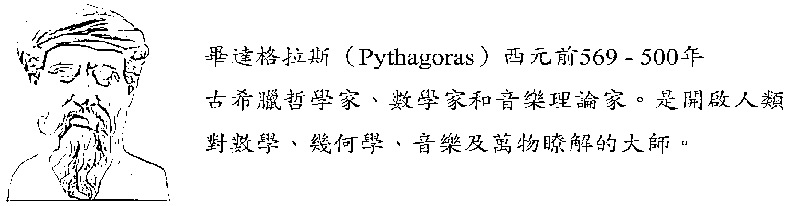

毕达哥拉斯的「开」(X, Chi) 结构 (下页)
X是希腊文的第22个字母。X结构被认为是天地和谐比例的模型。X 上半部的「天」完全由整数构成；下半部的「地」则是由分数构成。这些比率和蓝道玛矩阵具有一对一的对应关系。

7. 汇整资料来源：芭芭拉希洛「蓝道玛简史」(A Brief History of the Lambdoma)，演说投影片。

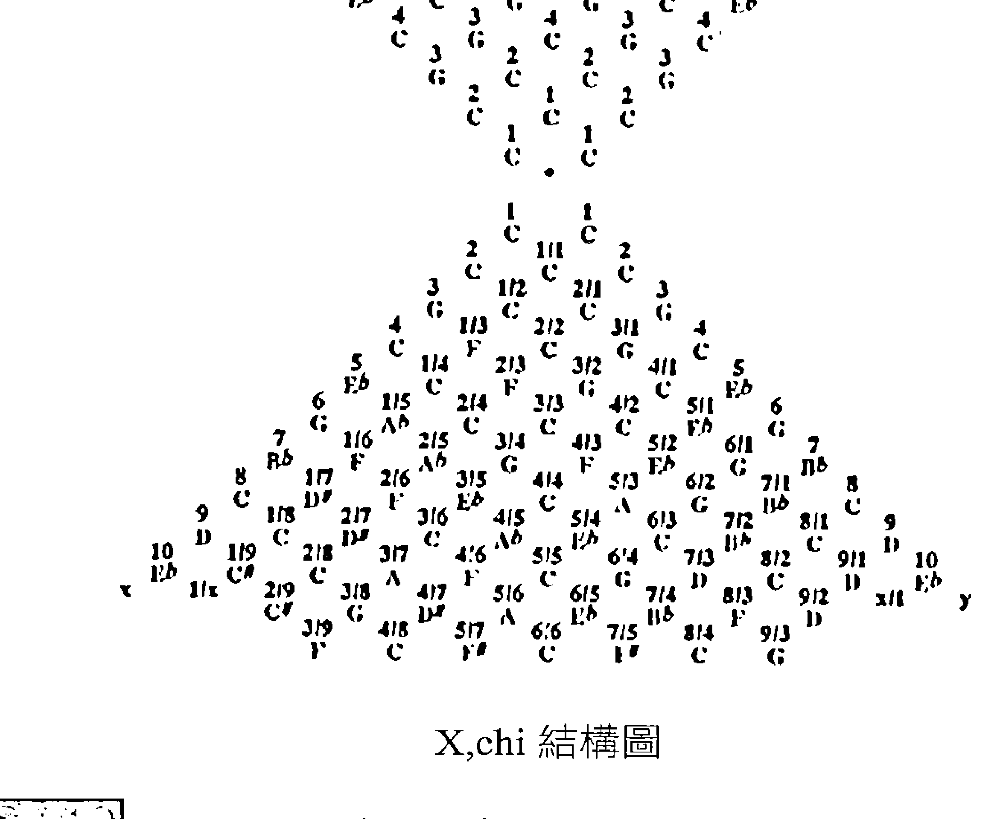

### X,chi 结构图

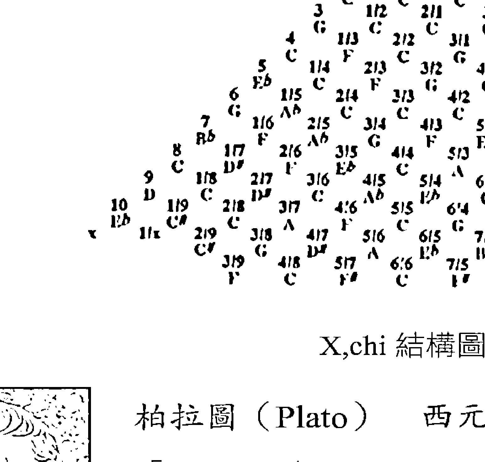

柏拉图（Plato） 西元前 429 - 348 年

> 「柏拉图学派的人早就知道，在毕达哥拉斯比率学说中，数字可以是基本单位的倍数和约数 (n/1 and 1/n)。」 节录自 Ernest McClain,“The Pythagorean Plato Prelude to the Song Itself”。

对古希腊人而言，蓝道玛矩阵是乘除数综合表，是比率和谐音的回旋排列。由于某些不明原因，乘数表留存至今，却没留下任何和谐泛音的参考资料，除数表则消失无踪，有关次谐和潜音的知识也随之下落不明。

蓝道玛最早的叙述，见于西元二世纪尼克马科斯希腊文的《算术简介》（Introduction to Arithmetic，约西元一百年）的注脚。这本书先是由叙利亚数学家兼哲学家杨布里科斯翻译成拉丁文，后来再由

## PART1 ◼ 蓝道玛共振和谐音阶

M. L. 杜奇（M. L. D'Ooge）翻成英文（p. 191, The St. John's College press, Annapolis, Maryland, 1960），当时被称为「蓝多得」（Lambdoid）。「蓝道玛」之名是由杨布里科斯所提出。
「蓝多得」是蓝道玛的极简骨架，只有两股整数比率。一股为算术法则1/1、2/1、3/1和4/1，另一股则为调和倒数1/1、1/2、1/3和1/4。

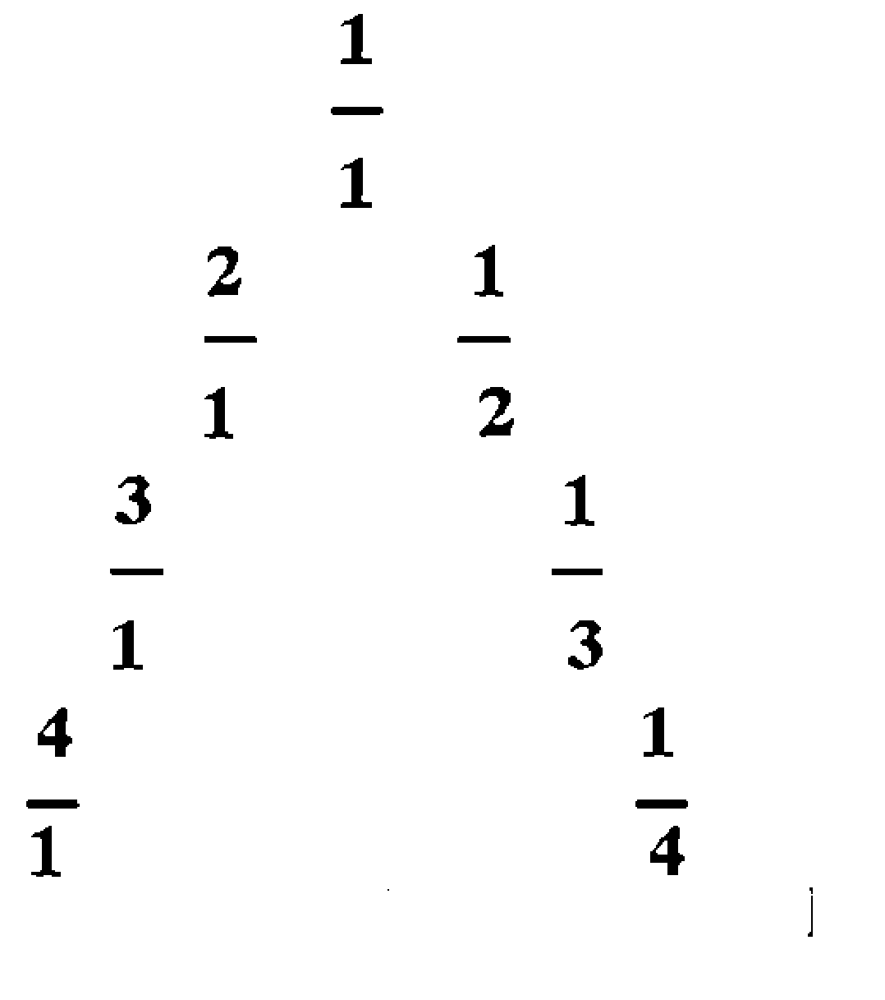

基础蓝道玛矩阵
以希腊文第11个字母Λ（Lambda）为名

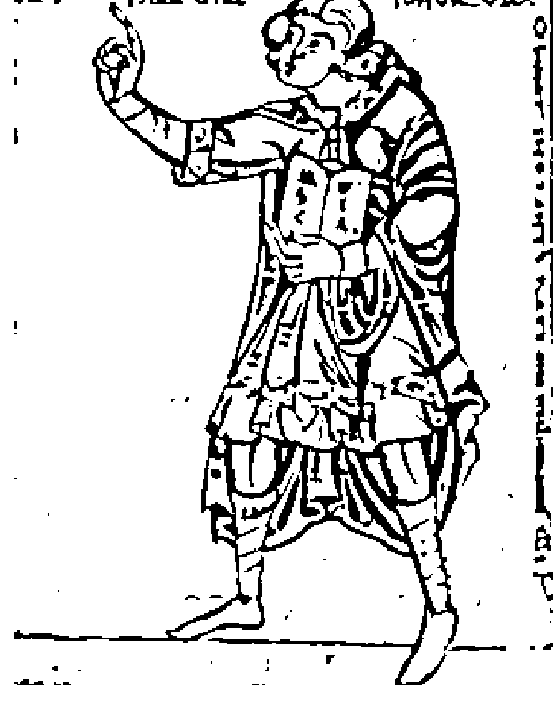

尼克马科斯（Nichomachus）　西元60 - 138 年
新毕达哥拉斯学派，著有《和声指南》（The Manual of Harmonics），主张拨弦发出的和声与弦长有关。
当时只有四种子数理科学：算术、几何学、天文学和音乐，全都称为「和声学」。

### 最早期的毕达哥拉斯音程与比率对照表（尼克马科斯的理论）

| 毕达哥拉斯音程 | 比率 | 自然音程（A =440 Hz） | 和声音程（C=256 Hz） |
| :--- | :--- | :--- | :--- |
| 同度 | 1:1 | C | P |
| 八度 | 2:1 | C | P |
| 五度 | 3:2 | G | T |
| 四度 | 4:3 | F | S |
| 大三度 | 5:4 | E | R |
| 大六度 | 5:3 | A | U |
| 小三度 | 6:5 | Eb | QR |
| 小六度 | 8:5 | Ab | TU |
| 全音（whole tone） | 9:8 | Db | PQ |

| $\frac{1}{1}$ | $\frac{2}{1}$ | $\frac{3}{1}$ | $\frac{4}{1}$ |
| :---: | :---: | :---: | :---: |
| $\frac{1}{2}$ | $\frac{2}{2}$ | $\frac{3}{2}$ | $\frac{4}{2}$ |
| $\frac{1}{3}$ | $\frac{2}{3}$ | $\frac{3}{3}$ | $\frac{4}{3}$ |
| $\frac{1}{4}$ | $\frac{2}{4}$ | $\frac{3}{4}$ | $\frac{4}{4}$ |

基础蓝道玛矩阵旋转45度

杨布里科斯（Iamblichus） 西元 260 - 330 年
新毕达哥拉斯学派，以《算术神学》（The Theology of Arithmetic）中，以尼可马科斯的音乐理论为基础，广泛探讨单元（Monad，一切关系的根源与可能）、二元（Dyad）、三元（Triad）、四元（Tetrad）、五元（Pentad）、六元（Hexad）、七元（Heptad）、八元（Octad）、九元（Ennead）和十元(Decad)在数字与符号上的数学衍生结果。

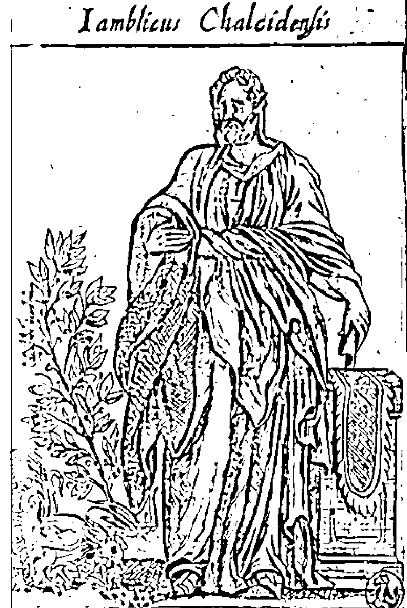

到了十九世纪，亚伯特第马斯（Albert von Thimus，西元1806 - 1878）让蓝道玛从十七个世纪来的暧昧不明中重生。第马斯（A. von Thimus）把蓝道玛称为「毕氏表」（见第马斯的《古代和谐象征主义》Die Harmonikale Symbolik des Altertums, Vol. II, Koln, 1868-76）。第马斯的研究后继者有凯瑟琳史列辛格（Kathleen Schlesinger）、汉斯凯瑟（Hans Kayser）、鲁道夫哈斯（Rudolf Haase）、莱佛利氏与赖维氏（Levarie and Levy），以及恩尼斯麦克蓝（Ernest McClain）。

> [第马斯]相信比例和声音程是古中国、古希伯来人、古埃及

> 和古希腊文明的学理基础。他最重要的发现，就是今日结晶学 (crystallography) 和模控学 (cybernetics) 使用的毕氏蓝道玛。~Rudolf Haase 摘自 《Grove’s Dictionary of Music》。

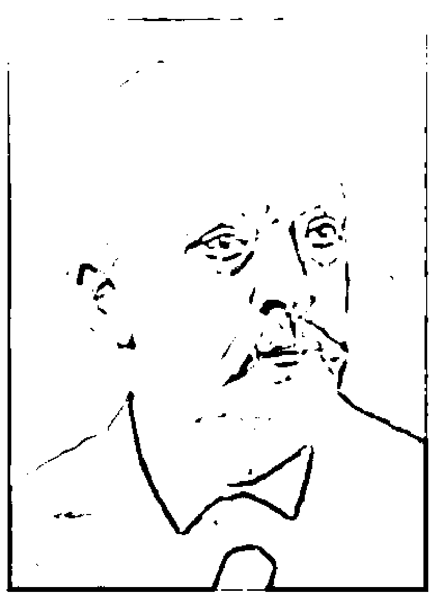

赫姆沃兹 (Hermann Helmholtz) 西元1812 - 1894年
在其重要的音响学著作《音的感受》（On the Sensations of Tone）提到，毕达哥拉斯提出科学之谜：「和谐音为何是由小值整数的比率决定？」傅立叶的分音（泛音）定律，或说谐振定律解开这个谜，显示任何循环变异量值可用最简单的变异量值总和表示。这表示分音的音高值必须是基音（1:1）的 1、2、3...倍。赫姆沃兹写道，傅立叶定理可被视为和声理论的基本来源。以行星绕日公转频率为基频的极简比率原理，或可证明毕达哥拉斯的谜有其真理。

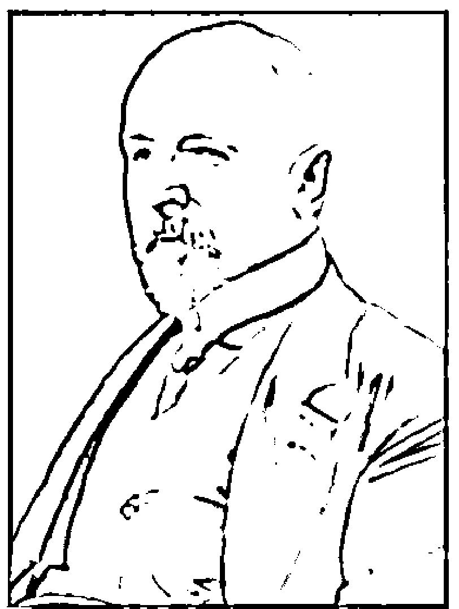

康托尔 (Georg Cantor)　西元1845 - 1918年
现代集合论的创始人，也是形上数学家，提出的康托尔数组类似整数比的蓝道玛矩阵。无人清楚他是否注意过古代的蓝道玛矩阵。

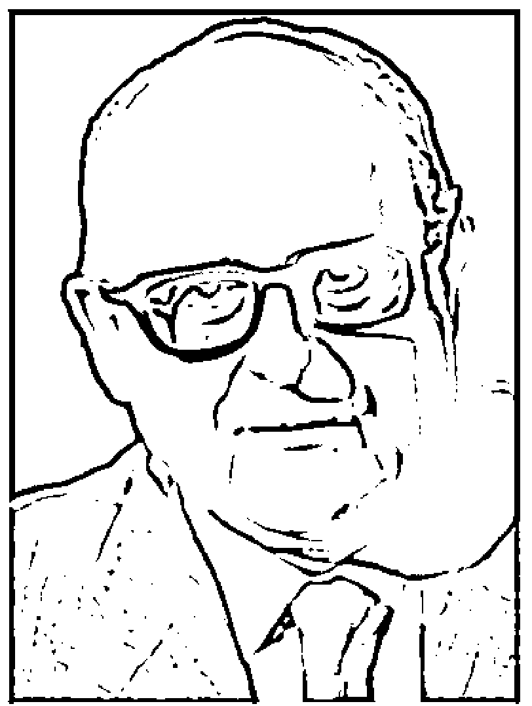

汉斯凯瑟 (Hans Kayser)　西元1891 - 1964年
维也纳斯凯瑟学会 (Hans Hayser Institute) 会长，毕生研究蓝道玛矩阵的各种可能性，以色彩编码进行视觉诠释；并从哲理上解读蓝道玛矩阵在数学及音乐上的谜团。

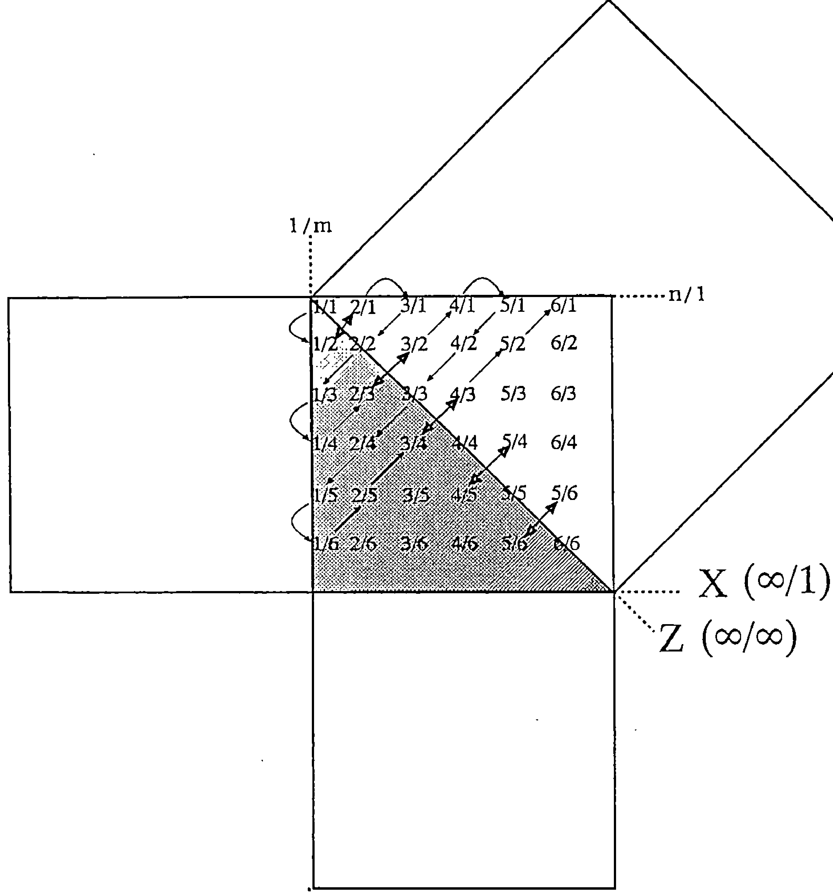

### 康托尔数组

汉斯凯瑟在他的《尖塔，世界和谐论》（Akroasis, the Theory of World Harmonics，Robert Lilienfeld译，Plowshare Press, Boston, Massacusettts, 1964）中，似乎进一步从毕达哥拉斯的密传数表复苏了蓝道玛的谐音。凯瑟的数表看来没有早期版本那么简单。早期版本是指Geschwister Ziegler的《和谐学课本》（Lehrbuch der Harmonik, Winterthur, Switzerland, 1950），刊载于恩尼斯赖维（Ernest levy）与西格蒙莱佛利（Siegmund Levarie）合著的《音：音乐音响学研究》（Tone: A Study of Musical Acoustics, Kent University Press, 1968）。

维也纳斯凯瑟学会新近退休的会长鲁道夫哈斯（Rudolf Haase）教授，接续汉斯凯瑟对蓝道玛的研究。他在著作《Natur-Geist-Seele, Harmonik und Metaphpysik des quadratischen und des runden Lambdoma》（Wien, Braumuller, 1985）中放了许多图表。

恩尼斯麦克蓝（Ernest McClain）的《毕氏学人柏拉图，歌的前奏》（The Pythagorean Plato, Prelude to the Song Itself, Nicolas-Hays Inc., York Beach, Maine, 1978），是另一本将蓝道玛数表称为「第马斯的毕氏表」的书（该书p. 148的图27）。

同儕尔夫威尔森（Erv Wilson）寄给我凯瑟琳史勒辛格的书《希腊奥罗斯管，论其机制及与古希腊音乐调式系统的关系》（The Greek Aulos, a study of its mechanism and of its relation to the modal system of ancient Greece Music, Methuen & Co. Ltd., London, 1939）的第一章，文中提及第马斯的研究，更加显示她熟悉蓝道玛数表，并以各调式的乐谱辅助说明部分蓝道玛泛音音列的比率。

这些是我根据蓝道玛数表比率开发音乐的部分资料来源。请见我的书《蓝道玛揭密（关系论）》（Lambdoma Unveiled (The theory of Relationships), Strawberry Hill Farm Studios Press, North Berwick,

Maine, 1992)，尤其是185-197页〈论杨布里科斯阵列为比率与音程对应之变换，蓝道玛探源〉（The Iamblichus Array as a Transformation of mapping from Ratios onto Musical Intervals, Origin of the Lambdoma，1984）。

### 汉斯凯瑟《尖塔》中的蓝道玛相关概念

汉斯凯瑟在一九六四年写出《尖塔》（Akroasis），德语原著由罗伯利连费德（Robert Lilienfeld）翻译。

下列摘录是我重读《尖塔》时做的。重读《尖塔》，是想展现蓝道玛图表谐和律（Laws of Harmonics）包罗万象的面貌。

「和谐论」指点我们走向和谐的思考与生活。和谐意味着天体的和谐；精神与科学的结合。

#### ◎毕达哥拉斯

蓝道玛是毕达哥拉斯的基础密传图表，让人能了解矿物和植物、包括比例和生长规律。

蓝道玛让人能体验有声的数字、物质、灵魂和精神。

毕达哥拉斯的作法：

1.  由量（数字）导出质（音）感。
2.  透过质（心灵对数字转译的音调的感受）演化出量（数字和一切物质）。
3.  音与数字为等值。
4.  确实瞭解音（质）产生心灵体验的能力。
5.  先确实瞭解数字象征世间理性、可量测、实质可掌握的一面。
6.  这能促成新的灵性世界建立。

#### ◎欧几里德及其他人

欧几里德（Euclid）建立了几何运算，包括角度、数字、音调关系、圆形系统和球形系统。

接着是语音学和开普勒（Kepler）的《世界的和谐》（Harmonice Mundi）。

第马斯根据尼克马科斯（Nicomachus）毫无内容的大纲，重建出具有蓝道玛外形，侧边互为倒数的毕氏表。就连神学也吸收了这些透露毕氏密传奥秘的数学图形。

开普勒（Johannes Kepler）
西元 1571 – 1630年

#### ◎谐和学（Harmonics）的概念

谐和学家要瞭解：

- 1. 拉丁文、希腊文和东方语言。
- 2. 熟悉古代民族的宗教、神话和象征主义。
- 3. 乐理。
- 4. 科学史（数学和天文学）。
- 5. 建筑史（维楚维斯⁹ Vitruvius）。
- 6. 文法（声韵、诗学）。

#### ◎谐和学的应用需要有：

- 1. 乐理（一弦琴，monochord）
- 2. 算术及几何学。
- 3. 对谐和学实验的精神和心灵面效果具有内在接收力。
- 4. 藉助现代科技解读音律的意义。

#### ◎汉斯凯瑟的理论

- 1. 音谱（tone spectra）中光学与声学原理间的关系。
- 2. 地质学、晶体学和植物的谐和面。
- 3. 小提琴形状与音律（Laws of Music）间的关系。
- 4. 所有谐和图形都能从内在感受，并透过心灵检验其正确性。

「由于所有和谐的数字关系都是比例，而比例都能以视觉呈现，因此有可能直接将听觉换成视觉。这种『听觉视觉』（audition visuelle）才是和谐象征主义的真正境界。谐和图形在这个境界中变得具有灵性。」

- 5. 灵性图形可以是喜（谐和，consonance）或悲（不谐和，dissonance）。
- 6. 音程是心灵感应的（psychic）形式。
- 7. 音乐中的「黄金分割」是由以中央C往上数的三度和六度（E和A）音构成。（芭芭拉希洛註：肌肉及骨骼）。

> 「由于所有和谐的数字关系都是比例，而比例都能以视觉呈现，因此有可能直接将听觉换成视觉。这种『听觉视觉』（audition visuelle）才是和谐象征主义的真正境界。谐和图形在这个境界中变得具有灵性。」

#### ◎谐和有声图形的有机和灵魂形式需要有：

- 1. 设计专属的新符号语言，摆脱音调记号，建立专属符号和公式。
- 2. 能调节自然形体和灵魂的声学因子定律和原理。
- 3. 声音是我们灵魂和理智的表达媒介。

#### ◎扪心自问

- 1. 你留多少时间给自己，是给自己的灵魂，而非小我（ego）？
- 2. 你留多少时间省思自己来到世间的原因，还有工作的意义（除了赚钱餬口外）？
- 3. 明白你只有在静心状态中才能茁壮。
- 4. 蓝道玛的「同一射线」（identity rays），有助于个人认识选择的路（透过颜色、形状、声音和脉轮）。
- 5. 明白我们反映了原子和晶体的结构及形成。这就是你！

#### ◎谐和学（Harmonics）是研究各种对应与关系的理论，谐和学的科学身心基础为泛音音列（八度、三度和五度）的自然律。

各时代和民族对这些音程都有共通的敏感性，因此一定是呼应了各时代及民族共通的精神形式。

#### ◎谐和结构建立于下列三度音、八度音和五度音的基础，或可说是谐和量子律（Laws of Harmonical quanta）：

- 1. 振动的弦分成二等分、三等分、四等分，泛音音程距离会递减。
- 2. 弹跳的球距离会递减。
- 3. 落体定律，距离会递增。
- 4. 生命的脉冲和周期。
- 5. 生物原始毒性和之后的衰减。
- 6. 历史上文化的衰微。
- 7. 对应的类比环境的心灵感应。

#### ◎谐和学是研究谐和音与不谐和音的理论

- 1. 波长是间隔、弦长或是风琴管。
- 2. 频率是时间、弦或钟摆的往复动作。
- 3. 波长和频率互为倒数，2/3乘以3/2等于1。

## 第3章

### 蓝道玛智慧键盘

### 蓝道玛智慧键盘是什么？

蓝道玛智慧键盘是一种乐器。键盘以缆线与电脑连接，由电脑驱动。键盘的内建处理器可在琴键上下时发出讯号，传至装有软体程式的电脑。电脑经过设定，能为键盘创造谐和音程。弹奏者按下琴键时，电脑会记得按键顺序，奏出对应的音调，并显示利萨如图形（Lissajous pattern）。

键盘呈现菱形的16x16矩阵，中央为1:1比率。由256个受比率控制，与基频成相互关系的音程构成。按下任一琴键，会产生双音的和谐音程。最佳基频为128赫兹至480赫兹之间的任何频率。这样在弹奏第一象限时，能将泛音和潜音局限在有声音频范围内。

键盘分为四个象限。第一象限为情绪之音（1:1至8:8），第二象限为心灵之音（9:1至16:8）；第三象限为生理之音（1:9至8:16）；第四象限为玄妙之音（8:8至16:16）。

我希望这个键盘能让大家意识到音调在生理、心理、情绪及心灵层面的关系本质。相对来说，谐和声调的效果是个未经探索的领域。这是实话，因为我们还没听过音乐中真正的谐和音调。

自从巴赫（Bach）发明古钢琴（clavichord）之后，我们还没体验过表现泛音（overtone）和潜音（undertone）自然律的音阶。事实上潜音音阶甚至在大多数音乐辞典都查不到。潜音，或称次谐音（sub-harmonic），在物理学中被认为不可能存在。这是因为在我们的物质宇宙中，我们可以用手指压着小提琴琴弦接近末端部分，缩短弦长，听见高音。但要听到低音，却无法将金属弦的既有长度加倍，而那正是我们宇宙中的一度潜音。不过藉着蓝道玛电子键盘，我们可以有32个潜音，32个泛音，扣掉8个同度定音。因为体验声音力量时，我们必须考虑到音程，由一个持续长音（drone）与矩阵中其他频率合奏。我们发现声音要形成利萨如图形，必须有两个声音同时振动，所以要用持续长音作为矩阵的主音（基频）。

基频非常重要。这个音可以是音音频范围的任意有声频率，单位为每秒周数（赫兹）。音音频范围为20赫兹至2万赫兹左右。由于音乐的本质使然，任何现象的频率、周期或周数都可以提高或降低成其对等的有声八度音。方法很简单，就是将频率加倍（升八度）或减半（降八度）。这表示你可以从一个现象（例如细胞或行星）取任何尺寸或界限的集合，透过升降八度转译成听得见的声音。例如血球平均大小为3到20微米。我们可以找出1微米和音乐频率的关系，以声音在血液或海水中的速度，应用下列公式：

```
频率＝速度／波长
```

输入特定细胞的平均大小作为基频，然后奏出各种谐音及次谐音。我们会发现不管选择何种频率为基频，琴键上反映调和比（harmonic ratio）的图形与反映的调和比关系始终不变。这也许可能应用于身心能场学¹⁰（psychotronics）等方面，不协调音（dissonance）可能比较适合作为治疗频率。因此我们会选择具有正方波形的琴键。有些研究人员发现，不协调音有时似乎能打破看似一成不变的制约。

如果用雷射／扫描系统搭配键盘，配合基频（或说定频）弹奏琴键时，就能看见各音程的形状（利萨如图形）。

蓝道玛键盘有潜力成为疗愈乐器。蓝道玛键盘能让我们重新认识毕达哥拉斯可能用来驯服粗暴行为的声音。我个人已经将这类声调用于药物勒戒中心，发挥了平静人心的效果。这些声音并非由键盘产生，而是透过我的软件程序，由电脑产生频率。

美丽的图形表示两个声音间为调和关系。图形越完美，调和效果越好。完美的和谐能安抚我们的情绪与灵魂，令心智欢喜。

我们认为产生图形的声音具有更强的能量可影响物质。以声音替别人调整时，对方可能会产生身体上的感觉。人体就像是扩音器，对声音产生共鸣。英国的彼得盖伊曼纳斯（Peter Guy Manners）制造出一种声频治疗录音机（cymatic recorder），能将经过校正的特定频率，以每秒周数的振动频率输入人体穴位。他把我录制的蓝道玛矩阵阵频率用在患者身上，发现效果良好。我见证的其他声频治疗功效是抒解鼻塞、抒解便秘。有个案透过振动的深度按摩，释放了长期压抑的紧张，这些紧张甚至可以溯及前世。如果将手持振动器接在蓝道玛键盘上，也许能产生类似效果。选用的频率很可能会和基频成八度关系，还有属五度和四度。五度、四度和三度音程所形成的利萨如图形最简单也最美。

### 蓝道玛智慧键盘发明始末

我在一九七〇年看了莱佛利氏与赖维氏（Levairie & E. Levy）的《音：音乐音响学研究》（Tone: A Study of Musical Acoustics）后，根据书中的蓝道玛数表，制作出一个蓝道玛数字频率表（见第41页蓝道玛数字频率表），并以自然音阶补强。这是我将蓝道玛矩阵比率转译为音乐频率的第一步。

在一九七〇年代，我除了撰文探讨蓝道玛整数比率矩阵，还进行多种应用。我创作蓝道玛矩阵的平面艺术乐曲画。这些平面艺术乐曲在华府的麦克斯普罗泰奇艺廊（Max Protetch Gallery）展出时，曾由一位长笛家演奏。后来我用正弦波产生器、示波器和录音机进行研究，以便听见调和比的音程声音，并看见数列的形状。我将矩阵比率的音程声音录了几卷录音带。

一九八〇年代，我速写了许多3D的16x16矩阵，展现蓝道玛的波长属性。罗伯米勒佛克洛创造出8x8的3D矩阵电脑图形，然后将四个象限放在一起。他还用3D图形程式画了一个圆形3D蓝道玛矩阵，证明比率有多种视觉呈现方式。

圆形3D蓝道玛矩阵

一九八一年起，我谱写并录制了几卷录音带，用电脑生成的声音表现蓝道玛矩阵音程的音调。一九八〇年代，我和麻省理工学院进阶视觉研究计划（Advanced Visual Studies Group）的保罗厄尔斯（Paul Earls）商量后，加入雷射/扫描装置，作为录音系统的输出，展现蓝道玛矩阵在数学上完美的音程图形。

一九九〇年代，我在加州认识尔夫威尔森（Erv Wilson）后，便设法制造能交互调音（alternate tuning）的蓝道玛键盘，让音乐家或治疗师能弹奏纯谐和泛音和潜音。

就我所知，在此之前，蓝道玛矩阵从未被做成电脑合成键盘乐器。个人电脑问世，促成蓝道玛键盘在一九九四年的制作。

一九九四年六月，历经五年的努力，第一部蓝道玛谐和键盘原型机终于诞生。这部原型键盘有六十四个双音音程，关系谐和的泛音及潜音。更重要的是任何有声频率都能设定为基频，因此调和音很「纯粹」。

这个原型机的诞生，要感谢：

- 李查罗德（Richard Lord），将键盘与电脑接轨
- 李查诺利（Richard Norley），硬件电路设计
- 罗伯米勒佛克洛（Robert Miller Foulkrod），编写键盘成音软件
- 大卫贝蓝通（David Bellantone），制作键盘的琴键与外壳
- 尔夫威尔森，键盘菱形配置构想
- 芭芭拉希洛（蓝道玛矩阵的其他应用构想）

第一版键盘仅代表一个象限，64键为菱形轻木（light wood）。键盘外壳为黑色矩形。键盘附四片毕氏音程色彩编码的彩色面板片，面板片上还有音名、比率、频率，以利辨识按下的琴键。

键盘软件以蓝道玛矩阵和康托尔数组为基础。一部Amiga电脑程式会先询问弹奏者，在完整的16x16蓝道玛矩阵中，要弹奏哪个8x8象限（一、二、三、四）。接着程式会要求输入基频。选定的频率就能在键盘上弹奏。根据当时设定，输出为立体声正弦波，声音类似长笛。（註：目前音效超过一八〇种，请参考附录二。）

第一代键盘面板片的电脑输出

第一象限，基频256赫兹

频率n~m，n=实际频率，m=基准八度频率

李查诺利制作

## PART1 □ 蓝道玛共振谐和音阶

第一象限很有意思。第一象限有六个八度音、三个泛音八度，三个潜音八度。第一象限根据矩阵的六十四个比率，能奏出六十四个谐和音。

第四象限的矩阵也有六十四元，但只有两个八度，一个比基频1:1高八度，一个低八度。数学上这个矩阵会被视为一对一关系的闭集（closed set），全部都是调和关系。事实上整个矩阵毫无不谐和音。怎么弹都不会按到假音（false note）。

由于具有视觉艺术家背景，我认为视听模式是同时表达声音与符号的重要方式。我将雷射扫描系统接到键盘上，这样弹奏键盘时，可以看见利萨如图形。请见我的论文〈根据雷射利萨如图形和蓝道玛图表作画〉（Drawings Based on Laser Lissajous Figures and the Lambdoma Diagram, Leonardo Vol. II, pp. 301-303, Pergamon Press Ltd., Printed in Great Britain, 1978）。

由于键盘的菱形矩阵形状使然，以不同方式弹奏琴键，可以构成几何图形，或是圆圈，或是曲径迷宫（labyrinth），而且能听见这些图形产生的音调。

为了方便音乐家演奏，音列从左上行，从右下行。

因为菱形造型使然，音乐家弹奏常数1:1右侧平行琴键时，音符为下行。弹奏左边与1:1平行琴键时，音符则为上行。

由于蓝道玛谐和键盘采用「纯粹」的调音系统，听到的声调会让人感觉似熟悉又陌生。我希望能探索这些音程的效果，或许会发现我们进入全然未知的维度。我们将能探索以谐音和次谐音为基础的微分音效果。

我个人聆听键盘录音的声音时，如果头部有堵塞，蓝道玛音调似乎会产生共振。举例来说，高音似乎会在头部爆开，舒缓我的头痛。把录音机放在胸口，比较低沈的声音似乎会炸开胸部的堵塞。

对音乐家而言，似乎必须采用新方式弹奏键盘。任意频率的基频一定存在。音乐家按下基频常数线右侧琴键（泛音侧）时，从基频1:1琴键越往右，谐音越高。在常数另一侧（潜音侧）则是相反。如果在第四象限以30度角按下整排琴键，音调为上行，150度时音调下行。

以角度为基础的几何图形可以在蓝道玛键盘上弹奏，产生全然不同的音乐维度。圆形、正方形、三角形、五角形、六角形和菱形都能以顺时针或逆时针方式在键盘上弹奏，让人对角度乃至於正多面体的效果产生音乐和情绪的领悟。

蓝道玛智慧键盘是音乐家和数字比之间的互动联繫，能根据选择的特定基频产生谐和泛音（第一象限）或音阶（第四象限）的音程，或是次谐和潜音（第一象限）或音阶（第四象限）的音程。当个人以专属主音或其他感兴趣的频率当作基频弹奏键盘时，对肌动学（Kinesiology）敏感的人会出现生理回馈效果。有人弹奏键盘，奏出矩阵产生的不同音程时，会出现能量转换情形。

这个键盘在一九九四年夏天曾向小型特定的机构听众做过数次示范。我们纪录了一些弹奏或聆听键盘产生的效果。

最近我寄给尔夫威尔森一份用蓝道玛键盘创造的谐和音程录音，还附上书面资料。他鼓励我将这些东西公诸于世，并进一步联络他的同儕，圣地牙哥的吉瑞汤普森（Geary Thompson）。汤普森设计过键盘，也懂得蓝道玛矩阵。威尔森先生还给我亨利罗森托（Henry Rosenthal）的名字和地址，罗森托是「纯律网」¹¹（Just Intonation Network）的主席。尔夫认为键盘能在音乐界掀起轰动，而且具有小规模的全球市场。

他补充说，键盘最与众不同的特色，就是根据比率矩阵发出纯粹的调和音；可以设定成以任何频率当基频演奏；在音乐和心灵界都是一项「突破」。

> 11. 推动纯律研究的团体。

## 第4章

### 蓝道玛和声音程

### 看得见的和谐

#### ◎音程的形状

音程在音乐上的定义是一个基音与另一个音在同一谐和音列中同时发声。

同一谐和矩阵中两个以上的音合奏时会产生和弦，以及具有特征的形状。

每个音程各有专属图形。如果将两面镜子接在两个扩音器上，奏出相互关系正确的两个音，同时让镜子形成一定角度，就能看见具有明显特征的图形。但如果这两个音的相互关系不正确，图形就会有点失真，无法看出清晰明确的图形。

这好比两个人的声音合唱能产生和声时，彼此的沟通就会流畅通畅。我们常说的完全五度音和大小三度音就是谐和音。它们的比率是3:2和5:4。这些比率会形成鱼形和手臂交叉形。比率2:3则是心形。

假使我们想用自己的声音产生完美图形，就需要乐器发出一个基音，最好是持续长音，或是由另一个人发出一个音，当两者的同一个音达到完美和声共鸣时，就会形成正圆形。男声和女声通常相差一个八度。这个八度音音程发声时，称之为第二谐音，图形为8字型。

葛利果圣歌（Gregorian chant）中的音程通常为五度，表示图形都为鱼形。鱼代表双鱼时代（Piscean Age），也是基督的象徵。

如今我们进入宝瓶时代（Aquarian Age），水瓶成为这个时代的象徵。第十一谐音和蓝道玛键盘中其他谐音配对时，产生的其中一个图形就是水瓶。水也是这个时代的象徵之一。水的形状为四面体（tetrahedron）。四面体是四边传输载具。有些管道把两个立体四面体的合体称为梅尔卡巴载具¹²（Merkabah），也代表雄性和雌性能量（依指向而定）。四面体的图形也可以形成环形（甜甜圈状），方法是利用四面体已知角度的比率，将角度大致转译为角度的蓝道玛矩阵。

音程图形可以在良性的尺度下示范声音重建物质的方式。透过听见和看见近乎完美音程的和谐，我们可以体验到幸福感及和谐。

如今我们可以通过电子合成方式产生完美音程。只要我们的听觉适应这种不同的音列，就能直觉地创造出可以提昇我们生活品质的音程。

蓝道玛共振谱和音阶

| 音符 | P | Q | R | S | T | U | V | W |
|------|---|---|---|---|---|---|---|---|
| 比率 | 8:8 | 9:8 | 10:8 | 11:8 | 12:8 | 13:8 | 14:8 | 15:8 |
| 谐音 | 第8 | 第9 | 第10 | 第11 | 第12 | 第13 | 第14 | 第15 |

蓝道玛矩阵定义的音程是我一九七〇年以来研究和艺术创作的重点。我用来试表现这个矩阵动态的创作媒介包括美术、作曲、电脑图形、项链、蜡烛、纺织、彩色玻璃、条式积木（space frame）雕塑、雷射灯光秀、几何结构和三度立体模型。

了解和使用蓝道玛谐和音阶的好处，是我们能回归音乐原始的面貌，发挥疗癒和减少暴力的力量。用泛音谐和音程奏出个人专属主音（keynote），让全身恢复自我和谐。

我的觉醒意识传达讯息，要我用新的记谱法标示共振谐和音阶。

> 12. 译註：圣经以西结书中，由四活物拖行的王座。

這套 P、Q、R、S、T、U、V、W 的新記譜法清楚界定這些維持一定頻率間隔的新音符。這些頻率始終諧和，但跟巴赫發展的十二平均律音階頻率鮮少相同。

我支持用 P、Q、R、S、T、U、V、W 作為藍道瑪音階的音名，希望音樂家能瞭解並使用這套不同的系統。每個 P 和 Q 都有以每秒周數為單位的振動頻率範圍。每個聲音都有特定頻率，但和平均律音階相當不同。事實上它們似乎落在我們習慣的音符之間。從 32 赫茲的基頻開始，P、Q、R、S、T、U、V、W 音階先依循我稱之為量子躍進（quantum leap）的順序排列，一直到第八諧音，就像凱加德娜在作品中表現的一樣。試想彩虹有個看不見的順序，而人只能看見從光的第八諧音開始出現的有形彩虹。這個順序由 P 開始時是 P、P、T、P、R、T、V、P，然後變成 P、Q、R、S、T、U、V、W 和 P。這是真正的諧和音階。整個集合請見下列矩陣：

| 1  | 2  | 3  | 4  | 5  | 6  | 7  | 8  | 9  | 10 | 11 | 12 | 13 | 14 | 15 | 16 |
|----|----|----|----|----|----|----|----|----|----|----|----|----|----|----|----|
| P  | P  | T  | P  | R  | T  | V  | P  | Q  | R  | S  | T  | U  | V  | W  | P  |
| P  | P  | T  | P  | R  | T  | V  | P  | Q  | R  | S  | T  | U  | V  | W  | P  |
| T  | T  | P  | T  | V  | P  | R  | T  | U  | V  | W  | P  | Q  | R  | S  | T  |
| P  | P  | T  | P  | R  | T  | V  | P  | Q  | R  | S  | T  | U  | V  | W  | P  |
| V  | V  | R  | V  | P  | R  | T  | V  | W  | P  | Q  | R  | S  | T  | U  | V  |
| T  | T  | P  | T  | V  | P  | R  | T  | U  | V  | W  | P  | Q  | R  | S  | T  |
| R  | R  | V  | R  | T  | V  | P  | R  | S  | T  | U  | V  | W  | P  | Q  | R  |
| P  | P  | T  | P  | R  | T  | V  | P  | Q  | R  | S  | T  | U  | V  | W  | P  |
| W  | W  | S  | W  | Q  | S  | U  | W  | P  | Q  | R  | S  | T  | U  | V  | W  |
| V  | V  | R  | V  | P  | R  | T  | V  | W  | P  | Q  | R  | S  | T  | U  | V  |
| U  | U  | Q  | U  | W  | Q  | S  | U  | V  | W  | P  | Q  | R  | S  | T  | U  |
| T  | T  | P  | T  | V  | P  | R  | T  | U  | V  | W  | P  | Q  | R  | S  | T  |
| S  | S  | W  | S  | U  | W  | Q  | S  | T  | U  | V  | W  | P  | Q  | R  | S  |
| R  | R  | V  | R  | T  | V  | P  | R  | S  | T  | U  | V  | W  | P  | Q  | R  |
| Q  | Q  | U  | Q  | S  | U  | P  | Q  | R  | S  | T  | U  | V  | W  | P  | Q  |
| P  | P  | T  | P  | R  | T  | V  | P  | Q  | R  | S  | T  | U  | V  | W  | P  |

（上圖並未標出升降記號，因為這是矩陣粗略的迴旋排列。）

## 藍道瑪音樂頻譜療法。

上表是基音以 P 開始時，P、Q、R、S、T、U、V、W 藍道瑪矩陣的配置。我們以 256 赫茲為基頻，將平均律音列與諧和音列進行下列的頻率線型比較。

我們決定以升降記號定義藍道瑪音階八個大全音（major tone）之間的音。例如 P 和 Q 之間為 P#；Q 和 R 之間為 Q#，依此類推。這樣每個八度的八個大全音就能產生十六音階，而平均律每八度的七個大全音和半音則是產生十二音階。新的諧和音階是這樣的：

- P P# Q Q# R R# S S# T T# U U# V V# W W#

不管是什麼狀況，基頻都可以是任意八度音列中的任意頻率。例如以微米單位應用藍道瑪音階，一微米的頻率為 355 赫茲，那麼矩陣大小會是 20x20，包含所有和血球相關的頻率，因為血球大小為 3 至 20 微米。355 赫茲在 P、Q、R、S、T、U、V、W 音階中為 U 音，這會是矩陣的基頻。

如果在藍道瑪矩陣中以 R 為基頻，排列會不一樣：

## PART1 ■ 藍道瑪共振諧和音階

| R  | S  | T  | U  | V  | W  | P  | Q  | R  |
|----|----|----|----|----|----|----|----|----|
| C  | D  | E  | F  | G  | Ab | A  | B  | C  |

| 1/1  | R  | R  | V  | R  | T  | V  | P  | R  | S  | T  | U  | V  | W  | P  | Q  | R  |
|------|----|----|----|----|----|----|----|----|----|----|----|----|----|----|----|----|
| 1/2  | R  | R  | V  | R  | T  | V  | P  | R  | S  | T  | U  | V  | W  | P  | Q  | R  |
| 1/3  | V  | V  | R  | V  | P  | R  | T  | V  | W  | P  | Q  | R  | S  | T  | U  | V  |
| 1/4  | R  | R  | V  | R  | T  | V  | P  | R  | S  | T  | U  | V  | W  | P  | Q  | R  |
| 1/5  | P  | P  | T  | P  | R  | T  | V  | P  | Q  | R  | S  | T  | U  | V  | W  | P  |
| 1/6  | V  | V  | R  | V  | P  | R  | T  | V  | W  | P  | Q  | R  | S  | T  | U  | V  |
| 1/7  | T  | T  | P  | T  | V  | P  | R  | T  | U  | V  | W  | P  | Q  | R  | S  | T  |
| 1/8  | R  | R  | V  | R  | T  | V  | P  | R  | S  | T  | U  | V  | W  | P  | Q  | R  |
| 1/9  | Q  | Q  | U  | Q  | S  | U  | P  | Q  | R  | S  | T  | U  | V  | W  | P  | Q  |
| 1/10 | P  | P  | T  | P  | R  | T  | V  | P  | Q  | R  | S  | T  | U  | V  | W  | P  |
| 1/11 | W  | W  | S  | W  | Q  | S  | U  | W  | P  | Q  | R  | S  | T  | U  | V  | W  |
| 1/12 | V  | V  | R  | V  | P  | R  | T  | V  | W  | P  | Q  | R  | S  | T  | U  | V  |
| 1/13 | U  | U  | Q  | U  | W  | Q  | S  | U  | V  | W  | P  | Q  | R  | S  | T  | U  |
| 1/14 | T  | T  | P  | T  | V  | P  | R  | T  | U  | V  | W  | P  | Q  | R  | S  | T  |
| 1/15 | S  | S  | W  | S  | U  | W  | Q  | S  | T  | U  | V  | W  | P  | Q  | R  | S  |
| 1/16 | R  | R  | V  | R  | T  | V  | P  | R  | S  | T  | U  | V  | W  | P  | Q  | R  |

這下我們就能對 P、Q、R、S、T、U、V、W 分別指定以赫茲為單位的頻率。

我建議將 R 定為 256Hz；S 為 288Hz；T 為 320Hz；U 為 352Hz；V 為 384Hz；W 為 416Hz；P 為 448Hz；Q 為 480Hz 作為泛音音列，降至中央八度。

至於潛音行（基頻的分數），我建議將 S 定為第十五次諧音 273Hz；T 為第 14 次諧音 293Hz；U 為第十三次諧音 315Hz；V 為第十二次諧音 341Hz；W 為第十一次諧音 372Hz；P 第十次諧音 205Hz；Q 為第九次諧音 455Hz。

為了找出各音的平均值，必須計算各矩陣，找出各音名的上下限。記住一個重點，進行應用時，諧和音程每秒周數的振動頻率（Hz，赫茲）才是重點。

### ◎泛音列的頻率組（加減 15）

| P            | Q            | R            | S            | T            |
|--------------|--------------|--------------|--------------|--------------|
| 433-448-463  | 465-480-495  | 241-256-271  | 273-288-303  | 305-320-335  |
| U            | V            | W            |              |              |
| 337-352-367  | 369-384-399  | 401-416-431  |              |              |

### ◎潛音列的頻率組（加減 11）

| P            | Q            | R            | S            | T            |
|--------------|--------------|--------------|--------------|--------------|
| 399-410-421  | 444-455-466  | 501-512-523  | 262-273-284  | 282-293-304  |
| U            | V            | W            |              |              |
| 304-315-326  | 330-341-352  | 361-372-383  |              |              |

另一個處理潛音組的方式，就是取頻率間的平均數：

- 20, 22, 26, 31, 38, 43
- 10, 11, 13, 15, 19, 21

加減後找出最適合的頻率組：

| P            | Q            | R            | S            | T            |
|--------------|--------------|--------------|--------------|--------------|
| 309-410-420  | 444-455-466  | 499-512-525  | 258-273-288  | 274-293-312  |
| U            | V            | W            |              |              |
| 294-315-336  | 341          | 372          |              |              |

由於這些頻率在各矩陣中大不相同，我們不由得佩服巴赫能用他定義的字母，在單鍵樂器上任意轉調。要是巴赫在世時能使用電腦生成頻率，他就用不著制訂自己的優美音階。如果想讓音樂發揮最佳的轉換情緒效果，讓憤怒變為平靜；或是促進健康，比較有效的作法，是根據物理原理，在適合情緒，甚至是靈性或生理層面，具有正確音程關係的矩陣中使用頻率。

若能心存為善而非危害的正念使用時，這些共振諧和矩陣會成為造福人類的有力工具。

### ◎ 12√2 音階與藍道瑪音階的比較

| P   | Q   | R   | S   | T   | U   | V   | W   |
|-----|-----|-----|-----|-----|-----|-----|-----|
| 256 | 288 | 320 | 352 | 384 | 416 | 448 | 480 |

### 藍道瑪泛音（2, 3, ...16）

| C   | C#  | D   | Eb  | E   | F   | F#  | G   | Ab  | A   | Bb  | B   |
|-----|-----|-----|-----|-----|-----|-----|-----|-----|-----|-----|-----|
| 262 | 277 | 294 | 311 | 330 | 349 | 370 | 392 | 415 | 440 | 466 | 494 |

### 12√2 (440)

| P   | Q   | R   | S   | T   | U   | V   | W   |
|-----|-----|-----|-----|-----|-----|-----|-----|
| 256 | 273 | 293 | 315 | 341 | 372 | 410 | 455 |

### 藍道瑪潛音（1/2, 1/3, ...1/16）


### ◎一個八度

P、Q、R、S、T、U、V 和 W 為八音音階，以頻率 256 赫茲的基音 P 的泛音列（倍數）和潛音列（分數）為基礎。

> 14. 譯註：即平均音階。

## 藍道瑪音樂頻譜療法。

O = 泛音列（Overtone Series）
U = 潛音列（Undertone Series）

| 8   | 9   | 10  | 11  | 12  | 13  | 14  | 15  | 16  |
|-----|-----|-----|-----|-----|-----|-----|-----|-----|
| P   | P#  | Q   | Q#  | Rb  | R   | Sb  | S   | Tb  | T   | T#  | U   | V   | V#  | W   | P   |
| 256 | 273 | 288 | 292 | 315 | 320 | 341 | 352 | 372 | 384 | 409 | 416 | 448 | 455 | 480 | 512 |
| O   | U   | O   | U   | U   | O   | U   | O   | U   | O   | U   | O   | O   | U   | O   | O   |
|     | 1/15 |     | 1/14 | 1/13 |     | 1/12 |     | 1/11 |     | 1/10 |     |     | 1/9  |     |     |

請注意上面潛音藍道瑪音階和下面 12√2 音階中以粗體標示的音符，兩者間有相似性。

12√2 音列，基音為 220 赫茲的 A

| C   | C#  | D   | D#  | E   | F   | F#  | G   | G#  | A   | A#  | B   | C   |
|-----|-----|-----|-----|-----|-----|-----|-----|-----|-----|-----|-----|-----|
| 261 | 277 | 293 | 311 | 330 | 349 | 369 | 391 | 415 | 440 | 466 | 494 | 522 |
| C   | Db  | D   | Eb  | E   | F   | Gb  | G   | Ab  | A   | Bb  | B   | C   |

C# 和 P# 差了 4Hz；D 和 Q# 差了 1Hz；D# 和 Rb 差了 4Hz；F 和 Sb 差了 8Hz；F# 和 Tb 差了 3Hz；G# 和 U 差了 1Hz；A 和 V 差了 8Hz；A# 和 V# 差了 11Hz。

「C、D、E、F、G、A、B、C」音階的八個音中，五個和「P、Q、R、S、T、U、V、W」音階關係密切的音為四分音（enharmonic），不是升音（#）就是降音（b）。

「P、Q、R、S、T、U、V、W」音階的八個音中有六個屬於潛音列。這是否表示我們的西方音樂是以潛音列為基礎？如果是，道理何在？

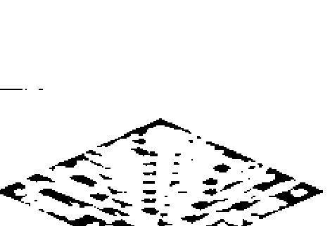

## 新式頻率音階

P, Q, R, S, T, U, V, W

| 泛音音階 | 比率  | 諧音 | 比率  | 潛音音階 |
|----------|-------|------|-------|----------|
| P        | 32 Hz | 基音 |       | P 4096 Hz |
| P        | 256   | 8:8  | 8:8   | P 512    |
| Q        | 288   | 9:8  | 8:9   | VW 456   |
| R        | 320   | 10:8 | 8:10  | TU 410   |
| S        | 352   | 11:8 | 8:11  | ST 372   |
| T        | 384   | 12:8 | 8:12  | RS 342   |
| U        | 416   | 13:8 | 8:13  | RQ 316   |
| V        | 448   | 14:8 | 8:14  | QR 292   |
| W        | 480   | 15:8 | 8:15  | PQ 274   |
| P        | 512   | 16:8 | 8:16  | P 256    |

| 泛音音階 | 比率  | 諧音 | 比率  | 潛音音階 |
|----------|-------|------|-------|----------|
| Q        | 36 Hz | 基音 |       | P 4608 Hz |
| Q        | 288   | 8:8  | 16:8  | Q 576    |
| R        | 324   | 9:8  | 8:9   | P 512    |
| ST       | 360   | 10:8 | 8:10  | VW 461   |
| TU       | 396   | 11:8 | 8:11  | U 419    |
| UV       | 432   | 12:8 | 8:12  | T 384    |
| VW       | 468   | 13:8 | 8:13  | S 355    |
| WP       | 504   | 14:8 | 8:14  | RS 329   |
| PQ       | 540   | 15:8 | 8:15  | QU 307   |
| Q        | 576   | 16:8 | 8:16  | Q 288    |

| 泛音音階 | 比率  | 諧音 | 比率  | 潛音音階 |
|----------|-------|------|-------|----------|
| R        | 40 Hz | 基音 |       | R 5120 Hz |
| R        | 320   | 8:8  | 8:8   | R 640    |
| ST       | 360   | 9:8  | 8:9   | Q 568    |
| TU       | 400   | 10:8 | 8:10  | P 512    |
| UV       | 440   | 11:8 | 8:11  | VW 465   |
| W        | 480   | 12:8 | 8:12  | UV 427   |
| PQ       | 520   | 13:8 | 8:13  | TV 394   |
| Q        | 560   | 14:8 | 8:14  | ST 366   |
| QR       | 600   | 15:8 | 8:15  | RS 341   |
| R        | 640   | 16:8 | 8:8   | R 320    |

| 泛音音阶 | 比率  | 谐音 | 比率  | 潜音音阶 |
|----------|-------|------|-------|----------|
| S 22 Hz  |       | 基音 |       | S 5632 Hz |
| S 176    | 8:8   | 8th  | 8:8   | S 704    |
| TU 198   | 9:8   | 9th  | 8:9   | QR 626   |
| UV 220   | 10:8  | 10th | 8:10  | Q 563    |
| W 242    | 11:8  | 11th | 8:11  | P 512    |
| PQ 264   | 12:8  | 12th | 8:12  | VW 469   |
| Q 286    | 13:8  | 13th | 8:13  | UV 433   |
| QR 308   | 14:8  | 14th | 8:14  | TU 402   |
| RS 330   | 15:8  | 15th | 8:15  | ST 376   |
| S 352    | 16:8  | 16th | 8:8   | S 352    |

| 泛音音阶 | 比率  | 谐音 | 比率  | 潜音音阶 |
|----------|-------|------|-------|----------|
| T 24 Hz  |       | 基音 |       | T 3072 Hz |
| T 192    | 8:8   | 8th  | 8:8   | T 384    |
| UV 216   | 9:8   | 9th  | 8:9   | RS 341   |
| W 240    | 10:8  | 10th | 8:10  | QR 307   |
| PQ 264   | 11:8  | 11th | 8:11  | PQ 279   |
| Q 288    | 12:8  | 12th | 8:12  | P 256    |
| QR 312   | 13:8  | 13th | 8:13  | VW 236   |
| RS 336   | 14:8  | 14th | 8:14  | UV 219   |
| ST 360   | 15:8  | 15th | 8:15  | TU 205   |
| T 384    | 16:8  | 16th | 8:8   | S 192    |

| 泛音音阶 | 比率  | 谐音 | 比率  | 潜音音阶 |
|----------|-------|------|-------|----------|
| U 26 Hz  |       | 基音 |       | U 3328 Hz |
| U 208    | 8:8   | 8th  | 8:8   | U 416    |
| VW 234   | 9:8   | 9th  | 8:9   | ST 370   |
| PQ 260   | 10:8  | 10th | 8:10  | RS 333   |
| Q 286    | 11:8  | 11th | 8:11  | QR 303   |
| QR 312   | 12:8  | 12th | 8:12  | PQ 277   |
| RS 338   | 13:8  | 13th | 8:13  | P 256    |
| ST 364   | 14:8  | 14th | 8:14  | VW 238   |
| TU 390   | 15:8  | 15th | 8:15  | UV 222   |
| U 416    | 16:8  | 16th | 8:8   | U 208    |

## PART1 藍道瑪共振諧和音階

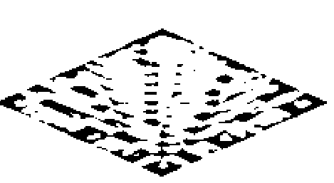

| 泛音音階 | 比率 | 諧音 | 比率 | 潛音音階 |
| :--- | :--- | :--- | :--- | :--- |
| V 28 Hz | | 基音 | | V 3584 Hz |
| V 224 | 8:8 | 8th | 8:8 | V 448 |
| P 252 | 9:8 | 9th | 8:9 | TU 398 |
| PQ 280 | 10:8 | 10th | 8:10 | ST 358 |
| QR 308 | 11:8 | 11th | 8:11 | RS 326 |
| RS 336 | 12:8 | 12th | 8:12 | QR 299 |
| ST 364 | 13:8 | 13th | 8:13 | PQ 276 |
| TU 392 | 14:8 | 14th | 8:14 | P 256 |
| UV 420 | 15:8 | 15th | 8:15 | WP 239 |
| V 448 | 16:8 | 16th | 8:8 | V 224 |

| 泛音音階 | 比率 | 諧音 | 比率 | 潛音音階 |
| :--- | :--- | :--- | :--- | :--- |
| W 30 Hz | | 基音 | | W 3840 Hz |
| W 240 | 8:8 | 8th | 8:8 | W 480 |
| PQ 270 | 9:8 | 9th | 8:9 | UV 427 |
| QR 300 | 10:8 | 10th | 8:10 | T 384 |
| RS 330 | 11:8 | 11th | 8:11 | RS 349 |
| ST 360 | 12:8 | 12th | 8:12 | R 320 |
| TU 390 | 13:8 | 13th | 8:13 | QR 295 |
| UV 420 | 14:8 | 14th | 8:14 | PQ 274 |
| VW 450 | 15:8 | 15th | 8:15 | P 256 |
| W 480 | 16:8 | 16th | 8:8 | W 240 |

### 频率组界线（Bucket Boundaries）
（1995年1月7日）

| P,Q,R,S,T,U,V &W基準八度P=256Hz | A,B,C,D,E,F & G基準八度P=256Hz | A,B,C,D,E,F & G基準八度P=440Hz | 脈輪基準八度 |
| :--- | :--- | :--- | :--- |
| W----------- 252P----------- 264P#----------- 280Q----------- 296Q#----------- 312R----------- 328R#----------- 344S----------- 360S#----------- 376T----------- 392T#----------- 408U----------- 424U#----------- 440V----------- 456V#----------- 472W----------- 788W#----------- 504P----------- 528P# | B----------- 248.71C----------- 263.5C#----------- 279.17D----------- 295.77D#----------- 313.36E----------- 331.99F----------- 351.73F#----------- 372.65G----------- 394.81G#----------- 418.28A----------- 444.15A#----------- 369.51B----------- 497.42C----------- 527.0C# | B----------- 254.18C----------- 269.29C#----------- 285.3D----------- 302.27D#----------- 320.24E----------- 339.29F----------- 359.46F#----------- 380.84G----------- 403.48G#----------- 427.47A----------- 452.89A#----------- 479.82B----------- 508.36C----------- 538.58C# | 頂輪----------- 248海底輪----------- 272生殖輪----------- 304太陽輪----------- 336心輪----------- 368喉輪----------- 400靈性中心----------- 432眉心輪----------- 464頂輪----------- 496海底輪----------- 544生殖輪 |

## 第5章 靜心與顯化


許多「新時代」（New Age）的人都提過地球即將發生變化，以及預作準備的方式。這個主題帶有某種恐懼和（或）興奮的成分。有些人似乎認為這是「回家」的時候，有些人則打算留在地球界經歷這場變化。此外還有「揚升」（ascending）的概念，或可說是「揚升大師」¹⁵（Ascended Masters）的作法。這一切都著眼「未來」，但當下的每一刻才是我們必須認知和面對的現實。正是在當下時刻的神聖中，當萬物各得其所，表面的混亂便不成問題，因為凡是會引起注意的，就是接下來該面對的。

靜心（meditation）充其量就是掌握當下時刻，專注心念，感受當下時刻的神聖。我們的知覺速度不到1/30秒，所以看電視時能產生時間流動的幻覺。靜心時，時間彷彿靜止或是慢速前進，就像觀察或置身事故現場時，一切似乎也是以慢動作進行。

做事時靜心，甚至能讓人享受日常生活的美與和諧。在從事我們的天職時靜心，能讓我們進入一種狀態，從更高、意識更強烈的境界收到指引。和人交談時靜心，則能觀照自己，彷彿看戲般站在一旁，以支持、鼓勵和助人的念頭送出對另一個人無條件的愛。這正是所謂的「動態靜心」（active meditation）。動態靜心讓人能尊重別人，即使對方懷著負面心態。動態靜心意謂著集中心神，覺知自己是完整的存在，能夠以利益他人的方式溝通。動態靜心將眾人視為美麗的靈魂。

> 15. 或稱Hierarachy，或是「智慧上師」（Master of Wisdom）、「淨光兄弟」（Great White Brotherhood）。指以凡人之姿證悟，超凡入聖者。最為人熟知的上師就是耶穌（Jesus）。

### 實現對諧和振動的了解

我們能透過瞭解共振諧和音程及其特別用途來顯化自己正向的實相！所謂共振是什麼意思？所有物質都以不同的頻率在振動。在生物中，所有物質都和自身的有機體同步振動，這就是所謂的健康。要是內在振動不諧和，這種不諧和就會造成不適。諧和是不諧和的反面。萬物共鳴的諧和，不管是有聲或無聲，能讓萬物依照諧和音程法則運作。音程是相吸或相斥的組合頻率。在音樂中，相吸（諧和）的音程為屬五度（dominant fifth）或下屬四度（subdominant fourth）。

> 〔有個「所謂」不和諧的音程為增四度（augmented fourth）。這其實是基頻為32赫茲音列的第十一諧音（11th harmonic），比中央C音的頻率偏低（為256赫茲，而非261至264赫茲）。在藍道瑪鍵盤中，這個音程並非不和諧，第二、九諧音（288赫茲 D）或第七、十四諧音（480赫茲 A#）的音程也不會不和諧。〕

這些音程都有既定法則決定振動。它們的振動為每秒若干周（聲音）；或是每周若干秒（行星公轉）。音程間也有固定波長（或說距離），就和我們的太陽系一樣。瞭解這些數學法則，我們就能有意識地調整自己與生理、心理、情緒和靈性層面的形體協調一致。我們可以調整自己，達到和其他人、地球乃至於周遭所有意識層面協調一致。

靈通訊息（channeling）章節中清楚說明顯化瞭解諧和振動的過程，還有這些靈通訊息如何在我們的物質實相中，顯化許多領悟、應用和物品。

諧和音程知識的用途眾多，其中包括：

- 1) 製造新式樂器。
- 2) 找出房間的共振，測量房間尺寸，根據波長找出專屬音符和音程。
- 3) 製造比例正確的諧和物品，包括玩具、首飾、衣物、工藝品、藝術品和建築。
- 4) 用諧和音程譜寫新樂曲。
- 5) 找到新方法將諧音應用於農業。
- 6) 根據原子序數找出人體所需的養分，轉譯成音程的每秒周數振動頻率（赫茲）。


### 顯化

#### ◎取得土地成立光中心

有天我得知一群朋友想分別顯化一件事，證明我們天生有能力創造自己的實相。他們問我是否願意加入。我說：「好啊，我想顯化一塊地來當光中心（light center）。」就在整整九個月後，我們搬進一間農舍，裡面不僅有我之前的願景，也包括我那大約二十位朋友的願景。在這九個月間，我們兩週聚會一次，朋友和其他人會說出自己的心像中，光中心的具體設施，還有他們在光中心的明確角色。就在九個月後，我們有四個人進駐自己的願景。原始團體中還有不少人後來搬家，成立自己的靈修中心。

#### ◎藍道瑪智慧鍵盤

有五年多的時間，我在心中見到一個菱形的藍道瑪矩陣樂器。這樂器讓人能以數理正確的陣列彈奏任何音高，矩陣中每個音都彼此相關，以一個特定的頻率為持續長音，我稱之為基頻。我預見這會是聲音振動的療癒工具，也是音樂家的樂器。我一直希望聽到根據「天體音樂」（Music of the Spheres）產生的樂音。目前的藍道瑪諧和鍵盤酷似我的想像。藍道瑪智慧鍵盤原型機在一九九四年六月完成，協助者有李查羅德（Richard Lord）、羅伯米勒佛克洛（Robert Miller Foulkrod）、理查諾利（Richard Norley）和大衛貝藍通（David Bellantone）。目前（譯註：一九九五年）這個鍵盤涵蓋了四分之一個完整的藍道瑪矩陣，為菱形8x8矩陣，有六十四個與任意有聲基頻均為諧和關係的琴鍵。鍵盤覆有透明膠片標示各鍵音程對應的比率、頻率（以256赫茲為基準）、顏色、利薩如圖形（lissajous shape）、幅射螺線（ray spiral）和角度。不久的將來我們希望能開發出四個象限的藍道瑪鍵盤，讓人能彈奏完整的聲譜，最高可達第十六諧音（16th harmonic）。這個完整鍵盤將有兩百五十六或兩百八十九個琴鍵，可產生音符的關係音程組。

#### ◎音程圖形

從七〇年代中期開始，我便用雷射/掃描系統產生音程的利薩如圖形。產生圖形的方式，是播放以諧和關係音程精心譜曲的錄音，最近則是直接彈奏鍵盤。看見這些數學上完美音程的圖形，能提昇鍵盤彈奏者的體驗品質。

#### ◎藍道瑪紡織

藍道瑪理論的另一個應用，就是設計織布圖案，展現藍道瑪矩陣的色序。我選擇粉彩色系的橘色、粉紅色、藍色、藍綠色、淺紫色、黃色和綠色。經線的排列反映泛音或潛音音列；穿過的緯線則反映射線的型態。紡線均為棉質。我作了兩組，顏色稍有不同。這兩組作品曾在史列辛格圖書館（Schlesinger Library， 在美國哈佛大學—譯註）展出，其他展品包括繪畫、藍道瑪圖形、錄音帶、書籍、項鍊、3D立體磚、小型3D立體彩色玻璃正多面體，以及一個彩色玻璃菱形十二面體模型。

#### ◎藍道瑪脈輪靜心項鍊

藍道瑪理論進一步的應用構想，靈感來自小說《玻璃珠遊戲》（Magister Ludi, the Glass Bead Game），作者為赫曼赫塞¹⁶（Hermann Hess）。赫塞在書中提到一個和音樂及珠子排列順序有關的遊戲，這遊戲在未來世界裡，可帶來至高的諧和體驗。

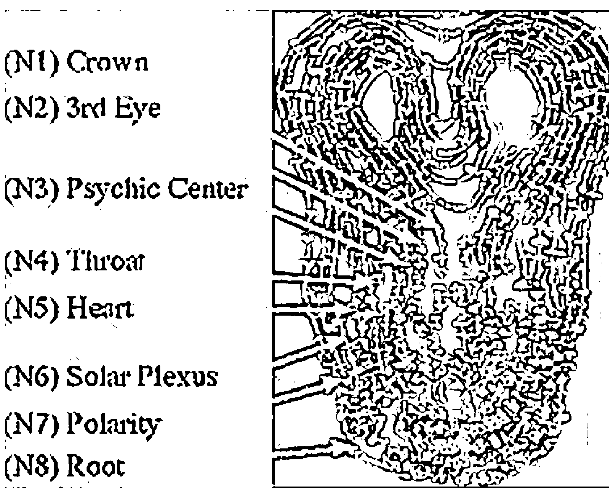

我決定用寶石來表現藍道瑪矩陣泛音及潛音的排列，寶石顏色反映藍道瑪八度音列的音樂頻率，也反映我對脈輪系統的詮釋。

> 16. 20世紀德國作家。

#### ◎根據藍道瑪作畫作曲

七○年代初期，我重新發現藍道瑪理論後，便傾所有精力以視覺和音樂描述藍道瑪理論。在視覺上，我們可以根據藍道瑪表的和聲比率將線分段，並根據畢達哥拉斯和牛頓（Issac Newton）的色彩編碼系統著色。另外可以用這些比率當半徑畫圓，闡釋不同音符的波長。由於八度關係一定是加倍或減半，因此很容易做到。至於2:3、3:4、4:5等比率也相當容易，只要將線分成三、四、五段即可，甚至分成十五段也行。由於藍道瑪矩陣只是16x16的矩陣，幾乎所有視覺上可描繪的一切，都可以納入這個相對而言小型的架構。這個比率法可以透過簡單的數學，在音樂和藝術間搭起聯繫。

#### ◎根據藍道瑪理論建立音程

要用藍道瑪矩陣創造音樂，就要找出方法讓比率發出聲音。由於聲音是以赫茲為單位的振動，只要決定每秒振動周數，就能聽到聲音。20赫茲大約是人類所能聽到的最低音，而鋼琴的中央C音域大約為256至512赫茲，所以成為基準八度。透過自行撰寫的電腦軟體程式，就能創造出「天體音樂」，並錄成錄音帶。

> 有關諧和振動的靈通訊息
一九八一年五月一日威斯特博士（Dr. West）透過海柏夫婦史蒂芬及塔莎（Stephen & Tasha Halpert）傳達

#### ◎聲音能量與矩陣

「必須形成正確的矩陣，能量才能正確混合、形成和導引。在這個過程中，軀體和精神間會產生相互流動，進而強化。『你正在重新學習以科技面貌出現的古代技術。過去唯有靠魔法，才能產生某些能量。如今電子儀器可以取代魔杖。現在能量可以釋放，傳送到更重要的事物中。所以好好學習你現有和能夠得到的技術用途，因為一切終將成為你技術的一部份，讓你能重組能量、調整能量，還有重新導引能量從事更諧和的用途和目的』。」

#### ◎心搏和氣場比

「基音數字（key number）由心搏對氣場（aura）的振動比決定。只要花點時間，任誰都能學會感覺自己的心跳。靜心時可以感覺到氣場。這就跟音樂一樣，左手是節奏；右手是旋律。氣場就是右手；心搏則是左手。大多數人如果好好學會放鬆，就能開始調整自己與生理節奏一致。『先安靜坐著，規律地吸氣吐氣。用脈搏來計數。內在平靜時，就能感覺到另一種搏動。這種搏動來自脊椎，滲入氣場，起初感覺像微弱的撲動，久了就會熟悉』。」

#### ◎色彩與聲音

「讓兩三位相關療法的合格治療師使用療癒錄音帶。看他們如何藉助錄音帶，觀想或感覺顏色振動的傳送，進行有效的視覺調整，專注於光，配合聲音送出適當的顏色。療癒者現在可以給予個案大量調整過的頻譜，產生有效的振動特性。氣場受到聲音「烘烤」，光則…（内容不完整，图片底部被截断）照亮感覺。個案只要注意呼吸，可以的話，分享進入意識時的感受。我們希望見到有效運用光和聲音對光的強化，因為氣場受到這兩種作用力加溫，就能啟動淨化過程。配合按摩使用時，按摩者專注於光，讓聲音引導雙手。高音為上部的[能量]中心；低音為下部的[能量]中心。

#### ◎光、比率和回聲

> 「光是決定物質透明度的因素。如果光的振動與物質振動波長的比率相等，物質就會隱形。如果比率稍高，則能成為淨化工具。因此要加快光的比率，只要去除影響光速的阻礙即可。消除障礙意味著首先要意識到障礙，然後去除一開始催生障礙的刺激，從而化解障礙。」

> 「回聲是聲音從物質反彈所造成。回聲好比光波從可見事物反彈（光波從物質反彈）。把物質換成記憶、最初經驗，認知其存在，任其縮減，因為已經沒有存在必要，這樣就能加以消解。」

#### ◎聲音、數字及磁力的能量

> 「磁力的關鍵是數字。研究數字時，你會發現超乎基本諧和學的線索。你可以用數字引出音調序列，產生有療癒力的聲音。許多模進（sequence）在音調上雖然不是管弦樂風格，卻能產生特定的節奏記號，如果妥善利用，就能發揮療癒效果。不是所有模進都適合所有人。實體的基音「數字」和療癒的「調性」（tonality）必須吻合。用你的能力替兩三位朋友創造療癒聲音，用他們的基音數字作為各矩陣的建構基頻。你會發現聲音能以這種方式應用於許多相關原理上，例如製作酊劑¹⁷（elixir）、睡眠鎮靜劑，或是靜心的舒緩段落。就像我們在光中會受到能量影響一般，你們的血肉之軀也會受到聲音能量的影響。因為光也算是一種聲音，而聲音則可視為一種光。同樣地，用基頻數字可以推斷出特定實體的特定色調。將色調結合音調，會成更為重要的療癒工具。

#### ◎實體的基音數字與療癒音調的吻合

> 「主音數字是比率。請輸入實體完全比率的音調，以藍道瑪比率使之諧和。
我認為諧音需要精準的儀器，正確的工具很重要。讓這項研究順其自然發展。光也有療癒力。傳送光，讓光發揮應有能力，以溫和良善的光輝進行療癒，讓實體有時間吸收。

#### ◎調性範圍

> 「中央C音域只適合某些類型的療癒。其他療癒需要更高或更低的頻率。中央C音域適合青光眼、過敏症、癌症、婦女問題（如卵巢、輸卵管發炎）。
心臟疾病需要低頻重建瓣膜，清理循環問題。腎臟疾病需要高頻淨化和進行療癒。內分泌系統疾病則必須結合高低音區。

#### ◎全像術和色彩轉換成聲音

> 「將3和6放入TRONAL，結果會如何？TRONAL是縮寫，代表透過顏色與聲音療癒性的結合，產生的大型心念遷變（transmutation）。使用合成器和全息殼層（holographic shell）之類的先進科技，你可以給聽眾色彩療癒，從而調整所有扭曲的能量。
問：「要用晶體進行嗎？」
答：「那是離心原理，由音高（pitch）加以放大。」
問：「什麼樣的晶體？」
答：「晶體的重要性還比不上起始的主音。因為中心振動了，當然會刺激起始主音。起始主音必須是溫暖的和弦，減至1厘米（公分）波長。用大小適中的晶體配合理想的音量/底座尺寸，或是強度的波長比，以呼應尺寸加上晶體小面（facet）產生的放大效果至立方（n的3次方）再立方，直到空間尺寸與晶體形成比率。現在別擔心細節。只要把涉及的傳輸原理當成指引。產生能量雖然重要，但在學會正確方法的知識前，必須先擱置。要達到各「能量」中心，最好能有特定音高。紅、黃、橙色的音振動下面的中心（C、D、E）。大多數人只接受這些振動，必須先打通這個層面，然後引進綠色、藍色、紫色，刺激上面的中心（F、G、A、B）。要注意和這些中心相關的幾何圖形含有和弦的比例。」

## 藍道瑪音樂頻譜療法。

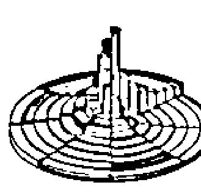

> 17. 或稱長生不老藥。

## 第6章 共振諧和音階的功能

### 提升生活品質

共振諧和音階幫助我們提昇生活品質，因為音階的每個音程各有法則掌管我們的情緒體。首先，兩個人發出同一個音，產生同度音（unison）時，具有合一（oneness）的特質。合一的圖形為正圓形。第八諧音是藍道瑪諧和音階的起始音程。奏出第九諧音時，我們處於創造模式，圖形為編織鬆散的籃狀。第十諧音的圖形為手臂交叉狀，屬於接納、精神面，（由情緒平衡）透過和聲控制情緒體，身體器官和肌肉由這個諧音控制。第十一諧音用於非傳統能量科技，已經用於許多機器上，聲音聽來很刺耳。這個諧音的架構和基頻很類似，因為它的泛音及潛音幾乎是同一個音，但相差四個八度。第十二諧音代表平衡與和諧，呈魚形。第十三諧音代表黃金分割1.618或0.618，因為數字比為13:8或8:13。第十四諧音是朝本源移動；第十五諧音是未知次元的超覺狀態（transcendent state）。第十六諧音穿越泛音列所有其他諧音的通道，回到起點。這時一個人的人生使命變得清楚；對自己和他人的瞭解更多；自我會評估自己的進度，同時可自由選擇是否踏上眼前更崇高的人生道途。藍道瑪頻率的重要程度包括調整諧和（attunement）乃至於合一（at-one-ment）。

#### ◎滿足五大生活需求

- 1. 生存

為了生存，我們都需要生命的意義。這個生命意義能讓我們找到理由，知道自己為何選在這個特定時刻，轉世來到這個特別的星球。當我們窺見自己的專屬人生道途，就能一步一腳印，邁向自己的人生目標。

生理面生存

生存可分為幾個層面。首先食物、水和棲所等生理面必須得到滿足。試想穀物和蔬果以能滋養人體的特定頻率栽種；水以具有清潔和療癒力的頻率淨化；棲所的設計根據波長配合我們的特殊需求，能和個人需要的頻率完全諧和。

- 2. 愛與歸屬感（情緒面生存）

試想透過奏出我們自己和他人的專屬音調，控制我們的情緒，和他人完全和諧共處。關懷他人，也被他人關懷；感恩他人，也被他人感恩；無條件愛他人，也無條件被他人所愛；愛我們的工作和人生道途，也尊重他人的工作與人生道途。

- 3. 力量（精神面生存）

當一個人與自己及他人完全合拍，對宇宙和諧的運作有所瞭解後，就能產生力量。力量是塑造自己命運的能力；是實現目標的能力；是以無害的方式顯化個人實相，也幫助他人顯化實相的能力。

- 4. 自由（靈性或靈魂面的生存）

有了力量，隨之而來的是自由，和眾生和諧共存的自由。我們的靈魂使命獲得實現。我們的努力自行朝人類靈性的進化發展。自由來自於放下小我（或說自我ego），體認到我們和宇宙中所有原子都是一體。

- 5. 樂趣（超靈，Oversoul）

現在我們可以自在享受人生，過著最充實的生活。愛我們與別人的關係，還有我們的特殊天賦，以我們在人生正確道途上的固有知識，讓天賦臻於完美。我們在凡事中都能看出幽默，樂在其中。

#### ◎優質生活的條件

- 1. 建立信任，展現自我和自我價值

消除所有恐懼，相信自己和自己的決定，我們就能提昇自己的生活品質。藉著列出價值觀，重新加以評估，我們不只是把自己的計畫攤開給自己看，也給我們容許的他人看。我們不鼓勵他人活在恐懼中，而是要活在希望中。

- 2. 運用生活技能時，藍道瑪的用處

——說與聽

和他人分享自己的價值觀，讓他們瞭解我們的立場；傾聽他人的價值觀，則讓我們能瞭解別人的立場。坦承地與他人分享價值觀需要勇氣，而他人也需要勇氣才能和我們分享價值觀。排除擔心別人想法的恐懼，就能消除猜疑氣氛，即便是不贊同時，也能表達自己看法。

——閱讀

閱讀是一大重要生活技能，可以藉此瞭解在我們共有的宇宙中，其他人的看法。對於透過閱讀獲得的概念，要驗證其正確性，可以用我們內在的電腦，看對讀到的想法是否贊同。訓練大家意識到這項固有知識是我的目標。每篇文字都藏有一絲真理。我們可以學習如何在閱讀時找出這些真理。

——書寫

大家都有能力書寫或透過本源接收訊息。一個人只要學會用內在之眼（inner eyes）閱讀，就有能力以同樣的內在之眼書寫。這個內在之眼酷似在靜心狀態的信手書寫。寫出的內容沒有小我存在，而揭露的客觀真理可以適用於所有人。

——宇宙和諧與數字

數字令人著迷的程度，可比閱讀和書寫。數字既能定量也能定性。數字雖然抽象，但有時比其他技能更能呈現偉大真理。數字和音樂、藝術、建築，以及天文學、物理學、生物學、化學、生理學等所有科學都有關。

數字也許是將一切聯繫在一起的連結。

數字的研究包括數學、幾何學、代數，能幫助我們處理物質世界的技術性細節，也能幫助我們瞭解有形世界之外的玄學實相。讓我們面對隨之而來的主題。

- 3. 分享自我評價

分享我們的一小塊謎團拼圖（尤其是如果我們不清楚全貌時），讓其他人能進一步研究。

瞭解自己的進度，以及需要改進部分。

藍道瑪的研究已經衍生出許多康莊大道和荒涼小徑。我們探討過振動弦的幾何學；將色彩、形狀、角度和頻率編碼成實際聽得見的聲音；探討過為建築師設計房間共鳴，還有與房間長寬高相關的色彩。我們設計出的多邊體，有人當成冥想工具。我們還將藍道瑪矩陣音聲應用在藥物勒戒中心和監獄；辦過音樂會，藉助雷射掃描系統，讓聽眾看見藍道瑪鍵盤的聲音。我們設計並製造出8x8矩陣的藍道瑪智慧鍵盤；特定音程的聲音還搭配具有特徵的利薩如圖形。我們對全美各種團體辦過多場演講和工作坊，揭露這套系統的一些謎團，同時希望其他人能將這些資訊應用於自己的需求。我們設計過項鍊和音樂，表現藍道瑪數表與脈輪系統相呼應的音程泛音和潛音列。用聲音進行療癒一直是我們的研究重點。療癒的定義包括情緒的治療，還有醫療的輔助。有紀錄提到，有人聽了一些藍道瑪鍵盤的聲音後，想起來世。

激發脈輪和諧

#### ◎諧音

首次認識諧音的概念時，我還是新英格蘭音樂學院的學生。一位長笛家到課堂上示範長笛既有的和聲泛音。這場「音樂物理學」的示範，自此留在我的意識中。

#### ◎以色彩編碼音列

大約同時，我迷上畢達哥拉斯學派以色彩編碼音階的作法，把音階當成聲音的彩虹。好幾年來，我一直想找找出藝術與音樂的關連。接著我發現了藍道瑪矩陣。

#### ◎以顏色編碼藍道瑪諧和矩陣

我首次發現藍道瑪矩陣，是在《音：音響聲學研究》（Tone: A Study of Musical Acoustics）這本書中，一個16x16的正方棋盤格，填滿分數和音符，躍入我的眼簾。不知怎的我知道（也許是細胞層面），這個棋盤方格似乎是個古代熟悉的典範。認識了藍道瑪，讓我開始根據畢氏對音符的色彩編碼，為藍道瑪矩陣的兩百五十六個方格著色。我用彩色筆、圓規和直尺，一心鑽研藍道瑪矩陣，從而接觸到意識中湧現的完整音樂系統概念。

#### ◎將藍道瑪矩陣轉譯為聽得見的聲音

由於渴望瞭解藍道瑪矩陣，我攻讀數學，以瞭解藍道瑪矩陣的數學特性。我靈機一動，以頻率（赫茲）取代矩陣中的色彩。接著我藉助電腦科技，透過演算法讓矩陣發出聲音，可奏出擴展為20x20矩陣（也就是調和矩陣的四百個數元）中的所有諧和音程。

#### ◎脈輪、顏色與音符間的關係

脈輪系統代表人體的諧和能量中心。如果這些能量中心不和諧，我們就失去平衡。色彩能量、聲音能量和脈輪中心能量間有著密切關係。例如紅色是活力的顏色；C音是激發活力的聲音；而海底輪（Root chakra）是生命力的活力根源，即所謂的「拙火」（Kundalini，或稱亢達里尼）。根據類比，紅色的互補色為綠色。綠色是平靜的顏色。C音的上行五度為G音。G音是平靜的聲音。海底輪的互補是喉輪。喉輪是我們的溝通中樞。類比和互補的原則在平衡顏色、聲音和脈輪的能量上非常重要。同樣的原則可以推及到各個顏色、聲音和能量中心，以平衡我們的身體、情緒體、精神體和靈體。這項原則的另一個例子是黃色和互補的紫色；E音和互逆的B音；太陽輪（solar plexus chakra）和對應的頂輪（Crown chakra）。黃與紫、E與B音都能代表「情緒」脈輪被「靈魂」脈輪所平衡。這全都代表能通向開悟的上行諧和泛音。

#### ◎下行的次諧潛音

為了納入所有諧音，例如D和A音，讓我們以下行的潛音列為例。從A音下行五度，就是D音。

A音的顏色為靛色（Indigo），下行五度轉為D音為橙色。脈輪則是「眉心輪」被「生殖輪」所平衡。「眉心輪」脈輪代表靈視力（clairvoyance），高等的非物質覺知；「生殖輪」則象徵性魅力或創造力（視個人意圖而定）。

#### ◎接收和傳送色彩、音符和脈輪

我們認為脈輪能接收或傳送能量，就像顏料彩繪和彩色玻璃窗；或是聲音的聆聽和生成。

#### ◎諧和音給身體能量

聲音和光不同，能夠穿透人體，就像聲音能穿牆而過。但在真空中，聲音無法傳送。聲音需要物質才能傳遞。光則會被不透明的物質阻擋。這正是結構諧和的聲音有助於調和人體的原因之一。

由於水分在人體佔有極大比例，聲音在人體的行進速度比在空氣中快四倍。

#### ◎藍道瑪與脈輪的關係

有位精神科醫師朋友問我：「能否找出每個脈輪能量中心的音符或頻率？」我回答：「可以，只要告訴我各脈輪的顏色。」後來我們製作了一個表。

#### ◎《藍道瑪脈輪靜心錄音帶》的效果

有人聽了錄音帶的反應是「身體感到興奮、警覺；精神覺得興奮，還有整體的幸福感，『靈性中心』則有種帶勁的感覺。」〔我們發現在喉輪和眉心輪間有個64赫茲的數學斷層，後來稱之為「靈性中心」。〕還有人寫道：「我發現這捲錄音帶很適合讓我鬆弛與落實（grounding）；為我的生活創造更多平靜。」另一人寫道：「脈輪靜心音樂清理了我的氣場網格（auric grid）和脈輪。在阻塞之處，會有幾個音在氣場清掃（auric sweep）時穿透同一點…在盤旋形時我感到脈輪和能量的整合以及應用潛力。」

#### ◎跨領域研究

地球綠色能源協會（Planetary Association for Clean Energy）在一九九四年十一月一日第八期會訊中特別介紹我們的研究。下一段部分文字摘錄自會訊：

藍道瑪研究已經進入跨領域階段。藍道瑪被稱為「聲音的幾何學」，因為「…音樂、共振、數學與色彩的相互關係。目前描述音程的成果包括：各單音（包括潛音與泛音）的波長、比率、頻率、電子合成音；各音的利薩如圖形、代表音符的螺線圖、色彩/音符關係，甚至是地球網格系統¹⁸（planetary grid system）的分析。」藍道瑪矩陣說明「音程數學運算的具體關係。對音符及其組合之療癒效果的型態學（morphological）原理闡述也已經建立。」

18. 一種理論，認為地球覆蓋著能量網格，包括磁力、電力、意識等等。

## 第7章 藍道瑪原理今昔的療癒應用

音程錄音

### ◎彼得蓋伊曼納斯

有個同儕把我在麻省理工學院的錄音送給彼得蓋伊曼納斯醫師（Dr. Peter Guy Manners）。彼得用他的「聲頻治療錄音機」（cymatic recorder），以藍道瑪矩陣的音聲振動按摩患者身體。後來在一九八三年，曼納斯醫師邀請芭芭拉前往英國，在他的診所研習三週。芭芭拉獲得布萊佛頓基金會（Bretforton Trust）頒發「聲頻治療與生物音波（biosonic）療法之科學與自然療法研究」結業文憑。接著芭芭拉在1983年8月5日登記成為聲頻治療（Cymatics）和生物音波療法治療師。她帶著一部聲頻治療錄音機回到美國，使用效果良好。幾年後，芭芭拉以物易物，把聲頻治療錄音機給了強納森高曼（Jonathan Goldman）。

### ◎音響學大腦研究

一九八〇年代，北卡羅來納州「音響學大腦研究」（Acoustic Brain Research）機構訂購了至少200捲藍道瑪矩陣音程錄音。這些微分音（microtonal）音程錄音在醫院由治療師和整脊師使用，效果良好。其中一捲是芭芭拉在麻省理工學院上「電腦音聲合成技術」（Techniques Computer Sound Synthesis）時所錄製。芭芭拉用身體某些器官的頻率（資訊來自玄學消息來源），產生各器官相關頻率共振微分音程的20x20矩陣。

### ◎使用見證

一九八五年，史蒂芬普羅斯考爾醫師（Dr. Stephen Proskauer, MD）為錄音帶的療癒價值寫下使用見證。詳見錄音帶內附見證頁。他使用的錄音帶專輯為〈藍道瑪脈輪靜心〉（Lambdoma Chakra Meditations），由芭芭拉希洛、史蒂芬普羅斯考爾、羅伯米勒佛克洛一同創作、演奏。(編註：見證內容請參閱78頁《藍道瑪脈輪靜心錄音帶》的效果)。

### ◎藥物勒戒中心

一九七〇年代，藍道瑪矩陣聲頻曾在「第三釘」（The Third Nail）應用長達七年。「第三釘」為麻省羅克斯柏利（Roxbury）的藥物勒戒機構。錄音由芭芭拉希洛以正弦波產生器製造出具有特定數學比率的音程。這些藍道瑪聲頻的療癒性質曾被當成主題，在社區報紙以〈不嗑藥的藝術〉（Drug Free Art）為題特別報導。

這些聲頻讓大部分受勒戒者透過視覺藝術和寫詩釋放創造力。療癒過程的詳細描述請見芭芭拉希洛的著作《藍道瑪揭密》（Lambdoma Unveiled）〈不嗑藥的藝術〉一文。這些藝術創作曾辦過兩次地區性展覽，一次在波士頓市政廳，一次則在麻省的劍橋（Cambridge）。

### ◎麻省橋水監獄（Bridgewater correctional facility）

一九八〇年，芭芭拉擔任「監獄藝術計畫」（The Prison Art Project）的藝術家，將藍道瑪錄音引進監獄，讓囚犯畫出感受到的聲音樣貌。成果不僅有美麗的抽象圖形，有些甚至反映了實際的藍道瑪矩陣。芭芭拉認為這是因為藍道瑪共振音聲造成正向的意識轉換狀態。

### 藍道瑪鍵盤

五年前藍道瑪諧和鍵盤的構想開始成形。一九九四年鍵盤成真。從《音：音響聲學研究》這本小書中的抽象矩陣，到連接Amiga電腦的小型電腦驅動鍵盤，這個藍道瑪樂器已經為人體迴路帶來改變，按下某些琴鍵時能改變脈搏速率，對某些人具有鎮靜效果，有些人則是進入飄飄然的意識轉換狀態。

有個醫師甚至開處方給一個患者，要他連續三週聽十分鐘藍道瑪諧和鍵盤的指定音程錄音。

### ◎改變能量

一九九四年六月十日，藍道瑪智慧鍵盤終於成真。七月，芭芭拉獲頒「蓋勒摩身心能場學技術研究發展獎」（J. G. Gallimonre Award For Technical Research and Development in the Psychotronics Field）的「成就證書」（Certificate of Achievement）後，發表鍵盤。年會與會者法蘭西斯艾爾利希醫師，檢查兩個使用鍵盤的人，發現彈奏不同比率的微分音程時，彈奏者的能量層級也會變化。

### ◎以聲音療癒

芭芭拉的論文〈以聲音療癒〉（Healing with Sound）一九九四年二月發表於《蛇杖》（Caduceus）雜誌第廿三期〈整體的療癒〉（Healing into Wholeness）。聯絡芭芭拉的詹姆斯狄安傑羅，是該期雜誌「聲音療癒」主題的客座編輯。狄安傑羅在論文〈宇宙的共振〉（Resonances of the Cosmos）中寫道：「泛音（或說諧音）龐大的網格結構，萌生於太初之道（Word），賦予萬物各個層面特有的振動速率，在畢達哥拉斯的藍道瑪圖表中化身為明白易懂的有形形式。到了20世紀，玄學家（metaphysician）漢斯凱瑟（Hans Kayser）（請見高文（Godwin）著作《宇宙音樂》（Cosmic Music））和芭芭拉（請見本期文章及其著作《藍道瑪揭秘》（Lambdoma Unveiled））接手研究，希望能透過調和比，瞭解萬物的架構和相互關係。」

### ◎海倫霍爾和詹姆斯狄安傑羅

十月十二和十三日，我們用藍道瑪諧和鍵盤搭配雷射掃描系統進行實驗。我們根據詹姆斯狄安傑羅（James D’Angelo）直覺認定的專屬主音，在中央C八度或是低八度的音頻範圍選擇基音。我發現男性最好從中央C低八度選基音。詹姆斯接連按下各鍵多次，保持聲音不中斷。不知為何，他彈奏時發出的聲音似乎比程式設定的雙音還多。通常按下一個琴鍵時，基頻一定會響，但詹姆斯的彈奏似乎產生多重音調。我推測這是因為詹姆斯指法純熟，彈奏鍵盤速度比1/30秒快，才會讓人產生音符變多的錯覺。

### ◎海倫霍爾

海倫霍爾（Helen Hall）來草莓丘農莊（Strawberry Hill Farm）拍攝雷射利薩如圖形，配合她以電磁污染為主題製作的電影。她拍下詹姆士狄安傑羅彈奏鍵盤時產生的雷射利薩如圖形。

接著我將基頻改為30Hz，然後是15Hz，最後是10Hz。這個序列不僅潛音音域聽不見聲音，連次諧音區的利薩如圖形也全是圓形，只有在諧音區某些部分會出現旋轉圖形。5Hz時，低八度模進（sequence）變成2.5Hz、1.25Hz、乃至0.625Hz。高八度模進變成10Hz、20Hz、40Hz。

兩人對效果都很滿意，詹姆士狄安傑羅表示從沒聽過這樣的音程，海倫霍爾則很喜歡藍道瑪諧和音程的動態圖形。

### 《藍道瑪鍵盤之聲》（Sounds from the Lambdoma Keyboard）錄音帶的效果

與法蘭西斯艾爾利希醫師的電話對談

一九九四年十月，在場者有一名針灸師、一個對氣場敏感的人、三位護士，以及一位顱薦骨治療師（craniosacral therapist）。

### ◎第一面的效果

> 「聲音下行時，脈輪似乎也往下走。出現閃爍彩光的氣場。聲音活化了脈輪，感到灼熱和有點反胃。」

### ◎第二面的效果

> 「看到氣場出現。有個人頭上的傷被活化。光從她的頭上冒出來。小組討論了他們的體驗，然後頌唱『Aum』音進行淨化。」

### ◎意見回饋

> 「音符最好別那麼多，不要太多任意音。要有一套科學實驗計畫評量聲音療效。 這個很厲害。我們必須制訂方法認識和好好瞭解效果。我們需要擬定模式，看怎樣瞭解各鍵的效果。」

艾爾利希醫師提到，鋼琴店的提姆法利（Tim Farley）有意以古法替鋼琴調音。

### 藍道瑪蠟燭

藍道瑪蠟燭起於八○年代後期，芭芭拉和羅伯米勒佛克洛在「永恆建築」（Timeless Architecture）集團贊助下，以「室內共鳴」（Room Resonances）舉辦研討會。學員傑佛瑞卡斯洛夫（Geoffrey Kaslof）想做出外型具有療癒效果的建築裝飾。後來他聯絡芭芭拉和羅伯，索取以波長度量的3D藍道瑪模型規格。傑佛瑞根據規格以石膏做出模型。後來芭芭拉決定用石膏模製作蠟燭。藍道瑪蠟燭以波長而非聲調音頻為基礎，讓人能從立體藍道瑪矩陣更深入了解泛音、潛音和基頻常數。

## 调整自己与他人谐和一致

我们可以调整自己与他人谐和一致，首先要找出自己和对方的主音。找出主音的方式，是发出自己觉得最舒服的音。问问自己最喜欢什么颜色？毕达哥拉斯曾对音阶每个音指定色彩，可以利用。红色是第一谐音；橙色是第二谐音；黄色第三；绿色第四；蓝色第五；靛色（indigo）第六；淡紫（lavender）第七。蓝道玛第八音可能是紫色（purple）。正如每个颜色都有色调和饱和度的变化，音符也各有其频率范围。每个颜色都有互补色，而每个音（频率）也有其转位音程。音乐的五度音程就好比是互补色¹⁹。

互补色为红/绿、橙/蓝—绿、黄/蓝—深紫（violet）、绿/紫、蓝/洋红（magenta）、靛/橙及深紫/金。对应的转位音程为C/F、D/A、E/B、F/C、G/D、A/E和B/F。注意和音符配对的颜色稍有偏移。要是懂得色彩和微妙的混色方式，会更有帮助。

我们可以调整自己的色彩和声音与他人和谐一致，方法是找到彼此感到最愉悦的谐音或调和色。找出当天或是当时、当季两人的主音或颜色后，就能知道我们目前的强势脉轮能量中心。我们可以将海底轮定为红色；生殖轮橙色；太阳轮黄色；心轮绿色；喉轮蓝色；灵性中心蓝绿色；眉心轮靛色，顶轮淡紫色。接着就能在蓝道玛矩阵上转译为音符：P、Q、R、S、T、U、V、W，或是大约为C、D、Eb、F#、G、Ab、Bb、B和C。

## 蓝道玛壁疗的原理

一九九一年三月

## 蓝道玛音乐频谱疗法

蓝道玛矩阵是以整数比为基础的古老音乐系统。蓝道玛壁砖代表着一个进化过程：从二维简单的比率数学矩阵；到以艺术形式，将比率对应的谐音进行色彩编码；接着是以每秒振动周数（赫兹），替矩阵进行音乐频率编码，产生谐音和次谐音的听觉体验；最后则是以这种三维形式诠释同样的比率。

蓝道玛壁砖是音乐谐音与次谐音的数学模型图解（见第44页四个象限的3D蓝道玛矩阵图）。

蓝道玛砖对人们的影响，可能类似蓝道玛转译为音频所产生的已知效益。

蓝道玛砖由蓝道玛矩阵的四象限组成。这些象限能以不同方式组合，或是中央高，向末端递减；或是边缘高，向中央递减。这些象限可当成吸音砖，因为它们的确呼应了音响学原理，也可当成根据和谐律完成的美观视觉装饰。

就某方面而言，蓝道玛砖在数学定律中所反映的，正是希腊人用于雕塑和建筑的同样原理。蓝道玛的和谐包括黄金分割，因为在比率矩阵中存在着费布那西数列（Fibonacci series）。蓝道玛砖也纳入了物理学中的和谐。和谐与次和谐调式的比率序列反映出八度、五度、四度、三度、六度、二度和七度固定顺序的大跃进。因为跳跃幅度过大，我们熟知的西洋八度音阶要到蓝道玛音阶的第八谐音才出现。许多哲学问题也许能透过思考蓝道玛砖而得到解答。

我要感谢杰佛瑞卡斯洛夫热心完成这个模型。

## 房间尺寸的应用

### ◎希腊音乐调式的情绪特质

恩尼斯麦克蓝（Ernest McClain）的书《毕氏学人柏拉图：歌的前奏》（The Pythagorean Plato: Prelude to the Song Itself）引述了苏格拉底（Socrates）和葛劳康（Glaucon）<sup>20</sup>在《理想国》（The Republic）<sup>21</sup>一书中，对希腊音乐调式（mode）的讨论。在问到“哭调有哪些？”时，回答是“混合利地亚<sup>22</sup>（Mixed Lydian）、高音利地亚，还有其他类似调式。”利地亚调式就是F调。在蓝道玛矩阵中，这个音的频率在泛音音列为352Hz，波长模组为3.21呎；在蓝道玛潜音音列的频率则为170.6Hz，波长模组6.6呎。

将这两个波长各增若干倍，我们也许就能推断，13.2呎x26.5呎的房间未必能让人心情愉快，12.8呎x25.7呎的房间亦然。频率32Hz的第11谐音为352Hz，是增四度音程。这个音程在音乐中是刺耳的“狼音”（wolf tone），或称“鬼音”（ton diable）。

接下来的问题是“什么样的调式轻柔，适合社交酒会（symposia）？”回答是爱奥尼亚调式（Ionian），还有一些利地亚调式。

爱奥尼亚调式为256Hz的C调，波长为4.4呎。将波长加倍两次就成了17.7呎的房间尺寸。埃及吉沙（Giza）大金字塔（Great Pyramid）的国王室（King’s Chamber）宽度接近这个尺寸，长度则略小于其倍数，为35.3呎。至于多利安调式（Dorian）和弗里吉亚调式（Pyrygian），我从对话推断，这些调式的属性包括勇气、耐心、坚定、和平、诚恳、富有及温和。多利安调式为音阶的D调，弗里吉亚调式则为E调。D音频率为288Hz；波长3.9呎，四倍[约]为15.7呎。E音频率320Hz，波长3.5呎，四倍约为14.1呎。我们能否依此假定，14呎x28呎的房间对于冀求这些属性的人可能大有助益，而15.7呎x31.4呎的房间也一样？

### ◎希腊调式的固有比率

如果假定爱奥尼亚调式比率为1:1，频率256Hz的C调，那么多利安调式的D调则是9:8；弗里吉亚调的E音为5:4；利地亚调式的增F调，在泛音音列的比率为11:8。但潜音音列采用比率倒数，所以是8:9的B调；4:5的Ab调，还有8:11的减G调。

## 频率／尺寸对照表

以P音=256Hertz及1995年1月3日的音调范围为准

| 基频(Hz) | 波长(呎) | 基准频率(Hz) | 蓝道玛共振音符(最相近) | 自然音阶(Diatonic)音符C=256(最相近) | 自然音阶(Diatonic)音符A=440(最相近) | 脉轮(最相近) |
| --- | --- | --- | --- | --- | --- | --- |
| 1 | 1130 | 256 | P | C | C | 海底轮 |
| 2 | 565.0 | 256 | P | C | C | 海底轮 |
| 3 | 376.7 | 384 | T | G | G | 喉轮 |
| 4 | 282.5 | 256 | P | C | C | 海底轮 |
| 5 | 226.0 | 320 | R | E | D# | 太阳轮 |
| 6 | 188.3 | 384 | T | G | G | 喉轮 |
| 7 | 161.4 | 448 | V | A# | A | 眉心轮 |
| 8 | 141.3 | 256 | P | C | C | 海底轮 |
| 9 | 125.6 | 288 | Q | D | D | 生殖轮 |
| 10 | 113.0 | 320 | R | E | D# | 太阳轮 |
| 11 | 102.7 | 352 | S | F# | F | 心轮 |
| 12 | 94.2 | 384 | T | G | G | 喉轮 |
| 13 | 86.9 | 416 | U | G# | G# | 灵性中心 |
| 14 | 80.7 | 448 | V | A# | A | 眉心轮 |
| 15 | 75.3 | 480 | W | B | B | 顶轮 |
| 16 | 70.6 | 256 | P | C | C | 海底轮 |
| 17 | 66.5 | 272 | P# | C# | C# | 生殖轮 |
| 18 | 62.8 | 288 | Q | D | D | 生殖轮 |
| 20 | 56.5 | 320 | R | E | D# | 太阳轮 |
| 22 | 51.4 | 352 | S | F# | F | 心轮 |
| 24 | 47.1 | 384 | T | G | G | 喉轮 |
| 26 | 43.5 | 416 | U | G# | G# | 灵性中心 |
| 28 | 40.4 | 448 | V | A# | A | 眉心轮 |
| 30 | 37.7 | 480 | W | B | B | 顶轮 |
| 32 | 35.3 | 256 | P | C | C | 海底轮 |
| 34 | 33.2 | 272 | P# | C# | C# | 生殖轮 |
| 36 | 31.4 | 288 | Q | D | D# | 生殖轮 |
| 38 | 29.7 | 304 | Q# | D# | D# | 太阳轮 |
| 40 | 28.3 | 320 | R | E | D# | 太阳轮 |
| 42 | 26.9 | 336 | R# | F | E | 心轮 |
| 44 | 25.7 | 352 | S | F# | F | 心轮 |
| 46 | 24.6 | 368 | S# | F# | F# | 喉轮 |
| 48 | 23.5 | 384 | T | G | G | 喉轮 |
| 50 | 22.6 | 400 | T# | G# | G | 灵性中心 |
| 52 | 21.7 | 416 | U | G# | G# | 灵性中心 |
| 56 | 20.2 | 448 | V | A# | A | 眉心轮 |
| 60 | 18.8 | 480 | W | B | B | 顶轮 |
| 64 | 17.7 | 256 | P | C | C | 海底轮 |
| 68 | 16.6 | 272 | P# | C# | C# | 生殖轮 |
| 72 | 15.7 | 288 | Q | D | D | 生殖轮 |
| 76 | 14.9 | 304 | Q# | D# | D# | 太阳轮 |
| 80 | 14.1 | 320 | R | E | D# | 太阳轮 |
| 84 | 13.5 | 336 | R# | F | E | 心轮 |
| 88 | 12.8 | 352 | S | F# | F | 心轮 |
| 92 | 12.3 | 368 | S# | F# | F# | 喉轮 |
| 96 | 11.8 | 384 | T | G | G | 喉轮 |
| 100 | 11.3 | 400 | T# | G# | G | 灵性中心 |
| 104 | 10.9 | 416 | U | G# | G# | 灵性中心 |
| 108 | 10.5 | 432 | U# | A | A | 眉心轮 |
| 112 | 10.1 | 448 | V | A# | A | 眉心轮 |
| 116 | 9.7 | 464 | V# | A# | A# | 顶轮 |
| 120 | 9.4 | 480 | W | B | B | 顶轮 |
| 124 | 9.1 | 496 | W# | B | B | 海底轮 |
| 128 | 8.8 | 265 | P | C | C | 海底轮 |
| 132 | 8.6 | 264 | P# | C# | C | 海底轮 |
| 136 | 8.3 | 272 | P# | C# | C# | 生殖轮 |
| 140 | 8.1 | 280 | Q | D | D | 生殖轮 |
| 144 | 7.8 | 288 | Q | D | D | 生殖轮 |
| 148 | 7.6 | 296 | Q# | D# | D | 生殖轮 |
| 152 | 7.4 | 304 | Q# | D# | D# | 太阳轮 |
| 156 | 7.2 | 312 | R | D# | D# | 太阳轮 |
| 160 | 7.1 | 320 | R | E | D# | 太阳轮 |
| 164 | 6.9 | 328 | R# | E | E | 太阳轮 |
| 168 | 6.7 | 336 | R# | F | E | 心轮 |
| 172 | 6.6 | 344 | S | F | F | 心轮 |
| 176 | 6.4 | 352 | S | F# | F | 心轮 |
| 180 | 6.3 | 360 | S# | F# | F# | 心轮 |
| 184 | 6.1 | 368 | S# | F# | F# | 喉轮 |
| 188 | 6.0 | 376 | T | G | F# | 喉轮 |
| 192 | 5.9 | 384 | T | G | G | 喉轮 |
| 196 | 5.8 | 392 | T# | G | G | 喉轮 |
| 200 | 5.7 | 400 | T# | G# | G | 灵性中心 |

## 蓝道玛音乐频谱疗法。

### 频率超过200Hz时：

-   将频率除以2、4⋯后，查询上表数值找出频率。
-   例：640 Hz / 4 = 160Hz，可在图表查到
    5632 Hz / 32= 176Hz

# ## 第8章

# # 对蓝道玛音调架构的公开评论


# ## 《蓝道玛键盘、血球与养分》论文发表会

一九九四年，美国身心能场协会年会〈蓝道玛键盘、血球与营养素〉论文发表会的引介、评论及提问，主持人为加拿大安大略“地球绿色能源协会”（Planetary Association for Clean Energy）的安德鲁密可劳斯基博士（Dr. Andrew Michrowski）

# ## ◎主持人介绍

> > “记录无穷时间谜团的毕达哥拉斯在西元前六○○年说过：‘弦的振动中自有几何学；星体的间距中自有乐音。’”

为了解开声音的谜团，并发展成现代学术，驱使着芭芭拉希洛达到今日的成就。她在蓝道玛原理上划时代的研究，其实灵感来自西元二○○年时的智者杨布里科斯留下的研究。杨布里科斯精心设计视觉工具，以便了解音乐的几何学。另外还有比较近代的德国研究人员汉斯凯瑟以《尖塔》（Akroasis）为名的著作。芭芭拉希洛在现代计算机科学的协助下，扩展了蓝道玛工具的实用层面。她产生在音乐生态学中保持和谐的基音、多重声、潜音和三维泛音。这些声音能造成能量重组，根据其比率和我们自身的身体能量系统共振，进而传到以特定频率振动的器官。所以说适当的声音模式能恢复听者的和谐。现在就请来自缅因州的芭芭拉希洛上台。”

# ## ◎键盘使用者的评论

> 法兰西斯艾尔利希医师（Dr. Frances Ehrlich, MD）：“我用诺吉叶医师²³（Paul Nogier）的资料和方法，在进行声音治疗前评估每个患者的状况，找出阻滞之处。接着让芭芭拉弹奏一个音，然后监控乙烯胆碱（acetyl-choline）和正肾上腺素（noradrenalin）等，藉此监控交感神经和副交感神经的反应，结果发现聆听特定声音时，这两者会产生变化。而且有个人大脚趾受伤，结果结疤点、结疤组织产生反应。弹奏另一个音时，情况又不同。我看到这种疗法在人体产生电路变化，而且非常具体，依使用的音符或音程而定。这实在令人着迷，我等不及想多作点实验和检查…谢谢你。”

> 现场听众：“我用过芭芭拉的乐器，觉得很喜欢。我只想发表一些意见。在探索这些领域时，我们是不折不扣的先驱。我们打开一扇门，踏入的房间充满前所未见的事物。我们几乎无法以惯用的言语解说，很难形容这个领域。所以我们只能降格以求，回归自身经验，或是大众能够理解的言语。所以要谈论这类话题很困难，因为重点不是音符或是差异，而是那“啊一哈”的恍然大悟。我觉得声音和视觉影像之间有种关连，能在人的内在产生一些东西。那是种连接，甚至是维度的性质，让人更容易穿越或进入其他维度。又或者这是进入其他维度的演练。但声音和雷射光的视觉影像确实引发了一些反应。当我们放任手指弹奏，直觉地弹奏时，其实是在跟自我沟通。我们在说话，此刻我们有些词不达意，但我们其实是在和自我对话。我很支持这项发展，也真心相信你能成功，芭芭拉。我感到很兴奋。”

23. 法国针灸权威，1957年提出耳穴疗法。

# ## ◎现场听众的评论与提问

> “大家好，我是卡洛琳康纳。请回到那张立方体的彩色投影片。我只是想让大家注意，静心的人都有自己专属的立方体。要是想看见正在和自己身体整合的光体，就注意看中间，颜色会不一样。在头的两侧会变得很亮，继续看着中央，就会看到光体与身体合而为一。这过程会明亮到整个泛白。张开眼睛。你们正看着自己的光体。大家的颜色会不一样，因为频率不同。我一直都看得见。如果静心时注意力飘移，要是看到这个就保持专注。这是个门户，就在正中央。专注这个中心，就在正中央。你的颜色、频率速率不同。你的光体频率不同。记住这些颜色，待会画出来，像这样，但要用你自己的颜色。这非常明亮，会刺眼。你也许得用手盖着闭上的眼睛。那颜色几乎有点像珠母贝的色彩。如果能承受这幅景象的话，你想在这状态待多久都行，因为很美丽。听我说，我们正在整合自己的光体。我们要停止疹子搔痒、反胃和呕吐。现在你们正将频率拉回身体。”

> “你所展示不同基频和声调的图形，从电磁学角度看很有趣，例如圆形像是直流电；纯量（scalar）的形状则像是莫比乌斯带24（mobius form），有时可以塌缩成这种形状。我还看到双蛇缠柱状的螺旋（caduceus coil）等等。这大概可以做为工具，提醒实验者试图共振出这些形状作为不同用途。看到你展示的这些螺线让我我很震撼，因为尼可拉特斯拉25（Nikola Tesla）曾经用其中一个螺线象征自己看到的东西。他能够看见乙太（ether）。如果观察这开放端的电线，当然那是纵波（longitudinal wave），如果直视的话，是很复杂的螺线，非常密集。我真心认为你的研究是很有用的工具，提醒像葛伦莱恩²⁶（Glen Rein）之类的人。我们都在努力研究各种不同螺，看进一步能作什么。”

24. 拓朴学结构，只有一个面，没有正反之分。
25. 20世纪初电学怪杰。

现场听众：

> “你提到用特定频率的倒数。那会产生纯量波（scalar wave）吗？因为如果传播的资讯，或是外在的既有资讯是一个频率，而你播送的频率恰好相反，两相撞击下会产生纯量波，那就是资讯传入身体的方式吗？”

现场听众：

> “芭芭拉，听你的研究，我们就像是幼稚园学生，需要倒退几大步来理解。首先，矩阵是由比率组成的，对吗？用一条比率线，就能形成整个矩阵吗？泛音跟潜音是相对的吗？”

## 蓝道玛声音结构的文字评论

詹姆士狄安杰罗（James D' Angelo）

> “第三组接触这种新振动的作曲家……音调架构是由美国人芭芭拉希洛根据古代毕氏蓝道玛表所发展……”（摘自《水瓶世纪的声音新趋势—新意识音乐的崛起》原稿（Towards a New Phenomenon of Sound in the Aquarian Age-the Rise of New Consciousness Music））

> “泛音（或说谐音）庞大的网格结构，萌生于太初之道（Word），赋予万物各个层面特有的振动速率，在毕达哥拉斯的蓝道玛表化身为明白易懂的有形形式。到了二十世纪，形上学者（metaphysician）汉斯凯瑟（Hans Kayser）（请见高文（Godwin）著作《宇宙音乐》（Cosmic Music））和芭芭拉（请# 藍道瑪音樂頻譜療法

見本期文章及其著作《藍道瑪揭密》（Lambdoma Unveiled）接手研究，希望能透過調和比，瞭解萬物的架構和相互關係。（摘自在《蛇杖》雜誌23期文章〈宇宙的共振〉（Resonances of the Cosmos），〈第一記響亮回聲的泛音〉（Manifestation as overtones of the first great resounding）的章節。）

塞莉妲·布朗（Sarida Brown）

> 聲音不管是單純聲調或是咒語（mantra），都能喚起無意識的潛能，還能重組意識和物質。這項知識被畢達哥拉斯編碼成所謂的藍道瑪矩陣表。芭芭拉·希洛在〈用聲音療癒〉文中（見12頁）說明，這項古代知識也許能成為療癒新技術的基礎。」摘自《蛇杖，整體的療癒》（CADUCEUS Healing into Wholeness，23期）塞莉妲·布朗編輯的〈本期內容〉（About this Issue）。

強納森·高曼（Jonathan Goldman）

> 我開始閱讀聲音物理學的書籍，以瞭解諧波振動現象，希望科學能提供答案。後來我認識了芭芭拉·希洛。芭芭拉一直在研究一個畢氏方程式，稱為藍道瑪，用於聲療，並以合成器產生這個方程式的藍道瑪頻率。我發覺藍道瑪以諧音列為基礎，可以適用於人聲。」摘自強納森·高曼《療癒的聲音，諧音的力量》（HEALING SOUNDS The Power of Harmonics），〈藍道瑪與聲頻治療〉（The Lambdoma and Cymatics）章。

芭芭拉·希洛用雷射掃描系統示範過諧波的類似效果。芭芭拉將一面鏡子放在擴音系統下方，產生兩個不同頻率時，擴音器就會振動鏡子。接著她將雷射打到鏡子上，雷射光反射到螢幕上，顯示聲音產生的影像。芭芭拉發現諧音列產生的音程，會形成完美幾何圖形。圖形（例如圓形）在聲調作響期間保持靜止不動。關係不諧和的聲調形成的幾何圖形並不完美，而且會衰變。

芭芭拉用這套雷射掃描系統以人聲作實驗，結果一樣。兩人唱出關係諧和的音調時，會出現完全對稱的幾何圖形，尤其是兩人唱出和聲時。要是發出的聲音關係不諧和，圖形就不對稱。」摘自強納森·高曼《療癒的聲音，諧音的力量》〈珍妮與聲頻治療〉（Jenny and Cymatics）章。

> 另一個應用諧音，以頻率為基礎的儀器療法是芭芭拉·希洛的藍道瑪頻率。在〈諧和學〉（Science of Harmonics）章節，我們曾簡單討論過藍道瑪圖表。藍道瑪是數學表，據說是由畢達哥拉斯發現，在弟子楊布里科斯保護下躲過破壞。

芭芭拉·希洛是數學家和藝術家，研究藍道瑪超過廿年。她認為藍道瑪其實是用聲音療癒的方程式，並根據這些頻率製作一系列的錄音帶，用來平衡和共振脈輪。

> 第一次聆聽和感受芭芭拉的藍道瑪聲頻時，我覺得相當有趣，但不知道自己是否夠敏銳，能感受到任何效果。我印象比較深刻的，是合成音聲的單音在音階上下游走。我也很好奇頻率的計算方式。內人凱倫（Karen）比較敏感。她聆聽藍道瑪頻率時，當真覺得脈輪受到影響，被錄音帶的聲音所平衡。許多用過芭芭拉·希洛的藍道瑪頻率的人也報告發揮有益功效。

> 調查藍道瑪頻率時，我發現這些頻率都是諧和關係。事實上藍道瑪表不過是以泛音為基礎的比率表。芭芭拉錄製的聲音不過是關係諧和的頻率。很可能脈輪為諧和關係，會對關係諧和的頻率產生反應。」摘自強納森·高曼《療癒的聲音，諧音的力量》〈藍道瑪與療癒〉（The Lambdoma and Healing）章。

### 凱加德娜（Kay Gardner）

> 在麻省理工學院研究的數學家芭芭拉·希洛發現，據說畢達哥拉斯（希臘哲學家、幾何學家和音樂家，西元前六〇〇年）賦予音調的顏色，用電腦生成時，會產生互補色。希洛的解釋是脈輪會依序吸收七種光譜的顏色，發出互補色，我很贊同。」摘自凱加德娜（Kay Gardner）《奏出內在風景—音樂良藥》（Sounding the Inner Landscape-Music as Medicine）第一章〈藥輪與無形形體〉（Medicine Wheels and ‘Unseen Bodies’）。

八音律是：將赫茲為單位的任意頻率乘2，達到與化學物質、熱或光對等的頻率，或是將頻率除2，達到趨近於重力的頻率。—芭芭拉·希洛」摘自凱加德娜（Kay Gardner）《奏出內在風景—音樂良藥》（Sounding the Inner Landscape-Music as Medicine）第一章〈藥輪與無形形體〉（Medicine Wheels and ‘Unseen Bodies’）的〈八音律〉（The Law of Octaves）小節。

#### ◎聲音幾何學議題評論

### 地球綠色能源協會

> 芭芭拉·希洛和羅伯·米勒·佛克洛對聲音幾何學的跨領域價值，進行了基礎的電腦輔助研究。簡單來說，就是音樂、共振、數學和色彩的相互關係。這項廿多年前開始的研究，起點是描述音程特定數學關係的畢氏矩陣（費布那西藍道瑪），這個矩陣最初是由揚布里科斯（Iamblichus，西元二〇〇年）引用哲拉沙²⁷（Gerasa）的尼科馬科斯（Nicomachus）記載的圖表。目前描述音程的成果包括：各單音（包括潛音與泛音）的波長、比率、頻率、電子合成音；各音調的利薩如圖形，令設計特殊電磁線圈產生非赫茲波和純量波的人大感興趣；代表音符的螺線、色彩/音符關係，甚至是地球網格系統（planetary grid system）的分析。對音符及其組合之療癒效果的型態學（morphological）原理闡述也已經建立。」摘自「地球綠色能源協會」（Planetary Association for Clean Energy）會訊，1995年11月1日第8期。

²⁷ 希臘羅馬古城，位於今日約旦北部的哲拉什（Jerash）。

### 瑪夏·艾普斯坦博士（Marcia Jenneth Epstein, Ph.D.）

> 畢達哥拉斯透過形而上學和數學定義音程。他認為音程的相互關係屬於一個有秩序的體系，這個體系體現於聲音、數字、幾何學、空間關係、行星軌道，還有自然律中。這個體系的幾何形狀為階梯金字塔形。金字塔基座的階梯較寬；接近頂端的較窄，因此上行時會有加速感，下行則是減速。這種階梯形稱為藍道瑪，呼應了振動弦或是音波本身的圖形，也對應了決定各音符具體形狀的泛音音列。其複雜又優雅的曲線吸引觀察者與這個既是古代直覺智慧寶庫，又是現代科學真理的學問溝通。」摘自〈共振、身心、聲療先驅 1〉（RESOUNDING, THE BODY MIND, PIONEERS IN SOUND THERAPY1），作者瑪夏·艾普斯坦博士（Marcia Jenneth Epstein, Ph.D.），《揚升時代》(Ascending Times)，1995年3月號第28頁。

## 第9章

## 藍道瑪音樂頻率與文明的進化

### 形成物質

音程（綜合頻率）影響物質的方式

最近我在讀羅柏·史考區（Robert Skutch）的書《當下即是的旅程—奇蹟課程的幕後故事》（Journey without Distance, the Story behind A Course in Miracles）時，發現一個有意思的想法。主題是克里安照相術²⁸（Kirlian photography）。關於克里安照相術「顯示物質周圍能場」的方式。海倫·沙克曼（Helen Schucman）²⁹收到有關這個主題的訊息，透露克里安照相術「和光毫無關係。」「而是聲音。」看到這段讓我心中一動，想起看過的克里安照片，手指頭四周放出大大小小的光芒。同時我也想起，在紐約皇后區（Queens）當肯·羅利（Duncan Laurie）的實驗錄音室裡，躺在一張桌子上。他用我帶去的錄音帶，將我在埃及吉沙金字塔裡唱歌的聲音放大。桌子底下放了兩個大型擴音器，桌子則以開放式的多邊體結構圍著，我相信應該是六邊形。我感覺體內彷彿有光迸發，但好像是沿著脈輪點進行。這些迸發的光似乎以良性方式釋放能量到我體內。但是引發這現象的是聲音。我們體內一定有些部位是真空的。要是只能在媒介（例如空氣）中前進的聲音，遇上真空會如何？就會變成光，因為光能在真空中前進。空氣讓光通過，也讓聲音通過。但聲音在光無法穿透的緊密媒介中，前進速度比較快。

²⁸ 以高壓高頻，將物體放電影像直接感光於相紙上的照相技術。
²⁹ 1909-1981，猶太人，無神論心理學家，後來接收到自稱耶穌的聲音傳送訊息，筆錄後成為奇蹟課程。

在埃及時，我和其他人被帶到吉沙高原的洞窟，嚮導指著的洞壁上，有閃爍的小點。稍後莎拉·班森（Sarah Benson）³⁰和另外兩個人體驗到在漆黑無光的洞窟裡唱頌，隨著唱頌和長笛吹奏持續，整個洞自行發出光來。

這讓我得到另一個領悟。我們懂得使用電力，卻不懂電是什麼。聲音也是這樣嗎？頻率60赫茲的聲音沿著電線前進，接著遇上燈泡的真空。聲音勢必得變成光，果真是如此。

> 口述提到有個裝置，完成後能測量身體的療癒情況。她（海倫）有關聲音的筆記似乎不完整，也不是很清楚，但還有海倫對裝置本身的形象補述，那是她用自己的話所做的形容。但海倫和比爾³¹都不懂這資訊的技術面，因此他們決定把資料擺著，看日後是否會遇上具有工程背景的人。

> 在其後幾年，這些資料曾給許多知名科學家過目，但沒人能提供製造裝置所需要的資訊。

現在我假定電力等於聲音。

我要引用幾段《沈思集》（Ponder on This, Lucas Publishing Company, NY, 1980, 平裝四版）一書中，愛麗斯·貝里³²（Alice Bailey）接收到的訊息。

³¹ 指比爾·塞弗特（Bill Thetford），海倫·沙克曼的同事，與她共同筆錄《奇蹟課程》。
³² 1909-1949 年间，美国神智学者及作家，自称接收到“道”的灵性讯息。

### 電的本質

愛麗斯·貝里接收的訊息

> 一項即將到來的發現，就是電的整合力量，因為電可以在所有形體內產生內聚力，同時維持形體顯化存在期間的生命。電還能凝聚原子，以及形體內的有機體，構建出表現生命原理所需的[一切]。

根據愛麗斯·貝里的靈通訊息，人體的七個能量中心也和電有關，是七種電能。

> 一切疾病都是不諧和，缺乏調和與控制。

> 一切疾病和不健康都是肇因於這七種能量中，有能量的活動或鈍化，影響了人體。

> 疾病是能量運作不理想，或沒有照預定計畫運作。

> 所有能量對整個自然界所有形體的所有生命，都具有絕對影響力。不管是什麼，都躲不過放射和磁吸（magnetic）的影響。人類進化的目標，是有意識而且主動地覺察能量的本質，加以認識和利用。

放射能屬於藍道瑪泛音上部的三角矩陣嗎？請參考X形。磁能屬於藍道瑪潛音下部的三角矩陣嗎？

### 這七道光（引用愛麗斯·貝里的靈通訊息）（粗體字為芭芭拉·希洛強調部分）

> 自然中所有形體，所有人類，都屬於這七種光之一。

> 每種光基本上透過一個中心運作，並以特定順序透過其他六個中心運作。

> 這些光振動速率不同，掌管著體內特定中心。

> 這七道光是顯化的能量…

多年來我一直覺得，藍道瑪矩陣是種工具，能為人際關係還有身體、情緒體及精神體創造諧和的平衡。根據這些我在一九七○年代讀到的愛麗斯·貝里資料，顯然上述引句適用於藍道瑪矩陣。

我相信藍道瑪鍵盤能成為技術工具，讓治療師視需要的成效，以適當規模，用聲音配合各種能量及光線進行調整。舉例來說，要確認一個人的主音，可以用任意基頻彈奏藍道瑪鍵盤的成排琴鍵。看個案最喜歡哪個音，就用那一個。可以觀想特定的色彩在反射或吸收。治療師可以觀想和個案選定色彩互補的顏色。個案就像是磁吸能量，治療師則是放射的能量。

有個重點要注意，那就是藍道瑪鍵盤的每排琴鍵代表一組頻率的泛音列，會隨基頻而變化。因此能量也會隨之變化。

我們認為主音基頻的能量最強，第十三和十五諧音能量最弱。音程屬五度頻率最活躍；其次是三度或四度。

以音樂的和聲為例。另一個基音可能會在第六諧音出現轉調。這是發展另一個矩陣的好起點。也許這個矩陣是別人的強勢主音。為了達到關係的諧和，一個人必須和自己所有形體的關係諧和，包括身體、精神體、以太體、靈體等。然後他就能了解所有其他人，因為每個矩陣中都包含別人的主音。

這是藍道瑪最重要的層面。藍道瑪事實上能以諧和方式平衡個人和他人內在的所有能量。

物質是由電能形成。諧和的次序能創造物質。讓藍道瑪原理脫離曖昧不明，走到既有地步的楊布里科斯（西元前三○○年），據說創造過兩個生物。我推斷這是根據藍道瑪諧和學與秩序的原理，透過聲音達成的。

### 新物理學

一九九五年五月廿六日，我凌晨三點醒來，無法入眠，「新物理學」的想法浮現腦海。

要是能建構新的典範，也許我們就有辦法瞭解物質。這個典範也許是被稱為次諧音列的諧和架構。次諧音列似乎能形成物質。或許諧音列能破壞物質。能振碎玻璃杯的，似乎就是偏高的諧音。玻璃杯的共鳴頻率剛好在人聲可及範圍內。輕敲玻璃杯，找出共鳴諧音，然後唱出來。

舉例來說，就連因癌症受損的細胞，也可以透過發出其共鳴頻率加以破壞。未來人類可能沒有疾病的一個原因，或許是我們的頻率越來越高，疾病細胞會先被摧毀。我們的身體猶如泡泡，內爆（implode）成熱與光。這個現象也許是因為我們的意識以更高的頻率共鳴。思想本身的頻率似乎比其他現象更高。

藍道瑪鍵盤即使是目前的狀態（一九九五年，譯註），也可以當成工具，讓關係緊密的諧和音程催生新層次的意識。這個意識本身也許能產生更高的頻率，最終讓我們成為「光體」。個體透過新鍵盤的諧和音聲接觸這個現象時，可以喚醒意識，接受所謂超脫（transcendence）或揚升（ascension）過程的可能性。因為體驗完全諧和的音程時，意識勢必會產生變化。聲音也許是關鍵，新樂器則指點出提昇意識之路。傳說中的花衣吹笛手³³（Pied Piper）說明了音樂的說服力，而耶利哥（Jericho）城牆倒塌³⁴則說明聲音的破壞力。

用水作為聲音的媒介，也許能成為飄浮（levitation）、內爆、發熱和發光的研究方向。聲音在水中前進速度比空氣中快約四倍，因為水的密度比空氣大。將密度、熔點之類的比率，乘2達到適當的八度範圍時，可以變成音程在新鍵盤上彈奏，或許這不只能影響物質，成為形成物質的新方式，還能以正向方式影響我們的意識。

³³ 中世紀德國傳說，一名吹笛手以笛音替小鎮去除鼠患，但鎮民不肯付酬金，於是吹笛手用笛音帶走全鎮孩童。
³⁴ 耶利哥為西亞古城，聖經記載，祭司吹響號角，城牆便神奇地坍塌。

#### ◎聲音與未來（一九八二年九月三日，凌晨三點）

現在來談談聲音。我們以為的節奏或是鼓聲，其實都是頻率。將鼓聲提高數個八度到能辨出音高，就具有樂音的面貌。如今聲音之所以變得如此重要，是因為我們面臨緊要關頭。人類正面臨心智受到某些頻率控制的可能。要避免心智控制，就得讓自己的頻率高於控制者。思想的頻率能超越光速。心神專一時，我們以諧和的方式凝聚一切。我們成為自己的泛音音列。當我們處於泛音音列模式時，氣場會擴張，高頻振動宛如能擴張的盔甲，涵蓋2呎、3呎、25呎不等。低頻比較容易控制，所以集中自身頻率，不斷提昇心智的八度音級，直到聽見聲音在腦中迴盪，就能避免受到低頻振動的影響。這用不著電子設備，因為我們就是最理想的設備。當我們到達那個境界時，開悟上師團（hierarchy of masters）³⁵會伸出手接納我們。他們自會選擇你，你無需選擇他們。他們會認出你是否處於極高頻的諧和境界。他們知道何時該來、該交談、該建議，讓你做好準備。這正是聖經中，童女預作準備，點亮蠟燭的比喻³⁶。我們就是自己的蠟燭，我們透過靜心，點亮內心的蠟燭，隨著蠟燭越來越亮，我們會成為火炬。我們變得明亮無比，在所有境界和層次，內在乃至於外在，都能被認出來。當你在靜心狀態下達到這個境界，點燃蠟燭後，就可以參與計畫，替幾世紀來等待這場覺醒的上師團效勞。我們每個人都會覺醒，大家都會得到他人協助而覺醒，那正是我們的目標，大聲疾呼，喚醒群眾認清自己真正的命運，有如明亮的蠟燭，明亮的小太陽，照亮黑暗的太陽。人類的意識正在開展，集體潛意識成為集體意識。我們大家還要多加努力，加速將這特別的意識帶入光中。要是覺得自己知識不足，就進入自己龐大的宇宙識能圖書館。如果需要資訊，只要讓自己進入靜心狀態，思考想知道什麼，答案就會出現，甚至是以夢境的方式。我們的腦細胞自有小小的電腦資料庫，只需要按下正確按鍵就能解開屬於我們的資訊。」

³⁵ 或稱Hierarchy，或是「智慧大師」（Master of Wisdom）、「揚升大師」（Ascended Masters）、「淨光兄弟」（Great White Brotherhood）。
³⁶ 馬太福音25章，十名童女提燈迎接新郎。但新郎遲到，抵達時燈即將熄滅。五人有備用燈油，順利將新郎迎入府。沒作準備的五人臨時買油添燈，回來時被擋在門外。作者在此處將油燈說成蠟燭。

#### ◎建築和療癒（一九八二年九月四日）

不管是什麼建物，要找出單位的度量，可以取任意數比率，看哪個比率能配合建物的比率。換句話說，你可以測量長、寬、高，將這些數字變成整數比率。對角線也許會有無法測量的問題，所以要避免對角線。如果比率是2、3、5，我們就知道其中存在著音樂比例。

接著來談用聲音療癒。用聲音療癒時，必須兼顧身體、精神體和靈體。最理想的是先處理靈體，因為疾病起於靈體中心的失衡。所以對於健康的人，需要給予靈性經絡(spiritual meridian)極高的頻率。例如可以將七種光的頻率分別製作一個畢氏矩陣，一天用一個。對於情緒面問題的人，則用七種光的低頻進行平衡療法。處理身體問題時，必須根據聲音通過患病器官的速度選用頻率。要建立諧和，就要以音速頻率，取15/16諧音，接著是只差一個八度的8/15諧音。這樣會有三個和聲：基音、第二諧音和第二諧音的低八度。當然，這要取決於是否測量了波長或頻率。為了保險起見，也要取其倒數（16/15和15/8）。最好不諧和（疾病）還沒到達身體面，這樣就只需要用到適合情緒和靈性的頻率。

對於身體問題，藍道瑪矩陣的理想操作方式，是找出和音速最接近的近似值（肌肉和器官加或減320赫茲；骨骼加或減420赫茲），然後選擇15/16的音，和16/15的音。

#### ◎重力和療癒（一九八二年九月五日）

以重力作用而言，療癒應用上減輕重量最重要的因素，就是八度關係。以重力而言，適合用低八度配合8/15和5/8的比率。療癒時的八度關係則要高一個八度。低八度會使波長變長，而波長對物質的影響比頻率更大。事實上質量相當於泛音或潛音。在概念上泛音是正向力量，物體回歸本源的重力；潛音則是負面力量，延長並排斥靠近本源。

進行儀器療癒時，要療癒身體，必須先從身體維度著手，或是針對個案本人（減輕重力），或是針對患病器官。同樣地，要強調的重點是必須有載頻（carrier frequency）。載頻要由聲音穿過物質的速度決定。這必須是個不會中斷的聲音，能持續整個治療過程，可以試著把擴音器擺成弧形，例如全部朝向一個飄浮點。根據物體原始尺寸，以八度或其倍數測量物體距離，可以找出讓物體飄浮的關鍵點。

其他考量因素包括地球自轉頻率為7.5赫茲、大氣溫度，如果要飄浮的話，還要考慮聲音通過空氣的速度。當然，如果是療癒，在空中飄浮就不是重點。舉例來說，重點是以聲音通過血液的速度頻率作為載頻，然後援用之前提到的比率，將和弦打向個案全身，為時60秒。测试血液品质，看成分是否有变化。这能看出防止血液疾病的努力是否有起色。」

#### ◎音程与疗愈666、777、999（一九八一年十二月廿日）

> 「你在寻觅的是已知的事。你会被引导到一些地方，找到你所需要的。相信你的内在信念。你寻觅的知识很古老，一直被刻意隐藏，等待时机公布。你需要的答案会在梦境、领悟、冥想和祈祷中出现。时时将注意力放在研究的疗愈面。

有些重点要说明：2/3是0.667x1000=667，五度（波长）音程是能量的关键。和其相对的四度音程的2/3也是能量，但没有五度来的强。增四度（第11谐音）被称为三全音，因为它是不谐和音。你（在蓝道玛矩阵中）已经发现一系列不谐和音程。因为架构使然，它们成为声音的模组，反复，却从不相同。这些模组是茎，你能发现到的就只有花茎。这些声音使用的比率通常在音乐中不会使用。这没关系，因为你研究的重点是疗愈而非音乐。而不谐和音的范围和品质，正是生病细胞的解药。

> 现在你找到了茎，接着就是找花。花是延伸到茎以外，进入我们讨论的能量领域。因此将模组延伸到不断加宽的环形，或是矩形、正方形。尽量涵盖这个领域，但要有条理。行/列法并不够。你会找到另一种演算法，让你得到需要的模组。每个人都需要某种不谐和模式。最难的是找出每个人的需要。但你会得到帮助的。」——梅塔特隆（Metatron）^37

#### ◎物质、颜色和振动（一九八一年三月威斯特博士Dr. West传达）
由海柏夫妇史蒂芬及塔莎（Stephen & Tasha Halpert）引导

> 「如何决定物质密度？
要决定密度，把融合（fusion）当成直角三角形的斜边基准，平衡（equilibrium）为底。融合是从光到实现（action of being）的作用力总值。要决定能否实现，把作用力当成是意志的临在，与宇宙临在的节奏相对。记住数值—比率—数字不能--------^38。记住毕达哥拉斯是透过色彩探讨密度，而比较早期的方法最适合解决问题。毕氏学人分析与物质或能量振动速率相关的色彩浓度，就能推断融合点。意思是桌子若要维持固态，分子就必须以某种速率振动。融合速率就是密度的速率。密度是让桌子成为固态的硬度。用色彩和密度进行分析。振动比率可以用数学算出来。用色彩产生声音。研究一下笛卡儿^39（Descartes）的几何学和哥白尼^40（Copernicus）。金字塔的顶端最黑暗，底则是光。密度等于色彩的度量，和力、重量及物质有关。这些是能解开其他事物的万能钥匙：比率原理、魔方阵^41（magic square）、魔术方块（magic cube）、比例，以及它们和不同学科间的关系、角度，以及角度对共振的影响。如何影响？和回声的角形有关。锐角产生的残响（reverberation）和钝角时不同。声音反弹时，会依角度而有不同反弹方式。尚未探索的领域包括雨滴落在金属板产生的振动；传达讯息的鼓声，还有根据角度共鸣（angular resonance）原理建造的建筑。声音是未经探索的领域。」

^38. 原文此处即留白。
^39. 17世纪法国哲学家和自然科学家，奠定解析几何学。
^40. 16世纪波兰天文学家，创立太阳为宇宙中心的理论。
^41. 又称“幻方”，在正方棋盘方格中填入数字，使其纵横斜角相加总和都相等。最有名的是中国古代的洛书，以1至9填入九宫格。

### 数字4与DNA

数字4有其重要性。这是所有事物的第三个八度跳跃。换句话说，4会三度强化基本概念或结构。4的概念可能和我们的记忆或理智属性有关。4在8时加倍强化想法或概念，并在16完成显化。从谐音列上行到开悟有十六个音级；次谐音列下行到显化也有十六个音级。

在第二和第四级间，第三上行音级是沟通的概念，第三下行音级则是无条件的爱。在第四到第八级间，第五上行音级为理智/情绪觉知；第五下行音级为心灵觉知。接着是第三上下行音级的加倍，特质重复强化。然后是第七上行音级，对灵视特质的接纳；第七下行音级则是创造的能量，或是概念和具体构想的显化，或是实体生物的诞生。

而在第八到第十六音级间，所有音级都是由上述特性构成，但强度加倍。第九上行音级是创造的脉动，第九下行音级则是对灵魂特质的认可。第十一上下行音级代表感受，以及透过沟通传达无条件的爱。第十三上行音级释放心灵觉知，第十三下行音级则释放出与太阳神经丛能量相关的理智/情绪觉知。第十五上行音级代表灵魂和灵魂使命的完整意识，第十五下行音级则代表概念或生物在地球界的显化。上述概念说明谐音和次谐音列应用于我们发展中的意识的方式之一。

这个概念也许可以援用到我们对DNA的了解。在第一阶段（或第一音），DNA形成圆形链（strand）。在第二阶段，DNA形成8字形。在第三阶段，DNA出现类似第三或第四谐音的利萨如图形。DNA成长模式的外型扭曲状态，仿佛呼应着谐音列。由于DNA会形成双股，就像是次谐音和谐音。会不会是一条上行，另一条下行，就跟我们之前描述的模型一样？
五角形和六角形似乎是DNA的基础构件。有第五和第六谐音及次谐音。第五上行和下行反映情绪/理智特质及太阳轮的能量，还有心灵感应能力、沟通，以及心轮无条件的爱。

用人 类概念解读数字时，我们最好了解数字本质，好好了解必须正确遵循的强大事件序列。布雷克（William Blake）^42曾写过“骇人的对称”（fearful symmetry）^43。这个具有基频独特印记，同在一个矩阵的谐音/次泛音音列可以是骇人的对称，是让我们沟通和互相了解的钥。因为不管个人的DNA或指纹有多么不同，但音级、形状和特质的发展模式都类似，让我们不只能以无条件的爱和同样物种沟通，还能明白大家都源自同一个蓝图。

### 有待进一步发展的重点想法

> 摘自论文〈以声音疗愈〉（Healing with Sound）
《蛇杖》（CADUCEUS）杂志23期

#### ◎振动科学

音阶的音符和色彩间的比例差维持不变，始终保持同样比率。“八度”的概念是振动科学的关键。八度比率的一个例子是2:1、4:2、8:4或256:128，代表C音到C音。八度可以分成任意数量的段落，或七个，或八个，甚至是五十个以上。西方音阶用七或十二个音，印度拉嘎^44（Raga）用五十个不同的音，蓝道玛只用八个。

#### ◎整数比

蓝道玛是整数比率表。比率是一个奇数与一个偶数，或是两个奇数，或是两个偶数约化成最简形式。

#### ◎比率表决定声音和物质间共振的模式

蓝道玛可以成为重组物质和以声音疗愈的关键。

正确使用蓝道玛也许能解答金字塔的建造，以及质量和能量本质的问题。

在元素周期表中，原子序数和原子量始终维持八度关系。这表示每个元素都有以自己特定基频起始的专属音阶。每个元素都有其谐和泛音及次谐和潜音。用该元素的基准振动数作为基频，就能从蓝道玛比率表看出来。

#### ◎具有疗愈力的音阶

音阶如何发挥疗愈力？要以正确顺序使用物理定律。以细胞为例。找出细胞的共振频率。透过降八度法将频率降至听得见的声频范围。唱出音阶。人声是最强大的工具。

#### ◎谐和律

形体是谐和的和弦显化而成。

#### ◎发出器官的共振频率

血球滋养不同器官。不同血球的尺寸是转译细胞波长为有声频率的关键。

#### ◎声音与色彩的对应

声音频率可以乘2到14次方，直至达到光的频率。每个颜色都有其专属频率。

另一方面，每个颜色都有特定波长。每个波长都能除2至14次方，直到变成声频波长。

这可以透过升八度或降八度的方式达成。

#### ◎音程的特质

两音合奏时有什么特质？会引发什么样的情绪？身体哪些部位会受到影响？什么样的声音最悦耳？什么样的声音最令人分心？这都是可以进行的研究。

#### ◎以蓝道玛键盘用声音重组物质

蓝道玛键盘能成为重组物质的答案，方法是找出物质的共振频率。找出共振频率的一个可能方式，是透过尺寸。这时可以利用对照表，换算不同尺寸，英寸、英尺、英里、公分、公尺、公里、微米、纳米、半衰期、光年等等。

蓝道玛键盘让人能指定适当频率为基频。接着按下最谐和的比率琴键。泛音和潜音键可以一起按，发出互补频率。接着观察反应。这部分还需要多加研究。

#### ◎蓝道玛键盘的其他应用

我们可以回归音乐原始用来疗愈和防止暴力的效用。作曲家和音乐家可以用纯谐和音符弹奏键盘。可以发出个人专属主音，让全身恢复谐和。可以弹奏人体所需养分的频率，这样就再也不需要药物。

#### ◎正确使用及了解谐音与次谐音，可证实统一场论^45 ( unified field theory )

电力和磁力会被认定为泛音和潜音。电力会被视为声音在泛音谐音列的一种表现；磁力则是声音在潜音次谐音列的一种表现。无线电、微波、红外线、紫外线、可见光都是泛音及潜音振动的一部分，各自有其对应或互逆。质量是潜音，能量是泛音。空间是潜音，时间则是泛音。

## PART 2
玻璃珠与绳结理论

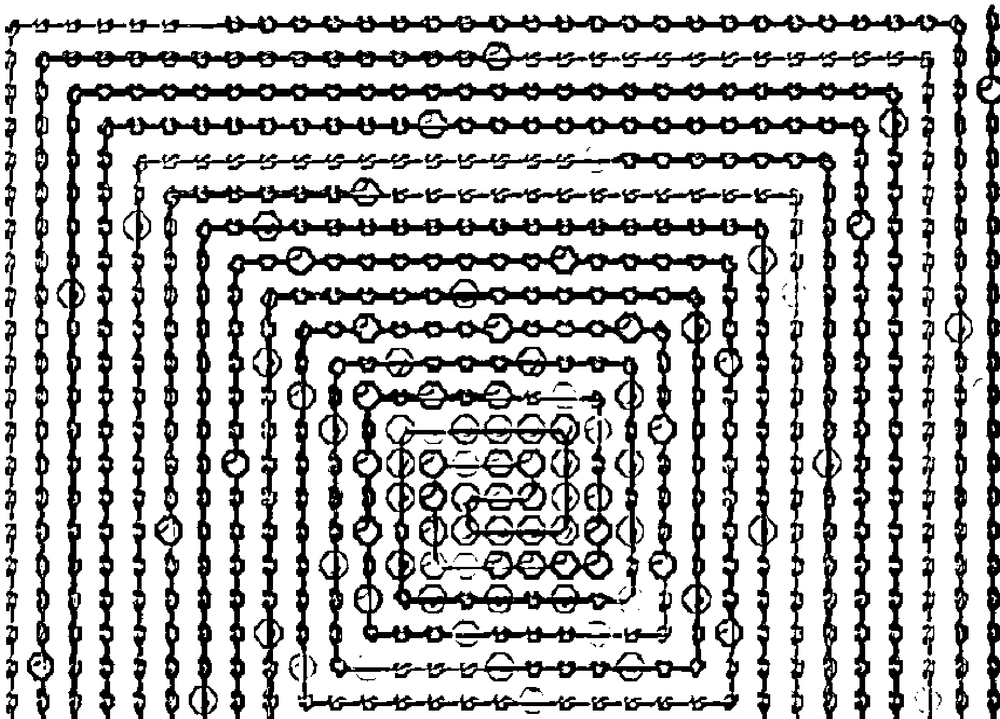

本图为表现蓝道玛泛音及潜音列色彩编码的珠串。中间起始的所有红珠为C音；橘珠为D音；黄珠E音；绿珠F音；蓝珠G音；靛珠A音；深紫（violet）及淡紫（lavender）珠为B音。彩珠依照蓝道玛谐音列顺序排列。珠串类似第142页的“蓝道玛脉轮静心项链”。

### 简介

### 玻璃珠与绳结理论

感谢罗伯米勒佛克洛（Robert Miller Foulkrod）用电脑做出许多图形和表格；李查诺利（Richard Norley）制作及扫描图形和表格；众多要求将这些资讯公开的善心听众；还有未来可能会发现这些资讯可作为垫脚石的人们，借此进行关于频率、色彩及各种现象转译为谐和关系的重要研究。

“玻璃珠与绳结理论”原本是我参加纽约州立大学奥巴尼分校的艺术/数学会议所做的笔记，后来变成我作谐和学演说或工作坊时的随身参考手册。内容包括能用来确认演讲厅谐音频率及波长的蓝道玛数表，还有我汇整的其他资料。这成了我的参考手册，用来对空间/时间、符号，以及其他能转译为谐音的现象作类比。

因此许多资料为基本上一目了然的图形和表格。后来有些与会者要求我提供这些笔记，还有人想要演说的投影片作研究。在这些要求下，这几年来笔记内容不断扩增。

这份笔记，集资料、类比、构想之大成，我希望能提供一个基础，供其他人进一步钻研，从原子元素到行星及恒星系间，找出其他能应用音律的关联。笔记包含一套符号、频率、倒数和图案的新词汇，也许能将表面上不同的现象连在一起。最中肯的体验，可以透过简单的电脑程式，以电子合成方式，让正确频率发出声音来加强。对于不擅长写电脑程式的人而言，这些关系即使是用钢琴或其他较为传统的乐器弹奏，也能加以体会。

“玻璃珠与绳结理论”的灵感来自赫塞（Hermann Hesse）的小说《玻璃珠游戏》（Magister Ludi, the Glass Bead Game）。我认为这故事说的是一个奠基于音乐和声的未来世界。所以这份笔记会先说明如何根据谐和学及色彩编码的理论（蓝道玛）制作项链。每颗珠子代表一个音符（频率），一个固定顺序和色彩代号。

我认为若能将所有现象转译为音乐词汇，或许我们能以不太一样的方式观察宇宙，说不定是以谐和学的统一场论。如果能找到方法，将物质的物理现象与意识互相转译，将人类互动法则转译为音乐词汇，我们就能根据谐和律建立架构，发出和他人谐和一致的声音，让思想与个人的高我和谐一致，创造更大福祉。我们将能过着实现和谐世界理想的日子。

## 第10章

### 玻璃珠与绳结理论

取一个整数集合（1，2，3，4…），以450为限，从29x31的矩阵中心开始顺时针计算。[见XX页图]数字1到16的数线与C调音符具有下列的一对一关系（C以256赫兹为准）：

- 1, 2, 4, 8, 16 = 音符C
- 3, 6, 12 = 音符G
- 5, 10 = 音符E
- 7, 14 = 音符Bb
- 9 = 音符D
- 11 = 音符Gb
- 13 = 音符Ab
- 15 = 音符B

将这些音符（谐音）根据毕达哥拉斯（约西元前五〇〇年）的理论给予对应的色彩编码，以彩色珠子表示。排下一组八颗珠子时，珠子（第十六谐音到三十一谐音）以一个绳结隔开。

再下一组的八颗珠子，以三个绳结隔开，再下一组则以七个绳结隔开。两珠间绳结数的方程式为2ⁿ-1。因此下一组八颗珠子会由十五个绳结隔开。

这种计算方式的意义，在于可以确定数字频率（以赫兹为单位）增加时，八个独立音程的范围和界限。在这一版的《玻璃珠与绳结理论》中，绳结颜色与前面的珠子相同。[见第115页封面图]只要看图，就能明了珠子排列方式。

空心珠代表相对于选定基频的次谐和音程，并同样赋予色彩编码，以代表n（或1/n）的镜像（倒数）。整条数线没有0，数线排列如下：

- 1/450，……………，1/3，1/2，1/1，2/1，3/1，……………450/1

比率1/1到2/1和1/1到1/2跨越了一整个八度。一直要到第八谐音8/1，才会出现红到黄橘、黄色、蓝绿、蓝色、紫色、蓝紫色到红紫色的色彩序列。在次谐音音列从1/8向下数到1/16时，色彩序列会不同：

- 8 红
9 黄橘
10 黄
11 蓝绿
12 蓝
13 紫
14 蓝紫
15 红紫

- 1/8 红
1/9 蓝紫
1/10 蓝
1/11 蓝绿
1/12 绿
1/13 黄
1/14 橘
1/15 红橘

> 参考资料：1) Hermann Hesse – Magister Ludi (The Glass Bead Game) – Translated from the German Das Glasperlenspiel, by Richard and Clara Winston, Bantam Books, New York City, 1996.

### 蓝道玛脉轮静心项链

本图为蓝道玛脉轮静心项链构造细节的灰阶列印图。本图原作为彩色，以显示选用的宝石及珠子颜色。有7种不同排列方式可选择，以配合身体七大脉轮。灵性中心（Psychic Chakra，位于延脑）另有一种配置方式。本图的宝石及彩珠排列是顶轮能量专用。

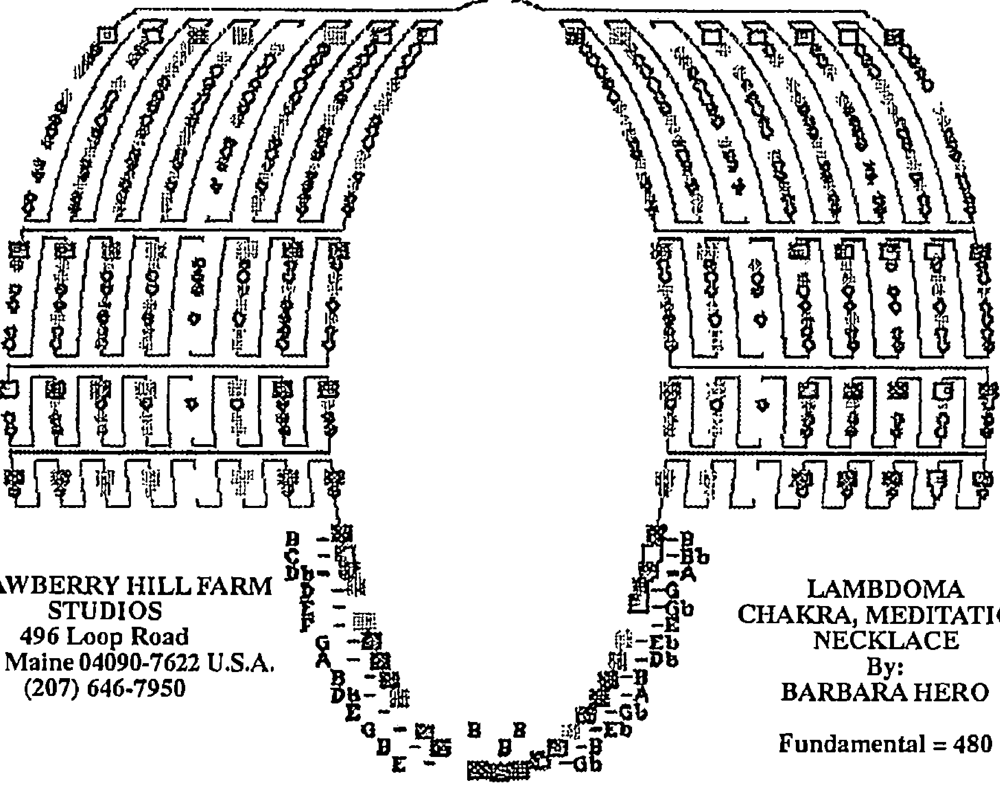

基频=480

蓝道玛脉轮静心项链
（芭芭拉・希洛设计）

### 🪔 **阳布里科斯（新毕氏学派）／康托尔数组**

#### [见第54页康托尔数组图]

#### 康托尔的不可数类
（Cantor’s Nondenumerable Classes）

- 1. 超越数（transcendental number）类不只无限，也不可数，也就是不可数的无限。
- 2. 0和1间的实数（real number）为无限且不可数。
- 3. 所有实数类更加不可数。

对于不可数的实数类，康托尔指定了一个新的超限基数（transfinite cardinal）。这是一个阿列夫^46（Aleph），但至今仍然未解。有人认为这个称为“连续统基数”（cardinal of the continuum）的超限基数（以c或C为代表）和 ℵ 一模一样，但尚未建立可被大部分数学家接受的证明。^47

#### 康托尔的色彩编码
（Cantor’s Color-Coding）

> “单值函数组F的简单几何解释如下：
线段上的每个点都对应光谱的一个颜色。因此F组包含所有可能的色彩和点组合。^48”

#### 第一集合为全有理数集合^49

0至1之间的有理数：1/2, 2/3, 3/4, 4/5, 5/6, ..., n/(n+1)  
0至1/2之间的有理数：1/3, 2/5, 3/7, 4/9, 5/11, ..., n/(2n+1)  
0至1/3之间的有理数：1/4, 2/7, 3/10, 4/13, 5/16, ..., n/(3n+1)

定理1：全有理数集合为可数。

请想想康托尔数数组：

```
1 → 2 → 3 → 4 → ...  
↙ ↗ ↙  
1/2  2/2  3/2  4/2 ...  
↓ ↗ ↙  
1/3  2/3  3/3  4/3 ...  
↙  
1/4  2/4  3/4  4/4 ...  
↓  
.    .    .    . ...
```

## 第11章
蓝道玛音阶的频率

频率以每秒振动周数（赫兹）为单位，是确定音高最准确的方式之一。蓝道玛矩阵由整数比构成，以基频为比率1:1。1:1表示频率可以是任意整数比。矩阵可以取任意频率集，或是1至16赫兹的生物频率；或是60至400赫兹的电力频率；或是20至2万赫兹的声频。矩阵也可由10^16赫兹范围内的光频，或是10^20至10^30赫兹频带的伽玛射线和宇宙射线^50构成。

将频率用于音乐上的一个方便作法，就是从所谓的中央C八度开始。这里是钢琴键盘最低音和最高的中间，是方便的起点。我们以最简单的2赫兹频率，反复乘2加倍，直至到达所谓的中央C音域。因此我们的中央C为256赫兹，比习惯上键盘调和音的261.6赫兹C音稍低。事实上，有人也许会认为这个音高比较像B音。但在物理学上，C通常是256赫兹。

因此问题来了，“如果C音为256赫兹，那么音阶的第二个音频率为何？”答案是第九谐音。这个谐音是将32赫兹的基频乘以10、11、12、13、14和15，结果得出频率为256、288、320、352、384、416及480赫兹。

将这个音阶与其他音阶相比，例如“平均律”音阶（所有音乘以2的12次方根，即1.059463094），音调和频率明显不同。我们指定界限以定义下一个音的频率。在中央C音域的第八至十六谐音，音与音之间等差为32赫兹。分析中央C高八度第八到十六谐音的频率差异时，蓝道玛音阶八个音彼此相差64赫兹。

### 蓝道玛数表

[见第41页蓝道玛比率频率数表] 谐和音阶频率的关键就在蓝道玛数表之中。研究这个矩阵，可以得到许多古代学人所熟悉的领悟。这个数表是整个蓝道玛研究的万能钥匙。好好研究还能有更多发现。

我们发现比率和C、D、E、F、G、A、B音及其各种升降音程间有着一对一的关系。我们注意到，取钢琴中央C音域的声频，也就是256赫兹至512赫兹，用电子方式产生这些频率，就能听见这些谐和关系。

我们还能将任意现象以对应尺寸限制在1至16间的固定比例，增减至听得见的声频。这个系统可应用于小如细胞的微米尺寸，大如光年，或是尺寸介乎两者间的各种现象。我们也许能找出情绪或是人体能量中心（如果能实际听见的话），并以可度量的方式反应。

蓝道玛矩阵的原理能找出人类感官所能感受的声音谐音。我们可以效法毕达哥拉斯和牛顿的作法，将音程编码成吸收色，或是编码成代表频率而非波长的发散色。吸收色以红色C音为起点，然后依照彩虹顺序上行；发散色以绿色C音开始，然后由此依彩虹顺序上行。

我们可以将蓝道玛矩阵编码为波长，用来建造调和的建筑与房间，和人体能量系统不同的脉轮中心共鸣。

蓝道玛矩阵能解开谐和学失落的知识。这套学问可将谐和的音声、色彩和生活空间应用在生活中。上述一切只是初步说明将谐和学运用于日常生活的成果。

角度蓝道玛数表可用来查对256 Hz（C）基频最适合的比率和频率。例如将基频256 Hz乘以特定角度比率，可以决定正多面体的频率，并将角度转译为声音。

## 比率與角度的藍道瑪矩陣

角度為比率的反正切函數，(a/b) tan^{-1}=角度

| 1:1 | 2:1 | 3:1 | 4:1 | 5:1 | 6:1 | 7:1 | 8:1 | 9:1 | 10:1 | 11:1 | 12:1 | 13:1 | 14:1 | 15:1 | 16:1 |
| :--- | :--- | :--- | :--- | :--- | :--- | :--- | :--- | :--- | :--- | :--- | :--- | :--- | :--- | :--- | :--- |
| 45° | 63° | 72° | 76° | 79° | 81° | 82° | 83° | 84° | 84° | 85° | 85° | 86° | 86° | 85° | 86° |
| 1:2 | 2:2 | 3:2 | 4:2 | 5:2 | 6:2 | 7:2 | 8:2 | 9:2 | 10:2 | 11:2 | 12:2 | 13:2 | 14:2 | 15:2 | 16:2 |
| 27° | 45° | 56° | 63° | 68° | 72° | 74° | 76° | 77° | 79° | 80° | 81° | 81° | 82° | 82° | 83° |
| 1:3 | 2:3 | 3:3 | 4:3 | 5:3 | 6:3 | 7:3 | 8:3 | 9:3 | 10:3 | 11:3 | 12:3 | 13:3 | 14:3 | 15:3 | 16:3 |
| 18° | 34° | 45° | 53° | 59° | 63° | 67° | 69° | 72° | 73° | 75° | 76° | 77° | 78° | 79° | 79° |
| 1:4 | 2:4 | 3:4 | 4:4 | 5:4 | 6:4 | 7:4 | 8:4 | 9:4 | 10:4 | 11:4 | 12:4 | 13:4 | 14:4 | 15:4 | 16:4 |
| 14° | 27° | 37° | 45° | 51° | 56° | 60° | 63° | 66° | 68° | 70° | 72° | 73° | 74° | 75° | 76° |
| 1:5 | 2:5 | 3:5 | 4:5 | 5:5 | 6:5 | 7:5 | 8:5 | 9:5 | 10:5 | 11:5 | 12:5 | 13:5 | 14:5 | 15:5 | 16:5 |
| 11° | 22° | 31° | 39° | 45° | 50° | 54° | 58° | 61° | 63° | 66° | 67° | 69° | 70° | 72° | 73° |
| 1:6 | 2:6 | 3:6 | 4:6 | 5:6 | 6:6 | 7:6 | 8:6 | 9:6 | 10:6 | 11:6 | 12:6 | 13:6 | 14:6 | 15:6 | 16:6 |
| 9° | 18° | 27° | 34° | 40° | 45° | 49° | 53° | 56° | 59° | 61° | 63° | 65° | 67° | 68° | 69° |
| 1:7 | 2:7 | 3:7 | 4:7 | 5:7 | 6:7 | 7:7 | 8:7 | 9:7 | 10:7 | 11:7 | 12:7 | 13:7 | 14:7 | 15:7 | 16:7 |
| 8° | 16° | 23° | 30° | 36° | 41° | 45° | 49° | 52° | 55° | 58° | 60° | 62° | 63° | 65° | 66° |
| 1:8 | 2:8 | 3:8 | 4:8 | 5:8 | 6:8 | 7:8 | 8:8 | 9:8 | 10:8 | 11:8 | 12:8 | 13:8 | 14:8 | 15:8 | 16:8 |
| 7° | 14° | 21° | 27° | 32° | 37° | 41° | 45° | 48° | 51° | 54° | 56° | 58° | 60° | 62° | 63° |
| 1:9 | 2:9 | 3:9 | 4:9 | 5:9 | 6:9 | 7:9 | 8:9 | 9:9 | 10:9 | 11:9 | 12:9 | 13:9 | 14:9 | 15:9 | 16:9 |
| 6° | 13° | 18° | 24° | 29° | 34° | 38° | 42° | 45° | 48° | 51° | 53° | 55° | 57° | 59° | 61° |
| 1:10 | 2:10 | 3:10 | 4:10 | 5:10 | 6:10 | 7:10 | 8:10 | 9:10 | 10:10 | 11:10 | 12:10 | 13:10 | 14:10 | 15:10 | 16:10 |
| 6° | 11° | 17° | 22° | 27° | 31° | 35° | 39° | 42° | 45° | 48° | 50° | 52° | 54° | 56° | 58° |
| 1:11 | 2:11 | 3:11 | 4:11 | 5:11 | 6:11 | 7:11 | 8:11 | 9:11 | 10:11 | 11:11 | 12:11 | 13:11 | 14:11 | 15:11 | 16:11 |
| 5° | 10° | 15° | 20° | 24° | 29° | 32° | 36° | 39° | 42° | 45° | 47° | 50° | 52° | 54° | 55° |
| 1:12 | 2:12 | 3:12 | 4:12 | 5:12 | 6:12 | 7:12 | 8:12 | 9:12 | 10:12 | 11:12 | 12:12 | 13:12 | 14:12 | 15:12 | 16:12 |
| 5° | 9° | 14° | 18° | 23° | 27° | 30° | 34° | 37° | 40° | 43° | 45° | 47° | 49° | 51° | 53° |
| 1:13 | 2:13 | 3:13 | 4:13 | 5:13 | 6:13 | 7:13 | 8:13 | 9:13 | 10:13 | 11:13 | 12:13 | 13:13 | 14:13 | 15:13 | 16:13 |
| 4° | 9° | 13° | 17° | 21° | 25° | 28° | 32° | 35° | 38° | 40° | 43° | 45° | 47° | 49° | 51° |
| 1:14 | 2:14 | 3:14 | 4:14 | 5:14 | 6:14 | 7:14 | 8:14 | 9:14 | 10:14 | 11:14 | 12:14 | 13:14 | 14:14 | 15:14 | 16:14 |
| 4° | 8° | 12° | 16° | 20° | 23° | 30° | 27° | 33° | 36° | 38° | 41° | 43° | 45° | 47° | 49° |
| 1:15 | 2:15 | 3:15 | 4:15 | 5:15 | 6:15 | 7:15 | 8:15 | 9:15 | 10:15 | 11:15 | 12:15 | 13:15 | 14:15 | 15:15 | 16:15 |
| 4° | 8° | 11° | 15° | 18° | 22° | 25° | 28° | 31° | 34° | 36° | 39° | 41° | 43° | 45° | 47° |
| 1:16 | 2:16 | 3:16 | 4:16 | 5:16 | 6:16 | 7:16 | 8:16 | 9:16 | 10:16 | 11:16 | 12:16 | 13:16 | 14:16 | 15:16 | 16:16 |
| 4° | 7° | 11° | 14° | 17° | 21° | 24° | 27° | 29° | 32° | 35° | 37° | 39° | 41° | 43° | 45° |

### 將藍道瑪數表（康托爾數組）轉化為織品

織品的經緯紗代表x和y軸，縱向的經紗可視爲y軸。在音樂，經紗（y）可視爲潛音下行列或次諧音；緯紗（x）則代表泛音上行列或諧音。

潛音音列變成彩色編碼經紗後，每條色線代表藍道瑪網格中的一個音，貫穿布料全長。潛音音列成爲緯紗，色紗以二十一條線爲一股，橫貫網格。因此經緯紗的編碼代表音程的色彩，以古代藍道瑪數表的泛音/潛音音列爲圖案，潛音音列爲經紗；泛音音列爲緯紗。這個古代音樂系統被新畢氏學人（Neo-Pythagorean）楊布利科斯（Iamblichus，約西元200年）認爲是出自畢達哥拉斯。

藍道瑪數表的比率與特定音程爲一對一的關係。數表中每個比率都被編派一個音程的代表色。

> *如果康托爾知道藍道瑪矩陣的存在，那他就是從以自己爲名的數組拿掉音程對應。他被認爲是玄學數學家，而且來自小提琴手的音樂家庭。

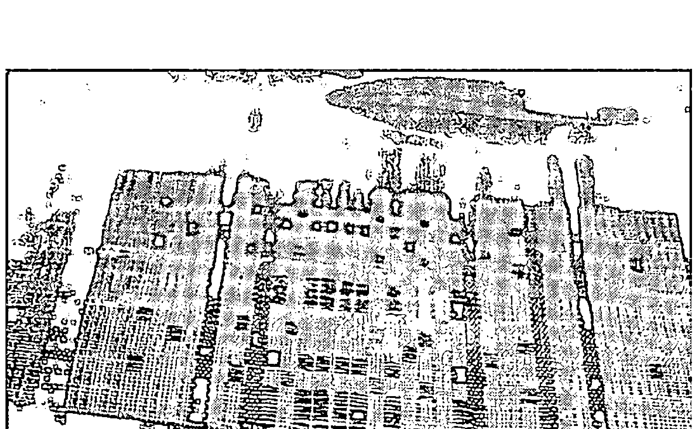

（織布機設定：羅伯米勒佛克洛）

### 四面體豎琴

### 第三眼、心形與海豚

四面體豎琴（Tetra-harp）的構想來自畢達哥拉斯彈奏過的三面里拉琴（lyre）。這個豎琴由芭芭拉希洛與瑪夏艾普斯坦（Marcia Epstein）發想，在芭芭拉希洛委託T. 戈登安德森（T. Gordon Anderson）設計製作。這個豎琴的藍道瑪諧和音程調音，是以256 Hz的C-調泛音音列為基礎。豎琴的海豚面為諧和音階C、C、G、C、E-、G、B♭、c、d、e-、f#和g。豎琴另外兩面則調成有點像12弦的半音音階，一個調成C調，另一個調成G調。參考資料：論文，1996年美國身心能場學協會公報

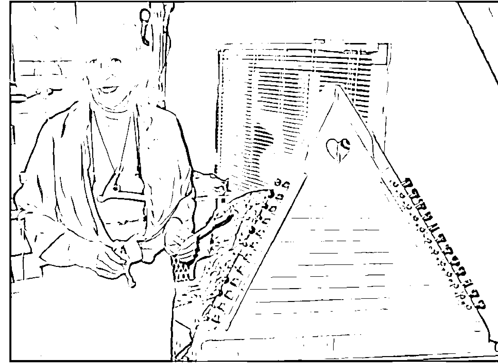

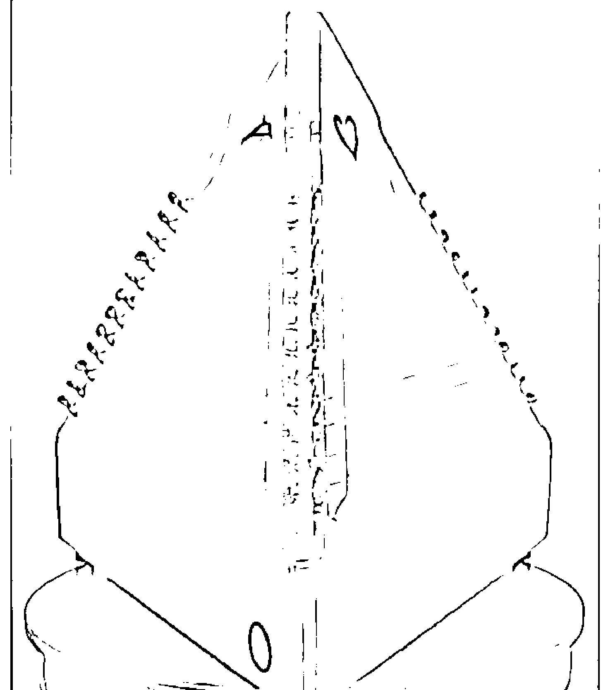

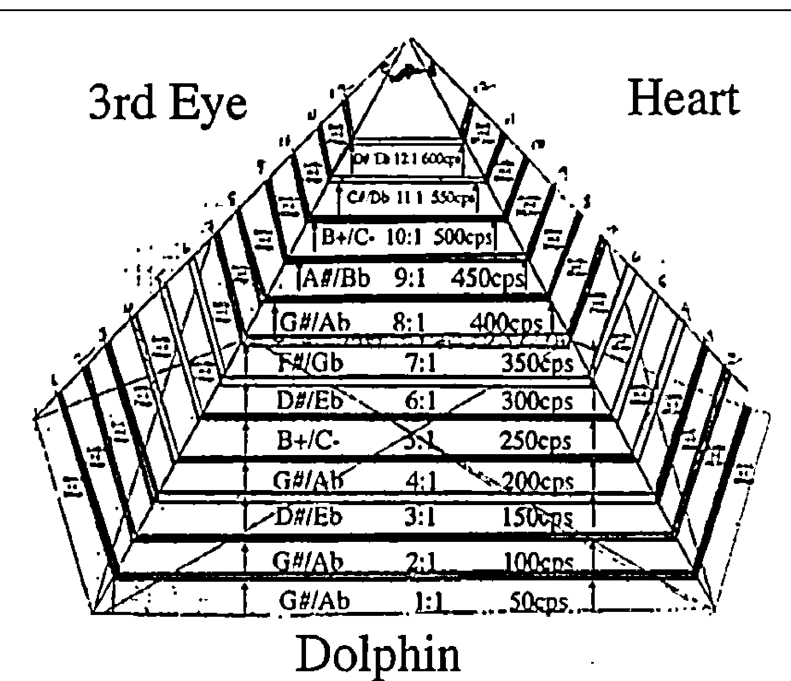

### 藍道瑪基準八度

#### 藍道瑪泛音（Lambdoma Overtone）

諧音音列（harmonic series）基頻=32 Hz

| 比例 | 頻率 | 音名 |
| :--- | :--- | :--- |
| 8:8 | 256 | C |
| 9:8 | 288 | D |
| 10:8 | 320 | E♭ |
| 11:8 | 352 | F# |
| 12:8 | 384 | G |
| 13:8 | 416 | A♭ |
| 14:8 | 448 | B♭ |
| 15:8 | 480 | B |
| 16:8 | 512 | C |

#### 藍道瑪潛音（Lambdoma Undertone）

次諧音音列（sub-harmonic series）基頻=4096 Hz

| 比例 | 頻率 | 音名 |
| :--- | :--- | :--- |
| 1:16 | 256 | C |
| 1:15 | 273 | C# |
| 1:14 | 293 | D# |
| 1:13 | 315 | E♭ |
| 1:12 | 341 | F |
| 1:11 | 372 | G♭ |
| 1:10 | 410 | A♭ |
| 1:9 | 455 | B♭ |
| 1:8 | 512 | C |

#### 藍道瑪基準八度表

##### ◎對藍道瑪泛音及潛音音列差異的領悟

取32赫茲的頻率，作為藍道瑪矩陣中的藍道瑪泛音音階基頻。

由第八至第十五諧音決定了泛音音階。

#### 藍道瑪泛音音階

| 諧音 |   | 基頻 |   | 泛音頻率 | 最接近的平均律音調 |
| :--- | - | :--- | - | :--- | :--- |
| 8 | x | 32 | = | 256 | (C) |
| 9 | x | 32 | = | 288 | (D) |
| 10 | x | 32 | = | 320 | (E) |
| 11 | x | 32 | = | 352 | (F#) |
| 12 | x | 32 | = | 384 | (G) |
| 13 | x | 32 | = | 416 | (A♭) |
| 14 | x | 32 | = | 448 | (B♭) |
| 15 | x | 32 | = | 480 | (B) |

#### 藍道瑪潛音音階

| 諧音 |   | 基頻 |   | 潛音頻率 | 最接近的平均律音調 |
| :--- | - | :--- | - | :--- | :--- |
| 1/8 | x | 4096 | = | 512 | (C) |
| 1/9 | x | 4096 | = | 455.1 | (B♭) |
| 1/10 | x | 4096 | = | 409.6 | (A♭) |
| 1/11 | x | 4096 | = | 372.4 | (G♭) |
| 1/12 | x | 4096 | = | 341.3 | (F) |
| 1/13 | x | 4096 | = | 315 | (E) |
| 1/14 | x | 4096 | = | 292.5 | (D) |
| 1/15 | x | 4096 | = | 273.1 | (D♭) |

#### 藍道瑪潛音音階相鄰頻率的頻率和

| 潛音音階 |   | 相鄰頻率 |   | 頻率和 |   |   |   |   |
| :--- | - | :--- | - | :--- | - | - | - | - |
| 1/8 512 (C) | + | 455.1 | = | 967.1 | / | 2* | = | 483.6 (B) |
| 1/9 455.1 (B♭) | + | 409.6 | = | 864.7 | / | 2 | = | 432.4 (A) |
| 1/10 409.6 (A♭) | + | 372.4 | = | 782 | / | 2 | = | 391 (G) |
| 1/11 372.4 (G♭) | + | 341.3 | = | 713.7 | / | 2 | = | 356.9 (F♯) |
| 1/12 341.3 (F) | + | 315 | = | 656.3 | / | 2 | = | 328.2 (E) |
| 1/13 315 (E) | + | 292.5 | = | 607.5 | / | 2 | = | 303.8 (E♭) |
| 1/14 292.5 (D) | + | 273.1 | = | 565.6 | / | 2 | = | 282.8 (D) |
| 1/15 273.1 (D♭) | + | 256 | = | 529.1 | / | 2 | = | 264.6 (D♭) |

*將頻率加倍或減半，使其落在中央C八度 (256 - 512 cps)。

#### 藍道瑪潛音音階相鄰頻率的頻率差

| 潛音音階 |   | 相鄰頻率 |   | 頻率差 |   |   |   |   |
| :--- | - | :--- | - | :--- | - | - | - | - |
| 1/8 512 (C) | - | 455.1 | = | 56.9 | / | 8* | = | 455.1 (B♭) |
| 1/9 455.1 (B♭) | - | 409.6 | = | 45.5 | / | 8 | = | 364 (G♭) |
| 1/10 409.6 (A♭) | - | 372.4 | = | 37.2 | / | 8 | = | 297.6 (E♭) |
| 1/11 372.4 (G♭) | - | 341.3 | = | 31.1 | / | 16 | = | 497.6 (B) |
| 1/12 341.3 (F) | - | 315 | = | 26.3 | / | 16 | = | 420.8 (A) |
| 1/13 315 (E) | - | 292.5 | = | 22.5 | / | 16 | = | 360 (G♭) |
| 1/14 292.5 (D) | - | 273.1 | = | 19.4 | / | 16 | = | 310.4 (E♭) |
| 1/15 273.1 (D♭) | - | 256 | = | 17.1 | / | 16 | = | 273.6 (D♭) |

*將頻率加倍或減半，使其落在中央C八度 (256 -512 cps)

#### 中央C八度的泛音與潛音的頻率差

| 泛音音階 | 潛音音階 | 頻率差 |
| :--- | :--- | :--- |
| 256 (C) - 256 (C) = 0 | - | - = 256 (C) |
| 288 (D) - 292.5 (D) = 4.5 | x | 64 = 288 (D) |
| 320 (E) - 315 (E) = 5 | x | 64 = 320 (E) |
| 352 (F#) - 341.3 (F) = 10.7 | x | 32 = 342.4 (F) |
| 384 (G) - 372.4 (Gb) = 11.6 | x | 32 = 371.2 (Gb) |
| 416 (Ab) - 409.6 (Ab) = 6.4 | x | 64 = 409.6 (Ab) |
| 448 (Bb) - 455.1 (Bb) = 7.1 | x | 64 = 454.4 (Bb) |
| 480 (B) - 455.1 (Bb) = 24.9 | x | 16 = 398.4 (Ab) |

在中央C八度的泛音音列，兩音間相差32赫茲。中央C高八度（512至1024赫茲）時，兩音相差64赫茲。每高一個八度，差距就會加倍，因此下個八度的差異會是128赫茲。中央C低八度也是同樣情形，差距會依序由16、8、4、2遞減。

#### 藍道瑪智慧鍵盤的基頻

本表的用途是在演講中用藍道瑪智慧鍵盤彈奏，將基頻定為太陽在銀河系公轉的頻率，根據比率記譜法彈奏琴鍵可演奏1:8到8:1的音程。參閱第67頁藍道瑪智慧鍵盤的第一象限圖，參考資料：論文，1995年美國身心能場學協會公報；論文《藍道瑪簡史》，Xenharmonikon16期，1995年秋季號。

#### 行星公轉週期頻率

以太陽在銀河系公轉的頻率為基頻推算 第一象限： 以太陽的基頻=332.8 Hz作為比率1:1

| 比率   | 行星   | 公轉頻率 | 音符 | 近似頻率 |
|--------|--------|----------|------|----------|
| 06/07  | 水星   | 282.6 Hz | D-   | 285.3 Hz |
| 04/03  | 金星   | 221.2 Hz | A    | 443.7 Hz |
| 05/06  | 地球   | 272.2 Hz | C#   | 277.3 Hz |
| 06/07  | 火星   | 289.4 Hz | D+   | 285.3 Hz |
| 11/10* | 木星   | 367.2 Hz | F#   | 366.1 Hz |
| 05/04  | 天王星 | 414.7 Hz | Ab   | 416.0 Hz |
| 08/09  | 土星   | 295.7 Hz | D#   | 295.8 Hz |
| 04/05  | 海王星 | 422.8 Hz | Ab   | 266.3 Hz |
| 06/07  | 冥王星 | 288.5 Hz | D    | 285.3 Hz |

\*非屬於第一象限

#### 元素頻率對照

以氫的基頻=256 Hz作為比率1:1

| 比率    | 元素   | 原子序頻率 | 音符 | 近似頻率 |
|---------|--------|------------|------|----------|
| 03/02   | 鉻(Cr) | 384.0 Hz   | G    | 384 Hz   |
| 04/03   | 鉬(Mo) | 366.0 Hz   | F#   | 341 Hz   |
| 05/04   | 鈣(Ca) | 320.0 Hz   | Eb   | 320 Hz   |
| 04/05   | 錳(Mn) | 400.0 Hz   | G#   | 409.6 Hz |
| 13/08*  | 鐵(Fe) | 416.0 Hz   | Ab   | 416.0 Hz |
| 06/05   | 鉀(K)  | 304.0 Hz   | D#   | 307.2 Hz |
| 05/06   | 碘(I)  | 424.0 Hz   | A-   | 426.6 Hz |
| 10/11*  | 銅(Cu) | 464.0 Hz   | Bb   | 465.5 Hz |
| 15/16*  | 磷(P)  | 480.0 Hz   | B    | 480.0 Hz |
| 15/16*  | 鋅(Zn) | 480.0 Hz   | B    | 480.0 Hz |
| 16/15*  | 硒(Se) | 272.0 Hz   | C#   | 273.1 Hz |

\*屬於不同象限

n~m (n=實際頻率，m=基準八度頻率)

## 藍道瑪音樂頻譜療法


#### 常數的十六次倍數

##### ◎約化為藍道瑪基準八度頻率⁵¹

###### 圓周率（π=3.1415）十六次倍數

| 常數 | 運算結果 | 藍道瑪頻率 | 自然音階 C=256Hz | 藍道瑪音階 C=256Hz | 鋼琴音階 A=440Hz |
|------|----------|------------|------------------|--------------------|------------------|
| 1π   | 3.1415   | 402.112    | G#               | T#                 | G                |
| 2π   | 6.283    | 402.112    | G#               | T#                 | G                |
| 3π   | 9.4245   | 301.584    | D#               | Q#                 | D                |
| 4π   | 12.566   | 402.112    | G#               | T#                 | G                |
| 5π   | 15.7075  | 502.64     | B#               | W#                 | B                |
| 6π   | 18.849   | 301.584    | D#               | Q#                 | D                |
| 7π   | 21.9905  | 351.848    | F#               | S                  | F                |
| 8π   | 25.132   | 402.112    | G#               | T#                 | G                |
| 9π   | 28.2735  | 452.376    | A#               | V                  | A                |
| 10π  | 31.415   | 502.64     | B#               | W#                 | B                |
| 11π  | 34.5565  | 276.452    | C#               | P#                 | C#               |
| 12π  | 37.698   | 301.584    | D#               | Q#                 | D                |
| 13π  | 40.8395  | 326.716    | E                | R                  | E                |
| 14π  | 43.981   | 351.848    | F#               | S                  | F                |
| 15π  | 47.1225  | 376.98     | G                | T                  | F#               |
| 16π  | 50.264   | 402.112    | G#               | T#                 | G                |

###### 圓周率（π=3.14151）十六次倍數的倒數

| 倒數    | 運算結果 | 藍道瑪頻率 | 自然音階 C=256Hz | 藍道瑪音階 C=256Hz | 鋼琴音階 A=440Hz |
|---------|----------|------------|------------------|--------------------|------------------|
| (1/π)⁻¹ | 0.318319 | 325.958656 | E                | R                  | E                |
| (2/π)⁻¹ | 0.15916  | 325.95968  | E                | R                  | E                |
| (3/π)⁻¹ | 0.106106 | 434.610176 | A                | U#                 | A                |
| (4/π)⁻¹ | 0.07958  | 325.95968  | E                | R                  | E                |
| (5/π)⁻¹ | 0.063664 | 260.767744 | C                | P                  | C                |
| (6/π)⁻¹ | 0.053053 | 434.610176 | A                | U#                 | A                |
| (7/π)⁻¹ | 0.045474 | 372.523008 | F#               | S#                 | F#               |
| (8/π)⁻¹ | 0.03979  | 325.95968  | E                | R                  | E                |
| (9/π)⁻¹ | 0.035369 | 289.742848 | D                | Q                  | D                |
| (10/π)⁻¹ | 0.031832 | 260.767744 | C                | P                  | C                |
| (11/π)⁻¹ | 0.028938 | 474.120192 | B                | W                  | A#               |
| (12/π)⁻¹ | 0.026527 | 434.618368 | A                | U#                 | A                |
| (13/π)⁻¹ | 0.024486 | 401.178624 | G#               | T#                 | G                |
| (14/π)⁻¹ | 0.022737 | 372.523008 | F#               | S#                 | F#               |
| (15/π)⁻¹ | 0.021221 | 347.684864 | F                | S                  | F                |
| (16/π)⁻¹ | 0.019895 | 325.95968  | E                | R                  | E                |

> > 51. 以升八度法，將結果反覆乘以2

#### 自然指數 (e=2.718281828) 十六次倍數

| 常數 | 運算結果 | 藍道瑪頻率 | 自然音階 C=256Hz | 藍道瑪音階 C=256Hz | 鋼琴音階 A=440Hz |
| :--- | :--- | :--- | :--- | :--- | :--- |
| 1e | 2.718281828 | 347.940096 | F | S | F |
| 2e | 5.436564 | 347.940096 | F | S | F |
| 3e | 8.154845 | 260.95504 | C | P | C |
| 4e | 10.873127 | 347.940064 | F | S | F |
| 5e | 13.591409 | 434.925088 | A | U# | A |
| 6e | 16.309691 | 260.955056 | C | P | C |
| 7e | 19.027973 | 304.447568 | D# | Q# | D# |
| 8e | 21.746255 | 347.94008 | F | S | F |
| 9e | 24.464536 | 391.432576 | G | T | G |
| 10e | 27.182818 | 434.925088 | A | U# | A |
| 11e | 29.9011 | 478.4176 | B | W | A# |
| 12e | 32.619382 | 260.955056 | C | P | C |
| 13e | 35.337664 | 282.701312 | D | Q | C# |
| 14e | 38.055946 | 304.447568 | D# | Q# | D# |
| 15e | 40.774227 | 326.193816 | E | R | E |
| 16e | 43.492509 | 347.940072 | F | S | F |

#### 自然指數 (e=2.718281828) 十六次倍數的倒數

| 倒數 | 運算結果 | 藍道瑪頻率 | 自然音階 C=256Hz | 藍道瑪音階 C=256Hz | 鋼琴音階 A=440Hz |
| :--- | :--- | :--- | :--- | :--- | :--- |
| ( 1e )⁻¹ | 0.367879 | 376.708096 | G | T | F# |
| ( 2e )⁻¹ | 0.18394 | 376.70912 | G | T | F# |
| ( 3e )⁻¹ | 0.122626 | 502.276096 | B# | W# | B |
| ( 4e )⁻¹ | 0.09197 | 376.70912 | G | T | F# |
| ( 5e )⁻¹ | 0.073576 | 301.367296 | D# | Q# | D |
| ( 6e )⁻¹ | 0.061313 | 502.276096 | B# | W# | B |
| ( 7e )⁻¹ | 0.052554 | 430.522368 | A | U# | A |
| ( 8e )⁻¹ | 0.045985 | 376.70912 | G | T | F# |
| ( 9e )⁻¹ | 0.040875 | 334.848 | F | R# | E |
| ( 10e )⁻¹ | 0.036788 | 301.367296 | D# | Q# | D |
| ( 11e )⁻¹ | 0.033444 | 273.973248 | C# | P# | C# |
| ( 12e )⁻¹ | 0.030657 | 502.284288 | B# | W# | B |
| ( 13e )⁻¹ | 0.028298 | 463.634432 | A# | V# | A# |
| ( 14e )⁻¹ | 0.026277 | 430.522368 | A | U# | A |
| ( 15e )⁻¹ | 0.024525 | 401.8176 | G# | T# | G |
| ( 16e )⁻¹ | 1.064494 | 272.510464 | C# | P# | C# |

## 藍道瑪音樂頻譜療法

#### 自然對數（2Ln=.69314718）的十六次倍數

| 常數 | 運算結果 | 藍道瑪頻率 | 自然音階 C=256Hz | 藍道瑪音階 C=256Hz | 鋼琴音階 A=440Hz |
|---|---|---|---|---|---|
| 1(2Ln) | 0.693147 | 354.891264 | F# | S | F |
| 2(2Ln) | 1.386294 | 354.891264 | F# | S | F |
| 3(2Ln) | 2.079442 | 266.168576 | C# | P# | C |
| 4(2Ln) | 2.772589 | 354.891392 | F# | S | F |
| 5(2Ln) | 3.465736 | 443.614208 | A# | V | A |
| 6(2Ln) | 4.158883 | 266.168512 | C# | P# | C |
| 7(2Ln) | 4.85203 | 310.52992 | D# | Q# | D# |
| 8(2Ln) | 5.545177 | 354.891328 | F# | S | F |
| 9(2Ln) | 6.238325 | 399.2528 | G# | T# | G |
| 10(2Ln) | 6.931472 | 443.614208 | A# | V | A |
| 11(2Ln) | 7.624619 | 487.975616 | B | W | B |
| 12(2Ln) | 8.317766 | 266.168512 | C# | P# | C |
| 13(2Ln) | 9.010913 | 288.349216 | D | Q | D |
| 14(2Ln) | 9.704061 | 310.529952 | D# | Q# | D# |
| 15(2Ln) | 10.397208 | 332.710656 | F | R# | E |
| 16(2Ln) | 11.090355 | 354.89136 | F# | S | F |

#### 自然對數（2Ln=.69314718）十六次倍數的倒數

| 倒數 | 運算結果 | 藍道瑪頻率 | 自然音階 C=256Hz | 藍道瑪音階 C=256Hz | 鋼琴音階 A=440Hz |
|---|---|---|---|---|---|
| [ 1(2Ln) ]⁻¹ | 1.442695 | 369.32992 | F# | S# | F# |
| [ 2(2Ln) ]⁻¹ | 0.721348 | 369.330176 | F# | S# | F# |
| [ 3(2Ln) ]⁻¹ | 0.480898 | 492.439552 | B | W# | B |
| [ 4(2Ln) ]⁻¹ | 0.360674 | 369.330176 | F# | S# | F# |
| [ 5(2Ln) ]⁻¹ | 0.288539 | 295.463936 | D | Q | D |
| [ 6(2Ln) ]⁻¹ | 0.240449 | 492.439552 | B | W# | B |
| [ 7(2Ln) ]⁻¹ | 0.206099 | 422.090752 | A | U | G# |
| [ 8(2Ln) ]⁻¹ | 0.180337 | 369.330176 | F# | S# | F# |
| [ 9(2Ln) ]⁻¹ | 0.160299 | 328.292352 | E | R# | E |
| [ 10(2Ln) ]⁻¹ | 0.14427 | 295.46496 | D | Q | D |
| [ 11(2Ln) ]⁻¹ | 0.131154 | 268.603392 | C# | P# | C |
| [ 12(2Ln) ]⁻¹ | 0.120225 | 492.4416 | B | W# | B |
| [ 13(2Ln) ]⁻¹ | 0.110977 | 454.561792 | A# | V | A# |
| [ 14(2Ln) ]⁻¹ | 0.10305 | 422.0928 | A | U | G# |
| [ 15(2Ln) ]⁻¹ | 0.09618 | 393.95328 | G | T# | G |
| [ 16(2Ln) ]⁻¹ | 0.090168 | 369.328128 | F# | S# | F# |## 对数（Log2=0.301029995）六次倍数

| 常数 | 运算结果 | 蓝道玛频率 | 自然音阶 C=256Hz | 蓝道玛音阶 C=256Hz | 钢琴音阶 A=440Hz |
| :--- | :--- | :--- | :--- | :--- | :--- |
| 1(Log2) | 0.30103 | 308.25472 | D♯ | Q♯ | D♯ |
| 2(Log2) | 0.60206 | 308.25472 | D♯ | Q♯ | D♯ |
| 3(Log2) | 0.90309 | 462.38208 | A♯ | V♯ | A♯ |
| 4(Log2) | 1.20412 | 308.25472 | D♯ | Q♯ | D♯ |
| 5(Log2) | 1.50515 | 385.3184 | G | T | G |
| 6(Log2) | 1.80618 | 462.38208 | A♯ | V♯ | A♯ |
| 7(Log2) | 2.10721 | 269.72288 | C♯ | P♯ | C♯ |
| 8(Log2) | 2.40824 | 308.25472 | D♯ | Q♯ | D♯ |
| 9(Log2) | 2.70927 | 346.78656 | F | S | F |
| 10(Log2) | 3.0103 | 385.3184 | G | T | G |
| 11(Log2) | 3.31133 | 423.85024 | A | U | G♯ |
| 12(Log2) | 3.61236 | 462.38208 | A♯ | V♯ | A♯ |
| 13(Log2) | 3.91339 | 500.91392 | B♯ | W♯ | B |
| 14(Log2) | 4.21442 | 269.72288 | C♯ | P♯ | C♯ |
| 15(Log2) | 4.51545 | 288.9888 | D | Q | D |
| 16(Log2) | 4.81648 | 308.25472 | D♯ | Q♯ | D♯ |

#### 自然指数（e=2.718281828）十六次倍数的倒数

| 倒数 | 运算结果 | 蓝道玛频率 | 自然音阶 C=256Hz | 蓝道玛音阶 C=256Hz | 钢琴音阶 A=440Hz |
| :--- | :--- | :--- | :--- | :--- | :--- |
| [ 1(Log2) ]⁻¹ | 3.321928 | 425.206784 | A | U♯ | G♯ |
| [ 2(Log2) ]⁻¹ | 1.660964 | 425.206784 | A | U♯ | G♯ |
| [ 3(Log2) ]⁻¹ | 1.107309 | 283.471104 | D | Q | C♯ |
| [ 4(Log2) ]⁻¹ | 0.830482 | 425.206784 | A | U♯ | G♯ |
| [ 5(Log2) ]⁻¹ | 0.664386 | 340.165632 | F | R♯ | F |
| [ 6(Log2) ]⁻¹ | 0.553655 | 283.47136 | D | Q | C♯ |
| [ 7(Log2) ]⁻¹ | 0.474561 | 485.950464 | B | W | B |
| [ 8(Log2) ]⁻¹ | 0.415241 | 425.206784 | A | U♯ | G♯ |
| [ 9(Log2) ]⁻¹ | 0.369103 | 377.961472 | G | T | F♯ |
| [ 10(Log2) ]⁻¹ | 0.332193 | 340.165632 | F | R♯ | F |
| [ 11(Log2) ]⁻¹ | 0.301993 | 309.240832 | D♯ | Q♯ | D♯ |
| [ 12(Log2) ]⁻¹ | 0.276827 | 283.470848 | D | Q | C♯ |
| [ 13(Log2) ]⁻¹ | 0.255533 | 261.665792 | C | P | C |
| [ 14(Log2) ]⁻¹ | 0.237281 | 485.951488 | B | W | B |
| [ 15(Log2) ]⁻¹ | 0.221462 | 453.554176 | A♯ | V | A♯ |
| [ 16(Log2) ]⁻¹ | 0.207621 | 425.207808 | A | U♯ | G♯ |

## 第12章
### 蓝道玛天体音乐

我们提出一个新理论，以整数比转译为对应谐音为基础。这种方法导出以音乐为基础的新数字理论能产生：

- 1) 固定的顺序模进
- 2) 16x16的矩阵
- 3) 三角利萨如图形
- 4) 加倍减半数学
- 5) 物理现象在一定规模内的固定关系
- 6) 谐音与次谐音
- 7) 1至8的量子跃进
- 8) 8至16的音阶
- 9) 四色映射（mapping）
- 10) 拍号（time signature）与调号（key signature）的一对一关系

#### ◎应用

- 1) 色彩编码
- 2) 图形编码（见第94页蓝道玛辐射螺线、第95页蓝道玛利萨如图形）
- 3) 以赫兹（周/秒）为单位的频率编码
- 4) 将频率转译为波长
- 5) 转译为周期运动（Periodic Motion）
- 6) 转译时间的秒、分、时、日、年、半衰期
- 7) 以调号与拍号的一对一关系演奏音乐

#### ◎演奏的拍号

很多人大概没发现，要是曲子的指定主调降为对应频率，演奏时感觉会更统一。例如有首平均律乐曲的主调为392赫兹的F调。将频率减半两次得到98赫兹，可作为3/4拍乐曲中四分音符的节拍。

下列频率表是2的12次方根平均律调音法，以440赫兹的A音为基频。

| 音符 | 频率(Hz) (周期/秒) | 拍节器设定 |
|------|-------------------|------------|
| C（中央） | 261 | 65.131 |
| D♭ | 277 | 69.139 |
| D | 293 | 73.147 |
| E♭ | 311 | 78.156 |
| E | 330 | 82 |
| F | 349 | 87 |
| G♭ | 370 | 93 |
| G | 392 | 98 |
| A♭ | 415 | 52.104 |
| A | 440 | 55.110 |
| Bb | 466 | 58.117 |
| B | 494 | 62.124 |

不管是哪种调音法（以赫兹为单位），从中央C八度减半会产生与特定调号相当的方便拍（convenient beat）。

### 蓝道玛辐射螺线（第四象限）

本图的螺线创造方式，是从中心将一个点向外移动一个单位，同时根据中心比率的角度，将点逆时针旋转。比率角度由该比率在蓝道玛矩阵中位置的反正切函数（arctangent）决定。左上至右下对角线的星状螺线明显为45度角，因为各比率的反正切函数均可简化为1。

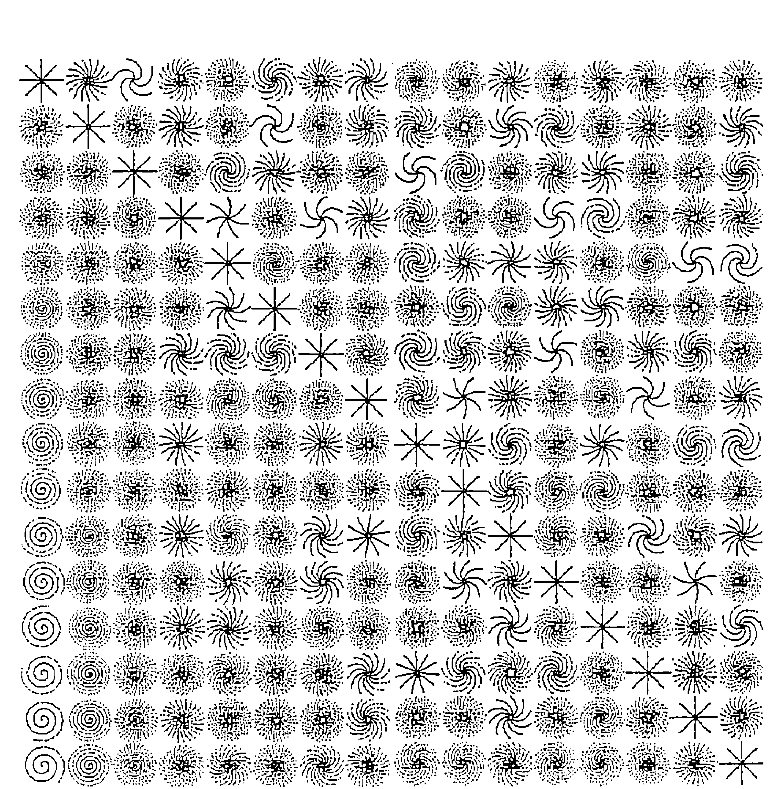

### 蓝道玛利萨如图形（第四象限）

这些名为利萨如的图形是以康托尔数组（蓝道玛矩阵）的反正切函数演算所得。这些图形也能以电子方式产生，方法是基频发出声音时，让8x8或16x16矩阵中其他谐音同时发声。选定的音程发声时，雷射扫描装置会振动两面镜子，在屏幕上产生图形。必须明白的是，根据蓝道玛的数组比率使用谐和数组时，声音也能产生具有特征的图形。两个人声以同一音高唱和时，基频1:1…n:n都会形成圆形。如果一男一女将既有频率减半或加倍，以刚好差一个八度的音程唱和，就会产生8字型图形。标题包含“第四象限”是因为此阵列位于直角坐标系的第四象限。

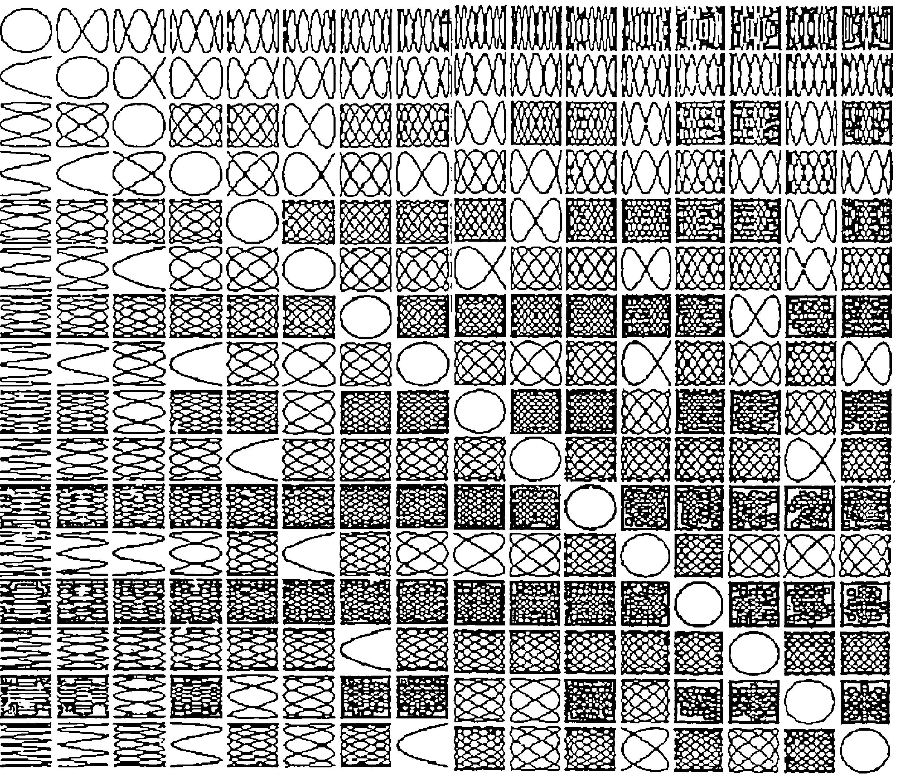

### 时间的比率、辐射螺线与利萨如图形比较

第21页蓝道玛比率频率数表的比率和音符，以及第138页蓝道玛辐射螺线、第139页蓝道玛利萨如图形的图形，都是以不同系统编码蓝道玛阵列，可以和第102、103页的时空对照表中的频率及音符相比较。

例如1秒被编码为1：1，乘以2的n次方，直到成为听得见的基准频率256Hz（见第83页蓝道玛基准八度表）。1:1时会形成圆形利萨如图形，而同样比率在螺线阵列中，会形成直角坐标系和等距坐标。1天（比率3:2，388Hz）会形成鱼形，在螺线阵列则是银河系状图形。这些比较呈现一种符号逻辑（symbolic logic），也说明时间单位的秒、天，乃至周，在音乐调和比上的差异。

| 周期 (时间) | 比率 | 螺线图形 | 利萨如图形 |
| :--- | :--- | :--- | :--- |
| 1秒 | 1/1 | 星状图形 | 圆形 |
| 1天 | 3/2 | 点状辐射图形 | 鱼形 |
| 1周 | 1/14 | 螺旋图形 | 平行线条 |
| 1/天 | 2/3 | 点状辐射图形 | 花状图形 |

### 蓝道玛易经矩阵

这是将蓝道玛阵列编码成符号的另一个范例。矩阵以中国易经八卦呈现，卦象各具特质。这只是将卦象特性赋予蓝道玛矩阵音程的一种尝试。蓝道玛谐和音阶必须将重点放在P、Q、R、S、T、U、V和W音阶记谱法，摆脱西方2的12次方根（平均律），不谐和的音阶记谱法。参考书籍：《蓝道玛共振谐和音列P、Q、R、S、T、U、V、W》，作者芭芭拉希洛。

| 1 | F P T P R T V P Q R S T U V W P |
| 2 | F P T P R T V P Q R S T U V W P |
| 3 | R R R U P R P T U W P R Q P R |
| 4 | F P T P R T V P Q R S T U V W P |
| 5 | U U R R P R S U V P Q R Q T U |
| 6 | R R P R U P R T U W P R Q P R |
| 7 | Q Q V Q R V P Q P R U V W P Q |
| 8 | F P T P R T V P Q R S T U V W P |
| 9 | V V R V Q S T V P Q R S T T U |
| 10 | U U R R P R S U V P Q R Q T U |
| 11 | T T Q T V R R T U P Q Q R S T |
| 12 | R R P R U P R T U W P R Q P R |
| 13 | R R R R T R Q R G T V W P Q R P |
| 14 | Q Q V Q R V P Q P R U V W P Q |
| 15 | Q Q U Q R S U Q R P T U V W P |
| 16 | F P T P R T V P Q R S T U V W P |

## 第13章 时空的音乐频率


### 将光年转译为音频

转译使用数据来自《天文学自修指南》（Astronomy, a Self-Teaching Guide, Dinah L. Moche, John Wiley & Sons, New York City, 1978）。

以音乐而言，我们的银河系直径（10万光年）可转译为356.8赫兹的Gb音。这个直径可视为宇宙的基频。典型和声的模进为Gb、Bb、Db。银河系圆盘的厚度为2450光年，转译成频率为455.1赫兹，或说是Bb音。Bb的吸收色为紫色，是Gb绿色的互补色。找寻Db音（第三谐音，音乐的五度音），会发现在地球16光年外的牛郎星（Altair），这个距离转译成频率为272.2赫兹，也就是Db。我们还会找到500光年远的十字架三52（Beta Crucis），距离等于278.7赫兹，也是Db音。两者颜色对应均为红橘色。在对应表中，老人星（Canopus）距离太阳98光年，频率为355.5赫兹，也就是Gb音。我们的太阳位于银河系外缘，似乎与老人星的频率谐和相容。天狼星（Sirius）和大角星（Arcturus）对太阳而言等同于小六度谐音。太阳距离银河系中心约3万光年，转译成频率为297.3赫兹，为Eb音和橘黄色。天狼星和大角星皆为B音，前者距离8.8光年，为494.9赫兹，后者距离4.3光年，483.9赫兹。Gb、Bb和Db形成谐和的三和弦，其中Gb为基音，B为小六度谐音，Db为三度谐音。巧的是三者的对应颜色也为谐和关系，Gb为绿色；B为红紫色。

52. 南十字座 (Crux) 主要亮星：十字架一（γ）、十字架二（α）、十字架三（β）及十字架四（δ）组成十字形。

使用谐音与对应色彩编码的意义，在于这个方法也许能了解星体彼此间的音乐关系。在数学上，任何数值分析都能用F=V/W之类的方程式简化为音频。这个方程式显示频率和波长为倒数关系。

- 当：
    - F = 频率(frequency)
    - V = 速度(velocity)
    - W = 波长(wavelength)

频率（frequency）与周期（period）也是倒数关系，F=1/P。

若为大宇宙，我们可以将已知的任意频率、波长或距离用降八度法转译为音频。若为小宇宙，则用升八度法加倍，而非减半。在数学上，转译是以2的n次方乘以任何整数、有理数或无理数；或以1/2的n次方乘以任何整数、有理数、无理数。

每个2或1/2的n次方是音乐的一个八度，意思是同一个音，但高或低一整个音阶。蓝道玛音阶的泛音音阶有八个音，潜音音阶有八个音，但频率不同。印度音乐一个音阶能有多达五十二个音，西方十二音阶则只有十二个音。

A、B、C、D、E、F、G音及其升降音和（或）增减音被用于大多数文化和时代。他们形成另一个架构，可以用来分析能以数字定义的现象。为了说明这点，把我们熟悉的中央C音当成是256赫兹的频率。256是2连乘七次的结果。因此C音是2或1/2的n次方；D是9乘以2或1/2的n次方，在中央C八度为288；E音为5；F为11；G为3；Ab为13；Bb为7；B则为15。这个8、9、10、11、12、13、14、15的序列代表第8谐音开始的音列，频率为256、288、320、352、384、416、448、480，代表着C、D、Eb、F#、G、Ab、Bb、和B。这就是我们所谓的“基准八度”。将任意频率升降若干八度到达基准八度时，就能得知其音名，例如元素周期表中放射元素的半衰期，星体间的光年距离；或是其他能以长度或周期测量的事物。

### 星体的距离、频率、音符与吸收色对应表

| 星体 | 距离 (光年) | 频率 (Hz) | 音符 (C=256) | 颜色 (吸收) |
|---|---|---|---|---|
| 天狼星Sirius | 8.8 | 494.9 | B | 红-紫 |
| 老人星Canopus | 98 | 355.5 | Gb | 绿 |
| 大角星Arcturus | 36 | 483.9 | B | 红-紫 |
| 南门二Alpha Centauri | 4.3 | 253.2 | C | 红 |
| 织女星Vega | 26 | 355.0 | F | 黄-绿 |
| 五车二Capella | 46 | 378.7 | G | 蓝-绿 |
| 参宿七Rigel | 900 | 309.7 | Eb | 黄-橘 |
| 南河三Procyon | 11 | 395.9 | Ab | 蓝 |
| 水委一Achernar | 150 | 464.6 | Bb | 紫 |
| 牛郎星Altair | 16 | 272.2 | Db | 红-橘 |
| 参宿四Betelgeuse | 700 | 398.2 | Ab | 蓝 |
| 毕宿五Aldebaran | 68 | 256.2 | C | 红 |
| 十字架二Alpha Crucis | 350 | 398.2 | Ab | 蓝 |
| 角宿一Spica | 230 | 303.0 | Eb | 黄-橘 |
| 心宿二Antares | 400 | 348.4 | F | 黄-绿 |
| 北河三Pollux | 35 | 248.9 | C | 红 |
| 北落师门Fomalhaut | 23 | 378.7 | G | 蓝-绿 |
| 天津四Deneb | 1400 | 398.2 | Ab | 蓝 |
| 十字架三Beta Crucis | 500 | 278.7 | Db | 红-橘 |
| 银河直径 | 100000 | 356.8 | Gb | 绿 |
| 银河中央核球 | 13000 | 343.1 | F | 黄-绿 |
| 银河厚度 | 2450 | 455.1 | Bb | 紫 |
| 太阳至银河系中心距离 | 30000 | 297.3 | Eb | 黄-橘 |

### 行星公转与自转音频转译

| 行星 | 频率 (Hz) | 音名 | 星座 | 日期 | 公转 | 自转频率 (Hz) |
|------|-----------|------|------|------|------|----------------|
| 火星 | 289.4 | Q(D) | 牡羊 | 三/四月 | 687天 | 378.5 |
| 金星 | 442 | U(A) | 金牛 | 四/五月 | 224.7天 | 409.1 |
| 水星 | 282.4 | Q(D) | 双子 | 五/六月 | 88天 | 421.3 |
| 月亮 | 443 | U(A) | 巨蟹 | 六/七月 | 28天 | 389.4 |
| 太阳 | 332.8 | R(E) | 狮子 | 七/八月 | 26000年 | 355.1 |
| 水星 | 282.4 | Q(D) | 处女 | 八/九月 | 88天 | 421.3 |
| 金星 | 442 | U(A) | 天平 | 九/十月 | 224.7天 | 409.1 |
| 火星 | 289.4 | Q(D) | 天蝎 | 十/十一月 | 687天 | 378.5 |
| 冥王星 | 288.5 | Q(D) | 天蝎 | 十/十一月 | 248.4年 | 486.2 |
| 木星 | 367.2 | S(F#)| 射手 | 十一/十二月 | 11.06年 | 473.9 |
| 土星 | 295.7 | Q(D) | 摩羯 | 十二/一月 | 29.46年 | 455.4 |
| 土星 | 295.7 | Q(D) | 水瓶 | 一/二月 | 29.46年 | 455.4 |
| 天王星 | 414.7 | U(Ab)| 水瓶 | 一/二月 | 84.01年 | 430.8 |
| 海王星 | 442.8 | U(A) | | | 164.8年 | 310.7 |
| 地球 | 272.2 | Q(D) | | | 365.25天 | 389.4 |

地球、火星、水星、冥王星和土星“Q”（D）和金星、月亮、天王星及海王星的“U”（A）在音乐上为五度关系。

频率范围为“Q”（D）（280-296）和“U”（A）（408-424）。

“U”（A）到“Q”（D）的倒数产生四度音程。

一个地球周（第七谐音）=443 Hz，相当于海王星、金星和月亮的自转周期频率。

52周(第十三次谐音)=272.6 Hz，相当于地球的自转周期频率。

太阳自转周期为26000年，转译频率为332.8Hz。

332.8(太阳)的次谐音比13:16=270.4，接近地球公转周期频率272.2。

332.8 (太陽) 的次諧音比7:8=291.2，接近土星公轉周期頻率 295.7 。

332.8 (太陽) 的次諧音比2:3=443.7，表示金星、月亮和海王星與太陽為2:3的比率。

332.8 (太陽) 的16:15比率=354.9，是一微米的音樂頻率尺寸，微米是測量血球的尺寸。


### 11625的奧妙

| 分數 | 等號 | 數字 | 顏色等號 |
|------|------|------|----------|
| 01/01 | = | 186,000 |  |
| 08/16 | = | 93,000 | = 紅 |
| 09/16 | = | 104,625 | = 橘 |
| 10/16 | = | 116,250 | = 黃 |
| 11/16 | = | 127,875 | = 綠 |
| 12/16 | = | 139,500 | = 藍 |
| 13/16 | = | 151,125 | = 靛 |
| 14/16 | = | 162,750 | = 紫 |
| 15/16 | = | 174,375 | = 淺紫 |

而：

```
(186,000-174,375)/1=11,625；(186,000-162,750)/2=11,625；
(186,000-151,125)/3=11,625；(186,000-139,500)/4=11,625；
(186,000-127,875)/5=11,625；(186,000-116,250)/6=11,625；
(186,000-104,625)/7=11,625；(186,000-93,000)/8=11,625。
```

#### ◎光

應用這個公式：

```
v=fw
```

其中：

- v=光速，以哩/秒計算
- f=頻率，以哩/秒計算
- w=波長，以哩計算

由於光的波長可以忽略，所以：

```
v=f
```

#### ◎聲音

這時：

- v=音速，以呎/秒計算
- f=頻率，以呎/秒計算
- w=波長，以呎計算
- v=在真空中近於0

因此可以說：

```
f=1/w
```

（上下做比較，注意其互補色）

- 聲音186,000 Hz（降八度法）=363 Hz (F+) 綠
- 聲音184,625 Hz（降八度法）=409 Hz (G+) 藍綠
- 聲音116,250 Hz（降八度法）=454 Hz (B-) 靛
- 聲音127,875 Hz（降八度法）=500 Hz (C-) 紅
- 聲音139,000 Hz（降八度法）=273 Hz (D-) 橘
- 聲音151,125 Hz（降八度法）=295 Hz (D+) 橘黃
- 聲音162,750 Hz（降八度法）=318 Hz (E-) 黃
- 聲音174,375 Hz（降八度法）=341 Hz (F) 綠

### 讓能量減速的頻率比，以適應地球能量的加速

先以人聲最低的聲音當載頻（carrier frequency）。接著用15/16、16/15比率，還有8/15、15/18比率，決定減速場（retardation field）。讓載頻以68秒的間隔發出聲音。然後讓另外兩個頻率同時以3秒的脈衝發聲，持續4秒。進行後以生物肌肉動力學（biokinesiology）方式測量結果。

人聲可應用減速原理。首先發出人聲感到舒服的最低音高。接著在鋼琴（舉例來說）上找出這個音，作為基音，然後以較高音域，發出感覺最舒服的音高。15:16是你的主音音階的第二個音（例如Do是基音的話，Re就是第2級）。16:15的比率是你主音音階Do、Re、Mi、Fa、Sol、La、Ti、Do中的第8個音Ti。8:15和15:8也是音階第二和第八個音，Re和Ti。讓聲音在這些音程來回移動，感受其效果。參考資料：錄音帶《器官音樂》（Music of Our Organs），作者芭芭拉希洛。

#### ◎同位素頻率與吸收色

@ Copyright 1990 by Barbara Hero

| 元素 | 頻率 | 音符 | 吸收色 | 半衰期 |
|------|------|------|--------|--------|
| 氫(H) | 355.2 Hz | G- | 綠 | 12.26 年 |
| 碳(C) | 389.2 Hz | G | 藍綠 | 5730 年 |
| 鉀(K) | 456.7 Hz | B- | 紫 | 1.28E+09 年 |
| 銣(Rb) | 311.8 Hz | E- | 黃橘 | 4.8E+11 年 |
| 鎦(Lu) | 252.8 Hz | C | 紅 | 3.7E+10 年 |
| 錸(Re) | 374.1 Hz | G | 藍綠 | 5E+10 年 |
| 鉛(Pb) | 390.6 Hz | G | 藍綠 | 22.3 年 |

## PART2 □ 玻璃珠與繩結理論

| 元素 | 頻率 | 音符 | 顏色 | 半衰期 | 單位 |
|---|---|---|---|---|---|
| 釙(Po) | 359.2 Hz | G- | 綠 | 138.38 | 年 |
| 氡(Rn) | 406.2 Hz | A- | 藍 | 3.824 | 年 |
| 鈁(Fr) | 400.0 Hz | A- | 藍 | 21.8 | 分 |
| 鐳(Ra) | 348.4 Hz | F | 黃綠 | 1600 | 年 |
| 錒(Ac) | 400.1 Hz | A- | 藍 | 21.77 | 年 |
| 釷(Th)_228 | 284.6 Hz | D | 橘 | 1.913 | 年 |
| 釷(Th)_230 | 485.9 Hz | B | 紅紫 | 7.7E+10 | 年 |
| 釷(Th)_232 | 334.0 Hz | F | 黃綠 | 1.4E+10 | 年 |
| 鏷(Pa) | 278.7 Hz | D- | 紅橘 | 32000 | 年 |
| 鈾(U)_234 | 292.4 Hz | D | 橘 | 244000 | 年 |
| 鈾(U)_235 | 415.2 Hz | A- | 藍 | 7.04E+08 | 年 |
| 鈾(U)_238 | 261.5 Hz | C | 紅 | 4.47E+09 | 年 |
| 鈽(Pu) | 370.1 Hz | G- | 綠 | 24100 | 年 |

### ◎行星頻率與吸收色

@ Copyright 1990 by Barbara Hero

| 行星 | 頻率 | 音符 | 顏色 | 公轉週期 | 單位 |
|---|---|---|---|---|---|
| 水星 | 282.4 Hz | D | 橘 | 88 | 天 |
| 金星 | 442.5 Hz | A | 藍紫 | 224.7 | 天 |
| 地球 | 272.2 Hz | D- | 紅橘 | 365.3 | 天 |
| 火星 | 289.4 Hz | D | 橘 | 687 | 天 |
| 木星 | 367.2 Hz | G- | 綠 | 11.86 | 年 |
| 土星 | 295.7 Hz | D | 橘 | 29.46 | 年 |
| 天王星 | 414.7 Hz | A- | 藍 | 84.01 | 年 |
| 海王星 | 422.8 Hz | A | 藍紫 | 164.8 | 年 |
| 冥王星 | 288.5 Hz | D | 橘 | 248.4 | 年 |

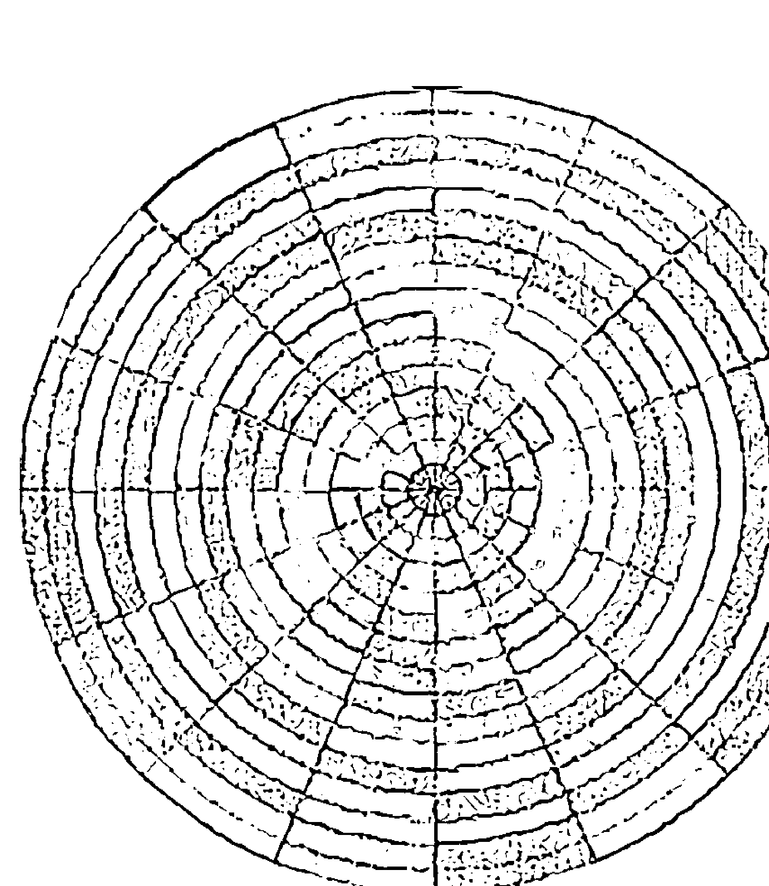

### 太陽公轉週期（26000年）

以16x16的藍道瑪曼達拉（Mandala）呈現(基頻=332.8 Hz)

### 對時空對照表及其音樂解釋的領悟

瞭解音樂，才更能掌握時間和空間與諧音間的相互關係。個人知識決定了對照表的使用方式。如果是生物學家，也許能受益於知道長時間的秒、分、時、日或年的音樂對應；如果是天文學家，也許能受惠於知道行星公轉或自轉的音樂對應，或是類星體與銀河系相距光年的音程距離。如果是心理學家，alpha、beta、gamma和delta波的對應音也許能誘發這些腦波狀態。如果是建築師，建物的音樂比例也許能影響住戶，而建築師可以避免在建物置入不諧和比例。如果是化學家，某些放射元素的半衰期也能轉譯為音符。這樣就能確定哪些元素屬於同一個音樂家族，即使是各屬不同的八度。在心理學中，可以找出每個人的專屬主音，這樣就更容易根據主音的不諧和處，瞭解可能存在的衝突點，甚至更上層樓，找出個人或團體中的諧和所在。

#### 1至60秒的對應頻率及音符

1秒 = 256 Hz = C音

有了時間對照表，以一秒週期等於256赫茲的C音，我們就能利用潛音音列確定3秒、5秒、7秒乃至60秒的特質。也許把我們對音樂的瞭解當作架構，就能開始認識時間週期的動力學。即使我們選擇其他頻率當基頻，數列的關係仍然不變。選擇256是因為這是1、2、4等的倍數。我們將所有頻率放在中央C八度，以便快速查出音符。必須記住一點，左右這些數表的是潛音列。所以說，要是知道潛音音列的諧音，就能根據選定的時間或空間數值，推算出音符。

> 基頻為C=256，音程=12√2，1990年11月29日
"Barbara Math1: PeriodNote" Copyright 1990 by Robert Miller Foulkrod

| 秒 | 頻率(Hz) | 音符 | 秒 | 頻率(Hz) | 音符 | 秒 | 頻率(Hz) | 音符 | 秒 | 頻率(Hz) | 音符 |
|----|----------|------|----|----------|------|----|----------|------|----|----------|------|
| 1  | 256      | C    | 16 | 256      | C    | 31 | 264      | D♭   | 46 | 356      | G♭   |
| 2  | 256      | C    | 17 | 481      | B    | 32 | 256      | C    | 47 | 348      | F    |
| 3  | 341      | F    | 18 | 455      | B♭   | 33 | 496      | B    | 48 | 341      | F    |
| 4  | 256      | C    | 19 | 431      | A    | 34 | 481      | B    | 49 | 334      | F    |
| 5  | 409      | A♭   | 20 | 409      | A♭   | 35 | 468      | B♭   | 50 | 327      | E    |
| 6  | 341      | F    | 21 | 390      | G    | 36 | 455      | B♭   | 51 | 321      | E    |
| 7  | 292      | D    | 22 | 372      | G♭   | 37 | 442      | A    | 52 | 315      | E    |
| 8  | 256      | C    | 23 | 356      | G♭   | 38 | 431      | A    | 53 | 309      | E♭   |
| 9  | 455      | B♭   | 24 | 341      | F    | 39 | 420      | A    | 54 | 303      | E♭   |
| 10 | 409      | A♭   | 25 | 327      | E    | 40 | 409      | A♭   | 55 | 297      | E♭   |
| 11 | 372      | G♭   | 26 | 315      | E    | 41 | 399      | A♭   | 56 | 292      | D    |
| 12 | 341      | F    | 27 | 303      | E♭   | 42 | 390      | G    | 57 | 289      | D    |
| 13 | 315      | E    | 28 | 292      | D    | 43 | 381      | G    | 58 | 282      | D    |
| 14 | 292      | D    | 29 | 282      | D    | 44 | 372      | G♭   | 59 | 277      | D♭   |
| 15 | 273      | D♭   | 30 | 273      | D♭   | 45 | 364      | G♭   | 60 | 273      | D♭   |

#### 1至60分鐘的對應頻率及音符

1分鐘 = 273 Hz = Db音

基頻為C=256，音程=12√2，1990年11月29日
"Barbara Math1: PeriodNote" Copyright 1990 by Robert Miller Foulkrod

| 分 | 頻率 (Hz) | 音符 | 分 | 頻率 (Hz) | 音符 | 分 | 頻率 (Hz) | 音符 | 分 | 頻率 (Hz) | 音符 |
|----|----|----|----|----|----|----|----|----|----|----|----|
| 1 | 273 | Db | 16 | 273 | Db | 31 | 281 | D | 46 | 379 | G |
| 2 | 273 | Db | 17 | 257 | C | 32 | 273 | Db | 47 | 371 | Gb |
| 3 | 364 | Gb | 18 | 485 | B | 33 | 264 | Db | 48 | 364 | Gb |
| 4 | 273 | Db | 19 | 459 | Bb | 34 | 257 | C | 49 | 356 | Gb |
| 5 | 436 | A | 20 | 436 | A | 35 | 249 | C | 50 | 349 | F |
| 6 | 364 | Gb | 21 | 416 | Ab | 36 | 485 | B | 51 | 342 | F |
| 7 | 312 | Eb | 22 | 397 | Ab | 37 | 472 | B | 52 | 336 | F |
| 8 | 273 | Db | 23 | 379 | G | 38 | 459 | Bb | 53 | 329 | E |
| 9 | 405 | B | 24 | 364 | Gb | 39 | 448 | Bb | 54 | 323 | E |
| 10 | 436 | A | 25 | 349 | F | 40 | 436 | A | 55 | 317 | E |
| 11 | 397 | Ab | 26 | 336 | F | 41 | 426 | A | 56 | 312 | Eb |
| 12 | 364 | Gb | 27 | 323 | E | 42 | 416 | Ab | 57 | 306 | Eb |
| 13 | 336 | F | 28 | 312 | Eb | 43 | 406 | Ab | 58 | 301 | Eb |
| 14 | 312 | Eb | 29 | 301 | Eb | 44 | 397 | Ab | 59 | 296 | Eb |
| 15 | 291 | D | 30 | 291 | D | 45 | 388 | G | 60 | 291 | D |

#### 1至24小時的對應頻率及音符

1小時 = 291 Hz = D音

基頻為C=256，音程=12√2，1990年11月29日
"Barbara Math1: PeriodNote" Copyright 1990 by Robert Miller Foulkrod

| 時 | 頻率 (Hz) | 音符 | 時 | 頻率 (Hz) | 音符 | 時 | 頻率 (Hz) | 音符 | 時 | 頻率 (Hz) | 音符 |
|----|----|----|----|----|----|----|----|----|----|----|----|
| 1 | 291 | D | 7 | 332 | F | 13 | 358 | Gb | 19 | 490 | B |
| 2 | 291 | D | 8 | 291 | D | 14 | 332 | F | 20 | 466 | Bb |
| 3 | 388 | G | 9 | 258 | C | 15 | 310 | Eb | 21 | 443 | Bb |
| 4 | 291 | D | 10 | 466 | Bb | 16 | 291 | D | 22 | 423 | A |
| 5 | 466 | Bb | 11 | 423 | A | 17 | 274 | Db | 23 | 405 | Ab |
| 6 | 388 | G | 12 | 388 | G | 18 | 258 | C | 24 | 388 | G |

### 1至32天的對應頻率及音符

1天 = 388 Hz = G音

基頻為C=256，音程=12√2，1990年11月29日
"Barbara Math1: PeriodNote" Copyright 1990 by Robert Miller Foulkrod

天 | 頻率(Hz) | 音符 | 天 | 頻率(Hz) | 音符 | 天 | 頻率(Hz) | 音符 | 天 | 頻率(Hz) | 音符
---|----------|------|----|----------|------|----|----------|------|----|----------|-----
1 | 388 | G | 9 | 345 | F | 17 | 365 | G^b | 25 | 497 | B
2 | 388 | G | 10 | 310 | E^b | 18 | 345 | F | 26 | 477 | B
3 | 258 | C | 11 | 282 | D | 19 | 327 | E | 27 | 460 | B^b
4 | 388 | G | 12 | 258 | C | 20 | 310 | E^b | 28 | 443 | B^b
5 | 310 | E^b | 13 | 477 | B | 21 | 295 | E^b | 29 | 428 | A
6 | 258 | C | 14 | 443 | B^b | 22 | 282 | D | 30 | 414 | A^b
7 | 443 | B^b | 15 | 414 | A^b | 23 | 270 | D^b | 31 | 400 | A^b
8 | 388 | G | 16 | 388 | G | 24 | 250 | C | 32 | 388 | G

### 大氣中英吋的對應頻率及音符

V=f x w
(v為室溫華氏70度的大氣音速，f為頻率，w為波長)

1英吋 = 423 Hz = Ab音

| 英吋Ft. | 英呎In. | 公尺Mtr. | 赫茲 | 音符 | 顏色 |
|---|---|---|---|---|---|
| 2 | 0 | 0.05 | 6780.00 | A | 橘 |
| 3 | 0 | 0.08 | 4520.00 | D | 藍綠 |
| 4 | 0 | 0.10 | 3390.00 | A | 橘 |
| 5 | 0 | 0.13 | 2712.00 | F | 深紫(Violet) |
| 6 | 1 | 0.15 | 2260.00 | D | 藍綠 |
| 7 | 1 | 0.18 | 1937.14 | B | 黃 |
| 8 | 1 | 0.20 | 1695.00 | A | 橘 |
| 9 | 1 | 0.23 | 1506.67 | G | 洋紅(Magenta) |
| 10 | 1 | 0.25 | 1356.00 | F | 深紫(Violet) |
| 11 | 1 | 0.28 | 1232.73 | E^b | 藍 |
| 12 | 1 | 0.30 | 1130.00 | D | 藍綠 |
| 13 | 1 | 0.33 | 1043.08 | C | 綠 |
| 14 | 1 | 0.36 | 968.57 | B | 黃 |
| 15 | 1 | 0.38 | 904.00 | B^b | 橘黃 |
| 16 | 1 | 0.41 | 847.50 | A | 橘 |
| 17 | 1 | 0.43 | 797.65 | A^b | 蜜桃(Peach) |## 藍道瑪音樂頻譜療法

| 序号 | 数字 | 小数 | 频率 | 音符 | 颜色 |
|------|------|------|------|------|------|
| 18 | 2 | 0.46 | 753.33 | G | 洋紅(Magenta) |
| 19 | 2 | 0.48 | 713.68 | G♭ | 淡紫(Lavender) |
| 20 | 2 | 0.51 | 678.00 | F | 深紫(Violet) |
| 21 | 2 | 0.53 | 645.71 | E | 藍紫 |
| 22 | 2 | 0.56 | 616.36 | E♭ | 藍 |
| 23 | 2 | 0.58 | 589.57 | D | 藍綠 |
| 24 | 2 | 0.61 | 565.00 | D | 藍綠 |
| 25 | 2 | 0.63 | 542.40 | D♭ | 綠藍 |
| 26 | 2 | 0.66 | 521.54 | C | 綠 |
| 27 | 2 | 0.69 | 502.22 | C | 綠 |
| 28 | 2 | 0.71 | 484.29 | B | 黃 |
| 29 | 2 | 0.74 | 467.59 | B♭ | 橘黃 |
| 30 | 3 | 0.76 | 452.00 | B♭ | 橘黃 |
| 31 | 3 | 0.79 | 437.42 | A | 橘 |
| 32 | 3 | 0.81 | 423.75 | A | 橘 |
| 33 | 3 | 0.84 | 410.91 | A♭ | 蜜桃(Peach) |
| 34 | 3 | 0.86 | 398.82 | A♭ | 蜜桃(Peach) |
| 35 | 3 | 0.89 | 387.43 | G | 洋紅(Magenta) |
| 36 | 3 | 0.91 | 376.67 | G | 洋紅(Magenta) |
| 37 | 3 | 0.94 | 366.49 | G♭ | 淡紫(Lavender) |
| 38 | 3 | 0.97 | 356.84 | G♭ | 淡紫(Lavender) |
| 39 | 3 | 0.99 | 347.69 | F | 深紫(Violet) |
| 40 | 3 | 1.02 | 339.00 | F | 深紫(Violet) |
| 41 | 3 | 1.04 | 330.73 | E | 藍紫 |
| 42 | 4 | 1.07 | 322.86 | E | 藍紫 |
| 43 | 4 | 1.09 | 315.35 | E | 藍紫 |
| 44 | 4 | 1.12 | 308.18 | E♭ | 藍 |
| 45 | 4 | 1.14 | 301.33 | E♭ | 藍 |
| 46 | 4 | 1.17 | 294.78 | D | 藍綠 |
| 47 | 4 | 1.19 | 288.51 | D | 藍綠 |
| 48 | 4 | 1.22 | 282.50 | D | 藍綠 |
| 49 | 4 | 1.24 | 276.73 | D♭ | 綠藍 |
| 50 | 4 | 1.27 | 271.20 | D♭ | 綠藍 |
| 51 | 4 | 1.30 | 265.88 | D♭ | 綠藍 |
| 52 | 4 | 1.32 | 260.77 | C | 綠 |
| 53 | 4 | 1.35 | 255.85 | C | 綠 |
| 54 | 5 | 1.37 | 251.11 | C | 綠 |
| 55 | 5 | 1.40 | 246.55 | B | 黃 |
| 56 | 5 | 1.42 | 242.14 | B | 黃 |
| 57 | 5 | 1.45 | 237.89 | B | 黃 |
| 58 | 5 | 1.47 | 233.79 | B♭ | 橘黃 |
| 59 | 5 | 1.50 | 229.83 | B♭ | 橘黃 |
| 60 | 5 | 1.52 | 226.00 | B♭ | 橘黃 |

PART2 ▪ 琉璃珠與繩結理論

### 英吋的對應頻率及音符

1英吋 = 283 Hz = D音

| 英吋 | 英寸In. | 公尺Mtr. | 赫兹 | 音符 | 顏色 |
|---|---|---|---|---|---|
| 1 | 12 | 0.30 | 1130.00 | D | 藍綠 |
| 2 | 24 | 0.61 | 565.00 | D | 藍綠 |
| 3 | 36 | 0.91 | 376.67 | G | 洋紅(Magenta) |
| 4 | 48 | 1.22 | 282.50 | D | 藍綠 |
| 5 | 60 | 1.52 | 226.00 | B♭ | 橘黃 |
| 6 | 72 | 1.83 | 188.33 | G | 洋紅(Magenta) |
| 7 | 84 | 2.13 | 161.43 | E | 藍紫 |
| 8 | 96 | 2.44 | 141.25 | D | 藍綠 |
| 9 | 108 | 2.74 | 125.56 | C | 綠 |
| 10 | 120 | 3.05 | 113.00 | B♭ | 橘黃 |
| 11 | 132 | 3.35 | 102.73 | A♭ | 蜜桃(Peach) |
| 12 | 144 | 3.66 | 94.17 | G | 洋紅(Magenta) |
| 13 | 156 | 3.96 | 86.92 | F | 深紫(Violet) |
| 14 | 168 | 4.27 | 80.71 | E | 藍紫 |
| 15 | 180 | 4.57 | 75.33 | E♭ | 藍 |
| 16 | 192 | 4.88 | 70.63 | D | 藍綠 |
| 17 | 204 | 5.18 | 66.47 | D♭ | 綠藍 |
| 18 | 216 | 5.49 | 62.78 | C | 綠 |
| 19 | 228 | 5.79 | 59.47 | B | 黃 |
| 20 | 240 | 6.10 | 56.50 | B♭ | 橘黃 |
| 21 | 252 | 6.40 | 53.81 | A | 橘 |
| 22 | 264 | 6.71 | 51.36 | A♭ | 蜜桃(Peach) |
| 23 | 276 | 7.01 | 49.13 | G | 洋紅(Magenta) |
| 24 | 288 | 7.32 | 47.08 | G | 洋紅(Magenta) |
| 25 | 300 | 7.62 | 45.20 | G♭ | 淡紫(Lavender) |
| 26 | 312 | 7.92 | 43.46 | F | 深紫(Violet) |
| 27 | 324 | 8.23 | 41.85 | F | 深紫(Violet) |
| 28 | 336 | 8.53 | 40.36 | E | 藍紫 |
| 29 | 348 | 8.84 | 38.97 | E♭ | 藍 |
| 30 | 360 | 9.14 | 37.67 | E♭ | 藍 |
| 31 | 372 | 9.45 | 36.45 | D | 藍綠 |
| 32 | 384 | 9.75 | 35.31 | D | 藍綠 |
| 33 | 396 | 10.06 | 34.24 | D♭ | 綠藍 |
| 34 | 408 | 10.36 | 33.24 | D♭ | 綠藍 |
| 35 | 420 | 10.67 | 32.29 | C | 綠 |
| 36 | 432 | 10.97 | 31.39 | C | 綠 |
| 37 | 444 | 11.28 | 30.54 | B | 黃 |
| 38 | 456 | 11.58 | 29.74 | B | 黃 |
| 39 | 468 | 11.89 | 28.97 | B♭ | 橘黃 |
| 40 | 480 | 12.19 | 28.25 | B♭ | 橘黃 |

## 藍道瑪音樂頻譜療法

| 序号 | 频率 | 数值1 | 数值2 | 音符 | 颜色 |
|------|------|-------|-------|------|------|
| 41 | 492 | 12.50 | 27.56 | A | 橘 |
| 42 | 504 | 12.80 | 26.90 | A | 橘 |
| 43 | 516 | 13.11 | 26.28 | A | 橘 |
| 44 | 528 | 13.41 | 25.68 | A♭ | 蜜桃(Peach) |
| 45 | 540 | 13.72 | 28.11 | A♭ | 蜜桃(Peach) |
| 46 | 552 | 14.02 | 24.57 | G | 洋紅(Magenta) |
| 47 | 564 | 14.33 | 24.04 | G | 洋紅(Magenta) |
| 48 | 576 | 14.63 | 23.54 | G | 洋紅(Magenta) |
| 49 | 588 | 14.94 | 23.06 | G♭ | 淡紫(Lavender) |
| 50 | 600 | 15.24 | 22.60 | G♭ | 淡紫(Lavender) |
| 51 | 612 | 15.54 | 22.16 | G♭ | 淡紫(Lavender) |
| 52 | 624 | 15.85 | 21.73 | F | 深紫(Violet) |
| 53 | 636 | 16.15 | 21.32 | F | 深紫(Violet) |
| 54 | 648 | 16.46 | 20.93 | F | 深紫(Violet) |
| 55 | 660 | 16.76 | 20.55 | E | 藍紫 |
| 56 | 672 | 17.07 | 20.18 | E | 藍紫 |
| 57 | 684 | 17.37 | 19.82 | E | 藍紫 |
| 58 | 696 | 17.68 | 19.48 | E♭ | 藍 |
| 59 | 708 | 17.98 | 19.15 | E♭ | 藍 |
| 60 | 720 | 18.29 | 18.83 | E♭ | 藍 |

### 英哩的對應頻率及音符

基頻爲C=256，音程=12√2，1990年11月7日 "RAB as 2: Mile Note" Copyright 1990 by Robert Miller Foulkrod

| 英哩 (Mi) | 頻率 (Hz) | 音符 | 英哩 (Mi) | 頻率 (Hz) | 音符 | 英哩 (Mi) | 頻率 (Hz) | 音符 | 英哩 (Mi) | 頻率 (Hz) | 音符 |
|---|---|---|---|---|---|---|---|---|---|---|---|
| 1 | 438 | A | 2 | 438 | A | 3 | 292 | D | 4 | 438 | A |
| 5 | 350 | F | 6 | 292 | D | 7 | 250 | C | 8 | 438 | A |
| 9 | 389 | G | 10 | 350 | F | 11 | 318 | E | 12 | 292 | D |
| 13 | 269 | D♭ | 14 | 250 | C | 15 | 467 | B♭ | 16 | 438 | A |
| 17 | 412 | A♭ | 18 | 389 | G | 19 | 369 | G♭ | 20 | 350 | F |
| 21 | 333 | F | 22 | 318 | E | 23 | 304 | E♭ | 24 | 292 | D |
| 25 | 280 | D | 26 | 269 | D♭ | 27 | 259 | C | 28 | 250 | C |
| 29 | 483 | B | 30 | 467 | B♭ | 31 | 452 | B♭ | 32 | 438 | A |
| 33 | 425 | A | 34 | 412 | A♭ | 35 | 400 | A♭ | 36 | 389 | G |
| 37 | 379 | G | 38 | 369 | G♭ | 39 | 359 | G♭ | 40 | 350 | F |
| 41 | 342 | F | 42 | 333 | F | 43 | 326 | E | 44 | 318 | E |
| 45 | 311 | E♭ | 46 | 304 | E♭ | 47 | 298 | E♭ | 48 | 292 | D |
| 49 | 286 | D | 50 | 280 | D | 51 | 275 | D♭ | 52 | 269 | D♭ |
| 53 | 264 | D♭ | 54 | 259 | C | 55 | 255 | C | 56 | 250 | C |
| 57 | 492 | B | 58 | 483 | B | 59 | 475 | B | 60 | 467 | B♭ |
| 61 | 459 | B♭ | 62 | 452 | B♭ | 63 | 445 | B♭ | 64 | 438 | A |
| 65 | 431 | A | 66 | 425 | A | 67 | 418 | A | 68 | 412 | A♭ |
| 69 | 406 | A♭ | 70 | 400 | A♭ | 71 | 395 | A♭ | 72 | 389 | G |
| 73 | 384 | G | 74 | 379 | G | 75 | 374 | G | 76 | 369 | G♭ |
| 77 | 364 | G♭ | 78 | 359 | G♭ | 79 | 355 | G♭ | 80 | 350 | F |
| 81 | 346 | F | 82 | 342 | F | 83 | 337 | F | 84 | 333 | F |
| 85 | 330 | E | 86 | 326 | E | 87 | 322 | E | 88 | 318 | E |
| 89 | 315 | E | 90 | 311 | E♭ | 91 | 308 | E♭ | 92 | 304 | E♭ |
| 93 | 301 | E♭ | 94 | 298 | E♭ | 95 | 295 | D | 96 | 292 | D |
| 97 | 289 | D | 98 | 286 | D | 99 | 283 | D | 100 | 280 | D |
| 101 | 277 | D♭ | 102 | 275 | D♭ | 103 | 272 | D♭ | 104 | 269 | D♭ |

### 依據特定頻率(1-20 Hz)推算的最佳居住空間尺寸

#### 大氣中聲速: 1130 呎/秒 基頻: 256Hz

| 脈輪 | 頻率(Hz) | 房間尺寸(英呎) |  | 波長(英呎) | 藍道瑪頻率 | 諧音 |
|------|----------|----------------|----|------------|------------|------|
| 生殖輪 | 01 | 70.625 | 35.3125 | 17.65625 | 1130 | 282.5 | Db |
| 生殖輪 | 02 | 70.625 | 35.3125 | 17.65625 | 565 | 282.5 | Db |
| 喉輪 | 03 | 47.08333 | 23.541667 | 11.770834 | 376.66667 | 376.666667 | Gb |
| 生殖輪 | 04 | 70.625 | 35.3125 | 17.65625 | 282.5 | 282.5 | Db |
| 眉心輪 | 05 | 56.5 | 28.25 | 14.125 | 226 | 452 | B1+ |
| 喉輪 | 06 | 47.08333 | 23.541667 | 11.770834 | 188.33333 | 376.66666 | Gb |
| 太陽輪 | 07 | 40.357143 | 20.178571 | 10.089285 | 161.428571 | 322.857142 | E# |
| 生殖輪 | 08 | 70.625 | 35.3125 | 17.65625 | 141.25 | 282.5 | Db |
| 頂輪 | 09 | 62.777778 | 31.388889 | 15.694445 | 125.555556 | 502.222224 | C2- |
| 眉心輪 | 10 | 56.5 | 28.25 | 14.125 | 113 | 452 | B1+ |
| 延腦 | 11 | 51.363636 | 25.681818 | 12.840909 | 102.727273 | 410.909092 | Ab |
| 喉輪 | 12 | 47.08334 | 23.541667 | 11.770834 | 94.166667 | 376.666668 | Gb |
| 心輪 | 13 | 43.461539 | 21.73077 | 10.865385 | 86.923077 | 347.692308 | Fb |
| 太陽輪 | 14 | 40.357143 | 20.178571 | 10.089285 | 80.714286 | 322.857144 | E# |
| 生殖輪 | 15 | 75.333333 | 37.666666 | 18.833333 | 75.333333 | 301.333332 | D# |
| 生殖輪 | 16 | 70.625 | 35.3125 | 17.65625 | 70.625 | 282.5 | Db |
| 海底輪 | 17 | 66.470588 | 33.23294 | 16.617647 | 66.470588 | 265.882352 | C# |
| 頂輪 | 18 | 62.777778 | 31.388889 | 15.694445 | 62.777778 | 502.222224 | C2- |
| 頂輪 | 19 | 59.473684 | 29.736842 | 14.868421 | 59.473684 | 475.789472 | B2- |
| 眉心輪 | 20 | 56.5 | 28.25 | 14.125 | 56.5 | 452 | B1+ |

## 埃及吉沙大金字塔大甬道

（西元前2580年～2560年）

斜率为26.3027度

（西元前2580年～2560年）

### 光年的对应频率及音符

1光年等于272 Hz = Db音

罗伯米勒佛克洛设计了一个电脑软件程式，如果知道光年距离，就能确定星系的音乐频率。这个程式被用来确定144页星体的距离、频率、音符与吸收色对应表中星系的音乐频率及对应音符。参考资料：录音带《器官音乐》（Music of Our Organs），作者芭芭拉希洛。

### 光年与频率音符对应表

- -10/14/1990 - - @ Copyright by Robert Miller Foulkrod

| 光年 | 频率 | 音符 | 颜色 | 光年 | 频率 | 音符 | 颜色 | 光年 | 频率 | 音符 | 颜色 |
|------|------|------|------|------|------|------|------|------|------|------|------|
| 3 | 1.056E-08 | G♭ | 绿 | 243 | 1.304E-10 | D | 橘 | 483 | 6.561E-11 | D | 橘 |
| 6 | 5.281E-09 | G♭ | 绿 | 246 | 1.288E-10 | D | 橘 | 486 | 6.520E-11 | D | 橘 |
| 9 | 3.521E-09 | B | 红紫 | 249 | 1.273E-10 | D | 橘 | 489 | 6.480E-11 | D | 橘 |
| 12 | 2.641E-09 | G♭ | 绿 | 252 | 1.257E-10 | D♭ | 红橘 | 492 | 6.441E-11 | D | 橘 |
| 15 | 2.113E-09 | D | 橘 | 255 | 1.243E-10 | D♭ | 红橘 | 495 | 6.402E-11 | D | 橘 |
| 18 | 1.760E-09 | B | 红紫 | 258 | 1.228E-10 | D♭ | 红橘 | 498 | 6.363E-11 | D | 橘 |
| 21 | 1.509E-09 | A♭ | 蓝 | 261 | 1.214E-10 | D♭ | 红橘 | 501 | 6.325E-11 | D♭ | 红橘 |
| 24 | 1.320E-09 | G♭ | 绿 | 264 | 1.200E-10 | D♭ | 红橘 | 504 | 6.287E-11 | D♭ | 红橘 |
| 27 | 1.174E-09 | E | 黄 | 267 | 1.187E-10 | C | 红 | 507 | 6.250E-11 | D♭ | 红橘 |
| 30 | 1.056E-09 | D | 橘 | 270 | 1.174E-10 | C | 红 | 510 | 6.214E-11 | D♭ | 红橘 |
| 33 | 9.603E-10 | D♭ | 红橘 | 273 | 1.161E-10 | C | 红 | 513 | 6.177E-11 | D♭ | 红橘 |
| 36 | 8.802E-10 | B | 红紫 | 276 | 1.148E-10 | C | 红 | 516 | 6.141E-11 | D♭ | 红橘 |
| 39 | 8.125E-10 | B♭ | 紫 | 279 | 1.136E-10 | C | 红 | 519 | 6.106E-11 | D♭ | 红橘 |
| 42 | 7.545E-10 | A♭ | 蓝 | 282 | 1.124E-10 | B | 红紫 | 522 | 6.071E-11 | D♭ | 红橘 |
| 45 | 7.042E-10 | G | 蓝绿 | 285 | 1.112E-10 | B | 红紫 | 525 | 6.036E-11 | D♭ | 红橘 |
| 48 | 6.602E-10 | G♭ | 绿 | 288 | 1.100E-10 | B | 红紫 | 528 | 6.002E-11 | D♭ | 红橘 |
| 51 | 6.214E-10 | F | 黄橘 | 291 | 1.089E-10 | B | 红紫 | 531 | 5.968E-11 | C | 红 |
| 54 | 5.868E-10 | E | 黄 | 294 | 1.078E-10 | B | 红紫 | 534 | 5.934E-11 | C | 红 |
| 57 | 5.559E-10 | E♭ | 黄橘 | 297 | 1.067E-10 | B♭ | 紫 | 537 | 5.901E-11 | C | 红 |
| 60 | 5.281E-10 | D | 橘 | 300 | 1.056E-10 | B♭ | 紫 | 540 | 5.868E-11 | C | 红 |
| 63 | 5.030E-10 | D♭ | 红橘 | 303 | 1.046E-10 | B♭ | 紫 | 543 | 5.836E-11 | C | 红 |
| 66 | 4.801E-10 | D♭ | 红橘 | 306 | 1.036E-10 | B♭ | 紫 | 546 | 5.804E-11 | C | 红 |
| 69 | 4.593E-10 | C | 红 | 309 | 1.026E-10 | B♭ | 紫 | 549 | 5.772E-11 | C | 红 |
| 72 | 4.401E-10 | B | 红紫 | 312 | 1.016E-10 | B♭ | 紫 | 552 | 5.741E-11 | C | 红 |
| 75 | 4.225E-10 | B♭ | 紫 | 315 | 1.006E-10 | A | 蓝紫 | 555 | 5.710E-11 | C | 红 |
| 78 | 4.063E-10 | B | 紫 | 318 | 9.965E-11 | A | 蓝紫 | 558 | 5.679E-11 | C | 红 |
| 81 | 3.912E-10 | A | 蓝紫 | 321 | 9.872E-11 | A | 蓝紫 | 561 | 5.649E-11 | B | 红紫 |
| 84 | 3.772E-10 | A♭ | 蓝 | 324 | 9.781E-11 | A | 蓝紫 | 564 | 5.619E-11 | B | 红紫 |
| 87 | 3.642E-10 | A♭ | 蓝 | 327 | 9.691E-11 | A | 蓝紫 | 567 | 5.589E-11 | B | 红紫 |
| 90 | 3.521E-10 | G | 蓝绿 | 330 | 9.603E-11 | A | 蓝紫 | 570 | 5.559E-11 | B | 红紫 |
| 93 | 3.407E-10 | G | 蓝绿 | 333 | 9.516E-11 | A | 蓝紫 | 573 | 5.530E-11 | B | 红紫 |
| 96 | 3.301E-10 | G♭ | 绿 | 336 | 9.431E-11 | A♭ | 蓝 | 576 | 5.502E-11 | B | 红紫 |
| 99 | 3.201E-10 | G♭ | 绿 | 339 | 9.348E-11 | A♭ | 蓝 | 579 | 5.473E-11 | B | 红紫 |
| 102 | 3.107E-10 | F | 黄绿 | 342 | 9.266E-11 | A♭ | 蓝 | 582 | 5.445E-11 | B | 红紫 |
| 105 | 3.018E-10 | E | 黄 | 345 | 9.185E-11 | A♭ | 蓝 | 585 | 5.417E-11 | B | 红紫 |
| 108 | 2.934E-10 | E | 黄 | 348 | 9.106E-11 | A♭ | 蓝 | 588 | 5.389E-11 | B | 红紫 |
| 111 | 2.855E-10 | E | 黄 | 351 | 9.028E-11 | A♭ | 蓝 | 591 | 5.362E-11 | B | 红紫 |
| 114 | 2.780E-10 | E♭ | 黄橘 | 354 | 8.952E-11 | G | 蓝绿 | 594 | 5.335E-11 | B♭ | 紫 |
| 117 | 2.708E-10 | E♭ | 黄橘 | 357 | 8.876E-11 | G | 蓝绿 | 597 | 5.308E-11 | B♭ | 紫 |
| 120 | 2.641E-10 | D | 橘 | 360 | 8.802E-11 | G | 蓝绿 | 600 | 5.281E-11 | B♭ | 紫 |
| 123 | 2.576E-10 | D | 橘 | 363 | 8.730E-11 | G | 蓝绿 | 603 | 5.255E-11 | B♭ | 紫 |
| 126 | 2.515E-10 | D♭ | 红橘 | 366 | 8.658E-11 | G | 蓝绿 | 606 | 5.229E-11 | B♭ | 紫 |
| 129 | 2.457E-10 | D♭ | 红橘 | 369 | 8.588E-11 | G | 蓝绿 | 609 | 5.203E-11 | B♭ | 紫 |
| 132 | 2.401E-10 | D♭ | 红橘 | 372 | 8.519E-11 | G | 蓝绿 | 612 | 5.178E-11 | B♭ | 紫 |
| 135 | 2.347E-10 | C | 红 | 375 | 5.450E-11 | G♭ | 绿 | 615 | 5.153E-11 | B♭ | 紫 |
| 138 | 2.296E-10 | C | 红 | 378 | 8.383E-11 | G♭ | 绿 | 618 | 5.128E-11 | B♭ | 紫 |
| 141 | 2.247E-10 | B | 红紫 | 381 | 8.317E-11 | G♭ | 绿 | 621 | 5.103E-11 | B♭ | 紫 |
| 144 | 2.201E-10 | B | 红紫 | 384 | 8.252E-11 | G♭ | 绿 | 624 | 5.078E-11 | B♭ | 紫 |
| 147 | 2.156E-10 | B | 红紫 | 387 | 8.188E-11 | G♭ | 绿 | 627 | 5.054E-11 | B♭ | 紫 |
| 150 | 2.113E-10 | B♭ | 紫 | 390 | 8.125E-11 | G♭ | 绿 | 630 | 5.030E-11 | A | 蓝紫 |
| 153 | 2.071E-10 | B♭ | 紫 | 393 | 8.063E-11 | G♭ | 绿 | 633 | 5.006E-11 | A | 蓝紫 |
| 156 | 2.031E-10 | B♭ | 紫 | 396 | 8.002E-11 | G♭ | 绿 | 636 | 4.983E-11 | A | 蓝紫 |
| 159 | 1.993E-10 | A | 蓝紫 | 399 | 7.942E-11 | F | 黄绿 | 639 | 4.959E-11 | A | 蓝紫 |
| 162 | 1.956E-10 | A | 蓝紫 | 402 | 7.883E-11 | F | 黄绿 | 642 | 4.936E-11 | A | 蓝紫 |
| 165 | 1.921E-10 | A | 蓝紫 | 405 | 7.824E-11 | F | 黄绿 | 645 | 4.913E-11 | A | 蓝紫 |
| 168 | 1.886E-10 | A♭ | 蓝 | 408 | 7.767E-11 | F | 黄绿 | 648 | 4.890E-11 | A | 蓝紫 |
| 171 | 1.853E-10 | A♭ | 蓝 | 411 | 7.710E-11 | F | 黄绿 | 651 | 4.868E-11 | A | 蓝紫 |
| 174 | 1.821E-10 | A♭ | 蓝 | 414 | 7.654E-11 | F | 黄绿 | 654 | 4.845E-11 | A | 蓝紫 |
| 177 | 1.790E-10 | G | 蓝绿 | 417 | 7.599E-11 | F | 黄绿 | 657 | 4.823E-11 | A | 蓝紫 |
| 180 | 1.760E-10 | G | 蓝绿 | 420 | 7.545E-11 | E | 黄 | 660 | 4.801E-11 | A | 蓝紫 |
| 183 | 1.732E-10 | G | 蓝绿 | 423 | 7.491E-11 | E | 黄 | 663 | 4.780E-11 | A | 蓝紫 |
| 186 | 1.704E-10 | G | 蓝绿 | 426 | 7.439E-11 | E | 黄 | 666 | 4.758E-11 | A | 蓝紫 |
| 189 | 1.677E-10 | G♭ | 绿 | 429 | 7.387E-11 | E | 黄 | 669 | 4.737E-11 | A♭ | 蓝 |
| 192 | 1.650E-10 | G♭ | 绿 | 432 | 7.335E-11 | E | 黄 | 672 | 4.716E-11 | A♭ | 蓝 |
| 195 | 1.625E-10 | G♭ | 绿 | 435 | 7.285E-11 | E | 黄 | 675 | 4.695E-11 | A♭ | 蓝 |
| 198 | 1.600E-10 | G♭ | 绿 | 438 | 7.235E-11 | E | 黄 | 678 | 4.674E-11 | A♭ | 蓝 |

## PART2 琉璃珠与绳结理论

## 第14章 脉轮频率

### 每日脉轮循环周期

时辰与脉轮的能量对应在某个程度上反映了印度的拉嘎，每个时辰都有一个音节。例如以早上七点唱诵或演奏F调的音乐也许能让人与当天的周期谐和一致。F调属于心轮无条件的爱的能量。上午八点的D调也许能唤醒生殖轮的创造能量。上午九点的C调代表海底轮的落实能量。上午十点也许能用Bb调刺激眉心轮的洞察力。上午十一点也许能以Ab调刺激灵性中心。正午十二点的G调或许代表沟通的时机。下午三点的Eb调反应太阳轮结合理智与情绪综合的能量。参考资料：录音带《蓝道玛脉轮静心》（Lambdoma Chakra Meditations），作者芭芭拉希洛等人；《器官音乐》（Music of Our Organs），作者芭芭拉希洛。

以8小时为一周期，1小时基频为291Hz（第一谐音）

#### 第一周期

| 时间 | 频率 | 近似音符 | 颜色 | 脉轮 |
|------|------|----------|------|------|
| 07:00 AM | 332 Hz | F | 绿 | 心轮 |
| 08:00 AM | 291 Hz | D | 橘 | 生殖轮 |
| 09:00 AM | 258 Hz | C | 红 | 海底轮 |
| 10:00 AM | 466 Hz | B♭ | 深紫(Violet) | 眉心轮 |
| 11:00 AM | 423 Hz | A | 水绿(Aqua) | 灵性中心 |
| 12:00 正午 | 388 Hz | G | 蓝 | 喉轮 |
| 01:00 PM | 358 Hz | G♭ | 蓝绿 | 心轮/喉轮 |
| 02:00 PM | 332 Hz | F | 绿 | 心轮 |

#### 第二周期

| 时间 | 频率 | 近似音符 | 颜色 | 脉轮 |
|---|---|---|---|---|
| 03:00 PM | 310 Hz | E♭ | 黄 | 太阳轮 |
| 04:00 PM | 291 Hz | D | 橘 | 生殖轮 |
| 05:00 PM | 466 Hz | B♭ | 深紫(Violet) | 眉心轮 |
| 06:00 PM | 388 Hz | G | 蓝 | 喉轮 |
| 07:00 PM | 332 Hz | F | 绿 | 心轮 |
| 08:00 PM | 291 Hz | D | 橘 | 生殖轮 |
| 09:00 PM | 258 Hz | C | 红 | 海底轮 |
| 10:00 PM | 466 Hz | B♭ | 深紫(Violet) | 眉心轮 |

#### 第三周期

| 时间 | 频率 | 近似音符 | 颜色 | 脉轮 |
|---|---|---|---|---|
| 11:00 PM | 423 Hz | A | 水绿(Aqua) | 灵性中心 |
| 12:00 午夜 | 388 Hz | G | 蓝 | 喉轮 |
| 01:00 AM | 358 Hz | G♭ | 蓝绿 | 心轮/喉轮 |
| 02:00 AM | 332 Hz | F | 绿 | 心轮 |
| 03:00 AM | 310 Hz | E♭ | 黄 | 太阳轮 |
| 04:00 AM | 291 Hz | D | 橘 | 生殖轮 |
| 05:00 AM | 466 Hz | B♭ | 深紫(Violet) | 眉心轮 |
| 06:00 AM | 388 Hz | G | 蓝 | 喉轮 |

（从头反复循环）

### 每月脉轮循环周期

同上页，此系统可应用到一个月中的每一天，找出每天的基频。一天等于频率388 Hz的G调，为喉轮沟通的能量。第7天443 Hz的Bb调也许代表眉心轮的洞察力。每天的基频也许能让我们重视日常生活中，时间单位对应的脉轮能量特质。

以7天为一周期：1天基频为388Hz（第一谐音）

#### 第一周期

| 时间 | 频率 | 近似音符 | 颜色 | 脉轮 |
|------|------|----------|------|------|
| 第7天 | 443 Hz | B♭ | 深紫(Violet) | 眉心轮 |
| 第8天 | 388 Hz | G | 蓝 | 喉轮 |
| 第9天 | 345 Hz | F | 绿 | 心轮 |
| 第10天 | 310 Hz | E♭ | 黄 | 太阳轮 |
| 第11天 | 282 Hz | D | 橘 | 生殖轮 |
| 第12天 | 258 Hz | C | 红 | 海底轮 |
| 第13天 | 477 Hz | B | 淡紫(Lavender) | 顶轮 |

#### 第二周期

| 时间 | 频率 | 近似音符 | 颜色 | 脉轮 |
|------|------|----------|------|------|
| 第14天 | 443 Hz | B♭ | 深紫(Violet) | 眉心轮 |
| 第15天 | 414 Hz | A♭ | 水绿(Aqua) | 灵性中心 |
| 第16天 | 388 Hz | G | 蓝 | 喉轮 |
| 第7天 | 443 Hz | B♭ | 深紫(Violet) | 眉心轮 |
| 第8天 | 388 Hz | G | 蓝 | 喉轮 |
| 第9天 | 345 Hz | F | 绿 | 心轮 |
| 第10天 | 310 Hz | E♭ | 黄 | 太阳轮 |

#### 第三周期

| 时间 | 频率 | 近似音符 | 颜色 | 脉轮 |
|------|------|----------|------|------|
| 第11天 | 282 Hz | D | 橘 | 生殖轮 |
| 第12天 | 258 Hz | C | 红 | 海底轮 |
| 第13天 | 477 Hz | B | 淡紫(Lavender) | 顶轮 |
| 第14天 | 443 Hz | B♭ | 深紫(Violet) | 眉心轮 |
| 第15天 | 414 Hz | A♭ | 水绿(Aqua) | 灵性中心 |
| 第16天 | 388 Hz | G | 蓝 | 喉轮 |
| 第7天 | 443 Hz | B♭ | 深紫(Violet) | 眉心轮 |# 第四週期

| 時間   | 頻率    | 近似音符 | 顏色         | 脈輪    |
|--------|---------|----------|--------------|---------|
| 第8天  | 388 Hz  | G        | 藍           | 喉輪    |
| 第9天  | 345 Hz  | F        | 綠           | 心輪    |
| 第10天 | 310 Hz  | Eb       | 黃           | 太陽輪  |
| 第11天 | 282 Hz  | D        | 橘           | 生殖輪  |
| 第12天 | 258 Hz  | C        | 紅           | 海底輪  |
| 第13天 | 477 Hz  | B        | 淡紫(Lavender)| 頂輪    |
| 第14天 | 443 Hz  | Bb       | 深紫(Violet)  | 眉心輪  |

（從頭反覆循環）

### 有關身體、脈輪、人性面的色彩與聲學的統一場論

| 色號  | 音符 | 頻率  | 波長  | 吸收色         | 發散色          | 身體部位            | 脈輪  |
|-------|------|-------|-------|----------------|-----------------|---------------------|-------|
| #821  | C'   | 264.3 | 4.27' | 紅 (粉紅)      | 綠              |                     | 海底輪 |
| #813  | D''  | 586.7 | 5.2'  | 橘             | 藍綠            | 循環系統，性腺      | 生殖輪 |
| #814  | B''  | 492.8 | 2.3'  | 深紫(Violet)   | 金(Gold)        | 腎上腺，甲狀腺，副甲狀腺 | 頂輪 |
| #878  | F'   | 352   | 3.1'  | 綠             | 深紫(Violet)    | 膀胱                | 心輪  |
| #807  | E'   | 330   | 3.4'  | 黃             | 藍              | 腎                  | 太陽輪 |
| #817  | D'   | 281.6 | 4'    | 橘             | 藍綠            | 小腸                | 生殖輪 |
| #844  | A    | 220   | 5.1'  | 靛             | 橘              | 肺                  | 眉心輪 |
| #866  | G    | 198.3 | 5.7'  | 藍             | 洋紅(Magenta)   | 肝                  | 喉輪  |
| #877  | F    | 176   | 6.4'  | 綠             | 紫              | 結腸                | 心輪  |
| #809  | E    | 164.3 | 6.9'  | 黃             | 藍              | 膽囊                | 太陽輪 |
| #846  | B    | 117.3 | 9.6'  | 紫             | 深金(Deep Gold) | 脾/胰               | 頂輪  |
| #843  | A    | 110   | 10.3' | 靛             | 深橘            | 胃                  | 眉心輪 |

*波長可以倍增，並做為療癒空間的長寬基礎；配對的顏色則可做為面積。
說明：吸收色的色號為Roscolene光譜療法色片編號
ROSCOLENE 36 Bush Avenue Port Chester, NY, 10573

## 藍道瑪音樂頻譜療法

### 脈輪與腦波的對應

α 腦波 (Alpha waves) : 08.0 - 13.0 Hz
β 腦波 (Beta waves) : 14.0 - 28.0 Hz
θ 腦波 (Theta waves) : 04.0 - 07.0 Hz
δ 腦波 (Delta waves) : 00.5 - 03.5 Hz

#### α 腦波: 睡夢邊緣、創造力、放鬆

| 腦波周數 | 對應頻率 | 音符 | 吸收色 | 發散色 | 脈輪 |
| :--- | :--- | :--- | :--- | :--- | :--- |
| 08 | 256 Hz | C- | 紅 | 綠 | 海底輪 |
| 09 | 288 Hz | D | 橘 | 水綠(Aqua) | 生殖輪 |
| 10 | 320 Hz | Eb | 黃 | 藍 | 太陽輪 |
| 11 | 352 Hz | F♯ | 綠 | 淡紫 (Lavender) | 心輪 |
| 12 | 384 Hz | G | 藍 | 洋紅(Magenta) | 喉輪 |
| 13 | 416 Hz | Ab | 水綠(Aqua) | 蜜桃(Peach) | 靈性中心 |

#### β 腦波: 清醒、警戒

| 腦波周數 | 對應頻率 | 音符 | 吸收色 | 發散色 | 脈輪 |
| :--- | :--- | :--- | :--- | :--- | :--- |
| 14 | 488 Hz | Bb | 紫 | 橘 | 眉心輪 |
| 15 | 480 Hz | B | 淡紫 (Lavender) | 金(Gold) | 頂輪 |
| 16 | 256 Hz | C- | 紅 | 綠 | 海底輪 |
| 17 | 272 Hz | C♯ | 紅 | 綠 | 海底輪 |
| 18 | 288 Hz | D | 橘 | 水綠(Aqua) | 生殖輪 |
| 19 | 304 Hz | D♯ | 橘 | 水綠(Aqua) | 生殖輪 |
| 20 | 320 Hz | Eb | 黃 | 藍 | 太陽輪 |

#### θ 腦波: 冥想

| 腦波周數 | 對應頻率 | 音符 | 吸收色 | 發散色 | 脈輪 |
| :--- | :--- | :--- | :--- | :--- | :--- |
| 04 | 256 Hz | C- | 紅 | 綠 | 海底輪 |
| 05 | 320 Hz | Eb | 黃 | 藍 | 太陽輪 |
| 06 | 384 Hz | G | 藍 | 洋紅(Magenta) | 喉輪 |
| 07 | 488 Hz | Bb | 紫 | 橘 | 眉心輪 |

#### δ 腦波：睡眠

| 腦波周數 | 對應頻率 | 音符 | 吸收色 | 發散色 | 脈輪 |
| :--- | :--- | :--- | :--- | :--- | :--- |
| 00.5 | 256 Hz | C- | 紅 | 綠 | 海底輪 |
| 00.6 | 307 Hz | D# | 橘 | 水綠(Aqua) | 生殖輪 |
| 00.7 | 358 Hz | F# | 綠 | 深紫(Violet) | 心輪 |
| 00.8 | 410 Hz | A♭ | 水綠(Aqua) | 蜜桃(Peach) | 靈性中心 |
| 00.9 | 461 Hz | B♭ | 紫 | 橘 | 眉心輪 |
| 01.0 | 256 Hz | C- | 紅 | 綠 | 海底輪 |
| 02.0 | 256 Hz | C- | 紅 | 綠 | 海底輪 |
| 03.0 | 384 Hz | G | 藍 | 綠 | 喉輪 |


341 赫茲(Hz)的頻率在不同文化的大部份音階中，是常見的標準。這是個F調自然音，在許多系統中被視為心輪能量中心。讓我們將其他現象與這個頻率相比：

1. ) 341 Hz（F）是256 Hz基頻（C）的第三次諧音，因此3秒轉譯為341 Hz（F）。
2. ) 1分鐘=273 Hz（D-），因此25分鐘轉譯為349 Hz（F+）。
3. ) 1小時=291 Hz（D+），因此7小時轉譯為333 Hz（F-）。
4. ) 1天=388 Hz（G+），因此第9天轉譯為345 Hz（F+）。
5. ) 1年=272 Hz（D-），因此13年轉譯為335 Hz（F-）。
6. ) 1光年=272 Hz（D-，因此心宿二<sup>53</sup>（Antares）星系的距離400光年可轉譯為348.4 Hz（F+）。銀河中央核球大小為13000光年，轉譯為343 Hz（F）。（102光年轉譯為F。402至417光年轉譯為F音的不同Hz值。）
7. ) 同位素中，鐳的半衰期1600年轉譯為348 Hz（F+）。
8. ) 1吋=424 Hz（A-），因此40吋轉譯為339 Hz（F-），而39吋轉譯為348 Hz（F+）。

# # 藍道瑪音樂頻譜療法。

9. ) 1呎=283 Hz（D-），因此13呎轉譯為86.92 Hz，加倍變成348 Hz（F+）。
10. ) 1哩=438 Hz（A），因此41哩轉譯為342 Hz（F）。
11. ) 元素週期表中，鎂的原子序數為12，鎘則是24。因為除積因子的關係，兩者皆可轉譯為次諧音頻率341 Hz（F）。這兩種元素都是人體必須養分。
12. ) 光速每秒186,000哩，我們發現光在藍道瑪矩陣中的15/16諧音為341Hz（F）。

## 第15章 人體礦物質頻率

### 元素週期表中人體常見礦物質

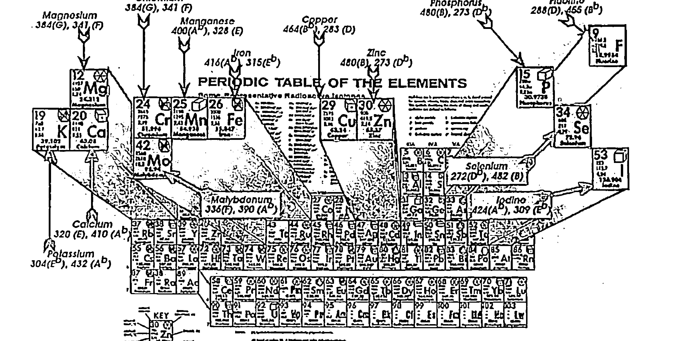

© 1993 Barbara Hero

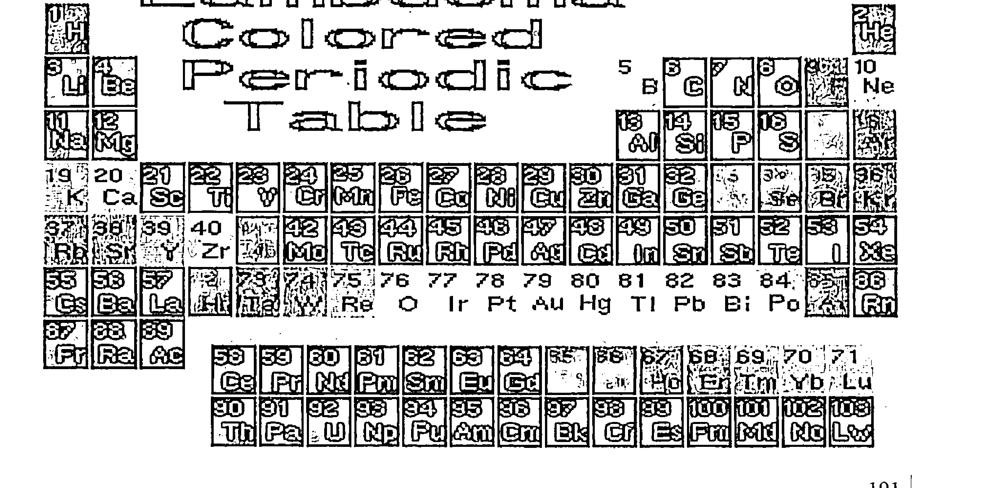

# # 元素週期表數值-1（三種音階）

| 元素 | 原子量(Q) | 原子密度(P) | P/Q | 音符-自然 C=256Hz | 音符-藍道瑪 C=256Hz | 音符-鋼琴 A=440Hz | Q/P | 音符-自然 C=256Hz | 音符-藍道瑪 C=256Hz | 音符-鋼琴 A=440Hz |
|---|---|---|---|---|---|---|---|---|---|---|
| 氢(H) | 1.00797 | 0.071 | 288.516523 | D | Q | D | 454.296338 | A# | V | A# |
| 氦(He) | 4.0026 | 0.126 | 257.880378 | C | P | C | 508.266667 | B# | P | B |
| 锂(Li) | 6.939 | 0.53 | 312.851993 | D# | R | D# | 418.958491 | A | U | G# |
| 铍(Be) | 9.0122 | 1.85 | 420.407892 | A | U | G# | 311.773405 | D# | Q# | D# |
| 硼(B) | 10.811 | 2.34 | 443.281843 | A# | V | A | 295.68547 | D | Q | D |
| 碳(C) | 12.0111 | 2.26 | 386.350218 | G | T | G | 340.137345 | F | R# | F |
| 氮(N) | 14.0067 | 0.81 | 473.738996 | B | W | A# | 276.675556 | C# | P# | C# |
| 氧(O) | 15.9994 | 1.14 | 291.860944 | D | Q | D | 449.105965 | A# | V | A |
| 氟(F) | 18.9984 | 1.11 | 478.625568 | B | W | A# | 273.850811 | C# | P# | C# |
| 氖(Ne) | 20.183 | 1.20 | 487.06337 | B | W | B | 269.106667 | C# | P# | C |
| 钠(Na) | 22.9898 | 0.97 | 345.64198 | F | S | F | 379.213196 | G | T | F# |
| 镁(Mg) | 24.312 | 1.74 | 293.149062 | D | Q | D | 447.117241 | A# | V | A |
| 铝(Al) | 26.9815 | 2.70 | 409.880844 | G# | U | G# | 319.780741 | E | R | D# |
| 硅(Si) | 28.086 | 2.33 | 339.802037 | F | R# | F | 385.730472 | G | T | G |
| 磷(P) | 30.9738 | 1.82 | 481.356501 | B | W | B | 272.297143 | C# | P# | C# |
| 硫(S) | 32.064 | 2.07 | 264.431138 | C# | P# | C | 495.675362 | B | W# | B |
| 氯(Cl) | 35.453 | 1.56 | 360.463713 | F# | S# | F# | 363.620513 | F# | S# | F# |
| 氩(Ar) | 39.948 | 1.40 | 287.093221 | D | Q | D | 456.548571 | A# | V# | A# |
| 钾(K) | 39.102 | 0.86 | 360.345762 | F# | S# | F# | 363.739535 | F# | S# | F# |
| 钙(Ca) | 40.08 | 1.55 | 316.806387 | E | R | D# | 413.729032 | G# | U | G# |
| 钪(Sc) | 44.956 | 3.0 | 273.333927 | C# | P# | C# | 479.530667 | B | W | A# |
| 钛(Ti) | 47.90 | 4.51 | 385.656785 | G | T | G | 339.866962 | F | R# | F |
| 钒(V) | 50.942 | 6.1 | 490.471517 | B | W# | B | 267.236721 | C# | P# | C |
| 铬(Cr) | 51.996 | 7.19 | 283.197169 | D | Q | C# | 462.829485 | A# | V# | A# |
| 锰(Mn) | 54.938 | 7.43 | 276.978412 | C# | P# | C# | 473.220996 | B | W | A# |
| 铁(Fe) | 55.847 | 7.86 | 288.238939 | D | Q | D | 454.733842 | A# | V | A# |
| 钴(Co) | 58.933 | 8.9 | 309.286817 | D# | Q# | D# | 423.787865 | A | U | G# |
| 镍(Ni) | 58.71 | 8.9 | 310.461591 | D# | Q# | D# | 422.18427 | A | U | G# |
| 铜(Cu) | 63.54 | 8.96 | 288.795719 | D | Q | D | 453.857143 | A# | V | A# |
| 锌(Zn) | 65.37 | 7.14 | 447.383203 | A# | V | A | 292.97479 | D | Q | D |
| 镓(Ga) | 69.72 | 5.91 | 347.208262 | F | S | F | 377.502538 | G | T | F# |
| 锗(Ge) | 72.59 | 5.32 | 300.189007 | D# | Q# | D | 436.631579 | A | U# | A |
| 砷(As) | 74.922 | 5.72 | 312.713489 | D# | R | D# | 419.144056 | A | U | G# |
| 硒(Se) | 78.96 | 4.79 | 496.956434 | B | W# | B | 263.749478 | C# | P | C |
| 溴(Br) | 79.909 | 3.12 | 319.861831 | E | R | D# | 409.789744 | G# | U | G# |
| 氪(Kr) | 83.80 | 2.6 | 508.334129 | B# | P | B | 257.846154 | C | P | C |
| 铷(Rb) | 85.47 | 1.53 | 293.290277 | D | Q | D | 446.901961 | A# | V | A |
| 锶(Sr) | 87.62 | 2.6 | 486.172107 | B | W | B | 269.6 | C# | P# | C# |
| 钇(Y) | 88.905 | 4.47 | 411.880547 | G# | U | G# | 318.228188 | E | R | D# |
| 锆(Zr) | 91.22 | 6.49 | 291.416795 | D | Q | D | 449.775039 | A# | V | A |
| 铌(Nb) | 92.906 | 8.4 | 370.335608 | F# | S# | F# | 353.927619 | F# | S | F |
| 钼(Mo) | 95.94 | 10.2 | 272.170106 | C# | P# | C# | 481.581176 | B | W | B |
| 锝(Tc) | 99 | 11.5 | 475.79798 | B | W | A# | 275.478261 | C# | P# | C# |
| 钌(Ru) | 101.07 | 12.2 | 494.421688 | B | W# | B | 265.101639 | C# | P# | C |
| 铑(Rh) | 102.905 | 12.4 | 493.56591 | B | W# | B | 265.56129 | C# | P# | C |
| 钯(Pd) | 106.4 | 12.0 | 461.954887 | A# | V# | A# | 283.733333 | D | Q | C# || 元素 | 数值1 | 数值2 | 数值3 | 符号1 | 符号2 | 符号3 | 数值4 | 符号4 | 符号5 | 符号6 |
|---|---|---|---|---|---|---|---|---|---|---|
| 銀(Ag) | 107.870 | 10.5 | 398.702141 | G# | T# | G | 328.746667 | E | R# | E |
| 鎘(Cd) | 112.40 | 8.65 | 315.217082 | E | R | D# | 415.815029 | G# | U | G# |
| 銦(In) | 114.82 | 7.31 | 260.771294 | C | P | C | 502.632011 | B# | W# | B |
| 錫(Sn) | 118.69 | 7.30 | 503.846996 | B# | W# | B | 260.142466 | C | P | C |
| 銻(Sb) | 121.75 | 6.62 | 445.429487 | A# | V | A | 294.259819 | D | Q | D |
| 碲(Te) | 127.60 | 6.24 | 400.611912 | G# | T# | G | 327.179487 | E | R | E |
| 碘(I) | 126.904 | 4.94 | 318.8905 | E | R | D# | 411.025101 | G# | U | G# |
| 氙(Xe) | 131.30 | 3.06 | 381.835796 | G | T | G | 343.267974 | F | R# | F |
| 銫(Cs) | 132.905 | 1.90 | 468.448892 | A# | V# | A# | 279.8 | D | P# | C# |
| 鋇(Ba) | 137.34 | 3.5 | 417.533129 | G# | U | G# | 313.92 | E | R | D# |
| 鑭(La) | 138.91 | 6.17 | 363.8661 | F# | S# | F# | 360.220421 | F# | S# | F# |
| 鈰(Ce) | 140.12 | 6.67 | 389.956038 | G | T | G | 336.11994 | F | R# | E |
| 鐠(Pr) | 140.907 | 6.77 | 393.591802 | G | T# | G | 333.015066 | F | R# | E |
| 釹(Nd) | 144.24 | 7.00 | 397.559623 | G# | T# | G | 329.691429 | E | R# | E |
| 鉕(Pm) | 147 | - | - | - | - | - | - | - | - | - |
| 釤(Sm) | 150.35 | 7.54 | 410.825939 | G# | U | G# | 319.045093 | E | R | D# |
| 銪(Eu) | 151.96 | 5.26 | 283.560937 | D | Q | C# | 462.235741 | A# | V# | A# |
| 釓(Gd) | 157.25 | 7.89 | 411.032623 | G# | U | G# | 318.884664 | E | R | D# |
| 鋱(Tb) | 158.924 | 8.27 | 426.290806 | A | U# | G# | 307.470859 | D# | Q# | D# |
| 鏑(Dy) | 162.5 | 8.54 | 430.521108 | A | U# | A | 304.449649 | D# | Q# | D# |
| 鈥(Ho) | 164.930 | 8.80 | 437.0921 | A | U# | A | 299.872727 | D# | Q# | D |
| 鈺(Er) | 167.26 | 9.05 | 443.247638 | A# | V | A | 295.708287 | D | Q | D |
| 銩(Tm) | 168.934 | 9.33 | 452.433258 | A# | V | A | 289.704609 | D | Q | D |
| 鏀(Yb) | 173.04 | 6.98 | 330.444753 | E | R# | E | 396.653295 | G# | T# | G |
| 鎦(Lu) | 174.97 | 9.84 | 460.703435 | A# | V# | A# | 284.504065 | D | Q | C# |
| 鈐(Hf) | 178.49 | 13.1 | 300.619643 | D# | G# | D | 436.006107 | A | U# | A |
| 鉭(Ta) | 180.948 | 16.6 | 375.763203 | G | S# | F# | 348.815422 | F | S | F |
| 鎢(W) | 183.85 | 19.3 | 429.985314 | A | U# | A | 304.829016 | D# | Q# | D# |
| 錸(Re) | 186.2 | 21 | 461.954887 | A# | V# | A# | 283.733333 | D | Q | C# |
| 鋨(Os) | 190.2 | 22.6 | 486.696109 | B | W | B | 269.309735 | C# | P# | C# |
| 銥(Ir) | 192.2 | 22.5 | 479.50052 | B | W | A# | 273.351111 | C# | P# | C# |
| 鉑(Pt) | 195.09 | 21.4 | 449.302373 | A# | V | A | 291.723364 | D | Q | D |
| 金(Au) | 196.967 | 19.3 | 401.35048 | G# | T# | G | 326.577409 | E | R | E |
| 汞(Hg) | 200.59 | 13.6 | 277.708759 | C# | P# | C# | 471.976471 | B | V# | A# |
| 鉈(Tl) | 204.37 | 11.85 | 474.997309 | B | W | A# | 275.942616 | C# | P# | C# |
| 鉛(Pb) | 207.19 | 11.4 | 450.739901 | A# | V | A | 290.792982 | D | Q | D |
| 铋(Bi) | 208.980 | 9.8 | 384.15925 | G | T | G | 341.191837 | F | R# | F |
| 釙(Po) | 210 | 9.2 | 358.887619 | F# | S | F | 365.217391 | F# | S# | F# |
| 砹(At) | 210 | - | - | - | - | - | - | - | - | - |
| 氡(Rn) | 222 | - | - | - | - | - | - | - | - | - |
| 鍅(Fr) | 223 | - | - | - | - | - | - | - | - | - |
| 鐳(Ra) | 226 | 5.0 | 362.477876 | F# | S# | F# | 361.6 | F# | S# | F# |
| 錒(Ac) | 227 | - | - | - | - | - | - | - | - | - |
| 釷(Th) | 232.036 | 11.7 | 413.063378 | G# | U | G# | 317.316923 | E | R | D# |
| 鏷(Pa) | 231 | 15.4 | 273.066667 | C# | P# | C# | 480 | B | W | B |
| 鈾(U) | 236.04 | 19.07 | 328.141153 | E | R# | E | 399.437861 | G# | T# | G |
| 鎿(Np) | 237 | 19.05 | 329.235443 | E | R# | E | 398.110236 | G# | T# | G |
| 鈽(Pu) | 242 | - | - | - | - | - | - | - | - | - |
| 鋂(Am) | 243 | 11.7 | 394.42963 | G | T# | G | 332.307692 | F | R# | E |
| 錻(Cm) | 247 | - | - | - | - | - | - | - | - | - |
| 鉳(Bk) | 247 | - | - | - | - | - | - | - | - | - |
| 鉲(Cf) | 251 | - | - | - | - | - | - | - | - | - |
| 鑀(Es) | 254 | - | - | - | - | - | - | - | - | - |
| 鐨(Fm) | 253 | - | - | - | - | - | - | - | - | - |
| 釙(Md) | 256 | - | - | - | - | - | - | - | - | - |
| 鎶(No) | 254 | - | - | - | - | - | - | - | - | - |
| 鑥(Lr) | 257 | - | - | - | - | - | - | - | - | - |

### 元素週期表數值

### 元素週期表數值-2（三種音階）

| 元素 | 原子序 | 原子密度 | 原子序／原子密度 | 自然 C=256Hz | 藍道瑪 C=256Hz | 鋼琴 A=440Hz | 原子密度／原子序 | 自然 C=256Hz | 藍道瑪 C=256Hz | 鋼琴 A=440Hz |
|------|--------|----------|------------------|--------------|----------------|--------------|------------------|--------------|----------------|--------------|
| 氢(H) | 001 | 0.071 | 450.704225 | A# | V | A | 290.816 | D | Q | D |
| 氦(He) | 002 | 0.126 | 507.936508 | B# | P | B | 258.048 | C | P | C |
| 锂(Li) | 003 | 0.53 | 362.264151 | F# | S# | F# | 361.813333 | F# | S# | F# |
| 铍(Be) | 004 | 1.85 | 276.756757 | C# | P# | C# | 473.6 | B | W | A# |
| 硼(B) | 005 | 2.34 | 273.504274 | C# | P# | C# | 479.232 | B | W | A# |
| 碳(C) | 006 | 2.26 | 339.823009 | F | R# | F | 385.706667 | G | T | G |
| 氮(N) | 007 | 0.81 | 276.54321 | C# | P# | C# | 473.965714 | B | W | A# |
| 氧(O) | 008 | 1.14 | 449.122807 | A# | V | A | 291.84 | D | Q | D |
| 氟(F) | 009 | 1.11 | 259.459459 | C | P | C | 505.173333 | B# | P | B |
| 氖(Ne) | 010 | 1.20 | 266.666667 | C# | P# | C | 491.52 | B | W# | B |
| 钠(Na) | 011 | 0.97 | 362.886598 | F# | S# | F# | 361.192727 | F# | S# | F# |
| 镁(Mg) | 012 | 1.74 | 441.37931 | A | V | A | 296.96 | D# | Q# | D |
| 铝(Al) | 013 | 2.70 | 308.148148 | D# | Q# | D# | 425.353846 | A | U# | G# |
| 硅(Si) | 014 | 2.33 | 384.549356 | G | T | G | 340.845714 | F | R# | F |
| 磷(P) | 015 | 1.82 | 263.736264 | C# | P | C | 496.981333 | B | W# | B |
| 硫(S) | 016 | 2.07 | 494.68599 | B | W# | B | 264.96 | C# | P# | C |
| 氯(Cl) | 017 | 1.56 | 348.717949 | F | S | F | 375.868235 | G | S# | F# |
| 氩(Ar) | 018 | 1.40 | 411.428571 | G# | U | G# | 318.577778 | E | R | D# |
| 钾(K) | 019 | 0.86 | 353.488372 | F# | S | F | 370.795789 | F# | S# | F# |
| 钙(Ca) | 020 | 1.55 | 412.903226 | G# | U | G# | 317.44 | E | R | D# |
| 钪(Sc) | 021 | 3.0 | 448 | A# | V | A | 292.571429 | D | Q | D |
| 钛(Ti) | 022 | 4.51 | 312.195122 | D# | R | D# | 419.84 | A | U | G# |
| 钒(V) | 023 | 6.1 | 482.622951 | B | W | B | 271.582609 | C# | P# | C# |
| 铬(Cr) | 024 | 7.19 | 427.260083 | A | U# | G# | 306.773333 | D# | Q# | D# |
| 锰(Mn) | 025 | 7.43 | 430.686406 | A | U# | A | 304.3328 | D# | Q# | D# |
| 铁(Fe) | 026 | 7.86 | 423.409669 | A | U | G# | 309.563077 | D# | Q# | D# |
| 钴(Co) | 027 | 8.9 | 388.314607 | G | T | G | 337.540741 | F | R# | E |
| 镍(Ni) | 028 | 8.9 | 402.696629 | G# | T# | G | 325.485714 | E | R | E |
| 铜(Cu) | 029 | 8.96 | 414.285714 | G# | U | G# | 316.38069 | E | R | D# |
| 锌(Zn) | 030 | 7.14 | 268.907563 | C# | P# | C | 487.424 | B | W | B |
| 镓(Ga) | 031 | 5.91 | 335.7022 | F | R# | E | 390.44129 | G | T | G |
| 锗(Ge) | 032 | 5.32 | 384.962406 | G | T | G | 340.48 | F | R# | F |
| 砷(As) | 033 | 5.72 | 369.230769 | F# | S# | F# | 354.986667 | F# | S | F |
| 硒(Se) | 034 | 4.79 | 454.279749 | A# | V | A# | 288.527059 | D | Q | D |
| 溴(Br) | 035 | 3.12 | 358.974359 | F# | S | F | 365.129143 | F# | S# | F# |
| 氪(Kr) | 036 | 2.6 | 443.076923 | A | V | A | 295.822222 | D# | Q | D |
| 铷(Rb) | 037 | 1.53 | 386.928105 | G | T | G | 338.75027 | F | R# | E |
| 锶(Sr) | 038 | 2.6 | 467.692308 | A# | V# | A# | 280.252632 | D | Q | C# |
| 钇(Y) | 039 | 4.47 | 279.194631 | D | P# | C# | 469.464615 | A# | V# | A# |
| 锆(Zr) | 040 | 6.49 | 394.453005 | G | T# | G | 332.288 | F | R# | E |
| 铌(Nb) | 041 | 8.4 | 312.380952 | D# | R | D# | 419.590244 | A | U | G# |
| 钼(Mo) | 042 | 10.2 | 421.647059 | A | U | G# | 310.857143 | D# | Q# | D# |
| 锝(Tc) | 043 | 11.5 | 478.608696 | B | W | A# | 273.860465 | C# | P# | C# |
| 钌(Ru) | 044 | 12.2 | 461.639344 | A | U# | A | 283.168889 | D | Q | C# |
| 铑(Rh) | 045 | 12.4 | 464.516129 | A | U# | A | 282.168889 | D | Q | C# |
| 钯(Pd) | 046 | 12.0 | 490.666667 | B | W# | B | 267.130435 | C# | P# | C |
| 银(Ag) | 047 | 10.5 | 286.47619 | D | Q | D | 457.531915 | A# | V# | A# |
| 镉(Cd) | 048 | 8.65 | 355.144509 | F# | S | F | 369.066667 | F# | S# | F# |
| 铟(In) | 049 | 7.31 | 429.001368 | A | U# | A | 305.528163 | D# | Q# | D# |
| 锡(Sn) | 050 | 7.30 | 438.356164 | A | U# | A | 299.008 | D# | Q# | D |
| 锑(Sb) | 051 | 6.62 | 493.05136 | B | W# | B | 265.838431 | C# | P# | C |
| 碲(Te) | 052 | 6.24 | 266.666667 | C# | P# | C | 491.52 | B | W# | B |
| 碘(I) | 053 | 4.94 | 343.319838 | F | R# | F | 381.778113 | G | T | G |
| 氙(Xe) | 054 | 3.06 | 282.352941 | D | Q | C# | 464.213333 | A# | V# | A# |
| 铯(Cs) | 055 | 1.90 | 463.157895 | A# | V# | A# | 282.996364 | D | Q | C# |
| 钡(Ba) | 056 | 3.5 | 256 | C | P | C | 256 | C | P | C |
| 镧(La) | 057 | 6.17 | 295.623987 | D | Q | D | 443.374035 | A# | V | A |
| 铈(Ce) | 058 | 6.67 | 278.26087 | C# | P# | C# | 471.04 | B | V# | A# |
| 镨(Pr) | 059 | 6.77 | 278.8774 | C# | P# | C# | 469.998644 | B | V# | A# |
| 钕(Nd) | 060 | 7.00 | 274.285714 | C# | P# | C# | 477.866667 | B | W | A# |
| 钷(Pm) | 061 | - | - | - | - | - | - | - | - |
| 钐(Sm) | 062 | 7.54 | 263.129973 | C | P | C | 498.126452 | B# | W# | B |
| 铕(Eu) | 063 | 5.26 | 383.269962 | G | T | G | 341.983492 | F | R# | F |
| 钆(Gd) | 064 | 7.89 | 259.569075 | C | P | C | 504.96 | B# | P | B |
| 铽(Tb) | 065 | 8.27 | 503.022975 | B# | W# | B | 260.568615 | C | P | C |
| 镝(Dy) | 066 | 8.54 | 494.613583 | B | W# | B | 264.998788 | C# | P# | C |
| 钬(Ho) | 067 | 8.80 | 487.272727 | B | W | B | 268.991045 | C# | P# | C |
| 铒(Er) | 068 | 9.05 | 480.883978 | B | W | B | 272.564706 | C# | P# | C# |
| 铥(Tm) | 069 | 9.33 | 473.311897 | B | W | A# | 276.925217 | C# | P# | C# |
| 镱(Yb) | 070 | 6.98 | 320.916905 | E | R | E | 408.429714 | G# | U | G# |
| 镥(Lu) | 071 | 9.84 | 461.788618 | A# | V# | A# | 283.835493 | D | Q | C# |
| 铪(Hf) | 072 | 13.1 | 351.755725 | F# | S | F | 372.622222 | F# | S# | F# |
| 钽(Ta) | 073 | 16.6 | 281.445783 | D | Q | C# | 465.709589 | A# | V# | A# |
| 钨(W) | 074 | 19.3 | 490.777202 | B | W# | B | 267.07027 | C# | P# | C |
| 铼(Re) | 075 | 21 | 457.142857 | A# | V# | A# | 286.72 | D | Q | D |
| 锇(Os) | 076 | 22.6 | 430.442478 | A | U# | A | 304.505263 | D# | Q# | D# |
| 铱(Ir) | 077 | 22.5 | 438.044444 | A | U# | A | 299.220779 | D# | Q# | D |
| 铂(Pt) | 078 | 21.4 | 466.542056 | A# | V# | A# | 280.94359 | D | Q | C# |
| 金(Au) | 079 | 19.3 | 261.968912 | C | P | C | 500.334177 | B# | W# | B |
| 汞(Hg) | 080 | 13.6 | 376.470588 | G | T | F# | 348.16 | F | S | F |
| 铊(Tl) | 081 | 11.85 | 437.468354 | A | U# | A | 299.614815 | D# | Q# | D |
| 铅(Pb) | 082 | 11.4 | 460.350877 | A# | V# | A# | 284.721951 | D | Q | C# |
| 铋(Bi) | 083 | 9.8 | 271.020408 | C# | P# | C# | 483.624096 | B | W | B |
| 钋(Po) | 084 | 9.2 | 292.173913 | D | Q | D | 448.609524 | A# | V | A |
| 砹(At) | 085 | - | - | - | - | - | - | - | - |
| 氡(Rn) | 086 | - | - | - | - | - | - | - | - |
| 钫(Fr) | 087 | - | - | - | - | - | - | - | - |
| 镭(Ra) | 088 | 5.0 | 281.6 | D | Q | C# | 465.454545 | A# | V# | A# |
| 锕(Ac) | 089 | - | - | - | - | - | - | - | - |
| 钍(Th) | 090 | 11.7 | 492.307692 | B | W# | B | 266.24 | C# | P# | C |
| 镤(Pa) | 091 | 15.4 | 378.181818 | G | T | F# | 346.584615 | F | S | F |
| 铀(U) | 092 | 19.07 | 308.75721 | D# | Q# | D# | 424.514783 | A | U# | G# |
| 镎(Np) | 093 | 19.05 | 312.440945 | D# | R | D# | 419.509677 | A | U | G# |
| 钚(Pu) | 094 | - | - | - | - | - | - | - | - |
| 镅(Am) | 095 | 11.7 | 259.82906 | C | P | C | 504.454737 | B# | P | B |
| 锔(Cm) | 096 | - | - | - | - | - | - | - | - |
| 锫(Bk) | 097 | - | - | - | - | - | - | - | - |

## 蓝道玛音乐频谱疗法。

## PART2 玻璃珠與繩結理論

| 镄(Fm) 100 | - | - | - | - | - | - | - | - |
| 钔(Md) 101 | - | - | - | - | - | - | - | - |
| 锘(No) 102 | - | - | - | - | - | - | - | - |
| 铹(Lr) 103 | - | - | - | - | - | - | - | - |

## 蓝道玛音乐频谱疗法

#### 元素周期表的营养素与对应脉轮

| 原子序 | 泛音/潜音 | 频率 | 元素 | 音符 | 颜色 | 脉轮 |
|--------|------------|------|------|------|------|------|
| #9 | Overtone | 288 | 氟(F) | D | 橘 | 生殖轮 |
|  | Undertone | 455 |  | B- | 紫 | 眉心轮 |
| #12 | Overtone | 384 | 镁(Mg) | G | 蓝 | 喉轮 |
|  | Undertone | 341 |  | F | 绿 | 心轮 |
| #15 | Overtone | 480 | 磷(P) | B | 深紫(Violet) | 顶轮 |
|  | Undertone | 273 |  | D- | 橘 | 生殖轮 |
| #19 | Overtone | 304 | 钾(K) | E- | 黄/橘 | 太阳轮 |
|  | Undertone | 432 |  | A- | 水绿(Aqua) | 灵性中心 |
| #20 | Overtone | 320 | 钙(Ca) | E- | 黄/橘 | 太阳轮 |
|  | Undertone | 410 |  | A-- | 水绿(Aqua) | 灵性中心 |
| #24 | Overtone | 384 | 铬(Cr) | G | 蓝 | 喉轮 |
|  | Undertone | 341 |  | F | 绿 | 心轮 |
| #25 | Overtone | 400 | 锰(Mn) | A- | 水蓝(Blue Aqua) | 心轮/灵性中心 |
|  | Undertone | 328 |  | E | 黄 | 太阳轮 |
| #26 | Overtone | 416 | 铁(Fe) | A- | 水绿(Aqua) | 感应中枢 |
|  | Undertone | 315 |  | E- | 黄/橘 | 太阳轮 |
| #29 | Overtone | 464 | 铜(Cu) | B- | 紫 | 眉心轮 |
|  | Undertone | 283 |  | D | 橘 | 生殖轮 |
| #30 | Overtone | 480 | 锌(Zn) | B | 深紫(Violet) | 顶轮 |
|  | Undertone | 273 |  | D- | 橘/红 | 生殖轮 |
| #34 | Overtone | 272 | 硒(Se) | D- | 橘/红 | 生殖轮 |
|  | Undertone | 482 |  | B | 深紫(Violet) | 顶轮 |
| #42 | Overtone | 336 | 钼(Mo) | F | 绿/黄 | 心轮/太阳轮 |
|  | Undertone | 390 |  | G+ | 蓝 | 喉轮/灵性中心 |
| #53 | Overtone | 424 | 碘(I) | A- | 水绿(Aqua)/深紫(Violet) | 灵性中心 |
|  | Undertone | 309 |  | E- | 黄/橘 | 太阳轮 |

## 第16章

### 人體器官、內分泌腺、脊椎、血液、經脈頻率

錄製《器官音樂》(Music of Our Organs)使用的和弦

| 器官 | 頻率(Hz) | 藍道瑪音階 | 平均律音階 | 功能 |
|------|----------|------------|------------|------|
| 小腸 | 281.6 | Q | Db | 吸收養分與水分 |
| 小腸 | 422.4 | T | Ab | 吸收養分與水分 |
| 小腸 | 187.7 | U | Gb | 吸收養分與水分 |
| 直腸 | 176 | T | Gb | 回收水分、製造糞便 |
| 直腸 | 264 | P | C# | 回收水分、製造糞便 |
| 直腸 | 117.3 | V | Bb | 回收水分、製造糞便 |
| 血液 | 321.9 | R | Eb | 運送養分及廢棄物 |
| 血液 | 482.9 | W | B | 運送養分及廢棄物 |
| 血液 | 214.6 | E | Ab | 運送養分及廢棄物 |
| 膽囊 | 164.3 | R | E | 儲存膽汁 |
| 膽囊 | 246.5 | W | B | 儲存膽汁 |
| 膽囊 | 109.5 | U | Ab | 儲存膽汁 |
| 腎上腺 | 492.8 | W | B | 調控外來壓力與疾病之抵抗力 |
| 腎上腺 | 739.2 | T | Gb | 調控外來壓力與疾病之抵抗力 |
| 腎上腺 | 328.5 | R | E | 調控外來壓力與疾病之抵抗力 |
| 胰/脾 | 117.3 | W | Bb | 協助消化及調節血糖<br>調節免疫及循環系統 |
| 胰/脾 | 176 | T | Gb | 協助消化及調節血糖<br>調節免疫及循環系統 |
| 胰/脾 | 78 | R | Eb | 協助消化及調節血糖<br>調節免疫及循環系統 |
| 腎 | 319.9 | R | Eb | 排毒代謝 |
| 腎 | 479.8 | W | B | 排毒代謝 |
| 腎 | 213.3 | U | Ab | 排毒代謝 |
| 胃 | 110 | U | A | 儲存食物並消化分解 |
| 胃 | 165 | R | E | 儲存食物並消化分解 |
| 胃 | 73 | Q | D# | 儲存食物並消化分解 |
| 肺 | 220 | U | A | 氣體交換 |
| 肺 | 330 | R | E | 氣體交換 |
| 肺 | 146.6 | Q | D# | 氣體交換 |
| 膀胱 | 352 | R | F# | 儲存尿液 |
| 膀胱 | 528 | W | Q# | 儲存尿液 |
| 膀胱 | 234.6 | Q | Bb | 儲存尿液 |
| 腦 | 315.8 | R | Eb | 人體控制中心 |
| 腦 | 473.7 | V | Bb | 人體控制中心 |
| 腦 | 210.5 | U | Ab | 人體控制中心 |
| 脂肪 | 295.8 | Q | D# | 提供能量及保護內臟 |
| 脂肪 | 443.7 | U | A | 提供能量及保護內臟 |
| 脂肪 | 197.2 | T | G# | 提供能量及保護內臟 |
| 肌肉 | 323.9 | R | Eb | 構成人體各種活動 |
| 肌肉 | 485.9 | W | B | 構成人體各種活動 |
| 肌肉 | 215.9 | Q | Db | 構成人體各種活動 |
| 骨骼 | 418.3 | U | Ab | 支持及保護內臟 |
| 骨骼 | 627.5 | R | Eb | 支持及保護內臟 |
| 骨骼 | 278.9 | Q | Db | 支持及保護內臟 |

※本表「功能」說明為編輯室補充

#### 內分泌腺及脊柱相關的礦物質諧音

注意Ab、Bb、C、Db、Eb、E、F、F#、Gb和G音列出現在與內分泌腺及脊柱相關的礦物質諧音與次諧音中。因此彈奏這些食物的音調和頻率，或許能得到某種型式的養分。記得一定要有128 Hz或高/低若干八度的連續長音，才能得到音程的益處。

| 脊椎 | 腺體 | 礦物質 | 頻率 | 音符 | 營養食物 |
|---|---|---|---|---|---|
| - | 松果體 | 鈉(Na) | 352.372 Hz | F#, Gb | 綠色蔬菜、水果、甜瓜、西瓜。 |
| - | - | 鉀(K) | 304.432 Hz | Eb, Ab | 甜瓜、海藻、苜蓿芽、小麥胚芽油、蔬果汁。 |
| 延髓 | 腦垂體 | 錳(Mn) | 400.328 Hz | Ab, E | 胡蘿蔔、白乾酪(cottage cheese)、海藻、芹菜、杏仁、萵苣。 |
| 頸椎 | 甲狀腺 | 碘(I) | 424.309 Hz | Ab, Eb | 海藻、西洋菜、鮮奶、蛋黃、苜蓿芽、胡蘿蔔橙汁。 |
| 胸椎 | 胸腺 | 氯(Cl) | 272.482 Hz | Db, B | 葡萄乾、菠菜、堅果、萵苣、生菜、蛋黃。 |
| 腰椎 | 腎上腺 | 鎂(Mg) | 384.341 Hz | G, F | 番茄、苜蓿芽、芹菜、甜菜根、小黃瓜、葡萄柚。 |

*食物礦物質、內分泌腺及脊柱對應出自Coptic Master Hamid Bey, monograph #160。
音符對應出自芭芭拉希洛。

##### 人體內的血液細胞頻率

（海水中的音速為1,490公尺/秒，即 1,490,000,000微米/秒）

| 血液細胞名稱 | 波長(微米) | 頻率(Hz) | 和弦(平均律) | 功能 |
| :--- | :--- | :--- | :--- | :--- |
| 血小板 (Platelet) | 2-4 | 355, 236, 177 | Gb, Bb, Gb | 血液凝結 |
| 嗜酸性白血球 (Eosinophil) | 9-14 | 316, 415, 406, 323 | Eb, Ab, G #, E | 白血球 |
| 紅血球 (Erythrocyte) | 7.7 | 370, 406, 355 | Gb, G #, F | 運送氧氣及二氧化碳調節酸鹼平衡製造膽汁 |
| 淋巴球 (Lymphocyte) | 10-12 | 284, 258, 474, 277 | B, C, Bb, Db | 白血球 |
| 巨紅細胞 (Megalocyte) | 11-20 | 258, 437, 355, 284 | C, A, G, D | 紅血球 |
| 嗜中性白血球 (Neutrophil) | 12-15 | 474, 277, 379, 346 | Bb, Db, Gb, F | 白血球 |
| 嗜鹼性白血球 (Basophil) | 12-15 | 237, 437, 406, 379 | Bb, A, Ab, G | 腦下垂體的白血球，運送物質到發炎組織 |
| 單核球 (Monocyte) | 15-18 | 379, 355, 334, 316 | Gb, F, E, Eb | 白血球 |

> > 資料來源：Barbara Hero著作《論文集》（Articles）

#### 經絡的角度

#### 轉譯為藍道瑪矩陣的比率、角度、及音程

藍道瑪矩陣中的所有比率，均以1:1=256 Hz 為準，透過反三角函數(arcangent)轉化為角度。

經絡的角度對照表

| 音符 | 頻率 (Hz) | 經絡* | 角度* | 比率 |
|------|-----------|-------|-------|------|
| Gb- | 183 | 小腸經 | 36° | 5:7 |
| G- | 192 | 膀胱經 | 37° | 3:4 |
| Ab- | 205 | 肺經 | 39° | 4:5 |
| A- | 213 | 大腸經 | 40° | 5:6 |
| Bb- | 228 | 心包經 | 42° | 8:9 |
| F- | 171 | 三焦經 | 34° | 2:3 |
| Eb- | 154 | (上焦) | 31° | 3:5 |
| E- | 160 | (中焦) | 32° | 5:8 |
| Gb- | 224 | (下焦) | 35° | 7:10 |
| C- | 256 | 肝經/脾經 | 45° | 1:1 |
| E- | 165 | 胃經 | 33° | 9:14 |
| Bb- | 236 | 膽經 | 43° | 12:13 |
| B- | 238 | 膽經 | 43° | 13:14 |
| B- | 239 | 膽經 | 43° | 14:15 |
| A- | 219 | 腎經 | 41° | 6:7 |
| Bb- | 224 | 腎經 | 41° | 7:8 |

> *資料來源: Doug Benjamin

+   與通過上述同名器官的音速對應音符及頻率對比

- 小腸：D @ 281.6 Hz vs. Eb @ 366 Hz
- 大腸：D @ 281.6 Hz vs. A @ 213 Hz、426 Hz
- 膀胱：F @ 352 Hz vs. G @ 384 Hz
- 肺：A @ 220 Hz vs. Ab @ 205Hz
- 肝：Eb @ 317.83 Hz vs. C @ 256 Hz
- 胃：A @ 110 Hz vs. E @ 165 Hz、330 Hz
- 膽囊：F @ 164.3 Hz vs. Bb @ 236 Hz ; B @ 238 Hz ; B @239 Hz
- 腎：Eb @ 319.88 Hz vs A @ 219 Hz ; Bb @ 224 Hz

##### 藍道瑪經絡音療頻譜範例

##### 《人體經絡和弦》54錄音帶

這些和弦衍生自和人體針灸經絡有關的直角三角形角度。根據韋氏字典：「針灸是中國古代以針刺人體療病止痛的方式。」經絡的角度似乎也衍生自編號為「普林頓322」(Plimpton 322) 的古巴比倫數學楔形文字泥版，時間約為西元前1800年。

角度介於31度和45度間。所有角度都以256赫茲為基頻發聲。這些角度取決於藍道瑪矩陣中可轉譯為適當角度的整數比。

256赫茲的基頻加上各角度的比率及其倒數可形成和弦。每個和弦持續2分鐘，會直接聯繫經絡和人體的對應器官。

聆聽聲頻，找出最能引起你喜悅共鳴的和弦。讓自己處在幸福和平衡的狀態。

| 經絡 | 角度（°） | 比率 | 頻率 (Hz) | 音符 |
|------|-----------|------|-----------|------|
| 三焦經一後腦 | 31 | 3:5 | 153.6 | D#/Eb |
| 三焦經一後腦 | 59 | 5:3 | 426 | Ab |
| 三焦經一中腦 | 32 | 7:11 | 162.9 | E- |
| 三焦經一中腦 | 58 | 11:7 | 402 | G# |
| 胃經 | 33 | 9:14 | 164.6 | E |
| 胃經 | 57 | 14:9 | 398.2 | G+ |
| 三焦經 | 34 | 2:3 | 170.7 | F |
| 三焦經 | 56 | 3:2 | 384 | G |
| 三焦經一前腦 | 35 | 7:10 | 179.2 | F#- |
| 三焦經一前腦 | 55 | 10:7 | 365.7 | F#+ |
| 小腸經 | 36 | 5:7 | 182.9 | F#+ |
| 小腸經 | 54 | 7:5 | 358.4 | F# |
| 膀胱經 | 37 | 3:4 | 192 | G |
| 膀胱經 | 53 | 4:3 | 341.3 | F |
| 心經 | 38 | 7:9 | 199.1 | G#/Ab |
| 心經 | 52 | 9:7 | 329.1 | E |
| 肺經 | 39 | 4:5 | 204.8 | G#/Ab+ |
| 肺經 | 51 | 5:4 | 320 | Eb |
| 大腸經 | 40 | 5:6 | 213.3 | Ab |
| 大腸經 | 50 | 6:5 | 307.2 | D#/Eb |
| 腎經 | 41 | 6:7 | 219.4 | A |
| 腎經 | 49 | 7:6 | 298.7 | D+ |
| 心包經 | 42 | 8:9 | 227.6 | Bb |
| 心包經 | 48 | 9:8 | 288 | D |
| 膽經 | 43 | 12:13 | 236.3 | Bb+ |
| 膽經 | 47 | 13:12 | 277.3 | C#+ |
| 脾經* | 44 | 18:19 – 29:30 | 242.5 | B |
| 脾經* | 46 | 19:18 – 30:29 | 270.2 | C# |
| 脾經* | 46 | 19:18 – 30:29 | 264.8 | C- |
| 肝經 | 45 | 1:1 | 256 | C |
| 任督二脈 | 38 | 7:9 | 199.1 | G#/Ab |
| 任督二脈 | 52 | 9:7 | 329.1 | E |

*18:19至29:30的比率在16x16的藍道瑪鍵盤上無法奏出。

54. 本文為錄音帶"Musical Chords Affecting Our Bodies' Acupuncture Meridians" 之內容說明，A面15個音軌，B面16個音軌，表格順序為B面音軌次序。

##### 經絡角度圖解

藍道瑪矩陣以生命力38度角為準

### 机圈鉴赏

## PART 3

### 音樂圖

這幅圖說明音樂圖記譜法可被音樂家當成總譜。

#### 引言

這些我稱做「音樂圖」的圖像都是種子，代表尋覓形狀、音程關係和數字間關連的直覺途徑。多年後這些種子綻放花朵，變得花團錦簇。

我寫下這段文字時，有個朋友打來，在談話中出現一個訊息：

> 「數字的作用是掌管幾何圖形」

我想用「比率」取代「數字」：

> 「比率的作用是掌管幾何圖形」

因為說真的，比率概念本身就暗藏X和Y軸。也就是說，相互垂直的數字X軸和Y軸是所有幾何圖形的基礎。

朋友補充說：

> 「聲音創造幾何圖形」

聲音都是由不同的振動速率所構成，振動速率由振動數目決定。兩個聲音同時作響時，會產生和聲或是不諧和音。

兩個以上關係和諧的聲音一定會產生調和的幾何圖形。和諧表示兩個以上的音程間存在著特定數字關係（比率）。

我在「音樂圖」一書中想探討：

特定的簡單調和比暗藏著什麼樣的幾何符號體系？各比率或和聲## 音程對我們又有什麼影響？

#### 我們如何解釋特定音程比率？

#### 純以符號體系為基礎的共通語言是否存在？

我希望這些圖像和簡短文字能推廣對視覺符號和數字共通語言的注意。

創作視覺「音樂圖」時，我剛好接觸到藍道瑪的調和比理論，因此試圖將兩者結合在一起。當時我對諧和音聲的幾何構造特性毫無概念。我從事藝術創作多年，後來改用示波器或雷射掃描裝置，諧和音程間的關係變得顯而易見。

奇特的是我出於直覺使用圓形，這是貫穿全書使用的基本視覺圖形，而圓形在音樂中代表同度音。當振動數字頻率同為1:1、2:2或100:100的兩個音同時發聲時，就會出現同度音，也就是圓形。

我是在運用科技 (先是示波器，後來是雷射掃描裝置)，看見聲音間的關係後，才察覺到這一點。

另一個肯定我直覺正確的證明是發現數字2 (二元 Dyad)，兩個圓形緊鄰形成的無窮符號，和兩個聲音以1:2比率 (或200:400的振動速率) 在雷射掃描裝置上產生的圖形一模一樣。

#### 簡介

「音樂圖」的題材始於一九六〇年代，目的是尋找藝術與音樂間的關連。在此同時，圖形的文字說明也以迷離夢境般的方式表達出圖畫和其象徵意義。

這個作品是藍道瑪關係論的預告。作品剛好有16幅圖，與藍道瑪諧音列的十六音級相呼應。每張圖都有當時看似貼切的標題，如今看來，似乎也和十六諧音法則相符。

#### 「對他人的益處」

- 有一套我們能夠記憶的共通語言。
- 這種語言似乎能重建存在於我們細胞中的古代智慧。
- 我們可以重建古代智慧，開啟自身內在的紀錄廳。
- 我們可以幫助其他尋求真理的人透過視覺符號接通自己的心像 (vision)。
- 透過瞭解諧音法則、透過音樂，我們可以和人類的過去建立連結。

#### 十六諧音基本法則

基音法則 Do Re Mi Fa Sol La Si Ti Do
基音是個人的專屬主音，不斷發出持續的音。

1:1 同度音是兩者合而為一

#### 兩者合一

聲音與個人主音和諧一致
(參閱第41頁藍道瑪比率頻率數表)

## # 1 音樂的同度音

### 單元(Monad*)

### 音樂圖1. 時間

「一」是什麼？用視覺如何表達？我們就把一當作第一個符號。一是數字1；是「空」；是「合一」；是本體；是萬物；是循環；是圓；是光；也是暗。一是藍道瑪數表中的對角線；常數；比率1:1的基頻。一就是矩陣本身。一是雌與雄、奇數與偶數。

```
1/1
2/1 2/2 1/2
4/1 4/4 1/4
8/1 8/8 1/8
```

```
1/1
3/1 3/3 1/3
9/1 6/6 1/9
27/1 27/27 1/27
```

畢氏學人認為數字1(單元，Monad) 是「當下瞬間」、「存在」、「真理」、「秩序」、「和諧」、「船」、「車」、「朋友」、「生命」、「快樂」。

圓形中的五線譜表代表弦的撥動。泛音越來越高，弦的振動波長越來越小。

1 (Do)、1:2 (Do)、1:4 (Do)、1:8 (Do)、1:16 (Do)。

曼利侯爾提及需要對基音值的研究，稱之為「音療」(tonal therapy)。

C音能刺激植物生長，令動物興奮不安，屬於興奮劑⁺。

> > * “The Theology of Arithmetic On the Mystical, Mathmatical and Cosmological Symbolism of the First Ten Numbers” attributed to Iamblichus, translated by Robin Waterfield, Phanes Press, 1988.

> > + “The Therapeutic Value of Music Including the Philosophy of Music” by Manly P. Hall, The Philosophical Research Society, Inc. Los Angeles, California, 1982.

### 時間(TIME)

(Actual Size: 83/4″ × 63/4″ Imported (Scottish) rot resistant canvas. Tan, Cream, Brown, Orange and Red on gray background).

## # 2 音樂的八度音

二元(Dyad)

音樂圖2. 爆發與內爆

二元的圖形是圓圈中有兩個圓形，兩邊半圓緊貼

二數字2代表八度音的算術

八度音 Do, Re, Mi, Fa, Sol, La, Si, Ti, Do的法則

看見完整的兩百五十六個關係的振動兩百五十六

想像個人成為徹底的完人。

發出個人主音的八度音

從Do到Do。數字2將數字1連除5次。圓圈從最大圓的邊緣內爆和相除；或是由最小圓的圓心爆發及相乘。

音樂：

八度音是音階以2相除或相乘的結果。

當乘2次數太多，讓聲音變得聽不見時，我們在概念上進入熱的層級，然後是光，振動速率高，波長短；而除2次數過多，聲音低到聽不見時，就進入重力層級，振動速率低，波長偏長。

八度音可能包含無限數目的音符或元素，但我們選擇16個作為藍道瑪音階的上下限。

| 1 | 2 | 4 | 8 | 9 | 10 | 11 | 12 | 13 | 14 | 15 | 16 |
|---|---|---|---|---|---|---|---|---|---|---|---|
| C | C | G | C | D | Eb | F# | G | Ab | Bb | B | C |

### 從第八諧音開始的音階

注意藍道瑪矩陣第一行的八度跳進。

- 1 2 4 8 9 10 11 12 13 14 15 16
- Do Do Sol Do Mi Sol Si Do Re Mi Fa Sol La Si Ti Do

二元 (Dyad) 被認為是「運動」、「生成」、「變化」、「分割」、「長度」、「乘法」、「加法」、「親屬關係」、「相關性」、「比例的比率」。柏拉圖的數字到16為止。古人據說認為二元是「不等量」和「不足與過剩」。兼具「無限分割和無限延伸」。

### 藍道瑪矩陣

| Do | 1 | 2 | 3 | 4 | ............. | 16 | 至無限延伸 |
|---|---|---|---|---|---|---|---|
| Do | 1:2 | 2:2 |  |  |  |  |  |
|  | 1:3 |  | 3:3 |  | 常 |  |  |
| Do | 1:4 |  |  | 4:4 |  | 數 |  |
|  | 〃 |  |  |  |  |  |  |
|  | 〃 |  |  |  |  |  |  |
| Do | 1:16 | 2:16 | 3:16 | 4:16 | ............. | 16:16 | 至無限分割 |

### 爆發與內爆(EXPLOSION-IMPLOSION)

(Actual Size: 81/2" × 83/4" Imported (Scottish) rot resistant canvas. Tan, Cream, Black, Brown and White on Cream background).

## 3 第三諧音的法則

### 三元(Triad)

### 音樂圖3. 空間

| 音階從第八諧音開始 |
| --- |
| 3 | 6 | 8 | 9 | 10 | 11 | 12 | 13 | 14 | 15 | 16 |
| Do | Do | Sol | Do | Mi | Sol | Si | Do | Re | Mi | Fa | Sol | La | Si | Ti | Do |
| | | | 1st | 2nd | 3rd | 4th | 5th | 6th | 7th | 8th |

音樂五度音與四度音：採取優勢或從屬角色：
找出個人最重大的需求。
與個人主音和諧一致，發出個人主音的第三諧音。
三元是圓形中一個三角形，象徵開始、中間、和結束，以及人生的三個階段。

音樂：
第三諧音是音階中最明確正向的音程。小提琴調音用的五度音是第三諧音的另一個說法。3的倍數代表第三諧音。（除以3則代表第四諧音）。3:4、3:8、3:16是在振動弦上可發出第三諧音的一些比率，在音階上屬於五度音級。
根據曼利侯爾的說法，第三諧音可降燒，傾向於宗教與奉獻的心態，具有舒緩和放鬆的效果。

### 空間(SPACE)

(Actual Size: 8" × 8" Imported (Scottish) rot resistant canvas. Tan, Cream, Black and Brown on gray background).

## 4 第四次諧音 (1:3) Fa的法則

### 四元(Tetrad)

### 音樂圖 4 有形世界，物件數目

音階從第八諧音開始
8 | 9 | 10 | 11 | 12 | 13 | 14 | 15 | 16
Do | Re | Mi | Fa | Sol | La | Si | Ti | Do
1st | 2nd | 3rd | 4th | 5th | 6th | 7th | 8th
↑

“Ti” 是藍道瑪八音音階的第八音

- 潛音
- 次諧音比率
- 1:3 Fa
- Do 1:4
- La 1:5
- 1:6 Fa
- Re 1:7
- Do 1:8
- Si 1:9
- La 1:10
- Sol 1:11
- 1:12 Fa
- Mi 1:13
- Re 1:14
- Ri 1:15
- Do 1:16

四元的圖形為圓圈中一個正方形

第2個八度音：加強與別人的需求合而為一

再次與個人和諧一致，不過是從更高的意識層次。

發出個人主音Do (1) 和 Do (2) 的和弦。

四元的圖形是正四面體，一個三面金字塔，在一些神秘教派中有時被稱為傳輸力。

Do (4)的比率為4:1，比基音高兩個八度，或是1:4，比基音低兩個八度。這表示在四個八度內的所有音，不管是七個、八個或四十個，都暗藏在這些比率中。

Fa的四度音在藍道瑪音階中出現在兩個不同位置，第十一諧音 (15:11，稍後會討論)，還有第三次諧音1:3。

根據曼利侯爾對音樂療癒價值的討論，中國人有「大音」(太音)，或說宮音，和鍵盤的Fa音有關。這個音代表的聲音包括、海潮、溪流、風聲，以及城市的低鳴聲，後者由於物質發展的噪音影響，現在已經聽不見了。

### 有形世界(VISIBLE WORLDS)

(Actual Size: 7 1/2” × 7 3/4” Imported (Scottish) rot resistant canvas. Tan, Cream, Black, Brown, White and gray on Cream background).

## 5 第五諧音「Mi」的法則

### 五元(Pentad)

### 音樂圖5 人

|    | 1  | 2  | 3  | 4  | 5  | 6  | 7  | 8  | 9  | 10 | 11 | 12 | 13 | 14 | 15 | 16 |
|----|----|----|----|----|----|----|----|----|----|----|----|----|----|----|----|
| 数字 |    |    |    |    | 5  | 6  | 7  | 8  | 9  | 10 | 11 | 12 | 13 | 14 | 15 | 16 |
| 音符 | Do | Do | Sol| Do | Mi | Sol| Si | Do | Re | Mi | Fa | Sol| La | Si | Ti | Do |
| 序号 |    |    |    |    |    |    |    | 1st| 2nd| 3rd| 4th| 5th| 6th| 7th| 8th|    |

### 五元的圖形是圓形中一個五芒星

第五諧音是音階中的第三音級

三度音：接受情緒和理智的和諧。

對焦於個人的情緒體和理智體。

發出個人主音的第五諧音Mi，這是以Do音開始的音階中的第三音級。

五根手指，五種感官。第五諧音屬於人體肌肉和器官的內部和諧結構。它是次諧音比率5:8、8:13的Mi音的黃金比例。互補諧音為8:5、13:8的La。

根據曼利侯爾對「音療」(Tonal Therapy)的說法，第五諧音是Mi，具有淨化效果、可強化直覺能力，幫助消化。

### 人(MAN)

(Actual Size: 101/2″ × 8″ Imported (Scottish) rot resistant canvas. Tan, Cream, Black, Brown, Orange Violet and Red on Cream background).

## # 6 第六谐音La的法则

### 六元(Hexad)

### 音乐图6 六角星

| 音阶从第八谐音开始 | | | | | | | | | |
| :--- | :--- | :--- | :--- | :--- | :--- | :--- | :--- | :--- | :--- |
| | 8 | 9 | 10 | 11 | 12 | 13 | 14 | 15 | 16 |
| Do Do Sol Do Mi Sol Si | Do | Re | Mi | Fa | Sol | La | Si | Ti | Do |
| | 1st | 2nd | 3rd | 4th | 5th | 6th | 7th | 8th | |

六元的图形是圆圈中一个六角星

高一个八度的四度和五度音：加强慈悲与沟通的特质。

帮助个人清理并解脱个人最大的需求。

发出个人主音的第六或第三谐音。

六角星是神秘象征的六角图形，将圆圈、立方体切成六片。

### 六角星(HEXAGRAM)

(Actual Size: 71/4″ × 7″ Imported (Scottish) rot resistant canvas. Tan, Cream, Yellow, Black, Brown, Orange and Red on Cream background).

## 7 七度諧音「Si」的法則

### 七元(Heptad)

### 音樂圖7 完美：無形世界

音階從第八諧音開始

| 7 | 8 | 9 | 10 | 11 | 12 | 13 | 14 | 15 | 16 |
|---|---|---|---|---|---|---|---|---|---|
| Si | Do | Re | Mi | Fa | Sol | La | Si | Ti | Do |
| | 1st | 2nd | 3rd | 4th | 5th | 6th | 7th | 8th |

七元的圖形是圓形中一個七角星*

對焦於個人的洞察力需求。

處理個人的靈視力。

發出個人主音的第七諧音，能喚起對解答個人本質 (I AM) 基礎知識的需求。

7:8的比率可用於產生良性結果。

在第九次諧音列中，1:9、2:9、4:9、8:9、16:9的比率會發出Si音。

### 完美：無形世界

(PERFECTION-INVISIBLE WORLDS) (Actual Size: 61/4” × 71/2” Imported (Scottish) rot resistant canvas. Tan, Cream, Black and Brown on gray background).

## 8 第八諧音「Do」的法則

### 八元(Octad)

### 音樂圖8 八度音

音階從第八諧音開始

| 1 | 2 | 4 |   | 8 | 9 | 10 | 11 | 12 | 13 | 14 | 15 | 16 |
|---|---|---|---|---|---|----|----|----|----|----|----|----|
| Do | Do | Sol | Mi Sol Si | Do | Re | Mi | Fa | Sol | La | Si | Ti | Do |
|   |   |   |   | 1st | 2nd | 3rd | 4th | 5th | 6th | 7th | 8th |   |

八元的圖形是圓圈中一個八角星

### 第三個八度：再次與個人和諧一致

看見個人的完美圓滿。

發出個人主音的同度音或八度音。

使用1:2、2:4、4:8、8:16的比率。

八元也稱為Ogdoad*，「所有和諧的接受者」。第八諧音是音階的起點，被認為是「安全」和「基礎」。「數字8是音樂比的根源。」

### 八度音(OCTAVE)

(Actual Size: 8" × 8" Imported (Scottish) rot resistant canvas. Tan, Cream, Black, Brown and Red on Black background).

## # 9 第九谐音「Re」的法则

### 九元 (Ennead)

### 音樂圖9 神-內爆/爆發

音階從第八諧音開始

| 8 | 9 | 10 | 11 | 12 | 13 | 14 | 15 | 16 |
|---|---|----|----|----|----|----|----|----|
| Do | Re | Mi | Fa | Sol | La | Si | Ti | Do |
| 1st | 2nd | 3rd | 4th | 5th | 6th | 7th | 8th |

九元的圖形是圓圈中一個九角星。初等數 (elementary number) 只有9個。「其中存在自然級數，但之後開始重複。」

### 第九諧音：處理個人的欲望體

- 開始意識到個人追求圓滿的終極需求。
- 發出個人主音的第九諧音。
- 9:8的比率可產生理想的結果。

### 本源：內爆/爆發

第九諧音具有數字9的所有特性。其中一個特性就是所有9的倍數將數字相加會得出9。9在古代曾以「除9餘數法」用來計算結果。由於9在9:8比率音階中是第二音級，因此成為八度音開始的第一個音級。這表示這個諧音的能量強勁，會向前邁進。倒數8:9 (Si) 是次諧音，能量與比率 9:8 (Re) 相反。9個月是懷孕過程；無形力量的圓滿，構成邁向誕生的八個步驟，或是像彩虹，開端也是隱藏不見的。我們的有形世界是從藍道瑪諧音的第八音級才開始。

### 秒、分、時、日、月、年

若1秒的基頻為32赫茲，則：

| 時間單位 | 頻率 | 音符 | 顏色 | 字母 |
|----------|------|------|------|------|
| 第9秒為 | 288 Hz | Re | 橘 | D |
| 第9分為 | 307 Hz | Re | 橘黃 | D# |
| 第9小時為 | 327 Hz | Mi | 黃綠 | E# |
| 第9天為 | 437 Hz | Sol | 水藍 | G# |
| 第9個月為 | 466 Hz | La | 紫 | Bb |
| 第9年為 | 306 Hz | Re | 橘黃 | D# |

神-內爆/爆炸 (GOD-IMPLOSION-EXPLOSION) (Actual Size:8" × 73/4" Imported (Scottish) rot-resistant canvas. Tan, Cream, Black, Brown and Red on Cream background).

## # 10第十諧音「Mi」的法則

### 十元 (Decad)

### 音樂圖10 反向透視

### 第十諧音：強化情緒和精神體

| 音階從第八諧音開始 | 8 | 9 | 10 | 11 | 12 | 13 | 14 | 15 | 16 |
| :--- | :---: | :---: | :---: | :---: | :---: | :---: | :---: | :---: | :---: |
| 5 | Do | Do | Sol | Do | Mi | Sol | Si | Do | Re |
| | | | | | | | | 1st | 2nd |
| | | | | | | | | | 3rd |
| | | | | | | | | | 4th |
| | | | | | | | | | 5th |
| | | | | | | | | | 6th |
| | | | | | | | | | 7th |
| | | | | | | | | | 8th |

讓情緒與理智一致，達到理想結果。

發出個人主音的第五諧音 (2×5)。

數字5代表人，而數字10 (十元) 則強化數字5的特質。這是基本的計數數字。我們有十根手指，十根腳趾；以十、百、千、萬為單位計算。十是個四元體 (tetraktys*)，在十個點排成的三角形中包含了1到10的所有數字。

### 秒、分、時、日、月、年

若1秒的基頻為32赫茲，則：

| 時間單位 | 頻率 | 音符 | 顏色 | 字母 |
|----------|------|------|------|------|
| 第10秒為 | 320 Hz | Mi | 黃 | E |
| 第10分為 | 341 Hz | Fa | 綠 | F |
| 第10小時為 | 364 Hz | Sol | 綠藍 | F# |
| 第10天為 | 485 Hz | Ti | 深紫 | B |
| 第10個月為 | 259 Hz | Do | 玫瑰色 | C |
| 第10年為 | 340 Hz | Fa | 綠 | F |

反向透視(REVERSE PERSPECTIVE) (Actual Size:8” × 73/4” Imported (Scottish) rot-resistant canvas. Tan, Cream, Black, Brown and Yellow on Black background).

## # 11 第十一諧音「Fa」的法則

音樂圖11 新循環-死亡/生命的起源

(第十一、十三、十五度諧音在音樂著作中通常不會提及，但在藍道瑪系統中卻具有關鍵的重要性)

形成架構，改變個人對圓滿的態度。

| Do | Do | Sol | Do | Mi | Sol | Si | 音階從第八諧音開始 |
|----|----|-----|----|----|-----|----|-------------------|
|    |    |     |    |    |     |    | 8  9 10 11 12 13 14 15 16 |
|    |    |     |    |    |     |    | Do Re Mi Fa Sol La Si Ti Do |
|    |    |     |    |    |     |    | 1st 2nd 3rd 4th 5th 6th 7th 8th |

透徹瞭解所有上述議題的舞台已經就緒。

發出個人主音的第十一諧音。

在音樂中，第十一諧音稱為三全音。和基音一起發聲時，被認為是不諧和音程。

藍道瑪音階的第十一諧音和第十一次諧音形成一個架構，在泛音音階上行三個八度，在潛音音階下行三個八度。但這些音被視為四分音，在鋼琴鍵盤上屬於黑鍵，既是F#，也是Gb。在藍道瑪系統中則是上行為F#（泛音），下行為Gb（潛音）。

下行音階似乎是形成物質的音階，也許是因為下行音階可與重力相連。根據我們的經驗，聽見潛音音階時，聽眾似乎會覺得沈重。

### 秒、分、時、日、月、年

若1秒的基頻為32赫茲，則：

| 項目 | 頻率 | 唱名 | 顏色 | 音名 |
|---|---|---|---|---|
| 第11秒為 | 372Hz | Fa | 綠 | F# |
| 第11分為 | 397 Hz | Sol | 綠藍 | G# |
| 第11小時為 | 423 Hz | La | 藍綠 | Ab |
| 第11天為 | 267 Hz | Do | 玫瑰橘 | Db |
| 第11個月為 | 284 Hz | Re | 橘 | D |
| 第11年為 | 396 Hz | Sol | 綠藍 | G# |

## # 12 第十二諧音「Sol」的法則

### 音樂圖12 秒、分、時

### 第三諧音再現，高3個八度和低3個八度

再次處理個人的優勢和從屬需求。

音階從第八諧音開始

| 3 | 6 | 8 | 9 | 10 | 11 | 12 | 13 | 14 | 15 | 16 |
| --- | --- | --- | --- | --- | --- | --- | --- | --- | --- | --- |
| Do | Do | Sol | Do | Mi | Sol | Si | Do | Re | Mi | Fa | Sol | La | Si | Ti | Do |
|  |  | 1st | 2nd | 3rd | 4th | 5th | 6th | 7th | 8th |  |  |  |  |  |  |

替換個人邁向圓滿的主要及次要需求。

再次發出個人主音的第三諧音。

### 秒、分、時、日、月、年

若1秒的基頻為32赫茲，則：

| 時間 | 頻率 | 音名 | 顏色 | 音高 |
| --- | --- | --- | --- | --- |
| 第12秒為 | 384Hz | Sol | 藍 | G |
| 第12分為 | 410 Hz | Sol | 綠藍 | G# |
| 第12小時為 | 437 Hz | La | 藍紫 | Ab |
| 第12天為 | 291 Hz | Re | 橘黃 | D# |
| 第12個月為 | 311 Hz | Mi | 黃橘 | Eb |
| 第12年為 | 408 Hz | Sol | 藍綠 | G# |

秒、分、時 (SECONDS-MINUTES-HOURS) (Actual Size:10” × 73/4” Imported (Scottish) rot-resistant canvas. Tan, Cream, Black, Brown, Orange, Yellow and Red on Cream background).

## 13第十三諧音「La」的法則

音樂圖13 不朽

第十三諧音：個人的心靈中心終於開始作用。

音階從第八諧音開始

| 8 | 9 | 10 | 11 | 12 | 13 | 14 | 15 | 16 |
|---|---|---|---|---|---|---|---|---|
| Do | Re | Mi | Fa | Sol | La | Si | Ti | Do |
| 1st | 2nd | 3rd | 4th | 5th | 6th | 7th | 8th |  |

個人看破物質需求，追求心靈需求。發出個人主音的第十三諧音。

### 秒、分、時、日、月、年

若1秒的基頻為32赫茲，則：

| 時間單位 | 頻率 | 音符 | 顏色 | 符號 |
|---|---|---|---|---|
| 第13秒為 | 416Hz | La | 藍綠 | Ab |
| 第13分為 | 440 Hz | Si | 藍紫 | A# |
| 第13小時為 | 473 Hz | Ti | 深紫 | Bb |
| 第13天為 | 315 Hz | Mi | 黃橘 | Eb |
| 第13個月為 | 336 Hz | La | 黃綠 | E# |
| 第13年為 | 442 Hz | Si | 藍紫 | A# |

## 藍道瑪音樂頻譜療法

不朽(IMMORTALITY) Actual Size:10" × 73/4" Imported (Scottish) rot-resistant canvas. Tan, Cream, Black, Brown Orange, Green and Red on Cream background).

## 14 第十四諧音「Si」的法則

音樂圖14 雙七－Re - Si

第七諧音以高一個八度重複：加強第七諧音

| | 7 | 8 | 9 | 10 | 11 | 12 | 13 | 14 | 15 | 16 |
|---|---|---|---|---|---|---|---|---|---|---|
| **音符** | Si | Do | Re | Mi | Fa | Sol | La | Si | Ti | Do |
| **度數** | | 1st | 2nd | 3rd | 4th | 5th | 6th | 7th | 8th | |
| **音階從第八諧音開始** | | Do | Re | Mi | Fa | Sol | La | Si | Ti | Do |

個人能洞悉所有人的需求。

發出個人主音的第七諧音。

### 雙七：完美、無形世界

### 秒、分、時、日、月、年

若1秒的基頻為32赫茲，則：

| 時間單位 | 頻率 | 音名 | 顏色 | 音符 |
|---|---|---|---|---|
| 第14秒為 | 448 Hz | Si | 紫 | A# |
| 第14分為 | 477 Hz | Ti | 藍紫 | Bb |
| 第14小時為 | 255 Hz | Do | 玫瑰色 | C |
| 第14天為 | 340 Hz | Fa | 綠 | F |
| 第14個月為 | 362 Hz | Sol | 綠藍 | F# |
| 第14年為 | 476 Hz | Ti | 深紫 | Bb |

雙七 – Re - Si (TWICE 7-RE-SI) (Actual Size:8" × 73/4" Imported (Scottish) rot-resistant canvas. Tan, Cream, Black, Brown, Orange, Red and Gray on Cream background).

## 15第十五諧音「Ti」的法則

音樂圖15 3乘5

### 第十五諧音：靈魂即將完成合一與圓滿

音階從第八諧音開始
7    8    9    10    11    12    13    14    15    16
Do  Do  Sol  Do  Mi  Sol  Si | Do  Re  Mi  Fa  Sol  La  Si  Ti  Do
| 1st  2nd  3rd  4th  5th  6th  7th  8th
↑
藍道瑪音階第8音

個人概觀需求，渴望與靈魂和諧一致。

發出個人主音的第十五諧音。

### 秒、分、時、日、月、年

若1秒的基頻為32赫茲，則：

| 時間單位 | 頻率 | 音符 | 顏色 | 音名 |
|---|---|---|---|---|
| 第15秒為 | 480 Hz | Ti | 深紫 | B |
| 第15分為 | 256 Hz | Do | 玫瑰色 | C |
| 第15小時為 | 273 Hz | Re | 橘玫瑰 | C# |
| 第15天為 | 364 Hz | Fa | 綠藍 | F# |
| 第15個月為 | 388 Hz | Sol | 藍 | G |
| 第15年為 | 255 Hz | Do | 玫瑰色 | C |

3乘5(3 TIME 5) (Actual Size:81/4” × 61/2” Imported (Scottish) rot-resistant canvas. Tan, Cream, Black, Brown, Orange and Red on Cream background).

## 16第十六諧音「Do」的法則

音樂圖16 Do Re – Ti Do

同度音高四個八度：完成和諧一致

音階從第八諧音開始

| 1 | 2 | | 4 | | | | 8 | 9 | 10 | 11 | 12 | 13 | 14 | 15 | 16 |
| :--- | :--- | :--- | :--- | :--- | :--- | :--- | :--- | :--- | :--- | :--- | :--- | :--- | :--- | :--- | :--- |
| Do | Do | Sol | Do | Mi | Sol | Si | Do | Re | Mi | Fa | Sol | La | Si | Ti | Do |
| | | | | | | | 1st | 2nd | 3rd | 4th | 5th | 6th | 7th | 8th | |

第十六音級完成，個人完成與個體的生理、情緒、理智、靈性需求和諧一致。

發出個人主音第十六諧音。

### 擴展到收縮

### 秒、分、時、日、月、年

若1秒的基頻為32赫茲，則：

| 時間單位 | 頻率 (Hz) | 音符 | 顏色 | 字母 |
| :--- | :--- | :--- | :--- | :--- |
| 第16秒為 | 256 Hz | Do | 玫瑰色 | C |
| 第16分為 | 273 Hz | Re | 玫瑰橘 | C# |
| 第16小時為 | 291 Hz | Mi | 橘黃 | D# |
| 第16天為 | 388 Hz | Sol | 藍 | G |
| 第16個月為 | 414 Hz | La | 藍綠 | Ab |
| 第16年為 | 272 Hz | Re | 玫瑰橘 | C# |

DO RE-TI DO (Actual Size:8″ × 9″ Imported (Scottish) rot-resistant canvas. Tan, Cream, Black and Violet on gray background).

## 藍道瑪法則在人際互動的應用

- 1. 同度：與他人諧和一致。 與個人諧和一致。
- 2. 八度：看見所有256種關係的共鳴。 想像對個人變得完整。
- 3. 五度及四度音：採取優勢或從屬的角色。 找出個人最重大的需求。
- 4. 第二個八度：強化與他人的需求諧和一致。 再次與個人諧和一致。
- 5. 三度與六度音：認知情緒和理智的和諧。 對焦於個人的情緒體和理智體。
- 6. 高八度的五度和四度音：加強慈悲與溝通的特質。 幫助個人清理並解脫個人最重大的需求。
- 7. 第七諧音：對焦於個人的洞察力需求。 處理個人的靈視力。
- 8. 第三個八度：再次與個人諧和一致。 看見個人完美的完整。
- 9. 第九諧音：處理個人的欲望體。 意識到個人追求圓滿的終極需求。
- 10. 第十諧音：強化情緒與理智體。 讓情緒與理智一致，以達到理想效果。
- 11. 第十一諧音：形成架構，改變個人對於圓滿的心態。 透徹瞭解上述議題的舞台已經就緒。
- 12. 高/低三個八度的第三諧音：再次處理個人的優勢和從屬需求。 替換個人邁向圓滿的主要及次要需求。
- 13. 第十三諧音：個人的心靈中心終於開始作用。 個人看破物質需求，追求心靈需求。
- 14. 高八度的第七諧音：加強第7諧音。 個人能洞悉所有人的需求。
- 15. 第十五諧音：靈魂即將完成合一和圓滿。 個人概觀需求，渴望與靈魂合而為一。
- 16. 一度音的高四個八度：完成和諧一致。 16個階段完成，個人已經和個體的生理、情緒、理智和心靈需求和諧一致。

## 附錄一　藍道瑪鍵盤計畫年表

| 西元年別 | 記事 |
| :--- | :--- |
| 1961年 | 新英格蘭音樂學院。修鋼琴、樂理、作曲，同時想找出藝術與音樂間的聯繫。 |
| 1967年 | 表現形狀平移和反射的畫作〈白河系列〉(White River Series)，被用在幾何學教科書《現代學派數學幾何學》（Modern School Mathematics Geometry，作者Dolciani、Donnelly和Jurgensen）的〈變換〉（Transformations）章。 |
| 1970年 | 閱讀曼利侯爾（Manley P. Hall）的《古往今來的秘密教義》（The Secret Teachings of All Ages），書中提到畢達哥拉斯對音符編定色彩。 |
| 1970年 | 閱讀萊佛利氏與賴維氏（Levairie & E. Levy）的《音：音樂音響學研究》（Tone: A Study of Musical Acoustics, Kent University Press, 1968），我首次發現藍道瑪矩陣。 |
| 1970年 | 根據畢氏概念將藍道瑪矩陣著色。 |
| 1972年 | 畫圖形容藍道瑪，並將藍道瑪矩陣與許多其他學科連在一起。 |
| 1973年 | 投稿論文〈根據相對音高作畫〉（Paintings Based on Relative Pitch in Music）給巴黎期刊《Leonardo》，在1975年刊出。 |
| 1975年 | 根據藍道瑪原理，完成含163幅圖和文字的原稿《眼＋耳＝點子》（Eyes + Ears = Ideas）。 |
| 1975年 | 將《眼＋耳＝點子》製成微縮膠捲，以碎布紙（rag paper）重製圖片和文字，裝訂成兩本。 |
| 1975年 | 《眼＋耳＝點子》取得美國國會圖書館（Library of Congress）版權。 |
| 1975年 | 《眼＋耳＝點子》兩個章節的圖畫〈Start, Stop and Think〉（開始，停下來想想）和〈The Other Side of Art〉（藝術的另一面）被轉譯為音樂，用Moog和Minimoog電子合成器演奏，在波士頓的BEEP錄音室錄音。 |
| 1975年 | 根據《眼＋耳＝點子》這兩個章節製作的錄音帶獲得國會圖書館授予版權。 |
| 1975年 | 在華府麥克斯普羅泰奇藝廊（Max Protetch Gallery）展出〈開始，停下來想想〉章節。 |
| 1975年 | 決定用赫茲頻率取代色彩，購入正弦波產生器和示波器，看藍道瑪矩陣的聲音會產生什麼樣的圖形。 |
| 1975-93年 | 根據藍道瑪矩陣製作出9卷錄音帶。標題請參考目錄。 |
| 1976年 | 報名波士頓大學暑期課程「藝術、數學與音樂」，以求進一步瞭解藍道瑪的數學運算。 |

## 蓝道玛音乐频谱疗法

- 1976年 申请波士顿大学数学教育硕士课程。
- 1976年 《眼＋耳＝点子》在艺术家创作书籍展（Books by Artists）展出，被威契塔大学（Wichita University）图书馆购入。
- 1976年 一份当地报纸撰文介绍药物勒戒计划，并描述收容人的艺术创作和他们对音乐的反应。
- 1976年 拜访麻省理工学院研究音乐和雷射的保罗·埃勒斯。保罗提供公司名称，让我采购自己的雷射扫描系统。
- 1978年 在《Leonardo》期刊发表论文〈根据雷射利萨如图形和蓝道玛图表作画〉（Drawings Based on Laser Lissajous Figures and the Lambdoma Diagram），1978年第11期，301-303页，Pergamon Press出版社。
- 1980年 为了硕士学位专题研究，制作录影带〈看见声音〉（Seeing Sound），将根据蓝道玛矩阵算出的赫兹频率，用正弦波产生器及雷射系统产生图形。
- 1980年 修完计算机科学课后，完成波士顿大学数学教育硕士课程。
- 1980年 波士顿大学数学系前系主任艾施教授（Professor Esch）协助将蓝道玛矩阵编码成以赫兹为单位的频率。
- 1980年 Metrologic雷射公司关于蓝道玛的广告，刊在《物理教师》（Physics Teacher）杂志上，我因此得到一台雷射。
- 1981年 获得麻省理工学院特别暑期课程「电脑合成声音」录取，完成有声蓝道玛矩阵的算法。
- 1981年 认识退休机械工程师罗伯·米勒佛克洛，他用自己设计的软件，帮忙在不同电脑上制作蓝道玛音乐和图形。
- 1981-95年 对美国身心能场学协会（United States Psychotronics Association, U.S.P.A.）举行十场蓝道玛发表会。所有发表会均有录音录影，可供购买。
- 1984年 在波士顿一间药物勒戒中心担任艺术治疗师，播放蓝道玛音乐，让收容人画出声音的可能模样。
- 1984年 发表〈论杨布里科斯阵列为比率至音程之映射变换，蓝道玛探源〉（The Iamblichus Array as a Transformation of mapping from Ratios onto Musical Intervals, Origin of the Lambdoma）。
- 1985年 开始用棉线编织彩色蓝道玛图案。
- 1985年 与罗伯佛克洛合作，以「声光变换」为题，在波士顿史威登伯图书馆举办发表会。
- 1986年 「奠基于地球网格系统音乐的国际和谐」（International Harmony Based upon A Music of Planetary Grid Systems）发表会内容刊载于美国身心能场学协会会刊。
- 1987年 同一内容刊载于大卫海却尔柴德斯（David Hatcher Childress）编辑的《反重力与世界网格》（Anti-Gravity and the World Grid）第七章。

1987年 开始以宝石和珠子制作蓝道玛脉轮项链，灵感来自小说《玻璃珠游戏》（Magister Ludi, the Glass Bead Game）。这是结合脉轮系统与彩色宝石，表现蓝道玛泛音及潜音的一种方式。

1990年 在波士顿，由亨利麦克林（Henry McLean）的永恒建筑（Timeless Architecture）集团主办的一个工作坊里，学员杰佛瑞卡斯洛夫（Geoffrey Kaslof）希望能有3D蓝道玛阶梯金字塔砖，藉著其数学美感，帮助激发健康。在罗伯佛克洛的协助下，我们将设计交给杰佛瑞，他造出6吋见方的金字塔状蓝道玛石膏砖。

1990年 为《听潜意识说话与蓝道玛》（The Sub-Conscious Speaks With Lambdoma）画插图。书中文字取自家父1935年首次出版的《听潜意识说话》（The Sub-Conscious Speaks）。

1992年 构思、撰写并发表论文《玻璃珠与绳结理论》（The Glass Bead and Knot Theory of Relationships），参加美国数学学会（American Mathematical Association）在纽约州奥尔巴尼（Albany）举办的数学会议。

1992年 出版《蓝道玛揭密（关系原理），发表会、论文及信函》（“Lambdoma Unveiled(The Theory of Relationships) Presentation, Papers and Letters”）。内容包括：1980年《结合艺术与声音架构教授数学》（Teaching Mathematics by a Correlation of the Structures of Art and Sound），课程理论研究（Curriculum Theorizing）会议发表的论文。1981年《意识、声音、音乐与艺术间的关系》（Relationships Between Consciousness, Sound, Music and Art）。丹贝儿（Dan Baer）在波士顿学院的心理学课程「意识的主题」（Topics of Consiousness）。1984年《用谐和音声产生图形唤醒意识》（Awakening Consciousness Through Generating Patterns of Harmonic Sounds），与罗伯佛克洛合作。1984年《Abinitio》，在爱荷华州达芬波特（Davenport）一个三日工作坊发表的内容。1986年《不嗑药的艺术》（Drug Free Art），美国身心能场学会。1987年《找到个人专属基音并以声音调和脉轮》（Discovering Your Own Keynote and Attuning the Chakras with Sound），罗伯佛克洛负责技术支援，美国身心能场学会。1988年《金字塔大甬道的音乐》（Music of the Grand Gallery），美国身心能场学会。

1993年 制作彩色香味3D立体蓝道玛阶梯金字塔蜡烛，图案来自蓝道玛石膏砖。

- **1994年**：〈以聲音療癒〉（Healing with Sound）。發表於英國雜誌《蛇杖》（Caduceus），1994年二月號。
- **1994年**：在羅伯佛克洛協助下打樣，製作圓形3D藍道瑪矩陣金字塔圖樣，以便用蠟和其他材料製作圓形金字塔。
- **1994年**：《眼＋耳＝點子》再版，加入更多文字，以電腦排版重新發行。
- **1994年**：《音樂圖》（MUSIC GRAPHS）一書出版。
- **1994年**：論文〈藍道瑪鍵盤、血球與養分〉（Lambdoma Keyboards, Blood Cells and Nutritive Elements）發表於美國身心能場學協會1994年年會公報（Conference Proceedings）。
- **1994年**：論文〈藍道瑪簡史與藍道瑪諧和鍵盤電腦程式之音樂特性〉（A Brief History of the Lambdoma with the Musical Properties of the Computer Program for the Lambdoma Harmonic Keyboard）應編輯要求，投稿「異諧音同盟」（XENHARMONIC Alliance）。
- **1995年**：論文〈藍道瑪諧和鍵盤之應用示範〉（Demonstrated Applications of the Lambdoma Harmonic Keyboard）獲選在美國身心能場學協會1995年年會發表。
- **1995年**：與諾利夫婦瑪夏和李查（Marcia and Richard Norley）合作，替瑪夏艾普斯坦（Marcia Epstein）的藍道瑪聲學樂器製作草圖。

## 附録二 藍道瑪鍵盤樂器 (Instruments)中英對照表

1. Acoustic Grand Piano 平台鋼琴
2. Bright Acoustic Piano 亮音鋼琴
3. Electric Grand Piano 電鋼琴
4. Honky-tonk Piano 叮噹琴
5. Rhodes Piano 柔和的電鋼琴
6. Chorused Piano 加合唱效果的電鋼琴
7. Harpsichord 大鍵琴
8. Clavinet 柯拉維科特琴

1. Acoustic Bass 原音貝司
2. Electric Bass (finger) 電貝司 (指彈)
3. Electric Bass (pick) 電貝司 (撥片)
4. Fretless Bass 無品貝司
5. Slap Bass1 掌擊貝斯1
6. Slap Bass2 掌擊貝斯2
7. Synth Bass1 電子合成貝斯1
8. Synth Bass2 電子合成貝斯2

1. Soprano Sax 高音薩克斯風
2. Alto Sax 中音薩克斯風
3. Tenor Sax 次中音薩克斯風
4. Baritone Sax 低音薩克斯風
5. Oboe 雙簧管
6. English Horn 英國管
7. Bassoon 低音管
8. Clarinet 豎笛(單簧管)

1. Celesta 鋼片琴
2. Glockenspiel 鐘琴
3. Music box 音樂盒
4. Vibraphone 顫音琴
5. Marimba 馬林巴琴
6. Xylophone 柔音木琴
7. Tubular Bells 管鐘
8. Dulcimer 大揚琴

1. Violin 小提琴
2. Viola 中提琴
3. Cello 大提琴
4. Contrabass 低音提琴
5. Tremelo Strings 弦樂群顫音音色
6. Pizzicato Strings 弦樂群撥弦音色
7. Orchestral Harp 豎琴
8. Timpani 定音鼓

1. Piccolo 短笛
2. Flute 長笛
3. Recorder 木笛(直笛)
4. Pan Flute 排笛
5. Bottle Blow 吹瓶聲
6. Shakuhachi 尺八
7. Whistle 笛哨聲
8. Ocarina 陶笛

1. Hammond Organ 爵士風琴
2. Percussive Organ 打擊式風琴
3. Rock Organ 搖滾風琴
4. Church Organ 教堂風琴

1. Strings Ensemble 1 弦樂合奏音色1
2. Strings Ensemble 2 弦樂合奏音色2
3. Synth strings 1 合成弦樂合奏音色1
4. Synth strings 2 合成弦樂合奏音色2

1. Lead 1 (square) 方波
2. Lead 2 (sawtooth) 鋸齒波
3. Lead 3 (caliope lead) 蒸氣風琴
4. Lead 4 (chiff lead) 合成吹管
5. Lead 5 (charang) 合成電吉他
6. Lead 6 (voice) 人聲鍵盤
7. Lead 7 (fifths) 平行五度
8. Lead 8 (brass+lead) 銅管+主音

### D Guitar 吉他

1. Acoustic Guitar (nylon) 古典吉他(尼龍弦)
2. Acoustic Guitar (steel) 民謠吉他(鋼弦)
3. Electric Guitar (jazz) 爵士電吉他
4. Electric Guitar (clean) 清音電吉他
5. Electric Guitar (muted) 閃音電吉他
6. Overdriven Guitar 濁音電吉他
7. Distortion Guitar 變音電吉他
8. Guitar Harmonics 吉他和音

### M Synth Effects 合成效果

1. FX 1 (rain) 雨聲
2. FX 2 (soundtrack) 電影音效
3. FX 3 (crystal) 水晶
4. FX 4 (atmosphere) 大氣
5. FX 5 (brightness) 明亮
6. FX 6 (goblins) 鬼怪
7. FX 7 (echoes) 回聲
8. FX 8 (sci-fi) 科幻

1. Choir Aahs 人聲合唱 “啊”
2. Voice oohs 人聲合唱 “嘟”
3. Synth voice 合成人聲
4. Orchestra hit 管弦樂敲擊齊奏

### H Brass 銅管

1. Trumpet 小號
2. Trombone 長號
3. Tuba 低音號(土巴號)
4. Muted Trumpet 弱音小號
5. French Horn 法國號
6. Brass Section 銅管樂器合奏音色
7. Synth Brass 1 合成銅管音色 1
8. Synth Brass 2 合成銅管音色 2

### T Custom Multi-Instrument Voices 自定多重音色

1. Flute + oboe 長笛+雙簧管
2. Bassoon + violin 低音管+小提琴
3. Marimba + Celeste 馬林巴琴+鋼片琴
4. Guitar + Music box 吉他+音樂盒
5. French horn + clarinet 法國號+單簧管
6. Flute + triangle 長笛+鐵三角
7. Cello + Koto 大提琴+十三弦箏
8. Recorder + timpani 木笛(直笛)+定音鼓
9. Bagpipe + Taiko drum 風笛+太鼓

### L Synth Pad 合成音色

1. Pad 1 (new age) 新世紀
2. Pad 2 (warm) 溫暖
3. Pad 3 (polysynth) 多型合成
4. Pad 4 (choir) 合唱
5. Pad 5 (bowed) 玻璃
6. Pad 6 (metallic) 金屬聲
7. Pad 7 (halo) 光環
8. Pad 8 (sweep) 刮風

5 Reed Organ 簧風琴
6 Accordion 手風琴
7 Harmonica 口琴
8 Tango Accordion 探戈手風琴

5 Choir Aahs 人聲合唱 “啊”
6 Voice oohs 人聲合唱 “嘟”
7 Synth voice 合成人聲
8 Orchestra hit 管弦樂敲擊齊奏

16 High Tom 高中音鼓
17 Ride Cymbal 1 側面鈸1
18 Chinese Cymbal 中國銅鈸
19 Ride Bell 懸掛鐘
20 Tambourine 鈴鼓
21 Splash Cymbal 濺開鈸聲
22 Cowbell 牛鐘
23 Crash Cymbal 2 高架鈸2
24 Vibraslap 振盪器
25 Ride Cymbal 2 側面鈸2

### N Ethnic 民族樂器

1. Sitar 西塔琴[印度]
2. Banjo 班鳩琴[美洲]
3. Shamisen 三味線[日本]
4. Koto 十三弦箏[日本]
5. Kalimba 卡林瑪鐘琴[非洲]
6. Bagpipe 風笛[蘇格蘭]
7. Fiddle 民族提琴[愛爾蘭]
8. Shanai 唢吶[印度]

### O Percussive 打擊樂器

1. Tinkle Bell 叮噹鈴
2. Agogo 阿哥哥鼓
3. Steel Drums 鋼鼓
4. Woodblock 木魚
5. Taiko Drum 太鼓
6. Melodic Tom 古式高音鼓
7. Synth Drum 合成鼓
8. Reverse Cymbal 銅鈸(回音鈸)

### P Sound Effects 特殊音效

1. Guitar Fret Noise 磨弦聲
2. Breath Noise 呼吸聲
10. Agogo + Steel drums 阿哥哥鼓+鋼鼓
11. Viola + oboe 中提琴+雙簧管
12. Trombone + harpsichord 長號+大鍵琴
13. Synth Pad (warm) + Shakuhachi 溫暖+尺八簫
14. Harpsichord + clavinet 大鍵琴+柯拉維科特琴
15. Sitar + Rhodes piano 西塔爾+柔和的電鋼琴
16. Marimba, Harpsichord partials 馬林巴琴,大鍵琴
17. Glockenspiel, Oboe partials 鐘琴,雙簧管
18. Cor Anglais, Erfert cathedral bell partials 柔音管
19. Make all presets + free any not in use / edited
20. Make first preset + free any not in use / edited
21. Edit Custom Multi-Instrument Voices
38. Long Whistle 長口哨

#### Non melodic percussion (MIDI 打擊樂音效)

1. Acoustic Bass Drum 大鼓
2. Bass Drum 1 大鼓1
3. Side Stick 鼓邊
4. Acoustic Snare 小鼓
5. Hand Clap 拍掌聲
6. Electric Snare 電子小鼓
7. Low Floor Tom 低落地鼓
8. Closed Hi-Hat 閉合雙面鈸
9. High Floor Tom 高落地鼓
26. High Bongo 中南美洲高音雙小鼓
27. Low Bongo 中南美洲低音雙小鼓
28. Mute High Conga 悶音高長筒康加鼓
29. Open High Conga 開放高長筒康加鼓
30. Low Conga 低音筒康加鼓
31. High Timbale 高定音康加鼓
32. Low Timbale 低定音康加鼓
33. High Agogo 高音阿哥哥鼓
34. Low Agogo 低音阿哥哥鼓
35. Cabasa 串珠沙鈴
36. Maracas 響葫蘆
37. Short Whistle 短口哨
38. Chinese Cymbal 中國銅鈸
39. Short Guiro 短葫蘆鋸琴
40. Long Guiro 長葫蘆鋸琴
41. Claves 響棒
42. High Wood Block 高音木魚
43. Low Wood Block 低音木魚
44. Mute Cuica 悶錸加鼓
45. Open Cuica 響錸加鼓
46. Mute Triangle 悶音三角鐵
47. Open Triangle 開放三角鐵

- 3 Seashore海浪聲
- 4 Bird Tweet鳥鳴
- 5 Telephone Ring電話鈴
- 6 Helicopter直升機
- 7 Applause鼓掌聲
- 8 Gunshot槍聲
- 10 Pedal Hi-Hat踩著踏板的雙面鈸音色
- 11 Low Tom低中音鼓
- 12 Open Hi-Hat開放雙面鈸
- 13 Low-Mid Tom低中間中音鼓
- 14 High-Mid Tom高中間中音鼓
- 15 Crash Cymbal 1 高架鈸 1

## 附录三　激励康健的「科学」
——罗伯特·米勒·佛克洛(Robert Miller Foulkrod, 西元1924-2011)

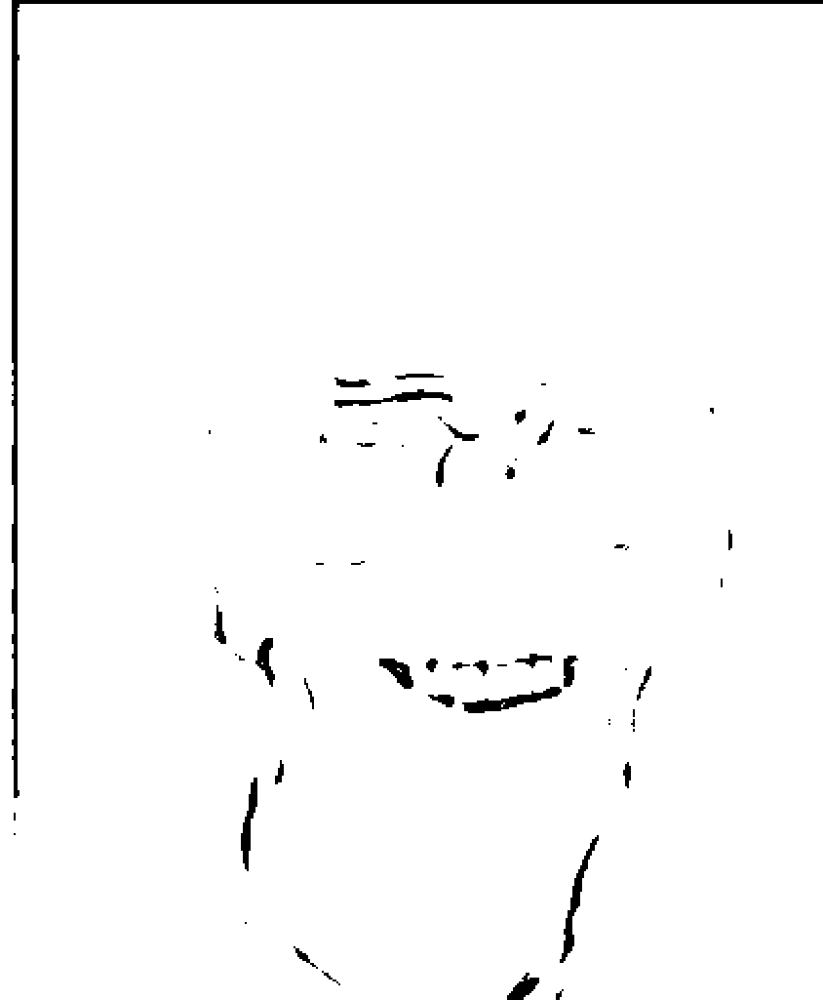

几个世纪来，许多人都试图激励他人从各种疾病康复。有些成功的激励者知道自己如何激励患者、个案或朋友康复。有人虽然成功，却不知是哪种做法奏效。还有许多人，甚至是机构，都无法成功激励他人康复，因为他们根本不懂怎么作才对。

是疗愈者使用的话语和图像改变了个案的信念，激励他们相信能克服攻击自己的病菌、病毒或是疾病。广告的言词和图像的正面激励效果，远胜过任何装置、药物或疗法。昆比（Quimby）说过：「瞭解就是解药。」

### ◎激励康健的「科学」

灵感来自菲尼俄斯帕克贺斯特昆比（Phineas Parkhusrt Qimby）约在一八五〇年发展的「健康幸福科学论（The Science of Health and Happiness）」，见参考书目1。

上个世纪（译注：十九世纪）中叶，有人学会激励康健（Inspiring Wellness）的科学！菲尼俄斯帕克贺斯特昆比后来激励上万人从各种疾病康复。他把这套学问传授给其他人，并在许多详尽手稿中说明其道理和应用方式。

昆比认为人人都有个内在的「科学」我（scientific self），有能力和智慧照顾自己的「自然」身体。只要知道这个科学（可重复验证的）真理，我们就能放下文化制约对我们设定的错误信念，过着完全健康的生活。

昆比訓練自己感覺敏銳又具有靈視能力。他無需得知任何描述或症狀，就能感受個案的病痛。他也能感受到個案內在的「科學」我。昆比發現，個案的內在自我覺得能放心和他相處時，就會告訴他個案的疾病和症狀開始顯化的時間、方式和原因。因此昆比知道是什麼樣的文化背景錯誤信念控制了個案，使其無法自然康復。昆比通常會向個案說明這些錯誤信念，並和個案交談，清楚說明內在自我一定有辦法修復疾病和所有症狀。

昆比形容自己的作法像在扮演個案的辯護律師。他把患者當成因為不知情的罪行，被判患病的無辜者。他說文化和錯誤信念就是檢察官，患者則是負責判決的「法官」。只要昆比能說服法官相信，內在具有自我療癒的「科學」力量，判決就會改變，療癒就會開始。昆比可以感覺療癒的發生，因為他能感受到患者感覺的疼痛，而且能察覺痛苦是否開始消退。

這套科學理論的基礎，是認為人體經過完美設計，能自我照料，即使在病菌和病毒充斥的環境中，也能保持健康。無論何時，身體實際狀況會受到食物、毒物、化學物質、放射物質、受傷等的影響。激勵康健的科學強調，身體實際狀況也深受個人自身信念和思想的控制。因此相信（或知道）自己設計完美的身體能克服疾病，我們就能克服疾病，除非是受到其他劇毒、損傷或誤導信念的攻擊。

因此面對氾濫的文化制約，我們需要激發自己有能力變健康的信念。制約告訴我們，需要外在介入才能帶來健康，更糟的是甚至認為健康是不可能的事。

不管是任何裝置、化學物質、療法或解說，只要能說服生病的人真正理解我們能克服任何疾病的真理，就能帶來健康，前提是要根除大部分損傷、毒害、誤導信念和思想。

### ◎生病的過程

- 文化不斷灌輸我們迷思，宣稱人體會受到病菌和病毒的控制，就像人體確實會被毒物傷害一般。
- 我們將迷思內化成信念，影響原本完美的免疫系統。
- 我們長了一個腫塊，或是中毒，或是興奮，發現有不適感。
- 我們把不適感告訴朋友，他們診斷為某種熟知病症的病徵。
- 另一個朋友或醫師告訴我們，這種病症會出現的症狀。
- 聽到這些建議，我們沒多久便充分顯化這個被賦予名稱和形容的症狀。
- 延續這個錯誤卻又看似合理的結論，我們可能會自願死亡，好讓朋友高興。

### ◎康復的過程

- 內在自我引導我們完美的免疫系統，消除任何生理病因。
- 我們採用正面思考、飲食、祈禱、靜心冥想和休息。
- 我們只聽從知道內在心靈有能力克服疾病的朋友所說的話。

### ◎昆比激勵康復的方式

- 對生病的人心懷慈悲。
- 靜靜專注並共感患者的感受（empathy）。
- 感受對方的疼痛，診斷情況。
- 感受並與對方內在的科學我溝通。
- 瞭解造成疾病的生理和信念原因。
- 向個案說明我們天生具有內在科學能力，可以克服任何疾病。
- 繼續說明科學力量，感受個案的疼痛開始消退。
- 提供進一步的個人療程或是鼓勵的信，直到個案完全康復。

### ◎如何成為成功的康健激勵者—幫助被判生病的人

- 明白人人都有內在科學力量，可以克服任何疾病的真理。
- 明白生病的個人主要是受制於錯誤信念，而非病毒。
- 盡量瞭解讓個案受制於疾病的文化信念。
- 照習慣的方式進行，此外說服個案相信，使用你的方法，加上毫無疑慮地相信自己的內在力量，就能徹底康復。

### ◎學習激勵康健時該做的事

- 照習慣的方式進行，此外說服個案相信，使用你的方法，加上毫無疑慮地相信自己的內在力量，就能徹底康復。
- 接受其他康健激勵者的服務。
- 接受稱職，能扮演代理康健激勵者的催眠師服務。
- 給個案兩張「康健之歌」（Wellness Songs）專輯，依照下列方式使用。

### ◎康健八步驟

在本源眼中，我完全健康！

1. 我看見自己完全健康，感覺在身體裡全然地自在。
   - 我清楚看見自己健健康康，從事熱愛的活動的樣子。

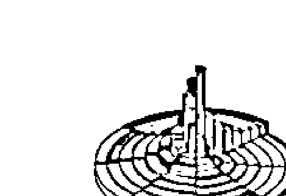

## 藍道瑪音樂頻譜療法。

我自己或讓朋友勾勒出我健健康康，從事著熱愛的活動的樣子。

2. 我用自己的思想、話語、行動和信念創造自己的康健。
   我知道心靈有能力讓我保持健康！
   - 我對自己完全康復只存有正面想法。
   - 我只談大家的康健，還有常保康健的內在力量。
   - 我樂於從事強化康健的活動，包括正面思考、談話、飲食、運動和信念。
   - 我以相信內在康復能力的正面想法設定信念。

3. 我冥想本源的肯定信念（見參考書目2）。
   - 我是本源完美心智的表現！
   - 我的內在承繼了本源的完美！
   - 現在我要求身心顯化完美的和諧及協調！
   - 我的身體是心智的表現！
   - 我的心智和本源的完美心智是一體的。
   - 事實上我完美無缺！
   - 我天生有能力為自己要求完美的調整，現在我要求自己身心能有諧和的調整！
   - 我正在聯繫本源心智的完美秩序與諧和！
   - 這種諧和讓任何狀態都成為一種祝福！
   - 我請求本源心智協助我的內在力量，將精神專注於我在本源心智中一直存在的完美形象！

4. 我專注於自己完全健康的心像。

5. 我總是表現出自己完全健康的樣子。

6. 我唱頌本源的康健之歌和短曲。

7. 我釋放所有壓力。

8. 我繼續從事本源的創造工作。
   - 我樂於從事本源的工作！
   - 我是本源的共同造物者！
   - 我用自己的想法、話語、行動和信念創造！
   - 我正在創造自己的完整實相！

### ◎康健之歌、短曲及詩

我知道大眾媒體的設定力量有多大。電影、電視、廣播、雜誌和書籍提供我們圖像和文字，要設定我們的思想和信念。我還記得多年前的影像，甚至唱得出那些歌和廣告歌。我所見所聞的內容，大多經過精心設計，用來推銷產品，或是想法和信念。我們的信念是由意識和無意識想法所設定。我們最強而有力的想法，通常來自我們敬重的老師或同儕所分享的文字或圖像。因此我們會將信任的人所說的話，內化成自己對事物面貌和事理的信念。

如今我想推廣激勵康健的真理給所有有心的朋友。我的內在心靈告訴我，練習激勵康健的最佳方法，就是製作和分送康健之歌、短曲和詩的正向錄音專輯。曲詞讓人以愉快的方式，把有關內在自我療癒力量的正向肯定句聽進去，並受到啟發，保持完全健康。我成立了「康健創作總動員」（Call for Wellness Compositions），希望大家能受到啟發，創作歌詞和曲調，讓我們能加入將來的康健歌曲、短曲、歌謠、詩的專輯中。
圖1是我們首批康健之歌的一份樂譜。這首歌名為「健康形象」（The Picture of Wellness），歌詞和旋律由芭芭拉希洛創作。編曲和演奏者是柏西絲拉賈安瑟（Persis Laja Ensor）。
圖2是第一代的「康健白盒子」，一台白色的卡式錄音機。

圖3是另一個第一代的「康健白盒子」，一卷白色卡式錄音帶。
第二代的「白盒子」會是白色的CD唱片和唱盤。
這捲錄音帶和未來的康健專輯錄音帶提供大家便利的方式，快速將「激勵康健科學」應用於你目前使用的方法。

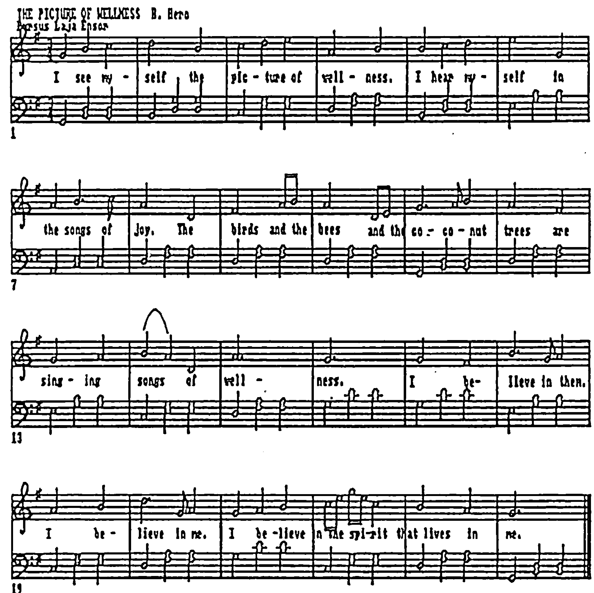

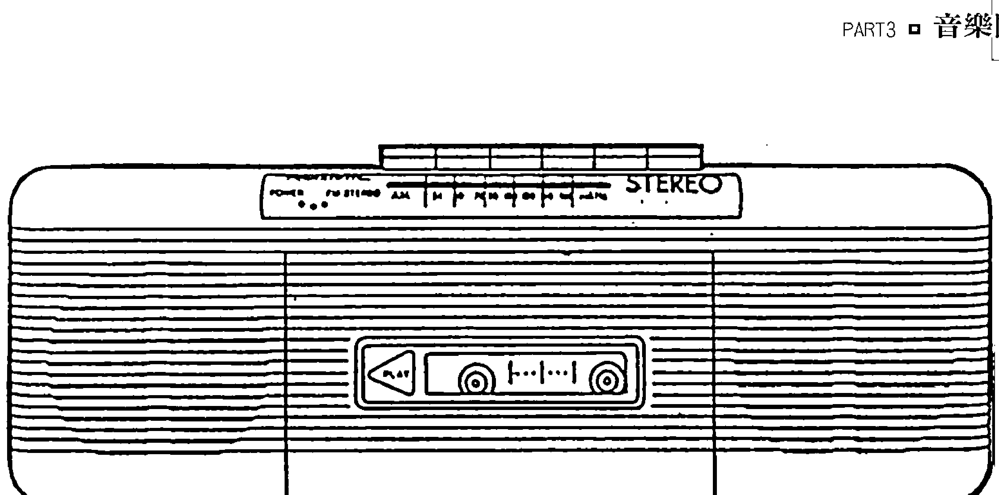
圖2. 第一代的「康健白盒子」，一台白色的卡式錄音機

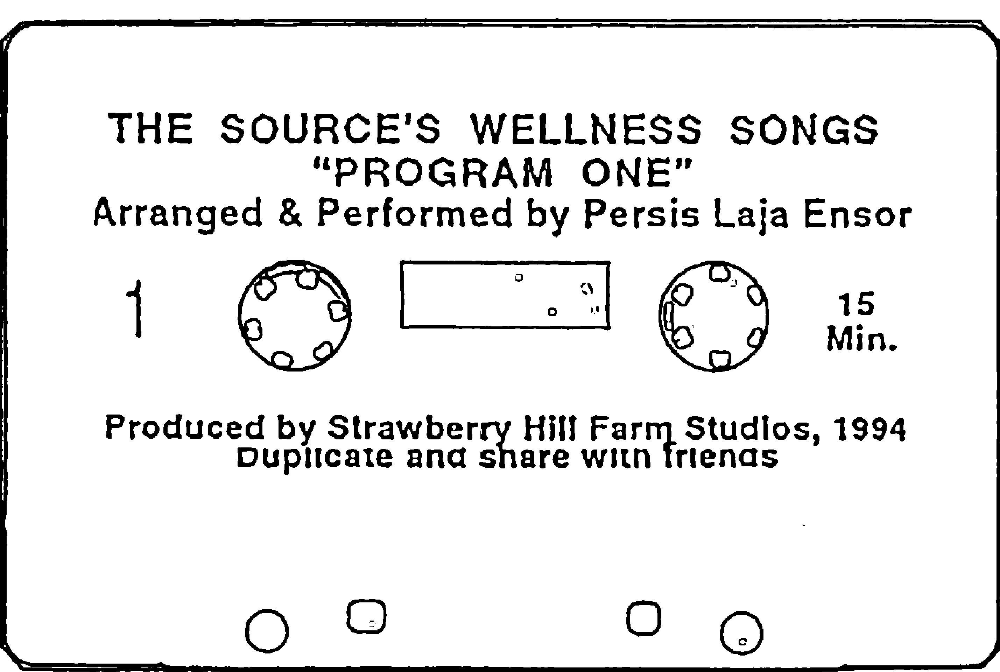
圖3. 第一代的「康健白盒子」，一卷白色卡式錄音帶

### ◎如何將康健帶給其他數以千計的人

- 瞭解激發康復的技巧，並納入既有的療癒方式。
- 創作、製作和分送正向的康健歌曲、短曲和詩。

瞭解激發康健的科學，我們就能創造裝置和療程，更有效地說服個案相信，他們能迅速完全康復。

## 參考書籍

1. Horatio W. Dresser, “The Quimby Manuscripts”（昆比手稿），The Citadel Press, Secaucus, New Jersey, 1961.
2. 潛意識，《聽潛意識說話》（The Sub-Conscious Speaks），Strawberry Hill Farm Studios Press, Wells, Maine, 1994。

> Phineas Parkhurst Quimby and Horatio W. Dresser, “Quimby Speaks (Third edition)”（昆比的話，第三版）, 1994.

## 附錄四 國際藍道瑪研究學院簡介

創始人兼總裁：芭芭拉·希洛 (Barbara Hero)

院長：謝汝光

國際藍道瑪研究學院（International Lambdoma Research Institute, ILRI）的成立宗旨，在於鼓勵及推動藍道瑪的研究與應用，並推廣認識藍道瑪整數比矩陣中暗藏的智慧與相互關係。

學院研究內容包括音程、色彩、幾何圖形、數學、空間共鳴、脈輪能量中心、行星自轉、元素週期表，以及意識轉換狀態之間的關係。

學院的使命包括藍道瑪智慧鍵盤的研發，還有藍道瑪矩陣、康托爾數組（Cantor Array）及法雷數列（Farey Series）在數學上的類似處。音樂及藝術的應用，則包括以特殊程式根據藍道瑪矩陣比率產生頻率（以每秒振動周波數為單位）的電腦作曲，還有運用同樣原理的電腦繪圖曼陀羅（mandala）。

研究與發展：

1. 藍道瑪在信息醫學的研究與發展。
2. 藍道瑪在智能開發的研究與發展。
3. 藍道瑪在生物製劑頻譜的研究與發展。
4. 藍道瑪在染色體DNA頻譜的研究與發展。
5. 藍道瑪在農作物生長發育頻譜的研究與發展。
6. 藍道瑪在癌症治療頻譜的研究與發展。
7. 藍道瑪在抗衰老頻譜的研究與發展。
8. 藍道瑪在宇宙生命科學的研究與發展。
9. 藍道瑪在太陽頻譜、地球頻譜、月亮頻譜對生物生態平衡的研究與發展。
10. 藍道瑪在身、心、靈和諧平衡的研究與發展。

目前學院網站還在建置中，如有興趣進一步了解藍道瑪學院相關活動訊息，歡迎與我們聯繫！連絡電話：886-2-25770239，E-mail：lambdoma@micun.org ，相關連結網站：www.micun.org www.mrtim.com

## 國家圖書館出版品預行編目資料

藍道瑪音樂頻率療法 / 芭芭拉. 希洛著；胡澤芬譯. -- 初版. -- 新北市：順達文化，2012.01 面； 公分. -- (國際藍道瑪音療用書；1)
ISBN 978-986-87712-5-3 (平裝)
418.986
100026894

## 國際藍道瑪音療用書 001

## 藍道瑪音樂頻譜療法

著 作 芭芭拉·希洛
印 刷 普林特斯資訊股份有限公司
企 劃 德陽圖書公司
出 版 順達文化事業出版社
新北市 235 中和區立德街 211 號 2 樓
電話 / (02)3234-3788 傳真 / (02)3234-8050
E - m a i l pftwsdom@ms7.hinet.net
劃撥帳號 19508658 水星文化事業出版社
總 經 銷 易可數位行銷股份有限公司
新北市 231 新店區中正路 542-3 號 4 樓
http://ecorebooks.pixnet.net/blog
電話 / (02)82191500 傳真 / (02)82193383
版 次 2012年1月初版一刷
特 價 新台幣 360 元 （缺頁或破損的書，請寄回更換）
I S B N ：978-986-87712-5-3（平裝）

尊重智慧財產權·未經同意請勿翻印 (Printed in Taiwan)