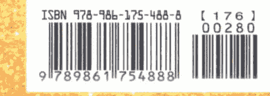

一本讓生命徹底質變的書。

## THE JOURNEY BEYOND YOURSELF
## THE UNTETHERED SOUL
## 覺醒的你

暢銷百萬，歐普拉的床頭靈修書
《臣服實驗》作者 麥克·辛格 —— 著
賴隆彥 —— 譯

- 李欣頻、周介偉、陳德中
- 張德芬、許瑞云、黃淑文
一致推薦！

### 天使神秘学院
- ※ 神秘学资料库
- ※ 神秘学培训机构
- ※ 水晶能量研究中心
- ※ 专业占卜预测机构
- ※ 官方微信：strcdts
- ※ 微信公众平台：strc2011
- ※ 官方店铺网址：http://strc.cr.cx
- ※ 读书交流QQ群：
  占星塔罗占卜师交流群：814594478（加入密码：PDF）
  神秘学其他综合群：659338717（加入密码：PDF）

微信号：strcdts
天使神秘学院
微信公众平台：strc2011

## 制作说明：

本书由《天使神秘学院》出重金从台湾购入的原版书籍扫描制作完成。为达到最好阅读效果，特地把书全部切开后，再经由专业扫描设备高精度扫描完成，并经过一张张的PS后期处理最终成书，其间花费大量的人力、物力以及时间，只为能给大家提供经济并优质的神秘学学习资料而努力。

本学院强力谴责某些机构和个人，把本学院花心血制作完成的电子书籍，包装后直接放在自家淘宝网上低价倾销的行为，以谋取不劳而获的经济利益。如果长此以往最终将无人愿意再为大家花心思制作电子书，那以后可能大家再无新书可读。

为让大家以后能够读到更多的好书，也为了本学院的良性发展。本学院恳请大家尽量做到如下几点：

- 一、尽量在天使神秘学院的官方网站购买电子书籍。
  官网电脑访问地址：http://strc.cr.cx
- 二、在收到电子书后小范围传阅即可，千万不要公开传播，更别挂到淘宝网上低价销售。

同时为答谢广大支持者，学院电子书将做如下调整：

- 一、学院会把一些早已收回制作成本的电子书折价销售。
- 二、最新制作的电子书籍会开放打印功能，大家购买后有条件的可自行打印成书。

天使神秘学院
2020年5月

## 覺醒的你

暢銷百萬，歐普拉的床頭靈修書
《臣服實驗》作者 麥克·辛格——著 賴隆彥——譯

## ★各界盛讚推薦！

> 东方与西方原本各自发展，麥克·辛格却以出色的文笔为这两大传统搭起沟通的桥梁，教导人们如何在灵性探索乃至日常琐事的生活中达到圆满。佛洛伊德曾说，生命是由爱与工作构成。在这本精采的书中，辛格以雄辩滔滔、机智且令人信服的推理，指出它们同为无私奉献的两端，从而完成此一思想。
> ——雷·庫茲威爾 (Google 工程总监、《人工智慧的未来》作者)

> 麥克·辛格在本书中带你一步步走向「源头」，而且以简单明瞭的方式呈现。请仔细阅读这本书，你将瞥见永恒，且不止于此。
> ——狄巴克·喬布拉 (《看见神》作者)

> 本书的每一章都启发你去静心思考人类生存状态受到的束缚，以及如何优雅地解开每一个结，让灵魂飞翔。本书的精准与简单，正反映出它大师级的风采。
> ——詹姆士·歐迪亞 (思维科学研究所所长)

> 麥克·辛格为我开启心智，达到全新的思想维度。这本书在心理与智力层面都以新颖且令人兴奋的方式挑战了我。可能得多读几次并且花很多时间去反思才行，但对于渴望更加了解自己与真理……
这是一本深具影响力的书，且显然自成一类。麥克·辛格以深入浅出的方式，带领读者展开一段旅程，从受自我束缚的意识开始，最后帮助我们超越短视且被控制的自我意象，到达内心自由与解脱的状态。麥克·辛格的书是送给所有踯躅于途且渴望更丰富、充实与创新生活者的一份宝贵礼物。
> — 瑜伽士亚姆利特·德赛（国际公认的现代瑜伽先驱）

> 这是一本关于灵性意识之道的精彩巨作，书写清晰且强而有力。麥克·辛格为那些有意踏上灵性之旅的人提供了坚实的踏板。
> — 阿布都儿·阿济兹·萨伊德（美国大学伊斯兰和平学系主任、和平研究所教授）

本书为世上求知若渴的灵魂带来无穷的喜悦。
> — 玛·尤佳夏柯堤·撒拉斯瓦提（撒拉斯瓦提国际宣道会创办人、《今日印度教》“二〇〇二年之印度人”获奖主）

接触本书使你得以深入灵性，你将于其中发现可以映现你绝对清净自性的镜子。若你正在寻找不受信条与仪式阻碍的实用灵修，请阅读此书。
> — 萨曼·沙赫特·撒罗米拉比（《具有民族情感的犹太人》共同作者）

的人来说，这绝对是一本必读的好书。
> — 路易士·奇瓦西（美林证券资深副总裁）

## 目录

### 《推荐序》一本认识灵性与能量的入门书 011
### 《前言》“找自己”的旅程 007 黄淑文

# 第1部 觉醒的关键
- 1 谁在你脑袋里说话？ 016
- 2 摆脱内在的室友 025
- 3 通往自由的关键提问 036
- 4 你不是你以为的那个人 046

### 第2部 体验能量的存在
- 5 打破封闭自己的习惯 058
- 6 敞开心，让生命事件通过 068
- 7 保护自己，永远无法自由 080
- 8 放下，才能终结负面循环 094

### 第3部 让自己自由 093
- 9 除去心中的刺 106
- 10 你有能力让自己自由 115
- 11 别把生命耗费在逃避痛苦上 127

### 第4部 跨越心墙 139
- 12 拆除思想筑成的墙 140
- 13 超越你为自己打造的牢笼 150
- 14 愈想安稳，愈容易陷入恐慌 159

### 第5部 活出生命 173
- 15 你想要真正的快乐吗？ 174
- 16 不抗拒生命之流 184
- 17 直视死亡，才能时刻活出生命 193
- 18 活在最佳平衡点上 203
- 19 神的慈爱之眼 212

## 《推荐序》
## 一本认识灵性与能量的入门书

看完这本书，有一种当头棒喝、茅塞顿开的感动。原来，我们都被自己骗了。
那些我们心痛到不能呼吸的，难堪到无法抬头的，恐惧到坐立难安的种种痛苦，其实是大脑投射出来的幻象。
经历种种痛苦难堪恐惧的你，不是真正的你。所谓的你，不是你所经历的事件和情绪。真正的你，是观看自己经历各种喜怒哀乐、目睹所有一切的人。（就像现在，有一个你，正在看着自己看这一篇文章，那个观看者，才是真正的你。）
或许你会问，如果那些痛苦、情绪、脑中种种杂乱的声音都不是你，那么你如何从假我的幻象中跳脱出来呢？

### 黄淑文

作者麦克·辛格一再点醒我们，“你不是事件，而是经历事件的人。”你唯一能从生命获得的东西，只是体验它、经历它所获得的成长。

> > “若你释放并让能量通过，它就会消失。当痛苦在心中出现时，假如你放松并真的敢于面对，它就会过去。每一次你放松、放下时，就会有一小片痛苦永远离开。”

如同麦克·辛格所言，你要做的，就只是释放，让曾经纠结过你的痛苦通过你，让骚乱的能量自由来去，只要察觉你在做什么就好。你抓得愈紧、愈执着，甚至筑一道墙压抑自己，反而把自己冻结在里面。

不要怕，接受所有发生在你身上的事，你只是陪着自己已经历所有的旅程。你看着自己哭，看着自己笑，看着自己站上成就的舞台。你要清醒的是，那些哭着、笑着、戴上光环的你，都不是真正的你。真正的你，是觉知这一切事物的你，你的意识独立在外并觉知所有的一切。你是觉知者，观察者，见证者。藉由觉知你在觉知，你学会让每个事件自由地通过你，你学会放下、放松，不再黏溺在里面，你的灵性就因此觉醒。

麦克·辛格在书中把内在的灵性能量比喻成太阳，不管你有没有察觉，相信不相信，你是好人坏人，它永远无条件地照耀着你。如果你躲避阳光好几年，后来选择走出黑暗，阳光依然会持续照耀你，如同你从未离开。你不必道歉，只需要抬头看着太阳，你会发现，只要你愿意，它永远都在。

和内在的能量连结，就只是一个简单的意愿，“告诉自己别封闭，永远保持开放。”就像水龙头开关，你打开，能量就流进来；你关上，就锁住能量。真的，就这么简单。控制开关的人，其实是你自己。只要你愿意放松与开放，巨大的能量就会在你的内在涌现。

麦克·辛格说，快乐其实是不需要任何条件的，因为我们为快乐设定限制，才会失去生命最简单的快乐。你创造的任何条件都会限制你的快乐，你必须给出一个无条件的答案。如果你决定这辈子从此刻起都要快乐，你不只会快乐，还会开悟。

> > “你不是来地球受苦的，你的苦帮不了任何人。有无数你还没想到的事情都可能发生。问题并非它们会不会发生，事情会发生的，真正的问题是：无论发生什么，你是否都想要快乐？”

麦克·辛格的手上好像有一把利剑，他帮我们斩去三千烦恼丝，归纳出生命至纯至真的真理。看着这本书，几度眼睛濡湿，一部分是感动，一部分是感叹我们活得太傻，把自己搞得太复杂、太辛苦。

麦克·辛格细腻的教导，翻转了我们惯有的认知。遵照他提供的步骤、方法，顺着生命自然的流动，把自己敞开，并对自己诚实，你可以轻松简单地回复生命的丰盛和快乐。

这是一本认识灵性与能量的入门书，诚挚推荐给读者。
（本文作者为心灵绘画师、YA1国际静心引导师、《人生难免会有伤》作者）

## 《前言》
## “找自己”的旅程

尤其要紧的，你必须对自己忠实；正像有了白昼才有黑夜一样，对自己忠实，才不会对别人欺诈。
> ——莎士比亚

这是莎士比亚的经典名句，是《哈姆雷特》第一幕中，波洛涅斯对其子雷欧提斯说的话，听来浅白易懂。意思是，对别人保持诚实，必须先忠于自己。但若雷欧提斯完全对自己诚实，会发现父亲说的话有如捕风捉影。究竟我们应该忠于哪个“自己”？是心情不好时出现的那个自己，或是犯错时感到卑微的那个自己？是沮丧苦恼时怨天尤人的那个自己，还是生命光鲜亮丽时的那个自己？
从这些问题可见，“自我”的概念似乎比我们原先想的更难懂一点。若雷欧提斯接触到传统心理学，事情或许还有一线曙光。心理学之父弗洛伊德将人格分成三个部分：本我、自我和超我。他认为，本我是人原始的动物本性，超我是社会灌输给我们的价值体系，自我则是面对外在世界的代表，努力在前述两大力量之间保持平衡。不过这套说法对年轻的雷欧提斯并无帮助。在这些相互抗衡的力量之中，我们究竟该忠于哪一个？

我们再次发现，事情并不像看到的那么简单。如果我们勇于看穿“自我”一词的表面，会浮现很多人不愿面对的问题：“我生命的各种面貌都只是‘自我’的一部分吗？或者只有一个我？若是如此，会是在什么样的情况下？”

在接下来的章节中，将进行一段探索“自我”的旅程，但不以传统的方式进行。既不求教于心理学家，也不理会哲学家；不会在古老的宗教观点中争论及选择，或是诉诸民意调查的统计支持。我们会转向对研究主体有直接认识的单一来源，求助一位在生命的每时每刻都在收集能解决此一大哉问必要资料的专家。那位专家就是你。

但在你兴奋过头或打退堂鼓之前，得先澄清一件事：你对事情的看法与意见并不是我们要的。此外，我们对你读过的书、上过的课或参加过的专题讨论都不感兴趣，只关心你亲身经历的直觉体验。我们不要你的知识，而是要你的直接经验。没错，在这件事情上，你不会失败，因为你的“自我”就是不折不扣的你，在一切时间空间的那个你。

我们只须把它挑出来，毕竟，混在里头容易令人困惑。

本书各章是一面面镜子，帮助你从不同角度看清“自我”。虽然即将展开的是内在的旅程，但会引出你生命的每一个面向，只要你愿意以最自然与直觉的方式诚实看待自己。切记，若我们在找“自我”的根源，其实就是在找你。阅读本书会发现，在一些深入的主题上，你比自己以为的知道更多。事实上，你早已明白如何找到自己，不过是一时分心与迷惘而已。只要重新对准焦点就会了解，你不只有能力找到自己，还能释放自己。做或不做，完全由你决定。只要跟着本书的章节逐步完成内在旅程，你将不会再有困惑，不会再缺少力量，不会再责怪别人，会确切知道该做些什么。如果你选择继续致力于了悟自我的旅程，将会对真正的你生起极大的敬意。只有到这个时候，你才能完全体会那个忠告的深刻意涵：“尤其要紧的，你必须对自己忠实。”

# 第1部
## 觉醒的关键

> > 内在成长的关键，
> 在于了解找到平静与满足唯一的方法，
> 是停止思索与自己有关的事。
> 当你终于了解一直在里面说话的“我”永远无法满足时，
> 你才能开始成长。

## 1 谁在你脑袋里说话？

糟了！我想不起她的名字。她叫什么？该死，她走过来了。她叫……莎莉……苏？她昨天才告诉我，怎么会忘了呢？这下糗大了。

你有没有注意到，你脑袋里的对话从来不曾停止，一直在进行着？你想过它为什么讲个不停吗？讲的内容和时机又是如何决定的呢？有多少成真？又有多少是要紧的？如果你现在听见：“我不知道你在说什么，脑袋里根本没有任何声音！”——这正是这里所说的那个在脑中说话的声音。

如果你够机伶，会花点时间退后一步，检视这个声音，进一步认识它。问题在于距离太近，很难保持客观，你必须往后退，看它讲话。你在开车时，听到如下的内心对话：

> > 我应该打电话给佛瑞德才对。天啊！真不敢相信我竟然忘了！他一定气炸了，可能从此再也不跟我说话。也许现在应该停车打给他。不，我現在不想停车……累了、想睡了。
脑袋里的声音会说：请注意，正反两面的声音都有。它不在乎是哪一面，只是一直说个不停。当你觉得我在干什么？我还不能睡。我忘了打给佛瑞德。刚刚在车里有想到却没打，如果现在不打电话……啊！算了，太晚了，我现在不应该打给他。想这些做什么？我得睡了。可恶，现在睡不着，我一点也不累了，但明天有重要的事，必须早点起来。
难怪你睡不着！你怎么能忍受那个声音一直说个不停呢？就算它再悦耳动听，还是会干扰你正在做的每一件事。如果花点时间观察这个在脑中进行的声音，你首先会察觉，它永远不会停止，滔滔不绝地唱着独脚戏。你看见有人一直走来走去喃喃自语，一定会觉得他很怪异。你会纳闷：“如果他是说话的人，又是聆听的人，那么他在说话之前就知道会说出什么话，这有什么意义？”你脑袋里的声音也一样。它为什么说个不停？说的人是你，听的人也是你，当这个声音提出抗议时，抗议的对象是谁？又可能说服谁？

这令人十分困惑。你听：

我想我应该结婚。不！你知道你还没准备好，你会后悔的。但我爱他。得了，你对汤姆也有那种感觉，如果你嫁给他了呢？

仔细观察便会发现，它只想找个舒服的地方休息，只要觉得有帮助，转瞬间就换边站。即使发现错误，它也不会停下来，只会调整观点，然后继续。只要加以留意，这些心理模式便会清楚呈现。第一次发现脑袋一直说个不停时，真的是满震撼的，你甚至可能会对它吼叫，要它住口，却只是徒劳无功。然后你才明白，是那个声音在对那个声音吼叫：

住口！我要睡了。你为什么一直说个不停？

显然，你不能用这样的方式让它住口。让自己从喋喋不休之中解脱的最佳方式是退后，冷眼以对。只要将那个“声音”当作对你说话的发声装置就好，别花心思，只要看它。无论那“声音”说什么，都一样；不管内容好坏，世俗或神圣，都无所谓，因为它仍只是你脑袋里说话的声音。事实上，唯一能让你和那个“声音”保持距离的方式，是停止分辨它在说什么，不要去想它说的这个是你，另一个不是你。你听见它说话，显然它就不是你。你是听到那个“声音”的人，你是觉察它说话的人。它说话时，你确实有听到，不是吗？现在让它说“嗨”，多说几次，在里面大喊！你能听到自己在里面说“嗨”吗？当然可以。有个声音在说话，而觉察那说话声音的人是你。
问题在于，觉察说“嗨”的声音容易，难的是领会到无论那声音说什么，都只是个说话的声音，而你正在听。那个声音讲的都是你，并没有别的。假设你正看着花盆、相片与书这三样东西，有人问你：“这些东西里面哪个是你？”你会说：“都不是！我正在看你放在我面前的东西的人。无论你放什么，我都是那个在看的人。”瞧，这正是主体认知不同客体的行为。听内在的声音也是如此。它说什么都没差别，你是觉知它的人。只要你认为它说的某件事是你，其他事则不是你，就不客观了。你可能想将自己想成说好事的那个部分，但那依然只是说话的声音。你或许会喜欢它所说的，但那并不是你。

成长真正的关键，在于了悟你并不是头脑的声音，而是听到它的人。若不了解这点，你便可能会试着去想象那声音所说的许多事情当中哪一个才是真正的你。人们在“试着找到自己”的意义下经历许多变化，想找出这些声音中的哪一个，或他们许多人格面向中的哪一个，才是真正的自己。答案很简单：全都不是。

若你客观地观察，会发现这些声音所说的内容很多是无意义的。大多数的谈话只是浪费时间与能量。事实上，不管你的头脑说什么，生命大都顺着非你所能掌控的力量展现。就好像白天太阳是否升起，并非你晚上盘算所能决定。可以确定的是，太阳会升起，然后会落下。世上有无数的事情发生，你爱怎么想都可以，但生命的巨轮依然会持续转动。

事实上，你的思维对这个世界造成的冲击远不如你一厢情愿的想像。如果愿意客观地观察你所有的想法，便会明白其中大多无关宏旨，除了你之外，对任何事或任何人都没什么影响，只是让你对现在、过去或未来发生的事感觉好或坏而已。把时间花在希望明天别下雨是徒劳无功的，你的想法无法改变雨滴。有一天你会明白，无尽的内在私语是没用的，而且不需要一直去盘算每件事。最后你会了解，问题的真正原因不在生命本身，而是头脑在生命中的骚动。

这里出现一个重要问题：如果内在的声音是无意义且不需要的，为什么还会存在？
回答这个问题的诀窍在于了解为何要说那些话。例如某些情况下，脑中声音说话的起因如同茶壶水滚时会鸣叫，亦即不断累积的内在能量需要释放。你若客观地观察便会发现，当内在紧张、恐惧或欲望的能量持续增强时，声音将变得极其活跃。对某人生气时，你显然会很想咒骂他，试着观察看看，有多少次甚至在你发现之前，内在的咒骂声已展开。当能量在你里面累积时，你会情不自禁地表现出来。那个声音之所以说话是因为你的内在不平静，而说话可以释放能量。
然而你会察觉到，就算没有任何困扰，它也有话说。你在街上走路时，它会这么说：
看那只狗，是只拉不拉多耶！嘿，那辆车上还有另一只狗。它很像我的第一只狗，小黑。哇，那里有辆老爷车，挂着阿拉斯加的车牌，在这里可真罕见！
它其实是担任旁白，为你叙述这个世界。但你为什么需要这个？你已经看见外面发生的事，透过脑中的声音对自己复述有什么帮助呢？你应该仔细审视这点。只要简单一瞥，你立刻就能细数所见事物的无数细节。看见一棵树时，你轻而易举便可看见树枝、树叶与花苞，为什么还必须说出已经看见的东西呢？

看这棵山茱萸！翠绿的绿叶衬托着白花。哇，这里有好多花，满满都是！

仔细研究便会发现，那些叙述让你面对周遭世界感到更自在。就像在后座指挥驾驶一样，你会觉得事物似乎更在控制之中，真的觉得和它们有着某种关系。树，不再只是世上与你无关的一棵树，而是你看见、贴上标签并判断过的一棵树。藉由在脑中叙述它，而将那份对这个世界的最初直接体验带入你的思想领域。它与你的其他想法合并，建构出价值体系与历史经验。

请稍加检视你外在世界的经验与你和心理世界互动之间的差异。当在思考时，可以自由创造任何想要的想法，这些想法是透过脑中声音来表达。你很习惯停驻在头脑的游乐场去创造并操纵思想，这个内在世界是一个在你控制之下的替代环境，但外在世界却依照它的法则在进行。当脑中声音对你叙述外在世界时，那些想法和你的其他想法并立，相互交织，并实际影响你对周遭世界的体验。最后你感受到的，其实是自己设定呈现的个人世界，而非未经过滤、真实存在的经验。对外在世界的这个心理操弄，让你能在它要进来时筛检事实。举例来说，无论何时你都看见无数事物，却只叙述其中几个而已。在脑中讨论的那些事，是对你而言重要的事。藉由这种微妙的前置处理，便能控制实际经验，让它全部符合你脑中的想法。你的意识其实是在经验你脑中的现实模型，而非现实本身。

你必须很仔细地观察这点，因为你一直在这么做。冬天在外面走路，直打哆嗦，脑中的声音说：“好冷！”此时它对你有什么帮助呢？你早已知道很冷，你是体验到冷的人，为什么还要对自己这么说？你重新创造脑中的世界，因为你可以控制你的头脑，但无法控制世界。这就是为什么要在脑中说那些话。若你无法让世界照自己喜欢的方式进行，你便在脑中叙述、评判与抱怨它，然后决定该怎么处理。这让你觉得更有主宰力。

身体觉得冷时，你也许多没有办法改变温度，但当你的头脑说“好冷”时，你就可以说“我们快到家了，再几分钟就好”，此时会觉得好一点。在思想的世界里，总能做点什么来控制体验。

基本上，你在自己之内重新创造外在世界，然后活在自己的脑中。若你决定不这么做呢？

## 控制体验。

怎么做呢？假如你决定不叙述，而是有意识地观察世界，会觉得更敞开、更无遮蔽。这是因为你真的不知道接下来会发生什么，而头脑习惯帮助你。它处理你当下的经验，以符合过去的见闻与未来的憧憬，用这样的方式帮你。这一切有助于创造控制的假象。若你的头脑不这么做，你就会感到很不舒服。对大多数人来说这都太过真实，于是我们透过头脑淡化处理。

你会发现，头脑一直说个不停，是因为你给它工作。你将它视为一种保护机制或防卫形式，最终，它让你觉得比较安全。只要这是你想要的，你就会用自己的头脑去减缓生活的冲击力，而非真正去生活。这个世界一直在开展，你或你的想法微不足道。你来之前它早已存在，你走之后仍会继续存在很久。以维系世界之名，你其实只是想维系自己。

真正的个人成长，和超越你那不理想并需要保护的部分有关。要一直记得，你是在里面觉察说话声音的人，这才是出路。在里面觉察你一直在自说自话的那个人始终默不作声，这是探查你存在深处的入口。意识到你正在看着那个声音说话，是展开美妙内在旅程的起点。若使用得当，过去曾是焦虑、分心、恐惧来源的那个脑中的声音，将可转变成真正灵性觉醒的发射台。去认识那个观察声音的人，就能了解宇宙创造的大秘密。

## 2 摆脱内在的室友

内成长的关键，在于了解找到平静与满足唯一的方法，是停止思索与自己有关的事。当你终于了解一直在里面说话的“我”永远无法满足时，你才能开始成长。它总是事事找碴。老实说，你最后一次真正无烦心之事是什么时候？在现在的问题之前，还有其他问题；而如果你够明智，便会了解这个问题消失之后，会有下一个问题冒出来。
真实的情况是，问题永远没完没了，除非你能摆脱内在这个问题很多的部分。有问题困扰你时，别问“我该怎么办”，而是问“我的哪个部分正为此事困扰”。如果问“我该怎么办”，你就已经落入“外在真的有问题必须处理”的信念中。若你想要在面对问题时保持平静，必须了解自己为什么会将某个特定状况视为问题。若你感到嫉妒，别试着保护自己，而是问：“我的哪个部分在嫉妒？”那会让你向内看，并了解自己的某个部分有着嫉妒的问题。
一旦清楚看见那个纷扰的部分，接着问：“是谁看见此事？谁觉察到这个内在的纷扰？”这是你一切问题的解答。看见纷扰这个事实，意味着你不是它。看见某事的过程需要主客关系，主体名为“见证者”，因为是它看见正在发生的事；客体则是你正在看的事物，在此是指内在的纷扰。维持“客观觉知内在问题”这个行为，总是比迷失在外在状况中好。这是指在外在世界思考内在问题的答案。你认为只要改变外在事物就能解决问题，但没有人能藉由改变外在事物而解决问题。总是会有下一个问题。真正解决问题的唯一办法，是回归见证者意识，彻底改变你的参考架构。

要达到真正的内在自由，必须要能客观地观察你的问题，而非迷失于其中。当你迷失在问题的能量中时，绝不可能找到问题的解答。众所周知，你不可能在感到焦虑、恐惧或愤怒时，妥善处理所面对的状况。你必须处理的第一个问题，是自己的反应。除非承认那个状况如何影响你的内在，否则无法解决外在的任何问题。问题通常不是表面上看到的。当你够清楚时，便会了解真正的问题是你内在有某样东西几乎对任何事都会有问题。第一步是处理你的那个部分。这涉及从“外部解决意识”到“内部解决意识”的转变。你必须打破“问题的解答是重新安排外在事物”的思考习惯。解决问题的唯一答案，永远是走向内在，并放下似乎对现实总有许多问题的那个部分。一旦这么做，接下来该怎么处理你就会很清楚。

真的有个方法可以放下视每件事为问题的那个部分。看似困难，其实不然。你的存在有个部分确实可以从你自己的肥皂剧中抽离出来。你可以看着自己在嫉妒或愤怒，不必去思考或分析，就只是觉知它。谁看见这一切？谁在觉察内在发生的变化？当你告诉朋友“我每次和汤姆说话都会感到心烦”时，怎么知道它令你心烦？因为你在那里面，看见那里正在发生的事，所以才知道它令你心烦。你和愤怒或嫉妒之间是有间隔的，你是在那里觉察这些事的人。一旦回归意识，便可摆脱这些个人的纷扰。从观察开始，单纯去觉知你在觉察当下正在进行的事。这很简单。你会注意到，你正在观察一个人的个性，优缺点皆一览无遗，就好像有个人与你同在那里——实际上可以说，你有个“室友”。
如果想见见你的室友，只要试着独处，安静地在自己里面坐一阵子。你有这个权利，因为那是你的内在领域。但你不会找到宁静，而是听见喋喋不休的唠叨：我为什么要这么做？我还有更重要的事要做。这简直是在浪费时间。这里除了我之外根本没有人。这一切算什么呢？

这就是了，你的室友就在那里。你可能很想要内在宁静，但室友并不合作。而这不只发生在你想要宁静的时候，它对你看见的每件事都有话说：“我喜欢。我不喜欢。这个好。那个不好。”就这样说个不停。平时并未察觉，因为你没有向后退，与它保持距离。你们太靠近了，以至于无法了解，你其实是在催眠状态下听它说话。

基本上，你在那里并不孤单。你的内在生命有两个不同的面向：第一个，是你，觉知者，见证者，固执意念的中心；另一个，是你观察的对象。问题是，你观察的那个部分永远不会住口。如果能摆脱那个部分，即使只是片刻，那份安详与平静会是你拥有过最美好的假期。

真正的灵性成长便和摆脱这个困境有关。但首先你必须了解，你已经和一个疯子绑在一起，在任何状况或情境下，你的室友可能会突然决定：“我不想待在这里。我不想这么做。我不想继续正在做的任何事，破坏你的大喜之日，甚至新婚之夜！”你的那个部分可能破坏每一件你想和这个人说话。你马上会觉得紧张、不舒服。室友可能在毫无预警的情况下破坏任何状况。

你买了漂亮的新车，但每次开车时，内室室友就会挑毛病。脑中的声音持续指出每个小声响、每个小震动，直到最后你再也不喜欢这辆车为止。一旦看清这会对你的生活造成怎样的影响，你便已做好灵性成长的准备。当终于说：“看看这个家伙，它正在破坏我的生活。我想过着平静且有意义的生活，却觉得自己好像坐在火山顶。这家伙对于正在发生的事，不管什么时候都要捣怪、从中作梗或争论不休。前一天还喜欢某人，隔天却决定挑剔他做的每一件事。我的生活就因为和我同住的这个家伙总是把每件事变成肥皂剧，才会一团乱。”此时你便已经为真正的转变做好准备。一旦看清这点，学会不再认同你的室友，你就已经准备好要让自己自由了。

如果你还没有这样的觉知，只要开始观察就好。花一天观察你室友做的每件事，从早上开始，注意它在每个状况中说了什么。每次遇见别人时，每次电话铃声响起时，就试着观察。有个观察的好时机，就是你洗澡的时候，去观察那个声音都说些什么。你会发现，它从不让你静静地洗澡。洗澡是为了清洗身体，而非观察头脑说个不停。看看你能否全程保持足够的清醒，去觉知当下发生的事。你会对自己的发现感到震惊，因为它就只是从一个主题跳到下一个。这样的喋喋不休显得很神经质，你根本无法相信它一直如此。

你必须了解，是内在的室友让你落入狼狈的处境。如果希望从中获得平静，就必须修正这个情况。
捕捉你内在室友真实样貌的方法，是将它往外拟人化，假装你的室友——精神——有它自己的身体。实际做法是把你听到的内在话语的完整性格，想像成站在外面对你说话的一个人。只要想像有个人正在说你的内在声音会说的每一件事。请花一天的时间和那个人相处。
你刚刚坐下来观赏最喜欢的电视节目，问题是，你有此人作伴。现在你会听到同样不间断的独白，只不过以前它是内在的，如今和你同坐在沙发上，自言自语：
“你把楼下的灯关了吗？你最好去检查一下。不要现在，我晚点会去，我想要看完这个节目。不，现在就去，电费会那么高就是因为这样。”
你噤声坐着，看着这一切。接着几秒后，你的沙发伙伴又展开另一场争执：
嘿，我想吃点东西！我好想吃披萨。不，你现在不能去买披萨，开车去太远了。但我很饿，我什么时候才能吃呢？

让你惊讶的是，这些神经质的突发性冲突对话就这么持续进行着。不只如此，这个沙发伙伴从出现之后，就开始咕哝着过往的一切事物都有话说。一个红头发的人在戏里出现了，仿佛那个离婚的伴侣就开始与你共处一室！接着它停了，和开始时一样突然。此时，你发现自己缩在沙发的角落，拼了命地想要尽可能远离这个烦躁的家伙。

你愿意做这个实验吗？别试着阻止那人说话，只要尝试藉由将内在的声音外在化，以认识你的“室友”即可。给它一个身体，然后摆在外面，就像世上其他的人一样。让它变成一个人，在外面说着你脑中的声音在你里面说的一模一样的话。现在让这个人成为你最好的朋友。毕竟，有多少朋友会让你花上所有时间去陪伴，并注意他们说的每一句话？

如果外面有个人开始像你内在的声音那样对你说话，你会有什么感觉？你会如何应对开口说出你内在所有心声的人？不用多久，你就会叫他们离开，永远不要再回来。但是，当内在的朋友持续说个不停时，你却不会叫它离开。无论它造成什么麻烦，你都照听不误。你非常注意那个声音，几乎不会遗漏任何一句话。不管正在做什么，即使是很有趣的事，它都会硬把你拉开。想象一下，你的恋爱修成正果，就要结婚了，结果在你开车前往婚礼现场时，它说话了：

也许这个人并不合适。我对此感到不安，我该怎么办？

如果在外头的人这样说，你不会理会，但你却觉得应该对这个声音做出回应，必须让不安的心相信这个人很适合，否则它不会让你步上红毯。你就是这么重视内在这个神经过敏的家伙。你知道，如果不听从，它会每天烦你：

我叫你别结婚，我说我不确定！

以下结果不容否认：如果那个声音真的以某种方式显化在你外面，而你必须每天带着它……

> “这是个严重心理失常的人。翻翻字典里对‘神经官能症’的解释，你大概就了解了。
就是这样，一旦花一天时间和你的朋友相处，你还会去寻求它的忠告吗？看过这个人有多么频繁地改变主意、在许多议题上有多么矛盾，以及多么情绪化、多么过度反应，你还会想去征询它对人际关系或理财的意见吗？生活中的每一刻，你都在这样做，就是这么令人吃惊。把它放回内在的正确位置后，它依然是告诉你生活的每个层面该怎么做的同一个‘人’。你曾费心检查它的凭据吗？那个声音有多少次完全搞错呢？”

她不再喜欢你了，因此才没打电话。她今晚就会和你分手，我感觉得到，我就是知道。如果她打电话来，你甚至不该接。
哈，你很兴奋，而内在声音又开始畅谈她有多好。但你是否忘了某件事？难道你忘了内在声音之前出的馊主意，让你半个小时前有多难过？

三十分钟后，电话响了，是女友打来的。她是因为在准备周年纪念日的惊喜大餐才迟到。对你来说那肯定是个惊喜，因为你完全忘了周年纪念日。她说正在来接你的路上。

如果雇用了提供糟糕建议的人际关系顾问，你会怎么做？那个顾问完全误判整个情势，若你听从其建议，绝对不会拿起电话。你难道不会当场开除它？见识到它错得多离谱之后，怎能再相信它的建议？那么，你要开除内在室友吗？毕竟它对情势的建议与分析完全错误。不，你绝不会让它对自己造成的麻烦负责。事实上，下一次你还是会对他言听计从。这样是理性的吗？对于已经发生或即将发生的事，那个声音有多少次是错的呢？也许你应该好好注意自己征询意见的对象。

当你认真尝试这些自我观察与觉知的练习时，会发现自己身陷困境。你将了解，你这一生只有一个问题，而你正看着它。它几乎可说是你有过的每个问题的原因。现在问题变成：如何摆脱这个内在的麻烦制造者？你将认清的第一件事情是，除非你真的想要，否则不可能摆脱它。除非观察你的室友够久，能真正了解你所处的困境，否则没有任何可供练习的基础，能帮助你应付头脑。一旦下定决心要让自己摆脱脑中的肥皂剧，你便已经准备好接受教导和技巧，然后才能开始好好地加以运用。

知道你并非第一个有此问题的人，会让你放心一些。之前有人也发现自己面临相同的处境，其中许多人前往寻求精通此知识领域者的指导，被授予专为此过程而创设的教导与技巧，例如瑜伽。瑜伽其实并非强身术——虽然确有此功效——而是帮助你摆脱困境的相关知识，是能让你自由的知识。一旦你以这个自由为生命的目的，便会有各种可以帮助你的灵性修行。这些修行是你为了从自己手上解放自己而花时间去做的事。你终将了解必须和精神保持距离，而想要做到这一点，就得在你很清醒、不被头脑障蔽时设定生命的方向。你的意志比听从脑中声音的习惯更强大，没有什么是你办不到的。如果希望让自己自由，一定要先有足够的自知之明，去了解你的困境。然后，你必须致力于让自己自由的内在工作，全然投入生命去做，因为你的生命完全依赖它。就现在的情况而言，你的生命并不属于你自己，而是属于你的内室友——精神。你必须取回主导权。请坚定地站在见证者之位，放开习惯性头脑对你的掌控。这是你的生命，把它取回来。

## 3 通往自由的关键提问

伟大的瑜伽导师拉玛那·马哈希常说，想达到内在自由，就得不断认真地问：“我是谁？看时是谁在看？听时是谁在听？谁知道我在觉察？我是谁？”让我们来玩一个游戏，藉此深入探讨这个问题。假设你和我在对话。在西方文化中，若有人来问你：“冒昧请教，你是谁？”你不会责备对方怎么问了一个这么深的问题，而是会告诉他你的名字，例如莎莉·史密斯。但我要挑战这个回答——我拿出一张纸，写下“莎莉——史——密——斯”等字，然后拿给你看。这一堆字是你吗？你看的时候是它们在看吗？显然不是，因此你说：好！你对了。我很抱歉。我不是莎莉·史密斯，那只是人们称呼我的名字。那是一个称谓。其实我是法兰克・史密斯的妻子。

当然不是，这甚至不符合现在的性别平等观念。你怎么可能是法兰克・史密斯的妻子？难道你在遇见法兰克之前不存在吗？如果他死了或你再婚，你便不复存在了吗？法兰克・史密斯的妻子不可能会是“你”，那只是另一个称谓，是你参与的另一个情况或事件的结果。那么，你到底是谁？这次你答道：

好，现在我得谨慎回答了。我的称谓是莎莉・史密斯，一九六五年出生于纽约，五岁前与父亲哈利和母亲玛丽・琼斯同住在皇后区。然后我搬到新泽西州就就读新方舟小学，就学成绩一直是甲等。五年级时，我在《绿野仙踪》戏里扮演桃乐西。我从九年级开始约会，第一个男朋友是乔伊。大学就读罗格斯学院，在那里遇见法兰克・史密斯，并与他结婚。这就是“我”。

等一下，这是个精彩的故事，但我并不是问你出生以来的经历，而是问：“你是谁？”你描述了这些经历，不过，是谁在经历这些事？如果你上不同的大学，难道你就是另一个人了吗？

> “我是谁？”这是拉玛那·马哈希提出的问题。因此，你更认真地深思之后，说道：
好，我是现在正占据这个空间的身体。身高五呎六吋，体重一百三十五磅，这就是‘我’。

深人思考这一点之后，你了解到，你从来没问过自己这个问题，并真的把它当一回事。
五年级扮演桃乐西时，你不是五呎六吋，而是四呎六吋，那一个才是你？你是四呎六吋的人，或五呎六吋的人？扮演桃乐西时，你不在那里吗？你说你在。那么，拥有五年级时扮演桃乐西，以及现在正试图回答问题这两种经验的，不都是你吗？不都是同一个你吗？

也许我们需要退后一步，先问一些周边的问题，再回到核心问题。你十岁时看镜子，有没有看到一个十岁的身体？那和现在看着一个成年身体的，不是同一个你吗？你看见的已经改变了，但那个在观看的你呢？存有难道没有连续性吗？这些年来看着镜子的，难道不是同一个存有吗？你必须很仔细地思考此事。这里还有另一个问题：你每晚睡觉时会做梦吗？谁在做梦？做梦代表什么？你答道：“嗯，那就像是一部在我头脑里上演的电影，而我在看它。”谁在看？“我在看！”和看镜子的你是同一个吗？读这些字的，和看镜子的，以及看梦的，都是同一个你吗？清醒时，你知道你看过梦。存有的意识觉知是有连续性的，拉玛那·马哈希只是问了一些很简单的问题：你看的时候是谁在看？听时是谁在听？谁在看梦？谁在看镜中的影像？谁拥有这一切经验？如果你试着诚实且直觉地回答，你会这么说：“我，是我。我在此经历这一切。”那大概是你会有的最佳答案。

其实很容易了解你不是你所看的对象。这是典型的主客情况：你是主体，看着客体。因此，你无须经历宇宙中的每一个客体，然后才说那客体不是你。我们可以很简单地推断，如果你是正看着某事物的人，则该事物便非你。因此突然间，你马上知道你不是什么：你不是外在世界。你是在里面往外观察那个世界的人。

很简单。现在我们至少已经删除无数外在事物了，但你是谁？如果你不是与其他所有事物同处于外在，那么你在哪里？你只须注意并了解到，即使外在所有客体消失，你依然会在那里面体验感觉。想像一下你会感到多么害怕，或许还会觉得挫折，甚至愤怒。
但是，谁在感觉这些事？再一次，你答道：“我！”这是正确答案。同一个“我”既经历外在世界，也体验内在情绪。要想看清这一点，请想像你正看着一只狗在户外玩耍，突然听到背后有声音，很像响尾蛇发出的嘶嘶声！此时，你还会以同样的专注程度看狗吗？当然不会，你内心会感到极度恐惧。虽然狗还在面前玩耍，但你已经完全被恐惧的经验占据，所有的注意力很快就会投入情绪中。但是，谁在感觉那份恐惧？难道你感觉不到，爱多到让你几乎张不开眼？你会如此投入到爱时，是谁在感觉爱？难道你感觉不到爱的同一个你吗？当你感觉到爱时，是谁在感觉爱？要更深入探讨此事，请回答另一个问题：你是否有过没有情绪体验，而只是感觉到内在很平静的时刻？你依然在那里，但只觉察到祥和、平静。最后你会开始了解，外在世界与内在情绪之流来来去去，但经验这些事物的你依然有意识地觉知通过你眼前的一切。但是，你在哪里？也许我们可以在你的思想中找到。笛卡儿曾说：“我思故我在。”但果真如此吗？字典对“思”这个动词的定义是“形成想法，运用头脑去构思种种概念”並做出判斷」，問題是，誰運用頭腦去形成想法，然後處理成概念與判斷？即使想法消失，這個想法的經驗者還存在嗎？很幸運地，你無須思考此事。沒有思想的幫助，你依然覺知到自己的存在，覺知到存在的感覺。

當你進入深層的靜心狀態，例如思想停止時，你知道它停止了。你沒有去「思考」這件事，而是單純覺知到「沒有思想」。離開靜心狀態後，你說：「哇，我剛剛進入這個深層的靜心狀態，思想第一次完全停止。我處在一個完全平靜、和諧、寂靜之處。」如果你在那裡經歷到思想停止時升起的平靜，那麼，你的存在顯然無須依賴「思考」這個行為。思想可能會停止，也可能變得極為喧囂。有時，你比其他時候更加思緒澎湃，甚至可能會對別人說：「我的頭腦快把我逼瘋了。打從他告訴我這些事之後，我甚至無法入睡。我的頭腦就是不肯住口。」

誰的頭腦？誰在察覺這些想法？難道不就是你嗎？你沒有聽到你內在的想法嗎？你不曉得它們的存在嗎？難道你無法擺脫嗎？如果你開始有某個你不喜歡的念頭，不能試著趕走它嗎？人一直在和思想抗爭，是誰在覺知思想，又是誰在和它們抗爭？同樣地，你和你的思想之間有個主客關係，你是主體，思想只是另一個你可以覺知的客體。你不是你的思想，你只是在覺知你的思想。最後你說：很好，我既不是外在世界的任何事物，也不是情緒。這些外在與內在的對象來來去去，而我則經歷它們。此外，我也不是思想。它們可能安靜或喧囂、快樂或悲傷。思想只是我覺知的另一項事物。然而，我是誰？

這開始變成嚴肅的問題：「我是誰？誰擁有這一切身體、情緒與頭腦的經驗？—— 因此，你稍加深入思考這個問題 —— 藉由放下經驗，然後留意剩下誰。你會開始去注意誰具有某種特質。那種特質是覺知，是意識，是一種對存在的直覺感受。你知道你在那裡，有無思想，你都存在。不必去思考，你就是知道。如果想要，你可以思考這件事，但你會知道你在思考。不管你有無思想，你都存在。

為了讓這一點更貼近經驗，我們來做個意識實驗：瞥視房間或窗外一眼，你瞬間看見眼前一切事物的細節。你毫不費力地覺察到視野內一切遠近對象，在不移動頭或眼睛的情況下，你感知到即時所見事物的一切複雜細節。看看那所有的顏色、光線的變化、木頭傢俱的紋理、房屋的結構，以及樹葉與樹皮的變化。請注意到，你是立刻看見這一切，而不需要去思考。你不需要思想，你只是看見這一切。現在，試著運用思想去分離、稱呼並描述所見事物的一切複雜細節。與意識只是「看見」的瞬間快照相比，你腦中的聲音向你描述那一切細節得花上多少時間？當你只是觀看而不創造思想時，你的意識是毫不費力地覺知，並完全了解它看見的一切。

「意識」是你所能說出最高的詞，沒有比意識更高或更深的事物。意識是純然的覺知。但什麼是覺知？我們來做另一個實驗。比方說，你在房間裡看見一群人與一架鋼琴，現在，想像鋼琴從你的世界消失了，那會對你造成困擾嗎？你說：「不，我認為不會。」好，接著想像房間裡的人都消失了，你仍然覺得沒問題嗎？你應付得來嗎？你說：「當然，我喜歡獨處。」現在，想像你的覺知消失了，直接關掉它。現在你感覺如何？

如果覺知消失了，那會怎樣？其實很簡單——你不會存在在那裡。沒有「我」的感覺，那裡不會有人說：「哇，我過去一直在這裡，但現在我不在了。」不會再有存在的覺知，而沒有了存在的覺知，或意識，就什麼都沒有。有對象嗎？誰知道？如果沒有人在覺知對象，它們存在或不存在就完全無關緊要。有多少事物在你面前都無所謂，如果你把意識關掉，就什麼東西也沒有。然而，假如你是有意識的，則可能你面前沒有任何事物，但你完全覺知那裡沒有任何事物。這其實沒有那麼複雜，而且非常有啟發性。

那麼現在如果我問你：「你是誰？」你回答：我是觀察者。從這裡後面的某處，我看出去，並覺知在我面前經過的事件、思想與情緒。

如果你走得更深，那裡就是你的居所。你居於意識所在之處。一個真正的靈性存有住在那裡，不費力氣，沒有意圖。你最終會坐在內在夠深的地方，看著你所有的思想與情緒，以及外在的形形色色，就像你毫不費力地往外看，看到你所見的一切。這所有的對象都在你面前，思想較接近，情緒遠一點，外在的形形色色則更往外。在這一切後面，你就在那裡。你走得如此之深，因此了解到你一直在那裡。在生命的每個階段，你看見不同的思想、情緒與對象從你面前經過，但你一直有意識地接收這一切。

現在，你處於意識的中心。你在一切事物後面，只是看著。那是你真正的家。拿走其他所有事物，你依然在那裡，覺知一切事物消失；但拿走覺知的中心，就什麼也沒有了。那個中心是「自性」所在。從那個位子，你覺知到有思想、情緒與一個世界經由你的感官進來。但現在，你覺知到你在覺知。那是佛教的「自性」、印度教的「大我」與猶太—基督宗教的「靈魂」所在之處。一旦你坐上內在深處那個位子，偉大的奧秘就展開了。

## 4 你不是你以为的那个人

有一種夢名為「清明夢」，在夢中知道自己正在做夢。如果在夢中飛翔，你知道自己正在飛翔，心想：『嘿，瞧！我正夢到我在飛翔，我要飛到那裡。』你實際上意識清醒到知道自己在夢中飛翔，並且正做著這樣的夢。那和平常的夢很不一樣，平常是完全沉浸的夢裡，其中的差別，就和在日常生活中覺知你在覺知，以及不覺知你在覺知完全相同。當你是個有覺知的存有時，就不再完全沉浸於周遭的事件中，而是持續於內在覺知到，你是正在經歷種種事件及其相應思想與情緒的人。當一個念頭在這種覺知狀態中被創造出來時，你仍然覺知你是正想著那個念頭的人，而非沉浸其中。你是清明的。

這引發一些很有趣的問題。如果你是那個居於內在、正經歷這一切的存有，那這些不同的感知層次為什麼會存在？當你坐在「自性覺知」的位子上，你是清明的；但是，若坐得不夠深入自性之中，以至於無法有意識地經驗當下的經歷，這時你在哪裡？

首先，意識有能力「聚焦」。那是意識的一部分性質。意識的本質是覺知，而覺知有能力變得比較覺知某件事，而較不覺知別的事；換言之，它有能力讓自己聚焦於某些對象。老師說：「注意我說的話。」那是什麼意思？意思是，把你的意識集中在一處。老師認為你知道怎麼做。誰教過你該怎麼做呢？高中哪一堂課教過你把意識移到某處，以便聚焦於樣事物呢？沒有人教過你，這是很直覺、很自然的。你一直都知道該怎麼做。

因此，我們確實知道意識存在，只是通常不談論而已。可能你一路從小學、大學，都沒有任何人討論過意識的性質。幸好，意識的性質在瑜伽之類的深奧教導中已被仔細研究過了。事實上，古老的瑜伽教導全都和意識有關。想要學習有關意識的一切，最好的方法是透過自己的直接體驗。例如，你清楚知道意識可以覺知大範圍內的許多對象，或者只專注於單一對象而忽略其他事物。你沉思時便會這樣。你可能正在讀書，然後突然沒在讀了。這種狀況一直發生，你只是突然想到別的事。外面的物品或腦中的念頭隨時可能吸引你的注意力，但無論是集中於外在世界或你腦袋裡的念頭，都是同樣的覺知。

關鍵在於，意識有能力專注於不同事物。主體——意識——有能力選擇性地將覺知聚焦於特定客體／對象。如果往後退，你會清楚看見各種對象持續在頭腦、情緒與身體這三個層次上經過你面前。當你並未歸於中心時，意識總是被那些對象中的一個或多個吸引，並聚焦其上；如果意識夠集中，你的覺知感會沉浸在那個對象之中，不再覺知它在覺知那個對象。你可曾注意到，當你聚精會神地看電視時，渾然不覺自己坐在哪裡或屋子裡正在發生什麼事？

要檢視我們的意識中心如何從自性覺知轉移到沉浸於專注的對象之中，用看電視來比喻內理想不過了。差別只在於你不是坐在客廳裡聚精會神地看電視，而是坐在你的意識中心，全神貫注於頭腦、情緒與外在影像的畫面上。當你專注於身體感官的世界時，它吸引住你，接著你的情緒與頭腦反應進一步吸引你。此時，你不再坐在位於中心的自性上，而是投入你正在觀看的內在表演中。

來看看你的內在表演。有個基本思想模式一直圍繞著你進行，這個思想模式幾乎一直維持原樣。對於你通常的思想模式，你覺得非常熟悉、自在，就好像自家生活空間一樣。此外，你還有情緒基準：某種程度的恐懼、某種程度的愛，以及某種程度的不安感。你知道如果發生某些事，這些情緒中的一個或多個就會突然爆發，並支配你的覺知；然後，這些情緒終將沉澱下來，回歸基準。你很清楚，所以內心忙著確保不會發生製造這些騷動的事。事實上，你是如此專注於控制你的思想、情緒與身體感官的世界，以至於甚至不知道你就在那裡面。這是多數人的常態。

處於這種迷失狀態時，你完全被思想、感受與感官的對象吸引，以致忘了主體。此刻，你正坐在意識中心裡面，觀看你個人的電視節目，但有許多有趣的對象正在擾亂你的意識，讓你忍不住陷入其中。這令人無法抗拒，從三個面向環繞著你。所有的感官——視覺、聽覺、嗅覺、味覺、觸覺——都拖你下水，感受與思想也是，但你其實正安靜地坐在裡面，往外看著這所有的對象。就像太陽不會偏離它在空中發射光線照亮物體的位置，意識也不會偏離發射覺知到形相、思想與情緒等對象上的那個中心。

任何時候只要你想重返中心，在腦中重複說「嗨」即可，然後注意到你正在覺知那個念頭。別想著你在覺知它，那不過是另一個念頭。只要放輕鬆，並覺知到你可以聽見「嗨」在你腦中迴響。那就是你居於中心的意識所在。

現在，讓我們從小螢幕移到大銀幕，以電影為例來研究意識。看電影時，你讓自己陷入其中，這是觀影經驗的一部分。面對電影，你用到兩種感官：看與聽。而讓這兩種感官同步是很重要的，否則你不會太投入其中。想像你正在看007情報員詹姆士·龐德的電影，結果聲音與畫面竟然不同步，如此一來，你不會陷入電影的魔法世界，而是始終很清楚地知道你正坐在戲院裡，且某個環節出了錯。不過，因為聲音與畫面通常會完美地同步進行，電影才會抓住你的覺知，讓你忘了自己正坐在戲院裡。你忘了個人的思想與情緒，意識被拉入影片中。

仔細思考這兩種經驗：在冷颼颼的陰暗戲院裡，旁邊坐著陌生人，以及全神貫注於電影情節中，以致完全不知道周遭狀況——兩者的差異真的很大。事實上，面對一部迷人的電影，你可能整整兩小時都渾然忘我。因此，如果要讓意識完全融入電影情節中，視覺與聽覺同步是很重要的，而那只是你感官裡面的兩種而已。

當你的觀影經驗包含嗅覺與味覺時，會發生什麼事？想像一下，你感受到影片裡的某人正在吃東西，嚐到他嚐到的味道，聞到他聞到的氣味，你肯定會著迷。感官輸入加倍了，牽引你意識的對象數量也因此加倍。聽覺、視覺、味覺、嗅覺，而我們還沒提到觸覺，你進戲院甚至會有觸覺？這五種感官一起運作時，你根本無力招架。它們如果同步，你會完全被吸引入那個經驗中。

但是，也不必然會如此。想像你正坐在戲院中，即使有這個難以抵擋的感官經驗，你還是覺得電影很無聊。它就是無法吸引你的注意，因此你的情緒開始游移，開始想著回家之後該做什麼、想著過去發生的事。過了一會兒，因為太沉迷於自己的種種念頭，你幾乎沒察覺到你正在看電影。儘管五種感官持續對你傳送電影的訊息，依然發生了這種事。而這個狀況之所以有可能發生，是因為你的念頭還是可以獨立於電影之外浮現，提供了一個讓意識聚焦的替代處所。

現在想像一下，電影不只包含五種感官，連思想與情緒也和銀幕上正在發生的情節同步。在這樣的觀影經驗中，你聽著、看著、嚐著，並且突然開始感受到劇中人的情緒、想著劇中人腦袋裡的念頭。劇中人說：「我好緊張，我該向她求婚嗎？」突然間，你內心湧起不安。現在我們，擁有這個經驗的完整面向：五種身體感官，加上思想與情緒。

想像你去看那樣的電影，並且完全投入。小心！那會是你覺知自己的結束。你意識的對象沒有一個不是和觀影經驗同步，你覺知的任何落點都是電影的一部分。一旦電影控制了思想，就結束了。沒有一個「你」在那裡說：「我不喜歡這部電影，我想離開。」要那樣做得有獨立思想，但你的思想已經被電影接管。現在你完全迷失了，究竟該如何跳脫？

聽起來很嚇人，但這就是你生命中的困境。因為你所有的覺知對象都同步了，你被吸了進去，不再覺知到你有別於那些對象。思想與情緒和視覺與聽覺同步行動，它們全部進來，你的意識徹底被吸引住。除非完全坐在見證意識的位子上，你不會覺知你是正在觀看這一切的人。這就是所謂的「迷失」。

迷失的靈魂是陷落的意識，掉入一個人的思想、情緒，以及視覺、聽覺、嗅覺、味覺、觸覺都同步的地方。這所有的訊息匯歸於一處，然後能覺知任何事物的意識犯下過度聚焦於那一處的錯誤。當意識被吸進去時，它不再視自己為自己，而是把自己當作它正在經驗的對象；換言之，你把自己視為這些對象，認為自己是種種經驗的總和。

去看這種先進的電影時，你就是這麼想的。在這樣的電影中，你會先選擇希望成為的角色。比方說，你決定：『我要當詹姆斯·龐德。』好，不過一旦按下按鈕，就這樣了。按鈕最好有裝上計時器！你——你現在認為的自己——已經不在了，因為此刻你所有的想法都是詹姆斯·龐德的想法，你現存的整個自我概念都消失了。記住，你的自我概念只是你對自己的想法的集合。同樣地，你的情緒是龐德的，而且正透過他的視覺和聽覺角度看電影。你的存有唯一維持不變的面向，是覺知這些對象的意識。它是覺知你原來那些想法、情緒與感官輸入的同一個覺知中心。現在，有人關掉電影，龐德的想法和情緒立刻被你原來那些想法和情緒取代，你又重新認為你是個四十歲的女人。所有想法都吻合，所有的情緒都吻合，每樣事物看起來、聞起來、嚐起來、感覺起來都和以前一樣，但那並不會改變這個事實：一切都只是意識正在經驗的某樣事物。一切都只是意識的對象，而你就是意識。

一個有意識、歸於中心的人，和一個不是那麼有意識的人，兩者的差別只在於他們覺知的焦點。意識本身並無差別，一切意識都相同。就像所有來自太陽的光都是一樣的，所有的覺知也是。意識既非純粹，也非不純粹，它沒有任何特質，只是在哪裡，覺知它在覺知。差別在於當你的意識不是集中於內時，就會完全聚焦於它的對象上。然而，當你歸於中心時，你的意識總是覺知它是有意識的。你對存在的覺知，並不依賴於你恰巧覺知到的內在與外在對象。

如果真的想了解這個差別，就必須從認清意識可以聚焦於任何事物開始。既然如此，假如意識聚焦於它自己呢？這種情況發生時，你不是覺知你的念頭，而是覺知你在覺知你的念頭。你將意識之光轉回它自己身上。你總是在沉思某件事，但這一次，你是沉思意識的源頭。這是真正的靜心。真正的靜心超越單純專注於一點的動作。對最深層的靜心來說，你必須不只能將意識完全聚焦於一個對象，還要可以讓覺知本身成為那個對象。在最高的境界中，意識的焦點被轉回「自性」。

當你沉思自性的本質時，就是在靜心。這便是為什麼靜心是最高境界。它是回到你存在的根本，單純覺知你在覺知。一旦意識到意識本身，你就達到完全不同的境界了。現在，你覺知你是誰，成了覺醒的人。那真是世上最自然的事了。我在这里，一直在这里。這就好像你在沙發上看電視，但完全融入劇情，而忘了身在何處。有人搖了搖你，這時，你回過神來，又覺知你正坐在沙發上看電視了。別的事都沒有改變，你只是停止將自我感投射到那個特定的意識對象上。你醒了。那就是靈性，那就是自性的本質，那就是真正的你。

當你往後退，進入意識之中，這個世界不再是個問題，而只是你在觀看的某樣事物。它持續變化，但你不覺得那是個問題。你愈是願意單純讓這個世界成為你覺知的某樣事物，它愈會讓你成為真正的你——覺知，自性，大我，靈魂。

你領悟到，你並不是你以為的那個人。你甚至不是人，而只是剛好在觀察一個人。你會發現，你極其廣闊。當你開始探索意識而非形相時，你領悟到你的意識之所以顯得狹小有限，是因為你聚焦於狹小有限的對象上。當你只聚焦於電視時，就會發生這種狀況——你的世界裡再也沒有別的事。然而，假如你往後退，便會看見整個房間，包括電視。

同樣地，不要只專注於這一個人的思想、情緒與感官世界，你可以往後退，看見每一樣事物。你可以從有限移向無限，這不正是基督、佛陀，以及所有時代、所有宗教的偉大聖者與賢人一直試著告訴我們的嗎？

> 聖者拉瑪那·馬哈希常問：「我是誰？」現在我們明白，這是個很深的問題。不停地問這個問題，持續地問，然後你會察覺到，你就是答案。沒有智性層面的答案——你就是答案。成為那個答案，一切都將改變。

第 2 部

## 體驗能量的存在

若你願意體驗生命的禮物，而非對抗，則將前進到你存在的深處。當你達到這個狀態時，會開始看見心的秘密。心是能量流進出以維持你生命的所在，這股能量啟發並滋養著你。

## 5 打破封閉自己的習慣

意識是生命中的大奧秘之一，而內在能量是另一個。西方世界對內在能量法則投入的關注之少，實在令人汗顏。我們研究外在能量，並高度重視能量來源，卻忽視內在的能量。人畢生都在思考、感覺與活動，卻不了解是什麼東西讓這些活動發生。事實上，身體的每一個動作、你擁有的每一個情緒，以及通過你腦海的每一個念頭，都是能量的支出。就像外在物質世界中發生的每件事都需要能量一樣，內在發生的每件事也需要耗費能量。例如，若你專注於一個念頭，而另一個念頭介入，你就必須奮力抵抗介入的念頭。這需要能量，而且可能逐漸將你消耗殆盡。同樣地，如果你嘗試在心中把持住一個念頭，它卻一直飄走，你就必須集中注意力將它拉回來，而這麼做其實是在發送更多能量到那個念頭上，將它固定在一個地方。此外，你也發出能量處理情緒。如果有個討厭的情緒影響到你正在做的事，你一定會把它推開。這幾乎是你的直覺反應，好讓討厭的情緒不會出來擾亂你。這裡提到的每個動作都是能量的支出。思緒的創造、保留與憶起，情緒的產生與控制，強大內在慾求的管束，都需要巨大的能量支出。

這些能量從哪裡來？為什麼能量有時存在，有時又感覺完全耗盡？你會否察覺，當你在腦力或情緒上耗盡時，食物的幫助並不大？相反地，回顧生命中那些陷入愛河或被某事激勵與啟發的時刻，你是如此充滿能量，讓你甚至不想吃東西。這裡所討論的能量並非來自食物的熱量。有個能量來源可以從內在取得，與外在能量來源不同。

檢視這個能量來源最好的方法，是看看以下的例子。二十多歲時，女友／男友和你分手。你沮喪不已，開始一個人待在家。不久之後，因為你沒有能量打掃，地上堆滿雜物。你幾乎無法起床，就一直睡覺。你一定有吃東西，披薩盒子散落各處，但任何事似乎都幫不上忙，你就是沒有能量。朋友邀你出去，都被你拒絕，你疲倦到什麼事都做不了。大多數人都經歷過這種事。你覺得走不出去，好像會永遠待在那裡，然後有一天，電話突然響了，是女友打來的。沒錯，就是那個三個月前甩掉你的人。她哭著說：「哦，天啊！你還記得我嗎？希望你還會和我說話。我覺得糟透了，離開你是我犯過最大的錯誤。我現在明白你對我有多麼重要，沒有你，我活不下去。我此生唯一感受過的真愛，就在和你交往的那段时间。请你原谅我好吗？你能不能原谅我？我能过去看你吗？

现在，你感觉如何？说真的，获得足够能量从床上爬起来、打扫房间、洗澡并稍微打扮一下，花了多久？几乎是一瞬间。挂断电话那一刻，你便充满能量。这是怎么办到的？你原本完全筋疲力尽了，几个月来没有任何能量，然后莫名其妙，才几秒钟而已，你的能量便爆满了。

你无法忽略能量层次上的这些巨大转变。那股能量究竟是从哪里来的？你并没有突然改变饮食或睡眠习惯，但女友来访后，你们彻夜长谈，然后一早就出去看出，而你一点也不累。两人复合了，手牵着手，汹涌而出的喜悦将你淹没。人们看见你，都说你看起来就像一道光。这股能量从何而来？

仔细观察便会发现，你内在有一股惊人的能量，不是来自食物，也不是来自睡眠。

你随时可以使用这股能量，无论何时都能取用，它就从内在涌出，并充满你。当你充满这股能量时，觉得自己好像可以扛起这个世界；当它强而有力地流动时，你真的可以感觉到它以波浪的形式流过你。它从内在深处自然涌出，并修复你、补足你、为你充电。

你始终无法感觉到这股能量的唯一原因，是你把它堵住了——藉由封闭心、封闭头脑，以及将自己拉进内在一个受限的空间。这使得你和一切能量绝缘。当你封闭心或脑时，便躲进内在的黑暗处。那里没有光，没有能量，没有任何事物任流动。能量依然存在，却进不来。 这就是所谓的「堵住」，就是沮丧时缺乏能量的原因。你内在有一些能量中心在传送能量流，把那些中心封闭起来，便没有任何能量，打开就有。虽然你里面存在着不同的能量中心，但关于封闭与打开，你直觉上最熟悉的，是你的心。假设你爱某人，在对方面前觉得很能敞开来，因为信任他，你卸下心防，于是感受到许多高能量；但如果对方做了一件令你讨厌的事，下次看见他，你就不会感受到那么高的能量。你感受不到那么多的爱，反而觉得胸口紧绷，这是因为你封闭了心。心是一个能量中心，可以打开或关闭。瑜伽士称能量中心为「脉轮」。当你封闭心时，能量就流不进来；而能量流不进来时，便有黑暗。你不是感受到巨大的骚动，觉得非常混乱，就是感到了无生气，这取决于你封闭的程度。人们经常在这两种状态之间来回摆荡。然后，如果你发现你所爱的人并没有做错任何事，或者如果他的道歉令你满意，你的心就会再次打开。随着心打开来，你充满了能量，爱也开始再次流动。你生命中会感受过多少次这样的动态？你内在有有个美好能量的泉源，当你敞开来，便能感受到它；封闭时，则感受不到。这股能量流来自你的存在深处，有许多名称，古老的中国医学称之为「气」，瑜伽称之为「夏克提」，西方世界则叫它「圣灵」。你高兴怎么称呼都可以。所有伟大的灵性传统都在谈论你的灵性能量，只是名称不同罢了。当爱涌上心头，你体验到的就是这股灵性能量，对某事充满热情时体验到的也是，而这股高能量是从你内在涌出来的。你应该认识这个能量，因为它是你的，是你与生俱来的权利，而且是无限的，随时想要都可以取用。它与年龄无关，有些八十岁的人拥有的能量与热情，可以一週七天长时间工作。它就只是能量，而能量不会变老，不会疲累，且不需要食物，需要的是开放与接受。每个人都可以利用这个能量。太阳对不同的人不会有不一样的照射程度，你很善良，它照耀你；你做了坏事，它还是把光投射在你身上。内在能量也一样，唯一的差别是：你有能力在自己之内封闭起来，堵住内在能量。当你封闭时，能量停止流动；敞开来，能量便在你里面涌现。真正的灵性教导谈的是这个能量，以及如何敞开来接受它。你唯一必须知道的是：开放可使能量进入，封闭则将它挡住。现在你必须决定想不想要这个能量。你想要得到多高的能量？想要感受多少爱？对于所做的事，想要拥有多少热情？如果享受圆满人生意味着一直体验到高能量、爱与热情，那就永远别封闭自己。

想要保持开放，有个很简单的方法：只要永远别封闭，就可以保持开放。真的就是这么简单。你唯一要做的只是决定：愿意保持开放，或者觉得封闭比较好。你其实可以训练自己忘记如何封闭。封闭是种习惯，就像其他习惯一样可以打破。例如，你可能很怕生，与人初次见面时很容易封闭自己；实际上，每次有人接近，你也许都会习惯性地产生不安与封闭的感觉。你可以训练自己反过来做，训练自己每次看见人都要开放。这只是一个想要封闭或开放的问题，最终还是由你掌控。

问题是，我们并未行使那个控制权。正常情况下，我们的开放状态被交托给心理因素。基本上，我们是根据过去的经验而被设定成开放或封闭。过去的印象还在我们里面，会被不同的事件激发。如果是负面印象，我们就倾向封闭；若是正面印象，则倾向开放。

假设你闻到某种气味，让你想起小时候的晚餐，那么，你对该气味的反应取决于过往经验留下的印象。你喜欢和家人共进晚餐吗？食物美味吗？答案若是肯定的，那个气味就会令你感到温暖与开放；如果和家人一起进餐没有太多乐趣，或者你必须吃下讨厌的食物，你就会觉得紧张与封闭。真的就是这么敏感。气味可以令你开放或封闭，而看见某种颜色的车子，甚至看见别人穿的某种鞋子，也可能如此。我们基于过去的印象被设定，几乎各种事物都可能让我们开放或封闭。留心一下，你会发现这种状况每天从早到晚不时在发生。

但是，你绝不该将能量流这么重要的东西交由运气决定。如果你喜欢能量，而且很确定，那就永远别封闭。你愈是学着保持开放，能量就愈可以流进来。请藉由不封闭来练习开放，每当你开始封闭，就问自己是否真的想要切断能量流，因为只要你想，无论这个世界发生什么事，你都可以学习保持开放。你就是许下承诺，要开发接收无限能量的能力。只要决定不封闭就好。起初会觉得不自然，因为你固有的习性就是把封闭当作保护手段。但是，封闭你的心无法真的保护你，只会让你与能量来源隔绝开来。最后，只会把你锁在里面。

你会发现，你真正想从生命获得的，是感受到热情、喜悦与爱。如果你一直都感受得到，那谁在乎外面发生些什么？假如你可以一直觉得快乐，假如你可以一直对当下的经验感到兴奋，那么该经验为何就无所谓了。当你内在有那种感觉时，无论什么样的经验都是美好的。因此，你学习不管发生什么都保持开放。如果这么做，你就能免费获得其他人努力争取的东西——爱、热情、兴奋与能量。你完全了解到，界定你需要什么才能保持开放，到头来其实是限制了你。如果列举这个世界必须怎样才能使你敞开来，你便把自己的开放限定在那些条件之内。最好是无论如何都敞开来。

如何学习保持开放由你决定，终极诀窍是别封闭。若不封闭起来，你就已经学会保持开放了。别让生活中发生的任何事重要到让你愿意为它关上自己的心。当你的心开始封闭时，只要说：『不，我不打算封闭起来。我要放松，让这个状况发生，并与它同在。」

重视且尊敬这个状况，面对它。想尽办法处理，尽可能做到最好，但要带着开放的态度，带着兴奋与热情。无论这个状况为何，让它成为当天的娱乐。迟早你会发现，你忘了如何封闭。

无论别人做了什么，无论发生什么状况，你丝毫不会想要封闭起来，只会全心全意拥抱生命。一旦达到这样高的境界，你的能量层次会很惊人。你随时都有自己的需要的所有能量，只要放松、敞开来，巨大的能量便会在你之内涌现，

你只是被保持开放的能力限制住了。

若真的想保持开放，就去留意自己何时感觉到爱与热情，然后问自己，为什么无法一直有这种感觉？它为什么必须消失？答案很明显：这种感觉只在你选择封闭时才会消失。

实际上，你藉由封闭，而选择了不去感觉开放与爱。你一直在抛开爱。别人说了令你讨厌的事之后，你开始感觉不到爱，然后就放弃爱；别人批评某事之后，你开始感觉不到对工作的热情，然后就想辞职。那时你的选择。你可以因为不喜欢所发生的事而封闭，或者可以藉由不封闭而持续感受到爱与热情。只要去定义你喜欢什么、讨厌什么，你就会开放与封闭。实际上，你是在定义自己的限制。你允许头脑创造让你开放与封闭的触发器。放下那个，勇敢地做个不同的人，享受生命中的一切。 愈是维持开放，能量流愈强，到了某个点，流入的能量会多到满溢。你感觉它像波浪般从你身上往外涌流，真的可以感受到它从你的手、你的心，以及其他能量中心流出去。这些能量中心都打开来，大量的能量开始从你身上往外流，而且还影响到其他人。 人们可以感受到你的能量，你提供了他们这股能量流。如果你愿意更加做开来，它永远不会停止，于是你成了周遭所有人的光源。 请保持开放，不要封闭。持续等待，直到你看见自己身上发生了什么。你甚至可以用你的能量流影响身体的健康状况。当你开始感觉快要生病时，就放松、敞开来。敞开的时候，你将更多能量带入体内，它可以疗愈你。能量可以疗愈，这就是为什么爱有疗癒能力。在你探索内在能量时，无数的新发现便已为你开启。 生命中最重要的事物，是你的内在能量。如果一直感到疲倦且毫无热情，人生就一点乐趣也没有；然而，如果总是觉得备受激励且充满能量，那么每一天的每一刻都是令人兴奋的经验。藉由静心，藉由觉察，你可以学会让能量中心保持开放。只要放松、放下来就能做到，只要别相信有任何事值得你为它封闭自己。记住，若你热爱生命，就没有任何事物值得你为它封闭自己。永远没有任何事值得你为它关上自己的心。

## 6 敞开心，让生命事件通过

很少人了解心。事实上，心是造物主的杰作，是令人叹为观止的乐器，有潜力创造出远超过钢琴、弦乐器及长笛之美的共鸣与和声。你可以聆听乐器演奏，却感觉到你的心；如果你觉得感受到了乐器，那只是因为它触动了你的心。你的心是由很少人能察知的极微细能量构成的乐器。

多数人的心是在未被注意的情况下运作。虽然它的运转状况影响了生命的进程，却不被了解。如果在某个时间点，心恰巧打开，我们就陷入爱河；如果在某一刻，心恰巧关上，爱就停止。假如心恰巧受了伤，我们会愤怒；假如完全停止感觉心，则会变得空虚。因为心经历变化，才会发生这些不同的事。发生在心中的这些能量转移与变动，主宰你的人生。你是如此认同它们，以致当你提到心中发生的事，会使用「我」这个字。

但事实上，你并非你的心，而是心的体验者。

心其实很容易了解。它是能量中心，是一个脉轮，是最美、最强大的能量中心之一，影响到我们的日常生活。我们已经发现，能量中心是体内的一个区域，能量透过这里聚集、散布与流动。这股能量流被称为「夏克提」「圣灵」与「气」，在你的生命中扮演错综复杂的角色。你一直都感觉到心的能量。想想在心里感受到爱，或觉得心中涌现灵感与热情，或觉得心中迸发能量，让你充满信心与力量，是什么感觉。因为心是能量中心，这一切才会发生。

心藉由开放与封闭而控制能量流。这意味着心就像阀门，可以让能量流通过，或者限制它通过。观察你的心就会清楚知道，它开放与封闭时各是怎么样的感受。事实上，心的状态经常改变，你会在某人出现时体验到爱的美好感觉，直到对方说了令你讨厌的事为止，然后你的心就会对他封闭，再也感觉不到一点爱。我们都经历过这种事，但这究竟是如何造成的？由于我们都必须去体验心，因此最好也瞭解那里发生了什么事。

就从提出一个基本问题开始分析：心的构造如何让它封闭？你会发现，心因为被过去储存下来、未完成的能量形态堵住，所以才会封闭。你只须检视每天的经验就能了解这一点。世上发生的种种事件透过你的感官进入，影响了你的内在状态。这些事件的经验可能会带出某种恐惧、焦虑或爱。内在之所以发生不同的经验，是你在这个世界通过你时接受与消化它的方式造成的。当你经由感官接受这个世界时，进入你存在之中的其实不是你向外看世界的窗户，而是传送这个世界的电子影像给你的照相机。所有的眼睛都是如此——感觉这个世界，转换资讯，经由电子神经脉冲传递资料，然后种种印象就在你的脑中被解译。你的感官其实是电子感应装置，但如果进入你精神之中的能量形态制造了混乱，你就会阻止，不让它们通过你。而当你这么做时，能量形态实际上是被堵在你里面了。
这很重要。想要进一步了解这些能量储存在你里面是怎么回事，就先来检视如果没有储存任何东西会是什么感觉。假如每样事物都只是通过你呢？例如，当你沿着高速公路开车时，可能经过几千棵树，这些树并未让你留下任何印象，刚感知到就消失了。开车时，你看见树、建筑物与车子，但是都没让你留下持久的印象，只是瞬间印象，好让你看见它们。这些事物虽然确实透过感官进入，并在脑中留下印象，但印象刚形成就被放掉了。当你对它们没有任何个人见解时，印象便会自由地行进。
这是整体感知系统的预定运作方式——预定要接收事物，让你体验，然后让它们通过，这样你才能全然存在于下一瞬间。这个系统处于运作状态时，你好它也好。你只是拥有一个又一个经验。开车是一个经验，树木经过是一个经验，车子经过也是一个经验。这些经验是给你的礼物，就像一部伟大的电影。它们进入你，唤醒并刺激你，对你真的有深远的影响。经验一刻又一刻地进入，而你正在学习与成长。你的心与头脑在扩展，你在很深的层次上被触动。如果经验是最好的老师，那么没有任何事物能与生命的经验相比。

所谓过生活，就是体验通过你的这个瞬间，然后体验下一个瞬间，然后再下一个瞬间。许多不同的经验会进入并通过你，正确运作时，这是个非凡的系统。如果可以活在那种状态中，你会是个完全觉知的人。觉醒者就是这样活在「当下」的。他们当下存在，生命当下存在，而整个生命正通过他们。想像一下，如果在每个生命经验中，你都完全活在当下，让它碰触到你存在的深处，会是什么感觉。每个瞬间都会是刺激又动人的经验，因为你完全敞开来，而生命会直接流过你。

然而，我们多数人的内在并不是这么回事，而比较像是你正在街上开车，树木来了，车子来了，全都毫无问题地直接通过你，然后必然有某样事物进入却无法通过。有这么一辆浅蓝色的福特野马，外观很像你女友的车，但是它经过时，你注意到前座有两个人抱在一起，至少他们看起来像在拥抱，而那确实像是你女友的车。但是，那就是一辆和其他所有车子一样的车，不是吗？不，对你而言，它和其他车子不一样。

让我们仔细看看发生了什么事。对眼睛这部相机而言，那辆车和其他车子当然没有差别。光线射到物体反弹回来，通过视网膜，在你脑中造成视觉印象。因此在身体层次上，并未发生什么不一样的事；但在头脑层次上，印象并未通过。下一瞬间到来时，你不再注意到其他的树，没有看见其他的车子，你的心与脑对那辆车念念不忘，即使它早已消失。你在这里给自己造成了一个问题：有个堵塞，一件事卡住了。接下来的所有经验试图通过你，但内在发生了某件事，让这个过往经验处于未完成状态。

没有通过的这个经验怎么了？具体来说，如果女友车子这个画面没有像其他事物一样消退到深层记忆中，会怎么样？在某一刻，你必须停止聚焦其上，以便处理别的事——例如下一个红绿灯。你不了解的是，你整个生命经验都将因为没有通过的事物而改变。生命现在必须和这个堵住的事件竞争，以赢得你的注意力，而印象不会只是静静地坐在那里。你将发现，你经常会想到它，这都是为了尝试通过头脑找到处理这件事的方法。你不需要处理树，但必须处理此事。因为你抗拒，它卡住了，现在你有了个难题。
你看见这样的念头冒了出来：「嗯，也许那不是她。那当然不是她。怎么可能发生那种事？」念头一个接一个出现，几乎令你疯狂，而那所有的内在噪音，都只是你想要处理堵住的能量并将它排除的尝试。 长久下来，无法通过的能量形态被推到头脑最重要的位置驻留，直到你准备好要释放它们。这些拥有大量相关事件细节的能量形态是真实的，不会就这么消失。当你无法让生命事件通过时，它们会留在你里面，变成问题。这些能量形态可能会被保留在你之内很长一段时间。

要把能量长期聚集在一处并不容易。当你刻意努力不让这些事件从你的意识通过时，能量首先会尝试透过头脑显化而释放，所以头脑才会变得很活跃。当能量因为抵触其他想法与概念而无法通过头脑时，接着就会尝试通过心来释放，因而造成各种情绪活动。当你连那样的释放也抗拒时，能量就会积存起来，并被深埋在心里。

在瑜伽传统中，这种未完成的能量形态被称为「业行」或「行」，用白话来说是「印象」之意。瑜伽的教导认为，这是影响你生命的重大因素。「业行」是一种堵塞，是过去留下的印象，是最后会掌控你人生的未完成能量形态。

为了理解这一点，让我们深入检视这些被堵住的能量形态背后的物理学。就像能量波一样，进入你的能量必须持续前进，但那并表示它不会被堵在你里面。有个方法可以让能量既前进又留在一处——环绕着它本身运行，「自转」。在原子与行星轨道中都能看见这种现象。所有事物都是能量，而能量如果未受控制，就会向外扩张。为了显化出万物，能量必须进入自转的动力，以创造一个稳定的单元。这就是为什么显化为一个原子的能量形成了打造这整个物质宇宙的基础材料。能量绕着自身运转，而如同我们已经发现的，原子蓄积足够的能量，一旦能量被释放，便足以炸掉世界。然而，除非受到外力压迫，否则能量在平衡的状态下，只会持续受到控制。

这个能量自转的过程，正是业行的情况。业行是在一个相对平衡的状态中，储存的过往能量形态的循环。因为你抗拒体验这些能量形态，导致能量持续自转。它没有其他地方可去，你不让它去。多数人就是这样处理自身问题的。这个自转能量包真的储存在你能量上的心的中心，你一生累积的所有业行都储存在那里。

要完整体会这是什么意思，让我们回到那辆看似你女友的车的浅蓝色福特野马。一旦混乱的能量形态被包起来储存在心中，基本上是不活跃的。表面上看，你已经处理好状况，对那个经验不再有问题。你甚至可能不会对女友提起此事，免得她以为你在嫉妒。你不知道该怎么做，因此抗拒那股能量，它就此被储存在心中，可能逐渐成为背景，不会造成困扰。那件事似乎已经结束了、消失了，其实不然。

你储存的每一个业行都还在那里。没有通过你的每一件事，从婴儿时期直到此刻，都还在你里面。正是这些印象，这些业行，在灵心（spiritual heart）的阀门结了硬壳。那个硬壳逐渐变厚，并限制能量流动。既然我们了解心理的堵塞来自何处，便回答了心如何被堵住的结构性问题。你当然看得出来这个可能性：印象累积到某个程度之后，几乎没有能量可以通过。如果印象充满分累积，你会发现自己处于忧郁状态。在那个状态中，一切都变得灰暗，因为几乎没有能量进入你的心或脑中。最后，每样事物看起来都很负面，因为感官世界在到达你的意识前，必须先通过这个忧郁的能量。然而，即使你没有忧郁倾向，长期下来，你的心仍然被堵住。它就是逐渐增大，但并非一直处于被堵住的状态。它经常开开关关，端视生命经验而定。这引发下一个问题：心的状态频繁变化的原因是什么？仔细观察便会发现，与同样那些储存下来、造成堵塞的过往印象有关。储存的能量形态是真实的。业行实际上是以无法通过的那个事件的特定细节设定的，如果你因为看见女友和别人在车里拥抱而感到嫉妒，与那件事有关的极详细资料会被储存在业行中，具有那个事件的振动与性质，甚至保留了你对那件事的敏感度。

要了解这一点，且看看未来会发生什么事。五年后，你和女友分手，娶了别人，并且成熟许多。有一天，你和家人开车出游，玩得很愉快。一棵棵树、一辆辆车纷纷经过，然后，出现了一辆浅蓝色福特野马，有两个人在前座相拥。你的心里立刻起了变化。实际上，你的心漏跳了一下，然后开始愈跳愈快。你开始觉得郁闷、烦躁、不安，美好的一天不再。这些内在变化之所以发生，是因为你的心在你看见一辆特别的车子时被扰乱了。退后一步去检视这个过程，发现着实惊人。五年前，一件事发生了仅仅片刻。你从来不会和别人讨论过，而如今五年后，一辆浅蓝色福特经过，便改变了通过你心与脑的能量流。虽然看似不可思议，这却是真的，而且不只对浅蓝色福特为真，对无法通过你的每一件事也是。难怪我们会如此不知所措，难怪心会不断开开关关。储存在那里的能量是真实的，并与当下的一连串念头与事件互动；数年后，这个互动的动力导致储存为业行的振动被启动。浅蓝色福特的例子就是这样。但要了解，要启动储存的能量甚至不必是相同的车子，可能是黑色福特，或是有人在里头相拥的任何一辆车。接近的任何事都有激发业行的潜能。重点是，过去印象的确会被激发，即使是很早以前的，而且会影响你的生活。来自今日事件的感官輸入，打開你儲存多年的所有素材，恢復了與進來的事件有關的那個過往能量形態。業行被激發時，就像花朵一樣綻放，並開始釋放儲存的能量。突然間，你在原始事件發生時體驗到的一切湧進你的意識裡——想法、感受，有時甚至是氣味與其他感官輸入。業行可以儲存事件的完整快照，遠超過人類創造的任何電腦儲存系統。它可以將你有過的每個感覺、想法，以及圍繞著事件發生的一切都收集歸檔。這所有資訊被存入你心裡的一個微小能量泡中，幾年後它受到刺激，你立刻體驗到以前有過的感覺。事實上，你可能在六十歲時感受到五歲小孩的恐懼與不安。這種狀況就是未完成的心理與情緒能量形態被儲存起來，然後重新被啟動。

不過，了解你接收進來的大半沒被堵住，直接通過你，也同樣重要。想像你，整天看見多少事，它們並沒有全部像那樣被儲存下來。在這些印象中，唯一會被堵住的，是造成問題，或引起某種異常愉快感覺的那些。是的，你也儲存正面印象。出現美好的經驗時，你因為執著，導致它無法通過。執著指的是：「我不希望此事消失。」他說他愛我，我覺得如此被愛、被保護，希望重新體驗那個時刻，一再重播……」執著創造了正面的業行，而這些業行被激發時，會釋放正面能量。因此，有兩種經驗可能發生並堵住心，**一是嘗試推開令你感到煩惱的能量，一是嘗試保存你喜歡的能量。** 在這兩種情況中，你都沒有讓能量通過，藉由抗拒與執著堵住流動，因而浪費了寶貴的能量。

替代的做法是享受生命，而不要執著或推開。如果可以那樣生活，每一個瞬間都會改變你。若你願意體驗生命的禮物，而非對抗，則將前進到你存在的深處。當你達到這個狀態時，會開始看見心的秘密。心是能量流進出以維持你生命的所在，這股能量啟發並滋養你，是支撐你經歷人生的力量，是流過你整個存在的愛的美好體驗。這會一直在你裡面持續下去。你體驗過的最高狀態，純粹是你有多開放的結果，假如你不封閉起來，就會一直如此。別低估自己，這可以一直持續下去——無盡的啟發、無盡的愛與無盡的開放。那是健康之心的自然狀態。

要達到這個狀態，只要讓種種生命經驗進入並通過你就好。如果舊能量因為你以前無法處理而卷土重來，現在請放下它們。就是這麼簡單。當那輛淺藍色福特經過，而你感到恐懼或嫉妒時，只要微笑就好，為了這個過去一直儲存在那裡的業行有機會通過你而開心。你只要敞開來，放鬆自己的心，原諒，大笑，或是去做任何你想做的事，就是不要把它推回去。當然，它浮現時會讓人痛苦，因為它帶著痛苦儲存，就要帶著痛苦釋放。你必須決定你是要繼續讓儲存的痛苦堵住你的心並限制你的人生，就這麼過下去，或者在它被激發時願意放下。那隻會痛一下子，然後就結束了。

因此，你有所選擇：你是要試著改變世界，讓你的業行不受擾亂，或者願意走過這個淨化的過程？別根據被激發的堵塞做決定，學著歸於中心，只是看著這個東西浮現。只要你往裡面坐得夠深，停止對抗儲存的能量形態，它們就會經常浮現，並直接通過你。它們會在白天浮現，甚至在你的夢裡也會，你的心會逐漸習慣釋放與淨化的過程。就讓一切發生，做個了結，不要一個一個處理，那太慢了。待在儲存的能量形態後面，保持歸於中心，並放開它們。就像肉體清除細菌與其他外來物質一樣，你能量的自然流動會從你心中清除那些儲存的能量形態。

你得到的是永遠開放的心，不再有關門。你活在愛中，愛滋養你，並令你茁壯。那是一顆開放的心，是原本就該是的心之樂器。讓自己去感受心演奏的每個音符。如果放鬆自己，心的淨化會是件很美妙的事。把眼光放在你能想像的最高狀態，別移開。如果失足了，重新爬起來就好，沒有關係。你想要走過這個釋放能量流的過程，這樣的事實意味著你很偉大。你一定做得到，只要持續放下就好。

## 7 保護自己，永遠無法自由

西方科學的發現大幅強化了靈性成長與個人覺醒的基礎。科學已經告訴我們，潛在的能量場如何形成原子，然後結合成分子，最後顯化為整個物質宇宙。我們的內在同樣如此。一切內在活動也是以潛在能量場為基礎，正是這個場中的運動創造了我們的心理與情緒模式，以及內在的欲求、衝動與直覺反應。無論怎麼稱呼這個內在力場——氣、夏克提或聖靈——它都是以特定模式流遍你內在生命的潛在能量。

觀察你自己與其他生物內在的這些模式時，不難發現最原始的能量流，是生存本能。在漫長的演化過程中，從最簡單的生命形式到最複雜的，始終存在著為了保護自己而進行的日常搏鬥。在我們高度演化的合作社會架構中，這個生存本能經歷了漸進式的改變。多數人不再缺乏食物、水、衣服與住處，也不再經常面對威脅生命的身體危難，因此，保護能量轉而在心理而非生理上保衛個人。現在，我們每天經歷的需求是保護自我概念，而非保護身體，結果主要的搏鬥對象是自己內在的恐懼、不安與毀滅性行為模式，而不是外力。

然而，讓鹿逃跑的衝動也會促使你逃跑。假設有人對你扯開嗓門或談論令人不舒服的話題，雖然都不是對身體造成威脅的狀況，你的心仍會稍微加速跳動。這正是鹿聽到突發聲響時的反應——心開始愈跳愈快，然後不是僵住就是逃跑。但對你而言，讓你逃開的通常不是這種恐懼，而是一種要求獲得保護的深層、個人的恐懼。

由於像鹿一樣跑進森林躲藏不為社會所接受，你便躲進內在，退縮、封閉，退回你的保護盾後面，這樣做其實是在關閉能量中心。即使不知道自己有能量中心，你從幼稚園起便已經開始關閉它們。你完全知道如何關閉自己的心，豎起心理上的保護盾；你完全知道如何關閉能量中心，以免自己太過接受流進來並引發恐懼的不同能量，而受到傷害。

當你關閉並保護自己時，是在武裝你脆弱的部分。即使沒有人身攻擊，那個部分仍然覺得它需要保護。你是在保護你的自我，你的自我概念。雖然並未出現身體有危險的情況，但那個部分可能會導致你體驗到混亂、恐懼、不安，以及其他情緒問題，你因此覺得需要保護自己。

問題是，你陷入混亂的那個部分是失去平衡的。它十分敏感，很小的事情就會造成過度反應。你住在一個於太空中運行的行星上，結果，你不是在擔心傷疤或新車的刮痕，就是擔心在大庭廣眾下打嗝。這樣是不健康的。若你的身體如此敏感，你一定會說你生病了，這個社會卻認為心理上的敏感是正常的。因為我們多數人不必擔心食物、衣服或住處，才有餘裕擔心褲子的污點、笑得太大聲或說錯話；因為我們已經發展出這個過於敏感的精神，才會不斷用我們的能量去封鎖它並保護自己。然而，這個過程只會遮掩問題，無法解決。你把疾病鎖在你裡面，只會變得更糟。

成長到某個階段你便會了解，**如果保護自己，永遠無法自由。**就是這麼簡單。你因為害怕而把自己關在屋裡，並拉下所有的窗簾。現在很暗，你想感受陽光，卻做不到。那是不可能的。如果你封閉起來以保護自己，就是把這個害怕不安的人鎖在你心裡。那樣你永遠無法自由。

最終，如果你完美地保護了自己，永遠無法成長，所有的習慣與習性都會維持不變。人在保護自己儲存起來的問題時，生命變得停滯不前。人們這樣說：「你知道，我們不在你父親附近談論那個話題。」總會有這類關於外在世界不應該發生某些事的規則，因為可能造成內在混亂。這樣的生活幾乎不會有對生命的那種自發性的喜悅、熱情與興奮。多數人只會日復一日保護自己，確保事情不出大錯。一日將盡時，有人問起：「你今天過得怎樣？」通常的回答是「還不錯」或「死不了」，那告訴了什麼樣的人生觀呢？這樣的回答是將生活視為威脅，好日子代表你未受傷害地過了一天。以這種方式活得愈久，你會變得愈封閉。

如果真的希望成長，就必須反其道而行。真正的靈性成長發生於內在只有一個你時。沒有一個部分在害怕，而另一個部分在保護那個害怕的部分，各個部分合而為一。因為沒有任何一個部分是你不願意看見的，頭腦不再分裂成意識與潛意識。你看見的內在的每件事，都只是你看見的內在的某件事。那不是你，而是你看見的事。那只是純粹的能量在你裡面湧流，創造了思想與情緒的漣漪，而意識正在覺知它。那只是你正看著精神跳舞。

為了達到這個覺知狀態，你必須讓整個精神浮出表面，必須准許它每個零散的碎片都通過。現在，精神的許多零碎部分被扣留在你裡面，若你想要自由，就必須將它完全暴露在你的覺知之下，然後釋放。但如果封閉自己，精神永遠無法被暴露出來，畢竟封閉的目的是要確保精神的敏感部分不會外露。因此，無論暴露會造成多大的痛苦，你都堅持到底，願意為了自由付出代價。當你不再願意認同你那個把自己分裂成無數碎片的部分時，便已經為真正的成長做好準備。

就從看見你保護與捍衛自己的傾向開始。你天生有個想要封閉的傾向，尤其是圍繞著你的弱點，但最終你會察覺，封閉製造出大量工作。一旦封閉起來，你就必須確定你保護的對象不受擾亂，然後餘生都得貫徹這項工作。或者，你可以讓自己足夠有意識，只是看著你那個經常試圖保護自己的部分，然後決定不再那樣做，而是擺脫那個部分。這是妳給自己最棒的禮物。

從觀察生活，並注意到每天都有一連串影響你的人與事開始。你有多常發現自己試圖保護與捍衛那個脆弱的部分？你覺得這個世界似乎平衡著它來，無論走到哪裡，都有某個人或某件事企圖擾亂你、激怒你。為什麼不讓那些人或事這樣做？如果你真的不想，就別保護它。

不保護你的精神，得到的是解脫，可以心無罣礙，自由地走遍這個世界，單純與趣味盎然地體驗接下來發生的一切。因為擺脫了你那個恐懼的部分，你永遠不必再擔心受到傷害或擾亂。你再也不必聽從「他們會怎麼看我？」或「天啊，真希望我沒那樣說，聽起來好蠢」這樣的話，只管繼續做自己的事，全然投入正在發生的一切之中，而不是投入你個人的敏感性裡。

一旦承諾要擺脫內在那個恐懼的人，你會注意到有個清楚的決定點，你的成長就發生於此。靈性成長就是關於你開始感受到能量改變的那個時間點。例如，有人說了某件事，你開始覺得內在能量變得有點奇怪。事實上，你會開始感覺緊繃。那是成長時機到了的信號。這不是保護自己的時候，因為你不想要你正在保護的那個部分。如果不要，就放掉。最後你會變得夠有意識，一看見能量開始變得奇怪，你就停止，停止涉入那能量之中。如果它通常讓你說話，就停止說話，直接停止，中斷語句，因為你知道繼續下去會如何發展。一看見內在能量失衡，一看見心開始繃緊並進入防衛狀態，你就停止。

所謂「停止」究竟是什麼意思？這是你於內在做的事，稱為放下。放下時，你是落到試圖把你拉進去的能量後面。內在的能量非常強大，會把你的覺知拉進去。如果一把鐵鎚掉在你的腳趾上，你所有的覺知都會集中在那裡；同樣地，如果突然有巨響，所有的覺知也會集中在那裡。意識有專注於混亂的傾向，內在混亂的能量亦不例外。這些混亂的能量會把你的意識拉過去，但你不必讓這種事發生。你真的有能力擺脫，並落到它們後面。在內在能量開始移動時，你不必跟著走。例如，念頭浮現時，不必隨之起舞。

假設你在外面散步，有輛車子經過，你心想：「哇，真希望我有那種車。」你大可繼續散步，結果卻變得心煩意亂。想要一輛像那樣的車子，但薪水不夠高，於是妳開始想著如何提高收入或換工作。你不必這樣，事情可以只是如此——一輛車子來了，然後走了；一個念頭浮現了，然後走了。兩者一起消失，因為你不隨之起舞。這就是所謂的歸於中心。

如果不歸於中心，意識會跟著吸引它注意的任何事物走。看見一輛車子經過，你的心思就飄開去做點什麼；改天看見一艘遊艇，你又滿腦子都是遊艇，忘了車子的事。有些人就像這樣，工作上不盡忠職守，人際關係也沒處理好，只是像無頭蒼蠅一樣到處亂竄，因此能量非常分散。

你有能力完全不隨著這些念頭起舞。你可以只是坐在意識所在之處，然後放下。一個念頭或情緒生起，你注意到，然後它就這麼經過，因為你讓它走。這個讓自己自由的技巧，是藉由了解念頭與情緒只是意識的對象而得以達成。看見心開始焦慮時，你顯然覺知這個體驗，但誰在覺知？是意識，是內在的存有，是靈魂，是自性。它是觀察者。

你體驗到的內在能量流變化，只是這個意識的對象。如果想要自由，那麼每次感受到能量流中的任何變化時，就在它後面放鬆下來。別對抗它，別試圖改變它，也別評判它。不要說：『哦，我無法相信我還有這種感覺。我答應自己不再去想那輛車了。』別這麼做，否則到頭來你只會從滿腦子想著車變成滿腦子都是罪惡感。你必須統統放下。

然而，這不只是關於放下念頭與情緒而已，實際上是要放下能量本身施加於你意識的拉力。混亂的能量試圖把你的注意力拉進去，如果你運用意志力不跟著走，而只是繼續坐在自己裡面，你會注意到意識與意識對象之間的差別如同黑夜與白天，兩者是完全不同的事。對象來了又去，意識則看著它來去，然後下一個對象來了又去，而意識依然看著。那兩個對象來了又去，但意識哪裡也沒去，保持不動，只是看著這一切。意識經歷念頭與情緒的創造，清楚看見它們來自哪裡。意識看著這一切，沒有去想；它看見內在發生的事，就像看見外在發生的事一樣輕鬆。它就只是觀察著。自性看著內在能量隨著內在與外在力量改變，它觀看的所有能量都只是來了又去，除非你失去意識中心，跟著它們走。

我們來做個慢動作的檢視，看看如果跟著這些能量走會發生什麼事。首先，你開始有一個念頭或感覺，這個感覺可能像能量流開始緊繃並進入防衛狀態那樣隱約，或者更為強烈。如果這些能量抓住你的意識，覺知的所有力量都集中其上，這股力量事實上會滋養它們。意識是極強大的力量，當你專注於這些念頭與情緒時，它們就變得愈強大。假設你感受到些許嫉妒或些許恐懼，如果把注意力放在上面，這個情緒的重要性就會提升，並需要你更多的關注。然後，因為你以注意力滋養它，它就被注入更多能量，並引來更多的注意力。

循環就此展開。最後，原本只是一個通過的念頭或情緒，卻可能成為你整個生命的中心。如果不放下，可能完全失控。明智的人會保持歸於中心，每當能量轉變為防衛模式時就放下。能量一移動且你感覺到意識開始被拉進去時，就放鬆並放下。放下意味著落在能量後面，而非進入。決定不要被拉進去只需要一瞬間有意識的努力，你就是放下。這其實只是冒著「放下比跟能量走要好」的一點風險，當你擺脫能量對你的控制時，就能自由感受內在的喜悅與開闊。

因此，你決定善用生命讓自己解脫，願意為了靈魂的自由付出任何代價。而你會了解，你唯一必須付出的代價，是放下自己。只有你能拿走你的內在自由，或是把它給你自己，別人做不到。除非下定決心這是你的事，否則別人怎麼做都沒用。

就從小事開始。我們很容易被每天發生的無謂瑣事煩擾，例如等紅燈時有人對你按喇叭。當這些小事發生時，你會覺得能量改變了。感受到變化，就放鬆肩膀，放鬆心的周遭區域。能量一移動，你就是放鬆、放下。以遊戲的心情放下，並落在被煩擾的感覺後面。假設有個同事拿走你的鉛筆，而你注意到每次拿另一枝筆時，你的內在能量都會有所改變，即使幅度微不足道。你願意放開舊鉛筆，讓自己自由嗎？這就是讓自由變成一種遊戲的方式。你不受煩擾，而是走向自由。

當你伸手拿鉛筆，發現自己有點生氣時，請放下。你的頭腦也許會開始說：「今天是鉛筆，如果我放下，他們會覺得好笑，明天可能就是我的桌子、房子，甚至我的丈夫。」這是頭腦的說話方式，很像肥皂劇。但是，你決定如果是一枝鉛筆的代價，就玩一玩。你告訴自己的頭腦：「如果是車子還得討論一下，現在只要一枝鉛筆的代價就能獲得自由。」你就是下定決心無論頭腦說什麼，都不涉入其中。你不對抗頭腦；事實上，你甚至不嘗試改變它，只是在面對它的肥皂劇時，玩一個放鬆的遊戲，只是學著放開被拉進能量裡的習性。根本原因在於，意識覺知這些能量的拉扯。

你會發現，能量確實有把你拉進去的力量。即使你曾下定決心不讓此事發生，能量對你仍有巨大的影響力。這種狀況會發生職場，發生在家裡，發生在與小孩相處時，發生在夫妻之間。無論碰到什麼事、什麼人，它一直都在發生。因此，你成長的機會是無限的，始終在你面前，你只要承諾別讓能量把你拉進去。當你感覺到拉力，好像有人在拉扯你的心時，只要放下就好，落於其後，放鬆、放下。被拉扯多少次，就放鬆和放下多少次。因為被拉進去的習性是持續不斷的，放下與落在後面的意願也必須持續不斷。

你的意識中心永遠比拉扯它的能量強大，你要做的只是願意運用意志力。但是，那並非對抗或搏鬥，你不是在試圖阻止能量由內在生起。感覺到恐懼、嫉妒或吸引的能量沒有什麼錯，這些能量存在不是你的過失。所有的吸引、排斥、思想與感覺都是一樣的，它們不會使你變得純淨或不純淨，它們不是你。你是那個正在觀察的，亦即純意識。別以為只要沒有這些感覺，你就會自由。這不是真的。如果你即使有這些感覺仍然可以自由，那才是真正的自由——因為總是有事情發生。若你能在較小的事情上歸於中心，你會發現碰到較大的事情你也可以，而且假以時日，甚至面對真正很大的事也沒問題。過去會摧毀你的各種事件，都可以來了又去，而你全然歸於中心、全然平靜。就算面對深刻的傷逝之感，你內在深處仍然安好。只要你是放開能量，而非壓抑它，那麼平靜與歸於中心沒什麼錯。

最後，即使發生可怕的事，你應該也能不帶情緒創傷與印象地過日子。如果不要抓著內在這些問題不放，你就可以在心理不受傷害的情況下，過你的生活。無論生命中發生什麼樣的事，放下總是比封閉好。你內在深處有個地方，意識與能量在那裡觸及彼此。那就是你下功夫之處。你在那裡放下，而一旦放下，時時刻刻、日日夜夜、年復一年，那麼，這就是你生活的地方。沒有任何事可以奪走你意識所在之處，你學會待在那裡。而經年累月投入這個過程，並學會無論痛苦多深都能放下之後，你會達到一個偉大的境界。你將打破最後的習慣：低層自我的不斷拉扯。那時，你就能自由地探索你的真實存有的本質與源頭——純意識。

## 第 3 部

### 讓自己自由

當你自在地讓痛苦通過你時，就會自由。這個世界永遠無法再次煩擾你，因為它能做的最糟糕的事，便是擊中儲存在你裡面的痛苦。如果你不在乎、不再害怕自己，你便是自由的。

## 8 放下，才能終結負面循環

探索自性與生命的開展是緊密交織的。生命的自然起伏可能讓一個人成長，或是引發恐懼，哪一個會居於支配地位，完全取決於我們如何看待變化。變化可能令人興奮或害怕，但不管我們如何對待都必須承認：變化是生命的本質。如果你有許多恐懼，就不會喜歡變化。你會試圖為自己創造一個可預期、可控制與可定義的世界，一個不會激發恐懼的世界。恐懼不想感覺到它自己；事實上，它害怕自己。因此，你利用頭腦，企圖操控人生，以免感受到恐懼。

人們不了解，恐懼是一樣事物，只是宇宙中另一個你能夠體到的對象。面對恐懼，可以有兩種做法：一是承認你有恐懼，並努力釋放它；一是留著它，並試圖躲開。人們因為沒有客觀地處理恐懼，所以不了解它，結果一直保有恐懼，並試圖不讓會激發它的事情發生，終其一生都企圖藉由定義生活必須是什麼模樣他們才覺得沒問題，來創造安全感與控制權。這個世界就是因此變得令人害怕。

這聽起來也許並不可怕，甚至可能很安全，但其實不然。如果你這麼做，這個世界真的會變得有威脅性，生命成為「我對抗它」的狀況。當你內在有恐懼、不安或脆弱之處，並企圖不讓它受到刺激時，生命中無可避免會有些事件與變化來挑戰你的企圖。因為抗拒這些變化，你覺得自己是在和生活搏鬥。你覺得這個人沒有做他該做的事，這件事沒有照你希望的方式發展；你把過去發生的狀況視為困擾，把未來的事當作潛在的問題；你定義了你所謂的喜歡與討厭、好與壞，因為你早已界定事情必須是什麼樣子，你才會覺得沒問題。

我們都知道自己這麼做，卻沒人質疑。我們認為應該弄清楚生命該有的模樣，然後讓它變成那個樣子。只有看得更深並質疑生命事件為什麼必須呈現特定樣貌的人，才會質疑這個假設。我們為什麼會認為生命現在或未來的模樣有問題？是誰說生命自然開展的方式不好的？

答案是：恐懼說的。你內在那個對自己不滿的部分無法面對生命的自然開展，因為那不是你能控制的。如果生命以會激發你內在問題的方式開展，按照定義，那就是不好的。真的很簡單：不會擾亂你的就是好的，會擾亂你的就不好。我們基於自己的內在問題，去定義全範圍的外在經驗。若想要在靈性上成長，就必須改變這一點。如果你根據自己最混亂的部分去定義萬物，還能對萬物有什麼期待？那看起來就會像是令人討厭的一團糟。隨著你在靈性上成長，你會了解到，企圖保護自己避開問題，其實反而製造了更多問題。如果試圖安排人、地、事、物，好讓它們不會擾亂你，你會開始覺得生命似乎和你對立。你會覺得生命是一場搏鬥，每天都很沉重，因為你必須控制並對抗一切事物。會有競爭、嫉妒與恐懼，你會感覺任何人在任何時刻都可能擾亂你。他們只需要說或做一件事，接下來你的內在就被擾亂了。這讓生命變成一種威脅，所以才必須擔心那麼多，頭腦裡面才會出現那麼多對話。你不是試圖防止事情發生，就是在真的發生後設法善後。你對抗萬物，使得萬物本身變成你生命中最可怕的東西。

另一種做法是決定不與生命對抗，了解並接受生命非你所能控制。生命一直在改變，如果你試圖控制，永遠無法完全活出生命。你無法活出生命，反而會害怕生命。然而，一旦決定不與生命對抗，就必須面對造成對抗的恐懼。幸運的是，你無須把這份恐懼保留在你之內。沒有恐懼的生活確實存在，為了說明這個可能性，首先得深入了解恐懼本身。

內在有恐懼時，生命中的種種事件一定會刺激到它。就像投石入水一樣，不斷變化的世界在你裡面握住不放的任何事物中激起陣陣漣漪。這沒有什麼問題，生命創造了把你逼到邊緣的情境，只是為了移除你內在的堵塞。堵塞並埋藏在你裡面的事物形成恐懼的根源，恐懼是你能量流中的堵塞造成的。當你的能量被堵住時，就無法生起並滋養你的心，心因此變虛弱；而你的心虛弱時，便很容易被低頻振動影響，其中之一就是恐懼。恐懼，你就能活得極其快樂，沒有什麼會煩擾你，你願意面對每件事、每個人，因為你內在不會有令你不安的恐懼。

靈性進化的目的，是去除造成恐懼的堵塞。你也可以選擇保護你的堵塞物，這樣就不必去感受恐懼，但這麼做就必須試著控制每件事，以避開內在的問題。很難解決決定避開內在問題怎麼會是一件聰明的事，但每個人都這麼做。大家都說：「我會竭盡所能保住我的東西。如果你說了任何擾亂我的話，我會捍衛自己。我會對你大吼大叫，要你收回那句話。如果你讓我的內在騷動不安，我會叫你後悔。」換言之，假如有人做了激發恐懼的事，你便認為他們做錯了，於是竭盡全力確保他們絕不再犯。你先捍衛自己，然後保護自己，盡一切努力避免自己感到憂慮不安。

最後，你的智慧終於成熟到了解，你並不想內在那個東西。什麼人刺激到它、什麼狀況擊中它、它有沒有道理或公不公平，都無所謂。不幸的是，大多數人沒有這樣的智慧。我們並未試著擺脫內在那個東西，而是努力證明保留它是有道理的。
真的想要在靈性上成長就會了解，保留那個東西就是讓自己持續受困。最終你會想走出來，不計任何代價。那時你就會明白，生命其實是在幫你，讓你周遭都是各種刺激成長的人與境遇。你不必決定誰對誰錯，也無須擔心別人的問題，只要願意在面對任何事物時打開自己的心，並允許淨化的過程發生。這麼做的時候，你見到的第一件事，是擊中你那個東西的種種境遇會顯現出來。但事實上，那正是你一生中一直在發生的事，差別只在於現在你當它是好事，因為這是放下的好機會。
壓住你的東西會週期性地探出頭來，當它出現時，放下它。你就是允許痛苦在心中生起，然後通過。如果你這麼做，它就會過去。假如你是真誠地在尋求真相，每次你都會放下。這是整條道路的開始與結束——「臣服於清空自己的過程」這條路。當你著手此事時，便已開始學習放下過程的微妙法則。
在這遊戲中你很早就會學到一條法則，因為那是無可逃避的真理。雖然學得早，你在試著遵守它時卻經常失敗。這條法則非常簡單：「當你內在的東西被擊中時，立刻放下，因為晚了會更難。探索它或跟它玩，希望能緩和一下，不會讓事情變容易；思考它、談論它，只會讓它更複雜。論它，或試著一次放掉一部分，都無濟於事。如果想要從你存在的核心徹底獲得自由，就必須立刻放下，因為晚了不會比較容易。

為了依循這條法則，必須了解其原理。首先，你必須覺知你內在有需要釋放的東西；接著，你必須意識到，你這個覺察那東西浮現的人，有別於你正在經歷的事物。你在覺察它，但你是誰？這個覺知集中之處，是見證者之位，是自性之位。唯有在這個位置，你才能放下。

如果你放下並待在覺知之位，你正在覺察的對象會過去；若不放下，反而迷失在浮現的種種混亂感覺與思想中，你會看見一連串事件快速顯現，快到讓你不知是什麼擊中了你。

如果不放下，你會注意到心中被激發的能量變得像磁鐵一樣。這是一股異常強大的吸力，會將你的意識拉入其中，接下來你只知道，你不在那裡了。你不會維持住起初察覺混亂時擁有的那個覺知觀點，你會離開那個看見心開始反應的客觀覺知之位，被捲入來自心的變動能量中。一段時間後，你會回來，並意識到你之前不在那裡，意識到你完全迷失在你內在的東西裡，然後會希望自己不曾說過或做過任何會令你後悔的事。

你會看著鐘，發現已經過了五分鐘，或一小時，甚至一年。你可能失去清明很長一段時間。你去了哪裡？怎麼回來的？我們稍後會談到這些問題，但真正重要的，是當你清楚看見時，你哪裡也沒去。你只是坐在覺知集中之處，看著你的東西被擊中。只要你在觀看，就不會迷失其中。

關鍵在於了解若不立刻放下，被觸發的能量的混亂力量會拉走你的意識焦點。當你的意識沒入混亂中，你便失去了清明的自性之位。這是瞬間發生的。你渾然不覺去了哪裡，就像你因為太投入書中或電視節目裡而不知身在何處。你完全失去客觀覺知周遭狀況的意識定點，意識離開見證你周圍眾多能量的中心位置，於是你被吸了進去，只聚焦於其中一個能量。

離開自性之位通常並非蓄意，而是引力法則造成的。意識總是被拉到最能讓人轉移注意力的對象上：被撞到的腳趾、巨大的噪音或痛著的心。這樣的法則內外皆適用。意識會去最能轉移它注意力的地方。當我們說「聲音太大，引起我的注意」時，就是這個意思，那聲音把你的意識拉過去了。當堵塞被擊中時，同樣會出現這種引力，然後意識就被拉到不舒適的源頭。於是，那個地方變成你的意識之位。不舒服平息下來並放你走之後，你會自然地回到較高的覺知之位，這是你沒有被混亂轉移注意力時所在之處。這個較高的位置雖然重要，但同樣重要的是看見你被混亂轉移注意力時發生了些什麼——你的意識之位往下掉到混亂發生的地方，於是整個世界看起來都不一樣了。

讓我們逐步分析這個墜落。它始於你被往下拉入混亂能量時，最後到了你完全不應該在的地方。你最不想擺放意識之處就是那裡，但意識就是會被拉往該處。現在，你透過混亂的能量向外看時，一切都被你的混亂造成的迷霧扭曲了。原本看起來很美的事物，如今看來變醜了；原本你喜歡的事物，現在看來變得灰暗而令人沮喪。然而，沒有**任何事物真的改變了，一切只是因為你正從那個混亂之位看待生命。**

這些感知上的變化，每一個都應該提醒你放下。開始發現自己不喜歡過去喜歡的人那一刻，開始發現生命看起來全變了樣那一刻，一切開始變得負面那一刻——請放下。你之前就應該放下，但你沒有。麻煩的是，現在做更難。你本來可以在變化開始時吸一口氣，然後放下，現在若想不走完整個循環便重回先先前的意識之位，就得認真地做才行。

循環指的是從你離開相對清明之位那一刻算起，到你回來所花的時間，而這段時間取決於最初造成混亂的能量堵塞所在之處有多深。一旦被觸發，堵塞物就得走完全程、自然發展，若不放下，你會被吸進去，不再自由，被抓住了。一旦從相對清明之位掉下來，你便受制於混亂的能量。如果那個堵塞是被持續進行的狀況激發，你可能會在下面待很久；若恰巧只是短暫事件，且能量因為堵塞立即消散而釋放，那麼你會發現，你很快就回到上面了。重點是，這並非你所能掌控。你失去控制權了。

這是對墜落的剖析。當你處於這個混亂狀態時，往往會為了試圖解決問題而採取行動。你看不清楚正在發生什麼事，只希望混亂平息，因此開始下降到生存本能。你也許覺得必須採取激烈手段，也許想要離開伴侶，或搬家，或辭掉工作。頭腦開始說各式各樣的事，因為它不喜歡這個地方，千方百計想要離開。既然你已經墜落到那個點，現在精華來了。想像一下，當你迷失在混亂能量中時，真的去做你的頭腦要你做的事。如果你真的辭掉工作，或是決定：「我已經隱忍此事夠久了，我要痛罵他一頓。」想像一下會發生什麼事。你完全不知道往下跨那一步的影響有多大。內在出現混亂是一回事，但是你讓它表現自己那一刻，你讓那個能量移動你的身體那一刻，就已經掉到另一個層次了。現在幾乎不可能放下了。如果你開始對某人狂吼，如果你真的在這種不清明的狀態下對某人發瘋，你就把那個人的心與腦捲入你內在的東西裡了。現在，你們兩人的自我都被捲了進來。一旦表露這些能量，你便會想要捍衛自己的行動，使其看起來很正常，但對方絕不會認為那是正常行為。現在，有更多力量把你留在下面。首先，你落入黑暗中，然後顯化那份黑暗。這麼做時，你其實是在吸收堵塞物的能量，並把它傳遞下去。當你把自己內在的東西倒進這個世界時，就像在用你的東西塗抹世界。你將更多那種能量放進周遭環境中，然後它又回到你身上。現在，你被依照你的方式與你互動的人包圍，那簡直是另一種形式的「環境汙染」，而且會影響你的生命。負面循環就是這樣發生的。你拿起一片不過是深植在你通往混亂中的東西，把它植入周遭人的心裡。在某個時候，它會回到你身上。你傳出去的任何東西都會傳回來。想像你很生氣，然後把混亂的能量完全釋放給另一個人，會是什麼狀況？人們就是這樣破壞人際關係，摧毀自己的人生。你可以墜落到多深呢？一旦變虛弱，另一個堵塞就可能被擊中，然後又一個。你可能一路墜落到生命徹底陷入混亂，可能到達完全失去控制、失去中心的地步。在這個狀態中，先前的清明之位也許偶爾會飄過，但你抓不住。現在你迷失了。你是否懷疑心中的一個堵塞被擊中真的可能導致持續一生的墜落嗎？這樣的事有其前例。假使你只要在一開始就放下，便能避開這一切呢？如果那麼做了，你就會上升，而非墜落。就是這樣。堵塞被擊中時，是好事，那是從內在敞開來並釋放堵塞能量的時機。如果放下，並允許內在的淨化過程發生，那股堵住的能量就會被釋放。當它被釋放，且被允許往上流時，就會變清淨，並重新匯入你的意識中心。此時，這股能量會讓你變強大，而非變虛弱。你開始一直往上，愈來愈高，並學會上升的秘訣：永遠別往下看——

## 始终要向上看。

无论底下发生什么事，只管把眼睛朝上，并让自己的心放松。你不必为了处理黑暗离开自性之位，放手让它去，黑暗会自行净化。投入黑暗中并不会驱散黑暗，反而会滋养它。甚至别转向黑暗。如果看见内在有混乱的能量，没关系，别以为你尚待释放的堵塞。你只要坐在觉知之位，绝对不要离开。无论底下发生什么事，都打开心，然后放下。你的心会变清净，而你再也不会经历另一次坠落。

如果在过程中跌倒了，只要站起来，忘了它。利用教训来增强你的决心，立刻放下。别找借口、别责怪、别试图弄清楚，什么都不要做，只要立刻放下，并允许能量回到它能达到的最高意识中心。如果觉得羞愧，放下它；如果感到恐惧，放下它。这一切都是最终会被净化的残余堵塞能量。

永远要在觉知自己没有放下时就放下。别浪费时间，把能量用在上升。你是伟人的存有，被赋予极佳机会去探索超脱自己之外的一切。整个过程非常令人兴奋，你会经历好时光与坏时光，各种事情都会发生，那是旅行的乐趣。

所以，别坠落。放下，无论什么都放下。事情愈大，放下的回报愈大，不放下的坠落则愈惨。就是这么黑白分明，你不是放下，就是不放下，中间真的没有任何选择。因为此，讓你所有的堵塞與混亂都成為旅程的燃料。把你往下抓的東西，可能變成提升你的強大力量，只要你願意選擇上升。

## 9 除去心中的刺

靈性旅程是不斷的轉變。為了成長，你不能再費力維持不變，必須學習擁抱變化。而需要改變的重要領域之一，是解決個人問題的方式。我們往往企圖藉由保護自己來解決內在的混亂、困擾，而真正的轉變就從擁抱問題，並視之為成長動力開始。

為了了解這個過程如何進行，我們來檢視以下的狀況。

想像你的手臂上有根直接觸及神經的刺，碰到時會非常痛。

因為太痛了，這根刺成了嚴重的問題。你難以入睡，因為會壓到它；你很難靠近人，因為別人可能會碰到。這根刺讓你的日常生活變得很麻煩，你甚至無法在林中散步，因為樹枝可能會擦到刺。

這根刺是你困擾的根源，而要解決問題，你只有兩個選擇。

第一個選擇是：既然外物碰到刺會令你覺得困擾，就必須確保沒有東西碰到它。第二個選擇是：既然外物碰到刺會令你覺得困擾，就必須把它拔掉。信不信由你，這個選擇將影響你的餘生，是為你的未來奠定基礎的核心結構性決定之一。

先來看看第一個選擇，探索它會如何影響你的人生。如果你決定必須避免外物碰到刺，那會成為一輩子的工作。若你想去林中散步，就必須修剪樹枝，以確保你不會擦到；由於你睡覺時經常翻身，會碰到刺，所以也必須設法解決此事。或許可以設計一個保護裝置。如果真的投入很多心力，而且你的辦法似乎可行，你會認為問題已經解決。你會說：『我現在可以睡覺了。你知道嗎？我應該上電視接受表揚。任何被刺困擾的人都可以買到我的保護裝置，我甚至還能從中賺取專利費。』

因此，現在你的整個生活都以這根刺為中心，並引以為傲。你持續修剪樹枝，並在晚上穿戴保護裝置上床。但現在有了新的問題——你戀愛了。這是個問題，因為以你的狀況，連擁抱都很困難。沒有人能碰你，因為可能會碰到刺。所以，你設計了另一項裝置，可以靠近人而不真的接觸。最後，你決定你想要完全的機動性，再也不必擔心刺，於是製作了一項全天候裝置，晚上不用解開帶子，也不必在擁抱或從事其他日常活動時換裝。但它很重，因此你為它裝上輪子，以液壓控制，並設置碰撞感應器。那真是一項令人印象深刻的裝置。

當然，你必須修改屋子裡的每扇門，好讓保護裝置通過，但至少現在你可以過日子了，可以去工作，可以睡覺，也可以靠近人。因此，你對所有人宣布：『我已經解決問題了。我是自由人，可以去想去的地方，可以做想做的事。這根刺過去一直主宰我的生活，往後再也不會了。』

事實上，這根刺完全主宰你整個生活。它影響一切決定，包括你去哪裡、喜歡和誰在一起，以及誰喜歡和你在一起。它決定你可以去哪裡工作、可以住在怎樣的房子裡，以及晚上可以睡在哪種床上。說到底，這根刺正在主宰你生活的每個面向。

事實證明，保護自己遠離問題的生活，完全反映了問題本身。你沒有解決任何事。

若不解決問題的根本原因，反而企圖保護自己遠離問題，它終將主宰你的生活，最後你只惦念著問題，而不見樹林。你自以為，因為縮小了問題造成的痛苦，所以已經解決問題了，但是並沒有，你所做的只是投入整個人生去避開問題而已。如今它成了你的世界中心，無所不在。

為了將刺的比喻運用到你整個人生，我以寂寞為例。假設你內在有很深的孤寂感，深沉到讓你晚上睡不好、白天很敏感。你內心經常感到劇痛而造成很大的困擾；你很難專注於工作，並且難以應付每天的人際互動；此外，雖然非常寂寞，卻經常很難親近人。

瞧！寂寞就像刺一樣，在你生活的各個方面都造成痛苦與困擾。但就人心而言，我們不只有一根刺，對寂寞、對他人的拒絕、對身體外觀、對心智能力，我們都很敏感。我們...

# 第 3 部 讓自己自由

帶著許多刺走來走去，刺激的部位又剛好位於最敏感的心，這些刺隨時都可能被某樣東西碰到，而造成內心痛苦。 和手臂上的刺一樣，對於這些內在的刺，你也有兩個選擇。當然，拔出那根刺顯然要好很多。既然可以直接將刺去掉就好，沒有理由把一輩子都花在保護那根刺不被碰到。一口去掉刺，你就真的擺脫它了。內在的刺也一樣可以拔掉，但假如你選擇保留卻不想被這些刺煩擾，就必須改變你的生活，以避開會刺激它們的種種狀況。如果你很寂寞，就必須避免去情侶常出現的地方；如果害怕遭到拒絕，就必須避免和人太親近。但如果你這麼做，就跟為了避免手臂上的刺被碰到而修剪林中樹木沒兩樣。你企圖調整生活，去配合你的刺。在前面的例子裡，刺是外在的，現在它們是內在的。 寂寞時，你發現自己在思索該如何排遣寂寞。要說些什麼或做些什麼，才不會讓自己覺得那麼孤獨？請注意，你不是在問如何解決問題，而是問如何保護自己不去感受到寂寞。你的方法不是避開那樣的狀況，就是利用人、地、事作為保護盾。最後，你會落得像手臂上有刺的人一樣，寂寞將主宰你的整個人生。你會和讓你感覺不那麼寂寞的人結婚，認為這是理所當然，但那完全和避開刺造成的痛苦而非取出刺一樣。你並未移除寂寞的根源，而只是企圖保護自己不感受到寂寞，萬一伴侶死亡或離開，寂寞會再次煩擾你。當外在狀況無法保護你避開來自內在的事物時，問題就回來了。如果不去除刺，最後要擔負的除了刺，還有因企圖避開它而牽扯進來的每件事。若你夠幸運，找到有辦法減輕孤寂感的人，你就會開始擔心和對方保持關係。為了避開問題，反而增加了問題。這就和使用保護裝置彌補刺的缺陷一樣，你必須因之調整自己的生活。允許核心問題留下之際，它使向外擴展為多重問題。你根本不會想到乾脆拔掉那根刺好了，反之，你看见的唯一解決辦法是試著避免感覺到它。現在你沒有選擇，只能去修正每件會影響到它的事。你必須擔心穿著與談吐，擔心別人怎麼看你，因為那可能影響你的寂寞感或對愛的渴求。如果有人對你產生好感，減輕了你的寂寞，你便希望自己可以說：「我該怎麼做才能讓你開心？我可以變成你想要的任何模樣，就是不想再感到長期以來的寂寞。」你現在多了這個擔心兩人關係的包袱，這創造了一種潛在的緊張與不舒服的體驗，甚至可能影響晚上的睡眠。但事實上，你體驗到的不舒服根本不是寂寞。那個不舒服來自自這些永無止境的念頭：「我這麼說對嗎？她／他真的喜歡我嗎？或者，我只是在欺騙自己？」根本問題現在被埋在這些較淺層的問題底下，而這些問題都只是為了迴避深層的問題。如果你們自己的問題。事情因此變得非常複雜，人們最後是利用親密關係來掩蓋自己的刺。如果你們在乎彼此，就會被期待要調整行為，以避免碰到彼此的弱點。像手臂上有刺的人一樣。歸根結柢，如果內在有困擾，你就必須做選擇：可以往外發展以避免有所感覺，藉此彌補那個困擾的缺陷；或者，你可以直接去除刺，而不把生活的焦點放在上面。別懷疑你去除內在困擾根本原因的能力，它真的有可能消失。你可以深入觀察內在，觸及你的存在核心，並決定你不希望你最脆弱的部分主宰你的生活，你想擺脫它。你想要和人說話，是因為發現他們很有趣，而不是因為你寂寞；你想要和人建立關係，是因為你真的喜歡對方，而不是因為需要對方喜歡你；你想要愛，是因為你真的愛，而不是因為你需要避開內在的問題。你如何讓自己自由？在最深的意義上，你藉由找到自己而讓自己自由。你不是你感受到的痛苦，也不是經常焦慮的那個部分。這些困擾和你完全無關，你是察覺這些事的人。因為你的意識獨立於外並覺知這些事，所以你能讓自己自由。要讓自己擺脫內在的刺，只須停止和它們廝混。愈是接觸，愈會刺激它們。因為你總是努力找事做以避免感覺到這些刺，所以它們沒有機會自然地結束。如果你想要，可以允許困擾出現，然後放下。由於內在的刺只是過去被堵住的能量，因此可以釋放，問題是，你不是完全避開會讓它們釋放的狀況，就是以保護自己之名把它們又往下推回去。

假設你坐在家裡看電視，看得很愉快，直到看見男女主角陷入愛河。突然，你覺得很寂寞，但身旁沒有人關心你。有趣的是，幾分鐘前你還好好的。這個例子顯示刺一直在你心裡，只是還沒被觸發，直到有東西碰到它。你覺得自己的心就像被掏空或陷落了，很不舒服。你忽然感到很脆弱，並開始想到其他幾次被獨自留下的時候、想到曾經傷害你的人。過去積存的能量從心裡釋放，並產生種種念頭。現在，你不是高興地在看電視，而是獨自坐著，陷入思緒與情緒的浪潮中。

想要解決這件事，除了吃東西、打電話給某人，或是做其他緩和情緒的事之外，你還能怎麼做？你可以做的是覺察到你覺察到了。你可以覺察你的意識先前在看電視，如今則在看你內在的肥皂劇。觀看此事的人是你，主體；你看的東西是客體。空虛的感覺是客體，是你感受到的東西。但誰在感覺？你的解脫之道是去覺察誰在覺察。真的就是這麼簡單，比帶有軸承、輪子與液壓系統的保護裝置簡單多了，你要做的只是覺察誰在感覺寂寞。那個覺察的人已經自由了。如果想要擺脫這些能量，就必須允許它們通過你，而非掩藏在你裡面。

從小，你的內在便有能量在運行。請覺醒了悟你在那裡面，而且有個敏感的人在那裡陪你。單純看著你那個敏感的部分在感覺困擾，看見它感覺嫉妒、有所需、恐懼。這些感覺只是人類本性的一部份，如果你留意，便會了解它們不是你，而只是你在感覺與體驗的事物。你是住在裡面覺知這一切的存有，如果維持住你的中心，你甚至能學會欣賞與尊敬艱難的經驗。例如，有些非常美麗的詩與音樂是出自自身陷混亂的人。偉大的藝術來自一個人的存有在深處，你可以體驗這些非常人性的狀態，而不迷失其中或抗拒。你可以覺察你在覺察，通過所需的空間時，發生了什麼事？成為一個探索者，去見證寂靜，然後它會消失。如果不投入其中，經驗很快就會通過，然後別的事會浮現。只要去享受這一切。如果可以做到，你就會自由，純能量的世界將在你之內開啟。愈是坐在自性中，愈能感受到以前從未體驗過的能量。它從你體驗到你的頭腦與情緒之處的後面，而非前面出現。當你不再沉溺於你的肥皂劇，而是舒服地坐在覺知之位時，就會開始感覺到這股能量流從內在深處生起。這股能量流過去被稱為「夏克提」或「聖靈」，如果你與自性而非內在困擾為伍，這就是你會開始體驗到的。不必擺脫寂靜，只要停止卷入其中。寂寞和汽车、青草、星星一样，只是宇宙中的另一样事物。它不干你的事，你只要放下，这就是自性做的事。觉知并不对抗，而是释放。觉知只是单纯觉知宇宙中的一切在它面前鱼贯通过。如果坐在自性中，即使心感到脆弱时也会体验到你内在存有的力量。这就是这条路的本质，是灵性生活的本质。一旦学会泰然面对内在的困扰感受，知道它们再也无法扰乱你的意识之位，你就自由了。你会开始被来自后面的内在能量流支撑著。当你尝到内在能量流带来的狂喜时，就可以行走在这个世界中，而这个世界永远不会碰到你。这就是你成为自由存有的方式——超脱。

## 10 你有能力和自己自由

真正的自由的先决条件，是决定你再也不想受苦。你必须决定要享受生命，压力、内在痛苦或恐惧都没有存在的理由。我们每天都背负著不应该背负的包袱：害怕自己不够好，或者会失败；觉得不安、焦虑、害羞；害怕别人会批评我们、利用我们，或者不再爱我们。这些事都让我们承受巨大的压力。当我们试著打造开放而充满爱的关系，以及试著成功与表达自己时，内在都背负著一个重担：对于体验到痛苦、苦恼或悲伤的恐惧。每一天，我们不是感受到这份恐惧，就是保护自己不去感觉到。这是一股如此核心的影响力，以至於我们甚至不了解它有多普遍。

当佛陀说生命皆苦时，指的就是这个。世人不了解自己承受的苦有多少，因为他们从未体验过没有痛苦是什么感觉。为了正确理解这一点，请想像一下如果你或你认识的任何人从来都没健康过。每个人都一直重病缠身，以至於几乎离不开病床。在这个世界里，不能在病床边做的事根本做不成。如果是这样，人们不会知道有什么差异。他们必须用尽所有能量，才能勉强拖著身体前进，因此对健康与活力完全没有任何概念或认识。这正是构成精神的头脑能量与情绪能量碰到的状况。你内在的各种「敏感」持续让你在不同程度上受苦，你不是在试图停止受苦，控制周遭环境以避免痛苦，就是在担心未来会发生的痛苦。这样的状况普遍到让你看不见，就像鱼看不见水。只有在痛苦变得比平常严重时，你才会注意到它。当问题严重到开始影响你每天的行为时，你才承认自己有问题。但其实在日常生活中，你一直都有精神层面的问题。要想看清这点，请比较你与心智和身体之间的关系。在平常的、健康的状况下，你不会想到身体，只愿著走路、开车、工作与玩乐，而不会把焦点放在身体上。只有在出问题时，你才会想到身体。相形之下，你一直想到你的心理健康。人们不断想著这样的事：「如果我身陷窘境怎么办？我该说什么？如果没准备好，我会很紧张。」那是苦，那种持续而焦虑的内在谈话，是苦的一种形式。「我真的能信任他吗？如果我暴露自己而遭到利用怎么办？我再也不想经历这种事了。」那是始终必须想到自己而带来的痛苦。我们为什么始终必须想到自己？为什么有这么多关于「我」的念头？看看你有多常想著自己做得好不好、喜不喜欢某个东西，以及如何调整这个世界好让自己开心。你会这样想，是因为内在有问题，才会不断尝试让自己感觉变好。如果身体长期不舒服，你会发现自己经常想著要如何保护它、如何让它好过一点。这正是你的精神碰到的状况。你频繁想到心理健康的唯一理由，是因为长久以来都不舒服。事实上，那里相当脆弱，几乎任何事都可能扰乱精神。

想要不再受苦，首先必须了解你的精神有问题；然后必须承认，它不必那样，而可以是健康的。光是了解你不必忍受或保护你的精神，就是一份礼物了。你不必经常考虑说出的话或别人怎么想你，如果一直在担心这些事，那会是怎样的生活啊？内在敏感是不安宁的徵兆，这和身体不舒服时发送疼痛或显现其他症状一样。疼痛不是坏事，那是身体和你对话的方式。吃得太多，就会胃痛；手臂过度操劳，就会开始痛。身体的通用沟通语言是疼痛，精神的通用沟通语言则是恐惧。羞怯、嫉妒、不安、焦虑——都是恐惧。

如果虐待动物，牠会很害怕，而你的精神就碰到了这种事：你藉由赋予它一项不可思议的责任，而虐待你的精神。请暂停片刻，看看你对头脑做了什么。你对头脑说：「我希望每个人都喜欢我，不希望有人说我坏话。我希望我所说和所做的每件事能让所有人接受、开心，不希望任何人伤害我。我不希望发生任何我不喜欢的事，希望所有发生的事都是我真正喜欢的。」接著你说：「现在，头脑，想想看如何实现这些事，即使必须夜以继日也要一直想下去。」当然，你的头脑说：「我正在做，我会持续不断地做这件事。」

你能想像有人试著那样做吗？头脑必须设法让你以正确的方式说每件事、做每件事，并且正确地影响每个人；必须确保你获得你想要的每样东西，且永远不会得到你不想要的。头脑一直在试著提供如何让一切都没问题的建议，才会那么活跃——你给了它一项不可能的任务。那等於是期望你的身体举起大树，以及一跳就跃上山顶。如果你一直试图让身体做它做不到的事，它一定会生病。就是这样的想法击垮了精神。身体垮掉的信号是疼痛与虚弱，精神垮掉的信号则是潜在的恐惧与持续不断的想法。

在某个时间点，你必须觉醒，并承认内在有问题。只要观察，你就会发现头脑不断在告诉你怎么做：告诉你到这里而非那里、说这个而非那个，告诉你该穿什么、不该穿什么。它永不停止。高中的时候不就是这样？国中与小学的时候不也是这样？一直都这样，不是吗？不断担心自己这个举动，是一种受苦的形式。不过，你该如何解决这个问题？你要怎么停止？

多数人试著藉由精通他们一直在玩的相同外在游戏，来尝试解决内在问题。如果为内在问题拍个快照，会发现每个人都有所谓「当时的问题」，这是在任何特定时刻最困扰他们的事。当现在的问题不困扰他们时，下一个就冒上来；那一个也不造成困扰时，再下一个又会冒上来。这就是你的思想所做的：思想倾向聚焦於今日困扰你的事。你的种种念头都与问题有关：为什么困扰你、能怎么对付它。如果不采取行动，这个状况会在你的余生中持续发生。

你会发现，头脑总是告诉你必须改变外在的某件事，才能解决你的内在问题。但如果你够明智，就不会玩这个游戏。你会了解，头脑给的建议对心理有害。头脑的种种念头被恐惧所扰，而在世上所有的建议当中，你最不会想听的，就是混乱头脑的建议。头脑其实在误导你。假设它告诉你：「如果可以获得晋升，我就会很好。我会对自己感到满意，并且重新振作起来。」你觉得这是真的吗？获得晋升之后，你所有的不安是否就此结束，并且余生都对自己的财务状况感到满足呢？当然不是，会发生的只是下一个问题浮上檯面。

头脑总是给你提供解决外在状况的建议，让你感觉变好。但外在状况不是内在问题的原因，只是解决问题的一种尝试。例如，若你心里觉得寂寞空虚，不是因为还没找到一段特别的关系。那并不会造成问题，那段关系是你解决问题的尝试。你所做的，是试著看看一段关系能否平息内在的困扰；如果不能，就尝试别的。

但事实上，外在的改变不会解决你的问题，因为那没有处理问题的根源。根本的问题是你内在感觉不到完整。如果没有正确辨认出根源，就会寻求某人或某事来掩盖，会躲在金钱、人群、名声与崇拜后面。如果你尝试寻找爱你、倾慕你的理想人选，并努力达成，那么你其实已经失败了。你并未解决问题，只是把那个人卷入你的问题中，所以人们才会有那么多人际关系烦恼。一开始是内在的一个问题，而你试著藉由把别人牵扯进来以解决这个问题。那样的关系一定会出状况，因为你的问题是促成那段关系的原因。一旦你退后一步，并且敢诚实地检视，其实是很容易看清楚的。

既然已经看过失败的模样，接著就来定义成功。精神的成功相当於身体的健康，而成功意味著你再也不必想著身体；同样地，你你应该永远不必费心思考如何才会没事，或如何才能不害怕，或如何才能感觉被爱。你不必将人生奉献给你的精神。想像一下，如果没有那些神经质的个人念头，生命会多有趣。你可以享受事物，可以真正去认识人，而非常需要对方；你可以单纯地活著并体验生命，而非试图利用人生去解决你内在的问题。你能够达到那个状态，永远不嫌晚。你现在和精神的关系就像上瘾。它不断要求你，你则奉献人生去服务这些需求。如果想要自由，你就必须像对待其他任何瘾头一样去对待你的精神。例如，有毒瘾的人可以停止用药，走过戒毒过程，永不再犯。那也许不容易，却是办得到的。精神的瘾头也一样。你能够停止聆听你的精神永无休止的问题这样的荒谬之举，可以结束它，可以在早上醒来，期待这一天，而不担心会发生什么事。每天的生活可以像度假一样，工作可以很有趣，家人也可以很有趣，你可以完全享受这一切。那并不代表你没有全力以赴，你只是不烦躁、不担忧地过日子；你真的是在过生活，而非恐惧或对抗它。你可以过一种完全没有精神恐惧的生活，只须知道如何做。以抽烟为例。了解如何戒烟并不难，关键字是「戒」，就是停止。用哪种戒烟贴片其实无所谓，说到底，你就必须停止。戒烟的方法，就是停止把香菸放进嘴里。如果这么做，保证可以戒烟。你用同样的技巧跳脱心理上的混乱：只要停止告诉你的头脑，它的工作是解决你的个人问题。这个工作搞垮了头脑，也搅乱整个精神，创造了恐惧、焦虑与神经官能症。你的头脑对这个世界几乎没有控制权。它既非全知，也非全能；它无法控制天气与其他自然力量，也无法控制你周遭的人、地、事物。你给了头脑一项不可能的任务，要求它去操纵这个世界，以解决你个人的内在问题。如果你想要达到健康的生存状态，就停止要求你的头脑这么做。只要解除头脑的这项任务：确保每个人与每件事都符合你的需求，好让你内在感觉更好。头脑无法胜任这个工作，关闭它，并放下你的内在问题。

你可以和头脑有不一样的关系。每当它开始告诉你，为了让这个世界符合你预设的概念，你应该或不应该做什么时，别听它的。就像你在尝试戒烟时，不管头脑说什么，都别拿起香菸放进嘴里。无论是刚吃完晚餐，或是你因为焦虑而觉得有需要，无论什么理由——你的手就是不要再碰香菸。同样地，当头脑开始告诉你该怎么做才能让内在的一切都没问题时，别相信它。事实上，一旦你对一切都没问题，一切都会没问题。

你要做的只是停止期待头脑会解决你内在的问题。那是核心，是一切问题的根源。头脑没有罪，事实上，它是无辜的。头脑只是电脑，是工具，可以用來思索伟大的思想、解决科学问题，以及服务人类。然而，在迷失状态中的你，却要它花时间为你的内在问题想出外在解答。你试著用分析的头脑保护自己远离生命的自然开展。

藉由观察头脑，你会注意到它忙著让每件事都没问题。要有意识地记得，这不是你想做的，然后慢慢让自己脱离。别对抗它。永远别对抗你的头脑，你不可能赢。它不是现在打败你，就是等你压抑它之后再回来打倒你。不要对抗你的头脑，只要别参与它即可。当你发现头脑在告诉你，如何调整这个世界与其中的每个人以适应你时，完全别听。

关键是保持安静——不是头脑必须安静，而是你。你这个在里面观察神经质头脑的人只要放松，接著就会自然地落在头脑后面，因为你一直在那里。你不是正在思考的头脑，而是觉知它的人。你是头脑后面的意识，正在觉知种种念头。当你停止将整个心与灵魂投入头脑中，彷彿它是你的救世主与保护者时，你发现自己正在头脑后面观察它。那是你认识你的念头的方式：在那里观察。最后，你将能够只是安静地坐在那里，有意识地观察头脑。

一旦达到这个状态，你头脑的问题就结束了。当你退回头脑后面，你——觉知——便未涉入思考的过程中。思考是你观看头脑做的事。你只是在那里，觉知你在觉知。你是居於内在的存有，是意识。那不是你必须思考的事物，你就是它。你可以看著头脑处於神经质状态，而不被卷进去。只要这样做，就能疏通混乱的头脑。头脑会运转，是因为你把注意力给了它；把注意力收回来，思考的头脑便会消失。就从小事开始。例如，有人对你说了你不喜欢听的话，或者更糟，完全否定你，你正走在路上，看见一个朋友，你向他问好，他却直接走过去。你不知道他是没听到，或者根本就忽视你；不确定他是在生你的气，或者发生了什么事。你的头脑开始滔滔不绝，这正是检验事实的好时机！这个行星上有数十亿人，其中一个没向你打招呼，你就受不了？这合理吗？利用日常生活中发生的这些小事，让自己自由。在上面的例子里，你只要选择不卷入精神中。那意味著你停止让头脑去追究发生什么事吗？不，那只代表你已经准备好，愿意且能够看著你的头脑创造它的小肥皂剧，看著它发出的一切喧闹声，包括你有多难过、怎么有人能那么做，看著头脑试图想出对策，然后单纯惊讶於这个事实：只因为有人没向你打招呼，你内在就发生了这么多事。真的很不可思议。你就是看著头脑说话，持续针对每天发生的小事这么做，这是你在自己里面做的非常私密的事。你很快就会发现，头脑不断无事生非，逼你发狂。如果不想变成那样，就不要再把能量投入精神，并持续放松、放下，落在那些喧闹声后面。

就是这样而已。若走上这条路，你会采取的唯一行动是放松、放下。开始看见这种事在裡面发生时，你就是放松肩膀、放松心，并落在后面。别碰、别卷入其中，也别尝试阻止它，只要觉知你正看著它。这便是跳脱出来的方法：你就是放下它。这段追求自由的旅程，从经常提醒自己观察精神开始，这会让你不致迷失其中。因为沉溺於个人头脑的瘾头很严重，你必须建立一套方法，以提醒自己去观察。有些很简单的觉知练习只需要花很短的时间，却能帮助你在头脑后面保持归於中心。每次上车坐进座位时，停一下，花点时间想想你正在太空中一颗转动的行星上，然后提醒自己，你不会卷入自己的肥皂剧中；换言之，就是放下那时正在发生的事，提醒你自己你不想玩头脑的游戏。接著，下车前也做同样的事。如果你真的想要保持归於中心，也可以在拿起电话或开门时这么做。你不必改变任何事，只要在那里，觉察你在觉察。这就像清点存货，只要去检查发生了什么事——心、头脑、肩膀等。请在日常生活中设定触发点，帮助你记得你是谁，以及你内发生什么事。

这些练习创造出许多意识集中的时刻，最后，你会拥有持续集中的意识。持续集中的意识是自性所在之处，在这个状态中，你始终意识到你是有意识的，随时保持完全觉知。不必努力，不必做任何事，只是在那里，觉知念头与情绪正围绕著你被创造出来，同时这个世界正在你的感官之前开展。

最终，你能量流里的每个变化，无论是头脑的扰动或心里的变动，都会提醒你，你正在后面觉察著。此时，过去把你往下拉的事，成为唤醒你的事。但首先你必须够安静，那里才不会太容易起反应。这些触发点有助於提醒你保持归於中心。最后，会变得够安静，於是你可以看著心开始反应，并在头脑也开始之前放下。在旅程中的某个时间点，一切都成为心，而非头脑。你会发现头脑跟著心走，心早在头脑开始说话前便有所反应。当你有意识时，心中的能量变动让你立刻觉知你在后面觉察著。头脑甚至没有机会启动，因为你在心的层次便放下了。

此刻你正在路上。那些把你困在里面的事，如今正帮助你脱离。你必须善用所有能量。这条路允许你释放自身能量，如此你才能释放自己。在日常生活中，藉由让自己摆脱精神的束缚，你真的有能力为灵魂窃取自由。这个自由如此重要，因而被赋予一个特别的名称——解脱。

## 11 别把生命耗费在逃避痛苦上

真正灵性成长与深度个人转化的必要条件之一，是与痛苦和平共处。没有改变，就不会有扩展或进化，而改变时期并不总是舒服的。改变牵涉到挑战自己熟悉的事物，并大胆质疑自己对安全、舒适与控制的惯有需求，而这经常被视为痛苦的经验。逐渐熟悉这份痛苦，是你成长的一部分。即使实际上可能不喜欢内在混乱的感觉，但如果想看清那些感觉来自何处，还是必须要能够安静地坐在裡面，面对它们。一旦可以面对你的混乱，你就会了解，心的核心深处有一层痛苦存在。这份痛苦对个体自我而言，非常令人难受、非常有挑战性与破坏性，因此你毕生都在逃避它。你发展出各种存在、思考、行动与相信的方式来避开这份痛苦，这种方式成了你整个性格的基础。逃避痛苦会妨碍你探索你超越那层痛苦的部分，因此，真正的成长发生在你终于决定处理痛苦时。因为痛苦位於心的核心，所以会向外辐射，并影响你做的每件事。不过，这个痛苦并非身体当作讯号传送给你的肉体痛苦。肉体痛苦唯有生理上出问题时才存在，内在痛苦则一直在那里，藏在一层层的思想与情绪底下。心陷入混乱，例如这个世界不合乎我们的期望时，最能感受到这份痛苦。这是内在的、心理上的痛。

精神是建立在避免这份痛苦上，因此是以害怕痛苦为基础。精神就是这样形成的。要了解这一点，可以留意：如果遭拒的感觉对你而言是重大问题，你就会害怕让你被人拒绝的经验。那份恐惧会成为你精神的一部分。即使让你被人拒绝的实际事件并不常见，你却得一直面对遭拒的恐惧。我们就是这样创造出一直存在的恐惧。如果你去做逃避痛苦的事，痛苦便会主宰你的人生。你所有的思想与感受都会被恐惧影响。

你会发现，任何以避免痛苦为基础的行为模式，都会成为通往痛苦本身的途径。如果你因为害怕被某人拒绝，而带著赢得对方认同的企图接近那个人，你就是在冒险。对方只斜眼瞧你或说错话，你就会感受到遭拒的痛苦。重点是，由於你是以遭拒的名义接近对方，整个互动过程中，你都会在遭拒的边缘起伏不定。你体验到的感觉将以某种方式呼应你行为背后的动机。你的行为与避免痛苦有关，你会在心中感受到那份关连。

心是痛苦产生之处，因此你一整天才会感受到那么多混乱、不安。心的深处有这个痛苦的核心，你的性格特点与行为模式都与避免这份痛苦有关。你以某种方式维持体重，穿著某些衣服，以某种方式说话，选择某种发型，藉此逃避痛苦。你做的每件事，都是为了避免这份痛苦。若想证实这一点，只要看看有人提到你的体重或批评你的衣服。時會發生什麼事就行了：你會感到痛苦。每次以避免痛苦的名義做某件事，那件事就可能連結到你正在逃避的痛苦。如果不想在核心處面對痛苦，那麼你逃避痛苦的做法最好行得通。假如你把自己藏在忙碌的社交生活中，那麼任何人做的任何一件挑戰你自尊的事，例如沒邀請你參加一次聚會，就會令你感到痛苦。假設你打電話找朋友去看電影，對方說他很忙，有些人就會因此覺得受傷。如果你打電話給對方的理由是為了避免痛苦，你就會感到痛苦。假設你走到外面叫你的狗：「小花，過來！」牠卻沒來。如果你叫小花的理由是要餵牠，你就會單純放下食物，牠餓了就會來吃；但若你叫小花是因為心情不好，而小花沒過來，你就會覺得痛苦：「連狗都不喜歡我。」狗沒過來怎麼會令人心痛呢？怎麼會因為朋友說今天有事無法去看電影而痛苦呢？那樣的事如何引發痛苦？這是因為你內在深處有尚未處理的痛苦，而你逃避這份痛苦的企圖，創造了一層又一層、與隱藏的痛苦有關的敏感。

讓我們花點時間看看這一層又一層的敏感是如何形成的。 為了避免被拒絕的痛苦，你努力維持友誼。 由於你已經知道可能會被拒絕，即使是朋友，你會更加努力避免。 為了成功做到，你必須確定自己做的每件事都能被人接受。 這決定了你的穿著與行為方式。請注意，你不再直接聚焦於這件事，現在你關心的是你的穿著、走路方式，以及開什麼車。你到了遠離核心痛苦的另一層。如果有人過來對你說：「哦，我以為你開得起比這輛更好的車。」你就覺得氣惱。那怎麼會導致痛苦呢？有人談論你的車有什麼好大驚小怪的？你必須問自己，在心裡起反應的是什麼？那個感覺是什麼？它為什麼會出現？人們通常不會問為什麼，只是試圖避免這種狀況發生。

你必須更深入，去觀察那些被創造出來的層次的動態。核心處是痛苦；然後，為了避免痛苦，你試圖和朋友熱絡交往，並躲在他們的接納中。這是向外的第一層。接著，為了確保自己獲得的接納，你嘗試以某種方式呈現自己，好讓自己贏得朋友並影響他人。這是向外的又一層，而每一層都附屬於原始的痛苦，因此簡單的日常互動才會對你有這麼大的影響。如果核心痛苦不是你每天證明自己背後的動機，人家說什麼都不會影響你；但由於你試圖證明自己的理由是為了避免痛苦，因此發生的每件事都可能帶來痛苦。最後，你變得如此敏感，以致無法不受傷害地活在世上。你甚至無法與人互動或從事其他日常活動而心不受事件影響。仔細觀察便會發現，即使簡單的互動也常會造成某種程度的痛苦、不安或整體失調。

想要與這種狀況拉開一點距離，你得先拓寬視野。在清朗的夜晚走出戶外，仰望天空。你正坐在一顆旋轉於虛空中的行星上，雖然你只看得見幾千顆星，但光是銀河系就有幾千億顆星。事實上根據估計，螺旋星系有上兆顆星，而那個星系在我們看來，只像一顆星星，若隱若現。你只是站在一顆繞著一個恆星轉動的小小行星上，從這個觀點來看，你真的在乎別人對你的衣服或車子有什麼看法嗎？你真的需要因為忘記某人的名字而感到尷尬嗎？你怎能讓這些沒有意義的事引發痛苦？如果想跳脫，如果想有個像樣的生活，最好別把人生用來逃避心理痛苦、用來擔心人家是否喜歡你或你的車是否讓人印象深刻。那是怎樣的生活啊？是痛苦的生活。你也許不認為自己有那麼常感到痛苦，但你真的是這樣。把生命耗費在逃避痛苦上，意味著痛苦一直緊迫著你。任何時候你都可能失足、說錯話，任何時候都可能發生任何事，因此到頭來，你把一輩子都用來逃避痛苦。

一旦向內觀察自己，並開始承認這一點，你就會發現你又回到同樣的兩個基本選擇：一個是把痛苦留在裡面，並持續與外在世界搏鬥；另一個是決定你不想把一生都耗在逃避內在痛苦上，寧可擺脫它。很少人真的敢像這樣轉向內在，大多數人甚至不了解他們內在有一塊塊需要解決的痛苦。你真的想帶著內在痛苦，並且必須操縱這個世界以避免感覺到它嗎？如果你的人生不是由那份痛苦主宰，會怎樣？你會是自由的。你可以完全自由地行走在這世上，非常開心，無論發生什麼都很自在。你真的可以過著充滿有趣經驗的生活，而且無論是怎樣的經驗都能充分享受。基本上，你可以就只是過生活，並體驗站在一顆旋轉於虛空中的行星上是什麼感受，一直到死。

想要活在這種層次的自由中，你得學會不害怕內在痛苦與混亂。只要害怕痛苦，你就會試圖保護自己遠離它。恐懼會讓你這麼做。如果想要自由，只要把內在痛苦視為能量流中的暫時變動就好了。沒有理由害怕這種經驗。你一定不能害怕被拒絕，或害怕如果生病會有什麼感覺，或害怕某人死掉或別的事出了錯怎麼辦。你不能把人生耗在逃避沒有發生的事，否則每一件事都會變成負面的。到頭來，你只會看見有多少事可能出錯。如果你想要成長並自由地探索生命，就不能把人生耗在逃避可能傷害你的心或頭腦的無數事情上。

你知道有多少事可能造成內在痛苦和混亂嗎？可能比天上的星星還多。如果你想要成長，你必須往自己的內在看，並決定從今以後痛苦不是問題，只是宇宙中的一樣事物而已。有人可能說了會讓你的心起反應並冒火的話，但之後會過去的。這是一段短暫的經驗。多數人幾乎無法想像與內在混亂和平共處是什麼情形，但如果不學著自在地面對它，你就會把人生都用來逃避。如果感到不安，那只是一種感覺，你處理得了。如果感到尷尬，那也只是一種感覺，是宇宙的一部分。如果感受到嫉妒且心在燃燒，你就是客觀地觀察它，就像在看輕微的擦傷一樣。那是宇宙中的一樣事物，正在通過你的身體。對它笑，和它玩，但不要怕它。除非你去動它，否則它動不了你。

我們先來檢視一項基本的人類習性，藉以探索這一點。有惱人的東西碰到你的身體時，你往往會直覺地拉開距離，就連聞到難聞的氣味或嘗到不好的味道，你也會這樣做。其實，你的精神也在做同樣的事。被煩人的事碰到時，它的習性是撤退、保護自己，並且帶著不安、嫉妒與我們討論過的其他感受這麼做。基本上，你「封閉」了，而那只是企圖在你的內在能量周圍置放保護盾。這樣的效應讓你感覺像心內收縮。有人說了令你不愉快的話，你感覺心裡有些騷動，然後你的頭腦開始說：「我不必忍受此事。我會直接走開，並且永遠不再和他說話。他一定會後悔。」你的心企圖從它正在體驗的事撤退並保護自己，以免再次體驗到那種感覺。你這麼做是因為無法處理正在感受的痛苦，只要你無法處理痛苦，就會藉由封閉來應對，以保護自己」。而一旦你封閉起來，頭腦就會在封閉的能量周圍建立一個完整的心理構造物。你的念頭會試圖合理化為什麼你是對的、別人是錯的，以及你應該怎麼做。

如果你相信這個，它就會成為你的一部分。痛苦將長期留在裡面，且實際成為打造你整個人生的一塊基石，影響你未來的反應、想法與喜好。當你藉由抗拒它造成的痛苦來處理某個狀況時，就必須調整你的行為與想法，以保護自己。你必須這麼做，才不會加劇你內在對這個事件的感覺。最後，你將在封閉區周圍建立一個完整的保護構造。如果你可以清明地看著這件事發生，並了解長期後果，你會想要跳脫這個困境。然而，除非達到願意釋放最初的痛苦而非逃避的地步，否則你永遠無法自由。你必須學習超越那個逃避痛苦的習性。明智的人不會想要一直受制於對痛苦的恐懼。他們允許這個世界如實呈現，而非害怕它；他們全心參與生活，但不是為了利用生活來逃避自己。如果生活中發生某件事導致你內在混亂，不要拉開距離，而是讓它像風一樣通過你。畢竟，每天都會發生造成內在混亂的事，任何時候你都可能感受到挫折、憤怒、恐懼、嫉妒、不安或尷尬。如果你去觀察，你會發現心試圖推開這一切，但若想要自由，你就必須學會停止抗拒人的這些感覺。感受到痛苦時，只要把它視為能量，只要開始把這些內在體驗視為正通過你的心，並在意識之眼前面經過的能量，然後放鬆。做跟收縮與封閉相反的動作：放鬆，放鬆你的心，直到你真的直接面對疼痛的確切位置。保持開放與接受，這樣你才能存在於緊繃所在之處。你必須願意待在緊繃與痛苦的地方，然後放鬆，並且更深入。這是很深刻的成長與轉化，但你不會想要這麼做。你會極度抗拒這麼做，這就是讓它如此強大的原因。當你放鬆並感受到抗拒時，心會想要拉開距離、想要封閉、想要保護並捍衛自己。請持續放鬆，放鬆你的肩膀，放鬆你的心。放下，讓痛苦有通過你的空間。它只是能量，只要將它視為能量，然後放下。

如果你封閉痛苦，且不讓它通過，它就會待在你裡面。這就是為什麼我們天生的抗拒習性會造成不良後果。如果不想要痛苦，為什麼要封閉它並保留起來？你真的認為如果抗拒，它就會消失嗎？並非如此。若你釋放並讓能量通過，它就會消失。當痛苦在心中出現時，假如你放鬆並真的敢於面對，它就會過去。每一次你放鬆、放下時，就會有一小片痛苦永遠離開；但每當你抗拒、封閉時，內在的痛苦則會增加。這就好像在溪流中築堤壩一樣。於是，你被迫用精神在「經歷痛苦的你」與「痛苦本身」之間創造出一層距離。你腦中的那些喧鬧聲就是這麼來的：企圖逃避積存的痛苦。

如果想要自由，就必須先接受心中有痛苦。你把它儲存在那裡，用盡一切想得到的方法將它保存在內在深處，好讓你永遠不會感覺到。你內心也有巨大的喜悅、美、愛與平靜，但它們在痛苦對面。痛苦的對面是狂喜、是自由，你真正的偉大隱藏在那一層痛苦的對面。為了穿越到對面，你必須願意接受痛苦。你只要接受痛苦在那裡，接受你會感覺到它，接受如果你放鬆，它會有出現在你覺知之前的時候，然後它會通過。總是如此。 有時你會注意到，痛苦通過時，內在感覺很熱。事實上，當你放鬆進入痛苦的能量時，可能會覺得心裡極熱，那是痛苦正從你的心被淨化。學著享受那個名為「瑜伽之火」的燃燒，雖然看起來並不令人愉快，但你將學會享受它，因為它正在讓你解脫。事實上，痛苦是自由的代價。當你願意付出那個代價時，將不再害怕；當你不害怕痛苦時，就能面對生命的所有狀況，沒有恐懼。 有時你會經歷引發內在強烈痛苦的深刻體驗。如果那份痛苦存在，就會出現；如果你有些許智慧，就會隨它去，不會試圖改變生活去逃避。你就是放鬆，讓它有足夠的空間釋放、燃燒。你不想要這個東西留在心裡。為了感覺偉大的愛與自由，為了在你裡面找到神的存在，這份積存的痛苦必須完全消失。就是在這樣的內在工作中，靈性成為現實。靈性成長存在於你有意識地願意付出自由的代價那一刻。你必須願意無論什麼時候、什麼狀況，都有意識地面對痛苦，並藉由放鬆與保持開放，以你的心去工作。 切記，如果你封閉某樣東西，餘生都會在心理上對那個東西敏感。因為你將它儲存在你裡面，便會害怕它再次發生；但如果你放鬆而非封閉，它會自行通過你。若你保持開放，內在被堵住的能量就會自然釋放，你再也無須承擔。

這就是靈性工作的核心。當你自在地讓痛苦通過你時，就會自由。這個世界永遠無法再次煩擾你，因為它能做的最糟糕的事，便是擊中儲存在你裡面的痛苦。如果你不在乎、不再害怕自己，你便是自由的。那時，你會比從前更充滿生氣、更有活力地行遍這個世界，會在更深的層次感受每件事，內在也會開始出現真正美好的體驗。最後你會了解，這一切恐懼與痛苦後面，有個愛的海洋，那股力量將從內在深處滋養你的心，以此支撐你。假以時日，你會與這股美好的內在力量形成緊密的個人關係，它將取代你現今和內在痛苦與混亂的關係。此時，平靜與愛將主導你的生活。當你超越痛苦的層次，最後就會掙脫精神的束縛，得到自由。

## 第4部

### 跨越心牆

真正的自由很近，就在你的牆的另一邊。

開悟是很特別的事，但你其實不該把焦點放在上面，而應該放在你自製的那些阻絕了光的牆上。

## 12 拆除思想筑成的牆

在你的成長中的某個時間點，內在開始變得比較安靜。當你居於自己內在更深處時，這會很自然地發生。然後你逐漸了解，雖然你一直在那裡，卻完全被對準你意識的思想、情緒與感官輸入的持續轟炸給淹沒了。看見這一點，你開始明白自己也許真的可以超脫這一切混亂。愈是坐在見證意識之位上愈了解，由於你完全獨立於正在觀察的對象之外，因此一定有辦法掙脫精神對你的覺知施加的魔咒。
這個通往完全自由的內在突破，傳統上稱為「開悟」，這個詞已經被濫用，且常遭誤解。問題在於，我們對開悟的看法不是建立在個人經驗上，就是奠基於有限的概念性理解。由於多數人從未經歷這個領域，開悟狀態不是完全被蔑視，就是被視為幾乎無人可及的終極神秘境界。可以篤定地說，對於開悟，多數人能確定的只有一件事：他們不在那裡。
然而，由於了解思想、情緒與感官對象只是從你的意識之前經過，因此可以合理質疑，你的覺知力是否需要被限制在這個經驗中。如果意識將其焦點從你個人的思想、情緒與有限的感官輸入上移開，會怎樣？你會掙脫個人自我的束縛，自由地往更深處探索嗎？而一開始，意識究竟是怎麼變得受限於個人自我的？連企圖思考這些問題都面臨的難題是，這需要討論頭腦的範圍之外還存在著什麼，而在我們習慣使用的心智結構中，要進行那樣的討論顯然很困難。因此，我們將透過寓言，來開始探索不受束縛的狀態。

就像柏拉圖在西元前360年以對話的方式述說「洞穴寓言」，我們用一則簡短的故事，來講述一棟特殊房子的寓言。

想像一下，你發現自己身處陽光普照的廣闊原野，那是個光線充足又開闊的美麗場所，美到讓你決定要住在那裡。因此，你買下土地，並在廣大土地的正中央，開始親自設計並建造你的夢想之屋。因為你希望房子非常堅固耐久，地基打得很堅實，並且用混凝土蓋房子，這樣才不會有腐朽或漏水的問題。為了讓房子在生態方面無害，你決定設置極少的窗戶，並讓屋頂有許多突出部分。等裝上窗戶、房子完工之後，發現還是有很多熱氣會進入，因此你裝設了高品質的防護遮板，不只能將陽光與熱氣反射回戶外，也能關閉以維護安全。這是一棟很大的房子，可以儲存足夠的物資，讓你完全自給自足。你甚至為一位不多話的熟人蓋了獨立住處，由此人負責打掃屋子，又不影響你獨處——独处是一定的，因为你浪漫的要求包括没有电话、收音机、电视机或网络连线。
房子终于完工了，你很兴奋能住在那儿。你喜欢原野的开阔、光线及大自然之美，但最重要的是，你迷恋这栋房子。你将心与灵魂投入设计的每个面向，而这房子显示了——它真的是「你」。事实上，随着时间过去，由于迷恋房子，以及对户外的陌生景象与声音渐感不安，你开始花更多时间在屋内。然后才发现，锁上防护遮板与门之后，房子实际上开始感觉像堡垒，而这对你来说刚好。身为都市人，完全独居在人烟罕至的地方很可怕，但你承诺要自己一个人做到。
于是，你逐渐习惯安全地住在房子的范围之内，快乐地阅读、写作，这是你一直渴望做的事。由于能完全控制温度和湿度，而且你明智地安装了现代化的全光谱照明系统，住在里面相当舒适。讽刺的是，你觉得房子如此舒适、充满乐趣又安全，以至于完全不再想到户外。毕竟，里面是熟悉、可预测的，而且在你的控制范围内，外面则是未知、不可预测的，且完全超出你的掌控。锁上防护遮板与窗帘时，它们便融合得好像墙上的画，你甚至从未考虑冒险出去打开它们，这让你更加觉得这是个内在圣所。防护遮板制作精良，所以不管白天或晚上，只要一关灯，屋里便一片漆黑。但由于你的习惯是从来不关灯，直到灯泡烧坏，你才察觉这件事。直到此时，你才惊觉自己的困境：没有適合新照明系統的燈泡可換。這意味著一旦最後的燈光熄滅，你就得在一片漆黑中摸索前進。

從此之後，你擁有的光源只剩下幾根備用蠟燭而已。但由於數量很少，因此你妥善保存。對喜愛光亮的你來說，這實在很辛苦，但這樣的辛苦還不足以迫使你克服離開房子的保護所產生的恐懼。最後，生活在這種黑暗中的壓力，使你的生理與心理健康都亮起紅燈。隨著時間過去，對陽光普照的美麗原野的記憶，逐漸從你的腦海中消失，不再復返。

你變得非常關心讓房子保持光亮，而你所知唯一的光，是你在黑暗中用寶貴的蠟燭創造出來的。待在那裡變得非常寂寞，和一切事物都隔絕了，唯一讓你感到安慰的，是房子提供的那種被保護的感覺。你不再知道你到底在怕什麼，只知道你自己一直覺得恐懼、不安，能做的只是試著鎮定下來。因為缺少燈光，你甚至停止閱讀與寫作。屋裡很暗，你也跟著掉入黑暗中。

然後有一天，和你一樣迫切需要待在房子保護之下的女管家叫你到地下儲藏室。眼前的一切讓你驚訝不已，因為那裡裝滿了只要搖晃便可充電的緊急手電筒。管家已經弄好了一些，因此地下室非常明亮。這真的是你生命中的一個轉捩點。

你們開始試著在房子的範圍內創造光亮、美與快樂：佈置每個房間，並且一起保持燈光明亮，直到就寢。你又開始閱讀、寫作，結果同住的夥伴竟然很喜歡閱讀你的作品。

事實上，照亮這房子的不只是人造燈光，愛的火苗已經開始在你們兩人心中發光。想像一下你們在一起而非分開所能創造的光。你們開始把所有時間花在彼此身上，甚至舉行婚禮。當你們發誓要彼此照顧，並把愛與光帶進家裡時，多美好啊！比起過去生活在黑暗中，這簡直是天堂。

有一天，你偶然在書房翻到一本書，很吸引你，因為書中談到「外面」存在自然又明亮的光，甚至說到沐浴在那個光裡。但書中的那種光遠超過你所能想像，完全不需要人造光。怎麼可能製造出那麼多光並讓它持續發亮呢？你對書裡提到的東西毫無頭緒，因為你只能根據現在的生活方式來看事物。你住在房子裡，所以是生活在黑暗中，有希望、夢想、人生觀與信念，都是基於身處那個黑暗房屋之內。你的整個世界，都圍繞著維持你在房子範圍內設法為自己打造的生活。

你繼續閱讀這本看起來很神秘的書，裡頭提到實際在那種自然光中走動的情形。據描述，有一種無處不在、自動散發的光在一瞬間照亮每個地方，持續且不均勻地照在所有事物上。雖然你沒有可以讓你理解此事的參考架構，但這觸動了你內在深處的某樣東西。接著，書中討論到實際走出戶外，亦即超越你為了逃避黑暗而創造出來的那個世界的牆。事實上，這本書說當你執著且迷戀於你為了逃避黑暗而創造出來的世界時，便永遠無法了解超越房屋範圍之外的自然光有多豐富。當你如此依賴你在裡面建造的一切時，如何走到外面？

生活在這棟房子裡的比喻，完全符合我們的困境。我們的意識，我們對存在的覺知，生活在我們內在深處一個人造的絕對封閉區域中。那裡有四面牆、一面地板、一個屋頂，非常堅實，沒有任何自然光進得去。我們唯一獲得的光，是設法自己創造出來的。如果不為自己創造好的狀況，那裡便是漆黑一片。因此，我們每天忙於佈置，試著把東西帶進來陪伴我們——希望自己在自己打造出來、把自己封閉在裡面的房屋中，至少創造一點光明。

畫面是這樣的：你在一棟房子裡，完全與自然光隔絕開來，而房子就坐落在充滿明亮光線的開闊原野中。不過，你的房子是由什麼東西做成的？你的牆又是什麼做成的？怎麼可能隔絕所有光線，把你關在裡面？你的房子是由思想與情緒做成的，牆的構成物則是你的精神。那棟房子就是如此，全都是你過去的經驗，都是你的思想與情緒，都是你從周遭收集來的概念、觀點、看法、信念、希望與夢想。你把它們存放在上下四周。
你在腦中整合了一套特定的思想與情緒，然後交織成你生活其中的概念世界。這個心智結構完全阻絕了它牆外的任何自然光。你的思想之牆夠厚夠緊密，讓這個心智結構裡面只有黑暗。你如此著迷於關注你的思想與情緒，以致永遠無法超越它們創造的界限。
若想看看你的牆的限制有多大，只要走向它們即可。假設你有懼高症——你小時候曾摔下梯子，印象一直保留著。那便是你的一道牆。如果你懷疑那是牆，我們就來看你走過它。假設發生了某件事，觸發這些舊有的恐懼感，而你決定直接走向它。你愈靠近，愈有回頭的衝動。你過去收集的東西形成了你直覺想逃避的界限，這很自然，我們就是這麼對待牆的：避免撞上去。但因為你避免撞上牆，就被鎖在它們的範圍內了。那些牆成為你的監獄，因為它們是你覺知的界限。你不願意靠近牆，所以看不到牆的另一邊是什麼。
當你靠近思想與情緒形成的壁壘區時，感覺彷彿走向深淵。你不想接近那個地方。但是，你可以去那裡，而且如果想要出來，你就會去那裡。最後你將了解，黑暗並非真的存在，真正存在的是阻絕無限光明的牆——當你在尋找光時，這便是關鍵區別。如果你你看見一道牆在保護你遠離無盡黑暗，你就不會想去那裡；但是，如果你看見一道牆阻絕了光，你會想要去那裡把牆拆掉。人們常說，你必須穿越最黑暗的夜，才能迎接無限光明到來，這是因為所謂的黑暗，其實是光的障礙物。你必須通過這些牆。

通過牆其實不難。每天都有好幾次，自然的生命之流撞上我們的牆，試圖拆掉它，但我們一次次地捍衛。你必須了解，當你捍衛自己時，其實是在捍衛你的牆。那裡沒有別的東西可捍衛，只有你對存在的覺知，以及你蓋來居住、範圍受限的房子。你在捍衛的是你蓋來保護自己的房子，你躲在裡面。如果發生某件事，挑戰了你的精神構成的牆，你就會高度戒備。你建立了一個自我概念，搬到裡面，現在則傾盡所有捍衛那個家。但除了你的思想之牆外，什麼創造了那個內在的家？

當你說：「我是個四十五歲的女人，嫁給喬，從這所學校畢業……」那些都是思想。實際情況並未與你一起存在那裡面，除了化為你執著的念頭之外：「但我是啦啦隊長，而且是高年級班長。」那是三十年前了，那些情況已不復存在，卻存在你裡面，並形成你居住其中的牆。假使有人挑戰你的自我概念，並在上面打出一個小洞呢？假使有人設法動搖你的精神之屋建立其上的基礎思想之一呢？

想像當你二十歲時，若有人告訴你：「等等，他們不是你的父母，你是被收養的。難道他們不會告訴你嗎？」你一定會堅決否認，直到對方拿出證明文件。那會動搖你的整個內在生命。只要一個念頭出問題，結構就會開始瓦解。只因為有件事和你以為的不一樣，你內在便可能出現極大的恐懼與騷動。它動搖你的存在核心，因為它挑戰了你居住其中的思想之屋。

為了解決這個問題，你開始找理由：「我知道他們都很好，就像我的親生父母一樣，對我視如己出。天啊！他們甚至比我原先想的更特別。」你把那個洞補得很好。我們就是這樣對待牆的：讓它們保持堅實，不允許任何事動搖那些牆。請注意，你是用思想修補裂開的牆。你用思想去修補思想做成的東西。我們就是這麼做的。

就像人們滿懷恐懼地把自己關在陽光普照的原野中的黑暗房子裡，然後拼命創造一些光一樣，我們努力在內在之牆的範圍內，打造一個比內在黑暗好的世界。我們用過往經驗的記憶與對未來的夢想去布置牆；換言之，我們是用思想來布置。但就像屋子裡的人有能力走出自製的人造世界，進入美好的自然光裡，你也可以走出思想之屋，進入無限。你的覺知可以擴展到包括廣大的空間，而非僅止於你居住的有限空間。

然後，當你回頭看自己建造的小房子時，會很詫異為什麼過去會住在那裡。這是你出去的旅程。真正的自由很近，就在你的牆的另一邊。開悟是很特別的事，但你其實不該把焦點放在上面，而應該放在你自製的那些阻絕了光的牆上。建造擋住光的牆，再努力追求開悟，到底是什麼目的？

只要讓每天的生活拆掉你豎立在自己周圍的牆，就可以出去；只要不去支撐、維護與捍衛你的堡壘就行了。想像你的思想之屋矗立在上兆顆星發出的光形成的光之海中。想像你的覺知被困在那棟房子的黑暗裡，每天掙扎著依靠你的有限經驗製造的人造光過活。現在想像牆倒塌了，意識毫不費力地釋放、擴展，進入始終存在的光明之中。現在，為那個經驗取個名字——開悟。

## 13 超越你為自己打造的牢籠

歸根結柢，「超越」這個字捕捉到了靈修的真正意義。在最基本的意義上，超越意味著超越過你現在所處的地方，意味著不停留在你目前的狀態。當你不斷超越自己，便不再有界限。限制與界限只存在於你停止超越之處，如果你永不停止，就會超越界限，超越限制，超越一個有限自我的概念。

超越在各個方向都是無限的。將雷射光束瞄準任何方向，都會無窮無盡地持續前進，只有在你創造了一個無法穿越的人造界限時，它才不再是無限的。界限在無限空間中創造出有限的表象。事物看似有限，因為你的感知碰到心理界限了。事實上，一切事物都是無限的。是你擷取永遠持續前進的東西，然後說從這裡算起一公里。從這裡算起一公里是什麼？只不過是無限的一個片段。沒有限制，只有無限的宇宙。

想要超越，就得持續超越你加在事物上的限制。這需要在你的存在核心做改變。現在你正利用分析的頭腦，將世界拆解成個別的思想物件，然後利用同一個頭腦，把這個頭腦，把這些分開來的思想以一種彼此之間定義明確的關係拼湊在一起。你這麼做是為了感受到控制的假象——從你經常試圖讓未知變成已知就能清楚看出來。你對自己說：「明天我休假，絕對不可以下雨。既然珍妮喜歡戶外活動，她一定想和我一起去健行。事實上，如果我想多放一天假，湯姆一定會幫我，畢竟我幫過他一次。」你都想好了，知道每件事應該怎樣才對，即使是未來。

你的觀點、意見、偏好、觀念、目標與信念，都在幫助你將無限宇宙簡化為你自覺可以控制的有限領域。由於分析的頭腦無法處理無限，你創造了可一直固定在頭腦內的有限思想，作為替代現實。你將整體拆解成片段，然後選擇其中一小撮，在頭腦內以某種方式拼湊在一起。這個頭腦建構的模型逐成了你的現實。現在你必須日夜努力讓這個世界符合你的模型，然後將不符合的每樣事物貼上「不對」「不好」或「不公平」的標籤。

若發生挑戰你看事物觀點的事，你便對抗、捍衛、找理由。你為簡單的小事感到挫折與憤怒，因為你無法讓實際發生的事符合你的現實模型。若想超越你的模型，你就必須冒著不相信它的風險。如果頭腦建構的模型困擾著你，那是因為它沒有體現事實。你不是選擇抗拒現實，就是選擇超越你模型的限制。

為了真正超越你的模型，首先必須了解為什麼要建立它，而最簡單的方法，是研究模型不適用時會發生什麼事。你是否曾在基於他人行為或一段關係能否長久不變而設的生命模型上，建立你的整個世界？如果答案是肯定的，你有過那個基礎從你底下被抽掉的經驗嗎？有人離開你、有人死亡、有事出錯，或者有事情徹底動搖你的模型，當這樣的事發生時，你整個自我定位的觀點，包括你與周遭人事物的關係，開始崩解。你十分恐慌，盡全力維繫它；你乞求、對抗，拼命試著別讓你的世界垮掉。

一旦有過這種經驗（大多數人都有），你就會了解自己建立的模型很脆弱。整個東西可能會解體。整個模型，以及它賴以建立的一切，包括你對自己與其他所有事物的完整看法，都可能開始崩潰。這種狀況發生時，你經歷的一切是你生命中非常重要的學習經驗，你直接面對讓你建立這個模型的根源了。體驗到的不安與迷惘很可怕，你只想努力取回某種正常感知的假象，而你正在做的，其實是試圖把頭腦建構的模型拉回身邊，好讓自己平靜下來，進入熟悉的心智環境。

但我們的整個世界不必崩解，我們便能看清自己在那裡做什麼：一直試圖讓它保持完整。如果真的想看看你做事的理由，就別去做，然後看看會發生什麼事。假設你有菸癮，若決定戒菸，很快就面臨想抽菸的衝動。這些衝動是你抽菸的理由，也是最外層的原因，若能熬過去，你就會看見這些衝動的起因是什麼。如果可以自在面對你看見的事，你就會面對下一層原因，諸如此類，一層接著一層。同樣地，吃得太多、為什麼這樣打扮，也是有原因的。你做每件事都有理由。若想看清你為什麼如此關心自己的穿著與髮型，只要一天別理它就好——早上醒來後蓬頭垢面地出門，看看你內在的能量會怎樣。看看當你不做會讓自己感到舒服自在的事情時，會發生些什麼。你看見的，便是你做這些事的原因。你一直試圖待在舒適區內，努力讓人、事、地、物都以能支撐你模型的方式呈現。

如果開始出現異樣，你就會感到不安，於是頭腦變得活躍，告訴你該如何讓事物回到你需要它們呈現的模樣。某人的行為開始出乎你預料時，你的頭腦便開始說話：「我該如何回應？我不能對他做的事視若無睹。我可以直接面對他，或是請別人去和他談談。」你的頭腦在告訴你要解決這個問題，而你最後怎麼做其實無所謂，重點是回到舒適區內。這個區域是有限的，而所有想待在裡面的企圖，都讓你保持有限。

超越始終意味著，放下讓事物一直待在你明確界限內的努力。因此，你可以有兩種生活方式：一種是畢生都致力於待在舒適區內，另一種是努力追求自由。換言之，你可以把一輩子都投入確保每件事都符合你有限模型的過程，或者，你可以一生致力於擺脫你模型的限制。

以逛動物園為例，可以更清楚地了解這一點。想像你玩得很開心，直到看見老虎被關在一個小籠子裡。這讓你想到，如果餘生都在如此狹窄的限制中生活會怎樣。這個想法嚇壞你了，但事實上，你舒適區的界限就創造了這樣的籠子。這個內在牢籠並非限制你的身體，而是局限你意識的擴展。因為無法走出舒適區，你其實是被關在限制裡。

檢視這一點便會發現，你因為害怕而自願待在這個籠子裡。舒適區對你來說是熟悉的，超越它以外的世界則是未知的。要充分體會這一點，只要去想像你這輩子遇過最偏執的人。他是如此驚恐，時時刻刻都認為有人想傷害他，如果給他那個老虎的籠子，他可能會接受。他不認為那是被關在籠子裡，反而覺得是在保護他免於受到傷害。對你來說那像監獄，對他而言則像庇護所。

假使保全公司來你家把所有門窗都鎖上呢？如果那時你剛好在裡面，會感到恐慌、想要離開，或者感謝他們讓你覺得安全？當精神有所局限時，多數人會有第二種反應。他們想要待在裡面，覺得比較安全。他們不會說：「放我出去！我被關在這個每件事都必須以某種方式呈現的狹小世界裡，必須擔心每個人在做什麼、我看起來怎麼樣，以及我說過的每句話。我想出去。」他們非但不想出去，甚至試圖讓籠子保持牢固。如果某件事令人感到不舒服，他們會盡力保護自己，重新回到安全的感覺。若你曾經這麼做，表示你愛你的籠子。

當精神的籠子嘎嘎作響時，你會釘牢它，好讓自己可以舒服地待在裡面。當你真的在靈性上覺醒時，會明白自己已被囚禁起來了。你醒過來並了解到，你在裡面幾乎動彈不得：經常撞到舒適區的界限；發現自己不敢告訴別人你真正的想法，並且羞於坦率地表達自己；發現自己必須努力把每件事做到最好，才會覺得沒問題。為什麼？其實沒有理由。你親自設立了這些限制，如果不待在裡面，你就會恐懼、就會覺得受到傷害與威脅。那是你的籠子。

當老虎撞上柵欄時，便知道牠籠子的界限；當精神開始抗拒時，你便知道你籠子的界限。你的柵欄是你舒適區的外圍邊界，當你來到籠子邊緣，它會毫不含糊地讓你知道。

讓我們用一個例子來看看這個邊緣。從前，如果你想讓狗留在後院，必須裝上籬笆；現在不需要籬笆，因為每件事都電子化了。你只要將電線埋入地底，然後在狗的脖子套上小項圈。這隻狗心想：「嘿，我自由了！以前得關在籬笆裡呢。這太棒了！」當牠接近邊界，狗接近時就施以輕微電擊。那很痛、很不舒服，以致現在每一條看不見的界線在那裡，狗接近時就很害怕。

所以你看，籠子不必看起來像個籠子，可以是一個你對不舒服的恐懼創造出來的牢籠。如果接近你的界限，你便開始覺得不舒服、不安，那就是你籠子的柵欄。只要待在那裡面，你就不可能知道另一邊是什麼。正是這個籠子的界限讓你的世界顯得有限且短暫，而無限與永恆，就在你籠子界限的外面。

超越意味著越過籠子的界限。不應該有籠子。靈魂是無限的，可以自由擴展到任何地方，可以自由體驗生命的全部，而這只有在你願意不帶頭腦畫的邊界去面對現實的時候才會發生。如果你仍有一條一條的界線，且因為每天都撞到而知道它們是什麼，你必須願意超越，否則就會繼續待在籠子裡。

另外請記住，以美好的經驗、珍愛的回憶與偉大的夢想裝飾你的籠子，和超越並不相同。籠子換上其他名字，仍然是籠子。你必須願意超越。每天從早到晚，你頻頻撞到籠子的邊緣，不是回頭，就是試圖強迫事物改變，好讓你維持舒適感。其實，你是利用頭腦的卓越才華待在籠子裡。你日夜構思與計劃，設法待在舒適區內，有時甚至失眠，因為你滿腦子都在想該怎麼做才能待在籠子裡。「我該怎麼做才能讓她永遠不離開我？如何才能不讓她對別人感興趣？」你試圖想出確保自己不會撞上籠子邊緣的方法。

回到狗的例子。由於那隻狗從前一向自由漫步，所以他停止嘗試離開後院那一天，實在是悲慘的日子，而他停止嘗試超越他的小空間的唯一理由，是因為害怕邊緣。但假使我們面對的是一隻非常勇敢、決心追求自由的狗呢？想像一下，這隻狗並未放棄，就坐在項圈開始震動的那個地方，沒有後退。牠每分鐘都向前挺進一點，以便逐漸習慣電力場，如果持續下去，最後一定可以離開。這是絕對辦得到的。既然那只是人造邊緣，只要牠能學會忍受不適，就可以通過。牠只須準備好、願意，且能夠處理不適。項圈實際上無法傷害牠，只是讓牠不舒服而已。如果願意超越舒適區，牠便能隨心所欲地自由來去。

你的籠子就像這樣。接近邊緣時，你會感到不安、嫉妒、恐懼或害羞，於是便回頭，而且如果你像多數人一樣，就會停止嘗試。當你決定永不停止嘗試時，靈修便開始了。

靈修是承諾要超越，不計任何代價。這是一段以餘生時時刻刻都超越自我為基礎的無盡旅程。如果你真的在超越，會一直處於界限上，永遠不會回到舒適區內。一個靈性存有會覺得自己好像一直緊靠著那個邊緣，而且不斷被推著通過。

最後你將了解，超越心理界限其實不會傷害你。如果願意站在邊緣，並且持續地走，就會超越。感到不舒服時，過去你一向會回頭，現在你則放鬆，通過那個點。

你想要超越嗎？想要感覺沒有邊緣嗎？想像一個舒適區持續擴大，乃至可以輕易延伸到一整天，無論發生什麼事。一天自然開展，頭腦什麼話也沒說，你只是以平靜且完全被啟發的心與這一天互動。如果你的邊緣剛好被撞到，頭腦不會抱怨，它就只是通過。偉大的存有就是這樣生活的。當你像偉大的運動員一樣，接受訓練，在你的邊緣被撞上時立刻放鬆地通過邊緣，那麼一切都會過去。你瞭解到，你會一直很好。沒有任何事物能煩擾你，除了你的邊緣，而現在你知道該拿它們怎麼辦。

最後，你愛上自己的邊緣，因為它們為你指出通往自由的路。你要做的只是不斷放鬆，並傾身進入邊緣。然後有一天，完全出乎意料之外，你掉入無限之中。「超越」就是這個意思。

## 14 愈想安穩，愈容易陷入恐慌

人的精神內部是個非常複雜、精密的地方，充滿各種因內在與外在刺激而不斷變化的力量，這導致各式各樣相對短暫的需求、恐懼與慾望。因為這樣，很少人清楚了解那裡面發生了什麼。有太多的事情同時發生，以致無法遵從我們所有不同的思想、情緒與能量層次之間的因果關係。結果，我們發現自己努力掙扎，只為了維繫這一切，但每樣事物不斷在變化——心情、慾望、喜好、厭惡、熱情、毫無生氣等。即使控制與秩序只是假象，但光是要在那裡維持創造這種假象所需的紀律，便已是全天候的任務。

當你迷失並與這些心理與能量上的變化搏鬥時，你是痛苦的。也許比起可能的後果，你不認為自己正在受苦，但你是痛苦的。事實上，必須維繫一切這樣的責任本身就是一種受苦的形式。最容易察覺這一點的狀況，是外在事物開始崩解時。你的精神陷入混亂，你必須努力維繫內在世界。但你試圖抓住的到底是什麼？那裡面只有你的思想、情緒與能量活動，沒有一樣是實體。它們就像雲一樣，只是在廣大的內在空間穿梭來去，但你一直抓著它們不放，彷彿一致性可以取代穩定性。佛教徒對此有個術語：「執著」。最終，執著便是精神的全部內容。

為了理解執著，必須先了解誰在執著。當你更深入自己時，會自然地瞭解到，你的存在有個面向總是在那裡，永不改變——你的覺知力，你的意識。就是這個覺知在覺知你的思想，體驗你情緒的漲落，接收你身體的感覺。這是自性的根本。你不是你的思想，而是在覺知你的思想。你不是你的情緒，而是在感覺你的情緒。你不是你的身體，而是看著鏡中的它，並透過它的眼睛與耳朵體驗這個世界。你是個有意識的存有，覺知你在覺知內在與外在的一切事物。

如果去探索意識，亦即你的純覺知力，便會瞭解它其實並不存在空間中的任一特定點上；更確切地說，它是個覺知場，藉由專注於一組特定對象而集中成一點。你可以覺知單一手指的感受，或者同時覺知全身的感覺；可以完全沉迷於單一念頭中，或者同時覺知你的念頭、情緒、身體與周遭環境。意識是個動態的覺知場，有能力集中或擴展。

當意識夠集中時，便會失去較廣大的自我感，不再覺得自己是純意識場，而開始把自己跟聚焦對象連繫起來。如同我們前面看到的，當你全神貫注於電影情節，以致完全沒感到自己正坐在寒冷陰暗的戲院中時，就是這種狀況。在這個例子中，你從專注於身體與周遭環境，轉移到專注於電影的世界。你真的迷失在那個經驗中。這可以套用到你整個生命經驗：你的自我感取決於你將意識聚焦何處。

然而，是什麼決定了你將意識聚焦何處？在最基本的層次，是由吸引你覺知的東西決定的，因為它最突出。要了解這一點，請想像你的意識正單純觀察著空無一物的廣大內在空間。現在，想像有一連串隨機的思想對象緩緩通過這個空間：一隻貓、一匹馬、一個字、一種顏色或一個抽象的想法。它們零星飄著通過你的覺知。現在，讓一個對象脫穎而出，抓住你的注意力，吸引你覺知的焦點。你立刻了解到，愈聚焦於那個對象，它移動得愈慢。最後，如果你夠聚焦其上，它就停止了。意識的力量最終單憑專注於那個對象，便讓它定下來。

就像魚可以通過水，但無法通過冰一樣（冰不過是凝固的水），心理與情緒能量形態碰到集中的意識時，便定住了。這種區分覺知的量、聚焦於特定對象而排除其餘對象的行為創造了執著，而執著的結果，是選擇性思想與情緒待在一個處的時間久到成為精神的基石。

執著是最原始的行為之一。因為其他對象通過時，有些對象留在意識中，你的覺知力便與它們建立更多關係。在持續的內在變化中，你將它們當作創造方向感、關係與安全感的固定點，而這個對方向的需求延伸到外世界。雖然你執著於內在對象，但你利用它們去定位，並將自己與透過感官進來的眾多物質對象連繫起來。接著，你創造將所有對象繫在一起的思想，並執著於整個結構。

實際上，你最終因為太認同這個內在結構，以致圍繞著它建立你的整個自我感。因為你的執著，它維持固定不動；而因為它不動，你便認同於它勝過一切。這是精神的起源。在空無一物的頭腦的擴展中，你藉由執著於通過的對象，打造了一個看似堅實的島嶼。一旦你有個停留下來的思想，腦袋便有了依靠的地方。然後，隨著你執著於愈來愈多思想，你建造了一個讓意識可以聚焦的內在結構。意識愈聚焦於這個心智結構，愈傾向於利用它來定義自我概念。執著創造了磚塊與灰泥，讓我們用來打造概念上的自我。在廣大的內在空間裡，你只用思想的煙霧，便創造出一個看似堅實的結構讓自己依靠。

那個迷失了，然後為了被找到而試圖建立自我概念的你是誰？這個問題呈現了靈性的本質。在為了定義自己而建立起來的事物中，你永遠找不到自己。你是建造者。你也許聚集了一堆最驚人的思想與情緒，也許建立了一個真正美好、不可思議、有趣與動態的結構，但那個結構顯然不是你。你是做這件事的人，是那個因為將覺知聚焦於自性覺知之外，而迷失、害怕與困惑的人。在這個恐慌中，在這個迷失狀態中，你學會執著並緊緊抓住通過你面前的思想與情緒，利用它們建立讓你可以定義自己的人格、面具、自我概念。

覺知讓自己依靠在它所覺知並稱之為家的對象上，你因為有了這個關於你是誰的模型，就比較容易知道如何行動、如何做決定、如何與外在世界連繫起來。如果敢去檢視，你便會發現你一輩子的生活都是以這個你圍繞自己建立起來的模型為基礎。

讓我們說得更具體一點。你試圖在腦中保有一套前後一致的思想與概念，例如「我是女人」，但即使那是你頭腦抱持的一個想法或概念，緊抓住它不放的你卻既非男性也非女性。你是聽見那個想法並在鏡中看見一個女人身體的覺知。然而，你非常執著於這些概念，想著：「我是女人，XX歲，相信某種哲學。」你真的是依據自己相信的事物定義自己：「我相信神，或我不相信神。我相信和平與非暴力，或我相信適者生存。我相信資本主義，或我相信新社會主義。」你採納腦中的一套思想，緊抓住不放，根據它們做出一個高度複雜的關係架構，然後把那包東西當作你。但那不是你，只是你為了試圖定義自己而拉到你周圍的思想。你是因為於內在迷失了，才會這麼做。

基本上，你試圖於內在創造穩定與穩固的感覺，這產生了一種虛假但令人愉悅的安全感。你也希望周遭的人做同樣的事，希望人們夠穩定，這樣才能預測他們的行為，否則你會覺得困擾、不安，因為你已將自己對他人行為的預測當作內在模型的一部分。這個由關於外在世界的信念與概念形成的保護盾，擔任你與他人互動時和對方之間的絕緣。

# 第5部 活出生命

如果你完全活出生命，就不会有最后的愿望，
你每一刻都活出生命，
只有到这个时候，
你才会完全体验生命，
并放下你害怕生活的那个部分。

## 15 你想要真正的快乐吗？

最崇高的灵性之路是生活本身。如果你知道如何过每天的生活，一切都将成为解脱的经验。但首先，你必须正确地接近生活，否则它可能变得非常令人困惑。一开始，你必须了解此生你真的只有一个选择，而那非关你的生涯、你想与谁结婚，或者你是否想寻找神。人们往往让自己担负许多选择，但你最终可以把它们都抛开，只做一个根本选择：你想要快乐，或者不想要快乐？真的就是如此简单。一旦做出那个选择，你人生的路就会变得完全清楚。

多数人不敢给自己那个选择，因为觉得那并非自己所能控制。某人也许会说：“嗯，我当然想要快乐，但我的妻子离开我了。”换言之，他想要快乐，但前提是妻子不离开他。但那不是问题，问题非常简单：“你想不想要快乐？”如果让问题保持那么简单，你会明白它真的在你的掌控之中，只不过，你有一套根深蒂固的偏好造成了阻碍。

假设你迷路了，好几天没吃东西，最后终于发现通往一栋房子的路。你几乎无法走上门阶，但还是勉强设法走上去敲门。有人来开门，看着你说：“天啊！你真可怜。你想要吃点东西吗？你想吃什么？”事实上，你真的不在乎他们给你什么，连想都不要想。你只是挤出“食物”两个字。而因为你说你需要食物时是认真的，这与你头脑的偏好不再有任何关系。关于快乐的问题也一样。问题只是：“你想要快乐吗？”如果答案真的是“想要”，那就不加限定地说出口。毕竟，问题真正的意思是：“不管发生什么事，你这辈子从此刻起都想要快乐吗？”

现在，如果你说“想要”，但可能发生另一半离开你或死亡，或股市崩盘，或你的车晚上在高速公路上抛锚的状况——从此刻到你生命结束这段时间，这些事都可能发生。但如果你想要走那条最崇高的灵性之路，那么当你对那个简单的问题给出肯定的答案时，你必须是认真的。在这件事情上，没有“如果”以及“或”但是”。问题不是“快乐是不是你能控制的”，它当然在你的掌控之中，只不过，当你说你愿意保持快乐时，不是认真的。你想要限定它，想要说只要这件事不发生，或只要那件事真的发生，你就愿意快乐。这便是为什么快乐似乎不是你能控制的。你创造的任何条件都会限制你的快乐。你就是无法掌控事物，让它们保持你想要的模样。

你必须给出一个无条件的答案。如果你决定这辈子从此刻起都要快乐，你不只快乐，还会开悟。无条件的快乐是最高的技巧。你无须学习梵文或阅读任何经典，也不必出世修行，只须在你说你选择要快乐时是认真的，而且无论发生什么事都一样。这是真正的灵性之路，是所可能存在的一条直接而确定的觉性之道。一旦决定想要无条件地快乐，就无可避免会发生挑战你的事。这个对你的承诺的试验，会刺激灵性成长。事实上，正是你的承诺的无条件面向，让这条路成为最高的路。就是这么简单，你只须决定是否要打破你的誓言。一切顺利时，要快乐很容易；但是有困难的事情发生时，就没那么简单了。你往往会发现自己在说：“但我不知道会发生这样的事。我没想到会错过班机。我没想到莎莉会穿着和我一样的衣服出现在宴会上。我没想到有人会在我取得新车一小时后就在那上面弄出凹痕。”你真的愿意因为发生这些事，而打破你的快乐誓言吗？有无数你还没想到的事情都可能发生。问题并非它们会不会发生，事情会发生的，真正的问题是：无论发生什么，你是否都想要快乐？你生命的目的是享受你的经验，并从中学习。你不是来地球受苦的，你的苦帮不了任何人。无论你的哲学信念为何，事实始终是，有生就有死。而在这中间的时间，你必须选择是否要享受这段经验。事件无法决定你会不会快乐，它们只是事件。决定你会不会快乐的，是你。你可以因为只是活着而快乐，可以因为这所有的事发生在你身上而快乐，然后快乐地死去。如果可以这样生活，你的心会如此敞开来，你的灵性会如此自由，以致你将飞上天堂。这条路引你到绝对的超脱，因为会为快乐承诺添加条件的任何一部分的你都必须去除。如果你想要快乐，就必须放下你那个想要制造肥皂剧的部分，那是认为有理由不快乐的部分。你必须超脱个人，而当你这么做时，自然会意识到你的存有的较高面向。最终，享受生命经验是唯一合理的事。你正坐在一颗旋转于虚空中的行星上。去吧，去看看现实。你正飘浮在无尽宇宙的虚空中，如果必须待在这里，至少要快乐，并且享受这段经验。反正你一定会死，反正事情一定会发生，为什么不让自己快乐？你无法藉由被生活事件烦扰获得任何东西，这不会改变世界，只会让你受苦。如果你想要，总会有烦心事。享受生命这个选择将引导你透过你的灵性旅程；事实上，它本身就是灵性导师。致力于无条件的快乐将教导你关于自己、关于他人、关于生命本质的每一件事。你将学会关于头脑、心与意志的一切。但是，当你说余生都要快乐时，必须很认真。每当一部分的你开始变得不快乐时，就放下它，处理它，运用肯定句，或是去做任何保持开放所需的事。如果你坚定不移，没有任何事能阻止你。无论发生什么，你都可以选择享受那段经验。如果挨饿或独囚，只管像甘地一样甘之如饴。无论发生什么，你就是去享受你面临的人生。

尽管听起来很难，但不这么做又有什么好处？如果你完全清白却被关起来，你一样可以快乐。不快乐又能怎样？那不会改变任何事。最终，如果你保持快乐，你就赢了。

把这变成你的游戏，无论如何都保持快乐。

保持快乐的关键其实很简单，就从了解你的内在能量开始。如果往内看，你会发现，当你快乐时，你的心感觉敞开来，内在有能量往上涌；而当你不快乐时，你的心感觉封闭，内在没有任何能量涌现。所以，想要保持快乐，只要别封闭自己的心。无论发生什么，即使另一半离开你或死亡，都别封闭起来。

没有任何规定说你必须封闭。只管告诉自己，无论发生什么你都不会封闭起来。你真的有这个选择。当你开始封闭时，只要问自己是否真的愿意放弃快乐。你应该仔细检视，内在的什么东西让你相信封闭有好处？碰上微不足道的小事，你就拱手交出你的快乐。原本心情很好，结果开车上班的路上有人超你车，让你气得要命，然后你一整天就一直很不开心。为什么？大胆地问自己那个问题。让这件事毁了你的一整天到底有什么好处？一点好处都没有。有人超你车，就放下，并保持开放。如果你真的想要，就可以做到。

若踏上这无条件快乐之路，你会经历瑜伽的所有不同阶段。你将必须始终保持有意识、归于中心与坚定，必须持续专注于对生命保持开放与接纳的承诺。然而，没人说你做不到。保持开放是伟大的圣者与大师教导的事。他们教导：神是喜悦，神是狂喜，神是爱。如果你够保持开放，一波波令人振奋的能量会充满你的心。灵性修行本身不是目的，当你造诣精深到足以维持开放时，便会结出果实。如果学会随时保持开放，极美好的事将发生在你身上。你只须学习不封闭。关键在于学习让头脑足够守纪律，这样它才不会哄骗你，让你以为这次值得封闭起来。失足了，就重新站起来。在你跌倒那一刻，在你张开嘴巴那一刻，在你开始封闭与捍卫自己那一刻，重新站起来。你就是站起来，并在心里申明，无论发生什么事你都不想要封闭，申明你只想处于平静状态并感谢生命。你不希望自己的快乐被他人的行为制约，你的快乐被自己的行为制约已经够糟了。当你开始让自己的快乐受到他人行为制约时，麻烦就大了。事情会发生在你身上，而你会感受到封闭的倾向，但你可以选择跟着那个倾向走，或者放下它。你的头脑会告诉你，这些事情发生时，没有道理保持开放。但你的生命所剩有限，真正没道理的，是不享受生命。如果你很难记住，就静心。静心会增强你的意识中心，好让你一直维持足够的觉知，不让自己的心封闭。你藉由放下与释放封闭的倾向，而保持开放。你就是在心开始紧绷时，放松它。不必在外表上一直兴高采烈，你可以只是内心喜悦。面对展现的种种状况，你不是抱怨，而是让自己开心。

无条件的快乐是很崇高的路、很崇高的技巧，因为它能解决所有问题。你可以学习瑜伽的技巧，例如静心与体位法，但你剩下的人生该怎么做？无条件快乐的技巧十分理想，因为你余生要做的事已经定义好了——你要放下自己，以保持快乐。就你的灵性而言，你会成长得非常快。每一天的每一刻都真的这么做的人，会注意到自己的心的净化，因为他们不会被卷进发生的事情里了。此外，他们也会注意到头脑的净化，因为他们不会参与头脑的肥皂剧了。他们的夏克提（灵性）会觉醒，就算对夏克提一无所知；他们会渐渐知道一种超越人类所能理解的快乐。这条路解答了日常生活，也解答了灵性生活。一个人能献给神最棒的礼物，是对他的创造感到开心。

你认为神喜欢和快乐的人或痛苦的人在一起？这不难回答。只要想像你是神，你创造了天堂与人间，好让你可以玩、可以体验自己，而现在你下凡来看看人类。所以，神問祂看見的第一個人：

「你感覺如何？」

這個人說：「我感覺如何是什麼意思？」

「嗯，你喜歡這裡嗎？」

「不，我不喜歡這裡。」

「為什麼？有什麼問題嗎？」

「那棵樹有五處彎曲，我要它是直的。這個人和別人出去，而那個人的電話費帳單好幾千元。這個人的車子比我的好，而那個人穿得很滑稽。真是太可怕了。加上我的鼻子太大，耳朵太小，腳趾頭很怪。我不喜歡，全都不喜歡。」

於是神說：「嗯，那動物怎麼樣？」

「動物？螞蟻和蚊子咬我，真可怕。我晚上沒辦法出門，因為外面都是這些動物。牠們到處嗥叫、大便，我就是不喜歡。」

你認為神會喜歡聽這些嗎？祂說：「你以为我是投訴部門嗎？」於是，祂去拜訪另一個人，然後再次問道：

「你感覺如何？」

這個人說：「欣喜若狂。」

神說：「哇！那麼，你覺得各種事物如何？」

「它們真美好。我看到的每樣事物都在我之內創造出喜悅的浪潮。我看著那棵彎曲的樹，覺得好感動。螞蟻來咬我，真是太令人驚奇了，一隻小螞蟻竟然有那麼大的勇氣，敢來咬我這樣的巨人！」

現在你猜，神會想和誰待在一起？在瑜伽傳統中，對神有個古老的稱呼：Satchitananda，永恆的、有意識的至喜。神是狂喜，是所能達到的最高喜悅。如果你想接近神，請學著充滿喜悅；如果你無論發生什麼事都保持自發性的快樂與歸於中心，你會找到神。那是令人驚奇的部分。是的，你會找到快樂，但與你真正會找到的東西相比，那根本不算什麼。

一旦通過火的試煉，且十分確信你無論如何都會放下，那麼，遮住人類頭腦與心的那層紗將會落下。你會直接面對超脫你之外的東西，因為不再需要你了。當你結束與短暫及有限之間的遊戲時，就會對永恆及無限敞開來。此時，「快樂」這個詞已無法描述你的狀態，狂喜、至喜、解脫、涅槃、自由等詞就出現了。喜悅將淹沒一切，於是，你的福杯滿溢。

這是一條美好的道路。要快樂哦！

## 16 不抗拒生命之流

人應該這樣看待靈性工作：學習不帶壓力、難題、恐懼或肥皂劇過生活。這條利用生活在靈性上進化的路，真的是最崇高的路。緊張或問題真的沒有理由存在，壓力只在你抗拒生命事件時才會發生。如果你既不把生命推開，也不把它拉向你，就不會製造出任何抗拒。你只是存在。在這個狀態中，你只是見證與經歷生命事件發生。如果選擇這樣生活，你會發現人生可以在平靜狀態中度過。生命這個穿越時間與空間的原子流，真是一個令人驚奇的過程。它只是一連串成形後立即消失在下一刻、接續不斷的事件，如果你抗拒這個令人驚奇的生命力量，緊繃感會在你裡面累積，並進入你的身體、頭腦與靈心。日常生活中不難看見緊張與抗拒的習性，但如果想要了解這個習性，必須先檢視我們為什麼如此抗拒讓生命呈現它本來的面貌。我們內在的什麼東西居然有能力抗拒生命的實相？如果仔細看看自己的內在，你會發現，是你——自性，居於內在的存有——擁有這個力量。這個力量叫作「意志力」。意志是從你的存在發出的真實力量，讓你的手臂與腳移動。手臂與腳不會自行任意移動，它們之所以動、這樣或那樣動，是因為你的意志要它們這麼做。當你想要專注於自己的念頭時，也用同樣的意志去抓住念頭。當自性的力量集中並導入身體、心理或情緒領域時，會創造出一種力量，我們稱之為「意志」——你試圖讓事情發生或不發生時，用的就是它。你並不是無助的，你有力量可以左右事物。看見我們最後是運用意志做什麼，很令人驚訝。事實上，我們是逆著生命之流去堅持自己的意志。如果你發生不喜歡的事，我們便抗拒它，但既然我們在抗拒的事早已發生，抗拒有什麼用？如果你最好的朋友搬走了，你不喜歡這件事是可以理解的，但你未來許多年對這件事的抗拒，並不會改變好友的確搬走了這個事實。抗拒奈何不了實際狀況。事實上，甚至無法主張我們正在抗拒實際狀況。例如，若某人說了我們不喜歡的事，顯然我們的抗拒無法阻止「他們已經說了」這個狀況。我們真正抗拒的，是事件通過我們的經驗。我們不想要那個經驗影響自己的內在，知道那會留下不符合既有模型的心理與情緒印象。因此，我們發出意志力來抵抗事件的影響，企圖阻止它通過心與頭腦。換言之，事件的經驗不會隨著我們在感官層次觀察到它而停止，事件也必須在能量層次通過精神。這是我們每天經歷的過程。最初的感官觀察結果碰觸到我們心理與情緒的能量池，在能量中製造出活動。這些活動通過精神，就很像實質衝擊在水面激起漣漪。令人驚奇的是，你其實有能力抵抗這些能量活動。意志力的堅持可以阻止能量轉移，而這會造成緊張。你可能與一個事件，甚至一個念頭或情緒的經驗搏鬥到筋疲力盡。你太清楚這種狀況了。最後你會發現，這種抗拒極為浪費能量。事實上，你通常運用意志去抗拒以下兩件事之一：已經發生的，或尚未發生的。你於內在抗拒來自過去的印象或對於未來的想法。想想看，抗拒已經發生的事浪費了多少能量。既然事件已經過去了，你其實是在和自己搏鬥，而非事件。此外，想想抗拒可能發生的事浪費了多少能量。既然大多數你認為會發生的事都沒發生，你只是在浪費能量。如何處理能量流，對你的生命有重大影響。如果你堅持自己的意志去抵抗一件已經發生的事的能量，就好像試圖阻止一片葉子掉在靜止湖面激起的漣漪。你做的任何事都會引起更多騷動、混亂，而非更少。當你抗拒時，能量無處可去，被困在你的精神中，並嚴重地影響你。它堵住你心的能量流，讓你覺得封閉、比較沒有活力。當某件事令你苦惱，或情況對你來說實在太沉重時，真的會發生這種事。

這是人類的困境。事件已經發生，我們卻持續藉由抗拒而把牠們的能量留在我們裡面。而現在，面對今天的事件，我們既不準備接受，也無法消化，因為我們還在與過去的能量搏鬥。隨著時間過去，能量可能累積到一個程度，讓人因為被堵塞得太厲害，以至於不是大發雷霆，就是完全停擺。這就是緊張不已，甚至疲憊不堪所指的意思。

沒有理由緊張，也沒有理由大發雷霆或停擺。如果不讓這個能量在你裡面累積，而是允許每一天的每一刻都通過你，那麼，你時時刻刻都可以像在度過一個毫無壓力的假期那樣精力充沛。造成問題或壓力的不是生命事件，而是你對生命事件的抗拒。既然問題是因為你運用意志去抗拒正在通過你的生命實相而引起的，解決辦法就很明显了——停止抗拒。如果你打算抗拒某件事，至少要有一些抗拒的理性根據，否則你就是在不理性地浪費寶貴的能量。

要願意去檢視抗拒的過程。為了抗拒，首先你必須決定某件事不是你喜歡的樣子。

許多事件都直接通過你了，為何你決定抗拒這一件？你內在的某樣東西必定有個根據，用來決定何時直接讓事件通過，何時要堅持意志力去推開或執著於某件事。

有無數的事物完全不困擾你。你每天開車去上班，很少注意到建築物與樹。路上的白線完全不會讓你緊張，你看見了，但牠們直接通過你。然而，別以為每個人都是這樣。

有些以畫路上的白線為生的人如果看見那些白線不整齊，可能會很緊張；事實上，他們可能緊張到拒絕再開車到那條路上。顯然，不是每個人都抗拒同樣的事物，或者有同樣的問題，因為不是所有人對事物應該是什麼模樣或它們對自己應該有多重要，都有相同的成見。若想了解壓力，就從了解你帶著個人對事物的成見到處跑開始。你就是根據這些成見，堅持意志去抗拒已經發生的事。你是從哪裡獲得這些成見的呢？假設看見盛開的杜鵑花讓你很緊張。當然，那對多數人並不構成困擾，但為什麼會困擾你呢？我們只需要知道，你曾有個種杜鵑花的女友，而她在花朵盛開時和你分手了。現在每次看見盛開的杜鵑花，你的心就會封閉起來，甚至不想靠近那些東西，它們實在帶給你太多煩擾。這些發生在我們生命中的個人事件，在腦中與心上留下印象，而那些印象成為我們堅持意志去抗拒或執著的根據。沒有比那個更深的了。事件可能發生在你小時候或你生命中的許多時間點，而無論發生於何時，都會在你裡面留下印象。現在，你根據這些過去的印象，抗拒著當下正在發生的事。這創造了內在緊張、混亂、掙扎與痛苦。你沒有看清這一點並拒絕讓這些過去事件主導你的人生，反而相信它們。因為相信這些過去事件有真正的意義，你將心與靈魂全部投入於抗拒或執著。但事實上，這整個過程沒有真正的意義，只會摧毀你的人生。替代做法是利用生活去放下這些印象與它們造成的壓力。為了做到這一點，你必須保持高度覺知。你必須仔細觀察腦中那個告訴你去抗拒某件事的聲音。它幾乎是在命令你：「我不喜歡他說的話。解決一下。」它給你建議，要你藉由抗拒事物去對抗這個世界。你為什麼要聽它的？請讓你的靈性之路變成願意讓所有發生的事都通過你，而不是將它們帶入下一刻。這不表示你不處理發生的事。你樂於處理，但先讓能量通過你，否則你處理的其實不是當下的事件，而是來自過去的堵塞能量；你不會出自清明之處，而是出自內在抗拒與緊張的地方。要避免這樣，請開始以接納處理每個狀況。接納意味著事件可以絲毫不受抗拒地通過你。如果你一件事情發生了，並且能夠通過你的精神，接著你便會直接面對真實存在的實際狀況。由於你是在處理實際事件，而非事件激發的積存能量，你就不會堅持來自過去的反應性能量。你會發現，你能把日常狀況處理得更好；事實上，你接下來的人生可能都不會再有任何問題。這是因為事件並非問題，就只是事件，你對事件的抗拒才是問題的起因。但同樣地，別以為你接受現實就代表你不處理事情。你確實會處理，只不過是當作發生在地球上的事件來處理，而非當作個人問題。

你會驚訝地發現，在多數狀況中，除了自己的恐懼和欲望，沒有任何事需要處理。恐懼和欲望讓每件事看起來都很複雜，而如果你對一件事沒有恐懼或欲望，其實沒有什麼需要處理。你只是讓生命開展，並以自然且理性的方式和它互動。下一件事發生時，你完全存在於那一刻，單純享受生命的經驗。沒有任何問題。關鍵在於沒有問題、沒有緊張、沒有壓力，也沒有筋疲力竭。當這個世界的事件通過你時，你已經達到一個深層的靈性狀態。那時，你在發生的任何事情面前都可以保持覺知，而不會累積堵塞的能量。

當你達到那個狀態時，每件事都變得很清晰。相形之下，其他人則是企圖一邊與自己的反應和個人偏好搏鬥，一邊處理周遭世界。當一個人在處理自己的恐懼、焦慮和欲望時，還剩下多少能量去處理實際發生的事呢？

停下來想想你能夠成就些什麼。到目前為止，你的能力一直被持續不斷的內在搏鬥所限。想像一下，如果你的覺知自由地只聚焦於實際發生的事件，會發生些什麼。你的內在將不會出現喧鬧聲。如果像這樣生活，你可以做到任何事。你的能力和過去相比，會呈現指數性成長。假如你能將這種程度的覺知與清明帶到所做的每件事情上，生命將會改變。

所以，你接受這項利用生活去放下抗拒的工作，當作你的靈性之路。人際關係是面對自己的好方法。想像一下，如果你利用人際關係去了解他人，而不是去滿足內在被堵住的東西，會怎麼樣？假如你不試著讓人們符合你的好惡成見，會發現人際關係其實沒那麼難。假如你不忙著根據內在被堵住的東西去評判與抗拒他人，會發現他們好相處多了——你也一樣。放下自己，是最容易接近別人的方法。

同樣的道理也通用於你每天的工作。每天的工作很有趣——事實上是很輕易。你的工作只是你在身處一顆虛空中的行星上的一天裡，對自己做的事。如果想要感到滿足並享受你的工作，你必須放下自己，讓事件流過你。你真正的工作，是在其他一切都通過後，剩下來要做的事。

一旦個人能量通過你，這個世界會變成一個不同的地方，人與事件在你看來都不一樣了。你會了解你擁有以前從未見過的天賦與能力，你的整個人生觀都會改變。世上的每件事看起來都像是被轉化了，這是因為當你在一個狀況中放下時，會影響你對其他狀況的清明程度。比方說，假設你怕狗，而你慢慢了解別人並不怕，且就這樣撐過一生。由於你已經怕了大半輩子，你在受苦，別人卻沒有，那個痛苦完全沒有意義，因此你決定處理恐懼，並且在看見狗的時候放鬆。處理抗拒的方法是放鬆。放鬆地通過你個人的抗拒不只改變你和狗的關係，也改變了你和每樣事物的關係。你的靈魂現在學會如何讓騷亂的能量通過，下次有人說了或做了某件你不喜歡的事，你會自動像處理對狗的恐懼那樣處理這個狀況。這個放鬆通過抗拒的過程，對你生命中的一切都有好處，因為它直接處理了『在心試圖封閉時如何讓它保持開放』這件事。

深層的內在釋放本身就是一條靈性之路，它是不抗拒的路、接納的路、臣服的路，是關於在能量通過你時不去抗拒。如果你很難做到這一點，別批判自己，只要持續處理。關鍵在於放鬆、釋放，只處理剩下來在你面前的事，不須擔心其餘的。如果你放鬆並釋放，會發現這讓你經歷極大的靈性成長。你會開始感覺內在有大量的能量甦醒，會感受到比從前多很多的愛，會覺得更加平靜與滿足，最後再也沒有任何事會困擾你。你真的可能達到一種這輩子都不再有壓力、緊張或難題的狀態。你只須了解，生命給了你一份禮物：從你出生到死亡之間的一連串事件。這些事件令人興奮、充滿挑戰，且創造了極大的成長。想要自在地處理這股生命之流，你的心與頭腦必須開放，並擴展到足以包含現實。心與腦不敞開來的唯一理由，是因為你抗拒。學會停止抗拒現實，過去看來讓人充滿壓力的問題，會開始看起來像你靈性旅程的跳板。

## 17 直視死亡，才能時刻活出生命

死亡是生命最偉大的導師，這實在是個天大的悖論。沒有哪個人或哪件事，能像死亡教你那麼多。可能有人告訴你，你不是你的身體，而死亡證明給你看；可能有人提醒你，你執著的事物無足輕重，死亡轉瞬間便將一切都帶走；可能有人教導你，種族平等，富人與窮人之間也並無差別，死亡頃刻間便讓我們所有人都一樣。

問題是，要等到最後一刻，才讓死亡做你的導師嗎？智者了解，任何時刻都可能吐氣之後，就再也無法吸氣了，這隨時隨地都可能發生，你的最後一口氣就這麼沒了。僅死亡的無常，便能時刻教導我們，從死亡這件事我們有許多可以學習的地方。有智慧的人，能夠全然擁抱死亡的實在性、無可避免性與不可預測性。

任何時候你為某事感到煩惱時，想想死亡。假設你生性好妒，無法容忍任何人靠近你的伴侶，哪天你不在了會發生什麼事？你的愛人獨居無人照料，真的很浪漫嗎？

如果可以拋開個人問題，你會發現你希望所愛的人快樂，並擁有完整且美好的人生，既然這是你對他們的希望，為什麼還要為了他們只是和別人談話而煩惱呢？挑戰你活在最高層次的，不應該是死亡。為什麼要等到每件事都離開你，才來學習向內在深處挖掘並達到你的最高潛能呢？有智慧的人會堅稱：「如果一口氣能改變這一切，那麼我希望在活著時能活在最高層次。我不會再讓我所愛的人操心。我會活出最深刻的生命。」這是深刻且有意義的關係所需的意識。看看我們是多麼麻木不仁地對待所愛的人，認為他們的存在和陪伴都是理所當然。如果他們死了呢？如果你死了呢？如果你知道今晚將會是你最後一次看見他們呢？想像天使下來對你說：「將你的事情收拾好。今晚睡著之後便不會再醒來，你將隨我離開。」此時你才驚覺，這天碰見的每一個人，都是最後一次見面。你會有什麼感覺？你會如何和他們互動？還會為了一直縈繞在心頭的嫌隙與不滿而煩惱嗎？知道那將是你最後一次和所愛的人相處，你能給他們多少愛呢？想想如果你每一刻和每一個人都像那樣生活會怎樣？生命會徹底改變，死亡不是病態思想，死亡是生命中最偉大的導師。花點時間看看你自認為需要的事物，看看你花了多少時間與精力在各種活動上。想像一下，如果你知道一個星期或一個月內會死亡，那會帶來什麼改變？優先順序與想法會有什麼變化嗎？捫心自問，最後一週你會做什麼？這是可供思考的絕佳想法。然後仔細考慮：如果這真的是你最後一週會做的事，那麼其餘的時間都在做什麼？虛度？丟棄？或是像不太珍貴的東西一樣對待？你怎麼利用生命？那是死亡提出的問題。

假設在生活中完全沒有想到死亡，然後死神來找你，並說：「走吧！時間到了。」
你說：「不行。你應該先警告我，這樣我才能決定最後一週想做什麼。」
他會說：「天啊！單單過去這一年，我就已經給了你五十二週，再看看所有我曾給過你的，為什麼你還會需要一週？之前的所有時間你都在做什麼？」
如果這樣問的話，你還有什麼話好說？你會怎麼回答？「我沒注意到……我沒想到把握時間的重要性。」真是這樣的話，你的生命實在令人非常驚訝。

死亡是偉大的導師。但誰用那樣的覺知在生活呢？無論幾歲，你隨時可能一口氣接不上來。死亡的威脅一直都在發生，對嬰兒、青少年與中年人，而不只對老年人而已。

因此，為什麼不鼓足勇氣，經常反思最後一週你會如何生活？如果你問真正覺醒的人這個問題，他們會輕而易舉地回答你：「我的內在沒有一件事會改變，腦中沒有一個念頭會閃過。無論死亡在一個小時、一週或一年內到來，我都會和現在一樣，過完全相同的生活。沒有一件事是心裡掛念著要做的。」換言之，他們完全活出生命，不和自己妥協或開玩笑。

你必須願意去看死亡與你對望時的情景，然後泰然自若，好讓自己能平等看待生死。有個偉大瑜伽士的故事，他說生命中的每一刻，都感覺好像有把劍被蜘蛛絲懸吊在他頭上，以如此接近死亡的覺知來過生活。你就是如此接近死亡，每次上車、過馬路、吃東西，都可能是你做的最後一件事。你知道任何時刻在做的事，就是某人死亡時在做的事嗎？「他在吃晚飯時死亡……她在家附近的車禍中死亡……她在飛往紐約的空難中死亡……他一睡不醒……」在某個時候，某個人就發生這樣的事。無論在做什麼，某個人就這樣死了。

你不必害怕討論死亡，別對死亡感到不安。反之，讓這樣的思維幫助你活出生命的意義百萬倍。如果你每週都那樣生活呢？每時每刻，因為每一分鐘都很重要。這會發生在某人知道自己只剩一週可活時，你可以確定，他們會告訴你，會有過最重要的一週就是最後那週。每件事在最後那週都更有意義。

此時，你應該問自己，為什麼不那樣生活？你必然會死，你知道這點，只是不知道什麼時候。每一件事都會從你身邊被取走，留下財產、愛人及此生的所有希望與夢想，你會完全離開存在的地方，再也無法扮演你如此投入的角色。死亡在一瞬間改變所有的事，這就是真實的情況。如果這一切都可以在一瞬間改變，那麼也許它根本就不真實，也許你應該好好查查你是誰，也許你應該更深入地觀察。

擁抱深層實相的妙處，是你不必改變生命，只要改變你活出生命的方式。重點不是你在做什麼，而是多少的你在做。讓我們舉一個很簡單的例子：你已經走到戶外幾千次，但真正欣賞過幾次？想像一個人躺在醫院病床上，被告知只剩一週可活。他仰望醫生，說：『我能到戶外走走嗎？讓我再看一次天空好嗎？』如果外面在下雨，他會想要感覺雨，只要再一次就好。對他來說，那將是最寶貴的事。但現在你不想感覺雨，會邊跑邊躲雨。

是什麼不讓我們活出生命？裡面是什麼如此害怕，以至於不敢讓我們完全享受生命？我們的這個部分，如此忙著嘗試確保下一件事正確運作，以至於無法完全活在當下並活出生命。死亡一直在窺視我們的腳步，死到臨頭，你會不想活嗎？但你可能不會得到警告，很少人在即將死亡時會被告知，幾乎所有人都是突然一口氣接不上來就走了。

因此，開始利用每一天，去放下不讓你完全活出生命的那個可怕部分。既然你知道自己一定會死，就要願意說必須說的話、做必須做的事，要願意完全活在當下，不畏懼下一刻會發生的事。那是人面對死亡時的生活方式，你也必須這麼做，因為你每一刻都在面對死亡。學著彷彿隨時要面對死亡般生活，你將變得更勇敢、更開放。如果你完全活出生命，就不會有最後的願望，你每一刻都活出生命，只有到這個時候，你才會完全體驗生命，並放下你害怕生活的那個部分。沒有理由害怕生命，一旦你了解唯一能從生命獲得的東西，是來自於體驗生命而帶來的成長，恐懼就會逐漸消失。生命本身是你的終身職業，而你與生命的互動是最有意義的關係。你做的其他每件事，都只是聚焦於企圖賦予生命某個意義的生命小配件，真正賦予生命意義的，是願意活出生命。生命不是任何特別的事件，而是願意去體驗生命的各個事件。如果你知道下一個見到的人，將是此生所見的最後一個，那會怎樣？你會完全沉浸在裡面，體驗它。你不在乎對方在說什麼，只想好好享受聆聽的感覺，因為那將是你此生最後的對話。如果你把那種覺知帶到每一場對話呢？那是當你被告知即將死亡時會發生的事：你改變，而生命不改變。真正的求道者承諾每一刻都要像這樣生活，並且不讓任何事阻止他們。為什麼要讓任何事阻止你？反正你就要死了。如果你挑戰自己只剩最後一週似地去生活，頭腦可能會提出各種受壓抑的欲望，會開始談論各種你一直想做的事，而你認為最好去實現它。但你很快就會發現，那不是正確解答。你必須了解，這是企圖從生命獲得特殊經驗，這將使你錯過生命的實際經驗。

生命不是你獲得的東西，而是你所體驗的東西。無論有沒有你，生命都存在。生命已經持續了億萬年，你只是有幸看見生命的一小片。如果你忙著嘗試獲得某樣東西，會錯過你實際正在體驗的切片。每一個生命的經驗都不一樣，每一個經驗都值得擁有。生命不是可以浪費的東西，它真的很寶貴。因此，我才說死亡是這麼一位偉大的導師。死亡，讓生命珍貴，當你想像只剩一週可活時，看看生命變得多么寶貴。如果沒有死亡這樣的事，生命還會那麼珍貴嗎？你會浪費生命，因為你以為自己永遠擁有生命。稀罕讓事物寶貴，稀罕讓一塊簡單的石頭變成珍貴的寶石。

死亡實際賦予生命意義，死亡是你的朋友，死亡是你的救星。看在神的分上，別害怕死亡，試著傾聽它在對你說什麼。學習的最快捷徑，是把握生命的每一刻，並了解活出生命的重要性。如果你完全活出每一刻，就會有較完整的生命，並且不害怕死亡。

你害怕死亡，是因為你認為有些事情是你沒體驗過的。許多人覺得死亡會從他們身邊帶走一些東西，有智慧的人則了解，死亡不斷帶給他們東西，死亡正賦予生命意義。拋棄生命的人是你，你一分一秒地浪費生命。你把車子從這裡開到那裡，卻沒看見任何東西，你甚至不在這裡。你忙著想接下來要做什麼，想超前自己一個月，甚至一年，你沒有活出生命，而是活出頭腦。因此，拋棄生命的是你，不是死亡。死亡實際上藉由讓你注意當下，而幫助你重新獲得生命，讓你說出：

> 「天啊！我即將失去這個。我即將失去我的小孩，這可能是我最後一次見到他們。從現在起，我要更關心他們，更關心我的伴侶，更關心我所有的朋友，更關心我鍾愛的人。我希望從生命得到更多、更多。」

如果你完全活出每個經驗，死亡不會從你身邊帶走任何東西。沒有任何東西可帶走，因為你已經實現。這是智者總是準備好隨時可死的原因。死亡何時來臨並無差別，因為他們的經驗已經完整、完全。假設你喜歡音樂勝過一切，你一直想要聽到最喜歡的樂團演奏你最喜歡的古典作品，那是你一生的夢想，最後，它發生了。你在那裡，並親耳聽到，音樂完全充滿你，第一個音符便把你帶到夢寐以求的地方。由此可見，只需片刻便可完全融入超凡的平靜。死前，你真的不需要更多時間；你需要的，是在有生之年更深入體驗。那是活出你生命每一刻的方式。你完全體驗生命，碰觸生命的深處，無刻不如此，即使發生可怕的事，也視為只是生命的另一個經驗。死亡已經對你許下重要承諾，你可在其中找到深層的平靜。那個承諾是，一切事物都是短暫的，都只是正在通過時間與空間，如果你有耐心，這也會過去。智者了解，生命最終屬於死亡。死神在死亡時刻現身，從你那裡取走生命。死神是地主，你只是房客。人們常說「他活在借來的時間裡」或「他得到一份新的生命租約」，他從誰那裡借時間？當然是從死神手中。死神是來主張所有權，因為死亡一直屬於他。你應該和死亡建立健康的關係，不應該是恐懼。對死神心存感恩，因為他給了你另一天、另一個經驗，且創造了讓生命如此珍貴的稀有性。如果你這麼做，生命將不再用來浪費的，而是用來體驗的。死亡是終極的生命實相，瑜伽士與聖者都完全擁抱死亡。

> > 聖保羅曾說：「死啊！你得勝的權勢在哪裡？死啊！你的毒鉤在哪裡？」（《哥多林前書》第十五章第五十五節）

偉大的存有從不在意識說死。傳統上，瑜伽士會去墓地或火葬場靜心，在那裡提醒自己身體的脆弱與死亡的必然；佛教徒被教導事物的無常，一切都是短暫的，而死亡向你道出這點。因此，勿迷失在日常的心中囈語，為什麼不想想生命短暫的本質？為什麼不想想有意義的事？別害怕死亡，讓死亡解放你，激勵你去完全體驗生命，但切記，那不是你的生命。你應該體驗發生在身上的生命，而非你希望曾經發生的生命。別浪費生命中的一分一秒去試圖讓其他事情發生，而應該感謝你被給予的時刻。難道你不了解，每分鐘你都愈接近死亡嗎？這就是你活出生命的方式——應該像瀕臨死亡一樣地生活，因為確實如此，它當下就在發生。

## 18 活在最佳平衡點上

若不提及靈性教誨裡最深奧的《道德經》，探討活出生命的靈性之道就不夠完整。此經討論很難討論的議題，老子稱其為「道」。道如此精微，以至於人只能繞著周邊議論，而無法實際觸及。《道德經》裡設定了整個生命原則的根基，內容是關於陰與陽、女與男，以及黑暗與光明的平衡。你可輕易朗讀《道德經》，卻可能一個字也不懂，也可能每讀一個字就掉眼淚。問題在於，你是否掌握了知識、悟性，以及理解經裡企圖傳達訊息所需的基礎？

不幸地，靈性教誨經常以神秘文字遮蔽真理的本質，但這個平衡，這個道，其實很簡單，真正懂得生命秘密的人，不須閱讀任何文字便能認出這些真理。如果你想了解道，就必須慢慢來，並且讓道一直保持非常簡單，否則你可能會錯過，即使它就在你面前。

從一些簡單、近乎修辭學的問題來接近道是最好的。例如，人偶爾吃東西好嗎？人一直吃東西好嗎？不，當然不好。就在中間某處，你忽略了道。偶爾好，顯然如此。不吃东西好吗？好。永远不吃东西好吗？不好。钟摆可能一路摆荡，从把自己撑死，到把自己饿死。那是钟摆的两个极端：阴与阳，扩张与收缩，不做与做。每件事都有两个极端。每件事都有钟摆的逐渐变化阶段，如果你走到极端，就无法生存。极端就是这么极端。你喜欢热天气吗？三千度怎样？你会立刻蒸发。你喜欢冷天气吗？绝对零度如何？你身体的分子再也无法活动。让我们举个较不极端的例子。你喜欢和人亲近吗？如果亲近到永不分开，如何？你们一起吃每顿饭，一起去每个地方，一起做每件事，而当你们讲电话时，总是开启扩音功能，好让双方都能参与每个会谈，你们希望亲近到两人变成同一个人。你认为这可以维持多久？

让我们说得更细一点：摄氏三千度听起来太夸张，绝对零度也很离谱；饿死或吃到生病也一樣。但是，關於和某人親近到一直在一起，則聽起來很好，至少你也許想要試試看。如果真如此，那是因為你的鐘擺已經擺到相反的方向太久。你已經孤單太久——太多晚餐獨自一人，太多電影獨自一人，太多旅行獨自一人。換言之，你的鐘擺已經偏離中心。

從科學得知，如果你把鐘擺拉到右邊三十度，則要擺回到左邊三十度才會停止。不需要老子告訴你這點，所有的法則都一樣，內在法則與外在法則一體適用。同一個原則驅動世上的所有事物，如果你拉鐘擺到一邊，則它將擺回另一邊同樣遠。如果你餓了好幾天，有人把食物放在面前，那你吃東西時將毫不客氣，會像動物一樣狼吞虎嚽，就和你挨餓到激起動物本能的程度一樣。

因此，道在哪裡？道在中間。那是沒有能量在兩邊推動的地方。舉凡食物、關係、性、金錢、做、不做與其他所有事，鐘擺已漸趨平衡。每件事都有其陰陽，道是這些力量的平衡處。確實，除非你偏離道，否則道將停留在平靜的和諧中。如果你想了解道，就必須仔細觀察兩端之間有什麼。

這是因為那兩端都無法持久。鐘擺能停留在一個極端位置多久？它只能停留片刻而已。鐘擺靜止的時間可以維持多久？可以永遠維持，因為沒有力量使它偏離平衡，那就是道。道是中心，但這並不表示道維持固定不動，我們即將看到，道比那動態多了。

首先你必須了解，由於每件事都有其陰陽，所以每件事都有自己的平衡點。正是所有這些平衡點的調和，編織在一起，形成道。這個全面性的平衡，在它穿梭時間與空間時維持平衡的狀態。道的力量是很驚人的，如果你要想像道的力量，就檢視搖擺到旁邊浪費了多少能量。假設你想從這點走到那點，但不是直接走到那裡，而是像正弦波一樣來回移動，那會花很久的時間，你也會浪費許多能量。換言之，繞著道路來回振盪是沒有效率的，你必須將所有能量都集中在道路上，才會有效率。如果你這麼做，從前搖擺到旁邊所浪費的能量將被拉入中心，這個能量的集中使得完成任務更有效率，這就是道的力量。當你停止在兩端之間擺盪時，你將發現你擁有遠超乎你過去所能想像的能量。

別人耗費幾個小時，你卻只花幾分鐘；別人感到筋疲力盡，你卻只用了很少的能量。這就是在兩端使勁搏鬥，相對於保持歸於中心以便完成任務，兩者之間的差別。

這個原則適用於生命的所有面向。如果你處於平衡，便會以有益健康的方式，在該吃飯的時候吃飯，否則就得浪費能量去處理吃太少、吃太多或吃錯食物的後果。以平衡的方式對待身體，比承受極端的後果更有效率。

基本上，你浪費極大的能量在極端上。它愈極端，愈成為全天候的工程。例如，你堅持要一直在一起的親密關係，將會是一個全天候的工作。你們唯一可以有另一個工作的方法，是在同一張桌子上做同一件事。在另一個極端，如果你完全沒有任何人際關係，一直都是寂寞與沮喪的，也完成不了太多事。因此，再一次，做極端的事得耗費你所有的能量。你行為沒效率的程度，取決於你偏離中心的程度有多少。你利用能量活出生命的可能性將隨之減少，因為你把能量都用在適應鐘擺的搖擺上。極端是好老師，當你檢視極端時，很容易看見不平衡行為模式的後果。讓我們舉一個老菸槍的例子。他總是叼著菸，又繼續點燃另一支。他生命中很大的比例是擺在抽菸上，總是在買菸、點菸與抽菸，也忙著想找到準許他抽菸的地方。他不喜歡必須走出戶外點菸，所以加入支持在公共場所抽菸的各種委員會。請注意他花了多少能量在抽菸上，現在想像他決定戒菸，一支香菸也不抽。如果一年後你問他過去一年都在做什麼，他會告訴你他在戒菸，那是他過去一年的生活。首先，他試著嚼口香糖，但沒什麼幫助，因此，他嘗試戒菸貼片。當那也無效時，他去進行催眠療法，因為鐘擺已經擺到抽菸的一端很遠，所以他為了戒菸必須擺向反向的極端。這兩個極端都是時間、能量與精力的極大浪費，而這些東西原本應該可以進入生命中更富有成效的面向才對。

當你把能量耗費在試圖維持極端時，一切都將停滯不前，生活一成不變。你愈極端，前進就愈少；你建立了一套常規，然後被困在其中。所以，沒有能量讓你移入道中，能量都被消耗在應付極端上。

道居於中，因為那是能量平衡處。但你如何阻止鐘擺擺動到外緣？非常令人驚訝的是，你藉由不管它而做到這一點。除非你供應能量給極端，否則它不會持續擺到極端，只要放下極端別參與，鐘擺就會自然地回到中心。當它回到中心時，你會充滿能量，因為所有被浪費的能量，如今都為你所用。

如果你選擇歸於中心，不參與極端，你會漸漸了解「道」。你不去抓它，甚至不去碰它，當能量不被用於擺向極端時，道會自己找到生命中發生的每一件事的中心，並一直靜靜待在中間。道是空無，像颱風眼一樣，道的力量是空，所有東西都繞著道旋轉，但道不動。生命的漩渦從中心取得能量，而中心則從生命的漩渦取得能量。所有這些法則都一樣，可適用於天氣、大自然或你生命中的每個面向。

當你藉由不參與擺盪而置中時，能量將自然取得平衡，你會變得更清明，因為許多能量在裡面湧現，活在當下每一刻的經驗，將成為你的自然狀態，你不會迷戀某些事或陷入對立的想法。當你變清明時，生命事件將真的如慢動作般展現。一旦你變清明，無論什麼事件，都將不再那麼令你感到困惑或不知所措。

這與多數人的生活方式相當不同：如果他們正在開車，而有人讓他們緊急煞車，則他們下個小時，甚至接下來的一整天，都將心情不好。對置身於道的人來說，事件發生就只維持它發生的長度，如此而已。如果你正在開車，而有人讓你緊急煞車，你感覺能量開始偏離中心，你真的在心裡感覺到那能量。當你放下時，能量重新回到中心。你不走向極端，因此，能量重新回到當下。當下一個事件發生時，你在那裡，你一直都在那裡，這將使你比正在反應過去不平衡狀態的人更有能力。幾乎每個人都有失去平衡的時候，一旦失去，誰在看家？誰在管理你不在時展現的能量？記住，一直抱持堅定決心活在當下的人，最後必能脫穎而出。

入道時，你一直都活在當下，生命變得再簡單不過。在道中，很容易看見生命正在發生什麼事——它就在你面前開展。但如果你因為涉入極端中而有各種反應於內在進行，生命就會顯得令人困惑。那是因為你感到困惑，而不是因為生命令人困惑。

當你不再感到困惑時，每件事都變得很簡單。如果你沒有偏好，如果你唯一想要的事情是維持歸於中心，則生命在你完全契入中心時開展。有一條看不見的線貫穿每件事，所有事情都安靜地通過那個平衡中心，那就是道。道真的存在，存在於你的人際關係、你的飲食與你的商務活動中，道存在於每件事裡。道是颶風眼，道是全然地平靜。

為讓你瞭解處於那個中心是什麼感覺，我們以航海為例。假設在無風時航行，那是一個極端，哪裡也去不了；現在假設在狂風大作但無帆時航行，那是相反的極端，我們還是哪裡也去不了。航行是一個很好的例子，因為有許多力量相互影響，有風、帆、舵與帆繩的張力，力量的相互影響非常巨大。如果風在吹，而你張帆太鬆會怎樣？它沒有作用。如果張太緊呢？你會翻覆。你必須將帆張得恰到好處，才能正確航行。但恰到好處的位置在哪裡？在風帆對抗風力的中心點——不太多，也不太少，那就是我們所謂的「甜蜜點」。想像風撞上恰到好處的帆，而且你抓繩子也恰到好處，想像那時的感覺。你帶著完美的平衡感啟航，然後風變動，你也隨之調整，你、風、帆與水，合而為一，所有力量都協調一致。若一個力量變動，其他力量也在同一時間變動，那就是所謂的「入道」。

在航行之道中，平衡點並不固定，而是動態的平衡。你從平衡點移到平衡點，從中心移到中心，你不可以有任何概念或偏好，必須讓力量移動你。在道中，沒有任何東西是個人的，你只是各種力量手中的工具，參與平衡的和諧。你的整個興趣應該都放在平衡上，而非事情應該怎樣的任何個人偏好中，必須達到這樣的程度。生命的一切都是如此。愈能以平衡的方式工作，愈能顺利航越生命。当你入道时，会出现毫不费力的行动。生命发生，你在那里，但不是你让它发生的，没有负担，也没有压力。当你坐镇在中心时，各种力量会管好自己，这就是道，它是整个生命中最美的地方，触摸不到，但能和它协调一致。最后你将发现，在道中，你不会是警觉、明白该怎么做，然后去做它；在道中，你是盲目的，并且必须学习如何盲目。你永远不可能看见道的去处，只能与它同在。一如盲人使用手杖在街道上行走，让我们给那根手杖取个名字：极端搜寻器、边缘探测器、阴阳感知器。用那根手杖走路的人，经常来回轻敲两边，不是尝试找出该走哪里，而是尝试找出不该走哪里。他们在寻找极端。如果你看不见路，只能试探边缘；但如果你试探边缘，而不去那里，你就会待在道中。这就是你活在道中的方法。所有伟大的教诲都揭示了中心之道、平衡之道。不断留意看看这是不是你当下的住处，或者你是否迷失在极端中。极端创造自身的对立面，而智者避免极端。寻找位于中心的平衡，你将活在和谐中。

## 19 神的慈愛之眼

怎麼可能有人真正知道有關神的事呢？我們有許多關於神的教誨、概念與見解，但它們一直都受人影響。到頭來，我們對於神的觀念竟然相當符合不同出處的文化，這實在很令人驚訝。

幸運的是，我們內在深處，和「神性」有直接的聯繫，生命有個部分是超越個人自我的。你可以自覺地選擇認同那個部分，而非認同精神或身體。當你這麼做時，自然的轉化會在你內部開始發生，而一段時間之後，你觀察這個轉化時，便會明白接近神是什麼狀況。你開始知道，往神性的方向移動是怎樣的感覺，你看見的內在改變，反映了你正在接近的力量。就像雨水令你潮濕，火焰令你溫暖一樣，你可以藉由觀看你轉化過的自我的映像，得知神的本質。這不是哲學，而是直接的經驗。

靈性成長可以像其他任何事一樣被體驗。你可能經歷過生命中有段非常消極、憤怒與怨恨的時期，你知道那是什麼感覺，並且知道當你有那些感覺時，對別人會有何感受，知道你的心感觉如何，知道你的思想与行为是怎样的情况，知道那个空间。这不是哲学，而是直接的经验。

如果你逐渐通过你的那个部分，一段时间之后，你将实际逐渐摆脱紧张与焦虑的感觉，整片低频振动的乌云，将更加明显远离你坐在里面的位置。那片乌云可能依然存在，但只要你不认同或执著，乌云再也无法纠缠你。当你放开低频振动时，你自然不再认为那是你，或是你和那低频振动有任何关系。你一放下，你的圣灵随即逐渐上升。

怎麼知道你的圣灵逐渐上升呢？你知道，就像知道你在呼吸一样，就像知道你的心在跳动一样，就像知道你有想法一样。你在那里，并直接体验它。

逐渐上升是什么意思？那是一种往你自己内在更深入的经验，不再向外执著于世俗的自我，因此你的内在开始感觉更开阔，觉得你和内在思想与情绪之间的距离更远。你逐渐往回，然后往内与往上。

当你逐渐上升时，感觉如何？你不会感到那么愤怒、恐惧或害羞，不会动不动就封闭起来或紧张。虽然你不希望发生的事情依然会发生，但那已经不太容易触动你，因为你已经逐渐落在那个你反应事情位置的后面。这些是实际经验，而非拾人牙慧。当你放下生命中的低频振动时，那自然会发生。你逐渐往内与往上，趋向更深的振动。

你要去哪里？即使你没有足以了解现在正发生什么事的基础，但你还是拥有无可否认要去某处的经验。你会感觉到正要进入你的灵性存有。当你对自己的身体与心理部分的认同较少时，就会开始更认同纯粹的能量流。

更认同圣灵而非形体，是什么感觉？你从前经常带着焦虑与紧张的感受到处走，现在则是带着爱的感觉。毫无理由，就是感觉到爱。你的背景是开放、美与感恩。你不必要自己那样感觉，那是圣灵的感受方式。如果你完全诚实，可能会说，它对某件事感到不舒服。那么，精神感觉如何？如果你完全诚实，可能会说它充满抱怨与恐惧。那么，圣灵通常感觉如何？事实上，祂总是感觉很好，总是感觉兴奋，总是感觉开放与光明。

因此，你自然会开始愈来愈集中在你生命的灵性部分。你不是藉由伸手试图触及圣灵做到这一点，而是藉由放下其他部分。真的没有别的办法，个人自我碰不到圣灵，你必须放开个人自我。你一放开它，便逐渐往回，而当你愈来愈往回时，就变得愈来愈高。

你的振动频率提高，感受到的爱与光明的量也提高，你就这样开始翱翔。这样的过程，是不断增加且持续进展的。

# 第十章第三十節

當你放下並願意放開身體、情緒與頭腦的面向時，聖靈成為你的存在狀態。你不宣稱了解正發生在你身上的事，你只是知道當你愈來愈往回時，它就變得愈來愈美。你自然會開始體驗到不同傳統的偉大聖者與賢人描述的感受。你了解你也可以有深刻的靈性體驗，並且「當主日，我在靈裡……」（《啟示錄》第一章第十節）。但終究，你如何真正知道有關神的任何事呢？怎麼可能知道超脫你之外的是什麼？因為那些已經超脫的人回來說，你正在經歷的聖靈，是通向神之門，所以你才知道。當他們放下生命的較低面向時，體驗到你正在體驗的事，感受到極大的愛、聖靈與光在他們裡面甦醒。他們覺得沒有任何透過感官進來的東西高於已經在裡面進行的事，於是愈來愈往回，並且變得愈來愈高。然後有一天，突然間，他們不見了，再也沒有任何「我」的感覺，體驗愛與光時也沒有一種分離感。只有自性融入愛與光的感覺的終極擴展，就像水滴融入海洋。當自認是個體的意識水滴逐漸往回夠遠時，就變得好像水滴掉入海洋。「自我」掉入「大我」，個別意識掉入「宇宙的合一」。就這樣。當此事發生時，人們會說出一些有趣的話，例如「我與父原為一」（《約翰福音》第十章第三十節）與「我對你們所說的話，不是憑著自己說的，乃是住在我裡面的父做」。

他自己的事（《約翰福音》第十四章第十節）。他們都那樣說話，說他們已經融合在一起，而且在神的「宇宙合一」裡，沒有任何區別。意識的水滴，即個別的聖靈，就像從太陽發射出來的光線，個別光線其實和太陽並無差別。當意識不再自認是光線時，便會知道自己是太陽。存有已經融入那個狀態。在神秘的《約翰福音》裡，基督說：「使他們都合而為一，正如你父在我裡面，我在你裡面，使他們也在我們裡面，使你在我裡面，使他們完完全全的合而為一……」（《約翰福音》第十七章第二十一～二十三節）。印度教的《吠陀經》、猶太教的卡巴拉、每個時代的所有偉大宗教傳統也是這樣教導，偉大的蘇菲派神秘主義詩人也是這樣書寫。這樣的狀態是存在的，人可以融入「宇宙的絕對」，人可以融入神。這是你知道有關神之事的方法：你和他合而為一。最終，認識神的唯一方法，是讓你的存有融入「整體存有」，然後看看你會發生什麼事。這是宇宙意識，而已經達到這種深刻狀態的人的特質，在每個宗教裡都很相似。人沿著這條路走向神，會發生什麼事？一路上，會經歷哪些轉變？要了解這一點，請想像如果你對所有生物、所有植物、所有動物與所有自然之美，開始感受到極大的愛，你會怎麼樣？想像每個小孩看起來都很像你自己的，你看每個人都很像美麗的花朵，有各種自己的顏色、表情、形狀與聲音。

當你愈來愈深入時，會開始察覺一件驚人的事——你不再評判。評判的過程戛然而止，只有感謝與敬重。過去評判的地方，現在則充滿尊敬、愛與珍惜。區別，是評判；去看、去體驗、去敬重，則是參與生命，而非往後退去評判它。

走過一座美麗的植物園時，你覺得開放與明亮，你感覺到愛，你看見美，你不評判每片葉子的形狀與配置。樹葉有各種尺寸與形狀，並且朝著各個方向，就是這些東西讓它們美麗。如果你像這樣去感覺他人會怎樣？如果他們不必都穿著一樣、信仰一樣且行為一樣，會怎麼樣？如果他們都像花朵，無論發生什麼事在你看來都很美，會怎麼樣？果真如此，你會瞥見神。那是認識神最好的方法。去觀察當你更接近他時會發生什麼事，那真的是你能知道有關神的任何事的唯一方法。如果你嘗試在書本中閱讀有關神的事，會發現另外五本書的說法完全相反；更棒的是，你會找到同一本書的五種詮釋。有人寫東西，就有人拿到博士學位證明它錯。如果你往頭腦的層次去尋找神，就有人會質疑，那都是頭腦遊戲的一部分。

當你放下自我時，你逐漸進入聖靈，而隨著逐漸進入聖靈，這些轉變將在你裡面發生。你要做的只是注意它們，然後你會開始察覺趨向神性特質的傾向。你愈往回走，愈會看見這些自然特質在你之內展現。沿路的每一步，你都更清楚瞥見處於那個「神性狀態」應該就像這樣。

知道「神性力量」存在的人已有足夠的直接內在體驗，得以知道「神性意識」是實際存在的事物。他們瞥見過一個全知、全在與全能的力量，一個始終平等覺知一切事物的力量。它是普遍覺知的。

宇宙萬物從那個神性狀態看來是什麼模樣？那些已經超脫且透過神之眼觀看的人看見了什麼？他們看見沒有評判，很久以前評判就逐漸消失了，只看見更多的美。這樣的人覺得：「現在我可以同時看見所有花朵。現在我可以感受到我的每個小孩與我所有多樣性創造正在做什麼。現在我對萬物的所有不同表現與行為，可以感受到更多愛、更多慈悲、更多了解，以及更多讚美。」那是聖者所見，真正的聖者與神同在。

如果神真的不評判呢？如果神正在愛呢？我們都知道，真正的愛不評判，愛在其身上只看得見美，沒有不潔之物，不可能會有不潔之物，無論看什麼都是美的，真正的愛就是這樣看，從愛的眼睛看出去就像這樣。因此，如果神是愛，那麼從那些充滿無限的愛與無條件慈悲的眼睛看出去，應該會看見什麼？

如果你真的愛過任何人，就會知道真正的愛是什麼意思。那意味著你愛他們勝過愛你自己。如果你真的愛某人，你愛的眼光會超越他的人性，擁抱他的整個存在，包括過去的錯誤與現在的缺點，就像母親無條件的愛。母親將生命的每一刻都奉獻給身心遭受痛苦的小孩，認為小孩很美。她不把眼光集中在缺點上；事實上，她甚至不視它們為缺點。

如果神就是如此看待他的創造呢？若你從前聽到的不是這樣，那你就吃虧了。你一直被教導會受到審判，而非被鼓勵去感覺自己完全受到神力保護、鐘愛、尊敬與敬重。因為你一直被那樣教導，所以會感到罪惡與恐懼，但罪惡與恐懼不會開啟你與神性的連結，只會關閉你的心。事實上，神的方式是愛，而且你可以親自見證此事。如果你可以用真愛的眼睛看某人，即使一刻也好，你就會知道那雙眼睛不是你的。你的眼睛絕不可能帶著那麼大量的愛去看，你的眼睛絕不可能那麼無條件，即使再過一百萬年，你的眼睛也不可能在你所愛的人身上，只看見美與圓滿無瑕。那是神的眼睛，透過你在俯視。

當神的手透過你伸出去給予時，沒有什麼是你不會給的。你會把最後一口氣都給別人，連想都沒想，連保留的念頭都沒有，你會把任何東西都給所愛的人。當你如此深刻地感受愛時，會覺得那是出自比你更偉大的事物。那是超越的愛，是神聖、無條件、無私的愛。大師談到那種愛，已經超脫的人說，那是逐漸進入聖靈時達到的狀態。聖靈就是如此看待他的創造，而這是你應該被教導的事。無論你在做什麼，也無論你曾經做過什麼，你都一直被他所愛。基督對他的門徒說浪子的故事時，提到一個兒子離家遠行，散盡家產，但是當他回家求助時，他的父親待他比留在家裡工作的那個兒子更好。基督解釋，這是因為一個兒子一直在家裡，但浪子已經迷失途，父親已經失去他了。這裡面沒有評判——只有愛。基督也說：「你們中間誰是沒有罪的，誰就可以先拿石頭打他。」（《約翰福音》第八章第七節）。他教導了什麼？他說了什麼？他如何看待這個世界？他教導了完全無私與慈悲的愛。他被釘在竊賊與強盜旁邊的十字架上，當一個竊賊要求被記得時，基督說那天他會與他同在天堂。他在十字架上的第一句話是什麼？「父啊！赦免他們，因為他們所做的，他們不曉得。」（《路加福音》第二十三章第三十四節）。那是母親的愛，是母親對子女說話的方式，那個愛與慈悲的程度如此之深，小孩不可能犯錯。如果母親可以達到無私的愛，那麼愛的創造者——神——又如何呢？你想知道神如何看待這個世界嗎？你想知道他對各種不同的人有何感覺嗎？那就請看看太陽。

太陽灑在聖者身上的光比其他人更多嗎？聖者更容易呼吸到空氣嗎？雨水落在這家的樹上的量比另一家更多嗎？

你可以把眼睛從太陽的光移開，並生活在黑暗中一百年，之後再把眼睛轉向陽光，那個光依然在那裡。陽光為你存在，如同為已經享受陽光的照耀一百年的人存在一樣。

> 大自然的一切都是如此，樹上的水果願意把自己獻給每個人。大自然中有任何力量會去區別嗎？除了人的頭腦之外，神的創造物中有什麼東西會真的去評判嗎？大自然只是給予，給予任何一個會接受的人；你如果選擇不接受，它也不會懲罰你。你因為自己選擇不接受而懲罰自己。如果你對神說：「我不相信你，不想和你有任何關係。」萬物持續支持你。

陽光只會繼續照耀。如果你對陽光說：「我不看你，我將活在黑暗中。」陽光只會繼續照耀。你與神的關係，就如同你與太陽的關係。如果躲避陽光好幾年，然後選擇走出黑暗，陽光依然會持續照耀你，猶如你從未離開。你不必道歉，只須抬頭看太陽。同樣的道理，當你決定轉向神時，直接去做就是了。如果選擇讓罪惡感與羞愧介入，那只是你的自我在阻礙神性力量。你無法冒犯「神聖者」，他的本質是光、愛、慈悲、保護與給予。你無法阻止他愛你，他如同太陽，你無法阻止太陽照耀你，只能選擇不看它，而當你看時，便會見到它在那裡。

當你逐漸往回進入聖靈時，會發現那是向外注視這個世界的眼睛，是照耀每樣事物與每個人的心。透過那雙眼睛，最惡劣的生物看起來也很美，那是沒人了解的部分。人說，神看著這個塵世時哭泣；聖者看見，無論在什麼情況下、無論何時，神凝視這個塵世時進入狂喜。狂喜是神唯一知道的事，神的本質就是永恆的、有意識的至喜。所以，無論你做了什麼事，都不會是毀了它的那個傢伙。

妙就妙在，你能體驗這個狂喜，而且當你開始感受到這個喜悅時，就是你認識神的本質的時候。那時，沒人能令你心煩或失望，沒有任何事會造成問題，一切看起來都像是萬物在你面前展現的美麗舞蹈的一部分。你的自然狀態會變得愈來愈高；你會感受到愛，而非羞愧；你不再因為說過或做過的事而不願抬頭仰望神性，而是會視神性為提供無條件庇護的場所。

仔細思考這一點，並放下神會審判世人的觀念，你有一位慈愛的神。事實上，你擁有的愛本身就代表神，而愛不可能不愛。神處於狂喜中，那是你無法干涉的。而如果神處於狂喜中，我很好奇，當祂看著你時，看見了什麼？

新時代系列 181

### 覺醒的你：暢銷百萬，歐普拉的床頭靈修書

- 作　者／麥克·辛格（Michael A. Singer）
- 譯　者／賴隆彦
- 發　行　人／簡志忠
- 出　版　者／方智出版社股份有限公司
- 地　址／台北市南京東路四段50號6樓之1
- 電　話／（02）2579-6600·2579-8800·2570-3939
- 傳　真／（02）2579-0338·2577-3220·2570-3636
- 總　編　輯／陳秋月
- 資深主編／賴良珠
- 責任編輯／黃淑雲
- 校　對／黃淑雲·賴良珠
- 美術編輯／李家宜
- 行銷企劃／張鳳儀·王莉莉
- 印務統籌／劉鳳剛·高榮祥
- 監　印／高榮祥
- 排　版／陳采淇
- 經　銷　商／叩應股份有限公司
- 郵撥帳號／18707239
- 法律顧問／圓神出版事業機構法律顧問 蕭雄淋律師
- 印　刷／祥峰印刷廠

2018年3月　初版

The Untethered Soul: The Journey Beyond Yourself by Michael A. Singer
Copyright © 2007 by Michael A. Singer, cover photo by Rubberbalt / cover design by Amy Shoup
This edition arranged with New Harbinger Publications through Big Apple Agency, Inc., Labuan, Malaysia.
Traditional Chinese edition copyright © 2018 by Fine Press, an imprint of Eurasian Publishing Group.
All rights reserved.

> 你本來就應該得到生命所必須給你的一切美好！
秘密，就是過去、現在和未來的一切解答。
——《The Secret 秘密》

### ◆ 很喜歡這本書，很想要分享

圓神書活網線上提供團購優惠，
或洽讀者服務部 02-2579-6600。

### ◆ 美好生活的提案家，期待為您服務

圓神書活網 www.Booklife.com.tw
非會員歡迎體驗優惠，會員獨享累計福利！

國家圖書館出版品預行編目資料

覺醒的你：暢銷百萬、歐普拉的床頭靈修書／麥克．辛格（Michael A. Singer）著；賴盈彥譯.-- 初版.-- 臺北市：方智，2018.03
224面；14.8×20.8公分.--（新時代系列：181）
譯自：The Untethered Soul: The Journey Beyond Yourself
ISBN 978-986-175-488-8（平裝）
1.意識 2.靈修
176.9
106025473

美國熱銷超過100萬冊，心靈界經典作品！
《紐約時報》、亞馬遜書店長銷10年，
歐普拉睡前的精神資糧！

如果你在尋找更深刻、更豐富、更充實的人生；
如果你想探索生命真相，改變你與自己、與周遭世界的關係；
如果你想活出無拘無束的自己，不被他人情緒勒索，
不被社會價值綁架，這絕對是一本你不容錯過的書。

作者麥克・辛格在攻讀博士班時，無意間走上了靈性追尋之路。
他計畫隱居林間潛心修行，
過程中漸次了悟許多學校教育從沒提過的生命真相。
憑著自身的領悟，他展開長達 40 年的臣服實驗，
意外讓自己從一名隱居者一路成為上市公司的執行長。
本書所提的觀點與方法，是他生命質變的重要關鍵，出版至今 10 餘年，
在世界各地已影響千千萬萬名讀者，
開啟了生命的無限可能。

圓神書活網 BOOKLIFE